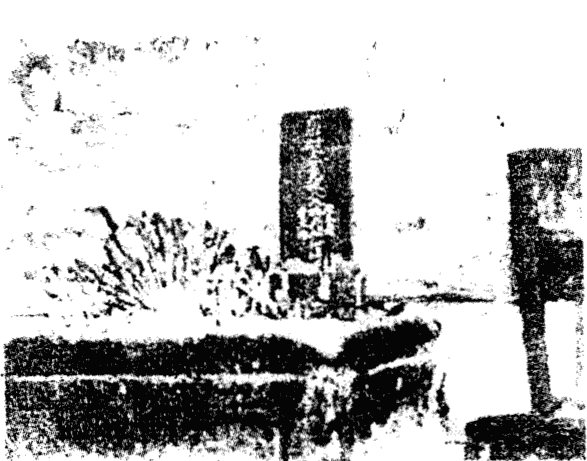
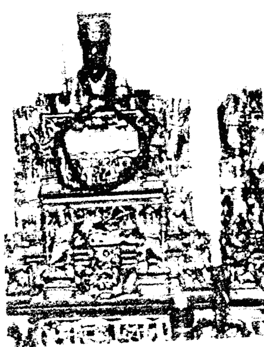
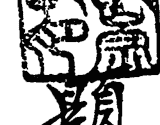
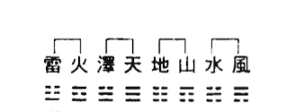
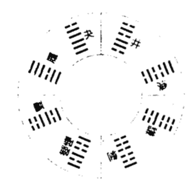
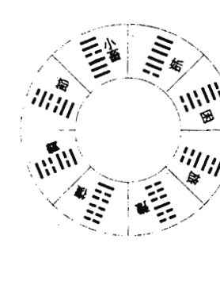
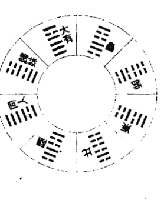

# 大滄天機

造化理微

先天定數

# 增補袖裡關煞百中經

關煞百中經

台灣竹林印書局印行

| 五命法 | 甲子金年 | 乙丑木月 | 戊申土日 | 甲寅火時 | 庚申水胎 |
| :--- | :--- | :--- | :--- | :--- | :--- |

| 十干順 | 甲乙 | 丙丁 | 戊己 | 庚辛 | 壬癸 |
| 十干逆 | 癸壬 | 辛庚 | 己戊 | 丁丙 | 乙甲 |
| 十二支 | 子丑 | 寅卯 | 辰巳 | 午未 | 申酉 | 戌亥 |
| 正月建寅 | 二月建卯 | 三月建辰 | 四月建巳 | 五月建午 | 六月建未 | 七月建申 | 八月建酉 | 九月建戌 | 十月建亥 | 十一月建子 | 十二月建丑 |

# 二十四節氣

| 正月 | 立春 | 雨水 |
| 二月 | 驚蟄 | 春分 |
| 三月 | 清明 | 穀雨 |
| 四月 | 立夏 | 小滿 |
| 五月 | 芒種 | 夏至 |
| 六月 | 小暑 | 大暑 |
| 七月 | 立秋 | 處暑 |
| 八月 | 白露 | 秋分 |
| 九月 | 寒露 | 霜降 |
| 十月 | 立冬 | 小雪 |
| 十一月 | 大雪 | 冬至 |
| 十二月 | 小寒 | 大寒 |

# 定太陽出沒法

| 正出乙入庚方 | 二出兔入雞場 |
| 三出甲入辛地 | 四生寅入戌方 |
| 五出艮歸乾土 | 六出申仔細詳 |
| 七出癸入坤方 | 八出鬼入雞場 |
| 九出乙入庚方 | 十出兔入雞場 |
| 十一出甲入辛地 | 十二生寅入戌方 |

# 定寅時歌

正九更二點徹
來五日高三丈地
加卯午上子加辰
參辰寅時
假如九月參斜參加午上起正月逆行數時至戌上得九月就於戌上定出戌時茶亥
時齊子時午時正斜寅時餘倣此

# 定太陰出時歌

茶出十三辰三
齊出斜角沒五巳八午升
萬年七自是真十六日丑時行
二十八寅時立
五酉上十八戌
十二亥上記斜神
十三加來卯上論
五巳時出是也

三日子時出
初出未十三申
十酉上十八戌
二十八寅時立
五巳時出是也

半夜子
雞鳴丑
平旦寅
日出卯
食時辰
隅中巳
日中午
日斜未
晡時申
日入酉
黃昏戌
人定亥

# 男女合婚定局

二五更四點歇
八月十二四更二
漢之來已上尋
昂出
多機到四更初
仲
年萬
千載不虛陳

三平光是寅時
七
便寅時與君說
六日出寅無別
四

闕
然
百
中
經

# 合婚總論

呂才云論檢婚書之法先檢男女生命合官次檢生月合得生氣天醫福德爲上婚吉子孫昌盛不避刑衝害絕旬絞歲星惆悵夾角及胞胎有犯月內諸凶並無忌也如遇絕體遊魂歸魂諸稱之中婚可以較量輕重言之命卦通利月中少忌可以成婚

| 命生女男 | 元上 | 元中 | 元下 |
|---|---|---|---|
| 甲子 癸酉 壬午 辛卯 庚子 己酉 戊午 | 男七女八 | 男十女二 | 男四女八 |
| 乙丑 甲戌 癸未 壬辰 辛丑 庚戌 己未 | 男六女六 | 男九女三 | 男三女九 |
| 丙寅 乙亥 甲申 癸巳 壬寅 辛亥 庚申 | 男二女七 | 男八女四 | 男二女一 |
| 丁卯 丙子 乙酉 甲午 癸卯 壬子 辛酉 | 男四女八 | 男七女八 | 男一女二 |
| 戊辰 丁丑 丙戌 乙未 甲辰 癸丑 壬戌 | 男三女九 | 男六女六 | 男九女三 |
| 己巳 戊寅 丁亥 丙申 乙巳 甲寅 癸亥 | 男一女一 | 男二女七 | 男八女四 |
| 庚午 己卯 戊子 丁酉 丙午 乙卯 | 男一女二 | 男四女八 | 男七女八 |
| 辛未 庚辰 己丑 戊戌 丁未 丙辰 | 男九女三 | 男三女九 | 男六女六 |
| 壬申 辛巳 庚寅 己亥 戊申 丁巳 | 男八女四 | 男二女一 | 男一女二 |

大抵婚姻之事理無十全但得中平之上者或值兩家男女神煞有相抵十用之則又無妨若遇五鬼之婚男女多亡擾犯口舌相連若遇絕命之婚禍必梁重男女各
有憂亡雖命卦和悦九吉相當亦不宜其爲婚也

| | 男妨妻 | 多厄 | 望門鰥 |
|---|---|---|---|
| 金 | 五六 | 二三 | 八九 |
| 木 | 四月 | 十月 | 正月 |
| 水 | 八九 | 二三 | 四月 |
| 火 | 正月 | 四月 | 七月 |
| 土 | 二三 | 六五 | 七月 |
| 命 | | | |

| | 女妨夫 | 多厄 | 望門寡 |
|---|---|---|---|
| 金 | 八九 | 二三 | 十月 |
| 木 | 正月 | 四月 | 四月 |
| 水 | 二三 | 四月 | 七月 |
| 火 | 二三 | 六五 | |
| 土 | | | |
| 命 | | | |

女妨剋月

男妨剋月

大梁樓靜立課

鎮望門鰥寡

男女值望門妨娶後即有死亡亡甲鎮宿木四根刻人形八卦在門房正東名曰百鎮
寶百無妨害也

## 關煞百中經

# 男女婚嫁箕月

虎馬
虎人
生十一月

狗豬
羊人
臨二月

蛇鼠
龍人
生五月

雞猴
牛人
生八月

婦人入門夫已死
夫到婦門絕煙火

# 男女白衣殺日

寅申
正七

巳亥
五二

卯酉
六三

辰戌
二八

子午
三九

丑未

# 鎮白衣殺

男犯妻女妨夫白衣者即孝服也鎮用纖
孝針七個關符放壁上或床上吉

又用法
雞血塗灶門上有災即免

# 男命星月

多病少藥

子丑
寅卯
辰
巳午未申
酉戌亥

四五
六七
八
九十一
正二三

# 女歲星月

座厄病符多憂

子丑
寅卯
辰
巳午未申
酉戌亥

二正
十一
十二
十
八七六五
四三九

# 男命死

金
木
水
火
土

# 女命死

金
木
水
火
土

# 墓妨妻

五六七
三四八
九十一
十三
三三四月

# 墓妨夫

五六七
二三四八
九十一
十三
三三四月

# 男女天乙貴神月

生亥
生申
生寅
生巳
生甲

甲戌庚人三六月
乙巳之人十二月
丙丁之人十八月
壬癸之人四二月

# 庚辛生人五正月 遇貴人能解凶煞

# 男女十干祿財用

| 甲乙生人 | 丙丁生人 | 戊己生人 | 庚辛生人 | 壬癸生人 |
| :--- | :--- | :--- | :--- | :--- |
| 祿六月 | 祿正二 | 祿三正三 | 祿六七九十 | 祿六七九四 |
| 財九三七六 | 財二四六 | 財六七一十 | 財十八二六 | 財十八二六 |
| 庫十二 | 庫四五六 | 庫三十一 | 庫九二十一 | 庫九二十一 |
| 七八三 | 七八三 | 七八三 | 七八三 | 七八三 |
| 二十一月 | 二十一月 | 二十一月 | 二十一月 | 二十一月 |

# 男女十二支庫用

| 亥子水人 | 寅卯木人 | 巳午火人 | 申酉金人 | 辰戌丑未土人 |
| :--- | :--- | :--- | :--- | :--- |
| 財正三四 | 財三六七九 | 財三四七八 | 財二正六二七九九 | 財二正六二七九九 |
| 庫五九三 | 庫十一 | 庫六十二 | 庫十一 | 庫十一 |
| 十一 | 十一 | 十一 | 十一 | 十一 |

# 寅卯木命女

五六七八月生
忌寅卯木命翁
生亥

# 巳午火命女

二三四五月生
忌巳午火命翁
生寅

# 辰戌丑未土命女

二三四五月生
忌辰戌丑未土命翁
生申

# 申酉金命女

五六七八月生
忌申酉金命翁
生巳

# 亥子水命女

五六七八月生
忌亥子水命翁
生申

# 寅卯木命女

五六七八月生
忌寅卯木命翁
生亥

## 關煞百中經

亥子水命女
二三四五月生
八九十一月生
二三四五月生
外三堂
忌辰戌丑未
忌巳午
忌亥子
土命夫
火命姑
水命翁
生申
生寅
生申

寅卯木命男
二三四五月生
八九十一月生
二三四五月生
忌辰戌丑未
忌巳午
忌亥子
土命妻
火命母
水命岳

巳午火命男
五六七八月生
十二三四五月生
忌辰戌丑未
忌寅卯
土命母
木命岳

辰戌丑未土命男
十二三四五月生
忌申酉
金命妻

八九十一月生
忌巳午
火命岳
水命妻
金命母

申酉金命男
二三四五月生
十二三四五月生
忌辰戌丑未
忌亥子
土命岳
水命母

亥子水命男
五六七八月生
十二三四五月生
忌申酉
忌寅卯
金命岳
木命母

女命
子午丑未寅申卯酉辰戌巳亥
大利
六三五十二八正七四十三九
小利
正七四十三九六三五十二八

## 關煞百中經

| 翁姑 | 女父母 | 夫主 | 女自生 |
|---|---|---|---|
| 二八 | 三九 | 四十 | 五十一 |
| 三九 | 二八 | 五十一 | 六十三 |
| 四十 | 五十一 | 六十三 | 正七 |
| 五十一 | 六十三 | 正七 | 二八 |
| 六十三 | 正七 | 二八 | 三九 |
| 正七 | 二八 | 三九 | 四十 |

| 翁姑禁婚 |
|---|
| 子年：子午天罡，卯酉河魁 |
| 丑年：丑未天罡，辰戌河魁 |
| 寅年：寅申天罡，巳亥河魁 |
| 卯年：卯酉天罡，子午河魁 |
| 辰年：辰戌河魁，丑未天罡 |
| 巳年：巳亥河魁，寅申天罡 |
| 午年：子午天罡，卯酉河魁 |
| 未年：丑未天罡，辰戌河魁 |
| 申年：寅申天罡，巳亥河魁 |
| 酉年：卯酉天罡，子午河魁 |
| 戌年：辰戌河魁，丑未天罡 |
| 亥年：巳亥河魁，寅申天罡 |

| 男命星 |
|---|
| 子丑：寅卯 |
| 寅卯：辰巳 |
| 辰巳：午未 |
| 午未：申酉 |
| 申酉：戌亥 |
| 戌亥：子丑 |

| 女歲星 |
|---|
| 子丑：寅卯 |
| 寅卯：辰巳 |
| 辰巳：午未 |
| 午未：申酉 |
| 申酉：戌亥 |
| 戌亥：子丑 |

卯寅 丑子 亥戌 酉申 未午 巳辰 命

# 歲星煞

男女若犯歲星主火災病厄別離鑲用逐年太歲土一斗當酒和泥泥在堂門自免災咎 又按泥在臥房中床後吉

| 生氣 | 絕體 | 五鬼 | 絕命 |
|---|---|---|---|
| 一四八三九四一 | 一九二六三七四三 | 二七三一八九九八 | 二二三七四八 |
| 六七七一八三九三 | 六三七八八七九一 | 六四七一八九九八 | 六九七八四九六 |

| 天醫 | 游魂 | 福德 | 歸魂 |
|---|---|---|---|
| 一八四三二六四一 | 一六二九三八四七 | 一三三七二二四七 | 一二三三一四四 |
| 六三七九八一九 | 六一七四八一九二 | 六八七六六九四 | 六六七七八九九 |

# 鎮宮命二符

## 關煞百中經

如犯五鬼主男女啾唧不和鎮用各人本命時辰土作人二個床前供獻一宿送在廟中門後吉犯絕命主男女重病不利兒女難存鎮用五色石五塊安放四角按四方黃石居中即免禍殃又床上貼符則吉利也

鎮妻食夫祿
夫食妻祿凶則夫家貧窮不利鎮用妻之父母家五穀一斗去糠延蒸飯至且寅申向斗獻過合家老幼食之則大富利

# 鎮九凶

凡合婚者先論九凶若弟兄九人一母所生非是九個皆同法鎮之若男女成婚犯之主男犯女淫夫婦憎嫌終久不利鎮用

桃皮七片上書陰王二字燒成灰一甲子好酒男女服同飲一半天德合土和泥在臥床信書神符貼壁上除災大吉自然相和

# 鎮男女破家

女生三合局屬井車剋男性命大凶主離別不存兒女不利用圍女分臥鋪草燒灰淋汁當嬀人沐浴身體 又用乳香水展

## 關煞百中經

鎮退財井月無祿命財

男女犯退財井月無祿命財者漸漸貧乏破財損六畜也事非官災男犯貧妻女犯貧夫家凶鎮用女家井水三升男犯用男家井水米半升鵝同和處處當牛欄馬廄羊棧雞栖六畜宿處散埋或倉前庫房門埋之財物畜產漸漸增福貴大吉

| 男命 | 金 | 木 | 水 | 火 | 土 |
| :--- | :--- | :--- | :--- | :--- | :--- |
| 益財 | 七月至十二月生 | 七月至十二月生 | 四月至六月生 | 四月至九月生 | 五月至十月生 |
| | 益女家廿七年 | 益女家五十年 | 益女家四十年 | 益女家三十年 | 益女家三十年 |
| 退財 | 正月至六月生 | 正月至六月生 | 七月至十二月生 | 十月至三月生 | 十一月至四月生 |
| | 退女家九年 | 退女家九年 | 退女家五十年 | 退女家五十年 | 退女家廿九年 |
| 女命 | 金 | 木 | 水 | 火 | 土 |
| 益財 | 七月至十二月生 | 七月至十二月生 | 六月至十二月生 | 十月至三月生 | 十月至三月生 |
| | 益夫家廿五年 | 益夫家九年 | 益夫家廿七年 | 益夫家卅九年 | 益夫家五十年 |
| 退財 | 六月至十二月生 | 九月至二月生 | 正月至六月生 | 十一月至五月生 | 四月至九月生 |
| | 退夫家十九年 | 退夫家廿五年 | 退夫家十八年 | 退夫家卅九年 | 退夫家三十年 |

# 六害

寅巳相穿子與未
申亥相穿酉共戌
丑午相穿卯與辰
犯者須知損六親

# 推男女生年所犯神煞

| 生年 | 子 | 丑 | 寅 | 卯 | 辰 | 巳 | 午 | 未 | 申 | 酉 | 戌 | 亥 |
|---|---|---|---|---|---|---|---|---|---|---|---|---|
| 男 | 正 | 六 | 三 | 五 | 二 | 四 | 九 | 八 | 七 | 十 | 十一 | 十二 |
| 女 | 三 | 五 | 二 | 四 | 九 | 八 | 七 | 十 | 十一 | 十二 | 正 | 六 |

相胎
判亡
威腳
頭經
再重
寡孤
破
大
狼
飛
大
大
大
鐵
搗
骨
破
生

沖
胎
救
神
池
路
賤
房
嫁
婚
宿
辰
碎
狼
籍
天
敗
籍
敗
轍

多
寡
厄
胎
財
不
主
凶
即
桃花
煞

八
九
十
十
十
十
十
十
十
十
十
十
十
十
十
十
十
十
十
十
十
十
十
十
十
十
十
十
十
十
十
十
十
十
十
十
十
十
十
十
十
十
十
十
十
十
十
十
十
十
十
十
十
十
十
十
十
十
十
十
十
十
十
十
十
十
十
十
十
十
十
十
十
十
十
十
十
十
十
十
十
十
十
十
十
十
十
十
十
十
十
十
十
十
十
十
十
十
十
十
十
十
十
十
十
十
十
十
十
十
十
十
十
十
十
十
十
十
十
十
十
十
十
十
十
十
十
十
十
十
十
十
十
十
十
十
十
十
十
十
十
十
十
十
十
十
十
十
十
十
十
十
十
十
十
十
十
十
十
十
十
十
十
十
十
十
十
十
十
十
十
十
十
十
十
十
十
十
十
十
十
十
十
十
十
十
十
十
十
十
十
十
十
十
十
十
十
十
十
十
十
十
十
十
十
十
十
十
十
十
十
十
十
十
十
十
十
十
十
十
十
十
十
十
十
十
十
十
十
十
十
十
十
十
十
十
十
十
十
十
十
十
十
十
十
十
十
十
十
十
十
十
十
十
十
十
十
十
十
十
十
十
十
十
十
十
十
十
十
十
十
十
十
十
十
十
十
十
十
十
十
十
十
十
十
十
十
十
十
十
十
十
十
十
十
十
十
十
十
十
十
十
十
十
十
十
十
十
十
十
十
十
十
十
十
十
十
十
十
十
十
十
十
十
十
十
十
十
十
十
十
十
十
十
十
十
十
十
十
十
十
十
十
十
十
十
十
十
十
十
十
十
十
十
十
十
十
十
十
十
十
十
十
十
十
十
十
十
十
十
十
十
十
十
十
十
十
十
十
十
十
十
十
十
十
十
十
十
十
十
十
十
十
十
十
十
十
十
十
十
十
十
十
十
十
十
十
十
十
十
十
十
十
十
十
十
十
十
十
十
十
十
十
十
十
十
十
十
十
十
十
十
十
十
十
十
十
十
十
十
十
十
十
十
十
十
十
十
十
十
十
十
十
十
十
十
十
十
十
十
十
十
十
十
十
十
十
十
十
十
十
十
十
十
十
十
十
十
十
十
十
十
十
十
十
十
十
十
十
十
十
十
十
十
十
十
十
十
十
十
十
十
十
十
十
十
十
十
十
十
十
十
十
十
十
十
十
十
十
十
十
十
十
十
十
十
十
十
十
十
十
十
十
十
十
十
十
十
十
十
十
十
十
十
十
十
十
十
十
十
十
十
十
十
十
十
十
十
十
十
十
十
十
十
十
十
十
十
十
十
十
十
十
十
十
十
十
十
十
十
十
十
十
十
十
十
十
十
十
十
十
十
十
十
十
十
十
十
十
十
十
十
十
十
十
十
十
十
十
十
十
十
十
十
十
十
十
十
十
十
十
十
十
十
十
十
十
十
十
十
十
十
十
十
十
十
十
十
十
十
十
十
十
十
十
十
十
十
十
十
十
十
十
十
十
十
十
十
十
十
十
十
十
十
十
十
十
十
十
十
十
十
十
十
十
十
十
十
十
十
十
十
十
十
十
十
十
十
十
十
十
十
十
十
十
十
十
十
十
十
十
十
十
十
十
十
十
十
十
十
十
十
十
十
十
十
十
十
十
十
十
十
十
十
十
十
十
十
十
十
十
十
十
十
十
十
十
十
十
十
十
十
十
十
十
十
十
十
十
十
十
十
十
十
十
十
十
十
十
十
十
十
十
十
十
十
十
十
十
十
十
十
十
十
十
十
十
十
十
十
十
十
十
十
十
十
十
十
十
十
十
十
十
十
十
十
十
十
十
十
十
十
十
十
十
十
十
十
十
十
十
十
十
十
十
十
十
十
十
十
十
十
十
十
十
十
十
十
十
十
十
十
十
十
十
十
十
十
十
十
十
十
十
十
十
十
十
十
十
十
十
十
十
十
十
十
十
十
十
十
十
十
十
十
十
十
十
十
十
十
十
十
十
十
十
十
十
十
十
十
十
十
十
十
十
十
十
十
十
十
十
十
十
十
十
十
十
十
十
十
十
十
十
十
十
十
十
十
十
十
十
十
十
十
十
十
十
十
十
十
十
十
十
十
十
十
十
十
十
十
十
十
十
十
十
十
十
十
十
十
十
十
十
十
十
十
十
十
十
十
十
十
十
十
十
十
十
十
十
十
十
十
十
十
十
十
十
十
十
十
十
十
十
十
十
十
十
十
十
十
十
十
十
十
十
十
十
十
十
十
十
十
十
十
十
十
十
十
十
十
十
十
十
十
十
十
十
十
十
十
十
十
十
十
十
十
十
十
十
十
十
十
十
十
十
十
十
十
十
十
十
十
十
十
十
十
十
十
十
十
十
十
十
十
十
十
十
十
十
十
十
十
十
十
十
十
十
十
十
十
十
十
十
十
十
十
十
十
十
十
十
十
十
十
十
十
十
十
十
十
十
十
十
十
十
十
十
十
十
十
十
十
十
十
十
十
十
十
十
十
十
十
十
十
十
十
十
十
十
十
十
十
十
十
十
十
十
十
十
十
十
十
十
十
十
十
十
十
十
十
十
十
十
十
十
十
十
十
十
十
十
十
十
十
十
十
十
十
十
十
十
十
十
十
十
十
十
十
十
十
十
十
十
十
十
十
十
十
十
十
十
十
十
十
十
十
十
十
十
十
十
十
十
十
十
十
十
十
十
十
十
十
十
十
十
十
十
十
十
十
十
十
十
十
十
十
十
十
十
十
十
十
十
十
十
十
十
十
十
十
十
十
十
十
十
十
十
十
十
十
十
十
十
十
十
十
十
十
十
十
十
十
十
十
十
十
十
十
十
十
十
十
十
十
十
十
十
十
十
十
十
十
十
十
十
十
十
十
十
十
十
十
十
十
十
十
十
十
十
十
十
十
十
十
十
十
十
十
十
十
十
十
十
十
十
十
十
十
十
十
十
十
十
十
十
十
十
十
十
十
十
十
十
十
十
十
十
十
十
十
十
十
十
十
十
十
十
十
十
十
十
十
十
十
十
十
十
十
十
十
十
十
十
十
十
十
十
十
十
十
十
十
十
十
十
十
十
十
十
十
十
十
十
十
十
十
十
十
十
十
十
十
十
十
十
十
十
十
十
十
十
十
十
十
十
十
十
十
十
十
十
十
十
十
十
十
十
十
十
十
十
十
十
十
十
十
十
十
十
十
十
十
十
十
十
十
十
十
十
十
十
十
十
十
十
十
十
十
十
十
十
十
十
十
十
十
十
十
十
十
十
十
十
十
十
十
十
十
十
十
十
十
十
十
十
十
十
十
十
十
十
十
十
十
十
十
十
十
十
十
十
十
十
十
十
十
十
十
十
十
十
十
十
十
十
十
十
十
十
十
十
十
十
十
十
十
十
十
十
十
十
十
十
十
十
十
十
十
十
十
十
十
十
十
十
十
十
十
十
十
十
十
十
十
十
十
十
十
十
十
十
十
十
十
十
十
十
十
十
十
十
十
十
十
十
十
十
十
十
十
十
十
十
十
十
十
十
十
十
十
十
十
十
十
十
十
十
十
十
十
十
十
十
十
十
十
十
十
十
十
十
十
十
十
十
十
十
十
十
十
十
十
十
十
十
十
十
十
十
十
十
十
十
十
十
十
十
十
十
十
十
十
十
十
十
十
十
十
十
十
十
十
十
十
十
十
十
十
十
十
十
十
十
十
十
十
十
十
十
十
十
十
十
十
十
十
十
十
十
十
十
十
十
十
十
十
十
十
十
十
十
十
十
十
十
十
十
十
十
十
十
十
十
十
十
十
十
十
十
十
十
十
十
十
十
十
十
十
十
十
十
十
十
十
十
十
十
十
十
十
十
十
十
十
十
十
十
十
十
十
十
十
十
十
十
十
十
十
十
十
十
十
十
十
十
十
十
十
十
十
十
十
十
十
十
十
十
十
十
十
十
十
十
十
十
十
十
十
十
十
十
十
十
十
十
十
十
十
十
十
十
十
十
十
十
十
十
十
十
十
十
十
十
十
十
十
十
十
十
十
十
十
十
十
十
十
十
十
十
十
十
十
十
十
十
十
十
十
十
十
十
十
十
十
十
十
十
十
十
十
十
十
十
十
十
十
十
十
十
十
十
十
十
十
十
十
十
十
十
十
十
十
十
十
十
十
十
十
十
十
十
十
十
十
十
十
十
十
十
十
十
十
十
十
十
十
十
十
十
十
十
十
十
十
十
十
十
十
十
十
十
十
十
十
十
十
十
十
十
十
十
十
十
十
十
十
十
十
十
十
十
十
十
十
十
十
十
十
十
十
十
十
十
十
十
十
十
十
十
十
十
十
十
十
十
十
十
十
十
十
十
十
十
十
十
十
十
十
十
十
十
十
十
十
十
十
十
十
十
十
十
十
十
十
十
十
十
十
十
十
十
十
十
十
十
十
十
十
十
十
十
十
十
十
十
十
十
十
十
十
十
十
十
十
十
十
十
十
十
十
十
十
十
十
十
十
十
十
十
十
十
十
十
十
十
十
十
十
十
十
十
十
十
十
十
十
十
十
十
十
十
十
十
十
十
十
十
十
十
十
十
十
十
十
十
十
十
十
十
十
十
十
十
十
十
十
十
十
十
十
十
十
十
十
十
十
十
十
十
十
十
十
十
十
十
十
十
十
十
十
十
十
十
十
十
十
十
十
十
十
十
十
十
十
十
十
十
十
十
十
十
十
十
十
十
十
十
十
十
十
十
十
十
十
十
十
十
十
十
十
十
十
十
十
十
十
十
十
十
十
十
十
十
十
十
十
十
十
十
十
十
十
十
十
十
十
十
十
十
十
十
十
十
十
十
十
十
十
十
十
十
十
十
十
十
十
十
十
十
十
十
十
十
十
十
十
十
十
十
十
十
十
十
十
十
十
十
十
十
十
十
十
十
十
十
十
十
十
十
十
十
十
十
十
十
十
十
十
十
十
十
十
十
十
十
十
十
十
十
十
十
十
十
十
十
十
十
十
十
十
十
十
十
十
十
十
十
十
十
十
十
十
十
十
十
十
十
十
十
十
十
十
十
十
十
十
十
十
十
十
十
十
十
十
十
十
十
十
十
十
十
十
十
十
十
十
十
十
十
十
十
十
十
十
十
十
十
十
十
十
十
十
十
十
十
十
十
十
十
十
十
十
十
十
十
十
十
十
十
十
十
十
十
十
十
十
十
十
十
十
十
十
十
十
十
十
十
十
十
十
十
十
十
十
十
十
十
十
十
十
十
十
十
十
十
十
十
十
十
十
十
十
十
十
十
十
十
十
十
十
十
十
十
十
十
十
十
十
十
十
十
十
十
十
十
十
十
十
十
十
十
十
十
十
十
十
十
十
十
十
十
十
十
十
十
十
十
十
十
十
十
十
十
十
十
十
十
十
十
十
十
十
十
十
十
十
十
十
十
十
十
十
十
十
十
十
十
十
十
十
十
十
十
十
十
十
十
十
十
十
十
十
十
十
十
十
十
十
十
十
十
十
十
十
十
十
十
十
十
十
十
十
十
十
十
十
十
十
十
十
十
十
十
十
十
十
十
十
十
十
十
十
十
十
十
十
十
十
十
十
十
十
十
十
十
十
十
十
十
十
十
十
十
十
十
十
十
十
十
十
十
十
十
十
十
十
十
十
十
十
十
十
十
十
十
十
十
十
十
十
十
十
十
十
十
十
十
十
十
十
十
十
十
十
十
十
十
十
十
十
十
十
十
十
十
十
十
十
十
十
十
十
十
十
十
十
十
十
十
十
十
十
十
十
十
十
十
十
十
十
十
十
十
十
十
十
十
十
十
十
十
十
十
十
十
十
十
十
十
十
十
十
十
十
十
十
十
十
十
十
十
十
十
十
十
十
十
十
十
十
十
十
十
十
十
十
十
十
十
十
十
十
十
十
十
十
十
十
十
十
十
十
十
十
十
十
十
十
十
十
十
十
十
十
十
十
十
十
十
十
十
十
十
十
十
十
十
十
十
十
十
十
十
十
十
十
十
十
十
十
十
十
十
十
十
十
十
十
十
十
十
十
十
十
十
十
十
十
十
十
十
十
十
十
十
十
十
十
十
十
十
十
十
十
十
十
十
十
十
十
十
十
十
十
十
十
十
十
十
十
十
十
十
十
十
十
十
十
十
十
十
十
十
十
十
十
十
十
十
十
十
十
十
十
十
十
十
十
十
十
十
十
十
十
十
十
十
十
十
十
十
十
十
十
十
十
十
十
十
十
十
十
十
十
十
十
十
十
十
十
十
十
十
十
十
十
十
十
十
十
十
十
十
十
十
十
十
十
十
十
十
十
十
十
十
十
十
十
十
十
十
十
十
十
十
十
十
十
十
十
十
十
十
十
十
十
十
十
十
十
十
十
十
十
十
十
十
十
十
十
十
十
十
十
十
十
十
十
十
十
十
十
十
十
十
十
十
十
十
十
十
十
十
十
十
十
十
十
十
十
十
十
十
十
十
十
十
十
十
十
十
十
十
十
十
十
十
十
十
十
十
十
十
十
十
十
十
十
十
十
十
十
十
十
十
十
十
十
十
十
十
十
十
十
十
十
十
十
十
十
十
十
十
十
十
十
十
十
十
十
十
十
十
十
十
十
十
十
十
十
十
十
十
十
十
十
十
十
十
十
十
十
十
十
十
十
十
十
十
十
十
十
十
十
十
十
十
十
十
十
十
十
十
十
十
十
十
十
十
十
十
十
十
十
十
十
十
十
十
十
十
十
十
十
十
十
十
十
十
十
十
十
十
十
十
十
十
十
十
十
十
十
十
十
十
十
十
十
十
十
十
十
十
十
十
十
十
十
十
十
十
十
十
十
十
十
十
十
十
十
十
十
十
十
十
十
十
十
十
十
十
十
十
十
十
十
十
十
十
十
十
十
十
十
十
十
十
十
十
十
十
十
十
十
十
十
十
十
十
十
十
十
十
十
十
十
十
十
十
十
十
十
十
十
十
十
十
十
十
十
十
十
十
十
十
十
十
十
十
十
十
十
十
十
十
十
十
十
十
十
十
十
十
十
十
十
十
十
十
十
十
十
十
十
十
十
十
十
十
十
十
十
十
十
十
十
十
十
十
十
十
十
十
十
十
十
十
十
十
十
十
十
十
十
十
十
十
十
十
十
十
十
十
十
十
十
十
十
十
十
十
十
十
十
十
十
十
十
十
十
十
十
十
十
十
十
十
十
十
十
十
十
十
十
十
十
十
十
十
十
十
十
十
十
十
十
十
十
十
十
十
十
十
十
十
十
十
十
十
十
十
十
十
十
十
十
十
十
十
十
十
十
十
十
十
十
十
十
十
十
十
十
十
十
十
十
十
十
十
十
十
十
十
十
十
十
十
十
十
十
十
十
十
十
十
十
十
十
十
十
十
十
十
十
十
十
十
十
十
十
十
十
十
十
十
十
十
十
十
十
十
十
十
十
十
十
十
十
十
十
十
十
十
十
十
十
十
十
十
十
十
十
十
十
十
十
十
十
十
十
十
十
十
十
十
十
十
十
十
十
十
十
十
十
十
十
十
十
十
十
十
十
十
十
十
十
十
十
十
十
十
十
十
十
十
十
十
十
十
十
十
十
十
十
十
十
十
十
十
十
十
十
十
十
十
十
十
十
十
十
十
十
十
十
十
十
十
十
十
十
十
十
十
十
十
十
十
十
十
十
十
十
十
十
十
十
十
十
十
十
十
十
十
十
十
十
十
十
十
十
十
十
十
十
十
十
十
十
十
十
十
十
十
十
十
十
十
十
十
十
十
十
十
十
十
十
十
十
十
十
十
十
十
十
十
十
十
十
十
十
十
十
十
十
十
十
十
十
十
十
十
十
十
十
十
十
十
十
十
十
十
十
十
十
十
十
十
十
十
十
十
十
十
十
十
十
十
十
十
十
十
十
十
十
十
十
十
十
十
十
十
十
十
十
十
十
十
十
十
十
十
十
十
十
十
十
十
十
十
十
十
十
十
十
十
十
十
十
十
十
十
十
十
十
十
十
十
十
十
十
十
十
十
十
十
十
十
十
十
十
十
十
十
十
十
十
十
十
十
十
十
十
十
十
十
十
十
十
十
十
十
十
十
十
十
十
十
十
十
十
十
十
十
十
十
十
十
十
十
十
十
十
十
十
十
十
十
十
十
十
十
十
十
十
十
十
十
十
十
十
十
十
十
十
十
十
十
十
十
十
十
十
十
十
十
十
十
十
十
十
十
十
十
十
十
十
十
十
十
十
十
十
十
十
十
十
十
十
十
十
十
十
十
十
十
十
十
十
十
十
十
十
十
十
十
十
十
十
十
十
十
十
十
十
十
十
十
十
十
十
十
十
十
十
十
十
十
十
十
十
十
十
十
十
十
十
十
十
十
十
十
十
十
十
十
十
十
十
十
十
十
十
十
十
十
十
十
十
十
十
十
十
十
十
十
十
十
十
十
十
十
十
十
十
十
十
十
十
十
十
十
十
十
十
十
十
十
十
十
十
十
十
十
十
十
十
十
十
十
十
十
十
十
十
十
十
十
十
十
十
十
十
十
十
十
十
十
十
十
十
十
十
十
十
十
十
十
十
十
十
十
十
十
十
十
十
十
十
十
十
十
十
十
十
十
十
十
十
十
十
十
十
十
十
十
十
十
十
十
十
十
十
十
十
十
十
十
十
十
十
十
十
十
十
十
十
十
十
十
十
十
十
十
十
十
十
十
十
十
十
十
十
十
十
十
十
十
十
十
十
十
十
十
十
十
十
十
十
十
十
十
十
十
十
十
十
十
十
十
十
十
十
十
十
十
十
十
十
十
十
十
十
十
十
十
十
十
十
十
十
十
十
十
十
十
十
十
十
十
十
十
十
十
十
十
十
十
十
十
十
十
十
十
十
十
十
十
十
十
十
十
十
十
十
十
十
十
十
十
十
十
十
十
十
十
十
十
十
十
十
十
十
十
十
十
十
十
十
十
十
十
十
十
十
十
十
十
十
十
十
十
十
十
十
十
十
十
十
十
十
十
十
十
十
十
十
十
十
十
十
十
十
十
十
十
十
十
十
十
十
十
十
十
十
十
十
十
十
十
十
十
十
十
十
十
十
十
十
十
十
十
十
十
十
十
十
十
十
十
十
十
十
十
十
十
十
十
十
十
十
十
十
十
十
十
十
十
十
十
十
十
十
十
十
十
十
十
十
十
十
十
十
十
十
十
十
十
十
十
十
十
十
十
十
十
十
十
十
十
十
十
十
十
十
十
十
十
十
十
十
十
十
十
十
十
十
十
十
十
十
十
十
十
十
十
十
十
十
十
十
十
十
十
十
十
十
十
十
十
十
十
十
十
十
十
十
十
十
十
十
十
十
十
十
十
十
十
十
十
十
十
十
十
十
十
十
十
十
十
十
十
十
十
十
十
十
十
十
十
十
十
十
十
十
十
十
十
十
十
十
十
十
十
十
十
十
十
十
十
十
十
十
十
十
十
十
十
十
十
十
十
十
十
十
十
十
十
十
十
十
十
十
十
十
十
十
十
十
十
十
十
十
十
十
十
十
十
十
十
十
十
十
十
十
十
十
十
十
十
十
十
十
十
十
十
十
十
十
十
十
十
十
十
十
十
十
十
十
十
十
十
十
十
十
十
十
十
十
十
十
十
十
十
十
十
十
十
十
十
十
十
十
十
十
十
十
十
十
十
十
十
十
十
十
十
十
十
十
十
十
十
十
十
十
十
十
十
十
十
十
十
十
十
十
十
十
十
十
十
十
十
十
十
十
十
十
十
十
十
十
十
十
十
十
十
十
十
十
十
十
十
十
十
十
十
十
十
十
十
十
十
十
十
十
十
十
十
十
十
十
十
十
十
十
十
十
十
十
十
十
十
十
十
十
十
十
十
十
十
十
十
十
十
十
十
十
十
十
十
十
十
十
十
十
十
十
十
十
十
十
十
十
十
十
十
十
十
十
十
十
十
十
十
十
十
十
十
十
十
十
十
十
十
十
十
十
十
十
十
十
十
十
十
十
十
十
十
十
十
十
十
十
十
十
十
十
十
十
十
十
十
十
十
十
十
十
十
十
十
十
十
十
十
十
十
十
十
十
十
十
十
十
十
十
十
十
十
十
十
十
十
十
十
十
十
十
十
十
十
十
十
十
十
十
十
十
十
十
十
十
十
十
十
十
十
十
十
十
十
十
十
十
十
十
十
十
十
十
十
十
十
十
十
十
十
十
十
十
十
十
十
十
十
十
十
十
十
十
十
十
十
十
十
十
十
十
十
十
十
十
十
十
十
十
十
十
十
十
十
十
十
十
十
十
十
十
十
十
十
十
十
十
十
十
十
十
十
十
十
十
十
十
十
十
十
十
十
十
十
十
十
十
十
十
十
十
十
十
十
十
十
十
十
十
十
十
十
十
十
十
十
十
十
十
十
十
十
十
十
十
十
十
十
十
十
十
十
十
十
十
十
十
十
十
十
十
十
十
十
十
十
十
十
十
十
十
十
十
十
十
十
十
十
十
十
十
十
十
十
十
十
十
十
十
十
十
十
十
十
十
十
十
十
十
十
十
十
十
十
十
十
十
十
十
十
十
十
十
十
十
十
十
十
十
十
十
十
十
十
十
十
十
十
十
十
十
十
十
十
十
十
十
十
十
十
十
十
十
十
十
十
十
十
十
十
十
十
十
十
十
十
十
十
十
十
十
十
十
十
十
十
十
十
十
十
十
十
十
十
十
十
十
十
十
十
十
十
十
十
十
十
十
十
十
十
十
十
十
十
十
十
十
十
十
十
十
十
十
十
十
十
十
十
十
十
十
十
十
十
十
十
十
十
十
十
十
十
十
十
十
十
十
十
十
十
十
十
十
十
十
十
十
十
十
十
十
十
十
十
十
十
十
十
十
十
十
十
十
十
十
十
十
十
十
十
十
十
十
十
十
十
十
十
十
十
十
十
十
十
十
十
十
十
十
十
十
十
十
十
十
十
十
十
十
十
十
十
十
十
十
十
十
十
十
十
十
十
十
十
十
十
十
十
十
十
十
十
十
十
十
十
十
十
十
十
十
十
十
十
十
十
十
十
十
十
十
十
十
十
十
十
十
十
十
十
十
十
十
十
十
十
十
十
十
十
十
十
十
十
十
十
十
十
十
十
十
十
十
十
十
十
十
十
十
十
十
十
十
十
十
十
十
十
十
十
十
十
十
十
十
十
十
十
十
十
十
十
十
十
十
十
十
十
十
十
十
十
十
十
十
十
十
十
十
十
十
十
十
十
十
十
十
十
十
十
十
十
十
十
十
十
十
十
十
十
十
十
十
十
十
十
十
十
十
十
十
十
十
十
十
十
十
十
十
十
十
十
十
十
十
十
十
十
十
十
十
十
十
十
十
十
十
十
十
十
十
十
十
十
十
十
十
十
十
十
十
十
十
十
十
十
十
十
十
十
十
十
十
十
十
十
十
十
十
十
十
十
十
十
十
十
十
十
十
十
十
十
十
十
十
十
十
十
十
十
十
十
十
十
十
十
十
十
十
十
十
十
十
十
十
十
十
十
十
十
十
十
十
十
十
十
十
十
十
十
十
十
十
十
十
十
十
十
十
十
十
十
十
十
十
十
十
十
十
十
十
十
十
十
十
十
十
十
十
十
十
十
十
十
十
十
十
十
十
十
十
十
十
十
十
十
十
十
十
十
十
十
十
十
十
十
十
十
十
十
十
十
十
十
十
十
十
十
十
十
十
十
十
十
十
十
十
十
十
十
十
十
十
十
十
十
十
十
十
十
十
十
十
十
十
十
十
十
十
十
十
十
十
十
十
十
十
十
十
十
十
十
十
十
十
十
十
十
十
十
十
十
十
十
十
十
十
十
十
十
十
十
十
十
十
十
十
十
十
十
十
十
十
十
十
十
十
十
十
十
十
十
十
十
十
十
十
十
十
十
十
十
十
十
十
十
十
十
十
十
十
十
十
十
十
十
十
十
十
十
十
十
十
十
十
十
十
十
十
十
十
十
十
十
十
十
十
十
十
十
十
十
十
十
十
十
十
十
十
十
十
十
十
十
十
十
十
十
十
十
十
十
十
十
十
十
十
十
十
十
十
十
十
十
十
十
十
十
十
十
十
十
十
十
十
十
十
十
十
十
十
十
十
十
十
十
十
十
十
十
十
十
十
十
十
十
十
十
十
十
十
十
十
十
十
十
十
十
十
十
十
十
十
十
十
十
十
十
十
十
十
十
十
十
十
十
十
十
十
十
十
十
十
十
十
十
十
十
十
十
十
十
十
十
十
十
十
十
十
十
十
十
十
十
十
十
十
十
十
十
十
十
十
十
十
十
十
十
十
十
十
十
十
十
十
十
十
十
十
十
十
十
十
十
十
十
十
十
十
十
十
十
十
十
十
十
十
十
十
十
十
十
十
十
十
十
十
十
十
十
十
十
十
十
十
十
十
十
十
十
十
十
十
十
十
十
十
十
十
十
十
十
十
十
十
十
十
十
十
十
十
十
十
十
十
十
十
十
十
十
十
十
十
十
十
十
十
十
十
十
十
十
十
十
十
十
十
十
十
十
十
十
十
十
十
十
十
十
十
十
十
十
十
十
十
十
十
十
十
十
十
十
十
十
十
十
十
十
十
十
十
十
十
十
十
十
十
十
十
十
十
十
十
十
十
十
十
十
十
十
十
十
十
十
十
十
十
十
十
十
十
十
十
十
十
十
十
十
十
十
十
十
十
十
十
十
十
十
十
十
十
十
十
十
十
十
十
十
十
十
十
十
十
十
十
十
十
十
十
十
十
十
十
十
十
十
十
十
十
十
十
十
十
十
十
十
十
十
十
十
十
十
十
十
十
十
十
十
十
十
十
十
十
十
十
十
十
十
十
十
十
十
十
十
十
十
十
十
十
十
十
十
十
十
十
十
十
十
十
十
十
十
十
十
十
十
十
十
十
十
十
十
十
十
十
十
十
十
十
十
十
十
十
十
十
十
十
十
十
十
十
十
十
十
十
十
十
十
十
十
十
十
十
十
十
十
十
十
十
十
十
十
十
十
十
十
十
十
十
十
十
十
十
十
十
十
十
十
十
十
十
十
十
十
十
十
十
十
十
十
十
十
十
十
十
十
十
十
十
十
十
十
十
十
十
十
十
十
十
十
十
十
十
十
十
十
十
十
十
十
十
十
十
十
十
十
十
十
十
十
十
十
十
十
十
十
十
十
十
十
十
十
十
十
十
十
十
十
十
十
十
十
十
十
十
十
十
十
十
十
十
十
十
十
十
十
十
十
十
十
十
十
十
十
十
十
十
十
十
十
十
十
十
十
十
十
十
十
十
十
十
十
十
十
十
十
十
十
十
十
十
十
十
十
十
十
十
十
十
十
十
十
十
十
十
十
十
十
十
十
十
十
十
十
十
十
十
十
十
十
十
十
十
十
十
十
十
十
十
十
十
十
十
十
十
十
十
十
十
十
十
十
十
十
十
十
十
十
十
十
十
十
十
十
十
十
十
十
十
十
十
十
十
十
十
十
十
十
十
十
十
十
十
十
十
十
十
十
十
十
十
十
十
十
十
十
十
十
十
十
十
十
十
十
十
十
十
十
十
十
十
十
十
十
十
十
十
十
十
十
十
十
十
十
十
十
十
十
十
十
十
十
十
十
十
十
十
十
十
十
十
十
十
十
十
十
十
十
十
十
十
十
十
十
十
十
十
十
十
十
十
十
十
十
十
十
十
十
十
十
十
十
十
十
十
十
十
十
十
十
十
十
十
十
十
十
十
十
十
十
十
十
十
十
十
十
十
十
十
十
十
十
十
十
十
十
十
十
十
十
十
十
十
十
十
十
十
十
十
十
十
十
十
十
十
十
十
十
十
十
十
十
十
十
十
十
十
十
十
十
十
十
十
十
十
十
十
十
十
十
十
十
十
十
十
十
十
十
十
十
十
十
十
十
十
十
十
十
十
十
十
十
十
十
十
十
十
十
十
十
十
十
十
十
十
十
十
十
十
十
十
十
十
十
十
十
十
十
十
十
十
十
十
十
十
十
十
十
十
十
十
十
十
十
十
十
十
十
十
十
十
十
十
十
十
十
十
十
十
十
十
十
十
十
十
十
十
十
十
十
十
十
十
十
十
十
十
十
十
十
十
十
十
十
十
十
十
十
十
十
十
十
十
十
十
十
十
十
十
十
十
十
十
十
十
十
十
十
十
十
十
十
十
十
十
十
十
十
十
十
十
十
十
十
十
十
十
十
十
十
十
十
十
十
十
十
十
十
十
十
十
十
十
十
十
十
十
十
十
十
十
十
十
十
十
十
十
十
十
十
十
十
十
十
十
十
十
十
十
十
十
十
十
十
十
十
十
十
十
十
十
十
十
十
十
十
十
十
十
十
十
十
十
十
十
十
十
十
十
十
十
十
十
十
十
十
十
十
十
十
十
十
十
十
十
十
十
十
十
十
十
十
十
十
十
十
十
十
十
十
十
十
十
十
十
十
十
十
十
十
十
十
十
十
十
十
十
十
十
十
十
十
十
十
十
十
十
十
十
十
十
十
十
十
十
十
十
十
十
十
十
十
十
十
十
十
十
十
十
十
十
十
十
十
十
十
十
十
十
十
十
十
十
十
十
十
十
十
十
十
十
十
十
十
十
十
十
十
十
十
十
十
十
十
十
十
十
十
十
十
十
十
十
十
十
十
十
十
十
十
十
十
十
十
十
十
十
十
十
十
十
十
十
十
十
十
十
十
十
十
十
十
十
十
十
十
十
十
十
十
十
十
十
十
十
十
十
十
十
十
十
十
十
十
十
十
十
十
十
十
十
十
十
十
十
十
十
十
十
十
十
十
十
十
十
十
十
十
十
十
十
十
十
十
十
十
十
十
十
十
十
十
十
十
十
十
十
十
十
十
十
十
十
十
十
十
十
十
十
十
十
十
十
十
十
十
十
十
十
十
十
十
十
十
十
十
十
十
十
十
十
十
十
十
十
十
十
十
十
十
十
十
十
十
十
十
十
十
十
十
十
十
十
十
十
十
十
十
十
十
十
十
十
十
十
十
十
十
十
十
十
十
十
十
十
十
十
十
十
十
十
十
十
十
十
十
十
十
十
十
十
十
十
十
十
十
十
十
十
十
十
十
十
十
十
十
十
十
十
十
十
十
十
十
十
十
十
十
十
十
十
十
十
十
十
十
十
十
十
十
十
十
十
十
十
十
十
十
十
十
十
十
十
十
十
十
十
十
十
十
十
十
十
十
十
十
十
十
十
十
十
十
十
十
十
十
十
十
十
十
十
十
十
十
十
十
十
十
十
十
十
十
十
十
十
十
十
十
十
十
十
十
十
十
十
十
十
十
十
十
十
十
十
十
十
十
十
十
十
十
十
十
十
十
十
十
十
十
十
十
十
十
十
十
十
十
十
十
十
十
十
十
十
十
十
十
十
十
十
十
十
十
十
十
十
十
十
十
十
十
十
十
十
十
十
十
十
十
十
十
十
十
十
十
十
十
十
十
十
十
十
十
十
十
十
十
十
十
十
十
十
十
十
十
十
十
十
十
十
十
十
十
十
十
十
十
十
十
十
十
十
十
十
十
十
十
十
十
十
十
十
十
十
十
十
十
十
十
十
十
十
十
十
十
十
十
十
十
十
十
十
十
十
十
十
十
十
十
十
十
十
十
十
十
十
十
十
十
十
十
十
十
十
十
十
十
十
十
十
十
十
十
十
十
十
十
十
十
十
十
十
十
十
十
十
十
十
十
十
十
十
十
十
十
十
十
十
十
十
十
十
十
十
十
十
十
十
十
十
十
十
十
十
十
十
十
十
十
十
十
十
十
十
十
十
十
十
十
十
十
十
十
十
十
十
十
十
十
十
十
十
十
十
十
十
十
十
十
十
十
十
十
十
十
十
十
十
十
十
十
十
十
十
十
十
十
十
十
十
十
十
十
十
十
十
十
十
十
十
十
十
十
十
十
十
十
十
十
十
十
十
十
十
十
十
十
十
十
十
十
十
十
十
十
十
十
十
十
十
十
十
十
十
十
十
十
十
十
十
十
十
十
十
十
十
十
十
十
十
十
十
十
十
十
十
十
十
十
十
十
十
十
十
十
十
十
十
十
十
十
十
十
十
十
十
十
十
十
十
十
十
十
十
十
十
十
十
十
十
十
十
十
十
十
十
十
十
十
十
十
十
十
十
十
十
十
十
十
十
十
十
十
十
十
十
十
十
十
十
十
十
十
十
十
十
十
十
十
十
十
十
十
十
十
十
十
十
十
十
十
十
十
十
十
十
十
十
十
十
十
十
十
十
十
十
十
十
十
十
十
十
十
十
十
十
十
十
十
十
十
十
十
十
十
十
十
十
十
十
十
十
十
十
十
十
十
十
十
十
十
十
十
十
十
十
十
十
十
十
十
十
十
十
十
十
十
十
十
十
十
十
十
十
十
十
十
十
十
十
十
十
十
十
十
十
十
十
十
十
十
十
十
十
十
十
十
十
十
十
十
十
十
十
十
十
十
十
十
十
十
十
十
十
十
十
十
十
十
十
十
十
十
十
十
十
十
十
十
十
十
十
十
十
十
十
十
十
十
十
十
十
十
十
十
十
十
十
十
十
十
十
十
十
十
十
十
十
十
十
十
十
十
十
十
十
十
十
十
十
十
十
十
十
十
十
十
十
十
十
十
十
十
十
十
十
十
十
十
十
十
十
十
十
十
十
十
十
十
十
十
十
十
十
十
十
十
十
十
十
十
十
十
十
十
十
十
十
十
十
十
十
十
十
十
十
十
十
十
十
十
十
十
十
十
十
十
十
十
十
十
十
十
十
十
十
十
十
十
十
十
十
十
十
十
十
十
十
十
十
十
十
十
十
十
十
十
十
十
十
十
十
十
十
十
十
十
十
十
十
十
十
十
十
十
十
十
十
十
十
十
十
十
十
十
十
十
十
十
十
十
十
十
十
十
十
十
十
十
十
十
十
十
十
十
十
十
十
十
十
十
十
十
十
十
十
十
十
十
十
十
十
十
十
十
十
十
十
十
十
十
十
十
十
十
十
十
十
十
十
十
十
十
十
十
十
十
十
十
十
十
十
十
十
十
十
十
十
十
十
十
十
十
十
十
十
十
十
十
十
十
十
十
十
十
十
十
十
十
十
十
十
十
十
十
十
十
十
十
十
十
十
十
十
十
十
十
十
十
十
十
十
十
十
十
十
十
十
十
十
十
十
十
十
十
十
十
十
十
十
十
十
十
十
十
十
十
十
十
十
十
十
十
十
十
十
十
十
十
十
十
十
十
十
十
十
十
十
十
十
十
十
十
十
十
十
十
十
十
十
十
十
十
十
十
十
十
十
十
十
十
十
十
十
十
十
十
十
十
十
十
十
十
十
十
十
十
十
十
十
十
十
十
十
十
十
十
十
十
十
十
十
十
十
十
十
十
十
十
十
十
十
十
十
十
十
十
十
十
十
十
十
十
十
十
十
十
十
十
十
十
十
十
十
十
十
十
十
十
十
十
十
十
十
十
十
十
十
十
十
十
十
十
十
十
十
十
十
十
十
十
十
十
十
十
十
十
十
十
十
十
十
十
十
十
十
十
十
十
十
十
十
十
十
十
十
十
十
十
十
十
十
十
十
十
十
十
十
十
十
十
十
十
十
十
十
十
十
十
十
十
十
十
十
十
十
十
十
十
十
十
十
十
十
十
十
十
十
十
十
十
十
十
十
十
十
十
十
十
十
十
十
十
十
十
十
十
十
十
十
十
十
十
十
十
十
十
十
十
十
十
十
十
十
十
十
十
十
十
十
十
十
十
十
十
十
十
十
十
十
十
十
十
十
十
十
十
十
十
十
十
十
十
十
十
十
十
十
十
十
十
十
十
十
十
十
十
十
十
十
十
十
十
十
十
十
十
十
十
十
十
十
十
十
十
十
十
十
十
十
十
十
十
十
十
十
十
十
十
十
十
十
十
十
十
十
十
十
十
十
十
十
十
十
十
十
十
十
十
十
十
十
十
十
十
十
十
十
十
十
十
十
十
十
十
十
十
十
十
十
十
十
十
十
十
十
十
十
十
十
十
十
十
十
十
十
十
十
十
十
十
十
十
十
十
十
十
十
十
十
十
十
十
十
十
十
十
十
十
十
十
十
十
十
十
十
十
十
十
十
十
十
十
十
十
十
十
十
十
十
十
十
十
十
十
十
十
十
十
十
十
十
十
十
十
十
十
十
十
十
十
十
十
十
十
十
十
十
十
十
十
十
十
十
十
十
十
十
十
十
十
十
十
十
十
十
十
十
十
十
十
十
十
十
十
十
十
十
十
十
十
十
十
十
十
十
十
十
十
十
十
十
十
十
十
十
十
十
十
十
十
十
十
十
十
十
十
十
十
十
十
十
十
十
十
十
十
十
十
十
十
十
十
十
十
十
十
十
十
十
十
十
十
十
十
十
十
十
十
十
十
十
十
十
十
十
十
十
十
十
十
十
十
十
十
十
十
十
十
十
十
十
十
十
十
十
十
十
十
十
十
十
十
十
十
十
十
十
十
十
十
十
十
十
十
十
十
十
十
十
十
十
十
十
十
十
十
十
十
十
十
十
十
十
十
十
十
十
十
十
十
十
十
十
十
十
十
十
十
十
十
十
十
十
十
十
十
十
十
十
十
十
十
十
十
十
十
十
十
十
十
十
十
十
十
十
十
十
十
十
十
十
十
十
十
十
十
十
十
十
十
十
十
十
十
十
十
十
十
十
十
十
十
十
十
十
十
十
十
十
十
十
十
十
十
十
十
十
十
十
十
十
十
十
十
十
十
十
十
十
十
十
十
十
十
十
十
十
十
十
十
十
十
十
十
十
十
十
十
十
十
十
十
十
十
十
十
十
十
十
十
十
十
十
十
十
十
十
十
十
十
十
十
十
十
十
十
十
十
十
十
十
十
十
十
十
十
十
十
十
十
十
十
十
十
十
十
十
十
十
十
十
十
十
十
十
十
十
十
十
十
十
十
十
十
十
十
十
十
十
十
十
十
十
十
十
十
十
十
十
十
十
十
十
十
十
十
十
十
十
十
十
十
十
十
十
十
十
十
十
十
十
十
十
十
十
十
十
十
十
十
十
十
十
十
十
十
十
十
十
十
十
十
十
十
十
十
十
十
十
十
十
十
十
十
十
十
十
十
十
十
十
十
十
十
十
十
十
十
十
十
十
十
十
十
十
十
十
十
十
十
十
十
十
十
十
十
十
十
十
十
十
十
十
十
十
十
十
十
十
十
十
十
十
十
十
十
十
十
十
十
十
十
十
十
十
十
十
十
十
十
十
十
十
十
十
十
十
十
十
十
十
十
十
十
十
十
十
十
十
十
十
十
十
十
十
十
十
十
十
十
十
十
十
十
十
十
十
十
十
十
十
十
十
十
十
十
十
十
十
十
十
十
十
十
十
十
十
十
十
十
十
十
十
十
十
十
十
十
十
十
十
十
十
十
十
十
十
十
十
十
十
十
十
十
十
十
十
十
十
十
十
十
十
十
十
十
十
十
十
十
十
十
十
十
十
十
十
十
十
十
十
十
十
十
十
十
十
十
十
十
十
十
十
十
十
十
十
十
十
十
十
十
十
十
十
十
十
十
十
十
十
十
十
十
十
十
十
十
十
十
十
十
十
十
十
十
十
十
十
十
十
十
十
十
十
十
十
十
十
十
十
十
十
十
十
十
十
十
十
十
十
十
十
十
十
十
十
十
十
十
十
十
十
十
十
十
十
十
十
十
十
十
十
十
十
十
十
十
十
十
十
十
十
十
十
十
十
十
十
十
十
十
十
十
十
十
十
十
十
十
十
十
十
十
十
十
十
十
十
十
十
十
十
十
十
十
十
十
十
十
十
十
十
十
十
十
十
十
十
十
十
十
十
十
十
十
十
十
十
十
十
十
十
十
十
十
十
十
十
十
十
十
十
十
十
十
十
十
十
十
十
十
十
十
十
十
十
十
十
十
十
十
十
十
十
十
十
十
十
十
十
十
十
十
十
十
十
十
十
十
十
十
十
十
十
十
十
十
十
十
十
十
十
十
十
十
十
十
十
十
十
十
十
十
十
十
十
十
十
十
十
十
十
十
十
十
十
十
十
十
十
十
十
十
十
十
十
十
十
十
十
十
十
十
十
十
十
十
十
十
十
十
十
十
十
十
十
十
十
十
十
十
十
十
十
十
十
十
十
十
十
十
十
十
十
十
十
十
十
十
十
十
十
十
十
十
十
十
十
十
十
十
十
十
十
十
十
十
十
十
十
十
十
十
十
十
十
十
十
十
十
十
十
十
十
十
十
十
十
十
十
十
十
十
十
十
十
十
十
十
十
十
十
十
十
十
十
十
十
十
十
十
十
十
十
十
十
十
十
十
十
十
十
十
十
十
十
十
十
十
十
十
十
十
十
十
十
十
十
十
十
十
十
十
十
十
十
十
十
十
十
十
十
十
十
十
十
十
十
十
十
十
十
十
十
十
十
十
十
十
十
十
十
十
十
十
十
十
十
十
十
十
十
十
十
十
十
十
十
十
十
十
十
十
十
十
十
十
十
十
十
十
十
十
十
十
十
十
十
十
十
十
十
十
十
十
十
十
十
十
十
十
十
十
十
十
十
十
十
十
十
十
十
十
十
十
十
十
十
十
十
十
十
十
十
十
十
十
十
十
十
十
十
十
十
十
十
十
十
十
十
十
十
十
十
十
十
十
十
十
十
十
十
十
十
十
十
十
十
十
十
十
十
十
十
十
十
十
十
十
十
十
十
十
十
十
十
十
十
十
十
十
十
十
十
十
十
十
十
十
十
十
十
十
十
十
十
十
十
十
十
十
十
十
十
十
十
十
十
十
十
十
十
十
十
十
十
十
十
十
十
十
十
十
十
十
十
十
十
十
十
十
十
十
十
十
十
十
十
十
十
十
十
十
十
十
十
十
十
十
十
十
十
十
十
十
十
十
十
十
十
十
十
十
十
十
十
十
十
十
十
十
十
十
十
十
十
十
十
十
十
十
十
十
十
十
十
十
十
十
十
十
十
十
十
十
十
十
十
十
十
十
十
十
十
十
十
十
十
十
十
十
十
十
十
十
十
十
十
十
十
十
十
十
十
十
十
十
十
十
十
十
十
十
十
十
十
十
十
十
十
十
十
十
十
十
十
十
十
十
十
十
十
十
十
十
十
十
十
十
十
十
十
十
十
十
十
十
十
十
十
十
十
十
十
十
十
十
十
十
十
十
十
十
十
十
十
十
十
十
十
十
十
十
十
十
十
十
十
十
十
十
十
十
十
十
十
十
十
十
十
十
十
十
十
十
十
十
十
十
十
十
十
十
十
十
十
十
十
十
十
十
十
十
十
十
十
十
十
十
十
十
十
十
十
十
十
十
十
十
十
十
十
十
十
十
十
十
十
十
十
十
十
十
十
十
十
十
十
十
十
十
十
十
十
十
十
十
十
十
十
十
十
十
十
十
十
十
十
十
十
十
十
十
十
十
十
十
十
十
十
十
十
十
十
十
十
十
十
十
十
十
十
十
十
十
十
十
十
十
十
十
十
十
十
十
十
十
十
十
十
十
十
十
十
十
十
十
十
十
十
十
十
十
十
十
十
十
十
十
十
十
十
十
十
十
十
十
十
十
十
十
十
十
十
十
十
十
十
十
十
十
十
十
十
十
十
十
十
十
十
十
十
十
十
十
十
十
十
十
十
十
十
十
十
十
十
十
十
十
十
十
十
十
十
十
十
十
十
十
十
十
十
十
十
十
十
十
十
十
十
十
十
十
十
十
十
十
十
十
十
十
十
十
十
十
十
十
十
十
十
十
十
十
十
十
十
十
十
十
十
十
十
十
十
十
十
十
十
十
十
十
十
十
十
十
十
十
十
十
十
十
十
十
十
十
十
十
十
十
十
十
十
十
十
十
十
十
十
十
十
十
十
十
十
十
十
十
十
十
十
十
十
十
十
十
十
十
十
十
十
十
十
十
十
十
十
十
十
十
十
十
十
十
十
十
十
十
十
十
十
十
十
十
十
十
十
十
十
十
十
十
十
十
十
十
十
十
十
十
十
十
十
十
十
十
十
十
十
十
十
十
十
十
十
十
十
十
十
十
十
十
十
十
十
十
十
十
十
十
十
十
十
十
十
十
十
十
十
十
十
十
十
十
十
十
十
十
十
十
十
十
十
十
十
十
十
十
十
十
十
十
十
十
十
十
十
十
十
十
十
十
十
十
十
十
十
十
十
十
十
十
十
十
十
十
十
十
十
十
十
十
十
十
十
十
十
十
十
十
十
十
十
十
十
十
十
十
十
十
十
十
十
十
十
十
十
十
十
十
十
十
十
十
十
十
十
十
十
十
十
十
十
十
十
十
十
十
十
十
十
十
十
十
十
十
十
十
十
十
十
十
十
十
十
十
十
十
十
十
十
十
十
十
十
十
十
十
十
十
十
十
十
十
十
十
十
十
十
十
十
十
十
十
十
十
十
十
十
十
十
十
十
十
十
十
十
十
十
十
十
十
十
十
十
十
十
十
十
十
十
十
十
十
十
十
十
十
十
十
十
十
十
十
十
十
十
十
十
十
十
十
十
十
十
十
十
十
十
十
十
十
十
十
十
十
十
十
十
十
十
十
十
十
十
十
十
十
十
十
十
十
十
十
十
十
十
十
十
十
十
十
十
十
十
十
十
十
十
十
十
十
十
十
十
十
十
十
十
十
十
十
十
十
十
十
十
十
十
十
十
十
十
十
十
十
十
十
十
十
十
十
十
十
十
十
十
十
十
十
十
十
十
十
十
十
十
十
十
十
十
十
十
十
十
十
十
十
十
十
十
十
十
十
十
十
十
十
十
十
十
十
十
十
十
十
十
十
十
十
十
十
十
十
十
十
十
十
十
十
十
十
十
十
十
十
十
十
十
十
十
十
十
十
十
十
十
十
十
十
十
十
十
十
十
十
十
十
十
十
十
十
十
十
十
十
十
十
十
十
十
十
十
十
十
十
十
十
十
十
十
十
十
十
十
十
十
十
十
十
十
十
十
十
十
十
十
十
十
十
十
十
十
十
十
十
十
十
十
十
十
十
十
十
十
十
十
十
十
十
十
十
十
十
十
十
十
十
十
十
十
十
十
十
十
十
十
十
十
十
十
十
十
十
十
十
十
十
十
十
十
十
十
十
十
十
十
十
十
十
十
十
十
十
十
十
十
十
十
十
十
十
十
十
十
十
十
十
十
十
十
十
十
十
十
十
十
十
十
十
十
十
十
十
十
十
十
十
十
十
十
十
十
十
十
十
十
十
十
十
十
十
十
十
十
十
十
十
十
十
十
十
十
十
十
十
十
十
十
十
十
十
十
十
十
十
十
十
十
十
十
十
十
十
十
十
十
十
十
十
十
十
十
十
十
十
十
十
十
十
十
十
十
十
十
十
十
十
十
十
十
十
十
十
十
十
十
十
十
十
十
十
十
十
十
十
十
十
十
十
十
十
十
十
十
十
十
十
十
十
十
十
十
十
十
十
十
十
十
十
十
十
十
十
十
十
十
十
十
十
十
十
十
十
十
十
十
十
十
十
十
十
十
十
十
十
十
十
十
十
十
十
十
十
十
十
十
十
十
十
十
十
十
十
十
十
十
十
十
十
十
十
十
十
十
十
十
十
十
十
十
十
十
十
十
十
十
十
十
十
十
十
十
十
十
十
十
十
十
十
十
十
十
十
十
十
十
十
十
十
十
十
十
十
十
十
十
十
十
十
十
十
十
十
十
十
十
十
十
十
十
十
十
十
十
十
十
十
十
十
十
十
十
十
十
十
十
十
十
十
十
十
十
十
十
十
十
十
十
十
十
十
十
十
十
十
十
十
十
十
十
十
十
十
十
十
十
十
十
十
十
十
十
十
十
十
十
十
十
十
十
十
十
十
十
十
十
十
十
十
十
十
十
十
十
十
十
十
十
十
十
十
十
十
十
十
十
十
十
十
十
十
十
十
十
十
十
十
十
十
十
十
十
十
十
十
十
十
十
十
十
十
十
十
十
十
十
十
十
十
十
十
十
十
十
十
十
十
十
十
十
十
十
十
十
十
十
十
十
十
十
十
十
十
十
十
十
十
十
十
十
十
十
十
十
十
十
十
十
十
十
十
十
十
十
十
十
十
十
十
十
十
十
十
十
十
十
十
十
十
十
十
十
十
十
十
十
十
十
十
十
十
十
十
十
十
十
十
十
十
十
十
十
十
十
十
十
十
十
十
十
十
十
十
十
十
十
十
十
十
十
十
十
十
十
十
十
十
十
十
十
十
十
十
十
十
十
十
十
十
十
十
十
十
十
十
十
十
十
十
十
十
十
十
十
十
十
十
十
十
十
十
十
十
十
十
十
十
十
十
十
十
十
十
十
十
十
十
十
十
十
十
十
十
十
十
十
十
十
十
十
十
十
十
十
十
十
十
十
十
十
十
十
十
十
十
十
十
十
十
十
十
十
十
十
十
十
十
十
十
十
十
十
十
十
十
十
十
十
十
十
十
十
十
十
十
十
十
十
十
十
十
十
十
十
十
十
十
十
十
十
十
十
十
十
十
十
十
十
十
十
十
十
十
十
十
十
十
十
十
十
十
十
十
十
十
十
十
十
十
十
十
十
十
十
十
十
十
十
十
十
十
十
十
十
十
十
十
十
十
十
十
十
十
十
十
十
十
十
十
十
十
十
十
十
十
十
十
十
十
十
十
十
十
十
十
十
十
十
十
十
十
十
十
十
十
十
十
十
十
十
十
十
十
十
十
十
十
十
十
十
十
十
十
十
十
十
十
十
十
十
十
十
十
十
十
十
十
十
十
十
十
十
十
十
十
十
十
十
十
十
十
十
十
十
十
十
十
十
十
十
十
十
十
十
十
十
十
十
十
十
十
十
十
十
十
十
十
十
十
十
十
十
十
十
十
十
十
十
十
十
十
十
十
十
十
十
十
十
十
十
十
十
十
十
十
十
十
十
十
十
十
十
十
十
十
十
十
十
十
十
十
十
十
十
十
十
十
十
十
十
十
十
十
十
十
十
十
十
十
十
十
十
十
十
十
十
十
十
十
十
十
十
十
十
十
十
十
十
十
十
十
十
十
十
十
十
十
十
十
十
十
十
十
十
十
十
十
十
十
十
十
十
十
十
十
十
十
十
十
十
十
十
十
十
十
十
十
十
十
十
十
十
十
十
十
十
十
十
十
十
十
十
十
十
十
十
十
十
十
十
十
十
十
十
十
十
十
十
十
十
十
十
十
十
十
十
十
十
十
十
十
十
十
十
十
十
十
十
十
十
十
十
十
十
十
十
十
十
十
十
十
十
十
十
十
十
十
十
十
十
十
十
十
十
十
十
十
十
十
十
十
十
十
十
十
十
十
十
十
十
十
十
十
十
十
十
十
十
十
十
十
十
十
十
十
十
十
十
十
十
十
十
十
十
十
十
十
十
十
十
十
十
十
十
十
十
十
十
十
十
十
十
十
十
十
十
十
十
十
十
十
十
十
十
十
十
十
十
十
十
十
十
十
十
十
十
十
十
十
十
十
十
十
十
十
十
十
十
十
十
十
十
十
十
十
十
十
十
十
十
十
十
十
十
十
十
十
十
十
十
十
十
十
十
十
十
十
十
十
十
十
十
十
十
十
十
十
十
十
十
十
十
十
十
十
十
十
十
十
十
十
十
十
十
十
十
十
十
十
十
十
十
十
十
十
十
十
十
十
十
十
十
十
十
十
十
十
十
十
十
十
十
十
十
十
十
十
十
十
十
十
十
十
十
十
十
十
十
十
十
十
十
十
十
十
十
十
十
十
十
十
十
十
十
十
十
十
十
十
十
十
十
十
十
十
十
十
十
十
十
十
十
十
十
十
十
十
十
十
十
十
十
十
十
十
十
十
十
十
十
十
十
十
十
十
十
十
十
十
十
十
十
十
十
十
十
十
十
十
十
十
十
十
十
十
十
十
十
十
十
十
十
十
十
十
十
十
十
十
十
十
十
十
十
十
十
十
十
十
十
十
十
十
十
十
十
十
十
十
十
十
十
十
十
十
十
十
十
十
十
十
十
十
十
十
十
十
十
十
十
十
十
十
十
十
十
十
十
十
十
十
十
十
十
十
十
十
十
十
十
十
十
十
十
十
十
十
十
十
十
十
十
十
十
十
十
十
十
十
十
十
十
十
十
十
十
十
十
十
十
十
十
十
十
十
十
十
十
十
十
十
十
十
十
十
十
十
十
十
十
十
十
十
十
十
十
十
十
十
十
十
十
十
十
十
十
十
十
十
十
十
十
十
十
十
十
十
十
十
十
十
十
十
十
十
十
十
十
十
十
十
十
十
十
十
十
十
十
十
十
十
十
十
十
十
十
十
十
十
十
十
十
十
十
十
十
十
十
十
十
十
十
十
十
十
十
十
十
十
十
十
十
十
十
十
十
十
十
十
十
十
十
十
十
十
十
十
十
十
十
十
十
十
十
十
十
十
十
十
十
十
十
十
十
十
十
十
十
十
十
十
十
十
十
十
十
十
十
十
十
十
十
十
十
十
十
十
十
十
十
十
十
十
十
十
十
十
十
十
十
十
十
十
十
十
十
十
十
十
十
十
十
十
十
十
十
十
十
十
十
十
十
十
十
十
十
十
十
十
十
十
十
十
十
十
十
十
十
十
十
十
十
十
十
十
十
十
十
十
十
十
十
十
十
十
十
十
十
十
十
十
十
十
十
十
十
十
十
十
十
十
十
十
十
十
十
十
十
十
十
十
十
十
十
十
十
十
十
十
十
十
十
十
十
十
十
十
十
十
十
十
十
十
十
十
十
十
十
十
十
十
十
十
十
十
十
十
十
十
十
十
十
十
十
十
十
十
十
十
十
十
十
十
十
十
十
十
十
十
十
十
十
十
十
十
十
十
十
十
十
十
十
十
十
十
十
十
十
十
十
十
十
十
十
十
十
十
十
十
十
十
十
十
十
十
十
十
十
十
十
十
十
十
十
十
十
十
十
十
十
十
十
十
十
十
十
十
十
十
十
十
十
十
十
十
十
十
十
十
十
十
十
十
十
十
十
十
十
十
十
十
十
十
十
十
十
十
十
十
十
十
十
十
十
十
十
十
十
十
十
十
十
十
十
十
十
十
十
十
十
十
十
十
十
十
十
十
十
十
十
十
十
十
十
十
十
十
十
十
十
十
十
十
十
十
十
十
十
十
十
十
十
十
十
十
十
十
十
十
十
十
十
十
十
十
十
十
十
十
十
十
十
十
十
十
十
十
十
十
十
十
十
十
十
十
十
十
十
十
十
十
十
十
十
十
十
十
十
十
十
十
十
十
十
十
十
十
十
十
十
十
十
十
十
十
十
十
十
十
十
十
十
十
十
十
十
十
十
十
十
十
十
十
十
十
十
十
十
十
十
十
十
十
十
十
十
十
十
十
十
十
十
十
十
十
十
十
十
十
十
十
十
十
十
十
十
十
十
十
十
十
十
十
十
十
十
十
十
十
十
十
十
十
十
十
十
十
十
十
十
十
十
十
十
十
十
十
十
十
十
十
十
十
十
十
十
十
十
十
十
十
十
十
十
十
十
十
十
十
十
十
十
十
十
十
十
十
十
十
十
十
十
十
十
十
十
十
十
十
十
十
十
十
十
十
十
十
十
十
十
十
十
十
十
十
十
十
十
十
十
十
十
十
十
十
十
十
十
十
十
十
十
十
十
十
十
十
十
十
十
十
十
十
十
十
十
十
十
十
十
十
十
十
十
十
十
十
十
十
十
十
十
十
十
十
十
十
十
十
十
十
十
十
十
十
十
十
十
十
十
十
十
十
十
十
十
十
十
十
十
十
十
十
十
十
十
十
十
十
十
十
十
十
十
十
十
十
十
十
十
十
十
十
十
十
十
十
十
十
十
十
十
十
十
十
十
十
十
十
十
十
十
十
十
十
十
十
十
十
十
十
十
十
十
十
十
十
十
十
十
十
十
十
十
十
十
十
十
十
十
十
十
十
十
十
十
十
十
十
十
十
十
十
十
十
十
十
十
十
十
十
十
十
十
十
十
十
十
十
十
十
十
十
十
十
十
十
十
十
十
十
十
十
十
十
十
十
十
十
十
十
十
十
十
十
十
十
十
十
十
十
十
十
十
十
十
十
十
十
十
十
十
十
十
十
十
十
十
十
十
十
十
十
十
十
十
十
十
十
十
十
十
十
十
十
十
十
十
十
十
十
十
十
十
十
十
十
十
十
十
十
十
十
十
十
十
十
十
十
十
十
十
十
十
十
十
十
十
十
十
十
十
十
十
十
十
十
十
十
十
十
十
十
十
十
十
十
十
十
十
十
十
十
十
十
十
十
十
十
十
十
十
十
十
十
十
十
十
十
十
十
十
十
十
十
十
十
十
十
十
十
十
十
十
十
十
十
十
十
十
十
十
十
十
十
十
十
十
十
十
十
十
十
十
十
十
十
十
十
十
十
十
十
十
十
十
十
十
十
十
十
十
十
十
十
十
十
十
十
十
十
十
十
十
十
十
十
十
十
十
十
十
十
十
十
十
十
十
十
十
十
十
十
十
十
十
十
十
十
十
十
十
十
十
十
十
十
十
十
十
十
十
十
十
十
十
十
十
十
十
十
十
十
十
十
十
十
十
十
十
十
十
十
十
十
十
十
十
十
十
十
十
十
十
十
十
十
十
十
十
十
十
十
十
十
十
十
十
十
十
十
十
十
十
十
十
十
十
十
十
十
十
十
十
十
十
十
十
十
十
十
十
十
十
十
十
十
十
十
十
十
十
十
十
十
十
十
十
十
十
十
十
十
十
十
十
十
十
十
十
十
十
十
十
十
十
十
十
十
十
十
十
十
十
十
十
十
十
十
十
十
十
十
十
十
十
十
十
十
十
十
十
十
十
十
十
十
十
十
十
十
十
十
十
十
十
十
十
十
十
十
十
十
十
十
十
十
十
十
十
十
十
十
十
十
十
十
十
十
十
十
十
十
十
十
十
十
十
十
十
十
十
十
十
十
十
十
十
十
十
十
十
十
十
十
十
十
十
十
十
十
十
十
十
十
十
十
十
十
十
十
十
十
十
十
十
十
十
十
十
十
十
十
十
十
十
十
十
十
十
十
十
十
十
十
十
十
十
十
十
十
十
十
十
十
十
十
十
十
十
十
十
十
十
十
十
十
十
十
十
十
十
十
十
十
十
十
十
十
十
十
十
十
十
十
十
十
十
十
十
十
十
十
十
十
十
十
十
十
十
十
十
十
十
十
十
十
十
十
十
十
十
十
十
十
十
十
十
十
十
十
十
十
十
十
十
十
十
十
十
十
十
十
十
十
十
十
十
十
十
十
十
十
十
十
十
十
十
十
十
十
十
十
十
十
十
十
十
十
十
十
十
十
十
十
十
十
十
十
十
十
十
十
十
十
十
十
十
十
十
十
十
十
十
十
十
十
十
十
十
十
十
十
十
十
十
十
十
十
十
十
十
十
十
十
十
十
十
十
十
十
十
十
十
十
十
十
十
十
十
十
十
十
十
十
十
十
十
十
十
十
十
十
十
十
十
十
十
十
十
十
十
十
十
十
十
十
十
十
十
十
十
十
十
十
十
十
十
十
十
十
十
十
十
十
十
十
十
十
十
十
十
十
十
十
十
十
十
十
十
十
十
十
十
十
十
十
十
十
十
十
十
十
十
十
十
十
十
十
十
十
十
十
十
十
十
十
十
十
十
十
十
十
十
十
十
十
十
十
十
十
十
十
十
十
十
十
十
十
十
十
十
十
十
十
十
十
十
十
十
十
十
十
十
十
十
十
十
十
十
十
十
十
十
十
十
十
十
十
十
十
十
十
十
十
十
十
十
十
十
十
十
十
十
十
十
十
十
十
十
十
十
十
十
十
十
十
十
十
十
十
十
十
十
十
十
十
十
十
十
十
十
十
十
十
十
十
十
十
十
十
十
十
十
十
十
十
十
十
十
十
十
十
十
十
十
十
十
十
十
十
十
十
十
十
十
十
十
十
十
十
十
十
十
十
十
十
十
十
十
十
十
十
十
十
十
十
十
十
十
十
十
十
十
十
十
十
十
十
十
十
十
十
十
十
十
十
十
十
十
十
十
十
十
十
十
十
十
十
十
十
十
十
十
十
十
十
十
十
十
十
十
十
十
十
十
十
十
十
十
十
十
十
十
十
十
十
十
十
十
十
十
十
十
十
十
十
十
十
十
十
十
十
十
十
十
十
十
十
十
十
十
十
十
十
十
十
十
十
十
十
十
十
十
十
十
十
十
十
十
十
十
十
十
十
十
十
十
十
十
十
十
十
十
十
十
十
十
十
十
十
十
十
十
十
十
十
十
十
十
十
十
十
十
十
十
十
十
十
十
十
十
十
十
十
十
十
十
十
十
十
十
十
十
十
十
十
十
十
十
十
十
十
十
十
十
十
十
十
十
十
十
十
十
十
十
十
十
十
十
十
十
十
十
十
十
十
十
十
十
十
十
十
十
十
十
十
十
十
十
十
十
十
十
十
十
十
十
十
十
十
十
十
十
十
十
十
十
十
十
十
十
十
十
十
十
十
十
十
十
十
十
十
十
十
十
十
十
十
十
十
十
十
十
十
十
十
十
十
十
十
十
十
十
十
十
十
十
十
十
十
十
十
十
十
十
十
十
十
十
十
十
十
十
十
十
十
十
十
十
十
十
十
十
十
十
十
十
十
十
十
十
十
十
十
十
十
十
十
十
十
十
十
十
十
十
十
十
十
十
十
十
十
十
十
十
十
十
十
十
十
十
十
十
十
十
十
十
十
十
十
十
十
十
十
十
十
十
十
十
十
十
十
十
十
十
十
十
十
十
十
十
十
十
十
十
十
十
十
十
十
十
十
十
十
十
十
十
十
十
十
十
十
十
十
十
十
十
十
十
十
十
十
十
十
十
十
十
十
十
十
十
十
十
十
十
十
十
十
十
十
十
十
十
十
十
十
十
十
十
十
十
十
十
十
十
十
十
十
十
十
十
十
十
十
十
十
十
十
十
十
十
十
十
十
十
十
十
十
十
十
十
十
十
十
十
十
十
十
十
十
十
十
十
十
十
十
十
十
十
十
十
十
十
十
十
十
十
十
十
十
十
十
十
十
十
十
十
十
十
十
十
十
十
十
十
十
十
十
十
十
十
十
十
十
十
十
十
十
十
十
十
十
十
十
十
十
十
十
十
十
十
十
十
十
十
十
十
十
十
十
十
十
十
十
十
十
十
十
十
十
十
十
十
十
十
十
十
十
十
十
十
十
十
十
十
十
十
十
十
十
十
十
十
十
十
十
十
十
十
十
十
十
十
十
十
十
十
十
十
十
十
十
十
十
十
十
十
十
十
十
十
十
十
十
十
十
十
十
十
十
十
十
十
十
十
十
十
十
十
十
十
十
十
十
十
十
十
十
十
十
十
十
十
十
十
十
十
十
十
十
十
十
十
十
十
十
十
十
十
十
十
十
十
十
十
十
十
十
十
十
十
十
十
十
十
十
十
十
十
十
十
十
十
十
十
十
十
十
十
十
十
十
十
十
十
十
十
十
十
十
十
十
十
十
十
十
十
十
十
十
十
十
十
十
十
十
十
十
十
十
十
十
十
十
十
十
十
十
十
十
十
十
十
十
十
十
十
十
十
十
十
十
十
十
十
十
十
十
十
十
十
十
十
十
十
十
十
十
十
十
十
十
十
十
十
十
十
十
十
十
十
十
十
十
十
十
十
十
十
十
十
十
十
十
十
十
十
十
十
十
十
十
十
十
十
十
十
十
十
十
十
十
十
十
十
十
十
十
十
十
十
十
十
十
十
十
十
十
十
十
十
十
十
十
十
十
十
十
十
十
十
十
十
十
十
十
十
十
十
十
十
十
十
十
十
十
十
十
十
十
十
十
十
十
十
十
十
十
十
十
十
十
十
十
十
十
十
十
十
十
十
十
十
十
十
十
十
十
十
十
十
十
十
十
十
十
十
十
十
十
十
十
十
十
十
十
十
十
十
十
十
十
十
十
十
十
十
十
十
十
十
十
十
十
十
十
十
十
十
十
十
十
十
十
十
十
十
十
十
十
十
十
十
十
十
十
十
十
十
十
十
十
十
十
十
十
十
十
十
十
十
十
十
十
十
十
十
十
十
十
十
十
十
十
十
十
十
十
十
十
十
十
十
十
十
十
十
十
十
十
十
十
十
十
十
十
十
十
十
十
十
十
十
十
十
十
十
十
十
十
十
十
十
十
十
十
十
十
十
十
十
十
十
十
十
十
十
十
十
十
十
十
十
十
十
十
十
十
十
十
十
十
十
十
十
十
十
十
十
十
十
十
十
十
十
十
十
十
十
十
十
十
十
十
十
十
十
十
十
十
十
十
十
十
十
十
十
十
十
十
十
十
十
十
十
十
十
十
十
十
十
十
十
十
十
十
十
十
十
十
十
十
十
十
十
十
十
十
十
十
十
十
十
十
十
十
十
十
十
十
十
十
十
十
十
十
十
十
十
十
十
十
十
十
十
十
十
十
十
十
十
十
十
十
十
十
十
十
十
十
十
十
十
十
十
十
十
十
十
十
十
十
十
十
十
十
十
十
十
十
十
十
十
十
十
十
十
十
十
十
十
十
十
十
十
十
十
十
十
十
十
十
十
十
十
十
十
十
十
十
十
十
十
十
十
十
十
十
十
十
十
十
十
十
十
十
十
十
十
十
十
十
十
十
十
十
十
十
十
十
十
十
十
十
十
十
十
十
十
十
十
十
十
十
十
十
十
十
十
十
十
十
十
十
十
十
十
十
十
十
十
十
十
十
十
十
十
十
十
十
十
十
十
十
十
十
十
十
十
十
十
十
十
十
十
十
十
十
十
十
十
十
十
十
十
十
十
十
十
十
十
十
十
十
十
十
十
十
十
十
十
十
十
十
十
十
十
十
十
十
十
十
十
十
十
十
十
十
十
十
十
十
十
十
十
十
十
十
十
十
十
十
十
十
十
十
十
十
十
十
十
十
十
十
十
十
十
十
十
十
十
十
十
十
十
十
十
十
十
十
十
十
十
十
十
十
十
十
十
十
十
十
十
十
十
十
十
十
十
十
十
十
十
十
十
十
十
十
十
十
十
十
十
十
十
十
十
十
十
十
十
十
十
十
十
十
十
十
十
十
十
十
十
十
十
十
十
十
十
十
十
十
十
十
十
十
十
十
十
十
十
十
十
十
十
十
十
十
十
十
十
十
十
十
十
十
十
十
十
十
十
十
十
十
十
十
十
十
十
十
十
十
十
十
十
十
十
十
十
十
十
十
十
十
十
十
十
十
十
十
十
十
十
十
十
十
十
十
十
十
十
十
十
十
十
十
十
十
十
十
十
十
十
十
十
十
十
十
十
十
十
十
十
十
十
十
十
十
十
十
十
十
十
十
十
十
十
十
十
十
十
十
十
十
十
十
十
十
十
十
十
十
十
十
十
十
十
十
十
十
十
十
十
十
十
十
十
十
十
十
十
十
十
十
十
十
十
十
十
十
十
十
十
十
十
十
十
十
十
十
十
十
十
十
十
十
十
十
十
十
十
十
十
十
十
十
十
十
十
十
十
十
十
十
十
十
十
十
十
十
十
十
十
十
十
十
十
十
十
十
十
十
十
十
十
十
十
十
十
十
十
十
十
十
十
十
十
十
十
十
十
十
十
十
十
十
十
十
十
十
十
十
十
十
十
十
十
十
十
十
十
十
十
十
十
十
十
十
十
十
十
十
十
十
十
十
十
十
十
十
十
十
十
十
十
十
十
十
十
十
十
十
十
十
十
十
十
十
十
十
十
十
十
十
十
十
十
十
十
十
十
十
十
十
十
十
十
十
十
十
十
十
十
十
十
十
十
十
十
十
十
十
十
十
十
十
十
十
十
十
十
十
十
十
十
十
十
十
十
十
十
十
十
十
十
十
十
十
十
十
十
十
十
十
十
十
十
十
十
十
十
十
十
十
十
十
十
十
十
十
十
十
十
十
十
十
十
十
十
十
十
十
十
十
十
十
十
十
十
十
十
十
十
十
十
十
十
十

關煞百中經

## 鎮鐵佛帝

女犯貧夫男犯貧女家三十六年住合輕重鎮用茗帚一把佛殿廟中土三升搬在住宅財物自然堅定一不虛耗又法女家五穀五升將到自己門前放在地用新茗帚一把掃入自家倉內其倉門用符貼之財物五穀興旺吉利

## 鎮晚神

## 鎮天婦不和

## 六害六親不和

男女生月犯之雖成婚每多啾唧

宜用三五七九十一月吉

帶人
帶衣
帶肉

## 鎮大敗狼籍八敗生人

男女犯者主啾唧不和不聚財貧窮鎮用
青石三千勅書天雄地雌埋在臥房門下
吉又用七種香房內焚之大吉

論合婚先看男女合官次看生日節氣無恙如男命是十二月二十八日生先一日已
交立春節以後生命羊作次十一月以求月吉凶

## 鎮胞胎相沖無子

如兒女稀少鎮用七家麵作人并女手足指甲同人麵和成一已埋入水魚食有子之
時婦人有孕也用戊子日送吉又雞子雙一陽一陰用放硃砂煮熟食之吉用十一
月壬子又用臥房長生床下同鎮寶物男女歲零錢柏木四定桃杏仁魁節五姓麥
豆粧一升合送之大吉

| 時 | 月 |
|---|---|
| 甲已遷生甲 | 甲已之年丙作首 |
| 乙庚丙作初 | 乙庚之歲戊為頭 |
| 丙辛生戊子 | 丙辛便向庚寅起 |
| 丁壬壬寅順行流 | 惟有戊癸何處起 |
| | 正月始從甲寅求 |

## 例

丁壬庚子居 戊癸推壬子 時元定不虛

命不問男女每從子上是正月逆數至十二月住卻從本生月再起生時順行見卯字便為立命官

## 男女順逆行運

假如甲子生男陽命乙丑生女陰命則皆順行即從提綱丙寅起初行丁卯戊辰己巳順行若是甲子生女陽命乙丑生男陰命則該逆行即從月提丙寅起初行運乙丑甲子癸亥逆行但陽年男命陰年女命則順行陽年女命陰年男命則逆行餘倣此而推

## 起大運幾歲行假如

凡大運陽男陰女數節候未來日子以三日為一年陰男陽女數節候過去日子亦以三日為一年陽男陰女順行陰男陽女逆行假如甲子年三月初五日生男乃陽年男命即於本日順數三日為一歲數至本月十二日驚蟄止未滿九日借一日准作三歲運行若女命從本生初五日逆數三日為一歲數至正月十一日立春節共計二十五多一日即去一日作八歲運行又如甲子命人三月十五日生是當陽數未來日子看何日立夏若是四月初二立夏日三月十五日順數去數至立夏日則十有三四六一十八少了一日湊數即是六歲運再從甲巳之年丙作首通起正月丙寅二月丁卯三月戊辰即六歲運初六日行己巳運十六歲行庚午運二十六歲行辛未運三十六歲行壬申運節命皆做此而推

又如甲子人命謂之陽命當數過此日干即看清明是何日若是三月初二日交清明節自十五日逆數至清明十有三日多一日除一日四三一十二 是四歲行運初行則四歲丁卯十四歲行丙寅運二十四乙丑三十四甲子餘命皆由此而推此法論節不論氣順行者就從生日順起三日為一歲數過去之節則止或只零二日可取作一歲用或零一日可棄之不足取用又有說如本生之日子時交節不論順逆皆起一歲運也若丑時交節順行者以時辰就作十歲運也逆行者作一歲運也命不論男女而依此法無誤矣

## 地支遁藏 新增

子中癸水丑中己土辛金癸水寅中甲木丙火戊土卯中乙木辰中乙木戊土癸水巳中丙火戊土庚金午中丁火己土未中乙木己土丁火申中庚金壬水酉中辛金戌中戊土丁火辛金亥中壬水甲木

## 地支藏遁新增

| 地支 | 藏干 | 官星 |
| :--- | :--- | :--- |
| 子 | 癸水在其中 | 官癸水 |
| 丑 | 己土同 | 官辛金 |
| 寅 | 甲木兼丙戊 | 官甲木 |
| 卯 | 乙木独相逢 | 官乙木 |
| 辰 | 戊土三分癸 | 官乙木 |
| 巳 | 庚金丙戊藏 | 官丙火 |
| 午 | 丁火并己土 | 官丁火 |
| 未 | 乙己丁具藏 | 官乙木 |
| 申 | 庚金壬水位 | 官庚金 |
| 酉 | 辛字独丰隆 | 官辛金 |
| 戌 | 辛金及丁戊 | 官辛金 |
| 亥 | 壬甲是真子 | 官壬水 |

## 小运

小运者补大运之不足，小是初生时未行大运，专用此法以定吉凶。假如男命阳年遇甲子时生，顺行一岁乙丑，二岁丙寅，三岁丁卯。女命甲子时生，逆行一岁癸亥，二岁壬戌，三岁辛酉。余命仿此。而推阳命阳年顺行，阴命阴年顺行，阳命阴年逆行，阴命阳年逆行。此小运与大运阴阳顺逆一同，要与大运四柱日主用神相生相合则吉，相尅相冲则凶。轻重较量，董命未行大运，行此小运以决生死吉凶。如行长生、冠带、临官、帝旺、胎养之运，以其吉断。如行败、绝、死、墓、丧、病之运，必有危难。先详八字强弱喜忌，然后以此参详依法而论差矣。

## 男命小运

由时截法新增

假如男命阳年生甲子时，顺行一岁乙丑，十一乙亥，二十一乙酉，三十一乙未，四十一乙巳，五十一乙卯，六十一乙丑，七十一乙亥。乙巳五十一乙卯六十一乙丑順行男命陰年生甲子時逆行一歲癸亥十一癸丑二十一癸卯三十一癸巳四十一癸未五十一癸酉六十一癸亥逆行

假如女命陽年生甲子時逆行一歲癸亥十一癸丑二十一癸卯三十一癸巳四十一癸未五十一癸酉六十一癸亥逆行女命陰年生甲子時順行一歲乙丑十一乙亥二十一乙酉三十一乙未四十一乙巳五十一乙卯六十一乙丑順行

## 女命小運由時截法 新增

## 天干地支所藏人元用事總訣 新增

| 節氣 | 月份 | 地支 | 人元用事 | 天干 | 地支藏干 |
| :--- | :--- | :--- | :--- | :--- | :--- |
| 立春 | 正月 | 寅 | 甲木旺提綱 | 甲 | 丙戊 |
| 雨水 | 二月 | 卯 | 乙木未用事 | 乙 | 未 |
| 驚蟄 | 三月 | 辰 | 乙木十日管 | 乙 | 辰 |
| 春分 | 四月 | 巳 | 丙火旺有主張 | 丙 | 巳 |
| 清明 | 五月 | 午 | 丁火又來降 | 丁 | 午 |
| 穀雨 | 六月 | 未 | 己土又芬芳 | 己 | 未 |
| 立夏 | 七月 | 申 | 庚金五庫藏 | 庚 | 申 |
| 小滿 | 八月 | 酉 | 辛金福獨行 | 辛 | 酉 |
| 芒種 | 九月 | 戌 | 辛金管 | 辛 | 戌 |
| 夏至 | 十月 | 亥 | 壬水更滿江 | 壬 | 亥 |
| 小暑 | 十一月 | 子 | 癸水洋 | 癸 | 子 |
| 大暑 | 十二月 | 丑 | 己土勝 | 己 | 丑 |

## 韻精研仔細精

## 論氣節歌 新增

看命先看其日生八字始克究其理假如子上十日壬中旬下旬方論癸丑宮九日癸之餘除却五辛皆為己新看戊丙皆七朝十四甲木方盛乘卯宮陽木就初旬中旬下旬總乙未三月九朝猶是乙三日癸庫餘屬戊初夏九日論庚金十六丙火五戊持子宮陽火屬上旬丁火十日九日乙餘是已孟秋已七戊三朝三壬十七庚金備酉宮還有十日庚二十辛金屬旺土戊宮九日辛金勝三丁十八戊具亥宮七戊五日甲餘皆壬望君須記誰知得一撰三分比訣先賢留下秘

## 新增四柱干支暗藏五行定三元根苗花果屈

天甲地子壬癸水年為根
取丁取酉取庚金日為花
元丙元寅元
甲木 月為苗
戊土 辛金 時為果
用庚用戊用
戊土 年為根知祖上世派之盛衰取
月為苗知父母蔭之有無

由於身支為妻為花時為子 又為果息方知嗣續之所歸法氣月令淺深得令不得令假如立春乃木旺春於春當以木為用神取格當從格局以定吉凶無差

## 五行相生

金生水 水生木 木生火 火生土 土生金

## 五行相剋

金剋木 木剋土 土剋水 水剋火 火剋金

## 五行相剋歌

剋我者為官鬼 我剋者為妻財 生我者為父母
我生者為子孫 比我者為兄弟

## 五行發口

金生巳 火生寅 水生亥 木土俱生申 長生 沐浴
冠帶 臨官 帝旺 衰 病 死 墓 絕 胎 養

凡運到長生之地主人身體長肥健快悅多則創從新之士
運到帝旺臨官之地主人盛旺快樂有推進財住子骨肉之慶達
運到衰病之鄉多招事砂財疾病敗亡
運到死絕之鄉骨肉死傷自身衰禍門爭蹇滯
運到敗地主人落魄不務正業懶惰廢事酒色是荒
運到胎養成刑剋之鄉百發百中安康平易

## 天乙貴人

庚辛逢虎馬 甲戌兼牛羊 乙巳鼠猴鄉 丙丁豬雞位 壬癸鬼蛇藏
此是貴人方 命中若遇者 定作紫衣郎

## 凡大小運見者二人引接加官進取貴人多喜見

登封常人生子乃財祿人貴人見喜通達利見大人

## 官祿貴

丙戊祿巳丁巳午 庚猴辛酉喜相逢 壬癸亥子偏相樂 甲寅乙卯
祿艷驛馬
申子辰馬居寅 寅午戊馬居申 亥卯未馬在巳 巳酉
丑馬在庚
喜長生官祿貴 忌空病絕孤寡

大小運見貴人帶職陞遷清名遠播或宣力四方常人轉運營求得財婦人孕生男夫
主獲喜僧道由行吉也

## 華蓋

寅午戊在戊 巳酉丑在丑 申子辰在辰 亥卯未在未 大運見此

## 正印

甲乙生人甲子中 丙丁鬼虎定亨通 戊己丙子臨巳午 庚辛辰戊丑
文官喜遷職 武官罷職 常人破財 僧道主吉
未豐 壬癸申酉偏喜樂 乙為正印貴初官 生年月日時逢值 不日
天書下九重

大小運見貴人建大功名常人聚財積德僧道主作住持金孟祿十干祿到第二位是
如申祿寅辰止是餘做此大小運見不以貴賤主婚姻有賀骨月喜婦人百事吉

## 劫財

寅午戊亥不須說 亥卯未土勿遭值 申子辰辰上化為塵 巳酉丑丑
上休閒日

大小運見武官主非橫退職文官吏訟訟或致黜責常人橫事來勢敗破財婦人損胎僧道公事不利

## 大耗殺

鼠忌羊頭土　龍嫌豬尾黑　巳蛇鴆大蟒　有人犯此殺　財物散伶仃

大小運見官人上司間推暗昧冤仇難伸常人破家散財婦人憂愁主疾病驚恐鬼昧壓倒夢寐不安祥僧道主還俗

## 桃花煞一名咸池殺

貪午戌　兔從茅裡出　申子辰　雞叫亂人倫　亥卯未
鼠子當頭忌　巳酉丑　躍馬兩方走

大小運見官人賊盜發覺不測暗昧連累常人酒色饒及損生破財人病僧道疾病遭俗不寧

## 三刑

寅刑巳上巳刑申丑戌相刑未與辰子刑卯上卯刑子辰午戌亥自相刑命中若犯此煞定作流徒惡犯人　寅刑巳上巳刑申申刑寅為無思之刑

大小運見官人不利舉薦家下陰人死亡常人口舌成害六親小義婦人損孕僧道還俗

未刑丑　丑刑戌　戌刑未　為恃勢之刑大小運見官人同僚不和常人爭鬥是非紛紜婦人口舌僧道平常

## 子刑卯 卯刑子

為無禮之刑大小運見官人則民利起訟上官結害屬官見怪不
相見面常人上下不睦財少多災婦人損胎僧道不平

辰刑辰 午刑午 酉刑酉 亥刑亥 為自刑之刑大小運見徒刑疾病不安之事

見運至三人門卯酉是主動 猶豫門庭遷移不安

## 破碎殺

子 卯酉蛇開口 辰 巳亥雞頭碎 戌 丑未牛大忌 人命若逢破碎殺
老正 恰似湯潑雪 午 寅 運眼更加門 事 官 連綿無休歇

## 運行得數例

行 火 寅午共蛇鄉 金 雙女有中方 利 亥宮寅卯位 土 水 申亥子為最

## 運行反背例

午 火 戌亥便為災 土 水 龍蛇忌有災 遇 丑寅須有否 行 水 申酉最為乖

## 運行吉凶歌

通 季 顯達逢生旺 息 適 運危遇併衝 是此 交傷生死訣 凶 吉 消息在其中

## 論子息多少

申生 發來衰絕死 絕 發來生旺發 帶 官 臨官三子位 中 班 五子自成行
生 長 四子中旬半 沐 浴 一雙保吉祥 非除 養取他人子 衰 入 之時命天亡
衰 中 二子病中一 死 至老無二郎 衰 三子只留一 女 宮中仔細詳

## 論陰陽差錯

強 陰錯是如何 卯 辛 壬辰癸巳多 午 丙 丁未戊申位 酉 辛 壬戌癸亥過
受 為絕一個子 中 胎 頭女有孤娘

丙丁丑戊寅日
二十宮中仔細歌
好風流處不風流
花迎郎不自由
不是虛房因孝取
房寅人命兩家仇
陰陽差因孝女
外兩重或入賢
不夫妻剋其妻
或殘房來作婿
是殘房因孝取

## 呻吟殺夫主

羊豬犬吠春三月
龍曼夏日當
猴人秋必敗
虎兔人多季訪
水火蛇無餘
金豬豈有郎
土猴常獨隊
木虎定居霜

## 墓敗殺夫家

寅辰人怕己丑
午未人畏申辰
申戌人嫌亥未
亥子丑人忌戊寅

## 孤辰寡宿

前為孤
後為寡
若人值此多孤寡
刑害尤兼損六親
男遇孤辰猶切忌
女逢寡宿獨自眠

## 天德

正丁二坤官
三壬四辛同
五乾六甲上
七癸八艮逢
九丙十居一
子巽丑庚中

## 月德

正五九月丙
二六十月申
三七十一五
四八十二庚

經云
一德扶持眾凶解散如遇天德或月德能解凶散

歌曰
世間誰不遇嘆嗟
命裡生成奈若何
先聖典籍因庶事
止緣惡命世間多
又歌
亥子辰時安有涯
不知晝夜短長加
天陰雨晴時難定
便是神仙也有差

## 為星值時歌

曜七禽星會者稀
虛日子鬼火從安
寅未民金奎立
審七遭從巽位推

## 新增定小兒初生時法

子午卯酉時生人頂正小巧身軀聲響
寅申巳亥時生人頂大偏長大身材聲大
辰戌丑未時生人雙頂淺偏此中小等身材

## 新增雙胎之法

陽日兄強弟
陰日弟強兄

## 吞煞

犬羊逢虎必傷
蛇猴相會樹頭亡
犬逢雞子遭徒配
蛇行遠遠鄉

## 總論

辰戌丑未四時孤
不妨命好少親屬
男人犯者為僧道
女人為者做尼姑

## 羊刃煞

甲寅卯為羊刃
丙戊己午為羊刃
庚申酉為羊刃
壬癸亥子為羊刃

## 祿前為一是

在天為紫暗星再行誅戮在地為羊刃專主宰割命吉則吉命凶則凶
男逢羊刃必重婚
女逢傷官須再嫁

常將日宿加時宿
斤斤循子細數推
時辰過者為禽宿
元元相續報君知

## 祿馬定生例吉前訣

月大從上數下

月小從下數上

神驗

祿馬遊行祿馬
祿馬遊行祿馬
祿馬遊行祿馬
祿馬遊行祿馬
祿馬遊行祿馬
祿馬遊行祿馬
祿馬遊行祿馬
祿馬遊行祿馬
祿馬遊行祿馬
祿馬遊行祿馬

正五九月
二六十月
三七十一月
四八十二月

天生祿馬定吉凶
得病之期便須臾
馬斜有病祈即活
祿斜病重命分方
此法四十通生死
知者須要早流傳

馬立病人災便好
祿倒舍入幽冥地
馬倒無救歸地府
祿正病人大吉昌

此符治瘧斬鬼退神凡當日期檀香一枝
向東念 咒曰
天靈靈地靈靈水火靈靈日月照其明
吾奉九天玄女律令奉敕

開 經 百 中 經

後書姜太公在此諸神免見用針釘於帽上或釘在衣襟內待朝過一次過三五日焚香送之即愈

## 女人紅豔煞

情多慾少人知
六逢寅辛見金
癸申上丁見未
眼笑樂嬉嬉
月下會佳期

## 埋兒殺

論生時犯之主妒嗣縱有不育
乙午申庚見戌
世只是眾人妻
是住富貴宦宦女
前花

### 短命關

寅申巳亥去覓猴
子午卯酉生逢年
辰戌丑未卯上立
若有犯時子難求
寅午戌龍當
巳酉丑虎鄉
申子辰蛇上
亥卯未尋羊

鎮女生
凡女生月在姓命墓中者并女名克思姓命大凶生男女災病鑲用古墓草數茲用五色線懸掛在臥房門度七夕送在廟中當紙同化免災大吉

此男女相犯關殺用符水
蟒吻解送之方得平安

## 銅壺晝夜百刻圖式

用車輔三根刻作人形向北斗夜祭畢放床頭底下三日送在墓中即免

鎮女三夫絕妨夫同

凡每日晝夜百刻分十二時每時有八刻二分二秒不滿百分為初刻正初刻共二十四氣冬至極短春秋分平夏至日極長冬至後行盈夏至後行縮乃陰陽升降之期分為二十四圖今錄此以符天籙定時刻於後

| 節氣 | 畫刻 | 夜刻 | 日出 | 日入 |
| :--- | :--- | :--- | :--- | :--- |
| 春分二月中 | 畫五十刻 | 夜五十刻 | 日出卯初刻 | 日入酉正刻 |
| 立夏四月節 | 畫五十六刻 | 夜四十四刻 | 日出卯初刻 | 日入酉正刻 |
| 夏至五月中 | 畫五十九刻 | 夜四十一刻 | 日出卯初刻 | 日入酉正刻 |
| 小暑六月節 | 畫五十八刻 | 夜四十二刻 | 日出卯初刻 | 日入酉正刻 |
| 立秋七月節 | 畫五十四刻 | 夜四十六刻 | 日出卯初刻 | 日入酉正刻 |
| 白露八月節 | 畫五十二刻 | 夜四十八刻 | 日出卯初刻 | 日入酉正刻 |
| 秋分九月中 | 畫五十刻 | 夜五十刻 | 日出卯初刻 | 日入酉正刻 |
| 寒露十月節 | 畫四十八刻 | 夜五十二刻 | 日出卯初刻 | 日入酉正刻 |
| 霜降十月中 | 畫四十六刻 | 夜五十四刻 | 日出卯初刻 | 日入酉正刻 |
| 立冬十一月節 | 畫四十四刻 | 夜五十六刻 | 日出卯初刻 | 日入酉正刻 |
| 小雪十一月中 | 畫四十二刻 | 夜五十八刻 | 日出卯初刻 | 日入酉正刻 |
| 大雪十二月節 | 畫四十一刻 | 夜五十九刻 | 日出卯初刻 | 日入酉正刻 |
| 冬至十一月中 | 畫四十刻 | 夜六十刻 | 日出卯初刻 | 日入酉正刻 |
| 小寒十二月節 | 畫四十一刻 | 夜五十九刻 | 日出卯初刻 | 日入酉正刻 |
| 大寒正月節 | 畫四十二刻 | 夜五十八刻 | 日出卯初刻 | 日入酉正刻 |
| 立春正月節 | 畫四十四刻 | 夜五十六刻 | 日出卯初刻 | 日入酉正刻 |
| 雨水正月中 | 畫四十六刻 | 夜五十四刻 | 日出卯初刻 | 日入酉正刻 |
| 驚蟄二月節 | 畫四十八刻 | 夜五十二刻 | 日出卯初刻 | 日入酉正刻 |

## 圖煞百中選

| 圖 | 圖 | 圖 |
|---|---|---|
| 立秋七月節 晝五十六刻 夜四十四刻 日出卯初刻 日入酉初刻 | 秋分八月中 晝五十刻 夜五十刻 日出卯正刻 日入酉正刻 | 立冬十月節 晝四十五刻 夜五十五刻 日出卯正刻 日入酉正刻 |
| 圖 | 圖 | 圖 |
| 處暑七月中 晝五十四刻 夜四十六刻 日出卯初刻 日入酉正三刻 | 寒露九月節 晝四十九刻 夜五十一刻 日出卯初刻 日入酉初刻 | 小雪十月中 晝四十三刻 夜五十七刻 日出卯正刻 日入酉初刻 |
| 圖 | 圖 | 圖 |
| 白露八月節 晝五十二刻 夜四十八刻 日出卯初刻 日入酉正刻 | 霜降九月中 晝四十七刻 夜五十三刻 日出卯正刻 日入酉初刻 | 大雪十一月節 晝四十二刻 夜五十八刻 日出卯正四刻 日入酉初刻 |

## 判注關煞

冬至十一月中
夜五十二刻
日出辰初二刻
日入酉正四刻

小寒十二月节
夜五十九刻
日出辰初二刻
日入酉正四刻

大寒十二月中
夜五十八刻
日出卯正四刻
日入酉初一刻

四季神煞
五行
相生相剋

## 夜啼煞

## 五鬼屋

春午时夏酉时秋子时冬卯时 小儿日夜啼哭惊骇父母形若瘦硬 人退去花圈忽然才得安然方闭目 此煞用此符镇

五鬼临身最是凶钱财六畜总成空终朝口舌临门户夜盗贼小人侵去财惹气惹官问若还不解祸更重用此符镇之

## 白虎煞

## 白绞煞

命中白虎入宫来是主死女 史不怕生得广向土中埋此煞须早破再传 两三胎若还不早送又恐哭丧用此符镇解

命中白绞不端常打官司又使钱静坐百般闹事至终朝口舌连此煞若还不送恐营折本损须送此星用此符镇

## 偷生鬼將箭

偷生鬼將箭，主生下子又難養，或長三五歲難免，入陰曹若不斬送去，于九死空。用此符鎮之。

偷生鬼將箭

自戊辰時春不旺未卯子時，夏中七午寅丑時秋巳冬，李火生已亥時一箭傷人三，歲死二月間死六歲七三箭，九歲逢死卯酉土星須傷，用此符鎮之。

## 埋鬼煞 暗害煞

埋鬼煞

埋鬼煞在命中，禍如芝上掛棋盤，破敗有子難得住，若要再住十分難，命有此星用早破，免叫鬼走鬼門關。用此符鎮之。

暗害煞

命犯暗害星，此段本非輕，小人常暗算，財破禍來侵，不是強盜劫，便是大來侵，若還不解退，到老也俗行。用此符鎮之。

## 死骨投胎

## 走跳煞

死骨投胎复可伤，三回五次胜人肠。养得三周四岁忽然生病见阎王，若要替长须新送，不破十个九死亡。用此符禳之。

朝马名星走跳星，逢时定是不良人。男逢决不成家，中坐出外贪花不定。神女逢此煞多走，月下是前设誓盟。此煞用此符解。

## 九女星煞

## 虎神煞

命犯九女星，连生却不成。一连生九女，个个受灾星。必须快解送，九女三个成。若还不解送，只恐一场空。此煞用此符填。

命犯白虎神，朦朦走子文。晓女病啼哭，苦手足不能伸。请师忙解去，断得保安宁。若是不须解，命在旦夕中。用此符解之。

## 泉神奪食

## 懸梁煞

命裡犯泉神四季病纏身，肚中常飽飯口內也沾唇，做事多顛倒合眼夢魂驚，若還不齋送不日命歸陰。用此符鎮之。

懸梁煞在命中存身，邊常有鬼來纏手會諸物，但生氣一心只想夜黃泉，頂煙炷索尋藥去不破終須命不堅。用此符解。

## 華蓋星煞

## 投井煞

命逢華蓋少人知，此星定是貴人基。已後已生千祿馬，相隨作路限。任是貪官女大前月下約佳期。用此符鎮。

命逢投井煞，惶惶時時防備鬼來纏，不是與人相叫鬧，便與婦娌自相煎。此煞若還不齋送，終須一命喪黃泉。用此符鎮。

三五

## 關煞百中經

三六

## 五鬼化胎

## 硯台星

四柱生來是胎神少年獨步上青雲只因犯此硯台煞朝儒愁沉皆若還不解功名廢破醉一躍過龍門用此符鎮解

化胎五鬼命中夾阻其經脈不完全若懷早隨風化生兒又被鬼來搬解送須用行來頭方才養子得平安用此符鎮

## 三刑六害

## 飛廉星

命犯飛廉不可言恰似江心儒滿船着力梢工推折檣鴛鴦拍手叫皇天壽取明人忙解送方才得保命年堅用此符解

三刑六害怎生看五行四柱犯傷官官星已相刑胎有損子息初年定不安只等臨生旺運晚安年二十奉恩情用此符鎮

## 攪亂煞

## 沖天煞

命犯攪亂最無情，夫妻不得見時生。若不見時生時死，妻兒一世不安寧。

命犯沖天煞最強，若逢生月對時長。人命短年生月對，長有人也此同解。破不用此行填之。

## 興旺星

## 迷魂煞

八字佳來氣最昌，生男育女定成行。若有金銀并財帛，原招取貴見兒郎。女犯大為她后用，見個個皆修昌。用此行填。

有金有水休犯火，四柱相刑迷魂前。世命帶將來生災，難無慮。解開此行修道，修父可得三世安。用此行填。

## 狐狸煞

## 血氣煞

命犯狐狸是可怜，或男或女定遭愆。不怕黄泉并自尽，前行步步被他缠。不请明人忙破耗，煞一命丧黄泉。用破害此符镇。

命逢血气最难当，血气临身定主殃。服药无功身体瘦，时时呕吐咳又呛。若不请师来解救，不日损败一命亡。用此符镇之。

## 山惡煞

## 耗財煞

命逢山惡煞与山神，迷人必定主灾殃。不是头疼并腰痛，煞然不语锁精神。十字街前忙断送，煞一命丧此异。用此符碎。

命里带虚花，钱财不住家。安排千百计，天明还是他。眉积仓箱满，好是鬼来抓。劝君忙解送，方得享荣华。用此符道解。

## 吊客煞 飛財星

吊客流年生大灾傷財
口舌是非六畜損傷
人強妻種病死見災厄
喪命犯此星宿早破不
破之時有損
用此符鎮

連年耗財命中逢怪事
賈前一場空恩人不及
反招禍左手摩財右手
空任君指當金銀滿時
時消化也無蹤
用此符鎮

## 硬眼煞 投崖煞

四柱生來八字且日時
相併不須論兄弟姊妹
都耗盡不傷久世剋自
家勸君急急早防之免
惹災殃如所
用此符送

投崖命祿懸懸暗暗見來
驅任君乾計教推你下
屋前不顧屋後見難免
哀聲泉動尼忙忙走遠方
得吾命延
用此符鎮

## 官符煞

## 气劳煞

官符人命是凶神，执拗带锁入牢门。仔细小人来害己，限防财散是飞。顶红受气生烦恼，迷方才命运亨。用此符解。

命逢血刃长刑狱，血气临身定主殃。服药无功身体瘦，时时呕吐咳。若还不语明白人，辞日久须教一命亡。用此符镇。

勅 九至 令

勅 令

## 暗矢煞

## 投河煞

命犯暗箭最难防，暗箭伤人自古明。定局乘除皆暗府，难防若犯此星须破。破之时定有灾，用此符破。

命犯投河不是凶，须防半路与登。此星不须远避，叫妻子是天。用此符镇。

勅 令

勅 月辰 令

## 後附陽宅去煞送鎮物經咒

雞飛落井圖 鎖俱用雄雞一隻新瓦盆一個將雞合在盆內打碎其盆外用符貼一張鬼王馬子一炷香燭祭祀則吉

張箭三枝去十字路口用斧斬斷其弓箭燒化香燭祭祀用十種香安之大吉 走

跳星 華蓋星 三刑 六害 撥亂煞 鎖用大年初一 門神一對五月五日艾

虎人一對 七月七日 歲谷七支 艾五兩 靈芝一兩五 十字路口燒化併三炷

香燭祭之大吉 闖王關 五鬼關 金鎖關 鬼門關 急腳關 五鬼星 五

鬼化胎 迷魂煞 沖天煞 遊魂煞 耗財煞 飛財星 勾絞星 投河煞

懸梁煞 硯台星 投崖煞 抹頭煞 鎖俱用五色紙硃砂靈禽真王 黃桃仁

命犯遊魂煞不輕朝朝暮暮在居存時時刻刻變身心只想貪青春若還不把靈符解終須一命見閻君 用此符辭

命中此煞莫非輕男女逢時定主凶更有血光災百日腫血痰病更重連路口紙錢忙斷送免叫兒女哭聲生 用此符難

關煞百中經 四一

## 陽煞百中經

四二

七十個煎湯酒之十二精藥調水與戊前帖帶符書符用五鬼勾絞星名書於符上

大吉 五鬼名 魅 魅 魅 魅 魅 百日關 短命關 撞命關 天狗

關 直難關 倫生鬼 埋兒煞 九女星 硬眼煞 死骨投胎煞 暗算煞

暗害煞 鎖俱用河石八斤 安在中庭下 無鼻針七個 甌頭髮少許 生銅錢各

四兩 磨石四兩 埋入門戶下深二尺二寸 又用雄雞一隻 銅錢二十四個匙一

張筋一雙 乾地取土七種香七炷祭祀大吉 白虎關 水火關 雷公關 斷

橋關 白虎煞 虎神煞 梟神奪食 飛旌煞 凶惡煞 氣血煞 吊客煞

官符星 氣勞煞 鎖俱用城土十字路口土河邊土教場土寺廟無根土井水十

三斤 藥七種香 硃砂炙禽血束南桃木舊車輻三牲香燭祭之大吉 凡小兒

命犯關煞而鎖物不及者用此符一樣三張將一張燒灰用無根水與小兒服之將

二張縫小兒衣上百日取下用本命家宅竈神錢紙自己送之則吉 凡精於此

經者先推四柱有無神煞或值何煞入命或用錢紙斷送或三牲祭之亦要看神煞

輕重破解斬送則無懼矣 勿貪索賄先治其事後可取禮以免傷其性命故星衡

以愛救濟人又不可苦索牛積陰功半養身則主家亦不可賚客須重自己兒女生

命慎勿自悔云云

## 治病驅邪神咒

敕紙神咒
北帝勅吾紙書符打邪鬼敢有不伏者押赴酆都城急急如律令

敕水神咒
此水不是非凡水北方壬癸水一點在硯中雲雨須臾至病者吞之百鬼消除邪鬼吞之如粉碎急急三奇帝君律令

敕硯神咒
玉帝有勅神硯四方金木水火土雷風雨電神硯輕磨霹靂電光軋急急如律令

敕墨神咒
玉帝有勅神墨炙炙形如雲霧上九星神墨輕磨霹靂斜紛急急如律令

敕筆神咒
居收五雷神將電灼光華納則一身保命上則縛鬼伏邪一切死活誠道我長生急急如律令

關煞百中經

四三

## 如下筆書符念此神咒書

## 書符神咒

天圓地方律令九章吾今下筆萬鬼伏藏急急如律令

## 敕符一宗

神符爐中香烟正奏得玉皇上帝門奏噴玉皇行敕令四邊官將顯威靈奉請五方敕

符師敕符三帥主三帥將軍童子即奉請何人來書符神師祖師弟子領其來書符

天上書符天也動地下書符地也崩田上書符草也死海內書符海也乾神廟書符

廟也倒對人書符人長生對鬼書符鬼消滅對神書符神遷離書起神符到東方百

鬼走忙忙書起神符到南方南方百鬼無處藏書起神符到西方西方彌陀破現身

書起神符到北方北方真武大將軍書起書符到中央中央百鬼走忙忙神符一道

有准准

| 符咒一 | 符咒二 | 符咒三 | 符咒四 |
|---|---|---|---|
| 唵中煞七 金刀氣柳 用燒香爐 內炷之 | 佛 治瘡疾用 | 佛勅庵 七腹痛用 | 蓋庵 貼大吉 天門上 |
| 唵光煞七 太陽瘡 柳用 | 佛重疊疊疊疊 五雷符 治百病 | 佛勅弓火七 治頭風大 咒各七遍 加持 | 佛勅庵 七火兒住痛 各念七遍 治腹痛風 |

## 朝煞百中經

此符能招財進寶大有利市如神

## 尚鍋符法

- 尚鍋正月
- 尚餘二月
- 尚餅三月
- 尚飯四月
- 尚餉五月
- 尚僚六月
- 尚饋七月
- 尚錯八月
- 尚節九月
- 尚鉍十月
- 尚結十一月
- 尚僧十二月

## 又方

一凡遇人患目自洗手焚香誦咒一通吹在筆頭上才寫先寫三字不消再寫一字又寫七字具完癒自消矣

## 神咒

神籙揚揚上至天庭神籙一下萬病除根急急如律令敕奉

## 四季關 王關煞

春關牛與蛇，夏關龍
猴嗟，秋忌豬羊位
冬虎犬交加
四身四柱用此行斷
送

春忌羊水上渡，夏產
己亥見關，秋生火氣
人難保，冬忌鼠卯暗
送
關王鬼門二關此符

## 四柱關 鬼門關煞

正月休生巳亥時二八
辰戌不嫌提三九卯酉
生兒忌四六寅申主良
悲五十一逢丑未苑六
十二子午非宜小兒若
犯此關煞父母不久主
別離

子嫌日上嫌且寅未
申卯不須安怕辰酉
戌怕巳必然立號鬼門
關

## 五鬼關煞

## 直難關煞

壬人見辰
寅人見午
辰人見申
午人見戌
申人見子
戌人見寅

丑人見巳
卯人見未
巳人見酉
未人見亥
酉人見丑
亥人見卯

甲子戌子旬從中上起
子至未上又逆數本年
住庚丙子從士寅上起
子逆至本年住又從本
年起日數至本年安命
年逢三六九是也

## 金鎖關煞

小犯最怕逢直難
申起庚丙內人數起
十二為直小犯若是
連斯段父母徒勞生
此身

戊上起子不通順年
順月逆環順日順時
依此然男逢辰戌便
關大逢丑未能為害
者須應斷此關

以上五鬼金鎖直難
三關用此符斬送領
物在後書符用硃砂
鵰血吉

## 鐵蛇關煞

## 種命關煞

金戌化為鐵，火向未中絕。木辰枝葉枯，水土丑宮滅。

子屬五月寅女宮，卯辰戌蟹巳等同。甲馬未生曆地辰，年酉亥巳嫌宮此。病生人多天折，若犯此宮災立至。因此名為鬼命煞，切須尋醫保見生。

## 急腳關煞

## 百日關煞

春三亥子不過關，夏月卯未見難。秋寅戌位還須忌，冬丑辰宮死乃難。後蛇急腳二關用此符大吉。

寅申巳亥月忌辰戌丑未時，辰戌丑未月忌子午卯酉時，子午卯酉月忌寅申巳亥時。種命百日二關用此符送。

## 關煞百中經

五〇

## 斷橋關煞

甲乙巳酉丑
庚辛亥卯未
壬癸寅午戌
戊己申子辰
保母
父母
流注
生兒
不見日
丙丁巳酉丑
不過三
歲死

## 無情關煞

春生寅面子
夏生巳
秋生申丑
冬生子午
死

## 浴盆關煞

浴盆之煞最不良
唇月
忌牛夏忌羊秋忌
犬
須切忌冬月逢丑
定須
傷
斷橋主盒二關此符
送

## 白虎關煞

火人白虎須在子
金人
白虎卯之方水土生人
白虎午木人白虎酉中
無情白虎二關此符
送之

## 關煞百中經

## 五一

### 水關人煞

林見寅申亥巳羊秋生
難鳴狗吠湯三冬切忌
亡
羊生月十個死生九個
大水天狗煞用符月
砂難死血書

### 雷公腦關煞

甲子乙丑丙丁戊己
庚午辛未壬申癸酉
原生戌辰庚午逢虎
先防避土戌癸亥有災
雷公維死二關此行
送

### 天狗關煞

子人見戌 丑人見亥
寅人見子 卯人見丑
辰人見寅 巳人見卯
午人見辰 未人見巳
申人見午 酉人見未
戌人見申 亥人見酉

### 雞飛落井關煞

酉土金木水火土順年
逆日從他數順日逆時
依此煞男逢子午遭空
危女逢卯酉酉官愁緒
鼠無良犬占牛雞整聞
虎夜行愁猴亂午後有
災患巳午無人到白頭

### 短命關

### 金鎖匙

### 將軍箭

### 論尅妻煞

### 論尅限

### 歌限日

寅午戌龍當
申子辰蛇上
正七逢中人必死
三九天兒尋香火
五十一逢子必死
酉戌辰時春不旺
午寅卯時秋併忌
一箭傷人三歲死
三箭九歲還須死
兩申兩庚俱壽促
二庚宿疾是前緣
鬼限原來是大憂
金哥出去休騎馬
木遇鬼神須遠避
土人切忌臨豬上
右以上五煞乃新增茲詳者也

巳酉丑虎鄉
亥卯未尋羊
二八雞冠命必危
四十逢豬是鎖匙
六十二與丑相奇
未卯子時夏中亡
冬季亥申巳未殃
二箭須教六歲亡
四箭十二定須傷
二庚切忌妻無祿
三癸二辛火燒屋
欲知壽天是斯來
火弟歸來草歸牛
水逢雞位定堪愁
難保年先到白頭

根下最堅牢
樹上搖更推
有時風動起
叫苦鬧啾啾
但看五命生月在上
最上凶 在根下者吉

關煞百中經

五三

只在枝葉上 根下最好養
衣祿命根基 無天壽命長
凡小兒五行命生在身
葉上難養 根下壽長

風花枝下好風流 葉上搖來
動去求 更啼夜哭多煩惱
根發性命得堅牢
此符通用符忌用
合鐵物不須小兒
犯者須要斬送

兒命生來在樹枝 更啼夜哭
少人知 若遇四方風動處
樹根易養官難持
如犯第四構用此符鐵之

## 台灣竹林書局圖書目錄

◎命相・地理

- 卜筮
- 風水
- 地理
- 命理
- 相理
- 擇日
- 紫微
- 鐵板
- 奇門
- 六壬
- 太乙
- 測字
- 夢兆
- 符咒
- 神數
- 堪輿

◎醫藥

- 中醫
- 西醫
- 針灸
- 方劑
- 本草
- 方書
- 驗方
- 秘方
- 推拿
- 氣功
- 養生
- 食療
- 藥理
- 診斷
- 病理
- 方論

◎其他

- 經書
- 史書
- 子書
- 集書
- 叢書
- 類書
- 辭書
- 字書
- 韻書
- 目錄
- 版本
- 校勘
- 辨偽
- 輯佚
- 考證
- 題跋

## 二十八星宿吉凶便覽

| 星宿 | 描述 |
|---|---|
| 角宿 | 角星造作主榮昌，外進田財及女郎。嫁娶婚姻生貴子，文人及第見君王。惟有埋葬不可用，三年之後主瘟疫。起工修築墳墓地，當前立見主人亡。 |
| 亢宿 | 亢星造作長房當，十日之中主有殃。田地消磨官失職，投軍定有虎狼傷。嫁娶婚姻逢此日，兒孫新婦守空房。埋葬若還逢此日，當時災禍主重喪。 |
| 氐宿 | 氐星造作主災凶，外進田財及女郎。嫁娶婚姻逢此日，兒孫新婦守空房。埋葬若還逢此日，當時災禍主重喪。 |
| 房宿 | 房星造作進田牛，兒孫代代近王侯。富貴榮華天上至，壽如彭祖八百秋。開門放水招財帛，和合婚姻生貴子。早入朝中為官職，代代兒孫福不休。 |
| 心宿 | 心星造作大吉昌，萬事亨通大吉昌。埋葬若然逢此日，子孫富貴進田莊。 |
| 尾宿 | 尾星造作主天恩，富貴榮華福祿全。埋葬招財進田地，和合婚姻貴子添。 |
| 箕宿 | 箕星造作主高強，歲歲年年大吉昌。埋葬修墳大吉利，田蠶牛馬遍山岡。 |
| 斗宿 | 斗星造作主招財，文武官員位鼎台。田宅財千萬頃，填倉修築富貴來。 |
| 牛宿 | 牛星造作主災危，九橫三災不可推。田宅不和多退失，六畜瘟疫損傷悲。 |
| 女宿 | 女星造作損嬌娘，兄弟相殘似虎狼。埋葬逢之逢鬼怪，顛邪疾病更瘟疫。 |
| 虛宿 | 虛星造作主災殃，男女孤眠不一雙。內亂風聲無禮節，兒孫媳婦伴人床。 |
| 危宿 | 危星不可造高堂，自吊遭刑見血光。三歲孩兒遭水厄，百年不遇見災殃。 |
| 室宿 | 室星造作進田牛，兒孫代代近王侯。富貴榮華天上至，壽如彭祖八百秋。 |
| 壁宿 | 壁星造作進田牛，兒孫代代近王侯。富貴榮華天上至，壽如彭祖八百秋。 |
| 奎宿 | 奎星造作得禎祥，家下榮和大吉昌。若是埋葬陰卒死，當年定主兩三喪。 |
| 婁宿 | 婁星修造起門庭，財旺家和事事興。外進錢財百日內，門庭發福子孫興。 |
| 胃宿 | 胃星造作事如何，富貴榮華喜氣多。埋葬進臨官祿位，三災九禍不逢他。 |
| 昴宿 | 昴星造作進田牛，兒孫代代近王侯。富貴榮華天上至，壽如彭祖八百秋。 |
| 畢宿 | 畢星造作主光輝，富貴榮華福祿全。埋葬招財進田地，和合婚姻貴子添。 |
| 觜宿 | 觜星造作有光輝，進財進祿福祿全。埋葬招財進田地，和合婚姻貴子添。 |
| 參宿 | 參星造作進田牛，兒孫代代近王侯。富貴榮華天上至，壽如彭祖八百秋。 |
| 井宿 | 井星造作旺蠶田，金榜題名第一先。埋葬須防驚卒死，顛瘋疾病入黃泉。 |
| 鬼宿 | 鬼星造作主傷財，六畜瘟疫不見來。埋葬招災多疾病，門庭冷落少人來。 |
| 柳宿 | 柳星造作主官財，富貴榮華福祿來。埋葬招財進田地，和合婚姻貴子添。 |
| 星宿 | 星宿造作進田牛，兒孫代代近王侯。富貴榮華天上至，壽如彭祖八百秋。 |
| 張宿 | 張星造作進田牛，兒孫代代近王侯。富貴榮華天上至，壽如彭祖八百秋。 |
| 翼宿 | 翼星造作主光輝，進財進祿福祿全。埋葬招財進田地，和合婚姻貴子添。 |
| 軫宿 | 軫星造作進田牛，兒孫代代近王侯。富貴榮華天上至，壽如彭祖八百秋。 |

## 二十八星宿吉凶便覽

| 星宿 | 圖像 | 吉凶 |
|---|---|---|
| 奎星 | (人物圖像) | 奎星造作得禎祥，家下榮和大吉昌。若是埋葬陰卒死，當年定主兩三喪。看看軍令刑傷到，重重官事主瘟惶。開門放水招災禍，三年利損見哭郎。 |
| 婁星 | (人物圖像) | 婁星造作事如何，富貴榮華喜氣多。埋葬進臨田園地，大水豐年雨水多。婚姻遇此家富貴，子孫代代得金坡。從此門庭生吉慶，兒孫代代得安和。 |
| 胃星 | (人物圖像) | 胃星造作事如何，富貴榮華喜氣多。埋葬進臨田園地，大水豐年雨水多。婚姻遇此家富貴，子孫代代得金坡。從此門庭生吉慶，兒孫代代得安和。 |
| 昴星 | (人物圖像) | 昴星造作進田牛，埋葬官災不得休。重喪二日三人死，賣盡田園不記近。婚姻嫁娶若逢此，子孫白首可憂愁。 |
| 畢星 | (人物圖像) | 畢星造作主光前，買得田園有餘錢。埋葬此日添官職，代代兒孫近帝前。開門放水多吉慶，合家人口得安然。 |
| 觜星 | (人物圖像) | 觜星造作有徒刑，三年必定主伶仃。埋葬卒死多因此，取定生離見死人。 |
| 參星 | (人物圖像) | 參星造作旺人家，文星照耀大光華。只因造作田財旺，埋葬招疾黃沙。開門放水招官事，口舌是非多見他。 |
| 斗星 | (人物圖像) | 斗星造作主招財，田園富貴入門來。埋葬此日添官祿，代代兒孫近帝臺。開門放水多吉慶，合家人口得安和。 |
| 牛星 | (人物圖像) | 牛星造作主災厄，六畜瘟疫多災禍。埋葬此日多災禍，招財招寶不相宜。 |
| 女星 | (人物圖像) | 女星造作有災殃，男女婚姻不相當。埋葬此日多災禍，招財招寶不相宜。 |
| 虛星 | (人物圖像) | 虛星造作主災殃，男女婚姻不相當。埋葬此日多災禍，招財招寶不相宜。 |
| 危星 | (人物圖像) | 危星造作有災殃，男女婚姻不相當。埋葬此日多災禍，招財招寶不相宜。 |
| 室星 | (人物圖像) | 室星造作有災殃，男女婚姻不相當。埋葬此日多災禍，招財招寶不相宜。 |
| 壁星 | (人物圖像) | 壁星造作有災殃，男女婚姻不相當。埋葬此日多災禍，招財招寶不相宜。 |
| 奎星 | (人物圖像) | 奎星造作得禎祥，家下榮和大吉昌。若是埋葬陰卒死，當年定主兩三喪。看看軍令刑傷到，重重官事主瘟惶。開門放水招災禍，三年利損見哭郎。 |
| 婁星 | (人物圖像) | 婁星造作事如何，富貴榮華喜氣多。埋葬進臨田園地，大水豐年雨水多。婚姻遇此家富貴，子孫代代得金坡。從此門庭生吉慶，兒孫代代得安和。 |
| 胃星 | (人物圖像) | 胃星造作事如何，富貴榮華喜氣多。埋葬進臨田園地，大水豐年雨水多。婚姻遇此家富貴，子孫代代得金坡。從此門庭生吉慶，兒孫代代得安和。 |
| 昴星 | (人物圖像) | 昴星造作進田牛，埋葬官災不得休。重喪二日三人死，賣盡田園不記近。婚姻嫁娶若逢此，子孫白首可憂愁。 |
| 畢星 | (人物圖像) | 畢星造作主光前，買得田園有餘錢。埋葬此日添官職，代代兒孫近帝前。開門放水多吉慶，合家人口得安然。 |
| 觜星 | (人物圖像) | 觜星造作有徒刑，三年必定主伶仃。埋葬卒死多因此，取定生離見死人。 |
| 參星 | (人物圖像) | 參星造作旺人家，文星照耀大光華。只因造作田財旺，埋葬招疾黃沙。開門放水招官事，口舌是非多見他。 |
| 斗星 | (人物圖像) | 斗星造作主招財，田園富貴入門來。埋葬此日添官祿，代代兒孫近帝臺。開門放水多吉慶，合家人口得安和。 |
| 牛星 | (人物圖像) | 牛星造作主災厄，六畜瘟疫多災禍。埋葬此日多災禍，招財招寶不相宜。 |
| 女星 | (人物圖像) | 女星造作有災殃，男女婚姻不相當。埋葬此日多災禍，招財招寶不相宜。 |
| 虛星 | (人物圖像) | 虛星造作主災殃，男女婚姻不相當。埋葬此日多災禍，招財招寶不相宜。 |
| 危星 | (人物圖像) | 危星造作有災殃，男女婚姻不相當。埋葬此日多災禍，招財招寶不相宜。 |
| 室星 | (人物圖像) | 室星造作有災殃，男女婚姻不相當。埋葬此日多災禍，招財招寶不相宜。 |
| 壁星 | (人物圖像) | 壁星造作有災殃，男女婚姻不相當。埋葬此日多災禍，招財招寶不相宜。 |

## 萬年曆

| 合曆 | 民國八十九年 庚辰 太歲姓趙名元恕 |
|---|---|
| 二月大 | 正月大 癸巳卯 三十 丁未 申正二刻一分雨水 |
| 三月大 | 二月大 癸亥酉 三十 壬子 申正二刻六分驚蟄 |
| 四月小 | 三月小 癸巳卯 十六 戊申 申正二刻十一分清明 |
| 五月大 | 四月小 壬戌午 初二 甲寅 申正二刻十四分穀雨 |
| 六月小 | 五月大 辛卯丑 初四 戊午 申正二刻十六分小滿 |
| 七月大 | 六月小 辛酉巳 初八 丁卯 申正二刻二十分芒種 |
| 八月小 | 七月大 庚寅戌 初一 甲子 申正二刻二十四分夏至 |
| 九月大 | 八月小 己丑亥 初二 癸酉 申正二刻二十八分小暑 |
| 十月小 | 九月大 己未卯 初三 壬寅 申正二刻三十二分大暑 |
| 十一月大 | 十月大 戊午寅 初四 辛未 申正二刻三十六分立秋 |
| 十二月小 | 十一月小 戊子申 初五 庚子 申正二刻四十分處暑 |
| 十三月大 | 十二月大 丁巳亥 初六 己巳 申正二刻四十四分白露 |
| | 十三月大 丁亥未 初七 戊戌 申正二刻四十八分秋分 |
| | 十四月小 丙辰午 初八 丁卯 申正二刻五十二分寒露 |
| | 十五月大 丙戌子 初九 丙寅 申正二刻五十六分霜降 |
| | 十六月小 乙卯酉 初十 乙未 申正二刻六十分立冬 |
| | 十七月大 乙酉巳 十一 甲子 申正二刻六十四分小雪 |
| | 十八月小 甲寅戌 十二 癸巳 申正二刻六十八分大雪 |
| | 十九月大 甲申未 十三 壬戌 申正二刻七十二分冬至 |
| | 二十月小 癸丑午 十四 辛卯 申正二刻七十六分小寒 |
| | 廿一月大 癸未子 十五 庚申 申正二刻八十分大寒 |
| | 廿二月小 壬子亥 十六 己丑 申正二刻八十四分立春 |
| | 廿三月大 壬午未 十七 戊午 申正二刻八十八分雨水 |
| | 廿四月小 辛巳卯 十八 丁亥 申正二刻九十二分驚蟄 |
| | 廿五月大 辛亥酉 十九 丙辰 申正二刻九十六分清明 |
| | 廿六月小 庚辰午 二十 乙酉 申正二刻一百分穀雨 |
| | 廿七月大 庚戌子 廿一 甲寅 申正二刻一百分小滿 |
| | 廿八月小 己卯酉 廿二 癸未 申正二刻一百分芒種 |
| | 廿九月大 己酉巳 廿三 壬子 申正二刻一百分夏至 |
| | 三十月小 戊寅戌 廿四 辛巳 申正二刻一百分小暑 |
| | 卅一月大 戊申未 廿五 庚戌 申正二刻一百分大暑 |
| | 卅二月小 丁丑午 廿六 己卯 申正二刻一百分立秋 |
| | 卅三月大 丁未子 廿七 戊申 申正二刻一百分處暑 |
| | 卅四月小 丙子亥 廿八 丁丑 申正二刻一百分白露 |
| | 卅五月大 丙午未 廿九 丙午 申正二刻一百分秋分 |
| | 卅六月小 乙巳卯 三十 乙亥 申正二刻一百分寒露 |
| | 卅七月大 乙亥酉 三一 甲辰 申正二刻一百分霜降 |
| | 卅八月小 甲辰午 三二 癸酉 申正二刻一百分立冬 |
| | 卅九月大 甲戌子 三三 壬寅 申正二刻一百分小雪 |
| | 四十月小 癸卯酉 三四 辛未 申正二刻一百分大雪 |
| | 四一月大 癸酉巳 三五 庚子 申正二刻一百分冬至 |
| | 四二月小 壬寅戌 三六 己巳 申正二刻一百分小寒 |
| | 四三月大 壬申未 三七 戊戌 申正二刻一百分大寒 |
| | 四四月小 辛丑午 三八 丁卯 申正二刻一百分立春 |
| | 四五月大 辛未子 三九 丙申 申正二刻一百分雨水 |
| | 四六月小 庚子亥 四十 乙丑 申正二刻一百分驚蟄 |
| | 四七月大 庚午未 四一 甲午 申正二刻一百分清明 |
| | 四八月小 己巳卯 四二 癸亥 申正二刻一百分穀雨 |
| | 四九月大 己亥酉 四三 壬辰 申正二刻一百分小滿 |
| | 五十月小 戊辰午 四四 辛酉 申正二刻一百分芒種 |
| | 五一月大 戊戌子 四五 庚寅 申正二刻一百分夏至 |
| | 五二月小 丁卯酉 四六 己未 申正二刻一百分小暑 |
| | 五三月大 丁酉巳 四七 戊子 申正二刻一百分大暑 |
| | 五四月小 丙寅戌 四八 丁巳 申正二刻一百分立秋 |
| | 五五月大 丙申未 四九 丙戌 申正二刻一百分處暑 |
| | 五六月小 乙丑午 五十 乙卯 申正二刻一百分白露 |
| | 五七月大 乙未子 五一 甲申 申正二刻一百分秋分 |
| | 五八月小 甲子亥 五二 癸丑 申正二刻一百分寒露 |
| | 五九月大 甲午未 五三 壬午 申正二刻一百分霜降 |
| | 六十月小 癸巳卯 五四 辛亥 申正二刻一百分立冬 |
| | 六一月大 癸亥酉 五五 庚辰 申正二刻一百分小雪 |
| | 六二月小 壬辰午 五六 己酉 申正二刻一百分大雪 |
| | 六三月大 壬戌子 五七 戊寅 申正二刻一百分冬至 |
| | 六四月小 辛卯酉 五八 丁未 申正二刻一百分小寒 |
| | 六五月大 辛酉巳 五九 丙子 申正二刻一百分大寒 |
| | 六六月小 庚寅戌 六十 乙巳 申正二刻一百分立春 |
| | 六七月大 庚申未 六一 甲戌 申正二刻一百分雨水 |
| | 六八月小 己丑午 六二 癸卯 申正二刻一百分驚蟄 |
| | 六九月大 己未子 六三 壬申 申正二刻一百分清明 |
| | 七十月小 戊子亥 六四 辛丑 申正二刻一百分穀雨 |
| | 七一月大 戊午未 六五 庚午 申正二刻一百分小滿 |
| | 七二月小 丁巳卯 六六 己亥 申正二刻一百分芒種 |
| | 七三月大 丁亥酉 六七 戊辰 申正二刻一百分夏至 |
| | 七四月小 丙辰午 六八 丁酉 申正二刻一百分小暑 |
| | 七五月大 丙戌子 六九 丙寅 申正二刻一百分大暑 |
| | 七六月小 乙卯酉 七十 乙未 申正二刻一百分立秋 |
| | 七七月大 乙酉巳 七一 甲子 申正二刻一百分處暑 |
| | 七八月小 甲寅戌 七二 癸巳 申正二刻一百分白露 |
| | 七九月大 甲申未 七三 壬戌 申正二刻一百分秋分 |
| | 八十月小 癸丑午 七四 辛卯 申正二刻一百分寒露 |
| | 八一月大 癸未子 七五 庚申 申正二刻一百分霜降 |
| | 八二月小 壬子亥 七六 己丑 申正二刻一百分立冬 |
| | 八三月大 壬午未 七七 戊午 申正二刻一百分小雪 |
| | 八四月小 辛巳卯 七八 丁亥 申正二刻一百分大雪 |
| | 八五月大 辛亥酉 七九 丙辰 申正二刻一百分冬至 |
| | 八六月小 庚辰午 八十 乙酉 申正二刻一百分小寒 |
| | 八七月大 庚戌子 八一 甲寅 申正二刻一百分大寒 |
| | 八八月小 己卯酉 八二 癸未 申正二刻一百分立春 |
| | 八九月大 己酉巳 八三 壬子 申正二刻一百分雨水 |
| | 九十月小 戊寅戌 八四 辛巳 申正二刻一百分驚蟄 |
| | 九一月大 戊申未 八五 庚戌 申正二刻一百分清明 |
| | 九二月小 丁丑午 八六 己卯 申正二刻一百分穀雨 |
| | 九三月大 丁未子 八七 戊申 申正二刻一百分小滿 |
| | 九四月小 丙子亥 八八 丁丑 申正二刻一百分芒種 |
| | 九五月大 丙午未 八九 丙午 申正二刻一百分夏至 |
| | 九六月小 乙巳卯 九十 乙亥 申正二刻一百分小暑 |
| | 九七月大 乙亥酉 九一 甲辰 申正二刻一百分大暑 |
| | 九八月小 甲辰午 九二 癸酉 申正二刻一百分立秋 |
| | 九九月大 甲戌子 九三 壬寅 申正二刻一百分處暑 |
| | 一百月小 癸卯酉 九四 辛未 申正二刻一百分白露 |
| | 百一月大 癸酉巳 九五 庚子 申正二刻一百分秋分 |
| | 百二月小 壬寅戌 九六 己巳 申正二刻一百分寒露 |
| | 百三月大 壬申未 九七 戊戌 申正二刻一百分霜降 |
| | 百四月小 辛丑午 九八 丁卯 申正二刻一百分立冬 |
| | 百五月大 辛未子 九九 丙申 申正二刻一百分小雪 |
| | 百六月小 庚子亥 一百 乙丑 申正二刻一百分大雪 |
| | 百七月大 庚午未 百一 甲午 申正二刻一百分冬至 |
| | 百八月小 己巳卯 百二 癸亥 申正二刻一百分小寒 |
| | 百九月大 己亥酉 百三 壬辰 申正二刻一百分大寒 |
| | 百十月小 戊辰午 百四 辛酉 申正二刻一百分立春 |
| | 百一月大 戊戌子 百五 庚寅 申正二刻一百分雨水 |
| | 百二月小 丁卯酉 百六 己未 申正二刻一百分驚蟄 |
| | 百三月大 丁酉巳 百七 戊子 申正二刻一百分清明 |
| | 百四月小 丙寅戌 百八 丁巳 申正二刻一百分穀雨 |
| | 百五月大 丙申未 百九 丙戌 申正二刻一百分小滿 |
| | 百六月小 乙丑午 百十 乙卯 申正二刻一百分芒種 |
| | 百七月大 乙未子 百十一 甲申 申正二刻一百分夏至 |
| | 百八月小 甲子亥 百十二 癸丑 申正二刻一百分小暑 |
| | 百九月大 甲午未 百十三 壬午 申正二刻一百分大暑 |
| | 二百月小 癸巳卯 百十四 辛亥 申正二刻一百分立秋 |
| | 二百一月大 癸亥酉 百十五 庚辰 申正二刻一百分處暑 |
| | 二百二月小 壬辰午 百十六 己酉 申正二刻一百分白露 |
| | 二百三月大 壬戌子 百十七 戊寅 申正二刻一百分秋分 |
| | 二百四月小 辛卯酉 百十八 丁未 申正二刻一百分寒露 |
| | 二百五月大 辛酉巳 百十九 丙子 申正二刻一百分霜降 |
| | 二百六月小 庚寅戌 百二十 乙巳 申正二刻一百分立冬 |
| | 二百七月大 庚申未 百二一 甲戌 申正二刻一百分小雪 |
| | 二百八月小 己丑午 百二二 癸卯 申正二刻一百分大雪 |
| | 二百九月大 己未子 百二三 壬申 申正二刻一百分冬至 |
| | 三百月小 戊子亥 百二四 辛丑 申正二刻一百分小寒 |
| | 三百一月大 戊午未 百二五 庚午 申正二刻一百分大寒 |
| | 三百二月小 丁巳卯 百二六 己亥 申正二刻一百分立春 |
| | 三百三月大 丁亥酉 百二七 戊辰 申正二刻一百分雨水 |
| | 三百四月小 丙辰午 百二八 丁酉 申正二刻一百分驚蟄 |
| | 三百五月大 丙戌子 百二九 丙寅 申正二刻一百分清明 |
| | 三百六月小 乙卯酉 百三十 乙未 申正二刻一百分穀雨 |
| | 三百七月大 乙酉巳 百三一 甲子 申正二刻一百分小滿 |
| | 三百八月小 甲寅戌 百三二 癸巳 申正二刻一百分芒種 |
| | 三百九月大 甲申未 百三三 壬戌 申正二刻一百分夏至 |
| | 四百月小 癸丑午 百三四 辛卯 申正二刻一百分小暑 |
| | 四百一月大 癸未子 百三五 庚申 申正二刻一百分大暑 |
| | 四百二月小 壬子亥 百三六 己丑 申正二刻一百分立秋 |
| | 四百三月大 壬午未 百三七 戊午 申正二刻一百分處暑 |
| | 四百四月小 辛巳卯 百三八 丁亥 申正二刻一百分白露 |
| | 四百五月大 辛亥酉 百三九 丙辰 申正二刻一百分秋分 |
| | 四百六月小 庚辰午 百四十 乙酉 申正二刻一百分寒露 |
| | 四百七月大 庚戌子 百四一 甲寅 申正二刻一百分霜降 |
| | 四百八月小 己卯酉 百四二 癸未 申正二刻一百分立冬 |
| | 四百九月大 己酉巳 百四三 壬子 申正二刻一百分小雪 |
| | 五百月小 戊寅戌 百四四 辛巳 申正二刻一百分大雪 |
| | 五百一月大 戊申未 百四五 庚戌 申正二刻一百分冬至 |
| | 五百二月小 丁丑午 百四六 己卯 申正二刻一百分小寒 |
| | 五百三月大 丁未子 百四七 戊申 申正二刻一百分大寒 |
| | 五百四月小 丙子亥 百四八 丁丑 申正二刻一百分立春 |
| | 五百五月大 丙午未 百四九 丙午 申正二刻一百分雨水 |
| | 五百六月小 乙巳卯 百五十 乙亥 申正二刻一百分驚蟄 |
| | 五百七月大 乙亥酉 百五一 甲辰 申正二刻一百分清明 |
| | 五百八月小 甲辰午 百五二 癸酉 申正二刻一百分穀雨 |
| | 五百九月大 甲戌子 百五三 壬寅 申正二刻一百分小滿 |
| | 六百月小 癸卯酉 百五四 辛未 申正二刻一百分芒種 |
| | 六百一月大 癸酉巳 百五五 庚子 申正二刻一百分夏至 |
| | 六百二月小 壬寅戌 百五六 己巳 申正二刻一百分小暑 |
| | 六百三月大 壬申未 百五七 戊戌 申正二刻一百分大暑 |
| | 六百四月小 辛丑午 百五八 丁卯 申正二刻一百分立秋 |
| | 六百五月大 辛未子 百五九 丙申 申正二刻一百分處暑 |
| | 六百六月小 庚子亥 百六十 乙丑 申正二刻一百分白露 |
| | 六百七月大 庚午未 百六一 甲午 申正二刻一百分秋分 |
| | 六百八月小 己巳卯 百六二 癸亥 申正二刻一百分寒露 |
| | 六百九月大 己亥酉 百六三 壬辰 申正二刻一百分霜降 |
| | 七百月小 戊辰午 百六四 辛酉 申正二刻一百分立冬 |
| | 七百一月大 戊戌子 百六五 庚寅 申正二刻一百分小雪 |
| | 七百二月小 丁卯酉 百六六 己未 申正二刻一百分大雪 |
| | 七百三月大 丁酉巳 百六七 戊子 申正二刻一百分冬至 |
| | 七百四月小 丙寅戌 百六八 丁巳 申正二刻一百分小寒 |
| | 七百五月大 丙申未 百六九 丙戌 申正二刻一百分大寒 |
| | 七百六月小 乙丑午 百七十 乙卯 申正二刻一百分立春 |
| | 七百七月大 乙未子 百七一 甲申 申正二刻一百分雨水 |
| | 七百八月小 甲子亥 百七二 癸丑 申正二刻一百分驚蟄 |
| | 七百九月大 甲午未 百七三 壬午 申正二刻一百分清明 |
| | 八百月小 癸巳卯 百七四 辛亥 申正二刻一百分穀雨 |
| | 八百一月大 癸亥酉 百七五 庚辰 申正二刻一百分小滿 |
| | 八百二月小 壬辰午 百七六 己酉 申正二刻一百分芒種 |
| | 八百三月大 壬戌子 百七七 戊寅 申正二刻一百分夏至 |
| | 八百四月小 辛卯酉 百七八 丁未 申正二刻一百分小暑 |
| | 八百五月大 辛酉巳 百七九 丙子 申正二刻一百分大暑 |
| | 八百六月小 庚寅戌 百八十 乙巳 申正二刻一百分立秋 |
| | 八百七月大 庚申未 百八一 甲戌 申正二刻一百分處暑 |
| | 八百八月小 己丑午 百八二 癸卯 申正二刻一百分白露 |
| | 八百九月大 己未子 百八三 壬申 申正二刻一百分秋分 |
| | 九百月小 戊子亥 百八四 辛丑 申正二刻一百分寒露 |
| | 九百一月大 戊午未 百八五 庚午 申正二刻一百分霜降 |
| | 九百二月小 丁巳卯 百八六 己亥 申正二刻一百分立冬 |
| | 九百三月大 丁亥酉 百八七 戊辰 申正二刻一百分小雪 |
| | 九百四月小 丙辰午 百八八 丁酉 申正二刻一百分大雪 |
| | 九百五月大 丙戌子 百八九 丙寅 申正二刻一百分冬至 |
| | 九百六月小 乙卯酉 百九十 乙未 申正二刻一百分小寒 |
| | 九百七月大 乙酉巳 百九一 甲子 申正二刻一百分大寒 |
| | 九百八月小 甲寅戌 百九二 癸巳 申正二刻一百分立春 |
| | 九百九月大 甲申未 百九三 壬戌 申正二刻一百分雨水 |
| | 一千月小 癸丑午 百九四 辛卯 申正二刻一百分驚蟄 |
| | 一千一月大 癸未子 百九五 庚申 申正二刻一百分清明 |
| | 一千二月小 壬子亥 百九六 己丑 申正二刻一百分穀雨 |
| | 一千三月大 壬午未 百九七 戊午 申正二刻一百分小滿 |
| | 一千四月小 辛巳卯 百九八 丁亥 申正二刻一百分芒種 |
| | 一千五月大 辛亥酉 百九九 丙辰 申正二刻一百分夏至 |
| | 一千六月小 庚辰午 二百 乙酉 申正二刻一百分小暑 |
| | 一千七月大 庚戌子 二百一 甲寅 申正二刻一百分大暑 |
| | 一千八月小 己卯酉 二百二 癸未 申正二刻一百分立秋 |
| | 一千九月大 己酉巳 二百三 壬子 申正二刻一百分處暑 |
| | 二千月小 戊寅戌 二百四 辛巳 申正二刻一百分白露 |
| | 二千一月大 戊申未 二百五 庚戌 申正二刻一百分秋分 |
| | 二千二月小 丁丑午 二百六 己卯 申正二刻一百分寒露 |
| | 二千三月大 丁未子 二百七 戊申 申正二刻一百分霜降 |
| | 二千四月小 丙子亥 二百八 丁丑 申正二刻一百分立冬 |
| | 二千五月大 丙午未 二百九 丙午 申正二刻一百分小雪 |
| | 二千六月小 乙巳卯 二百十 乙亥 申正二刻一百分大雪 |
| | 二千七月大 乙亥酉 二百十一 甲辰 申正二刻一百分冬至 |
| | 二千八月小 甲辰午 二百十二 癸酉 申正二刻一百分小寒 |
| | 二千九月大 甲戌子 二百十三 壬寅 申正二刻一百分大寒 |
| | 三千月小 癸卯酉 二百十四 辛未 申正二刻一百分立春 |
| | 三千一月大 癸酉巳 二百十五 庚子 申正二刻一百分雨水 |
| | 三千二月小 壬寅戌 二百十六 己巳 申正二刻一百分驚蟄 |
| | 三千三月大 壬申未 二百十七 戊戌 申正二刻一百分清明 |
| | 三千四月小 辛丑午 二百十八 丁卯 申正二刻一百分穀雨 |
| | 三千五月大 辛未子 二百十九 丙申 申正二刻一百分小滿 |
| | 三千六月小 庚子亥 二百二十 乙丑 申正二刻一百分芒種 |
| | 三千七月大 庚午未 二百二一 甲午 申正二刻一百分夏至 |
| | 三千八月小 己巳卯 二百二二 癸亥 申正二刻一百分小暑 |
| | 三千九月大 己亥酉 二百二三 壬辰 申正二刻一百分大暑 |
| | 四千月小 戊辰午 二百二四 辛酉 申正二刻一百分立秋 |
| | 四千一月大 戊戌子 二百二五 庚寅 申正二刻一百分處暑 |
| | 四千二月小 丁卯酉 二百二六 己未 申正二刻一百分白露 |
| | 四千三月大 丁酉巳 二百二七 戊子 申正二刻一百分秋分 |
| | 四千四月小 丙寅戌 二百二八 丁巳 申正二刻一百分寒露 |
| | 四千五月大 丙申未 二百二九 丙戌 申正二刻一百分霜降 |
| | 四千六月小 乙丑午 二百三十 乙卯 申正二刻一百分立冬 |
| | 四千七月大 乙未子 二百三一 甲申 申正二刻一百分小雪 |
| | 四千八月小 甲子亥 二百三二 癸丑 申正二刻一百分大雪 |
| | 四千九月大 甲午未 二百三三 壬午 申正二刻一百分冬至 |
| | 五千月小 癸巳卯 二百三四 辛亥 申正二刻一百分小寒 |
| | 五千一月大 癸亥酉 二百三五 庚辰 申正二刻一百分大寒 |
| | 五千二月小 壬辰午 二百三六 己酉 申正二刻一百分立春 |
| | 五千三月大 壬戌子 二百三七 戊寅 申正二刻一百分雨水 |
| | 五千四月小 辛卯酉 二百三八 丁未 申正二刻一百分驚蟄 |
| | 五千五月大 辛酉巳 二百三九 丙子 申正二刻一百分清明 |
| | 五千六月小 庚寅戌 二百四十 乙巳 申正二刻一百分穀雨 |
| | 五千七月大 庚申未 二百四一 甲戌 申正二刻一百分小滿 |
| | 五千八月小 己丑午 二百四二 癸卯 申正二刻一百分芒種 |
| | 五千九月大 己未子 二百四三 壬申 申正二刻一百分夏至 |
| | 六千月小 戊子亥 二百四四 辛丑 申正二刻一百分小暑 |
| | 六千一月大 戊午未 二百四五 庚午 申正二刻一百分大暑 |
| | 六千二月小 丁巳卯 二百四六 己亥 申正二刻一百分立秋 |
| | 六千三月大 丁亥酉 二百四七 戊辰 申正二刻一百分處暑 |
| | 六千四月小 丙辰午 二百四八 丁酉 申正二刻一百分白露 |
| | 六千五月大 丙戌子 二百四九 丙寅 申正二刻一百分秋分 |
| | 六千六月小 乙卯酉 二百五十 乙未 申正二刻一百分寒露 |
| | 六千七月大 乙酉巳 二百五一 甲子 申正二刻一百分霜降 |
| | 六千八月小 甲寅戌 二百五二 癸巳 申正二刻一百分立冬 |
| | 六千九月大 甲申未 二百五三 壬戌 申正二刻一百分小雪 |
| | 七千月小 癸丑午 二百五四 辛卯 申正二刻一百分大雪 |
| | 七千一月大 癸未子 二百五五 庚申 申正二刻一百分冬至 |
| | 七千二月小 壬子亥 二百五六 己丑 申正二刻一百分小寒 |
| | 七千三月大 壬午未 二百五七 戊午 申正二刻一百分大寒 |
| | 七千四月小 辛巳卯 二百五八 丁亥 申正二刻一百分立春 |
| | 七千五月大 辛亥酉 二百五九 丙辰 申正二刻一百分雨水 |
| | 七千六月小 庚辰午 二百六十 乙酉 申正二刻一百分驚蟄 |
| | 七千七月大 庚戌子 二百六一 甲寅 申正二刻一百分清明 |
| | 七千八月小 己卯酉 二百六二 癸未 申正二刻一百分穀雨 |
| | 七千九月大 己酉巳 二百六三 壬子 申正二刻一百分小滿 |
| | 八千月小 戊寅戌 二百六四 辛巳 申正二刻一百分芒種 |
| | 八千一月大 戊申未 二百六五 庚戌 申正二刻一百分夏至 |
| | 八千二月小 丁丑午 二百六六 己卯 申正二刻一百分小暑 |
| | 八千三月大 丁未子 二百六七 戊申 申正二刻一百分大暑 |
| | 八千四月小 丙子亥 二百六八 丁丑 申正二刻一百分立秋 |
| | 八千五月大 丙午未 二百六九 丙午 申正2刻1百分處暑 |
| | 八千六月小 乙巳卯 二百七十 乙亥 申正2刻1百分白露 |
| | 八千七月大 乙亥酉 二百七一 甲辰 申正2刻1百分秋分 |
| | 八千八月小 甲辰午 二百七二 癸酉 申正2刻1百分寒露 |
| | 八千九月大 甲戌子 二百七三 壬寅 申正2刻1百分霜降 |
| | 九千月小 癸卯酉 二百七四 辛未 申正2刻1百分立冬 |
| | 九千一月大 癸酉巳 二百七五 庚子 申正2刻1百分小雪 |
| | 九千二月小 壬寅戌 二百七六 己巳 申正2刻1百分大雪 |
| | 九千三月大 壬申未 二百七七 戊戌 申正2刻1百分冬至 |
| | 九千四月小 辛丑午 二百七八 丁卯 申正2刻1百分小寒 |
| | 九千五月大 辛未子 二百七九 丙申 申正2刻1百分大寒 |
| | 九千六月小 庚子亥 二百八十 乙丑 申正2刻1百分立春 |
| | 九千七月大 庚午未 二百八一 甲午 申正2刻1百分雨水 |
| | 九千八月小 己巳卯 二百八二 癸亥 申正2刻1百分驚蟄 |
| | 九千九月大 己亥酉 二百八三 壬辰 申正2刻1百分清明 |
| | 一萬月小 戊辰午 二百八四 辛酉 申正2刻1百分穀雨 |
| | 一萬一月大 戊戌子 二百八五 庚寅 申正2刻1百分小滿 |
| | 一萬二月小 丁卯酉 二百八六 己未 申正2刻1百分芒種 |
| | 一萬三月大 丁酉巳 二百八七 戊子 申正2刻1百分夏至 |
| | 一萬四月小 丙寅戌 二百八八 丁巳 申正2刻1百分小暑 |
| | 一萬五月大 丙申未 二百八九 丙戌 申正2刻1百分大暑 |
| | 一萬六月小 乙丑午 二百九十 乙卯 申正2刻1百分立秋 |
| | 一萬七月大 乙未子 二百九一 甲申 申正2刻1百分處暑 |
| | 一萬八月小 甲子亥 二百九二 癸丑 申正2刻1百分白露 |
| | 一萬九月大 甲午未 二百九三 壬午 申正2刻1百分秋分 |
| | 二萬月小 癸巳卯 二百九四 辛亥 申正2刻1百分寒露 |
| | 二萬一月大 癸亥酉 二百九五 庚辰 申正2刻1百分霜降 |
| | 二萬二月小 壬辰午 二百九六 己酉 申正2刻1百分立冬 |
| | 二萬三月大 壬戌子 二百九七 戊寅 申正2刻1百分小雪 |
| | 二萬四月小 辛卯酉 二百九八 丁未 申正2刻1百分大雪 |
| | 二萬五月大 辛酉巳 二百九九 丙子 申正2刻1百分冬至 |
| | 二萬六月小 庚寅戌 三百 乙巳 申正2刻1百分小寒 |
| | 二萬七月大 庚申未 三百一 甲戌 申正2刻1百分大寒 |
| | 二萬八月小 己丑午 三百二 癸卯 申正2刻1百分立春 |
| | 二萬九月大 己未子 三百三 壬申 申正2刻1百分雨水 |
| | 三萬月小 戊子亥 三百四 辛丑 申正2刻1百分驚蟄 |
| | 三萬一月大 戊午未 三百五 庚午 申正2刻1百分清明 |
| | 三萬二月小 丁巳卯 三百六 己亥 申正2刻1百分穀雨 |
| | 三萬三月大 丁亥酉 三百七 戊辰 申正2刻1百分小滿 |
| | 三萬四月小 丙辰午 三百八 丁酉 申正2刻1百分芒種 |
| | 三萬五月大 丙戌子 三百九 丙寅 申正2刻1百分夏至 |
| | 三萬六月小 乙卯酉 三百十 乙未 申正2刻1百分小暑 |
| | 三萬七月大 乙酉巳 三百十一 甲子 申正2刻1百分大暑 |
| | 三萬八月小 甲寅戌 三百十二 癸巳 申正2刻1百分立秋 |
| | 三萬九月大 甲申未 三百十三 壬戌 申正2刻1百分處暑 |
| | 四萬月小 癸丑午 三百十四 辛卯 申正2刻1百分白露 |
| | 四萬一月大 癸未子 三百十五 庚申 申正2刻1百分秋分 |
| | 四萬二月小 壬子亥 三百十六 己丑 申正2刻1百分寒露 |
| | 四萬三月大 壬午未 三百十七 戊午 申正2刻1百分霜降 |
| | 四萬四月小 辛巳卯 三百十八 丁亥 申正2刻1百分立冬 |
| | 四萬五月大 辛亥酉 三百十九 丙辰 申正2刻1百分小雪 |
| | 四萬六月小 庚辰午 三百二十 乙酉 申正2刻1百分大雪 |
| | 四萬七月大 庚戌子 三百二一 甲寅 申正2刻1百分冬至 |
| | 四萬八月小 己卯酉 三百二二 癸未 申正2刻1百分小寒 |
| | 四萬九月大 己酉巳 三百二三 壬子 申正2刻1百分大寒 |
| | 五萬月小 戊寅戌 三百二四 辛巳 申正2刻1百分立春 |
| | 五萬一月大 戊申未 三百二五 庚戌 申正2刻1百分雨水 |
| | 五萬二月小 丁丑午 三百二六 己卯 申正2刻1百分驚蟄 |
| | 五萬三月大 丁未子 三百二七 戊申 申正2刻1百分清明 |
| | 五萬四月小 丙子亥 三百二八 丁丑 申正2刻1百分穀雨 |
| | 五萬五月大 丙午未 三百二九 丙午 申正2刻1百分小滿 |
| | 五萬六月小 乙巳卯 三百三十 乙亥 申正2刻1百分芒種 |
| | 五萬七月大 乙亥酉 三百三一 甲辰 申正2刻1百分夏至 |
| | 五萬八月小 甲辰午 三百三二 癸酉 申正2刻1百分小暑 |
| | 五萬九月大 甲戌子 三百三三 壬寅 申正2刻1百分大暑 |
| | 六萬月小 癸卯酉 三百三四 辛未 申正2刻1百分立秋 |
| | 六萬一月大 癸酉巳 三百三五 庚子 申正2刻1百分處暑 |
| | 六萬二月小 壬寅戌 三百三六 己巳 申正2刻1百分白露 |
| | 六萬三月大 壬申未 三百三七 戊戌 申正2刻1百分秋分 |
| | 六萬四月小 辛丑午 三百三八 丁卯 申正2刻1百分寒露 |
| | 六萬五月大 辛未子 三百三九 丙申 申正2刻1百分霜降 |
| | 六萬六月小 庚子亥 三百四十 乙丑 申正2刻1百分立冬 |
| | 六萬七月大 庚午未 三百四一 甲午 申正2刻1百分小雪 |
| | 六萬八月小 己巳卯 三百四二 癸亥 申正2刻1百分大雪 |
| | 六萬九月大 己亥酉 三百四三 壬辰 申正2刻1百分冬至 |
| | 七萬月小 戊辰午 三百四四 辛酉 申正2刻1百分小寒 |
| | 七萬一月大 戊戌子 三百四五 庚寅 申正2刻1百分大寒 |
| | 七萬二月小 丁卯酉 三百四六 己未 申正2刻1百分立春 |
| | 七萬三月大 丁酉巳 三百四七 戊子 申正2刻1百分雨水 |
| | 七萬四月小 丙寅戌 三百四八 丁巳 申正2刻1百分驚蟄 |
| | 七萬五月大 丙申未 三百四九 丙戌 申正2刻1百分清明 |
| | 七萬六月小 乙丑午 三百五十 乙卯 申正2刻1百分穀雨 |
| | 七萬七月大 乙未子 三百五一 甲申 申正2刻1百分小滿 |
| | 七萬八月小 甲子亥 三百五二 癸丑 申正2刻1百分芒種 |
| | 七萬九月大 甲午未 三百五三 壬午 申正2刻1百分夏至 |
| | 八萬月小 癸巳卯 三百五四 辛亥 申正2刻1百分小暑 |
| | 八萬一月大 癸亥酉 三百五五 庚辰 申正2刻1百分大暑 |
| | 八萬二月小 壬辰午 三百五六 己酉 申正2刻1百分立秋 |
| | 八萬三月大 壬戌子 三百五七 戊寅 申正2刻1百分處暑 |
| | 八萬四月小 辛卯酉 三百五八 丁未 申正2刻1百分白露 |
| | 八萬五月大 辛酉巳 三百五九 丙子 申正2刻1百分秋分 |
| | 八萬六月小 庚寅戌 三百六十 乙巳 申正2刻1百分寒露 |
| | 八萬七月大 庚申未 三百六一 甲戌 申正2刻1百分霜降 |
| | 八萬八月小 己丑午 三百六二 癸卯 申正2刻1百分立冬 |
| | 八萬九月大 己未子 三百六三 壬申 申正2刻1百分小雪 |
| | 九萬月小 戊子亥 三百六四 辛丑 申正2刻1百分大雪 |
| | 九萬一月大 戊午未 三百六五 庚午 申正2刻1百分冬至 |
| | 九萬二月小 丁巳卯 三百六六 己亥 申正2刻1百分小寒 |
| | 九萬三月大 丁亥酉 三百六七 戊辰 申正2刻1百分大寒 |
| | 九萬四月小 丙辰午 三百六八 丁酉 申正2刻1百分立春 |
| | 九萬五月大 丙戌子 三百六九 丙寅 申正2刻1百分雨水 |
| | 九萬六月小 乙卯酉 三百七十 乙未 申正2刻1百分驚蟄 |
| | 九萬七月大 乙酉巳 三百七一 甲子 申正2刻1百分清明 |
| | 九萬八月小 甲寅戌 三百七二 癸巳 申正2刻1百分穀雨 |
| | 九萬九月大 甲申未 三百七三 壬戌 申正2刻1百分小滿 |
| | 一億月小 癸丑午 三百七四 辛卯 申正2刻1百分芒種 |
| | 一億一月大 癸未子 三百七五 庚申 申正2刻1百分夏至 |
| | 一億二月小 壬子亥 三百七六 己丑 申正2刻1百分小暑 |
| | 一億三月大 壬午未 三百七七 戊午 申正2刻1百分大暑 |
| | 一億四月小 辛巳卯 三百七八 丁亥 申正2刻1百分立秋 |
| | 一億五月大 辛亥酉 三百七九 丙辰 申正2刻1百分處暑 |
| | 一億六月小 庚辰午 三百八十 乙酉 申正2刻1百分白露 |
| | 一億七月大 庚戌子 三百八一 甲寅 申正2刻1百分秋分 |
| | 一億八月小 己卯酉 三百八二 癸未 申正2刻1百分寒露 |
| | 一億九月大 己酉巳 三百八三 壬子 申正2刻1百分霜降 |
| | 二億月小 戊寅戌 三百八四 辛巳 申正2刻1百分立冬 |
| | 二億一月大 戊申未 三百八五 庚戌 申正2刻1百分小雪 |
| | 二億二月小 丁丑午 三百八六 己卯 申正2刻1百分大雪 |
| | 二億三月大 丁未子 三百八七 戊申 申正2刻1百分冬至 |
| | 二億四月小 丙子亥 三百八八 丁丑 申正2刻1百分小寒 |
| | 二億五月大 丙午未 三百八九 丙午 申正2刻1百分大寒 |
| | 二億六月小 乙巳卯 三百九十 乙亥 申正2刻1百分立春 |
| | 二億七月大 乙亥酉 三百九一 甲辰 申正2刻1百分雨水 |
| | 二億八月小 甲辰午 三百九二 癸酉 申正2刻1百分驚蟄 |
| | 二億九月大 甲戌子 三百九三 壬寅 申正2刻1百分清明 |
| | 三億月小 癸卯酉 三百九四 辛未 申正2刻1百分穀雨 |
| | 三億一月大 癸酉巳 三百九五 庚子 申正2刻1百分小滿 |
| | 三億二月小 壬寅戌 三百九六 己巳 申正2刻1百分芒種 |
| | 三億三月大 壬申未 三百九七 戊戌 申正2刻1百分夏至 |
| | 三億四月小 辛丑午 三百九八 丁卯 申正2刻1百分小暑 |
| | 三億五月大 辛未子 三百九九 丙申 申正2刻1百分大暑 |
| | 三億六月小 庚子亥 四百 乙丑 申正2刻1百分立秋 |
| | 三億七月大 庚午未 四百一 甲午 申正2刻1百分處暑 |
| | 三億八月小 己巳卯 四百二 癸亥 申正2刻1百分白露 |
| | 三億九月大 己亥酉 四百三 壬辰 申正2刻1百分秋分 |
| | 四億月小 戊辰午 四百四 辛酉 申正2刻1百分寒露 |
| | 四億一月大 戊戌子 四百五 庚寅 申正2刻1百分霜降 |
| | 四億二月小 丁卯酉 四百六 己未 申正2刻1百分立冬 |
| | 四億三月大 丁酉巳 四百七 戊子 申正2刻1百分小雪 |
| | 四億四月小 丙寅戌 四百八 丁巳 申正2刻1百分大雪 |
| | 四億五月大 丙申未 四百九 丙戌 申正2刻1百分冬至 |
| | 四億六月小 乙丑午 四百十 乙卯 申正2刻1百分小寒 |
| | 四億七月大 乙未子 四百十一 甲申 申正2刻1百分大寒 |
| | 四億八月小 甲子亥 四百十二 癸丑 申正2刻1百分立春 |
| | 四億九月大 甲午未 四百十三 壬午 申正2刻1百分雨水 |
| | 五億月小 癸巳卯 四百十四 辛亥 申正2刻1百分驚蟄 |
| | 五億一月大 癸亥酉 四百十五 庚辰 申正2刻1百分清明 |
| | 五億二月小 壬辰午 四百十六 己酉 申正2刻1百分穀雨 |
| | 五億三月大 壬戌子 四百十七 戊寅 申正2刻1百分小滿 |
| | 五億四月小 辛卯酉 四百十八 丁未 申正2刻1百分芒種 |
| | 五億五月大 辛酉巳 四百十九 丙子 申正2刻1百分夏至 |
| | 五億六月小 庚寅戌 四百二十 乙巳 申正2刻1百分小暑 |
| | 五億七月大 庚申未 四百二一 甲戌 申正2刻1百分大暑 |
| | 五億八月小 己丑午 四百二二 癸卯 申正2刻1百分立秋 |
| | 五億九月大 己未子 四百二三 壬申 申正2刻1百分處暑 |
| | 六億月小 戊子亥 四百二十四 辛丑 申正2刻1百分白露 |
| | 六億一月大 戊午未 四百二十五 庚午 申正2刻1百分秋分 |
| | 六億二月小 丁巳卯 四百二十六 己亥 申正2刻1百分寒露 |
| | 六億三月大 丁亥酉 四百二十七 戊辰 申正2刻1百分霜降 |
| | 六億四月小 丙辰午 四百二十八 丁酉 申正2刻1百分立冬 |
| | 六億五月大 丙戌子 四百二十九 丙寅 申正2刻1百分小雪 |
| | 六億六月小 乙卯酉 四百三十 乙未 申正2刻1百分大雪 |
| | 六億七月大 乙酉巳 四百三一 甲子 申正2刻1百分冬至 |
| | 六億八月小 甲寅戌 四百三二 癸巳 申正2刻1百分小寒 |
| | 六億九月大 甲申未 四百三三 壬戌 申正2刻1百分大寒 |
| | 七億月小 癸丑午 四百三四 辛卯 申正2刻1百分立春 |
| | 七億一月大 癸未子 四百三五 庚申 申正2刻1百分雨水 |
| | 七億二月小 壬子亥 四百三六 己丑 申正2刻1百分驚蟄 |
| | 七億三月大 壬午未 四百三七 戊午 申正2刻1百分清明 |
| | 七億四月小 辛巳卯 四百三八 丁亥 申正2刻1百分穀雨 |
| | 七億五月大 辛亥酉 四百三九 丙辰 申正2刻1百分小滿 |
| | 七億六月小 庚辰午 四百四十 乙酉 申正2刻1百分芒種 |
| | 七億七月大 庚戌子 四百四一 甲寅 申正2刻1百分夏至 |
| | 七億八月小 己卯酉 四百四二 癸未 申正2刻1百分小暑 |
| | 七億九月大 己酉巳 四百四三 壬子 申正2刻1百分大暑 |
| | 八億月小 戊寅戌 四百四四 辛巳 申正2刻1百分立秋 |
| | 八億一月大 戊申未 四百四五 庚戌 申正2刻1百分處暑 |
| | 八億二月小 丁丑午 四百四六 己卯 申正2刻1百分白露 |
| | 八億三月大 丁未子 四百四七 戊申 申正2刻1百分秋分 |
| | 八億四月小 丙子亥 四百四八 丁丑 申正2刻1百分寒露 |
| | 八億五月大 丙午未 四百四九 丙午 申正2刻1百分霜降 |
| | 八億六月小 乙巳卯 四百五十 乙亥 申正2刻1百分立冬 |
| | 八億七月大 乙亥酉 四百五一 甲辰 申正2刻1百分小雪 |
| | 八億八月小 甲辰午 四百五二 癸酉 申正2刻1百分大雪 |
| | 八億九月大 甲戌子 四百五三 壬寅 申正2刻1百分冬至 |
| | 九億月小 癸卯酉 四百五四 辛未 申正2刻1百分小寒 |
| | 九億一月大 癸酉巳 四百五五 庚子 申正2刻1百分大寒 |
| | 九億二月小 壬寅戌 四百五六 己巳 申正2刻1百分立春 |
| | 九億三月大 壬申未 四百五七 戊戌 申正2刻1百分雨水 |
| | 九億四月小 辛丑午 四百五八 丁卯 申正2刻1百分驚蟄 |
| | 九億五月大 辛未子 四百五九 丙申 申正2刻1百分清明 |
| | 九億六月小 庚子亥 四百六十 乙丑 申正2刻1百分穀雨 |
| | 九億七月大 庚午未 四百六一 甲午 申正2刻1百分小滿 |
| | 九億八月小 己巳卯 四百六二 癸亥 申正2刻1百分芒種 |
| | 九億九月大 己亥酉 四百六三 壬辰 申正2刻1百分夏至 |
| | 一兆月小 戊辰午 四百六四 辛酉 申正2刻1百分小暑 |
| | 一兆一月大 戊戌子 四百六五 庚寅 申正2刻1百分大暑 |
| | 一兆二月小 丁卯酉 四百六六 己未 申正2刻1百分立秋 |
| | 一兆三月大 丁酉巳 四百六七 戊子 申正2刻1百分處暑 |
| | 一兆四月小 丙寅戌 四百六八 丁巳 申正2刻1百分白露 |
| | 一兆五月大 丙申未 四百六九 丙戌 申正2刻1百分秋分 |
| | 一兆六月小 乙丑午 四百七十 乙卯 申正2刻1百分寒露 |
| | 一兆七月大 乙未子 四百七一 甲申 申正2刻1百分霜降 |
| | 一兆八月小 甲子亥 四百七二 癸丑 申正2刻1百分立冬 |
| | 一兆九月大 甲午未 四百七三 壬午 申正2刻1百分小雪 |
| | 二兆月小 癸巳卯 四百七四 辛亥 申正2刻1百分大雪 |
| | 二兆一月大 癸亥酉 四百七五 庚辰 申正2刻1百分冬至 |
| | 二兆二月小 壬辰午 四百七六 己酉 申正2刻1百分小寒 |
| | 二兆三月大 壬戌子 四百七七 戊寅 申正2刻1百分大寒 |
| | 二兆四月小 辛卯酉 四百七八 丁未 申正2刻1百分立春 |
| | 二兆五月大 辛酉巳 四百七九 丙子 申正2刻1百分雨水 |
| | 二兆六月小 庚寅戌 四百八十 乙巳 申正2刻1百分驚蟄 |
| | 二兆七月大 庚申未 四百八一 甲戌 申正2刻1百分清明 |
| | 二兆八月小 己丑午 四百八二 癸卯 申正2刻1百分穀雨 |
| | 二兆九月大 己未子 四百八三 壬申 申正2刻1百分小滿 |
| | 三兆月小 戊子亥 四百八四 辛丑 申正2刻1百分芒種 |
| | 三兆一月大 戊午未 四百八五 庚午 申正2刻1百分夏至 |
| | 三兆二月小 丁巳卯 四百八六 己亥 申正2刻1百分小暑 |
| | 三兆三月大 丁亥酉 四百八七 戊辰 申正2刻1百分大暑 |
| | 三兆四月小 丙辰午 四百八八 丁酉 申正2刻1百分立秋 |
| | 三兆五月大 丙戌子 四百八九 丙寅 申正2刻1百分處暑 |
| | 三兆六月小 乙卯酉 四百九十 乙未 申正2刻1百分白露 |
| | 三兆七月大 乙酉巳 四百九一 甲子 申正2刻1百分秋分 |
| | 三兆八月小 甲寅戌 四百九二 癸巳 申正2刻1百分寒露 |
| | 三兆九月大 甲申未 四百九三 壬戌 申正2刻1百分霜降 |
| | 四兆月小 癸丑午 四百九四 辛卯 申正2刻1百分立冬 |
| | 四兆一月大 癸未子 四百九五 庚申 申正2刻1百分小雪 |
| | 四兆二月小 壬子亥 四百九六 己丑 申正2刻1百分大雪 |
| | 四兆三月大 壬午未 四百九七 戊午 申正2刻1百分冬至 |
| | 四兆四月小 辛巳卯 四百九八 丁亥 申正2刻1百分小寒 |
| | 四兆五月大 辛亥酉 四百九九 丙辰 申正2刻1百分大寒 |
| | 四兆六月小 庚辰午 五百 乙酉 申正2刻1百分立春 |
| | 四兆七月大 庚戌子 五百一 甲寅 申正2刻1百分雨水 |
| | 四兆八月小 己卯酉 五百二 癸未 申正2刻1百分驚蟄 |
| | 四兆九月大 己酉巳 五百三 壬子 申正2刻1百分清明 |
| | 五兆月小 戊寅戌 五百四 辛巳 申正2刻1百分穀雨 |
| | 五兆一月大 戊申未 五百五 庚戌 申正2刻1百分小滿 |
| | 五兆二月小 丁丑午 五百六 己卯 申正2刻1百分芒種 |
| | 五兆三月大 丁未子 五百七 戊申 申正2刻1百分夏至 |
| | 五兆四月小 丙子亥 五百八 丁丑 申正2刻1百分小暑 |
| | 五兆五月大 丙午未 五百九 丙午 申正2刻1百分大暑 |
| | 五兆六月小 乙巳卯 五百十 乙亥 申正2刻1百分立秋 |
| | 五兆七月大 乙亥酉 五百十一 甲辰 申正2刻1百分處暑 |
| | 五兆八月小 甲辰午 五百十二 癸酉 申正2刻1百分白露 |
| | 五兆九月大 甲戌子 五百十三 壬寅 申正2刻1百分秋分 |
| | 六兆月小 癸卯酉 五百十四 辛未 申正2刻1百分寒露 |
| | 六兆一月大 癸酉巳 五百十五 庚子 申正2刻1百分霜降 |
| | 六兆二月小 壬寅戌 五百十六 己巳 申正2刻1百分立冬 |
| | 六兆三月大 壬申未 五百十七 戊戌 申正2刻1百分小雪 |
| | 六兆四月小 辛丑午 五百十八 丁卯 申正2刻1百分大雪 |
| | 六兆五月大 辛未子 五百十九 丙申 申正2刻1百分冬至 |
| | 六兆六月小 庚子亥 五百二十 乙丑 申正2刻1百分小寒 |
| | 六兆七月大 庚午未 五百二一 甲午 申正2刻1百分大寒 |
| | 六兆八月小 己巳卯 五百二二 癸亥 申正2刻1百分立春 |
| | 六兆九月大 己亥酉 五百二三 壬辰 申正2刻1百分雨水 |
| | 七兆月小 戊辰午 五百二十四 辛酉 申正2刻1百分驚蟄 |
| | 七兆一月大 戊戌子 五百二十五 庚寅 申正2刻1百分清明 |
| | 七兆二月小 丁卯酉 五百二十六 己未 申正2刻1百分穀雨 |
| | 七兆三月大 丁酉巳 五百二十七 戊子 申正2刻1百分小滿 |
| | 七兆四月小 丙寅戌 五百二十八 丁巳 申正2刻1百分芒種 |
| | 七兆五月大 丙申未 五百二十九 丙戌 申正2刻1百分夏至 |
| | 七兆六月小 乙丑午 五百三十 乙卯 申正2刻1百分小暑 |
| | 七兆七月大 乙未子 五百三一 甲申 申正2刻1百分大暑 |
| | 七兆八月小 甲子亥 五百三二 癸丑 申正2刻1百分立秋 |
| | 七兆九月大 甲午未 五百三三 壬午 申正2刻1百分處暑 |
| | 八兆月小 癸巳卯 五百三四 辛亥 申正2刻1百分白露 |
| | 八兆一月大 癸亥酉 五百三五 庚辰 申正2刻1百分秋分 |
| | 八兆二月小 壬辰午 五百三六 己酉 申正2刻1百分寒露 |
| | 八兆三月大 壬戌子 五百三七 戊寅 申正2刻1百分霜降 |
| | 八兆四月小 辛卯酉 五百三八 丁未 申正2刻1百分立冬 |
| | 八兆五月大 辛酉巳 五百三九 丙子 申正2刻1百分小雪 |
| | 八兆六月小 庚寅戌 五百四十 乙巳 申正2刻1百分大雪 |
| | 八兆七月大 庚申未 五百四一 甲戌 申正2刻1百分冬至 |
| | 八兆八月小 己丑午 五百四二 癸卯 申正2刻1百分小寒 |
| | 八兆九月大 己未子 五百四三 壬申 申正2刻1百分大寒 |
| | 九兆月小 戊子亥 五百四四 辛丑 申正2刻1百分立春 |
| | 九兆一月大 戊午未 五百四五 庚午 申正2刻1百分雨水 |
| | 九兆二月小 丁巳卯 五百四六 己亥 申正2刻1百分驚蟄 |
| | 九兆三月大 丁亥酉 五百四七 戊辰 申正2刻1百分清明 |
| | 九兆四月小 丙辰午 五百四八 丁酉 申正2刻1百分穀雨 |
| | 九兆五月大 丙戌子 五百四九 丙寅 申正2刻1百分小滿 |
| | 九兆六月小 乙卯酉 五百五十 乙未 申正2刻1百分芒種 |
| | 九兆七月大 乙酉巳 五百五一 甲子 申正2刻1百分夏至 |
| | 九兆八月小 甲寅戌 五百五二 癸巳 申正2刻1百分小暑 |
| | 九兆九月大 甲申未 五百五三 壬戌 申正2刻1百分大暑 |
| | 一京月小 癸丑午 五百五四 辛卯 申正2刻1百分立秋 |
| | 一京一月大 癸未子 五百五五 庚申 申正2刻1百分處暑 |
| | 一京二月小 壬子亥 五百五六 己丑 申正2刻1百分白露 |
| | 一京三月大 壬午未 五百五七 戊午 申正2刻1百分秋分 |
| | 一京四月小 辛巳卯 五百五八 丁亥 申正2刻1百分寒露 |
| | 一京五月大 辛亥酉 五百五九 丙辰 申正2刻1百分霜降 |
| | 一京六月小 庚辰午 五百六十 乙酉 申正2刻1百分立冬 |
| | 一京七月大 庚戌子 五百六一 甲寅 申正2刻1百分小雪 |
| | 一京八月小 己卯酉 五百六二 癸未 申正2刻1百分大雪 |
| | 一京九月大 己酉巳 五百六三 壬子 申正2刻1百分冬至 |
| | 二京月小 戊寅戌 五百六四 辛巳 申正2刻1百分小寒 |
| | 二京一月大 戊申未 五百六五 庚戌 申正2刻1百分大寒 |
| | 二京二月小 丁丑午 五百六六 己卯 申正2刻1百分立春 |
| | 二京三月大 丁未子 五百六七 戊申 申正2刻1百分雨水 |
| | 二京四月小 丙子亥 五百六八 丁丑 申正2刻1百分驚蟄 |
| | 二京五月大 丙午未 五百六九 丙午 申正2刻1百分清明 |
| | 二京六月小 乙巳卯 五百七十 乙亥 申正2刻1百分穀雨 |
| | 二京七月大 乙亥酉 五百七一 甲辰 申正2刻1百分小滿 |
| | 二京八月小 甲辰午 五百七二 癸酉 申正2刻1百分芒種 |
| | 二京九月大 甲戌子 五百七三 壬寅 申正2刻1百分夏至 |
| | 三京月小 癸卯酉 五百七四 辛未 申正2刻1百分小暑 |
| | 三京一月大 癸酉巳 五百七五 庚子 申正2刻1百分大暑 |
| | 三京二月小 壬寅戌 五百七六 己巳 申正2刻1百分立秋 |
| | 三京三月大 壬申未 五百七七 戊戌 申正2刻1百分處暑 |
| | 三京四月小 辛丑午 五百七八 丁卯 申正2刻1百分白露 |
| | 三京五月大 辛未子 五百七九 丙申 申正2刻1百分秋分 |
| | 三京六月小 庚子亥 五百八十 乙丑 申正2刻1百分寒露 |
| | 三京七月大 庚午未 五百八一 甲午 申正2刻1百分霜降 |
| | 三京八月小 己巳卯 五百八二 癸亥 申正2刻1百分立冬 |
| | 三京九月大 己亥酉 五百八三 壬辰 申正2刻1百分小雪 |
| | 四京月小 戊辰午 五百八四 辛酉 申正2刻1百分大雪 |
| | 四京一月大 戊戌子 五百八五 庚寅 申正2刻1百分冬至 |
| | 四京二月小 丁卯酉 五百八六 己未 申正2刻1百分小寒 |
| | 四京三月大 丁酉巳 五百八七 戊子 申正2刻1百分大寒 |
| | 四京四月小 丙寅戌 五百八八 丁巳 申正2刻1百分立春 |
| | 四京五月大 丙申未 五百八九 丙戌 申正2刻1百分雨水 |
| | 四京六月小 乙丑午 五百九十 乙卯 申正2刻1百分驚蟄 |
| | 四京七月大 乙未子 五百九一 甲申 申正2刻1百分清明 |
| | 四京八月小 甲子亥 五百九二 癸丑 申正2刻1百分穀雨 |
| | 四京九月大 甲午未 五百九三 壬午 申正2刻1百分小滿 |
| | 五京月小 癸巳卯 五百九四 辛亥 申正2刻1百分芒種 |
| | 五京一月大 癸亥酉 五百九五 庚辰 申正2刻1百分夏至 |
| | 五京二月小 壬辰午 五百九六 己酉 申正2刻1百分小暑 |
| | 五京三月大 壬戌子 五百九七 戊寅 申正2刻1百分大暑 |
| | 五京四月小 辛卯酉 五百九八 丁未 申正2刻1百分立秋 |
| | 五京五月大 辛酉巳 五百九九 丙子 申正2刻1百分處暑 |
| | 五京六月小 庚寅戌 六百 乙巳 申正2刻1百分白露 |
| | 五京七月大 庚申未 六百一 甲戌 申正2刻1百分秋分 |
| | 五京八月小 己丑午 六百二 癸卯 申正2刻1百分寒露 |
| | 五京九月大 己未子 六百三 壬申 申正2刻1百分霜降 |
| | 六京月小 戊子亥 六百四 辛丑 申正2刻1百分立冬 |
| | 六京一月大 戊午未 六百五 庚午 申正2刻1百分小雪 |
| | 六京二月小 丁巳卯 六百六 己亥 申正2刻1百分大雪 |
| | 六京三月大 丁亥酉 六百七 戊辰 申正2刻1百分冬至 |
| | 六京四月小 丙辰午 六百八 丁酉 申正2刻1百分小寒 |
| | 六京五月大 丙戌子 六百九 丙寅 申正2刻1百分大寒 |
| | 六京六月小 乙卯酉 六百十 乙未 申正2刻1百分立春 |
| | 六京七月大 乙酉巳 六百十一 甲子 申正2刻1百分雨水 |
| | 六京八月小 甲寅戌 六百十二 癸巳 申正2刻1百分驚蟄 |
| | 六京九月大 甲申未 六百十三 壬戌 申正2刻1百分清明 |
| | 七京月小 癸丑午 六百十四 辛卯 申正2刻1百分穀雨 |
| | 七京一月大 癸未子 六百十五 庚申 申正2刻1百分小滿 |
| | 七京二月小 壬子亥 六百十六 己丑 申正2刻1百分芒種 |
| | 七京三月大 壬午未 六百十七 戊午 申正2刻1百分夏至 |
| | 七京四月小 辛巳卯 六百十八 丁亥 申正2刻1百分小暑 |
| | 七京五月大 辛亥酉 六百十九 丙辰 申正2刻1百分大暑 |
| | 七京六月小 庚辰午 六百二十 乙酉 申正2刻1百分立秋 |
| | 七京七月大 庚戌子 六百二一 甲寅 申正2刻1百分處暑 |
| | 七京八月小 己卯酉 六百二二 癸未 申正2刻1百分白露 |
| | 七京九月大 己酉巳 六百二三 壬子 申正2刻1百分秋分 |
| | 八京月小 戊寅戌 六百二十四 辛巳 申正2刻1百分寒露 |
| | 八京一月大 戊申未 六百二十五 庚戌 申正2刻1百分霜降 |
| | 八京二月小 丁丑午 六百二十六 己卯 申正2刻1百分立冬 |
| | 八京三月大 丁未子 六百二十七 戊申 申正2刻1百分小雪 |
| | 八京四月小 丙子亥 六百二十八 丁丑 申正2刻1百分大雪 |
| | 八京五月大 丙午未 六百二十九 丙午 申正2刻1百分冬至 |
| | 八京六月小 乙巳卯 六百三十 乙亥 申正2刻1百分小寒 |
| | 八京七月大 乙亥酉 六百三一 甲辰 申正2刻1百分大寒 |
| | 八京八月小 甲辰午 六百三二 癸酉 申正2刻1百分立春 |
| | 八京九月大 甲戌子 六百三三 壬寅 申正2刻1百分雨水 |
| | 九京月小 癸卯酉 六百三四 辛未 申正2刻1百分驚蟄 |
| | 九京一月大 癸酉巳 六百三五 庚子 申正2刻1百分清明 |
| | 九京二月小 壬寅戌 六百三六 己巳 申正2刻1百分穀雨 |
| | 九京三月大 壬申未 六百三七 戊戌 申正2刻1百分小滿 |
| | 九京四月小 辛丑午 六百三八 丁卯 申正2刻1百分芒種 |
| | 九京五月大 辛未子 六百三九 丙申 申正2刻1百分夏至 |
| | 九京六月小 庚子亥 六百四十 乙丑 申正2刻1百分小暑 |
| | 九京七月大 庚午未 六百四一 甲午 申正2刻1百分大暑 |
| | 九京八月小 己巳卯 六百四二 癸亥 申正2刻1百分立秋 |
| | 九京九月大 己亥酉 六百四三 壬辰 申正2刻1百分處暑 |
| | 一垓月小 戊辰午 六百四四 辛酉 申正2刻1百分白露 |
| | 一垓一月大 戊戌子 六百四五 庚寅 申正2刻1百分秋分 |
| | 一垓二月小 丁卯酉 六百四六 己未 申正2刻1百分寒露 |
| | 一垓三月大 丁酉巳 六百四七 戊子 申正2刻1百分霜降 |
| | 一垓四月小 丙寅戌 六百四八 丁巳 申正2刻1百分立冬 |
| | 一垓五月大 丙申未 六百四九 丙戌 申正2刻1百分小雪 |
| | 一垓六月小 乙丑午 六百五十 乙卯 申正2刻1百分大雪 |
| | 一垓七月大 乙未子 六百五一 甲申 申正2刻1百分冬至 |
| | 一垓八月小 甲子亥 六百五二 癸丑 申正2刻1百分小寒 |
| | 一垓九月大 甲午未 六百五三 壬午 申正2刻1百分大寒 |
| | 二垓月小 癸巳卯 六百五四 辛亥 申正2刻1百分立春 |
| | 二垓一月大 癸亥酉 六百五五 庚辰 申正2刻1百分雨水 |
| | 二垓二月小 壬辰午 六百五六 己酉 申正2刻1百分驚蟄 |
| | 二垓三月大 壬戌子 六百五七 戊寅 申正2刻1百分清明 |
| | 二垓四月小 辛卯酉 六百五八 丁未 申正2刻1百分穀雨 |
| | 二垓五月大 辛酉巳 六百五九 丙子 申正2刻1百分小滿 |
| | 二垓六月小 庚寅戌 六百六十 乙巳 申正2刻1百分芒種 |
| | 二垓七月大 庚申未 六百六一 甲戌 申正2刻1百分夏至 |
| | 二垓八月小 己丑午 六百六二 癸卯 申正2刻1百分小暑 |
| | 二垓九月大 己未子 六百六三 壬申 申正2刻1百分大暑 |
| | 三垓月小 戊子亥 六百六四 辛丑 申正2刻1百分立秋 |
| | 三垓一月大 戊午未 六百六五 庚午 申正2刻1百分處暑 |
| | 三垓二月小 丁巳卯 六百六六 己亥 申正2刻1百分白露 |
| | 三垓三月大 丁亥酉 六百六七 戊辰 申正2刻1百分秋分 |
| | 三垓四月小 丙辰午 六百六八 丁酉 申正2刻1百分寒露 |
| | 三垓五月大 丙戌子 六百六九 丙寅 申正2刻1百分霜降 |
| | 三垓六月小 乙卯酉 六百七十 乙未 申正2刻1百分立冬 |
| | 三垓七月大 乙酉巳 六百七一 甲子 申正2刻1百分小雪 |
| | 三垓八月小 甲寅戌 六百七二 癸巳 申正2刻1百分大雪 |
| | 三垓九月大 甲申未 六百七三 壬戌 申正2刻1百分冬至 |
| | 四垓月小 癸丑午 六百七四 辛卯 申正2刻1百分小寒 |
| | 四垓一月大 癸未子 六百七五 庚申 申正2刻1百分大寒 |
| | 四垓二月小 壬子亥 六百七六 己丑 申正2刻1百分立春 |
| | 四垓三月大 壬午未 六百七七 戊午 申正2刻1百分雨水 |
| | 四垓四月小 辛巳卯 六百七八 丁亥 申正2刻1百分驚蟄 |
| | 四垓五月大 辛亥酉 六百七九 丙辰 申正2刻1百分清明 |
| | 四垓六月小 庚辰午 六百八十 乙酉 申正2刻1百分穀雨 |
| | 四垓七月大 庚戌子 六百八一 甲寅 申正2刻1百分小滿 |
| | 四垓八月小 己卯酉 六百八二 癸未 申正2刻1百分芒種 |
| | 四垓九月大 己酉巳 六百八三 壬子 申正2刻1百分夏至 |
| | 五垓月小 戊寅戌 六百八四 辛巳 申正2刻1百分小暑 |
| | 五垓一月大 戊申未 六百八五 庚戌 申正2刻1百分大暑 |
| | 五垓二月小 丁丑午 六百八六 己卯 申正2刻1百分立秋 |
| | 五垓三月大 丁未子 六百八七 戊申 申正2刻1百分處暑 |
| | 五垓四月小 丙子亥 六百八八 丁丑 申正2刻1百分白露 |
| | 五垓五月大 丙午未 六百八九 丙午 申正2刻1百分秋分 |
| | 五垓六月小 乙巳卯 六百九十 乙亥 申正2刻1百分寒露 |
| | 五垓七月大 乙亥酉 六百九一 甲辰 申正2刻1百分霜降 |
| | 五垓八月小 甲辰午 六百九二 癸酉 申正2刻1百分立冬 |
| | 五垓九月大 甲戌子 六百九三 壬寅 申正2刻1百分小雪 |
| | 六垓月小 癸卯酉 六百九四 辛未 申正2刻1百分大雪 |
| | 六垓一月大 癸酉巳 六百九五 庚子 申正2刻1百分冬至 |
| | 六垓二月小 壬寅戌 六百九六 己巳 申正2刻1百分小寒 |
| | 六垓三月大 壬申未 六百九七 戊戌 申正2刻1百分大寒 |
| | 六垓四月小 辛丑午 六百九八 丁卯 申正2刻1百分立春 |
| | 六垓五月大 辛未子 六百九九 丙申 申正2刻1百分雨水 |
| | 六垓六月小 庚子亥 七百 乙丑 申正2刻1百分驚蟄 |
| | 六垓七月大 庚午未 七百一 甲午 申正2刻1百分清明 |
| | 六垓八月小 己巳卯 七百二 癸亥 申正2刻1百分穀雨 |
| | 六垓九月大 己亥酉 七百三 壬辰 申正2刻1百分小滿 |
| | 七垓月小 戊辰午 七百四 辛酉 申正2刻1百分芒種 |
| | 七垓一月大 戊戌子 七百五 庚寅 申正2刻1百分夏至 |
| | 七垓二月小 丁卯酉 七百六 己未 申正2刻1百分小暑 |
| | 七垓三月大 丁酉巳 七百七 戊子 申正2刻1百分大暑 |
| | 七垓四月小 丙寅戌 七百八 丁巳 申正2刻1百分立秋 |
| | 七垓五月大 丙申未 七百九 丙戌 申正2刻1百分處暑 |
| | 七垓六月小 乙丑午 七百十 乙卯 申正2刻1百分白露 |
| | 七垓七月大 乙未子 七百十一 甲申 申正2刻1百分秋分 |
| | 七垓八月小 甲子亥 七百十二 癸丑 申正2刻1百分寒露 |
| | 七垓九月大 甲午未 七百十三 壬午 申正2刻1百分霜降 |
| | 八垓月小 癸巳卯 七百十四 辛亥 申正2刻1百分立冬 |
| | 八垓一月大 癸亥酉 七百十五 庚辰 申正2刻1百分小雪 |
| | 八垓二月小 壬辰午 七百十六 己酉 申正2刻1百分大雪 |
| | 八垓三月大 壬戌子 七百十七 戊寅 申正2刻1百分冬至 |
| | 八垓四月小 辛卯酉 七百十八 丁未 申正2刻1百分小寒 |
| | 八垓五月大 辛酉巳 七百十九 丙子 申正2刻1百分大寒 |
| | 八垓六月小 庚寅戌 七百二十 乙巳 申正2刻1百分立春 |
| | 八垓七月大 庚申未 七百二一 甲戌 申正2刻1百分雨水 |
| | 八垓八月小 己丑午 七百二二 癸卯 申正2刻1百分驚蟄 |
| | 八垓九月大 己未子 七百二三 壬申 申正2刻1百分清明 |
| | 九垓月小 戊子亥 七百二十四 辛丑 申正2刻1百分穀雨 |
| | 九垓一月大 戊午未 七百二十五 庚午 申正2刻1百分小滿 |
| | 九垓二月小 丁巳卯 七百二十六 己亥 申正2刻1百分芒種 |
| | 九垓三月大 丁亥酉 七百二十七 戊辰 申正2刻1百分夏至 |
| | 九垓四月小 丙辰午 七百二十八 丁酉 申正2刻1百分小暑 |
| | 九垓五月大 丙戌子 七百二十九 丙寅 申正2刻1百分大暑 |
| | 九垓六月小 乙卯酉 七百三十 乙未 申正2刻1百分立秋 |
| | 九垓七月大 乙酉巳 七百三一 甲子 申正2刻1百分處暑 |
| | 九垓八月小 甲寅戌 七百三二 癸巳 申正2刻1百分白露 |
| | 九垓九月大 甲申未 七百三三 壬戌 申正2刻1百分秋分 |
| | 一秭月小 癸丑午 七百三四 辛卯 申正2刻1百分寒露 |
| | 一秭一月大 癸未子 七百三五 庚申 申正2刻1百分霜降 |
| | 一秭二月小 壬子亥 七百三六 己丑 申正2刻1百分立冬 |
| | 一秭三月大 壬午未 七百三七 戊午 申正2刻1百分小雪 |
| | 一秭四月小 辛巳卯 七百三八 丁亥 申正2刻1百分大雪 |
| | 一秭五月大 辛亥酉 七百三九 丙辰 申正2刻1百分冬至 |
| | 一秭六月小 庚辰午 七百四十 乙酉 申正2刻1百分小寒 |
| | 一秭七月大 庚戌子 七百四一 甲寅 申正2刻1百分大寒 |
| | 一秭八月小 己卯酉 七百四二 癸未 申正2刻1百分立春 |
| | 一秭九月大 己酉巳 七百四三 壬子 申正2刻1百分雨水 |
| | 二秭月小 戊寅戌 七百四四 辛巳 申正2刻1百分驚蟄 |
| | 二秭一月大 戊申未 七百四五 庚戌 申正2刻1百分清明 |
| | 二秭二月小 丁丑午 七百四六 己卯 申正2刻1百分穀雨 |
| | 二秭三月大 丁未子 七百四七 戊申 申正2刻1百分小滿 |
| | 二秭四月小 丙子亥 七百四八 丁丑 申正2刻1百分芒種 |
| | 二秭五月大 丙午未 七百四九 丙午 申正2刻1百分夏至 |
| | 二秭六月小 乙巳卯 七百五十 乙亥 申正2刻1百分小暑 |
| | 二秭七月大 乙亥酉 七百五一 甲辰 申正2刻1百分大暑 |
| | 二秭八月小 甲辰午 七百五二 癸酉 申正2刻1百分立秋 |
| | 二秭九月大 甲戌子 七百五三 壬寅 申正2刻1百分處暑 |
| | 三秭月小 癸卯酉 七百五四 辛未 申正2刻1百分白露 |
| | 三秭一月大 癸酉巳 七百五五 庚子 申正2刻1百分秋分 |
| | 三秭二月小 壬寅戌 七百五六 己巳 申正2刻1百分寒露 |
| | 三秭三月大 壬申未 七百五七 戊戌 申正2刻1百分霜降 |
| | 三秭四月小 辛丑午 七百五八 丁卯 申正2刻1百分立冬 |
| | 三秭五月大 辛未子 七百五九 丙申 申正2刻1百分小雪 |
| | 三秭六月小 庚子亥 七百六十 乙丑 申正2刻1百分大雪 |
| | 三秭七月大 庚午未 七百六一 甲午 申正2刻1百分冬至 |
| | 三秭八月小 己巳卯 七百六二 癸亥 申正2刻1百分小寒 |
| | 三秭九月大 己亥酉 七百六三 壬辰 申正2刻1百分大寒 |
| | 四秭月小 戊辰午 七百六四 辛酉 申正2刻1百分立春 |
| | 四秭一月大 戊戌子 七百六五 庚寅 申正2刻1百分雨水 |
| | 四秭二月小 丁卯酉 七百六六 己未 申正2刻1百分驚蟄 |
| | 四秭三月大 丁酉巳 七百六七 戊子 申正2刻1百分清明 |
| | 四秭四月小 丙寅戌 七百六八 丁巳 申正2刻1百分穀雨 |
| | 四秭五月大 丙申未 七百六九 丙戌 申正2刻1百分小滿 |
| | 四秭六月小 乙丑午 七百七十 乙卯 申正2刻1百分芒種 |
| | 四秭七月大 乙未子 七百七一 甲申 申正2刻1百分夏至 |
| | 四秭八月小 甲子亥 七百七二 癸丑 申正2刻1百分小暑 |
| | 四秭九月大 甲午未 七百七三 壬午 申正2刻1百分大暑 |
| | 五秭月小 癸巳卯 七百七四 辛亥 申正2刻1百分立秋 |
| | 五秭一月大 癸亥酉 七百七五 庚辰 申正2刻1百分處暑 |
| | 五秭二月小 壬辰午 七百七六 己酉 申正2刻1百分白露 |
| | 五秭三月大 壬戌子 七百七七 戊寅 申正2刻1百分秋分 |
| | 五秭四月小 辛卯酉 七百七八 丁未 申正2刻1百分寒露 |
| | 五秭五月大 辛酉巳 七百七九 丙子 申正2刻1百分霜降 |
| | 五秭六月小 庚寅戌 七百八十 乙巳 申正2刻1百分立冬 |
| | 五秭七月大 庚申未 七百八一 甲戌 申正2刻1百分小雪 |
| | 五秭八月小 己丑午 七百八二 癸卯 申正2刻1百分大雪 |
| | 五秭九月大 己未子 七百八三 壬申 申正2刻1百分冬至 |
| | 六秭月小 戊子亥 七百八四 辛丑 申正2刻1百分小寒 |
| | 六秭一月大 戊午未 七百八五 庚午 申正2刻1百分大寒 |
| | 六秭二月小 丁巳卯 七百八六 己亥 申正2刻1百分立春 |
| | 六秭三月大 丁亥酉 七百八七 戊辰 申正2刻1百分雨水 |
| | 六秭四月小 丙辰午 七百八八 丁酉 申正2刻1百分驚蟄 |
| | 六秭五月大 丙戌子 七百八九 丙寅 申正2刻1百分清明 |
| | 六秭六月小 乙卯酉 七百九十 乙未 申正2刻1百分穀雨 |
| | 六秭七月大 乙酉巳 七百九一 甲子 申正2刻1百分小滿 |
| | 六秭八月小 甲寅戌 七百九二 癸巳 申正2刻1百分芒種 |
| | 六秭九月大 甲申未 七百九三 壬戌 申正2刻1百分夏至 |
| | 七秭月小 癸丑午 七百九四 辛卯 申正2刻1百分小暑 |
| | 七秭一月大 癸未子 七百九五 庚申 申正2刻1百分大暑 |
| | 七秭二月小 壬子亥 七百九六 己丑 申正2刻1百分立秋 |
| | 七秭三月大 壬午未 七百九七 戊午 申正2刻1百分處暑 |
| | 七秭四月小 辛巳卯 七百九八 丁亥 申正2刻1百分白露 |
| | 七秭五月大 辛亥酉 七百九九 丙辰 申正2刻1百分秋分 |
| | 七秭六月小 庚辰午 八百 乙酉 申正2刻1百分寒露 |
| | 七秭七月大 庚戌子 八百一 甲寅 申正2刻1百分霜降 |
| | 七秭八月小 己卯酉 八百二 癸未 申正2刻1百分立冬 |
| | 七秭九月大 己酉巳 八百三 壬子 申正2刻1百分小雪 |
| | 八秭月小 戊寅戌 八百四 辛巳 申正2刻1百分大雪 |
| | 八秭一月大 戊申未 八百五 庚戌 申正2刻1百分冬至 |
| | 八秭二月小 丁丑午 八百六 己卯 申正2刻1百分小寒 |
| | 八秭三月大 丁未子 八百七 戊申 申正2刻1百分大寒 |
| | 八秭四月小 丙子亥 八百八 丁丑 申正2刻1百分立春 |
| | 八秭五月大 丙午未 八百九 丙午 申正2刻1百分雨水 |
| | 八秭六月小 乙巳卯 八百十 乙亥 申正2刻1百分驚蟄 |
| | 八秭七月大 乙亥酉 八百十一 甲辰 申正2刻1百分清明 |
| | 八秭八月小 甲辰午 八百十二 癸酉 申正2刻1百分穀雨 |
| | 八秭九月大 甲戌子 八百十三 壬寅 申正2刻1百分小滿 |
| | 九秭月小 癸卯酉 八百十四 辛未 申正2刻1百分芒種 |
| | 九秭一月大 癸酉巳 八百十五 庚子 申正2刻1百分夏至 |
| | 九秭二月小 壬寅戌 八百十六 己巳 申正2刻1百分小暑 |
| | 九秭三月大 壬申未 八百十七 戊戌 申正2刻1百分大暑 |
| | 九秭四月小 辛丑午 八百十八 丁卯 申正2刻1百分立秋 |
| | 九秭五月大 辛未子 八百十九 丙申 申正2刻1百分處暑 |
| | 九秭六月小 庚子亥 八百二十 乙丑 申正2刻1百分白露 |
| | 九秭七月大 庚午未 八百二一 甲午 申正2刻1百分秋分 |
| | 九秭八月小 己巳卯 八百二二 癸亥 申正2刻1百分寒露 |
| | 九秭九月大 己亥酉 八百二三 壬辰 申正2刻1百分霜降 |
| | 一垓秭月小 戊辰午 八百二十四 辛酉 申正2刻1百分立冬 |
| | 一垓秭一月大 戊戌子 八百二十五 庚寅 申正2刻1百分小雪 |
| | 一垓秭二月小 丁卯酉 八百二十六 己未 申正2刻1百分大雪 |
| | 一垓秭三月大 丁酉巳 八百二十七 戊子 申正2刻1百分冬至 |
| | 一垓秭四月小 丙寅戌 八百二十八 丁巳 申正2刻1百分小寒 |
| | 一垓秭五月大 丙申未 八百二十九 丙戌 申正2刻1百分大寒 |
| | 一垓秭六月小 乙丑午 八百三十 乙卯 申正2刻1百分立春 |
| | 一垓秭七月大 乙未子 八百三一 甲申 申正2刻1百分雨水 |
| | 一垓秭八月小 甲子亥 八百三二 癸丑 申正2刻1百分驚蟄 |
| | 一垓秭九月大 甲午未 八百三三 壬午 申正2刻1百分清明 |
| | 二垓秭月小 癸巳卯 八百三四 辛亥 申正2刻1百分穀雨 |
| | 二垓秭一月大 癸亥酉 八百三五 庚辰 申正2刻1百分小滿 |
| | 二垓秭二月小 壬辰午 八百三六 己酉 申正2刻1百分芒種 |
| | 二垓秭三月大 壬戌子 八百三七 戊寅 申正2刻1百分夏至 |
| | 二垓秭四月小 辛卯酉 八百三八 丁未 申正2刻1百分小暑 |
| | 二垓秭五月大 辛酉巳 八百三九 丙子 申正2刻1百分大暑 |
| | 二垓秭六月小 庚寅戌 八百四十 乙巳 申正2刻1百分立秋 |
| | 二垓秭七月大 庚申未 八百四一 甲戌 申正2刻1百分處暑 |
| | 二垓秭八月小 己丑午 八百四二 癸卯 申正2刻1百分白露 |
| | 二垓秭九月大 己未子 八百四三 壬申 申正2刻1百分秋分 |
| | 三垓秭月小 戊子亥 八百四四 辛丑 申正2刻1百分寒露 |
| | 三垓秭一月大 戊午未 八百四五 庚午 申正2刻1百分霜降 |
| | 三垓秭二月小 丁巳卯 八百四六 己亥 申正2刻1百分立冬 |
| | 三垓秭三月大 丁亥酉 八百四七 戊辰 申正2刻1百分小雪 |
| | 三垓秭四月小 丙辰午 八百四八 丁酉 申正2刻1百分大雪 |
| | 三垓秭五月大 丙戌子 八百四九 丙寅 申正2刻1百分冬至 |
| | 三垓秭六月小 乙卯酉 八百五十 乙未 申正2刻1百分小寒 |
| | 三垓秭七月大 乙酉巳 八百五一 甲子 申正2刻1百分大寒 |
| | 三垓秭八月小 甲寅戌 八百五二 癸巳 申正2刻1百分立春 |
| | 三垓秭九月大 甲申未 八百五三 壬戌 申正2刻1百分雨水 |
| | 四垓秭月小 癸丑午 八百五四 辛卯 申正2刻1百分驚蟄 |
| | 四垓秭一月大 癸未子 八百五五 庚申 申正2刻1百分清明 |
| | 四垓秭二月小 壬子亥 八百五六 己丑 申正2刻1百分穀雨 |
| | 四垓秭三月大 壬午未 八百五七 戊午 申正2刻1百分小滿 |
| | 四垓秭四月小 辛巳卯 八百五八 丁亥 申正2刻1百分芒種 |
| | 四垓秭五月大 辛亥酉 八百五九 丙辰 申正2刻1百分夏至 |
| | 四垓秭六月小 庚辰午 八百六十 乙酉 申正2刻1百分小暑 |
| | 四垓秭七月大 庚戌子 八百六一 甲寅 申正2刻1百分大暑 |
| | 四垓秭八月小 己卯酉 八百六二 癸未 申正2刻1百分立秋 |
| | 四垓秭九月大 己酉巳 八百六三 壬子 申正2刻1百分處暑 |
| | 五垓秭月小 戊寅戌 八百六四 辛巳 申正2刻1百分白露 |
| | 五垓秭一月大 戊申未 八百六五 庚戌 申正2刻1百分秋分 |
| | 五垓秭二月小 丁丑午 八百六六 己卯 申正2刻1百分寒露 |
| | 五垓秭三月大 丁未子 八百六七 戊申 申正2刻1百分霜降 |
| | 五垓秭四月小 丙子亥 八百六八 丁丑 申正2刻1百分立冬 |
| | 五垓秭五月大 丙午未 八百六九 丙午 申正2刻1百分小雪 |
| | 五垓秭六月小 乙巳卯 八百七十 乙亥 申正2刻1百分大雪 |
| | 五垓秭七月大 乙亥酉 八百七一 甲辰 申正2刻1百分冬至 |
| | 五垓秭八月小 甲辰午 八百七二 癸酉 申正2刻1百分小寒 |
| | 五垓秭九月大 甲戌子 八百七三 壬寅 申正2刻1百分大寒 |
| | 六垓秭月小 癸卯酉 八百七四 辛未 申正2刻1百分立春 |
| | 六垓秭一月大 癸酉巳 八百七五 庚子 申正2刻1百分雨水 |
| | 六垓秭二月小 壬寅戌 八百七六 己巳 申正2刻1百分驚蟄 |
| | 六垓秭三月大 壬申未 八百七七 戊戌 申正2刻1百分清明 |
| | 六垓秭四月小 辛丑午 八百七八 丁卯 申正2刻1百分穀雨 |
| | 六垓秭五月大 辛未子 八百七九 丙申 申正2刻1百分小滿 |
| | 六垓秭六月小 庚子亥 八百八十 乙丑 申正2刻1百分芒種 |
| | 六垓秭七月大 庚午未 八百八一 甲午 申正2刻1百分夏至 |
| | 六垓秭八月小 己巳卯 八百八二 癸亥 申正2刻1百分小暑 |
| | 六垓秭九月大 己亥酉 八百八三 壬辰 申正2刻1百分大暑 |
| | 七垓秭月小 戊辰午 八百八四 辛酉 申正2刻1百分立秋 |
| | 七垓秭一月大 戊戌子 八百八五 庚寅 申正2刻1百分處暑 |
| | 七垓秭二月小 丁卯酉 八百八六 己未 申正2刻1百分白露 |
| | 七垓秭三月大 丁酉巳 八百八七 戊子 申正2刻1百分秋分 |
| | 七垓秭四月小 丙寅戌 八百八八 丁巳 申正2刻1百分寒露 |
| | 七垓秭五月大 丙申未 八百八九 丙戌 申正2刻1百分霜降 |
| | 七垓秭六月小 乙丑午 八百九十 乙卯 申正2刻1百分立冬 |
| | 七垓秭七月大 乙未子 八百九一 甲申 申正2刻1百分小雪 |
| | 七垓秭八月小 甲子亥 八百九二 癸丑 申正2刻1百分大雪 |
| | 七垓秭九月大 甲午未 八百九三 壬午 申正2刻1百分冬至 |
| | 八垓秭月小 癸巳卯 八百九四 辛亥 申正2刻1百分小寒 |
| | 八垓秭一月大 癸亥酉 八百九五 庚辰 申正2刻1百分大寒 |
| | 八垓秭二月小 壬辰午 八百九六 己酉 申正2刻1百分立春 |
| | 八垓秭三月大 壬戌子 八百九七 戊寅 申正2刻1百分雨水 |
| | 八垓秭四月小 辛卯酉 八百九八 丁未 申正2刻1百分驚蟄 |
| | 八垓秭五月大 辛酉巳 八百九九 丙子 申正2刻1百分清明 |
| | 八垓秭六月小 庚寅戌 九百 乙巳 申正2刻1百分穀雨 |
| | 八垓秭七月大 庚申未 九百一 甲戌 申正2刻1百分小滿 |
| | 八垓秭八月小 己丑午 九百二 癸卯 申正2刻1百分芒種 |
| | 八垓秭九月大 己未子 九百三 壬申 申正2刻1百分夏至 |
| | 九垓秭月小 戊子亥 九百四 辛丑 申正2刻1百分小暑 |
| | 九垓秭一月大 戊午未 九百五 庚午 申正2刻1百分大暑 |
| | 九垓秭二月小 丁巳卯 九百六 己亥 申正2刻1百分立秋 |
| | 九垓秭三月大 丁亥酉 九百七 戊辰 申正2刻1百分處暑 |
| | 九垓秭四月小 丙辰午 九百八 丁酉 申正2刻1百分白露 |
| | 九垓秭五月大 丙戌子 九百九 丙寅 申正2刻1百分秋分 |
| | 九垓秭六月小 乙卯酉 一千 乙未 申正2刻1百分寒露 |
| | 九垓秭七月大 乙酉巳 一千一 甲子 申正2刻1百分霜降 |
| | 九垓秭八月小 甲寅戌 一千二 癸巳 申正2刻1百分立冬 |
| | 九垓秭九月大 甲申未 一千三 壬戌 申正2刻1百分小雪 |
| | 一垓秭秭月小 癸丑午 一千四 辛卯 申正2刻1百分大雪 |
| | 一垓秭秭一月大 癸未子 一千五 庚申 申正2刻1百分冬至 |
| | 一垓秭秭二月小 壬子亥 一千六 己丑 申正2刻1百分小寒 |
| | 一垓秭秭三月大 壬午未 一千七 戊午 申正2刻1百分大寒 |
| | 一垓秭秭四月小 辛巳卯 一千八 丁亥 申正2刻1百分立春 |
| | 一垓秭秭五月大 辛亥酉 一千九 丙辰 申正2刻1百分雨水 |
| | 一垓秭秭六月小 庚辰午 一千十 乙酉 申正2刻1百分驚蟄 |
| | 一垓秭秭七月大 庚戌子 一千十一 甲寅 申正2刻1百分清明 |
| | 一垓秭秭八月小 己卯酉 一千十二 癸未 申正2刻1百分穀雨 |
| | 一垓秭秭九月大 己酉巳 一千十三 壬子 申正2刻1百分小滿 |
| | 二垓秭秭月小 戊寅戌 一千十四 辛巳 申正2刻1百分芒種 |
| | 二垓秭秭一月大 戊申未 一千十五 庚戌 申正2刻1百分夏至 |
| | 二垓秭秭二月小 丁丑午 一千十六 己卯 申正2刻1百分小暑 |
| | 二垓秭秭三月大 丁未子 一千十七 戊申 申正2刻1百分大暑 |
| | 二垓秭秭四月小 丙子亥 一千十八 丁丑 申正2刻1百分立秋 |
| | 二垓秭秭五月大 丙午未 一千十九 丙午 申正2刻1百分處暑 |
| | 二垓秭秭六月小 乙巳卯 一千二十 乙亥 申正2刻1百分白露 |
| | 二垓秭秭七月大 乙亥酉 一千二一 甲辰 申正2刻1百分秋分 |
| | 二垓秭秭八月小 甲辰午 一千二二 癸酉 申正2刻1百分寒露 |
| | 二垓秭秭九月大 甲戌子 一千二三 壬寅 申正2刻1百分霜降 |
| | 三垓秭秭月小 癸卯酉 一千二十四 辛未 申正2刻1百分立冬 |
| | 三垓秭秭一月大 癸酉巳 一千二十五 庚子 申正2刻1百分小雪 |
| | 三垓秭秭二月小 壬寅戌 一千二十六 己巳 申正2刻1百分大雪 |
| | 三垓秭秭三月大 壬申未 一千二十七 戊戌 申正2刻1百分冬至 |
| | 三垓秭秭四月小 辛丑午 一千二十八 丁卯 申正2刻1百分小寒 |
| | 三垓秭秭五月大 辛未子 一千二十九 丙申 申正2刻1百分大寒 |
| | 三垓秭秭六月小 庚子亥 一千三十 乙丑 申正2刻1百分立春 |
| | 三垓秭秭七月大 庚午未 一千三一 甲午 申正2刻1百分雨水 |
| | 三垓秭秭八月小 己巳卯 一千三二 癸亥 申正2刻1百分驚蟄 |
| | 三垓秭秭九月大 己亥酉 一千三三 壬辰 申正2刻1百分清明 |
| | 四垓秭秭月小 戊辰午 一千三四 辛酉 申正2刻1百分穀雨 |
| | 四垓秭秭一月大 戊戌子 一千三五 庚寅 申正2刻1百分小滿 |
| | 四垓秭秭二月小 丁卯酉 一千三六 己未 申正2刻1百分芒種 |
| | 四垓秭秭三月大 丁酉巳 一千三七 戊子 申正2刻1百分夏至 |
| | 四垓秭秭四月小 丙寅戌 一千三八 丁巳 申正2刻1百分小暑 |
| | 四垓秭秭五月大 丙申未 一千三九 丙戌 申正2刻1百分大暑 |
| | 四垓秭秭六月小 乙丑午 一千四十 乙卯 申正2刻1百分立秋 |
| | 四垓秭秭七月大 乙未子 一千四一 甲申 申正2刻1百分處暑 |
| | 四垓秭秭八月小 甲子亥 一千四二 癸丑 申正2刻1百分白露 |
| | 四垓秭秭九月大 甲午未 一千四三 壬午 申正2刻1百分秋分 |
| | 五垓秭秭月小 癸巳卯 一千四四 辛亥 申正2刻1百分寒露 |
| | 五垓秭秭一月大 癸亥酉 一千四五 庚辰 申正2刻1百分霜降 |
| | 五垓秭秭二月小 壬辰午 一千四六 己酉 申正2刻1百分立冬 |
| | 五垓秭秭三月大 壬戌子 一千四七 戊寅 申正2刻1百分小雪 |
| | 五垓秭秭四月小 辛卯酉 一千四八 丁未 申正2刻1百分大雪 |
| | 五垓秭秭五月大 辛酉巳 一千四九 丙子 申正2刻1百分冬至 |
| | 五垓秭秭六月小 庚寅戌 一千五十 乙巳 申正2刻1百分小寒 |
| | 五垓秭秭七月大 庚申未 一千五一 甲戌 申正2刻1百分大寒 |
| | 五垓秭秭八月小 己丑午 一千五二 癸卯 申正2刻1百分立春 |
| | 五垓秭秭九月大 己未子 一千五三 壬申 申正2刻1百分雨水 |
| | 六垓秭秭月小 戊子亥 一千五四 辛丑 申正2刻1百分驚蟄 |
| | 六垓秭秭一月大 戊午未 一千五五 庚午 申正2刻1百分清明 |
| | 六垓秭秭二月小 丁巳卯 一千五六 己亥 申正2刻1百分穀雨 |
| | 六垓秭秭三月大 丁亥酉 一千五七 戊辰 申正2刻1百分小滿 |
| | 六垓秭秭四月小 丙辰午 一千五八 丁酉 申正2刻1百分芒種 |
| | 六垓秭秭五月大 丙戌子 一千五九 丙寅 申正2刻1百分夏至 |
| | 六垓秭秭六月小 乙卯酉 一千六十 乙未 申正2刻1百分小暑 |
| | 六垓秭秭七月大 乙酉巳 一千六一 甲子 申正2刻1百分大暑 |
| | 六垓秭秭八月小 甲寅戌 一千六二 癸巳 申正2刻1百分立秋 |
| | 六垓秭秭九月大 甲申未 一千六三 壬戌 申正2刻1百分處暑 |
| | 七垓秭秭月小 癸丑午 一千六四 辛卯 申正2刻1百分白露 |
| | 七垓秭秭一月大 癸未子 一千六五 庚申 申正2刻1百分秋分 |
| | 七垓秭秭二月小 壬子亥 一千六六 己丑 申正2刻1百分寒露 |
| | 七垓秭秭三月大 壬午未 一千六七 戊午 申正2刻1百分霜降 |
| | 七垓秭秭四月小 辛巳卯 一千六八 丁亥 申正2刻1百分立冬 |
| | 七垓秭秭五月大 辛亥酉 一千六九 丙辰 申正2刻1百分小雪 |
| | 七垓秭秭六月小 庚辰午 一千七十 乙酉 申正2刻1百分大雪 |
| | 七垓秭秭七月大 庚戌子 一千七一 甲寅 申正2刻1百分冬至 |
| | 七垓秭秭八月小 己卯酉 一千七二 癸未 申正2刻1百分小寒 |
| | 七垓秭秭九月大 己酉巳 一千七三 壬子 申正2刻1百分大寒 |
| | 八垓秭秭月小 戊寅戌 一千七四 辛巳 申正2刻1百分立春 |
| | 八垓秭秭一月大 戊申未 一千七五 庚戌 申正2刻1百分雨水 |
| | 八垓秭秭二月小 丁丑午 一千七六 己卯 申正2刻1百分驚蟄 |
| | 八垓秭秭三月大 丁未子 一千七七 戊申 申正2刻1百分清明 |
| | 八垓秭秭四月小 丙子亥 一千七八 丁丑 申正2刻1百分穀雨 |
| | 八垓秭秭五月大 丙午未 一千七九 丙午 申正2刻1百分小滿 |
| | 八垓秭秭六月小 乙巳卯 一千八十 乙亥 申正2刻1百分芒種 |
| | 八垓秭秭七月大 乙亥酉 一千八一 甲辰 申正2刻1百分夏至 |
| | 八垓秭秭八月小 甲辰午 一千八二 癸酉 申正2刻1百分小暑 |
| | 八垓秭秭九月大 甲戌子 一千八三 壬寅 申正2刻1百分大暑 |
| | 九垓秭秭月小 癸卯酉 一千八四 辛未 申正2刻1百分立秋 |
| | 九垓秭秭一月大 癸酉巳 一千八五 庚子 申正2刻1百分處暑 |
| | 九垓秭秭二月小 壬寅戌 一千八六 己巳 申正2刻1百分白露 |
| | 九垓秭秭三月大 壬申未 一千八七 戊戌 申正2刻1百分秋分 |
| | 九垓秭秭四月小 辛丑午 一千八八 丁卯 申正2刻1百分寒露 |
| | 九垓秭秭五月大 辛未子 一千八九 丙申 申正2刻1百分霜降 |
| | 九垓秭秭六月小 庚子亥 一千九十 乙丑 申正2刻1百分立冬 |
| | 九垓秭秭七月大 庚午未 一千九一 甲午 申正2刻1百分小雪 |
| | 九垓秭秭八月小 己巳卯 一千九二 癸亥 申正2刻1百分大雪 |
| | 九垓秭秭九月大 己亥酉 一千九三 壬辰 申正2刻1百分冬至 |
| | 一垓秭秭秭月小 戊辰午 一千九四 辛酉 申正2刻1百分小寒 |
| | 一垓秭秭秭一月大 戊戌子 一千九五 庚寅 申正2刻1百分大寒 |
| | 一垓秭秭秭二月小 丁卯酉 一千九六 己未 申正2刻1百分立春 |
| | 一垓秭秭秭三月大 丁酉巳 一千九七 戊子 申正2刻1百分雨水 |
| | 一垓秭秭秭四月小 丙寅戌 一千九八 丁巳 申正2刻1百分驚蟄 |
| | 一垓秭秭秭五月大 丙申未 一千九九 丙戌 申正2刻1百分清明 |
| | 一垓秭秭秭六月小 乙丑午 二千 乙卯 申正2刻1百分穀雨 |
| | 一垓秭秭秭七月大 乙未子 二千一 甲申 申正2刻1百分小滿 |
| | 一垓秭秭秭八月小 甲子亥 二千二 癸丑 申正2刻1百分芒種 |
| | 一垓秭秭秭九月大 甲午未 二千三 壬午 申正2刻1百分夏至 |
| | 二垓秭秭秭月小 癸巳卯 二千四 辛亥 申正2刻1百分小暑 |
| | 二垓秭秭秭一月大 癸亥酉 二千五 庚辰 申正2刻1百分大暑 |
| | 二垓秭秭秭二月小 壬辰午 二千六 己酉 申正2刻1百分立秋 |
| | 二垓秭秭秭三月大 壬戌子 二千七 戊寅 申正2刻1百分處暑 |
| | 二垓秭秭秭四月小 辛卯酉 二千八 丁未 申正2刻1百分白露 |
| | 二垓秭秭秭五月大 辛酉巳 二千九 丙子 申正2刻1百分秋分 |
| | 二垓秭秭秭六月小 庚寅戌 二千十 乙巳 申正2刻1百分寒露 |
| | 二垓秭秭秭七月大 庚申未 二千十一 甲戌 申正2刻1百分霜降 |
| | 二垓秭秭秭八月小 己丑午 二千十二 癸卯 申正2刻1百分立冬 |
| | 二垓秭秭秭九月大 己未子 二千十三 壬申 申正2刻1百分小雪 |
| | 三垓秭秭秭月小 戊子亥 二千十四 辛丑 申正2刻1百分大雪 |
| | 三垓秭秭秭一月大 戊午未 二千十五 庚午 申正2刻1百分冬至 |
| | 三垓秭秭秭二月小 丁巳卯 二千十六 己亥 申正2刻1百分小寒 |
| | 三垓秭秭秭三月大 丁亥酉 二千十七 戊辰 申正2刻1百分大寒 |
| | 三垓秭秭秭四月小 丙辰午 二千十八 丁酉 申正2刻1百分立春 |
| | 三垓秭秭秭五月大 丙戌子 二千十九 丙寅 申正2刻1百分雨水 |
| | 三垓秭秭秭六月小 乙卯酉 二千二十 乙未 申正2刻1百分驚蟄 |
| | 三垓秭秭秭七月大 乙酉巳 二千二一 甲子 申正2刻1百分清明 |
| | 三垓秭秭秭八月小 甲寅戌 二千二二 癸巳 申正2刻1百分穀雨 |
| | 三垓秭秭秭九月大 甲申未 二千二三 壬戌 申正2刻1百分小滿 |
| | 四垓秭秭秭月小 癸丑午 二千二十四 辛卯 申正2刻1百分芒種 |
| | 四垓秭秭秭一月大 癸未子 二千二十五 庚申 申正2刻1百分夏至 |
| | 四垓秭秭秭二月小 壬子亥 二千二十六 己丑 申正2刻1百分小暑 |
| | 四垓秭秭秭三月大 壬午未 二千二十七 戊午 申正2刻1百分大暑 |
| | 四垓秭秭秭四月小 辛巳卯 二千二十八 丁亥 申正2刻1百分立秋 |
| | 四垓秭秭秭五月大 辛亥酉 二千二十九 丙辰 申正2刻1百分處暑 |
| | 四垓秭秭秭六月小 庚辰午 二千三十 乙酉 申正2刻1百分白露 |
| | 四垓秭秭秭七月大 庚戌子 二千三一 甲寅 申正2刻1百分秋分 |
| | 四垓秭秭秭八月小 己卯酉 二千三二 癸未 申正2刻1百分寒露 |
| | 四垓秭秭秭九月大 己酉巳 二千三三 壬子 申正2刻1百分霜降 |
| | 五垓秭秭秭月小 戊寅戌 二千三四 辛巳 申正2刻1百分立冬 |
| | 五垓秭秭秭一月大 戊申未 二千三五 庚戌 申正2刻1百分小雪 |
| | 五垓秭秭秭二月小 丁丑午 二千三六 己卯 申正2刻1百分大雪 |
| | 五垓秭秭秭三月大 丁未子 二千三七 戊申 申正2刻1百分冬至 |
| | 五垓秭秭秭四月小 丙子亥 二千三八 丁丑 申正2刻1百分小寒 |
| | 五垓秭秭秭五月大 丙午未 二千三九 丙午 申正2刻1百分大寒 |
| | 五垓秭秭秭六月小 乙巳卯 二千四十 乙亥 申正2刻1百分立春 |
| | 五垓秭秭秭七月大 乙亥酉 二千四一 甲辰 申正2刻1百分雨水 |
| | 五垓秭秭秭八月小 甲辰午 二千四二 癸酉 申正2刻1百分驚蟄 |
| | 五垓秭秭秭九月大 甲戌子 二千四三 壬寅 申正2刻1百分清明 |
| | 六垓秭秭秭月小 癸卯酉 二千四十四 辛未 申正2刻1百分穀雨 |
| | 六垓秭秭秭一月大 癸酉巳 二千四十五 庚子 申正2刻1百分小滿 |
| | 六垓秭秭秭二月小 壬寅戌 二千四十六 己巳 申正2刻1百分芒種 |
| | 六垓秭秭秭三月大 壬申未 二千四十七 戊戌 申正2刻1百分夏至 |
| | 六垓秭秭秭四月小 辛丑午 二千四十八 丁卯 申正2刻1百分小暑 |
| | 六垓秭秭秭五月大 辛未子 二千四十九 丙申 申正2刻1百分大暑 |
| | 六垓秭秭秭六月小 庚子亥 二千五十 乙丑 申正2刻1百分立秋 |
| | 六垓秭秭秭七月大

# 合曆 民國九十一年 壬午 太歲姓名路名明

| 月份 | 大小 | 干支 | 初一 | 初二 | 初三 | 初四 | 初五 | 初六 | 初七 | 初八 | 初九 | 初十 | 十一 | 十二 | 十三 | 十四 | 十五 | 十六 | 十七 | 十八 | 十九 | 二十 | 廿一 | 廿二 | 廿三 | 廿四 | 廿五 | 廿六 | 廿七 | 廿八 | 廿九 | 三十 |
|---|---|---|---|---|---|---|---|---|---|---|---|---|---|---|---|---|---|---|---|---|---|---|---|---|---|---|---|---|---|---|---|---|
| 正月 | 大 | 辛丑 | 初一 | 初二 | 初三 | 初四 | 初五 | 初六 | 初七 | 初八 | 初九 | 初十 | 十一 | 十二 | 十三 | 十四 | 十五 | 十六 | 十七 | 十八 | 十九 | 二十 | 廿一 | 廿二 | 廿三 | 廿四 | 廿五 | 廿六 | 廿七 | 廿八 | 廿九 | 三十 |
| 二月 | 大 | 癸卯 | 初一 | 初二 | 初三 | 初四 | 初五 | 初六 | 初七 | 初八 | 初九 | 初十 | 十一 | 十二 | 十三 | 十四 | 十五 | 十六 | 十七 | 十八 | 十九 | 二十 | 廿一 | 廿二 | 廿三 | 廿四 | 廿五 | 廿六 | 廿七 | 廿八 | 廿九 | 三十 |
| 三月 | 小 | 乙巳 | 初一 | 初二 | 初三 | 初四 | 初五 | 初六 | 初七 | 初八 | 初九 | 初十 | 十一 | 十二 | 十三 | 十四 | 十五 | 十六 | 十七 | 十八 | 十九 | 二十 | 廿一 | 廿二 | 廿三 | 廿四 | 廿五 | 廿六 | 廿七 | 廿八 | 廿九 | |
| 四月 | 大 | 丁未 | 初一 | 初二 | 初三 | 初四 | 初五 | 初六 | 初七 | 初八 | 初九 | 初十 | 十一 | 十二 | 十三 | 十四 | 十五 | 十六 | 十七 | 十八 | 十九 | 二十 | 廿一 | 廿二 | 廿三 | 廿四 | 廿五 | 廿六 | 廿七 | 廿八 | 廿九 | 三十 |
| 五月 | 小 | 己酉 | 初一 | 初二 | 初三 | 初四 | 初五 | 初六 | 初七 | 初八 | 初九 | 初十 | 十一 | 十二 | 十三 | 十四 | 十五 | 十六 | 十七 | 十八 | 十九 | 二十 | 廿一 | 廿二 | 廿三 | 廿四 | 廿五 | 廿六 | 廿七 | 廿八 | 廿九 | |
| 六月 | 大 | 辛亥 | 初一 | 初二 | 初三 | 初四 | 初五 | 初六 | 初七 | 初八 | 初九 | 初十 | 十一 | 十二 | 十三 | 十四 | 十五 | 十六 | 十七 | 十八 | 十九 | 二十 | 廿一 | 廿二 | 廿三 | 廿四 | 廿五 | 廿六 | 廿七 | 廿八 | 廿九 | 三十 |
| 七月 | 大 | 癸丑 | 初一 | 初二 | 初三 | 初四 | 初五 | 初六 | 初七 | 初八 | 初九 | 初十 | 十一 | 十二 | 十三 | 十四 | 十五 | 十六 | 十七 | 十八 | 十九 | 二十 | 廿一 | 廿二 | 廿三 | 廿四 | 廿五 | 廿六 | 廿七 | 廿八 | 廿九 | 三十 |
| 八月 | 小 | 乙卯 | 初一 | 初二 | 初三 | 初四 | 初五 | 初六 | 初七 | 初八 | 初九 | 初十 | 十一 | 十二 | 十三 | 十四 | 十五 | 十六 | 十七 | 十八 | 十九 | 二十 | 廿一 | 廿二 | 廿三 | 廿四 | 廿五 | 廿六 | 廿七 | 廿八 | 廿九 | |
| 九月 | 大 | 丁巳 | 初一 | 初二 | 初三 | 初四 | 初五 | 初六 | 初七 | 初八 | 初九 | 初十 | 十一 | 十二 | 十三 | 十四 | 十五 | 十六 | 十七 | 十八 | 十九 | 二十 | 廿一 | 廿二 | 廿三 | 廿四 | 廿五 | 廿六 | 廿七 | 廿八 | 廿九 | 三十 |
| 十月 | 小 | 己未 | 初一 | 初二 | 初三 | 初四 | 初五 | 初六 | 初七 | 初八 | 初九 | 初十 | 十一 | 十二 | 十三 | 十四 | 十五 | 十六 | 十七 | 十八 | 十九 | 二十 | 廿一 | 廿二 | 廿三 | 廿四 | 廿五 | 廿六 | 廿七 | 廿八 | 廿九 | |
| 十一月 | 大 | 辛酉 | 初一 | 初二 | 初三 | 初四 | 初五 | 初六 | 初七 | 初八 | 初九 | 初十 | 十一 | 十二 | 十三 | 十四 | 十五 | 十六 | 十七 | 十八 | 十九 | 二十 | 廿一 | 廿二 | 廿三 | 廿四 | 廿五 | 廿六 | 廿七 | 廿八 | 廿九 | 三十 |
| 十二月 | 小 | 癸亥 | 初一 | 初二 | 初三 | 初四 | 初五 | 初六 | 初七 | 初八 | 初九 | 初十 | 十一 | 十二 | 十三 | 十四 | 十五 | 十六 | 十七 | 十八 | 十九 | 二十 | 廿一 | 廿二 | 廿三 | 廿四 | 廿五 | 廿六 | 廿七 | 廿八 | 廿九 | |

# 合曆 民國九十二年 癸未 太歲姓名魏名明

| 月份 | 大小 | 干支 | 初一 | 初二 | 初三 | 初四 | 初五 | 初六 | 初七 | 初八 | 初九 | 初十 | 十一 | 十二 | 十三 | 十四 | 十五 | 十六 | 十七 | 十八 | 十九 | 二十 | 廿一 | 廿二 | 廿三 | 廿四 | 廿五 | 廿六 | 廿七 | 廿八 | 廿九 | 三十 |
|---|---|---|---|---|---|---|---|---|---|---|---|---|---|---|---|---|---|---|---|---|---|---|---|---|---|---|---|---|---|---|---|---|
| 正月 | 大 | 乙丑 | 初一 | 初二 | 初三 | 初四 | 初五 | 初六 | 初七 | 初八 | 初九 | 初十 | 十一 | 十二 | 十三 | 十四 | 十五 | 十六 | 十七 | 十八 | 十九 | 二十 | 廿一 | 廿二 | 廿三 | 廿四 | 廿五 | 廿六 | 廿七 | 廿八 | 廿九 | 三十 |
| 二月 | 大 | 丁卯 | 初一 | 初二 | 初三 | 初四 | 初五 | 初六 | 初七 | 初八 | 初九 | 初十 | 十一 | 十二 | 十三 | 十四 | 十五 | 十六 | 十七 | 十八 | 十九 | 二十 | 廿一 | 廿二 | 廿三 | 廿四 | 廿五 | 廿六 | 廿七 | 廿八 | 廿九 | 三十 |
| 三月 | 小 | 己巳 | 初一 | 初二 | 初三 | 初四 | 初五 | 初六 | 初七 | 初八 | 初九 | 初十 | 十一 | 十二 | 十三 | 十四 | 十五 | 十六 | 十七 | 十八 | 十九 | 二十 | 廿一 | 廿二 | 廿三 | 廿四 | 廿五 | 廿六 | 廿七 | 廿八 | 廿九 | |
| 四月 | 大 | 辛未 | 初一 | 初二 | 初三 | 初四 | 初五 | 初六 | 初七 | 初八 | 初九 | 初十 | 十一 | 十二 | 十三 | 十四 | 十五 | 十六 | 十七 | 十八 | 十九 | 二十 | 廿一 | 廿二 | 廿三 | 廿四 | 廿五 | 廿六 | 廿七 | 廿八 | 廿九 | 三十 |
| 五月 | 小 | 癸酉 | 初一 | 初二 | 初三 | 初四 | 初五 | 初六 | 初七 | 初八 | 初九 | 初十 | 十一 | 十二 | 十三 | 十四 | 十五 | 十六 | 十七 | 十八 | 十九 | 二十 | 廿一 | 廿二 | 廿三 | 廿四 | 廿五 | 廿六 | 廿七 | 廿八 | 廿九 | |
| 六月 | 大 | 乙亥 | 初一 | 初二 | 初三 | 初四 | 初五 | 初六 | 初七 | 初八 | 初九 | 初十 | 十一 | 十二 | 十三 | 十四 | 十五 | 十六 | 十七 | 十八 | 十九 | 二十 | 廿一 | 廿二 | 廿三 | 廿四 | 廿五 | 廿六 | 廿七 | 廿八 | 廿九 | 三十 |
| 七月 | 大 | 丁丑 | 初一 | 初二 | 初三 | 初四 | 初五 | 初六 | 初七 | 初八 | 初九 | 初十 | 十一 | 十二 | 十三 | 十四 | 十五 | 十六 | 十七 | 十八 | 十九 | 二十 | 廿一 | 廿二 | 廿三 | 廿四 | 廿五 | 廿六 | 廿七 | 廿八 | 廿九 | 三十 |
| 八月 | 小 | 己卯 | 初一 | 初二 | 初三 | 初四 | 初五 | 初六 | 初七 | 初八 | 初九 | 初十 | 十一 | 十二 | 十三 | 十四 | 十五 | 十六 | 十七 | 十八 | 十九 | 二十 | 廿一 | 廿二 | 廿三 | 廿四 | 廿五 | 廿六 | 廿七 | 廿八 | 廿九 | |
| 九月 | 大 | 辛巳 | 初一 | 初二 | 初三 | 初四 | 初五 | 初六 | 初七 | 初八 | 初九 | 初十 | 十一 | 十二 | 十三 | 十四 | 十五 | 十六 | 十七 | 十八 | 十九 | 二十 | 廿一 | 廿二 | 廿三 | 廿四 | 廿五 | 廿六 | 廿七 | 廿八 | 廿九 | 三十 |
| 十月 | 小 | 癸未 | 初一 | 初二 | 初三 | 初四 | 初五 | 初六 | 初七 | 初八 | 初九 | 初十 | 十一 | 十二 | 十三 | 十四 | 十五 | 十六 | 十七 | 十八 | 十九 | 二十 | 廿一 | 廿二 | 廿三 | 廿四 | 廿五 | 廿六 | 廿七 | 廿八 | 廿九 | |
| 十一月 | 大 | 乙酉 | 初一 | 初二 | 初三 | 初四 | 初五 | 初六 | 初七 | 初八 | 初九 | 初十 | 十一 | 十二 | 十三 | 十四 | 十五 | 十六 | 十七 | 十八 | 十九 | 二十 | 廿一 | 廿二 | 廿三 | 廿四 | 廿五 | 廿六 | 廿七 | 廿八 | 廿九 | 三十 |
| 十二月 | 小 | 丁亥 | 初一 | 初二 | 初三 | 初四 | 初五 | 初六 | 初七 | 初八 | 初九 | 初十 | 十一 | 十二 | 十三 | 十四 | 十五 | 十六 | 十七 | 十八 | 十九 | 二十 | 廿一 | 廿二 | 廿三 | 廿四 | 廿五 | 廿六 | 廿七 | 廿八 | 廿九 | |

## 萬年曆

| 合曆 | 民國九十三年 甲申 太歲姓為名公 |
|---|---|
| 一月大 | 正月小 庚子 申戌 |
| 二月大 | 二月大 己丑 卯未 |
| 三月大 | 三月大 己亥 未卯 |
| 四月小 | 四月小 戊戌 申寅 |
| 五月大 | 五月大 戊辰 子寅 |
| 六月小 | 六月小 丁卯 丑亥 |
| 七月大 | 七月大 丁酉 丑未 |
| 八月小 | 八月小 丙申 辰子 |
| 九月大 | 九月大 丙寅 戌午 |
| 十月小 | 十月小 乙丑 酉巳 |
| 十一月大 | 十一月大 甲子 申辰 |
| 十二月小 | 十二月小 癸亥 巳卯 |

# 三才曆書

| 合曆 | 民國九十四年 乙酉 太歲姓為名公 |
|---|---|
| 一月大 | 正月小 甲子 申戌 |
| 二月大 | 二月大 癸亥 巳卯 |
| 三月小 | 三月小 癸酉 未卯 |
| 四月大 | 四月大 壬寅 申寅 |
| 五月小 | 五月小 壬戌 子寅 |
| 六月大 | 六月大 辛卯 丑亥 |
| 七月小 | 七月小 辛酉 丑未 |
| 八月大 | 八月大 庚寅 辰子 |
| 九月小 | 九月小 庚戌 戌午 |
| 十月大 | 十月大 己卯 酉巳 |
| 十一月小 | 十一月小 己酉 申辰 |
| 十二月大 | 十二月大 戊寅 巳卯 |

# 百全曆

| 合曆 | 國曆 | 民國九十五年 丙戌 太歲姓向名殷 |
|---|---|---|
| 一月 | 大 | 正月大 戊午寅 初七甲子辰 初二刻十二分雨水 |
| 二月 | 大 | 二月小 戊子戌 初二己巳丑 初九刻九分驚蟄 |
| 三月 | 大 | 三月大 丁亥卯 初三甲午寅 初二刻七分清明 |
| 四月 | 小 | 四月小 丁巳丑 初八甲子卯 初二刻四分穀雨 |
| 五月 | 大 | 五月大 丙辰寅 初六丙寅戌 初三刻五分立夏 |
| 六月 | 小 | 六月小 丙午申 初八丁丑未 初二刻三分芒種 |
| 七月 | 大 | 七月大 乙卯丑 初十癸未子 初一刻七分小暑 |
| 八月 | 大 | 八月大 甲寅午 初二乙未子 初一刻十一分立秋 |
| 九月 | 小 | 九月小 甲申戌 初七乙亥卯 初一刻十分白露 |
| 十月 | 大 | 十月大 癸未巳 初八庚子丑 初一刻八分寒露 |
| 十一月 | 小 | 十一月小 癸丑卯 初三庚午子 初一刻三分立冬 |
| 十二月 | 大 | 十二月大 壬午戌 初二甲寅申 初一刻二分大雪 |
| 十三月 | 大 | 十三月大 壬子辰 初二甲寅申 初一刻二分小寒 |
| 十四月 | 小 | 十四月小 辛巳丑 初三甲寅申 初一刻二分大寒 |
| 十五月 | 大 | 十五月大 辛亥未 初三甲寅申 初一刻二分立春 |
| 十六月 | 小 | 十六月小 庚辰寅 初三甲寅申 初一刻二分雨水 |
| 十七月 | 大 | 十七月大 庚戌申 初三甲寅申 初一刻二分驚蟄 |
| 十八月 | 小 | 十八月小 己卯丑 初三甲寅申 初一刻二分清明 |
| 十九月 | 大 | 十九月大 己酉未 初三甲寅申 初一刻二分穀雨 |
| 二十月 | 小 | 二十月小 戊寅午 初三甲寅申 初一刻二分立夏 |
| 二十一月 | 大 | 二十一月大 戊申戌 初三甲寅申 初一刻二分芒種 |
| 二十二月 | 小 | 二十二月小 丁丑卯 初三甲寅申 初一刻二分小暑 |
| 二十三月 | 大 | 二十三月大 丁未巳 初三甲寅申 初一刻二分立秋 |
| 二十四月 | 小 | 二十四月小 丙子戌 初三甲寅申 初一刻二分白露 |
| 二十五月 | 大 | 二十五月大 丙午寅 初三甲寅申 初一刻二分寒露 |
| 二十六月 | 小 | 二十六月小 乙亥卯 初三甲寅申 初一刻二分立冬 |
| 二十七月 | 大 | 二十七月大 乙巳丑 初三甲寅申 初一刻二分大雪 |
| 二十八月 | 小 | 二十八月小 甲戌申 初三甲寅申 初一刻二分小寒 |
| 二十九月 | 大 | 二十九月大 甲辰寅 初三甲寅申 初一刻二分大寒 |
| 三十月 | 小 | 三十月小 癸酉未 初三甲寅申 初一刻二分立春 |
| 三十一月 | 大 | 三十一月大 癸卯丑 初三甲寅申 初一刻二分雨水 |
| 三十二月 | 小 | 三十二月小 壬寅午 初三甲寅申 初一刻二分驚蟄 |
| 三十三月 | 大 | 三十三月大 壬申戌 初三甲寅申 初一刻二分清明 |
| 三十四月 | 小 | 三十四月小 辛丑卯 初三甲寅申 初一刻二分穀雨 |
| 三十五月 | 大 | 三十五月大 辛未巳 初三甲寅申 初一刻二分立夏 |
| 三十六月 | 小 | 三十六月小 庚子戌 初三甲寅申 初一刻二分芒種 |
| 三十七月 | 大 | 三十七月大 庚午寅 初三甲寅申 初一刻二分小暑 |
| 三十八月 | 小 | 三十八月小 己亥卯 初三甲寅申 初一刻二分立秋 |
| 三十九月 | 大 | 三十九月大 己巳丑 初三甲寅申 初一刻二分白露 |
| 四十月 | 小 | 四十月小 戊戌申 初三甲寅申 初一刻二分寒露 |
| 四十一月 | 大 | 四十一月大 戊辰寅 初三甲寅申 初一刻二分立冬 |
| 四十二月 | 小 | 四十二月小 丁酉未 初三甲寅申 初一刻二分大雪 |
| 四十三月 | 大 | 四十三月大 丁卯丑 初三甲寅申 初一刻二分小寒 |
| 四十四月 | 小 | 四十四月小 丙寅午 初三甲寅申 初一刻二分大寒 |
| 四十五月 | 大 | 四十五月大 丙申戌 初三甲寅申 初一刻二分立春 |
| 四十六月 | 小 | 四十六月小 乙丑卯 初三甲寅申 初一刻二分雨水 |
| 四十七月 | 大 | 四十七月大 乙未巳 初三甲寅申 初一刻二分驚蟄 |
| 四十八月 | 小 | 四十八月小 甲子戌 初三甲寅申 初一刻二分清明 |
| 四十九月 | 大 | 四十九月大 甲午寅 初三甲寅申 初一刻二分穀雨 |
| 五十月 | 小 | 五十月小 癸亥卯 初三甲寅申 初一刻二分立夏 |
| 五十一月 | 大 | 五十一月大 癸巳丑 初三甲寅申 初一刻二分芒種 |
| 五十二月 | 小 | 五十二月小 壬戌申 初三甲寅申 初一刻二分小暑 |
| 五十三月 | 大 | 五十三月大 壬辰寅 初三甲寅申 初一刻二分立秋 |
| 五十四月 | 小 | 五十四月小 辛酉未 初三甲寅申 初一刻二分白露 |
| 五十五月 | 大 | 五十五月大 辛卯丑 初三甲寅申 初一刻二分寒露 |
| 五十六月 | 小 | 五十六月小 庚寅午 初三甲寅申 初一刻二分立冬 |
| 五十七月 | 大 | 五十七月大 庚申戌 初三甲寅申 初一刻二分大雪 |
| 五十八月 | 小 | 五十八月小 己丑卯 初三甲寅申 初一刻二分小寒 |
| 五十九月 | 大 | 五十九月大 己未巳 初三甲寅申 初一刻二分大寒 |
| 六十月 | 小 | 六十月小 戊子戌 初三甲寅申 初一刻二分立春 |
| 六十一月 | 大 | 六十一月大 戊午寅 初三甲寅申 初一刻二分雨水 |
| 六十二月 | 小 | 六十二月小 丁亥卯 初三甲寅申 初一刻二分驚蟄 |
| 六十三月 | 大 | 六十三月大 丁巳丑 初三甲寅申 初一刻二分清明 |
| 六十四月 | 小 | 六十四月小 丙戌申 初三甲寅申 初一刻二分穀雨 |
| 六十五月 | 大 | 六十五月大 丙辰寅 初三甲寅申 初一刻二分立夏 |
| 六十六月 | 小 | 六十六月小 乙酉未 初三甲寅申 初一刻二分芒種 |
| 六十七月 | 大 | 六十七月大 乙卯丑 初三甲寅申 初一刻二分小暑 |
| 六十八月 | 小 | 六十八月小 甲寅午 初三甲寅申 初一刻二分立秋 |
| 六十九月 | 大 | 六十九月大 甲申戌 初三甲寅申 初一刻二分白露 |
| 七十月 | 小 | 七十月小 癸丑卯 初三甲寅申 初一刻二分寒露 |
| 七十一月 | 大 | 七十一月大 癸未巳 初三甲寅申 初一刻二分立冬 |
| 七十二月 | 小 | 七十二月小 壬子戌 初三甲寅申 初一刻二分大雪 |
| 七十三月 | 大 | 七十三月大 壬午寅 初三甲寅申 初一刻二分小寒 |
| 七十四月 | 小 | 七十四月小 辛亥卯 初三甲寅申 初一刻二分大寒 |
| 七十五月 | 大 | 七十五月大 辛巳丑 初三甲寅申 初一刻二分立春 |
| 七十六月 | 小 | 七十六月小 庚戌申 初三甲寅申 初一刻二分雨水 |
| 七十七月 | 大 | 七十七月大 庚辰寅 初三甲寅申 初一刻二分驚蟄 |
| 七十八月 | 小 | 七十八月小 己酉未 初三甲寅申 初一刻二分清明 |
| 七十九月 | 大 | 七十九月大 己卯丑 初三甲寅申 初一刻二分穀雨 |
| 八十月 | 小 | 八十月小 戊寅午 初三甲寅申 初一刻二分立夏 |
| 八十一月 | 大 | 八十一月大 戊申戌 初三甲寅申 初一刻二分芒種 |
| 八十二月 | 小 | 八十二月小 丁丑卯 初三甲寅申 初一刻二分小暑 |
| 八十三月 | 大 | 八十三月大 丁未巳 初三甲寅申 初一刻二分立秋 |
| 八十四月 | 小 | 八十四月小 丙子戌 初三甲寅申 初一刻二分白露 |
| 八十五月 | 大 | 八十五月大 丙午寅 初三甲寅申 初一刻二分寒露 |
| 八十六月 | 小 | 八十六月小 乙亥卯 初三甲寅申 初一刻二分立冬 |
| 八十七月 | 大 | 八十七月大 乙巳丑 初三甲寅申 初一刻二分大雪 |
| 八十八月 | 小 | 八十八月小 甲戌申 初三甲寅申 初一刻二分小寒 |
| 八十九月 | 大 | 八十九月大 甲辰寅 初三甲寅申 初一刻二分大寒 |
| 九十月 | 小 | 九十月小 癸酉未 初三甲寅申 初一刻二分立春 |
| 九十一月 | 大 | 九十一月大 癸卯丑 初三甲寅申 初一刻二分雨水 |
| 九十二月 | 小 | 九十二月小 壬寅午 初三甲寅申 初一刻二分驚蟄 |
| 九十三月 | 大 | 九十三月大 壬申戌 初三甲寅申 初一刻二分清明 |
| 九十四月 | 小 | 九十四月小 辛丑卯 初三甲寅申 初一刻二分穀雨 |
| 九十五月 | 大 | 九十五月大 辛未巳 初三甲寅申 初一刻二分立夏 |
| 九十六月 | 小 | 九十六月小 庚子戌 初三甲寅申 初一刻二分芒種 |
| 九十七月 | 大 | 九十七月大 庚午寅 初三甲寅申 初一刻二分小暑 |
| 九十八月 | 小 | 九十八月小 己亥卯 初三甲寅申 初一刻二分立秋 |
| 九十九月 | 大 | 九十九月大 己巳丑 初三甲寅申 初一刻二分白露 |
| 一百月 | 小 | 一百月小 戊戌申 初三甲寅申 初一刻二分寒露 |
| 一百一月 | 大 | 一百一月大 戊辰寅 初三甲寅申 初一刻二分立冬 |
| 一百二月 | 小 | 一百二月小 丁酉未 初三甲寅申 初一刻二分大雪 |
| 一百三月 | 大 | 一百三月大 丁卯丑 初三甲寅申 初一刻二分小寒 |
| 一百四月 | 小 | 一百四月小 丙寅午 初三甲寅申 初一刻二分大寒 |
| 一百五月 | 大 | 一百五月大 丙申戌 初三甲寅申 初一刻二分立春 |
| 一百六月 | 小 | 一百六月小 乙丑卯 初三甲寅申 初一刻二分雨水 |
| 一百七月 | 大 | 一百七月大 乙未巳 初三甲寅申 初一刻二分驚蟄 |
| 一百八月 | 小 | 一百八月小 甲子戌 初三甲寅申 初一刻二分清明 |
| 一百九月 | 大 | 一百九月大 甲午寅 初三甲寅申 初一刻二分穀雨 |
| 一百十月 | 小 | 一百十月小 癸亥卯 初三甲寅申 初一刻二分立夏 |
| 一百十一月 | 大 | 一百十一月大 癸巳丑 初三甲寅申 初一刻二分芒種 |
| 一百十二月 | 小 | 一百十二月小 壬戌申 初三甲寅申 初一刻二分小暑 |
| 一百十三月 | 大 | 一百十三月大 壬辰寅 初三甲寅申 初一刻二分立秋 |
| 一百十四月 | 小 | 一百十四月小 辛酉未 初三甲寅申 初一刻二分白露 |
| 一百十五月 | 大 | 一百十五月大 辛卯丑 初三甲寅申 初一刻二分寒露 |
| 一百十六月 | 小 | 一百十六月小 庚寅午 初三甲寅申 初一刻二分立冬 |
| 一百十七月 | 大 | 一百十七月大 庚申戌 初三甲寅申 初一刻二分大雪 |
| 一百十八月 | 小 | 一百十八月小 己丑卯 初三甲寅申 初一刻二分小寒 |
| 一百十九月 | 大 | 一百十九月大 己未巳 初三甲寅申 初一刻二分大寒 |
| 一百二十月 | 小 | 一百二十月小 戊子戌 初三甲寅申 初一刻二分立春 |
| 一百二十一月 | 大 | 一百二十一月大 戊午寅 初三甲寅申 初一刻二分雨水 |
| 一百二十二月 | 小 | 一百二十二月小 丁亥卯 初三甲寅申 初一刻二分驚蟄 |
| 一百二十三月 | 大 | 一百二十三月大 丁巳丑 初三甲寅申 初一刻二分清明 |
| 一百二十四月 | 小 | 一百二十四月小 丙戌申 初三甲寅申 初一刻二分穀雨 |
| 一百二十五月 | 大 | 一百二十五月大 丙辰寅 初三甲寅申 初一刻二分立夏 |
| 一百二十六月 | 小 | 一百二十六月小 乙酉未 初三甲寅申 初一刻二分芒種 |
| 一百二十七月 | 大 | 一百二十七月大 乙卯丑 初三甲寅申 初一刻二分小暑 |
| 一百二十八月 | 小 | 一百二十八月小 甲寅午 初三甲寅申 初一刻二分立秋 |
| 一百二十九月 | 大 | 一百二十九月大 甲申戌 初三甲寅申 初一刻二分白露 |
| 一百三十月 | 小 | 一百三十月小 癸丑卯 初三甲寅申 初一刻二分寒露 |
| 一百三十一月 | 大 | 一百三十一月大 癸未巳 初三甲寅申 初一刻二分立冬 |
| 一百三十二月 | 小 | 一百三十二月小 壬子戌 初三甲寅申 初一刻二分大雪 |
| 一百三十三月 | 大 | 一百三十三月大 壬午寅 初三甲寅申 初一刻二分小寒 |
| 一百三十四月 | 小 | 一百三十四月小 辛亥卯 初三甲寅申 初一刻二分大寒 |
| 一百三十五月 | 大 | 一百三十五月大 辛巳丑 初三甲寅申 初一刻二分立春 |
| 一百三十六月 | 小 | 一百三十六月小 庚戌申 初三甲寅申 初一刻二分雨水 |
| 一百三十七月 | 大 | 一百三十七月大 庚辰寅 初三甲寅申 初一刻二分驚蟄 |
| 一百三十八月 | 小 | 一百三十八月小 己酉未 初三甲寅申 初一刻二分清明 |
| 一百三十九月 | 大 | 一百三十九月大 己卯丑 初三甲寅申 初一刻二分穀雨 |
| 一百四十月 | 小 | 一百四十月小 戊寅午 初三甲寅申 初一刻二分立夏 |
| 一百四十一月 | 大 | 一百四十一月大 戊申戌 初三甲寅申 初一刻二分芒種 |
| 一百四十二月 | 小 | 一百四十二月小 丁丑卯 初三甲寅申 初一刻二分小暑 |
| 一百四十三月 | 大 | 一百四十三月大 丁未巳 初三甲寅申 初一刻二分立秋 |
| 一百四十四月 | 小 | 一百四十四月小 丙子戌 初三甲寅申 初一刻二分白露 |
| 一百四十五月 | 大 | 一百四十五月大 丙午寅 初三甲寅申 初一刻二分寒露 |
| 一百四十六月 | 小 | 一百四十六月小 乙亥卯 初三甲寅申 初一刻二分立冬 |
| 一百四十七月 | 大 | 一百四十七月大 乙巳丑 初三甲寅申 初一刻二分大雪 |
| 一百四十八月 | 小 | 一百四十八月小 甲戌申 初三甲寅申 初一刻二分小寒 |
| 一百四十九月 | 大 | 一百四十九月大 甲辰寅 初三甲寅申 初一刻二分大寒 |
| 一百五十月 | 小 | 一百五十月小 癸酉未 初三甲寅申 初一刻二分立春 |
| 一百五十一月 | 大 | 一百五十一月大 癸卯丑 初三甲寅申 初一刻二分雨水 |
| 一百五十二月 | 小 | 一百五十二月小 壬寅午 初三甲寅申 初一刻二分驚蟄 |
| 一百五十三月 | 大 | 一百五十三月大 壬申戌 初三甲寅申 初一刻二分清明 |
| 一百五十四月 | 小 | 一百五十四月小 辛丑卯 初三甲寅申 初一刻二分穀雨 |
| 一百五十五月 | 大 | 一百五十五月大 辛未巳 初三甲寅申 初一刻二分立夏 |
| 一百五十六月 | 小 | 一百五十六月小 庚子戌 初三甲寅申 初一刻二分芒種 |
| 一百五十七月 | 大 | 一百五十七月大 庚午寅 初三甲寅申 初一刻二分小暑 |
| 一百五十八月 | 小 | 一百五十八月小 己亥卯 初三甲寅申 初一刻二分立秋 |
| 一百五十九月 | 大 | 一百五十九月大 己巳丑 初三甲寅申 初一刻二分白露 |
| 一百六十月 | 小 | 一百六十月小 戊戌申 初三甲寅申 初一刻二分寒露 |
| 一百六十一月 | 大 | 一百六十一月大 戊辰寅 初三甲寅申 初一刻二分立冬 |
| 一百六十二月 | 小 | 一百六十二月小 丁酉未 初三甲寅申 初一刻二分大雪 |
| 一百六十三月 | 大 | 一百六十三月大 丁卯丑 初三甲寅申 初一刻二分小寒 |
| 一百六十四月 | 小 | 一百六十四月小 丙寅午 初三甲寅申 初一刻二分大寒 |
| 一百六十五月 | 大 | 一百六十五月大 丙申戌 初三甲寅申 初一刻二分立春 |
| 一百六十六月 | 小 | 一百六十六月小 乙丑卯 初三甲寅申 初一刻二分雨水 |
| 一百六十七月 | 大 | 一百六十七月大 乙未巳 初三甲寅申 初一刻二分驚蟄 |
| 一百六十八月 | 小 | 一百六十八月小 甲子戌 初三甲寅申 初一刻二分清明 |
| 一百六十九月 | 大 | 一百六十九月大 甲午寅 初三甲寅申 初一刻二分穀雨 |
| 一百七十月 | 小 | 一百七十月小 癸亥卯 初三甲寅申 初一刻二分立夏 |
| 一百七十一月 | 大 | 一百七十一月大 癸巳丑 初三甲寅申 初一刻二分芒種 |
| 一百七十二月 | 小 | 一百七十二月小 壬戌申 初三甲寅申 初一刻二分小暑 |
| 一百七十三月 | 大 | 一百七十三月大 壬辰寅 初三甲寅申 初一刻二分立秋 |
| 一百七十四月 | 小 | 一百七十四月小 辛酉未 初三甲寅申 初一刻二分白露 |
| 一百七十五月 | 大 | 一百七十五月大 辛卯丑 初三甲寅申 初一刻二分寒露 |
| 一百七十六月 | 小 | 一百七十六月小 庚寅午 初三甲寅申 初一刻二分立冬 |
| 一百七十七月 | 大 | 一百七十七月大 庚申戌 初三甲寅申 初一刻二分大雪 |
| 一百七十八月 | 小 | 一百七十八月小 己丑卯 初三甲寅申 初一刻二分小寒 |
| 一百七十九月 | 大 | 一百七十九月大 己未巳 初三甲寅申 初一刻二分大寒 |
| 一百八十月 | 小 | 一百八十月小 戊子戌 初三甲寅申 初一刻二分立春 |
| 一百八十一月 | 大 | 一百八十一月大 戊午寅 初三甲寅申 初一刻二分雨水 |
| 一百八十二月 | 小 | 一百八十二月小 丁亥卯 初三甲寅申 初一刻二分驚蟄 |
| 一百八十三月 | 大 | 一百八十三月大 丁巳丑 初三甲寅申 初一刻二分清明 |
| 一百八十四月 | 小 | 一百八十四月小 丙戌申 初三甲寅申 初一刻二分穀雨 |
| 一百八十五月 | 大 | 一百八十五月大 丙辰寅 初三甲寅申 初一刻二分立夏 |
| 一百八十六月 | 小 | 一百八十六月小 乙酉未 初三甲寅申 初一刻二分芒種 |
| 一百八十七月 | 大 | 一百八十七月大 乙卯丑 初三甲寅申 初一刻二分小暑 |
| 一百八十八月 | 小 | 一百八十八月小 甲寅午 初三甲寅申 初一刻二分立秋 |
| 一百八十九月 | 大 | 一百八十九月大 甲申戌 初三甲寅申 初一刻二分白露 |
| 一百九十月 | 小 | 一百九十月小 癸丑卯 初三甲寅申 初一刻二分寒露 |
| 一百九十一月 | 大 | 一百九十一月大 癸未巳 初三甲寅申 初一刻二分立冬 |
| 一百九十二月 | 小 | 一百九十二月小 壬子戌 初三甲寅申 初一刻二分大雪 |
| 一百九十三月 | 大 | 一百九十三月大 壬午寅 初三甲寅申 初一刻二分小寒 |
| 一百九十四月 | 小 | 一百九十四月小 辛亥卯 初三甲寅申 初一刻二分大寒 |
| 一百九十五月 | 大 | 一百九十五月大 辛巳丑 初三甲寅申 初一刻二分立春 |
| 一百九十六月 | 小 | 一百九十六月小 庚戌申 初三甲寅申 初一刻二分雨水 |
| 一百九十七月 | 大 | 一百九十七月大 庚辰寅 初三甲寅申 初一刻二分驚蟄 |
| 一百九十八月 | 小 | 一百九十八月小 己酉未 初三甲寅申 初一刻二分清明 |
| 一百九十九月 | 大 | 一百九十九月大 己卯丑 初三甲寅申 初一刻二分穀雨 |
| 二百月 | 小 | 二百月小 戊寅午 初三甲寅申 初一刻二分立夏 |
| 二百一月 | 大 | 二百一月大 戊申戌 初三甲寅申 初一刻二分芒種 |
| 二百二月 | 小 | 二百二月小 丁丑卯 初三甲寅申 初一刻二分小暑 |
| 二百三月 | 大 | 二百三月大 丁未巳 初三甲寅申 初一刻二分立秋 |
| 二百四月 | 小 | 二百四月小 丙子戌 初三甲寅申 初一刻二分白露 |
| 二百五月 | 大 | 二百五月大 丙午寅 初三甲寅申 初一刻二分寒露 |
| 二百六月 | 小 | 二百六月小 乙亥卯 初三甲寅申 初一刻二分立冬 |
| 二百七月 | 大 | 二百七月大 乙巳丑 初三甲寅申 初一刻二分大雪 |
| 二百八月 | 小 | 二百八月小 甲戌申 初三甲寅申 初一刻二分小寒 |
| 二百九月 | 大 | 二百九月大 甲辰寅 初三甲寅申 初一刻二分大寒 |
| 二百十月 | 小 | 二百十月小 癸酉未 初三甲寅申 初一刻二分立春 |
| 二百十一月 | 大 | 二百十一月大 癸卯丑 初三甲寅申 初一刻二分雨水 |
| 二百十二月 | 小 | 二百十二月小 壬寅午 初三甲寅申 初一刻二分驚蟄 |
| 二百十三月 | 大 | 二百十三月大 壬申戌 初三甲寅申 初一刻二分清明 |
| 二百十四月 | 小 | 二百十四月小 辛丑卯 初三甲寅申 初一刻二分穀雨 |
| 二百十五月 | 大 | 二百十五月大 辛未巳 初三甲寅申 初一刻二分立夏 |
| 二百十六月 | 小 | 二百十六月小 庚子戌 初三甲寅申 初一刻二分芒種 |
| 二百十七月 | 大 | 二百十七月大 庚午寅 初三甲寅申 初一刻二分小暑 |
| 二百十八月 | 小 | 二百十八月小 己亥卯 初三甲寅申 初一刻二分立秋 |
| 二百十九月 | 大 | 二百十九月大 己巳丑 初三甲寅申 初一刻二分白露 |
| 二百二十月 | 小 | 二百二十月小 戊戌申 初三甲寅申 初一刻二分寒露 |
| 二百二十一月 | 大 | 二百二十一月大 戊辰寅 初三甲寅申 初一刻二分立冬 |
| 二百二十二月 | 小 | 二百二十二月小 丁酉未 初三甲寅申 初一刻二分大雪 |
| 二百二十三月 | 大 | 二百二十三月大 丁卯丑 初三甲寅申 初一刻二分小寒 |
| 二百二十四月 | 小 | 二百二十四月小 丙寅午 初三甲寅申 初一刻二分大寒 |
| 二百二十五月 | 大 | 二百二十五月大 丙申戌 初三甲寅申 初一刻二分立春 |
| 二百二十六月 | 小 | 二百二十六月小 乙丑卯 初三甲寅申 初一刻二分雨水 |
| 二百二十七月 | 大 | 二百二十七月大 乙未巳 初三甲寅申 初一刻二分驚蟄 |
| 二百二十八月 | 小 | 二百二十八月小 甲子戌 初三甲寅申 初一刻二分清明 |
| 二百二十九月 | 大 | 二百二十九月大 甲午寅 初三甲寅申 初一刻二分穀雨 |
| 二百三十月 | 小 | 二百三十月小 癸亥卯 初三甲寅申 初一刻二分立夏 |
| 二百三十一月 | 大 | 二百三十一月大 癸巳丑 初三甲寅申 初一刻二分芒種 |
| 二百三十二月 | 小 | 二百三十二月小 壬戌申 初三甲寅申 初一刻二分小暑 |
| 二百三十三月 | 大 | 二百三十三月大 壬辰寅 初三甲寅申 初一刻二分立秋 |
| 二百三十四月 | 小 | 二百三十四月小 辛酉未 初三甲寅申 初一刻二分白露 |
| 二百三十五月 | 大 | 二百三十五月大 辛卯丑 初三甲寅申 初一刻二分寒露 |
| 二百三十六月 | 小 | 二百三十六月小 庚寅午 初三甲寅申 初一刻二分立冬 |
| 二百三十七月 | 大 | 二百三十七月大 庚申戌 初三甲寅申 初一刻二分大雪 |
| 二百三十八月 | 小 | 二百三十八月小 己丑卯 初三甲寅申 初一刻二分小寒 |
| 二百三十九月 | 大 | 二百三十九月大 己未巳 初三甲寅申 初一刻二分大寒 |
| 二百四十月 | 小 | 二百四十月小 戊子戌 初三甲寅申 初一刻二分立春 |
| 二百四十一月 | 大 | 二百四十一月大 戊午寅 初三甲寅申 初一刻二分雨水 |
| 二百四十二月 | 小 | 二百四十二月小 丁亥卯 初三甲寅申 初一刻二分驚蟄 |
| 二百四十三月 | 大 | 二百四十三月大 丁巳丑 初三甲寅申 初一刻二分清明 |
| 二百四十四月 | 小 | 二百四十四月小 丙戌申 初三甲寅申 初一刻二分穀雨 |
| 二百四十五月 | 大 | 二百四十五月大 丙辰寅 初三甲寅申 初一刻二分立夏 |
| 二百四十六月 | 小 | 二百四十六月小 乙酉未 初三甲寅申 初一刻二分芒種 |
| 二百四十七月 | 大 | 二百四十七月大 乙卯丑 初三甲寅申 初一刻二分小暑 |
| 二百四十八月 | 小 | 二百四十八月小 甲寅午 初三甲寅申 初一刻二分立秋 |
| 二百四十九月 | 大 | 二百四十九月大 甲申戌 初三甲寅申 初一刻二分白露 |
| 二百五十月 | 小 | 二百五十月小 癸丑卯 初三甲寅申 初一刻二分寒露 |
| 二百五十一月 | 大 | 二百五十一月大 癸未巳 初三甲寅申 初一刻二分立冬 |
| 二百五十二月 | 小 | 二百五十二月小 壬子戌 初三甲寅申 初一刻二分大雪 |
| 二百五十三月 | 大 | 二百五十三月大 壬午寅 初三甲寅申 初一刻二分小寒 |
| 二百五十四月 | 小 | 二百五十四月小 辛亥卯 初三甲寅申 初一刻二分大寒 |
| 二百五十五月 | 大 | 二百五十五月大 辛巳丑 初三甲寅申 初一刻二分立春 |
| 二百五十六月 | 小 | 二百五十六月小 庚戌申 初三甲寅申 初一刻二分雨水 |
| 二百五十七月 | 大 | 二百五十七月大 庚辰寅 初三甲寅申 初一刻二分驚蟄 |
| 二百五十八月 | 小 | 二百五十八月小 己酉未 初三甲寅申 初一刻二分清明 |
| 二百五十九月 | 大 | 二百五十九月大 己卯丑 初三甲寅申 初一刻二分穀雨 |
| 二百六十月 | 小 | 二百六十月小 戊寅午 初三甲寅申 初一刻二分立夏 |
| 二百六十一月 | 大 | 二百六十一月大 戊申戌 初三甲寅申 初一刻二分芒種 |
| 二百六十二月 | 小 | 二百六十二月小 丁丑卯 初三甲寅申 初一刻二分小暑 |
| 二百六十三月 | 大 | 二百六十三月大 丁未巳 初三甲寅申 初一刻二分立秋 |
| 二百六十四月 | 小 | 二百六十四月小 丙子戌 初三甲寅申 初一刻二分白露 |
| 二百六十五月 | 大 | 二百六十五月大 丙午寅 初三甲寅申 初一刻二分寒露 |
| 二百六十六月 | 小 | 二百六十六月小 乙亥卯 初三甲寅申 初一刻二分立冬 |
| 二百六十七月 | 大 | 二百六十七月大 乙巳丑 初三甲寅申 初一刻二分大雪 |
| 二百六十八月 | 小 | 二百六十八月小 甲戌申 初三甲寅申 初一刻二分小寒 |
| 二百六十九月 | 大 | 二百六十九月大 甲辰寅 初三甲寅申 初一刻二分大寒 |
| 二百七十月 | 小 | 二百七十月小 癸酉未 初三甲寅申 初一刻二分立春 |
| 二百七十一月 | 大 | 二百七十一月大 癸卯丑 初三甲寅申 初一刻二分雨水 |
| 二百七十二月 | 小 | 二百七十二月小 壬寅午 初三甲寅申 初一刻二分驚蟄 |
| 二百七十三月 | 大 | 二百七十三月大 壬申戌 初三甲寅申 初一刻二分清明 |
| 二百七十四月 | 小 | 二百七十四月小 辛丑卯 初三甲寅申 初一刻二分穀雨 |
| 二百七十五月 | 大 | 二百七十五月大 辛未巳 初三甲寅申 初一刻二分立夏 |
| 二百七十六月 | 小 | 二百七十六月小 庚子戌 初三甲寅申 初一刻二分芒種 |
| 二百七十七月 | 大 | 二百七十七月大 庚午寅 初三甲寅申 初一刻二分小暑 |
| 二百七十八月 | 小 | 二百七十八月小 己亥卯 初三甲寅申 初一刻二分立秋 |
| 二百七十九月 | 大 | 二百七十九月大 己巳丑 初三甲寅申 初一刻二分白露 |
| 二百八十月 | 小 | 二百八十月小 戊戌申 初三甲寅申 初一刻二分寒露 |
| 二百八十一月 | 大 | 二百八十一月大 戊辰寅 初三甲寅申 初一刻二分立冬 |
| 二百八十二月 | 小 | 二百八十二月小 丁酉未 初三甲寅申 初一刻二分大雪 |
| 二百八十三月 | 大 | 二百八十三月大 丁卯丑 初三甲寅申 初一刻二分小寒 |
| 二百八十四月 | 小 | 二百八十四月小 丙寅午 初三甲寅申 初一刻二分大寒 |
| 二百八十五月 | 大 | 二百八十五月大 丙申戌 初三甲寅申 初一刻二分立春 |
| 二百八十六月 | 小 | 二百八十六月小 乙丑卯 初三甲寅申 初一刻二分雨水 |
| 二百八十七月 | 大 | 二百八十七月大 乙未巳 初三甲寅申 初一刻二分驚蟄 |
| 二百八十八月 | 小 | 二百八十八月小 甲子戌 初三甲寅申 初一刻二分清明 |
| 二百八十九月 | 大 | 二百八十九月大 甲午寅 初三甲寅申 初一刻二分穀雨 |
| 二百九十月 | 小 | 二百九十月小 癸亥卯 初三甲寅申 初一刻二分立夏 |
| 二百九十一月 | 大 | 二百九十一月大 癸巳丑 初三甲寅申 初一刻二分芒種 |
| 二百九十二月 | 小 | 二百九十二月小 壬戌申 初三甲寅申 初一刻二分小暑 |
| 二百九十三月 | 大 | 二百九十三月大 壬辰寅 初三甲寅申 初一刻二分立秋 |
| 二百九十四月 | 小 | 二百九十四月小 辛酉未 初三甲寅申 初一刻二分白露 |
| 二百九十五月 | 大 | 二百九十五月大 辛卯丑 初三甲寅申 初一刻二分寒露 |
| 二百九十六月 | 小 | 二百九十六月小 庚寅午 初三甲寅申 初一刻二分立冬 |
| 二百九十七月 | 大 | 二百九十七月大 庚申戌 初三甲寅申 初一刻二分大雪 |
| 二百九十八月 | 小 | 二百九十八月小 己丑卯 初三甲寅申 初一刻二分小寒 |
| 二百九十九月 | 大 | 二百九十九月大 己未巳 初三甲寅申 初一刻二分大寒 |
| 三百月 | 小 | 三百月小 戊子戌 初三甲寅申 初一刻二分立春 |
| 三百一月 | 大 | 三百一月大 戊午寅 初三甲寅申 初一刻二分雨水 |
| 三百二月 | 小 | 三百二月小 丁亥卯 初三甲寅申 初一刻二分驚蟄 |
| 三百三月 | 大 | 三百三月大 丁巳丑 初三甲寅申 初一刻二分清明 |
| 三百四月 | 小 | 三百四月小 丙戌申 初三甲寅申 初一刻二分穀雨 |
| 三百五月 | 大 | 三百五月大 丙辰寅 初三甲寅申 初一刻二分立夏 |
| 三百六月 | 小 | 三百六月小 乙酉未 初三甲寅申 初一刻二分芒種 |
| 三百七月 | 大 | 三百七月大 乙卯丑 初三甲寅申 初一刻二分小暑 |
| 三百八月 | 小 | 三百八月小 甲寅午 初三甲寅申 初一刻二分立秋 |
| 三百九月 | 大 | 三百九月大 甲申戌 初三甲寅申 初一刻二分白露 |
| 三百十月 | 小 | 三百十月小 癸丑卯 初三甲寅申 初一刻二分寒露 |
| 三百十一月 | 大 | 三百十一月大 癸未巳 初三甲寅申 初一刻二分立冬 |
| 三百十二月 | 小 | 三百十二月小 壬子戌 初三甲寅申 初一刻二分大雪 |
| 三百十三月 | 大 | 三百十三月大 壬午寅 初三甲寅申 初一刻二分小寒 |
| 三百十四月 | 小 | 三百十四月小 辛亥卯 初三甲寅申 初一刻二分大寒 |
| 三百十五月 | 大 | 三百十五月大 辛巳丑 初三甲寅申 初一刻二分立春 |
| 三百十六月 | 小 | 三百十六月小 庚戌申 初三甲寅申 初一刻二分雨水 |
| 三百十七月 | 大 | 三百十七月大 庚辰寅 初三甲寅申 初一刻二分驚蟄 |
| 三百十八月 | 小 | 三百十八月小 己酉未 初三甲寅申 初一刻二分清明 |
| 三百十九月 | 大 | 三百十九月大 己卯丑 初三甲寅申 初一刻二分穀雨 |
| 三百二十月 | 小 | 三百二十月小 戊寅午 初三甲寅申 初一刻二分立夏 |
| 三百二十一月 | 大 | 三百二十一月大 戊申戌 初三甲寅申 初一刻二分芒種 |
| 三百二十二月 | 小 | 三百二十二月小 丁丑卯 初三甲寅申 初一刻二分小暑 |
| 三百二十三月 | 大 | 三百二十三月大 丁未巳 初三甲寅申 初一刻二分立秋 |
| 三百二十四月 | 小 | 三百二十四月小 丙子戌 初三甲寅申 初一刻二分白露 |
| 三百二十五月 | 大 | 三百二十五月大 丙午寅 初三甲寅申 初一刻二分寒露 |
| 三百二十六月 | 小 | 三百二十六月小 乙亥卯 初三甲寅申 初一刻二分立冬 |
| 三百二十七月 | 大 | 三百二十七月大 乙巳丑 初三甲寅申 初一刻二分大雪 |
| 三百二十八月 | 小 | 三百二十八月小 甲戌申 初三甲寅申 初一刻二分小寒 |
| 三百二十九月 | 大 | 三百二十九月大 甲辰寅 初三甲寅申 初一刻二分大寒 |
| 三百三十月 | 小 | 三百三十月小 癸酉未 初三甲寅申 初一刻二分立春 |
| 三百三十一月 | 大 | 三百三十一月大 癸卯丑 初三甲寅申 初一刻二分雨水 |
| 三百三十二月 | 小 | 三百三十二月小 壬寅午 初三甲寅申 初一刻二分驚蟄 |
| 三百三十三月 | 大 | 三百三十三月大 壬申戌 初三甲寅申 初一刻二分清明 |
| 三百三十四月 | 小 | 三百三十四月小 辛丑卯 初三甲寅申 初一刻二分穀雨 |
| 三百三十五月 | 大 | 三百三十五月大 辛未巳 初三甲寅申 初一刻二分立夏 |
| 三百三十六月 | 小 | 三百三十六月小 庚子戌 初三甲寅申 初一刻二分芒種 |
| 三百三十七月 | 大 | 三百三十七月大 庚午寅 初三甲寅申 初一刻二分小暑 |
| 三百三十八月 | 小 | 三百三十八月小 己亥卯 初三甲寅申 初一刻二分立秋 |
| 三百三十九月 | 大 | 三百三十九月大 己巳丑 初三甲寅申 初一刻二分白露 |
| 三百四十月 | 小 | 三百四十月小 戊戌申 初三甲寅申 初一刻二分寒露 |
| 三百四十一月 | 大 | 三百四十一月大 戊辰寅 初三甲寅申 初一刻二分立冬 |
| 三百四十二月 | 小 | 三百四十二月小 丁酉未 初三甲寅申 初一刻二分大雪 |
| 三百四十三月 | 大 | 三百四十三月大 丁卯丑 初三甲寅申 初一刻二分小寒 |
| 三百四十四月 | 小 | 三百四十四月小 丙寅午 初三甲寅申 初一刻二分大寒 |
| 三百四十五月 | 大 | 三百四十五月大 丙申戌 初三甲寅申 初一刻二分立春 |
| 三百四十六月 | 小 | 三百四十六月小 乙丑卯 初三甲寅申 初一刻二分雨水 |
| 三百四十七月 | 大 | 三百四十七月大 乙未巳 初三甲寅申 初一刻二分驚蟄 |
| 三百四十八月 | 小 | 三百四十八月小 甲子戌 初三甲寅申 初一刻二分清明 |
| 三百四十九月 | 大 | 三百四十九月大 甲午寅 初三甲寅申 初一刻二分穀雨 |
| 三百五十月 | 小 | 三百五十月小 癸亥卯 初三甲寅申 初一刻二分立夏 |
| 三百五十一月 | 大 | 三百五十一月大 癸巳丑 初三甲寅申 初一刻二分芒種 |
| 三百五十二月 | 小 | 三百五十二月小 壬戌申 初三甲寅申 初一刻二分小暑 |
| 三百五十三月 | 大 | 三百五十三月大 壬辰寅 初三甲寅申 初一刻二分立秋 |
| 三百五十四月 | 小 | 三百五十四月小 辛酉未 初三甲寅申 初一刻二分白露 |
| 三百五十五月 | 大 | 三百五十五月大 辛卯丑 初三甲寅申 初一刻二分寒露 |
| 三百五十六月 | 小 | 三百五十六月小 庚寅午 初三甲寅申 初一刻二分立冬 |
| 三百五十七月 | 大 | 三百五十七月大 庚申戌 初三甲寅申 初一刻二分大雪 |
| 三百五十八月 | 小 | 三百五十八月小 己丑卯 初三甲寅申 初一刻二分小寒 |
| 三百五十九月 | 大 | 三百五十九月大 己未巳 初三甲寅申 初一刻二分大寒 |
| 三百六十月 | 小 | 三百六十月小 戊子戌 初三甲寅申 初一刻二分立春 |
| 三百六十一月 | 大 | 三百六十一月大 戊午寅 初三甲寅申 初一刻二分雨水 |
| 三百六十二月 | 小 | 三百六十二月小 丁亥卯 初三甲寅申 初一刻二分驚蟄 |
| 三百六十三月 | 大 | 三百六十三月大 丁巳丑 初三甲寅申 初一刻二分清明 |
| 三百六十四月 | 小 | 三百六十四月小 丙戌申 初三甲寅申 初一刻二分穀雨 |
| 三百六十五月 | 大 | 三百六十五月大 丙辰寅 初三甲寅申 初一刻二分立夏 |

# 國曆 民國九十六年 丁亥 太歲姓封名齊

| 合曆 | 國曆 | 民國九十六年 丁亥 太歲姓封名齊 |
|---|---|---|
| 一月 | 大 | 正月小 癸未巳 初三甲寅申 初一刻二分雨水 |
| 二月 | 大 | 二月小 壬子戌 初四甲寅申 初一刻二分驚蟄 |
| 三月 | 大 | 三月大 辛巳丑 初四甲寅申 初一刻二分清明 |
| 四月 | 小 | 四月小 辛亥未 初五甲寅申 初一刻二分穀雨 |
| 五月 | 大 | 五月大 庚辰寅 初六甲寅申 初一刻二分立夏 |
| 六月 | 小 | 六月小 庚戌申 初七甲寅申 初一刻二分芒種 |
| 七月 | 大 | 七月大 己卯丑 初八甲寅申 初一刻二分小暑 |
| 八月 | 小 | 八月小 己酉未 初九甲寅申 初一刻二分立秋 |
| 九月 | 大 | 九月大 戊寅午 初十甲寅申 初一刻二分白露 |
| 十月 | 小 | 十月小 戊申戌 十一甲寅申 初一刻二分寒露 |
| 十一月 | 大 | 十一月大 丁丑卯 十二甲寅申 初一刻二分立冬 |
| 十二月 | 小 | 十二月小 丁未巳 十三甲寅申 初一刻二分大雪 |
| 十三月 | 大 | 十三月大 丙子戌 十四甲寅申 初一刻二分小寒 |
| 十四月 | 小 | 十四月小 丙午寅 十五甲寅申 初一刻二分大寒 |
| 十五月 | 大 | 十五月大 乙亥卯 十六甲寅申 初一刻二分立春 |
| 十六月 | 小 | 十六月小 乙巳丑 十七甲寅申 初一刻二分雨水 |
| 十七月 | 大 | 十七月大 甲戌申 十八甲寅申 初一刻二分驚蟄 |
| 十八月 | 小 | 十八月小 甲辰寅 十九甲寅申 初一刻二分清明 |
| 十九月 | 大 | 十九月大 癸酉未 二十甲寅申 初一刻二分穀雨 |
| 二十月 | 小 | 二十月小 癸卯丑 廿一甲寅申 初一刻二分立夏 |
| 二十一月 | 大 | 二十一月大 壬寅午 廿二甲寅申 初一刻二分芒種 |
| 二十二月 | 小 | 二十二月小 壬申戌 廿三甲寅申 初一刻二分小暑 |
| 二十三月 | 大 | 二十三月大 辛丑卯 廿四甲寅申 初一刻二分立秋 |
| 二十四月 | 小 | 二十四月小 辛未巳 廿五甲寅申 初一刻二分白露 |
| 二十五月 | 大 | 二十五月大 庚子戌 廿六甲寅申 初一刻二分寒露 |
| 二十六月 | 小 | 二十六月小 庚午寅 廿七甲寅申 初一刻二分立冬 |
| 二十七月 | 大 | 二十七月大 己亥卯 廿八甲寅申 初一刻二分大雪 |
| 二十八月 | 小 | 二十八月小 己巳丑 廿九甲寅申 初一刻二分小寒 |
| 二十九月 | 大 | 二十九月大 戊戌申 三十甲寅申 初一刻二分大寒 |
| 三十月 | 小 | 三十月小 戊辰寅 初一甲寅申 初一刻二分立春 |
| 三十一月 | 大 | 三十一月大 丁酉未 初二甲寅申 初一刻二分雨水 |
| 三十二月 | 小 | 三十二月小 丁卯丑 初三甲寅申 初一刻二分驚蟄 |
| 三十三月 | 大 | 三十三月大 丙寅午 初四甲寅申 初一刻二分清明 |
| 三十四月 | 小 | 三十四月小 丙申戌 初五甲寅申 初一刻二分穀雨 |
| 三十五月 | 大 | 三十五月大 乙丑卯 初六甲寅申 初一刻二分立夏 |
| 三十六月 | 小 | 三十六月小 乙未巳 初七甲寅申 初一刻二分芒種 |
| 三十七月 | 大 | 三十七月大 甲子戌 初八甲寅申 初一刻二分小暑 |
| 三十八月 | 小 | 三十八月小 甲午寅 初九甲寅申 初一刻二分立秋 |
| 三十九月 | 大 | 三十九月大 癸亥卯 初十甲寅申 初一刻二分白露 |
| 四十月 | 小 | 四十月小 癸巳丑 十一甲寅申 初一刻二分寒露 |
| 四十一月 | 大 | 四十一月大 壬戌申 十二甲寅申 初一刻二分立冬 |
| 四十二月 | 小 | 四十二月小 壬辰寅 十三甲寅申 初一刻二分大雪 |
| 四十三月 | 大 | 四十三月大 辛酉未 十四甲寅申 初一刻二分小寒 |
| 四十四月 | 小 | 四十四月小 辛卯丑 十五甲寅申 初一刻二分大寒 |
| 四十五月 | 大 | 四十五月大 庚寅午 十六甲寅申 初一刻二分立春 |
| 四十六月 | 小 | 四十六月小 庚申戌 十七甲寅申 初一刻二分雨水 |
| 四十七月 | 大 | 四十七月大 己丑卯 十八甲寅申 初一刻二分驚蟄 |
| 四十八月 | 小 | 四十八月小 己未巳 十九甲寅申 初一刻二分清明 |
| 四十九月 | 大 | 四十九月大 戊子戌 二十甲寅申 初一刻二分穀雨 |
| 五十月 | 小 | 五十月小 戊午寅 廿一甲寅申 初一刻二分立夏 |
| 五十一月 | 大 | 五十一月大 丁亥卯 廿二甲寅申 初一刻二分芒種 |
| 五十二月 | 小 | 五十二月小 丁巳丑 廿三甲寅申 初一刻二分小暑 |
| 五十三月 | 大 | 五十三月大 丙戌申 廿四甲寅申 初一刻二分立秋 |
| 五十四月 | 小 | 五十四月小 丙辰寅 廿五甲寅申 初一刻二分白露 |
| 五十五月 | 大 | 五十五月大 乙酉未 廿六甲寅申 初一刻二分寒露 |
| 五十六月 | 小 | 五十六月小 乙卯丑 廿七甲寅申 初一刻二分立冬 |
| 五十七月 | 大 | 五十七月大 甲寅午 廿八甲寅申 初一刻二分大雪 |
| 五十八月 | 小 | 五十八月小 甲申戌 廿九甲寅申 初一刻二分小寒 |
| 五十九月 | 大 | 五十九月大 癸丑卯 三十甲寅申 初一刻二分大寒 |
| 六十月 | 小 | 六十月小 癸未巳 初一甲寅申 初一刻二分立春 |
| 六十一月 | 大 | 六十一月大 壬子戌 初二甲寅申 初一刻二分雨水 |
| 六十二月 | 小 | 六十二月小 壬午寅 初三甲寅申 初一刻二分驚蟄 |
| 六十三月 | 大 | 六十三月大 辛亥卯 初四甲寅申 初一刻二分清明 |
| 六十四月 | 小 | 六十四月小 辛巳丑 初五甲寅申 初一刻二分穀雨 |
| 六十五月 | 大 | 六十五月大 庚戌申 初六甲寅申 初一刻二分立夏 |
| 六十六月 | 小 | 六十六月小 庚辰寅 初七甲寅申 初一刻二分芒種 |
| 六十七月 | 大 | 六十七月大 己酉未 初八甲寅申 初一刻二分小暑 |
| 六十八月 | 小 | 六十八月小 己卯丑 初九甲寅申 初一刻二分立秋 |
| 六十九月 | 大 | 六十九月大 戊寅午 初十甲寅申 初一刻二分白露 |
| 七十月 | 小 | 七十月小 戊申戌 十一甲寅申 初一刻二分寒露 |
| 七十一月 | 大 | 七十一月大 丁丑卯 十二甲寅申 初一刻二分立冬 |
| 七十二月 | 小 | 七十二月小 丁未巳 十三甲寅申 初一刻二分大雪 |
| 七十三月 | 大 | 七十三月大 丙子戌 十四甲寅申 初一刻二分小寒 |
| 七十四月 | 小 | 七十四月小 丙午寅 十五甲寅申 初一刻二分大寒 |
| 七十五月 | 大 | 七十五月大 乙亥卯 十六甲寅申 初一刻二分立春 |
| 七十六月 | 小 | 七十六月小 乙巳丑 十七甲寅申 初一刻二分雨水 |
| 七十七月 | 大 | 七十七月大 甲戌申 十八甲寅申 初一刻二分驚蟄 |
| 七十八月 | 小 | 七十八月小 甲辰寅 十九甲寅申 初一刻二分清明 |
| 七十九月 | 大 | 七十九月大 癸酉未 二十甲寅申 初一刻二分穀雨 |
| 八十月 | 小 | 八十月小 癸卯丑 廿一甲寅申 初一刻二分立夏 |
| 八十一月 | 大 | 八十一月大 壬寅午 廿二甲寅申 初一刻二分芒種 |
| 八十二月 | 小 | 八十二月小 壬申戌 廿三甲寅申 初一刻二分小暑 |
| 八十三月 | 大 | 八十三月大 辛丑卯 廿四甲寅申 初一刻二分立秋 |
| 八十四月 | 小 | 八十四月小 辛未巳 廿五甲寅申 初一刻二分白露 |
| 八十五月 | 大 | 八十五月大 庚子戌 廿六甲寅申 初一刻二分寒露 |
| 八十六月 | 小 | 八十六月小 庚午寅 廿七甲寅申 初一刻二分立冬 |
| 八十七月 | 大 | 八十七月大 己亥卯 廿八甲寅申 初一刻二分大雪 |
| 八十八月 | 小 | 八十八月小 己巳丑 廿九甲寅申 初一刻二分小寒 |
| 八十九月 | 大 | 八十九月大 戊戌申 三十甲寅申 初一刻二分大寒 |
| 九十月 | 小 | 九十月小 戊辰寅 初一甲寅申 初一刻二分立春 |
| 九十一月 | 大 | 九十一月大 丁酉未 初二甲寅申 初一刻二分雨水 |
| 九十二月 | 小 | 九十二月小 丁卯丑 初三甲寅申 初一刻二分驚蟄 |
| 九十三月 | 大 | 九十三月大 丙寅午 初四甲寅申 初一刻二分清明 |
| 九十四月 | 小 | 九十四月小 丙申戌 初五甲寅申 初一刻二分穀雨 |
| 九十五月 | 大 | 九十五月大 乙丑卯 初六甲寅申 初一刻二分立夏 |
| 九十六月 | 小 | 九十六月小 乙未巳 初七甲寅申 初一刻二分芒種 |

# 合曆

民國九十七年 戊子 太歲姓鄧名班

| 月份 | 大小 | 干支 | 初一時刻 | 節氣 |
|---|---|---|---|---|
| 正月 | 大 | 丁丑 | 初一丑正初刻十一分 | 立春 |
| 二月 | 小 | 丁未 | 初一丑正初刻十一分 | 雨水 |
| 三月 | 大 | 丙子 | 初一丑正初刻十一分 | 驚蟄 |
| 四月 | 小 | 丙午 | 初一丑正初刻十一分 | 清明 |
| 五月 | 大 | 乙巳 | 初一丑正初刻十一分 | 立夏 |
| 六月 | 小 | 乙亥 | 初一丑正初刻十一分 | 芒種 |
| 七月 | 大 | 甲辰 | 初一丑正初刻十一分 | 小暑 |
| 八月 | 小 | 甲戌 | 初一丑正初刻十一分 | 立秋 |
| 九月 | 大 | 癸卯 | 初一丑正初刻十一分 | 白露 |
| 十月 | 小 | 癸酉 | 初一丑正初刻十一分 | 寒露 |
| 十一月 | 大 | 壬寅 | 初一丑正初刻十一分 | 立冬 |
| 十二月 | 小 | 壬申 | 初一丑正初刻十一分 | 大雪 |

# 合曆

民國九十八年 己丑 太歲姓潘名德

| 月份 | 大小 | 干支 | 初一時刻 | 節氣 |
|---|---|---|---|---|
| 正月 | 大 | 癸未 | 初一丑正初刻十一分 | 立春 |
| 二月 | 小 | 癸丑 | 初一丑正初刻十一分 | 雨水 |
| 三月 | 大 | 壬午 | 初一丑正初刻十一分 | 驚蟄 |
| 四月 | 小 | 壬子 | 初一丑正初刻十一分 | 清明 |
| 五月 | 大 | 辛巳 | 初一丑正初刻十一分 | 立夏 |
| 六月 | 小 | 辛亥 | 初一丑正初刻十一分 | 芒種 |
| 七月 | 大 | 庚辰 | 初一丑正初刻十一分 | 小暑 |
| 八月 | 小 | 庚戌 | 初一丑正初刻十一分 | 立秋 |
| 九月 | 大 | 己卯 | 初一丑正初刻十一分 | 白露 |
| 十月 | 小 | 己酉 | 初一丑正初刻十一分 | 寒露 |
| 十一月 | 大 | 戊寅 | 初一丑正初刻十一分 | 立冬 |
| 十二月 | 小 | 戊申 | 初一丑正初刻十一分 | 大雪 |

# 合曆

民國九十九年 庚寅 太歲姓鄔名桓

| 月份 | 大小 | 干支 | 初一時刻 | 節氣 |
|---|---|---|---|---|
| 十二月 | 大 | 乙未 | 初一丑正二刻八分 | 小寒 |
| 正月 | 大 | 乙未 | 初一丑正二刻八分 | 立春 |
| 二月 | 小 | 乙丑 | 初一丑正二刻八分 | 驚蟄 |
| 三月 | 大 | 甲子 | 初一丑正二刻八分 | 清明 |
| 四月 | 小 | 甲子 | 初一丑正二刻八分 | 立夏 |
| 五月 | 大 | 癸巳 | 初一丑正二刻八分 | 芒種 |
| 六月 | 小 | 癸巳 | 初一丑正二刻八分 | 小暑 |
| 七月 | 大 | 壬辰 | 初一丑正二刻八分 | 立秋 |
| 八月 | 小 | 壬辰 | 初一丑正二刻八分 | 白露 |
| 九月 | 大 | 辛卯 | 初一丑正二刻八分 | 寒露 |
| 十月 | 小 | 辛卯 | 初一丑正二刻八分 | 立冬 |
| 十一月 | 大 | 庚寅 | 初一丑正二刻八分 | 大雪 |

# 合曆

民國一百年 辛卯 太歲姓范名章

| 月份 | 大小 | 干支 | 初一時刻 | 節氣 |
|---|---|---|---|---|
| 二月 | 大 | 己丑 | 初一丑正二刻八分 | 驚蟄 |
| 三月 | 小 | 己丑 | 初一丑正二刻八分 | 清明 |
| 四月 | 大 | 戊子 | 初一丑正二刻八分 | 立夏 |
| 五月 | 小 | 戊子 | 初一丑正二刻八分 | 芒種 |
| 六月 | 大 | 丁亥 | 初一丑正二刻八分 | 小暑 |
| 七月 | 小 | 丁亥 | 初一丑正二刻八分 | 立秋 |
| 八月 | 大 | 丙戌 | 初一丑正二刻八分 | 白露 |
| 九月 | 小 | 丙戌 | 初一丑正二刻八分 | 寒露 |
| 十月 | 大 | 乙酉 | 初一丑正二刻八分 | 立冬 |
| 十一月 | 小 | 乙酉 | 初一丑正二刻八分 | 大雪 |
| 十二月 | 大 | 甲申 | 初一丑正二刻八分 | 小寒 |
| 正月 | 小 | 甲申 | 初一丑正二刻八分 | 立春 |

## 萬年曆

### 民國一百一年 壬辰 太歲姓彭名泰

| 合曆 | 詳情 |
|---|---|
| 一月 大 | 正月大 癸未 乙卯 初三乙未 初八庚子 正一時十分立春 |
| 二月 大 | 二月小 甲申 丙辰 初三甲午 初八己亥 正二時十三分雨水 |
| 三月 大 | 三月大 乙酉 丁巳 初三癸巳 初八戊戌 正三時五分驚蟄 |
| 四月 小 | 四月小 丙戌 戊午 初三壬辰 初八丁酉 正四時十分清明 |
| 五月 大 | 五月大 丁亥 己未 初三辛卯 初八丙申 正五時十三分穀雨 |
| 六月 小 | 六月小 戊子 庚申 初三庚寅 初八乙未 正六時五分立夏 |
| 七月 大 | 七月大 己丑 辛酉 初三己丑 初八甲午 正七時十分小滿 |
| 八月 小 | 八月小 庚寅 壬戌 初三戊子 初八癸巳 正八時十三分芒種 |
| 九月 大 | 九月大 辛卯 癸亥 初三丁亥 初八壬辰 正九時五分夏至 |
| 十月 小 | 十月小 壬辰 甲子 初三丙戌 初八辛卯 正十時十分小暑 |
| 十一月 大 | 十一月大 癸巳 乙丑 初三乙酉 初八庚寅 正十一時十三分大暑 |
| 十二月 大 | 十二月大 甲午 丙寅 初三甲申 初八己丑 正十二時五分立秋 |
| 閏四月 小 | 閏四月小 丁亥 戊午 初三辛卯 初八丙申 正五時十三分穀雨 |

### 民國一百二年 癸巳 太歲姓徐名降

| 合曆 | 詳情 |
|---|---|
| 一月 大 | 正月大 丁未 己卯 初三丁未 初八壬子 正一時四分雨水 |
| 二月 小 | 二月小 戊申 庚辰 初三丙午 初八辛亥 正二時九分驚蟄 |
| 三月 大 | 三月大 己酉 辛巳 初三乙巳 初八庚戌 正三時五分清明 |
| 四月 小 | 四月小 庚戌 壬午 初三甲辰 初八己酉 正四時十分穀雨 |
| 五月 大 | 五月大 辛亥 癸未 初三癸卯 初八戊申 正五時十三分立夏 |
| 六月 小 | 六月小 壬子 甲申 初三壬寅 初八丁未 正六時五分小滿 |
| 七月 大 | 七月大 癸丑 乙酉 初三辛丑 初八丙午 正七時十分芒種 |
| 八月 小 | 八月小 甲寅 丙戌 初三庚子 初八乙巳 正八時十三分夏至 |
| 九月 大 | 九月大 乙卯 丁亥 初三己亥 初八甲辰 正九時五分小暑 |
| 十月 小 | 十月小 丙辰 戊子 初三戊戌 初八癸卯 正十時十分大暑 |
| 十一月 大 | 十一月大 丁巳 己丑 初三丁酉 初八壬寅 正十一時十三分立秋 |
| 十二月 大 | 十二月大 戊午 庚寅 初三丙申 初八辛丑 正十二時五分處暑 |
| 閏三月 大 | 閏三月大 己酉 辛巳 初三甲辰 初八己酉 正三時五分清明 |

# 合曆

民國一百三年 甲午 太歲姓張名詞

| 月份 | 大小 | 干支 | 初一 | 初二 | 初三 | 初四 | 初五 | 初六 | 初七 | 初八 | 初九 | 初十 | 十一 | 十二 | 十三 | 十四 | 十五 | 十六 | 十七 | 十八 | 十九 | 二十 | 廿一 | 廿二 | 廿三 | 廿四 | 廿五 | 廿六 | 廿七 | 廿八 | 廿九 | 三十 |
|---|---|---|---|---|---|---|---|---|---|---|---|---|---|---|---|---|---|---|---|---|---|---|---|---|---|---|---|---|---|---|---|---|---|
| 正月 | 大 | 壬寅 | 初一 | 初二 | 初三 | 初四 | 初五 | 初六 | 初七 | 初八 | 初九 | 初十 | 十一 | 十二 | 十三 | 十四 | 十五 | 十六 | 十七 | 十八 | 十九 | 二十 | 廿一 | 廿二 | 廿三 | 廿四 | 廿五 | 廿六 | 廿七 | 廿八 | 廿九 | 三十 |
| 二月 | 大 | 癸卯 | 初一 | 初二 | 初三 | 初四 | 初五 | 初六 | 初七 | 初八 | 初九 | 初十 | 十一 | 十二 | 十三 | 十四 | 十五 | 十六 | 十七 | 十八 | 十九 | 二十 | 廿一 | 廿二 | 廿三 | 廿四 | 廿五 | 廿六 | 廿七 | 廿八 | 廿九 | 三十 |
| 三月 | 小 | 甲辰 | 初一 | 初二 | 初三 | 初四 | 初五 | 初六 | 初七 | 初八 | 初九 | 初十 | 十一 | 十二 | 十三 | 十四 | 十五 | 十六 | 十七 | 十八 | 十九 | 二十 | 廿一 | 廿二 | 廿三 | 廿四 | 廿五 | 廿六 | 廿七 | 廿八 | 廿九 | |
| 四月 | 大 | 乙巳 | 初一 | 初二 | 初三 | 初四 | 初五 | 初六 | 初七 | 初八 | 初九 | 初十 | 十一 | 十二 | 十三 | 十四 | 十五 | 十六 | 十七 | 十八 | 十九 | 二十 | 廿一 | 廿二 | 廿三 | 廿四 | 廿五 | 廿六 | 廿七 | 廿八 | 廿九 | 三十 |
| 五月 | 小 | 丙午 | 初一 | 初二 | 初三 | 初四 | 初五 | 初六 | 初七 | 初八 | 初九 | 初十 | 十一 | 十二 | 十三 | 十四 | 十五 | 十六 | 十七 | 十八 | 十九 | 二十 | 廿一 | 廿二 | 廿三 | 廿四 | 廿五 | 廿六 | 廿七 | 廿八 | 廿九 | |
| 六月 | 大 | 丁未 | 初一 | 初二 | 初三 | 初四 | 初五 | 初六 | 初七 | 初八 | 初九 | 初十 | 十一 | 十二 | 十三 | 十四 | 十五 | 十六 | 十七 | 十八 | 十九 | 二十 | 廿一 | 廿二 | 廿三 | 廿四 | 廿五 | 廿六 | 廿七 | 廿八 | 廿九 | 三十 |
| 七月 | 大 | 戊申 | 初一 | 初二 | 初三 | 初四 | 初五 | 初六 | 初七 | 初八 | 初九 | 初十 | 十一 | 十二 | 十三 | 十四 | 十五 | 十六 | 十七 | 十八 | 十九 | 二十 | 廿一 | 廿二 | 廿三 | 廿四 | 廿五 | 廿六 | 廿七 | 廿八 | 廿九 | 三十 |
| 八月 | 小 | 己酉 | 初一 | 初二 | 初三 | 初四 | 初五 | 初六 | 初七 | 初八 | 初九 | 初十 | 十一 | 十二 | 十三 | 十四 | 十五 | 十六 | 十七 | 十八 | 十九 | 二十 | 廿一 | 廿二 | 廿三 | 廿四 | 廿五 | 廿六 | 廿七 | 廿八 | 廿九 | |
| 九月 | 大 | 庚戌 | 初一 | 初二 | 初三 | 初四 | 初五 | 初六 | 初七 | 初八 | 初九 | 初十 | 十一 | 十二 | 十三 | 十四 | 十五 | 十六 | 十七 | 十八 | 十九 | 二十 | 廿一 | 廿二 | 廿三 | 廿四 | 廿五 | 廿六 | 廿七 | 廿八 | 廿九 | 三十 |
| 十月 | 小 | 辛亥 | 初一 | 初二 | 初三 | 初四 | 初五 | 初六 | 初七 | 初八 | 初九 | 初十 | 十一 | 十二 | 十三 | 十四 | 十五 | 十六 | 十七 | 十八 | 十九 | 二十 | 廿一 | 廿二 | 廿三 | 廿四 | 廿五 | 廿六 | 廿七 | 廿八 | 廿九 | |
| 十一月 | 大 | 壬子 | 初一 | 初二 | 初三 | 初四 | 初五 | 初六 | 初七 | 初八 | 初九 | 初十 | 十一 | 十二 | 十三 | 十四 | 十五 | 十六 | 十七 | 十八 | 十九 | 二十 | 廿一 | 廿二 | 廿三 | 廿四 | 廿五 | 廿六 | 廿七 | 廿八 | 廿九 | 三十 |
| 十二月 | 大 | 癸丑 | 初一 | 初二 | 初三 | 初四 | 初五 | 初六 | 初七 | 初八 | 初九 | 初十 | 十一 | 十二 | 十三 | 十四 | 十五 | 十六 | 十七 | 十八 | 十九 | 二十 | 廿一 | 廿二 | 廿三 | 廿四 | 廿五 | 廿六 | 廿七 | 廿八 | 廿九 | 三十 |

# 合曆

民國一百四年 乙未 太歲姓楊名賢

| 月份 | 大小 | 干支 | 初一 | 初二 | 初三 | 初四 | 初五 | 初六 | 初七 | 初八 | 初九 | 初十 | 十一 | 十二 | 十三 | 十四 | 十五 | 十六 | 十七 | 十八 | 十九 | 二十 | 廿一 | 廿二 | 廿三 | 廿四 | 廿五 | 廿六 | 廿七 | 廿八 | 廿九 | 三十 |
|---|---|---|---|---|---|---|---|---|---|---|---|---|---|---|---|---|---|---|---|---|---|---|---|---|---|---|---|---|---|---|---|---|---|
| 正月 | 小 | 甲寅 | 初一 | 初二 | 初三 | 初四 | 初五 | 初六 | 初七 | 初八 | 初九 | 初十 | 十一 | 十二 | 十三 | 十四 | 十五 | 十六 | 十七 | 十八 | 十九 | 二十 | 廿一 | 廿二 | 廿三 | 廿四 | 廿五 | 廿六 | 廿七 | 廿八 | 廿九 | |
| 二月 | 大 | 乙卯 | 初一 | 初二 | 初三 | 初四 | 初五 | 初六 | 初七 | 初八 | 初九 | 初十 | 十一 | 十二 | 十三 | 十四 | 十五 | 十六 | 十七 | 十八 | 十九 | 二十 | 廿一 | 廿二 | 廿三 | 廿四 | 廿五 | 廿六 | 廿七 | 廿八 | 廿九 | 三十 |
| 三月 | 小 | 丙辰 | 初一 | 初二 | 初三 | 初四 | 初五 | 初六 | 初七 | 初八 | 初九 | 初十 | 十一 | 十二 | 十三 | 十四 | 十五 | 十六 | 十七 | 十八 | 十九 | 二十 | 廿一 | 廿二 | 廿三 | 廿四 | 廿五 | 廿六 | 廿七 | 廿八 | 廿九 | |
| 四月 | 大 | 丁巳 | 初一 | 初二 | 初三 | 初四 | 初五 | 初六 | 初七 | 初八 | 初九 | 初十 | 十一 | 十二 | 十三 | 十四 | 十五 | 十六 | 十七 | 十八 | 十九 | 二十 | 廿一 | 廿二 | 廿三 | 廿四 | 廿五 | 廿六 | 廿七 | 廿八 | 廿九 | 三十 |
| 五月 | 小 | 戊午 | 初一 | 初二 | 初三 | 初四 | 初五 | 初六 | 初七 | 初八 | 初九 | 初十 | 十一 | 十二 | 十三 | 十四 | 十五 | 十六 | 十七 | 十八 | 十九 | 二十 | 廿一 | 廿二 | 廿三 | 廿四 | 廿五 | 廿六 | 廿七 | 廿八 | 廿九 | |
| 六月 | 大 | 己未 | 初一 | 初二 | 初三 | 初四 | 初五 | 初六 | 初七 | 初八 | 初九 | 初十 | 十一 | 十二 | 十三 | 十四 | 十五 | 十六 | 十七 | 十八 | 十九 | 二十 | 廿一 | 廿二 | 廿三 | 廿四 | 廿五 | 廿六 | 廿七 | 廿八 | 廿九 | 三十 |
| 七月 | 大 | 庚申 | 初一 | 初二 | 初三 | 初四 | 初五 | 初六 | 初七 | 初八 | 初九 | 初十 | 十一 | 十二 | 十三 | 十四 | 十五 | 十六 | 十七 | 十八 | 十九 | 二十 | 廿一 | 廿二 | 廿三 | 廿四 | 廿五 | 廿六 | 廿七 | 廿八 | 廿九 | 三十 |
| 八月 | 小 | 辛酉 | 初一 | 初二 | 初三 | 初四 | 初五 | 初六 | 初七 | 初八 | 初九 | 初十 | 十一 | 十二 | 十三 | 十四 | 十五 | 十六 | 十七 | 十八 | 十九 | 二十 | 廿一 | 廿二 | 廿三 | 廿四 | 廿五 | 廿六 | 廿七 | 廿八 | 廿九 | |
| 九月 | 大 | 壬戌 | 初一 | 初二 | 初三 | 初四 | 初五 | 初六 | 初七 | 初八 | 初九 | 初十 | 十一 | 十二 | 十三 | 十四 | 十五 | 十六 | 十七 | 十八 | 十九 | 二十 | 廿一 | 廿二 | 廿三 | 廿四 | 廿五 | 廿六 | 廿七 | 廿八 | 廿九 | 三十 |
| 十月 | 小 | 癸亥 | 初一 | 初二 | 初三 | 初四 | 初五 | 初六 | 初七 | 初八 | 初九 | 初十 | 十一 | 十二 | 十三 | 十四 | 十五 | 十六 | 十七 | 十八 | 十九 | 二十 | 廿一 | 廿二 | 廿三 | 廿四 | 廿五 | 廿六 | 廿七 | 廿八 | 廿九 | |
| 十一月 | 大 | 甲子 | 初一 | 初二 | 初三 | 初四 | 初五 | 初六 | 初七 | 初八 | 初九 | 初十 | 十一 | 十二 | 十三 | 十四 | 十五 | 十六 | 十七 | 十八 | 十九 | 二十 | 廿一 | 廿二 | 廿三 | 廿四 | 廿五 | 廿六 | 廿七 | 廿八 | 廿九 | 三十 |
| 十二月 | 大 | 乙丑 | 初一 | 初二 | 初三 | 初四 | 初五 | 初六 | 初七 | 初八 | 初九 | 初十 | 十一 | 十二 | 十三 | 十四 | 十五 | 十六 | 十七 | 十八 | 十九 | 二十 | 廿一 | 廿二 | 廿三 | 廿四 | 廿五 | 廿六 | 廿七 | 廿八 | 廿九 | 三十 |

## 高平縣志

### 合曆 民國一百五年 丙申 太歲姓管名仲

| 月份 | 大小 | 干支 | 節氣 |
|---|---|---|---|
| 正月 | 大 | 庚寅 | 立春 |
| 二月 | 大 | 辛卯 | 驚蟄 |
| 三月 | 小 | 壬辰 | 清明 |
| 四月 | 大 | 癸巳 | 立夏 |
| 五月 | 小 | 甲午 | 芒種 |
| 六月 | 大 | 乙未 | 小暑 |
| 七月 | 大 | 丙申 | 立秋 |
| 八月 | 小 | 丁酉 | 白露 |
| 九月 | 大 | 戊戌 | 寒露 |
| 十月 | 小 | 己亥 | 立冬 |
| 十一月 | 大 | 庚子 | 大雪 |
| 十二月 | 大 | 辛丑 | 小寒 |

### 合曆 民國一百六年 丁酉 太歲姓康名傑

| 月份 | 大小 | 干支 | 節氣 |
|---|---|---|---|
| 正月 | 小 | 壬寅 | 立春 |
| 二月 | 大 | 癸卯 | 驚蟄 |
| 三月 | 小 | 甲辰 | 清明 |
| 四月 | 大 | 乙巳 | 立夏 |
| 五月 | 小 | 丙午 | 芒種 |
| 六月 | 大 | 丁未 | 小暑 |
| 七月 | 大 | 戊申 | 立秋 |
| 八月 | 小 | 己酉 | 白露 |
| 九月 | 大 | 庚戌 | 寒露 |
| 十月 | 小 | 辛亥 | 立冬 |
| 十一月 | 大 | 壬子 | 大雪 |
| 十二月 | 大 | 癸丑 | 小寒 |

一千木書局印行

# 月令

合曆 民國一百七年 戊戌 太歲姓姜名武

| 月份 | 大小 | 干支 | 初一時刻 | 節氣 |
|---|---|---|---|---|
| 二月 | 平 | 己卯 | 初五壬午正初七刻十分 | 雨水 |
| 三月 | 大 | 戊寅 | 初四丁亥正初八刻十三分 | 驚蟄 |
| 四月 | 大 | 丁丑 | 初四壬辰正初九刻十四分 | 清明 |
| 五月 | 小 | 丙子 | 初三丁亥正初十刻十五分 | 穀雨 |
| 六月 | 大 | 乙亥 | 初三壬辰正十一刻十六分 | 立夏 |
| 七月 | 大 | 甲戌 | 初二丁亥正十二刻十七分 | 小滿 |
| 八月 | 小 | 癸酉 | 初二壬辰正十三刻十八分 | 芒種 |
| 九月 | 大 | 壬申 | 初一丁亥正十四刻十九分 | 夏至 |
| 十月 | 大 | 辛未 | 初一壬辰正十五刻二十分 | 小暑 |
| 十一月 | 小 | 庚午 | 三十丁亥正十六刻二十一分 | 大暑 |
| 十二月 | 大 | 己巳 | 三十壬辰正十七刻二十二分 | 立秋 |
| 正月 | 小 | 戊辰 | 二十九丁亥正十八刻二十三分 | 處暑 |
| 二月 | 大 | 丁卯 | 二十九壬辰正十九刻二十四分 | 白露 |
| 三月 | 大 | 丙寅 | 二十八丁亥正二十刻二十五分 | 秋分 |
| 四月 | 小 | 乙丑 | 二十八壬辰正二十一刻二十六分 | 寒露 |
| 五月 | 大 | 甲子 | 二十七丁亥正二十二刻二十七分 | 霜降 |
| 六月 | 大 | 癸亥 | 二十七壬辰正二十三刻二十八分 | 立冬 |
| 七月 | 小 | 壬戌 | 二十六丁亥正二十四刻二十九分 | 小雪 |
| 八月 | 大 | 辛酉 | 二十六壬辰正二十五刻三十分 | 大雪 |
| 九月 | 大 | 庚申 | 二十五丁亥正二十六刻三十一分 | 冬至 |
| 十月 | 小 | 己未 | 二十五壬辰正二十七刻三十二分 | 小寒 |
| 十一月 | 大 | 戊午 | 二十四丁亥正二十八刻三十三分 | 大寒 |
| 十二月 | 大 | 丁巳 | 二十四壬辰正二十九刻三十四分 | 立春 |

合曆 民國一百八年 己亥 太歲姓謝名卿

| 月份 | 大小 | 干支 | 初一時刻 | 節氣 |
|---|---|---|---|---|
| 二月 | 平 | 癸酉 | 十五丁亥正初六刻十二分 | 雨水 |
| 三月 | 大 | 壬申 | 十四壬辰正初七刻十三分 | 驚蟄 |
| 四月 | 大 | 辛未 | 十四丁亥正初八刻十四分 | 清明 |
| 五月 | 小 | 庚午 | 十三壬辰正初九刻十五分 | 穀雨 |
| 六月 | 大 | 己巳 | 十三丁亥正初十刻十六分 | 立夏 |
| 七月 | 大 | 戊辰 | 十二壬辰正十一刻十七分 | 小滿 |
| 八月 | 小 | 丁卯 | 十二丁亥正十二刻十八分 | 芒種 |
| 九月 | 大 | 丙寅 | 十一壬辰正十三刻十九分 | 夏至 |
| 十月 | 大 | 乙丑 | 十一丁亥正十四刻二十分 | 小暑 |
| 十一月 | 小 | 甲子 | 初十壬辰正十五刻二十一分 | 大暑 |
| 十二月 | 大 | 癸亥 | 初十丁亥正十六刻二十二分 | 立秋 |
| 正月 | 大 | 壬戌 | 初九壬辰正十七刻二十三分 | 處暑 |
| 二月 | 小 | 辛酉 | 初九丁亥正十八刻二十四分 | 白露 |
| 三月 | 大 | 庚申 | 初八壬辰正十九刻二十五分 | 秋分 |
| 四月 | 大 | 己未 | 初八丁亥正二十刻二十六分 | 寒露 |
| 五月 | 小 | 戊午 | 初七壬辰正二十一刻二十七分 | 霜降 |
| 六月 | 大 | 丁巳 | 初七丁亥正二十二刻二十八分 | 立冬 |
| 七月 | 大 | 丙辰 | 初六壬辰正二十三刻二十九分 | 小雪 |
| 八月 | 小 | 乙卯 | 初六丁亥正二十四刻三十分 | 大雪 |
| 九月 | 大 | 甲寅 | 初五壬辰正二十五刻三十一分 | 冬至 |
| 十月 | 大 | 癸丑 | 初五丁亥正二十六刻三十二分 | 小寒 |
| 十一月 | 小 | 壬子 | 初四壬辰正二十七刻三十三分 | 大寒 |
| 十二月 | 大 | 辛亥 | 初四丁亥正二十八刻三十四分 | 立春 |

# 合曆

民國一百九年 庚子 太歲姓盧名起

| 月份 | 大小 | 干支 | 初一時刻 | 節氣 |
|---|---|---|---|---|
| 正月 | 小 | 丁卯 | 卯初三刻三分 | 立春 |
| 二月 | 大 | 丙寅 | 卯初三刻八分 | 雨水 |
| 三月 | 大 | 丙申 | 卯初三刻三分 | 驚蟄 |
| 四月 | 大 | 丙寅 | 卯初三刻八分 | 清明 |
| 五月 | 小 | 丙申 | 卯初三刻三分 | 立夏 |
| 六月 | 大 | 乙丑 | 卯初三刻八分 | 芒種 |
| 七月 | 小 | 乙未 | 卯初三刻三分 | 小暑 |
| 八月 | 大 | 甲午 | 卯初三刻八分 | 立秋 |
| 九月 | 小 | 甲子 | 卯初三刻三分 | 白露 |
| 十月 | 大 | 癸巳 | 卯初三刻八分 | 寒露 |
| 十一月 | 小 | 癸亥 | 卯初三刻三分 | 立冬 |
| 十二月 | 大 | 壬辰 | 卯初三刻八分 | 大雪 |

# 合曆

民國一百十年 辛丑 太歲姓湯名信

| 月份 | 大小 | 干支 | 初一時刻 | 節氣 |
|---|---|---|---|---|
| 正月 | 小 | 辛卯 | 卯初三刻三分 | 立春 |
| 二月 | 大 | 庚寅 | 卯初三刻八分 | 雨水 |
| 三月 | 大 | 庚申 | 卯初三刻三分 | 驚蟄 |
| 四月 | 大 | 庚寅 | 卯初三刻八分 | 清明 |
| 五月 | 小 | 庚申 | 卯初三刻三分 | 立夏 |
| 六月 | 大 | 己丑 | 卯初三刻八分 | 芒種 |
| 七月 | 小 | 己未 | 卯初三刻三分 | 小暑 |
| 八月 | 大 | 戊午 | 卯初三刻八分 | 立秋 |
| 九月 | 小 | 戊子 | 卯初三刻三分 | 白露 |
| 十月 | 大 | 丁巳 | 卯初三刻八分 | 寒露 |
| 十一月 | 小 | 丁亥 | 卯初三刻三分 | 立冬 |
| 十二月 | 大 | 丙辰 | 卯初三刻八分 | 大雪 |

# 合曆

民國一百十一年壬寅太歲姓名時

| 月份 | 大小 | 干支 | 初一時刻 | 節氣 |
|---|---|---|---|---|
| 正月 | 大 | 乙酉 | 初四丁亥正三刻十三分 | 立春 |
| 二月 | 小 | 乙卯 | 初九癸卯正二刻十二分 | 雨水 |
| 三月 | 大 | 甲申 | 初五戊子正一刻十一分 | 驚蟄 |
| 四月 | 小 | 甲寅 | 初十癸巳正初刻十分 | 清明 |
| 五月 | 大 | 癸未 | 初五戊戌正初刻九分 | 穀雨 |
| 六月 | 小 | 癸丑 | 初十癸卯正初刻八分 | 立夏 |
| 七月 | 大 | 壬午 | 初六戊戌正初刻七分 | 小滿 |
| 八月 | 小 | 壬子 | 初十一癸卯正初刻六分 | 芒種 |
| 九月 | 大 | 辛巳 | 初七戊戌正初刻五分 | 夏至 |
| 十月 | 小 | 辛亥 | 初十二癸卯正初刻四分 | 小暑 |
| 十一月 | 大 | 庚辰 | 初八戊戌正初刻三分 | 大暑 |
| 十二月 | 小 | 庚戌 | 初十三癸卯正初刻二分 | 立秋 |

# 合曆

民國一百十二年癸卯太歲皮時名

| 月份 | 大小 | 干支 | 初一時刻 | 節氣 |
|---|---|---|---|---|
| 正月 | 小 | 庚辰 | 初四癸巳正三刻二分 | 立春 |
| 二月 | 大 | 己酉 | 初九戊戌正二刻一分 | 雨水 |
| 三月 | 小 | 己卯 | 初十四癸卯正一刻 | 驚蟄 |
| 四月 | 大 | 戊申 | 初十戊戌正初刻 | 清明 |
| 五月 | 小 | 戊寅 | 初十五癸卯正初刻 | 穀雨 |
| 六月 | 大 | 丁未 | 初十一戊戌正初刻 | 立夏 |
| 七月 | 小 | 丁丑 | 初十六癸卯正初刻 | 小滿 |
| 八月 | 大 | 丙午 | 初十二戊戌正初刻 | 芒種 |
| 九月 | 小 | 丙子 | 初十七癸卯正初刻 | 夏至 |
| 十月 | 大 | 乙巳 | 初十三戊戌正初刻 | 小暑 |
| 十一月 | 小 | 乙亥 | 初十八癸卯正初刻 | 大暑 |
| 十二月 | 大 | 甲辰 | 初十四戊戌正初刻 | 立秋 |

# 曆

民國一百十三年甲辰 太歲姓李名成

| 月份 | 大小 | 干支 | 初一時刻 | 節氣 |
|---|---|---|---|---|
| 正月 | 小 | 甲辰 | 初一寅正二刻五分 | 雨水 |
| 二月 | 大 | 癸卯 | 初一卯正一刻十分 | 驚蟄 |
| 三月 | 小 | 壬寅 | 初一卯正一刻十分 | 清明 |
| 四月 | 大 | 辛丑 | 初一辰正一刻八分 | 立夏 |
| 五月 | 小 | 庚子 | 初一辰正一刻八分 | 芒種 |
| 六月 | 大 | 己亥 | 初一巳正一刻十三分 | 小暑 |
| 七月 | 小 | 戊戌 | 初一巳正一刻十三分 | 立秋 |
| 八月 | 大 | 丁酉 | 初一午正一刻八分 | 白露 |
| 九月 | 小 | 丙申 | 初一午正一刻八分 | 寒露 |
| 十月 | 大 | 乙未 | 初一未正一刻十三分 | 立冬 |
| 十一月 | 小 | 甲午 | 初一未正一刻十三分 | 大雪 |
| 十二月 | 大 | 癸巳 | 初一申正一刻八分 | 小寒 |

# 合曆

民國一百十四年乙巳 太歲姓吳名遂

| 月份 | 大小 | 干支 | 初一時刻 | 節氣 |
|---|---|---|---|---|
| 正月 | 大 | 戊戌 | 初一寅正一刻十二分 | 立春 |
| 二月 | 小 | 丁酉 | 初一卯正一刻七分 | 驚蟄 |
| 三月 | 大 | 丙申 | 初一卯正一刻七分 | 清明 |
| 四月 | 小 | 乙未 | 初一辰正一刻十二分 | 立夏 |
| 五月 | 大 | 甲午 | 初一辰正一刻十二分 | 芒種 |
| 六月 | 小 | 癸巳 | 初一巳正一刻七分 | 小暑 |
| 七月 | 大 | 壬辰 | 初一巳正一刻七分 | 立秋 |
| 八月 | 小 | 辛卯 | 初一午正一刻十二分 | 白露 |
| 九月 | 大 | 庚寅 | 初一午正一刻十二分 | 寒露 |
| 十月 | 小 | 己丑 | 初一未正一刻七分 | 立冬 |
| 十一月 | 大 | 戊子 | 初一未正一刻七分 | 大雪 |
| 十二月 | 小 | 丁亥 | 初一申正一刻十二分 | 小寒 |

# 合曆

民國一百一十五年 丙午 太歲文名折

| 月份 | 大小 | 干支 | 初一時刻 | 節氣 |
|---|---|---|---|---|
| 一月 | 大 | 壬寅 | 初一癸亥寅正初刻三分 | 驚蟄 |
| 二月 | 大 | 癸卯 | 初二甲戌寅正初刻三分 | 清明 |
| 三月 | 小 | 甲辰 | 初三乙亥寅正初刻三分 | 穀雨 |
| 四月 | 大 | 乙巳 | 初四丙子寅正初刻三分 | 立夏 |
| 五月 | 小 | 丙午 | 初五丁丑寅正初刻三分 | 芒種 |
| 六月 | 大 | 丁未 | 初六戊寅寅正初刻三分 | 小暑 |
| 七月 | 大 | 戊申 | 初七己卯寅正初刻三分 | 立秋 |
| 八月 | 小 | 己酉 | 初八庚辰寅正初刻三分 | 白露 |
| 九月 | 大 | 庚戌 | 初九辛巳寅正初刻三分 | 寒露 |
| 十月 | 小 | 辛亥 | 初十壬午寅正初刻三分 | 立冬 |
| 十一月 | 大 | 壬子 | 十一癸未寅正初刻三分 | 大雪 |
| 十二月 | 大 | 癸丑 | 十二甲申寅正初刻三分 | 小寒 |

# 合曆

民國一百一十六年 丁未 太歲姓丙名

| 月份 | 大小 | 干支 | 初一時刻 | 節氣 |
|---|---|---|---|---|
| 一月 | 大 | 甲寅 | 初一乙亥寅正初刻三分 | 立春 |
| 二月 | 小 | 乙卯 | 初二丙子寅正初刻三分 | 雨水 |
| 三月 | 大 | 丙辰 | 初三丁丑寅正初刻三分 | 驚蟄 |
| 四月 | 小 | 丁巳 | 初四戊寅寅正初刻三分 | 清明 |
| 五月 | 大 | 戊午 | 初五己卯寅正初刻三分 | 穀雨 |
| 六月 | 小 | 己未 | 初六庚辰寅正初刻三分 | 立夏 |
| 七月 | 大 | 庚申 | 初七辛巳寅正初刻三分 | 芒種 |
| 八月 | 大 | 辛酉 | 初八壬午寅正初刻三分 | 小暑 |
| 九月 | 小 | 壬戌 | 初九癸未寅正初刻三分 | 立秋 |
| 十月 | 大 | 癸亥 | 初十甲申寅正初刻三分 | 白露 |
| 十一月 | 大 | 甲子 | 十一乙酉寅正初刻三分 | 寒露 |
| 十二月 | 小 | 乙丑 | 十二丙戌寅正初刻三分 | 立冬 |

# 合曆 民國一百十七年 戊申 太歲姓名志

| 月份 | 大小 | 干支 | 初一時刻 | 節氣 |
|---|---|---|---|---|
| 一月 | 大 | 庚戌 | 初一己未申正三刻十一分 | 立春 |
| 二月 | 大 | 庚辰 | 初一己未申正三刻十一分 | 雨水 |
| 三月 | 大 | 庚辰 | 初一己未申正三刻十一分 | 驚蟄 |
| 四月 | 小 | 庚辰 | 初一己未申正三刻十一分 | 清明 |
| 五月 | 大 | 庚辰 | 初一己未申正三刻十一分 | 穀雨 |
| 六月 | 小 | 庚辰 | 初一己未申正三刻十一分 | 立夏 |
| 七月 | 大 | 庚辰 | 初一己未申正三刻十一分 | 小滿 |
| 八月 | 小 | 庚辰 | 初一己未申正三刻十一分 | 芒種 |
| 九月 | 大 | 庚辰 | 初一己未申正三刻十一分 | 夏至 |
| 十月 | 小 | 庚辰 | 初一己未申正三刻十一分 | 小暑 |
| 十一月 | 大 | 庚辰 | 初一己未申正三刻十一分 | 大暑 |
| 十二月 | 大 | 庚辰 | 初一己未申正三刻十一分 | 立秋 |
| 十三月 | 大 | 庚辰 | 初一己未申正三刻十一分 | 處暑 |
| 十四月 | 大 | 庚辰 | 初一己未申正三刻十一分 | 白露 |
| 十五月 | 大 | 庚辰 | 初一己未申正三刻十一分 | 秋分 |
| 十六月 | 大 | 庚辰 | 初一己未申正三刻十一分 | 寒露 |
| 十七月 | 大 | 庚辰 | 初一己未申正三刻十一分 | 霜降 |
| 十八月 | 大 | 庚辰 | 初一己未申正三刻十一分 | 立冬 |
| 十九月 | 大 | 庚辰 | 初一己未申正三刻十一分 | 小雪 |
| 二十月 | 大 | 庚辰 | 初一己未申正三刻十一分 | 大雪 |
| 廿一月 | 大 | 庚辰 | 初一己未申正三刻十一分 | 冬至 |
| 廿二月 | 大 | 庚辰 | 初一己未申正三刻十一分 | 小寒 |
| 廿三月 | 大 | 庚辰 | 初一己未申正三刻十一分 | 大寒 |
| 廿四月 | 大 | 庚辰 | 初一己未申正三刻十一分 | 立春 |

# 合曆 民國一百十八年 己酉 太歲姓名志

| 月份 | 大小 | 干支 | 初一時刻 | 節氣 |
|---|---|---|---|---|
| 一月 | 大 | 甲戌 | 初一甲戌正三刻十一分 | 立春 |
| 二月 | 大 | 甲戌 | 初一甲戌正三刻十一分 | 雨水 |
| 三月 | 大 | 甲戌 | 初一甲戌正三刻十一分 | 驚蟄 |
| 四月 | 小 | 甲戌 | 初一甲戌正三刻十一分 | 清明 |
| 五月 | 大 | 甲戌 | 初一甲戌正三刻十一分 | 穀雨 |
| 六月 | 小 | 甲戌 | 初一甲戌正三刻十一分 | 立夏 |
| 七月 | 大 | 甲戌 | 初一甲戌正三刻十一分 | 小滿 |
| 八月 | 小 | 甲戌 | 初一甲戌正三刻十一分 | 芒種 |
| 九月 | 大 | 甲戌 | 初一甲戌正三刻十一分 | 夏至 |
| 十月 | 小 | 甲戌 | 初一甲戌正三刻十一分 | 小暑 |
| 十一月 | 大 | 甲戌 | 初一甲戌正三刻十一分 | 大暑 |
| 十二月 | 大 | 甲戌 | 初一甲戌正三刻十一分 | 立秋 |
| 十三月 | 大 | 甲戌 | 初一甲戌正三刻十一分 | 處暑 |
| 十四月 | 大 | 甲戌 | 初一甲戌正三刻十一分 | 白露 |
| 十五月 | 大 | 甲戌 | 初一甲戌正三刻十一分 | 秋分 |
| 十六月 | 大 | 甲戌 | 初一甲戌正三刻十一分 | 寒露 |
| 十七月 | 大 | 甲戌 | 初一甲戌正三刻十一分 | 霜降 |
| 十八月 | 大 | 甲戌 | 初一甲戌正三刻十一分 | 立冬 |
| 十九月 | 大 | 甲戌 | 初一甲戌正三刻十一分 | 小雪 |
| 二十月 | 大 | 甲戌 | 初一甲戌正三刻十一分 | 大雪 |
| 廿一月 | 大 | 甲戌 | 初一甲戌正三刻十一分 | 冬至 |
| 廿二月 | 大 | 甲戌 | 初一甲戌正三刻十一分 | 小寒 |
| 廿三月 | 大 | 甲戌 | 初一甲戌正三刻十一分 | 大寒 |
| 廿四月 | 大 | 甲戌 | 初一甲戌正三刻十一分 | 立春 |

# 百全月曆

| 合曆 | 國曆 | 民國一百十九年 庚戌 太歲姓化名秋 |
|---|---|---|
| 二月 | 正月大 | 戊辰寅 |
| 三月 | 二月大 | 戊申寅 |
| 四月 | 三月小 | 戊辰寅 |
| 五月 | 四月大 | 丁酉未 |
| 六月 | 五月大 | 丁卯丑 |
| 七月 | 六月小 | 丁酉未 |
| 八月 | 七月大 | 丙寅午 |
| 九月 | 八月小 | 丙申午 |
| 十月 | 九月大 | 乙丑巳 |
| 十一月 | 十月小 | 乙未巳 |
| 十二月 | 十一月大 | 甲子申 |
| 十三月 | 十二月小 | 甲午辰 |

# 一九八三年癸亥月曆

| 合曆 | 國曆 | 民國一百二十年 辛亥 太歲姓葉名堅 |
|---|---|---|
| 二月 | 正月小 | 癸亥未 |
| 三月 | 二月大 | 壬辰子 |
| 四月 | 三月大 | 壬戌午 |
| 五月 | 四月小 | 辛卯丑 |
| 六月 | 五月大 | 辛酉巳 |
| 七月 | 六月小 | 辛卯丑 |
| 八月 | 七月大 | 庚寅午 |
| 九月 | 八月小 | 庚申午 |
| 十月 | 九月大 | 己丑巳 |
| 十一月 | 十月小 | 己未巳 |
| 十二月 | 十一月大 | 戊子戌 |
| 十三月 | 十二月小 | 戊午辰 |

中華民國 萬萬年

# 附：天玉經諸家注

# 目錄

江西陽公廟

馬來西亞楊公廟之陽公像

作者攝於江西楊公廟

台灣易學會邵崇齡題字

陳序

錢序

沈序

自序

5

6

7

8

9

11

12

14

天玉經原文

內傳上

內傳中

內傳下

外編（四庫所載，他書不錄）

索引

聚賢館圖書目錄

19

27

185

247

311

322

333

# 天玉經諸家註

武進談養吾浩然註釋——【談註】

錫山溫榮鑑明遠續解——【續解】

永寧尹一勺有本補義——【一勺】

海鹽張心言綺石註疏——【補註】

唐楊益筠松譔　國朝蔣平階大鴻傳——〈傳〉

四庫總纂官紀昀纂疏——【四庫】

無心道人章仲山直解——【直解】

錢塘沈紹勳竹仍抉要——【抉要】

加國鍾熙一卓光校譯——【鍾按】

江西楊公廟

馬來西亞楊公廟之楊公像

作者摄於江西楊公廟

# 探頭索隱

鄒崇齡

# 陳序

陳啟生 馬來西亞易經學術研究會會長

一九九四年十二月十二日

古時候研究「地理」多是有道之士，而今時除少部份人之外，它因為成為考務利之術，許多業者以「秘訣」、「祖傳」的幌子，把它更加神秘化。陽宅地理是分以二十四格、八卦、九宮而究乾坤分陰分陽斷論。《天玉經》則尊於運用正針，以三卦四經大玄五行之純雜方法來分祈龍水。

《天玉經》是由唐朝末年楊筠松所撰，據考此書在宋朝間才出現，相傳至今已有千餘年，所累集的註譯數十種，各有發揮，就是流傳的《天玉經》版本，其語句次序也略有不同。天玉經用話奧衍，含義深，不易理解，許多術者藉這些奧語，假以神其術。

喜聞鐘會長卓光老師旅居加國之時餘，花了不少心血編著《天玉經諸家註》，即將付梓，有此一書，將給「地理」學人提供了許多方便，也能讓常用經句的人有參考與依據，謹向鐘老師表敬意。

「風水」這一門民俗的學問，流傳三千多年，在學術界裡還是被視為「術」，原因是學人不能把它有「系統化」和「科學化」研究，更在晚後「門派化」不斷裝璜的神秘面紗，更無法使「風水」由「術」升上「學」的地位，雖然如此，民間還是信的人自信，不信的人大加鞭撻，風水始終流行不衰。

在幾次學術大會上與鍾老師和其學生晤面請教，鍾老師給我的印象是「辭寡詳審，不疾不徐」，他帶的學生是「紀律有禮，不亢不卑」。完全沒有「自我膨脹」的氣息，凡是他們參觀之處，攝影與記錄皆具，認真學習與弘揚態度，已使人心儀。今鍾老師出版《天玉經諸家註》是項綜合古典經著的工作，促進有系統化做學問之風氣，《地理》方有登堂入室的機會。

# 錢序

錢開文　香港書法藝術研究會會長　一九九五年五月

自然界一切事物的產生，運動和變化都有規律的。故而人們應該遵循這一規律去生活、工作，才能成功處世，開拓未來。每一事物都由「陰」「陽」兩方面相輔相成地組成。當這兩方面能相互適合、調節和諧時，事物就能達到理想完美的境界。

人是世界一切事物的積極本源。研究人們如何適應自然界的運動和發展的規律，是一門極其重要的科學。於此，中國古代有許多「名著」為之提供了十分有價值的理論。

吾友鍾卓光君，沉緬「易」學，頗有心得，是次新編《天玉經諸家諸》，必將為研究「天、人、地」如何正確相處之「術」提供獨到之經驗。

# 沈序

沈樹圭 新加坡易學會會長

香港古易學會鍾卓光會長博學多才，不僅精通易經，還經常在國際易學大會上發表論文，並主編及出版易學刊物，尤其精通風水學，誠乃易學界不可多得之易學專家。

易經是一部探究永恆中變易之理的一部書，書中處處在啟示人們應如何根據當時之時機及所處之地位，或為陽剛，或為陰柔，剛柔動靜，變化萬端。

陰陽乃易經的核心，易經以陰陽變化，闡釋宇宙萬物的一切現象。而陰陽觀念是風水學產生的理論基礎。風水理論的核心是人，它追求的目標是人與自然環境的和諧融治和統一，在天、地、人三者的關係，它強調人的主體地位，注重協調人類生存與生態環境關係，通過對天、地、人三者之間的關係的協調，選擇適宜人類修養的生態環境。

鍾會長整理的這本《天玉經諸家註》的風水書肯定能讓學習風水的人士多一本可讀之書，尤其是鐘會長對風水學學有專長，這本書的內容肯定有它的存在價值，是學習易經，尤其是風水學者不可缺少的一本書。

# 自序

余憶童年時代，每喜聽長輩談古說今，而所居之家，屋頂上建有一天台，用以乘涼之用，因而每晚均於天台中仰望天際星光，一邊乘涼，一邊聽長輩的見聞和經歷：由於長輩篤信命運風水之說，對古今成敗得失均委之於命運使然，及稍長，長輩更攜吾往命相師推算未來，以便余可知所趨避進退，命相師所言，余噴為驚奇，何以有此等之術，知人之禍福災咎？莫非真有是術存然？由此而感染了傳統的迷信心態。對傳統的文化產生了濃烈的興趣，諸如宗教、哲學、易經、命、相、醫、卜、詩、詞、歌、賦等書無所不讀。尤憶第一本所購之書為《易經集註》，當時是一九七二年，一方面是年紀太輕，國學根基不穩，二方面是易經的文字太艱澀，編排方式令人難於卒讀，因此讀了不多久，便束之於高閣。約於次年美國總統尼克遜訪華，國際間誘發起一片中國熱潮，尤以中國的醫學最為聞名，針灸之術備受重視和肯定。而剛巧有一同學酷愛針灸之學，而商討余同往學習針灸，自此便正式隨師學習，與中國的文化結下不解之緣。期間過程由醫而入相及卜，再由卜而入命理，再由命理而入風水，再由風水而歸於易經及書法而止。至今回憶過去所走的路，僥倖地沒有走錯，而且所遇的師父們均能悉心指導，若非如此，自忖現今還在門外呢！在各類項目中，個人認為「易經」最值得推廣，它是我們中華民族的思想及文化之源，它的應用面比以上任何一項為高，而且絕不迷信，對人類走上真善美的人生，起著重要的作用。正由於如此，在機緣巧合之下，一九九零年開始在中大校外進修及業餘文化中心開始推廣易經文化，直至一九九四年中移民為止。期間與學生們組織了一個以研究易學為主的「古易學會」，每年將研究到的心得在國際易學大會中與其他易學團體分享，並且出版了一份《古易通訊》的雙月刊，介紹世界各地的研易路向及成果，讀者如有興趣訂閱，可致電本會工作人員，電話：7891187

桐油埕始終也是載桐油的，自移居加拿大卡加里後，繼續在卡城中華文化中心任教易經，開時則著手整理過往所學過的知識，編集成書，一則可作好此道者自修之用，二則可作教材，三來可將此等文化得以保存下來。由於之前已出版過一本以易經為主的書籍——《宇宙啟示錄之易》，所以今次才出版這本風水書籍，這本書由開始至完成，差不多用了整年的時間整理，而其他的易經及術數類的書籍，將於日後陸續印行面世，有興趣者，敬請留意新書出版日期，或致電本會聯絡查詢。

鍾卓光寫於加拿大懷一廬 一九九四年九月廿九日

元運的方法各家各派皆不同，加上唐一行僧作《滅蠻經》，將理氣陰陽顛倒，目的是令蠻夷外邦絕子絕孫，減輕受外敵的威脅。正是害人終害己，這樣的做法令到理氣駁雜，莫衷一是。理氣的現象雖然如此，但絕非不可考，除正式拜師求藝外，只須多將各派併合比較，取合理者驗之於事實的推演，不難找出真理來。

《天玉經》為風水理氣中重要經典，相傳為風水祖師爺楊筠松所著，自明末蔣大鴻錄於《地理辨正》之後，註疏者不知凡幾，現輯錄其中較具影響性的註疏者共八人，加上我個人的旁述而成。他們註解的方式可分為四派，第一是以三元派的卦理解說，以張心言為主；第二是以三元派玄空飛星解說，以章仲山、溫明遠、沈竹仍為主；第三是以三元派的二十四山來解說，以談養吾為主；第四是以三合派解說，以尹一勺及四庫全書為主。讀者可從各家各派中尋找出真理來，擇其善者而從之，不善者而改之可也。

# 《天玉經》原文

## 內傳上

江東一卦從來吉。八神四個一。江西一卦排龍位。八神四個二。南北八神共一卦。端的應無差。二十四龍管三卦。莫與時師話。忽然知得便通仙。代代鼓駢闐。天卦江東掌上尋。知了值千金。地畫八卦誰能會。山與水相對。父母陰陽仔細尋。前後相兼定。前後相兼兩路看。分定兩邊安。卦內八卦不出位。代代人尊貴。向水流歸一路行。到處有聲名。龍行出卦無官貴。不用勞心力。祇把天醫福德裝。未解見榮光。倒排父母蔭龍位。山向同流水。十二陰陽一路排。總是卦中來。關天關地定雌雄。富貴此中逢。翻天倒地對不同。秘密在元空。三陽六秀二神當。立見入朝堂。水到玉街官便至。神童狀元出。印綬若然居水口。玉街近台輔。擎鼓角隨流水。豔豔紅旌貴。

上按三才并六建。排定陰陽算。下按玉輦捍門流。龍去要回頭。六建分明號六龍。名姓達天聰。正山正向流支上。寡天遭刑杖。共路兩神為夫婦。認取真神路。仙人秘密定陰陽。便是正龍岡。陰陽二字看零正。坐向須知病。若遇正神正位裝。撥水入零堂。零堂正向須知好。認取來山腦。水上排龍點位裝。積粟萬餘倉。正神百步始成龍。水短便遭凶。零神不問長和短。吉凶不同斷。父母排來到子息。須去認生剋。水上排龍點位分。兄弟更子孫。二十四山分兩路。認取五行主。龍中交戰水中裝。便是正龍傷。前面若無凶交破。莫斷為凶禍。凶星看在何公位。仔細認蹤由。先定來山後定向。聯珠不相妨。須知細覓五行蹤。富貴結全龍。五行若然翻值向。百年子孫旺。陰陽配合亦同論。富貴此中尋。東西父母三般卦。算值千金價。二十四路出高官。緋紫入長安。父母不是未為好。無官只富豪。父母排來看左右。向首分休咎。雙山雙向水零神。富貴永無貧。若遇正神須敗絕。五行當分別。隔向一神仲子當。千萬細推詳。若行公位看順逆。接得方奇特。宮位若來見逆龍。男女失其蹤。更看父母下三吉。三般卦第一。

## 內傳中

二十四山起八宮。貪巨武輔雄。四邊盡是逃亡穴。下後令人絕。惟有挨星為最貴。洩漏天機秘。天機若然安在外。家活漸退敗。天機若然安在內。家活當富貴。天機若然安在內。家活當富貴。干維乾艮巽坤壬。陽順星辰輪。支神坎震離兌癸。陰卦逆行取。分定陰陽歸兩路。順逆推排去。知生知死亦知貧。留取教兒孫。天地父母三般卦。時師未曾話。元空大卦神仙說。本是此經訣。不識宗枝但亂傳。開口莫胡言。若還不信此經文。但覆古人墳。分卻東西兩個卦。會者傳天下。學取仙人經一宗。切莫亂談空。五行山下問來由。入首便知蹤。分定子孫十二位。災禍相連值。千災萬禍少人知。剋者論宗枝。五行位中出一位。仔細秘中記。假若來龍骨不真。從此誤千人。一個排來千百個。莫把星辰錯。龍要合向向合水。水合三吉位。合祿合馬合官星。本卦生旺尋。合吉合凶合祥瑞。何法能趨避。但看太歲是何神。立地見分明。成敗斷定何公位。三合年中是。排星仔細看五行。看自何卦生。來山八卦不知蹤。八卦九星空。順逆排來各不同。天卦在其中。

# 內傳下

甲庚丙壬俱屬陽。順推五行詳。乙辛丁癸俱屬陰。逆推論五行。陰陽順逆不同途。須向此中求。九星雙起雌雄異。元關真妙處。東西二卦真奇異。須知本向水。本向本水四神奇。代代著緋衣。水流出卦有何全。一代作官員。一折一代為官祿。二折二代福。三折父母共長流。馬上錦衣遊。馬上塹頭水出卦。一代為官罷。直山直水去無翻。場務小官班。

乾山乾向水朝乾。乾峰出狀元。卯山卯向卯源水。驟富石崇比。午山午向午來堂。大將值邊疆。坤山坤向坤水流。富貴永無休。辨得陰陽兩路行。五星要分明。泥鰍浪裡跳龍門。渤海便翻身。依得四神為第一。官職無休息。穴上八卦要知情。穴內卦裝清。要求富貴三般卦。出卦家貧乏。寅申巳亥水來長。五行向中藏。辰戌丑未叩金龍。動得永不窮。若還借庫富後貧。自庫樂長春。

大都星起何方是。五行長生旺。大旗相對起高岡。職位在朝堂。捍門官國華表起。山水亦同例。水秀峰奇出大官。四位一般看。坎離水火中天過。龍墀移帝座。寶蓋鳳閣四維朝。寶殿登龍樓。

罡劫弔殺休犯著　四墓多銷鑠　金枝玉葉四孟裝　金廂玉印藏
帝釋一神定縣府　紫微同入武　倒排父母養龍神　富貴萬餘春
識得父母三般卦　便是真神路　北斗七星去打劫　離宮要相合
子午卯酉四龍岡　作祖人才旺　水長百里佐君王　水短便遭傷
識得陰陽兩路行　萬丈火坑深　前兼龍神前兼向　珠莫相放
後兼龍神後兼向　排定陽陰算　明得零神與正神　指日入青雲
不識零神與正神　代代絕除根　倒排父母是真龍　子息達天聰
順排父母到子息　代代人財退　一龍宮中水便行　子息受艱辛
四三二一龍逆去　四子均榮貴　龍行位遠主離鄉　四位發經商
老龍終日臥山中　何嘗不易逢　東邊財穀引歸西　北到南方推
世人不知天機秘　洩破有何益　止是自家眼不的　亂把山岡覓
汝今傳得地中仙　元空妙難言　翻天倒地更元元　大卦不易傳
更有收山出煞訣　亦兼為汝說　相逢大地能幾人　個個是知心
若還求地不種德　穩口深藏舌

## 外編（四庫所載，他書不錄）

卦號玄空理最幽。乾坤艮巽問縱由。坎離震兌分天地。五行更在位中求。第一天寶經最妙。第二要看龍子經。第三一經名玄女。第四寶照經為名。乾丙乙與子寅辰。六位排來俱屬金。艮庚丁與卯巳丑。六位屬水由人數。以上數者盡屬陽。陽山陽水始相當。坤壬辛與午申戌。六位屬木無人識。巽甲癸與亥酉未。六位屬火君須記。以上數者盡為陰。陰山陰水正相應。此是陰陽天地卦。五行之內號四經。不破旺方財祿聚。流破生方損少丁。長生位上黃泉是。干化之年定見刑。此是九天真口訣。毋得輕傳薄行人。一龍金位家富貴。百子千孫位。二龍行來到本鄉。外保置田莊。三龍行從本位去。金玉家無數。四龍行位到火中。富貴出官僚。正神山上水交值。百子千孫出。零神前來水上交。富貴出官僚。零神正神相交值。兒孫遭跌薄。正神百步始成龍。水短便遭凶。零神不問長和短。吉凶不同斷。每見時師錯用心。便謂來主真。若將入首為端的。陰陽何處覓。則取過龍來作主。真龍卻無取。須要真龍來勢真。錯誤誤殺人。五行若水剋向上。百子千孫旺。遇向若然行兩神。代代富無貧。一龍生處有三龍。世代富無窮。

更知三足五行主。本身原屬土。水重一土在五行。生旺墓同情。三龍三個人家富。銀瓶多盞筋。三龍位上若當凶。三子絕根宗。四龍得位人肥滿。開庫有錢典。財水財山財易發。七通并八達。資財巨富出聰明。只是少人丁。且要順龍順水去。人才從此至。順龍來去子孫昌。代代足衣糧。排山排向明堂水。折盡諸道理。小心但看四龍經。一經各一名。五行無根水上折。時師那會得。放水與山同路行。世代坐專城。子寅辰與乾丙乙。長子真端的。午申戌與坤壬辛。次男此位真。卯巳丑與艮庚丁。三男從此分。酉亥未與巽甲癸。四男當其位。第一摺水長房折。乾丙更要乙。第二折水二男情。坤辛壬同行。第三折水三男位。艮庚丁吉利。第四折水四男宮。巽甲癸相逢。若無四男還歸長。仔細分明講。一龍行宮水口去。兒孫多不吉。龍行位遠主離鄉。水位卻無妨。二龍先行一龍上。內反家抱養。二折行二見真龍。白手置田豐。三龍先行一龍上。入舍兼抱養。四龍行位不分明。父子絕人丁。金木水火各一宮。生命亦不同。查得四行合生命。自然發福盛。干支二水要相依。更把天星卦例推。震宮長男邀福應。兌宮少位吉凶知。中宮離坎從天定。子息排來位卻移。金木水火四龍位。生剋無窮極。相生為吉相剋凶。禍福在其中。金到火宮人死絕。火入金宮定損妻。金火相刑人自縊。縱然不縊也相離。子寅辰並乾丙乙。切忌巽水出。午申戌與坤辛壬。乾水破長生。卯巳丑及艮庚丁。坤水要留停。酉亥未兼巽甲癸。艮水下宜去。庚丁坤上是黃泉。乙丙須防巽水先。甲癸向中憂見艮。辛壬水路怕當乾。卯辰巳午怕巽宮。午未申酉坤莫逢。酉戌亥子當乾是。子丑寅卯艮水凶。辛入乾宮百萬莊。癸歸艮位發文章。乙向巽流清富貴。丁坤終是萬斯箱。更有一神難為說。時師會不得。辰山戌向戌山辰。驚動世間人。寅歸甲水乙歸巽。長流為□□。□□□□寅為虎。仔細尋根取。巽丙正為□□□。□代無煩惱。卯山辛向水為乾。富貴出官員。金遇戊為鐵。火向未申絕。木辰枝葉枯。水上丑寅滅。

## 內傳上

江東一卦從來吉。八神四個一。

圖1・六運八卦為一之六、為武曲、為江東卦、為地元龍

水澤風天地雷火山
困節姤否豫復賁旅

澤雷天火水地山風
隨豫有師比漸疊

圖3・八運八卦為一之八、為八輔星、為江西卦、為天元龍

圖2・七運八卦為一之七、為破軍、為江東卦、為人元龍

【補註】八神，指六七八運，每運八卦也。其每卦內、外爻，各交通一爻，故謂之一。不曰八個，而曰四個者，每運八卦之中，一二三四、六七八九俱備，如在前四運一二三四收龍，則必六七八九收水；後四運反是。此節單指排龍，不兼水論故只有四個；六七八運以乾坤為老父母。乾卦在針路之東，故曰江東。曰一卦，每運八卦合一卦純清之義，即寶照經所謂八卦只有一卦通是也。

| 乾為天 | 天澤履 | 天火同人 | 天雷无妄 | 天風姤 | 天水訟 | 天山遯 | 天地否 |
|---|---|---|---|---|---|---|---|
| 澤天夬 | 兌為澤 | 澤火革 | 澤雷隨 | 澤風大過 | 澤水困 | 澤山咸 | 澤地萃 |
| 火天大有 | 火澤睽 | 離為火 | 火雷噬嗑 | 火風鼎 | 火水未濟 | 火山旅 | 火地晉 |
| 雷天大壯 | 雷澤歸妹 | 雷火豐 | 震為雷 | 雷風恒 | 雷水解 | 雷山小過 | 雷地豫 |
| 風天小畜 | 風澤中孚 | 風火家人 | 風雷益 | 巽為風 | 風水渙 | 風山漸 | 風地觀 |
| 水天需 | 水澤節 | 水火既濟 | 水雷屯 | 水風井 | 坎為水 | 水山蹇 | 水地比 |
| 山天大畜 | 山澤損 | 山火賁 | 山雷頤 | 山風蠱 | 山水蒙 | 艮為山 | 山地剝 |
| 地天泰 | 地澤臨 | 地火明夷 | 地雷復 | 地風升 | 地水師 | 地山謙 | 坤為地 |

圖 4 · 八宮卦序歌

## 【四庫】

古以天卦為東卦，地卦為西卦，楊公養老看雌雄，以二十四龍分為三卦，江東一卦，江西一卦，震兌始交，共一父母，江南江北一卦，水火既濟共一父母，經五行以二十四位分為四龍，一龍六位，亦分三卦，而東西南北之四方始定，天卦地卦皆准於此東卦自寅至丙止，為江東一卦，收貪巨武三吉砂水，其曰八神四個一者，言自寅至丙八位，是八神；而寅辰丙乙四個在一龍也，舊以丑艮辰巽未坤戌乾為八神，而此以支干維俱謂之神，泥舊說不得其辭。

## 【抉要】

江者，坎也；江東一卦，即地元卦，在坎宮為壬，壬本在西，而今日江東者何也，因東一卦，從江而來，來者順排，壬屬陽，順行，八神而曰四個，取對待言也，壬與丙對，甲與庚對，丑與未對，辰與戌對，此八神者，左不能兼人，右不能兼天，只有卦可用，故曰一，蔣注謂一者，此一卦，只管一卦之事，不能兼通他卦也。又曰，有一卦止得一卦之用者，即指此也。

江西一卦排龍位。八神四個二。

## 【抉要】

玄空之法，律法至严，不容丝毫差错；江西一卦，实言人元卦，不过人元之阴阳，依附天元卦而已，天元卦之阴阳，即人元卦之阴阳，虽无差错之病，而夹杂则不能免，不如单用天元，或单用人元，反觉一卦澄清，然山水性情，岂能一字澄清到底，山脉自天人来者，反居多数，此等地虽有小疵，犹富者不能积蓄，贵者动遭迁谪，然犹为富贵之家，与小康未秩，实有别也。江西一卦，即人元卦，在坎宫为癸，癸本在东，而今日江西何也，因西一卦，从江而去，去者逆数，癸属阴，逆行；八神而曰四个，亦取对待言也。癸与丁对，乙与辛对，寅与申对，巳与亥对，此八神者，为人元卦，亦八神四个一也，今日四个二，因子从癸，午从丁，卯从乙，酉从辛，是天元从人元也，寅中有甲丙，申中有庚壬，巳中有丙庚，亥中有壬甲，是人元含地元之气也，此八神者，癸丁乙辛，人元可从天元，天元亦可包括人元，因阴阳相同，可免差错之病也。至寅申巳亥，其中所藏之干，系地元，为人地可兼之证，地元中，惟壬丙丙壬，无到山到向者，惟六运中用兼向，方到山到向，然作兼向，当细心为之，须谨察来脉明堂，然後定為天元，定為人元，因此章救貧立說，非僅言直達而已，而補救之法，亦在其中矣。何謂直達，即子山午向也，何謂補救，即子午兼癸丁也，一卦而得二卦之用，故曰二，蔣注此一卦兼管二卦之事，又曰，有一卦兼得二卦之用者，即指此也。

圖8．支藏地元，為人地可兼之證

| 直達 | 補救 |
| :--- | :--- |
| 子山午向 | 子午兼癸丁 |

圖9．直達與補救

南北八神共一卦。端的應無差。

> 【補註】指一九運之每運八卦也，否、泰亦隸乾坤二宮，乾南坤北，故謂之南北。五運已見前註。

圖 10・一運八卦為一之一、為貪狼、亦為弼星、為南北八神、為父母卦

〈傳〉天玉內傳，即青囊奧語挨星五行元空大卦之理；楊公妙用，止有一法，更無二門，此乃反覆其詞，以授曾公安者也。江南江北，江東江西，曾序已先下註腳矣。但南北東西應有四卦，而此云三卦者，緣元空五行，八卦排來，止有三卦故也。江東一卦者，卦起於西。

澤山天地水火風雷
損咸泰否濟豐恆益

圖 11・九運八卦為一之九、為弼星、亦為貪狼、為南北八神、為父母卦

【疏】一說四卦收龍，四卦收水。龍在江東，水必在江西。龍在江西，水必在東。是書活看龍字。地中之生氣為龍，水中之陽氣亦為龍。龍與水俱活潑潑地。故江東排龍，卦起於西也。一說地統於天。舉乾而言，則為江東；而坤為斗杓所指。九運由此而定。舉坤而言，則卦起於西也。

〈傳〉所謂江西龍去望江東，故曰江東也。八神即八卦之中，經四位而起父母，故曰八神四個。言八神之中，歷四位也。一者，此一卦而不能全收三也。比如坎至巽，乃第四位；巽至兌，亦第四位。

| 坎 | 巽 | 兌 |
|---|---|---|
| 1 | 4 | 7 |

【疏】二句犯實意晦，可刪。觀首卷傳中，舉陽之乾對以陰之坤等句，及太極兩儀四象，無非借題發揮，指明六十四卦作法。試思三合盤上，乾與坤相對耶？恰又適還本經題面，自是高手。惟此節既不肯說明卦理，只上文經四位而起父母一句足矣。何用比擬。蓋每宮八卦之中，有二父母卦在，如乾宮則乾與泰是。故曰經四位也。然此論其體，四十八局方論其用。

圖 12 · 龍在江西，水必在東

圖 14・坎至巽、巽至兌都是第四位

〈傳〉 八卦之中，各經四卦。故曰八神四個也。南北八神者，乃江北一卦。所謂江南龍來江北望也。不云四個者，此卦突然自起，不經位數，與東西兩卦不同也，八神共一卦者，此卦包含三卦。

【疏】 或一卦分看，而三元已通，或兩卦對峙，而三三元合化。故能包含三卦。

〈傳〉 總該八神，又非八神四個二之比也，夫此東西南北三卦：有一卦止得一卦之用者；有一卦兼得二卦之用者；有一卦盡得三卦之用者；此謂元空大卦，秘密寶藏，非真傳正授，斷不能洞悉其妙者也。俗註寅至丙為東卦，申至壬為西卦，午至坤為南卦，子至艮為北卦非。

【四庫】 江南午丁未坤，江北子癸丑艮，八神共為一卦，逢貪巨武砂水應局，查驗富貴一毫不差。青囊序云江南龍來江北望，江西龍去望江東，南北相望者，火歸艮，水歸坤也，東西相望者，木歸乾，金歸巽也。

【一勺】江東卦屬地卦，八神壬丙甲庚辰戌丑未是也；如何云是江東，以其卦起於西，如壬字在子之西，反而名之曰東，此即元空大卦顛倒裝成挨星之秘，亦即江西龍去望江東之義；四個者，地卦之四干屬陽，四支屬陰也，一者何地卦，四陰四陽皆為八卦逆子，不與父母同行，單陰單陽故也，江西卦屬人卦，八神癸丁乙辛寅申巳亥，南北卦屬天卦，八神乾坤艮巽子午卯酉。

| 江東 | 江西 | 南北 |
| --- | --- | --- |
| 壬丙甲庚辰戌丑未 | 癸丁乙辛寅申巳亥 | 乾坤艮巽子午卯酉 |
| 地 | 人 | 天 |

圖 16・地人天卦的關係

| 江南 | 江北 |
| --- | --- |
| 午丁未坤 | 子癸丑艮 |

圖 15・江南江北八神共為一卦

## 【直解】

江東一卦，即後天之震卦。江西一卦，即洛書之兌位。既論元運。震有震之吉時。兌有兌之旺運。今先將震之吉時而論。震為三。天元之未運可知。待震卦當令。坎坤都已過時矣。即不得不為我吉。巽又屬一元。故曰四個一。此一卦只得一卦之用。不能兼通他卦故也。然非卦之不能時之不能也。再論兌卦。兌為七。下元之首運可知。既屬首。該包三卦。即以七數至九。亦該得三吉。曰二者，何也。惟玄空心法中。只得艮兌。不得離九。故曰四個二。此一卦只得兼通二卦之用。不能全收三卦故也。此非時之不能。天卦之不能也。八神者。即坎坤震巽艮兌乾也。共一卦者。即共此一卦而為九也。能用此一卦所建之處。即能全收三卦。總該八神。又非八神四個二之所可比也。讀者先將九宮八卦分清孰往孰來。誰消誰長。再憑掌上尋得一卦二卦三卦之法。知起於東。起於西。青囊之奧得矣。

## 【續釋】

此章二十四山之卦爻，分為三卦，與洛書流行之九數，亦分三卦，而卦之與數配合為用焉。江東一卦起於西，論卦即為兌，說數即地元之七。經四位，一至四，為四至一，逆行其數。水法用逆，故曰從來吉也。七四一之數，即為江東卦也。八神，即八卦。四個一，即地元卦內之甲庚丙與辰戌丑未之四個一也。此一卦只得一卦之用者，甲之兼寅出卦，兼卯陰陽不一。星辰不能一氣，所以不能兼通他卦也。江西一卦起於東，論卦即為震，說數，即天元之三，經四位，自三至六，自六至九，順行其數，山法用順，故曰排龍位也。三六九之數，即為江西卦也。八神亦即八卦，四個二，即天人兩卦內之子癸，午丁，乙酉，辛艮，寅巳，巽巳，坤申，乾亥之四個二也。此一卦可兼通二卦之用。乃陰陽同一氣也。南北八神共一卦者，坎、坤、震、巽、離、艮、兌、乾之八卦，共一中五，為立極入用之處。由中五順數四位至八，逆數四位至二，而二、五、八為南北卦也，經四位而起父母之法，讀者閱至章解，未免與蔣傳互異，不知其理者。謂蔣傳與章解各說一詞。知其奧者，道同一貫，蔣傳發其義，章解宣其秘。一部辨正，惟此節，最為難解難明，再以章解明白宣泄，庶幾蔣傳章解，詞意雖異，而理法則一也。江東卦，為後天之震，震為三，乃天元之末運，坎坤已過，不能兼收其旺。巽卦為四，乃人元之首運，與天元無涉，所以進而不能兼他元之異，退而不能兼過時之坤坎，此卦只得震之一卦為用，不能兼通他卦也。此非卦之不能，而時之不能者，其中有秘訣存焉，姑先發明之。三運之用卯向，三入中，挨至向上是坎一，坎之中爻是子，屬險，以一入中，逆行九宮，至震卦仍為三，豈非震仍為震，三仍為三，玄空流行之卦與數，同屬一氣，前後不能相兼，所以此一卦，只得一卦之用，不能兼通他卦也。四個一者，章解之坎坤過時，巽又屬一元，坎坤震巽四個卦中，只有震之一卦可用，故曰四個一也。此所以非卦之不能，而時之不能兼也。江西卦者，洛書之兌位，兌為七，下元之首運，應可兼用七八九三卦為旺。所謂玄空心法中，只得艮兌，不得離九者，以七運之用西向，七入中，挨至向上是離九，離之中爻是午，亦屬陰，以九入中，逆行艮八至乾，兌七仍至兌，離九已入中化極，而八方只有艮兌之氣可收其旺，豈非只得艮兌，不得離九也，四個二者，退而不能兼中元過去之六，同元之離已化極，所以只得艮兌兩卦可兼通故也。乾兌艮離四個卦中，只有艮兌兩卦可用，故曰四個二也。此所以非時之不能，而天卦之不能兼也，南北八神共一卦者，明明

| 已過之運 | 坎 | 上元 |
| --- | --- | --- |
| 已過之運 | 坤 | 上元 |
| 上元未運 | 震 | 上元 |
| 未來之運但不同元 | 巽 | 中元 |

圖 18．坎坤震巽中，只有震一卦可用

圖 19 · 七運卯山酉向

圖 20 · 七運卯山西向

## 【抉要】

章解，八神者，即坎坤震巽离艮兑乾也，共一卦者，共此一卦而为九也，能用此一卦所建之处，即能全收三卦，总该八神，又非八神四个二之所可比也，蒋注云，不云四个者，此卦突然自起，又云，八神共一卦者，此卦包含三卦，总该八神，又非八神四个二之比也，章解甚明，然章氏究因秘密二字，横塞胸臆，言多不实，共字指五入中也，即戊己也，端为端居之端，的为矢之的，明明言五入中也，惟此卦，能全收三卦，而尽得三卦之用也，蒋注及章温两解，已漏洩矣，惟深惧天律有戒，不肯直道，此其过也，总之江东江西，係山一盘水一盘也。青囊序所谓江西龙去望江东是也。南北一盘，即是天盘也，江西江东，须由南北八神而来，青囊序所谓江南龙来江北望是也。

【談註】本經專在理氣上探討，姜氏謂即玄空大卦之理，反覆其詞，以授曾公安者也，江東江西各為一卦，以戌辰為界，江南江北共為一卦，以未丑為界者，以辰戌丑未為天地四方之界也，四個一為四，四為巽，即風雷為江東一卦也，四個二為八，八為艮，即澤為江西一卦也，南北八神共一卦者，自一至九，一九合十，所以水火為南北一卦也，巽離坤兌之水，乾坎艮震之山，屬於上元運，乾坎艮震之水，巽離坤兌之山，屬於下元運，所以戊辰為江東江西之界，分為兩片也，自未至癸之水，自丑至丁之山，自未至癸之山，自丑至丁之水，則上下元兼發之，所以丑未為南北卦之界，亦分為兩片也，雷風之山，發於上元三四運，風雷之水，發於下元六七運，山澤之山，發於下元八七運，山澤之水，發於上元二三運，水火之山水，則發於上下元之一九運矣，其曰二卦止得一卦之用，及兼得二卦之用，盡得三卦之用者，如未至辛之水，除發上元二三運外，以後卦氣甚短，所以一卦止得一卦之用，如自丑至乙之水，則下元七八運均發，卦氣較長，所以一卦兼得二卦之用也，如自辰至丁之水，發於一四運，屬江北卦，自戊至癸之水，發於六九運，屬江南卦，一四屬上元，六九屬下元，上下兼發，所以南北共為一卦，而盡得水火風雷山澤之用也，又曰八卦之中各經四位，如坎至巽，巽至兌者，即一四七是也，坎則為水火，巽則為風雷，兌則為澤山，乾坤老而退休，故云三卦，言一四七三卦，而八卦具備矣，世有言二五八與三六九者，未明玄空之旨也。

# 二十四龍管三卦。莫與時師話。忽然知得便通仙。代代鼓駢闐。

〈傳〉二十四山本是八卦，而八卦又分為三卦。此玄空之秘，必須口傳，若俗註丙本南離而反屬東卦。壬本北坎而反屬西卦。牽強支離，悖理之極。且云四個一者，寅辰丙乙四個在一龍；四個二者，申戌壬辛四個在二龍，又屬無謂。

*三卦指江東、江西及南北父母卦

【四庫】二十四龍不出三卦二父母，坎離震兌四生四旺，乾坤艮巽四生四墓，而南北東西陰陽會合之情，盡於此矣。吳公發揮曰：「上古以寅卯辰列東，巳午未布南，申酉戌置西，亥子丑奠北，惟取十二支以布四方者，蓋方以象地，則法河圖，乃東西南北之正位也，後復加乾艮坤巽於四隅，取十干除戊己為中土，以甲乙輔東震，丙丁輔南離，庚辛輔西兌，壬癸輔北坎，蓋圓以象天，則法洛書而東西南北四維始定：以二十四位折為江東、江西、江南、江北，約為三卦，合為二父母者，取五行八卦從合、從生、從墓、從類之義：寅甲卯乙辰巽巳丙，其為江東卦者，巽位東南以木而從乎木類也，申庚酉辛戌乾亥壬共為江西卦者，乾位西北以金而從乎金類也：午丁未坤壬癸丑艮共為一卦者，午丁屬火，逢未坤而衰，亦從子癸而屬水也，東西南北雖各殊途，然乾坤老亢，艮巽不雜震兌始交之初，故東西合為一父母，坎離交媾，水火既濟，故南北合為一父母，凡三卦各從本生父母，收貪巨武吉星，是為大玄空。

# 【一勺】

二十四龍不作八卦，不作四卦，乃作三卦，此天寶秘笈也。知得通仙極口贊美有得此卷者，亟當函玉弢錦以示珍重。

## 【直解】

二十四山，本是八卦，此云三卦者，何也，法將九宮分配三元，一元分得三卦，即一二三，四五六，七八九也。然法雖如此，用要變通，不可執一。三四五，五六七，七八九，亦為三卦；總要與葬時之一卦合而生，即為吉。退而衰，即為凶。經云將來者進，成功者退，即此謂也。三卦即三般卦之三卦，此卦周流六虛，無所不至，此陰彼陽，無時不易，即八卦二十四龍，陰陽顛倒，變化錯綜都由此而起，故曰管也。

圖 36 · 三元循環圖

## 【續解】

二十四龍管三卦者，以二十四山之卦爻，分為三卦，可配三元之數也。子午卯酉，與乾坤艮巽，四陰四陽，配一卦為天元：寅申巳亥，與乙辛丁癸，四陰四陽，配一卦為人元。丑未辰戌，與甲庚壬丙，四陰四陽，配一卦為地元，此即二十四龍管三卦也，以數分配三卦者，一為天元，四為人元，七為地元；一四七為三元首運，二五八為三元中運，三六九為三元末運；卦數相配，然後可以玄空作用也。三四五，五六七，八九一，亦為三卦者，乃上元將盡，須接中元之氣；中元將盡，須接下元之氣；下元將盡，須仍接上元之氣，循環不息，補救乘旺，不使衰脫，數雖連屬，仍寓經四位之法，故云用要變通，天元取輔，人地兼貪，亦此意也。

| 元 | 天元 | 人元 | 地元 |
|---|---|---|---|
| 陰 | 子午卯酉 | 乙辛丁癸 | 丑未辰戌 |
| 陽 | 乾坤艮巽 | 寅申巳亥 | 甲庚壬丙 |
| 運 | 1 | 4 | 7 |

圖37・二十四山配三元

> 【抉要】此承上文言之也，天元龍，子午、卯酉、乾巽、艮坤，人元龍癸丁、乙辛、亥巳、寅申，地元龍壬丙、甲庚、戊辰、丑未，一卦管三卦，如坎卦管壬子癸三山也。壬地元，子天元，癸人元，又如離卦管丙午丁三山。丙地元，午天元，丁人元，餘類推，此節蔣注淺而不切，章解以三般卦誤為三卦，更謬。其餘諸家注解百餘種，皆厥詞不通，余所最服膺者，惟溫解，學者將溫解讀之可也，下三句，皆係雜湊，殊無精義。

> 【談註】二十四龍，即二十四山，即是後天八卦之呆方位，此云管三卦者，乃二十四龍中，祇有三卦也，二十四龍為表，而三卦為其裡，亦即從父母六子抽爻換象產生出來，乾坤為父母，則六子為六子，六子各為父母，而各生六子，此即玄空中子母公孫之秘旨也，蔣氏曰此秘必須口傳，可知三卦之寶貴矣，父母老而休養，三子各掌權衡，故曰三卦，其斯之謂歟，明乎三卦之旨，則奧語首章八句，亦皆瞭然矣。

天卦江東掌上尋。知了值千金。地畫八卦誰能會。山與水相對。

> 【補註】地畫八卦，又是通變一格。以方圖收圓圖也。蔣傳僅露漏洩春光四字，卻又移註下句，可謂神龍見首不見尾。

邵伯温曰：乾兑离震，在天为阳，在地为刚，在天则居东南，在地则居西北。兑坎艮坤，在天为阴，在地为柔，在天则居东北，在地则居西南。刚柔相错，天文也。刚柔相交，地理也。

〈傳〉天地東西南北，皆對待之名。所謂陰陽交媾，元空大卦之妙用也。此節方將山與水相對一言。略指一班，洩漏春光矣。非分天卦於江東；分山水相對於地卦也。若以辭害義，分別支離，即同癡人說夢矣。俗註，天卦地支從天干，以向論水神旺墓。地卦天干從地支，以龍論山水生死。可笑！

【四庫】天卦者，古東卦前兼後也，自子癸丑艮寅甲卯乙辰巽巳丙午丁未坤申庚酉辛戌乾亥以地支從天干，故曰天卦；名若挨星五行，從掌上分陰陽順逆，起生死旺墓，排九星以定水神吉凶。天卦，即天干以地支從天干水之用也，是為四經之祖。吳公曰：「天卦本自東卦來，故曰江東掌上尋。」

【四庫】地卦者，古西卦後兼前也，自壬子癸丑艮寅甲卯乙辰巽巳丙午丁未坤申庚酉辛戌乾亥以天干從地支故曰地卦，名曰雙山三合五行，亦無人能會此五行陰陽順逆生死之訣。地卦，即地支以天干從地支山與水相對之用也，是為三合之祖。吳公曰：「上文以天卦從向論水神旺墓，此節以地卦從龍論山水生死，二卦體用相兼，故曰相對，三合之法，原是十二支盤乾甲丁屬亥卯未，內盤

亥卯未即外盤之乾甲丁也，若乾有一半属戊，只后半截属亥，则前位属戌火，不得为木，后刘伯温等以辛属阴金，墓神辰；壬属阳水，墓神辰等法，用外盘，庶几得之；仅用内盘，前一半不几错耶！

# 【一勺】

一山一水，是地下之阴阳，山对水，水对山是地下之媾合，必地下有阴阳，有媾合而后能招摄上天之气，反荫生人死魄，若地下有阳差阴错之愆，即天气亦云随风散飘而不留，何阴之有。

## 【直解】

天卦，即玄空，江东，即玄空中之生旺，山与水相对者，水上之星，即山上之星；山上之星，即生旺之星，将此生旺之星，轮到城门，或山上，此为山与水相对；非拘定要水与山相对；只要水上之星与时相对耳。天卦，地卦，非天父地母之俗说，切莫误认。天卦即无形之气，运行于上万物生生之始也。江东者，无形气中之生旺也，三元各有生旺，故云江东江西：此气无形可见，无迹可寻，全凭往来消长之中，细辨某为江东，某为江西，在江东时，用江东为令星，在江西时，用江西为令星，随时取用之法，晓然明白，再查有形有迹之八方，何方来水，何方去水，何方来龙，何方入首，何方高，何方低，何方水口三叉，有形无形，相交会于其间；再查山上神龙，水里龙神，雌雄相对与否，此相对，非坎龙必须离水之相对，兑龙必须震水之相对。所谓相对者，山上水里，与时相对也。

# 【续解】

天卦即玄空流行之气，无形可见者也，掌上寻者，掌上起星辰也，依运流行，将所用流行对待之山向，交媾于中五，然后玄空运行，八方变化，何方旺，何方衰，水里排龙，要旺星放在水；山上排龙，旺星放在山，此所谓山与水相对，亦所谓与时相对，时即天运也；水里排龙，奥语篇中，有向放水，并但把向中放水看之文明，明明指示水要从向中玄空流行排出之星辰为旺衰也，山上排龙，要从坐山排出之星辰为旺衰耳。

## 【抉要】

天卦，江东可寻，江西亦可寻，此但言江东，举一反三可也，知江东可寻，即知江西可寻，因天盘即流行之气，除五运外，运运不同者也，地画八卦，即元旦盘，亦为五运之运盘，如二运用乾山巽向，乾巽，地画八卦也。如乾巽即山水相对，然在二运，天盘非乾巽，为卯子矣，是乾巽者，山与水之体，卯子者，山与水之用也。

# 【谈注】

二十四龙为地卦，玄空挨星为天卦，先天为体，天卦也，后天为用，地卦也，体卦随后天流行之气而变迁，用卦根据先天妙合之理而消长，先天主静，故曰体，后天主动，故曰用，静中有动者，随后天消长之气运而动也，动中有静者，随先天不易之定位而静也，此即体用不可须臾分离之道，天卦之对待，出于自然，地卦之相配，可用人为，自然者无形之气也，人为者有形之山水也，有形之山水，配合无形之阴阳，知此则可值千金矣，此云江东，非前江东江西之江东，鄙为凡干支八卦之掌诀，莫不从左掌排来，故曰江东掌上寻，排轮虽用左掌，而诀巧须本玄空挨星中之生旺衰死，与后天地卦方位中之山水，两两相对，乃可以言凶言吉，地卦之山水，人人见得，天卦之休咎，则难测矣，古人择善而授，良有以也，又曰必须立誓口传者，正为此也。

# 父母陰陽仔細尋。前後相兼定。前後相兼兩路看。分定兩邊安。

> 〈傳〉卦有卦之父母，爻有爻之父母，皆陰陽交媾之妙理。此節前後，指卦爻而言。一卦之中為父母。

> 【疏】從父母卦變來之一爻是也。

《传》卦前、卦后、偏旁两路，即为子息。若不仔细审察，恐于父母之胎元不真，而阴阳有差错矣。

【疏】乾兌離震為陽儀，巽坎艮坤為陰儀，固不宜差錯。推之外三爻之乾兌，不得與離震雜。巽坎不得與艮坤雜，犯之亦為差錯。

〈傳〉俗註以前兼後為天卦，屬向首。後兼前為地卦，屬龍家。為兩邊者非。

【四庫】此一節論天地之本源。父母不同而有陰陽之異，前後相兼而有左右之分。吳公曰：「東西卦陰陽父母不同途，如子癸丑艮寅甲卯乙辰巽巳丙午丁未坤申庚酉辛戌乾亥壬前兼後為東卦，即天卦也，如壬子癸丑艮寅甲卯乙辰巽巳丙午丁未坤申庚酉辛戌乾亥後兼前為西卦，即地卦也，東西二卦各分陰陽順逆之不同，而一則關于向首，一則係乎龍家，其作用亦有兩邊之異。

【二勺】一卦三爻，三爻即分三用，仔細尋者，教人隨地取裁，應用何爻，乃真有配偶，誤用何爻則失其配偶，禍福反掌，吉凶如神，用中爻為天卦，用前爻為地卦，用後爻為人卦，前兼是天兼地，後兼是天兼人所用之爻，為地母，對宮之爻曰天父，此父母二卦一定之位也，顛之倒之，總以父母二爻為主；兩路看，山上看來脈應下何卦何爻，水裡看去路應下何卦何爻，兩邊安者，地卦人卦也；分定安謂或安地卦或安人卦，俱從山水生成，總非人為勉強。

## 【直解】

父母，是隨氣建極之父母；陰陽，是隨時變易之陰陽；此陰陽名有定名，位無定位，須從顛倒變易之中，細細辨其陰陽，分其順逆，故曰尋也。前後是言山上水裡之前後。山上水裡，各有用法，故曰兩邊安也。兩邊兩路，總言山上水裡，來往各得其用耳。

## 【續解】

父母雖指卦之中氣，左右兩爻，即是前後；又謂子息要兩路看者，譬如子山，子即父母，壬癸為前後。然子兼壬，則陰陽不一；兼癸，則陰陽一氣；若陰陽不一，則吉凶亦異，所以以前後相兼兩路看也，能明分定之理，則兼左兼右，可兩邊安矣。此雖說卦爻而言，然其實要從中五天運立極之星，即為隨氣建極之父母。玄空流行於應用山向得何星辰，再辨陰陽交媾順逆流行，即為隨時變易之陰陽，山上水裡，各有用法，故曰兩邊安也。

## 【抉要】

蔣注，卦有卦之父母，爻有爻之父母，皆陰陽交媾之妙理，其語含混，致全文皆誤，章解，父母是隨氣建極之父母，陰陽是隨時變易之陰陽，其說是也，溫解不足為訓。總而言之，父母即入中一字，如一運一入中，二運二入中，三運三入中之類是也，一入中，挨星飛布八方，二到乾，三到兌，四到艮，五到離，六到坎，七到坤，八到震，九到巽。前後者，如立子山午向，前謂午者，山上為一路，水裡為一路也，兩邊者，山上龍神所流行之氣為一邊，水裡龍神所流行之氣，亦為一邊也，則此子山午向，父母為坎一，兩路為五六入中，五六流行之氣，為山一片，水一片，是兩邊也。

> 【談註】上節山與水相對一語，蔣氏謂當時楊公教人之旨，已洩漏春光矣，山水必須相對，即楊公看雌雄之法也。山無水則孤陰，水無山則獨陽。相對者，即一南一北，一東一西之意。有形之相對，合無形之相見，則合時而福，有形之相對，不合無形之雌雄，則失時而禍。有情在乎合情，無形在乎合時，合情而又合時，乃謂之體用兼得，此地理不易之定理也。如以地卦之子午論，體卦為乾坤，用卦為坎離，而玄空挨星中，亦為乾坤與坎離，為玄空中之大父母卦。無形之氣，自然相配，須合有形之山水，與此相對，則合情合時之理明矣。同卦之壬丙癸丁，則無形之雌雄，各不同，非可同日而語也。本節云父母陰陽仔細尋，前後相兼定者，即尋此玄空中之父母子息也。說明子母公孫之定位，抽爻之安排。而二十四龍中之三卦，各有位次，有倫有序；雖云莫與時師話，實已宣洩無餘矣。玩蔣註各語，其曰皆陰陽交媾之妙理，可不言而喻矣。如乾坤相交，一索而成震巽，再索而為坎離，三索而為艮兌，此乾坤為父母也，如六子為父母，而二十四路為子息，得訣者可以瞭然矣。

# 卦內八卦不出位。

【補註】謂六十四卦內之每運八卦不出位也。

代代人尊貴。向水流歸一路行。到處有聲名。龍行出卦無官貴。

【補註】出卦二字，兼指一二節前，父母卦而言。

不用勞心力。祇把天醫福德裝。未解見榮光。

〈傳〉八卦之內有三卦，在三卦之內，則為不出卦而吉。三卦之外，即為出卦而凶。向須卦內之向，水須卦內之水。二者皆歸本卦，則至美矣。天醫即巨門，福德即武曲，此乃一行所造小遊年卦例。以溷挨星之真者也。蓋謂世人誤認卦例為九星五行，必不能獲福也。

【四庫】前言二十四龍只是八龍管三卦，三八二十四也，此則備言三卦山向，若水自官旺來朝，流歸本卦父母，而行則富貴聲名顯揚，天下如無本卦官旺砂水應局，則不必勞心以求官貴，世俗以小流年翻卦尋貪為生氣，巨為天醫，武為福德，以要官貴，豈能見榮顯哉？誤矣！金木水火陰陽，左右總在八神之內，則向水歸一路矣。

# 【一勺】

卦內八卦者，每卦八路也，龍脈山水總在八路之內，謂之不出卦，出八路之內，謂之出卦，總在一卦之內，名一路行，出卦力雜，故無官貴。

## 【直解】

山得山之卦內，水得水之卦內，向得向之卦內，此謂不出位。中二句，甚言不出卦之妙，如行龍先見錯雜，水神又流出卦，來龍來水，先帶駁雜；又兼巨武之差錯，內外都出，是為真出。

## 【續解】

不出位，即不出三卦之內；三卦者，即前章所註之三卦也，此三卦，爻有三卦，數有三卦，要兼相配合而用，配合既定。再要收上元一二三，中元四五六，下元七八九之山水分用之法。知此一訣，即能山與水與向，均得卦內之妙，若出三卦，即有差錯駁雜之病矣，切勿誤認遊年卦例為真法也。

## 【抉要】

出位與出卦異，不出位者，如二運用乾山巽向，二到山，二到向，即謂之不出位，若向上有水，其發尤速，故曰水流歸一路行，蔣注謂向須卦內之向，水須卦內之水，二者皆歸本卦，則全美矣，此已明言，惜誤解天機，不能明白揭出爾。出卦者，如巳亥兼丙壬之類是也，丙屬離卦，壬屬坎卦，巳屬巽卦，亥屬乾卦，坐山亥壬，乾出卦矣，向首巳丙，巽出卦矣，出卦即犯差錯之病，未能如一卦澄清，絲毫不亂，惟出卦之地，有時用坤壬乙訣，亦可到山到向，惟術不精者，切不可嘗試。

## 【談註】

世人只知二十四龍，即後天之八卦，不知此二十四龍，乃地卦方位之代名詞，其關係得失，不在乎二十四龍之干支八卦，乃在八卦內之三卦，天地定位內有三卦，山澤通氣內有三卦，雷風相薄內亦有三卦，水火不相射內亦有三卦也，不出位者，非地卦之不出位，乃即此三卦不出位也。上元某運，下元某運，三卦中各有主管之一卦。此卦宜山，彼卦宜水，與玄空中主管之一卦，形氣相對，即謂之不出位，後天之零正，人人知曉，玄空中零正之位相對，則殊難識別矣；言乾坤，則八卦中卦卦有乾坤；言震巽坎離，則八卦中卦卦有震巽坎離，此即玄空之零正也。艮兌，則卦卦有震巽坎離艮兌，八卦中每卦有八卦，即每卦有三卦，向水流歸一路行者，即在此八卦中每卦中之或乾坤，或震巽，或坎離，或艮兌之一卦，即謂之一路也。如二運之坤壬乙辰為一路，三運之艮丙辛成為一卦，不出位一路行者，即此意也。

水有水之卦氣，龍有龍之卦氣，龍水相對，雌雄相交，自可代代尊貴，到處有聲名矣，舍此而反把天醫福德來論短長者，有何益哉！他如一運有一運之卦氣，二三運有二三運之卦氣，四六運有四六運之卦氣，山水各得其宜，亦可謂之不出位也。向有向之作法，水有水之用神，龍有龍之取舍，吉凶關鍵，全係乎此三者之中，世有以向作水論者，非真正之玄空法也，又有以當令之星入中，分山向為兩盤者，更南轅北轍矣。

> 【鐘按】此談氏辨斥飛星之謬。

# 倒排父母蔭龍位。

> 【補註】如收恆卦之龍，從震卦轉來。收益卦之水，從巽卦轉來。恆以震為父母：益以巽為父母：是為倒排。惟復姤二卦，不能如此推排，則以三陽水向法裝之。一說單論四十八局，亦為的當。

山向同流水。十二陰陽一路排。總是卦中來。

〈傳〉倒排父母，即顛顛倒之義。陰陽交媾，皆倒排之法。山向與水神，必倒排以定陰陽。十二陰陽，即備二十四山之理。言雖有二

【四庫】前言天卦地卦，此則備言龍向共一父母，合向卦水朝流歸龍卦，為倒排父母。金在西，而生於巳，墓於辰；水在東，而生於亥，墓於戌，東北水火無不皆然，此則倒排蔭龍之說也。吳公曰：「二十四位陰陽各半，天卦從陽轉，地卦從陰旋，天卦從陽轉者，分十二陽位順推五行，地卦從陰旋者，分十二陰位逆排九星，其吉凶不出天地二卦之中。」

【一勺】既得用爻陰陽，父母妙在倒排，方得真生旺，蔭龍位同流水極言父母倒換之法，最貴之意，十二陰陽者，二十四路一陰一陽配成十二也。

【直解】倒排，即顛倒，山向水神，必須顛倒以定陰陽二十四山，或順或逆，總自顛倒中來也。

【續解】倒排即顛倒，明而言之，即逆行其數也。凡玄空挨排之法，遇陰逆之數入中，流行二十四山之向與水與山，令星皆到，可收其旺，所以謂倒排父母蔭龍位，山向同流水一體矣。二十四位之陰陽，即十二陰陽也，父母即八卦九星也。

## 【抉要】

此節重在倒排二字，蔣注謂山向與水神，必倒排以定陰陽，其說是也，凡玄空挨排之法，遇陰逆飛，逆飛即倒排也，倒排則可收旺星，故曰倒排父母陰龍位是也。十二陰陽者，山雖二十有四，而陰陽只有十二，以五運論，子午為陰，癸丁為陰，丑未為陰，卯酉為陰，乙辛為陰，辰戌為陰，共十二陰也。壬丙為陽，艮坤為陽，寅申為陽，甲庚為陽，巽乾為陽，巳亥為陽，共十二陽也，十二陰陽之位，排列分明，故曰一路排，此陰此陽，由卦而來，故曰總是卦中來，諸家此節注解，均不足取。

| 陰 | 陽 |
|---|---|
| 子午癸丁丑未卯酉乙辛辰戌 | 壬丙艮坤寅申甲庚巽乾巳亥 |

# 【谈注】

颠倒二字，乃形容玄空理气中之运用而已。倒排亦即此意，玄空中之作法，活活泼泼。言阴阳，则形有形之阴阳，气有气之阴阳。形之阴阳，实指山水二者，气之阴阳，则一言难尽，故以颠倒二字言之，龙之旺不旺，虽由于形迹上着眼，而其来自二十四山之方位，玄空中自有一之理，如子旺而壬癸不旺矣；或壬癸旺而子癸不旺矣。取得有形之旺龙，合得当令之旺卦，坐得旺山，向得旺向，收得旺水，全以玄空卦为主，二十四山分作两片，即十二阴十二阳也；如子为阳，午必为阴，午为阳，子必为阴矣。所以山水须相对也，奥语左阳右阴，亦即此十二之意，阴阳之运用，极难描写，因之世人阅辨正各经，往往斥古人为半吞半吐，未尽宣泄者，亦殊难怪矣。其妙理如此，非故意颠倒也。深入堂奥者，当以是言为不诬矣。如一运之取坎龙离水，立坐子向午，二运之取艮龙坤水，立坐寅向申，三运之取震龙兑水，立坐甲向庚，四运之取乾龙巽水，立坐乾向巽，金龙均动，雌雄相配，亦山向同流水，十二阴阳一路排之一端也。龙山向既如此辨，惟流水又有分辨，非拘拘于向首一卦也，或左或右，须在本运之玄空卦内，不犯正神，乃为合法，地理有城门一诀者即此也。

# 关天关地定雌雄。富贵此中逢。翻天倒地对不同。秘密在元空。

【补注】此节申言，地画八卦谁能会之意。

〈传〉雌雄交媾之所，乃天地之关窍。知其关窍，而后交媾可定也。江南龙来江北望，江西龙去望江东；此为翻天倒地，已详奥语注中。俗注以辰戌丑未，为关天关地，非。

天地定位，否泰反类，山泽通气，损咸见义，雷风相薄，恒益起意，水火相射，既济未济，四象相交，成十六事，八卦相荡，为六十四。圆图内三爻，配方图外三爻，八宫成泰损既益恒未咸否。圆图外三爻，配方图内三爻，每宫各得泰损既益恒未咸否八卦。

【四庫】承上關天關地者，即左關右關陰陽二局也，陽從左旋，順行為雄，陰從右轉，逆行爲雌，以地卦倒加天卦，隨流神陰陽順逆起。

右轉陰逆爲雌
左旋陽順爲雄

九星爲翻天倒地，此玄中更玄，空中又空，名玄空八卦，至若丙丁乙酉屬關之類，名玄空小五行，先師以之究小路，爲收山出殺之用。關天關地者，辰戌丑未也，翻天倒地者，陰陽生關也。余介石曰：「世人誤以玄空小五行加向上論水神生死，何水土獨占十二向？生死豈可一例而推之哉！其如未知先師玄玄之妙用何也。」李賓湖曰：「丙丁乙酉原屬火等語，乃玄空五行，此古人步水論生剋，量山論雙金之法也，楊公云用此步水與量山言，足徵矣！今人未得其旨，設為水法，遂執四火向生於寅，四金向生於巳，四水向生於亥，四土八水共十二向，俱生於申；羅經二十四字水土已去一半矣，法果驗乎，不驗乎，可想見矣。蓋水法當以雙山連珠為的，其法員神不滯，位位有長生，山山有玄竅，彼此不相假借，其法玄之又玄，必口傳始得真訣，非聰明才辯之士可臆度也。

# 【一勺】

雌雄媾合，本有翻天倒地對不同之妙，然有同一山向同一交媾而有富貴大小之不同，此其翻倒實有仙凡之對不同者存焉，即得元空大卦之秘者未易臻此。

## 【直解】

關即察也，看也，關天者，察天運行，消長之氣也；關地者，看地之是地非地，干支顛倒之雌雄也，天地形氣既定，再分雌雄，再定順逆，再憑掌上排其吉凶，取其合時合運者用之，失時失令者去之，此挨星之妙，秘密深藏，全在玄空上著眼，不在形跡上尋也，故曰對不同。在玄空天地二字，指干支而言。關即關，空中變易之干支，即知定雌雄，分順逆之奧矣；翻倒是言陰可作陽，陽可作陰，陰不是陰，陽不是陽之翻倒也。天地即天干地支，雌雄即天干地支之陰陽，要看所立山向上，玄空排到之干支陰陽，對待入中交媾，分佈之氣乘旺得令，與地體之山水合法，富貴即在此中逢也，所以云關者，此也。翻天倒地，即翻天干倒於地支之上，若非由中五玄空上挨排，何能將天干翻於地支之上哉。如一運之巽向，一入中，順排到巽上是午，地支翻在天干上矣。辰向排到辰上是丙，天干翻於地支上矣，豈非翻天倒地，秘密在玄空乎。

圖60，玄空翻天倒地

## 【抉要】

天，天盤也；地，地盤也；地盤亦謂之元旦盤。章解，關即察也、看也，其說是也，又解關地云，看地之是地非地，章說不當，總之巒頭不真，理氣亦無用，巒頭本也，理氣末也，既非地，何必再看，可證其解地字之誤。溫解以天地為干支更誤。定雌雄者，非定地盤之雌雄，察天盤流行之氣，逢陰為雌，遇陽為雄也，淮南子曰，堪輿行雄以知雌；許慎曰，堪天道也，輿地道也，雌雄二字本此。章解謂翻倒，是言陰可作陽，陽可作陰，陰不是陰，陽不是陽之翻倒也。其說尤，一九兩運無局，二八、三七、四六、各運中，到山到向者，每運得六局，六運得三十六局，合五運十二局，共得四十八局；如二運乾巽、巽乾、亥巳、巳亥、丑未、未丑六局。乾與巽，巳與亥，地盤本陽也，今以翻倒之故，陰不是陰矣，凡二運山向成局者，八運亦必成局，是二八合十故也，三運卯酉、酉卯、乙辛、辛乙、辰戌、戌辰六局；卯與酉，乙與辛，辰與戌，地盤本陰也，今以翻倒之故，陰不是陰矣。凡三運山向成局者，七運亦必成局，是三七合十故也。四運艮坤、坤艮、寅申、申寅、甲庚、庚甲六局；艮與坤，寅與申，甲與庚，地盤本陽也，今以翻倒之故，陰不是陰矣。凡四運山向成局者，六運亦必成局，是四六合十故也。五運子午、午子、卯酉、酉卯、辰戌、戌辰六局；子與午，卯與酉，辰與戌，地盤本陰也，今以翻倒之故，陰不是陰矣。凡五運山向成局者，五運亦必成局，是五五合十故也。

申，甲與庚，地盤本陽也，今以翻倒之故，陽可作陰矣。凡四運山向成局者，六運亦必成局，是四六合十故也。在五運陽自為陽，陰自為陰，陽順行，陰逆行可也。其他各運，則陰可作陽，陽可作陰，陰不是陰，陽不是陽，章解是也，此陰陽之秘密，於玄空法中求之可也。對不同者，言玄空之法，絕對與他家異也。

| 運 | 二八 | 三七 | 四六 | 五 | 一九 |
|---|---|---|---|---|---|
| 到山到向局 | 乾巽 | 卯酉 | 艮坤 | 子午 | 卯酉 |
| | 巽乾 | 酉卯 | 申艮 | 午子 | 酉卯 |
| | 亥巳 | 乙辛 | 寅申 | 癸丁 | 乙辛 |
| | 巳亥 | 辛乙 | 申寅 | 丁癸 | 辛乙 |
| | 丑未 | 辰戌 | 甲庚 | 丑未 | 辰戌 |
| | 未丑 | 戌辰 | 庚甲 | 未丑 | 戌辰 |
| 合共 | 十二局 | 十二局 | 十二局 | 十二局 | 十二局 |
| 零局 | | | | | |
| 共四十八局 | | | | | |

圖61・到山到向四十八局

## 【談註】

天地開闔，陰陽往來，而後雌雄判然。雌雄者，陰陽二氣有形之象也；楊公不云陰陽，而曰看雌雄者，天為氣屬陽，地為質屬陰，天地相交，而生萬物。山主靜，水主動，地理重看雌雄者本此，山有山之陰陽動靜，水有水之陰陽動靜；山水相對，即陰陽相配，雌雄相見。聖人畫卦以明理，先後天河洛之理，乃無形之陰陽，以測有形之雌雄也。先有無形之陰陽二氣，而後成有形之山水：地理形氣作法，皆本乎此，上句關天關地，說明雌雄有形之由來：下句翻天倒地，說明玄空無形之作法，體用合參，乃可以判休咎，天地人三才合一，於此可見，有形之雌雄，辨其有情無情，再合無形之卦氣，分其合時不合時，於是富貴可達矣。言富貴而貧賤在其中矣。形重乎傳眼，氣重乎傳心。形家之辨龍穴砂水者，皆雌雄之理也：法家之分生旺衰死者，皆玄空之秘也，明乎雌雄之合情，與玄空之合時，則地理之道得矣。玄空者，即先後天之卦理也，先天為天地自然之氣，後天為隨時流行之氣。先天主靜，後天主動，先天自然之氣交合而生子息，以分佈於二十四山，所謂八體宏佈是也，隨後天隨時流行之氣，而分生旺衰死，所謂子母分施也，玄空之秘密，翻天倒地者維此。

圖66・四方四氣圖

圖67・十二年主氣圖

圖68 · 十二月主氣圖

圖69 · 五行相乘圖

## 三陽水向盡源流。

【補註】三陽即三吉，南北八神之父母卦是也。不曰三吉，而曰三陽，兼取丙午丁為用。

富貴永無休。三陽六秀二神當。

【補註】此用卦之另一格也。六秀，四十八局之順逆六子。二神，丙午丁內夬姤二卦，與三陰中剝復二卦相對。夬盡則為純乾，陽盡午中，一陰始生而為姤。剝盡則為純坤，陰盡子中，一陽始生而為復。四卦為乾坤橐籥，陰陽樞紐，絕處逢生，貞下起元，故特提出論之。凡遇三陽三陰，龍水配合的當，最能發福。三合家極怕午水，獨子龍則收之，謂之坎離交媾，而不知其所以然之故。乃出於卦理也。

| 履 | 謙 | 井 | 噬嗑 | 豐 | 涣 | 剝 | 夬 |
|---|---|---|---|---|---|---|---|
| ☰☱ | ☷☶ | ☵☴ | ☲☳ | ☳☲ | ☴☵ | ☶☷ | ☱☰ |
| 六 | 六 | 六 | 六 | 六 | 六 | 六 | 六 |
| 歸妹 | 漸 | 否 | 隨 | 同人 | 師 | 比 | 大有 |
| ☳☱ | ☴☶ | ☰☷ | ☳☳ | ☰☲ | ☷☵ | ☷☰ | ☲☰ |
| 七 | 七 | 七 | 七 | 七 | 七 | 七 | 七 |
| 節 | 旅 | 姤 | 復 | 賁 | 困 | 豫 | 小畜 |
| ☵☱ | ☲☶ | ☰☴ | ☷☳ | ☶☲ | ☱☵ | ☳☷ | ☴☰ |
| 八 | 八 | 八 | 八 | 八 | 八 | 八 | 八 |
| 夬 | 剝 | 涣 | 豐 | 噬嗑 | 井 | 謙 | 履 |
| ☱☰ | ☶☷ | ☴☵ | ☳☲ | ☲☳ | ☵☴ | ☷☶ | ☰☱ |
| 六 | 六 | 六 | 六 | 六 | 六 | 六 | 六 |
| 隨 | 否 | 漸 | 歸妹 | 大有 | 比 | 師 | 同人 |
| ☳☳ | ☰☷ | ☴☶ | ☳☱ | ☲☰ | ☷☰ | ☷☵ | ☰☲ |
| 七 | 七 | 七 | 七 | 七 | 七 | 七 | 七 |
| 困 | 賁 | 小畜 | 豫 | 旅 | 節 | 復 | 姤 |
| ☱☵ | ☶☲ | ☴☰ | ☳☷ | ☲☶ | ☵☱ | ☷☳ | ☰☴ |
| 八 | 八 | 八 | 八 | 八 | 八 | 八 | 八 |
| ☱☶ | ☶☶ | ☵☴ | ☳☳ | ☲☵ | ☵☵ | ☷☷ | ☰☰ |
| 兌艮 | 艮艮 | 坎巽 | 震震 | 離坎 | 坎坎 | 坤坤 | 乾乾 |
| 交生六子 | 交生六子 | 交生六子 | 交生六子 | 交生六子 | 交生六子 | 交生六子 | 交生六子 |

圖70・四十八局順子局

| 遯 | 随 | 屯 | 鼎 | 解 | 家人 | 大畜 | 萃 |
|---|---|---|---|---|---|---|---|
| 四 | 四 | 四 | 四 | 四 | 四 | 四 | 四 |
| 小过 | 中孚 | 颐 | 大过 | 讼 | 明夷 | 需 | 晋 |
| 三 | 三 | 三 | 三 | 三 | 三 | 三 | 三 |
| 蹇 | 睽 | 无妄 | 升 | 革 | 大壮 | 观 | 遯 |
| 二 | 二 | 二 | 二 | 二 | 二 | 二 | 二 |
| 萃 | 大畜 | 家人 | 解 | 鼎 | 屯 | 临 | 遯 |
| 四 | 四 | 四 | 四 | 四 | 四 | 四 | 四 |
| 大过 | 颐 | 中孚 | 小过 | 晋 | 需 | 明夷 | 讼 |
| 三 | 三 | 三 | 三 | 三 | 三 | 三 | 三 |
| 革 | 蹇 | 观 | 大壮 | 睽 | 升 | 无妄 | 遯 |
| 二 | 二 | 二 | 二 | 二 | 二 | 二 | 二 |
| 咸 损 | 益 恒 | 未济 既济 | 泰 否 |
| 交生六子 | 交生六子 | 交生六子 | 交生六子 |

圖 71 · 四十八局逆息局

## 立見入朝堂。

〈傳〉三陽者，丙午丁也，天玉、青囊既重挨星生旺矣。而此節提出三陽，別有深意：非筆舌所能道。六秀者，本卦之二爻，故曰二神。

【疏】下文謂六秀即是六子，此又曰二神即是六秀；其故何與？蓋蔣子善作隱語，又能使題義了然，洵是妙筆。二神為夬姤二卦，非即六秀中之二子乎。或疑未必是夬姤二卦，故又指明為本卦之二爻。夬是乾體，得坤之上爻；姤亦乾體，得坤之初爻；且二卦順看為夬，逆看即為姤；一氣相通，緊夾乾坤；剝復亦然。試於圓圖中，能別尋二卦否耶？惟此局不能通用；故曰別有深意也。

〈傳〉天玉以卦之父母為三吉，以卦之子息為六秀，俗註艮丙巽辛兌丁為六秀，非。

【四庫】以下十八句以水中小貴格言之，三陽者，貪巨武也；六秀者，艮丙巽辛兌丁也；二神者，凡一卦首尾二神也；言三陽水朝流歸墓地，收盡源頭水，富貴萬代無休，若三陽水符六秀之位入局，不出本卦二神之外，立見居於廟廊之上。

| 三陽 | 六秀 |
|---|---|
| 貪巨武 | 艮丙巽辛兌丁 |

圖 74

| 三陽 | 六秀 |
|---|---|
| 卦之父母 | 卦之子息 |

圖 73

【一勺】老陰老陽是四位，少陰少陽是四位。凡其一則三者為三陽，此蔣注別有深忌之秘：二神者，正神零神也，六秀者，一卦八路，山上用一路，向上用一路，所餘六路謂之六秀，蔣註丙午丁為三陽火，外有巽丙丁為三陽水。

【直解】三陽水向，是活潑潑地，一處有一處之三陽，一時有一時之三陽，此處可作三陽，彼處亦可作三陽，此時有三陽，彼時亦有三陽，三陽二字，隨氣變遷，不可執一；注中獨提丙午丁三字，不過以此為例耳。

【續解】丙午丁並非三陽，乃離之一卦，苟能水之曲折，有三節不雜坤卦之未，巽卦之巳，玄空之氣，合時乘旺，豈不可喻三陽，而富貴無休，立見入朝堂也。一處有一處之三陽，庚酉辛子癸亦可云三陽，一時有一時之三陽，玄空之氣，山向流水，總要得時得令，所以獨提丙午丁三字，以此為例耳。

【抉要】蔣注，三陽者，丙午丁也，但三陽，不獨丙午丁為三陽，壬子癸，丑艮寅等皆可作三陽；章解注中獨提丙午丁三字，不過以此為例，其說是也。六秀者，蔣注云，本卦之二爻，故曰二神，此

【談註】

注蔣氏異常秘密，其舉丙午丁者，指離宮言，離宮丙午丁三陽也，其夾雜兩卦，辰巽巳，未坤申為六秀。用壬山丙向，則丙為三陽，辰未為六秀之二神。用子山午向，則午為三陽，巽坤為六秀之二神。用癸山丁向，則丁為三陽，巳申為六秀之二神；餘類推。其實以生旺為三陽水，衰歇為煞水，學者當識之。

蔣氏特提丙午丁為三陽者，以丙午丁一卦，與其他卦位不同也。乾三連，三陽也，言丙午丁一卦，而壬子癸一卦在其中矣，坤六斷，六秀也。三陽言水，六秀言山，亦在其中矣。又云此節提出三陽，別有深意，非筆舌所能道者，乃後天二十四山之坎離二卦，與其他六卦之卦氣不同也，此卦先天為父母之乾坤一卦，後天為坎離一卦，坎離亦父母之卦氣也，所以得氣最長，力量最大，此丙午丁三陽，與壬子癸之六秀，所以為最尊貴也：再能向得源流之水，自然發富矣，坐山再得生旺之氣，生旺之龍，自然發丁矣：有丁斯能發貴，立見入朝堂者，當運即可大發也。有是體，更合其運，自有此應，此卦乃天地自然之正氣，與四隅卦力量不同，與東西之震兌二卦，雖同屬四正，而卦氣亦截然不同。先天雖亦為坎離，亦堪稱父母，而究屬子息卦矣，且後天震兌，並非失婦，此南北與東西之所以截然不同也，蔣氏云別有深意此也。又云既重挨星生旺，則卦卦有生旺，何以特提丙午丁三陽，暗示壬子癸六秀一卦，其卦氣之不同，於此更為明顯，識得玄空真旨者，可以豁然矣，又云六秀者，本卦之二爻，乾稱三連，坤稱六斷，一爻分作兩段，非二爻而何，且既云丙午丁矣，萬不能舍壬子癸而不言，有雌必有雄以配之，有水必有山來配之，即觀雄則不必更觀其雌，而知必有雌以配之意也，離不開的陰陽，分不掉的雌雄，明此則形氣之理得矣。

| 六秀 | 三陽 | |
|---|---|---|
| 坤 | 乾 | 先天 |
| 山 | 水 | 父母 |
| 坎 | 離 | 後天 |

圖 75 · 三陽六秀

## 水到玉街

【補註】即御街也。

官便至。神童狀元出。印綬若然居水口。玉街近台輔。鬅鬙鼓角隨流水。豔豔紅旌貴。

〈傳〉鼓角、紅旌，皆以形象言。俗註乾坤艮巽為玉街，長生前一位為鼓角，後二位為紅旌，非。

乾坤艮巽，一名玉街，一名御街，上二句言水中玉街，謂玉街水自官旺方來朝主；出神童狀元下二句言水出玉街，謂玉街水自四墓方位流出，主爵位台鼎。

山家大五行，長生前一位為鼓角，後二位為紅旌，有水朝砂秀主出顯官，承上玉街，水外又有此水以起下文。

【一勺】此砂形也，語白似玉尺訣，法亦在玉尺。

【直解】御街，指來水；印綬，言羅星；鼓角紅旌，皆是砂之美名，此節皆以象取類應之耳。俗注，論方位非。

【續解】御街水，亦即之玄曲折，水法之至美者也，再加上羅星鎮塞水口，氣聚於內，左右之砂，宛有旗鼓相當之勢，豈非神童狀元大格之地哉。乾坤艮巽號御街，三陽水向盡源流，異名同實也。

【抉要】御街、印綬、鼓角、紅旌，俗士向繼頭上求之，真夢囈爾。章解，御街指來水，印綬言羅星，鼓角紅旌，皆是砂之美名，但仍末揭明；總之御街印綬鼓角紅旌，須要挨著生旺之氣，方合六句之意。儻逢衰歇之氣，神童狀元，變為蠹子乞丐矣。

【談註】水到，即水來之意；御街，言其形象也。水來到到穴，而形如御街，為極難得之氣勢，猶倉板然，惟倉板為田水，御街為長流之水，寬闊而有倫序，故以御街為詞，御街為人君出入之道，百官朝列，文武分程，或轎或馬，星羅棋佈，莫不在御街之間。經云水口石似人物形；水口亂石堆水中，已有豪雄之徵兆，若來水在當面，形如御街，兼之石人石馬，石筍石笏，星羅棋佈，在來水之中，如百官之來朝，其曰官便至，神童狀元出者，自有明證矣。此等局勢，殊為難得；有其體，方有是應，非隨便可求也。前云乾坤艮巽號御街者，乃乾坤艮巽間，有天然之界限，其號猶御街耳。與本節之云御街不同，本節係指任何一卦之向首言，重在如御街之形勢，如御街中百官來朝之模樣也，極言當面水中，星神羅列，美不勝收也。下句印綬若然居水口，亦有御街之貴，以及近台輔之應，流水中之擊擎鼓角，雖不如水到御街之貴，而亦可艷艷紅旆歸矣。於此可知水口星神，亦最為名貴，形家有羅星鯉魚等種種名稱者，亦不外乎是矣。本節專論水法之奇特者，其形特，故其發亦特顯耳，非可一例而言之也。

| 先天 | 後天 |
| :---: | :---: |
| 離 | 巽 |
| 坎 | 兌 |
| 夫婦 | 非夫婦 |

圖 76 · 真假夫婦

## 上按三才并六建。排定陰陽算。下按玉輦捍門流。龍去要回頭。

〈傳〉三才即三吉。六建即六秀。此節上二句論方位，故須排定陰陽。下二句論形勢，玉輦、捍門，皆指去水，須纏身兜抱，故謂之曰回頭也。俗註以長生諸位為六建，及玉輦、捍門俱就方位言者，非。

【四庫】三才，即三陽貪巨武也：六建，天地人財鬼祿也：玉輦，五行逆行衰位也：癸艮乙，木衰位：乙巽丁，火衰位：丁坤辛，金衰位：辛乾癸，水衰位：一名捍門水，宜澤於衰方，故曰下按一，日子寅辰乾丙乙子為捍門，寅為旗鼓，辰為華表，乾為印綬，丙為玉衡，乙為玉輦，曰六建，此名六宿，非六建也：龍去回頭者，言水流或出卦外，必回頭歸本卦父母為美。吳公曰：「五行以長生為天建，乃陰陽化育之氣；沐冠為地建，乃陰陽脫授之氣，臨官為人建，乃陰陽中和之氣；帝旺為財建，乃陰陽盛極之氣，死墓絕為鬼建，乃陰陽凝結之氣；胎養為祿建，乃陰陽剝復之氣，故來宜自祿天；人建來朝，流財鬼入墓，透本卦父母方合全格。

| 玉堂 | |
|---|---|
| 癸艮乙 | 木 |
| 乙巽丁 | 火 |
| 丁坤辛 | 金 |
| 辛乾癸 | 水 |

| 六宿 | | | | | |
|---|---|---|---|---|---|
| 玉堂 | 玉衡 | 印綬 | 華表 | 旌鼓 | 捍門 |
| 乙 | 丙 | 乾 | 辰 | 寅 | 子寅辰乾丙乙子 |

圖78・六宿

圖77・玉堂

【二勺】三吉謂貪巨武也，本卦謂貪狼生氣，對卦為武曲延年，對卦所記為巨門天醫，本宮左右為輔為弼，合成五吉，義見貪狼原是發來遲，合輔而成五吉龍等句。

| 六建 | 天建 | 地建 | 人建 | 財建 | 鬼建 | 祿建 |
| :--- | :--- | :--- | :--- | :--- | :--- | :--- |
| | 長生 | 沐浴 | 臨官 | 帝旺 | 死墓絕 | 胎養 |

| 三才 | 六建 |
| :--- | :--- |
| 貪巨武 | 天地人財鬼祿 |
| 即三吉 | 即六秀 |

圖80・六建

圖79・三才六建

【直解】六建，三才，言來山來水，干支卦位之吉凶。陰陽算者，即算山上水裡得失之屬也。玉釐掉門，皆指去水，回頭者，去而復回，有戀戀不捨之情狀也。

【續解】三才，即一元三吉，上元一二三，中元四五六，下元七八九也。六秀，即三吉卦偏旁兩爻之子息，如上元坎坤震三方水來，所立之向，玄空流行之氣，可以收得此三方生旺之星，即為三吉，如所立之向，玄空排來坎坤震方，不得生旺之氣，即不可謂之三吉，六秀。坎坤震三卦之爻神。壬癸未申甲乙也。玉釐掉門，水之形體，排定陰陽，算準山上水裡與時俱合。體用皆吉，所以美其名曰三才六建也。龍去回頭者，水已流去，再復向穴兜抱，如子戀母，不可認之以漏道也。

| | 上元 | 中元 | 下元 |
|---|---|---|---|
| 三吉 | 一、二、三 | 四、五、六 | 七、八、九 |
| 六秀 | 壬癸未申甲乙 | 辰巳戌亥 | 庚辛丑寅丙丁 |

圖81・三吉六秀

## 【抉要】

蔣注，三才，即三吉，六建，即六秀。三才，即天地人，與上注天元地元人元語合。六建之說不可攷，陰陽五行家言，有月建、日建。月建者，正月建寅，二月建卯，三月建辰是也。日建者，正月建寅之月遇寅日，二月建卯之月遇卯日，三月建辰之月遇辰日是也，餘類推。名詞已誤，何能注之。救貧上節言三陽六秀，此節言三才六建，其術人之欺世敗。至於玉輦即御街，捍門即水口，巧立名目，令人目眩。

## 【談註】

本節承上文而言，上節專論水中星神之奇特者，所以有貴顯之應，本節云上按三才排定陰陽者，可知有是形，再當合其氣，方有是應，蔣氏曰三才即三吉，六建即六秀，鄙意三才即天地人之三才，上按之上，即天卦之意也，每卦有三爻，妙合而成三卦，即三才也。陰陽各三爻而為六爻，陰陽妙合而成八卦，即六建也，合而言之曰三，分而言之曰六，三即六，六即三也，言坎巽兌，或一四七，三才也，言風雷水火山澤者，六建也，玄空之秘密，全在其中，排定陰陽，即排玄空中之陰陽而算也，上節云貴顯之應矣。而地靈有時，人傑有運，欲知其運，當從玄空中太歲法排算，方知己往，并及将来，非任何气运可以如是应验也，神童状元，自有一定之时代，此理气之所以必合峦头，峦头之所以不能离理气也，下句云下按玉肇捍门，与上句之上按三才六建，体用之连锁，不言而喻矣，水要关栏，龙要回头，为形家不易之定理，于此益明矣，体无用不验，用无体不灵，其谁曰不然，辨正各经，实体用并列，世以辨正为多法家语者，未玩其真旨也。

六建分明号六龙。名姓达天聪。正山正向流支上。

【補註】正，外三爻四正之卦也。支，四隅之卦也。正註明中卷干維乾艮巽坤壬句下。

寡天遭刑杖。

〈傳〉下二句緊接上二句而言，水之取六建是矣。然卦之山向，在四隅卦中，則用本卦支神之六建。在四正卦中，又常用本卦干神之六建；若卦取正山正向，而水又流他卦支上，是陰差陽錯。而必有寡天刑杖之憂矣。舉四正卦，而四隅卦不辨自明矣。此節以下，專辨干支零正，陰陽純雜：毫釐千里之微。

> 【四庫】此承上文水上排龍，由天人建來朝，流財鬼入墓，主姓名達於天朝，若正神龍作正支向見正神水，必主刑獄寡天之禍。

> 【疏】此節宜與寶照經本山來龍立本向節參看。

> 【一勺】六龍即易時乘六龍以御天之龍也，得御天之龍，固宜富貴名顯，御天六龍者，生龍、旺龍、死龍、殺龍、平龍、困龍也，亦屬卦內一定之用，正山是乘天之山，正向是御天之水，流支上謂水出卦也。

| 六龍 |
| --- |
| 生龍、旺龍、死龍、殺龍、平龍、困龍 |

圖 82 · 六龍

## 【直解】

水法中，有天建、地建、人建、馬建、祿建、財建，此六建，乃上好格局。然恐水多則易犯差錯，故特辨之。假如四正卦上有水，當用本卦干神為六建，如壬子癸一卦，壬癸為建，子為才，又為吉，或兼丑，或兼亥，則有寡天刑杖之憂，知此則四隅之卦可以類推矣。前後五節，總是辨方位，定吉凶之法：六建三才、二神三吉、丙午巳丙，指方位干支而言，究其所以然，必須體用兼到為要也。

## 【續解】

此節緊按上文而言，若水從壬癸未申甲乙之六爻上屈曲之玄而來，不雜他卦之邊爻，玄空五行又得生旺之氣，即為之六建分明：倘壬癸未申甲乙六處之中，有一處之水，斜飛反跳，尖射無情，即非六建矣；六建即六秀，既非三吉，又非六秀。水法必有錯雜流出他卦，玄空五行山上水裡之氣，又值駁雜衰敗，定有寡天刑杖之禍也，他元倣此。

## 【抉要】

先云六秀，次云六建，又云六龍，一名變為三名，江湖術士之口吻也。六龍，即易所謂時乘六龍以御天也。然六龍為九宮法之一事，不能以六龍包括九宮也。乾卦初四兩爻變巽，巽，六龍之一也。二五兩爻變為離，離，六龍之一也。三上兩爻變兌，兌，六龍之一也。乾之變，六龍得巽離兌三卦，皆陰卦也。坤卦初四兩爻變震，震，六龍之一也。與乾之變巽對待；二五兩爻變坎，坎，六龍之一也。與乾之變離對待；三上兩爻變艮，艮，六龍之一也。與乾之變兌對待。坤之變，震坎艮三卦，皆陽卦也，皆乾之變對待也。乾坤之變有對待，其他六子，皆有對待可知，凡事不足宜補，有餘宜洩：正山正向，宜洩不宜補者也。因正山正向，為反伏吟，都天寶照云，本山來龍立本向，返吟伏吟禍難當，自繼離鄉蛇虎害，作賊充軍上法場，其語如是，殊可畏也。

本山本向，即正山正向也，如一遷立丙山壬向，一為壬之正向，山向飛星，雙星會合向首，即正山正向矣。若向上有水，猶可避免，而水在子上，此地元而用天元之水，或水在亥上，此地元而用出卦人元之水，是為正山正向流支上，遭禍害矣。此節蔣注可誦。章解以水法之天建、地建、人建、馬建、祿建、財建、為六建，此乃偽術也。

## 【談註】

六建即三卦分而言之，上節已明言之矣，能分得明白，自然各有用法，雖云一卦，而山水取舍，各各不同，如乾有乾之時令，坤有坤之時令，巽有巽之山水，震有震之山水，生旺乘時，死生有運，所以曰名姓達天聰也。名姓達天聰者，極言玄空六法卦氣之道道是路，絲毫不假借也，正山正向者，係以四正卦為例也，四正卦子午卯酉之左右，為甲庚壬丙與乙辛丁癸，其若水流支神者，已出後天本卦左右兩干之外，而流出他卦之地支矣，此節辨水流山卦之旨，即言明大金龍之作法，每運各有正向，金龍大動，則本卦三爻之面積不分，若水面太寬而左右傍卦者，則陰陽差錯，自有寡天刑杖之凶矣，言四正之出卦如此，而四隅之出卦，包含在內矣。經云富貴貧賤在水神。所以吉凶禍福，處處以水為言也。

> 【鐘按】四庫在「寡天遭刑杖」句後及「共路兩神為夫婦」前尚有「句若回山是父母。水流回向首。水若上山父母同。定見出三公。」一節，為他書所不錄。

> 【四庫】此以四經天卦言，如亥龍作丙向，為向回山，東西共一父母也，見丁水去，合墓庫，為水流回向，若見巽丙水來，合陰水局，流戊乾歸庫，逸本父母，曰上山，亦同父母，主出三公之貴，發福綿遠。

# 共路兩神為夫婦。認取真神路。

> 【補註】如乾與夬合四九：大有與大壯合三八：同在乾宮。為共路夫婦。故蔣傳以丙與半午為夫婦。若巳與半巽為陰儀四卦，又當另配為仙人秘密定陰陽。便是正龍岡。

〈傳〉共路兩神，即一干一支也。一干一支，皆可為夫婦。然有真夫婦，有假夫婦。真夫婦為正龍，假夫婦即非正龍矣。如巽巳為真夫婦。故曰丙見巳非夫婦也。然共路夫婦，尚非真夫婦。不必泥於蔣傳，細玩二十四局自明。

圖84 · 共路夫婦

【四庫】此以三合地卦言，雙山三合五行，以支為陽為夫，以干為陰為婦，干支同行，夫婦共路，如壬子坤申乙辰為水神，即夫婦共路。吳公曰：「雙山干從支神，分五行者，乃陰從陽，婦從夫之義，但以正神為主，如寅午戌陽火神，艮丙辛陰火神隨之，申子辰陽水神，坤壬乙陰水神隨之，亥卯未陽木神，乾甲子陰木神隨之。」

夫婦，丙午亦真夫婦。若巳丙，則不得為真夫婦矣。其他倣此。

真夫婦
巽 巳 丙 午
假夫婦

圖 85 · 真假夫婦

# 【一勺】

一千一支皆可為夫婦，一六同宮，二七共處，三八為朋，四九為友，一千一支配成陰陽，如子乾、乾子、午巽、巽午、酉坤、坤酉、卯艮、艮卯，一山一水，互相為用，為天元卦中之奧，人地兩卦仿此，此一訣也，如巽巳丙午為真夫婦，此同宮娶妻，隔八生子之夫婦，以陰陽同行為真，以陽差陰錯為假，此又一訣，如巽巳、巳巽、艮寅、寅艮、乾亥、亥乾、坤申、申坤、壬子、子壬、甲卯、卯甲、丙午、午丙、庚酉、酉庚，俱是同宮真夫婦，若癸丑、乙辰、丁未、辛戌俱是假夫婦，俱不同宮，由於氣有變雜，然亦見有用之而發福者，由乎天造地設一毫不假人為，在乎名師品配，取用得其真性情，亦有妙用存焉，所謂貫通活法也，吾輩讀書精理總宜打破籬壁而揮其營壘，而卓然有徵，毋為陳言所誤。

## 【直解】

兩神，即一千一支；壬子亥壬真假之屬也。認取來山來水，兼坐向而言也。看准來山來水干支夫婦，再辨其孰陰孰陽，是真是假，便是分陰陽定五行之綱領，故名之曰真神路。

# 【续解】

此夫妇，亦云不出卦之意，如巽巳为真夫妇，丙午亦为真夫妇，而巳丙不得为真夫妇者，巳丙係出卦也：然巽巳为真夫妇，乃阴阳一气，丙午虽属一卦，阴阳之气不一，玄空消长之气虽属有间，似尚相近：若巳与丙，乃巽离属两卦，为之出卦。玄空排出阴阳父母之气不一，吉凶旺衰亦霄壤矣，所以来山来水，坐山朝向，排出不空之五行，认明旺衰，即得真神路矣。

## 【抉要】

共路两神，即阴阳二神也。上云十二阴阳一路排，是山虽二十四，而阴阳只有十二，蒋注云，共路两神，即一干一支也，然其说尚有遗漏，因尚阙乾巽艮坤，如巽宫为四，离宫为九，即四九为友也，巽巳丙，为阳，午丁为阴，蒋注谓一干一支，皆可为夫妇，然有真夫妇，有假夫妇，如巽巳为真夫妇，丙午亦真夫妇，若巳丙则不为真夫妇矣，其他放此。蒋说欠妥，宜云，巽巳为真夫妇，午丁亦真夫妇；丙午虽属真夫妇，然阴阳不共路，则有反目交谪之患，因非真神路也。若巳丙则不得为真夫妇，因阴阳虽共路，而犯出卦之病。上云龙行出卦无官贵是也，巳丙用替卦，有时虽非真夫妇，亦可获全吉。

## 【談註】

玩本節共路兩神為夫婦，認取有真神路，下句又云仙人秘密定陰陽，可知此等句語，決非尋常作法，蔣氏以一干一支，巽巳丙午為真夫婦者，或乃藏巧之詞，若固如此，何用仙人秘密，共路者，一路也，玄空中之真夫婦，處處是一路，一陰一陽，兩神也，夫婦也。天地風雷水火山澤，皆真夫婦也，真陰陽也。曰真神路仙人秘密之陰陽惟此，識得真神路，便是真龍岡矣，鄙意凡二十四山之干支八卦，皆夫婦也，以表言則皆假，以裡言則皆真矣。如後天子午卯酉乾坤艮巽，有何夫婦之可言，此表也。玄空挨星之乾坤坎離震巽艮坤，則真夫婦矣，此經云二十四龍管三卦，莫與時師話，乃後人之不明耳。

陰陽二字看零正。坐向須知病。若遇正神正位裝。發水入零堂。零堂正向須知好。

【補註】此節與奧語，從外生入名為進，一節參看。已疏明我居於衰敗句下。

認取來山腦。水上排龍點位裝。

【補註】檢點同運八卦也。

積粟萬餘倉。

〈傳〉青囊、天玉，蓋以卦內生旺之位為正神；以出卦衰敗之位為零神。故陰陽交媾，全在零正二字；零正不明，生旺必有病矣。若知其故，而以正神裝在向上為生入，而以零神裝在水上為剋入。則零堂正向，豈不兼收其妙乎。向水既妙，而來山之脈，未必與坐向相合：又當認取。果來山又與坐向，同在卦內，則來脈又合，非但一向之旺氣而已。惟水亦然。蓋山有來山之脈。水亦有來水之源。水龍即是山龍，亦須節節排去，點位裝成。果能步步零神，則水之來脈，與水之入口同一氣。山之坐向，與山之來脈同一氣，斯零正二途，別無間雜，而為大地無疑矣。

【四庫】此又以雙山三合言，陰陽十二支，正神屬陽，八干四維，零神屬陰，立向不可不知，支神不可作正向，必發水入于干神，干神可正向，亦要審來龍是何五行入首以消之。吳公曰：「朱雀源于生氣，派于未盛，朝于大旺，澤于將衰，流于休謝，即水上排龍位裝是水裡下卦之秘。

【一勺】認取來山腦是山上下卦之秘，水上排龍點位裝是水裡下卦之秘。

## 【直解】

零正，即陰陽消長之道；陽長，即零轉而為正；陽消，則正轉為零。消長不一，陰陽無定，苟能考究消長之精微，方曉坐山朝向之病不病矣。坐向謂坐之得，則坐；向之得，則向，重在得與弗得，不重坐與向也。

## 【續解】

零正即陰陽，正神即當元之旺神，零神即衰星，如上元一運，以一為正神，九為零神。二運，以二為正神，八為零神。下元九為正神，一為零神；八為正神，二為零神，以陰陽對待為零正耳，餘運倣此。坐向須知病者，山上排龍，要旺星到實地高山，即為正神正位裝也。向上排龍，要旺星到水裡低處，即為之撥水入零堂矣。認取來山主腦者，以明零正二途，高低旺衰，山水各得，豈非富有積粟，而甚言萬餘倉之鉅富也。

| 零正元運 | 正神 | 零神 |
| :---: | :---: | :---: |
| 一 | 1 | 9 |
| 二 | 2 | 8 |
| 三 | 3 | 7 |
| 四 | 4 | 6 |
| 六 | 6 | 4 |
| 七 | 7 | 3 |
| 八 | 8 | 2 |
| 九 | 9 | 1 |

圖87 · 正零神

## 【抉要】

零神在向，零神所居曰零堂。正神在山，正神所居曰正位。然零正兩神，亦有陰陽之分。零神，一運以離為零神，坎為正神；二運以艮為零神，坤為正神；三運以兌為零神，震為正神；四運以乾為零神，巽為正神；六運以巽為零神，乾為正神；七運以震為零神，兌為正神；八運以坤為零神，艮為正神；九運以坎為零神，離為正神。五運前十年零神寄艮，後十年零神寄坤。都天寶照經云：前頭走到五里山，遇著賓主相交接。即指零神而言。然零神亦有陰陽之別，凡天盤五字到向，陰則為零神，陽則為伏吟。故一運五到離，午丁方有水為零神，丙方則為伏吟。二運五到艮，丑方有水為零神，艮寅方為伏吟。三運五到兌，酉辛方有水為零神，庚方為伏吟。四運五到乾，戌方有水為零神，乾亥方為伏吟。餘類推。玄空之法，到山到向為最吉，若到山到向，又遇零神，則發福尤速。故曰積粟萬餘倉，以形容其富不可言也。至於到山到向之地，又遇零神者，在二運係未丑。三運係卯酉、乙辛。五運前十年係未丑，後十年係丑未。七運係酉卯、辛乙。八運係丑未。惟此數局而已。正神是指山；到山到向之地，而零正得宜者，僅丑未與未丑耳。蔣注章解，均覺恍惚，溫解略露一線。

| 零正 | 元運 | 零神 | 伏吟 |
|---|---|---|---|
| 一 | 午丁 | 丙 | |
| 二 | 丑 | 艮寅 | |
| 三 | 酉辛 | 庚 | |
| 四 | 戌 | 乾亥 | |

| 元運 | 到山到向 | 向遇零神之局 |
|---|---|---|
| 二 | 未丑 | |
| 三 | 卯酉 | 乙辛 |
| 五前十年 | 未丑 | |
| 五後十年 | 丑未 | |
| 七 | 酉卯 | 辛乙 |
| 八 | 丑未 | |

圖89・到山到向又遇零神之局

圖88・零神與伏吟

## 【談註】

零正為玄空作法中之橐籥，以洛書九數對待合十而分，隨元運而定，如一運以坎為正神，離為零神，此地卦之零正也，零正雖如此分定，當以玄空卦為主，玄空八卦之位次，與後天方位絕然不同，坐向須知病者，坐得正神與零神，抑或向得正神與零神也。坐得正神，宜乎來龍與實地，坐得零神，宜乎水口與低地，坐正坐零與向正向零，當看山地平洋之如何結作，以辨取舍，病不病，即於此中分之。蔣氏謂卦內生旺之位為正神，出卦衰敗之位為零神，二者概已分清，其曰正神裝在向上為生入一語，實指平洋坐空而言，若山龍者，則非矣。山龍到處坐實，與平洋坐空，或坐實之用法不同，若山龍而將正神裝在向上者，除回龍顧祖一格外，別無他法可以安排，又零神裝在水上為剋入一語，已成不易之理，細玩本篇若遇二字，頗有活動深意，正神裝在正位，撥水入零堂，為坐空朝滿之格無疑；下句零堂作正向，務認來山之有腦，此為坐實向空之格無疑，其病其利，不在乎空實，乃在乎零正，正神裝作正位亦可，零堂裝作正向亦可；只要撥水入於零堂，來山之腦，裝在正神之位，於是山得山之陰陽，水得水之卦氣，坐向之病不病自知矣。水上排龍點位裝者，凡水之來去口，以及開洋有力處，須處處裝在零神卦位是也，此天卦也，若水神能處處裝好，水主財祿，自然積粟萬餘倉矣，按正神與零神，當如是分矣，再按正神正位裝一語，與大金龍數有數之陰陽，頗為符合，四正四隅，兩兩不同，四隅卦各運，地卦之正神，當裝在向上正位也，若四正卦者，則大都以地卦之零神裝在向上矣。

圖92 · 合十合十五圖

# 正神百步始成龍。

【補註】龍神極短，以百步為則。語有分寸，非若催官篇，亥山一丈可致富，巽水一勺能救貧。言過其實也。

# 水短便遭凶。

【補註】水領龍水也。

# 零神不問長和短。吉凶不同斷。

〈傳〉此承上文而言。正神正位裝，向固吉矣。然其向中來氣，須深遠悠長，而後成龍；若然短淺，則氣不聚，難以致福。至於水，則不然。一遇正神，雖一節、二節，其煞立應矣。其零神之長短，又與正神有異。使零神而在水，雖短亦吉。若零神而在山，雖長亦凶。此零正之所以不可不辨也。

【疏】經文自明，所註反晦。單指來龍，何必拉雜向中二字。

## 【四庫】

言正神行水合官旺，源流遠大，主大貴顯；在田潤必百步之遠始吉，短則帶煞，零神行水，則不拘源流遠近，惟以五行生旺休墓論吉凶，若折水自正神出者，必招橫禍，不可不慎。正神上山，零神下水，山上龍神不下水，水底龍神不上山，而此言正神行水吉，恐百步成龍還自山言，非水也，姑存之。

# 【一勺】

水是正神之水，得百步之長，而水龍成矣，若水短則水雖正神，亦不成龍；零神長短，有吉有凶，蓋由於挨來之星，以為主宰，星吉則凶水為制伏，星凶則吉水亦減福，故云不同斷。

## 【直解】

正神，言山上排龍；零神，言水上排龍；山上排龍，排得正神所到之方，宜來龍來脈實地高山俱吉，有水則凶。所謂百步者，甚言其最近也；水上排龍，排得旺神所臨之地，得水便吉，無論遠與近也。此亦平洋栽穴定向之要訣也。山上之零神，即水裡之正神；水裡之零神，即山上之正神。上元之正神，即下元之零神；下元之正神，即上元之零神。零正無定，隨時運行而升降者也。

## 【續解】

正神，是指山上排龍，如一運之子山，得六為乾，屬陽，順排七

## 【扶要】

此節水字短字，切不可連讀；蓋水短係兩事，蔣注重解，均欠切實；溫解亦未見佳，今將章解，改易數字，始覺曉暢。正神言山，零神言水，正神所到之方，宜來龍來脈實地高山俱吉，有水則凶；若來龍短促，則氣不聚，亦難致福。故曰水短便遭凶。零神所臨之地，得水則吉，只要有水，雖短亦吉，故曰零神不問長和短；下句吉凶不同斷，非指零神而言，是合零正而言，猶言斷零神與正神之吉凶，不相同也。

## 【談註】

此承上文而言，正神零神，雖以洛書合十為分，而山水作法，並不全以後天之方位為定例，因四正卦為奇數，四隅卦為偶數，一取對宮，一取本宮，此為古人所秘，錄要說一運取離水，七運之取震水者，言奇而未肯言耦也，此大金龍之一法，若山水取舍，全以玄空卦之卦位分零正，八卦中卦卦有正，卦卦有零：此正此零，應水應山，為不易之定例。本節曰正神百步始成龍，水短便遭凶者，乃正神之卦，絕對不能見水也，龍短則不能成為龍，不免為凶矣，雖小水，亦不免遭凶矣，至於零神，則水短亦可，水長更吉，所以曰不同斷也；青囊云山上龍神者，正神正位裝也，水裡龍神者，撥水入零堂也，管丁主財，於焉詳矣。

# 父母排來到子息。

【補註】即四十八局之父母也。

圖 93・四十八局順子局

## 【抉要】

此言山上排龍，此父母指天元龍，子息指人元、地元龍也。如坎卦，子為父母，壬癸為子息，祖山來脈入首束氣，須要純清。天元龍不可雜以人地，至山向，與祖山得生氣為吉，得剋氣為凶，其生剋，五運用元旦盤，其他各運須用天盤也。

# 須去認生剋。水上排龍點位分。兄弟更子孫。

## 【補註】

龍家父母卦之兄弟輩，各有子孫，與我又為兄弟。即同運之八卦也。幾路水到，點位分裝，總是一家骨肉。

## 〈傳〉

亦承上排龍而言，卦之中氣為父母：卦之二爻子息。而本宮他卦之父母為兄弟，上二句言山上排龍，下二句言水上排龍，山上排龍，從父母排到子息，總是一卦，則卦氣純矣。然須認其卦之生剋，若得卦之生氣，則純乎吉，若得卦之剋氣，則純乎凶矣。豈可以其卦之純一，而遂謂吉哉！山上排龍，來脈一路，大都只在一卦之內。至於水上排龍則不然，水有一路來者，亦有兩三路來者，故須照位分開，而不能拘一卦之父母，只要旁來之水，亦在

## 【四庫】

此以四經折水言，乾金為父，坤木為母，艮水為兄弟，巽火為子媳，須認五行論生剋，排水路公位以分禍福。水上二句則自艮水至巽火言。吳公曰：「折水宜干卦，生山則吉，剋山則凶。」

## 【二勺】

天玉外傳云，二十四山起八宮，三卦洩玄空恩仇，卻是先天定宗支，分兩姓同宮，異姓紛紛在一宅，有內外兩家父母，生兒孫多寡不同論，一家骨肉有十四，一家十個是指出父母兄弟子息恩仇姻親，同宗異姓各各不同，一宅有內外是同宮之逆子，逆子似不同宗支而仇怨刀兵起矣，宗支分兩姓而姻親玉帛陳焉，認生剋排龍位須點位分開，實見得是兄弟，是子息，是仇怨，是姻親而妙用始得其法，如當一白之元，一即為祖宗，以先天坤位為母，以先天乾位為父，以後天壬癸，丙午丁為男女，又以中爻為父母，兩旁為子孫，以中爻受氣多又值元之位也，如所下之卦是先天子位，則乾與子為內，交巽與午為外，交合子午乾巽謂之日神，統卯酉艮坤謂之八貴，蓋卯酉為子午之本宗，兄弟子妹也，

父母一氣之卦，謂之兄弟：兄弟卦內又有子孫，雖非一父母：而總是一家骨肉。來路雖多，不害其為吉也。凶者反是。

艮巽與乾坤是子午之異姓兄弟姊妹也。或子兼癸，癸在子後為後兼，為天集人卦，合八貴，與癸丁乙辛并本卦之壬丙，是名一家十四，餘十宮為一家十個，但又有姻親，有仇怨之別，辰戌丑未是仇敵之人，以陰對陰，支對支，雖屬一體而情不相睦，雖曰同群而意常爭勝，甲庚是相遠契闊之人，壬丙是同居異心之子，共生一處而心性形容都別，各處一方而面目聲音不同，以干非支偶陽非陰類耳，乙辛二路與同宮癸丁又是一層兄弟一氣之義，寅申二宮與山向子午有隔八相生之數，俱屬瓜葛姻親，巳亥二字有似行道之人，漠然冥然，既無親，亦無怨也，他卦倣此。

圖 95 · 一家十四

## 【直解】

上二句，言山上排龍，下二句，言水上排龍；山上排龍，以山為龍者也，穴後有主山，即以主山為父母，無主山，以入首東氣處為父母，其餘博換傳變，高低起伏，開帳結頂之處，即為子息，此子息，是形象之子息，非挨排之子息；挨排之子息，蓋以主山入首處，挨著五行為父母，開帳起祖之處，挨著五行為子息，此處五行，總要有益於主山入首者，為生；與主山相剋相反者，即為剋，非是主山火曜，不取良金，祖帶廉貞，無用曲水之呆法也。水上排龍，以水為龍者也，水有一處來者，有兩三處來者，有四五處來者，總以照穴有情有力處為主。眾水排龍之法，挨著同元一氣者，為兄弟，挨得五吉三星者，亦為兄弟，兄弟之左右兩爻，便為子息，非子父財官之子息也。

## 【續解】

山龍之來脈，只有一路主山入首處為父母。八方之星辰為子息，此山龍體之父母子息也，水龍之來脈，水有數處來者，以照穴有情權力獨勝之處為父母，八方之枝濱小水為子息，此水龍體之父母子息也，而用之父母子息者，如一運以坎為旺，坤震即是同元一氣為兄弟，坎之中爻子為父母，邊爻壬癸為子息。坤震卦內之

## 【抉要】

此言水上排龍，其父母子息，與山上排龍相同，惟水之範圍，如立子山午向，午字之水為父母；丙丁之水之子息，倘穴上見坤巽之水，坤巽與午兄弟也。坤之左右未申，巽之左右辰巳，是兄弟卦子孫也。故蔣注云，山上排龍，來脈一路，大都只在一卦之內，至於水上排龍則不然，水有一路來者，亦有兩三路來者，故須照位分開，而不能拘一卦之父母，只要旁來之水，亦在父母一氣之卦，謂之兄弟。兄弟卦內，又有子孫，雖非一父母，而總是一家骨肉，來路雖多，不害其為吉也。凶者反是。章解，眾水排

龍之法，排著同元一氣者為兄弟，挨得五吉三星者，亦是兄弟。兄弟之左右兩爻，便為子息，兩說是也。惟用法猶未明，如立天元之向，向旁兩宮之水，或三宮四宮之水。如一運水裡龍神到

## 【談註】

父母子息，兄弟子孫，皆指玄空中之三卦而言，其吉其凶，非拘拘於父母或子息卦，得其體，得其用，則父母亦吉，子息亦吉。失其體，不合其用，則皆凶矣，如所立之坐向，與來山來水，為玄空之乾坤者，則其他傍宮之山水，亦須在乾坤卦中，若所立之坐向，與來山來水，屬玄空坎離之為父母或子息卦者，則其他各宮之山水，亦須在坎離卦中，如此則謂之卦氣清純，蔣氏謂上二

向，旁來之水，排到二字或三字。二三與一，為一二三之三般卦，謂之三星，或排到六字，或八字，謂之五吉，至於城門一訣，亦作兄弟解也。如大地結作，以大海大江大河大湖，為外明堂者，水勢環繞，能見四五宮之水者，如立天元之向，只要人地字處，安靜有情，無飛蕩之形，不可作卦氣不純論。

| 同宮 | 同宮 |
| :---: | :---: |
| 子 | 午 |
| 未 | 丑 |
| 巳 | 亥 |
| 卯 | 酉 |
| 坎 | 離 |

圖 97 同宮

句係山上排龍，認生剋者，生即生旺，剋即衰死是也。如山龍，一運以坐坎為生，坐子即坎，坐卯坐巳坐未均坎也，如坐離則剋矣，坐午坐酉坐亥坐丑皆離也，下二句言水上排龍，云照位分者，即照玄空卦之卦位，而分其零正是也。如二運之取坤壬乙水，立坤壬乙向者，以三卦為同氣也。云兄弟，云子孫皆可也。蔣氏以卦之中氣為父母，卦之二爻為子息，是以後天之每卦之三山言，實則玄空卦理如是，不重在二十四山，乃重在玄空中之子母公孫三卦也，其曰排山排水者，非掌訣之挨排，乃山水取舍之作用法耳，世人往往用掌上排飛者誤矣。

# 二十四山分兩路。認取五行主。龍中交戰水中裝。便是正龍傷。前面若無凶交破。莫斷為凶禍。凶星看在何公位。仔細認蹤由。

> 〈傳〉此一節專舉卦之差錯者而言：兩路者，陰陽生死也。二十四山，每山皆有兩路，非分開二十四山，歸兩路也。兩路之中，須認取五行之所主。五行所主，貴在清純；若龍中所受之氣，既不清

純，而吉交戰矣。倘能以水之清純者救之，庶龍氣遇水制伏，而交戰之凶威可殺。奈何又將龍中交戰之卦，裝入水中，則生氣之難出者，不能為福；而死氣之雜出者，適足為禍：正龍有不受其傷者乎。然水之差錯，其力足以相勝；吉多者，吉勝凶；凶多者，凶勝吉。入口雖然交戰，而來水源頭，若無凶星變破，則氣猶兩平；雖不致福，亦未可遽斷為凶禍。且凶星之應，亦有公位之分。吉凶雙到之局，只看某房受害，便於此房，斷其有禍。

【疏】不必拘某房應之，愈推愈細，或某生肖應之，頗有奇驗，吉凶同斷。

〈傳〉不受著者，亦不應也。非如純凶不雜之水，房房受其殃禍之比。

故其蹤，尤當仔細認云。

【四庫】此又以天地玄空三卦交論，而公位則專以天卦四經為主，言二十四位分陰陽順逆，以別吉凶，必究天地玄空三卦是何五行主之，以定禍福于中，又忌正神水路互相交戰，前面無凶交破者，謂如水路不值祿破廉文凶位，不可遽作凶斷，如在凶位交戰，看值何公位，若在子寅辰宮禍及長子。吳公曰：「子午卯酉，辰戌丑未

八路相見，交互定主刑傷，子午見辰戌損男人，卯酉見丑未損陰人，卯酉見辰戌為陰陽不交，主公訟，小口之災，寅申巳亥四水與子午卯酉戰，悉主刑傷。

## 【二勺】

二十四山分兩路，即恩仇鄰，是先天定宗支，分兩姓之解：龍中交戰，謂出卦雜卦之龍凶交破，謂出卦雜卦之局，看何公頭知是何房受災，夫雜局之能發福，余眼中所驗不勝縷述，凶星看何公頭，亦一定之法，此看雜局秘訣也。

## 【直解】

五行主者，山水清純一卦之主也：如來龍出卦，與左鄰右舍相雜，此謂龍中交戰，水神又流出卦，與他卦干支混淆，此謂水中交戰，挨星又一得一失，裝在水中，此謂空中交戰，山與水俱屬吉凶交戰。用又半吉半凶，如是正龍有不受其傷者乎。前面言水，水上挨星，若無凶星交戰，未可遽言其凶。末二句，與公位若來之意同耳。

## 【續解】

二十四山，豈有兩路，以玄空之一山一向，順逆挨排，豈非有兩路乎，認取五行主者，要認所用之來山來水一卦清淨，玄空挨排之九星五行，無夾雜旺衰之氣，若來山來水夾雜兩卦旺衰之氣，

五行又屬金木交戰，即來龍已屬差錯，豈非吉凶不一，而正龍已傷，若再形體有凶山惡水之情狀，凶禍可必矣；若形勢無凶破，玄空五行雖有金木交戰，兩卦旺衰夾雜之氣，尚不能與妖發禍，所以不可遽斷為凶也。如玄空交戰駁雜之氣，流行於交破之方，其凶即值公位之何房，公位云何，乾為老父，震即長，坎即中，艮即次；坤為老母，巽為長，離為中，兌為次，此卦之分公位也，數之公位，以一為長，四為中，七為次；二三為長之中次，五六為中之中次，八九為次之中次，以三卦分公位，乾坤艮巽子午卯酉為長，寅申巳亥乙庚丁癸為中，辰戌丑未甲壬丙為次。一四七為長，二五八為中，三六九為次，貴操術者之隨地取裁，隨時變通，無不驗也。卦與數，形與氣，從玄空會合，而公位之吉凶始定矣。

| 公位 | 長 | 中 | 次 |
|---|---|---|---|
| 二十四山位 | 乾坤艮巽子午卯酉 | 寅申巳亥乙辛丁癸 | 辰戌丑未甲庚壬丙 |
| 數 | 1 4 7 | 2 5 8 | 3 6 9 |

| 公位 | 數位 |
|---|---|
| 長 | 1 |
| 長之長 | 2 |
| 長之次 | 3 |
| 中 | 4 |
| 中之中 | 5 |
| 中之次 | 6 |
| 次 | 7 |
| 次之中 | 8 |
| 次之次 | 9 |

| 公位 | 卦位 |
|---|---|
| 父 | 乾 |
| 少女 | 兌 |
| 中女 | 離 |
| 長男 | 震 |
| 長女 | 巽 |
| 中男 | 坎 |
| 少男 | 艮 |
| 母 | 坤 |

圖 100・廿四山公位與數位

圖 99・數之公位

圖 98・卦之公位

## 【按要】

此節即承上文水上排龍之法，重言以申明之也。二十四山分兩路者，即山一片水一片是也，認取五行者，謂山水兩路，認清陰陽，以陽順陰逆挨排之，而明其吉凶跳由。龍中交戰水中裝句，即言山裡龍神下水也。山裡龍神下水，則正龍已傷，若雙星會合向首之地，水外有山，則不作凶論。蔣注以爲水差錯，其地尚可用耶！章解謂前面言水，水上挨星，若無凶星交戰，未可遽言爲凶，其說尚屬近理，公頭二字，係啞謎。公，君也，宅以向爲主，故用公代之。頭字承上文前面二字言也。公頭，即向首之意，若水上排龍，水裡龍神上山，則爲凶星矣。

## 【談註】

本節蔣註說得明明白白，本可無須再述，茲特再爲詳參，以利閱者，二十四山每山皆有生死，每山皆有陰陽，可知二十四山中，並非人人所知之壬子癸丑艮寅等之干支八卦，乃二十四山中，自有八卦之三卦在焉，壬非壬而子非子，癸非癸而丑非丑也，壬子癸雖爲同一地卦，而天卦各各不同，陰陽生死，亦各各不同也。兩路用法，各須認取玄空五行爲主也。龍中交戰，可分形氣兩

說，來龍卦氣不清，或來脈受傷，方位不合當令之旺氣，皆交戰矣。或如一運應取子癸而反雜丑艮，亦交戰也。水中裝者，水應裝在零堂及零神，而反裝在正神之位者，則龍水兩傷矣，如向首無凶惡之形，其凶尚輕，凶惡之山水，看在何卦公位，仔細認清，即知應於何房，孟仲季分房，自有一定之卦理在焉，如離卦之丙屬季，午屬孟仲，丁屬孟房，山如此斷，水亦如此斷，八卦二十四山，各有倫次，察其形，知其氣，無形之兩路認得清，有形之凶星辨得明，復人墓宅，絲毫不爽矣。

先定來山後定向。聯珠不相妨。須知細覓五行蹤。富貴結全龍。

> 〈傳〉此節單就山上龍神而言，青囊、天玉，原以來山所受之氣，與向上所受之氣，分為兩局。

> 【疏】觀此愈知前疏我居於衰敗一節之不謬也。

> 〈傳〉然兩局又非截然兩路，故云聯珠不相妨，此不可約略求之者也。

> 【疏】須天生地成，使巒頭理氣自合。

〈傳〉 須當細覓蹤跡；若是富貴悠久之地，必然來山是此卦，而向首亦是此卦。

〈傳〉 一氣清純，方得謂之全龍耳。

【疏】 同此，天心一卦。

【四庫】 此論雙山三合立向，如亥乾龍立甲卯丁未向，庚酉龍立巽巳癸丑向，名聯珠三合，必須審龍向二家五行，合生官旺砂水應局歸庫，則知富貴結于全局矣。

| 龍 | 向 |
|---|---|
| 亥乾 | 甲卯、丁未 |
| 庚酉 | 巽巳、癸丑 |

【二勺】 先定來山是將來山之龍，辨其合元與否，若不合元而局後勢美不能割愛，又看向上卦氣合運與否，若向上合元則收向之氣佈之合首，用趾名曰聯珠，蓋覓向上五行蹤跡亦出富貴全龍者，來山向

圖 101・聯珠三合

水或坐水騎龍一氣清純定然，有福無禍，若不清純恐非全龍而福參差耳。

## 【直解】

先定來山者，先將山上星辰，用得合法，山管人丁，故以山為先也；後定嚮者，向首一星，禍福之柄；水主財祿，故以向為後也。山向雖有先後之分，其用則一，故云不相放。細覓五行蹤者，要在翻天倒地中細覓也。全龍者，向首是此一卦，來山亦是此一卦，氣質清純，陰陽相配，此謂之全龍也。

## 【續解】

先定來山者，排坐山之星辰也，後定嚮者，排向首之星辰也；如一運之子午向，坐山之星得六，向首之星得五，五六即為陰陽對

## 【抉要】

山管人丁，水主財祿，挨排時雖山管山，水管水，不可相混，雖分兩局，須歸一氣，山上龍神到山，則子孫眾多，水裡龍神到水，則富貴悠久，故曰聯珠不相妨，聯珠者，即一氣之意；到山有山，到水有水，一氣清純，故謂之全龍。

## 【談註】

覓地先看來龍，為不易之定理，來山既路路看清，而結穴之所定矣，後定向者，而後定其坐向也，龍有一定之龍，向自有一定之向，絲毫不假借，雖屬人為，實是天成，所以云如聯珠之不相放也。奧語明倒杖，卦坐陰陽何必想語，與此相符，上句言巒頭，下句云須知細覓五行蹤者，乃言玄空理氣之本原矣，雖有聯珠之龍，與聯珠之向，又須合玄空五行，乃能召吉。蔣氏云，若是富貴之地，必定來山與向首同為一卦者，乃指明玄空中之同一卦也，水旺即山旺，山旺而無水，水旺而無山，則雖旺而不旺

矣，此即聯珠不相放之意也，能如是，則全美矣。玩本節二段，可知巒頭理氣，自有密切關係，不可須臾離也。識得巒頭，不識理氣，為今世地學之通病，巒頭之得失，識者尚有其人，然必踏破鐵鞋，乃能臻至。理氣則派別繁多，是非莫辨，且真詮歷來所秘，因之更難探索，非得之薪傳者，殊難道其顛末也：楊蔣洩盡天機，其如後人何。

# 五行若然翻值向。百年子孫旺。陰陽配合亦同論。富貴此中尋。

〈傳〉此節，亦上二句言山上龍神，下二句言水裡龍神；五行翻值向者，五行之旺氣值向也，翻，即翻天倒地之翻，言生旺氣翻從向上，生入也；山管人丁，故云百年子孫旺。而富貴亦在其中矣。陰陽配合，水來配合也。亦與向上之氣同論，但用法有殊耳！【疏】龍與向以旺為旺，山與水以衰為旺。

〈傳〉水管財祿，故云富貴此中尋：而子孫亦在其中矣。

【四庫】吳公曰：「以龍家五行翻值生官旺位，立向不拘方位，陰陽純

比，只要流神合度，則生方旺人丁，官旺主富貴，若五行陰陽配合，立向亦不拘淨陰淨陽死套。一余介石曰：「古人以陰巽龍扦壬向者，取辛金配壬水，日配亥龍作寅向者，取寅與亥合，曰合賴公云胎養生官旺墓，不須更論陰陽疵者是也。」

# 【一勺】

此即上文聯珠不相放之說，此局多是旺子孫發財帛，若向之五行果能媾合雌雄亦與山同論，亦可於此中尋大富貴，毋輕謂其旺人財而止也。

## 【直解】

翻，即翻天倒地之翻，五行值向者，天元九氣之旺星翻值向也，陰陽配合者，陽水陰山，雌雄配合，元竅相通也。翻倒雖有山水之分，其用則一。故曰亦同論。此即山水陰陽顛倒顛之意。

## 【續解】

以天運入中，流行於應用山向之上，再以山向上之所得星辰，屬何陰陽，交媾於中五，順逆挨排，翻天干倒於地支之位，玄空排到向上，得當元之旺星，故曰翻值向也，如一運坎為旺，立午向，玄空所乘之氣，午上仍是坎，豈非坎一之旺氣，翻從向上生入，子孫之盛百年可必。再加陽水陰山之配合，子孫之富貴在此中尋乎。

## 【抉要】

此四句，皆指向言，蔣注謂此節亦上二句言山上龍神，下二句言水裡龍神，殊謬。章解較當，翻即翻天倒地之翻，翻值向即水裡龍神到向，若蔣注以為山上龍神翻值向，即為山裡下水，焉能使百年子孫旺哉！第三句，言水裡排龍，能得三星五吉，亦與翻值向同論也。

## 【談註】

本節闡明坐向山水之作法，蔣註極為明瞭，上二句言山，所以云發丁，下二句言水，所以云發富，翻值向者，雖有坐得旺山，又必向首收得旺水，水旺而翻值山旺，所以旺丁。下句陰陽配合，即雌雄相交，山水相對，水之旺，非真旺也，為有真正之旺山耳，否則零正不分，陰陽不配，於此一點，世之言地學者，大都茫然，說雖以形言，理則在玄空挨星中分配，五行乃玄空八卦之通稱：如子本屬坎，午本屬離，當貪狼旺時，子屬旺龍，必有午水配合，午衰實所以旺子，所以云翻。當右弼旺運，則午為旺龍，子為衰水矣，有子之衰水，而午龍始旺矣，翻值者如是，陰陽配合者亦如是，子午之云坎離，非後天之坎離，切莫誤認，壬丙癸丁，則非坎離矣。

## 東西父母三般卦。算值千金價。二十四路出高官。排紫入長安。父母不是未為好。無官只富豪。

> 〈傳〉此節發明用卦之理，重卦體而輕爻：重父母而輕子息。蓋同一生旺，而力量懸殊也。言東、西、南、北在其中矣。青囊、天玉之秘，只有三般卦訣；若二十四路，不出三般之內，則貴顯何疑。然卦內又當問，其是卦之父母否？高官紼紫必是父母之氣，源大流長，所以貴耳！若非父母，而但乘爻神子息之旺，則得氣淺薄，僅可豪富而矣！

> 【四庫】此又以三般卦結之，挨星卦、玄空卦俱有三般卦，東西二卦共一父母，南北二卦共一父母，若二十四山合本父母水潮，流遶本父母者，主世居尊爵，衣紫長安，若無本父母水潮，則父母不是主富而不貴，縱六秀砂水應局，不過二三代官員而已。吳公曰：「坎離震兌四卦夫婦配合，互相立向不論納甲陰陽方位，但合本父母武曲水朝歸庫，主富貴；若三吉六秀水自外卦來去，不過暫時官貴，不能世享，故三合龍官挨星救貧，合此者，富貴全。」

且悠久。

# 【一勺】

父母不是謂所下之卦不是父母，或兄弟，或子息，如一白之元下兌坤二卦之類但是兌坤中爻力量尤重，若承人地二卦則更輕矣，蓋父母力大以左右有子息護衛，內氣清純不雜，若子息恐雜他氣，所以力量懸殊也。

## 【直解】

此陰彼陽，此東彼西，名無定名位無定位，陰陽顛倒變化錯縱，方是真元空、真陰陽、真五行、真血脈、真龍神：若拘呆法，硬派某干屬陽，某干屬陰，某山旺某元，某水旺某運者，真諦何曾夢見耶？東西即顛倒，父母即陰陽，三般即顛倒類。元空起父母之三般，此三般，總由日月往來，運行遷謝，父母、陰陽、隨時而在者也。體與用，各有陰陽父母，用有隨機建極之父母，隨時變易之陰陽。體有重卦輕爻，重父母而輕子息之趨避，楊公恐人誤會，故又翻覆詳辨之耳。

## 【續解】

玄空大卦五行，其秘只有此三般卦訣，而其入用之法，雖在首章江東一卦篇中，已經詳註，其中細義，究未明晰，特再宣洩，畢露其奧，學者不可因得訣太易，忽於精求，仍蹈誤人自誤也。三般卦者，即二十四山卦爻之父母子息，分為天地人三元之三卦，各得其八爻也。數之三般者，即洛書之一四七，二五八，三六九，流行之九氣，分為天地人三元之三般也。卦為數之體，數為卦之用，如時在上元一運，穴立子午兼癸丁，天元兼人元卦之向，而照穴有情之水，在丑，成星成體之山，在戌；而丑戌兩爻，均在地卦之內，若起地元之父母，又須以七為父母矣。以七入中，排到向首是二，屬坤卦，地元之爻神是未，屬陰，逆行至丑上是八，為上元水裡之衰氣，是方有水，即為出元出卦，水主財祿，定必退財；仍以七之父母入中，排到山上是三，屬震卦，地元之爻順是甲，屬陽，順行至戌上是四，亦為上元山上之衰星，是方有山，亦為出元出卦，山主人丁，定必傷丁，再兼玄空五行之氣，相克有形之質，其凶立見。若照穴有情之水，在戌，成星成體之山，在甲，山水雖屬出卦，而玄空所挨之星，當元乘旺，又屬同元一氣，即為之地卦出，而天卦不出，反凶為吉也，若穴立地元兼人元卦之山向，照穴有情之水，成星成體之山，均在天元卦內，又須以一為父母挨排矣。若穴立天元兼地元之山向，照穴有情之水，成星成體之山，均在人元卦內，又須以四為父母挨排矣。如交二運，以二為天元，五為人元，八為地元；如交三運，以三為天元，六為人元，九為地元；天地人者，上中下三元也。此即經四位起父母，山水分用，三般卦之秘訣也，若卦之中氣，數之首元，為父母之氣，元大力厚，所以能貫耳；若卦之邊爻，數之中次，為人地子息之旺，受氣淺薄，僅可豪富而已，所以天元可統人地，父母可兼子息，若用邊爻相兼出卦之山向，又須以兩卦所屬父母之氣，元空挨排，以定山水之旺衰耳，知此三般細義，卦數作用之法，一部辨正，洞若觀火，絲絲入扣。

| 地 | 人 | 天 | 元 |
|---|---|---|---|
| 7 | 4 | 1 | 一 |
| 8 | 5 | 2 | 二 |
| 9 | 6 | 3 | 三 |

圖 104 · 三元三般經四位起父母

## 【抉要】

矣，下文四節之三般，名異實同也，其樞在中五與艮坤兩卦之內。冬至一陽生於艮卦之丑，夏至一陰生於坤卦之未，天地四時之真陰真陽，含於艮坤土氣之中，為領袖金木水火四行之化，環繞中五，為太極陰陽犬牙之相錯，一四七，二五八，三六九之倒錯縱，總在艮坤之內，所以陰陽交媾，對待相射之氣，必藉中五之大土，可以升降變化，土貫四行，天根月窟，乃中五與艮坤也。

溫解略說三般卦，未能道其原委，東西即顛倒，章解是也，父母即陰陽，章解非也。三般卦，溫解以三般卦為即二十四卦爻之父母子息，分為天地人三元之三卦，各得其八爻也。數之三般者，即洛書一四七、二五八、三六九之九氣，分為天地人三元之三般也，其解界限不清，只有天元龍，地元龍，人元龍之說。其所分天地人三元，實不合理，沿用已久，只好仍之。至於父母三般卦，一四七、二五八、三六九，經四位起父母，其說是也。然此節天地，一事也；父母，二事也；三般卦，三事也；是言三般卦，非言父母三般也，而溫解未能分清，亦誤也。何以故，因第三句言二十四路出高官，則非隔四路起父母，鑿鑿可證者也。此言三般卦者，在一運為一二三，在二運為二三四，在三運為三四五，在四運為四五六，在五運為五六七，在六運為六七八，在七運為七八九，在八運為八九一，在九運為九二二，與一四七、二五八，三六九之父母三般卦，不相涉也。父母是指天元龍，若天元龍，而人元地元駁雜，未能一卦純清，故曰未為好。此種地不能富貴雙全，或有富而無貴，或有貴而無富，故曰無官只豪富。反言之，即有官而亦貧乏也。

| 三般卦 | 運 |
|---|---|
| 1 2 3 | 一運 |
| 2 3 4 | 二運 |
| 3 4 5 | 三運 |
| 4 5 6 | 四運 |
| 5 6 7 | 五運 |
| 6 7 8 | 六運 |
| 7 8 9 | 七運 |
| 8 9 1 | 八運 |
| 9 1 2 | 九運 |

圖 106 · 三般卦別解

## 【談註】

本節分明父母卦與子息卦之力量不同，江東江西江南北三卦，各有父母卦，各有子息卦，坐向雖以二十四山言，實則以玄空卦為主，江東之父母雷風也，江西之父母山澤也，江南北之父母水火也；觀歷來發地，凡坐向與山水在父母卦者，發足而力厚，凡在子息卦者，發輕而力薄，此所以三卦之父母卦氣，算值千金價也；二十四路，路路有父母，路路有子息，惟須路路不出父母卦，所以能出高官而紆紫入長安也。除父母卦外，如子息卦亦能路路不出子息卦，不相夾雜，雖無如父母卦之發高官，而豪富則有餘也。不論父母子息，祇要清純不雜耳；惟最難者，在人能識父母排來看左右。向首分休咎。雙山雙向水零神。

| 卦 | 江東 | 江西 | 南北 |
|---|---|---|---|
| 父母 | 雷風 | 山澤 | 水火 |

圖 107 · 江東、江西、南北父母卦

【補註】雙山，如峽寬：而一六雙收者，是雙向：乃用爻之法。如用乾之上爻，為四九雙用。

| 運 | 父母 |
|---|---|
| 一運 | 子午 |
| 二運 | 庚申 |
| 三運 | 甲庚 |
| 四運 | 乾巽 |
| 六運 | 辰戌 |
| 七運 | 辛乙 |
| 八運 | 坤艮 |
| 九運 | 午子 |

得東西三般之父母卦，及二十四路中之何為父母，何為子息卦耳：如一運之子午，二運之寅申，三運之甲庚，四運之乾巽，六運之辰戌，七運之辛乙，八運之坤艮，九運之午子，皆父母卦也：吝此則為子息矣。玄空理氣，雖如此分，而山水形局之得失，大以成大，小以成小，當相提並論，否則理氣雖為父母，而局勢無父母之應，雖為子息，而無子息之驗，其曰二十四路者，理氣之路，形局之路有不同也，務必山形水勢，大形大局，路路合格耳。

圖 108 · 三般卦別解

## 富貴永無貧。若遇正神須敗絕。五行當分別。隔向一神仲子當。千萬細推詳。

〈傳〉亦承上文用卦須父母而言。父母排來，要排來山之龍脈也；來山屈曲，必不能盡屬父母，兼看左右兩爻子息若何？若子息清純不雜，又須向首所受之氣，逢生旺則休，逢衰敗則咎。若雙山雙向。卦氣錯雜，須得水之外氣；惡屬零神，剋入相助；則雙山雙向為水神所制伏，而富貴可期矣。萬一水路又屬正神，則生出剋出，兩路皆空，而敗絕不能免矣！公位之說，乃因洛書八卦，震兌坎離，而定孟、仲、季三子之位；隔向一神，猶在離卦之內，故云仲子。

【疏】隔向一神，安見必是離卦；舉中爻為例，故仲子當之。一說隔，間隔也。固是中爻。

〈傳〉天玉略露一班，以為分房取驗之矩矱：言仲而孟季可類推矣。

## 【四庫】

五行父母分左右，陰陽順逆，然必向家以天卦定水神休咎，立向須干支兼作，而發水必自干神，主富貴綿遠；若立正支向折水，正神主敗絕，退落亦必以五行較論禍福輕重，若係向家死絕之宮，其禍必重在官旺之位，惟不利于初年，以公位論之，見午申戌宮，禍及仲子，其曰隔向者，自一龍隔二龍言也。吳公曰：「大抵支神行水多帶殺，若自三吉之位來長，合水路玄空收山，出殺符山家大五行，生入克出龍神雄偉，主大富貴，若龍弱帶殺，大不利于初年，更逢水路交戰，吉凶不可不慎。

# 【一勺】

雙山雙向者如壬亥丑癸山向之類，卦氣錯雜是也，水是零神，則雜卦亦可富貴悠久，水力更重故也。

## 【直解】

山向，乃穴之主腦，吉凶萬端，從此而出，順逆陰陽，從此而分。如用雙山五行之山，雙山五行之向，卦氣已屬兩家，左右順逆仍屬一氣者無礙，水用零神，毫無夾雜，亦能發福。倘所坐所向之方，界乎半陰半陽之地，水神又在不零不正之間，如是，欲謂之左非左，謂之右非右，謂之正非正，謂之零非零矣。山向水神，生出剋出，敗絕不能免矣。夫雙山雙向，卦氣既屬不一，則

## 【續解】

九星從何氣而分陰陽，從何卦而別其順逆乎。當分別者，謂當分坐山得何五行，向首得何五行；知坐山向首之五行，則某山吉，某山凶，某水合，某水不合，不辨而自明矣。所云隔向一神者，帝釋是也。俗術分房之說，都以左為長，右為季，前面為仲。註云隔向一神，猶在離宮之內，蓋指一時一氣一宮一而言也，若時運變遷，斗轉星移，則隔向一神，亦隨之而變易矣，隔向一神，既隨之而變易，則孟仲亦隨之而更換，斷非左孟右季之呆法也。可知矣。

父母是卦之中氣，左右指兼向而言，雙山雙向者，如子癸午丁之騎縫線，雖不能以何爻為主，元空五行挨排，總屬坎離兩卦，陰陽亦是一氣，水又零神乘旺，雖屬空間，所以尚能發福，若丑艮，丁未，未已屬兩卦，所排父母之氣，順逆不同，離非離，而坤非坤，究以何卦五行為主，而可元空挨排其孰旺孰衰，旺衰既不能有定，其所來之氣，所排之星，定然吉凶不一，再水裡又值衰敗之正神，五行生克之氣不一，豈非要敗絕也哉，仲子即離卦之丙，

## 【抉要】

如一卦三山，以坎卦論，坎中壬子癸，子為父母，壬癸即左右，都天寶照經云，子字出脈子字尋，言龍氣不可駁雜也。若穴已尋獲，則其地必為午向，以午字挨排，如今星到向首，其地必吉，無有休咎。雙山雙向者，如現在二運，用丑山未向，為到山到向之局，而向上有水，又為零神，其地無休咎矣。倘坐山之後，又有大山，向水之前，又有明水，局勢寬大，故以雙山雙向形容之。言到山者不止一山，到向者不止一水也，則其地之富貴可卜。此種地向上遇正神，如上文所謂龍中交戰水中裝，便是正龍傷，故曰敗絕，因正神用於山上，非用於向首也，敗絕之禍，應在隔向一神，曰仲子，言房分不齊也。此節蔣註章溢二解非是：所謂雙山雙向者，係指水外更有水，山上更有山，屈折重疊，言形局之美，世俗以雙山雙向作兼向論，以向兼左兼右，為一向得兩向之用，即謂之雙向，失之甚矣。豈知兼向用替卦，仍歸於一：不當誤為雙山雙向也。若淺人誤以兼向解雙山雙向，而又欲水得零神者，則排盡替卦，實無有也，此不能好學深思，探頤索原，故作稱心之談。若將每運每山向之替卦，一一挨排，則其誤自明矣。考其致誤之因，由於蔣注云，若雙山雙向，卦氣錯雜，章解云，界乎半陰半陽之間，溫解云左右指兼向而言，諸說皆含混其辭，讀者不察，乃成大謬，故今三致意焉。

## 【談註】

上節已云重父母卦矣，而來龍屈曲，須兼看左右鄰卦，如子為旺龍，而來山轉壬轉癸，當有分別。如子癸則雖屬兩卦，在上元初運時，當與貪狼一路行，雖兼兩卦而仍吉；若轉入壬方，與子之卦氣尚遠，得力稍減；又當與子癸別論矣。又如乾為旺龍，而來山或由戌轉乾，或由亥轉乾，則各有分辨，乾亥為木火通明，戊乾則金木相剋，各各不同矣，此坐山之兼左兼右，當詳辨之也；坐山既分清，向首亦為重要，一雌一雄，前後相對，水之來去，亦萬不能一字不論，或午雜丙，午雜丁，卦氣不同，休咎亦殊，如在上元初運，午為零神，離雖為零堂；然丙有丙之卦氣，丁有丁之卦氣，得力之先後不同，休咎之時運亦不同也，來山與來水，須一般分清，且向首一星為災福之柄，與來山之動靜各殊，雖同為離宮之水，而丙發三運，午發一八運，丁發六運，時令之不同，卦氣之不同也，亦零神之不同耳，雙山雙向者，非壬非子，非子非癸之間之或山或水也。來山雖夾雜，務必水值零神，仍可主福。其曰永無貧者，乃兼得兩卦之氣也。如子癸來山，一運兼發三運，壬子來山，則一運兼發八運，午丙來水，一運兼發三運，午丁來水，一運兼發六運，又與一卦清純不同，其重在乎零神耳。若卦氣既夾雜，來水又遇正神，則敗絕無疑矣。如子癸來山值九七運，午丁來水值四九運，則遇正神矣，此所以玄空五行當分別也。分者，分其卦氣之氣運耳，經云葬乘生氣，雖以形言，而氣運亦然，故理氣之關鍵，大都就時論事，先重直達，再論補救，古人述作，大都如是，後人編註，亦莫不如此，此為研究學術之最當瞭解者，用特表而出之，聊作問者之一助耳，若正神而遇來水，零神而遇來山，則山水相反，生旺無力，衰死有病，所以云生出剋出矣。隔向一神，係指雙山雙向言，蔣公云猶在離卦之內者，係以離卦之雙向為例也，如午丙間之雙向，既不是丙，又不是午，則無卦可言，所以云兼向；兼向者，看水之來去，或左或右也。偏在午則仲房當矣。又如雙向在午，則偏午亦為仲子當矣，偏丙係丁，則各有公位，非仲子專矣。千萬細推詳，不可呼之詞，雙向之關乎分房，與單向之吉凶不同，所以當細推也。單向之或丙或午或丁，有一定之方位，無疑義也。其位論長，本節雖言仲丁，而孟季亦在其中矣。

## 【看水公位看順逆。接得方奇特。宮位若來見逆龍。男女失其蹤。】

《憑》承上文仲子一種，而概言公位之說，順則生旺，逆則死絕；然不云生死，而曰順逆者；若論山上龍神，則以生氣為順，死氣為逆；若論水裡龍神，則又以死氣為順，生氣為逆故也。

## 【四庫】

水流本卦，日行宮位，須看五行陰陽順逆，接得生、官、旺砂水應局，方奇特而速發富貴。吳公曰：「水出本卦宮位，又與五行水路生旺，相、反、逆乃陰陽不交，男女失配，雖龍真穴正，必不能發福。」

# 【一勺】

山上之生氣，即水裡之死氣，水龍之生氣，即山龍之死氣，二者各有零正，各有順逆，得其正者，房房均發，得其零者，男女失蹤。世之停親暴骨，陷人不孝，皆公侯之說誤之也，其貽患於生民，豈淺鮮哉！上文雙山雙向，凶星看在何公頭等句，但為雜卦言之耳，若向首一氣清純，自應百子千孫俱福矣，何禍之有。

## 【直解】

公位，即孟仲季分房之說：順逆，即往來得失之屬，接得云者，蓋現在與將來相接也，現在與將來相接方為奇特，如與過去已往者相接，便謂之逆，又有半與將來相接，半與已往相接亦謂之逆。是有失蹤之患矣，註中以生氣為順，死氣為逆，專指山上排龍而言，若論水裡排龍，則又以生氣為得，死氣為失，顛之倒之，所謂水用逆，星仍用順，即同此意。

## 【續解】

此公位，即上文所云之公位，孟仲季也。卦有乾領三男，坤領三女，一卦之中亦有孟仲季之分，數亦有一卦中之三爻，為一四七，二五八，三六九，孟仲季之分，一元三吉，亦可云孟仲季，總要從玄空流行之中，山上水裡，排到有權有力之處，得生旺為奇特，若得衰死之氣，即為逆龍，丁財兩衰，則男女失其蹤矣。此順逆兩字，與順逆排之順逆不同；蔣注，生氣為順，死氣為逆，指山星言，若水裡排龍，則又以生氣為逆，死氣為順，所謂水用逆，山用順，與此節意相同。溫解云，此公位，即上文所云之公位，孟仲季也，卦有乾領三男，坤領三女，一卦之中，亦有孟仲季之分，數亦有一卦中之三爻，為一四七、二五八、三六九之分，一元三吉，亦可謂孟仲季，總要從玄空流行之中，山上水裡，排到有權有力之處，得生旺為奇特，若得衰死之氣，即為逆龍，丁財兩衰，則男女失其蹤矣。此說尤當，然其用法，溫氏亦未揭明，是以卦言，則乾坤震巽為長房，坎離為次房，艮兌為三房，四房視長房，五房視二房，六房視三房，餘類推。以數言一四七為長房，二五八為二房，三六九為三房，若二運見一字，即為逆龍，若三四字，即為接得。惟公位之說，實不足拘。余見一墳，以公位挨排，戊子年長房四房七月當受孕，明年當添丁，明年次三兩房添丁。長四兩房，杳無所聞，余深訝其非；其父云，長四兩兒，赴秋闈，其妻如何能受孕？次三兩房，正回家收租。（按：紹屬早稻，六月已收，經商者多歸家。）其妻故受孕，於是悟得到山到向之地，未入囚者，無公位之可言，至逆龍二字，以山順不可見逆，逆則為逆龍，其穴前後左右，形勢凶頑者，亦逆龍也，雖得生氣，亦不能發。

## 【談註】

上節已言仲子之公位矣，本節承上文而再聲明之，姜氏前云生旺之氣為生，衰死之氣為剋，此節又云順則生旺，逆則衰死，此二語，為各家所未道，可謂玄空理氣之明言，千古不磨矣；又云若論山上龍神，則以生氣為順，死氣為逆。水裡龍神，又以死氣為順，生氣為逆云云，尤為玄空中之叢篙。以山上龍神裝在實地來龍為順，以水裡龍神裝在低處水中為逆，生入剋入名為旺也；若論水裡龍神，當以衰死之氣裝在水中為順，若裝在山上則為逆矣；即生出剋出之意也，順逆生死，用法不同，裝山以卦之生旺為生為順，裝水以卦之衰死為剋為逆，吉凶在乎零正二神各得其宜耳。前云雙山雙向之公位，所以云隔向：本節直指每宮各卦之公位卦氣，看卦氣之生死，辨山水之得失，山得山之生旺，水得水之生旺是也。接得方奇特者，即山水各得其宜，方有奇特之驗。也。下二句言卦位山水均失其宜，即山逆水逆，则阴阳错乱，男女均失其踪矣。本节专论分房，以明作法之旨，学者详参之，应如桴鼓矣。

## 更看父母下三吉。三般卦第一。

> 〈传〉通篇皆明父母三般卦理，反覆详尽矣。终篇复申言之，若曰千言万语，只有此一事而已，无复他说矣。盖致其叮咛反覆之意云。

> 【四库】言五行父母，要合贪、巨、武三吉之砂水，又看东、西、南北三卦父母，方为第一，其曰下者，以在父母之下也。

> 【一勺】三吉，即父母与子息，然又有先天之吉，有后天之吉，合先后天与本宫，亦名三吉，合先后二天与本宫之子息共六位，亦曰六秀。

> 【直解】三吉，即一元三吉；三般，即颠倒颠玄空起父母之三般，习是术而不知此三般起父母之奥，一切说玄说妙，总属胡言，反覆叮咛，不过反覆详尽之意耳。

> 【续解】父母，即前章玄空经四位而起父母。三吉，即一元三吉，上元一

## 【抉要】

三般卦即三吉，即二运排得二三四是也，说已见前，与父母三般卦异，此云更看父母是一意义，下三吉又一意义，非父母三般卦明矣，章解误。三般卦指上文接得而言。

二三，中元四五六，下元七八九也，要从玄空起父母之中，颠倒流行，收得三吉之气，即为之第一也，三般起法，已详注首章，及东西父母三般卦之篇中矣，勿再复述。

【义曰】
上节曰父母下者，乃父母卦以下之卦也；上节既重言父母卦矣，而每运之父母，祇有一卦，其余三卦，即三吉卦也，三吉即子息卦，而子息卦中，当取三般卦中为第一：如不在三般卦内之子息卦，则不可用矣。每运父母卦之一卦，前节已注明之矣，除父母卦外之三吉卦，即一运之卯酉巳亥未丑三卦，二运之戌辰午子酉卯三卦，虽为子息，仍在三般卦内，仍可下穴，非拘拘于父母也明矣：故曰第一，本卷关于形气上种种原理作法，可谓精且密矣：惟学者大都忽略读过，不从本经原文，及蒋注二者用功，祇从盘面上讨论。玄空古学，所以千百年而无人明之也，今而后，其共勉之，安亲救国，在行之者之自择耳。

# 内传中

二十四山起八宫。贪巨武辅雄。四边尽是逃亡穴。下后令人绝。

> 〈传〉此节反言以见旨，兴起下文之意：言一行所作小游年卦例，以二十四山起八宫，而取贪、巨、武、辅为四吉：若其说果是，则宜乎随手下穴，皆吉地矣。何以四边尽是逃亡穴，下后反令人败绝哉！则知卦例不足信，而别有真机。如下文所云也。

> 【四库】此以小游年引起挨星，二十四龙各随五行起贪、巨、禄、文、廉、武、破、辅之星，惟贪、巨、武、辅四星最吉，外皆逃亡败绝之位，亦如小游年八宫，惟贪、巨、武、辅穴可下，其余四边俱皆逃亡败绝，不可下矣，其法虽有颠倒乾坤、逆顺阴阳之不同，而总不若本卦宫旺水朝，临库得传生本卦父母，为真龙之应。

【一勺】有一真义，便有一假说以乱之，件件皆然，固不但一贪巨武辅也。

【直解】八宫卦例，以八卦之阴阳分顺逆，并有以六十四卦，每卦分得八卦，定吉凶者，亦非也。此节专论八宫卦例之非恐人误认，故特辨之。

【续解】此节申明一行所作卦例之非，所以下即接挨星为贵耳。

【扶要】此言小游年卦例也，二十四山起八宫，以贪狼巨门武曲辅星为吉，贪狼一白，为上元之统卦气；六白武曲，为中元之统卦气；八白辅星，为下元之统卦气；三者果吉。巨门为二黑，以地母卦为吉星，其法不可用，故曰下后令人绝；章解云，有以六十四卦，每卦分得八卦定吉凶者，亦非也。按此指张心言派之谬，张氏治易，功夫尚深，惜此法未能领会，否则将出蒋氏之上矣。

【谈注】本节关俗说卦例之非，兴起下文意。

惟有挨星为最贵。漏泄天机秘。天机若然安在内。家活当富贵。天机若然安在外。家活渐退败。五星配出九星名。天下任横行。

甲癸申贪狼一路行

非尽贪狼而与贪狼为一例

图 119

〈传〉紧接上文卦例，既不可用；惟有挨星元空大五行，乃为阴阳之最贵者。天机秘密，不可流传于世，但可偶一泄漏而已。安在内，不出三般卦之内也。安在外，出三般卦之外。出卦不出卦，祸福迥分，安得不贵耶！夫挨星五行，非如游年卦例，但取四吉而已。盖八卦五行，配出九星，上应斗杓。

【疏】参看首卷图说。

巽辰亥尽是武曲位

坤壬乙巨门从头出

非尽武曲而与武曲为一例

非尽巨门而与巨门为一例

图 111

图 110

〈传〉知九星之作用，便可横行于天下；无不响应矣。卦例云乎哉！

【四库】此明挨星虽贵，亦以三合五行为本，若天机在三合之外，亦不足贵。挨星之法，即天卦也，若安五行之机于卦内，则立主富贵；若安五行之机于卦外，则渐至退败，苟能明五行生旺墓绝之理，配合九星贪、武、破、禄之位，以别水神休咎，斯四海任遨游矣。

图 112

# 【一勺】

三般卦之挨星，祗以元运为主，九星亦以值元之星为吉，天机安内安外，谓山脉来水或是三般卦之内清纯不杂则吉，一有间杂出卦之外，即名空位最凶，此水龙安内安外之旨也，若山龙天机安在内，主男贵，安在外，主女贵，水龙之诀微而显，山龙之诀显而微，知其解者，掌握造化矣。

## 【直解】

法将得时得令之星，安合时合局之水，谓之安在内，自有富贵之应，若令星不得其所，谓之安在外，自有退败之患，在山在水，一同论也，五星配出九星，即八卦配出九宫，九宫分作三元，如此推度，行乎天下，无不响应，执定卦例之说者，宜细推之，方知此是彼非，所云最贵者，谓法之最贵也，得传之后，切不可浪泄天机，轻示非人，以招造物之忌也。是法始于晋，盛于唐，自五代及宋元，注书立说者，数十百家，诸法杂出，以伪乱真，纷纷聚讼，龙蛇莫辨，于是有心者，无所依归，求食者，藉为凭信，如是则伪者日益盛，真者日益失矣。

# 【续解】

理气，惟挨星之法，最为地理真传，余俱伪法：天机安在内者，如上元一运，穴立子山午向，要玄空流行之气排来，四面八方之

## 【抉要】

章解，法将得时得令之星，安合时合局之水，谓之安在内，自有富贵之应，若令星不得其所，谓之安在外，自有退败之患，在山在水，一同论也，其说是也：天机者，在五运为戊己，其他各运，一运一入中，以入中之一，代戊己也。二运二入中，以入中之二，代戊己也；余运类推。由天机而知二十四山，孰阴孰阳，阴逆阳顺，一挨去，遇到山到向，即为天机安在内，遇上山下水，即为天机安在外，此挨星之用法也。五星者，水火木金土是也，坎为水，

离为火，震巽为木，乾兑为金，坤艮为土是也；九星一贪狼、二巨门、三文曲、四禄存、五廉贞、六武曲、七破军、八左辅、九右弼是也；此云配出九星名，即坤壬乙一诀。

# 【谈注】

世上地理各法，惟玄空挨星为最贵，杨公特将此秘泄之于世，济世之心肠，于此可见。挨者抽爻换象之次序也，星者卦也。后天流行之气，与玄空卦位，随时分其生旺衰死，故曰挨星，非从某一九星，入掌挨排之挨星也，姜氏曰贪巨禄文一一挨去者，乃流行之气，一坎二坤三震四巽，时运之一一挨轮而去也，世言挨星者，不下数十种，大都从掌上九宫飞跳挨去，聚讼千百年，无一人道破之者，师训所戒也，暗中摸索，亦殊苦矣，不知所谓挨者；如上元一运，当以水火卦为主，二运当以乾坤山泽为主，三四运当以雷风为主，此即随后天流行之气，以辨玄空卦生旺或衰死也。天机之泄漏，惟此而已矣，天机即挨星之天机，安在内，即或山或水，安在当运之三般卦内也，如前言一运之安在水火等即是。安在外，即不在三般卦之内，得气非生旺，而值衰死，阴阳不相见，雌雄不配合，皆可云卦外矣。五星即形势上金木水火

土之五行，卦虽有八，而宫则有九，所以星亦有九，洛书九数，五数居中，无有卦位，故玄空六法，以当今之一星为卦位，某卦居中，而五即为某卦矣，运祇有八，星亦祇有八者此也，世皆以五运论，或分为四六各管十年者，未明八卦之原理也。玄空作法，不外先后天，一动一静，千言万语，颠之倒之，总不出其范围，青囊分为六法者，乃作用之大纲也，知此则运用作法，无所不知矣。

## 干维乾艮巽坤壬。阳顺星辰轮。

【补注】此借三合盘，指明六十四卦，用卦用爻之法也。半乾至壬为坤宫，而半子统于壬。半艮至甲为离宫，而半卯统于甲。半巽至丙为乾宫，而半午统于丙。半坤至庚为坎宫，而半酉统于庚。看希夷子圆图自明。即阳尽午中，阴尽子中是也。不曰甲庚壬丙，而独举一壬者，举一隅也。法以乾坤坎离为四阳卦，此四宫中，再遇外三爻：乾坤坎离，阳见阳，则顺轮；顺轮者，如乾卦初爻近丁，上爻近丙者是。然其中亦有阴见阳，而逆轮者，经文概曰，阳顺星辰轮：盖恰好四宫之首卦、末卦，皆阳见阳而顺轮也。蒋子谓：此阴阳非交媾之阴阳，信然哉！

图 113 · 一六四九双双起，夬姤剥复颠颠倒，往来阖辟团团转，卦象顺逆爻爻到

## 支神坎震离兑癸，阴卦逆行取。

【扶要】干，八干也。维，四维也。八干中壬丙甲庚皆属阳，中之戊亦属阳，支神亦有属阳者，如寅申巳亥是，凡遇阳皆顺行，五运以元旦盘之阴阳为阴阳，其他各运，以流行之气阴阳为阴阳，此节末一字曰壬，即举一反三之意。

【补注】名曰坎，自半子统于癸而划分，至艮半为震宫。名曰震，自半卯统于乙而划分，至坤半为巽宫，名曰兑。自半酉统于辛而划分，至乾半为艮宫。法以震巽艮兑为四阴卦，此四宫中，再遇外三爻震巽艮兑，阴见阴亦顺轮。经文谓阴卦逆行取：盖恰好四宫之首卦末卦，皆阴见阳而逆行也。逆行者，如姤卦初爻近丙，上爻近丁者是四阳卦。在甲庚壬丙之位，故曰干维。四阴卦，在辰戌丑未之位，故曰支神。一说壬数九属阳，癸数十属阴亦通。

图 114 · 手盘图式

## 【抉要】

术士之最可恶者，即此种口吻。八卦，每卦三爻，成二十四，此二十四，不曰爻，而曰山，人人能知二十四山，阴有十二，阳有十二，合之成二十四，而此节与上文二句，曰干曰维，下二句曰支，只提出十字，其他十四字，秘而不露，使人暗中摸索，害尽世人，不作提要语，使人一见而明，救贫居心之险诈，未有如彼之甚哉。所谓支神，即十二支也，此二句，不日子午卯酉，而曰坎震离兑，学者不察，以为坎震离兑，与子午卯酉异，不知坎父母为子，震父母为卯，离父母为午，兑父母为酉，则坎震离兑，即子午卯酉也。子午卯酉为阴，岂知阴者不独支神，而八干中癸乙丁辛，中宫又有己，支神中又有戊丑辰未，凡遇阴，皆逆排，上句末一字，缀以癸者，亦举一反三之意尔。

## 分定阴阳归两路。顺逆推排去。知生知死亦知贫。留取教儿孙。

> 《传》此节分出元空大卦，干支定位，以足前篇父母子息之义。四维之卦，以天干为主者也。干维曰阳，四正之卦，以地支为主者也。

地支曰阴，此阴阳非交媾之阴阳也，知卦之所主，则父母子息，不问而自明矣。其阴阳两路，（每一卦中皆有阴阳两路可分，非将八卦分为两路：）何者属阴？何者属阳也？其顺逆推排，即阴阳两路分定之法：非乾艮巽坤为阳顺，坎震离兑为阴逆；若如此分轮，则皆顺也，何云逆乎。至于四卦之末，各缀一字，曰壬曰癸，此又挨星秘中之秘。

> 〈传〉可以心传，而不可以显言者也。

> 【疏】更有用爻之法，散见首卷末卷中。

> 【四库】乾坤艮巽即寅申巳亥，故用一壬字，阳生处也；坎离震兑即子午卯酉，故用一癸字，阴生处也。知死知生，则阴阳归两路矣，挨星以乾坤艮巽，从阳干顺推五行，以震离坎兑，从阴干逆排九星，故有阴阳顺逆两路之分，苟能明此诀，则生死富贵贫贱，皆可以预知，故云留取教儿孙。

> 【一勺】四卦之末，各缀一字，蒋云不容显言细阅之篇中已显言之矣，下文第六节不云乎甲庚丙壬俱属阳，顺推五行详，乙辛丁癸俱属阴，逆推论五行，艮巽阳，缀一壬字则甲庚丙可知矣，坎震阴缀

一癸字，则乙辛丁可知矣，然阳支尚有寅申巳亥，阴支尚有丑未戊辰，举当连类及之者。

## 【直解】

四维之卦，以乾坤艮巽为主，四正之卦，以子午卯酉为主，知卦之所主，即知卦之父母子息矣，知此，即知何者属阳，何者属阴，空中分阴阳，定五行，辨顺逆之法矣。所言壬癸，是随时而在之壬癸，非方位干支之壬癸，即在在之壬癸，亦有阴阳两路可分，当细细揣之自得，在气不在方之诀矣。乾坤艮巽、子午卯酉，皆卦之中气，卦之中气为父母，偏傍两爻为子息。

# 【续解】

此以蒋公罗经二十四山之干支，分为十二阴十二阳之所以然，此阴阳之根源实从壬奇中之寄宫也，壬寄于亥，癸寄于丑，八干四维皆寄于十二支，取戊己归中为皇极，所以序中，故曰先天罗经十二支也，此章说出干维乾坤艮巽壬，支神坎震离兑癸，乙丁辛俱属阴逆，各缀一字，曰壬，曰癸，至下文全露甲庚壬丙俱属阳，乙辛丁癸俱属阴。一卦之中，有支中两干，有干中两支，即阴中有阳，阳中有阴。一卦之中，皆有阴阳两路可分，蒋公恐人不明，以红黑字别之，非定干支之红黑字为阴阳。要从元空流行干支红黑字之阴阳，为顺逆作用耳。

【抉要】天玉经是否救贫所作，殊不可考，然究全书，可证为深知九宫之术者所作。上两句，使读者知玄空之法，只有一顺一逆，其下笔

使人蒙闇，不知玄空之法，山向星辰，有两阴者，有两阳者，有一阴一阳者，若误读分定阴阳归两路一句，则以为玄空之法，惟有一阴一阳而已。第四句更陋，章解附录，谓乾坤艮巽，子午卯酉，皆卦之中气，卦之中气为父母，偏旁两爻为子息，其说是也，然不肯泄漏诀窍，四正卦入中者，为阳阴阴，四隅卦入中者，为阴阳阳，此系真诀也。而最可叹者，如排天盘之中宫飞出乾等句，记二五八之一坎甲午亥，以为心传者，伪术害世，实蒋氏不显言之咎尔。总之四维卦入中者，为阴阳阳，天盘排到五字，即戊己，读华湛恩天心正运，则明白如画矣。

> 【谈注】本节蒋注各语，皆金石之言，秘中之秘，已条分缕晰矣，世人不察，皆以罗经二十四山之盘面，分其阴阳红黑，以定顺逆，蒋公恐人误会，已处处说明并非盘面上之用法，何世人犹不明之至也，本节承上文说明玄空挨星之父母卦，四正四维之阴阳顺逆不同，暗示挨星之卦位，山水之取舍不同也，四正四维，阴阳两路：上卷言顺则生旺，逆则衰死是也，非一二三四之为顺，一九

八七之为逆也，亦非贪巨禄文之为顺，弼辅破武之为逆也；亦非以九宫之顺挨逆挨为顺逆也。后天之乾巽坤艮为四维，先天抽换之巽在乾，艮在坤，而壬亦为艮也，子午卯酉，即坎震离兑，先天抽换之坎在震，离在兑，而癸亦为震也，每句各缀一千字，即暗示挨星之秘，可谓妙极，四维之卦属偶，所以金龙在本宫。阳顺局也，四正之卦属奇，所以金龙在对宫。阴逆局也，四维之水，当取生旺之宫，所以日阳顺，即上卷顺则生旺之秘也。四正之水，当取衰死之宫，所以阴逆，即上卷逆则衰死之秘也。若论山，若论水，论法不同，用法亦不同，而四维四正又不同，所以曰两路，知得挨星中之生旺衰死用法，则薪传得矣：可作家传，以教儿孙，乃叮咛告戒之意也。四正挨星，说出乾坤两卦，而其相对之一路为真夫妇，可不言而喻矣。四正挨星，说出震兑两卦，亦即卯酉二字，一句兼及壬之挨星，一句兼及癸之挨星，而与壬癸相对之丙丁内，有艮震之真夫妇，亦可不言而喻矣。二十山卦，四路中，已露其半，坎震离兑中，又暗示子即坎，午即离之意，尤为奥妙。四维中暗示甲庚壬丙与辰戌丑未为一路，四正中暗示

乙辛丁癸与寅申巳亥为一路，其中各有乾坤震巽，坎离艮兑在内亦明矣。父母有父母之生死，子息有子息之顺逆，四维以干言，非干也。卦气之阳也，四正以卦言，非卦也，支神之阴也，八千四维十二支之挨星，皆在其中矣。

## 天地父母三般卦。时师未曾话。元空大卦神仙说。本是此经诀。不识宗枝但妄传。开口莫胡言。若还不信此经文。但覆古人坟。

> 〈传〉曰天地，曰东西，曰父母，曰元空，曰挨星，异名而同实；若于字义屑屑分疏，则支离矣。此节盖恐学者得传之后，以为太易而轻忽之。

> 〈传〉故极言赞美，以郑重其辞，非别有他义也。说到覆古人坟，是征信实注，予得传以来，洞彻元空之理；今故注此经文，驳前人之谬，直捷了当，略无畏缩，皆取信于覆古人坟。

> 【疏】余疏明是书，实坐此弊。

> 【疏】以此覆旧，实有奇验，然必得是书融会贯通，胸中方有把

握。疑信参半，浮光掠影，无益也。

〈传〉盖验之已往，券之将来。深信其一毫之无误，自许心契古人，而可以告无罪于万世也。

【四库】天卦，即挨星五行；地卦，即三合五行；父母卦，东、西、南北分为三卦，共二父母是也，时师未知此诀，而以一行禅师所作天父地母二卦，翻生气、天医、福德以定吉凶，而不知此门路沟渠之用耳。玄空大卦者，即以地卦倒加天卦之玄空，时师不探其本，妄以小玄空五行，论水神生死，而不知其收山出杀之运用，致卦亡源，五行失旨，使后人败绝，可胜惜哉！殊不知天地父母玄空大卦，乃古人克验之玄术，故又以覆坟言之，乃援古证今之意。

【一勺】不识宗枝开口妄言，用以赠天下之妄注青囊，妄解天玉者，注青囊、解天玉诚非易易，余按此注，颇识宗支免于妄言，诚哉！自许心契古人而不得已耳。

【直解】天地，即干支。父母，是变易干支之父母。三般，即翻天倒地颠倒二十四龙之三般。宗枝者，起父母之宗枝也。起父母之宗枝，

若不从此三般，便是伪法；然此三般卦诀，秘密深藏，贵在心传，难以言显；杨公说到覆古人坟，盖验之已往，即可证之将来，深信其一毫无讹耳。

# 【续解】

天地，即天干地支。父母，即一四七，二五八，三六九。三般，即一卦之中有三爻，三爻之中，有一四七，二五八，三六九之分为天地人也。如离宫一卦，为丙午丁三字，午为天元，以一入中，顺数午上是五，丁为人元，以四入中，顺数丁上是八，丙为地元，以七入中，顺数丙上是二，岂非一卦之中，亦有天地人之三卦乎，余卦余运仿此。宗枝者，卦为之宗，爻为之枝，亦即父母子息也。所以元空颠倒二十四山，若不从卦数相配，天地人三元之作用，便是伪法，时师何知其妙，开口皆是胡言，说到覆古人坟，可谓不能假借，粉饰欺人耳，用法细义，已详东西父母三般卦之篇中，不再复及。

## 【抉要】

本节两说此经，经即天玉经也。天地，即天盘地盘也。父母，即元旦盘也。三般卦，即一运以一二三为三般卦；二运以二三四为三般卦：三运以三四五为三般卦是也，四运以下类推。何谓宗，即一運一入中，二運二入中，三運三入中是也，四運以下類推。

何謂枝，即一運用子山午向，以天盤飛到子山之某字入中，為山一片；又以天盤飛到午向之某字入中，為水一片是也。諸山向類推。

蔣注章解俗陋，不可卒讀。

## 【談註】

本節說出天地父母四字，乃直言玄空三大卦，乃從天地定位之乾坤二卦為父母，而生雷風水火山澤三卦，各自為父母，各生子息也。而子息卦之雷風水火山澤三卦，各自為父母，各生子息也。乾坤為公，六子為父母，而六子又為孫矣。此時師未曾話之秘旨也，此神仙所傳之橐籥也。宗枝，猶人倫之宗枝，有配偶，有倫常，尊卑上下，絲毫不紊，卦理之條分縷晰有如此，若不明八卦之原理，但一味亂談，不究其先天卦理之所以然者。皆胡言矣，如今之談玄空者，混說三元九運，每元六十年，每運二十年，從盤面之紅黑字說是說非，入掌左挨右飛，水有上山，山有下水，以後天之方位論零正等，似是而非，有何如宗枝之原原本本可言，真為癡人說夢，皆胡言矣，至其他種種，茲姑不贅，理氣之真偽，覆古人之墓宅，徵諸以往，可卜將來，理莫能遁矣。

分卻東西兩個卦。會者傳天下。學取仙人經一宗。切莫亂談空。五行山下問來由。入首便知蹤。

> 〈傳〉此亦叮嚀告戒之語，而歸重於入首；蓋入首一節，初年立應，尤不可不慎也。

> 【四庫】東西兩卦者，即天地二卦也，乃仙人秘授玄文，後學不可視為空談，必察二卦五行之所由來，方識九星之蹤跡，如用天卦，當加向上，定水神吉凶，用地卦當加龍家看砂水旺廢，乃二卦作用之玄竅，召富貴貧賤易如反掌。

> 【一勺】入首是此卦，山向亦是此卦，或為大卦之父母，或為大卦之子息的，知真蹤俱有妙用，不必謂子息稍遜，而強下父母，致失天機秘妙也。

> 【直解】分者，即分元空顛倒之機也；元空顛倒之機，蓋以來者為東，往者為西，陽者為東，陰者為西，動者為東，靜者為西，非世俗以坎離震兌分東西也，又非以十二支左兼右兼，水法之左到右到，

## 【續解】

東西即對待，對待即陰陽，陰陽即往來無形之氣，上元坎卦一運來，而下元離卦九運已往矣，八卦九星，俱要到中五，方能依數玄空流行，順逆顛倒，陰陽從此而轉，所以入首之來由，要問五行山者，即中五也。既知玄空顛倒之機，悉由中五，定卦分星之奧，下卦起星之訣，可曉然矣。

## 【抉要】

分者，分陰陽也，東西者，指山向言也，山在西，向必在東，山在東，向必在西。會者，猶言能得其訣也。入首便知蹤，即子字出脈子字尋之意。

## 【談註】

本節言立穴大綱，須分明東西兩卦，不云三卦而云兩個卦者，即楊公看雌雄之旨也。東西為對待之詞，即一陰一陽之謂道也。不論山地平洋，總要陰陽兩片分得清，方可以言其他，方可登山涉水，否則徒有其名，而無其實矣，有可六法之可言哉。六法者，皆條分縷晰之囊籥也，此云分卻東西兩個卦，亦其一也。玄空非分東西也。兩個是言隨時而在之陰陽也，苟能分得在在之陰陽，則知此陰彼陽，此東彼西之兩個矣，曉得此兩個定卦分星之奧，下卦起星之訣，略見一班矣。

易談者，務得真傳，學得真經，方可下手。欲入山而問其來由，當以近身之入首一節為最緊要，此節須與玄空五行之當令一卦，合得生旺為是，若為衰死，則形雖合而其氣相乘矣。先師叮嚀告誡，可謂詳矣。如在上元氣運，山水兩片，當合上元卦氣，何卦宜山，何方宜水，何處宜動，何地宜靜，自有一定之理，在下元時，當取下元局格，又須合上元而不害於下元，合下元而不悖於上元，直達補救，顧前顧後，此亦來由之所當問者也。

## 分定子孫十二位。災禍相連值。千災萬禍少人知。剋者論宗枝。

〈傳〉此節直糾時師誤認子孫之害。蓋子孫自卦中分出，位位不同，豈如俗師干從支，支從干：二十四路，止作十二位論：若如此論法，必致葬者，災禍相連值矣！既遭災禍，而俗師終不知所以禍之故，胡猜亂擬，或云干凶，或云支凶，總非真消息也。夫災禍之發，乃龍氣受剋所致，而龍氣之受剋，實不在干支：蓋有為干支之宗者焉。

〈傳〉所謂父母是也。

【疏】不過借干支論卦理，人自不悟耳。

【疏】此父母，即青囊序，子母公孫同此推之母與公：非卦中之父母卦也。

〈傳〉知其宗之受剋，則知干支亦隨之而受剋，所以不免災禍矣。深言十二位分子孫之說其謬如此。

【四庫】此言五行各定陰陽一，十二位分子孫枝流之異，吉凶悔吝互相連值，然災禍交臨，犯之而罔覺者，蓋因不察五行，本自何卦之蹤由，不究子孫係何宗派之剋害也。

## 【一句】

天玉諸卷，剋字多作死字，解不若生死，但曰生剋。

## 【直解】

當世所用雙山五行之法，呆將二十四山，分作十二位，論陰陽，辨順逆，總由不知顛倒顛玄空起父母之宗枝也，玄空起父母之宗枝，二十四山陰陽不一，顛倒無定，隨氣運行，隨時變易，乃是真玄空，真陰陽，真五行，若拘呆法硬派某干屬陽，某干屬陰者，斷非知音之輩也。

## 【續解】

時師只論羅經呆方位之二十四山，干支陰陽，分定十二位之子孫，不知此子孫要從玄空流行干支之宗，而父母受剋，子孫亦隨之而受災禍也。如巽卦來龍，玄空流行，乘著乾金無形之氣，巽為卦之中氣，為父母，父母既為乾金所剋，而巽卦之爻神辰巳，即為子孫，亦無不隨之而受剋矣。所謂宗之受剋，枝亦隨之而受剋也，災禍豈能免哉！餘卦仿此。

## 【抉要】

二十四山，有十二陰，十二陽，每二個陰與二個陽，排列整齊，元旦盤如此，如一運一入中，則一為宗矣，流行之氣，與元旦盤異：如二到乾，三到兌，四到艮，五到離，六到坎，七到坤，八到震，九到巽，此二三四五六七八九則為枝矣。蔣注謂此節直糾時師誤認子孫之害，是也，按時師之誤，呆將二十四山分作十二位，干從支，支從干，二十四山僅以十二位論者，此時師之陋法，殊為不當，其正訣乃如一運用于山午向，一入中，即一為宗，離上挨五，坎上挨六，即五六為枝，枝者宜作子孫解。此節言時師不了流行之氣，呆將元旦盤之陰陽為陰陽。例如二運用乾山巽向。不知流行之氣，誤以乾巽為陽，豈知在二運流行之氣，乾巽皆為陰，陽則上山下水，陰則到山到向，則吉凶判矣，至於災禍者，言除五運以元旦盤陰陽判災禍，其他各運，千災萬禍，在流行之氣內，可採得真消息也。

> 【談註】本節為楊公力闢世俗之謬，如以十二地支之呆方位論其子孫，及以長生墓庫論短長皆是，養吾屢言二十四山之干支，為方位之代名詞，閱者不免疑慮：玩此，可知作法重在玄空卦爻，而干支不與焉。

五行位中出一位。仔細秘中記。假若來龍骨不真。從此誤千人。

> 〈傳〉此節又詳言出卦、不出卦之密旨：蓋同一出位，而有卦內、卦外之不同：若在卦內，

> 【疏】既曰出位，而又曰卦內，蓋指同運八卦中之當正運者也，義不止此，更當細推。

> 〈傳〉則似出而非出，若在卦外，則真出矣。此中有秘，當密記之。在卦內則龍骨真，在卦外則龍骨不真矣！

> 【四庫】五行金木水火土，而玄空天卦地卦，除土位曰四經五行，後學不可不知，設若來龍察方位不真，則五行氣脈失主，而吉凶禍福錯亂，誤人不淺。

## 【二勺】

五行位中出一位，知其用者，尚可收入，若來龍骨不真，局雖清俊，亦而棄去，斷不可用，若勉強用之，誤人多矣。

## 【直解】

地卦不出，天卦不合，即謂卦外。地卦出，而天卦不出，是謂卦內，卦內云者，在天心生旺之卦內也：出一位，即已丙亥壬申庚寅甲之出一位，曉得出一位之真訣，隨手拈來，無非妙用。所謂不真者，非龍脈石骨水口種種之不真，是挨星訣之真不真也。如不得真訣，所誤豈止千人而已哉，出一位，即是兼貪兼輔之出一位，山水錯雜，用合補救，此謂之骨真，又名卦內，水有三吉四吉，元空僅得其一二，即謂不真又名卦外，當細細揣之，自少誤人之作矣。

## 【續解】

五行出一位，則出卦而生旺不能同元一氣也。地卦出而天卦不出者，如二運之用巳向兼丙，地卦已出，玄空五行排來已上得二，丙上亦得二，豈非向雖出卦，而星得當旺當令之星，地卦雖出，天卦同屬一氣，為不出卦也。卦外者，所立之向雖不出卦，所乘山水之方位，在三卦之內者，卦内也。在三卦之外者，卦外也。五行位中出一位，即玄空卦位之出一位也。蔣氏曰此中有秘，當密密記之，明乎坤壬乙各語，卦之出不出自知矣，如上元二運，水法出坤壬乙，而在子在亥，在未在申，在卯在辰，則出一位而在卦外矣，此中之出，惟未申之出為不同，非地卦之不同，乃六法中之用法有不同也。若山之出不出，如上元三運之取甲癸申即是，若甲出寅卯，癸出子丑，申出坤庚，則出位矣，不特此也。其餘各宮，亦均有分辨，來龍之真不真，與來水之合不合旺不旺，皆隨玄空之卦位為斷，此非形勢之真不真，乃理氣之真不真，氣真而後形真。如一運之合子未卯，此子未卯，非後人所偽造之口訣所云，七運之合艮丙辛，則氣真矣，真則不出矣。形之真不真，人人知曉，何致誤千人，此理氣之寶貴，非自今始也明矣。

## 【抉要】

此言出卦兼向也，出位，如子兼癸，癸兼子，癸兼丑，則位雖出而卦不出，癸兼丑則出卦，所謂子字出脈子字尋，言天元龍之來脈結穴必為天元龍，地人二元同推。然有一種地穴，其來脈天人兩字同出，或人天兩字同出，或人地兩字同出，雖山水錯雜，得其時，可以補救，補救之法，即替卦是也。章解云，所謂不真者，非龍脈石骨水口種之不真，是挨星訣之真不真也。如不得真訣，所誤豈止千人而已哉，其說是也。

## 【談註】

出卦不出卦，上卷已言之矣，世人只知二十四龍之地卦出不出，不知玄空卦之出不出，如章氏直解，又以令星雙到為不出，如四運之壬丙亥巳，甲庚寅申等，以為不出矣。羹吾前著路透實驗新解等，均宗章氏，不知此說與六法原理，大相徑庭，與楊蔣各說，全不符合。二十四山有二十四卦，凡兼兩字者，皆出卦也。

一個排來千百個。莫把星辰錯。龍要合向向合水。水合三吉位。合祿合馬合官星。本卦生旺尋。合吉合凶合祥瑞。何法能趨避。但看太歲是何神。

【疏】如八運而收豫卦之水，謂之煞水，亥巳生命遇亥巳年必凶，亥支三合年亦應，倘在二運裁剪合宜，自有吉應至；趨避之法，熟能生巧，存乎其人。

立地見分明。成敗斷定何公位。三合年中是。

〈傳〉一個排來，變化不一，故有千百個也。龍、向、水相合，前篇已盡；祿馬官星，在本卦生旺則應，不然則不應。此見生旺為重，而祿馬官星在所輕矣。

【四庫】此言父母一卦，排至子孫千百之多，各有五行九星主之，不可錯認宗枝，凡龍要合父母卦，並收連珠配屬，官旺立向，向要本卦水路，水要合貪巨武輔四吉星，或合正借祿馬薦元官星，推本卦帝旺臨官之位，水朝峰峙，主富貴光顯，若斷吉凶，遇太歲加臨即發，禍福逢三合之年立應，以公位論之，在申午戌坤辛壬之位，吉凶成敗見于二房。

# 【一勺】

但看太歲是何神，立地見分明，在一年以太歲為主，在一紀則以零星為尊，合太歲則凶星可變為吉，不合令星，則吉星亦變為凶，祿馬官貴諸神總從太歲為祿福，貪巨祿文諸星皆由令星分吉凶也，或日本文言太歲，不言令星，蓋太歲即指當權秉令之星，篇內不言，其秘密深矣。

## 【直解】

合而為一，散而為九，縱橫顛倒流轉，星辰變易不一，陰陽無定，千百個者，甚言陰陽之千變無窮也。星辰錯，非為合官合貴之錯，正言不合生旺之錯。龍向水，都合生旺，再合之以官貴，自然應驗，倘不合生旺，空堆祿馬貴人，有何益哉，所言太歲三合，總論不錯之應驗也。

## 【續解】

一個排來，即九星中之一星，隨時入中立極，流轉星辰，顛倒三八，陰陽順逆，變化不一。甚言有千百個之多也，但所用星辰，須得生旺，不可錯認衰死之氣，龍要合向者，山上排龍，要山上得旺，水裡排龍，即向上排出之星，要水裡得旺，即為之龍要合向。向合水，向雖得生旺之氣，更有水放光，尤吉。或向首無水放光，而旁兩宮有三吉之水，亦吉。祿馬官星，吉凶祥瑞，太歲三合，均指諷吉言。龍向水皆合生旺，然後諷吉，方有應驗，蔣注意解皮膚，溫解較切。

## 【抉要】

玄空之法，重在挨排，故曰排：排始於一個，一個者，即入中之一個也：千百個者，形容挨排縱橫顛倒，流轉變化也。龍合向，言龍與向須皆得生旺之氣。向合水，向雖得生旺之氣，更有水放光，尤吉。或向首無水放光，而旁兩宮有三吉之水，亦吉。祿馬官星，吉凶祥瑞，太歲三合，均指諷吉言。龍向水皆合生旺，然後諷吉，方有應驗，蔣注意解皮膚，溫解較切。

## 【談註】

辨正各經，皆青囊之條目，六法之關鍵，首句言挨星之變化，其曰一個排來千百個者，極言卦氣之循環無端，非一個星辰入掌，可變成千百個也，有此一語，誤盡世人，所以世有種種挨星法，初非楊公所能逆料及之也，挨星之挨，前已註明之矣：並非入掌飛跳，乃天地自然交媾之卦位，隨後天流行之氣，配合山水動靜，陰陽空實，以定生死，猶夏葛冬裘，隨氣變換也，跡其用法，千頭萬緒，楊公云千百個者此也。六法各有條目，非千百而何。龍之旺不旺，水之合不合，雌雄之配不配，金龍之動不動，揆星之當運不當運，城門之吉不吉，太歲之各種斷驗，皆本諸玄空之中之星辰為主，合龍向合水，莫不有連鎖關係，皆從玄空卦之生旺衰死中推求。合則吉，不合則凶，如一白以子為旺龍，午為旺向，離為旺水，水合三吉位者，如酉亥丑三方之水，即一運之三吉位也，若今之四運，即以乾為旺龍，巽為旺向，又為旺水，子卯申三方之水，即三吉位也，六運反是，祿馬無足輕重，全以卦之生旺為主，何吉何凶，須參太歲與三合年為主，如上述之子山午向，值子年為太歲到山，旺丁；午年太歲到向旺財，申辰年合山，寅戌年合向；又如元運之生死，及流年紫白合卦等，皆太歲之一也。公位即孟仲季之分房，前已詳註之矣。如上述之子午，應於孟仲季；乾巽應於孟房，他如形局偏正，來脈之輕重，水法之宮位，亦皆分房之旨：均與太歲三合，有密切關係，其曰千百個，誠千百個而有餘矣。

> 【鍾按】三合為申子辰合水，亥卯未合木，寅午戌合火，巳酉丑合金。

排星仔細看五行。看自何卦生。來山八卦不知蹤。八卦九星空。須逆排來各不同。天卦在其中。

〈傳〉五行總在何卦中生，不在干支中定，所謂父母、子息也。不知八卦蹤跡，從何而來，則九星無處排矣。蓋星卦之順逆，各有不同，即此一卦入用，或當順推，或當逆推，有一定之氣，而無一定之用：所謂天下諸書對不同也。要而言之，則元空二字之義盡矣！

【四庫】此以挨星卦言，挨星從向家推九星，以定水神吉凶，必先看五行金木水火，自何卦父母而來，始吉凶響應，苟不究其本源，則八卦九星皆虛而無驗矣，天卦在玄空者，言挨星卦即天卦，天卦即大玄空卦，大玄空金木水火各有所屬，挨星陰陽順逆推排，雖各不同，而以大玄空為主，故曰在玄空。吳公曰：「大抵合天卦者，水多歸庫，其應極速，合玄空者，水神多出巨門，其應必緩，必依天卦總制，始可超發，否則公位有偏，兼不利於初年；向家陰陽若宗大玄虛，則與三合不相蒙矣！此須口授不可臆度，如子山午向，大玄空屬木屬陰，從未上起破軍，今註以天卦玄空分言，令人難解。」

## 【鍾按】

四庫尾句為「天卦在玄空」，與他書不同。

# 【一勺】

大卦之中，以空為主，九星之空，以生為用，氣是活活動的，捉得氣住，方排得星定，應順應逆，自有一定之用也。

## 【直解】

何卦生，蓋言何元之生旺，何運之主張，五行者，天心流轉之五行也，天心流轉之機，總在何卦之所主，何卦之所生，仔細查准，然後分陰陽，定五行，則知何山當順推五行，何山當逆挨九星，若不知何卦所生，何卦所主之縱跡，八卦九星，豈非空有耶。即此一卦，用於此處當順，用於彼處當逆。用於此時當順，用於彼時當逆。此乃天卦在中之所使也。

## 【續解】

看五行，即看九星五行也，要從卦中排出，以卦為主，不以二十四山之干支為主也。如壬子癸屬坎，為水，丑艮寅屬艮，為土，要玄空排出八卦九星之五行，即為父母，干支即為子息，如上元一運，以坎入中，即知玄空所排之五行，自坎卦生來，既知五行自卦中生出，然後用何山向，或順或逆，皆由天卦在中之所使，天卦即玄空流行隨時之天運也。若不知來山八卦之蹤跡，豈非八卦九星皆空矣。

## 【抉要】

此六句陳陳相因，令人頭痛。何卦生，即指入中係何卦，蹤指陰陽言也，遇陰者逆排，遇陽者順排。不知排法，八卦九星皆空，天卦在中，即天心之一卦在中也。

## 【談註】

蔣註謂五行總在何卦中生，不在干支中定，所謂父母子息也云云。此數語，可謂披肝露膽矣，養吾屢言二十四山之干支為代名詞者，亦即此也。星即卦，卦即星，看自何卦者，看來山在某干某支之方位，屬玄空卦中之何卦也。若只知干支之方位，而不知玄空中屬何卦，則八卦九星空而無據矣。或取順，或屬逆，天卦中各不相同也，玩蔣註所載，或當順推，或當逆推各語，似與世俗各說之入掌順挨逆挨之名為順逆者為近似，抑不知推有推之原理，若按干支紅陽黑陰以推順逆，古人何用千言萬語，云玄空挨星曰天卦，自有天地定位之原理，子母公孫之爻象，非貪巨祿文九星之左挨右挨，亦非一二三四之九數順飛逆飛，即名之曰玄空也，得乾一索而為長男，得坤一索而為長女，再索二索，各有倫次，此玄空之至理，三卦之本原也。云八卦曰玄空，云三卦曰挨星；挨星自玄空中來，自天卦中來可知矣，八卦九星之蹤跡即在此，順逆推排之不同亦在此。順逆之不同，前已屢言之矣，實筆舌所可形容，故蔣公亦以天下諸書對不同為言。

【鐘按】四庫在此段之下，「甲庚丙壬俱屬陽」一段之上，尚有三段他書不錄如下：

一、「逐男位上算經遊。富貴容易收。胎沐養生食長共。冠臨衰旺仲。仲子排來病死位。墓絕亦皆是。向定陰陽順水裝。三子一齊昌。」

【四庫】承上文言，用天卦五行起九星，分公位，看得何吉水先到，則富貴先歸於其房，若向依天卦排定陰陽順逆，令水路生旺來朝，流衰病入墓，則主公位凶發，而三子並昌。

二、「子寅辰乾共丙乙。長男排此位。午申戌與坤壬辛。二男此位真。卯巳丑及艮庚丁。三男位相生。酉亥未兼巽甲癸。四男位北際。」

【四庫】此論折水公位，公位見上文，而此以一二三四配孟仲叔季，蓋折水以子寅辰乾丙乙為一龍，管長房：午申戌坤壬辛為二龍，管二房：卯巳丑艮庚丁為三龍，管三房：酉亥未巽癸甲為四龍，管四房：乃古四龍折水之法，凡折其龍干神水，主其房吉福：折其龍支神水，主其房災禍，仍審天地二卦五行起九星，以消息之方驗。一二三四龍，名四經五行，挨星三合，皆以此為主，其用最大，不止公位，而此因公位及之，詳見天玉經下。

三、「千里來龍問祖宗。支水來去凶。惟有寅申巳亥水。生旺福無比。」

【四庫】凡水不宜支神來去，俱有凶殺，惟寅申巳亥四生水路，合五行生官旺位，源流長遠，主富貴興隆。

甲庚丙壬俱屬陽。順推五行詳。乙辛丁癸俱屬陰。逆推論五行。

> 【補註】將此四句，與干維乾坤艮巽壬一節合看，方知前註之不謬。

陰陽順逆不同途。須向此中求。九星雙起雌雄異。元關真妙處。

> 〈傳〉此略舉干神卦氣之例：陽四干

> 【疏】干字作宮字解可也。

> 〈傳〉則順推入卦。

> 【疏】有生數四卦在焉。

> 〈傳〉陰四干則逆推入卦。

> 【疏】有成數四卦在焉。

> 〈傳〉一順一逆雖不同途，而此中有一定之卦氣；可深求而得者。至其每卦之中，皆有一雌一雄，雙雙起之法。

圖135．一六四九雙雙起，夬姤剝復顛顛倒，往來闔闢圓圓轉，卦象順逆爻爻到

【疏】此即雙起之法，推廣而言，真夫婦也。見首卷。

〈傳〉乃陰陽交媾，元關妙處也。又不止一卦有一卦之用而已：舉八干，而支神之法，亦在其中矣。

【四庫】此以三合地卦言，甲庚丙壬屬陽，俱順推五行，乙辛丁癸屬陰，俱逆推五行，故不同途，而九星亦有順逆雙起雌雄之異，玄關者，陽左旋陰右旋二關也，如乙丙交戌，辛壬會辰，則打破玄關，盡善盡美矣。

【一勺】合看曾序二十四山分順逆節，奧語坤壬乙節，二十四山分五行節，天玉干維乾坤艮巽壬節，並此節挨星之大旨瞭然矣，一山雙用，順逆之授受由天，向首之起星，相水能知此竅，山山可以承天，即山山珠寶也，不知此竅，則山山失運，即山山火坑也，秘訣不出文字外，當潛心深悟可也。

【直解】所言甲庚，是來何地，落何宮，隨氣變易之甲庚，非東甲西庚之方位，如拘於東西甲庚之方位，則二十四山宜有一定，何來有時占陽，有時喚陰之更變耶，占陽即陽，喚陰即陰，豈非九星雙起，一山兩用之元關耶。

## 【續解】

此節，甲庚丙壬屬陽，順推五行，乙辛丁癸屬陰，逆推五行，至此方與前節干維乾坤艮巽壬，陽順星辰輪一章，合而觀之，說明八干四維之陰陽，支神坎震離兌癸者，而坎震離兌，即子午卯酉屬陰，綴一癸字，已藏此節乙辛丁癸為陰，寅申巳亥，辰戌丑未，四陽四陰，相輔乾坤艮巽，而二十四山之干支陰陽，悉具畢露，至順逆顛倒，仍要玄空流行，隨時變易，來何地，落何宮之甲庚壬丙為陽，乙辛丁癸為陰之陰陽也。其非板位不易二十四山紅黑字之陰陽可知矣。此陰陽之根源，出於壬家之寄宮，前節註明勿再複及。

## 【抉要】

此八句，雖承上文順逆排來四字而言，舉甲庚丙壬為陽，須順排，乙辛丁癸為陰，須逆排，與上文干維乾坤艮巽壬，陽順星辰輪，支神坎震離兌癸，陰卦逆行取，實是一意，今分為二，且相隔又遠，並以子午卯酉，為坎離震兌，令人誤入歧途，而有歧之慨。如紀大奎，端木國瑚，孫星衍，張惠言輩，讀救貧之書，雖好學深思，不能明其正理，此無他，救貧未言其訣，使學者不解耳。此節陽詳協，陰行協，異處協，途求不協，兩字中，定有一譌字。蔣注九星雙起雌雄異，謂每卦之中，皆有一雌一雄，雙雙起之法，其說含混，玄空之法，下卦與起星，絕對分為二事。下卦謂之直達，起星謂之補救，蔣注不足為訓，上六句言下卦，下二句言起星，讀者當辨明之。

〈傳〉此節又重言，向、水各一卦氣，兼收生旺之妙。向上有兩神，水上有兩神，故曰四神。

【四庫】此言天地東西二卦，誠為奇妙，更要合父母卦，本向官旺水朝，流本庫御街四維而去，則主代代不絕。

【一勺】一元龍力，而四吉之山，繼收四吉之水齊會，可稱莫大之局然，本向本水四神之局亦不小。

【直解】二卦者，山有山之卦氣，水有水之卦氣，山有山之用法，水有水之用法也，本向本水者，水得本元之水，向得本元之向也，向上有兩神，水上有兩神，此謂四神，此四神當在陰陽交會上推算，不在別處也，水得本元之水，自無上山之患，山得本元之山，自無下水之病矣。

【續解】東西，即日往月來之盈虛消長，四神，即玄空流行無形氣中當元當令之生旺，排到向水上之陰陽，交會即在中五，由中五順逆排去，向與水豈非各有兩神乎，總之向水均要各得生旺，不犯上山下水，緋衣之應必矣，富亦在其中也。

## 【抉要】

東西二卦，即指山一盤，向一盤也，然向一盤，向首尤宜有水，到向到水之地，無非平善而已，故重言向水，若有水則生旺更足，四神者，向上有二神，即向與天盤之一字是也，若有水，水上亦有兩神，即水與天盤之一字是也，總之向上有水，向上玄竅相通，所謂四神，語不雅馴，亦是江湖術士，欺人口吻。

## 【談註】

江東卦發於上元，江西卦發於下元，前已言之矣，此節曰真奇異者，乃形局上另有作法也。上卷首章已云戊辰為東西之界，未丑為南北之界矣，後天巽離坤兌之水，發於上元，江西也。乾坎艮震之水，發於下元，江東也。上下元均有發運。所以未丑為南北之界也。東西南北，可分為雌雄兩片，此云東西二卦為真奇異，而南北卦不與焉何也。形局收水之不同，亦卦氣之不同也：此云東西二卦者，當以戊辰為界，而雌雄山水分兩片也。山水雌雄，既以辰戌為界矣，而辰戌為來去水口亦無疑矣。此云東西二卦，其立向當然以丑未或丑未為本。水火為父母卦氣，收東西卦之水，立南北卦之向，本向者，或丑或未也；向上兩神者，即或未或丑也。下卷云辰戌丑未叩金龍，動得永不窮：本節云代代著緋衣，玩永不窮與代代五字，惟此東西二卦之山水，與立此南北卦之界線為向，方能臻此。除寅申巳亥外，其餘則皆不能矣，水上兩神，即辰與戌也，未向而收辰戌水口，或丑向而收辰戌水口，皆水上兩神也，有辰而無戌，有戌而無辰，則非兩神矣。不立未向或丑向，山水雖雄，又不合東西二卦，則不奇矣。四神兼全，乃為真奇，始有代代著緋衣之徵。丑未為成始成終之氣，玄空卦又為坎離中氣。因有此驗，本節最難解，其重在東西二卦，向上兩神，二十四山中，惟此可以為徵，未亦可，丑亦可，所以亦云兩神；有水上兩神，則東西二卦界限分清，若反而言之立辰向或戌向，收丑未之水口者，則卦氣夾雜，多凶少吉，大相逕庭矣，不得不辨，其最重要關頭，須山水合得東西二卦，否則萬萬不能也：本節須與下卷要求富貴三般卦一節合參自明。

【補註】塹頭，垂頭也。

一代為官罷。直山直水去無翻。堪輿小官班。

〈傳〉水不出卦，須折折在父母本宮。若折出本宮，雖折而後代不發矣。馬上塹頭即一折父母，便流出卦，如塹頭而去也。本卦水又以曲折為貴，乃許世代高官；若止直流，雖然本卦，而官職卑矣！

【四庫】水流不宜出卦，宜依四龍折水流本卦父母，主代代為官；馬上斬頭水出卦者，水自本卦官旺來朝，即流出卦外而去是也，但主一代富貴，若自向卦直流，不之玄流遶向卦父母而去，則難職卑官不足言矣。

【一勺】天地人三卦，一卦八位，分管二十四山向，須要山是卦內之山，水是卦內之水，認得處處合何卦，處處不出何卦，乃下此一卦以收之，又要說得處處不出卦，只有那一處一爻出卦，又用前兼後之法以收之，然既用兼加以收之，尚有出卦之處，則斷定其家必有災禍以拱來對沖三合之年命以應之，水流一折受一代為官，二折應二代，折愈多則代亦多，總以不出卦為福，以出卦為禍，一折即出卦，名斬頭，至二折、三折出卦則為禍稍輕，然為福終薄也；水喜直來有四，總在本卦，主正途科甲，曲一折為官，二折三折應二代三代至五六八九折，則簪纓州代矣，水若橫而不曲，雖為官亦非正途，主捐納功名，直山直水形家所忌，以其似木直沖；尖山尖水亦忌，以其似火尖利故，惟取乎方圓平正。

## 【直解】

此節專言曲水之吉凶，水有一兩曲者，有八九曲者，經云水曲則氣動，水折則氣活，水法雖以曲為吉，然曲多，則易犯出卦，必須曲曲折折，都在一氣之內，一宮之間，方為上吉，錦衣云者，甚言曲而不出之吉也。如一曲一折，便屬零正混淆，陰陽夾雜，即為出卦，亦有近水清純，遠水雜亂者，亦有遠水清純，而近水錯雜者，亦謂之出卦，自有一代之應驗也。所謂場務小官者，是言直來直去之應驗也。

## 【續解】

此節，言水法形體曲折之玄便為吉地，但要曲折之玄之處，須在一元之內，如上元，收一二三之氣，若雜四五六，七八九，便為出卦，若近穴三折，不雜他元，又是卦之中爻父母之氣，自然馬上錦衣，定必發貴，近穴三折，最為緊切，餘曲雖多，似可稍略，若水形固曲，一折即直流而去，雖貴亦小，且不悠久也。此節形氣並講。

## 【抉要】

向上有水，功用如此，承上文本向本水言也，其功用在不入囚，然須視水勢若何，總以有情為主，如立午向，而流神在非同元之巳辰兩方，即作出卦論，若在巽字，雖出卦而同元，有時可作城門用，有時可作三星五吉用也。餘類推，三折父母共長流，父母指一卦言，水雖曲折，仍在父母之中，兩旁子息，雖見水光，得父母蔭庇，不能作非同元而去之，若以午向論，屈曲處逢未逢巳等字，水光特大，即作出卦論也。

## 【談註】

本節論水法流行各勢，極為淺顯，水以曲折為佳，然多曲則易犯出卦，若三折而仍在父母卦中，則馬上錦衣遊矣。馬上者，即立刻之意，極言其速也。其曰父母者，乃玄空卦之父母卦，以方位言，即後天之一卦三山之一卦，如一離二坤三兌之類即是，馬上塹頭，即水勢一到穴而即出之意，且其形凶惡如塹頭然；若直山直水而一去無蹤，在當令時，猶馬勞之小官班而已，若在失令時，則更非所宜矣。

# 內傳下

乾山乾向水朝乾。

【補註】此亦用卦之另一格也。如一運收坤龍，有訟卦、乾卦兩水，會於泰卦，消於同人，泰卦更有秀峰，而立泰卦之向：泰在乾宮，否山外三爻屬乾，謂之天地交泰，真三元不敗之大地也，此局變化無窮，理法愈密，下三局傲此。當與奧語，坤壬乙一節，寶照經，子癸午丁三節參看。

乾峯出狀元。卯山卯向卯源水。臨富石崇比。午山午向午來堂。大將值邊疆。坤山坤向坤水流。

【補註】此節乾字代坤，卯字代離，午字代乾，坤字代坎。蓋舉乾坤坎離四宮，以例其餘。

一運

富貴永無休。

《傳》此明元空大卦向水兼收之法，舉四山以例，其餘皆卦內之清純者也。乾宮卦內之山，作乾宮卦內之向，而收乾宮卦內之水，則龍、向、水三者，俱歸生旺矣；非回龍顧祖之說也；或云狀元，或云大將，或云驟富者，亦錯舉以見意，不可拘執。按狀元大將等，雖是錯舉見意，而驗之舊墓：凡狀元大半，皆出於乾坤。乾坤，中氣也，亦純氣也：故非乾坤之力，不能出狀元。坎離，雖亦中氣，而不純，故翰林出於坎離者多。若震巽艮兌，其氣皆偏，雖出科第，難發鼎甲。又按乾坤雖是純氣、中氣，能發鼎甲，則文變為武。故武鼎甲往往招娼窩賭者，即其雜氣使然。略掛一絲，亦主天亡。故狀元天折者多。如龍向上略帶雜

| 乾坤 | 坎離 | 震巽艮兌 |
| :---: | :---: | :---: |
| 出狀元 | 出翰林 | 出科第 |

圖 137 · 各宮所出圖

【一勺】乾為天為首，在八卦又為第一，大哉乾元，周易班班可考也、局而朝峰大高方出狀元，非乾山又作乾向也，或曰此回龍顧祖第一大地之格，如玄女關天大卦，亦是此意。

## 【直解】

乾山者，乾運卦內之山也；乾向者，乾運卦內之向也；乾水乾峰者，水亦乾運卦內之水，峰亦乾運卦內之峰也，然非坐水之說，其訣可以一語破者，向上水上之星，即山上之星也。

## 【續解】

如六運，穴立坤艮之山向，以六入中，艮上得九，坤上得三，玄空陰陽順逆排去，艮上乃得六，申上亦得六，豈非山上旬上，俱得當元當令乾六之旺星，若坐後再有挺拔奇秀之峰，向上有之玄曲折不雜他卦之秀水疊疊，用此合時合局合吉之地，貴秀何疑，若坐後主山並無奇峰，向上亦無秀水，而乾方有挺拔奇秀之峰，來水三又有曲貴秀水，由玄空山向所排之氣，均屬同元一氣，亦是龍向水三氣俱合，此節以理氣以喻義，非實指必出狀元大將，乃所發富貴必大無疑也，其餘按運或由山向或由三卦挨排耳，總之要玄空會合無形之氣，並非以定位言也。

內得乾氣之山，乾卦之向，乾卦之水，乾卦之峰，其出狀元斷斷不移也。此局或午脈乾向，乾脈午向，艮水見甲峰起，或甲水見艮峰起，通先後天納甲，驗之古墳，歷歷不爽者，又見子甲巽辛亦多發元，甲為天干之首，子為地支之首，巽為文峰，辛為文庫故也，卯坤土，巨富貴顯，以卯為日出之門，先天在天市之地，坤有載物之義，後天居巽順之宮也，午主將軍，以火炎之性，在先天稟離日之精，在後天稟乾金之體，合日精乾金，離次雷威，威性非將軍之威武不足以當之，外此有巽山巽向，男尚宮主，女作后妃；艮水艮峰，忠良，時起仙聖來育子山子水，性情放縱，儒雅風流；西龍西山才品俊偉，文武無擾，四局未詳宜補入之。

圖 139 · 六運艮山坤向

## 【抉要】

此言到山到向之局，而向上又有水，龍向水三者，皆得生旺，章解云，然非坐水之說，其訣可以一語破者，向上水上之星，即山上之星也，其說尤，乾卯午坤，指四正卦天元言，然須到山到向得零神，四孟之地元，四仲之人元，亦可類推，乾山乾向，卯山卯向，坤山坤向，皆可挨排得之，惟午山午向，則無其局，於上又有水，是謂乾山乾向水朝乾是也，乾山乾向水朝乾，以零神論，六運之乾山巽向是也，卯山卯向卯源水，七運之酉山卯向是。用替卦，三運之子山午向兼壬丙，或兼癸丁，亦是卯山卯向卯源水，因離上天盤為七，七為三之零神也，餘類推。

## 【談註】

五行之情性不同，八卦之意旨亦各殊，本節辨明八卦之感應，或言貴，或言富，或云狀元，或云大將；即各卦之情性不同也，非拘拘而言之，此言後天之乾坤卯午四卦者，巽艮酉子之四卦，亦在其中矣。即河圖一六二七三八四九一生一成之意：言乾則坎在其中矣，言卯則艮在其中矣。惟此乾此坤此卯此午，非地卦之方位，乃二十四龍中玄空三卦之位次也，蔣氏謂此明玄空大卦向水兼收之法，舉此四山以為例，乾為乾宮卦內之山，即乾宮卦內之龍。向者城門也，巽為乾宮卦內之向，巽為乾宮卦內之水，是以六運為例也。離為離宮卦內之山，亦為離宮卦內之龍。坎為離宮卦內之向，坎為離宮卦內之水者，是即午山午向。以九運為例也，曰乾宮卦內之山向水三者：如六運取辰山戌向，亦其一也，辰為旺龍，戌乾亥為旺向，乾為旺水，寅次亦為旺水，子卯為乾峰即是。又如申山寅向，取乾宮城門，收寅水，取子卯峰者亦是。又如九運午山午向者，如午山子向，午龍坎向，子水卯水，丑峰亥峰者即是。又如丑山未向，亥山巳向，收未水巳水；午峰酉峰者亦是，其他各卦類推，明乎玄空三大卦之位次，取用之法自明矣。

| 運 | 六運 | 九運 | 運 |
|---|---|---|---|
| 山 | 申 | 午、午龍 | 丑亥 |
| 向 | 寅 | 子坎 | 未巳 |
| 城門 | 乾 | | |
| 水 | 寅 | 子卯 | 未巳 |
| 峰 | 子卯 | 丑亥 | 午酉 |

圖 141 · 六九山向圖

# 辨得陰陽兩路行。五星要分明。泥鰍浪裡跳龍門。渤海便翻身。

〈傳〉陰陽兩路，上文屢見，此重言以申明之耳：下一句言變化之易。

【四庫】陰陽有順逆之不同，五行有倒顛之異路，苟能究其源而折納之，辟若泥鰍之輩，自能變化蟒蟒。

【鍾按】四庫載「渤海便翻身」，與他書不同。

【一勺】泥鰍浪裡便翻身渤海，極言乘時變化之神速也。

【直解】辨，即辨玄空變易之陰陽，辨清玄空變易之陰陽，自曉陰陽順逆之兩路矣。既識兩路，再辨山上水裡之宜忌，氣運消長之得失，陽水陰山之配合，兼貪兼輔之得宜，自能一葬便興，魚龍變化於傾刻間也。

【續解】玄空五行，陰陽順逆，上文註明，此再申明山上水裡，不可顛倒誤用，再能體用合法，自有魚龍變化之妙也。

【扶要】陰陽兩路行，五星要分明，此種字句，與上意複。兩路行，即山一片，向一片是也，不明五星，焉能知陰逆陽順。泥鰍至賤之物，萬不能跳龍門。鰍至賤之物也，龍至貴之物也，鰍如龍，至賤而至極貴者也，如勾搭小地，倘到山到向，向上有水，與至貴之龍相同。苟大地，而山向遇上山下水，雖龍亦可作敗論也，如何能渤海反身。

【談註】卦有卦之陰陽，數有數之陰陽，山水取舍，各有陰陽，故曰兩路，既識得此大玄空五行之陰陽矣，而形勢之五星，應驗各各不同，亦須分明：巒頭理氣，自可運用自如矣，下句乃形容詞，極言轉移造化之易耳。

依得四神為第一。官職無休息。穴上八卦要知情。穴內卦裝清。

〈傳〉前篇本向本水四神奇，是姑置來龍，而但重向水。此節穴上八卦要知情，又從穴上逆推到來龍，以補四神之不及；穴上是龍，穴內即向也。

【四庫】四神，四維也：水由生旺入四金墓也，則富貴悠久，乃穴上之卦耳，至若先天連山，後天歸藏人元，周易三卦為穿山透地，折納之用，所以收四吉，發三奇，取六親，定貴人祿馬，以集天地靈

## 【直解】

依者，承上文而言也：上文專言向上之四神，此節兼山向而言也，穴中指山，穴內言水，山上水裡，各有兩神，故曰四神。此四神，先要曉得何山得何五行，何水得何五行，細細裝清，方知山上得何兩神，向首得何兩神，水裡得何兩神，如是，可得四神之捷訣矣。

## 【續解】

前章註明四神，以玄空五行，排到向水之各有兩神，要不犯山上水裡乘著衰氣，此節方露穴中一語，而穴中指山，可見山上亦有兩神，不獨向水要兼收其旺，即山上兩神，亦不可忽也。四神者，實指山向而言，水由向排，水上豈能不收其旺乎，水上既收其旺，而由坐山逆挨到來龍入首之處，亦要同元乘旺，四神之奧得矣。

## 【抉要】

富與貴，是人之所欲也，然不能勉強，欲富者不能貴，欲貴者不能富，欲富與貴，視挨排所得星辰何如。四神即向二神，水二神。如遇一四同宮，則功名可卜。土制水復生金，則田莊日隆，不容絲毫假借者也。若穴內得一四同宮，則主功名，若一二與六同宮，則發田莊，能裝清一卦，自然有根據矣。

若還借庫富後貧。

【補註】前論天干，此論地支，卦理圓足，兼解世人怕收地支之惑；重在出卦不出卦，以定動得動不得耳；天干不盡四正，地支不盡四隅，玩干維乾坤艮巽壬癸自明。蔣子仍借三合盤作謎語，故以此為四隅之卦。

要求富貴三般卦。出卦家貧乏。寅申巳亥水來長。五行向中藏。辰戌丑未叩金龍。動得永不窮。

【談註】上節四神，係指東西二卦言，但重向水，未及來龍，蔣氏亦云，本節特表以出之，以補四神之不及，龍向水三者，須路路裝清，方有是應，惟此為最難能可貴者，雖有是理，而必有是形，方能驗證，非吾人隨便可求而得之也，世曰體用兩全，觀此益信。

【補註】如後四運，該一二三四收水，但非同運之一二三四：謂之借庫。

自庫樂長春。

〈傳〉前篇甲庚壬丙一節，是四正之卦，此節又補四隅之卦。觀此則支水去來凶之言，當活看，不可死看矣。辰戌丑未，雖俗云四庫，其實元空不重墓庫之說：借庫，出卦也。自庫，不出卦也。是重在出卦不出卦，不重墓庫也。

【四庫】三般卦者，乃東、西、南北之三卦也，水神自本卦父母合官旺來朝，主大富貴，若水自卦外來，不合官旺，主家漸退敗，水流四金墓地，曰動金龍，發福悠久；自庫者，水合天地二卦，乙丙趨戌，辛壬會辰是也。借庫者，水歸天卦庫，不合地卦庫，主驟富貴而後代興廢不常；若水歸地卦庫，不合天卦庫，則公位發福有差，必以四龍折水之法，控制方為全美。

【一勺】辰戌丑未是甲庚丙壬之庫，乙辛丁癸是寅申巳亥之庫，乾坤艮巽是子午卯酉之庫，借庫是不歸其位，謂之借庫，以其出本卦，故應富還貧。

寅申巳亥，辰戌丑未，俱屬四維之爻神：五行，即大元空九星五行，叩金龍向中藏者，是言水裡龍神得失也，得為動，又謂自庫，不得即謂出卦，又謂借庫，借庫自庫，不論水之去來，總要得五行生旺之氣，不必拘於庫與不庫也。時師一見水來便云立某向，收某方水來，為長生水到堂，左水到右者，當立陽向，如右水到左者，當立陰向，長生官旺方，水宜來：衰病死絕方，水宜去，去處必須辰戌丑未方，便為歸庫，九州一例中外皆然，深可痛哉。

## 【續解】

三般卦訣，首章與東西父母兩節，已經發明，天地人三大卦之卦數詳細用法矣。前註乾坤艮巽，與子午卯酉為天元，乙辛丁癸與寅申巳亥為人元，甲庚壬丙，與辰戌丑未為地元，陰陽配合為三，若所立山向，在天元卦中，玄空所乘之氣，在人地兩元卦內，即為出卦，若所乘天元卦內一二三之氣，在人地卦中為出而不出，此非真出，若去來之水，在人地卦內所乘之氣，又是七八九地元之衰氣，時值上元，山向又立天元，去來之水在人地兩卦之內，玄空所乘之氣，又值衰敗，豈非家要貧乏乎。如立丙向兼巳，亦為之出卦，若所乘之氣生旺亦非真出，若值衰氣，則真出矣，此乃卦爻之三般，一四七，二五八，三六九為數之三般。卦與數，合而為一也，其中奧妙，各有父母用法，已註前章，恐學者泛泛，故再復及。

> 【抉要】此節蔣註完全錯誤，溫解有可采語，然亦未能義嚴辭正，三般注已見前，可不贅，如一運立向，排水處有一二三之三般卦，有水渟蓄，則富貴可期；故曰要求富貴三般卦也，若出三般卦之外，則水無用，故曰出卦家貧乏也。倘立天元龍之向，而三般卦之水，在寅申巳亥人元中，或辰戌丑未地元中，即嫌差錯。世俗以寅申巳亥為四長生水，辰戌丑未為四庫水，皆誤也，借庫指城門言。自庫指向上有水，或排水與運星合三般卦內者，均謂之庫，並非以辰戌丑未四墓庫為庫也。

> 【談註】二十四山之地支十二支中，子午卯酉中，皆父母卦，而無子息卦，三般卦不全備，惟寅申巳亥之四支中，及辰戌丑未之四支中，各具三般卦，他如八千四維中，皆子息卦，而無父母卦，三般卦亦不全備，此十二支與八干四維之二十四龍中，父母子息，各各不同也。本節特舉寅申巳亥，與辰戌丑未八支者，以八支中之卦氣，三卦全備，與其他干維支神不同也，三卦具備，所以氣運特長，本節曰要求富貴，須三般全收，若出此三般卦，或有父母而無子息，或有子息而無父母，則三卦不全，而易於貧乏也，辰戌丑未為天地四方之氣，丑未為陰陽始終之氣，辰戌為陰陽平氣，寅巳申亥，為春夏秋冬四氣發端之所，世俗名為四長生者，乃此意也。以辰戌丑未名為四庫者，亦卦氣歸藏之意也。作者專在卦理，而不在其他，非庫不庫之意也。古之作者命名，自有深意，不以長生墓庫為用，而以天地自然之氣，與八卦之子母公孫為用也。中卷東西二卦真奇異，與上節依得四神為第一，皆以辰戌丑未為言，本節特再指出寅申巳亥者，以此寅申巳亥，如亦能收得本向本水四神奇，山水形局，同屬東西二卦，可與辰戌丑未同一卦氣，所以亦可代代與永不窮也。支神雖不同，玄空卦氣則一也，云借庫日出卦，自庫日不出卦者，此卦之出不出，即父母子息之三般卦出不出也，世以後天地卦論者，誤之尤誤矣，此節須與中卷東西二卦真奇異合參自明，否則恐閱者殊難瞭解。

大都星起何方是。五行長生旺。大施相對起高岡。職位在朝堂。捍門官國華表起。山水亦同例。水秀峯奇出大官。四位一般看。

【補註】此節平陽山法合講，末句指明山法：蓋山法取龍。與平陽同例，而收峯則相反，不取衰敗也。如八運，收本運六七八九之龍，對面峯巒，只要收在三運之六七八九上；故曰山水亦同例。四位一般看，熟玩全書自得。

| 龍 | 峯 |
|---|---|
| 八運 | 二運 |
| 六、七、八、九 | 六、七、八、九 |

圖 142 · 取龍峯圖

〈傳〉此節言水上星辰。

【疏】記清指水上之星辰，不指水講。

〈傳〉即山上星辰，只要得生旺之氣，

【疏】看他單指生旺，不兼衰敗說。

〈傳〉在山在水一同論也。

【四庫】山家長生峰峙，為大都星起，同水朝合局，主出大貴，對宮病方為火旂，冠帶為學堂，衰為捍門，死為官國，墓為華表，合龍回貪巨武方，水朝峰秀，主大富貴盈顯，發福極遠。

| 長生 | 大都星 |
|---|---|
| 冠帶 | 學堂 |
| 衰 | 捍門 |
| 病 | 火旂 |
| 死 | 官國 |
| 墓 | 華表 |

圖 143 · 發富峰圖

## 【直解】

此節言，山上水裡，在右功曹，龍虎案托，捍門華表，貴得生旺之氣，在山在水，一同論也。

## 【續解】

此節兼形局而言，要山上水裡所得星辰生旺，無上山下水之病，四面八方，形與氣，處處相生相合，所以為大都星辰，起於何方為是，山龍水龍同為一例。

## 【抉要】

四位者，即四神也：此言排水排山，前後左右之形局，處處須與理氣相合是也。

## 【談註】

星起何方，即挺秀之山水在二十四山之何方也：凡山水而成星體者，須在玄空五行之生旺方，山得山之生旺，即每運之正神，或在父母卦，或在子息卦，則均吉。水在每運之零神卦，或父母，或子息，則均吉。大旆相對，係指向首之山形，或如大旆之分列左右。起高岡，指案外用神，捍門即外城門，官國即八國之意，華表指挺秀之山形言，山形水勢之名稱不一，若排列有序，再能在玄空之生旺方者。定可發貴，故凡發貴之家，其墓地必得挺拔之峰。水秀則主文，或富，峰奇則貴顯，此一定之理也。四位一般看者，不論在穴之前後左右，皆一般看也。有是形，再合運，坎離水火中天過。龍墀移帝座。寶蓋鳳閣四維朝。寶殿登龍樓。罡劫弔殺休犯著。四墓多銷鑠。金枝玉葉四孟裝。

【補註】坎離指乾坤二卦，水火指坎離二卦，四維、四孟，俱有父母卦在，此局不必深求。

【抉要】此下八句，乃五入中逆數也，坎水離火，本離南坎北，逢逆數，則坎移南，離移北矣。中天，即中五也；龍墀，子也。帝座，午也。子午易位，故曰龍墀移帝座。此言四維也，乾巽坤艮為四維。寶蓋，坤也。鳳閣，艮也。寶殿，巽也。龍樓，乾也。寶殿而登龍樓，寶蓋而朝鳳閣，即巽居乾位，坤居艮位也。罡劫弔殺，即辰戌丑未也，謂之四墓。辰為天罡，成為天劫，丑為天弔，未為天殺，逆數戌居辰位，未居丑位，罡劫弔殺，其名似凶，然用之得時，亦作吉星論。學者不可拘泥，此二句上下文氣自有此應。若無水秀峰奇，雖合元運，亦無補矣，此所以形氣不能分離，體用兩全，乃為全美。

不實，休犯著，多銷鑠，此六字，疑後人以四墓，任意妄改爾。以上下文移朝裝藏五字證之，即知其誤，且第三四兩句，朝樓兩字不協。亦有一誤字。

## 金廂玉印藏。

〈傳〉坎離水火一句，乃一章之所重，其餘星宿，總是得生旺，則加之美名，逢死絕，則稱為惡曜，名非有定，星隨氣變者也。

【四庫】大凡折納天星，以子為帝座，午為龍墀，卯為將星，金水酉為華蓋，太陰乾為龍樓，太陽坤為寶蓋，佐尊艮為鳳閣，不曜巽為寶殿，紫氣寅為金箱，申為玉印，天財巳為金枝，亥為玉葉，紫微辰為天罡，戌為天劫，丑為天弔，未為天殺，甲為鬼劫，庚為劫殺，丙為帝釋，炎烈壬為玄武，咸池乙為功曹，辛為直符，丁為帝輦，帝敕癸為鑾駕，其行龍折水得吉星，逢生旺而貴顯，合凶殺逢死墓而多災，乃吉凶禍福之玄竅也。

| 辰 | 天罡 |
|---|---|
| 戌 | 天劫 |
| 丑 | 天弔 |
| 未 | 天殺 |

圖 145 · 四墓圖

图 146 · 二十四山折纳天星图

# 【一勺】

罡是零神之氣，劫是都宮雜來之氣，吊是三方虛拱之氣，三者俱謂之煞俱不可犯俗，因四墓句指作辰戌丑未四金煞者誤也，蔣氏得生旺等句，將三代以下地書吉神惡曜，創名立姓一總評盡。

## 【直解】

中天過、移帝座，即江南龍來江北望之意，其餘星宿，名非有定，星隨氣變者也。

## 【續解】

此節從中五逆數，坎離顛倒，自然龍墀移帝座矣：江南龍來江北望，亦即此意，前已註明，不過中五一逆數而已。

## 【抉要】

四孟者，寅正月為孟春，巳四月為孟夏，申七月為孟秋，亥十月為孟冬也。與一卦三山孟仲季有別，術人之書，名詞不獨不肯劃一，且喜巧立名目，使人混亂，反為得計。金廁，寅也。金枝，巳也。玉葉，亥也。金枝而裝玉葉之上，即巳亥易位。金廁，寅也。玉葉，申也。金廁而藏在玉印之方，即寅申易位。

## 【談註】

大元空抽爻換象之秘旨，至此方略露一班，書云二五妙合，二五媾精者此也，如坎離抽其中爻，則乾坤復位，換其末爻，則變為山澤；抽其初爻，則變為風雷，三爻全抽，則坎變為離，離變為坎矣，日坎離水中天過，龍墀移帝座，係暗示四正之換象：下句係暗示四維之抽爻，所以後天之八干四維十二支，山山有卦位，即山山有八卦，而八卦之中，乾坤老而退休，除此二卦而為六卦，所以云三卦也。雖二十四龍各有一卦位，而孟仲季之得氣曠度，當有分別。今四孟而列以星之美名者，四時得氣之始也，四季而列以凶煞者，四時之終也，此太歲法之不同，非卦氣之不同也。始有始之用法，終有終之用法。蔣氏略而不詳，古人有以易理詳解抽換之旨。可謂明白曉暢，惟於地理之玄空作法，惜未洞徹耳。抽爻既定，則八卦各有位次，陰陽順逆，隨氣變易，此所以有挨星一說，世未透破者，無如許福地以應之也。經云若人得遇是前緣，誠哉前緣矣。

## 帝釋一神定縣府。紫微同八武。倒排父母養龍神。

【補註】帝釋，指大有一卦，言丙而壬可知。紫微，指晉一卦，取乾坤宮中之水火相交；亦向明而治之義，然一為歸魂，一為遊魂，故須父母兼到。

富貴萬餘春。

〈傳〉帝釋，丙也。八武，壬也。紫微，亥也。帝釋，神之最尊；故以縣府名之，其實陰陽二宅，得此貴之極矣。然其妙用，在乎倒排，非正用也。

【四庫】帝釋，即丙也，多為州府縣治之向，亥為紫微，壬為八武，倒排父母者，如陰亥木作丙向，合寅申巽丙官旺水朝，同歸戌乾，逸本卦父母而去，為倒排父母，同養龍神，主富貴世享。

【一勺】壬丙山向，天下縣府不知凡幾，即南北二京宮殿亦然，本屬貴格而板守三般者，以地元龍狹少之，且孔墓是戌，孫墓是辰，四庫正天帝之所在，果得真局，貴莫大焉，特難為不知局者道耳。

【直解】

註云最尊最貴，貴不在乎帝釋，而貴在紫微與八武同到也，然其妙用在乎倒排，非正排也。所云倒排，即顛倒之倒排，非左旋右到之倒排也。

【續解】

此節說出要倒排父母，倒排者，即逆數也：玄空逆數之中，一六會合於或山或向或水，再得丙九之照神，自有縣府富貴之應，紫微六也，八武一也，帝釋九也。

【扶要】

帝釋，丙也。八武，壬也。紫微，亥也。壬為一，亥為六，即一六同宮，紫微同八武是也。帝釋一神，即丙向也。此局為壬山丙向，今紫微同用，為壬丙兼亥巳也：六運用此向，排山則八武在乾，紫微到山。排水則八武在巽，紫微到向，倘向上有水，則貴之極矣。

【談註】

此亦承上文未盡之意，坎離為子息中之父母，得氣最長，暗示南北向之義，其餘八支，得氣各有優劣，故加以美惡之星名以判之。本節以丙之帝釋，壬之八武，亥之紫微為言，亦以南北向為例，而兼及孟支，可知干支八卦之度數，與天地得氣之先後，有密切關係焉，楊公除看雌雄之外，兼論方隅氣感，於此兩節中細玩之，天地之氣，寒暖與度數，當詳加分辨也，故玄空六法，以太歲一法為最煩，玩此兩節可知矣。莫謂二十四山雖為玄空卦之代名詞，而其趨避用法，又當慎密推求之，與玄空卦氣相提並論。下句云倒排父母養龍神，富貴萬餘春，恐人專重方隅，故特廣續說明，雖如上述干支之得失，仍當本玄空中之顛倒為主，方隅為輔，可富貴悠久，於此可知玄空卦氣為重，干支度數得氣寒暖為輔也。干支方隅為表，玄空挨星為裡，本此兩節，又為玄空而外另一用法，寶照言方隅理氣各點，於此略露一斑，先下註腳，先師特為闡明之，可謂教人之至矣。前節云動得永不窮，上節云四墓多銷鑠；永不窮者，玄空卦氣之力也；多銷鑠者，方隅得氣之關係也；當分作兩層看，故辰戌丑未之局勢，最為難用，合得雌雄，配得挨星，更能合得太歲，則自不難矣。閱者當細心探討，不難瞭瞭也。

謹得父母三般卦。便是真神路。北斗七星去打劫。離宮要相合。

## 一與三通

圖 148．八宮各有一卦無反對，為本宮之主卦，見圖。每宮各有一卦不動，故只云七星去打劫。

## 二與四通

圖 149．革去故也，鼎取新也，屯見而不失其居，蒙雜而著，大壯則止，遯則退也，臨觀之義，或與或求。

## 一與三通

圖 150．震者動也，物不可以終動，止之，故受之以艮　晉者進也，進必有所傷，故受之以明夷；需者飲食之道也，飲食必有訟，故受之以訟　巽者入也，入而後說之，故受之以兌

## 二與四通

圖 151．萃聚也，升不來也　解緩也，蹇難也，有无妄然後可畜，故受之以大畜　睽外也　家人內也

## 六與八通

圖 152 · 剝爛也。復反也。豐多故，毅寡旅也。夬者決也，決必有所遇，故受之以姤。渙離也。節止也。

## 七與九通

圖 153 · 咸速也。恆久也。比樂師憂。大有眾也。同人親也。損益盛衰之始也。

## 六與八通

圖 154 · 井通，而困相遇也 謙輕，而豫怠也。小畜，寡也，履不處也。噬嗑，食也，賁，無色也。

## 七與九通

圖 155 · 隨無故也。蠱則飭也。漸者進也，進必有所歸，故受之以歸妹。否泰反其類也，故受之以既濟、受之以未濟終焉。

## 【補註】

每宮各有一卦不動，而七卦俱動，能反入七宮之內，攪其秀氣。玩周易上下經卦次，無不兩兩反對；即此意也。然離本宮而去，仍要合本宮而來；曰北斗，另有深意，上乘作用，無庸推則也。

## 〈傳〉

上二句引起下之義，言議得三般卦父母，已是真神路矣。猶須曉得北斗七星打劫之法，則三般卦之精髓方得，而最上一乘之作用也。北斗云何，知離宮之相合，即知北斗之義矣。北斗為帝車，能運轉四時，周施元運，如能用此不動之一卦，而彼七宮之不動一卦，皆能為此一卦之用，來合於此宮，遂能牽動全局之卦，皆為效力，故曰能反入七宮之內，攪其秀氣。

## 【四庫】

父母卦，即東、西、南北三卦，共二父母也；真神路者，南北水火真神共一途，東西金木真神，則殊途而同歸；北斗者，子也，折納天星，以子午為天劫，子午相對，故曰打劫；相合者，坎離交媾，水火既濟，南北八神共一父母，山向水流，但不出本卦，為父母同途，故曰相合。

# 【一勺】

北斗者，天上北斗，主司元氣，化育萬物者也，故斗柄指東，天下皆春，斗柄指西，天下皆秋，一生一殺，萬時萬物皆隨斗柄為

## 【直解】

父母，是经四位之父母；三般，是坎至巽，巽至兑，兑至坎，颠倒颠之三般，知此颠倒颠玄空起父母之三般，便是大玄空之神路

# 【续解】

三般卦诀，前已详註，苟能識得，豈非神路乎。北斗即九星，玄空兌七之金，去劫震三之木，而離九之火，來克兌七之金，而救震三之木，則救制自明，變化亦得，既明玄空三般大卦，經四位而起父母之秘，再能以山水形氣，生克制化之理通之，豈非青囊最上一乘之作用乎。由現在而逆推到第七者，一至逆數到四，豈非七位乎；四至逆數到七，豈非又七位乎；二五八，三六九同例，此處五行，與立極之氣相反，最易發禍者，如上元一運，立極之玄空五行，豈能與中元四運，下元七運，立極之玄空五行相合。各元有各元立極之五行，各運有各運立極之五行，元運立極之氣，既然相反各異，形氣五行自有更變，發禍可必，轉能發福者，要所立當時之山向，處處合吉也。

## 【抉要】

此言父母三般卦，與三般卦有別。父母三般卦，即經四位起父母，是坎至巽，巽至兑，兑至坎，颠倒颠之三般，章解是也，其数为一四七，为二五八，为三六九，如一运一入中，坎之天盘为六，与中一，一六共宗也。巽方为九，兑方为三，即三六九也。如二运二入中，坎之天盘为七，与中二，二七同道也。巽方为一，兑方为四，即一四七也。三运三入中，坎之天盘为八，与中三，三八为朋也。巽方为二，兑方为五，即二五八也。余类推。然章氏所解者，为天盘，故取乾巽兑三方，若以向首论之，一运子山午向，向上飞星，离宫为一，乾宫为四，震宫为七，即一四七也。真为真假之真神，以一运而论，向上之一，即神也。路，即二十四路也，北斗七星指坎言，以坎去离，而向首之飞星，必与坎宫合十，或生成，故曰相合。打劫之法，远不如到山到向，一九两运，无到山到向者，用之可也。

> 【谈注】此论得气悠久之作法，北斗七星打劫之法，蒋氏谓三般卦之精髓，最上一乘之作用，世之论此者多矣。有以离宫为南方之卦位者，有以离为远离之离者；北斗七星，即八卦之代名词，不云九星而云七星，玩此当以远离之离字为合法。蒋氏曰最上一乘，可知亦并非以南方离卦为言。打劫二字，属于先时借用，未到旺运而先收之，即打劫之意，父母三般卦，直达而属于补救，非目前之旺运，而属于将来之旺运为无疑。将来者，即离开目下之旺运，以目下论，当然是衰死，而现在不妨先时劫夺而取用之，此即打劫之意也；上下两元，共成八运，而八卦每卦本身，皆有当令之旺运，此为份内应得之权威，毋须劫夺，所以除自己本卦，祇有七卦之气可借用，言七星者，八个运中，可收得七卦也，如奥语甲癸申，贪狼一路行，亦即打劫之意，并非贪狼，而当贪狼当运之一白运，即可以先时取用之，山水不为害，虽雄仍相见，一运而至三运，一与三距离不下四十年，而巳可收用之，此七星打劫之一也。其余各山，均有先时借用之一法，不妨直达，无碍补救，岂非最上一乘之作用乎，若不然，则一出本身旺运，即犯阴阳相乘，即以甲癸申而论，如至三运取用，初交四缘，即犯正神而相乘矣。卦气之促，殊为可畏，此打劫法之所以来也，欲明此中原原理，务必明白父母三般卦之真神路，即能使用打劫法。否则欲先收远离之气运，以为补救，而目前本运，已失其生旺之气，而反为害：画虎不成反类犬，岂不大可惜哉。用得则最上一乘而悠久无疵矣，三般卦之作法，统篇已屡言之，打劫乃其精髓之作法：蒋公所言，诚不诬也；世俗对此打劫一法，有种种论断者，鄙以为皆失其所以然之理矣。曰七星者，非全收七个气运也，乃七星中，任取一星之卦气，而先时劫用之，如上述之贪狼打劫禄存，乃其一例也，明乎三般卦，则可劫不可劫，劫之长短，概可知矣。

> 【钟按】四库在「离宫要相合」句后，「子午卯酉四龙冈」句前，尚有二段他书不录如下：

一、「更有一星助尊贵。坤是金神位。甲庚丙壬四龙神，俱属阳干行。艮巽乾坤水向同。富贵足兴隆。辰戌丑未一路行。骏富振家声。」

【四库】坤为佐尊星，天卦属金，甲庚丙壬属阳干，乾坤艮巽从阳向，俱顺起五行以排九星，如合得三阳水朝，主富贵兴隆；若流归四墓，合天地二卦，夫妇同归一路而行，主骤然富贵，而家声远振也，此举天卦五行之阳位，则阴位可类推矣。

二、「依得卦中为第一。失卦军贼出。不依方卦失真传。何必乱谈天。」

【四库】言依天地玄空三卦立向，消纳水为第一吉福，失卦则贫贱间生，而军贼杂出矣，不遵父母东西南北卦作用，则失地理正传，何必浮文妄谈天地也。

子午卯酉四龙冈。作祖人才旺。水长百里佐君王。水短便遭伤。

〈传〉取子午卯酉，以其父母气旺也。言四正，则四维可以例推矣。水短遭伤，以其出卦之故。

【四库】子午卯酉乃五行自专，旺位来龙本此大旺人财。吴公曰：「子午名天劫星，卯为将星，酉为华盖，其行水若自江河溪涧，流神长远，合本卦官旺应局，龙神雄壮，主出将相权臣；若水短带杀，初年必损人财，过沐浴之乡，主男女淫乱，风声丑陋，不合天卦先出军职，兼龙弱主盗劫杀伤之祸。

# 【一勺】

龙脉水气俱喜长远，帝穴龙神五百里，若然百里作王公。

## 【直解】

四正之卦，以地支为主，四隅之卦，以乾坤艮巽为主，山水二龙，均以此为父母也。此节专辨山水二龙，干支卦位之父母子息，以辨力量之轻重也。

# 【续解】

山龙平洋，出脉在子午卯酉乾坤艮巽者，乃父母之卦，气全力厚，若所用之时，山水合法乘旺，富贵悠久，水长百里，言水来深长曲折有情，水短即硬直无情，所以遭伤也，四正四维，卦之边爻，为之子息，出脉若于子息而来，富贵亦轻，此指卦爻出脉，以辨力量之轻重也。

## 【抉要】

此言四正之卦，既云子午卯酉，则乾坤艮巽，可推类及之也，总之天元龙较人地两元为旺，因天元为父母，人地为子息，父母涵蓄，较子息为厚，及其休咎，亦较子息为甚。然龙亦须天元出脉方合。作祖者，即起祖也，而向上之水，能长尤佳，言长短者，包括大小之意。

# 【谈注】

二十四山之干支八卦，其方位与得气之关系，及父母子息玄空中之卦气，本卷前节，已详言之矣：内中惟辰戌丑未四支中，或吉或凶，最为难能可贵，因支神方位与玄空卦气，有大不同之原理在焉，非若其他干支八卦之易于捉摸也，本节特出子午卯酉四仲支者，以此四正支中，皆父母卦气，而无子息卦在内，上节已注明矣，父母卦气旺盛，以表面之先天论，亦为乾坤坎离，以玄空挨星卦论，亦为乾坤坎离，此所以与其他干支八卦之不同，即以方隅论，亦为正气，本节以其当旺者而言，若或子或午，或卯或酉之轮值旺龙时，或值来龙作祖，其发作力量，较其他干支之坐向为不同，龙旺则丁旺，水旺则财旺，水长水短，乃局格之大小耳：若龙强而水弱，龙长而水短，则难以荫秀，而反遭伤矣，本节虽指子午卯酉言，而龙水之相配，二十四山中，山山当如是看也，即所谓合情是矣。

谨得阴阳两路行。富贵达京城。下截会易两路了。万丈火坑深。

〈传〉此即颠倒之意，皆前文所已言，而咏叹之。

【四库】此承上文开山立向，能明五行阴阳顺逆，生死之法，主富贵显达于京华，不能明此阴阳五行颠倒之理，则误人陷于万丈火坑，即经云颠颠倒，二十四山有珠宝，逆顺行，二十四山有火坑。

【一勺】阴是一路，阳是一路，本是截然两路，若真识得此两路，于扦穴之时，收入阳一路，放出阴一路，或顺受其正，或逆摄其情，颠之倒之，神化无方矣，斯道也，呼吸之间与鬼神合。

【直解】此识得二字，明明对习术者而言也：识得，即识随时而在之阴阳，晓得随在之阴阳；阴阳二宅，自能得心应手，名并管郭，流传千古也，倘不识此诀，胡行乱作火坑之深浅，岂可穷其丈尺也哉。

【续解】识得玄空随时而在之阴阳，自能分顺逆两路之挨排，处处无非妙用，因时乘旺，不犯上山下水之病，富贵可达京城，若不知玄空随时而在之阴阳顺逆，两路之旺衰自然不识，用违其时，上山下水，颠倒误用，其凶如火坑之深也。

## 【抉要】

阴阳两路，即阳顺阴逆，两路皆逆，则到山到向，富贵之局也。两路皆顺，则上山下水，火坑之灾也。一顺一逆，须视堂局如何，此节前已言之，意复。

# 【谈注】

本节虽说玄空中颠倒之阴阳，然亦承上文而来，上节屡言二十四山之干支八卦，或得或失，恐世人专重方位，而舍玄空，故本节特再说识得阴阳两路，可知干支方隅，虽有关系统，仍当以玄空之阴阳为主也，玄空中之阴阳为主也，玄空中之阴阳两路，即四十八局，一山两用，山有山之用法，水有水之用法，此即两路也，如坤壬乙曰巨门，水之一路也，若山之一路，则非巨门而是左辅矣，艮丙辛之破军，山之一路也，若水之一路，则非破军而是禄存矣，二十四山各有两路，须以此为本，而以前篇之论干支方隅之得失为辅也，杨公恐人误会，专重方隅，故特辨之。

# 【补注】

如姤卦，或前兼，而以巽为父母；或后兼，而以乾为父母，当审前兼龙神前兼向。联珠莫相放。后兼龙神后兼向。其父母之所属，以立向耳。

排定阴阳算。明得零神与正神。指日入青云。不识零神与正神。代代绝除根。

〈传〉龙神向首，皆有兼前兼后之法。兼者，父母兼子息，子息兼父母；此即正神、零神之义。

【一勺】零正兼排，总在阴阳两路。

【四库】前兼后兼者，即天卦前兼后，地卦后兼前，凡从五行阴阳顺逆，而推吉凶祸福，皆由此零神正神者，支为正，干为零，山向折水宜从零神五行而推，则指日可得富贵，若误用正神消纳，主一代暂富，而遂至败绝。乾甲丁联珠，即前兼后也，亥卯未联珠，即后兼前也。

前兼后兼，即顾前顾后之意：前兼者，向上排龙也，向上既得生旺，排到来山又生来山之生旺，此谓之前兼，后兼者，山上排龙也，山上既得生旺排到向首，又生向首之生旺，此谓之后兼，前与后，零与正，阴与阳，总要排定何处得零，何处得正，分别阴阳前后，推算得失也。

# 【续解】

前兼龙神，如立午向兼丁、或兼丙；后兼龙神，如子山兼癸，或兼壬，虽用法各有相兼，玄空流行之九气旺衰不一，坐山向首，玄空挨排，兼左兼右，须得生旺为要，零正即旺衰，若不明旺衰之理，山水误用，绝之无疑，作者可不慎欤。

## 【抉要】

蒋注，不足为训。章解，前兼后兼，即顾前顾后之意，前兼者，向上排龙也，向上既得生旺，排到来山，又生来山之生旺，此谓之前兼。后兼者，山上排龙也，山上既得生旺，排到向首，又生向首之生旺，此谓之后兼。其说尤，零正上已言之，可不赘，惟章解以前后零正及阴阳并为一谈，立说又欠严正。

# 【谈注】

此论立向兼左兼右之法，重在兼看前后山形水势，然后再论玄空理气，立向虽以形势为主体，而理气中之卦爻生死，形气二者，须如联珠之不相放，或父母兼子息，或子息兼父母，不以罗经之干支论，而以玄空之卦爻论。世俗以一卦之中气为父母，两傍为子息者误矣：非玄空中之父母子息也。玄空中不特以乾坤坎离为父母，即风雷山泽，亦各有为父母之时。正神零神，亦在此玄空之中之父母子息卦上分出。卦卦有正神，卦卦有零神，非后天之呆方位也。本节识得零正，即指此言，辨正各经，凡说零正处，亦皆指此而言，非世俗所说的零神正神也。零正有定时，而无定方，玄空中之阴阳，前后相对，兼向有兼之相对。单向双向，各有相对之卦爻在焉，此为天地自然之相对，再能合得前兼之向，与后兼之龙，自然形气合一，坐与向，联珠一贯，所以山与水，亦联珠一贯：有雌，必有雄来配之，此前兼后之龙神，与后兼前之向星，不能斯毫假借也；顾其前，必顾其后；顾其后，必顾其前。观前面之向，必顾后面之龙；观后面之龙，必顾前面之向，所以此两句中，不论前后，均有龙神与向之密切关系也，如以后天坎离两卦论，子午兼壬丙，或子午兼癸丁，或癸丁兼子午，在上元初运，以玄空卦爻论，当以子午兼癸丁，及壬丙兼子午为合，若兼壬丙，则卦气较远，壬为第二运之零神，坐实不免见凶矣，若以向首论，丙水旺于三运，丁水旺于六运，似当取兼丙为近，此所以兼前兼后，应双方兼顾，龙神与向，岂可忽哉，识得零正，自易下手矣。

倒排父母是真龙。子息逢天聪。顺排父母到子息。代代人财退。

【补注】倒排二字可深求，亦可浅讲。如复主八运，复卦外三爻为坤，坤数一，乃不收坤一，而反收震八之龙，巽二之水，是为倒排父母，顺排反是。

〈传〉父母子息，皆须倒排，而不用顺排：如旺气在坎癸，倒排则不用坎癸，而得真旺气，顺排则真用坎癸，而反得杀气矣。似是而非，毫厘千里，元空大卦，千言万语，惟在于此。

【四库】此二节论四龙折水之法，古法以一龙为父母，二龙为子息，三龙为兄弟，四龙为孙嗣，折水宜由孙子以达父母，为倒排父母吉，由父母以达子孙凶。吴公曰：「父子相生旺财帛，兄弟同生强官禄，父子相克主刑伤，兄弟相克换妻媳，乃折水关杀也。

【直解】注云，旺气在坎癸，倒排则不用坎癸，而得真旺气者，读者须从廉武上去推求顺排则真用坎癸，而反得其杀气，看五六不知到何卦位耳。

# 【续解】

倒排即逆数也，如一运之子山午向，以坎一入中，天运顺行，数至子上是六，午上是五，以五入中，顺数至午上仍是一，为当元之旺星，若以五入中，逆数至午上是九，即为衰败之气，所以倒排父母，即逆行九宫，所用之山向，得玄空阴逆之数，则得旺气，若得阳顺之数，则反得杀气矣。要从廉武上去推求者，廉即五，武即六，上元一运之子山午向，一入中，顺数子上是六，午上是五，五六皆要入中，岂非从廉武上去推求乎。

此清，山水均逆，到山到向，故曰倒排父母是真龙也，上子下人元龙地元龙为子息，乃后人之意，子息逢天聪，言后人天兼地，天顺地逆，此卦气人财退矣。

袁子吉万语，皆颠倒颠之意：父母子息，皆从抽爻换象中产生，二十四山为其表，玄空三卦为其里，倒排者，玄空中之作法也，本节曰顺排者，从二十四山之表面上论短长也，犹世之以盘面红黑字论阴阳，每运以后天之本宫为旺龙，以对宫为旺水等等皆是，诚蒋氏所谓似是而非，毫厘千里矣，不知颠倒顺逆，玄空中自有一之理，即以金龙一端论：四正四隅，收水不同，数有数之阴阳，自有应顺应逆之原理在，又如蒋氏所列如旺气在坎癸，倒排则不用坎癸云云，坎癸虽旺，无相对之衰死，则孤而无偶，有何用处，有衰死而旺气无力，亦是徒然，此所以曰颠倒也，曰雌雄，曰挨星，皆玄空中颠倒中来，颠倒则吉，不颠倒则凶，此地学中仅有之妙语，犹释家之曰空是矣。

# 一 龙宫中水便行。子息受艰辛。四三二一 龙逆去。四子均荣贵。龙行位适主离乡。四位发经商。

【补注】龙指水而言，要逆去三四节，不出本卦，或折入父母卦，更妙。不曰一二三四，而曰四三二一，知此即知倒排矣。

〈传〉此节又申言本卦水，须折折相顾，若一折之后，便出本卦，虽然得发，必受艰辛矣。必三四节逆去，皆在本卦，乃诸子齐发也。位远，即出卦：一出卦即主离乡，若出卦之后，又还归本卦，反主为商得财而归，其应验之不爽如此。

【四库】一折水，初步自一龙而去，主子孙贫，若自四三二一折水而行，则公位均发，折水出卦，曰龙行位远，主出外离乡，若复折归本卦父母而去，则主经商得外财而归。此言折水要四三二一逆行后，言折水要一二三四，顺去同一天玉，同一内传而所言不同，姑两存之。详味本文要四三二一逆行，又云一二三四顺行，总要曲折之水有四节，玄空所排之气，由穴中四三二一逆推而去，此四节之水，形虽曲折，气反逆去，实则乃一二三四顺收到穴；水虽曲折逆去，气则顺朝穴中，岂非均荣贵也，其秘奥如此，体用之妙，若无口口相传，焉能入其微妙之域哉，若近穴之水出卦，子孙必受艰辛，远去又归本卦，必主离乡发福。

## 【直解】

一龙者，一节水也，一节之后，便流出卦，子孙虽发，必受艰辛，四三二一龙逆去者，巽震坤坎逆流而去也，位远离乡，言近水既流出卦，略远又还归本卦，儿孙自有此应。

# 【续解】

曲折之水有四节，玄空所排之气，由穴中四三二一逆推而去，此四节之水，形虽曲折，气反逆去，实则乃一二三四顺收到穴；水虽曲折逆去，气则顺朝穴中，岂非均荣贵也，其秘奥如此，体用之妙，若无口口相传，焉能入其微妙之域哉，若近穴之水出卦，子孙必受艰辛，远去又归本卦，必主离乡发福。

## 【抉要】

此言向上之水也，一龙之一字，与四位之四字，绝对与四三二一之四一两字不同，不可混看，向上之水一折便去，即上文水短便遭伤是也。四三二一即逆排，故曰龙逆去，非水之逆流而去也。在一运有水处而排得一二三四之水，则房房齐发，位远，蒋注以为出卦，是也。近水虽出卦，略远又归本卦，主子孙经商致富而归。四位，即同元之谓，因如天元卦之水，为午向，而水隔四位在辰，或隔四位在申，午天元也，辰地元也，申人元也。此水卦气不清，故主离乡之患。若午向之水，虽一卦澄清，而远在乾字卯字，则主经商致富，余类推。

> 【谈注】本节言形势之应验，专论水法之长短，及出卦不出卦，以验子孙之得失，地学之凭证，有如此者，龙之代数，由穴逆推而上；水之得力，亦由近而远，近管目前，远管将来，经云一代风光一节龙，当如是推求：又云一层罗城三十年，亦如此论，本节之出位，非玄空中之出卦，乃地卦中一卦三山之不出也，龙行远而出他卦，故经商在远地而发也。

时师不识挨星学。只作天心摸。东边财谷引归西。北到南方推。老龙终日卧山中。何尝不易逢。止是自家眼不的。乱把山冈觅。

> 〈传〉东边财谷二句，托喻即江南龙来江北望之意：元空妙诀也。驮息世人不得真传，胡行乱走，旨哉言乎。

> 【四库】此言时师不明挨星之法，只依天心十道立向，生旺水在东，而误向收西；临冠水在北而妄向纳南，虽龙真穴正，流神失度与弃尸同，焉能发富贵以福人哉；复云时师目不明，妄指山冈，言祸福者深戒之也。

## 【直解】

东引西归、北到南推，二语真青囊之秘，天玉诸书之奥矣。老龙者，是玄空运行之龙也，玄空运行之龙，自有玄空寻觅之法，反从山冈上去寻觅，何异刻舟求剑耶。

# 【续解】

东引西归，北到南推，即序中，江南江北，江东江西，名异实同，皆由中五逆数九气，老龙者，即天元九运，若不从玄空寻觅无形之气，反从山冈寻觅有形之质，真如时师不识挨星实学，假作天心摸也。

## 【抉要】

东引西归，北到南推，在五运东西南北，方有一定之方位，其他各运，因入中不同，以流行之气言，东反在西，西却在东，南反居北，北却在南，又有四正之卦，而居四隅之位，四隅之卦，而居四正之位，天心一变，星移物换，识得此玄关，则信手拈来，均成吉地。

# 【谈注】

本节力言正真挨星之不易探索，世人只把天心正运之洛书九数，或洛书九星之东搬西曳，或左或右，众说纷纭，不胜枚举；不知老龙终日卧山中，无庸东边引西南到北推也：老龙者，即星也，此老龙，即玄空中应挨著之一星，即一索二索三索抽出之八卦也。其曰终日卧山中者，是抽出之卦，有一定之位，久居不迁，毫无疑义。今人误以东边引西，南到北推，谓即是玄空中颠倒颠之作法，细玩全篇语气，乃专重在老龙终日卧山中一语，玩此则世之挨星飞星，从掌上论短长者，可以一言道破矣；开门不见山，老龙现在眼前，而世人不见矣，分施之分施，宏佈之宏佈，老龙也。二五妙合之子母公孙，老龙也：此皆古挨星之代名词。二而一也，奥语云二十四龙管三卦，老龙也：识得老龙，便识挨星，古云会者一言立晓，老龙之易逢有如此，鄙谓老龙何尝不可见，实非眼不的，乃德不敷耳，玩下文种德二字益信矣。

世人不知天机秘。洩破有何益。汝今传得地中仙。元空妙难言。翻天倒地更元元。大卦不易传。更有收山出煞诀。

> 【补注】龙乘生旺，水取衰败。水之去来并重，倘三叉城门流入本运旺

【抉要】天機即戊己也，戊己居中，故曰天機，言不知其天機，亦不能讀此書，一洩破，即可作地中仙：玄玄，老子云，玄之又玄是也。地，便是出煞不清。煞字註明，但看太歲是何神句下。

亦兼為汝說。相逢大地能幾人。個個是知心。若還求地不種德。穩口深藏舌。

〈傳〉篇終述敘授受之意，深戒曾公安之善寶之也。結義歸重於種德，今之得傳者，不慎重擇人，輕洩浪示，恐雖得吉地，不能實受其福矣。而洩天寶者，重違先師之戒，其不干造物之怒，而自取禍咎者幾希矣。

【四庫】此一節乃楊公授曾仙之偈語，言玄空之妙，其體玄而理微，用空而功神不可以言語，形容翻天倒地者，玄空大卦也，收山出殺者，玄空小五行也，復重言以結之。

【一勺】蔣注挨星多是山運收山，水運收水之說，此篇結尾，收大卦不易傳之下，即云更有收山出煞訣，亦兼為汝說，玩更有、亦兼四字，語意可知，收山出煞，是不止兩運收放之法明矣，況此九星挨法，即邱公海角經亦不過曰但將向中裝本卦，便知流水吉和凶，亦以九星挨流水，不以九星挨山峰；海角又云要知此法由來處，坐地翻天來面向天，此以七星挨山峰，不以挨流水合覽之，而楊曾之心傳可見矣，蓋水裡有水裡之五行，山上有山上之五行，用法不同，水不上山，山不下水，已先下注腳，即看下中篇歸重天星亦是此意，夫山水是天地間兩大神器也，山之低處，是水之高處，是山五岳四瀆並膺封祀，故百川會海，流水之吉凶既以九星之運行定之矣，萬山宗岳，高山之出雲降雨障川洄瀾詎得日漫無禍福乎，更有收山出煞法，豈欺我哉！豈欺我哉！

## 【直解】

此法，造物之所忌，先師之所秘，恐人輕洩，故於篇終，特又叮嚀告戒之耳，穩口穩口，無取災禍。

## 【續解】

能明玄空翻天干倒於地支之妙，已不易傳，再知收山出煞之法，大地相逢，自無錯過，而收出之秘，無非山上水裡，旺衰得宜，若山上排龍，高山實地要得生旺，向上排龍，水口三叉低窪之處，要得生旺，反之即是收不得山來，出不得煞去也。總之旺氣收入穴中，衰氣出於穴外，習是術者，不察種德之家，強求吉地，雖能人定勝天，究屬挽回造化，定干造物之怒，不禍及操術者幾希矣。天地之玄機，雖妄為宣洩，窮極其理，學者，須精思冥悟，庶可洞若觀火，豈筆墨能盡述之也。

## 【抉要】

日更有，是更有一訣也：此句何等重要，蔣注重解，不敢輕洩，溫解略洩一二，亦未必切實，都天寶照經，天機妙訣本不同，八卦只有一卦通章，蔣注云，俗師不得此訣，妄立五行，有從四墓上起天罡，以為放水出煞之用，如何合得八卦之理，夫收得山來，乃出得煞去：不知一卦作用，山既無從收，一卦不收，諸卦干支，又何從流轉九星，求純棄駁，而消水出煞乎。今人但知二十四山，處處可出官貴，處處可旺田莊，處處可出神童。而不知去，夫既不能收山出煞，則其談八卦，論干支，皆胡言妄說而已，蔣注於此不予漏洩一二，而於不相干之天機妙訣本不同一章，慨乎言之，其實亦浮光掠影之談，盡聲東擊西之能事矣。其寶收山出煞，即零正二字，不知零正，即不知收煞，巧立名目，使人歧路又歧，救貧之罪，實不容誅也。大地正多，能知卦理，即可求得之。知心者，即知天心也，余至三湘，見江浙縣令之地，彼地可出督撫，佐貳之地，可出藩臬，生員之地，可出道府，何也？正得其時故也。至求地須求德，實江湖術士，一竅不通者之說也。余以為有濟世之心者，為巨盜劇賊之父母葬地，亦當擇吉地而厝之，使變為善人，變為聖賢，孔子之弟子顏淵眾，即大盜也，何以孔子能教之壽之，以此例之，則福人葬福地，是庸師之欺人語也。

## 【談註】

本節為楊公誥誡後生之意，總結求地得訣之均非偶然。蔣氏泛論，尤為詳晰，末後歸論種德，實為後世得訣求地者之戒，否則世之學術多矣，何獨於地學一門，寶之秘之有如此者，乃天道地理人和，有密切關係焉，古師力言濟世，何故仍隱約不露，非也。卦理之理，本為難明，古人未使非慮說破，實哲理之難明耳，非以此欺世也，即後人繼述之，亦大都宣洩無餘，閱者悉心參考，無字不金石，無篇不透露矣。最所尊敬者，惟師訓一言之間耳，求地不在乎知心不知心，重於德，不重於情，天理之所誓應如是也。收山出煞，即識得零正之意，明此則收得山來，出得煞去，自有當然之理，楊公日更有者，蓋地之大小不拘，而收出出煞為第一要義，乃重言以聲明之也，其曰穏口深藏舌者，乃諱諂誡地師，惟以德行為先也；操地學者，當三復之，僕常謂地學非營業，乃濟世之道，玩此益信矣。

> 【鍾按】世俗有所謂殺師地者，除鑿頭上及因己術不精妄為他人扦葬而招殺師外，此段所指亦為殺師之一也。行術者當慎之。

## 外編

（四庫所載，他書不錄）

卦號玄空理最幽。乾坤艮巽問縱由。坎離震兌分天地。五行更在位中求。
第一天寶經最妙。第二要看龍子經。第三一經名玄女。第四寶照經為名。
乾丙乙與子寅辰。六位排來俱屬金。艮庚丁與卯巳丑。六位屬水由人數。
以上數者盡屬陽。陽山陽水始相當。坤壬辛與午申戌。六位屬木無人識。
巽甲癸與亥酉未。六位屬火君須記。以上數者盡為陰。陰山陰水正相應。
此是陰陽天地卦。五行之內號四經。不破旺方財祿穩。流破生方損少丁。
長生位上黃泉是。干化之年定見刑。此是九天眞口訣。母得輕傳薄行人。

【四庫】正神上山，零神下水一也，支神為正，干神為零，正神為龍，零神為水，山上龍神不下水，水底龍神不上山，零山作零向，發財祿而抱養，零山作正向，當進舍而奸生，雖然支在水尤貴兩相生，相生家富貴，相剋絕人丁，須看大五行，五行配定吉凶名，知了便橫行，山管人丁水管財祿二也，四龍分四房，如子寅辰不在山，則是長房無山，乾丙乙不在水，則是長房無水，山向水路要順，一二三四之次序三也，如子一龍在山，午二龍在向，則可以行二龍水順而吉，若三龍在山而行二龍水謂之逆，凶災立至，如壬丙向金剋水，是向剋山為逆，雖發福人丁不旺，若子山午向金剋水，是山剋向為順，主大富貴，百子千孫，以大五行論山不論向。山向水皆在卦內，主貴；出卦不出貴四也，二十四山分為三卦，寅甲卯乙辰巽巳丙為東卦，申庚酉辛戌乾亥壬為西卦，午丁未坤子癸丑艮為南北一卦，水去要回頭五也，四龍中皆要見一龍水則出貴；無一龍水，富而不貴；如乙丙放水，當三四折，再是乙水，方得人財長久，或本向有來水，亦謂之回頭。

### 一 龍金位家富貴。百子千孫位。

【四庫】如辰山乾向放乾水；又乾山乙向放乙水，皆是金見金，主富而貴。

### 二龍行來到本鄉。外保置田莊。

【四庫】如坤山壬向放壬水，是木見木主富貴。

### 三龍行從本位去。金玉家無數。

【四庫】如艮山丁向放丁水，庚向放庚水，是水見水主富貴。

### 四龍行位到火中。富貴出三公。

【四庫】如酉山甲向放甲水，是火見火主富貴。

### 正神山上水交值。百子千孫出。零神前來水上交。富貴出官僚。

### 零神正神相交值。兒孫遭跌薄。正神百步始成龍。水短便遭凶。

### 零神不問長和短。吉凶不同斷。每見時師錯用心。便謂來主真。

### 若將入首為端的。陰陽何處覓。則取過龍來作主。真龍卻無取。

### 須要真龍來勢真。錯認誤殺人。

【四庫】此言正神宜在山，零神宜在水，而歸重正神百步一句，欲人認龍要真，不可草草。五行若水剋向上。百子千孫旺。遇向若然行兩神。代代富無貧。

【四庫】凡本山剋向，出百子千孫，如子山午向，即為長剋次，又為金剋木：金一神，水一神，即遇向行兩神也，又巳山亥向，巳屬水，亥屬火，亦為行兩神，可見山剋向者吉。

### 一龍生處有三龍。世代富無窮。更知三是五行主。本身原屬土。水重一土在五行。生旺墓同情。三龍三個人家富。銀瓶多薑筋。三龍位上若當凶。三子絕根宗。四龍得位人肥滿。開庫有錢典。

【四庫】一龍生處有三龍，言四龍順序自然均發，惟三龍兼土，水土生旺墓皆同，故吉，則三家均吉，凶則三家均凶：如卯乙山，卯乙向水上，寅甲出簾幕官，見辰水出提刑，如巳山丙向，巳山辰巽向，巽巳文章出龍圖學士，辰巽山巳向，此是父母本山本向本水，亦出龍圖學士八位公卿。乾坤艮巽山，水長出錄公，見乾水出無不出。丙壬庚甲山，水長出曹司，見丙水出無乙水不出。乙辛丁癸山，水長出節綸，見乙水出無丙水不出。卯巳丑山見艮庚丁水，長出緇衣和尚短不出。艮庚丁山見卯巳丑水，長出道士短不出。酉亥未山見巽甲癸水，長出尼姑短出尼童。巽甲癸山見酉亥未水，長出女貞潔。

### 財水財山財易發。七通并八達。資財巨富出聰明。只是少人丁。且要順龍順水去。人才從此至。順龍來去子孫昌。代代足衣糧。

【四庫】如金剋木為財，因相剋少人丁，須水與龍順方好。

### 排山排向明堂水。折盡諸道理。小心但看四龍經。一經各一名。五行無根水上折。時師那會得。放水與山同路行。世代坐尊城。

【四庫】此總結上文。

### 子寅辰與乾丙乙。長子真端的。午申戌與坤壬辛。次男此位真。

### 卯巳丑與艮庚丁。三男從此分。酉亥未與巽甲癸。四男當其位。

### 第一摺水長房折。乾丙更變乙。第二折水二男情。坤辛壬同行。

### 第三折水三男位。艮庚丁吉利。第四折水四男宮。巽甲癸相逢。

### 若無四男遭婦長。仔細分明講。一龍行宮水口去。兒孫多不吉。

### 龍行位逼主離鄉。水位卻無妨。二龍先行一龍上。內反家抱養。

### 二折行二見真龍。白手置田豐。三龍先行一龍上。入舍兼抱養。

### 四龍行位不分明。父子絕人丁。

【四庫】凡二十四字，父母子孫，兄弟孫息，要尊卑順序，下關先行插上關，則為尊卑不順，五行內反，主子孫過房抱養。

### 金木水火各一宮。生命亦不同。查得四行合生命。自然發福盛。

【四庫】子寅等山屬金，如艮山丙向流丁及流庚，金生水也：金水命人富貴。午申等山屬木，如壬午山水流坤、流午，木命人富貴，如午山甲向、癸向，乃木生火，木火人富貴。卯巳等山屬水，如艮山丁向、庚向，水土命人富貴。丙亥等山屬火，如酉山巽向，水流巽歸乾順上，水命人富貴。

### 干支二水要相依。更把天星卦例推。震宮長男邀福應。兌宮少位吉凶知。

### 中宮離坎從天定。子息排來位卻移。

【四庫】公位見上，震長、兌少、離坎中，此形家常談，若以父母、兄弟、子息排來，與此不同。

### 金木水火四龍位。生剋無窮極。相生為吉相剋凶。禍福在其中。

【四庫】子寅辰乾丙乙六山屬金，金水相生，為順龍。假如丙向宜放丁水，乃金生水，放庚水亦同，放辛水乃是金剋木，相剋便為凶，

### 金到火宫人死绝。火入金宫定损妻。金火相刑人自缢。纵然不缢也相离。

【四库】如亥山丙向是火，到金宫乾山巽向，是金到火宫，虽然如此，又有移宫顺龙之法，不可拘执：如亥山丙向，水流巽甲，世代三公，午山癸向水归甲，若流庚酉辛发福久长，流乾亦发，主子孙疾病。

### 子寅辰並乾丙乙。切忌巽水出。午申戌與坤辛壬。乾水破長生。

### 卯巳丑及艮庚丁。坤水要留停。酉亥未兼巽甲癸。艮水下宜去。

是上同一字陽。午申戌坤壬辛六山屬水，來山立向切忌相剋，假如戌向不宜放乾水，金剋木也，是下同一字陰。卯巳丑艮庚丁六山屬水，如未山丑向，不宜放癸水，未山火，丑向水，癸又是火，是水剋火也。經云水剋火人少死，若艮山午向放丁水，水不相生為順龍。酉亥未甲巽癸六山屬火，如酉山甲向，不宜放艮水，申屬火，艮屬水，是水剋火也，剋者損人丁。

【四庫】子寅辰乾丙乙屬金，生在巳，巽巳同宮，為流破長生，來則吉；午申戌坤辛壬屬木，生在亥，乾亥同宮，為流破長生，來則吉。卯巳丑艮庚丁屬水，生在申，坤申同宮，為流破長生，來則吉；酉亥未甲癸屬火，生在寅，艮寅同宮，為流破長生，來則吉。

### 庚丁坤上是黃泉。乙丙須防巽水先。甲癸向中憂見艮。辛壬水路怕當乾。

【四庫】張宗道青囊經謂：「自庚至丁皆忌坤，自乙至丙皆忌巽，自癸至甲皆忌艮，自辛至壬皆忌乾。其法立向、開門、折水、放水、行水無一不忌，犯之近則六年、十二年見，遠則二十四年內見；忌去不忌來，蓋水從此地過者必禍：如庚向水流丁，卻十二年流坤止，量其長短，以定年數，過到未字，即無事矣。若已向坤水長流主絕。」

### 卯辰巳午怕巽宮。午未申酉坤莫逢。酉戌亥子當乾是。子丑寅卯艮水凶。

【四庫】來宜生旺，去宜病死，陽干立向，水口絕胎流去，主富貴，此真催官水攻墓，為陰得陽，而後發屋宅；屬陽，要戴天覆地，如甲寅、庚申、壬子、丙午上干下支。

### 辛入乾宮百萬莊。癸歸艮位發文章。乙向巽流清富貴。丁坤終是萬斯箱。

【四庫】此名救貧黃泉，皆主向上論來水吉去水凶，新安府志，壬山丙向甲門開，五百年中產大才，走了紫陽山下水，乙庚之歲損嬰孩。註曰：「子寅辰丙乙屬金，紫陽水流巽巳之位，是射破生方也。乙庚化金，故其年見禍，其曰損嬰孩，養生之位主小兒，且巽位有獄囚，可當黃泉之殺，故不殺壯丁耳，其法以向為主，門路、池井、溝壑，折水皆莫犯之，若巽巳方有行路，謂之踏破長生，故曰入黃泉。」

### 更有一神難為說。時師會不得。辰山戌向戌山辰。驚動世間人。

### 寅蹄甲水乙蹄巽。長流為□□。□□□□寅為虎。仔細尋根取。

### 巽丙正為□□□。□代無煩惱。卯山辛向水為乾。富貴出官員。

【四庫】此俱以相剋言，另是一格，辰為天羅，戌為地網，最稱不吉，舉二神而其他可知矣。

### 金遇戌為鐵。火向未申絕。木辰枝葉枯。水上丑寅滅。

【四庫】五行逢衰為關，又忌五般水形，金圓、木直、水曲、火斜、土橫方，水城出口處，犯前項關煞，主少亡。此經名天玉，觀經中所言，多與內傳相重，則其經必內傳，而非外傳也。因於重者刪之，而次第其文自成一書，第同一天玉，同一內傳也，前所云水要四三二一逆行，此所言折水要一二三四順去，竟不可曉。竊意折水順行為是，而前說亦並仍其文以俟知者。

## 索引

### 一畫
- 一個排來千百個。第223頁
- 乙辛丁癸俱屬險。第224頁
- 一代作官員。第242頁
- 折一代為官祿。第242頁
- 一代為官罷。第243頁
- 一龍宮中水便行。第301頁

### 二畫
- 八神四個一。第27頁
- 八神四個二。第30頁
- 二十四龍管三卦。第58頁
- 十二陰陽一路排。第84頁

### 三畫
- 山與水相對。第64頁
- 山向同流水。第84頁
- 三陽水向盡源流。第101頁
- 三陽六秀二神當。第101頁
- 上按三才并六建。第112頁
- 下按玉輦捍門流。第112頁
- 千萬細推詳。第172頁
- 二折二代福。第242頁
- 九星雙起雌雄異。第234頁
- 八卦九星空。第228頁
- 入首便知蹤。第208頁
- 二十四山起八宮。第185頁
- 二十四路出高官。第163頁
- 二十四山分兩路。第150頁

### 四畫
- 天卦江東掌上尋。第64頁
- 父母陰陽仔細尋。第70頁
- 分定兩邊安。第70頁
- 不用勞心力。第78頁
- 水到玉街官便至。第109頁
- 六建分明號六龍。第117頁
- 水上排龍點位裝。第128頁
- 水短便遭凶。第126頁
- 父母排來到子息。第140頁
- 水上排龍點位分。第142頁
- 凶星看在何公位。第150頁
- 父母不是未為好。第163頁
- 父母排來看左右。第171頁
- 五行當分別。第172頁
- 天機若然安在內。第186頁
- 天機若然安在外。第186頁
- 五星配出九星名。第186頁
- 天下任橫行。第186頁
- 支神坎震離兌癸。第196頁
- 分定陰陽歸兩路。第196頁
- 天地父母三般卦。第204頁
- 元空大卦神仙說。第204頁
- 不識宗枝但亂傳。第204頁
- 分卻東西兩個卦。第208頁
- 五行山下問來由。第208頁
- 分定子孫十二位。第214頁
- 五行位中出一位。第217頁
- 水合三吉位。第223頁
- 天卦在其中。第228頁
- 元關真妙處。第234頁
- 水流出掛有何全。第242頁

### 五畫
- 午山午向午來堂。第247頁
- 五星要分明。第256頁
- 五行向中藏。第259頁
- 五行長生旺。第264頁
- 水秀峯奇出大官。第264頁
- 水長百里佐君王。第281頁
- 水短便遭傷。第287頁
- 不識陰陽兩路行。第292頁
- 不識零神與正神。第299頁
- 止是自家眼不的。第303頁
- 元空妙難言。第305頁
- 代代鼓財闈。第58頁
- 代代人尊貴。第78頁
- 未解見榮光。第78頁
- 立見入朝堂。第104頁
- 印綬若然居水口。第109頁
- 玉衡近台輔。第109頁
- 正山正向流支上。第117頁
- 仙人秘密定陰陽。第123頁
- 正神百步始成龍。第136頁
- 兄弟更子孫。第142頁
- 仔細認蹤由。第150頁
- 五行若然翻值向。第160頁
- 四邊盡是逃亡穴。第185頁
- 本是此經訣。第204頁
- 切莫亂談空。第208頁
- 仔細秘中記。第217頁
- 本卦生旺尋。第223頁
- 立地見分明。第223頁
- 甲庚丙壬俱屬陽。第224頁
- 本向本水四神奇。第239頁
- 代代著緋衣。第239頁
- 卯山卯向卯源水。第247頁
- 穴上八卦要知情。第257頁
- 穴內卦裝清。第257頁
- 出卦家貧乏。第259頁
- 四位一般看。第264頁
- 四墓多銷鑠。第267頁
- 北斗七星去打劫。第275頁
- 代代絕除根。第292頁
- 代代人財退。第297頁
- 四三二一龍逆去。第301頁
- 四子均榮貴。第301頁
- 四位發經商。第301頁
- 只作天心摸。第303頁
- 北到南方推。第303頁

### 六畫
- 世人不知天機秘。第365頁
- 江東一卦從來吉。第27頁
- 江西一卦排龍位。第30頁
- 地畫八卦誰能會。第64頁
- 向水流歸一路行。第78頁
- 名姓達天聰。第117頁
- 共路兩神為夫婦。第122頁
- 吉凶不同斷。第136頁
- 先定來山後定向。第156頁
- 百年子孫旺。第160頁
- 向首分休咎。第171頁
- 男女失其蹤。第178頁
- 合祿合馬合官星。第223頁
- 合吉合凶合祥瑞。第223頁

### 七畫
- 成敗斷定何公位。第223頁
- 自庫樂長春。第250頁
- 老龍終日臥山中。第303頁
- 汝今傳得地中仙。第305頁
- 亦兼為汝說。第306頁
- 坐向須知病。第128頁
- 更看父母下三吉。第182頁
- 但覆古人墳。第204頁
- 災禍相連值。第214頁
- 何法能趨避。第223頁
- 但看太歲是何神。第223頁
- 辰戌丑未叩金龍。第259頁
- 坎離水火中天過。第267頁
- 作祖人才旺。第287頁

### 八畫
- 何嘗不易逢。第303頁
- 更有收山出煞訣。第305頁
- 忽然知得便通仙。第58頁
- 知了值千金。第64頁
- 卦內八卦不出位。第78頁
- 到處有聲名。第78頁
- 祇把天醫福德裝。第128頁
- 若遇正神須敗絕。第163頁
- 東西父母三般卦。第178頁
- 若行公位看順逆。第198頁
- 知生知死亦知貧。第204頁
- 若還不信此經文。第228頁
- 來山八卦不知蹤。第229頁

### 九畫
- 東西二卦真奇異。第229頁
- 直山直水去無翻。第243頁
- 坤山坤向坤水流。第247頁
- 泥鰍浪裡跳龍門。第256頁
- 依得四神為第一。第257頁
- 官職無休息。第257頁
- 若還借庫富後貧。第259頁
- 金枝玉葉四孟裝。第267頁
- 金廂玉印藏。第269頁
- 明得零神與正神。第292頁
- 東邊財穀引歸西。第303頁
- 若還求地不種德。第306頁
- 南北八神共一卦。第35頁
- 前後相兼定。第70頁

## 十畫

- 莫與時師話。
- 倒排父母蔭龍位。
- 秘密在元空。
- 莫斷為凶禍。
- 宮位若來見逆龍。
- 家活當富貴。
- 家活漸退敗。
- 留取教兒孫。
- 時師未曾話。
- 莫把星辰錯。
- 逆推論五行。
- 馬上錦衣遊。
- 馬上塹頭水出卦。
- 捍門官國華表起。
- 罡劫弔殺休犯著。

## 十一畫

- 倒排父母養龍神。
- 倒排父母是真龍。
- 時師不識挨星學。
- 個個是知心。
- 排定陰陽算。
- 陰陽二字看零正。
- 陰陽配合亦同論。
- 接得方奇特。
- 貪巨武輔雄。
- 惟有挨星為最貴。
- 陰卦逆行取。
- 開口莫胡言。
- 假如來龍骨不真。
- 從此誤千人。

## 十二畫

- 排星仔細看五行。
- 陰陽順逆不同途。
- 乾山乾向水朝乾。
- 乾峰出狀元。
- 寅申巳亥水來長。
- 動得永不窮。
- 紫微同八武。
- 萬丈火坑深。
- 排定陰陽算。
- 富貴此中逢。
- 富貴永無休。
- 須去認生剋。
- 須知細覓五行蹤。
- 富貴結全龍。

## 十三畫

- 田貴此中尋。
- 無官只富豪。
- 富貴永無貧。
- 陽順星辰輪。
- 順逆推排去。
- 順逆排來各不同。
- 順推五行詳。
- 須向此中求。
- 須知本向水。
- 場務小官班。
- 富貴永無休。
- 渤海便翻身。
- 富貴萬餘春。
- 富貴達京城。
- 順排父母到子息。

## 十四畫

- 發水入零堂。
- 零堂正向須知好。
- 零神不問長和短。
- 隔向一神仲子當。
- 會者傳天下。
- 亂把山岡覓。

## 十五畫

- 端的應無差。
- 寡天遭刑杖。
- 認取真神路。
- 認取來山腦。
- 認取五行主。
- 算值千金價。
- 絳紫入長安。

## 十六畫

- 積粟萬餘倉。

## 十七畫

- 聯珠不相妨。
- 學取仙人經一宗。
- 辨得陰陽兩路行。
- 聯珠莫相放。

## 十八畫

- 龍行出卦無官貴。
- 總是卦中來。
- 關天關地定雌雄。
- 龍去要回頭。
- 漏洩天機秘。

## 十九畫

- 翻天倒地對不同。
- 雙山雙向水零神。
- 職位在朝堂。
- 離宮要相合。
- 翻天倒地更元元。

## 廿畫

- 擊鼓角隨流水。
- 識得父母三般卦。
- 識得陰陽兩路行。
- 龍中交戰水中裝。
- 龍要合向向合水。
- 龍塌移帝座。
- 龍行位遠主離鄉。
- 穩口深藏舌。

## 廿四畫

- 寶蓋鳳凰四維朝。
- 寶殿登龍樓。
- 豔豔紅佈貴。
- 縣富石崇比。

## 更多资料

↓↓↓

## 【中华古籍库】

↓ 点击链接 ↓

https://www.fozhu920.com/list/

珍版刻印 / 海外流传 / 家传手抄 / 民间失传

【易】【医】【道】【武】【文】【奇】【画】【书】

1000000+高清古书籍

## 打包下载

微信：mbook86

## 中华古籍库

1000000 册 高清影印古籍
珍版刻印 / 海外流传 / 家传手抄 / 民间失传

古籍善本、经史子集、史料笔记、古人文集、
民间收藏、传世家谱、各地方志、中医典籍、
四库全书、古禁毁书、内阁文库、图书集成、
丛书集成、四部丛刊、万有文库、四部备要、
二十四史、三国六朝文、明清和民国古籍史料
……

