# 冠元 著

# 玄空實例精析

育林出版社印行

## 目錄

- 前言 …………………………………………………… 9
- 第1例 無錫洛社下塘賈巷賈錦榮宅 ………………… 29
- 第2例 無錫揚名鄉邵巷王百萬宅 …………………… 37
- 第3例 十六浦祥記水果行 …………………………… 41
- 第4例 秦巷鎮之興衰 ………………………………… 45
- 第5例 長生橋南月中桂 ……………………………… 49
- 第6例 毛家弄競化女師範 …………………………… 54
- 第7例 上海望平街民立報館 ………………………… 63
- 第8例 九畝地新舞臺 ……………………………… 68

育林出版社

# 玄空實例精析

## 目錄

- 第28例 無錫西倉橋協興順魚行
- 第29例 石塘灣潘宅
- 第30例 馬山許宅
- 第31例 又一馬山許宅
- 第32例 何宅出寡婦者
- 第33例 何宅丁財大利者
- 第34例 何宅損小口者
- 第35例 何家巷何宅
- 第36例 小南門王家嘴角鄭寓樓上承氣
- 第37例 榮巷某宅
- 第38例 小楊巷楊洪根宅
- 第39例 中國毛巾王辦事機關之得地
- 第40例 沈祥興之平和發展
- 第41例 沈宅之轉危為安
- 第42例 張宅因合時受福
- 第43例 大生弄曹宅人丁衰敗之原因
- 第44例 松江城西三食物店之火劫
- 第45例 火鴉飛進油紙作坊
- 第46例 方村不幸之寡婦聚居一宅
- 第47例 孫宅病累傷丁破財涉訟之研究
- 第48例 上元一運出人傑之宅（一）
- 第49例 一方之健者因得地故來路斜故橫發黑財
- 第50例 小小咖啡館三年中六換主人

## 前言

繼《風水求真與辨偽防騙》出版，就伴隨而來一首波瀾壯闊的交響樂，讚許與辱罵構成了它的主旋律。這讚許之聲，讓我領略到人間浩然正氣的共鳴，而辱罵之音，使我感受了世俗烏煙瘴氣的彌漫。

順便，本人提醒一下那些口出「冠元是鳥人」者，難道你們不知東方神話中的雷公和西方經典裏的天使也是「鳥人」的形象嗎？正因如此，在我心中的「鳥人」就是「能辨善惡，代天執法，主持正義和聖潔善良，上帝使者，護佑信徒」之象徵。再者，我更以「心系鯤鵬志，遨遊太虛中」為信念，孜孜不倦，持之以恆，來實現「道德之光，耀亮人心；天地和諧，宇宙大同」這一畢生宏願。

當罵我「鳥人」者看到這段話時，應該明白我不但不會生一點點氣，反而會很樂意接受這一稱謂。

另外，書中『公開飛星實戰秘訣』這章的內容，與市面上流傳的飛星學理有很大出入，由於突破了大家熟知的常識理論，以致有不少對飛星學已有一定研究的讀者產生疑惑，認為所舉例子無非是我暸眾取寵、沽名釣譽之愚人手法，甚則是一派胡言、有意誤人之卑劣行徑。

為了消除讀者的猜忌和誤解，我明確告示：每一個例子都暗藏一個秘訣，只要按所提示的資訊破解出其操作原理，就可掌握此種技法的運用。

有道：『千經易得，一案難求』，在當今偽書充棟、假訣蔽天的風水界，已使諸多學者一團迷霧毫無頭緒，用者一片迷茫無從下手，受者一無是處無見成效。有鑒於此，我才把這十多年來驗證有成的正確用舉例形式提示引導，以助真心求法者早日剖析操作秘要。

由於這些案例只有開頭說明和論斷結果，沒有分析過程。不可否認我的這一做法，容易被某些讀者誤為是『釣人花錢參加面授』的誘餌。對抱有這種看法的人，請務必明白：

1. 風水是把雙刃劍，既可導人趨吉、引善、行道，也會致人招凶、向惡、入魔。所以，我把決意弘揚風水的志願當作職責，但絕無隨意洩露玄機奧理的可能。
2. 揭天地蒼穹之奧和含陰陽造化之理的風水玄學，惟有天賦之才者方能領悟。故而，對重名逐利的人而言，則無福可知；於損公自私之心來講，也無緣可得。
3. 當前，浮誇成習的學風和急功近利的心態，已使不少人丟失了嚴謹治學、嚴格自律的精神。因此，點到為止是引導其激發鑽研精神和培養清淨心境的途徑。

目前，有不少讀者往往不求精進，遇難即退，容易打退堂鼓。其實，要破解玄機妙訣並不難，只需有慧根和悟性！

慧字，上面的兩個『丰』，似二把篦子；中間的『彐』，代指掃帚；下面的『心』，指心境。就是說，一個人惟有對自己內在的心境，做到時時梳理去掉雜質和處處打掃清除灰垢，那麼，這種經常反省的行為勢必會助其靈性的覺悟。根字，左邊的『木』表樹，喻意生機；右邊的『艮』為地，實指厚德。大家皆知，一棵樹的生長需要基部不斷地吸收土地中的養分，這是生長成材的基礎。同時啟發我們，要達到生生不息之機，惟以厚德培之，這也是一個人能否開慧的根源。

悟者吾心，即把自我的心修好就可開悟。自我的心又如何修呢？性也。性者心生，即一心助眾生貴生。說到底，只有明白吾身與眾生是一個不可分割的整體時，就會生出平等慈悲的無分別之心，如此方能顯現出真吾的本性。也就是說，惟有以『濟世渡人、造福眾生』為宗旨，才能盡其天賦而窺到天機。

在這五濁惡世的末法時代，難就難在有很多人缺失的正是這顆維繫慧根和悟性的真心。

就拿某些學員來說，在面授時自以為已領會了課堂知識，回家後把講課錄音和課堂筆記擱置一邊，既不去重溫講授內容，也不去揣摩操作技巧，就忙著去算名計利之事。

也有些學員在自我宣傳中過重粉飾，在收費時過分斂財，完全一副市儈嘴臉；把看風水所賺來的錢，吝嗇於慈善公益事業，卻亂花在胡作非為上，就表現出戚戚小人之狀。

另有些學員從我處學後，能勤於學習，敢於實踐，善於總結，對所提問題基本能對答如流，所勘陽宅多數達到預期效果，但小有佳績之後，就流露出貢高我慢之心。

還有有些學員在勘宅近百例，只要有一例與實際存在出入，生怨氣說師之非；對客戶只顧大肆渲染風水之力，卻不勸勉明道立德之功，就做出了忘本逐末之舉。

以致，當再次來進修時卻連很簡單的問題也回答不出，或是去勘宅時連坐向都已測不準竟還渾然無知，又或所勘之宅已超出所學內容卻仍敢胡搞亂來，這種情形又怎能能做到準確斷事和有效催旺呢？

之所以會有這樣的現象，究其根源乃是把我的道德訓示和誠信教育拋到了腦後，把自己所發的莊嚴宣誓當成了兒戲。

相信有些讀者看到這兒，會認為上述言論是我為有差生的存在而說的一套冠冕堂皇的託辭。

就這個話題，有必要闡述下我在風水界首開先河向學員所做的四點信譽保證：

1. 不提前收取任何費用，對前來參加面授的易友，均可先免費試聽一晝一夜，倘認為所講平淡無奇，請別枉花錢財。若感覺有可學價值，方才支付學費成為學員。
2. 當著學員的面向天地神佛立誓：若以虛假言行誘人受騙、所教為錯誤之技理、所傳之法未經驗證，學員由此去看風水而發生凶應所造成的惡報甘願由本人承擔！
3. 風水之法得水為上，藏風次之。經云：『富貴貧賤在水神』、『衰旺權衡操在水』，道出了『水，既可為吉亦可為凶』的至理，在班上會講解佈置動水的諸多條件。
4. 若有學員能對本人所教的技法指出錯誤並加以改正，定當退還全額學費以示獎勵；若有學員能指出本人的不端言行或不正心態，必會公佈三個風水密訣作為回報。

以上這些舉措，既是為了闡明我的教學態度，也是為了帶動行內教學風氣，更是為了樹立學員誠信品質。我相信憑藉以上四點信譽保證並能貫徹實施者，應該已經履行了為師的職責，盡到了從師的本份。

> 韓愈在《師說》中言：「師者，所以傳道受業解惑也。」

作為師者，首先必須做到傳道，此道既指正確的理論體系，也指對事的思維方法，更指為人的處世準則。一位合格的老師會不斷吸收並創新理論以更好地授人以漁的同時，還會擔負起偽存真、除庸扶正和取長補短、吸精剔粕的責任，更會以身作則修持德性來做好表率。

> 『道』字正好包涵了這層含義，上面的二點陰陽魚喻真偽、善惡；一似篩網；自象過濾後的水流入容器中，也指凝聚力；之為進步、開創。在這百花齊放、百家爭鳴的文化氛圍，固然能促進學術的繁榮，但也使偽書充斥、邪說蔽天。為師者應本著理論與實踐相結合的方針，堅持實事求是的原則來對各種學說進行篩網過濾，再把有益於人類進步的理論及方法傳授給學生，更把有助於身心的思想與行為影響給他人，從而把德才兼備的人凝聚在一起，共同為確立健康向上的人生觀而努力！

> 『傳』字從亻從專，人惟有專誠方能專精，這是傳道的先決條件。亻指人人相延，代代相續；專字，上面表惠愛與恩澤的衷，下面表寸心和分寸的寸。意思是說，把自己所悟到的能惠及萬物、澤被天下的心血結晶，分享給他人並代代相承，但在教學的過程中，必須明白因人而異和把握擇人而授的分寸。畢竟，人有百姓，心有百態，每個人的起心動機是不一，用心程度也相異，以致在學後有參差不齊、良莠並存的事實。可見，任何一門技藝，不是每個人都能學得會，學得精，也不是每個人都會用於正道，用來造福。故而，能對人之命運起波動影響的風水學，更須依人之專誠而傳。

基於以上的個人拙見，所以我在講授技法和解答疑惑時，最為注重的是教導學員和引導讀者如何自覺地去培植慧根和開發悟性。

> 謹記：慧根的培植和悟性的開發，關鍵在自覺！

據經典記載，釋迦牟尼在晚年時，其佛法震撼了整個印度，連帝王們也要向其躬身稽首。許多人跑去問他：「您是神嗎？」

- 「不是」，釋迦牟尼回答道。
- 「一個天使？」
- 「不是。」
- 「一位聖人？」
- 「不是。」
- 「那麼您是什麼呢？」
- 「我是覺者。」釋迦牟尼如此答道。

為什麼釋迦牟尼要這樣說呢？

在梵語中，Buddha 是由字根 budh 和 ta 構成的，dh 遇到 t 後變成了 dhi。字根 budh 有「醒」和「知」的意思，Buddha 的意思就是「已經覺悟了的人」，「猶如覺醒的人」。

那麼，釋迦牟尼佛所講的「覺」又是指什麼呢？

下面，我對這個「覺」字的剖析或許能找到答案。

「覺」（簡體字是觉）字上面的，可指貪、嗔、癡三毒，也指戒、定、慧三學，還指法、報、化三身；看似一朵烏雲，也象一片祥光：見為知見。就是說，貪、嗔、癡這三種心態和習氣，會象烏雲一樣遮蔽人的知見而沉迷在無明之中，惟有調伏此三毒把其轉為道用來破除我執，並能持戒修定，方可顯露出自性本有的光明而開慧，如此，才能獲得正知正見，證得法、報、化三身而成就圓滿果位。

所以，對『覺悟』也可以理解成：自覺方可開悟！

為了讓讀者和學員能更好更深地理解對『貪、嗔、癡』這三毒的轉化及在實際生活中的運用，我在分析完這三個字的構造後，再闡述一下自己在教學和服務時又是如何善加利用的。

貪，今為現前，貝為財寶，指被現前的財利所牽絆。貪（簡體字是貪）也指依令佑人，借風水一術來渡人脫困及利益眾生。

我一直以低廉的學費開班授課和隨緣的費用為人策劃，對此，有不少人為我喊屈，勸我抬高價位。有語：『風水無價講』，指風水術無論於學和於用，都不能用金錢來衡量。我深知此理，但我更明白風水是上天用來濟世救人並藉以勸人修身和造福眾生的術數。如果抬高價位，勢必會減少學員和客戶的人數，所以，我不屑於掙點小錢，而是大貪於讓更多的人能福慧雙至，讓更多的眾生離苦得樂。

近年，我立誓把看風水掙來的錢，甘願取出 5 ％的數目用於慈善公益，並且把此功德回向給正在受苦遭難的所有眾生，祝願他們早日離苦得樂。

嗔，左口右真，偏口說出來的話往往有失真實。嗔也指口吐真言，把人對己的嗔變為認清心識的苦口真言。

對學員抱諄諄之心和殷殷之情的我，在早期的班上就把當時所掌握的風水技法和盤托出，又免費提供住宿，可分期付清學費，還專程接送設宴，但換來的卻是有好些學員私底誣衊、公開造謠和出賣摻假課堂筆記。通過對這些事件的反觀，讓我明白人心叵測尤須渡，勸化人心遠比傳授技法更為重要。同時，也理解了『留一手』是為了考驗品性的相機授予，是不讓正法淪為邪術的必要措施。

他人對自己的愛憎毀譽之口，均不必理會，更無須較真，權當以假修真。因為這種種現象皆是業力的幻化，放下我執，以達到三輪體空的境界。

癡，因不能明究事理，使所知見的一切皆是偏知邪見。癡（簡體字是痴）也指去病方知，去除顛倒迷亂才能知曉諸法實相。

我從一九九七年開始看風水，基於當時住宅多是結構簡單的樓房，使得在斷事和催旺上頗為準驗。從二〇〇四年起招生授學，學員也能當場依法推導出自家的吉凶而以錦旗相贈。可是，隨著高樓大廈的錯綜林立和實踐操作的增多，發現在原先講授的技法需要作較多的補充和改進方才合理。意識到自己的偏知會影響乃至危及他人，於是，在論壇和著作上公開向學員認錯致歉，以期能再來進修提高。

為消此業，我把開班以來最先三年所收的全部學費正以分期形式捐出。這一行為，期望能喚醒曾經或正在傳播邪見偏知的人及時反省，迷途知返。

可以得出，凡事都有正反二面，看待任何事情也有多種角度，是為善還是造惡，則由我們的心念來決定。『煩惱即菩提』，指的就是把三毒轉化成三學的具體運用。

所以，不獨在對待風水的態度上，我們還應該在對待一切人、事、物時，都要有將『貪、嗔、癡』轉化為『戒、定、慧』的決心和恆力。

正因為本人能身體力行地去實行，尤其對自己在授學時的無知之罪與無心之過也能坦率認錯並捐出所得學費，以致對道德的感悟和風水的技法又有了些許收穫。

以風水為例，我在二〇〇六年所掌握的全部風水技法還不及在二〇〇八年的面授班所教內容的一半。換句話說，從二〇〇八年起來參加面授的學員所學到的操作技法遠勝於在二〇〇七年前的我，這並非自貶之談，因為在那時我還根本不知「在生旺向星方開門或見水有七種情形反為凶，通過適當調理又可反凶為吉；在生旺山星方開門或見水有三種情形卻應吉，如果稍不留意又會致吉為凶」等勘宅細節。可以肯定，這十種情形的風水原理及調理方法，在任何書上根本找不到詳細的說理，作為風水師若連這點都不知，只會給自己和客戶落個催福不成反招禍、避凶未顧卻失吉的結局。有鑒於此，我就向學員講授了這些技法的操作要領，當然，這些內容僅只占了目前在開辦的面授班中的一小部分而已。

至於更為深奧的玄機，我一直希望能免費傳授給所有學員，但結果恐非我所願。這句話是說，我給所有的學員都有平等的機會，也不會去刻意淘汰學員，可惜，不能排除會有學員作自我淘汰的事情發生。屆時，惟有德藝雙佳的學員，才會選為徒弟，得以傳承衣缽。

縱觀以上內容，可作如下總結：

- 作為學員，只代表曾從學於我，但能否學以致用是他自己的事。
- 若違師訓宣誓，則自遭天譴。
- 身為讀者，只要自覺勤加修持，必可以天賦之才參悟天地奧秘。
- 若能遵道秉義，可遙承衣缽。

寫到這兒，可以說我已經把如何感悟玄機妙訣，乃至天機秘法的福慧之積累法，毫無保留地躍然於紙上，若依此修持必會感而遂通。

為了能更好地普及和弘揚玄空飛星派運用於陽宅的風水技法，本人特從尤惜陰的《二宅實驗》和策群的《宅運新案》中擇錄頗為經典的50個案例。雖說這些宅例的房型結構已過時，有別於現代建築結構，但對其吉凶的推斷論證是沒有影響的。鑑於所錄案例的資訊較為詳細，所以，仍不失為是我們學習研究的最佳範本。

吾本一介愚夫，幸蒙仙師加持，得窺飛星秘術，不敢獨擁私享，特通過對這些宅例所應吉凶事項的分析來公諸於同道。讀者只要認真研讀，必可在斷事技法上加深認識，提高判斷吉凶及應期的能力。若能認真修持做到自覺又覺他，便可有所感應，悟出打開風水玄機妙訣的鑰匙。

需要說明，作者對這些案例的注解與本人的推導分析存在著很大的差異，甚至截然相反。至於誰對誰錯，孰是孰非，就由聰明的讀者自己去辨別和取捨了。

在書中，我首次公開了催旺人丁和化解五黃、二黑的方法，望讀者珍之、惜之，並能以此為人催丁和解厄。

畢竟，人是稟天地陰陽之氣以成性，受父母精卵之合以成形，性形相合，人命才由此而生。孩子是未來的希望，美好的將來寄託在下一代身上，而風水的催丁術則是利用住宅內的吉利氣場來達到優生的一種獨特技法。

人會有三災六難，五勞七傷，這些凶象的發生，實是氣場使然。尤其是引發五黃或二黑這二顆凶煞之星，雖然也有不少關於化解這二顆凶星的方法，但都是治標不治本，甚者起反效。為了人們能少受災難瘍傷和避免眾生墮入冤冤相報的惡業中，我特從易理和因果的角度來闡述化解之法。

從無量劫以來，因為無明，使自身與眾生之間相互受到傷害，彼此冤冤相報，共同承受惡果，枉受諸苦於六道中，無有出期。現在，應當解冤釋結，不再惡意相向，對過去所造的種種罪過，讓我們以愧疚和寬容的心態來盡棄前嫌，以德報怨；用平等和恭敬的心量來化解惡緣，廣結善緣。惟有如此，方能惡障盡消，罪業皆滅，達到清身靜心之境。

由此，我把著作本書的功德回向給在累生累世中傷害過我和被我傷害的一切眾生，祝前者破我執，除無明，見自性；願後者業障消除，離苦得樂，增福開慧。我更衷心祝願，所有眾生都能發心原諒曾傷害過自己的一切眾生和向被自己傷害過的一切眾生真心懺悔，並把所做的功德回向給他們，使其釋仇解怨，斷惡修善，早證佛道！

癸巳年乙卯月戊寅天赦日於稽山鑒水
風水小生：冠元

## 第1例 無錫洛社下塘賈巷賈錦榮宅

賈君娶婦十年餘，連生四女，未育一男丁，翁姑望抱孫急。辛醜（上元光緒二十七年）十月，予過父輩賈朗清先生家，因先生之介紹，踏月到是宅觀之。一到該宅，見幼童三四，甚覺熱鬧，且多男童打扮。看門向後，即看老房，次看新房，即告主人曰：『新房背時，男丁難招。若急欲求丁，請馬上將老房新房暫時對調，甲乙兩門從當晚起暫時鎖閉不用，准許壬寅正月受孕，十月添丁也。』至壬寅十月，予初到上海任教育事，而賈君就職滬北，適於是時備酒慶得子焉。

> 詩曰：踏月徐行到賈家，如何沒果只開花。
> 止為新房陰氣足，生機一得便添娃。

註：新房門路在巽方，排著向星七，七為金，旺於下元初運。失運即凶，且洩向首二黑旺氣，所謂生出者此也，故男丁難招。老房門路在坤方，佈著向星九，雖為死氣，然九為火，與向首二黑旺土相生，所謂生入者此也。再加前進鎖閉甲乙二門，獨開丙門，吸引坤氣直入老房，故添丁可必。

| 6 7 | 2 2 | 4 9 |
| --- | --- | --- |
| 一 | 六 | 八 |
| 5 8 | 7 6 | 9 4 |
| 九 | 二 | 四 |
| 1 3 | 3 1 | 8 5 |
| 五 | 七 | 三 |

二運壬山丙向

### 剖析：

現代科學證實，生男或生女是由不同的精子和卵子結合來決定的。一般而言，X精子和卵子結合發育成女胎，Y精子和卵子結合發育成男胎。在自然狀態下，由於個體基因的差別、環境條件的變化、夫妻雙方的身體狀況等因素，以致在不同時期，男方某種精子的數量會佔有較大的比例，女方的卵子會容易和某種精子結合，從而對生男或生女產生影響。

人是自然的產物，秉承著天地之間二種不同屬性的陰陽氣場。風水這門玄學，研究的就是如何把陰陽二種氣場根據天體的運行規律和地勢的變化形態，做出有益於人體場能的一種秘術。

於生育而言，這種氣場不但決定了胎兒的性別，更與其命運休戚相關。

此例宅主在十餘年間連生四女，未育一男丁。可是，在經過房間對調和關閉二扇大門後，就在次年正月如期受孕，於十月添得男丁。

注中的解釋過於含糊和牽強，可能是作者不想洩露秘訣的緣故，以致既沒有分析連生四女的原因，更沒有說明改後生子的依據。

這個宅例的向方一字排開有甲、乙、丙三扇大門，分別是納22的離宮、67的巽宮、49的坤宮。可知，大門所納各為當令旺氣、左輔生氣、城門吉氣，氣之旺衰是可影響生男生女，但氣之陰陽才起決定作用。再看，大門所納飛星二黑為坤卦，表老母；七赤為兌卦，表少女；四綠為巽卦，表長女；九紫為離卦，表中女。可見，這三扇大門所處皆為陰宮、所納多是陰星。風水學認為，在陰性氣場占主導的住宅註定多生女兒。

當時，賈君夫婦是住在西邊的新房，此房納85，山星八白為艮

# 玄空實例精析

卦，表少男；向星五黃通中宮六白，六白為乾卦，表老父。雖然這二顆飛星都呈陽性，但由於是死煞之氣，反主不利男丁。故而，在此房十餘年中只生女未育男。

至光緒二十七年（一九〇一辛丑年），作者告之移至東邊的翁姑住房並關閉甲乙二扇大門，結果在一九〇二壬寅年正月受孕，十月添丁。

此房納13，右弼山星一白為坎卦，表中男；生氣向星三碧為震卦，表長男，是生氣。這二顆飛星都是納得吉氣且呈陽性，故而，只要流年引發就有添丁機會。

一九〇二壬寅年是八白入中，流年五黃到坤宮大門，飛星太歲在中宮與原局山向飛星構成678三般卦，當年歲命在艮宮也是123三般卦組合。這三個宮位決定了在此年會有添得貴子的資訊，讀者可自行悟之。

關於預知或掌控生男生女這一課題，說句實在話，不宜提倡。畢竟，「重男輕女」的陋習在某些地區還根深蒂固，如果公開這一秘訣定會導致男女比例的嚴重失調，勢必產生一系列的社會問題。

| 7 | 3 | 5 |
|---|---|---|
| 6 | 8 | 1 |
| 2 | 4 | 9 |

壬寅年八白入中

## 第1例 無錫洛社下塘賈巷賈錦榮宅

作為父母及長輩，對於胎兒的性別應保持一種自然豁達的心態，生男孩亦喜，生女孩亦悅，無論男孩女孩，都是愛情婚姻的結晶，幸福生活的使者。

那些結婚多年但一直未孕難育者，從風水學角度來看，多是住宅中的生旺山星方犯下水所致。風水師只要在衰位加以調理和旺官予以催旺，不但可解決好不孕不育這一社會問題，還可催生上命好運之人。

此種催丁秘法，我已在拙作《玄空操作實務》一書中，通過對蔡元培、魯迅的故居風水分析作了點綴式的說明，讀者只要多加推敲，自能得心應手。

## 第2例 無錫揚名鄉邵巷王百萬宅

艮坤兼丑未，下元八運王氏有田千餘畝，兄弟子孫鼎盛一時，僅王姓分房有二三十家，他姓亦皆溫飽。收租時，浜中米船塞足，幾不能行。而今休矣，王姓僅有三四家有後，手中田僅十餘畝，他姓亦凋殘不振。

> 詩曰：五裏湖邊曾發祥，坤流惟有下元強。
外照分明權獨重，一逢失運盡遭殃。

註：此係玄空大卦，非挨星法，其法水看對面，風看來方。坤水發祥於八運，即水看對面之證，因坤之對面是艮八，故發祥於八運也。如艮方來水，艮之對面是二，應發於上元二運，餘類推。以此法觀各地大局之興衰，至為靈驗。讀者可實驗之，方知所言之非虛也。

王姓大宅凡十開間七造進深

上元惟此宅安善以庚流外照之故

### 剖析：

注中所講這種觀各地大局之興衰的大卦法，實是正神、零神與照神的運用。

| | 正神 | 零神 | 照神 |
|---|---|---|---|
| 一運 | 坎 | 離 | 乾 |
| 二運 | 坤 | 艮 | 兌 |
| 三運 | 震 | 兌 | 艮 |
| 四運 | 巽 | 乾 | 離 |
| 五運 | 坤 | 艮 | 兌 |
| 六運 | 乾 | 巽 | 坎 |
| 七運 | 兌 | 震 | 坤 |
| 八運 | 艮 | 坤 | 震 |
| 九運 | 離 | 坎 | 巽 |

下元八運的正神在東北艮方，零神在西南坤方。從圖示可知，湖浜在王氏祠堂和宅基的坤方，即零神方見水，這在風水上稱為『撥水入零堂』，主大發財祿的吉局。所以，王氏在此運時有田千餘畝，人丁也鼎盛一時。

可是，至上元三運，王姓卻已人丁蕭條，財運不佳，收入銳減。

之所以造成這二種截然不同的景象，原因乃是『時』也。

一切人事世勢若趁時合運則興隆，失時退運則衰敗，總以時運來作為衡量準則。

到了上元二運，因天時的運行使地氣也隨之而變，原本坤方的零神吉水，此時變成了正神煞水。且祭祀祖先、供奉香火的祠堂處在小河的反弓位，主吉象不能保持長久，故而走向沒落是必然之徑。

但同處一排的東南之宅卻平安順遂，是因『一步一星隨地變』才有了『庚流外照』之故。庚流，指交匯之水在兌宮庚方；外照，指兌宮照神方有催官水相應。

這個宅例從中印證了『移步換形』，確是玄空學的一大秘旨。

## 第3例 十六浦祥記水果行

十六浦橋北祥記水果行及左右鄰，營業非常興盛，囊有餘資。三運坤艮兼申寅，震宮衝路收氣足。

> 詩曰：十六浦邊瑞氣充，生方一路鏡衝風。
天心有意相援手，暗許家家作富翁。

註：震宮衝路得四，為三運生氣，又生扶向首九，恰合生入之妙，又四九為友合先天之生成，故有營業蒸蒸之應。

### 剖析：

| 1 5 二 | 5 1 七 | 3 3 九 |
| 2 4 一 | 9 6 三 | 7 8 五 |
| 6 9 六 | 4 2 八 | 8 7 四 |

按店的門口所納向星九紫來看，謂『煞氣臨門』，當以凶論。可是，這家水果行及左右鄰鋪生意卻都十分興盛。

那麼，是什麼原因使這『凶門不為惡』的呢？

作者在文中已點明要訣，我再作補充說明，以便讀者更為明瞭。

> 蔣大鴻在《陽宅指南》云：『既辨門時更辨路，內路外路須兼顧：路在生方致百福，煞方引路多災禍。』就是說，勘察臨路而設的店鋪，除了要審視門所納之氣的吉凶外，更須留意路所進之氣的旺衰。並在《天元五歌·論陽宅》中再次強調：『門為宅骨路為筋，筋骨交連血脈均。若是吉門兼惡路，酸漿入酪不堪斟。』這句話很清楚地道出了門吉路凶之咎。

由此推論，若是凶門吉路，不但無咎還可呈祥。書中此例，正好佐證了這一觀點是正確的。

再回過頭來，分析震方之路為吉的風水原理。

第一，震方向星納四綠生氣；第二，震方是正城門；第三，震方是三運時的正神。

此例更妙之處在於吉路與凶門之向星合先天生成數，凶性被吉局合走則轉衰為旺，故有營業蒸發之應。

## 第4例 秦巷鎮之興衰

無錫北鄉秦巷鎮，在白湯圩西首，圩周十裏，鎮在道鹹間（時在下元）非常發達，擁資千萬者多不勝記，秦氏亦有發科者。一到上元，逐漸衰敗，二運大退財，三運一貧如洗，良家子孫，甘為盜賊，千門萬戶中，罕有能自存立者。照神權重，內部星氣雖吉，亦無法可以挽救矣。

> 詩曰：
泱泱大水震宮藏，折向坎方離脈強。
運入下元諸福至，尊榮安富壽而康。
那堪死氣逢三運，萬戶千門落陷坑。
縱使恩星排內部，也難補救避天殃。

註：此玄空大卦法，註見前王百萬節。震水應七運，坎水應九運，故下元大盛。

### 剖析：

堪察一地之興廢，應視區域內山川河流之氣脈是否合局乘運。其中，單以正神零神結合氣之來去或水之有無，也不失為是一種簡便易學又頗為準驗的判斷方法。

下元之七運，零神在震方；九運，零神在坎方。白湯圩及圩周十里皆在秦巷鎮的東方和北邊，正合零神方見水，水主財主智，所以在下元既出擁資千萬的富翁，亦有發科揚名的學者。

人們常說：『三十年河東，三十年河西，風水輪流轉。』就是指地氣的旺衰會隨元運而遷移。說白點，即沒有永遠的風水寶地，也沒有永遠的風水絕地，一切隨時間的流轉而發生吉凶的轉變。

風水經典《紫白賦》云：『紫白飛宮，辨生旺退煞之用；三元分運，判盛衰興廢之時。生旺宜興，運未來而仍替；退煞當廢，運方交而尚榮。總以運氣為權衡，而吉凶隨之變化。』

時至上元一運，正神在坎方；三運，正神在震方。正神方見水為煞，故而一入上元就逐漸走向衰敗，至三運因震方水大尤凶，就一貧如洗甘為盜賊。

這個案例旨在說明當周邊形局大凶時，即使內部格局尚可，也是無濟于事的；通過調整布局，仍無多大助益。『縱使恩星排內部，也難補救避天殃』，指的正是這種戶外環境之凶遠勝于室內局勢之吉的現象。由此觀之，凡一地之或盛或衰，均不脫氣運影響。可見，把風水學理運用到城鎮的規劃設計和企業的項目開發，顯得尤為重要。當然，于個人的購房選址來說，同樣不可忽視。

## 第5例 長生橋南月中桂

南月中桂化裝品號，舊係某綢緞號址，此處十餘年內，已有數家在此屋歇業。三運壬丙向，承受巽宮退氣。

詩曰：長生橋下月中桂，開設至今多賠累。

只為老陰元氣洩，坐看財寶連年退。

註：向首二黑坤土，在三運已為衰氣，更加巽上門路最活動處，挨著六白乾金，與向首元神相洩，所謂生出是也。生出主退財，故設號於此者，皆歇業虧耗。

### 剖析：

書中講到，這家化裝品所在的店址，在十餘年內已有數家在此歇業，這一資訊說明此店風水不好，作者的分析是因向首二黑退氣星又遭巽方六白相泄所致。

不能忽略的是，街道的交匯處和店鋪的大門同在巽方，而且此方又是正城門。

| 9 6 二 | 4 2 七 | 2 4 九 |
| 1 5 一 | 8 7 三 | 6 9 五 |
| 5 1 六 | 3 3 八 | 7 8 四 |

三運壬山丙向

《人間天眼指南——宅運撮要》中認為：「凡陰陽二宅向之左右二角，『即向首一星之左右一卦也』有照水者，可用城門訣。」圖中注有長生橋，但卻沒有寫明是否有河流，這是不是作者的疏忽大意就不得而知了，但據當時的江南地理風貌，街道與河流多是並行而設。如此，巽方就符合城門訣了。既然為吉卻有多家店鋪歇業，或許這是作者尚不能解釋的現象，由此留下了這一點睛伏筆。

其實，城門並非一定要有照水相應才起作用，倘若其方是交匯處或納氣口則照樣有效應。所以，此例不論巽方有沒有河水流過，因其門路是最為活動處，就絕對不能忽略城門的力量。

讀者不禁要反問：既然符合城門，但為何有多家店鋪會歇業呢？這正是此例的核心之所在，也是我要點綴的重點。

稍懂飛星風水的人都知，只要把飛至宅之向方左右二宮的運星，再入中按陽順陰逆進行飛布，適逢當令運星所到之位，就是可用城門。

可是，又有多少在從業或授學的風水師知道，即使是可用城門也不是全都可用的，書中所舉之例正是不可取的無用城門。只要讀者能細心參悟，必定會找到個中緣由。

## 第6例 毛家弄競化女師範

南市外毛家街，競化女師範學校，三運丙午夏間造，庚甲兼酉卯。丙午秋初開辦，文名盛極一時，校風善良，人才蔚起，家政改良會亦極發達，所出七日談白話報，風行一時。至戊申秋初遷至新碼頭，因經濟及校務關係故。

> 詩曰：為甚文風震一時，只因氣口走連珠。
舍監室內收兌氣，是是非非失主持。

註：一六稱連珠，為文秀之星。總教室對坎宮，直承是氣，故文風盛極一時。家政改良會吸到艮路四綠生氣，震路八白吉氣，故有發達之應。舍監室私門在坤方，排到兌七破軍，遂致口舌頻頻。

### 剖析：

這所建於一九〇六丙午年的師範學校，從一開辦就以優良校風、人才蔚起而使文名盛極一時，家政改良會所出報刊也風行八方。

可惜好景不長，在一九〇八戊申年就因經濟及校務關係之故遷至他處。

| 4 9 二 | 9 5 七 | 2 7 九 |
| 3 8 一 | 5 1 三 | 7 3 五 |
| 8 4 六 | 1 6 八 | 6 2 四 |

三運庚山甲向

對此，作者在注中作出了『一六稱連珠，為文秀之星，總教室對坎宮，直承是氣，故文風盛極一時。家政改良會吸到艮路四綠生氣，震路八白吉氣，故有發達之應。舍監室私門在坤方，排到兌七破軍，遂致口舌頻頻』的分析。

鑒於有些讀者，恐怕未能看懂其中所指，我就再依次作一詳細補充並提出質疑：

教室總氣口吸納的是坎宮一六之氣，按《玄空秘旨》中：『車驅北闕，時聞丹詔頻來』的賦訣，作者由此推出文風盛極的定論。要知，在三運時坎宮所納實是死煞之氣，如此還能以吉斷嗎？

家政改良會吸到震路八白吉氣，相信作者講出此言，並非是八白為三運之左輔吉星，而是以俗稱的『三白為吉』來說的。

舍監室私門納向星七赤破軍，是把庚山甲向的飛星盤放至舍監室來飛布得出的。這種根據陽宅坐向排得的飛星盤，再依次套用在該宅內的各個房間去論斷吉凶和調理佈局的方法，是對『物物一太極，宮宮一乾坤』的曲解誤用。

時至今日，常見諸多大師們在勘察樓房和高層風水時，仍把公寓和大廈的房屋方向作為整幢內所有單元的統一坐向，也就是說，去看某戶人家的風水，是在底樓量度整幢房子的坐向，然後根據這個飛星盤來給客戶進行調理催旺。

而且，作者連這所學校的坐向也搞錯了，不以氣之來方作為定向標準，竟以屋之造型來取捨，才誤把高於其他層樓的大講堂當作屋向。

大家看到這兒，多會以為我是空口說說，無非是為了貶低先師抬高自己。在此，我不想辯解或澄清什麼，因為最合理的明智方法是用自己所掌握的學理來進行分析，至於孰是孰非就由讀者自行評判，用此用彼也由讀者自我取捨。

| 6 9 二 | 2 4 七 | 4 2 九 |
| 5 1 一 | 7 8 三 | 9 6 五 |
| 1 5 六 | 3 3 八 | 8 7 四 |

三運丙山壬向

我的觀點認為該校是丙山壬向，總氣口在坎宮，其山向皆為三碧，為震卦木行，主文采、名聲、是非、動遷；運星八白，為艮卦土行，主創新、改良、阻止、足部。其中向星三碧為當令旺氣又得坎水之助，尤合『水木清華』之吉局；再與運星成先天合，加強吉應；恰逢氣口呈路沖之勢，更顯旺象。

不足之處在於陽宮皆為陽星，而風水講究的是陰陽相濟，若孤陽則不生，主吉氣旺象不能保持長久。

尤其是山星三碧下水，輕則背離遷徙，重可損及人丁。

《玄機賦》云：『氣口司一宅之樞』，是說氣口的旺衰能影響全宅的吉凶。僅從氣口坎宮的飛星組合，已能說明該校所發生之事是有跡可循的。

從學校的受氣處天井來看，家政改良會的大講堂在兌宮，兌卦主少女、改革、言談、七數，其所納山星九紫，表離卦，主進化、光明；向星六白，表乾卦，主頭腦、積極。此宮是可帶動全宅旺氣的樞紐，故而能出刊風行一時的七日談白話報，是與風水學理完全吻合。

美中不足的是此處受氣不均，必有應事好壞參半、吉凶相侵的遺憾；中心被射，難避主事之人受制、行事遇挫的厄運。

| 9 4 二 | 5 9 七 | 7 2 九 |
| 8 3 一 | 1 5 三 | 3 7 五 |
| 4 8 六 | 6 1 八 | 2 6 四 |

三運甲山庚向

再看舍監（舊時學校裏指導學生生活、行為的人叫舍監）室，其所承的乃是講堂之氣，此處立向為甲山庚向，兌門向星納七赤死氣，向星看財，財處死地，窘態可想而知；山星為當令三碧旺氣，山星視丁，丁犯下水，局勢無力把握。可斷：因經濟的困頓而無力維持，或因管理的無序而導致混亂。欲究其根，作者只寫了因經濟及校務導致口舌頻生、遷至他處，具體就沒有再作說明。

現不妨從舍監室所處的飛星組合來推斷遷至他處的內因，此室在乾方，向星納六白死氣，六白為乾卦，表政府、領導、執法；山星納二黑退氣，二黑為坤卦，表陰暗、病符、保守。是否可以認為，當時正逢風雲變幻、社會動盪時期，這種追求改革的激進行為不為保守專制的當局所容，時勢所迫或許才是主因。

## 第7例 上海望平街民立報館

三運甲庚向，編輯處引進八六一吉氣，故文名極盛。機件在火星聚處動作，更得年月紫火射入，內外火星接觸，故不盈年而燬於火（庚戌九秋開辦，辛亥孟夏遇火）。

詩曰：人雲民立遭天忌，豈識內中失佈置。

流年九火到沖方，火聚夏初竟火化。

註：二七先天火。九紫後天火。機房動處。火星聚會。向首又逢七赤。辛亥年四月均八入中。九至乾方總氣口。二至艮方內路。七至機房。遂有遇火之應。

### 剖析：

由上例可知，此報館能文名極盛是得力於編輯處的坎門納當令向星三碧、運星八白。當然，此例要討論的重點是從風水學理來分析報館失火的原因。

| 9 4 二 | 5 9 七 | 7 2 九 |
| 8 3 一 | 1 5 三 | 3 7 五 |
| 4 8 六 | 6 1 八 | 2 6 四 |

三運甲山庚向

作者認為，南邊動作很大的機房所納是二七先天火、九紫後天火，可謂是火星聚會；向方大門逢七赤；流年和流月的九紫飛至乾方氣口：流年二黑至艮方內路與七赤至離方機房，導致火災的發生。

遺憾的是，作者的分析顯得有點冗雜，沒有切中要點。

餘以為，火災的隱患有三處：1. 南邊機房，坤宮納二七先天火，離宮納九紫後天火。2. 兌宮大門又納七赤火氣。3. 乾宮三叉口納六白，因乾的先天之位在離位，故六白亦屬大赤火數。在風水經典《紫白訣》中這樣寫道：「七赤為先天之火數，九紫為後天之火星。旺宮單遇，動始為殃；煞處重逢，靜亦肆虐。」又強調說：「九七合轍，常遭回祿之災。」而且，這四個宮位所納的皆是死煞之氣，火燒眉毛已是遲早的事，只待凶星來引發。

這個引發之機，在風水上稱為「應」。意思是說，一個陽宅存在發生火災的潛在禍根，可從該宅的風水中看出端倪，然而此災之出現，無理由時時刻刻會發生，而是必定要有一個來觸發凶象的時間，這就叫「應期」。

報館是在一九一〇庚戌年秋開辦，次年孟夏遭災。下面，我再用風水學理詳細分析一九一一辛亥年引發火災的原因。

| 7 | 3 | 5 |
|---|---|---|
| 6 | 8 | 1 |
| 2 | 4 | 9 |

辛亥年八白入中

流年飛星九紫到乾宮，正好與向星六白構成先後天火氣，又都天大煞加臨；一白到兌宮，得向星七赤金之助後，又去生山星三碧木，山主事業，現更處死地，則不敗即災；三碧到離宮，可說是火上澆油；五黃到坤宮，以其凶性更強化了原局二七先天火氣。《紫白訣》還云：「或為廉貞（指五黃）疊至，或為都天加臨，即有動靜之方，均有火災之應。」

# 玄空實例精析

災之患。」

以上種種跡象，成了引發災禍的導火線，致使文名極盛的報館在一剎那間化為灰燼。代價是慘重的，但痛定思痛，這個慘痛的教訓不是不能防患於未然。

先哲通過堪天輿地參悟到天地的災祥之變，並總結出了一套行之有效的趨避之法。《飛星賦》云：「人為天地之心，凶吉原堪自主；易有災祥之變，避趨本可預謀。小人昧理妄為，禍由己作；君子待時始動，福自我求。」可惜，無知之人不但全面否定這門學說，還在全力棒殺這一國粹。這種盲目封殺的愚昧行為，遠比這場火災更讓人痛心。

## 第8例 九畝地新舞臺

三運丑未兼艮坤，癸丑年（上元民國二年）夏六月造，甲寅正月十三日遇火，當年再行建築。

> 詩曰：火鴉飛向左右來，五虎分明化作灰。再怕碧龍三一八，騰騰烈焱起層臺。更看春夏金難到，連續推翻丁丙災。苦煞四鄰齊受劫，十年以內難星追。

第8例 九畝地新舞臺

育林出版社

六九

育林出版社

六八

# 玄空實例精析

## 第8例 九故地新舞臺

註：向首九六三聚會，所謂火若克金兼化木，數經回祿之災者此也。地當兩路之交，車水馬龍，往來不輟，更日有千百眾之觀客出入，活動之甚，無有過於是者，故應驗之靈，如響隨聲。民國三年甲寅，五入中，七至兌，九至離，二至向首出入處，火星全在活動之方，且兌離巽宮，原有二七羅列，故火災必矣。

剖析：

這個例子的坐向是三運丑未兼艮坤，按理此飛星盤應是：

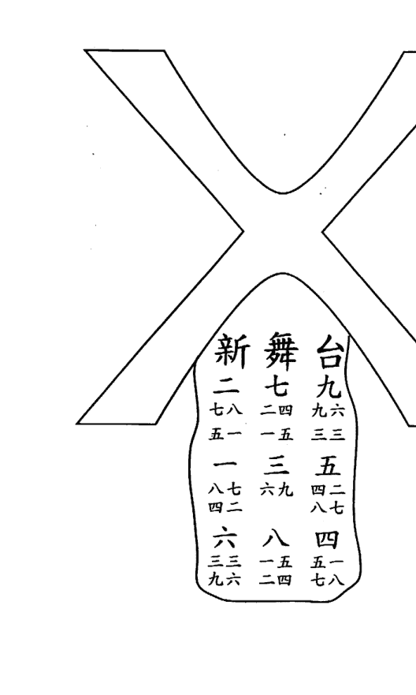

育林出版社

育林出版社

七一

七〇

# 玄空實例精析

| 7 6 二 | 2 2 七 | 9 4 九 |
| 8 5 一 | 6 7 三 | 4 9 五 |
| 3 1 六 | 1 3 八 | 5 8 四 |

三運丑山未向兼艮坤

可是，書中所列的飛星盤卻是將丑山未向和艮山坤向二個下卦星盤疊加在一起。這個飛星盤的來由，查遍資料，才在鍾義明著的《玄空地理考驗注解》中找到答案，其認為：這與羅經差、七政四餘宮主、度主之理有關，當用替而無替可尋或為二山之中線時，才另飛一盤，合兩盤以觀之。但在其書中，三運丑山未向兼艮坤的飛星盤，和上面的丑山未向兼卦的排列是一樣的，而非二個下卦的疊加盤，可見其註解和應用並非一致，也不由得不讓人懷疑此理的正確性。

倘若作者在著書時能註明此例的具體度數，一切就迎刃而解。遺憾的是，書中非但沒有明確說明，連此坐向的量取到底是在新舞臺尚在經營中，抑或災後廢墟時，還是重建開張後也沒有講明，以致成為一個風水懸案。

儘管如此，對這突發凶災的實例依然有探討的必要。畢竟，多找到一個風水致凶的原理，就可少一份災厄的發生。現在，筆者分別以丑山兼卦和丑艮中線來作回顧性分析。

按丑山兼卦看，新舞臺的坤方是二條路的交匯處，此處若為生旺之氣，則謂『一旺抵百煞』，即使大門開在兌離，只要沒有再犯其他大忌則有凶亦無妨，這或許也是作者沒有詳細畫出平面圖的原因之一。

## 第8例 九畝地新舞臺

育林出版社

七三

育林出版社

七二

# 玄空實例精析

再看，坤方納的是生氣向星四綠，山星九紫，這二顆飛星的組合表示舞女們不但人長得婀娜多姿，舞也跳得飄逸輕盈，可以推測，定是場場爆滿，生意紅火。

一九一四甲寅年，坤宮雖是流年二黑飛至，但在生氣方不以凶論。故而，據此推論不了遭火災吞噬的這一事實。

| 4 | 9 | 2 |
|---|---|---|
| 3 | 5 | 71 |
| 8 | 1 | 6 |

甲寅年五黃入中

依丑艮中線論，謂『小空亡』，主欲進不能，欲退不得；威權不立，聲名不振；舉措乖張，是非衝突；虛擲心力，毫無寸功；懷才不遇，婦女當家；心志不清，六神無主。在三運，兌宮是零神衰方，假若大門正好開在此處，就與納煞氣的路口成先天之合，在新舞臺正面閃爍的霓虹燈，促使坤和兌這二個宮位合化成火。

遭災那年，是流年飛星五黃入中，與元旦盤全局成伏吟，加強二七合火之力。故有火災吞噬之應。

若大門開在離宮，也是納衰氣，為火多土焦之局。

通過對結果事象的反推，依筆者拙見，此例新舞臺應為空亡線向。

對讀者來講，看書時不能迷信作者，更不能迷信大師。善於提出質疑，是不失為得到真訣的另一捷徑。

## 第8例 九畝地新舞臺

育林出版社

七五

七四

# 玄空實例精析

## 第9例 無錫北鄉秦巷鎮東街某寓

向首引進生氣，後戶從破牆上送入旺氣，得挨星訣在此宅。考案首及前十名在此宅，己亥年進學，是年二黑入中，六白到向，六月六白入中，一白到向，紫白訣：『一六相見，主科名』之說，非無因也。

予幼時甚寒苦，每每家無隔宿之糧，自遷入此宅之後，家計漸裕。生旺二氣為天機所在之方，吸入宅中，自然獲益。經曰：『天機若然安在內，家活漸富貴；天機若然安在外，家活漸退敗。』徵之各宅，每每應驗，如響應聲。

> 詩曰：勿謂破牆無甚用，有時巧值生旺宮。
神仙識透知無價，一路榮華仗界風。

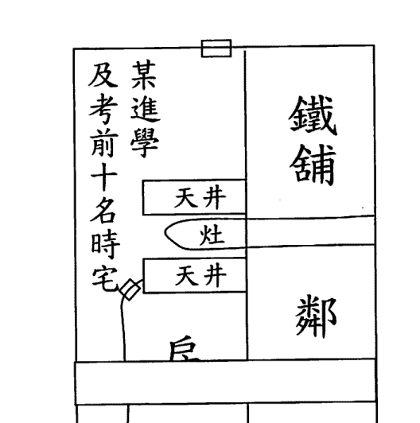

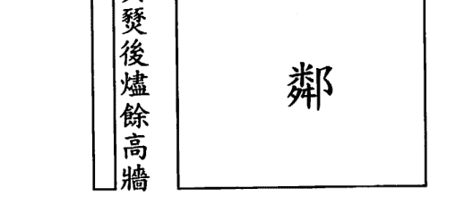

第9例 無錫北鄉秦巷鎮東街某寓

育林出版社

七七

育林出版社

七六

# 玄空實例精析

剖析：

此宅能考出案首（指舊時童生參加縣試、府試、院試，名列第一者）及前十名乃是向首引進生氣和後戶送入旺氣，從作者的這個注解來看，顯然是不符合飛星操作技法的。

因為，若按大太極看，向首即為前門，是向星納一白退氣、山星三碧犯下水，後戶是向星納九紫煞氣、山星四綠犯下水，可見，沒有

| 8 5 一 | 3 1 六 | 1 3 八 |
| 9 4 九 | 7 6 二 | 5 8 四 |
| 4 9 五 | 2 2 七 | 6 7 三 |

二運癸山丁向

凶事已是萬幸，哪裡還有應吉之說？

作者之所以會這樣寫，不外乎以下二個原因：

第一，錯解了『向首一星災禍柄，來去二口生死門』這句經文，誤把向首的飛星當作主宰禍福的權柄。本人對這句話的理解是，向首之方多是迎路開門的納氣位，尤為關乎全宅的吉凶禍福；來去既指水路的形勢，也指氣口的興替。故而，此句旨在闡明向首方的動氣處，其所在宮位的外路形勢和飛星組合是決定全宅禍福的關鍵。

可是，作者不但獨在向首論吉凶，還把坐山也納為看禍福的主因，更以為這是對『天機若然安在內，家活當富貴；天機若然安在外，家活漸退敗』這句秘訣的破解。毫無疑問，這是錯上加錯，以致一盲引眾盲。

第二，作為風水師必須明白，風水是一把雙刃劍，一旦被不明因

第9例 無錫北鄉秦巷鎮東街某寓

育林出版社

七九

七八

# 玄空實例精析

果的庸師學會只能有害無益，被品行不端的偽師掌握更會禍害眾生。所以，歷代仙師在著書立說時，對真訣正法向來是隱辭晦意、禁口莫言，因為先哲們深知，若是把揭示天地之奧秘、巧奪生氣之吉位的風水術輕洩於世，是逆道之舉，無德之象。

作者或許是出於這樣的考慮，才有意而為，故意設下迷局。

本人在著文時，不會故意寫上謬理來誤導讀者，但不排除有意設局以隱晦技法。因此，非經我處面授者，是很難洞悉其妙，若憑私智臆解、生搬硬套，恐運用不當而致差錯頻生，反弄巧成拙，誤己害人。

不妨再以小太極看，前門在坤宮，向星納生氣三碧、山星納退氣一白，正合《玄機賦》中：『木入坎宮，鳳池身貴』，主發科名取貴。兼且此處又是城門方，更助科名之吉。

後門在艮宮，山星四綠幸得狹路和高牆則不以下水論，且與向星

九紫也合《玄空秘旨》中：『棟入南離，驟見廳堂再煥』，主家中生輝，喜慶之應。

| 1 | 6 | 8 |
|---|---|---|
| 9 | 2 | 4 |
| 5 | 7 | 3 |

己亥年二黑入中

一八九九己亥年是二黑入中，流年飛星八白到坤，五黃到艮，此二土更催發了文昌氣場，可想，想不發科名都不可能了。

第9例 無錫北鄉秦巷鎮東街某寓

育林出版社

# 玄空實例精析

## 第10例 無錫城內倉橋街朱義生

詩曰：前向乾金後坐坤，旺方活動受天恩。
小資本裏偏開展，擴大生涯到對門。

一開間卯山西向發店（時在二運）

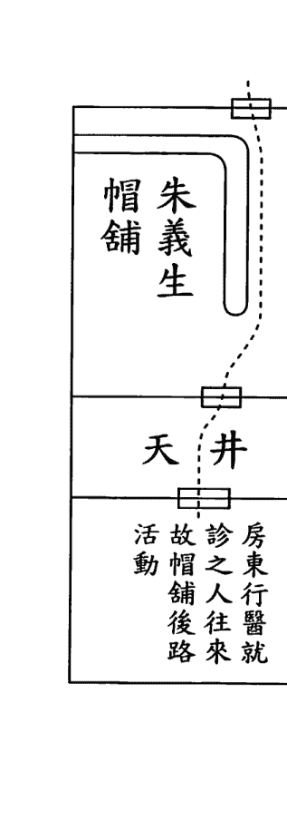

| 1 3 一 | 5 8 六 | 3 1 八 |
| 2 2 九 | 9 4 二 | 7 6 四 |
| 6 7 五 | 4 9 七 | 8 5 三 |

二運卯山西向

註：向乾坐坤，指向盤挨星也。氣口五黃生扶向首，生入也。
宅後有水，而來向上星辰背時之八，向首三碧旺氣，受克於氣口背時之七，經濟困難，負債巨萬，原來如此。坐山三碧旺星，四綠生氣，落入水裏，而致傷卻愛子，況水上四九金克三八木，主人因損子而成肝疾，卒致不起。又前門二七先天火上行動，以致歷年蓄積精華，

第10例 無錫城內倉橋街朱義生

育林出版社

八三

育林出版社

八二

# 玄空實例精析

惡燬於火，噫慘甚矣。

詩曰：水裏星辰上了山，更逢剋制撐持難。
山上星辰下了水，嬌兒不壽堪悲歎。
氣口又經二七火，爐餘何莫非血汗。
傷心遂致天年折，說到陰陽欲膽寒。

註：艮上氣口七赤，剋制向首三碧，亦為致肝疾之一因。又退財傷丁，於氣口之七亦不無關係。

## 第10例 無錫城內倉橋街朱義生

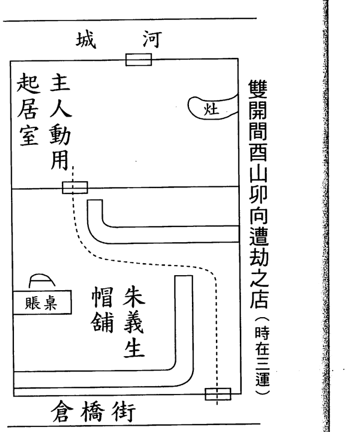

育林出版社

八四

育林出版社

八五

# 玄空實例精析

剖析：

| 6 2 二 | 1 6 七 | 8 4 九 |
| 7 3 一 | 5 1 三 | 3 8 五 |
| 2 7 六 | 9 5 八 | 4 9 四 |

三運酉山卯向

此二運卯酉向例，在格局上有點類似現今的別墅排屋，從後門進入，經餐廳至客廳，此處又有前門通向院子。

這種宅例，有人認為應以後門為向，也有認為須以前門為向，還有認為這二門均要取向，到底以誰為準呢？

筆者認為，這三種情況都存在，具體以何為向則需結合外局形勢和內局調理方能做出正確的判斷。鑒於風水的操作具連貫得體、綜合運用的特點，也就沒有必要寫出本人多年的實戰經驗之談，否則不但於學無益，還會徒添無休止的爭論。

近幾十年來，風水學的最大爭議不是所謂的些子秘訣，而是如何辨別坐向。這個本屬於最簡單的基本問題卻因現代建築結構的複雜性和多樣性，成了許多風水師必須面對的一個全新課題，使之成為一道難以逾越的門檻，只能望宅興歎，無從入手。

眾所周知，定向不準，滿盤皆錯，不但斷事上無法取驗，而且催福不成反招禍。因為，能否確定坐向是會不會排對宅命飛星盤的第一要旨。假若過不了這關，要做到判斷吉凶和調整催旺，無疑是一句自欺欺人的謊話。

開帽鋪的朱義生，在起初的老店內經營，雖小但生意不錯，後來

第10例 無錫城內倉橋街朱義生

育林出版社

八七

育林出版社

八六

# 玄空實例精析

為了擴大規模搬至對面，店面是大了，但因風水不佳導致生意蕭條、負債累累、損子肝疾、引起火災的一系列凶象。

下面，就用飛星派學理來分析致災原因。

此鋪是三運酉山卯向，坐後零神方的水，於飛星盤言是發凶的禍水。坐方當令山星三碧、生氣山星四綠、左輔山星八白全犯下水，尤

其是兌宮向星為左輔八白，正好應了《紫白訣》中：「四綠固號文昌，

然八會四而小口殞生，三八之逢更惡」，又三碧、四綠均主肝膽，所

以，損及愛子又生肝疾。

> 《玄空秘旨》云：「苟無生氣入門，糧艱一宿」，大門向星納死

氣七赤，可期經營慘澹；與山星二黑合化為火，使得火災肆虐；而坐

方見河水，更主債務纏身。

> 《黃帝宅經》曰：「宅者，人之本；人者，以宅為家。居若安，

即家代昌吉；若不安，即門族衰微。」這句話旨在說明只有居安才能

樂業，家居風水是關係宅中之人吉凶禍福的大事而倍加重視。通過此

例，可知同樣的人賣同樣的貨物，僅僅因為鋪位的變動，就導致完全

相反的境遇。

這個實例告訴我們，買房、換鋪一定要注意風水的好壞，如果在

喬遷後一直有諸多不順的事情發生，就要警惕會不會是風水不好所致。

當然，在延師相宅時為防止被庸偽之師和名鳴之師所騙，可參考拙作

《風水求真與辨偽防騙》中的招數來加以識破。

## 第10例 無錫城內倉橋街朱義生

青林出版社

八九

# 玄空實例精析

## 第11例 無錫北鄉秦巷鎮倪隆源京廣貨鋪

向首空曠，而此曠場作為菜市，千人行動，旺氣吸足，自不待言。並有西衙生氣轉折沖來，更有天空祿存生氣吹到坎方高牆迴轉送來。又得東南八白輔星吉氣，吹入坎乾角度，沿牆送來。真個成就花團錦簇之概，其發福於此運也。雖其人夙福所感，而天事之巧妙，實所罕觀也。向首所繪者，乃描畫風相，風本無相，作此以醒目而已。

> 詩曰：倪氏隆源小賣商，因何豪富壓秦巷。止為向首承氣足，迴風助吉天恩降。

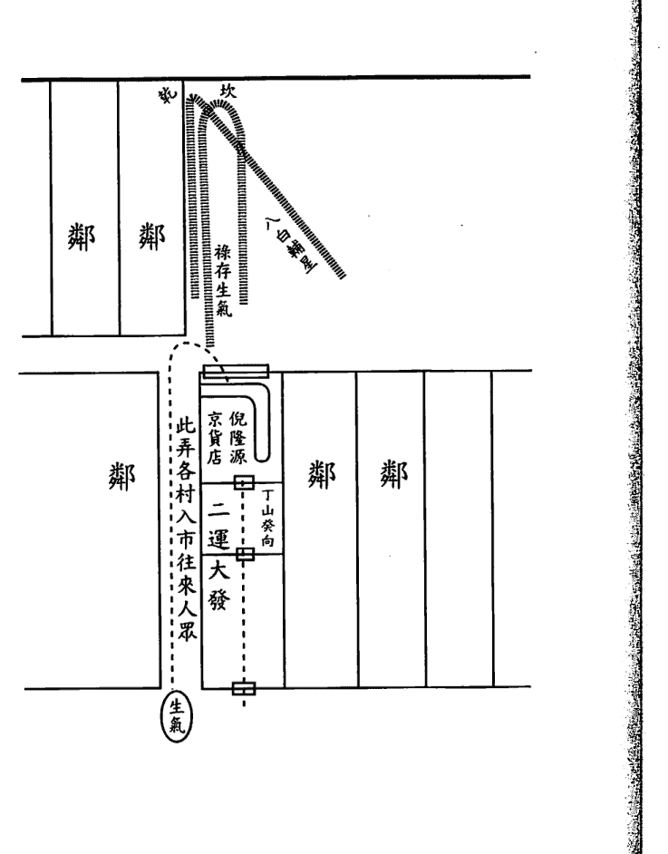

第11例 無錫北鄉秦巷鎮倪隆源京廣貨鋪

育林出版社

九一

育林出版社

九〇

# 玄空實例精析

剖析：

這家貨鋪生意能夠興隆，作者認為是緣於坎宮向首空曠吸足旺氣、離位三碧生氣回風返吹、西邊四綠進氣轉折沖至、巽方八白吉氣沿牆送來這四個原因。

餘以為，這家店門一字排開的貨鋪，乾宮為城門、坎宮是旺氣、艮宮屬進氣，生旺吉氣會聚於向方門口，又坎乾二方的高牆使得山星二黑和七赤得以收山。如此山水合局之鋪，豈有不發之理？

| 5 8 一 | 1 3 六 | 3 1 八 |
| 4 9 九 | 6 7 二 | 8 5 四 |
| 9 4 五 | 2 2 七 | 7 6 三 |

二運丁山癸向

至於書中講到的遇高牆可回風返轉氣流之說，原見於蔣大鴻著的《歸厚錄——陽基篇》，其中這樣寫道：「嶠者，鄰居高峻處。如艮方有高屋，則氣被障斷，反從艮方還轉氣來，回向我宅，多坤氣也，所謂回風返氣。」這是依水立局之法，適用於戶外形勢結合渾圓之氣，以推各家宅氣的大勢衰旺。

作者將此法呆板地套用在飛星盤上，以為戶外坎、乾二方的高牆能返回室內離、巽二宮的氣場，是有待商榷的。

需知，飛星盤研究的是宅內本氣，它是渾圓外氣進入室內，在立極處被轉化的後天九星之氣。雖然也有騎星返氣八方之論，但在應用上二者是有本質區別的。舉出此例，就是為了說明這點，望讀者在閱書時能加以辨別、篩選整合，於實際操作時能區分清楚、正確運用。

第11例 無錫北鄉秦巷鎮倪隆源京廣貨鋪

育林出版社

九三

育林出版社

九二

# 玄空實例精析

## 第12例 水命兒七個死因

上海華德路德大裏穆宅，於民國七年戊午添一男丁（名七官）。是年一白值年，以故此兒為一白水命。兒極清秀聰慧，人咸愛之，但該宅坐山飛星一白到坤，受向星八白土克制，此兒本不宜居於此宅，且偏偏隨著乳媼住在右邊一間，一白受克之方。民國八年己未，九紫入中，五黃到內路行動之坎宮。十月五黃入中，二黑病符到小兒臥室一方，於是月得重病，殤於初九日卯時，初九丙戌日，日白二黑入中宮，八土又到坤方。時白卯時九入中，五黃又到內路活動之方，遂致不起。年命值宅上山星受克之方，為致殤一因。住於受克之方為二因。樓上氣口九七火星同宮，火助忌神八土之威，為三因。年上五黃催命惡曜，又到氣口，為四因。月令病符又到臥室，為五因。日白八土又來坤方臥室助虐，為六因。時白五黃又到內路氣口上，為七因。苟預知之，避居他宅，或遷住他間，皆可得救，甚矣紫白生克之不可不知也。

> 詩曰：山管人丁嫌受克，更愁動處加黃黑。定數未嘗不可回，知機以外惟修德。

第12例 水命兒七個死因

育林出版社

九五

育林出版社

九四

# 玄空實例精析

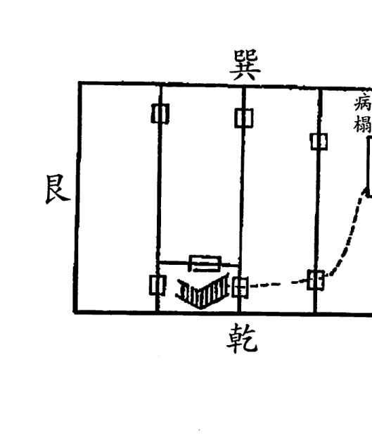

## 第12例 水命兒七個死因

剖析：
一個清秀聰慧、人咸愛之的小孩，由於家裏風水犯了諸多凶象，以致患病而殞。

| 3 1 二 | 8 6 七 | 1 8 九 |
|---|---|---|
| 2 9 一 | 4 2 三 | 6 4 五 |
| 7 5 六 | 9 7 八 | 5 3 四 |

三運亥山巳向

對這個凶象的發生，作者歸納了七個風水大忌：1. 年命一白值宅上山星受向星八白克製，2. 隨乳媼（指奶媽）住於受克之方，3. 樓上坎方氣口九七火星同宮助忌神八白土，4. 已未年五黃又到坎方氣口，

育林出版社

九七

育林出版社

九六

# 玄空實例精析

5. 流月二黑病符到臥室，6. 流日八白土又來坤方臥室助虐，7. 流時五黃又到坎方氣口。

以上分析只能說太過囉嗦，完全沒有一句點中要害。

小孩出生之年，如果適逢生旺山星犯下水，又遇流年凶星肆虐，那麼，就難逃非殘即夭的後患。

先看此戶人家，向首納當令山星三碧，離宮納左輔山星八白，也就是說，三運中的二顆最旺的山星全犯下水，這已為損丁埋下很大的隱患。

| 9 | 5 | 7 |
|---|---|---|
| 8 | 1 | 3 |
| 4 | 6 | 2 |

戊午年一白入中

再看，這個小孩出生在一九一八戊午年，此年是一白入中，飛星太歲至向首巽方，流年五黃至年命離宮，凶星齊聚此二宮，註定該小孩難逃厄運。

接下來，分析小孩為何會在次年就患病而殞的風水根據。

| 8 | 4 | 6 |
|---|---|---|
| 7 | 9 | 2 |
| 3 | 5 | 1 |

己未年九紫入中

一九一九己未年是九紫入中，流年八白至向首巽方，與原局山星三碧犯先天反吟；流年四綠至年命離宮，與原局向星六白犯後天反吟。更為之，《紫白訣》云：「四綠固號文昌，然八會四而小口殞生，三

## 第12例 水命剋七個死因

育林出版社

九九

育林出版社

九八

# 玄空實例精析

八之逢更惡」，可見，此二宮的流年飛星與原局山星之組合均不利小孩的身體健康，且極為兇險。

小孩與奶媽同住右邊的臥室，為三運申山寅向宅。

| 1 5 二 | 5 1 七 | 3 3 九 |
| 2 4 一 | 9 6 三 | 7 8 五 |
| 6 9 六 | 4 2 八 | 8 7 四 |

三運申山寅向

從飛星盤中可知，臥室的門口在坎方，納山星四綠、向星二黑，流年飛星五黃，《飛星賦》云：「黑黃兮，釀疾堪傷。」《紫白訣》

云：「正煞為五黃，不拘臨方到間，人口常損。」又云：「二五交加，罹死亡並生疾病。」

用事位睡床在離方，納山星五黃（可通中宮九紫）、向星一白，均為衰死之氣，《紫白訣》云：「運如已退，廉貞飛處眚不一，總以避之為吉。」

從上可知，小孩患病而斃乃是風水氣場使然。

作者說避居他處或遷往他間皆可得救，是對風水與命運的辯證權衡、門廳與臥室的主次把握之無知。

因為，當一個生命未誕生之前，風水的好壞是能直接決定出生胎兒的命格運勢，只有一個生命出生之後，風水的好壞才能對此人的命運產生波動影響。古訓：「一心二宅三八字」與「一命二運三風水」，就是對此的概括性總結。

## 第12例 水命兒七個死因

育林出版社

一〇一

育林出版社

一〇〇

# 玄空實例精析

自古，素有：『一門定乾坤』之說，也有『千斤門樓四兩屋』之語，這都是在說明陽宅風水是以作為納氣口的大門為重，但讀者須知氣口所在方位的吉凶卻是由納氣點來決定的，依此推之，這納氣點所在之處才是關乎陽宅興衰的玄竅。

作者沒有考慮到小孩出生當年和陽宅納氣之處的風水，卻誤把臥室當作禍首。如此，這種所謂的調理建議是無補於事的。

孩子是未來的希望，美好的將來寄託在下一代身上，為此，本人特開誠佈公寫出催丁秘訣：飛星太歲和年命生肖所到之宮，必須形氣相合、山水相宜、陰陽相配，再得流年飛星助吉則必定會生出一個天資聰穎、人格健全的小寶寶。

另外，孕婦還要做到身、口、意的清淨，又能把放生、念經、捐資等善行的功德回向給肚中的胎兒，這也是為其提升生命能量的一種有效方法。

除此，則須注意在懷孕期間不要去奔喪或探病，避免動土、裝修、搬遷，忌諱在床上剪甲或穿針，以上行為都會觸犯胎神傷及胎氣。

我公開催丁心得，旨在希望各位風水師能研究參考、學以致用、知行合一，把這一真正有助於提高人類素質的優生學發揚光大，為促進社會和諧與文明進步貢獻一份心力。

## 第12例 水命兒七個死因

## 第13例 上海大東門內麻袋公所義務小學

向首引入三碧旺氣，衖口得八白輔星，三八合成先天木局，故外間聲響絕佳。教員宿舍吸收氣口四綠生氣，宜乎教務振作，有聲有色，震動遐邇也。

> 詩曰：大東門內小學堂，如何校譽震遐方。只為三八先天木，木運之中來路良。再看西角教員室，氣口逢生姓字揚。小規模中大作用，天機占得不尋常。

剖析：

這所學堂能搞得有聲有色、蜚名遠播，固然與教師的辛勤培育，學生的刻苦努力是分不開的，但與風水的催旺助力也是有著極大的關聯。

筆者試從風水學的角度剖析如下。

| 7 8 二 | 3 3 七 | 5 1 九 |
| 6 9 一 | 8 7 三 | 1 5 五 |
| 2 4 六 | 4 2 八 | 9 6 四 |

三運子山午向

從書中所附平面圖可知，進入學堂的路口在巽方，為雙重城門位；離宮是當令三碧雙星到向，與路口的向星八白成先天合，與透天光之處結為樞紐；此飛星盤的向星是全局合十，如此諸多吉應所產生的氣場，勢必能蘊育出朝氣蓬勃的新氣象。

而且，這三個吉位的山星既有先天合，又有後天合，這種山星逢合的現象更主人才薈萃、桃李芬芳。

可是，作者卻從教員的宿舍上去尋找風水的理論依據，而且還把下層量取的飛星盤套用到上層來論吉凶，這些錯誤的操作方法是會貽害後學的。

其實，看學校、工廠之類的大型場地風水，主要是看生氣有否歸納入堂、旺氣有否催發顯力、吉氣有否為主所用，若能把這三點做到位，必定可以風生水起、吉祥如意。

餘下的諸如教室、車間、倉庫、宿舍等處，只要形不犯忌，則無需再去多加理會。

看樓房的上層臥室風水時，不能以底層的飛星盤套用到上層並按其所在方位的飛星組合來論斷吉凶，更不能依此盤來對上層的其他宮位進行調理佈局。同樣，看高樓大廈的某層單元住宅風水時，也是不能以底部大門口量取的飛星盤套用到該單元住宅內進行風水勘察。

或許，會有人對以上見解持反對態度，並以「在室內不同的地方，會得到不同的度數而無法下盤」來進行反駁。在此，本人不予爭辯，只想提醒讀者：格取坐向，除了要明確操作的要領，還必須遵循一定的操作法則，方能量取準確的度數。

## 第14例 上海某金號

舊用丙山壬向，凡設號於此者，皆失敗而去。以向首三危於交劍煞，而外口廉貞惡土，又助虐故也。

友人某君，欲設金號於此，囑予代為佈置，遂囑將辦事之案，移於甲處，而改為丙向。使氣口星辰，節節生入，外口一向內生第二三氣口三八木，三八木又隨同來客直上樓梯生第四氣口九，第四氣口九生坐前之二黑巨門土，果然捷得厚利。

> 詩曰：化煞為生反掌間，重重生氣往內旋。果然著手開金庫，滾滾財源湧眼前。

剖析：

這個金鋪的坐向，會讓許多讀者感到迷惑不解，為什麼會以辦事之案的方向來確定？

暫先擱置這個問題，來討論這二個相反坐向的吉凶分析。

原是面向北方，為丙山壬向，向首三碧與乾方七赤成交劍煞，又得艮方五黃助虐，才失敗而去。

試想：乾方和艮方均為城門，言及又是氣口，這還能以凶論嗎？

改後面向南方，為壬山丙向，使數個氣口與座位的向星五行一路相生，故財源滾滾。

再問：難道只要宮位之間能五行相生，即使是衰氣也可以吉看？

作者不著重討論金鋪門口的吉凶，卻去闡述毫不相關的外路，實在令人匪夷所思。

讀者看到我這樣質疑，不禁要反問：『按照作者調整以後，效果是有明顯地改變，這又作何解釋？』答案是，歪打正著的巧合。

| 9 4 二 | 5 9 七 | 7 2 九 |
| 8 3 一 | 1 5 三 | 3 7 五 |
| 4 8 六 | 6 1 八 | 2 6 四 |

三運甲山庚向

這家金鋪應該是甲山庚向，以人為極，此種立極是對秘法『移步換形』的實際運用。

按調整前，店門在坤方，所納山星七赤、向星二黑均為退死之氣，生意不好是必然的。至調整後，店門變乾方，所納山星二黑、向星六白看似仍是退死之氣，實際為二重城門並臨的吉方。其中，向星六白表金器，得山星二黑土生之，運星四綠合十助之，乾卦宮位迭逢扶之，如此組合必主顧客盈門、生意興隆。

縱觀作者的書籍，可證其還未領悟到輔弼、城門、打劫、樞紐等諸多秘法的運用，對實例的分析就難免憑粗淺的學理強解臆測。不可否認，此書有不少誤導之處，好在其提供的案例具真實性，現經我剖析解說後，反而更有利於讀者在比較中學習和提高，從這個角度來說，仍不失為一本值得借鑒的好教材。

## 第15例 推行佛化之暗助

外路乾方沖動有力處，為向上兌七所到之地，為一白命人生氣之方。而樓上氣口，同在此兌七生氣方，更觀其路線循環變化，四九合金曜恩星。二七合出火星妒之，而八白輔星居間調和，化妒為助。六宮全被土金二氣所統馭，一白生人在此無聲無臭之地，宜乎動合天機，三閱年來所植主張，風動全國也。

詩曰：試看佛學推行社，三閱年來震華夏。
一路生機擁護周，此功應分歸造化。

剖析：

如果按人人一看即懂的那些風水常識來說，這個佛學推行社的風水是不好的，因為社主不但坐於二門對沖的中間，而且床位也被房門正對，這樣會使人因為受到氣流的沖激造成精神渙散、思維混亂、勞而無功的後果。

| 1 5 二 | 5 1 七 | 3 3 九 |
| 2 4 一 | 9 6 三 | 7 8 五 |
| 6 9 六 | 4 2 八 | 8 7 四 |

三運申山寅向

當然，對風水的好壞判斷是以事實效應作為衡量依據。

事實上，社主在此推行佛學，僅用三年時間就把所持主張風動全國。如此效應，不知只會空談形式卻不明理氣興替的庸師又該如何解釋呢？

作者以為，是外路乾方和樓上氣口的七赤飛星生一白水命、前邊納四綠生氣和後面納三碧旺氣的二個窗戶生扶向首九紫所致。

本人認為，位於東方生氣和坤方旺氣的窗戶固然能起作用，但僅憑此點還不足以產生這麼大的效應。其力的爆發點實在坎宮，此處雖納二黑退氣向星、山星四綠下水，但更是打劫之星，又幸得外局聚風匯水和內局格式合宜，由此構成了七星打劫局。

此局在風水上稱之為『功德風水局』，尤利於人們在心性方面的修持及粹煉和對佛理道法的參悟及弘揚。

可見，癸酉年生人的社主能在短時間內達到這般成就，與這極為殊勝的風水佳局是分不開的。

遺憾的是，總有一些學佛者視風水術為旁門外道，看風水是違背佛理的愚行。

殊不知，道家風水調理的『改運趨吉』與佛門許願祈福的『有求必應』具異曲同工之效，都是先通過外求滿足人的現實利益的需求，在其對道術佛法確立信心之後，再引導其向心內修的這一過程。這是一個最易為常人所接受的方便法門，憑什麼說是旁門？如果說風水因能助人催財、利文、保平安就定為外道，那麼去寺廟求子、升官、消災厄的行為也同屬外求！

還有，總是一味地勸誡：人的吉凶禍福與風水完全毫不相關，風水的改運根本就是子虛烏有的謊話。

可是，當面對那些用風水術把遭災遇厄的家庭調得化凶呈祥，多年不育的夫婦改得喜添貴子，效益不佳的工廠搞得風生水起，或因不信風水而陷入困頓，違背風水致家破人亡等實例時，卻又啞口無言、無以應對。

針對這種曲解，我有必要來談下自己對此的看法。

風水是能夠改善命運，是有趨吉避凶、轉禍為福、扭轉乾坤的奇效。但是，很多人沒有從深層次瞭解這一奇效實是人自身的福氣所感而致，『福地福人居』就是對此的最好詮釋。看風水的本質，就是藉術來濟世救人、勸化人心、喚醒良知、回歸正道而提供的一種方便法門。

這個『福氣』是如何得來的呢？

一是前世善業的回報，二是今生修德的結果。

敬業的風水師，即使通過風水幫助客戶扭轉頹勢、起死回生時，也不會誇大是風水的功效，因為他深知風水只是起了順緣和助力的作用，能改善命運但不能改變命運。

所以，在看好風水之餘，一定會告之：風水的吉凶是依心境的善惡而感應，惟有做到止惡防非、行善積德才是改命轉運的真正良方。

但也有一些品行不端的風水師，為了從客戶那裏牟取更多的錢財和博取絕對的依賴，往往會過分渲染、過重粉飾風水的調理作用，這樣很容易使人墮入「不向內心修，卻把外法求」的魔境之中。如此，才有了佛教不提倡，甚至反對風水的說法。

事實上，在佛經裏有《梵天擇地法》和《建立曼茶羅及揀擇地法》，其中「擇地法」是佛經用的名詞，與風水的古代名詞「相地術」相同。

《梵天擇地法》提出了四十二種擇地的方法，是可堪作曼茶羅，使持咒者如意法成，不得此法者徒消日月。就是說，選擇好的壇場，會利修行者如意而法成，不明此法者只會白白地消磨光陰。可見，修行地方的風水好壞對修行者的成就有著極大關係。

《建立曼茶羅及揀擇地法》中不但有詳細的擇地之法，還有淨地、禳災、擇日的諸多要求。除此，還提出祭拜之禮，包括對當地神靈的祈禱。可以說，這和風水師的勘宅方式及儀軌完全一樣。

有道：「天下名山僧占多」，歷代高僧為了讓佛法長存世間，都會將道場建在風水寶地上，使香客在感受山川靈氣的同時，接受佛學對心靈的洗禮。

再者，道字上面二點如太極中的陰陽魚，表天地；一指一種、平衡；自為自然；走喻運動、創生。老子所講的「道」是先於天地自然而然地產生並作螺旋狀運動的一種超微粒物質，實指氣。此氣又分陰陽二種不同屬性的氣場，它是化生和創造萬物的最基本元素，其大無外、其小無內地彌漫於天地之間並影響著一切。

生活在世上的人，毫無疑問每時每刻、每處每地都在感受著彌漫於天地之間的氣場影響。按道家理論，風水學探討的就是人與天地之間的內在聯繫，主張通過人的意志能動性之發揮來參天地以贊化育，達到順其自然、達其平衡、促其和諧的效果。說白點，就是講人一定要結合天時與地利的運行變化規律並加以效法，再通過發揮人的主觀能動性來彌補和調整自身的不足，從而將天人地三才協調致和諧合一的境界。

以上內容，都在說明選擇風水寶地的重要性。因此，只要一個人還沒有脫離氣場的束縛，就很必要利用風水對住宅加以調理和催旺，這對提升運勢和心性修為都會起到很大的助力。

至於有些學佛者面對身臨窘境的人，告之『以心轉境』就可擺脫困局，這個方法真的能起效嗎？

我只想說，對還未修行或修為尚淺者而言，這無異於緣木求魚。畢竟，要做到以心轉境，惟有定力者方能為之。對起初只想擺脫困狀、改善命運的芸芸眾生來講，不妨『先以境立心，後以心轉境』，即借風水之術幫人解厄脫困的同時又導人持戒修行，修正不符合本性的身、口、意之行為，從而由戒生定，由定生慧，助其早日開悟，這才是風水學的積極意義之所在，也是風水師為人勘宅的初衷。

## 第16例 上海蘭路順泰醬園

坤宮有三四裏特朝之水，得向上旺氣，故生涯甚盛。震宮近照有三叉曲水，得向上四綠生氣，後望頗長，故營業逐年拓展。櫃中又引進前後生旺之風，故貿易非常發達也。

> 詩曰：水與風兮兩得宜，雙收生旺氣為奇。
羨他暗裏承天助，釀酒工場得福基。

剖析：

書中寫的特朝之水，是指有三、四裏長的河水朝其緩緩流來，風水學稱這種有情之勢為特朝。

此特朝之水在坐山坤方，山向所納都是當令飛星三碧，正好近處有釀造室作山論，使得山水配置合宜，故所持產業甚盛。

震方納生氣四綠，又是城門吉位，且有曲水流淌，尤發遠方之財，可期所釀之醬必能銷往外地拓展市場。

| 1 5 二 | 5 1 七 | 3 3 九 |
| 2 4 一 | 9 6 三 | 7 8 五 |
| 6 9 六 | 4 2 八 | 8 7 四 |

三運坤山艮向

詩中「水與風兮兩得宜，雙收生旺氣為奇」這句，實透露了催吉助旺的秘法乃是水和風這二種元素。

經云：『風水之法，得水為上，藏風次之。』『戶外之馬路、空曠、低矮處和室內之大門、窗戶、空調方都屬於風的範疇，由於其不如水可以隨意佈置和快速顯現效果，所以，在院內挖水池、布水景與家中置魚缸、放水輪等技巧就成了風水師催吉助旺的致勝法寶。

不過，在佈置動水時，必須注意水既有內外之分、上下之差、動靜之別，還與飛星組合、宮位關係等有不同的吉凶感應，甚者流年之遷、佈局之異產生吉凶之變。若稍有不慎，會使原本催財運、旺文昌的吉水變成應血光之災、官非之爭、淫邪之亂的禍水。

可以肯定，『衰旺權衡操在水』、『富貴貧賤在水神』之說，確是真知灼見。

所以，為人勘宅已有一定經歷的庸師是不敢布動水的，如果說在室內布水無用的一定是偽師。

可是，總有不少無技又缺德的風水師棄真法於不顧、視良心為草芥，熱衷於向客戶推銷那些所謂的吉祥物品並煞有其事地指點擺放方位和要求，這樣做不外乎：一可騙取更多的錢財，二能掩飾自己的無知，三是逃避致凶的質問。

在此，我真誠奉勸這些大師們，希望你們在賺錢時能無愧於良心、取信於客戶，對自己所從事的行業恪守職業道德。因為，你們可以欺騙外行的客戶，但終究騙不了天地神佛，逃不過因果報應。

## 第17例 上海蘭路裕成醬園

裕成醬園，為此地最先開業之醬園。距鬧市遠，而吸集主顧比各家為多。彼有一種拿人法，凡主顧以銀洋向之購物，或向之兌換銅元，必比市上高抬十文，以此遠遠近近，為爭此一銅元之便宜，而有賓至如歸之狀。

> 詩曰：寅山坐後湧高牆，迴下坤方碧氣強。
看汝功成三運底，居然奪得醬園王。

剖析：

| 5 1 二 | 1 5 七 | 3 3 九 |
| 4 2 一 | 6 9 三 | 8 7 五 |
| 9 6 六 | 2 4 八 | 7 8 四 |

三運寅山申向

上例順泰與這家裕成醬園，雖然都處於蘭路上，但裕成的主顧比各家為多，有『醬園王』之稱。

裕成能在同行業中奪得魁首，看似與其吸引顧客的行銷策略有關，但暗中實是風水氣場使然。

那麼，到底是怎樣的好風水助其成為『醬園王』的呢？

作者說，此宅後面高屋回下三碧旺氣助彼成功醬園業王。如此膚淺地分析，是根本站不住腳的。其實，對這家醬園應從形法上先入手。

有道：『滔滔江水向東流』，流經裕成醬園門口的引翔港（位於楊浦區，後因淤塞不通舟楫被填平，成為今天的寧武路）正是從西流向東。更為難得的是，在入口之處引翔港成分流兜抱，而坐後和去處的高屋剛好把來水和空氣加以遮攔，使真氣全都會聚於園內。蔣大鴻對如此吉利的外局風水，在《陽宅天元賦》中作了如下概括：『若逢空缺即為來，一有遮攔旋作止。辨明止來二氣，方知噓吸真機。』

分析完形法，再來審視理氣。

從圖可知，門口正對著橋，而此橋起吉還是發凶得從其所在宮位的氣場來判斷。

大門開在離宮，既是進氣吉星，又是雙重城門，若逢平橋，是謂『沖起樂宮無價寶』，象一輛裝滿財寶的船欲沖進宅內；若為拱橋，則屬『逆水朝堂局』，似一把弓要把整條河的財氣射入宅內。

裕成正是憑藉這形氣皆吉、內外俱旺的上佳風水，才吸引了眾多遠近客戶的光顧，成就了『醬園王』這一行業至尊的稱號。

作為讀者，千萬不要只看作者的見解，而是要把自己假設成作者，也在現場進行實地勘察一樣。比較自己與作者在斷事和佈局的技法上有何相同？有何相異？論據如何？這樣，方能百尺竿頭更進一步。

## 第18例 上海浦東楊思橋恒大紗廠公事房

詩曰：恒大紗廠總理室，來路雖然走三吉。惜未吸收真旺氣，亥秋救濟苦無術。

癸亥（民國十二年）流年，七赤到兌，克內路氣口巽木，木入秋而生機窒，九月黃土到兌，助桀為虐，故益不堪矣。於是時停廠歇業。

註：凡流年七赤所到之方關係獨重，不可不留意。

# 玄空實例精析

剖析：

恒大紗廠的總門在離方，雖是城門實則無用，向星納死氣六白金又得山星左輔八白土生之，主管理有才未展、有志難伸，員工死氣沉沉、了無生氣。

大門在巽方，向星納煞氣一白水並去生當令山星三碧木，主經營不佳，致員工怠惰。

| 3 1 二 | 8 6 七 | 1 8 九 |
| 2 9 一 | 4 2 三 | 6 4 五 |
| 7 5 六 | 9 7 八 | 5 3 四 |

三運亥巳兼壬丙

通往會客室的後門雖納向星三碧，可惜旺氣被制。而且，山星五黃通中宮四綠，即是生氣山星犯下水。

由上可知，該紗廠的三個生旺山星全都處在氣口上，而向方又納死煞之氣，尤其是這二個方位的山星、向星、宮位全為先天合，這更強化了其凶性。哪怕總理室為吉，恐也很難力挽狂瀾。

再來分析總理室，按三運寅山申向看。

| 5 1 二 | 1 5 七 | 3 3 九 |
| 4 2 一 | 6 9 三 | 8 7 五 |
| 9 6 六 | 2 4 八 | 7 8 四 |

三運寅山申向

## 第18例 上海浦東楊思橋恒大紗廠公事房

育林出版社

一三七

育林出版社

一三六

# 玄空實例精析

總理室的門開在兌宮，向星七赤死氣，山星八白下水；座位在巽宮，同樣納死煞之氣。

因此，可斷倒閉已成定局，關閉只是時間問題。

一九二三癸亥年是五黃入中，坐方山星四綠與流年六白成反吟，流年五黃從中宮飛至向首肆虐。這種前後相夾的困局，豈有不敗之理？

現回過頭來，只見作者的分析顯得蒼白無力、詞窮字短，其在前面的例子中一直把三白當作吉星看，也把向首得氣口向星之生作吉論，可在這個破敗的實例面前，卻含糊其詞或避而不談。

所以，我們在看書時，既不能迷信作者，更不能盲目接受其觀點。否則，把錯誤的技法用來勘宅，甚至加以傳播，就既禍害客戶又誤導後學，這種愚行是會大損自身及後代的陰德。

## 第19例 上海威寶路聶公館

全宅星氣本吉，惜受外路兌金之克，主有憑藉陰人之力，口辯之巧，而來剝削。且木被金傷，則肝經受病，膽經受虧，膽汁一弱，胃化力亦不足矣。

前門○處置儲水器，以資解救。主要辦事處與賬房，當移於甲乙二室，因甲子年即交四運，藉以吸取離宮五黃生氣也。

詩曰：匯山路上聶公館，坐艮向坤對碧天。

可惜兌金占外路，助凶最怕癸亥年。

第19例 上海威寶路聶公館

育林出版社

一三九

育林出版社

一三八

# 玄空實例精析

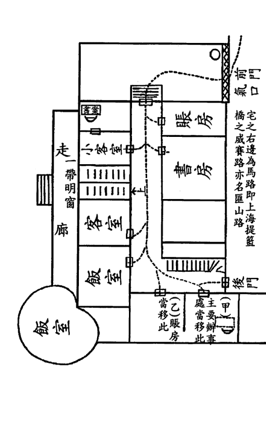

宅之右邊為馬路即上海提籃橋之咸寨路亦名匯山路

前門
氣口

後門

育林出版社

一四〇

## 第19例 上海咸寨路聶公館

### 剖析：

該公館的屋向是艮山坤向，門向是巽山乾向，現先以屋向來論。按屋向看，前門在兌宮，為左輔山星八白犯下水，八白為艮卦，主脾胃有恙。

| 5 1 二 | 1 5 七 | 3 3 九 |
| 4 2 一 | 6 9 三 | 8 7 五 |
| 9 6 六 | 2 4 八 | 7 8 四 |

三運艮山坤向

育林出版社

一四一

# 玄空實例精析

按門向看，前門在乾宮，為當令山星三碧犯下水，三碧為艮卦，主肝膽。入主屋的門在艮宮，進氣山星五黃逢室內之路沖，可視作山星二黑和向星七赤的組合，二黑為土，表腸胃、病符；七赤為金，表寒冷、虛缺，土被金洩正好形象地說明胃受寒邪侵襲，或飲食生冷，導致胃中陽氣虛損而致消化力不足。

| 1 3 二 | 6 8 七 | 8 1 九 |
| 9 2 一 | 2 4 三 | 4 6 五 |
| 5 7 六 | 7 9 八 | 3 5 四 |

三運巽山乾向

作者提出，在前門邊上置儲水器可救金木之戰的化解方法，毫無疑問，這樣只會助紂為虐，凶上加凶。

還有，提出『把主要辦事處與帳房移於甲乙二室，因甲子年即交四運，藉以吸取離宮五黃生氣』的方法，可取但非最佳。

其實，只要在院子的離宮開設窗戶、兌宮置儲水器，不但在三運時可把整局轉衰為旺，還可在四運時仍繼續為旺。

我的這本拙作，詳細分析了如何根據風水來判斷吉凶禍福，讀者若能悟出其中所含妙訣，就可依此檢驗自己有否掌握正確的操作步驟和技法，這是做到能否準確斷事的前提。至於，如何調整催旺，因考慮到術師為了錢財會濫用助惡或待價而沽等因素，恕只能稍微點竅，不予詳細披露。

## 第19例 上海威賽路聶公館

育林出版社

一四三

育林出版社

一四二

# 玄空實例精析

## 第20例 上海北京路清遠裏一號

騎縫山向，半陰半陽，靈機混亂，祥不勝殃，如入霧裏，如墮陷坑，反吟復吟（星到本位為復吟，到對宮為反吟。呻吟為愁嘆失望之聲，宅捨得此最為不利）。中心憂傷，如眉灼火，去此方良，天空海闊，任我高翔。

> 詩曰：大本營何下半陰，進退維穀實驚心。
諸家虧累同遭劫，五里霧中失縱擒。
悲笳八路賊吹起，最壞莫如反復吟。
數百萬金大貿易，因無天助困於今。

| 德大恆大兩 | 紗廠批發所 | 三運甲庚卯 | 酉半陰半陽 |
| :---: | :---: | :---: | :---: |
| 九 | 七 | 二 | 一 |
| 二 | 五 | 九 | 八 |
| 四 | 六 | 四 | 三 |
| 八 | 一 | 三 | 六 |
| 五 | 三 | 五 | 七 |
| 七 | 八 | 一 | 四 |
| 三 | 一 | 五 | 九 |
| 四 | 六 | 七 | 二 |
| 二 | 九 | 八 | 六 |
| 九 | 四 | 二 | 七 |
| 一 | 三 | 六 | 五 |
| 六 | 五 | 四 | 八 |

### 剖析：

此例最大的遺憾是沒有畫出批發所的平面圖，否則可以分析得更為詳盡。

書中對空亡的論斷是按甲山庚向、卯山西向這二個飛星盤合在一起參看的，認為前者是全盤向星到本位為伏吟，後者是全盤向星與本

第20例 上海北京路清遠裏一號

育林出版社

一四五

育林出版社

一四四

# 玄空實例精析

位成反吟，得出反伏吟之宅最為不利。

想不到，一個空亡線向竟然還能變成反伏吟？而且，僅以山向飛星與洛書元旦盤來論反伏吟根本就是錯誤的，讀者可參閱拙作《風水求真與辨偽防騙》。

更想不到，作者僅僅依據飛星盤就直接妄下結論，以致以訛傳訛。

章仲山在《心眼指要》云：『青囊萬卷，總不出體用二字。體有山水之分，用有得失之辨。體有移步之不同，用有隨時之更變。用必依形而顯休咎，體必因氣而見吉凶。體無用不驗，用無體不驗，必須形氣二兼，默參九星生克之量以推休咎，方得體用之精微。』並自謂：『眼以形言，體也。心以理言，用也。』眼是指看得見的有形巒頭，心是指須心法推算的無形理氣。姚廷鑾也云：『巒頭為體，理氣為用。蓋巖頭猶人肢體，五官具而成厥形；理氣如有耳目，則有聰明之德。故巖頭、理氣，缺一不可。若只憑巖頭不兼理氣，是有耳但不聰、有目但不明，枯槁無用如木偶然：徒講理氣不求巖頭，則欲聽但無所寄、欲明但何所施。縱另出奇巧而平空結撰，豈能有濟哉！』

相信讀者看到這兒，自會作出評判，無需我再多言。

現在，要討論本節重點——空亡。

說起空亡線，大多數風水師簡直可以用『量之色變』來形容，無不認為是大凶線向。

若所測之向正好在山與山的交會線上，為小空亡線，謂『陰陽差錯』，主欲進不能、欲退不得、威權不立、名聲不振、舉措乖張、是非衝突、虛擲心力、毫無寸功、懷才不遇的敗局。

所測之向正好在卦與卦的交會線上，為大空亡線，謂『出卦』，

第20例 上海北京路清遠裏一號

育林出版社

一四七

育林出版社

一四六

# 玄空實例精析

主夫婦失歡、主僕不洽、兄弟不和、剛愎自用、精神異常、做事常顯倒錯亂、有財則無丁、有丁則無財、敗男丁、發女兒或外姓之人、有三代絕嗣及家人亂倫之象。

《飛星賦》云：「豈無騎線遊魂，鬼神入室；更有空縫合卦，夢魅牽情」。可見，空亡線除以上的凶象外，還有常發惡夢、夜不能寐及易招鬼神之應。

其實，房屋的線向只是確定方向而已，測得的數據本身並無存在或吉或凶的因素。空亡線無非是羅盤面上某一個度數所示的線系，要知吉凶的因由在於局勢與星氣是否相合，而不是這區區一條線所能決定的，所謂「三百六十度，度度有五行；三百八十四爻，爻爻可摘用」正指此意。

有些風水師在實踐操作中可能也發現了不少空亡的例子是發富發貴的，但又無法從書中得到佐證或從形氣推斷求證，於是就以二盤合而觀之。

這雖然不失為一種嘗試，但在未經驗證並確認為真訣之前，必須加以說明。若自以為是地當作正法在實踐中應用並廣為傳播，那是極不負責的行為。偽法就會象病毒一樣肆意蔓延，成為風水學的「毒瘤」。

也有風水師在不能憑自己所掌握的學理詮釋空亡線為吉的現象時，便想當然地認為空亡線一律以大凶論，這不是一種求實、嚴謹的學術研究態度。我們應本著實事求是的治學精神，認真求證，切實探究，歸納總結，才能突破風水理論上的局限，讓「空亡大凶」這一千古沉冤得以昭雪。

第20例 上海北京路清遠裏一號

育林出版社

一四八

一四九

# 玄空實例精析

## 第21例 榮巷某宅

前二進老屋，雙開間，一運建築，壬丙兼子午山向。後二進新屋，三開間，三運庚申（民國九年）建築，壬山丙向。老屋總氣口在全宅之巽宮，所得星辰為四七六五，在二三運間，屢殤小口及少年人。民國九年添築新屋後，諸人悉居第三進樓屋，長房居東面二間，其出入門路，適在宅之中心離宮，按坐坎之屋為坎宅，宅命屬水（坐乾向巽為乾宅，宅命金。坐坤向艮為坤宅，宅命土。餘類推）。以金為恩星，水為比旺，土為仇煞。向上排來，總氣口得坤土，坤在二運為天醫、福德，大利丁財。失運為病符、死氣，且為坎宅仇星，門路逢此，主腹疾、水虧、女丁欠寧。一門多病，是故入宅後，剝雜無已，更加灶壓艮方山星五黃上，火門向離，生起巨門頑土，助桀為虐。因此全家病魔紛繞。民國十二年癸亥，五入中，九火到向，八月四入中，八土到向，忌神愈得勢，宅命愈遭磨折。上元庚申生孫女，不幸夭殤（九月初三日亡，時尚在八月節內）。十一月一入中，黃土到向，宅主下元癸亥生人，於是月二十二日病歿。目下長房祇存一子（上元辛丑生），已患肺癆病多年。明年歲次丁卯（民國十六年）年白一入中，五黃到向，甚可憂也。餘囑其在丙寅年內，將現一樓屋，中宮改建，使局運變換，則總氣口轉死衰為旺氣。更移灶位於坤方，火門向離，則木生火，火生土，土生金，金生宅命坎一水，轉愁為喜，反掌間也。二房居西面一間，出入門路在坤宮，值向星四綠所在，乃三運之生氣，四運之旺神，財運有望，惟嫌山星二黑會合，巽木克坤土，老母不利。癸亥年五入中，二黑土到坤，正月二入中，八白土到坤，宅命受制。二房子上元壬辰生，於是月十八日天殤。主母上元丁卯生，亦於是月

第21例 榮巷某宅

育林出版社

一五一

育林出版社

一五〇

## 第21例 荣巷某宅

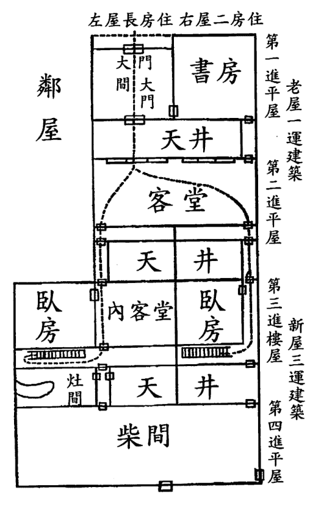

老屋一运建筑
第一进平屋
第二进平屋
新屋三运建筑
第三进楼屋
第四进平屋

左屋长房住 右屋二房住

邻屋

书房

天井

客堂

天井

卧房

内客堂

卧房

灶间

天井

柴间

## 玄空实例精析

二十四日病殁。观此二宅。可知宅命受克之凶危矣。

前一二
进壬
运兼
子午

后二三
进壬
运向
山丙

| 七 | 五 | 九 |
| 九二三八 | 二九一一 | 七四五六 |
| 山向 | 山向 | |
| 三 | 一 | 八 |
| 四七 | 六五 | 八三四七 |
| 二 | 六 | 四 |
| 五六七四 | 一一二九 | 三八九二 |

| 九 | 七 | 二 |
| 九二四 | 四二 | 九六 |
| 山向 | 山向 | |
| 五 | 三 | 一 |
| 六九 | 八七 | 一五 |
| 四 | 八 | 六 |
| 七八 | 三三 | 一五 |

育林出版社

育林出版社

一五三

一五二

# 玄空實例精析

### 剖析：

這家多人因病而亡的住宅，作者認為禍首是此間坎宅因向上門路得坤土仇星、灶壓艮方生起頑土助紂為虐所致。

書中介紹，前二進為一運建，是壬山丙向兼子午。其中，附有子山午向兼壬丙的飛星盤，在此不計。為方便分析，特另起一運壬山丙向兼子午的飛星盤。

| 7 4 九 | 2 9 五 | 9 2 七 |
| 8 3 八 | 6 5 一 | 4 7 三 |
| 3 8 四 | 1 1 六 | 5 6 二 |

一運壬山丙向兼子午

按此盤來看，大門在離宮，至二運時是當令山星二黑犯下水，且得宮位和向星九紫火生之助凶。二黑為坤卦，表病符；九紫為離卦，表擴展。可以斷定，此宅會有擴展蔓延之勢的疾病發生而損及人丁。

客堂處的門開在巽宮，向星雖是進氣四綠，可惜左輔山星七赤下水又促其與運星九紫合化，故以凶論。四綠為巽卦，表細菌、傳播；七赤為兌卦，表口肺、唾沫；九紫為離卦，表炎症、併發。這裏，預示了因肺部之疾而致多人感染的資訊。

至民國九年（即一九二〇庚申年），新建後二進，是壬山丙向。

長房住左屋，在內客堂的巽宮，此宮也是內客堂的門戶，納山星九紫和向星六白，《玄機賦》云：「火照天門，必當吐血」，這種死煞之氣的組合會得傷肺吐血之症。

## 第21例 榮巷某宅

育林出版社

一五五

育林出版社

一五四

# 玄空實例精析

再從長房所住臥房看，為甲山庚向，門在坤宮，納得七赤和二黑，更形象地說明瞭肺部患有疾病。而住右屋的二房，也同作此論。

| 9 4 二 | 5 9 七 | 7 2 九 |
| 8 3 一 | 1 5 三 | 3 7 五 |
| 4 8 六 | 6 5 八 | 2 6 四 |

三運甲山庚向

| 4 9 2 | 3 5 7 | 8 1 6 |

癸亥年五黃入中

事實上，在一九二三癸亥年逢五黃入中，流年飛星在動象處不但與原局向星犯反吟，而且中宮五黃飛至巽坤二宮更增其凶性。所以，這二宮所主之飛星和地支的四人在此年全部病亡。

至於這四人死於何病，書中沒有寫明，但在一九二六丙寅年作者去勘宅時，『長房只存一子，已患肺癆病多年』，這肺癆或許是這四人共同患有並致命的禍根。

肺癆，現代醫學上稱肺結核病，是由結核桿菌引起的肺部感染性疾病。它是一種慢性病，感染後並不一定會發病，即使發病也不會立即有症狀，通常是隔了幾個月、幾年、甚至於幾十年後才發病，是造成死亡人數最多的單一傳染病。它主要以空氣為傳染媒介，也就是所謂的飛沫傳染，當傳染性肺結核病人咳嗽或打噴嚏時，含有結核菌的痰液變成飛沫散佈到空氣中，正常人吸入後，結核菌便有機會在肺部

第21例 榮巷某宅

育林出版社

一五七

育林出版社

一五六

# 玄空實例精析

繁殖，使肺部受到感染。尤其是经常和肺结核病人有密切接触的人，最容易受到传染。

故而，从二运起全家就受病魔纷扰，至三运更是人丁稀落。

自古，就有『易医是一家』的说法。《黄帝内经》也云：『夫自古通天者，生之本，本于阴阳。天地之间，六合之内，其气九州、九窍、五脏、十二节，皆通乎天气。其生五，其气三，数犯此者，则邪气伤人，此寿命之本也。』

这是黄帝在告诉大家：自古以来，都以通于天气为生命的根本，而这个根本不外天之阴阳。天地之间，六合之内，大如九州之域，小如人的九窍、五脏、十二节，都与天气相通。天气衍生五行，阴阳之气又依盛衰消长而各分为三。如果经常违背阴阳五行的变化规律，那麽邪气就会伤害人体。因此，适应这个规律是寿命得以延续的根本。

经中又云：『上工取气，救其萌芽。』是在说高明的医生会根据人身的气机运行状态，把疾病治疗在萌芽阶段，这是中医治未病的观点。

天体星气与地球磁场相互作用所产生的气场，即俗谓的『风水』会对人的健康、性格，乃至命运起着重大影响。可以毫不夸张地说，通过调理风水的阴阳二气是可以达到预防疾病、减少病痛、早日康复的功效。

所以，研究和开发这一课题尤为重要和迫切，它的现实意义在于，如果能提前从阳宅风水上进行调理，防微杜渐，就能在一定程度上预防或减少伤病等灾难的发生，或许还可解决目前中、西医都难以应对的奇难杂症、绝病恶症的问题。

如此，风水学则成了名副其实的预防医学。

## 第21例 荣巷某宅

育林出版社

一五九

育林出版社

一五八

## 第22例 城内大河上汪宅

一進三間，三運丙山壬向，癸亥年遷入。左房為上元庚子生（男丁）一白水命臥室，內門在坤宮，按是間居艮震二宮土木相克之方，一白水命原不宜居此，更加坤方氣口二黑土來克水。民國十四年乙丑，年白三碧入中，九紫火到坤，生起二黑凶土。立秋後月白八入中，五黃土又到坤宮氣口，二黑土至艮宮楊位，一白水重重受克，庚子生人，遂重病不起。右房上元甲辰生（男丁）六白金命臥室，乙丑秋間住入，內門闢在巽宮，適值九六火金相克，不利六白命宮之人，且主血症。丙寅年，年白二黑入中，一白水到巽，正月起，甲辰生人即患吐血症。三月加重，因月白九入中，八土到巽，土克水，水克火，火克金，所謂重重克入者此也。《元空秘旨》：『重重克入，主立見死亡』，幸

八土是吉星，且生扶六金，故尚無礙。倘六九月五二凶土飛臨，恐凶禍不免，餘囑其馬上遷居避之。

| 6 9 二 | 2 4 七 | 4 2 九 |
| 5 1 一 | 7 8 三 | 9 6 五 |
| 1 5 六 | 3 3 八 | 8 7 四 |

三運丙山壬向

# 玄空實例精析

## 第22例 城內大河上汪宅

剖析：
書中講，左房為上元庚子生男丁一白水命臥室，內門在坤宮，按是間居艮震二宮土水相克之方，一白水命原不宜居此，更加坤方氣口二黑土來克水。右房是上元甲辰生男丁六白金命臥室，乙丑秋間住入，內門辟在巽宮，適值九六火金相克，不利六白命宮之人，且主血症。
這種以命卦結合宮位、向星之五行來論生克的方法是否可取，在此，我不作評論，通過按飛星學理逐一分析後，再由讀者自己來定論。
此宅是一九二三癸亥年遷入，次年即跨入中元四運。這戶汪宅為何只有一九○○庚子和一九○四甲辰年出生的二位男丁生病呢？
一般情況下，住宅風水所呈現的吉凶之象不可能應驗到每一位居住者，正因如此，才有『凶宅照樣有人應吉，吉宅也會有人發凶』的現象。

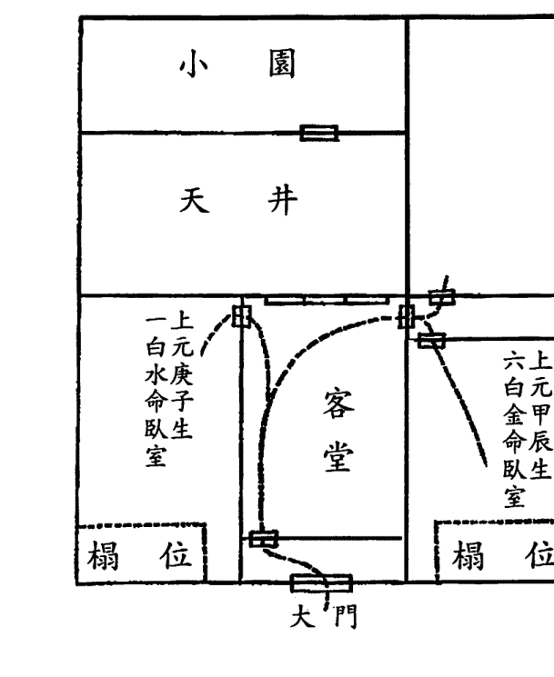

育林出版社

一六三

育林出版社

一六二

# 玄空實例精析

貧病交加之寒戶卻出了位狀元才子，富貴顯達之豪宅反出了個敗家子女，這在現實生活中是屢見不鮮的。

對這種現象，庸偽之師往往以『逆境所迫』或『無福消受』來予以搪塞。並且，當許多事象無法以自己的淺識歪論作出解釋時，就以『人的命運禍福與宅的風水吉凶存有相異結果』來欺騙客戶。

殊不知，風水吉凶與命運好壞的資訊是同步的，而且風水的吉凶會對命運的好壞產生波動影響。換句話說，明師可以僅僅根據住宅風水的好壞和所居之人的出生年份就可直接判斷出各自的人生際遇。

當然，僅憑風水要準確地斷准吉凶事象會應在家中某個人身上是有一定難度的，這可作為檢驗風水師功力的一個衡量標準。

接下來，先從大門入手。按進屋後的第一立極處看，大門所納山向飛星皆是退氣三碧，此處雖然空間較小，但畢竟是總氣口，不能忽略。

## 第22例 城內大河上汪宅

庚子年生的男丁，為一白水命，住在左邊東北位的臥室。此室以略。此處把艮宮變成山星樞紐下水，這是傷及人丁的一個重要因素。再看，坎宮和艮宮皆屬陽性，其中的飛星全是陽性。由此可以斷定，所傷之人必是男性，而且是年輕人。

那麼，如何把吉凶事象對應到某人的身上呢？

這很簡單，只要知道人的出生年份，結合宮位的顯象就行。

| 9 4 二 | 5 9 七 | 7 2 九 |
|---|---|---|
| 8 3 一 | 1 5 三 | 3 7 五 |
| 4 8 六 | 6 1 八 | 2 6 四 |

三運甲山庚向

育林出版社

一六五

育林出版社

一六四

# 玄空實例精析

客堂承氣處看是納進氣山星六白和左輔向星九紫。以臥室看是甲山庚向，門在丁位納左輔向星九紫（注：若在坤宮，也是納右弼向星二黑）；床在坎宮納進氣山星六白。按理皆是吉論，為何卻會重病不起呢？

有道：「千斤門樓四兩屋」，內室雖吉外門凶，凶多吉少。此人肖為子，命卦一白，剛好全對應在坎艮二宮，故難逃傷身厄運。

甲辰年生的男丁，為六白金命，住在右邊西北位的臥室。此室是

| 9 6 二 | 4 2 七 | 2 4 九 |
| 1 5 一 | 8 7 三 | 6 9 五 |
| 5 1 六 | 3 3 八 | 7 8 四 |

三運壬山丙向

壬山丙向，門在巽宮納左輔山星九紫和進氣向星六白，由於左輔之力遠勝於進氣，且此向星又被洩克，已是虛有其力。可知，此門的飛星組合正好對應《玄機賦》中：『火照天門，必當吐血』，主有傷肺吐血之症。此人肖為辰，恰在臥門巽宮，床又處於衰位，病發之年山星與歲星還成反吟，故必受其殃。

相較之下，前者更凶，因此，病發時間和症狀都是前者為早及重。二人病發時間分別在一九二五乙丑年和一九二六丙寅年，這二年的地支均屬艮宮，甚為確應。

作者告之馬上遷居才可化解病災，否則仍凶禍難免。其實，此宅總體來說還是不錯的，客堂的巽宮和離宮分別納左輔九紫和當令四綠，且此處又有天井來引通生旺氣。所以，只要作小小調整必可許以人財兩旺。

第22例 城內大河上汪宅

青林出版社

一六六

一六七

## 第23例 雪堰橋吳宅

巽山乾向，三運民國九年庚申建築，三間一進樓屋。宅前有橫河，被草屋遮蔽，樓下總氣口，挨著廉貞惡土。癸亥年太歲到向，宅主病亡。長子上元甲申生，八白土命，住於樓上右邊一間，房門在坎宮，適逢九七火金相剋，應主血症及肺肝等疾。壬戌年太歲臨向，年白六入中，七赤到向，二黑到樓上右房氣口，長子血症身亡。長孫左目失明，次孫雙目俱盲（從肝疾上致盲），至乙丑年病夭。次子臥左房，亦患吐血症，已歷數載。按向首廉貞，在失運時，原主凶惡多病。樓上右房氣口九七相剋，原主血症。更來流年二黑病符助之，再加上流年破軍飛臨，凶勢猛烈，自然凶禍難逃。左房氣口在震宮二黑病符上，自應疾病纏綿。補救之法，宜將兩室私門，移置離宮，承接輔

星吉氣，庶可凶禍永免。

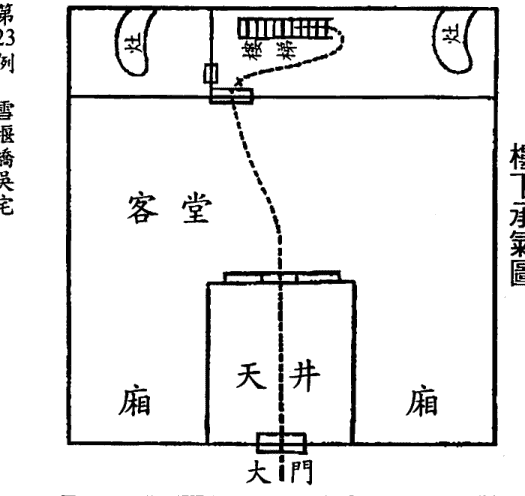

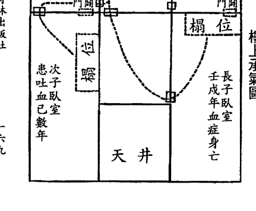

第23例 雪堰橋吳宅

育林出版社

一六九

育林出版社

一六八

## 第23例 雲堰橋吳宅

剖析：

三運的巽山乾向，從飛星盤上看，運星與山向飛星成一二三、二三四、三四五、四五六、五六七、六七八、七八九、八九一、九一二這九種組合，風水上稱為『連珠三般卦』。由於每一宮的飛星都呈連珠之勢，往往在形氣上很難做到相契，以致有人財兩難全的遺憾。

| 1 3 二 | 6 8 七 | 8 1 九 |
| 9 2 一 | 2 4 三 | 4 6 五 |
| 5 7 六 | 7 9 八 | 3 5 四 |

三運巽山乾向

此宅大門在乾宮，山星是當令三碧，向星是進氣五黃（也可視為生氣四綠），門外有橫河，致使當令的三碧山星犯下水，註定會有損丁的凶事發生。

好在宅前有草屋遮蔽，可起到減緩凶性的作用。但是，這戶才一九二〇庚申年建的房子，在短短不到五年之內，竟然連死三個男丁，不死的也是一個目瞎，另一個吐血。

可以推測，能造成如此凶象一定在風水上還犯有其他大忌，讀者不妨再細思下，或許會找到不利人丁的主因。

育林出版社

一七一

育林出版社

一七〇

長子住右邊的這間是坤山艮向，房門在艮宮納山星六白和向星九紫，為死煞之氣，六白為乾卦，主肺；九紫為離卦，主血、目。

| 1 5 二 | 5 1 七 | 3 3 九 |
| 2 4 一 | 9 6 三 | 7 8 五 |
| 6 9 六 | 4 2 八 | 8 7 四 |

三運坤山艮向

次子住左邊的這間是乾山巽向，房門在震宮納山星二黑和向星九紫，為死煞之氣，二黑為坤卦，表病；九紫為離卦，主血。

| 3 1 二 | 8 6 七 | 1 8 九 |
| 2 9 一 | 4 2 三 | 6 4 五 |
| 7 5 六 | 9 7 八 | 5 3 四 |

三運乾山巽向

同居一宅的長房和次房，為何凶禍多發生在長房這邊呢？

因在乾宮的大門是山星三碧，三碧為震卦，表長男，主肝膽；乾宮屬乾卦，表老父，指宅主。再根據樓上的房間看各自的乾宮，長房

## 第23例 雪堰橋吳宅

育林出版社

一七三

育林出版社

一七二

這間是左輔山星八白、死氣向星七赤；次房這間是進氣山星五黃、當令向星三碧。

比較之下，一眼就能看出最不利長房，結果是一九二二壬戌年長子病亡，一九二三癸亥年父親病亡，一九二五乙丑年長房的次子病夭，及長房的長子左目失明。

讀者可曾想到，從一九二四甲子年起進入中元四運，乾方大門時來運轉變成生旺之氣，且又吸納零神吉水，按理應該開始轉禍為福了。

為何還會有長孫失明、次子血症，甚至次孫夭亡的凶禍發生呢？

這固然與各自的房間也有關連，但最為致命之處還是那個主因。

於當時來講，臨河建宅是為了方便洗滌和出入。現在，許多成功人士為享受旖旎風光，將住房選建在河湖邊上，房地產開發商也大力引用『水主財』的風水用語作為廣生行銷並以此抬高房屋售價。其實，

風水是很辯證的一門學問，水既是催財運、旺文昌的吉水，亦可應血光之災、官非之爭、淫邪之亂的禍水，此例就是『水亦主血』的佐證。

## 第23例 雪堰橋吳宅

育林出版社

一七五

育林出版社

一七四

## 第24例 榮雪梅先生住宅

雙開間三進，前二進平屋，後一進樓屋。三運建築，壬山丙向兼子午三分，大門在坤上，門前有大池塘。元空五行，坤方四二交會，『元空秘旨』云：『山地被風吹，還生風疾』，是故入宅後，主人即患風木症，逐年加重。查宅主上元癸酉生，一白水命，其臥室在第三進樓下震艮土水相克之方，不利一白水命，而偏偏住在該處。臥室私門在坤方，所得星辰與大門同（坤上四二一，最怕大泄助凶，更逢外戶、私門，均承是氣，故宅主臥室，風疾難逃。而宅主復值一白水命，住於一白受克之方，故一白命人獨得風疾。又四為三運生氣，四運旺氣，故其家財運甚佳）。民國十四年乙丑，年白三入中，九火到坤，將巽木化成黑土病符，病益沉重，漸失知覺。丙寅年二土入中，五土至艮宮榻位，八土至坤宮氣口，九火至震宮臥室（助五土克水）。一白水受克太甚，病更加重。餘在丙寅仲春見之，囑其移居右室（即內客室），惜病入膏盲，已難挽回。七月五土入中，八土至艮，九火至向（生向首二黑土），二土至坤，病遂不起。

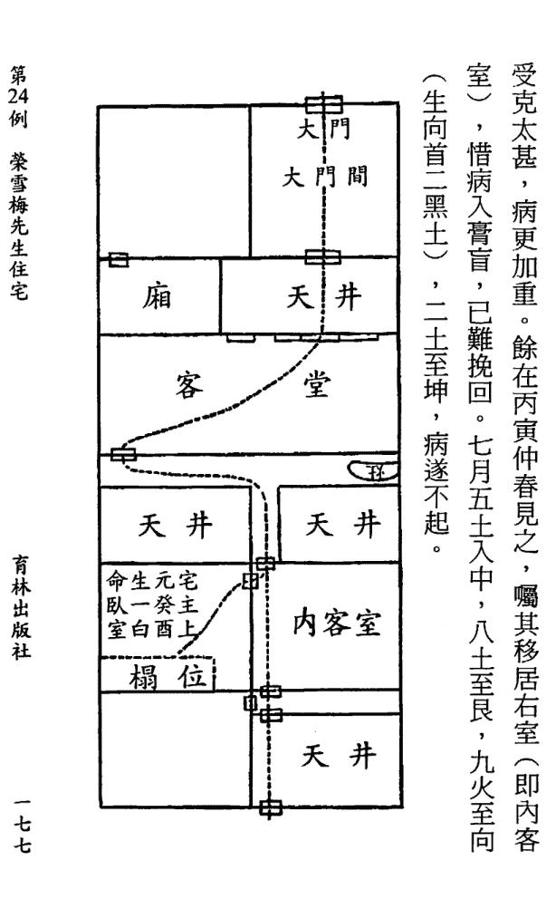

剖析：

不少讀者看到這個案例時，一定會對書中所附的飛星盤產生疑惑，因為三運壬山丙向兼子午三分的正確飛星盤應該是：

| 9 6 二 | 4 2 七 | 2 4 九 |
| 1 5 一 | 8 7 三 | 6 9 五 |
| 5 1 六 | 3 3 八 | 7 8 四 |

三運壬山丙向

可書中所附的那個飛星盤卻非替卦，而是下卦。在此，讓我姑且先按下卦來予以分析。

| 8 8 二 | 3 4 七 | 1 6 九 |
| 9 7 一 | 7 9 三 | 5 2 五 |
| 4 3 六 | 2 5 八 | 6 1 四 |

三運壬山丙向兼子午

大門在坤上，門前有大池塘，坤方山星二黑與向星四綠交會，入住後宅主即患風濕癱木症。

作者的解說明顯違背風水學理，因為坤宮的山向飛星和大門池塘的配置完全符合收山出煞，非但無凶，反而表明在三運和四運時財運

## 第24例 榮雪梅先生住宅

育林出版社

一七九

育林出版社

一七八

都是很好的。

合理的解釋應為：大門開在離宮，此宮納生氣山星四綠和退氣向星二黑，如此形氣顛倒才合乎《玄空秘旨》中：『山地被風，還生瘋疾』之應。四綠為巽卦，表風象、手腳；二黑為坤卦，表肌膚、病符，而門外的池塘之水，使風濕癱木症更為加劇。

為什麼一個大門竟然有開在坤位和離位的差別呢？

究其原因，乃是立極點處在不同的位置。作者沒有考慮到在大門間立極，而將立極點設在客堂，故認為門是開在坤宮。其實，只有在這二處都立極，才能得出旺財傷丁的結論。

再看，在客堂通向後邊天井的艮方之門，納得進氣山星五黃（因通中宮之氣，也可說成是左輔山星八白）、煞氣向星一白，可見此處設門當以凶論。八白為艮卦，表關節、阻塞；一白為坎卦，表氣血、

水。

運行，主四肢關節由於氣血不暢、寒濕痺阻而致病。

分析完下卦，再回過頭來分析替卦。

按大門間立極，大門開在離宮，此宮納當令山星三碧和生氣向星四綠。

按客堂裏立極，大門開在坤宮，此宮納煞氣山星一白和死氣向星六白。後門開在艮宮，此宮納生氣山星四綠和當令向星三碧。

綜上可知，門外的池塘既是催發財氣的吉水，也是罹患疾病的禍水。

生何疾病？何人生疾？可從這三個宮位的飛星組合推導出來。

三碧為震卦，表走動、肢節；四綠為巽卦，表風象、手腳；一白為坎卦，表氣血、寒濕；六白為乾卦，表神經、骨骼。從卦意中，可得出會有人患風濕癱木症的病狀。

## 第24例 榮雪梅先生住宅

育林出版社

一八一

此局全盤山星與運星犯反吟，山主人丁，其所合的運星可表所主之人。從替卦盤中可知，離宮運星為七赤，表兌卦，含酉支；艮宮運星為六白，表乾卦，主老父。而宅主正好是1873 癸酉年生，故病在其身。

可能是作者只會以命卦結合宮位、飛星之五行生克來定人吉凶，對於這例若以下卦來看是謂巧合，倘以替卦來論就無法自圓其說。

作者恐怕更無法解釋，此例至四運時，離宮向星四綠由生氣變為旺氣，坤宮向星六白由死氣變為進氣，又門前的池塘起到助吉作用，按理步入四運後（即從一九二四年起）應病去福增才對。

事實是，宅主的病況非但不見好轉，反而更入膏盲。

由此，不難想像作者為什麼明知是替卦卻以下卦論以及省去在客堂立極的分析。現在，就讓我來解開在四運不利人丁的風水原因。

因為，坤宮一入四運就使山星一白成為樞紐，且其又把向星六白合化成水，主老父有病災。

下面，僅以坤艮二宮結合流年論吉凶。

| 2 | 7 | 9 |
|---|---|---|
| 1 | 3 | 5 |
| 6 | 8 | 4 |

乙丑年三碧入中

一九二五乙丑年是三碧入中，流年飛星九紫和六白分別與原局山星一白和四綠成反吟，因此病症加重，漸失知覺。

## 第24例 榮雪梅先生住宅

育林出版社

一八三

育林出版社

一八二

| 1 | 6 | 8 |
|---|---|---|
| 9 | 2 | 4 |
| 5 | 7 | 3 |

丙寅年二黑入中

一九二六丙寅年是二黑入中，流年飛星八白與原局六白、一白五行相生更促其凶，流年飛星五黃與原局四綠、三碧構成三般卦尤增凶性，故而病入膏肓，癱瘓不起。

由此可見，這例坐向與星盤不合是因作者學識尚淺所致。表面上看，作者給人一種極不負責任隨意改造的印象，但我要說的是，作者在做學問時還是很嚴肅認真的，雖然以其當時所掌握的學理還不會用替卦分析，但其仍能注明是兼向，這樣一則沒有愚弄後學，二是為我們提供了一個研究的機會。

不象那些鳴名之師，所出著作要麼東剽西竊、抄襲成風，要麼隨意捏造、無中生有。從這方面講，尤公還是值得後學尊敬的，至少，他給了我們一個研究學習的範本。通過上述的分析比較，不是正好給了讀者一個提高認識的學習機會。

有人在看風水過程中，當無法取捨時往往先『憑星斷事』再進行調整佈局。這個案例說明，斷事有巧合偶中性，這種方法是不能成為衡量操作技法是否正確的惟一標準。要區別對錯還有另一方法，即是在大廳和卧室同時佈置動象較大的流水裝置就可立見真偽。

作為風水師，在為人堪宅時要做到斷事準驗、調理有效，則必須以過硬的技術水準、淵博的學識素養、豐富的實戰經驗為根本前提方為妥當。

## 第24例 榮雪梅先生住宅

育林出版社

一八五

育林出版社

一八四

## 第25例 洞庭東山孫康如先生宅

石橋頭孫宅，三運民國七年戊午建築，丑山未向，入宅後全家病魔纏繞，剋雜無已。主人屢請各地堪輿名家設法補救，均莫衷一是。有囑其遷居者，有主張改闢兌門者（在右廂兌宮二黑上闢門）。餘於丙寅仲夏，應友人之約，至洞庭，承友人囑代補救，因將其致病理由及補救方法，詳列於後，藉資研究。

按坐艮朝坤之宅為艮宅，宅命屬土，以火為恩星，木為仇星。該宅大門終年關閉，平時出入，皆在離宮便門，是方挨著元空五行向星巽木，適為艮宅仇星，剋制宅命，此為剋雜多病一因。便門巽木，在三運為生氣，至四運為旺氣，生旺二氣，皆主財運亨通，惟與山星坤土會合，坤為老母，受剋於巽木，主宅母不利，此為剋雜多病二因。

主人上元同治十一年壬申生，二黑土命，便門四二木土相剋，不利宅主，此為剋雜多病三因。向首六白乾金，與便門四綠巽木相剋，木為肝，受金剋，肝疾不免，此為剋雜多病四因。後戶佈著三碧震木，路由便門引入，至震宮折入後戶，震上佈著七赤兌金，金來剋木，肝氣之病必矣，聞夫婦連年均患肝氣痛症，此為剋雜多病五因。樓上左臥室（夫婦先居此室），私門在兌方，佈著二黑坤土，在二運得之為旺神可以發福，在失運遇之為病符，氣口得此，無論何命宮，逢年月二、五、七、九惡曜到時，不免疾病，此為剋雜多病六因。後夫婦移居右室，私門在離宮四二木土相剋之方，不利主婦及主人二黑土命，此為剋雜多病七因。有此七因，自然疾病連綿，剋雜多端。補救之法，宜速閉離上便門，在坎宮另闢新戶出入，取五黃戊土，扶向首乾金，壯宅命艮土。且今交四運，五黃為生氣，斯戶一舉三得，不難百福駢

第25例 洞庭東山孫康如先生宅

育林出版社

一八七

育林出版社

一八六

臻，千祥云集也。楼上私门，宜一列承坎气，惟一白命人不宜居此宅。

| 7 8 二 | 2 4 七 | 9 6 九 |
| 8 7 一 | 6 9 三 | 4 2 五 |
| 3 3 六 | 1 5 八 | 5 1 四 |

三运丑山未向

育林出版社

育林出版社

## 第25例 洞庭東山孫康如先生宅

育林出版社

一九一

剖析：

石橋頭孫宅於一九一八戊午年建築，為丑山未向，入宅後全家病魔纏擾。於是，延請各地風水名師均莫衷一是，沒法補救。直至一九二六丙寅年仲夏，作者應友人之約為其勘宅，並列出了七個致病理由。可是，依我拙見認為其分析難脫牽強附會、說理空洞無力。下面，就對此作一細評。

病因之一：按坐艮朝坤之宅為艮宅，宅命屬土，以火為恩星，木為仇星。該宅大門終年關閉，平時出入，皆在離宮便門，是方挨著元空五行向星巽木，適為艮宅仇星，克制宅命。

作者認為是離宮便門所納的向星四綠木克制坐方艮土，毫無疑問這是錯誤的觀點。

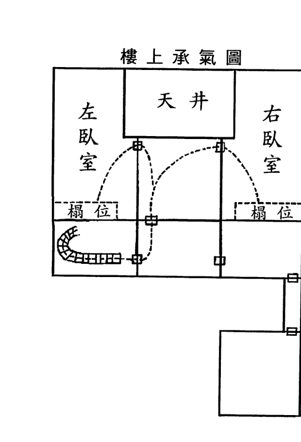

育林出版社

一九〇

試看，在七運期間所建的子山午向、癸山丁向的坎宅，大門開在左右二邊的多是聯排或別墅，按此理，門開在左邊巽宮納向星一白水為吉論，開在右邊坤宮納向星八白土為凶論，事實是巽宮開門在七運時主生凶象，至八運後才無凶趨吉；坤宮開門在七運時財丁兩旺，至八運後卻吉中有瑕。

| 4 1 六 | 8 6 二 | 6 8 四 |
| 5 9 五 | 3 2 七 | 1 4 九 |
| 9 5 一 | 7 7 三 | 2 3 八 |

而大門開在居中的則多農村樓房，按其說，門開在中間離宮納向星六白金作大吉論，實際是此處開門在七運時亦主凶象，至八運後卻轉凶為吉。

從上可知，住宅坐向的宮位與大門所納的向星之間的五行生克制化與吉凶應象並無直接關聯，既不因相生、比和以吉論，也不因相克就為凶。住宅的吉凶轉變實是因為天時流轉致氣運發生盈虛消長的變化，從而使氣場有了旺衰的改變，這才是看風水的根本法則，也是推斷吉凶的關鍵所在。

病因之二：便門巽木，在三運為生氣，至四運為旺氣，生旺二氣，皆主財運亨通，惟與山星坤土會合，坤為老母，受克於巽木，主宅母不利。

離宮所納向星四綠木為生旺之氣，山星二黑土為退煞之氣，開設便門合乎收山出煞，何來木土相克之論？再說，若真按生克來論，為

第25例 洞庭東山孫康如先生宅

育林出版社

一九三

七運子山午向、癸山丁向

育林出版社

一九二

何不說宮位離火可以通關去生土？山星與運星是二七合化為火又生土呢？

以上分析，宅母應有利無凶。蓋因此便門只作暢通氣流之用，不能視為全宅氣口。

病因之三：主人上元同治十一年壬申生，二黑土命，便門四二木土相剋，不利宅主。

既然病因之二不能成立，那麼這個觀點同樣不能成立。

病因之四：向首六白乾金，與便門四綠巽木相剋，木為肝，受金剋，肝疾不免。

已知該宅坤宮大門終年關閉，其力可忽略，如此又怎能論及大門六白與便門四綠的金木交戰呢？假如成立，那麼病因之三也就有理可據了，坤宮大門在三運時向星納六白死氣，至四運為山星九紫下水，

而主人為壬申生人，申爻在坤宮，故於宅主多病一事不也找到根源了。

再者，常走的便門所納是生旺之氣四綠，關閉的大門所納是退煞之氣六白。有道：『一旺抵百煞』，此旺木能被弱金剋制住嗎？

病因之五：後戶佈著三碧震木，來路由便門引入，至震宮折入後戶，震上佈著七赤兌金，金來剋木，肝氣之病必矣，聞夫婦連年均患肝氣痛症。

來路和後戶論宮位是三八合木，山星也三八合木，運星為一六合水，向星又三七合十，而且三碧是當令旺氣，為何捨棄相合卻言生剋呢？倒不如說，是一水生二木而使木氣過盛更為貼切。

病因之六：樓上左臥室（夫婦先居此室），私門在兌方，佈著二黑坤土，在二運得之為旺神可以發福，在失運遇之為病符，氣口得此，無論何命宮，逢年月二、五、七、九惡曜到時，不免疾病。

## 第25例 洞庭東山孫康如先生宅

育林出版社

一九四

一九五

作者僅根據房屋坐向排得的飛星盤就通用到整個宅體和宅內各室，這已經違反了『物物一太極，宮宮一乾坤』的原理。

病因之七：後夫婦移居右室，私門在離宮四二木土相剋之方，不利主婦及主人二黑土命。

讀者對這二個臥室的立極，認為一個門開兌位，另一個門開離位。經過測量，左邊臥室的門是介於兌乾二個宮位之間，而右邊臥室的門應該全部開在巽宮之中，顯然，作者的分析於理不合。

其實，這戶家人得肝疾的主要原因是山星四綠下水與入囚所致。

此宅當以戌山辰向看，氣口在巽宮納山星五黃（可通中宮四綠），山星四綠在三運時為生氣，至四運是旺氣，此處統全宅之力的氣口使山星犯下水，四綠為巽卦，主肝氣。尤其從四運起，向星三碧變為退氣更助凶性。《飛星賦》云：『寒戶遭瘟，緣自三廉夾綠』，故而，全家人遭肝氣傳染致病。

| 5 3 二 | 9 7 七 | 7 5 九 |
| 6 4 一 | 4 2 三 | 2 9 五 |
| 1 8 六 | 8 6 八 | 3 1 四 |

三運戌山辰向

## 第25例 洞庭東山孫康如先生宅

育林出版社

一九七

育林出版社

一九六

# 玄空實例精析

| 3 5 二 | 7 9 七 | 5 7 九 |
| 4 6 一 | 2 4 三 | 9 2 五 |
| 8 1 六 | 6 8 八 | 1 3 四 |

三運辰山戌向

右邊臥室以戌山辰向看，門開在巽宮，所論吉凶與前面的氣口相同。左邊臥室以辰山戌向看，門介於兌宮二黑與乾宮三碧之間，在三運時有病相兼，尚有氣機。至四運則病氣充塞，了無生氣。所以，從左室移居右室實是從這個火坑跳入另一個火坑。

由此可知，看風水不重說理多少，而是貴在精準。一語中的的方顯風水師的深厚功力。

## 第26例 前州沈宅

亥山巳向，四運民國十四年乙丑十二月建築（十二月初七日醜時上樑），宅後正中乾上鑿一糞坑，經云：「乾為天門莫作坑」，主傷宅主。三合法以西北為乾，鐵板不移。元空法之乾則無定位，四正四隅位位可以稱乾，是宅元空五行。山上龍神適六白乾金到坐山，是乾方復值乾金飛到，乃真真之乾也。乙丑臘月完工，入宅，丙寅正月，宅主即病，延至六月而歿（宅主上元同治八年己巳生五黃土命）。

剖析：

這個案例中的宅主之所以病死，既有外局影響也有內局原因。可惜作者沒有對室內進行分析，而陳雪濤先生在其撰寫的《星運佈局》中特意對此例作了補充解說，摘錄如下：

| 4 4 三 | 9 8 八 | 2 6 一 |
| 3 5 二 | 5 3 四 | 7 1 六 |
| 8 9 七 | 1 7 九 | 6 2 五 |

四運亥山巳向

宅主上元同治八年己巳年生，為二黑土命。由坤方入屋，該處為62，為生入，吉，可主進財。

路由坤至兌，入中宮，至震方上樓。為水法之六白入宅，生一白水，水生中宮三碧，克五黃煞。由五黃上樓，至三碧經一白入室。樓上小玄空，為26，二黑入房，睡於71與98宮位。所睡之處亦適地下之53與35之位置。重重五黃疊起，又有流年九紫助虐，故釀疾堪傷。

依筆者拙見，此宅坐方有糞坑，且在乾位，是不利宅主的第一個資訊。

坐山乾宮納進氣山星六白、煞氣向星二黑，糞坑為池，而六白為乾卦，表父親；二黑為坤卦，表病符，主宅主有病，這是第二個不利資訊。

大門開在離宮，納得左輔山星九紫、死氣向星八白，必有損丁凶象。山星九紫與巽宮山星四綠相合，而宮星所主為辰巳二支，恰好宅主又是一八六九己巳年生人，這是第三個宅主難逃厄運的資訊。

| 4 4 三 | 8 9 八 | 6 2 一 |
| 5 3 二 | 3 5 四 | 1 7 六 |
| 9 8 七 | 7 1 九 | 2 6 五 |

四運巳山亥向

再看，樓上臥室為巳山亥向，兌宮之門和坎宮之床都納死煞之氣一白和七赤。可見，所榻之處皆是一片死氣，這是第四個不好的資訊。

正是這四種不好的資訊組合在一起，才導致宅主在次年因病而亡。

## 第27例 蓉湖莊某堆棧

某堆棧公事房，乾山巽向，二運建築（二運入宅開業，三運換主，宅內未斷人跡）。三運間生涯隆盛，年有盈餘，按元空五行向首雖承二黑衰氣，惟外戶吸到震宮最有力之三叉旺水，內室眠房辦事處門路在震方引進三碧旺氣，宜其發祥於三碧運矣。交四運，三碧衰退，甲子、乙丑以來，連年虧耗（乙丑立秋後發生命案，致口舌破財）。統觀全局，四運無發展希望，丙寅（民國十五年）仲春，某地師為其改辦事室於左屋，雖能吸引離兌二宮六八吉氣，然宅外衰水環繞，小吉敵眾凶，何異螳臂當車。餘囑主人仍移辦事室於原處，將公事房屋頂改造，則八方星辰更換，衰死之氣一變而生旺全收，四運希望，由此更勝三運也。

剖析：

| 4 2 一 | 8 6 六 | 6 4 八 |
| 5 3 九 | 3 1 二 | 1 8 四 |
| 9 7 五 | 7 5 七 | 2 9 三 |

二運乾山巽向

這間堆疊公事房於二運時建成開業，在三運期間雖換主但生意一直興隆，可惜一入四運卻發生命案致口舌破財。

同樣的房子，由於時間的流轉會使氣運發生消長興替的變化，從而產生迥然不同的吉凶際遇。就是說，同一個地方，因元運之變遷，其吉凶的顯示也隨之變化。通常所講的「風水輪流轉」，正指此意。

接下來，就分別對三運與四運的理氣旺衰進行解析。

在三運時，巽門納向星二黑退氣、山星四綠生氣，看似不妥，實無大礙，這是外局震方的三叉水起了主要作用的作用。按玄空學理震方是正神方見水，本應以凶看，幸好此方值當令向星三碧飛至，且震方是城門位尤宜見水，故能生意興隆、年有盈餘，乃正神水氣之功。

至於山星下水，因吉多凶少兼且還宮復位，此不利人丁的主要表現是換主頻繁、員工流動罷了。

一入四運，巽方是正神，有水流過，大門在巽宮納當令山星四綠；艮方有大水，為左輔山星九紫下水；原本最為吉利的震方也變得時乖運蹇。因而，進入此運立馬虧耗，在乙丑年就發生命案致口舌破財。

看風水就是通過對住宅加以調理和催旺後，達到轉禍為福、避凶趨吉之效。對這間凶宅，風水師又該如何來調整化解呢？

書中寫到，某地師為其改辦事室於左屋，雖能吸引離兌二宮六八吉氣，然宅外衰水環繞，小吉敵眾凶，何異螳臂擋車。餘囑主人仍移辦事室於原處，將公事房屋頂改造，則八方星辰更換，衰死之氣一變而生旺全收，四運希望由此更勝三運也。

| 4 4 三 | 9 8 八 | 2 6 一 |
| 3 5 二 | 5 3 四 | 7 1 六 |
| 8 9 七 | 1 7 九 | 6 2 五 |

四運乾山巽向

這間以外局水氣來論吉凶的公事房，僅靠內局調整是不起多大作用的，好在通過「改換天心」之法可使新整理氣與外局形勢相符合。

## 第28例 無錫西倉橋協興順魚行

三運建築，卯山西向。三運內開設魚行，生意甚興，惟經濟終感困難，前後連更五主，皆負債累累，失敗而去。按向首雖得祿存旺氣，無如坐山水裏，七赤凶金剋制，故經濟常覺不能過轉。艮宮由西門吊橋衝來急流，遇二黑衰星所在，主要辦事處吸足衰死之氣，向首一吉，不敵眾凶，是故連戰連敗。又坐山水裏七三金木相剋，故前後五主，皆患肝氣痛症。

剖析：
這家魚行，雖然是當令向星三碧飛至向首兌宮，當令山星三碧飛至坐山震宮，可惜坐山方是流水較急的河，一則使氣難以收蓄，二則使山星犯下水。

| 2 6 二 | 6 1 七 | 4 8 九 |
| 3 7 一 | 1 5 三 | 8 3 五 |
| 7 2 六 | 5 9 八 | 9 4 四 |

三運卯山酉向

> 《雪心賦》云：「水口則愛其緊似葫蘆喉」，又云：「蕩然直去不關攔，必定逃移並敗絕」。可是，觀其水勢是來似葫蘆喉，去象喇叭口，且蕩然直瀉，這種水法主財氣不蓄、人員不聚之象。

坐山震宮的山星三碧犯下水，三碧為震卦，主肝膽，故而會有連更五主及患肝氣痛症。

再按辦事室看，為午山子向。

| 8 7 二 | 3 3 七 | 1 5 九 |
| 9 6 一 | 7 8 三 | 5 1 五 |
| 4 2 六 | 2 4 八 | 6 9 四 |

三運午山子向

門開在艮宮，納生氣山星四綠、退氣向星二黑，而且山星四綠與運星六白成反吟，四綠為巽卦，主帳單、風氣、肝疾；二黑為坤卦，主出錯、陰暗、眾多；六白為乾卦，主領導、管理、金錢。這種向星納退氣、山星又反吟的組合，主領導顢頇多病、管理雜亂無序、帳目收支不明、員工損公肥私的混亂狀態。

所以，該魚行從外象看生意甚興，實質已是入不敷出、舉步維艱，雖連更五主，亦難挽頹敗之勢。

## 第29例 石塘灣潘宅

二運建築，丁癸兼午子山向，宅命屬火。來路在艮宮，得元空五行向星巽木，為離宅恩星。向首得巨門旺氣，二黑運內財運大佳。交三運退財，主房在樓上，房門在乾方，值六七會合，所謂交劍煞也。不利小口，生四男二女，祇存一女，均是臘脹夭折，又有墮胎數起。

| 5 8 一 | 1 3 六 | 3 1 八 |
| 4 9 九 | 6 7 二 | 8 5 四 |
| 9 4 五 | 2 2 七 | 7 6 三 |

二運丁山癸向兼午子

剖析：

《玄空秘旨》云：「健而動，順而動，動非佳兆；止而靜，順而靜，靜亦不宜。」意思是說，生旺向星宜在動處催福，生旺山星宜在靜處助吉，當同處一宮的山向飛星皆為生旺時，若逢陽動或陰靜的形局，都會吉凶參半使財丁兩難全。

這例大門在坎宮，山向飛星皆為二黑，已知在二運時財運大旺，可以斷定此門必高大寬廣通氣順暢，這樣勢必加重山星下水的力量而致不利人丁的凶事發生。

至三運，大門所納山向飛星二黑為病符，運星七赤為毀折，坎宮一白為胎孕，故而墮胎數起。

後門所納當令山星三碧木下水，又得煞氣向星一白水來生和運星八白土來合，則更助紂為虐。所以，有四男一女均是膨脹夭折。

膨脹是以腹部膨脹如鼓，皮色蒼黃，脈絡暴露，四肢瘦削為病徵。多是由肝硬化，腹腔內腫瘤、結核性腹膜炎等引起，病始以氣脹為主，病人雖感腹脹，但按之尚柔軟，叩之如鼓，僅在轉側時有振水聲；病至後期則腹水顯著增多，腹部脹大繃急，按之堅滿，並可出現臍心突出。

知道了膨脹的病理，再來分析這三顆飛星的卦意。山星三碧為震卦，表長男、肝膽、脹大、響聲；向星一白為坎卦，表中男、中滿、水行、血脈；運星八白為艮卦，表少男、肚腹、黃色、硬塊。讀者不難看出，這一切凶象都與玄空學理相契合。

> 《飛星賦》云：「人為天地之心，凶吉原堪自主；易有災祥之變，避趨本可預謀。」意思是說：人立於天地之間，在受到天時運行和地勢環境的影響下會有吉凶感應。如果能事先得知玄空飛星的旺衰而測算出禍福之變，再運用智慧來充分發揮人的主觀能動性去改造不利之處以順應時空規律，就能達到趨吉避凶的效果。

假若這戶人家能在二運未遇到明師，只需把大門從坎宮移至路沖方艮宮，後門從坤宮移至天井處離宮，那麼，非但不會有凶事發生，還會成為大發財源、大旺人丁、大利學業的吉宅。

這一小小的改動，便可達到立判災祥、頓分枯榮之奇效，這種「移星換斗」法可謂是四兩撥千斤的絕招。

## 第30例 馬山許宅

二運壬山丙向，大門及臥室私門均在巽宮，適值七六交劍煞所臨。民國十一年六白入中，五黃惡土到巽助凶。上元戊戌生三碧女命，於是年重病身故（總氣口遇七赤，最為凶險，幸後戶一白洩之，尚有少分安逸，然家境已蕭條不堪矣）。

剖析：

風水諺語：「一條直路一條槍」，是指住宅大門正對著一條直長的道路，其形如同長槍穿心，這就是所謂的槍煞。若住宅犯了這種風水形煞，往往會有意外受傷、破財官訟、血光之災的禍事發生。

從圖示看出，這戶人家的大門正好逢路直沖，是否一定會有災禍連踵呢？

這需視其大門所納之氣的旺衰才能作出吉凶的判斷，蔣大鴻在《天元五歌・論陽宅》中云：「沖起樂宮無價寶，沖起囚宮化作灰」，就是說，當路沖之方是生旺向星時以大吉論，是衰死向星或生旺山星時以大凶看。

再回過頭來分析此例，該宅為二運壬山丙向，大門在巽宮納山星六白和向星七赤。在民國十一年（即一九二二壬戌年），六白入中，五黃惡土到巽助凶，上元戊戌生三碧女命，於是年重病身故。

這位在一八九八戊戌年出生的女命，死於三運末的一九二二年。按風水看，大門所納六白與七赤皆是死氣，又逢門前直沖之路激蕩凶性。故而，此沖當以煞論。

而且，其臥室之房門也開在巽宮，同納死氣。

| 5 | 1 | 3 |
|---|---|---|
| 4 | 6 | 8 |
| 9 | 2 | 7 |

壬戌年六白入中

一九二二年是六白入中，五黃大煞飛至巽宮與原局山向飛星又組成三般卦，加強凶性力量。所以，損丁也就無可避免了。

作為一名從業風水師，不但能夠斷出已發生的吉凶事項，更要對正在或將要發生的不利資訊予以調整和化解。當然，要真正做到有效的調整和化解並非一件易事。

不論庸偽之師，抑或名鳴之師，只要是流年飛星五黃所到之處，都會擺放五帝古錢、銅葫蘆、銅風鈴或安忍水，化解原理就是利用物品的五行來泄五黃土氣。就拿這例來講，山星六白和七赤的五行都為金，不是與這些銅質的金屬物品之五行完全一樣；山星六白和運星一白合化為水，又得向星七赤金生之，這又與安忍水的物品屬性之配置完全一致。雖說星氣不是實體，但究其氣質不是更能起到化泄之效嗎？

可見，若真的在這個大門旁擺放上述物品，不但不能起到化解作用，反而會加強五黃的凶性。其實，這例只要在內部進行適當地調整，不但可許三運期間家境富裕，而且那年照樣偏財就手。

風水師若能做到這點，無疑對風水技法的運用確有真功夫，可稱之為合格的術士，但還不能尊其為是有德行的明師。

之所以這樣說，乃因術士只精於方技之應用，卻不曉因果之報應，更不明道德之義理。君不見那些掌握真法的風水師，其自身的狀況卻往往不盡如人意，多有夭、貧、孤、殘、瞎的淒涼結局。

「道」字上面的二點表陰陽魚，為天與地、做與受、因與果的相對關係；一為一切、平衡；自為自己；辶為行為。啟示人們：自己所做的一切行為，都會受到天地間的能量守恆定律的平衡性制約而得到與之相對應的果報。簡單地講，客戶會命運多舛實是在承受累世所造的惡報，風水師若憑一術之力妄想化解其惡果無疑是逆道之舉，只會使自己因參與其中而造下罪孽。

看到這兒，有些讀者一定想不通幫人化災避劫卻遭惡報的原因。須知，風水師要確實做到為人指點迷津、造福眾生的濟世之舉，首先必須要明白任何方術若是脫離玄德大道，其所謂的改命轉運之法皆是枉然。

「德」字由表眾生的彳、指十方的十、喻三界的罒、及一、心組成，啟示人們要一心一意為三界十方的眾生著想，不能做出有損他們利益的行為。

「道」字上面二點陰陽魚喻功與過、善與惡；一為一切、平等；自為自然、自身；之為行為、輪替。就是說自然界中的一切眾生都是平等的，不同的只是按其自身的功過在六道中不斷地輪迴交替。

因此，對正走衰運的家庭，必須要考慮到能量守恆和隱性生命的深層內涵以作出妥善處理，否則身系陰陽的風水師最易犯好心辦壞事的錯誤而落個好心遭惡報的下場。

那麼，風水師在勘宅時，如何做到既幫人消災解厄又保護自己不受傷害呢？

這就是風水師的職責之所在，用術去避凶趨吉的同時，更須藉此教人止惡向善，勸人修身立德。惟此，才能從根本上真正達到化災解厄的效果。否則，一味地只想依靠風水術來轉禍為福的話，那是癡心妄念。看風水對其而言，不但無益還會有害，即使呈現吉象也終究是揠苗助長式的曇花一現，實際上是在超前消耗福報罷了。

現代的公寓大廈，逢流年飛星五黃到動象處或用事位時，多會因格局所致而無法予以調整，又該如何化解呢？

這要從事理上入手，五黃亦稱「戊己都天」，五行屬土，居於中央統管八宮，是九星中力量最大的。喻之於人事即指間接之為，每個人都直接或間接地與眾生有著密切關係，通過影響或成就別人間接達成事態的結果遠勝於自己的直接行為。倘若此「因」是好的，就可得善報；假使此「因」是壞的，就會得惡報。這一因果定律與流年飛星五黃所到之處「見吉尤吉，見凶更凶」的應象又同出一轍。

若見陽宅因五黃飛至而呈凶象時，可囑咐客戶多多捐錢至建觀修廟、造橋鋪路、挖井置校等土行性質的公益事業中，種下如此「善因」，方可緩解「惡果」。自己或家人再能堅持念誦《金剛般若波羅蜜經》，以破除煩惱與偏見，及排除陰性物與負能量的干擾。

最為重要的一點是，必須明白併發願：在無量劫以來，由於自己的貪嗔癡慢疑，使自身和其他眾生在身、口、意上也造作了諸多的惡業，從現在起深刻反省，懺悔改過。並且，把此功德回向十法界，願一切眾生，悉發菩提心，我等與眾生，皆共成佛道。

接下來，我再公開流年飛星二黑到動象處或用事位的化解方法。

當流年二黑飛至，往往是家中有病人，若逢原局飛星組合較凶時，則多病症反复、醫治無效。對這顆凶星的化解，書上說掛個銅葫蘆就可，既能泄二黑土氣，又取意懸壺濟世。

顯然，這是無濟於事的，惟有依據星盤中的山向飛星給合住宅內的動靜作出妥善調理後，方能治癒疾病，甚則不藥而癒。

再看，二黑所代表的坤卦象意，為陰界、地府、鬼魂、黑色、病符；也表公平、地神、博愛、天醫、資生。開天眼者可以看到，二黑飛星所到之處的氣場為黑色，這種氣色能讓陰靈和鬼魂可以駐在室內進行作祟，致使宅內之人惡疾重病纏身。通過調理風水使氣場呈現吉祥之色，其就無法再予以干擾，病自然就會得到痊癒。

我們必須明白，這種化解方法只能治表不能治本，風水師若沒有處理好陰陽的關係，還會累及自己。畢竟，風水術是不可能改變因果，更不可藉此去傷害隱性生命。

只有依循「一切眾生皆平等」這個至理，方能明悟風水師的職責就是「顧及並平衡一切眾生之間的利益，促其和諧共生」，惟此，在為人指點迷津的同時，才是真正做到了造福眾生。

所以，明師會在提出風水的調整方案後，更囑咐客戶務必要主動

# 玄空實例精析

資助貧病之人、積極參與救死扶傷、堅持護生放生救生、樂於為人贈醫施藥等善行，這是通過感應的方式來化解病符的最好方法。還有，堅持念誦《地藏王菩薩本願經》，並把所做善行和念經的功德，悉數回向給自己累生累世的冤親債主，祈請南無大願地藏王菩薩慈悲做主，超拔他們，令業障消除，離苦得樂，往生淨土。

至於，那些已債臺高築無路可走或病入膏肓無藥可治者，可由切身的感受發出：「願天下所有與我一樣有煩惱的人，都能夠懺悔惡業，希望我能夠代替他們承受所有業報，希望這些眾生不要再受這樣的磨難」之念，當其由衷地發出這一菩提心時，就會從無邊的痛苦中解脫出來。

以上種種，方能得到冤親債主的原諒。如此，才可惡障盡消，罪業皆滅，清身靜心，平安吉祥。

## 第31例 又一馬山許宅

三運壬山丙向，震艮二宮五黃土克一白水。上元戊寅生一白女命，適居是方，外戶內戶氣口均在坤宮，排著山星巨門土，向星四綠木，夫楊位既在一白受克之方。門路再逢土克木洩，一白水命危險萬分。丙寅流年（民國十五年）二黑入中，五土至艮，九火至震（扶土克水）八土至氣口，正月又是二土入中，五土至艮，九火至震，八土至外內戶來路動處。一白水受克重重，一白女命自立春起患重病，延至二月身亡（苟預知之，移居右面一楊，定數未嘗不可回也）。

剖析：
此宅在天井處的兌宮大門作通氣口，客廳裏的離宮內門才是氣口。民國十五年（即一九二六丙寅年）已進入四運，內門納山星四綠和向星二黑，為當令山星四綠犯下水，以大凶論。

| 9 6 二 | 4 2 七 | 2 4 九 |
| 1 5 一 | 8 7 三 | 6 9 五 |
| 5 1 六 | 3 3 八 | 7 8 四 |

三運壬山丙向

| 1 | 6 | 8 |
|---|---|---|
| 9 | 2 | 4 |
| 5 | 7 | 3 |

丙寅年二黑入中

該年是二黑入中，流年飛星六白與山星四綠成反吟，也表人丁有損。由於內門所處之宮和所納之星皆是陰性，可斷對宅中女性不利。病亡者為一八七八戊寅年出生的女性，是一白水命。按命卦看，此人與這所住宅緣淺。按生肖論，此年五黃飛至艮宮。按臥室房門斷，內外之氣都為凶。

由上可知，眾兇犯主，必定是無力回天了。

再看作者的分析，氣口坤宮排著山星巨門土、向星四綠木，樞位既在一白受克之方，門路再逢土克木泄，一白水命危險萬分。

要知，當運星與山向飛星成特定組合時，運星不但會對山向飛星的力量起到影響，還會改變山向飛星的五行屬性。可縱觀全書，作者只著重飛星和命卦的五行生剋制化，基本沒有涉及運星的應用。

氣口坤宮的運星九紫與向星四綠是先天合化為金，不但可生一白水命，還起到通關山星二黑土的化泄作用。樞位占了震艮二宮，震宮向星五黃可通中宮七赤金，如此，不是成了一片金水組合？艮宮向星一白與運星六白是先天合化為水，不是正好比助了一白水命？

再看，臥室房門多半在巽宮，納向星六白金，當可生扶一白水命。丙寅年是一白飛到，更可助旺一白水命。這樣看來，是吉大於凶，即使患病但也不至於會死亡。

所以，作者所講的命卦用法，尚有待商榷，讀者倘若不加甄別地盲目套用，恐趨吉不成反招禍。

## 第32例 何宅出寡婦者

九運甲山庚向（揚中未遭紅羊兵劫，該宅自九運遷入迄今，未斷人跡，故照九運排算）。三運中居住左房者，事事順利，因大門私門在乾方，引入一白吉氣也。右房大門私門在坤方五黃上，民國十二年癸亥五入中，二黑病符到坤，是年右房三碧命（上元戊戌生）男主病歿，《紫白訣》云：「黃遇黑時出寡婦」，信非虛也。宅後貼近長橫池，在巽震艮三宮，挨著向星三碧、四綠、八白，故三四運之間財運極佳。

剖析：

陳念劬在《陽宅三十則》中的「分房挨星」這節云：「凡某運起造之宅，至下運分作兩房者，仍以起造時之宅運星圖為主，而以兩邊私門為用。蓋星運定於起造，不因分房而變動，分房以後，各以所處局部之星氣推斷吉凶可也。同運分房者類推。」

意思是說，某運起造之屋，原為一家人居住。至下運時，若父母與子女分房而居，仍以起造時的宅命盤為準，配合各自私門進行論斷。人所居住的空間雖然發生了變化，但卻不會使屋運也隨之轉變。分房以後，則以各自所處的局部空間為主來推斷吉凶。同運分房或合夥租房同樣以此類推。

| 6 3 八 | 2 7 四 | 4 5 六 |
| 5 4 七 | 7 2 九 | 9 9 二 |
| 1 8 三 | 3 6 五 | 8 1 一 |

九運甲山庚向

此例右房的男主生於一八九八戊戌年，病殁於一九二三癸亥年，正值青春韶華卻不幸早殤，是否真是風水氣場使然呢？

| 4 5 八 | 9 9 四 | 2 7 六 |
| 3 6 七 | 5 4 九 | 7 2 二 |
| 8 1 三 | 1 8 五 | 6 3 一 |

九運壬山丙向

按右房看是壬山丙向，坤門納退氣山星二黑和死氣向星七赤，東邊的長橫池又使得巽方生氣山星四綠、震方當令山星三碧、艮方左輔山星八白全都犯下水。《青囊序》云：「山上龍神不下水」，是指生旺的山星方若有水或風之類的動象則謂下水，會發生不利人丁的事。

| 4 | 9 | 2 |
|---|---|---|
| 3 | 5 | 7 |
| 8 | 1 | 6 |

癸亥年五黃入中

此房犯下水的三顆山星皆為生旺，凶性尤甚，必主損丁。一九二三癸亥年是五黃入中，流年飛星又加劇了原局山星與運星全盤成反吟的凶性，以致正當青年的男主病歿。

再看對面的左房，是丙山壬向，乾門納當令山星三碧和死氣向星六白，看似亦凶，實無大礙，這完全得益於乾宮是雙重城門的緣故。並且，東邊的巽方生氣向星四綠、震方當令向星三碧、艮方左輔向星八白處皆是池水，如此，豈有不顯發之理？

| 5 4 八 | 9 9 四 | 7 2 六 |
| 6 3 七 | 4 5 九 | 2 7 二 |
| 1 8 三 | 8 1 五 | 3 6 一 |

九運丙山壬向

坐後的東邊池水，右房為凶，左房卻吉，蓋因二房坐向相對致理氣相反而吉凶判然也。蔣大鴻在《陽宅天元賦》中：「東房富則西房必貧，南枝榮則北枝定萎」之語，正是對這種局勢的概括。

由此，得出「某個形局，恰好處在相互正對的兩宅之同一方位，若其中一宅以吉論，則另一宅多數會作凶看。反之，亦然」的結論。

這個宅例，若請庸師來看，多半會認為是二個房間的門戶犯了「二口相罵」的形煞引起，為取信於人還會引用陽宅書籍中「兩門相對必有一家退」的記載。通過對這二戶房子的理氣分析，相信讀者應該明白了這條千百年來口耳相傳的說法，究其本質，實是氣場所致，而非形象造成。

當門大小不均、高低不等、凸凹不勻時，則另有一番看法。

## 第33例 何宅丁財大利者

二運甲山庚向，初住右室，私門大門在坤方，承著七赤凶氣。後門在巽方，引入五黃惡氣，因此剝雜多病。後移居左室，丁財大利，查左室私門大門均在乾方。三運間引入三碧旺氣，是應丁財並佳，更加艮方後戶一白助吉，自然百事順利矣。

| 8 5 一 | 4 9 六 | 6 7 八 |
| 7 6 九 | 9 4 二 | 2 2 四 |
| 3 1 五 | 5 8 七 | 1 3 三 |

二運甲山庚向

剖析：
作者說，初住右室，私門在坤，承七赤兇氣，後門在巽，引五黃惡氣，因此剝雜多病。

| 6 7 一 | 2 2 六 | 4 9 八 |
| 5 8 九 | 7 6 二 | 9 4 四 |
| 1 3 五 | 3 1 七 | 8 5 三 |

二運壬山丙向

餘認為，初居的右室為壬山丙向，房門在坤方納進氣山星四綠和煞氣向星九紫，在二運時為城門方，尚能無礙。至三運，為生氣山星犯下水，主多有病痛和諸事不順之應。

後來，移住對面的左室，私門在乾，引三碧旺氣，艮方後戶，得一白助吉，故而財丁並佳。

| 7 6 | 2 2 | 9 4 |
| --- | --- | --- |
| 一 | 六 | 八 |
| 8 5 | 6 7 | 4 9 |
| 九 | 二 | 四 |
| 3 1 | 1 3 | 5 8 |
| 五 | 七 | 三 |

二運丙山壬向

移居的左室為丙山壬向，房門在乾方是有三重城門的大吉位，《都天寶照經》云：「五星一訣非真術，城門一訣最為良。識得五星城門訣，立宅安墳定吉昌。」所以，移居此室則財丁二旺，百事順利。

從這個宅例中，讀者可以看出：作者與筆者在定向立盤和斷事技法上完全不同，但雙方的分析結果卻又符合實際情況。

初學者看了無疑如墜雲霧之中，根本分辨不出誰對誰錯、孰是孰非，如果輕率地就去為人勘宅，那麼，這門濟世救人之正術反而成了殃世害人的偽法。

惟一的區別方法，就是通過佈置動象較大的魚缸、風扇、風水輪等裝置，於吉凶不同的宮位上，方可立馬判出真偽。

仍以這例而言，不論是甲山庚向還是丙山壬向，都認為左室是吉利的。如果在該室的坤方佈置動水，按作者分析的甲山庚向看，此處向星七赤是最為兇險的破軍。可依筆者的丙山壬向論，則是利功名財祿的生氣向星四綠。根據佈局後的所應之象，才是找到正確答案的唯一途徑。

故而，斷事有驗並非一定正確，用「憑星斷事」來驗證操作的對錯亦不足為取、不可盡信。那些斷事雖有驗，調整催旺卻適得其反的結果，就是在昭示這種方法存在漏洞。

由此，我提醒在教學和勘宅的風水師，對自己所傳授的學理或運用的技法必須既要符合邏輯又能經得起實踐檢驗。惟有做到這一要求，才不會有誤人、害人的事情發生。

- 一個理論或一種技法得到一個實例的驗證，有可能是蒙對；
- 一個理論或一種技法得到三個實例的驗證，不排除是巧合；
- 一個理論或一種技法能夠同時得到九個實例的驗證，才可以說是真訣正法。

## 第34例 何宅損小口者

一運甲山庚向，宅後貼近池塘，佈著向星一白、二黑、六白，總門來路在乾方，佈著四綠，自一運迄今，財運一路順利。左室主房私門及外門來路，全在乾宮。是方向星四綠與山星七赤會合，金木相剋，二三運間，連殤小口五六人。

| 9 2 九 | 4 7 五 | 2 9 七 |
| 1 1 八 | 8 3 一 | 6 5 三 |
| 5 6 四 | 3 8 六 | 7 4 二 |

一運甲山庚向

剖析：

這個宅例要討論二個問題，一是為何自一運至今財運一路順利？二是為何左室會在二三運間連殤小口五六人？

此宅為甲山庚向，在一運時是當令向星一白和左輔向星六白分別在震艮二宮有長橫池水，在二運時是當令向星二黑和生氣三碧分別在巽宮後門和兌宮大門，在三運時是當令向星三碧在兌宮大門，所以，在這三個運中，財氣尚屬順利。

可是，作者的分析不但過於簡略，而且自相矛盾。

書中認為，總門來路在乾方佈著四綠，也是財運一路順利的因素之一。既為吉論，同樣的飛星組合為何在左室卻是以金木相克來看？並且，是導致在二三運間連殤小口五六人的風水依據？

下面，對損及小口的事，談談本人的拙見。

在二運時，左輔為七赤，右弼為一白。三運時，左輔和右弼均為八白。

| 4 7 九 | 9 2 五 | 2 9 七 |
| 3 8 八 | 5 6 一 | 7 4 三 |
| 8 3 四 | 1 1 六 | 6 5 二 |

一運丙山壬向

在二三運間連殇小口五六人的是左室，為丙山壬向，乾宮房門連通大門與總門，是山星六白與運星五黃，可見納氣甚足惜皆為死氣。如果門向所納是一片死氣，又逢當令山星處有水，必會損及人丁。

再來分析山星，在二運時，巽方是進氣山星四綠犯下水，得向星左輔七赤，更增凶性。三運時，震方的當令山星三碧，艮方的輔弼山星八白，又是全犯下水。這三顆山星正好應證了《紫白訣》中：「四綠固號文昌，然八會四而小口殞生，三八之逢更惡」的賦文。

其實，巽方和震方的山星即使是衰死，也照樣會有損及人丁的凶應。

可見，作者由於不知輔弼和樞紐的用法，才無法推測出造成如此大凶的風水成因。

## 第35例 何家巷何宅

甲山庚向，三運建築。元空五行向首七三金木相克，左房私門及外路，在乾方六白金上，與向首七赤金同克宅命震木（坐東朝西之屋為震宅，屬木命），按木為肝、為足，故住在左室者均患肝氣痛及足腫病。

| 9 4 二 | 5 9 七 | 7 2 九 |
| 8 3 一 | 1 5 三 | 3 7 五 |
| 4 8 六 | 6 1 八 | 2 6 四 |

三運甲山庚向

剖析：

這例很簡單，因客堂之門正對天井大門激蕩氣流衝動，且又戶外有水，此處納當令山星三碧，三碧為震卦，主肝膽。再者，坐方雖是當令向星三碧，但畢竟是正神方見水，不以吉看。而且此水使左輔山星八白犯下水，八白為艮卦，主腳部。此局已可斷定，宅內會出有肝疾、腳病的人。

| 6 9 二 | 2 4 七 | 4 2 九 |
| 5 1 一 | 7 8 三 | 9 6 五 |
| 1 5 六 | 3 3 八 | 8 7 四 |

三運丙山壬向

左室是丙山壬向，乾門納左輔山星八白，主腳致疾；死氣向星七赤，何來生氣？所以，住此室者均患肝氣痛及足腫病。

綜合這四個揚中何家巷的實例，其房型格局基本一致，但是，由於建築或遷入時間有九運、二運、一運、三運之別，使得同樣的左室在三運時卻有吉凶完全不一樣的結果。蔣大鴻在《天元五歌・論陽宅》云：「三元興衰是真蹤，運遇遷流宅氣改。」《紫白賦》云：「三元分運，判盛衰興廢之時。總以氣運為之君，而吉凶隨之變化。」

可見，元運之變化是影響風水成敗興衰的關鍵，確是真言。

## 第36例 小南門王家嘴角鄭寓樓上承氣

西山卯向兼辛乙三分，三運建築。鄭氏於四運丙寅四月遷入，住居樓上右間，扶梯門路均在乾方，是方值元空五行兌震金木相克，木為肝，受金克主有肝疾。是年六七兩月間，上元己亥生（二黑土命）男主，大發肝氣症，至八月始愈。按丙寅流年二入中，三至乾，六月、七月，六五入中，七六剛金到乾，震木愈遭磨折，遂有肝疾勃發之應。餘囑其在乾宮來氣之方，儲水畜養黑魚以調解之。

剖析：

在「何宅出寡婦者」這例中，我已講過，租房時仍以原先的宅命盤為準，再以自個所處的局部空間為主來推斷吉凶。

書中寫到，鄭氏於四運丙寅年遷入樓上右間，而樓上左間和中間為房東居住且在三運時入宅。也就是說，鄭氏所租的右間要以三運來計。

| 5 1 三 | 1 6 八 | 3 8 一 |
| 4 9 二 | 6 2 四 | 8 4 六 |
| 9 5 七 | 2 7 九 | 7 3 五 |

四運酉山卯向兼辛乙

右間為卯山西向，乾宮房門納當令向星四綠和左輔山星九紫，按說不可能發肝氣症，有病也只能是九紫離卦所主人身的相關之疾。

相信有不少人，即使是回顧性分析，也不一定能夠解答的出來。

要知，乾宮的向星四綠與山星九紫是成先天合，合化之五行為金，現只合不化，當逢金氣之年月飛臨時方可合化成功，這樣就會使山向飛星的五行性質發生轉變，從而導致吉凶也發生變化。

| 2 6 二 | 6 1 七 | 4 8 九 |
| 3 7 一 | 1 5 三 | 8 3 五 |
| 7 2 六 | 5 9 八 | 9 4 四 |

三運卯山西向

| 5 | 1 | 3 |
|---|---|---|
| 4 | 6 | 8 |
| 9 | 2 | 7 |

六月六白入中

| 4 | 9 | 2 |
|---|---|---|
| 3 | 5 | 7 |
| 8 | 1 | 6 |

七月五黃入中

丙寅年的六月是六白入中，七赤到乾宮；七月是五黃入中，六白到乾宮。七赤和六白皆為金氣，使得向星四綠與山星九紫合化成金，四綠為巽卦，主肝氣；九紫為離卦，主炎症，故而，生肖是亥的鄭氏在這二個月間大發肝氣急症。

作者認為是四運的酉山卯向，乾宮房門納山星七赤和向星三碧，是金木相克所致。並且，在退氣的向星方位，提出儲水養黑魚的化解方法。

這種看似用水行物品來通關山向飛星五行相克的方法，是真能起調理改善之功還是反有助紂為虐之效？相信聰明的讀者，會做出正確的抉擇。

## 第37例 榮巷某宅

一開間三進，二運壬山丙向，二黑令星交會向首。第一進內室門路在坤上，是元空五行四九生成，為先天之金，與宅命坎一相生，又向星九紫，生扶向首一二黑，所謂生入者此也，因此二黑運中，財運頗佳。第二進臥室私門在艮方，排到向星三碧，更與山星一白會合，水木相生，二三運間居此室者，連舉四男，進益甚佳（因三碧在二運為生氣，三運為旺氣之故）。第三進臥室私門在巽方，逢七六交會，七六為兌乾剛金，為交劍煞，氣口得此，最為不利（七赤旺於下元初運，當運則利，失運則凶），二運間此室出鰥夫。三運癸醜（民國二年）改為長孫新房，口舌不絕，經商不利，病魔纏擾（以目疾為尤多）。戊午年（民國七年）一白入中，九紫到巽氣口，火金相克，是年發生重要口舌（又丙辰年三入中，二至巽，臥此室之女主，吞金圓自盡，發覺得救）。男主經商大失利（男主上元乙未生，六白金命），並於是年冬季起，發生陰虧症，延至己未五月而亡（年祗二十五歲），殁後其妻子仍居是室，疾病不已。庚申（民國九年）年八白入中，七赤凶金到巽，其子上元乙卯生四綠木命，大病幾殆（因氣口剛金重疊，故大不利木命之人）。此後如辛酉、壬戌、甲子、乙醜等年，母子三人，輪流患病（以五二惡土到年為最），不得已，於乙醜（民國十四年，四運第二年），移居第一進臥室，其氣口在乾方，佈著向星廉貞惡土（廉貞即五黃，為五運之旺氣，四運之生氣，在四運初交遇之，尚無益也）。上元乙未生九紫命女主，仍疾病纏綿，遷出乃已（按第三進臥房，若關閉巽方之門，另在艮方開闢新門，承接三碧木氣，凶禍自然立免矣）。又今歲丙寅（民國十五年）年白二黑入中，五黃到

# 玄空實例精析

艮，第二進臥室氣口適在艮方，十月，月白復逢二黑入中，五黃到艮，臥此室者（老母）重病幾殆。觀乎此宅，可知臥室氣口一星，關係獨重，一室休咎，全憑此點判決，而流年之助凶助吉，更為緊要。世之疾病纏綿者，當於此處深加研究也。

### 剖析：

作者對此宅所發生的事件寫得很詳細，筆者姑且也談談自己的見解。

這個有三進的院落，為典型的江南臺門式民居。大門在巽宮，納左輔向星七赤和死氣山星六白，在二運符合收山出煞，在三運則是城門方位。因大門是司一宅之樞的氣口，可以斷定居於此宅內的人，在二、三運期間總體以吉論，惟流年不利時難脫其凶。

陳念劬在《陽宅三十則》中的「數家同居」這節云：「一宅之中數家或數十家同居，斷法以各家私門作主，諸家往來之路為用，看其路之遠近衰旺，即知其氣之親疏、得失也。」

意思是說，一宅之中有數家同居的多為臺門院落，有數十家同居的多為公寓樓房。在立向和斷事上是以各房私門為主，兼以參看總出入之大門、內中往來之路，視其距離的遠近和星氣的旺衰，就可推斷出各家之吉凶。

下面，就逐一分析各個臥室的風水吉凶。

## 第37例 榮巷某宅

第一個臥室是甲山庚向，房門在乾宮納生氣向星三碧和退氣山星一白，所以在二運中財運頗佳。

| 8 7 一 | 4 9 六 | 6 7 八 |
| 7 6 九 | 9 4 二 | 2 2 四 |
| 3 1 五 | 5 81 七 | 1 3 三 |

二運甲山庚向

第二個臥室是庚山甲向，房門在艮宮納生氣向星三碧和退氣山星一白，氣場生旺又是陽星陽宮，故而在二、三運期間連舉四男，進益甚佳。

第三個臥室也是庚山甲向，但房門在巽宮，所納山星因通中宮為四綠，是進氣山星犯下水又與宮位犯伏吟，四綠為巽卦，表女性。向星是煞氣八白，八白為艮卦，表孤獨。因此不利女性出鰥夫。

| 5 8 | 9 4 | 7 6 |
| 一 | 六 | 八 |
| 6 7 | 4 9 | 2 2 |
| 九 | 二 | 四 |
| 1 3 | 8 5 | 3 1 |
| 五 | 七 | 三 |

二運庚山甲向

至三運的一九一三癸醜年，改為長孫新房，按三運計。巽宮房門納生氣山星四綠和煞氣向星九紫，不合收山出煞才致口舌不絕、經商不利、病魔纏擾。尤以目疾為多，是因山星四綠木去生向星九紫火，九紫為離卦，表眼睛。

| 4 9 | 9 5 | 2 7 |
| 二 | 七 | 九 |
| 3 8 | 5 1 | 7 3 |
| 一 | 三 | 五 |
| 8 4 | 1 6 | 6 2 |
| 六 | 八 | 四 |

三運庚山甲向

一九一八戊午年是一白入中，九紫到巽門與原局向星犯伏吟，九紫為離卦，表火；山星四綠為巽卦，表氣，致使火氣爆升發生重大口舌。

| 9 | 5 | 7 |
|---|---|---|
| 8 | 1 | 3 |
| 4 | 6 | 2 |

戊午年一白入中

一九一六丙辰年是三碧入中，二黑到巽門，為病符星去生原局四九所合之金，有女吞金自盡，幸及時發覺而得救。

| 2 | 7 | 9 |
|---|---|---|
| 1 | 3 | 5 |
| 6 | 8 | 4 |

丙辰年三碧入中

一波未平一波又起，按巽門看也是金錢受損而經商失利的應象。

還有，男主於這年冬季起發生陰虧症，會有眼瞼浮腫、面色蒼白、頭暈目眩、肢體麻木、筋脈拘攣、心悸怔忡、失眠多夢、皮膚乾燥、頭髮枯焦等症狀，是氣血兩虧引起的疾病。根據卦象來看，二黑為坤卦，表病符、皮膚；四綠為巽卦，表四肢、頭髮；九紫為離卦，表心臟、眼睛；四九所合之金，表筋骨、白色。可見，這些病狀仍符合巽門所納的飛星之卦象。

至於作者說至己未五月而亡，顯然是筆誤，由於資訊不詳，就不作分析。男主殁於25歲，之後其妻仍居此室，也是疾病不斷。

一九二〇庚申年是八白入中，七赤到巽門，把原局四九合成金行，一片金氣克巽木，其子也大病幾殆。

| 7 | 3 | 5 |
|---|---|---|
| 6 | 8 | 1 |
| 2 | 4 | 9 |

庚申年八白入中

當門所納之氣逢山星下水又向星為煞時，可用「屋漏偏逢連夜雨，船遲又遇打頭風」來形容，所以，此後的辛酉、壬戌、甲子、乙丑等年母子三人輪流患病，以流年五黃、二黑飛至為最凶。

於是，在一九二五乙丑年移居到第一個臥室。可惜，此時已入中元四運，原本的生旺之氣三碧現在是屬退氣了，女主自然仍疾病纏綿。

一九二六丙寅年是二黑入中，五黃到艮方，原本在二、三運間財丁雙佳的第二個臥室也變為退氣，又逢流年和流月五黃到房門，使居住此間的老母重病幾殆。

| 1 | 6 | 8 |
|---|---|---|
| 9 | 2 | 4 |
| 5 | 7 | 3 |

丙寅年二黑入中

寫到這兒，本該結尾，但考慮到一定有不少讀者，此時已分不清對作者與筆者的分析，到底該如何取捨？

在此，我歡迎大家對本人拙見予以批評斧正，同時也向作者的觀點提出質疑如下：

1、在論及第一個臥室時，作者認為是坤方之路的山向飛星四九合金與宅命坎水相生，又向星九紫生扶向首二黑，才在二運中財運頗佳。乾宮氣口的向星五黃在二運時為死氣，可謂大凶之象。作者也說，氣口一星關係獨重，一室休咎全憑此點判決。請問：「為何在二運時偏偏忽略了對乾宮氣口的分析？可是，當母子三人移居此室時，作者卻撇開坤路去分析在乾方的氣口，五黃既然在四運已屬生氣，女主為何仍會疾病纏綿呢？」

2、第二個和第三個的臥室巽方為門路，山向飛星皆是金行，也與宅命坎水相生，又向星七赤與向首二黑成先天合，照理在二運都以吉論。請問：「為何第二個臥室在三運期間也會財丁兩旺？而第三個臥室卻在二運出鰥夫，三運更是破財又傷丁？」

3、第三個臥室至三運時改為長孫新房，之後所發生的凶象都完全符合飛星所主的卦象，如果二者無法對應，那麼所謂的斷準事項只能屬於瞎蒙碰巧，故而，「憑星驗事」是判斷操作技法正確與否的可靠依據。請問：「憑巽門所納的飛星，能分析出目疾為多、陰虧之症的風水緣由嗎？」

當今，初次請風水師勘宅者，多是家有不寧才抱著求醫的心態而為之。作為風水師，首先要以過硬的技術直接斷出所應事項的吉凶狀況，這既是取信客戶的方法，也是檢驗技法的尺規。如此，方能在調整和催旺時達到預期的效果。

## 第38例 小楊巷楊洪根宅

雙開間二進，子午兼壬丙三分，二運初年建築。出入總氣口在全宅之巽方，排著向星五黃，為坎宅仇星。在二三運間為死氣，凶惡萬分。入宅後十年內連殤老幼十二人（皆癆症），西北一房，凶禍最烈，因其私門在巽方，引入重重黃氣。現此房洪根老母居住（上元辛未生），終歲病魔纏擾（筋骨疼痛症）。民國十四年乙丑，三入中，二黑至巽宮總氣口，是年六月，洪根急病亡於滬上旅次（洪根上元丙申生，五黃土命，其臥室是東北一房），《紫白訣》所謂：「黃遇黑時出寡婦」者此也。觀乎此宅，可證實背時之五黃，動必為殃矣。

### 剖析：

這個楊宅在十年內連殤老幼十二人，如此大凶之象，在風水上是犯了何種大忌呢？

作者認為，巽方氣口的向星五黃為坎宅仇星，在二三運間為死氣，兇惡萬分。

從星盤上看出，巽方的向星五黃可通中宮向星六白，這樣六白不但成了坎宅的恩星，而且還與山星八白和運星一白構成三白，依作者的斷事邏輯，氣口在巽方當以吉論，發生凶像是根本不可能的。

可是，我們不能迴避「在十年內連殤老幼十二人」的這樣一個殘酷事實。

讀者一定會問：如此凶象，能否從風水學中找到理論依據？

巽方是出入的總氣口，此處雖納死煞之氣，幸是城門吉位，即使有凶也僅僅生病受傷而已，無論如何都不可能發生這麼大的凶災。

多數風水師斷人丁吉凶，一定以「山上龍神不下水」這句經文作為準則，住宅的生旺山星方若通風見水，就以損丁論。

此宅的當令山星二黑在坎宮，有走弄和後門的動氣沖激，使之有化作灰的凶應。二黑為坤卦，表母親、病符，按理是不利老母，可是，歲已70有餘的老母僅得筋骨疼痛症。

其實，此宅的兇險之處不在當令山星，而是山星總樞犯下水。須知，總樞的力量可統領全局、影響整宅。此宅的致命點即在巽方氣口和乾方天井，巽方山星八白，為艮卦，表幼小、果核；乾方山星六白，為乾卦，表老年、肺部、筋骨。所以，在入宅後的十年內有老幼十二人斃於癆症。

如果撇開樞紐，用其他常識來分析是不可能得出這個結果的，於是難免有人會認為是陰宅犯煞所致。但無論如何，即使真的是因為沖犯陰宅造成凶象，這一資訊仍是能從陽宅中有跡可循的。

這個實例，引發筆者二個思考：

- 1、風水師在為客戶催財旺官時，首先要催其平安，因為當生命或自由都無法保障時，所謂的財官毫無疑問是一句空話。「平安是福」這句樸素的話語，應該是延請風水師的首個要求。
- 2、持命理派風水者認為，用神方能納氣，乾金生坎水又生巽木，難道此12人的命中都沒有以金水木為用神的？這說明，以命中用神的五行來進行勘宅，終究不是正統，具體內容可參閱拙作《風水求真與辨偽防騙》。

## 第39例 中國毛巾王辦事機關之得地

上海引翔港三友實業社總工廠，織造事業，逐步拓展，其工廠範圍擴大至百畝以外，仍嫌不敷，所出產品，風行一時，人盡歡迎，處理一切，井井有條。而廠內總帳房得到相宜地位，宜乎日進無疆也。

演數如次，下圖略繪辦事機關概況，餘俱從略。

> 詩曰：隨意興工築廠基，當年規畫合天機。
人間到處堪開發，門路安排在得宜。

### 剖析：

帳房，早前指管理財物出入的處所或工作人員。書中說：「總帳房得到相宜地位，宜乎日進無疆也。」
現就分析下此辦事機關的風水概況，其為三運坤山艮向，院門在震方納生氣向星四綠，至四運為當令旺星；屋門在艮方納煞氣向星九紫，至四運為雙重城門；帳房在坎方納退氣向星二黑，至四運為右弼吉星。可見，在三運期間生意尚可，從四運起方才如日中天，因院門與屋門皆為旺氣且相生合，使氣勢貫通大力拓展事業，並又與帳房的五行連續相生，故能財源滾滾。

| 1 5 二 | 5 1 七 | 3 3 九 |
| 2 4 一 | 9 6 三 | 7 8 五 |
| 6 9 六 | 4 2 八 | 8 7 四 |

三運坤山艮向

對店鋪或工廠來講，能納得生旺之氣固然是好，但若該生旺之星能合平行業種類更可錦上添花。具體可參閱《玄空操作實務》中的「斷事關微篇」這章，其中對每顆飛星所屬行業有較為詳細的分類說明。

此辦事處的院門納四綠為巽卦，表纖維、色彩、貿易；屋門納向星九紫是表漂亮、中看、鮮麗的離卦，表針織、眾多、土地。將以上的卦象組合起來，就可看到這樣一幅情景：因領導管理有方、員工動力肯幹，織造出非常鮮豔漂亮的絲綢品，並將這些產品銷售到各地，帶來了豐厚的財富。

## 第40例 沈祥興之平和發展

上海市竹行弄南首吉星裏口向南第二家，沈祥興羊毛行，坐庚向甲，三運入宅。單開間二層樓房帳桌承生氣，歲有盈餘。後路吸收旺氣，交四運後，後化退氣，能少開為佳。前門生氣化旺氣，依然得利，惟丙寅年太歲與流年五黃沖帳桌首，夏氣口二五相逢，司帳得病甚劇，回裏養廁，幸保無事。但一病經年，元氣未即回復，可見黃黑二星之累人也。

> 《天元五歌》曰：「向首一星災福柄，去來二口死生門。」又經曰：「天機若然安在內，家活漸富貴。」又《紫白秘旨》曰：「二五交加，非損主亦必重病。」謹本此意，以成一詩。

詩曰：一案得宜萬事成，門承瑞氣旺私生。卅年進展稱稀有，巧合天機家道盈。但是順中還有逆，流年凶煞莫抗衡。黃黑加臨多疾厄，能遷避者重移輕。

注：是宅坤方當屋高樓，迴下艮方四綠旺氣，故生源陸續而至，可發至西元一九四三年。

### 剖析：

沈祥興羊毛行，坐庚向甲，三運入宅。在三運時，帳桌承生氣，歲有盈餘，後路吸收旺氣。交四運後，後路化退氣，前門生氣化旺氣，依然得利。

有些讀者可能一時無法看懂，要理解上面所講的氣之變化，必須明白立極的要領。此宅因前、後間的功能不一，故分別以二處來立極。

| 4 9 二 | 9 5 七 | 2 7 九 |
| 3 8 一 | 5 1 三 | 7 3 五 |
| 8 4 六 | 1 6 八 | 6 2 四 |

三運庚山甲向

按帳桌看，前門開在艮方納向星四綠，三運為生氣，四運化旺氣；依倉庫看，後路設在兌方納向星三碧，三運為旺氣，四運化退氣。可見，此例點出了立極的竅門。

對於現代陽宅來講，有以整座大樓或整間房屋來立極、有以氣所在的聚點或分處來立極、有以房屋內對每個房間一一來立極、有以人所在的重要區域臥室或客廳來立極等，並且每種方法都有其靈活的使用條件和不同的吉凶效應。

一九二六丙寅年是二黑入中，流年五黃到艮，此年太歲同至，對面坤方帳桌。四月初夏，八白入中，流月二黑也到艮方，《飛星賦》云：「黑黃兮，釀疾堪傷」，《玄空秘旨》云：「二五交加，不損主亦必重病」。所以，司帳得病甚劇。

| 1 | 6 | 8 |
|---|---|---|
| 9 | 2 | 4 |
| 5 | 7 | 3 |

丙寅年二黑入中

其實，艮門納當令向星四綠，帳桌是右弼吉星二黑，在這種皆為吉氣的情況下，即使流年五黃和流月二黑同到艮門，也不會有大的凶象發生。

我要提示的是：司帳得重病，禍因在後路。

## 第41例 沈宅之轉危為安

上海鴻昇碼頭沈君謂祥宅，四運丙山壬向，來路在乾方，氣口在坎宮，初住樓下，房門在兌，兌方兼有樓梯行動，丁卯六七月間小暑大暑期內，月五黃到內口及行動處，本來向星病符衰土到彼，故常苦疾病纏綿。丁卯夏季月黃又到，故有損丁之禍。七月立秋處暑期內，乾坎二宮月星三七相見，致有失竊之事。沈君因該房不吉，移住樓上，轉危為安。演數如次。

> 詩曰：樓上樓下，吉凶各別。二五行動，病魔追逼。逆乎事多，來口氣洩。改向樓居，病魔謝絕。戊辰春初，得名可決。旺氣未來，健進不得。

### 剖析：

沈君起初住在樓下時，常得病又遭竊；後移住樓上，轉危為安；他人遷入沈君原住之房，亦多病累。
現就對這三個事項，依次分析如下：

| 9 8 三 | 4 4 八 | 2 6 一 |
| 1 7 二 | 8 9 四 | 6 2 六 |
| 5 3 七 | 3 5 九 | 7 1 五 |

四運丙山壬向

根據「一房一乾坤」的原理，沈君起初住在樓下的房子實是甲山庚向，門在兌宮納山星九紫和向星四綠，看似旺氣到門，但因樓梯正衝壓迫使形勢犯忌，所以旺氣無用。

| 3 7 三 | 7 2 八 | 5 9 一 |
| 4 8 二 | 2 6 四 | 9 4 六 |
| 8 3 七 | 6 1 九 | 1 5 五 |

四運甲山庚向

一九二七丁卯年是一白入中，二黑病符星到乾宮氣口，三碧蚩尤星到兌宮門口，才有得病遭癟的凶事。

| 9 | 5 | 7 |
|---|---|---|
| 8 | 1 | 3 |
| 4 | 6 | 2 |

丁卯年一白入中

沈君移住在樓上的房間是丙山壬向，房門在乾宮為城門吉位，故能轉危為安。

書中沒有說明他人遷入沈君原住之房的具體時間，但應該相隔不會太長。當年，仍是二黑病符星在乾宮氣口；次年，則是九紫入中，逢二黑病符星到兌宮門口，所以，他人遷入後照樣亦多病累。

## 第42例 張宅因合時受福

無錫東大街張鏡人先生宅，坐丙向壬，於三運將過去時建築，四運初臨時進宅，進益殊佳，年年順遂。惟丁卯年五黃到離，十一月月二黑又到離，是宅宅主臥房在西北隅，恰在灶位及走廊之直北，二五交加方動作，驟受疾厄。勸移住園位，灶暫停炊，至春後重行舉炊，當能解救。

戊辰流年小暑大暑期內，坐山四五個文星，結成聚魁圖。許其哲嗣有派出洋之希望。戊月六月十一日來信雲，小兒定七月初三日動身赴美留學國際公法，以後多與各國交往，大可有益於國家。

| 9 8 三 | 4 4 八 | 2 6 一 |
| 1 7 二 | 8 9 四 | 6 2 六 |
| 5 3 七 | 3 5 九 | 7 1 五 |

四運丙山壬向

### 剖析：

這個坐丙向壬的張宅，於三運末建築，至四運初遷入，進益殊佳，年年順遂。能有如此吉象，是因坎宮大門納生氣向星五黃（按通中宮看，為左輔向星九紫），離宮菜園和高樓正好與當令山向飛星四綠形氣相合。

有道：「宅局旺衰星盤定，客星加臨吉凶生」，就是說，先以原局飛星結合形法佈置作總體旺衰分析，再把流年飛星加臨于原局飛星來綜合論斷吉凶。

| 9 | 5 | 7 |
|---|---|---|
| 8 | 1 | 3 |
| 4 | 6 | 2 |

丁卯年一白入中

一九二七丁卯年是一白入中，宅主臥房在乾宮逢二黑病符星飛至，才驟受疾厄。

| 8 | 4 | 6 |
|---|---|---|
| 7 | 9 | 2 |
| 3 | 5 | 1 |

戊辰年九紫入中

# 玄空實例精析

一九二八戊辰年是九紫入中，本是在坎宮的流年五黃飛至離宮，促旺文昌吉星和引發驛馬動星，故出洋留學。

| 6 9 二 | 2 4 七 | 4 2 九 |
| 5 1 一 | 7 8 三 | 9 6 五 |
| 1 5 六 | 3 3 八 | 8 7 四 |

三運丙山壬向

假如，按建造時的三運來分析，則坎宮大門山向皆納三碧退氣，主口舌不斷、破耗難免。一九二八戊辰年，非但沒有文上之喜，反主必有損丁之凶。

由於人們對住房品位的提高，裝修舊居或買賣換房更趨頻繁，及因出外就業而租房等因素，大家更應把握對以下現象的定運：

- 1、七運入住，至八運局部刷新或重新裝修各算何運？
- 2、例在八運時，買了七運的二手舊房，這又細分為無人住過的毛坯房，要裝修；人雖住過但還新，不作裝修就遷入；人已住過較舊，裝修後再入住。
- 3、在八運時，租了七運的住房、店鋪或寫字樓呢？
- 4、七運入住時，舉家出外經商至八運回來，以何運算？
- 5、七運舊房，至八運對某房間作全面裝修，如衛生間折舊改新或孩子長大後把某房裝修作結婚新房，該如何算？
- 6、城市因美化環境，至八運時對七運的舊樓進行整體外牆立面的改造，內中獨戶應以何運算？

七運的廠房，至八運加建新的生產車間，該作何運算？

## 第42例 張宅因合時受福

育林出版社

三〇三

育林出版社

三〇二

## 第43例 大生弄曹宅人丁衰敗之原因

上海市中華路大生弄內曹宅，三運壬山丙向，五開間一進，氣口在東南角，由裁縫鋪出入，房屋係層層樓，向首低空，丁衰財退。氣口多星動，戊午年一入中，八月一入中，十六庚午日六入中克戊子四綠木命男人。丁卯年一入中，六月三入中，十一甲辰日五入中克戊戌生三碧木命男人，享年均三十左右。今勸其出宅若干月，再遷入，以換宅命，並勸由後弄出入。

房間在樓上，樓梯都在北面，克丁之年，均一白入中，六白到北面木星所在之方。氣口六白，本有克木星之嫌，一白年九紫到氣口，重重內犯，故大凶。

> 詩曰：三運如何六秉權，剋星內犯壯丁蠲。

| 9 6 二 | 4 2 七 | 2 4 九 |
| 1 5 一 | 8 7 三 | 6 9 五 |
| 5 1 六 | 3 3 八 | 7 8 四 |

滿盤衰氣難擋得，出宅重來月再圓。

三運壬山丙向

剖析：

三運壬山丙向的曹宅，東南氣口納向星六白金，去克制宅中一八八八戊子年生的四綠木命和一八九八戊戌年生的三碧木命的二位男子，使得其均在30歲左右去世。

這是作者通過命卦來看應在何人身上的方法，筆者對此有不同的用法，現公佈出來與讀者分享。

一八八八年生人，其生肖為子，屬坎宮。一八九八年生人，其命卦三碧，在坎宮。坎卦為中男，表陽性。可知，若坎宮為動象處或用事位，則會影響子年出生和三碧命卦的人。

該宅的離宮屋門納生氣山星四綠；後門分別在坎宮與艮宮，各納當令山星三碧和左輔山星八白。這種生旺山星全犯下水的格局，必定有損人丁。

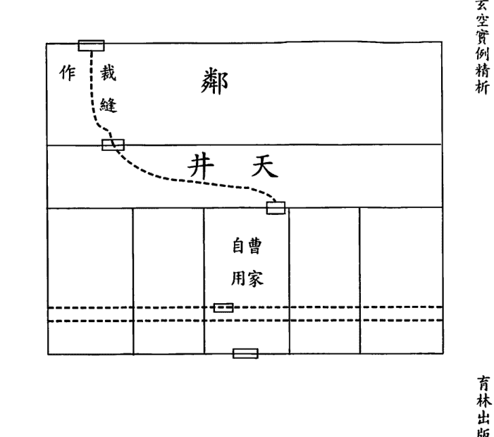

第43例 大生弄曹宅人丁衰敗之原因

青林出版社

三〇七

玄空實例精析

青林出版社

三〇六

# 玄空實例精析

| 9 | 5 | 7 |
|---|---|---|
| 8 | 1 | 3 |
| 4 | 6 | 2 |

流年一白入中

一九一八戊午年和一九二七丁卯年都是一白入中，五黃到離也同至坎艮，故損丁。

綜上分析，與結果完全相符，亦完全合乎學理。

說起「改換天心」，說到底是一個改變元運的問題。作者認為，只要搬出住宅若干月後再遷入即可。本人對此不敢苟同，因為要做到改換天心，關鍵是通過修改空間以變換時間，才是玄機之所在。

早前對那些屋頂鋪瓦的樓房，要求把中心處的瓦揭去，使陽光照入室內，或把家中的燈長明不滅地點亮49天，或擇個吉日換添新的爐灶即可。現代的樓房為鋼筋水泥築成的頂板，不可能掀去使陽光直照，若因此而否定不可改換天心，那是錯誤的。可笑的是，竟然有人提出把樓板的中宮位敲破打開，或通過鏡子把陽光反射入室內，或把家中的燈長明不滅地點亮49天，或擇個吉日換添新的爐灶即可。

| 8 9 | 4 4 | 6 2 |
| 三 | 八 | 一 |
| 7 1 | 9 8 | 2 6 |
| 二 | 四 | 六 |
| 3 5 | 5 3 | 1 7 |
| 七 | 九 | 五 |

四運壬山丙向

## 第43例 大生弄曹宅人丁衰敗之原因

育林出版社

三〇九

育林出版社

三〇八

# 玄空實例精析

還有，作者勸客戶換宅命後，由後弄出入。即使真的按四運計，則前方的巽宮氣口納左輔九紫、離宮屋門納當令四綠，而後方的坎宮納退氣三碧、艮宮納死氣八白。

相信往哪邊出入為吉，讀者已毋容我多說，一看即明。

育林出版社

三一〇

## 第44例 松江城西三食物店之火劫

松江西門外大街東嶽廟前大華餅乾店、長興菜館、天祿茶食店，於一九二七年丁卯十一月廿六日丁亥下午一點鐘未刻燬於大火。大華、長興三運入宅、天祿四運入宅，年月火星聚於巽方，燈炮廠煙囪、車站水塔均在巽方，燈炮廠煙囪日夕發光，可稱有力之導火線。大華、長興宅命中，巽宮早復火星，天祿則巽方得一白水，宜其免遭巨劫，但日辰三碧木星洩水助火，故亦同遭幸。

詩曰：三食物店，設松城西。巽方叢火，定數堪稽。

第44例 松江城西三食物店之火劫

育林出版社

三一一

## 第44例 松江城西三食物店之火劫

| 1 7 三 | 5 3 八 | 3 5 一 |
| 2 6 二 | 9 8 四 | 7 1 六 |
| 6 2 七 | 4 4 九 | 8 9 五 |

| 7 8 二 | 3 3 七 | 5 1 九 |
| 6 9 一 | 8 7 三 | 1 5 五 |
| 2 4 六 | 4 2 八 | 9 6 四 |

四運子山午向

三運子山午向

育林出版社

三一三

玄空實例精析

巽方煙囪
車站水塔
電燈廠

（向午山子）

| 祿天茶食店 | 興長菜館 | 華大餅乾店 |
| | | 起火之家 |

街大外門西江松

廟 獄 東

育林出版社

三一二

# 玄空實例精析

### 剖析：

舊時店鋪的門大多是「排門」，打烊時，將一塊一塊的長形門板，依次推入門檻及屋簷下的槽間，鎖住最後一扇門板，也就把門鎖上了。開張時，再將一塊一塊木板拉出來，於是門戶大開，使店鋪的門面得到最大限度的利用。

由此，必須對這三家店鋪的向首之離宮和坤宮也作一分析。

大華餅乾店和長興菜館是按三運計，離坤二宮皆是退死之氣，又三八合木且得水木生助于離宮。

天祿茶食店是按四運計，離坤二宮同是退死之氣，又三八合木且得水木生助于離宮。

可見，向首所納之氣也是誘發火災的外因之一。

> 《紫白訣》云：「樓臺聳焰，當七赤旺地，豈免火災。」大華餅乾店和長興菜館的巽方納向星八白、山星七赤、運星二黑，其中運星與山星是二七合火；天祿茶食店是按四運計，巽方納向星七赤、山星一白、運星三碧，其中運星與向星是三七反吟。而且，此方有車站水塔、煙囪排塵、燈炮發光這三個形煞激發火氣，已為發生火災埋下禍患。

## 第44例 松江城西三食物店之火劫

| 6 | 2 | 4 |
|---|---|---|
| 5 | 7 | 9 |
| 1 | 3 | 8 |

| 9 | 5 | 7 |
|---|---|---|
| 8 | 1 | 3 |
| 4 | 6 | 2 |

壬子月七赤入中

丁卯年一白入中

育林出版社

三一五

育林出版社

三一四

# 玄空實例精析

一九二七丁卯年是一白入中，九紫到巽；十一月是七赤入中，六白到巽；二十六丁亥日是一白入中，九紫到巽；未時是五黃入中，四綠到巽。其中，四綠為巽，屬木；六白為乾，大赤；九紫為離，屬火。

| 4 | 9 | 2 |
|---|---|---|
| 3 | 5 | 7 |
| 8 | 1 | 6 |

丁未時五黃入中

| 9 | 5 | 7 |
|---|---|---|
| 8 | 1 | 3 |
| 4 | 6 | 2 |

丁亥日一白入中

可見，這年月日時也是一片火氣到巽方，向首又是九紫、五黃、二黑凶星同到。

結合原局與流年飛星，巽方正好應合了《玄空秘旨》中：「火克金兼化木，數驚回祿之災」的斷語，所以，此年引發火災同遭不幸。

## 第44例 松江城西三食物店之火劫

育林出版社

三一七

育林出版社

三一六

# 玄空實例精析

## 第45例 火鴉飛進油紙作坊

蘇州城內護龍街北端盡處有報恩寺，寺有古塔名北寺塔，塔西近鄰設油紙作坊，坐子向午，三運入宅，向承旺氣，生意殊不惡。一九二三年癸亥十二月毀於大火。

> 詩曰：為甚蘇城油紙作，上元之末驟遭劫。火風隨著路人來，還有火鴉臨近側。

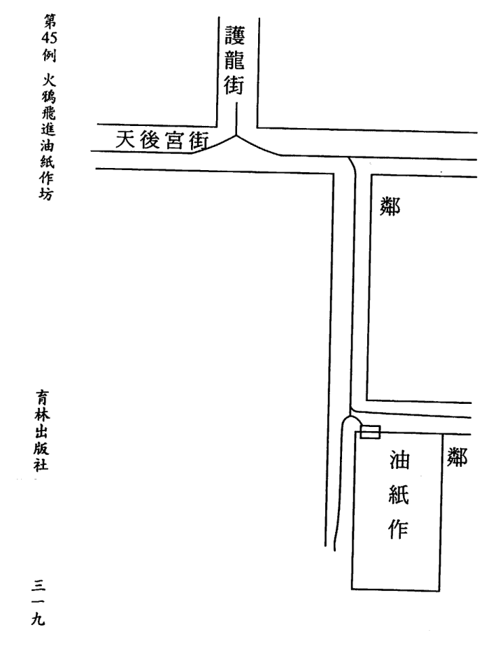

第45例 火鴉飛進油紙作坊

青林出版社

三一九

青林出版社

三一八

# 玄空實例精析

剖析：

| 7 8 二 | 3 3 七 | 5 1 九 |
| 6 9 一 | 8 7 三 | 1 5 五 |
| 2 4 六 | 4 2 八 | 9 6 四 |

三運子山午向

這例坐子向午的油紙作坊，門路在離巽二宮，分別納當令旺星三碧和左輔吉星八白，所以生意不錯。

讓人費解的是，既然所納為生旺之氣，又為何會毀於大火？

這場火災發生在一九二三癸亥年十二月，看似是上元三運末的最後一月，實則不然，此時已跨入中元四運。

依此推之，在離巽二宮的門路，所納之氣已由旺變退、由吉變死，成庚刀劈甲木之勢。在震艮之處的屋簷和古塔使得向星左輔九紫和當令四綠犯上山，是木催火亢之局。

再者，從形上看，有尖形聳物之煞。從氣上看，又木火歲星之逢，故驟遭火劫。

這個案例中的古塔及報恩寺是早就存在的，在三運時由於作坊承旺氣，不但平安無凶還生意興隆。可是，步入四運後因所受的已是煞氣，以致多年經營毀於一旦。

從中可以得出，陽宅風水固然講究形氣並重，但要細推出吉凶事項，惟須以氣為本。試看現代都市里，尖聳之物、霓虹燈光、幕牆反光可謂比比皆是，若以形為主來看，難不成早成一片火海了。

## 第45例 火鴉飛進油紙作坊

育林出版社

三二一

育林出版社

三二〇

# 玄空實例精析

## 第46例 方村不幸之寡婦聚居一宅

浙江上虞謝家塘鎮方村，西首有浜頭，坐子向午平房，九運造，宅內多寡婦。該宅五開間一進，醜艮寅方三運起高樓，卯乙方二運起高樓，山星管丁口，卯方七上起高樓，時當上元三運，克丁之禍，何能倖免。艮上高樓退氣重，曾無小補，兌流逢六，且食用艱難，孀婦輩一何不幸至此。

詩曰：木運原愁七上高，震樓矗立利於刀。

多少丁男齊受克，全家守寡暗悲號。

註：凡城中有城牆護衛多造樓房，鄉居無掩護多造平房，如於許多平房中，任己意造高樓，必有損人之事，此前車之鑑也。

## 相 宅

| 甲 | 乙 | 丙 | 丁 | 戊 |
|---|---|---|---|---|

## 第46例 方村不幸之寡婦聚居一宅

# 玄空實例精析

| 6 3 八 | 1 8 四 | 8 1 六 |
| 7 2 七 | 5 4 九 | 3 6 二 |
| 2 7 三 | 9 9 五 | 4 5 一 |

九運子山午向

### 剖析：

方村一排五間坐子向午的住宅，居者多是寡婦。這些平房建於九運，西首有河浜，在二運時卯乙方起高樓，在三運時艮宮起高樓。風水是以山星的宜忌來斷人丁的興衰。這些建造格式一致的平房，至一運時，向首當令一白山星犯下水，一白為坎卦，表中男。

越是當旺的山星處見水，損丁的力量也是越大且速。西首的河浜是山星三碧飛至，三碧為震卦，表長男。其在一運為進氣，二運為生氣，三運為旺氣，故在這三個運中都不利男丁，尤在三運克丁之禍最烈。

在三運時艮宮起高樓，此宮納退氣山星二黑和死氣向星七赤，二黑和七赤均主女性，由於不合形氣，反主寡婦當家。

當然，至三運時，向首方向星八白變為左輔，即使此宅克丁，但也不至於到食用艱難之境。看風水貴在結合實際，須知這些平房已經三個運程，在丁損財差的情況下，很難去做到修繕，牆體剝落形上犯煞，氣亦不旺了。

## 第46例 方村不幸之寡婦聚居一宅

育林出版社

三二五

育林出版社

三二四

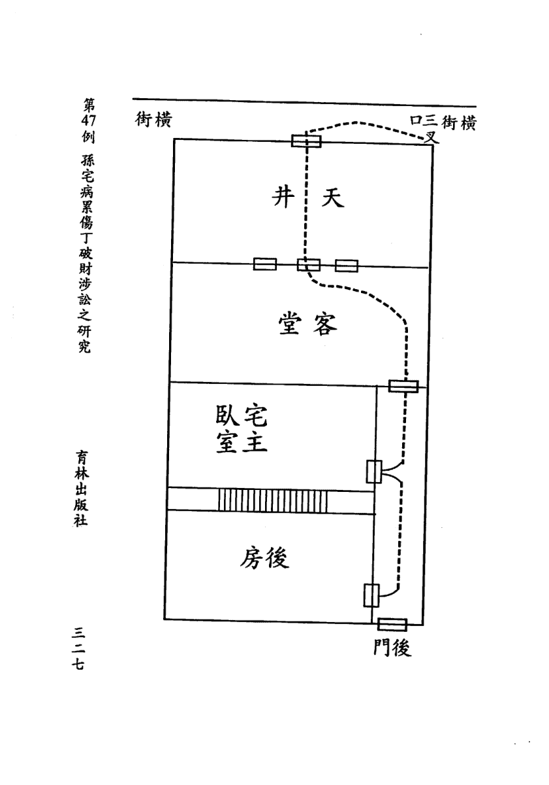

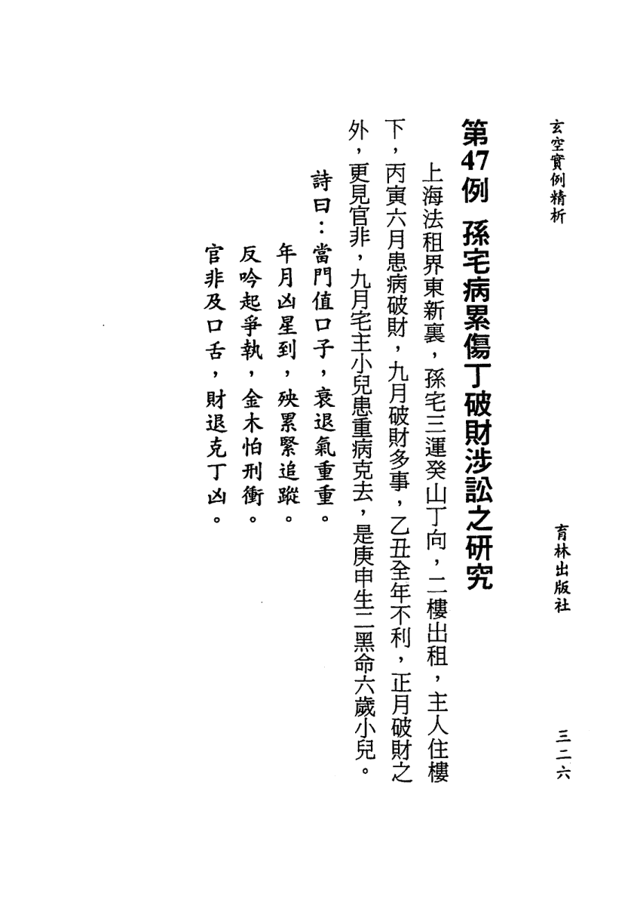

# 玄空實例精析

剖析：

這戶孫宅在三運入住，卻在四運是非不斷、破財損丁，風水分析如下：

書中只說是三運癸山丁向，沒有說明具體入住年份。雖然如此，還是可以大致看下此運的吉凶。

離宮大門為雙星到向，皆是當令飛星三碧；坤宮三叉口是左輔山星八白和煞氣向星一白，妙在此處為城門吉方；乾宮納向星六白，是為樞紐；宅主臥室的房門在乾宮，納生氣向星四綠。綜合觀之，當以吉論。

| 7 8 二 | 3 3 七 | 5 1 九 |
| 6 9 一 | 8 7 三 | 1 5 五 |
| 2 4 六 | 4 2 八 | 9 6 四 |

三運癸山丁向

可是，一入四運，大門由旺變退；三叉口為死煞之氣；乾宮有後門走道直沖，此處為左輔山星九紫下水；宅主臥室的房門納左輔山星九紫和當令向星四綠，此向星似旺實衰。由此得之，破財傷丁。

| 2 6 二 | 6 1 七 | 4 8 九 |
| 3 7 一 | 1 5 三 | 8 3 五 |
| 7 2 六 | 5 9 八 | 9 4 四 |

三運乙山辛向

## 第47例 孫宅病累傷丁破財涉訟之研究

育林出版社

三二九

育林出版社

三二八

# 玄空實例精析

| 2 | 7 | 9 |
|---|---|---|
| 1 | 3 | 5 |
| 6 | 8 | 4 |

乙丑年三碧入中

一九二五乙丑年是三碧入中，四綠至乾，與山星九紫先天合；七赤至離，與山向飛星成三七穿心煞；九紫至坤，與向星一白成反吟。所以，有破財、官非、損丁三個凶象同至。

由於此宅的氣場總體為衰，即使逢流年飛星與原局山向飛星沒有構成凶性的組合，亦很難呈現吉象。

> 古人云：「明者遠見於未萌，智者避危於無形」。

假如，這戶人家能在三運末時，于震方設水池和艮方開窗戶，那麼，不但會使衰氣轉旺，而且還可流通全宅。

## 第48例 上元一運出人傑之宅（二）

無錫楊家圩王巷，王伯侯先生，為前清上元一運中進學之老秀才，人品正直廉潔，為遠近所推崇，精於書法，擲筆如龍飛鳳舞，深得王顏柳米諸大名家下筆三昧，尤得力右軍草書中神致，其最出色而最不可及處，為先生胸中別有丘壑，造化出新，自成一家，為有清一代之壽世健筆。先生住宅前，有一圓形水池，宅為子山午向。先生入泮之年，在上元首運，亦奇事也。伯侯先生之長公子夢清，忠厚老成，業醫濟世。次公子竹三，以商業起家，當歐戰時，顏料業皆成豪富，竹三先生既於顏料業中得到濟經上特殊力量，於多種實業頗多提倡，為吾鄉實業界聞人之一，其在滬住宅雖未悉其詳，但其在鄉之發宅，殊有足以記錄之價值。

第48例 上元一運出人傑之宅（二）

青林出版社

三三一

青林出版社

三三〇

# 玄空實例精析

詩曰：圩田有發宅，上一利科名。運三增富力，動得慶功成。

注：得者，得合宜這時運也，此宅翻動良時，上元一三運，中元五六運，下元八運，皆一動立發。

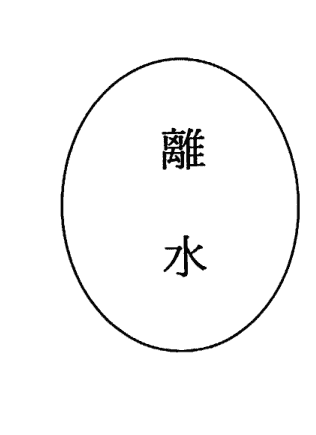

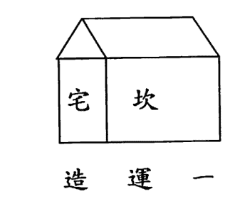

造 運 一

### 剖析：

| 5 6 九 | 1 1 五 | 3 8 七 |
| 4 7 八 | 6 5 一 | 8 3 三 |
| 9 2 四 | 2 9 六 | 7 4 二 |

一運子山午向

王伯侯先生的住宅是子山午向，向前有圓形水池。於上元一運而言，離方之水為零神水，是催發財源和科名的吉水。

再看宅命飛星盤，是當令向星一白飛至離方，是屬「零神旺水」。把飛至離宮的運星五黃再入中逆飛，又是一白飛到零神方，則謂「真零神水」。這是效應快速的催旺要訣，為歷代玄空明師秘而不宣的密寶之一。

所以，宅主下筆神致，自成一家；長公子忠厚老成，醫業濟世；次公子商業起家，豪富鄉里。

可惜，這一奇招對當今來講已經不合時宜，是可遇不可求的。畢竟，無論是城鎮樓房，還是別墅或農舍，因為一則建造上是統一規劃不能隨意而為，二則鋼筋與電器等影響無法把握線度。

再以定向來說，早前的台門院落都是以門為向，這是最基本的常識。可是，現代高層由於結構的複雜性，除以門立向外，還有以局、以陽、以形、以氣、以意共六種定向法，且各法之間因佈局之異可以相互轉化，在斷事和應用上也有別於原先的技法。可以這樣講，僅這個看風水的第一個步驟，已成為目前眾多風水師最難突破也最為頭疼的秘訣之一。

如果一個風水師連房子的坐向都無法確定，那又如何能做到調整和催旺呢？所謂的調理佈局無非是騙人錢財的障眼法罷了，這種自欺欺人的蠢行只會落個害人又禍己的下場。

故而，我們在實際運用操作方法時，既要隨時通變，更要因勢跟進。倘苦不知通變和跟進，則為食古不化和冥頑不靈。

第48例 上元一運出人傑之宅（二）

育林出版社

三三五

育林出版社

三三四

# 玄空實例精析

## 第49例 一方之健者因得地故來路斜故橫發黑財

京滬線洛社站附近之金金村，出了一個彪形大漢，為人狡詐，在上海市某幫中占得一部分黑勢力，年年大發黑財。

宅是壬丙兼子午四度適用替卦算，四運新翻。觀宅命及宅相圖，坤方車站得山星之四，乾方低過之上脈得山星之八，巽方高過鐵路橋得山星之六。手下有人，後起亦有人。

巽方曲水得向星八，乾方照水得向星六，艮三叉得向星四，山向各得三吉卦。最近若干年內，黑財橫發，其來源雖旺，卻名譽不正，當因左磨斜路之故。

> 詩曰：京滬路線，洛社站邊。小局面裏，氣脈迴旋。應時翻動，獲利萬千。惜走斜路，集得黑錢。

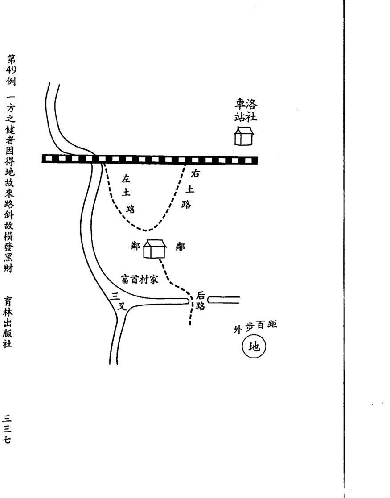

第49例 一方之健者因得地故來路斜故橫發黑財

育林出版社

三三七

育林出版社

三三六

# 玄空實例精析

剖析：

書中說，此人能發黑財，因左邊有斜路之故。

此話不妥！雖有「窮山惡水多刁民」之說，但若看風水僅憑路之正斜就作為人之正邪的判斷依據是不可取的。試看，農村、山區、島嶼的路多陡斜不平，如此說來，居住在這些地區的人多是發黑心偏財了？

| 6 8 三 | 2 3 八 | 4 1 一 |
| 5 9 二 | 7 7 四 | 9 5 六 |
| 1 4 七 | 3 2 九 | 8 6 五 |

四運壬山丙向兼子午

風水有形氣之分，惟氣之消長才是影響命運起伏和左右性情變化的關鍵因素。

此宅向首納退氣向星三碧，煞氣山星二黑與運星八白成反吟；坐山納煞氣向星二黑與退氣山星三碧。可見，坐向皆為退煞之氣，又三碧為震卦，主爭鬥；二黑為坤卦，主黑色；八白為艮卦，主背逆。

再看，巽方進氣山星六白和死氣向星八白，見曲水流過為忌，六白為乾卦，五行是金，表義；巽方當令山星四綠和煞氣向星一白，有蒸汽火車開動，四綠為巽卦，五行是木，表仁。而且，這二個宮位的五行都是向星生山星。所以，會出因財妄為的無仁無義之徒，一幅地痞流氓的形象已展暴露無遺。

那麼，這個暴徒又是通過何種途徑來大肆斂財的呢？

對此，同樣可從飛星所對應的卦象中看出來。三碧為震卦，表搶

第49例 一方之健者因得地故來路斜故橫發黑財

育林出版社

三三九

育林出版社

三三八

# 玄空實例精析

劫、打架鬥毆；二黑為坤卦，表涉賭、放高利貸；八白為艮卦，表煙土、收保護費；六白為乾卦，表洗錢、官匪勾結；四綠為巽卦，表娼妓、欺行霸市，這些都是黑社會謀取暴利的主要手段。

住宅後面的艮宮納當令向星四綠，有三叉水；乾宮納進氣向星六白，見零神水。有這二方吉水照應，雖財路不正，仍可橫財就手。

現在，要討論的另一重點是，當風水師遇到品行不正、仗勢欺人、為非作歹、作惡多端者，到底該不該為其看風水的問題。

毋庸置疑，為這些人調整和催旺風水，就脫不了助紂為虐的干係，犯下了折損陰德的禍患。對這種人要麼婉言拒絕不相往來，要麼良言相勸改過自新，除非其能做到止惡防非，方才勸宅。

不可否認，多數人難免有私心雜念，也由此會在有心或無意中幹出劣行、犯下錯誤。有道：「上天有好生之德」，每一個人都有改正錯誤、以贖前衍的自新機會，風水就是上天用來濟世救人並藉以勸人修身立德的方術。作為風水師，必須在為其指點迷津的同時明之以道、曉之以理，助其走上斷惡向善、去非存是的修心之路。

如此，不但不受天譴，反是功德之舉。

## 第49例 一方之健者因得地故來路斜故橫發黑財

## 第50例 小小咖啡館三年中六換主人

印尼邦愛蘭思思，此新市場因必大希媒油公司而開發，資本家發財靠工人幹活，為安定人心，於工人工作之餘，准予娛樂。特於工人宿舍附近，並接近市街與菜市之交通便利處，劃出廣場十畝許作工人娛樂場，放電影給工人及家屬觀看。市內咖啡館十多家，生意尚好。戲院南隔壁一咖啡館，地位極佳，何以入內經營者都站腳不住？一九二七該屋落成以後，即有人在此設咖啡館，自丁卯下半年至一九三〇年庚午上半年不足三年內，六換主人，究竟何因？各各重遭挫折，力竟竭而退。

該房是庚山甲向兼申寅五度，四運造，山六向二替而不替，仍用原星推算。巽方三叉路口，往來人繁，車後風塵不時掠起，男女行客，腳下帶來之風塵，若經若緯，密集於此三叉路口上。環境中此等地方，最為著眼，吉氣所在，助人勃發，凶星一至，立見消亡。先人蔣大鴻《天元五歌》有云：「向首一星災福柄，去來二口死生門。」口子為生死命脈所系，此語值得思量。

試看該咖啡館宅相及宅命圖：巽方三叉路口，無形中為向星三碧到，三碧祿存木星，於一九二四年甲子以後到一九四三年之二十年間，中元四運中，四綠當機，三碧退職。一個生死關係之重要口子上大權，落在退職天星手中，怎能不敗？加之以宅相前高後低，回下西面凹空中九紫死氣，盜泄向首木星元神，九為欲火，在色欲上賭博，皆易傾其所有，趨於絕地。何況丁卯年年星一管事，入中央，九火臨巽，泄巽三退職木星之氣，窮上加竭，更不得了。戊辰年年星二土到後方，泄九火之氣，九火又泄向星四木之氣，犯重重生出之大毛病，損失之大，更不消說。己巳一白水星到後方又泄山向兩方四九合星之氣，於糊塗中拋失生源，又是年三叉口七赤金到刺動處，口舌是非迭迭而至，破耗之中，更多棘手之事。庚午年星九到後方，火勢炎炎。向首木星，無異孤樹遭雙斧，難以自存。此宅雖向承旺氣，因兌泄巽退，元氣大傷，更加年星助虐，故三年中演出六換主人之怪劇。

詩曰：蘇島思思，有咖啡店。三年六主，個個虧欠。巽退兌泄，一木雙劍。更逢流星，助虐堪厭。

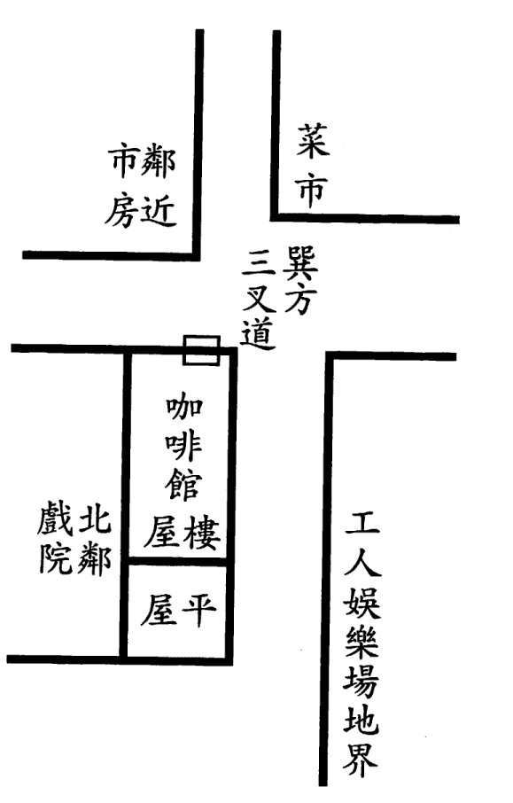

### 四運庚山甲向兼申寅

| 7 三 | 2 7 八 | 9 5 一 |
|---|---|---|
| 8 4 二 | 6 2 四 | 4 9 六 |
| 3 8 七 | 1 6 九 | 5 1 五 |

剖析：
這家咖啡館南鄰娛樂場，北靠戲院，處在很熱鬧的地帶，照理在這種黃金地段開店，生意是不會差的。但是，此館卻在不足三年的時間內六換主人，皆因重遭挫折所致。
從形勢看，東南方有菜市場的屋角正對該館，又因菜市場的髒亂環境和屠殺致怨破壞了氣場。

從理氣論，巽方是三叉路口，所納的是退氣向星三碧和死氣山星七赤，且山向飛星又與運星三碧成反伏吟。臨南邊大路的牆一般會設有窗戶，離方和坤方均是死煞之氣。坐山兌宮本是當令山星四綠飛至，惜後面是平屋使之犯下水。

雖大門在震宮納當令向星四綠，但恰恰應了《玄機賦》中：「眾凶克主，獨力難支」這句口訣。

現在，不論是市面上的流年通書，還是庸偽之師的佈局講座，都是以流年紫白飛星所到之方為大吉。或許，以下的分析能助其清醒。

- 一九二七丁卯年是一白入中，八白到震門，九紫到巽路。
- 一九二八戊辰年是九紫入中，八白到巽路。
- 一九二九己巳年是八白入中，六白到震門。
- 一九三〇庚午年是七赤入中，六白到巽路。

從上可知，這四年都有紫白飛星到門路，可事實卻與實際完全相違。

故而，單以流年紫白來論吉凶是不可信的，更是不可取的。

發生在印尼的這個實例，恰好說明了風水學同樣適用於國外。眾所周知，風水術是中國傳統文化的瑰寶，是道家文化的一個小小分支。

這發源於中華大地，流傳于華夏民族的國粹，理應讓其文明之光耀亮全球，在世界各地大放異彩！

「弘揚道學並讓這一文化之源福澤全人類」，是吾等炎黃子孫的神聖使命！

## 育林出版社圖書目錄

### 堪輿叢書

| 編號 | 書名 | 作者 | 定價 |
| :--- | :--- | :--- | :--- |
| KB-01 | 談氏三元大玄空路透 | 談養吾著（精） | $600元 |
| KB-02 | 談氏三元大玄空實驗 | 談養吾著（精） | $600元 |
| KB-03 | 玄空紫白訣 | 趙景義著（精） | $1000元 |
| KB-05 | 玄空本義談養吾全集 | 談養吾編著 張成春編纂（精） | $1800元 |
| KB-06 | 新玄空紫白訣 | 趙景義著述 張成春編纂（精） | $1200元 |
| KB-07 | 安親常識地理小補 玄空法鑑元運發微 合編 | 談養吾編著 張成春編纂（精） | $1200元 |
| KB-08 | 陽宅風水真義 | 王祥安著（精） | $600元 |
| KB-09 | 玄空六法秘訣圖解 | 林志榮著（精） | $1200元 |
| KB-10 | 玄空理氣經綸 | 紫虛著（精） | $1000元 |
| KA-01 | 葬經青烏經白話註釋 | 陳天助著（平） | $300元 |
| KA-03 | 標點撼龍經疑龍經 | 楊筠松著（平） | $250元 |
| KA-04 | 繪圖魯班木經匠家鏡 | 魯公輸著（平） | $150元 |
| KA-05 | 增補堪輿洩秘 | 清 熊起礄原著 民 王仁貴編釋（平） | $600元 |
| KA-06 | 八宅造福周書 | 黃一鳳編撰（平） | $350元 |
| KA-07 | 相宅經纂 | 清高見男彙輯（平） | $300元 |
| KA-08 | 白話陽宅三要 | 清 趙九峰著 民 北辰重編（平） | $280元 |
| KA-09 | 陽宅實證斷驗法 | 蕭汝祥著（平） | $350元 |
| KA-10 | 生活命理與堪輿 | 藍元陽著（平） | $150元 |
| KA-11 | 陽宅形局斷驗法 | 林進來著（平） | $320元 |
| KA-12 | 鎮宅消災開運法 | 蕭汝祥著（平） | $450元 |
| KA-14 | 贛州風水秘傳 | 北辰編撰（平） | $380元 |
| KA-16 | 八運玄空陽宅秘訣 | 李哲明著（平） | $480元 |
| KA-17 | 陽宅化煞開運訣 | 李哲明著（平） | $380元 |
| KA-18 | 後天派陽宅實證 | 吳友聰著（平） | $280元 |

## 更多资料

↓↓↓

## 【中华古籍库】

↓ 点击链接 ↓

https://www.fozhu920.com/list/

珍版刻印 / 海外流传 / 家传手抄 / 民间失传

【易】【医】【道】【武】【文】【奇】【画】【书】

1000000+高清古书籍

## 打包下载

微信：mbook86

## 中华古籍库

1000000 册 高清影印古籍
珍版刻印 / 海外流传 / 家传手抄 / 民间失传

古籍善本、经史子集、史料笔记、古人文集、
民间收藏、传世家谱、各地方志、中医典籍、
四库全书、古禁毁书、内阁文库、图书集成、
丛书集成、四部丛刊、万有文库、四部备要、
二十四史、三国六朝文、明清和民国古籍史料
……

