# 玄空風水陽宅操作

冠元 著

中國哲學文化協進會出版

# 謹以此書

獻給那些志在探索風水秘術的有智之人和渴望成就王者偉業的有德之士！

——冠元

# 作者簡介

本名陶導，道號冠元，辛亥年生於浙江紹興平水的若耶溪畔。
有道：「名如其人」，就是說姓名能對一個人的性格、命運會起到潛移默化的作用。賢哲尹文子說過：「形以定名，名以定事，事以驗名」，意即人在出生後所取得的姓名，必會影響其人在處事上的成敗得失，根據其得失是可以來驗證所取之姓名的吉凶應象。故而《說文解字》甚至訓義「名」為「命」，「名自命也」。即人的姓名與其人的命運是息息相關的，下面就用姓名學的理論來對本名「陶導」作個簡要分析：
導，通意字為「道」，我悟創「道」字的哲學理解至少有15種；繁體字為「導」，語云「尺有所短，寸有所長」，故寓意道學是我的專長。
陶導兩字引申開來有四個不同的含義，下面對這四個不同含義做以下解釋：
1、陶可理解成陶醉，導引申為學道。我在既非祖傳、更無師承的情況下，完全是出於好奇而接觸道學的。隨著把所學理論付諸於實踐中的應驗之增多，使我對道學產生癡迷地執著心，同時也更激發了我學易的堅定信心。
2、陶可理解成陶鑄，導引申為教導。把我對易經的學習經驗和心得體會傳授給學員，力求使其少走彎路、不走歪路而立地證道。從而培養學員自發地增加學易的濃厚興趣，以造就更多的道學人才來為更多的眾生造福。
3、陶可理解成陶然，導引申為順道。因風水技術的專業性和認真務實的敬業心，使福主只要順著我的指點去佈局，則必為喜氣迎門的吉宅，同時也使許多被庸師和偽師誤勘的敗宅轉禍為福。

> 冠憑弘易之志
天下蒼生受陶
元承玄空之功
世間萬事得導

4、陶可理解成陶冶，導引申為引導。用「自然、平衡、和諧」的易經理念在改善生活質量的同時也用道德規範去完善人們對生活的態度，把那些誤入歧途的人導之以正道，從而確立健康向上的人生觀去積極開創美好的未來。

道號是冠元，其筆劃三和為十三陽火之數，正能補我命理的喜用神。且數理為「天賦吉運，能得人望，善用智慧，必獲成功」之吉格。十三陽火之數表太陽，即易經策劃如初升的朝陽，蓬勃向上發展前景無限光明，它必將是當之無愧的領行業。還有五種取意如下：

1、《易經》這部中華文化之魂的元典，被道教尊為三玄（《周易》、《老子》、《莊子》）之冠，雄據世界三大經典（易經、聖經、吠陀經）之首。

2、《易·乾文言》曰：「元者，善之長也。」告訴人們應該善於利用人的意志主動性，結合風水能改善命運的長處，把自身的生命能量提升到頂點。

3、《說文》曰：「元，始也，從一。」幹事業和做學問，一定要在開始時就腳踏實地，一步一個腳印地向前走。要學好玄空風水，一切得從易象中扎根，再參象推卦，如是始可進入玄空學之神秘宮殿，只有在不斷地升華理論和實踐悟創中，才能摘取其冠上的明珠。

4、何休《公羊傳解詁》曰：「元者，氣也。無形以氣，有形以分，造成天地，天地之始也。」《內經》曰：「人生於地，懸命於天，天地合氣，命之曰人。」即人是得天地之生氣、日月之靈氣而生的。君子當須與天地相參，與天地合德，故應抱以「冠天地之生氣，元人和之德性」來立身處世。

5、元同圓，喻指地球。意即要把道為文化傳向世界，讓玄空風水造福全人類的志向，當然，弘揚之路漫漫而修遠兮，我將肩負此任上下而求索。

# 感謝冠元大師

——首屆面授學員感恩頌詩

哲人說，
風水是能改善命運的奇學。
正處命運低谷的我，
試圖改善我那多舛的命運，
但那神奇玄妙、博大精深的玄空世界，
奧秘如星空，
深邃如海洋，
使我如置迷宮、如墜霧中。

冥冥中，
我有緣得遇調運造勢的您，
正是您的精確斷語，
促使迷茫的我再燃學藝信心。
你那字字珠璣、句句真傳的生動講課，
恰如啟明星，
又如導航燈，
使我頓然開悟、釋然開竅。

而今，
面對玄空學，
我發憤勤學、孜孜恆求，
是玄空拯救了處在邊緣的我，
使我感懷拳拳之心——報恩濟世。

在此，
面對大師您，
我誠惶誠恐、頂膜拜禮，
把心中千言萬語彙成一句話，
讓我衷心地感謝您——冠元大師。

# 目 錄

# 第一章 學理築基篇

- 第一節 風水是天地之學、王者之術
- 第二節 玄空之易理正解
- 第三節 定向立極法
- 第四節 羅盤的選擇和使用
- 第五節 八卦與二十四山
- 第六節 三元九運和四流紫白表
- 第七節 玄空飛星與九宮
- 第八節 九星之物象
- 第九節 紫白九星之旺衰與吉凶應象
- 第十節 玄空飛星排盤法
- 第十一節 兼向與替卦

# 第二章 應用點竅篇

- 第一節 入囚與地運長短
- 第二節 收山出煞
- 第三節 伏吟與反吟
- 第四節 正神與零神
- 第五節 論下卦的四種格局
- 第六節 論城門
- 第七節 論空亡之凶應
- 第八節 論陰陽合十
- 第九節 論三般卦
- 第十節 論太歲
- 第十一節 論五黃
- 第十二節 論雙星加會之神斷

# 第三章 操作技巧篇

- 第一節 樓宇應當運
- 第二節 樓層需合運
- 第三節 層數要配命
- 第四節 命卦當配宅
- 第五節 《陽宅三十則》詳解
- 第六節 《陽宅指南》摘錄
- 第七節 《陽宅天元賦》摘錄
- 第八節 《天元五歌·論陽宅》摘錄

# 第四章 秘訣注解篇

- 第一節 《玄機賦》注解
- 第二節 《玄空秘旨》注解

# 第五章 陽宅秘斷篇

- 第一例 陶姓宅 丑山未向 五運造
- 第二例 某宅 子午兼癸丁 五運造
- 第三例 某宅 壬丙兼亥巳 五運造
- 第四例 某宅 辛乙兼戌辰 五運造
- 第五例 某宅 子山午向兼癸丁 六運造
- 第六例 某宅 子山午向 六運造
- 第七例 某宅 子午兼壬丙 七運造
- 第八例 會稽任宅 子午兼癸丁 七運造
- 第九例 會稽章宅 子午兼癸丁 七運造
- 第十例 胡宅 甲山庚向 七運造
- 第十一例 張村丁宅 子午兼癸丁 七運造
- 第十二例 某宅 申寅兼坤艮 七運造
- 第十三例 某宅 子午兼癸丁 七運造
- 第十四例 湖塘下陳宅 亥山巳向 八運造
- 第十五例 東溪周宅 酉卯山兼辛乙 八運造
- 第十六例 某宅 未山丑向 八運造
- 第十七例 寧波府基 癸丁兼丑未 八運修造

# 第六章 下卦圖例篇

- 二十四山下卦一至九運應用全圖

# 第七章 起星圖例篇

- 二十四山起星一至九運應用全圖

# 第一章 學理築基篇

# 第一節 風水是天地之學、王者之術

風水也叫堪輿，為中國之獨創，源於道教之易經思維，是以「自然、平衡、和諧」的天人感應之理念來改善命運、調整運勢的秘術。由於其義理源遠流長、博大精深，幾千年來一直閃耀著神秘的幽光！使許多有志於探究風水的人，雖窮經皓首卻仍未深入堂奧。

要研究風水學，首先必須理解「風水」二字的深刻內涵！

> 「風水」一詞最早見於晉代郭璞所著的《葬書》：「葬者，乘生氣也。氣，乘風則散，界水則止。古人聚之使不散，行之使有止，故謂之風水。」

清代範宜賓為《葬書》作注云：「無水則風到而氣散，有水則氣止而風無，故風水二字為地學之最，而其中以得水之地為上等，以藏風之地為次等。」

> 「氣之來，有水以導之；氣之止，有水以界之；氣之聚，無風以散之。故曰要得水，要藏風。無風則氣聚，得水則氣融，此所以有風水之名。」

這就是說，風水是門只有在避風聚水的情況下才能得到使萬物生長之吉氣。

廣東中山大學的楊維增教授在《周易和住房風水》中則根據環保理念和八卦卦象對風水作出如下的解釋：風為巽卦表空氣，水為坎卦，即是指追求清新的空氣和潔淨的水源，風水是人類尋求生存環境的表徵詞。

以上二種觀點都是純依自然界之風與水來理解的。

而國內現代出版的教科書或詞典中，對風水是作如下解釋的。

《中國古代地理學》說：「風水是一種建立在封建迷信思想上的相地術，是不科學的，甚至是非常荒謬的。它是地理學中唯心主義的一個流派。」

《現代漢語詞典》是這樣定義的：「風水指住宅基地、墳地學的地理形勢，如山脈、山水的方向等，迷信的人認為風水好壞可以影響其家族、子孫的盛衰吉凶。」

《辭海》則作出如下評價：「風水是舊中國的一種迷信，認為住宅基地或墳地周圍的風向水流等形勢，能招致住者或葬者一家的禍福。」

《辭源》也認為：「風水指宅地或墳地的地勢、方向等，舊時迷信據以附會人事吉凶禍福。」

以上的解釋都將風水學視為是一種「迷信」。把學習研究的說成是搞封建迷信妖言惑眾，把應用服務的斥為是旁門左道不務正業。

有道是「千年經驗成學問」。風水之學，已歷經數千年的時間檢驗和廣闊地域的空間實踐，具世界上充分的統計學價值。現竟以「迷信」來概而括之，未免太缺乏嚴謹的學術作風了。

所謂迷信，即迷茫的相信，是指不加認真思考與實踐驗證就盲目的相信。要消除這個盲目性，「道」字早就有所警示：道字上面的二點猶如太極中的陰陽魚，它代表自然界的萬事萬物，下面的「一」為一定，自為親自，走為行動為實踐。這正合唯物辯證法中的：「實踐是檢驗真理的唯一標準！」我們判斷一門學問是偽術還是科學的標準只能是實踐，而不是能否被現在的科學理論所解釋，因為科學是發展的，是永無止境的，科學的精神就是提出質疑和勇於探索。那麼，真理又來自何處呢？「道」又啟示人們：做任何學問，一定要用自己的腦袋去思考，並且把思考所得來的理論再付之於實踐中去應用檢驗，如思考所得的理論在實踐應用中二者是一致的，則其理論是真理！

風水學是以易經的陰陽學說為指導的，《周易》序云：「易有太極，是生二儀。兩儀者，陰陽也。」《說卦》有：「立天地之道曰陰曰陽。」《黃帝素問·陰陽應象大論》中說：「陰陽者，天地之道也。」

所以說，太極中的陰陽為天地也，又「生生之謂易」和「為道也屢遷」更說明了天地之變化的絕對性。《靈城精義》首云：「宇宙有大關合，氣運為主；山川有真性情，氣勢為先。地運有推移而天氣從之；天運有轉變而地氣應之。」這正如「道」所示：天時的運行和地理的變遷，一定要保持協調性和一致性，只有這樣才符合自然的運行法則。

風水作為一個專用詞，已有獨特的概念，我對它的理解是：

所謂的「風」，即天時也，宇宙中星體的運動能產生風，且星體的運動有其週期變化之時間性，這就是指三元九運說。

所謂的「水」，即地利也，水會隨不同的山川形勢而有不同的變化，意為地球上的山川形勢、環境佈局不是固定不變的，而應根據元運的變化而改變其形局，以達到最佳的有利空間。

這正合堪輿之本義，東漢許慎曰：「堪，天道也；輿，地道也。」《康熙字典》中說：「堪者天文也，輿者地理也。」故而，堪輿就是研究天體運行和地理環境的一種道學。

又為什麼說它是王者之術呢？

「王」字用現代語解釋，就是某領域的第一人或事業的成功人士，三橫一豎便為王，看字體很簡單悟字意卻很深奧。

王字拆解可分為三三和三三，三三為乾為天為陽，三三為坤為地為陰。《周易·系辭》曰：「易與天地准，故能彌綸天地之道，仰以觀於天文，俯以察於地理，是故知幽明之故。」這就是說，《易經》是以天地運行的規律作為準則的，故而能將天地間萬事萬物的發展變化都包涵在這規律裏，只有掌握天地之道的人，才能因知先機而成為具有先見之明的智人。

縱觀經史，凡有建業的帝王都重用易經大師做決策高參，如周文王用薑子牙、秦始皇用李斯、漢高祖用張良、唐太宗用徐茂功、宋太宗用苗光義、明太祖用劉伯溫、唐朝宰相虞世南以無限敬仰的心情評價《易經》說：「不讀易，不可為將相」的肺腑之言。全國政協副主席霍英東先生，在談易經時把其排在四大發明之前，足可見《易經》在中國文化史上以及世界文化中的地位。而日本明治維新時的組閣原則：不知《易》者，不得入閣。更是把《易經》推到了最高的境界！

王字由三橫一豎組成，上橫為天時、中橫為人和、下橫為地利，中間一豎為合一為統一。即要天人地三才之間的協調統一才能成為王。

《黃帝宅經》云：「夫宅者，乃是陰陽之樞紐，人倫之軌模，非博物明賢者未能悟斯道也」及「人因宅而立，宅因人得存，人宅相扶，感通天地，故不可獨信命也。」《管氏地理指蒙》中說：「人與天地並列為三，非天地無以見生成，天地非人無以贊化育。」可見，風水學探討的就是人與天地之間的內在聯繫，主張人去參天地以贊化育，即人一定要結合天時、地利的運行變化規律並加以效法，以彌補和調整自己的不足，從而達到與自然的相通和合之境界。

可見，風水既是門研究天地陰陽變化規律的學問，更是助有志之士成就王者風範的秘術。正是其所蘊藏的巨大能量與重大價值在日漸被人所重視，故我斷言「風水策劃必將是當之無愧的金（金字為人為王及猶如二手捧狀之二點，即助人成就王者偉業的意思）領行業！」

按：

一、以上的對「道」、「風水」、「王」之黑體字的解說均為本人悟創，先前在任何書上都沒有出現過。
二、中國自古就有「宅者，人之本；人者，以宅為家。居若安，即家代昌盛；若不安，即門族衰微」的說法，可見只有居安才能樂業，所以把安家建宅視為關係家代門族的大事而倍加重視！古人曰：「卦理不精，害人一事；醫理不精，傷人一身；命理不精，害人一生；地理不精，傾家滅族。」若請個庸師相宅則禍害無窮，當慎之！
三、細讀中國數千年的歷史，會發現一個秘密。每一個朝代，在政事的治理上，都有一個共同的秘訣，那就是「內用老莊，外示儒術。」內在的能成就王者風範的是老莊之道學；而在外面所標榜的則是孔子的儒學。
四、對風水的理解還有以下四種：

（1）明代喬項在《風水辯》中的解釋：「所謂風者，取其山勢之藏納、土色之堅厚，不沖冒四面之風與無所謂地風者也。所謂水者，取其地勢之高燥，無使水近夫親膚而已；若水勢曲屈而環向之，又其第二義也」。
（2）天津大學王其亨教授在《風水理論研究》中所說：「風水實際上是集地質地理學、生態學、景觀學、建築學、倫理學、心理學、美學等於一體的綜合性、系統性很強的古代建築規劃設計理論，它與營造學、造園學構成了中國古代建築理論的三大支柱。」
（3）天津大學亢亮教授在《風水與建築》中認為：「風水是中國古代神聖的環境理論和方位理論。」其內涵可概括為：考察山川地理環境，包括地質、水文、生態、小氣候及環境景觀等，然後擇其吉，而營築城廓室舍及陵墓等，使其達到天地人合一的至善境界，實為古代一門實用技術。
（4）華南工學院程建軍教授在《風水與建築》中寫道：「風水主要是指古代人們選擇建築地點時，對氣候、地質、地貌、生態、景觀等各種建築環境因素的綜合評判，以及建築營造中的某些技術和種種禁忌的總概括。」

# 第二節 玄空之易理正解

玄空學是所有風水流派中最玄秘最深奧也最靈驗的派別，它不但能改善命運，使人朝貧夕富、富貴康寧，且還能用以推城鎮之興替、國家之興衰。怪不得被世人尊稱為「救貧先生」的唐朝國師楊筠松曾有「秘密在玄空」的肺腑之言。然而其義理博大精深、包羅萬象、概天地萬物，學者如不得訣竅，雖碩學鴻儒也難以領會，若得真傳妙訣，才能登入堂奧。

下面就對「玄空」二字作以下五點解釋：

一、玄空從字義上解釋「玄」即是天時，「空」即是空間及方位。故說：「天玄地黃是用玄來代表天，因天象運行象徵時間變化；用地來代表空間，土地能生養萬物，為萬物之所依。」由此可見天象時間與地面空間兩者是密不可分的。
二、玄，天之施也。空，地之受也。天乃積陽之氣，為玄為生。地乃積陰之氣，氣為不見之形，變化莫測，故曰「玄」；地氣為重濁可見之形，但有流通之竅，故曰「空」。所以玄空是推算運行於天地間的能量交替對人事的影響。
三、玄字如拿住線絲的兩頭在搓繩，有週期性的旋轉變化之意。天竺學者言：「色不異空，空不異色，色即是空，空即是色，受想行識，亦復如是。」玄空的奧妙之處在於七色九氣在時間的流轉中隨陰陽順逆而發生循環運轉。
四、楊子法言曰：「玄者一也」，而空之憑藉即竅也，竅有九。所以說玄空飛星是源自洛書從一至九之數的氣場運動規律，其會根據不同時運而產生吉凶衰旺的變化。

五、玄，為理之微妙者；空，為竅。玄空學是微妙理氣的竅門，探索的是玄之又玄的奧妙和玄機。若能明白其數理的微妙變化，就可以竅天地而進入天人地合一的至善境界。

> 《靈城精義》云：「宇宙有大關合，氣運為主；山川有真性情，氣勢為先。地運有推移而天氣從之，天運有轉變而地氣應之。」天運流轉和地勢狀態相一致的理論是玄空風水的精髓，也是許多風水學派中獨有的灼見。

即使在同一個地方中又為相同坐向，若造作的時間不同，其吉凶的顯示則也不同。清初玄空宗師蔣大鴻（人稱「地仙」）曾說過：「人葬出盜賊，我葬出王侯！」的豪語，之所以能語出驚人，是因為他能掌握在適當的時機中去選擇符合該時機的有利的地理環境。在他著的《都天寶照經》中說：「今人只愛周邊好，而不知那「些子」；「些子」合得天機，周邊不好亦好。若那「些子」不合天機，周邊雖好，皆無用矣。陰山陽山、陰水陽水，皆現成名色，處處是死的，惟有那「些子」是活的。「些子」一變，陰不是陰，陽不是陽，陰可作陽，陽可作陰。」一「些子」即玄空之挨星也，也為「移星轉斗」之法，是很靈活的看地法，不象一般風水流派只注重死的山水之呆板的法則。

故而所謂的風水寶地，並非永恆不變的。它是只反映在空間上的環境優選，並不具有時間上的永恆優選。誠如馬泰青前輩所云：「形勢所主者，生人之權；理氣所主者，興廢之權。」也就是說：「一個地方的地理山水美惡能主宰人的品貌，而挨星的元運則主宰人事的盛衰。」

玄空學就是以挨排洛書九星為理氣，又以自然環境的山水為依據，兩者結合後確定其旺衰。這既要理氣，又不死套理氣；既要環境，又不迷戀環境，一切從實際出發來確定住宅的吉凶。

早在西元前二五〇〇年，中國先賢就開始「仰觀天文、俯察地理」的活動，逐漸形成了「天人合一」的宇宙觀，這種思維實際上是強調天地與人三者之間的協調統一思想，而風水探討的就是人與天地之間的內在聯繫，它是以易經的陰陽學說為指導，通過人的意志主動性之發揮來「參贊天地之化育」，以達到順其自然、平衡和諧的效果。
因此，玄空學是根據洛書九星挨排理論與地理形態相結合，去選擇最佳的居住空間的學問。玄空風水運用的原理就是根據時間與空間相互作用而產生的吉凶，再通過人的主動性進行調整，從而將天人地三才協調和諧的天人合一觀。目的是為達到身心的安康、人生的順意、事業的興旺、社稷的昌盛。

# 第三節 定向立極法

看風水首先要確定屋宅之坐向，根據不同形局來確定屋向有以下八種方法：

一、以大廈總入口定向——一座大廈內所有單位都是同一個坐向，而定向的方法是以大廈的大門總入口來定向。
二、以陽定向——經云：「陰陽動靜排龍訣」，意為以陽動為向及陰靜為坐作指標。空曠處、馬路邊、河湖邊都表陽也，即以臨空曠、馬路、河湖處來定向。

三、以窗定向——屋宅內以窗戶最多的一方來定向，因為引入之光線屬陽，以陽定向也。

四、以形定向——形是屋形，以正門來定向。

以正門之坐北向南為屋向

五、以門定向——即以門向來確定。

六、以意定向——有多個門時，以有門牌之門或多走之門來定向。

七、以氣定向——若室內三面為牆，以來氣之面為向。

八、以局定向——局即是指背山面海或背高朝低，以面海或低地為向。

定向之法至為重要，若一錯則百錯也。在這麼多的定向法中，到底以何種為準，一直以來存在著很大的分歧。有以門為向（大陸），以窗為向（香港），以路為向（臺灣），以水為向（日本），甚或一宅多向，到底何種定向才是正確的呢？當應以理論根據為導向，以效應事實為依據。

在風水學上所稱的「立極」，就是屋宅之中心點。經云：「中五立極，臨制四方」，這「中五」即指洛書的五黃居中，簡單來說是指中央、中心點之意。故立極就是飛線定中宮，也就是放羅盤的地方。

此交叉點為這房的中宮立極點

在確定屋向後，人就站在室內之中心點上進行下盤（也叫盤度）以量度出正確的八方所屬的方位，然後進行堪察斷事和催旺佈局。

七運坐巳向亥之宅，把飛星佈入平面圖來作斷事和催旺之用。

在古時由於房屋都為方正形，故只須站在對角線之交點處即為中宮立極的位置，但現在的樓宇設計多為不規則形的，在此我把常見樓宇設計的立極方法畫圖說明。

一、以物理學的力學重心為中心。

二、以除去凸位的部分，再找尋中心點。

三、以補足凹位的部分，再找尋中心點。

四、將凸位和凹位部分平均起來，去求得中心點。

## 第四節 羅盤的選擇和使用

羅盤也叫羅經，是風水操作的重要工具，它的作用就是確定方向。「工欲善其事，必先利其器」，在學習風水理氣時，首先要學會選擇做工精良的羅盤和熟練地使用它的定向之法。

因本書所要介紹的風水法則是要求很精密的玄空學派。語云：「羅經差一線，富貴便不見」，所以羅盤一定要十分正確、精密，不容有絲毫的誤差！對其選擇應做到以下五點：

- 一、天池內的磁針與子午線一定要重合。
- 二、天池內的子午線必須和圓盤的子午線是一致的，因天池若安裝不佳或鬆勁，就會有偏差。
- 三、十字線所分割的四個象限要各占90度，一點也不能誤差，否則就是不準確的。且圓盤內的子午卯酉（應分別為0度、180度、90度、270度）必須與十字線相重合。
- 四、轉動圓盤，看是否靈活。若太緊轉不動或圓盤與方盤之間空隙太大不平均時，都會導致羅盤的準確性。
- 五、方盤必成四方形，且四邊必須直，切不能有彎曲之現象，否則在取平行時容易失準。

說到羅盤的使用方法，首先應談其構造。它的中央是一個圓形天池，池內有定向用的指南針，外面是一圈圈刻滿字又會活動的轉盤，稱為內盤或圓盤。內盤上的每一圈代表一層，其中有一層是二十四山。最外是一方形盤身，稱為外盤或方盤。外盤上有四個小孔，分別用兩根魚絲以十字形穿於四邊中間的小孔內，它是用來定坐向的。

羅盤的使用主要是中央天池內的磁針，其底色一般是白色，底部劃有一紅色直線，一端是有兩個紅點在紅線的左右，紅線是以南北定位的，有紅點的一方是子方（正北方），另一端是午方（正南方），上面有一根很靈敏的磁針，磁針有一端是有個小孔的。

使用時應站在定向物前用雙手分左右把持著方盤，把方盤的前邊與定向物平行，且使盤面保持水平狀態後，用大拇指轉動圓盤。當圓盤轉動時，天池會隨之而轉動，一直將圓盤轉動至磁針靜止下來與天池內的紅線重合在一起為止。有一點是非常重要的，就是磁針有小孔的一端必須與紅線上的兩個小紅點重合，位置不能互調。這時顯示坐向方的十字線（是連接定向物與人之間的那條）與圓盤各層相交，我們就在這條十字線所穿越和涵蓋的區域上去尋找各種數據和資料。

然而，羅盤上有許多層數，究竟哪一層才論坐向呢？就是二十四山這層，向己這邊的山為坐（也稱山），向定向物那邊的山為向。山和向是同一個範疇的兩個稱呼，因為稱山就附有句，稱向也必附有山。例：向山是子，坐山便是午，稱之為坐午向子或午山子向。

## 第五節 八卦與二十四山

> 《易經·系辭上》曰：「河出圖，洛出書，聖人則之」，意思是說黃河上出現龍圖，洛水上出現龜書，聖人由此取法而創作八卦。

# 第一章 學理築基篇

## 【玄空風水陽宅操作】

洛書是指運用1至9的九個數字，以白點為奇數，以黑點為偶數，依其相互關係組成的圖式。

說卦位：帝出乎震，齊乎巽，相見乎離，致役乎坤，說言乎兌，戰乎乾，勞乎坎，成言乎艮。後天卦對角數之和為十，這叫合十。坎一、坤二、震三、巽四、乾六、兌七、艮八、離九為後天數。

洛書：戴九履一，左三右七，二四為肩，六八為足，五居其腹，洛書數也。

說卦傳：天地定位，山澤通氣，雷風相薄，水火不相射，八卦相錯。先天卦對角數之和為九，這叫用九。乾一、兌二、離三、震四、巽五、坎六、艮七、坤八為先天數。

河圖：天一生水，地六成之，一六共宗而居於北。地二生火，天七成之，二七為朋而居於南。天三生木，地八成之，三八同道而居於東。地四生金，天九成之，四九為友而居於西。天五生土，地十成之，五十相守而居於中。

玄空學的九星挨排理論就是源於後天八卦的方位來進行氣場分佈的，其八卦所對應的八個方位依次為：坎卦為北方，用一數表示；坤卦為西南方，用二數表示；震卦為東方，用三數表示；巽卦為東南方，用四數表示；乾卦為西北方，用六數表示；兌卦為西方，用七數表示；艮卦為東北方，用八數表示；離卦為南方，用九數表示。見下圖：

| 巽四 (東南) | 離九 (南) | 坤二 (西南) |
|---|---|---|
| 震三 (東) | 中五 | 兌七 (西) |
| 艮八 (東北) | 坎一 (北) | 乾六 (西北) |

玄空風水學則把這八個方位中的每一個方位又分為三個小方位（每個小方位各占15度，稱之為「山」），由甲山起，以三個山組成一個卦位，則依次為：甲卯乙為東方震宮，辰巽巳為東南方巽宮，丙午丁為南方離宮，未坤申為西南方坤宮，庚酉辛為西方兌宮，戌乾亥為西北方乾宮，壬子癸為北方坎宮，丑艮寅為東北方艮宮。

在這二十四山中，包括了十二個地支、八個天干、四個四維。《青囊序》曰：「先天羅經十二支，後天再用干與維。」詩中所指八干四維加十二支，共二十四數，就是指羅盤上的二十四山。

二十四山除能精細地表示陽宅的坐向外，還能量度室外的山水環境所處的方位和室內門、房、窗及擺設物所處的方位，從而配合宅運吉凶進行論斷和佈局。

在使用羅盤時，會發現二十四山這層分二種不同的底色和字色，它將二十四山中屬陽的山之底色用金色，而字用紅色（紅色屬陽）；至於二十四山中屬陰的山之底色則用黑色（黑色屬陰），而字用金色。羅盤上的二十四山之陰陽是根據怎麼來劃分的呢？

天干：甲、丙、庚、壬及戊為單數為陽
乙、丁、辛、癸及己為雙數為陰
地支：子藏癸，癸屬陰，故子為陰
丑藏癸辛己，全為陰，故丑為陰
寅藏甲丙戊，全為陽，故寅為陽
卯藏乙，乙為陰，故卯為陰
辰藏戊乙癸，陰多陽少，故辰為陰
巳藏丙庚戊，全為陽，故巳為陽
午藏丁己，全為陰，故午為陰
未藏己丁乙，全為陰，故未為陰
申藏庚壬戊，全為陽，故申為陽
酉藏辛，辛為陰，故酉為陰
戌藏辛丁戊，陰多陽少，故戌為陰
亥藏壬甲，全為陽，故亥為陽

四維：
乾為六，與坎一合為七，為奇數，故乾為陽
巽為四，與離九合為十三，為奇數，故巽為陽
艮為八，與震三合為十一，為奇數，故艮為陽
坤為二，與兌七合為九，為奇數，故坤為陽

在二十四山中，天干缺戊己，八卦缺坎、離、震、兌。天干的戊己在中宮為土，於後天八卦為五黃土，戊為陽土，己為陰土，因在中宮故省去未寫。在天干地支排入二十四山時，除戊己居中外，還剩四格且又在四維位置上，故由乾巽艮坤補之。

## 第六節 三元九運和四流紫白表

相傳在西元前二六九七年，黃帝命大橈以干支紀年來推演曆法而知氣運流轉，定此年為黃帝元年，甲子為始元。往後每六十年為一個循環週期，俗稱「六十花甲」。直至現今已有七十八個花甲。

一元：即為一個花甲，共60年，它是土、木、水三星交會的週期。每一元中又分三個運，每運為20年，每一運是木、土二星交會的週期。

正元：即為三個花甲，共180年，每一正元分上元、中元、下元，故又叫三元。因此每一正元有九個運，它是九大行星成一直列的週期。

九運：依次為一白水運、二黑土運、三碧木運、四綠木運、五黃土運、六白金運、七赤金運、八白土運、九紫火運，一直循環不息，周而復始。

下面把最近之三元九運列表以供參考：

| 元 | 運 | 年份 |
|---|---|---|
| 上元 | 一運（一白水） | 一八六四年至一八八三年（甲子年至癸未年） |
| 上元 | 二運（二黑土） | 一八八四年至一九〇三年（甲申年至癸卯年） |
| 上元 | 三運（三碧木） | 一九〇四年至一九二三年（甲辰年至癸亥年） |
| 中元 | 四運（四綠木） | 一九二四年至一九四三年（甲子年至癸未年） |
| 中元 | 五運（五黃土） | 一九四四年至一九六三年（甲申年至癸卯年） |
| 中元 | 六運（六白金） | 一九六四年至一九八三年（甲辰年至癸亥年） |
| 下元 | 七運（七赤金） | 一九八四年至二○○三年（甲子年至癸未年） |
| 下元 | 八運（八白土） | 二○○四年至二○二三年（甲申年至癸卯年） |
| 下元 | 九運（九紫火） | 二○二四年至二○四三年（甲辰年至癸亥年） |

其中，中元五運，有以前十年寄於四綠運，後十年寄於六白運之說。

《靈城精義》指出：「宇宙有大關合，氣運為主；山川有真性情，氣勢為先。地運有推移而天氣從之，天運有轉變而地氣應之。」《天元五歌》曰：「三元分運，判盛衰興廢之時。總以氣運為之君，而吉凶隨之變化。」《紫白賦》云：「三元興衰是真宗，運遇遷流宅氣改。」可見，元運之變化是影響風水成敗興衰的關鍵！

在眾多的風水學派別中，僅只有玄空風水是注重以天時元運的變化來推算地理氣運的消長與替的。即同一個地方，因元運之變化，其吉凶的顯示也隨之變化，這就是所謂的「風水輪流轉」。

舉例來說：南方有一座山，山的形體和方位都沒有改變。對普通常識來講，二十年前來看它，山是在南方；二十年後再來看它，山還是山，還是位於南方。可按玄空風水學的理論來看它就不是這樣了，二十年前和二十年後這座位於南方的山，已是大不相同。其形體和方位雖然依舊，但是其內在的「質」已經因為「氣運」的變化而改變了。

在每個小運的20年中，每年的氣運又各有不同。每年都有一個星飛入中宮，主宰一年的氣運。現把流年入中紫白九星列表如下：

| 六十花甲 | 甲子 | 乙丑 | 丙寅 | 丁卯 | 戊辰 | 己巳 | 庚午 | 辛未 | 壬申 |
|---|---|---|---|---|---|---|---|---|---|
| 上元 | 一白 | 九紫 | 八白 | 七赤 | 六白 | 五黃 | 四綠 | 三碧 | 二黑 |
| 中元 | 四綠 | 三碧 | 二黑 | 一白 | 九紫 | 八白 | 七赤 | 六白 | 五黃 |
| 下元 | 七赤 | 六白 | 五黃 | 四綠 | 三碧 | 二黑 | 一白 | 九紫 | 八白 |

在每年的氣運中，十二個月的氣運又各有不同。每個月都有一星飛入中宮，主宰一個月的氣運。現把流月入中紫白九星列表如下：

| 年份 | 月份 | 一月 | 二月 | 三月 | 四月 | 五月 | 六月 | 七月 | 八月 | 九月 | 十月 | 十一月 | 十二月 |
|---|---|---|---|---|---|---|---|---|---|---|---|---|---|
| 子午卯酉年 | 八白 | 七赤 | 六白 | 五黃 | 四綠 | 三碧 | 二黑 | 一白 | 九紫 | 八白 | 七赤 | 六白 |
| 辰戌丑未年 | 五黃 | 四綠 | 三碧 | 二黑 | 一白 | 九紫 | 八白 | 七赤 | 六白 | 五黃 | 四綠 | 三碧 |
| 寅申巳亥年 | 二黑 | 一白 | 九紫 | 八白 | 七赤 | 六白 | 五黃 | 四綠 | 三碧 | 二黑 | 一白 | 九紫 |

在每個月的氣運中，每日的氣運又各有不同。每日都有一星飛入中宮，主宰一日的氣運。由於從冬至起，陽氣漸漸增多增強，故從冬至那天開始，每日入中之星是按順行軌跡依次出現。而從夏至起，陰氣漸漸增多增強，故從夏至那天開始，每日入中之星是按逆行軌跡依次出現的。現把流日入中紫白九星列表如下：

### 冬至後到芒種末日每日飛星表

| 節氣 | 日干支 | 冬至至立春節末日 | 雨水至清明節末日 | 穀雨至芒種節末日 |
|---|---|---|---|---|
| 甲子 | 一白 | 二黑 | 三碧 | 四綠 |
| 乙丑 | 九紫 | 一白 | 二黑 | 三碧 |
| 丙寅 | 八白 | 九紫 | 一白 | 二黑 |
| 丁卯 | 七赤 | 八白 | 九紫 | 一白 |
| 戊辰 | 六白 | 七赤 | 八白 | 九紫 |
| 己巳 | 五黃 | 六白 | 七赤 | 八白 |
| 庚午 | 四綠 | 五黃 | 六白 | 七赤 |
| 辛未 | 三碧 | 四綠 | 五黃 | 六白 |
| 壬申 | 二黑 | 三碧 | 四綠 | 五黃 |
| 癸酉 | 一白 | 二黑 | 三碧 | 四綠 |
| 甲戌 | 九紫 | 一白 | 二黑 | 三碧 |
| 乙亥 | 八白 | 九紫 | 一白 | 二黑 |
| 丙子 | 七赤 | 八白 | 九紫 | 一白 |
| 丁丑 | 六白 | 七赤 | 八白 | 九紫 |
| 戊寅 | 五黃 | 六白 | 七赤 | 八白 |
| 己卯 | 四綠 | 五黃 | 六白 | 七赤 |
| 庚辰 | 三碧 | 四綠 | 五黃 | 六白 |
| 辛巳 | 二黑 | 三碧 | 四綠 | 五黃 |
| 壬午 | 一白 | 二黑 | 三碧 | 四綠 |
| 癸未 | 九紫 | 一白 | 二黑 | 三碧 |
| 甲申 | 八白 | 九紫 | 一白 | 二黑 |
| 乙酉 | 七赤 | 八白 | 九紫 | 一白 |
| 丙戌 | 六白 | 七赤 | 八白 | 九紫 |
| 丁亥 | 五黃 | 六白 | 七赤 | 八白 |
| 戊子 | 四綠 | 五黃 | 六白 | 七赤 |
| 己丑 | 三碧 | 四綠 | 五黃 | 六白 |
| 庚寅 | 二黑 | 三碧 | 四綠 | 五黃 |
| 辛卯 | 一白 | 二黑 | 三碧 | 四綠 |
| 壬辰 | 九紫 | 一白 | 二黑 | 三碧 |
| 癸巳 | 八白 | 九紫 | 一白 | 二黑 |
| 甲午 | 七赤 | 八白 | 九紫 | 一白 |
| 乙未 | 六白 | 七赤 | 八白 | 九紫 |
| 丙申 | 五黃 | 六白 | 七赤 | 八白 |
| 丁酉 | 四綠 | 五黃 | 六白 | 七赤 |
| 戊戌 | 三碧 | 四綠 | 五黃 | 六白 |
| 己亥 | 二黑 | 三碧 | 四綠 | 五黃 |
| 庚子 | 一白 | 二黑 | 三碧 | 四綠 |
| 辛丑 | 九紫 | 一白 | 二黑 | 三碧 |
| 壬寅 | 八白 | 九紫 | 一白 | 二黑 |
| 癸卯 | 七赤 | 八白 | 九紫 | 一白 |

### 夏至後到大雪末日每日飛星表

| 節氣 | 日干支 | 夏至至立秋節末日 | 處暑至寒露節末日 | 霜降至大雪節末日 |
|---|---|---|---|---|
| 甲子 | 九紫 | 三碧 | 六白 | 四綠 |
| 乙丑 | 八白 | 二黑 | 五黃 | 三碧 |
| 丙寅 | 七赤 | 一白 | 四綠 | 二黑 |
| 丁卯 | 六白 | 九紫 | 三碧 | 一白 |
| 戊辰 | 五黃 | 八白 | 二黑 | 九紫 |
| 己巳 | 四綠 | 七赤 | 一白 | 八白 |
| 庚午 | 三碧 | 六白 | 九紫 | 七赤 |
| 辛未 | 二黑 | 五黃 | 八白 | 六白 |
| 壬申 | 一白 | 四綠 | 七赤 | 五黃 |
| 癸酉 | 九紫 | 三碧 | 六白 | 四綠 |
| 甲戌 | 八白 | 二黑 | 五黃 | 三碧 |
| 乙亥 | 七赤 | 一白 | 四綠 | 二黑 |
| 丙子 | 六白 | 九紫 | 三碧 | 一白 |
| 丁丑 | 五黃 | 八白 | 二黑 | 九紫 |
| 戊寅 | 四綠 | 七赤 | 一白 | 八白 |
| 己卯 | 三碧 | 六白 | 九紫 | 七赤 |
| 庚辰 | 二黑 | 五黃 | 八白 | 六白 |
| 辛巳 | 一白 | 四綠 | 七赤 | 五黃 |
| 壬午 | 九紫 | 三碧 | 六白 | 四綠 |
| 癸未 | 八白 | 二黑 | 五黃 | 三碧 |
| 甲申 | 七赤 | 一白 | 四綠 | 二黑 |
| 乙酉 | 六白 | 九紫 | 三碧 | 一白 |
| 丙戌 | 五黃 | 八白 | 二黑 | 九紫 |
| 丁亥 | 四綠 | 七赤 | 一白 | 八白 |
| 戊子 | 三碧 | 六白 | 九紫 | 七赤 |
| 己丑 | 二黑 | 五黃 | 八白 | 六白 |
| 庚寅 | 一白 | 四綠 | 七赤 | 五黃 |
| 辛卯 | 九紫 | 三碧 | 六白 | 四綠 |
| 壬辰 | 八白 | 二黑 | 五黃 | 三碧 |
| 癸巳 | 七赤 | 一白 | 四綠 | 二黑 |
| 甲午 | 六白 | 九紫 | 三碧 | 一白 |
| 乙未 | 五黃 | 八白 | 二黑 | 九紫 |
| 丙申 | 四綠 | 七赤 | 一白 | 八白 |
| 丁酉 | 三碧 | 六白 | 九紫 | 七赤 |
| 戊戌 | 二黑 | 五黃 | 八白 | 六白 |
| 己亥 | 一白 | 四綠 | 七赤 | 五黃 |
| 庚子 | 九紫 | 三碧 | 六白 | 四綠 |
| 辛丑 | 八白 | 二黑 | 五黃 | 三碧 |
| 壬寅 | 七赤 | 一白 | 四綠 | 二黑 |
| 癸卯 | 六白 | 九紫 | 三碧 | 一白 |

## 第七節 玄空飛星與九宮

要排玄空飛星盤，則必須先瞭解飛星名稱和九宮軌跡。
楊子法言曰：「玄者一也」；而空之憑藉即竅也，竅有九，所以說玄空飛星是源自洛書從一白至九紫之數也，故也稱紫白九星。下面就列表其九個數所代表的含義：

| 洛數 | 名稱 | 九星 | 方位 | 五行 | 符號 | 八卦 | 人物 | 自然 |
|---|---|---|---|---|---|---|---|---|
| 一 | 一白 | 貪狼 | 北 | 水 | ☵ | 坎 | 中男 | 水 |
| 二 | 二黑 | 巨門 | 西南 | 土 | ☷ | 坤 | 母 | 地 |
| 三 | 三碧 | 祿存 | 東 | 木 | ☳ | 震 | 長男 | 雷 |
| 四 | 四綠 | 文曲 | 東南 | 木 | ☴ | 巽 | 長女 | 風 |
| 五 | 五黃 | 廉貞 | 中央 | 土 | | | | |
| 六 | 六白 | 武曲 | 西北 | 金 | ☰ | 乾 | 父 | 天 |
| 七 | 七赤 | 破軍 | 西 | 金 | ☱ | 兌 | 少女 | 澤 |
| 八 | 八白 | 左輔 | 東北 | 土 | ☶ | 艮 | 少男 | 山 |
| 九 | 九紫 | 右弼 | 南 | 火 | ☲ | 離 | 中女 | 火 |

在每日的氣運中，每個時辰的氣運又各有不同。每個時辰都有一星飛入中宮，根據地支日的不同及冬至後和夏至後的不同，時飛星有順飛與逆行之分。現把流時入中紫白九星列表如下：

| 時辰 | 子午卯酉日 | 辰戌丑未日 | 寅申巳亥日 |
|---|---|---|---|
| 子時 | 冬至後：一白 | 冬至後：四綠 | 冬至後：七赤 |
| | 夏至後：九紫 | 夏至後：六白 | 夏至後：三碧 |
| 丑時 | 冬至後：二黑 | 冬至後：五黃 | 冬至後：八白 |
| | 夏至後：八白 | 夏至後：五黃 | 夏至後：二黑 |
| 寅時 | 冬至後：三碧 | 冬至後：六白 | 冬至後：九紫 |
| | 夏至後：七赤 | 夏至後：四綠 | 夏至後：一白 |
| 卯時 | 冬至後：四綠 | 冬至後：七赤 | 冬至後：一白 |
| | 夏至後：六白 | 夏至後：三碧 | 夏至後：九紫 |
| 辰時 | 冬至後：五黃 | 冬至後：八白 | 冬至後：二黑 |
| | 夏至後：五黃 | 夏至後：二黑 | 夏至後：八白 |
| 巳時 | 冬至後：六白 | 冬至後：九紫 | 冬至後：三碧 |
| | 夏至後：四綠 | 夏至後：一白 | 夏至後：七赤 |
| 午時 | 冬至後：七赤 | 冬至後：一白 | 冬至後：四綠 |
| | 夏至後：三碧 | 夏至後：九紫 | 夏至後：六白 |
| 未時 | 冬至後：八白 | 冬至後：二黑 | 冬至後：五黃 |
| | 夏至後：二黑 | 夏至後：八白 | 夏至後：五黃 |
| 申時 | 冬至後：九紫 | 冬至後：三碧 | 冬至後：六白 |
| | 夏至後：一白 | 夏至後：七赤 | 夏至後：四綠 |
| 酉時 | 冬至後：一白 | 冬至後：四綠 | 冬至後：七赤 |
| | 夏至後：九紫 | 夏至後：六白 | 夏至後：三碧 |
| 戌時 | 冬至後：二黑 | 冬至後：五黃 | 冬至後：八白 |
| | 夏至後：八白 | 夏至後：五黃 | 夏至後：二黑 |
| 亥時 | 冬至後：三碧 | 冬至後：六白 | 冬至後：九紫 |
| | 夏至後：七赤 | 夏至後：四綠 | 夏至後：一白 |

九宮就是東、東南、南、西南、西、西北、北、東北，再加上中間共九個方位，其軌跡由中宮作起點，然後按照洛書數序飛移，因此九宮的飛星軌跡也稱洛書軌跡。

一、因為中宮的洛書數是五，由中宮開始，第一步飛到洛書數為六的乾位，即西北方。

二、第二步由乾位飛到洛書數為七的兌位，即西方。

三、第三步由兌位飛到洛書數為八的艮位，即東北方。

四、第四步由艮位飛到洛書數為九的離位，即南方。

五、第五步由離位飛到洛書數為一的坎位，即北方。

六、第六步由坎位飛到洛書數為二的坤位，即西南方。

七、第七步由坤位飛到洛書數為三的震位，即東方。

八、第八步由震位飛到洛書數為四的巽位，即東南方。

九、第九步亦是最後一步，由巽位飛到中宮，此軌跡亦已完成。

大家看到這裏應暫停下來，用點時間去練習此飛行軌跡，此軌跡當要會熟練運用。在掌握玄空飛星在九宮中的飛行軌跡後，還應知道它的入中和順逆之飛。所謂入中，就是根據需要將星飛入中宮，然後按洛書數的數序逐個宮位飛行。當星入中之後，又有順飛和逆飛之分。所謂順飛，就是入宮的星之數序由小到大，即入中是七，飛到乾宮的是八，飛到兌宮的是九……餘此類推；至於逆飛則剛好相反，如入中的仍為七，則飛到乾宮的是六，飛到兌宮的是五，星之數序是由大到小的一種排法。下面就把一至九之飛星進入中宮時所形成的順飛星盤和逆飛星盤展示出來。

### 一白水星入中星盤圖

#### 順飛

| 九 | 五 | 七 |
|---|---|---|
| 八 | 一 | 三 |
| 四 | 六 | 二 |

#### 逆飛

| 二 | 六 | 四 |
|---|---|---|
| 三 | 一 | 八 |
| 七 | 五 | 九 |

### 二黑土星入中星盤圖

#### 順飛

| 一 | 六 | 八 |
|---|---|---|
| 九 | 二 | 四 |
| 五 | 七 | 三 |

#### 逆飛

| 三 | 七 | 五 |
|---|---|---|
| 四 | 二 | 九 |
| 八 | 六 | 一 |

### 三碧木星入中星盤圖

#### 順飛

| 二 | 七 | 九 |
|---|---|---|
| 一 | 三 | 五 |
| 六 | 八 | 四 |

#### 逆飛

| 四 | 八 | 六 |
|---|---|---|
| 五 | 三 | 一 |
| 九 | 七 | 二 |

### 四綠木星入中星盤圖

#### 順飛

| 三 | 八 | 一 |
|---|---|---|
| 二 | 四 | 六 |
| 七 | 九 | 五 |

#### 逆飛

| 一 | 五 | 三 |
|---|---|---|
| 二 | 九 | 七 |
| 六 | 四 | 八 |

### 五黃土星入中星盤圖

#### 順飛

| 四 | 九 | 二 |
|---|---|---|
| 三 | 五 | 七 |
| 八 | 一 | 六 |

#### 逆飛

| 九 | 四 | 二 |
|---|---|---|
| 一 | 八 | 六 |
| 五 | 三 | 七 |

### 六白金星入中星盤圖

#### 順飛

| 五 | 一 | 三 |
|---|---|---|
| 四 | 六 | 八 |
| 九 | 二 | 七 |

#### 逆飛

| 八 | 三 | 一 |
|---|---|---|
| 九 | 七 | 五 |
| 四 | 二 | 六 |

### 七赤金星入中星盤圖

#### 順飛

| 六 | 二 | 四 |
|---|---|---|
| 五 | 七 | 九 |
| 一 | 三 | 八 |

#### 逆飛

| 七 | 二 | 九 |
|---|---|---|
| 八 | 六 | 四 |
| 三 | 一 | 五 |

### 八白土星入中星盤圖

#### 順飛

| 七 | 三 | 五 |
|---|---|---|
| 六 | 八 | 一 |
| 二 | 四 | 九 |

#### 逆飛

| 六 | 一 | 八 |
|---|---|---|
| 七 | 五 | 三 |
| 二 | 九 | 四 |

### 九紫火星入中星盤圖

#### 順飛

| 八 | 四 | 六 |
|---|---|---|
| 七 | 九 | 二 |
| 三 | 五 | 一 |

#### 逆飛

| 五 | 九 | 七 |
|---|---|---|
| 六 | 四 | 二 |
| 一 | 八 | 三 |

## 第八節 九星之物象

九宮飛星與時間結合起來，就產生三元九運、當令與失令的應用價值。現把九星與天、地、人、物結合起來，進一步增加其應用價值。下就分別列出九星的物象供讀者參考。

### 一、一白水星（居坎宮，卦象為☵）

天象：為月，為雨水，為虹，為雲，為霜露雪。別名貪狼，先天卦序為六，後天卦序為一。五行屬水，氣象為冬。

地象：為江湖溪澗、海洋、泉井沼泊、溝渠汙廁、卑濕之地。位居正北方位。

人象：為中男，為酒鬼，為舟夫，為江湖人物、僧人道士、盜匪淫賊。其性浮而蕩、嬌而柔，陽欲直而陰欲曲，以曲為情。漕運之官。於人器官，為耳，為血，為腎，為發，為脂。

物象：其色為黑為藍，其形為波為弓。於屋，為水閣江樓、茶酒旅館、妓院、浴房。於動物為豬、魚類水族，狐鹿燕螺、陰濕蟲鼠。於植物為水草、叢棘、刺藜、矮柔之草。於飲食為酒肉、海味、湯、酸醋。於器物為酒具水器。

### 二、二黑土星（居坤宮，卦象為☷）

天象：為陰雲、霧氣、冰霜，為純陰。別名巨門。先天卦序為八，後天卦序為二。五行屬土，氣象為夏秋之間。

地象：為地，為田野，為鄉村，為平地。居西南方位。因為其純陰，故陰巷、林蔭、暗角，亦屬坤象。

人象：為母、後母、農夫、鄉人、眾人、老婦人、大腹人、尼姑、大臣、教官、教師、寡婦、小人。其性柔而靜。於人體器官，為腹、脾、胃、肉。

物象：其形廣平方正，其色黃、黃黑。於屋宅為村莊、田舍、矮屋、土階、倉庫、宮闕、城邑、牆壁、墳墓。於動物為牛，亦為羊為猴為牝馬，泛為百獸。於植物為布帛、五穀、絲棉，為木柄。於器物為方物、平物、大輿、為瓦器、轎車、田具、大盤等。

### 三、三碧木星（居震宮，卦象為☳）

天象：為雷，別名祿存。先天卦序為四，後天卦序為三。五行屬木，氣象為春。

地象：為高直之山，青秀碧綠。居正東方位。亦為大塗、鬧市。

人象：為長子、為秀士、為侯爵、為法官、為警員、為將帥、為商旅、為盜賊。其性勁而直，於人體器官，為足、為聲音、為肝、為發。

物象：其形為高直之木，其色青綠。於屋宅，為高廈、樓閣。於動物為龍、為蛇、為鶴、為鷲、為馬。於植物，為喬木、森林、竹林、林園。於器物，為棟樑、為牌坊、為刑具、為竹木樂器、為兵車、為大轎、為燈柱、為高塔。

### 四、四綠木星（居巽宮，卦象為☴）

天象：為風，別名文曲。先天卦序為五，後天卦序為四。五行屬木，氣象為春夏之間。

地象：居於東南方位，為草木茂秀之所，為花果菜園，為林苑。

人象：為長女，為文人，為山林仙道，為尼姑，為護士，其性和而緩。於社會上為翰官、為典獄、為婢妾。於人體器官為肱股、為白眼、為口氣。

物象：其形為繩，其色青綠、翠綠。於屋宅，為寺觀樓臺、山林之居，東南向之屋。於動物為雞、為蛇、為鵝鴨、為善鳴之蟲。於植物為矮灌木、為麻、為茶。於器物為繩索、為藤蘿、為長物、為香木、為羽毛、為帆扇、為工巧之器。

### 五、五黃土星（居中宮）

天象：天災地變、慧星、暴風，別名廉貞，五行屬土。

地象：位居中宮，墓地、荒地、廢墟、沙漠、垃圾場、火葬場。

人象：偉人、惡霸、瘋子、騙子、犯人、古董商人。於人體疾病為癌症、腫瘤、瘟疫、中毒、惡症、怪病。

物象：於社會為販毒、走私、放高利貸，於動物為猛獸，於食物罌粟、曼陀羅、大麻、煙草。

### 六、六白金星（居乾宮，卦象為☰）

天象：為天、為純陽、別名武曲，先天卦序為一，後天卦序為六，五行屬金，氣象秋冬之間，為雪、為冰雹。

地象：西北方方位、京都、大郡、形勝之地、高亢之所、圓而在上、用武之地。

### 七、七赤金星（居兌宮，卦象為☱）

天象：為雨水、為霧露、為流星。別名破軍，先天卦序為二，後天卦序為七，五行屬金，氣象為秋。

地象：正西方位，為澤地、水際、泳池、廢井、崩破之山地。

人物：為少女、為小房、為妾、為奴婢、為巫師、為歌妓舞女、為伶人、為說客、為媒人。其性決而利，為多口舌、喜悅、隨波逐流、邪言偽行、搬弄是非、宣傳遊說、讒毀誹謗。於人體器官，為口、為舌、為喉、為肺、為膀胱、為生殖器、為痰涎。

物象：其形損缺，其色為白。於居所為正西屋，近澤屋。於動物為羊、為魚、為雞、為鳥、為鹿、為猿、為虎豹。於食物為糖果、糕餅。於器物為刀戟斧鋤、器皿酒盞、金銀飾物、樂器破鼓。

### 八、八白土星（居艮宮，卦象為☶）

天象：為雲、為霧、為星、為煙。別名左輔，先天卦序為七，後天卦序為八，五行屬土，氣象為冬春之間。

地象：為山為石，為東北方位，為山城、山徑、丘陵、墳墓。

人象：為少男，為小房，為君子，為書僮，為山夫，為閑人，為親仆，為保人。其性安而止、守靜止住，進退不決、多疑。於人體器官，為手、指、背、鼻、肋、脾、胃、骨。

物象：其色為黃，其形如矮丘。於屋宅為寺廟，為門闕，為山徑牆巷、丘園、門牆、山屋、土廬、岩壑。於動物為狗、鼠、虎、牛、狐。於植物為堅硬多節之木，藤瓜、土豆。於器物為梨具、兵甲、陶瓷瓦器、鍋瓢磁器、盒子布袋。

### 九、九紫火星（居離宮，卦象為☲）

天象：為日、為天火、為電、為火光、為虹、為彩霞。別名右弼，先天卦序為三，後天卦序為九。五行屬火，氣象為夏。

地象：正南方位，為爐灶，為窯窯，為幹亢剛燥之地，為殿堂、大廳、中堂、廚房、南屋居舍、明窗、南向之墓，為燈燭、為焚火。

人象：為中女、為文人、為目疾人、為甲冑之士、為烈將。其性燥而烈。著重虛榮。於人體器官，為目，為心，為三焦，為大腹。

物象：其形尖利，尖峰如火舌。其色赤紅、紫紅。於動物，為龜、鱉、蚌、蟹、螯。於器物為外剛內柔之物，為甲骨、干戈、槁木、燈具、幕簾等中虛之物。

## 第九節 紫白九星之旺衰與吉凶應象

要知紫白九星是吉象還是凶象，首先要看其星是屬生旺還是衰死。因為每顆星代表不同的吉凶，在不同元運當中，吉星或凶星的性質會改變。若當運則為生旺為吉星表吉象；失運則為衰死為凶星表凶象。現就把紫白九星在各運中的旺衰列表如下：

| 三元 | 上元 | 中元 | 下元 |
|---|---|---|---|
| 九運 | 一運 | 四運 | 七運 |
| 旺氣 | 一白 | 四綠 | 七赤 |
| 生氣 | 二黑 | 五黃 | 八白 |
| 退氣 | 三碧 | 六白 | 九紫 |
| 死氣 | 四綠 | 七赤 | 一白 |
| 煞氣 | 五黃 | 八白 | 二黑 |
| 九運 | 二運 | 五運 | 八運 |
| 旺氣 | 二黑 | 五黃 | 八白 |
| 生氣 | 三碧 | 六白 | 九紫 |
| 退氣 | 四綠 | 七赤 | 一白 |
| 死氣 | 五黃 | 八白 | 二黑 |
| 煞氣 | 六白 | 九紫 | 三碧 |
| 九運 | 三運 | 六運 | 九運 |
| 旺氣 | 三碧 | 六白 | 九紫 |
| 生氣 | 四綠 | 七赤 | 一白 |
| 退氣 | 五黃 | 八白 | 二黑 |
| 死氣 | 六白 | 九紫 | 三碧 |
| 煞氣 | 七赤 | 一白 | 四綠 |

旺氣——當令之吉氣，是入中宮之當令星。如現今是下元七運，七赤金星進入中宮，是七運當旺之氣。用之大吉，主發財致富、地位顯貴、身心安康。

生氣——即將成為旺氣的未來之星，如七赤金星當令時，八白土星就是生氣之星。屬較遠之生氣的九紫火也叫進氣，用之都吉，會給人帶來好運。

退氣——即剛從中宮退出來的運星，是沒有旺衰的中性之星。如七赤金星當運時，六白金星就是退氣之星。用之只能保持現狀，沒有進展的希望。

死氣——即離開中宮較久較遠的運星，是最凶的氣。如七赤金星當運時，一白水星、二黑土星就是死氣之星。用之大凶主損丁破財、甚至家破人亡。

煞氣——即離開中宮較久較遠的運星，成為有凶氣的煞星。如七赤金星當運時，三碧木星、四綠木星、五黃土星就是煞氣之星。用之有凶主有志無伸、多病刑傷，家業破敗。

知道了紫白九星的旺衰後，下面就把各星依其旺衰所對應的吉凶之象作簡要概述。

### 一白水星

此星別名貪狼星，又號文昌星。五行屬水。

生旺時，旺丁旺財，利文利武，少年科甲，名播四海，多生聰明智慧男子。士人遇之，必得官祿；常人遇之，定進財喜。

衰死時，容易惹起酒色之禍，或因酒色而家散財破，對身體容易患後天耳病、腎臟衰及膀胱、睪丸、疝氣、子宮的疾病，嚴重的會刑妻瞎眼，天亡飄蕩。

### 二黑土星

此星別名巨門星，又號病符星。五行屬土。

生旺時，置業興家、多出武貴、婦人當家、多智多謀、勤勞節儉、人丁興旺、田莊之富。

衰死時，有火災之厄，易招惹官非，易流產、腹疾、皮膚病。如居室陰暗，則易出現女鬼或陰人作祟。久居則代有寡婦當家、病人日久不愈、小人暗算有是非。

### 三碧木星

此星別名祿存星、又號蚩尤。五行屬木。

生旺時，興家立業，富貴功名、貢監成名，利長房。

衰死時，易得官訟，惹賊盜。殘足刑妻、癲魔哮喘。

### 四綠木星

此星別名文曲星，五行屬木。

生旺時，登科甲第，君子加官，平民進產，可得賢妻良夫，好容端妍，聯婚貴族，文章名世，亦宜作學術研究和文學創作。

衰死時，易患瘋哮血繪之厄，婦女淫亂，受酒色破家之苦，易有意外傷亡。

### 五黃土星

此星別名廉貞星，又號戊己大煞或都天煞神。五行屬土。

### 六白金星

此星別名武曲星，五行屬金。
生旺時，巨富多丁，升官得權，威權震世，尊榮顯貴。
衰死時，易有官非，刑妻傷子，伶仃孤苦，及頭痛或被金屬所傷。

### 七赤金星

此星別名破軍星，又號盜賊星。五行屬金。
生旺時，發武貴，丁財兩旺，小房發福，有橫財。
衰死時，有官非口舌，出盜賊，牢獄受苦，離鄉背井，火災橫禍。

### 八白土星

此星別名左輔星，五行屬土。
生旺時，有富貴功名，宜置業旺財，小房發福。
衰死時，則小口損傷，瘟疫腹脹，易患腰疾腳痛。

### 九紫火星

此星別名右弼星，五行屬火。
生旺時，發福甚速，旺丁旺財，文章科甲，驟至榮顯，中房得福。
衰死時，易患回祿之災。易得吐血癲癇、目疾、心臟、血液之病。

知道了氣的吉凶之後，讓我們回過頭來探討下到底氣是指什麼的問題。
按照現代物理科學解釋中國古代風水學所論述的「氣」，應包括以下二部分：一是指空氣，其無色無味，但受熱後溫度升高成「陽氣」，失熱後溫度降低則成「陰氣」，區域性的「低氣壓」和「陰氣」（指高氣壓）形成「風氣」；水分充足，植物茂盛的地表面層空氣中的氧氣、水蒸氣充足升至天空降溫成「雲氣」；及空氣中的一氧化碳、二氧化硫等有害氣體所散發的「惡氣」和生活中常聞到的「氣味」。二是指輻射，包括紅外長波熱輻射、紫外短波輻射、放射性輻射，如太陽黑子活動異常而釋放的具有較強的對人體及生物產生傷害的輻射，稱其為「煞氣」。

中國風水學中的「氣」字，實際上是「炁」字，它是一個高度抽象、概括的名詞。它是指一切常人肉眼看不見的物質。我們不應以機械唯物論的眼光和認識去苛求古人，埋怨古人的籠統模糊，而應為先哲的全面整體的全息觀而感到驚嘆！
先哲把物質分成二部分：一部分為「形」，可以看得見，摸得著；另一部分為「氣」，看不見，摸不著，但又客觀存在。「形」與「氣」是密不可分的，且二者可以相互轉化，即「聚則成形，散則成氣」。因此，「形」與「氣」就是一種事物的兩種表現形式。

按中國道家的理論來講，「氣」被視為是天地萬物的最基本構成單位，它是「其細無內，其大無外，充盈天地。」《莊子・外篇》：「氣變而有形，形變而有生」。《孟子・公孫丑》：「其為氣也，至大至剛，以直養而無害，則塞於天地之」。張載《正蒙・太和》：「太虛無形，氣之本體，其聚其散，變化之客形爾」。

「氣」又被視為是萬物之源，即「元氣」。《老子》：「萬物負陰而抱陽，沖氣以為和」，是說陰陽二氣沖蕩而化合成萬物。王充《論衡・自然》：「天地合氣，萬物自生。」《鶡冠子・泰錄》：「故天地成於元氣，萬物秉於天地」。何休《公羊傳解詁》：「元者，氣也。無形以分，造成天地，天地之始也」。「氣」是天地未分以前的混沌統一體，氣凝聚而成有質有形之物，並貫通其外。這就是「形而上者謂之道」的「道」。

所以，道家解釋氣為極微而能動之物質也。

現代「微輕粒子場」理論揭示：一切物質的周圍都有一種看不見的霧狀場，而且物質之間，人與物質之間的這種微粒子場，還會相互作用。物理學認為：物質的最小粒子不僅有「粒子性」，而且還有「波動性」，這就是著名的「波粒二相論」。

殊不知，明末清初的宋應星早就有相似的論述，他在《天工開物》的「論氣・形氣」篇中說：「盈天地皆氣也」，並進一步指出動物、植物、礦物都是「同其氣類」。至於形與氣的關係，則是「由氣而化形，形返於氣」，「有形必有氣」。

科學家對微觀世界的認識，達到基本粒子的程度，是否就是「氣」呢？當然不是，還有比基本粒子更小的「超微粒子」。「氣」就是超極微觀的粒子，已經由「實物」變得趨近於「虛無」狀態，恰好接近先哲對宇宙成因即物質本原的「道從虛無生一氣，一氣生三才（即天、地、人）」的見解。這個「虛無」並非指什麼也沒有，而是指「虛空」，即「道」的狀態。在氣化的世界裏，萬法皆空，道生一切。

## 第十節 玄空飛星排盤法

玄空飛星盤也稱宅命盤，是由三個星盤組成：運盤、山盤和向盤。其形式如下：

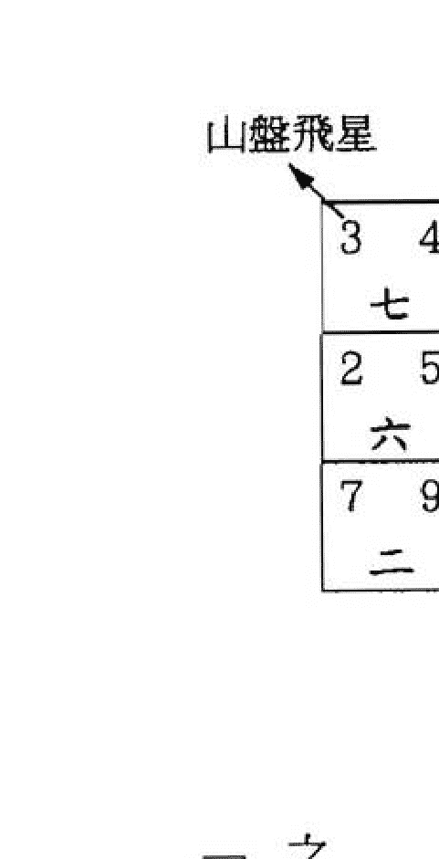

宅命盤是由九個宮位所組成，而每個宮位下方的大寫數字是每運的飛星，俗稱「運星」。而右上方的小寫數字為向盤飛星，簡稱「向星」；左上方的小寫數字為山盤飛星，簡稱「山星」。

在介紹星盤的挨排軌跡之前，應先瞭解二十四山的三元龍及其陰陽排列。

二十四山分屬於八個卦，為一卦管三山。每卦之正中一山，叫「天元龍」；靠左邊的一山，叫「地元龍」；靠右邊的一山，叫「人元龍」。

下面就利用一運至九運的陰陽順逆圖來挨排玄空飛星宅命盤。

| 九運 | 八運 | 七運 | 六運 | 五運 | 四運 | 三運 | 二運 | 一運 | 二十四山 |
|---|---|---|---|---|---|---|---|---|---|
| + | - | + | - | + | - | + | + | - | 甲 |
| - | + | - | + | - | + | - | - | + | 卯 |
| - | + | - | + | - | + | - | - | + | 乙 |
| - | + | - | - | - | + | - | + | + | 辰 |
| + | - | + | + | + | - | + | - | - | 巽 |
| + | - | + | + | + | - | + | - | - | 巳 |
| - | + | - | + | + | - | + | - | + | 丙 |
| + | - | + | - | - | + | - | + | - | 午 |
| + | - | + | - | - | + | - | + | - | 丁 |
| - | - | - | + | - | + | + | - | + | 未 |
| + | + | + | - | + | - | - | + | - | 坤 |
| + | + | + | - | + | - | - | + | - | 申 |
| - | + | + | - | + | - | + | - | + | 庚 |
| + | - | - | + | - | + | - | + | - | 酉 |
| + | - | - | + | - | + | - | + | - | 辛 |
| + | + | - | + | - | - | - | + | - | 戌 |
| - | - | + | - | + | + | + | - | + | 乾 |
| - | - | + | - | + | + | + | - | + | 亥 |
| + | - | + | - | + | + | - | + | - | 壬 |
| - | + | - | + | - | - | + | - | + | 子 |
| - | + | - | + | - | - | + | - | + | 癸 |
| + | - | + | + | - | + | - | - | - | 丑 |
| - | + | - | - | + | - | + | + | + | 艮 |
| - | + | - | - | + | - | + | + | + | 寅 |

為方便讀者挨排星盤，現我把一運至九運的二十四山運盤陰陽列出，陽性順行以「+」表示，陰性逆行以「-」表示。

一、排運盤，七運運盤以七入中順飛（注：運盤不須論陰陽，一律順飛）。
二、排山盤，坐方運盤為三碧，三碧是震的洛書序，統管甲卯乙三山，其天元龍卯屬陰，故山星三入中後要逆飛。
三、排向盤，向方運盤為二黑，二黑是坤的洛書序，統管未坤申三山，其天元龍坤屬陽，故向星二入中後要順飛。

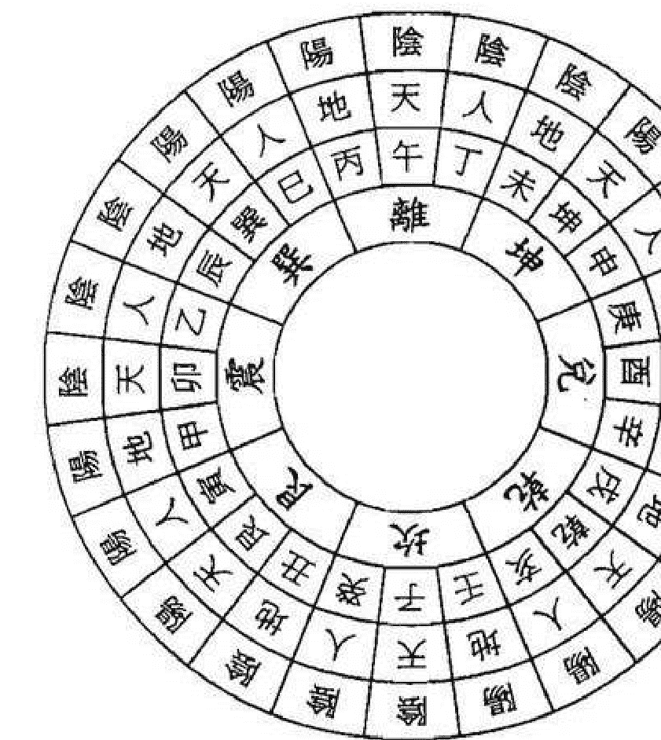

由上圖可知，天、地、人之三才的排法有個明顯的特點，就是天元龍與人元龍是同性質的。如果天元龍屬陽的，人元龍也屬陽；如果天元龍屬陰的，人元龍也屬陰。而地元龍則相反，如果天元龍屬陽的，地元龍一定屬陰；如果天元龍屬陰的，地元龍則一定屬陽。現把三元龍的陰陽詳述如下：

- 天元龍：陽——乾坤艮巽
- 地元龍：陽——甲庚壬丙
- 人元龍：陽——寅申巳亥

- 天元龍：陰——子午卯酉
- 地元龍：陰——辰戌丑未
- 人元龍：陰——癸丁乙辛

星盤之軌跡就是以三元龍的陰陽來決定順逆挨排的，逢陽順飛，逢陰逆飛。
下面就舉七運坐子向午之宅命盤。

| 4 | 1 | 8 | 6 | 6 | 8 |
|---|---|---|---|---|---|
| 六 | 二 | 四 | | | |
| 5 | 9 | 3 | 2 | 1 | 4 |
| 五 | 七 | 九 | | | |
| 9 | 5 | 7 | 7 | 2 | 3 |
| 一 | 三 | 八 | | | |

## 第十一節 兼向與替卦

玄空風水對於坐向是很注重山之度數的，每山為15度，若用的山在中心9度之內為下卦；超過中心9度之外為替卦。下卦和替卦的用法是有很大差別的，它是玄空風水不同於其他流派，是很精細很特殊的創舉，務須清楚地分辨。

下面就將二十四山，三百六十度及下卦和替卦的範圍列表如下：

大家不妨多舉些例子以熟練挨排宅命盤，如果怕自己排的宅命盤不準確，可將宅命盤挨排後，查後面一運至九運的二十四山下卦宅命盤。

最後要補充的是有些玄空派別，是將向盤排在每宮位的左上方，將山盤排在每宮位的右上方，它源自學理「陽從左邊團團轉，陰從右路轉相通」，向盤為天卦屬陽，故挨在左上方，而山盤為地卦屬陰，故挨在右上方。

但另有一派卻認為陰陽要調和，故在屬陰的右上方填上屬陽的向盤，在屬陽的左上方填上屬陰的山盤，這是陰陽相濟之理，現流行的宅命盤大都依此方式。

### 舉例一：七運坐西向卯之宅命盤

一、運盤七運，以七入中順飛。
二、坐方天星為九紫，以九紫佈入中宮，查七運的二十四山陰陽順逆圖，酉位屬陰逆，故以九紫入中逆飛。
三、向首天星為五黃，以五黃佈入中宮，查七運的二十四山陰陽順逆圖，卯位屬陰逆，故以五黃入中逆飛。

### 舉例二：八運坐子向午之宅命盤

一、運盤八運，以八入中順飛。
二、坐方天星為四綠，以四綠佈入中宮，查八運的二十四山陰陽順逆圖，子位屬陽順，故以四綠入中順飛。
三、向首天星為三碧，以三碧佈入中宮，查八運的二十四山陰陽順逆圖，午位屬陰逆，故以三碧入中逆飛。

| 3 4 | 8 8 | 1 6 |
| 七 | 三 | 五 |
| 2 5 | 4 3 | 6 1 |
| 六 | 八 | 一 |
| 7 9 | 9 7 | 5 2 |
| 二 | 四 | 九 |

| 1 6 | 5 1 | 3 8 |
| 六 | 二 | 四 |
| 2 7 | 9 5 | 7 3 |
| 五 | 七 | 九 |
| 6 2 | 4 9 | 8 4 |
| 一 | 三 | 八 |

在上節中所講的排盤法是下卦之挨排，現主要來談談替卦之用法。
當立向超過每山中間的9度之範圍，即兼三分以上時，則要把挨到的運盤之卦數（即元旦盤的坎一、坤二、震三、巽四、中五、乾六、兌七、艮八、離九，是洛書之後天卦數）變成星數（即貪狼一白、巨門二黑、祿存三碧、文曲四綠、廉貞五黃、武曲六白、破軍七赤、左輔八白、右弼九紫），而後再以星數分陰陽順逆來挨山盤和向盤，因為替卦是用星數來代替運星的，所以又名起星，即以星數起挨也。

用替卦必須知道挨星口訣：
子癸甲申貪狼尋，坤壬乙卯未巨門，
乾巽六位皆武曲，艮丙辛酉丑破軍，
還有寅午庚丁字，均替九紫順逆行。

在二十四山中，有的要替，有的不用替，列表如下：

| 星數 | 卦數 | 二十四山 |
|---|---|---|
| 二黑 | 坎一 | 壬 |
| 一白 | 坎一 | 子 |
| 一白 | 坎一 | 癸 |
| 七赤 | 艮八 | 丑 |
| 七赤 | 艮八 | 艮 |
| 九紫 | 艮八 | 寅 |
| 一白 | 震三 | 甲 |
| 二黑 | 震三 | 卯 |
| 二黑 | 震三 | 乙 |
| 六白 | 巽四 | 辰 |
| 六白 | 巽四 | 巽 |
| 六白 | 巽四 | 巳 |
| 七赤 | 離九 | 丙 |
| 九紫 | 離九 | 午 |
| 九紫 | 離九 | 丁 |
| 二黑 | 坤二 | 未 |
| 二黑 | 坤二 | 坤 |
| 一白 | 坤二 | 申 |
| 九紫 | 兌七 | 庚 |
| 七赤 | 兌七 | 酉 |
| 七赤 | 兌七 | 辛 |
| 六白 | 乾六 | 戌 |
| 六白 | 乾六 | 乾 |
| 六白 | 乾六 | 亥 |

故順飛，又如卯三入中，以二代替，因卯為陰數
替星入中後，其陰陽還是按原卦山之陰陽來進行順逆飛。如甲三入中，以一代替，因甲為陽數
下面就利用一運至九運挨變星數來挨排替卦宅命盤。

| 卦別 | 周天度數 | 山向 |
|---|---|---|
| 替卦 | 157.5~160.5 | 丙 |
| 下卦 | 160.5~169.5 | 丙 |
| 替卦 | 169.5~172.5 | 丙 |
| 替卦 | 172.5~175.5 | 午 |
| 下卦 | 175.5~184.5 | 午 |
| 替卦 | 184.5~187.5 | 午 |
| 替卦 | 187.5~190.5 | 丁 |
| 下卦 | 190.5~199.5 | 丁 |
| 替卦 | 199.5~202.5 | 丁 |
| 替卦 | 202.5~205.5 | 未 |
| 下卦 | 205.5~214.5 | 未 |
| 替卦 | 214.5~217.5 | 未 |
| 替卦 | 217.5~220.5 | 坤 |
| 下卦 | 220.5~229.5 | 坤 |
| 替卦 | 229.5~232.5 | 坤 |
| 替卦 | 232.5~235.5 | 申 |
| 下卦 | 235.5~244.5 | 申 |
| 替卦 | 244.5~247.5 | 申 |
| 替卦 | 247.5~250.5 | 庚 |
| 下卦 | 250.5~259.5 | 庚 |
| 替卦 | 259.5~262.5 | 庚 |
| 替卦 | 262.5~265.5 | 酉 |
| 下卦 | 265.5~274.5 | 酉 |
| 替卦 | 274.5~277.5 | 酉 |
| 替卦 | 277.5~280.5 | 辛 |
| 下卦 | 280.5~289.5 | 辛 |
| 替卦 | 289.5~292.5 | 辛 |
| 替卦 | 292.5~295.5 | 戌 |
| 下卦 | 295.5~304.5 | 戌 |
| 替卦 | 304.5~307.5 | 戌 |
| 替卦 | 307.5~310.5 | 乾 |
| 下卦 | 310.5~319.5 | 乾 |
| 替卦 | 319.5~322.5 | 乾 |
| 替卦 | 322.5~325.5 | 亥 |
| 下卦 | 325.5~334.5 | 亥 |
| 替卦 | 334.5~337.5 | 亥 |

| 卦別 | 周天度數 | 山向 |
|---|---|---|
| 替卦 | 337.5~340.5 | 壬 |
| 下卦 | 340.5~349.5 | 壬 |
| 替卦 | 349.5~352.5 | 壬 |
| 替卦 | 352.5~355.5 | 子 |
| 下卦 | 355.5~4.5 | 子 |
| 替卦 | 4.5~7.5 | 子 |
| 替卦 | 7.5~10.5 | 癸 |
| 下卦 | 10.5~19.5 | 癸 |
| 替卦 | 19.5~22.5 | 癸 |
| 替卦 | 22.5~25.5 | 丑 |
| 下卦 | 25.5~34.5 | 丑 |
| 替卦 | 34.5~37.5 | 丑 |
| 替卦 | 37.5~40.5 | 艮 |
| 下卦 | 40.5~49.5 | 艮 |
| 替卦 | 49.5~52.5 | 艮 |
| 替卦 | 52.5~55.5 | 寅 |
| 下卦 | 55.5~64.5 | 寅 |
| 替卦 | 64.5~67.5 | 寅 |
| 替卦 | 67.5~70.5 | 甲 |
| 下卦 | 70.5~79.5 | 甲 |
| 替卦 | 79.5~82.5 | 甲 |
| 替卦 | 82.5~85.5 | 卯 |
| 下卦 | 85.5~94.5 | 卯 |
| 替卦 | 94.5~97.5 | 卯 |
| 替卦 | 97.5~100.5 | 乙 |
| 下卦 | 100.5~109.5 | 乙 |
| 替卦 | 109.5~112.5 | 乙 |
| 替卦 | 112.5~115.5 | 辰 |
| 下卦 | 115.5~124.5 | 辰 |
| 替卦 | 124.5~127.5 | 辰 |
| 替卦 | 127.5~130.5 | 巽 |
| 下卦 | 130.5~139.5 | 巽 |
| 替卦 | 139.5~142.5 | 巽 |
| 替卦 | 142.5~145.5 | 巳 |
| 下卦 | 145.5~154.5 | 巳 |
| 替卦 | 154.5~157.5 | 巳 |

### 舉例一：七運子山午向兼壬丙或癸丁起星圖

一、運盤七運，以七入中順飛。
二、坐方天星為三碧，三之天元為卯，卯挨巨門，故不用三碧而用二黑入中，卯為陰，故以二黑入中逆飛。
三、向首天星為二黑，二之天元為坤，坤挨巨門，仍以二黑入中，坤為陽，故以二黑入中順飛。

### 舉例二：八運午山子向兼丙壬或丁癸起星圖

一、運盤八運，以八入中順飛。
二、坐方天星為三碧，三之天元為卯，卯挨巨門，故不用三碧而用二黑入中，卯為陰，故以二黑入中逆飛。
三、向首天星為四綠，四之天元為巽，巽挨武曲，故不用四綠而用六白入中，巽為陽，故以六白入中順飛。

### 舉例三：七運酉山卯向兼庚甲或辛乙起星圖

一、運盤七運，以七入中順飛。
二、坐方天星為九紫，九之天元為午，午挨右弼，仍以九紫入中，午為陰，故以九紫入中逆飛。
三、向首天星為五黃，無替可尋，仍以五黃入中，五黃為陰，故以五黃入中逆飛。

### 舉例四：四運巽山乾向兼辰戌或巳亥起星圖

一、運盤四運，以四入中順飛。
二、坐方天星為三碧，三之天元為卯，卯挨巨門，故不用三碧而用二黑入中，卯為陰，故以二黑入中逆飛。
三、向首天星為五黃，無替可尋，仍以五黃入中，五黃為陽，故以五黃入中順飛。

| 3 4 | 7 9 | 5 2 |
| 三 | 八 | 一 |
| 4 3 | 2 5 | 9 7 |
| 二 | 四 | 六 |
| 8 8 | 6 1 | 1 6 |
| 七 | 九 | 五 |

| 1 6 | 5 1 | 3 8 |
| 六 | 二 | 四 |
| 2 7 | 9 5 | 7 3 |
| 五 | 七 | 九 |
| 6 2 | 4 9 | 8 4 |
| 一 | 三 | 八 |

| 3 5 | 7 1 | 5 3 |
| 七 | 三 | 五 |
| 4 4 | 2 6 | 9 8 |
| 六 | 八 | 一 |
| 8 9 | 6 2 | 1 7 |
| 二 | 四 | 九 |

| 3 1 | 7 6 | 5 8 |
| 六 | 二 | 四 |
| 4 9 | 2 2 | 9 4 |
| 五 | 七 | 九 |
| 8 5 | 6 7 | 1 3 |
| 一 | 三 | 八 |

### 舉例五：九運甲山庚向兼卯酉或寅申起星圖

一、運盤九運，以九入中順飛。
二、坐方天星為七赤，七之地元為庚，庚挨右弼，故不用七赤而用九紫入中，庚為陽，故以九紫入中順飛。
三、向首天星為二黑，二之地元為未，未挨巨門，仍以二黑入中，未為陰，故以二黑入中逆飛。

下面再說說立兼向替卦應注意的三點問題。

一、我們已知二十四山分屬八個卦，每卦之中有地元龍、天元龍、人元龍各屬一山，現以六親的關係稱呼它們之間的關聯：天元龍稱父母卦，地元龍稱逆子卦，人元龍稱順子卦。

順者，順其父母的陰陽運行而運行；逆者，逆其父母的陰陽運行而運行。

由於有順子與逆子之分，父母與子息之間就有可兼與不可兼的關係。子午卯酉、乾坤艮巽，為天元龍，又為父母卦，可以兼人元卦，即可以兼癸丁乙辛寅申巳亥。相反，人元龍卦就不能兼天元龍卦。至於地元龍，由於與父母卦的陰陽相反，一般都不能兼用。但天元龍中，乾巽坤艮此四維卦，由於包含較寬，乾包戌亥、巽包辰巳、艮包丑寅、坤包未申，故此四維卦即可兼人元龍，亦可兼地元龍。但子午卯酉此四個天元龍，由於包含較窄，只可以兼癸丁乙辛，而不能兼地元龍的壬丙甲庚。

凡立山向，貴在一卦純清，即以不兼為好，不但地元龍要純清，就是天元龍、人元龍也要純清。只有在環境形勢確實不能立正向而非要兼線時才用替卦。一般情況下，父母卦都不要去兼逆子卦，順子卦與逆子卦不要互兼，否則易出現陰陽差錯或出卦的錯誤。

二、有些山向雖有兼，但立向時，山向二星均無替可尋，仍然是原山向兩星入中挨排，這叫不替之替。雖然挨得旺山旺向，但不作旺山旺向論，因為若按山向龍脈之兼向而立兼向，挨排又無替可尋，必是陰陽差錯或犯出卦向之錯誤，而不能作旺山旺向論之。如四運庚山甲向兼酉卯：

| 7 三 | 2 八 | 9 一 |
| 8 二 | 6 四 | 4 六 |
| 3 七 | 1 九 | 5 五 |

若正向為旺山旺向。今兼酉卯，向星甲為二，按替卦口訣，二即為未，未挨巨門，仍是二入中，亦無所謂替。現在不立正向，而立中，無所謂替。山星庚為六，六即戌，戌挨武曲，仍是六入中，亦無所謂替。

| 8 八 | 4 四 | 6 六 |
| 7 七 | 9 九 | 2 二 |
| 3 三 | 5 五 | 1 一 |

# 第二章 應用點竅篇

## 第一節 入囚與地運長短

所謂入囚就是當運令星依時入中也。如七運立子山午向，其中宮向星為二，到二運時，向星二進入中宮，使原先所立之向失去意義而開始走向衰敗。

入囚分山星入囚和向星入囚。如山星入囚則為丁星入囚，主不能生育、夭折無後、兒女無能；如向星入囚則為財星入囚，主貧窮、破財、是非、剋妻。

凡向星入囚之宅，為禍最烈，主家破人亡。但有以下兩種情況，可使其囚不住也。

一、立向之方有屈曲有情的江河，即使向星按運入中，若向方之水潔且環境優美，則囚不住仍可使住宅繼續為旺。

二、五運時五黃入中所立之旺向，此種向必是以五為向上之飛星，因五黃為中宮之土，中宮乃至尊、皇極也。五黃歸自己本位是不以為囚的，在五運期間，有如下十二個山向：子山午向、癸山丁向、午山子向、丁山癸向、戌山辰向、辰山戌向、丑山未向、未山丑向、卯山酉向、酉山卯向、乙山辛向、辛山乙向。

| 4 1 六 | 8 6 二 | 6 8 四 |
| 5 9 五 | 3 2 七 | 1 4 九 |
| 9 5 一 | 7 7 三 | 2 3 八 |

兼向，則犯陰陽差錯也，不能當作旺山旺向論之。若遇這種情況，可採用只立正向的辦法來解決。如果庚山甲向不是兼酉卯，而是兼申寅，此為出卦兼，亦按立正向之法解決。若然形局無法遷就，就採用內外立卦的方法，即內向立正向下卦，外向立兼向替卦，這就謂：「內藏黃金鬥，外掩時人口」。

三、用兼向替卦之法，會出現一種非常特殊的組合，這就是八純卦。此種卦之山向飛星皆字字相同，無變化、無生息、屬大凶之卦。這是下卦排盡二百一十六局所沒有的。這種卦亦是犯反伏吟之卦。八純卦在起星二百一十六局中，只有六局，全部發生在五運之乾巽兩宮，如五運巽山乾向兼辰戌或巳亥起星圖：

| 5 5 四 | 1 1 九 | 3 3 二 |
| 4 4 三 | 6 6 五 | 8 8 七 |
| 9 9 八 | 2 2 一 | 7 7 六 |

那麼，我們是如何計算地運之長短的呢？
地運之長短是以中星與向星的關係來決定的，如子山午向，三運為三碧星入中，向星為七，共曆三運、四運、五運、六運之四個運，每運為二十年，故合八十年。之後，不管是何星入中，地運都是八十年，現把二十四山向的地運時間詳列如下：

| 地運年數 | 向方 | 坐山 |
|---|---|---|
| 80 | 午 | 子 |
| 80 | 丁 | 癸 |
| 80 | 丙 | 壬 |
| 100 | 子 | 午 |
| 100 | 癸 | 丁 |
| 100 | 壬 | 丙 |
| 160 | 巽 | 乾 |
| 160 | 巳 | 亥 |
| 160 | 辰 | 戌 |
| 20 | 乾 | 巽 |
| 20 | 亥 | 巳 |
| 20 | 戌 | 辰 |
| 140 | 卯 | 酉 |
| 140 | 乙 | 辛 |
| 140 | 甲 | 庚 |
| 40 | 酉 | 卯 |
| 40 | 辛 | 乙 |
| 40 | 庚 | 甲 |
| 60 | 艮 | 坤 |
| 60 | 寅 | 申 |
| 60 | 丑 | 未 |
| 120 | 坤 | 艮 |
| 120 | 申 | 寅 |
| 120 | 未 | 丑 |

以上所講的地運，最長者為一百六十年，最短者為二十年，兩數相合共一百八十年，玄空學稱為「小三元地運」。若地脈綿長、富有氣勢，八方中有城門且又全局生成合十，則地運可達五百四十年，甚至一千零八十年，如歷代國都便是，玄空學稱此為「大三元地運」。
還有一種地運入囚之法，就是雙星會向之局，其地運是以當運向星飛至坐山之運為入囚之時，
現把一運至九運中雙星會向之局分列如下：

- 一運：子山午向（癸丁同），九運入囚
辰山戌向，三運入囚
庚山甲向，六運入囚
卯山酉向（乙辛同），五運入囚
乾山巽向（亥巳同），八運入囚
丙山壬向，犯反伏吟不用

- 二運：壬山丙向，一運入囚
酉山卯向（辛乙同），七運入囚
午山子向（丁癸同），三運入囚
甲山庚向，六運入囚

- 三運：子山午向（癸丁同），二運入囚
丙山壬向，四運入囚

- 四運：壬山丙向，三運入囚
辰山戌向，六運入囚
午山子向（丁癸同），五運入囚
乾山巽向（亥巳同），犯反伏吟不用

## 第二節 收山出煞

> 《青囊序》曰：「山上龍神不下水，水裏龍神不上山」。此語乃是吉凶之樞紐、禍福之關鍵，為玄空理氣中的扼要法門。經曰：「山管人丁水管財」，意即山主人丁之興旺，水主財源之興盛。但倘若山水之龍神顛倒錯位，則反主損丁破財，為禍百端。故山上排龍切忌下水，當應於旺星處見山或高樓之物；水裏排龍切忌上山，宜在旺星處見河流或低窪處，這是山向飛星作用於環境形勢的要訣。

下舉七運卯山酉向例：

山上飛星七到震方，七是當令之星為旺氣。八和九屬將來之生氣分別飛到坤方和坎方，故震、坤、坎三方要見高，在此三處見高則主旺人丁。
六為退氣，臨於巽方。四為煞氣臨於乾方，若巽、乾二方見高則為衰死氣得力，故宜巽、乾二方有水，則衰死之氣放在水裏而煞脫也。
向上飛星七到兌方，七是當令之星為旺氣。八屬將來之生氣飛到乾方，故兌、乾二方要見水，在此二處見水則主旺財源。
六為退氣，臨於艮方。五和四同屬煞氣，分別臨於離方和坎方，若艮、離、坎三方見水則為衰死氣得力，故宜艮、離、坎三方見山，為衰死之氣放在山上而收山也。

| 6 1 | 1 5 | 8 3 |
| 六 | 二 | 四 |
| 7 2 | 5 9 | 3 7 |
| 五 | 七 | 九 |
| 2 6 | 9 4 | 4 8 |
| 一 | 三 | 八 |

卯 ← → 酉

- 六運：子山午向（癸丁同），五運入囚
巽山乾向（巳亥同），犯反伏吟不用
戌山辰向，四運入囚
丙山壬向，七運入囚

- 七運：壬山丙向，六運入囚
午山子向（丁癸同），八運入囚

- 八運：子山午向（癸丁同），七運入囚
庚山甲向，四運入囚
卯山酉向（乙辛同），三運入囚
丙山壬向，九運入囚

- 九運：壬山丙向，犯反伏吟不用
巽山乾向（巳亥同），二運入囚
酉山卯向（辛乙同），五運入囚
午山子向（丁癸同），一運入囚
戌山辰向，七運入囚
甲山庚向，四運入囚

再舉七運丁山癸向例：

| 1 4 | 6 8 | 8 6 |
| 六 | 二 | 四 |
| 9 5 | 2 3 | 4 1 |
| 五 | 七 | 九 |
| 5 9 | 7 7 | 3 2 |
| 一 | 三 | 八 |

丁 ← → 癸

山上飛星七到坎方，七是當令之星為旺氣。八和九屬將來之生氣分別飛到坤方和震方，故坎、坤、震三方要見高，在此三處見高則主旺人丁。
六為退氣，臨於離方。五為煞氣，臨於艮方，若離、艮二方見高則為衰死氣得力，故宜離、艮二方有水，則衰死之氣放在水裏而煞脫也。
向上飛星七到坎方，七是當令之星為旺氣。八和九屬將來之生氣分別飛到離方和艮方，故坎、艮、離三方要見水，在此三處見水則主旺財源。
六為退氣，臨於坤方。五為煞氣，臨於震方，若坤、震二方見水則為衰死氣得力，故宜坤、震二方見山，為衰死之氣放在山上而收山也。
總之，我們一定要分辨山向飛星的衰旺來配合龍神進行，則可避免上山下水之病而做到收山出煞之功效。

## 第三節 伏吟與反吟

在挨排山向二星時，會出現一種特殊的情況，就是山向二星遇著五黃。若遇著五黃時為入中順飛，則飛佈之星必然都與元旦盤相同，即運星與元旦盤重疊在一起了，這種相同性質之氣又在同宮的重複現象謂伏吟。若遇著五黃時為入中逆飛，則飛佈之星必然都與元旦盤相反，即運星與元旦盤成相對狀態，這種同居一宮卻為相反性質之氣的現象謂反吟。

下面就列出犯伏吟或反吟的二十八局如下：

- 壬山丙向：一運 向星滿盤犯伏吟
丙山壬向：一運 山星滿盤犯伏吟
九運 向星滿盤犯伏吟
艮山坤向：二運 山星滿盤犯伏吟
五運 僅山方山星與向方向星犯反吟
八運 向星滿盤犯伏吟

坤山艮向：二運 向星滿盤犯伏吟
五運 僅山方向星與向方山星犯反吟
八運 山星滿盤犯伏吟

寅山申向：二運 山星滿盤犯伏吟
五運 僅山方向星與向方山星犯反吟
八運 向星滿盤犯伏吟

申山寅向：二運 向星滿盤犯伏吟
五運 僅山方向星與向方山星犯反吟
八運 山星滿盤犯伏吟

甲山庚向：三運 山星滿盤犯伏吟
七運 向星滿盤犯伏吟

庚山甲向：三運 向星滿盤犯伏吟
七運 山星滿盤犯伏吟

巽山乾向：四運 向星滿盤犯伏吟
六運 山星滿盤犯伏吟

乾山巽向：四運 山星滿盤犯伏吟
六運 向星滿盤犯伏吟

亥山巳向：四運 山星滿盤犯伏吟
六運 向星滿盤犯伏吟

巳山亥向：四運 向星滿盤犯伏吟
六運 山星滿盤犯伏吟

現象。
伏吟與反吟除了以上五黃入中順飛和逆飛所造成之外，還有以下二種情況也會發生伏吟反吟之

一、替卦上的八純卦。八純卦的山向飛星皆是字字相同的，其只發生在五運之乾巽兩宮坐山立向的兼向之替卦上，共六局，即：五運乾山巽向（兼戌辰或亥巳）、五運巽山乾向（兼辰戌或巳亥）、五運亥山巳向（兼乾巽或壬丙）、五運巳山亥向（兼巽乾或丙壬）、五運戌山辰向（兼乾巽或辛乙）、五運辰山戌向（兼巽乾或乙辛）。

二、飛星與運盤之字相同。它既可發生在坐向二宮，也可發生在非坐向二宮，使用時務請注意。例如：

大凡伏吟反吟之局都與上山、下水、上山下水三種格局不謀而合。因此，在建房擇居時務必避開伏吟反吟之局，而擇旺山旺向之宅居也。

二運之年山子向，震宮之向星與運星伏吟，發生於非坐向二宮。

二運之子山午向，震宮之山星與運星伏吟，發生於非坐向二宮。

一運之坤山艮向，艮方山星與運星伏吟，發生於坐向二宮。

一運之艮山坤向，艮方向星與運星伏吟，發生於坐向二宮。

## 第四節 正神與零神

正神是指當元之旺氣位，正神之相對位即為零神，由於正神與零神是陰陽對峙的，故謂陰陽零正。現列三元九運中各運的正神和零神如下：

- 一運 坎一為正神，離九為零神
二運 坤二為正神，艮八為零神
三運 震三為正神，兌七為零神
四運 巽四為正神，乾六為零神
五運 前十年寄於坤，故以坤二為正神，則艮八為零神。後十年寄於艮，故以艮八為正神，則坤二為零神。
六運 乾六為正神，巽四為零神
七運 兌七為正神，震三為零神
八運 艮八為正神，坤二為零神
九運 離九為正神，坎一為零神

正神是代表旺位，零神是代表衰位。而「水」是以「衰」為旺，即是在衰位見水，則這水便是旺財運的水了。而正神方宜開門收氣，見水反為不吉。

在七運時以東方位為零神，零神方最適宜見水，主旺財。中國地域因其東方見海水則為零神方見水，故沿海一帶從八四年開始興旺發達而成為富庶之地。西方位為正神，正神方最適宜開門納氣以吸當運旺氣。經云：「正神正位裝，撥水入零堂」，就是講正神方應開門納旺氣，零神方宜見水以旺財。只有這樣，才能如《天玉經》所云：「明得零神與正神，指日入青雲」。

為此，在建宅擇居時應以正神、零神來取捨。

- 在一運時，門應開在正神坎位，見水應在零神離位。
在二運時，門應開在正神坤位，見水應在零神艮位。
在三運時，門應開在正神震位，見水應在零神兌位。
在四運時，門應開在正神巽位，見水應在零神乾位。
在五運時，前十年門應開在正神坤位，見水應在零神艮位，後十年門應開在正神艮位，見水應在零神坤位。
在六運時，門應開在正神乾位，見水應在零神巽位。
在七運時，門應開在正神兌位，見水應在零神震位。
在八運時，門應開在正神艮位，見水應在零神坤位。
在九運時，門應開在正神離位，見水應在零神坎位。

## 第五節 論下卦的四種格局

我們已知二十四山下卦在一至九運中，共挨得216個宅命飛星盤。在這麼多的宅命盤中，根據當令的向星和山星所飛臨的宮位，可分為四種格局。其分別為：旺山旺向、上山下水、雙星會向、雙星會坐。下就把每種格局的特點及所宜形局分析如下：

### 旺山旺向

指當令的山星飛到坐山，當令的向星飛至向首。如七運之酉山卯向

| 1 6 | 5 1 | 3 8 |
|---|---|---|
| 六 | 二 | 四 |
| 2 7 | 9 5 | 7 3 |
| 五 | 七 | 九 |
| 6 2 | 4 9 | 8 4 |
| 一 | 三 | 八 |

當令的七赤山星飛到酉山，當令的七赤向星飛至卯向

這種格局最宜坐後有秀麗端莊的山峰，前面見環抱有情的河水或有潔淨的池湖。

### 上山下水

指當令的山星飛到向方，而當令的向星則飛至坐方。如八運之艮山坤向

| 1 4 | 6 9 | 8 2 |
|---|---|---|
| 七 | 三 | 五 |
| 9 3 | 2 5 | 4 7 |
| 六 | 八 | 一 |
| 5 8 | 7 1 | 3 6 |
| 二 | 四 | 九 |

當令的八白山星飛到坤向，當令的八白向星飛至艮山

這種格局最宜背後有空地、河水、門路，前面則宜有高樓。唯須坐後之水或路要成彎抱有情之勢，前面的高樓不能太近有逼壓感，且形狀端莊才為合局。

### 雙星會向

指當令的向星和山星都飛到向方。如七運之壬山丙向

| 2 3 | 7 7 | 9 5 |
|---|---|---|
| 六 | 二 | 四 |
| 1 4 | 3 2 | 5 9 |
| 五 | 七 | 九 |
| 6 8 | 8 6 | 4 1 |
| 一 | 三 | 八 |

這種格局最宜向方近臨空曠、馬路，遠見大樹、高樓；若有水無山，則旺財不旺丁；有山無水，則旺丁不旺財。

### 雙星會坐

指當令的向星和山星都飛到坐方。如八運之酉山卯向

這種格局最宜坐後先有花園、水池，稍遠處再見高樓聳立者為佳。在農村則宜宅後有河水、田地，之後又有山丘、遠峰作屏拱。

為方便查閱，現就列出二十四山在一至九運中的四種格局表：

| 坐山\元運 | 一運 | 二運 | 三運 | 四運 | 五運 | 六運 | 七運 | 八運 | 九運 |
|---|---|---|---|---|---|---|---|---|---|
| 壬 | 雙星會坐 | 雙星會向 | 雙星會坐 | 雙星會向 | 上山下水 | 雙星會坐 | 雙星會向 | 雙星會坐 | 雙星會向 |
| 子癸 | 雙星會向 | 雙星會坐 | 雙星會向 | 雙星會坐 | 旺山旺向 | 雙星會向 | 雙星會坐 | 雙星會向 | 雙星會坐 |
| 丑 | 雙星會坐 | 旺山旺向 | 雙星會坐 | 上山下水 | 旺山旺向 | 上山下水 | 雙星會坐 | 旺山旺向 | 雙星會向 |
| 艮寅 | 雙星會向 | 上山下水 | 旺山旺向 | 旺山旺向 | 上山下水 | 旺山旺向 | 雙星會向 | 上山下水 | 雙星會坐 |
| 甲 | 雙星會坐 | 雙星會向 | 上山下水 | 旺山旺向 | 旺山旺向 | 旺山旺向 | 上山下水 | 雙星會向 | 雙星會坐 |
| 卯乙 | 雙星會向 | 上山下水 | 旺山旺向 | 上山下水 | 旺山旺向 | 旺山旺向 | 旺山旺向 | 上山下水 | 雙星會向 |
| 辰 | 雙星會坐 | 旺山旺向 | 上山下水 | 雙星會坐 | 上山下水 | 雙星會坐 | 旺山旺向 | 旺山旺向 | 雙星會坐 |
| 巽巳 | 雙星會向 | 雙星會坐 | 雙星會向 | 雙星會向 | 旺山旺向 | 雙星會向 | 雙星會坐 | 雙星會向 | 雙星會向 |
| 丙 | 雙星會坐 | 雙星會向 | 雙星會坐 | 雙星會坐 | 旺山旺向 | 雙星會坐 | 雙星會向 | 雙星會坐 | 雙星會坐 |
| 午丁 | 雙星會向 | 旺山旺向 | 雙星會向 | 上山下水 | 旺山旺向 | 上山下水 | 雙星會向 | 旺山旺向 | 雙星會向 |
| 未 | 雙星會坐 | 上山下水 | 雙星會坐 | 旺山旺向 | 上山下水 | 旺山旺向 | 雙星會坐 | 上山下水 | 雙星會坐 |
| 坤申 | 雙星會向 | 雙星會坐 | 雙星會向 | 旺山旺向 | 旺山旺向 | 雙星會向 | 雙星會坐 | 雙星會向 | 雙星會向 |
| 庚 | 雙星會坐 | 雙星會向 | 雙星會坐 | 上山下水 | 旺山旺向 | 上山下水 | 雙星會坐 | 雙星會向 | 雙星會坐 |
| 酉辛 | 雙星會向 | 雙星會坐 | 雙星會向 | 雙星會坐 | 旺山旺向 | 雙星會向 | 雙星會坐 | 雙星會向 | 雙星會向 |
| 戌 | 雙星會坐 | 上山下水 | 旺山旺向 | 雙星會向 | 上山下水 | 旺山旺向 | 旺山旺向 | 上山下水 | 雙星會坐 |
| 乾亥 | 雙星會向 | 旺山旺向 | 上山下水 | 雙星會坐 | 上山下水 | 雙星會坐 | 上山下水 | 旺山旺向 | 雙星會向 |

## 第六節 論城門

城門之法在玄空風水中能起到很重要的輔助作用。它不但能使旺山旺向之住宅，在其輔助旺氣的催動下更加錦上添花，也能使坐向不佳的居室，在其向方城門位的催助下扭轉劣勢、興旺發達。誠如《都天寶照經》所云：「五星一訣非真訣，城門一訣最為良；識得五星誠門訣，立宅安墳定吉昌。」

城門是指古時城池四面八方之門，某方以一城門口出入，門外有圍城之池，池水是以城門口出入，故也謂水口。《青囊序》云：「天上星辰似織羅，水交三八要相過。水發城門須要會，卻如湖裡雁交鵝。」水交三八是指二十四山的來水，即指城門一定要有二水或眾水交會才合局。

下面就列出三元九運中每個山向在每個運時的可用城門：

| 坐山 | 正城門 | 副城門 | 一運 | 二運 | 三運 | 四運 | 五運 | 六運 | 七運 | 八運 | 九運 |
|---|---|---|---|---|---|---|---|---|---|---|---|
| 壬 | 辰 | 未 | | 未 | 辰 | | 辰未 | 辰 | 辰未 | 未 | 辰未 |
| 子 | 巽 | 坤 | 巽坤 | 巽 | 坤 | 巽坤 | | 坤 | | 巽 | |
| 癸 | 巳 | 申 | 巳申 | 巳 | 申 | 巳申 | | 申 | | 巳 | |
| 丑 | 庚 | 丙 | | 庚丙 | | 庚丙 | | 庚 | 丙 | | 庚丙 |
| 艮 | 酉 | 午 | 酉午 | | 酉午 | | 酉午 | 午 | 酉 | | 酉午 |
| 寅 | 辛 | 丁 | 辛丁 | | 辛丁 | | 辛丁 | 丁 | 辛 | | 辛丁 |
| 甲 | 未 | 戌 | 戌 | 未 | 戌 | 戌 | 未戌 | 戌 | 未戌 | 未 | 未戌 |
| 卯 | 坤 | 乾 | 坤 | 乾 | 坤 | 坤 | 乾坤 | | 乾 | 乾 | |
| 乙 | 申 | 亥 | 申 | 亥 | 申 | 申 | 亥申 | | 亥 | 亥 | |
| 辰 | 壬 | 庚 | 壬 | 庚 | 壬 | 庚 | 壬庚 | | 庚 | 壬 | |
| 巽 | 子 | 酉 | 子 | 酉 | 子 | 酉 | 子酉 | | 子酉 | 酉 | 子酉 |
| 巳 | 癸 | 辛 | 癸 | 辛 | 癸 | 辛 | 癸辛 | | 癸辛 | 辛 | 癸辛 |
| 丙 | 戌 | 丑 | 戌丑 | 丑 | 戌丑 | 戌 | 戌丑 | 丑 | 戌丑 | 戌 | |
| 午 | 乾 | 艮 | 艮 | 乾 | 艮 | 艮 | 乾艮 | 艮 | 乾艮 | 乾 | 乾艮 |
| 丁 | 亥 | 寅 | 寅 | 亥 | 寅 | 寅 | 亥寅 | 寅 | 亥寅 | 亥 | 亥寅 |
| 未 | 壬 | 甲 | 壬 | 甲 | 壬 | 甲 | 壬甲 | | 甲壬 | | 壬甲 |
| 坤 | 子 | 卯 | 子 | 卯 | 子 | 卯 | 卯子 | | 卯子 | | 卯子 |
| 申 | 癸 | 乙 | 癸 | 乙 | 癸 | 乙 | 乙癸 | | 乙癸 | | 乙癸 |
| 庚 | 丑 | 辰 | 辰 | 丑 | 辰 | 辰 | 丑辰 | 辰 | 丑辰 | 丑 | 丑辰 |
| 酉 | 艮 | 巽 | 艮 | 巽 | 艮 | 艮 | 艮巽 | 艮 | 艮巽 | 巽 | 艮巽 |
| 辛 | 寅 | 巳 | 寅 | 巳 | 寅 | 寅 | 寅巳 | 寅 | 寅巳 | 巳 | 寅巳 |
| 戌 | 丙 | 甲 | 甲 | 丙 | 甲 | 甲 | 丙甲 | 甲 | 丙甲 | 甲 | 丙甲 |
| 乾 | 卯 | 午 | 午 | 卯 | 午 | 午 | 午卯 | 午 | 午卯 | 卯 | 午卯 |
| 亥 | 丁 | 乙 | 丁 | 乙 | 丁 | 乙 | 丁乙 | 丁 | 丁乙 | 乙 | 丁乙 |

由上表看出，城門是取自向方兩旁之卦。其之所以取自向方兩旁之卦，是根據先天生成之數而來。如坎山離向，離巽兩卦合為九四生成，巽為城門正格；若在坤卦取得旺氣，則坤為城門偏格。又因為保持同元純清之氣，故取向時應取同元之處為城門，即立天元龍之山向，要取兩旁天元龍處為城門；立人元龍之山向，要取兩旁人元龍處為城門；立地元龍之山向，要取兩旁地元龍處為城門。

從上表還可看出有以下三種情況：

一、同時存在正城門和副城門。例四運之子山午向，求午向兩旁的城門。

| 1 7 | 5 3 | 3 5 |
| 三 | 八 | 一 |
| 2 6 | 9 8 | 7 1 |
| 二 | 四 | 六 |
| 6 2 | 4 4 | 8 9 |
| 七 | 九 | 五 |

從四運之子山午向的挨星圖可知，向星之三為退氣之星，不是旺星主破財凶應。故要求取城門旺氣以補向方無旺氣之咎。

午向屬天元龍，它的城門在巽和坤。四運之子山午向，挨星三到巽，一到坤。查二十四山運盤陰陽表可知，巽方之三入中逆飛，使旺星四到巽方，得正城門旺氣。坤方之一入中逆飛，使旺星四到坤方，得副城門旺氣。因正城門和副城門同時取得，故不但不會破財，反而大發橫財，這就是城門的功力。

二、只有一旁有正城門或副城門，而另一旁卻沒有。例七運之酉山卯向，求卯向兩旁的城門。

| 1 6 | 5 1 | 3 8 |
| 六 | 二 | 四 |
| 2 7 | 9 5 | 7 3 |
| 五 | 七 | 九 |
| 6 2 | 4 9 | 8 4 |
| 一 | 三 | 八 |

從七運之酉山卯向的挨星圖可知，向星之七為當旺之星，若又能取得城門之助，則使本來就為旺氣的卯方旺上加旺。

卯向屬天元龍，它的城門在艮和巽。七運之酉山卯向，挨星一到艮，六到巽。查二十四山運盤陰陽表可知，艮方之一入中逆飛，使旺星七到艮方，得正城門旺氣。巽方之六入中順飛，但旺星不能到巽方，故此方無副城門旺氣可取。

三、兩旁都沒有城門可取。例一運之午山子向，求子向兩旁的城門。

| 6 5 | 1 1 | 8 3 |
| 九 | 五 | 七 |
| 7 4 | 5 6 | 3 8 |
| 八 | 一 | 三 |
| 2 9 | 9 2 | 4 7 |
| 四 | 六 | 二 |

從一運之午山子向的挨星圖可知，向星之二為生氣之星，沒有當元之旺但屬亦可。當旺雙星會於坐山，犯上山之格，主破財，且又沒有城門旺氣之助。

子向屬天元龍，它的城門在乾與艮。一運之午山子向，挨星二到乾，四到艮。查二十四山運盤陰陽表可知，乾方之二入中順飛，但旺星不能到乾方，故此方無正城門旺氣可取。艮方之四入中順飛，但旺星不能到艮方，故此方無副城門旺氣可取。故一運之午山子向，其乾方或艮方，均沒有城門之輔助力。

以上這三種情況是由於坐向的陰陽不同和飛到兩旁的天盤飛星的陰陽不同而造成的。

在向方的城門位，當以見池湖、河水交匯處、馬路口為合局。在山方的城門位，若見秀麗的山峰、高樓大廈、聳立之塔，則有利文、旺丁、發貴之吉應。山方城門之查找方法可根據前表，只要把山方改成向方即可。例八運之坤山艮向，查表把坤山改成艮山，則其正城門為酉，副城門在午。

值得注意的是，城門法所得的旺氣，只可用於當運，運過則即敗。若然繼續使用，必會招致破敗衰落。

## 第七節 論空亡之凶應

在立線取向時，有可取之線和不可取之線兩種。可取之線為下卦正向和替卦兼向，而不可取之線就是十字線壓在卦與卦、山與山的交會線上。

所立之線若壓在卦與卦的交會線上，此為大空亡線，謂「出卦」。主夫婦失歡、主仆不洽、兄弟不和、剛愎自用、精神異常、做事常顛倒錯亂、有財則無丁、有丁則無財、敗男丁、發女兒或外姓之人，且有三代絕嗣及家人亂倫之象。

所立之線若壓在山與山的交會線上，此為小空亡線，謂「陰陽差錯」。主欲進不能、欲退不得、威權不立、聲名不振、舉措乖張、是非衝突、虛擲心力、毫無寸功、懷才不遇、婦女當家。

> 《飛星賦》云：「豈無騎線遊魂，鬼神入室；更有空縫合卦，夢寐牽情」。騎線遊魂是指立向剛好在兩卦之間而無向可取也，如：

- 巳丙即巽卦與離卦之分界；
- 丁未即離卦與坤卦之分界；
- 申庚即坤卦與兌卦之分界；
- 辛戌即兌卦與乾卦之分界；
- 亥壬即乾卦與坎卦之分界；
- 癸丑即坎卦與艮卦之分界；
- 寅甲即艮卦與震卦之分界；
- 乙辰即震卦與巽卦之分界。

此種立線，還主易招鬼神。

空縫合卦是指立向剛好在同一卦內的兩山之間。

- 離卦之丙午、午丁的分界；
- 坤卦之未坤、坤申的分界；
- 兌卦之庚酉、酉辛的分界；
- 乾卦之戌乾、乾亥的分界；
- 坎卦之壬子、子癸的分界；
- 艮卦之丑艮、艮寅的分界；
- 震卦之甲卯、卯乙的分界；
- 巽卦之辰巽、巽巳的分界。

此種立線，還主常發惡夢。我現把各分界線之凶應列表如下：

| 中線 | 應凶事項 |
|---|---|
| 丙午 | 女人有月經不調、吐血之疾，出逆子，縱有功名也遭奸人排擠。 |
| 午丁 | 少女不利、自私、官訟、有心臟之疾。 |
| 丁未 | 女人改嫁、無長壽之人、女奪夫權出僧尼。 |
| 未坤 | 肺癌、中風、車禍、骨折、不睦多仇。 |
| 坤申 | 妯娌不和、官訟退敗、房分不均、吐血外傷。 |
| 申庚 | 嫖賭退產、親族失和、官訟是非。 |
| 庚酉 | 出逆子、敗長房、男盜女娼、百事難遂、破產官司。 |
| 酉辛 | 遭刑、離婚、妻多不正、賭博破家。 |
| 辛戌 | 肺癆、血症、喪妻、離異。 |
| 戌乾 | 敗長房、出怕事畏縮之人、女人患子宮癌。 |
| 乾亥 | 出癲狂之子、家業破敗。 |
| 亥壬 | 縱前發後必敗、發女兒和寡婦、受冤誣陷。 |

| 中線 | 應凶事項 |
|---|---|
| 壬子 | 出不肖子孫、吸毒、墮落、被侮殺。 |
| 子癸 | 癆症、破財、倒閉、傷女人。 |
| 癸丑 | 傷男、乏嗣、有財則無丁、有丁則無財、改嫁、女人不貞。 |
| 丑艮 | 房房敗退、家人異心不睦、肢體傷殘。 |
| 艮寅 | 家人失和、嫖賭破家、傷亡。 |
| 寅甲 | 出精神病、風濕病、癌症、服毒自殺、破財又官司。 |
| 甲卯 | 初豪富後敗絕，若發也出逆子、孤獨、悖理之人。 |
| 卯乙 | 初妻、有遭雷電擊者。 |
| 乙辰 | 車禍、水厄、淫賤、亂倫、乏嗣、破財、凶死、惡病。 |
| 辰巽 | 兄弟妯娌不和、敗長房、出怕事怯懦之人、多傷女人。 |
| 巽巳 | 初子刑妻、不出男丁、生獨女招贅、官訟車禍。 |
| 巳丙 | 破財、降謫、兄弟不和、發女人、敗男丁、橫死。 |

## 第八節 論陰陽合十

所謂陰陽，即是相對，指一白坎與九紫離相對，二黑坤與八白艮相對，三碧震與七赤兌相對，四綠巽與六白乾相對，其數雖相對但相加卻皆得十。

所謂合十，即是玄空挨星盤中每宮運星和山向飛星均合十也。其合十之功用在於使全局各卦互相通氣，而達到生氣流暢。誠如《沈氏玄空學遺稿》云：「合十，乃通中五戊己之氣，而萬物生焉、萬物育焉，生生育育，而變化無窮焉。老子號中五為玄牝之門，其中神妙，誠令人有不可思議者矣。

是以墓宅之山向挨星、飛星得滿盤合十者，則八宮卦氣均與中五相通，即藉中宮戊己之力，陰陽二氣互為交感，化育無窮，而丁財自然鼎盛矣。故山向星盤滿盤合十為最吉，僅中宮與山或向合十者，亦得吉征。」

下面就把全局合十的二十四局分列如下：

- 乾山巽向：一運，運星與向星合十
- 亥山巳向：一運，運星與山星合十
- 巽山乾向：一運，運星與山星合十
- 巳山亥向：一運，運星與山星合十
- 丑山未向：二運，運星與向星合十
- 未山丑向：二運，運星與山星合十
- 子山午向：三運，運星與向星合十
- 午山子向：三運，運星與山星合十
- 癸山丁向：三運，運星與山星合十
- 丁山癸向：三運，運星與向星合十
- 庚山甲向：四運，運星與向星合十
- 甲山庚向：四運，運星與向星合十
- 六運，運星與山星合十

由於運星有與山星或向星全部合十之分，故若運星與山星全部合十，則主生貴子、升職掌權、富貴雙全；若運星與向星全部合十，則主做事順利、廣結人緣、大發財富。

## 第九節 論三般卦

三般卦分父母三般卦和連珠三般卦二種。

凡運星與山向飛星成一四七、二五八、三六九同宮組合的為父母三般卦。如六運之丑山未向：

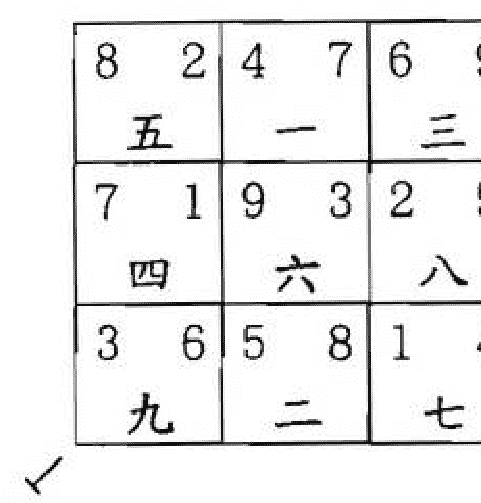

從上圖可知，離宮、震宮、乾宮三宮均為一四七，巽宮、兌宮、坎宮三宮均為二五八，艮宮、中宮、坤宮三宮均為三六九。但其坐山見向星六白，為向星上山；向方見山星六白，為山星下水，謂上山下水之敗局。

下面就把各運合於父母三般卦之山向列出：

- 二運——艮山坤向 寅山申向
- 坤山艮向 申山寅向
- 四運——丑山未向 未山丑向
- 坤山艮向 申山寅向
- 五運——艮山坤向 寅山申向
- 坤山艮向 申山寅向
- 六運——丑山未向 未山丑向
- 坤山艮向 申山寅向
- 八運——艮山坤向 寅山申向
- 坤山艮向 申山寅向

凡運星與山向飛星成一二三、二三四、三四五、四五六、五六七、六七八、七八九、八九一、九一二同宮組合的為連珠三般卦。如二運之辰山戌向：

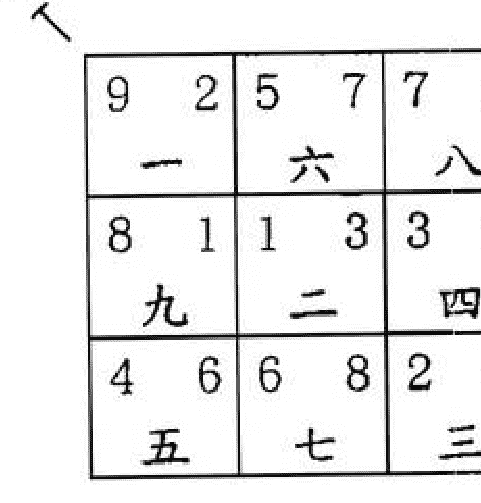

從上圖可知，該局也犯上山下水之敗局。

下面就把各運合於連珠三般卦之山向列出：

- 二運 辰山戌向 戌山辰向
- 三運 巽山乾向 乾山巽向
- 五運 巽山乾向 乾山巽向
- 七運 巽山乾向 乾山巽向
- 八運 辰山戌向 戌山辰向

> 《青囊序》云：「山上龍神不下水，水裏龍神不上山」。若上山下水又不合環境形局則主破財傷丁。由於父母三般卦能通三元之氣。連珠三般卦能通三運之氣，可使其氣運隨時孕育而生生不息，故若與環境格局又相配合，則不但主有人緣廣泛、到處遇貴人提拔相助、經營事業有意想不到的收穫之效應外，還主用之長久，代代榮華昌盛。

## 第十節 論太歲

太歲有地盤太歲和飛星太歲之分。

地盤太歲是後天八卦盤上固定的十二地支。它是每年值居於某一地支，十二年走完一周，這種在固定地盤上輪值的太歲就是地盤太歲。

飛星太歲是只在玄空風水學派中才使用的。因每年有一星入中，其餘八星飛佈八宮，故每宮的飛星是年年不同的。當九星飛佈星盤時，地盤方位的氣場亦發生變化，處於某方位的太歲隨方位氣場的運轉而按洛書軌跡飛行。比如，甲子年地盤太歲在子方，如果當年是一白入中，則太歲亦隨一白值居中宮。如果當年是一白飛到震方，則太歲亦隨一白飛到震方。如果當年是一白飛到坤方，則太歲亦隨一白飛到坤方。如此類推，隨著一白飛佈而飛佈的太歲就為飛星太歲。同樣道理，乙丑年，地盤太歲在丑方，丑為八白，太歲便隨八白而飛佈。丙寅年，地盤太歲在寅方，寅亦為八白，太歲便隨八白而飛佈。丁卯年，地盤太歲在卯方，卯為三碧，太歲便隨三碧而飛佈。如此類推來計算每年飛星太歲所到三方。

因此，太歲的運行軌跡就有二種：一種是地盤太歲按圓周軌跡運行，另一種是飛星太歲按洛書的軌跡運行。當五黃土星入中之年，地盤太歲和飛星太歲正好重疊，現列表以供查閱。

飛星太歲臨方檢查表：

（表中有「加黑」字為地盤太歲與飛星太歲重疊之方，謂太歲還宮。在取用時須特別謹慎！）

## 第十一節 論五黃

> 《河洛生剋吉凶斷》云：「五黃土為戊己大煞，不論生剋俱凶。宜安靜，不宜動作。」因其為氣勢最盛的中央戊己之土，一旦成煞則危害必烈。在五運時，因五黃為當運旺星是作吉論外，其餘各運則不論生剋當一律為禍。在流年五黃凶星所到之處，如出現動象主多生禍害。

現列出二〇〇一年至二〇二〇年這二十年內的五黃所在方位。

| 所到之方 | 花甲 | 年份 |
| --- | --- | --- |
| 坤 | 辛巳 | 2001 |
| 震 | 壬午 | 2002 |
| 巽 | 癸未 | 2003 |
| 中 | 甲申 | 2004 |
| 乾 | 乙酉 | 2005 |
| 兌 | 丙戌 | 2006 |
| 艮 | 丁亥 | 2007 |
| 離 | 戊子 | 2008 |
| 坎 | 己丑 | 2009 |
| 坤 | 庚寅 | 2010 |
| 震 | 辛卯 | 2011 |
| 巽 | 壬辰 | 2012 |
| 中 | 癸巳 | 2013 |
| 乾 | 甲午 | 2014 |
| 兌 | 乙未 | 2015 |
| 艮 | 丙申 | 2016 |
| 離 | 丁酉 | 2017 |
| 坎 | 戊戌 | 2018 |
| 坤 | 己亥 | 2019 |
| 震 | 庚子 | 2020 |

下面為五黃到八方時所應的凶事：

- 五黃到坎方——主泌尿系統疾病，女性提防流產，注意孩子學業下降，及注意飲酒防酒精中毒。
- 五黃到坤方——主急性病，血光之災，地產糾紛，不利年長之女性。
- 五黃到震方——主頭腳之傷，因財招禍，賭博破家，注意交通。
- 五黃到巽方——主皮膚病，禿髮症，神經系統，感情煩惱，犯票據法。
- 五黃到中宮——主血光之災，瘡毒惡症，橫禍凶死。
- 五黃到乾方——主頭部疾病，遠行會受阻，剋官削職，不利年長之男性。
- 五黃到兌方——主是非官司，易被金屬傷身，食物中毒或吸服毒品，且有桃花之劫。
- 五黃到艮方——主腸胃病，關節神經痛，運氣不順，親友反目成仇。
- 五黃到離方——主眼疾和心臟病，血光之災，或因色而生性病。

> 《玄空捷訣》云：「五黃為大煞，運尚無妨，山向飛星逢之，切宜留意，年月日加臨，更當小心」。制化「五黃」方法有以下三種：
> 1. 用一個大銅鈴，六個小銅鈴，系於五黃飛臨之方，是運用金化五黃土的力量，也可把系在一起的五帝古錢，掛在五黃飛臨之方。
> 2. 請和尚到家中，在五黃煞飛臨之方，敲磬誦經60分鐘，以誦經之聲洩五黃凶性。如宅主為佛教信徒，自己也可在五黃飛臨之方誦「金剛經」六遍。
> 3. 可用一個銅制羅盤，放置在五黃飛臨之方。

> 《玉鏡》云：「八山最怕五黃來，縱有生氣絕資財。凶中又遇堆黃到，彌深災禍哭聲哀。」這裏的堆黃指的是又重逢暗五黃和穿山五黃。
> 暗五黃名飛天大煞，作火星論。若其方修造動土，主立發火災。逢陽年（指天干為甲丙戊庚壬之年）在五黃方之對宮，逢陰年（指天干為乙丁己辛癸之年）與五黃同宮。
> 穿山五黃是自坐山之卦起值年紫白星，順行數至五之方位，即穿山五黃之方位。若其方修造動土，主發禍傷人。

下面列出二〇〇一年至二〇二〇年這二十年內的暗五黃和穿山五黃所在方位。

| 年份 | 暗五黃 | 乾山 | 兌山 | 艮山 | 離山 | 坎山 | 坤山 | 震山 | 巽山 |
|---|---|---|---|---|---|---|---|---|---|
| 2001 | 坤 | 震 | 巽 | 中 | 乾 | 兌 | 艮 | 離 | 坎 |
| 2002 | 兌 | 巽 | 中 | 乾 | 兌 | 艮 | 離 | 坎 | 坤 |
| 2003 | 巽 | 中 | 乾 | 兌 | 艮 | 離 | 坎 | 坤 | 震 |
| 2004 | 中 | 乾 | 兌 | 艮 | 離 | 坎 | 坤 | 震 | 巽 |
| 2005 | 乾 | 兌 | 艮 | 離 | 坎 | 坤 | 震 | 巽 | 中 |
| 2006 | 震 | 艮 | 離 | 坎 | 坤 | 震 | 巽 | 中 | 乾 |
| 2007 | 艮 | 離 | 坎 | 坤 | 震 | 巽 | 中 | 乾 | 兌 |
| 2008 | 坎 | 坤 | 震 | 巽 | 中 | 乾 | 兌 | 艮 | 離 |
| 2009 | 坎 | 坤 | 震 | 巽 | 中 | 乾 | 兌 | 艮 | 離 |
| 2010 | 艮 | 離 | 坎 | 坤 | 震 | 巽 | 中 | 乾 | 兌 |
| 2011 | 震 | 艮 | 離 | 坎 | 坤 | 震 | 巽 | 中 | 乾 |
| 2012 | 乾 | 兌 | 艮 | 離 | 坎 | 坤 | 震 | 巽 | 中 |
| 2013 | 中 | 乾 | 兌 | 艮 | 離 | 坎 | 坤 | 震 | 巽 |
| 2014 | 巽 | 中 | 乾 | 兌 | 艮 | 離 | 坎 | 坤 | 震 |
| 2015 | 兌 | 巽 | 中 | 乾 | 兌 | 艮 | 離 | 坎 | 坤 |
| 2016 | 坤 | 震 | 巽 | 中 | 乾 | 兌 | 艮 | 離 | 坎 |
| 2017 | 離 | 坎 | 坤 | 震 | 巽 | 中 | 乾 | 兌 | 艮 |
| 2018 | 離 | 坎 | 坤 | 震 | 巽 | 中 | 乾 | 兌 | 艮 |
| 2019 | 坤 | 震 | 巽 | 中 | 乾 | 兌 | 艮 | 離 | 坎 |
| 2020 | 兌 | 巽 | 中 | 乾 | 兌 | 艮 | 離 | 坎 | 坤 |

> 《堪輿經》曰：「力士者，歲之惡神也，所居之方，不宜抵向，犯之多瘟疾。」五黃尤須注意與力士會合，犯之主家人立即死亡。

下面就列出五黃與力士會合之年及方位：

+   上元：戊辰年、甲辰年在巽方
癸巳年在坤方
丁酉年在乾方
己亥年在艮方

+   中元：己巳年、乙巳年在坤方
癸酉年、己酉年在乾方
乙亥年、辛亥年在艮方
庚辰年、丙辰年在巽方

+   下元：辛巳年、丁巳年在坤方
乙酉年、辛酉年在乾方
丁亥年、癸亥年在艮方
壬辰年在巽方

## 第十二節 論雙星加會之神斷

一一，比和。
吉則利文才，利文職，錢財廣進，多旅遊動性。凶則有酒淫之災，有疝氣、遺精、婦科之疾。

一二，剋入。
吉則婦女高壽且持家有方，但母恐有腸胃之病。凶則夫遭婦辱，婦女當權，易有腎泄之病，主傷男性。

一三，生出。
吉則大發財源，能得貴人助，生貴子。凶則有官司牢獄之災，易出盜賊之人，有頭膽之疾。

一四，生出。
吉則名揚科第，青雲得路，男聰女秀，田宅豐盛。凶則主淫蕩，出書呆子，不能生育。

一五，剋入。
吉則可得財貴。凶則陰處之疾，食物中毒，怪胎流產、損人丁。

一六，生入。
吉則大發富貴，升職掌權。凶則易有頭骨之疾，注意交通事故和金屬傷身。

一七，生入。
吉則有異性緣且能得助。凶則貪花戀酒，口舌是非，易得性病。

一八，剋入。
吉則主文藝得利，但防小兒有溺水之險。凶則主婦不能生育，有耳病和貧血之苦，小兒不利防早夭。

一九，剋出。
吉則大利錢財，人丁大旺，富貴雙全。凶則犯風濕、心疼眼疾，夫妻反目，兄妹不和。

二一，剋出。
吉則有地產之富，家旺丁盛，老母長壽。凶則惡婦剋夫，中男早亡，寡婦當家，婦女多有婦科、腸胃之病。

二二，比和。
吉則田財多富，武職利權，女持家有方。凶則女好色多淫，無兒乏嗣，多有小人暗算。

二三，剋入。
吉則婦女當權，家財積盛。凶則主夫妻不和，男淫蕩敗家，患滯食腹病，田園荒廢，出偷雞摸狗之人。

二四，剋入。
吉則家嫂掌權，家旺多丁。凶則悍婦欺姑，男有情婦，官非口舌，易得腸胃、股肱、風寒之病。

二五，比和。
吉則置業興旺，財運很好，利地產業。凶則百病滋生，易出鰥夫，墮胎流產，重者得癌致死。

二六，生出。
吉則子女順和，家業興盛，武職掌權。凶則老父多病，官非口舌，家出僧尼，父子成仇，有頭痛之病。

二七，生出。
吉則橫財巨富，多產女兒，利行醫濟世。凶則易有火災或血光之災，易有泄痢之病，男子有異性糾纏，易有刀傷。

二八，比和。
吉則田連阡陌，有地產之富。凶則防小兒多病，婦人有出家為尼之事，易出迷信之人。

二九，生入。
吉則文筆生輝，田財巨積。凶則男女淫蕩，財富耗盡，易有血光之災，出寡婦和瞎子之人。

三一，生入。
吉則家宅和順，大發丁財，科甲登榜。凶則脾性暴躁或因打鬥惹官非，易有四肢之傷。

三二，剋出。
吉則得田莊地產之富，大發財富，大旺人丁。凶則易惹官非，易有胃疾，多勞碌奔波，且防車禍。

三三，比和。
吉則名聲顯赫，興家立業，頗有財運。凶則家出盜賊或被盜賊所劫，易有手足之傷，多官非口舌。

三四，比和。
吉則多生貴子，事業財運俱佳，有功名利祿。凶則家出盜賊和乞丐，常誤事，身有風疹之疾、四肢之傷、肝膽之病，且防色難和蛇咬。

三五，剋出。
吉則得財貴，易掌權。凶則賭博破家，車禍之事，心多叛逆不合群，易有肝病足傷。

三六，剋入。
吉則利官場，事業有成，得上司器重。凶則被官場排擠，遭刀兵之禍，易金屬傷身，有頭痛肝病的發生。

三七，剋入。
吉則財源廣進，有文臣而兼武將之權貴。凶則有手足、肝膽之病，破財又遇官訟，家有酒淫之徒，偷扒之賊。

三八，剋出。
吉則文學奪魁，大發財丁。凶則小孩多災，筋股受傷，防被狗咬之厄。

三九，生出。
吉則婦能幹持家，清秀聰明，文才奇士，連登科第，富貴雙全。凶則官累不休，易患眼病，防火災。

四一，生入。
吉則大利文才學業，科甲登榜，榮華富貴。凶則漂泊淫蕩，酒色之徒，婦無生育。

四二，剋出。
吉則婦掌家權，頗有財貴，多旺人丁。凶則悍婦剋母欺姑，陰神困擾，家風不正。

四三，比和。
吉則家境和睦，人財兩發，富貴雙全。凶則夫妻反目，易出遊蕩不肖之子，易有風疹，股肱和四肢之病。

四四，比和。
吉則婦女持家立業，大利學業，連登科弟，頗有聲望。凶則漂泊四海，寡婦當家，男兒離家出走。

四五，剋出。
吉則頗具文才，事業順利。凶則癲癇不斷，博奕好飲，田園荒廢，婦女多病，家境破敗，易出鬼影，易犯票據法而倒閉。

四六，剋入。
吉則家多喜事，財祿大發，多得貴人助力。凶則父虐妻嫂，家多爭執，有遠行或勞役之人，防患懸樑之厄。

四七，剋入。
吉則婦人掌權，多有財源，口才特佳。凶則男女貪淫，文章不顯，口舌是非，易犯桃花之劫。

四八，剋出。
吉則賢婦孝子，頗積山林之財。凶則易患結石之病，兒女學業不佳，易出迷信之人，防被蛇、狗所咬。

四九，生出。
吉則家出聰明之士，大振文章，頗得名聲，仁慈好善，財帛豐盈。凶則家嫂爭權，易犯桃花之劫，防眼疾和火災之厄。

五一，剋出。
吉則大發財祿，大旺人丁，但中子不能受。凶則中子遭殃，易有泌尿系統之疾，及有痔瘡、膿血之苦。

五二，比和。
吉則家母掌權，大發丁財。凶則百病叢生，尤須注意腸胃之疾，家出寡婦。

五三，剋入。
吉則長男得財利。凶則家人不寧，易有肝病，手足之傷，男多有叛逆之心。

五四，剋入。
吉則頗具文才，事業順利。凶則博奕好飲，田園荒廢，婦人生乳毒之瘡，男人則多生風疹。

五五，比和。
吉則丁財兩旺，家業昌盛。凶則必有血光之災，有膿血、瘡毒之症，重者得癌症。

五六，生出。
吉則頗得錢財，兒女孝順。凶則家主得病，有關節病、骨痛之疾，若為官則仕途不順，防老人患癡呆症。

五七，生出。
吉則家業興旺，兒女漂亮，利口才業。凶則主是非口舌，淫蕩破財，色情惹禍，有呼吸道疾病，防毒從口入。

五八，比和。
吉則有田莊地產之富，好善信佛道。凶則有筋骨酸痛，不利小兒，運氣多滯，爭產反目。

五九，生入。
吉則子女聰明，學業有成，大利名聲。凶則易有眼病、心悶、頭痛之厄及燙傷、灼傷之災。

六一，生出。
吉則官運亨通，財帛豐盛，科甲登榜。凶則仕途多遇險，防水災，有頭、骨之疾。

六二，生入。
吉則堆金積玉，行醫濟世，大發田財。凶則貪婪無厭，吝嗇小氣，夫妻反目，出家為僧尼，易有頭、骨、腸胃之疾。

六三，剋出。
吉則財官兩旺，權威顯赫。凶則有耳鳴傷足，父子不和，防刀傷。

六四，剋出。
吉則經商發財，運輸得利，以文得官。凶則有勞役之苦，不利妻子，易有股肱、頸之疾。

六五，生入。
吉則財官兩旺，因富得貴，因貴致富。凶則多小人發難，丟官削職，有頭部之疾。

六六，比和。
吉則官運亨通，權登極位。凶則官非口舌，破財損傷，交通意外，頭傷骨折。

六七，比和。
吉則文官發武蹟，大掌權柄，利公檢法業。凶則勾心鬥角，口舌官非，盜賊劫財，家宅不寧，有頭痛、咽喉之疾。

六八，生入。
吉則文職武權，家業興盛，富功名利祿。凶則有頭、骨之病，筋骨酸痛之苦。

六九，剋入。
吉則丁財兩旺，門庭光耀，名聲遠播，貴且有壽。凶則家出罵父之兒，有肺病血症，防火災。

七一，生出。
吉則武職升遷，多異性良緣，特有口福。凶則貪花戀酒，背信忘恩，招惹是非，為賊所劫，肺癆吐血。

七二，生入。
吉則田財廣進，為官升遷，婦人稱貴，門庭熱鬧。凶則防火災，淫蕩無度，妻妾爭吵，食物中毒。

七三，剋出。
吉則有文臣武將之權貴，出文韜武略之人。凶則橫行霸道，為賊為盜，口舌是非，橫遭官訟，家中不和，酒肉淫蕩，吐血刀傷。

七四，剋出。
吉則婦人顯貴，官祿兩旺，且有桃花運。凶則男女貪淫，有桃花之劫，家中不和，特多口舌。

七五，生入。
吉則有田財之富。凶則口舌是非，有桃花劫，口疾膿瘡，甚者服毒，得癌症和刀傷。

七六，比和。
吉則文武雙全，官祿雙收。凶則官場爭執，家庭不和，交通意外，刀或金屬傷身，老夫少妻，有口疾、頭痛之病。

七七，比和。
吉則大發橫財，尤利女性，女子伶俐聰明。凶則盜賊入室，口舌是非，男女淫欲，色難遭官，火災臨門。

七八，生入。
吉則官職連升，財源廣進，家庭和睦。凶則口生異物，錢財不聚。

七九，剋入。
吉則家室興旺，名聲大振。凶則有火災之應，易患血症。

八一，剋出。
吉則利文才學業，文職升遷，尤利地產置業。凶則有貧血、耳病，與人不和，婦人不育，防小兒溺水之險。

八二，比和。
吉則有田莊地產之富。凶則有腸胃之病，小口損傷，防被狗所咬，出家為僧尼。

八三，剋入。
吉則有地產之財，廣得人緣，大權在握。凶則破財傷官，削職丟權，防四肢受傷。

八四，剋入。
吉則主婦掌權，有地產田莊之富。凶則有小口受損，婦奪夫權，性格孤僻，交通意外。

八五，比和。
吉則運勢很好，大發財祿。凶則小口病厄，損筋傷骨，親友反目，有腸胃之疾。

八六，生出。
吉則發跡文權，富貴福德，權柄大增。凶則父子不和，頭痛骨酸，官場不利。

八七，生出。
吉則文職武權，財祿兩得，夫妻和睦，兒女安康。凶則財產易散，夫妻成仇，少丁不育。

八八，比和。
吉則利文才學業，發田莊地產之富，事業興旺。凶則事業破敗，有筋骨酸痛之苦。

八九，生入。
吉則喜事頻來，位列朝班，財官兩旺。凶則鼻眼多疾，熱腹便血，有火災之厄。

九一，剋入。
吉則家多喜慶，驟富驟貴，丁財兩旺。凶則中房敗落，目疾耳鳴，夫妻反目。

九二，生出。
吉則有田莊地產之富，母管家業。凶則婦生愚子，有目疾、腸胃之病，有便血之疾。

九三，生入。
吉則名聲遠播，聰明得志，權登高位。凶則有淫亂之劫，火災之厄，性格暴戾，有目疾、足傷之厄。

九四，生入。
吉則夫榮妻貴，兒女聰明，文才優異，喜事頻來，財富驟積。凶則男女淫亂，身敗名裂，事業破敗。

九五，生出。
吉則有地產之富，家庭和順。凶則婦生愚鈍之子，有目疾瞎眼之人，有因色生瘡毒之人。

九六，剋出。
吉則文章顯達，平安健康，財官兩旺，門庭光耀。凶則家出罵父逆子，有吐血成癆之苦，有出家為僧之人。

九七，剋出。
吉則聰明伶俐，橫財就手。凶則花酒淫欲，財產散盡，有火災或官災之厄。

九八，生出。
吉則職務屢升遷，喜氣事頻來，大發財源。凶則婦生愚子，有眼疾和胃炎之疾。

九九，比和。
吉則文章顯達，名傳四海，門庭光耀，驟發丁財。凶則男女好色，龜公鴿母，有眼疾心病之人，易有血光之災。

# 第三章 操作技巧篇

## 第一節 樓宇應當運

在看風水時，首先要測定樓宇是否向著正神方和生氣方或向著零神方和照神方。《天玉經》云：「明得零神與正神，指日入青雲。」意即向前有水，則要取零神衰方和照神方為吉。若向首無水，則要納正神旺氣和生氣為利，這樣的風水就會對事業與財運都能有很大的幫助。

下面列出每運之正神、生氣和零神、照神之方位表：

| 元運 | 正神 | 生氣 | 零神 | 照神 |
|---|---|---|---|---|
| 一運 | 坎 | 坤 | 離 | 乾 |
| 二運 | 坤 | 震 | 艮 | 兌 |
| 三運 | 震 | 巽 | 兌 | 艮 |
| 四運 | 巽 | 中 | 乾 | 離 |
| 五運 | 中 | 乾 | 前十年在乾後十年在巽 | 前十年在離後十年在坎 |
| 六運 | 乾 | 兌 | 巽 | 坎 |
| 七運 | 兌 | 艮 | 震 | 坤 |
| 八運 | 艮 | 離 | 坤 | 震 |
| 九運 | 離 | 坎 | 坎 | 巽 |

《陽宅指南》云：「正神方見水為零水，零神方見水為正水。」這裏的正是指旺，零是指衰。故正神旺方和生氣方宜開門納氣，見水反為不吉，見之主財運破耗。而水以衰為旺，即在零神衰位和照神方宜見水，這是旺財運的吉水了。

因陽宅著重納氣，故應先度量大廈入口之方向。下面就來分析在一九八四至二〇〇三年的七運中，大廈入口之所在方位吉凶斷。

若大廈入口是向西，為得正神旺氣，會大利事業財運的發展。
大廈入口是向東北，為得生氣，也利事業財運的穩步上揚。

大廈入口向東為得零神衰氣，會使事業受挫，財運破耗。

但若大廈入口處向著水，則要以納衰死之氣為旺也。
若大廈入口是向西，為得零水衰氣，會使事業受挫，財運破耗。

大廈入口向東為得正水旺氣，會大利事業財運的發展。
大廈入口是向西南，為得吉水旺氣，也利事業財運穩步上揚。

## 第二節 樓層需合運

在選好了樓宇之後，下一步就是來選擇樓層了。每一層樓都有屬於不同的五行，它的五行是根據河圖來決定的。

河圖口訣：一六共宗為水，二七同道為火，三八為朋為木，四九作友為金，五十居中為土。

由上訣可知，第一層與第六層之五行屬水，除此之外，層樓尾數是一或六的亦屬水行。如第十六層、二十一層等皆屬水行。

第二層和第七層之五行屬火，除此之外，層樓尾數是二或七的亦屬火行。如第十二層、第十七層、二十二層等皆屬火行。

第三層和第八層之五行屬木，除此之外，層樓尾數是三或八的亦屬木行。如第十三層、第十八層、二十三層等皆屬木行。

第四層和第九層之五行屬金，除此之外，層樓尾數是四或九的亦屬金行。如第十四層、第十九層、二十四層等皆屬金行。

第五層和第十層之五行屬土，除此之外，層樓尾數是五或十的亦屬土行。如第十五層、第二十層、二十五層等皆屬土行。

知道每層樓的五行後，還要知道每層樓在哪段時期是最興旺的，它是以五子運來確定的。

第一個子運，名為甲子運。因排在第一，而在河圖裏一數屬水，故這十二年的流年都屬於水運。這十二年分別是甲子年、乙丑年、丙寅年、丁卯年、戊辰年、己巳年、庚午年、辛未年、壬申年、癸酉年、甲戌年、乙亥年，用西曆表示即為一九八四年至一九九五年。

第二個子運，名為丙子運。因排在第二，而在河圖裏二數屬火，故這十二年的流年都屬於火運。這十二年分別是丙子年、丁丑年、戊寅年、己卯年、庚辰年、辛巳年、壬午年、癸未年、甲申年、乙酉年、丙戌年、丁亥年，用西曆表示即為一九九六年至二〇〇七年。

第三個子運，名為戊子運。因排在第三，而在河圖裏三數屬木，故這十二年的流年都屬於木運。這十二年分別是戊子年、己丑年、庚寅年、辛卯年、壬辰年、癸巳年、甲午年、乙未年、丙申年、丁酉年、戊戌年、己亥年，用西曆表示即為二〇〇八年至二〇一九年。

第四個子運，名為庚子運。因排在第四，而在河圖裏四數屬金，故這十二年的流年都屬於金運。這十二年分別是庚子年、辛丑年、壬寅年、癸卯年、甲辰年、乙巳年、丙午年、丁未年、戊申年、己酉年、庚戌年、辛亥年，用西曆表示即為二〇二〇年至二〇三一年。

第五個子運，名為壬子運。因排在第五，而在河圖裏五數屬土，故這十二年的流年都屬於土運。這十二年分別是壬子年、癸丑年、甲寅年、乙卯年、丙辰年、丁巳年、戊午年、己未年、庚申年、辛酉年、壬戌年、癸亥年，用西曆表示即為二〇三二年至二〇四三年。

若運的五行生助樓層五行則以吉論；剋洩樓層五行則以凶論。而樓層的五行剋運的五行則以中等論。

以下是五行的相生相剋：

+   金生水 金助金 金剋木 水洩金
水生木 水助水 水剋火 木洩水
木生火 木助木 木剋土 火洩木
火生土 火助火 火剋金 土洩火
土生金 土助土 土剋水 金洩土

## 第三節 層數要配命

例在樓宇的一至六層中，於一九八四年至一九九五年的甲子水運中，當選一層或六層，因水運助樓層五行的水，故吉。三層屬木，因水運生樓層五行的木，也吉。而二層屬火，被水運所剋；四層屬金，被水運所洩，則均以凶論。而五層屬土，是以樓層的五行去剋水運，故屬中等。但五層在一九九六年至二〇〇七年的丙子火運便會很吉利，因火運的五行火去生樓層的土行。

如果所購買的樓層，不能合五子運，也不用擔心。只要能夠配命，亦屬不錯的風水樓層，這裏的配命是以太歲的五行來配樓宇層數的五行。

甲子年、丙子年、戊子年、庚子年、壬子年，這些年份的生肖是屬鼠，在五行方面是屬水的。
乙丑年、丁丑年、己丑年、辛丑年、癸丑年，這些年份的生肖是屬牛，在五行方面是屬土的。
甲寅年、丙寅年、戊寅年、庚寅年、壬寅年，這些年份的生肖是屬虎，在五行方面是屬木的。
乙卯年、丁卯年、己卯年、辛卯年、癸卯年，這些年份的生肖是屬兔，在五行方面是屬木的。
甲辰年、丙辰年、戊辰年、庚辰年、壬辰年，這些年份的生肖是屬龍，在五行方面是屬土的。
乙巳年、丁巳年、己巳年、辛巳年、癸巳年，這些年份的生肖是屬蛇，在五行方面是屬火的。
甲午年、丙午年、戊午年、庚午年、壬午年，這些年份的生肖是屬馬，在五行方面是屬火的。
乙未年、丁未年、己未年、辛未年、癸未年，這些年份的生肖是屬羊，在五行方面是屬土的。
甲申年、丙申年、戊申年、庚申年、壬申年，這些年份的生肖是屬猴，在五行方面是屬金的。
乙酉年、丁酉年、己酉年、辛酉年、癸酉年，這些年份的生肖是屬雞，在五行方面是屬金的。
甲戌年、丙戌年、戊戌年、庚戌年、壬戌年，這些年份的生肖是屬狗，在五行方面是屬土的。
乙亥年、丁亥年、己亥年、辛亥年、癸亥年，這些年份的生肖是屬豬，在五行方面是屬水的。

如果樓宇的層數五行生助主命，則以吉論；剋洩主命，則以凶論。而主命五行剋層數五行，以中等論。

例生肖為豬的住戶，其五行屬水。居住在一層或六層，其水可助主命之水，吉論；居住在四層或九層，其金可生主命之水，吉論；居住在五層或十層，其土剋主命之水，凶論；居住在三層或八層，其木洩主命之水，凶論；居住在二層或七層，其火被主命水所剋，則以中等論。

## 第四節 命卦當配宅

命卦不同於上節所講的命，命卦是指把人的出生年份用卦來表示的一種稱謂。它分為東四命和西四命二種，其中把震、巽、離、坎列為東四命卦；把乾、坤、艮、兌列為西四命卦。下面就來介紹男女命卦的運算公式：

求男性命卦的公式：用11去減出生年數字的兩次總和。
例如：求1971年出生的男子。
先把出生年份1971＝1＋9＋7＋1＝18
再把求得之數18＝1＋8＝9
最後用11去減為11減9＝2
得數為2，由洛書九宮可知2是坤卦，故1971年出生的男子之命卦為坤。

求女性命卦的公式：用4去加出生年數字的兩次總數，但若大於9則減去9。
例如：求1993年出生的女子。
先把出生年份1993＝1＋9＋9＋3＝22
再把求得之數22＝2＋2＝4
最後用4去加為4＋4＝8
得數為8，由洛書九宮可知8是艮卦，故1993年出生的女子之命卦為艮。

注意當數為5時，則男為坤女為艮。為方便讀者，現就把1941年至2020年的東四命和西四命用表列出：

| 年份 | 男 | 女 |
|---|---|---|
| 1941 | 坤 | 坎 |
| 1942 | 巽 | 坤 |
| 1943 | 震 | 震 |
| 1944 | 坤 | 巽 |
| 1945 | 坎 | 艮 |
| 1946 | 離 | 乾 |
| 1947 | 艮 | 兌 |
| 1948 | 兌 | 艮 |
| 1949 | 乾 | 離 |
| 1950 | 坤 | 坎 |
| 1951 | 巽 | 坤 |
| 1952 | 震 | 震 |
| 1953 | 坤 | 巽 |
| 1954 | 坎 | 艮 |
| 1955 | 離 | 乾 |
| 1956 | 艮 | 兌 |
| 1957 | 兌 | 艮 |
| 1958 | 乾 | 離 |
| 1959 | 坤 | 坎 |
| 1960 | 巽 | 坤 |
| 1961 | 震 | 震 |
| 1962 | 坤 | 巽 |
| 1963 | 坎 | 艮 |
| 1964 | 離 | 乾 |
| 1965 | 艮 | 兌 |
| 1966 | 兌 | 艮 |
| 1967 | 乾 | 離 |
| 1968 | 坤 | 坎 |
| 1969 | 巽 | 坤 |
| 1970 | 震 | 震 |
| 1971 | 坤 | 巽 |
| 1972 | 坎 | 艮 |
| 1973 | 離 | 乾 |
| 1974 | 艮 | 兌 |
| 1975 | 兌 | 艮 |
| 1976 | 乾 | 離 |
| 1977 | 坤 | 坎 |
| 1978 | 巽 | 坤 |
| 1979 | 震 | 震 |
| 1980 | 坤 | 巽 |
| 1981 | 坎 | 艮 |
| 1982 | 離 | 乾 |
| 1983 | 艮 | 兌 |
| 1984 | 兌 | 艮 |
| 1985 | 乾 | 離 |
| 1986 | 坤 | 坎 |
| 1987 | 巽 | 坤 |
| 1988 | 震 | 震 |
| 1989 | 坤 | 巽 |
| 1990 | 坎 | 艮 |
| 1991 | 離 | 乾 |
| 1992 | 艮 | 兌 |
| 1993 | 兌 | 艮 |
| 1994 | 乾 | 離 |
| 1995 | 坤 | 坎 |
| 1996 | 巽 | 坤 |
| 1997 | 震 | 震 |
| 1998 | 坤 | 巽 |
| 1999 | 坎 | 艮 |
| 2000 | 離 | 乾 |
| 2001 | 艮 | 兌 |
| 2002 | 兌 | 艮 |
| 2003 | 乾 | 離 |
| 2004 | 坤 | 坎 |
| 2005 | 巽 | 坤 |
| 2006 | 震 | 震 |
| 2007 | 坤 | 巽 |
| 2008 | 坎 | 艮 |
| 2009 | 離 | 乾 |
| 2010 | 艮 | 兌 |
| 2011 | 兌 | 艮 |
| 2012 | 乾 | 離 |
| 2013 | 坤 | 坎 |
| 2014 | 巽 | 坤 |
| 2015 | 震 | 震 |
| 2016 | 坤 | 巽 |
| 2017 | 坎 | 艮 |
| 2018 | 離 | 乾 |
| 2019 | 艮 | 兌 |
| 2020 | 兌 | 艮 |

## 第五節 《陽宅三十則》詳解

### 一、城鄉取裁不同

原文：鄉村氣渙，立宅取裁之法，以山水兼得為佳。城市氣聚，雖無水可收，而有鄰屋之凹凸高低，街道之闊狹曲直。凹者、低者、闊者、曲動者為水。直者、凸者、狹者、持高者為山。

導解：在農村鄉下由於地勢空曠而氣較渙散，故在立宅取向時以兼得自然之山水為吉宅。大都市地氣密聚、人氣旺盛，雖無真山和真水，但可依「高一寸兮即是山，低一寸兮即是水」來推論。

故可把低凹處、空闊處、馬路作虛水論，把高樓大廈、凸出之建築物視為山來斷。

例七運卯山西向之宅

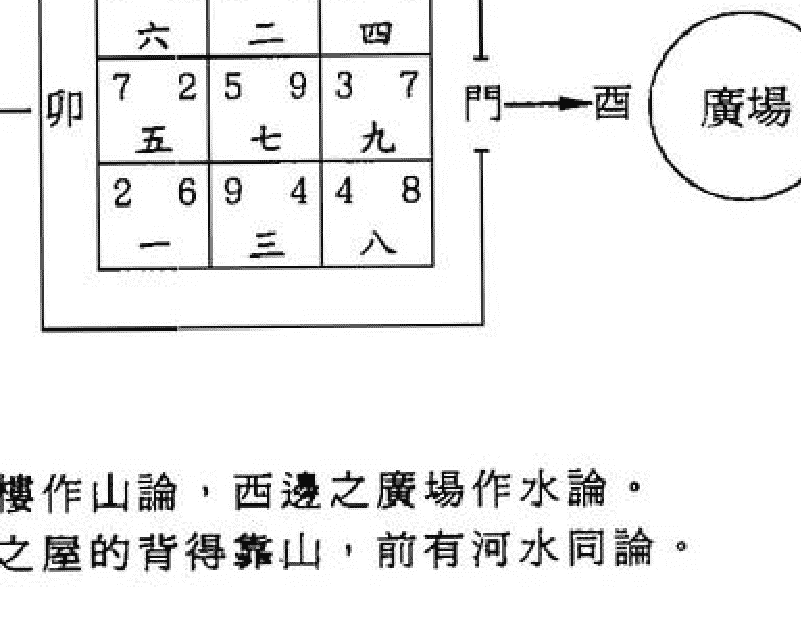

東邊之高樓作山論，西邊之廣場作水論。故與農村之屋的背得靠山，前有河水同論。

按表查出自己的命卦是屬東四命抑或西四命後，便用羅盤測定坐向，看住宅是屬於東四宅抑或是西四宅。

東四宅即為：坐東向西之震宅、坐東南向西北之巽宅、坐北向南之坎宅、坐南向北之離宅。

東四宅最適合東四命的人居住，即命卦為震、巽、坎、離之人。

西四宅即為：坐西向東之兌宅、坐西北向東南之乾宅、坐西南向東北之坤宅、坐東北向西南之艮宅。

西四宅最適合西四命的人居住，即命卦為兌、乾、坤、艮之人。

但東四命的人是忌住西四宅的；西四命的人是忌住東四宅的，因這種命宅不同類的匹配為命宅不配。從八宅理論來講，宅命不相配的會使居住的人難以興旺，甚至會招惹災禍。

按：走筆到此，對如何選擇樓層與住宅已有了較為詳細的講解。但這些初級風水理論，實是風水操作之偽訣，這種誤導會使人趨福的好意變成人招禍的凶應！對於其選擇真訣和陽宅之「外六事」與「內六事」的操作要領，我將只在學員面授班上進行指點。

### 二、挨星

原文：陽宅挨星與陰宅無異，以受氣之元運為主，山向飛星與客星之加臨為用。陰宅重向水，陽宅重門向，然門向所以納氣，如門外有水放光，較路尤重，衰旺憑水，權衡在星之理，蓋也無稍異也。

導解：受氣之元運，對陰宅是指下葬當年的元運，而陽宅起運法則有以下三種不同的看法：

- 1、以樓宇落成時的元運。如在一九八九年造好落成的子山午向之宅，因一九八九年屬於下元七運，故其宅命盤以七赤兌運來起運挨排。

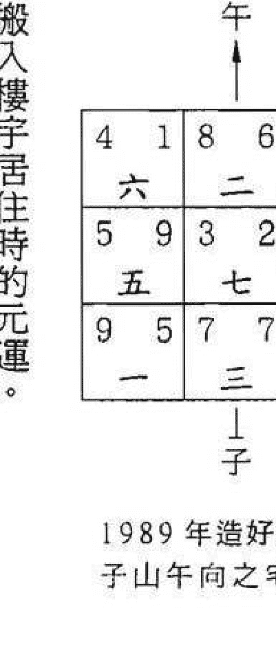

- 2、以搬入樓宇居住時的元運。
- 3、以住樓宇現在時的元運。在起得挨星盤後，還要結合山向飛星和流年紫白九星加臨來共同參論吉凶。

下面就簡要講講流年紫白飛星到每宮中所主的吉凶斷事：

#### 流年一白星到九宮的吉凶

- 一白到坎方——經云「一白為官星之應，主宰文章。」主讀書聰明，大利文職人員。
- 一白到坤方——主女性當權，家人易患腸胃病或有投資購房之事。
- 一白到震方——主家人搬遷或有遠行，脾氣較為暴燥。
- 一白到巽方——經云：「四一同宮，准發科名之顯」，大利學業或名譽之應。
- 一白到中宮——經云：「一加二五，傷及壯丁」，主有傷人之象或家人人生腎疾。
- 一白到乾方——主聰明才智，職務有遷、行業變動，得上司器重。
- 一白到兌方——家人好動、多異性緣。一白當運為桃花運，失運為桃花劫。
- 一白到艮方——財運佳，尤利地產，可購房置業。
- 一白到離方——中爻得配，水火相交，主喜慶、順利。

#### 流年二黑星到九宮的吉凶

- 二黑到坎方——主家人易患腸胃病，女性當權、掌握財政。
- 二黑到坤方——二黑又名病符，回宮復位，主身體多病。
- 二黑到震方——主官災是非、足疾、腸胃病。
- 二黑到巽方——主有是非，風寒及呼吸系統疾病，注意婆媳關係。
- 二黑到中宮——血光之災、慢性病、墮胎流產。
- 二黑到乾方——失運神經衰弱、胡思亂想，當運旺財。
- 二黑到兌方——泄痢之疾，防火災和血光之災，男子有異性緣。
- 二黑到艮方——旺財，尤利地產。
- 二黑到離方——家人痴迷而淫蕩，易有血光之災。

#### 流年三碧星到九宮的吉凶

- 三碧到坎方——主家人會搬遷或遠行。
- 三碧到坤方——主官司是非、腸胃病、足病。
- 三碧到震方——主官司是非、爭執，防盜賊劫財。
- 三碧到巽方——運氣反覆，時好時壞，尤注意手續文件之簽約。
- 三碧到中宮——因財致禍、賭博破家、車禍之事。
- 三碧到乾方——經云：「足以金而蹣跚」，主足傷。家人容易發生爭執或官場遭排擠。
- 三碧到兌方——主血光之災，受人拖累，有桃花劫或遭盜劫財。
- 三碧到艮方——經云：「三八逢而損小口」，主不利小孩。
- 三碧到離方——主家人頭腦靈活、聰明，大利學業名譽。

#### 流年四綠星到九宮的吉凶

- 四綠到坎方——坎宮為一白星所主，故為一四同宮，主讀書聰明、利文職。
- 四綠到坤方——腸胃病、是非纏繞，且家風不正，婆媳不和。
- 四綠到震方——運氣反覆、情緒起伏，出遊蕩之人，注意肝膽之疾。
- 四綠到巽方——經云：「蓋四綠為文昌之神」，主聰明好學。
- 四綠到中宮——風濕病、皮膚病，賭博好色破家。
- 四綠到乾方——吉則家人有遠行或搬遷，凶則注意交通事故。
- 四綠到兌方——容易被金屬所傷，易有桃花劫。
- 四綠到艮方——兒童多病或成績退步，易有鼻或患結石之病。
- 四綠到離方——讀書聰明，利文職、有喜慶。失運則財帛不聚，防眼疾和桃花色難。

#### 流年五黃星到九宮的吉凶

- 五黃到坎方——主提防泌尿系統疾病，女性提防婦科病，孩子的學業也會下降。
- 五黃到坤方——主急性病，血光之災及家有重病之人。
- 五黃到震方——容易腳傷，因財招禍，注意交通。
- 五黃到巽方——主皮膚病、禿髮症、感情煩惱。
- 五黃到中宮——主血光之災、瘡毒惡症。
- 五黃到乾方——主頭部疾病，遠行多阻滯，剋官削職。
- 五黃到兌方——是非官司，容易被金屬所傷，且有桃花劫。
- 五黃到艮方——主腸胃病，運氣不順。
- 五黃到離方——主眼部疾病，血光之災，因色而生性病。

#### 流年六白星到九宮的吉凶

- 六白到坎方——主聰明才智，博領導器重得財祿。
- 六白到坤方——胡思亂想，神經衰弱。當運則發財，失運主骨疾。
- 六白到震方——主膽、足之疾，多有小人暗算。
- 六白到巽方——不利女性，奔波勞碌，投資失誤。
- 六白到中宮——遠行多阻滯，頭部疾病。
- 六白到乾方——驛馬動，有遠行。失運主官司或交通意外。
- 六白到兌方——提防被金屬所傷，有口舌官非之事。
- 六白到艮方——主大利地產或五金行業。
- 六白到離方——子女容易與自己發生爭執，提防肺病血症。

#### 流年七赤星到九宮的吉凶

- 七赤到坎方——吉則家人有動性和桃花良緣，凶則招惹是非。
- 七赤到坤方——主痢疾，提防火災、血光之災。
- 七赤到震方——主血光之災，受人拖累而破財，宜放風水輪來化解。
- 七赤到巽方——容易被金屬所傷，易惹桃花劫。
- 七赤到中宮——是非官司，容易被金屬所傷，防食物中毒，肺癌之疾。
- 七赤到乾方——主官非爭執、交通意外，提防被金屬所傷。
- 七赤到兌方——當運主發財，失運主血光之災。
- 七赤到艮方——財帛可得，但容易破耗。
- 七赤到離方——小心火災和易患眼疾血症。

#### 流年八白星到九宮的吉凶

- 八白到坎方——主財運佳，尤利地產，可購房買地置業。
- 八白到坤方——利地產方面進行投資，但不利小孩之身體和學業。
- 八白到震方——吉則升職遷官，凶則學業退步，削職丟權。
- 八白到巽方——主兒童多病或成績退步、鼻敏感。
- 八白到中宮——主腸胃病、運氣蹇滯、親友反目。
- 八白到乾方——吉則升職遷官，大發財祿，凶則官場不順，頭痛骨酸。
- 八白到兌方——財運雖好，但容易破耗。
- 八白到艮方——當運則發財，尤利地產業，失運則事業破敗。
- 八白到離方——主喜慶，財祿兩旺，凶則有熱腹便血之症。

#### 流年九紫星到九宮的吉凶

- 九紫到坎方——水火既濟，主喜慶，順利。
- 九紫到坤方——家人愚鈍，子女成績退步，有目疾胃病。
- 九紫到離方——當運主財運與事業都會順利，失運主血光之災。
- 九紫到艮方——家有喜事，橫財就手。
- 九紫到兌方——小心火災，及因貪花戀酒而不顧家。
- 九紫到乾方——子女容易與自己發生爭執，提防呼吸系統疾病。
- 九紫到中宮——注意目疾，因色生瘡毒，血光之災。
- 九紫到巽方——吉則讀書聰明，利文職，凶則男女淫亂，身敗名裂。
- 九紫到震方——家人頭腦靈活，子女讀書聰明。

### 三、屋向門向

原文：凡新造之宅，屋向和門向並重，先從屋向斷外六事之得失，倘不驗再從門向斷之。若屋向既驗，不必複參門向，反之，驗在門向，亦不可不問屋向也。

導解：古時之住宅，大都是屋向和門向均為同一個方向為多。現代之公寓，屋向和門向很多是不同方向的。所以要屋向和門向兼看。

六事在《八宅明鏡》中是這樣寫的：「六事者，乃門、路、井、灶、坑廁、碓磨。居家必須之物，安放得所，取用便宜。」現代公寓則以見水的水池、飲水機、魚缸作井論，而碓磨以需要用電力推動的，如電視機、音響、空調來代之。

陰陽宅在原則上都著重向水，但由於陽宅向水不易求，才重視門向的。又因路是作虛水論的，故其效力不及門外之真水為大，其吉凶之應則以門口所納之飛星結合水路來斷。

### 四、堂局環境

原文：凡看陽宅，先看山川形勢氣脈之是否合局？繼看路氣與周圍之外六事及鄰家屋脊、牌坊、旗杆、墳墩、古樹等或落何星宮？辨衰旺以斷吉凶。

導解：凡是看陽宅，先看外局形勢是否符合山向飛星之當令方位，再看門之納氣口是否旺相和周圍之鄰屋、馬路、池塘、尖塔、橋樑、廟宇，及有無屋脊、路沖、反弓、煙囪、墳墓、招牌、旗杆、枯樹之惡物，視外局形煞落在何宮，則以該宮的山向飛星之衰旺來斷吉凶應驗。

如七運之子山午向。

因屋向為首要，門向為次要。故先從屋向起得挨星盤結合六事來斷此屋發生的事件。若當挨排屋向的星盤印證下來是準確的，便不需要再挨排門向星盤了，但如果不準確，則再以門向所起得的挨星盤來推斷宅運。

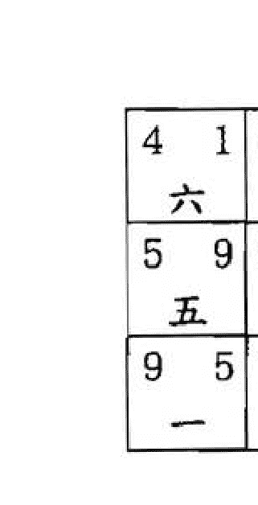

南方為犯路沖，使山上龍神下水，主傷身。

### 五、大門旁開

原文：凡陽宅以大門向首所納之氣斷吉凶。大門旁開者，則用大門向與正屋向，合二盤觀之。外吉內凶難除瑕疵，外凶內吉僅許小康。

導解：古時陽宅大部分是屋向及門向為同一方向，故僅從大門向首所納之氣就可斷吉凶。現今別墅和工廠之大門多為旁開，高樓公寓之門向又與屋向不同，在這樣的情況下，則須以大門向和正屋向都挨排所得的星盤共同合參斷之。外是指屋向，內是指門向，由於是挨得兩盤而納氣不純，故當以屋向為主，門向為輔來論斷吉凶。

### 六、屋大門小

原文：凡屋與門須大小相稱，若屋大門小，主不吉。然屋向、門向皆旺，屋大門小亦無妨。

導解：陽宅納氣之口，即是大門。陽宅之大小必須與大門相稱，才為吉宅。若屋大門小則納氣必不足，使宅氣弱而不吉，但若屋向及門向皆為生旺者則無妨，當然發福之效力會受到限制。

### 七、乘旺開門

原文：凡舊屋欲開旺門，須從舊屋起造時某運之飛星推算。如一白運立壬山丙向，旺星到坐，原非吉屋，到三碧運在甲方開門方能吸收旺氣。緣起造時，向上飛星三碧到震，交三運乘時得令，非為地盤之震三也。若開卯門，亦須兼甲，以通山向同元之氣也。

導解：一運之壬山丙向為雙星到坐之格局，大門不得旺氣而不利財運。在轉入三運之時，因震方為三碧星飛臨，在三運時，三碧星為很旺之吉星。又震方在玄空大卦來講，三運為正神，故宜在震方開門以納旺氣。

震方有甲卯乙三山，為何獨指要開甲方之門？這是我們已知三元龍如下：
天元龍：陽為乾坤艮巽 陰為子午卯酉
地元龍：陽為甲庚丙壬 陰為辰戌丑未
人元龍：陽為寅申巳亥 陰為乙辛丁癸
由此可知，壬丙甲庚為同元龍同陰陽，故壬山開甲門是屬一卦純清也。

| 7 九 | 4 五 | 2 七 |
| 8 八 | 3 一 | 6 三 |
| 3 四 | 8 六 | 1 二 |

午
甲
子

### 八、新開旺門

原文：凡舊屋新開旺門後，其斷法可竟用門向，不用屋向也。打灶、作房，亦從門向上定方位。王則先按：此指旺門大開，原有大門堵塞或緊閉者而言。須辨方向之陰陽、順逆，與乘時立向無異，若開便門以通旺氣，則取同元一氣。仍照起造立極之屋向斷之可也！

導解：凡舊宅本來所開之門，其氣已由旺變衰者，當宜改換天心之法來補救，否則必須堵塞或緊閉原有大門，另開一新的旺門以續生氣。然後依新開的元運配合門向來挨排宅命盤進行屋內的佈局。

如四運之艮山坤向，四綠旺星到門口為吉也，但到五運時，門之氣運已由旺變衰，則可用改換天心之法去封閉坤門開離門，因五運之艮山坤向宅命盤為六白生氣到離方。

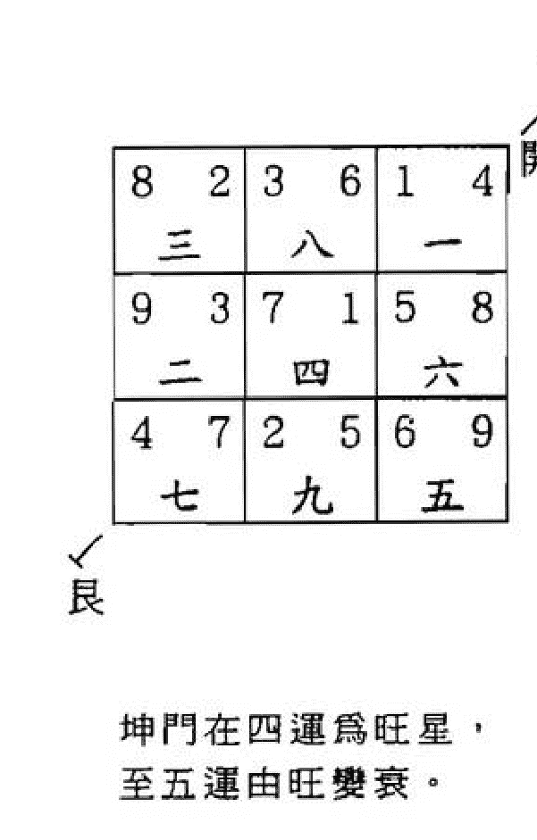

坤門在四運為旺星，至五運由旺變衰。

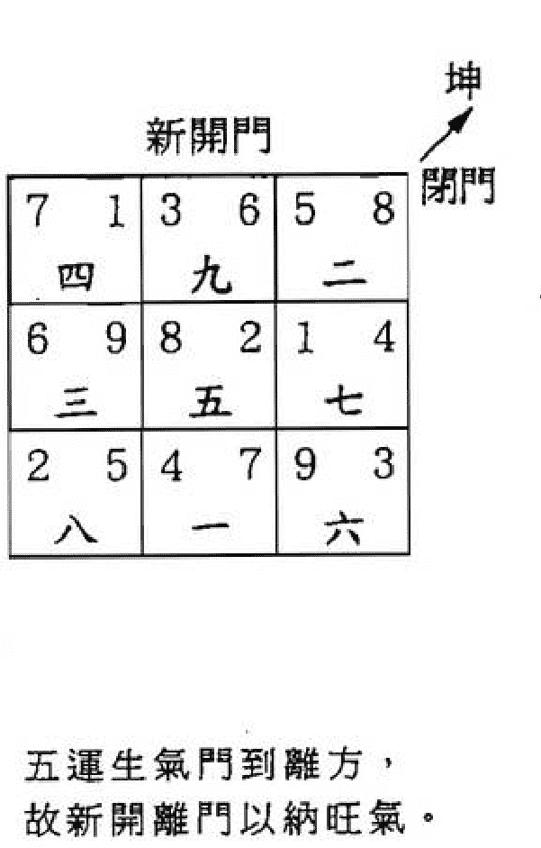

五運生氣門到離方，故新開離門以納旺氣。

以上例四運之艮山坤向之宅，若只在左側開同元的午門，而以前坤門仍存在使用，則是以原宅命盤來斷，故新開之午門是可通旺氣的。

倘若只在屋側開同元一氣的小門以通旺氣，而以前的大門仍存在使用，則仍依起造立極時的屋向所挨的宅命盤斷之。

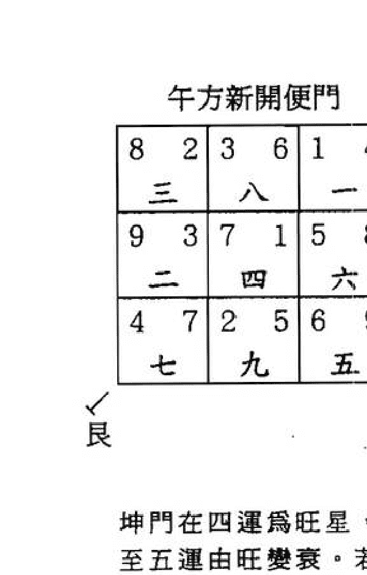

坤門在四運為旺星，至五運由旺變衰。若只在午方新開便門，則能通六白生氣。

### 九、旺門蔽塞

原文：凡所開旺門，前面有屋蔽塞不能直達，從旁再開一低小便門，以通旺門，則小門只作路氣論，不必下盤。

導解：若正納旺氣之大門的前面有高屋阻塞，則不利旺氣的吸納，可從旁邊再開一低小之便門來引路氣以通旺門。由於便門是只起輔助作用，故房屋的坐向線位，不能以小門來作坐向的。

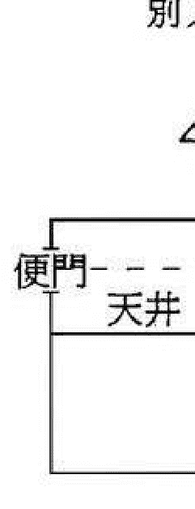

### 十、旺門地高

原文：旺門門外有水，本主大吉。但門基反高於屋基者，雖有旺水不能吸收，門基高於門內之明堂者亦然。若門外路高當別論也。

導解：旺山旺向之宅，在向方之門外又見真水，是屬很吉利的格局。但現代陽宅門外多見路不見真水，而門外之路是作虛水論的，故高於屋基亦是可以的。

### 十一、黑同

原文：凡宅內有黑同不見日光者，作陰氣論。二黑或五黃加臨，主其家見鬼，即不逢此二星，亦屬不吉。

導解：同即胡同深巷，若深巷終年不見陽光，則必然較陰暗、潮濕，易發生黴臭而滋生細菌，逢挨星二黑或五黃加臨時，則易見鬼怪或碰到怪異之事，由於陰氣太盛，即使不逢二黑和五黃，亦是屬於凶的。

### 十二、造灶

原文：不論宅之生旺衰死方，均可打灶。但生旺方可避則避，灶以火門為重。灶神坐朝可弗論焉。火門向一白為水火既濟；向三碧，四綠為木生火，均為吉灶。火門向八白，火生土，為中吉。向九紫亦作次吉論，但究竟嫌火太熾盛耳。六白、七赤火門不宜向，因火剋金也。二黑、五黃更不宜向，因二為病符，五主瘟毒也。然火門所朝之向，乃造屋時向上飛星所到之活方位，非指地盤九星言也。如一白運所造之屋，至八、九運打灶仍須用一白運之向上飛星是也。惟飛星之九紫方，切忌打灶，火氣太盛，恐遭火患，此造灶方位之概略也。

導解：古代之灶是以燒木料、煤炭為主的，灶門則是這些燃料的出入口和進風口，故灶門為納氣之口而使其向法至為重要。其向吉則納吉氣，向衰則納衰氣，但現代爐灶多以煤氣或以電力之炊具（如電飯煲、微波爐）為主，故納氣之法已有異了。我們當在引申古法時，要隨時代而通變，倘還以古代的論灶學理來論現代的灶具，則為食古不化了！

### 十三、糞窖牛池

原文：穢濁不宜向邇，五黃加臨則主瘟毒，二黑飛到亦罹疾病，以較遠之退氣方為宜。

導解：向為對著，邇為近處。若陽宅對著或近處見茅廁糞池（古時之茅廁糞池多在宅外近處或院子內）是不宜的，因是污穢之所當以凶應。飛星五黃加臨則主瘟疫、毒瘡，飛星二黑飛到亦主患疾病。在現代還不宜把廁所、浴室設在一白文星、四綠文昌、六白官星處，否則不利學業和事業。而宜設在飛星之退氣方向可。

### 十四、隔運添造

原文：凡屋同運起造，固以正屋為主。如後運添造前後進或側屋，而不另開大門者，亦仍作初運論，不作兩運排也。若添造之屋另開一門，獨自出入，方作兩運排。倘因後運添造而更改大門，則全宅概作後運論可也。

導解：陽宅在同運中有添造之屋，則仍以原運之屋向為主。例：一運時建的屋，在同為一運時又在屋之右方加建側屋，則仍以一運時建的主屋來看。

上例一運時建的屋，在三運時又在屋之右方加建側屋，但仍以一運主屋的門進出，而不另開大門的，則還是以一運時建的主屋來看。

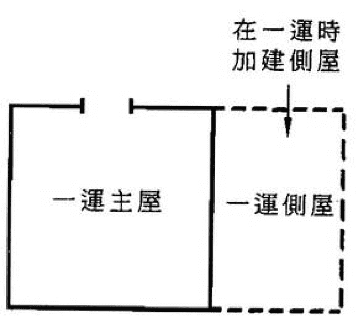

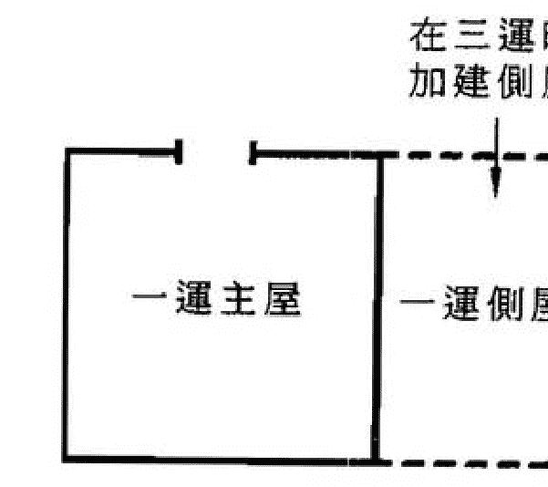

### 十五、分房挨星

原文：凡某運起造之宅，至下運分作兩房者，仍以起造時之宅運星圖為主，而以兩邊私門為用。蓋星運定於起造，不因分房而變動，分房以後，各以所處局部之星氣推斷吉凶可也。同運分房者類推。

導解：某運起造之屋，屋內若有兩家同住，且每家都各自有私門，則以起造之宅運星盤為主，再配合各自私門進行論斷。至於星盤挨排是以起造時的元運為準，不會因分房（分房是指數家合居於一屋也）而有所改變。分房以後，則各自以所處局部的挨星盤來推斷吉凶。

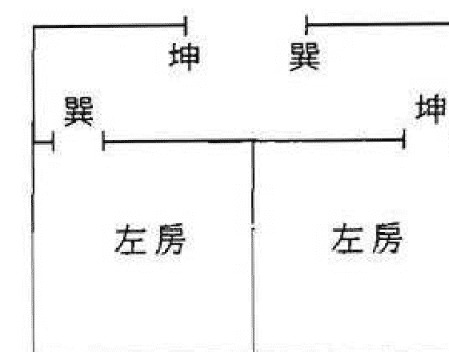

左房：內門為巽，外門為坤
右房：內門為坤，外門為巽

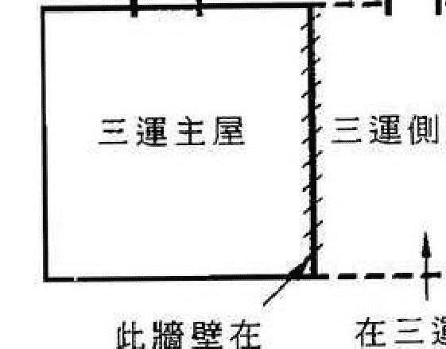

一運時建的屋，在三運時又在屋之右方加建側屋，同時把舊門封閉，改由側屋新開之門出入，則整所房屋便成為三運屋了。

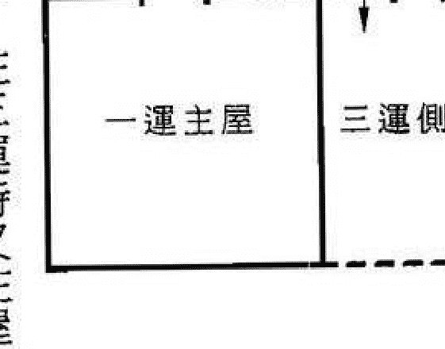

一運時建的屋，在三運時又在屋之右方加建側屋，加建的側屋是另設一門獨自出入的話，便屬於三運屋了。

### 十六、數家同居

原文：一宅之中數家或數十家同居，斷法以各家私門作主，諸家往來之路為用，看其路之遠近衰旺，即知其氣之親疏、得失也。

導解：一宅之中有數家或數十家同居的屋型，是古時四合院之建築也。其吉凶斷法是以各家的私門為主，兼以參看院內大門和走路的星氣之旺衰來斷各家的吉凶。現代高樓公寓是各自獨立門戶，然也須參看大廈之出入口也。

### 十七、分宅

原文：一宅劃作內室，另立私門者，從私門算。但全宅通達毗連，仍作一家排，不從兩宅斷也。

導解：在一間屋中，後用磚牆完全隔成二間，且所隔之間又另立私門出入者，則以新開私門論吉凶。

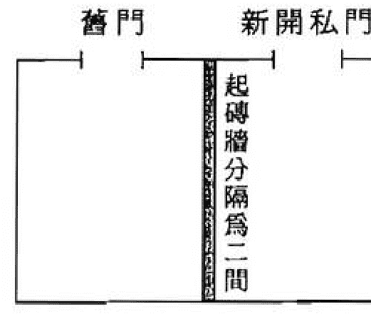

若全宅內部有通道者，雖另立私門，也只以另開旁門來論，而不能以兩宅斷之。

### 十八、逢囚不囚

原文：向星入中之運，如二、四、六、八進之屋，逢囚不囚者，何也？因中宮必有明堂氣空，可作水論。向星入水，故囚不住。若一、三、五、七進之屋。中宮為屋，入囚便囚，但向上有水放光者，亦囚不住。

導解：向星入中宮之運即為向星入囚也。若中宮有明堂或向上有水放光者，則囚不住。

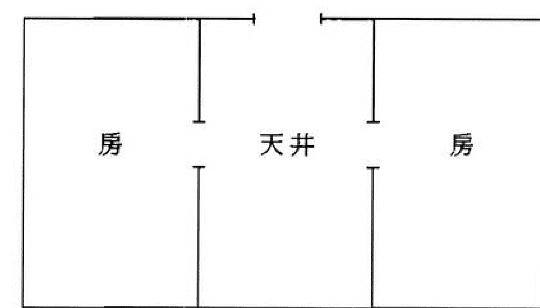

中宮（即天井）有明堂氣空，可作水論。

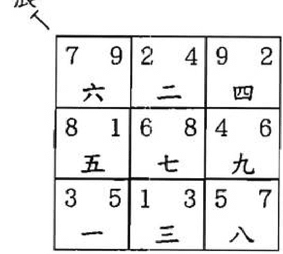

七運之辰山戌向，至八運入囚，但向方有水而不囚。

### 十九、店屋

原文：凡看店屋，以門向為君，次格櫃，又次格財神堂。俱要配合生旺，若門吉櫃凶或財神堂凶，吉中有疵，主夥友不和或多阻隔。其衰旺之氣皆以門向吸收。

導解：商店的風水主要是看：1、門要納旺氣，2、收銀櫃要擺放在吉位，3、神位亦宜設在吉方。只有把這三部分都配合好，才能大發財利。若風水線向逢空、佈局有凶，則主員工不得力、夥友不合、經營不利也。

### 二十、吉凶方高

原文：宅之吉方高聳，年月飛星來生助愈吉，來剋洩則凶。若凶方高聳，年月飛星來剋洩反吉，來生助則凶。此指山上龍神之方位也。

導解：山上龍神之方，就是指山星也。在山星旺相處有高聳之山是為吉，逢年月紫白飛星來生助時則愈加吉利，若年月紫白飛星是來剋洩則為凶。在山星衰死方有高聳之山當為凶，但逢年月紫白飛星來剋洩則反吉，若年月紫白飛星是來生助則為禍。此為流年飛星結合原局挨星盤來斷高山之吉凶的方法。

下列九星的生助剋洩表：

| 生/剋/助/洩 | 生 | 助 | 剋 | 洩 |
|---|---|---|---|---|
| 一白水 (1) | 6、7 | 1 | 9、2、5、8 | 3、4 |
| 二黑土 (2) | 9 | 2、5、8 | 1、3、4 | 6、7 |
| 三碧木 (3) | 1 | 3、4 | 2、5、8、6、7 | 9 |
| 四綠木 (4) | 1 | 3、4 | 2、5、8、6、7 | 9 |
| 五黃土 (5) | 9 | 2、5、8 | 1、3、4 | 6、7 |
| 六白金 (6) | 2、5、8 | 6、7 | 3、4、9 | 1 |
| 七赤金 (7) | 2、5、8 | 6、7 | 3、4、9 | 1 |
| 八白土 (8) | 9 | 2、5、8 | 1、3、4 | 6、7 |
| 九紫火 (9) | 3、4 | 9 | 1、6、7 | 2、5、8 |

### 廿一、竹木遮蔽

原文：陽宅旺方有樹木遮蔽，主不吉。竹遮則無礙，然亦須疏朗，因竹通氣故也。衰死方竹木皆不宜。

導解：在陽宅旺方見水，但此水如為反弓、斜射之形或白虎反照之格，則可用竹林來遮形通氣，阻擋惡形，但能引通旺氣也。唯竹林須疏朗才對，若植得太密蔽，就不利旺氣的引入反主不吉了。也因竹細能通氣，故不宜在衰死方種植，否則就能引通衰死之凶氣。

### 廿二、一白衰方

原文：陽宅衰氣之一白方，有鄰家屋脊沖射者，主服鹽鹵死，獸頭更甚。

導解：一白在元運為二、三、四、五、六、七時是衰死之氣，若在其方見屋角沖射或獸頭形煞者，主家人會溺水而死。陽宅四周有惡物形煞者，皆要制化之，否則不只是一白衰方有凶，其餘八星皆也會有禍也。

### 廿三、財丁秀

原文：財氣當從宅之向水或旁水，看旺在何方，加太歲斷之。功名當從向上飛星之一白、四綠兩方，看峰巒或三叉交會、流神屈曲處，加太歲、合年命斷之。丁氣當從宅之坐下及當運之山星斷之，其驗乃神。

導解：經曰：「山管人丁水管財」，故判斷屋內風水的財運，便是看宅之周圍的水有否在向星旺方處。判斷添丁之法，就是看宅的坐方星氣與當運的山星配合來推算的。《紫白訣》曰：「四一同宮，准發科名之顯」，《玄機賦》云：「名揚科第，貪狼星在巽宮」，貪狼星為一白，巽宮為四綠，若一白、四綠方見木形秀峰或水流屈曲有情處，則大利學業功名。

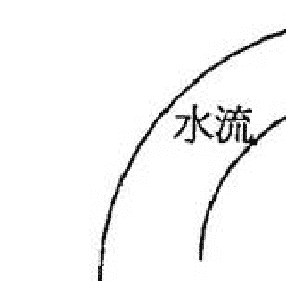

| 4 1 | 8 6 | 6 8 |
| 六 | 二 | 四 |
| 5 9 | 3 2 | 1 4 |
| 五 | 七 | 九 |
| 9 5 | 7 7 | 2 3 |
| 一 | 三 | 八 |

### 廿四、流年衰死重临与旺星到向

原文：阳宅衰死到向是某字，逢流年飞星到向又为某字，主伤丁。旺星不到向，逢流年旺星到向，亦转主发祸。阴宅同断。

导解：阴阳宅的衰死之星到向是某字，逢流年紫白飞星到向，又为同一字填实，主伤丁。

| 4 1 | 8 6 | 6 8 |
| 5 9 | 3 2 | 1 4 |
| 9 5 | 7 7 | 2 3 |

阴阳宅的当旺之星没有到向，但逢流年紫白旺星到向时，亦主发祸。

| 2 | 7 | 9 |
| 1 | 3 | 5 |
| 6 | 8 | 4 |

九七丁丑年飞星图

丁丑年三碧入中，七赤旺星到向，上例七运子山午向之向方六白为衰死之气，见流年七赤旺星飞到向方，主发祸。

| 1 | 6 | 8 |
| 9 | 2 | 4 |
| 5 | 7 | 3 |

九八戊寅年飞星图

戊寅年二黑入中，六白星到向，原局向方六白在七运为退气，戊寅年六白退气星又到向，退气星重现，故主伤人。

### 廿五、鬼怪

原文：衰死方，屋外有高山、屋脊，屋内不见，名为「暗探」。屋运衰时，阴卦主出鬼，阳卦主出怪，阴阳并见主神。必须太岁、月、日、时加临乃应。初现时，有影无形，久而弥显，甚或颠倒物件，捉弄生人。枯树冲射，屋运衰时，阴卦亦主鬼，阳卦主神，阴阳互见主妖怪。

导解：阳卦及阳星：乾（六白星）震（三碧星）坎（一白星）艮（八白星）
阴卦及阴星：坤（二黑星）巽（四绿星）离（九紫星）兑（七赤星）

阳宅之衰死方，若见暗探、枯树，则易出鬼怪之事。宜用下列方法制化：

- 一、信仰正统宗教、念经持咒，心存正气、积德行善，自有神佛庇护。

### 般若波罗蜜多心经

> 观自在菩萨 行深般若波罗蜜多时 照见五蕴皆空 渡一切苦厄 舍利子 色不异空 空不异色 色即是空 空即是色 受想行识 亦复如是 舍利子 是诸法空相 不生不灭 不垢不净 不增不减 是故空中无色 无受想行识 无眼耳鼻舌身意 无色声香味触法 无眼界 乃至无意识界 无无明 亦无无明尽 乃至无老死 亦无老死尽 无苦集灭道 无智亦无得 以无所得故 菩提萨埵 依般若波罗蜜多故 心无挂碍 无挂碍故 无有恐怖 远离颠倒梦想 究竟涅槃 三世诸佛 依般若波罗蜜多故 得阿耨多罗三藐三菩提 故知般若波罗蜜多 是大神咒 是大明咒 是无上咒 是无等等咒 能除一切苦 真实不虚 故说般若波罗蜜多咒 即说咒曰 揭谛揭谛 波罗揭谛 波罗僧揭谛 菩提萨婆诃

### 廿六、路氣

原文：路為進氣之由來，衰旺隨之吸引。離宅遠者應微，然亦忌沖射，名為「穿砂」，有凶無吉，二宅皆然。貼宅近路與宅中內路，尤關吉凶，故內路宜取向上飛星之生旺方，合三般者吉，而外路亦須論一曲之首尾，察三灣之兩頭，看其方位落何星卦？灣曲處作來氣，橫直者作止氣，其法係從門向上所見者排也。《天元五歌》云：「酸漿入酪不堪斟」，即言屋吉路凶之咎也。

導解：路是在人、車的流動之下來帶動氣場運動的，內外之路都宜在陰陽宅之向星的旺處，且尤須注意外路之形局是否有情也。

### 廿七、井

原文：井為有源之水，光氣凝聚而上騰，在水裏龍神之生旺方，作文筆論。落衰死剋煞方，主凶禍。陰宅亦然。

導解：水為財亦主智亦主血，古時水井以地下真水為源，水氣上升如文筆。若在水裏龍神之生旺方，主在利學業和名聲外，還主發財利，但若在水裏龍神之衰死凶方，則主血光之災。

### 廿八、塔

原文：塔呈挺秀之形，名曰：「文筆」。在飛星之一四，一六方，當運主科名，失運亦主文秀。若在飛星之七九，二五方，主興災作禍，剋煞同斷，陰宅亦然。

導解：陰陽二宅旁邊有形狀挺秀如塔之高聳物，皆可作文筆峰來論。若在飛星之一四、一六的當運處，則主科甲之喜，即使為失運也能利學業。若在飛星之七九、二五凶星處，則多主發生災禍。由於現代都市少見塔形之物，故可在挨星為一四、一六之方安置書房，則亦有科名之應。

### 廿九、橋

原文：在生旺方能受蔭，落衰死方則招殃，石橋力大，木橋力輕，二宅同斷。

導解：現代都市多為高架橋、行人天橋，若橋形端莊秀麗且在較遠方，在陽宅之前可當朝案，在陽宅之後可作樂山。但若是近距離壓迫陽宅且又在山星之衰死凶方則主招禍。

### 三十、田角

原文：取兜抱有情，忌反背尖射，二宅皆然。

導解：不只是田角而言，凡圍牆、流水、馬路都喜歡環抱有情，不宜有反背、尖射、穿心、天斬之形煞，下面就來說明這些形煞。

鎌刀煞：指河流、道路、天橋象一把鎌刀那樣割向住宅，也叫反弓。

尖角煞：指尖銳形狀的物體正對住宅，如尖形牆角、亭子角簷。

穿心煞：指筆直的馬路對正住宅，有如槍對著住宅一樣，也稱槍煞。

天斬煞：指二幢高樓大廈之間靠得很近，看去有如被刀把大廈剖為兩份，而這個間隙又正對著住宅的。

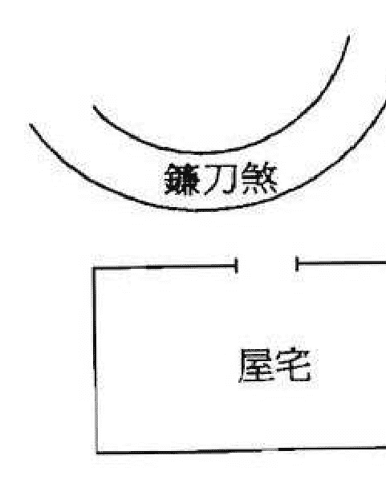

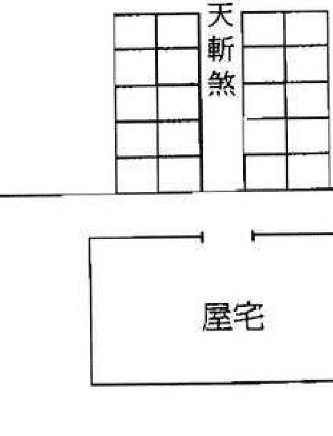

## 第六節 《陽宅指南》摘錄

世人不識重陽基，若論陽基效最奇，發福生財操在手，育子升官貴及時。此是玄空真骨髓，先賢惜寶未曾題，若非世德應天眷，孰肯輕談洩化機。第一要訣看宅命，動處乘空實處靜，空邊引氣實邊收，命從來處天然定。第二要訣看宅體，端圓方正斯為美，前後修長蓄氣專，若然匾闊分途軌。第三要訣看生向，坎離震兌針尖上，得乘正卦合天心，若交親亂生魔障。第四要訣輔弱星，他宮左右審虛盈，輔若虛時地之煞，弼虛兩卦受災驚。一重輔弱一重福，若是重重福不輕，有人識得輔弱訣，選宅安身事事寧。第五開門引路訣，正卦裝門莫偏洩，入門之卦空元神，元神衰旺此中別。一門正卦氣無偏，前後門通兩路接，若有旁門破卦身，縱然旺氣非清潔。既辨門時更辨路，內路外路須兼顧，路在生方致百福，煞方引路多災禍。宅中天井多寬曠，宅外回風不可當，時煞難明更兇猛，只言合元免災殃。添房動作察秋毫，不在年神在卦爻，吉凶偶然驚煞位，傷丁破產不相饒。層層進進說高低，莫談福德與天醫，只要高低勻且稱，偏破昂陷不相宜。橋樑衝市最喧鬧，若在生方反不嫌，能知避煞迎生法，轉咎為祥反掌間。一空三閉是豪家，三空一閉亂如麻，若通閉裏求空法，立地珍珠滿鹿車。此時單言排宅法，不是水神分氣訣，若逢臨水又不同，宅氣還憑水氣接。

宅神寬大可吞波，收拾水神無漏洩。

我為指出雙龍格，一宅之中分順逆；其中趨避有玄機，八卦看來理如一。
巽水迢迢六白龍，後湖九紫氣還鍾；前宅中元卿相貴，下元後宅廣財豐。
雙兌交流入巽宮，碧方真氣室居東；百二十年朱紫貴，祖孫爺子受皇封。
坎離之水二龍交，立宅中間甲第高；論轉三元無替謝，兒孫世世產英豪。
二水交流是巽乾，兩枝花蕊一時鮮；運到滿門朱紫貴，衰時片瓦不招椽。
二水離方入坎宮，盡頭一宅夾其中；雙龍氣派來相會，此宅三元貴不窮。
二水同流坎上來，傍南作宅是離胎；下元一發如雷疾，兄弟雙雙近鼎台。
我為指出兼龍穴，八卦正偶同一訣；此中秘密有玄機，千里毫釐細分別。
離宮丙水字兼巳，行到中元貴無比；下元衰氣四十秋，官祿無聞宅半毀。
離宮丁水字兼未，行到中元期富貴；此宅三元永不衰，微微左右分宮位。
四水歸朝會四龍，居中作宅是仙宮；不分元運時時發，瓜瓞綿綿奕葉重。
一宅之內迴圈轉，寄語時師須檢點；若然地是四偶形，坎離震兌格更精。
下元流水在西南，屋近坤方艮氣酣；上元旺相在東北，屋近艮水二黑足。
中元乾巽與中宮，三位之中瑞氣濃。

朝南之宅正門開，此是離宮紫氣來；宅深七赤下元旺，匾淺中門未足胎。
離門中道路重重，直引離風至寢宮；此宅下元多旺氣，更無瑕玷損春容。
正門離上路偏東，轉入深闔巽氣濃；下元家道雖然旺，閨內須防災病重。
離門兩路夾東西，並引離風雨不倚；祇要宅深收氣足，下元此宅發無疑。
屋向西南宅艮坤，門開左畔不離神；祇要宅方真紫氣，若然深長作坤論。
屋向東南宅乾巽，開門右畔紫氣宜；亦取宅方興七運，如逢深遠綠宮全。
前門坤位後門坎，兩氣俱從一路轉；上中鼎盛不須言，行到下元行一半。
正門離位後門艮，兩氣俱從七赤進；下元無數錦添花，行到上元君莫問。
前門離位後門艮，此宅元元失主垣；祇有分房親切處，一枝花發一枝寒。
一宅修長正向南，兩門前後對相穿；祇看內房何處住，三元旺衰有多般。
房居前面與中上，後面為房列下元；此是移宮變氣法，逐年移住始安然。
東北分明門在艮，如何下元終不應；祇緣此宅東西闊，門變甲方常守困。
四隅之宅艮坤長，前後通門兩口張；亦取內房分旺替，移宮換氣不尋常。
下元端的居坤位，中上深闔在艮方。

七赤元中門在坤，如何此宅少災迍？只因間架東西闊，兌氣綿長仇變恩。
朝南之宅兌門行，如何下元終不明？只為內房多在後，門兼坤氣不分明。

## 第七節 《陽宅天元賦》摘錄

天元垂象，九霄開梵氣之中；大地炳靈，九野兆坤維之紀。
龍馬以河圖啟瑞，神龜以洛書效珍。
剖混沌之先機，昭乾坤之大法。
自然妙化，至人因之。
建都邑以禦萬邦，授室廬以綏兆姓。
明堂九室見於月令之交，方井八家考之徹田之制。

一樣兌門宅正方，如何此宅比彼強？只為面西房在震，兌氣清切少參商。
兌宅之門南北長，漫說朝西七赤強；必定內房偏左右，乾坤夾帶氣兩分。
一宅朝南門正西，下元於此靈清奇；只因宅相東西闊，內屋迢迢兌氣齊。
共宅同門地勢偏，一林花木各時鮮；只緣門路宮宮變，細把青囊理數研。
中架居中離氣正，下元方得喜更宜；東左變坤一白髮，西方變巽發中元。
陽基形勢貴量裁，卜妻兒孫各有房；一步一星隨地變，門窗沖路要推詳。
天光落處看風色，此事精微莫顯揚；一宅之中災福異，管生管死在微茫。
入宅依此論衰旺，此訣分房是的傳。

粵稽黃帝始創宮室，我祖文公爰營洛邑。
當時著為憲令，後世遵為遺規。
生民日用而不知，聖人先知而不議。
秦火之後，典籍蕩然。
千聖不傳之心，一線寄諸哲士。
黃石授之圯上，乃出青囊。
蕭相功成未央，大開北闕。
逮於管郭，微言莫稽。
比及楊曾，正術始顯。
嗣後偽書雜出，異軌爭馳。
家藏滅蠻之經，人排掌中之卦。
詞能害志，偽且亂真。
固世道之衰微，抑亦天機之隱秘。
不得無極之訣，豈知目講之傳。
萬世洪荒，一朝剖破。
坐山定宅，宅既不真。

形局之模糊猶可，方隅之雜亂難言。
曠野平原，端取流神結體。
關廂村鎮，多將衝路分蹤。
城隅依城為憑，山谷傍山立局。
高樓峻宇，崎星借插於鄰家。
堰堤橋樑，動氣交沖乎轍跡。
牆籬皆能障蔽，竹木亦可攔擋。

水為引氣之神，察其來，又看兜抱。
風多動氣之力，性主散，須用遮攔。
噓吸須辨陰陽，化機總歸一局。
風之所送，即是水之所交。
陽之所噓，亦即陰之所吸。
交類牝牡，如影隨形。
應若宮商，似響斯答。

水氣在土膚之上，當以光交。
風氣來空虛之中，但隨質取。

要明八宅之真，先識九宮之數。
年分甲子，運轉三元。
上元一白為君，坤震為輔。
中元四綠居首，五六相承。
七赤下元當令，艮離襄旺。

春榮秋落，莫尋出運之龍。
陽往陰來，須遇本宮之水。
正偏曲直，惟貴氣清。
廣狹淺深，只求位的。

東西分宮，宮亦全謬。
五鬼六煞，豈皆絕命之方。
生氣天醫，不盡延年之路。
貪狼巨門高聳，未是吉星。
廉貞破軍昂頭，豈真凶曜。
欲執遊年訣法，斷無取驗機關。

光交親憑目睹，質取變有多端。
若逢空缺即為來，一有遮攔旋作止。
辨明來止二氣，方知噓吸真機。
更有宅神，尤多妙用。
權衡內外，變化吉凶。
蓋內氣是宅內之方隅，外氣是宅外之風水。
內外俱凶成廢宅，內外俱吉是仙宮。
外凶內吉，僅許小康。
外吉內凶，難除瑕玷。
此言曠野一家之宅，非言城市比屋之居。

若夫接宇連甍，尤重升堂入室。
略陳規矩，以備推求。
大體先論宅形，機括更看門路。
四方正直，備有八宮。
匾闊直長，偏居二卦。

一曲須論首尾，三灣亦取兩頭。
長短消除，廣狹轉變。
均齊方正，有左衰右旺之時。
缺曲偏斜，辨此濁彼清之界。
卦有定理，格不一方。
假如震兌橫若幾樣，二卦適均。
艮坤折若磐形，兩宮並至。
試問門開何地，乃知氣入之源。
細分內室何方，始定歸根之路。
若門通前後，則卦不一家。
更室居中，則氣收兩舍。
向兼寅甲，坐雜亥壬。
東房富則西房必貧，南枝榮則北枝定萎。
察重輕於門路，測深淺於卦爻。
析爨乃彰，合居不判。

欲較門之力量，亦辨宅之形模。

方宅四周，門通八國。
如其曲折，難以推移。
坤向深沉，兌離二門皆不應。
正南重疊，巽坤兩戶總無憑。
門若居中，左右截然分氣。
門若旁啟，一邊獨領真情。
全憑內路之曲折直長，引神入室。
並審旁門之有無純雜，漏氣奪胎。
多門不如一門之專精，遠路豈同近路之親切。
總門統一家之隆替，房門辨夫婦之安危。
別有男女弟昆，驗分居之房門。
下至奴婢妾媵，據所授之一氣。
萬花穀裏，豈無一樹先零。
數罟池中，亦有鯨魚漏網。
宅大則所招之勢必遠，宅小則所受之氣亦微。
總求領氣為樞機，細審真方分順逆。
改一門，頓分枯榮。

移一巷，立判災祥。
折屋添房，看取東宮西舍。
整新換舊，須知旺位衰方。
或彼家吉而此家凶，或昨日興而今日替。
其機可畏，其理難明。
歎肉食之終迷，遇真詮而罔覺。
有宅於此，吾所共疑。
何祖父顯而未祚衰微，何舊主傾而更姓驟起。
亦有弟肥兄瘦，豈無主弱奴強。
愚人不識氣機，輒議全無宅法。
不見芳春綠草，履秋霜而自凋。
譬諸大旱赤苗，沛甘霖而立起。
吉人趨其景運，薄祚遇其衰時。
實有天心，適符地脈。
此理捷於影響，至人秘而不傳。

世重葬經，每輕宅相。
夫返氣入骨，固人道報本之常經。
立命安身，亦孝子守身之本務。
祖先實以後昆為血脈，邱墓反以住宅為安危。
其理甚微，不可不察。
且死者已枯之骨，非歷久而不榮。
生人食息之場，隨呼吸而立應。
欲求朝瘁暮榮之術，須識移宮換宿之奇。
歷試不渝，吾言若契。
將此重任，慎簡其人。
苟非同天地之心，何以通造化之妙。
按圖索驥，難悉端倪。
觸類引伸，粗陳大概。
省察之機寓乎目，變化之巧因乎心。
書不盡言，言不盡意。
果精其術，真堪羽翼斯民。
剋守遺規，庶以延長世澤。

## 第八節 《天元五歌·論陽宅》摘錄

至理不易，上士何由傳之下愚。
天道無私，祖父豈敢貽其孫子。
我茲懼矣，削慎旃哉！

人生最重是陽基，卻與墳塋福力齊。
宅氣不寧招禍咎，骨埋真穴貴難期。
建國定都關治亂，築城置鎮系安危。
試看田舍豐盈者，半是陽居偶合宜。
陽居擇地水龍同，不厭前篇議論重。
但比陰居宜闊大，不爭秀麗喜粗雄。
大江大河收氣厚，涓流滴水不關風。
若得亂流如織錦，不分元運也亨通。
宅龍動地水就載，尤重三門八卦排。
只取三元生旺氣，引他入室是胞胎。
一門乘旺兩門囚，少有嘉祥不可留。
兩門交慶一門休，大事歡欣小事愁。

須用門門都合吉，一家福祿永無憂。
三門先把正門量，後門房門一樣裝。
別有旁門並側戶，一通外氣即分張。
設若便門無好位，一門獨出始為強。
門為宅骨路為筋，筋骨交連血脈均。
若是吉門兼惡路，酸漿入酪不堪斟。
內路常兼外路看，宅深內路審門闌。
外路迎神並界氣，迎神界氣兩重關。
更有風門通八氣，牆空屋缺皆難避。
若遇祥風福頓增，若遇殺風殃立至。
矗矗高高名嶠星，樓臺殿閣亦同評。
或在身傍或遙應，能回八氣到家庭。
嶠壓旺方能受蔭，峰壓凶方死氣侵。
沖起樂宮無價寶，須與元龍一列排。
沖起囚宮化作灰，宅前逼近有奇峰。
不分衰旺也成凶，抬頭咫尺巍峨起，
泰山壓倒有何功。

村居曠蕩無關鎖，地水與門一道編。
城巷稠居池水潤，路風門嶠並同權。
一到分房宅氣移，一門常作兩門推。
有時內路作外路，入室私門是握機。
當辨親疏並遠近，抽爻換象出神奇。
論屋神祠禮最嚴，故人營造廟為先。
夫婦內房尤特重，陰陽配合宅根源。
八宅因門坐向空，三元衰旺定真蹤。
運遇遷移宅氣改，人家興廢巧相逢。
天醫福德莫安排，豈是周公真八宅？
無極大士流傳的，誰見遊年獲福澤。
逢興鬼絕更昌隆，遇替生延皆困迫。
太歲神殺若加臨，禍福當關如霹靂。
門內房房有宅神，值神值星交互測。
此是遊年剖吉凶，不合三元總虛擲。
九星層進論高低，開架先天卦數推。
雖有書傳都不驗，漫勞大匠費心機。

# 第四章 秘诀注解篇

## 第一节 《玄机赋》注解

原文：大哉！居乎成败所系。危哉！葬也兴废攸关。

解说：居是指供人居住使用的阳宅，如住宅、店铺、公司、工厂，意即阳宅风水的好坏会影响人生事业的成败。

葬是指安放尸体的坟墓，意即坟墓风水的吉凶会影响后人命运的兴衰。

故而，我们在买房、开店、开工厂和葬亲人于地下时，一定要留意风水的好坏。

原文：气口司一宅之枢，龙穴乐三吉之辅。

解说：气口即门也，因大门是全屋之人的出入口，也是气的入口。若气口开于吉方，则门纳旺气以吉论；但若开于凶方，则门纳衰气以凶断。故门所纳之气的好坏能决定全宅之吉凶。

例七运之酉山卯向

| 1 6 | 5 1 | 3 8 |
| --- | --- | --- |
| 六 | 二 | 四 |
| 2 7 | 9 5 | 7 3 |
| 五 | 七 | 九 |
| 6 2 | 4 9 | 8 4 |
| 一 | 三 | 八 |

震门为七赤旺星到，故吉。
艮门为二黑衰星到，故凶。

> 山龙宅法有何功，八面山门亦辨风，
或有山溪来界合，兼风兼水两相从。
若论来龙休论结，论结藏穴不藏宫，
纵使皇都与郡邑，只审开阳不审龙。
俗言龙去结阳宅，此是时师识见庸，
但取阳居酿家福，山居不及泽居雄。
阴居荫骨及儿孙，阳宅气氤及此身，
偶尔侨居并客馆，庵堂香火有神灵。
遇着三元轮转气，吉凶如响不容情，
透明此卷天元宅，一到人家截废兴。

按：
一、《天元五歌》是蒋公大鸿在顺治十六年到浙江绍兴为门人吕相烈扦母坟时所作，时约四十岁。五歌即：「统论、山龙、水龙、阳宅、选择之五个部分的歌诀」，此为登入玄空宝殿的必读之书。
二、以上三篇直指阳宅操作要谛的赋文均为蒋公大鸿所著，他把重要的阳宅心法都已直泄于纸上，望得此真诀者能细心体悟，必会有所启发而打开玄空秘钥。

龙穴即坟也，三吉是指一白贪狼、六白武曲、八白左辅，也是指当令旺气、生气、进气。意即阴宅也喜吸纳吉旺之气以荫后人。

原文：阴阳虽云四路，宗支只有两家。
解说：四路即四盘也，为天盘、地盘、山盘、向盘。两家即指形局来说，山为静者属阴，水为动者属阳；就理气来说，山星宜静，向星宜动。每一山向依其阴阳顺逆所挨得的飞星盘，在判断吉凶时应以山向飞星参合形局来断。

原文：数列五行，体用恩仇始见；星分九曜，吉凶悔吝斯彰。
解说：体为主也，用为辅也，恩为喜也，仇为忌也。玄空飞星的每颗星曜之五行为：一白水、二黑土、三碧木、四绿木、五黄土、六白金、七赤金、八白土、九紫火。玄空挨星是以山向飞星为主的，如看水法时，当以向星为主，山星和运星参看为辅。又飞星以生旺之气视为喜，以衰死之气视为忌。北斗九星的名称为：一白贪狼星、二黑巨门星、三碧禄存星、四绿文曲星、五黄廉贞星、六白武曲星、七赤破军星、八白左辅星、九紫右弼星。紫白九星各有不同的吉凶所指，当其生旺时，则以其所代表的吉象来论；当为衰死时，则以其所代表的凶象来论。

原文：宅神不可损伤，用神最宜健旺。
解说：宅神和用神均是指当运之山向飞星。当运之山向飞星所到之方，不可见形势凶恶的山水环境，否则也以不吉论。其所到之方，最宜见秀山清水且符合该飞星的形局，以使能更好地发挥其力量。

原文：值难不伤，盖因难归闭地；逢恩不发，只缘恩落仇宫。
解说：闭地和仇宫都是指形局上的弱位，因看风水除分析理气好坏外，还须视察四周形局之配合，只有这样才能准确地判断吉凶。难是指凶星，意即虽值逢凶星，但却没有受到凶星的影响，是因为凶星所到处是它的弱位，故值凶而不伤。恩是指吉星，意即虽值逢吉星，但却没有受到吉星的影响，是因为吉星所到处是它的弱位，故逢吉而不发。

原文：一贵当权，诸凶慑服；众凶克主，独力难支。
解说：一颗当令的飞星得力到门口，而其他方位有些不好，也会被当令的飞星压制下来，即一旺抵百煞也。

很多凶方位若犯了严重的煞气，就算旺星到门口，也有独力难支的现象。

例七运开离门之壬山丙向宅

此宅开得离门虽纳旺气，但坤方犯反弓水，艮方有屋角冲，巽方为马路直射，综合而论此宅所犯的三个凶煞，已使纳旺气的离门独力难支。

原文：火炎土燥，南离何益乎艮坤；水冷金寒，坎癸不滋乎乾兑。

解说：南离是指九紫火，艮即八白土，坤为二黑土，本来九紫火与八白土或二黑土成火土相生之局，以吉论之。因玄空风水注重的是元运之衰旺，得令者旺，失令者衰。这二句赋文都是指失令之局，以吉论之而言，即九紫与八白或二黑组合在失令之时便称为火炎土燥，主目疾和腹病。坎癸是指一白水，乾即六白金，兑为七赤金。一白水与六白金或七赤金虽为相生之局，但若为失令之组合，则成水冷金寒之败局。

原文：然四卦之互交，固取生旺；八宫之缔合，自有假真。

解说：四卦便是天卦、地卦、山卦、向卦，天卦即是运盘运星，地卦即是元旦盘，山卦即是山星，向卦即是向星。互交是指星卦与星卦互相交换组成不同的星卦组合，例七运壬山丙向挨星盘之坎宫。

天卦配地卦为三一组合
天卦配向卦为三六组合
天卦配山卦为三八组合
地卦配天卦为一三组合
地卦配向卦为一六组合
地卦配山卦为一八组合
山卦配天卦为八三组合
山卦配向卦为八六组合
山卦配地卦为八一组合
向卦配天卦为六三组合
向卦配山卦为六八组合
向卦配地卦为六一组合

由上可知，坎宫的四卦之交互，共有十二个组合，其吉凶是各有不同的。我们应取其有生旺之星卦的宫位为用也。

八宫是指坎、坤、震、巽、乾、兑、艮、离八个宫位，缔合是指飞星之组合，假真则指吉凶。

意即八个宫位元都会有不同的飞星之组合，依其不同的组合而有吉凶之别。

例七运之子山午向宅，巽方和兑方同为一白和四绿之组合，《紫白诀》云：「四一同宫，准发科名之显」，故其为利学业和名声的星曜组合，如在该方又见文笔秀峰，则大利小孩学业和大人名声，此为之真。《飞星赋》云：「四荡一淫」，若见文曲之形，反主家人沉迷酒色之间，此为之假。

原文：地天为泰，老阴之土生老阳；若坤配兑女，庶妾难投寡母之欢心。
解说：地即坤卦，表二黑土为老阴。天即乾卦，表六白金为老阳。二黑和六白之组合为五行土金相生且阴阳相配，故以吉论。

坤即二黑土，于人物主母亲，卦情主孤寡。兑即七赤金，于人物主少女，亦主妾侍。二黑和七赤之组合虽为土金相生但属纯阴之生，因「孤阳不生，独阴不长」，故把二七相逢为凶论，主婆媳不和。

原文：泽山为咸，少男之情属少女；若艮配纯阳，鳏夫岂有机兆。
解说：泽为兑卦，表七赤金，于人物为少女。山为艮卦，表八白土，于人物为少男。七赤和八白之组合为土金相生且阴阳相配，故以吉论。
艮即八白土，纯阳是指三爻全为阳卦的乾卦，即为六白金。八白和六白之组合虽为土金相生但属纯阳之生，主出鳏夫。

原文：乾兑托假邻之谊，坤艮通偶尔之情。
解说：乾即六白金，兑即七赤金。六白和七赤之组合为肃杀之气太重的金金相交，若失令便主争执、盗劫、血光之灾。因六白乾与七赤兑在八宫中相邻，但由于其为杀曜组合，故称为假邻之谊。
坤为二黑土，艮为八白土。二黑和八白之组合为合十且五行同气，故以吉论。

原文：双木成林，雷风相薄；中爻得配，水火相交。
解说：在紫白九星中，五行属木的星为三碧和四绿。三碧为震主雷，四绿为巽主风。意指三碧和四绿之组合，当令时主贵，利功名学业；失令时则主人做事不明理或出精神不正常之人。
水指一白水为坎卦，火指九紫火为离卦。因坎卦和离卦的三爻均互为阴阳相配，又坎卦为中男，离卦为中女，故谓中爻得配。即一白和九紫之合十组合。得令为水火既济，主喜庆功名、财丁两旺；失令则为水火未济，主是非口舌、心眼之疾。

原文：木为火神之本，水为木气之元。
解说：从五行相生相克理论中可知，木能生火，故火以木为本；水能生木，故木以水为源。上述两句只是一个引子，因为以下的赋文所提到的星曜五行组合，都是绕着木火相生和水木相生来论的。由于其中还考虑到卦之阴阳属性，现先把卦的阴阳列表如下：

| 阴阳 | 所表人物 | 八卦 |
| --- | --- | --- |
| 阳卦 | 父亲 | 乾卦 |
| 阳卦 | 长男 | 震卦 |
| 阳卦 | 中男 | 坎卦 |
| 阳卦 | 少男 | 艮卦 |
| 阴卦 | 母亲 | 坤卦 |
| 阴卦 | 长女 | 巽卦 |
| 阴卦 | 中女 | 离卦 |
| 阴卦 | 少女 | 兑卦 |

原文：巽阴就离，风散则火易熄。震阳生火，雷奋而火尤明。
解说：巽即四绿木，离即九紫火。四绿和九紫为木火相生之组合，但由于是属纯阴之组合，故当令时主出聪明之人，但个性则较为阴柔。
而风散则火易熄是指四绿和九紫为失令组合而言，因巽为风，风强可把火吹熄，主破财伤身，因色致祸，且多应在女性身上。

震即三碧木，火即九紫火。三碧和九紫为木火相生之组合，其又是属阴阳相生，故当令时主出聪明奇士，且个性刚毅。
因为木生火的组合，有阴木生火与阳木生火之分，变成一出阴柔而聪明之人，另一出刚毅而聪明之人，这点应当留意。

原文：震与坎为乍交，离共巽而暂合。
解说：震为三碧木，坎为一白水，水木相生，本为吉论。但因为是阳水生阳木，所谓「孤阳不生，独阴不长」。故力量不能持久，谓之「乍交」，当令时尚可，失令时主是非小人。
离即九紫火，巽即四绿木，九紫火虽被四绿木所生，但因皆属纯阴之卦，故虽相生却不能长久。当令时尚可，失令时主桃花破家。

原文：坎元生气，得巽木而附宠联欢；乾乏元神，用兑金而傍城借主。
解说：坎为一白水，巽为四绿木，一白和四绿之组合为水木相生且为阴阳相配，故称为附宠联欢。一白为官星，四绿为文昌，主文章出众，功名远播。
乾即六白金，乾乏元神是指在当令之六运内，向星六白方不见有水或山星六白方不见有山，使旺气不能发挥其应有优点。兑即七赤金，因六运时七赤为生气，且金可助金也。所谓用兑金而傍城借主便是向星七赤生气方见水，山星七赤生气方见山也。

例六运之子山午向宅

| 1 2 | 6 6 | 8 4 |
| --- | --- | --- |
| 五 | 一 | 三 |
| 9 3 | 2 1 | 4 8 |
| 四 | 六 | 八 |
| 5 7 | 7 5 | 3 9 |
| 九 | 二 | 七 |

离方双星到向，但不见山和水，为乾乏元神；
艮方七赤生气星见水，为用兑金而傍城借主。

原文：风行地上，决定伤脾；火照天门，必当吐血。
解说：巽卦为风为四绿，坤卦为地为二黑，坤卦于人体为脾胃，指四绿木和二黑土为相克组合，主患脾胃之疾。

例三运之癸山丁向宅

| 7 8 | 3 3 | 5 1 |
| --- | --- | --- |
| 二 | 七 | 九 |
| 6 9 | 8 7 | 1 5 |
| 一 | 三 | 五 |
| 2 4 | 4 2 | 9 6 |
| 六 | 八 | 四 |

艮方为四绿木克二黑土，
且又被屋角冲射，
故出有脾病之人。

火即九紫火，天门是指乾卦，即六白金，乾卦于人体为肺部，故九紫火和六白金之相克组合，主患肺炎。若乾方又见炉灶，则为有伤肺吐血之应。

原文：木见戊朝，庄生难免鼓盆之叹！坎流坤位，贾臣常遭贱妇之羞。
解说：这里的木是指四绿木，戊表六白金，四绿为巽卦，表女性，故六白金和四绿木之相克组合，且失令又见形煞，主有丧妻之祸。

坎为一白水，坤为二黑土，坤卦于人物为妇人。故二黑土和一白水之相克组合，则主家中女性当权，甚者出欺夫之妻。

原文：艮非宜也，筋伤股折；兑不利欤，唇亡齿寒。
解说：艮表艮宫，也指八白所到之方，非宜是指失令或犯形煞而言，故八白失令主肠胃、筋络、脊椎之疾。

兑表兑宫，也指七赤所到之方，不利是指失令或犯形煞来讲，故七赤失令主患口部及呼吸系统之病。

原文：坎宫缺陷而坠胎，离位巉岩而损目。
解说：坎宫在这既指北方，也指一白星。因一白坎水是主生殖器和子宫，故若坎宫有缺陷形煞，则女性易有流产之事。

离位即九紫火，于人体表眼睛，故九紫火所到之方或南方位，见山石破损，皆主有眼目之疾。

巽方受马路冲射，主有堕胎之应。

原文：辅临丁丙，位列朝班；巨入坤艮，田连阡陌。
解说：辅即左辅，是指八白星。丁丙即为九紫也，八白和九紫之组合为火土相生且阴阳相配，主家人升职，财运大进。

巨即巨门，为二黑星。二黑土为当令时，若又见二黑为重土助旺，见八白为重土且合十，主能以地产业发富。

原文：名扬科弟，贪狼星在巽宫；职掌兵权，武曲峰当庚兑。

解说：一白为贪狼星，巽宫为巽方或四绿方。一白为官星主功名，四绿为文昌主文章。一白和四绿之组合，主文章出众，功名远播。

例七运之癸山丁向宅

武曲即六白金，庚兑是指七赤金，因六白和七赤均为肃杀之金气，故得令之时化杀为权，主武职掌兵权。

原文：乾首坤腹，八卦推详；癸足丁心，十干类取。
解说：玄空推断疾病克应，多以八卦卦象来论断，下面就列出八卦与人身疾病的关系表：

从玄空飞星看二○○三年之「非典」

| 星曜 | 八卦 | 人身取象 | 相关部位 | 有关疾病 |
| --- | --- | --- | --- | --- |
| 一白 | 坎 | 耳 | 肾、子宫 | 忧郁症、妇科、肾病、血病、耳疾 |
| 二黑 | 坤 | 腹 | 皮肤、胃 | 皮肤病、肠胃病、肥胖症、热症 |
| 三碧 | 震 | 足 | 胆 | 肝胆病、足伤、惊恐症 |
| 四绿 | 巽 | 股 | 肝 | 秃发、神经系统、肝胆病、气喘、乳疾 |
| 五黄 | 中宫 | 内脏 | 五脏六腑 | 毒疮、绝症、癌症 |
| 六白 | 乾 | 首 | 头、骨 | 头疾、骨病、伤寒 |
| 七赤 | 兑 | 口 | 肺、唇 | 呼吸系统病、舌疮、牙痛、刀伤 |
| 八白 | 艮 | 手 | 脊椎、鼻 | 肠胃病、鼻疾、结石、脊椎指节 |
| 九紫 | 离 | 目 | 心脏 | 目疾、心脏病、灼伤、血病 |

玄空风水是以紫白九星之旺衰来断事的，它不但可测算住宅吉凶，还可推演天下气运。
二○○三年为七赤兑运的最后一年，即为运替之时，风水学说认为：运替之时则七赤破军星已为衰气而呈凶性。
七赤兑卦在人体为口、肺、唇、呼吸系统，「非典」是由呼吸道感染的肺部之疾，又七赤为先天之火，故「非典」患者有发烧之症状。
根据二○○三年六白星入中则可看出：位于东南巽方的广东是五黄瘟疫星和暗五黄同到，位于北之坎方的北京是二黑病符星和飞星太岁同临，故广东和北京才会受「非典」肆虐之深，危害之重。

玄空派论断疾病，除以八卦卦象推断外，亦可以干支来论断。现列出十天干及十二地支的人身取象：

| 天干 | 人身取象 | 地支 | 人身取象 |
| --- | --- | --- | --- |
| 甲 | 头 | 子 | 疝气 |
| 乙 | 颈 | 丑 | 脾、肝 |
| 丙 | 肩 | 寅 | 背、股肱 |
| 丁 | 心 | 卯 | 目、手 |
| 戊 | 肋 | 辰 | 背、胸 |
| 己 | 脾 | 巳 | 面、齿 |
| 庚 | 膝 | 午 | 心、腹 |
| 辛 | 股 | 未 | 脾、肋 |
| 壬 | 胫 | 申 | 咳嗽 |
| 癸 | 足 | 酉 | 背、肺 |
| | | 戌 | 头、颈 |
| | | 亥 | 肝、肾 |

## 第二节 《玄空秘旨》注解

原文：不知来路，焉知入路，盘中八卦皆空。未识内堂，焉识外堂，局中五行尽错。
解说：若不知道用九宫飞星依运配卦以及按山向依阴阳顺逆飞布各星，就不知道山向之气的衰旺变化。只拘泥于罗盘上死板的八卦方位，则祸福难定。不明白山向挨星取旺神的方法，就不是真正的外边的砂水之吉凶，只以死板的方位来论生克，那是完全错误的。

原文：木入坎宫，凤池身贵；金居艮位，乌府求名。
解说：这里的木是指四绿木，坎即一白水。一白和四绿之组合为水木相生且阴阳相配，主发科名而取贵。
这里的金是指七赤金，艮即八白土。七赤和八白之组合为土金相生且阴阳相配，主得异路功名而博富。

原文：金取土培，火宜木相。
解说：这里的金是指六白金，六白为乾卦性刚。土即八白土，六白和八白之组合为土金相生，故以武发贵。
火即九紫火，这里的木是指四绿木，四绿为巽卦主文，四绿和九紫之组合为木火相生，故以文取贵。

原文：乘气脱气，转祸福于指掌之间。左挨右挨，辨吉凶于毫芒之际。

解说：乘指旺也，脱为衰也。指掌指排山掌诀，亦指时间短。左挨右挨指的是飞星盘中的山星与向星，亦指定向时为取生旺之气及符合形局而左挨或是右挨的放线之法。

以排山掌诀飞布出来的挨星盘，其山向之星在配合山水形势后，依其生旺死，则可立见祸福之应。所以在立向放线时，线位元应根据挨星盘和环境形势进行挨左或挨右以取得生旺吉气，避开衰死凶气。若失之毫厘，则差之千里矣，故而立向放线尤为重要！

原文：一天星斗，运用只在中央；千瓣莲花，根蒂生于点滴。

解说：飞星的分布是由立极之运星来决定的，而周边复杂多样的环境形势之吉凶是以山向飞星来决定的，且山向飞星又是由在中宫立极之运星来决定的。

原文：夫妇相逢于道路，却嫌阻隔不通情；儿孙尽在于门庭，犹忌凶顽非孝义。

解说：这里有二种解释：
一、夫是指向上飞星的吉方，妇为山上飞星的吉方。夫宜有水，妇宜见山，方为夫妇阴阳相合，能发福发贵旺人丁；若夫方无水或有山，妇方无山或有水，谓夫妇阻隔，必有破财损丁之凶应。
因八宫之山向飞星是由中宫立极处的运星来决定的，故把八宫视为儿孙，在八宫中以山向二宫为重，最忌上山下水，退衰死杀之气值山向，且见形势凶恶的山水。

二、夫妇在这是指向星或山星与运星相对成夫妇合十，若合十之处不为旺星且见于马路处，则犹如夫妻反目，有阻隔之嫌，办事多不顺之应。
儿孙在这是是指山星，山主人丁，即指山星若落在动象之处，主儿孙凶顽不孝。

原文：卦爻杂乱，异性同居；吉凶相并，螟蛉为嗣。

解说：若坐向之线犯阴阳差错或出卦，则主有淫乱之象。

若山向当旺之星同在一起，要么犯上山，要么犯下水。因动象处吉凶之应更强，若山星下水则主损丁，故有抱养他人孩子作义子之应。

原文：山风值而泉石膏肓，午酉逢而江湖花酒。

解说：前句是九星配卦象来断，山是指八白艮卦，风是指四绿巽卦，若八白和四绿为失令之组合，则主易患结石及难治之症。后句是九星配地支来看，午是指九紫离卦，酉是指七赤兑卦，离为欲火为美女，兑为妓女为酒水。故九紫和七赤之失令组合，主纵情酒色。

原文：虚联奎壁，启八代之文章；胃入门牛，积千箱之玉帛。

解说：这里是用二十八星宿来表示星数的。

虚指虚日鼠，在坎卦位表一白。奎指奎木狼，壁指壁水貐，均在乾卦位表六白。即一白和六白

### 例六運之庚山甲向宅

之當令組合，主世代出書香之人。

| 9 5 五 | 4 9 一 | 2 7 三 |
| 1 6 四 | 8 4 六 | 6 2 八 |
| 5 1 九 | 3 8 二 | 7 3 七 |

開門在甲方，為當旺六白星到門口且又為一六組合，故世代出書香之人。

原文：雞交鼠而傾瀉，必犯徒流；雷出地而相沖，定遭桎梏。

解說：雞為酉，表七赤也；鼠為子，表一白也。即七赤和一白之失令組合，主勞碌奔波，遷徙外鄉。又因兌卦為刑，坎卦為陷，若再見形局傾瀉無情，則有充軍遠配之象。

雷是指三碧震卦，地是指二黑坤卦，即三碧和二黑之失令組合，臨於凶形惡煞相沖之處，主犯法遭刑。

原文：火剋金兼化木，數驚回祿之災。土制水復生金，自主田莊之富。

解說：這裏是以五行來表示星數的。

### 例三運之戌山辰向宅

火即九紫火，九為後天之火數；金為七赤金，七為先天之火數。化木有二種解釋：一為又遇三碧木和四綠木之助；二為又遇一白飛到，與九紫火相激且壬丁化木也。即九紫和七赤之失令組合，當又遇一白、三碧、四綠到同宮時，則主有火災之應。

| 5 3 二 | 9 7 七 | 7 5 九 |
| 6 4 一 | 4 2 三 | 2 9 五 |
| 1 8 六 | 8 6 八 | 3 1 四 |

門開在離方，納九七失令組合若又逢流年三碧到離方，則有火災之應。

### 例七運之癸山丁向宅

| 4 1 六 | 8 6 二 | 6 8 四 |
| 5 9 五 | 3 2 七 | 1 4 九 |
| 9 5 一 | 7 7 三 | 2 3 八 |

門開在坤方，納六八生旺組合若又逢流年一白到坤方，則有田莊之財。

| 三 | 八 | 一 |
| 二 | 四 | 六 |
| 七 | 九 | 五 |

流年四綠入中

| 七 | 三 | 五 |
| 六 | 八 | 一 |
| 二 | 四 | 九 |

流年八白入中

水即一白水，金為六白金，土為八白土，這三白為連續相生之吉星組合且通三元之氣，故主在田莊或地產上獲得財富。

胃指胃土雉，在兌卦位表七赤。門指門木獬，牛指牛金牛，均在艮卦位表八白，即七赤和八白之當令組合，主大發財源。

原文：木見火而生聰明奇士，火見土而出愚鈍頑夫。

解說：這裏的木是指表文昌的四綠巽木，且與表聰明的九紫離火為同性相生，故四綠和九紫之當令組合，主出聰明奇士。

這裏的土是指燥土二黑，九紫和二黑之組合雖為相生，但若失令則為火炎土燥之局，主出愚笨和固執之人。

原文：無室家之相依，奔走於東西道路。鮮姻緣之作合，寄食於南北人家。

解說：這裏是用方位來表示飛星的。

東為震卦為三碧，西為兌卦為七赤。三碧和七赤同宮為合十，合十為夫婦正配，但若失令則為穿心煞；而南為離卦為九紫，北為坎卦為一白，一白和九紫同宮亦為合十，合十為陰陽相配，但若失令則為水火相激。

若以上的組合失令且山水形勢反背，則主夫妻反目，家庭破裂。

### 例八運之未山丑向宅

| 6 3 | 1 7 | 8 5 |
| 七 | 三 | 五 |
| 7 4 | 5 2 | 3 9 |
| 六 | 八 | 一 |
| 2 8 | 9 6 | 4 1 |
| 二 | 四 | 九 |

離方向星七赤與運星三碧雖合十，但因為是失令之星且被馬路沖射，故主夫妻反目，家庭破裂。

原文：男女多情，無媒約則為私約。陰陽相見，遇冤仇而反無冤。

解說：這裏的男女和陰陽，仍是指合十而言，但指的是乾巽和坤艮之合十。因乾為父，坤為母，喻指已結過婚的人。

這種六白和四綠及二黑和八白之組合的婚姻，雖不為人所贊成，但若組合當令且山水形勢有情，也主能有良緣。

### 例八運之未山丑向宅

| 6 3 | 1 7 | 8 5 |
| 七 | 三 | 五 |
| 7 4 | 5 2 | 3 9 |
| 六 | 八 | 一 |
| 2 8 | 9 6 | 4 1 |
| 二 | 四 | 九 |

艮方當令之向星八白與二黑成合十之組合，若又見形局佳者，主少男與婦女也能喜結良緣。

原文：非正配而一交，有夢蘭之兆；得干神之雙至，多折桂之英。

解說：先天八卦中的天地定位，山澤通氣，雷風相薄，水火不相射為陰陽正配。非正配是指後天八卦中的一白與九紫、二黑與八白、三碧與七赤、四綠與六白的陰陽合十相交。若為當令之組合，主出佳兒。

### 例七運之甲山庚向宅

| 4 8 六 | 9 4 二 | 2 6 四 |
| 3 7 五 | 5 9 七 | 7 2 九 |
| 8 3 一 | 1 5 三 | 6 1 八 |

兌方為七赤、二黑、九紫同宮，都為陰神組合，故出風塵女子。

原文：非類相從，家多淫亂。雌雄相配，世出賢良。

解說：若線向差錯出卦，失令顛倒，形局不佳，反背無情，主出不正之人。若線向清純不雜，得令合局，形局良好，端秀有情，主出正氣之人。

原文：棟入南離，驟見廳堂再煥。車驅北闕，時聞丹詔頻來。

解說：棟為巽卦也，表四綠。九紫運時，九紫到向，又得四綠木來生，主家中生輝，興旺發達。車為乾卦也，表六白。一白運時，一白水到向，又得六白金來生，主丹詔頻來，臺貴非常。

### 例八運之丑山未向宅

| 3 6 七 | 7 1 三 | 5 8 五 |
| 4 7 六 | 2 5 八 | 9 3 一 |
| 8 2 二 | 6 9 四 | 1 4 九 |

艮方當令之山星八白與二黑成合十之組合，若又見形局佳者，主出佳兒。

原文：陰神滿地成群，紅粉場中空快樂。火曜連珠相值，青雲路上自逍遙。

解說：二黑、四綠、七赤、九紫為四陰星，值衰死是為陰神。若會於門路、向首、中宮處的全是陰神，主出風塵女子。火曜指九紫火，九紫火若得三碧木、四綠木之生且當令，或得七赤和二黑合化之火相助且當令，則出做官之人。

干神即指甲、乙、丙、丁、庚、辛、壬、癸。甲乙在震宮為三碧，庚辛在兌宮為七赤，丙丁在離宮為九紫，壬癸在坎宮為一白，即指雙方為相對的九紫和一白、三碧和七赤組合也。若為當令之組合，則產貴子。

原文：苟無生氣入門，糧艱一宿。會有旺星到穴，富積千鐘。

解說：若門沒有吸納生旺之氣，則為貧寒人家，故家中無一夜之糧。

若生旺之氣為門所吸納，則為富貴人家，故家積千金萬銀。

原文：相剋而有相濟之功，先天之乾坤大定；相生而有相凌之害，後天之金木交併。

解說：若合為生旺之氣，雖相剋但仍以吉斷，如九運之九紫火到向，逢一白水同宮或流年一白水飛到，則為水火既濟以吉論。

| 7 2 | 3 6 | 5 4 |
| 八 | 四 | 六 |
| 6 3 | 8 1 | 1 8 |
| 七 | 九 | 二 |
| 2 7 | 4 5 | 9 9 |
| 三 | 五 | 一 |

乾宮為當令之九紫星飛到向方，雖被運星一白所剋，但因是水火既濟之組合，故以吉斷。

若合為衰死之氣，雖相生但仍以凶斷。如七運之三碧木到向且與七赤金同宮，雖逢一白水飛到來化金生木，但仍以凶論。

原文：木傷土而金位重重，雖禍有救；火剋金而水神疊疊，災不能侵。土困水而木旺無妨，金伐木而火焚何忌。

解說：玄空之法是以得時失時來論吉凶，得時生我吉，剋我亦吉；失時生我凶，剋我尤凶。並不是僅以生剋論吉凶的，這裏所提的被傷之飛星是指漸旺之氣，只有漸旺之氣才易被傷但亦易有救。若為衰氣之氣則絕無可救也。

八白土被三碧木、四綠木剋，若得七赤金合三碧木，六白金合四綠木，則雖有凶但有救。

六白金被九紫火所剋，得一白水制九紫火，則無災禍。

一白水被二黑土、八白土、五黃土所困，得三碧木、四綠木剋土解水，則無妨。

四綠木被六白金所剋，得九紫火制金護木，則不忌。

原文：吉神衰而忌神旺，乃入室而操戈。凶神旺而吉神衰，直開門而揖盜。

解說：吉神是生旺之氣，忌神和凶神均指衰死之氣。就形局而言，若山星衰死之氣強於生旺之氣，主有內亂。若向星衰死之氣強於生旺之氣，主為外患。

原文：重重剋入，立見消亡；位位生來，連添財喜。

解說：若所納之氣不當令，又遇運星、山星、流年紫白星重重剋入，則主立見凶禍之應。

### 例七運之酉山卯向宅

| 1 6 | 5 1 | 3 8 |
| 六 | 二 | 四 |
| 2 7 | 9 5 | 7 3 |
| 五 | 七 | 九 |
| 6 2 | 4 9 | 8 4 |
| 一 | 三 | 八 |

離方向星一白水被運星二黑土、山星五黃土所剋，若又遇四流之二黑、五黃、八白土重重剋入，則立見凶禍。

### 例七運之辰山戌向宅

| 7 9 | 2 4 | 9 2 |
| 六 | 二 | 四 |
| 8 1 | 6 8 | 4 6 |
| 五 | 七 | 九 |
| 3 5 | 1 3 | 5 7 |
| 一 | 三 | 八 |

乾方向星七赤金得運星八白土、山星五黃土所生，若又遇四流之二黑、五黃、八白土重重生入，則大發財祿。

若所納之氣當令，又遇運星、山星、流年紫白星重重生入，則有添丁發財之慶。

### 例七運之卯山西向宅

原文：不剋我而我剋，多出鰥寡孤獨之人；不生我而我生，乃生俊秀聰明之子。

解說：我是指當令之山星和向星，我去剋同宮之星，則多出鰥寡孤獨之人；我去生同宮之星，則主生俊秀聰明之子。

原文：為父所剋，男不招兒；被母所傷，女不成嗣。

解說：父即父母卦之陽卦，母即父母卦之陰卦，故父母即運星也。如當旺之丁星到山，但被運星所剋，主子女均不發丁。

原文：後人不肖，因生方之反背無情；賢嗣承宗，緣生位之端拱朝揖。

解說：飛星的生旺方位，若山飛水走、反背無情，子孫即使富貴，亦主不仁不義、不忠不孝。若山明水秀、朝拱有情，子孫才能富貴而賢良。

| 6 1 | 1 5 | 8 3 |
| 六 | 二 | 四 |
| 7 2 | 5 9 | 3 7 |
| 五 | 七 | 九 |
| 2 6 | 9 4 | 4 8 |
| 一 | 三 | 八 |

此為旺山旺向之宅，又得有情之青山秀水，故主出富貴賢良之人。

原文：我剋彼而反遭其辱，因財帛以喪身；我生之而反被其災，為難產以致死。

解說：前一個「我」是指向星，向星若剋之太過則反受其殃，如金能剋木，木強金缺，故因剋之太甚為財帛喪身。

後一個「我」是指山星，山星若生之太過則反受其災，如金能生水，水多金沉，故因洩之太過而難產致死。

原文：腹多水而膨脹，足以金而蹣跚。

解說：腹為坤卦，表二黑；水為坎卦，表一白。即二黑和一白之不當令組合，主有腹部積水之患。

足為震卦，表三碧。即三碧和六白、七赤之不當令組合，主有足跛之應。

原文：巽宮水路纏乾，為懸樑之厄；兌位明堂破震，主吐血之災。

解說：巽為繩索，表四綠。乾為頭，表六白。即四綠與六白之組合，若不當令且在該方又見彎曲纏繞之水路，則有懸樑自盡之厄。

兌為口為肺，震為肝。即七赤和三碧之失令組合且被水路直沖，主有吐血之病。

原文：風行地而硬直難當，室有欺姑之婦；火燒天而張牙相鬥，家生罵父之兒。

解說：風即巽卦，表四綠。地即坤卦，表二黑。若四綠和二黑之失令組合方又逢水路直沖，或四綠強木去剋二黑弱土，則家有欺姑之惡婦。

### 例七運之巽山乾向宅

| 5 7 六 | 1 3 二 | 3 5 四 |
| 4 6 五 | 6 8 七 | 8 1 九 |
| 9 2 一 | 2 4 三 | 7 9 八 |

坎方四綠為失令之氣，且四綠木又得一白水生、三碧木助而旺剋二黑土，及該方又被水沖，故主家有欺姑之惡婦。

原文：兩局相關，必生雙子；孤龍單結，定主獨夫。

解說：兩局這裏有形勢和理氣之分，就形勢而言，如當旺丁星到山，在該方又有連著兩個端莊秀麗的山頭，主生孿兒。就理氣而言，如山水符合一六、二七、三八、四九之局，則必子孫昌旺，雙子也可指子孫興旺。若雙峰相連，理氣合局，則必有生雙胞胎之應。

若形局單薄孤寒又山水不為兩旺，則主丁少乏嗣。

| 6 1 六 | 1 5 二 | 8 3 四 |
| 7 2 五 | 5 9 七 | 3 7 九 |
| 2 6 一 | 9 4 三 | 4 8 八 |

火即離卦，表九紫。天即乾卦，表六白。若九紫和六白之失令組合或九紫旺火去剋六白弱金，則家生罵父之逆兒。

此為旺星到坐山之宅，離方為二七組合且又見二個端莊秀麗的山峰，主有生雙胞胎之應。

原文：坎宫高塞而耳聋，离位摧残而目瞎，兑缺陷而唇亡齿寒，艮伤残而筋枯臂折。

解说：这里是以方位配合卦理取象来论吉凶的。根据八卦取人体之象：坎为耳，离为目，兑为口，艮为手，故某方受损则应该方所主之象有疾。

这里也可以飞星配合形局而论。

一白坎水为耳为肾，若逼塞或被二黑土、五黄土、八白土所剋或失令，主聋哑、弱智、肾病。

九紫离火为目为心，若破碎或被一白水所剋或失令，主眼目之疾，精神失常。

七赤兑金为口为肺，若凹缺或被九紫火所剋或失令，主唇缺齿痛，肺病喉症。

八白艮土为手为背，若崩陷或被三碧木、四绿木所剋或失令，主手臂骨折、筋骨关节疼痛。

原文：山地被风，还生风疾；雷风金伐，定被刀伤。

解说：八白艮为山，二黑坤为地。若八白和二黑之失令组合且又空旷受风射或被四绿木所剋，主有风湿瘫痪之疾。

三碧震为雷为足，四绿巽为风为股。若三碧和四绿为失令组合，且该方见如刀之形局或被六白金、七赤金所剋，主有四肢伤残之应。

### 例八运之丑山未向宅

| 3 6 | 7 1 | 5 8 |
|---|---|---|
| 七 | 三 | 五 |
| 4 7 | 2 5 | 9 3 |
| 六 | 八 | 一 |
| 8 2 | 6 9 | 1 4 |
| 二 | 四 | 九 |

巽宫见刀形山又为失令之组合且三碧木被六白金、七赤金所剋，主有四肢伤残之应。

原文：家有少亡，只为冲残子息卦；庭无耄耋，多因裁破父母爻。

解说：这里有以方位八卦论休咎和飞星论吉凶二种。

根据八卦取所属人物之象来论：乾为老夫、坤为老母、艮为少男、兑为少女，若见形局凶恶，也主所属人物有损伤。

还有若西北乾方、西南坤方、东北艮方、西之兑方，若见形局凶恶，也主所属人物有损伤。

父母卦即运星，子息卦是指山星。坐山运星冲剋失令之山星，又值流年紫白星来冲，则家中多有少兒亡身。如山星冲剋运星，则为家中没有老人居住。

原文：漏道在坎宫，遗精泄血。破军居巽位，显疾风狂。

解说：漏道指出水口，即若出水口之流水倾斜直泻在一白方，主有肾疾。破军指七赤，也指形势尖利破碎，即在四绿方见形局尖利破碎或被七赤所剋，主显疾风狂。

原文：开口笔插离方，必落孙山之外。

解说：离即南方，表文明。但若在该方见破碎而开口之山峰，必主考试有名落孙山之应。

离乡砂见艮位，定遭驿路之亡。

离乡砂即砂形向外反背，艮为路径为东北。若艮方见反背离乡砂，则主客死他乡。

原文：金水多情，贪花恋酒；水金相反，背义忘恩。

解说：金指兑金，兑为少女、为妓、为义；水为坎水，坎为中男、为酒、为淫。七赤兑金生一白坎水之组合，虽由外生入，但因失令或不合形局，故有贪花恋酒之应。

### 例六运之未山丑向宅

| 2 8 | 7 4 | 9 6 |
| 五 | 一 | 三 |
| 1 7 | 3 9 | 5 2 |
| 四 | 六 | 八 |
| 6 3 | 8 5 | 4 1 |
| 九 | 二 | 七 |

震宫向星七赤金由外生山星一白水，又见文曲山，故有贪花恋酒之应。

水金相反是指七赤兑金生一白坎水，但为由内生出，又失令或不合形局，则为出无情无义之人。

### 例六运之丑山未向宅

| 8 2 | 4 7 | 6 9 |
| 五 | 一 | 三 |
| 7 1 | 9 3 | 2 5 |
| 四 | 六 | 八 |
| 3 6 | 5 8 | 1 4 |
| 九 | 二 | 七 |

震宫山星七赤金由内生向星一白水，又见文曲水，故出无情义之人。

## 【玄空風水陽宅操作】

原文：震庚會局，文臣而兼武將之權。丁丙朝乾，貴客而有耆耋之壽。

解說：震卦為秀士文官，庚表兌卦為猛夫武將，意為三碧和七赤之當令組合，主出文武雙全之人。

丁丙表離卦為南極主壽，乾卦為首為君主貴，即九紫和六白之當令組合，主出高貴長壽之人。

原文：天市合丙坤，富堪敵國；離壬會子癸，喜產多男。

解說：天市即艮卦為八白，指八白當令向星遇九紫火生，二黑土合十，主有巨富之應。

離為九紫火，壬子癸為一白水，九紫火與一白水之當令組合，謂水火既濟。若又合十於坎宮，主多生男丁。

原文：四生有合人文旺，四旺無沖田宅饒。

解說：四生即寅申巳亥，寅為八白、申為二黑、巳為四綠、亥為六白，指二黑和八白、六白和四綠之四隅卦合十，主人丁迭生。

四旺即子午卯酉。子為一白、午為九紫、卯為三碧、酉為七赤，指一白和九紫、七赤和三碧之四正卦合十，主屋潤家肥。

原文：丑未換局而生僧尼，震巽失宮而生賊丐。

解說：丑為八白艮，艮為寺。未為二黑坤，坤為寡。故八白和二黑之失令組合，主出僧尼之人。

震為賊盜，巽為風為流浪。故三碧和四綠之失令組合，主出賊丐之人。

原文：南離北坎，位極中央；長庚啟明，交戰四國。

解說：南離即九紫，北坎指一白，即九紫和一白之當令組合，主出位極群臣之人。

長庚即七赤，啟明指三碧，即七赤和三碧之當令組合，主出文韜武略之人。

原文：健而動，順而動，動非佳兆；止而靜，順而靜，靜亦不宜。

解說：玄空風水有陰陽動靜之說，水為陽主動，山為陰主靜。

引申之就為：山向飛星俱動，則都落在水裏；山向飛星俱靜，則都飛臨山上。經曰：「水裏龍神不上山，山裏龍神不下水」，而這種皆動或皆靜的形局，勢必不合山向飛星，從而使財丁很難兩全。

原文：富並陶朱，斷是堅金遇土；貴比王謝，總緣喬木扶桑。

解說：若向上飛星之六白金、七赤金當令且見水，又得山上飛星二黑土、八白土相生，主巨富。

### 第七運之酉山卯向宅

| 1 6 六 | 5 1 二 | 3 8 四 |
| 2 7 五 | 9 5 七 | 7 3 九 |
| 6 2 一 | 4 9 三 | 8 4 八 |

當令向星七赤金到震方得山星二黑土之生，且東方之池塘為七運之正水，故主大發。

若山上飛星之三碧木、四綠木當令且臨於文筆秀峰，主應貴。

原文：辛比庚而辛要精神，甲附乙而甲亦靈秀。

解說：這句賦文有二種意思。

一、是指旺星值本宮則更吉。

庚辛均在兌宮，指旺星七赤飛臨兌宮則更精神。

甲乙均在震宮，指旺星三碧飛臨震宮則更靈秀。

二、是用替卦起星來看的。

庚辛皆為金且同為兌宮，但起星則有庚用九紫右弼，辛仍用七赤破軍之分。

甲乙皆為木且同為震宮，但起星則有甲用一白貪狼，乙用二黑巨門之別。

意即只要能合形局需要而用替卦，照樣是可以吉斷的。

原文：癸為玄龍，壬號紫氣，昌盛各得有因；丙臨文曲，丁近傷官，人財因之耗乏。

解說：壬、艮、寅、甲、巽、巳、丙、坤、申、庚、乾、亥為十二陽山，子、癸、丑、卯、乙、辰、午、丁、未、酉、辛、戌為十二陰山，因陰陽會隨運變化，故興衰各有得失。

甲丙庚壬為地元龍，屬逆子卦，宜獨行。辛癸乙丁為人元龍，屬順子卦，可與子午卯酉之天元龍父母卦並行，舉此八山，則其餘十六山可推而知：辰戌丑未為逆子卦，宜獨行。卯午酉子、艮巽乾坤為天元龍父母卦。寅巳申亥為人元龍，為順子卦，可以並行。

若地元龍與人元龍相兼：壬亥、癸丑、乙辰、丙巳、丁未、庚申、辛戌、甲寅，則為出卦，主破財損丁。

原文：見祿存瘟瘧必發，遇文曲蕩子無歸；值廉貞而頓見火災，逢破軍而多虧身體。

解說：祿存為三碧，文曲為四綠，廉貞為五黃，破軍為七赤，這裏是指這些凶星失令且形局又遇凶時，所主的凶應。

原文：四墓非吉，陽土陰土之所裁；四生非凶，卦內卦外由我取。

# 第五章 陽宅秘斷篇

## 第一例 陶姓宅 丑山未向 五運造

向上有破屋並水，開巽門，前有三叉水口，兌方有水至巽方門前。

解說：俗以辰戌丑未為五行墓庫，為天罡四殺而凶之；以寅申巳亥為五行長生，為學堂驛馬而吉之。

玄空以地元之四六八二為辰戌丑未，以人元之八二四六為寅申巳亥。四墓四生可以為吉，也可以為凶，是視其所排到的山水飛星有否當令和有否符合形局而來確定吉凶的。

原文：若知禍福緣由，妙在天心橐籥。

解說：橐是指口袋，籥是指度量，橐籥是比喻扼要之處。

要知道山川形勢的吉凶禍福之應，關鍵在於要以元運入中而挨得的山向飛星結合形局來斷的。

原注：此屋住後，丁財頗好，旺星到向也。至六七兩運，病人常見女鬼，因向上有參差之樓故也！

則先謹按：向上殘樓參差，陽和掩蔽，宅中色氣乃禍福之主宰，黑暗陰寒謂之死氣，故旺運一過，二本陰卦，五為五鬼，自有病人常見女鬼之應！

導注：在《陽宅三十則》中論鬼怪云：「屋運衰時，陰卦主出鬼」，向首坤方至六七運時已成退死之氣，二黑為病符星屬老陰之卦，五黃為惡煞，且該方又見破屋形煞；故會有病人見女鬼之應。

下就先分析六運時兌方和巽方之來氣圖：

| 五 | 一 | 三 |
|---|---|---|
| 四 | 六 | 八 |
| 九 | 二 | 七 |

由上圖可知，兌方來氣使向首坤方得二黑之氣，與原局坤方之二黑犯多重伏吟，故主此屋會有病人因身虛而精神恍惚看到鬼。

| 九 | 四 | 二 |
|---|---|---|
| 一 | 八 | 六 |
| 五 | 三 | 七 |

兌方來氣圖
八之地元為陰，故八入中逆飛。

| 六 | 一 | 八 |
|---|---|---|
| 七 | 五 | 三 |
| 二 | 九 | 四 |

巽方來氣圖
五之地元為陰，故五入中逆飛。

再來分析七運時兌方和巽方之來氣圖：

| 六 | 二 | 四 |
|---|---|---|
| 五 | 七 | 九 |
| 一 | 三 | 八 |

由上圖可知，兌方來氣使向首坤方得六白之氣，六白為乾屬老陽之卦，與原局老陰之卦二黑坤同宮，《飛星賦》云：「乾坤神鬼，與他相剋非祥」，《陽宅三十則》中論鬼怪云：「屋運衰時，陰陽互見主妖怪」。巽方來氣使向首坤方得九紫之氣，九紫火去生衰死之二黑土，而增加二黑之凶性，九紫主心智，故主因病而神智不清見到女鬼。

| 八 | 四 | 六 |
|---|---|---|
| 七 | 九 | 二 |
| 三 | 五 | 一 |

兌方來氣圖
九之地元為陽，故九入中順飛。

| 七 | 二 | 九 |
|---|---|---|
| 八 | 六 | 四 |
| 三 | 一 | 五 |

巽方來氣圖
六之地元為陰，故六入中逆飛。

## 第二例 某宅 子午兼癸丁 五運造

此宅兌方有暗探，七運見鬼，八運已消，可見暗探必主出鬼，不必拘定二黑為鬼也。

原注：此屋住後出寡婦，中年以上人丁剋死，因坤土剋坎水故也，此從屋向斷，不從門向斷也。

則先謹按：此屋起造非不合運，但巽方星辰犯水遭土剋之咎，所以迭損中年者，必是方有鄰屋室塞掩蔽陽和，受剋乃烈，否則辟為門路，通一四之氣，亦未嘗不主書香也！

導注：此屋為旺山旺向之宅，住後為何會損中男出寡婦呢？在五運時，四綠到巽方，七赤到兌方。其巽方和兌方之來氣圖為：

| 四 | 九 | 二 |
|---|---|---|
| 三 | 五 | 七 |
| 八 | 一 | 六 |

巽方（門）
兌方（暗探）

| 五 | 一 | 三 |
|---|---|---|
| 四 | 六 | 八 |
| 九 | 二 | 七 |

巽方來氣圖
四以六替，四之天元為陽，故六入中順飛。

巽方來氣使門得五黃之氣，與原局組合為「一加二五，傷及壯丁」。

| 八 | 三 | 一 |
|---|---|---|
| 九 | 七 | 五 |
| 四 | 二 | 六 |

兌方來氣圖
兼癸丁用七，七之天元為陰，故七入中逆飛

兌方來氣使門得八白之氣，與原局之組合為《竹節賦》所云：「坤艮動見坎，中男滅絕不還鄉。」
又為何要到七運時才會見鬼呢？

現就來分析七運時的巽方和兌方之來氣圖：

巽方 (門)
| 六 | 二 | 四 |
| 五 | 七 | 九 |
| 一 | 三 | 八 |
兌方 (暗探)

八白即艮卦，艮乃鬼門，原局兌方八白飛臨「暗探」之位。至七運時，八白星又到兌方謂「鬼門還宮復位」，又五黃到巽方增加原局之二黑，故會見鬼。

在七運時，巽方為一白和五黃飛到，與原局巽宮為：「一加二五，傷及壯丁」之組合，故此屋之損中男出寡婦的現象要延及至七運為止。

若把此宅之巽方鄰屋拆去辟為門路，又為何能出讀書人呢？

因巽方有鄰屋窒塞加強原局二黑坤土的力量，而二黑為一白之難神。一白為魁星，四綠為文昌，現把鄰屋拆除辟為門路，則減輕了二黑難神的力量，又七運之兌方來氣為一白至巽方，故仍可出讀書人。

巽方來氣圖
兼卦仍用六，
六之天元為陽，故六入中順飛。
| 五 | 一 | 三 |
| 四 | 六 | 八 |
| 九 | 二 | 七 |

兌方來氣圖
兼卦仍用九，
九之天元為陰，故九入中逆飛。
| 一 | 五 | 三 |
| 二 | 九 | 七 |
| 六 | 四 | 八 |

下面再以六運時的兌方和巽方之來氣圖進行分析：

巽方 (門)
| 五 | 一 | 三 |
| 四 | 六 | 八 |
| 九 | 二 | 七 |
兌方 (暗探)

在六運時，六白為當令之星到巽方，《玄空秘旨》云：「虛聯奎壁，啟八代之文章」、「四生有合，人文旺」，故在六運時，若巽方辟為門路也能出讀書人。

巽方來氣圖
無替可尋，仍以五入中逆飛。
| 六 | 一 | 八 |
| 七 | 五 | 三 |
| 二 | 九 | 四 |

兌方來氣圖
八以七替，
八之天元為陽，故七入中順飛。
| 六 | 二 | 四 |
| 五 | 七 | 九 |
| 一 | 三 | 八 |

## 第三例 某宅 壬丙兼亥巳 五運造

此局用變卦故七二入中。按到山之一為壬，壬挨二巨。到向之九為丙。丙挨七破。故山向飛星不用一九而用二七。此用替卦之法也。

原注：此屋住後，寡婦當家，如夫人主政。因二為寡宿，七五入中宮，七為少女，故主如夫人主政也！

則先謹按：二黑到向主寡鵠，與六白同到則主寡而得旌，六為官星故也，有水更驗。二宅同斷，是局從向首中宮合闘取驗，凡斷衰向或旺向被凶形沖射者，均宜取法，於是並闘中宮也！

導注：此宅坐山方不見當令山星五黃，向首方不見當令向星五黃，這種當令之山向飛星均不飛臨坐山和向首位的，則是家長無主權的現象。

坐山之山星為七赤，七赤兌卦表妾；又中宮表正室的二黑坤土去生表妾的七赤兌金，故主小妾掌家權。

從向首可看出寡婦因守節而受到官吏表揚的九星卦象是：

- 向星二黑，即坤卦——有寡婦、文字、柔順、布帛、群眾、方形的意象。
- 山星六白，即乾卦——有揚善、大德、官吏、尊敬、金色的意象。
- 運星九紫，即離卦——有廳堂、槁木、熱鬧、紅色的意象。

將以上的意象組合起來，就可看出「寡而得旌」的情景：性情柔順的寡婦，長久為夫守節的德行被群眾所尊敬，地方官為表揚她，敲鑼打鼓，很是熱鬧地把所贈之匾（在方形的木材上，上書金色字，又用紅色的布帛套在上面）掛在其廳堂上。

這種用易理來推斷應驗事項的方法，是玄空風水所獨有的創舉。

## 第四例 某宅 辛乙兼戌辰 五運造

此局用變卦故二七入中。按向上挨星為三，三即乙。乙挨巨。故飛星不用三而用二入中。亦用替卦法也！

原注：此屋住後多女少男，連產八九女，只生一男。坎方有路，如夫人生者聰明，正配生者愚魯，因一六到坎故也。生女者氣衰也，即陽卦六生女故也！

則先謹按：此局不當替而用替，氣自衰矣。氣衰本主生女，陽卦且然，今山向中宮陰卦密佈，顯系多女之象，連產八九婦女者，山上向上各逢九到故也。只生一男者，運星三到向，震為長男故也。九五臨山，火炎土燥，故所產愚魯，秘旨云：「火見土而出愚鈍頑夫」，雖當元亦應，況衰向乎！

導注：此宅多生女少生男有以下五個原因：

- 一、辛為人元龍，屬順子卦；戌為地元龍，屬逆子卦，故辛兼戌是犯出卦。凡出卦之宅大多只發女性，不利男丁。
- 二、坐山之星為五黃，經云：「山臨五黃少人丁」，古時以男為丁，故生一子。
- 三、六白生氣之星飛臨位於路口的乾方，為「山上龍神下水」，主不利人丁。
- 四、位於路口的艮方，為八白和四綠之組合，《紫白訣》云：「八會四而小口損生」，意即不利兒子。
- 五、坐山五九、中宮七二、向首九四，全為陰性，故多生女兒。

至於正配生者愚魯，而如夫人生者聰明是從原局坐山方和坎方之路的乾方來氣與艮方來氣綜合斷之的。

## 第五例 某宅 子山午向兼癸丁 六運造

正配即第一夫人，為四綠在巽方。巽方得五黃和八白，使原局表文昌的四綠木因去剋處旺地的土星而反遭其辱。而原局坐山方為九五組合，《玄空秘旨》云：「火見土而生愚鈍頑夫」。所以正配所生孩子愚笨粗魯。

如者，次也，即第二夫人。為九紫在離方，離方得一白魁星和四綠文昌，故主所生孩子聰明好學。

| 四 | 九 | 二 |
|---|---|---|
| 三 | 五 | 七 |
| 八 | 一 | 六 |

艮方（路口） 乾方（路口）

| 五 | 一 | 三 |
|---|---|---|
| 四 | 六 | 八 |
| 九 | 二 | 七 |

乾方來氣圖
兼卦仍用六，
六之人元為陽，故六入中順飛。

| 八 | 四 | 六 |
|---|---|---|
| 七 | 九 | 二 |
| 三 | 五 | 一 |

艮方來氣圖
八以九替，
八之人元為陽，故九入中順飛。

## 第六例 某宅 子山午向 六運造

原注：此屋財氣大旺，丁氣亦佳，因旺星到向，向上有水也。
然辰巽方是一二，牆外有墳。左邊當出一書腐。
未坤方有屋，門臨於四八之位。右邊亦出一書腐。因一為魁星，四為文昌，皆被土壓故也。若無墳屋，不過出讀書之人耳！

則先謹按：觀此可悟一四所在，無論山向飛星，均不宜受形質上之逼壓。犯則變文秀為書腐。沖射更凶，二宅同忌。

導注：此宅為當令之六白山向飛星到向首，因向方有水相應，故大旺財氣。但犯下水之六白山星，何以會人丁仍佳呢？是因坐山之山星為七赤，七赤是六運之生氣。《玄機賦》云：「乾乏元神，用兌金而傍城借主」。

一白為魁星，四綠為文昌，若一四之方見清澈河水或秀麗山峰，主出文采斐然之人。

該宅之巽方有墳墓形煞且墳墓之五行土去加強二黑土、五黃土的力量，使一白水受制太過，故出迂腐的書呆子。

坤方之屋於五行屬土，山星八白也為土，坤方又是五行屬土之方，雖四綠木能剋艮坤土，但因是弱木剋旺土，反為土堅木折，使四綠木剋而反敗，故出功名無望的讀書人。

## 第七例 某宅 子午兼壬丙 六運造

原注：此宅對宮有屋尖沖射，中子當家，因坎入中宮，坎為中男也。然屢被官府暗算。以雖屬旺向，因有鄰屋沖射，向上是六，六為官星故也。則先謹按：屋尖沖射，官星高聳，故屢被官府暗算。向上旺神飛到對宮高屋，犯上山，亦主耗財。六為長，長不得力，故主中子當家，取坎入中宮之驗！導注：作為一家之主的父親為何會把家權交給中子呢？這是因離方有壁尖沖射，尖屬火，形局之火云剋山星六白金，六白為乾卦於人事為父親，故不利父親。而中子當家的原因在原注中認為是坎入中宮，其實還有一個原因是離宮向方之山向飛星六白金生運星一白水，而六白為乾卦表權力，一白為屬中男，故父親把當家之權交給中子。至於屢犯官非，是因此宅犯有二處風水禁忌：一、向方見屋尖沖射，尖形之火剋六白官星，主有官非。二、大門位於震巽兩方，犯駁雜卦。震方之三碧和巽方之二黑，在《玄空秘旨》云：「雷出地而相沖，定遭桎梏」，《紫白訣》云：「門牛煞起惹官刑」，主有小人暗算。大門之巽方納一二，二為一之難神，表當家之中子，為官非之事而犯難。震方納九三，九為離卦為心，三為震卦為動，也表中子因官非之事，煞費心思而四處活動。

原注：此宅向得六白，雙乾到向，乾為陽首，坐子向午，為地畫八卦之坎宅，陽六為坎宅生氣。金生水也。且合紫微八武同到之妙。便門開震，巽方進內屋，巽方二黑為孤陰，為坎宅之難神，坎宅水也，水被土剋，故為難神。再見一白同在巽宮，土剋水也，一為魁星，主出讀書人，今受土剋，故讀書將成，而病生水虧之證，恐天天年。

此宅內戶門宜開離艮兌三方，合成六七八三般卦，因離得六白旺氣也，艮得七赤生氣也，兌得八白生氣也。次走坤路亦妥，四綠門，四為文昌。切忌走巽門路，巽方是二，主病符，且剋坎宅。

灶為一家之主，此宅灶宜在震方，火門宜向酉，木生火，火生土也。又宜在坤方，火門向坎，木生火，火生土也。但巽方是宅之病符，坎方是宅之五黃，均宜避。如火門向艮，是火剋兌金，主口舌，有肺病血症。如離方名火燒天，主出逆子。書此可通諸宅之法！

則先謹按：立灶之法，以向上飛星作主，火門朝對為重其方位。可不問衰旺生死，旺方可避則姑避之，最宜坐木向土或坐土向木，取木生火，火生土為吉。火門向一白，取水火既濟亦吉。但飛星之二黑五黃方均為坐朝所忌，因巨屬病符，廉主瘟疫故也。

九紫方火氣太盛，慮患回祿，亦為坐朝所忌，余如向乾六兌七，犯火金相剋，主有口舌肺病血症之咎，亦非所宜。且乾為天，火燒天門主出逆子，九六同宮更驗，宅內門方以向上飛星取三般或三白為不二法門，二黑為坎宅難神，當運不忌，餘雖無一白同臨，亦非所宜，因二為病符故也！

導注：此宅之坐山坎方見二黑、五黃，《飛星斷》云：「黑黃兮，釀疾堪傷」。巽方之門納一白、二黑、五黃，經曰：「一加二五，傷及壯丁」。一白為坎卦，於人體為腎，但因被二黑病符、五黃瘟疫所剋，故家有腎虧之病人。

古時的灶是很注重灶口的，是因為灶口是木材、煤炭等燃料的出入口和引風生火的進風口，其向吉則納吉氣，向衰則納衰氣。但現代爐灶多以煤氣或以電力之灶具為主，故納氣之法已有異了。

我們當在引申古法時，要隨時代而通變，倘若還以古代的論灶學理來論現代的灶具，則為食古不化。

## 第八例 會稽任宅 子午兼壬丙 七運造

原注：此宅前面地高，後有大河，乾坎艮方均現水光，後有大槐照水一片綠色，屋內多陰暗。住此屋者財丁兩旺，因雙七到後，後有大河故也。然屋內有身穿綠衣之女鬼，至申時出現。因雙七到坎，七為兌為少女也，二黑到乾，二為坤母，五黃到艮為廉貞，即九離為中女，五黃又為五鬼，此三方皆有大河水放光，合坐下之七，即陰神滿地成群，故主出女鬼。於申時出現者，以坎為陰卦，申乃陰時也。穿綠者，因槐映水作綠色也。且屋陰暗，故鬼棲焉！八運初，錢鑑嚴於未方為開一門，至今鬼不現矣。因未方得八白旺星，艮方變為二黑，五鬼已化，故無鬼也。此乃一貴當權，眾邪並服之謂耳。

導注：此局名為「子午兼壬丙」，實為「子山午向」之下卦。子午兼壬丙的起星盤為：

| 3 1 六 | 7 6 二 | 5 8 四 |
|---|---|---|
| 4 9 五 | 2 2 七 | 9 4 九 |
| 8 5 一 | 6 7 三 | 1 3 八 |

則先謹按：易不言鬼，凡鬼均與卦氣有關，然必與環境形態相湊合，其驗乃神。但屋得旺向或門開旺方，其形氣亦能潛移，此一貴當權之義。是宅八運初，錢鑑嚴為就未方開門，鬼不復現，即旺門之力也。

## 第九例 會稽章宅 子午兼癸丁 七運造

如果按照原圖的飛星盤來看，是無論如何也得不出「陰神滿地成群，故出女鬼」的結論。因為原局九宮，除了震宮之外，其餘各宮都有陰有陽，根本沒有陰星會聚的情況。而按替卦之起星盤來看，則震中兌三方全為陰星。下面來分析乾坎艮三方的來氣圖：

| 六 | 二 | 四 |
|---|---|---|
| 五 | 七 | 九 |
| 一 | 三 | 八 |

乾方來氣圖
八以七替，
八之天元為陽，故七入中順飛。

| 三 | 七 | 五 |
|---|---|---|
| 四 | 二 | 九 |
| 八 | 六 | 一 |

坎方來氣圖
三以二替，
三之天元為陰，故二入中逆飛。

| 二 | 六 | 四 |
|---|---|---|
| 三 | 一 | 八 |
| 七 | 五 | 九 |

艮方來氣圖
兼卦仍用一，
一之天元為陰，故一入中逆飛。

可見乾坎艮三方之水，有兩方引來之陰氣集中在震中兌三宮，再加上屋內陰暗，故出女鬼。至於鬼在申時出現，是因中宮挨星二三和向方運星之二都為坤卦，申屬坤卦，故出現在申時。坤方為任宅的旺氣方，錢鑑嚴（又名錢荊山，江蘇無錫人，是章仲山的門人）為何不開坤、申之間，而獨取未方開門呢？蓋八運時為八白星入中，五黃星到坤方。因天元龍坤、人元龍申均屬陽，逢陽順行，則為二黑衰星到門，故旺而不旺。地元龍未屬陰，逢陰逆行，則為八白旺星到門。此宅為上山下水之敗局，但為何卻能丁財兩旺？是因為離方見高地，坎方有河水也。

原注：此屋運星到後，定主財丁兩旺，雙七臨坎，至八運財大退，以坤方無水且有高樓壓塞，名為上山故也。

又有官訟不休，以六到坤，六為官星也。

此屋若兩家合住，書云：「一到分房宅氣移，一門換作兩門推。」左邊所住之人居一五之位是衰方，八運上山定主蕭條；右邊所住之人是八位，雖系上山，地盤尚旺，較左邊之財大有高下，然總不吉耳。門開一四之方，書香是好，兌方所住之人一四同宮，定主采芹（入高級學府）。屋後之河，乾方有蹺足之象，且居於乾之三，三為震為足，住乾方屋者，必出一蹺足。

左邊所住丑方之人，必出一瞽女，因丑方九五同宮，且有門屋塞壓，九為離為目，五為土，目中有土，故主瞽。書云：「離位傷殘而目瞎」也！

左屋之灶建於震方，震九位火門向午，午即六，定主父子不睦，書所云：「火燒天」也！然無罵父之兒者，形局無張牙之狀耳！

則先謹按：天元五歌陽廂篇云：「一到分房宅氣移，一門常作兩門推，有時內路作外路，入室私門是握機。」注曰：分房者，是數家合居一屋之分房也，看法以一家私門為主，諸家往來之路為用，是言九星定於起造之際，不因分房而隨之變易，第分房以後，各得一隅，其吉凶以私門乘氣，故曰握機。內路引氣故轉可作外路論耳，後人不察，率以分房後之私門作主，不論所處地位，僅系宅之一部或廂房，余房各自立極飛佈九星，誰知中宮誤定，滿盤都錯。要之宅運以起造定特立星辰，須實際上自辟蹊徑，不相關連，方得立極飛佈，自成一家。否則只可照全宅入國之局部推也。

本篇詳注，住左住右，左居一五之位，右處八白之方，即房分而宅運仍舊之明證也，或謂住左邊者私門向西，七運山上飛星，西方是一，向上飛星西方是四，門對一四同宮，主出聰明正途之人；住右邊者，私門向東，七運山上飛星東方是五，五即土也，向上飛星東方是九，九為火為文明，火炎土燥，頑鈍之征，文明被土所壓，主出一書腐。此從門向論也。

今沈公注云，兌方所住之人定主采芹，乃就地盤立論，然震方處九五之位，不出書腐者，亦未始非門對一四之補救也。門向地盤融洽饒減之理，觀此便不難索解矣！

導注：此屋至八運時，會有官訟不休的原因有二：

- 一、退氣之六白山星到坤方，坤方無水使六白之煞未脫，反因有高樓壓塞，則更加強它的凶性。六白為乾卦表官星，其為煞氣，故主官非。
- 二、至八運時，坎方之雙七旺星變為退氣衰星，而成反吟伏吟之局，故有《紫白訣》云：「一三七疊至，被劫盜更見官災」之凶應。

一間屋子內，所居方位不同，風水對其影響也是不同的。下面就來分析此屋內所居各方的人的風水吉凶效應。

兌方所住之人一四同宮，故出采芹之秀士。

乾方所住之人二三同宮，三碧為震，震為足，且乾方有蹺足之象，故出腳蹺之人。

艮方所住之人九五同宮，九紫火為離卦表眼，五黃土為瘟，且有屋遮閉，故出眼瞎之人。

震方所安之灶五九同宮，《玄空秘旨》云：「火見土而生愚鈍頑夫」。其灶火門向午，午即六白乾卦，表父親，《玄空秘旨》云：「火燒天而張牙相鬥，家生罵父之兒。」幸形局無張牙之狀，故出愚魯之子與父不和而已。

## 第十例 胡宅 甲山庚向 七運造

原注：此屋丁方有一條直路而進，山顛水倒，本主不吉，且離方門前有直路沖進，又是二四同宮，定主姑媳不睦，書云：「風行地而硬直難當，定有欺姑之婦。」姑受欺不至氣結而死者，以門上有九到，火能生土故也！

則先謹按：玄空五行之吉凶，必與實地形巒相湊合，其驗乃神，風行地上，氣也（理氣），硬直難當，形也，形氣交會，自有悍婦欺姑之應。是屋門開二四之方，苟無路氣直沖，其驗亦微，然是屋本犯山顛水倒，若就震方得辟便門，亦足以資補救，今不是之圖，而辟離門，縱無湊長犯上之應，亦全無生氣入門，衰可知矣！

導注：甲山庚向在七運時，不但犯上山下水，且犯山星伏吟。《都天寶照經》云：「本山來龍立本向，反吟伏吟禍難當；自縊離鄉蛇虎害，作賊充軍上法場。」

《玄空秘旨》云：「風行地而硬直難當，定有欺姑之婦。」「風行地」是指理氣，巽為風為四綠，坤為地為二黑，即為四綠和二黑之組合。「硬直難當」則指形局，指的是一條直沖之路，亦即俗稱的槍煞。該宅之離方有路直沖且挨星為失令之二四，故有婆媳不合之應。

## 第十一例 張村丁宅 子午兼癸丁 七運造

此屋門開巽方，前有直路闊大，從午方引入。

原注：此屋向星上山，後無水，本主不吉。門開巽方，本一四同宮，主發科名，因路氣直沖，為水木漂流之象，四為長女，故主婦人貪淫。路從午方引入直進到門，主外人進來，來者必一光頭和尚，因向上之六在於離方，頭被火燒，故主光頭，入於四一之門與婦人交接也，且巽為僧，故主來者為和尚。然此門前必有抱肩砂，否則無此病也！

則先謹按：一四同宮，得令主功名，失令主淫亂，然與形態醜惡之砂水相值乃驗；猶發科名之必須挨到秀峰秀水方位，同一例也，二宅皆然。

導注：離方為八六二之組合，八為艮為寺廟，六為乾為老父，二為坤為寡為清靜。意即在山上寺廟裏的清心寡欲的老父，指和尚也。而南方之九紫離火正剋表頭的六白乾金，火燒頭剝光，故是光頭和尚。又因離方見路口使八白山星犯下水，故主和尚不守清規而下山。

為何此不守清規的和尚會勾搭住淫婦呢？

因路是從午方引入直接到巽方之門的，巽方則受直路沖而出四蕩一淫之婦，且四綠和六白為失令之合十組合，又巽門之外見猶如二人相擁的抱肩砂。離方和巽方為六、一、八、二、因六為乾為動為金玉，一為坎為水為淫，八為艮為手（勾引），二為坤為寡，四為巽為漂亮為風，綜合二方諸星意象就可看出：不守清規下山來的和尚，垂涎於漂亮又風騷的寡居之婦女，用錢財進行迷惑而勾搭成奸。

## 第十二例 某宅 申寅兼坤艮 七運造

原注：此屋住後財氣頗佳，然巽方有高樓沖射，必有一老寡婦爭田涉訟，因六為官星，二為寡宿為巨土故也。

又有少女喜伴中男，因向上雙七，七為少女，坎一到向，坎為中男故也！

則先謹按：此圖例則先沒有解按語。

導注：此屋會有寡婦因爭田對薄公堂的原因有以下三點：

-   一、巽方挨星為二三失令組合，二黑為坤為寡婦為田地為吝嗇，三碧為震為爭鬥。而運星六白為乾為官，但與元旦盤四綠成反吟，故主官司。
-   二、高樓為嶠星，其有回風返氣的作用。嶠星在巽方，則能反照乾方之氣，乾方挨星為九五八，九紫火為離為心智，現被五黃、八白二土所晦，故使寡婦因受心智被蒙蔽而有「鬥牛煞」起惹官「刑」之應。
-   三、再來分析巽方之高樓的來氣。

巽方來氣圖
兼卦仍用六，
六之人元為陽，故六入中順飛。

| 五 | 一 | 三 |
|---|---|---|
| 四 | 六 | 八 |
| 九 | 二 | 七 |

## 第十三例 某宅 子午兼癸丁 七運造

屋後有河，巽方開門，路從艮至震至巽引入門中。

由上圖可知，巽方、中宮、乾方之挨星分別為五、六、七。《紫白訣》云：「交劍煞興多劫掠」，且五黃凶性又去生助六七交劍煞。
至於為何會有少女喜伴中男之現象呢？
七運申山寅向兼坤艮為山向飛星同到艮宮，從原注中已知此屋住後財氣頗佳，則可推斷出此宅之艮方向首必為空曠或見水，這樣則勢必為七赤山星犯下水，犯下水之七赤山星去生運星一白，七赤為兌為少女，一白為坎為中男為淫。正如《玄空秘旨》所云：「金水多情，貪花戀酒」。

原注：此屋住後，財丁兩旺，因旺星到後，後有河水故也。門開巽方，乃一四同宮准發科名，且向上是六，巽方運盤亦是六，六為首，且六與四合十，又一與六同宮，當為案首，故孟仲兩人均考案首而入泮（考入高級學院）。

道光七年丁亥，二入中，一白到巽，二房考一等案首。

道光十五年乙未，三碧入中，二黑太歲到巽，長房考起補廩，皆巽門之力也。進氣艮震兩方之路，均犯九五同宮，故出瞽目之人。

則先謹按：進氣方兩犯九五，遂主出瞽，可見陽宅以門為骨，以路為筋，吉門惡路，故有酸漿入酪之喻。

導注：開門之巽方為四一之組合，《紫白訣》云：「四一同宮，准發科名之應」，《玄機賦》曰：「木入坎宮，鳳池身貴」，主大利學業。

七運之子山午向，山盤飛星與運盤飛星合十，它是旺丁發貴的格局，故能主人人才輩出。且巽方運盤為六，六為乾為首，與山星四綠合十，又得《玄空秘旨》中「虛聯奎壁，啟八代之文章」和「車驅北闕，時聞丹詔頻來」之吉助，故主家人必能以奪魁之分考入高級學院。

在道光七年，二黑入中，一白到巽方，一白為坎為中男，故有「二房考一等案首」。

在道光十五年，三碧入中，二黑和飛星太歲同到巽方，巽為長女，故有「長房考起補廩」。

有如此吉應的住宅，為何會有目瞎之人呢？

這要從室內星盤和外路氣口共同參看。

室內艮震二方挨星均為九五，在七運時，五黃為退煞之氣。《紫白訣》云：「運如已退，廉貞逢處，災眚不一」，五為五黃為病毒，九為九紫為離為目，即有目疾。

下面再來分析外路艮方和巽方之來氣圖。

| 二 | 六 | 四 |
|---|---|---|
| 三 | 一 | 八 |
| 七 | 五 | 九 |

艮方來氣圖
兼卦仍用一，一之天元為陰，故一入中逆飛。

| 五 | 一 | 三 |
|---|---|---|
| 四 | 六 | 八 |
| 九 | 二 | 七 |

巽方來氣圖
兼卦仍用六，六之天元為陽，故六入中順飛。

由上圖可知，外路之來氣使巽門所納得的二五土星，去加強了宅內艮震二方的五黃土性，從而弱火因逢旺土而被晦，故綜合而論，主出目瞎之人。

## 第十四例 湖塘下陳宅 亥山巳向 八運造

屋後有窯（燒制陶瓷的工廠）三座，在戌乾亥方，巳方照牆，寅方開大門，門前有大湖放光光，又有路直沖寅向。

原注：此屋住後，家主即吐血而亡，因乾方六九同宮，犯火剋金，又有三窯火光透焰，真火又來剋金，離色赤，乾為主，故家主吐血而亡也。
寅方門二四同宮，二為姑，四為媳，又有直路沖門，門前大水為五黃，故主姑媳不睦而致訟，以六到艮宮，六為官事也。
次子病後而啞，以巽為風為聲，寅門四二五同宮，土塞聲上，故主失音。中宮七二九同宮，書云：「陰神滿地成群，紅粉場中快樂。」故主姑媳不潔也。此宅若開門向丑，八白旺星到門，主二三十年吉利，斷無諸患，所謂一貴當權耳。

則先謹按：開門之法，固取旺方。而於二十四山隨時而在之陰陽不可不辨。如前會稽任宅八運初，錢糧嚴於未方為開一門，鬼不復現，夫坤宮固為任宅八運之旺方，然不開坤申，而獨取未者，何也？蓋八運八入中，五到坤，天元龍四維五屬陽，坤申陽也，逢陽順行，八白不能到門，所謂旺而不旺；未陰也，可用五入中逆行，則旺星到門，艮方變為二黑矣。是宅艮方運盤為二，二即未坤申，此三字惟未屬陰，未與丑為地元一氣，故當開丑門丑向，則二入中逢陰逆飛，八白到門，此不旺而旺也。

導注：這例講了四個方面的話題：1、家長吐血而亡；2、姑媳不和致訟；3、次子病後而啞；4、丑方開門得旺。下面就逐一分析：
一、《紫白訣》云：「九紫雖司喜氣，然六會九而長房血症」。亥山屬乾卦，為首為宅主，且乾方又見三窯火光透焰，為真火助九紫火旺剋乾金，故必有《飛星賦》中所說的「火照天門，必當吐血」之凶應。

但為何會嚴重到因吐血而亡呢？

受路沖槍煞沖射的艮門所挨得的山星六白和向星四綠、運星二黑和元旦盤八白都為反吟之格，故會不利宅主的身體。又以玄空大卦來看，八運艮方正神位見水，則作衰論主為血。再結合艮方和乾方之來氣圖：

| 一 | 六 | 八 |
|---|---|---|
| 九 | 二 | 四 |
| 五 | 七 | 三 |

艮方來氣圖
二之人元為陽，故二入中順飛。

| 一 | 五 | 三 |
|---|---|---|
| 二 | 九 | 七 |
| 六 | 四 | 八 |

乾方來氣圖
九之人元為陰，故九入中逆飛。

| 八 | 三 | 一 |
|---|---|---|
| 九 | 七 | 五 |
| 四 | 二 | 六 |

巽方來氣圖
七之人元為陰，故七入中逆飛。

由上圖結合原宅命挨星盤可知：1. 艮方之來氣與原局之寅門為二五組合，〈紫白訣〉云：「二五交加，罹死亡並生疾病」。2. 艮方之來氣使乾方為三碧星挨到，使本可解九紫火與六白金相剋的八白土組成了三八合木助火，其中三碧星又合形局三煞增凶性。3. 乾方之來氣與原局之山星構成伏吟，山星主人丁，故有傷人之象。這麼多的凶象，才引發了會吐血而亡的凶應。

二、艮門挨得六四二之失令組合，且又見路來沖射，故不僅僅只為「風行地而直硬難當，室有欺姑之婦」，而且已發展為姑媳致官訟。

由於失令之向星四綠為巽為風主性蕩，正與同在艮方的大湖之水成「四蕩一淫」，故也表姑媳都為淫蕩之人。

三、次子病後而啞的原因是兌方所挨得的七五一之組合和艮乾巽三方的來氣所挨到兌方的飛星分別為四綠、七赤和五黃。四綠為風為聲；七赤為口，且犯雙重伏吟；一白為中男；五黃為病毒。故才會有次子因生病而使口發不出聲音了。

四、丑方開門得旺，是錢鑑嚴的開門之法。因丑為地元龍，則二黑入中逆飛，使丑方得八白，故若開門可得旺氣引入。

| 三 | 七 | 五 |
|---|---|---|
| 四 | 二 | 九 |
| 八 | 六 | 一 |

二之地元為陰，故二入中逆飛。

由上圖可知，同為艮宮的丑方開門與寅方開門，雖僅為一步之差，但吉凶迥異，故為人勘宅不能有半點馬虎！

## 第十五例 東溪周宅 酉卯山兼辛乙 八運造

此宅坐後辛方有井，作書房，於道光乙未丙申兩年，先生打死兩學生，均頭上受傷而死。

原注：此屋旺星到山，本主不吉，向上運星之六入中，已泄中宮之土，乾六為首，為師長，巽四為木，為教令，向上三四六同宮，故首上加木。中宮八六一同宮，故少男頭上有血。辛方之井雙八到，八為少男，井在運盤之坎，坎為血，必待乙未丙申年應者，乙未三碧入中，中宮首上加木也，五黃到井，五為大煞，書云：「五黃到處不留情」一白到向，一為坎為血，向上是六，頭已出血，故主打死。打死之月，必是二月（四入中，中宮頭上重加木也）。六白到井，頭上見血，二黑到向，太歲臨向也。所傷之人必肖虎者，丙申年四綠到井，二黑入中，大歲臨中宮，四到井上，木剋土也。然必是二月。一入中宮，頭上見血，傷者必肖牛也。

則先謹按：此乃令星下水，丁星落在井中之咎，乙未年逢戊己大煞臨井，丙申年向上之四亦移到井，故凶禍迭現，所傷之人必主肖虎與牛者，以雙八到座，八即「丑艮寅」，丑為牛，寅為虎，此以卦象推禍兆，而以坐山雙星斷年命也！

導注：這則卦象分析是比較詳細的，但對為什麼打死人的一定是教師之論斷，似乎還缺乏理據。原注中以六白乾卦為師長，根據卦理，因四綠為文曲為秀士，故以四綠巽卦為教師，所以對山向所挨得的飛星一三四六八，應是這樣來分析：一為坎為血；三為震為動；四為巽為師為木；六為乾為頭；八為艮為少男。故為教師揮動教木打在男生的頭上而使其流出血來，那麼，為何教師會兇殘到這種地步呢？這可在坎宮找到根由，坎宮挨星為五一四，因坎為陷，五黃為毒，二黑為病，四綠為教師，故可看出教師有陰險而惡毒之病態心理。

## 第十六例 某宅 未山丑向 八運造

乾坎二方有水放光至丑方門前橫過。

再結合兌方之井和向首震方的來氣圖，可知兌方之井的外氣為五黃到坎宮，向首震方的外氣為二黑到坎宮，來加強原局坎宮的凶性，故毆打學生致死就不足為奇了。

| 二 | 六 | 四 |
|---|---|---|
| 三 | 一 | 八 |
| 七 | 五 | 九 |

兌方來氣圖
兼卦仍用一，
一之天元為陰，故一入中逆飛。

| 五 | 一 | 三 |
|---|---|---|
| 四 | 六 | 八 |
| 九 | 二 | 七 |

震方來氣圖
兼卦仍用六，
六之天元為陽，故六入中順飛。

## 第十七例 寧波府基 癸丁兼丑未 八運修造

此圖向上挨星為三，三即乙，乙挨巨門飛星，不用三而用二入中者，用替卦法也。

原注：此宅住後，丁財頗佳，因旺星到坐到向，向上有水故也。惟嫌乾坎兩宮之水，皆四六九同宮，乾方本無六到，而地盤是六，故亦四六也。書曰：「巽宮水路纏乾，主有懸樑之厄」。故主屋內有一女人身穿紅衣黑背心坐而吊死，此因乾方地盤是六，六金也，金重故不能懸起，坐而吊死也。穿紅衣黑背心者，因九一同宮，九為離，色紅，離中虛，落於坎位，坎色黑且中滿，填補離中虛，故穿紅衣黑背心也。若六在上（天星），四在下（地盤），即主懸吊也。

則先謹按：巽為索，乾為首，索係於首，絰之象也。

故乾宮水路纏乾，失元主有懸樑之厄，應在女子者，乾金剋巽木，四九為陰卦故也。然有水或路，其剋乃力，否則亦不驗。

是篇合乾坎兩宮解釋卦象，惟妙惟肖，為斷法精到之作。或云水路纏乾，兼形局斷，如陽宅乾方有曲水纏繞，亦主此厄，然亦須太歲或年月星辰加臨，其禍斯應。

導注：這例講解的已很詳細，我就只說一點補充：

經曰：「山主人丁水主財」，要知道這句話只適用於當令之山向，若為失令時，其水亦主血。元旦盤坎宮為一白水，山星為九紫火，其色紅，故表血，即指傷人也。

原注：府基兼未，應用變卦，丁即乙，乙即巨門，乙陰逆行，二入中，七到向，八白運修造，用變卦，七到向，向上犯「三七疊臨，主劫盜。」故夷人來劫財也。

未坤申方雙五廉貞與一白同宮，「一」水為賊也，廉貞，火也，庚酉辛方離火獨焰，一六又在同宮，一為水賊，六為兵刃，故主海盜從西門而入，盡燒屋宇。戊乾亥方上加離，離上加廉貞，壬子癸方，六九同度，辰巽巳方，三七疊臨，丑艮寅方，亦二七同度，二為火星，七為兵刃，震方亦是風火同宮，故主滿城皆火賊也。

貞先謹按：官廨為民牧發號施令之所，轄境盛衰所系，得失體咎，動關治理，非私人宅墓之僅系一家禍福者，所堪擬其萬一，其堂局宜取雄壯整嚴，氣象萬千，而修造尤當合乎天心正運，向首一星，宜得生旺貴秀之氣，和平悠遠之神，切忌唇氣煞神到向，蓋其承接之氣所並過鉅，故論宅以此為最嚴。

是局八運用替，退神管向。令星落於艮宮，貴不當權，築室方新，而星氣已衰，為陽宅所切忌。矧以府基之重，而可不得旺星者乎！且全盤星辰，其吉凶以向首所納之氣為轉移，煞神唇氣寧有，一定要在乘時合運，自然擊無不宜。震為天祿，庚號武爵，用得其時，震庚會局主「文臣而兼武將之權」。於三七乎何尤，一六、二七、九六、廉貞亦何莫不然，所以造成烽火滿城之局者，不當替而用替，向居衰敗之位故也。觀此可悟修造不合天心之可畏也。

以上斷語，陰陽二宅皆須心靈目巧，形氣兼觀，若拘拘呆法者，不足語於玄空之道也。但求地必先積德，不善之家，須慎用之。錢塘沈竹初識。

導注：這章說明官府的風水能影響全城百姓的禍福。

此府為癸丁兼丑未，因癸為人元龍，丑為地元龍，人元兼地元名為「出卦」。雖當運用之，亦有發丁不盛、發祿不足、房分不均之弊。而此局向首沒有當令旺星挨到，向首不當權之公家機關，主領導是懦弱無為、顢頇無能、剛愎自用、做事常顛倒錯亂之人。況此局又犯「出卦」，更主上下不和、主從不治、奸佞當道。

此局沒有標明外面的形勢，現就以《玄空秘旨》中：「若知禍福緣由，妙在天心棄翕」來論斷。

向首是三七之失令組合，《紫白訣》云：「三七疊至，被劫盜更見官災」。

中宮向星之二通坤宮之五黃，正合《玄空秘旨》中：「我剋彼而反遭其辱，因財帛以喪身」。

山方是六四之失令組合，《玄空秘旨》云：「相生而有相凌之害，後天之金木交並」。

山方九紫和向首七赤均為火性，而五黃廉貞在中宮是土，飛出則也為火，故綜合論之，可看出盜賊拿著刀刃，進行掠奪財物、燒毀屋宇、殺傷百姓的殘暴行徑。

# 第六章 下卦圖例篇

## 【玄空風水陽宅操作】

## 第六章 下卦圖例篇（二十四山下卦一至九運應用全圖）

| 4 1 | 8 6 | 6 8 |
|---|---|---|
| 六 | 二 | 四 |
| 5 9 | 3 2 | 1 4 |
| 五 | 七 | 九 |
| 9 5 | 7 7 | 2 3 |
| 一 | 三 | 八 |

| 1 7 | 5 3 | 3 5 |
|---|---|---|
| 三 | 八 | 一 |
| 2 6 | 9 8 | 7 1 |
| 二 | 四 | 六 |
| 6 2 | 4 4 | 8 9 |
| 七 | 九 | 五 |

| 5 6 | 1 1 | 3 8 |
|---|---|---|
| 九 | 五 | 七 |
| 4 7 | 6 5 | 8 3 |
| 八 | 一 | 三 |
| 9 2 | 2 9 | 7 4 |
| 四 | 六 | 二 |

| 2 3 | 7 7 | 9 5 |
|---|---|---|
| 六 | 二 | 四 |
| 1 4 | 3 2 | 5 9 |
| 五 | 七 | 九 |
| 6 8 | 8 6 | 4 1 |
| 一 | 三 | 八 |

| 8 9 | 4 4 | 6 2 |
|---|---|---|
| 三 | 八 | 一 |
| 7 1 | 9 8 | 2 6 |
| 二 | 四 | 六 |
| 3 5 | 5 3 | 1 7 |
| 七 | 九 | 五 |

| 7 4 | 2 9 | 9 2 |
|---|---|---|
| 九 | 五 | 七 |
| 8 3 | 6 5 | 4 7 |
| 八 | 一 | 三 |
| 3 8 | 1 1 | 5 6 |
| 四 | 六 | 二 |

| 3 4 | 8 8 | 1 6 |
|---|---|---|
| 七 | 三 | 五 |
| 2 5 | 4 3 | 6 1 |
| 六 | 八 | 一 |
| 7 9 | 9 7 | 5 2 |
| 二 | 四 | 九 |

| 2 1 | 6 5 | 4 3 |
|---|---|---|
| 四 | 九 | 二 |
| 3 2 | 1 9 | 8 7 |
| 三 | 五 | 七 |
| 7 6 | 5 4 | 9 8 |
| 八 | 一 | 六 |

| 8 5 | 3 1 | 1 3 |
|---|---|---|
| 一 | 六 | 八 |
| 9 4 | 7 6 | 5 8 |
| 九 | 二 | 四 |
| 4 9 | 2 2 | 6 7 |
| 五 | 七 | 三 |

| 5 2 | 9 7 | 7 9 |
|---|---|---|
| 七 | 三 | 五 |
| 6 1 | 4 3 | 2 5 |
| 六 | 八 | 一 |
| 1 6 | 8 8 | 3 4 |
| 二 | 四 | 九 |

| 9 8 | 5 4 | 7 6 |
|---|---|---|
| 四 | 九 | 二 |
| 8 7 | 1 9 | 3 2 |
| 三 | 五 | 七 |
| 4 3 | 6 5 | 2 1 |
| 八 | 一 | 六 |

| 6 7 | 2 2 | 4 9 |
|---|---|---|
| 一 | 六 | 八 |
| 5 8 | 7 6 | 9 4 |
| 九 | 二 | 四 |
| 1 3 | 3 1 | 8 5 |
| 五 | 七 | 三 |

| 6 3 | 1 8 | 8 1 |
|---|---|---|
| 八 | 四 | 六 |
| 7 2 | 5 4 | 3 6 |
| 七 | 九 | 二 |
| 2 7 | 9 9 | 4 5 |
| 三 | 五 | 一 |

| 1 2 | 6 6 | 8 4 |
|---|---|---|
| 五 | 一 | 三 |
| 9 3 | 2 1 | 4 8 |
| 四 | 六 | 八 |
| 5 7 | 7 5 | 3 9 |
| 九 | 二 | 七 |

| 7 8 | 3 3 | 5 1 |
|---|---|---|
| 二 | 七 | 九 |
| 6 9 | 8 7 | 1 5 |
| 一 | 三 | 五 |
| 2 4 | 4 2 | 9 6 |
| 六 | 八 | 四 |

| 4 5 | 9 9 | 2 7 |
|---|---|---|
| 八 | 四 | 六 |
| 3 6 | 5 4 | 7 2 |
| 七 | 九 | 二 |
| 8 1 | 1 8 | 6 3 |
| 三 | 五 | 一 |

| 3 9 | 7 5 | 5 7 |
|---|---|---|
| 五 | 一 | 三 |
| 4 8 | 2 1 | 9 3 |
| 四 | 六 | 八 |
| 8 4 | 6 6 | 1 2 |
| 九 | 二 | 七 |

| 9 6 | 4 2 | 2 4 |
|---|---|---|
| 二 | 七 | 九 |
| 1 5 | 8 7 | 6 9 |
| 一 | 三 | 五 |
| 5 1 | 3 3 | 7 8 |
| 六 | 八 | 四 |

子山午向
癸山丁向 下卦一至九運應用全圖例表：355.5～4.5度
10.5～19.5度

壬山丙向下卦一至九運應用全圖例表：340.5～349.5度

# 第六章 下卦图例篇

## 【玄空风水阳宅操作】

| 2 3 | 6 8 | 4 1 |
| 六 | 二 | 四 |
| 3 2 | 1 4 | 8 6 |
| 五 | 七 | 九 |
| 7 7 | 5 9 | 9 5 |
| 一 | 三 | 八 |

| 8 2 | 3 6 | 1 4 |
| 三 | 八 | 一 |
| 9 3 | 7 1 | 5 8 |
| 二 | 四 | 六 |
| 4 7 | 2 5 | 6 9 |
| 七 | 九 | 五 |

| 3 8 | 8 3 | 1 1 |
| 九 | 五 | 七 |
| 2 9 | 4 7 | 6 5 |
| 八 | 一 | 三 |
| 7 4 | 9 2 | 5 6 |
| 四 | 六 | 二 |

| 9 5 | 5 9 | 7 7 |
| 六 | 二 | 四 |
| 8 6 | 1 4 | 3 2 |
| 五 | 七 | 九 |
| 4 1 | 6 8 | 2 3 |
| 一 | 三 | 八 |

| 6 9 | 2 5 | 4 7 |
| 三 | 八 | 一 |
| 5 8 | 7 1 | 9 3 |
| 二 | 四 | 六 |
| 1 4 | 3 6 | 8 2 |
| 七 | 九 | 五 |

| 5 6 | 9 2 | 7 4 |
| 九 | 五 | 七 |
| 6 5 | 4 7 | 2 9 |
| 八 | 一 | 三 |
| 1 1 | 8 3 | 3 8 |
| 四 | 六 | 二 |

| 1 4 | 6 9 | 8 2 |
| 七 | 三 | 五 |
| 9 3 | 2 5 | 4 7 |
| 六 | 八 | 一 |
| 5 8 | 7 1 | 3 6 |
| 二 | 四 | 九 |

| 7 1 | 3 6 | 5 8 |
| 四 | 九 | 二 |
| 6 9 | 8 2 | 1 4 |
| 三 | 五 | 七 |
| 2 5 | 4 7 | 9 3 |
| 八 | 一 | 六 |

| 4 7 | 9 3 | 2 5 |
| 一 | 六 | 八 |
| 3 6 | 5 8 | 7 1 |
| 九 | 二 | 四 |
| 8 2 | 1 4 | 6 9 |
| 五 | 七 | 三 |

| 3 6 | 7 1 | 5 8 |
| 七 | 三 | 五 |
| 4 7 | 2 5 | 9 3 |
| 六 | 八 | 一 |
| 8 2 | 6 9 | 1 4 |
| 二 | 四 | 九 |

| 9 3 | 4 7 | 2 5 |
| 四 | 九 | 二 |
| 1 4 | 8 2 | 6 9 |
| 三 | 五 | 七 |
| 5 8 | 3 6 | 7 1 |
| 八 | 一 | 六 |

| 6 9 | 1 4 | 8 2 |
| 一 | 六 | 八 |
| 7 1 | 5 8 | 3 6 |
| 九 | 二 | 四 |
| 2 5 | 9 3 | 4 7 |
| 五 | 七 | 三 |

| 4 5 | 8 1 | 6 3 |
| 八 | 四 | 六 |
| 5 4 | 3 6 | 1 8 |
| 七 | 九 | 二 |
| 9 9 | 7 2 | 2 7 |
| 三 | 五 | 一 |

| 1 4 | 5 8 | 3 6 |
| 五 | 一 | 三 |
| 2 5 | 9 3 | 7 1 |
| 四 | 六 | 八 |
| 6 9 | 4 7 | 8 2 |
| 九 | 二 | 七 |

| 5 1 | 1 5 | 3 3 |
| 二 | 七 | 九 |
| 4 2 | 6 9 | 8 7 |
| 一 | 三 | 五 |
| 9 6 | 2 4 | 7 8 |
| 六 | 八 | 四 |

| 2 7 | 7 2 | 9 9 |
| 八 | 四 | 六 |
| 1 8 | 3 6 | 5 4 |
| 七 | 九 | 二 |
| 6 3 | 8 1 | 4 5 |
| 三 | 五 | 一 |

| 8 2 | 4 7 | 6 9 |
| 五 | 一 | 三 |
| 7 1 | 9 3 | 2 5 |
| 四 | 六 | 八 |
| 3 6 | 5 8 | 1 4 |
| 九 | 二 | 七 |

| 7 8 | 2 4 | 9 6 |
| 二 | 七 | 九 |
| 8 7 | 6 9 | 4 2 |
| 一 | 三 | 五 |
| 3 3 | 1 5 | 5 1 |
| 六 | 八 | 四 |

艮山坤向
寅山申向 下卦一至九运应用全图例表：40.5～49.5度
55.5～64.5度

丑山未向下卦一至九运应用全图例表：25.5～34.5度

# 第六章 下卦图例篇

## 【玄空风水阳宅操作】

| 6 1 | 1 5 | 8 3 |
| 六 | 二 | 四 |
| 7 2 | 5 9 | 3 7 |
| 五 | 七 | 九 |
| 2 6 | 9 4 | 4 8 |
| 一 | 三 | 八 |

| 1 5 | 6 1 | 8 3 |
| 三 | 八 | 一 |
| 9 4 | 2 6 | 4 8 |
| 二 | 四 | 六 |
| 5 9 | 7 2 | 3 7 |
| 七 | 九 | 五 |

| 7 4 | 3 8 | 5 6 |
| 九 | 五 | 七 |
| 6 5 | 8 3 | 1 1 |
| 八 | 一 | 三 |
| 2 9 | 4 7 | 9 2 |
| 四 | 六 | 二 |

| 4 8 | 9 4 | 2 6 |
| 六 | 二 | 四 |
| 3 7 | 5 9 | 7 2 |
| 五 | 七 | 九 |
| 8 3 | 1 5 | 6 1 |
| 一 | 三 | 八 |

| 3 7 | 7 2 | 5 9 |
| 三 | 八 | 一 |
| 4 8 | 2 6 | 9 4 |
| 二 | 四 | 六 |
| 8 3 | 6 1 | 1 5 |
| 七 | 九 | 五 |

| 9 2 | 4 7 | 2 9 |
| 九 | 五 | 七 |
| 1 1 | 8 3 | 6 5 |
| 八 | 一 | 三 |
| 5 6 | 3 8 | 7 4 |
| 四 | 六 | 二 |

| 5 2 | 1 6 | 3 4 |
| 七 | 三 | 五 |
| 4 3 | 6 1 | 8 8 |
| 六 | 八 | 一 |
| 9 7 | 2 5 | 7 9 |
| 二 | 四 | 九 |

| 4 8 | 8 3 | 6 1 |
| 四 | 九 | 二 |
| 5 9 | 3 7 | 1 5 |
| 三 | 五 | 七 |
| 9 4 | 7 2 | 2 6 |
| 八 | 一 | 六 |

| 1 3 | 5 8 | 3 1 |
| 一 | 六 | 八 |
| 2 2 | 9 4 | 7 6 |
| 九 | 二 | 四 |
| 6 7 | 4 9 | 8 5 |
| 五 | 七 | 三 |

| 7 9 | 2 5 | 9 7 |
| 七 | 三 | 五 |
| 8 8 | 6 1 | 4 3 |
| 六 | 八 | 一 |
| 3 4 | 1 6 | 5 2 |
| 二 | 四 | 九 |

| 2 6 | 7 2 | 9 4 |
| 四 | 九 | 二 |
| 1 5 | 3 7 | 5 9 |
| 三 | 五 | 七 |
| 6 1 | 8 3 | 4 8 |
| 八 | 一 | 六 |

| 8 5 | 4 9 | 6 7 |
| 一 | 六 | 八 |
| 7 6 | 9 4 | 2 2 |
| 九 | 二 | 四 |
| 3 1 | 5 8 | 1 3 |
| 五 | 七 | 三 |

| 8 1 | 3 6 | 1 8 |
| 八 | 四 | 六 |
| 9 9 | 7 2 | 5 4 |
| 七 | 九 | 二 |
| 4 5 | 2 7 | 6 3 |
| 三 | 五 | 一 |

| 3 7 | 8 3 | 1 5 |
| 五 | 一 | 三 |
| 2 6 | 4 8 | 6 1 |
| 四 | 六 | 八 |
| 7 2 | 9 4 | 5 9 |
| 九 | 二 | 七 |

| 2 6 | 6 1 | 4 8 |
| 二 | 七 | 九 |
| 3 7 | 1 5 | 8 3 |
| 一 | 三 | 五 |
| 7 2 | 5 9 | 9 4 |
| 六 | 八 | 四 |

| 6 3 | 2 7 | 4 5 |
| 八 | 四 | 六 |
| 5 4 | 7 2 | 9 9 |
| 七 | 九 | 二 |
| 1 8 | 3 6 | 8 1 |
| 三 | 五 | 一 |

| 5 9 | 9 4 | 7 2 |
| 五 | 一 | 三 |
| 6 1 | 4 8 | 2 6 |
| 四 | 六 | 八 |
| 1 5 | 8 3 | 3 7 |
| 九 | 二 | 七 |

| 9 4 | 5 9 | 7 2 |
| 二 | 七 | 九 |
| 8 3 | 1 5 | 3 7 |
| 一 | 三 | 五 |
| 4 8 | 6 1 | 2 6 |
| 六 | 八 | 四 |

卯山酉向
乙山辛向 下卦一至九运应用全图例表：
85.5～94.5度
100.5～109.5度

甲山庚向下卦一至九运应用全图例表：70.5～79.5度

# 第六章 下卦图例篇

## 【玄空风水阳宅秘传】

| 5 7 | 1 3 | 3 5 |
| 六 | 二 | 四 |
| 4 6 | 6 8 | 8 1 |
| 五 | 七 | 九 |
| 9 2 | 2 4 | 7 9 |
| 一 | 三 | 八 |

| 4 4 | 8 9 | 6 2 |
| 三 | 八 | 一 |
| 5 3 | 3 5 | 1 7 |
| 二 | 四 | 六 |
| 9 8 | 7 1 | 2 6 |
| 七 | 九 | 五 |

| 1 1 | 5 6 | 3 8 |
| 九 | 五 | 七 |
| 2 9 | 9 2 | 7 4 |
| 八 | 一 | 三 |
| 6 5 | 4 7 | 8 3 |
| 四 | 六 | 二 |

| 7 9 | 2 4 | 5 2 |
| 六 | 二 | 四 |
| 8 1 | 6 8 | 4 6 |
| 五 | 七 | 九 |
| 3 5 | 1 3 | 5 7 |
| 一 | 三 | 八 |

| 2 6 | 7 9 | 9 8 |
| 三 | 八 | 一 |
| 1 7 | 3 5 | 5 3 |
| 二 | 四 | 六 |
| 6 2 | 8 9 | 4 4 |
| 七 | 九 | 五 |

| 8 3 | 4 7 | 6 5 |
| 九 | 五 | 七 |
| 7 4 | 9 2 | 2 9 |
| 八 | 一 | 三 |
| 3 8 | 5 6 | 1 1 |
| 四 | 六 | 二 |

| 8 1 | 3 5 | 1 3 |
| 七 | 三 | 五 |
| 9 2 | 7 9 | 5 7 |
| 六 | 八 | 一 |
| 4 6 | 2 4 | 6 8 |
| 二 | 四 | 九 |

| 3 5 | 8 1 | 1 3 |
| 四 | 九 | 二 |
| 2 4 | 4 6 | 6 8 |
| 三 | 五 | 七 |
| 7 9 | 9 2 | 5 7 |
| 八 | 一 | 六 |

| 2 4 | 6 8 | 4 6 |
| 一 | 六 | 八 |
| 3 5 | 1 3 | 8 1 |
| 九 | 二 | 四 |
| 7 9 | 5 7 | 9 2 |
| 五 | 七 | 三 |

| 6 8 | 2 4 | 4 6 |
| 七 | 三 | 五 |
| 5 7 | 7 9 | 9 2 |
| 六 | 八 | 一 |
| 1 3 | 3 5 | 8 1 |
| 二 | 四 | 九 |

| 5 7 | 9 2 | 7 9 |
| 四 | 九 | 二 |
| 6 8 | 4 6 | 2 4 |
| 三 | 五 | 七 |
| 1 3 | 8 1 | 3 5 |
| 八 | 一 | 六 |

| 9 2 | 5 7 | 7 9 |
| 一 | 六 | 八 |
| 8 1 | 1 3 | 3 5 |
| 九 | 二 | 四 |
| 4 6 | 6 8 | 2 4 |
| 五 | 七 | 三 |

| 7 2 | 3 6 | 5 4 |
| 八 | 四 | 六 |
| 6 3 | 8 1 | 1 8 |
| 七 | 九 | 二 |
| 2 7 | 4 5 | 9 9 |
| 三 | 五 | 一 |

| 4 8 | 9 3 | 2 1 |
| 五 | 一 | 三 |
| 3 9 | 5 7 | 7 5 |
| 四 | 六 | 八 |
| 8 4 | 1 2 | 6 6 |
| 九 | 二 | 七 |

| 1 3 | 6 8 | 8 1 |
| 二 | 七 | 九 |
| 9 2 | 2 4 | 4 6 |
| 一 | 三 | 五 |
| 5 7 | 7 9 | 3 5 |
| 六 | 八 | 四 |

| 9 9 | 4 5 | 2 7 |
| 八 | 四 | 六 |
| 1 8 | 8 1 | 6 3 |
| 七 | 九 | 二 |
| 5 4 | 3 6 | 7 2 |
| 三 | 五 | 一 |

| 6 6 | 1 2 | 8 4 |
| 五 | 一 | 三 |
| 7 5 | 5 7 | 3 9 |
| 四 | 六 | 八 |
| 2 1 | 9 3 | 4 8 |
| 九 | 二 | 七 |

| 3 5 | 7 9 | 5 7 |
| 二 | 七 | 九 |
| 4 6 | 2 4 | 9 2 |
| 一 | 三 | 五 |
| 8 1 | 6 8 | 1 3 |
| 六 | 八 | 四 |

巽山乾向
巳山亥向 下卦一至九运应用全图例表：130.5～139.5度
145.5～154.5度

辰山戌向下卦一至九运应用全图例表：115.5～124.5度

# 第六章 下卦图例篇

| 1 4 | 6 8 | 8 6 |
| 六 | 二 | 四 |
| 9 5 | 2 3 | 4 1 |
| 五 | 七 | 九 |
| 5 9 | 7 7 | 3 2 |
| 一 | 三 | 八 |

| 7 1 | 3 5 | 5 3 |
| 三 | 八 | 一 |
| 6 2 | 8 9 | 1 7 |
| 二 | 四 | 六 |
| 2 6 | 4 4 | 9 8 |
| 七 | 九 | 五 |

| 6 5 | 1 1 | 8 3 |
| 九 | 五 | 七 |
| 7 4 | 5 6 | 3 8 |
| 八 | 一 | 三 |
| 2 9 | 9 2 | 4 7 |
| 四 | 六 | 二 |

| 3 2 | 7 7 | 5 9 |
| 六 | 二 | 四 |
| 4 1 | 2 3 | 9 5 |
| 五 | 七 | 九 |
| 8 6 | 6 8 | 1 4 |
| 一 | 三 | 八 |

| 9 8 | 4 4 | 2 6 |
| 三 | 八 | 一 |
| 1 7 | 8 9 | 6 2 |
| 二 | 四 | 六 |
| 5 3 | 3 5 | 7 1 |
| 七 | 九 | 五 |

| 4 7 | 9 2 | 2 9 |
| 九 | 五 | 七 |
| 3 8 | 5 6 | 7 4 |
| 八 | 一 | 三 |
| 8 3 | 1 1 | 6 5 |
| 四 | 六 | 二 |

| 4 3 | 8 8 | 6 1 |
| 七 | 三 | 五 |
| 5 2 | 3 4 | 1 6 |
| 六 | 八 | 一 |
| 9 7 | 7 9 | 2 5 |
| 二 | 四 | 九 |

| 1 2 | 5 6 | 3 4 |
| 四 | 九 | 二 |
| 2 3 | 9 1 | 7 8 |
| 三 | 五 | 七 |
| 6 7 | 4 5 | 8 9 |
| 八 | 一 | 六 |

| 5 8 | 1 3 | 3 1 |
| 一 | 六 | 八 |
| 4 9 | 6 7 | 8 5 |
| 九 | 二 | 四 |
| 9 4 | 2 2 | 7 6 |
| 五 | 七 | 三 |

| 2 5 | 7 9 | 9 7 |
| 七 | 三 | 五 |
| 1 6 | 3 4 | 5 2 |
| 六 | 八 | 一 |
| 6 1 | 8 8 | 4 3 |
| 二 | 四 | 九 |

| 8 9 | 4 5 | 6 7 |
| 四 | 九 | 二 |
| 7 8 | 9 1 | 2 3 |
| 三 | 五 | 七 |
| 3 4 | 5 6 | 1 2 |
| 八 | 一 | 六 |

| 7 6 | 2 2 | 9 4 |
| 一 | 六 | 八 |
| 8 5 | 6 7 | 4 9 |
| 九 | 二 | 四 |
| 3 1 | 1 3 | 5 8 |
| 五 | 七 | 三 |

| 3 6 | 8 1 | 1 8 |
| 八 | 四 | 六 |
| 2 7 | 4 5 | 6 3 |
| 七 | 九 | 二 |
| 7 2 | 9 9 | 5 4 |
| 三 | 五 | 一 |

| 2 1 | 6 6 | 4 8 |
| 五 | 一 | 三 |
| 3 9 | 1 2 | 8 4 |
| 四 | 六 | 八 |
| 7 5 | 5 7 | 9 3 |
| 九 | 二 | 七 |

| 8 7 | 3 3 | 1 5 |
| 二 | 七 | 九 |
| 9 6 | 7 8 | 5 1 |
| 一 | 三 | 五 |
| 4 2 | 2 4 | 6 9 |
| 六 | 八 | 四 |

| 5 4 | 9 9 | 7 2 |
| 八 | 四 | 六 |
| 6 3 | 4 5 | 2 7 |
| 七 | 九 | 二 |
| 1 8 | 8 1 | 3 6 |
| 三 | 五 | 一 |

| 9 3 | 5 7 | 7 5 |
| 五 | 一 | 三 |
| 8 4 | 1 2 | 3 9 |
| 四 | 六 | 八 |
| 4 8 | 6 6 | 2 1 |
| 九 | 二 | 七 |

| 6 9 | 2 4 | 4 2 |
| 二 | 七 | 九 |
| 5 1 | 7 8 | 9 6 |
| 一 | 三 | 五 |
| 1 5 | 3 3 | 8 7 |
| 六 | 八 | 四 |

午山子向
丁山癸向 下卦一至九运应用全图例表：175.5～184.5度
190.5～199.5度

丙山壬向下卦一至九运应用全图例表：160.5～169.5度

坤山艮向
申山寅向 下卦一至九运应用全图例表：220.5～229.5度
235.5～244.5度

未山丑向下卦一至九运应用全图例表：205.5～214.5度

# 第六章 下卦图例篇

| 1 6 5 | 1 3 8 |
| 六 | 二 | 四 |
| 2 7 9 | 5 7 3 |
| 五 | 七 | 九 |
| 6 2 4 | 9 8 4 |
| 一 | 三 | 八 |

| 5 1 1 | 6 3 8 |
| 三 | 八 | 一 |
| 4 9 6 | 2 8 4 |
| 二 | 四 | 六 |
| 9 5 2 | 7 7 3 |
| 七 | 九 | 五 |

| 4 7 8 | 3 6 5 |
| 九 | 五 | 七 |
| 5 6 3 | 8 1 1 |
| 八 | 一 | 三 |
| 9 2 7 | 4 2 9 |
| 四 | 六 | 二 |

| 8 4 4 | 9 6 2 |
| 六 | 二 | 四 |
| 7 3 9 | 5 2 7 |
| 五 | 七 | 九 |
| 3 8 5 | 1 1 6 |
| 一 | 三 | 八 |

| 7 3 2 | 7 9 5 |
| 三 | 八 | 一 |
| 8 4 6 | 2 4 9 |
| 二 | 四 | 六 |
| 3 8 1 | 6 5 1 |
| 七 | 九 | 五 |

| 2 9 7 | 4 9 2 |
| 九 | 五 | 七 |
| 1 1 3 | 8 5 6 |
| 八 | 一 | 三 |
| 6 5 8 | 3 4 7 |
| 四 | 六 | 二 |

| 2 5 6 | 1 4 3 |
| 七 | 三 | 五 |
| 3 4 1 | 6 8 8 |
| 六 | 八 | 一 |
| 7 9 5 | 2 9 7 |
| 二 | 四 | 九 |

| 8 4 3 | 8 1 6 |
| 四 | 九 | 二 |
| 9 5 7 | 3 5 1 |
| 三 | 五 | 七 |
| 4 9 2 | 7 6 2 |
| 八 | 一 | 六 |

| 3 1 8 | 5 1 3 |
| 一 | 六 | 八 |
| 2 2 4 | 9 6 7 |
| 九 | 二 | 四 |
| 7 6 9 | 4 5 8 |
| 五 | 七 | 三 |

| 9 7 5 | 2 7 9 |
| 七 | 三 | 五 |
| 8 8 1 | 6 3 4 |
| 六 | 八 | 一 |
| 4 3 6 | 1 2 5 |
| 二 | 四 | 九 |

| 6 2 2 | 7 4 9 |
| 四 | 九 | 二 |
| 5 1 7 | 3 9 5 |
| 三 | 五 | 七 |
| 1 6 3 | 8 8 4 |
| 八 | 一 | 六 |

| 5 8 9 | 4 7 6 |
| 一 | 六 | 八 |
| 6 7 4 | 9 2 2 |
| 九 | 二 | 四 |
| 1 3 8 | 5 3 1 |
| 五 | 七 | 三 |

| 1 8 6 | 3 8 1 |
| 八 | 四 | 六 |
| 9 9 2 | 7 4 5 |
| 七 | 九 | 二 |
| 5 4 7 | 2 3 6 |
| 三 | 五 | 一 |

| 7 3 3 | 8 5 1 |
| 五 | 一 | 三 |
| 6 2 8 | 4 1 6 |
| 四 | 六 | 八 |
| 2 7 4 | 9 9 5 |
| 九 | 二 | 七 |

| 6 2 1 | 6 8 4 |
| 二 | 七 | 九 |
| 7 3 5 | 1 3 8 |
| 一 | 三 | 五 |
| 2 7 9 | 5 4 9 |
| 六 | 八 | 四 |

| 3 6 7 | 2 5 4 |
| 八 | 四 | 六 |
| 4 5 2 | 7 9 9 |
| 七 | 九 | 二 |
| 8 1 6 | 3 1 8 |
| 三 | 五 | 一 |

| 9 5 4 | 9 2 7 |
| 五 | 一 | 三 |
| 1 6 8 | 4 6 2 |
| 四 | 六 | 八 |
| 5 1 3 | 8 7 3 |
| 九 | 二 | 七 |

| 4 9 9 | 5 2 7 |
| 二 | 七 | 九 |
| 3 8 5 | 1 7 3 |
| 一 | 三 | 五 |
| 8 4 1 | 6 6 2 |
| 六 | 八 | 四 |

酉山卯向
辛山乙向 下卦一至九运应用全图例表：265.5～274.5度
280.5～289.5度

庚山甲向下卦一至九运应用全图例表：250.5～259.5度

# 第六章 下卦图例篇

【玄空风水阳宅操作】

| 7 5 3 | 1 5 3 |
| 六 | 二 | 四 |
| 6 4 8 | 6 1 8 |
| 五 | 七 | 九 |
| 2 9 4 | 2 9 7 |
| 一 | 三 | 八 |

| 4 4 9 | 8 2 6 |
| 三 | 八 | 一 |
| 3 5 5 | 3 7 1 |
| 二 | 四 | 六 |
| 8 9 1 | 7 6 2 |
| 七 | 九 | 五 |

| 1 1 6 | 5 8 3 |
| 九 | 五 | 七 |
| 9 2 2 | 9 4 7 |
| 八 | 一 | 三 |
| 5 6 7 | 4 3 8 |
| 四 | 六 | 二 |

| 9 7 4 | 2 2 9 |
| 六 | 二 | 四 |
| 1 8 8 | 6 6 4 |
| 五 | 七 | 九 |
| 5 3 3 | 1 7 5 |
| 一 | 三 | 八 |

| 6 2 1 | 7 8 9 |
| 三 | 八 | 一 |
| 7 1 5 | 3 3 5 |
| 二 | 四 | 六 |
| 2 6 9 | 8 4 4 |
| 七 | 九 | 五 |

| 3 8 7 | 4 5 6 |
| 九 | 五 | 七 |
| 4 7 2 | 9 9 2 |
| 八 | 一 | 三 |
| 8 3 6 | 5 1 1 |
| 四 | 六 | 二 |

| 1 8 5 | 3 3 1 |
| 七 | 三 | 五 |
| 2 9 9 | 7 7 5 |
| 六 | 八 | 一 |
| 6 4 4 | 2 8 6 |
| 二 | 四 | 九 |

| 5 3 1 | 8 3 1 |
| 四 | 九 | 二 |
| 4 2 6 | 4 8 6 |
| 三 | 五 | 七 |
| 9 7 2 | 9 7 5 |
| 八 | 一 | 六 |

| 4 2 8 | 6 6 4 |
| 一 | 六 | 八 |
| 5 3 3 | 1 1 8 |
| 九 | 二 | 四 |
| 9 7 7 | 5 2 9 |
| 五 | 七 | 三 |

| 8 6 4 | 2 6 4 |
| 七 | 三 | 五 |
| 7 5 9 | 7 2 9 |
| 六 | 八 | 一 |
| 3 1 5 | 3 1 8 |
| 二 | 四 | 九 |

| 7 5 2 | 9 9 7 |
| 四 | 九 | 二 |
| 8 6 6 | 4 4 2 |
| 三 | 五 | 七 |
| 3 1 1 | 8 5 3 |
| 八 | 一 | 六 |

| 2 9 7 | 5 9 7 |
| 一 | 六 | 八 |
| 1 8 3 | 1 5 3 |
| 九 | 二 | 四 |
| 6 4 8 | 6 4 2 |
| 五 | 七 | 三 |

| 2 7 6 | 3 4 5 |
| 八 | 四 | 六 |
| 3 6 1 | 8 8 1 |
| 七 | 九 | 二 |
| 7 2 5 | 4 9 9 |
| 三 | 五 | 一 |

| 8 4 3 | 9 1 2 |
| 五 | 一 | 三 |
| 9 3 7 | 5 5 7 |
| 四 | 六 | 八 |
| 4 8 2 | 1 6 6 |
| 九 | 二 | 七 |

| 3 1 8 | 6 1 8 |
| 二 | 七 | 九 |
| 2 9 4 | 2 6 4 |
| 一 | 三 | 五 |
| 7 5 9 | 7 5 3 |
| 六 | 八 | 四 |

| 9 9 5 | 4 7 2 |
| 八 | 四 | 六 |
| 8 1 1 | 8 3 6 |
| 七 | 九 | 二 |
| 4 5 6 | 3 2 7 |
| 三 | 五 | 一 |

| 6 6 2 | 1 4 8 |
| 五 | 一 | 三 |
| 5 7 7 | 5 9 3 |
| 四 | 六 | 八 |
| 1 2 3 | 9 8 4 |
| 九 | 二 | 七 |

| 5 3 9 | 7 7 5 |
| 二 | 七 | 九 |
| 6 4 4 | 2 2 9 |
| 一 | 三 | 五 |
| 1 8 8 | 6 3 1 |
| 六 | 八 | 四 |

乾山巽向
亥山巳向 下卦一至九运应用全图例表：310.5～319.5度
325.5～334.5度

戌山辰向下卦一至九运应用全图例表：295.5～304.5度

# 第七章 起星图例篇

【玄空风水阳宅操作】

## 第七章 起星图例篇（二十四山起星一至九运应用全图）

| 3 1 | 7 6 | 5 8 |
| 六 | 二 | 四 |
| 4 9 | 2 2 | 9 4 |
| 五 | 七 | 九 |
| 8 5 | 6 7 | 1 3 |
| 一 | 三 | 八 |

| 1 6 | 5 2 | 3 4 |
| 三 | 八 | 一 |
| 2 5 | 9 7 | 7 9 |
| 二 | 四 | 六 |
| 6 1 | 4 3 | 8 8 |
| 七 | 九 | 五 |

| 5 6 | 1 1 | 3 8 |
| 九 | 五 | 七 |
| 4 7 | 6 5 | 8 3 |
| 八 | 一 | 三 |
| 9 2 | 2 9 | 7 4 |
| 四 | 六 | 二 |

| 9 3 | 5 7 | 7 5 |
| 六 | 二 | 四 |
| 8 4 | 1 2 | 3 9 |
| 五 | 七 | 九 |
| 4 8 | 6 6 | 2 1 |
| 一 | 三 | 八 |

| 6 8 | 2 3 | 4 1 |
| 三 | 八 | 一 |
| 5 9 | 7 7 | 9 5 |
| 二 | 四 | 六 |
| 1 4 | 3 2 | 8 6 |
| 七 | 九 | 五 |

| 7 4 | 2 9 | 9 2 |
| 九 | 五 | 七 |
| 8 3 | 6 5 | 4 7 |
| 八 | 一 | 三 |
| 3 8 | 1 1 | 5 6 |
| 四 | 六 | 二 |

| 5 3 | 1 7 | 3 5 |
| 七 | 三 | 五 |
| 4 4 | 6 2 | 8 9 |
| 六 | 八 | 一 |
| 9 8 | 2 6 | 7 1 |
| 二 | 四 | 九 |

| 2 1 | 6 5 | 4 3 |
| 四 | 九 | 二 |
| 3 2 | 1 9 | 8 7 |
| 三 | 五 | 七 |
| 7 6 | 5 4 | 9 8 |
| 八 | 一 | 六 |

| 8 5 | 3 1 | 1 3 |
| 一 | 六 | 八 |
| 9 4 | 7 6 | 5 8 |
| 九 | 二 | 四 |
| 4 9 | 2 2 | 6 7 |
| 五 | 七 | 三 |

| 7 9 | 2 5 | 9 7 |
| 七 | 三 | 五 |
| 8 8 | 6 1 | 4 3 |
| 六 | 八 | 一 |
| 3 4 | 1 6 | 5 2 |
| 二 | 四 | 九 |

| 1 6 | 6 2 | 8 4 |
| 四 | 九 | 二 |
| 9 5 | 2 7 | 4 9 |
| 三 | 五 | 七 |
| 5 1 | 7 3 | 3 8 |
| 八 | 一 | 六 |

| 8 7 | 4 2 | 6 9 |
| 一 | 六 | 八 |
| 7 8 | 9 6 | 2 4 |
| 九 | 二 | 四 |
| 3 3 | 5 1 | 1 5 |
| 五 | 七 | 三 |

| 6 5 | 1 1 | 8 3 |
| 八 | 四 | 六 |
| 7 4 | 5 6 | 3 8 |
| 七 | 九 | 二 |
| 2 9 | 9 2 | 4 7 |
| 三 | 五 | 一 |

| 1 2 | 6 6 | 8 4 |
| 五 | 一 | 三 |
| 9 3 | 2 1 | 4 8 |
| 四 | 六 | 八 |
| 5 7 | 7 5 | 3 9 |
| 九 | 二 | 七 |

| 6 8 | 2 3 | 4 1 |
| 二 | 七 | 九 |
| 5 9 | 7 7 | 9 5 |
| 一 | 三 | 五 |
| 1 4 | 3 2 | 8 6 |
| 六 | 八 | 四 |

| 4 7 | 9 2 | 2 9 |
| 八 | 四 | 六 |
| 3 8 | 5 6 | 7 4 |
| 七 | 九 | 二 |
| 8 3 | 1 1 | 6 5 |
| 三 | 五 | 一 |

| 3 1 | 7 6 | 5 8 |
| 五 | 一 | 三 |
| 4 9 | 2 2 | 9 4 |
| 四 | 六 | 八 |
| 8 5 | 6 7 | 1 3 |
| 九 | 二 | 七 |

| 8 8 | 3 4 | 1 6 |
| 二 | 七 | 九 |
| 9 7 | 7 9 | 5 2 |
| 一 | 三 | 五 |
| 4 3 | 2 5 | 6 1 |
| 六 | 八 | 四 |

子山午向起星一至九运应用全图例表：

352.5～355.5度
或
4.5～7.5度

壬山丙向起星一至九运应用全图例表：

337.5～340.5度
或
349.5～352.5度

# 第七章 起星图例篇

【玄空风水阳宅操作】

| 1 7 | 6 2 | 8 9 |
| 六 | 二 | 四 |
| 9 8 | 2 6 | 4 4 |
| 五 | 七 | 九 |
| 5 3 | 7 1 | 3 5 |
| 一 | 三 | 八 |

| 8 1 | 4 6 | 6 8 |
| 三 | 八 | 一 |
| 7 9 | 9 2 | 2 4 |
| 二 | 四 | 六 |
| 3 5 | 5 7 | 1 3 |
| 七 | 九 | 五 |

| 7 8 | 2 4 | 9 6 |
| 九 | 五 | 七 |
| 8 7 | 6 9 | 4 2 |
| 八 | 一 | 三 |
| 3 3 | 1 5 | 5 1 |
| 四 | 六 | 二 |

| 3 9 | 7 5 | 5 7 |
| 六 | 二 | 四 |
| 4 8 | 2 1 | 9 3 |
| 五 | 七 | 九 |
| 8 4 | 6 6 | 1 2 |
| 一 | 三 | 八 |

| 1 8 | 5 4 | 3 6 |
| 三 | 八 | 一 |
| 2 7 | 9 9 | 7 2 |
| 二 | 四 | 六 |
| 6 3 | 4 5 | 8 1 |
| 七 | 九 | 五 |

| 5 6 | 1 1 | 3 8 |
| 九 | 五 | 七 |
| 4 7 | 6 5 | 8 3 |
| 八 | 一 | 三 |
| 9 2 | 2 9 | 7 4 |
| 四 | 六 | 二 |

| 3 6 | 7 1 | 5 8 |
| 七 | 三 | 五 |
| 4 7 | 2 5 | 9 3 |
| 六 | 八 | 一 |
| 8 2 | 6 9 | 1 4 |
| 二 | 四 | 九 |

| 8 3 | 3 7 | 1 5 |
| 四 | 九 | 二 |
| 9 4 | 7 2 | 5 9 |
| 三 | 五 | 七 |
| 4 8 | 2 6 | 6 1 |
| 八 | 一 | 六 |

| 6 8 | 1 3 | 8 1 |
| 一 | 六 | 八 |
| 7 9 | 5 7 | 3 5 |
| 九 | 二 | 四 |
| 2 4 | 9 2 | 4 6 |
| 五 | 七 | 三 |

| 5 3 | 1 7 | 3 5 |
| 七 | 三 | 五 |
| 4 4 | 6 2 | 8 9 |
| 六 | 八 | 一 |
| 9 8 | 2 6 | 7 1 |
| 二 | 四 | 九 |

| 2 1 | 6 5 | 4 3 |
| 四 | 九 | 二 |
| 3 2 | 1 9 | 8 7 |
| 三 | 五 | 七 |
| 7 6 | 5 4 | 9 8 |
| 八 | 一 | 六 |

| 8 5 | 3 1 | 1 3 |
| 一 | 六 | 八 |
| 9 4 | 7 6 | 5 8 |
| 九 | 二 | 四 |
| 4 9 | 2 2 | 6 7 |
| 五 | 七 | 三 |

| 9 7 | 5 2 | 7 9 |
| 八 | 四 | 六 |
| 8 8 | 1 6 | 3 4 |
| 七 | 九 | 二 |
| 4 3 | 6 1 | 2 5 |
| 三 | 五 | 一 |

| 6 9 | 2 5 | 4 7 |
| 五 | 一 | 三 |
| 5 8 | 7 1 | 9 3 |
| 四 | 六 | 八 |
| 1 4 | 3 6 | 8 2 |
| 九 | 二 | 七 |

| 7 6 | 2 2 | 9 4 |
| 二 | 七 | 九 |
| 8 5 | 6 7 | 4 9 |
| 一 | 三 | 五 |
| 3 1 | 1 3 | 5 8 |
| 六 | 八 | 四 |

| 6 5 | 1 1 | 8 3 |
| 八 | 四 | 六 |
| 7 4 | 5 6 | 3 8 |
| 七 | 九 | 二 |
| 2 9 | 9 2 | 4 7 |
| 三 | 五 | 一 |

| 9 2 | 5 6 | 7 4 |
| 五 | 一 | 三 |
| 8 3 | 1 1 | 3 8 |
| 四 | 六 | 八 |
| 4 7 | 6 5 | 2 9 |
| 九 | 二 | 七 |

| 8 8 | 4 3 | 6 1 |
| 二 | 七 | 九 |
| 7 9 | 9 7 | 2 5 |
| 一 | 三 | 五 |
| 3 4 | 5 2 | 1 6 |
| 六 | 八 | 四 |

丑山未向起星一至九运应用全图例表：

22.5～25.5度
或
34.5～37.5度

癸山丁向起星一至九运应用全图例表：

7.5～10.5度
或
19.5～22.5度

# 第七章 起星图例篇

【玄空风水阳宅操作】

| 2 5 | 6 1 | 4 3 |
| 六 | 二 | 四 |
| 3 4 | 1 6 | 8 8 |
| 五 | 七 | 九 |
| 7 9 | 5 2 | 9 7 |
| 一 | 三 | 八 |

| 8 2 | 3 6 | 1 4 |
| 三 | 八 | 一 |
| 9 3 | 7 1 | 5 8 |
| 二 | 四 | 六 |
| 4 7 | 2 5 | 6 9 |
| 七 | 九 | 五 |

| 5 8 | 1 3 | 3 1 |
| 九 | 五 | 七 |
| 4 9 | 6 7 | 8 5 |
| 八 | 一 | 三 |
| 9 4 | 2 2 | 7 6 |
| 四 | 六 | 二 |

| 2 5 | 6 1 | 4 3 |
| 六 | 二 | 四 |
| 3 4 | 1 6 | 8 8 |
| 五 | 七 | 九 |
| 7 9 | 5 2 | 9 7 |
| 一 | 三 | 八 |

| 8 2 | 3 6 | 1 4 |
| 三 | 八 | 一 |
| 9 3 | 7 1 | 5 8 |
| 二 | 四 | 六 |
| 4 7 | 2 5 | 6 9 |
| 七 | 九 | 五 |

| 5 8 | 1 3 | 3 1 |
| 九 | 五 | 七 |
| 4 9 | 6 7 | 8 5 |
| 八 | 一 | 三 |
| 9 4 | 2 2 | 7 6 |
| 四 | 六 | 二 |

| 9 4 | 5 9 | 7 2 |
| 七 | 三 | 五 |
| 8 3 | 1 5 | 3 7 |
| 六 | 八 | 一 |
| 4 8 | 6 1 | 2 6 |
| 二 | 四 | 九 |

| 8 9 | 4 5 | 6 7 |
| 四 | 九 | 二 |
| 7 8 | 9 1 | 2 3 |
| 三 | 五 | 七 |
| 3 4 | 5 6 | 1 2 |
| 八 | 一 | 六 |

| 4 8 | 9 4 | 2 6 |
| 一 | 六 | 八 |
| 3 7 | 5 9 | 7 2 |
| 九 | 二 | 四 |
| 8 3 | 1 5 | 6 1 |
| 五 | 七 | 三 |

| 1 4 | 6 9 | 8 2 |
| 七 | 三 | 五 |
| 9 3 | 2 5 | 4 7 |
| 六 | 八 | 一 |
| 5 8 | 7 1 | 3 6 |
| 二 | 四 | 九 |

| 6 1 | 2 6 | 4 8 |
| 四 | 九 | 二 |
| 5 9 | 7 2 | 9 4 |
| 三 | 五 | 七 |
| 1 5 | 3 7 | 8 3 |
| 八 | 一 | 六 |

| 4 6 | 9 2 | 2 4 |
| 一 | 六 | 八 |
| 3 5 | 5 7 | 7 9 |
| 九 | 二 | 四 |
| 8 1 | 1 3 | 6 8 |
| 五 | 七 | 三 |

| 3 5 | 7 1 | 5 3 |
| 八 | 四 | 六 |
| 4 4 | 2 6 | 9 8 |
| 七 | 九 | 二 |
| 8 9 | 6 2 | 1 7 |
| 三 | 五 | 一 |

| 1 3 | 5 7 | 3 5 |
| 五 | 一 | 三 |
| 2 4 | 9 2 | 7 9 |
| 四 | 六 | 八 |
| 6 8 | 4 6 | 8 1 |
| 九 | 二 | 七 |

| 5 1 | 1 5 | 3 3 |
| 二 | 七 | 九 |
| 4 2 | 6 9 | 8 7 |
| 一 | 三 | 五 |
| 9 6 | 2 4 | 7 8 |
| 六 | 八 | 四 |

| 3 5 | 7 1 | 5 3 |
| 八 | 四 | 六 |
| 4 4 | 2 6 | 9 8 |
| 七 | 九 | 二 |
| 8 9 | 6 2 | 1 7 |
| 三 | 五 | 一 |

| 1 3 | 5 7 | 3 5 |
| 五 | 一 | 三 |
| 2 4 | 9 2 | 7 9 |
| 四 | 六 | 八 |
| 6 8 | 4 6 | 8 1 |
| 九 | 二 | 七 |

| 5 1 | 1 5 | 3 3 |
| 二 | 七 | 九 |
| 4 2 | 6 9 | 8 7 |
| 一 | 三 | 五 |
| 9 6 | 2 4 | 7 8 |
| 六 | 八 | 四 |

寅山申向起星一至九运应用全图例表：

52.5～55.5度
或
64.5～67.5度

辰山坤向起星一至九运应用全图例表：

37.5～40.5度
或
49.5～52.5度

卯山酉向起星一至九运应用全图例表：

82.5～85.5度
或
94.5～97.5度

甲山庚向起星一至九运应用全图例表：

67.5～70.5度
或
79.5～82.5度

# 第七章 起星图例篇

【玄空风水阳宅操作】

| 7 8 | 2 3 | 9 1 |
| 六 | 二 | 四 |
| 8 9 | 6 7 | 4 5 |
| 五 | 七 | 九 |
| 3 4 | 1 2 | 5 6 |
| 一 | 三 | 八 |

| 9 6 | 5 1 | 7 8 |
| 三 | 八 | 一 |
| 8 7 | 1 5 | 3 3 |
| 二 | 四 | 六 |
| 4 2 | 6 9 | 2 4 |
| 七 | 九 | 五 |

| 6 3 | 2 7 | 4 5 |
| 九 | 五 | 七 |
| 5 4 | 7 2 | 9 9 |
| 八 | 一 | 三 |
| 1 8 | 3 6 | 8 1 |
| 四 | 六 | 二 |

| 6 1 | 1 5 | 8 3 |
| 六 | 二 | 四 |
| 7 2 | 5 9 | 3 7 |
| 五 | 七 | 九 |
| 2 6 | 9 4 | 4 8 |
| 一 | 三 | 八 |

| 9 5 | 5 1 | 7 3 |
| 三 | 八 | 一 |
| 8 4 | 1 6 | 3 8 |
| 二 | 四 | 六 |
| 4 9 | 6 2 | 2 7 |
| 七 | 九 | 五 |

| 8 3 | 4 7 | 6 5 |
| 九 | 五 | 七 |
| 7 4 | 9 2 | 2 9 |
| 八 | 一 | 三 |
| 3 8 | 5 6 | 1 1 |
| 四 | 六 | 二 |

| 8 6 | 4 2 | 6 4 |
| 七 | 三 | 五 |
| 7 5 | 9 7 | 2 9 |
| 六 | 八 | 一 |
| 3 1 | 5 3 | 1 8 |
| 二 | 四 | 九 |

| 7 7 | 2 2 | 9 9 |
| 四 | 九 | 二 |
| 8 8 | 6 6 | 4 4 |
| 三 | 五 | 七 |
| 3 3 | 1 1 | 5 5 |
| 八 | 一 | 六 |

| 1 9 | 6 5 | 8 7 |
| 一 | 六 | 八 |
| 9 8 | 2 1 | 4 3 |
| 九 | 二 | 四 |
| 5 4 | 7 6 | 3 2 |
| 五 | 七 | 三 |

| 5 2 | 1 6 | 3 4 |
| 七 | 三 | 五 |
| 4 3 | 6 1 | 8 8 |
| 六 | 八 | 一 |
| 9 7 | 2 5 | 7 9 |
| 二 | 四 | 九 |

| 3 8 | 7 3 | 5 1 |
| 四 | 九 | 二 |
| 4 9 | 2 7 | 9 5 |
| 三 | 五 | 七 |
| 8 4 | 6 2 | 1 6 |
| 八 | 一 | 六 |

| 1 5 | 5 1 | 3 3 |
| 一 | 六 | 八 |
| 2 4 | 9 6 | 7 8 |
| 九 | 二 | 四 |
| 6 9 | 4 2 | 8 7 |
| 五 | 七 | 三 |

| 8 1 | 3 6 | 1 8 |
| 八 | 四 | 六 |
| 9 9 | 7 2 | 5 4 |
| 七 | 九 | 二 |
| 4 5 | 2 7 | 6 3 |
| 三 | 五 | 一 |

| 6 8 | 1 4 | 8 6 |
| 五 | 一 | 三 |
| 7 7 | 5 9 | 3 2 |
| 四 | 六 | 八 |
| 2 3 | 9 5 | 4 1 |
| 九 | 二 | 七 |

| 3 7 | 7 2 | 5 9 |
| 二 | 七 | 九 |
| 4 8 | 2 6 | 9 4 |
| 一 | 三 | 五 |
| 8 3 | 6 1 | 1 5 |
| 六 | 八 | 四 |

| 8 9 | 3 5 | 1 7 |
| 八 | 四 | 六 |
| 9 8 | 7 1 | 5 3 |
| 七 | 九 | 二 |
| 4 4 | 2 6 | 6 2 |
| 三 | 五 | 一 |

| 5 8 | 1 4 | 3 6 |
| 五 | 一 | 三 |
| 4 7 | 6 9 | 8 2 |
| 四 | 六 | 八 |
| 9 3 | 2 5 | 7 1 |
| 九 | 二 | 七 |

| 2 6 | 6 1 | 4 8 |
| 二 | 七 | 九 |
| 3 7 | 1 5 | 8 3 |
| 一 | 三 | 五 |
| 7 2 | 5 9 | 9 4 |
| 六 | 八 | 四 |

辰山戌向起星一至九运应用全图例表：

112.5～115.5度
或
124.5～127.5度

乙山辛向起星一至九运应用全图例表：

97.5～100.5度
或
109.5～112.5度

# 第七章 起星图例篇

【玄空风水阳宅操作】

| 5 8 | 1 4 | 3 6 |
| 六 | 二 | 四 |
| 4 7 | 6 9 | 8 2 |
| 五 | 七 | 九 |
| 9 3 | 2 5 | 7 1 |
| 一 | 三 | 八 |

| 3 4 | 7 9 | 5 2 |
| 三 | 八 | 一 |
| 4 3 | 2 5 | 9 7 |
| 二 | 四 | 六 |
| 8 8 | 6 1 | 1 6 |
| 七 | 九 | 五 |

| 1 9 | 5 5 | 3 7 |
| 九 | 五 | 七 |
| 2 8 | 9 1 | 7 3 |
| 八 | 一 | 三 |
| 6 4 | 4 6 | 8 2 |
| 四 | 六 | 二 |

| 5 6 | 1 2 | 3 4 |
| 六 | 二 | 四 |
| 4 5 | 6 7 | 8 9 |
| 五 | 七 | 九 |
| 9 1 | 2 3 | 7 8 |
| 一 | 三 | 八 |

| 3 4 | 7 9 | 5 2 |
| 三 | 八 | 一 |
| 4 3 | 2 5 | 9 7 |
| 二 | 四 | 六 |
| 8 8 | 6 1 | 1 6 |
| 七 | 九 | 五 |

| 1 1 | 5 6 | 3 8 |
| 九 | 五 | 七 |
| 2 9 | 9 2 | 7 4 |
| 八 | 一 | 三 |
| 6 5 | 4 7 | 8 3 |
| 四 | 六 | 二 |

| 8 1 | 3 5 | 1 3 |
| 七 | 三 | 五 |
| 9 2 | 7 9 | 5 7 |
| 六 | 八 | 一 |
| 4 6 | 2 4 | 6 8 |
| 二 | 四 | 九 |

| 5 5 | 1 1 | 3 3 |
| 四 | 九 | 二 |
| 4 4 | 6 6 | 8 8 |
| 三 | 五 | 七 |
| 9 9 | 2 2 | 7 7 |
| 八 | 一 | 六 |

| 2 3 | 6 7 | 4 5 |
| 一 | 六 | 八 |
| 3 4 | 1 2 | 8 9 |
| 九 | 二 | 四 |
| 7 8 | 5 6 | 9 1 |
| 五 | 七 | 三 |

| 8 1 | 3 5 | 1 3 |
| 七 | 三 | 五 |
| 9 2 | 7 9 | 5 7 |
| 六 | 八 | 一 |
| 4 6 | 2 4 | 6 8 |
| 二 | 四 | 九 |

| 5 5 | 1 1 | 3 3 |
| 四 | 九 | 二 |
| 4 4 | 6 6 | 8 8 |
| 三 | 五 | 七 |
| 9 9 | 2 2 | 7 7 |
| 八 | 一 | 六 |

| 2 3 | 6 7 | 4 5 |
| 一 | 六 | 八 |
| 3 4 | 1 2 | 8 9 |
| 九 | 二 | 四 |
| 7 8 | 5 6 | 9 1 |
| 五 | 七 | 三 |

| 8 2 | 4 6 | 6 4 |
| 八 | 四 | 六 |
| 7 3 | 9 1 | 2 8 |
| 七 | 九 | 二 |
| 3 7 | 5 5 | 1 9 |
| 三 | 五 | 一 |

| 4 8 | 9 3 | 2 1 |
| 五 | 一 | 三 |
| 3 9 | 5 7 | 7 5 |
| 四 | 六 | 八 |
| 8 4 | 1 2 | 6 6 |
| 九 | 二 | 七 |

| 9 5 | 5 1 | 7 3 |
| 二 | 七 | 九 |
| 8 4 | 1 6 | 3 8 |
| 一 | 三 | 五 |
| 4 9 | 6 2 | 2 7 |
| 六 | 八 | 四 |

| 6 2 | 2 6 | 4 4 |
| 八 | 四 | 六 |
| 5 3 | 7 1 | 9 8 |
| 七 | 九 | 二 |
| 1 7 | 3 5 | 8 9 |
| 三 | 五 | 一 |

| 4 8 | 9 3 | 2 1 |
| 五 | 一 | 三 |
| 3 9 | 5 7 | 7 5 |
| 四 | 六 | 八 |
| 8 4 | 1 2 | 6 6 |
| 九 | 二 | 七 |

| 1 5 | 6 1 | 8 3 |
| 二 | 七 | 九 |
| 9 4 | 2 6 | 4 8 |
| 一 | 三 | 五 |
| 5 9 | 7 2 | 3 7 |
| 六 | 八 | 四 |

巳山亥向起星一至九运应用全图例表：
142.5～145.5度
或
154.5～157.5度

巽山乾向起星一至九运应用全图例表：
127.5～130.5度
或
139.5～142.5度

午山子向起星一至九运应用全图例表：
172.5～175.5度
或
184.5～187.5度

丙山壬向起星一至九运应用全图例表：
157.5～160.5度
或
169.5～172.5度

| 7 1 | 2 6 | 9 8 |
| 六 | 二 | 四 |
| 8 9 | 6 2 | 4 4 |
| 五 | 七 | 九 |
| 3 5 | 1 7 | 5 3 |
| 一 | 三 | 八 |

| 1 8 | 6 4 | 8 6 |
| 三 | 八 | 一 |
| 9 7 | 2 9 | 4 2 |
| 二 | 四 | 六 |
| 5 3 | 7 5 | 3 1 |
| 七 | 九 | 五 |

| 8 7 | 4 2 | 6 9 |
| 九 | 五 | 七 |
| 7 8 | 9 6 | 2 4 |
| 八 | 一 | 三 |
| 3 3 | 5 1 | 1 5 |
| 四 | 六 | 二 |

| 9 3 | 5 7 | 7 5 |
| 六 | 二 | 四 |
| 8 4 | 1 2 | 3 9 |
| 五 | 七 | 九 |
| 4 8 | 6 6 | 2 1 |
| 一 | 三 | 八 |

| 8 1 | 4 5 | 6 7 |
| 三 | 八 | 一 |
| 7 2 | 9 9 | 2 7 |
| 二 | 四 | 六 |
| 3 6 | 5 4 | 1 8 |
| 七 | 九 | 五 |

| 6 5 | 1 2 | 9 7 |
| 九 | 五 | 七 |
| 7 4 | 5 6 | 3 8 |
| 八 | 一 | 三 |
| 2 9 | 9 2 | 4 7 |
| 四 | 六 | 二 |

| 6 3 | 1 7 | 8 5 |
| 七 | 三 | 五 |
| 7 4 | 5 2 | 3 9 |
| 六 | 八 | 一 |
| 2 8 | 9 6 | 4 1 |
| 二 | 四 | 九 |

| 3 8 | 7 3 | 5 1 |
| 四 | 九 | 二 |
| 4 9 | 2 7 | 9 5 |
| 三 | 五 | 七 |
| 8 4 | 6 2 | 1 6 |
| 八 | 一 | 六 |

| 8 6 | 3 1 | 1 8 |
| 一 | 六 | 八 |
| 9 7 | 7 5 | 5 3 |
| 九 | 二 | 四 |
| 4 2 | 2 9 | 6 4 |
| 五 | 七 | 三 |

| 3 5 | 7 1 | 5 3 |
| 七 | 三 | 五 |
| 4 4 | 2 6 | 9 8 |
| 六 | 八 | 一 |
| 8 9 | 6 2 | 1 7 |
| 二 | 四 | 九 |

| 1 2 | 5 6 | 3 4 |
| 四 | 九 | 二 |
| 2 3 | 9 1 | 7 8 |
| 三 | 五 | 七 |
| 6 7 | 4 5 | 8 9 |
| 八 | 一 | 六 |

| 5 8 | 1 3 | 3 1 |
| 一 | 六 | 八 |
| 4 9 | 6 7 | 8 5 |
| 九 | 二 | 四 |
| 9 4 | 2 2 | 7 6 |
| 五 | 七 | 三 |

| 7 9 | 2 5 | 9 7 |
| 八 | 四 | 六 |
| 8 8 | 6 1 | 4 3 |
| 七 | 九 | 二 |
| 3 4 | 1 6 | 5 2 |
| 三 | 五 | 一 |

| 9 6 | 5 2 | 7 4 |
| 五 | 一 | 三 |
| 8 5 | 1 7 | 3 9 |
| 四 | 六 | 八 |
| 4 1 | 6 3 | 2 8 |
| 九 | 二 | 七 |

| 6 7 | 2 2 | 4 9 |
| 二 | 七 | 九 |
| 5 8 | 7 6 | 9 4 |
| 一 | 三 | 五 |
| 1 3 | 3 1 | 8 5 |
| 六 | 八 | 四 |

| 5 6 | 1 1 | 3 8 |
| 八 | 四 | 六 |
| 4 7 | 6 5 | 8 3 |
| 七 | 九 | 二 |
| 9 2 | 2 9 | 7 4 |
| 三 | 五 | 一 |

| 2 9 | 6 5 | 4 7 |
| 五 | 一 | 三 |
| 3 8 | 1 1 | 8 3 |
| 四 | 六 | 八 |
| 7 4 | 5 6 | 9 2 |
| 九 | 二 | 七 |

| 8 8 | 3 4 | 1 6 |
| 二 | 七 | 九 |
| 9 7 | 7 9 | 5 2 |
| 一 | 三 | 五 |
| 4 3 | 2 5 | 6 1 |
| 六 | 八 | 四 |

未山丑向起星一至九运应用全图例表：
202.5～205.5度
或
214.5～217.5度

丁山癸向起星一至九运应用全图例表：
187.5～190.5度
或
199.5～202.5度

| 5 2 | 1 6 | 3 4 |
| 六 | 二 | 四 |
| 4 3 | 6 1 | 8 8 |
| 五 | 七 | 九 |
| 9 7 | 2 5 | 7 9 |
| 一 | 三 | 八 |

| 2 8 | 6 3 | 4 1 |
| 三 | 八 | 一 |
| 3 9 | 1 7 | 8 5 |
| 二 | 四 | 六 |
| 7 4 | 5 2 | 9 6 |
| 七 | 九 | 五 |

| 8 5 | 3 1 | 1 3 |
| 九 | 五 | 七 |
| 9 4 | 7 6 | 5 8 |
| 八 | 一 | 三 |
| 4 9 | 2 2 | 6 7 |
| 四 | 六 | 二 |

| 5 2 | 1 6 | 3 4 |
| 六 | 二 | 四 |
| 4 3 | 6 1 | 8 8 |
| 五 | 七 | 九 |
| 9 7 | 2 5 | 7 9 |
| 一 | 三 | 八 |

| 2 8 | 6 3 | 4 1 |
| 三 | 八 | 一 |
| 3 9 | 1 7 | 8 5 |
| 二 | 四 | 六 |
| 7 4 | 5 2 | 9 6 |
| 七 | 九 | 五 |

| 8 5 | 3 1 | 1 3 |
| 九 | 五 | 七 |
| 9 4 | 7 6 | 5 8 |
| 八 | 一 | 三 |
| 4 9 | 2 2 | 6 7 |
| 四 | 六 | 二 |

| 4 9 | 9 5 | 2 7 |
| 七 | 三 | 五 |
| 3 8 | 5 1 | 7 3 |
| 六 | 八 | 一 |
| 8 4 | 1 6 | 6 2 |
| 二 | 四 | 九 |

| 9 8 | 5 4 | 7 6 |
| 四 | 九 | 二 |
| 8 7 | 1 9 | 3 2 |
| 三 | 五 | 七 |
| 4 3 | 6 5 | 2 1 |
| 八 | 一 | 六 |

| 8 4 | 4 9 | 6 2 |
| 一 | 六 | 八 |
| 7 3 | 9 5 | 2 7 |
| 九 | 二 | 四 |
| 3 8 | 5 1 | 1 6 |
| 五 | 七 | 三 |

| 4 1 | 9 6 | 2 8 |
| 七 | 三 | 五 |
| 3 9 | 5 2 | 7 4 |
| 六 | 八 | 一 |
| 8 5 | 1 7 | 6 3 |
| 二 | 四 | 九 |

| 1 6 | 6 2 | 8 4 |
| 四 | 九 | 二 |
| 9 5 | 2 7 | 4 9 |
| 三 | 五 | 七 |
| 5 1 | 7 3 | 3 8 |
| 八 | 一 | 六 |

| 6 4 | 2 9 | 4 2 |
| 一 | 六 | 八 |
| 5 3 | 7 5 | 9 7 |
| 九 | 二 | 四 |
| 1 8 | 3 1 | 8 6 |
| 五 | 七 | 三 |

| 5 3 | 1 7 | 3 5 |
| 八 | 四 | 六 |
| 4 4 | 6 2 | 8 9 |
| 七 | 九 | 二 |
| 9 8 | 2 6 | 7 1 |
| 三 | 五 | 一 |

| 3 1 | 7 5 | 5 3 |
| 五 | 一 | 三 |
| 4 2 | 2 9 | 9 7 |
| 四 | 六 | 八 |
| 8 6 | 6 4 | 1 8 |
| 九 | 二 | 七 |

| 1 5 | 5 1 | 3 3 |
| 二 | 七 | 九 |
| 2 4 | 9 6 | 7 8 |
| 一 | 三 | 五 |
| 6 9 | 4 2 | 8 7 |
| 六 | 八 | 四 |

| 5 3 | 1 7 | 3 5 |
| 八 | 四 | 六 |
| 4 4 | 6 2 | 8 9 |
| 七 | 九 | 二 |
| 9 8 | 2 6 | 7 1 |
| 三 | 五 | 一 |

| 3 1 | 7 5 | 5 3 |
| 五 | 一 | 三 |
| 4 2 | 2 9 | 9 7 |
| 四 | 六 | 八 |
| 8 6 | 6 4 | 1 8 |
| 九 | 二 | 七 |

| 1 5 | 5 1 | 3 3 |
| 二 | 七 | 九 |
| 2 4 | 9 6 | 7 8 |
| 一 | 三 | 五 |
| 6 9 | 4 2 | 8 7 |
| 六 | 八 | 四 |

申山寅向起星一至九运应用全图例表：
232.5～235.5度
或
244.5～247.5度

坤山艮向起星一至九运应用全图例表：
217.5～220.5度
或
229.5～232.5度

| 1 6 | 5 1 | 3 8 |
| 六 | 二 | 四 |
| 2 7 | 9 5 | 7 3 |
| 五 | 七 | 九 |
| 6 2 | 4 9 | 8 4 |
| 一 | 三 | 八 |

| 5 1 | 1 6 | 3 8 |
| 三 | 八 | 一 |
| 4 9 | 6 2 | 8 4 |
| 二 | 四 | 六 |
| 9 5 | 2 7 | 7 3 |
| 七 | 九 | 五 |

| 3 6 | 7 2 | 5 4 |
| 九 | 五 | 七 |
| 4 5 | 2 7 | 9 9 |
| 八 | 一 | 三 |
| 8 1 | 6 3 | 1 8 |
| 四 | 六 | 二 |

| 6 4 | 2 9 | 4 2 |
| 六 | 二 | 四 |
| 5 3 | 7 5 | 9 7 |
| 五 | 七 | 九 |
| 1 8 | 3 1 | 8 6 |
| 一 | 三 | 八 |

| 7 3 | 2 7 | 9 5 |
| 三 | 八 | 一 |
| 8 4 | 6 2 | 4 9 |
| 二 | 四 | 六 |
| 3 8 | 1 6 | 5 1 |
| 七 | 九 | 五 |

| 9 8 | 5 3 | 7 1 |
| 九 | 五 | 七 |
| 8 9 | 1 7 | 3 5 |
| 八 | 一 | 三 |
| 4 4 | 6 2 | 2 6 |
| 四 | 六 | 二 |

| 2 5 | 6 1 | 4 3 |
| 七 | 三 | 五 |
| 3 4 | 1 6 | 8 8 |
| 六 | 八 | 一 |
| 7 9 | 5 2 | 9 7 |
| 二 | 四 | 九 |

| 8 3 | 3 7 | 1 5 |
| 四 | 九 | 二 |
| 9 4 | 7 2 | 5 9 |
| 三 | 五 | 七 |
| 4 8 | 2 6 | 6 1 |
| 八 | 一 | 六 |

| 5 1 | 1 5 | 3 3 |
| 一 | 六 | 八 |
| 4 2 | 6 9 | 8 7 |
| 九 | 二 | 四 |
| 9 6 | 2 4 | 7 8 |
| 五 | 七 | 三 |

| 1 7 | 6 2 | 8 9 |
| 七 | 三 | 五 |
| 9 8 | 2 6 | 4 4 |
| 六 | 八 | 一 |
| 5 3 | 7 1 | 3 5 |
| 二 | 四 | 九 |

| 8 9 | 4 5 | 6 7 |
| 四 | 九 | 二 |
| 7 8 | 9 1 | 2 3 |
| 三 | 五 | 七 |
| 3 4 | 5 6 | 1 2 |
| 八 | 一 | 六 |

| 7 6 | 2 2 | 9 4 |
| 一 | 六 | 八 |
| 8 5 | 6 7 | 4 9 |
| 九 | 二 | 四 |
| 3 1 | 1 3 | 5 8 |
| 五 | 七 | 三 |

| 1 8 | 6 3 | 8 1 |
| 八 | 四 | 六 |
| 9 9 | 2 7 | 4 5 |
| 七 | 九 | 二 |
| 5 4 | 7 2 | 3 6 |
| 三 | 五 | 一 |

| 6 5 | 2 1 | 4 3 |
| 五 | 一 | 三 |
| 5 4 | 7 6 | 9 8 |
| 四 | 六 | 八 |
| 1 9 | 3 2 | 8 7 |
| 九 | 二 | 七 |

| 6 2 | 1 6 | 8 4 |
| 二 | 七 | 九 |
| 7 3 | 5 1 | 3 8 |
| 一 | 三 | 五 |
| 2 7 | 9 5 | 4 9 |
| 六 | 八 | 四 |

| 3 8 | 7 4 | 5 6 |
| 八 | 四 | 六 |
| 4 7 | 2 9 | 9 2 |
| 七 | 九 | 二 |
| 8 3 | 6 5 | 1 1 |
| 三 | 五 | 一 |

| 8 7 | 3 2 | 1 9 |
| 五 | 一 | 三 |
| 9 8 | 7 6 | 5 4 |
| 四 | 六 | 八 |
| 4 3 | 2 1 | 6 5 |
| 九 | 二 | 七 |

| 4 1 | 9 6 | 2 8 |
| 二 | 七 | 九 |
| 3 9 | 5 2 | 7 4 |
| 一 | 三 | 五 |
| 8 5 | 1 7 | 6 3 |
| 六 | 八 | 四 |

酉山卯向起星一至九运应用全图例表：
262.5～265.5度
或
274.5～277.5度

庚山甲向起星一至九运应用全图例表：
247.5～250.5度
或
259.5～262.5度

# 第七章 起星图例篇

【玄空风水阳宅操作】 304

| 8 7 | 3 2 | 1 9 |
| 六 | 二 | 四 |
| 9 8 | 7 6 | 5 4 |
| 五 | 七 | 九 |
| 4 3 | 2 1 | 6 5 |
| 一 | 三 | 八 |

| 6 9 | 1 5 | 8 7 |
| 三 | 八 | 一 |
| 7 8 | 5 1 | 3 3 |
| 二 | 四 | 六 |
| 2 4 | 9 6 | 4 2 |
| 七 | 九 | 五 |

| 3 6 | 7 2 | 5 4 |
| 九 | 五 | 七 |
| 4 5 | 2 7 | 9 9 |
| 八 | 一 | 三 |
| 8 1 | 6 3 | 1 8 |
| 四 | 六 | 二 |

| 1 6 | 5 1 | 3 8 |
| 六 | 二 | 四 |
| 2 7 | 9 5 | 7 3 |
| 五 | 七 | 九 |
| 6 2 | 4 9 | 8 4 |
| 一 | 三 | 八 |

| 5 9 | 1 5 | 3 7 |
| 三 | 八 | 一 |
| 4 8 | 6 1 | 8 3 |
| 二 | 四 | 六 |
| 9 4 | 2 6 | 7 2 |
| 七 | 九 | 五 |

| 3 8 | 7 4 | 5 6 |
| 九 | 五 | 七 |
| 4 7 | 2 9 | 9 2 |
| 八 | 一 | 三 |
| 8 3 | 6 5 | 1 1 |
| 四 | 六 | 二 |

| 6 8 | 2 4 | 4 6 |
| 七 | 三 | 五 |
| 5 7 | 7 9 | 9 2 |
| 六 | 八 | 一 |
| 1 3 | 3 5 | 8 1 |
| 二 | 四 | 九 |

| 7 7 | 2 2 | 9 9 |
| 四 | 九 | 二 |
| 8 8 | 6 6 | 4 4 |
| 三 | 五 | 七 |
| 3 3 | 1 1 | 5 5 |
| 八 | 一 | 六 |

| 9 1 | 5 6 | 7 8 |
| 一 | 六 | 八 |
| 8 9 | 1 2 | 3 4 |
| 九 | 二 | 四 |
| 4 5 | 6 7 | 2 3 |
| 五 | 七 | 三 |

| 2 5 | 6 1 | 4 3 |
| 七 | 三 | 五 |
| 3 4 | 1 6 | 8 8 |
| 六 | 八 | 一 |
| 7 9 | 5 2 | 9 7 |
| 二 | 四 | 九 |

| 8 3 | 3 7 | 1 5 |
| 四 | 九 | 二 |
| 9 4 | 7 2 | 5 9 |
| 三 | 五 | 七 |
| 4 8 | 2 6 | 6 1 |
| 八 | 一 | 六 |

| 5 1 | 1 5 | 3 3 |
| 一 | 六 | 八 |
| 4 2 | 6 9 | 8 7 |
| 九 | 二 | 四 |
| 9 6 | 2 4 | 7 8 |
| 五 | 七 | 三 |

| 1 8 | 6 3 | 8 1 |
| 八 | 四 | 六 |
| 9 9 | 2 7 | 4 5 |
| 七 | 九 | 二 |
| 5 4 | 7 2 | 3 6 |
| 三 | 五 | 一 |

| 8 6 | 4 1 | 6 8 |
| 五 | 一 | 三 |
| 7 7 | 9 5 | 2 3 |
| 四 | 六 | 八 |
| 3 2 | 5 9 | 1 4 |
| 九 | 二 | 七 |

| 7 3 | 2 7 | 9 5 |
| 二 | 七 | 九 |
| 8 4 | 6 2 | 4 9 |
| 一 | 三 | 五 |
| 3 8 | 1 6 | 5 1 |
| 六 | 八 | 四 |

| 9 8 | 5 3 | 7 1 |
| 八 | 四 | 六 |
| 8 9 | 1 7 | 3 5 |
| 七 | 九 | 二 |
| 4 4 | 6 2 | 2 6 |
| 三 | 五 | 一 |

| 8 5 | 4 1 | 6 3 |
| 五 | 一 | 三 |
| 7 4 | 9 6 | 2 8 |
| 四 | 六 | 八 |
| 3 9 | 5 2 | 1 7 |
| 九 | 二 | 七 |

| 6 2 | 1 6 | 8 4 |
| 二 | 七 | 九 |
| 7 3 | 5 1 | 3 8 |
| 一 | 三 | 五 |
| 2 7 | 9 5 | 4 9 |
| 六 | 八 | 四 |

戌山辰向起星一至九运应用全图例表：

292.5～295.5度
或
304.5～307.5度

辛山乙向起星一至九运应用全图例表：

277.5～280.5度
或
289.5～292.5度

| 8 5 | 4 1 | 6 3 |
| 六 | 二 | 四 |
| 7 4 | 9 6 | 2 8 |
| 五 | 七 | 九 |
| 3 9 | 5 2 | 1 7 |
| 一 | 三 | 八 |

| 4 3 | 9 7 | 2 5 |
| 三 | 八 | 一 |
| 3 4 | 5 2 | 7 9 |
| 二 | 四 | 六 |
| 8 8 | 1 6 | 6 1 |
| 七 | 九 | 五 |

| 9 1 | 5 5 | 7 3 |
| 九 | 五 | 七 |
| 8 2 | 1 9 | 3 7 |
| 八 | 一 | 三 |
| 4 6 | 6 4 | 2 8 |
| 四 | 六 | 二 |

| 6 5 | 2 1 | 4 3 |
| 六 | 二 | 四 |
| 5 4 | 7 6 | 9 8 |
| 五 | 七 | 九 |
| 1 9 | 3 2 | 8 7 |
| 一 | 三 | 八 |

| 4 3 | 9 7 | 2 5 |
| 三 | 八 | 一 |
| 3 4 | 5 2 | 7 9 |
| 二 | 四 | 六 |
| 8 8 | 1 6 | 6 1 |
| 七 | 九 | 五 |

| 1 1 | 6 5 | 8 3 |
| 九 | 五 | 七 |
| 9 2 | 2 9 | 4 7 |
| 八 | 一 | 三 |
| 5 6 | 7 4 | 3 8 |
| 四 | 六 | 二 |

| 1 8 | 5 3 | 3 1 |
| 七 | 三 | 五 |
| 2 9 | 9 7 | 7 5 |
| 六 | 八 | 一 |
| 6 4 | 4 2 | 8 6 |
| 二 | 四 | 九 |

| 5 5 | 1 1 | 3 3 |
| 四 | 九 | 二 |
| 4 4 | 6 6 | 8 8 |
| 三 | 五 | 七 |
| 9 9 | 2 2 | 7 7 |
| 八 | 一 | 六 |

| 3 2 | 7 6 | 5 4 |
| 一 | 六 | 八 |
| 4 3 | 2 1 | 9 8 |
| 九 | 二 | 四 |
| 8 7 | 6 5 | 1 9 |
| 五 | 七 | 三 |

| 1 8 | 5 3 | 3 1 |
| 七 | 三 | 五 |
| 2 9 | 9 7 | 7 5 |
| 六 | 八 | 一 |
| 6 4 | 4 2 | 8 6 |
| 二 | 四 | 九 |

| 5 5 | 1 1 | 3 3 |
| 四 | 九 | 二 |
| 4 4 | 6 6 | 8 8 |
| 三 | 五 | 七 |
| 9 9 | 2 2 | 7 7 |
| 八 | 一 | 六 |

| 3 2 | 7 6 | 5 4 |
| 一 | 六 | 八 |
| 4 3 | 2 1 | 9 8 |
| 九 | 二 | 四 |
| 8 7 | 6 5 | 1 9 |
| 五 | 七 | 三 |

| 2 8 | 6 4 | 4 6 |
| 八 | 四 | 六 |
| 3 7 | 1 9 | 8 2 |
| 七 | 九 | 二 |
| 7 3 | 5 5 | 9 1 |
| 三 | 五 | 一 |

| 8 4 | 3 9 | 1 2 |
| 五 | 一 | 三 |
| 9 3 | 7 5 | 5 7 |
| 四 | 六 | 八 |
| 4 8 | 2 1 | 6 6 |
| 九 | 二 | 七 |

| 5 9 | 1 5 | 3 7 |
| 二 | 七 | 九 |
| 4 8 | 6 1 | 8 3 |
| 一 | 三 | 五 |
| 9 4 | 2 6 | 7 2 |
| 六 | 八 | 四 |

| 2 6 | 6 2 | 4 4 |
| 八 | 四 | 六 |
| 3 5 | 1 7 | 8 9 |
| 七 | 九 | 二 |
| 7 1 | 5 3 | 9 8 |
| 三 | 五 | 一 |

| 8 4 | 3 9 | 1 2 |
| 五 | 一 | 三 |
| 9 3 | 7 5 | 5 7 |
| 四 | 六 | 八 |
| 4 8 | 2 1 | 6 6 |
| 九 | 二 | 七 |

| 5 1 | 1 6 | 3 8 |
| 二 | 七 | 九 |
| 4 9 | 6 2 | 8 4 |
| 一 | 三 | 五 |
| 9 5 | 2 7 | 7 3 |
| 六 | 八 | 四 |

亥山巳向起星一至九运应用全图例表：322.5～325.5度 或 334.5～337.5度

乾山巽向起星一至九运应用全图例表：307.5～310.5度 或 319.5～322.5度

# 关于学员面授班的通知

一、面授内容：

- 1、学易经的人，应很注重「时」的概念。所谓「时势造英雄」和「识时务者为俊杰」，都是讲要成为时代的弄潮儿，必须符合天时之三元九运的运行规律。我将对兑运和艮运所主社会行业和现象，用形象思维把悟创心得作为学员面授班的开班前言祝词，使大家更坚定早点学会玄空风水以造福社会的信心！
- 2、在本书中已讲了对「道」的四种哲学理解，我将在学员面授班上再补充至少十五种「道」的哲学解说（台湾国学大师南怀瑾先生的五种理论解说是除外的），学易和用易就是一个修道的过程，我愿把对「道」的体悟心得毫无保留地与学员共同分享。
- 3、以本书作为教材，务必使所有来参加面授的学员在全部理解书中的内容外，我还将另对城门、反伏吟、零正神、收山出煞、父母三般卦、旺山旺向之更深层次的真诀作剖析讲解，及再补充说明真零神水、温氏挨星法、骆氏挨星法、章氏替星法、中州派的玄空三诀、现代住宅之内外六事，其中对内外六事中有些理解将突破书面上的所有解说。
- 4、有道「师傅领进门，修行靠自身」，前句是讲老师把操作技术传授给学生，后句意指学生能否把所学灵活运用则在于其本人的悟性之高低。为避免学员少走弯路、不走歪路，我在传授玄空风水的操作技术时，还把自身多年的实践操作心得进行点拨，从而使学员一步到位、立地证道，直达具有专业水准的玄空风水师。对德行佳和悟性高的学员，我将免费择为弟子以能更好地明道济世！
- 5、「江湖」一词现已被世人认为是搞小把戏的骗子和黑道人物的代名词，我将用形象思维为「江湖」澄清，「江湖」其实是指从事易经策划的人，故而学易之人应具备「江湖」精神。只有重振「江湖」精神，才能让道学走向世界，使德育充满人间。

二、面授时间和费用，请点击敝站或来电咨询。

网名：冠元玄空风水
网址：www.guanyuan.net
电话：575-8314557 13606555923
地址：浙江省绍兴市秦望花园承天苑十二幢三〇三室

# 预防庸师和伪师的绝招

古人曰：「卦理不精、误人一事；医理不精，伤人一身；命理不精，害人一生；地理不精，倾家灭族」。若请个庸师或伪师相宅则祸害无穷，当慎之！

现我就把庸师和伪师的伎俩剖析如下：

- 一、最喜标榜自己是某门派的第几代传人或嫡传弟子，对此种人就请他出示下已泛得发黄的古籍秘本和传承谱载。其实历史上的许多风水明师多不是祖传的，且更少见其后代也操此业。故而来祖传来抬高身价是强烈的自卑心之表现，难道学习一门风水技术竟也有遗传性？！
- 二、最喜以职称唬人，常会标上许多易学教授、易学家、名人之类的字眼。要知道这都是花钱买的，反问这些教授和名家们：「如此耀眼的职称，是国家承认的吗？能享受到国家的津贴吗？」追求这种虚称所花的钱，还不如买书求艺，因为只有客户的首肯，才是最好的职称！
- 三、最喜夸其术能完全改变人的命运，其实风水只能使人顺其命运的运行轨迹中，最大限度地改善其命运质量，要完全改变命运是不可能的。若能完全改变，为何不把自己和家人改为政治家、大富豪呢？
- 四、最喜故作高深、故弄玄虚，以给人一个深不可测的神秘形象。殊不知他的高深和玄虚只能代表其对学理的浅识和空虚，因为风水的应用操作方法是完全可以用现代语言把它表达出来的。风水师在勘宅时，应把宅内的凶方之原因及化解和吉方之原因及催旺都一一指明，使客户对风水布局有个清楚的认识。
- 五、最喜用吓人伎俩，说此宅是如何的差，必须要花重金才能告之化解方法。要知风水的调整布局是有局限性的，特别是现代住宅之户外环境和室内格局。对真正犯了风水大忌的凶宅，若不能有大的动作全面修改，则是无法化解的，唯有搬之大吉。
- 六、最喜讲模糊语言，在勘完宅后会说：「此宅风水很好，但须你的命也好能承受得住，则大发；若命差，则主败。」没有分辨真伪能力的客户在入住后，若顺利则以为是先生的功劳，若衰败则反怪父母没给好的命格而消受不起吉宅。其实阳宅风水的好坏是可以影响居住之人的，风水好的吉宅是完全可以改善一个命格不好的人之运势的。

下面就是两个预防庸师和伪师的绝招：

- 一、是以旧宅进行考证，因为明师是能把宅中所居之人的身体状况、财运好坏、仕途升贬、口舌是非、何年有喜、何时发祸等都能一一道出的。
- 二、是对新宅进行发誓，若风水师认为新宅风水是好的话，就让其发誓：「敬请神灵作证，某（该风水师之姓名）认为某宅（须说出此宅之位址、幢数、室号）的风水是好的，若是本人误勘，则让其凶兆应在自己身上。」

当然，以上二招只适用于与己初次打交道的风水师，用以鉴别其真伪。若已验证他是明师就没必要再试探了，否则会与明师失之交臂的。

# 中国哲学文化协会 出版

# 命理丛书推荐

- 《皇极易数》 曹展硕 定价港币 128 元
- 《皇极经书》 曹展硕 定价港币 128 元
- 《皇极勾玄》 曹展硕 定价港币 128 元
- 《皇极流年宝鉴》 曹展硕 定价港币 88 元
- 《铜壶滴漏》 曹展硕 定价港币 128 元
- 《算盘数秘解》 曹展硕 定价港币 80 元
- 《命学范围数》 曹展硕 定价港币 128 元
- 《正宗铁版神数》 曹展硕 定价港币 128 元
- 《实用河洛理数》 曹展硕 定价港币 80 元
- 《铁版神数图解》 曹展硕 定价港币 88 元
- 《铁版神数总论》 曹展硕 定价港币 128 元
- 《铁版批命实例》 曹展硕 定价港币 88 元
- 《八字高级讲义》 曹展硕 定价港币 88 元
- 《奇门遁甲高级预测学》 鲁扬才 定价港币 100 元
- 《大六壬高级预测学》 鲁扬才 定价港币 100 元
- 《太乙神数预测绝学》 鲁扬才 定价港币 100 元
- 《铁版神数应用学》 鲁扬才 定价港币 140 元
- 《大六壬现代应用学》 鲁扬才 定价港币 100 元
- 《太乙神数现代应用学》 鲁扬才 定价港币 100 元
- 《奇门遁甲现代应用学》 鲁扬才 定价港币 100 元
- 《紫微斗数学》 鲁扬才 定价港币 100 元
- 《奇门高级四柱预测学》 鲁扬才 定价港币 100 元
- 《奇门星相学》 鲁扬才 定价港币 140 元
- 《奇门穴道学》 鲁扬才 定价港币 100 元

地址：香港九龙旺角亚皆老街 43-49 号雅佳楼 6 字 47 号
电话：(852) 26183861 26188861 传真：(852) 26181277
网址：www.168k.com 或 www.zhouyi.net
电邮：168@168k.com 或 zhouyi@netvigator.com

# 中国哲学文化协会 出版

# 堪舆系列推荐

- 《玄空风水讲义》 曹展硕 定价港币 80 元
- 《玄空勘宅实例集》 梁 超 定价港币 80 元
- 《玄空风水学讲义》 梁 超 定价港币 80 元
- 《六运阳宅旺财指南》 梁 超 定价港币 80 元
- 《七运阳宅旺财指南》 梁 超 定价港币 80 元
- 《八运阳宅旺财指南》 梁 超 定价港币 80 元
- 《日家概要》 梁 超 定价港币 80 元
- 《正五行择日真谛》 梁 超 定价港币 80 元
- 《形势研究》 梁 超 定价港币 100 元
- 《奇门堪舆学》 鲁扬才 定价港币 128 元
- 《家居风水布置学》 潘长军 定价港币 88 元
- 《家居风水布置学进阶》 潘长军 定价港币 80 元
- 《风水气场化解法》 潘长军 定价港币 80 元
- 《先天日课》 吴礼超 定价港币 88 元
- 《阴宅实用点窍》 张成达 定价港币 88 元
- 《现代堪舆改运造命术》 陈泰吉 定价港币 80 元
- 《玄空风水阳宅操作》 冠 元 定价港币 88 元

地址：香港九龙旺角亚皆老街 43-49 号雅佳楼 6 字 47 号
电话：(852) 26183861 26188861 传真：(852) 26181277
网址：www.168k.com 或 www.zhouyi.net
电邮：168@168k.com 或 zhouyi@netvigator.com

# 中国哲学文化协会 出版

# 易理系列推荐

- 《易学与数学》 何世强 定价港币 100 元
- 《周易灵棋占卜要义》 何世强 定价港币 88 元
- 《京房易占术语详解》 何世强 定价港币 88 元
- 《易学现代启蒙》 何世强 定价港币 100 元
- 《周易诸说综论》 钟国本 定价港币 88 元
- 《六爻实例浅释》 易 升 定价港币 80 元
- 《六爻通解》 卫 异 定价港币 88 元
- 《卦例点窍》 刘汶德 定价港币 80 元
- 《卦例新解》 袁偲珍 定价港币 80 元
- 《斐然研易集》 霍斐然 定价港币 88 元
- 《斐然数术集》 霍斐然 定价港币 88 元
- 《翻禽倒将十二讲》 胡志达 定价港币 80 元
- 《世界怪异现象破解》 陈 列 定价港币 100 元
- 《六爻预测疾病新探》 王虎应 定价港币 80 元
- 《六爻卦例说真》 王虎应 定价港币 80 元
- 《六爻精解》 李月木 定价港币 80 元
- 《续六爻精解》 李月木 定价港币 80 元
- 《夏氏心易妙法》 夏新仁 定价港币 80 元
- 《易灵秘法》 蒋新军 定价港币 80 元
- 《筮学通考》 黎 光 定价港币 88 元
- 《隐易千金断》 黎 光 定价港币 88 元
- 《六爻活断点窍》 张成达 定价港币 80 元
- 《易学纵横录》①②③④集 编辑部 定价港币 60 元
- 《易学世界》 编辑部 定价港币 80 元
- 《易道》 编辑部 定价港币 88 元
- 《太极文化》①②③④集 编辑部 定价港币 88 元

地址：香港九龙旺角亚皆老街43-49号雅佳楼6字47号
电话：(852) 26183861 26188861 传真：(852) 26181277
网址：www.168k.com 或 www.zhouyi.net
电邮：168@168k.com 或 zhouyi@netvigator.com

# 中国哲学文化协会 出版

# 命理丛书推荐

- 《八字预测学》 梁 超 定价港币 80 元
- 《博观数术文集》 梁 超 定价港币 80 元
- 《玉照定真经评注》 苏卫国 定价港币 80 元
- 《论命琐记》第一集 蒋文正 定价港币 88 元
- 《论命琐记》第二集 蒋文正 定价港币 88 元
- 《中华纳音预测学》 董鸿渐 定价港币 118 元
- 《星命流年宝鉴》 杨振惠 定价港币 80 元
- 《命理经典》 朱 祥 定价港币 80 元
- 《鬼谷测命秘术详解》 陈 列 定价港币 80 元
- 《四柱预测学步》 张良荣 定价港币 100 元
- 《命理指要》 段建业 定价港币 80 元
- 《命理珍宝》 段建业 定价港币 80 元
- 《八字速断点窍》 张成达 定价港币 88 元
- 《中国实用四柱预测学》①基础集 张社华 定价港币 80 元
- 《中国实用四柱预测学》②研究集 张社华 定价港币 80 元
- 《四柱命理学自修教程》 李顺祥 定价港币 88 元
- 《命理精解二佰例》 李月木 定价港币 88 元
- 《命理精解续编》 李月木 定价港币 80 元
- 《命理分析》 来 旺 定价港币 80 元
- 《命理探索》第一集 凌志轩 定价港币 88 元
- 《命理探索》第二集 凌志轩 定价港币 88 元

地址：香港九龙旺角亚皆老街43-49号雅佳楼6字47号
电话：(852) 26183861 26188861 传真：(852) 26181277
网址：www.168k.com 或 www.zhouyi.net
电邮：168@168k.com 或 zhouyi@netvigator.com

『周易網海』是易學與術數愛好者及中國古代神秘文化研究者不可錯過上網瀏覽的網站，該網頁豐富詳實的具體內容，報導當前國際易學理論研究，應用技術及最新動態信息，更為適應大眾不同層次的愛好，容入各家學說，實行“百花齊放”“百家爭鳴”，網頁辟有與易相關的文學考古、社會科學、宗教哲學、宇宙與自然科學、醫學與養生、學術論證、經驗訣竅、應用實踐、理論新探、名家論壇、命相占卜、堪輿風水、古今絕學、數術學堂、好書推介、易壇快訊、專家作品欣賞和易友交流園地等欄目，內容豐富，既是從事中國傳統術數學的研究學者學術交流的園地，也是廣大易學家和數術愛好者增長知識的良師益友。並得到了國內外眾多學者的稱讚和好評。

# 中國哲學文化協進會

本會創辦目標，為發揚我國傳統文化事業。傾力出版有關文學、易學、醫藥、藝術、宗教、哲學、運動、休閒、兒童文學等各類著作。我們更擬定多元化發展計劃，一則出版現代學者撰著的書刊，另則整理出版先賢的名山古著。現今學者文書機趣顯明，古典文書深重蘊藉；兩者各有優缺，可互補其長短，既可吸收基礎見識，又可仰鑽高深學理，在學術上能百尺竿頭。也想能藉此帶起學習風潮，興起古學的研究，展現「中華五術」的新面貌，提升其「學術」的門徑地位，而不再是「術家者流」，希望能從成長中弘揚國粹絕學；因此，本會計劃不定期出版一種特別的書刊、題名為《易學縱橫錄》。

《易學縱橫錄》採用雜誌編法，以論文或散文為主。凡對中國的易學、哲學、醫學、天文、地理、人文、歷史、宗教、科技藝術等，諸學說中的論點或心得，或持有自己獨特創見，我們都很歡迎來稿。來稿文字不拘，內容也不拘於中國舊有絕學，舉凡世界各地相關者，我們都開門恭迎！「山不擯絕一粒細砂，所以挺拔千仞；海不棄絕一滴水珠，所以浩瀚萬頃。」誠摯之心，我們擁有。踴躍來稿，是我們最感欣喜的。

另本會誠徵有關易學、術數、醫藥、天文星象、堪輿、命相、靈學、符咒、易理、占卜、玄學、武功、五術等各類著作，歡迎各界高手踴躍投稿。投稿須知：凡有意者請用有格稿紙書寫，標點符號要標清楚。稿費支付：酌酬或以書代稿費，並邀加入本中心理事會或編輯委員會等組織機構。

本會可協助廣大易友出版易學專著，並可負責銷售發行。凡有易學研究文稿（8萬字以上），欲出版者可來函或來電聯系。若經採用，本會當以最堅強的編輯陣容及廣大的行銷網路，將您的心血結晶，完美的傳送到海內外各讀者手中。

書　名：玄空風水陽宅操作
作　者：冠　元
總　監：Alex Cho
編　輯：袁偲珍
植字排版：萬寶國際發展公司
電　話：(852) 81046178
出版人：曹展碩
出　版：中國哲學文化協進會
　　　　九龍旺角亞皆老街43-49號雅佳樓6字47號
電　話：(852) 26183861　26188861
傳　真：(852) 26181277
網　址：www.168k.com 或 www.zhouyi.net
電子郵箱：168@168k.com
印　刷：彩藝印刷公司
發　行：利源書報社
　　　　九龍旺角洗衣街245-251號地下
　　　　23818251
國際書號：962-7943-81-9
定　價：港幣88元

版權所有
本書任何部分之文字及圖片未經出版人
書面許可，不得以任何方式抄襲或翻印。

# 中华古籍库

1000000 册 高清影印古籍

珍版刻印 / 海外流传 / 家传手抄 / 民间失传

古籍善本、经史子集、史料笔记、古人文集、
民间收藏、传世家谱、各地方志、中医典籍、
四库全书、古禁毁书、内阁文库、图书集成、
丛书集成、四部丛刊、万有文库、四部备要、
二十四史、三国六朝文、明清和民国古籍史料
……