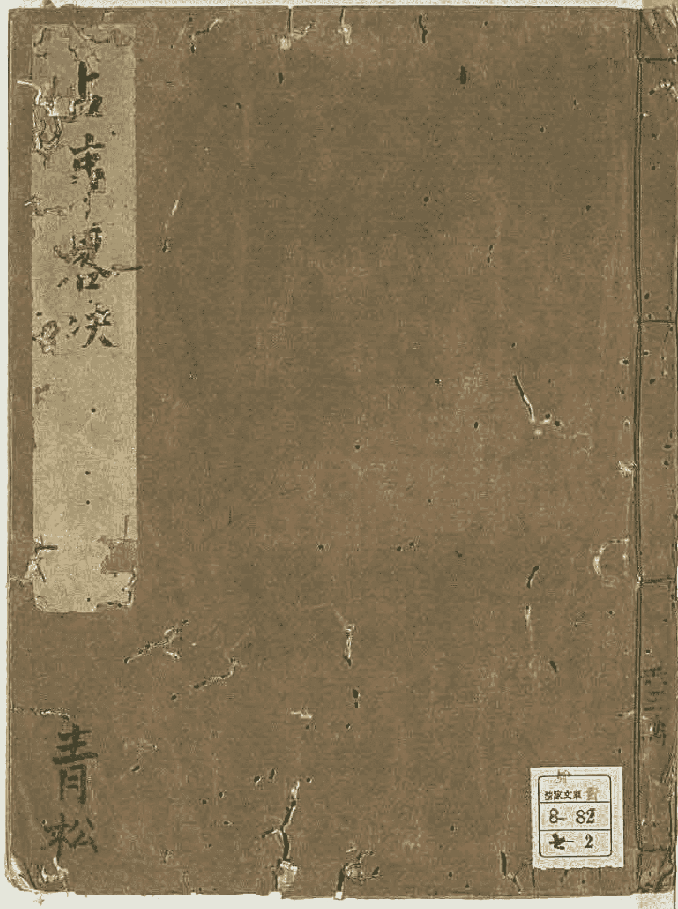

Copyright 2001, Kyoto University Library

正月微明 二月河魁 三月從魁 四月傳送 五月小吉 六月勝先 七月大一 八月天罡 九月大衝 十月功曹 十一月大吉 十二月神后

## 占事略決

四課三傳法第一 課九用法第二 天一治法第三

三將所主法第四 十二月將所主法第五 十二遶法第六

二支陰陽法第七 課式干法第八 五行相生法第九

所勝法第十五 五行相剋法第十一 五行相刑法第十二

五行相破法第十三 日德法第十四 月財法第十五

日鬼法第十六
干支数法第十七
五行数法第十八
五行十支色法第十九
十二客法第二十
十二筹法第二十一
六人問五事法第二十二
知男女行年法第二十三
空亡法第二十四
知喜期法第二十五
其卦大例所主第二十六
占病崇法第二十七
占病死生法第二十八
占产期法第二十九
占星鬼法第三十
占待人法第三十一
占盗失物得不得法第三十二
占兵寇法第三十三
占聞事信不信法第三十四
占有雨不雨法第三十五
占時法第三十六

## 四課三傳法第一

常以月將加占時視日辰陰陽以立四課日上神
為日之陽 是謂
一課 日上神本位所得之神為日之
陰 是謂
二課 辰上神為辰之陽 是謂
三課 辰上神本
位所得之神為辰之陰 是謂
四課 甲乙丙丁戊己庚辛壬癸

華蓋者 謂 子丑寅卯辰巳午未申酉戌亥 是也

四課之中察其五行取相剋者以為發用神

神為傳用神之本位取得神為二傳神之

本位所得神為三傳也

## 課用九法第二

第一若四課中有下剋上者當以為用若無下

剋上者以上剋下為用所以然者下剋上為逆

為深臣殺君子殺父婦殺夫婢殺主故為深

上剋下者為順為淺君殺臣父殺子夫殺

妻主殺奴故為淺也

第二若有二三下剋上各二三上剋下者不

與今日比者為用罡日比日神后卯酉天罡勝

先傳送河魁兼以此為大吉天衡大一小吉從魁從明也

第三若四課俱比俱不比以涉害深者為用加孟為深加仲為半加季為淺

第四若有涉害共等者取先舉者為用不謂先舉者日為先辰為後陽為先陰為後也

第五若四課陰陽皆不相克者以遙相克為用

謂今日神遙克四課神遙克今日神也若今日神克四課神以今日神者以神克日為

第六若四課之中無上下相生無遙相克者

星為用 魁是也 還日作視酒上可得神為

性首 天故作 視之業用柔日以從魁所臨之下神為用其三傳法異

常也罡日傳辰上終日上柔日傳日上終辰上

第七天地伏吟時 謂天地神 各居其位 若有相剋者當以為用 謂

若无相剋者罡日以上神為用柔日以辰上神為用其三傳用神為一傳其刑神為二傳

其衝神為三傳也 刑衝法 在左

第八天地反吟時 謂天地神各居其位也 從令子神臨午上也 若有相剋者當

為用元相剋者罡日以日之衝為用柔日以辰之衝為用 謂衝子午相衝巳亥相衝及亥未相衝也 其三傳法

傳辰上終日上神 及吟時三傳有二 異端者而不載

第九五柔日作用一小淵 謂五柔八專日別補也甲寅 庚午巳 未癸丑是也 若有

相剋者當以為用 如三傳常若无相剋者罡日從日上

神順數及三神為用柔日從辰上神本位所得

神逆數及三神為用罡柔俱元三傳終日辰上

而若用赴日辰上者唯有一傳耳

## 天一治法第三

欲知諸將前後以天一為首天一在子為前

茂為後天一在戌上以酉為前以亥為後天一在辰

上以巳為前以卯為後天一在巳上以辰為前以午

為後常背天門向地戶 所向為前 所背為後

甲戊庚且治大吉 暮治小吉

乙巳且治神后 暮治傳送

丙丁且治從魁 暮治登明

六辛且治勝光
暮治功曹

六庚且治太一
暮治太衝

六己且治大吉
暮治天罡

六戊且治功曹
暮治太衝

六丁且治大吉
暮治天罡

六丙且治太一
暮治功曹

六乙且治太衝
暮治天罡

六甲且治功曹
暮治太一

後一天陰金神家在酉主葬
隱主笙簧也

六辛且治勝光
壬癸且治太一
暮治功曹
暮治太衝

且暮治法從寅至酉為旦從戌至丑為暮

前一騰蛇火神家在巳主驚恐恐怖畏忌將
前二朱雀火神家在午主口舌懸官凶將

前三六合木神家在卯主陰私和合吉將
前四勾陳土神家在辰主戰鬥爭訟凶將

前五青龍木神家在寅主錢財慶賀吉將
天一貴人土神家在丑主福德之神吉將

後一天后水神家在亥主後宮婦女吉將
後二太陰金神家在酉主弊以隱藏吉將

## 十二月將斷主法第五

吉凶而斷事者也

前盡於五後終於六天一立中央為十二將定

後六天空土神家在戌至欺殆不信凶將

後五白虎金神家在申至主疾病死喪凶將

後四天裳神家在未至主冠帶衣脈吉將

後三玄武水神家在子至主盜賊凶將

正月微明水陰神凶治在亥為河神主牢獄關訟事

二月河魁土陽神凶治在戌為太神主口舌婦人事

三月從魁金陰神凶治在酉為竈神主移徙搖動事

四月傳送金陽神吉治在申為道路神主遠行商賈事

五月小吉土陰神吉治在未為主酒食厨膳事

六月勝先大陽神吉治在午爲外竈主五穀口舌事

七月太一天陰神凶治在巳爲內竈主竈車相連事

八月天罡玉陽神凶治在辰爲太公主疾病死喪事

九月太衝木陰神凶治在卯爲社樹主林木船車事

十月功曹木陽神治在寅爲大樹主獄長吏事

十一月大吉土陰神吉治在丑爲山神主六畜宮寺事

十二月神后水陽神吉治在子爲北辰主婦女陰事

## 六十甲子乘法第六

甲丙戊庚壬爲陽干忌爲陽干

乙丁己辛癸爲陰干忌爲陰干

## 十二支陰陽法第七

子寅辰午申戌爲陽支忌爲陽支

辛卯己未酉亥為陰爻陰爻為陽爻

## 課支干法第八

甲課寅 乙課辰 丙課巳 丁課未 戊課巳
己課未 庚課申 辛課戌 壬課亥 癸課丑

## 五行王相死囚老法第九

春三月木王 青 火相 黃 土死 黑 金囚 赤 水老 白
夏三月火王 赤 土相 白 金死 青 水囚 黑 木老 黃
季夏土王 黃 金相 黑 水死 赤 木囚 白 火老 青
秋三月金王 白 水相 青 木死 黃 火囚 黑 土老 赤
冬三月水王 黑 木相 赤 火死 白 土囚 青 金老 黃

## 所勝法第十

王氣所勝法夏變懸官 相氣所勝法夏變錢財

死氣所勝法憂死
因氣所勝法憂繫囚

老氣所勝法憂疾病

## 五行相生相剋法第十一

木生火
火生土
土生金
金生水
水生木

木剋土
土剋水
水剋火
火剋金
金剋木

## 五行相剋法第十二

子刑卯
卯刑子
寅刑巳
巳刑申
申刑寅
丑刑未
未刑丑
辰午酉亥各自刑神

## 五行相破法第十三

子酉相破
辰丑相破
寅亥相破
午卯相破
申巳相破
戌未相破

## 日德法第十四

甲德自處
乙德在庚
丙德自處
丁德在壬
戊德自處
己德在甲
庚德自處
辛德在丙
壬德自處
癸德在戊

已德在甲庚德自處辛德在丙丁德自處壬德在戊

## 日財法第十五

木財土 火財金 土財水 金財木 水財火

## 日鬼法第十六

木鬼金 火鬼水 土鬼木 金鬼火 水鬼土

## 干支數法第十七

甲己數九 乙庚數八 丙辛數七 丁壬數六 戊癸數五

子午數九 丑未數八 寅申數七 卯酉數六 辰戌數五 巳亥數四

## 五行數法第十八

水生數一 火生數二 木生數三 金生數四 土生數五
成數六 成數七 成數八 成數九 成數十

## 五行十干十二支法第十九

寅卯甲乙木色青在東
巳午丙丁火色赤在南
申酉庚辛金色白在西
亥子壬癸水色黑在北
辰戌丑未土色黃在中

## 十二客法第廿

一時十二支客肇同占之時以客可占也

子酉寅亥辰巳午卯申己戌未

陰將臨時前五後三
陽將臨時後三前五

假令正月後明陰將也即後明為一客天罡為二客大吉為三客等是也二月河魁陽將也即河魁為一客小吉為二客神后為三客等是也

文有泛象十三人法省而不載

## 十二籌法第廿一

一人問十二事之將可占也但其事殊類故以五事可占
假令初奏一二三四五而丁卜云卜凡左右以籌可占故

未戊巳甲卯午壬辰亥寅酉子

陰神發用前三後五 陽神發用後三前五

假令發明發用即發明為一籌切曹為一籌從魁

為三籌是也河魁發用即河魁為一籌小吉

為一籌神后為三籌等是也

## 六人問五事法第廿二

第一月將加時 第二天歲加時 第三月建加時

第四行年解 第五本命解

## 知男女行年法第廿三

男以本命加大歲切曹下為行年

女以大歲加本命傳送下為行年

## 空亡法第廿四

甲子旬 戌亥為空亡 甲寅旬 子丑為空亡

甲辰旬 寅卯為空亡 甲午旬 辰巳為空亡

甲申旬 午未為空亡 甲戌旬 申酉為空亡

## 知吉凶期法第十五

常以河魁之所加為法假令河魁加子午者河魁

代數五子午數九相乘之五九四十五則以冊五日內為

期加子表相乘之五八冊則以冊內為期他效此月

期者以用神所主月謂之假令習趙用以正月十

月為期也正月若月建所至十月若月將不至也

日期者以今日所受為善期假令今日甲子日者

以壬癸丙丁日為善期以今日所惡為憂期假令

今日甲子日者以庚辛日為憂期

## 六八卦大例所主法弟廿六

### 氣類物卦第一

謂所生為氣所死為物同位為類木生於亥盛於卯死葬於未
假令甲乙日占事發明起用為氣切曹大衡起用為類小吉起用為物也他效此

火生於寅盛於午死葬於戌土生於火位壬於六月
死葬於辰
假令戊己日占事勝光起用為氣大吉
小若河魁起用為類天罡起用為物也金生於
巳盛於酉死葬於丑水生於申盛於子死葬於
辰是故亥卯未為木位寅午戌為火位巳酉丑為
金位申子辰為水位土無方位寄治於丙丁氣憂
父母類憂兄弟及已身物憂妻子及下人

### 新故卦第二

謂正日用在陽為新在陰為故有氣為新無
氣為故

氣爲故
言日辰上神爲陽
本位上神爲陰也
氣日所生加之爲新
死加之爲故
假令七日河魁臨日爲新
大吉臨乙爲故等也

### 元首卦第三

易曰元者善之長也變一言元之者氣也
謂以上剋下爲用是也占事皆以神將論其
憂喜
假令正月甲子日
寅時占是也

### 重審卦第四

謂四課中有上剋下下剋上以上剋上爲用是也
此占人出軍行師不利爲主人
假令二月乙巳日
午時占是也

### 傍茹卦第五

謂四課中有二三四相剋二三四俱比以涉害深者爲
用是也此時所作督留憂患難解姙娠傷胎
假令
癸酉日卯
時占是也

### 蒿矢卦第六

謂四課陰陽有與今日遙相剋者爲用是也此時占事神來剋日禍從外來日往剋神身行難仇以神將論其吉凶
假令正月甲戌日寅時占是也

### 席視卦第七

謂四課陰陽中無相剋者無遙相剋以昴星爲用是也以此占事思慮遠行至涉關梁男子恐死於外藥日伏藏不欲見人行者暫留居者有憂女子婚媾沉憂不解
假令六月戊寅日寅時占是也

### 伏吟卦第八

謂天地伏吟時也以此占人聞憂不憂聞喜不喜占病者不言合者將離居者將生子暗啞若盲聾
任信伏吟異名也

### 移開梁杜塞諸神各歸家

偃令十月甲子日寅時占是也

### 爻吟卦第九

謂天地爻吟時也占事必見死人又有不孝之子君有不順之臣父無所親君無所因以謀客人殃及其身

偃令今日庚寅日及吟是也

### 無婚卦第十

謂陽不與陰合陰不與陽親三言相得而往此是也

以此占人法式不正夫婦各有邪心

偃令十月甲子日午時占是也

### 牧童迭女卦第十一

謂用起天后終六合玄武是也占事家無逃女必已婦親挨弊遙使不得見

六月戊戌日辰時

正月庚午日卯時占是也

### 惟薄不修卦第十二

占子不孝也 一名之柔卦

謂一神二神陰陽共焉八專日謂也占事爲有内礼

婚送之事也

### 三交卦第十三

謂以太衝從魁加今日日辰爲用得六合太陰又以日辰在四仲神又用起四仲傳終四仲是也占事家匿罪人之象也

從今正月乙未日卯時正月丁丑日寅時占是也

### 乱首卦第十四

大撓経云乱首卦皆爲凶逆下欲犯上百事皆凶

占田宅不安送筆假上少客長女

謂罰日也一者日往臨辰用起其上

二者以辰剋其日用起日上

占事臣弑君奴婢害主當此時不可舉兵

### 龍戰卦第十五

金匱日卯日占事用起卯上酉日占事用起酉上人羊

立之分離動搖奇復合也

謂二八門与用俱起卯酉日用起卯酉上是也欲行

### 贅聾寓居卦第十六

不得行欲心不得占事其人動搖不安將分財離居也

謂今日之辰來加日日往賊辰辰來受賊是也此女提子而行嫁後以其身託寄他人不得自專之也

以此占人皆有違逆斬嫡內亂之事各以將論之

### 陰陽無親卦第十七

謂陽無所依陰無所親禍生內外將及其身以此謀事必見死人父有不孝之子君有不順之臣父無所親君無所同天地及者也一者時遇及吟陰剋其陽是也

辰上神皆為其陰所賊

### 斷絕卦第十八

秘要曰君子遠官小人得罪也

謂天一之神三二八門是也
寅時占是
若占遇之者有德
君子則進上對虎小人則退下卑官失祿高官
遷職此皆陰陽易位矣天一在門搖動不安之象也

### 玄胎四北卦第十九

謂用起四孟神傳終在四孟是也
若占遇此卦者
其人始合終計欲有建立之事是斷善惡將云
之若無計謀即妻妾將有子也

### 聰若卦弟少

知一 形若異名也

謂用起神與今日比是也
五月辛亥日
卯時占也
又雜用神不比
以日辰上神及傳終與日比是也
若將射彼物或
欲如何求皆以此卦決之

### 曲直卦弟廿一

曲直
為男子
為雷電
為家室
為著草
車木之
又為座

直為曲為足老少之徵次

謂爻卯未木之位若用傳終皆遇之是也若占
遇此者其人欲伐木冠木之事

卯時占是也

五月丁卯日

### 炎上卦弟廿二

謂爻卯未木之位若用傳終皆遇之是也若占
遇此者其人欲伐木冠木之事

卯時占是也

五月丁卯日

### 稼穡卦弟廿三

謂爻午戌火之位若用傳終皆得此神是也若
占遇此者其人欲有炭灰鑄冶之事

未時占是也

正月甲戌日

### 從草卦弟廿四

謂爻巳日用起大吉小吉終於太一勝先或用傳
終得四季土及太一勝先是也若占遇之者其人
欲有耕農土功之事

辰時占是也

十二月壬子日

革字 礼記云病革 汪云革急也

謂巳酉丑金之位若用傳終皆遇其神是也若占

過之者其將有兵草金鐵之事
七月辛酉日
酉時占也

### 潤下卦弟廿五

謂甲子辰水之位若用傳終皆遇其神是也

若占遇之者其人欲有溝渠舟楫釣網之事
八月庚辰日
申時占是也

### 九醜卦弟廿六

謂天地之道歸殃九醜戊己辛壬乙日子午卯酉之辰時加四仲大吉臨日辰是也當此時不可舉兵嫁娶遠移築室赴土遠行為禍不出三年也
四月辛酉日
辰時占是也

### 天綱卦弟廿七

天綱卦一名天綱四張卦為羅綱為蜘蛛綱為萬物傷盡事
謂時剋其日用又助之是也
二月庚子日
巳時占是也
若占遇之者所治事上下有憂天綱四張萬物盡傷以此占人
身死家亡也

### 無祿卦弟廿八

謂四上剋下法曰無祿也若占遇之者室空無人老必

孤獨群臣受殃妻子被殃以此占人上剋下當此

時客勝主人為利

### 絕紀卦弟廿九

謂四下剋上法曰絕紀也若占遇之者是輕其君子

慢其父妻客其夫奴婢賤主生男妨父生女妨母已

其先人以此占人皆無父母臣事君子事父為紀令

皆下賊上故為絕紀故曰孤獨當此時利以居家不

宜為客

### 五墳四殺卦弟卅

謂用傳皆得四秀神是也若用傳與數并合爻遇凶

將者其人不敬客損氣人則將身自受之不與祭
合將有丘墓之事
六月乙未日
卯時占是也

### 三光三陽卦弟廿一

謂日辰王相爲一吉用神王相爲二吉又得吉將爲三
吉並具名三光王有喜事用神在王相之中
爲三陽日辰在天一前爲二陽天一順治而行爲三
陽三光既立三陽又存終必有善重受其慶
辰日寅
時月戊寅日
寅時等占是也

以此占病者不死舉尸入棺猶復生繫
囚在獄無徒利臨刀在頸未足驚所訴者聽誌市大
利所種者生欲舉百事无不成也

### 高蓋馬卦弟廿二

謂用起天馬傳見車羽終於花蓋是也又將得天
爲礼佛
祭山事
成儀裝束受賀事

后青龍天一大裳皆有公卿之象
天馬二月在十二月在申
三月在氐
胃在子
五月在寅
六月在辰
假令三月关酉日
當時占是也

### 劉輪織綾卦弟廿三

謂用起車乘傳見下綾將得婦女是也踐公卿之
位象
假令二月庚戌日卯時太衝加庚為用太衝主車乘也卯者邏
金是劉輪之象也傳見河魁主下綾來臨卯是綾在木之象
士將始大陰中見六合皆
婦人所組織之象
（七十五り）

### 鑄下条軒卦弟廿四

為慶賀事
為雕造物
為官爵執事位悦事

謂用起太一傳見河魁終太衝是其卦也初見天
子終以見私也
正月关未日
午時占也

### 斬關卦弟廿五

謂日辰論魁罡而及功曹二三並立門戶關梁是也
或以魁加辰卦發切電
六月乙巳
日午時占
或以魁罡加辰卦發

三天者
天魁
河魁
習是
也

### 河魁終切曹

正月庚寅日
卯時占也

或以魁加辰及罡加日
今日甲午魁加甲
今日夜午罡加庚也

以占人其人即不逃

或以魁加辰及罡加日
今日甲午魁加甲
今日夜午罡加庚也

以占人其人即不逃

已當越開梁之象也

### 天獄卦弟廿六

謂用在囚死半擊其日本占事在家憂繫囚
重遇救辱雖遇吉將不能為救
二月乙酉日
巳時占也

右卅六卦及九用次第家之說各不同又有以
五卦六十四卦之法或一卦之下管載數名或
或一卦之內舉多說然而事繁多煩省不載
具存本經以智可覽

## 占病祟法弟廿七

謂占祟之大體以日辰陰陽中三將言之神者
用自刑神
發有金
無咎也

將焉焉有崇神之爲善爲有崇鬼各以神將
分別又有氣爲神所作無氣爲鬼所作用將
俱木主社神用將俱火主竈神用將俱土主
及大歲神上下俱金主道路神上下俱水主水神
功曹大衡主伏神又風病太一勝先主竈神傳送
從魁主僕神或以馬祠神嶽明神后太釧天罡
主北辰天罡主水邊太公小吉至門井太公又厨
膽河魁主竈土及位墓太公大吉至山神大歲
太公又小澤土公從魁太一神后至咒咀太一至妻
藥及佛法傳送至形像騰蛇主竈神客死鬼
朱雀主竈神及咒咀惡鬼六合主縛死鬼求食
鬼勾陣主太公發竈竈神青龍主社神及風病

食物誤天后至母鬼及梁上神大陰至崩鬼玄武
主滿死鬼乳死鬼大裳至丈人白虎主丘死鬼
周易曰道路鬼天空主無後鬼餘以神將所主決定

## 占病死生法第廿八

謂曰為身辰為病若病剋身重身剋病輕白
虎剋日重日剋白虎輕又云常以月將加時若大吉
小吉剋後明與白虎并加病者行羊及日辰
皆死又云以大吉加初得病日視行羊上得天魁天
罡十死一生也因死之神各騰蛇白虎剋罡加
得病之日是為三死以加病者行羊又死也

## 占產期法第廿九

謂以月將加時視勝先若加婦人并命即日產隨

勝先所在爲產時
參欲知生時視魁罡所加生月
生日所加辰則生日也

## 占產生男女法弟卅

謂用在上尅下爲男在下尅上爲女一云天一加孟爲男
加仲季爲女一云用得青龍大裳爲男得天后大
陰爲女又法以傳送加本命行年上見陽神生男
見陰神生女又云年上有功曹生男有傳送生女

## 占待人法弟卅一

謂遊神加孟爲始發加仲半道加季爲既至一云
東南行人以子上神爲至期西北行人以子上神爲
至期遊神春太一夏神后秋從魁冬天罡又云
用神在天一前爲二煞在天一後爲遲來期魁罡

下為至期之

## 占盜失物得否法第廿二

謂以月將加時天一及日辰制所失之物類得制

玄武又得日往封辰之陽神所失物不可得辰之

陰神來剋日之陽神者所失物得也

## 占六畜逃亡法第廿三

謂日辰上神制騰蛇玄武及物類神者即得不

制者不得日辰上神但制騰蛇玄武而不制物類

神者不得又制物類神而不制騰蛇玄武者又不

得一云魁罡加盜得加仲半得加季不得欲知得期

其物類神所在之鄉里也日辰為期欲知其方以

其物類神所在之鄉受其衝為所在方

## 占聞事信否法弟卅四

謂常以月將加時，大神加孟不可信，加仲半可信，加季可信。之大神：春大吉，夏神后，秋徵明，冬河魁。

## 占雨不法弟卅五

謂常以月將加時，日辰上見神后、徵明、太衝，有雨。青龍好雨，白虎好風。雨從龍，風從虎。青白所乘之神有氣，則有風雨也。

一日辰上見亥子，有雨；見寅卯，有風少雨；見巳午，无雨；見申酉，連陰雨少。

## 占時法弟卅六

謂以月將加時，視神后、徵明、勝先、太一所臨。在天後二俱陰，在後四已除。傳送在天前一、二、四者為大風。已除。又云以曹為青龍，傳送為白虎者晴。又云天上丙丁所臨下為晴日。天罡、河魁臨益不晴，臨仲為雨，正臨季為立止。又以月將加月建，天上丙丁所臨為晴日。

夫占事之起應，察躬精微，失之毫毛，實差千里。明明楓葉枝疎，踈攀校實於老後。吾馬道異，難逐聖跡於將來。終舉一端之詞，粗抽六壬之意而已。

天元六年 歲次己卯 五月廿六日 天文博士安倍晴明撰

指羊法

病事：男以功曹加蛇虎魁罡，以大歲上為羊；女以傳送加蛇虎魁罡，以大歲下為羊。

口香：男以功曹加朱雀勾陳，以太歲上爲羊；女以傳送加朱雀勾陳，以太歲下爲羊。

慶賀：男以功曹加青龍大裳，以大歲上爲羊；女以傳送加青龍大裳，以大歲下爲羊。

上中下：天罡加孟爲上，加仲爲中，加季爲下。

保元二年 歲次丙子 十二月廿四日 以家說授息男 親長了

雅樂頭安倍泰親 生年卅七

安貞二年 歲次己丑 十月十日甲辰 以家秘本手自書寫畢

內藏助安倍泰隆

即能加點殺合畢

青松

## 更多资料

↓↓↓

## 【中华古籍库】

↓ 点击链接 ↓

https://www.fozhu920.com/list/

珍版刻印 / 海外流传 / 家传手抄 / 民间失传

【易】【医】【道】【武】【文】【奇】【画】【书】

1000000+高清古书籍

## 打包下载

微信：mbook86

## 中华古籍库

1000000 册 高清影印古籍
珍版刻印 / 海外流传 / 家传手抄 / 民间失传

古籍善本、经史子集、史料笔记、古人文集、
民间收藏、传世家谱、各地方志、中医典籍、
四库全书、古禁毁书、内阁文库、图书集成、
丛书集成、四部丛刊、万有文库、四部备要、
二十四史、三国六朝文、明清和民国古籍史料
……