# 占星入门教程

(注: 书中一些资料来自“中国占星同盟”http://astrochina.net 的原创文章)

为什么要做占星教程?

我们已经通过《占星术》这本书对有关占星历史、原理、以及天体方面的基础知识的了解，毫无疑问，大家对占星术的认识已经不只是局限于它是一种算命问卜的工具，而更重要的是它能作为启发我们认识自我，认识世界的媒介。因此，占星学是一套系统的知识体系，这个体系蕴涵了哲学，物理学，医学，心理学，社会学，经济学，天文学，计算机科学，气象学，统计学，神学，人类学等等。所以，为了不断发展占星，不但需要占星爱好者掌握大量占星的方法和积累占星经验，更需要许多其它行业的工作者进入这个领域。基于这种状况，对占星的学习也应该建立起一套有体系，有规律的方法。只有在完成这种系统的学习后，才更能使各位爱好者在各自领域里发挥星象的非凡作用。

为什么要参加占星教程的学习? 学习占星到底需要多长时间? 什么人可以学习占星?

很多人放弃占星的学习，最主要的原因是觉得占星术语晦涩难懂，符号抽象，且解释复杂，因此不知道从何下手、如何学习。另一个原因，是听闻那些所谓的“大师”们鼓吹占星需要花费多少多少时间才能掌握，而在一开始学习的时候就对自己的能力感到怀疑，自己心里先打起了“退堂鼓”，导致丧失学习占星的信心。

针对这两个原因，我们的教程首先帮助大家学会合理运用网络的免费资源（特别感谢网主在3年前就开始积累的大量资料），将这些凌乱的知识组织起来，进行有调理、阶段性地学习。其次，通过教程让大家体会到占星入门并不难，夸张点说就是：人人都可以学会占星，各个都是占星家。

以个人的经验来看，利用占星软件工具和网络文献，掌握占星的基本思想构架、术语体系和运用方法，最多不过 100 小时。真正需要投入时间和精力的不是“占星入门”这个阶段，而是在实践中逐步建立起自己独立的解释体系，并且是将占星的方法、原理与各自的专业领域结合的过程。

首先，特别鼓励那些年龄小的爱好者参加这个短期学习课程，因为你们的思维体系还没有定型，通过系统学习占星，能有助于你们建立更加完整的知识结构，如果运用得当，甚至可以起到开发智力、促进学业的作用。

另外，也鼓励那些专业领域的学生或专家，如医学、物理学、生物学等等，请你们带着自己的专业背景，以及批判精神来学习占星。在你们学习占星时，也是在为自己的专业领域开辟新思路，其结果将是：无论对占星学还是对你的专业领域都会创造出惊人的成就。

再有，更鼓励那些在生活或情感上找不到方向，而寄希望于“问命”来决定自己的生活的人们。你们的个人经历对占星学积累资料数据有着巨大的作用，这是推动占星学发展的重要基石。又因为，你们可以毫不保留的暴露自己内心最真实感受，让其它占星爱好者与你分担痛苦，与有着共同命运的朋友们一起成长，所以你们学成以后会成为最可靠的占星家。而且，我也希望你们在面对自己的不幸遭遇的时候，应该运用占星工具来明确自己的判断，但一定要自己去学习占星，而不要单单依赖他人为你做出的论断。

还要知道：没有人能拯救你，除了自己。

## 教程如何安排？

这个课程是基于网络资源，授课和资料都是完全免费的，我们只是利用论坛的平台，帮助大家安排学习进度，组织学习资料，促进学习过程中的交流。最终帮助大家能在较短的时间内，系统掌握占星知识。

大致总共耗费 100 小时。假设分配方式按照 2 小时/天的学时，一周学习 5 天，则大约需要 10 周，整个课程大约跨度 2 个半月。如果某些精力充沛，而且天资聪慧的学习者，可以相应增加每天的学习负荷，从而缩短学习时间的跨度。但因面对大多数占星爱好者，所以这个教程大纲先采用 10 小时/周的进度进行，如果大家学习过程中有任何建议，希望你们能跟贴反馈！也帮助大家更加有效地学习。

学习进度按照后面的“教程大纲”，学习内容全部来自网络文献。每天都有论坛上的众多网友们共同协助解决学习者在学习过程里的问题和困难。学习进度可以是设定的教学计划进行，但每个学习者可根据自己的情况来做调整，所以不必担心这个学习会和自己的本职工作相冲突。

最末，祝愿所有参与学习和教学的朋友们，能够因占星而塑造全新的自我，因占星而获得幸福，因占星而成就事业。并鼓励大家能继续深入对占星的研究和学习。

## 教程大纲：

参考教材：《学会占星的第一本书》

总学时：100 小时； 进度：10 小时/周 or 2 小时/天； 跨度：10 周

### 第一周：初步认识自己的本命星盘

- 1ST 天：通过在线星盘认识自己星盘中的 10 大星体及其落入星座；查阅相关解释资料；
- 2ND 天：通过在线星盘认识自己星盘中的 10 大星体及其落入宫位；查阅相关解释资料；
- 3RD 天：通过在线星盘认识自己星盘中的 10 大星体相互相位关系；查阅相关解释资料；
- 4TH 天：下载 Astrology 或其它占星软件，熟悉基本的使用方法，用专业的占星软件绘制自己的星盘图，并将图与在线星盘上的图进行对照比较，看是否有误差。
- 5TH 天：一边查找本命盘中的相关星座、宫位、和相位的资料，一边将和自己星盘对应的部分摘抄出来，用资料上的解释组合成为一份完整的个人命盘的解释。然后自己只阅读这份摘抄的资料，继续对照本命盘，自己处理这份“大杂烩”的解释。最后，根据自己的感受和分析筛选，构成一份新的解释，并作为第一份作业，存储下来，或张贴到论坛上，让其它朋友根据你的命盘进行评论。

### 第二周：进一步认识自己的本命星盘

1ST 天 ~ 5th 天：阅读占星教程和星座教程，选择适合自己的阅读水平的文章来看，针对自己的命盘来阅读教程文章。目的达到，能够比较综合地分析自己的命盘，并且用自己的生活体验来验证每一个相位。

周末再完成一篇综合分析自己命盘的作业，贴上论坛，和前一周的作业进行比较，并获得其它星友的评价。

### 第三周：阅读精华星盘分析

在教程中有一部分“星座名人”，以及星座网上的名人出生资料：

阅读前人对这些名人的命盘分析，或者自己通过查找资料来分析这些名人的星盘。找出至少 10 个你认为有意思的名人，记录下他们得出生资料。这 10 份资料将是你下周的作业，但最好是能有别人对其做过分析的命盘，而且是你没有看过别人的分析内容。

### 第四周、第五周：

开始自己写命盘，素材就是上一周记录的 10 个名人。自己开始写命盘要注意几点：

- 1. 开始的时候需要一边参考星体相位教程来写
- 2. 写完一份就可以参考前辈写的命盘分析，对照自己的和前辈的解盘，找到自己的缺漏之处，研究自己分析命盘的思路和角度。
- 3. 大约自己写完 6 份以后，就可以尝试不看教程来按照自己对命盘的理解来写，可以不需要把每个星体都面面俱到，但是把你认为具有重要特征的相位描述出来。
- 4. 如果你愿意，还可以把自己的作业贴到论坛上，大家一起来讨论，并且你也可以用自己的思路向前辈们的解盘进行挑战。只要解释合理，大家都可以相互学习借鉴。

### 第六周：

阅读占星教程里的专题性分析文章如：

你会不会离婚：金星和天王星的各种相位

你是不是感情不顺：金星和土星的各种相位

你保守还是叛逆：土星与天王星的各种相位等等。

针对自己理解不了的相位或者星体来阅读教程中的文章。并且适当做笔记（现在用电脑做笔记比以前手写方便得多）。

### 第七周、第八周：

这时候，你已经可以开始帮亲戚朋友看盘了，不要担心自己看不准，只要你按照前六周学习的步骤，这时候你帮朋友看盘按照教程里的材料套，已经能有 6 - 7 成准确了。这两周里的功课就是能将你每看过的任何盘都自己动手写一份解盘分析。刚开始独立解盘的时候，最好能有解盘记录，方便将来你重新回顾，不断提高。而且，不少人初初解盘的时候，对星盘的感觉都很特别，因此往往会有非凡的灵感，往往这种特别的感觉对占星很重要，记录下来便于将来自己总结占星的要领。

### 第九周：

开始学习制作流年盘。阅读关于流年盘的文章。比较自己的流年状况来分析各个相位的含义。（从开始做流年盘，我建议大家就可以开始经常在论坛上发表关于星体相位体验的帖子。并且通过和其它星友的讨论，进一步理解流年相位的含义）

### 第十周：

开始学习比较盘、组合盘的制作方法，以及学习如何解释组合盘。推荐落落循序渐进学合盘的文章“经典极品合盘系列”：

基本上就可以掌握合盘要领。之后，就需要你自己在其它的论坛、占星站点、以及国外的占星资料来补充学习。这些合盘解释都很有限，只是介绍了基本的方法，而细节的分析原理还需要更多的资料来补充才能分析好合盘。

### 第十周以后：

恭喜！这以后，你就已经是经过占星“扫盲课程”的中级班同学了。同时也以为着你将不再具有任何教程来辅助学习占星，从这个时候开始你就要针对自己的喜好，去搜集更多的占星资料，逐步建立自己的解盘风格，确定自己的占星领域，等等。

在进阶学习过程里可以通过以下途径：

- 1. 多参加各种占星论坛的研讨学习，深入了解占星术的知识体系。
- 2. 建立自己的专长，找到自己的占星偏好，深入研究某个或某些领域。
- 3. 补充占星以外的其它知识：如，天文学、心理学、历史学、社会学、数理统计、经济学、医学、人类学，等等）

因为占星是个庞大的知识系统，没有几个人能全息全部，所以不要对占星算命过于依赖，任何解释都是基于解盘人的知识和概率统计，因此任何解释都只是一种可能性，不要因此而怠慢了生活中真实的体验，以及小概率事件发生的可能。抱着积极的态度看待消极的相位，批判的态度看待和谐相位。只有不断用事实来验证的占星知识才是可靠的！

## 认识星象学

星象学探讨天体对生物与无生物的作用，以及它们对天体影响力的反映，星象学在人类最早期的史料中即有记载。

星象学是“天文学之母”，曾经有一段长久的时日，它们是一体的。星象学是最精深的天文学。事实也是如此，也可以说：“顶尖的科学家多是物理学家，顶尖的物理学家多是天文学家，而顶尖的天文学家，终将走入预测未来的星象学领域”。牛顿就是一个例子。

以色列特拉维夫大学的教授班杜夫和星象学家史坦女士曾指出：发现万有引力定律的英国科学家牛顿，对星象学有浓厚的兴趣。一七二七年去世的牛顿曾在一份手稿中，畅谈星象学、个人神秘冥想体验及他对炼金术的研究心得。史坦女士并说：“我希望让全世界都知道，科学和星象学并无冲突之处。”

牛顿是一位科学家、物理学家、天文学家，也是一位星象学家。他曾预言在他死后二十三年，也就是公元一七五〇年的头三月内，会发生北极光风暴与伦敦大地震。结果正如他所说，在一七五〇年的二月，发生北极光风暴，接着就是伦敦大大地震，加上时速达一百英里的强风，数千人因此而丧生。牛顿的依据是，那时将有日食，月亮在近地点，而且这时候木星也正好接近地球：由此他推论会引起地震以及大气层的活动。

天文学是研究距离、光度、重量、速度、运动等等方面的科学，并用望远镜等仪器作为的观测的基础，因此被视为“客观”的科学。而星象学则被称为“主观”的科学。因此，星象盘的绘制，实际上是属于“天文学”的范畴：而对出生星象盘所作的判断或诠释则是属于“星象学”的过程。

星象学亦探讨星球间的角度以及其角度对人类的影象，“星座”是划分天象的一种方式，是以出生月日推算的；“宫位”则是加上出生地再作推算的。研究星象学一定要了解下列四项的意义和作用：

- “星座”是剧场，可当作“行动的领域”。
- “宫位”是舞台，可当作“行动发生的场所”。
- “行星”是演员，可当作“行动推展的力量”。
- “相位”是剧本，可当作“行动推展的正反力量”。

“星象学”使我们知道，宇宙间有和谐平衡，每个人都是这个整体的一小份。因此，你应该把星象学和行星暗示感应看成是帮你了解自己和他人的一门学问。当我们清楚地了解自己，我们就会在自己身上发现新的特质，而使我们的生命更能发挥、更有意义且更有建设性。

起初，星象学分成四大类：

- 1. 物理星象学：星球的运行相交于潮汐、天气、大气与四季的影响。
- 2. 政经星象学：关于各国情势与其经济与政治情况的星象学。
- 3. 人事星象学：研究个人与其星盘的星象学。
- 4. 时事星象学：研究某时某地所发生的特殊问题。

在本书中，我们探讨“人事星象学”，也就是“人文星象学”。西方所运用的星象学有两种。一种是“回归黄道系统星象学”，它提供行星在各星座中的位置。另一种为“恒星赤道系统星象学”，它提供星座群的位置。为了明白期间的差异，我们必须区分星座与星座群，两者有相似的名称，及易引起初学者的混淆。

大约四千年前，在春分（春季第一天）的时候，太阳位于白羊座，当时并无此种区别：而到现在，由于岁差（Precession）与地轴的摇动（章动）的关系，太阳已由白羊座进入双鱼座。

黄道星座乃是沿着一个我们称之为黄道的轨道，在太空中所作的划分。黄道是行星在天空中运行的路线，变成一条椭圆形的路线。此一圆圈有三百六十度，十二个星座各分别占据三十度。白羊座是第一个三十度区域的名字，春分从此处开始。

你可能会遇到一些熟知天文学或“恒星系统”星象学的人，他们或许会坚持一些说法，认为太阳在白羊座的人，应该要改为双鱼座。这些说法，可能会使你信心因而动摇。

事实上，你们双方都对。“恒星赤道系统星象学”（日心系统）与“回归黄道系统星象学”（地心系统）所依据的是不同的原理，两者皆有其效用。我们在本书所告诉读者的是“回归黄道系统星象学”。

秘传的星象学钻研和“三心”，也就是和意识、无意识、超意识有关的星象学。这些是人类到达更文明的阶段，就会想进一步去分析的奥秘地方。

从有历史历来，十二星座可以在世界各地无数的教堂和宗教文物中找到记载的资料；文化虽有消长变迁，但十二星座的原则，还是一直影响着人类。

## 星象学的历史背景

一般人认为星象学是起源于古代的闪族、印欧或中国的河洛民族；星象学首先在巴比伦盛行，接着向东传到波斯、印度、中国；向西由希腊传到埃及、罗马和西班牙等地。星象学是探讨“大宇宙”和“小宇宙”之间关系的科学；所谓“大宇宙”是指布满了星辰的天空或穹苍，“小宇宙”指人类和人类的活动。一般认为星辰是上帝或无形的自然力量和人类间的媒介，上帝借助星辰传达讯息给他的子民，星辰活动和地球上的动态都有着因果关系。也就是说，天上的星星影响我们的心理状态，我们的心理状态又影响我们的行为模式，我们的行为模式又造就了我们的命和运。天上的星星和我们的心理状态是先天的，也就是无可改变的“命”；而我们的行为模式，就是我们后天的“运”。在中古时代，甚至更早以前，人们已经知道在一定的时间开始固定的活动。当时星象学的责任就是找出时间点。文献上记载，新的村镇在动土时，必须请星象学家选定黄道吉时。十三世纪时，意大利的星象学家波那提(Guido Bonati，圣芳济修会的修道士)，坚持教堂动土必须符合星象通则。更早的在公元四世纪时，君士坦丁大帝所建立的圣基督教，所属的教堂里已有“天宫图”，这个教堂现在仍存在于伊斯坦堡。

现代人所熟悉的个人星象学或“本命星盘”，在当时并不存在。早期的星象学指在预测整个团体的命运，从行星的位置上推算吉凶何时降临。

十五、十六世纪时，星象学渐渐为人们所接受。教皇朱利安二世(Pope Julius II)请星象学家推算就职的黄道吉日；教皇保罗三世（Pope Paul III）每次开枢机主教会议时，都请星象学家推算吉时。教皇里欧十世(Pope Leo X)在罗马的教会大学里设立星象学科；巴杜(Padua)、波隆那(Bologna)、巴黎(Paris)的大学里也研究起星象学。从中世纪到十八世纪间的许多科学、艺术、建筑文献都脱离不了星象学，如果你想看懂这些文献，就必须具备星象背景。

到了启蒙时代，特别是在清教徒的信仰中，星辰不再被认为是上帝和人类间的媒介。在讲究理性的现代中，星辰和人间大事的关系更形模糊，因为人类找不到确实而且让人满意的答案。天文学家尤其不遗余力的贬斥星象学；他们完全忽略了，一些重大的天文发现必须归功于星象学。

我们可以这么说：科学家是了不起的发明家及发现者，而顶尖的科学家多半是物理学家，而顶尖的物理学家多是天文学家，而顶尖的天文学家几乎都成为预言家，如牛顿及爱因斯坦等。而这些顶尖的天文学家所理解的“天命”，也仅是星象学家的初步而已。

因为星象学家或哲学家所谈的，是“先天不可改变”的七成部分，而科学家或天文学家所谈的，仅是“后天的人为可以改变”的三成部分而已，而以“三成的变数”来“评断七成不变的先天”，是不正确的。

如果第谷·布拉赫(Tycho Brahe)没有提出精确的星象资料，则开普勒(Johannes Kepler)不可能完成他的三项法则。两百年前，人类无法测量电流，在现代却是轻而易举的事；也许同样的，总有一天，我们必能找到宇宙和地球生命间的关系。

瑞士心理学家荣格(Carl Gustav Jung)花了许多时间研究这层关系，最后提出“大宇宙”和“小宇宙”同步论。所谓“同步论”、“同一论”，是指宇宙间的事件虽然没有“因果律”，但在时间和空间上却是彼此相关的。

从此，越来越多的心理学家投入星象学，因为星象学带领他们进入人类意识所无法领略的境界，同时进一步了解人类与其世界的关系。现在的心理学还没有进步到这个地步，但和许多现代科学一样，心理学在定义清晰的小问题上已经有了重大的突破。但是这些成果是否能形成一种完整的知识，具体的呈现人类生存的现实，实在值得怀疑。

人到了中年或老年时，生命的问题更不容逃避，此时，星象学发挥了另一种功能。越来越多的人请教心理分析师，希望能解开这些迷题。心理学家运用十分费时的盘问，希望解开一个人过去的问题；但有经验又负责任的星象学家却利用排出星盘，来帮助当事人了解问题。

许多人了解自己的星盘后，都能更了解自己的潜力何在。举例来说，一个追求财富与权利的社会，可能缺乏艺术与文化。具有这方面天分的人若了解自己的星盘则必“有助于他们监守岗位，振兴时弊，他们不必在觉得自卑，因为只是他们的价值观不同于时下一般人”。

有人认为，星象学在现代社会中正发挥“连接理性和超理性”、“有限与无限”的重要功能。星象学家可以协助一个人处理生命的问题，增加对自我的认识。现代熟悉的“本命星盘”旨在预测一切天地感应和命运，并进而从行星的位置推算吉凶。

## 认识“本命星盘”

“星象盘” (Horoscope)的本意是“时针”。它是一张星象盘。用以描述出生于某时某地的人之特征与潜力，此图亦称为“本命星盘”，为了描绘出一张精确的星象盘，必须有精确的生辰与出生地的经纬度。

早期许多人的出生时辰多半的没有正确的官方记录，如果仅凭母亲所记忆的时辰可能并不正确，这会浪费时间与精力，甚至所得的结果不准。反而让人怀疑到星象学的准确性。其实任何人只要有正确的资料，会加，减，乘，除，都可以画出星盘。但是，要诠释出星盘则需要判断力与推理能力。只要有足够的能力，反推出出生时辰是有可能的。星象学是一门极为精密的科学，需要相当的学养、时间、练习、尤其是严密的思索态度与应用。

在本书中，我们会告诉你星座、行星、后天宫与相位的意义。在你获得星象学的基础知识并学会如何诠释一个出生星盘之后，你就要准备做精确的计算功夫了。请随时记住你事实上正在学习一种新的象征性语言，只有藉者记诵与专心，你才会熟悉它。

你所学到的星象学可以提供你一种不同的方式观照自己生命中，或是别人的生活中所发生的事件。因为你将知晓此事件背后运作的力量是什么，并明了这些力量与所发生的事物如何相互呼应。然而，你的自由意志与态度会影响自己发挥多少潜力，获得多少收获。

## 星座的“两极性质”

我们根据星座的两种不同特质，可以把十二星座分为两组。其中一组称为“阴性星座”，而另一组则称为“阳性星座”。

阳性星座(亦称为主动星座，阳象星座)

包括：白羊座、双子座、狮子座、天秤座、射手座、水瓶座。其中包括“火象星座”，如：白羊座、狮子座、射手座。“风象星座“，如：双子座、天秤座、水瓶座。

这些星座的人个性较为乐观、主动、积极，开创性强，成功和成就也较为快速。

## 阴性星座（亦称为被动星座，阴象星座）

包括：金牛座、巨蟹座、处女座、天蝎座、摩羯座、双鱼座。其中包括“地象星座”，如：金牛座、处女座、摩羯座。“水象星座”，如：巨蟹座、天蝎座、双鱼座。这些星座的人个性较为悲观、被动、消极，开创性虽然较慢，他的成功与成就也较为迟缓，但具有永恒性。

## 自然元素——星座的“四分性质”

我们根据一些共同的特性，可以把十二星座分为分组。其中一方即是根据古欧洲人所认为的“自然元素”分为：火、地、风、水。也称为“三分法”。

### 火象星座（白羊座，狮子座，射手座）

这三个星座所赋予的性格为热情如火、率性而为、自负与浪漫。缺点乃是专横霸道与太过激烈。

### 地象星座（金牛座，处女座，摩羯座）

这三个星座所赋予的性格为实际、独立、保守与官能主义。出生于这些星座的人喜爱物质上的舒适，并有优秀的身体复原能力，缺点乃是笨拙与不灵巧，太过于物质主义。

### 风象星座（双子座，天秤座，水瓶座）

出生于这些星座的人表达能力佳。其活动倾向于心智层面，而且他们都很能做抽象的推理。他们有逻辑头脑，心胸宽阔、客观、无偏见，且有理想主义的倾向，缺点是冷漠与不切实际。

### 水象星座（巨蟹座，天蝎座，双鱼座）

出生于这些星座的人感受敏锐易动感情，且感情持久。他们的直觉丰富、多情喜感、感应力强、敏感、感情深刻。他们易受情绪左右，且易受环境影响。这些星座的缺点是自我放纵、自怜与犹豫不决。

## 星座的“三分性质”

我们亦可把黄道上的十二星座，每四个一组，分为三组；同一组中的星座有共同的特性，每一组都有其表现生活形态的样式。此种四分法如下：

### 基本型（本位型）星座（白羊座、巨蟹座、天秤座、摩羯座）

这四个星座恰如罗盘上的四个原点：东、西、南、北。白羊座在东，天秤座在西，巨蟹座在北，摩羯座在南。它们之所以称为“基本型”，乃因为它们掌理四季的变化。白羊座主春季、巨蟹座主夏季、天秤座主秋季、摩羯座主冬季。生于基本型星座的人热切，野心勃勃，有热忱且独立。他们心智快捷而不知足。缺点是仓促草率，不体谅别人，专断自为。

### 固定型星座（金牛座、狮子座、天蝎座、水瓶座）

这些星座是每个季节的中间月份。基本型星座带来季节的交换，而固定型星座则稳固地夹在每个季节的中段。出生于固定型星座的人意志坚决，能够专注，稳定，能做积累的功夫。其心智富于洞察力，记忆力绝佳。他们达成目标的步伐缓慢但扎实。其缺点是顽固，过于固守自己的看法，自我中心。

### 变动型星座（亦称共同型星座，包括：双子座、处女座、射手座与双鱼座）

这些星座是每个季节的结尾。这是一段完成该季节的工作开始计划下个季节的时分。出生于变动型星座的人多能多艺，善于变通，性情易变，心思精妙，有同情心与丰富的直觉，其心智灵巧有弹性。缺点是好欺骗、狡猾、诡诈、没有恒心、不够可靠。

## 认识黄道十二星座

黄道上有十二个星座，每一个星座都是行星发挥力量的行动领域，也掌控了可能发展的范围。十二星座都有其各自的守护星，每个行星也会在特定的星座中发挥作用。例如：白羊座是勇敢而有活力的，月球代表感情，而当月球位于白羊座时，这个人会以勇武而有活力的方式来表达感情。又如水星位于白羊座时，这个人的思考和推理会十分大胆而且很有活力。

无论如何，我们必须先认识每个星座表达的基本模式。当你认识每个星座的基本特质之后，发现你自己的每个行星所落的位置之时，你就可以根据这星座的积极正面的特质与特点去发挥。

### 星座正名，起止时间，俗误名

- 白羊座 Aries 3月21日-4月20日 日名牧羊座。
- 金牛座 Taurus 4月21日-5月21日 日名牧牛座。
- 双子座 Gemini 5月22日-6月21日 古名阴阳座。
- 巨蟹座 Cancer 6月22日-7月22日 日名蟹座，误名天蟹座。
- 狮子座 Leo 7月23日-8月23日 日名狮座，古名师子座，误名天狮座。
- 室女座 Virgo 8月24日-9月23日 日名乙女座，俗名处女座，古名双女座。
- 天秤座 Libra 9月24日-10月23日 日名天平座，俗名秤座。
- 天蝎座 Scorpio 10月24日-11月22日 日名蝎座。
- 人马座 Sagittarius 11月23日-12月21日 日名射手座，误名天马座，半人马座。
- 摩羯座 Capricorn 12月22日-1月20日 日名山羊座，古名磨羯座，误名魔羯座。
- 宝瓶座 Aquarius 1月21日-2月19日 日名水瓶座，误名天瓶座。
- 双鱼座 Pisces 2月20日-3月20日 日名鱼座，误名南鱼座。

### 认识“太阳星座”

每一年，太阳在十二星座上各停留约三十天。但因地球的椭圆形轨道与我们365天的太阳历法（闰年为366天）略有差误，所以太阳在某些星座停留的时间超过三十天，有的不到三十天。事实上，是从二十九天到三十一天不等。事实上，差异并不像表现上有那么大。

## 认识“上升星座”：命宫

每一个先后天宫，行星，相位等，都要结合并参考命宫做出综合判断，而命宫中的行星及相位，更可显示出直接而明显的感应。

与命宫有关的感应，如：命宫的宫主星，命宫内行星，命宫星座，命宫被截夺，命度的感应，命宫无星，以及与命度有关的相位等。

如果你的命宫是空的，没有任何行星及相位感应，不代表你没有自我，或不如命宫有行星的人重要。这种现象所代表的意义是：

1. 你的自我和命主星所在的宫位有密切的关系，若命宫为天蝎，水瓶，双鱼，由于这三个星座都有两个宫主星，所以它们影响个人的形象及兴趣极大。
2. 命主星所在的黄道宫，是自我或问题的指标（依行星走势而定）。太阳是自我的另一个方向盘，每个人都有一个。
3. 和第一宫有行星的人较量，你可能被低估，因为他们认为你不如他们“强壮”。

如果你发现，或只是觉得你吃亏太多，或其它人比你占上风，你必须坚守立场，多学习一些如何增加自信的技巧。

太阳与命度必须依地方标准时间而定。出生日期则决定“基本星座”，或称为“太阳星座”，也就是“内在的自我”。出生时间取决“上升星座”，或称为“本命星座”，“第一宫”，简称“命宫”。也就是“外在的自我”，主宰“真正与完整的自我”。我们从这扇窗户看世界，世界也从这扇窗户看我们。这是星象学上重要的课题，先要把“命宫”和“太阳星座”的定义弄清楚。

计算命度的正确度数，计算的过程烦琐，不妨留给专业的星象学或电脑。不过按照指示，再配合下表，很快就能找出你的命宫。知道命宫位置，对研究以后几章比较方便。下表左方是出生时辰，表右上方为“太阳星座”，右下方为换算出来的“命宫”。

“命宫”即东升命宫，上升星座，主宰生命的开端以及人生未来的方向与发展。它影响人格形态、外貌气质、自我认同、外在形象、表现个人的独特性。如果你不知道自己详细的出生时分，可根据下表方法找出自己的“命宫”，也可利用它来算出他人的“命宫”。依“地心系统”理论，太阳每天运行在椭圆形的轨道上，运行速度不一，故以下表推算出个人的“上升星座”，其准确率仅约七成左右，要完全的精准，则另须精密的推算，本书所附赠的电脑软体是最好的工具。（因现有软件都可以精确做出命宫，故此处不再列改表）

### 你算星象学的命宫

黄道十二宫在星象学上具有十二种“感应”意义，是为“先天十二宫”，如白羊座、金牛座等。“太阳星座”仅是统筹父系遗传、外在形象、自我性格、潜能才华。它主宰个人的精神、精力及活力等；而一般所知的“星座占星术”仅论及出生月日，照这个看法在地球上每个星座的人约有四亿多人，这四亿多人岂不同命同运，这当然是不可能的事。

况且这种“太阳星座”所谈到的，只是自己父亲与丈夫的人格形态，以及外在部分形相与个性，而不是自己的“命格”。若以此推论个人的命运，想用来断验吉凶，其实是不可能的。

父母生下我们，则这个“生命个体”既不同于父母亲，亦有别于天地间的任何一个人。

什么样的“命”才是自己的？命宫（东升命宫或上升星座），它主宰生命的开端以及人生未来的方向与发展。它影响人格形态、相貌气质、自我认同、整体形象、尤其重要的是，它代表每个人与众不同的“独特性”，及有别于父母的真正“自我”。这是仅代表父系遗传与“局部自我”的“太阳星座”所不能相比的。

也唯有算出命宫等“后天十二宫”，才能论断妻财子禄等运势及每年，每天的吉凶祸福。要预知个人命运、了解他人及推测时运变化，必须要根据个人的出生时间及地点经纬度等条件，在加上推算，求得命宫（即上升星座）等宽窄不一的后天十二宫，既命宫、财帛、兄弟、田宅、子女、奴仆、疾恶、迁移、官禄、福德、相貌，象征“命格”的基本架构，由此才能推论个人命运的吉凶。

## 月亮南北交点初探

月亮交点（Lunar Nodes/Moon's Nodes），也称为月亮轴（Lunar Axis），就是我们一般叫做南北交点（South Node/North Node）的两个交点，或是连接这两个交点所构成的直线。在所有占星家的眼中，这两个交点在诞生星盘上，都具有举足轻重的作用。它们通常也被叫做命运点。

### 传统说法

当然，不同的占星家对于南北交点的解释也是不同的，这与他们所研究的具体占星流派有关。在“应用占星学”（Practical Astrology）当中，南交点一般被认为代表“一个人从何处而来”。它代表一个人的根基，一个人的遗传基因，一个人的历史，一个人与生俱来的身心情感的能量与特点。这可能是你人生的一笔财富，也可能是你先天的一种不足，全看具体你如何去利用它。

所以简单去讲，在星图上和南交点有关的星座、宫位以及与其它星体的相位，代表了一个人安身立命的根基。这种带一点“前世”意味的先天天赋可能是一个人的过人之处。但如果一个人因为拥有这些就开始不思进取，南交点同样可以变成一个阻碍个人发展的大障碍。

而相应的，北交点代表我们“在情感或是物质上所想达到的”。通过南交点落入星座、宫位以及与其它星体的相位，我们可以看到我们生活的走向，我们的希望与理想，一种抛弃旧有的成绩，不满于现状的进取与奋斗。它代表我们成长我们超越自己的方向。从本质上讲，它代表我们“心的方向”。

而在一些占星学家眼中，这两个交点的作用就更为关键了。当我们试图去找到一些潜藏的信息，一个人天性中的多面性，通过与一些星体相位或是落入位置，占星家就可以发现一些潜藏的线索。

很多占星流派大致采用以上的交点基本含义来作为推断依据。尤其是那些主要研究灵异、心灵和神秘学的占星家，更是推崇南北交点的力量。在他们眼中，南北交点象征着一个人灵魂、精神的潜力和通向新境界的桥梁。

### 另一种稍有不同的说法

当然，虽然大多数占星家同意南北交点代表命运的说法，还是有一些研究潜意识的占星家并不认同这个说法。他们认为南北交点并非是那种所谓“神授的先天优势”，而是一个人的潜意识当中默认的自我目标。因为这些目标的确定非是一个人的有意识的心理，所以人们并不能很好的了解这些想法的来源，因而产生“天生而来”的幻觉。因此，潜意识学占星家强调这两个交点，代表我们这一生所需要实现的目标，这样才能让自己的灵魂安宁。

在潜意识占星家认为，南交点代表一个人前世所有知识累计的今生带入，是一个人前世的记忆，前世感受的淡淡留痕，也是我们建立今生的基础。它代表一个人如何通过前生的经历来用新的角度理解现在的生活以及我们所作所为带来的必须忍受的生活。

而北交点代表我们的理想与目标，我们选定面对的挑战，我们灵魂想要达成的今生目标。这一点上，与传统占星家的解释是几乎相同的。它代表我们还没有学到的东西。

通过南北交点与其它星盘因素的相互作用，我们就能够更好的理解自己。

## 月亮南北交点落入星座宫位含义

我们在月亮南北交点初探一文中，已经了解了南北交点本身具有的内涵。下面我们就要结合北交点落入不同星座宫位，来探索南北交点的具体影响力。因为南交点在北交点对宫对座，所以连接两交点就构成了月亮轴。月亮轴，就是我们下面解释当中所主要探讨的。

当然下面这些还只是一种初步的知识，如果大家有兴趣继续深入研究南北交点，那么我推荐一本书，就是 Jan Spiller 的《灵魂占星学》（Astrology for the Soul）。那是一本非常优秀的书，提供了全面的南北交点知识介绍和实际操作解盘的手法。

### 北交点落入不同宫位星座含义

#### 落入白羊座或落入第一宫

你的月亮轴代表你勇敢去独立的建立个性的成长之路。你的一生，如果有太多亲属对你的依赖和你对自我的妥协，就会让你倍受折磨。你的一生会强烈感觉到自我的力量，因此你绝不能放弃你的自我与个性，并永远保持对别人的权威。

#### 落入金牛座或落入第二宫

你的月亮轴代表你通过评估自身价值，建立内心和安全感的人生之路。你的一生，如果在内心和安全感之外的领域探求你的自身价值，就会让你倍受折磨。你所能获得的完满，只能是你探寻自我或是在大自然中寻求的结果。而且，你不需要向你自己之外的任何人证明自己的价值。

#### 落入双子座或落入第三宫

你的月亮轴代表你学习知识并与人分享知识的人生之路。你的一生，是在努力培养着自己言语上和知性上的好奇心和探索世界的精神。真正去做到聆听他人的意见，是你人生的一种挑战。因为当你错误的接纳一种知识，你很难醒悟过来并下定决心抛弃它。所以，你的涉猎面越广泛，接纳生活的不同层面以求增加辨别力，就会对你就越有利。

#### 落入巨蟹座或落入第四宫

你的月亮轴代表你理解自我的真正动机、需求和恐惧，通过建立自己家庭、社会关系来确立自己的根基和内心的协调的人生之路。你的一生，主要的精力都放在实现和满足自己的情感需求上。你可以通过拥有与被拥有，养育与被养育中，确立自己与你的周围人的情绪。

#### 落入狮子座或落入第五宫

你的月亮轴代表你学习创造力与自我表达力的人生之路。你的一生，需要找到属于自己的人生舞台，这样你的人生就会万分精彩。深入研究各种事物的本质，爱护你自己和周围人的孩子；玩转生活，勇于冒险，将人生视为一场游戏；培养自己的尊严和自尊。这些是你所需要的。永远不要忘记，你自己是独一无二的。

#### 落入处女座或落入第六宫

你的月亮轴代表你学习辨别与关注万物之细节的人生之路。你的一生，主要精力是在研究实际性的事物、自我提高和发挥自己天赋上。责任感、热爱和纪律，是对你最为重要的三个名词。培养你的技能并为他人服务，研究事物的细节与运转的机能，是你所要需要做的。

#### 落入天秤座或落入第七宫

你的月亮轴代表你学习建立与他人的协调关系和学习承诺的人生之路。你的一生，需要注意是不要严格学习自我的独立，而是需要建立一种与别人相互依赖、却又相互平等的关系。因为如果你独处，就会感觉到空虚与寂寞。平等的承诺，是你的关键词语。学习着与人合作，学习建立亲密关系和享受亲密带来的魔力吧。

#### 落入天蝎座或落入第八宫

你的月亮轴代表你学习变革与重生的人生之路。你的一生，需要学习不断的放弃与割舍那些对你已经没有意义的过往。你对于冒险的向人生的更高境界挑战非常感兴趣。寻找那些深刻的、真实的、精神的东西，学习把握激情与自我控制力的结合点，是你所需要的。

#### 落入射手座或落入第九宫

你的月亮轴代表你培养信仰，追求理想和接纳直觉的人生之路。你的一生，和灵魂有一种直接的联系，所以请相信你的这些超自然感觉。当你试图用理性与逻辑来工作时，你会陷入一种无法确定的态度。去冒险，去改革，去探求更高的思想境界吧，你会与别人建立一种直接的灵魂通道。

#### 落入摩羯座或落入第十宫

你的月亮轴代表你试图建立一个美好职业并以之在社会奋斗的人生之路。你是否感觉到一种目的或是说命运在你内心呼喊？这是你的那种天生的职业野心在驱使你去努力成为你所奋斗领域的权威。

#### 落入水瓶座或落入第十一宫

你的月亮轴代表你通过培养友谊，建立良好团队关系来实现梦想与渴望的人生之路。你的一生，不需要别人的认可。你需要的是表达出自己打破传统的那些新奇见解，并利用这些来为你的团队带来利益。辅助别人去完成他们的理想与目标，并建立自己人生的目标，当然别忘记制定良好的计划。来发扬自己的人道主义精神吧。

#### 落入双鱼座或落入第十二宫

你的月亮轴代表你实现自我卓越的人生之路。你的人生，会强烈体会到自我的这些想法，你会不停的用思想和自我来观察整个世界。发扬你的想象力和自己的梦想吧，因为你的内心世界是丰富的无限的，正如同外界的大千世界。发扬你对外界完美与不完美的无尽怜悯吧。

## 白羊座（第一宫）3月20-21日～4月19-20日

星座别名：西名 Aries、日名牡羊座、误名天羊座。

符号意义：公羊、公羊的角。

星座象征：火象、阳性的基本星座，掌握着生命的开始部分及头部。

守护行星：火星。

相对星座：天秤座。

星座句诀：我是（I am）

星座字诀：创始、逞强。

入庙行星：火星。

旺势行星：太阳。

落陷行星：土星。

弱势行星：土星、天王星。

身体部位：头、脸、大脑、上排牙齿等。

星座疾病：头痛、头部，眼睛的疾病、牙疾等。

正面特征：先驱的、执行的、竞争的、冲动的、热情希望的、勇敢的、独立的、活跃的、活于现在、迅速的。

负面特征：专制的、性急的、暴烈的、草率的、自大的、粗鲁的、不服从的、虎头蛇尾的。

## 金牛座（第二宫）4月20-21日～5月20-21日

星座别名：西名 Taurus、日名牡牛座、误名天牛座。

符号意义：金牛、公牛的头与角。

星座象征：地象、阴性的固定星座，多产及多情的宫。

守护行星：金星。

相对星座：天蝎座。

星座句诀：我有、我拥有（I have）

星座字诀：建立、和谐。

入庙行星：金星。

旺势行星：月球。

落陷行星：冥王星。

弱势行星：天王星。

身体部位：小脑、脑叶、后颈骨、颈、喉、声带、口、舌、耳、上颚、甲状腺、扁桃体、下排牙齿等。

星座疾病：喉头炎、声带炎、听觉、甲状腺疾病等。

正面特征：有耐心的、保守的、居家生活的、官能的、彻底的、稳定的、依赖的、实际的、艺术的、忠实的。

负面特征：自我放纵的、固执的、慢动作的、好辩的、坏脾气的、充满占有欲的、贪婪的、物质主义的。

## 双子座（第三宫）5月21-22日～6月20-21日

星座别名：西名 Gemini。

符号意义：孪生子、罗马数字Ⅱ。

星座象征：风象、阳性的变动星座，并且雄浑有力，充满野性。

守护行星：水星。

相对星座：人马座。

星座句诀：我思、我想（I Think）。

星座字诀：交通、资讯、适应性。

入庙行星：水星。

旺势行星：天王星。

失势行星：木星。

落陷行星：太阳。

身体部位：支气管、上呼吸道、肺、肺上叶、锁骨、手、臂、肩膀、神经系统。

星座疾病：支气管炎、结核病、手、手臂、肩膀的伤及神经不适等。

正面特征：双重性格的、愉快的、好奇的、易适应环境的、善于表达的、机智的、伶俐的、有文学修养的、有发明力的、手巧的。

负面特征：善变的、忘恩的、不镇定的、好动的、工于心计的、缺乏专注的、缺乏诚意的。

## 巨蟹座（第四宫）6月21-22日～7月22-23日

星座别名：西名 Cancer 日名蟹座、误名天蟹座。

符号意义：螃蟹、螃蟹的钳子。

星座象征：水象、阴性的基本星座，并且是女性化而多产的。

守护行星：月球。

相对星座：摩羯座。

星座句诀：我感觉（I Feel）。

星座字诀：感觉、生产力。

入庙行星：月球。

旺势行星：木星。

落陷行星：土星。

弱势行星：火星。

身体部位：胸腔、乳、横膈膜、肺、胃、消化系统、肝上叶、腺体、内分泌、淋巴腺。

星座疾病：胃溃疡、大肠炎、胃病、消化不良或胸部问题。

# 更多资料

↓↓↓

--------------------------------------------------

# 【中华古籍库】

↓ 点击链接 ↓

https://www.fozhu920.com/list/

珍版刻印 / 海外流传 / 家传手抄 / 民间失传

【易】【医】【道】【武】【文】【奇】【画】【书】

1000000+高清古书籍

# 打包下载


微信：mbook86

正面特征：坚持的、持久的、有直觉的、母性的、家居的生活的、敏感的、爱国的、好助人的、有同情心的、感情丰富的、记忆力良好、遵循传统的。

负面特征：耽溺于沉思的、易怒难悦的、易受伤的、消极的、好操纵人的、过度谨慎的、懒惰的、自私的、自怜的。

# 狮子座 （第五宫）7月23-24日～8月22-23日

星座别名：西名 Leo、日名狮座、误名天狮座。

符号意义：狮子、狮头与狮尾。

星座象征：火象、阳性的固定星座，并且雄浑有利而充满野性。

守护行星：太阳。

相对星座：宝瓶座。

星座句诀：我将要（I Will）。

星座字诀：表达感情思想、影响。

入庙行星：太阳。

旺势行星：海王星。

落陷行星：天王星。

身体部位：心脏、前胸、后背、上背、背脊椎、侧腹。

星座疾病：心脏病、背痛与脊椎骨问题。

正面特征：戏剧性的、理想主义的、骄傲光荣的、野心勃勃的、有创造力的、高贵的、浪漫的、慷慨的、有自信的、乐观的。

负面特征：虚荣的、追求社会地位的、孩子气的、自大的、怕受嘲弄、残酷的、炫耀的、虚伪的、专横的。

# 室女座 （第六宫）8月23-24日～9月22-23日

星座别名：西名 Virgo、日名乙女座、俗名处女座、误名天女座。

符号意义：处女、室女、希腊文“室女”的拼法。

星座象征：地象、阴性的变动星座，代表柔顺而蛮荒。

守护行星：水星、谷神星、灶神星。

相对星座：双鱼座。

星座句诀：我分析（I Analyze）。

星座字诀：识别辨明、服务。

入庙行星：水星。

旺势行星：水星。

落陷行星：海王星。

弱势行星：金星。

身体部位：腹部、大小肠、结肠、十二指肠、肝脏、胰脏、胆、胆囊、肚脐、下腹网状组织、下神经丛、太阳神经丛、下腹内脏。

星座疾病：消化不良、便秘、肠部问题、结肠不整等。

正面特征：勤劳的、好学的、科学气质的、讲求方法的、善于分辨的、求真的、精确的、仁慈的、讲求完美的。

负面特征：好批评的、琐碎的、忧郁的、自我中心的、担心疾病的困扰、挑剔的、学究的、怀疑主义的、邋遢的。

# 天秤座（第七宫）9月23-24日～10月22-23日

星座别名：西名 Libra，日名秤座，误名天平座。

符号意义：天秤、评量善恶正义的天秤。

星座象征：风象、阳性的基本星座，且是男性与半成熟的星座。

守护行星：金星、婚神星、智神星、超冥星。

相对星座：白羊座。

星座句诀：我衡量、我考虑（I Balance）。

星座字诀：衡量、权衡、合伙。

入庙行星：金星。

旺势行星：土星。

落陷行星：火星。

弱势行星：太阳。

身体部位：肾脏、肾上腺、副肾、下腰身、腰椎、内性器、卵巢、输卵管、内耳。

星座疾病：肾病、下腰背痛、性病、卵巢及输卵管疾病、耳疾或听力障碍等。

正面特征：合作的、有说服力的、交际广阔的、爱好和平的、高雅的、公正的、爱好艺术的、善于外交的、好社交的、圆滑的。

负面特征：较浮华的、冷漠的、工于心计的、不择手段求和解的、犹豫不决的、易赌气的、易放弃的。

# 天蝎座 （第八宫）10月23-24日～11月21-22日

星座别名：西名 Scorpio、日名蝎座、俗名天蝎座。

符号意义：蝎子、蝎尾、鹰。

星座性质：固定型、固定宫、稳定的、持续的。

星座象征：水象、阴性的固定星座，而且是女性与多产的。

守护行星：火星、冥王星。

相对星座：金牛座。

星座句诀：我想要、我需要（I Desire）。

星座字诀：产生、创建、渗透、离异。

入庙行星：火星、冥王星。

旺势行星：天王星。

弱势行星：月球。

身体部位：生殖器官、膀胱、直肠、摄护腺、肾脏、外性器、子宫、鼻部、再生及免疫系统等。

星座疾病：痔病、膀胱、前列腺、摄护腺方面疾病等。

正面特征：充满动机的、有洞察力的、执行的、足智多谋的、有决心的、热情的、科学气质的、善于探密的、意识清晰的。

负面特征：有报复心的、神经质的、偷偷摸摸的、自大的、暴烈的、挖苦别人、疑心病的、善妒的、不宽容的。

# 人马座（第九宫）11月22-23日～12月20-21日

星座别名：西名 Sagittarius、日名射手座、误名天箭座、天剑座、半人马座。

符号意义：射手、人马、人马的箭。

星座象征：火象、阳性的变动星座，而且是男性与不生育的宫。

守护行星：木星、科隆星（凯龙）。

相对星座：双子座。

星座句诀：我了解、我看、依我看（I See）。

星座字诀：察觉、理解、热望、追求。

入庙行星：木星。

落陷行星：水星。

身体部位：臀部、大腿、小腿上部、坐骨神经、血液动脉系统。

星座疾病：坐骨神经或臀部问题等。

正面特征：坦率的、爱好哲学的、爱好自由的、心胸宽广的、爱好运动的、慷慨的、乐观的、有正义感、对宗教感兴趣的、有学者风度的、热情的。

负面特征：好辩的、侵略性的、多话的、自我纵容的、因循苟且的、无耐心的、好赌的、强求的、性急的、易激动的。

# 摩羯座（第十宫）12月21-22日～1月19-20日

星座别名：西名 Capricorn、日名山羊座、古名磨羯座、误名魔羯座。

符号意义：山羊、山羊的角与尾、山羊牺牲品。

星座象征：地象、阴性的基本星座，且是女性与半凶吉的星座。

守护行星：土星。

相对星座：巨蟹座。

星座句诀：我用、我利用（I Use）。

星座字诀：经营、管理、支配、控制、野心。

入庙行星：土星。

旺势行星：火星。

落陷行星：月球。

弱势行星：木星。

身体部位：膝盖、腿部下方、膝骨、关节、牙齿、骨骼系统、三焦、全身统合系统。

星座疾病：风湿、膝盖或骨头方面疾病。

正面特征：保守的、谨慎的、负责的、小心翼翼的、遵循传统的、有企业头脑的、完美主义的、实际的、工作勤奋的、节俭的、严肃的。

负面特征：自我中心的、专断的、不谅解的、宿命论的、理智先于感情、固执的、压抑的、耽溺于沉思的、功利主义者。

# 宝瓶座（第十一宫）1月20-21日～2月18-19日

星座别名：西名 Aquarius、日名水瓶座、误名天瓶座、挑夫座。

符号意义：水瓶、持茶壶者、水波或电光。

星座象征：风象、阳性的固定星座，且是男性、无效果及革命的宫。

守护行星：土星、天王星。

相对星座：狮子座。

星座句诀：我知道（I Know）。

星座字诀：知道、认识、利他。

入庙行星：土星、天王星。

落陷行星：太阳。

弱势行星：海王星。

身体部位：脚踝、腿部膝盖以下、小腿、脚踝、胫骨、腿部神经系统、血液及循环系统、静脉等。

星座疾病：关节炎、循环问题、脚踝扭伤及骨折等。

正面特征：独立的、创造的、宽容的、个人主义的、力求革新的、爱好艺术的、追求知识的、有科学气质的、有逻辑头脑的、人道主义的、利他主义的。

负面特征：行为不可预测的、性情不定的、厌烦细节的、冷漠的、羞怯的、古怪的、过分专注于各种看法、激进派、叛逆的。

# 双鱼座 （第十二宫）2月19-20日～3月19-20日

星座别名：西名 Pisces、日名鱼座。误名南鱼座、天鱼座、水鱼座。

符号意义：双鱼、鱼、双鱼结合在一起。

星座象征：水象、阴性的变动星座，且是女性、成熟与多情的星座。

守护行星：木星、海王星。

相对星座：室女座。

星座句诀：我相信（I Believe）。

星座字诀：相信认为、易感动。

入庙行星：木星、海王星。

旺势行星：金星。

弱势行星：水星。

身体部位：足部、脚部、脚趾、松果体。

星座疾病：大脚趾根黏液囊炎肿、皮肤硬化、脚上鸡眼与其它的脚部问题。

正面特征：善解人意的、好施舍的、有同情心的、感情丰富的、好牺牲的、有直觉的、内省的、有韵律节奏感的、喜好艺术的。

负面特征：拖延的、罗嗦的、忧郁的、悲观的、感情固执的、胆怯的、不实际的、怠惰的、经常感到受误解的。

# 星座和行星的“庙、弱、旺、陷”

一个行星若位居其所守护的星座，则其影响力特别大，称为“入庙”行星。除了守护星座外，还有一个星座是行星可在其中表达和谐力量的，称为“旺相”行星。一个行星位居其所守护星座的相对星座，称为“失势”。当一个行星位居“旺相”行星的相对一方，称为“落陷”。

“入庙”、简称“庙” 当一行星在它所守护的星座，称为“入庙”。这会增加我们对它的感应。如果一星为“入庙”。你会控制自己的情况。

“失势”、简称“弱” 当行星位于它所守护星座的相反星座时，称为“失势”。它表示行星的力量不会完全发挥，而星座的影响力比行星大。如果一行星在一“后天宫”中失势，这表示在该领域中必须遵循其规律。

“旺相”、简称“旺” 每一行星除了自己所守护的星座，还有一个和它有亲和力的星座。当它位于此星座时，可发挥和谐的力量，互补的因素增加，而优点更形扩充。如果行星旺相，好比你在某位朋友家中，感到舒适自在。

“落陷”简称“陷” 当一行星位于和其旺相的星座相反星座时，称为“落陷”。因为这种行星难以表达其特性。如果一个行星为“落陷”，好比你呆在某位朋友的家里，感到不自在。

# 太阳

太阳是黄道十二宫的主宰，其作用是在星盘中极为重要，它是影响地球最大的星球，在黄道上运转也有其一定的影响力。

太阳是个阳性的星，代表我们的视觉。它的本质是闪光的、贵重的、有价值的。其性质是阳性的、热的和干燥的，表是权势驱力、人格的表现。在人物方面，则代表阳性人物，如：父亲、丈夫、男性。

外为一个圆圈，而中心有一个圆点，这是太阳的图腾，它的符号象征，圆圈是英雄海克利斯的盾，中央的点是盾的中心浮雕或凸起的装饰。

光芒四射的太阳守护着狮子座，在白羊座为旺相，在宝瓶座为失势、在天秤座则为落陷。属于太阳的字诀是“内在的自我”。它的影响如：表现自我的主要方式、也表示领导力与成功，影响着个人的生活原则、启发意愿、充实信心、统治意志等。

强韧而有活力的太阳，支配着我们的健康和生命原则，并掌管权势、上司、阶级、职位、高级职务、进步、尊荣、精力、认同感、吸收经验的能力。太阳在星盘中的宫位，表是该盘的灵魂和主宰和希望能够显赫的领域。

太阳对身体也有相对感应的部位，如心脏、背部上方、脾脏、循环系统、精液、男性的右眼与女性的左眼。所代表的疾病如：心脏及动脉、背部区域脊柱、中暑、眼睛失调、昏厥、发烧、胆汁的扰乱、脾脏。

太阳正面特征有：个人的魅力；正面的心灵发展；爱好和平、聪明的、母性的、喜欢旅行。而负面特征如：幻想的、轻浮的、通灵的、善变的、因循的、无趣的、懒惰的、投机的、沉溺于坏习惯、自我中心的、自我放纵的、任性的、骄傲的、自我吹嘘的、专横的、独裁的、霸道的、恐吓的、喜欢阿谀、夸张的、赌博的。

# 太阳在白羊座（旺相）

太阳代表你的内在自我与人格，太阳在白羊座，代表你是个勇武、直率、野心勃勃的人，行动快速，有活力而热情。你是个领导者，而非跟随者，你在有威性以及专司管理的职务时可望大有表现。你喜欢在自己高兴时，做自己的事情，非常坚持己见，有时甚至倔傲。对于他人的需求很敏感，你也很少怀恨别人。在你过度的信心下，可能隐藏着很深的自卑。你有强大的统御欲。

# 太阳在金牛座

你有毅力、有决心、审慎，是个勤奋工作的人，但总需要一段时间才能适应新观念。你喜爱美术与音乐，在这方面可以有优异的表现。你个性矜持而踏实，对人很少施加压力，严肃实际负责。你喜爱优雅的生活，并有一股想去建立稳固基础的内在动力，尤其在经济方面。你很顽固，但不易发怒，然而一生气，可就不得了。你富有同情心而善解人意，是个忠实的朋友，但也是个稳固动摇不得的敌人。

# 太阳在双子座

你敏锐、健谈，游移不定而且有同情心，但你必须培养持续力，否则无法获致真正的成就，变化是你生活中的调味料。你喜欢交朋友，但无意识地却极力避免深刻的感情。你的口才流利，喜欢阅读，有很多嗜好。行事态度暧昧而不负责，常想变换环境。你最好把你的能力与天赋用在交流和传播的工作，才不至于变成一个无聊的话匣子。

# 太阳在巨蟹座

你天生依恋家庭，有爱国心，有母性而充满想象力。你性情况沉静，坦诚且易接纳别人，却很在乎别人对你的看法。你喜欢感到被需要，从对全人类的深刻关怀中，你可以克服天性上的羞怯。你喜好烹调与招待客人，也是个狂热的收藏家。当有需要时，你会变得长袖善舞以达成目标，因为目标是你安全感的所在。平时你需要一个宁静的安歇之处，因为周遭的风吹草动都会影响你。

# 太阳在狮子座（入庙）

你是天生的领导者，活跃、慷慨、有朝气、乐观。虽然你很有自信心，却怕别人的嘲笑与羞辱，你喜欢表现你的感情。虽然你可能没有很多子女，但你却喜欢小孩，而他们也都对你反应很热情。耐心不是你的优点，你必须学习抑制自己的狂热以及对生命过于戏剧化的态度。你无法被强迫从事任何事情，但谄媚阿谀能制服你。由于你有创造力且感情丰富，很可成为优秀的演员或教师。

# 太阳在室女座

你行事审慎适度，分辨是非的能力颇强，思虑周到，每件事都可作完善的处理。你很注意细节，但可能太过分，而变得挑剔，过于品头论足，甚至多管闲事。虽然很容易担心，但不易气馁。一旦克服了胆怯，就变得能言善道，能够很清晰地表达自己的想法。你喜欢固定的例行公事，随时都能为人服务，很负责。喜好思索，喜爱学问。而且看起来比真实的年龄年轻。

# 太阳在天秤座（落陷）

你懂得妥协的妙用，所以可成为外交官。你喜爱美与优雅，不喜欢把手弄脏，所以经常逃避会弄脏到双手的工作。你有魅力而好交际，在合伙的关系上，你表现最佳。你容易早婚，喜欢社交生活，举止高尚，喜欢款待客人。平静与和谐对你而言非常重要，也很有可能为了达到这境界而颇费周折。

# 太阳在天蝎座

你意志坚决，有侵略性而且精明，很少处于被动或中立的立场。个性深沉，经常闷不作声，保持缄默，时而充满嫉妒、怨恨，甚至报复心很重，身体复原力也相当强。你同时也是个找寻真理的人；有敏锐的判断力与具洞察力的见解，这些特质使你易于对别人施展权威。科学、医学或其它讲求精密的行业，是你可以选择的。意志力和持续力是你的长处。虽然你相当沉默，但受到挑战刺激时，会变得直言无讳。

# 太阳在人马座

你很热情，喜欢处在人群中。你信奉高等原则，诸如博爱与世界和平。你自在、坦诚、愉快而乐观，但你经常忙碌不堪，粗心与浪费则是你的缺点。你生性宽容，可与各种类型的人一起工作，能接纳他们不同的举止。你很外向，但直率而缺乏耐心，会在无意中伤害到敏感的人。你喜爱运动、户外活动与旅行。“别束缚我”是你的口头禅。

# 太阳在摩羯座

由于你充满野心，态度严肃，对职务很专注。你的生活可能不那么惬意，但你终能获胜。虽然你很自制，负责而实际，但经常陷入自怜。你有优秀的推理能力，对于目的与方向感觉很敏锐。与人交往时，可能显得严肃而保守，然而一旦你托付了你的信任，就会是个忠实而稳固的朋友。你很容易社会化，所以很乐意为了所渴求的事物而勤奋工作；自尊对你而言很重要。

# 太阳在宝瓶座（失势）

你深具原创力，个性独立，爱好自由，有个人主义的倾向，但如果这些特质没有把持好，很可能变得叛逆而乖张。你的好恶表现强烈，这使你显得顽固而不服从。任何奇异的事物都会吸引你，而你也对神秘学、星象学或此类的活动充满兴趣。你博爱，不愿专注于一人，这使你冷漠，而在感情上显得超然。你的言行不可预测，充满了好奇心，也相当有智识，你的目标在于表达有用的知识。

# 太阳在双鱼座

你是个梦想家，对人亲切、宽容、和善。因为不愿伤害任何人，加上很容易受人影响，你很难下任何决定，因此必须克服想要逃避困难的心理。你有创造力，有灵性，甚至有神秘主义的倾向，也时常因怠惰而不切实际。对自己似乎缺乏信心，但以你安静的作风，却可完成许多事情。讨人喜欢的你，很善于对待陷于困境的人，也喜欢动物。比起其它星座，双鱼座的优点与缺点有较大的伸缩性。

# 月球

影响力在星盘中极重要，它是最靠近地球的星球，在黄道上运转快速。

月球是颗阴性的星，代表我们的肉体和物质的身体，它的本质是柔软的、平滑的、思虑的。其性质是阴性的、寒冷的、潮湿的。表是家居生活的养育的驱力。在人物方面则代表女性，如母亲、妻子与女人。

两个弯弯组成的半圆，这是月球的图腾，它的符号象征是“第一个新月状的弦月”，代表月球在它的第一个四分之一的周期。

反映太阳光芒的月球，守护着巨蟹座。在金牛座是旺势，在摩羯座是失势，在天蝎座则是落陷。属于月球的字诀是“感情”。它的影响如：个人情绪的转变、物质生活的原则、感受的能力、持续的能力等。

盈亏而易变的月球，支配着我们的本能、情绪、周期运转、变动、感情、习惯、反射动作等各行为。月球在星盘中的宫位，表示星盘主在该领域中易有情感的起伏。

月球对于身体也有相对的感应部位，如胸、胃、体内的流体平衡、消化、腺体分泌、男性的左眼、女性的右眼。所代表的疾病如水肿、肿瘤、脓疮，及类似起因于体液的病痛、胃及消化方面的疾病、女性生理和内分泌失调、癫痫症、精神错乱、视力不明、频发抱怨。

月球正面特征有：机智的、喜好文学的、敏捷的、记忆力强的、有才能的、勤勉的、讨人喜欢的。而负面特征如：无原则的、搬弄是非的、易受影响的、投机的、自大的、世俗的、粗俗的、健忘的、欺骗的、神经质的、焦虑的。

# 月球在白羊座

你把生命当作一场冒险，很能接受新观念，把经验当作实现自我的手段。有很多未加矫饰的真实热忱，耐性则有待培养。脾气不稳定，爱生气，只是来得快，去得也快。你常会表现出“我先”的倾向。你那快捷而易变的心智是出色、敏锐的、但很容易脾气急躁、神经质，甚至冲动鲁莽。你似乎对于周围的人所付出的感情相当超然，但在情感方面又很尖锐激烈，常刻意把感情当作图利的工具。

# 月球在金牛座（旺相）

由于你讲求实际，并意力往往集中于物质上的舒适与财物上的处理。什么都想要最好的，但不会花时间在小事物上。月球在金牛座为旺相的行星，此种相位带有月球内省而稳定的一面，而同时减低了月球的善变性。为了理想会不辞辛劳地坚持到底，但你那忠实、挚爱而伤感的性格有点盲目。基本而言，你的个性颇为羞怯，而且可能缺乏原则性，所以不要太固执于自己的作为。你的官能反应缓慢但强烈，有精确的记忆力，可长时间反复思索，而后以缓慢而稳定的方式，根据所得的资讯展开行动。

# 月球在双子座

你对于刹那间的亲密接触特别感兴趣。你的感情喜求变化与新奇，而非持久与深度。你通常无法保有持续的感情与不可动摇的忠贞。虽然你的感受力不强，但知觉方面却敏捷而精确。其对外向事物的接收乃基于理性，而非感觉。你的心智多变，但经常进入混乱状态，但却又能吸引无限量的细节。你具有多才多艺又善于适应的特质，所以可同时拥有两个或多个职业。

# 月球在巨蟹座（入庙）

你富于母性与同情心，但有时会以恩人的态度自居。常常天真地相信依靠自己的感觉，但无法控制的事物容易挂虑。你的官能印象非常精确，但不常把感受表现出来。其心智倾向于沉思，反应缓慢而不确定。对外界的影响很敏感，而接收到的往往是负面的震撼。如果这种感觉渗入人际关系当中，会使自己心情郁闷，不开朗。你有丰富而恬静的感情与服从力，对家庭与家人抱有特殊的爱。你的性情温和宁静，怀有浪漫的爱，而非剧烈的激情。

## 月球在狮子座

你自负而独立，除非本身有兴趣，否则就把事情丢在一边。一旦决定一项行动，对于别人的干涉与批评会很痛恨。在感情上，很依附属于自己反应的自我特质的一切。你的感官印象很敏锐，能对别人与他们的动机迅速作出精确的评估。相当自我中心，而且有点浮夸，缺乏客观，容易有盲目的感情。当你真正交朋友时，必然会投入以全部的感情。你常常缺乏好奇心，但一旦激起兴趣，即可学习得快又正确，然而其一切学问的累积是出于感情。

## 月球在室女座

你对于别人的鼓励与欣赏很动心，有一种深切的饥渴想要与人分享经验与其自我实现的历程。然而，这使你在感情上过于热切渴望，这使你倾向于在各种人际关系中扮演于驾驭的角色。容易与人纠缠不休，甚至易于动怒。你很能大方地付出自己的时间与劳力；很想为人服务，但难以了解别人的感觉。你所要的只是你想要的目的，以及你想要的方式。月球在此种相位强调心智上的特质，但在此却以稳定与实际的倾向取代了月球在双子座时好动的心智。

## 月球在天秤座

位于此相位的人把生命当作尝试与错误中求自我发现的手段。在每个机会中，寻求于人共享的经验；对人性有一种轻松、优雅而无私的感觉。你深切地需要别人的喜爱，天生有礼貌。而且有外交家的风度。自己情感上的安宁需要仰赖别人的赞许。所以往往十分热切地去取悦别人。你倾向于为目前而活。对于每件事情的变化，都会以公正的态度去衡量。性情友善，容易与人相处，人缘极佳，但如果把这些特质作负面的发挥，会变得任性，轻浮而好批评。

## 月球在天蝎座（落陷）

你的情感强烈，经常出于任性的欲望。缺乏耐心，情绪多变，甚而沈溺于冥思。你容易受伤，因而变得嫉妒、怀恨与执意报复。可能经常太快就去评断他人，想要以微妙的手段去操纵别人。你对于别人的反对或干涉无法容忍，但也经常出于仁慈，做出很多牺牲。有执行能力，足智多谋，充满进取心。虽然冲动而鲁莽，却有信心，而且能达到成功的目标。这个相位的人经常可得到自己所追求的，但事后又发现那种仅是空洞的。由于善妒，高傲又充满占有欲的特质，月球在此相位并未预示出和谐的婚姻。

## 月球在人马座

你对人的观感很天真，从未察觉出真正的人性差异。对别人的反应是，把他们当作自己的一部分；倾向于与别人融合为一。你想要与大家做每件事。心胸开放，象圣诞老公公般的友善。有敏锐的预言能力与灵感；始终在探索，心智活动永不歇止，但经常缺乏连贯性。你的感觉很清晰，比其它星座还精确；因此判断犀利。但必须学习在说话前三思。尤其是你厌恶混乱，拒斥任何与当前问题不相关的事物。心智上，只集中于一件事，甚至到了只有单一想法的地步。

## 月球在摩羯座（失势）

你希望让人公认为是有头有脸的人物。在感情方面极为敏感，而同时又爱批评别人；然而，当你的兴趣被激起时，却相当体贴而不厌倦。月球在此是失势的行星，带来的特质恰好与温情而喜爱护育的巨蟹相反，所强调的是保守缄默与冷漠。对于自己的价值观缺乏安全感，还有许多潜意识上的恐惧。对于别人的轻视，无论是真实的或自己想象的极为敏感。不断地以个人的尊严与成功的野心去说明自己的能力。因此你既非真的很有同情心，也非真正多情善感。

## 月球在宝瓶座

你认为经验是证明自己的好机会。你对于每件事情的反应出于实际而又充满理想主义的观点。你很需要放松，因为你所负荷的感情往往过于沉重。你需要用计划或借着参与某种运动来解决紧张，否则你会深感受挫。这往往会导致永无休止的漫游或探索，或造成灵性上的启发。你的官能感觉快捷，你的理智与感情是一起运转的；于是你的理智很清晰。你把宗教上、人道上、性欲上与科学上的本能调和得很好。你有以第三双眼观照世界的气质，而且往往领先时代的思潮。

## 月亮在双鱼座

你对于人性经验的深层面，感应力很强。你对所有人皆深情款款，善体人意。你的情感很天真，始终未能见到别人的缺点。然而，你很容易受伤，即使一点点芝麻小事也会让你伤感或伤心落泪。你不喜欢冷漠而客观地面对事实，你很容易在人际关系方面受到伤害，因为你太过敏感。有时你可能缺乏幽默感与常识，很像爱感伤的俄国人。你还容易受到感官的欺骗，因为你太过浪漫与乐天，始终带着粉红色的眼睛看世界。由于你对任何事情，皆只愿意相信最好的一面，真实的情况反而会令你恼怒。你有音乐、诗歌与艺术上的才华。如果相位良好，它能赋予其正的灵视；若相位不佳，这会导致全然的幻觉或幻灭感。

## 水星

水星在星盘中属于“个人行星”，它是最靠近太阳的星球，在黄道上运转也极快速。水星从未远离太阳28度之外，常被当作是“中性”的性质，代表我们一般的直觉意识和效果。它的本质是肥沃的、其性质是两性的，既干燥又潮湿。它还代表知识的驱力，语言表达的方式。在人物方面则代表中性的，女性的或男性的；或近亲关系，如兄弟姊妹、子女、亲戚等。

水星的图腾符号相正是来自于希腊神赫美士的棍杖，或麦丘里有翼的羽帽。紧紧围绕着太阳的水星，它护着双子座和室女座，在宝瓶座是旺势，在人马座、双鱼座是失势，在狮子座则是陷落。属于水性的字诀是“推理能力”。

它影响个人的意识、知识、传达、沟通。它也是心灵的镜子，如：想象、联想及洞察的能力。亦是心灵的阴影，代表从束缚的表现形式到创作的原动力、觉得可怜和服务的欲望。易变的水星，支配着我们的理性、语言的表达力、智力、观察力、手艺、推理、传达，看法及五官知觉。水星在星盘中的宫位，表是星盘主在该类领域中何种方式表达得最好。

水星对于身体也有相对感应的部位，如神经系统、脑、视力、嘴巴、舌头、呼吸系统、手臂、荷耳蒙。所代表的疾病如神经衰弱或失调、丧失记忆里、头痛、口吃、神经性呼吸困难、精神错乱。

水星正面的特质有：令人愉快的、亲切的、温柔的、深情的、友善的、厚道的、理想化的、艺术的、追求快乐、和谐的。而负面的特征如：官能的、放纵的、自负的、荒淫好色的、懒惰的、肤浅的、浪费的、感情用事的、俗气的、无教养的。

## 水星在白羊座

你具有想象力，有良好的远见，也有凡事独占鳌头的欲望。你可以很容易的表达自己，也可以很优美地做即兴演出。有时候你会尖锐或甚至很讥讽地使用你紧张的能量。个性猛烈而容易冲动，你还可能有容易改变观念或突然转向的趋势。这个配置不太适合持续的努力；因此你需要培养耐心，学会不要因耽搁延误而变得不耐烦。具有机智、发明力而且机警的你应该拥有一些原创的概念。

## 水星在金牛座

你生性固执，有确切喜欢与不喜欢的事物。贪得又喜爱金钱与物质商品，你对世术与异性都很有兴趣。很少对新观念有立即的反应，一旦展开一项计划，便很少会放弃。也从来不遑下论断；决定前先了解所有的证据，因此在心智上你是保守的、谨慎的，也是具有建设性的。你对生活经验的依赖比从书本上学习的要多。你记忆力好良好，这使得你很适合商业与管理的工作。

## 水星在双子座

此处纯粹的逻辑推理能力可发展到极致，特别是水星相位良好时。你是多样性的，不偏不倚，在洞察事实上的能力相当客观。语言表达力极佳的你喜爱学习，能够轻松的与人沟通。这是因为你的神经系统非常灵敏的缘故。你机智、多话而且迷人，对日常的事物皆感到兴趣。你的思考大胆，富于机智，而且你时常用你的手来表达你自己所喜爱的心智上的追求，或许可以成为一个作家或是对大众发言的人。

## 水星在巨蟹座

你非常情绪化，很容易被感官所左右。争论会引发你的固执，因为你一下定决心，就会坚守你的决定。对环境颇为敏感，和善与赞美是跟你打交道最好的方式。你的心灵是善于记忆的，而你的思考是有创造性的。你常有突来的直觉，喜欢诗歌。你同时还是个敏感的听众，对他人的痛苦充满同情，但你可能没法子客观地思考，因为你的情感总是牵涉在内，这种情况可能导致你为自己觉得很遗憾。

## 水星在狮子座（落陷）

你的思想富戏剧性，而且总是随着你的心；国为你是理想主义与不切实际的，对于浪漫的想象占据了你大半的注意力；你拥有尊严，拥有一种与生俱来的精致感，也喜欢让别人有好印象。你希望能够在你所选择的范畴内，被认为是权威的，虽然你并非擅于解决问题，而且偶尔也会忽略细节。你有野心、有良好的执行能力。是非常优秀的教师，在剧场、美术方面、教育或股票市场都可以成功。当水星有不利的相位时，你可能过于顽固，自我沉醉且脾气暴躁，或你可能有一种夸张或以自我为中心的趋势。

## 水星在处女座（入庙）

你是爱挑剔、善分析与实际的，而你的思考也是冷静、合乎逻辑与客观的。由于你的判断公正，所以你能将所有的意念加以分门别类，做成索引，当你需要它们时便可随时取用。由于你的心灵是多样性的，你能成为一个具有说服力的演说者。你可能对医学、卫生、数学与所有涵盖细节的工作感兴趣。你知道如何把学问变成物质上的利益。你有很强的普通常识，你诚实，不过你可能忍受比你笨的人，或者你可能过于有猜疑心。水星有不利的相位时，你会太容易批评别人，并应该注意让细节配合较大的计划与目标。

## 水星在天秤座

虽然你友善、心胸开阔、有理性，但当你的原则牵涉在内时，你可能变得很坚决。你痛恶不义，喜欢平衡、和谐，并且以完全的公平来评判所有事物，你无法在匆促间下决定。你讨厌争论，喜欢讨论问题或推理。你渴望心智上的成长，喜爱艺术，对于接触有微妙的感觉，喜欢被风度良好、优雅与诚实的人所环绕。粗鲁的行为或不当的穿着让你十分困扰。你对完美的渴望可能使你很难使你与他人共同生活。你对他人的行为思想非常谨慎。适合所有与人际关系有关的工作，特别是心理学、社会调查工作。

## 水星在天蝎座

你爱挑剔、且多疑，有时候甚至是神秘或易令人起疑的。你坚持自己的观念，旁人很难说服你改变心意。个性精明、体格孔武有力，容易在口锋或笔锋上尖酸锐利，容易伤人，最好将刺转化为机智。这种喜爱追根究底探索的个性对任何有关治疗的行业都很适合。对化学、摄影、侦探工作、神秘主义、研究与大宗商业也很合适。你的心灵深沉但很少有宽恕性。

## 水星在人马座（失势）

你是诚恳的，有一种不加修饰的幽默感。个性行动、任性，你时常没有经过考虑就脱口而出。你对事实的真相有直觉和灵感，但由于兴趣过于广泛，很容易分散心智的力量。你的心灵不需要磨得更锐利，只需要方向。你慷慨、进取、诚实，不喜欢欺骗任何人。你对层次较高的教育、哲学与宗教感兴趣。你珍惜心智的成长，可能喜欢任何型式的旅行，也可能成为一个喋喋不休的话匣子。如果水星有不利的相位，则表示你有受说教，或在态度上倾向迂腐的趋势。

## 水星在摩羯座

工作勤勉、谨慎与正直，心灵上具有透视的能力。你对于事实与数字的记忆极佳，而且细节性的工作正对你的脾胃。当想说明某件事时，你可以相当有技巧更兼具外交手腕。你容易表现心智方面的势力，会以自我某种成就来衡量对方不如自己。你有良好的常识以及将意念转变为实际用途的能力。同时是个能自我约束的人，也是个好的纪律训练者。你在思考与过程上都很有方法，这给予了你执行与政治上的能力。你喜欢支持传统的观念，而且是现实而非理想主义者。

## 水星在宝瓶座（旺相）

你的资源丰富、观察敏锐、具直觉力，通常对人性是个好的裁判者，你的心灵敏锐，具有原创力、独立，有人道主义而且机智。能够吸收抽象的意念，喜欢玄奥的事物，对社会性和自己的所学领域内的东西十分好学。对科学、个性研究与人类利益有关之事物很有兴趣。你喜欢读书，通常会卷入群体与组织中。说与写对你而言很容易，但你可能过于健谈而显得话多。

虽然你对任何事物的看法都很开放，但不经过反省与逻辑的分析，你是不会改变自己的看法。忠于事实、生性客观，你对传统所关注的，或社会的接纳与否都不太重视。

## 水星在双鱼座（失势）

你具有良好的直觉与心灵能力，借由吸收力而非读书的能力来学习。你的记忆力很好，而你的心智能力是沉思的、浪漫的与诗意的。你可能将你真正的想法隐藏起来，具有与亲近的朋友或亲戚在一起时才会表达你的看法，这种水星的配置显示出一种双重秉性，更显示了矛盾的特质。结合了你对外在影响的接纳，难怪你常被指责为情绪化与敏感。你容易受伤害，对你而言，和谐的环境非常重要，因为你的反应来自于潜意识多于理智。你喜欢学习，通常对音乐或某种艺术有极大的喜爱。

## 金星星座

金星(Venus) 守护星座：金牛座、天秤座

金星是最靠近地球的星球，在黄道上运转比地球要快。金星是颗女性的、阴性的星，代表我们的爱情观、爱情运。要知道男性爱慕哪种女性、追求哪种女性，即可从金星的星座来推算。

金星表现着“魅力”～即吸引人的力量，或是带来与他人和解及调和的力量。它主导爱情观与爱情运、理财方面的影响及价值观等。而爱与被爱的力量来源、经历与遭遇，亦可藉由金星所在位置得到大概的了解。所以，爱的形式是由金星星座来展现。

在男性的星盘图中，金星表示其心目中理想女性或情人的形象。对女性而言，金星代表着她在情人或异性面前，所展现出的感情特质。

详细解说：

金星是一颗内行星，而且与水星有些类似；也就是由地球的角度来观察，金星始终与太阳保持在正负四十八度的范围内。这意味着金星星座不是和自己的太阳星座一样，就是在自己太阳星座的前后两个，总共这五个星座的范围内。

金星与地球的大小类似，但是自转的周期却完全不同，金星的自转是与地球的自转方向相反的，并且是 243 个地球日又 14 分，比自己绕行太阳的公转周期—224.7 个地球日还来得长。

金星在占星学被视为吉星，主宰爱与美，当然也就是由罗马神话中主掌爱与美的女神—维纳斯所守护，而金星目前守护着两个星座：金牛座及天秤座。

金星除了主宰爱与美之外，还影响了我们有关情感（指情爱及婚姻的表达）、异性的吸引力、如何表达情绪的方法（情绪的形成是由月亮影响）、艺术的感官、美感、女性的缘份、喜欢的女性典型（并不单指向男性的角度，同时也可以看出女性对于其它女性的喜欢程度）、女性的影响力、和谐感、和平、幸福、完美、感觉（指物质方面的感官）、合伙关系（合作关系，注意，有时夫妻或情侣也是一种合伙关系）、人际关系、金钱、资产、价值观（指物质面的）、以何种方式追求舒适的生活享受（单指物质方面）、流行、衣服、装饰、社交生活。

金星与人的身体有关的部位是后腰、喉咙、肾脏、副甲状腺。

我们可以透过金星星座来了解自己的爱情观，以及自己爱的需求，以及表现的方式；当然也可以透过对方的金星位置，来知道对方所喜欢的情感呈现又会是如何。同时更可以在知道了金星的所在星座之后，来判断哪个星座的人比较会与你陷入爱恋之中，或是哪种星曜形态的人比较容易受到你的吸引，或是被对方所吸引。

当然金星也与流行有关，这也就足以用来解释你的穿著为何一直都是保守的、或是你一直都会因为打扮而受到卫道人士的批评。

而金星星座也可能可以看出这个人在使用金钱及资产、物质方面的能力及方法。会不会太过放纵自己的感官享受、好逸恶劳，或是克勤克俭、珍惜物力。

在艺术的层面上，并非每个人都是艺术家，但是至少可以透过金星知道是否有鉴赏的能力及感觉，也可以看得出这个人会不会花心思在布置自己的家居环境上。甚至在挑选礼物上，都可以看到金星对人们的影响。

## 金星在白羊座（失势）

你的思路快速，是个出点子的人。你好动、热情且有煽动人的力量，令人无法抗拒，这种侵犯力甚至会把别人赶跑。由于生性外向又热情，可在社交场合表现优异。对事物的看法相当积极而乐观；有创造力与艺术家的气质。若相位受克，则个性轻浮，容易仓促成婚，或缺乏风度，必须学习了解别人的感受。

## 金星在金牛座（入庙）

你的性情稳定，值得信赖。触觉很发达，喜爱华丽的环境，天生就看重物质层面的价值。虽然是个官能主义者，表达感受时却很被动。通常富于魅力，面容姣好，也很可能有甜美的嗓音，异性很容易受你的吸引。你与自然景色、花草、园艺有密切的关联；在艺术的任何领域中，可能有突出表现。你健谈而善社交；感情深厚。每当你缺乏安全感时，会变得嫉妒又充满占有欲。若相位受克，个性会很顽固或晚婚。由于喜爱佳肴美食，可能有体重上的麻烦。

## 金星在双子座

你大方、友善而态度超然。需要拥有很大的自由，喜爱四处游逛。喜欢有知识、有幽默感的伴侣。有文学修养，甚至有诗情。感情无法持久，可能有一次以上的婚姻，你对于爱情的价值观相当肤浅，但风采悦人。你与兄弟姊妹、邻人能轻易建立良好关系。你的感情比较倾向于心智方面的层次，且喜爱变化。你天性好奇，渴望品尝多方面的生活。

## 金星在巨蟹座

由于具理想主义与追求诗情画意的倾向，你喜欢享受生命中美好的一面，可能会自我纵容，但很少奢侈浪费。感受敏锐，易受伤害，但会以保持忙碌或假装不在乎的方式设法掩饰。热爱并顾念家庭，虽然尚未结婚，但也会习惯地照顾别人。经济上与家居生活上的安全感，对你很重要。性格温和，有同情心，处处迎合别人，散发出宁静的魅力。你的反应出于直觉与感情；你与伴侣的关系，比较像母子而非配偶。

## 金星在狮子座

你热情而浪漫，行为相当戏剧化。热爱生命与爱情。你可能是个攀龙附凤的人，喜欢参加华丽的舞会，崇拜高尚人士。你非常高傲，喜欢受人瞩目。看重服装、外表与小孩，喜欢浪漫而教人兴奋的求爱作风。你极需别人的掌声与喝彩；如果从家中无法获得，会在外面寻求。你对色彩的感觉优秀，有艺术才能，对演戏、写作、音乐都深感兴趣。你能给别人温暖，并忠于认为值得爱的人。若有挑战性的相位，由会变得善妒、势利眼，不分青红皂白，而且对性爱过分关注。

## 金星在室女座（落陷）

你的外貌整洁，处事态度亦干净利落。倾向于分析所做的每件事，易把感情隔离，直到拆除所有原来流露的感情为止。可能晚婚，或保持独身，但与朋友、同事的关系良好。你很难付出自己的感情；宁愿与他人分享工作上的乐趣或知识上的追求。你不易激动羞怯言辞和蔼可亲，对遭遇不幸的人甚感同情。你可以成为优秀的医生或护士，对保健事务很有兴趣。若相位受克，整个倾向将反其道而行，丝毫不逃避爱情，而一味追求性欲的满足。邋遢而粗俗，懒惰且偷偷摸摸，而且不勤于工作。

## 金星在天秤座（入庙）

和谐的婚姻与各种社交关系对你极为重要。你喜爱结交朋友跟取悦别人。判断事物相当公正，对社会行为有高度的标准。喜欢美、奢华与智性上的刺激。任何不协调与噪音都会使你局促不安，因为你的听觉特别敏锐。虽然你不注重金钱，却欣赏金钱所能买到的事物。你多才多艺，但音乐、绘画、雕塑与大众场合的表演却对你尤其适合。你容易受异性吸引，也易于吸引异性；事实上你所爱的对象爱若相位受克，对于所信仰的事物可能无法持久。

## 金星在天蝎座

你的感情深刻，性欲很强，好嫉妒。作风隐密，你很难察觉别人的感受。也可能非常理想主义，富于宗教感，甚至有神秘主义的倾向。你做每件事都很激进，每当受到排挤或拒绝时，容易有被遗弃的感觉，而将爱心转为恨意，甚至在艺术上的品味，也颇受悲怆情愫的影响。你的行为颇为神秘，但很少失去高贵的气质。若有挑战性的相位，会缺乏安全感，对性很沉溺，若是性格发展不良可能会自很甚至残酷。

## 金星在人马座

你虽然感情上属于理想主义，个性爽朗，做事明快，有幽默感，擅社交，甚至擅长调情。你友善而外向，爱好自由。你很坦诚，有很多朋友，在人际关系上保持相当客观的态度。你的鉴赏眼光与道德标准相当传统，偏好古典风格，而不喜欢超现代的。喜爱户外活动、旅行与赌博。你欣赏有哲学味或关心教育的人。嫁娶外国人的机率很大。若相位有克，则性情过于轻浮，好寻乐，表达情感时太坦露，或常欲强行把自己的信念加诸于别人身上。

## 金星在摩羯座

你先天上缺乏安全感，为弥补这一点，成年后往往是个寻求社会地位与物质生活的人。婚姻与交友的态度，表面上似乎冷漠而好算计，其实是因为惧怕被拒绝而试图保护自己。你很难向别人表达内心的柔情。在大庭广众之前显得高傲而保守；功成名就时，亦显得势利眼。你经常会压抑自己的感情与性欲，其实打从心底是个官能主义者。由于你浪漫的情感部分不易开展，往往选择年纪较大或年纪较小的对象，以方便付出负责之情。一旦有人打入的感情核心，你会以真挚专注来回报。

## 金星在宝瓶座

你冷静、沉着、友善、不自私，人缘很好，宁可把爱分散给众人，而不喜独占性的感情。你以自己的尺度过生活，而不顾及是否为社会所接受。你被吸引经常是骤然且不持久的。你的伴侣必须身兼友人与爱人，使你得以寻求心智上的刺激与多采多姿的情趣。你本身较无占有欲，会闪避想要系住你的感情的人。对人际关系上的直觉很敏锐，与朋友或社团组织相处也极佳。你对新的艺术形式，法律改革与科技上的发明很感兴趣。若有困难的相位，会变得冷漠、疏离、固执，追求奇异的性经验。

## 金星在双鱼座（旺相）

你温柔慈爱，乐善好施。很有灵性，善解人意。浪漫而敏感，你对情爱需求甚切，若缺乏爱的滋润，会有迷惘的感觉。为人极富于直觉力，与艺术、诗歌、大自然、动物很投缘。你本身有创造力，而且能给人灵感激发他人的创造力，然而你过度的敏感，使得自己极容易受伤，以至于经常暗地里独自受苦，闷不吭气。你能自我牺牲，对遭遇不幸的人很照顾。若相位有克，则会在感情上很依赖别人，或强迫他人依赖你。也可能过于感伤、敏感，没有分辨力或不切实际。

## 火星

火星在星盘中也属于“个人行星”，它是最靠近地球外围的星球。火星是颗男性的、阳性的星，代表野心、魄力、权势、建设、工作、斗争、竞争与死亡有关。它的本质是阳性的、热的、干燥的。其性质是两性的，既干燥、又潮湿。表示行动、侵犯驱力、动机。在人物方面则代表男性的、年轻的。

火星的图腾符号象征的是战神马尔斯的盾与矛，圆圆的盾，箭状的突起物是战神的矛。在地球外围最接近地球的就是火星，它守护着白羊座和天蝎座。在摩羯座是旺势，在天秤座、金牛座是失势，在巨蟹座则是落陷。属于火星的字诀是“动机”。

它的影响包括：与人的兽性、欲望、性精力有关，也是宇宙的驱策力。影响个人的意识、完成的意志，引起灾难的能量等。强势的火星，支配着人类的精力、动物的意识、意气高扬者、保护者、理想主义者。火星在星盘中的宫位，是你最能发挥及全力以赴的领域。

火星对身体也有相对感应的部位，如肌肉组织、外生殖器、头与脸、红血球、膀胱、副肾、运动神经。所代表的疾病如发炎及急性的发烧、感染、手术、肌肉及生殖的毛病，出血、血液疾病、传染性疾病。

火星正面的特征有：勇敢的、有推动力的、雄壮的、有进取心的、专家的、精力旺盛的、度量大的、高度心灵的、独立的。而负面的特征如：破坏性的、好战的、易怒的、任性的、粗鄙的、讥讽的、反常的、残酷的、虚有其表的、好争吵的。

## 火星在白羊座（入庙）

你是活泼有力、独立、喜欢支配他人、专制与勇敢的。固定的工作会使你厌倦。你很难妥协，生性积极主动，你喜欢充当驾驶员。你的热诚具有传染力，同时你通常是个社区的领导者。如果你能学会疏导你的能量，培养耐心和同情心、同理心的话，成功将属于你。你是强壮而且对性颇为热情的，遇有挑战性的相位时，你可能会经历无法控制的欲望，脾气急躁，容易激动。

## 火星在金牛座（失势）

你顽固、实际、有决断力而且非常有自信。一旦你决定了某一项行动，就很难改变。你有良好的学习能力，在花钱的方式上更为特殊。虽然你不客气的评判他人，却会与不义抗衡到底。你的耐力强，但缺乏冲劲与机动力。有时候你可能非常自我沉溺。你是个技巧娴熟的工匠，对生意也很在行。在性方面的表现是粗野与耽于肉欲的，所以必须小心不要太善妒与占有欲过强。

## 火星在双子座

你的心灵永远是主动的，也很善于运用心智以及有好手艺，观察入微、爱追根究底、容易激动。你非常机警、主动与不安。你必须学习集中心志。你常常会觉得必须冒险，而且经常是多头并行。有很浓厚的自由感与正义感，言词流畅，然而却常是单刀直入式的难免伤人。在性方面你会把深厚的关系转换为表面的关系。同时这也显示了一位伴侣是不能让你完全满足的。

## 火星在巨蟹座（落陷）

由于你的情绪因素与情感上的挫折，你可能相当喜欢斗嘴，而且你可能会卷入不和谐的家庭关系中。生性贪得而又带点艺术气质，设计机巧的小机械很适合你。你在紧急情况中能保持坚定冷静，如果压抑过多的愤怒，可能会产生伤症或肠胃的问题。通常你不愿牺牲自己的看法，喜欢独立作业。这个火星位置可能导致早年丧母。你的举止天生优雅，在性方面颇敏感。如果有不和谐的相位，你应该避免过度沉溺。

## 火星在狮子座

你生性大方、爱玩、有同情心与充满活力，能散发出强大的个人磁性吸引。在爱情上坦率而大方，在性方面温和而具有表达力。自我意志发展过强的，必须先学会细节的掌握和谦虚的态度。你很容易从一个大面向上来看每件事，很少因缺乏自信而苦恼。火星在这个位置上的人，会有很强的性吸引力。有不利的相位时，必须避免过于爱支配人和过于自大。

## 火星在室女座

你是冷静的、科学的与合乎逻辑的。喜欢工作，而且当你觉得你能为一个好的理想而贡献时，你是很热诚的。由于你一丝不苟又能吃苦，喜欢固定的工作，所以能把大部分单调的任务做好。在性方面，你是标准的理想主义，虽然不一定是柏拉图式的。有时候，你可能看上去缺乏热情与想象，你对花蝴蝶型的人很没有耐心。

工作方面，你有过于勤奋的倾向，而工作过度可能会带来疾病。火星位在这儿，对医学方面的事业是个很好的位置，而且你还是个优秀的“绿手指”，对园艺很拿手。有不利的相位时，你必须避免过于挑剔、爱算计或多疑的毛病。

## 火星在天秤座（失势）

你是迷人、慷慨、友善、合作与具有说服力的。你喜欢使他人快乐、有合群天性，对新观念感兴趣。每当正义不彰时，你追寻正义的反应很迅速。你可能把自己的欲望、野心与他人的混淆不清。在性方面，你颇爱外在刺激的影响，如：音乐、柔和的灯光与美丽的布置。你可能缺乏自信，急于培养独当一面的能力。不和谐的相位可能使你懒散，或者可能觉得每个人都应该遵守你定的原则。

## 火星在天蝎座（入庙）

你是强壮善自我约束的，有效率、高贵又容易动感情。你极少行动，除非已经知道什么最适合你。你是个理想主义者，善于探索，行为的方式颇为固定。个性非常值得信赖，但你对别人也有同样的期待，难免缺乏适应性与放松的能力。你是个计划者与举世无双的策略家，有一种要就要全部，不然全都不要的态度，难以妥协。在性方面你是强烈，有力与神秘的；如果你误用了这种驱力，可能变得极为好妒。

## 火星在人马座

你内在的力量根本植基于一种良好的生活哲学。你通常没有经过调查就粗率地接受了新观念，当然也没什么耐性。你充满了生命的活力，可能是个社会除恶运动的参加者而且相当爱国。旋律、和谐与节拍对你而言都是天生的才赋。由于你是勇敢、奢侈又有才气的，你那种开朗受到所有社交聚会场所的欢迎。在性方面，你既大方又非常具冒险性和强迫性。有不利的相位时，你可能无法坚持从头到尾，还可能因旅行而经历某种危险。

## 火星在摩羯座（旺相）

你具有磁性、生性既骄傲又纯朴，而且协调良好，是个优秀的组织者与推理者。你强烈地渴望成功，而且愿意努力工作来争取。由于你是如此实际，你很少会冲动的做事；因此你在商业上能发挥良好的功能。“自我控制”与“自我约束”，是你的关键字。这个位置通常会带来异性的仰慕而非爱情。这个相位还可能与双亲之一分开，而且通常是父亲，如果火星受挫折，可能在肢体上有骨折的危险。你在性方面是强烈与坚毅的，你必须学会培养幽默、谦逊与温情。

## 火星在宝瓶座

你有高度的原则与一副很现代的外貌。通常很富于技巧，个性特征上可能是冷漠有才智的。这个位置影响通常是思考重于行动。你是个很好的领导人才，以沉着与泰然面对挑战。除非你是主管，否则你很少会把事情做的很好，而且你轻视传统，除非它有合于逻辑的内容。你在性方面勇于实验与改革，但你可能在个人的亲密接触上反而较缺乏。有挑战性的相位时，你可能不满现状，觉得需要推翻已经建立的秩序。

## 火星在双鱼座

你的情感难以预测，可能相当热情。由于你具有感受力与同情心，别人容易利用你这一点。你过度的敏感可能会妨碍你的自信或有决定性的行动，你必须培养主动与自信，别再逃避。虽然外表上看起来平静，其实你的气质应该算是懒散的。在性方面，你非常浪漫与耽于肉欲。不利的相位可能显示出有酒精或药物问题的倾向。

## 木星

木星在星盘中属于“非个人行星”，它是神话体系中的主神“宙斯”，在星象学上的影响极大。大约十二年绕行黄道宫一周，每一年行一宫。木星是颗女性的、阴性的星，代表健康、休闲时光、大型企业、高等心智、乐观、身高、生长、道德、繁荣与放纵。它的本质是阳性的、温暖的，但带有一些潮湿。其性质是两性的，即干燥又潮湿。表示仁爱与保护的驱力。在人物方面则代表男性的、中青年期的。

木星的图腾符号象征是扩张翅膀的老鹰，或表示宙斯神希腊名字Zeus的第一个字母。火星的外围就是木星，它守护着人马座和双鱼座，在巨蟹座是旺势，在双子座是失势，在摩羯座则是落陷。属于木星的字诀是“扩张”。

它的影响范围包括：个人的直觉、理解的事物、思想和意识发展的保护者，成功、荣耀、长途旅行、法律事件、监护、天父身份、友谊、尊严、保护、宗教溯源。易变的木星，支配着高等教育、哲学推理、抱负、理想、梦想。木星在星盘中的宫位，是你好运和机会的所在，和能安度休闲时光的领域。

木星对身体也有相对感应的部位，如动脉血液循环、肝脏、臀部、大腿、足部、右耳、上前额、肝、脂肪的组织、胰脏。所代表的疾病如血液毛病、肝脏的麻烦、牙齿的困扰、肋膜炎、脂肪的变质、糖尿病、中风、高血压、心脏的疾病。

木星正面的特征有：仁心的、有礼的、愉快的、受欢迎的、行政的、坚忍的、聪明的、公正的、有同情心的、敬畏上帝的。而负面的特征如：挥霍无度的、浪费的、自大的、狂热的、自我放纵的、伪善的、无决断力的、懒惰的。

## 木星在白羊座

你有英雄作风，勇武、热情、慷慨、有执行能力，有领导才能，并有追求自由与付出行动的强烈意志。由于你能分析过去的利弊得失，你可在哲学与教育的领域中，有创新表现。你也可能太过自我中心，而应把这种“我先”的倾向导向鼓舞他人之事。若有困难的相位，则会变成粗率、冲动、固执，甚而成为无神论者。

## 木星在金牛座

你善于理财，每当遇上投资或金融事务，你就表现出过人的精明。你可以成为股票经纪人或银行家。若相位良好，你会对人生的价值有深刻了解。你喜欢用金钱可买到的奢华物品。个性方面内心极为固执，不喜欢别人的推力，并对公义与正统宗教感到兴趣。如果木星受克，你的奢华口味就会变得自我纵容，既浪费又懒惰。

## 木星在双子座（失势）

你有自我教育的能力，善于外交，心胸宽广。你巨大原创力与机智，可使你在组织性的工作上成为出点子的人。虽然基本上你的性情快活，爱开玩笑，但你也有神经质的一面，会出其不意地发作。你可以多方面地表现你的天分，经营专卖流行服饰的小商业或邮购事业、写作或教授哲学都是不错的工作。这个位置会让你与兄弟姐妹分开，并有一次以上的婚姻，这是木星在此座的人的可能遭遇。若遭遇挑战性的相位，你必须避免在知识上钻牛角尖，并学习调解自己的好动天性。

## 木星在巨蟹座（旺相）

你的同情心，优雅沉着地暗示出，你有公共关系的能力。因为你喜爱与形形色色的人接触，在推理工作上表现优异。木星在此座表示有良好的家庭背景，并深爱小孩，能建设一个安定的家庭与亲友分享。要注意不要太过伤春悲秋，或为家中的事务太过操心；也必须小心暴饮暴食的毛病。你能把财务料理得很好，可从不动产中获利。

## 木星在狮子座

你热心助人，积极进取，几乎各种情况皆能应付自如，还可以在政治上有所表现。你以热切的态度去计划，达成目标；当别人还在做梦时，你早已付诸实现。你有戏剧化的亮丽人格，对生命充满热爱，是个天生的开心果，或众所瞩目的人。若有挑激性的相位，你会变得骄傲自负，做任何事都很激进。健康状况良好，但可能会有心脏或体重方面的麻烦。

## 木星在室女座

你可获得他人的合作，对任何事物都有很高的标准。你天生是个有高贵思想的学者。你必须抑制对他人期望过多的倾向。你好分析，实际而慈祥，然而感情可能太过狭隘。室女座注重细节的特质，与木星的扩展本质有冲突；你可能会有点小题大做。除非木星受克，否则整洁与秩序对你非常重要。你可能变得邋遢、懒惰、好挑剔与奔放不羁。你在心理健康、教育、保健或医院方面的工作上表现良好。

## 木星在天秤座

你沉着、诚恳而温驯，珍惜闲暇时光。天性喜欢支配别人，具有艺术才能、优雅品味与精湛的谈话本能，这些使你人缘极佳。你关心公益的问题，别人也都信赖你的判断。你有高尚的气质，是个理想主义者，厌恶手工劳动。若有困难相位时，你倾向于为他人做道德上的判断，并渴望为所有人达成一切任务。有时你会以双重标准处事，还可能会有法律上的麻烦。

## 木星在天蝎座

你很主动，对自己很有信心，喜欢对别人施展威权。你喜爱奢华的生活，也有能力赚足够的钱财去取得这种享受。你勇敢而耿直，对生命有深刻的见解，对于神秘学与玄学很有兴趣。立场坚定，对于自己的信仰与标准从不妥协。你的判断机灵，还可能有神奇的医疗能力。考古学、音乐、医学、合作金融、财税与保险事业，对你都颇有吸引力。若有挑战性的相位，你对于投资与遗产方面可能会有损失，务必善加处理。

## 木星在人马座（入庙）

你能察觉到机会的到来，应多把握。因为你爱好社交，所以必须处于人群中才能感到适意。你喜欢年轻人与动物，喜欢使他人获得光明的生活。你最可能的工作职位是小主管，很少只担任下属。眼光远大，会是个深刻的思想家。你喜爱奢华的事物，因此可能会任意花钱。性格乐观而外向，对户外活动、宗教、运动感兴趣。若相位受克，你可能心胸狭窄，自以为是，莽撞草率，不分是非。

## 木星在摩羯座（落陷）

你的性情严肃，是个禁欲主义者，但颇令人尊敬。你需要一个能带来足够金融资产的事业，以使你获得安定。你作风保守，但能成功地经营自己的事业，也能在大型企业机构服务而表现良好。你的耐心与专一，使你容易积聚财富，但可能因为吝啬而因小失大。你痛恨浪费，坚守崇高的道德标准。财务上可能在房地产方面有所发展。若相位不佳，此种木星位置会令使你生活悲惨，个性冥顽不灵，过于拘泥于传统，弄不好还会成为殉道者。

## 木星在宝瓶座

你接受灵感的指引，内心强烈地感觉到一股帮助别人的需要。你不喜欢单调的例行公事，能尊重别人的看法，容易接受新观念，做事公正，待人体贴，好交际而勤勉，因此你相当有政治家的气质，对于生命把持着客观而民主的原则。在你的观念中，没有种族、阶级或宗教的区别。因为你有优越的判断力与原创力，所以你可以在任何事业上有良好表现。相位受克时，会使你毫无谋略，不宽容，不实际而且有反叛性。

## 木星在双鱼座

你慈祥、温静、友善、不摆架子，天生对别人有吸引力，常把时间用于帮助别人。你会帮助遭遇不幸的人，但有时你似乎太过滥情了。你可成为优秀的医生、护士或兽医。你对于世俗的成功不感兴趣，需要周期性的隐居。若相位受克，这种位置能导致自我牺牲，逃避责任以及过度感情用事，这些特质也会造成你变成社会上的寄生虫。

## 土星

土星在星盘中也属于“非个人行星”。大约三十年绕行黄道宫一周，每两年半行一宫。土星是颗男性的、阳性的星。代表真理、矛盾、凝固、智慧与衰老的原则。它的本质是阳性的、寒冷的。其性质是两性的，既干燥又潮湿的，表示求安、安全的驱力。在人物方面则代表男性的、老年的。

土星的图腾符号象征是希腊神和时间之神克洛若斯的镰刀，这外形也使人联想到蛇。土星守护着摩羯座和宝瓶座，在天秤座是旺势、在巨蟹座是失势，在白羊座则是落陷。属于土星的字诀是“教育”。

它的影响如：个人的个性、单独意识、竞争的精神、感觉压力的事物。如：形式、纪律、责任、组织、野心、事业能力、限制、悲哀与拖延。不变的土星，支配着理论与科学性的法则。土星在星盘中的宫位，是你最缺乏安全感，并试图激励补偿的领域。

土星对身体也有相对感应的部位，如：皮肤、骨骼组织、牙齿、韧带、膝盖、左耳与听觉器官、胆囊、副甲状腺、蛋白质组织。所代表的疾病如慢性疾病、风湿症、痛风、耳聋、皮肤病、肺病、坏疽、萎缩、脊柱疾病、僵直的关节、循环的阻碍、动脉硬化。

土星正面特征有：忠诚的、分析的、系统的、老练的、节俭的、谨慎的、负责的、守时的、谦虚的、勤学的、正直的、具体化。而负面的特征如：悲观的、隐秘的、压抑的、贪婪的、多疑的、妒忌的、胆小的、严峻的、宿命论的。

## 土星在白羊座（落陷）

由你自己决定是否发展你各方面的资源以加强你的个性。这是一个不利的配置，因为土星在白羊座的驱力与能量上加上阻滞，你会以自我为中心，难以认同他人的权利。如果你能适当的疏通自己的能量，就能够结合纪律与主动力，而且会非常坚毅，而后运用积极的方式能好好的利用发明的天性。你有许多潜意识的恐惧，带给你一种对安全感的强烈需求。这种位置暗示了一种跟父亲有关情结，在女性的星盘上，则代表了一位嫉妒的配偶。虽然你的时间感不是最好的，但你仍有强有力的推理能力，喜好辩论。

## 土星在金牛座

你对财务与情感上的安全有强烈的需要，尤其在日常事务都很有秩序时，感到最快乐。你的天性有耐心，守纪律而且有决心，实际而坚持原则。对生活抱着一种实事求是的态度。你愿意为成功而努力工作，但并非全心投入。大的商业机构，政治与艺术都是适合你的领域。你生性节俭甚至吝啬。体力极佳，顽固异常。你对你所爱的人都要拥有。唯有在你的价值感受得以更加进化，或当你学会利用你的创造潜力时，才会发现内在的和平。

## 土星在双子座

你是有适应性，有系统组织和逻辑头脑的，因为你能把自己分离，能冷静而理智的处理事务。你对推理、解决问题与写作有很强的能力。土星这个位置对心灵方面、智识、科学或数学等方面极为适合。教学、研究、工程与秘书工作是很好的职业选择。喜欢阅读，一生都会持续地学习，而最重要的是发展出一种诚实对待关系的态度。土星在双子座上增加了纪律性，使心智的功能更加实际。在身体上，弱点是你的肺，所以你不应该抽烟。如果你过分忍耐压抑，可能会神经紧张。

## 土星在巨蟹座（失势）

由于你在情感上的表现受到禁制，你可能会觉得孤立与害羞。早年的家庭生活，可能缺乏温柔或曾经有过麻烦，也许这个原因使你心中受创。尽管如此，你依然倾向于家族，愿意为你的家人负起责任。为了保持一种尊严的气氛，你会隐藏你内在思想与情感。你爱哭，但却是在私底下的。别人看到的只是你很忧郁。虽然你需要爱，但是家庭生活却常不稳定。感情容易伤，然而你却缺乏对他人的了解，心理很想帮助他人，却常常无能为力。在物质上的获得，往往是精明又能干的。

## 土星在狮子座

你对个人的认可与控制有一种巨大的驱力，并且不惜代价追求领导权。要求得到他人的注意和尊重，个性固执。身为父母亲，你可能是个严肃的纪律的守护者。你在处理爱、罗曼史、孩子与创造表达的事物上应培养较好的态度。有时候你可能缺乏幽默，但在心智上的活力，教育、管理与娱乐方面有优秀的能力。有时候，太过谨慎保守，以致于忘记有时也要享受人生。特别是土星的相位不利时，可能会导致你在爱情生活上失望，与孩子的相处上产生问题，投机事业获利不佳或是带来背部的疾病。

## 土星在室女座

你是实际、小心而且努力工作的人，谨守道德与良心的尺度。你以效率、精确来运作，会推动自我与他人。你在医学、研究、策略与记录保持上表现良好。人们偶尔会很痛恨你对细节这么注意，这可能使你显得相当严峻。所以必须培养一种良好的幽默感，试图克服担忧的倾向，当你学会分辨事情的轻重缓急后，就能够大展鸿图。毕竟你有许多东西可以贡献给世界的。不利的相位可能会导致爱唠叨的倾向，对未知的恐惧，与消化上的健康问题。

## 土星在天秤座（旺相）

虽然你的态度是有纪律、负责又严肃的，但你个人却是愉悦、有哲学倾向与极富正义感的。这对律师、法官与沉思者都是很好的位置。你对组织的计划，商业安排与政府的相关工作也都满合适的。在星图中也可能暗示晚婚的现象，或与一位严肃的伴侣交往，婚姻中需要大量的耐心与努力。土星位于天秤座所要学习的课题之一，是与他人建立关系。你在群体中很有知觉力，能获得荣耀与财富。有外交手腕与圆滑的处世态度，你能与他人和谐工作，因为你对合作的喜爱胜过竞争。不利的相位可能使你相当不耐、苛求、缺乏恕道，甚至不诚恳。你还可能有肾方面的健康问题。

## 土星在天蝎座

你的人格具有磁性，而且你的幽默是有刺激性的。在财务上，神秘事物或任何需要敏捷应答的方面都很适合你。你对自己与他人的要求很多，而你的完美主义的天性，使你对偷懒或不愿工作的人都无法忍耐。有巨大的意志力、能量与强烈的热情，但对生活与问题应学习反应更平静些。你的态度是完全、微妙、坚毅与决断的。你对成功有强烈的渴望，有强烈的自我又骄傲，不过当你觉得某人对你不公平时，你可能会怀着深沉的怨恨，欲望也很强。当星盘上有挑战性的相位时，你可能是善于计谋、嫉妒与好报复的。

## 土星在人马座

你对宗教、哲学与较高的教育都有一种严肃的态度，会试图抓紧荣誉与严格的道德标准。生性独立而能干，追求真理与正义。在心智上有纪律，有良好的集中心志力量。你会从辛勤工作与应用上获得许多，对玄奥的事物，包括精神上与哲学上的，都极感到兴趣。你的名誉对你相当重要，你颇以自己才智上的杰出表现而自豪，但也会在受到不公平的指责时觉得倍受伤害。个性坦白，有精明的直觉与良好的科学能力。这个位置也暗示你可以与那些受到限制或受苦的人处得很好。你可以做个好老师、牧师或政治上的领袖。

## 土星在摩羯座（入庙）

你对权力、声望与权势野心勃勃。所以政治、商业、科学或任何易博得大众称道的行业都适合。由于你是坚毅不拔，善于算计、谨慎又实际，是一个优秀的组织者；你可以轻易的完成你要达到的伟大目的。你可能看起来既冷酷又严峻，因为你把自己围设在一层庄严的氛围中。你能接受上位所给你的命令，也期望下面的人能同样接受你的命令。你勤勉工作，觉得每个人也都应该藉着努力才能有所收获。你良好的背景使你重视家庭、骄傲与荣耀。

## 土星在宝瓶座

你有极佳的毅力，思考是民主式与科学化的。发明与原创的方法在你来说是很容易的事，就像抽象是数字与象征意义一样。你富有野心、努力工作，态度不偏不倚。对人们的态度以及关系都是负责任的，对友谊更是忠诚。在群众与大组织中，你的表现良好，只要你能在所从事的一切事物中，保持自我与独立感即可。社会关系对你非常重要，不过其它人可能误解你稳健的方式，而将之视为过分冷漠与镇定。有不利的相位时，你可能生性自私，而且痛恨任何让你不高兴的事。

## 土星在双鱼座

富有想象力，有时候还有过度的倾向。你容易活在过去，在面对现在时可能有困难。你有极大的情感理解力，态度谦卑，愿意为不幸的人工作。洞察力通常培养得不差，但对自己却缺乏洞察，容易低估自己的价值。你需要安静与独处来发现自己的各种才能。你在文学、研究或形而上学等方面的成就更佳。你可能喜欢在幕后工作，或者你可能发现自己处于一个大机构中，如：医院、大学或政府机构。你容易把生命看得过于严肃，而反应过于情绪化。小心，不要有自怜的倾向导致情绪沮丧，试着练习在情感上放冷漠一些。

## 天王星在黄道星座

### 天王星在白羊座

你在任何所投入的领域中都是个标准的开路先锋，生性独立且资源丰富，你通常会刹车再重头开始。你向来十分肯定，有时候甚至言语激烈像是有敌意似的，其实你有你自己的道德观。你拥有良好的机械才能，还有一种不寻常的神经能量。如果你温和的使用，能将你所有的意念导向建设的管道。如果运用不得当，可能会是个性最叛逆的，不圆滑世故，缺乏自我控制，而且过分狂热，可能会激烈的拒绝过去所有的传统。天王星在白羊座上最近的时间是一九二八年到一九三四年。

### 天王星在金牛座（落陷）

你在财经界，地球资源与经济改革上有涌泉般的新概念，而且能进一步落实，寻找实际的新方法。如果你过于重视物质的话，可能在表达上会受到限制。若是发展良好，许多音乐上与艺术上的天赋将会发挥作用。你的创造力很强，而且对他人有一种磁性的吸引力。不利的天王相位可能会产生婚姻上的波动，在罗曼史中有意外的困难，而且倾向嫉妒与顽固。天王星最近一次位于金牛座是在一九三五年到一九四二年。

### 天王星在双子座

聪明、具发明性与原创力，发展在文学、教育、通讯传播工具与电子学上会采取一种不同的方法。由于你是变动不安的，所以你很难从头到尾遵循一种想法。不过，你很能够抓到新的观念，喜爱改革，特别是在教育方面，你会提倡如自由大学之类的看法。天王星的流畅相位可能给你天才般的灵感，不利的相位可能会导致突兀的言语，不实际、甚至不协调的思想，很少能想到他人的感觉，且与手足或亲戚有问题产生，或者表示未受完整的教育。天王星最近一次在双子座是一九四二年到一九四九年。

### 天王星在巨蟹座

藉着对家庭与婚姻，采取一种不同的态度来追寻自由，把父母看作是同辈而非权威人物，或者你可能根本完全忽视他们。你可能不喜欢你的家人所建立的生活形式，觉得在别的地方更为自在，或者你可能正进行着一种回归自然的短暂嗜好。如果你真的选择一个传统式的家，你会在其中塞满电子产品与设计精巧的小机械品，或者你可能用自己的双手从事大部分的建筑工作。你喜欢旅行与四处飘荡，而且你对于所谓的爱国主义有一套不同的看法。敏感而具有直觉，能够接受抽象与神秘的事物。有挑战性的相位时，可能会带来情绪上的波动。你的情感可能是不稳定的，性情也不理智。天王星最近一次位在巨蟹宫是一九四九到一九五六年。

### 天王星在狮子座（失势）

新的艺术表达方式与对爱的解放态度，是天王星在狮子座的出生人典型。这个时代开始用唱片伴奏，而不再是现场乐队的小型夜总会，新旋律如迪斯科与摇滚乐勃兴，新的教育工具与文学上不同的技巧与主题纷纷出现。这个年代出生的你对自己的看法很肯定，而且会固执的遵循。自我显著，喜欢非传统又与众不同，对人性有深入的了解。有无限的决心，愿意推翻那些不合理的事物。你必须学会自我约束，不然你可能相当具有毁灭性。天王星最近一次位在狮子座是一九五六年到一九六二年。

### 天王星在室女座

对工作的态度有原则性，而且你够实际，能获得大多数人的接受。这是电脑的时代，技术上的进步将正对你的胃口。那些出生于天王星最近位置在室女座上的人（从一九六二年到一九六八年），还太过年轻，还无法证明他们自己，展露他们的潜能。天王星进入此宫时生态学、自然食物等议题重新受到注意。你的本性是用功的，有发明天赋与仁爱心。而且会是个好老师。你那种实事求是的态度与辨别的能力在是非常有帮助的，出生在这段期间的人是建造者。有不利的相位时，可能会牵涉到太多的神秘事物，或使你可能会有不寻常的健康问题。

### 天王星在天秤座

天王星在天秤座上会带来，也将再带来有关婚姻与社会行为的新态度。你们认为一桩有意义的关系远比法律上的合同更为重要。你注意人们的动机，而且你对正义也有新的看法。你鼓吹所有新式的建筑、音乐与艺术。你那种巨大的魅力与个人的磁性，可以提出最狂野与奇特的观念而不显得具有挑战意味。如果有有挑战性的相位时，你可能不愿接受责任。你可能过于独立，自我意志太强，而且会有婚姻上的问题。天王星最近一次位在天秤座是一九六八年到一九七五年时。

### 天王星在天蝎座（旺相）

你的情感强烈，而你的态度是大胆，具原则性的，倾向于玄奥的事物。天生精力充沛而令人着迷，你散发出一种性的吸引力。从孩提时代九需要做许多调整，但你会接受这些挑战，进而控制你的身体与心灵。你对行动有决断力，不知懒惰为何物。喜欢深入的探讨，拥有科学与机械上的天赋。你能够发明手术的新方法，或对于奇怪与未知的疾病做研究。个性方面，你必须试图克服你的好嫉妒，喜欢占为己有，与无法迎合他人的愿望。不利的相位可能带来复仇与叛逆的态度，猛烈的脾气或自己所不喜欢的强烈欲望。天王星最近一次在一九七五年到一九八一年通过天蝎座。

### 天王星在人马座

任何种类的自由表达对你都非常重要。你拥抱新的宗教理念，而且倾向于灵学与形而上学等领域，习惯以一种科学与客观的态度接近。你有良好的幽默感与乐观的外表，有同情心又开朗。你喜欢旅行，而且也有段时间会这么做。你喜欢拓展你的视野，不愿被教条或传统所约束。当有挑战性的相位时，你可能会是多疑的不可知论者，个性容易激动，甚至具有叛逆性。天王星最近一次出现在这一宫是从一九八一到一九八八年之间，而且还会再回来。

### 天王星在摩羯座

你希望政府，政治等有新的改变，而且愿意为创造一个更好的将来而立法。虽然你宣导明日，却不愿放弃昨日。你睿智的看法使你或为一位有吸引力，令人振奋的领导者。你的预感与见解良好，能够接受旧传统，以崭新的方式来看待它。你对土地、资源与家畜感兴趣，你可以用科学的方法在这些领域上建立关系。然而在摩羯座与天王星里有一种本质上的冲突，一个喜爱固守传统，而另一个则是改变的行星。如果你无法调节这种冲突，你可能会变得不安，与紧张。

### 天王星在宝瓶座（入庙）

天王星位在它自己的天宫里，天王星的力量非常强，具有穿透力、发明性，是科学的与玄奥的。你热衷于为人类的福祉作任何方面的努力与改变，不过你的方法可能是古怪的，而且也一定是个人主义式的。你的领导能力无庸置疑。一个自由的思想者对任何新的观念都是采开放态度的。你有才智、冷漠，有时候会为了自己过于遗世独立。有不利的相位时，可能会反传统，不切实际与甚至有渴望革命。天王星最近一次出现于宝瓶座是从一九一二年到一九一九年，在一九九五到二零零二年，会再回来。

### 天王星在双鱼座

你非常善变，不过在你的内心，总是怀着善意。天生就具有直觉力，带点理想主义，也很有想象力。你有神秘的倾向，对于沉思，瑜珈术与东方哲学感到兴趣。具有艺术气质与美感，这对表演是个极佳的位置，因为你喜欢逃入不同的世界去。你可能是自我牺牲的，同时也可能经历一种精神上的挣扎，追寻其它更为高贵的成就为目标。由于过分敏感，你的神经系统很容易激动。你需要放弃自己的限制，学会在身体与情绪上放松。如果有挑战性的相位时，你可能会藉着酒精、药物或性的帮助来逃避。天王星最近一次出现在双鱼座是从一九一九年到一九二七年。

## 海王星在黄道星座

### 海王星在白羊座

从一六八一年至一八七四年，海王星停留在白羊座。在海王星停留于白羊座期间出生的人，倡导了许多新的宗教观念与哲学观。他们都同样拥有一种强烈的使命感，能表现出很大的想象力、创造力与自觉力。若相位受克，会使星盘主满怀虚荣与自私的计谋，而且充满邪恶的欲望。

### 海王星在金牛座

海王星最近一次出现在金牛座是一八七四到一八八七年。你对科学与艺术有一种实际的态度。你对音乐有所回应，然而你也有与生俱来的生意头脑，对安全感有强烈需要，可能容易受他人误会。对冥王星所形成的相位可能使你拥有治疗的能力。海王星有不利相位时，可能导致对财产过于全神贯注，或者在处理金钱上会自我欺骗与粗心大意。

### 海王星在双子座

海王星最近一次位在双子座是从一八八七年到一九零一年。你会发展出许多有关贸易、商业、旅行与通讯的新理论。天性机警、好问与不安，你对新奇不同的经验有种渴望，很难定得下来。有不利的相位时，你可能会全神贯注于肤浅的价值，易受外在影响，爱辩论、有手腕、心胸狭窄、爱说闲话。

### 海王星在巨蟹座

海王星最近一次出现巨蟹座是从一九零一年到一九一五年。你对土地有强烈的感受联系，对家庭与家人亦然。你是理想主义的，在情感上相当敏感。忠诚爱国，对宗教观念采取开放态度，你愿意为保护他人而牺牲。

### 海王星在狮子座

海王星最近一次位在狮子座是在一九一五年到一九二九年。你倾向于浪漫、理想主义与艺术家的特质。对娱乐有一种天赋才能，和尝试任何事情的第一次的勇气，投机事业正合你的胃口。你会把爱情理想化，享受追求的情趣；你渴望权力，但不喜欢接受权势。如果海王星受到损害，你可能是独断的，颠覆的，在追求享乐上是奢侈的。你可能会为爱情或子女而受苦。

### 海王星在室女座（失势）

海王星最近一次通过室女座是从一九二九年到一九四三年。你对健康与雇佣的条件有新的看法。你是第一代能接受精神病学做为你部分日常生活的人。你可能会在理智与情感之间经历一种很强的拉力，而且可能有接受责任上的困难，这可能会让你会想经由药物或其它使人产生幻觉的途径来逃避。有不利的相位时，你可能会有精神病与神经衰弱的症状。你也可能是个伟大的人道主义者，为有价值的理想而战。

### 海王星在天秤座

海王星在天秤座是从一九四三年至一九五六年间。你对同事关系和跟法律有关的新观念，义务与需要不确定的事物都感到很有兴趣。你对艺术采取微妙的态度。你希望自己是人道的、利他的、有同情心的与喜爱和平的。不过结果是你可能是不切实际，有药物倾向，懒惰与缺乏意志力的。老是「做你自己的事」通常所导致的是离婚比结婚者多，不合作比团结多，这是天秤座透过海王星作用的的结果。

### 海王星在天蝎座

海王星在天蝎座是从一九五六年到一九七零年。你爱好研究，有磁性，情绪化且拥有巨大的再生能力。你攻击任何事物的强度会导致你在绘画上，文学上，宗教上、政治上与所有生活面上有新的态度。如果海王星呈凶相，它可能会制造出妖术、迷惑、背叛与特殊的性习惯，特别是如果再加金星或火星的挑战相位的话。

### 海王星在人马座

海王星在人马座是从一九七零年到一九八四年时。人马座是代表开放、坦白与理想主义的天宫；海王星在这个位置上一定会带来很多隐藏的事物的爆发，例如水门案的爆发。你会觉得对较高层次的宗教与哲学价值有一种需要。你可以探测心灵的力量，扭转现存的法律，追寻生命更深沉的意义。你会对教育有新观念，对外国文化很感兴趣，对宇宙宗教的观念感到心仪。如果海王星呈凶相，你可能漫无目标的四处漂泊，缺乏判断力，不信任他人，相信假先知之类的神棍。

### 海王星在摩羯座

海王星最后一次位于摩羯座是在一九八四年到一九九八年。那是一个保守的，有良心意识的时代，他们有一种深沉的责任感，会自我约束。而且会试图将创造性的情感变为实际与可见的应用。当海王星的力量比摩羯座为强时，他们会将精神与诗一般的想象力并入日常生活之中。海王星在一九八四年进入摩羯座时，此时有许多实际的发现，人们开发海洋食物，或者新形态的政府与政治观念。

### 海王星在宝瓶座

海王星于一九九八年到二零一二年进入本座。这个时代的人，他们泰然处之的态度，混合着对抽象事物的了解能力，结果在艺术与发明上产生许多新方法。当海王星再度通过宝瓶座时，很多星象家感应到，这可能时再圣经中所预示的启示录中的千年和平时期的开始，且宇宙的和谐可能成为一项事实。我们希望他们是对的。

### 海王星在双鱼座（入庙）

海王星在自己的星座双鱼座中，这代表有灵感的、精神上的、敏感的与甚至有预知能力的。这个位置预示有时与音乐的天赋，对于那些身处困境中的人感同身受，并会出现新的文化挂念。

## 冥王星在黄道星座

### 冥王星在白羊座

冥王星最近一次位在白羊座是从一八二三年到一八五一年间。这个世代一种改革的强大愿望，对权利或复仇有一种着魔般的需要，如果他们感觉受到攻击的话，拥有充沛的活力与大胆。他们的想象力几乎没有边际，不过他们需要自我约束，要不然可能耕尽自己的体力。

### 冥王星在金牛座（失势）

冥王星最近一次在金牛座是从一八五一年到一八八三年。你会显示出耐心、固执、感观性、艺术能力，对于财富与永恒，有着着魔般的需要。这正是富人得利而受薪阶级近阶受巨大辛劳的时候。

### 冥王星在双子座

冥王星最近出现于双子座是从一八八三年到一九一三年。你是个有家庭倾向的人，但同时也是好动不安又冲动的。你追寻表达自我的新方式与扩展你的才智，但你也是爱讽刺与挑剔的。在经过维多利亚时代的禁制之后，钟摆摇向几乎强迫性的坦白。

### 冥王星在巨蟹座

冥王星最近出现在巨蟹座是从一九一三年到一九三八年。你可能对安全有一种强烈的需要，以及获得稳重成熟感需要。这个位置暗示社会的知觉。冥王星在巨蟹座的运作方式是自觉性与本能性的，而且它喜欢打破传统。不过，它也能使你充满怨恨，甚至倾向病态。

### 冥王星在狮子座

冥王星最近出现在狮子座使从一九三八年到一九五七年。这个世代的你很有自信，并有一种很大的权威感。你有良好的商业能力，你可能提升大众的利益。它同时也导向了性的利用或放任的享受，而且这也可能宣告了用来统治或控制一切的欲望。

### 冥王星在室女座

冥王星最近一次位于室女座使从一九五七年到一九七一年。你善于分析，有创造发明的才智，重视技术性，还是个完美主义者。你在医学、精神分析与商业上有才能，你也可能会有清教徒倾向与过于挑剔的。

### 冥王星在天秤座

冥王星于一九七一年进入天秤座，直到一九八三年止。这个位置带来有关婚姻、正义、监狱改革，艺术与国际关系的新态度。你喜爱美，对和谐也有特别的需要。你的正义感与社会本能发展的不错。你使有适应性的，可能在相对的观点之间经历一种价值。还可能感到一种对他人的责任感，但在一对一的关系上你可能是不变的。

### 冥王星在天蝎座（入庙）

冥王星将于一九八三年到一九九五年位于天蝎座。这期间没有伟大的发现或任何重要的占星或革命；在艺术上也没有重要的新浪潮，但会有很多奇妙的探险，并带来巨大的改变与骚动。这可能是宝瓶时代真正的开始，它也可能象征圣经中所预示的善恶大决战。这会带来许多商业上与金融上的改革，崭新的医学趋势；也许是自然疗法的再复活，对潜意识也会有较深入的了解。对他们的环境将很敏感，情感强烈，会卷入神秘事物之中，在他们所担当的所有事情中都有透视力，有时甚至是无情的。

### 冥王星在人马座

冥王星最近一次位在人马座从一七四九年到一七六二年。那是一个伟大的学习时代，很多艰苦的个人主义者出生在这几年间。这个位置会带来精神上的重生，宗教上的新趋势与回复到自然为基础的律法上。对个人的自由极为重要，哲学与人道的方面强烈的需求。他们是热忱且具多样性的，对人性有很深的信心。

### 冥王星在摩羯座

冥王星最近一次在摩羯座从一七六二年到一七七八年间。许多政治的眼里通知到后来变成了反叛与暴动。它也赋予个人毅力、野心，组织管理能力的效率。这个时代是保守的，物质主义的，在精神方面是强者。

### 冥王星在宝瓶座

冥王星最近一次位于宝瓶座是在一七七八年到一七九八年。对个人而言是有才智的，人道主义的、聪明的、不守传统的，他们热爱自由，是真理的追求者，同时他们也知道如何传达他们的梦想与意念。

### 冥王星在双鱼座

冥王星最近一次在双鱼座是从一七七九年到一八二三年。在个人层次上，容易受大环境的影响，富有同情心、敏感、有想象力与慈善心。他们的人格相当有磁性，能够牺牲自我，甚至有时候达到病态的地步。

## 上升星座解析

上升星座便是指，你我出生的那一刻，东方地平在线正在升起的那一个星座。

这个「上升星座」，你可以把它看做是你的灵魂定位，你生命中的舵。因为一个人在走出社会、走出自我之前，只有个性、脾气等等性格可言，没什么「定位」好说的，但一旦他渐渐走出社会、走出自我，则上升星座的特质将渐渐完全显现。所以，在年轻的时候，灵魂定位不重要，故比较不容易明显地被分辨，但它的威力会在四十岁之后逐渐增强，为你紧紧锁定人生大方向！

理论上，不同的上升星座会为你塑造出不同的外型，但是经过十大行星在我们的诞生图中相互——刑、冲、合、会的游戏之后，所产生的压力角度与和谐角度，又开玩笑似的会将我们原先的基本型任意扭曲变形了！

上升星座(ASC)是什么？

出生的时候，在东方地平在线第一个升起的星座，就是上升星座。正因为如此，出生图上第一宫的位置，一定在上升星座里。

上升星座——你的人格面具

上升星座是我们的的外在表现，是外界所觉知到的你。因此由上升星座也可得知你表达自我的方式。

通常一个人的太阳及上升星座都不会一样，而这就是我们之所以称上升星座为我们的“人格面具”。大部分时候，我们的太阳是隐藏在上升星座背后的。

在为期二十四小时的每一天中，十二星座依序从地平面升起，因此我们可得知，每个上升星座更替的时间约为两个小时。另外，你的太阳星座就是你出生当天日出时所在的星座。

时升起的星座。也就是说，唯有日出时分出生的人方是太阳星座与上升星座相同的幸运儿，这种人的外在表现与内在本质是相符合的。

上升星座会影响一个人持有某种特定想法，认为要怎么表现才能被人所接受。由于上升星座也是每个人星盘中的第一宫，意味着我们的童年环境，因此我们可以得知上升星座（也就是自我期许）是当我们还小的时候，父母给予肯定、鼓励我们表现出来的。

上升星座所透露的不只是我们言谈、行为的模式，我们的穿著、发型、外表等等皆受其影响。

## 上升在白羊座

这个上升星座所带给人的第一印象，像是个独行侠般的来去自如，白羊上升在人前总表现出一副热情且活力旺盛，同时很有创造力的样子，但是在别人面前习惯隐藏自己的弱点还有紧张与不安，就像是个勇士般要求自己不能在敌人面前显的懦弱，如何成为一个勇者，并且适时的拿下这张顽强的面具成为真实的自己，是白羊上升这一生所要努力的重点。

## 上升在金牛座

表面上看起来像是一个悠闲自得且踏实的农庄主人，是这个上升星座的特色，拥有金牛座的上升星座的人看起来总是那么的气定神现，无论他内心在怎么焦急，同时他们总希望带给别人一种强硬且不屈不挠的感觉，像是农庄主人守护着他的庄园，他们对美的事物还有钱财表现的十分在意，这个上升星座最好试着去弄清楚，在金钱上表现的执着，是否是自己所需要的。

## 上升在双子座

这个上升星座总是像猴儿一样的没定性，也因为他一直带着一张讯息传递者的面具，许多小道消息、八卦事情、或是重要讯息，都藉由这个上升星座传递出去，也因为这个上升星座忙着追求、传递、散布新的资讯，常给人不安定且无法信任的感觉，提醒双子的上升星座，在追逐与传递新的讯息之外，别忘了自己所想要完成的事情，还有别忘了传递自己心底的言语，毕竟传递他人的讯息的那个你只是一张面具。

## 上升在巨蟹座

这个上升星座通常会是一个不错的照顾者，没错他们有着一张母亲的面具，给人的第一印象总是安静而且温和有理的，他们从不会拒绝倾听别人内心的伤痛，甚至乐于给你帮助，但是另一方面这个上升星座，在不熟的人面前也容易显的情绪化，他毫不隐藏的将情绪表露无遗，这个上升星座也有狗血的渲染力将情绪放大，有时候连他自己也弄不轻为何自己如此的悲伤或狂喜，试着理清自己的情绪或许是必要的。

## 上升在狮子座

即使他的太阳星座是一个容易害羞、腼腆的巨蟹、或摩羯座，他一但拥有狮子的上升星座，马上会使他在人前表现的豪气干云，没错！这个上升星座的面具是皇帝，总是处处表现出庄严华贵的气质，在人群中希望自己是居于领导地位，而且要自己受到众人的注目，这个上升星座的人最好秤秤自己有几两重，不然，很有可能会作出打肿脸充胖子的事情，做一个真实且符合自己能力的帝王，比一个表现虚荣的皇帝要好多了。

## 上升在处女座

在别人面前对工作非常认真，并且处处表现出自己擅长执行事物，分析事理的执行者面具，是上升在处女希望让人看见的面具，这个上升星座对人和善而且热心有时候像是爱管闲事的样子，但是也处处的对自己设限，对自己的要求颇为严苛，处女的上升星座总是督促着你，成为人们眼中那种合乎规范、守时、认真、一步一步来的人，如果真的陷入了这样的情境，很有可能迷失自己的天性，提醒你的是，有时候让自己脱轨一下也不要自责，当一个认真的人毕竟只是一张假象的面具。

## 上升在天秤座

这个拥有贵族气质的上升星座，是所有上升星座中最为典雅而且最重视生活情趣的星座，他们有和金牛上升一样的闲情逸致，作事很有技巧而且总是不慌不忙，但是这个上升星座也总是十分在意别人对自己的看法，事实上这张具有贵族气质的面具，往往成为生活中的羁绊，有时候会让自己无法放下身段和别人热情的交往，或是当他想表现自己时，又总是陷入维持美好气质的窘境，或许在某些时候当一个认真的自己，比当个有气质的贵族来的自在许多喔！

## 上升在天蝎座

这个上升星座总是带着一张冷酷且神秘的面具，像是个冷静的特务人员或许是很恰当的形容吧！上升在天蝎座所赋予的冰冷还有迷团，总是让人看不清这家伙是敌是友，但是锐利的眼光像是要穿透别人内心深处的感觉，让人不敢轻易接近，这个上升星座习惯隐藏自己最真实的感觉，或许要等到你真正成为他的好朋友，才有可能感受到他的友善与温暖。

## 上升在射手座

这个上升星座真是个名副其实的守猎者，他们总是表现出热情的姿态，爱好冒险，企图心还有行动力都十分旺盛，在人面前总表现出一副乐观进取的样子，同时也将欢乐的气息带给所有的朋友，但是这个上升星座也容易给人十分鲁莽的感觉，因为他们的乐天态度，会让一些爱操心的人看不下去，觉得这个人一点也不实际，所以试着将你无穷的活力表现在实践事物上，将会让那些瞧不起你的人改观喔！

## 上升在摩羯座

因为你希望成为一个成功的人，而迫使自己在别人面前表现的非常务实，像是一张成功企业家的面具，牢牢的限制了你在其它生活层次的才华，这个上升星座在别人面前总是表现的严肃、冷静而且坚强，不容易被打倒，但是，重视现实社会的表现，往往会阻止你热情的去实现梦想的心愿，或许这个上升星座的人，该学会让自己放松一下，试着在人前表现的热情些，或者勇敢的去追逐自己的梦。

## 上升在水瓶座

这个上升星座带着怪物的面具，总是表现的奇怪而且特立独行，有些人视他们为天才，但是有些人觉得他们的行为更接近白痴所为，因为他们无法忍受自己和别人相同，总是努力的在创造出与众不同的感觉，他们有时看起来很冷漠，有时又十分和善，总是努力的表现出独立自主的样子，这个上升星座有时候该注意，不要为了改变而改变，常常会因为这样而让人误解了你的本意。

## 上升在双鱼座

这个上升星座像是个生活在梦幻中的梦游者，具有艺术家放荡不羁的性格，容易活在自己的童话世界当中，在某些人眼中上升双鱼似乎需要一个玻璃罩来保护他的安全，同样的这个上升星座也总是表现的十分浪漫、纤细而且敏感，但这是否是他的本性就不一定了，上升在双鱼座的人，有时候应该也要摘下那张童话般的面具，让人见识一下你的坚强实力，省的人家都把你看扁了。

婚神星在我们的星盘中暗示了我们所需要的和将会得到的婚姻伴侣是怎样的。不是我们所想要的婚姻伴侣（那个取决于金星和火星），而是我们所需要的和实际生活在一起的。在具体解释婚神星在星盘中的作用之前，我们先来理一下思路。金星和火星表达了我们心中理想的男人和女人；第五宫主我们想与之有罗曼史的那些人；第七宫描述了我们第一次婚姻的伴侣是哪一型的（如果有的话，第九宫描述了我们第二次婚姻的伴侣）；而婚神星而指出了一些更为基础的东西。

## 婚神星落入星座

婚神星在白羊座：伴侣将趋向于热烈的，好斗的，过分自信的，以及活跃的。小草不可能在他们的脚下生存。

婚神星在金牛座：你的伴侣将是可靠的，稳健的，甚至是顽固的。

婚神星在双子座：你永远都不应该和一个沉寞寡言的人结婚。交谈，交谈，更多的交谈的人才是你所需要的，如果他们多才多艺，且聪明那就更好了。

婚神星在巨蟹座：你需要一个敏感而体贴的伴侣。但要小心，如果婚神星在太多紧张相位的话，那你将成为照顾他们的人，他们可能还会喋喋不休地哭诉与抱怨。

婚神星在狮子座：你的伴侣不一定要从事娱乐性行业，但一定要有娱乐的天赋，他必须富有创造性，或是爱玩的。另一方面，他们也有可能是个傲慢的，专横得像个孩子，不成熟的人，特别当婚神星有不少紧张相位时。不管任何情况，你都不该考虑和一个害羞，低调的人结婚。

婚神星在处女座：你需要一个有效率，工作努力，能照料你的健康的伴侣。当然，他们可能有时（或永远）会有一点墨守成规，特别当婚神星有紧张相位时（刑，冲，和部分的*合相位）。

婚神星在天秤座：你需要一个迷人的，善交际和有良好艺术品味的伴侣。

婚神星在天蝎座：你对伴侣的需求是，剧烈，强壮和有一点秘密的。他们决对是床上的好伴侣。

婚神星在射手座：你的伴侣将很可能是个与你背景完全不同的人的，甚至可能是外国人。哪怕你的伴侣不是射手座的，那他们也将有射手座的特质。他们可能有很高的学历或频繁地作长途旅行；他们喜欢倾诉，但很少留意他人的讲话。

婚神星在摩羯座：你所需要的伴侣必须很务实，擅于组织，事业上能帮助你。不要期望他们会在你面前表露太多情绪。

婚神星在水瓶座：你需要一个，呃，与众不同的伴侣。他们很可能是天才，或行为古怪，或者是精神病患者（也可能以上都是）。也可能你们的关系很不同寻常。水瓶座的人是独立与私人空间的狂热者。对于婚神星在水瓶座的人来说，一个纯生理上的婚姻，即两人常常保持分居状态的婚姻也是不错的。

婚神星在双鱼座：这样的人可能会满足于有一个假想的伴侣！如果他们已经和一个真实的人结婚（或生活在一起），他们会运用想象力去排除伴侣的缺点，加上一些优点来满足自己。有这个星位的人要小心的是：不要因为觉得愧咎或想“拯救”某人，而和他们结婚。

*注：根据前几篇文章来看，应该是指与土星，天王星，海王星及冥王星的合相位。

智神星（Pallas，同时也是女神阿西娜的罗马名字）表示了我们对规律的预见，及安排组织解决事情的能力。

## 落入星座的含义：

智神星落入宫位表示了你不能解决的问题和不能预见的规律。智神星落入星座则表示了你更喜欢用哪一种方式去做这些事。

智神星在白羊座：将令你充满了负荷。如果有一些问题需要人很快的去解决，那么你就会是那一位。这是一个好的位置让你去做一些充满竞争（甚至战争）的事。白羊座的人常常是一名改革家，喜欢行走在刀锋的边缘。爱因斯坦的智神星就位于十宫白羊座。

智神星在金牛座：你将十分适合去解决那些需要花很长时间去解决的问题。如果你还赖以生存，那么在解决问题的过程中，你的组织，规划，解决问题能力都会进步。

智神星在双子座：你做解决问题时完全可以做到一心两用，同时处理两个或更多的问题。事实上，如果他们不这么做的话，他们甚至会感到无聊。他们特别擅长去处理文字方面的问题，能把语句用不同的方法组织起来。

智神星在巨蟹座：你的组织，规划，解决问题的能力都会集中在处理家庭问题和情绪问题上。对医生和其它工作在具有照顾别人性质的人（例如，保姆）来说，这将是一个不错的星位。巨蟹座还同时还支配着饭店和旅馆，因而如果你在这些地方工作的话，此星位将有助于你的组织，安排和对问题的解决。

智神星在狮子座：一切都是做秀！这是一个具有创造性的位置，并且对那些进行艺术工作的人十分有利！但无论在那何职业上，无论他们是处理问题，还是进行组织工作，事情总会变得充满了戏剧性，并受人瞩目。

智神星在处女座：将具有十分细微的观察力，并且将十分小心的去解决问题。因而，拥有这个星位的人，适合去做那些需要非同寻常的注意力的工作。

智神星在天秤座：将具有发现交际中的规律的能力。这个星位同时也能提高你的社交能力。因此对于调停者，仲裁人来说，这将是一个不错的星位。天秤座同时还支配着美丽和艺术，因而如果你的智神星在天秤座，你可能（除非它和其它星有困难相位）会有不错的艺术品味，就是你知道哪一个饰品衬哪一件外衣一样。

智神星在天蝎座：对于医生，侦探，间谍，甚至罪犯都将是一个非常好的星位。天蝎座喜欢走进那些阴暗的领域然后富有的走出来。常用偏好狡猾的，秘密的方法去解决问题。但在你寻找解决问题的方法，发现隐秘的规律时，有时这个星位也会令你迷失方向。当然，这个星位能让你发现最好的康复方法，帮助别人管理他们的金钱和资源。如果星盘上的其它条件相符，那么这个星位可能帮助提高你所在的任何社团或组织（甚至你所在的那个社会）的价值。

智神星在射手座：不要去烦心那些细小的事情，把它们留给处女座的人。你应该去发现那些大的方向，整体的规划，然后把你发现的告诉别人。

智神星在摩羯座：这个星位有利于组织事情并令它们更有效率。这个星位的人更喜欢深入工作的第一线，去做那些实际的事。

智神星在水瓶座：这个星位的人能够解决那些最困难的问题（那些从一开始就十分难的问题和不同寻常的问题）。他们做的规划让人觉得他们不是天才就是精神病患者。如果所有的人都承认某一决定是正确的，或某一解决方法是很好的，那么做这个决定和解决的人就不太能是具有此星位的人。

智神星在双鱼座：如果星盘上的其它条件相符，那么具有此星位的人很可能会成为一个好的艺术家，设计师或做着任何需要想象力的工作。主要的缺点是，有做梦多过做事的倾向。

## 小行星谷神星落入星座含义：

谷神星在我们的星盘中代表了我们所接收到的早期的养育（关爱）和我们是如何养育（关爱）他人的。它也直接地主宰我们的食物和衣服。例如：两个职业设计师的星盘中，他们都有着谷神星和智神星（主设计的能力）的重要相位。

谷神星落入星座表示了我们养育（关爱）的方式和我们愿意接受的养育（关爱）。

谷神星落入宫位表示了我们最愿意表达和接受养育，关爱的方面。想要知道更多一些关于小行星的知识，最好的一本书是 Demetra George 著的《小行星女神》（Asteroid Goddesses）

谷神星在白羊座：这表明此人是在动作和身体接触中养育长大的。什么样的动作？任何动作。随着白羊座的成长，他们看不去并不会很特别。如果你这样的星位，一般你更少地去拥抱、爱抚你养育的人。你喜欢一些更积极，更奋发的行为。如果你的孩子有这样的位置，他们需要的是少一些拥抱，多一些与你共同的行动（例如一起出游等）。

谷神星在金牛座：想知道如何养育有这种位置的人？喂他们吃东西。很多的东西。当你长时间的按摩他们的双肩和后颈时，他们也会感到自己是被关爱的。

谷神星在双子座：交谈，写信。任何一种的交流方式都会令谷神星落在双子座的人感到自己是受关爱的。双子座也是主变化及短期游行的星座。所以当谷神星经过双子座时，旅行及完成一些小的任务也可以令人感到自己是被关爱的。

谷神星在巨蟹座：当他们在家时，这些人会觉得很舒服。拥抱也是十分有用的。做家务也十分有用。他们喜欢接受母爱同时，也能很好地表达自己的母爱。不好的方面有，他们可能会患“巨蟹疯狂症”（"Cancer Crazies"），当他们需要关爱时，他们会觉得“没人爱我，没人在乎我，我将来会死在救济院里的”。在这种情形中，就需要刺激他们，让他们打消那种念头的。

谷神星在狮子座：关心，敬重和赞美会令他们感到自己是受关爱的。为了他们而说谎也是必要的。更好的方法是，做事情让他们也参与其中。狮子们的座右铭是：“只要最好的。”有时做到这一点代价是很昂贵的，但这会令他们很满意。如果你想用便宜一点的方法来满足他们的话，那就想办法让他们成为关注与赞美的中心吧。

谷神星在处女座：让他们工作，特别是有详细计划的工作。有时这样的人会试着用批评你的方式来表达他们的关爱，所以可别会错了意。当然，如果你对他们进行中肯的批评的话，他们也会觉得很受用的。至于度的把握，就看你自己了。如果你有一个有谷神落在处女座的孩子，那么就常常给他们布置一些工作吧，甚至是你的公务也可以！

谷神星在天秤座：这些人是被美的东西养大的。对于天秤座的人，记住，常常会被精巧的、合适的东西打动。好的礼貌和仪表也是非常重要的。而他们自己也会趋向于用同样的方式来关怀别人。

谷神星在天蝎座：通过性，他们会感到自己受关爱的。他们也会令他们的性伴侣感到关爱。如果你正和这样的人在约会，那就是非常令人愉快的，但如果你的孩子是这样的话，那就比较头疼了。任何与深奥，神秘，变化相关的事能提高与他们的亲密。对于他们这样的人（假设他们的谷神星在盘中没有任何的困难），带他们去庞培古城这样的历史古迹也是一个好方法。有这样位置的人，也许还适合去做医生或健康专家，因为天蝎座主康复。并且他们能令病人们在治疗过程中感受到他们的关爱。

谷神星在射手座：我的谷神座就在这儿。知识，智慧和冒险是这里的“养育者”。当有这个位置的人处于长期假期时，会感到特别舒服。如果你倾向于智慧方面，那么在你会很喜欢让别人教授和指导你一些事情。你还会喜欢阅读抽象的哲学方面的书。当然，你同样也会喜欢给别人建议和指导。

谷神星在摩羯座：让他们感到一切尽在掌握是十分必要。土星（具有收缩的性质）是摩羯的守护星。因而他们接受的早期抚养是不完善的，有所欠缺的。即使家庭十分富庭，父母仍可能是冷漠的，孤僻的，或倾向于较严厉的家教以防止孩子被宠坏。当这类人在抚养别人时，会尽量做到完善的，没有欠缺的。

谷神星在水瓶座：这些人喜欢超自然，神秘的东西。和他们做朋友就好，这是最好的方式去抚养他们，反过来，他们在供养别人时，也喜欢交朋友。可是，他们所接受的早期供养可能常常是不稳定的。比如，当他们是孩子的时候，哭泣常常不得不自我停止，原因是妈妈不在。当长大一些，开始约会，并喜欢上了一个人，感到：“我需要他（她）”，这时他们因受到怂恿而离家出走的可能非常大。不好的方面还有，这类人常常与最亲密的人会有沟通上的困难。

谷神星在双鱼座：想象和幻想是他们的关键词。这些人着迷于想象中的东西。比如让他们位于海边，听着海浪声，闻着咸咸的空气。当你心情不好并想找人倾诉时，那么就找谷神星在双鱼座的人吧。

## 凯龙星在十二星座

受伤的治疗师，所落的星座以及宫位呈现出生命中较大的创伤，这样的创伤包括外伤以及忧伤。此人又没有办法提供自己满意的治疗，但是只要此人了解到自己精神实体在进化上能够超越物质体的自我，就可以获得疗愈，皆有对于自己的了解以及掌控而变成权威去帮助别人。

### 白羊座

追求生命的本质，或是寻找大我，我是谁？为何来此？众生需要我做什么？又有勇气来面对这些问题。

### 金牛座

倾向于追求物质的价值，而且非常严苛。这是针对真假价值而言。比较不会创新，但可以把物质层面做更有意义的利用。

### 双子座

会将神经系统加以妥善整合，尽量追求平衡，因为凯龙星很容易基于良心，要改善社会风气，本身可以跟集体潜意识产生共鸣。

### 巨蟹座

对文化的根源有一些批判与冲突。巨蟹座追求安全感，所以成长过程中跟家族、家系、社会传统文化，容易产生不协调。

### 狮子座

最大的冲突在于人格 Ego 方面，但是这些问题会帮助他逐渐去掌握他的意志，而在早年时期就可以体验很多特殊的经验，全部都是跟人格层面有关。可借助它而超越。

### 处女座

个性相当的经济，讲求精准、眼光锐利，若是男性会有工作狂的倾向。

### 天秤座

讲究人际关系的平和，可将别人的冲突都处理妥善，对自我的意识较弱，常会去追求新的体验，从探索新的体验中去肯定自己。

### 天蝎座

相当有能力作转化及进化。可发挥良好的记忆力，此记忆力的应用需要接纳冥王星的能量，有助长了凯龙星的想象力，也具备有心灵谘商的才能。

### 射手座

会透过一些危难帮助他做人生的整合，进入更高的意识层面。自然本身也会有从事神秘领域的探索。如果好在这时候凯龙星落在第一宫或者是第五宫会去追寻所谓的灵魂伴侣。因为凯龙星本身代表了身心平衡，倾向于精神层面的结合。

### 摩羯座

比较辛苦，生命中容易与业产生冲击，在事业上或者是追求成功的成长上，需要不断学习忍耐、坚毅不拔的去克服困难。但是需要学习聆听，对于他自己认为有价值的会不断的听，需要广听众言也。

### 水瓶座

生命中会遇到一些措手不及，如同闪电般地冲击。建议对自己的理想需要有深刻的认识，理想是否能够落实。如何落实需要参考所谓的宫位，将能量落实在宫位上。宝瓶座具有前瞻未来，不强调土星的踏实。

### 双鱼座

会经历一些和神力宗教的冲突，机动性调整能量其作用会从认知上调整，海王星主宰整个宇宙的层面，代表圆融与万物合一，万物都与以太场产生关联。宗教可连接众多的全人类需要的能量，学习海王星全方位的学习法，就是所谓的渗透法，不断的风化、交融，了解各种能量，才去从抽象拥有，达到具象的实用性。

## 黄道上的十二“后天宫”

### 认识“后天十二宫”

为帮助你了解每个“后天宫”的意思，在此提供每个“后天宫”的字诀，以便于加强认识。由第一宫到第六宫是正面“后天宫”，有其个别的字诀；但由第七宫到第十二宫是相反的“后天宫”，其字诀亦相反。

- 第一宫“我”，指星盘主。
- 第二宫“我的”，指属于我的一切事物。
- 第三宫“此处”，指当前的环境。
- 第四宫“私人的”，指我的私生活。
- 第五宫“所付出的爱”，指我所付出的爱。
- 第六宫“肉体上的健康”，指我的身体状况。
- 第七宫“你”，指另一个人。
- 第八宫“你的”，指他人的所有物。
- 第九宫“彼处”，指较为远的处所。
- 第十宫“公众的”，指我的社会生活。
- 第十一宫“所接受的爱”，指我所获得的爱。
- 第十二宫“心理上的健康”，指我的心理状况。

在“本命星盘”中，自觉都有它特别的功能与力量，也有正反两面的原则。以星象学的专有名词来说，奇数星盘称为“主动性”星盘，或“阳象”星座；也就是“火象”和“风象”星座。如：白羊座、双子座、狮子座、天秤座、射手座、宝瓶座。偶数星座称作“被动性”星座，或“阴象”星座；也就是“地象”和“水象”星座。如：金牛座、巨蟹座、室女座、天蝎座、魔羯座、双鱼座。

## “后天宫”的意义

基本上，“黄道星座”是天空中地固定区域，是由出生月日的太阳行度来决定的。相反的，“后天分宫”却是天空中相对于黄道星座的区域，它是依个人的出生地与出生时刻而定。

由地球的运转，各星座与各行星每天都会通过十二宫，在出生时刻位于东方地平线的星座，称为“命宫”。每个“后天宫”代表人生基本的活动领域，随各行星的降临，“后天宫”的意义会改变。

某一个“后天宫”没有行星，并不表示在那个领域中没有活动。也就是说，没有一个“后天宫”是空洞无用的。其实，每个“后天宫”都有守护其交宫星座和宫中行星的作用，因为有十二个“后天宫”却只有十个行星，你不可能在每个“后天宫”中都有行星。

“后天宫”与情况、际遇有关，而“星座”却告诉我们特征。如果你想把星象学比喻成演戏，你可说“行星是‘演员’、星座是他们所扮演的‘角色’，而‘后天宫’是该角色投入的‘情景’，每一个‘后天宫’代表我们生命中某一个活动领域。”

上升星座也称为命宫或第一宫（Asc）：上升点总是位在地平线的东端，那里是太阳每天升起之处。

下降点星座或称为第七宫（Dec）：是位在地平线的西端，这是太阳每天下沉之处。

中天又称为天顶、第十宫（MC）：总是位在星盘中的顶端或南端。

相反的一点称为天底、第四宫（IC）：总在星盘中的最下端或北端。

### 第一宫（命宫、等同“白羊座”）

这是一个“生育之宫”。第一宫的交宫就是“命宫”。这是星盘中最重要的感应点，它表示在出生时刻出现于东方地平线上的星座与其度数。由于地球的自转，约每分钟黄道面就于地平线上升一度；由此可见，正确的出生时辰是多么重要。

第一宫，显示你的人格，你的气质、倾向，你的独特性以及你表现自己的方式。它还表示人们如何看待你，以及你希望别人如何看你。从此处可看出，你“包装”自己与“推销”自己的方式。它还表示出你的体形、健康与早年的岁月。它现实了你对生命的态度，对世界的看法。它也显现出你的容貌、举止，以及你从事各种事业的开端。

### 第二宫（财帛宫、等同“金牛座”）

这是一个“物质”和“资源”之宫。第二宫代表经济状况、财产（不动产除外）、投资、赚钱的能力，以及经由努力所拥有的得失。它表示你的内在天赋与智能、你的现实需要、你的自我价值感与你的价值观。许多人相信，自由是最大的财富，所以这也是个属于个人自由的后天宫。

### 第三宫（兄弟宫，等同“双子座”）

第三宫表示你所居处的环境，你的兄弟姐妹，以及各种形式的沟通，比如写作、演说。它也代表交通工具，并包括短期旅行。它显示了你的心智对于学问与新观念的态度，还有你向四周传达的能力，以及你运用“理所当然”的技巧。它代表你心智上的意识部分与主观部分，以及你早期所受的教育。

### 第四宫（田宅宫，等同“巨蟹座”）

这是个“情感之宫”。本宫代表你的家庭与双亲，你所出生的家族，代表你的根源，以及你将建立的家庭。这包括你的遗产、遗传与祖先、你的心理根源与你的私生活。此宫还表示财产，如：房屋或其它不动产，以及所有隐蔽的事物。它也是个结束之宫，代表晚年、各种事物的结束、死后的声名与埋葬的处所。它显示了童年时父母是否对你有较大影响力。也表示你的主观自我，与你建构自身的性格基础。

### 第五宫（子女宫，等同“狮子座”）

这是个“生命之宫”。第五宫表示子女、爱情、罗曼史、娱乐、假期、游戏、赌注、嗜好与副业。它代表你对感情的态度，以及你付出真爱的方式。它代表你的企业心，以及运动、原创力与创造上的发泄管道。它也表示戏剧、文学或艺术上的才华。它还代表出头、政治、纯艺术、社交、怀孕及子女的教育。

### 第六宫（奴仆宫，等同“处女座”）

这是个物质之宫。第六宫代表你的工作、健康与习惯。它显示雇佣人力、雇员、房客、仆人、宠物与被抚养人的状况。它显示你为他人提供的服务、例行公事、你的衣服与你穿着服饰的方式、卫生保健、对于饮食的胃口、疾病以及各种影响健康的状况。这个宫位代表伯叔姑婶等旁系长辈，以及你心智中的无意识部分。此处工作与健康是一体的，工作过分努力容易影响健康，所以要锻炼健康的身体要适度的工作。

### 第七宫（夫妻宫，等同“天秤座”）

这是个“面对面关系之宫”。本宫代表贸易、配偶、婚姻、离婚、签约、法律诉讼、交易、协议，任何与大众有关的交往来以及大众的反应。它代表你的公开敌人，你与他人的合作或敌对。它代表你所最缺乏的部分，因此它与代表你的强势人格特点的第一宫恰好相反。此宫表示你对婚姻的态度，你的配偶，会有何种婚姻以及你可能结几次婚。它也表示你的祖父母以及任何赞助或替代你的人。

### 第八宫（疾厄宫，等同“天蝎座”）

这是个“再生之宫”。这一宫代表从他人处获得的助力，包括经济、道德、心灵与物质方面的。它代表遗产、信托、遗嘱、赋税、保险上的状况，以及秘密、性、心灵与物质上的繁衍，心理上的新生以及堕落与死亡。它代表玄密的事物、睡眠、高深的研究，调查与隐秘的资产。它也表示伙伴的资产与赡养费。它是外科手术之宫，跟第六宫一样，皆能显示疾病的型态。

### 第九宫（迁移宫，等同“人马座”）

这是个“生命之宫”。它代表你的高等心智、潜意识。它代表宗教、法律、科学、理念、高深学问、哲学、心理学、梦境与灵视。它还代表了长途旅行、外国人、国外的交易、商业、大型业务、出口与进口。第九宫还代表作为心灵支柱的教育、孙子女、直觉、伦理与舆论和我们从生活中所习得的教训。

### 第十宫（官禄宫，等同“魔羯座”）

这是个“物质之宫”。第十宫代表你的事业、名誉以及在社区中的身份。它显示你的自我、社会地位、声望、升迁、野心、事业与社交活动，包括了你的上司、政府或者在你之上的权威。它表示你的成就，世界如何看待你与评估你，以及你在生活圈中所发挥的影响力。在这里我们把教会亦当作一个权威机构。它也代表与第四宫所没有表示的父母中的一位。

### 第十一宫（福德宫，等同“宝瓶座”）

这是个“群体关系之宫”。本宫代表你交友的能力，你对待朋友的态度，以及所有非感情的人际关系。它显示出你生命中最渴望的事务，你的目标，你的爱情观，以及你从职业上获得的钱财。此宫代表继父母、养子以及你缺乏控制力的环境。从此处可看出你对人类的兴趣，你如何利用他人，对大型或小型组织，以及你所属的社团方式。

### 第十二宫（相貌宫，等同“双鱼座”）

这是个“心灵之宫”。本宫表示你自身未知或隐微的力量或弱点。它代表悲伤、痛苦、限制、残废、秘密、隐居、挫折与幕后的行动。它代表幽闭之处，如医院、监狱、从事精神文明的机构等。它还表示抑制、禁止、放逐、秘密敌人、隐藏的危机、自我的毁灭。表示背景的环境，主观的信念，内在的意识、下意识，心灵上的收获。它代表同情心，慈善事业与公众福利。亦称为整个星盘的“密室”、“秘事”。这个领域中，我们会试图扫除或掩饰痛苦的事物，或拒绝承认困难的存在。

## “后天宫”自然元素

每一星座皆有一所属的自然元素，而每一星座亦有其等同宫位，因此我们可根据每个星座的统领元素来区分十二宫。

### 火象

“生命”之宫或“个体”之宫。有多个行星在火象宫位的人富于灵感，活力充沛。他们的精力旺盛，富有热忱、驱动力与宗教信念。

### 地象

“物质”之宫或“占有”之宫。有多个行星在此类宫位的人性情稳定，为家庭或社会的支柱。他们的外貌是属于厚实型，职业取向是具体实际的。

### 风象

“人际关系”之宫或“亲戚”之宫。有多个行星在此类宫位的人，特别需要处于人群中，此类宫位所表示的皆为个体与他人的关系。

### 水象

“结束”之宫。有多个行星在此类宫位的人敏感而感情丰富。他们是擅长心理分析，或是宗教界的人物。此类宫位表示内在的灵魂，以及去世时的可能状况。心理学家卡尔·荣格先生，归纳人的潜意识有四种功能，这四种功能正好与前述的象分法有关：

- 直觉：在已形成的环境中找寻新的可能性与新的潜能，与“火象”很类似。
- 官能：人体各官能的感觉，与“地象”类似。
- 思考：心智性、批评性，与“风象”类似。
- 感情：人类情感的抒发，与“水象”类似。

这些功能加起来称为一个人的行为与对真实的理解力。就像，“官能派”的人，认为一个苹果只是可以吃的一种东西而已；而“直觉派”的人则认为可能是一种知识的象征，因为亚当给了夏娃一个苹果。

如果在判断一个人时，“思考派”的会严格遵守规定；而“感情派”的则很容易同情别人。“思考派”的会对一个偷了一片面包的小偷，判以吊刑；而“感情派”的则对于没有遵守法则的这个小偷个人的情况，加以考虑，而同情他的小孩快要饿死了。

## 宫中没有星星

由命宫主宰的十二个宫位中，行星会个别或成群得分散在这些宫位里，并各自表达出该星的意义。我们可以说，十二星座是“戏院”、十二宫位是“舞台”、行星就是演员，所以行星必须要由舞台和戏院，否则无从表达它的特质。

但有时宫中也会有没有行星的时候，表示这个宫位的特质无法明显地表达出来，因此有两种可能性。一是此人会忽略此宫代表的情境，或者更努力使这个情境更为成功。例如一个人第五宫没有行星，它可能没有明显的创造力，或是可能非常努力地去加强自己的创造力。恋爱运方面可能要不就很差，要不就是非常努力地去增强自己的魅力，反而可能赢得更多的异性缘，反正不是天生就魅力十足的那一型。

此外，虽然没有行星，而可能有月球南北交点或其它因素、感应点等，也要加以考虑。由整张星盘的分布，就可以看出星盘主哪个宫位被忽略，或过渡强大的地方。

## 星丛

当两个或两个以上的星在同一宫位时，就叫做“星丛”，所在宫位变得非常重要，而且代表那一段的生命非常复杂。

## 宫主星

由命宫等十二宫位所在的宫位，也对这些宫位也会有影响。另外，第一宫（后天宫）所在的先天宫更为重要，就是所谓的“上升星座”。太阳所在的先天宫也非常重要；第四宫、第七宫与第十宫所在的先天宫各代表家庭、婚姻和事业，其它也必须考虑。

只要了解原则，那么叙述星盘并不难。例如：金牛座为第二宫所在的位置，那么他在金钱（第二宫）方面很小心（金牛座）。

第四宫在双鱼座的人，他的家庭（第四宫）可能会杂乱无章（双鱼座）。

第七宫在白羊座的人，敢说敢当，在人际关系（第七宫）方面常自以为是。

第十宫在魔羯座的人，可能在事业上（第十宫）总是在商言商（魔羯座）。

## 太阳在第一宫

其特质乃是坚强的意志力、信心、乐观、快乐，因此这宫位能强化太阳星座。有一个快乐的童年，你有良好的体质与健康状况。你有领导能力，喜欢驾驭别人。你很外向，勇敢而热情，但若有太多挑战性的相位，你会显得专制、自私而浮华。

## 太阳在第二宫

你经常追求与价值有关的事物。此宫位表示一种吸收金钱的能力，但你不可以太过依附它。你喜欢冠冕堂皇的气派，喜欢使财产成为社会地位的象征。喜欢跟有影响力的友人在一起。你若非生于富贵之家，便是有一对白手起家的父母。奢华与金融上的成功是此宫位的特征，但你必须学会与别人分享。

## 太阳在第三宫

你的观察敏锐，乐观，讲求逻辑而融通，你可当下作出正确的决定。是个天生的演说家和作家，你喜欢参与周围的活动与旅行。兄弟姊妹的关系对你而言很重要，而你早年的环境很可能是快乐的。如果相位不佳，则你会主观而自私，不然就是倨傲、跋扈。

## 太阳在第四宫

除非你有太多挑战性的相位，否则你与双亲的关系很密切，也有个快乐的家庭生活，但是你也有幼年离家的倾向，晚年的健康情况良好。此宫位是从事不动产的绝佳位置，你又有自我保护的强烈需求，这会使你追求安定。这个宫位表示“根性”，也就是一个人存在的根源，以及其它不愿显现于外表的深层面。

## 太阳在第五宫

个性坚强、而且很有人缘。你有自我纵容的特质但是很有创造力，这使你在爱情与子女身上找到很大的快乐。你与异性的交往通常很成功，风流韵事不断。你与子女的相处极佳，但子息不多。你还可能喜欢经由演戏、教学、艺术工作，运动或投机事业去表现自己。若相位受克，你会利用他人或好出风头。

## 太阳在第六宫

你是个工作能力和组织能力都很强的人，对于自己的成就会引以为傲。你的意志坚决、忠贞。对于美、饮食、健康、卫生、保健很重视。规律的例行事务可使你获得安适。你积极进取的态度，可使你克服身体上的弱点和虚弱的健康。你在服务性的行列或运动方面能有良好的表现。

## 太阳在第七宫

合作是你的生活方针，所以当你与人合伙时，你的表现最佳。然而，你必须知道伙伴们的愿望跟你自己的愿望一样的重要。你很容易相处，所以你的人缘极佳。婚姻对你来说很重要，因为你可以从任何合伙或结合的关系中获益。如果相位受克，则这种宫位会使你恶名昭彰。在法律或法庭的接触事务里，你的运气极佳。

## 太阳在第八宫

你是个工作能力和组织能力都很强的人，对于自己的成就会引以为傲。你的意志坚决、忠贞。对于美、饮食、健康、卫生、保健很重视。规律的例行事务可使你获得安适。你积极进取的态度，可使你克服身体上的弱点和虚弱的健康。你在服务性的行列或运动方面能有良好的表现。

## 太阳在第九宫

这是从事法律、旅行或正统宗教的绝佳宫位。你有学习外语的天分，几乎与每个人都相处极佳。你还可能从一趟旅行中获得异国姻缘，或者你本身就是混血儿。你很认真学习哲学，会成为优秀的专一，献身教育的教师。你有时会有点不切实际，如果把这个宫位的特性用在消极方面，你一方面会为成天做白日梦的幻想家，一方面成为狂热的信仰者。

## 太阳在第十宫

你常常想要证明自己的能力，往往成就也来得快，如果你不是众所瞩目的人，就是自己生活圈中的领袖，这是个从政的理想宫位，也因为你始终野心勃勃，运用谋略争取权势。有时候你会叛逆而自大，但也总是引人注目。

## 太阳在第十一宫

你擅于独立达成目标。如果你不是交游甚广，就是一个独行侠。你很习惯面对挑战，组织能力优异，能轻易鼓舞别人帮你完成目标。你往往能成为新领域的领袖。

## 太阳在第十二宫

虽然你或许有点缺乏自信，常需要孤独自处，但你却能调整天性中占强势的潜意识部分。你三十岁以前生活稍受限制。公家机构、慈善机构的工作、劳动及研究对你而言颇具吸引力，而且你喜欢当幕后英雄。这同时也是个适合当演员的宫位，因为演员藉着扮演某种角色，可以掩饰他真正的感情。若是相位受克，你会成为自己最大的敌人。你必须学着为人服务，而不是使自己陷入自怜。

### 月球在第一宫

你很情绪化，敏感，性情易变，任何事皆取决于你的感觉。一旦你克服羞怯，可在群众之间获得成功。你需要别人对你的认同，这使你热切地想取悦别人，一旦你未获得欣赏，你有会怨恨于心。你与母亲的关系很密切，如果月球与命宫会合，你会有恋母或恨母的情结。你的想象力很强，对周围的环境的触感很敏锐。体力很充沛，如果月球位于基本型星座或变动型星座，你会变得好动不歇止。

### 月球在第二宫

你精明又有生意头脑，占有欲颇强，常能改变别人的想法。一生的经济状况变动很大。有时你可从母亲或配偶处获取财富。这个相位适合从事与女性接触的公众事务或企业。金钱与物质可以保障你情感上的稳定。你的个性不是很小气，就是很慷慨，所以必须平衡一下这种极端的价值观，如果月球位于固定型星座，你会有依附金钱与群众的倾向。

### 月球在第三宫

你是戏剧化，善内省而且对人的心理很好奇；这给了你一种错综复杂的人格。不安定，喜欢旅行，容易受环境摆布。你的兄弟姐妹对你很重要。你可能常常换学校，而且你通常缺乏读书上的集中力，靠着听别人的话来学习，有良好的记忆力，但不喜欢居家日常的工作。

### 月球在第四宫

你具有直觉力，会照顾养育人，而且爱你自己的家，你的亲人与你的国家；不过，有许多不利的相关位置时，你可能会与他们分开。月球在此处表示对双亲之一有很强烈的联系。你喜欢收集东西，特别喜欢古物，传统与代代相传的事物。你在住所上可能会迁换多次，特别是当月亮位在天宫时，你容易以自我为中心，把自我与自我的作为转化为激发力量。你容易让自己与现实隔离。

### 月球在第五宫

你的情感强烈，不论你是对他人表达爱意，或是对儿童的渴望。你很罗曼蒂克，除非你的图表中有许多行星在固定的天宫上否则你在追求不断的享乐中，容易有许多韵事。你拥有极大的魅力与诗人的想象力，你的创造力会根据你的月球在哪一个天宫与月球所形成的相关位置而决定是否表现出来。这个位置的一定有一段完美的婚姻。你是个好父母，但总想要把孩子绑在你身边。月亮在此可能表示早期的成功，你也适合在教学，运动或剧场方面的事业。在投机事业方面的运气并不稳定。

### 月球在第六宫

星盘上月球所在的这个位置显示所在的区域变动很剧烈；因此月球在第六宫上反映了你职业上的改变。你对他人很体贴，特别是你的雇员，但你本身是个勤奋的工作者，而且你期望他人也跟你一样努力工作，你对照顾与服务他人有一种强烈的倾向。你是个好厨子；你会在任何服务大众的场合中胜任愉快，例如市场与旅馆业。除非位在一个固定宫里，否则你在习惯上容易改变。你的神经紧张会导致疾病，而且通常是身心两方面的。

### 月球在第七宫

你在社会上受欢迎，这个位置强调人与人之间的关系。你非常敏感，通常对大众的需要有所反应。你对下定决心结婚这件事有点困难，但不代表你没有机会，因为你在情感上的依赖，使你结婚得很早；但若希望永保成功，在人际关系上必须成长成熟。你可能会吸引一位敏感，情绪化的伴侣，特别是月球在你的图表上有不和谐的相位时。

### 月球在第八宫

你有一种天生对安全感的需要。个性相当偏向心灵层面，对其它人认为病态的事物感到有趣。情爱与性对你而言非常重要，如果月球对应的相关位置相当不利，你可能会误用你的性感。你的钱财可能来自于伴侣，你的母亲或一般的女性。通常你会涉及处理他人的财务。

### 月球在第九宫

经由你对理想的投注与情感你发展出一套哲学：你的宗教看法通常是正统的。对你而言，研读生命中深入的事物是重要的，你能接受超意识范围内的东西。具有想象力，喜欢旅行，还可能是个四处漂泊的人，一个幻想者，而且过于好动不安。另外，有这个位置的人还是个天生的教师人才。

### 月球在第十宫

可能你会经历数次职业上的转变。你需要以某种方式为大家或与女性相关的事务工作。月球在这个位置，对所有跟月球相关的职业都有帮助，包括：市场，日用品，船业，以及任何与大众有关的事物都算是。你的名誉对你而言很重要，情绪则常被野心与进步的渴望所主宰。你需要大众当你的观众。你所拥有的私生活微乎其微，你可能觉得好象生活在一个鱼缸里一样，而且这个位置可能会带来丑闻。你需要感到被社会需要。

## 月亮在第十一宫

你的看法不受偏见左右，泰然而客观，但你时常会改变目标。你在组织工作上表现良好，有许多朋友交游广阔，对你的帮助不小，而且彼此也有和谐的关系。不过如果你的月球有不利的相关位置你就必须小心被虚伪的朋友所利用。

### 月球在第十二宫

你好动不安，害羞，敏感，过于退缩，不喜欢陌生的环境。你需要时间，独自一人好重整你的情感电力。你喜欢以隐居或隔离的方式工作，像活在一个幻想的世界中。你是自我牺牲型的人物：如果你能够自我控制，以较理性的态度照顾病人的话，你可以成为一个好护士。你拥有活跃的潜意识活动，但注意你可能会去憎恨自己想象中别人对你的轻视。

### 水星在第一宫

你的个性好奇，有适应性，紧张而好动不安定的。若有良好的相位时，你可能口齿相当伶俐。如果有太多不利的相位时，你可能会有口吃或有某种说话上的阻碍。你有强烈的心智能量以及反应迅速的机会能力。你的思考形态是相当自我倾向的，而且你发觉很难真正了解他人的情感。你生性聪明的，这对作家、医生、科学家、

## 水星在第二宫

你重视能够产生实际效果的事物，对金钱与事业有特别的倾向，可能很节省也可能很爱钱，全看水星形成的相位如何。你喜欢很快下决定，对理性的、贸易的、牧师的或教育的职业都有一种合适的心灵。这个位置对与经济学者、推销员、受大众欢迎的作家、出版家、团体计划者或任何与沟通有关的职业都颇为相衬。

## 水星在第三宫

你非常聪明，有良好的推理与谈话能力。下决定很快，思考精确无误，有文学上的天赋，还会是个好秘书，写书信时是个热情的家伙，可以成为优秀的记者。你对研究调查很有兴趣，对生命的每一部分都相当谨慎。对你而言，选择一种可使你常保来回移动的职业是最聪明的做法，因为你天性就好动不安。有不利的相位时，表示你可能某件事做得过度，使得神经因为过度工作或太忧虑而疲惫。你可能还会有肠子内部的毛病，或者你可能有夸大甚至欺骗的倾向。

## 水星在第四宫

你是坚定的，记忆力良好，而且你的思考很实际。你对你的家感到很骄傲，对祖先也感到兴趣。你喜欢古物，可能是个书籍、邮票或钱币收藏者。你的双亲可能受过教育，具有文化素养。水星这个位置对于不动产，农业，考古学，生态学，地质学与其它跟土地有关的行业都很合适。你可能选择在家中工作，可能时常改变住所，或是家庭里有很多活动。当你有挑战性的相位时，容易被激怒，相当敏感。

## 水星在第五宫

你的想法具有创造性，表达自我的方式颇具戏剧性。你有良好的语言能力。个性可能有点专横霸道，喜欢投机事业。你常常忙于寻欢作乐，对艺术也相当热中。你喜爱儿童，但可能没有自己的孩子。任何能刺激你心灵的事物你都有兴趣，例如：棋赛或文字游戏等。教育对你而言是重要的，你可能是个优秀的教师，演员，剧作家或艺术评论家。如果水星很强而且在固定宫位，就表示你可能过于坚持己见或太自负。

## 水星在第六宫

你是实际、保守、有系统、有效率、喜爱心智工作，与观察相当敏锐的人。教育、健康、卫生、医学、文学与工程都会让你感到兴趣。你是个工作努力的人，应该注意工作过度。由于你是个优秀的计划人员，这个位置对于商业创业或秘书的工作很合适。你喜欢多种不同的工作，可能经营过多的事业。不利的相位可能导致不必要的担忧，这可能会引起健康不良，健全的饮食将有所帮助。

## 水星在第七宫

排除水星有许多不利的相位，否则你与伴侣的关系将是诚实而精致的。你的婚姻可能心智的成分会超过情感的成分，而且你可能拥有不只一次的婚姻。另外，你可能与一个比你年轻不少的人结婚，或者在你还很年轻时就急急忙忙结了婚。你偏向选择一个急性子，但有机智与天赋的对象。人们对你很重要，你跟群众之间有良好和谐的关系。这对大众关系、辅导、心理学与法律都是很好的位置。挑战性的相位可给你一种好争论的倾向。记得，最好能在法庭以外解决法律问题，在你签署任何和约与文件前，要仔细的研究清楚。

## 水星在第八宫

你的见解具有透视力，你对玄奥的事物感兴趣。具有直觉力，神秘性与心灵能力，你喜欢错综复杂的事物；有时候你可能很狡猾或爱讽刺。由于你擅长处理他人的事务与财产，这对于银行、团体财经、税务与保险方面是个合适的位置。这个位置对于政治方面尤其看好；政治人物不但处理人们的事物，他们也需要其它人的帮助与支持。你可能很早就有第一次的性经验。另外水星在这个位置时，可能会经历一位亲密友人的死亡，这对你的影响很深。不利的相位通常表示你会记恨。身体方面，你的肺需要充分的氧气，所以你应该避免抽烟。

## 水星在第九宫

你是个正直而笃信宗教的人，虽然有不利的相位出现时，你可能会是个怀疑论者。你对较高等的教育、哲学，外国与外国文化都有兴趣。你喜爱旅游，学习外语轻易就上手，在宣传与广告方面表现良好。这个位置对教师、教授、历史学家与慈善家都是很好的位置。你可能相当有直觉性，甚至好幻想。有挑战性的相位时，你可能过于独断、强硬或鲁莽，而且你可能时常改变看法。你与姻亲间可能会有点问题，最好与他们分开远一点住。

## 水星在第十宫

你喜欢事业，反应迅速但总是不太完整，个性通常开朗，成功又外向。你喜爱有挑战性的工作，可能同时保持有不只一份工作。你的事业对你很重要，你对于政治或与大众生活有关的职业感兴趣。通常会是个成功的大众演说家，善于以多种方式把自己的意念与他人沟通。天性机警主动，你有组织的能力。教育令你感到有趣，但也只是作为帮助你事业发展的一种工具而已。如果有许多挑战性相位时，你可能变得没有原则，一心只想如何计划达成个人的野心。

## 水星在第十一宫

你的头脑是主动而有原创力的。喜欢文雅的朋友，热爱新观念，具直觉力且通常是理想主义的。朋友与群众对你来说很重要，你喜欢加入他们以获得共同的目标。由于你友谊是神圣而感性的，你愿意把知识与朋友分享。你非常合群，不偏不倚，所以可能有很多年轻的朋友。若有挑战性的相位，你容易变得挑剔、讽刺、不切实际，有时候古怪。如果你选友不慎，会有问题与丑闻产生。

## 水星在第十二宫

你擅长分析别人的问题，对精神领域感到兴趣，思考模式相当秘密。你的心智微妙，而且喜欢在单独的环境中工作。你表达自己时有窒碍，缺乏自信但会隐藏你的不安全感，你必须小心提醒自己，不要活在一个虚幻的世界中。你把你的决定基础置于情感而非理智之上。如果你的水星接近命宫，它将会出现第一宫的情感面貌，这样的你将非常擅长表达而比较不那么内向。有不利的相位时，在孩提时候可能就有阅读方面的问题。相位不利时，则可能离开家被孤儿院、寄宿学校或在育幼院中被抚养长大。

## 金星在第一宫

在第一宫的金星具有美、和谐、平衡、直觉、仁慈、幸运、优雅、愉快的气质。你喜欢高级服饰与社交生活，喜欢得人宠爱。你喜欢美好的环境与文雅的生活，你童年享有愉快的时光。外型上，可能有美丽的牙齿。记忆的特质让你喜爱音乐，喜欢调情，施展风骚，性格外向，很有表演天分。若相位受克，会有“我先”的自私态度，而且会行为疯疯癫癫与自我纵容。

## 金星在第二宫

你赚钱能力突出，相当幸运，容易飞黄腾达。你重视社会地位，因此会勤奋工作，以追求成功。你喜欢以舒坦的方式赚钱，可在艺术、化妆、服饰或花卉方面的行业求发展。你有吸引他人的魅力，从事为女性服务的行业，特别有利。若相位受克，会因为好炫耀而导致入不敷出，变得贪婪和吝啬。

## 金星在第三宫

你与兄弟姐妹相处融洽，有和谐的童年生活。易于妥协，常能了解他人的观点。你喜欢层次高雅的心智活动，表达能力佳。喜爱阅读、四处游逛与短程旅行。你生性聪慧，脾气好，讨人喜欢。有创造力与艺术气质，可成为作家；即使未曾着书，至少所写的信有趣而且可读性高。你不好辩，但却喜欢以说服的方式，而非强迫地去达成目标。若相位有克，则倾向于轻浮肤浅。

## 金星在第四宫

你与双亲感情深厚，而且泰半富有。你需要有个有条不紊的家。对周遭环境敏感，喜欢精致的家具，对室内设计、园艺花卉有兴趣，还喜欢款待客人。你可能比较晚结婚，但会相当幸福。喜欢与家人保持和谐关系，天性乐观，若能始终依其原有的理论观生活，必能获得爱与温情。若相位受克，个性倾向专制、苛刻而妒忌心重。

## 金星在第五宫

你的恋爱顺利，子女能带来心理的满足。在投机性的事物上，像玩扑克牌之类，运气极佳。有演戏与写作的天分，在运动上亦有优异的表现。对异性很有魅力，可能经历多次恋爱。你很适合从事与孩童在一起相处的工作，你的天性亲切。喜欢寻乐，擅长交际，甚至感情很丰富。若有挑战性相位，以上各点仍会发生，但却很难圆满，你必须做不少的努力去改善。

## 金星在第六宫

你喜欢为人提供服务，你因为与同事、仆人、职员相处融洽，而知名度大为提高。当别人尊重你的生活习惯时，你的效率最佳。你喜欢艺术性的工作，你也经常与妇女联手做生意，或从事妇女有关的行业。你偏爱不需弄脏双手的工作。你总是时时刻刻伸出援手，所以这是一个当调停人、顾问、裁决者与保健人员的好相位。你的健康能保持在很良好状况，也很注意自己的穿着与饮食。若相位受克，则你必须避免吃下过多糖类或淀粉质的食物。你可能还会倾向性自我纵容，或不愿做任何调整。

## 金星在第七宫

你擅长制造和谐的气氛，所以你的婚姻美满。由于能在群众当中颇获人望，你的企业合伙关系将很顺遂。你有法律头脑，可在任何与法律有关的事务上无往不利。你天性富于同情心，如果你一生未婚，那必然是处于自己的抉择，而并非机会的寡少。你与各色人等皆相处融洽，而且从社交上亦受惠良多。若相位受克，你倾向于心怀怨恨，这甚至于会导致虐待狂。

## 金星在第八宫

你从朋友处受惠良多，也许你可从保险与继承遗产中获利。你的寿命很长，并能寿终正寝。这是在大型企业服务，在银行与写作的绝佳相位。你很富于灵性，如果能顺着此种倾向发挥，可找到快乐与安宁。你的性关系也极为和谐。若是星图上有挑战性的相位，你会生性怠惰，缺乏纪律，而且太过于官能主义，在饮食方面过量。

## 金星在第九宫

你有敏锐的直觉，喜欢享受生活中的高等文化层面的事物。由于喜欢阅读，你的教育程度通常很高。金星在此相位可顺遂你的人生道路。由于你富于哲思，仁慈，有同情心，好助人。你的品味高雅，喜欢艺术事物。你可能有异国姻缘或长时期的异国生涯。如果你结了婚，会与姻亲保持良好的关系。若相位受克，你会变得懒惰与漠不关心，或者你也可能有过度的宗教狂热。

## 金星在第十宫

金星在这个位置的你有雄心壮志，会享有成功，你可发现许多人都随时愿意帮助你。你的父亲或母亲有助于职业上的成功。你的人缘佳，运气好，是个天生的外交家与异性相处极佳，但你很可能从社会地位的观点去考虑婚姻而不考虑爱情。虽然你总是跟随着时代潮流，而不是一个拓荒者，但是你经常能在群众间发迹。若相位受克，你会是个攀龙附凤的人，而且无法享受有此相位的许多好处。

## 金星在第十一宫

你有形形色色的朋友，尤其是异性，而他们对你的事业与私生活都有很大的帮助。你有很多从事艺术工作的友人。你可能会与同一行业的人结婚。你与俱乐部等各种机构的关系良好。你往往过于理想主义，为了达成既定的目标，你必须实际一点。若相位有克，你可能会交友不慎，而从中招致许多失望。

## 金星在第十二宫

你对人很仁慈，而且经常受到很深的感动。你喜欢隐密的地方，你每天都需要腾出一段时间来充电，储备精力。虽然你的私生活过得很顺利，但你心底却感觉到为人服务的需要。你对玄秘的事物很着迷，喜欢探索生命与爱情的深刻意义。基本上你的个性羞怯，容易受伤，所以你的恋爱往往是秘密进行的。当你遭遇困难时，很沉着而且有点认命。若是相位受克，你可能与一个已有牵绊的人相爱。或遭遇爱情上的挫折甚至离婚。

## 火星在第一宫

由于你是积极、自我肯定、喜爱辩论、主动与狂热的，所以有发生意外的可能。你浓烈的肉体力量与充沛的能源驱策你向前。你需要控制你的不耐烦，学会建设性地利用你的能量。你是实际且有开创精神，还有良好的组织能力。如果火星有挑战性的相位时，你在头上或脸上可能会有疤痕，在你生命中可能有暴力的危险。

## 火星在第二宫

你有“获得”的欲望，会为财务所得努力工作，通常进帐的情况不错，也能自由的花用，对他人慷慨大方。如果你的期望不能马上实现，你可能变得非常不耐烦。你有一种卷入迅速发财的计谋中的倾向。这对于工程师、技工与任何其它火星特质的追求，象军事上、或政府的工作等，都是很好的位置。有不利的相位时，你可能有个大嗓门，还可能无法守住自己的资产，因此常会卷入财务危机。

## 火星在第三宫

你是冲动、爱追根究底、好动不安与有远见的。你对于应对有敏捷的反应，同时也是个强有力的家庭保护者。适当的思考对你而言相当重要。你既好奇，又非常激进；你可能太过强烈直接而不够圆滑，对他人没有耐心或过分挑剔。你有许多好主意，但因为你是如此积极、紧张与不安，所以通常对细节不太注意。如果火星与天王星成相位，那么你将会有发明的才智。有不利的相位时，你可能是个独子，或者你在早年可能经历过巨大的波动。

## 火星在第四宫

你对安全感有一种急切的需要，通常是在爱国方面的。由于家庭中有位支配一切的父母，或者会发生争吵的情况，你最好能离开你的出生地到别的地方去。这个火星的位置通常暗示着一种军事的背景，或童年住所有许多迁移的经历。你需要缓和一下强烈的情感，还必须学会自我约束。如果火星有不利的相位，要小心家中的火。有些这种位置的人有不喜欢结婚的倾向。

## 火星在第五宫

你身体强健活泼、冲动与善变。你喜欢与人竞争，但却是个很差的失败者。你与儿童处得很好，能成为一个优秀的纪律维持者。天性合群而且会去推动，你可能有自我陶醉的倾向，有时可能会有勇无谋。你非常性感、浪漫与理想主义。有挑战性的相位时，你不应该赌博，在处理任何投机事业时一定要非常小心。你的孩子可能会替你带来某些不幸，这通常不是火星的好位置。

## 火星在第六宫

不论在心智上或肉体上，你都是个努力工作的人，但如果你把自己逼得太紧，你可能会罹患疾病。你对那些与你一起工作的人期望很大，别人可能发觉你的步伐太快。除非你学会控制你的脾气，否则很难与下属相处，你巨大的活力可以表现为运动上的能力。有不利的相位时，你容易头痛、发生意外、发烧与灼伤。

## 火星在第七宫

你是个受争论的人物，有强有力的人格与证明自己的需要。你将吸引口头上的攻击与法律上的困难，特别是当火星有强相位时。通常你会很早或匆促结婚，选择到一位有支配欲的伴侣；除非思想很成熟，否则可能导致分居或离异。你喜欢按自己的方式行事，当你顺心时一切都很好。大众的观念与伴侣的意见对你是重要的。

## 火星在第八宫

你是健壮、纯朴与性感的，你重视性生活。生活上你常需要处理别人的金钱，有时候是一种大众需要的才能。你对心灵方面的事物与来生感到兴趣，可能在这些方面从事研究。这对于政治家、外科手术者、调查员、心理学家与精神病专家都是良好的位置。死亡的想法对你来说是一种自娱而且感到舒适，而你的死亡可能是突然降临的。如果火星与海王星形成相位，就表示你应该避免与心灵现象有所牵涉。

## 火星在第九宫

你是独立、热心的，通常不忘自我教育，你生性好奇，对认真的研究议题感兴趣，在生命中某些时候也不忘有怀疑精神。你可能会发展出一种宗教的热诚，甚至接近狂热的边缘。你的心也是非常不安的；如果本人没办法出去旅游，你可能会做许多理论性的纸上旅游。如果有不利的火星相位，你可能会因此在国外惹上麻烦，或者是和姻亲之间会有某些问题。

## 火星在第十宫

如果你在大众眼里来评断的话，你可能是个争论的对象。你个性积极，有毅力而且高度自动自发，人格上的推动力可以使你成为优秀的主管人员。你会努力工作以获得顶尖的位置；如果相位不利，你必须好好保护你自己的名誉。你可能与你的父亲之间有问题发生，可能是分开。这对于在军中服务，在机械或工程方面都是适合的位置。

## 火星在第十一宫

你努力工作为的是达成你的目标，不论是物质上或精神上的。你是个社会领导人物，也是个天王星推动者，你容易交到朋友，但常因太过苛求或急切而失去他们。你精力充沛又热心，但有不利的相位时，可能会过度敏感，过于激动，容易受到挫折。你要培养谨慎的态度，与别人交往时要注意完整性。

## 火星在第十二宫

你为那些受到不平等待遇的人奋斗、服务，在医院或监牢里你都适合做个行政主管人员。由于你可能偏好秘密，所以在从事调查或侦探方面的工作亦可胜任。这个位置还暗示着与法律有关。这对火星是个不利的星座，因为你的能量受到限制。遇有挑战性的相位时，你可能时常在压抑你强烈的情感反应。你有时候容易攻击组织，这可能导致悲惨、自我毁灭与意外发生。

## 木星在第一宫

你心胸宽大，活泼而乐观，喜爱旅行与户外活动。由于你是行动派，你和蔼快乐的气质容易吸引热心助人的朋友。头脑冷静有逻辑概念，幽默感丰富，有充沛的活力，对运动很感兴趣，也很擅长。当相位不佳时，木星会使你过度追求欢乐，自我纵容、懒惰、奢侈、自负又缺乏耐心。而且可能会有体重上的麻烦。

## 木星在第二宫

你在经济方面很幸运，因为你很能积少成多。这是经营生意的好感应位置，但从事何种生意，则取决于木星所守护的宫位，以及他所座落的星座。银行、股票、旅行、销售、进出口与保险业等都是合适的选择。你的内在个性笃信乐观，正义，人们会觉得你可爱而有魅力。若有困难的相位，可能会有奢侈的倾向，也可能由于对财务漫不经心而遭受到经济上的损失。

## 木星在第三宫

你的成功来自于教育事业，或写作与传播工作。你很机智，有逍遥自在的气质，你与亲戚们有良好的关系，与他们有很多应酬。你很实际但理想崇高，直觉很强，还有丰富的常识。由于你的心智能力很活跃，你需要个不单调的工作。若有困难的相位出现，你会变得多话，不谨慎，且倾向于夸大。

## 木星在第四宫

你对家庭和家人的感情很专注，也经常从双亲身上获取帮助。你在自己的出生地可有发展，在老年时可安逸享受。你喜欢宽广的空间，你或许喜欢住在山丘上的房子中。你大方而外向的人性要广阔怡人的环境。若有挑战性的相位，你可能个性贪婪或得不到你双亲的助力。有时此种不和谐位置就表示幼年的家庭生活不和谐。

## 木星在第五宫

你喜好富丽堂皇的气派，喜欢大规模的处事。运动、小孩、创造性的活动与风流韵事只是你多方面兴趣的一小部份。你在投机事业与赌博上有好运道，尤其是当木星有良好相位时。此种相位也暗示着你有庞大的家族，子女会成功，对你亦有帮助。这是个适宜教育、出版与娱乐工作的位置。当相位不佳时你可能会太过勇猛，粗率而极为诉诸感官。

## 木星在第六宫

你是个快乐而幸运的工作者，因为你总是不会失业，而且薪水优厚。你有良好的组织力，对同事很慷慨，跟他们相处极佳。健康情况良好，身体的复原力很强。如果木星受克，你容易罹患肿伤，肝脏方面的疾病，并有体重方面的问题。个性上显得自大而使别人处处逃避你。

## 木星在第七宫

此位置显示幸福的婚姻或生意上良好的合伙关系。除非相位克的很凶，否则木星在第七宫从未有离婚过的例子。这在法律的事务上也是很好的相位，并有因金钱而与某人结婚的倾向。木星在此处，经常表示某人为其配偶付出了大量的感情。如果木星的相位不佳，请注意在与别人打交道时，别太过乐观。

## 木星在第八宫

你足智多谋，善于理财。可从事像会计、银行、企业管理等为人处理财务的工作。此位暗示长寿与寿终正寝，对生与死的态度很健康。你可从合伙或遗产中得到财富。感情丰富，性欲很强，若相位受克，变得奢侈不诚实，缺乏判断力。

## 木星在第九宫

你诚实、宽容、专注，对宗教与哲学很有兴趣有追求的心。喜欢异国生涯，与外国人相处融洽，经常旅行。你的教育水准相当高，对语言、写作、出版与演讲有天份。缺点乃是自大，爱夸耀，爱表现。

## 太阳在第十宫

你常常想要证明自己的能力，往往成就也来得快，如果你不是众所瞩目的人，就是自己生活圈中的领袖，这是个从政的理想宫位，也因为你始终野心勃勃，运用谋略争取权势。有时候你会叛逆而自大，但也总是引人注目。

## 木星在第十一宫

你能为自己制定目标，而且经常不用太费力就达成。由于善于社交，喜欢追求欢乐，有很多朋友与贵人，可在大型企业、社团俱乐部或宗教性的组织中定能表现优异。你拥有优秀的判断力，直觉很强，可以从旅行中得到无比的感。你能拥有一个大家庭，并对他非常挚爱。当以上这些特质做负面力量的发挥时，你就变得倾向于利用朋友，也可能是个榨财者。

## 木星在第十二宫

此种木星位置能赋予强大的保护力，仿佛你的肩膀上停着一位天使。你仁慈、好客，但喜欢悄悄的付出。当你遭遇困难时，很有谋略，拥有这个特质，你随时都能为人提供帮助。你要有被需要的感觉，非常依赖别人对你的反应，中年时期可望成功。此位置适合从事医学、演艺、舞蹈、诗文、学术研究与社会工作。缺点是你会自我纵容、怀疑，并由于错估时间而仓促行事。

## 土星在第一宫

你是保守严肃、有良心、有耐力且有贵族气质的。你渴望权力，因为你在儿童时期被加诸许多限制。你可能非常羞怯，但现在你要向前迈进。你有一种人格上的不安全感或不足感，但这种感觉激发你有伟大的成就。你责任的范围很广，通常这个位置暗示着你很早就开始工作。你在年轻时就非常靠近土星带来的困难，所以它可能还暗示着你母亲生你时很辛苦。若有不利的相位则表示你可能一辈子都较难被人所爱。你可能是自私的，而且常为沮丧而受苦。

## 土星在第二宫

你对金钱有焦虑感，你可能需要靠劳力才能赚得到钱。理财的方式都很理智，有次序，虽然土星在此处并不缺乏金钱，但你的成功都比别人来的缓慢。你可能身为巨富但却吝于给予，或者你可能来自贫穷的环境，把物质当作你唯一的目标，而过于弥补。你需要在价值判断上多学习，心灵的平静来自于内在而非外在。不过如果土星的相位良好，这个位置对于不动产投资是很好的。

## 土星在第三宫

你有耐心，个性圆滑与实事求是的。幼年可能与兄弟姐妹间有某些问题，长大后常感到孤单。土星在这个位置可能暗示早期缺乏良好的教育，或在孩提时期缺乏爱。你是位能干的信息传达者，你有一种具穿透力的心灵的力量，很能集中心志。你的肺不够强壮，而且对任何新颖的事物都可能有潜在的恐惧，刚性的相位使你觉得受到批评，或者有一种缺陷感或沮丧的感觉。

## 土星在第四宫

你常忧虑年老，在家里可能有许多责任，还可能甚至包括照顾年迈的亲戚。你有早年丧失双亲之一的可能，或者双亲之间的相处有困难。你非常爱你的家，可能对过去抓紧不放。虽然外表你看起来独立，内心却害怕离开父母，不过奇怪的是，你远离了出生地却会比较快乐些。你觉得不足与不安全，但这些感觉使你对任何事都下双倍的功夫，这能造成你极大的成就。你对家族的祖先颇自豪，喜爱古物，在处理土地或不动产上颇为成功。有不利相位的人可能过分的担心，与情绪作用而产生消化问题。

## 土星在第五宫

你容易表现出冷漠与抑制的状态，这会导致爱情上拒绝与被拒绝，与儿童间的问题，这些问题主要原因是处于不了解。你的创造表达可能受到阻碍，除非你学着付出自己，照料他人。如果你从事投机事业，你会能干，很聪明且颇有成就。这个位置也可能让你成为老师与纪律维持者。你对老年人感到兴趣，认同那些对生命持有严肃与意味深长看法的人。图形有挑战性相位时，你可能会经历胆怯，心理上与性方面的问题，或者浪费自己天赋与潜力。然而，如果你好好利用这个位置，它可以把你领回慎重的爱，重视，创造力与伟大的科学成就领域中。

## 土星在第六宫

正确，谨慎，有效率又可靠是你的特征，你把工作看的很严肃。在政府相关工作上写作或有关数学或科学方面都有优秀的表现。你有时候觉得自己是不可缺少的，所以会不愿意牺牲健康，努力鞭策自己。周期性的疾病让你深以为苦。虽然你看起来安静，对自己不太肯定，确实真的明白自己的价值。你必须学习自我赞扬并肯定你自己。你基本的看法是保守的，不过这不一定反应你的外表或衣着上。有不利的相位时，你容易担心，时常有烦躁激动不安。

## 土星在第七宫

你可能会经历在婚姻上或伴侣关系上的困难或失望，或者你可能与你的伴侣有年龄上的差距。你与他人建立关系方面的问题，在你还未能了解自己与外面的世界就结婚，是不明智的。你对性的态度很谨慎，这不是没有原因的，因为你曾经被你所选择的对象拒绝过。你在态度上是负责且成熟的，你通常把自己的欲望指向有关大众的领域。有挑战性的相位时，可能在成功之后有随之而来的转变或不幸。虽然你生性外向、合群，但别忘了你同样需要时间来充电。如果你不找时间独处，你的健康可能受害。而不利的相位可能使你变成一个孤独的人。

## 土星在第八宫

你总是准备接受处理你配偶的金钱，甚至在投资银行方面有机会处理他人的财务，你的金钱得来并不容易，是个勤勉的工作者，也知道如何保存赚进来的收入。你对性有一种严肃的态度，同时对心灵与心理方面的事物也感到有趣，死后的世界常引起你的兴趣，而且你也会有很多年的时间可以思考，因为你可能会活得相当久。你对法律事务、继承、税务与政治有很好的头脑。若有不利相位时，你可能会受到压抑，而且会有性交方面古怪的态度与胃口。

## 土星在第九宫

你在态度上是遵守正统的，不信任新观念，然而你却很想真正彻底知道每一件事。土星在此处可稳定你的超意识能力，你可以成为一个好老师、教授、科学家或形上学者。你在出版业，政治界、大型演说或传教上均会同样得成功。虽然外国与外国人使你着迷，但你与他们的关系可能不佳。年轻时你的哲学是独断的，不过随着年龄的增加，你会变得较聪明、容忍力也较好。当你有不良相位时，你可能是狂热、不能忍耐，与你的姻亲关系不良。你要不是没有旅行外国的机会，就是旅行的太过分，有太多的长途旅行或者老是迁移。

## 土星在第十宫

你喜欢，需要而且接受责任，你有野心，需要尊敬，决心要成功。你有优秀的商业才能，信赖自我，很有组织与毅力。也许你生命缺乏一种父亲的具体形象，或者你可能与双亲之一间有问题。你觉得对家人有责任，毫不由于就负担起义务。有不利的相位时，你可能很自负，在获致目的上不择手段。你可能甚至拿破仑情结所苦，或者因丑闻而失去你的位置。

## 土星在第十一宫

你可能有许多年长的朋友，你对他们觉的有一种责任感。你同时是讲理与保守，但可能觉得难以跟任何人亲近。你需要同僚对你的尊敬需要超过你对爱的需要。你以辛勤的工作与不断的投入来弥补内在的不安全感。不过，你对朋友的忠诚与理想是不会动摇的。不好的相位可能会阻碍许多愿望的达成，让你因寂寞而受苦，或者你可能变成一个爱炫耀的家伙。你付出情感，但你无法感激的接受它：反而会让你退回到一个壳中。

## 土星在第十二宫

你有病态的敏感，倾向于孤立自己，要不然就是时常怀着撤退的愿望过日子。你喜欢独居；当你一个人工作时，会激发出你的创造力，但是大多的孤立会导致寂寞与恐惧。由于你身上负有责任，而且接受的责任更多，你有把问题藏在自己心理的倾向。这可能导向一种生命与自我作对的态度。你必须培养一种乐观的看法，以及对未来的希望。你应该避开以自我为中心的态度，学会服务人类或那些与你亲近的人。有不利相位时，表示你的父亲在早年时，就已经从生命中消失了。

## 天王星在第一宫

你有原则，具科学倾向，个性独立敏感：你是那种可以立法也可以打破法律成规的那种人。你的视野广阔度与见识使你的威力超越年代的领导者。或者你可能个性突兀，不圆滑，独断或坚持的。你依照自己的直觉，可能更好或更坏，但相信并固守你自己的道德律，而不是社会的。你会受到注意，偶尔是因为你磁性的吸引，但偶尔是因为你异常的姿态所致。你直接，坦白好动不安，是个不苟同流俗的人。

## 天王星在第二宫

你会经历许多财务上的波动，得到意料之外的收获，很少有所谓的稳定收入。你挺容易赚钱的创意点子。由于你对独立有极大的渴望。在自己的事业中，会比一般的固定工作表现更好。你忽视那些已被接受的价值系统，通常会自行换上你自己的。你意志力颇强，而且会试图控制你所爱的人。你可能从继承或合伙人处得到金钱。如果有不利相位时，这对于投机事业并不是个好位置。

## 天王星在第三宫

你可能是个天才，能跟你所属的时代相配合，而且非常有创造发明的才智与科学倾向。你那种非传统的沟通方式，对协作与任何形式的言辞都很适合，你精明机警的头脑使得这成为从事研究工作的威力位置。虽然你在行为上是难以意料的，但你拥有开放的心灵，喜好新奇的观念。常有挑战性的相位时，你可能是任性，意志力强，在言语态度上反叛逆又有虐待性。你还可能同时经历到与兄弟姐妹之间突来的意外分离。

## 天王星在第四宫

你可能会经历住所上的变迁与家庭生活的波动。也许你的母亲相当有创意，或者你的双亲之一可能误解你。总之，你的背景是不寻常，你可能很早就与家人分离，或生活在不寻常的环境中。除非天王星位在一个固定的天宫，否则你会不喜欢自己有稳定的生活，但同时又害怕孤独。在晚年，你可能对明星传奇与玄奥的事物感到兴趣。

## 天王星在第五宫

生性浪漫，受非常事物的吸引，将会有许多奇异的恋爱事件。虽然你喜欢投机与赌博，这个位置却不适合这些活动。你的孩子可能不太寻常，也可能有个私生子，或放弃一个孩子送人抚养。你优秀的身体协调率非常适合运动而且你也非常有创造性。你可能是个卤莽，甚至有勇无谋，藐视传统，看不起任何陈腐平凡的东西。你永远只想做首领，而非部下。

## 天王星在第六宫

你的神经紧张而容易激动，喜欢以自己的方式运作。你需要一种可以四处移动的工作。容易把自己逼的很紧，直到疲累的地步。你不喜欢接受他人的权威，可能会变的暴躁与不耐烦，尤其当事情不顺心时。你有极佳的科学才能，好的协调韵律，与一种时间，节奏的旋律感。当有挑战性的相位时，你容易遭遇突来的健康困扰或神秘的疾病。

## 天王星在第七宫

你会喜欢一位不寻常的伴侣，或者是一种具原创性与不同类型的伴侣关系。也有可能你会突然结婚然后又突然的离婚。或者你可能太早或不成熟时就结婚了，然后才了解你犯的错误，再重头整个开始。换言之，你跟他人关系缺少联络。你非常独立，所选的伴侣可能古怪，令人恼火，对自己也等于是扛下一道枷锁。你还认为你的配偶不重要，而把他视为一件附属品。你可能使大众或你的顾客成为你生命中重要的人。这个位置还暗示着文学与艺术的追求。

## 天王星在第八宫

这个位置暗示可能有关于某人钱财的波动，而且你在商业合伙的关系上要小心，你可能发觉处理或投资他人钱财的不寻常办法，同时也因意外而获利。你有心灵上的直觉能力，对玄奥事物与来世感到兴趣。你容易爱上那些不能回报或不能满足你需要的人。你拥有一种讽利性的幽默，可能有奇怪的梦兆与预知感。如果天王星与火星之间有挑战性相位时，表示你的死亡可能是迅速与突然的。

## 天王星在第九宫

有发明创造的才智，资源丰富，独立，好冒险，你喜欢到外地去做长途旅行，在旅行中可能有奇异的经验。你的宗教看法是非正统的，你有一种直觉的，社会主义与理想国的看法。有不利的相位时，你可能是个过度热心的家伙。你的法律事物可能发生意外的结果；聪明的话应避免诉讼。教学、出版与外国事物对你而言都是好的事业。你同时也会是个良好的政治领袖，因为你是个有天赋的社会改革者。

## 天王星在第十宫

当你有理想时，是个伟大的战士。以你的视野，可以做个世界事务的伟大领袖，而且有改变旧世界的能力。不过，有挑战性的相位时，你可能会反抗并攻击任何种类的权威。你非常具有原创力和想象力，也是个利他主义与人道主义者。由于你是个笨拙的追随者，所以你情愿努力成为掌管的人。你可能会经历到许多突如其来的事业变动和失望，或者你可能感觉受误解，特别是被权威人士。不过，一种不寻常或与众不同的职业永远会吸引你。

## 天王星在第十一宫

你的朋友可能怪异，具原创力，而你要以某种不寻常的方式帮助大众。你在感到兴趣的目标，也和别人不一样，你能迅速建立起友谊，但会闪避亲密关系。虽然你可能看起来自负又自大，但你却喜欢被众人包围，可见你喜欢受人景仰。你可能会有两种不同类型的朋友，艺术方面或波西米亚型的（属天王星掌管）朋友，以及较为传统与正式（土星式）朋友。你对性的态度不寻常，可能有某些性上的问题或阻碍。

## 天王星在第十二宫

你想要打破传统与禁忌，极需要让自己从社会的要求中解放出来。受到神秘与浪漫的蛊惑，你可能有许多秘密的韵事。你是有才智、神秘与善保密的，并且以不寻常的方式工作。这个位置对于研究或任何幕后活动均是非常合适的。当有挑战性相位时，你可能有怪癖。在潜意识中未解决的冲突，可能使你的生活发生困难。除非你能自我控制，否则你可能是你自己最糟的敌人，而且可能一辈子独身。

## 海王星在第一宫

你拥有精致、温和、模糊与极富想象力的特质，你可能是个梦幻型的人，而且常根据你的情绪而改变相位与计划，活在幻想世界中。你看不清自己，别人也看不见你的真面目。看上去很闪耀、神秘、有磁性且具领袖气质。有好相位时，你会将你的想象力运用在艺术追求上。相位不佳时，浓厚的想象力可能会耗竭你的能量，使你受制于奇异的经验，带来了难以诊断的疾病。

## 海王星在第二宫

你很诚实，不善理财，可能会经历钱财上的麻烦。你的财经判断力并不好，同时应该避免被复杂的金钱情况，或者太多贷款所耗尽，因为现金容易从你手中溜走。你喜爱挥霍，但对于物质财产具有理想主义色彩。有不利的相位时，你容易成为赚钱计谋中的猎物，而且可能相当不切实际。

## 海王星在第三宫

你很有自觉力与想象力，同时你容易做白日梦，需要学习集中心志。艺术、文学对你将是极佳的出口。有时候你会帮自己取个别名。你可能会因父母家中有问题而住在一位亲戚的家里，或者你可能有继父或继母在前次婚姻中所生的兄弟姐妹。有强有力的水星或天王星时，你会是个有创造力的人，还可能成为一个超级推销员或是一个善欺骗的艺术家。有不利的相位时，你的心灵可能模糊不清，你的观念不是很传统，你的亲戚可能对你有些误解。

## 海王星在第四宫

你的家庭与背景是宗教的，而且你对于你的父母亲的态度是理想主义式的，然而你可能多次更改住所，或者会经历有关身分的混乱情况；所以你可能是被收养的或与养父母一块长大。你有艺术与音乐天分，不在意自我牺牲，需要独处的时间以发掘自己未来的路。有挑战性相位时，表示你可能在全世界漂泊，在任何地方都不自在，要直到你了解心灵内在的真正平静后才能安定。

## 海王星在第五宫

你生性浪漫，爱冒险，有丰富的创造潜能，还有过度戏剧化情况与过于理想化你所爱的人的倾向。你对人生的态度很年轻，甚至孩子稚气，罗曼史或韵事对你很重要。这对演员、音乐家与画家是极好的位置。你可能会爱上一个「不自由」的人，有不利的相位时，你可能会为孩子牺牲，或者可能会经历一场不想要的怀孕，然后把孩子送人抚养或者堕胎。由于你看不清你的孩子，他们很容易利用你。

## 海王星在第六宫

除非火星力量强大，你可能有点漂泊或闲散的倾向。海王星在此，你的疾病很难诊断。你相当敏感，应该小心所有的疾病与药品。有好的相位时会帮助平衡你的工作与生活，而且也会帮助你培养好的习惯。这对医生、护士、精神病专家与人道主义者是良好的感应位置，它会赋予你一种诗意的幽默。

## 海王星在第七宫

假设你愿意影响他人，你对伴侣的选择相当重要。你与你的伴侣之间彼此看不清楚，可能发生不被社会接受的关系，或者你可能陷入疯狂的恋爱然后私奔。海王星在这个星座时，请务必摘掉你的粉红色眼镜，学会面对现实。同时也必须学习付出而不要期待太多的回报。如果你有不利的相位，便需要远离法律上的牵涉，在你签署任何文件前先仔细看清楚。海王星在这个位置，有时是暗示你与某位残障人士的婚姻或伴侣关系。

## 海王星在第八宫

你有接受力，有直觉力，可能还有心灵能力。你可能经历过奇怪的梦想，恶梦或失眠。你的死亡可能发生在你的睡梦中，或正当你在麻醉状态时。你可能有位生性浪费的伴侣，所有联合的财产都必须仔细查验。要小心催眠这档子事，因为你太容易受控制。海王星在这个位置会给你一种神秘的领袖气质，帮助你获得他人的支持，因此有很多政治家都有这个位置。挑战性的相位可能导致沮丧，容易让你沉溺于酒精与药物。每当要接受手术时，一定要取得第二或第三者的专家意见。

## 海王星在第九宫

你有耐性，笃信宗教，有直觉力，令人印象深刻。对教育计划感兴趣，喜爱任何形式的学习，对外国语言有天赋，爱旅行。你喜欢帮助被剥夺权利的人。你的想象力无边无际，与外国人的关系良好。如果海王星呈凶相，你可能会不切实际，忽略自己本身的教育。

## 海王星在第十宫

由于你对世界表现一种不寻常的态度，这对那些为人类服务的人是好位置，你可能比你真正所能达到的有更高的想望，或者世界可能不会给予你同等成就的回报。这对演员是最好的位置，不论在电影或电视上。世人只看到你的显耀；你的性情是理想主义的。父母亲对你的帮助不大，不论你的成就如何，都是自己完成的。你对那些四周围的人的动机与情感有良好的感应，你可以成为外交家。有挑战性的相位时，会有隐藏的秘密，或者你可能自我怀疑。

## 海王星在第十一宫

你介于一个不分辨能力的合群者到实践任何社会行为者之间。你能与各类的怪癖的人物结交，或是拥有标准的无任何拘束的朋友。你可能慷慨大方，或者是个善于勾心斗角的阴谋者。你有不凡的梦想，预感几乎总是正确。有不利的相位时，可能因为有朋友、熟人都受过对爱失望之苦。

## 海王星在第十二宫

你对于自己的潜意识与心灵很敏感，甚至有可能苦于受制的感觉。你有舞蹈天分、艺术气质。只要你面对现实，不欺骗自己的话你可能是智慧与直觉的来源。虽然你乐于帮助他人，却仍然为一种根深蒂固的寂寞所苦。这个位置对医生、护士与在大机构、医院，或为残障人士服务的工作是很适合的。

## 冥王星在第一宫

这是一个强烈的位置，你是个很难被下定论的人。有创造力，可能具有双重人格，而且做事决不半途而废。身体强壮、有弹性，虽然容易感染，却复原的很快。你是一个生性执着、行事激烈的人，因此，做事常会为达目的，不择手段。你的人格具有吸引人的磁性魅力，你通常喜欢掌控他人，对权力、金钱都很渴望。你的自我意识很强，面对世界时显现出多种面貌，喜欢沉思，也好动又精力充沛，热情洋溢。有不利的相位时，你可能曾经历过漫无方向的情况，同时你可能显得爱争论，不合作也不讨人喜欢。

## 冥王星在第二宫

你能够把债务转变为财产，还很可能有数种不同的收入来源。财富通常会以一种耸人听闻的方式降临到你身上，而以你精明的财务能力，你能处理的很好。由于你有获得物质的欲望，必须小心不要把你所爱的人也当成财产来对待。这对税务处理、独占事业、团体经济与银行都是好位置，通常你很有机会成为亿万富翁。但如果使用不当，你可能会贪得无厌而成为守财奴，甚至你有可能为了任何在财务或政治上的所得而卑躬屈膝。

## 冥王星在第三宫

你在心智态度上绝对不会是个冷漠的人，你有一种喊出来而且被大家听到的需要，所以你藉着言语、写作来抒发。这可能使你与兄弟姐妹之间关系紧张。虽然这种位置常出现在学校中途退学者的星图中，但教育对你来说是需要的，而且你会不惜任何代价来获得。你通常会被迫记下你的失败或缺点，在生命中可能偶尔必须采取应变的措施。当有极端的相位时，可能历经失去兄弟姐妹，与邻居有问题或心智上的困难。

## 冥王星在第四宫

你一定可以改变或改造你自己。你的家庭是你生命中的焦点，而且你需要使你的权威受到认可。由于孩童时期的环境，你通常有爱吵架的脾气。你的家庭背景可能有些不平常之处，例如很早就失去一位亲人，有一位独裁的父母或家庭丑闻。晚年时可能拥有财富，多半来自于土地科学方面，包括了研究工作、不动产以及科学上的努力。有不利的相位时，你对于已建立的价值可能感到反抗，还想将自己与社会隔离。冥王星在第四宫希望在人际关系中成为主宰者，由于你的能力使家人与私人关系都可以获得更好发展。你热爱大自然，对于生态保育感到兴趣，从事相关的工作，使你获得良好的发展。若相位不好，父母其中一人会在你年幼时过世。

## 冥王星在第五宫

你对赌博有一种天生的喜好，愿意在情感上与财务上冒险，通常你可能因为大胆而多有收获。由于你强烈的情欲，性在你生命中可能是个促进的力量，要不然你可能转到完全相反的方向，完全无性或采独身主义。冥王星在这个位置会使你的感情平衡复杂化；你需要发展出一种创造性的发泄。有挑战性的相位时，可能有怀孕方面的困难，对于你所爱的人可能非常有独占性。

## 冥王星在第六宫

你是个极端个人主义者，你不怕冒险愿意帮助他人，通常从事于治疗艺术或营养师的工作。你可能觉得你生命中有一项预定的任务。你深深感到对服务人类的需要，以做研究或科学上的进步为目标。冥王星有时候会使你的健康情况被复杂化，会引起阻塞，便秘，不正常的生长或肿瘤。青少年时期可能有青春痘的问题。除非你能适当的疏通能量情绪，否则你可能变成一个忧郁症患者，不断的换医生。你可能成为抑制自己的受害者注意，必须面对并克服任何坏习惯。

## 冥王星在第七宫

你精力充沛、性情多变、具吸引力。你的活动影响他人的程度就跟他们对你的影响一样。你的伴侣可能有不同的宗教或文化背景；这将影响你在伴侣关系上必须多做调适。有时候你可能为了需要而结婚，或者你可能会经历离婚、私奔或双亲之一的失踪。当力量使用得当时，你可能成为一个开拓者，能在所属领域中建立世界性的观念。你可能会获得大众的认可，但通常必须与一位伴侣共同分享，当使用不当时，这个位置可能会导致法律上问题出现，而你缺乏外交手腕，可能会帮自己制造很多敌人。

## 冥王星在第八宫

由于这是冥王星的守护星座，它表示另外一个世界可能会占据你的思想宗教，对你而言有真正的意义，而且会促使你深入研究所有玄奥的事物。因为你的身体能够自死亡中重生，所以这个相位通常暗示着长寿。你具有分析能力，有良好的金钱观，在财经上的能力很强。研究、医学或科学都适合你。你可能经营与死亡有关的事物而营生，例如：殡葬业者。当有挑战性的相位时，你可能是个狂热的宗教份子或过分抑制肉欲。你可能因为对所信任人受害而疯狂，并不择手段为他们出头。

## 冥王星在第九宫

你好动不安，热切好冒险，愿意尝试任何事，经历所有的经验。你可能亟望着不可能的梦想，必须旅游，国外的土地可能向你招手。你还有可能有位外国籍的配偶，或者你可能是位难民。你有一种莫名的学习需要，可以成为一个玄奥、神秘或情色小说的好作家，也可能改变自己的文化或宗教。当有不利的相位时，你可能自大、自以为是，不愿听他人的意见。与权威人士之间有法律上的问题，和姻亲之间也会有问题存在。

## 冥王星在第十宫

你是个自我肯定与有决断力的，为了获得自己的目标，必要时，会与权威对抗，个性强壮、勇敢，坚持到底。你可能是一个独裁者、改革者、计画者或发明家。有不利的相位时，你对自我决断的坚持，可能濒于自大妄想的边缘。你在自己的职业或范围内是位领导人物，你可能会受人爱戴或被人所痛恨，但永远不会被忽略。你有着魔般的需要，想要胜过周遭一切的人。内心也不断的驱使自己倾向完美主义，你可以流畅清楚的表达自己的看法。有不利的相位时，你可能会是狡猾、有报复心、虐待狂或善于欺骗的人。

## 冥王星在第十一宫

你相当忠诚，有一种强烈的责任感，一种改革的渴求与一大堆的计画。你对世俗事物感到兴趣，有可能参加改革活动或社会进步运动，不过你必须小心不要让这些事物过度影响你的生活。有挑战性的相位时，你必须学会在交友时加以鉴别，因为你可能会受那些引你入歧途者的吸引，这个位置通常暗示着你会是一位独行侠或孤独者。

## 冥王星在第十二宫

这个位置使你与诱惑直接面对面，你必须温和的揭开你的恐惧与挫折感，把它们引出你的潜意识，而且要有耐心去体谅了解。你还得改变你内在的态度，这是困难的，因为你通常不愿改变你生命的过程。你适合在幕后工作，而且你也能深深的了解他人。当有挑战性的相位时，你可能会有些心理问题，可能是受到自我设限或遭他人禁制而无法自由。

冥王星在第十二宫的人有深刻的洞察力与同情心，更能改善恶劣的环境，你能感受到其它人的想法，但面对自己的心事，却不愿与他人分享，而自己关起房门偷偷解决，由于你的心门紧闭，且被困扰占据，因而无法接受旁人的建议，使你饱受困扰。

## 婚神星落入宫位

### 婚神星在第一宫

第一宫代表了你，以及你对这个世界的态度。婚神星在这里表示了婚姻是你生命中的中心。婚神星位于第一宫会令你有天真无邪的特质，就像一个新生儿一样。这些特质会特别明显，当你的婚神星与上升点位于同一星座且彼此距离在十度以内时。

### 婚神星在第二宫

第二宫代表了金钱与财产，以及理财能力。婚姻会令他们的理财能力进一步加强；他们还可能会特地为了到达目的而主动结婚，当然这很少能够成功。因此，这样的人通常并不会去和最佳人选结婚。他们还趋向于保持一段不好的婚姻，因为离婚对他们的打击将是破坏性的。他们还可以为了钱而结婚，或将他们的婚姻伴侣看作自己的财产。另一方面，他们可能根本就是和他们的财产结了婚，花费大量的时间在积累金钱上。

### 婚神星在第三宫

交流在这里显得特别重要，婚姻或交往能提高具有此星位的人的交流能力，特别是当婚神星与其它星有合谐相位时（半合和拱相位），而紧张相位（刑和对冲相位）则预示了婚姻会减弱他们的交流能力。

### 婚神星在第四宫

这类人的婚姻与家庭相关。这个星位还暗示了他们会去找那些注重家庭环境的人做伴侣。还有就是可能在婚后变得进一步依恋家庭。

### 婚神星在第五宫

有这个星位的人，婚姻能提高他们的创造力。而伴侣也可能将是一个有创造力的人，或者擅长于与孩子相处，体育，游戏，或兴趣广泛。如果他们情绪不好，那小心了，他们很有可能像孩子发脾气，还会让游戏暴占了工作时间。

### 婚神星在第六宫

这类人的婚姻与工作有关。还可能和一个工作伙伴结婚！当然更常见的是，这类人会需要一个能和他们一起工作的伴侣。如果有紧张相位存在的话(刑，冲，以及与凶星的合相位)，那么合作关系和工作都就不能处理的很好。在这个情况下，你很可能把对人当仆人使唤，或反之。如果不想分开的话，那么你必须要争取多一些的平等。

### 婚神星在第七宫

这会很轻易的增加你对婚姻的需求感。婚姻将会是你生命中的基石。

### 婚神星在第八宫

你需要一个性机器式的伴侣。因为八宫还主宰了你伴侣的财产，所以他们会将你当做他们的财产(特别是有紧张相位时)。婚姻能帮助你转变自己(不管你想还是不想)。

### 婚神星在第九宫

你需要一个能和你一起旅行(长期旅行，还不是短期的)或研究哲学的人！你的伴侣将可能是某些离你很远的人(甚至是外国人)或来自完全不同的背景。

### 婚神星在第十宫

这个星位暗示了你的事业将和婚姻有关。很可能，它表示了你的伴侣会帮助提高你的事业和社会地位。如果有紧张相位存在的话，那么你的伴侣可能在你不想的时候也给予“帮助”。或者你可能不爱你的伴侣，但你却感到不能离婚，因为你的事业或社会地位会因此变坏。

### 婚神星在第十一宫

你的婚姻很可能会与社交活动有关。你很可能和一个朋友结婚，或者在婚后和伴侣会变成朋友。你的伴侣很可能和一些团体，社会事业有关联，或果有可能在婚后，你自己会与这些事有关联。

### 婚神星在第十二宫

有这个星位的要小心了。你被你的第一个婚姻(或生意)伴侣设计的可能性大大增加了，他更可能成为你的敌人。当然，更可能的是，你被你自己设计了，因为你被错误的人所吸引，特别是当你的你的婚神星或七宫宫主星(金星)有紧张相位时。这个星位还暗示了你的伴侣将是一个很好的人，但在某些方受困，需要你持久的帮助。

## 落入宫位的含义

### 智神星在第一宫

给予了出众的预见规律和解决问题的能力。特别是当它落在与上升点相同的星座内且在八度以内时。

### 智神星在第二宫

有利于管理金钱和财产。令你具有金融上的预见力。记住，二宫还表示那些我们重注的“财富”(指非物质的财富)，这个星位能帮助我们管理和安排这些“财富”。这个星位还包括了那些轻视金钱和鼓吹过贫穷生活的人，但我敢打赌，他们的那些仅有的财产一定也是被很好的管理着的。

### 智神星在第三宫

这个宫位主宰着交流和短期旅行。这位星位能令你，更好的与邻居相处，进行短期的旅行，还有交流。你所处理的问题常常是密切的，日常的问题。

### 智神星在第四宫

如果你有一些问题不能解决，那么回家吧。这个星位会令你在家时，发挥最大程度的能力去预见规律和解决问题。四宫还表示了我们的最后三分之一的人生。因而你的能力将会随着年龄的成长而成长。

### 智神星在第五宫

有利于你的创造力。艺术家有这个星位的话将是十分有利的。在体育比赛中，这个星位有利于你去制定比赛策略。而在赌博和投机活动中，这将有利于你去发现规律而不是盲目得一次次抛起骰子。对于孩子来说，这个星位能让他们更容易去发明新的游戏，令他们变得更加活跃。

### 智神星在第六宫

你的预见能力将在日常工作中发现作用。拥有这个星位，它能令你在工作上不断发现新方法来完全自己的工作；同时，你也适合去做那些需要预见能力，和发现规律的能力的工作。

### 智神星在第七宫

拥有这个星位的人将会去那些拥有预见能力，解决问题能力的人在一起(结婚或成为工作伙伴)。但更多的时候，将是有此星位的人做事会更加容易，如果有人陪在他们身边的话。其它人甚至不用讲一句话，只要有人在身边，就能令此星位的人更容易地去解决问题，发现规律。

### 智神星在第八宫

对于做与康复相关的职业的人来说是一个好的星位，包括医生(第八宫主宰着恢复)。对于那些处理或管理他们钱财的人来说，这同样是一个对他们有利的星位。第二宫主宰着你自己的金钱与利益，第八宫则相反，主宰着，你所在团体的金钱与利益。有此星位，将提高你帮助团体获利的可能性。

### 智神星在第九宫

这是主高等教育和哲学的宫位。你会趋向于更注重那些长远的问题，而不是日常琐事。对大学教授和外交官(第九宫还主宰了长途旅行和外国的地方)来说这也是一个绝佳的星位。

### 智神星在第十宫

这是主事业与“公众”的宫位。如果你在家时有无法解决的问题，那么先走出家门吧。这个星位将提高你解决与事业相关的问题的能力。爱因斯坦的智神星就落在十宫。

### 智神星在第十一宫

同样的，当有人在身边，拥有此星位的人将更容易地去解决问题，发现规律。在这个星位时，这些人就会是你的朋友，但一大堆人也将有同样的效果。这个星位还将令你结识一些解决问题很有办法的朋友。

### 智神星在第十二宫

第十二宫表现了那些我们将会制止的事。某些有此星位的人在处理自己的事时会变得十分犹豫不决。在另一方面，此星位也将增加你去处理和限止其它人的能力。因而这对做一些与“限止”与关的职业的人而言是一个好的相位，例如治疗专家和社工。

## 谷神星落入各宫位时

### 谷神星在一宫

人们常常认为你是个母亲一样的人物，哪怕你是男人。那是因为谷神星一宫的人常常喜欢去关心，供养别人。这种情况也是可以减轻的，如果你的谷神星在一宫宫尾，或者在与上升点所在的星座不同的星座内。但如果你和我朋友一样，有不少星落在双子座的话，那么这可能会是一个问题。她更喜欢交谈而不是去关怀别人，但那些情绪不佳的人却经常地会把她当作母亲一样。

### 谷神星在二宫

如果有好的相位支持的话，你的（父母所提供的）物质生活将时常得到保证，而且你将来也趋向于好好的供养他人。而这一切当然都取觉于大数额的银行存款和满满的冰箱。

### 谷神星在三宫

你常常会得到来自你兄弟姐妹，甚至邻居的供养和关怀。同样的，你也可能成为供养他们的人。你的话语会充满关怀的口吻。这一个利于你成为医生或法律顾问的好星位。

### 谷神星在四宫

能呆在家里就给你的最大的供养和关怀，你关爱家中的每一个成员，就是这么简单。同时，“家”的概念还可以进一步的扩展开去。有这个星位的人，适合去处理自己的家庭房产。

### 谷神星在五宫

这些人趋向于从娱乐，运动，比赛，冒险，孩子，赌博和投机中获得关怀。任何令你感到刺激的活动你都会去做。因而你会和你一起冒险的伙伴们相互关心，相互照顾。当然，值得注意的是，赌博并不是一个好主意。

### 谷神星在六宫

工作可以轻易地给你受关怀的感觉。有这个星位的人趋向于关怀自己的工作伙伴或从他们那儿得到关怀。也常常容易从医生和其它健康工作者身上感到关怀。

### 谷神星在七宫

有这个星位的人趋向于关怀自己的(婚姻上和工作上的)伙伴并得从他们那儿得到关怀。提醒你要注意平衡，否则要么你们中的一方会特别累，要么最终会导致怨恨。

### 谷神星在八宫

你会比较可怜。你需要性来得到满足，但我们每个人都有自己背负的十字架。努力吧(同时我确定你也一定会这么做的)。事实上，你的伴侣可能也需要你用这个去满足他。除了性之外，第八宫还主宰着其它一些事。对那些跌倒后正爬起来的人而言，这是一个好的星位来获得关爱。Demetra George 在他的书《Asteroid Goddesses》中指出，那些在收容所照顾垂死之人的那些人常常会具有这个星位的人。

### 谷神星在九宫

你趋向于通过长期旅行来获得关怀，无所谓是具体的或精神上的。研习和讨论宗教，哲学方面的内容也是一种方法。

### 谷神星在十宫

这个星位令你变得很受欢迎(哪怕你并不想这样)。一旦你进入人群，人们便会开始要求得到你的供养和关怀。还好，在你的个人生活里不会这样。甚至你的老板也会这样(你也支趋向于会老板那儿获得供养和关怀)。你还可以吸引老板变得喜欢关怀你(如加薪)，以及任何与你的衣食相关的人。

### 谷神星在十一宫

有这个星位的人趋向于关怀自己的朋友或从他们那儿得到关怀。由于十一宫还主宰着你的希望与愿望，你可能会希望自己能够关怀一大批的人，因而你或许会加入（或创建）某一人道组织。

### 谷神星在十二宫

这也是主那些隐藏的事，心理问题和“约束”（"restrictions"）的宫。任何在这宫内的东西，都是那些我们暴露和公布给别人知道的事，或自己不能面对的事。有这个星位的人，他们的关怀常常是被压抑着的。这会让他们很难去关怀别人。好的一面则是：如果你去关怀和供养那些穷困的，生病的，不幸的人，那么一切的挫折都是可以化解的。

## 行星的相位

### 十二宫位与相位的诠释

出生星盘的内圈分成度数相等的十二个部分，称为“黄道十二宫”。而星盘的外圈也分为度数大小不等的十二个部分，称其为“后天十二宫”。

“后天宫”是星象学的一个独立范畴，和日常生活的活动相关；如第一宫和肉体形貌及性情有关，第二宫和资产有关等。

行星和星座在出生盘中的位置，与各宫掌管的活动有密切的关系。例如，某星在第七宫，那这颗星的影响将集中在与第七宫有关的生活范围中，也就是说，它将特别影响星盘主的情感关系和合作事业关系。

一般而言，如某宫中有某行星，则该宫所掌管的活动将具有这几颗行星的特质。假使某宫中没有行星，并不代表该宫所掌管的生活层面不重要，或者星盘主对生活的那一部分不感兴趣。这种情况下，就必须考虑该宫的起点是落在哪一宫星座之中。

在星象学中，了解行星间如何相互影响，是相当重要的一部分。行星和地球间形成各种不同的角度，称为“相位”。也就是说，当行星间形成某些特殊的角度距离时，即形成“相位”。

“相位”可想象成两个行星间的影响力的组合。如此可给初学者一个基本的认识，通常凶相位才是决定人格的要素。行星的相位可以显示星盘主的人格在某些方面可能获得充分而积极的发挥，也可以显露某些方面，星盘主可能感受到心理压力及紧张的状态。

以上所说的，多半传统星象学家都会同意。另外，有些星象学家则认为交宫（宫的起始点）的星座的位置，以及该星座的守护星应列入优先考虑，而宫中的行星则排在次要考虑。

关于相位的研究近来越来越盛行，其解释效率也日益加强。过去，星象学家把相位分成吉相位、凶相为和中性相位（合相）。现代星象学家已不做这样的解释，这种区别法似乎太过天真。以下所解释的相位，分为三大类来说：合相位、吉相位（正面相位）、凶相为（负面相位）。

想象学中的“吉”相位是三合（三分相）、六合（六芬相）、半合（十二分合相）。“凶”相位是：相冲（相对相）、相刑（四分相）、半刑（八分相）。这样区分仍然有若干程度的真实性，但现代的相位概念一直有新的发展。

现代星象学家已普遍相信“相刑”的四分相，能够为人格提供冲力与上进，尤其在它与星盘中其它的行星相互整合时为然。

谈到宫位“受克”这个词更会不时出现。一颗行星“受克”，就是说它受到负面的、紧张的、具有压力的相位影响。也就是说，它与出生星盘中的其它行星构成若干特殊的角度关系。如：相冲（相对相）、相刑（四分相）、相破（八分相）等。

### 相位的计算

计算相位并不难，但必须小心不要遗漏半个。相位也有一套符号表示，这是星象学家的第三套速记符号。假如出生的时辰够正确，则行星与上升宫度及天顶互成的相位，也应列入考虑，如果不正确，这些相位最好不要管。

精确的合相位是指行星同占黄经的某一度某一分；精确的“相刑”是指行星距离九十度。而精确的“三合”，则指行星距离一百二十度。精确的相位不易形成，想象学家于是运用“张度”，也称为“容许度”，比精确的相位数或多或少来建构相位。

关于“张度”的主张不一，至少有两大派：一派主张行星来区分张度，例如英国的西佛瑞（Sepharia1）认为：太阳有15度的容许度、月亮12度、木星10度、土星8度、火星6度、金星6度、其余5度。另一派则从相位的强度来区分度，各种相位的精确度及容许度。可参合使用，但一般以第二派为主，详见下表：

### 相位性质明细表

| 相位名 | 吉凶 | 容许度 | 强弱度 | 相位名 | 吉凶 | 容许度 | 强弱度 |
| :--- | :--- | :--- | :--- | :--- | :--- | :--- | :--- |
| 会合 0度 | 吉带凶 | 8度 | 强 | 相冲 180度 | 凶 | 8度 | 强 |
| 三合 120度 | 吉 | 8度 | 强 | 相刑 90度 | 凶 | 8度 | 强 |
| 六合 60度 | 吉 | 6度 | 中 | 相破 45度 | 凶 | 4度 | 中 |
| 半合 30度 | 吉 | 4度 | 弱 | 相穿 135度 | 凶 | 6度 | 弱 |
| | | | | 相害 150度 | 凶 | 4度 | 弱 |

### 强相位

合相（会合相0度）：平均容许度8度（进度10度、退度6度）。

三合（三分相120度）：平均容许度8度（进度10度、退度6度）。

对冲（二分相180度）：平均容许度8度（进度10度、退度6度）。

相刑（四分相90度）：平均容许度8度（进度10度、退度6度）。

### 中相位

六合（六分相60度）平均容许度6度（进度8度、退度4度）。

相破（八分相45度）平均容许度4度（进度6度、退度2度）。

### 弱相位

相穿（补八分相 135 度）平均容许度 2 度（进度 3 度、退度 1 度）。

相害（补十二分相 150 度）平均容许度 2 度（进度 3 度、退度 1 度）。

半合（十二分相位 30 度）平均容许度 2 度（进度 3 度、退度 1 度）。

也有一种分割法，以吉相位、凶相位来区分：

吉相位：合相位 0（吉带凶）、三合 120 度、六合 60 度、半合 30 度。

凶相位：合相 0 度、对冲 180 度、相破 45 度、相穿 135 度、相害 150 度。

### 星球的相位

星球的相位在占星学里面占有重要的地位，原因是星球相位的分析有很高的准确性，而且在东方或西方的占星学中对于相位的解释都大致一样，我们可以说星球的相位是占星术的灵魂所在。

很多研究占星术的人，在深入研究占星术几年之后，常常会遇到一些问题，尤其是各种分宫法的差异（就是怎样划分十二宫），或是对于某某星球在某某宫位的解释，有很多套不同的说法，一般占星学家就是采用一套自己觉得最顺的方法，然后累积经验来改善准确度。

但是星球相位的解释就没有这个问题，而且在实际的经验中，用星球相位来解释一个人的性格倾向、外在环境（可能遭遇到的因果事件）等等，常常有令人意外的正确率，有时候连占星学家自己都不相信会这么准。

所谓的星球相位指的是在你出生的那一刻，天空中各个星球之间所夹的角度，比较重要的角度有：

合相：两星球间的夹角接近 0 度，也就是重合。

三分相：这是个优良的相位，两星球间夹角成 120 度。

六分相：这也是个优良的相位，两星球间夹角成 60 度。

## 合相

合相的相位可以说是最有力的相位，但是两星球重合之后，所产生的效果完全要看这两个星球的特质来决定，并不一定会产生好的影响力或是坏的影响力，也就是说，合相的相位在吉凶方面推断是属于中性的。

合相代表着两个星球的能量融合在一起，如果这两个星球的特质可以搭配得很好，那么合相的相位是非常有利的；如果说这两个星球的特质互相之间会有所冲突，那么就表示某种负面的影响力。

当某一个行星和太阳重合的时候，古代的占星学家把这种情况称为这个星球被太阳「烧掉」，可能让另外一个星球产生痛苦的情况，当相位越靠近的时候，这种现象就越明显，这种现象会在一个人的生命中产生明显的作用，这种现象在我们解析命盘中都会加以考虑。

另外值得一提的是，太阳与其它星球重合，会对太阳星座产生某种「染色」的效果。举例来说，如果某个人的命盘中，太阳与金星重合，而他的太阳星座是磨羯座，那么你可以说这个人的人格特质除了有本来磨羯座的特性之外，又加上了金牛座与天秤座的特性，这是因为金星是负责掌管金牛座与天秤座；再举一个例子，如果某个人的太阳星座是双子座，但是他的太阳与土星重合，那么这个人的人格特质除了有本来双子座的特性之外，又必须考虑一部份磨羯座的特性，因为土星负责掌管磨羯座。

## 四分相

四分相是一个很不利的相位，这代表两个星球间形成一种紧张的关系，尤其是这两个星球的特性有所冲突的时候。有这种相位的人，他的性格可能在这两个星球间的特性来回震荡，而让人感觉到他的性格或行为有前后不一致的现象，而他本人也深深地以此为苦。

他常常会因为追求某个星球的特性，而忽略了另一个星球的特性，但是不幸的是，他又觉得这两种特性对他都很重要，因此而感到挫折。更进一步来说，有这种相位的人，大多不能觉察自己的问题，他们不能自觉到他们的痛苦是来自于内在灵魂与外在行为的不协调，他们只是觉得好像自己周期性地因为外在环境而受苦。

我们可以用两种方面来探讨这种缺乏自觉的情况：其一是因为他内在的欲望或是他的习惯，使得他紧紧地抓住他认为对他有好处的的想法或观念，他不能觉察到（或不承认）他的某些观念之间其实是互相矛盾的，这是造成他痛苦的原因；其二是他的某种傲慢的态度，使他认为自己没有问题，是外界其它人或外在环境造成他的问题，他可能会觉得是别人害他、或是他特别倒霉，所以事情不顺利。

要改善这种情况，首先是他必须学习更理智地观察自己的情绪与欲望，认清楚往往某些情绪与欲望只是短暂地占据自己，并不能内在真正的理想；其次，他必须学习「放下」，放下某些短暂的欲望，臣服于更高尚的理念和目标。

## 对分相

对分相是一个互相冲突的相位，这表示两个星球之间的能量互相冲突、无法达到一个平衡，因此可能在某些方面的行为会比较极端，因此协调与平衡是这个人必须学习的功课。就经验上来说，几乎每个人都会有对分相的相位。与四分相的相位比较，对分相的相位感觉比较像是一种因果循环的结果，也就是说比较容易反映在外在的事件上。举例来说，如果某个人的金星与冥王星成四分相，那么这个人在爱情的方面比较容易受到挫折，例如说他因为某些人或某些事件而觉得受到伤害，但是这些挫折大部分都会反应在他的内心，不一定是跟某个人有特定的关系；但是如果说是金星与冥王星成对分相，感觉比较像是他冥冥之中注定要发生某个会让他感情受到伤害的事件。

更进一步说，有对分相的人，比较容易察觉他们的问题，因为问题往往都是在外界发生，因为困难一再地以相同的面貌出现，他就可能会察觉到是他自己无意识地创造了这些困境，一旦突破了这个瓶颈，他就能开始承担起自己应有的责任。

有对分相相位的人，比较需要的是学习「调柔」自己的身心，也就是学习以和缓、舒适而坚定的方式来调整自己，尽量多设身处地替别人想（可以减少外在冲突事件的发生），多考虑别人善意的建言。

其实用另外一个角度来看四分相与对分相的相位，虽然传统上我们把它们称为「不利」或「不良」的相位，但这正是一个人寻求自我突破的关键；几乎每个人都会有几个不良相位，这些正是值得我们用心去观照的地方，以轮回的角度来看，既然到这个世界走一遭，就一定有某些功课值得我们学习，如果只是想要安逸的过一生，也许就辜负了我们生命原有的意义。

就经验上来说，很多能够实现他们理想的伟大人物，在他们的出生命盘中都会有些不良相位（可能比一般人多），但是他们坚持理想的勇气，带领他们通过这些考验，于是才能为这个世界做出贡献；也就是说，能指引他们往前迈进的，是这些「不良」的相位，而不是六分相或三分相这些「优良」的相位。

## 三分相

三分相的相位象征着某种好运、吸引力、或是性格上某种天赋的优点，有时也代表着一种与生俱来的才能。三分相所带来的益处是很自然的、天生的，让人觉得好像是理所当然的，而忽视了它的意义与价值。一个在命盘中有三分相的人，应该要有意识地去发掘自己天赋的优点，利用好的机运来达成理想。

就因果的观点来看，有三分相的相位，表示这个人在过去世中已经学过了某些功课、做过某些善行，例如爱心、谦逊、诚实、勇气等等，于是他天生具有这些优点，也可以说是他正在享用着过去的努力所结下的果实。

不过由经验上来说，如果一个人的命盘中只有很多三分相或六分相的优良相位，而没有任何的不良相位，这并不表示他是个完美的人，我们只能说他是一个很有福报的人；如果命盘中没有其它的因素加以配合，那么这个人可能会变成比较软弱、太过乐观、或是性格上比较肤浅，因为他没有什么痛苦让他去观照、去突破，他可能在心灵上的感受度、敏感性不够发达，他比较容易觉得自己的优点与好运是理所当然，是自己努力的结果，因此他可能不大相信因果的观点或是命运。在这情况下，他的一生可能没有很大的进展。

## 六分相

六分相与三分相的情况相当类似，同样象征着两个星球之间能量的协调，这种协调会反应在性格上的优点、或是某些好的机运，但是在占星的经验中，我们很难判断是否一个人已经发挥了六分相的优点，一般是把它看成一种潜能或是潜在的机运，还有待一个人的努力来发展这个优势。

## 散论：容许度

### 4.2.2 容许度

容许度的重要程度就象是一把尺子，容许度的大小，决定了人对这把尺子的解读的结果。

通常使用的 astrolog 里面，是按默认的容许度进行计算的。但这种计算的方法，让我感觉到了一点点问题。

astrolog 的容许度，范围很大，如果是本命的合相，算上出入相位，总共有 14 度，如果是和日月发生合相，就得要 16 度。这还好，但是连六合都有 12 度的容许度。这样所造成的误差就非常大了，也就不利于把握星相的影响了。因为这样大的容许度范围，一般人都感受不到，而且使得整个星相图很乱，满屏的虚线，但事实上影响却很小，这样对于把握占星的主要方面没有任何好处。

对于合相的影响，大多数的占星家都比较赞同，通常认为容许度最好也在 10-12 度。而冲相，也作为比较重要的相位，要予以重点考察。拱、刑虽然作为主要相位，但有些占星家对其非常不重视，只有在容许度 2-3 度的情况下，才予以考虑。六合就更不提了。

其它的一些相位，诸如梅花相位 72 度，相破 45 度，半合 30 度，相穿 135 度，相害 150 度，更是很少考虑。当然，各家的见解不同，同时，对这些弱相位的含义，吉凶也有不同的见解。

个人认为，梅花相位，有其特殊之处，大家可以引起注意，尝试着进行解读，并且对其力量进行研究。当然，这些只能基于个人的经验。其它相位，因为本来其能量就比较难以确定，而且影响似乎实在太小。

astrolog 在出入相位的划分上，也不是最好。虽然进行了划分，但是，不能根据出入相位调节容许度。也就是说，出入相位的容许度都是一样的。

我在这里给出的 astrolog 容许度参考设置是：合相 6 度，冲相 5 度，拱、刑 4 度，六合 3 度。同时，日、月的容许度增加 1.5 度，小行星的容许度减少 1.5 度。南北交，福点的容许度减少 0.5 度。各宫宫头的容许度减少 4.5 度，四虚点的容许度减少 1 度。

这样基本上，增加了日月的力量，（这是我 4.1 中的观点），减小了小行星的力量，对于小行星的有效观察应该有所增强。各宫宫头的力量已经在 3.4 中有所阐述，但是，宫头的力量个人认为主要集中在合相上，这样的设置，避免了刑、拱等相位的出现。

当然，每个人对于容许度都会有自己的设置，当占星的经验不断增长时，也会对这些容许度进行修改，需要提醒大家的是，在修改自己容许度的时候，一定要慎重，要有足够的经验或者足够充足的理由。

## 流年行星和本命行星的关键度数

流年行星关键度数，大家听好了，哈哈

- 基本星座：0，13，26度
- 固定星座：8-9，21-22度
- 变动星座：4，17度
- 所有星座：0，29度。

可能是事件的暴发时间点。另外，有说法，流年行星和第一星盘行星形成入相1.5度时很关键的说。

## 本命盘个人行星的特殊度数

- 个人行星狮子座15度的人可能有心脏病。
- 星星在双鱼/处女7度过份活跃的人容易暖昧的说。
- 星星在巨蟹24度是占星师的常见特点。
- 有星星在27-29度，注意了，特别是土象和水象星座，可能是巨富的说。但是金牛和天蝎可能是极端情况，要么极富，要么突然破产的说。

## 太阳与月亮呈0度

太阳与月亮成合相代表感情与意志的辨别。而情感上的冲动，常会与专心致力于一件事的习惯相结合。一旦太阳的力量大过月亮的原则，就会产生健康上的问题，活力通常因为过度活动与过度刺激而使用殆尽。这种合相也代表经验的新循环。阴性和阳性角色之间可能时常变换——消极的行动可能突然变积极，反之亦然。有这种组合的人活泼有创意，他们的自我完全与家庭、配偶和孩子们连在一起。

## 太阳与月亮呈60度

这种相位显示出一个与异性建立友谊与沟通能力的好机会，特别是能够看出婚姻或友谊是否和谐，以及在友人之中受欢迎的程度，与众人之间的良好关系。除非在星宫命盘中有其它相抵触的因素存在，否则，这一类人是天生的好爸爸、好妈妈。他们与自己家人或都另一半的家人总有着非常深厚的情感。他们的这种倾向，亦可延伸为乡土、国家的热情与忠贞。情绪与意志的和谐，使得他们能够顺畅的自我表达，而不会有自我内在的冲突。

## 太阳与月亮呈90度

这个不幸分相的影响力，并未如太阳与其它星球之间所呈的四分相来得特别。然而，这个分相的确在意识层面形之或冲突，通常意愿会与潜意识及从小养成的习惯不兼容。自我的表达会受到这些旧习惯的阻挠，而这种不和谐或许会造成他们情绪上的不安。他们的家庭及私生活也会阻挠他们的创造力及自我表达，他们早年的家境会令他们不知如何了解异性，不知道该如何与他们相处。

## 太阳与月亮呈120度

这个三分相指出一个人各方面的表现，与他们的潜能、天性、或家庭背景、过去养成的习惯皆能配合。这些人往往有好的体力，他们的身体健康、精力充沛，疲劳也能很快解除。这种人在阴阳两面能取得平衡。由于这个分相具有内在的和谐，因而非常吸引异性。他们在各种社会关系中能表现出最恰当的一面，这个分相能带来积极乐观及自信。这些人会与家人相处得很融洽。

## 太阳与月亮呈180度

这个对分相普遍表示着意识与潜意识的冲突，与异性相处时，通常会感受到压力，无论在婚姻、家庭、爱情、财务方面都会出现问题。冲突会影响这种人的健。他们可能会不停地忙碌，一直处在精神紧张的状态下或是有精神失调的现象。这些人也不知道该如何扮演好父母亲的角色，而这通常是由于童年晚期不好的经验。他们必须要学着忘掉过去，因为过去已经阻碍了他们此刻的发展与成长。如果有一个行星与太阳或月亮之间出现三分相，并与月亮或太阳呈六分相，便可以有效减缓这个对分相的张力，可以为此对分相无处发泄的能量，提供一个表现的管道。

## 太阳与水星呈0度

太阳与水星成合相赋予创意和行动的能力，这种相位显示出以意志力来贯彻意见和决定。虽然如此，由于这个相位非常逼近心灵和自我，所以它也妨碍了在自我分析方面的客观程度。这使得拥有这种相位的人很难客观地来审视自己。如果水星在二分一度到四度的轨道内与太阳成合相，据说这样的水星是“燃烧的”，会造成思考中存有过多太阳能的情况。之后，常会在沟通和思考过程中发生中断的现象。当水星在少于二分之一度或三十度与太阳成合相时，这样的水星据说是“善良的”。这种位置，虽也有一些“燃烧”的困难，也是一种“尊严”。如果波浪、模式非常完美，太阳能量就能受到水星的规范，而成为心灵完美频率的携带者。换句话说，意志变成了心灵发展的媒介。这就提供了高度的智能力量，尤其是合相生在双子座、处女座、水瓶座和天秤座的情况下。

## 太阳与金星呈0度

这种合相赋与情感的力量和精力，使得拥有这种合相的人大体热爱生命，虽然他们可能有点自恋，一般来说他们是开朗乐观的。这合相使他们喜欢趣味和社交活动，它代表自我表白之美与安适。这类人自具有意乐和艺术方面的才能。

## 太阳与火星呈0度

这种合相代表意志力，表现在需要力量和勇气的行动上。它绝对是阳性相位，由太阳和火星所统御的宫位表示强烈活力和才能的领域，与这个合相所在的宫位有相同的内涵。太阳的原则代表表现力量的自然趋势，火星则代表行动，有这种合相的人积极而果断。积极的程度根据合相所在的宫位和形式，及由太阳和火星所统御的宫位和合相的相位而定。

## 太阳与火星呈60度

六分相与一个人的勇气、精力有关，利用人天生的意志，可以发展事业、累积智能、知识。这类人通常有特别的能力可以开创一番事业，他们可以成为优秀的领导者，并有能力与各种朋友，相关组织或不同的团体进行沟通与合作。顽强的意志力是这一类人具有的特征，他们总是正义的战士，凡是各种值得完成的事，他们总是义不容辞、精力充沛，真到大功告成为止。对他们而言，没有所谓的阻力存在。

## 太阳与火星呈90度

具有这种分相的人，由于过分好动及任性的举动，使他们成为自己最糟的敌人。由于他们的行动带着沮丧及愤怒的情绪，使得他们的自我表现处处受阻，不得不以强迫的方式来达到自己的目标。他们这种倾向会招致旁人的愤怒，别人会认为他们性急而又自大。具有这个分相的人，必须试着控制自己的情绪，在行动之前，要仔细的考虑，并且在学习机智的反应及外交技巧的同时，必须训练自己控制脾气及暴力的习惯。他们必须学会，只有耐性才能帮助他达成愿望。

## 太阳与火星呈120度

这种三分相可以为人带来勇气、意志力、领导才能，通常具有决策的能力。通常，强健的体能也会伴随着这个三分相而来，他们可以长时间地不断从事消耗体力的工作，同时也对运动很有兴趣。这些人从不会把困难看作是真正的困难，因此，他们喜欢向高难度的工作挑战。他们的经验及运用精力的绝妙技巧，使他们天生就是具备完成高难度工作的能力。

## 太阳与火星呈180度

这个分相具有争斗的倾向，有时还可以导致肢体的冲突。这些人具有侵略性，也会吸引那些有侵略性的人注意。他们对权力的欲望，带领着他们接近其它同样为权力欲而争斗的人，结果又出现另一场战争。这种人对人的看法永远只是黑白两面，他们倾向于接受党派观念。这些人对人际关系的处理太过冲动，缺乏冷静区辨的能力。在性方面，有时他们也会表现的过份冲动，或稍感到嫉妒便引发争执。

## 太阳与木星呈0度

有这种相位的人可以藉由社交上的影响而达到他们的目标。他们怡人的个性以及慷慨、乐观的本性为他们带来好运，他们积极的人生态度使他们能够利用环境的优点。由于对大众的关心和热诚，他们往往能赢得大众的信赖而为共同的目标奋斗，所达到的成就比个人所能做的大得多。因此，有这种相位的人具有推展计划的能力，并且能够接受大众的看法和目标，最后得到大家的支持。

## 太阳与木星呈60度

这个六分相涉及一个人乐观的天性与宽大的胸怀。这类人在生活上通常是被保护的一方，严重的伤害很少降临在他们身上。如果伤害非来不可，也总会有某个缓和伤害程度的因素出现。他们通常有种能力可以找出具建设性的方法来解决问题。他们的行为同时可以为其它人和他们自己带来帮助。具有信仰宗教的倾向，容易献身给精神与哲学思想上的追寻。由于他们的乐观的天性与自信，所以他们从来不会失去生活上的目标，总能够完成他们计划中想要完成的。这种人心地非常仁慈，会对那些需要帮助的人或运气不如他们好的人伸出援手。身为父母，他们的仁慈及处处为家人着想，使得他们成为家庭中重要支柱。

## 太阳与木星呈90度

这种人自我表现上会出现放肆的言行，这是由于他们错误的考虑造成的后果。这些人急于在短时间内完成许多目标，却缺乏周详的计画及有效的方法。他们的自我想象会有些不切实际且过度夸大，因此，在他们企图扩大自我表现的范围时，会遭到挫折。这种人要严防愚蠢的乐观，及自我发展时不当的努力方向。他们会表现出不知节制的慷慨，而且通常缺乏明确的动机。

## 太阳与木星呈120度

这些人的乐观及利他主义，为他们赢得自信，旁人也乐于与他们合作，这意味着好运及成功将伴随而来。凡事只要与他们基本的快乐和安全有关，一定会得到护佑，这使得他们从未完全绝望或沮丧，他们在帮助别人时也毫不吝惜地付出。某些人会远离他们已涉入广及众人的事业，转而追求在书中沉思的生活，或与亲密的朋友共度平凡的一生。

## 太阳与木星呈180度

这个对分相出现的情况是这些人太过于乐观，对其它人的肯定也过多而不切实际。他们会轻易的承诺，却无法实现自己的诺言，这会使他们名誉受损。在与人交往、沟通时，他们必须尽可能地保持踏实的心态，倾向于夸大虚浮的作为及言行、也需要有所节制。

## 太阳与土星呈0度

土星规范的原则，阻碍了自我实践的野心。这类人无法自在的表现自己，除非他们完全掌握了自己的受限领域。他们所得到的都是他们辛苦赚来的。因为长期遭受的挫折，使得他们显得悲伤而且常自贬身价，他们应该妥善利用每一个机会。虽然如此，由于土星也代表充实的原则，这类人也藉由他们的组织能力而获得相当大的力量。最后，他们的自律将导致个人的实现。

## 太阳与土星呈60度

这个六分相与一个人的耐性及对自我的控制力有关，这也同时意味着他的思考清晰而且精确。这种人事讲求实际的方法，他们在机构及公司中通常会成为其中的领导者。为了达到自己的抱负心，他们会倾力工作，但是，在买卖交易中，他们的踏实与信用是不需怀疑的。虽然他们有时会变得固执、坚持己见，但却永远是个忠实的朋友。

## 太阳与土星呈90度

这个分相会为个人表达造成阻隔，这动人通常会有艰困而单调的生活。经常威胁到工作及爱情的困难，可以透过辛勤的工作及严苛的自我约束克服。凡事必须辛苦经营才会得到结果，没有不劳而获的好运气。长期且频繁的挫折感，会使他们看起来非常悲观。如果它们的影响强烈，会形成他们非常坚强，仍会为他们强悍好战的外表留下酸楚的内心。他们也可能表现出刚直的性格，这种人解决问题的方法太过于墨守成规，他们必须要学习更加乐观。

## 太阳与土星呈120度

这个三分相有诚实、实际、谨慎及保守的特质。这种人不会浪费精力或资源，他们认为每一样东西，每一点付出，都是为了达到一个有效用的目标。他们有很好的组织力，也特别能够专注于眼前工作。这些人往往是需要历经辛苦的磨练，藉这种辛苦的体会，才能满足他们的各种期望。即使在经济不景气，生活困难的时候，他们生活所需也不会有所短缺，这是由于他们强烈需求安全感的性格已未雨绸缪了。

## 太阳与土星呈180度

这个对分相会阻碍这种人的自我表达，在他们试着与人接触时，会显得冷漠。他们保守及固执的性格，使他们交友及恋爱受到挫折。有时候，这些人不得不肩负着来自朋友、家庭及工作的沉重负担。他们的自我表达会因缺乏自信、不合群，或对旁人的坏印象而受到阻挠。为了达成目标，他们必需艰苦的奋斗，克服种种困难。这些人多半有些排斥孩子，或在与孩子接触时，会发生不好的事情。他们通常很晚婚，或甚至不会结婚。

## 太阳与天王星呈0度

在这个合相中，太阳的力量表现在未曾尝试的经验领域中，通常是人类知识先驱。他们的行动有力，突兀而且果断。在不了解他们目标的人眼中，他们显得变化

## 太阳与天王星呈 60 度

这个六分相与创造力、直觉性有关，这种人强烈的意志力及灵敏的心智，令他们足以完成许多旁人无法做到的事情。他们是群众运动的领导者，是发明家、思想家、改革家。他们独特的特质不时散发着自信鼓动着狂热，他们天生的戏剧感使他们处处得到肯定，成为众人注目的焦点。心胸宽大，是人道主义者，也由于稳健，坚毅的个性，使得他们受到欢迎。

## 太阳与天王星呈 90 度

这个分相会造成奇异古怪的行为及愚蠢的举动，这种人的想法非常有创意，却有些不切实际，否则便是他们缺乏足够完成目标的耐心，经验、纪律及训练。使他们习惯一鼓作气地做事，不会按部就班地完成。他们对自我期许，由于受到不愿遵守制式规矩的习惯阻挠，往往没有办法达成。在紧要关头，他们会因为紧张的情绪而作出不够理性的反应，使得他们长时间的努力毁于一旦。由于他们对自由的渴望及自负，使得他们轻易拒绝许多好的意见。

## 太阳与天王星呈 120 度

这个三分相带来个人的魅力，灵魂的透析力、领导力及创造力。他们的能力，是能够把宇宙自然的秩序不断发展与扩张的。如果三分相恰巧配合得好，则会出现难得一见的天才或具有特别直觉能力的人。这些人对科学及奇幻的事物充满兴趣，许多很好的占星家都具有这个分相。这种人对自己的意愿非常坚持，并总是想尝试各种新的经验。他们热中于改革运动，喜欢从事新发明，想各种奇怪的点子。

## 太阳与天王星呈 180 度

这个对分相使这些人因为个人的意志，过度的敏感及独立性而不易与朋友同事相处。他们坚持自己的主张来做事，引起许多人的不满，他们总会莫名其妙，毫无理由地改变心意。他们容易紧张，挑剔而且易怒，因此很难与人相处。当他们意图夸大一些平凡无奇的事情，只是为了引起兴奋并引争论。由于他们捉摸不定的行为，异常的观点及坚持自己一时兴起的意见，使得其它人不知该如何与他们相处。他们通常以为自己有过人的才智，即使他们的确有不凡的见解，却无法聪明地发挥影响力，他们实际上并不如自己所想象般地聪明。

## 太阳与海王星呈 0 度

他们受到来自更高更精微层次的欲望和情感的约束，使得他们不是流于迷乱、自欺，就是受到精神方面的启示。他们的力量表现在将情感与生命力整合，这些意识的觉醒通常表现在艺术上。这类人需要表现在水星、土星和天王星等成熟的心智以作为心灵印象的理智刺激。因为具有这种相位的人往往很难分辨真正的启示与自我欲望的投射，通常自我欲望只是包着潜意识的外衣而出现。海王星由灵或欲望体结合，与表现欲望本质的火星有密切的关系，而且带来特别唤，在与太阳成合相的情况下，造成些微的野心与希望有所成的欲望。在消极方面，这类人可能流于自欺，沉溺在自己的想象中，而无法探究到生命中的实现部份，这对他们自己和别人都没有好处。

## 太阳与海王星呈 90 度

他们的恋爱方式，自柏拉图式的爱情至最低下的肉欲享乐皆有。不为人知的神秘恋情及丑闻，会不断地困扰着他们。而他们想象力通常会发展得太过分了，使得他们沉迷在自我毁灭的举动中，仍以想象来满足自己。性格理会发展出严重的无助感，对事实的认知因而也受到扭曲。他们会以逃避的方式来免去责任，负担及自我约束，尽可能避免不够稳当及不聪明的财务判断，天底下不会有一夜致富的美事。

## 太阳与海王星呈 120 度

这个三分相，如同太阳与天王星的三分相，具有直觉的能力，不同的是这种人的直觉天生是在情绪方面特别具有感受力，而且常以心神领会的方式进行，而前一种分相的人，则多将直觉力集中于个人的心智。他们的直觉力，通常表现在艺术、音乐、宗教、神秘主义及对其它人精神心灵的引导及影响上。这些人特别有博爱精神，能超越个人的、身体的及性方面的欲望为人牺牲奉献。境界达到最高时，他们能帮助周围的人提升精神的层次，并为他们减轻身体病痛。

## 太阳与海王星呈 180 度

这个对分相使这种人经常为了感情、宗教及人与人之间的关系感到困惑。他们对人的看法常会有所扭曲，过去的经验会使得他们产生情绪上的困扰，因而对人产生偏见。因此，他们要尽可能以客观的态度来面对人。由于他们非常重视情绪，因此全透过想象力把与人之间的关系美化。这种顷向，使得他们容易受骗。又因为他们本身就不可靠，也会在无意中欺骗了人，对爱情他们更充满想象。

## 太阳与冥王星呈 0 度

具有这种相位的人拥有有力的天赋，他们集中意志力，可以改变自己和周遭的事物。由于有极大的力量可以随心所欲的运用，这是他们可以看透事物的主因。对这类人来说，学习把他们的意志和精神意志融合成合谐的状是很重要的。如果他们不能做到这一点，他们以往的努力将会反弹回来，造成自己的毁灭。具有这种合相的人拥有极大的力量，如果走得太过极端，可能会变成独裁。

## 太阳与冥王星呈 60 度

这个六分相可以带给人意志方面无穷的力量，源源不绝的资源，使得这种人能够不断的自我反省，再自我肯定，并由复杂的环境条件中，视并坚定自我的意志。一种细微不可测知又强大的精力，可以由这种人身上持续流散出来，这使得他们有着常人所没有的耐力。

## 太阳与冥王星呈 90 度

这个四分相会带给观力无限的潜能，这种人会把自己的意愿强加在他人身上。他们希望能够控制别人，因此不但具有强迫人的力量，也有主宰人的权力。这种欲望应该向内发展才对，他们坚持己见的态度，会导致旁人的愤怒。他们对待异性，也可能有过度暴力的倾向。

## 太阳与冥王星呈 120 度

这些人的意志力及专注于事物的精力非常不凡。他们具有重组反省，提升及改变生活中各种现况的能力。如果星宫命盘指出他们在精神方面有高度发展的倾向，他们可以是积极、热情的领导者。他们对眼前的局面能有所透析，这使他们清楚地知道在何时何地，才能最有效地运用精力及资源。

## 太阳与冥王星呈 180 度

这个对分相的危机来自于这些人自我压抑的天性，他们会不断地对环境抱怨，或挑剔周围的人。这些人在表达自己的看法时，显得非常激动，特别是他们企图以自己的看法来改变世界时。当其它人反对他们的意见时，冲突会立即发生。这个分相象征的这些人唯有借着不断的自我反省才能获得重生，更进一步建立和谐美好的关系。这种人的表达方式直接而且带有压迫感，会使人感到恐惧与困扰，因此这些人很难得到旁人的支持与帮助。在感情及性方面，他们会过度冲动。

## 太阳与上升呈 0 度

这合相表示有力的个人，他们可以驾御环境和自己，因为他们的行动直接由生命的源头产生。在这种位置，太阳因为白羊座而受到提升，白羊座因太阳的提升形式和宫位。这类人拥有强壮的身体和直觉，他们很少生病或感到疲倦，双鱼座除非他们的星象图和太阳位置严重不佳，即使他们病重的时刻，仍然有极大的恢复力。

## 太阳与上升呈 60 度

此相位最大的特点是内心与表达配合极佳，他们的意志发展非常完整，尤其在智能方面，并且有丰富的创作精力，能恰如其分的表达出来。他们在各种人际关系中表现的非常热诚，并且有戏剧化、创新的表达，尤其是在婚姻关系中。

## 太阳与上升呈 90 度

这个四分相使的这种人的内心与社会相冲突，他们很难把自己真的一面表达出来，因此他们的外表，与内心常想着不同方向的事情而造成冲突。他们希望能控制他人，却又不让他人了解自己，因此许多麻烦。

## 太阳与上升呈 120 度

他们积极乐观又有自信心，具有丰富的意志力及精力，他们宽大的肚量可争取旁人的合作意愿，此相位也会为他们带来和谐的人际关系。

## 月亮与水星呈 0 度

这类人清楚的知道自己情感本质与反应，尤其是对其它人来说。而且他的思想和人际沟通对他的情续反应也有立即的影响。虽然如此，如果这种相位受到其它相位的影响而严重残缺时，会有情感凌驾理智的趋势，思考带有强烈的感情色彩。这类人对别人的言论和批评十分过度敏感。在优点方面，这种合相的人对储存在潜意识的信息能够运用自如，特别是情感本质的经验更是丰富。这类人对家事和家人非常关心，尤其是食物和健康等问是，因为这种相位与负责饮食的处女座，负责营养的巨蟹座都有关系。

## 月亮与水星呈 60 度

这个六分相显示一个人较偏好回忆过去爱好的部份，也是重实际层面的倾向，由于他们的心智和感情常是一致的，因此，这种人的动力极佳，每每能将想法化做行动表现出来。他们负责的事业工作，总是能够运作良好。家庭方面，也能有良好的沟通，他们的想法会朝实用及受益的目的上发展。这种人，通常对做生意很有概念，他们在应付生甘中细微琐事上，也显得非常有效率，鲜少有浪费时间的情况出现。他们会有意识地注意他人的感受及想法，因此，他们能够清楚的分辨何时该表现的圆滑一点。一般说来，他们很能控制自己的情绪，能以简单且直接的方式传递想法，因此在与旁人沟通方面，十分得心应手。

## 月亮与水星呈 90 度

这种人的想法太过执着于过去所发生的事，使他们缺乏客观性，心胸也不开阔，他们的心被太多无谓的琐事及反复无常的情绪占去，使他们不能专心思索更有价值，对他们更有帮助的事，多愁善感的倾向会混乱清晰理智的判断。有些人会不停地诉说毫无结果的事情，浪费每一个倾听者的精力。他们会拿家人或私人的各种事情作谈话的素材，不停地以言语轰炸他人。特别对于固定星座的女性们而言，这种倾向更是明显。

## 月亮与水星呈 120 度

这个三分相带给人好的记忆力，他们的潜意识与表面意识能相互协调，共同合作；有关人及家人的事情，他们能有建设性的意见。这个分相最大的特色，是具有对普遍人事物的理解能力，对于日常生活的大小事物，他们常能准确地推理，并且能与人充分沟通。他们颇有经商的能力，特别是与食品或家庭日用品有关的经营，会有很好的表现。

## 月亮与水星呈 180 度

这个分相使人叨叨絮絮地说着平凡琐碎的事，因而在人际关系上产生困扰，女人特别容易因为这个毛病而被她们周围的朋友排斥。这些人会把金钱花费在不重要的东西上，通常是装饰用的饰品或衣服，也可能是他们花费无度，冲动地用于各种生活必需品。在谈及家庭及邻里之间的琐事时，他们似乎很难把话说明白，这些人对家人过度的关心反而成为对方的困扰。

## 月亮与金星呈 0 度

这种相位代表对美和和谐的强烈情感反应，通常表现在他们的艺术能力上。女人会表现出对选择衣饰和准备食物方面有创意。她们装饰的才能可以创造成优美的环境，在与其它女人的相处上也表现出绝佳的魅力。这种相位通常表示敏感、机智和多情，除非星象图中有其它因素妨碍了恋爱关系，否则这些人都能拥有美妙的恋爱经验，他们的敏感还能使他们成为优秀的外交官。如果这种合相有所残缺，有这种相位的人容易变得任性，因此很容易遭人玩弄感情或上当受骗。

## 月亮与金星呈 60 度

这个相位对于所有利于婚姻及家庭美满的因素都具有正面的加强作用，除非星宫命盘中有其它相冲突的因素之外，具有这种六分相的人一定有个美满的好姻缘。具此相的男人，与女人会有融洽而完整的美好关系，女人则特别具有传统妇女的美德，对爱情忠贞不二，性情甜美、怡人，并且十分恋家。他们的想象力丰富，有艺术家般的才能，通常是非常好的厨子、成功的家庭主妇。本相位具有聪明悟性，使得这类人在社交关系中无往不利。

## 月亮与金星呈 90 度

这些人对另一半太过于信任，以至处处受欺压、被占便宜。他们甚至会有不明智的恋情发生，而且往往有性关系涉入。有时候，这个分相显示这种人会迟婚或甚至不容易结婚，除非他们有土星特质的帮助。这些人在金钱方面运气不佳，或是有不够谨慎判断。

## 月亮与金星呈 120 度

这个三分相可带来温和、可爱的性情；具有这个三分相的女性，特别讨人喜爱，因为它具备了传统女性美好的特质，像是：美丽、温顺...等；对其它人也充满同情及爱护的心，这些人是能带给人安慰的。这些人会具备一些艺术方面的才能，至少，在烹饪、家庭布置或个人的仪表上会显出他们的品味。如果他们与海王星之间呈一正面的分相，这个三分相将表现出卓越的音乐或艺术天才。这个三分相会使他们的声音悦耳、动听。

## 月亮与金星呈 180 度

这个对分相会带来过度敏感的情绪，并且会使人产身自卑感，结果反而会造成情感及物质生活的问题。有时候这些人有沉醉于自我幻想世界的项向，并且会过度重视物质生活的享受。这个分相受到金牛座双重负面影响，在性生活方面过度放纵，饮食也不知节制，特别尝于甜食及高卡路里的食物。有时候这些人的家庭生活会受到婚姻的干扰，可能是丈母娘与女婿或婆媳之间的问题等。

## 月亮与火星呈 0 度

这种相位代表强烈的感情，就缺点而言，可能造成暴发的忿怒或突然的情绪反应。有这种相位的人脾气很不好。如果这种相位十分完好，强烈的感情可以导致有力的活动和成就；但是如果这个相位受到其它相位的影响而有所残缺时，可能造成好妒，容易忿怒和感情上的挫折。在任何情况下，有这种位的人不但感情强烈，行动也趋于激烈。他们的感情可能使他们变得盲目，而忽视小心的重要以及常识的警告。如果他们能以智能来引导他们的精力，他们必能勇往直前，完成许多丰功伟业。

## 月亮与火星呈 60 度

这一个六分相给人丰富的精力及强烈的情绪力量，可以帮助他们有恒心毅力的实践至目标达。他们会倾向于进入累积财富为主要目的的公司工作，或者倾力改善家庭或个人的经济状况。为了保护他们的家庭及所属物，这些人会有攻击性。另外，有这种分相的女人身体状况十分良好健康。

## 月亮与火星呈 90 度

这个分相表示情绪化且善变的天性，这种人会轻易地沮丧或发脾气。他们太过于压抑自己，凡事都保留太多，以致于常以情绪化的方式来爆发脾气。他们自己在作任何打算时，都显得过于独立了，他们希望由自己决定自己的一切，厌恶任何人的干涉。他们会有许多私人的问题，却与父母意见不合。然而，在工作的表现上，却有着相反的情况，他们会拥有地位、野心、名声。由于他们冲动、暴力的倾向，使得他们不易与女人相处。酒精对他们时别危险，更容易引发情绪失控。

## 月亮与火星呈 120 度

这个三分相的人，有情绪化的倾向，精神活动的能画丰富。在工作及家庭两者的发展，他们有强烈的进取心。他们的情绪反应激烈，然而却有效地控制，或运用在有用之处。这些人会为他们所认定的真理而奋斗，他们能够凭着意志力及行动实现愿望；强健的体魄及精力，使他们能不断累积许多经验，更进一步地使他们的想象空间更为丰富。

## 月亮与火星呈 180 度

这个对分相象征着轻浮的情绪，这些人会因为受到些微干扰，特别是在家中发生的干扰，而让情绪失控任意发怒，结果破坏了社交关系及家庭的和谐。男人如果有这个分相会对女人太过于粗鲁，女人则可能缺少温柔婉约的女性特质。这些人需要学会平静自己的心及自我控制，他们的冲动会造成鲁莽的行为及过度的花费。他们与父母之间常会意见不合，特别是母亲，而婚后，这种情况仍会继续存在。这些人很难忍受例行化的工作，因此不易长期担负某项责任。

## 月亮与木星呈 0 度

这种相位代表同情心与慷慨，拥有这种相位的人希望能为他人于来好运。他们关心社会福利，如果付诸政治行动，必能获得丰富的报酬。由于他们容易得到他人的信赖，特别是女人的信赖，所以能得到他人的合作和协助。如果这种相位有所残缺，可能会造成浪费和自大。这类人也有贪吃的倾向。如果相位好，这种合相代表诚实，正直及商业能力。月亮代表充沛的精力供应，因此月亮有这种相位的人常会有健康的身体。这些人可能认同宗教和教育性的工作。但是如果相位有残缺，则可能会造成自大的倾向。

## 月亮与木星呈 60 度

这一六分相具有慷慨大方及同情弱者的特色，每当家人需要他自时，总是能有雪中送炭的表现。用于家中的金钱及一切资源，对他们而言，只是让家永保美丽、温馨、祥合的方法式一。知足、乐观及一种温和可爱的性情常是这种人的特征，并且，还是导致他们成功的主因。他们的正直、诚实及真诚待人的态度，也会带来生意上的成就。由于他们与家庭的紧密关系，这些人只在必要时才会外出旅行。他们拥有丰富的想象力，尤其当他们同时具有其它分相的配合，心智上有独特的能力时，便能带给他们创造力、洞悉力，以发掘生命中各种美好的事物。

## 月亮与木星呈 90 度

这一个分相的人，会拥有过度的情绪。最典型的例子是那些过分纵容子女的母亲。他们很容易因为同情其它人可怜的身世，而莫名其妙被骗取金钱。由于他们希望自己的家能布置得豪华舒适，因而很容易会有轻率、无节制的举动。他们的意志容易被动摇，做事也犹豫不决。会有饮食过量的可能，常因而导致肥胖。极端的情况下，体内过量的内分泌，会使他们身体虚弱。如果星宫未能带给他们勇气，则容易有懒惰的习惯。如果他们非常富有，这个分相则可带来安逸、奢侈的生活。有时，这种人还会有夸大的幻想。

## 月亮与木星呈 120 度

这个三分相会带来利他主义及为宗教而奉献的特质。因为他们有宽大、仁慈的心，所以无论何时，都会尽力帮助他人，他们同时也有着无拘无束的想象力。这些人为了维时私生活的和平与快乐，会为家庭、父母、亲人奉献。这个特质是受到月亮所控制的巨蟹座影响，而木星更进一步突显其优点。

## 月亮与土星呈 0 度

这种相位的人在情感上认同物质财产以及对它们的回忆。他们的感情纠缠在过去的回忆上，他们应该把注意身转移到具有建设性的活动和目标上，而不要一味留恋过去美好的回忆。这类人的个性略显温吞，除非星象图中有其它因素与这个倾向不同，否则这类人的情绪容易低落，生命中缺少欢笑。在很多人的中，他们简直就是扫兴的人。

## 月亮与土星呈 90 度

这个四分相会造成不愉快及令人忧郁的生活情况。这些人会对生命抱持凄凉悲观的想法，并缺少情绪性的活动。他们早年与家庭或母亲之间的关系很可能受到很大的压抑，长久以来不敢表现自己的情绪。记忆中长期的情感压抑，阻碍了他们追寻眼前的幸福。其它人也会因为他们不友善的外表而远离。这些人应该要强迫自己忘掉过去的不幸，积极而自信地迎接每一天。只有这个办法能让他们拥有乐观的自我期许，并能鼓励他们建立自信及结交朋友。这个四分相会使男人不知该如何与女人交往，因为他们会觉得自己在异性面前非常害羞而且笨拙，而通常这种情况会导致很不好的结果。

## 月亮与土星呈 120 度

这些人非常谨慎而保守，他们是诚实的，而且对一般的人事物理解力特别强；他们具有组织的能力，在必要为长程目标牺牲时，他们都能默默忍受。他们是伶俐的，在做生意方面，也有独到的洞悉力。他们非常重视个人的荣誉，并有强烈的责任感，因而对义务责任多能甘之如饴。

## 月亮与土星呈 180 度

这个分相象征着这些人毫无发展可能的亲密关系，或是被父母牵制而感到的沮丧。在人际关系中，这些人少有情绪的波动，也显的悲观。有时候，他们正式而僵硬的举止会令人感到厌倦。他们喜欢批评周围的人，并且依照自己过去的经验来应付人，自然地也就会更感到失望。这些人的生活及自我表达，会因为父母的责任或家庭责任而受到挫折，无论是因为具体或是想象的因素。财务问题也会阻碍他们的生活。他们可能不易交到朋友，或者家人不喜欢他们所交往的朋友？

## 月亮与天王星呈 0 度

这种相位代表直觉、原创力和突如其来的情感冲动。这类人的情绪变化快而特别，而且常常出人意外的做出一些冲动之举。家居生活可能显得极不寻常，他们的家可能是招待朋友的地方或各种活动的举行地点。如果这个相位有所残缺，这类人可能表现出任性、怪异，非理性而且无法信赖。但是如果相位完整，他们可能会表现出富机智和不寻常的创意。

## 月亮与天王星呈 60 度

这种人对于过去发生的种种，很少记在心里。他们具有一种神奇的特质，懂得为平淡无奇的生活注入新意、乐趣及短限的兴趣，因为他们拥有独一无二的想象力。他们的家，通常是家人娱乐，共同进行各种活动的场所。制造这种欢愉和乐的局面，是为了让家人之间永远保有如朋友般友善的关系。

## 月亮与天王星呈 90 度

这个四分相会带来强烈而又不凡的想象力及异于常人的才干。然而，他们却常表现出不可理喻的固执，情绪的变化也令人捉摸不定。有时，当他们对某件事情感到厌倦，会毫不犹豫地抛开它，选择另一个更具挑战性，更令人兴奋的工作。他们会不断地追寻新奇的事物，并不断地带来各种精神上的刺激活动，认为时时必须更新自己对世界的观点。这个强烈的欲望，使他们情愿放弃过去的一切，不断追寻能

## 月亮与天王星呈 120 度

这个分相具有原创及主动的想象力，从事新兴行业时，也有特别好的能力。他们的活力激出光亮的火花，不断引起其它人的注意，总是能想出各种新奇的点子。他们的家庭，父母及私生活的情感也与一般人不同。这种人会不断追求新奇的经验；他们无法忍受永远处于旧习惯、旧制度之中。

## 月亮与天王星呈 180 度

这个对分相会带来孤僻及不稳定的性情，他们经常突然改变心情及态度，使人产生困扰。这些人的亲人及朋友会因为他们不足以信赖，及不可捉摸的个性，对他们避而远之，紧张的情绪也会给人带来困扰。这些人通常能很快的与人熟识，但关系绝不会长久。他们的家庭生活并不稳定，为了追求刺激及冒险，而浪费了他们太多时间与精力，使他们无法对家庭尽责，到最后还会导致家庭破裂。照顾孩子的无聊及例行化的工作，或迫使母亲放弃她的职责。男人则缺乏对爱人、妻子、家庭的责任感。女人会由于反复无常的情绪，而任意对男人发怒。

## 月亮与海王星呈 0 度

有这种相位的人容易受到感动，而且心理上对他人的反应能够感同身受，他们的感情脆弱、富有同情心能够体谅别人。在另一方面，他们太容易受到环境的影响。很明显的，这类人具有灵媒般的能力，但是究竟这些能力真真实实的存在，或者只是一时的福至心灵，星象图中的其它因素占有决定性的地位。这些人常常做强烈、类似预言般的梦。他们有丰富的想象力，如果使用的正确，可以增加他们的音乐和艺术能力。

## 月亮与海王星呈 60 度

这个分相毫无疑问地指向一种精神性的潜能。这类人在寻找赚钱的机会，或是个人的发展时，会以直觉来判断。他们对情绪的变化有敏锐的感受力，与旁人的沟通能以心领神会的方式，而不必透过意识层面刻意的表达。通常，他们和家人的关系非常密切，然而彼此却未必能意识到这种依赖关系。

## 月亮与海王星呈 90 度

这个四分相代表着迷惑及沉溺于幻想，脱离现实的倾向。如果其它星宫命盘中的因素也同时发生影响，这些人会出现精神异常的现象。他们的意识中的自我会被潜意识取代，一切判断皆由结果来推想。这些人很有可能会继承一笔财富，从此成为社会的寄生虫，最好还可能演变为道德意识的丧失。这个四分相还可能造成一种凡事不在乎的性格，这种人几乎不曾要求其它人给予他们任何帮助以突破难关。

## 月亮与海王星呈 120 度

他们的气质中有强烈的神经质及灵异的动向。依星宫命盘上的其它因素而定，这些人会对未来发生的事有预知的能力，或能直觉地感受其它人的心意。他们对于心理学及人的精神现象，或其它相关的课题特别有兴趣。对环境高度的敏感，也是这个分相的特质。这些人的想象力非常细致，如果能与金星配合，则会出现卓越的艺术天才。

## 月亮与海王星呈 180 度

这个对分相，使这种人倾向于把自己内心的情绪投射到其它人身上。他们与其它人之间，常常会有一种潜在的精神感应力量，使他们深受影响，却不知问题是来自自己或是对方。这个分相具有强烈的感应度，他们会留意周围环境的一点一滴。因此，他们便有必要学会如何选择对他们有帮助的朋友。他们私人生活会充满困惑或缺乏秩序，原因可来自于懒惰及不负责任的态度，或是精神上承受了过去许多痛苦。

## 月亮与冥王星呈 0 度

有这种相位的人有强烈的感情，而且意志力很强。而且对周遭的环境有强烈的支配欲。对其它人来说，他们也拥有相当大的影响力。他们也倾向于让过去归于沉寂，并创造出全新的感情经验。他们无所畏惧，愿意冒险。因此他们也追寻生命中极端而剧烈的改变。他们可能以极端的方式来处理家庭问题，为家庭生活带来突然的改变。有时候他们的率直和过度压抑会使女人逐渐疏远。

## 月亮与冥王星呈 60 度

这个分相的人有一种观念，他们认为“思想即是一切”。他们的意志力会以一建设性的方式引导他们的想象力。透过这个，他们会调和自己的现实物质生活及精神方面的情感生活；这一种不断省思、重组生活中多种矛盾的能力，会使他们永远精力充沛，身强体健。这些人懂得如何把生活中纠缠不清的结解开，终止旧的情绪，开展另一个新的目的。

## 月亮与冥王星呈 90 度

这个四分相会造成性格上具有强烈的情绪，再加上喜好对人作精神分析，使得他们周围的人，特别是女人，感到非常不自在。他们强烈地希望能够忘掉过去，或摧毁一切限制他们的人、事、物。他们对自己的家庭及父母会十分粗鲁，而且从不愿忍受其它人带给他们的阻碍。如果家人尝试要改变他们的决定，则必然会带来冲突，引起他们的忿怒。

## 月亮与冥王星呈 120 度

这个分相具有高密度的情绪，并有不断反省以调整自己情绪的能力，对于因环境而引发的情绪问题，他们也会以同样方法解决。他们的情绪完全受意志力控制，并以强烈的方式爆发。这种人有强烈的意志力、勇气，足以克服所有的困难以达到物质及精神上的成就。通常他们对于隐藏在表面现象背后的因素，有特别的直觉能力，他们在面对外在人事物及处理实际工作时，会充分运用自己的意志力及想象力，因为他们清楚地知道，惟有靠自己的意志力，才能使自己的想法具体落实，并具有权威。

## 月亮与冥王星呈 180 度

这个对分相显示一种控制，影响之下，有这种相位的人会不断地重组家庭、交朋友。这些人与其它人相处时，会表现强烈的愤怒，使其它人很难感到轻松。他们会为了金钱及共有的财产而与人吵架，可能会为了遗产而与家人争吵，这些人也会因为受到家人干扰而引发其它争辩。这个分相也会对爱情抱着激烈而严肃的态度。

## 月亮与上升呈 0 度

这种合相使这类人用他们的感情来辨别他们基本的良心。在正向，它能带领出好记忆，并且使无意识的心灵觉醒。这类人有着活泼的想象力和较感情化的情绪，富同情心，这种合相对女人比对男人好，因为他在态度上和表面上倾向女性化。这类人通常有张充满感情，正圆形的脸。他们是易感的，并且对生命的经历以一种感情、个人的方式深深的触着他们的内心，早期童年的经历比别人更多，这会影响他们后来的人格。他们似乎强烈的认同家和家庭，如果星象图的其它部份都确实，这更指示了心灵上的倾向。如果这合相是受困的，对生命的反应会是过分主观和个人的。

## 月亮与上升呈 90 度

他们害怕或不知道如何表达自我，这会使他们的人际关系带来困扰，他们的旧习惯会阻碍他们向前，使他们缺乏决断力，为了克服此相位带来的困扰，必须注意摆脱不好的旧习惯，及是否会带给他人困扰。

## 月亮与上升呈 120 度

他们的情绪表达非常有利，因他们只做有建设性的表达，同样的，对于其它人的情绪，他们也能敏锐的察觉，他们的想象力活跃，并且能兼顾家庭及工作两方面，使两者皆有好的发展。

## 水星与金星呈 0 度

这个合相指的是在演说和写作方面典雅的表现，声调通常是柔和并有韵律音乐感。有这种相位的人会产生文字的天赋和诗的能力，可经由写作和沟通赚钱。他们以外交手腕与别人沟通，好似他们的行动都经过考虑为了产生最大的美感、平衡和和谐。通常他们致力于合伙关系，这个合相也能产生科学和数学能力，因为天赋给予他探讨事物关系性的能力。这类人乐于与他人相处，能经由他们产生出来的美丽和和谐来改善健康。心灵随爱而转，而且这类人，如果星象图其它部份是对他们的同伴产生善意的。

## 水星与金星呈 60 度

这一个分相可带来思考、演说及写作上的优越技巧。特别是文学方面的作品，可以有出版的机会。拥有本相位的人，常在艺术或艺术相关的学术成就上，有良好的表现。他们懂得博人好感的沟通方式，有极高明的外交手腕。这个相位会给人很好的音质，他们的声音能有抚慰人的特质，因而适合歌唱。有许多的作词作曲家具有这种相位。

## 水星与火星呈 0 度

这类人的合相有敏锐的心灵和丰富的心灵能力，也有参与别人成为合伙因素的倾向。这对成为记者或调查员是好的前景，对用行动来获得信息的人也是需要的。这类人具有积极的想法。并且能准确的说出他们决定采取的行动，也具有决断力。他们常常表现出对政治和演说的兴趣。个人有喜爱辩论的倾向，并会带来矛盾的议题。他们是具有竞争力的，喜欢表现出他们拥有较多的知识和智能，让人觉得他们高人一等，他们惯于激烈地表达感情，并特别的指出他们的关心。

## 水星与火星呈 60 度

这个六分相可带来心智方面的精力及严谨的思辨能力。最大的特色是他们性格中的果断。这种人绝对说一是一，不会有模棱两可的情绪，他们对自己的作为有明确的计画，是非常有效率，有生产力的工作者。同理，他们倾向于把自己的想法落实。总之，这个分相的人，有很强的办事能力，能够把每一件事办得妥妥当当。

## 水星与火星呈 90 度

这个四分相能使人心智活络，充满活力，并且有过度反应，易怒、好争斗、好结党羽的倾向。这种人在听人说话时，常动不动就发怒，还会以恶毒的字眼响应对方。为了克服这个四分相的缺点，这种人必须更有耐性，谨慎地与人沟通，学习当个好听众以明确了解其它人的看法。他们必须牢记，自己的判断并非绝对正确。这个分相还会带来身体上的毛病，神经系统的问题。

## 水星与火星呈 120 度

这个三分相在精神方面具有充沛的活力。由于他们的心智具有高度的承受力与深度，因而能够从事特别严肃的研究工作。至于他们的潜力可发挥至何种程度，则需视他们运用时间的技巧。这种人的沟通方式及说话方式具有一定的戏剧性及权威感，因而非常适合担任播报员及评论员的工作。由于他们希望能够成为公众意见的主导者，这些人常投入政界、法律界，或其它足以提供他们机会成为意见领袖的专业领域。

## 水星与火星呈 180 度

这个分相使人易与人冲突，而引发言语上的争辩。此时，他们要冷静地想想争吵的负面作用。这种习性，会使他们不受欢迎。这些人爱挑毛病、尖锐、好批评并固执地运用精确的字句及想法。此外，他们的任性，会使他们变的过份挑剔，或完全不明白对方的观点。他们的想法都太过于主观，并且自以为是，这些人很难会面临考虑问题，只要有人批评他们的想法，就有如消灭他们的人格一般。他们的欲望及情绪，时常会限制理性的思考。

## 水星与木星呈 0 度

这种相位扩展了心智，并给予对哲学、宗教及较高等教育的兴趣。这类人对他们的心智与技巧的能力充满信心，认为透过他们流利的演说足以影响他人，这种合相当喜爱当老师、演说者和政治家那些需要用口头来赢得别人支持的生涯。他们通常会接受好的教育，这把他们领向社会、职业和财务方面的成就。他们受到高度的尊崇，因为他们在他们的职业中赢得了权威与声誉。

## 水星与木星呈 60 度

这个分相对从事智能方面的工作非常有帮助，特别是与哲学、神学、高深的学术研究，及法律及有关的工作。他们的直觉能力发展的很好，这种人天生就嗜好抽象思考。这种人非常喜欢读书，因此在学校的课业表现的非常优异。他们在表达自己的想法时，会显得特别有兴致，他们是出色的作家，讲演家，及教师。他们家经常举办读书研习会。他们也懂如何用言语来鼓励及帮助那些生病及遭遇困难的人。他们乐观积极的性格，成为生命的基调，这种性格，也为他们带来充满意义的生活方式。

## 水星与木星呈 90 度

这些人的想法虽然丰富，却太过于宏大而无法落实。他们通常都太急于成就某种大事，总是承诺多过于他们的能力所及。他们会轻率地在错误的时机，向错误的人吐露自己足以自豪的点子。他们在与人签订契约时必须非常小心，因为他们很可能被一个不能信赖的人说服去购买或出售财产。有时候他们会喜欢从学术或玄奥事物的探究，他们可能会放弃平凡稳定的生活方式，只为了完成这些研究。

## 水星与木星呈 120 度

他们有包容性，并且能很快地掌握事情的来龙去脉，他们说起话来，充满了自信与自在；由于他们能够把自己的想法具体化，并且能够有效的说服他人。这个分相同时也象征诚实与正直，这种人总会习惯性地以道德标准来反省自己的所思所为。他们对朋友很大方，并喜欢在自己家里招待朋友。除此之外他们的家，同时也是长时间苦思苦读的地方。这些人会拥有数量可观的藏书，他们会努力使自己成为亲友同乐及研读学问的场所。

## 水星与木星呈 180 度

这些人会为了承诺太多自己无法达成的事情而引来麻烦。他们喜欢说话和呼朋引伴地玩乐，不着边际地作白日梦也是这个对分相的特征。这些人必须在思考、计划及说话时多用点注意力，留意细节的部份，才能受人认同及尊敬。他们若是继续攻读更高的学位，也会研读宗教、文化或哲学等，缺乏生活所需要的现实技能。在这种时候，他们更可能会有避世的倾向。这种人自以为是聪明的，但他们都很轻易慌乱，而在与人争吵时，无法把自己的想说得完整，因为在压力之下他们会变得健忘。他们从来就藏不住秘密，而且总是在最不恰当的时机，把自以为是的见解夸大宣扬。

## 水星与土星呈 0 度

虽然不像水星与木星成合相的流畅，水星与土星成合他们的思考，让他们成为准确的人，勤勉、合逻辑又科学。这个合相赋予了强烈的数字和科学能力，在优秀的品质中，前瞻性和小心计画表现其中，星象图和其它相位整体的品质将决定什么样的心理能力的使用。这类在学习和研究的工作是十分努力而彻底的，摩羯座当他们写和说，没有步骤被省略。这个合相产生了清清楚楚浮现在心中的高贵能力，打从这些人了解形式和构造起就是这样。在负面，这个合相凸显了挑剔、过滤和易于沮丧的特质。常常怀疑、疑惑，他们不太喜欢接受非传统的或他们不能消化了解的主意。

## 水星与土星呈 60 度

这个分相显出一个人喜好秩序、纪律。由于他们在组织能力方面所具有的才干，使他们在工作及职务方面表现的很好。他们在作决定之前，通常会谨慎思考。他们性格上重视的准确度及纪律，也会加强对健康及卫生条件的重视。他们通常在数学方面有过人的才华，若有其它条件配合时，他们还会具有科学研究的能力。这种人很少会放弃任何机会，他们的一言一行，甚至于一个想法的背后，一定存在某个特别的目的。

## 水星与土星呈 90 度

这个分相的人会过分担忧，有时会压抑自己的想法或太过依赖于传统的思考方式。他们会对不重要的细节加以关注，也缺乏想象力。更悲哀的是，当他们真有自己的看法时，却由于悲观的思考方式，使他们不肯认同及接受。受教育的过程对他们而言是一段艰辛的体验，因为他们被迫要去相信所谓约定俗成的事实。他们复杂的心智活动就被抑制了。总体而言，他们对生命是悲观的，如果他们位居权贵，便不会看重旁人的观点。

## 水星与土星呈 120 度

这个三分相可带来很强的组织力。对于数学家、科学家，或其它从事精准、系统化心智活动的人，这种分相可以帮助他们减少或不会犯错。这个分相具有精巧的手艺，通常我们可在工匠、手工艺工作者身上发现这三分相。这些人会是很好的学生，因为他们有着完成繁重功课的耐心与毅力。虽然这个分相不会带来创新事物的能力，但却具有很强的实践力及表达能力。这个分相也有利于作家及教师，它比起水星与木星的三分相更注重写实的一面，更仔细注意细节，这个分相还会带还好记性。这些人会是很忠实的朋友，但却绝不会对人逢迎谄媚，由他们口中说出的赞美，都是有凭有据的。

## 水星与天王星呈 0 度

这种合相可创造对科学的兴趣，特别是在电子学以及运用社会力所涵盖的领域。他们经常会成为电子传播方面的专家。在精神方面相当独立，而且不会只因为传统的因素就接受某种想法。他们必需自己去弄懂改善每一件事，还想不停的去寻找新的或不寻常的事物。因此他也具有找出问题原始解答的能力，而那些问题人们总是用传统的角度去看待。拥有这种特质的人都应接受良好的教育，尤其是在科学领域方面，这才能将他们心智的天赋发挥到极致。

## 水星与天王星呈 60 度

这个分相出一个人具有敏捷，直觉及具创造力的心智，同时，他们也有很好的记忆力。通常，在高科技领域，如电子科技、物理、大气能源等方面工作的人，都会具备这种分相。这种人懂得为自己打算，而且非常独立。只要稍加鼓舞，他们很快能找到解决问题之道，符合逻辑的推理很快就能取代潜在意识，然后，意识层面可以收到合理的结论。这些人常会以戏剧化且忠于自我的方式来表达自己。

## 水星与天王星呈 90 度

这个分相的人，拥有活泼、具创新的心智，却因为怪异及不切实际的想法，造成他们紧张的性情。基本上，这些人非常轻率，不是缺乏现实面的考虑，就是自己没有经验及能力去落实它。这些人个性很倔强，不会接受任何人的意见。一个人可能在一天之内改变主意两次，却不是因为任何人的影响，而是他自己的主张。他们会突然下一个判断，或找寻疯而不平凡的点子，然后，就自满地结束了他们的思考，不顾现实的状况。

## 水星与天王星呈 120 度

在某些特别的领域中，他们是天才，但对他们毫无兴趣的事情，便又平凡无奇。这个分相对研究占星的人特别有利，它能使他们明白神异不可解的宇宙隐约存在的秩序。他们从不会被传统限制，即使对于大家一致公认的事情，他们也会独立的作自己的判断。因此，他们会抛开所有的人，独自活在未来。他们总是能把自己的原创的见解，戏剧化的表达这个分相同时有利于从事电子，或商业科技电子，例如计算机等工作的人。他们具有特别的能力，对职务会有很大的帮助。

## 水星与天王星呈 180 度

这个对分相带给人极端又怪异的想法。这些人会有不一致的想法，却固执的坚持自己的意见。即使他们自己可在一瞬间改变，却不容任何人改变他们。他说起话来，显得笨拙又不够机智，除非星宫盘中有其它相反的困扰。他们自大而又好奇想，他们会自以为是天才；或者更糟糕的，当别人认为他们怪异而不切实际时，他们更自以为是难得一见的奇才，这些物质都会使他们不易与人维持友谊。

## 水星与海王星呈 0 度

具此种合相的人有极强的想象力，并且对他们漫不经心的心灵十分清楚。他们最感兴趣的是神秘主义、灵魂奇迹以及心灵学，他们会阅读或写作这些学科的书籍。如果整体的天宫图以及其它方面的律动都能配合这个合相的话，他们就能拥有不寻常的超人洞察力，并且成为高层意识的思想散发管道。而心电感应的能力与预策未来的能力，也以一种有利的呈现伴随着这个合相。他们还喜欢独处以进入意识层面的心灵国度。这种现象可能赋予他们有诗人特质，或其它缘于鲜活想象力的创造天份。若是天宫图的其余部份能配合得宜，摄影师将会是非常适合他们的职业。

## 水星与海王星呈 60 度

这个六分相带来内在的直觉及丰富的想象力。在理性的意识与情感的潜意识面饰间，会有和谐且良性的沟通。摄影师或是其它需要想象力及创造力的工作者，均能受惠于这种力量。对于从事幻想性文学创作的作家，也有帮助。

## 水星与海王星呈 90 度

这个四分相会使人精神恍惚，不着边际地空想，在对事情细节的考虑上缺乏组织力。这些人会不自觉地给人一种不能信赖的感觉。对于自己感到困惑不安的事情，这些人总会以沉默的方式面对。并非他们只刻意表达有自信的讯息，而是他们天性使然。他们在与人沟通构面的困难，是来自于过分顺从的性格，或是他们的想法太过于抽象、神秘，使得大部分的人不能明白他们。除此之外，这些人往往能够看穿别人的行为及动机，这是因为他们具有一种能力能够理性冷静地分析心灵潜在意识面的活动。

## 水星与海王星呈 120 度

这个三分相具有直觉能力及读出别人心事的能力。如果他的命宫盘有其它因素配合，还会具有预知未来的能力。这些人的一切想法都以清晰完整的视觉方式呈现，他们只透过心智的运作，便可以看见宝物及事情发展的每一点细节及步骤，仿佛他们亲身经历一般。这个三分相，具有艺术及音乐才能，尤其是在作曲方面，当它与金星配合时，这个特征更为显著。因为他们具有逼真的想象力，所以常可写出精采的故事，或成为杰出的摄影家或电影制作人。这些人的感觉精准而细致，对于粗鲁粗糙无法忍受。

## 水星与海王星呈 180 度

这个对分相，使这些人对其它人的想法及动机有高度的敏感度。由于他们在潜意识中能强烈的感应到他人的想法，因而会导致善意或非善意的欺骗行为。这些人会秘密的进行策略，让其它人不知不觉中接受他们的想法。这些人如果能够直接一点，会带来更多成就的。为了更严密的计划，他们会放弃某些期望，这种情况反而容易引发旁人的误会。如果星宫命盘指出这些人单纯而缺乏心机，那么可能造成他们对旁人的错误认识。与人的关系若产生冲突，他们会采以文字或言语来隐瞒真相。

## 水星与冥王星呈 0 度

这种结合的形式会导致敏锐和足智多谋的心灵。这种合相结合会使人们成为优秀的研究者和侦察者，只要他们对那些隐藏的信息加以注意的话。他们也会对神秘事物和自然中超物理力的共处产生兴趣，因为具此种合相的人能研究这些力量并且和它沟通。当这种合相表现出令人痛苦的特质，他们可能产生心理上的压倒性力量，甚至出现虚伪的表征以达到他们个人的最终目的。此外，他们还有想要评论他人思想及心智觉力的倾向。

## 水星与冥王星呈 60 度

精细的洞察力，使得他们具有了解事物外在结构以外，内在的因素及能量。他们的这种能力可能会表现在各个领域上。这些人会以权威、有效的方式表达自己，他们强烈的意志力会引导他们的心智不断的深入他们有兴趣的领域。他们的性格也同时具有创造力，及智能方面的原则力。

## 水星与冥王星呈 90 度

这个四分相可真有敏锐的透析力，用以看清现实。这些人不会委婉地表达自己的意思，他们在思考及说话时，是绝对严厉的。这些人习惯保持沉默，不到他们采取行动的前一刻，不会把他们的想法说出来。有时，他们会对其它人疑神疑鬼的，或在必须要直接坦诚的时候，反而狡猾地运用策略。他们有控制别人想法的欲望，为的是更确定自己的观点是正确的。

## 水星与冥王星呈 120 度

通常具有这个分相的人，不会将他们的能量利用于这个抽象的领域，宇宙秩序对他们而言还是太过于精致了，若没有配合的星宫象征，他们的能力只会表现出对事物根源的洞察力。这些人的专注力很强，并能将自己的意志力充分发挥。因而他们能够不断发展自己的心智能力，即与人沟通时的态度方式。这个分相利于作家，研究人员，或写作或阅读神秘、悬疑的小说也有相关。

## 水星与冥王星呈 180 度

这个对分相，使这些人有着高度紧张的情绪，因为他们觉得自己身处在一个充满潜在危机，而又必须秘密地进行许多事的局面，进行秘密工作的人通常有这个对分相。这些人能够采取许多确切而不为人知的秘密。某些特别的例子，可能出现在实际从事间谍工作的人，但这些人都会因此遭遇危险，甚至导致死亡。

## 水星与上升星座呈 0 度

此种外观产生出罕有的聪明才智。他们的想法比他们的行动还快，并且可以以清楚的逻辑方式表达他们自己，基本的知觉与他们的逻辑推想能力紧密的结合在一起。他们可能表现出某种神经质的外表以及脆弱但敏捷的身体。他们主要的兴趣在教育、演说以及写作。若是他被教会如何运用自己机智，那么他那特出的心智能力将协助他达到卓越的成就。毫无例外的，他们有唠叨多言的倾向，若是水星的表现不佳的话，他们的多言可能令人厌烦。

## 水星与上升星座呈 60 度

这个组合相位能使心智的表达变得简单而容易，他们能让别人明白他们的想法及他们对事实的理解。沟通上的顺畅，使得误会争斗的可能性减到最低，如此一来，他们能与兄弟姊妹朋友及伴侣，合作无间，这种人能够与人团队合作完成事情。

## 水星与上升星座呈 90 度

这个分相使个人与同事、朋友发生沟通的困难，这些人无论是以书写或演讲的方式表达，都会显得笨拙，使人不了解，这会使他们的人际关系陷入诡谲的阴影。

## 水星与上升星座呈 120 度

他们敏感、感性，并且聪慧机智，他们能毫无阻碍的表达自己，并说服他人相信他们的想法，也就是由此，他们才能实现自己的理想，他们与配偶、同事及朋友的关系非常融洽，互相帮助，他们在事业上可能成为有名的学者、金融人员。特别是当水星与其它星体也有好相位时。

## 金星与火星呈 0 度

虽然这种结合表面上被认为是和性有关的主要结合中的一种，但具此合相的人却倾向于和所有形式的感情问题有牵涉。火星的欲求天性加上金星的魅力本质，必会显现出某种形式的创造力，而这创造力的显现会透过性或社会或艺术活动来传达，则视这个合相其余天宫图的分或其它的不同而定。这种合相赋予人们易感天性中最主要的部份，因此他们有强烈的生命之爱以及受感动的热情。若天宫图中有其它因素同时具备的话，这种热情的结果可能会非常具有侵略性，但他们即使有侵略性却还是能藉由金星的影响力而产生出必然的魅力。

## 金星与火星呈 60 度

这个六分相显示一个人具有快乐、充满精力的特质。特别显示在性生活方面的协调融洽，婚姻关系中夫妻两人也有情感表达上和谐的关系。他们非常乐于与别人交往，个性活泼而且有生命力。这个分相对艺术家特别有帮助，尤其是雕刻家或是其它利用工具来完成作品的艺术家。对从事艺术作品的买卖事业也有帮助。这种人到处受欢迎，也使得他们经商顺利。这些生意成功的人，可以变得富有。他们常透过婚姻伴侣而获得情绪上的认同。

## 金星与火星呈 90 度

这个星座会带来情绪上的困扰，特别是在爱情中及与异性的关系中。他们会因为要得到性的满足，而利用异性或被异性利用。他们在社交场合的言行缺乏技巧及品味。他们的欲望非常强烈，因此除非星宫中有足以制衡的条件，否则便需要有所节制，放纵的激情会为他们带来伤害。具有此分相的男人，会因为粗鲁的举止而侮辱女人，而具此相的女人，则会用经常性的情绪而惹男人生气。尽管这些人是敏感的，他们却不一定会注意到别人的感受，与家庭的关系也并不亲密和谐。

## 金星与火星呈 120 度

这个分相具有情绪化的举动及艺术的倾向。这种人好玩乐，通常在性方面特别吸引人，除非命盘中有相对立的因素。他们知道如何表达自己的情绪，才能够同时对人好，而且与异性相处时也能感到毫无拘束。金星的敏感受了火星的影响而能表现后更为有活力，由于火星乐于付出，且较为主动积极，使得金星能有力地表达自己。因而，这些人不但天性讨人喜爱，更能把自己好的一面充分地表现出来。

## 金星与火星呈 180 度

这个对分相常会因为“性”的问题而引发情绪问题，进而影响与人的关系。这些人非常敏感，并且很容易因为别人稍微不友善的态度、言辞而受到伤害。这个对分相会依两个行星表现的强弱而有两种特质出现。如果金星较强，这些人中特别是女人会成为受虐待的一方。如果火星较强，这些人则可能会利用异性来满足自己性的满足感。却忽略了对方的感受及需要。

## 金星与木星呈 0 度

这种合相给人慷慨乐观的性情。除非他们的天宫图上有其它强烈的反向因素干扰，否则他们都会对他们的同伴诚恳与亲切，并对那些需要帮助的人表现的可亲、慷慨。他们会协助不幸的人们而慷慨解囊。他们能为他人带欢乐。他们对艺术、审美的能力亦表露在外。从负面观点来看，此种合相可能带给他们自己的利益则是过轻松舒适的生活，因而造成了懒散的倾向。

## 金星与木星呈 60 度

这个分相代表的是乐观而且合群的倾向，它通常能带来好运和安逸舒适的生活。艺术方面的才能以及美好的言语表达，也是它的特征。这种人对于宗教艺术会有较浓的兴趣，与艺术交易有关的买卖或家的布置装饰也是他们所喜欢的。他们有好品味，也了解一般人的喜好是什么，因此往往能有所成就。他们会经由婚姻的伴侣，工作伙伴获得精神上、人际关系上及金钱上的支持。由于他们乐于交友，也懂得如何与人相处，使得他们不但受欢迎，还有许多朋友。虽然他们总是待人亲切大方，这个分相却未必代表着他们对人有深刻的了解。

## 金星与木星呈 90 度

具有这个分相的人很容易耽溺于个人的享受之中，他们奢侈、懒惰，喜欢高尚优雅却无意义的社交。最后这一项，常被用作掩饰自己坏情绪的手段，只要是他们不愿承认，或坦白地表示的困难，就以此伪装，这个分相最大的危机便是他们以伪善来掩饰自己的情绪。拥有这个分相的人，会幻想自己的美丽的，有社会地位的，并且会想办法走到舞台中央。若再有其它不良的人或事物影响，这个分相会导致人堕落并且背叛道德，宗教的规范。由于这些人太轻易地把一切视作当然，也因此不会珍惜真正的价值。

## 金星与木星呈 120 度

这个三分相具有乐观、乐天及喜好交游的特征。它有利于音乐及艺术的表现。婚姻及家庭生活和谐美满，他们若经营与艺术，家具、厨具、装潢有关的事业，会有很好的表现。他们具有悦耳动听，又能抚慰人的声音。如果月亮位于这个三分相之中，这种人便具有成为演唱家的潜力。这个分相最可贵的美德，便是将喜悦传达给他人。他们非常有同情心，同时，也有优雅的仪态举止，非常受人喜爱。

## 金星与木星呈 180 度

这个对分相的人会因为表现出过度的娇弱，而令周围的人感到厌烦。有这个分相的人，会过份投入一些没有意义社团和俱乐部。懒惰、自我迷恋、重享受、铺张浮华，都是它的特征。尤其是女人会喜好幻想，自以为非常受人喜爱，有时他们会以为别人理所当然都应该为他们做事，特别是当他出生在富裕之家。这种人希望自己是众人瞩目的焦点，从不愿当个沉默者。这么做可以使他们得到希望受到的肯定。另外，他们会过度饮食，而且特别喜好甜食。还会为了豪华的享受而白白浪费掉金钱。

## 金星与土星呈 0 度

这种结合表现常在有分的艺术家的天宫图上被发现。土星赋予金星艺术倾向另一种形式、架构与协调实际表达的能力，以及为了注意细节所不可或缺的耐心。因为土星规范了时间与空间，因此音乐家们可获得对韵律、和谐与旋律的良好感受。这个合相同时也具备了数学方面的能力，尤其是在有和谐的水星的配合时。此种和谐与均衡的倾向构成了金星的心智层面，当这个层面土星与水星结合时，就形成了对自然法则下和谐活动的敏锐观察力。他们对金钱的企图心表现在外，甚至会藉助婚姻与合伙手段，来促成他们提升社会与财政地位的欲望。

## 金星与土星呈 60 度

在星宫图中，这个分相最以表示艺术方面的卓越技巧，这些星球的三分相及合相也同样有此效果，土星为金星唯美的审美观带来更坚毅固执的诠释。这种人对他们的朋友及爱人非常忠心，对自我情感的表达也是严肃又专心一致。他们会为了别人的快乐或是责任感，而愿意牺牲自己的快乐。我们常看到优雅有教养的表现即是证明。他们在社交场合里，会表现的正式有礼。这些人能够从专业领域中赚得钱财，而且常有很好的经商手腕。

## 金星与土星呈 90 度

这个分相会带来忧郁的气质。情绪通常会带来干扰，造成羞怯或是拘谨的言行。这些人会有一点坏运气，而这影响会他们失望、挫折，情感上也不能得到满足。这些人有时候会为了得到财富、权力及名声而刻意经营。或者，年轻人会为了获得财富与社会地位，而与老年人交往，结果通常是不欢而散，很难不发挥影响力。作为艺术家，这些人会具有某些技巧，却缺乏创作能力，除非星座宫命盘上其他因素能提供帮助。

## 金星与土星呈 120 度

这个分相经常出现在艺术家的星图里，他们对时空的结构与律动有很强的感受力。这个分相也有利于建筑师、设计者、数学家……等等，他们的工作通常与“结构”有关，并须兼顾美感及实用的目的。他们是忠实的朋友，也会是很好的婚姻伴侣，这是由于土星的影响，使他们能够维持长期而稳定的关系。这两个星体在此时的表现，可说是极为可贵，它不但保留了金星的美丽与和谐，也拥有了土星的稳定、踏实。这些人还是有过于严肃或退缩的可能，而会被误解为冷漠或不负责任。然而当这些人与他人继续交往之后，这些误解终会获得澄清，关系也会逐渐好转。

## 金星与土星呈 180 度

这个对分相通常会带来低落的情绪及艰困的经济状况。这些人感觉生命是艰难痛苦的，而且是冷酷而无希望的，他们通常感到失望，这是因为土星掩盖了金星快乐和美的特质。他们天性冷淡，因为承受着庞大的负担，又屡遭挫折。这些人的婚姻生活非常不快乐，通常他们结婚是因为经济因素的考虑，而完全没有爱情，他们的配偶不负责任，不幸而且贫穷，严厉而又易怒，年纪又比他们大多。婚姻方面可能会晚婚，或不会结婚。他们的父母因为贫穷、冷漠、严苛而带给他们不幸，或者会在他们未成年时，便强迫他们担负沉重的责任。

## 金星与天王星呈 0 度

具有这种合相的人对他人具有突如其来的吸引力。他们快乐、活力充沛的个性使他们相当受欢迎。一般来说，他们喜爱社交活动、娱乐、宴会还有刺激的经验。具此合相的艺术家拥有原创的、个人主义的风格。他们还会将爱情与友谊互相混淆，因此他们的爱情生活常常都是反复无常的，他们那种强大的瞬间吸引力也常常在突然之间就瓦解掉。因为他们想将感情一视同仁的分给别人，所以对他们来说要和一个人维持住爱情十分困难。他们不可能在匆促下结婚，就算他们在非常急于结婚的情况下也绝不会发生这种事。

## 金星与天王星呈 60 度

这个六分相可带来耀眼目、活泼生动的情绪表达。这种分相之人，将会因此而受欢迎，并拥有许多朋友。他们也可能具有艺术及音乐的原创力。他们会喜爱音乐及艺术、也最有可能对一些新兴的电子科技艺术产生兴趣。赚取金钱的方法也很不寻常，通常是经由一群人共同经营努力而来。他们经营的生意，也是不寻常的，与艺术、科学、电子术都会有关。在电视、广播电台及录音公司工作的人，会具有这个分相。这些人常常会闪电般的坠入爱河，然后又闪电结婚。他们要求及精神上自由放任，反对一般人观念里的恋爱模式。在友谊、爱情及婚姻里，他们大多有好运气。

## 金星与天王星呈 90 度

这个分相往往为这些人的生活带来短暂、突如其来的吸引力。这个分相所带来的迷恋，在它存在的期间，将会使他们感到兴奋。然而，他们不稳定的情绪及善变的性情，使得他们很快便转移迷恋的对象。有时，他们会分不清友情和爱情的区别。他们希望对每个人友善，却会在出现性的欲望时，发觉仅仅维持友谊是不可能的。他们可能会不愿意为了稳定的婚姻关系，而牺牲了个人的自由。因此，这个分相常显示离婚的倾向。

## 金星与天王星呈 120 度

这个三分相带来一种好动、喜爱玩乐的天性，永远有不断的惊喜出现，并看重生命中光明的一面。它带来的天性，使这种人很适合从事表演艺术。这些人会不断发生令人兴奋的恋情及婚姻，有奇特的朋友，同时也很受欢迎。在钱财方面，也会出现突如其来的好运。这些人从事的艺术工作，也会与一般人迥异，他们的工作通常与电子媒体有关，例如：收音机、电视或录音等。

## 金星与天王星呈 180 度

他们可能会有数次的婚姻，最后以离婚收场。这种人会不断有迷恋的新对象。而每一次也都疯狂而忠贞，情愿付出一切。然而这些恋情在开始不久后，又告结束，这种情况就好像这些人受制于他们无法明白掌握的强烈情绪。这些人不懂得要妥善花用金钱，常任意地为了与朋友共同享乐浪费。他们情绪化地坚持自己的想法，丝毫不理会任何人的反对意见，好的意见，也因此被他们忽略了。他们强烈的欲望使他们走向不稳定而不幸的人生，特别是在与人的关系中产生很大的危机。

## 金星与海王星呈 0 度

这种合相的表面显现出来的特质和双鱼座所产生的相同，双鱼座由海王星所统辖，而金星的影响力在双鱼座中会被提高。从正面角度来看，它能显示出最崇高且最纯洁的精神之爱。在高度发展之后，他们就能拥有对超凡的自然疗伤止痛能力以及精神上的了解。因为他们唯美派的易感与观察入微的能力，使得他们的能力因高雅的仪态而带给他人欢乐与平和。一般而言，他们的感受性都很强，情感上的亲密度有深且广的包容力。他们可以散发出一种近似催眠力量的魅力，这种魅力导致的结果，是好是坏全视潜藏在它背后的动机而定。

## 金星与海王星呈 60 度

这个六分相带来艺术家细致、丰富的想象力，通常以音乐及意境极高远的自然艺术形式表现。他们身上常可见一种崇高的感觉，因为他们渴望一种脱俗之美。他们在与人交谈时，永远温和而优雅。他们喜欢与神秘且具灵性性格的人交往、做朋友及结婚。他们追求完美的爱情。如果他们的星宫命盘很脆弱，那么便会变得懒惰，并且过份仰赖旁人的怜悯及帮助。

## 金星与海王星呈 90 度

他们的想象力足以对性产生具体的影响，引起激烈的情绪，因而，这个分相可以引发种种复杂的情绪。依据每个人星宿命盘不的配置，他们可能会压抑这方面的倾向，或在私生活中无节制的地放纵自己。他们会害羞、退缩、却同时有不为人知的恋情正在进行，可能还会是同性恋。它积极的一面，是艺术方面的才能及对美学的敏感度。他们有时候会太过于敏感，情感容易受伤害，甚至没有真实的理由，也能对他们造成伤害。他们可能也会有懒散的生活习惯。他们会因为同情心而被人利用。在钱财及爱情方面，他们必须运用好的判断力，不能轻易就花言巧语所欺骗。

## 金星与海王星呈 120 度

这个三分相强烈显示罗曼蒂克的天性。它会带来音乐、艺术及诗歌方面的才能，有时候，还可能造就出一位天才。然而这些人却与现实生活脱节，除非星宫命盘上有其它相反的因素出现。他们会拥有不寻常的恋情，与爱人在不寻常的情况下相遇，似乎一切都是命运安排下的结果，而且当事人还会对恋情的出现有预感。这些人仁慈而且有同情心，非常乐于助人，但他们给人的帮助，却可能有些不切实际。

## 金星与海王星呈 180 度

在金钱方面、婚姻生活、社交生活或艺术创作中，这些人时常会是自己最大的敌人。他们潜意识的欲望会为他们带来各种美好的想象，他们对现实生活中的理解也因此被扭曲了。有时候，懒惰及自我迷恋的习性使他们堕落，沉迷于病态而又不正常的享乐之中。他们的秘密恋情会不断地持续，因为受到海王星影响，可以掩饰的很好，直到丑闻曝光。受到性欲的诱惑，可能使他们介入危险关系或成为受害者。极端的情况，会出现同性恋的倾向。

## 金星与冥王星呈 0 度

这是一包含着热情，而且常常由于因缘而引发感情的结合形势。这种合相的人将对于那些重生的、弥补型的精神爱显示出他们的包容力，并且能够使所有靠近接触到这种爱的人的心灵提升。在这种情况下，爱和精神的力量结合在一起，而这种意志也被提升到非常崇高的层次。通常他们都怀有对生命的热爱，这对异性常常产生炽热的吸引力。他们想要体验情感的死亡与重生，最后从中学习到有价值的精神上的一课。这个合相就和所有金星紧密结合的其它合相一般，能表现出艺术的天份满在这它是藉由戏剧以及音乐剧的方式来表现，例如：歌剧、轻歌剧和音乐等。

## 金星与冥王星呈 60 度

这个分相带来强烈的感受力及精准的理解力。他们了解爱情所产生的各种力量，能帮助其它人了解如何将亲密关系再往上提升一层。原始的创作力及创作的原动力会随着这分相而来，特别是表现在音乐及艺术方面。具有这个六分相的人在结婚之初，会宿命地以为自己的婚姻是无法抗拒的命运。

## 金星与冥王星呈 90 度

这个分相的人会有强烈的情绪及性方面的问题。有时，这会带来很不好的影响。这些人往往被强烈的性欲望操纵，这些激情因为过分强烈而不能控制或适切地引导，这会造成他们在爱情上无可避免的问题。当金星与海王星成四分相时，社会的条件或非个人的因素会破坏个人的幸福及情感上的满足。例如，一个女孩可能会因为男友进入军队，而失去了他。

## 金星与冥王星呈 120 度

这个三分相具有细致且强烈的高密度的情绪，使得他们的爱能以最崇高的形式表现出来，他们的爱能不断地反省并重新产生新的精神力量。他们的恋情及婚姻似乎隐约由天注定。一见钟情的情况，是经常会出现的。由于这些人的情绪会产生强烈的力量，因此，他们亲近的亲人及朋友，必需具有某些特别的性格。他们是非常罗曼蒂克的，而且总是以一种强有力，并且积极的方式表达，这使得这三分相比金星、海王星的三分相更有方向感，比金星、天王星的三分相更具有持久的力量。虽然此时金星与冥王星呈现三分相，但是两个星体依然产生强烈的欲望。

## 金星与冥王星呈 180 度

这个分相会导致这些人介入一些反道德的性关系，或强烈不可控制的情绪之中。由于他们不可控制的激情，而不得不因为恋情或性而发生问题。情绪会扭曲意志力及源源不绝的精力。这些人常会吸引一些自己不喜欢的人。有些情况下，他们会利用性或怀孕来获取金钱。这个对分相还会带来婚姻危机，原因是他们对配偶独裁专制的态度，或是对方的专制态度引起他们的不满。他们会试着改变他们的所爱的人，而不是改变自己。

## 金星与上升星座呈 0 度

这种合相有上天赐予的美丽外貌，尤其是在女性身上。他们独特的风格和外貌十分协调、悦人，经由这样特质的表达能力，他们对周遭能带来和谐和美观。拥有此合相的人没有得好的特质，可能会导致自恋倾向及过份醉心于自己的外貌。但是，这种情况从占星术上来看是很弱的，因为这种合相对美和和谐有强烈的意识，他们也把此特质作为自我表达的工具。

## 金星与上升星座呈 60 度

这组合可为个人的自我表达带来帮助，他们的表达讨人喜欢，同时还有优雅的举止，这可为他们赢得社会的认同，为婚姻及工作带来好运。这种人是天生的外交官，有时是所谓和平的使者，他们讨人喜欢的表现，总会得到正面的反应，如果命宫中其它因素配合良好，还会表现出艺术及音乐的才能。

## 金星与上升星座呈 90 度

这个分相使人在自我表达产生情绪上的困扰，在与人发生关系时，也感到不自在，他们会与配偶之间产生误会，引起婚姻的危机，这个分相会使人过度的敏感，男孩子表现较纤细的味道，有时他们不在乎礼节，表现轻率。

## 金星与呈上升星座 120 度

他们的举止优雅，尤其对女人特别有利，因可带来美貌与吸引力，这些讨人喜爱的特质，使他们常常受到肯定，也为他们带来婚姻及朋友的帮助。他们还会有音乐及艺术的能力，至少，他们看重艺术的价值。

## 火星与木星呈 0 度

这种结合拥有充足的活力及热忱，这种合相在行动上是自信的——他们不能接受“不”的回答，只要在能力范围之内，他们所追求的就一定会实现。这个位置合相，在事业上倾向企业及金融事业，当他们全心投入工作时是近乎狂热的。负面表现，则是贪婪、好战的特性，同时也导致错误的偏激理论，他们会喜欢炫耀以及表现壮观仪式的力量。

## 火星与木星呈 60 度

这个分相可带来工作方面自我的表达，自我的成长上所需的恒心及精力。当他们开始进行一项工作时，这些人会非常乐观、进取，绝不会轻言失败。在现实条件许可下，他们是慷慨大方的。他们的家教倾向，也是讲究实际的。他们会为了不幸及无权无势的平凡人热心奔走。

## 火星与木星呈 90 度

这是一个具破坏力的四分相，因为具有这个分相的人，会利用团体的力量，甚至社会公众的核准，夸大地表现私人的意愿或满足自己的欲望。凡由火星与木星影响，控制的星宫、星座，都会有极端主义及浪费成性的毛病。他们会有伪善的倾向，希望把自己行为的动机粉饰的很美丽。

## 火星与木星呈 120 度

这个三分相显示出充满精力及耐力的行动力。这些人受到木星的影响具有哲学的、人文主义的顷向，又受到火星的影响，而有具体而建设性的行动足以落实他们的理想。他们会以切实有用的行动来帮助比他们不幸的人，而不是施予同情心而已。他们会实践自己所信仰的价值。因为受到双重火象特质的影响，这个三分相会带来燃烧般的热情。

## 火星与木星呈 180 度

这个对分相有浪费的顷向，特别会浪费别人的金钱。通常这些人非常外向、友善，但是必然只对于他本身感到兴趣的对象，才会有这些好的态度。他们只会为了自己物质上的利益及精神上认同的价值而牺牲、奉献。他们会主动持续而热情地宣传自己的哲学观及宗教观，旁人会因而感到厌烦；他们既无法得到认同，以满足自我肯定的欲望，便会投身于某些不再需要获得认同及支持的伟大工作。

## 火星与土星呈 0 度

从正面观点来看，这种结合拥有辛苦工作的能力、强大的耐力、不会随机应变，还有在危难处境中仍勇气十足的特性。除非在天宫图上，这种结合处于良好的状态，否则这个合相代表的是气愤、痛苦和怨恨的特性。负面情形会造成愤恨和暴力结合，这种气愤是由于土星在淫和自我表达方面的挫折感。通常他们会忍住气愤却突然爆发出来。当此合相的遭困，可能会造成骨折和其它的皮肤病。

## 火星与土星呈 60 度

这个分相会为需要热诚的工作及体育的训练，带来好的表现。他们性格里特别具有忍耐力及不屈不挠的精神，工作上也能力求精准。这种人能以最实际、最有效率的方式发泄精力。这两个行星所形成的六分相未能产生吸引人的特质，这种人对生命的态度，有如斯巴达人般的强悍有力，他们常给人冷酷、严苛的印象。

## 火星与土星呈 90 度

这个分相的人具有艰苦、苛刻的性情。这些人的行动屡屡受挫，使他们有悲观、怨恨的心态。这种人的气质中便带有微温的味道。他们的野心经常被阻碍，人际关系也不好，特别是配偶、工作伙伴的关系。某些情况下，过度的严苛及自我约束，会为健康带来危机。在工作上，这个分相会带来艰苦、脏乱，甚至危险的客观环境。有时候，工作上的危机还可能致死。这些人还有某种程度的冷漠。他们是自私自利的，除非能同时获得好处，否则他们不会对旁人伸出援手。

## 火星与土星呈 120 度

这个三分相具有魔羯座所有的优点，土星是魔羯座的主星，而火星则会强化它的特征。这个相位显示有能力从事艰难的、严肃的、有目的的工作。他们的精力不但不会浪费在无意义的事情上，反而尽可能地会以最少的精力，发挥出最有效用的影响。这个分相的人同时具有强烈的意志力及耐性。这个分相带来耐性及大胆而精炼的行动力，对于那些必需负重责大任的人很有帮助，并能给他们处理危机，面对困难的能力。在压力之下，他们依然有充足的精力与勇气。

## 火星与土星呈 180 度

这个分相具有忿怒、沉重的性情。他们时常会感到挫折，而且必需以暴力、激烈的行为才能克服他们害怕受人否定的自卑感，并把自己的长处及领导者的权威表现出来。这些人的事业野心，会被噩运及掌权者磨蚀。他们与父母的关系并不好，特别是父亲那一方，因为他们的父母会带给他们压迫感。因为合伙事业或共有的财产而产生的问题，会使他们与人之间的关系趋近紧张。这些人极不友善，而且拒绝帮忙别人，同样地，别人也不愿意帮助他们。

## 火星与天王星呈 0 度

有这个位置合相的人可能喜欢刺激的活动。他们反对种种束缚，是典型自然的革命家或任何组织活动的领导者，而目的是为了带来激烈、突然的社会转变。他们无法忍受枯燥的生活，而经常由危险不寻常的行为追求刺激。除非天宫图上有其它方面的特质，勇气和果断是他们主要的特色，但是他们缺乏耐性。也因为常处于紧张状况，所以应该学着放松，为了再次运用活力而放轻松。

## 火星与天王星呈 60 度

这个分相象征迅速、精准的行动力，也能带来意志力及勇气。许多天蝎座的优点都可以明显地在火星引导，同时相伴着天王星出现的情况下发现。他们所完成的独一无二的壮举，可带来声望及地位。在所有的情况下，这些人占有权威的地位，而且清楚知道自己要的是什么。由于他们永远充满精力，使得他们时时投入辛苦的工作。

## 火星与天王星呈 90 度

这个分相会引起冲动、不顾后果、危险的，突如其来的行动。他们对于自以为是的优点，表现得太过冲动，这些人有反对朋友意见的癖好。在一些极端的例子中，特别是男性，会为了寻找刺激而开快车，尝试危险的运动或游乐。当某些特殊状况出现时，这些人够有承担风险的能力。他们的行动力因为缺乏确定的目标而无法持久。他们也同时拥有理想主义的性格，然而，他们却没有耐性等待革命既有的秩序推翻。

## 火星与天王星呈 120 度

这个三分相使这些人的行为充满原创力及丰富的可能性。这些人拥有意志力，并且会下定决心去做自己想做的事情。他们不眷恋旧的价值及过去的生活，而能接受一切新的事物。这些人直来直往，而且还有过人的精力。他们能够运用原始力及技巧达成工作上的目的及野心，同时他们也希望能成为团体中的领导者。这些人长期处于精神紧张的状态，虽然这些是由三分相造成的影响，但他们仍会因此受到阻碍，他们需要透过自我控制及情绪的平衡，来减缓这些精神张力。

## 火星与天王星呈 180 度

这些人有强烈表达自己的冲动，很容易与人争吵，常见暴躁易怒的坏脾气。这些人反抗一些例行化的事物，无法持续地努力于一件事情，然而，当他们专注于一项工作时，却能倾注全力，这个分相最大的问题是他们缺乏节制力。这些人固执地、强烈地欲求个人自由，使得他们无论在那一方面都难以沟通，他们绝不听从任何与他们意愿违背的话；必须经由惨痛的教训才能让他们有所觉悟。这些人的热情会引导他们走向危险及动荡不安的生活。不经考虑的行动，会使朋友变成敌人。他们是非常难相处的人，因为他们在任何情况下都坚决地独断独行。

## 火星与海王星呈 0 度

这个合相的人欲望和抱负带来高尚的精神成就，但目标较倾向不切实际。这种不够现实，太过浪漫的倾向会使他们走上错误的方向。他们的行为常常因不自觉的突发奇想而随便做决定，有时会因此而遭遇不幸，要小心。具有这种合相的人喜欢运用诡计、秘密行动，而且常常充满神秘感。富浪漫及突发奇想的感情欲望常常表现出来。有部份的人会有不忠的表现，或者直接不忠于自己。

## 火星与海王星呈 60 度

这种人很懂得隐藏自己的痛苦与困难，从不表现出来，因此能够躲开阻碍及敌对的一方。就像水星与海王星的六分相，这个分相也利于谋略之上。对于表演艺术者，如：舞者、演员等，需要赋予想象力在他们身上的表演人及电影导演、摄影家等，同样也都有帮助。这些人通常都很坦率，而且也懂得控制自己的情绪。他可以轻易看出旁人的虚伪，绝不会受骗。

## 火星与海王星呈 90 度

这些人的欲望是否被压抑，或是能够得到发泄，决定了这个分相可能带来的欲望。如果他们被压抑了，则会出现心理的焦躁不安，原因可能是性或精神方面的问题。如果能够发泄出来，他们可能会有酒瘾、毒瘾或性滥交的问题。情况若缓和一点，这些人会在行为表现上显得困惑退缩，或是隐密地采取行动。这些人会有自我欺骗的倾向，因为他们不能够完全明了自己的意图是什么。因此，他们也会不断为了他与旁人的关系而感到困扰。解决问题的方法是试着控制自己的想象力，因为毫无抑制的想象力会引发他们的欲望，并带来困扰。

## 火星与海王星呈 120 度

这个分相的人具有特别充沛的精神力量，能用于治疗人的创伤及灵异的事物。这些人能预感危机即将出现，并想办法防止它，他们敏锐的感受力可以洞悉旁人虚伪的动机。这个分相的人，会坚决并且不动声色地做他们想做的事，因而他们能巧妙地躲开敌人，在不受牵绊的情况下达成目的。

## 火星与海王星呈 180 度

这个对分相具有敏锐而难以控制的欲望。火星冲动而暴力的顷向在潜意识中会不断发挥作用，使得这些人不能明白自己言行举止真正的目的是为了什么?这个对分相最大的危机是情绪化的特质。他们的行为有时候会秘密的进行，极端的情况下会出现狡猾、欺骗的行为。有时候，不正常的病态性欲望会影响他们的家庭及工作表现。如果星宫命盘出现的特征表示他们会是受人喜爱、尊敬的好人。那么，这个分相表示他们过度压抑自己的欲望，因而会引出多种精神疾病。

## 火星与冥王星呈 0 度

这个合相的外观给人活动力很强的感觉，他们可以把保留的精力爆发出来，具有超越常人的耐力，拥有比普通人更多的见识来完成事情。在面对危险时，他们有充足的勇气和意志力来克服，甚至面对死亡也不退缩。无论这份力量是受人肯定或是有破坏力，都要视天宫图一般的趋视而定。不管是火星的欲望本质，或冥王星的意志本质都是判断的因素。若火星较强，这个合相会偏重个人的性欲、贪婪及自负，具有潜藏的危险性及破坏性。

## 火星与冥王星呈 60 度

这个分相带来不可思议的能量、勇气及意志力。在意识或潜意识的状态下，他们会运用自然界的力量作各种改变，以帮助自己。所有冥王星的分相都会引导出一种不断反省重组的改变，使得他们的注意力、领悟力更加提升。由于火星主导身体的肌肉系统，因此这个分相的人会对运动方面产生兴趣，这运动极有可能是瑜伽术，因为它也是另一种引导重生的方式。

## 火星与冥王星呈 90 度

这个四分相会因为过度的个性而引发危机。除非星宫命盘中其他因素能够调和，否则，这些人会以蛮力去争取他们欲望的对象，而缺乏仔细的计画，交涉的礼貌及爱。他们的意志力非常坚定，但却几乎都缺乏方向感，这些人通常会被暴力的场面吸引，例如：战争、革命及暴动。他们会有独裁的倾向，这是因为他们认为自己的意见就是对的。对心灵境界期待很高的人，会在欲望与意志之间产生冲突。当有理智、纪律及社交能力的特征时，便造就出伟大的成就。

## 火星与冥王星呈 120 度

这个三分相具有发展成熟的意志力，及反省自己、反省一切行为的能力。如果情况需要，他们会毫不留情地护卫他们认定的真理。他们没有丝毫畏惧，更不会被恐惧、危险击退。有些人对生命有着积极热情的态度，把生活看作是源源不绝的生命泉源，而绝不是静态的现实情况而已。通常，他们有强健的体格，且有特别旺盛的精力。

## 火星与冥王星呈 180 度

这个对分相在个人的欲望、行为，由火星控制与个人意志由冥王星两者与行动力及基本的改革有关系。这个对分相来的诱惑是利用冥王星所具有的集体力量，来满足火星具有的个人私欲。极端的例子，会出现暴力倾向的专制人物。这些人必须学着正确运用他们的能力，因为他们行动会对自己及其它人造成不可思议的影响。

## 火星与上升呈 0 度

此合相的人天生拥有侵略和压迫感三特质。他们喜欢使自己受人注目，而且在环境中有显著影响力，他们想成为领导者，拥有竞争的精神。此合相的人的外观肌肉发达体格强健。除非水星和土星较强，否则这种合相的人容易有卤莽的行动，而且不会三思而后行。因为天生的侵略性，所以他们喜欢支配别人，除非有人阻止他。有这种组合的人常想要去改变人们以及周遭的处境，凡事喜欢自己去完成，有时候，其它人会怨恨这个合相的人那种不当的干涉及跋扈的特性，结果会造成摩擦及被人孤立。如果他们多学习些交际手腕，会大大的成功。

## 火星与上升呈 60 度

这个分相有助行动力，它能帮助人们具有激发合作意愿的能力，在婚姻关系上，职业合作中都能有所表现，时机成熟时，旁人会为他们带来机会。这些人通常坦白又直接，在自我表达与人际关系中则显得很霸道，因此在赢得别人尊重与自我间，得小心拿捏分寸。

## 火星与上升呈 90 度

他们在私人及公众的场合中，会冲动的表达自己，这种倾向会为婚姻及合作关系带来危机，而且他们通常不太受欢迎，这种挫折感常使他们感觉愤怒，因此更造就与他人对立关系。他们会以好逞威风、或暴力的手段来达到目的。

## 火星与上升呈 120 度

他们有强健的体格及意志力，他们的目标坚定，使他们受到信任，并获得旁人的帮助，他们充满活力的生活方式，反映迅速直接，而且成就非凡。此相位对男人特别有利，因拥有此相位将强化男性气概，有强大的力量及企图心。

## 木星与土星呈 0 度

除非和天宫图上的其它因素互有矛盾，否则这种合相的人会因为沉重的责任感而外表较严肃，而且他们是保守又实际的。为了扩展事业，他们必需克服严厉的障碍，并常常要为金钱烦恼。若有心变得富有，只有靠永久的忍耐力了。假如有工作资源，则经营的事业、工司会维持它的价值。相同地，无尽的辛苦、艰难危险的工作也和这个合相结合。

## 木星与土星呈 60 度

这个分相使得这些人在处事方面，足以平衡向外扩张及向内聚合的两权倾向。在商业的经营上，他们会同时利用土星性格的机警、节俭与组织力，以及木星性格的积极、热情及扩张力。因此，他们可以按部就班地完成计划，尽忠职守，并赢得尊重。处事上，他们是诚实、正直的。这种人乐于帮助他人，当他们给予帮助时，常是伴随着智能及鉴别的眼光。然而，他们也同时期望那些接受帮助的人能够自己帮助自己。这些人向往稳定的定庭生活，也通常扮演着支柱的角色。

## 木星与土星呈 90 度

这个分相会带来财务方面的困扰，也会因为缺少机会或运气不好，而在工作上吃亏。他们计画实行长远目标的时候，常会有错误的判断，特别是在与金钱相关的情况。有时候，当土星影响力比较强时，他们会显得迟疑，而不敢去把握眼前的大好良机。或者，他们会在毫无准备的情况下，冒然行动，这种情况都会为他们带来厄运。如果木星强烈而土星微弱，这些人会缺乏训练及经验。如果土星强，木星弱，他们会辛勤的工作，但却缺乏自信及兴趣去寻求旁人的帮助。

## 木星与土星呈 120 度

这个三分相最足以显示一个人负责任的性格，它带来诚实，正直的特征，也同时具有经商、财务及管理的才干。这些人在面对特别重大的责任时，通常能有很好的表现，他们不但会倾力付出，还能有远见，及领导部属的能力。这个三分相对政治人物非常有利。这些人能成为优秀的主管及政府官员。他们能受到大众的肯定与尊敬。这个三分相使他们的生活更加稳定。他们是受眷顾的一群人，唯一的差别只在提供照顾的人不同，及照顾的方式不同。

## 木星与土星呈 180 度

这个对分相通常在职业、婚姻、私生活、朋友、宗教及团体之中产生人际关系方面的问题。他们几乎都必须肩负重大责任，在每一种关系中的地位，须视他们与其它人沟通的成效而定。有时候他们必须在时间、能力等的压力下完成工作。财务及工作上的问题是由他们粗略的计划及时机判断错误而造成的。他们不喜欢自己的工作，只是把它看成非尽不可的责任。有时候他们必须服从上级的命令，从事一些枯燥的工作。在攻读更高学位时，他们可能会遇到挫折，或是他们会觉得自己与学校体制格格不入。一般而言，他们必需度过一个孤独而艰困的一生，即使他们所求的只是平凡的目标。

## 木星与天王星呈 0 度

此种合相的人常能创造出不平凡的机会与成功，这样的利益多来自新理论的介绍和经常从朋友中得到消息的来源。这种组合的人可能会有突发性的旅行。他们还会因学业或成为了商业利润的训练而有机会大开眼界，而经常是在科学方面。这个合相的人对朋友很慷慨，也会鼓励别人做有价值的事或不平凡的事。

## 木星与天王星呈 60 度

具有此分相的人，对待他们亲近的人非常和善，而且非常乐观，因此他会有许多志同道合的好朋友。他们喜欢家康中有娱乐的气氛。他们倾向于利他主义，在人道组织中很活跃，他们也许是研究超自然问题的组织成员。他们在开放、乐观的心境中期待着希望，于是幸运之神常在他们的意料之外突然降临。藉由新兴的工业或先进的科技相关的行为，会使他们获得财富。

## 木星与天王星呈 90 度

这个分相最基本的问题便是过分冲动，这种人是不切实际的理想主义者，他们会为了一件小事而倾注全力，但转眼又将它抛在脑后。他们喜欢向一切不可能挑战，对于夸大，光怪陆离之事也勇于尝试。这个分相的人对事情不会深思熟虑，因为在事情发生之前他就把优缺点看明白了，但这会令他们失去行动的兴趣，许多人会因而失去获得财富的机会。他们会不断外出旅行或探险，这是由于这个分相不喜欢停滞休息的特征。

## 木星与天王星呈 120 度

这些人的乐观、直觉及灵感会使他们占有旁人不曾注意到的好机会。他们崇尚个人的自由，厌恶一切限制。通常他们乐于追寻刺激，但这仍需视星宫命盘的配合。他们经常突然外出旅行。这些人在俱乐部、秘密集会或社会、宗教团体之中，可以成为活跃领导人，特别是在关于特异自然的集会中。政治方面，他们主张自由主义或是改革派的支持者。

## 木星与天王星呈 180 度

这个分相表示这些人为了求得金钱、宗教及社会方面的发展，不断地做着愚蠢的尝试。通常他们会耗去大量的钱财与精力。这些失败多是由于缺乏计划及远见所导致，并会使他们本身或投资者的钱财耗尽。他们与人相处非常轻率、粗鲁，因此易与人冲突，并且不受欢迎。对这个对分相的人最好的描述，是美丽的肥皂泡被针轻轻一扎，瞬间就消失了。这些人承诺了太多他们根本无法完成的事，在别人眼里，他们是不切实际或不诚实的人。

## 木星与海王星呈 0 度

这个合相被赐予丰富的想象力，而且在艺术、音乐、哲学和宗教方面都可以找到出路。若是天宫图上提供了他们需要的原动力，让实际功能得以发挥，本合相的人拥有极大的敏感度以及感情的心灵倾向。高度的宗教狂热和对占星领域的神秘专注为其特征，同时常对神秘宗教仪式及宗教心灵形式有强烈的喜好。倾向理想主义，除非天宫图有其它的改变，否则他们是不会具备实际的常识或自我约束的能力。

## 木星与海王星呈 60 度

他们会有活跃的想象力，最好能以宗教、哲学，及艺术的管道表达。然而，由于他们具有强烈的情绪起伏，使得那些由木星和海王星所主导的宫位，将会受到各种情绪的控制。对这个分相较为正面的描述则是，他们有能力将自己天生的复杂情绪提升至一种无边际的博爱利他主义，能带给那些不幸的、需要帮助的人很大的安慰。他们会自朋友及亲人处获得很多帮助，即使他们自己从来没有明确的意识到这种情况。

## 木星与海王星呈 90 度

这个分相强烈地表示过度的情绪化及不切实际，虚华、无秩序，有如宗教般的理想主义。这种人会在现实生活发生危机时，依然专注地在空中筑起他们心中的城堡。他们渴望拥有异国的特殊经验，像是到很远的地方旅行，或沉溺于神秘不可知的事物中。由于这个分相具有彷徨的特质，所以他们不会在自己出生的地方久留，而会毫无目的地游走。而这种情况可能是具体的活动，也可能是精神上的神游。他们会轻易地承诺，结果却做不到，他们通常缺乏自我的约束能力及做事的能力，以完成他们口中说出事情。他们会毫无节制地吃东西，过多的体重、汗水，会使他们自觉笨重，看起来也的确很笨重。

## 木星与海王星呈 120 度

这些人喜欢庞大的典礼、戏剧、神秘的的及宗教的音乐。他们喜欢被一种令人

## 木星与海王星呈 180 度

这些人不会刻意说谎，但他们却时常心不在焉或对人承诺他们无法完成的事。简单的说，他们不可信赖也不切实际。这个对分相有时候会造成多愁善感的情绪，这可能会造成其它人的困扰或使人感到尴尬。他们会梦想到遥远的地方去旅游，有如通往朝圣之途一般。

## 木星与冥王星呈 0 度

此合相被赐予达到目标的决心，这个目标可为自己及他人带来改善。他们对提升力量和高意识灵感会强烈的投入，喜欢瑜家术、冥想、精神治疗、第六感和预言之类。不断的精神重生给这种合相提供了领导特质，引导出评论方面建设性的力量。他们适合做法官和行政人员，因为他们在社会上对人的行为和动机都具备敏锐的见识。

## 木星与冥王星呈 60 度

这个分相给人机会透过哲学、学术研究及宗教的体验，不断提升精神心灵的层次，同时也为改善人类生存条件所需的努力。如果星宫命盘的其它因素能配合时，他们会具有智能及洞悉事物本质的能力。此分相也象征在宗教、哲学及行善作牺牲时，同时能有完整、丰富的表达能力。冥王星会强化木星所带给它的优点，使它有力、有效，而且不断扩展。

## 木星与冥王星呈 90 度

他们会为自己制订法律，除非遵从社会的法令有更大、更重要的意义。由于社交关系对他们而言几乎毫无意义，除非不得不应付人事问题，否则他们绝不会理会。他们有一定的自傲与固执，无论他片的判断是否公正，他们的性格会使他们成为不受欢迎的人。他们希望成就伟大事业的欲望，会使他们在追求幸福的路上处处受阻。

## 木星与冥王星呈 120 度

这个分相最极端的表现，便是有如愚公移山般的精神。这些人的精神活动，靠着意志力的引导，不断地增强力量及影响力。这些人透过沉思来凝聚重生的力量，并藉此集中注意力，把他们的意念转换为具体的成果。这些人具有超越平常人的创造力，也使得他们能为了更好的理想改变自己的生活及周遭环境。他们深刻的洞察力，能准确地判知各种情况下所出现的错误，并且知道必须如何做才能纠正错误。

## 木星与冥王星呈 180 度

有这个对分相的人，通常会企图强迫别人认同他们的宗教或哲学信仰。他们认为，在精神上改造每个人是自己的责任。因为其它人可能不会认同他们的想法，因此冲突总是会发生的。如果他们对财富及权力有很强的欲望，则可能运用欺骗的手法达到目的。他们的野心会表现在物质或精神方面。对权力的欲望，会造成他们与其它人相处上的困难。

## 木星与上升星座呈 0 度

这种合相天生给人乐观和自信的感觉，如果运用适当，可以激起他人的自信心及善意。他们喜爱宗教和哲学方面的兴趣，有时企图扮演宗教领袖的角色，或者开始组宗教团体。经由宗教、法律、教育，和哲学，可能为自我表达找寻出路。他们爱好旅行，除非木星位于固定的宫位。若是此合相被困，有时会造成巨大的妄念。还有，这个合相的体型较硕大，因此晚年可能会体重过重。

## 木星与上升星座呈 60 度

个人适宜且杰出的表达及受人欢迎的特质，可由此组合获得，由于这种人的慷慨，对生活乐观的态度，使他们可以获得旁人的帮助，在婚姻及工作上，这种人是无往不利的，由于他们有能力鼓励人们，因而会是很好的领导人。

## 木星与上升星座呈 90 度

这个分相使他们的社会生活处处受阻，因为他们的自我表达技巧不佳，会被视为自大、傲慢的人。他们希望一次能完成许多事情，但野心太大了，这使他们工作过量，或是辛勤的努力得不到结果。

## 木星与上升星座呈 120 度

他们积极勤勉，生活态度有建设性，他们有自信、热情及亲切的态度，使他们常常受到信赖，他们还会有美妙的婚姻，和谐的工作关系，及良好的工作形象。

## 土星与天王星呈 0 度

这个合相给予他们天生直觉的智能，产生实际的表达能力。除非已经习惯，否则他们是不按牌理出牌的，这是因为天王星的自由特质压过土星的具体想法。同时，土星的现实与实际使天王星变得和古怪而且过于草率。通常他们终会得到自我约束的教训，因而表现出自愿接受责任的真正自由态度。此合相对数学和科学及占星学等其它的超自然学说的学习都有帮助。他们被赋予了系统的、数学方面的理论能力，以致于常有新发现和成功。

## 土星与天王星呈 60 度

这个分向对于一个人在落实原始想法所需的努力有所裨益。它能展现真正的自由，能在自我约束及不违背良心的情况下卸下责任，享有解放后的自由。他们能交到忠心又值得信赖的朋友，在需要帮忙时，朋友们都能提供有用的意见帮助他们初实地解决问题。这个分相极具数学及科学的才能，同时也带来统合、规划新兴观点的能力。他们在政界、商界的优越表现便是明显的证据。

## 土星与天王星呈 90 度

这个分相带来保守与激进两种倾向的冲突,这要取决土星与天王星何者占优势。如果土星强,这些人会想办法维持现状,并反对社会上、政治上的变革。如果天王星势力较强,他们会倾向于对抗现有的秩序。然而,无论是那种倾向,他们都会坚持己见。他们有不稳定的倾向,说的与做的常是相反的。自我中心主义及伪善非常明显,他们表现固执的怪异方式会带给别人困扰,也会使他们变成不受欢迎的人。因此,他们的朋友通常不多。

## 土星与天王星呈 120 度

这个分相具有洞悉宇宙运行逻辑的直觉能力。这些人明白因果循环的道理,因此,会随时在心中记着这个道理。强烈的意志力同时伴随着将热情的理想转换为改革现实的能力。他们有组织的天份,清晰的见解及洞察力,使他们成为优秀的政府首长及大企业的主管。他们也有处理人际关系的能力,这是因为他们了解人的动机。

## 土星与天王星呈 180 度

这个对分相使这些人的想法不断改变,不可预测。他们很少实现自己的想法,他们的哲学观虽是理想主义,但实际表现却一败涂地。如果这些人握有权力,他们的部属会对他们抱怨,甚至背叛。如果他们是别人的部属,则会沉迷于位高权重的幻想之中。这些人的生活缺乏安全与保障,因为他们丝毫不注意周围环境可能出现的问题,因此环境也会突然地打击他们。他们不懂得谦虚,对所有与自己观念不同的意见,一概不愿接受。虽然他们愿意辛勤地努力,却缺乏好的计划、一般常识、耐性及持久力,又不愿遵守纪律,性情则是暴躁又易怒。

## 土星与海王星呈 0 度

这个合相具备了稳重、专心冥想的力量以及机敏的天赋。当情况良好时,他们也拥有精神上的成熟与基于实际经验的怜悯情结。他们可以使用海王星实际的灵感,所以不会太过不切实际。由土星所赐予的灵感形成，而且带来具体的表达能力，这个合相的人十分爱好艺术与音乐。他们还以说是专业的保证，也很适合做些幕后活动。若是合相受困，就会涉及诈欺的事件。如果相位良好，他们会天生善于行走，走的姿势又轻快，又能走得很远。

## 土星与海王星呈 60 度

这个分相会带来守秩序的能力，仍将焦点集中在有想象力的工作，他们会由实际的规范中发掘灵感。医疗方面的工作也不错，土星会带来专心投入工作的特质，使得海王星的灵感及妙想有所节制。他们在关于玄妙及灵异方面的努力也会展现实际、有用的成果。这个分相也会带来精湛的战术及策略能力，因为他们具备了与众不同的洞悉能力。这种人很懂得为自己的职务作计画，并暗中执行。通常他们不喜欢在人前做某些事情。他们有种知悉谜底的天分，并能侦测一初秘密。

## 土星与海王星呈 90 度

这个四分相有病态的意味，它会带来恐惧、焦虑、精神衰弱及恐怖，这些问题全部是由潜意识所引发的。如果其它因素同时产生影响，可能会导致精神病或自我封闭。大部分的情况，这个分相会表现出对于不熟悉及低劣事物的恐惧。这些人会对一生的际遇及现实的责任感到困惑。有时候，他们会有逃避责任的欲望。虽然他们也会辛勤的工作，但却缺乏效率。有些情况下，他们会以狡猾、迂回的手法达到目的，或者，他们会引诱潜在的敌人，并且阴谋制丑闻。他们的朋友还可能是毫无同情心及责任感的人。

## 土星与海王星呈 120 度

这个分相有利于电影制片者，因为海王星主导影像，而这个三分相的第五宫，则是控制与娱乐有关事物，另外土星会带来经营管理的才能。由于他们能够长时间地集中注意力，这些人能够透过沉思解决问题，并有效地运用他们的直觉。这个分相和土星、天王星的三分相一样，对于因果循环的逻辑有深刻的了解，因为这些人必须去面对自己及周遭人事无可改变的命运。

## 土星与海王星呈 180 度

这个分相使得这些人不轻意相信别人，时常有病态、愁眉苦脸的模样。由于潜意识及过去的经验使他们莫名其妙地产生恐惧，并因此不敢信任他人。他们的保留与不安，也同时会引起别人的怀疑。他们也可以渐渐形成坦白与光明状态，因为与别人之间产生的冲突，通常可以透过敞开心胸的讨论而化解。极端的情况下，这些人会变得狡猾而不诚实的人给欺负。

## 土星与冥王星呈 0 度

这种状况有时被称为魔力的局面。他们善于使用自然科学知识，找出更好、更有效率的方法，并在环境中运用他们的资源与力量。他们在计画和工作上表现得严肃和神秘。若这个合相受困，他们会受制于神秘的敌人或有自私的动机以及权力的欲望。

## 土星与冥王星呈 60 度

这个普相给人组织及控制意志力的能力。这些人有机会藉由自我约束及辛勤的工作不断给自己重生的机会。这个分相还可以带来物理及数学方面的天份。这种人不但抱负不凡，而且能够精准、聪明的运用他们的权力及力量。

## 土星与冥王星呈 90 度

具有这种分相的人，常自以为肩负着世人的重担。社会长期的变动，使他们感到失望及负担沉重。某些深奥、神秘的因素阻碍了他们的表现。这些表现，则与土星及冥王星所影响的星座、星宫有关。这种人会有阴谋及深思熟虑的倾向，可能是牺牲者，也可能是策划者。极端的情况下，这种人会利用神秘的力量以达到目的，因而，他们可能成为牺牲者或是开创者。

## 土星与冥王星呈 120 度

这种人有强烈的意志力，并会不顾一切地朝目标努力。因为这种倾向同时也有组织的才能伴随而来，使他们成为领导者及担负任管理责任的人。他们的工作稳健而扎实，使他们自己及其它人皆得到彻底的，不可能动摇的改变。通常他们会有特别的使命感与宿命观，使得他们驱使自己去达成目标。这是最深刻、深奥难解的分相之一。

## 土星与冥王星呈 180 度

这个对分相受到命运安排，会有不幸的际遇。这些人会成为对人施以压制、严酷暴行的人，或是变成这些行为的受害者。这是由于他们的背景与命运带来很多不可能改变的困难。因而将打击他的自信，并危及他们的安全。这些人的自我表达与自我发展会受到抑制，而这个对分相的人必需藉由艰苦的工作及训练，才能获得重生。

## 土星与上升呈 0 度

在这种态势下出生的人，本身具有一种特质，就是能让人觉得他们相当的可靠。再加上他们在处事上总背负着非常强烈的责任感，因此他们往往被赋予解决疑难杂症的重大责任。在要事的处理之上，最能反应出他们受人仰赖器重的程度。然而，他们自然散发出的严肃、保守的气质，以及因为内敛，不善交际所建构出的自扫门前雪，自利的形象，却也常常让人产生一种刻版印象。认为他们铁定相当难缠。究其原因便不难发现，实际上人自总是忽略他们本身具有相当害羞的特质，而且也并不明白他们相当排赤无意义的社交应对。即使受到再大责任的趋使，也无法让他们提起任何的兴致来。

## 土星与上升呈 60 度

这个合相带给人严肃的气质，由于他们的正直、可靠及责任感，令他们获得工作伙伴的尊敬与支持，重纪律也是他们的特质，这种人绝对坚守原则，对公平正义有强烈的认同感，虽然他们会被看成冷酷的人，但由于上述原因，他们还是受人欢迎。

## 土星与上升呈 90 度

他们再期盼与他人建立友谊及表达温情时，常常受到阻碍，他们的处境可能会很艰困，果真如此，他们便会与社会缺乏互动，一般人会认为他们冷酷，他们只会有少数亲近的朋友。而婚姻也可出出现危机。

## 土星与上升呈 120 度

他们的人生态度严谨、谨慎，举止保守，并且不容许他们有轻率的言行，由于他们的正直诚实，使他们受到敬重，虽然他们在人眼中显的冷漠无情，而由于踏实的作风，野史他没与工作伙伴彼此信赖，以达成工作目标。

## 天王星与海王星呈 0 度

这种合相大约每经一百七十一年会形成一次，相当于人类文明在宗教、心灵尽以及科学、物质上产生主要演进所需花费的时间。大致而言，他们多半具有相当敏丰富的想象力，一些少量的创造力及洞察力，以及关邨情感上与心智上的感受力，尤其是在那些由行星运行，星象征兆与本命宫所支配的件上，由于受到此种合相的影响，这些特质将会更为显著和突出。他们大多会因为一些独特的发明而得以获致成功的地位。这也足以解释为什么许多科学家的星座都是属于摩羯座，实在是因为他们不但受到土星重原则规范的影响，更也具备了天王星所主宰之原创性的特质。

## 天王星与海王星呈 60 度

这个六分相，象征理想主义的倾向。由于它在球体上行进的时间相当漫长，几乎是以影响一整个世代，这意味着它可以为这个世代的人们提供一个机会发展精神性事务。除非天王星和海王星之间出现棱角，或出现强烈的分相，否则，这种效果便不会产生。天王星和海王星必需占棱角的一端，真正的才干，甚至是天才便会出现。他们在艺术方面有明显的才能，特别是一些可反应想象力高度发展的成就。他们对音乐都有爱好。

## 天王星与海王星呈 90 度

这个分相代表着一个年代的人，都将接受命运的安排而活在一段特别混乱的时代里，这里指出出生在一九五〇年代的人。这些人会有精神紧张、任性的倾向，也会有坚定的意见及想法。他们可能会参加秘密组织，或暗中策动阴谋，也会有很高的理想，但却不切实际。这个影响，同样也须视其它因素的配合而定。

## 天王星与海王星呈 120 度

这个三分相象征着高度发展的心智能力，因为这个分相历时相当长久，它足足影了一整个世代。概略而言，出生于公元一九三九年到公元一九四五年的人会受到影响。这个世代的人，会渐有透视能力的顷向，并能逐渐发展直觉能力。因此，占星学、瑜珈术、魔术、超自然的等活动，会成为社会时尚。

## 天王星与海王星呈 180 度

这个对分相历时许久，它会使一个世代的人处在动乱的社会之中。命运迫使他们在宗教、社会，及政治的严重对峙局面中选择一方，不得不认同所属的党派。大部份的人受了这个分相的影响，会毫不认同社会趋势及他们所属党派的价值规范。

## 天王星与冥王星呈 0 度

此种合相大约每经一百一十五年会形成一次。任何在自己的星宫命盘中发现此种星象的人，都会显现出一种积极创造革新的革命意图。他们多半不能忍受被时间淘汰的东西，对于任何过时落伍的腐败的思想，他们只有一个目标，便是全盘推翻，再重新创一个全新的、健全的社会体制，这就是他们与生俱来的责任与使命。这种合相具有许多天蝎座征象的特质，尤其是在天王星擢升及冥王星主导天象的时候更为显着。因此我们不难发现此合相本身所存在的意义，以及它在处理死亡与再生现象的方式，阶呈现相当玄奥神秘的色彩。或者我们可以说，是它让毁灭的过程途径更加清晰，也是他解除被禁锢已久的生命并使之再度重生。它，不纯粹只是破坏，更是建设之神的化身。

## 天王星与冥王星呈 60 度

具有此种分相的人，会应用及发现自然的精神，大气中的复杂及电流中的法则，则可以发展他们科学及精神心灵的成就。他们通常是以瞬间的直觉感受，来扩张及应用现有的知识，以改善现状或是开创革命性的改变。他们在科学与精神领域有许多新的发现，会不断地寻求更高深的知识，并探寻直觉被揭发的历程。

## 天王星与冥王星呈 90 度

这个相位代表着这一个年代的人，将活在激烈动乱的时代。就像出生在公元一九三〇年代的人，他们的生活会因为战争、革命、经济瓦解，甚至天灾而受到干扰或四处流窜。这个四分相对于个人的影响程度，须视海王星及冥王星是否恰好各据棱角的尖端，及其它星体之间的星相。被这个分相强烈影响的人，会是任性又与众不同的，并有激烈的政治意见，认为革命才能解决社会问题。

## 天王星与冥王星呈 120 度

这个三分相，象征在某一世代的人身上，会出现一种改革人类社会的动力，并带来新世界秩序，这些人强烈地依赖着科学及超自然的力量。他们煽动人们，不断地进行激烈的改变，而其中大部份是透过科学及超自然力量来达成的。他们无法忍受一切反对意见及阻碍改革的各种情况，新文明的开展将透过这些人的共同努力才能达成。

## 天王星与冥王星呈 180 度

理想主义会以各种方式呈现出来，通常是透过极端的政治社会制度呈现。这些人对超自然的现象感到兴趣，但除非能有好的引导，否则便会造成危机。受这个对分相影响很大的人，必须要避免极端主义、冲动的脾气及激进的行为，否则会带来暴力及危险。

## 天王星与上升呈 0 度

在此种点相下出生的人，通常拥有异于一般常人的体格，一般来说，他们的身材多半相当高。除了体格之外，他们也具有超乎一般人的快速反应与适应能力。因此他们大多崇尚个人式英雄主义，对于不寻常的领域，诸如科学或是具神秘性质的问题，也表现出极大的探索兴趣。此外，他们的直观能力相当准确，而且他们更具有开发较高层级知识的潜能，洞察力也较常人犀利。总括来说，他们相当喜爱冒险，并且对于新鲜、不寻常、具挑战性的生活心生向往。然而他们却也相对的湾受了相当大的紧张压力，这种紧张状态，在合相受到破坏时尤为严重。

## 天王星与上升呈 60 度

这个分相会让人成为一个善于自我表达，并且善与人建立不寻常的关系，由于他们原始的表达方式，使他们立于群众之外，并且成为他人追随的对象。有时候，他们的工作伙伴或婚姻对象会以独树一格的方式出现。

## 天王星与上升呈 90 度

他们不轻易承诺，举止不合常规，在他们的言行当中，也会出现突发性的干扰，他们会有离婚的倾向，因为他们不会为了维持婚姻而牺牲个人自由，他们不同常人的言行，有时也会阻碍人际关系。

## 天王星与上升呈 120 度

他们以一种原始强烈及坚定的形式表达自我，他们通常有高大的身材，并会给人深刻的印象，他门市天生的领袖人物，能够自然激发出群众的热情，并获得认同，他们还可能在令人意外中，介入一段情事当中。

## 海王星与冥王星呈 0 度

这种合相在所有相位中，可说是最微妙难懂的一种。此种合相亦显现出一种旧式思想毁灭的预兆。这种预兆对于整个社会而言，会产生相当巨大以致于崩溃瓦解的效果。因而使得经历与这些变动与危机的人们，承受到此种无法避免的局促不安与烦躁压力。由另一个角度来看，这种合相也表现出一种积极的含意。对那些心智极度发展的个体而言，若是他们的星宫命盘中存在此合相的迹象，则代表门将被赋予一项神圣的使命。就是他带领全人类迈向更新更高一层的意识境界。

## 海王星与冥王星呈 60 度

这两个行星在公元一九七三年，五月这一个日期之后，仍将持续至少三十年的时间在六分相的关系。因此，这个分相对于举世的因果报应及命运的影响远大过对个人的影响。在历史发展至今的关键时刻，我们能拥有这个六分相，实在是幸运极了。这一个原子世纪，可以为全人类带来更多的繁荣与幸福，否则，它将意味着文明的毁灭。在个人的星宫命盘里，海王星或冥王星必需同时与其它星球呈棱角关系，并被其它星球所形成的分相强烈影响，这种组合相，才会表现出灵异、直觉、科学、美学方面的能力。

## 海王星与冥王星呈 90 度

这个四分相像征一个世代的人必须在社会混乱的时代，每个人不同的命盘直接影响到这个命运所带来的伤害程度，目前还没有人的命盘具有这个四分相。这些人在腐败的社会、政治环境中，可能会同流合污，也可能成为牺牲者。这个分相所带来的各种影响，通常是在不自觉或潜意识中产生。

## 海王星与冥王星呈 120 度

这是一个非常不寻常而神秘的分相，因为它会对整个世代产生影响，因此，它的影响力会造成整个世代人共同的价值观。这个三分相使这个世代的人普遍倾向于

## 海王星与冥王星呈 180 度

他们有神经质及玄思的癖好，会造成情绪上及精神上的压力。情绪与意志的冲突会使潜意识的欲望及对权力的需求之间产生张力，至于这些压力会以什么表现出来，则需视海王星及冥王星所控制的宫位及星座来决定。

## 海王星与上升呈 0 度

这种合相所造成的影响，使那些在命宫中具有这种合相的人，大多拥有明确的直觉以及注重心灵修养的崇高素质。他们仿佛就像是生存在另一个世界里的人类，受海王星所在相位的支配，脱离实际的现实社会，生活在他们所建筑的梦幻国度里。然而对其它的人来说，他们这些基于不自觉的反应以及直观的知觉所产生的行为，是相当难以理解的。此外，他们通常都具有一种相当特殊的吸引力。他们的那种魅力，绝非做作，而是自然而然所散发出来的气质，他们还有一双朦胧而且深邃的眼睛，透过那种神秘的眼光，就足以催眠所有在场的人士，而他们所拥有的那些丰富的想象力与创造力，更是透过他们的文学才能与修养表露无遗。

## 海王星与上升呈 60 度

这个组合为他们带来敏锐且吸引人的特质，使他们常获取旁人的帮助，高度发展的心智，会造就仁慈及精神空灵的人格特质，因此，他们与他人常互相影响。他们有特殊的感受力，有时在他人未开口前，便可预知他人想说的话。

## 海王星与上升呈 90 度

他们在社交上面产生许多困扰，并处处受到压抑，有时他们会有想逃避的想法，而宁愿活在自己的世界中，与配偶及工作伙伴的关系中，他们会成为不可信赖的人，相反地，他们也会被欺骗。

## 海王星与上升呈 120 度

他们对生活的感受力异常敏锐，有很强的直觉力，他们希望自己表现出神秘而吸引人的特质，而他们的双眼，通常是最有魅力的，他们能与周围的环境紧密的结合，也同样容易发挥在人际关系中，如此一来，他们的人际关系极佳，包括了与伴侣的关系。

## 冥王星与上升呈 0 度

由这种合相所引申出的含意，便是意志力与持久力，这层意义源于自然界再生能力的启发，由于这层体认，他们通常相当明了救赎自己的灵魂与提升精神品质的重要性。此外，他们也相当清楚这些需要，是必需运用他们意志力才能达成的。也正因为他们总是将他们的注意力全部放在生命体较高层次的运作上，全心全意的为提升人类心灵境界而努力。假若冥王星在运行时出现了一些受困的征兆，则受本合相影响，他们会表现出一种相当任性、固执己见的特质。虽然如此，他们本身所具备的那种较高境界的意识型态，将会帮助他们在做出任何决定之前，能够保持一种在精神上的客观而且超然公正的立场。

## 冥王星与上升呈 60 度

这个组合意味对个人及他人保持警觉性，因此这种人可以用渐进的方式进入意义重要的人际关系，以对更广大的社会环境产生明显的影响，他们具有专心的能力，若有类似的组合在命盘中出现，他们将有非常良好的洞悉力。

## 冥王星与上升呈 90 度

他们具有侵略性，也使人厌倦各种人际关系，包括婚姻、工作等等。他们会有离婚的倾向甚至因此与法律诉讼扯上关系，他们希望能改造他人，但自己往往是急需改变的对象，他们强制的控制欲，会引起紧张的人际关系。

## 冥王星与上升呈 120 度

他们有强大的专注力，敏锐的注意力，他们有能力改革他人的思想与他人的互动方式，由于他们的自信心，才能鼓舞人心，他们还具有创新事务的能力，并且会不断的改善现有的一切，因此，他们的环境常不断变迁。

婚神星和任何行星的相位可以表示了，你会被有此行星所主宰的星座的特征的人所吸引。例如，婚神星和火星有相位，你会被白羊座那类的人所吸引。

与太阳有相位：你会被爱表现，富戏剧性的狮子座的人所吸引。反过来，有此星位的人自己在婚姻也会变得更加爱现和富戏剧性。和谐相位（合，半合，拱相位）会发挥与金星类似的作用。他们会增加你的吸引力和风度。再深入一点的话，因为智神星表示了“纯洁的气息”，所以我们喜欢有金星和太阳合相位的人是因为他们很有“吸引力”，而喜欢婚神星和太阳有合谐相位的人是因为他们很“可爱”。而紧张相位，则表明因为太过自我而会和伴侣产生冲突。你会频繁地有如何和你的伴侣相处的问题。很多有此相位的人，并不希望自己有一位伴侣。Demetra George（占星家）在她的著作《Asteroid Goddesses》中引述了Gloria Steinhem（她的白羊太阳刑摩羯婚神星）对：“为什么你从未结婚？”这一问题的著名回答：“我喜欢被囚禁着的生活。”

与月亮有相位：你会被感性，体贴，顾家的人所吸引。合谐的合，半合和拱相位会让他们全力的关怀照顾你。而紧张相位（刑，冲相位）可能会令你的情绪和生活发生冲突。你可能会有一个过分情绪化或十分喜欢抱怨的伴侣。反过来，你的伴侣也可能令你暴露出你身上所隐藏的这些行为特征。

与水星有相位：嗯，你的伴侣一定不会是个安静的人。忘掉那些安静一型的。任何和你结婚的人喜欢交谈，交谈，再交谈。合谐相位（合，半合和拱相位）令你们之间有一个好的交流；它还表示了你的交流能力可能会因为结婚而得到提高。紧张相位（刑，冲相位）可能暗示了你与伴侣的交流会产生问题。你们中的一个可能会感到窒息，因为你们都想让自己先讲话。

与金星有相位：你的伴侣将是迷人而富有艺术品味的。至少当你的婚神星与金星有合谐相位（合，半合和拱）时是这样的。而紧张相位（刑，冲相位）可能会令你有一个懒惰的伴侣；又或者婚姻会令你自己变得懒惰起来。紧张相位还会令你的对婚姻的需求（婚神星）和你表达爱的能力（金星）之间发生冲突，你可能会因此原因而感到很难向你的伴侣表达你的爱，只能通过其它方式来释放。前不久，播放的电视剧“Mary Hartman, Mary Hartman”中，Mary的丈夫就和镇上所有的女人都有风流韵事，唯独和Mary在一起时不自在。

与火星有相位：婚姻会令你变得行事积极起来。事实上你可能正需要一个积极活跃的伴侣。你也常常能引起这些人的注意。反过来，你也可能因为婚姻而突显出你的积极，乐观和主动。但紧张相位（合，刑，冲相位）可能会令你与你的伴侣发生争斗，总有一方想去支配另一方。

与木星有相位：有合谐相位时你的伴侣可能会是一个十分乐观和快活的人。婚姻会对你有（木星的）扩张的影响。它会当然会令你变得更加快乐。不过小心它也可能令你变胖。而紧张相位（刑，冲相位）会令你有一个过度乐观的伴侣；你们之间还可能会存在宗教和哲学上的分歧；而过度的扩张特性也暗示婚外恋方面的可能性。另外，你或你伴侣会认为结婚誓言：“去拥有，去维持，去爱”是适合在任何时间喜欢上的任何人的。

与土星有相位：你的伴侣将会是相对年长的人（即使不是年龄上的年长，也将是心理上）。如果是合谐相位的话（半合，拱相位），那么伴侣很可能是可靠而务实的，但，除非有其它因素的支持，你不要寄希望他们会是爱玩的人。相反的，结婚也可以令你自己变得更加可靠和务实。而紧张相位（合，刑和冲相位）会令你的婚姻延后，甚至永不结婚。如果你有这个相位，那么最好在你的第一个土星回归年（Saturn Return，一般会是在 29 岁左右）之前不要结婚。婚神星与土星的紧张相位也有着和土星落七宫相似的效应。早婚（早于土星回归）会令你的婚姻慢慢腐烂直至倒塌。它们间的紧张相位还暗示了有人会为了一些“务实的”原因而开始一段不好的婚姻。他们还可能为了面子，或聊胜于无思想而保持一段不好的婚姻。如果这就是“务实”的话，我觉得他们应该学会放弃坏的东西，再重新开始。

与天王星有相位：如果你有这个相位在你的星盘内的话（特别当它还是紧张的合，刑，冲相位时），我先问你一个问题。假设，你走进一个有 20 个人的房间。其中 19 个人是健全而普通的人，但第 20 个人可能刚从精神病院逃出来，或可能刚从一架飞碟上下来。猜一下，你就会想和谁结婚？（提示：不是前 19 个）。天王星常常是与众不同的。当婚神星和天王星有相位时，你的伴侣或婚姻将一定是与众不同的。当有合谐相位时（半合，拱相位）你还不会有很大的问题。你的伴侣将很可能是独立的，或聪明的，也可能有一点特立独行。你们之间的关系也将会是十分“开放”的，将会是各做各的事，各走各的路。天王星的人常常十分注重私人空间。紧张相位会让你有多次的婚姻。伊丽莎白泰勒的巨蟹婚神星刑在白羊座的天王星（天王星同时还和金星有一个误差很小的合相）。前不久，Julian Armistead（占星家）在一个关于泰勒的星盘的演讲上，他引用了泰勒关于她的婚姻的讲话。泰勒第一次（和 Nick Hilton）结婚时说：“我从不知道原来爱可以这么深，我永远都将保持这段爱。“几年以后她结了第二次婚，嫁给了 Michael Wilding:” 这一次，是真的，我永远都将保持这段爱。“她的第五次婚姻，嫁给了一其实还有谁在乎呢？:” 这一次，我就是这么想的，这是真的爱。“婚神星在巨蟹永远都会想让婚姻”永远“都保持，而天王星又常常让你觉得这是”真爱“。如果你有它们之间紧张相位，千万不要仓促地结婚。同时不要去想着有一段正常的婚姻关系。这些只会让你流泪和离婚。确保你和你的伴侣彼此都有一定的私人空间。如果你们其中有一人常常旅行的话，将是很有用的。没有这个相位真的将是十分幸运的。

与海王星有相位：如果你的海王星和婚神星有紧张相位（合，刑，冲相位），请千万不要因为觉得你对不起某人，或因为要“拯救”某人而和他们结婚。请记住以下这个神奇的数字。如果你能记得，那么你就不会再有因为一些错误的原因而和别人结婚的问题了。请一定记得这个数字：911（报警电话），拨这个电话号码并求助，让他们的专家帮你解决问题，然后你自己就可以去治疗你的受虐心理了。往好的方面看，特别是当你有合谐相位（半合，拱相位）时，你的伴侣将很可能的敏感，感性的。而结婚也将会给你带来这样的特质。在所有的例子里，有此相位的人对自己的伴侣会有过份理想化的倾向，并希望他们身上找到那些你希望他们所拥有的（特质）。

与冥王星有相位：你的伴侣将会是热情而又隐秘的。性就像火山一样。冥王星主宰了极端，死亡和转变。你或你的伴侣的能力将会因为婚姻而受到影响。你们中的一个很可能在某些方面发生转变。合谐相位（半合，拱相位）将令你拥有前所未有的力量。紧张相位（合，刑，冲相位）也会带来力量，令你变得具有更多的独裁思想，并将你的精力花在这方面。你们中的一个会试图控制另一个，对对方的感情也可以很容易地从“我爱你”转变到“我恨你”并进一步到“我要困住你”。即使你们已经分手，他都将会是你永远不能忘记的伴侣（可能更爱他，也可能更恨他）。

与上升有相位：婚神星合上升会令我们变得更有吸引力，就和金星一样。不过，金星令我们变得更有魅力，而婚神星令你有天真无邪的特质，就像一个新生儿一样。合谐相位（半合，拱相位）也会带来相同的特质，不过不如合相那么强烈。冲相位在这里不是紧张相位，因为与上升点的冲相位实际上也是和下降点的合相位。与上升有合相，还会令你变得更加想结婚，特别是当婚神星落在第一宫时，如果婚神星是落在第十二宫这一边的话，它还将会增加你对结婚的渴望，不过也会增加在某些方面的约束和限制（参见婚神星落在第十二宫）。当婚神星刑上升且落在中天附近，你会希望有一段很稳定的婚姻，而这可能会导致一些额外的压力。

与中天有相位：与中天有相位会影响一个人的事业前途和公众形象（即面子）。婚神星主宰下的工作包括了：婚姻顾问，也可能会在那些保障妇女和儿童的权力的组织里工作。和金星一样的作用，此相位也令你适合做一切和美，装饰相关的行业。也保存与艺术相关的行业。当与事业相关，是紧张相位还是合谐相位就无所谓了。事实上，紧张相位也常常能带来更大的成功如果那个相位产生了很大的能量的话，而合谐相位的人也可能会因为事业一帆风顺，而变得不再足够的努力。

如何把所有的因素汇总考虑？

OK，现在你对你需要怎么样的伴侣应该已经有了大致的了解了。但如何把这些星座，宫位，相位等各种因素汇总考虑呢？我们来看一些例子，

假设你的婚神星在天秤座（需要一位迷人，有艺术感的伴侣）但在第五宫（孩子，创造力，欢乐和游戏）。你会需要一位迷人，并且你和他会很开心的伴侣，孩子也可能会变得很重要。现在，我们再假设婚神星在第十宫的天秤座，又如何呢？你还是需要一位迷人的伴侣，开心与否已经不重要了，重要的是他可以在你的事业上有所帮助。

那么婚神星落在第五宫的天蝎座是如何呢？你还需要开心和游戏，不过你的伴侣必须是热情的像火山一样的人。当然，性在这里是十分重要的。

你自己也可以试试一些别的例子。随意组合，看看你能否得到一些结论。游戏伴随着练习，这是一种很好的学东西的方法。占星学也这样。

与太阳有相位：此人会趋向擅长发现规律及解决问题。如果是和谐相位（合，半合，拱相位）的话，那么此人的这些能力将很容易就会被自己和周围的人所认可。如果是紧张相位（刑，冲相位）的话，那么此人所发现的规律，或使用的解决方法可能常会导致与权威人士（或著作等）发现不一致和冲突。

与月亮有相位：有此相位的人将会有和太阳／智神星相位人一样强的（发现规律及解决问题）的能力。区别将会有此相位的人在处理过程中会相对多一些感性，少一些理性。紧张相位表明了处理问题的能力与情感需求间的冲突（类似于月亮与水星间的紧张相位）。合谐相位会促进智神星的智慧能力与月亮的本能之间的融合。例如，爱因斯坦就有智神星拱月亮。

与水星有相位：合谐相位会令你有极佳的解决问题的能力，以及说服他人接受你提出的解决方法的能力。这个相位对于那些靠写作为生的人来说是十分不错的（我本人就有半合相位）。紧张相位暗示了在说服他人接受你发现的规律，提出的方案方面的困难。智神星所在的星座和宫位会进一步说明你最受困扰的领域是哪里。

与金星有相位：又是一个对艺术家有利的相位。合谐相位将金星的爱美之心和智神星的预见能力连结起来。而紧张相位则会在这方面造成一定的妨碍。智神星的预见能力将不能与艺术灵感合为一体。紧张相位还可能暗示了对浪漫的人（金星）的人在情感上的过分的限定（智神星）。

与火星有相位：对军事战略家或球队教练来说是个不错的相位。如果有一场战斗或比赛（火星）的话，那么这个相位就能帮你解决（智神星）如果去赢的问题。事实上，任何需要很多的能量，身体运动，或力量的任务都将被很好的完成。合谐相位能令你的身体运动与智力有平稳的结合。紧张相位象征了在解决问题时有莽作决定的倾向；还象征了当你的解决方案或类似的事没有被马上同意时，你会比较喜欢去他人争吵。

与木星有相位：有合谐相位的话，那么你能很轻松地就把握到事情的全局。这能提高你解决长期问题，和发现大的规律的能力。紧张相位会令人对自己的智慧有过高的估计。许多有此紧张相位的人总会觉得自己是对的，永远都不会错。不信去问他们！

与土星有相位：土星对你的影响，和木星一样，将着眼于你的大局观。不过土星，常常带来的是悲观情绪，而不是乐观；带来的小心与谨慎，而不是去把握机会。当与解决问题有关时，有此相位的人常常会花上不少时间，学东西的速度也会下降，因为土星会令你害怕犯错而减速。但一旦当你学会后，那么你一定学得不错。和谐相位（在这里，仅仅是半合和拱相位）仅仅令你在发现规律及解决问题时变得更加小心。而紧张相位（在这里，包括合，刑和冲相位）则会成为障碍。有些有此紧张相位的人会认为自己很笨（哪怕他们其实是很不错的）。为了提高他们发现规律及解决问题的能力，他们会（比任何人都多次的）不断练习，练习，练习。这对提高他们的自信是很有用的。

与天王星有相位：你所发现的一些东西可能常常是不寻常和具独创性的。你处理问题的方法也将是与众不同的。天王星对你的影响将体现在，它令我们相信：“如果所有的人都同这种方法处理事情，那么这个方法一定是错的！”如果是紧张相位（在这时，同样包括合，刑和冲相位）的话，那么他们所提出的意见常常会令别人十分震惊。而合谐相位（半合和拱相位）则仅仅是令你的方法会比较具独创性，而不会令到他人不开心。

与海王星有相位：海王星主宰了梦想（还有幻想），智神星与海王星间的合谐相位（半合和拱相位）会增加你的想象力，十分有利于艺术家。不过科学家也能从中受益，因为它也能增加你洞察事物本质的能力。紧张相位（合，刑和冲相位）会令你丧失部分想象力，它还会让你不能说出对现实与虚幻的区别。

与冥王星有相位：有此相位的人常常能注意到那些常人不会在意的事。这对医生，临床医学家，侦探，甚至间谍都是一个不错的相位。有合谐相位（半合和拱相位）的人在处理康复和个人成长的问题上特别擅长，概括的说，凡是与“变化，转化”相关的事，都是他们的所常。他们也擅长那些处理大数目的“他人钱财”的工作（例如，股票交易员）。紧张相位（合，刑和冲相位）会令你所特别关注的事陷入困境。

与上升点有相位：任何相位都会增加你智力上的天赋，特别在发现规律及解决问题两方面，其中还以合相位特别突出。另外，合谐相位（半合和拱相位）能令你更容易的和他人合作一起完成任务（因为，与上升点有合谐相位表示和下降点也会有合谐相位）。与上升点的冲相位，实际上也是和下降点的合相位，这会令你十分受（那些擅长发现规律及解决问题的人的）欢迎。相反的，当有人围在你身边的时候，特别是你的伴侣，你个人本身的能力也会变得更加地突出。刑相位则表示了当你与他人合作解决问题时很有可能会带来麻烦与争执。

与中天有相位：你的发现规律及解决问题的能力将与你的事业前途密切相关。你的父母中必有一人或两人都在这方面十分擅长。如果是刑相位，你的父母可能已经十分厌倦于花费过度的精力在抚养你长大的问题上。

太阳：抚养，关爱他人将是你的性格特征之一。当有和谐相位时（指合，半合，拱相位，非特别说明则下同），这将是一件十分容易的事。你可能有一位关爱，照顾你的父亲，你所接受的关爱将与你个人本身（太阳）性格习惯相一致。紧张相位（指刑，冲相位，非特别说明则下同）则显现了问题，冲相位可以表示你关心别人胜过关心自己，相反地，也可以表示你是一个常常需要别人来照顾，供养你的人。刑相位表示了你的早年所受到的供养与关怀（特别是来自父亲的）与你所需要的不一致，或表示你所需要的供养与关怀常会受到质疑与拒绝。比如：假设太阳在白羊座，而谷神星在巨蟹座，这个人将十分需要温柔的，富有情绪化的关怀，但这与喜欢自给自足的白羊座的性格不一致，因而，要求将被拒绝。

月亮：拥有和谐相位的人将会是十分舒服的，情感上需要和供养上的要求将结合得十分的好，从母亲那儿得到的关怀趋向于好的一面，这可能是一种本能上的需求（月亮）去关怀他人。紧张相位则表明早年从母亲那儿得到的供养与关怀将与你的要求不符。冲相位表示会与他人有一些超出（仅仅是）供养的关系，也许有这一相位的人能专心的供养，关怀别人仅仅是出于他本身情感上的需要。再反过来想，则可能表明有这一个相位的人，常常寻求（甚至是要求）得到他人的供养与关怀，而且他们的要求在任何程度的供养也不会被满足，因为他们的情绪上的空虚似乎总不能被填补。刑表明你母亲所给你的供养与关怀不合你的需求。例如，月亮在狮子座，而谷神星在金牛，你可以更希望得到一些情感上的重视与尊重，而你得到的却是丰富的衣食。

水星：对于医生，这将是一个不错的相位，因为你可以凭你的话语去安慰，关怀病人。相同的，这个相位对售货员和广告人也是很不错的。紧张的相位则表明你孩提时所听到的话语常令你不舒服，同时也要注意不要对你的孩子做同样的事。

金星：对恋人而言，合谐的金谷相位能令人具有将自己的爱意和实际行动和相合的能力。有这一相位的人能在爱你的同时也喂饱你！这些人喜欢用美好的东西来哄你，及参加令人愉快的社会聚会。紧张相位则表示你需要快乐，但却常常不能被满足。可能你孩提时常穿自己觉得很丑的衣服。这些需要并常常会与你的配偶和恋人有关。紧张相位还可能令你的另一半长期地要求从你那儿得到供养与关怀，而你从他们那儿得到的似乎也还不错。还有就是，不要认为紧张相位就表示了很糟糕的状况，这只表示了需要你去解决的问题，克服的障碍，仅此而已。

火星：能量，行动与供养的结合。有此相位的人通过具体的行动，冒险甚至战斗。在他们供养和关怀别人的，他们的方式是直接了当的，不管你喜不喜欢，需不需要。紧张的相位（刑，冲，在这个相位里，合也算紧张相位）表明在你得到的早年供养与你所主张的是存在冲突的。父母可能在你生气的时候反而会不满足你的要求，而这导致你会压抑自己的愤怒。又或者，父母中至少有一人的供养会引起孩子的不满，这会导致孩子的妄自尊大。有这一紧张相位的成年人在被要求去供养他人时会生气。他们甚至在必须供养自己时也会变得生气。

木星：木星给一切东西带来扩张、膨胀的性质。有这一相位的人，在孩提时代会得到大量的供养和关怀（有时甚至还是过量的），不管这些是不是你所想要的。哪怕是在贫穷的家庭中，仍然能得到很多。紧张相位表示，你小时候会得到过度的供养和关怀，且大致上都不是你真的想要的（特别是刑相位）。例如：谷神星在天秤（喜欢漂亮的东西）刑摩羯座的木星，这个孩子可能会感到很不自在，因为他们会得到过多的“实用”的供养（例如，难看却实用的衣服）。有此紧张相位的成人而言，他们也会给别人过多的“实用”的供养，并从不会考虑这么做正确与否。紧张的木星相位表示了那些我们从不会听取意见的方面，因为我们总以为我们“知道”一切。如果星盘内其它条件也相符，那些加入（或创立）人道组织的人们常会有木谷相位存在。

土星：土星表示了组织与限制。土星和谷神星的和谐相位（这里仅指半合和拱）所收到的早年供养是适当的、有效的以及有组织的。而有此和谐相位的成人，则会以相同的方式去供养别人。紧张相位（这里指合、刑、冲）则表示匮乏的早年供养，哪怕你出生在一个各方面都很富足的家庭。你可能不是父母偏爱的对象。而有此紧张相位的成人，则会常以“不切实际”等理由去拒绝别人的要求。如果你认识这样的人，请告诉他这么做是不切实际的。

天王星：谷神星与天王星间的紧张相位表示了早年的供养是不稳定的。与月亮/天王星之间的紧张相位一样，这会导致交流上的困难。当这些人感到需要供养和关怀时，他们就会逃跑。之所以如此，是因为早年不稳定的供养所造成的惊慌（如果我不能得到，我就会死的！）。惊慌常常伴随着否定回答（我不需要这个）发生。当这些孩子长大并开始约会，并有了亲近的人。这时，他们满负荷的心里会想：“如果他们发现我需要他们，他们就会离开我的，而我会死的！”怎么解决？“我先离开他们”，天王星并非只表示离开，它还表示了驱逐。有谷神星／天王星紧张相位的人也常常会和那些不能稳定地供养别人的人有关系。因而他们会去找占星家，说他们怎么也找不到一个可靠的爱人。这时，最好的就是告诉他们，即使他们找到了可靠的人，最后也会被他们自己搞砸的，不稳定性始终都会存在。最好的办法是去避免那些自私的要求和来自童年的惊慌，只有这样，他们才能克服那种自我破坏的习惯。

海王星：如果你拥有这个相位，你会凭着自己的想象而感到自己是被关怀着的。而你在关怀别人的时候，也喜欢加上自己的幻想。有这个相位的父母会和孩子们玩一些假想的游戏。但要小心紧张相位（在这里，也包括了合相位）。海王星还表示了同情和同情心，当和谷神星组成紧张相位时，这表明你会去供养和关怀那些时常来找你求助的人，如那些酗酒者，相反的，你也可能就是那个酗酒的人，常常去求助他人，直到别人厌倦为止，而你则会去找下一个有同情心的人。更糟糕的是，任何程度的供养和关怀都将是不够的，因为这正是这一负面相位所表示的东西，深深的、无尽的需要。海王星又表示了逃避，因而此负面相位还能表示通过酒精和毒品来得到满足（或消除得不到满足而产生的痛苦）。和谐的海／谷相位表示了对他人强烈的爱或给予。一个好的出路是，去做一些志愿的慈善工作。

冥王星：紧张相位（这里也包括了合相位）表示了我称作“谈判供养”的东西。例如：“你想要这样东西吗？”，好的，你先帮我做一些事。“还想要别的吗？”那就再帮我做这些。换言之，一切供养和关怀都不是免费的。这会令你榨干别人或被别人榨干，强迫别人或被别人强迫。而和谐相位，则通过他们的供养，他们能拯救别人于（如果别人在）死亡线上（当然“如果”很关键）。

上升点：如果你的上升点与谷神星有相位，人们都会主动地供养和关怀你，不管你想不想，特别是合相位时。和谐相位（仅指半合与拱）一般不会有任何不良影响。至于合与拱相位也不会有任何问题，无论是接收还是给予都会很顺利。唯一会有问题的刑相位，这会导致你与伴侣就谁付出多、谁付出少的问题产生摩擦。记住，冲上升点同时也是合下降点，某些人会将供养的注意集中在伴侣上，好的来说，这表示，他们只喜欢供养伴侣。不好的来说，这会疏忽对自己的照顾，或伴侣会变得要求更多。

中天：这表示了你的事业会与谷神星相关：你会成为职业厨师或其它与食物、服装业及任何与供养相关的职业。唯一会产生问题的不良相位是刑相位，这表示你的父母不会尽他们的全力来供养你。

一般来说，除非一个人有严重的心理创伤，或是有着极其明显的童年伤痛，否则一个占星家在给他做凯龙星分析的时候，虽然事实很接近其本人的内心深处的本来含义，但是因为人们对自己伤痕都有一种掩藏的自卑心理，所以得到的答案往往是一口被否定。

另外，虽然凯龙星是一种伤痕的象征，但是并不是说这种伤痕带来的只有坏的结果。一个相对位置比较理想的凯龙星，是一种潜在的幸运。塞翁失马，焉知非福？就好像，一个人可能现在失去了一份工作，但是他却发现在此之后，有了一个很好的自己创业的契机。又好像，一个人失去了一个昔日的脾气暴躁的女友，但是却很快发现了一个温柔的更为适合自己的女孩。

而在个人星盘上，一颗显著的凯龙星同时也暗示着强大的医疗能力。笼统来说，凯龙星与其它行星的相位数量，显示着一个人自疗潜力的程度。而当凯龙星与一个人星盘的重要轴点（上升、下降、天顶、天底）产生合相，那么凯龙的伤痛往往不可避免，医疗能力也是十分显著。

## 凯龙与其它行星的相位：

### 凯龙与太阳：

产生正面相位时候，太阳与凯龙星使本人产生一种和谐、情绪融通的自然理解能力。一种正面的个人形象通过这种良好的联系得到一种正面加强。而产生负面相位的时候，这个人往往因为缺乏自我价值感或是极端的自我而导致愤怒和挫折。并且，在负面相位影响下，一个人往往难以顺畅地表达出自己内心的需要、见解和情绪。特别是在流年行星与本来就困难的凯龙、太阳组合产生刑克，这种现象就更为明显。

正面的凯龙、太阳相位往往意味着在个人的童年时期，个人就可以建立一种良好的个人深度和自尊。如果相位实在不佳，那么可能这个人在中年以前都会感到生活面临无穷险阻。为了证明自己，他们需要很大的努力。他们会对自己生活中的位置产生一种挫折感和憎恨。

### 凯龙与月亮：

凯龙与月亮的相位，表明这个人是一个极其敏感、富于同情的充满慈悲心肠的人。而“人与人的界限问题”是这个人所必须注意的，无论凯龙与月亮产生的是正面相位还是负面相位。而这个问题的大小程度取决于凯龙与月亮的紧张或是和谐程度。任何凯龙、月亮相位者，都必须学习脚踏实地的精神和学会保护自己的心灵。而凯龙、月亮位置及其不利的人，很有可能和母亲关系紧张，甚至早年遭到母亲遗弃。

### 凯龙与水星：

正面的凯龙、水星相位，表明了这个人拥有一个高度发达的头脑，一种极其敏锐的直觉能力和超强的洞察力。除非凯龙星还与月亮或是海王星有正面相位，这种人的心灵自我拯救能力并不是很强。这种积极的作用，主要表现在此人的头脑上面，而不体现在心灵力量之上。而凯龙与水星的结合，还往往表明其本人有那种自认为通晓一切的倾向，这种倾向的程度与好坏需要通过凯龙与其它相位的数量和关系来决定。

### 凯龙与金星：

拥有这种相位的人拥有一种孩子般无邪与天真的，同时又是充满情感与性的诱惑的吸引力。这使得他们在别人眼中拥有非凡的魅力。当这两颗星产生和谐相位，往往暗示这个人或者在性方面或者在艺术创造力上，有着非同一般的“趣味”。并且这种不同的看法，对其个人的发展也将非常的关键。而如果两颗星体产生不和谐相位，那么这个人很可能会面临性别身份的混乱。而严重的刑克则很有可能表明其本人在童年要经受或身体或精神或性方面的虐待。

具有这种相位的人，往往在其后的生活当中具备参悟他人内心动机的能力，并利用其个人的性感作为一种保护自己的屏障。

### 凯龙与火星：

如果你想要明白究竟什么叫做“硬碰硬”，那么就去找一下具有这种相位的人吧。体会一下这种人对于一些目标的看法与决心，你会有一个很深刻的理解。凯龙与火星相位的人，就好像是一个“圣战士”，他们永远不会丧失勇气，随时有决心拿起剑保卫自己的家园。所以，他们特别适合从事军事行业。他们的能量与直觉，赋予他们一种强大的行动力，去完成既定的目标。在童年，他们会感到自己的意志无数次被挑战，所以他们不断寻求反击，并且决不会依赖他人来拯救自己。

这种人一般容易占据领导的地位，但是如果相位险恶，就很有可能成为独裁者。如果他们的意志被阻挠，他们一般很少有气量接纳这些不同意见。

### 凯龙与木星：

凯龙星与木星的结合可以为本人带来极强的创造能力。这些人甚至有一些可以被称为“魔法力量”的本领，尤其是当这个凯龙木星相位与狮子座和第五宫产生联系。

当凯龙星与木星产生和谐相位，他们将会是良好的心灵导师。他们阳光、幸运并且富有极强的天赋。当凯龙星与木星产生负面紧张相位，他们就会为自己过高的生活预期而时常受到心灵的挑战。关于宗教和精神方面的观念问题，会成为影响他们的主要问题。因为他们总会认为自己的信仰是普遍真理，适用于全体人类。但是事实往往并非如此。

### 凯龙与土星：

你出生在什么年代？1966年么？在那一年，全世界范围内出现了家庭与社会文化方面的巨大压力与危机。因为那一年，土星与凯龙星相合。

土星与凯龙星之间的相位，无论是正面相位还是负面相位，都是不利的。对于个人来说，往往会与父权等权威发生激烈的冲突。在这种相位诞生影响下的人们很有可能因为幼年被抛弃或是被虐待而不得不努力挣扎才可以在生活中为自己赢来一席之地。而从社会和文化等大层面上讲，整个世界都将笼罩在一种怀疑与猜忌当中。

对于个人来说，如果的确是正面相位不受刑克，那么通过一番努力奋斗，到了最后，这个人将有可能成为他们所在领域里举足轻重的人物。但是如果他们本身不能克服土星的强大不利诱导，他们就会变成犬儒主义的牺牲者，冷酷的欺压善良之辈，并拒绝沟通。

### 凯龙与天王星：

个人主义、固执己见、精力充沛并且永远在变个不停，这就是在凯龙星与天王星影响下的一代人。他们很有可能感到在社会的大范围内无法找到真正适合自己的位置，因为他们太过于热情洋溢，并且注重精神上的极大满足感。他们崇尚自由，呼唤自由恋爱，他们很难真正安定下来。他们乐于尝试，乐于革新，并且对于高科技的变革充满了兴趣。

### 凯龙与海王星：

一个相位充满冲突的凯龙星与海王星的联系，简单讲，表明此人似乎根本没有活在这个现实的世界里。他们连自己都可以领悟到，自己是一个绝对的“梦想家”。而凯龙星与海王星的正面相位，使他们非常适合从事艺术、电影及电视等表演行业。

凯龙星与海王星的联系，往往还表明这个人善于自我欺骗并且很容易产生不切实际的幻想。刑克严重的这个相位，使本人很容易沉郁于药物与性滥交当中。海王星的具体位置，告诉我们这个人的理想究竟在什么地方。

### 凯龙与冥王星：

凯龙星与冥王星的联系，使其本人或者被祝福，或者被诅咒。但无论怎样，他们都是具有强烈热情、巨大而深奥的内心力量的人。他们童年时期得来的深深内心伤痕，很有可能在将来的生活中产生巨大的影响力，甚至使自己的生活崩溃。

而严重被刑克的凯龙冥王相位，会导致本人在生活中充满了艰辛与挣扎。并且可以确定的是，其本人在童年必然经历过某种形式的被抛弃或是被拒绝。

如果你真的具有这种相位，那么请深刻的了解自己的特殊性，并努力将自己所承受的巨大伤痛，转化成医疗自己与帮助他人的工具。

### 凯龙星与交点（上升、下降点，南北交点）：

这种与交点的联系显示你将经历一个充满了能量震荡的人生。具有这个相位的人很有可能对神秘学、灵魂学充满兴趣。他们通常是非常强有力的启蒙者。但是他们也不得不在人生的早期特别的努力证明自己，才能使自己被他人所接受。

### 凯龙与中天（MC）：

这种相位影响下的人的职业生涯将具有强烈的“凯龙意味”。他们可能最终成为这个领域的一个启蒙者、一个医疗者或是一个领导者，但也可能永远作为一个孜孜不倦进取好学的学生在这个领域努力着。

这种人早期的职业生涯，可能会让他们自己觉得难以实现自我价值，但终有一天他们将会克服这种艰难，成就一番前途。

## 太阳的空相位

你拥有一种绝对阳光的性情，举手投足皆尊贵无比、倍受瞩目。

你永远用积极的眼光看待自己和别人。你善于直接用眼神去交流。你的眼光是那样的充满了魔力，以至于一个眼神就可以让他人放下武装，放松下来。

虽然在内心中你是主张民主和人人平等的，但是你那与生俱来的傲骨、贵族气质和帝王般的自信，让你似乎具有一种神授的权利。而且你的傲骨不是后天产生的，而是你的内心就给你这种确认：你是独一无二的。

你不是刻意的远离他人，而是一种天生的态度使你疏远他人，而只沿着自己的独特人生轨道前进。

但你也可以很轻松的和别人很快建立良好关系。虽然你不会受到任何人的任何评价的控制并进行任何改变，也不会刻意去需求别人的确认。你不是谦逊的，你的内心最深处，有一种和整个星际的联系，那是一种和平安静的宏大力量，使你不必去尝试别人的做法，假装一种服从。甚至于，对于你在别人心目中的角色，你根本都不会去关心。因为你知道，无论你如何去做，你都会成为众人仰慕与追随的榜样。

## 月亮的空相位

虽然你乐于接近人群，喜欢交际并且健谈，但对于你整个的个性来说，这方面的性格只是你全部人格的冰山一角。

事实上，你是一个极其愿意一个人生活，远离人群的人。你认为只有这样的离群索居的生活，才是最完美的人生诠释。你在情感上拥有感受生活最深处脉动的能力，所以你不会被尘世间的喧嚣和纷扰影响你那平静的情感心湖。

你会经常为自己留出时间，聆听自己的内心深处的情绪。但这并非是一种自我纵容。正相反，这是一种玄妙的内心对无限宇宙的思索，一种从新的确认。

你的行为方式，决定了你永远不会做那些需要后悔和抱歉的错事。所以你永远不需要原谅自己做过错事，或是对自己错事说抱歉，因为这些事情根本与你无关。你与别人的关系是那样清晰与纯净，因为你只是追求一种别人与自身的纯粹快乐，而没有其它目的性。当然这并不是说你是那种善良可欺的角色，当你的生活受到侵扰，你就会表现出一种直接、坦率的拒绝态度。

你永远会给周围的人一种稳定、安心的感觉。因为你就是那种无论人世何等风云变化，内心仍然平静如初的那种人。

## 水星的空相位

你是一个生活与社交的狂热分子，但你的一切行为都是那样彬彬有礼、毫无做作。

虽然你是那样充满生气、乐于交际，但你更加喜欢的是一种相互的交流，互相的理解与沟通，而不是用独特的表现力去给别人以深刻印象。因为从每一个你新结交的朋友身上，你都会理解到更多的人类的本质的东西。

你是如此的坦白、直率，以至于有时候你的表达会让别人感到震惊。但这是你一种灵魂深处的天性，而并不是刻意去迎合别人或是引人注目的结果。

你对自己也是坦率的，并且不为自己下任何定义，而最重要的是，你也因此不会用任何有色的眼镜去看待别人。当然你的内心深处会有自己的偏好与成见，但你绝对不会对世间的人们表现你的这种态度，你是会客观去看待每一个人的。即使你与别人发生冲突争端，也不会妨碍你会从对方的立场来审视这件事情的对错。甚至有时候你还会因此而放弃自己的利益而去体谅别人的苦衷。

你拥有一种鲜明的乐观主义和不张扬的清醒态度。你总会不时停下来，重新思考体会过去的以往，用理智的心去体会人世的纷扰和变迁。

## 金星的空相位

你是一个性格爽朗、让人很容易产生好感的人。你会与那种纯洁、美好的事物和谐相处。你拥有一颗赤子之心，充满了天真与孩子气，追寻无限的自然。这并不是说你对生活抱有一种不成熟的看法。你只不过是为了永远追寻情绪高昂，永远享受你的人生而如此。

在你心中，你知道生活中的快乐就在哪里等待你去开采。你永远不会感受到任何的负罪感、羞愧，也不会缺乏自信。你也不会刻意为掩饰自己的欲望与追求，而把事情搞的复杂不堪。

你不会找任何借口，也不会有任何害羞，你只是直接表示出你想要什么，并直接去做。

你很乐于接纳别人，但你不会去控制别人或被别人控制。因为你只是为了纯粹的快乐才去交往。你永远不会陷入那种互相控制的人际关系中，因为你只想感觉良好。如果一件事情不太有趣并且也不会变得有趣，你才懒得理会。

## 火星的空相位

你是一个大胆勇敢、自信满满的人。你自己的最好朋友，就是你自己。某种意义上说，你是一个狂热的自恋分子。你的这种情绪会感染周围的人，因为你是那样的充满魅力、不可抗拒，你可以毫不费力的引起他人的注意。但你不会在意别人的反映，只是随心所欲的飘来荡去。你能够实践大胆的计划，因为你可以不停的鼓舞自己来克服一切困难。

你不会为了所谓的社会的认可、个人的安全感、大的成就感和别人的称赞而去做事情。你只关注事件本身，而不会因为那些评价而束手束脚或是贪得无厌。

虽然你是那样的精力充沛、充满活力，但你仍然是平稳和平和的。因为你做的事情根本不需要别人的鼓励，而只是保持自己平稳的步伐。你永远向前，不会停留。而不断的事业飞跃，将会为你迎来广泛的信任。

## 木星的空相位

你永远是放松的、自然的。所有的时候，你都会是你自己，就是这样。虽然你言语果断，并且任何事情都要求给与自己适当的地位，但你并不是那种侵略性的性格，也不会为达到目的不择手段，因为你觉得一件事情的过程意义要远远大于它最终的结果。而且你觉得没有必要非要证明你完成一件事情是因为你特殊的才能。

你一点也不懒惰，你的内心充满热情、精力充沛，但你会用一种平缓的速度去完成你的事业或是作品，就好像去酿醇香的红酒，要慢慢来。你永远是不急不缓的。你的这种轻松的态度、充沛的精力，给周围人以完成艰难的最大勇气。

你还具有一种尊贵的精神，一种不屈不挠的斗志，这时的别人会不知不觉的对你产生敬畏的情绪。你相信精神力量的重要性，所以你也会用你的积极态度和良好耐久力来鼓舞其它人一起克服困难。

## 土星的空相位

你永远是忠诚稳定、坚韧不拔的，但你有时不是很了解自己。与人交往时候，你总是有些心不在焉，但却是非常欢快，并且十分直率坦白。和土星的其它相位类似，你是有一点顽固不太灵活，但是你的这种性格不会体现在对别人的要求上面，你只会对自己人格或知识的缺陷而奋战到底。

你的一生追求就是不断的挑战自身的极限，为自己的理想而奋斗不息。但你并不是与别人竞争，准确一点说，你是在与自己的弱点在竞争。

在所有行星空相位中，土星空相位的人是最孤独的。因为他拒绝一切别人的帮助，无论是物质上，还是感情上。你根本不会依赖任何人。

你充满了自我批评的精神。虽然你并不是一个“圣人”，但你的确具备成为“圣人”的潜力。你是那样坚强、稳固、果断、执着，以至于你永远会成为别人学习的榜样。

## 天王星的空相位

你思想自由，难以被他人控制。当然不是说你会对别人或别的事情产生反抗情绪，你只不过是乐于去尝试新的事物，并且永远充满了新的点子。你对别人怎样评价你是漠不关心的。你不是故意摆出不关心的态度，你心中的确是这样想的，只想让自己充分快乐。

你绝对比周围的所有人都要显得古怪，但你从不怕把你这种古怪表现出来。你善于搞那种无恶意的恶作剧，并且希望别人纵容你这样，当然你也会喜欢别人同样如此。但天王星的那种离奇古怪、轻率浮躁和毫无耐心在空相位被减弱，因为你会防止自己陷入麻烦而做适当调整。

你永远不会为别人的要求而做片刻停留。你的心永远是风中的沙粒，在自己的勇气和坚定的决心下，随风飘荡，永不停留。

## 海王星的空相位

自从海王星在19世纪40年代开始与冥王星成60度相位，这两个行星已经有半个世纪没有空相位了。

海王星空相位的人，你是心理平稳、充满信心并具有高贵气质。你具有一种神秘的灵魂力量，让你仿佛和另一个世界有精神的联系。你对你自己的灵巧、精通和个人权力充满骄傲。但是你的直觉告诉你，所有的日常生活不过是一场大梦而已，所以你的情感永远与尘世的情感隔绝。

你是一个生活的旁观者，一切的细节都会被你准确的捕捉。

同时你又是一个思想家，你永远在一旁，沉思这世间的万物。这种玄妙的思考并不是说你会拒绝现实的责任。只不过，你具有一种真正意义上的冷静思考能力，一种绝对公正的行事手段。

你还是一名预言家，吸引周围的人汇聚到你的周围，听从你的指挥。

## 冥王星的空相位

你内心中有一种强烈的情绪占据支配地位，你对自己的确信达到了无以复加的程度。同时，你还有一种很轻松的态度，并且很幽默。那种冥王星的冷酷、超然与狡诈不会使空相位的人自我膨胀或是凌驾于他人之上。你只会利用你的特点来达到纯粹的快乐。

你拥有一种倾斜的人生观。你具有讽刺的天赋。这是因为你很轻易就能够洞穿别人的想法和动机，你对这种人人竞争的勾心斗角的社会抱一种不愿意同流合污的态度。你拒绝以任何形式参与这种滑稽无聊的斗争，只愿意在边上微笑看着平庸的一切。

你并不是懒惰，事实上你具有很高的行动力。但是你根本对这个平庸的世界缺乏足够的野心。你平静的做自己的事情，对所谓的人世的成功无动于衷。你是一个绝对的隐士。

## 上升点的空相位

你无论做事还是说话都是直率坦白的，你愿意过一种乡村田园的静谧生活。但所有人都不会说你是一个缺乏自我的人。

事实上你是一个性格鲜明的人。只不过你是一个相当低调的人，所以别人的眼中，你有一种很平和、清新的力量。因此，你可以很冷静的控制别人，甚至当情况要求的时候你可以做到绝对的冷酷无情而心中仍然平静。

你知道什么时候该去做什么事情。你也知道什么时候应该放松下来，去体味别人的痛苦，理解他人的悲伤。

## 行星对上升、中天等敏感点的影响

出生时，天上行星的位置决定了一个人的个性与脾气，而这种个性才相对决定这个人将来适合从事的职业与他的成败。行星如位于上中天、下中天、东升点、西没点附近就是处于强位，反之则是弱势之位。

举例来说，出生星图上如果火星接近四个角，则其个性刚强好动、精力充沛、好勇斗狠、有勇气、有毅力、英雄气概十足，这种人从事运动或军旅生涯自然勇冠三军。火星影响人的性情有正面也有负面的效应。火星也有鲁莽争斗的一面。

至于木星则代表自信达观、高贵文雅，幽默、慷慨、活泼、欣欣向荣的好的一面；但也代表了夸张浪费、好高骛远、投机取巧、眼高手低、志大才疏、吹牛贪心等个性。这种性格最适合成功的政治家或演员。

土星如果接近四个角，则其人必有拘谨内向、忠厚老实、保守尽责、忍辱负重、安分守己、刻苦耐劳、沉默寡言、严肃凝重、深思熟虑、老成持重、节俭吝啬、逆来顺受、自卑失望等个性。这个性格可以造就出长期在实验室埋头苦干的科学家、工程师或医师。

木星与土星性质相反：前者有扩张性，后者则有收敛性。

太阴（月亮）如果接近四个角，则其人的个性优柔寡断、没有主见、阴晴不定、随波逐流、感情用事、被动软弱、飘忽无常。诗人或小说家比较适合这种个性。

金星若贴近四个角，则其人面容英俊姣好、和蔼友善、慈祥宽厚、爱美、爱清洁、迷人、富同情心。这种人在艺术、音乐界可成功。

高氏仅发现了五个星的效应，以下笔者再补充另外五个星的作用。

太阳代表了尊严、成就、名望、主宰、权威、荣耀。太阳若接近命盘四角，其人必定主观强，凡事自作主张，指挥他人。

命盘上太阳与太阴的关系就像导演与演员；演员的举手投足，无一不是受导演的控制。口蜜腹剑、心术不正的人，他的命盘太阴通常与吉星相连，他的太阳则与凶星成刑角。

水星代表了人的学习、表达、推理、计算能力。水星若位于强处，则其人喜好旅行、写作、从商交易、谈判、算计，狡黠聪明、巧言令色、能言善辩。这种人可在商业、记者、律师等职业上成功。

天王星接近命盘四角的人，自命不凡、冒险刺激，特立独行、喜新厌旧、出奇制胜、奇装异服、标新立异、推陈出新、惊世骇俗，不惜以今日之我挑战昨日之我，别出心裁、不断追求新鲜事物。这种人适合做设计师、发明家、作家、探险家。

海王星在命盘上很强的人，正面来说是富有宗教信仰、博爱精神；负的一面则是思想混沌、迷信、虚伪、放浪形骸、逃避现实、自我陶醉、说谎惑众。这种人适合从事艺术生涯，或法师、教主、灵媒、乩童、江湖术士、怪力乱神者流。

冥王星若接近命盘的四个角，则此人肆无忌惮、霸道蛮干、狂妄、倒行逆施、一意孤行、唯我独尊、残忍无情、高傲冷酷、玩世不恭、离经叛道、愤世嫉俗、离群索居、大逆不道，这种人多属隐士、僧道、游击队、革命家、流氓游侠、旷男怨女、孤臣孽子、鳏寡孤独之流。

## 上帝的手指（YOD）

真正的 YOD 是指两颗星互成 60 度，第三颗星则分别与前两颗星成 150 度，称为顶点星，而且通常是三颗星中运行最快的。在上图中，月亮是运行最快的星星，又是顶点星，因而与水星和火星构成了 YOD 相位。

为了更好的理解 YOD，先要了解 150 度相位（梅花相位）。构成梅花相位的两颗星，在星座二极（阴阳），三分（基本宫，固定宫，变动宫），四分性质（火土风水四象）方面没有共同点。即使是这样，这两颗星仍是有着不可忽视的关联。由于两星十分不同，根据自然规律，它们试图寻找平衡点，就像冲相星一样。但是，由于它们没有共同的性质，所以，是无法达到平衡的，结果导致能量具有扰动性，使人感到必须作出某些调整。为缓解这种压力，两星中的一颗会被迫以违反该星特质的方式作出反应，可想而知，这种反应是困难而又痛苦的。

但是梅花相位也不尽相同，主要分为以下 3 类：

- 1. 有些成相的星星所落星座拥有相同的守护星，例如白羊座和天蝎座同受火星守护；金牛座和天秤座同受金星守护。
- 2. 有些是成相星星落至日点力量同等的星座（antiscia，至日点），即沿巨蟹座和摩羯座的 0 度轴划分的星座，属“软相”，类似三合和六合；或是至日点对立（contra-antiscia，能量平衡点分别是昼与夜，沿白羊/天秤轴）的星座，属“硬相”，类似刑相位。
- 3. 有些是根本毫无关联地（averse）。

YOD 的能量暴发通常是瞬间地。通常，我们对第一颗六合星作出迅速反应，然后，我们会等上相当长的一段时间，才对第二颗六合星作出反应。释放点，即真正适合行动的时间点，是冲顶端星，即六合的中点时。等到 YOD 被整合后，并且当我们知道应该何时，如何对它作出反应时，两颗六合星会协同推动顶端星的作用调整。

由于梅花和六合相位不是“行动”相位，因而 YOD 让人感到的是情绪的困扰。在 YOD 的影响下，我们总感觉缺少了一些重要的东西，即帮助我们超越烦恼的信息，那种感觉是细微地，难过地，我们认为它不应该是这样的。

从积极的观点看 YOD，它在指点你，并对你说，你正处在人生的转折点，你的生活将发生改变。比喻而言，也许你花费了许多时间去学习揣摩某明星的表演技艺，试图替代他/她，当时机成熟的时候，你一夜成名。

YOD 也可能是消极的。有 YOD 的人不仅有健康问题，而且重生能力也不可忽视。有时 YOD 使人身体不适，当你真正去看医生的时候，这种不适却又消失了。当 YOD 开始行动时，你的生活会改变。比如有人在 YOD 发生作用时，被诊断患有癌症；然后在 YOD 再次发生作用时，结婚。

资料来源：http://www.astro-psychologie.com 因新浪不允许粘贴外文，请需要者自行参照法文原文。

本文请参照草草版主的"《占星特殊相位讲座—YOD，信封等》—连载中"与我的"(原译) 法文资料 梅花相位"一文。

Yod 相位由两个指向同一颗行星的梅花相位构成，并且这两个行星间由一个六分相连接。Yod 在希伯莱语中的意思是“上帝的手指”。在 Yod 指向的那颗星球，是我们有特别工作要作的地方。正如 Howard Sasportas 在他的书中经常所说，Yod 顶点的星球被两颗位于基端的星球用套索套住了。如果我们参考 John McEnroe 的命盘（“大十字”章中），我们就会看到他的月火合相（本身就已经是一个困难的相位）被海王和土星“楔住了”，而这两者的性质非常矛盾，前者象征着牺牲与同情，而后者则象征着纪律与限制。

> “在此种情况下，我们的内部与外部都存在着趋力，这两者一起作用产生一种微妙而力量强大的紧张状况，这种紧张状况可能明显的表现为我们精神上的危机。这种现实的转变可能在显露并给出新的交替主题之前就已经经历了数年。然而这种转变一旦发生，转变的主题就已作好准备并已成熟，而表现出这是一种命中注定的转变，至少将体会到这是人生的一个新的阶段……Yod 即将发生作用的时刻就如同一个人来到了一个十字路口，他必须沿着一个他并不很清楚将会把他带到何处去的方向前进。我们唯一知道的就是我们应该改变方向。

这种方向的改变实际上并不是一种有意识的，经过深思熟虑的，有动机的决定，也不是由潜意识里对相冲突的两种事物所做出的甄别所左右的。但它的确是由一种不可知的需求所决定的。虽然，当我们走上这条新的道路，它可能表现得毫无理由并且很艰难，实际上它的力量与它的性质已经在过去的几年中建立起来了……虽然对于命主来说，这种转变在起初显得并不确定，或者是在这一新的不习惯领域中无法适应，但他不久就会惊讶的意识到他具有的能力或者是在这一领域中很多的知识，而这一切，可能是他这些年来在主观领域中的积累” (Bill Tierney - 行星相位的作用)

## 特殊相位之三——神秘的信封

信封由两对彼此六合的互冲相位组合。即信封包括两组六合，两组三合，两组对冲，见图（特别感谢有话好好说）。信封的两组星星分别位于“阳性”星座（火象和风象），或是“阴性”星座（土象和水象）。此特殊相位也被归类为“软”相位。原因是它没有带来压力或是需要采取什么行动。

信封为盘主带来的是非常强烈的平衡感与和谐感。当然，取得平衡也需要有意识的调整。毕竟四颗行星是互相支撑互相作用的。只是借助六合与三合的力量，两组对冲相位更加容易调适能量。然而，有信封相位的人起初还是会常常往返于对冲的行星之间。一旦找到了平衡点，能量的控制就会更加容易，而且能量调整适度的信封是非常稳定的，它可以成为盘主的核心力量，为更好地面对生活提供坚实的根基。

信封还有其它变体。

比如在两个宽边上再有一颗星体与两角分别形成合相，这就是打开的信封。这样的信封有更好的平衡，并能给两个冲相带来很好的助力。

## T三角（T-SQUARE）

特殊相位——T三角（T-SQUARE）（编译：香草咖啡）

一提起T三角，完全由恐怖的刑冲相位组成的封闭直角三角形，许多同学马上面露恐惧和排斥的表情。其实如果告诉大家，为数众多的成功人士都有T三角相位，而有大三角相位的人往往甘于平庸，你们会有何感想呢？

T三角由三颗具有相同三分特质的行星组成，相位包括两组相刑和一组对冲。T三角是非常不稳定的特殊相位，所以有压力都集中在分别与另两颗行星构成刑相位的三角形顶点。T三角可以为盘主带来极强的动力。

T三角的顶点是此相位的关键。它是动力来源，也是承受压力最大的一颗行星。为了有效引导该行星的能量，寻找缺少的一角作为支撑点是非常有必要的。有些占星师认为顶点的对宫星座是T三角的释放点。事实上，寻找这个支撑点的作用是，暂时构成一个大十字，以便有效地疏导T三角的能量。由于T三角是封闭三角形，它会影响盘主的心智和情绪层面，因此属于有挑战性和紧张相位。关键在于寻找合适的方法释放T三角顶点的压力。

基本星座的T三角：

关键是认知。顶点行星会指引调适的要点。白羊座，自我认知；巨蟹座，情感认知；天秤座，社会认知；摩羯座，成就和物质基础的认知。由于是基本宫 T 三角，冲劲是关键，行星要求立即采取行动。它的挑战性在于控制三颗星的冲劲，让它们共同协作，而不是各行其事。

基本星座的 T 三角会从内心深处带来行动的动力。它的口号是，我要行动，我要领导，我要有成就。这一相位可以造就天生的企业家。有基本星座 T 三角的人甚至在年纪尚轻时就成立自己的公司，开始创业。即使没有自己的企业，有这一 T 三角的人也通常在生活中的某些领域充当着领导角色。

固定星座的 T 三角：

固定星座 T 三角的顶点是盘主生活领域中最缺少灵活性，最不希望发生变化的方面。对冲的两颗行星相互让步，达成共识的基础是把所有压力都推动 T 三角的顶点。固定星座的关键是自我价值，维护我们的定位。最后，T 三角的顶点会采取行动，按照自身的意愿，而非外界因素去改变。

有固定星座 T 三角的人信仰——有始有终。他们侧重完成自己的目标。如果目标是正确的，他们将会取得成功。树立正确的目标对于他们十分重要。在人生的早期，他们就已经知道人生的道路上充满着艰难和阻碍，不畏艰辛地完成目标是他们的优势所在。

变动星座的 T 三角：

变动星座的 T 三角难点在于集中能量，确定方向，融汇贯通。三颗变动星座的行星都侧重复原和完成，并会为此作出适应，而非针锋相对。变动星座 T 三角的顶点由于承受压力最大，因此也是能量分散最严重的一点。相比之下，冲相更为被动，同在变动星座，天生知道如何适应，调整，因此最容易和睦相处，达到平衡状态，因此是冲相中最容易应付的。

拥有变动星座T三角的人能量集中在意识层面。他们会明确地标明是与非，他们非常地有创造力，而且灵活应变。很不幸，他们的亲属中往往有酗酒者，瘾君子，或是单亲家庭。变动星座T三角的孩子们是来自畸形家庭的英雄人物。他们会在孩童时期承担起重大的责任。他们容易受到环境的影响，可能成为变色龙式的人物。他们也可能追求完美，具有强大的创造力，极为多才多艺。变动T三角带给他们的是两极分化的

## T三角的案例分析

1. 脱口秀主持人 Oprah Winfrey

Oprah Winfrey（美国著名脱口秀大师，1954年1月29日生于密西西比州）：T型三角位于固定星座（包括金牛座、狮子座、天蝎座和水瓶座）。水瓶座的水星对冲狮子座的冥王星，此二星同时与天蝎座的火星相刑。代表能量和行动力的火星位于焦点，赋予她旺盛的精力。十字的残臂与十一宫的火星相对，也就是落在代表爱情、创造力、自我表达以及休闲娱乐的五宫，实际上，她的职业恰恰就是脱口秀演员——一个标准的和五官相关的职业。T型三角所处的固定星座同价值相关——她通过表演（以及现在出的杂志）来影响成千上万人的理念和价值观；四个固定星座中，金牛座（代表金钱、财产和资源）落空，即残臂位于金牛座——她的确为自己赚了不少钱，而且她推荐的东西也都会很快成为抢手货。

2. Reverend Jim Bakker（宗教娱乐业创始人之一，创建了PTL (Praise The Lord)俱乐部，在八十年代影响巨大。）：在变动星座有一T型相位。双鱼座的火星对冲处女座的海王星，此二星同时与射手座的水星相刑。双鱼座以及它的守护星海王星都和宗教以及精神层面的事物有关，从负面的意义上讲，它们也都掌管幻觉、欺骗以及自我的丧失。位于焦点的水星代表沟通，也代表谎言。十字的残臂位于四宫（家庭和隐私）双子座（沟通和生活细节），这些暗示他应该首先置备一套大的房子来安顿自己，他的确是买了套大房子，结果却因这套大房子而受重创。

使一切变得复杂的原因是位于双鱼座的火星，它是唯一的一颗落在水相星座的行星，这种特殊的地位使得星盘的能量由水星转向了代表自我的一宫，这使他本人陷入了困境。

3. Winona Ryder（好莱坞影星）：T 型相位也位于变动星座。她的焦点月亮（情感）位于敏感而富于梦幻的双鱼座，土星（抱负、压力）落六宫（工作）双子（沟通）刑月，T型相位的另一角是位于十二宫的木星（好运、扩张）和海王（想象力、幻觉）的合相。

木星（扩张）和土星（收缩）的冲相意味着两种极端的出现，按旧有的解法，这一相位会带来狂躁性的沮丧。土星和海王星（幻觉）的冲相易使人杞人忧天。所以，Winona 在这些方面存在潜在的问题。值得庆幸的是，冲相的两端都和代表事业的中天呈柔和相位——海王星（电影）和木星六合中天，土星拱中天，这意味着她可以通过她所扮演的角色来宣泄消极的情绪，海王星所带来的幻觉变成了在荧幕上尽情发挥的创造力，土星的压力也转化成了抱负和对自我的约束。

Winona 的残臂位于第九宫（宗教信仰、哲学、原则、长途旅行和高等教育）处女座（工作、细节）。要解决这个 T 型相位所带来的问题，她需要建立起一套实用的个人哲学或者找一份需要长途旅行的工作。但是从星体的分布来看，土星是颗特殊的行星，它脱离星群独霸一方，所以星盘的能量转移到了土星所在的六宫（工作）。

4. Gennifer Flowers（曾是克林顿的秘书，1950年1月24日出生。1992年克林顿竞选美国总统时，她声称自己和克林顿保持了十二年之久的特殊关系，著有《与克林顿同床》一书。）：她的 T 型相位位于本位星座。白羊座的月亮对冲天秤座的海王星，两颗星都与摩羯座的水星相刑。接近中天的月亮把她的言行公之于众，代表沟通的水星位于焦点，这些对于一个记者来说是有利的，但海王星的出现给予了她夸大事实的天赋，也是作为小说家的天赋。水星和海王星的刑相往往令人头痛，拥有这种相位的人会记住常人注意不到的日常生活中的细枝末节，对于水星在魔羯座的人来说更是如此。

T型的残臂落在十二宫，代表隐藏和自我毁灭，但这并不意味着自杀是要解决这种相位所带来问题的出路。比较好的解决方法是多进行一些调查，找出隐藏在事实背后的真相并使之曝光。

T 型相位所处于的本位星座使她的目的性极强，她深入到一个又一个的案件之中，乐此不疲。

5. Marilyn Monroe（玛莉莲-梦露）：T型三角位于固定星座，月木合于水瓶座，合冲狮子座的海王星，天蝎座的土星位于焦点。月木合刑土星的相位使她的情绪波动强烈，海王星加强了不切实际的幻想以及酒精和毒品的吸引力。残臂位于十宫（事业），焦点土星代表抱负和野心，木星象征好运，月亮代表公众，海王星掌管电影业，结果就象大家熟知的一样……

T 型三角所处的固定星座决定了她必须把生活的重心放到有价值的稳固的事物上去才能解决自身潜在的问题，可事实正相反，她大部分的工作时间都是在镜头下度过的；就私生活而言，苦于 T 型相位折磨的她不断的开始又结束一段又一段的恋情——木海冲的相位使每一段昙花一现的恋情变成现实，而土星的冲相最终使她崩溃。

6. Gandhi（甘地，印度独立运动领袖，提出“非暴力不合作”原则）：T型相位位于固定星座。金星火星于天蝎座合冲金牛座木冥，与此四星相刑的月亮为焦点，这是个非常罕见又有力的组合。位于十宫的月亮使众人的目光都集中在他身上，对月亮处于代表事业的狮子座的人来说更是如此。九宫的宫头落于巨蟹座，九宫掌管宗教信仰和生存原则，他提出的“非暴力不合作”原则显然是使他成为公众焦点的最主要原因。

甘地 T 型的残臂位于四宫，但是他显然没有在家庭上投入多少精力，原因是什么呢？因为四宫不仅仅代表家庭，还代表你的生存之本以及祖国。T 型三角所处的固定星座使他的生活必然要同原则挂钩，同时也赐予他顽强的毅力，他为印度的独立不懈斗争几十年的壮举是众所周知的，只是他的斗争靠的不是枪，而是“非暴力”的原则。

## 占星五年的经验谈

我在这里就是随便说说，说到哪是哪……

本命里：

- 日土90度的人生活很郁闷
- 月土90度的人挫败感强，不适合做销售
- 金土90度的人爱情没信心，总是觉得自己不值得拥有爱情
- 金土合象的人重感情，难忘过去
- 金天90度的人爱情分分合合，多变
- 金天60度的人喜欢有意思、有活力、懂浪漫的人
- 金冥90度的人容易搅入爱情纠纷里，但是眼神颇有魅力
- 月冥合象的人思想深邃到可怕，绝不能轻视，也不要太轻信
- 日月合象的人喜怒哀乐都写在脸上，藏不住心情
- 月天180度的人超级情绪化，心情容易因为一点原因就翻天覆地
- 火星在天秤座的人不容易发火，态度优雅，绝不会在公共场合大吵大闹
- 金星在天蝎的人一般恋爱机会不多，因为放不开心胸去爱，也害怕被拒绝
- 金火120度的人待人热情，活泼可爱
- 金海90度的人爱情上迷迷糊糊当心受骗
- 金星在双鱼的人往往会为了一个不值得的人而付出太多
- 水星在水瓶的人认定了一个道理就难以改变
- 月亮在金牛的人声音都挺好听的
- 月亮在第7宫的人非常需要别人的呵护，否则如同煎熬
- 冥王星在第8宫的人往往具有非凡的生意头脑
- 金木90度的人往往比较贪吃哦
- 金星在摩羯的爱情观很现实

比较盘：

- 金星月亮对冲的：月亮方会对金星方有强烈的感情依赖，但是金星方往往不能满足，导致月亮方受伤
- 月亮月亮相刑的：两个人在内心里的思想、态度、人生观等很不一样，不建议在一起
- 水星木星合象、60、120度的：水星方会对木星方的话言听计从，可以说，木星方是师父，水星是乖乖的徒弟
- 月亮金星60、120度的：月亮方对金星方很温柔，打不还手，骂不还口，心里还不难受
- 月亮土星90度的：月亮方往往觉得土星方对自己的关心不够，压抑自己的思想和表达，建议土星方要改变态度
- 金火对冲的：金星方往往觉得火星方太粗暴，火星方往往觉得金星方有点死板
- 金火合象的：火星方往往是主动追金星的，金星也会很配合
- 金日合象的：金星方会很喜欢太阳方
- 金星天王星90度的：天王方随着时间的延续，往往会对金星方失去兴趣，当然，本命里有好相位的可以避免
- 金星天王星合象的：天王方对金星方的态度变动很大，三分钟热度
- 金星土星90度的：金星方会觉得和土星方在一起很不自然，受到压抑

组合盘的话：

- 日水合象的：沟通顺利，彼此了解
- 日水对冲的：话特别多，绝对是中国电信、中国移动的大客户
- 金火合象的：感情深重、绝非轻松的关系
- 金土90度的：往往A喜欢B的时候，B不喜欢A，而当A不喜欢B了，B又开始喜欢A了，郁闷
- 金天90度的：难以长久，不被世人看好
- 月天0、90、180度的：彼此的感觉变化特大，时好时坏，也难长久
- 水星金星合象的：彼此感情交流多，而且能够分享彼此的心情
- 月亮金星0、60、120度的：在相处中能够体会到对方的温柔
- 太阳冥王星90、180度的：彼此对于权力的争夺很激烈
- 金星冥王星120度的：感情一定会慢慢加深，不会停留在朋友
- 太阳月亮0、120度的：彼此之间有着真诚的感情，相处融洽，可以长久
- 太阳木星0、120度的：人生方向相同，在一起很美好而开心
- 金星木星90度的：往往是很不一样背景的两个人，由于某种魔力般的缘分走到了一起，如果相配自然好，也有可能是错觉的爱
- 金星月亮合象的：觉得对方就是自己感情的归属和依托
- 水星木星120度的：对于人生的理解和发展大方向有着共同点
- 天王星和太阳0、180度的：也许会由于一些原因突然的分开了
- 火星海王星0、180度的：总是有第三者插足，很郁闷
- 金星海王星90度的：爱情里容易被骗
- 月亮海王星90、180度的：也有可能是骗局、或者，在关系中隐瞒了什么

有可能成为骗子的相位：

- 水星冥王星合象
- 月亮冥王星合象
- 水星海王星90度

能言善辩的相位：
- 水星和火星的相位
- 水星和木星的相位

## 本命盘解析教程

早就想动笔写写自己关于本命盘解析的经验与心得了。但却迟迟没有动笔，因为当一个人有太多的话要说的时候就会感到不知道到底从何说起。一个人在网上游荡的时候，总能看到那些老的本命盘解析教程被转贴来转贴去的，到处所见的都是一样的面孔和一样的声音。中国的占星学发展本来就比较落后，大概我们已经早已习惯了这样的话。因为我们似乎什么都很落后。但我只是希望大家不要惯性的接受了这样的地位，因为如果我们拿不出自己的新见解，总有一天我们会被世界遗忘……

下面我们来讲讲如何解析本命盘吧。今天我们是讲解析本命盘的总的要诀与方法。以后我会陆续给出我四年来收集与整理的一些资料。到时候希望大家把它保存下来，因为你们自己未必能找这么全。

个人命盘上主要有五大要素：星体（包括十大星体，五大小行星和一些恒星）、星座（黄道带的十二个区域）、宫位（以上升点为起点，将黄道分为十二份）、相位（星体间的角度）、基本点（主要指东升西落天顶天底北交福点等）。接着，我以最直观最形象的方式予以说明。

（1）上升点表示我们此生的面具，也就是说今生我们要在人生的舞台扮演一个怎样的角色。天顶表示我们的人生所能达到的顶点以及达到这个顶点的方式。

举例来说，不知道大家有没有玩过《武林群侠传》？里面游戏玩家将扮演崇拜小虾米的东方未明（这就是由上升点决定的）。你可以选择正派、反派与中派三种路线发展。如果你选择走正派路线，还会有两种结局。如果你玩的好就会出现正派完美结局——当上武林盟主或是像小虾米一样云游四海，如果你玩的不好就会出现正派潦倒结局——和谷月轩一起流亡江湖，郁郁寡欢，终老一生（这是由天顶决定的）。但当上武林盟主也有两种方式：一是走正派路线，在武林大会上力挫群雄，粉碎龙王教的阴谋，被推举为武林盟主；二是先假装归顺龙王教，灭尽天下门派，然后单挑龙王派所有高手自立为武林盟主（这也是由天顶决定的）。【PS：我怎么感觉我是在写游戏攻略呀？：P】

（2）星体是命盘的能量来源，是塑造我们性格与人生各个方面的力量。（鉴于大家是初学者，为简单起见，先不讨论五大小行星和恒星。等第一阶段全部完成之后，再进行专门论述。）我习惯把十大星体分为三个部分。第一部分是塑造我们性格的太阳、月亮、水星、金星、火星；第二部分是影响我们同年代关系的木星、土星；第三部分是影响我们同时代关系的三颗远地行星天王星、海王星、冥王星。

太阳作为维系太阳系的最重要星体，也是维系我们个人命盘的最重要星体。它是提供命盘正面力量的源泉。它塑造一个人的主人格，提供一个人走完人生道路所需要的能量。月亮则塑造我们的个人情感世界，体现我们对外界事物的反应。这就好像太阳可以发光发热，而月亮只能反射太阳的光辉一样。太阳与月亮的关系就好比司机与汽车的关系。司机可能喜欢他的车子也可能不喜欢他的车子，但他没有选择的机会，不论如何他都要开这辆车子驶完人生的全程。而上升天顶与太阳月亮的关系就好比角色与演员的关系。《红楼梦》里林黛玉的角色可以叫林心如去演也可以叫林熙蕾去演，但哪个会演的好呢？我想不用我说了吧？*^_^*

水星、金星、火星是三颗近地行星。水星主导我们的思维模式、语言与思想，也就是主导我们的理智。金星主导我们的感情表达、爱与喜好，也就是主导我们的感性。火星主导我们的勇气，表达欲望的方式与对性的态度，也就是主导我们的欲望。它们离太阳最近的是水星，其次是金星，再次是火星。好像我们人体从上至下也是：大脑、心、生殖器。大脑表示理性、心表示感性、生殖器表示欲望，大概我们接受上帝的光辉也是自上而下的吧。也许所有得道高僧都是先超脱最底层的欲望，再超脱中间的感情，最后提升高层理智的层次，最终超脱自我而体会到与万物合一的境界吧……（呵呵，扯远了，不好意思：P）

两颗巨行星木星与土星，由于离太阳较远且速度较慢。不塑造个人性格而是左右个人与他人的初步接触。基本上体现个人在年代中的影响。区别在于，木星是扩张属性，土星是收敛属性；木星是吉星，土星是凶星；木星是张扬、浮华的象征，土星是压抑，沉稳的象征。

三颗远地行星天王星、海王星、冥王星主导我们在时代中的影响。假如相位良好可能意味着一个人可以左右他所处的时代。天王星代表的是个人创新变化的部分，它象征变动，意外与创新。海王星代表的是一个人梦幻的部分，它象征一个人的潜意识。冥王星代表的则是人类最黑暗最原始的欲望，也就是人类的原欲与潜能，它象征一个人心灵的黑暗面，暗示一个人堕落、死亡、重生与觉醒。占星学有这么一个规律，行星的影响力与距离成反比，这好像正好与万有引力定律相反呀！我自己的理解是，根据开普勒定律“所有的行星单位时间扫过的轨道面积相等”，所以得出越远的行星角速度越小，越近的行星角速度越大。再联想分子扩散理论“大颗粒由于受到的分子撞击力较平均，所以不规则运动慢；小颗粒受到的分子撞击力不平均，所以不规则运动快”。由此得出越远的行星影响力越持久所以它影响力就越大，越近的行星影响力越分散所以它影响力就越小。看，解释得多完美呀！（不要拿鸡蛋砸我呀，我是学物理的……）

（3）星座是行星发挥力量的舞台。前面讲过在不同的星座，行星的力量会得到张扬或抑制。行星落入某个星座就会带上这个星座的影响。所谓的入庙、失势、曜升、落陷这就好比在自己家中你感到自由，在好朋友家中你就感到和气，在不熟的人家中你会感到约束一样。行星的力量就好像白炽灯，当它透过什么颜色的玻璃薄膜就会显什么颜色一样。因为红色的玻璃薄膜只允许红光透射，而其它光都被吸收。可以说星座是行星影响力的滤镜。

（4）十二宫位是人生的十二个区域。落入不同的行星就表示这个行星要在这个区域里发挥作用。

（5）相位是行星间的角度，表示行星间将是什么样的作用关系。合位表示行星间将发生中性的影响；六合与拱位表示行星间将发生和谐的影响；刑位与冲位表示行星间将发生冲突抵触的影响。但这也不是绝对的，一切要具体分析。毕竟“塞翁失马，焉知非福”。

## 如何诠释星盘

## 诠释出生图

以上谈到的黄道上的星座、宫位、行星、相位等，以及依次相似性如何将其归类。如果你了解这些原理，且对决已很熟悉，你就可毫无困难的学习其它技巧。逻辑推理，常识以及对于人性的了解，对于诠释工作亦有帮助。

星座、行星和宫位的意义，皆属星象的单字，我们要把他们组织成简单的句子，学习任何语言，总有一些造句的法则，因此你也必须学习建构星象学句子的规则。

星象学的星盘中，白羊座为第一宫，金牛座则为第二宫等。因此，位于第一宫落在任何星座中，都会反应白羊座的某些性质和特点，你必须把这规则牢记于心。

举例来说：

位于巨蟹座的太阳落入第一宫

太阳的字诀是“内在的自我”。巨蟹座的字诀，包括“专注献身的”、“母性爱的”、“家居的”和“敏感的”。第一宫的字诀，包括“认同、人格和自我表现”。第一宫的等同星座白羊座的字诀是“剧烈的而活跃的”。

这些字诀，可组合成星象学的专门术语，“专注奉献而富于母性的内在自我，会以活跃而剧烈的方式表现出来”。

另外还有一个例子：

位于双子座的月球落入第五宫

月球的字诀是感情、本能。双子座的字诀是“变通自如，能说善道”。第五宫的字诀是“创造力，你所付出的爱”。第五宫的等同星座是狮子座，其字诀是“有创造力，慷慨的”。

你可诠释为：由于在感情上变通自如，爱的付出很大方，或你在文艺方面充满本能和创造力。

现在我们把这种概念推出来：

位于摩羯座的金星落入第九宫，其等同星座为人马座。

摩羯座是负责而谨慎的，人马座是心地宽广而乐观的，金星代表情爱和道德勇气，第九宫代表哲学和追求学问。因此，我们可推断：星盘主追求学问，哲学的态度是认真的，但他原本谨慎保守的摩羯特质被人马座影响，变得乐观而开朗。

一旦你了解为何行星的宫位，会改变守护行星所落入星座的特性后，你也会了解为何依行星所在的宫位不同，其发挥力量的方式也不同。

例如，某人之太阳位于金牛座（固定星座），其行星落入一变动宫，还比另一人同样是太阳位于金牛座，而行星落在接续宫的人，较为融通，也不会太过固执。“初始宫”相当于“变动星座”，而“接续宫”相当于“固定星座”。

如果那同样位于金牛座的太阳落入“终结宫”（相当于基本星座），星盘上仍会显现固执，但会失去一些有耐心和稳定的特质，运用到星象盘的诠释和解析上。

## 星盘解析三步曲

只有不断的练习，就能使星盘解析能力日日进步，而非外人所认为“神秘不可测”。针对星座、宫位，宫主星与其相位等加以研究，就能逐渐增进能力并熟悉星盘。

第一步是分析：每一个重点以先后、主要意义加以写明。

第二步是集大成：不同的题目，不同的年龄各事加以集中。

第三步是合成：集中全部资料合成一份资料，可以说是结论。

## 主要人格分析：

1、基本分析：
- 阴阳感应：命宫属于阳宫或阴宫，对人格和气质等，都有相当的影响。
- 元素感应：如地、水、火、风象四种三方分类，何种元素多，则感应亦较强。
- 性质感应：如基本、固定、变动宫三种分类，何种性质多，则感应亦强。
2、星盘格局：如T型直角刑冲、大十字、大三合、神秘矩形或其它格局。
3、星盘主宰：决定个人星盘的主宰是第一宫，也就是命宫、命宫中的星也是需要参考。
4、命主星：即全盘主宰的星，命主星所在的星座、宫位及形成的相位，十分重要。
5、太阳位置：太阳所在的星座、宫位、宫主星及形成的相位。
6、月球位置：月球所在的星座、宫位、宫主星及形成的相位。
7、月球的交点：月球的南北交点所在星座和宫位，可以看出你的过去和未来的方向。
8、星群感应：有两星及多星同在一个星座或同一个宫位，则该星座或宫位感应加强。
9、相位感应：两个行星间自有其感应，但一颗行星形成很多相位，则感应更强。

次要人格分析：

1、其它各行星依下列次序来考虑：水星、金星、火星、木星、土星、天王星、海王星、冥王星等星所在的宫位、星座位与其它各星形成的角度。
2、命宫等十二宫位的交宫与其它因素。
3、中点感应：诸星、诸宫的中点，也是重要的参考。
4、其它各种感应点：如恒星、小行星、阿拉伯点、中点等。

可以依上列方法把一些解析写下来，如果论及同一事物就集合在一个小主题下：

- 当观察一个宫位，先看宫中各星、再看落入的星座，和命主星在那一宫位。
- 不过星盘的命主星或各宫的宫主星要列入最后考虑，以免初学者弄不清楚。

在宫位上没有星时，此该宫的宫主星变得很重要。

- 可依下列分析去了解一张星盘，如果要了解情绪稳定与否，可依下列第三个标题，去分列或合起来时论，再做综合判断，才不会以偏概全，做出不正确的判断。

一般的特征：

- 上升度，即上升星座，命宫，主个人的基本个性，气质，形貌，形象等。
- 在第一宫（命宫）的行星，主该行星对个人的特殊感应。
- 太阳所在星座，宫位及相位：主个人来自父系，父亲，儿子等方面的影响。
- 月亮所在星座，宫位及相位：主个人来自家族道德，母系，母亲，女儿，家居环境等方面的影响。
- 星盘中形成的图形特征，也就是所谓（格局）：它能影响整个星盘的凶吉，个人一生和各个阶段性的变化。
- 星盘中元素，性质的分析。（四元素）如：地，水，火，风四象感应的多少；地象主感觉，水象主感情，火象主直觉，风象为知觉。“三性质”如：基本，固定，变动三分感应的多少：基本性主或动或静，固定性主不变性，变性主不定性。
- 命主星的特征，落入的星座，宫位及形成的相位：如第一宫（命宫）为金牛座，既命主星为金星，如果金星落入双子座，表现在第二宫财帛宫，则呈现出的生命特质是：“这个金牛座财主，咨询灵活，手脑并用，善于多方面经营，如果能读，可能成为一位连锁店王国的国王”。

## 2. 发财

- 在第二宫的星与宫主星：主正财，储蓄利息等。
- 在第五宫的星与宫主星：主偏财，赌财，桃花财等。
- 在第七宫的星与宫主星：主合伙财，夫妻财等。
- 在第八宫的星与宫主星：主暗财，生意财，保险财，祖产，遗产等。
- 在第九宫的星与宫主星：主远方财，贵人财等。

## 3. 情绪，情感：

- 巨蟹座，第四宫的星或宫主星，月球的相位：表示内在情绪的一面。如：焦虑，全权，自卫等。
- 金牛座，第二宫的星或宫主星，金星的相位：表示正面，积极，紧张生活的另一面，如让人感受轻松，休闲，愉悦，美感的一面。
- 水象宫的感应，如：巨蟹座，天蝎座，双鱼座中的各星，都和情绪有关。

## 4. 与他人的关系——亲情，感情，爱情，婚姻，合伙，合作等....

- 双子座，第三宫的星或宫主星，水星的相位：表示亲戚，朋友，邻居等人际关系。
- 巨蟹座，第四宫的星或宫主星，月球的相位：表示家族，母亲，佳人，女性，故旧等人际关系。
- 狮子座，第五宫的星或宫主星，太阳的相位：可看出恋爱关系，情感的品质等。
- 天秤座，第七宫（下降星座）的星或宫主星，金星的相位：可以看出合作，合伙，同居与婚姻关系。
- 摩羯座，第十宫的星或宫主星，土星的相位：可以看出在团体中与一般的相处。
- 白羊座，第一宫的星或宫主星，火星的相位：可以看出个人的社交活力。
- 水象宫的感应，如巨蟹座，天蝎座，双鱼座中的各星，都和感情有关系。

## 5. 心智，智力与教育：

- 双子座，第三宫的星或宫主星，水星的相位：表示各种形式的沟通，学校教育的能力，一般的学习与兴趣心智能力。
- 处女座的星：和个人的组织，数字计算，逻辑性，分析性等能力有关。
- 天蝎座，第八宫的星或宫主星，木星的相位：可看出高等的教育，哲理上的想法。
- 双鱼座，第十二宫的星或宫主星，海王星的相位：可看出个人的知觉能力，想象力，敏感性等。

## 6. 家族关心：

- 太阳，土星：主父亲，叔伯辈分亲长。
- 月球：主祖母，母亲，母姨辈分，女儿。
- 双子座，第三宫的星或宫主星，水星的相位：主兄弟手足，亲戚间的关系。
- 巨蟹座，第四宫的星或宫主星，月球的相位：主家族亲长，家庭中的成员等。
- 狮子座，第五宫的星或宫主星，太阳的相位：主祖父，父亲，儿子等。
- 天秤座，第七宫的星或宫主星，金星的相位：主同居，夫妻关系及直系亲属等。
- 摩羯座，第十宫的星或宫主星，土星的相位：主父亲（男性），长辈，母亲（女性）等。

## 7. 艺术，才华与创造能力：

- 白羊座，第一宫的星或宫主星，火星的相位：主个人特质，研究精神，特殊技能等。
- 双子座，第三宫的星或宫主星，水星的相位：主聪明才智，心灵手巧的一面。
- 狮子座，第五宫的星或宫主星，太阳的相位：主个人的才华，艺术能力，创意设计和色彩感觉等方面的表现。
- 天秤座，第七宫的星或宫主星，水星的相位：主艺术旗帜，表现和鉴赏能力，和音感，触感，味觉方面的感应有关。
- 双鱼座，第十二宫的星或宫主星，海王星的相位：主敏感性，想象力及艺术方面的表现，和戏剧，表演，唯一方面的能力。
- 在地象宫（金牛座，处女座，摩羯座）的星：代表实际技巧，能落实及成就的一面。

## 8. 职业，工作

- 白羊座，第一宫的星或宫主星，火星的相位：主工作的火力，人生努力的目标。
- 处女座，第六宫的星或宫主星，水星的相位：主工作，职业的状况和性质，职场中长官和部署的关系。
- 摩羯座，第十宫的星或宫主星，土星的相位：主个人一生执着完成的志业，一般事业上的表现。一个人的纪律性，团体中的分量，个人的成就，荣誉，地位，不朽等多方面。

## 9. 健康

- 处女座，第六宫的星或宫主星，水星的相位：主身体一般的身体状况，生理方面的问题，可能的疾病，或其它的体现出来的病症。
- 双鱼座，第十二宫的星或宫主星，海王星的相位：主心理方面的部分，身心适应。

## 10. 旅行

第三宫的星，宫主星，水星和相位：表示短途旅行，如：国内旅行，参观，游览等。

第九宫的星，宫主星，木星和相位：表示长途旅行，如：国外旅游，深造，移民等。

## 说明

几乎任何咨询者所想要知道和想解决的问题，都可以从星盘中各星座，宫位看出来，例如：有关法律问题，则先看第九宫，宫中的星与宫主星，然后再看木星和相位。有关休闲活动，则先看金星，第五宫，宫中的星与宫主星，太阳和相位，其它问题，读者可以引而伸之，比能成为星象行家。

## 第二步是“集大成”

将以上不同的题目，不同的年龄中发生的各项事情，加以之中整理归类。

## 第三步是“合成”

集中全部资料，并合成一份总结报告，这可以说就是“结论”

## 结语

中国人好为人师，术家常被顾客叫做“某老师”。“某大师”，絮叨术家也常常给自己一个偌大的“尊号”，经常浮现出一股傲气或者霸气，觉得非此不能服务，也有许都术家是个人唱独角戏的，只见其论命时口若悬河，滔滔不决，自认每句话都是仙言圣训，金口玉言，强迫顾客完全照着所说的指示行事，认为这样才能知命、改命，或者在气势上迫使顾客没有说话的余地，要完全听从术家所说的话，这就是东方式的论命方式。但现在时代改变了，西方式或现代的术家或者星相家，在论命解盘时，也不要只听星相家的一个人唱独角戏。

另一个需要注意的态度，就是被咨询者必须对求助着的生命负有责任感，因为他会影响求助者的部分生命态度，而且他的谈话内容有一定影响力的。

要明白，没有人可以替另一个人过他自己的生活，被咨询者唯一的责任是提供给求助者一个可以有效星相盘及星星所付与的力量，找寻一条适合这个命格的趋吉避凶的方法，提供他做选择，而不是告诉他该怎么做。

更重要的是，被咨询者得确定他的建议合适对方，为了确定建议确实是适合的，星相家最好采用星盘做为准绳，并以一种负责任的态度和道德任职，鼓励顾客在生命中做若干改变，至此，一个星相家的工作就算结束了。再来，就要看星盘主自己要怎么做，怎么做选择了。

总而言之，星相家千万不可以自己去提供答案或者做出结论，最重要的是只做星盘的陈述，有时可依个人特制做出一些修改。

走进占星的领域最重要的是要先充实自己，了然天命，才能有智慧的去解答问题。并且要有敏感、机灵、谦虚也体谅他人的个性，才能让面对不同困难、不同环境的求助者得到最好的协助。

## 运势与个性

个人运气好坏看命宫与太阳、月亮及命宫主星及命宫内行星与运行星的相位关系：

- 当解释一张命盘时，首先我们会想知道的就是我的命运如何，大家都知道，一个人的个性，决定了他一生的命运，因此要知道一个人这一生会成为什么样的人，命运的发展如何，就要从 4 个方面来看：

命宫：你是什么人。

- 命宫的星座代表这个人的身份，命主星所座落的宫位与星座，可以判断这个人一生中在意的层面，而命宫内的行星则为这个人赋予特别的能量与意义。如果命宫相位不佳，那么这个人将很难扮演好自己的人生角色，他的人生自然不会太好过。

注：宫主星就是看宫位起点所在的星座，这个星座的主宰行星就是该宫的宫主星，举例第七宫宫头在金牛座，而金星是金牛座的主宰星，因此金星就是第 7 宫的宫主星。

中天：一生的追求目标。

- 中天的星座暗示了你爬上顶点的方式与样式，中天主星所座落的宫位与星座，可以知道一个人追求地位时所在意的层面，而中天宫内的行星则给予一个人追求顶点的特别能力。

- 因此，如果一个人的中天相位不佳，那么他将非常辛苦的爬到人生的颠峰。

太阳：你的个性。

- 从太阳所座落的星座可以看出一个人的基本个性，而由太阳座落的宫位我们可以看出一个人发挥能量的地方。如果太阳相位不错，那么这个人的个性通常不差，而且他的生命能量丰富，容易表现自己。

月亮：你的情绪反应。

- 月亮在什么星座，可以知道你的情绪反应的模式，而由月亮所在的宫位，则可以知道什么你的安全感来自何处。如果月亮相位不佳，那么这个人的情绪将会不稳，心情容易起伏，同时他容易缺乏安全感。

- 另外，当有行星在命宫点与中天点非常靠近时（5度差内），这颗行星对这个人就具有特别的意义，必须加入判断，同样的，一颗行星与宫点极为接近时，也代表跟这宫位之间具有重要的关连意义。

- 因此，从这4个重点中，我们可以大概判断出一个人的命运轮廓，看出一个人命的强弱，然后由运行星与这4个重点形成的相位好坏，来看出一个人在某段时间的运，因此，如果本命相位好时，遇到凶星或凶相位时，比较能够逢凶化吉，反之，就会凶上加凶。这就像一个体质好的人与一个体质差的人同时遇到流行感冒，体质好的可能流一些鼻涕就没事，体质差的却得躺在床上修养好几十天。

## 谈命主星与盘主星之别

通常，我们是把「叁刑会冲」当作一种特殊的行星相位格局——有两颗行星彼此形成180度，而另有一颗行星，分别与这两颗行星形成90度。其实，不管是那一种行星相位格局，就论断上的作用来说，应该先想到的是：作用为何？换言之，为何要设定出行星相位格局来？如果就行星彼此之间所形成的相位关系来谈，有没有形成相位格局，其实是差异不大的，因为如果把焦点设定在单一一颗行星上（每一颗行星皆可作如此的设定），那么该颗行星会与其它的行星形成相位或无相位，并据此而加以论断，与是否形成格局无必然之论断关系。比如说，月亮同时与火星、木星形成相位关系，而没有形成「叁刑会冲」，照样是依据着相位的论法来作论断的。如此一来，同样的叁颗行星的形成相位关系，与这叁颗行星的形成「叁刑会冲」有何区别？

此问题的解答途径之一，就是透过相位格局有一重要作用：试图找出「盘主星」(Lord of Chart)。所谓的「盘主星」，可不同于命主星；命主星是固定的——以命度(Asc)所在星座的宫主星，来直接当作该占星命盘的「命主星」，在论断涵义上有其重要性，通常指的是一个人的往后个性显现及生活领域上的发挥重点。而「盘主星」，指的是占星命盘上最足以代表「牵一发而动全身」的那颗行星——影响着一个人的职业才能及主要运势变化。也因此，透过相位格局，可说是找出这颗「盘主星」的重要且最迅速的线索来源。因为基于相位格局所代表的行星之间在相位的相互牵引下，可一眼就瞧出了「中心点」——即「盘主星」。

以「叁刑会冲」来说，顶点的那颗行星，无疑地具备了身为「盘主星」的观察重点，因为这颗行星很可能透过相位关系，而与占星命盘上的所有行星产生一定的互动关系。也因此，这颗行星在整个占星命盘上可说是一个「凸显点」，其引动会涉及整个命盘的互动。当然，「盘主星有时未必就是这颗顶点的行星，而可能会是落置在另外两颗相互形成180度的行星上。同理，「大叁角型」或「风筝型」或「大十字型」等相位格局中的某一个角落点上的那一颗行星，很可能就是「盘主星」。

就「盘主星」来说，透过行星彼此的相位关系网络，可能形成一颗盘主星，也可能有两颗或叁颗盘主星，但通常是不会超过叁颗的。凡是盘主星愈明显，愈集中在某一颗行星上，那么针对这一颗行星来作论断，可打开整个命盘论断的枷锁！而如果占星命盘上的盘主星过多，那么表示精力有所分散，人生比较精彩，但也起伏较大。当然，如果盘主星为吉星，并且吉相位甚多，不用怀疑地这个人乃是天生好命的阿斗囝！反之，如果盘主星为凶星，又是凶相位一堆，可怜！可怜！前途堪虑，务必随时谨慎，以免倒霉连连！

位于同一星座的允许适当的扩大允许度，位于不同星座的就要严格限制。而且对于不同的星要考虑不同的允许度。7度是我运用在日月上的，其它会缩小。但占星软件给予的允许度一般都很大，最多的象太阳能给到超过10度，我个人是很烦感复杂交错的相位线的。

传统占星非常看重宫位位置，3/6/9/12的位置被称做Cadent，行星落入会变得虚弱无力，而6/12宫一线最差，6宫的核心是疾恙，12宫是禁闭、考验，且二者都具有敌对的含义（一明一暗），所以行星落到这里多数是不佳的。

## 盘主星

其实这个“盘主星”的概念就是对人影响力最强的星，谈到影响力最强，有关资料表明，绝对是我们现在所说的命主星，也就是命宫的主宰星。对于出现在命盘四个坐标轴点附近的星，也是影响力很强的星，但他们有别于“命主星”的地位和用途，要知道命盘的主人只有一个，多了就不是真正的主人。

所谓的找盘主星的过程估计就是找命盘中影响力强的星，这项工作费时费力，而是有多种依据，你可以按下面的思路去寻找：

1. 位于命盘四个轴点附近的星，要考虑允许度问题。
2. 与命主星和太阳相合的行星，要考虑允许度问题。
3. 位于明亮的恒星或星云位置的星，允许度固定为1度。
4. 与南北交点之类的敏感点形成合相的星，要考虑允许度问题。
5. 与命主星和太阳形成紧密相位，且同时形成纬照的星。

另外，顺便再提及另一个带有“命主星”含义的感念，西方称为“Hyleg”，意为生命的给予者（Giver of life），Hyleg对应的是一个行星，它被传统占星用做分析人的健康状况和寿命之用，的确具有实际意义上的“命主”概念。所以，如果日后有人提及的命主星如果是这个，也不需要感到困惑。

你是否缺少某一种象（火，土，水，风）在你的星盘中？

当你发现你的星盘中缺少某一种象时，你知道这意味着什么？一些占星家认为这表示你将缺少那一方面的能力与特点。比如，如果你没有行星落入水象星座，他们会说你不能表达情感（有些甚至会说你没什么情感！）；如果你没有行星落入土象星座，他们会说你不切实际；如果你没有行星落入风象星座，你会被认为不善交际或不善写作。

而 Bill Gates，作为世界上最富有的人及微软公司的创立人，没有行星落入土象星座。不切实际？这些泛于表面的解释都有哪些问题？如果你的基本点（上升、下降、天顶和天底四个点）所在的星座属于你缺少的那一象的星座话，那么你可以凭此来补足你之前推断上的缺失。在 Gates 的星盘中，下降点落在了土象摩羯座上，摩羯座专门主组织能力，工作效率和恒心。这表明 Gates 认为渡假是软弱的迹象，休息是让你“冲电”的最佳时间。

另一方面，希拉里-克林顿也没有行星落入土象星座，且没有任何基本点落入土象星座。而她提交的国家健康计划提案，也确定有那么一点点不切实际。

当星盘中缺少某一象时，它可能表示一些显著的特点相对薄弱。但同样可以看作是这些方面没有受到重视。有时还会导致过犹不及的结果。人们知道了自己的不足然后试图去克服它们。例如，缺乏土象星座中的行星时，表明人们的理想是如此的高，以至于他们可能永远都不能去达成；或者，表明人们缺乏对实现和日常事务的关心。

而当其它的象的缺乏时：

缺乏火象星座中的行星时，我们可以认为此人缺乏自信或常常是外强中干。J. Edgar Hoover (FBI60-70 年代的最高主管) 就没有行星落在火象星座中，而他看上去却十分的好斗，至少在他不穿裙子的时候是这样的。他的天底落在白羊座令他变得更加活跃。

Rev. Jim Jones (邪教人民圣殿教的创立人) 的星座中没有行星位于风象星座，不过他的中天落在了风象星座天秤座内，而这增加了他的“吸引力”，他令他的追随者们集体自杀于圭亚那。演员 Sal Mineo 没有任何星或基本点落在风象星座内，而他一直生活在传媒中。缺乏风象星座中的行星时，这表明此人不喜欢清谈，任何一句话都必须是有意义的。

缺乏水象星座中的行星时，并不必要地认为是缺乏情感。拳王阿里就没有星落在水象星座内，而天底是落在了水象的天蝎座上，这令他拥有强烈地感情。另一方面，Mick Jagger (摇滚歌手, 滚石乐队成员)，也没有任何行星或基本点落在水象星座中，而他表现出对他的妻子们的情绪完全地不在乎。

拆解星盘需要注意行星分配星座、宫位的是否“均匀”，当出现某一性质星座、宫位缺乏行星的时候，就需要特别注意。看看 Bob Mark 怎么说：

宫位的种类因性质的不同，被分为三种，即：本位宫，固定宫，变动宫。

本位宫，它们是第 1，4，7，10 宫，这些宫都是从星盘的四个某本点开始的宫位。

固定宫，包括第 2、5、8、11 宫。

变动宫，包括第 3、6、9、12 宫。

为什么它们叫基本点 (“角”，因为英文原文为 angle)？原来数百年前，占星家并非是画星盘的，他们画一个正方形，并且然它的四个角分别对着上下左右四边。当然，上升、下降、天顶和天底四个点就位于这四个“角”上。而这个名词在改用圆形星盘后，仍被沿用了下来。

当在你的星盘中缺少任何一种 (即某种性质的宫位中缺少行星) 时，你仍然另外两种方式去处理事情。你能完全忽视你缺少的是什么。因为它对你不是你关注的。正如你没有的东西，你不会去在乎。但到了最后，你会非常想要了解你缺的是什么。这是一个值得你用一生的时间去处理的问题。你可以为此而变得焦虑，受到困惑。

当缺少本位宫位时：即无行星落入本位宫位内时，这会令我们变得更加困难地去开始一些事，也让人缺少恒心。但如果可以克服这种本命盘的限制，本人将会取得此方面更大的收获。最好的克服的例子就是 Raquel Welch，演艺界最勤奋的一位。她可以很容易地进入角色，并完成工作。当然，她有七颗行星位于土象星座中的帮助，这令她具有透过现象看本质的能力，这也是她努力工作的动力(特别是在这七颗星中有四颗还位于主工作的星座，处女座)。

当缺少固定宫位时：即无行星落入固定宫位(主结果)内时，这会令你缺乏对最终或长期目标的坚持，或你心中根本没有最终及长期目标。当然，这不表明你做认为事都没有结果，而是说有时你可能更注重过程。Jennifer Jason Leigh(好莱坞女星)就是这样的，她没有星在固定宫位中，七颗落在了变动宫位，这能帮助她理解所要演的角色(变动宫位主背景)，但她在生活中却十分迷糊，甚至对掉在脚边的东西也会视而不见。

当缺少变动宫位时，即无行星落入变动宫位内，你会因此而搞不清状况，不知道哪些事已经发生，而哪些还没发生；或是常常在一个问题上打转转。又或者，会完全不顾实际状况而草草作决定。伊丽莎白-泰勒(好莱坞女星)就是第一种状况，结了八次婚却从未由此而吸取教训。查尔斯王子则是第二种状况。他是威尔士王子(the Prince of Wales)，他的母亲，伊丽莎白女王，挑起了绝大多数的皇室职责和责任，他只是任着性子做他想做的事。

## 十六种占星命盘格局

1. 第一好命大三角格局
2. 今生无憾大四角格局
3. 达赖喇嘛的风筝格局
4. 中年发迹的格局三刑会冲
5. 五星连珠位居三公
6. 五星朝斗公卿宰相
7. 富贵命日月交辉
8. 木土调和必建大业
9. 木天调和超级幸运儿
10. 木冥调和天生大哥大
11. 木日调和天生有贵人相助
12. 木金调和富贵逼人
13. 木火调和天生豪情侠义
14. 日天调和英才天纵
15. 天金调和者爱自创格局
16. 天水调和语出惊人

## 1 第一好命大三角格局

最近来咨询的会员，有不少是命格中带有大三角格局者，实在令人羡慕！在这里忍不住要先跟大家谈谈这个第一好命的格局！

所谓命格中带有大三角格局，是指有三颗行星互相成120度调和相位者。例如像证严法师的命格里，火星对土星与冥王星均呈现120度调和相位，而土星与冥王星也呈现120度调和相位。这在圆形命盘里就会出现正三角形的图案，也就是我国古典命理学所说的三方会照格局。这种格局最大的好处是把调和相位的优点发挥到极致，造成命盘主超强势的人格与能力，因此往往会有非常杰出的表现，就以吉相位来说，这是第一等级的格局！

大三角格局之所以称为第一等格局，道理很简单。以证严法师为例，其火星分别得到土星与冥王星调合相位相助，能把火星的长处发挥到极致；同样的，土星与冥王星也能发挥到极致。一般人如果有一颗星很强，可能就已经一辈子受用不尽，而如今有三颗星超强，今生岂不注定成大功立大业？所以有此一格局者，除非命格里有其它严重破局，一般都是成就非凡，显耀于当世者。

其次，从另外一方面来看，大三角也意涵着对意外与伤害的防御能力。像证严法师的例子，如果说土星受到刑冲伤害，它可以获得火星与冥王星方面的协助，通常便可安全过关，其它两颗星也有此福荫。而无此相位者，在受到流年刑伤时候便没这么好命，轻则鼻青脸肿，重则意外事故。

当然，这种大三角的强度还是有差别的，一般来说还要看每颗星的庙旺落陷，或其它格局的配合。例如，证严法师的土星落入白羊座，又与白羊座的主星火星有调和相位，这土星便特别强；再者，其木星落入魔羯座，而与魔羯座的主星土星也产生调和，木星与土星的强度又倍增。就是因为拥有这样一颗超级土星，所以能有足够的能量来建立庞大的慈济世界！

不过，有趣的是，这种第一等格局未必是在达官显贵身上才有。在世俗许多所谓的贩夫走卒或是低下阶层也往往不乏有此格局者。大家也许会很好奇：贩夫走卒跟大三角格局怎么得上关系？其实，这就要稍微探讨人生的价值定位问题了。也许我先问大家一个问题会比较好了解，请问：佛光山的星云大师跟山门口扫地的小和尚哪一个比较伟大？美国总统跟小学老师谁比较伟大？从世俗的眼光来看，谁都会说是星云大师与美国总统，但如果您是星云大师，或许您的答案则未必！因为人的价值主要是要看他是不是能把上天发给他的材料发挥到最大效用，而不是用齐头式平等来评分！

这种情形就好比是打桥牌一样，有人发到一手的好牌，照规则应该可以拿大满贯的，结果却漏掉了一墩；而有人拿到一手小二的牌，却吃到了两墩！谁都知道，拿到大牌的是输了，而拿到小二的是赢了！所以，美国总统如果做得不好，其人生价值其实还不如一位优秀的小学老师！

所以说，大三角的格局是存在于社会上各阶层、各式各样的人身上，不限于达官显贵。可能是一个开车的人，他们必定是优良驾驶；可能是残障者，或是五体不满足者，他们的毅力表现胜过于一般人；当然也可能是像证严法师或张忠谋、邓小平、李登辉一样，为万方瞩目的人物！总而言之，所有这些大三角格局者最大的特色，便是能将生命的材质发挥到最高境界，世俗的价值根本无关宏旨！

不过，所谓物极必反，这种大三角格局也有其不好的地方，那就是因为一辈子都比较顺利，有可能造了不少的“业”！从占星学的角度谈人生哲学，我们会发现，一个人智能在逆境时候往往成长最快速，而顺境则反是累积罪业最快速的时候。大三角格局者因为做事比较顺利，经常是社会上的既得利益者，如果命格中没有其它牵制因素或是良好的宗教陶冶，那为了保护其既得利益，有时候难免会做出违反良知与损人利己的事情，而因为其命格特强，一般人也对其莫可奈何，久而久之难免积非成是！这就是所谓的“业”，通常这种罪业的反扑要等到命盘主霸王卸甲时候，才会看到，而且反扑的时候有可能会万箭齐发！所以，命格中有大三角者切莫以为格局强就可恣意而为，反而要好好珍惜上天发给的一手好牌，常常自我警惕，时时多积阴德，才不会因为拿到好牌反而成为人生的输家！愿各位大三角格局者都是生命的赢家！

## 2 今生无憾大四角格局

第一好命的明牌开出来后，没有中的朋友难免心中一阵怅惘：头奖没了！？别急！上天藏在大家身上的宝藏还多着呢！接下来就给大家介绍一个比第一还好的命格——大四角命格或夹额型命格！

夹额型 (Mystic Rectangle) 是由四颗星所组成。其中总共形成两个对冲，两个三合与两个六合。以名人老虎伍兹为例，其火星、木星、海王星、冥王星刚好成四个顶点，其中火星海王星对冲，木星冥王星对冲；而木星对火星，冥王星对海王星为六合，即60度调和；火星对冥王星，木星对海王星为120度调和，便构成了标准的夹额型命格！从命盘来看，刚好是一个长方形。

夹额型的命格因为是刑冲调和相位都同时存在，所以一生中都是挑战味道十足，是顺境中带有压力，逆境中带有协助与激励。因为顺境中有压力，所以不会骄傲或掉以轻心；因为逆境中有其它相位协助，所以只要肯吃苦大半都能成功，不至于灰心丧志。这种人您或许会羡慕他们的成就，可是当您了解他们的奋斗过程后，往往会更感动佩服其毅力坚强，气度宏伟。

在前面的报告里，我曾说大三角是第一好命，因为一生都会比较顺利，但是也容易因此不小心累积一些“业”是其缺憾。严格来说，大三角格局还有一个缺点，就是因为比较顺利，所以往往会缺乏创造力与毅力。但是夹额型则不然，因为夹额型命格本身有两个对冲，这对冲会产生两个现象，一来时常会遭遇困难挫折，因此人生阅历会比较丰富；二来内心常常会冲突挣扎与调和，智慧也会比较圆满。就拿老虎伍兹来说吧！虽然位居世界第一宝座，可是当手气不顺时候也常常是媒体嘲笑的对象，为了要能继续走下去，他势必要经常思索改进，而每次的改进因为有其它调和相位的协助，大抵都是能够成功的。

而且很重要的是，每次改进后，境界也会逐步提升，其心境则将是维持不骄不馁。这种境界与历程其实是作为人世修炼最佳的版本，经过这样的修炼过程，一个人的创造力与毅力能充分发挥出来，人生不但能达到最高境界，而且一路走来，酸甜苦辣尝尽，但是都能谨守分寸，内心世界随时都是充实饱满！

如果您或您的朋友命格中有夹额型的，恭喜！这是一个今生无憾的命格，是一个奋斗有成的精神标竿！必定是前几辈子做了很多很多好事，今生才拿到这付好牌！

## 3 达赖喇嘛的风筝格局

在讲完大三角、大四角、五星连珠等的命格之后，接下来要谈一个波涛壮丽、生命中充满乐章的格局——风筝格局。

所谓风筝格局，是指一个人的命盘里有三颗行星互相产生 120 度调和相位，组成一个大三角型，然后有一颗行星分别与这三颗行星形成一个对冲两个六合 (60 度调和相位)，就整个外型来看，就像是个美丽的风筝。

这种格局因为有五个调和相位与一个对冲相位，是属于吉凶参半的格局。当有刑冲事件发生时候，能够逢凶化吉；而也因为有对冲相位，经常会遭受到压力，因此也能刺激生命潜能，所以到后来会比单纯的大三角更有成就。

我举个命格里有风筝格局的名人例子跟大家说明：达赖喇嘛(1935/7/6/04:38)(读者可自行输入)便是一个极佳的范例。在其命格中，太阳、土星、木星三颗行星形成大三角格局，而土星对冲海王星与月亮，形成标准的风筝格局。从太阳、土星、木星大三角格局来看，达赖喇嘛是有建立庞大宗教世界的强势命格，蛮符合其宗教领袖的格局。不过因为土星对冲月亮与海王星，生命中便增添了许多波折与趣味。

因为海王星受到土星对冲，会产生哀怨的情怀，生命中会遭遇重大灾变事件的考验；而月亮受到土星对冲，会受到感情压抑与流离失所的命运。因此这位人间活佛他就注定没办法像他的前几世一样，安坐在布达拉宫垂拱而治，必须亲身体验出亡海外、饱尝颠沛流离的滋味。而风筝格局最有价值的不在于大三角格局，而是在于刑冲点的纾解。以达赖喇嘛的案例，他命格中的刑冲点是海王星与月亮，而纾解点则是太阳与木星。因此达赖喇嘛要完成其今生的功课，就必须朝木星与太阳方面努力。其木星落入第五宫与天蝎座，显示其必须透过不断的反省来坚定与提升其宗教理念，也必须用更活泼更有创造力的方式来宣扬教义；其太阳落入第一宫与巨蟹座，显示其一生都得为宗教而努力，为所有的信徒建立一个精神上的窝。

综观达赖喇嘛过去的努力，确实是朝着这方面在努力。在背负着流亡政府与宗教领袖的双重身分之下，他原本会有许许多多的哀怨与忿怼，但是达赖喇嘛不愧是一位高格调的宗教领袖，他一直是以乐观风趣的面貌来接触世人，也一直为西藏与密宗的未来而努力不懈，确实是把风筝格局发挥到最高境界！像这种历经风霜洗礼而来的人生成就，自然也不是一般大三角型命格所能望其项背者！如果您或您的朋友命格中有风筝格局，您最好先做好准备，写一本足以传世的传记。因为每一个风筝格局者除非命盘中有其它严重刑冲，否则基本上在其基因图谱上都藏着一本伟大的传记，里头记载着波涛壮丽的生命历程，这生命历程未必是一路光风霁月，却必定是充满着成熟的智慧，足以大大的开启世人的心胸与视野。

## 4 中年发迹的格局三刑会冲

在介绍了几个好命的格局之后，现在来介绍一个「早年辛苦，中年发迹，晚年大好」的格局——「三刑会冲」。

所谓三刑会冲（T-Square）是指命盘中有两颗星互相形成180度对冲，而这两颗星又分别与另外一颗星形成90度相刑。

在传统的占星学跟中国古典命理学里，对三刑会冲的评价不好，认为是个凶险格局，因为命盘里有三颗星全都有受到严重刑冲，代表着一生都有着紧张、压力、冲突等因素，这些刑冲也显示生命基因中潜藏着疾病，会一辈子纠缠命盘主，在流年刑冲时更要特别注意，以免造成严重伤害等……，所以乍听之下，好像命盘里有三刑会冲的人好像很不好？

不过，如果我告诉大家：里根、王永庆与证严法师等等许多了不起的大人物也都是三刑会冲，而且都缔造了今世的巨业，有三刑会冲的人是否该破涕为笑呢？

其实，有一个很重要的观念，大家要有正确的认知：刑冲固然会带来压力，但是压力未必是坏事，在生命的许多重要阶段里，压力往往是刺激一个人奋斗前进的动力！就像我所举例的上述大人物，在其生命中一路走来都是充满挑战、备极艰辛，但是正因为充满挑战，所以能激发生命中最大的潜能，结果反而爬上了一般人无法奢望的巅峰！因此，对于命盘里有三刑会冲者，今生的成就反而有可能超越其它格局者，只是一路走来必须比别人加倍努力而已。

三刑会冲还有一个特色，就是「大器晚成」，一般要在四十岁左右才会冒出头。因为三刑会冲者在早年都会比较没法适应各种刑冲的压力，要不就是健康因素作祟，要不就是外在环境冲撞，都会觉得蛮辛苦的，总是觉得被压住出不了头。但是等过了四十岁以后，心智成熟了，习惯磨练了，棱角磨圆了，对生命的价值有了正确认知了，就会逐渐的一步步往上爬，爬上巅峰。不过，因为三刑会冲是坎在命盘里的，即使是往上爬升，仍然必须一步一脚印，一路辛苦走完，绝没有轻松时刻。摊开三刑会冲者的历史，您会发现真是一本本心酸史、奋斗史、正宗的「菜根谭」。

如果命盘中有其它调和相位者，那冒出头的时间可能会早一点，不过一般也要等到三十五岁以后。总之，三刑会冲是典型的大器晚成的类型，也是辛苦奋斗的典型。这类型者最大的成就就是到了晚年可以很骄傲的告诉所有的人：我的每一块砖每一片瓦都是辛苦来的，绝对没有偷机或侥幸得来的！

对于三刑会冲者，有一件事情要稍微留意：由于三刑会冲者早年的压力会比较大，有些人或许会灰心丧志，尤其在流年刑冲的时候难免会怨天尤人。对于这种现象，我的建议是最好多留意一下流年运势刑冲，占星学强调的是「知病治病」，许多事情只要事先知道就可以有效防范。

## 5 五星连珠位居三公

在我国古老占星学果老星宗上面，有提到「五星连珠」的格局，依照张果老大仙的说法，这种格局「人命遇之，位居三公」，用现代人的说法，也就是部长、院长级的大人物！这实在是很吸引人的命格，就让我们来好好讨论一下。

依照果老星宗的说法，五星连珠是水、金、火、木、土五大行星在命盘上顺布连续不断。例如水星在双子座，金星在金牛座，火星在白羊座，木星在双鱼座，土星在魔羯座。由于这些行星都进入庙旺位置，而且五星连贯，一气呵成，即使彼此间有一些小小的刑冲，但是行星之间气势相互连贯，都能逢凶化吉，因此说有此格局者能位居三公，并非夸大之词。

从现代占星学眼光来看，如果命盘中有一、二颗星进入庙旺位置，基本上命盘主在某些方面就已经是受益无穷，而水、金、火、木、土星等五星均落入庙旺，命盘主确实是有贵不可言之势。不过，这观点有时候也要修正一下，因为天王星是一七八一年才被发现的，海王星是一八四六年发现，冥王星则更晚到一九三〇年才发现，斯时张大仙早已驾鹤而去，因此在古占星学里并没有将这三颗行星列入分析，但是这三颗行星的影响力绝对不可以小觑。

举例来说，2002年七月十日，天上出现土星、月亮、水星、太阳、木星、火星、金星七星连珠的异象，虽没有全都进入庙旺位置，可是各行星的磁场相互感应，原本是蛮强的，可惜，斯时天王星对冲金星，冥王星对冲土星，造成股市大跌，地震连连，中东地区也是动荡不安，如果有小孩在这时候出生，在大吉大利之余难免沾染了这暴戾之气，作父母者还得设法好好陶冶这些小孩。

再者，像是名人许信良，其命盘中土星、天王星、木星、太阳、金星、月亮、水星等七星连珠，是标准的卡通影片七龙珠(^_^)的大人物，在其得势之时，有翻江倒海之能耐。可是这几年流年冥王星刚好对冲这几颗星，因此虽然命格贵不可言，跟许多好机会始终是差临门一脚，可还得再磨练一阵子大运才会来！这些案例都是说明了即使是五星六星七星连珠，还是要考虑天王星、海王星与土星的影响力才是正解。不过，话又说回来，行星之间的影响力是各自独立的，因此命格中有五星连珠，就会有五星连珠的好运，至于命格中有其它行星刑冲，或是流年有刑冲，只是在好运中添加一些挑战因素而已，刑冲其实是磨练与提升人生智慧的重要功课，并不会消除原有格局。就像大四角命格其实并不比大三角命格差，五星连珠带有刑冲者同样也是极富有挑战性，只要能顺利完成生命的挑战，人生的智慧会更圆满，这辈子的生命分数反而会更高。

您或您的朋友有五龙珠、六龙珠或七龙珠吗？好好珍惜，不管是几龙珠，绝非池中之物！

## 6 五星朝斗公卿宰相

在我国古典占星学果老星宗的命格分析里，有所谓的五星朝斗，有公卿宰相之显荣。也就是说一个人的水、金、火、木、土五颗星都进入斗的位置，这个人注定是大富大贵的格局。

让我来进一步解释这五星朝斗的意义。所谓斗，指的是双鱼座，古典占星学认为双鱼座是帝王之宫，因此也称作紫微宫。在这帝王宫内有五颗行星，磁场的感应力自然超强，因此能为命盘主带来强势的人生。

不过，这种说法要做修正。因为这说法是在天王星、海王星与冥王星被发现之前成立的，斯时双鱼座是以木星当主星。但是在天海冥三颗星被发现后，双鱼座的主星修正为海王星，木星则是为射手座的主星。因此，五星朝斗的定义应该修正为五颗星进入射手座。由于木星是第一行星，代表着成长与自信，凡是进入射手座的行星均受到木星磁场的感应，因此一生都有超强的运势是可以想象的。其中水星代表沟通思考，金星代表财富艺术，火星代表企图心与行动力，土星代表建构能力与毅力，这些行星同时都感应到木星的照耀，确实是贵不可言！

但是这命格还是要修正一下，就是说，如果这五颗星受到天王星、海王星或冥王星的刑冲，那上述的运势也要修正，虽然尊贵的格局不会改变，但是一生中会比较多波折，倾向于大器晚成。

还有，如果回到果老星宗原先的定义，一个人命盘里的双鱼座同时有五颗星，是不是还是大富大贵呢？基本上，五星连珠本身就是贵格，落入哪一宫都是强势，不过是落入射手座刚好是木星入庙，所以更强；至于五星连珠落入双鱼座，则会受到双鱼座气质的影响，其人仍然尊贵，不过会比较慈悲胸怀、带有艺术气质，是在富贵之中带有慈悲心，当然也是好事！再者，如果五星连珠还加上日月同宫，是所谓七星环卫，自然又是比五星连珠更强势；或者，射手座内有五颗星，其余两颗星在天蝎座魔羯座，也构成七星环卫，同样是尊贵的命格。

在我所作咨询的命例里面，常常可以看到许多好的格局，不过有些当事人因为运势还未到，懵懵懂懂的，不了解自己生命中藏了这么好的宝藏。然而好的命格就是好，经我略为点醒后都能像画龙点睛一样，豁然开光，找到自己的舞台，真为他们高兴。今后我将陆续介绍一些其它的命格，让大家都发现自己生命中的藏宝图，这样，相信我将来一定可以进天堂！

## 7 富贵命日月交辉

富贵人人所爱，今天我们就来看一个富贵命格——日月交辉命格。

所谓日月交辉，最典型的模式便是一个人命盘中太阳与月亮有 120 度的调和相位，这便是所谓的日月三合或三方会照。

由于太阳主掌号令，是一个人在外工作的精气神所在；而月亮主掌感情与亲情，是一个人家居生活之表征。日月调和者，容易获得贤内助将家庭安顿得好好的，出外则得以有充沛的精神做事，而且日月调和者，通常处事周延明快又带感情，作事情自然容易成功，所以能有富贵是可想而知。这跟中国大学之道「齐家治国平天下」的道理其实是相通的。

这日月交辉如果是太阳落入狮子座月亮在双子座、天秤座，或是月亮在金牛座太阳在处女座、魔羯座，都是锦上添花，格局又更高一层。

跟日月交辉类似的还有日月同宫与日月对照。所谓日月同宫，顾名思义是太阳与月亮落入同一宫，这样所产生的磁场效应也很强，不过如果是月亮落入天蝎座、魔羯座或是太阳落入天秤座、宝瓶座时候，因为都是落陷格局，这样的日月同宫效果就要打折扣。

至于日月对照，是指太阳与月亮居于对宫位置，例如太阳在狮子座，月亮在宝瓶座。这种关系基本上带点刑冲味道，原本不佳。不过从另外角度，太阳是蛮霸气的，如果事事都顺利，久而久之难免嚣张跋扈，弄得周遭的人都很难过，这种「顺」反而会衍生另外一种「逆」，因此如果本命中安排了一颗逆星月亮来制衡，其人因为受到牵制，比较不容易一意孤行走岔路，这未尝不是一种好运，所以日月对照之美是如此而来的。至于日月对照格局里如果月亮在金牛座入庙，而太阳在天蝎座，或是太阳在狮子座月亮在宝瓶座，都是比较好的格局，反过来说，如果月亮在天蝎座，太阳在金牛座就差一点了。

由于日月交辉日月同宫或日月对照的情况比较常见，也就是说世上富贵之人比比皆是，所以我不再举例说明。不过，有人也许会问：那我也是日月交辉的人，为何我现在还是穷酸一个？这种问题是在谈论格局时候最常被问到的事情，其答案是：第一要看命格中是否还有其它刑冲破坏了原有格局；第二是要看大运到了没有。关于后者，大家其实不难理解，古今多少英雄人物，像刘邦、韩信、吕蒙等等，在其还没发迹之前，还不都是面貌猥琐、言语无味的市井小民？但是只要格局在，时间一到生命中的潜能自然会被启动，迎向生命的舞台。至于启动后会有多大的能量，舞台会如何，就要看启动前您是做了多少功课而定了！加油喔！

## 8 木土调和必建大业

木星是第一吉星，本身就带着极大的吉祥与好运，而如果木星与其它行星又产生调和相位，那可是吉上加吉，带给命盘主一生的好运！

今天我们就以木星与土星调和相位说起，如果您本身或是亲友命盘中有此相位者，要多留意了！因为有这命格者不是老板也会是主管，而且还不小喔！

土星在占星学上虽然称作第一凶星，但是在调和相位时候，却也是非常有价值的一颗行星，尤其是对木星产生调和相位时候。由于土星在调和相位时候所表现的是坚毅耐劳、忍辱负重、组织力强、谨慎务实、积极建设的特性，因此跟木星产生调和相位时候，以这些特性为主，得到木星高瞻远瞩、自信乐观与好运连连的襄助，命盘主想要建立的事业，总是可以成功，哪怕是吃尽千辛万苦，最后终能达成心愿！这种现象，大家应该很熟悉，在许多小说或电影情节里面，主角人物历尽千辛万苦，最后终于完成心愿，建立恢弘的事业，这情节其实就是木星土星调和相位的最佳写照！

因此，如果您的命盘中有这种相位，那恭喜您！您是注定要作大事业的人！您会找到好目标，用一辈子的精力建立一个不小的事业或是王国！您将是这王国的领导者，将会照顾到许多跟随您的人！您现在起要加紧努力不要辜负上苍对您的特别厚爱！

在我国的名人中，其命格中有木星土星调和相位者，有证严法师、张荣发与曹兴诚等。他们的成就大家都已经看到了，至于年轻一辈中也有此命格者，也有不少，不过我今天特别举一些年轻女性的例子，如陈文茜、贾永婕与陈慧琳等，大家如果以为她们只是一群小女子，不妨拭目以待！至于她们那一位将会先脱颖而出，关键在于看谁先走到转型运！

这里我要特别说一下证严法师的命格，因为她是木星落入魔羯座，而木星又跟魔羯座的主星土星产生调和相位，所以证严法师在建立事业时候一方面是特别辛苦，可是绩效也是特别卓着，今天慈济人可说是遍布全球。实在是一个很值得研究的好案例。（证严法师的出生资料为 1937/5/4 花莲，请大家自行将之输入）

## 9 木天调和超级幸运儿

大家可能都有这样的经验：在我们周遭里，总是会有一两个“家伙”，他们的运气似乎总是比别人好，每天看他们开开心心，轻轻松松的，作事情总是显得游刃有余，而且每次有好康的，似乎总是被他捷足先登！这种人有个共同的名称：叫作幸运儿！有这样的人在身边，您一定要有心里调适，否则您实在不知道该高兴还是忌妒。而如果您刚好是这幸运儿，那恭喜您！您是快乐与希望的种子，这辈子注定要负责为周遭人点燃光明的灯！

在占星学上，命格中有木星与天王星产生相位者，可说是天生好命的人！木星是第一吉星固不用说，而天王星在与木星产生调和相位时候也是相当棒的，因为天王星本身带有不规则变化的特质，这特质在木星的吉祥照耀之下，会呈现一连串的惊喜，包括容易遇到惊喜事情、升迁顺利、人际关系特别好、事业容易有突破性发展等等，运气好得会很让人忌妒。不过，因为木天调和的人本身很热情，对朋友很和善很慷慨，而且擅长于与人为善，所以尽管会有点忌妒，周遭人还是很喜欢跟这幸运儿在一起的。

木天调和的人通常是团体中活跃的领导人，这是因为他们有着良好的创造能力、高度的热情、做事乐观进取、能营造欢乐气氛，而且具有创新的远见，会很自然成为具有亲和性的领袖。木天调和者如果投入政治活动，通常会是自由主义者与改革派，因为他们崇尚自由、厌恶限制，如果其它格局够强，他还会是新政治哲学的倡导者。

此外，由于天王星还带有科技与创新味道，因此木天调和的人对于先进科技有很高的兴趣，而且通常有很好的执行能力。因此他们居住或办公所在的场合永远都会有创新风格，再加上出国运很好，所以国际风味也不缺乏，总之，他们的生活环境绝对是不枯燥的。

所以，您现在该明白，世界上真是存在着幸运儿了吧？不过您不必太过于羡慕他人或太过于自傲，其实上苍在每个人生命中都藏了不少宝藏，只是您未必发现罢了，在往后的占星教室里，我将陆续为大家介绍其它的宝藏，到时候您就会发现，其实每个人都是很棒的！

在我国的名人里面，命格有木天调和的有李登辉、任贤齐、李应元、马英九、谢霆锋等，他们是不是幸运儿，我想大家是有目共睹的。还有像是许信良、宇多田、林青霞、陶喆等，则是木星与天王星产生合相，也有类似的幸运，不过合相多少带点压力与冲击，因此人生道路上就没有像是木天调和这样，一路上快快乐乐平平顺顺，会多经过一些磨练才会成大器。还有，要提醒大家的是，即使是木天调和，天生比较幸运，也是要流年运势来催动才会发；而流年不利时候照样会鼻青脸肿的，像谢霆锋的例子便很有趣，当他的木星受到严重刑冲时候，一连串的事故照样发生，并不是一辈子都没事的，那样子人生多无趣味！

有趣的是，这次的台北市长选举，李应元与马英九两人都是命格中带有木天调和的幸运儿，那这次选举谁会比较幸运呢？为避免影响选情，我们讨论就此打住，如果您要了解，则答案的关键在于：第一还得看他们本命的整体格局，其次要看他们的流年大运！

## 10 木冥调和天生大哥大

在我们周遭里，一直存在着一种人，他们天生就是一副大哥大或大姊大的样子，他们的气势就是比别人强，做事就是比较有魄力，一般人在他们面前，不管服不服气，自然而然就会成了小弟小妹。这种人就是我今天要跟大家讨论的，本命中木星与冥王星有调和相位的人。

冥王星是颗超级霸王之星，在受到刑冲时候，其杀伤力不亚于第一凶星土星，但是在调和相位时候，却又是个魅力十足的行星。冥王星跟木星调和时候，会呈现出许多的优点，诸如慎谋能断、善于谈判、用词丰富完整表达强而有力、高超的危机处理能力、超强的洞悉人心能力、对外在环境的超强敏感等，这些特性在木星高瞻远瞩、宽宏大量等性质的佐助之下，可以发挥超强的领导能力与执行能力，自然而然成为团体中的大哥大级人物。木冥调和的人取得领导权的方式不像狮子座般的

## 11 木日调和天生有贵人相助

喧闹，他总是先沉稳的观察四周环境，盱衡大局，先确定取得制高点，然后才出手，所以一旦出手必定满载而归，凡人无法抵挡。木冥调和的人还有很强的再生力量，一旦犯错，会透过沉思或宗教的体验来重新凝聚力量，一旦沉思完毕，再生的力量往往会超过原有的水准，转化成更强的具体行动。在武侠小说中有所谓天蚕变的武功，用来形容木冥调和的人是再适合不过了。

木冥调和的人还有一个特色，就是喜欢改变环境来适应他们自己。冥王星是天生的改革者，原本就是喜欢改革别人来套入自己的模式，木冥调和的人由于得到木星的助阵，他有超强的意志力，不断推动改革周遭环境，不达目的决不终止。因此，只要是木冥调和的人掌握到权柄，周遭环境一定会随着他的意志力而改变，强势者可用风云变色来形容，比较温和一点的至少也会让您耳目一新。如果木冥调和的人，其命格中还有其它的强势格局配合，将会逐渐发展成为超级强权，成为大哥大中的大哥大，因此他们的一举一动都会深深的影响着周遭的人，他们的成就自然不用怀疑，但是功成名就之后对于周遭环境的影响，却是我们很关心的。因此木冥调和的人都很需要宗教与教育来陶冶他们的性情，才不至于走火入魔。在武侠名著蜀山剑侠传里面，有所谓神魔之分界在一线之间，实为木冥调和者最好的注解。所以，如果您是有木冥调和相位者，您现在该知道您其实是有超强魔力的人物了吧？不过也别太兴奋了，因为尽管本命有木冥调和的基因，但是会不会破茧而出，还是得看流年行星的催动以及其它格局的配合，不是每颗恐龙蛋都会孵化成恐龙的。

台湾各寺庙的香火鼎盛，善男信女络绎不绝的前往朝拜，拜的什么？不外是神佛庇佑吧？而有一种人，不管拜不拜神佛，他一生都会得到比别人多的庇佑，这种人，暂且称做天之骄子，就是我今天多跟大家讨论的题目－－本命中木星与太阳有调和相位的人。

大家都知道，在占星学中太阳是我们的主要基本人格，其地位就好像是公司里的董事长一样。而木星刚好就像公司里的总经理一样。因此，如果一个人的太阳跟木星产生调和相位，就像是一个公司的董事长得到一位非常称职的总经理襄助一般，公司的业务蒸蒸日不说，而这位太阳董事长也会显现出许多优点，包括富于智慧、慈悲宽容、举止高贵、富戏剧、决策英明、行动果决等，这些都是很让人羡慕的特质。更重要的是，木日调和的人一生都会有贵人相助。

木日调和相位的人会有贵人相助，主要是因为他们喜欢交朋友，喜欢交各式各类的朋友，甚至于国外的朋友。而且因为有着诚实与仁慈的心，乐于与人合作，有高贵的利他主义情操，因此好朋友总是能跟他们肝胆相照，都成为他们的贵人。

此外，太阳还掌管着号令，包括承上与启下，木日调和的人由于太阳得到第一吉星木星的佐助，号令通畅无碍，不论是长官或是部属，通常都会全力支持与照顾。因此，木日调和相位的人，跟长官的缘分总是比较好，来自长官的贵人相助也特别多。

再者，木日调和相位的人有着相当相当高的智慧，乐观进取的态度，即使在遭遇困难或挑战时候，也都能设法找出建设性意见来解决，因此一样是遭遇困难，木日调和者比起别人总是能逢凶化吉，不论是他自己解决问题或是他的贵人们替他解决问题，总之看起来运气总是比较好。

所以，如果您的命格里有木星与太阳调和相位者，真是要恭喜您了，那境界可是许多人要奋斗一辈子才会到达的，而您是出娘胎时就带来了。而且要告诉您一个好消息，木日调和的人比较不需要靠流年运来催动，实在是因为天生丽质难自弃，只要在人群中一站，本身高贵的气质就会深深的吸引住周遭的人，周围的磁场很快就会给磁化掉，全部变成您的拥护者，所以木日调和的人说是天之骄子，真是一点都不为过。

在名人中命格有木日调和相位者，有刘德华、伏明霞、游锡堃、赖英照、郭富城、汤姆克鲁斯、滨崎步等，怎么样？果然是令人羡慕的一群吧？

## 12 木金调和富贵逼人

今天要跟大家谈的是一个富贵逼人的相位——本命中木星与金星调和相位。

金星在占星学中名列第二吉星，虽然排名在木星之后，可是不见得就是比木星差。如果拿两个相比较，木星主贵，而金星主富，而钟鼎山林各有天性，其实很难评比的。但是如果您的命格中是木星与金星产生调和相位者，您就没有这个问题，因为这是一个既富且贵，鱼与熊掌兼得的格局！

金星本身已经是吉星，在木星的调和相位照耀之下，它会显示出许多人都羡慕的特质，诸如高贵、优雅、富有艺术气质、财运特佳、逢凶化吉与舒适的生活等等。简单来说，有这种命格的人，只要不要太过于懒惰或是有其它刑冲，几乎天生就是要来过好日子的，而且是荣华富贵的好日子！

木金调和的人能过好日子的原因，首先是天生就有一种高贵优雅的气质。这种人通常对于艺术有很好的修养，而且有专业水准的监赏能力，而且天生有个好嗓子，说话声音好听，对人又亲切大方，因此在社交场合里是是非常受欢迎的人物。

其次，由于金星是注重实质的，而木星带来运气，因此木金调和的人总是能把实质事务处理得很好，而且能由婚姻伴侣或是工作伙伴方面获得支持，这支持是包括精神上、金钱上与人际关系上的。

再者，木金调和的人富有同情心、乐能隐忍痛苦、乐于助人、个性合群，因此身边总是有好朋友与贵人围绕，再加上金星本身是追求舒适安逸的，因此，木金调和的人不论在交友婚姻与家庭生活上，先天上都会过得比较舒服。

在我国的名人中命格有木金调和者包括王永庆、王金平、周杰伦、谢霆锋、陶喆等，此外像苏永康、萧蔷、郑伊健等是木星与金星产生合相，也是大吉大利！

如果您本命中有木星与金星调和相位者，那真要好好恭喜您了！只要您努力，没有不发的！而且这相位有个特色，即使受到其它行星刑冲伤害也不大，因为是两大吉星联手，金光强强滚！但是就怕自己偷懒！因为这种命太舒服了，有时候难免会想偷懒一下，如果偷懒又过好日子，难免就转成贪婪，这既富且贵的格局就破了，不可不慎！反之，如果命格中有其它强势格局来配合，那就贵不可言了！

## 13 木火调和天生豪情侠义

在美国电影里面，我们常常可以看到一些英雄人物：他们热情豪迈，行侠仗义，立下丰功伟业，成为传奇故事，让人世间留下许多的美丽诗篇，成为孩子们最佳的床前故事。这类人物，便是我今天要跟大家讨论的豪迈命格－－木星与火星有调和相位者。

火星原本是属于凶星，代表着冲动与莽撞，许多暴力血光事件都跟火星有关。但是火星如果得到调和相位的导引，却能使一个人充满热情与积极行动力，创造许多丰功伟业。而木星是第一吉星，在木火调和之下，有此相位的人将会呈现许多优点与特色：

首先，木火调和的人是天生的行动派。火星原本是一个人活动力的来源，在木星的导引之下，火星的行动可以获得正确的目标。如果说射手座的主星木星是一枝箭，木火调和的木星便是一枝巨大的火箭，能射得更远更准！这支火箭还充满着野心，善于开疆扩土，热爱运动，有用不完的精力，而且乐于助人，因此许多豪情侠义的故事便一一上演。

木火调和的人出国运都很好。这是因为木星原本是带有出国与远行的性质，在火星行动力的驱动下，出国的意愿大大提高，而且因为木火调和，出国运势特别好。

还有，木火调和的人通常都是实践型的理想主义者。因为木星原本是理想主义者，在火星的驱动下，能强化为具体行动。不过，在这方面，木火调和者有时候会稍微鲁莽，因为任何理想的推动难免遇到挫折阻碍，而火星在遇到挫折阻碍时候，会用最直接的方式反弹回去，因此难免鲁莽顶撞与冲突，不过还好有第一吉星木星照拂与缓冲，通常在小冲突之后便会设法平息。

如果您的命格有木火调和相位，恭喜您！您有着豪迈的基因，您的人生是丰富美丽与刺激的！而且您的天王星够强的话，您将是天生的冒险家；如果您的其它事业运够强，您将有机会在国际商场上获得重大的收获。总之，您有机会过着波涛壮丽的人生！

在我国名人里，本命中有木火调和者，最具代表性的便是当朝法务部长陈定南。他在宜兰县长任内的理想主义与强硬行动作风，为他赢得了陈青天的美誉，虽然当部长后偶而说话还是会‘凸槌’，不过基本上确实是发挥了实践型理想主义的特色。此外，眼下当红的国际高尔夫球名将老虎伍兹也有此相位，虽然身为球员比较难以发挥理想主义的一面，但是他经常出国打球拔回世界冠军杯，却也是将木火调和的出国运发挥到最高境界了！

## 14 日天调和英才天纵

在占星学上天王星定位为凶星，虽然能力强但多少有点走偏锋，让人感觉上怪怪的；但是如果跟其它行星产生调和相位，却可以把双方的优点激化出来，产生许多超强的特质！我们可以这样说，世间的许多惊世奇才，人生际遇里头的许多高低起伏，惊喜与惊叹，很多都是跟天王星有关，如果没有了天王星，人生乐章势必少了许多抑扬顿挫的节拍！今天我就来跟大家谈经常为世人所忌妒的天纵英才－－天王星与太阳调和相位。

太阳是中性之星，在跟天王星产生调和相位时候，能把太阳的创造力、意志力、魅力与天王星的创新、自由、人道主义等同时激发出来，不但聪明、活跃、热情，而且意志力与决断力超强，兼具高度理想主义与现实主义的天才级特质。

天王星原本就是在科学与创新方面的强者，在太阳调和相位照耀下，这特性会发挥得更淋漓尽致，具备成为优秀的发明家或思想家的潜在资质，至于确却的发展方向与强度，还要看命盘中其它格局的配合。

天王星也是人道主义者，因此日天调和者通常会是高度的理想主义者，而且因为禀赋着太阳强烈的意志力，通常能够贯彻自己的理想，是个快乐的梦想家！

天王星还带有喜欢求心求变积极改革的天性，因此日天调和者是个天生的改革家，常常会有一些奇怪的点子，为组织与周遭环境带来改革的气息。

另外，天王星原本擅长于经营人际关系，因此日天调和者在人群中总是热情活跃，兼以点子特多，能发展成受人欢迎的意见领袖。

再者，反过来看，太阳是掌管号令者，得到天王星怪侠的协助，能用很轻松很奇特的方式取得领导权，成为群众运动中的领袖，同时因为太阳是富于戏剧性的，因此日天调和的领袖，也会是富于戏剧性深具个人魅力的领袖。

另外，我在这篇报告的标题中用的天”纵”英才，请大家要特别留意这个”纵”字，因为太阳是唯我独尊的行星，天王星又是极度崇尚自由，可想而知，日天调和者其独立性是很高的，而且是非常有主见与创见者，难以接受任何拘束。所以除非命格中木星或是土星够强，能够调和天王星的特性，否则日天调和者的成就通常会显现在专业方面，例如工程师、成立工作室或是在研究、科学、发明、思想领域上。

在名人里命盘中有日天调和者，有老虎伍兹、希拉里、柯林顿、陈文茜等，都是都是令人羡慕的类型，而且这几位因为木星都蛮强的，所以行为举止都有大家风范，可说是集木星与天王星优势的天之骄子！

## 15 天金调和者爱自创格局

最近”要走自己的路”好像成为许多人的口头禅。您能不能走自己的路而能走出名堂来？建议您看看自己的命盘：如果您命盘中天王星与金星有调和相位者，您不但会坚持走自己的路，而且还会自创格局，走出一条康庄大路！

金星是第二吉星，主宰艺术、感情、美食、财富与储存。凡是金星强的人，这些特征都较为明显。当与天王星这位怪侠有调和相位时候，虽然会把两者的优点都激发出来，呈现出许许多多的惊喜，不过由于金星对于天王星的桀傲不驯能约束或导正的能力有限，因此此一相位所呈现出来的若干特质有必要做适当的规范。

先从好的方面来说吧！基本上，天王星在调和相位所具有的特性，包括人道主义者、创新发明、反应快、急智、科技科学能力强等，天金调和者均具备这优点，而且能将这些聪明与先进的特质以金星的型态予以表达出来，显得特别优雅与高度气质，所以天金调和者或多或少都具备了新时代才子才女的特质。

天金调和者通常都有很好的艺术感，而且基于天王星的特性，通常会偏向于独创性，追求创新，独出新裁，自成格局！尤其对于电子科技方面有很高的兴趣，因此如果从事艺术方面工作时候，通常会在与电子有关之领域如电视录音等有杰出的表现。

天王星在调和相位时候暗示着有突如其来的好运，因此天金调和者这辈子最棒的事情便是在金钱财富上经常会有意外的收获！至于会好运到什么程度，则还要看流年运势与命盘中其它格局。此外，基于金星的感情性质，天金调和者也具有对异性的强大吸引力，一辈子恋情不断，而且很容易一见钟情，然后闪电结婚！这特质对于未婚者固然是快乐情事，但是如果已经结婚，而本命的木星土星不够强者，那就要提防感情上闪电擦枪走火！

天金调和者在商场上的运势也很不错，而且喜欢跟人合作，共同经营，如果是在有关电子或科技或原创艺术方面，通常都会有不错的收获。

不过，由于金星本质上是好静的，而天王星是好动的，两者虽然有调和相位，仍然有些地方是不协调的。例如说，天金调和者通常都比较好动，喜欢玩乐，如果命盘中木星土星不够强，镇不住天王星，有时还会稍嫌浮躁。此外，天金调和者也是极度崇尚自由者，在精神上倾向于放任，不喜欢受任何约束。不仅精神上不受约束，也不喜欢受物质的约束，因此常会将旧有的东西出清，包括旧有的不愉快的记忆也出清，以换取一身的轻快舒畅！因此如果是要做资产管理或是需要比较劳烦呆板的工作，通常要留意会比较没耐心。

还有，天王星基本上是叛逆的，金星调和对这特性影响与拘束力有限，因此天金调和者往往倾向于爱出新点子，而且跟周遭人起意见争执。这也是天金调和者要留意与自我约束之处。

在名人命盘里头有天金调和者包括 史怀哲、张大千、约翰甘乃迪、张国荣、李远哲、谢霆锋、陶喆等，虽然事业成就在不同领域，不过自创格局的特质则是其共同性。这里特别要提的是张大千，其命盘中天王星对太阳、月亮、水星、金星都成调和相位，其能成为近代国际画坛上的大师，除了自身努力之外，很大一部份实在是上天授予的！

## 16 天水调和语出惊人

在我们周遭会有一种人，只要有他们在，经常是妙语如珠，说话令人瞠目结舌，讲起笑话会让人跌倒。他们聒噪又快乐，是社交圈里的宠儿，不过有时候也会因为话说得太快，让人有点不爽！这种人，多半就是本命中天王星与水星有调合相位的人！

水星是主掌说话、思考、沟通、表达、交友与新知识吸收之行星，在调和相位时候能发挥能言善道、广结善缘等特性。而天王星是奔放怪异之星，因此二者在调和相位时候，首先产生的效果便是说起话来特别劲爆，富戏剧效果，是媒体记者赚稿费的最好对象。在名人里面莫文蔚与黄子佼的命盘便有此格局，所以两人经常会语出惊人，常常让新闻记者写稿写得好过瘾！

此外，由于水星也是主掌思考的行星，在天王星的良性影响之下，天水调和者通常都有着急智的才能，对许多事情的反应特别快，往往一件事情大家还没弄明白时候，他们已经把话说完了！而且由于天王星具有创新的特性，天水调和者不但快人快语，还喜欢独出新裁，提出一些比较新奇的观念，用一些比较新的方法来解决问题。所以跟这种人相处，千万别想叫他们因循旧方法，等因奉此，那简直是要他们的命一样！

天水调和者崇尚自由，好奇心特强，对许多事情都会有兴趣去摸索，不过由于天王星具有不受拘束与不愿有心里负担的特性，因此对于自己喜欢的事情反应特别好，会有天才级的水准，而对于自己不喜欢的事情很快就会忘得光光。因此如果您看到某些人在某些方面好像是天才，但是其它方面却好像是白痴，别怀疑，真是有这种人。而您通常也不太敢嘲笑他们的白痴面，因为他们擅长的一面往往是电子科技、科学、玄学等方面！一般人对这些专长通常只有崇拜的份！

由于水星也是沟通表达与写作之行星，因此天水调和者通常写作与演讲能力都很好，而且由于思想新颖，富戏剧化，他们的作品通常都充满着新奇与趣味性。再者，天水调和者传承着天王星的人道主义，他们的作品通常也会蛮有人情味的。所以，如果天水调和者其它有关写作的格局够强，通常会是很出色的作家！至少会是蛮出色的大众传播工作者！

不过，毕竟天王星凶星，而水星对其约束力有限，因此天水调和尽管是吉相，却也有些小毛病。比如说，天水调和者仍然承袭者天王星的怪异与叛逆，思想上比较偏向于反传统，脑袋里面装着一些稀奇古怪的东西，在言语上有时会显得不得体或是倾向于挖苦别人，也容易为自己的想法跟人争吵，这都是自己要留意的地方。

木星和土星同宫，可能长寿，且努力赚钱。

金星与木星同宫，好心肠，好运从天而降。

金星与月亮同宫，可能有一大堆的家人及孩子。

命主星落入第七宫，木星落入第八宫，有可能家道中落。

木星落入第八宫，太阳也落入第八宫，十岁前，生命可能遭受威胁。

水星和火星同宫，落入第一、六或八宫，小心！可能是小人一个！

水星和火星同宫，落入第一、八宫，手脚可能有缺陷。

水星落入第六宫或第八宫，五岁前，有严重感冒，或传染性疾病，可能危及生命！

火星与木星形成「互容」，未必是好事，可能破产！或于十二岁左右发生意外！

木星落入白羊座、天蝎座，且落入第二宫，小心！六岁时有灾难！

龙头坐命，月亮入第九宫，出生后可能罹患严重疾病。

龙尾坐命，月亮入命宫，十岁时有灾难，或身体有难治之疾！

月亮落入第十二宫，土星落入第六宫，短命之人！

龙头落入第九宫或第十宫，十六岁前无任何大灾大难，将来可享知名度。

太阳与土星形成「互容」，小心，下属会干掉你！

月亮和龙头同容，大病没有，小病卡多！

太阳落入第八宫，土星落入第六宫，如果身体不带残，则可能死于传染性疾病。

龙头坐命，月亮在第七宫，乃属突然暴毙之征兆。

太阳落入第十二宫，金星与木星落在基本点上，超级长寿！

木星落在四个基本点上，或五、九宫，有贵人相助。

木星、金星或月亮，落入第一、四、七、十宫，且是庙旺，则可逢凶化吉。

土星落入第一、叁或六宫，且是落在天秤座、宝瓶座或摩羯座，则可逢凶化吉，及得他人之财。

龙头、水星、金星、土星和太阳，同落入第二宫，小时孤苦无依！

太阳落入狮子座或白羊座，且是落在第六宫或第十一宫，不怕强力竞争。

龙头入第一宫，且命度落在白羊座、金牛座或巨蟹座，第七宫内有吉星，则得名及得利。

土星和月亮同入命宫，太阳落入第五宫或第九宫，谁与争锋？

土星和月亮同入命宫，木星落入第五宫或第九宫，天生好命，家庭助力大。

土星和月亮同入命宫，火星落入第十宫，一方之霸！实权拥有者。

太阳落入第九宫，且落在狮子座，这种人，最好不要跟他当同事，因为升迁，他为先。

龙头、火星同宫在第十宫，事业上大好大坏！

龙头、水星、金星同宫在第十宫，事业上是跑单帮，可能有成，也可能职业不安定。

凶星落入第二宫，龙头在第叁宫，出生家庭经济情况不佳。

凶星落入第二宫，木星落入第五宫，寅吃卯粮。

凶星落入第四、五、九宫，尤其是太阳，刑克严重，则女人可能第一胎流产或堕胎，或不易怀孕。

凶星落入第二宫，龙头在第叁宫，此乃小人，会干掉别人！

所有的行星，落入第一、二、七和十二宫，此人天生是领导者，学有专长，有利得名。

金星在命宫，水星在第十二宫，小时候过得很风光。

金星坐命，水星入第十二宫，凶星入第二宫，此人会让配偶乖乖听话。

龙尾坐命宫，先上车后补票。

太阳落入第十二宫，安贫乐道。

第七和第十二宫内，同时有凶星落入，会有穷亲戚。

第十二宫和第七内有凶星，第二宫内有吉星，有亲戚因绝症而亡故。

月亮和土星落入第二宫，木星落在白羊座，可因事业经营而致富。

龙头和金星落入第十宫，木星落入白羊座，可胜任主管之职，宰相命格。

龙头和金星落入第十宫，土星和月亮落入第二宫，可当财政部长。

凶星落入第二宫、第八宫和第十二宫，八岁或十二岁时，小心眼睛受伤。

火星落入第八宫，会干掉长官，占他人风头。

龙头和土星，落入第七宫，可怜的配偶无处逃！

火星落入第四宫，落入白羊座或天蝎座，事业可能先盛后衰。

火星落入第四宫，水星合相凶星，缺乏竞争力，可能较缺 money。

木星落入狮子座，金星落入处女座，土星落入双子座，大将之才，可带领好多人。

火星落入第四宫，且庙旺，配上木星落入狮子座，土星落入双子座，天生领袖命。

月亮和土星落入处女座，火星落入摩羯座，龙头落入宝瓶座，足以打败任何敌人。

月亮和土星落入处女座，火星落入摩羯座，木星落入狮子座，不出名也难！

金星落入射手座，太阳落入宝瓶座，火星落入双鱼座，标准的名人一个！

凶星落入第十一宫，金星和月亮落入第五宫，不能没有爱和情人。

土星落入第十一宫，金星和月亮落入第五宫，男人会有桃色纠纷。

火星落入第十一宫，金星和月亮落入第五宫，女人的老妈，会惹出是非。

龙头落入第四宫，木星落入第二宫，水星落入第六宫或第九宫，与亲戚翻脸成仇！

## 教你如何看事业运与公司运

从宫位来探讨一个人的职业境遇，主要包含了六个宫位，每两个宫位合成一组，分别是：第十宫和第十一宫、第六宫和第七宫、第二宫和第三宫。其中，又以第十宫、第六宫和第二宫这三个宫位最为重要。第十宫又称作“事业宫”，主宰着一个人的事业走向；第十一宫可称作“团体宫”或“朋友宫”，由于公司组织本来就是属于一种团体，所以在论断职业时，不妨把第十一宫当作是“公司宫”，可用来透视一个人在公司里的境遇，尤其是大公司。第六宫也称作“工作宫”，主要是用来论断受雇于人或雇用员工的情形；第七宫则可称作“夫妻宫”或“合伙宫”，可用来论断事业上的合作关系。第二宫又名“财帛宫”，主宰着一个人的财运，可用来论断一个人从事何种行业，比较容易获利；第三宫又叫“兄弟宫”或“沟通宫”，可用来论断一个人对于讯息的掌握能力，以及事业经营上的周旋和财务上的周转能力。

由于整个占星命盘的分析，将涉及到比较复杂的程序，并非一件容易之事。于是，在此仅先就第十宫和第十一宫来作解说。你可拿着你个人的占星命盘，对照下面的说明，即可简单地了解到个人的事业可能状况。

首先，第十宫（事业宫）是代表着一个人的事业倾向、社会名声和地位。所以，当你的占星命盘上有行星落入第十宫内时，就可以说你未来的事业发展是有迹可寻的。特别是如果第十宫内有太阳、月亮或超过三颗以上的行星落入的话，那么就表示你具有当老板的命格，也可以说在事业的发展上，你具备了独当一面的基本条件，而你也会是比较不愿意屈就在他人之下的，也可以说是你的职业竞争力会是比较强势的；同时，也表示你所从事的职业，很可能会与第十宫内的行星有关。而如果你是受雇于人的话，那么第十宫内的行星力量的加强，时常是指示着可以身任主管之职。还有，第十宫内的强势也有助于知名度的提升，可以担任领导者的角色。但相对地，第十宫也代表着一种责任，因为居上位者自然也要负起较多的职责。

其次，第十一宫是主宰着团体、组织和友谊关系，所以当一个人是受雇于中大型公司（以公司员工的人数多寡来看）时，第十一宫就会发挥其对于职业的影响力。通常，当太阳、月亮或有三颗以上的行星落入第十一宫内时，有较多的机会任职于大公司，或者是可利用广阔的人脉来发展事业。这是因为第十一宫主要是涉及到人的因素，偏重于人事管理和人脉经营，与第十宫的涉及到经营、管理和销售有所不同。打个譬喻来说，第十宫就好像是公司里的总经理，是实际经营上的负责人，特别是与业务的开拓有关；而第十一宫就好像是公司里的董事长，是名称上的负责人，但未必实际参与经营，可能只是出资较多的人，只要懂得知人善用，大可不必事必躬亲。

当把第十宫和第十一宫结合起来看时，如果这两个宫位皆有较多的行星落入，那么通常是天生注定要自己当老板的，不管是大老板或小老板。而如果这两个宫位内都没有行星落入，那么受雇于人的可能性比较高，假如是自行创业当老板，则可能比较缺乏得力助手，或者容易蒙受员工的气。如果第十宫内有行星，而第十一宫内没有，那么有机会自行创业，但公司的规模较小，或只是开个个人工作室，或者任职于公家机关当个主管。相对地，如果第十一宫内有星，而第十宫内无星，则可能受雇于大公司，或从事于需要与许多人接触的行业，特别是要接触较多的陌生人。

## 工作运与合伙运

依据工作的实际情形来看，可分成两种：一种是自己当老板；另一种是受雇于人。通常，在占星学上也把这两种情形作了区隔：自己当老板的，主要是看第十宫（事业宫），表示自己拥有事业的主导权，可独自承担企业风险；而受雇于人的，亦即成为公司所雇用的员工，主要是看第六宫（工作宫），表示自己不负责企业的整体风险，只负责自己职责份内之事。

另一种讲法是说，第十宫（事业宫）除了代表自己当老板的事业经营情形外，还代表个人在事业经营上所获得的社会名声、地位与评价。而第六宫（工作宫）则代表自己所可能面对工作环境，包括了与同事之间的相处情形，以及如果是身为老板的话，还可以用来看“员工运”，亦即雇用员工的运气——比较容易雇用到怎样的人。还有一种讲法是，如果就行业别来看，还是以第十宫为主，而第六宫就成为是行业别里面的工作项目。比如说，一个在银行里面工作的人，你可以说他是从事于金融业，但在银行里他的工作项目未必会与钱财有关，亦即他不一定是柜台行员，可能是负责庶务、人事或警卫。此时，金融业就代表行业别，主要是看第十宫，而实际所负责的工作性质就代表工作项目，主要是看第六宫，这占星学上的一般看法。

于是，在占星命盘上的第六宫，对于一个人的职场运势，主要会影响到六个层面：一是，在工作时可能会遭遇什么样的情况，比如意外伤害或公司倒闭；二是，可能雇用到什么样的下属，或者说下属可以发生什么情况，比如突然离职或卷款而逃；三是，可能会与什么的人一起工作着，亦即同事的个性如何，这也包括了同事间的相处关系，以及同事对自己的态度，或者自己对同事的态度，比如同事间的勾心斗角或合作无间；四是，自己工作时的卖力情形，也可以说是努力的程度，或者说对于一项工作的完成，抱持着怎样的处理态度，比如容易放弃或坚持到底；五是，工作的性质，特别是如果受雇于人的话，可用来从事那一种工作性质的机缘比较浓厚；六是，谋职的运气，是千辛万苦，还是一帆风顺。

更明确点来说，第六宫指的是日常的例行性工作，并且是必须亲自执行的，不得委由他人来履行，这不同于第十宫所代表的主导权，可能是委由下属来执行的；尤其如果工作的性质，涉及到需要消耗较多的体力的话，那么第六宫的重要性会大于第十宫，因为第十宫通常是精神上、责任上的压力和负担。

另外，第六宫既然是与工作环境有关，就表示大有机会与同事进行合作，而合作通常是由第七宫（合伙宫）来作代表的，所以如果想要更清楚地知道在工作上与别人进行合作的情形，就必须把第六宫和第七宫合并起来看。同时，如果公司的经营是属于合伙性质，合伙人数在七人以内，那么要看合伙的运气时，就必须更注重于第七宫的情形。而结合了第六宫和第七宫，还可以用来看工作性质上的服务性，也就是说一个人所从事的工作性质，可能对多少人提供服务；当第六宫和第七宫内，有较多的行星落入时，就表示在工作性质上可以发挥更多的服务。

透过第六宫和第七宫宫头所在的星座位置（这可直接从命盘上看出），可显示出你应该发挥宫头的星座特质，来达成你的日常例行公事，分别说明如下：（如果你没有自己的占星命盘的话，那么下面的说明同样可适用于你的太阳星座，因为太阳星座也影响着一个人的工作状态。）

- 白羊座：投入许多的精力，尽量争取时间效率，采取独立完成的作业方式。
- 金牛座：在工作上保持着愉快的心情，采取稳扎稳打的作风，可多与别人相互配合。
- 双子座：可同时处理多项事务，工作时间的运用讲求弹性，可多与别人进行联系。
- 巨蟹座：可提供给别人较多的服务，采取较保险的作法，工作内容讲求变化。
- 狮子座：树立一定的权威性，多多引人注目，可多表达自己的看法。
- 处女座：工作相当专心，讲求效率和实际执行力，让别人看出自己的重要性。
- 天秤座：创造和谐的工作气氛，可多与别人进行合作，事先规划好工作内容。
- 天蝎座：展现强势的竞争力，提升督促自己的力量，掌握工作上的主要决定权。
- 射手座：可显示出自己的专业性，多以自己的工作为荣，提出自己的理念和展望。
- 摩羯座：讲求工作方法，多运用组织才能，多展现自己的责任感。
- 宝瓶座：发挥自己的创见，争取更多的自由独立空间，不必太拘泥于形式。
- 双鱼座：尽量做到自我督促，细心体谅别人，可多与别人建立起私交。

透过第六宫和第七宫内的行星，可以透视你在处理日常工作事务时，所可能会发生的状况，说明如下：

- 太阳：可获得荣耀，受到重视，尽忠职守，掌握决定权。
- 月亮：可能时常变换工作单位，安于工作环境，情绪化易影响工作。
- 水星：用聪明来解决问题，相当忙碌，比较守本份。
- 金星：配合度较高，喜欢安适和谐的工作环境，会找比较轻松的工作。
- 火星：有点工作狂热，会找比较卖力的工作，喜欢有冲刺感。
- 木星：热心提供服务，忠于自己的工作理念，可获得赏识。
- 土星：良好的执行力，尽全力克服困难，易把问题看得较为严重。
- 天王星：突然改变心意，以自己的方式来办事，喜欢应用较新的方法。
- 海王星：可能会丢三落四，以敏锐直觉来行事，展现高度服务精神。
- 冥王星：在找到理想工作之前会有较多的变化，自我要求较高，可承受较大压力。

## 火星和木星的合相与正相

具有伟大的创造力。对人生抱持积极的态度，富于冒险的精神，有惊人的活动力，胜负的运势很强。若要发挥这样的特性，不妨在职业运动或竞赛等的环境中发展。适合从事的行业有社交、金融、宣传出版、思想运动倡导人、政治团体等性质的工作。

## 火星和木星的负相

有可能是极端的乐天派，喜欢冒险，过于好战。若能避免赌博、竞赛、以及一切耗资千万的活动，则可保平安无事。适合从事的行业有社交、宣传出版、思想运动倡导人等。但要注意严厉逼人的个性，会导致他人的反抗，必须特别小心。

## 火星和土星的合相与正相

具有压迫精神和行动的倾向。不过，幸好有过人的耐力和不屈不挠的精神，即使到了老年，仍然有旺盛的精力。凡是要有长期的准备和努力不懈的精神，不论遇到多么困难的事业，也能迎刃而解。适合的职业，有矿业、土木建筑、农林业等。另外，也可以担任土地开发的技术指导等，属于劳动性质的工作。

## 火星和土星的负相

个性行动，缺乏耐力，当精力用尽时，便会出现破坏的行为。对一些需要长期努力的事情，多半不感兴趣。适合的职业，有矿业、土木建筑、农林业等。不过，请慎防过度劳累而引起身体的不适、跌倒或受伤等事件。

## 火星和天王星的合相与负相

胆大心细，而且兼具惊人的体力。有发明和创造的能力，往往是以令人意想不到的方式达成。勇于改革，对科学技术和机械等方面颇有兴趣。适合的职业，有电机技术、航空技术、机械相关技术等。此外，也可能是成功的接骨师或外科整形医师。

## 火星和天王星的负相

它的情形和合相一样，胆大心细，有发明和创造的能力。经常必须冒着危险，从事破坏性的事情，自己应多加保重。适合的职业，有电机技术、航空技术、机械相关技术等。若能避免在高处或高速的工作环境，则可平安无事。请特别注意因精神过度紧张所带来的压力和机械事故。

## 火星和海王星的合相与正相

具有创造的想象空间，热衷于实现心中的理想世界。喜欢利用新奇的方法做实验，对律动和流动性的事物特别感兴趣。观察力十分敏锐，适合从事需要观察力和技术的工作，例如机械师、造船技师等。另外，对色彩的感觉也十分灵敏，可以朝染色技术的方向发展。一切与海有关的业务，如海运业、船舶业等都也很适合。

## 火星和海王星的负相

它的情形和合相一样，有发明和创造的灵感，只可惜都是一些不切实际的幻想，若不知控制自己，则徒劳无功、浪费精力。应该避免从事不切实际或违法的事情，例如：投机、赌博、饮酒、服用药物等。适合的职业有机械师、造船技师等需要观察力和技术的行业。一切与海有关的业务，如海运业、船舶业等都很适合。

## 火星和冥王星的合相与正相

具有超人的体力和无穷的力量，对自己充满信心。如果能够善用这些优点，将可发挥出惊人的力量、创造伟大的事物。适合的职业有军事、警察、警备等在危险环境中工作的行业。原子和资源的相关事业，也是很好的发展空间。

## 火星和冥王星的负相

它的情形和合相一样，具有无穷的力量，但容易涉险，而且有暴力、破坏的倾向。有时为了达成目标而会做不必要的牺牲，直到自己无法动弹为止。对自己的安全，要特别注意。适合的职业有军事、警察、警备等在危险环境中工作的行业。原子和资源的相关事业，也是很好的发展空间。

在复杂的职场和商务中，挑战无处不在。许多人在选择适合自己的职业时会走弯路。这些过渡性的经历确实相当痛苦，但是，当我们取得突破性的成就时，可想而知的赞赏和奖励也就随之而来了。

在这篇文章中，让我们假设你喜欢自己的工作并对自己选择的职业生涯感到满意。也许，你在选择这个能发挥你的能力的工作之前已经作了充分的考虑，而工作情况的反馈正说明你在职场上所作的努力使你的生活质量有所提高。值得一提的是，老板总是喜欢被人恭维的。如果你想获得更多，比如职位的升迁和更多的报酬，也许你得在他背后奉承他。或者，行星的活动也能够暗示你的升迁。那么，你应该通过哪些星象去寻找升职的证据呢？

## 意外因素

当你为了升职或事业上取得进展，不妨观察一下外行星，以便把它们同你本命盘上掌管事业和工作的宫位（分别是第十宫和第六宫）联系起来。就行星现在的位置而言，我们这里所指的外行星是木星、土星、天王星、海王星和冥王星。这些行星的运动速度相对较慢，这是就与个人行星相比而言——即月亮、水星、金星和火星——所以外行星对命盘上任何掌管成功的宫位的影响都有可能非常重大。

行星的联系指的是两个或多个行星之间或者行星与命盘上的宫位所形成的联系或者星象。其中一种影响较大的星象叫做“合相”，当外围行星移动到与本命行星或者宫位相同的角度时，“合相”便产生了。刑相位（行星之间构成 90 度角的现象）则常常迫使你举棋不定，犹豫不决，最后使你变得更加随波逐流。也许这样你也能够升职，但你必须一步一个脚印地做好工作。

对升职比较有利的星象是三分相（行星之间构成 120 度角）和六分相（行星之间构成 60 度角），这样的位置正好与你的命盘上掌管成功的宫位构成和谐的星象。由此看来，好运在合适的时间的地点将降临到你身上。

## 行星带来的升迁

木星是与升职联系最紧密的行星。如果木星出现在一个人命盘上掌管工作和财产的宫位上，这个人通常会发现自己正在职场上向理想的方向攀升。这个行星大约每 12 个月改变一次所处的星座位置。

土星经过这些宫位时带来的则是更多的责任和新的工作变迁。如果土星与命盘上掌管职业的第十宫或位于第十宫的行星发生联系的话，它通常意味着向顶点的攀升。

天王星在职场上带来的是突然的变化，其出现一般象征着意外的升职。工作过程中或者工作以外的个人活动能够带来新的机会。与天王星发生联系而导致的升职或多次工作变动在这颗行星以七年为一个周期的循环中屡见不鲜。

当海王星在你的升职中发挥作用时，它通常是为工作本身带来创造性和哲理性的影响。与增加薪水相比，你将获得更多内心的满足。

流年冥王星带来的升迁意味着你在对待收入的态度上有更深更大的突破。冥王星经过掌管职业和工作的宫位将使人对工作中的困境作出评价，然后从旧的职业中走出来，投入到赚钱更多的新职业中。

## 成功的指示者

除了第六宫和第十宫，其它的宫位也能为你的职业生涯提供信息。总的说来，第二宫展示的是与你的智慧和经济头脑相关的个人偏好。这一宫位主要说明的是你的薪水将如何支出以及你对物质资料的态度。

命盘上的第五宫表示的是你将如何展示自己的创造力和经济才能。行星构成的有利的相位将鼓励你放手一搏，或买彩票，或进行其它的冒险。

再来看第六宫，它不仅象征工作本身，还象征了能够最大程度地帮助你升职和不断发展的工作的环境。

如果你在商务中有合作伙伴，那么第八宫反映的就是对你们的合作有益的融资、资源整合以及有效投资。

第十宫不但掌管职业，而且象征你的上司、同行以及你如何在自己的领域中被认可。专注的理想将在你向顶点攀登的过程中吸引你所需要的关注。

最后，第十一宫表示就你作为公司的一个成员而言，公司对成员的利益、薪水、奖金、奖品和赞赏的分配情况。第十宫还表示你所获得的成就的权威认可。

需要记住的是，行星对升职的象征是一个相互激活的循环圈，你必须注意一个或多个宫位上的行星活动情况。流年带来的是动力，这种动力能够促成人们所希望的改变的发生。但是，如果你所希望的是时间的停滞或者忽略，那么没有任何现象能够使你满意。而且从职业的角度看，安于现状、停滞不前对你也是没有好处的。有时候，升职并不仅仅意味着你在公司内部的职位的升迁。

如果你觉得自己在职场上的前进受到了束缚，也许你需要从有资历的顾问或者咨询师那里获取建议。还有一种可能的情况就是你处在一个不适合的职业中，而且在新的工作环境的吸引下想不断向上。那么，像胜者那样，在你的才智和经历中树立信心吧。请更新你的个人简历并把它发到有效的网页上，不久以后猎头将为你带来更多的职业选择，你的升职指日可待。

## 恋爱运

恋爱运看 5 宫、金星、火星、5 宫主星及 5 宫内行星与运行星的相位关系，其中对男生来说金星代表女朋友，对女生来说火星代表男朋友：

- 恋爱是一个人最快乐的事，在这个过程中，关系到我们的爱情还有我们的欲望，因此要看恋爱顺不顺利就要从：
  - 第 5 宫：我的快乐所在。
  - 第 5 宫主管我们的快乐，所以恋爱第一个要看的就是 5 宫，从 5 宫座落的星座可以看出一个人的恋爱模式，而由 5 宫主星所在的宫位与星座则暗示了你与恋爱对象的关连所在。如果 5 宫内有行星，那么他就代表某个重要对象的特征或特别的含意。
  - 所以，如果第 5 宫不佳的话，这个人的恋爱过程自然不会太顺利的。
  - 金星：我的爱情。
  - 金星代表我们是否容易得到喜好的能力，因此他自然象征我们的爱情能量，金星也跟美好连上关系，因此一个人是否有人缘，桃花强不强自然跟金星息息相关。
  - 因此，从金星座落的星座可以知道你表现爱情的方式，而金星的宫位则代表你喜好的层面或是你的爱情容易牵扯到的生活领域。
  - 一个人如果金星相位不佳的话，那么他很可能很没有人缘，也不容易得到对方的青睐。
  - 火星：我的欲望。
  - 火星是我们是否容易达成欲望的指标，同时也代表我们的勇气。从火星星座落的星座可以看出一个人表现欲望的方式，而从火星所落的宫位则代表他的欲望与精力发挥的场所。
  - 如果一个人的火星相位不佳的话，那么他将不易实现与控制自己的欲望，他很可能精力不足、缺乏勇气，或者过于躁进而冲突不断。
  - 由这几个地方我们可以看出一个人的恋爱基本倾向，然后配合运行星来了解何时会走桃花，何时可能分手。

注：金星代表爱情，同时也是我们所喜爱的阴性特征的投射，而火星代表欲望，同时也是我们所喜欢的阳性特质的投射。因此，对男性来说，金星是你所喜欢的女性形象，而火星是你希望成为的男性形象，所以，金星可以代表男性的女朋友，火星是你自己。反过来对女性来说，金星是你希望成为的女性形象，而火星就是你渴望的男性象征，所以火星可以代表女性的男朋友，而金星是自己。

金星：主导爱情观以及爱情运、对于金钱的处理方式、赚取金钱的能力及财运优劣。

金星代表着和谐，美感，爱情等。金星影响一个人的社交生活，是否具有吸引力，适应力强弱等。同时有时也代表金钱，物质欲望。因此，金星强的人会使人有美貌和魅力。不良相位的金星，换另一方面来说，显示在爱情上受到挫折与失望，也能够造成好淫的性格，懒惰、奢侈、堕落的生活方式。

从上述金星的性质可以看出，人们倾向于受到异性的外貌和财力的吸引，而财力包括有形的钱财，和无形的才能。

爱貌我就不多说了，窈窕淑女，君子好逑；青青子衿，悠悠我心。如果不是历来男女经济地位的悬殊，女人如何会弃色为面包？当然财色兼得最好，只是财色兼具的人稀少。

年少的时候爱才？这年轻得二十岁之前，尤其情窦初开，没有经济负担，而且，对同龄人来说，多数都不挣钱，这时，爱财就集中表现在无形的财力，也就是对方的才华上。人常以为，年少时的爱情纯洁，不功利，不重金钱，其实只是表现形式不同而已。爱财是 default，是在你意识不到的情况下起作用的。才能不就象是 PRE IPO 的股票，不知什么时候就发了？试想，如果挣钱的本领不和人的智力正相关（不是成正比），才子还有什么可俏的？丈夫的博士头衔又有什么可炫耀的？

上面好象说的是女性的情况。其实不然，过去女人不挣钱，女人的无形资产表现在心灵手巧勤俭持家上，所以看起来好象男人重色。

爱情就是爱财重色嘛，以前富翁抢手，以后富婆也一样抢手。所以在爱情中，为什么要责备男人重色，女人爱钱呢？

你要问，德呢？德行才是最重要的。且慢，人过三十，就得对自己的长相负责，你的德行已经融入你的外表中去了。

## 金星和太阳的合相

喜欢优雅洗练的爱情，偏爱亮丽的外表，结交的多半是地位高、有教养的人士，社交手腕十分成功。爱情的对象不固定，属于博爱型，因此婚姻生活不一定美满。

## 金星和月亮的合相

个性温柔，感情丰富，不仅是异性，连同性也会为之所吸引。你的爱情属于被动式的，总是等待对方采取积极的行动。小时候的家庭生活可能不太美满，但你婚

## 金星和月亮的正相

你的家庭生活幸福，从小在母亲慈爱的呵护中成长。因此长大后，你对心爱的人也是呵护备至，发挥强烈的保护本能，对于对方的情绪反应十分敏感。相对的，也有轻微的占有欲。这类型的人，拥有家庭式的爱情及幸福的婚姻生活。

## 金星和月亮的负相

在成长的过程中，由于受到母亲忧郁情绪的影响，因而对婚姻已不抱持任何希望。在爱情的道路上也是悲多于喜，不是心爱的人被夺，就是因第三者的反对而分手。对于破碎的爱情，倒也看得开。

## 金星和水星的合相

你较为早熟，因此年少时就有不少追求者，饱尝爱情的滋味。喜欢接吻、握手等官能上的刺激和快乐。恋爱时，经常达到浑然忘我的境界。交往的对象多半是年纪较轻者。如果是男性，则可能娶年龄小很多的女子；如果是女性，则可能嫁年龄大很多的男子，感情比较稳定。

## 金星和水星的正相

它的情形和合相一样，较为早熟，年少时就饱尝爱情的滋味。懂得如何掌握爱情的舵，脱下爱情的外衣时，又能恢复理性。无论男女，交往的对象多半是年纪较轻者，尤其是男性，可能娶年龄小很多的女子。

## 金星和火星的合相

热情而性感，喜欢俊男美女，性情对相动，有强烈的征服欲。男性可能会用情不专；女性则自由奔放，婚前会有不少风流韵事。由于对爱情和性生活十分热衷，婚后幸福可期。

## 金星和火星的正相

为了爱情，赴汤蹈火在所不辞。爱到最高点时，会出现激烈的行动，为中心所爱的人扮演勇者的角色。女性会为爱人奉献自己，婚后的生活美满幸福。

## 金星和火星的负相

具有强烈官能上的欲望，属于好色多情的类型。同时具备热情和冷漠的个性。经常有出轨的行为，到处拈花惹草，并且婚前纠纷不断。无论男女都会选择奢华的人为配偶，导致婚后生活不睦。爱情生活吵吵闹闹，谨防爱情暴力。

## 金星和木星的合相

从父母之处享受到丰富的精神和物质生活，养成诚实、多情、乐于助人的个性及圣洁的爱情观，会对心爱的人奉上纯洁无瑕的爱情。视婚姻的誓言为无上的箴言，婚姻生活幸福无比。

## 金星和木星的正相

愿意将自己的幸福和快乐，与别人共享，再加上温顺优雅的性情，颇得年长者的喜爱。爱情诚实而纯洁，愿意为对方提供精神和物质上的援助。会有丰富满足的爱情生活，婚姻生活幸福而美满。

## 金星和木星的负相

讲究排场，喜欢别人奉承。感情非常极端，经常有口舌之争。对爱情的期许太高，经常更换爱情伴侣。如果轻忽道德和法律问题，可能会为婚姻带来不良的影响。

## 金星和土星的合相

具有传统的贞节观念，对爱情抱持认真而严肃的态度。不善于表现心中的感情，深以为苦。有可能为了克尽义务而牺牲自己的幸福，有晚婚的倾向。比较喜欢年龄差距大的人，婚姻由长辈作主。

## 金星和土星的正相

对爱情抱持忠实不变的态度，有很强烈的贞操观念，不喜欢视爱情如儿戏的人。在感情的表达上谨守分寸，所以看起来十分严肃，对所爱的人有强烈的义务感。个性务实，颇得年长者的厚爱。自己的婚姻但凭家人作主，婚后家庭生活井然有序，是传统的家庭主妇。

## 金星和土星的负相

具有执着而严谨的爱情观。多虑而善妒，有被抛弃的可能。通常晚婚，父母是主要的原因。有时为了自己的野心，宁可牺牲幸福。爱情生活偶有摩擦，金钱是主要原因。

## 金星和天王星的合相

热衷于罗曼蒂克的事物，寻求自由的爱情，经常有突发性的恋情。喜欢以性来刺激异性，一段情史往往成为被批评的话题。爱情生活多变化，可能闪电结婚，随即离婚。

## 金星和天王星的正相

对罗曼蒂克的事物，感受特别强烈，爱情观非常前卫，不受传统礼俗的影响。主张自由恋爱，但必须是诚实的爱情。对结婚的看法是以精神自由为前题，因此可能会有非正式的婚姻。爱情生活多采多姿，结婚后仍然充满罗曼蒂克的气氛。

## 金星和天王星的负相

崇尚自由，恋爱观不受传统礼俗的影响。尤其喜欢充满挑战的爱情，因此容易产生不合相道德传统的恋情。女性经常不经意地向异性发出邀约，十分危险。爱情的路上多纠纷，如果草率结婚，必定以离婚收场。

## 金星和海王星的合相

对爱情十分的敏感。这类型人的恋爱充满诗意，并且非常情绪化，容易产生缠绵悱恻的悲伤恋情。深信真的爱情是牺牲，因此同情弱者，极可能基于同情心而结婚。

## 金星和海王星的正相

容易感伤，经常做白日梦，总是把爱情理想化。恋爱的时候会伴随官能上的情绪，也就是喜欢感官上的快乐，因此会是一个非常具有魅力的情人。喜欢照顾人，结婚的考虑以精神层面优先，会有一个充满情绪化的婚姻生活。

## 金星和海王星的负相

沉溺在虚伪的世界中，总是把爱情理想化，因此也容易产生虚伪的爱情。尤其是女性，经常被异性的外表所蒙骗，应该特别注意。喜欢官能上的享受，不太能抗拒诱惑，小心掉入色情的陷阱。崇尚秘密结婚，要注意婚后的婚外情。

## 金星和冥王星的合相

充满极具诱惑性的魅力。恋爱时，伴随着十分强烈的情绪，愿意为所爱的人牺牲奉献。为了证明爱情的力量，愈是困难的恋情，愈能燃起心中的热火。不能忍受爱情叛徒，会因爱生恨。

## 金星和冥王星的正相

它的情形和合相一样，对异性具有十分诱惑性的魅力。恋爱时，伴随着非常强烈的期待。对爱情十分认真，不求同日生，但求同日死。很能掌握异性的心，想将自己的影子融入对方。若能真心相爱，生命中会有一大转机。

## 金星和冥王星的负相

它的情形和合相一样，具有十分诱惑性的魅力。好色的缺点，如果不能加以控制，则容易产生不正常的恋情，对个性有不良的影响。对自己的魅力太过自信时，可能会阻碍命运的发展，请特别小心。

## 太阳和月亮的合相

希望有一个可以在人前夸耀的丈夫。你的丈夫是一个保守传统的男人，心胸宽大、气质高尚，是一个值得尊敬的好丈夫。缺点是具有大男人主义的思想。只要你们之间没有太大的社会地位和身份的差距，婚姻应该十分圆满。

## 太阳和月亮的正相

你希望有一位具有包容力、可以保护你的丈夫。你的丈夫是一位保守的传统男人，对家庭十分用心，在外面的关系良好，是一位值得尊敬的好丈夫。只要你们的家世、地位、年龄相当，婚姻应该十分圆满。

## 太阳和月亮的负相

你希望有一位具有威严、受人尊敬的丈夫。你的丈夫是一位有主张的男人，在家里呼风唤雨，从来不愿意妥协或让步。如果你们的家世、地位和年龄上的差距太大，则不适合结婚。

## 太阳和水星的合相

你的个性是喜欢变化和刺激，无法忍受刻板单调的生活，因此希望能有一位志趣相投的丈夫。虽然你的社会地位不高，但有可能会找到一位个性活泼好动、颇有长才的丈夫。如果选择一位机智风趣的伴侣，则婚姻生活会更为幸福。

## 太阳和金星的合相

你喜欢接受男性的赠礼和赞美，将来会有一位既英俊又富有的丈夫。他虽然缺少男子气概，但个性温文儒雅，不吝惜赞美的言词，而且受人尊敬，是一位十分理想的丈夫。

## 太阳和火星的合相与正相

你喜欢热情如火的婚姻关系，因此容易被体格健壮、具有魅力的男人所吸引。未来的丈夫不畏权势，富于开拓的精神。只要肯努力，一定有很多晋升的机会，甚至可以自行闯出一番事业。而你也会成为丈夫的好帮手，或在幕后掌握实际的主导权。

## 太阳和火星的负相

你的个性急躁，婚姻有欠考虑，将来可能会找到一位同样急躁且具有攻击倾向的丈夫。他就像一匹狼，在组织或体制中桀骜不驯，拥有独特的志向。婚后，可能因丈夫生意失败或破产而劳苦一生，担负起家庭的重任。

## 太阳和木星的合相与正相

你希望能够找到一位亦师亦友，能够带领自己成长的成熟丈夫。未来的丈夫应该是位诚实，而且值得信赖的人，他具有崇高的理想和健全的道德观念，在各方面都很活跃。婚后，无论在财富或地位上都有很大的收获。尤其是经过双方父母认可的婚姻，必定成功。

## 太阳和木星的负相

你很容易被观念和生活习惯不同的人所吸引。未来的丈夫应该是一位喜好新奇事物的冒险家，不愿遵循一般的做事原则。婚后，会因为丈夫的浪费和贪玩而烦恼不已，甚至可能扯上法律纠纷。若是未经双方父母同意的婚姻，极容易造成失败。

## 太阳和土星的正相

你需要男性的保护，因此在选择对象时，以有责任感的传统男性为主。未来的丈夫冷静而有节制，勤勉好学。他在实业和政治上可能占有一席之地，也因此没有太多的时间照顾家庭，如果对这一点可以体谅，那么他应该也是不错的好伴侣。

## 太阳和土星的合相与负相

婚姻的条件中，你将地位和名誉放在爱情之上。未来的丈夫以工作为第一优先，个性严格而冷酷。彼此之间可能会有年龄或地位背景上的差距。年轻时欠缺机会表达自己的意见，但到了晚年就会有自己的主张。

## 太阳和天王星的合相与正相

在你的心中，智慧比肉体重要多了。因此，选择对象时要求对方脑筋一定要灵活。未来的丈夫具有进取的人生观，头脑聪明，有专业的才能。你不认为女人天生就应该依赖男人，所以若能选择思想开明的丈夫，家庭生活会更加幸福圆满。

## 太阳和天王星的负相

你喜欢的是有个性、有才华的男人。未来的丈夫头脑聪明，具有专业的才能，经常向传统的观念提出挑战。你本身极为独立，要求自由，如果丈夫对此不能包容，只怕婚姻难以长久。

## 太阳和海王星的合相与正相

你非常依赖丈夫，所以需要一位能够依靠的对象。未来的丈夫精神层次较高，是一位理想主义者，但在物质方面较为缺乏。若能和一位善体人意、聪明机智、受人尊敬的男性结为夫妻，必能过着幸福快乐的生活。

## 太阳和海王星的负相

你在潜意识中具有竞争的心态，对婚姻的观察不够敏锐，所以容易失败。未来的丈夫在责任感和道德观念上，会有所欠缺。因此如果自己不太能够洞悉人性，不妨听听旁人的意见。

## 太阳和冥王星的合相与正相

你在选择对象时，非常注重资质和才能。未来的丈夫外表柔和内向，其实具有坚强的意志和过人的才华。而在意对方才能的原因，或许是想透过丈夫来完成自己的理想。

## 太阳和冥王星的负相

在选择对象时，很容易被直觉或对方的性魅力等因素所影响。未来的丈夫外表稳重，内心激动，有强烈的物质欲和权力欲望。你本身的要求过高，当丈夫无法为你达成心愿时，心情会受到影响。

## 月亮和太阳的合相

你希望有一位雍容华贵，可以在人前夸耀的妻子。你的妻子是一位个性高傲，但略为专横的女人。社交能力不错，是一位值得敬爱的好妻子。只要二者间没有太大的社会地位和身份上的差距，婚姻应该十分圆满。

## 月亮和太阳的正相

你希望拥有一位具有女人味并懂得照顾别人的妻子。你的妻子是一位保守传统的女性，对家庭十分用心，在外面的关系良好，是一位值得尊敬的好妻子。如果你们的家世、地位、年龄相当，婚姻应该十分圆满。

## 月亮和太阳的负相

你希望拥有一位具个性并且雍容华贵的妻子。你的妻子是一位有主见的女人，并不完全属于家庭，平日不轻易妥协或让步。如果你们的家世、地位和年龄上的差距太大，则不适合结婚。

## 月亮和水星的合相与正相

你希望能拥有一位活泼可爱、谈话风趣的人作为伴侣。可能会和后进的同事或年纪较轻的女性结婚。未来的妻子聪明机智，能言善道。如果你是一位生意人，则妻子必能成为事业的好帮手。

## 月亮和水星的负相

你希望能拥有一位年轻聪明、谈话风趣的人作为伴侣。有可能和后进的同事或是年纪较轻的女性结婚。未来的妻子较为神经质，经常会为一些芝麻绿豆的小事而争论不休，婚姻生活乏善可陈。

## 月亮和金星的合相与正相

你喜欢貌美、感情丰富并懂得平抚男人的妩媚妻子。未来的妻子精于装扮，具有多方面的兴趣，即使待在家里仍不失女性的魅力，以爱来布置家庭，夫妻生活幸福甜蜜。

## 月亮和金星的负相

选择对象时，容易被对方的美貌所吸引，却忽略了最重要的内在和个性。未来的妻子虽然美丽却体弱、行为不太检点，经常抱怨自己身体不适、缺少爱情的滋润，对你的诚意和付出却视若无睹。最终，只剩下一段令人心痛的婚姻。

## 月亮和火星的正相

你喜欢热情的婚姻，很容易被高傲、好强的女人所吸引。未来的妻子是一位积极的职业妇女，充满活力，在家里握有绝对的主导权。在危急的时候，能够成为家庭中的支柱。

## 月亮和火星的合相与负相

你的个性急躁，婚姻有欠考虑，将来可能会有一位同样急躁的妻子。与他相处时就像哥儿们一样。未来的妻子体弱多病，或是经常发生事故。发生紧急状况的时候，可能帮不上忙。

## 月亮和木星的合相与正相

你希望在婚后仍然拥有某种程度的自由，所以在选择对象时，比较偏向独立而且值得信赖的女性。未来的妻子身心健康，气质高雅，对外的人际关系良好，对内能够把家治理得井有条。婚后无论在财富或子女教养上都有很大的收获。若是经过双方父母认可的婚姻，则必定幸福圆满。

## 月亮和木星的负相

你不愿易被婚姻的枷锁所束缚，因此希望找一位没有主见的妻子。未来的妻子喜好玩乐，不善治理家务。若是未经过双方父母同意的婚姻，极容易失败。

## 月亮和土星的正相

你需要在外面专心发展事业，因此需要一位能够守护家庭的妻子。未来的妻子肯吃苦耐劳、个性严肃，比较缺乏女性的温柔。但是从长远的眼光来看，有一位踏实的妻子，晚年的家庭生活必定稳固无忧。

## 月亮和土星的合相与负相

你视婚姻为畏途，不愿意被婚姻的枷锁所束缚。未来的妻子肯吃苦耐劳、个性严肃。可能在年龄上大你一些，或是彼此的生活背景截然不同。年轻时或许会享受到家庭生活的乐趣，但到了晚年就希望获得解脱。

## 月亮和天王星的合相与正相

在你的心中，人品和才能比外表重要多了。因此，选择对象时，一定要求既聪明又有教养，且能够在精神上支持丈夫的女性。如果能够从友情发展到爱情，心性相连，则婚姻生活必定充实美满。

## 月亮和天王星的负相

你喜欢难以驯服的女人。未来的妻子头脑聪明，但缺乏女人味，对性爱缺乏兴趣，经常和丈夫争论。因此，婚姻生活中经常争吵。你的婚姻必须以友情为基础，否则难以持久。

## 月亮和海王星的合相与正相

你非常依赖妻子，也很容易受妻子的影响。你心目中的理想妻子，是一位能够爱你、鼓励你、支持你的女性。未来的妻子细致温柔，具有牺牲的精神。夫妻间的幸福感，不是外人所能体会的。

## 月亮和海王星的负相

你在婚姻问题上，很容易受异性的影响。未来的妻子可能是温柔内向，也可能是歇斯底里型，最后导致自己失去自信，或是对妻子漠不关心。这类型的人不太能洞悉人性，不妨听听旁人的意见。

## 月亮和冥王星的合相与正相

你在选择对象时，非常注重资质和才能，而且要有敏锐的观察力。未来的妻子外表柔和内向，其实内心大胆而热情，在待人接物上十分老练。如果你是从商或从政，妻子会是一位得力的好帮手。

## 月亮和冥王星的负相

在选择对象时，很容易被直觉或对方的魅力所影响。未来的妻子，外表稳重，内心激动，有强烈的物质欲和权力欲望。也可能会遇到一位感情好恶分明、有强烈排他意识的妻子。因此，请特别提防在政治或重要人际关系上受到影响。

## 太阳和月亮的合相

家庭看似幸福，实际上只是外在形象。妻子烧得一手好菜，而为的只是能够获得夸耀，并非真心喜爱烹饪。若是女性，则希望能够获得丈夫的尊敬和重视，同时自己也能够克尽妻子的义务，对丈夫忠诚不渝。女性一旦结婚，就无法再发展自己的个性和才能。

## 太阳和月亮的正相

不爱世俗的风采，只愿拥有平和的家庭生活。选择伴侣时，以个性相投为重，在配合相经济收入的范围内建立快乐的家庭生活。若是女性，对丈夫十分忠实，是一个善解人意的贤内助。如果丈夫缺乏自信，也能够循循诱导，协助他奋发向上。

## 太阳和月亮的负相

是一位事业心很强的人，把工作置于家庭生活之上。女性婚后如果在丈夫的协助下继续工作，可能无法兼顾家庭。夫妻彼此的性格和生活方式不同，经常无法沟通。有时，女性在家中还必须扮演着丈夫的角色。

## 太阳和水星的合相

对婚姻抱持着务实的态度，能够冷静考虑自己的未来，作出结论。婚后，当心中的理想与现实不合时，会自行调整，想出妥善的解决方法，是一个相当称职的舵手。不过，这类型的女性，不适合担任专职的家庭主妇，出去上班会更为恰当。

## 太阳和金星的合相

你向往舒适安定的生活，所以当一位能够满足你愿望的人出现时，你才会考虑结婚。大致上是很顺利的由恋爱经过订婚，然后结婚。虽然订婚期间很长，但还是会平心静气的等待经济状况稳定后才结婚。而结婚的对象，多半是努力工作的人。

## 太阳和火星的合相

个性强烈好胜，无论在任何环境下都不输给男性。有时做事会超出女性本能的范围，确实是一位好帮手。当工作和家庭两难时，会以自己的智慧与意志力来解决问题。

## 太阳和火星的正相

它的情形和合相一样，个性强烈好胜，无论在任何环境都不输给男性。喜欢和丈夫并肩作战，不愿默默地当一名家庭主妇。对一位充满野心的男性来说，应该是最好的终生伴侣。联盟的你是一位能够将事业与家庭兼顾的贤明女性。

## 太阳和火星的负相

情形和合相一样，个性强烈、好胜任性，喜欢指挥丈夫，超越了做妻子的本分，导致夫妻意见不合相。厌恶平静而毫无变化的婚姻生活，渴望能够服务社会，一展长才。

## 太阳和木星的合相

喜欢自由奔放的爱情，结婚与否并不重要。由于热爱自由，所以宁可选择同居，或是有数次的婚姻记录。个性极为独立，对自己的理想奉行不移。倘若对方不介意再婚，则可能和富裕人士共创幸福的婚姻生活。

## 太阳和木星的正相

它的情形和合相一样，热爱自由。与其结婚，宁可选择同居，或是先维持一段相当长的单身生活。婚姻的运气大致良好，在工作上也十分成功，婚姻生活幸福。只要不介意自己或对方是否为再婚，有可能和富裕人士共创幸福的婚姻生活。

## 太阳和木星的负相

它的情形和合相一样，热爱自由。对婚姻也存有野心，一心寻求富裕的对象。个性过于创造性，可能会有数次的婚姻记录，而恋爱的次数也不算少，但多半不会正式结婚。对婚姻或许感到失望，但在工作上则相当成功。

## 太阳和土星的合相

对异性心存警戒，对婚姻怀有恐惧感。因此，不是拒绝婚姻，就是一直等到不能再拖为止。即使有缘结婚，对方多半不足以托付，还是必须自立更生。

## 太阳和土星的正相

它的情形和合相一样，对异性心存警戒，有晚婚的倾向，并会以传统的方式结婚。一旦结了婚，无论先生是否为正直之人，都会十分的顺从。基于这样的个性，即使在工作上十分有成就，最后还是会顺从丈夫的要求，在家相夫教子。

## 太阳和土星的负相

它的情形和合相一样，对异性心存警戒，不太容易结婚，即使有缘结婚，对方多半也不足以托付，还是必须自立更生，或是一辈子照顾扶不起来的阿斗丈夫。

## 太阳和天王星的合相

与其追求幸福的婚姻，不如发挥自己的才能，自立更生。个性十分男性化，适合在专门技术上求发展。对传统的婚姻生活十分反感，容易爱上有妇之夫或发展出不正常的异性关系，损害名誉。若选择晚婚，则婚姻生活会较稳定。

## 太阳和天王星的正相

具有远在原人生观，以自立更生为生活目标。经济环境即使十分宽裕，为求发挥才能，还是会继续工作。对传统的婚姻生活十分反感，可能会选择非正式的婚姻方式。对丈夫十分忠诚，愿尽所有的才量帮助丈夫。不过，若选择晚婚，婚姻生活会比较稳定。

## 太阳和天王星的负相

个性相当独立，不太容易结婚。容易爱上有妇之夫或是发展出不正常的异性关系。即使婚后，也可能为另一个男人而抛夫弃子，最后走上离婚或破坏别人婚姻的悲惨命运。这类型的人，不妨在专门技术上发挥所长，将会有更好的结果与发展。

## 太阳和海王星的合相

依赖心强，希望能够找到一位足以依靠的丈夫。但是，由于执着于心目中理想的男性，对于现实环境中的男性感到失望。所以，即使有良缘，也仅止于婚约，不会有更进一步的发展。或者，会因为第一次婚姻的失败，或失去丈夫，而保持单身。在艺术、宗教及慈善活动方面，能够发挥所长。

## 太阳和海王星的正相

它的情形和合相一样，一心寻求理想的婚姻和忠实的丈夫，对于现实环境中的男性不敢领教。但是，由于具有自我牺牲的精神，因此有可能基于同情而结婚。如果心中的理想过高，可能导致第一次婚姻失败，从此安于现状，不愿再婚。

## 太阳和海王星的负相

它的情形和合相一样，依赖心重，一心寻求理想的对象，对于现实环境中的男性感到失望。性情不够稳定，贞操观念淡薄，经常使婚姻关系变得更为复杂，可能梅开二度或三度。不如在艺术、宗教或慈善活动中，寻求真正的自我。

## 太阳和冥王星的合相

对丈夫的期许颇深，把一切都放在婚姻上。可能采取出走或私奔的结婚方式，与家人继绝一切关系，放弃原有的环境和身分。婚后，对丈夫不忠，嫉妒心强，应该自我警惕。对丈夫不满意时，便在工作或政治活动上寻求发展。

## 太阳和冥王星的正相

它的情形和合相一样，对丈夫的期许颇深。结婚的对象多半是工作上的主管或由亲戚介绍，有时甚至可能是政治婚姻。婚后，对丈夫不忠，只是想以婚姻来改善自己的身份和环境。若是职业妇女，可助丈夫一臂之力，在实务的交易上给予协助。

## 太阳和冥王星的负相

它的情形和合相一样，对丈夫的期许颇深，把一切都放在婚姻上。有强烈的权力欲望，好胜心强，将来不会是一个好妻子，同时也会使婚姻生活曲折难行，自己要多加注意。对丈夫不满意时，便在工作或政治活动上求发展。

## 月亮和太阳的合相

家庭幸福相当重要，但你却爱好面子。把社交生活放在家庭生活之上，甚至认为娶一位家庭背景好的女子，可以提高社会地位。因此经常向外人夸耀自己的妻子和家人。

## 月亮和太阳的正相

不爱世俗的风采，只愿拥有平和的家庭生活。选择伴侣时以个性相投为重，在配合经济收入的范围内建立快乐的家庭生活。若是男性，会有一个对自己事业很有帮助的贤内助，在她的协助下事业成功。你对妻子忠心不二，非常尊重她的意见和观念。

## 月亮和太阳的负相

是一个事业心很强的人，把工作置于家庭生活之上。男性婚后虽然是大家眼中的好丈夫，但是对家人较为疏忽，导致妻子不满。夫妻彼此的性格和生活方向不同，经常无法沟通。缺点是不太能够尊重妻子的人格。

## 月亮和水星的合相与正相

生活井然有序，从家计的管理到孩子的教养问题全部一手包办。生活习惯讲求规律，也要求大家严格遵守，成为这人公认的管家公。不会让妻子和孩子为生活操心，称得上是模范丈夫。对女性十分殷勤，婚后仍和女性交往，但绝不影响家庭生活。

## 月亮和水星的负相

它的情形和合相一样，心思细密，唠唠叨叨。绝不让妻子和子女为生活操烦，但是心性不定，总是在家里待不在，而引起妻子不满，因此家庭生活多烦忧。与女的交往不够谨慎，可能因此受到中伤或责难。但大体上不致影响家庭生活。

## 月亮和金星的合相与正相

懂得如何与人生活相处，能为家庭带来幸福的生活。对婚姻十分慎重，若没有经济基础绝不轻易结婚。婚后会培养更浓密的爱情，维持天长地久的传统婚姻生活。希望妻子能够在家专心相夫教子，非常注意妻子的外表和健康。身为一家之主，全心保护家人的安全和生活。

## 月亮和金星的负相

无论自己或对方，在爱情方面都不够稳定。往往不能与真心喜爱的人结合，家人的反对也构成婚姻的障碍。为人夫者，对妻子过于顺从，反而助长她粗野的个性。最后，只好向外寻求安慰，导致婚外情。

## 月亮和火星的合相

在外面活泼好动，在家里却是一个性情急躁又顽固的人。虽然有心保护妻子儿女，但是由于个性冲动，无法好好地带动家人。这种类型的人不适合早婚。

## 月亮和火星的正相

勤劳好动，一心好好建设家庭，希望让家人丰衣足食，无忧无虑，这就是他工作的最大目标。妻子也很能干，婚后可能会置产。

## 月亮和火星的负相

在外活泼好动，在家却是一个性情急躁又顽固的人，有暴力的倾向。虽然疼爱妻子儿女，但是由于个性冲动，无法好好表达沟通，经常吵架，家庭纷争不断。这种类型的人不适合早婚，有的时候甚至会以离婚收场。

## 月亮和木星的合相与正相

在婚姻方面不劳亲戚或长辈操心，有能力自寻佳偶。年轻时尽情享受青春，而婚后能够以家庭为重，尽心扮演好一家之主的角色。会让孩子自由发展，但当妻子无法兼顾家事时，也能够体贴地协助家务。妻贤子孝，生活十分的充实愉快。

## 月亮和木星的负相

它的情形和合相一样，在婚姻方面不劳亲戚长辈操心，有能力自寻佳偶。年轻时尽情享受青春，婚后努力建立一个美满的家庭。但是，饱暖后易思淫欲，称不上是一位模范丈夫。当妻子儿女有难时，自己却在外面享乐，让妻子非常愤恨。

## 月亮和土星的合相

对婚姻十分慎重，再加上对异性有强烈的警戒心，因此多半会晚婚。婚后对家庭有深厚的责任感，更希望让子女有较好的生活环境，因此努力工作，但又忽略了妻子儿女的精神生活，感情淡薄，没有一个温暖。不过，无论夫妻多么地不和，也绝对不会走上离婚的道路。

## 月亮和土星的正相

它的情形和合相一样，对婚姻十分慎重，多半会晚婚。婚后对家庭有强烈的责任感，是一个值得信赖的好丈夫。但若缺少罗曼蒂克的气氛，可能会引起妻子的不满。父性爱极强，即使离婚，也绝对不会抛弃子女。

## 月亮和土星的负相

对异性有强烈的警戒心，因此多半会晚婚。即使有缘成婚，对婚姻生活也缺乏安全感。在家里是一位专制的君王，要求妻子儿女绝对的服从，致使他们感受不到家庭的温暖。不过，无论夫妻多么地不和，也绝对不会走上离婚之路。

## 月亮和天王星的合相

热爱自由，在家里是闲不住的，即使成家之后，还是无法忘怀自由放流的生活，所以这种人不到中年是不会结婚的。单身时代已是如此，婚后更是韵事连连。对妻子儿女十分大方，而且善体人意。必要的时候，会是一个称职的好父亲。

## 月亮和天王星的正相

它的情形和合相一样，热爱自由。与其结婚，宁可选择快乐的单身生活。婚后，对家人宽大包容，体贴入微，与孩子之间的感情尤在夫妻之上。必要的时候，会是子女很好的倾吐对象。

## 月亮和天王星的负相

它的情形和合相一样，热爱自由，反对传统式的家庭生活，因此可能会选择非正式的婚姻方式，例如：结交有夫之妇，或是婚后发生不正常的异性关系。对妻子呼来唤去，要求绝对服从，也因此断绝了亲子间的感情，最后可能走上离婚一途。

## 月亮和海王星的合相

情绪不稳定，属于善变的个性。对婚姻犹豫不决，本身也不太能适应单身生活，所以还是选择结婚较为有利。为了妻子和子女，可以奉献一切，同时也希望他们以同样的方式回报，因而造成家人精神上的一大负担。道德观较为松散，婚后仍喜欢和异性往来，也因此影响了夫妻关系和家庭生活。

## 月亮和海王星的正相

它的情形和合相一样，依赖心强，不甘寂寞，需要妻子和孩子的特别关注。对家庭十分重视，为了妻子和子女拼命地努力工作。婚后，把一切的重心都放在子女身上，会建立一个快乐的家庭。

## 月亮和海王星的负相

情绪不稳定，属于善变的个性。做事优柔寡断，对许多事情都觉得不满。要求家人为家庭付出一切，因而造成家人的负担，而自己也被孤立在外。道德观松散，喜欢结交异性朋友，也因此影响了夫妻关系和家庭生活。

## 月亮和冥王星的合相

心高气傲，情绪较为激动。对家人和孩子十分关注，但过于强调本位主义因而引起妻儿的反感，家庭生活多烦忧。在遇到困难或出现家庭危机时，会全力保护家人。

## 月亮和冥王星的正相

它的情形和合相一样，心高气傲。婚后，是一位勤劳好动的好丈夫，热情洋溢，享有亲密的夫妻生活。缺点是处事标准较为严格，但基本上是出自善意的。热爱家庭，关心子女的教养问题，并尽可能的让子女接受更高的教育。

## 月亮和冥王星的负相

它的情形和合相一样，心高气傲，情绪较为激动。在家庭中强调本位主义，因而引起妻子和子女的反感。夫妻之间经常有微妙的争执和妒意，带来不少家庭纠纷。即使全心对待子女，但事情的发展往往不如人愿。

## 爱神的三种象征：肉欲、激情、亲爱（结合占星理论）

神话学大师坎伯说“神话是人类公开的梦”。经由神话，人们可以接触到人类集体意识所做的梦，而这些梦又成为我们个人的神话，指引、影响、塑造我们的日常生活。

西洋星座神话中有三个重要的爱神，各自代表了人类情感经验中不同层面的爱情，了解这三个爱神的象征，有助于我们更深刻地体会自己情感的复杂和奥秘。

每一个人一生可能经历的“情感命题”都是不一样的，有人或许只经过一个爱情象征，有人或许全都经验过，有人也许在一次恋爱中经验三个爱神象征，有人也许更分成好几次或好几十年才能经验这三者，甚至有人一生混沌地过，从未能从“神话的层次”去经验现实情爱，也自然丧失了从自身平凡或不平凡的经验去体会、印证神话的宇宙意义。神话能让渺小的个人，提升至神话英雄的境界，我们“私人的神话”使我们的生存变得丰富、高贵和充满活力。

在以下的几个爱神的介绍中，我们将会穿插入占星的某些关于爱情的理论，希望大家喜欢。

## SAPPHO 莎孚（性）

莎孚是第一个要讨论的爱神象征，照古典神话定义，她并非神，她其实是古希腊的女诗人，但她对于人类性欲的深刻理解和描述，使她成为古希腊的爱神和性神。从一首莎孚的诗中，这首诗可能是人类现存最古老的描述情欲的诗，任何一个现代读者都可以自然地横跨古希腊和现代的时空差距，而完全体会出那种永恒的情欲经验。

莎孚的欲望是火星的欲望，和金星一点关系都没有，有时在你突然对某个人产生欲望时，根本没有时间、没有机会让你发现那个人是不是你会喜欢的。我们多半只是假设我们喜欢对方，甚至倒果为因的认为，因为我们有欲望，所以应该会喜欢对方。人和动物不同处，即在于有人会为纯粹的欲望感到羞愧，因此人需要发明许多美丽的藉口来掩饰自己的欲望。

一般而言，火星在土象的人（主要是金牛和摩羯座），或火星在5宫及8宫的人有较强烈的肉欲。但火星在金牛和摩羯的人相当小心，他们若遇不到“安全”的性伴侣时，宁可自慰满足。至于火星在处女的人虽然很了解欲望的深沉，但却很难着火。而火星在5宫的人，却是很容易着火的，但比起对性的痴迷和全神投入，没有人经得上火星在土象又在8宫的人。

火星在火象（牡羊、狮子、人马座）的人，是性欲斗士，他们不像土象的有那么深沉的欲望，非要筋疲力尽才能满足，他的欲望是征服的欲望，但来得快也去得快。他们也不像土象的那么小心。花花公子或是花花公主很符合火星在火象的人，但是，一般人总以为花花公子或是公主是很好的性伴侣，其实并不是那么简单，我们甚至可以这么说，花花公子或公主必须不断地（MOVE ON）换对象，才可以保持他的名誉。一则是他们爱新奇，二则是他们其实并不是很好的性伴侣，他们如果在一个关系中待太久，在最初的欲火焚身的炽情一过，他们其实缺乏真正满足对方的“能力”。为什么呢？因为火星在火象的人，太受限于自身欲望的满足，因此不管男女双方，只要自己得到了满足，就不太能坚持下去了，而糟糕的是，他们满足的速度通常比一般人快，他的性伴侣很少追得上他。

火星在水象星座（主要是双鱼、巨蟹）的人，很难变成纯肉欲的人。他的欲望中总交织了太多的情绪、心结、感觉，而纯肉欲的经验（像一夜风流）常常带给他们负面的感受，像有罪、不洁、被利用、沮丧等等。他们也是被动的人，几乎不主动追逐他们心仪的对象，但偏偏他们很难对人说不。尤其是火星双鱼的人，常常“不太甘心情愿”地成为别人欲望的征服对象，他往往事后感到懊恼及痛苦，他们是“不忠实但受苦”的出轨者。火星在巨蟹的人，花花公子、公主最好不要找这种人，他们太容易受伤害，他们虽然也有激情的欲望，但总是把和别人“发生关系”当成“交换”，他们交出自己的身体，目的是换成安全感及保护，他们当然不是纯肉欲型爱人。

火星在天蝎，有种非常狂野的欲望，但由于他们的欲望中总有一些神秘的心理介入，使得即使最肉欲的天蝎爱人也无法只把性当成性。莎孚对性的描写，对他们而言是不够的，他们必须放下一个章节仔细讨论。

火星在风象（双子、宝瓶、天秤）的人，也不是欲望国度的标准属民，虽然有时候火星双子看起来像，因为他喜欢不断地换性伴侣，其实这只是他们从事情欲田野调查的一种方式。火星双子收集的是各种不同身体对性的不同反应，他们是实践的金氏性报告调查的一种方式。火星宝瓶则不同，他或许说起话来很大胆，性思想前进，但说得多，做得少，我常常想Dr Ruth（罗丝博士）未必有丰富的性经验，火星天秤的人是很迷人的爱人，他们会说好听话、举止文雅、衣着得体，懂得烛光、音乐、花朵、美食等等的重要性，人们会享受和火星天秤的人在一起，但别对实际的性活动有太大的期望，他们或许擅长调情、前戏，但并不真正享受最后性交热汗淋漓、气喘如牛。对他们爱美又纤细的感受而言，太动物性的肉欲会让他们倒胃口。

莎孚的欲望是超越个人的，不能从“一个特定的身体”得到满足，因此当人与人之间的关系奠基在莎孚的欲望时，自然无法持久。莎孚的欲望是客观的，而非主观的，不管当事人愿不愿意，你的欲望就是转向了。

## 二、EROS：爱萝丝的“激情”

在希腊神话中，Eros是爱神的代表，和Venus维纳斯爱神不同在于，Eros的爱是Passion，非常强烈和活跃，激情的对象可以是任何事物（这是史宾诺莎的名言）。在希腊神话Eros为男神，他是宙斯和Aphrodite的儿子。在神话中男神并不等于“男人”，强调的只是男性、阳性元素：积极，主动，热烈。但维纳斯则是女神，强调的是女性、阴性元素：被动、软化、爱做梦。维纳斯的爱是温柔的，只爱美好的事物；维纳斯不带给男人威胁，而爱萝丝则会，这也是为什么文化中许多男性艺术家推荐维纳斯甚过爱萝丝了。

在个人的本命星图上，如果金星或火星在天蝎或落入8宫，或冥王星和月亮、金星形成相位，不管和谐或不和谐，这样的人多半天生具有激情的火药，只等待引信爆发。即使个人本命星图没有这样的相位，冥王星的行运有时会促使一个原本较稳定或温和的人，突然因狂热的激情而天旋地转。尤其当冥王星行运和金星合相、对冲或形成90度相或进入8宫，而不和谐的相位也常常使这些被激情掳获的人，经历从未有过的激情的狂喜和痛苦，命运的奇妙在于，冥王星走得很慢，走完黄道全程要两百四十八年，因此在个人星图的每个宫位上平均要十七至二十二年，因此在人的一生的光阴中，很多人都经历不到重要的冥王星行运影响。譬如当事人若在青春时期曾经经历冥王和金星的合相，这个合相的作用力可能投射在他的父母身上，父母中有人也许正经历冥王星带来的激情折磨。也有人投射在他的配偶身上，也有人并不直接和人经验激情，而把激情转移到权力，金钱，工作上。这样的人通常都害怕人，害怕经历“失控”和“死亡”。对他们而言，权力、金钱、工作也比人要安全多了。

激情能带给人们什么？失眠的夜、焦灼的心、永远的等待“那一刻”、在每一处地方寻找激情的记忆，对现实的人来说，激情永远付出太多，得到太少。激情是一个旅程，有方向，却很少能抵达目的地。但对于经验过激情之旅的人而言，激情的诅咒中，有着甜美的慰藉。至少这种人不会像某些人类一样活在爱的荒原中，很安全但也很无聊。激情也会让莎孚的纯肉体欲望变得索然无味，一次又一次生理的欲望，带来的只是身体的疲惫和满足，从来不是灵魂的满足。

激情是一扇黑暗之门，门的后面是什么，你只有自己发现。也许潜伏的恐龙会把你吃了，也许你必须像神话的英雄一样屠龙才找得到你的夜明珠。你必须自己尝试、自己行动、自己探索，这趟旅程没有人能帮你。

## 第三部：爱摩（AMOR）【亲爱的】

AMOR 是罗马的爱神，是神圣化了的 EROS，爱摩的爱是无性的，是一种纯净的、神圣的、升华的爱。有的人对父母、小孩、狗、猫或对大自然有种爱，一种最接近中文“亲爱的”这样的感觉。我们并不像自己以为那么的“亲爱”我们的父母、小孩、猫、狗等等，我们可能爱“对方”，但是也能爱的是对方提供的“其它事物”。

AMOR 是一种纯洁的爱，一定要有灵魂的参与和精神的沟通，以及能毫无保留的欣赏、接纳、包容对方灵魂的纯净及美丽才行。所以 AMOR 的最高境界通常反映在对大自然、对神的爱上。但这种神之爱和一般世俗宗教中信徒要求神的保护、恩典、赐福等等是不同的。毫无保留的接受神性，即接受宇宙律。

配偶之间若存在 AMOR 时，虽然是美好的关系，却很不世俗化，因为 AMOR 解除了双方对性的需要，不管是 SAPPHO 或是 EROS 的性，都必须有征服欲，体验欲望的生与死，AMOR 是只有生没有死，只有光亮，没有黑暗的。AMOR 的配偶是一种灵魂伴侣，他们的结合常来自轮回的因果律，他们藉世俗的伴侣关系，去体验人际间存在有 AMOR，不管是父母、兄弟姐妹或朋友，灵性的提升也都将扮演重要的催化剂。

AMOR 是天上之爱，落在人间日常生活中有其现实的限制，尤其当 AMOR 以负面的金星方式表达时，使纯洁的爱有时变的像虚情假意、造作矫情、词溢于情。正面的 AMOR 是金星在天秤或金星和月亮、海王星形成和谐的相位。负面的 AMOR 是金星天秤受克或金星和月亮、海王星形成不和谐的相位。

## 关于婚神星和夫妻宫

以前我们探讨另一半和婚姻时，往往比较看着夫妻宫，以这个推测婚姻的情况和另一半的样子。自从注意到婚神星以来发现，婚神星的作用很明显，特别是它往往才是象征婚姻中另一半的样子，而夫妻宫只是婚姻的状况，不一定代表是伴侣的特征。

举例来说，婚神星落在双子，这个人的伴侣和他/她在一起应该是很爱说话的（也许本来不爱说话），但他/她夫妻宫是土星、冥王星，这个伴侣对这个人说话比较刻薄、冷漠；而如果夫妻宫是金星、月亮，这个伴侣对这人则经常嘘寒问暖，关爱有加。

我认为一个人的婚神星、夫妻宫都是反应一个人在婚姻中的状态，也许伴侣本身不是这种类型的人，但他/她和你在一起时就会不自觉的扮演起这个角色。（自身与这个角色更贴近就扮演的越好。）

婚神星在我们的星盘中暗示了我们所需要的和将会得到的婚姻伴侣是怎样的。不是我们所想要的婚姻伴侣（那个取决于金星和火星），而是我们所需要的和实际生活在一起的。

金星是喜欢的类型，婚神是你擅长接触的类型。如果婚神跟金星有不良相位，或者婚神和金星所座落的星座性质相差严重时，可能会出现结婚的人并不是你喜欢的人的情形。

我感觉，婚神还有可能代表你跟哪种人相处和谐，对方不一定是异性，同性也有这个可能。

婚神星如果和四轴相合，会有强烈宿命感。

1. 吸引你的类型：
   女：火星，七宫所在星座，七宫主星及和其它行星形成的相位
   男：金星，七宫所在星座，七宫主星及和其它行星形成的相位

2. 你所吸引的类型（如果你能吸引到别人，就有结婚的机缘）：
   女：太阳和其它行星形成的相位
   男：月亮和其它行星形成的相位

3. 你的潜在结婚对象：
   以下规律希望大家帮助验证，讨论一下。
   女：和太阳形成入正相位的行星（月亮，火星，木星，土星，天王，海王，冥王）所守护的星座（以及所在宫的宫头星座（有可能））很可能是未来另一半的上升星座（最有可能），或太阳星座（可能）；若负相位，有可能是对宫星座。若太阳和水星与金星成相位，可能是有缘无份，对象星座看不出来。
   男：同上，另外，如果月亮的度数小于和它形成入相位的其它行星（所有行星），也可以参考。
   成相位的行星，按度数由小到大和相位强弱，可能是与盘主相遇的先后次序。

寻找你的理想情人

## 寻找对你唯命是从的人

条件：
- 你的太阳与对方的月亮呈角度
- 你的水星与对方的太阳呈角度
- 你的土星与对方的水星呈角度
- 你的冥王星与对方的水星呈角度

想知道对方会如何对你百依百顺？

条件：
- 你的金星与对方的火星呈角度
- 你的火星与对方的金星呈角度

## 寻找能和你玩得起劲的人

条件：
- 你的太阳与对方的金星呈角度
- 你的月亮和对方的金星呈角度
- 你的金星与对方的太阳呈角度
- 你的金星与对方的月亮呈角度
- 你的金星与对方的金星呈角度
- 你的金星与对方的火星呈角度
- 你的火星与对方的金星呈角度
- 你的火星与对方的木星呈角度
- 你的火星与对方的天王星呈角度
- 你的木星与对方的火星呈角度
- 你的天王星与对方的火星呈角度

## 寻找和你无话不谈的人

条件：
- 你的水星与对方的水星呈角度
- 你的水星与对方的木星呈角度
- 你的木星与对方的水星呈角度
- 你的天王星与对方的水星呈角度

## 寻找会对你付出比较多的人

条件：
- 你的海王星与对方的金星呈角度
- 你的冥王星与对方的金星呈角度

## 寻找会迷恋你的人

## 条件

你的海王星与对方的太阳呈角度
你的海王星与对方的金星呈角度

寻找肯用钱砸你的人

## 条件

你的月亮与对方的木星呈角度
你的金星与对方的木星呈角度
你的木星与对方的金星呈角度

寻找会被你电到的人

## 条件

你的天王星与对方的月亮呈角度
你的天王星与对方的金星呈角度

寻找会对你死心塌地的人

## 条件

你的土星与对方的金星呈角度
你的冥王星与对方的金星呈角度

寻找觉得你很有吸引力的人

## 条件

你的金星与对方的太阳呈角度
你的金星与对方的火星呈角度
你的火星与对方的金星呈角度

寻找你的贵人

## 条件

你的太阳与对方的木星呈角度
你的月亮与对方的火星呈角度
你的月亮与对方的土星呈角度
你的木星与对方的太阳呈角度
你的土星与对方的太阳呈角度
你的冥王星与对方的木星呈角度

寻找跟你吵不起来的人

## 条件

你的水星与对方的金星呈角度
你的金星与对方的水星呈角度

## 如何看桃花运

光从跟异性的交往能力来说，金星火星的各种相位，金星和火星有相位，魅力大。

金星天王的相位也比较强烈一些。但是感情经历多而坎坷。也可能有同性恋倾向，特别是金星在水瓶的。金天冲，有可能和每任异性朋友交往时都疯狂付出投入，然后极痛苦的失恋，继而马上投入另一段疯狂的恋情中。这种重复的情节就像命中注定般一次次轮回上演。

看过些同性恋的盘，金星刑天王是最多见的，金星跟天王的正面相位一般是喜欢比较另类的，刑相位就非常“另类”了。5宫情况也很不好，凶星比较多，这就容易有同性倾向了。

金星合天王，喜欢比较另类的异性。

金星跟海王星有相位，双性恋倾向，特别是金星在海王星的。

金星土星有相位会减少很多。

金星冥王星有相位比较复杂，可能有一定吸引力，但它令人对感情报冷淡态度。或是烂桃花，常常卷入爱情的纠纷。可能有SM虐待倾向，特别是金星在天蝎的。

一个女孩金火拱，误差不到1度，很有女人味，每次恋爱都给对方终身难忘的深刻记忆，甚至已分手的各个男友都心甘情愿等着她回心转意..很让人羡慕哈。不过金冥冲，好像来追她的通常不是她内心想要的那个人哦...

还有个金天拱的boy，人格魅力挺大的，有些花心。

金水合+水星在5宫，超级会说甜言蜜语。

反正，金星相位越多，桃花越多，基本是这样。

有多种相位的要看哪个相位度数更准确，更紧，误差更小。

## 有离婚迹象的星盘长得什么样

这几天，看到大家都在纷纷谈论自己夫妻宫好不好的问题。今天，我就来说说如何看一个人有没有离婚的倾向。介个是概率的问题，有这些症状的病人不一定发病的说！

名列第一位的婚姻杀手是：特立独行的天王星！

嘻嘻。它追求自由，鼓吹个性，向往新奇，全部都是和亲密关系格格不入的调调，所以，本命星盘里天王强，特别是有以下症状的同学要注意了，要摆平自己，才能享受天长地久的爱情！

1. 天王星和7宫有关系：天王星是七宫的宫主星；天王星落在7宫，或是和7宫宫主星有相位。
2. 天王星比较强。天王星是怎么的星星。它不喜欢受到约束，喜欢我行我素，所以，天王星强的人很难明白维持亲密关系的要点。
3. 金星，火星，或是太阳与天王星“硬”相位（刑冲相位）。
4. 日月相刑。
5. 金火相刑。
6. 1，7宫宫主星互刑。
7. 冥王的力量是分手再复合。天王的力量鼓励盘主追求自由的生活，走自己的路。海王代表着自欺欺人。
8. 7宫截夺有可能二次婚姻（某星座完完全全落在此宫）。
9. 7宫落了土，火，海；日或月是巨蟹，天蝎，双鱼，双子，射手，有可能多次婚姻的说。
10. 日或月与落在双子，射手，双鱼座的星星成相位，特别是这些星星落了7宫的，有可能结婚一次以上。
11. 命主星落7宫，与落在双子，射手，双鱼座的星星有相位，有可能多次婚姻。
12. 天王星刑天顶，这样的人信仰自由万岁，绝对不会为了婚姻牺牲自由。
13. 组合盘，天王星和婚神星相刑的人：离！

## 家庭运

家庭运看4宫及月亮、太阳、4宫主星及4宫内行星与运行星的相位关系，其中太阳看父亲，月亮看母亲，另外，兄弟姊妹看3宫，子女看5宫。

- 家庭是一个人的根源，我们知道童年的经历对我们一生具有重要的影响，而发生的地方就在家里，家庭中最重要的就是爸爸与妈妈，而他们就是形成我们个性与情绪反应的重要来源，因此，家是我们的根基，是我们最后的防护。所以，在看家庭运时，首重的，就是第4宫，然后是月亮，然后是太阳：

### 第4宫：你的根源。

- 第4宫是一个人的根源所在，代表你的来源、你的家世、同时他代表你的自我领域，因此由一个人的第4宫所在的星座可以看出一个人想要的家的形式，而从第4宫宫主星座落的宫位与星座可以看出家对他的意义，而宫内的行星则赋予了你的家给你的特别能力或象征意义。

- 如果一个人的第4宫不佳，那么他的家庭生活将会有问题，他可能会有一个悲惨的童年，或者家庭不够美满。

### 月亮：妈妈的影响。太阳：爸爸的影响。

- 月亮与太阳分别代表一个人的阴性与阳性倾向，而通常这两个倾向是从父母所产生的影响，因此从一个人月亮与太阳的星座，可以看出父母带给他的形象，从月亮、太阳的相位来看一个人与父母的关系是否良好，而从月亮跟太阳彼此之间的相位好坏大概可以推断他的父母之间关系的好坏。如果已经结婚，就可以用来推断夫妻关系。

### 第3宫：兄弟姊妹。

- 第3宫是代表自己与兄弟姊妹的关系，由第3宫的星座可以看出你跟兄弟姊妹的相处方式，而从第3宫主星所落的宫位可以看出你与兄弟关连所在。而第3宫内有行星时，这些行星通常代表着一个特别对你具有重要影响的兄弟姊妹。因此，第3宫若不佳，你不容易得到兄弟姊妹的帮助，彼此关系容易有问题。

### 第5宫：小孩。

- 第5宫代表自我的创造与快乐的事，而恋爱与小孩都跟这有关，因此归第5宫管，小孩往往是我们年轻愿望的投射，我们往往将年轻时的恋爱的遗憾与希望藉由子女来弥补。从第5宫座落的星座可以看出一个人面对子女的方式，而第5宫主星所落的宫位与星座则暗示了你与子女的关连所在，5宫内的行星则代表你的小孩的特征。

- 如果5宫不佳，那么你的子女运将会有问题，你可能不善于跟子女相处，或者你可能会有令你头痛的子女，老是带来麻烦。

- 从本命盘中上列的几项因素，我们可以分析出一个人的家庭基本状况，当有运行星与他们出现相位时，就可以推估出某段时间的家庭运势了。

> 注：以太阳来当作父亲，以月亮来代替母亲的方式并不是绝对的，太阳主要是个人阳性能量的养成学习的对象，同样的月亮是阴性能量养成的对象，因此他也有可能是祖父、哥哥或其它人。另外，也有人以第10宫（希望达到的成就）代表父亲，第4宫（子宫）代表母亲，所以解盘时要一起考虑。

## 财运

财运看二宫及金星、月亮及二宫主星及二宫内行星与运行星的相位关系。

- 再来说到财运的看法，财运代表一个人是否能够顺利取得所需的资源，所以他牵扯到的是一个人对价值的看法，追求喜好的能力，当然还有守财的能力。因此，我们主要可以从三个方面来着手：

### 第二宫：你的价值观。

- 第2宫的星座代表你的价值倾向与用钱的态度。而第2宫主星所座落的宫位与星座则是代表你追求价值的主因，而第2宫内的行星则赋予你追求价值的特殊能力与特别的意义。
- 如果第2宫有问题或主星相位不佳，那么这个人的价值观就容易出现偏差，他对价值的掌握能力容易出问题，他的理财与追求价值的能力是低落的，他可能老是为钱所苦。

### 金星：你的喜好。

- 金星代表的是一个人的喜好，因此在财运上可以看出一个人是否容易得其所好。由金星所座落的星座可以看到你表现喜好的方式，而从金星所落的宫位则可以知道你的喜好的层面。
- 因此，如果金星相位不佳，那么这个人将不容易得到他所喜爱的事物，同时，因为金星代表的是丰富，因此，金星的失落也就容易产生人生的失落。

### 月亮：你的储蓄。

- 月亮除了代表你的情绪反应外，他也代表一个人的经验累积，因此，在财运方面，我们可以由月亮来看出一个人的储蓄力，因此也就关系到不动产。由月亮的星座我们知道一个人的累积模式，而月亮的宫位就代表你想累积的层面。
- 所以，如果月亮相位不佳，那这个人的储蓄能力必然很差，因此他容易缺乏根基与靠山，钱也容易守不住。
- 除了这三样之外，其实还有几个要素也是需要参考的，木星、冥王、第8宫。木星代表的是扩充与幸运的能力，而冥王则是潜藏的庞大资源，因此如果他们相位良好又跟上面三要点发生关连的话，那他们代表的往往是巨大的财富，而第8宫代表的是别人的钱，因此如果相位好的话，你往往会从他人处得到利益。从这些要素我们了解到一个人的基本财运基础，然后透过运行星的配合，就可以知道何时会有好的财运，何时可能会破财了。

## 金星和太阳的合相

你结交的朋友在社会上有很高的地位和财富，因此在经济上永远不乏人援助。如果正在经营事业或做生意，会有很好的合伙人，有可能开设分店。不过由于在经济上无须操烦，反而变得怠惰，切勿流于奢华、耽于享乐。

## 金星和月亮的合相与正相

你有十分发达的经济观念，能够将手中的金钱做最有效率的运用，使其发挥至最大价值。你虽然喜欢物质上的享受和舒适的生活环境，但是没有钱的时候也能用情绪来填补。人缘往往可以带来财运，你经常受惠于异性或好友。同时家人和近亲也会提供援助。

## 金星和月亮的负相

对经济毫不关心，甚至连金钱和物品的价值都不太清楚。十分尊重安贫乐道的生活，但是这并不代表家庭收入有困难。不过，不善于拒绝别人的个性，却使自己经常受到来自异性和好友的金钱困扰。尤其是家人和亲戚间的借贷容易反目成仇，请特别小心。

## 金星和水星的合相与正相

为人实际，知识丰富，对于世间种种及金钱的处理，老练利落。如果经营事业，在同行之间可以获得融通或折扣。如果从事人才中介，可以获得不错的利益。人际关系良好时，财运也会跟着亨通，但请注意不要在玩乐和交际上过于浪费。

## 金星和火星的合相与正相

很会赚钱，但也很懂得花钱。在赚钱方面是个急性子，会选择高效率的赚钱方式。在玩乐时也懂得如何花钱。熟知该如何灵活运用金钱，与人共同合资做生意时，可望获得不错的利润。不过由于乐于助人，所以支出也相当庞大，相对的也会得到许多的援助。

## 金星和火星的负相

喜欢玩乐，有浪费的倾向。在取得金钱方面是个急性子，会选择有效率的赚钱方式，但总是赚一元花一元。稍不谨慎就会浪费金钱，尤其在异性方面的支出相当可观。与人共同出资合作时，不见得有利可图。如果在自己的工作或事业上投资，往往因过于轻率而遭致失败的命运。

## 金星和木星的合相与正相

在财政方面一直十分顺利。透过社交生活和人际关系，可以获得大笔的收入。在合作销售或共同经营上，颇有能力。凡是有价值的事物，只要由你经手必可增加财富。但是由于有丰富的资金和物资，生活也会变得奢侈豪华，请多注意。

## 金星和木星的负相

它的情形和合相一样，在财政方面一直十分顺利。但在社交生活和兴趣、娱乐方面过于奢侈浪费，服饰方面也有虚荣夸耀的倾向，请多自我警惕。与人共同出资合作时，不见得有利可图。罔顾道德、法律问题时会遭致不利，请特别注意。

## 金星和土星的合相与正相

对金钱的态度十分执着。不走投机路线，而是以自己的管理能力获得经济上的安定。做事踏实，有坚实的经济手腕，颇有经营者的才能。在财产和资金的运作上，虽然缓慢，但样样扎实稳重，都能达到预计的目标。忙于赚钱之际，请别忽略了身边美好的事物。

## 金星和土星的负相

对金钱过于执着时，便难有稳定的收入。有了目标之后如果不全力以赴，只怕无法聚财。在经济上不时有紧急状况出现，应该养成勤劳节约的习惯才能度过难关。当心中有不满的时候，总以为金钱是万能的而忽略了友情和爱的可贵。

## 金星和天王星的合相与正相

不期盼凭空而降的财富，宁可靠自己的才能或特殊技能获得稳定的收入。时机得宜时，愿意做有价值的投资，而且知道如何进退。由于具有协调的能力，并且懂得尊重他人的共同利益，因此在吸收人员和资金上，会有意想不到的收获，并且得到朋友的援助。

## 金星和天王星的负相

它的情形和合相一样，不祈盼凭空而降的财富，宁可靠自己的才能或特殊技能获得稳定的收入。但是由于不懂得如何运用自己的才能和金钱，经常将利益拱手让人。在共同出资和共有财产上，会因无法预料的损失而陷于困境，请特别注意。

## 金星和海王星的合相与正相

对金钱毫无概念，只有在受到压力，或想追求自由的时候，才会发现金钱的重要。很懂得逢迎做态，也因此获得不少援助。对金钱抱持不在乎的态度，经常做无意义的浪费，尤其是在异性关系方面，有可能造成危机，请特别注意。

## 金星和海王星的负相

它的情形和合相一样，对金钱毫无概念，没有节制。在金钱上十分仰赖他人，因而经常受骗上当，甚至有可能被卷入金钱的丑闻，请特别小心。在异性关系上，要提防无意义的浪费。

## 金星和冥王星的合相与正相

喜欢财富，追求富裕的生活。本身不会积极的投资，但是和财利之集团及富裕者之关系十分密切，也能获得不错的经济环境。透过异性和长辈，可以引进财源。在物质的需求上，可以说是有求必应。

## 金星和冥王星的负相

它的情形和合相一样，喜欢财富，追求富裕的生活。和财利集团及富裕者之关系十分密切，但若存有非分之想，这种关系会立刻破灭。可能会在意想不到的情况下失去财产，尤其是与异性之间的金钱纠纷，会造成极大的伤害，请特别注意。若想满足物质上的欲望，必须自己努力争取。

## 木星和太阳的合相与正相

有名有利，生活无虑。随着社会地位和信用度的提升，收入也相对增加。在投资方面不断稳定的事业。生活朴实无华，不因富裕而奢侈，永远不会有入不敷出的烦恼。

## 木星和太阳的负相

一心追求高地位和高收入。野心太大时，可能因为不当的利益，而在各种投资及金融交易上失败。如果你是一位经营者，在金融方面的信用可能不佳，有财务失调的可能。喜欢高级奢华的生活，小心入不敷出。

## 木星和月亮的合相与正相

与金钱十分有缘，是个多福的相位。即使没有家产，也会有朋友或近亲提供金钱上的援助。懂得运用人际关系致财，做投机生意可能会成功，另外在保险和继承等相关法律上也能增加财富。只要是运用正当的方式，必能获得良好的财运。

## 木星和月亮的负相

它的情形和合相一样，与金钱十分有缘。由于曾经被不诚实的朋友陷害，因此不愿意和别人有金钱上的往来。最好避免做保及一切与法律有关的事物。若尝试自己不熟悉的事业，极可能因而负债。此外，投机也会带来损失，请特别小心。

## 木星和水星的合相与正相

靠头脑赚钱，精通事务，可以由智慧性的工作中获利。具有财务管理及财务顾问方面的能力，可靠着聪明的头脑和伶俐的口才管理财务。若有某方面的专业知识，则可望从演讲、写作或教授中获得收入。由于懂得善用这方面的才能，也可以从股票、证券和基金投资中获利。

## 木星和水星的负相

它的情形和合相一样，靠头脑赚钱，精通事务，可以从智慧性的工作中获利。若有某方面的专业知识，则可望从演讲、写作或教授中获得收入。不要太相信别人，否则可能因被委托管理财物而遭人陷害。若是一位经营者，要谨防员工欺骗。请特别注意银行、保险方面的纠纷。

## 木星和火星的合相与正相

具有多方面的欲望，富贵和名誉指日可待。喜欢从事投机性的事业或工作，若再加上自己勤奋努力，终能拥有自己的财产。很懂得如何享受生活，所付出的代价当然也不低，幸好还有能力负担。在事业方面，以投资金额大的比较容易获利，应该做长期性的规划，不要想抓住每一个机会。

## 木星和火星的负相

它的情形和合相一样，具有多方面的欲望，但在置产时却风波不断。稍有不慎，可能因错误的判断而与恶运结缘，在物质上蒙受极大的损失。因此，做事的态度务必谨慎。从事投机或赌博性业务时，可能会破财，请特别注意。

## 木星和土星的合相与正相

在财务方面会十分辛劳，幸而具有优秀的财务管理能力，即使在不稳定的经济环境中也能转危为安，并创造相当的财富。在置产方面，比较适合合作不动产和购买土地的投资。日后，还可能由继承的方式获得财富。

## 木星和土星的负相

在财务方面会十分头痛，虽然有许多置产的好机会，但是多半因计划不周或实力不足，因坐失良机。最坏的情况，还可能在经济环境恶化时，失去辛苦赚来的财富。只要培养足够的实力，还是可以突破逆境。

## 木星和天王星的合相与正相

在财务上经常有许多突发状况，让人措手不及。幸而具有敏锐的时代感，能够推测未来趋势，在经济环境转佳时可积极投资发展事业，创造财富。成功的关键，是在特殊的研究、发明、著作及专利权方面之相关事业。经由企业或共同经营，可以确保利益。

## 木星和天王星的负相

财运不太理想。做事经常会超出预算，尤其在选择投资时，务必谨慎判断。在个人的利益方面，过于固执的个性容易引发纷争和诉讼。经由企业或共同经营，可以获得保护和援助。

## 木星和海王星的合相与正相

在财务上经常维持理想的状态。在你的一生当中经常有意外之财，例如：奖金、补偿费等。对一个平凡人来说，可能会有不平凡的机运，要好好把握。在运用共同基金上会有不错的机运，尤其是以公益为目的计划，可望获得大众的支援。

## 木星和海王星的负相

在财务上只怕会失望多于期待。由于自己的背信和诈欺行为，会失去钱财，也可能在别人的计划投资上蒙受损失。一生中会有几次金钱的诱惑，请特别小心。在共同基金的运用上，也不会有很好的结果。

## 木星和冥王星的合相与正相

热衷于财富和权力。能够运用大笔的资金，也善于操纵别人的钱财。在掌握利益团体和把弄金权政治上十分在行，借此会扩大自己的势力范围。但是请注意，成功与否完全在于自己人格的高低。

## 木星和冥王星的负相

热衷于财富和权力。能够运用大笔的资金，也善于操纵别人的钱财。有时会为了财富而不择手段，利用友情来扩大自己的权势，最后将自食恶果。当你沉迷于物质的追求和过度的自我膨胀时，就是恶运的开始。

在占星命盘上的十二个宫位里，第二宫称作“财帛宫”，主管个人理财和财运事宜。换句话说，凡是个人天生的赚钱能力和花钱能力，以及能不能把钱给留存下来，是与第二宫脱离不了关系的。这么一来，从职业的角度来看，第二宫似乎与职业没有直接的关系，顶多只能说透过个人的理财习性，而预测一个人对于工作所得的处理，或者与工作有直接关系的资金周转事项。

可是，在占星学上存在着这样的一个问题：如果你要建议一个人去发展事业的话，你是要建议他去从事比较有把握赚到钱的行业，还是建议他去从事可以发挥才能，或自己所感兴趣的行业？当然，如果既能够发挥自己的才华，又能够赚得不少的钱，那是最好的理想态。可惜的是，事实很可能并非如此。这从占星学上来讲，可能有某一个人，在他的占星命盘上是第十宫（事业宫）征象并不是很好，但在第二宫里的征象却相当不错。这时候，即使第十宫所代表的是一个人的职业才能，但在从事这方面的行业时，可能会遭遇上比较多的挫折，过程会是比较辛苦的；而如果不做这样的选择，转而改从事第二宫所呈现出来的职业显示，那么要赚得钱财，通常会是比较容易的。

于是，透过占星学上的这种观念，我们可得知在职业的选择上有两条路可循：一是从事自己所喜欢的工作，并试图在职场上发挥自己的才能，这时候的工作所得可能难以得偿所愿，只好安慰自己说“我喜欢这项工作”；二是完全以金钱作导向，先赚再说，从事于可让自己比较快赚到钱的行业，或者说从事财运方面比较好的行业。业。除了以上的两种情形外，还有另两种情形：一是上天特别眷顾的人，既可以发挥专长，又可以赚得较多的钱；二是天生运气比较背的人，不但缺乏专长，或者是有才难施、有志难伸，并且老是赚得比别人少的人。前一种人，应该多多珍惜自己的福份；而后一种人，只好比别人更努力些了。

至于占星命盘上的第三宫，是主管着一个人对外的沟通、交流，以及讯息的传递等。如果单独隔开来看，与职业好像也没什么直接关系。可是，如果所从事的职业，是需要大量动嘴巴或动笔的，比如售货员、传销业者、保险业者或文字工作者等，这时候第三宫就凸显出其重要性了。即使所从事的行业并非是动嘴或动笔的，但只要涉及到资金的调度，第三宫就可发挥其影响力。另外，职场上的讯息掌握，也是属于第三宫所主宰，如果一个人的占星命盘上的第三宫相当有力的话（有较多的行星落入），就表示对于产业的讯息会是比较清楚的。

透过占星学上对于第三宫的解释，可得到这样的概念：在一个相互交流频繁的社会里，充分掌握职场上的相关讯息是十分重要的；如果你在这一方面的能力颇为凸显，那么时常也象征着你的社交才能的不差，同时也代表着你有机会凭着小小的资本，加上自己的强烈说服力，而开辟出属于自己的职业天地；如果是受雇于人的话，也时常可以拥有较多的自由活动空间。

## 占星个人谈：从木星看你的贵人运

今天一个网友跟我说：看到身边有一些人，其实没什么真本事（这里说的真本事是指学历、阅历、工作的能力等），但是一生却顺风顺水！处处有人提携、体贴！好像老天特别眷顾这些人！而我的学历以及工作能力都很不错，但是却没有这样的运气，工作几年下来还是公司小职员一名！为什么我就没有贵人关照体贴我呢？

这位网友的问题也是许多人的所关心所疑惑的，人生在世莫不希望出门处处遇“贵人”！这样人生就会少走很多弯路！成功的机会自然也比别人多！人的一生中会接触到许许多多的人，每个人都会遇到属于你的贵人，同时每个人都可能有机会成为别人的贵人！那么我们又是如何从这些芸芸众生中辨别谁将会是你的贵人呢？从占星角度来看，可以从本命盘、配对盘、流年盘寻找到一些线索！木星无论在本命还是流年行运上都认为是第一大吉星，代表个人幸运和财富，也因此被称为贵人星！所以我们就以木星为准去寻找贵人的足迹！

太阳和月亮在个人命盘中的地位举足轻重！当本命太阳月亮和木星有相位的时候，一般这个人一生都会有比常人更多一些幸运的机会，尤其当流年触动的时候！而由于木星的原因，这些人也很容易处处遇到贵人，容易得到赏识与提携！值得一提的是，通过这些年的观察发现，当本命盘太阳和木星有相位的人，他一生中所遇到的贵人大都是男性！换句话说，日木有相位的人，无论是在未来的职业生涯中还是在平常的生活中，你比较容易从男性那里获得实惠！而且也会从你父亲或者父亲一方的家族中得到更多的帮助！而相对的，月木相位的人，则会得到女性朋友帮助的机会比较大，你母亲或者你母亲的亲朋好友会给你带来更多好运气！当然所有的事情都不可能是绝对的，只是说明有这方面的趋势，或者说你有这方面的潜在力量，如果往这方面发掘你往往会有意外的收获！

看到这里大家可能还是很郁闷！万一我没那么幸运，我的命盘没有木星跟日月的相位呢？或者就算有这样的潜在财富，那么又是如何去发现这些“贵人”呢？身边的朋友或者上司到底谁才是我的贵人的啊？我们再进一步去分析！上面说到本命的情况只是说明你会遇到贵人的机遇会比常人多一些，上天是公平的，幸运女神会在适当的时候降临到每一个人的身上！拿你身边的朋友、同事、上司的命盘来跟你自己的本命盘对比。如果对方的木星跟你的太阳月亮成良好相位，那么对方就会是你的贵人！反过来你也可以是对方的贵人！

如果按功能来分的话，贵人也分好几种，怎么区分他会是你那一方面的贵人呢？我们可以看对方的木星落入你命盘中那一宫作为参考依据！我们的后天十二宫每一个宫位都有他独有的功能，每一宫都不能忽视，尤以第十二宫、第八宫这两个玄秘宫比较特别，如果对方木星落在你这两个宫的任何一个都说明对方是你的贵人，是命中注定的！

以职场为例，当对方的木星落入你的二、六、十宫是最为理想的！这几个宫位掌管你的财富、工作、成就，如果对方的木星落入这些宫的同时跟你的日月成相位，就代表对方会是给你带来好财运的贵人、工作中互相帮助的好同事、提携事业成功的贵人！除此之外，如果木星落入你的四、七、十一宫都是很不错的，分别代表能帮助你改善家庭环境的贵人、共同创业、拓展人际关系的好伙伴！如果是夫妻档，落四、七宫是最为理想的了！木星在这些宫没有跟你日月成相位的时候力量相对会弱些！

事情往往是相互作用的，两个人的对比盘中，除了上面提到的这些情况外你还没有办法判断谁会是这段关系的最大受惠者的话，你可以再检视组合盘！以传统的角度来看，组合盘里的太阳一般代表男性或者强势的一方，月亮代表女性或者弱势的一方，如果组合盘中太阳跟木星有良好相位，代表太阳的一方会在这段关系中获得更多的实惠！无论是普通朋友、同事还是情侣都会有一样的效果！但反过来，如果是太阳跟木星有负面相位，则表明太阳一方在这段关系中会有所损耗！即会付出比较多的一方！大家可以拿身边的例子去验证一下！

分析到这里，大家应该对什么人是你的贵人已经有个大概的概念了吧！直接点说就是对你有帮助的人你才会把他当做贵人！而你什么时候才能遇到对你有帮助的人呢？或者身边已经有了以上提到的这些潜在的贵人，但好象并不是很能感受得到他的特别之处！当然，我们说的贵人并不是指你的衣食父母、不是时时刻刻都关心体贴你的人！而是在关键时刻、在人生的转折点的时候能帮你一把的人！因此我们关键还要看个人的流年运势！流年运势好的时候，你会发觉人生处处都充满了机遇！做事也得心应手，好象人人都在这个时候对你特别的友善！尤其是当行运木星辉照你的本命日月的时候，这是你大展宏图的大好时机，人生的格局会得到进一步的拓宽！这段期间也会遇到比较多能够帮助你的人，甚至是跟你萍水相逢的人或者平时当作是“敌人”的人，这时也会成为你的贵人！毕竟贵人的是不分界限的么！

同时，当你鸿运当头，春风得意的时候，千万别忘了多帮助身边需要帮助的人！毕竟人生无常，俗语有云：三十年河东三十年河西。人生的运势就如起伏的波浪，有起也有落，每个人都有需要别人帮助的时候，别人接受了你的恩惠，当你有需要的时候，对方也会不吝于回报于你。而且施比受更有福！不是么！

## 占星解读世界首富比尔·盖茨的生辰密码

他一边寻找着灵感，一边打开了手提电脑，老式的 WINDOWS 95 系统出现了，桌面上的微软 WORD 6.0版的图标也欢快的闪烁着，就像其它的图标一样。双击打开，一个新的空白文档出现等着他书写。在所有的这一切背后，反映了一个男人对这一切的控制和影响。是的，他就是比尔·盖茨。

他是怎样的一个人？一个罪犯，一个垄断主义者，一个不正当竞争者，一个试图控制电脑的未来的混蛋？还是一个充满精力的盗火者（普罗米修斯），将光和热带给了我们？也许，他只是一个普通的人，和你我都一样，有好也有坏，既是天才也会做出蠢事。

### 一个标准的天蝎

（比尔·盖茨的命盘资料：1955年10月28日，22：00，时区+8，122：20W，47：36N）

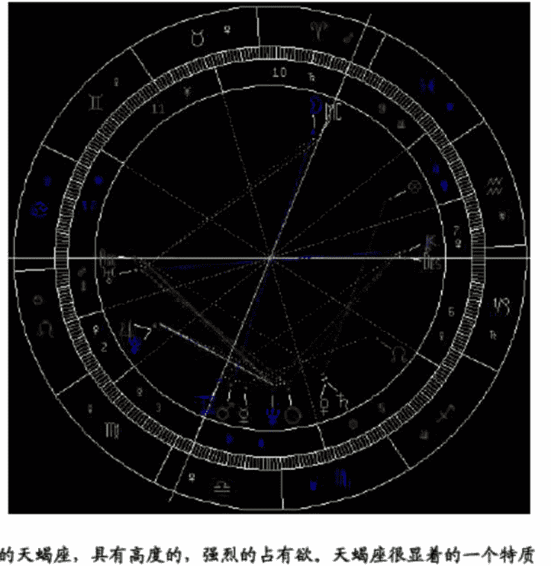

盖茨的太阳落在了天蝎座，土星和金星也是如此。他的为人也正像一个标准的教科书式的天蝎座，具有高度的，强烈的占有欲。天蝎座很显著的一个特质就是很会利用他人的钱财。他们在这方面的足智多谋使他们在投资领域成为支柱力量。很明显的，盖茨在八九十年代是一个“超级天蝎”，因为这段时间内，冥王星正经过天蝎座。一般的认为，冥王星是天蝎座的守护星（冥王未被发现前则是土星）。所以在1983-1995这段时间内，冥王星相当于是在“家”里。它的强大力量和强制性的控制力在这里得到充分发挥。这一段时间，一切都很顺利，可以说是“比尔·盖茨年”，不是吗？流年冥王对他本命盘的很多重要的地方都有所影响，还大大强化了他的天蝎本能。微软的吞并，强化和控制，使得成为这一行业的巨无霸。

### 巨蟹的敏感

当然他的盘中也还有其它需要注意的。他的上升为巨蟹座。和天蝎一样，巨蟹也是一个水相星座，同时也是一个更加情绪化和敏感的星座。也许，敏感不是人们对盖茨第一想到的性格特征，但绝对是很重要的一个。一般来说，对男人而言，水相星座的柔性和感触都是很难表达和表现出来的。反而女性则在这方面有天生的优势。因为有时男人这方面的所作所为可能被曲解为软弱。通常，水相属性在一个男人的个性中会带来一些不安的像弱点一样的东西，他也许会通过成就和野心来试图掩盖它们。就像用贝壳保护内部的软弱一样。

抛开这些，让我们来看看盖茨的弱点。这是很明显的，在他身上的每一处都表现出来。而他的贝壳，他的为保护自己而造的城堡无疑是无懈可击的。然而我们现在常常津津乐道的是他的城堡，倒不是他藏在城堡内的那些东西。

### 十分需要大众关注的月亮

想要完全的了解月亮，你必须考虑到它的守护星，月亮，夜晚的女皇。在盖茨的星盘中，月亮是十分重要的，因为它是巨蟹上升的守护星。传统上，上升星座的守护星也常常被认为是命盘的守护星，同时也是你个性发展的原动力。盖茨月亮在白羊座，十分的明显的出现在十宫中。在第十宫中，一切都是很难隐藏的。就像日挂中天的正午一样，一切都是很清晰可见的。十宫也是最公开的公众宫位。同时常常和个人的事业，社会地位与身份有关。因为他的火相白羊月亮，他常常会成为一个公众人物。他的出现常常会引起公众的好奇心和兴趣。他也具有很好的领导才能。他似乎是很自然的就成就了很高的地位。但白羊的先锋，好斗的特性使得他变成“吃螃蟹的第一人”，做出不少别人不会也不敢做的举动，当然还是带领着所有的人和他一起。

白羊座另一个明显特质是 DIY，事事亲力亲为。不需要先例参照，白羊座没有任何畏惧。不敌天蝎带来的前程多么黑暗，但他总是充满希望和奋斗精神。他是一个值得我们尊敬的人。难到我们的社会哀诉者还不够多？而他是一个不怕承担危险并且知道自己的目标的人。如果他能做到这一点，任何人都可以。

所以当你看着盖茨时，你感到了什么？他令你想钦佩他还是嫉妒？你会轻视他还是同情？这样的一个公众人物自然会引发多方面的反响。盖茨已经向我们供献一道大门，一个面向个人电脑新纪元的大门。希望他能激发你实现梦想的动力，看你到底能走多远。

## “跳水女皇”的传奇经历 从星座解析伏明霞

“跳水女皇”伏明霞的这些年经历可算是个传奇，从96年退役后，98年又复出，2000年夺得奥运冠军后又再度退役。去年惹上“脏裤子”风波，今年又传出和香港财政高官的“忘年恋”，一时令人众说纷纭。

伏明霞的星座是狮子座，正如她的星座一样，伏明霞的经历也是光彩耀人，不甘寂寞。然而她的月亮在魔羯座，内心却比较保守甚至有些寂寞，需要别人的关心和安慰。

伏明霞的水星与土星相合，这使她不太爱说话，一般情况下都比较低调。可惜的是她的水星逆行，这会往往令她说出或做出一些不合常理的事，造成她尴尬的局面，也让人觉得她那种独特的“孩子气”。

伏明霞的金星与火星相合，这给她带来积极活跃的个性以及出色的大众魅力。同时，她的冥王星也接近金星，这使得她对感情比较被动，需要别人热烈的追求才能打动她的芳心。

2001年3月间，伏明霞爆发了著名的“脏裤子”事件。那时天上的天王星恰好直冲她的本命太阳，而土星也与她本命水星形成不良相位。这种情况往往令人产生突发事件，也很容易令人在此时说错话、办错事。

目前天上的木星与她本命金星发生相位，这是个感情加速的象征。而天王星现在又直冲她本命水星，她也会产生很多新的或超前的想法，看来“忘年恋”也不是不可能。

在随后的一年中，天王星还要直冲她的本命土星，这是个打破旧秩序建立新规则的时候，看来伏明霞在来年中可能还会有某些令人惊讶的新举动。

### 实例分析一

T三角，金火合在五宫被八宫土刑，恋爱注定受挫。

金火合在五宫金牛，刑八宫狮子土，冲十一宫天，土刑天形成一个T三角，残臂位于第二宫。土为二宫主。

你是一个非常重视物质财富的人，期望可以娶到一个有钱有能力的老婆。你的恋爱宫中有桃花，但却被土星折磨的很惨，所以你的恋爱不会那么顺利，总是觉得没有什么真正合适的恋爱机会。而且金被对面的天王所冲，恋情往往不能长久。恋爱中也比较喜欢自由。火天冲又让你缺乏耐性。

残臂在二宫，土冥木水的小三角会让你赚到不少钱。T三角处于固定星座，你赚钱的目的非常明确。而且总往这个方向努力。

水海冲，水入庙，海入旺，赐予你一个天生的撒谎本领，

水冥拱，水木合，水入庙合下降，非常聪明。学习知识能很快接受。

月海刑又让你爱幻想和不切实际。

金火月调和，个性比较主动，对艺术和美丽的事物有欣赏能力。多情，仁慈。

海王星很强，有学习占星的天赋。

金火月调和，个性比较主动，对艺术和美丽的事物有欣赏能力。多情，仁慈。

看不到木，以金生水，多情……

水冥拱，水木合，水入庙合下降，非常聪明。学习知识能很快接受

水助土（老经验很会赚钱）

水海冲，水入庙，海入旺，赐予你一个天生的撒谎本领，

日刑 MC 表示想要达到自己追求的事业需要付出努力吧。

月冥刑，有时很爱好独处，

婚姻的话，你婚姻宫日月落，整体来说跟对方配合度高，女方漂亮有魅力

不过比较专制，而你对婚姻上也付出较多，多为对方考虑

事业宫主星受颗，暗中的敌人和阻碍很多，

财运欠缺，来得快去的快，要注意背负过多债务，特别是不动产方面

小心你的孩子是个逆子哈~多多管教！

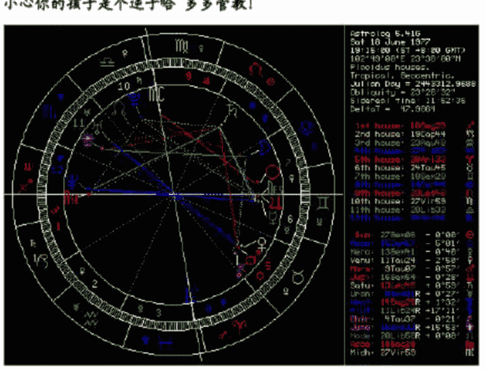

上升天蝎，日水落八宫，欲望很强烈。但火金牛失势，有所控制。

月落天蝎十二宫，刑木六合土。日双子拱冥。虽然外表开朗，实质内心孤僻。

甚至有些神经质。有些严肃。

天落一宫冲火，不安于室，做事情不能持久，没有耐性。总想着找点事情爆发自己。

日海冲，人道主义，有同情心，有些虚荣。

金星入庙落七宫，有美感，婚姻对象相貌好，有助婚姻，比较重视金钱。

水双子入庙空相位，喜欢保有自己的隐私，适合从事合作经济，保险，等工作。

冥落十一宫，人际化。

火金牛弱势，落下降点，六宫主，冲天刑MC，对工作不利。工作中不能持之以恒。加上月天蝎，木落九宫刑月，喜欢社交，欲望不能满足时会有嫉妒心和报复心，变得顽固，贪婪而不知足。

天火合轴对冲，1、7，2、8宫都有星对冲，婚姻可能会很不顺利，自己注意不可任性，或过多争吵

金落7，结婚对象长相不错

8宫日被冲是否预示身体疾病甚至有生命之虞？幸好的是 8宫宫主星水没什么差相位。瞎猜，欢迎砸砖！

火刑 MC 是否意味着可能会因为欲望影响事业，比如某一天面临在两者之间进行选择？

### 实例分析三

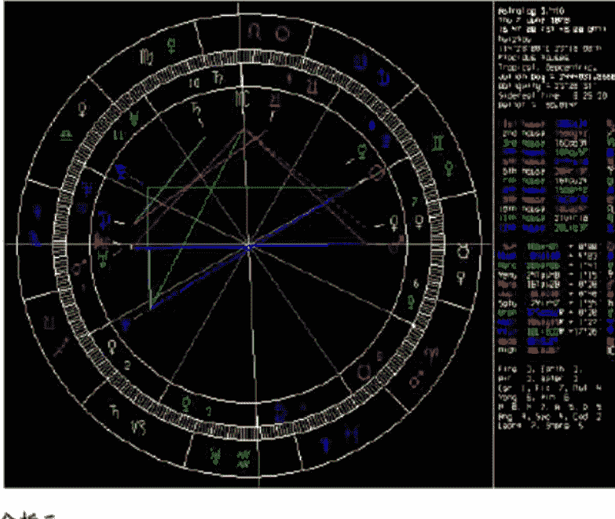

月合 MC，自己的言行常被公诸与众人面前么。

火土海三 T，海代表影视业，难道在影视业发展？

命主星落五宫被刑冲的太惨，她很重视恋爱和孩子。

月金月木调和，想必容貌不错。

木天调和，天为二宫主合 MC，钱财上很有运气。是个幸运儿。但是火落二宫，家庭和交际应酬让她花费不少。

下降点落巨蟹重视家庭的安全感了。

### 实例分析四

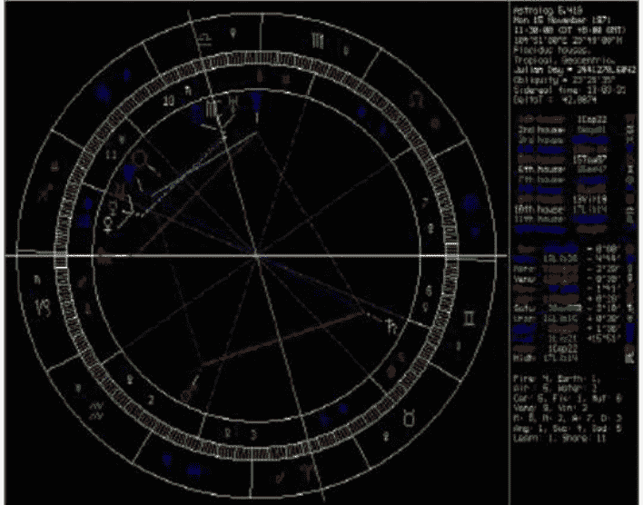

人物介绍：乐队 BASS。你和他走一条街，就能撞见八个以上他的“前”女友。他认为自己很忧郁，自定义颜色——深蓝色。都七老八十了还觉得自己是儿童。一次交 5 个以上女朋友，名额不限，遍及各个地区（北京、上海、南京、沈阳等地）。永远觉得自己是单身，不拒绝任何年龄段女性勾引，因为交多少个女朋友他都觉得孤独。

特征：暧昧、表情冷漠、挑剔、贪婪、超级爱哭、情绪化、充满欲望、做重要的是——嗜谎成性。

分析：

上升天蝎，日水同落八宫导致性欲强烈。

水海冲，感情泛滥成灾，容易动情，道德观念薄弱，爱撒谎。

金星巨蟹，夫妻宫宫主星，金月刑，情绪化，严重缺乏安全感，喜欢用哭来宣泄情绪。金冥刑，超级万人迷。金天拱，爱情上来去匆匆，自由散漫，多性伴侣。

日月六合，善于处理人际关系。

八宫宫主星水星，火双子，水入庙，喜欢同多个人 sex 体验不同的刺激。

金星在巨蟹的人是强烈需要家庭安全感的人，何况他的金星还是夫妻宫主星，但是金星被刑冲的实在太惨不忍睹，所以强烈缺乏安全感。

加一个，木天调合，在某方面是幸运儿。

这是一个太阳在巨蟹座的男人啊

金月刑，喜欢自我欺骗和欺骗别人，常把自己想象成受害者。

金冥刑，感情极端化。

天王一宫，不安于室。

冥落十二宫，内心孤独。

盘是火车头形状，月是头，巨蟹星多，月又是唯一土象，很旺啊，还有重要的一点是本月刑北交，特别有女人缘

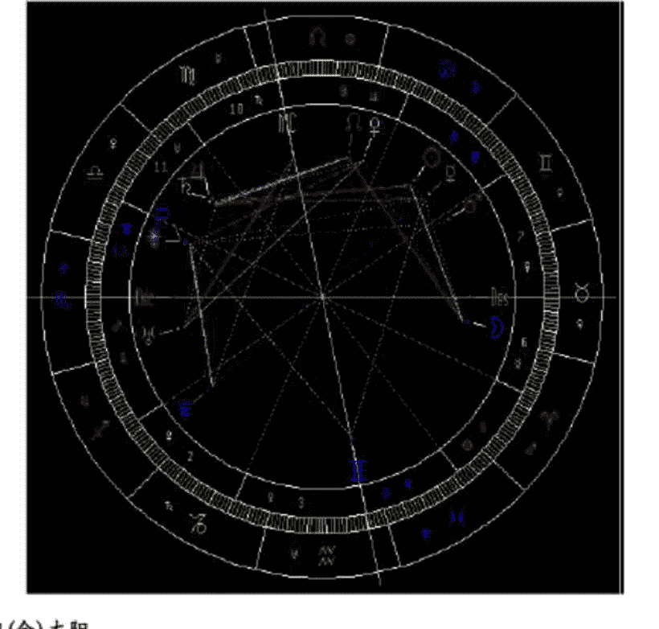

### 太阳 (合) 太阳

这个相位表示两人拥有相似的性格和人生发展目标，在多数情况下，这是个有利的组合，但是，如果合盘中其它行星相位的影响是负面的，则会演变成两人在各自尊严上的对立和竞争上的冲突。

### 太阳 (拱/半合) 太阳

这个相位代表两人性格比较相投，它比合的相位要更加和谐，两人将会形成一种互补关系，特别有利于双方工作上的开展。另外，具备这种相位的两人在相处中懂得相互尊重对方，这对两人的长久稳定关系是有利的。

### 太阳 (冲/刑) 太阳

这个相位属于冲突相位，两人常常会在观点和意图上出现矛盾和对立，在双方都缺乏忍让的情况下将会使矛盾升级。但从另一个角度分析，如果当事人双方能够共同协调、解决矛盾，则这个相位将会演变成为一种促使两人共同发展、进步的动力，而且这个力量在某种程度上比拱和半合相位来得更强。

### 太阳(合)月亮

这是代表两人能够和谐稳定相处的最有利的相位之一，尤其是对异性之间的关系而言，能够给两人带来相互的信任和忠诚。它能够对两人的相互关系产生微妙的影响，能使人经历得住困苦的考验，不过一旦两人在困境中无法解脱，则结局有可能是个悲剧，就如同罗密欧与朱丽叶一样。

### 太阳(拱/半合)月亮

这个相位与相合相位类似，对两人之间的长久稳定关系非常有利，两人能够在相处过程中保持和谐状态，能弥补对方的弱点和不足，相互取长补短。

### 太阳(冲/刑)月亮

这个相位将会给两人制造一种不稳定的情绪，在关系上也难以保持步调一致。后者会认为前者行动卤莽、毛糙，而前者则认为后者在处事上情绪化影响严重，他们常常会给对方带来精神上的紧张和不安。

### 太阳(合)水星

这个相位使两人在观点上总能保持总体上的一致，双方发生误解的情况少有发生，对增进相互的交流非常有利。

### 太阳(拱/半合)水星

这个相位与相合的情况是类似的，能够增强两人之间的交流和沟通，对商业伙伴关系而言非常有利。

### 太阳(冲/刑)水星

这个相位容易令两人在观点上发生分歧，容易产生误解，或缺乏和谐的谈话语气。

## 太阳(合)金星

这个相位会增进两人之间的相互吸引力，同时，也有利于商业伙伴之间的合作关系。在相处过程中，后者能够帮助舒缓前者的精神压力，对恋人关系而言，前者往往是主动追求者，而后者也能够被前者的爱慕所吸引。如果在这个相位中同时还有伴随有火星的不良影响，则两人的爱恋关系将可能会遭受到考验。

## 太阳(拱/半合)金星

这个相位于相合的含义大致相同，只是影响力稍弱，具备这种相位对友情或爱情关系来讲都是很有利的。

## 太阳(冲/刑)金星

这个相位容易给两人招致流言蜚语，它能给异性之间带来一种很强烈的吸引，但随之而来的结果却未必乐观，因为两人之间缺乏互助合作的意愿，所以随着时间的推移，矛盾可能就会孕育而生，后者会对前者的死板、顽固意见很大，而后者会认为前者的喜好、品位怪异，两人之间往往也会因为钱财方面的矛盾而发生争执。

## 太阳(合)火星

这个相位能够加快两人的行动步骤，如果合盘中有其它有利相位的支持，这将会是一个非常好的合作关系，双方都能够竭力发挥所长，如果合盘中伴随有其它不利因素的影响，将会破坏这种良好的合作关系，会在两人之间引发误解和敌意，冲突也会由此发生。对情侣关系来讲，这个相位有时候也能够制造出激情。

## 太阳(拱/半合)火星

这个相位与相合的含义差不多，但正面的含义要更明确一些。在其影响之下，两人很少会出现相互的敌意和竞争关系，更多的是共同合作努力完成既定的目标，非常适合团队工作。对情侣关系来讲，这个相位也能够制造出激情和乐趣。

## 太阳(冲/刑)火星

这个相位充满了紧张的因素，两人一旦出现话不投机或观点不一致时，将会萌发对立情绪，火星是冲动方，也可能是引发矛盾激化的主要因素。双方如想缓和这一关系，必须得学会的忍让和妥协。

## 太阳(合)木星

这个相位表明两人之间具备良好的信誉基础和合作潜力，在工作中，双方都能够以一种非常乐观、积极的态度处理事物，相互协作共同进取。这样的相位最适合同事之间或商业伙伴关系，后者往往会给前者带来好运和成功。

## 太阳(拱/半合)木星

这个相位与相合的含义类似，双方都是对方非常理想的工作伙伴。

## 太阳(冲/刑)木星

这个相位将会给两人在合作中制造一些小麻烦，一方的工作疏忽或错漏可能会引发工作中的一些不愉快，或使得双方的进展不尽如意。有时，这个相位也说明两人的奋斗目标超出了自身能力的限制，而使得工作中困难重重。另外，这个相位有时也代表两人在文化背景或信仰上有差异。

## 太阳(合)土星

这个相位有几种含义，具体情况要看相位中是否还涉及到其它行星的影响，从好的角度来讲，后者能够为前者提供知识和经验，而前者能够虚心接受、采纳前者的思想和建议。如果从不利的角度来讲，后者将会给前者带来压制或约束，而前者是处于一种挣脱和抵抗的状态，如果后者是出生在夜晚时间，则双方的关系将会更加紧张。

## 太阳(拱/半合)土星

这个相位等同于相合情况下的有利因素，双方能够处于一种稳定的关系基础之上，拥有相近的志向与野心，对对方有责任感，前者认可后者的智慧和权威地位，而后者能够帮助前者解决问题，增长经验。

## 太阳(冲/刑)土星

这个相位会对两人之间的和谐关系产生障碍，它承袭了相合相位中的不利影响因素，除了后者会给前者带来压力和束缚之外，双方还有可能在性格上会存在差异，一般来讲，这个相位对前者是不利的，如果合盘中缺乏其它有利因素的缓解，而后者又不愿意妥协的情况下，两人之间的相处关系将会十分紧张。

## 月亮(合)月亮

这个相位表明两人拥有相似的心灵感受和情绪波动，两人相互能够了解对方的想法，体谅对方的需要，可以做心灵沟通的挚友，对长久、稳定的关系非常有利。

## 月亮(拱/半合)月亮

这个相位的含义与相合类似，有利于双方的情感交流和沟通，两人之间往往很少有秘密可言，是无话不说的亲密伙伴。

## 月亮(冲/刑)月亮

这个相位不利于两人内心深处的沟通，两人时常会因为一点小矛盾而搞得心情不快，情绪低落，双方都会有一种不被对方了解的感觉。对家庭关系来讲，这样的相位将常会使两人在生活习惯上有差异，如果一方看不惯，就会有争吵发生。

## 月亮(合)水星

这个相位对两人的联系和交流非常有益，在多数情况下，前者在直觉上就能够理解到后者的想法和意图，而后者也能很好地将自己的思想向前者表达清楚，在这种情况下，后者往往能给予前者良好的建议。

## 月亮(拱/半合)水星

这个相位与相合的相位类似，只是影响力相对较弱，会令两人在相处过程中交流畅快，鲜有误解和矛盾发生。

## 月亮(冲/刑)水星

这个相位容易令两个人容易产生误解，在交流过程中，后者的言语如果莽撞就很容易伤害到前者，有时，无心之言也会带来两人之间的不和。另一方面，这个相位有时还说明两人会时常处于争吵之中，如果两人在观点上始终难以达到统一，则不利于关系的稳定。

## 月亮(合)金星

这个相位是个极为有利的组合，它会给两人之间制造和谐气氛，使各方都处在一种心情放松、愉快的状态之中。对于合伙关系、婚姻关系、以及同事关系来讲，这个相位都能使两人保持一种长期稳定的关系基础，尤其能够给恋人之间确立一种亲密关系。

## 月亮(拱/半合)金星

这个相位与相合的情况类似，但是影响力稍弱，它能够巩固、增强两人之间的友情或爱情基础。一般而言，前者能够感受到后者的关怀和爱恋，而后者也能够积极地迎合前者的感情。

## 月亮(冲/刑)金星

这个相位代表两人在各自的需要上难以调和，前者可能会对后者心存较大的依靠，而后者则往往难以满足前者的心里需要，结果会使前者产生一种被漠视、忽略的感受，如果双方不以一种积极的心态去解决这个问题，感情上很容易就会产生疏离。

## 月亮(合)火星

这个相位使两人在刚开始接触时给对方留下的印象就不理想，在日常相处中，两人总是会在一些事情上发生争执和对立，后者的火性较强，所以总是对前者态度生硬或凶暴，两人之间的冲突也就由此而生。对恋人关系而言，这个相位有时也能够产生激情。

## 月亮(拱/半合)火星

这个相位能为两人恋人之间带来亲密的关系和情感上的共鸣，它避免了相合相位的负面影响，使两人在一起能够和谐相处。

## 月亮(冲/刑)火星

这个相位容易让两人产生敌意，而且意见总是难以统一。一般而言，后者总是矛盾的挑起方，使前者的情绪处于不安定状态，而前者总是对后者持有一种警戒心理，使双方的关系经常处于一种紧张的气氛之中。

## 月亮(合)木星

这是一个非常有利的相位，对两人关系的和谐与稳定起到促进作用，双方都能够很好的理解对方的意图，后者丰富的知识和经验能够为前者的发展带来很大的帮助。两人在合作关系上是一对非常好的行动伙伴。

## 月亮(拱/半合)木星

这个相位与合相是基本一样的，具备这种相位的两人能够增进相互的理解和信任，相比较而言，后者对前者的帮助更大。

## 月亮(冲/刑)木星

这个相位会使一方在接受、认可另一方的建议或帮助发生一些障碍，或者说是不太顺利。后者会令前者感到自己是处于一种被动状态，难以发挥自己的主观能动性和潜能，而后者则会认为前者做事太过细心、保守或缺乏灵活性和冒险精神。

## 月亮(合)土星

这个相位需要双方在某种程度上的让步，才能缓解之间的紧张气氛，后者总是倾向于限制前者的思想和感情，而且总是忽视前者内心真实的感受，前者则会感到自己的内心总是处于一种压抑状态，难以抒发自己真实的情感。对师生关系而言，这个相位是不错的，后者（教师）能够对前者（学生）的学习严格要求，激发其学习动力。

## 月亮(拱/半合)土星

对两人来讲，这个相位都是有利的，双方都能够很好的把握住跟对方相处的尺度，虽然后者对前者有时态度严肃、要求苛刻，但前者仍能够欣然理解和接受。在家庭成员之间，这个相位能够很好的发挥其影响。

## 月亮(冲/刑)土星

这个相位的影响比较麻烦，后者总是会忽视前者的感情或内心的感受，令前者感到对方的冷漠和无情。对于恋人关系来讲，这样的相位会引发两人立场上的对立，通常来讲，后者是造成矛盾的关键方，如果他不作出让步，则两人的关系难以持久。

## 水星(合)水星

具备这种相位的人在思维方式上有相似之处，双方的观点也能够时常保持一致，在交流上，这个相位也能够消除两人之间的误会，增进理解。

## 水星(拱/半合)水星

这个相位与合相的含义大致相同，而在交流方面，它甚至比合相还更为有利，双方在交流观点和想法上畅通无阻，而且能够虚心听取对方的意见。

## 水星(冲/刑)水星

这个相位会导致双方的想法和观点上的冲突，从而引发之间的争论。虽然它的影响是负面的，但未必会对两人关系的稳定造成太大的影响，因为两人的争论很少会引起正面的冲突或对立，虽然有些不愉快，但是双方都能够在事后恢复平静的心态。

## 水星(合)金星

这个相位有利于恋人之间的情感交流，对朋友关系而言，代表双方有相似的兴趣和爱好。这个相位对两人关系的稳定起到很好的辅助作用。

## 水星(拱/半合)金星

这个相位与相合的情形类似，只是影响力稍微弱一些，能给恋人之间的感情交流奠定良好的基础。

## 水星(冲/刑)金星

这个相位容易给恋人之间制造出一种紧张、尴尬气氛，前者在表达上会感到拘束、不自然，不过这不是什么很关键的相位，所以不会对两人的和谐关系带来多大困扰。

## 水星(合)火星

这个相位既有可能是有利的也可能是不利的，具体情况得结合合盘中的其它因素分析。从有利的一面来讲，后者能够在行动上推动前者，激励其大胆进取、拼搏的精神。从另一方面看，如果前者态度趋于保守，固步自封，则两人将可能会爆发争吵和冲突。

## 水星(拱/半合)火星

这个相位能够给两人关系带来激情和共同的兴趣，而且前者制订的计划后者总是会努力去实现，双方配合良好，最适合工作伙伴关系。

## 水星(冲/刑)火星

这个相位与拱相反，前者的思路与后者经常不一致，随之会发生激烈地争吵，如果两人要顺利开展合作或沟通，双方不适度地作出忍让是不行的。

## 水星(合)木星

这个相位最适和师生关系，后者具备广博的知识，并能把其学识合经验传授给前者，而前者也能将后者视为专家或导师，虚心求教。如果两人是工作关系，则前者很适合给后者做助手。

## 水星(拱/半合)木星

这个相位与合相的影响是相同的，只是影响力偏弱，有关解释可以参照上面的内容。

## 水星(冲/刑)木星

两人在思想、观念上有一定的差距，如果双方能够学会相互的容忍和包涵，则这个相位仍能够发挥其有利的影响，如果双方各不让步，就会有爆发冲突的危险。

## 水星(合)土星

这个相位有多种影响，从正面的角度看，双方在交流过程中能够保持一种和谐的气氛，后者能够耐心地听前者讲述其观点和建议，而前者也能够在后者面前将自己的想法表达清楚，双方的观点即便是有些差异，也能在交流中协调过来。从负面的角度来看，则将会是一种比较紧张的关系，双方交流困难，相互坚持己见，都不愿退让。

## 水星(拱/半合)土星

这是个非常不错的相位组合，能够很好地让两人在一起合作共事，它能够充分地发挥出合相的有利影响，同时摒弃了冲相位的负面影响，在多数情况下，后者在与前者共事中能够给其带来不错的收益。

## 水星(冲/刑)土星

这个相位会给两人的交流带来严重障碍，在其影响之下，两人之间的谈话经常会陷入僵局，这里后者起到决定性的影响，也是主要的矛盾制造者，如果合盘中缺少调和因素，而后者又不谨慎自己的言行的话，将最终导致双方冲突或冷战。

## 金星(合)金星

这个相位代表两人拥有相同或相似的品位、喜好和价值观，这个相位对恋人关系非常有利，而且能够相互博取对方的同情和理解。

## 金星(拱/半合)金星

这个相位与相合的相位含义相同，可以参照上条的解释。

## 金星(冲/刑)金星

这个相位表示两人的爱好和品位难以统一，也代表爱情观上有差异，多数情况下，这种相位比较适合一同玩耍的伙伴。

## 金星(合)火星

这个相位代表男女之间的异性吸引力，后者往往是最初的行动方。具备这种相位的夫妻性生活是比较美满的。在柏拉图式的友谊关系中，它代表两人在一起能够制造出欢快的气氛。

## 金星(拱/半合)火星

这个相位与合相的含义相同，可以参照上面的解释。

## 金星(冲/刑)火星

这个相位对异性之间具备很强的性吸引力，不过双方在度的把握上可能会出现些问题，随着两人交往的程度加深，前者可能会对后者的鲁莽和粗暴表示反感，而后者则认为前者生硬、呆板，双方要妥善解决这个问题就需要相互之间的协调了。

## 金星(合)木星

这个相位对恋人之间的关系能起到助动作用，前者能够很容易地就会对后者产生一种依恋之情，而后者则会给前者带来关怀和爱护，另外，这个相位对两人之间的相互合作也能起到促进作用。

## 金星(拱/半合)木星

这个相位的性质与合相相同，有关解释可以参看上面的内容。

## 金星(冲/刑)木星

这虽然是个紧张的相位，但现实中并不会给两人的关系造成实质性的障碍，双方在一起相处仍能够保持快乐的气氛，但缺陷在于后者对前者的品位和喜好上不太认同，或者是有纵容、支持前者生活奢侈、放荡或提供错误的投机建议的嫌疑。

## 金星(合)土星

这个相位会对恋人之间的感情带来困扰，前者会认为后者的感情冷淡，被动，缺乏活力，而后者对前者的态度却总是很武断，使前者容易产生厌烦心理从而产生情变，对于后者是夜晚出生的人来说，这个相位尤其不利。如果合盘中有其它调和因素的影响，则能够给两人带来持久的关系。

## 金星(拱/半合)土星

这个相位对两人之间保持长久稳定的关系有利，双方都能得到对方的尊重和重视。

## 金星(冲/刑)土星

这个相位在性质上与合相相同，属于负面的影响，只是危害力比合相要大，尤其是对恋人关系而言。双方在感情上难以保持相融，充满对立情绪，在多数情况下后者对前者的态度冷淡、莫不关心是造成两人关系紧张的主要原因。

## 火星(合)火星

这个相位即可能代表合作关系，也可能是竞争关系，这得视火星形成这个相位的同时是否还有其它行星相位的影响。如果相位是有利的，可以使双方通力协作，以达到各自的目标。如果相位是不利的，而且没有其它吉星有利相位的扶持，则两人的争斗和冲突不可避免，如果双方的太阳还同时处于对冲或相刑的相位时，则两人的关系将进一步僵化。

## 火星(拱/半合)火星

这个相位有利于双方就共同的目标达成协作互助的关系，当问题出现时，双方往往相互认同对方的观点。这个相位对团队工作有利，双方能够互助互励，为达到共同的目标而努力。

## 火星(冲/刑)火星

这会使两人缺少相互协作的意识，而且容易产生敌对情绪。如果两人都是白天出生的，将会增强双方的敌意和公开的敌对行为。如果两人均是出生在夜晚，则容易使他们在明面上交好，但暗地里相互争斗的关系。如果一个是白天出生的，另一个是夜晚出生的，则白天出生的人往往会对夜晚出生的人抱有粗暴的态度，而后者往往能够默默忍受。

## 火星(合)木星

这个相位能够给人带来许多不同的潜力，通常情况下，后者会鼓励、帮助前者，对于前者在夜晚出生、后者是在白天出生的情况下，这个相位会更加有利，争论、冲突往往能够避免。如果前者是出生在白天，则有可能在行动中得到悟导。

## 火星(拱/半合)木星

这个相位能够促成双方共同达到自己的目标，能够为各方带来努力后的成功，前者会把后者看作是幸运星。这个相位对团队工作或活动非常有利。

## 火星(冲/刑)木星

在这个相位里，后者可能会对前者带来不利的影响。两人在独处的时候矛盾也许不会发生，但一旦相处到一块，争吵、矛盾就会接踵而来，如果双方缺少妥协，则会在工作中处于对立状态。

## 火星(合)土星

这个相位有几种不同的解释，后者能够帮助前者集中力量完成目标。在许多情况下，后者起到关键作用，如果前者出生在夜晚、后者出生在白天，这种相位组合能够带来良好的效果；如果前者出生在白天，他将不会喜欢自己的行为被他人引导或主宰，如果后者出生在夜晚，应该适当注意与前者相处时不要限制其行为或过于严厉。

## 火星(拱/半合)土星

这是个非常有利的相位组合，后者能够为前者提供强有力的帮助，后者也能够帮助前者脱离任何困境，他们结合之后将会是超强搭档，当前者是在夜晚出生、后者是在白天出生的情况下是最佳的。对于婚姻关系来讲，会使两人能够同心协力克服困难，度过难关。

## 火星(冲/刑)土星

这个相位组合不容乐观，后者往往会挫败前者的志气和积极性，如果后者是在夜晚出生的这种情况会更加恶化。前者会给后者带来紧张、不安情绪。对于双方来讲，他们都对对方不抱有信任感。

## 木星(合)木星

具备这种相位的两个人，不论他们是同一年出生还是相隔12年出生的（木星大约每12年相合一次），可能拥有相似的信仰、教育背景或人生经历。如果两人不是同一年出生的，则年长的会象家长一样监护着年幼的。

## 木星(拱/半合)木星

这个相位与相合的相位差不多，含义相同，两人在信仰、教育、经历上有相似之处，一般来讲，年长的一方对年幼的一方较为照顾。

## 木星(冲/刑)木星

与拱和半合相位相反，他代表两人在信仰、教育、经历上有一定的差异。如果木星在命盘中的影响力不强的话，这个相位不会带来什么障碍。

## 木星(合)土星

这个相位会在两人之间的合作制造一种稳定的驱动力，使双方共同走向成功。前者往往是计划的制订者，而后者是具体工作的执行者。这个相位体现了双方将理想转变成现实的能力。

## 木星(拱/半合)土星

这个相位基本上与相合是相同的，完全可以参照上面的解释。

## 木星(冲/刑)土星

这个相位会给两人的关系带来僵化，前者会给前者的热情泼凉水，而后者则会忽视前者的能力或对前者的观点和建议置之不理。因为两人在观点有具有较大的差异，所以如果两人是商业伙伴关系，将很容易导致财政危机。

## 土星(合)土星

这个相位的出现表示两个人是处于相同时代或相差至少整整一个时代。如果他们是处于同一个时代的人，则他们会有类似的工作习惯，也可能具有相同的野心。如果他们是隔代的人，则后辈可能会能够承袭前辈的发展道路。

## 土星(拱/半合)土星

这个相位代表共同的奋斗目标和野心，与相和类似，两人能够良好地协作在一起，相互取长补短。

## 土星(冲/刑)土星

这个相位会给两人带来冲突，两人无法就即定的目标制定统一的方案，双方难以相互融合，也无法满足对方的需要。如果两人是工作伙伴关系，则很容易发生相互之间的竞争和不信任。

## 上升星座(合)上升星座

上升星座代表人接触过程中获取的初次印象，这个相位表明两人拥有相同的世界观和类似的视觉喜好，尽管这些看起来似乎对两人关系有利，但过多的相同点往

## 上升星座(拱/半合)上升星座

这个组合表示两人在初次见面时会给对方留下良好的印象。这个相位会给两人带来比合相位更相似的兴趣和爱好，两人能够相互增加对周围世界的理解和共识。对于合作关系和伙伴关系来讲，这个相位非常有利。

## 上升星座(冲/刑)上升星座

这个组合会给两人关系带来摩擦，首次见面给对方留下的印象也不太好。两人在个人喜好上呈相反的趋向，有时观点也会发生不一致。不过两人如果能够愿意为对方作出适当让步，也会带来互补效果，两人可以从相互学习中获益。

## 上升星座(合)太阳

这个相位代表两人稳定持久的关系，前者对后者的人生目标表示认同，而后者对前者持一种欣赏和敬仰的态度。如果两人为异性关系，可能会产生外表上的吸引。

## 上升星座(拱/半合)太阳

这个相位组合与相合类似，但是力度稍弱。两人相互敬仰对方，而且志趣相投。

## 上升星座(冲/刑)太阳

这个相位代表前者的世界观和人生观与后者不一致，后者对前者持否定态度，由此会引发双方的争吵不和。但是，如果两人合盘中有其它有利相位的影响，则有可能使两人静下心来共同解决问题，如果他们能够抛去对对方的偏见，将会有利于双方达成共识。

## 上升星座(合)月亮

这个相位能够巩固两人的稳定持久关系，它对异性之间的亲密关系非常有利。前者通过知觉就能够理解到后者情感变化，而且能够为其提出好的建议。后者与前者相处会有一种亲密、舒适的感觉，并能够照顾前者的需求。具备这种相位的两个人之间往往很难对对方保守内心的秘密。

## 上升星座(拱/半合)月亮

两人有类似的喜好和兴趣，前者能够洞察出后者的内心情感状况，后者会对前者表示关心和照顾，两人之间具备了非常良好的默契。

## 上升星座(冲/刑)月亮

两人在和谐相处上会有些障碍，双方首次见面可能就会缺乏信任感。前者难以理解后者内心的想法和情绪上的变化，这种相位会造成双方关系上的隔阂，双方需要通过交流和沟通以弥补这种隔阂。

## 上升星座(合)水星

这个相位会增进两人之间的交流，一般说来，前者能够很好地领会后者的思想意图，而后者能够畅所欲言地向前者表达出自己的观点和想法，两个人在一起相处时很少会发生误解的情况。

## 上升星座(拱/半合)水星

与相合的相位类似，这个相位对两人保持良好的交流非常有利，两个人可以在一种非常和谐的气氛下进行沟通，增进相互之间的理解，尤其是对于后者而言，会发现自己能够非常轻松愉快地向前者言明自己的思想。

## 上升星座(冲/刑)水星

这个相位会给两人之间制造混乱和误解，这里刑的相位产生的负面影响要大于冲的相位。如果两人合盘中其它行星保持良好，则这个相位的负面影响只是轻微的，如果两人合盘中其它不和谐因素很多，则会强化两人相互之间的误解和不信任。

## 上升星座(合)金星

这个相位会使两人之间产生吸引力，尤其是异性之间，他们能够引起对方异性的注意力，前者往往是初次接触的主动方，后者能够让前者感到对方的关怀和爱恋。

## 上升星座(拱/半合)金星

这个相位与相合的含义类似，但是双方的感觉不如相合相位来得强烈，对于同性关系来讲，它代表两人友好的情谊和合作关系。当两人相处时，常常会感到一种愉快的气氛。

## 上升星座(冲/刑)金星

具备这种相位的两人最初的关系可能会很平庸，但相互之间的吸引是很强烈的，如果合盘中有其它有利相位支持，这个相位仍能给两人带来亲密关系。在有些情况下，这个相位还说明两人来自不同的社会背景，从而会形成文化方面的障碍。

## 上升星座(合)火星

这个相位组合有几种解释含义，如果两人之间具备感情基础，这将会强化两人之间的激情，否则两人只是作为行动伙伴具备共同的或类似的努力目标。然而，如果合盘中多数相位都是不利的，则两人之间将会萌发敌意，冲突，甚至是暴力。

## 上升星座(拱/半合)火星

如果两人的合盘关系比较紧张，那么这个相位将比相合的相位要好得多，它不会引发敌意和暴力对抗。这个相位会使两人会有共同的奋斗目标，另外，两人相处时后者能够给前者一种精力充沛的感觉，能够带动前者的积极性。

## 上升星座(冲/刑)火星

这个相位是两人发生冲突、矛盾的源泉之一，两人在观点上的不一致，往往很容易就会引发对立情绪，严重的时候可能会从言语上的争吵升级到行为上的争斗，如果两人的合盘中还有其它紧张因素的影响，则双方最终的结果可能是把对方当成仇敌对待。如果后者是出生在白天，则往往是引发矛盾的一方，如果后者是出生在夜晚，则前者还有对后者妥协、忍让的余地。

## 上升星座(合)木星

这是个极其有利的相位，后者会喜欢、敬仰前者的为人，而前者也能够以相应的态度和行为回报，两人在一起充满了祥和和快乐。如果是恋人关系，则有利于双方感情的升华，如果只是朋友关系，则两人能够建立非常真挚的情谊。

## 上升星座(拱/半合)木星

这个相位的影响会对两人的关系起到非常好的促进作用，两人都怀抱良好的意愿进行交往，并能够取得相互的信任和支持，在这个相位里，后者对前者的支持和帮助最大。

## 上升星座(冲/刑)木星

这个相位一般来讲也是属于有利相位，不过两人在相处过程中有把玩笑开得有些过火的可能。在两人的交往中，后者对前者的影响较大，前者会有一种与后者相处能够给予带来快乐的感受。

## 上升星座(合)土星

这个相位组合会带来很大的麻烦，后者总是会给予前者在生活、工作中带来压力或阻碍因素，如果后者是出生在夜晚的，则这种负面影响就更加严重。通常地，前者在后者的影响之下感觉举步艰难、四处受挫或难以燃发生活激情，两人最后的结局将是以双方的失望而告终。如果合盘有其它有利相位的支持，这个相位也有正面影响的一面，后者将会以导师的身份给予前者教育或人生的指引，而前者将会对后者报以尊重、敬仰的态度。

## 上升星座(拱/半合)土星

这是个很不错的相位组合，后者能够为前者提供一些方向性的建议和指引，在行动上支持前者，而前者能够接受、采纳前者的建议和经验，两人的关系虽然在某些时候比较平淡乏味，但可以算是一种稳定长久的关系。

## 上升星座(冲/刑)土星

这个相位会给两人之间的关系制造误解和不信任，后者往往会忽视前者的努力，并认为其制定的目标或计划不切实际，而前者对后者也会抱以一种轻视的态度。

## 配对盘分析法

- 配对盘是将两个人的命盘以其中一人为主体，看另一个人的行星分布在主体盘中的状况，由两个人行星间产生的相位，来推出两人间的关系，彼此是相好或是冤家，彼此的缘分深浅…等，如图，我们可以看到两组行星，橘色与绿色两组，配对星盘就是要看这两组行星间的相互关系。
- 配对星盘观察的重点有两个部分，一是对方行星与己方行星产生的相位关系，二是彼此行星进入对方宫位的影响。藉由配对盘我们可以用来分析对方与自己间的问题点，了解彼此的优劣，谁对自己是有帮助或容易产生伤害也都可以从配对盘的分析中了解。
- 从本命盘中我们可以了解自己的优缺点，自我的潜能在何处，能够更清楚的了解自己。而从配对盘中就可以知道对手与自我之间的问题所在。因此，我们可以运用配对盘来看夫妻间是否合适，亲子间的问题点，知己知彼…等各种层面的分析。

那么，要如何来开始分析呢？

- 首先，分析配对盘时我们一样将这 12 个重点分成：
  a. 命宫、中天、日、月。
  b. 水、金、火
  c. 木、土
  d. 天、海、冥。等 4 个部分。
- 然后我们将这 4 部份做配对，可以将两个人的关系分成几个不同的层次，(1) a-a，(2) a-b，(3) b-b，(4) a-c，(5) b-c，(6) a-d，(7) b-d，(8) c-c，(9) c-d，(10) d-d。这可以看出彼此的缘分关系深浅与彼此的交集在什么样的层次。在这 10 种层次中，如图，可以分成 (A)(B)(C) 三大部分，(A) 是个人与个人的关系，(B) 是个人与群体的关系，(C) 是群体与群体的关系，其中真正需要我们注意的是 (A) 中 a-a、a-b、b-b 这三种关系，如果两个人之间有这三种关系，那么他们这一生的关系一定不寻常，彼此都会是一生中影响深远的人。然后，经由相位的好坏，来判断关系是朝好或坏的方向进行。至于男女之间的缘分，那除了这些重要关系外，还需要阴阳行星（日月、金火）的配合。

### 第 1-a-a：彼此命宫、中天及日月之间发生相位关系

- 要看两个人的关系是否深厚，是否有缘份，主要看的就是彼此命宫点、中天点及日月这 4 点间是否产生相位，其中以合相最为重要，对象次之。如果二个人之间的这 4 大重点间具有相位关系，通常他们的缘分绝对是不平常的，一个人一生中会遇到许许多多的人，有亲密的人、有贵人也有敌人，而这些人会跟你有这么特殊的互动也不是随便发生的，即使是敌人也有你一生中最重要的对手与普通对手之分，因此，如果彼此 4 点具有关连，那这个人对你的一生一定特别重要，他会是你一生中重要的人。举例来说，如果某甲的命宫点与某乙的月亮合相，那么某乙的情绪反应或者他所散发的阴性力量对某甲的一生就具有举足轻重的影响。同样的，某甲的一生发展也会牵动某乙的情绪。

### 第 2-a-b：彼此命宫、中天、日月与水金火之间发生相位关系

- 当彼此出现这样的关系时，也是极为重要的。这代表的是主体与个人欲之间的作用。命宫点、中天点、日、月是属于一个人命运的重要点，是命的主体。而水金火则是个人重要的能量，是欲的展现所以当彼此出现关系时，自然代表某人的命运受到对方的能量影响，相对的，也代表对方的能量展现也受到某人命运的影响。

举例：假设某甲的太阳与某乙的金星对相，那么就可以知道某甲的个性或领导会对某乙的喜好或爱情产生对立的影响，某乙可能不喜欢某甲的外表或表现，反过来，某乙的爱情可能会让某甲失去光彩。

### 第 3-b-b：彼此水金火之间发生相位关系

- 水金火是个人欲望的展现，因此彼此间出现相位时，代表彼此具有密切的需求关系。同时也代表彼此的个人能力之间产生交互作用。举例：某甲火星与某乙金星产生 4 分相，那么，他们之间一定有强烈的感情因素关连，如果两个人是异性，那这种倾向会更强烈。以这种情况来看，某甲的生理欲望与某乙的爱的欲望产生牵制性关连，因此，我们可以解释说某甲容易对某乙产生不适当的冲动欲望，甚至造成某乙情感上的伤害。反过来，某乙的爱的表现容易造成某甲生理上的阻碍，而使某甲产生不良的冲动后果。

### 第 4-a-c：彼此命宫、中天、日月与木土之间发生相位关系

- 这样的关系代表的层面牵扯的范围较广，比较不亲密，但是仍是很重要的一种关系。怎么说呢？假设某甲的月亮与某乙的土星产生相位，假设我们以 3 度为相位的范围，那么，以土星来说他平均每个月走 1 度，因此 3 度范围为 3 个月，那也就是说，某甲的月亮与某乙出生时间 3 个月范围间的人都具有同样的土星相位。也就是说跟某乙出生前后 3 个月内的人都会跟某甲产生同样的相位，因此这样的相位代表的含意就不是单纯属于个人性的，这是个人与某个年次代间的关系。因此，从前例中我们可以知道某甲与某乙的这个关系是一个人跟一群人的关系，这样的关系对某甲是个人性的，但对某乙来说则是群体的。月亮与土星的相位代表的是心情的压抑，对某甲来说，某甲的情绪容易受某乙这群人影响而受限，但是对某乙来说，某甲的情绪反应会引起某乙这群人的自卑感。所以，这样的关系力量当然是比不上前三种关系的紧密。

### 第 5-b-c：彼此水金火与木土之间发生相位关系

- 同样的，当两人间出现这样的相位时，他们的关系也一样不是这么亲密的，但是仍是很重要的一种关系。这样的关系是属于个人欲望与群体的关连。举例：某甲的金星与某乙的木星产生相位，一样，以 3 度为误差范围的话，金星走 3 度约 2 天，木星走 3 度则有 30 - 40 天左右，因此，某甲出生两天左右的人与某乙出生一个多月左右的人都会出现同样的相位，所以很明显的，这样的相位只能解释，某乙对某甲的爱情具有幸运的影响，但是不能以这样的相位来推断某甲与某乙会来电，因为如果以这样的相位来说某甲喜欢某乙，那么，出生在某乙一个多月附近的人都会被某甲喜欢吗？显然是不合理的。

### 第 6-a-d：彼此命宫、中天及日月与天海冥之间发生相位关系

### 第 7-b-d：彼此水金火与天海冥之间发生相位关系

- 这两个关系可以一起讨论，这是个人与世代的关系，因此除非有别的关系介入，不然对彼此间的意义不大，举例来说，甲的金星与乙的海王星对相，一般书上会说甲容易在爱情上受乙欺骗，但是这很显然是不合理的，我们同样以 3 度差来算，海王星走三度约需要 15 个月，难道出生在乙附近 15 个月内的人都会欺骗甲的感情吗？答案显然是不可能的，我们只能说这 15 个月内出生的人有比较高的机率会欺骗甲的感情，但是却不必然，除非有更紧密的相位关系牵连其中。

### 第 8-c-c：彼此土木与木土之间发生相位关系

### 第 9-c-d：彼此木土与天海冥之间发生相位关系

### 第 10-d-d：彼此天海冥与天海冥之间发生相位关系

- 这三种关系我们也可以一起讨论，第 8 种是年次代与年次代间的关系，第 9 种是属于年次代与世代间的关系，最后一种则是世代与世代间的关系，这样的相位，关系自然就更远了，这都是属于群体与群体的关系。

- 但是，这三种关系还是有所差别的，这其中第 8 种关系算是比较重要的，它比较像生肖与生肖的关系，像一般所说结婚要差4岁最好，3、6、9就不宜，从星座角度来看，木星约1年走一星座（也就是30度），因此，差4岁，大概是120度，是三分相的吉相位。相反的，3、6、9产生的就是90度、180度、270度的凶相位。所以呢，这样的配婚法基本上是不合理的，但是他代表了一种好或坏的可能性，因为这样的相位如果又加入了（A）与（B）的因素后，就会产生变化，怎么说呢？举例：某甲与某乙之间有C-C这样的相位，如果某甲本身有A-C的相位，某乙本身也有B-C的相位，这样子，原本的关系便产生了新连结（A-C-C-B），因为这个C-C的连结，而使的某甲与某乙的关系不再单纯，而有了A-B的关系。

- 同样的道理，第9与第10这两种关系对两个人间的关连是不明显的，这样的关系，通常像是一种触媒，具有连结与加强的作用，除非牵涉了其它紧密的相位关系。这样的关系本身通常是暗示了两个时间带间的某个事件。举例：甲的土星与乙的天王星三分相，这个相位暗示了乙这一世代的变化创新对甲这个年次代的限制规范具有良好的影响，也就是乙的世代能使甲的年次代产生好的改革，同样的甲的规范能对乙的改变往好的方向发展，如果他们是师生的话，那甲会从他的学生乙得到新的见解，而乙会因他的老师甲的规范而使创意发挥，而不是胡乱的天马行空。

- 看行星入对方宫位

比较完彼此行星的相位关系后，接下来就是看行星入宫位的意涵，同样的行星依重要性也是分成前面4大类，因此我们观察的重点也就在日月水金火5颗星上，看这五颗星入对方的宫位可以透露出一些含意。举例：当某甲的金星入某乙5宫时，就暗示了某甲的爱或美的展现会对某乙的恋爱、游戏、创造力产生作用，但是这只是单面的，而非互相的，所以，你不能说某甲一定会跟某乙发生恋爱关系，这样的力量基本上是薄弱的，因为他的重要性还比不上金星与4角合相。但是，如果是某甲的金星跟某乙的火星合相在某乙的5宫，那就几乎可以认定某甲与某乙间产生恋情的机会是很高的。所以呢？相位是产生关系的基础，当一个相位产生时，接下来才是看这个相位作用于那些宫位，由此，来进一步分析对彼此产生作用的人生层面。

## 比较盘分析

转自星座与占星

看合盘跟看命盘的程序一样，只不过侧重的是相位，先看位置优越的，再看相位多的，最后看剩下的。至于位于四角的星，跟着行星本意走，吉星有利，凶星有害。

以哪个盘为主到无所谓，只是为主的盘看的会更方便些。

比较盘看落入对方的宫很重要，它能看出一个人对另一个某些方面的影响。

比如，上升一样或同相，就比较适合做合作伙伴，这类人大多有相同志向爱好

太阳如果对宫或者是相刑宫，可能性格差异大，比较紧张，但是磨合的好比和谐的位置力量更强大，但是我认为太阳对宫的2个人变动会大，不稳定。

月亮呢，就很重要，如果2个人月亮相同、同相，就是最好的！可以互相理解、有默契。如果对冲或者临宫，我认为是最差的月亮组合。比如你的月亮在狮子座，而你男朋友的月亮在处女座，那你们就会没什么激情，没有吸引力；那如果你男朋友月亮在水瓶座，那摩擦就太多了。

一般男人理想的异性是通过月亮、金星来判断的，看一下入座、入宫这时候主要一些。男人金星和火星的相位以及火星的位置，可以看出来他的爱情态度。

女人的理想异性就是通过太阳、火星来判断了，同样看入座、入宫。女人金火的位置可以判断桃花运以及恋爱态度。

接下来看一下双方的5宫、7宫落入什么行星，并且宫头星座是什么

最后看婚神星，是个小行星

日金相位往往是金星才是有爱的一方。太阳会不会喜欢金星方，还要参考比较盘中别的因素。

月刑日——不好，双方难以体谅感受，金刑天——盲目迷恋，不好。诸如此类的判断开始多了起来。

当然在这里很多求助的人一般都是把比较盘，中点盘发上来的时候，我们解盘的人往往对那些红绿线敏感，然后结论就来了。其实，到后来我再发现，这些用来分析深入的男女关系，有些时候并不说的完全对。在最近的研究中，我才真正发现对本命盘的理解在解释比较盘的时候有多重要。

以金刑天的这个位置，我看了一下我历来的男朋友与我的比较盘，发现都有这个位置。金刑天造成的盲目迷恋，短暂关系。那为什么我屡屡都要选这样的人呢？从我个人的命盘来看，天王拱太阳，表示我个人是需要新奇事物的人——关系长久可能不是我考虑的第一因素；月亮在狮子，情感上期望有强者的出现——需要通过迷恋一个人的方式来表达。

当然这只是一个个人例子，只是为了说明，在对照男女关系盘的时候，个人命盘的因素影响是很大的。

再比方金星合太阳这个位置，在合相的解释中，太阳一方应该是主动追求者，但太阳那方的本命盘中出现了月亮与土星的刑克位置之后，未必就是能开展主动追求的一方了。

还有我想谈谈关于两人的良好关系问题。好的位置大家都会看，日月相合，这是我们所谓的神仙伴侣了，日月与四角相合，都很好，长久关系发展比较有利。但实际上，在我看的许多夫妻盘中，未必都有这些很好的角度，但大家也过的很好，或者说，有人在有一些很不利的角度之下（比方说月刑火，代表两人关系紧张，很可能吵架），人家也是过的好好的，懂得相互谦让。这一方面是我前面所说的，本命盘的关系，也就是个人性格的因素，另方面，也有种“第二流的相合法”。

我想到这种合盘方式的启发来自于看到印度占星学上对于合象的理解。印度占星学中，两个行星若不在同一星座，即使合象，也不会当作合象考虑。于是我就联想到那些用太阳星座分析男女关系的胡乱配对法了。其实这个也应该用的上。比方说，月亮与金星同个星座，虽然不合象，但在两人相处之中，完全是可以体现出合象的状况来的。于是我的理解，在比较盘的配对中，应该思维稍微开阔一点，有的时候，可以先暂且忽略相位，观察一下两人命盘与行星的基本星座位置，再来判别，也是很有帮助的。

最后我也想谈谈关于大家对比较盘的一些盲点。有些人看到好的相位就欢天喜地，有的人看到坏的位置，或者不利因素就很失望，其实大可不必如此。就像观察我们本命盘一样，任何一个人都有好的相位，坏的相位，可你自己怎样适应与调节。我在与占星的朋友一起聊天的时候我谈到其实那种十分完美的合盘是少见的，有的时候有利因素也十分可能转变成不利因素。比方说，太阳合土星或者与冥王星有位置，从两人长久关系发展的话，可能是个比较有利的位置，但这个位置也造成一方在另方面前总觉得压抑，受限制，很有可能最后就不欢而散了。所以我认为，比较盘的分析，只是帮我们找出大家相处的利弊，当看到冥王与太阳的位置之后，冥王那方就应该稍微控制一下自己的控制欲，在看到两人月亮有不好位置的时候，就应该多谈谈心，站在对方角度上想一下问题，这样，我们的比较盘分析才真正能起到作用。

还有不用一味的推崇好相位坏因素等等，我经常有很多例子，双方的比较盘十分“壮观”，但就是没感觉。这也是朋友对我提到的，在观察比较盘前，分析恋人关系必须有个前提——两人确实是恋人关系。

当然这只是我对占星的一点片面看法，说的不一定全对，我也第一次写这样的东西在这里。欢迎大家批评指正，或者与我讨论占星。我最近发现与人的讨论中可以学到很多很多东西，大家的个人心得比死板的占星书要实用的多。

## 比较盘之重要关系解读

- 一、深深吸引：甲之太阳和乙之月亮有合相或三合。这样甲的太阳会照亮乙的月亮，因而乙的感情（月亮）会受到甲之牵引。
- 二、长久关系：甲之太阳、月亮和乙之命宫、descendant、MC(中天)有合相或三合。
- 三、兼容和谐：甲之日、月、角(命宫和中天-第十宫宫头)和乙之金、水、火相合。但不意味长久关系。
- 四、相位关系
    - 1、相位愈多，关系愈强。
    - 2、外行星产生的相位较不重要。
    - 3、宜只作主相位解读，合相(二颗行星重叠)又重于三合。
- 五、其余事项说明：
    - 1、二人合相可能只有一人有感觉(甲之太阳照耀乙之月亮，通常乙有感觉甲不一定有)。
    - 2、甲之行星落入乙之宫内，将增加乙该宫之征兆。
    - 3、甲之太阳与乙之第七宫宫头(Descedent)、北交点(NORTH NODE，罗喉)合相可成夫妻。
    - 4、先天宫可不论。
    - 5、甲之土星和乙之日、月、角合相也是长久关系，相位好是师傅，相位差是压力!!
    - 6、甲之太阳与乙之命度对冲也可以做夫妻，表示对重要事情双方可互补。

## ○荣格测试结果

心理学家荣格（Carl Jung）先后曾就 483 对已婚夫妇的星象图进行比对测试，“看看占星学的传统能面对统计调查的挑战到什么程度”。

第一次的研究对象是 180 对结婚的夫妻（360 份占星图），比较了 50 种与婚姻最为相关的因素，如太阳与月亮、水星与金星、上升与下降星座间的角度关系。结果显示太阳与月亮合相（在同一星座）的机率约十分之一。

第二批的研究对象中，220 对夫妻中彼此月亮呈合相的机率约 10.9%。第三次的研究中，83 对夫妻之中，则有 9.6% 的比例是月亮与上升星座合相。

这也就是说，如果一方的月亮与另一方的太阳、月亮或上升为同一星座（或者接近）的话，是比较有利的组合。

这和传统占星学的理论不谋而合。传统占星学相信，金星掌管我们的情感，火星掌管性，但要了解两人之间的情绪亲密程度，还是得看看那影响我们真正深远的月亮。因为「月亮对你最明显的影响，不只是在你的情绪上，也在你的内在需求上。」（《月亮占星术》，Carol Golder，希代出版）「人与人之间情绪、感觉的亲密，只有月亮能管。」（《爱情全占星》，韩良露，方智出版）

虽然光凭月亮也不能保证两个人一定会来电、成为情人或性、爱和谐，但至少月亮和谐的人比较不会有「他一点也不了解我的感受」这样的抱怨。

## 比较盘的交角分析

何鼓先生在电脑占星术 2 中提到了合盘，其详细的内容在网站中很少见到，火山摘取其中的精髓与诸位分享，希望能为我们分析合盘提供进一步的依据。

何先生是通过比较两造的交角来进行合盘分析的，只要注意会、冲、刑三种主要交角即可。其余交角作用力弱，不必考虑。如果两造命盘形成交角，则参考以下合盘行星的意义：

### 太阳的交角：

太阳是主动发号司令者，太阴是被动接受者。一方太阳与另一方太阴交角主关系牢固。对方金星，爱慕尊重太阳方；对方火星，太阳的作为令对方感到恼怒。对方木星，则木星方得到太阳方的庇护而感到幸运。对方若为土星，太阳方的作为令对方感到处处设限，丧失自信。对方若为天王星，太阳方为天王星的独立独行所吸引。对方若为海王星，则受太阳方影响而感到羞愧不安。对方若为冥王星，则对太阳方的作为抗拒或逃避。

### 太阴的交角：

对方水星，主其可向他学习。对方金星，可得到对方之爱。对方火星，受其伤害、指使。对方木星，尊敬、服从对方。对方土星，受其拘束。对方天王星，令太阴者感到精彩刺激。对方海王星，受其欺骗或彼此感到尴尬。对方冥王星，感到受对方操纵。

### 水星的交角：

对方金星，彼此和睦。对方火星，受其言语方面的伤害。对方木星，双方谈得来。对方土星，感受到对方迟钝。对方天王星，得到对方启发，增进新知。对方海王星，令水星方感到困惑不解。对方冥王星，话不投机。

### 金星的交角：

对方火星，彼此有性吸引力，对方主动追求。对方木星，天作之合，双方爱恋。对方土星，感受到对方冷淡。对方天王星，感到对方有与众不同的吸引力。对方海王星，与对方交往产生困扰或受其迷惑。对方冥王星，金星之爱无法得到对方回应。

### 火星的交角：

对方木星，得木星方之施惠。对方土星，互相憎恨。对方天王星，易引发冲突。对方海王星，易遭火星方羞辱。对方冥王星，失合。

### 木星的交角：

对方土星，支持土星方。对方天王星，受木星方馈赠。对方海王星，遇木星方解除困扰。对方冥王星，受木星之惠。

### 土星的交角：

对方天王星，个性相冲突。对方海王星，两人有如贫贱夫妻百事哀。对方冥王星，不合。

### 天王星的交角：

对方海王星，不利交往。对方冥王星，不合。

海王星与冥王星有交角亦不利于交往。

此外，伊丽莎白·泰西埃在论述行星对爱情的影响时，引用了星辰学家 A·巴尔博对 19 对法国王储婚姻天宫图中的太阳、月亮、金星和火星的位置作比较分析的证据。19 对婚姻中，9 对是太阳——月亮相合；6 对是月亮——金星相合；4 对是金星——火星相合。她同时指出金星和火星的不和谐会加剧关系的紧张和激发性的欲望，即便存在着这些不和谐，总要比这两颗星呈毫无意义的方位要好得多。夫妻之间，在意气基本相投的条件下存在着某些不和谐是必要的。

## 合盘行星相位经典统计

从这些法国王储的统计来看，除了日月合相，金月合、金火合看来也可以决定一场婚姻哦。

这个贴子我感到最新鲜的，也是对远行星有解释。不过排除了六合、拱，有点疑虑啊。还有就是把合、冲、刑放一起说，比如日月相位代表关系牢固，那么也包括相刑了。又比如，金木相位代表天作之合，也包括刑冲。不解啊。

金木相位是天作之合，评价很高啊，该怎么理解？难道也是夫妻相位？

我是这样理解的，金木两颗行星本来就属于吉星，所以在比较盘与合盘中无论这两颗行星产生什么相位都应该比较吉利吧，而且金星代表爱情，木星又有其扩张性质，所以两个星体相结合，无论是合冲都带有一定的扩张度吧，至于刑相位就不好说了，在英文解释中金木刑相比较容易产生问题，但里面也说过其中也存在一些“爱情契约”的可能。还有，偶觉得比较盘中一些冲相位反而比合相位更有利一些。不过还是得看行星性质而定了，就拿金星来说吧，最好不要与冥、天产生任何相位，一旦产生，无论是供相位还是刑相位都会给两人关系带来一些考验的……

就我的理解与经验来看，海王星其实是一颗比较中性的行星了，而金星是吉星，它们产生相位应该算是比较柔和的了。金海产生合冲是很理想的相位，暗示着双方会以一种自然而然的直觉靠近，不过里面会存在着一些小欺骗也就是小手段或者小花招儿以及暧昧关系，但刑相位就不太妙了，双方中的金星方会觉得没有安全感，幻得幻失的。不过如果 B 方的海王落 A 方的宫，且刑 A 方金星，那么这份感情就存在着一些欺骗了，再加上个海王与水星成合相，无遗这份感情就存在着欺诈了……

金天的合谐相位说明双方的爱情持久力不长，而刑冲相位则说明双方会遇上很多突如其来，意料之外的改变，而且兴趣爱好上有所差异。其中刑相位还预示着其中一方有情变的可能…… 具体情况还得就全局而定，比较盘中相位是主，宫位为辅，不能只看相位而忽略了宫位。

上面何大师的总结不错，简练到位，我对负面星的相位也经常采取换位理解，其实他的看法是重星重相偏宫，当然用于比较盘不错，但似乎商业化了些，还少了对相同星之间相位的看法（我认为相同星间相位的好坏直接决定了该星的重要性）。

对于天王与金、月、日的相位，我有很多实例可以证实刑冲都代表了其中一方不愿分离的情绪，刑金是吸引力导致的（金被动），刑月是感情依赖导致的（月被动），日刑是控制与占有欲导致的（天王被动），这种看似不平衡的关系事实上很能抵御不利流年，但平日里对双方都是种折磨，尤其是弱势的一方。同天王的拱合代表一种与众不同的和谐，对分离和距离感有相当的宽容，这种相位一旦碰到流年不利常会使天王发生真正的负面作用。

金、月、日与天王的相位真的是代表其中的一方不愿分离吗，怎么和我看的国外网站上的那些专业占星家的解释出入很大啊？那些老外的大致说法是说天王代表怪异、变化、意外的小运气等。凡日、月、金与天王产生相位都会带来致命的吸引力。但合、冲、刑的相位最终的结果是双方最后会因为不能忍受彼此而快速分开。而拱与六合则是指双方会有相同的兴趣爱好以及共有的致命吸引力，而且很还振奋彼此的精神呢。但是无论是哪种形式的结合都同样逃不过流年天王带来的影响。所以老外们说天王主分离，除非有大三角相位的形成就另当别论。但如果一个比较盘或者合盘中天王占很重要的位置，又没有其它星相的有力支持，双方最后会逃不过流年的干扰因素呢。不过老外还说天王这东西很奇怪，有的情侣会因为流年天王的不利影响而分离，有的人会则因为流年天王带来的变化而成为情侣呢。

PS：我自己亲身经历过冥王星带来的威力了，虽然说冥王的拱与六合会带来牢固的长久关系，但其中的过程真的很让人痛不欲生。唉，真不知道自己还能坚持多久。

## 太阳合月亮

组合盘中的太阳合月亮时，你们两人将会有相对共同的意志和想法，而这在其他人的关系中可能是所缺少的。这个相位对那些伴侣关系的人特别适合。这代表你们两人会有着完美的充补关系。你们的关系将有可能给你们带来一些全新的东西。这一星位还暗示了你们在一起时能比你们分开时更完善一些。

## 太阳合水星

组合盘中的太阳合水星时，这意味着你们的关系中将充满了精神上的互动。这对你们的交流是十分有益的。你们都有理智的对待你们间的情感的趋向。你们有着与常人不同的思想，至少，你们能比一般人更容易了解对方的思想。水星也是主传播的行星，不仅仅是文字上的夸张的表达，还有一些比喻性的意思。你们能不断地发现你们之间共同的想法和经验。这一个星位的最正面的特质是：你们能很超然的面对和讨论你们之间的关系，如果能做到这一点，这对你们的将来将会极有帮助。

## 太阳合金星

组合盘中的太阳合金星时，这对伴侣关系，或朋友关系来说是最佳的相位。这一相位并不暗示了与性相关的东西，它更意味着爱，纯洁和天真。这一相位所带来的吸引力是如此地强烈以之于即使你们之间的性格并不一致，你们也会走到一起的。如果你们之间的关系中充满烦恼，你们之间的强烈的爱意，可能导致因爱成恨的悲剧。当然，在绝大多数的情况下，这仍将是一个非常不错的相位。

## 太阳合火星

在组合盘中，太阳合火星是一个充满了精力的组合。你们之间的关系将会唤醒你们体内的能量。这些能量能被用于工作上或进一步的完善自己。你们之间可能会有更多的讨论—关于你们的关系或任何可能引发争执的话题。但不要因为追求和平和安静，而克意抑制你们合理的愤怒和委屈。你们的关系能通过合理的冲突得到成长。如果你真的抑制自己的愤怒或不直接地把它发泄的出来的话，这只会给你们的关系带来无止境的争吵。因为太阳合金星还暗示了身体上的锻炼，因此建议你们该常常一起参加体育锻炼。如果你们之间是工作上的合作关系的话，这一相位暗示了你们之间的合作充满了动力。但如果你们之间的能量十分强烈，这还暗示了你们之间会存在着辩论，争执，相互破坏。

## 太阳合土星

在组合盘中，太阳合土星是一个十分强有力的相位。它暗示了你们在一起能给你们带来不少的生活体验。你们之间的关系还能促使你们进一步的面对真实的平时不敢面对的自己。当然这并不代表去审判自己或对方，而是变得更了解自己，并做出改进。在某些方面，你可能觉得这一相位会带来约束和限制。但这实际上也代表了你将面对更多的纪律和责任。而这一段关系也常常可能维持一生的时间。但如果过于限制的话，那当然可能你们的关系不会长久下去。

## 太阳合木星

在组合盘中，太阳合木星是最有益的相位。事实上，你们相处的很多领域中将会充满了成长，膨胀和幸运。首先，你们会对对方有很好的印象，双方在一起会感到很舒服，相互关系，相互保护。其次，你们之间会很富足。即使你们并不富裕，但你们仍会觉得很满足。再次，这一相位能开扩你们的思维，增进你们的理解。这一相位强烈的暗示了，不管你们之间的关系是如何的，它将是好的，充满了幸运的。

## 太阳合天王星

你们之间的关系将挑战你们生命本质的核心。你对自己的想法，你将如何溶入他人的生活，乃至你的生活态度，都将受得严格的测试。如果你们坚强而可靠，你们都将学到不少。不要认为你们之间的关系会顺着一定的规律走下去，你们将只会沿着适合你们的道路走下去。如果是婚姻关系，你们则都必须变得十分坦诚。而且任何令你们的关系走向的平庸的事都学给你带来挫折感。尽量对你们的关系少一点需求，并改变自己的一些固有想法，令自己变得更开放一些。

## 太阳合海王星

组合盘中的太阳合海王星暗示了，你们的关系中将充满了理想主义或自我错觉。你将面对的挑战是：找出这些问题是否出在你的身上，并努力改掉它。在任何程度下，你们都会觉得你们有一个很高程度的精神上的联合，当然这也是可能的。海王星的作用常常是非物质的，因此这一条件下的爱的结合常常会是柏拉图式，而非生理上的。还有一个可能性是，因此自我错觉，意味着你们并非相互对抗，而是常常会按自己的想象对你的伴侣提出不当的要求。

## 太阳合冥王星

太阳合冥王星暗示了，你们之间的关系将会对你们个人有十分深沉的和长时间的影响。这一相位有两种可能产生的作用：一，你们的关系会对他人有重大影响。小心使用这些能量，因为如果使用不当，会对你们产生沉重的打击。二，这些能量会对你们自己的内部产生一定的影响，而这令你们都经历一些重大的转换和变化。有一点需要注意，特别是对情侣和婚姻伴侣们。当你们感到你们之间出现破裂，你们的关系结束了，其实，由于强力的冥王作用，这可能只代表你们的关系进入了一个新的阶段，一个更佳的阶段。当争吵和危险发生时，请一定要耐心对待。

## 太阳冲月亮

在组合盘中，太阳冲月亮可以给你们的关系带来更多的益事或困难，特别当你们关系为爱侣关系。由于这一相位，你们的关系很可能走向某一极端，而这也将可能给你们关系带来一定的压力。而在另一方面，这一相位可能整合你们两个原本根本不同的生活，给你们带来更合谐的生活。如果你们之间是爱侣关系，这相位将会产生很大能量，你们将会疯狂得爱上对方，但你们并不会因此而感到愉快，因为你们之间的巨大能力并没有能够平衡的分配。同样的，这样的情况在朋友之间的合盘上也会出现，在任何情形下，这一相位都是充满能量且不稳定的一个组合。

## 太阳冲水星

这个相位意味着你们的关系中将充满了精神上的互动。这对你们的交流是十分有益的。你们都有理智的对待你们间的情感的趋向。你们有着与常人不同的思想，至少，你们能比一般人更容易了解对方的思想。水星也是主传播的行星，不仅仅是文字上的夸张的表达，还有一些比喻性的意思。你们能不断地发现你们之间共同的想法和经验。这一个星位的最正面的特质是：你们能很超然的面对和讨论你们之间的关系，如果能做到这一点，这对你们的将来将会极有帮助。

## 太阳冲金星

组合盘中的太阳冲金星时，这对伴侣关系，或朋友关系来说是影响强烈的相位。这一相位并不暗示了与性相关的东西，它更意味着爱，纯洁和天真。这一相位所带来的吸引力是如此地强烈以之于即使你们之间的性格并不一致，你们也会走到一起的。如果你们之间的关系中充满烦恼，你们之间的强烈的爱意，可能导致因爱成恨的悲剧。当然，在绝大多数的情况下，这仍将是一个有利的相位。

## 太阳冲火星

在所有的太阳与火星的组合里，这一组合是最具有竞争，争论和好斗这样的性质的组合。它暗示了，特别是当你们的活力不相平衡时，它将会造成各种各样的冲突。这一相位可能带来的负面影响也是可是减轻的，前提是你们两方性格都十分小心而牢靠。在这种情况下，你们完全可以把这一相位所带来的危机看作是对你们的一种挑战。在情侣关系，它的威力是十分强大的，不要试图给它安上缰绳。如果你们之间是工作伙伴或朋友关系，那它将好处理得多。

## 太阳冲木星

在组合盘中，太阳冲木星令你们之间的关系充满了各种各样的可能性。当然，想要它们一一实现的话，这还需要你们的很多努力。你们对你们之间关系有很高的想象，并且不会很轻易的得到满足。这一相位可能带来的困难是：你们对彼此的要是如此的高，以至于都很难去满足对方。在令一方面，你也可能因为这一相位而得到成长，了解到两个人在一起最重要的是相互给予，而不是相互要求。而这也正是这一相位的正面性质，它能令你很快的得到成长。

## 太阳冲土星

在组合盘中，太阳冲土星代表真正的困难：你们的性情是如此的急躁，困难随之产生；你们倾向于相互破坏而不是相互合作；你们中的一人会趋向于限止和控制另一人，而这是十分不必要地。同时也注意不要对对方有过多的批评。当然，即使有了这一相位，你们还能继续下去的。但有一些条件必须符合。首先，你们之间的批评只能仅现于一些真正重要的问题。第二，你们之间的关系必须足够的自由，这样你们就能从关系中走出来并释放自己身上可能存在的压力。第三，你们必须变得更加宽容，只有这样你们更加容易容忍(接受)对方。第四，你们之间必须是真正的爱和友谊。

## 太阳冲天王星

这一相位暗示了你们之间的关系在很多情况下将会是充满苦恼的。你越多想以你的意志来掌控你们之间的关系，你们之间的关系就越烦扰。这里的关键问题就是，你们中的一个常常会对另一方最美好的想法提出质疑。另一个因此相位而导致的结果可能是：你们之间的关系常常会对你们所在的社会准则提出挑战(估计杨过和小龙女的组合盘就有此相位^^)。一般来说，这个问题可能反而能帮助你们的关系，因为外界的压力可能令你们变得更加亲密。

## 太阳冲海王星

首先，这一相位表示了你们都拒绝实际地评价你们之间的关系。你们喜欢把自己想象的形象强加到对方的身上便准确的反映了这一问题；或你们都用谎言来掩饰真实的想法。其次，在所有的太阳与海王星的组合里，这一相位是将是最具有同情心的。海王星具有否认自私的特质，因而你会趋向于寻找一个能释放你爱心的朋友或爱人。这一个相位所带来的主要课题是，你必须学着真实的展示自己；你必须学着平等的对待每一个人。诚实地对待你自己和他人，但如果你不诚实，无论你是故意无否，这都是这一个相位最危险的地方。

## 太阳冲冥王星

如果组合盘中有太阳冲冥王星，那最困难的问题将是力量的纠葛。如果你们的关系破裂，这力量很可能趋使你们的关系成为公开的战争。你们必须学着把你想支配他人的愿望抛在路边。当冥王星的力量被不当使用时，后果将是十分严重的，而且不管你怎么想，这一相位的力量总会被不当的使用。因为这一力量的纠葛，你还很可能常常以失败者的姿态出现，而这常常可能会对你的自尊心和自信造成不可弥补的伤害。

## 月亮合水星

在组合盘中，月亮和水星的合相对你们关系的稳固有很益的作用。很简单，它暗示了你们可以容易地告诉对方你的感受，而不是把它藏在心里。这一相位还常会有两方面的不同的影响。如果月亮比较强势，那么你们甚至能够深入地论讨你们感绪上的问题，但你们也可能会变得十分感绪化。另一方面，你们将会踏实的生活在一起，并了解彼此的情绪。因而你们之间的关系将是十分严肃的。如果水星比较强势，你们将会是十分理性，但也可能感到自己投入的并不是那么多。很明显的，最佳的处理这一相位的方法是在这两个极端中取得平衡。

## 月亮合金星

在组合盘中，月亮和金星的合相对于任何亲密的关系都将是最正面的相位。它象征了你们之间会存在着强烈的爱的感觉，并且你们会分开的表达出来。你们的关

## 月亮合火星

在组合盘中，月亮和火星的合相象征了你们之间将会有强烈的情绪上的感受。而这种感受可能既包括了正面的情绪又包括的负面的。如果你们之间的关系还算不错的话，你们彼此之间将会有强烈的情感上的需求，虽然你们可能因此而有争吵。但如果你们的关系不是那么好的话，你们的关系会被毁灭在这一相位产生的争斗中。对此相位还需说明的是，如果你们之间是性伴侣的话，它还会带来强烈的性冲动。

## 月亮合木星

在组合盘中，月亮合木星暗示了对一切亲密的关系，它都将是很不错的。你能感受到对方的热情，你们还能容易的交流彼此的想法。与此同时，你们尊重彼此的想法。你们都会给对方情绪上的特别的保护，以防止他(她)受得情感上的伤害。你们也尊重彼此所要求拥有的自由和私人空间。当你们之间有争论时，你们也能礼貌对待。你们能开诚布公的进行讨论，并在双方都觉得公平的前提下解决问题。

## 月亮合土星

在组合盘中，月亮合土星将会在你们之间产生一个情感的障碍。因此，你们在交流上将会有一个的困难。对你们关系以及伙伴，你们都会做很多的分析。而你们也可能因此而变得杞人忧天。分析最多只能令你们明白你们为何会在一起，它并不能解决你们在情感上不统一的问题。这一相位可能令你们的一些可能的职责变得不那么重要。你们还会拒绝参加一些能令你们放松和愉快的活动。尽量让你们自己更放松一点，不要对任何事都那么严肃。

## 月亮合天王星

在组合盘中，月亮合天王星将来带来一系列的刺激和兴奋。但这也不会被稳定的提供。如果你们的关系变得不再有新鲜感，这很可能是因为你们的天王不再发挥它一向的作用，你们的关系也会同样的原因继续存在下去。另一方面，这一相位也可能暗示你们之间的关系本身就是不同寻常的。如果你们的关系本身就不平常，你们的关系可能比一般的关系将更平稳一些。如果你们还是伴侣关系，你们将需要比一般人更多的个人自由。这是一个不寻常的关系，希望你们能接受它并从中学到一些新的东西。

## 月亮合海王星

如果你们的组合盘中有月亮合海王星的话，你们都必须很小心的去理解你们关系中的真意。但这不代表了你们的关系不太好，事实上，它反而可能是很美好和高品质的。这一相位暗示了思想的进化和精神上的主观。你们都想要的是，两个灵魂的统一整体。但困难是，你们常常会觉得你们已经实现了这一理想，但事实上你们并没有。在这一点上，你们一定要小心在意。另一方面，你们要小心的是，不要过份的对你们的伴侣要求一些过份的，不现实的情感要求。你们要注意到自己人性上的脆弱，并进而了解他人的。如果你们能在这些极端中取得平衡的话，你们也许可以有一个非常和谐的关系。但想靠这一相位来维持一段有性的关系话，那是很难的。但你们可以试一下在不拒绝性的情况下把它提高到精神的高度上。

## 月亮合冥王星

在组合盘中，月亮合冥王星暗示了你们的情绪将会是十分剧烈的，而你们的关系将不是十分随意的。你将会体验一些你从未有过的感绪感受，但不用担心，因为这不代表它们都是些不愉快的感受。这一相位的首要影响是强化那些已经存在的感受。你们对你们的关系是如此的感性，你们可能因此而不能对它以及你的伴侣作出理性的评价。另一方面，如你们之间有强烈的爱意，这一相位会令它变得更加剧烈和持久。但需要注意的是不要过多干涉对方的心理，你们之间还需要一些平静和安宁，否则你们都将很容易的被激怒。

## 月亮冲水星

在组合盘中，月亮冲水星，这一相位将会给你们的关系所带来的挑战将是，学习在理性的交流与感性的谈话之间取得平衡。如果你们之间的关系按步就班，一步步走下去的话，那么也许你们会发现根本很难将这两种交谈方式结合在一起。通常交谈都是一种伴着美妙的噪音的愉快经历。狂怒的人是不可能进行真正的交谈的。你们必须学会让你们之间的交谈有效而易于理解，同时又没有很多的牢骚。不过，如果你们能够在两者之间取得平衡的话，那你们的交谈一定是清晰而言之有物的。但你们首先要学会是，在看一个事物时，要从一个全新的不同与以往的角度来看，同时还要能够了解你的伴侣的角度。

## 月亮冲金星

月亮冲金星，这是一个对任何合盘都不错的相位，特别是情侣关系的合盘。但还是有些特殊的道具需要你注意。首先，它暗示了一定的不稳定性。虽然你们的关系可能是长期的，但你还是要注意情绪上的上上下下。其次，这个相位会让你们变得很亲密，即使你们是很不同的，平时不太可能在一起。这一相位会创造出很强的磁力，这会帮助你们一直在一起。

## 月亮冲火星

在组合盘中，月亮冲火星是一个很具爆炸性的相位。它暗示了愤怒与敌意的爆发。这可能将一切的关系都转换为公开的冲突。有一个可以确定的是，当你们需要释放自己的情绪，永远不必须要担心压抑自己。难题是你必须要令你的表达充满创造性，这样就可以避免情绪的爆发，反而令自己得到成长。当困难出现时，尽量令自己保持冷静，并对事情做一些理性的思考。如果你们不能做到的话，那么一切都将结束的很快，因为负面的力量将是如此的强大。长此以往，伤害将不可避免的产生。当你们有这一相位，诚实的面对你真实的情感，并努力控制住它。

## 月亮冲土星

在组合盘中，月亮冲土星对一段私人的关系将是十分困难的，特别是在情绪的交互方面。最主要的危险将是，你们完全不能进行情绪上的交互，或你们根本没有相同的对他人情绪的理解。最好的情况是，你们装得关系很冷淡。最外的情况是：你们尖刻的对待对方所犯的错。当你们有这一相位时，最好不要期待任何太过亲密的关系。

## 月亮冲木星

在组合盘中，月亮冲木星能令到你们在一起，即使你们并不太合拍。因为它能保证你们自动的适应对方的节拍。冲相是一个很主动的相位，这表明了你们两人将很主动的在一起。有时，这一相位还会带来“快乐至上”的思想。所以你们可能会很难去处理一些需共同面对的很严肃的问题。

## 月亮冲天王星

在组合盘中，月亮冲天王星将会给你们的关系带来一些持续的挑战。这将是相当困难且不寻常的，你们可千万别指望用老一套的方法来解决它们。如果，长期性就是你们所追求的唯一标准，例如你们的婚姻。那么你们最好完全不要进入这一个关系。当然如果你们并不对你们的关系有认同特别的用意的话，这还是一个不错的相位的。你们在遭遇任何一起事件时，就将会经历到一些独特的经验。

## 月亮冲海王星

在组合盘中，月亮冲海王星会给你们的关系带来不少的困难，且所有的一切都来自于一个问题。首先，在所有月亮-海王星的相位中，这一个是最喜欢通过和别人建立一个“救世主-受害人”的关系来逃避自己的问题的。自从你们都不能正面地面对自己的问题时，没有任何问题是能被解决的。你们必须在索取时，同样进行付出，千万别让自己成为对方的负担。这一相位可能带来的第二个问题是：你们两人对这一段关系有根本上的不同的见解。让一方趋于理想化，并甘于付出时，另一方可能由此而大占便宜，甚至可能暗地里背叛他的伴侣。而这两个问题又都是由于：幻想。客观与真实是十分需要的。也许最好的解决方式是：寻找一个好的第三方来帮助认识一切的问题，毕竟旁观者清嘛。

## 月亮冲冥王星

在组合盘中，月亮冲冥王星是一个极度情绪化的组合，包含了强烈的参与感和非凡的感受。如果不能正确的处理，这一组合也会带来极度的嫉妒，过度的好胜心及额外的占有欲。而带来的结果将是，你们中的一人将完全控制另一人，至少也是企图这么做。而且如果这个真的发生，被控制的一方还将发现很难摆脱这一切，因为对方的手段将是颠覆性的。这一相位还可能带来情感上的暴力。而这可能会毁掉你们之间的关系，并在事后还会让你们留有很坏的感觉。如果你好奇想试一试的话，那么，不要！尽力让自己是正直而坦率的。但会让你们的关系更和谐。如果你是受害的一方的话，那么直接和你的朋友谈一下，千万别让自己再这么下去。

## 金星合水星

在组合盘中，水星合金星是一个极佳的相位。你们两人都能轻易地表示出你们的爱(友)情。这一个相位带来的另一个好处是：它令你能对彼此的想法十分的敏锐。这一相位能磨平一切关系中可能带来的不平整。但它也可能令你即使在生气的时候，也会强忍不发，目的是为了保持你们表面的合谐。不要怕并把它们说出来，因为你必须也能够把那些正确的东西说出来。

## 金星合火星

在组合盘中，如果金星合火星，那么你会发现你们之间将会是十分有感觉的。你们之间的充满热情的关系将是十分可能建立在，至少部分是建立在性的驱使上的，哪怕你们是同性的。你们之间的所有情绪上的反应都会因为此相位而得到相当的提高。生气，伤心，当然还有爱，都会变得更强烈。即使你们变成对手（这是可能发生的），那也将是很强烈的。你们之间的强烈感受会防止你们变得一刀两断，无论如何，你们之间总是会有一定的联系的。

## 金星合木星

你们两人都会觉得你们的关系是坚固的，生活的一切也变得更加容易去面对了。你们会感到更加的快乐和乐观。在一个很亲密的关系里，爱情或友情都将是丰富而易于表达的。你们能够深爱对方。你们还能够给对方足够的空间，让他们做想做的事。对对方也有很适当的了解和期望。这一相位也可能会带来一些问题。但这事实上反而能帮助你们的关系以及你们自己得到成长。

## 金星合土星

在组合盘中，金星合土星代表了关系中国难的出现。土星压制了金星热烈及自我表达的特质，同时令你们的关系变得冷淡。即使你们对对方很有感觉，然而这种感觉的表达却不知何故地因为某些世俗的原因而不能继续下去。这一个相位还有另一个很不同的影响。也许你们能够如意地表达自己的情感，但是用一种很冷淡和拘谨的方式。不管如何，你们之间感受是真实而诚恳的，在长期的说，土星的本质会令你们的关系变得稳固和持久。

## 金星合天王星

在组合盘中，金星合天王星，那么为了你们的关系能发挥最大的功效，你们必须牢记某些基本的注意点在心中。如果你们是性伴侣，你们对对方的感觉很可能是突然引发的。但无论它是多强烈，你们想要维持这段关系下去的想法是很可能要失败的。如果想要维持，那你们必须给对方很大的私人空间。像这样的关系常常会动摇到你们的一些个人原则，但也给了一个发现新自我的机会。这一段关系很可能会改变你们的生活。给自己多一些自由来适应它吧。

## 金星合海王星

金星和海王的组合会带来美丽的幻想，又或者它会成为完美而神秘的联合，当然这些美好的幻想都将是不容易实行的。如果你们是爱侣关系，那么它通常是在浪漫的热情的爆发下开始的。然而，很不幸的是，这么一段关系常常不是发生在两个理智的人身上，而是两个不切实际爱幻想的人。当然，如果你们实现上都很接近对方的理想人选的话，你们将会是幸福的。但你必须面对实现的是：这种情况往往是很少有的。通常这一相位还会带来最最深的爱，但没有性。如果是你们是朋友关系，那也要注意不能要求过高。总之，对于这一相位的衷告就是：请您现实一点吧。

## 金星合冥王星

在组合盘中，金星合冥王星表示了爱的力量就像一个转换剂。在这个关系中，不管你们是朋友关系或恋人关系，你们所想要的往往不仅仅是爱那么简单。总的来说，任何与你们在一起有关的事都将是你们所重视的。不管在任何程度，你们之间的关系都不会是随随便便的，你们都将是全程投入的。如果你们中的一个或两人都在试图通过这一段关系来控制对方的话，那么你们之间爱将会变成一种十分困扰的力量。并且，对于它，你们将没有任何办法去作出改变，然后一种奇怪的爱恨交加的情况将会出现。如果这种爱恨交加最终爆发，那将是十分惨痛的。很明显，这不是一个可以供你玩乐的关系。你们必须从一开始就认真对待，并好好经营。你们手中握有的能量都将是巨大的，好好的使用它们。

## 金星冲水星

这一相位的幸运特质在于，它令你能对彼此的想法十分的敏锐。这一相位能磨平一切关系中可能带来的不平整，但它也可能令你即使在生气的时候，也会强忍不发，目的是为了保持你们表面的合谐。不要怕并把它们说出来，因为你必须也能够把那些正确的东西说出来。

## 金星冲火星

在组合盘中，金星冲火星能在你们中间创造出强烈的吸引力。你们都能感到对方会有一些你所缺少的很重要的特质。这一相位还会令你们生出一些实际上十分难以做到的期望，因此你们能够努力为之奋斗，而不是一切顺其自然。除非你们很小心，否则你们可能会发现你们会不自觉得从彼此身上去得到一些什么，而不是给对方创造一些什么。在性关系中，你们试图从对方身上得到的就是性。当你们必须了解到，这种事是需要你们的共同的努力的，只有这样，你才能得到你想要的。

## 金星冲木星

在所有的冲相中，金星冲木星是相对轻松的一个。它能在你们之中创造出相当的吸引力。唯一需要注意的有时在这段关系中或从对方身上，你们不能准确的得到你想要的东西。如果你们是亲密的关系，这一相位代表了，你们之间温馨和爱的感觉。即使你们之间有了争执或开始变成了竞争对手，你们仍然会对对方有美好的印象。

## 金星冲土星

在组合盘中，金星冲土星代表了你们的思想交流中有着很明显的障碍。障碍不会令你们的关系成为不可能，但可以让你们的关系变得很艰难。当关系中有了这个相位，你们还是可以很合谐的，只要你们两人都不想和对方太亲密太接近的话。这样是可以的，但要时刻牢记上述的一点，并且不要对你们的关系有不当的要求。这一相位显然是会给你们的关系带来一些限制的，但如果你们以坦率的态度坚持下去的话，你还是会有所回报的。

## 金星冲天王星

在组合盘中，金星冲天王星的能量是相当难控制的。通常你们的关系会因此相位而变得充满激情但不能持久。特别的，你们的关系还会是大起大落的，很少有平稳的时候。事实上，新鲜感也正是维持你们关系的秘方。因此，如果你想让你们的关系变得正常而普通的话，那么最好不要这么做。平时，你们两人不应该特别的依靠某些东西。如果不这么做的话，你们将不能从你们的关系中受益，当然如果有可以依靠的东西话，也请正确的对待。不管你们的关系是什么性质的，都请注意上述的要点。

## 金星冲海王星

在组合盘中，金星冲海王星暗示了，你们一定要小心呵护你们之间的关系，不管它是亲密的恋人关系，还是朋友关系，婚姻关系，或者是任何其它的关系。在任何情况下，你们对彼此的想法都将是优雅而理想化的。你们之间可能还会有一种精神上的连通，而这可能是你从未体现过的。

此相位所带来的问题是：谁是你真正爱的人？在任何恋人关系中，你常常会以你内在的特质为依据来寻常伴侣。在一段成功的关系中，这代表了，你所找的人将是与内在的你十分相符的一个人。但在某些情况下，你的伴侣可能很少或完全不符合你心中所想的样子。因此，当这一事实被你发现时，强烈的失望感将会出现。不幸地，这一冲相位是很容易让你遭受这种失望感的。还要就是，不要试图会拯救你的朋友或恋人，有时你并不一定比他更高明。

## 金星冲冥王星

如果在你们的组合盘中有金星冲冥王星，那么请小心了。因为这一关系可能会埋藏一切你不想应付的情感。在最好的情况下，这一能量能令你们变得不断进步，并成长为值得信赖的人。在最外的情况下，你们可能会相互玩弄对方的感情，而你的这一行为也必会让对方感到很不舒服。你们之间的能量可能导致任何情况的发生，所以请聪明地使用它。

## 太阳合下降

这个相位代表了当你们以一个整体或一对恋人的姿态出现在他人面前时，你们之间往往会产生不小的压力。在大多数的事例中，就亲密的关系而言(例如：婚姻关系)这是一个十分不错的星位。这一个星位也有利于你们给予和听取建议和忠告。所有的人都会觉得你们是极佳的伙伴或天生的一对，甚至可以说，如果你们不在一起，人们往往会觉得很奇怪。有时，这一相位带来的巨大能量还会冲破你们之间的关系，并造成你们和他人之间的斗争与冲突。

## 月亮合下降

和一切月亮-上升之间的相位一样，这一星位暗示了你们之间的十分情绪化的关系。这一个能令你们感觉彼此就像一个整体的星位，你们常常会觉得，缺少了对方，你们就不再完整。在处理你们的关系，你们一定要注意不能太过主观。在强烈的情绪和因为自己的情感而放弃一切理智之间，你们一定要做出很好的平衡。因为一但你们之间出现了困难，它就会是十分讨厌的，你们十分有必要让自己的脑袋清醒，以便能正确的处理问题。如果你们能胜战它的话，那么，对于任何程度的亲密关系，这都将是一个十分完美的星位了。

## 水星合下降

在这样的一种关系里，你们彼此间的心智将是紧密的结合在一起的。一方面，这一星位能令你们成为一个很深层的理智上的联盟。你们看上去就像一个人，对事物的看法和意见，会出人意料的相同。另一方面，水星冲上升也会令到你们之间能够有头脑智慧上的碰撞与冲击。你也许是一个好斗的，或者是平和的伴侣。但无论是哪种情况，你都会需要的你的伴侣来协助你考虑及处理事情。无论是哪种情况，当你离开了对方，都会觉得做什么都会很困难。

## 金星合下降

金星冲上升暗示了你们之间会有真正的爱情的产生。在关于爱情和婚姻的合盘里，这将是最好的星位你所能拥有的。它能在任何可能发生的最坏的情形中拯救你们的爱情。不管你们是如何相识的，它都能把你们变成一对恋人。你们确定对方能某些方面将会与你互补，虽然具体是哪方面可能并不确定。你们之间（个人习惯，生活方式）的不同并不会给你们造成阻碍，反而会激励你们去解释它。你们之间会是直正的取长补短。

## 火星合下降

在一个需要创造力的工作伙伴关系，这一星位是相当不做的，它能让你们两人个人的能量有一个完美的组合。当然它也可能令你们两人之间发生无穷尽的争执和辩论，如果你们当初在一起的目的就是挑战和刺激对方的话。在任何情况下，你们都可能会成为亲密的伴侣。唯一的问题是，你们在一起将会是破坏性的呢，还是创造性的？但有一点是很清楚的，你的能量只可能用在两方面，要么试图解决问题，要么试图逃离这一关系。而如果你不热衷于和你的伴侣一起参加社交活动的话，那么你们之间的能量也会趋向于是破坏性的，而不是创造性的。如果所有的人都反对你们成为一对儿的话，那么，你们必须小心的想一想，有没有在某些方面犯错误，而这也是相当可能的。

## 木星合下降

这一星位说明了，如果你们能在一起成为伙伴（或伴侣），这都将十分有利于你们的成长。这种成长会发生在两种截然不同的方面（也可能同时发生）。第一个方面是，木星的能量作用在心理和精神上。这一星位表示了，你们能彼细照顾与支持对方，当任何不幸发生时。你们也会把自己的幸福与对方一起分享，是真正的有福同享，有难同当。通过这个，你们对人生与自我的看发都会得到提高。不论你们之间的关系发生了什么，你们都能积极的面对。

## 土星合下降

土星冲上升暗示了你们两个是不适合处在一起的。你们两人都在觉得在你们之间存在着的阻碍实在是太大太多了。一般来说，主要的阻碍来源于你们所处的外在的环境。当然也有可能是，因为你们觉得对方实在没什么吸引力。在任何情况下，你们都必须仔细的考虑你们之间的关系，看看是不是你们是不是真的愿意为了它而去面对所有可能的障碍。

## 天王星合下降

天王合下降暗示了，如果你们想让你们之间的关系变得普通而常规的话，那是不太可能的。也正因为如此，你们之间的关系常常看上去是很不牢固的。你们的关系就会是颠荡起伏的，伴随着再三的分手与复合。如果你们想要变为任为法律承认的合法关系的话，那么恐怕这一星位的不稳定性会被进一步的激发。当然随着你们的生活产生了变化，这一段关系也会慢慢的变化，而且会一直这么下去。如果这种变化是指婚姻的话，那么你们绝对不能为对方制定太多的规律和条条框框，这将不利于你们的婚姻。对自己多一点约束，少一点给对方的约束。另一个可能因此相位而产生的问题是，你们将面对他人对你们关系的看法。他们可能会试图破坏或断绝你们的关系，但只要这一力量没有足够大的话，它反而也是一种很好的约束力。

## 海王星合下降

这一星位将会产生不少的影响，且其中的大部分都将将是很难处理的。首先，它暗示了这一星位将会阻止“公平”在你们的关系中产生，在大多数例子中是这样的，你们进入了一个亲密的关系，然后你们的一个会开始考虑“牺牲”自己以便能够帮助对方。而事实上是，这所谓的自我牺牲下所隐藏的可能是你微妙的极度自我的感觉。有时，这种心理上微妙的东西可能令到你们变成酗酒者或其它的有心理疾病。

## 冥王合下降

冥王合下降将会有全然不同的影响。无论如何，你们的关系都会是强烈的，热切的，不管它好坏与否。如果你们爱对方，你们将会是爱得很热烈的。如果你们恨对方，你们也会恨得很多。这一星位最坏的征兆可以是：它会导致你们之间关系将充满了无休止的努力与挣扎。没有谁会比谁更轻松，它只会带来深深的无穷尽的辛酸。当冥王的力量变得外向一点时，你们与他人的相处也会变得满是挣扎与辛酸。这一个相位将会唤醒你们体内最不安份的那些因子。你们要学着做的是用最自然的方向会引导它们，而不是让你的欲望去指挥它们。当然你不需要刻意的去那么做，一切自然就好，只要不让你们的私欲掺杂进来就好。那么你们到底能从这一星位中获得什么呢？如果你很在意的话，那将会是一段极端而意义重大的，能改变你们整个人生的遭遇。

## 太阳在第一宫

组合盘中的太阳落在第一宫时常常意味着在你俩的生活中，一个相当的两人关系对你们是十分重要的。当你们在一起时，比你们分开时，能在生活中实现更多。你们两人可能常常会十分顾虑你给对方留下的印象。这反而会令你忽视一些不为人知的自身的问题。第二，作为个人，你们都是十分有说服力，主动的人，而当你们在一起时，这可能不利于你们之间的相处。如果你们已是十分紧密的关系，如情侣或已结婚，这一星位是十分不错的。

## 太阳在第二宫

组合盘中的太阳落在第二宫，对于那些工作上，事业上的合作伙伴来说，这是一个绝佳的星位，这会令你们之间的共同目标—挣钱更易达成。第二宫是主一切有价值的东西的，无论它是切实的还是不切实的。太阳落入这一宫位会驱使你们一起去寻求任何有价值的东西，也就是说你们会追逐任何你们想要的东西，你们可能会很轻易得获得事业的成功，因为你们花了这么大的精力在这方面。

如果你们之间是十分亲密的关系，如婚姻关系，你们会把拥有的东西放在一起，而在这一段关系中，这些东西将会是保管的十分安全的。这一星位的危险之处在于，你们之间可能会有价值观上的冲突。相互妥协对你们来说相当困难的。因此在做任何的投资或冒险时，你们之间的沟通与交流是很必要的。

## 太阳在第三宫

组合盘中的太阳落在第三宫的人十分注重两人关系中的交谈和意见的交换。在工作性质的伙伴关系中，这一个星位常常于通讯领域联系在一起。你们将十分擅长交流，你们之间的交谈也将十分自由。而这一星位的最大弱点在于，即使你们之间的关系十分亲密，你们的交流可能也仅限于智力和精神上，这本身并没有什么问题，只是在有的时候它是不适当的。建议你们注意不要仅有纯精神领域的交流。

## 太阳在第四宫

组合盘中的太阳落在第四宫代表了强烈的情感及情绪。第四宫主你们生活中最私人最感性的一面，也包括你的家，你的过去，你内心的感受与情绪。因而这一星位代表你们常常会坐下来分享相互间的想法与感受。对于婚姻，这将是一个绝佳的星位。它象征了对拥有一个共同的家的关注与重视。在心理的层面上。你们喜欢共同去体验一些深刻的情感。并由此进入对方内心的最深的地方。

## 太阳在第五宫

组合盘中的太阳落在第五宫，对于情侣来说，也是一个十分不错的星位。五宫主创造力，孩子，自我，娱乐，以及一切愉快的东西。太阳在第五宫令你们的关系会着重于以上提到的那些元素上。如果你们的关系十分亲密，这一星位也暗示了你们的关系能令你们变得很自我，完成做回你自己，并从中获得乐趣。这也是一个很适合朋友之间的星位。因为它象征了一种轻松的关系，彼此都能真诚地对待对方。还有就是，当拥有这一星位时，你们还应该注意给对方留下一定的空间。

## 太阳在第六宫

组合盘中的太阳落在第六宫，这是一个十分困难的星位。因为第六宫代表了不平等。在绝大多数的关系中，我们都必须做到在付出与索取获得平衡。但如果你们的关系中有了第六宫的太阳，这代表平衡将被打破。而这一星位中的最大危险在于，你们中的一个人喜欢在你们的关系争取强势的地位。也许最好的处理这一问题方法是，你常做宗教服务或你常帮助你的伴侣，越少考虑自己越好。另一个方法则是在你们之间设定一个目标，然后你们一起向那方面努力。

## 太阳在第七宫

组合盘中的太阳落在第七宫，对于两人间的任何关系都将是一个卓越的星位，如果你们之间想保持一种平等相处的关系的话。在绝大的多数的情况里，无论你们是婚姻关系或商业伙伴，这是一个最好的星位。它代表了一种相互间的补充，令你们之间更加坚固。然而，还是有一个警告，第七宫不仅仅能代表两人间的亲密关系和婚姻，它还能代表公开的敌意或冲突。在这一星位上，如果你们之间的关系不是很好，你们也许最终会带着对彼此的敌意分开。

## 太阳在第八宫

组合盘中的太阳落在第八宫，可能会给你们带来“宿命的安排”的感觉。这表明这一段关系会在你的生命中扮演重要的角色，哪怕它并不是一段长期的关系。你们将会在彼此面间暴露出自己最本性的一面。你们的心智都会因为这一段关系而发生变化。如果是情侣关系，在你们的相处中，性将会是不同寻常的重要。第八宫还主共同的资源和财产。这一星位能帮助你们去追逐更多的物质需求。当然，过犹不及是应当注意的。情绪上的需求往往比物质上的需求更重要。

## 太阳在第九宫

组合盘中的太阳落在第九宫，预示了这一关系能提高你们的个人觉悟。特别是在伴侣关系中，你所经历的东西将会带来更多的体会，也帮助你更清楚的了解自己。有这一星位的你们，在感情上也更倾向于柏拉图式的。你们的兴趣点可能在于交流和分享想法。你们可能经常旅游，或至少对国外和较远的地方感兴趣。对于情侣，这一星位唯一不佳的地方是，你们的关系可能多理性而少感性。这一星位适合一切两人间的关系，因为它能帮助你们在处事时变得更加得深谋远虑一些。

## 太阳在第十宫

组合盘中的太阳落在第十宫是意义重大的。首先，这一星位象征了在你们的共同生活中会有一致的目标和心愿，又或者至少你们能帮助对方达成他的心愿。很明显的，这一星位对于工作上的伙伴关系就是很有好处的，当然，如果你们是伴侣关系，这也是不错的。不论这一关系结局如何，这都将对你的人生观产生重大影响。因为第十宫也主身份地份，因此不少夫妇会十分在乎他们的面子问题，即使他们之间发生了不愉快，在外人面前可能还是表现得很亲密。总之，这一星位能让你们有共同的想法与目标，能令你们的合作更加容易。

## 太阳在第十一宫

组合盘中的太阳落在第十一宫，这代表了不管你们之间的结合的目的是什么（工作上的或情感上的），你们都能处得十分融洽。这一星位对婚姻关系特别的适合，因为长期的来看，两个人处得好不好才是保持婚姻的最重要的元素。这一星位还暗示了对于未来，你们常会有共同的希望，你们会共同努力以达成它们，而这显然是很不错的。如果太阳还具有不错的相位的话，你们两人能很容易的融入对方的以前的活动圈子里。在这一星位的支持，即使你们只是工作上的伙伴关系，到最后都可能发展为十分亲密的私人关系。

## 太阳在第十二宫

组合盘中的太阳落在第十二宫，这也是一个很重要的星位，但它带来的则是挑战，许多人发觉很难处理的挑战。它暗示了通过你们间的关系，你们两人都将面对你平时深藏的不为人知的内在你。这一相位带来的最大困难则是，你们之间关系常常会被你们自己所破坏，特别当你们中一个不是十分诚实时。除非你们透露所有的秘密，否则你们中一人或两人都会作出一些破坏你们之间关系的举动。在伴侣关系中，这一星位要求你彻底检视自己的内心，从而理解你的那些隐藏的内心想法会对你们的关系产生怎样的影响。这一挑战都能令你们得到成长，而这种成长也能令你们两人的关系更加合谐。

注：如果太阳在第十一宫尾，我们把它看作是与第十二宫头的合，也就是这一情况我们把它看作太阳落入十二宫讲。

## 月亮在第一宫

组合盘中的月亮落在第一宫清楚的说明，你们的这一段关系里饱含了你们的情感及情绪。很明显地，如果你们想令你们间关系变得十分亲密的话，这一星位是有很有帮助的。在相处时，你们知道对方的情感需求，知道该如何相处。但感性的月亮也会令你变得不能够清醒的申视自己。小心千万别让强烈的情绪来控制你。第一宫的月亮，必定另你们两人在情感上变得十分兼容。你会觉得你们属于彼此，而这也必将成真。

## 月亮在第二宫

组合盘中的月亮落在第二宫暗示了你们之间的关系会显露出你们对情感的稳定性的需求。事实上，你们之所以会在一起也正是因为这些需求。你们会习惯于分享你们共有的财产，这也有利于你关系的稳定。而这一分享行动所带来的安全感，能帮助你们的关系，难怕你们正面临一些困难。你们所需要的安全感能帮助维持你们的关系，虽然它有时可能并不是最佳解决方案。特别的，如果你们之间是伴侣关系，你们两人在一起的原因可以仅仅是因为你们不想放弃你所拥有的，而不是你们处得很好。和任何东西一样，占有才是你们的目的。不过，这份关系所带来的安全感总是能在关键时刻帮你们一把。

## 月亮在第三宫

组合盘中的月亮落在第三宫暗示了这段关系在很在程度上是很感性的。你们俩儿在一起时，你们会变得很主观，也更有影响力。你们两人的交流将是感性而缺乏理性的。因而当你们必须讨论一些很理性和客观事时，常会有困难。你们之间会常常交谈，这当然是很不错的，但千万不要过度喔。

## 月亮在第四宫

如果组合盘中的月亮落在第四宫，那么有相似的家庭背景和经历对你们将是十分重要的，因为它们会将你们牢牢的捆绑在一起。你们可能会觉得你们像是呆在一个冒险的世界里，你们共同的想法和经历是你们的唯一保护物。你们在一起时能给对方以情感上的安全，特别是当你们处在一个真实的环境或一座房子内时。然后，我需要警告你的是，你的对情感稳定的渴望固然是不错的，但千万不要成为你们在一起的唯一的因素。让你的伴侣知道你的想法，这就足够坚强来维持你们的关系了。

## 月亮在第五宫

组合盘中的月亮落在第五宫表示了你们之所以能在一起是因为你们对目前的状况表示满足，特别是情感上的满足。很明显的，对于任何性质的私人关系，这都是一个十分不错的星位，特别如果你们是情侣，你们一事实上能充分地享受彼此的陪伴。而一星位的不足是，你们很难停下来专心地处理任何严肃和正经的事。如果你们打算结婚或长期住一起，这是个需要考虑的问题，因为你们不能永远活在游戏和玩笑中。事实上，建立一个固定的关系对于你们来说本身就是一个很严肃的事。

## 月亮在第六宫

组合盘中的月亮落在第六宫，这是一个相当严肃的星位。它暗示了你们是为一些特别的原因或理由而在一起的，而且你们可能并非处得很快乐。在某些方面，你们中的一人往往会从属于另一人。因此，对于任何形式的关系，这都将是很难的星位，你们必须要到平等相待，举案齐眉。唯一能防止这一问题的方法是防患于未燃，在不平等发生以前就去制止它的发生吧。而一个互此相关的危险则是，当你付出的比你的伴侣更多时，你可能变得对此有所怨言。不论代价是什么，请一定要努力做到给予与获得间的平衡。

## 月亮在第七宫

组合盘中的月亮落在第七宫强烈的暗示了，分享彼此的想法对维持你们的关系是非常重要的。第七宫代表亲密的一对一的状况，既包括正面的伴侣关系，婚姻关系，也包括了负面的公开的敌人这样的关系。总的来说，七宫月亮就是要你们注意分享情感，你们感烈得觉的你们属于彼此，你们就象是一个整体，而对于一些事情的看法，你们也趋向于一致。然而，你们可能会演变为过份亲密，以致于不能清楚的了解你们之间的一些问题。试试彼此保持一段距离，来理性的看待你们之间发生的问题。如果你们能做到这一点，你们必定能处得非常幸福。

## 月亮在第八宫

组合盘中的月亮落在第八宫，这一星位是充满了变化的，这表面你们之间的关系也有着广阔的变化，一部分原因是你会在相处中得到成长，一部分则来自你情绪上压力。另外，这一星位会令你十分关心有价值的东西。也许它仅仅是精神上的某些东西，也许它还包括物质上，财产上的。

## 月亮在第九宫

组合盘中的月亮落在第九宫，它暗示，你们会有强烈的想法，那就是你们会分享彼此的世界观和人生观。你们觉得你们在一起有利于增加你们的见识。即使你们的人生背景十分不通，你们之间的交流也不会有任何问题。最好的情况就是，这是一个能帮助你们学习和成长的星位。当有关交流和交换意见时，这一星位的作用会特别明显。如果你们是很亲密的关系，它更容易令你们之间产生友谊，而不是感情。

## 月亮在第十宫

组合盘中的月亮落在第十宫暗示了你们会十分在乎在生活中获得成功。你们都想在某些方面取得一些成就，并且你们决得在一起比分开更容易取得成功。然而，在亲密的伙伴关系中，有一点需要注意的是：这一星位还暗示了，你们可能常常就某些问题产生幻觉。月亮，本身主情感和感受，会受这一星位的很大的影响。当你们之间产生问题时，你们常常会找一些外部的原因来代替自身的原因。总得来说，它还是一个好的星位，因为它会给你们的关系一个长期的积极的影响。

## 月亮在第十一宫

组合盘中的月亮落在第十一宫，你们会习惯于分享你们的生活目标和追求，这利于在你们的相处中互相付出。你们会本能地认为你们是一个整体，而不是两个分开的个体。你们喜欢呆在一起，分享美好的时光。你们生活中的很多的因素会支持你们的这一喜好。总的来说，这一星位更适合有亲密的关系的一对们，它能帮助你们分享你们之间的爱。

## 月亮在第十二宫

组合盘中的月亮落在第十二宫，这暗示了你们将付出更多的心血在工作上。这一星位的最危险的地方是，情感上的不老实，甚至是那种彻底的赤裸裸的撒谎。唯一的解法方法是，你们认真的投入到这一段关系中，发现你们之间的问题到底是什么，然后再诚实的解决它。如果你们不找出真相，你们之间关系会令你们感到，你们正被一种未知的力量所击败。到你们被压抑的情感最终爆发出来时，它的威力将是十分惊人的。但如果它通过诚实的方法缓慢的释放出来时，你的这一明智行为终将令你觉得，你比那些没碰到这个问题的人们明智的多。

## 金星在第一宫

组合盘中的金星落在第一宫意味着一段建立在爱情和友爱的基础上的关系。金星的基本含义表明，这一切是因为你们之间有所不同，而不是因为你们的相似。你们之间很可能发生一见钟情，当你们越来越熟悉后，那种吸引力将不减反增。金星所唤起的激情将是十分宁静从容的，绅士的，而不是野性的。这种激情将能使你们关系维持很长的时间。

## 金星在第二宫

组合盘中的金星落在第二宫暗示了对美丽的东西的喜爱，以及占有它们的渴望。附带地，不管那一种形式的关系，这一星位都暗示了财富，至少，也是能拥有一切你所需要的。如果你们之间是工作关系，这一星位暗示了金融上的成功。

## 金星在第三宫

组合盘中的金星落在第三宫意味着当你们在一起时会对的美的东西有智慧性的关注，而当你们还是独处的时候，你们并不会关心这方面的事。金星落在第三宫还代表了你们对你们的情绪有所了解，你们能够对你们的关系进行讨论并描述你的想法。但危险的是，你们在处理你们的感情时会过于肤浅，以及太过理智。在任何情况下，不要让你的感性被理智所压倒。

## 金星在第四宫

组合盘中的金星落在第四宫会影响到你们关系中最隐私，最内在的一面。在心理层面上，在你们的周围环境，你们十分希望会有美的东西围绕着。这一星位还暗示了在你们的关系中，爱和美的原理是强烈和突出的，尽管它们只在你们的私人生活中出现。这一星位通常对于情侣关系来说是很不错的。

## 金星在第五宫

组合盘中的金星落在第五宫，代表了想要维系你们之间的关系，爱或友谊是不可缺少的。这一星位代表了你们两人觉得能在一起十分享受一件事，你们能令对方感到愉悦。你们一起分享了很多充满爱的乐事。五宫金星是一个很好的星位，唯一的瑕疵可能是，它不能提供足够的能量来维持一段一天接一天的刻板的生活。如果你们能克服这一困难，那么五宫金星能保证你们两人会有一个快乐而充满爱的关系。

## 金星在第六宫

组合盘中的金星落在第六宫，这不是一个很轻松的星位。因为在这一段关系中，爱情常常不是最先被考虑的，它常常被排成你们认为更重要的事的后面。当然，这并不意味着，你们的关系中会缺少爱情，而是，爱情并不是使你们在一起的最优先的原因。请记住，没有任何的情侣关系能在纯功利的动机下得以幸存。而轻视，太过自我也是不能被允许的。

## 金星在第七宫

组合盘中的金星落在第七宫，同样的，如果你们之间的关系很亲密，这是一个对你们很不错的星位。你们也许还基于其它的一些理由而在一起，但爱决对是最重要的一个理由。你们感到双方应分享彼此的感受和情感，另外分享彼此的经历也是很必要的。这一星位唯一不太好，需要你们关注的是：你们可能会变得太过软弱和善良。即使受到冤曲时也不会抗议。但如果时常这样的话，你们总有一天会爆发的。你记住，千万不要因为你们希冀安份的生活，而放弃应有的反击。

## 金星在第八宫

组合盘中的金星落在第八宫暗示了情感上对爱的强烈需求。在一个伴侣的关系里，你们对爱的表达也将是十分剧烈的和高性量的，你们也会因此有所改变。你们的爱将不是会轻松的或放纵的，无论是你们的头脑，身体，还是灵魂都将是相当严肃的。另一方面，第八宫也代表了有关金融和财富方面的事。金星确保你们将不仅拥有爱情，还将拥有财富。

## 金星在第九宫

组合盘中的金星落在第九宫，爱情和友情就被认为是相当理性的事，而不是感性。这也指出你们可能面临的危险：你们在处理你们之间的关系时会显得过度理智。然后，作为补偿，你们很清楚得知道对方在你心目中的地位。你们之间的经历也将帮助你们扩大眼界，增加见识。这一星位还意味着爱将是你扩张性的心态的最佳代言人。

## 金星在第十宫

组合盘中的金星落在第十宫，这代表了你们的感情经验对你们将来的生活会有很强的影响。在心理层面上，这一段关系能帮助你们去发现你们真正想做的事。对彼此的爱还有助于提高你们的自信。与此同时，这段关系还会教给你什么是爱的本质，教给你该怎样与你爱的人相处，因为想要学会怎样和别人相处，就必须和他们住在一起。

## 金星在第十一宫

组合盘中的金星落在第十一宫，又是一个对亲密伙伴很好的星位。第十一宫主友谊，所以至少，金星在这里能帮忙你交朋友。当然，有时它也是可以与爱情有关的。金星在这里还暗示了你们会有和谐而一致的理想。这还表示了你们对你们的爱意和关系将是理想化的，而这也可能会成为你们之间的问题，如果你们中正好有一个人不是很切实际的话。但如果你们两人都是很实际的话，你们之间将是真的是美丽，理想的。

## 金星在第十二宫

组合盘中的金星落在第十二宫，这在十二个宫位中是相当困难的一个宫位。这一个星位意味着你可能去对某人有强烈的爱意，可是你却无法向他们表明。而其它人可能根本不知道你对他有感觉。十二宫的金星还暗示了你们之间是一段秘密的关系。你们之间的关系可能会被一些相当程度的未知的因素所影响，当然这一点可能是很难被发现的。当然，这可能既是好的也是不好的，这取决于你是怎样做的。在某些情况下，你必须努力去发现到底是什么在影响着你们的关系。好的方面，这一星位能帮助你们克服你们的自私心理。你们会相互关心，视你们为一体，并还会放弃自己的爱好，而培养共同的爱好。

## 占星合盘分析总论

星座配对已经日渐成为眼下时尚青年男女喜闻乐见的话题，许多人总是会问一些诸如“巨蟹和水瓶能合得来吗？”、“天秤和金牛是绝佳的配偶，但我为什么却无法和金牛座的他和谐相处呢？”、“射手和双鱼的结果会怎么样？”等等之类的问题，其实，对于这些朋友来讲，由于他们缺乏适当的占星分析知识，而被这些错误的概念误导了。

多数人对于星座合盘分析的理解仅仅是停留在这个星座出生的人和那个星座出生的人是否相合的问题，而不知道合盘分析背后的复杂性。不错，星座配对是属于合盘分析的范畴，但简单的星座配对仅仅是考虑了人出生的太阳星座的影响，却忽视了其它更多、更关键的行星影响因素，而这些被忽视的背后因素往往才会决定两个人的关系是否能够融洽。

一些稍有专业水准的占星媒体中除了在分析太阳星座的相合度之外，融入了月

## 合盘分析方法

我们需要的是什么（个人命盘部分）

- ★太阳、月亮和金星

在寻找真爱的第一步，先要了解会让自己心动的对象。在占星学，择偶主要是用行星相位的角度来思考的。以女性来说，妳未来的先生会是什么样子，主要是看妳太阳与其它行星的相位。

- 太阳与月亮有调和相位，会嫁到夫唱妇随的好伴侣；
- 与水星有调和相位，会嫁到活泼的对象或是嫁个小丈夫；
- 太阳与金星有调和相位，会嫁到多才多艺举止优雅的对象；
- 太阳与木星有调和相位，表示会嫁到出众的对象；
- 太阳与土星产生相位，因此会对年纪大一点的或是懂得照顾她的男人比较友好感与安全感；
- 而天王星与太阳有调和相位，显示会对有专业有特殊才能与见解独到的男人有好感；
- 海王星与太阳有调和相位，显示会对于怀有理想的男性友好感。
- 太阳与冥王星有调和相位，会嫁到个性与能力都很强的先生。

此外，金星与土星有相位，代表晚婚的迹象，通常晚婚是指28岁以后结婚。

至于，男的要看自己的速配对象，则主要以月亮为观察指针。

### ★第一、七、八宫

第七宫是夫妻宫，其关系到是否能珍惜人生伴侣，还有别人如何待你，你的响应为何？例如：你能否与他人建立长久的亲密关系？面对好男人时，你会嫌不够刺激还是好好珍惜？对手对你不仁，你会采取攻势还是防卫？都是第七宫反映的问题。

任何行星落入第一宫，都会或多或少对这个人的爱情造成阻碍，或是让一份爱情难以持久。因为第一宫象征着本我、自我，当有星体落入自我的星座，这个人的自我意识就会无形中增强很多，更多的关注自我的一切，而很少体谅别人。而一个落入大量行星的第七宫也是一种阻碍，因为它反映或者这个人倾向于一种过分依赖另一半的特征，难以建立婚姻所需要的那种平等的相互支持的关系；或者这个人太容易与别人建立这种关系，在婚姻上不够严肃。而如果这个人的第七宫行星被严重刑克，这个人会感觉到根本就没有人适合自己！

所以，在一开始检测一个人的建立婚姻的能力，是最重要的。而在这之后，检查第八宫的情况也是非常重要的。一个落在第八宫并受到刑克的星体足以使一个人相当痛苦了。因为这种刑克很可能使一个人难以进一步与另外一个人建立“亲密”关系。受到刑克的第八宫拥有者一方面有短命的倾向，另一方面在精神层面上也很不情愿进入一种长期的、契约式的婚姻关系。

- ○我们在一起会如何？（双方比较盘部分）

### ★日月的调和感应

著名的心理学家荣格曾用483对夫妻的占星资料做研究，结果发现结为夫妻最大共同特征便是双方的太阳与月亮有感应！最常见的是，一方的太阳与对方的月亮在同一星座，如果不在同一星座而在同性质星座也会有相同效果，只是效果较弱；其次，双方的月亮在同一星座或同性质星座也有可能结为夫妻。

这种现象用占星学的基本理论来看，其实是非常浅显易懂的。因为太阳代表着人的基本人格，掌管着号令，而月亮代表着人的感情世界。因此，如果甲的太阳在射手座，代表着其射手座的特性特别强，整个人格就好比是个射手座的指挥官，也充满着射手座的魅力；而乙的月亮在射手座，会对射手座的魅力产生特殊的情怀，两者正好相互呼应。如果说这二人在合盘时候刚好又是合相位，那感应会更强。即使没有合相，或是只在同性质星座，这感应仍然是存在的，只是强度减弱而已。至于月亮在同一星座或同性质星座会有感应，乃是因为二人情之所系为相同性质，因此也较容易做情感沟通。

月亮代表一个人的感情世界，月亮之所在，乃该个人情愫之所系。而在合盘中，甲方的太阳与乙方的月亮位置便极居关键地位。如果甲方的太阳与乙方的月亮有合相或三合，则显示甲方将照耀乙方的感情世界，乙方因之对甲方产生情愫，换句话说，乙方将会对甲方真情付出，深情款款。

在常见的夫妻组合里，最强的组合便是甲乙的太阳与月亮相互形成合相，这即是你浓我浓、羡煞人间的神仙眷侣。这种结合，两人的合相或三合愈紧密，感情会愈好，不过人世间，这等完美之事毕竟难找，能在同一星座或三合星座就可以。

当然，以太阳或月亮之相位所产生之感应，只是两人结为姻缘的充分条件，并不代表因此就能结为夫妻。

著名的心理学家荣格（Carl Jung）曾以占星术研究483对夫妻的命盘，其所采用的方法是以行星相位的合盘分析法，结果发现夫妻间有以下三种常见的相位：太阳与月亮；月亮与月亮；月亮与上升星座。也就是说，如果两人的这些星座有相位，那么因磁场感应，成为夫妻的机率比较高，感情基础也比较稳固。

### ★asc, des, sun, moon, mc

在比较正统的占星术合婚法，通常会考虑到三点，一方的太阳星座是否正是另一方的下降星座（第七宫），一方的上升星座和另一方的太阳星座是否相同，还要考虑女方的太阳是不是在男方天顶所在的星座。如果是的话，对双方都非常好，因为如此一来，她很容易认同他的人生目标，使她成为积极活泼的贤内助。

在占星学上，命宫天顶与第七宫（descendant），代表者长久关系。因此，如果甲方之太阳落入乙方之天顶，双方将可产生较长久之关系，而且因为天顶代表者斯人对事业的追求，若甲方的太阳照耀乙方的天顶，代表着乙方能与甲方共同创事业。在许多夫妻组合里，经常可看到，太太的太阳与先生的天顶为合相，或同一星座或三合星座，因此夫妻二人能夫唱妇随，共同开创一个新的王国。这种结合，虽然没有像前面你浓我浓那种甜蜜，但是相对来说务实许多，因此也是常见的组合。

分析组合中点盘的步骤如下：

1. 在分析合盘之前，先要分析两个人的本命盘，找出两个人对关系（恋爱也好，合伙也好）的特点和接受能力，以及个人希望从关系中得到什么；两个人分别被哪类人所吸引。补充一句，如果一个人金火合，金刑土，刑天，刑冥，刑海，太阳或月亮，婚神星不良相位多，即使这个人与某人的合盘很完美，大家觉得结果会是怎么样的？
2. 看合盘中哪个宫位较强势，即有四颗或四颗以上的行星。
3. 看组合太阳和月亮分别落在第几宫。
4. 看组合太阳和月亮的所有相位。
5. 看金星和火星所落宫位和相位。
6. 看近四个基本点，上升，下降，天顶，天顶的行星相位。
7. 看一，五，七，十一宫的情况。
8. 看土星所落宫位和相位。
9. 其它。

注：以上各步骤都很重要，不可忽视。

## 组合盘

1. 太阳金星合象，这是一个不能不来电的相位。
2. 太阳金星合象又和土星相刑。因此，他们的感情会很理智，甚至，有点麻烦，总觉得现实的压力总是很重。
3. 日月 90 度，是不稳定的.... 不能满足内心。
4. 日水合象，他们肯定是中国移动的忠实用户.. 24 小时短信的那种。
5. 金星天王 0 度、90 度、180 度！（如果控制欲过强，必死，化解办法是：异地恋。若不能异地恋，没救）。金天 90 度，不能常常在一起，而且，搞不好还有突然分手的可能。金天相位有一见钟情的意思。
6. 金星冥王 120，呵呵，不是一般的关系，必然会发展为爱情的。金星冥王合象，说明有可能一个人对另一人控制欲太强。
7. 金星木星 120，绝好的一对，在一起开心啊～。金星木星 90 度！（很危险的相位，吸引力特强，但有可能带来错觉的爱！到头来，发现一切都是空，化解办法，谈久一点恋爱再决定结婚与否）。
8. 金星月亮 120，能够体会到对方的温柔、、。金月冲，在一起的金钱开支比较大。
9. 金火 90 度，爱得激烈的说,金刑火的话呢,情感和身体上的吸引力会比较大，如果好些引导，也不是什么坏事。
10. 金土相位一般被认为是不利的，但其实含有忠贞不二的意思.. 如果是双金土相，那是天生绝配——当然过程可能曲折一些。
11. 月亮天王 90 度、180 度！（一时觉得特好，一时觉得特差，不是稳定的关系，化解办法：只求曾经拥有）。
12. 月亮火星 90 度、180 度！（在一起会很烦，总是争吵，无名之火总是往上串！化解办法：在家居环境中，以温馨色调为主）。月火的相位也有灵肉合一的意思。
13. 水星冥王 90 度、180 度！（观点和意见总是不一样，矛盾激化。化解办法：一争吵就大喊：停！）。
14. 金土刑，那么，是很不好的，总是一个人很又热情的时候，另一个人很冷。（比较盘里金土刑，那么，金星方会受委屈。）。
15. 火海合象！当恋人的组合盘具有火海合象的时候，他们的关系从始到终都难以是一对一的关系，总有别人的搅混，使他们徘徊在外遇的边缘，或者灵魂，或者肉体，出轨。

## 高级占星术：循序渐进看婚姻

文/Gail Sandra Klein

一个占星家最容易遇到的问题是什么？很简单，它就是：“什么时候在什么地方我才能碰到我的那另一半？” 嗯，很简单的说，我们会在任何时间，任何地点遇到各式各样的可能的人，也许是一个傍晚的商店里，也许是一个午后的博物馆。那么这么多人当中，谁是这个人所需要找到的那一个呢？

在做一份事关爱情的预测时候，有几件事情需要注意。而运行行星的影响，实际上，是应该最少考虑的！你需要真正注意的，是月亮次限法所产生的星星交角、第七宫的宫主星、金星和一切落在第七宫的行星。

很多人出生图的第七宫出现了困难的行星相位，或是宫主星产生一些负面影响，他们自身的潜意识就会抗拒或是恐惧进入婚姻关系。这种先天的影响力，是后天的行星运行所难以改变的。

所以第一步，是要去看一个人的出生图所反映出的爱情形态。

全面的看一下整体命盘，然后着重检查第七宫。其实，任何行星落入第一宫，都会或多或少对这个人的爱情造成阻碍，或是让一份爱情难以持久。为什么这样说呢？因为第一宫象征着本我、自我，当有星体落入自我的星座，这个人的自我意识就会无形中增强很多，更多的关注自我的一切，而很少体谅别人。而一个落入大量行星的第七宫也是一种阻碍，因为它反映或者这个人倾向于一种过分依赖另一半的特征，难以建立婚姻所需要的那种平等的相互支持的关系；或者这个人太容易与别人建立这种关系，在婚姻上不够严肃。而如果这个人的第七宫行星被严重刑克，这个人会感觉到根本就没有人适合自己！

所以，在一开始检测一个人的建立婚姻的能力，是最重要的。而在这之后，检查第八宫的情况也是非常重要的。一个落在第八宫并受到刑克的星体足以使一个人相当痛苦了。因为这种刑克很可能使一个人难以进一步与另外一个人建立“亲密”关系。受到刑克的第八宫拥有者一方面有短命的倾向，另一方面在精神层面上也很不情愿进入一种长期的、契约式的婚姻关系。

当然，如果一个人遇到这样的命盘，或是说你在看盘的时候发现这样的命盘。千万不要有过激的反应或是做出极端的不利的定语。我们首先要知道，本身具有这种命盘的人，已经在用自己的每一天的生活与之抗争，与自己的婚姻恐惧症作斗争了。如果你急于做出类似“一定”如何的判断，一定会对此中命盘的人的内心加强一种心理暗示。

我们所需要做的，是检视这种命盘的人以前所经历过的爱情关系，这些关系的质量和长度。因为命盘往往是通过一种间接的心理层面来反映这种关系的实质，所以我们必须具体结合以前的经历，找到关键点，才可以找到问题。所以无论是问命者还是断命者，都要保持一种客观的心态，并且询问者不要隐藏一些重要的事实。

当检视过一个人诞生命盘的基本情况，下面就进入了更加有意思的第二步，真正的预测工作。

当然在此之前，你必须要保证出生时间的准确性。然后工作就相当简单了，你所要做的就是看月亮次限法中推进行星的相互相位以及推进行星与本命行星的相位。

因为推断的是一个人的爱情，所以你的关注点，应该落在金星、中天、上升点、下降点、第七宫宫主星和任何在本命盘上落入第七宫的行星。一般来说，当月亮次限法的推进的太阳与本命金星形成30度的时候，往往意味者一份新的爱情的开始。而推进的下降点与任何行星产生交角，都可能意味着一份新的恋情。同样，任何一个推进行星与诞生盘的下降点产生相位，也暗示者新恋情的可能。

同样的还有，推进的中天与诞生盘的第七宫宫主星、下降点第七宫中的行星、太阳、月亮或是金星产生交角，也是一种新的恋情的可能。

这么多的可能性，我们又如何来具体判断呢？如果你发现这种形成相位的时间不够长（不到几年），而这个人的命盘又显示这个人缺乏耐心，这时候有两种选择：

1. 去看一看此时运行的外行星（即周期缓慢的行星，如土星、三王星）是否和此人的太阳、月亮、金星或是第七宫行星、宫主星产生交角，从而判断这份感情的可能性；
2. 看一看此人其它因素是否允许此人建立一份关系。如果此人的精神状态、身体状态或是社会情况不适合，也是不可以的。例如，如果一个人父母重病，或是工作压力正很大的时候，是绝对不利于婚姻的。因为这个人的关注点往往不在于婚姻上。

接受了占星婚姻的前两个步骤学习，下面就要进入人们最关注的环节了。那就是，我们如何通过占星，发现自己在对方心中的地位，发现能否会被对方接纳。

不论你相信与否，我们的确有方法获知这一切。我是从占星家 Robert Marks 的函授课程中学习到这些的。这个方法就是戴维森关系盘，或者换一个我们大家都比较熟悉的名字：时空中点盘 (Space/Time Midpoint Chart)！

我们需要做的，是首先根据两个人 A、B 的各自命盘，算出时空中点盘 AB。然后存盘。接着分别用 A、AB 算出它们时空中点盘 AAB，再用 B、AB 算出它们时空中点盘 BAB。最终得到 AB、AAB、BAB 三个时空中点盘。过程比较复杂，对吧。（新浪星座注：用 Astrolog 软件可以完成上述时空中点盘）

好，我们举一个例子。

为了保护当事人的隐私，我隐去了其各自的诞生命盘资料，只列出计算后的时空中点盘资料。

时空中点盘 AB：
1959 年 7 月 28 日凌晨 4：17 (+6：00)，104：58W，39：51N。

时空中点盘 AAB：
1959 年 2 月 8 日上午 10：07 (+5：50)，96：18W，40：51N。

时空中点盘 BAB：
1960 年 1 月 13 日晚上 22：27 (+6：50)，113：37W，38：51N。

好了。下面开始分析。首先让我们看一下盘 AB。上升点位于巨蟹座 13 度，并且擢升在金牛座第十一宫的月亮三合第三宫的金星。

还不错吧。受到第三宫金星影响，起码这对夫妇可以很好的和对方做朋友，有点相敬如宾的味道。因为他们之间有很多话题可以交流，而且一起的时候喜欢做第三宫主宰的事情，例如散步或是短途旅行。

但是这对夫妇最有戏剧性的地方在于，火星合冥王，并且与第七宫宫主星土星三合。是不是表明他们之间总是在为了“主权”而无休止的“斗争”，是不是表明他们整天都要把一些事情摊到桌面上来进行谈判？你全说对了！就是这样。

进一步看，水星、天王相合第二宫，刑五宫木星。嘿嘿，可以想象，他们相互间示爱的方式绝对“超凡脱俗”，并且爱情的电流波澜起伏，无法操纵。

当然我们可以通过进一步分析 AB 盘得到更多的信息。但大家想到我一直强调的那一点了没有？那就是我们考虑合盘，必须要建立在个人命盘的基础上。所以我们必须要知道，这两个人各自对于这份婚姻，是如何看待的。这个时候，我们的另外两个时空中点盘，就有了用场。

首先看命盘 AAB。上升点位于白羊座。而命主星火星在第二宫对冲第八宫的木星。你能猜到了对么？A 这个人对于婚姻的有一种性欲方面的狂热，对吧。

并且，水瓶太阳合水星，对冲天王星。这可不是我们看到的 AB 盘那种相敬如宾，仅仅停留在散散步、聊聊天的那种形态的婚姻了吧。我们发现了这个婚姻中所蕴藏的巨大的热情和婚姻的紧张。好在，在这个盘中，太阳与月亮虽然没有相合，但是也相距不远。并且月亮刑木星、火星，与对冲的这两颗星构成 T 刑三角，起到了中点减缓对冲的作用。所以对于 A 这个人来说，可能会感到这份关系将充满紧张与冲突，但是还是比较愿意尝试。

下面再来看 BAB 盘，B 这个人对这份婚姻的看法。上升点位于处女座 16 度，命主星水星刑第四宫的土星。那么从命盘中需要看出，B 对于 A 所怀有的强烈的欲望究竟是怎样去看的。B 是否符合了那个 A 人的 T 刑三角的狂热呢？不，不符合。相反的，这个人对 A 所表现出的过分的欲望显得保守而且拘谨。

好在，命盘上太阳对冲月亮。我们要记住的是，在这种时空中点盘中，任何太阳月亮的相位，都会对本人造成一种婚姻的归属感和相互拥有与被拥有感。

但是综合以上的分析。我们可以发现，虽然B喜欢A，但是却无法适应A的这种燃烧一切激情。所以说，享受婚姻的人，是A不是B。所以，A需要更多体谅B，这才是重点。

## 组合盘解盘实例

从组合盘合盘法入门一文当中我们已经大致了解了组合中点盘 (Composite Chart) 的宫位含义和星体含义。借助这个有利的工具，我们已经可以探索人际关系中的互动潜力，了解两个人相处时应该注意的问题。

而如果要做到真正熟练运用，还是要多结合实际例子勤加练习的。希望大家注意学习借鉴下面 Daulo 的解盘的手法。

### 要分析的两个人的资料

丹，男，1968年2月24日 13:02 出生，加利福尼亚州杉达罗沙市，38N27 122W42，8:00 时区

利萨，女，1948年2月4日 15:42 出生，加利福尼亚州旧金山市，37N47 122W25，8:00 时区

### 解盘分析

首先引起注意的，是两个人的上升点全都出现在巨蟹座。巨蟹是一个水象星座，象征着家庭和内部的祥和。这个位置的意义在于，它会通过出生地、家庭和情感联系将两个人吸引到一起。

因此两个人的组合盘中，新的上升点同样出现在巨蟹座，表明两个人同样需要一种家庭的安全感和秩序感。他们会很高兴的住在一起，一起做家务。也许其它的夫妇会四处游玩，走亲访友，而这两个人却宁肯守在家里一起享受那温馨的家，一起做饭，布置花园。

但同时，巨蟹座上升，也是一个极度情绪化的象征。它意味着两个人对彼此都有过分的保护与占有欲望，使得两个人留给对方私生活的自由空间不多。并且两个人时常会有强烈的情感冲突，所以两个人必须多加强沟通，才能使两个人不至于感到难过与沮丧。

因为巨蟹座的主宰星体是月亮，所以我们需要看一下两个人各自诞生星盘的月亮位置。利萨的月亮与木星相合在射手座，表明她是一个非常容易亲近，朋友很多，很大而化之的人。而丹则不同，他的月亮落在一个象征个性比较实际的摩羯座，并且表明他非常需要一种情感上的安全感和实际物质上的拥有感。

丹是一个很有责任感的人，并且对于每一次行动都有很好的计划。而利萨做事情更多是随兴而为。由于木星相合的影响，利萨会是一个极度乐观主义份子，不惧怕任何转变。而丹则在是否要转变的时候更加冷静而富于思考。因此，我们可以看出来，两个人当中，利萨负责对外界的联系沟通，而丹则会默默的在后面提供感情的支持。

两个人组合盘的月亮落在摩羯座，意味着两个人必须要小心翼翼的建设家庭与两个人之间的关系。摩羯的深层含义是要求一种物质上的安全感。而摩羯座的宫头落在象征健康与工作的第六宫，意味着两个人会一起非常努力的工作以求家庭的富足。

组合盘的天王星落在第二宫，象征着两个人的经济状况经常会有大的波动，并且其相位显示，可能两个人不得不为贫困而奋斗。

利萨本命太阳落在水瓶座，丹的太阳在双鱼。双鱼座那种柔和的特质有助于遏制水瓶那种肆意而为的冲动，有助于维持两个人情感平衡。利萨可以从丹这里感到一种沉着的安定，而同时也可以帮助丹学习接受新的观念，打开交际圈。

而如果我们仔细观察一下组合盘，我们会发现水瓶座的力量是两个人的主导力量。因为太阳、金星、水星是三合于此的。这就表示，利萨对两个人的关系有决定性的影响力，为两个人的关系带来无数的热情与动力。这正好适合丹这种双鱼座男人，他乐得静静的坐着，看着风风火火的利萨处理一切。

当然，除了以上这些和谐因素，两个人之间也会时常有闹矛盾的时期，并且是非常剧烈的矛盾。这个时候，两个人应该分开一段时间，好好的冷静一下。这是因为组合盘上落于狮子座的冥王星与三合的太阳、金星、水星对冲的缘故。冥王星象征着力量与控制。两个人本来就是非常紧密的介入对方的方方面面的，而冥王星的力量使得双方谁也不愿意被对方所控制，而愿意去控制对方。所以两个人的争执是难以避免的。所以这两个人必须让对方明确自己做的任何事情的根本动机，将之解释清楚，否则两人的关系会受到非常负面的影响。

好在，水瓶座的强大力量使得双方都能够很容易的表达自己的想法和个性。两个人的矛盾只会是一种来的快去的也快的“暴风骤雨”。他们之间，具有一种很好的逻辑性与直觉性的结合。

所以我们必须换个角度去理解组合盘上太阳月亮的代表含义。组合盘上的太阳，既然代表一种主导力量，那么在这里应该象征利萨，而月亮则象征着丹，而不是通常上太阳代表男性而月亮代表女性。

三星相合在水瓶象征双方互相倾慕、互相鼓励互相合作。他们不仅是夫妻，而且还是朋友。他们可以坐下来，讨论一些话题，共同客观的解决面对的困难。他们的目标是相似的，并且愿意分享自己的情感。最重要的是，他们对彼此的计划都非常感兴趣，愿意合作去实现它们。

纵观整个组合盘，这两个人关系的最大课题在于，两个人必须找到一种和外界生活的平衡，并且建立一种安静、祥和的私人生活空间。虽然双方因为综合原因不得不更多介入外界生活，但两个人的关系的增长点，却是在家庭内部。当两个人冲突的时候，最重要的就是给与对方适当的空间，个人的自由。

## 夫妻星图的月亮之谜

心理学兼占星学家荣格先后曾就 483 对已婚夫妇的星象图进行比对测试，“看看占星学的传统能面对统计调查的挑战到什么程度”。

第一次的研究对象是 180 对结婚的夫妻（360 份占星图），比较了 50 种与婚姻最为相关的因素，如太阳与月亮、水星与金星、上升与下降星座间的角度关系。结果显示太阳与月亮合相（在同一星座）的机率约十分之一。

第二批的研究对象中，220 对夫妻中彼此月亮呈合相的机率约 10.9%。第三次的研究中，83 对夫妻之中，则有 9.6%的比例是月亮与上升星座合相。

这也就是说，如果一方的月亮与另一方的太阳、月亮或上升为同一星座（或者接近）的话，是比较有利的组合。

这和传统占星学的理论不谋而合。传统占星学相信，金星掌管我们的情感，火星掌管性，但要了解两人之间的情绪亲密程度，还是得看看影响我们真正深远的月亮。因为“月亮对你最明显的影响，不只是在你的情绪上，也在你的内在需求上。”

虽然光凭月亮也不能保证两个人一定会来电、成为情人或性、爱和谐，但至少月亮和谐的人比较不会有“他一点也不了解我的感受”这样的抱怨。

你会和自己所爱的人结婚吗？

在个人星盘中，第七宫的宫主星主要是代表自己的配偶，当第七宫的宫主星和代表爱情的金星产生相位（不论是 0°、90°、120° 或 180°）时，则代表你会和自己所爱的人结婚。

虽然说这已经是个自由恋爱的时代，不过面临婚姻的抉择时，人们却不一定会把爱情当作第一考虑，有的人会把物质、社会条件摆在前面，也还是有人会考虑自己的另一半能否和家人相处融洽，而相亲结婚的也大有人在。

但是第七宫宫主星和金星有呈角度的人，和配偶之间一定有感情的成份存在，你不会和自己不喜欢的人结婚，拥有一份美满幸福的婚姻是你非常渴望的。其中又以第七宫宫主星和金星呈 0° 和相的力量最强，你会非常的爱你的另一半，而你的配偶也正是你的恋爱对象。

不过没有这种相位的网友不必担心，这不代表你不能和自己所爱的人结婚，命盘中还有其它的条件，能够成立有爱情的婚姻，只是说具有以上相位的网友，一定会具有这种结果。

你的另一半带有财富吗？

个人星盘中，第二宫（财帛宫）管的是个人的财帛，第八宫（疾厄宫）管的是配偶的钱。如果第二宫的宫主星与第八宫的宫主星有角度产生的话，那么这个人将会享受到配偶所带来的财富。例如：当一个人的第二宫落双子座，第八宫落射手座，如果这个人的水星（双子座的守护星）跟木星（射手座的守护星）有呈角度的话，那么这个人将会享受到另一半所带来的财富。

这份财富可能是钱财，也可能是房地产或影响力；财富不会是区区少量的钱，而会是巨额、可观的，可以大大改善当事人的生活水平。当事人的人生也会有婚前婚后截然不同的风貌，周边的亲友都会明显地觉得：当事人因另外一半而变得有钱了。

你会不会变成富翁或富婆？

宫主星（house ruler）指的是某一宫的宫头位置所落的星座，该星座的守护星（ruler）即是那一宫（house）的宫主星。例如 X 先生第二宫的宫头位置落在双鱼座，因为双鱼座的守护星是海王星（另一个是木星，但对双鱼座而言较为次要），所以 X 先生的第二宫宫主星（house ruler of the 2nd house）就是海王星。

个人星盘（natal chart）中，第二宫所管的领域是钱财、资源以及个人对自我价值的认定，也可以说是个人赖以生存的机制。一个人没钱又没资源（支持），会觉得很没有安全感；衣不丰食不足，也很难生存得好。若是一个人不认为自己有什么优点，甚至完全否定自己，又或者是不晓得自己看重什么，这样的人生观，也不容易生活得愉快。

木星（Jupiter）在占星中代表着扩张、成长以及其它的意义。木星如果落在一个人星盘中的第二宫时，通常代表这个人将会很有钱（当然了，一定还有其它的现象，不过在此暂且略过）。而钱财的获得是否轻松容易，则要看第二宫的宫主星（house ruler of the 2nd house）是否与星盘上其它的星球呈现紧张或轻松的角度。以下列举两个实例：

X 先生，木星在第二宫，第二宫的宫主星（海王星）与星盘中的太阳呈 180°（对冲，opposition）。

Y 先生，木星在第二宫，第二宫的宫主星（天王星）与星盘中的太阳呈 120°（三分相，trine）。

X 先生和 Y 先生都是很有钱的人（亿万富翁），但是对钱财获得的容易度却感受不同。X 先生因为第二宫宫主星与另一颗星星呈紧张角度，所以需要下点功夫，还会遇到些瓶颈，而 Y 先生则轻松愉快，因为他的第二宫宫主星和另一颗星星呈轻松角度。除此之外，太阳以及它的位置，在这两个人的星盘中，还蕴含了不少故事，这留待日后再探讨。

你的另一半会供钱让你花用吗？

个人星盘（natal chart）中，第五宫（5th house）所管的领域是情爱、自我表现、闲暇嗜好、投机及子女。第八宫（8th house）所管的领域是性、情欲、配偶的钱等等。

第五宫的宫主星（house ruler of the 5th house）指的是，第五宫宫头（cusp）所落的星座，该星座的守护星（ruler）。例如，第五宫的宫头在天秤座，而天秤座的守护星是金星，则金星就是第五宫的宫主星（house ruler）。如果金星是落在第八宫，我们可以说第五宫的宫主星落在第八宫（house ruler of the 5th is in the 8th），也就是说金星将第五宫及第八宫两个领域给连系起来了。

第五宫宫主星落在第八宫的人，喜欢享受配偶的钱，而他们往往也能够让配偶拿钱出来供他们花用；而且在他们的情爱中，性扮演了重要的角色，通常在婚前就会有性行为，不会拖到洞房花烛夜。他们享受性，视其为不可或缺的生活元素，性的满足及配偶钱财的多寡攸关他们对爱情品质的评价。

## 你是恋爱次数少的人吗？

在个人星盘（natal chart）中，第五宫（男女宫）掌管了一个人的爱情、娱乐、创意表现、投机与子女，而第五宫宫主星（house ruler of the 5th house）主要代表了个人的恋爱对象。

土星则是一颗被视为不吉祥的星曜，代表了束缚、限制、磨难、不幸、拖延，因此只要第五宫宫主星和土星呈角度的话，表示当事人的恋爱机率不顺遂、恋爱次数少，容易出现阻碍、波折，而且当事者在感情方面也是比较看不开、放不下的人。

其中，尤其以第五宫宫主星和土星呈 90°、180° 的人，更是如此，具有这种相位的人，注重安全感、对感情对象的要求也比较高，不会轻易投入恋情，谈恋爱的机会较少，但谈恋爱的时候，会对情人忠诚且要求对方实质的回馈与付出，给予承诺和足够的安全感。

但是由于土星的影响，往往会有事情不能尽如人意的感觉，即使对方已经付出很多，你还是会有不安、不满足的感受。基本上，对方并不是你梦寐以求的类型，而你总是无法从他身上得到你所期盼的响应，例如浪漫、热情，他可能让你觉得很无趣，或常令你感到失望。甚至一段不如意的感情可能会延宕多年，一直困扰着你。

至于第五宫宫主星和土星呈轻松角度（60°、120°）的人，虽然也会有这种感受，但是程度上较轻微，感情生活相当的平稳，很可能就和恋爱的对象一路走进了礼堂。

## 你是恋爱观开放的人吗？

在个人星盘（natal chart）中，天王星（Uranus）代表着反传统、创新与突破，因此，凡是金星和天王星呈角度（不论是0°、90°、120°或180°）的人，他的感情观念会比一般人来的先进、开放。

受到天王星的影响，你在感情方面的看法会比较与众不同，对于各种感情上的不同观念和想法，也都蛮能包容和接受的。尤其是金星和天王星呈90°、180°的人，关于感情的奇怪论调，可能会让人感到很不可思议、无法理解。而对于像是同居、试婚、分偶这模拟较另类的恋爱关系，比一般人能够了解和认同。甚至是像同性恋、不伦这种不为传统社会道德所认同的行为，不会人云亦云的感到排斥。

不过能够接受这些超越传统的价值观，并不代表你在行为上会真的很开放，只是你对于其它各种不同的感情观念，能够去了解和包容，可以用比较开阔的视野和宽广的胸襟去看待这类的事情。

## 你会不会变名人？

个人星盘（natal chart）中，第一宫（1st house）所管的领域是外貌、气息、他人对当事人的印象、还有当事人对自我的期许，以及其它暂不列述的事项。星球（planet，占星学中包括太阳及月亮）如果落在第一宫内，上述的事项便会带有浓厚的该星球的特征。例如金星如果落入第一宫内，当事人便会长得俊秀迷人，因为金星掌管美与爱；若是土星落入第一宫内，当事人就会长得老成严肃多了，因为土星代表压力与限制。当然，要是金星或土星与星盘中其它星球呈角度，则外貌、气味会连带变得多样些。

第一宫宫头所落的点叫做东升点（Ascendent），东升点所落的星座就是上升星座。东升点是人在出生时的一刹那间，东方地平线如果无限延伸下去，所触及到星际间的那一点。东升点会落在哪个星座中，受到出生日期、出生时间以及出生地点的影响。在澳洲雪梨及台北出生的两个人，如果出生日期一样，则当事人个人星盘中，九颗星球（月亮除外，因为月亮跑得比较快）所落的星座位置会大致一样，甚至星球间所呈的角度也会相同。但是因为出生时间、出生地点的不同，东升点会不一样，则当事人星盘中第一宫到第十二宫宫头所落的星座便会有差异，两个人的个性、人生际遇便有大大的不同了。即使两个人的出生时间分秒不差，但是因为出生地点的不同，两个人仍会有不一样的星盘图。

上升星座的守护星（ruler）就是第一宫的宫主星（house ruler of the 1st house），例如上升金牛的人，他的第一宫宫主星就是金星。第一宫的宫主星如果就落在第一宫内（如前例，上升金牛，金星落在第一宫），则当事人一定是位社会知名人士！而当事人的外貌以及成名的方式或特征，也深受宫主星的性质影响。以下举两个实例：

甲小姐，上升金牛，金星在第一宫，25 岁，演艺人员。

乙先生，上升魔蝎，土星在第一宫，45 岁，知名企业家。

第一宫宫主星如果不在第一宫内，不代表当事人没有名气，这不是一分为二的判断。『知名人士』不一定是正面的，杀人犯、头号枪击要犯也可能是第一宫宫主星落在第一宫内的人。第一宫宫主星落在第一宫内的人，为什么一定是社会知名人士呢？而当事人知名的方式或特征，又与那颗宫主星有什么关系？留待日后我们将会详加说明。

## 你是有致命吸引力的人吗？

在个人星盘中，凡是代表情爱的金星与代表性魅力的冥王星有呈角度的人（不论是 0°、90°、120° 或 180°），当事人对异性都有种莫名的吸引力。如果是男生，他很有女人缘（不论是老的、小的），如果是女生，她的男性朋友肯定比女性朋友多。

这其中，又以呈 90° 的人更是个魅力无法挡的万人迷。他（她）们也许不是相貌、身材特别好的人，但就是能引起群蜂乱舞，百花争艳。演艺圈的经纪公司如要培养新秀，最好先看看艺人是否是个金星与冥王星呈 90° 的人；张惠妹就是个典型例子，她让丰华唱片几年不愁吃穿。

## 你是容易招来烂桃花的带电体吗？

在个人的星盘中，代表感情的金星和天王星呈 0°（合相）或是 120°（三分相）相位的人，他的魅力会宛如电波放射般，吸引到各式各样的人。而其本身就是个交游广阔，喜欢娱乐及社交活动的人。

具有这种相位的人，会给人有种与众不同的特别感，令旁人感到好奇而想要接近，相当的受到欢迎，而且很有异性缘。同时这类人内心也很渴望轰轰烈烈的爱情，而且也会有这种机会。

不过拥有这种相位的人，虽然容易吸引到异性，但通常都不是自己喜欢的类型，烂桃花的机会大增。被苍蝇蚊子骚扰，是家常便饭的事。

## 你是常搞不清楚同情和爱情的人吗？

在个人的星盘中，金星和月亮呈 90°（刑克）相位的人，心肠很软、容易信任他人。在感情方面常会感到困惑，因为搞不清楚自己真正喜欢的到底是怎么样的对象，而且又容易被打动，所以被不喜欢的人追求时也会不知如何拒绝。

你总是不忍心伤害他人，如果对方对你很好，你根本就不知道该怎么拒绝；万一对方又对你使出苦肉计，那你根本就没有招架之力，到最后就这么胡里胡涂的跟对方在一起。又或者对方的处境很可怜，非常需要你的帮助，那你很可能因为同情他而去照顾他。总之，你是很容易和自己不喜欢的人莫名其妙在一起的人。

所以，有这个相位的网友，在面对感情的时候，必须要谨慎的判断，不要只顾虑到他人而忘了自己的真实感受。

## 你是容易心动而陷入恋情的人吗？

个人的星盘中，金星和木星或是金星和海王星呈现 90°（四分相）相位的人，他的感情丰沛、易受感动，内心感性而浪漫，对爱情怀抱着美好的憧憬和想象。

拥有这种相位的人，本身就具有相当不错的人缘，他热情、健谈、幽默的特质很容易吸引别人的接近，而他高尚优雅的气质与品味，也很容易引起异性的注意和欣赏。

善良敏感的他，会因为一点小事而觉得感动不已，异性对他的些微关怀与呵护，常都能叫他感到心动。因此，他很容易因为一时美好愉快的感受与气氛，而陷入感情的泥沼。又由于他引人的特质与魅力，因此他也很有恋爱的机会。

不过渴望爱情的他，有时会把自己喜欢的人过于美化，只注意到对方的优点，而完全看不到对方的缺点。而且，在已经有恋人的情况下，他还是会容易对其它的异性产生爱慕的感觉。

所以，具有这个相位的网友，千万要注意，不要轻易被一时的气氛或感觉冲昏了头，投入感情前还是先想清楚吧！

## 你是怕老婆的人吗？

在个人星盘中，凡是火星落入第七宫的人，代表另一半是个强势、能干的人，所以具有此种相位的男性，是属于妻管严的类型。

个人的配偶、以及婚姻关系，乃是由第七宫（7th house）所掌管的，当火星落入这个宫位的范围时，你的婚姻伴侣便具有火星积极、活跃的特质。即使你的另一半外表看来温柔顺从、与世无争，但是她一走进婚姻关系中，便会把精力投注到经营你们的婚姻关系上。

她会老爱帮你拿主意、做决定、管东管西，约束你的作息时间，限制你的交友范围。她喜欢成为你们关系中的主导者，而她也颇能干，一手打理起你们家里大大小小的事物，而你通常也会听从她的意见，尊重她的决定，你会乖乖的向她报备自己的行程，顾忌她的感受。

## 经典极品合盘系列

(1)

闲得没事，给占星初学者和一直对合盘不太明白的哥哥弟弟姐姐妹妹讲讲课。:)

合盘，什么叫好的合盘？看到很多人在论坛贴了许多合盘了，怎么说呢。好坏参半，不够典型。而我要贴得合盘，就是那些绝对可以称的上是极品的合盘啦。

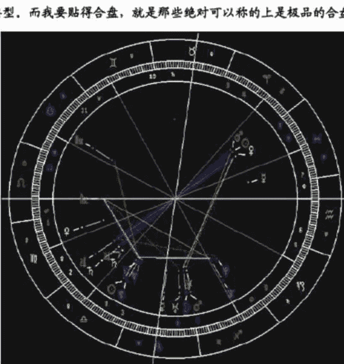

给我贴的这个盘一点解释：

大家看，首先，外圈在天秤的太阳，紧密与内圈的天秤月亮紧密相连。说是紧密，是因为两个的 orb 在一度之内。行星交角越紧密，则影响力越大。

其次，内圈的白羊太阳，与外圈的天蝎月亮成为 120 度“拱”角。

从以上两点简单来看，两个人已经具备了日月和谐的长久基础。但之所以拿出来这个例子，当然不是以上这样简单的了。大家再看：

外圈的处女木星，与内圈的双鱼金星成 180 度“冲”的局面；而外圈的射手火星又与内圈的金星形成 120 度“拱”。要知道木金冲+金火拱力量是非常强大的，可以简单形容为天雷勾动地火。两个人必然十分来电，具备了相互吸引的“动力”。

而吸引的最终结果，将会落在太阳、月亮等代表的个人气质上面。而以上两个人的优良日月，表明两人关系坚不可摧。如此优良的合盘，我看了也是感叹呀！

当然说世事无绝对，也不是说这个合盘就没有负面因素。外圈的土星对冲内圈火星、太阳，外圈这个人对于内圈的行动力以及人格的表现力的限制，是明显可见的。

除此之外，当然这个对比盘还有很多其它可以说的东西。但记住重点，就应该是上面这些了。

下面谈谈组合盘。组合盘没有很固定的解释，大概很多占星家都将之视为秘密吧。其实我的观点，是组合盘关键先看日月。日，代表着两人关系中阳性得一方，男女关系当然代表男性，同性关系当然代表更为外象的主导的一方。

看上面这两个人的组合盘，日月 60 度“六合”，关联水星，可见潜力无限，并且言语融洽。金星在最高位，表明两者的价值观一致，并且为两人带来好的人缘(10宫)。而金冲海，也表明了两人关系的充满米换浪漫气息的相处。但太阳、月亮同落命盘下端，表明这两个人都是“主内”的人，外场可能就稍微差一点啦。:)

好了，现在公布谜底。这两个人都是女孩子，两个人是极其“铁”的好朋友，在一起给别人的感觉也是非常和谐。呵呵，虽然不是良好的男女合盘，但是拥有这个合盘的同性之间，也一定会有这样坚不可摧的友情。：）

## 经典极品合盘系列（2）

今天我要讲的，是来自于一对已婚朋友们的例子。首先，还是来看盘（有朋友提醒我小盘看的不是很清楚，所以我专门做了大盘，大家可以点击小图察看大图）：

这个盘具备了很强的杀伤力，外圈金星冲火星，金星刑金星，虽然属于负面位置，但是负面相位力量强，火花四射。在加上木星拱木星，虽然审美观有所差异，但是人生观很有共识。另外，两人太阳分别落在天蝎与巨蟹，并且非常接近120度相拱的位置，属于传统的速配星座。而双子月亮与白羊月亮的良好六合，更是为两人的发展提供了无限的契机。当然火星冲月亮，天王刑太阳，也会对双方起到一定影响，但属于本盘中次要相位了。

在此需要说明了，这两个朋友的确是已婚人士，但是是各自都有自己的长期的家庭……所以再看组合盘，太阳月亮升到上半部分，两个人都属于外场型人物，表明更有可能是从社会这个大环境而认识的。太阳落11宫，位置良好，说明两人中男性非常活跃在社交场所，并受到来自于婚姻的7宫土星的有力支持。当然，也表明受到了自己妻子的强烈有效的控制，真的象要出轨也并不是很容易。而月亮8宫冲海王，暗示了本人从事商业有关的工作，而冲海王更加表明女方对两个人的这份说不清楚感觉的迷茫。

而金、木、天良好的相合表明彼此的相当投缘，可惜同落在12宫，到也是证明了这份感情很难见到光明……

据当事人对我的讲述，两个人的确是偶然相遇，并且双方都有相当强烈的感觉。彼此相处，即使是简单聊天，也有说不出来的快乐。但是，也正像他们最后所说，即使这样又如何呢？自己和自己的家庭现在已经是血肉相连，而且有了孩子的牵挂。并且，当初的结合，不也是轰轰烈烈过来的么？

于是，两个人只有尽量的避免私下接触，通过距离拉开行星的亲和力。说到这里，真的有一点感慨，在思考一个问题：如果我们在感情路上，后来遇到了一个更加合适的人，但是现实情况已经不允许，我们又该如何？

是呀，占星可以为我们看到感情的合适与否，但却没有办法真正帮助我们实现什么。真正决定的人，还是我们自己。而也许两个投缘的人，也需要在合适的时间相遇，才可以真正走到一起。

下一次，我就要讲一个缘分良好的合盘，是如何在流年星的冲击下，将缘分错失的。请大家期待——

## 经典极品合盘系列（3）

下面的案例来自于一对昔日高校中的“鸳鸯伴侣”，两人从大一入学开始交往，一直坚持到大学四年级，在这个素食爱情流行的大学校园里，也算是一个“模范夫妻”。

从对比盘上看，两个人和谐的惊人：

太阳同落在巨蟹的他们，月亮紧密的在双子座形成1度左右的合相，两个人气质整体个性的强烈一致性，让人无法不相信他们的难以摧毁。

再来看看是否具备诱导他们走到一起的力量：一个金火合双子，一个金火六合，直接说明了两个人双方都会感到一种强烈的爱情感觉。在此提一个细节，在两个人刚刚确立关系的时候，很多人都感到不可思议。因为女孩子很漂亮，而男孩子外表只能说一般，当时大家都在猜测是否其它因素，但从这个盘来看，“爱情”绝对是引导他们一起的根本促因。

两个人交往开始，我们分析的重点也就从对比盘转到组合盘上。组合盘上太阳、月亮都在高位，可见两个人都属于引人注目的角色。果不其然，两个人一个是学生会干部，一个人是学习及其优异的典型。太阳合水合金10宫，应在事业；月亮9宫，应在学习追求。而太阳巨蟹，表明男子在相处中尽显巨蟹本色，照顾女方无微不至；月亮双子，聪明好学之余，对男的总有那么一点三心二意。占星对应显示一看，即使就当作巧合来看，也是足够让人吃惊的了。:)

男子太阳的最大不利，在于一颗2宫冥王的遥遥相刑。一方面，应了男方总是为女方花钱。据男方跟我讲，本身自己属于家庭境况比较不错的，但是仍然感到一种金钱非常吃力的感觉，时不时也要紧缩自己的开支，甚至去做做家教打工。另一方面，男方感到来自女方的强烈控制感，让自己感到非常吃力与压抑，脾气总是随时要爆发的感觉，大概也和这个冥王有关。

而女方月亮六合火星，有意思的是，两个人在性方面，往往都是女方更加主动要求更多一些。

在此再打断一笔，有些人来信时候总是问，什么叫做详细资料。我说，除了生日准确时间、地点，以及重要事件的发生时间之外，上面提到的这种生活的小细节，也是非常非常关键的。另外建议来信附上您的QQ号，方便我适当时候直接与您交流。也许你觉得两个人一些事情与感觉是天经地义的，但实际上你却很可能漏掉了一个非常重要的细节。希望大家能够在细节上能够在多说一些。当然，需要保密的地方还请提出，。不过，我一般描述出来的，不会透露出您的具体身份。何况这些细节，往往都是两人自己才知道，说了出来，别人根本也猜不到，只有局内人才明白。何况一个精彩的故事背后，我总是相信会更容易找到一些神秘的解释。而跌宕起伏的故事，也自然会更加吸引我的注意……：）

好了，回到这个合盘上，我们看到两人的和谐地方与潜在危机了。但是说，并不是所有的危机都会爆发，也不是所有的危机都会致命。但可能这一对稍微有一点不幸……

看一下两个人分手时候这个男孩子的流年盘：在双子座的本命金星（也就是与女方火星相合的那个位置），迎来了也许很多人一辈子都碰不到流年冥王星对冲（冥王星一个周期将近248年）。而女方此时，也正是火星迎接对冲的时候。有很多占星书上说，冥王对冲金星时期，主要应在外遇上面。果不其然，一个女方相识仅仅几天的另一个男孩子，一鼓作气，摧毁了这对经过长时间考验的爱情……周围人无不感到无比惊讶与不敢相信。

有的时候，两个人因为一种吸引走到一起，却又因为一种突然的力量，遭受了分离。也许这种变化，我们很难抗拒，但是学会坚强，是我们的必须。

现在这分开的一对，各自从新站了起来（说实话，这个例子里面男孩子更不容易）。未来给他们的路还很宽阔，至少，我们应该微笑着迎接未来吧：）

好了，下一期会讲一个可能更有点神奇色彩的故事，和两个人有些不同寻常的相处方式以及相应困难。请大家期待！——

## 经典极品合盘系列 (4)

写这篇分析的时候本人属于心情郁闷之际，当然不是为了这个合盘的缘故。而是本人的一些原因，呵呵。也许是自己因为非典缘故，在家里面时间过长，与别人的沟通不畅的原因吧。而今天的这个例子，其实也正说明了一个沟通交流的重要性。

今天要分析的两个人，属于我们常说的速配星座：男巨蟹与女双鱼。在研究占星的时候，常常会想，究竟这种比较泛泛的速配之说，有没有一定道理，道理又在何处？我的体会是，一个人的太阳，毕竟属于一个人的主人格，当一个人成年之后，如果主人格在青年到中年的路上得到良好培养，那么其对本人的影响应该是非常不容忽视的。而两个主人格同样完善的太阳如果气质相合，当然会产生相应的吸引力。当然，这需要其它因素的调合，速配不能解决一切问题。

当两个人从单独的个体逐渐贴近，感觉就已经退居幕后，需要更多的整体考虑。个人感觉对比盘，就是一个触动的原因，可以解释为什么你们会感到相互吸引，其实在某种意义上，也是一种“速配”的层次。而真正两个人在一起，会走到什么地方，就要看独一无二的二合为一的组合盘。

我想，这也是我做这个栏目的最根本目的，就是通过不断的真实人际关系的归纳，来最终将组合盘的秘密慢慢领悟。是科学也罢，是玄学也好，如果可以对我们的生活有一点点启发和帮助，就是坚持下去的理由。

话又扯远了，开始讨论今天的例子。上次说过，这个例子有一点很离奇的感觉。其实，这两个人高中时代的同学，用当事人的话来说，一次偶然的接触中，感到心被触动，发现对方就是自己想要找的那个人。

打开对比星盘来看，两个人的金牛月亮相合在 3 度左右的容许度之内，不是非常紧密，也不是刚刚够相合，而是处在中间阶段。也许这种位置，说明两个人需要一定时间，才可以感到对方月亮的力量。两个人的男方，经历过高考的打击，曾经一度心灰意冷，躲到一个远离所有过去熟悉的人的地方，自我放逐。而女孩子疯狂的想要找到他，却很久没有任何消息。也许正是因为他们相遇的很早，所以需要经历的事情也就更加多一些。但就像其中这个女孩子对我说的一句话一样：“我一直相信上帝造人是一对一对的，然后散向人间，如果同时所造的一对人能碰在一起，他们将无比幸福，可是有的人一生也碰不上，而我，却在 18 岁时就遇到了他。”虽然他们对比盘的月亮对面，一直有天王星来冲，引发他们心绪的不安与变化，但是应该说，他们都没有放弃。

就这样，男孩子也终于度过了高考的噩梦，上了大学。一年的音信全无结束了，他们再次来到一起，经过磨砺的感情变得更加坚定。也许，这就是双方月亮擢升金牛的坚定吧。

其实，这个盘虽然有着最为优秀的月亮相合的辅助，但是也的确还是有很多困难，刚才的天王星引发情绪变化之外，在这个以女方为基础建立的对比盘上，男方的4宫土星冲女方10宫太阳。女孩子10宫星很多，从小就属于事业型的女孩子，一直当班长。而男方本身就是一个顾家的巨蟹，所以用两人世界来限制女孩子的情况很多，也就不奇怪了。女孩子最为苦恼的，也是这件事情。

也许从组合盘上看整体看得更加清楚吧，现在我们就进入组合盘。发现很多事情，变得分外明朗。我们发现这个组合盘，存在两个明显的困难，一个就是7宫土、木与10宫火、海王的相刑。也就是说，两个人不可避免的，需要面对“两人世界”（7宫）与“事业”（10宫）的冲突。10宫那颗海王星，也是双鱼的守护星，也许代表了女孩子的一种无奈吧。

另外一个就是，9宫天王冲3宫日月。当初我看到这个，就问，有没有什么长途旅行、出国深造之类的事情困扰着你们？果然，答案是，拥有三颗星在9宫的男孩子，一直有一个出国深造的梦想。9宫代表了一种理想与哲学的追求，在早年也许表现在出国的思想，在以后也可能是其它的表现方式，所以这种理想，对于男方（太阳）、女方（月亮）的影响也是需要面对的。

我开始说了今天要讲的是一个关于沟通的问题，大家看到组合盘上相合于3宫（交流沟通）的太阳月亮了么？这是一对非常了解沟通重要性的伴侣，还是引一段女孩子的原话吧：“我们之间总是矛盾不断，争吵不断，但我们没有想过要分手，这是建立在我们坚固的爱情之上的。我们的心中对方占得满满的，而且我们有个很好的性格与习惯：首先我们很注意完善自我，而不是一遇到问题我们首先接受对方的建议，不对了就改正，而不是想到逃避、放弃；其次，我们从一开始就很注意沟通，其实情侣间所以矛盾都是由于两个人对同一件事的想法不同，而又总是用我们自己的想法去衡量对方的做法而造成的，所以争吵发生后我们会不高兴一下，但我们会很好的沟通，通过沟通，我们不仅可以解决当前的问题，更可以增进彼此的了解，所以感情会越来越浓。”

我想女孩子的话，最好的概括了3宫日月合的内在含义，也是经历了很多风雨，最终可以走到现在的原因。所以我突然觉得，两个人能够相爱是必要的，但是如果缺乏沟通，同样会难以维系。那么反过来，虽然有很多不合与冲突，但是只要保持一个沟通的心态，就可以很好的解决众多问题。

伴随着组合盘上金火相拱的相爱，加上3宫良好的日月沟通，我想这一对的发展，会慢慢克服道路上所有的阻碍。当然，这种克服，就需要他们勇敢的去面对，理性的去解决了。

用女孩子最后的祝愿作为今天这个例子的结尾：“帮我告诉感情上遇到困难的恋人们，不要一遇到问题就想到分手。其实每个人都是会有缺点的，如果你们真的相爱，就多去包容，多去沟通，没有什么会比爱的力量强大。”

好了，谈了很多比较良好的正面吸引力量，下一次的例子，会讲一个负面冲突造成的吸引，以及险恶组合盘带来的有些恐怖的现实问题。

## 占星分析：经典极品合盘系列5

今天经典合盘系列要讨论的，是一个不可能的例子。那么什么叫不可能呢？如果说这是现实中你来问我，当然会考虑很多现实因素，比如家庭背景、父母意见、生理缺陷、婚姻状况等等等等。而占星的命盘上，也会反映出一些不可能的状况。如果你耐心去比较，会发现现实情况分析不可能的，往往在占星中也会得到同样的解释。也就是说，如果你的资料准确，那么占星只是通过另外一种途径来隐约的告诉你现实的状况。所以说不懂占星其实不可怕，就怕那些明知道现实情况不允许，还要尝试的人们。

另外在收到信件的时候，很无奈的是，有时事情说得很详尽，但是具体的出生时间和地点却漏掉了，或是重要事件发生的时间并没有告知，不然就是提供了一个很偏僻的地名，没有告诉我这个地方附近有什么大的城市，让我无从查到经纬度。对于这样的，我只好说对不起，如果时间允许情况也的确比较特殊，我会回信再问，否则我就只好忽略过去。

占星是一个用时间与地点建立的人生坐标，如果可以，请你把它表示清楚。另外也希望所有看到的家长和即将成为父母的人，记住自己孩子的准确出生时间，也许就是这样一点努力，就会为你的孩子将来提供无限的指引。

好了，在开始之前还有一个问题要说明，就是本人对“对比盘”、“流年盘”稍微有一点心得，但“组合盘”还属于摸索对照阶段，所以是否会在组合盘中行星、宫位等的理解上面出现错误很难说。我希望如果有同道看到错误，不吝指教。一位占星前辈的话说的好：“学占星不怕错。”只是希望能够通过不断的对比试验，找到真正揭开事实的钥匙。

首先介绍一下今天这两个人的大概的背景，男方是一位中年已婚人士，女方则是刚刚工作的年轻人，两人年龄相差不小。但也许正是因为女孩子土星刑金星的原因吧，再加上日月对冲，从小对自己家庭不太满意，所以格外想要找到一个有一点“父爱”感觉的爱情吧。

那么具体两个人是如何吸引的呢？刚打开对比盘，的确吓了一跳，女方的对冲的日月，与男方对冲的木土，形成了大十字（因为对比盘不显示本命盘相位，所以图上这个蓝色十字并没有标明出来），而四星也构成了一个充满困难的正方形。

用女孩子给我的描述来反映这个架构的感觉，就是虽然对方对她的态度很和蔼，但是还是能感觉到一种很有压力的感觉（土星），但同时也会感到一种莫名其妙的兴奋（木星）。可以说，本对比盘是一个很典型的因为负面力量而受到强烈吸引的感情例子。那么用什么来区分正面与负面呢？个人感觉，如果一种爱情感觉，抛开现实问题的影响不谈，如果让你感到一种如清泉般流动在心中的默契，那么就是正面居多；反之，如果让你感到一种强烈的不能安定有些神经质的感觉，那么很可能是负面效果比较明显。

打开组合盘，将对比盘出现的困难具体化，发现一个很可怕的现象：

如果可以将代表关系外在的太阳表示男方，将代表内部事务的月亮表示女方，那么太阳魔羯的长辈的严肃压抑与巨蟹般的温婉柔情，构成了强烈的冲突相。当然这种反差本身问题并非那么严重，虽然冲突但是可以有互为补助的可能性。问题的关键在于，在这个假设条件下，太阳、月亮相关的三个行星三角形。

- 1，月亮、天王星、金星的三角形，可能表明了对女孩子来说，这份感情是一个强烈的一见钟情式的爱情，但因为天王挂金星的不稳定，所以爱情也同时充满了变化。
- 2，月亮、冥王星、太阳的三角形，可能表示男女双方那种充满了变革与磨难的致命吸引力。
- 3，太阳、木星、土星构成的三角形，也许反映了一种太阳左右摇摆，阴晴不定的感觉。

综合上面来看，太阳在6宫，受到土星、冥王两大凶星的折磨，严重的对自己的健康不利。而一颗8宫火星拱木星，也是非常强势凶悍。男方本命盘上，并没有什么对身体不利的明显征兆。但就在这种精神出轨的影响下，居然出了车祸。

这场车祸来的十分突然，而且极其惨烈，当时男方的生还希望被认为极其微弱，但也许是还有木星的一点帮助吧，男方终于还是奇迹般的生还了。

这是不是说明女方正好克男方呢？这个不好说。不过女孩子告诉我，自己小时候请人算过有克夫命。当然，我是不太认为这里面存在必然，最多也是说明，这一对真的不适合吧。

最后看看男方的最近流年，看看他外遇原因：

我们知道这几年，流年土星、冥王星一直处于对冲位置，而这就好比流行感冒，虽然很厉害，但是你不一定能受到影响，除非你接受到它。而男方就不幸体会了流冥合金星，流土冲金星的强烈冲击。夫妻情分淡薄、有外遇，并且难有好的结果。流土已经逐渐出相位，而流冥还将继续折磨他的内心，让他不断有想要出轨的念头。

不知道这次事故，能否让他警醒。

下一次，将讨论一个现实中对女孩子不利的组合关系，也算是和这个构成对比。

## 经典极品合盘系列 (6)

文/落落

在最开始，首先感谢大家的支持，很多人已经知道附上比较详细的出生资料，以及介绍自己的爱情经历。这样的来信我会好好保存，以备有时间进行研究。对于那些太过简单含糊的，我只能说很抱歉。

因为如果时间不够准确，在运算组合盘时候会出现很大的误差。这样开出来的盘，研究出来的结果，肯定有很大的漏洞，甚至是错误。所以我觉得，出生时间的准确性，对于每一个人都是十分关键的。希望大家将来都有这样一个意识，面对一个新生命、新的事件的来临时，不要忘记记录下时间与地点。

最近在思考，是不是占星是每一个人都可以学的。我觉得可以。但是是不是每一个人都可以学好的？我觉得不可能。最近我发现很多人在争论占星的科学性等等等等，其实我觉得这个话题本身的确有很多可以深究的东西。占星本身，当然是应该批判的。正如同世间万物一样，没有批判，就没有发展，也不会让人取精华，去糟粕。

但是现在的很多批判的人，不客气的说，逻辑水平之低、思维层次之差实在让人感到无奈。更可怕的是，这些人往往是根本没有明白占星与星座有什么区别、根本就不懂得软件怎么用、不了解占星体系背景以及推理过程。他们往往就根据自己的一个论点去主观的断章取义，提出一些可笑的问题，或是根据自己也根本不知道有没有的论据来得出一个似是而非的结论。如果一个人已经先入为主的认为这个东西是错的，那么找到一点理由还不容易么？欲加之罪，何患无辞。我没有从中看到任何论证的科学性，反而看到了充满主观的不严密思维。

> “我不懂得占星，但我知道它是迷信！”这是这一类人的普遍态度，愤青的态度。

## 经典极品合盘系列 (6)

“无知者无畏”，那是王朔才敢说的话，因为他有那个底气；至于其它的人，我总觉得应该：“多学习，少放屁。”

我其实很希望有一个人能够提出一些真的帮助思考的问题，一个现在西方所有占星学家都无法应对的诘问。一个真正阅读了大量西方占星学著作之后的，经过自己反复比较应用的，逻辑清楚、条例分明，真正是内行的疑问。我一直希望有这样一个人，可以出现。

题外话说完，继续合盘的研究。上次说了，这次将介绍的，是一个对女方不利的合盘。

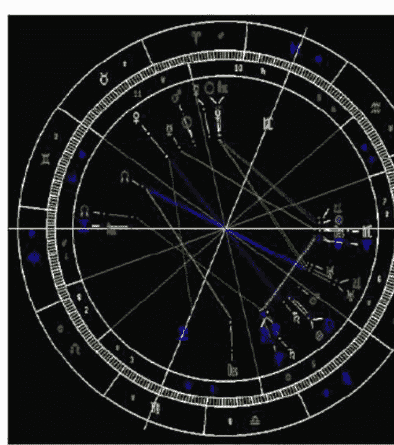

首先看对比盘，看看吸引的来源。内圈是女方，女方的代表爱情的金星，受到外圈天王星、木星合相的120度拱。最近和几个人讨论发现，天王星与金星的相位，往往带给金星一方强烈的爱情感觉。更何况，还有木星这个舒适的力量一起的帮助呢。

而且男方的太阳也“罩”在女孩子的金星之上，可以说女孩子能够接受到的爱情感觉是非常强烈的。这份感情，属于一个暗恋的过程，女孩子一直很喜欢这个男生，但是对于男方来说，可能并不是太能够体会到正面的感觉。女方的土星对冲男方金星，男方会感到一种很冷很压抑的爱情感觉。

以上是对爱情的讨论，而真正不利的地方，也许不少人已经可以从这个对比盘上看出来，女孩子的内圈月亮，本身已经受到自己冥王星的压制，她在年龄相仿的人相处时候，都会接受到冥王星的叠加力量。而这个男孩子土星也压在苦难的月亮上，实在是让女孩子感到万分痛苦。用女孩子自己的形容大概是这样：

首先是来信的时候就告诉我：“这是一个悲惨的合盘。”

其次是在描述对方和另外一个女孩子成为恋人时自己感受是“简直郁闷死了，心想明明喜欢我却为什么这样，在加上他别的所作所为（一直对她很冷淡），我对他的怨恨越积越深”。其实很冷淡，的确和女孩子那个土星冲对方金星有很大关系。但这两个人的互动，却实际上是对女孩子更加难过一点。

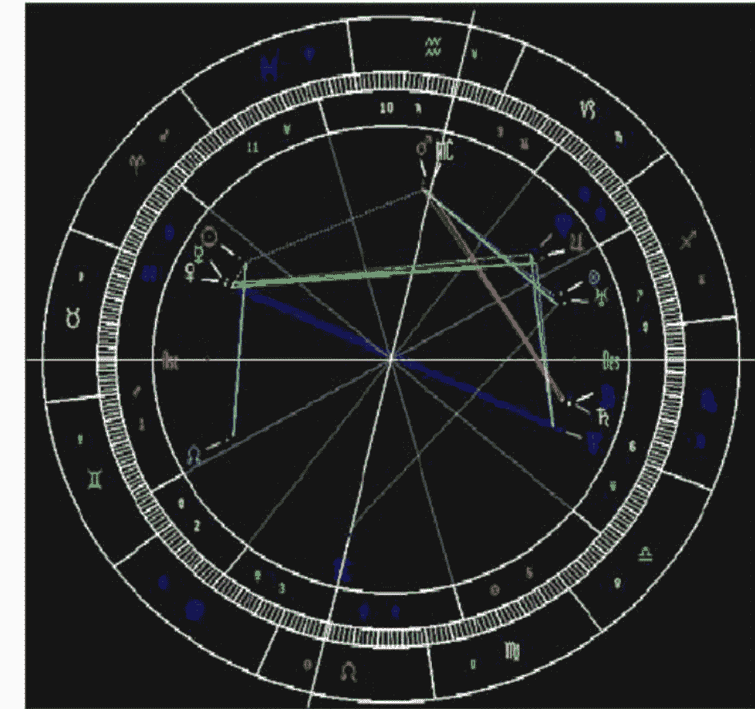

打开组合盘可以看得更加清楚。金星、木星、冥王星个构成一个三角形。金木拱的确说明两个人有爱情火花闪现，再加上海王也拱金星，爱情的浪漫与迷醉是可以预知的。但是冥王冲金星，带给爱情的更多是磨难与不停的变革。

最值得关注的，是代表被主导一方的，也就是这份关系的女方的月亮，落6宫（健康）合土刑火，极其压抑狂躁的感觉。于是就造成了这样一个事实：在这个暗恋过程中，尤其是知道对方和另外一个女生好了之后，女孩子一下子消瘦了40斤，别人还以为她在减肥，谁知道她是为伊消得人憔悴呢！

另外，太阳落入12宫，按照占星家Rob Hand先生的理论，这是一个非常具有挑战性的位置。双方如果要相处，都要面对许多不想暴露的秘密慢慢被挖掘出来。我的理解，太阳12，往往意味着两个人恋情属于秘密恋情。

爱情当然有很多是要去坚持的，因为无论多么好的感觉多么好的基础，没有坚持，也成就不了长久。但是如果一份感情，对于本人的内心乃至于身体都是一种折磨，我觉得实在是应该及早摆脱。

上一期和这一期的例子，大概也是告诉我们，占星不能决定你们是否一定可以，但的确可以发现你们是否不可以。

好了，下一次，分析一个虽距离遥远但合盘十分优良的例子。

## 经典极品合盘系列 (7)

很多人问，组合盘准确么？这个问题，就好比很多人问，占星学准确么？

如果我们姑且不去讨论占星的原理，先假设它的理论的全部正确性，那么我们再来分析。现在讨论的组合盘，是两个人的综合互动产生的新的走向，是一种理想状态下的爱情关系。但我们都知道，爱情在现实中，并不是日趋简单，而是日趋复杂。如果两个人之外，还会有一个经常在一起的亲密的人，同样也会对整个组合产生新的导向。

这就好比方，也许一对夫妻冲突严重，生活中吵得不可开交，眼看婚姻就不长久。而突然两个人有了孩子，这个孩子的诞生盘，刚好对两个人的盘有一个中合的作用，将原本对比盘上的冲角搭上了过渡的缓和相位，在组合盘中将不可化解的矛盾拆开，也许这一对，就会长久。而也许本来一对看着很和谐的夫妻，却突然在买了新房之后，也就是一个新的开始之后，突然产生了矛盾，反而出现了矛盾。当然，还有更加常见的例如婚外恋问题等等。

所以说，以出生图建立的对比盘合组合盘，是一个相对不完整的宏观考虑。但毕竟它提供了很好的一种思想，就是一种行星的重置。我们在以前的盘也可以看到，两个人的组合盘，太阳、月亮一般会来到新的位置、新的星座或是宫位。这个与现实对应的，就应该是社会学家常说的社会角色的转化吧。

当你与一个人建立了亲密关系，记住，你已经不再是原来的自己，你将扮演一个崭新的角色。无论这个转变对你来说是愉悦还是痛苦，都是必然要转变。而结婚、生子、搬家等等新的开始，也会为这种组合带来新的变数。所以我的理解是，目前这种宏观占星学，可以用来借鉴，更多的是结合现实，从哲学的角度悟出一种生活的态度，不断学会顺应整体变化的力量，而不是拒绝抵抗这种变化。

我们当然可以结合流年星的力量，将这种趋势更加细化。但是要达到“科学化”的精确，那么现在的占星手段远远没有达到那种地步。以数学观点来看，一个人、一件事情的每一个新的开始，都是一个“积分”的过程，而整个宇宙的万物的所有开始产生的累积，是无穷大的一个概念。人类的有限化理论，是不可能解释无限大的宇宙的秘密的。占星只不过试图通过特殊的一个积点，从某一个隐约的途径，让我们的心灵与道路更清明一些，仅仅如此。

这就好比我们学习物理，也是从理想状态下，忽略细节，找到特殊例子的这个积点来讨论。所以，我觉得既然讨论基础物理学对解决生活问题有意义，那么讨论一下基础占星学，也还会有一点点帮助吧。:)

不过，我希望所有喜爱占星文章的人，不要将占星作为一个生活依赖，而是一种参考。人生本来就是充满无穷的变数，实在不要说什么是一定的。至少在人类无法找到无限的规律之前，不要这样去说吧。:)

又说了很多闲话，哈哈。好了，开始今天的讨论：

今天的一对来自同一个地方，不过却是在两个人相隔千里（一个人去外地上大学）之后，才认识的。本来刚刚见面，大家也因为距离不认为彼此会有什么发展，但是随着现代化的沟通手段，两个人渐渐擦出了火花。

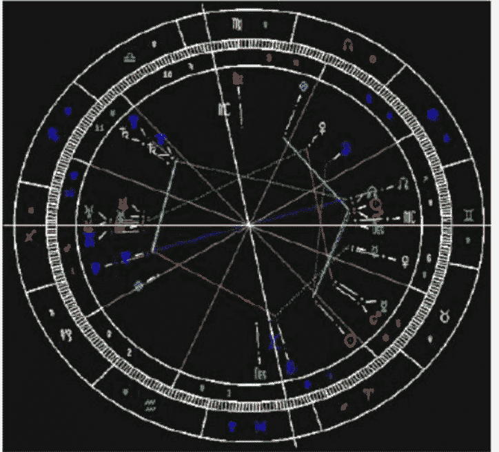

从对比盘上，两个人的有利因素日日六合、月金六合的潜力，金火相刑和金天拱的火花。当然，也有日月相刑的摩擦在那里。如果单就对比盘来看，的确看不到太过特殊的地方，具体指向也不够明确。

而打开组合盘，很多情况变得明确。这个组合盘有三个突出的地方。

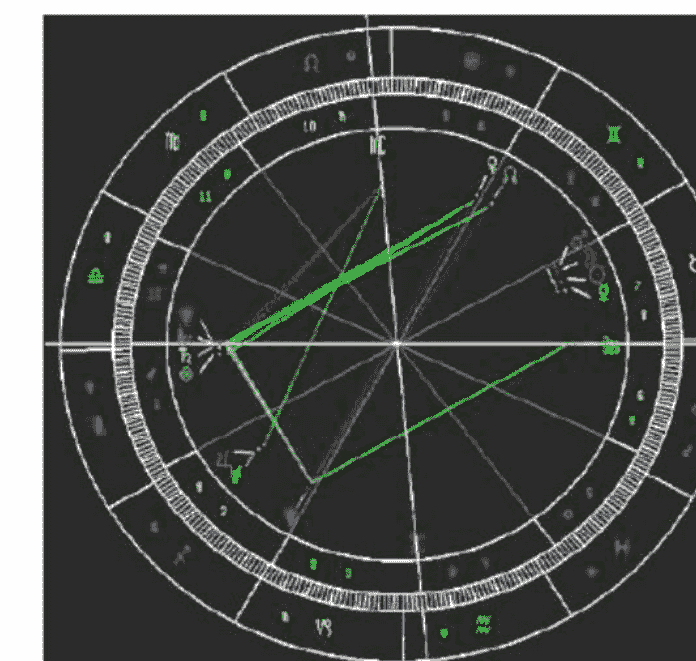

第一个就是在 7 宫相合的四颗星。太阳、月亮同落在新的金牛座，如果用重置观点来说，那么金牛的性质，就是联系他们彼此的一个新的起点。如果上访能够将自己引导到新的定位上面，那么日月合相就会为他们带来新的共同前进点，一个充满热情(火星)与良好沟通(水星)的婚姻(7 宫)。应该说，这种相位的确十分难得。

第二个突出的地方，是金星与海王的对冲。用 Rob Hand 的解释就是，彼此容易对对方产生过高的心理期待，对对方幻想的太过虚幻，往往对将来现实的相处产生一定的心理落差。

第三个，可能对应对比盘的日月刑的负面力量，就是合轴的冥王与土星。很多初学者总是忽略与上升点、下降点、中天、天底相合的行星，其实这些合相的行星，力量往往是非常大的。

从这个盘上来看，虽然这两颗星不是什么太好的行星，但是好再没有与其它行星的克相。男女组合盘上升点一般来说是婚姻的起点，起点有着两颗星，意味着缓慢与不断变革。所以说，虽然两个人具备了很好的互动，但是仍然要经历很多磨难才能慢慢走到一起。土星同样也有稳固的意思，而冥王星也会有痴情不改的含义，但只有经历过磨难，这一切才会实现。而恰好冥王、土星在这个组合盘上，处于联系金星、海王星对冲的桥梁。所以，如何克服对对方不切实的幻想，不断找到现实中的定位，就是这一对发展的关键。

总有人问我组合盘是不是要很好才可以，或是是不是组合盘上出现问题就会一定不成。我却认为，如果一对组合盘太过顺利，反而不是太好。这就好比是一个温室的花朵，太过于理想与美好，一旦新的负面组合因素掺杂进来，坏的影响力反而更加大。

我的看法，就是对比盘提供了双方的吸引条件，而组合盘则展现了两个人一起走的路上需要面对的困难与希望。如果困难并非不可解(比如组合盘上下降点有大量凶星并且收到刑克)，那么更多的是需要克服而不是逃避恐惧。

下一次，我将讨论一对组合良好却具备了下降点凶星缠绕的不能成功的例子。

## 经典极品合盘系列 (8)

文/落落

爱情让人烦扰，但我们又不能失去爱情。当一份爱情过去了，我们就要舔舐伤口，等待下一份爱情的开始。新的开始，会冲淡所有的过去。可是，在很受伤的这段时期当中发生的那些爱情，是不是注定让陷入其中的人都受伤呢？

这一期的推出拖延了一些时间，因为一些乱七八糟的事情，忙不过来。这一次要讲的，就是一份发生在旧爱刚刚过后的“爱情”。

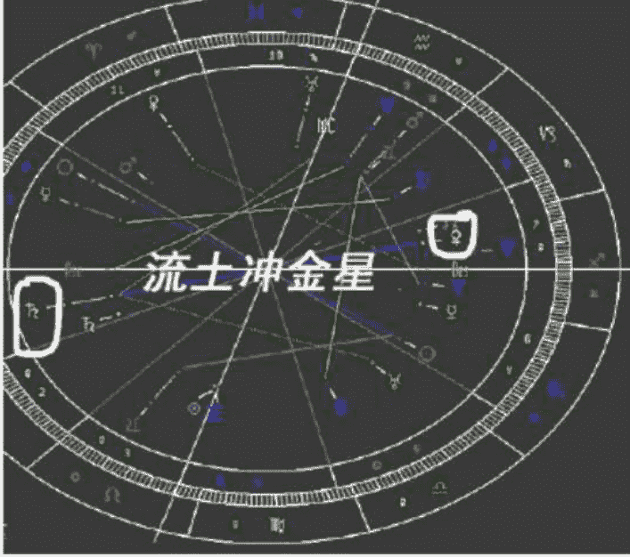

男方，以前又一个很长很长时间的女友，而到了一年前，自己流年土星开始进入冲本命金星的时刻，于是一份旧爱，开始逐渐被外力拉的冷淡，所谓“缘分已尽”，就是如此。

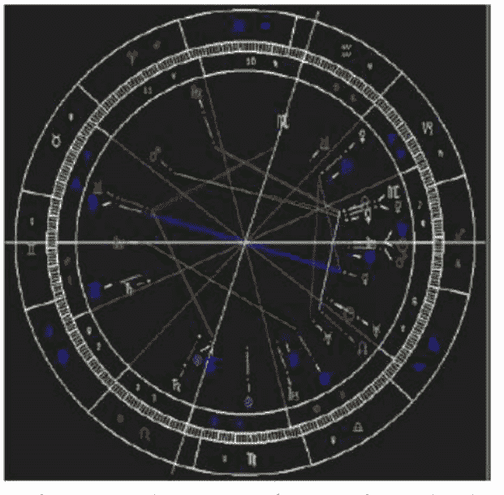

而女方，就是在这个时候进入男方的生命。失去爱的人总是寂寞的，总是需要安慰的，而对比盘上天王星刑金星，火星拱金星的力量，已经很明确的表明两人的迅速来电（天王金星）和性的吸引力（火星拱金星）。成年人之间，在一个寂寞的城市里，当然会发生一些故事。

女方是火象的射手，男方是水象的天蝎。水与火的搭配，即使合盘再理想，如果两个人各自星座特点突出，也证明需要很多的磨合。因为两个人的表达方式、情绪感觉的确存在着很大的差异。最近越来越觉得速配星座的理论不是纯粹没有道理，同象星座之间的确先天存在着很多便于沟通的地方。当然，速配看不出长久。

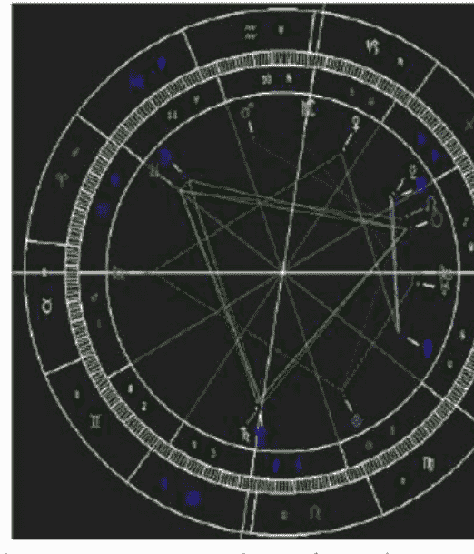

从组合盘来看这一对，日月拱加上有木星参与，表明两人一种难以言表的和谐沟通。但这些并非是重点，重点在于缠绕在下降点上的天王星。天王星在此位，意味着两个人不适合传统意义上的婚姻关系，不能够去限制对方。具体应用在现在的社会，就是说两个人还是情人最好……

但是几乎所有的女性，到了一定年龄，就渴望一种限制：婚姻。而这一个不能实现渴望的过程，也许是那颗天王星，所无法描述的感受了。

下一次，我将分析一对同志们的合盘，看看是什么力量让他们在一起。

## 经典极品合盘系列 (9)

这次的讨论来自于两位男的“同志”，一个狮子，一个金牛。

在占星上来看，同性恋倾向比较强烈的，一方面是风象星座特点比较强烈的星盘，尤其是水瓶、双子特点比较明显。另外一方面，也多半拥有不太良好的金星位置(爱情不顺)、冲突的太阳月亮位置(幼年得不到更多的家庭温暖，对婚姻形成阴影）。

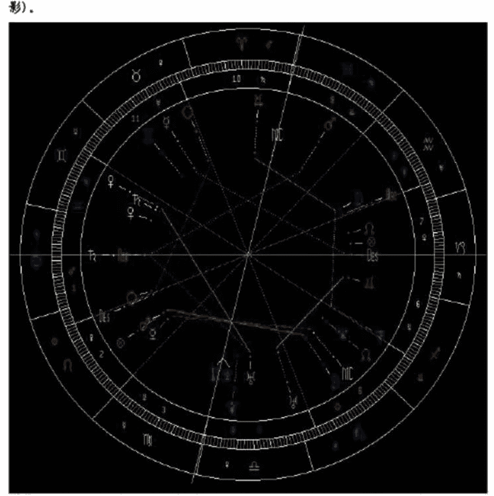

具体到今天这个例子来看，两个人的金星都位于双子座，一个合土星，一个冲海王刑火星。而且两个人的太阳月亮，各自都是处在相对星座，表明可能父母关系的不睦。来信虽然没有特别详细说明这一点，但是从各自的命盘上还是能够找到一些比较关键的原因。

谈到双方的吸引力，从对比盘上来看，最为明显的就是天王星与金星的相拱，表明了一种一见钟情的强烈感觉，也同样具备惊世骇俗的潜力。而双方的太阳、月亮分别处在四个固定星座，虽然并没有组成严格的正方形，但也存在着相当大的矛盾冲突格局。有的时候，冲突就是一种吸引。

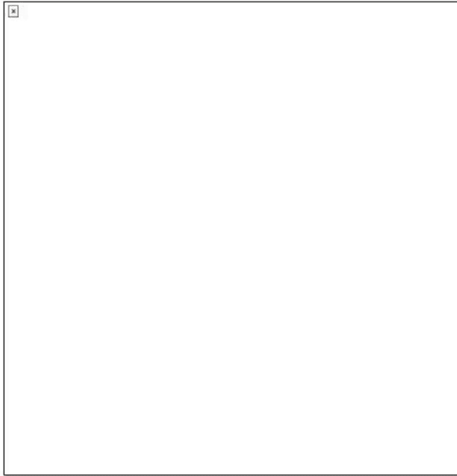

转到组合盘上，可以看到最为显著的，是金星、木星、天王星构成的大三角形，象征着一种强烈而美好的爱情。可以说，彼此的确能够从对方感受到一种渴望、压抑很久的感情。但是，天王星缠绕下降点，似乎暗示这是一个无法用世俗的方式完成的爱情。而3宫收到土星合、冥王刑的水星，也暗示着无法对外表达的爱情。

至于谈到将来的路，我想既然他们选择了这条路，就需要面对不停的变化与折磨。虽然我本人无法从切身理解同性恋的立场，但我觉得，至少从这个盘中，可以感受到他们之间，互相提供的爱情的温暖。不管未来会怎样，祝愿你们一路走好！

## 占星分析：经典极品合盘系列 (10)

本期谈到的，与上期对应，是来自于一对女性同志的案例。谈到这对的同性倾向的原因，一个 (下文称为 A) 是因为天王星合金星于射手，爱情态度自由不受拘束。后一个 (下文称为 B) 是太阳金星全部在水瓶座。水瓶座的女孩子，很多都具备吸引同性的气质。

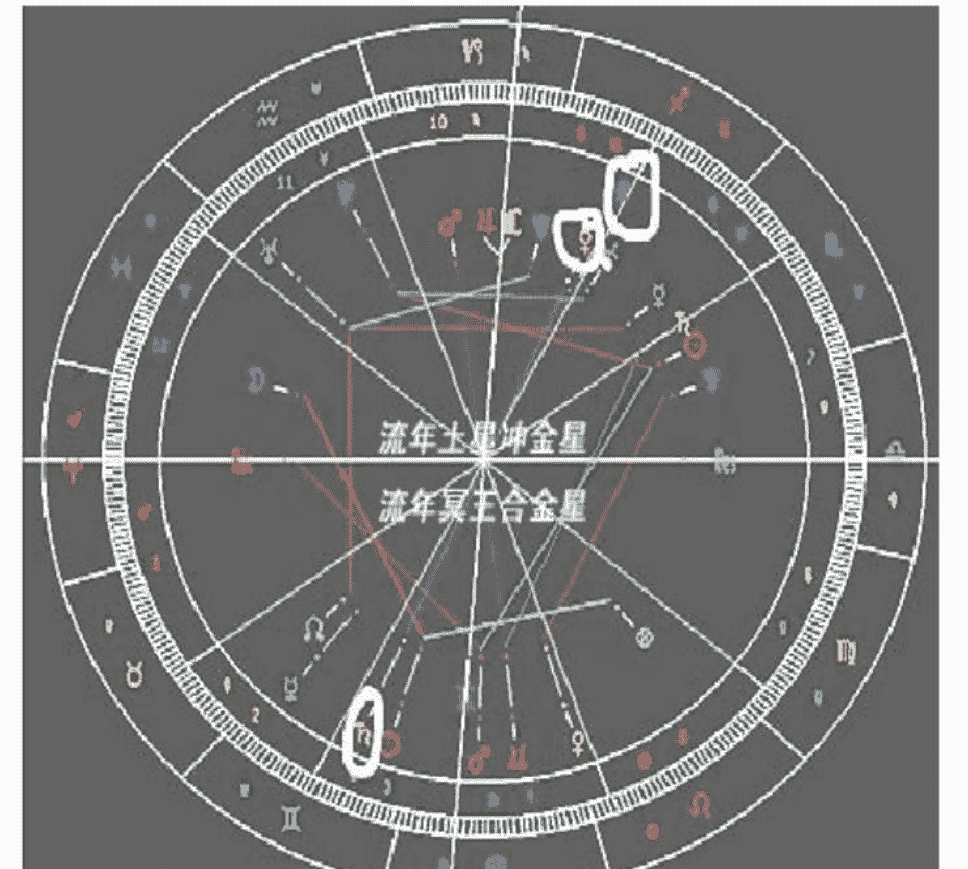

来信的时候，信中提到 A 女孩“被男生伤害过”，想到前两年半左右的时间，流年土星、冥王星对冲与射手、双子。金星落入射手的人，自然会被这个流年的强大影响力扫到。2002 年一年，尤其是年中，流年土冥加会在金星上，自然是异常的痛苦。冥王星代表的暴力性与土星的强大压抑性，可以参考 Rob Hand 的“土冥对冲与权力的争端”这个系列文章。这种影响力作用在爱情上，自然就是“巨大痛苦的伤害”。

所以说，抛开流年来谈占星，这种思维是绝对要不得的；过分强调流年的态度，也是不必要的。就好比地球上一个地方发生地震，只有震源附近的人才有危险，其它的地方的人不必杞人忧天。同样套用在自己的流年分析上也是这样，如果流年星于自己的本命星距离比较远，那么根本不用太过考虑这个流年的影响力。这个也是我们察看“行星逆行”时候所必须明确的态度。

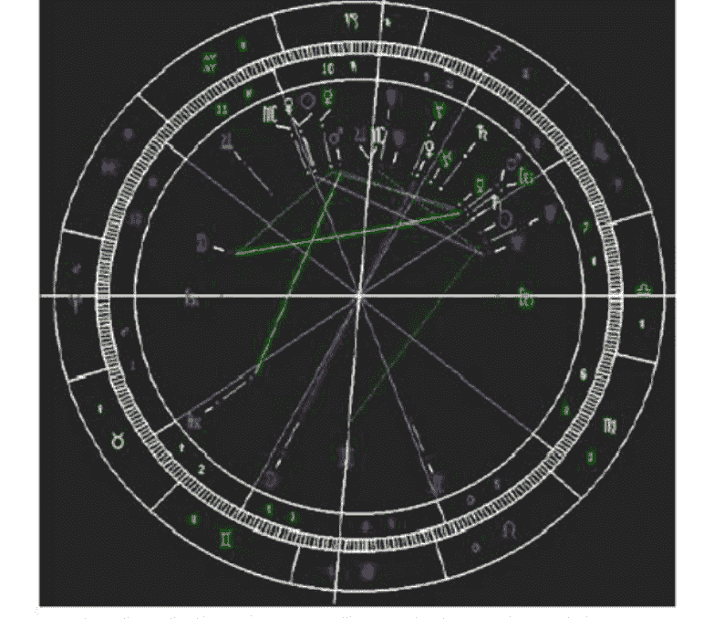

从两个人的对比盘上来看，除了天王星、金星有个比较远的合相以及冥王星刑金星这两个位置外，谈不到更多。但即使这些，也暗示了一见钟情(天王星金星)、致命吸引(冥王星金星)，引用来信的原话，就是“好象是一种很突如其来的感觉，并掺杂着强烈的性吸引”。

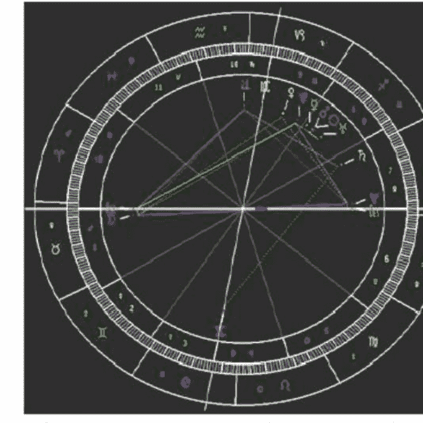

打开组合盘，两个人的问题变得具体化。最明显的是两颗合轴的行星：上升点的月亮和下降点的冥王星。可以看到这两颗星体分别落在各自擢升的位置：金牛座与天蝎座。可以想见上升点的月亮赋予这份关系一种相互内心的沟通，彼此之间对对方内心的敏感，而金牛座的特点，也有助于改善月亮过于敏感的特点，转化成稳定。

但是下降点的冥王星，的确是一个比较严重的问题。首先不论这份关系好坏，冥王星在此，就预示着这份关系必然是强烈且极端的。“有时候我们都没有话说，就是身体上的吸引”，这种来信的表述，对于一对女性同志来说，的确是比较特殊的。因为女性同志之间与男性同志之间的区别，就在于往往并非是“性”的吸引那么强烈。而这一对冥王星主导的感情，有着不一样的色彩。

来信曾经问我长久这个问题，因为这本身就是一个非常规的问题，我也的确难以回答。但从来信来看，相信女孩子 A 应该是代表着本盘中的月亮，本身收到强烈的吸引力，暗中主导着整个关系的进程，同时也存在着内心的强烈矛盾（月亮冥王星对冲）。而相对来说，女孩B就显得超脱、自由许多了。

不论是谁，相爱都不容易，相爱下去就更加需要勇气。

## 高级占星推运法：月亮次限推运法

文/王中和

此处介绍一种简单而准确的月亮推运法，此一推运法的原理很简单，就是人出生后每日的行运就是代表每年的行运，即在出生后一天行星的位置，代表出生后一年的各种情况，出生后第十一天行星的位置，代表出生后十一年的各种情况，依此类推。举例而言，如果想知道某人三十五岁（实岁）那年的运途如何，只要查看其人出生后第三十五天那一天的星象，观察其对原命盘的刑冲合会角度，便可以断出吉凶了。

根据上述的道理，我们知道月亮每日平均行十三度，因此判断月亮推运的流年吉凶，即可按照岁数逐年加十三度，然后观察月亮落入何度何宫，与原命盘何星呈何吉凶角度相位。例如某甲出生时月亮适在魔羯宫八度，则其满一岁时（过生日）推运，月亮应在魔羯宫二十一度，满二岁时推运，月亮应在宝瓶宫四度，满三岁时推运，月亮应在宝瓶宫十七度，依此类推，则某甲满三十岁时，推运月亮的计算应为：13度乘以30等于390度，390度减去360度等于30度，魔羯宫8度加30度等于宝瓶宫8度。因此某甲满三十岁时推运月亮应在宝瓶宫八度，此时应观察宝瓶宫八度为某甲原命盘第几宫，可按月过天宫图十二宫之感应之叙述查知可能发生之现象，且宝瓶宫八度之位置与原命盘哪些星曜构成刑合会之吉凶角度，亦可按月向各行星吉凶角度之叙述查知可能发生之现象。

月亮次限推运法英文为：Secondary Progression，它根据月亮的变化推出人的人生变动。因为它是以一天代表一年，变化的程度缓慢，所以一般用来比较年与年的情况和人大运的变化。

同样的道理，还有月亮三限推运法，英文是 tertiary Progression，它是以人出生后一天代表一月来进行推算，因为主要是用来比较月与月的情况，所以主要用来看近期的运势。

关于如何在 astrology 系列软件中使用，我们将在后面详细解说。

若月亮和出生行星或推进行星形成相位，表示这时那些影响力最有可能发生。比方一个人推进的太阳和土星成为九十度相位，而推进的月亮与出生(基本)或推进土星形成九十度相位！那么在这个推运中太阳与土星的九十度相位是最有力的—也就是说健康及愉快的心情都会受挫。

在解释推运之时，有一条黄金律需铭记于心：推进行星所形成的相位，不论是正面、负面或是合相，只要出生图中同样两个行星也形成相位，必会多少带有后者相位的一些性质。因此如果两个行星在出生途中形成甲相位，而又在推运图中形成乙相位，那么乙会有部分受到甲的影响。如果两个行星在诞生天宫图中并没有形成相位，那么只须考虑乙相位即可。若是出生图中有一个受克极严重的行星，那么从此行星中也得不到什么吉祥的影响。同样的，出生途中受克的行星对于推进的其它行星也起不了什么大作用。

在解释月亮的推进时，很重要的一点是虽然它和出生图上行星或推进行星间的形成相位可长达一个月，但是此相位的影响力却及于三个月之久，而效果最明显的是这三个月当中的中间那个月。

月亮推进的效果差别极大，有些人能感觉到小如半六分相位的效果；有些人却只感觉到强大的四分相位及合相效果。占星家们对于其重要性也是意见不一。就表面的现象来看，它们对某些人而言重要，对另外的人则不重要。月亮推进在下列三种情况中是最具威力。

## 月亮次限的看法

1. 太阳星座或上升星座为巨蟹，或者月亮与上升星座在第一宫成合相。
2. 月亮在巨蟹座。
3. 月亮在金牛座。

而当月亮在第四宫时，此推进就不那么重要了。在解释月亮的推进时，要牢记这一点。推进的月亮在一个星座里的时间是两年半。

欲自知流年之吉凶，须以月亮移动及过宫之位置，与自己原命盘中各行星，构成准确三合的相位，或六合的相位，或准确四正的相位，为最重要。其次，始论太岁之填冲守钓。太阳似时钟面上指钟点之短针，乃移动较月亮为缓，故其方向所显示事情之吉凶，期间长远。月亮似时钟面上分钟之长针、其行甚疾，能影响十二宫所属吉凶之作用，故须先观月亮当时所在何宫，其感应属何事。

如遇月亮所在之宫度为吉利者，则福力倍增。但一年中常有一星构成两角度者，或一吉一凶者，未知何去何从，但吉者必受凶之减轻，凶者必无如是之甚，又须观月亮过于何宫，属吉属凶，在其移动之十二度或十三度中，与何星构成三合的相位，或六合的相位，或准确四正的相位，则知此年此月亮所主管之吉凶。月亮乃是身主，为人生一切影响之收集者，观星盘如缺乏月亮之合作，则凡事必属模糊而不确定。

用 astrolgoy 系列软件可以轻松的排出月亮次限法和三限法，以及本命和次限法的对比盘，方法如下。

1. 打开一个命例，然后选择栏目 “Chart” 中的倒数第二项 “Progression”。
2. 弹出这个窗口后，在 “Do Progression” 的框中打上勾，然后填上想要得知的推进时间。右上角的 “Now” 就是默认系统当前时间。
3. 下面的 “Progression settings” 是选择推运的方法。默认是 “Secondary Progression”，即月亮次限法。下面的 “Solar arc Progression” 是太阳弧度推运法，也是一种高级推运法，这里不做阐述。
4. 最下方的 “Degrees Pre Day” 是月亮推运法的细分，默认的365.25就是次限法，即1日相当于1年；下拉菜单中的27.32是三限法，即1日相当于1月。还要一个29.53，目前不是很清楚，据说是一种印度的推运法，也可以作为参考看看。

选定好一切后，按ok就可以查看推运的星盘。要注意的是，这些推运法都是单个星盘，并不结合本命盘。

看这些推进盘，要点和本命盘差不多，但要特别注意行星接近4个轴点，因为月亮推进星盘变换缓慢，一旦星盘的4个轴点与行星相合，人生往往发生重大变化。其次要看太阳的位置，如太阳与吉星有相位，这几年中(次限)运势很好，若与凶星有相位，这几年中(次限)运势很背。当太阳离开凶星接近吉星时，往往从坏运转向好运，相反的话，则由好运转向坏运。

次限法中，行星移动都非常缓慢，所以一般用月亮来观察流年的吉凶，方法合上面类似。如要看近来几个月的情况，可用三限法，对比月与月的情况。

月亮推运法简单而又准确，有时流年星法和太阳返照法无法解决的疑问，用次限法查看一目了然，而且可以用来当作推大运的一个简单工具。

## 月亮次限的看法

1. 行星有推进，包括其它流年星星与它成相位，以及该推运行星与其它本命星星成相位，则此行星所在宫位要有事情发生。例，本命金星落6宫，推运金星与其它本命星星成相位，则6宫要有事情发生。
2. 行星换宫位，则新的宫位要有事情发生。比如本命金星在6宫，推运金星由6宫至7宫，则7宫要有事情发生。
3. 如果金星有推进，则要看看本命金牛和天秤座所在的宫位。
4. 推进影响本命宫位或是推进行星掌管的宫位。比如金星推进，则2、7宫很重要。
5. 推进表现的是该行星的本身特质。比如金星代表爱情，金钱，恋爱关系，美的东西等。
6. 推进星星将表现出所到星座的特点。比如金星推进到双子座，则爱情方面有双子的特点，比如双重兴趣；金钱方面则代表两种收入。
7. 入相位在推进中最强大，固定星座除外，因为固定星座的发生时间通常会晚2，3度。
8. 推进星星之间成相位力量强大，只是时间通常仅为1年。
9. 如果推进星星先和某本命星星A成相位，然后，又与推运星星A成相位，则影响时间非常之长。
10. 如果外行星有推进，则影响可视为终生地！比如土星推进，和木星正相，则金钱可能终生有保证的说。

## 推运月亮过天宫图十二宫之感应

### 推运月亮过第一宫

其所发生的作用，均使一切与个性有关的事，显露其影响与变化。但其影响与变化的幅度如何，则视本人固性的强弱而别，月亮在此宫，通常的倾向为使现存的情况发生分裂，或思改弦易辙，作根本的转变，必如何始能折衷至当，不致成为错误，如与星图中各行星构成准确三合的相位者或准确六合的相位者，此时将得有明白的显露，作用更为集中也。如与各行星构成准确四正的相位者，则健康不佳，或夫妻不睦，或化友为敌，乃受天体影响而发生者也。

### 推运月亮过第二宫

其所显示的主要点，乃属于财帛，如月亮的位置所管十三度内，与星图中各行星构成准确三合的相位或六合的相位，则是年主有大财可获。倘本人在此期间，能妥善运用，无论投资或投机及采用其它方式，皆能取得丰厚的利益，诞生者如属写作家，则其所生灵感，此时倍见活泼，有助于其历史性与想象性的著作。如月亮的位置，与星图中各行星构成准确四正的相位者，则难免有破损疾病的忧虑。

### 推运月亮过第三宫

其所发生作用，为影响诞生者的心理状态，刺激其活动，促进其进取心，或经引起转变的倾向。如与星图中各行星构成准确四正的相位者，则本人对所处的现状多感厌倦，而思改变其所处的环境，如与星图中各行星构成准确三合的相位或六合的相位者，则本人此时与亲属及主管阶级有密切的接触，其进取的鼓动力极大。

### 推运月亮过第四宫

此乃顺吉的位置，因本人能将甚多悬而未决的事，予以解决。且本人的知觉官能，似为一股神秘力量所贯穿，而使月亮的影响扩大，且可获最佳的机会。对于家庭事务亦发生兴趣，有出谷乔迁之喜，以改变其住居环境。惟就其它若干方面而言，月亮入此宫，如与各行星构成准确四正的相位者，则并不发生巨大力量，但在配合上具有和谐的关系。

### 推运月亮过第五宫

此宫所管辖者，多属于感情激动，冒险投机一类，能使本人的爱情生活，发生高潮，而在稍受挫折，则又流为放纵，以求发泄。其于冒险性的游戏、赌博，及投机事业，则皆特具兴趣。月亮在此宫，如与各行星构成准确四正的相位，则一切行为，必须谨慎，方免有破耗之忧。如与各行星构成准确三合的相位或六合的相位，则投资固可获利，投机亦能臆中，诞生者此时福至心灵，无往而不利也。

### 推运月亮过第六宫

此乃不吉的宫，对于本人的健康，将有甚大影响，又与其一属相处亦多摩擦。月亮过此宫，如与各行星构成准确四正的相位，则当自我警觉，此为身体健康渐转颓弱的先兆，必须维护身体各部分的正常状态，以待月亮与各行星构成准确三合的相位或六合的相位时，能以新的感应而回复其壮健，因六宫乃与生理卫生特具密切的关系也。

### 推运月亮过第七宫

此宫为合伙、婚姻，交友，以及其它的人事。诞生者为得有利的时期，须待月亮与各行星构成准确三合的相位，或六合的相位，凡月亮过此宫，主有新结合，遇新知己，与人的联系，更趋融洽，彼此可能产生相通的情感。如未婚者，即有缔婚之喜。如不可与人合伙，及进行婚姻订约的事件，因其后果失败更重。如月亮与各行星构成准确四正的相位，则绝不可与人合伙，及进行婚姻订约的事件，因其后果失败更重。

### 推进月亮过第八宫

此宫向称死亡的宫位，诞生者的亲属或亲密挚友中，必将发生死亡的事，而此项死亡，在某一方面将使本人蒙受影响。就较崇高的意义言之，月亮过此宫，将能激发本人对于人生的观感，而显示其影响于生活方式，但须视月亮经过此宫时，有无与各行星构成吉凶角度而判定的。盖月亮在此宫，常有三年或更久的期限，如与各行星构成准确三合的相位，或六合的相位，诞生者当可获得遗产或收回旧帐。若为准确四正的相位，则将招致损失痛苦或纠纷，尤其是关于合伙的入息方面。在确定月亮过此宫之前，必须研究各方位的性质。

### 推运月亮过第九宫

此为最有意义的一宫，在星图中最为突出，使本人的心灵对于一切事理均感兴趣，尤其是关于天文、哲理、信仰方面探索。如诞生者抱有崇高的志愿，其所获的成果，百谋顺遂，无往不利。月亮过此宫，可使本人的智慧益见高远，作远程旅行，藉以扩增其阅历。惟福泽大小，须视月亮所在的位置，与星图中各行星构成吉凶角度而定夺。

### 推运月亮过第十宫

此宫与职位的晋升，事业的发展，均有特别关系，诞生者此时可得良机，因人事的联系，必主能达愿望，可担负重要之职，或以自力创业。又能保证其工作上的愉快，与名誉的提高，从而增强正义与道德的观念。月亮过此宫，使诞生者有获得上贵的提拔，惟前途阔大。家庭方面，亦有关连，或影响其母，为凶为吉，须根据月亮与各行星构成的吉凶而判断之。如构成准确三合的相位，或准确六合的相位，则上结权势，下交富豪，禄厚誉彰。如与各行星构成准确四正的相位，则东奔西驰，事事成虚，声誉低落。

### 推运月亮过第十一宫

此宫与愿望、友情有关。此时所抱愿望必更强烈，而由于友情融洽，得道多助，成功的希望亦愈多，但须视月亮与他星构成的方位如何，始能确定其得失。如属准确四正的相位，则交友切须小心，如与各行星构成准确三合的相位，或六合的相位，则可从交游方面，带来成功的幸运。而所引起的机会，应尽量利用，则前途远大。

### 推运月亮过第十二宫

此宫将带来困难，纠纷与悲哀，因此宫乃最不幸运的宫也。惟在另一方面，诞生者亦可由此启发其于人生观上的认识，更进一步，而以达观心理，作为处世方式。大概诞生者月亮过此宫时，可能有悲哀的经历，而使其情绪激动，又可能因宿仇而引起他人的抱负，惟如诞生者过去未尝树敌或与人无仇，则当月亮过此宫时，亦无须疑虑。盖无仇则无恨，无恨则无敌，尽可泰然处之也。反是，则将受其必然命运的支配，因此宫又为因果报应的宫，有与各行星构成准确三合的相位，或准确六合的相位者，常处于因祸而得福也。

## 次限法月亮与各行星吉凶角度

文/王中和

### 月亮推进至太阳

#### 合相(零度)

月与日会合，为一大转变时期，能使诞生者发生信心，且竭其所能，以追求其心意中之目标，此合相发生时，野心及梦想均容易实现。但对健康却不一定有利，有发热的倾向。有可能产生改变，社会地位提高。由于此一信心所引起的新事业，新职位，及新结合，对其前途均能作有利之发展。这段时间也有可能是家庭生活的重要时间。是故在此方位中，诞生者必须确实掌握，不要错过。

#### 正面相位(60度，120度)

月与日、构成准确三合，或准确六合，使诞生者性灵聪慧，是成功的时期，机会可能很多。对健康有利，也是寻求他人协助的良机。社交生活更加繁忙，有认识众人的机会。而增强自信心，可得上司或尊长之器重。其所进行之事，均能达到一定的成就。家庭环境，亦属愉快。

#### 负面相位(45度，90度，135度，150度，180度)

不是有动力的时候，活力不旺。将发生健康不良，家庭纠纷，人口损失，及其它不幸之事故。宜订立较平静的作息表。会有失望的情形，影响所及，甚至亲属及朋友亦被拖累，因为月亮和太阳在推运图中形成负面或弱相位。若太阳之相位亦复如此，则威胁更大。

### 月亮推进至其本位

#### 合相(零度)

月亮与自己的位置成相位，将会使得出生图上月亮所在之宫的事物变得十分明显。这将依据月亮所形成的相位而生影响。当它回到出生图上原点，常会出现一个较小的循环周期，此周期通常是强调家庭事物，或者是回到的位置时(换句话说，就是当推进的月亮与出生图上的月亮成合相)，通故乡、出生地之类……或是落叶归根，或是住段时间。思乡情怀十分浓厚。

#### 正面相位(60度，120度)

月与月构成准确三合，或准确六合，此方位利于各种转变，新事业将着手开始，宜于远行，能从交游中结纳新知，足为他山之肋。健康正常，家庭愉快。

#### 负面相位(45度，90度，135度，150度，180度)

此方位之性质，含有或多或少之不利，同样转变，结果则殊，附带而来，将为忧虑，犹豫损失，而使名誉低落，对于健康，亦有损害。

### 月亮推进至水星

#### 合相(零度)

此时个人心智敏锐，最适合开始研究学问，同时也宜旅行，或购新车。应培养注意力，新的兴趣更能发展。

#### 正面相位(60度，120度)

大致与合相同，此时诞生者之心境，特见开展，能以其潜藏之智力，配合现实需要，发为各种有利之活动，学可成名，臆则履中，迁徙远行，以及改变环境，如运输交通有关之活动，无不适宜。不过更适合从事生意及文学上兴趣的发展，及适合长期的工作，对未来有利。

#### 负面相位(45度，90度、135度、150度，180度)

将使诞生者遭受困扰，家庭中或许出了问题，不宜计划全家出门渡假，或扩展业务。亲友之间，亦多失欢，本身之声名，日见低落，有尤神经或精神不失而影响健康。此时应以谨守为主，不宜远行，迁宅，或谋改变环境。最好等这段时间过去之后，再签署重要文件。

### 月亮推进至金星

#### 合相(零度)

通常表示此段时间社交生活非常得意，适合在家招待客人，或是谈情说爱及其它情感的表达。感情容易表达，凡事都能坦白说出。此时尤宜结婚，只要其它影响力允许的话。这时也有可能与人产生能维持长久的关系。总之是充满机会的时刻。

#### 正面相位(60度，120度)

与合相相同，不过通常较注重在财务方而，因此应朝此方向发展。此为享受家庭快乐之位置，其事业将得良好之成就，在母亲姊妹女戚生活中，将得愉快之寄托，无论商业之合作，及婚姻之选择，均能达成其愿望，又可喜获麟儿，而在生命史上展开新的局面。

#### 负面相位(45度，90度，135度，150度，180度)

个人方面有不顺的倾向，不宜求婚或建立永久关系，否则有可能失望。此人容易受到伤害，社交生活也有影响。必将引起困苦及纠纷，尤以属于情感方面为甚。家庭纷乱无序，经济失去平衡，对于爱人未可透露真情，恐遭失意。甚者有亡妻丧母之痛。

### 月亮推进至火星

#### 合相(零度)

此时不论心智或体力上都特别有活力，所以宜从事相当累人的计划，如果没有很多事可做，他可能变得不安，但是要避免行动，而且此时容易发生意外，狂躁。只要随时注意，就会有好的事情发生。

#### 正面相位(60度，120度)

性态容易增加，但进取心也增加了，在业务上作积极的推动。使得雄心壮志趋于表面。但其成败，则视其人能否以理性控制情欲而定。因此一相位，亦能激发情感之行动，一味猛进，则将为无缰之马，反足偾事矣。如果这份多余的精力善加控制，这段期间仍然会有发展。

#### 负面相位(45度，90度，135度，150度，180度)

有冒险的倾向，在驾车时要格外小心。行为有可能走极端，一般来说此时不宜有罗曼史。可能出现发炎性之疾病，精神紧张、脾气急躁，还会有头疼的现象。凡事不可任意激动，勿走极端，免致是非口舌及家庭不睦，或意外破损，对于与人合伙经营之商业，尤宜三思而行，不可大意。生活平静点较好。

### 月亮推进至木星

#### 合相(零度)

此为极端有利的时期，财源滚进，每个机会都不应放弃。宜向他人提出意见或要求加薪。社交生活很愉快。旅游也怡人。宜度长假，宜工作。此人必须善加利用这段时间，自会好运当头。

#### 正面相位(60度，120度)

与合相类似，有慈善心与广博之情感，怀有嗜好。宜于进行经济事业及社会事业。于此方位，如能善加掌握，则在其一生过程中，此为黄金时代，名誉及财富，均有巨大之收获，且在家庭内，可从女性方面获益，此时生育儿女，亦一极佳时期，如结婚主应成为佳偶，健康亦极优良。付出的努力较小，仍能达到目标。事情通常都很顺遂，有时心灵注意到宗教或哲学方面的事物。是段积极而有建设性的时期。

#### 负面相位(45度，90度，135度，150度，180度)

大致来说，不是财务或从事社交的好时期。凡所经营，均感棘手，处境颇困，时苦入不敷出。有趋于极端的倾向，而贪吃更有可能使此人患肝病。由于饮食过量，有患积食症或血液循环失常，对女性反感，以致声誉受损。此进一切行动，均应自我节制，方免遭惨重之结局。在木星的负相之下，判断力会变得很弱，因此可能的话，重大的决定最好搁置。

### 月亮推进至土星

#### 合相(零度)

通常是不好的影响，但如果出生图上土星相位佳，而且与月亮形成三分相位的话，倒可能有稳定而积极的进展。不过此合相发生之时可能并不会引人注意。此时健康不佳，没有旺盛的活力，最好安静的过日子。不宜扩展事物或新的计划。

#### 正面相位(60度，120度)

主其人为一稳重之人，能以坚忍之精神，勉赴事功，取得他人信任，而提高其职务与地位。或由本身经营之精神而获利，事业则在此方位中，多在稳健中而获得进展。有时职位获升迁，或是因过去的辛勤工作而得到赏识。此外尚有一特点，即其人与老辈相交，最易投契。宜为未来订下长期的计划，但不应期待早早便有结果。

#### 负面相位(45度，90度，135度，150度，180度)

由于家庭内环境不适，或屈服于操权之母亲，或母妻姊妹有关之疾病困难，招致各种之折魔，使其心理沮丧，而于人生常抱悲观，甚至常染伤风感冒小疾，而致大病，如果此相位是在冬天时发生，就更无法避免了。会尝到沮丧、失意的滋味，事情大致都不顺。财务上会有困难。不宜从事计划或构思。盖此方位所带来者，全属逆境，非以坚忍沈毅之精神，逆来顺受，不足以脱此厄运。

### 月亮推进至天王星

#### 合相(零度)

应随时准备有意想不到的事情发生。改变似乎很刺激、有活力，但不可操之过急。有段新而有趣的罗曼史，但却不会持久。而此人却会被爱情冲昏了头。常有突来的灵感，而且多具有创意。如果尚有一个较实际的移位(比方土星与太阳的三合相，因为这会缓和月亮那种行动的倾向)，那么这些灵感将能够实际表现出来。在此影响下，有时候一种对占星学的潜在兴趣也会表面会。

#### 正面相位(60度，120度)

其主要作用喜家庭内之改革，能使诞生者具有发明力量。愿意以新旧方法，从事试验，以推进其事业，在投资或投机上，均将得意外之进益，有可能结交新朋友，或和人产生新的关系。有时还会有意外之财。在此活泼的影响下，一切事情都有改善。此时如与显著人物结交，则其在事业上所获之助力，更非浅鲜。并且有十分明显的直觉及聪慧。

#### 负面相位(45度，90度，135度，150度，180度)

紧张的情绪可能积聚，虽然工作表现绝佳，但内心的紧张精力却随时会使此人泄气。否则注卤莽，牵绊，行动，或想入非非，则其所引起之恶果甚大。此时不宜轻松身心，因为工作的倾向十分强烈，尤其是有新的计划正在进行时。遇到障碍时若沉着以对，就会有进展，不过精神上多少还是会产生压力。诞生者此时与异性之关系有发生麻烦的可能，由是焦燥不安，企图改变其现状，此时如以冷静的头脑，审慎而行，未始不能作出有利之转变。

### 月亮推进至海王星

#### 合相(零度)

此影响力极不明显，常常使人毫无感觉。在最佳状况下，它能给予人多余的灵感，若是艺术方面，则说不定是指引一个新的创作方向。但是它也需要有更具活力的影响力，才能使灵感有具体的表现。在出生图中的任何逃避现实的倾向，都会被此影响力所增强，比方重拾旧时恶习，如吸食迷幻药等。

#### 正面相位(60度，120度)

与合相酷似，但此人必须非常踏实。有时会有一段值得回忆的罗曼史，留待他日追忆。此位置颇有奇异之征示，意识之蜕化，心灵之转变，均超越于物象之外，而作玄妙之发展，其所感之兴趣者，为音乐诗词艺术之类，而其记忆力则特见强博，故获得人欢心，而带来机会。

负面相位（45度，90度，135度，150度，180度）

此乃奇特之方位，能使诞生者之情绪陷于困扰，发生荒谬不经之事件，会使人健忘而糊涂，最糟的情况下是逃避现实。容易受骗，因此在财务方面须格外小心。将受他人之摆布与暗算，致其妻与母有发生极困难之麻烦，故其行动必须谨慎。且其精神颓落，影响身体健康。会有怪异的经历，如果此人对灵异之事感兴趣，必须警告他不要招惹鬼魅之类的东西。

月亮推进至冥王星

合相（零度）

事件的一般过程极易受阻。如果此时有新计划或新的关系，总会有样事情来干扰进展。事情不可能照一般形式去发展，必须容忍此影响力，待其过去。

正面相位（60度，120度）

表示将有新的开始，并适宜作生意上的承诺。诞生者对于家庭中有自然之兴趣，而雄心甚大，喜与领袖者相处，或本人有领袖之野心。此时将有各种机缘，有巨大之转变，可得突然新异之接触，能激动大众之情绪而获利。男性未婚者将有婚事，已婚者或有纳妾之欢。家庭主妇适合在此时从事大扫除。宜投保。冥王星“清除”的效力可以引伸到心理方面，使此人除去了昔日令人烦恼的负面影响力，而变得自在怡然。

负面相位（45度，90度，135度，150度，180度）

诞生者，主遭遇挫折，受大众仇视，而发生危险，其暴躁浮动，或受外来之压力，致产生不幸之转变，斯时当有哀痛之折离，其母与妻或姊妹，亦当防难劫。不宜从事生意上的新计划，受挫和受阻的情形十分明显。

次限、三限盘的一般解析法

调出次限三限盘，设定要推测的日期，看到转出一个新盘，这个新盘就是设定日期时的推运盘。

一般来说，次限（三限看法跟次限一样）盘首先要看4个轴点，若吉星会合，必有喜事，凶星会合必有凶事，太阳、水星等中性行星会合，以吉算，太阳表示受到重视，水星表示学习顺利。

然后观察行星的相位，特别是太阳、月亮的相位，一般来说，有以下几个组合很重要。

太阳、木星、天王星形成刑冲合相位，表示突来的喜事，特别是太阳会天王星冲木星，或太阳会木星冲天王星，都是非常吉利的。

太阳与土星、冥王星产生相位，特别是刑冲合相位，表示低落、失去发展动力，往往是人生最低潮的时期，诸事不顺。

太阳与海王星产生相位，往往以凶论，当事人可能觉得人生比较迷茫或产生某种信仰（好像这个时候学占星比较适合）。

太阳与火星产生相位，非常忙碌、火气大，或有意外血光。

太阳与金星产生相位，爱情机遇来临，桃花旺盛。

因为太阳在次限、三限中推进较慢，我们还要特别参考推运的主角——月亮，它的解释在吉凶方面跟太阳类似，不同的是性质方面。月亮遇吉，往往心情愉悦，出门旅游，发些小财；月亮遇凶，心情低落，身体生病，破财等等。

因为在次限中月亮推进较其它行星变化大，可以用来推算具体的日期，特别是在三限中，利用1度相位的原理，往往可以精确推算出事情发生的具体日期，误差在1、2天内。

曾经看到的两个案例，一个人三限月亮过10宫，会木星冲天王星，利用1度相位原理精确推出她在某日升官，而且是突然发生的事情。

另，某人三限土星合中天，月亮刑土星，住院动手术，花了很多钱。

## 太阳返照图中太阳落入十二宫位的意义

文/Mary Forier Shea

日返照计算的是太阳返回到出生时的那一刻。日返照图由准确的时间和地点来设置。日返照图很可能是占星家使用的最轻松预测方法。他能为你提供全年的概况以及这一年的计划。推运和推进是两个独立体，而日返照图却包含了这一切，包括从大体上来描绘推运和推进。本文中的是指回归黄道和未消岁差的日返照图。

因为我们每四年就有个闰年，所以日返照图平均每年改变6个小时。这就意味着当太阳回归时会比你的出生时间早或晚几个小时。太阳将保持6个小时的旋转速度，因此如果你居住在同一个地方不曾改变，就可以观察到太阳运行的周期。太阳将顺时针旋转过三个宫位。了解太阳的运动周期可以帮助指导我们如何发展。你可能已经体验过太阳常驻本位宫、固定宫或变动宫。每个发展的轮流将根据纬度和长或短上升的度数而持续十年到十一年之久。不过太阳在日返照中的移动就如走得慢的时钟有迟延。在几年内，太阳从本位宫旋转移动到固定宫，最后到变动宫，然后又从本位宫开始。以下就是太阳在各个发展周期中的宫位含义。它们并不像我们所期待的那样有次序，因为每个发展阶段都有自己的开始和结束。

### 本位宫

本位宫与人际关系有关，即涉及我们自身与父母，长辈，手足以及其它家庭成员的关系。这是一个强大的循环，我们开始对生命承担责任和从第四宫开始的灵魂的升华，这也是我们为什么要从第四宫开始的原因。

### 太阳落在第四宫

太阳落在第四宫要求你重新调整自己身体、情绪以及精神境况。你可能会先从重新装修住宅或重新装饰房间以及搬家开始。你的家或办公室都有需要你重新布置和修理改变的地方，外界环境的改变就如一面镜子反映出你内心的转变。例如改建盥洗室与清洁和消除有关，而厨房又与营养价值有关。在你身边全都围绕一些能在精神上给你支持和养料的人们，这会让你心情愉快。当你认识自己的所爱与所恶，需要和渴望，你将会清楚自己的信念。你会在此时辛勤劳作打下根基，当两年后日返照中太阳运行到第十宫便可以享受到丰富成果。

来年的挑战：当太阳运行到第一宫时，将实现你的信念。你会很好将精神动力和体力状况结合起来，这将有助自我的发展和成功。

去年的资产：来自去年太阳落第七宫所建立的牢固合伙关系以及良好的合作意识。

### 太阳落在第一宫

太阳落在第一宫使你认识到“自己到底在干什么和能做什么？”。你没有必要单独行动，但是事实上你总是独干独行。这段时间里很适合提升自己和展现成就。你会知道自己到底需要什么，自己有哪方面的能力和天分。你非常看重自己的兴趣，但是它也会使你比较盲目冲动，缺乏判断力。在这段时间你可能会把精力全部投入个人成长上，当日返照中的太阳运行到第十宫的时候，你的才干就能在职场上一展拳脚了。

来年的挑战：当太阳运行到第十宫的时候，你会顺利把自我发展转化到事业的扩展上面。

去年的资产：当太阳在第四宫的时候，信念的强化，情感的支持，身体的调整。

### 太阳落在第十宫

太阳落在第十宫十分适合职业的选择和调动。很多人都是在此时换工作或开始自己的生意，成为老板。这是你利用自身名誉的好时机，尤其是当太阳相位佳，或在第十宫与金星或木星合相的情况下。如果你在过去滥用你的权利，会产生相反的情况。这也是个选择自己人生道理的绝佳时期，或是让自己的生活有个彻底的转变，选择自己的居住地点。从大方向上调整自己的位置，可能会塑造权威形象或成为父母亲。

来年的挑战：当太阳运行到第七宫时，你要利用资源和技巧来建立和完成良好的合作关系。

去年的资产：太阳在第一宫时，个人的发展成为事业兴旺的垫脚石。

### 太阳落在第七宫

当太阳落在日返照图第七宫时，人际关系显得格外重要，甚至超过了个人的独立和需要。想要与他人建立良好合作关系的趋势越来越明显。你会发现在合作中既能到达充分的双赢，或限制了你的行动，这些取决于你谈判和游说的能力。双方达成和解是这些困境中的唯一退路。不会自省的人在这一年将遇到很多麻烦。平日善解人意的人在这一年中会更怜悯他人。

来年的挑战：太阳运行到第四宫，合作转变成支持，而且你将更注重情绪和情感上的整理。

去年的资产：去年太阳运行在第十宫时，事业的成就和命运的选择将相辅相成，互相获利。

当太阳运行到固定宫时就好比人站立在一个独木舟上，不管它是将要摇摆还是已经停止了摇摆。与大家想象中的相反是，固定宫在日返照中并带有固定的意义，而是趋向变动。它们代表着转变期，它们从第十一宫开始，而这个宫位强调的是审视和清除障碍。

### 太阳落在第二宫

太阳运行到第二宫使金钱观更为突出。这是你预算开支或形成赚钱理念的好时机。尽管你的收入在一年中并没有增加，但是你认为应该得到更多，并开始奋力争取更高的收入。也许实际的增长在这年结束时或当太阳运行到第十宫并没有实现，但你能体现出自我价值。你总是希望能够得到奖励。如果你辱骂别人或是被人责备时，你要想想你能从中得到什么以及事情的结果会怎么样。你有没有必要这样花心思？这是你优化价值观念和节制自我的一些陋习比如吸烟的好时期。你的思想在此时也将倾向于传统和保守。

来年的挑战：当太阳运行到第十一宫时，你将制定一个脱离现状的新目标以及和真心欣赏你的人成为朋友。

去年的资产：太阳落第五宫，使你能够表现出自我。创造力将用于赚钱的计划和增加自我的价值。

### 太阳落在第五宫

太阳落在第五宫被形容为：“给你们一个真实的自己！”。这是一个自我个性兴盛的时期。你需要表现出真实的自我，采用的是具有创造性和艺术性的表达的方法。你可能会涉及一个需要高度想象力的计划。你也许会把所学的学派和课程加以整合。你或许会有个孩子。你还可能会写作、绘画、制作、缝纫等等。不管是那种工作中都将存在着收入的风险。这也将是罗曼蒂克上演，鱼水之欢的一年。

来年的挑战：当太阳运行到第二宫时，你将自己的创造力引入资产增加和累积。恰当地表现自我的同时也将提升你的自我价值。

去年的资产：太阳在第八宫的改革使你更加自由。敏锐的感知力和自我意识能力使自我表达能够更好的发挥。

### 太阳落在第八宫

太阳落在第八宫这代表者改变。这段时期里，有些人改变了他们的生活方式或是在国外定居，迁移。有些人还放弃了工作而重新回到学校读书。家庭主妇也重新回到了工作岗位。有些夫妻选择了离婚。总之生活方式有大幅度的改变。这个宫位还代表了敏锐的感知力。你能轻易捕捉到话语中的玄外之音。有些感知力来自直觉，而有些则来自心理。不过你能够察觉出其它人的动机和心理活动。而且你能够意识到自己是否被他人操纵利用。这些都将使你自我保护能力到达一个新的水平。在这年里你将学会如何回避包括金钱，性的冲击，如果你加以注意，你还能控制这些影响力。

来年的挑战：当太阳运行到第五宫将产生一些必要的改革以及强化自我的能力，从而使自己创造性地表现出真实的自我的价值。

去年的资产：太阳落在第十一宫使你能质疑现状和制订新的目标和新的安排。

### 太阳落在第十一宫

第十一宫是“为什么”宫。当日返照中的太阳运行到此宫时，很多疑问将浮现出来。你将会把注意力集中在质疑社会规范、现行实践、惯例、规章以及一些以前习以为常的事情上。这是一个明确目标和希望，制定未来计划的时期。一切的质问和回顾都是为了打破桎梏，使你能够展现出真实自我。来年当太阳运行到第八宫将会是一个彻底转变的时期，而太阳在第十一宫是为了这种大转变而先清除你思想上的障碍。团体的互相影响和朋友中的交流在你回顾过程中将发挥十分有利的作用。

来年的挑战：当太阳运行到第八宫，消除那些不必要的限制，并使你的目标更明朗化，从而达到改革的目的。与朋友和团队的社交将带给你更深刻的洞察力和敏锐的感知力。

去年的资产：太阳落在第二宫使你以一种更为稳健的眼光来看待改革，对自我价值的强烈肯定增添了你的积极性和增强了朋友的支持力。

### 变动宫

变动宫与各种形式的信息有关。它是你收集信息和学习如何正确运用信息的准备时期。它关注的是事实，实际应用中的常识，信仰和直觉。

### 太阳运行在第三宫

太阳在第三宫强调的是理性思维和智力研究。这段时期很适合读书，写作，交流和学习。你的思维十分活跃，很有利于你研究和学习。无时无地不安定情绪可能会导致焦虑或沮丧。这段时期很需要情绪上的稳定，对知识的兴趣过于狂热可能会有一个成功的一年，但也可能会带来一个失败的一年。要使火燃烧而不是熄灭它。今年也很适合参加社区活动。

来年的挑战：当太阳运行到第十二宫，你将会把所收集的信息与事实一一对应，使它们成为整体。认知和了解将会使你产生巨大的同情心。

去年的资产：太阳在第六宫代表了常识和你所学知识的实际应用。如果你组织好你的每一天和注意你的健康情况，你将会拥有更多的学习时间和思维敏捷的头脑。

### 太阳运行在第六宫

太阳运行到第六宫强调的是健康和工作。通常，只要你留意身体给你的信息和过去对身体的保养，你都将会拥有一个健康的身体。健康是从内到外的，而且你也要和身体一起工作。如果你过去这个并没有引起重视，那么现在趁着问题还没发生或恶化时就应该改掉过去的坏毛病。工作强调的是有组织和流水线式作业。你的决定倾向于二选一的单项选择。新的职业倾向通常与第十宫相关，然而第六宫处理的是日常每天的事情和办公的程序。

来年的挑战：当太阳运行到第三宫时，你将组织好你的每一天以及锻炼身体，这样你才有时间和精力进行研究。实践将提高你处理问题的能力。

去年的资产：太阳运行在第九宫，强大的思想体系的建立将支持你的行动和减轻你的压力。你的信仰将指导你如何实践。

### 太阳运行在第九宫

当太阳运行到第九宫将回顾所有包括信仰，世俗，宗教和哲学方面。这是重新评价的时期。你将清楚的认识到你行动和决定后的组成结构。如果你拥有足够的自信，这也成为检验事情成果的时期。请不要勿失良机。你也有机会旅游，特别到外国。这段时期也适合联系出版商或回校深造。

来年的挑战：当太阳运行到第六宫，你可以找到实现新信仰的实际应用方法，也将养成缓和压力的习惯。

去年的资产：太阳运行在第十二宫时，精神上的敏感和人生阅历将成为你回顾的指导，并能帮助你形成个人的人生哲学。

### 太阳运行到第十二宫

这是幕后的一年。你将无法得到如你所希望的称赞或你所应该得到东西。但这些将很快成为过去。只要你耐心等待，一切将会发生逆转。在这段时期里，你将做出全年的计划。你很可能来不及回顾这一年。发展将有一个长期的过程，因此这段时期你应该埋头地工作。当太阳在第十二宫时，你会有更多的私人特征。你无法拒绝他人的要求，特别是为了那些生病和需要援助的人们。在你提供帮助的时候要落实这些人是不是真的需要，否则你将成为无辜的牺牲者。更为糟糕的是，在这段时期里，你喜欢沉思，冥想，综合和组织。如果你让自己过于自由和懒散，忧虑将会油然而生。

来年的挑战：当太阳运行到第九宫，你会把精神体验，直觉和同情转变成个人的生活哲学。整年的文字工程可以付梓出版社。

去年的资产：太阳在第三宫时，大量的新信息将被整合和组织起来。

人们对土星流年的恐惧已经持续数个世纪了。从表面上看，流年土星会带来各种各样的灾难，实际上，它们只是容易让人对现状产生不满的情绪，从而萌生转变的欲望。该作出转变的时候你如果没有做，那么流年土星就会强迫你去做，这对于古人来说，就已经是一种灾难了。流年土星的真正影响是使正在发展中的事情得到结局，一个循环结束接着开始另一个循环。假如你把自己弄得筋疲力尽，那么遇到流年土星你就会病倒，这是霉运？当然不是，这只是你错误的选择所导致的后果。如果你的生活处处无懈可击，那么流年土星也就不会找你的麻烦了。此外，占星师Noel Tyl，曾经举过一个例子，某人在流年土星冲本命太阳的时候得到了去欧洲进修音乐并被授予奖学金的资格，但他必须把大量的时间花在学习上，因为他得到的只是资格，能否真正获得奖学金还要看他的各项表现。这个例子告诉我们，流年土星可能会赐予你财富，但与之相伴的是工作、努力以及约束。应对流年土星的策略就是为这种流年的到来作好准备，例如，如果明年流土入二宫，那么现在你就要开始攒钱以确保那时你会有足够的储蓄。流年土星经过时，你的日子也许不大好过，但是如果处理得好，你将得到长久而稳固的益处。

## 流年土星过一宫

始于流年土星和本命上升的合相，这预示着人生中新的周期的开始，在未来的十四年中，你不得不把更多的关注投入到与内在的自我相关的事物中，而对旁人或者外在的事物无暇顾及。一宫代表你自身、你的性格以及达到目的的方式，流年土星经过这一宫时你会明确一点：你想成为什么样的人。如果此时你觉得沮丧，这就意味着你有某些不该有的坏习惯，需要立即纠正。

## 流年土星过二宫

注意你的财产，这样的流年最容易影响你的收入，可能你被减薪或者你的开销增大了，总之你的存款要比以往少许多。但也存在另外一种可能：你对金钱的占有欲增加了，这样即使你有足够的钱，你仍然觉得不够。土星是掌管野心的摩羯座的守护星，流年土星经过时，通常也是开始下一步计划的时候，即使你很富有，你也会深刻感受到这种影响。当然，二宫不仅仅掌管财产，还影响着你的价值观，流年土星经过此宫时，你也许会觉得你辛苦得来的财产对你的吸引力已经不如从前了，但是你得到了它们，又能将它们如何处理？

## 流年土星过三宫

可能意味着和兄弟姐妹及邻里的不合。如果你们之间积怨已久，那么此时可能是矛盾最深的时候。他们需要你的帮助，或者你可能需要他们的帮助，但是你们似乎都不愿意帮对方的忙。三宫也是掌管交流的一宫，流年土星的经过会使你的思维和谈吐更加严谨，如果你一直前行，那么这种流年对你的帮助是很大的，但要小心流年土星所带来的沮丧情绪。此时也是学习新技能的好时期。

## 流年土星过四宫

此时你的家庭可能会有一些变故，但未必是坏事。我认识一个朋友，他31岁时土星进入他的本命四宫，而他此时终于离开了父母的家开始了自己的生活。经过天底的流年土星也会使你向新的人生目标迈进，这通常是积极的。按照占星师Grant Lewi的说法，此时是人生获得提升的开始，在未来的十四年中，你可能会到达巅峰。当然，这只是一种趋势，别忘了还有其它行星的影响，他们可能增强或者抵消这种趋势，因此不要单凭一颗星来预言未来将如何如何，这是大多数占星爱好者的弊病。四宫通常也代表双亲中的一方，通常是父亲。如果你和他之间存在着一些问题，特别是那些你认为已经解决了的问题，此时它们可能又会缠上你，因为在流年土星的影响下，你可能很容易想起从前种种不快的经历。流年土星合天底时，也会影响到中天，这段时间里，你的职业、公众形象以及与老板之间的关系都会受到影响。

## 流年土星过五宫

这是代表爱情、浪漫、创造和孩子的一宫，但这并不意味着未来两年中的一切都是值得庆幸的。实际上，在这段时间里，你很可能会被卷入一场对你来说意义重大的恋情，它成为一夜情的几率不大，也不是你能轻松应对得来的。流年土星经常和深刻、严肃的事物相伴。通常，你会在此时经历感情生活的转折点，不是分手就是结婚。此外，你容易在休闲娱乐方面出乱子。如果你有孩子，他们曾经带给你很多麻烦，但此时麻烦会更多，即使孩子已经长大，问题仍然是存在的，可能他们想要搬回来与你同住，也可能他们想要离开你。流年土星永远意味着挑战以及需要跨越的障碍。

## 流年土星过六宫

这是掌管工作和健康的一宫，但这并不意味着你一定会失业或者生病。流年土星让隐藏的问题显露出来，因此现在是解决问题的好时机。也许你觉得工作变成了一种负担，它不再适合你了，你需要换一个地方。如果你是私营业主，经过六宫的流年土星意味着你的事业发展到了关键时期，在未来的两年里，你的事业要么会发展到顶点，要么会倒闭；如果你是老板，这段时间你恐怕要在雇员身上投入大部分精力，因为他们自身容易出问题，可能是辞职、去世或者不象从前那样努力的工作了，但是最根本的问题很可能出在你身上。至于健康，我不是医生，医疗占星学也不是我的专长，但在这两年中做一两次体检总是必要的。土星掌管着需要长期的积累才能表现出来的现象，因此这些体检对在病入膏肓之前抓住病因是有百利而无一害的。

## 流年推运教程：木星入十二宫详解

文/Bob Marks

木星是幸运之星，大多数占星学书中没有提及的是，木星在带来好运的同时也存在负面的影响。当然，当木星经过时你的感觉相当的好。有时，会好的过了头。你会变得过于自信、懒惰、发福、忽略周围的细节。变成这样的原因是，此时你如此确信任何事情都会发展顺利，好的时光永无休止。要知道，当木星离开的时候，好运也就随之远离你的生活了，你最后的感觉还是一样的沉重。木星的影响主要表现为使事物扩张，腰围也包括在其中。

从积极的方面说，流年木星经过对于付出努力的人是相当有利的。当流年土星经过时，你不得不加倍的努力，否则你的日子会很不好过；当流年木星经过时，你

## 流年木星过一宫

就其自身而言，这种流年有带给人们新的机遇的趋势。你所面临的危险是，你可能会觉得一切都很称心如意，所以不愿意去做任何事情。另一个问题是，在这段时间内，你可能会发福。一宫掌管外貌，而木星代表扩张，所以要注意饮食。经过一宫的木星有助于理解力的加强，与此同时，你将变得乐观自信。木星是射手座的守护星，射手座代表智慧和哲学，所以此种流年非常适合勾画未来发展的宏伟蓝图，但是要注意，不要把目标定的过高。

## 流年木星过二宫

此时你的收入会大大增加。但落入二宫的流年木星会使你觉得你是如此的富有，根本就不需要注重开销，当你意识到自己的开销过大时，这种意识可能是你仅存的财富了。就算是帮自己一个忙，在流年木星进入二宫之前做好储蓄计划。记住，最终流年土星终将经过此宫，那时就是你需要清算总帐的时候了。

## 流年木星过三宫

三宫是掌管通讯、短途旅行、邻居以及兄弟姐妹的一宫。流年木星经过三宫时，你和兄弟姐妹以及邻居的关系将有所改善，此时也是建立新的关系的好时机。如果你还在上学，那么你会觉得学业对你来说变得轻松了很多，经过三宫的土星可能意味着你不得不学习，而木星则相反，你更多的把学习当成一种乐趣。如果你想写作或者发表演说，流年木星将对你有很大的帮助，它能增强你的自信心，使你与他人之间的交流更加容易。它的负面影响是，你很可能由于过于自信而不去做好充分的准备，更糟的是，你也许未加思索的冲口说出一些令人尴尬的话来。举个例子，如果土星和海王星与本命水星星硬相位时，流年木星恰巧经过三宫，那么你身上非理性的因素很可能就会增强，由于说错话引起的尴尬局面也会随之增多。

## 流年木星过四宫

现在是从事房地产业以及装修房子的好时间。你会觉得你的家很舒适，当然，如果它更大一些就好了。经过四宫的流年木星会使你对幽闭产生恐惧的情绪。如果可能的话，给自己个大一点的地方。此时，你会与任何一个和你生活在一起的人相处融洽。

## 流年木星过五宫

这一宫掌管爱情、创造力、孩子、赌博、投机、体育运动、游戏和业余爱好。这段时间适合多搞一些娱乐活动，但不要玩的过了头。不要以为木星代表幸运，五宫代表赌博就意味着你每次抽彩票都能中奖，当然木星使你相对有利的，一千万比一的中奖率可能对于你来说会将到五百万比一，但显然这仍然是很小的比率。

## 流年木星过六宫

很多年以前，流年木星进入我的本命六宫时，我正在找一份职教的工作，我投出了五份简历，结果有四份得到了肯定的回复。十二年之后，我找了份我不大喜欢的坐办公室的工作，但是我那时正在学习占星学，所以我不想找一份全职的工作，不幸的是我不知道什么样的兼职能让我得到足够的薪水。后来我发现木星又进入了我的本命六宫，当它与落在我本命十宫(事业)金星呈拱相的时候，我没有提出申请就接到了一所学院的化学系主任的电话，他在那个学期提供给我一个任教的机会。可见，木星经过本命六宫的时候通常对找工作很有利，即使不换工作，你在原来的岗位上也会工作的比较轻松。当然，你必须参考其它行星。例如，流年土星如果在此时也经过六宫的话，那么它通常会将木星的作用抵消，而流年海王星经过六宫时，你可能会误以为自己遇到了好的机遇。但流年木星在六宫时你也可能会觉得一切都很好，因此会有无需努力的想法，也许你原本很讨厌的工作此时又变得顺你的心了，所以你会问自己“为什么要换工作呢？”流年木星只会在六宫停留一年，所以不要错过了好时机。其它的占星书籍可能会告诉你，此时你的健康状况会有所改善。但是它们没有说你很可能因为对你的身体状况过于乐观而忘记了去体检。因为木星有扩张的影响，所以你一定要小心你的体重，木星虽然是幸运的象征，但对于想减肥的人来说，并非如此！

## 流年木星过七宫

这是掌管婚姻、伴侣以及人与人之间的关系的一宫，具有讽刺意味的是这宫在象征伴侣的同时，也象征敌人。当然，很多人都已经发现，这两种象征都是同样有道理的。流年木星经过本命六宫并不意味着你会结婚，它只是使你同周围的人相处融洽。实际上，此时在建立任何一种伙伴关系时都应该小心，因为木星光临时，我们都会变得盲目乐观。我们的感觉是如此的良好，因此，很容易随波逐流最终变得一事无成。如果你的职业同商业有关，那么此时对你来说是非常有利的，经过六宫的木星会给你带来更多的机会。

## 流年木星过八宫

这是同性以及信贷相关的一宫。我清楚的记得八年前流年木星经过我的本命八宫时的情形：五家银行在我还没有提出申请的情况下，就提供给我了信用卡，直到土星后来也进入八宫时我才知道我的透支程度有多严重。流年木星经过本命八宫对于贷款是有利的，但要依据自己的偿还能力。八宫也掌管遗产，虽然继承遗产不是每天都能发生的事情，但流年木星会使你接受馈赠的几率增加，或者你可能会得到你意想不到的财富。如果你从事的职业与信贷有关，那么此时是你大展拳脚的好时机。至于性，经过八宫的木星会使你放松，并从中感受到更多的乐趣。

## 流年木星过九宫

如果你一直渴望着某次长途旅行，那么在这个时候实现你的梦想吧！或者回到学校去学一些你一直想学习的知识。扩展你的视野，多读一些书，特别是那些内容比较抽象的书，比如哲学。虽然平时我们也可以这样做，但流年木星的经过会使你喜欢做这些事情，而且觉得这样做很容易。但此时不适合学习特殊的学科或技能，这些由三宫掌管。此时，你也可能会有另一种倾向，就是你刚学了一点，就觉得自己什么都懂了，于是到处拿你所学的知识去压人，于是在别人的眼中你变得难以忍受。如果你想要出版自己的作品，那么此时开始动笔吧！虽然流年木星不能保证你的书一定会出版，但出版的几率会比平时要高。

## 流年木星过十宫

现在对发展事业非常有利。当然，如果你只是个八岁的孩子，那么此时你的老师会更加喜欢你。和流年木星在其它宫位中的影响一样，你如此的自信，觉得自己不用付出太大的努力就能获得成功，但是几个月后，流年木星就离开十宫了。珍惜这次难得的机会吧！如果你想要换工作或者跳槽，一些与你目标相悖的幸运可能会突然降临到你的头上。也许是升职，也许是加薪，或者是你在公众眼中变得更加重要，总之，你周围的人会比以往更加关注你。

## 流年木星过十一宫

你的社交圈在此时变得更大了，你会结识更多的朋友，特别是那些与你有着不同背景的朋友。此时也是参加某种组织的好时期。其它人很容易帮助你，不论你是否要求他们这样做。伸手向朋友借钱可能比以往更加容易，但要注意不要过头，流年木星只在十一宫停留一年，一年之后你很可能因为负债过多而被冷落。

## 流年木星过十二宫

这是掌管隐藏着的敌人和自我毁灭的一宫，但是经过此宫的流年木星会保护你，别人想欺骗你可不那么容易。有一些书也许会说，此时你比较容易神经质，但何谓“神经质”上边并没有提，我也从没有在任何地方见到明确的解释，实际上，你此时可能很喜欢神秘的事物，也可能会由着自己的性子做一些放纵的事情。要注意适可而止！

## 流年推运教程：土星入十二宫详解

人们对土星流年的恐惧已经持续数个世纪了。从表面上看，流年土星会带来各种各样的灾难，实际上，它们只是容易让人对现状产生不满的情绪，从而萌生转变的欲望。该作出转变的时候你如果没有做，那么流年土星就会强迫你去做，这对于古人来说，就已经是一种灾难了。流年土星的真正影响是使正在发展中的事情得到结局，一个循环结束接着开始另一个循环。假如你把自己弄得筋疲力尽，那么遇到流年土星你就会病倒，这是霉运？当然不是，这只是你错误的选择所导致的后果。如果你的生活处处无懈可击，那么流年土星也就不会找你的麻烦了。此外，占星师Noel Tyl，曾经举过一个例子，某人在流年土星冲本命太阳的时候得到了去欧洲进修音乐并被授予奖学金的资格，但他必须把大量的时间花在学习上，因为他得到的只是资格，能否真正获得奖学金还要看他的各项表现。这个例子告诉我们，流年土星可能会赐予你财富，但与之相伴的是工作、努力以及约束。应对流年土星的策略就是为这种流年的到来作好准备，例如，如果明年流土入二宫，那么现在你就要开始攒钱以确保那时你会有足够的储蓄。流年土星经过时，你的日子也许不大好过，但是如果处理得好，你将得到长久而稳固的益处。

## 流年土星过一宫

始于流年土星和本命上升的合相，这预示着人生中新的周期的开始，在未来的十四年中，你不得不把更多的关注投入到与内在的自我相关的事物中，而对旁人或者外在的事物无暇顾及。一宫代表你自身、你的性格以及达到目的的方式，流年土星经过这一宫时你会明确一点：你想成为什么样的人。如果此时你觉得沮丧，这就意味着你有某些不该有的坏习惯，需要立即纠正。

## 流年土星过二宫

注意你的财产，这样的流年最容易影响你的收入，可能你被减薪或者你的开销增大了，总之你的存款要比以往少许多。但也存在另外一种可能：你对金钱的占有欲增加了，这样即使你有足够的钱，你仍然觉得不够。土星是掌管野心的摩羯座的守护星，流年土星经过时，通常也是开始下一步计划的时候，即使你很富有，你也会深刻感受到这种影响。当然，二宫不仅仅掌管财产，还影响着你的价值观，流年土星经过此宫时，你也许会觉得你辛苦得来的财产对你的吸引力已经不如从前了，但是你得到了它们，又能将它们如何处理？

## 流年土星过三宫

可能意味着和兄弟姐妹及邻里的不合。如果你们之间积怨已久，那么此时可能是矛盾最深的时候。他们需要你的帮助，或者你可能需要他们的帮助，但是你们似乎都不愿意帮对方的忙。三宫也是掌管交流的一宫，流年土星的经过会使你的思维和谈吐更加严谨，如果你一直前行，那么这种流年对你的帮助是很大的，但要小心流年土星所带来的沮丧情绪。此时也是学习新技能的好时期。

## 流年土星过四宫

此时你的家庭可能会有一些变故，但未必是坏事。我认识一个朋友，他31岁时土星进入他的本命四宫，而他此时终于离开了父母的家开始了自己的生活。经过天底的流年土星也会使你向新的人生目标迈进，这通常是积极的。按照占星师Grant Lewi的说法，此时是人生获得提升的开始，在未来的十四年中，你可能会到达巅峰。当然，这只是一种趋势，别忘了还有其它行星的影响，他们可能增强或者抵消这种趋势，因此不要单凭一颗星来预言未来将如何如何，这是大多数占星爱好者的弊病。四宫通常也代表双亲中的一方，通常是父亲。如果你和他之间存在着一些问题，特别是那些你认为已经解决了的问题，此时它们可能又会缠上你，因为在流年土星的影响下，你可能很容易想起从前种种不快的经历。流年土星合天底时，也会影响到中天，这段时间里，你的职业、公众形象以及与老板之间的关系都会受到影响。

## 流年土星过五宫

这是代表爱情、浪漫、创造和孩子的一宫，但这并不意味着未来两年中的一切都是值得庆幸的。实际上，在这段时间里，你很可能会被卷入一场对你来说意义重大的恋情，它成为一夜情的几率不大，也不是你能轻松应对得来的。流年土星经常和深刻、严肃的事物相伴。通常，你会在此时经历感情生活的转折点，不是分手就是结婚。此外，你容易在休闲娱乐方面出乱子。如果你有孩子，他们曾经带给你很多麻烦，但此时麻烦会更多，即使孩子已经长大，问题仍然是存在的，可能他们想要搬回来与你同住，也可能他们想要离开你。流年土星永远意味着挑战以及需要跨越的障碍。

## 流年土星过六宫

这是掌管工作和健康的一宫，但这并不意味着你一定会失业或者生病。流年土星让隐藏的问题显露出来，因此现在是解决问题的好时机。也许你觉得工作变成了一种负担，它不再适合你了，你需要换一个地方。如果你是私营业主，经过六宫的流年土星意味着你的事业发展到了关键时期，在未来的两年里，你的事业要么会发展到顶点，要么会倒闭；如果你是老板，这段时间你恐怕要在雇员身上投入大部分精力，因为他们自身容易出问题，可能是辞职、去世或者不象从前那样努力的工作了，但是最根本的问题很可能出在你身上。至于健康，我不是医生，医疗占星学也不是我的专长，但在这两年中做一两次体检总是必要的。土星掌管着需要长期的积累才能表现出来的现象，因此这些体检对在病入膏肓之前抓住病因是有百利而无一害的。

## 流年土星过七宫

这是掌管婚姻和伴侣的一宫，当流年土星经过时，如果夫妻二人的感情出现了危机，那么这一宫也同时掌管着离异。我有一个客户，她已经结婚，但还有一个情人，当流年土星还有两个月就要进入她的本命七宫时我提醒她做出选择，但是她说还是让一切顺其自然吧，她不想做决定。流年土星进入七宫的第二周，她同时失去了这两个人：她发现自己再也无法忍受丈夫而离家出走，不料她的情人却对她说他已经等了她太久，现在他已经另觅新欢。可见当流年土星经过时，千万不要拖延下决定的时间，那意味着让流年土星代替你做决定，而你很可能不喜欢这种决定所带来的后果。但从积极的角度说，流年土星过七宫也意味着它开始进入命盘的上半盘，也就是说，你过去七到十四年的辛勤工作在此时将逐步得到回报，也许你会把注意力从自身转移到事业或者感情生活上，你也可能在此时遇到更多的对手。记住，七宫除了婚姻和伴侣外还代表公开的敌人，在七宫的流年土星使你突然倍受关注，同时伴随着这种成功而来的是其它人的嫉妒，而婚姻的压力也多半源于伴侣对你的嫉妒，你必须学会安抚。

## 流年土星过八宫

你觉得性生活对你来说更重要了，如果你经历了太多的一夜情，此时你会觉得空虚，因为你需要更深层次的关系。经过八宫的土星不会带来太大的混乱，只是你逐渐意识到对性生活的控制是必要的。如果你在此时继承了某些财产，那你可能会有其它的麻烦，比如有人因怀疑遗嘱的可靠性而起诉你，或者你不能妥善的安置这笔财产，如果此时你需要一笔巨额贷款，那么你可能很难申请得到。此外，八宫代表他人的钱财，流年土星经过二宫时能影响你自己的钱，而经过八宫的土星能影响到伴侣或者合伙人的财产。

## 流年土星过九宫

此时不宜进行长途旅行，但和商务有关的旅行除外。如果你想要休假，建议你去近一些的地方；如果非要远行不可，那么你最好在旅行的时候顺便做些和工作相关的事情。九宫也是掌管高等教育的一宫，土星象征不满和野心。此时，你可能会在事业上遇到障碍，因为你事先没有进行相关知识和技能的学习，你面临两种选择：因一味的消沉下去而一事无成，或者开始学习。九宫位于十宫（事业）之前，所以此时你的行为会对你的事业产生强烈的影响。抓紧时间做好决定！

## 流年土星过十宫

十宫代表事业、公众形象、上司和人生目标；流年土星显示了从前的行为导致的结果。任何同上司或者同事业相关的问题此时都会显现出来。微软被起诉不正当竞争时，比尔·盖茨的本命盘中流年土星恰好位于十宫，盖茨如此善于竞争，其它的公司自然会联合起来抵制微软的发展。但从积极方面讲，如果你事先对工作进行了计划，并且切实的按计划行事的话，那么现在是收获的时节——流年土星会使你的事业发展如日中天，但你仍然要努力的工作才能保持住这种状态。值得注意的是事业不是生命的全部，你需要适当的分出一些时间来照顾亲人和朋友，注意协调好事业和家庭的关系。

## 流年土星过十一宫

流年土星会让我们摆脱我们想摆脱的事物。此时，你会认清到底谁是真正的朋友，那些因为贪图利益而和你结交的人此时会显出原形，让他们走吧！但此时真正的朋友也可能会离你而去，你会拿出大量的时间来陪伴留在你身边的朋友们。对于你的希望和愿望也是如此，你的某些想法可能会显得陈旧，需要改变或者放弃。十一宫也代表我们与群体相处的方式，如果你加入了某些团队或者俱乐部，流年土星可能会给你带来麻烦或者额外的责任，也许是这个团体的性质改变了，你对它不再感兴趣，或者你在这个团体中的地位得到了升迁，这意味着更多的工作和责任。流年土星总是能让人有苦尽甘来的感受。

## 流年土星过十二宫

警惕真正敌人的出现！通常他会向你求助，但是他的所需似乎没有止尽，这会榨干你所有的精力。这个人不一定是你不认识的人，他很可能是你的熟人。经过十二宫的土星通常标志着一个漫长的循环的结束，因此现在是了结的好时间。但此时不适宜制定长远的计划，流年土星经过上升点进入一宫后才是制定长远计划的最佳时机。你可以做一些短期的计划，但暂时不要实施，因为即使你试着做了，流年土星经过上升点时也会让实施的进程停滞不前。现在你需要做的是放弃多余的东西，为新的行动做好准备。

## 流年推运教程：天王星入十二宫详解

文/Bob Marks

天王星能改变一切。海王星代表人们能感知的神秘，而天王星则代表认知层面的天赋。有人说天才和疯子只有一线之隔，而天王星具备将这条线抹去的能力。不论是混乱还是革新，天王星的影响从来都是不容轻视的。命盘中它所触及的一切都将发生变化，这种变化通常都是突发性的，甚至带有戏剧性的色彩。冥王星象征毁灭和推翻，而天王星则代表彻头彻尾的革断。

除了上述影响外，更多的时候流年天王星会使人变得焦虑。我们不知道想改变些什么，但知道总有一些事情要改变，从我们的言行中能看出这种转变的趋势，比如我们去尝试新的东西，或者用另一种方法办事。但要记住，天王星经过时不要因它的影响而变得狂躁不安，你要做出一些改变，但要慢慢尝试着来。如果能周密计划，谨慎实施，流年天王星的积极因素就会被调动起来。

流年天王星在每一星座停留七年，经过宫的时间因宫的大小而异，通常过一宫需要六到八年。

## 流年天王星过一宫

此时你会突然渴望更多的自由，渴望尝试从未接触过的事物，这些都是好事，只是不要在这段时间轻易的做出重大的决定。流年天王星会使人变得卤莽，这也是天王星引来麻烦的原因。多拿出一些时间来计划，并确保按计划行事。如果天王星经过一个孩子的一宫，那么这段时间里他会搞出更多的恶作剧；如果对象换做一个高龄老人，此时他可能会感到自己受到了束缚。如果你不太喜欢变化，只是希望一切象往常一样按部就班，那你就要小心了，因为天王星的能量是不可抵挡的，无论怎样它的影响力都会显现出来。如果这种聚集的能量爆发出来，最有可能的结果就是引起交通事故或者导致其它令人沮丧的事情的发生。流年天王星过一宫时给你个建议：现在是做重大转变的最好时期，但是要绝对确保这种转变是经过精心策划好的。

## 流年天王星过二宫

二宫是代表金钱、财产和价值的一宫。天王星掌管突如其来的变故。在这段时间内，你的收入可能不象从前那样稳定，确保你有足够的积蓄来应急，你的每一笔财产也都要做好保险——流年天王星能带来事故，特别是当它呈硬相位的时候。另一方面，流年天王星也能带来意外之财，当你的职业同高新技术相关时更是如此。此时是换工作甚至转行的好时机，但要查看一下盘中其它流年星体的情况来确保这种转变是不是合适。当然，和天王星相关时，必须要稳住，多花些时间来计划。

## 流年天王星过三宫

人们对你的言谈表现出的惊奇是以往你所未见过的，你也会对陌生的、不寻常的事物更感兴趣，但是要注意不要仅仅因为它是你没有接触过的事物就对它充满信心。如果你正在进行科学研究，往常阻碍你研究的问题可能会轻而易举的解决。

## 流年天王星过四宫

起始于和本命天底的合相，此时天王星和中天对冲，也就意味着能影响你的事业。几周内，天王星会和中天星准确的冲相，你的工作可能会有突然的变故，原因在你自身，你可能会突然决定调换工作甚至转行。这段时间里，你和上司以及父母的关系也有变化的可能，如果你很年轻，你也许会决定离开他们独闯天下。此外，你可能被老板解雇或者你的父母离异，确切的事情要看此时星盘中其它星体所呈的相位。流年天王星过四宫，大多数的时间只会影响到你的家庭以及你和父母的关系。如果不搬家，这段时间会是装修的好时期，让你的房子焕然一新，但此时更适合于迁居。

## 流年天王星过五宫

如果你已为人父母，此时你的孩子看起来会比平时更加叛逆，可能他们自身并没有什么变化，只是在你眼里看来，他们是这样的。想要约会的你很可能被离群索居或者标新立异的人所吸引，他们很可能是和这个时代不兼容的，你从前根本就没有想过会同这类人交往。此外，如果你从事的是和创造力有关的职业，这段时间对你是有利的，因为天王星经过时，人们似乎不能忍受用老旧的一成不变的方式来做事情。五宫也掌管嗜好、体育运动和游戏，现在是换一种休闲方式的好时期。此外，流年天王星会赐予你开拓视野的好机会。

## 流年天王星过六宫

六宫是和工作及服务相关的一宫，流经此宫的天王星会使你有放弃现在从事的工作的念头，如果你的工作方式比较保守而且永远被别人监督，更是如此。天王星会增强你在工作方面独立、求新的欲望。如果你属于那种不想变动任何和工作相关的事务的人，那么流年天王星施加给你的影响很可能使你被解雇。如果你是老板，你所雇的雇员可能会在此时显得叛逆（记住，天王星会在此宫停留七年），但这种流年对那些要雇佣高科技人才的老板来说是有利的，因为此时很容易找到你需要的人才。六宫也掌管健康，受流年天王星的影响，你很可能去尝试新的方法来保养身体。注意不要急躁，天王星会使人变得武断，一些方法还没有被证实是有效的，用你自己的身体来当实验品实在是不值。此外，天王星经过此宫时可能会带来突发性的疾病，给自己敲敲警钟！

## 流年天王星过七宫

这段时间不适合草率结婚，对那些一见钟情的情侣来说更是如此，天王星会很快使你们分开，就好象它在短时间内让你们相聚一样。在处理和商务伙伴的关系时也应保持头脑的冷静。天王星过七宫时我们对旁人的吸引力会增加，特别是那些喜好标新立异的人。其实，我们总是在接触这些人，只是我们没有注意到他们，但当流年天王星经过七宫时，我们似乎突然意识到了这些人的存在，天王星使我们变得开放，让他们进入我们的生活。因此，流年天王星只是影响到了我们，并没有影响到周围的人。

## 流年天王星过八宫

八宫掌管信贷和税务，所以当你在尝试过安逸的生活的时候不要忽略对财务的管理。同时八宫也支配人的性欲，流年天王星过八宫时，你对性的渴望会觉醒。

## 流年天王星过九宫

九宫掌管高等教育、长途旅行、宗教以及哲学，流年天王星经过此宫会使你迷恋上旅行，特别是想去那些考验勇气和胆量的地方。你也可能会被某种宗教深深吸引，但注意不要仅仅因为它听起来很新奇就去信仰它。根据我的经验，九宫还掌管和法律相关的事务，包括诉讼。一些占星师认为这些归七宫管辖。七宫的确有对手的含义，当然也可能包括指控你的人。但是诉讼本身由九宫掌管。如果你在流年天王星经过九宫时想要起诉某人的话，提醒你做好充分的准备，因为意外事件会随天王星到来。从另一个角度来看，此时非常适合学习高等知识，特别是和计算机、电子或者一些同边缘科学相关的知识。

## 流年天王星过十宫

十宫影响事业和公众形象。受流年天王星的影响，你可能会有炒掉上司，调动工作甚至跳槽的倾向，你突然变得不能再忍受循规蹈矩。和流年天王星经过其它宫时一样，你不得不有所改变，但事先一定要计划好。天王星经过十宫时，你也可能会去改变你的外表或装束，这是个好注意，但注意不要过头。

## 流年天王星过十一宫

这是代表朋友、希望和愿望的一宫，它也影响着你所参加的组织。天王星经过此宫会带来多方面的影响。此时你可能会吸引住一些新的朋友，他们和你以前的朋友大不相同，同时你也会被一些装束或者性格怪异的朋友所吸引。你认识的人对你的影响会比以往要大，这种影响可能会促成你生活中的重大变故。同时，你的老朋友也在经历着某种变化。此时，你可能会因为觉得你所在的团队过于压抑乏味而产生离开的念头，你会被新的团体吸引，特别是那些为了某些社会原因而组成的团体。

## 流年天王星过十二宫

如果你恰巧在接受某种心理疗法，此时的效果会很理想。从负面角度来说，十二宫是代表自我毁灭的一宫，任何经过此宫的星体都会使你用不利于自我发展的方式来处理事务，而流年天王星会使你在没有彻底了解某一事物的时候就深陷其中。遇到这样的流年，任何你为转变而采取的行动都有可能导致事与愿违的后果。对于潜在的敌人来说，这段时间他们可能会用和以往完全不同的手段来对付你。

## 流年推运教程：海王星入十二宫详解

文/Bob Marks

海王星是代表梦幻、理想和想象力的行星，流年海王星会给触及到的事物罩上虚幻而朦胧的薄纱。海王星掌管酒精，酒醉之后，你可能为你平时根本不屑一顾的人而倾倒——海王星使一切看上去比实际情况要好，这是件糟糕的事情。但是，除了梦想，我们又能为了什么而去奋斗呢？

## 流年海王星过一宫

至少此时对你发挥想象力是有利的。当然，你可能不得不把你的名字绣到衣服上来提醒自己你到底是谁——开个玩笑，没有这么夸张，只是不要让自己成为幻想的俘虏。你也可能会想照顾周围有困难的人——流年海王星使你有帮助别人想法，但是却不给你足够的力量去胜任这项工作，还是让专业人士来帮忙吧！如果你真的想靠自己的力量去做一些事情的话，建议你参加一些慈善或者公益组织。

## 流年海王星过二宫

看好你的财产，问题不是出在其它人身上，而是你自己身上。流年海王星经过二宫时，你不愿处理和财务相关的事务，或者对赚钱概念模糊，因此会失去大笔的财产。其它占星书上没有提及的是，当流年海王星和二宫宫头呈硬相位时也会有同样的影响力。在这样的流年到来之前把钱保管到妥善的地方才是明智之举，同时，制定理财计划，定期检查你的财产，提醒自己坚持到底——因为流年海王经过二宫的时候，你不大愿意做此类事情。

## 流年海王星过三宫

如果你是个诗人或者小说家，流年海王星过三宫对你来说是有利的，但如果你从事的行业和通讯相关，情形就不那么乐观了。这段时间里，你和兄弟姐妹或邻居之间的关系可能会变得混乱，通讯往来也会受到海王星的不利影响。进行商务谈判时特别要小心，因为每当海王星经过时，你都会变得粗心大意。你的想象力更丰富，也更加喜欢做白日梦，所以不得不花更大的精力去认清事物的本质。

## 流年海王星过四宫

这种流年对想买房子或经营房地产的人是不利的，流年海王星使一切变得混乱，在它的影响下，你只能注意到事物中你想看到的一面，而对其现实的一面视而不见。注意和父母融洽相处——这一点会花费你更多的时间和精力，十几岁的孩子此时容易和父母起冲突。这段时间里，你在家时的想象力会更丰富，但是如果想做重大决定的话，最好到其它地方去。

## 流年海王星过五宫

这样的流年对从事创造性工作的人来说是有利的，你会有更多的想象空间。但是，流年海王星对想约会的人来说却是个考验，在它的影响下，你往往只会看到对方理想的一面，在爱情上可能会犯低级错误，甚至会因为对对方抱有怜悯之心而爱上对方，“让我来爱你吧，这样你就会好过一些”。在流年海王星的影响下，我们的行为看上去就好象我们的本命海王就落在五宫。这段时间和孩子的矛盾也会增加（包括已经成人的孩子），和他们说话时要格外小心，因为这样的流年会造成误解。

## 流年海王星过六宫

落在六宫的流年海王星会影响到工作（日常工作，而不是事业）、合作、服务以及健康。谁都梦想能找到份好工作，而此时，你的白日梦做得更多。和同事及下属的关系容易出问题，同时你在那些想在工作方面控制你的人的面前会显得更加脆弱。并不是流年使他们的行为突然发生了变化，而是原本在你周围就存在着有此类倾向的人，恰恰你在此时放松了警惕。健康方面，你很容易得一些难以确诊的不明疾病，此外，流年海王星过六宫也会使你对陌生的、未经验证的治疗方法感兴趣，而且开始时觉得疗效不错。

## 流年海王星过七宫

想通过结婚来帮助对方实在不是什么好方法，还是先给他（她）找个治疗专家，然后再使自己恢复到原来的自己吧！不要把那些需要经济援助的人当成你未来的伙伴或伴侣，尽管他们看上去不错。迫使自己揭开流年海王带来的那方玫瑰色的面纱吧！

## 流年海王星过八宫

注意避免自己在信贷和合作方面的闪失，你可能很容易就花完了信用卡所允许的最大限额，因为你根本就不会注意到这点。如果你有伴侣或合伙人，你们中的任何一方都不会主动承担责任，或者他们会在你毫不知情的情况下拿走你的钱。此外，流年海王星会使你的性幻想加剧，最好不要看太多的色情录象。

## 流年海王星过九宫

这是掌管高等教育、公众事务、信仰、哲学和长途旅行的一宫。高等教育方面，如果你的学业和创造性有关，比如音乐、艺术或者需要抽象思维的数学和物理，那么这样的流年对你是有利的。但如果你学的是专精的技术，比如医学或会计，那么你很可能会在细节上出问题，即使找到了解决问题的方法，往往也不知道是怎么找到的。你的脑子仍象往常一样工作，不同的是你已经意识不到这种工作了。此外，这段时间里你容易因为被古怪的念头控制而信仰某种宗教或者哲学。

## 流年海王星过十宫

十宫代表事业和人生目标。流年海王星的经过会给那些从事需要想象力工作的人带来好运，也利于公益或慈善事业的发展。流年海王星经过我的本命十宫时，我由一个业余的占星爱好者变成了职业占星师。而对于在专业技术领域工作的人来说，这段时间可能会感到迷茫，猜疑心重或者更容易幻想，可以尝试在公益活动中发挥你的想象力。

## 流年海王星过十一宫

这是掌管朋友、愿望和理想的一宫。这段时间你会吸引一些富于想象力的、有同情心的朋友，但注意不要招来寄生虫！想和朋友做生意的人要小心，因为这样的流年会使你过度信任你的朋友。最好不要把愿望和理想定得过高，它们可能实现不了。

## 流年海王星过十二宫

这里是海王星的家，因为十二宫对应的是海王星掌管的双鱼座。这段时间你可能会从多年来一直蒙蔽自己的种种假象中清醒过来，但是一旦流年海王星离开此宫进入到了第一宫，新的幻想又会重新充斥你的头脑。应付流年海王星要学会两点，一是利用它所带来的丰富的想象力而不让自己在梦幻的迷雾中走失，二是使自己富有同情心而不做容易上当受骗的傻瓜。

## 冥王星入十二宫详解

冥王的拳头凶猛有力，当它打到你的时候你就知道了。命盘中它所触及到的领域都会发生变化，因为冥王星代表死亡和重生，衰败和改造。想要守住它想拿去的东西可不那么容易，有时顺其自然才是更好的办法。冥王星也掌管难以摆脱的意念——一种近乎疯狂的想占有某人或某物的欲望。冥王星和本命星体呈硬相位（合、刑、冲）时这颗星的负面效应很容易就会表现出来，而拱或六合的相位可以使冥王触及的领域加强。

冥王星是太阳系中运行最慢的行星，它和某个本命盘中星体呈的相位要两年或更长时间才会完全消失，而过一宫要十二年。事物在重生之前首先必须要毁灭，因此冥王星经过哪一宫，你就要对这一宫代表的领域予以足够的重视了。这一点非常重要，因为冥王星的威力通常先会隐藏起来，就象火山一样，在积聚了数年之后突然爆发。从负面角度来讲，冥王星也掌管“下流社会”和非法活动，因此要提防诱惑。

## 流年冥王星过一宫

起始于冥王星和上升点的合相，影响力会长达数年。通常你在这段时间会更果断，你会有“别人最好别来烦我”的想法，你也会把以前不愿面对的情感、欲望等等问题摆到桌面上，有时你会显得专横。冥王星过一宫也会使你更加意识到周围的人和事物的存在。但是，一切都没有变，只是你更敏感而已。

## 流年冥王星过二宫

看好你的财产，特别是当流年冥王星和本命星体呈硬相位的时候。冥王的硬相位代表毁灭的趋势。当然，损失过后就会恢复，但是首先，它们必须被彻底的毁掉。特别要注意抵制用不正当的手段来赚钱的诱惑。二宫的含义不只财产一种，还包括你对自我价值的认识。这种流年可能不只影响你的财产，也会影响你真正重视的东西。作好重整旗鼓的准备。

## 流年冥王星过三宫

这段时间里，别人很容易听进去你说的话，不管你是不是想这样。冥王星使你的语言表达能力增强，可能在你发现别人的反应有所变化之前，你并没有意识到这一点。三宫也代表兄弟姐妹和邻居，如果流年冥王星相位不良，注意避免麻烦，因为和他们的不合会持续很长时间。从另一个角度说，如果你处理得妥当，你们之间的关系会有所改善或加强。如果你的职业和销售、写作、广告或治疗有关，这种流年将对你有利，你的言语似乎特别容易感染别人。

## 流年冥王星过四宫

冥王星要先经过天底然后到达四宫，此时它也会影响天顶——你的事业，所以在一两年中，你的工作和生活将发生彻底的变化，因此在努力工作的同时，注意照顾好家人。流年冥王星过天底之后，它就只影响你的家庭了。你最好买保险，因为冥王星会破坏东西。不过，这是装修房子或搬家的好时间。如果你在这段时间内买了房子，请把它装修一下，特别是当你觉得它已经很好了，不用再装修的时候。冥王星掌管隐藏在表面下的问题，可能是装修时铅垂没有装正，或者是有白蚁。

## 流年冥王星过五宫

五宫代表爱情、创造力和孩子，同时也代表赌博和投机。冥王星是极限和占有欲的象征。如果你喜欢赌博，要格外注意这点，你可能会一时头脑发热而加大赌资，这通常会带给你极大的损失。在股票市场也是一样。特别是当流年冥王星相位不良时。这段时间你很可能沉迷于和五宫相关的事物，比如赌博、运动、游戏或者其它嗜好。享受是好事，但是注意不要过头。如果你从事的是和艺术有关的创作活动，这段时间你会做大事。当然，五宫掌管爱情，任何和爱情相关的事物都会受到重视，占有欲会引起嫉妒，这是冥王星带来的另一个问题。冥王星也代表极端，注意控制自己，不要对孩子使用暴力。

## 流年冥王星过六宫

这一宫掌管日常工作和健康。很多星座书中没有提及的是，运行缓慢的行星经过这一宫是慢性病的开端，多年以后你才会注意到这一点，有时是在这颗星马上就要进入下一宫时你才会发觉，因此，经常去做体检是明智之举。冥王星也有恢复的含义，在这段时间内，你会非常想塑身。但别忘了冥王星也代表难以摆脱的欲念，请试着去摆脱它。拿吃特殊食品减肥来说，饿自己六个月就够了，要适可而止。注意和同事、下属搞好关系。冥王星掌管超出你控制范围的强大力量，可能是上司想要降你的职，即使你给自己当老板，也要小心你事业上的变化，它很可能把你推向破产的边缘。

## 流年冥王星过七宫

此时，和任何人建立合作关系都要小心。从不利的一面来讲，冥王星掌管权力争斗和卑鄙的行经，但这并不意味着每一个和你合伙的人都要算计你，只是这样的流年，容易发生类似的事情。多和搭档沟通，少些怨恨。流年冥王过七宫会带给夫妻更大的激情，伴侣之间对彼此的需求会增加，所以注意保持良好的状态。

## 流年冥王星过八宫

代表性的行星进入代表性的宫位，意味着什么，不言自明。八宫也是代表外财的一宫，这段时间尽量避免承担过多的债务，否则会以破产告终。如果你确实需要借一大笔钱的话，就要注意不要让债券人釜底抽薪。这段时间是整顿的好时间，你可以整顿任何东西，从你的房子到你自己。但是，当流年冥王星和本命行星相位呈硬角时，要小心。

## 流年冥王星过九宫

九宫代表我们赖以生存的宗教、哲学和理想。冥王星代表极限和难以摆脱的欲念。当冥王星到来的时候，一切都变了样子。这段时间里，你会狂热的追求你持有的信念，或者完全背弃它而追求完全不同的理想。喜欢参与有关原则的讨论，注意不要辩得太凶，这只是个讨论。九宫代表高等教育和长途旅行，这段时间对吸收新知识有利，特别是和冥王星相关的知识：心理学、生物学、考古学、社会学、人类学、古生物学。如果这些都不是你擅长的，那就读些神秘故事，任何有关神秘、死亡和重生的知识和信息对这一时期都是适合的。长途旅行适合去那些有神秘色彩的地方，比如古迹、废墟，但是当流年冥王星和本命星体呈硬相位时要注意安全。

## 流年冥王星过十宫

起始于冥王星和天顶的合相，这可能引起你事业方面的重大变化。打个比方，冥王星合天顶时，你从主人那里得到了特权，事业发展如日中天，似乎一切如你所愿。但是当这一合相过后，你的租赁期已满，主人决定收两倍以上的租金，你担负不起，所以只能破产。冥王星在十宫，你不是发展就是破产。注意避免任何靠破釜沉舟取得成功的想法。这一时期，对原则和法律的违背的诱惑似乎更强了。总之，记住冥王星象征极端，不是最好，就是最坏。

## 流年冥王星过十一宫

这是代表朋友和希望的一宫。其它占星书上没有提到的是这一宫也代表群体。在这段时期，你可能强烈的被某一个团体吸引。冥王星代表难以摆脱的欲念，你可能加入到了一个积极向上的团队中，但是注意不要把精力过多的投入其中。朋友对你的态度可能会发生变化，你可能因为发现一些老朋友不是那么适合你了，而加深和新朋友的交往。如果相位不佳，你要小心朋友的背叛。你的希望和愿望也会受影响，你会希望一些你不再认为有吸引力的东西消失。这段时间，你也可能会对其它的目标感兴趣。流年冥王星把达成目标的能量赐予你，只是你不要过度使用它，不要定太多的目标，精耕细作才能有好收成。

## 流年冥王星过十二宫

这是代表自我毁灭的一宫，是堆积我们不愿解决的问题的垃圾箱，但冥王星喜欢这里。这段时间内，很多你认为多年前就已经解决了的心理问题又重新浮上来。别慌，正视它（虽然说起来容易做起来难，但是你只能这么做）。这也是隐藏敌人的一宫，你不能只是忙自己的事情而忽视他们对你的威胁。注意你的言行以确保不激怒他们，妥善的打发他们走。

## 流年推运教程：天王星与本命行星的相位

文/Bob Marks

## 流年天王星和本命太阳的相位

呈硬相位时要小心意外的发生，如果出生时这两颗星就呈硬相位的话，要特别警惕。我认识一位女士，她的本命盘中天王星与太阳对冲，当她21岁的时候，德国人入侵她的家乡，她不得不舍弃一切逃往异地，此时流年天王星同时与她的本命太阳和本命天王星相刑；41岁时，流年天王星与她的本命太阳相合，对冲本命天王星，在一次车祸中她险些丧命。此时是转变的好时机，但是要确保这种转变的平稳性，你必须格外的小心，因为这样的流年会使你有莽撞的倾向。不要使一切保持原状，否则天王星会把转变的能量转移到你本人身上，这种变化是突然而惊人的，甚至会是一场事故。但这样的流年可以使你在面对新知识或者新的处世法则时变得更开放，因此是使自己的人生得到改观的大好时机。柔和的相位也预示着变化，但这种变化要让人觉得轻松的多。

## 流年天王星和本命月亮的相位

月亮掌管情绪、感情、本能和习性，同时也代表家庭以及与女性的关系。流年天王星使我们有转变的欲望。和往常一样，硬相位是最富戏剧性的，此时你的情绪变化较快，严重的时候甚至会歇斯底里。但也可能带给你困扰的不是你的情绪，而是你周围的女性，她们中的某些人可能会显得情绪激动。这种流年虽然发生在你身上，但影响的却是被你吸引的人。此时你会产生改变居住条件的冲动，或者突然想要节食（月亮掌管胃）。此外，你很可能遭遇新的恋情，在流年天王星的影响下，新的恋人会突然出现在你的生活中，但是要小心，他们会以同样的速度离开。你会问：掌管恋情的不是金星吗？没错，但是月亮掌管产生恋情的基础——情感，因此流年天王星和本命月亮呈相位时，对恋情的影响也是不可轻视的。应对这种流年的办法就是让变化缓慢的发生，不要试图一蹴而就。

## 流年天王星和本命水星相位

虽然天王星代表天赋，水星代表理解能力，但是这样的相位并不能使你在刚刚接触新事物的时候就认清它的本质。此时你对新事物的学习兴趣大增，或者你开始学会用新的方法为人处世。但流年天王星会使你在还没有经过仔细斟酌的时候就屈服于冲动。

## 流年天王星和本命金星的相位

流年天王星和本命金星呈硬相位，而你已是有妇之夫或有夫之妇，那此时你就要注意了！你很可能会被其它人吸引，这样的例子不胜枚举。通常这个人同你的伴侣完全不同，但你们之间的缘分来的快去的也快。注意查看本命金星落入的宫位以及宫主星为金星的宫中落入的星体。拿本命金星落六宫为例，流年天王星和本命金星呈相位时你可能会突然辞职或者与同事坠入爱河。拱或六合的相位会带来稳固的变化，这种变化会使你感到愉悦。

## 流年天王星和本命火星的相位

天王星代表突然的转变，火星掌管行动力、冲动、暴力和血光之灾。流年天王星和本命火星呈硬相位时可能意味着意外的发生。同时，这也是考验耐性的相位，此时你可能对每件事情都觉得不耐烦，这种不耐烦会让人变得草率，进而带来没有必要的浪费。当然，此时你也会出现较大的情绪变化，但与流年天王星和本命月亮所呈相位不同的是，这种情绪波动的攻击性较强。千万不要以为这种流年会令你一事无成，实际上，如果你能周密的计划，这种相位所带来的行动力将为你的成功增添砝码。

## 流年天王星和本命木星的相位

木星代表扩张的能量、乐观以及好运。流年天王星和本命木星所呈的柔和相位可能预示着突然降至的好运，但刑冲或合的相位则易使人盲目乐观。除此之外，木星也代表宗教、哲学、信仰以及人生观，流年天王星经过可能会引起你在这些方面的转变，你可能会突然从一个无神论者变成虔诚的信徒，但要注意不要盲从！木星也同诉讼有关，因此在流年天王星和本命木星呈硬相位时，提醒自己作好上法庭的准备。

## 流年天王星和本命土星的相位

土星掌管安全感、坚持以及压力的来源。和流年海王星以及冥王星和本命土星呈相位相类似，这段时间里，你会因为觉得丧失了安全感而坐立不安，只是流年天王星让这种恐惧来得更突然。天王星也代表创造力和天赋，与本命土星呈柔和相位时，如果能将土星的坚持不懈与天王星的积极力量有机结合，对你自身的发展将是非常有利的。

## 流年天王星和本命天王星的相位

这段时间你会有为了转变而去转变的冲动，控制住自己！实际上，柔和相位是令人愉悦的，它会给你带来前所未有的创造力，也会令你眼界大开。虽然此时你对新的事物感兴趣，但是要注意在接受它之前考虑清楚这样做是否值得，特别是当流年天王星和本命天王星呈硬相位时。此时你会显得过于散漫，你最大的潜在弱点就是想迅速的完成转变的过程，记住：不耐烦会导致浪费，因此请时刻提醒自己稳住！这样的流年预示着巨大的转变，当它和水瓶座以及宫主星为天王星的宫相关时更是如此。

## 流年天王星和本命海王星的相位

代表突然变化的天王星遇到了充满梦幻的海王星，遇到这样的流年你会对所有陌生而神秘的事物感兴趣，小心，海王星不仅仅代表幻想和神秘，它还掌管酒精、毒品以及丑闻。注意查看盘中本命海王星所在以及宫主星为海王星的宫，它们所代表的领域也将发生重大的变化，呈硬相位时，这种变化很可能具有危险的意味。例如：如果你是个艺术家，本命海王星位于五宫，或者五宫的宫头落入了双鱼座，如果它和流年天王星呈某种相位，那么你的创作可能会有很大的飞跃。此外，你很可能被某人深深吸引，但事实是这个人并没有你想象中的那么好。

## 流年天王星和本命冥王星的相位

此种相位会给你的生活带来彻底的改变，不管你想不想这样。冥王星带来的转变是缓慢的，表面上似乎风平浪静，但实质上转变的能量在逐年聚集，然后象火山一样突然喷发。而天王星的转变往往发生在瞬间。这两种力量的组合会使你在人生舞台上的表现精彩绝伦，尽管你可能会失去很多东西，但是，欣然的面对这种变化吧，因为它们往往是朝好的方向发展，可能你在短时间内意识不到这一点。流年天王星和本命冥王星呈一定相位时，特别是硬相位时带给你的经历是很多人渴望拥有，而又不希望亲身经历的。重大变化发生的领域集中在本命冥王星所在的宫位以及流年天王星经过的宫位，举个例子，如果和财产相关的二宫和八宫和这种相位有关，你可能会面临倾家荡产的危险，不过你可以提前做好准备来控制这种局面。

## 流年天王星和本命上升的相位

上升点显示了你启动计划以及与他人相处的方式，流年天王星经过时会使你萌生转变的欲望，同时你渴望拥有更多的自由。流年天王星和本命中天呈刑象或冲象给新婚夫妇带来的威胁甚至会强于流年天王星和本命金星所呈的硬相位，对于商业上的伙伴也是如此。呈柔和相位时，局面要好控制得多。

## 流年天王星和本命中天的相位

中天代表事业（不单单是日常工作）、人生目标、上司以及双亲中的一方，通常是母亲。中天受影响的同时，天底所代表的领域——家庭也会发生一些变化。天王星代表突然的、超出预料的变化，这种变化通常来自我们自身。举个例子，当流年天王星经过天顶时，你可能会突然想转行或者搬家，你的父母也可能会受到影响，通常是你和他们的关系发生了变化。如果你是个十几岁的孩子，此时你可能比往常更加叛逆。应对流年天王星的影响时切忌冲动，因为此时的你不想做任何等待，你确认你的想法是绝对正确的，必须马上实施。提醒你，不要被这种情绪左右，除非你有足够的实力来收拾残局。如果把握的好，此时你也许会做出最明智的转变。如果流年火星同流年天王星一样与中天呈硬相位，则要小心由于匆忙引起的交通事故。

## 流年推运教程：海王星与本命行星的相位

## 流年海王星和本命太阳的相位

这是个能增强敏感性和想象力的相位。柔和的相位使你感觉良好，脑中随时都会闪现灵感的火花，这对于从事创造性事业和慈善事业的人来说是非常有利的。硬相位的影响有一些不同，太阳控制身体而海王星掌管毒品和酒精，所以在呈这样的相位时要注意控制此类物质的摄入。海王星是幻想的象征，此时你可能察觉不到麻烦的来临，所以在进行商业活动时一定要谨慎。问题出自你本人，因为你沉浸于对美丽景色的渴望而对现实提不起丝毫的兴趣。在宗教的诱惑面前你显得愈加脆弱，把握住自己，否则你很可能会倾家荡产甚至把你自己也献给古鲁（印度的宗教领袖）。此外，流年海王星和本命太阳呈相位时，你也更容易受旁人的影响。注意这两颗星落入的本命宫，以及宫头落入狮子座或双鱼座的本命宫，这些宫代表的领域受到的影响最大。

## 流年海王星和本命月亮的相位

月亮控制情感和本能，海王星能够增强月亮的力量。你的想象力更加活跃，你也更容易被感动。海王星是颗嬗变的行星，你容易受感性的人的影响而不自觉的模仿他们，对他们的情绪波动感同身受，因此在与人交往时要小心，特别是对女人。六合和拱的相位引起的麻烦最小，如果你从事创造性的职业，那么这两种相位对你是有利的。硬相位会带来相当大的麻烦，因为它们总是让你相信你的直觉是对的。

## 流年海王星和本命水星的相位

水星代表意识和沟通。你的游说本能在此时会被激发。在任何谈判或者商业活动中都要小心，即使别人不想欺骗你，你自己也会欺骗你自己，因为你只看到了给你带来利益的一面。如果你是个科幻小说家，此时对你是有利的。柔和相位带来的影响比较好处理，而硬相位会让你的幻想不着边际。水星所处的本命宫所代表的领域也会受此流年的影响。

## 流年海王星和本命金星的相位

当然，我爱他（她，它）！这是我的灵魂伴侣，我确信！在流年海王星的影响下，我们只能看到我们所期望看到的一面，此时这种影响体现在你的爱情和艺术感上，你从来不屑一顾的东西突然吸引住了你的眼球。对于一个艺术家来说这是发展的大好时机，甚至在呈硬相位时也是如此。但是当流年海王星和本命金星呈相位时，请不要下结婚的决定，因为当这种相位结束后，面对现实的你很可能会发现你并不那么爱他（她）。呈硬相位时，你可能仅仅是由于怜悯而被对方所吸引。

## 流年海王星和本命火星的相位

这会带来意外的好处——你增强的能量使实现梦想变得不那么遥不可及。但硬相位也会带来不小的麻烦，你的体力被过度的消耗在实现梦想上，这使你感到疲惫不堪，或者你的精力都转移到了不切实际的幻想上——你把一生的积蓄都投到了“永动机”的生产中。拱和六合的影响带来的麻烦要少的多。面对这样的流年，顺其自然才是上策。

## 流年海王星和本命木星的相位

木星象征乐观，海王星除了梦想外，还代表幻想，很明显这段时间不适合去赌场或者梦想一夜暴富。此外，对异教的崇拜对你更有诱惑力。在制定长远计划时要小心，首先，它必须是现实的，其次，对不理想的细枝末节要给予足够的重视。注意木星落入的以及它所掌管的本命宫（宫头落入射手座的宫）。例如，本命十一宫的宫头在射手，也就是木星掌管十一宫（代表朋友、理想和愿望），此时你会更吸引理想主义者或者艺术家，你也会开始思考你有关理想的问题。值得注意的是，这种相位并不能使你忽略日常生活中的细节。

## 流年海王星和本命土星的相位

土星掌管安全感和你最恐惧的事物。硬相位使你感受到你所需要的安全感正逐步瓦解，尽管事实并非如此。应对这种流年的最好办法就是尝试把你的想象力（海王星）投入到现实（土星）中。

## 流年海王星和本命天王星的相位

1992年以前生的人不会经历这两颗星的合相，除非活过100岁。此时你可能会突然（天王星）感到迷茫（海王星），或者你开始放开胸怀，从完全不同的视角看世界。这样的流年也会使人们开始学习奇异的事物，比如占星术。刑和冲的相位有些不好应付，你固有的观念面临着挑战，而你又不愿意放弃它们，还是顺其自然吧！注意这两颗星落入的本命宫以及天王星掌管的本命宫，就象流年海王星经过的宫一样，它们所代表的领域也将受到影响。例如，如果本命盘中天王星落入五宫，那么流年海王星和本命天王星刑或冲的相位会增强赌博的欲望，也可能会使你结识你认为值得托付终身的人，可实际上，他很可能在以后的生活中遭到你的冷落。

## 流年海王星和本命海王星的相位

这两颗星的共同作用使你的想象力增强了许多，不要让它牵着你的鼻子走！这段时间里你对他人的同情心被激发，但是你很可能滥用这种同情心。毫无疑问这是个从事慈善事业的好时机，但是想单凭自己的力量去拯救别人就很不合时宜了，还是把这项工作留给专业人士（治疗师、社会学家）比较稳妥。如果你从事的就是这方面的职业，那么请尽量在公众面前帮助别人。你可以让自己的想象力任意驰骋，但是在行动之前请确保你脚下基石的稳固，否则，在这样的流年过后再开始行动吧！

## 流年海王星和本命冥王星的相位

现在流年海王星正在冲我的本命冥王星！冥王星是天蝎宫的守护星，象征公众价值观，我写这篇文的目的之一也是改变社会对占星术的评价，难道这只是我个人的幻想吗？总之，此时不要对自己的梦想过于执着，如果你能立足于现实，这个相位对你追求理想甚至幻想都是十分有帮助的。

## 流年海王星和本命上升的相位

上升显示事情的开端，任何和上升点呈相位的行星同样都影响着另一点——下降点，它影响你同他人的关系。合、冲、刑的相位会带来困惑，这个时候最好不要开始新的生意往来，也不要决定终身大事。此外，开启任何计划前请三思，除非你的计划和海王星有关，比如航海、慈善工作等等。尽管此时你的同情心大发，直觉出奇的好，但是最好把它们用在和你个人无关的事情上。

## 流年海王星和本命中天的相位

此时，我开始把全部的时间和精力投入到练习占星术上。海王星在使你对奇异事物感兴趣的同时极大的激发你的想象力，同时，你的白日梦做的更多，但有利行星及相位的辅佐会使你稳步的朝着梦想迈进。注意不要让幻想影响到你的家庭和事业，但如果你觉得生活枯燥乏味，此时是转变这种状态的好时机。

## 流年推运教程：冥王星与本命行星的相位

## 流年冥王星和本命太阳的相位

当流年冥王星和本命太阳呈硬相位时，你的第一感觉是：疲惫不堪。冥王星是颗运行缓慢的行星，它的这种影响将持续两年。在这段时间里，很多你从前忽略的事情突然显得十分棘手，但是最糟的是，你周围的人会说你看起来状态相当不错。相反，拱和六合的相位会使你感到精力充沛、无所畏惧。也许你会有控制他人的冲动，要尽量避免，即使是别人要求你这样。如果你是个消极的人，这段时间里你非常容易遇到试图控制你的人，或者你会突然变得好斗。

## 流年冥王星和本命月亮的相位

月亮代表情感、潜意识、家、女人和生活；冥王星掌管极端、死亡、重生、暴力、摆脱。和谐的相位会使你想更深的了解自身的感情或者改变你和情侣之间的关系，而硬相位会打通你的潜意识之门，你从童年开始就一直压制的恐惧和愤怒会突然浮现出来。这段时间适合进行精神治疗，因为你的思想处于开放状态，可以获得更大的突破。

## 流年冥王星和本命水星的相位

不论呈何相位，冥王星都有深入的意思。这段时间你会对新的想法感兴趣，并开始认真的学习，特别是和冥王星有关的学科：心理学、社会学、生物学、考古学和古生物学。冥王星统帅一切和死亡及重生相关的事物，这段时间内，你会从新的角度来分析问题，而且更容易看清隐藏在表面后的实质。冥王星也是探听秘密的好手，不论呈何种相位，你的言辞都将更具感染力，同时，你也会更多的受他人言语的影响。如果冥王星相位不良，你的言语可能会尖酸刻薄。

## 流年冥王星和本命金星的相位

冥王星会加强它所触及到的一切领域。冥王星和金星所呈的相位会使恋人之间的关系将变得融洽，但如果你没有恋人，这段时间你将会很沮丧，因为冥王星会加强你在性方面的欲望。呈硬相位时，冥王星掌管的一切隐藏在内心深处的欲望都将显现出来，因此它可能会影响恋人之间的关系。这段时间里，你的恋人可能会试图控制你，你也有类似的想法。如果你从事的职业和艺术有关，你会感觉到更深层次的创作的需要。不要忽略金星所在的宫位，比如，金星在四宫，你可能会有想装修房子或者搬家的冲动。同时，也要注意哪宫的宫头落入了金牛或者天秤，例如，九宫的宫头落入了天秤座，你可能非常想到一些遥远的、有异国情调的、神秘的地方去渡假，或者你想去修一门和艺术相关的课程。

## 流年冥王星和本命火星的相位

冥王星拥有揭示本质的力量。前几天我遇到一个温顺的病人，她的流年冥王星正好经过她的本命火星，她突然想训斥周围所有的人，甚至她的好朋友。冥王星并没有使她愤怒，它只是使她想把压抑多年的情感一下子发泄出来。流年冥王星和本命火星所呈的任何相位都会使你感到精力旺盛，注意找个合适的发泄途径。冥王星的确控制“火山”，爆发的人可能是你，但如果过分的压制自己，你可能会把一些喜欢挑衅的人引到你身边。

## 流年冥王星和本命木星的相位

硬相位会暂时冲掉你的好运气，你变得不那么乐观了，你赖以生存的信念和人生观也可能受到冲击，或者，因为冥王星代表极端，你可能会因为盲目的相信自己找到了真理而变得疯狂——即使你真的找到了真理，也不要把它强加于人。拱和六合的相位会使你更加乐观自信，这段时间适合继续深造、长途旅行或者参加社会活动。

## 流年冥王星和本命土星的相位

硬相位会使你认为你所需要的一切安全保障都已经不复存在了，因为土星象征恐惧，而流年冥王星使你的这种恐惧显现出来。值得庆幸的是，土星也掌管毅力和纪律，流年冥王星也会加强这两种力量，因此这段时间非常适合启动长远的计划。

## 流年冥王星和本命天王星的相位

这两颗星都掌管变革。注意它们落入本命盘中哪些宫以及它们控制着哪些宫，这些宫所代表的领域会发生重大的变革。实际上，硬相位所引起的状况更加不好处理，你的朋友可能会从你的生活中消失，此时，在和新“朋友”相处的过程中也要注意。六合和拱的相位所带来的压力会小一些。

## 流年冥王星和本命海王星的相位

呈硬相位时，冥王星会粉碎你的梦想和信念（20世纪出生的人不必担心，这种情况不会发生在你身上，除非你活过了125岁）。这样的流年会使无神论者变成信徒，也会使信徒变成无神论者——冥王星无所顾忌的改变着一切。特别要注意冥王星和海王星落入的以及掌管的宫位，它们所代表的领域受到的影响最大。六合或拱的相位会加强你的直觉和想象力。

## 流年冥王星和本命冥王星的相位

八九十岁时，流年冥王星会和本命冥王星呈冲相，四十岁前期呈刑相。此时，尽情的享受性的乐趣吧！虽然它会让你的生活变得面目全非，但谁在乎呢！注意本命冥王星落入的宫位，流年冥王星经过的宫位，以及天蝎座起始的宫位，这些领域的变化在悄无声息中积累。你可能会有突然的暴怒或冲动，要注意。和其它流年一样，此时适合恢复、整修和重建。六合、拱的相位会赐予你革新的力量，你可以毫无压力的放手一搏。

## 流年冥王星和本命上升的相位

当流年冥王星经过上升点时，你将变成另一个人——确保他是你喜欢的类型。你会有喜欢命令人的倾向，甚至有点专权。如果你想抑制这种倾向，你就很可能招来想对你指手画脚的人。刑、冲相位带来的影响和合相相似，但是会弱一点。注意控制你的暴力倾向！

## 流年冥王星和本命中天的相位

这个相位会影响你的事业、家庭以及和上司、父母的关系。警惕工作上的勾心斗角、尔虞我诈，避免和家人、同事发生冲突。这段时间适宜装修房子或搬迁，也对调换工作或者跳槽有利。

## 【流年桃花篇】

占星上预测走桃花运的方法有很多种，常用的有月亮次限法、太阳返照图、流年推运！现在通过这三种方法归纳分析一下，何种情况下桃花会降临您的头上！当然，这里所说的桃花不管是正桃花还是烂桃花，有结果还是无结果，就是当事人愿意投入的、心动的、有机会发展的感情！

看桃花首先就要检视自己本身的命盘，本身命盘跟感情有关的行星、宫位，着重在金星、5宫和7宫内的行星相位以及这两个宫的宫主星的相位！如果这些行星、宫位没有受到严重的刑冲、凶星入驻，一般命主在以下提到的这些流年下都会有桃花事件发生！

### 一. 月亮次限法：

当推运月亮跟金星、木星、太阳有良好相位的（0、60、120度）时候，容许度越小，其发生的概率就越高；

推运月亮过5、7宫，因次限月亮过一个宫所需的时间是2－3年，所以视其跟其它行星的角度来判断。

### 二. 太阳返照图

做为判断一年的运程的依据，一般只能判断这一年是否有桃花，详细到具体时间就要用常用的流年推运（Transit）来辅助！着重检视返照图是否有这些相位：

日金的良好相位（0、60、120度）；月金的良好相位；金木的良好相位；月木的良好相位；月金的良好相位

5、7宫是否有日、月、金、木落入，并且相位良好！

### 三. 流年推运（transit）

1. 先检视三王星是否跟本命金星有相位！有良好的相位的时候一般这个时候都会经历爱情！但结果如何就看个人造化了！具体表现在：

推运天王星跟本命金星相位（0、60、120度）：通常会有一见钟情的事件发生，来得比较突然！但这段期间发生的爱情变数大，不稳定，等天王出了相位如果有其它不利的流年一起触发，则感情也就随着天王的离去而离去！

推运海王星跟本命金星的相位（0、60、120度）：这个时候会有浪漫的爱情发生，但大部分都是跟三角恋、单恋、错恋扯上关系，结果往往令人失望！

推运冥王星跟本命金星的相位（0、60、120度）：这个更加令人头痛，一般这个时候发生的爱情都显示对方是跟你有宿命缘分的人，一般都会纠缠比较久。结果也很难预测！

而三王星跟本命金星的负面相位，则显示感情方面有困难，一般没有对象的这个时候不适宜谈恋爱！有恋爱对象的就要注意：这时候感情有波折了！

2. 接下来要检查流年土木了（这里相位不论好坏），一般土星跟本命金星有相位的时候爱情都不大顺利，也许会遇到合适的人，但天意弄人，多是有始无终的！这个时候发生的爱情比较戏剧，分分合合、忽冷忽热的！等土星完全退出相位的时候会发觉你对这段感情的热情荡然无存！

而流年木星就相对幸运些！当木星还跟你金星成良好相位（0、60、120度）的这段期间，会有不少恋爱的机会，而几乎都会碰到合适的人！而且成功率都比较高！这时候都能体会到爱情的甜蜜！但未必就能说明他/她就是你的真命天子/天女！往往感情会随着木星的退出而冷却！再碰上其它不利流年的触动，分道扬镳也是大有人在的！

3. 单靠上面提到的这些外行星的相位是不能完全确定桃花能开成的！这些只能是基本的条件！桃花事件的发生还离不开内行星的推动（即日月水金火）！其中这几个内行星又以流火最关键！列举几个如下：

- 流火跟本金的良好相位；
- 流火跟本日的良好相位（女生）；
- 流金跟本日的良好相位（男生）；

4. 接下来就要检视宫位了：

如果推运木星进入5、7宫的时候，这一年恋爱机会也比较多；
推运木星跟5、7宫内的行星有良好相位，这个时候桃花事件的发生率也比较高；
流金过5、7宫，如果这时候恰好有流木的助力的话桃花也比较多；

5. 检查北交点！

- 流年北交点过5、7宫；
- 流年北交点跟本命金、火的相位；
- 流年北交点跟本命北交点的相位；

6. 莉莉丝！

流年莉莉丝跟本命日月火的良好相位！

其中以北交点跟莉莉丝这两个虚点比较特别了，资料介绍得不多，大家最好自己好好体会一下！

以上提到的各种条件大家都需紧记这个公式：

```
Natal（本命）———Progression/Solar Return（月次限法/太阳返照）———
Transit（流年推运）
「体」————————————「用」————————————
「引」
```

如果把各部分单独来看，比如光看流年推运的话也可以，但准确性就相对会降低些！

虽然上面这些比较片面，但通俗易懂，比较适合初学者！欢迎各位踊跃交流本身遭遇桃花事件的流年相位！

## 流年案例分析：

我通过了英语中级口译笔试！

前天（10月8日）是中高级口译笔试查分的日子，真是几家欢喜几家愁，偶那天手机信息不断啊，开心得糊涂的、发泄的、诉苦的、拜托偶帮忙查分的…

什么都有，害偶死机4次！晕死————

由于本人参加中级口译笔试，且顺利通过，正好及格，还一分都没有浪费，所以特此献上考试当时的流年盘，和大家一起分享通过考试的快乐————

首先，流水离天底还是比较近的，当然对考试有利了，流年日火木合刑本海，由于日火的影响力都不是很大，并且流冥拱本水显现出了较强的意志力，所以，虽然有紧张，但是心态控制得还不错，流月刑9宫的本月，偶考试的时候的确心不在焉，因为考完后就可以去玩去混了，还有流天过中天，对偶来说当然还没有不好的变化，流海9宫，没有形成不良相位，直觉应该还是不错的（偶估计阅读里面有些题目真的是被偶猜对了的）————

所以…偶通过了考试————

看看偶查到分数的当时的心情吧

流木拱本日和本木，流金离本金很近啊，而且如此接近天底，流月也离本日如此之近啊，而且拱本天，开心啊，可见这种兴奋是即刻暴发的，哈哈————

不过流日和流水合刑2宫本火，所以偶有些糊涂了，还有挥霍的念头，嘿嘿

查到成绩的第二天，偶又是买衣服，又是买裤子，挥霍啊——

难怪的，流土2宫，而且刑本土本冥，2宫的本火也被刑了，流木还是六合本木和本日，开心啊——

## 流年案例分析：

### 案例1

10月8日是中高级口译查分的日子，真的是几家欢喜几家愁啊，偶的两个朋友不幸都没有通过，偶希望他们明年好运——

下面我们来看一下，为什么他们没有通过考试吧

首先简单分析一下他们的本命盘

先看他的，他是个比较理性的人，有点自恋，不过一般都是很自信的，恋家，水星相位不怎么好，月冥合使他内心想得很多，火土合增加了他考试时的紧张情绪——

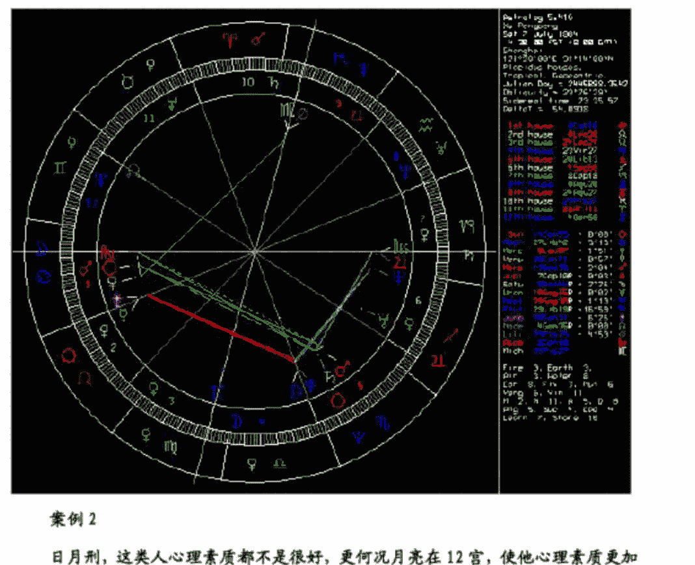

### 案例 2

日月刑，这类人心理素质都不是很好，更何况月亮在 12 宫，使他心理素质更加不过关，从水星的位置和相位看，他聪明、记性好，而且在学习方面对自己的要求还是比较严格的，一宫的土冥会使他的健康受到影响

### 案例 3

首先，流水近天底在 3 宫，六合本日，六合本火，而且流木六合本水，显然对考试有利，流月拱本金，情绪也是不错的，但是流木刑本海，流海刑本火，有可能因比较冲动而乱套（他考试的时候被太阳晒得热死了，心里就开始烦躁），再加上流天 9 宫，且在双鱼座的近 4 度处逆行（是事件的发生点），此时会发挥很多负面影响，

此时考试的时候是需要随机应变的，也许是因为流海的作用，他考试的时候乱猜（这叫随机应变吗？偶还是头一次看到________），而且是因为来不及做了________

机会不错，但由于负面影响太大，没有通过考试，可惜________

### 案例 4

流金拱本日，流木合本月但刑本日，流月也六合本月，内心是期待的，但结果出来后，他比较沮丧（流海刑本土）________

最后，衷心希望他们早日走出失败的阴影，祝愿他们明年好运，可以圆自己的梦________

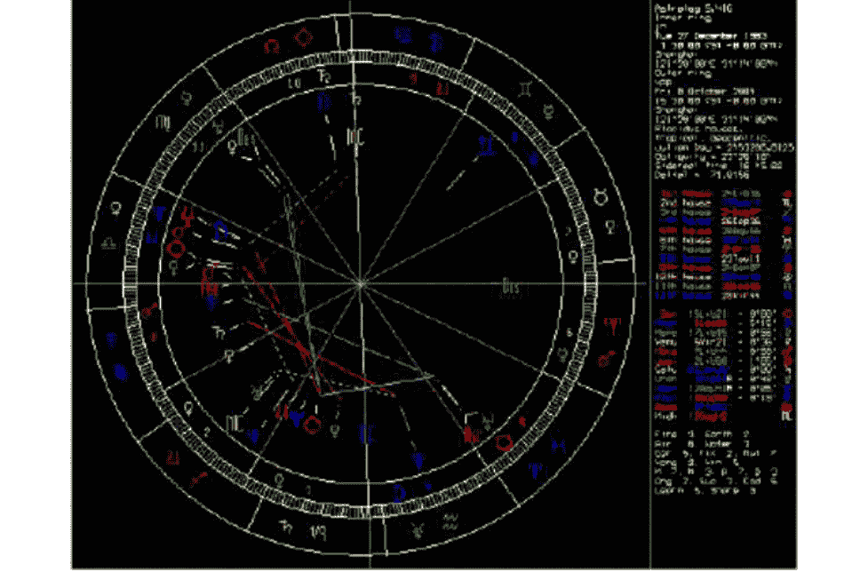

## Astrolog 占星软件使用指南

文/Aura

这里是我使用 Astrolog 一年来的经验所得，版本是 5.41F，当然对其它版本也基本适用。第一部分首先解释星盘，然后再由浅入深讲解各种功能。

文中只阐述软件用法，有关占星名词的涵义请自行去★占星学常用词汇中查找。

### 一. 认识星盘

运行 Astrolog.exe 文件，首先会看到一个圆形的星盘(chart 这个词以下一律称为星盘)。如果进入的是文字界面，请按一下“v”键。

### 1. 星座(sign)

沿图上的大圆也就是黄道带(zodiac)等距离分布的是十二个星座，在星盘的外圈显示，分别标有各星座的符号，同一格中的小符号表示此星座的守护星(Ruler)。

占星学中，星体在黄道上的座标也就是黄经(celestial longitude)是使用星座来表示的。“20Ari40”代表白羊座20度40分，也就是黄经20度40分，而“20Tau40”代表金牛座20度40分，也就是黄经50度40分，因为每个星座占据了30度黄经。

各星座缩写如下：

Ari-白羊；Tau-金牛；Gem-双子；Can-巨蟹；Leo-狮子；Vir-处女；Lib-天秤；
Sco-天蝎；Sag-射手；Cap-摩羯；Aqu-水瓶；Pis-双鱼

### 2. 宫位(house)

星盘内圈标有数字的十二个不等大的扇形区域称为宫位。同样，小符号是宫位守护星。在右侧的文字区第二段落，列出了每一宫的宫头(cusp)所落位置。

图中有两条贯穿星盘的直线，水平穿过的是地平线(horizon)，由上至下的是子午线(meridian)。地平线的东西两端(左东右西)也就是第一和第七宫的宫头分别称为上升点(Asc)和下降点(Des)，子午线的上下两端也就是第十和第四宫的宫头分别称为天顶(MC)和天底(IC)。上升点所落星座即是通常所说的上升星座。

### 3. 星体(Object)

星体(包括行星和其它天体)在星盘的中央区域显示为标有符号的点。右侧文字区的第三段落列出了各星体的具体位置。

在某些星体度数之后有一个白色的“R”，表示这颗星正在逆行(Retrograde)，也就是由西向东运行。再后面灰白色显示的角度，是黄纬(celestial latitude)，这个对占星没什么意义，仅仅表示星体位置而已。

主要星体的缩写如下：

Sun 太阳 Moon 月亮 Merc 水星 Venu 金星 Mars 火星

Jupi 木星 Satu 土星 Uran 天王星 Nept 海王星 Plut 冥王星

Chir 凯龙星 Cere 谷神星 Pall 智神星 Juno 婚神星 Vest 灶神星

Node 北交点 Lili 莉莉丝 Fort 福点 Vert 宿命点 East 东方点

### 4. 相位 (aspect)

相位就是星体之间所成角度，在图上用不同颜色直线标出。容许度(orb)也就是误差越小则线越粗，反之则是虚线。

各基本相位的缩写及各种叫法列在下面：

Con: 0度/合相/会; Opp: 180度/对相/冲; Squ: 90度/四分相/刑; Tri: 120度/三分相/拱; Sex: 60度/六分相/半合

### 5. 星体位置的分布统计

在文字区的最下方第四段落，列出了各种类型的星座及宫位中落入的星体个数：

Fire Earth Air Water 火土风水星座 Car Fix Mut 本位固定变动星座

Yang Yin 阳性和阴性星座

M N A D 位于地平线上下及子午线东西的宫位

Ang Suc Cad 本位固定变动宫位 Learn Share 前六星座和后六星座

### 二. 基本操作

### 1. 输入星盘资料

选择 Info->Set Chart Info，填入月、日、年、时间。Daylight?是“日光节约时”，也就是夏令时，通常选择 No。Time Zone 即时区，在中国的请填-8:00。下面是经纬度。精确的时间和经纬度对于计算宫位非常重要。确认后，看到的就是你输入的星盘了。

可以把星盘资料存成文件方便下次调用：File->Save Chart Info。如果用 File->Save Chart Positions 来保存的话，文件里记录的是星体位置而不包含星盘资料(时间地点等)。

在 Info->Default Chart Info 里，可以设置好通常用的时区和经纬度。最下面的 Correction For Now, 如果是-8:00 时区请填入“-960”，这样可以保证在计算 Chart For Now 的时候时间与你电脑的时钟一致。

### 2. 两个常用的开关

切换图形和文字界面：View->Show Graphics，Astrolog 中很多功能都有图形和文字两种状态。

显示简单解释：View->Show Interpretations，可以在文字状态下显示简单的解释。其实就是程序组合的关键词。

### 3. 限制星体

占星时通常使用十颗行星，但有时也会用到小行星等其它天体，这些在 Setting->Restrictions 中设定。注意这里打勾的是不选，空白的才是选中的。

第一栏是十颗行星，第二栏前五个是小行星，后五个是一些特殊天体。其中有一项是 Lilith/S. Node，在这里莉莉丝和南交点共享一个位置。缺省状态下计算的是莉莉丝，如果想计算南交点，请打开 Setting->Caculation Settings，将 Use Ephemeris Files 选空。

第三栏是十二宫的宫头，选中的话它们会象星体一样显示在图中并计算相位。

最后是八颗超行星。另外还有恒星(fixed star)，在 Setting->Star Restrictions 中选择。

### 4. 限制相位

通常只计算上述的 5 种基本相位，但可以在 Setting->Aspect Settings 里把其它相位选中。另外还可以修改容许度(orb)，和影响力(influence)，这个会在后面讲到。

在 Setting->Object Settings 以及 More Object Settings 里，可以进一步设置单独星体的容许度，事实上是按两个容许度中较小的来计算。还有在这里设置星体的影响力值。

### 5. 显示上的设置

View->Print Nearest Second，要是你觉得角度显示到分还不够精确，选中这一项可以显示到秒。

入相位和出相位: View->Apply Aspects，选中这一项时计算相位是正在形成(入相位)还是正在消失(出相位)。

同度相: View->Parallel Aspects，不使用通常的黄经相位，而使用以赤纬(declination)计算的同度相。

Graphics->Add Aspect Info，选中时会在右侧文字区分别显示吉相、凶相与合相的影响力，以及总体影响。

在 View 菜单和 Graphics 菜单里还有很多显示设置，比如改颜色什么的，因为很容易掌握所以这里不一一废话了。

### 6. 占星上的设置

恒星黄道: Setting->Sidereal Zodiac，通常使用的是回归黄道(Tropical Zodiac)，选中此项则使用天文学上以星座实际位置标明的恒星黄道。

日心占星: Setting->Heliocentric, 不以地球而以太阳为中心来计算星盘。

分宫制: Setting->House System, 分宫制恐怕是占星学上争议最大的问题之一了, 通常使用 Placidus 或 Koch.

做了以上这些改动之后, 可以用 File->Save Settings 把设置存到 Astrolog.dat 文件中去。否则下次打开时还是老样子。

### 7. 动画星盘

Animate 菜单用来使星盘自动随时间变化。

首先在 Animate->Jump Rate 里选择单位, 星盘即会随之变化。可以在 Jump Factor 里选择一次变化几个单位。在动画过程中可以反向、暂停, 也可以手动前进或后退。

选中 Animate->Time Exposure 会产生类似多次曝光的效果, 也就是每次变化的结果都保留在图上。

### 8. 其它值得一提的

输出资料: File->Save Chart Text Output 以及下面的几项可以把 Astrolog 中的文字和图形存成文本文件、位图、wmf 文件和 postscript 文件。同样, 这些功能也可以在 Edit 菜单中用 Copy 来完成。

Edit->Enter Command Line, 输入命令行。这可能是为了方便 Dos 版的用户吧, 其实所有命令都可以在菜单里实现。

Graphics->Show World Map, 显示世界地图。这里有个很有趣的功能: 在地图上某一点按下鼠标右键, 会把这一点的经纬度存入星盘资料中。Show Globe 和 Show Polar Globe 是显示两个不同方向的地球。如果打开 Show Constellations 则显示星座。

### 三. 合盘与流年盘

### 1. 准备工作

计算合盘或流年盘之前先要用 Info->Set Chart #2 Info 来输入第二个星盘的资料，方式与第一个相同。

要想返回原先的单独星盘，请选择 Info->No Relationship Chart。注意在合盘时如果做星盘动画，变化的是 Chart #2。

### 2. 四种合盘工具

Info 菜单中以下四种都是计算合盘的工具，分别说明如下：

Comparison Chart，比较盘，把两个星盘中的星体显示在同一盘中，用来看相位关系。盘上显示的是 Chart #1 的宫位，Chart #1 的星体在内圈，Chart #2 的在外圈。当然，此时只显示两星盘之间的相位而不显示各自内部的相位。

Synastry Chart，合盘，跟比较盘相似但是只显示 Chart #2 的星体，观察其落入 Chart #1 宫位的关系。

Composite Chart，组合中点图，这个星盘里每个星体的位置是取自两个盘中对应星体的中点。

Time/Space Midpoint Chart，时间/空间中点图，根据两个星盘的时间和经纬度分别取中点，以此计算的星盘。注意使用过这一项之后，结果会保存在 Chart #1 里，把原先的资料冲掉。

### 3. 第三个和第四个星盘

Astrolog 中最多可以同时计算四个星盘，当然这仅限于比较盘的功能，而且，不计算相位。在 Info->Chart #3 and #4 里分别输入或打开每个星盘，然后选择计算的盘数。

### 4. 流年盘

Transit 这个词翻译成流年不知是否合适，也许应该叫行运什么的。计算流年盘的工具是 Info->Transit and Natal，其实与上述的比较盘是完全一样的。但是作为一个专门的工具，你可以在 Settings->Transit Restrictions 中单独限制流年盘 (Chart #2) 中显示的星体，当然本命盘中的星体还是在 Setting->Restrictions 中限制。

### 5. 另一种方法

也可以用 Chart->Transits 来计算流年，使用这个不需要设置 Chart #2 而是直接输入日期时间 (请确认在单盘状态下)。在左上的框里选择方式：

Transit to Transit Hits 显示本命盘在一天内形成的相位以及时间，Transit to Transit Influence 按影响力大小列出盘中所有相位。Transit to Natal Hits 显示流年盘与本命盘之间在一天内形成的相位以及形成时间，Transit to Natal Influence 按影响力大小列出流年盘与本命盘之间的所有相位。

以上计算一天内的情况是因为在右上的框里选的是 Giving Day，同样也可以计算一月、一年或几年内的情况。打开 Display Return Only 则只计算返照。

### 6. 推运盘

Info->Progressed and Natal 是推运盘，以一天代表一年来计算年运。跟上一个一样，可以在 Settings->Progressed Restrictions 中单独限制推运盘中显示的星体。

同样可以用 Chart->Progressions 来计算推运，这样结果只显示推运盘。注意使用时要选中 Do Progressions，如要返回原先星盘，把这个开关选空再做一次。

### 7. 其它

Info->Date Difference Chart，可以显示 Chart #1 和 Chart #2 之间相隔的年数，月数，天数等等。

Info->Biorhythm Chart，应该叫做生命曲线吧。这个似乎与占星没有关系，而仅作为一个附带的功能放在这里。

### 四. Chart 菜单中的图表

### 1. Standard List 标准列表

图象模式在第一部分中已经讲过了。在文字模式中，除了上述的条目，还有另外几项。Rul., R 和 F 分别表示星体落在它守护和失势的星座内，e 和 d 分别表示星体落在它曜升和陷落的星座内。各星体的这些位置可以在 Help->Show Object 中找到。

第二个 Rul. (在方括号内的) 是宫位的情况。这有两项，第一个是计算宫位本身的守护星，另一个是计算宫主星 (lord of a house)。后面的 Veloc. 是此星体运行速度。

### 2. House Wheel 宫位轮

用字符组成的方形星盘。

### 3. Aspect Midpoint Grid 相位中点表格

把每两颗星体的相位 (如果有的话) 和中点标在网格中。中间对角线是各个星体，左下区域是相位的符号，右上区域是中点所落星座。如果切换到文字状态则显示具体相位容许度和中点位置。

### 4. Aspect List 相位列表

和上一个一样都是相位表，不过这个是按力量值 (power) 大小将相位一项项列出。后面写的是容许度，白色 a 表示入相位，灰色 s 表示出相位。这是在 View->Apply Aspects 选中的情况下，否则只显示容许度的正负。星座如果显示在方括号内则表示是逆行。

### 5. Midpoint List 中点列表

按位置前后列出命盘上的全部中点，后面灰色的是两星所成角度。

## 6. Local Horizon 本地地平线

可以算是另一种方式绘制的星盘，图正中是地平线，那两条曲线（有的版本看不到）是黄道和天赤道。从这张图中可以看出星体在天球上的座标位置。

## 7. Solar System Orbit 太阳系轨道

太阳系中行星的实际位置图示。通常这还是把地球显示在中心的，除非将前面所说的 Setting->Heliocentric 选中。

## 8. Gauquelin Sectors 高魁林盘

## 9. Calendar 日历

显示当月的日历，或者通过改设置显示当年的日历。

## 10. Influence 影响力

在图形状态下显示守护关系图。最左边的是星座守护关系，如果一个星体落入第二个星体守护的星座，则由第一个星体到第二个星体之间有一个箭头。如果一颗星落入自己守护的星座，则它上面有一白色圈。灰色圈表示几颗星体之间发生了相互守护（互容）或是循环守护，互容的两星之间用白色箭头指示。

另外两个是宫位守护关系图，不同之处在于中间的是计算宫位本身守护星，最右边的（有的版本没有）是计算宫主星。上面是层次图和下面是轮状图，意思一样。

在文字状态下这个是计算行星力量值（power）用于看行星的影响大小。分位置、相位和同度相三项计算力量值（括号里是排名），总和显示在后面并标出百分比。如果修改设置的话，还可以显示星座、宫位和相位的力量值。不同版本的 Astrolog 这个功能可能会有较大差异。

## 11. Astro-Graph 占星地图

这张图的意思嘛，可以说是固定时间变化地点。每一星体此时此刻在地球的其它地方会位于天球上的不同位置，图上四种颜色的线分别表示此时星体正上升、下降、位于天顶和天底的地域。

## 12. Ephemeris 星历表

各星体本月的运行轨迹，在文字状态会列出每一天各星体的具体位置。相对于上一个，这个是固定地点变化时间。

## 13. Arabic Parts 阿拉伯点

所有阿拉伯点的列表。5.41F 中缺省设置为只列出有相位的阿拉伯点，也可以修改设置为显示所有的。在右边标明了每个阿拉伯点的计算公式。

## 14. Rising and Setting 上升与下降

按时间先后列出了每个星体一天中上升（rises）、下降（sets）和到达天顶（zeniths）、天底（nadirs）的时间。

以上这些图表显示的内容大都可以在 Chart->Chart Settings 中进行进一步设置。

注：Astrolog 软件的网址：http://www.astrolog.org

## 中国城市经纬度表

| 城市 | 经度 | 纬度 | 城市 | 经度 | 纬度 |
|---|---|---|---|---|---|
| 北京 | 116:28E | 39:54N | 青岛 | 120:19E | 36:04N |
| 天津 | 117:10E | 39:10N | 郑州 | 113:42E | 34:44N |
| 石家庄 | 114:26E | 38:03N | 开封 | 114:23E | 34:52N |
| 保定 | 115:28E | 38:53N | 洛阳 | 112:26E | 34:43N |
| 唐山 | 118:09E | 39:37N | 许昌 | 113:48E | 34:00N |
| 秦皇岛 | 119:37E | 39:54N | 新乡 | 113:54E | 35:18N |
| 张家口 | 114:55E | 40:51N | 武汉 | 114:20E | 30:37N |
| 承德 | 117:52E | 40:59N | 宜昌 | 111:15E | 30:42N |
| 太原 | 112:33E | 37:51N | 沙市 | 112:17E | 30:16N |
| 大同 | 113:13E | 40:07N | 长沙 | 112:55E | 28:12N |
| 临汾 | 111:31E | 36:05N | 衡阳 | 112:34E | 26:55N |
| 长治 | 113:13E | 36:05N | 湘潭 | 112:51E | 27:54N |
| 呼和浩特 | 111:38E | 40:48N | 常德 | 111:39E | 29:00N |
| 包头 | 110:00E | 40:35N | 广州 | 113:18E | 23:10N |
| 海拉尔 | 119:43E | 49:14N | 汕头 | 116:40E | 23:21N |
| 沈阳 | 123:23E | 41:48N | 韶关 | 113:33E | 24:48N |
| 大连 | 121:38E | 38:54N | 海口 | 110:10E | 20:03N |
| 鞍山 | 123:00E | 41:04N | 南宁 | 108:21E | 22:47N |
| 锦州 | 121:09E | 41:09N | 桂林 | 110:10E | 25:18N |
| 长春 | 125:18E | 43:55N | 柳州 | 109:19E | 24:20N |
| 吉林 | 126:36E | 43:48N | 梧州 | 111:18E | 23:28N |
| 哈尔滨 | 126:38E | 45:45N | 成都 | 104:04E | 30:39N |
| 齐齐哈尔 | 123:55E | 47:22N | 重庆 | 106:33E | 29:33N |
| 牡丹江 | 129:36E | 44:35N | 内江 | 105:03E | 29:35N |
| 上海 | 121:26E | 31:12N | 泸州 | 105:27E | 28:54N |
| 南京 | 118:46E | 32:03N | 万县 | 108:22E | 30:48N |
| 无锡 | 120:18E | 31:35N | 贵阳 | 106:43E | 26:34N |
| 苏州 | 120:39E | 31:20N | 遵义 | 106:53E | 27:45N |
| 徐州 | 117:12E | 34:16N | 昆明 | 102:42E | 25:03N |
| 杭州 | 120:10E | 30:15N | 拉萨 | 91:02E | 29:39N |
| 宁波 | 121:34E | 29:53N | 日喀则 | 88:49E | 29:16N |
| 温州 | 120:38E | 28:00N | 西安 | 108:55E | 34:15N |
| 金华 | 119:49E | 29:10N | 宝鸡 | 107:09E | 34:21N |
| 合肥 | 117:16E | 31:51N | 延安 | 109:26E | 36:35N |
| 芜湖 | 118:20E | 31:21N | 兰州 | 103:50E | 36:03N |
| 安庆 | 117:02E | 30:32N | 天水 | 105:33E | 34:35N |
| 福州 | 119:19E | 26:02N | 酒泉 | 98:30E | 39:44N |
| 厦门 | 118:04E | 24:26N | 西宁 | 101:49E | 36:37N |
| 泉州 | 118:37E | 24:54N | 银川 | 106:13E | 38:28N |
| 南昌 | 115:53E | 28:41N | 乌鲁木齐 | 87:36E | 43:46N |
| 九江 | 115:59E | 29:43N | 哈密 | 93:27E | 42:50N |
| 赣州 | 114:56E | 25:51N | 喀什 | 75:59E | 39:27N |
| 济南 | 117:02E | 36:40N | 和田 | 79:55E | 37:07N |
| 烟台 | 121:20E | 37:33N | 台北 | 121:31E | 25:02N |

当我们在修正一张出生图，或是改正确实出生时间时，有几个重要因素必须考虑：

1. 不知道出生时间最好不要想办法造一个。

如果出生图不能全部计算出，那么只算出正午、当地时间的行星位置还比较保险。行星的星座可以利用（但宫位就没办法算出），行星相位也可以。有时比较不可能判断月亮所在的星座，因为月亮可能会在白天变换星座。推运的判断更受到限制，因为正午日期、推进上升星座、天顶或月亮的推进都无法算出。唯一准确的是移位，太阳及行星彼此的推进也只能在一段较长的时间中评估。

2. 如果出生时间知道是在早晨、下午、或晚上，这到能有所帮助。

如果能知道出生时间相差不超过两小时，那么通常可以修正出生图，使预测更为准确。

3. 应该一开始就预先设定最早跟最晚的可能出生时间。

如果这种出生图有一个行星距离上升星座或顶点只有几度，那么当上升星座或天顶推进此行星时，有可能会发生具此行星性质的事件。

例如：第一张出生图的天顶位于天蝎座10 deg.，而土星在天蝎座29 deg.，那么当此人19岁时，具有土星特质的事件——比方父亲去世或家中突遭变故——就可能发生。而在生命早期的话，天顶的改变可能却是搬家或家中的一些改变。月亮推进经过上升星座则表示生命中另一周期的开始，诸如此类。

4. 有时也可以用“一度推运法”来修正出生图。此时最重要的是基本点上的行星，也就是说当上升星座在射手座15 deg.，月亮在双子座3 deg.之时，当此儿童12岁时，他的父母会离异。因为到时月亮推进12度而到下降星座（即上升点的正对面）。

5. 最后的修正工作通常能澄清出生时间，比方将3点15分调为3点12分或3点零9分，这时就可以更有信心的用上升星座跟天顶的推进来判断了。

使用占星术算命，必须要有准确的出生资料，因为地盘每日24小时绕行360度，平均每4分钟，地盘12轴线便向左移一度。

东升点（ASC.）、西没点、上中天、下中天，这四个要点也随之转动。

由于占星术推运的吉凶，在许多情形下，取决于行星与这四要点的交角，如果此四角的位置不准确，则推运的精确度会从9成降为7成。因此生时不准确者，必须矫正生时（Rectification）。

主限法：生时矫正有很多方法，以主限法（Topocentric Primary Direction）来矫正生时最为精确，可以达到分秒必争的准确度。主限法推运，可达两周内的准确度。但是出生是以时辰记录，则几乎无法用主限法来矫正生时。

太阴度数法：天盘诸星，以太阳为例，一年365天，绕行天盘360度，平均日行约一度，变动不大。太阴则每月绕行天盘一周，平均每日行约13度，速度适中。因此算准了出生太阴的度数，则相对应的生时，就差不多正确了。

如能算准太阴的度数，则生时就可以逆推而出。一个人发生重大吉凶事件时，行运星常与生年太阴形成会、冲、刑的交角。同年同月同日生的人，包括双胞胎在内，天盘上除了太阴以外，其它行星度数大致相同。他们命盘不同之处就在东升点、西没点、上中天、下中天这四个要点。生时矫正的目的就在求出这四点的正确度数，生时准确推运就容易。

## 占星词典（按拼音排列）

### A 字部

- 阿拉伯点：Arabic Parts（Arabic Points, AP）通常以某一行星的黄经加上上升的黄经，再减掉另一行星的黄经，所得之度数为一阿拉伯点，每个阿拉伯点有不同意义，其中最为人知的即为「福点」（Part of Fortune）

### B 字部

- 八分相：Semi-square（半四分相）【相位】两星或星与基本点间成四十五度的视角
- 本初子午圈：Prime Meridian 通过英国格林威治的子午圈，也就是经度零度
- 本位星座：cardinal signs 指牡羊座、巨蟹座、天秤座、摩羯座
- 本命占星学：Natal Astrology 占星学的一支，以人的出生星位图为研究对象
- 本位宫：angular houses 包括第一、四、七、十宫
- 变动宫：包括第三、六、九、十二宫
- 变动星座：mutable signs 包括双子座、处女座、射手座和双鱼座
- 补八分相：Sesquiquadrate 【相位】两星或星与基本点间成一百三十五度的视角
- 补五分相：Sesquiquintle 【相位】两星或星与基本点间成一百零八度的视角
- 补十二分相：Inconjunct or Quincunx 【相位】两星或星与基本点间成一百五十度的视角
- 倍五分相：Bi-quintile 【相位】两星或星与基本点间成一百四十四度的视角
- 标准时：Standard Time 以 GMT 为准订出的国际时间标准
- 标准时区：Standard Time Zone 每十五度经度为一个标准时区，全球共有二十四个标准时区，台湾为-8 (CCT)
- 牡羊座：Aries 【星座】黄道上的第一个星座，在黄经0度起到30度前的区间，太阳约在每年的三月二十一日到四月二十日通过这个区间；牡羊座由火星守护，金星在此为失势位置，太阳在此为强势位置，土星在此为弱势位置
- 半球：hemisphere 星位图中可分为上半球、下半球，或左半球、右半球

### C 字部

- 出生图的守护星：Chart Ruler 出生图中上升星座的守护星
- 出生图型态：chart shaping 把出生图中行星分布的型态加以分类
- 出生图：birth chart 表示出生时当地天体运行状况的图表，通常包含行星所在星座、宫位及相互之间的相位
- 出生星位图：natal horoscope 同 birth chart；表示出生时当地天体运行状况的图表，通常包含行星所在星座、宫位及相互之间的相位
- 出生资料：birth data 计算出生图时必要的资料，包括日期、时间和出生地
- 出生时间：birth moment 通常是以剪断脐带后第一声哭声为准
- 初始图：radical chart 以标的所在的时间地点画出的星位图，常指出生星位图
- 赤经：right ascension (RA) 由春分点起算天球赤道上的刻度
- 辰星：morning star 指金星；由太阳算起第二颗（天文学上的）行星，掌管审美观、男性欣赏异性类型、女性如何展现魅力
- 处女座：Virgo【星座】黄道上的第六个星座，在黄经150度起至180度前的区间，太阳约在每年的八月二十一日到九月二十三日通过这个区间；处女座由水星守护，海王星在此为失势位置，金星在此为弱势位置
- 超个人行星：transpersonal planets 指天王星、海王星和冥王星
- 春分点：Vernal Equinox 太阳由南向北时通过天球赤道的点，同时也是牡羊座零度
- 重置出生图：relocation charts 以相同时间在不同地点画的出生图
- 赤纬：declination 【坐标】星体与赤道面的夹角
- 赤道：equator 地球上位于两极间之距离一半的假想大圆
- 次级推进：Secondary Direction 将出生图上的星体及基本点位置，以一日代表一年的方式计算其移动，来作某种预测，有时也称作 progressions
- 次守护关系：sub-rulership 在现代行星被发现之后，水瓶座改由天王星守护，原来守护水瓶座的土星则被视为水瓶座的次守护星；双鱼座改由海王星守护，原来守护双鱼座的木星则被视为双鱼座的次守护星；天蝎座改由冥王星守护，原来守护天蝎座的火星则被视为天蝎座的次守护星
- 财经占星学：Financial Astrology

### D 字部

- 第一宫：first house 【宫位】掌管本命
- 第二宫：second house 【宫位】掌管钱财、工作能力
- 第三宫：third house 【宫位】在占星学中掌管学习、知识、旅行、手足关系
- 第四宫：fourth house 【宫位】掌管未嫁娶前的家庭运
- 第五宫：fifth house 【宫位】掌管爱情、照顾子女方式、艺术
- 第六宫：sixth house 【宫位】掌管职业、健康
- 第七宫：seventh house 【宫位】掌管婚姻、对手
- 第八宫：eighth house 【宫位】掌管公共财物、投资运、生死
- 第九宫：ninth house 【宫位】Novile 九分相【相位】两星或星与基本点间成四十度的视角，掌管高等知识、长途旅游、迁移
- 第十宫：tenth house 【宫位】在占星学中掌管事业、社会地位
- 第十一宫：eleventh house 【宫位】掌管朋友、理想、社团
- 第十二宫：twelfth house 【宫位】掌管精神、负面情绪、信仰
- 大十字：Grand Cross 【相位组】有两组行星之间成对相，且两两成四分相
- 大三角：Grand Trine 【相位组】三颗行星之间互相成三分相
- 大圆：great circle 【坐标】通过地心的平面与天球切出的圆
- 大年：Great Year (the Great Age) 天文学上的春分点岁差绕行天球一周为一个大年
- 对相星座：opposite signs 相距一百八十度的两个星座，在黄道上共有六对对相星座，分别是牡羊座-天秤座，金牛座-天蝎座，双子座-射手座，巨蟹座-摩羯座，狮子座-水瓶座，和处女座-双鱼座
- 对相：Opposition 【相位】两星或星与基本点间成一百八十度的视角
- 对宫：polarity 黄道上对相的星座或宫位
- 等宫制：Equal House System 【分宫制】以上升为基准，依逆时针方向，将黄道等分为每宫三十度的宫位制
- 地平线：horizon 【坐标】将星位图分为上下两部分的线
- 短上升星座：Short Ascension 在北半球包括摩羯座、水瓶座、双鱼座、牡羊座、金牛座和双子座
- 定位星：dispositor 星体所在星座的守护星
- 东方点：east point 地平线与主垂圈在东方的交点
- 度：degree 三百六十分之一圆周的区间

### E 字部

- 二分点岁差：Precession of the Equinoxes 天文学上的春分点以每年约五十点二秒的速度在黄道带上逆行
- 二分点：Equinoxes 即春分点（太阳由南向北时通过天球赤道的点，同时也是牡羊座零度）和秋分点（太阳由北向南时通过天球赤道的点，同时也是天秤座零度）

### F 字部

- 分：minute 六十分之一度的区间
- 分宫制：House division 划分宫位的方法
- 分点星座：equinox signs 指牡羊座及天秤座
- 发光体：luminaries (lights) 在占星学上常指太阳和月亮
- 福点：Part of Fortune（幸运点）【阿拉伯点】在日间出生者：上升的黄经加上月亮的黄经，再减掉太阳的黄经；在夜间出生者：上升的黄经加上太阳的黄经，再减掉月亮的黄经
- 符号：glyphs 占星学上所用的速记符号
- 风筝：Kite 【相位组】有一星与形成大三角的其中一星成对相，且和其它二星成六分相
- 风象星座：air signs 包括双子座、天秤座、水瓶座

### G 字部

- 个人星：personal planets 在出生图中的太阳、月亮、上升星座的守护星、太阳所在星座的守护星和月亮所在星座的守护星；有时指太阳、月亮、水星、金星和火星
- 个人点：personal points 指出生图上的上升和天顶

关系图: relationship chart 找出两人出生时间和地点的中点，以此画出一张星位图

关键词: keywords 将占星学上星体、星座、宫位或其它分析工具的意义，用几个词简单的词代表，以利学习和记忆

宫主星: lord of a house 与某个宫位宫头落入的星座有守护关系的星

宫位: houses 将黄道分为十二个部分以代表世俗的不同部分

宫位书: Tables of Houses 在采非等宫制时所用记载宫位划分的图表

共同守护关系: joint rulership 在三个现代行星被发现之前，在占星学上，日月之外的五个星行都守护两个行星，水星守护双子座和处女座，金星守护金牛座和天秤座，火星守护牡羊座和天蝎座，木星守护射手座和双鱼座，土星守护摩羯座和水瓶座

固定星座: fixed signs 包括金牛座、狮子座、天蝎座和水瓶座

固定宫: succedent houses 包括第二、五、八、十一宫

格林威治标准时: Greenwich Mean Time (GMT) 格林威治当地测量出的标准时间

谷神星: Ceres 【小行星】为天文学上的第一号小行星，也是最大的小行星

## H 字部

火星: Mars 【行星】由太阳算起第四颗(天文学上的)行星，掌管性、发脾气的方式、女性欣赏男性的类型

火象星座: fire signs 包括牡羊座、狮子座和射手座

火车头型: Locomotive Shape 【出生图型态】行星分布在出生图中留下一百二十度空白的型态

恒星: fixed stars 在占星学上指太阳以外的恒星，但大多只使用接近黄道的

恒星: fixed stars 在占星学上指太阳以外的恒星，但大多只使用接近黄道的

合图：synastry 将两张星位图作比较和分析

合相：Conjunction【相位】两星或星与基本点间成零度的视角

合轴星：angular planets (angularity) 与基本点合相的行星，有时也指在一、四、七、十宫中的星

黄纬：celestial latitude【坐标】星体与黄道面的夹角

黄经：celestial longitude【坐标】黄道上由春分点算起，从零度到三百五十九度的坐标

黄道：ecliptic 由地球上看太阳在天球上运行的轨道

黄道带：Zodiac 由地球上看太阳运行的轨道，向两侧延伸八度的区域

婚神星：Juno【小行星】为天文学上的三号小行星，是第四大的小行星

回归黄道：Tropical Zodiac 以春分点为准画出黄道，即一般占星学上称之黄道带

回归：returns 行星回到其出生图上相同的位置

海王星：Neptune【行星】由太阳算起第八颗(天文学上的)行星，掌管文化、精神生活

互容：mutual reception 两行星互相位于对方所守护的星座

弧：arc 圆周上的一部分或是一段曲线

恒星时：Sidereal Time (ST) 利用恒星为准算出之时间

恒星黄道：Sidereal Zodiac 以天文学上的星座为准画出的黄道带

## J 字部

吉星：benefics 通常指木星和金星

金牛座: Taurus 【星座】黄道上的第二个星座，在黄经 30 度起至 60 度前的区间，太阳约在每年的四月二十日到五月二十一日通过这个区间；金牛座由金星守护，冥王星在此为失势位置，月亮在此为强势位置，天王星在此为弱势位置

金星: Venus 【行星】由太阳算起第二颗(天文学上的)行星，掌管审美观、男性欣赏异性类型、女性如何展现魅力

巨蟹座: Cancer 【星座】黄道上的第四个星座，在黄经 90 度起到 120 度前的区间，太阳约在每年的六月二十一日到七月二十二日通过这个区间；巨蟹座由月亮守护，土星在此为失势位置，木星在此为强势位置，火星在此为弱势位置

集团型: Bundle Shape 【出生图型态】行星皆位于出生图中一百二十度内的型态

界线: cusp 星座或宫位的分界

基本点: angles 指上升、下降、天顶和天底四个点

## K 字部

扩展型: Splay Shape 【出生图型态】行星在出生图中不规则的散布，而且有些成群的型态

凯龙星: Chiron (半人马星)【小行星】为天文学上小行星第 2060 号

## L 字部

龙头: Dragon's Head 黄道和月亮轨道的北交点，也叫月的北交点

龙尾: Dragon's Tail 黄道和月亮轨道的南交点，也叫月的南交点

六分相: Sextile 【相位】两星或星与基本点间成六十度的视角

## M 字部

摩羯座: Capricorn 【星座】黄道上的第十个星座，在黄经 270 度起到 300 度前的区间，太阳约在每年的十二月二十三日到一月十九日通过这个区间；摩羯座由土星守护，月亮在此为失势位置，火星在此为强势位置，木星在此为弱势位置

面: Face 每个星座可分为六个面，每个面皆为五度

玛雅占星学: Mayan Astrology

木星: Jupiter 【行星】由太阳算起第五颗(天文学上的)行星，掌管理想、人生目标

冥王星: Pluto 【行星】由太阳算起第九颗(天文学上的)行星，掌管创造、新生、钜变、毁灭

美国占星家协会: American Federation of Astrologer Inc. (AFA)

## N 字部

内行星: inferior planets 指水星和金星，有时也包括火星

逆行: Retrograde Motion(R) 从地球上看行星在星空背景中由西向东行

## P 字部

平太阳时: mean solar time 一般时钟所指示的时间

## Q 字部

七分相: Septile 【相位】两星或星与基本点间成五十一度四分的视角

跷板型: See-Saw Shape 【出生图型态】行星位于出生图中相对两群的型态

强势: exaltation 行星处在易于发挥其正面特质的星座

区间：decanates (decans) 一个星座可分为三个区间，每个区间皆为十度

秋分点：Autumnal Equinox 太阳由北向南时通过天球赤道的点，同时也是天秤座零度

## R 字部

日心占星学：Heliocentric Astrology 是以太阳为计算基点的占星学，不同于一般以地球为计算基点的占星学

日行：daily travel 行星每日移动的距离

日光节约时间：Daylight Savings Time 由于纬度的关系，由国家规定将时间播快一小时，以节约能源

日回归图：solar return chart 太阳回到其出生图上同一位置的星位图

容许度：orbs 计算相位时可容许与标准值间的误差值

入相位：applying aspect 两行星正接近形成准确相位视角的位置

弱势：Fall，行星处在易于发挥其负面特质的星座

## S 字部

上升：Ascendant (Asc) 【基本点】东方地平线和黄道带的交点，在大部分的宫位制中是第一宫的起点

上升星：Rising Planet 和上升星座合相的星

上升星座：Rising Sign or Ascendant Sign 星位图中上升点所落入的星座，掌管本命、外貌、自我

十分相：Semi-quintile or Decile (半五分相) 【相位】两星或星与基本点间成三十六度的视角

十二分相: Semi-sextile (半六分相)【相位】两星或星与基本点间成三十度的视角

水瓶座时代: Aquarian Age 十二个大月之一，是以春分点移位经过（天文学上的）水瓶座的一段时期

水瓶座: Aquarius【星座】黄道上的第十一个星座，在黄经 300 度起到 330 度前的区间，太阳约在每年的一月二十日到二月十九日通过这个区间；水瓶座由天王星守护，太阳在此为失势位置，水星在此为强势位置

手指: Yod (Y 型三角)【相位组】有两行星成六分相且有另一行星与此二行星皆成补十二分相

水象星座: water signs 包括巨蟹座、天蝎座和双鱼座

双鱼座: Pisces【星座】黄道上的第十二个星座，在黄经 330 度起到 0 度前的区间，太阳约在每年的二月二十日到三月二十日通过这个区间；双鱼座传统上是由木星守护，现在则加上海王星共同守护，水星在此为失势位置，金星在此为强势位置

双子座: Gemini【星座】黄道上的第三个星座，在黄经 60 度起到 90 度前的区间，太阳约在每年的五月二十二日到六月二十一日通过这个区间；双子座由水星守护，木星在此为失势位置

狮子座: Leo【星座】黄道上的第五个星座，在黄经 120 度起至 150 度前的区间，太阳约在每年的七月二十三日到八月二十二日通过这个区间；狮子座由太阳守护，天王星在此为失势位置，水星在此为弱势位置

数字学: Numerology 研究数字象征及意义的学问

数律分析法: harmonics 将出生星位图上各星体及基本点的黄经，乘以某一整数，再除以三百六十度，所得的余数所代表的黄经位置，再绘制一张星位图，据之以分析

手指: finger of fate【相位组】同 Yod；亦即「Y 型三角」，有两行星成六分相且有另一行星与此二行星皆成补十二分相

莎比恩象征: Sabin Symbols 将黄道上的每一度都以一句诗文形容，赋与不同的意义

时区标准时: Zone Standard Time (ZST) 在当地时区所用的时间，与 GMT 差整数个小时

射手座: Sagittarius 【星座】黄道上的第九个星座，在黄经 240 度起至 270 度前的区间，太阳约在每年的十一月二十三日到十二月二十二日通过这个区间；射手座由木星守护，水星在此为失势位置

事件图: event chart 为一特别事件发生时所画的星位图

时距加速值: acceleration 用来修正平太阳时与恒星时的差距，在计算上升点时必须要用到

守护星: Ruler (Ruling Planet) 同 Chart Ruler，指出出生图中上升星座的守护星，有时也指与某星座有守护关系的星

守护宫: Ruler's House 守护星所在的宫位

守护关系: rulership 每一星座有某行星守护的关系，如下: 牡羊座-火星、金牛座-金星、双子座-水星、巨蟹座-月亮、狮子座-太阳、处女座-水星、天秤座-金星、天蝎座-冥王星(火星)、射手座-木星、摩羯座-土星、水瓶座-天王星(土星)、双鱼座-海王星(木星)

生时校正: rectification 以已发生的事件去逆推算出精确出生时间的方法

社会行星: social planets 指木星和土星

水星: Mercury 【行星】由太阳算起第一颗(天文学上的)行星，掌管沟通、表达、价值观

失势: Detriment 行星处在不易发挥其特性的位置

顺行：Direct Motion (D) 从地球上看行星在星空背景中由东向西行

手相学：Palmistry 研究人的手掌以了解个人整体状态的一种学问

世运占星学：Mundane Astrology 研究天体运行和世局变化关系的学问

受克：affliction 星体处于不利的位置；通常指与其它星体或基本点成对相或四分相，有时也指星体落入对其不利的星座或宫位

四分仪制：Quadrant Method 【分宫制】宫位以上升第一宫始点，天顶为第十宫始点，共分为十二宫的宫位制

四分相：Square 【相位】两星或星与基本点间成九十度的视角

四合星座分类法：quadruplicity 将星座分为本位星座、固定星座和变动星座

四分相：Quartile 【相位】同 Square

三分相：Trine 【相位】两星或基本点间成一百二十度的角度

三合星座分类法：triplicity 将星座分成火象星座、土象星座、风象星座和水象星座

宿命点：Vertex 主垂圈与黄道在西方的交点

缩写：abbreviations 在占星学上常用前两（三）个英文字母来代表一些占星学上会用到的术语

散落型：Splash Shape 【出生图型态】在出生图中每一行星皆位在不同星座的型态

## T 字部

天底：nadir 【坐标】天球上的最底点

天蝎座：Scorpio 【星座】黄道上的第八个星座，在黄经 210 度起至 240 度前的区间，太阳约在每年的十月二十三日到十一月二十二日通过这个区间；天蝎座传统上由火星守护，现在则加上冥王星共同守护，金星在此为失势位置，天王星在此为强势位置，月亮在此为弱势位置

天球坐标: celestial coordinates 【坐标】指定天球上天体位置的各坐标

天球赤道: celestial equator 【坐标】天球上与天极等距的大圆

天极: Celestial Poles 【坐标】天球旋转轴的两端

天球: Celestial Sphere 【坐标】以地球为中心，半径为无限大的一个假想球，所有的天体运行看起来都在等距的天球表面上进行

天王星: Uranus 【行星】由太阳算起第七颗(天文学上的)行星，掌管选择的朋友、加入的团体、机会

天顶: zenith 【坐标】天空中的最高点

天文学: astronomy 研究天体、太空和宇宙的学问

天顶: Medium Coeli (MC) 【基本点】所在地子午线和黄道在空中的交点

天底: Immum Coeli(IC) 【基本点】所在地子午线和黄道在地下的交点

天秤座: Libra 【星座】黄道上的第七个星座，在黄经 180 度起至 210 度前的区间，太阳约在每年的九月二十三日到十月二十二日通过这个区间；由金星守护，火星在此为失势位置，土星在此为强势位置，太阳在此为弱势位置

太阳: Sun 【行星】太阳系的中心星体，为一恒星(star)，但在占星学上亦视之为行星(planet)，在占星学中掌管人生观、即性格

太阳星座占星术 Sun Sign Astrology 只以个人的太阳星座来进行预测的说法

同度相: Parallel 【相位】两星位于相同的赤纬上

推进星位图: Progressed Horoscope(progressed chart) 计算推进之后画出之星位图

推进: progressions 将出生图上的星体及基本点位置，以某种方式计算其移动来作预测，有时也指次级推进

塔罗牌: Tarot 在西方常见用来问卜的纸牌，分为大阿尔克那 22 张及小阿尔克那 56 张，共有 78 张

特质: qualities 行星在四合星座分类法中所属的类别

土星: Saturn 【行星】由太阳算起第六颗(天文学上的)行星，掌管考验及责任

土象星座: earth signs 包括金牛座、处女座和摩羯座

T 型三角: T-Square 【相位组】两行星成对相且有另一行星与此二行星皆成四分相

提桶型: Bucket Shape 【出生图型态】九颗行星位于出生图中一百八十度的范围，只有一颗行星个落在外面

## W 字部

无相位星: unaspected planet 【相位组】一行星与其它行星或基本点之间无主相位

无依星座: intercepted signs (interception) 在星位图中没有宫位界线通过的星座

碗型: Bowl Shape 【出生图型态】行星皆位于出生图中一百八十度内的型态

五分相: Quintile 【相位】两星或星与基本点间成七十二度的视角

问卜占星学: Horary Astrology 以问事当时的星位图来判断事情的占星学

外行星: superior planets 指火星、木星、土星、天王星、海王星和冥王星，有时将火星除外

## X 字部

小行星：asteroids 占星学上常用的有谷神星、智神星、婚神星和灶神星

星座：constellation 天文学上将天空分为八十八个星座

星位图：horoscope 表示天体某一特定时间所在位置的图表

星座：signs 黄道带上由春分点开始，每三十度为一个星座

星象制图学：Astro Carto Graphy 以天文投影的方式画出在特定时间（通常是用个人的出生时间），各行星和基本点在何地升起和降下的地图，主要用来研究个人在何地能有较好的发展

星历表：ephemeris 记载星体运行状况的图表

相位：aspect 两星或星与基本点之间的相对位置(有时也指星所在的位置)

相位表：aspect grid 表示星体之间相位和其与基本点之间相位的图表

相位组：aspect patterns 由两个以上行星相互间的相位形成特别的组合

现代行星：modern planets 指天王星、海王星和冥王星

夏令时间：Daylight Savings Time 同 Daylight Savings Time

凶星：malefics 常指火星和土星，有时也包括天王星、海王星和冥王星

选择占星学：Electional Astrology 以占星的原理选择行事合适的时间、地点

下降：Descendant (Dsc) 【基本点】西方地平线与黄道带的交点

幸运点：Fortuna 【阿拉伯点】同 Part of Fortune

行星：planets 占星学上通常是指太阳、月亮、水星、金星、火星、木星、土星、天王星、海王星和冥王星

## Y 字部

一级推进：Primary Directions or one degree method 将个人出生图上的各点以每年前进一度的速率推运的方法

阳性星座: masculine signs or positive signs 包括牡羊座、双子座、狮子座、天秤座、射手座和水瓶座

阴性星座: feminine signs or negative signs 包括金牛座、巨蟹座、处女座、天蝎座、摩羯座和双鱼座

印度占星学: Indian Astrology

医药占星学: Medical Astrology 研究天体运行和人体健康之间关联的学问

月亮: Moon 【行星】地球的卫星，但在占星学上亦视之为行星(planet)，掌管情感、与女性的关系、饮食口味

月之交点: Moon's Node 指龙首和龙尾，及月亮的北交点和南交点

月相: moon phases or phases of the moon 月亮相对于太阳的位置，在西方分为 New Moon, Crescent Moon, First Quarter Moon, Gibbous Moon, Full Moon, Disseminating Moon, Last Quarter Moon, 和 Balsamic Moon 等八种月相

月回归图: lunar return chart 月亮回到其出生图上同一位置的星位图

原型: archetype 在心理占星学上有一派认为，十二个星座为西方文化中十二个最具代表性的原型

运行星: transits 在天空中正实际运行的星

元素: elements 占星学上指火、土、风、水四元素

## Z 字部

中点: midpoint 指两星或基本点之间黄经相加除以二的位置

众星云集: Stellium(Satellitium) 【相位组】有三颗星以上位于同一个星座或宫位

占星学: Astrology 研究天体运行和地球上发生事件的关系

周日运动: diurnal motion 由于地球的自转，星体在一日内的视运动

智神星：Pallas【小行星】为天文学上的二号小行星，也是第二大的小行星

主垂圈：Prime Vertical【坐标】天球上通过正东方、正西方和天空中最高点的大圆

主相位：Major Aspects 通常指合相、对相、三分相、四分相、六分相，有时也包括补十二分相

长上升星座：在北半球包括巨蟹座、狮子座、处女座、天秤座、天蝎座和射手座

政治占星学：Political Astrology 世运占星学的一支，研究政治现象和天象之间的关系

综合判读：synthesis 将星位图上所有信息综合起来作一个系统的讲解

组合图：composite charts 用两张或两张以上的星位图，找出对应行星和基本点的中点，所画出的另一张星位图

子午线：meridian【坐标】通过南北两极点的大圆，作为南北方向的基准线

灶神星：Vesta【小行星】为天文学上的第四号小行星，是第三大的小行星

## 中点的解释方法

汉堡学派最大的优点在于它并不采用宫位制，很直接地以行星的星性来做判断。在目前各式各样的宫位制还没有明确的结论指出哪种宫位制是最适合的时候，汉堡学派的产生，的确解决了不少人一直困惑的事情。

我相信有不少人会遇到取不同宫位制时，宫头的星座就会换成另外一个的经验；而宫主星也随之改变。这很容易让人困惑，究竟要选什么宫位制才是最恰当的？

而中点理论就没有这样的问题了。但是也因为如此，学习中点理论一开始，必须对各行星的星性、所代表的人、事、物有清楚的了解；不止是中点理论，这是学习占星学最基本的功夫。

下面是简单描述各行星的基本定义

- 太阳：精力、权力、父亲、领导特质、创意。
- 月亮：灵魂、母亲、女性、变动、自我保护、情绪。
- 水星：聪明、商业、与文字相关的领域、外交或交际能力、思考。
- 金星：爱情、艺术、美的事物、快乐的事物。
- 火星：性、冲动、精力发泄、勇气、手术
- 木星：哲学、法律、财富、机会、极佳的运气
- 土星：压抑、限制、挫折、老人
- 天王星：突然的改变、科学、独立、新奇的事物、天才
- 海王星：忧郁、沮丧、幻想、敏感、误解、谎言
- 冥王星：巨大的改变、深沉的欲望、对未知事物的探索
- 北交点：人际关系
- ASC：个人特质
- MC：个人目标

其它相关的定义在一般的占星书上都可以找到。

上面比较特别的是北交点。北交点在不同领域常常有不同的解释，有人说是和前世有关、有人说是和母亲的影响有关(Noel Tyl)、古典则是把北交点视为吉星，南交点视为凶星、而汉堡学派很单纯地将北交点看做是人际关系的连接。

我从 SolarArc 推运的方式验证北交点就是和人际关系有关的经验非常多。

不过，其它的定义也可以参考看看。（虽然谁晓得前世要怎么看才准？）

再来我们要将中点的两颗行星的意义连接起来。

EX:

中点是金星/火星。金星主爱情，火星主性欲望、冲动。

金星/火星的连接我们就可以很直觉地想到：性爱、对爱情的冲动、将精力用在追求美的事物、艺术等等。

这个部份和现代占星学相位的连接有点类似，但是这只是描述，并没有吉或是凶的区分；不像是现代占星学有分吉相位或是凶相位。

中点的吉凶是看这个中点和什么行星有连接，或是这个中点组合里是否有吉星或凶星。

再次强调，中点理论注重的是行星本身单纯的星性。

接下来对于习惯看两颗行星相位的人可能会有些吃力，因为要将第三颗行星的意思加入中点之内。这个部份是需要动脑筋思考的。

日=金/火

将太阳的能量、创意、领导能力和金/火的意思做联想；可以联想到实现(火星)在艺术(金星)方面的创意(太阳)、强烈地(火星)想寻求身体上(太阳)的愉悦(金星)。

月=金/火

在爱情上容易有情绪上的冲动、需求。

水=金/火

思考容易受到情欲影响。情欲文学天份。

木=金/火

愉悦、健康的性爱生活。

土=金/火

对于爱情、性欲方面的压抑、挫折。

天=金/火

对于性爱的方式与众不同、容易有突然来的性爱冲动。

海=金/火

浪漫的性爱生活、对于性爱方面的幻想

冥=金/火

强烈的性爱欲望

北=金/火

在性爱这方面，有其吸引力。

ASC=金/火

藉由性爱、艺术上的表现来展现个人特质。

MC=金/火

事业与艺术上的表现有关。希望成为别人喜爱的对象。

(这可能不太好吸收，看看大家有没有兴趣再补充吧)
看到一张命盘上有那么多中点，应该要从什么地方开始去看？
这个部份我看过很多不同的方法，下面是简单的整理

1. 将所有的中点都分析过，然后检视有相似意思的中点有哪些。(这会和用中点推运有关)

如果对中点的意思都明白了，要找类似意思的中点会很快；如果还不熟悉的话，建议每个中点都去了解、去思考为什么中点会有那样的意思。

常常会看到中点和中点之间的意思是相反的。我们可以看何者有相似意思的中点较多，但是相反意思的中点也会有影响。

换言之，运势会起起伏伏，没有绝对都是好也没有绝对都是坏。

## 2. 用每一个行星的中点树去分析

这是用 Win*Star 画的中点树，也就是当月=水/金=火/木=海/冥时，中点树就是画成这样子，第一点也是用中点树去找可是很快找到。

像是这个例子，是以月亮为主，月亮代表情绪、直觉、对事情的反应。

将中点树串起来后，就可以这样解释：他是个富有感情、让人喜爱而且懂得说出让人觉得很窝心的人，对于美的事物懂得欣赏、体会（月=水/金），而且因为情绪的关系可能会冲动、勇敢、直接地采取行动（月=火/木）。但是情绪上容易感受到强烈地失落（月=海/冥）

## 3. 看哪一个行星拥有最多中点或中点重复出现的地点开始分析

像是达文西是 ASC、天王星拥有较多的中点。

## 4. 从和敏感点有关的行星、中点开始看

所谓的敏感点是指 ASC、MC、日、月、Node。

因为这些敏感点很直接地和个人有关。

## 5. 从误差值，也就是 orb 最小的开始看

## 6. 直接看有没有重要的中点，这个部份在下一篇说明。

当占星学家要从中点看出一个人是否能够成功时，

通常都会去找中点里面有太阳、木星、冥王星这三颗行星中其中两颗是否有出现在中点里面。

最有名的中点是木星/冥王星的中点。

在许多大企业老板的盘里面，我们发现有下面这些中点的组合

- 火=木/日=冥
- 木=日/冥
- 火=木/冥
- 月=木/冥、木=日/火
- 金=木/冥
- 木=日/水
- 日=水/冥 等等

里面几乎都可以看到有木星、冥王星、太阳的组合

有兴趣的朋友也可以查查看你手边成功人士的盘是否有这些的组合

像是达文西就有木星=冥王星/ASC=冥王星/MC 的组合

再来是一个人的健康，

Reinhold 在这方面花了很大的功夫去研究不同的中点可能会指向什么样的疾病

老实说，这部份我研究不深。

有兴趣的朋友可以看 Astrological healing : the history and practice of astromedicine 这本书

Reinhold 在这方面有很深的研究。（不晓得还买不买到 ㊀㊀？）

比较简单的看法是是看太阳、火星是否有和土星、海王星形成中点；然后还有敏感点在其中

好比说 海王星=太阳/ASC、土星=火星/MC

太阳、火星都是和一个人的精力有关 海王星、土星会弱化、损坏一个人的身体机能。

月亮和土星、海王星形成中点；然后还有敏感点在其中的话

则这个人容易有忧郁的倾向，类似的中点很明显的话，甚至会有忧郁症、轻生的念头

再来是一些前人所统计、整理研究的中点倾向

- 海=日/天 常在发生空难的罹难者发现这个中点
- 中点里有日/海组合 常发现有贫血、败血等血液相关的疾病
- 金=日/海 容易有肾脏方面的疾病
- 火=日/海 癫痫症
- Node or ASC = 日/海 常在久住医院的患者中发现这个中点组合
- 冥=日/Node 很重大的命运转变，像是遇到天灾、战争、紧急的灾难等等
- 天=月/金、冥=月/金 在女性的盘中，可能是很早就有性行为或是遇到性犯罪
- 海=水/木 常在演员及外交官的盘中发现
- 冥=水/海 表现特别杰出的演员
- 月=金/土 与肾脏疾病有关 (金星与肾脏有关)
- 海=火/木 著名的化学家
- MC=火/土 许多长寿的人的中点中可以发现这个组合，推论是因为将精力一直维持在努力工作上面。(退而不休，要活就要动)
- 但是火/土是著名的死亡组合。天=火/土 因意外而死亡 海=火/土 因病过逝等等
- 日=水/天 著名的演说家
- 月/冥 常在精神分裂患者的盘中发现
- 冥=火/土 要小心严重地意外死亡
- 火/天 这个中点和手术有关 (通常是紧急手术)
- 天=日/海、水=土/天 占星、玄学方面的天份
- 等等……… 这方面的研究一直都还在进行下去。

大多数在前面提到的中点解释网址里有说明。

中点数量颇多，我就列举到这里了。而且这里面有一定的逻辑可以去思考，再来就靠自己去体会了。

题外话，中点学派的成功有很大的因素是计算机科技的发展，让寻找中点这件事情变得轻松、容易

所以如果想好好研究中点的话，建议还是用专业的中点软件。

William Lilly 1647 年的作品，至今深有影响。

卷一是对占星的介绍，包括如何使用星历，十二星座和行星的具体性质介绍——

卷二是对卜卦知识的讲解，对每一宫涉及到的卜卦问题及解法都有详细讲解

卷三是论本命部分，如何通过十二宫，行星相位等判断命主的各种情况，也有介绍推运之类。

Lilly 在卷首写的‘致占星学生书’很值得一读，他的原文太长，且有晦涩的部分，有国外占星同好总结了一下，归为下面一小段英文。我就尝试着下面给大家翻译一下吧——

In your daily practise instruct and form your mind according to your image of divinity. Learn all you can of the virtues, be humane, courteous, open to all and do not terrorize those who are suffering with harsh judgments but instead let them know of their hard fate by degrees.

每人心中都有神性，大家在研习占星的时候应当依循你心中的神性，建立德行，要仁慈，礼貌，胸怀宽广。对于已经在受苦的同胞，切不要妄下残酷的论断来使他们更加恐惧，相反，只要让他们了解到命运有一定程度的困难就可以了。

Be modest, consort with learned, sober and civil men. Give freely, of both money and judgments, to the poor and let no one entice you into giving a false judgment for the sake of a bribe.

为人谦逊，多与博学有礼之人结交。对身陷迷途、穷困之人，用你的占星学识帮助他们，免费为他们解疑，或是给予钱物支援。切不要为个人利益而故意错误解盘，误导他人。

Rejoice in your friends, avoid the law and controversies. Be not extravagant nor attempt to learn every science. Be faithful and tenacious and betray no one's secrets. Be a good example and avoid fads. Love your country, speak ill of no one, even your enemies and do not be dismayed when others speak ill of you.

与人为善，与友同乐，莫触犯法律，涉及争论。(占星)知识浩瀚无边，莫要贪图掌握一切。要信诚，不要泄漏别人的隐私。好好立身处世，莫要妄追潮流。热爱自己的国家，莫要恶语中伤他人，即使是你的敌人；遭遇别人诽谤的时候，莫要沮丧。

这是个占星中比较接近所谓“魔法”的一个主题。

意大利文艺复兴不仅是艺术上的，占星学也在当时得到长足的发展 (Renaissance Astrology)。Henry Cornelius Agrippa (1486-1535) 所著的 Three Books of Occult Philosophy 和 Marsilio Ficino 著的 Three Books on Life 里有介绍如何结合择日占星作护身符的理论。其实也有道理，学习占星的既然承认行星的位置会对人世带来影响，那么择日择时作出的护身符按照这个逻辑也就会被赋予那个时刻星盘的含义。西方传说的魔法中有以一些仪式做辅助来做护身符的记录，也许结合占星择日择时，会加强护身符的效用。

下面阅读注意 planetary hour 在这里的应用。潘文钦老师前不久有偏文章有介绍行星时的算法。

举例说明，如果想制作催桃花或是保佑身体健康的护身符，可能会选择 planetary hour 是金星的时候，而且金星要落在上升，落在天秤、金牛或是双鱼的前十度。另外，金星相位要好，比如与火星有和谐相位，火星也不能陷落。月亮在择日择时中尤其重要，所以月亮也要强。满足这些占星上的条件，就要开始准备制作护身符(Talisman)了。Talisman 最好是铜的，因为金星主宰铜；不过用干净的空白纸张也可以制作，制作完了可以把纸张附在金星属性的珠宝（比如含铜量多的）上佩戴就可以了。制作护身符的仪式 Renaissance Astrology 并没有很强调（也许是我还没读到），但是和择日占星有关的星象图片却是必不可少；比如上例中根据 Ficino 的 Three Books on Life，需要有一个女人的画像，"For gaiety and strength of body [they made an image of] a young Venus holding apples and flowers in her hand, dressed in yellow and white, made in the hour of Venus, when the first face of Libra, or of Pisces, or of Taurus, was ascending with her."，而且在纸上还要花上金星的符号，如金星落在双鱼，可以也画上双鱼的符号等等，在纸上还要写出你做这个护身符的意愿，比如 "For geity and Strength of Body" 这样可以使护身符增强你想要赋予它的功能。仪式中可以烧些麝香，因为麝香也是增强金星功能的一种物品。

择日择时中并不是只有好的星盘有用，如果想做一个驱虫避邪的护身符，就要选择盘面很差的时间来做。不过真正做出来有没有用，是不是只是 placebo effect，试验了才知道。还有一点就是，BE CAREFUL WHAT YOU WISH FOR...

具体说一下做一个驱虫的护身符，Agrippa 的话 "to chase away certain animals from certain places, that they be not generated or abide there, let an image be made under the ascension of that animal, which thou wouldst chase away, and after the likeness thereof; as if thou wouldst chase away scorpions from any place, let an image of the scorpion be made, the sign of Scorpio ascending with the Moon"。就是说如果赶蝎子，则应该用天蝎为上升星座；如果赶其他的虫物，应该用摩羯。Al-Biruni 说过摩羯代表所有爬行生物；Lilly 说过土星（摩羯的主宰星）掌管老鼠和所有以腐烂物为生的爬行物，包括地上，水中和废墟中的。

为了求得最好的结果，盘面要选择最差，比如摩羯上升了，如果上升主星落在八宫，刑或冲八宫主；或者是凶星冲刑上升视为最好。下面这个图是作者择的时，用来制作驱赶老鼠的护身符的。图中月落上升摩羯，被八宫主太阳刑，且太阳天秤落陷，太阳被金星定位，金星处女也落陷，且被太阳燃烧。上升主星土星在图中合天底四宫头，逆行。四宫被认为是坟墓之宫，也代表事物的终结。且那天那时 planetary day & hour 都是月亮，加强了月亮的含义。

然后在一张纸上写上上升星座的符号，上升主星的符号，以及月亮，土星，行星日和时的主宰星等。再写上想要的效果，比如驱鼠为“Rat Begone”（根据 Agrippa, Three Books of Occult Philosophy, Bk. II, Chap. 69, p. 400.）。然后在房间的四个角落收集一些尘土放在纸上。把纸折上，在房屋的中间找个地方放下，并祈祷"This is the burying of the rat, that he not come into the house, Rat Begone"。

来人求卦，可以通过卦盘看求测者的身体信息，这也是验证是否卦盘有效的一个方法。Lilly 的 Christian Astrology 148-150 面有这方面的叙述。下面是翻译的，有点零散，Lilly 给出的不是定性的论断，只是一些规则，具体还是要实际中摸索总结。

卦盘中通过上升点所在的星座可以看出问卦者星座对应的身体部位可能有胎记，伤疤，或是其他的标记。如上升在金牛，代表颈部；双子代表双臂肩膀（其他如巨蟹代表胸部，狮子代表心脏和背部，处女代表肚脐上面的腹部，天秤代表肾脏和下半腰区，天蝎代表阴部，射手代表臀部和大腿，摩羯代表膝盖，水瓶代表小腿和踝关节，双鱼代表脚）。如下图

如果上升点会凶星，询问之人面部头部可能有胎记或伤疤。因为一宫代表头部，二宫颈部，三宫双臂和肩膀，四宫胸部，五宫心脏等。

如果月亮在与太阳相合或相冲的时候，询问之人可能在眼部旁边或眼中有黑点或伤痕；在日月合相对相发生在角宫或是日月中任意一个与火星有负相位的，准确性会更高。

观察第六宫宫头所在的星座，和这个星座代表的身体部位，在那个身体部也可能有胎记，伤疤等标记。

月亮所在的星座也可能代表胎记疤痕所在的位置。

假如土星有影响力，标记为黑色，暗色的；火星或火相星座则代表是伤疤或切痕，或可能是红色的胎记。如果有几个星星同时作用，最有力量一颗代表身体标记的情况。

假如星座或行星为阳性，则标记在身体右部；反之则反。

假如行星在星盘上方，则标记在身体前部，且肉眼可见（比如衣物掩饰不到的地方或是身体器官外部的外伤）；反之则反。

假如上升或是上升主星落在某星座前几度，则标记在身体部位器官的上部，然后是中部或是底部。

不过，Lilly 也说对于年轻人可能不是很准确，因为疤痕标记等随着年龄成熟会逐渐显现增多的，而星盘显示的是这个人的情况，包含预测的疤痕部位。

同样的技术可以用在出生盘上。

如果是为妻子询问，则7宫和7宫头所落星座代表妻子的一宫，12宫（7宫的6宫）代表妻子的六宫来作参考。

每一个行星在他自己的星座，都会代表头部，在他星座的第二个星座，则代表颈部，以此类推。比如土星在摩羯，代表头部，在水瓶代表颈部...木星在射手为头部，在摩羯为颈部...

下面是 Lilly 的表，可以从看出每个星星在每个星座所暗示的身体疤痕部位（没有翻译哦，有些词不是现代写法，但是大致差不多可以辨认）

## 《宿命点所落的星座和相位》

### Vertex in Aries 宿命点落白羊

You are expected to pick up the reins of leadership, initiate new directions, take a decisive stand, overcome inhibitions to activate personal drive, learn courage, and conquer fears.

你尝试扛起领导的担子，开创新的方向，选择决定性的立场，克服一些禁制，活化个人的魄力，学习勇气，及征服恐惧。（好吧，就是一战神...）

Doing these things may satisfy a fundamental need for expression that you are psychologically ready to fulfill. It can challenge your ability to lead, troubleshoot, or innovate, and it can bring abilities forward from your unconscious that you were not aware of. You can gain awareness of personal courage and self-identity as well.

干这些东西会令你满足，这可以挑战你领导的能力，解决困难的能力或创新的能力。而且可以把这些能力由你的无意识间带出来。你会察觉到个人的勇气及自我认同。

Not accomplishing these things may put the initiative into another's hands or leave you unfulfilled because you have compromised or fallen into tempting mediocrity. It is also possible that you will develop a gap in your personality because of a psychologically damaging identity complex.

达不到以上种种或许会把这种进取心放到他人手上，又或者你会觉得不被满足，因为你妥协，或是堕落而成为一个平庸的人。亦可能是你会发展出一个人格夹缝，因为你心理上地在损害复合个性。

### Vertex in Taurus 宿命点落金牛

You are expected to complete something already set in motion. Others expect you to become self-sustaining and self-supporting, to deal with security problems, and to support the arts in some way. People want you to deal with the world on a material level.

你被期待去完成一些已预设的行动。其它人期待你变得自立自给，处理一些安全性的问题，及某程度上支持艺术。他们期待你去以一个物质的层面去应付这个世界。

Accomplishing these things may create a solution for a severe emotional or material lack. You outgrow dependency on others and manage your own affairs.

实现这些或许要为一些剧烈的感情或是物质缺口创造一些解决方法。你对别人的信赖会成长，并处理自己的事务。

Not doing so may keep you from attaining the self-esteem that you could gain from being self-sufficient. You may also feel social or emotional indebtedness.

不干这些令你觉得极自傲的事情会令你难以获得自尊。你或者会觉得是一些社会责任或是感情上的债务。

### Vertex in Gemini 宿命点落双子

You are expected to bring your ability to communicate or write to the fore, and to use hard-core facts to clarify situations. People expect you to come up with ideas and present them clearly, speak, write, or instruct, debate your own view point, and gain a position as a spokesperson.

你被期待用你的天赋去杰出地沟通或写作，然后用些骨干的事实阐明现状。人们期待你想到新的点子并清晰地呈现，说，写或指令，辩论你的见解，并取得一席位成为一位演讲者。

Doing these things may improve your ability to get your ideas across to others because you learn to choose your words carefully and have the facts to back them up. You also gain the confidence to speak out because you have developed communication skills and maintained a youthful curiosity. In short, you are well prepared with facts when tested.

干这些事情或者会令你想点子的能力更加进步，因为你学着细心的选择你的词汇去把事实表达出来。你也能获得一种舒服的表达方式，因为你拥有交际的技巧和保持年轻的好奇心。简而言之，面对检验你能准备妥当。

Not developing these skills allows you to generalize or go off on a tangent, losing the point you are trying to make. You may avoid research and fail to achieve mental flexibility and clarity, or you may get hung up on a single goal instead of developing the diversity you need.

不发展这些技巧会使你允许自己去概括或思想行动发生突然的改变，失去目标。你可能会逃避探索，难以在精神上适应和清晰，或者你可能会阻断在一个简单的目标上而不能发展你所需要的多样性。

### Vertex in Cancer 宿命点落巨蟹

You are expected to deal with the public or in the public interest, handle the emotional factors in situations, and learn to deal with women or public figures. People also anticipate your ability to spot trends and accept a background or parental role, and to acknowledge the emotional side of your nature.

你被期望处理人民或大众的利益，在工作中操纵感情因素，学习树立女性或公众形象。人们能发现你的才能，接受你的背景或父母的角色，承认你本性中的情感方面。

Doing these things may help you to develop your nurturing qualities and to recognize your own dependency needs as legitimate concerns in your life. You may also discover a capacity to play the parent role to the world.

做这些事也许能帮助提高你的素质和认识到自己在生活中依赖的需要如合法婚姻的忧虑。你可能还会发现拥有担当父母角色的能力。

Not accomplishing these things may put you at the mercy of other people's emotions. Situations become distorted and conflicts develop with people who feel you have let them down. You may also give in to the temptation to suppress your emotions.

不能完成这些事将使你仁慈地对待别人的情感。认为你使他们失望的人会把形势变得扭曲和分歧。你也许还会放弃引诱，抑制你的情感。

### Vertex in Leo 宿命点落狮子

You are expected to become an individual and not just a member of the group, and to project your own emotions in a special relationship instead of maintaining emotional separation. People expect you to be responsible for teaching, working on an entertainment project, or dealing with young people or children. You also should acknowledge and accept your need for admiration.

你被期待变成一个个体而非团队的成员，在特殊的关系中突出你的个人情感而非保持情感的分离。人们期待你成为教育工作的负责人，从事娱乐项目，或者关于年轻人或孩子们的工作。你应该承认和接受你对赞赏的需要。

In doing these things, you may become aware of your own individuality or creative expression. You give outer expression to the affectionate, creative side of your nature. You strengthen your own ego by helping other people to develop theirs, and you instill confidence and self-worth in those around you through your magnetism and dignity.

完成这些事，你可能形成自己个性的意识或有创意的表达方式。你对自己慈爱、创意方面给予外部的表达。你用帮助他人发展来强化自己的自尊，你通过你的个人魅力和尊严向周围的人灌输信心和个人价值。

Not accomplishing these tasks may lead to a psychologically crippling ego-complex or create conflict within you. You could suffer from the same impersonal treatment you sometimes indulge in.

不能完成这些任务将导致你精神上严重的尊严混乱或内心出现分歧。你会遭遇那些跟你一样没有人情味的待遇。

### Vertex in Virgo 宿命点落处女

You are expected to use your practical insights and your ability to discover flaws. People also want you to provide service, compile material for practical use, and supply work details. You should develop your discriminating faculties, become a useful and productive member of society, and develop conscientious habits and the ability to accept criticism.

你被希望用你实际的洞察力和你的能力去发现缺点。人们希望你提供帮助，编写实用的材料，和提供工作细节。你会提高你的辨别能力，成为一个有用的有成效的社会成员，培养小心谨慎的习惯和接受批评的能力。

Doing these things may make you feel useful in the world and offset a tendency to worry about your health. You also learn to believe in your own self-worth, regardless of the opinions of others. Finally, you are able to function at your most efficient level, knowing that your life has meaning.

做这些事也许使你感到对世界有用，和抵消对自己健康的担忧。你还学会相信自身价值，不顾他人如何评价。最后，你能够在最能胜任的层次起作用，了解到你生命的意义。

Not doing so may bring inner conflict because you give in to confusion. You can make yourself nearly invisible. You can also create disorder in your life and a feeling of uselessness.

不做这些将带来内心的分歧，因为你屈服于模糊不清。你会把自己隐藏起来。你还会出现生活失调和无用的感觉。

### Vertex in Libra 宿命点落天秤

You are expected to bring opposing factions together, counsel or arbitrate on a fair and equal basis, or seek a satisfactory compromise. You also may develop a cooperative spirit and sense of fair play to help yourself and others to move forward. You may become conscious of a persecution complex that produces inner conflict. You also can relate to others as equals, thereby creating inner balance and avoiding unreasonable social demands. You are expected to cultivate the arts of compromise and detachment.

你被期待把相对的集团聚合起来，在一个公正的基础上进行劝告和仲裁，或者寻求一种令人满意的妥协方式。你也会提倡合作精神和公平的游戏方式去帮助自己及他人共同进步。面对复杂的迫害导致的内部分歧你会变得冷静。你会借以创造内部平衡及避免没理由的社会要求而与他人平等和睦的相处。你期望培养一种公正和妥协的艺术。

Accomplishing these tasks may help you to put aside personal ego in partnerships. You also learn to relate to others with a sense of justice. Finally, you learn how to accept the need for balance in your personal life and in your environment.

完成这些任务可以帮助你在与人合股中放下自负。你也会学习以公正的感觉与他人相处。最后，你学习怎样接受在你的私人生活和环境中所需的平衡。

Not doing so may result in a situation in which you are biased in judgment, and this result could add to your agitation. You may become demanding, in which case you could allow self-centeredness that deepens relationship inhibitions. Then you could fall into both indecisiveness and inertia.

不这样做的结果就是使你陷入产生有偏见评价的情况中，并且加之于你的虚荣心。你会以自我为中心而变得费劲，加深了关系中的压抑。然后你会陷入优柔寡断和迟钝中。

### Vertex in Scorpio 宿命点落天蝎

## Vertex in Sagittarius 宿命点落射手

你被期待着学习完全的自我控制。你将探索你欲望的限度，对界限的定义不仅在于自身条件，而且在于他人权利的要求以外。你将用相互的财政观点帮助别人做策划。你也许要处理有关死亡、治疗，实践对过时品的改良或回收。你也许会对提高合股的安全性提供明确的帮助，为了使视角尖锐而用形而上学认识自己，获得一种共同价值的感受。你可能还会在认知中产生前卫的超自然的理解。

通过做这些事，你可能会觉得每次在本性的欲望检验下，内在感情需要改良、回收、或者寻找个人重生。然后你获得在重生或更高领域的痊愈力的成长，你自身也得到了更高层次的复活。你可能会卷入工作的争端去获得别人的支持。

如果你不能完成这些目标，你将屈身于对他人的物质欲望，在内心产生怒火般的愤恨。结果，你也许会感到分歧和情感上的不安。

## Vertex in Sagittarius 宿命点落射手

你被期待有广阔的视野，对事实背后的意义有一个较深刻的认识。你可能会显露出一种新的宗教意识或一种对事物的哲学观点。你会变得对探求高层次真理感兴趣。你可能会走向或得到关于法律原则的高等教育，讲授关于宗教或哲学的课，编辑，推销，或者对困难形势的理解力。

做这些事可以帮助提高你的自信，你的能力和生活目标。你将学会的是，对自己的信任必定来自于对外界事物的信任。

不能完成你的任务可能会驱使你在没有回顾过去历史怎样实际的影响着人们的前提下去接受一种法律或准则。你将觉得难以接受你所获得的赞扬和奖励，取而代之的是，在生活中无目的的漂泊。

## Vertex in Capricorn 宿命點落魔羯

你被希望接受承担任务和责任的事实，你做好准备安置巨大的责任。你需要接受局限和勤奋去克服他们。你将认识到你被迫发展组织的能力、小心、谨慎和耐性。你可能在没有人想要的处境中管理一间事务所。你需要接受限制因素，不管它们来自自身或外界。

完成这些目标将使你意识到组织能力的重要性。你还将通过斗争和约束中净化自己。

没有完成这些任务将使你由于表面上的不可靠、不稳定或错误，妨碍了提升自己职位的机会。你可能宣称缺乏必要时机的原因是家庭的体贴。如果你把自己看作是不稳定环境的受害者，你会体验内心的分歧。你还会由于缺乏纪律而对能力低的人有微妙的感觉。

## Vertex in Aquarius 宿命點落水瓶

你被期望与各类人一起，即便是你感觉不能忍受。人们希望你建立足够的公正去提升个人的一些小事，因此你将你的同龄人视为“兄弟”而非陌生人。你摆脱同龄人群体的压力，通过发展真正的个性来成长。你需要接受你是群众中一员的意见。

做这些事可以帮助你避免感觉到优越性。作为一个朋友，你并不是非重要的事不能打扰的人。你将学会克服自己的自尊。

不完成以上的任务也许代表你变成对自己有偏见的任何人都没有耐性对待。你将会被那些你所抵制所阻碍，简单的因为它们拒绝创造你所需要的将来的开端。成就变得没有意义，而改造世界的失败撞击力出乎你的意料。

## Vertex in Pisces 宿命點落雙魚

你被期望显露出无私和培养情感或心理的洞察，而不是来自于自身本能的现实和物质见识。人们希望你显示出同情和倾听内心受伤的人们倾诉的能力，简单的需要知道有他人的关心。你可能会决定从事分娩、公共机构、或者幕后工作。你将会需要接受的事实是，我们是宇宙的孩子，存在是为了传达无穷的爱的理想和纯洁的兄弟之情的美好。

如果你完成以上的任务，你将会与被你帮助过的人联系并获得成长。你将通过实际考虑的过程中增长见识，你会认识到，你基本上稳固的把握了对事情的计划。

不这样做你会回到自身，只是重新发现那些你已知道的东西。这些会产生对无效用的感觉，导致失望及自我毁灭。

## Vertex Conjunct Sun 宿命点合太阳

你会发现自己比较容易成为举足轻重的人。你拥有自信能吸引著名的人物，你的风险通常是彻底的。对他人的掌握和成为公众人物都是令你感到充实的。

## Vertex Conjunct Moon 宿命点合月亮

在你生活中出现的女性也许会是找到你所希望的情感生活的催化剂。有时这种情况会发生在你的家庭里。你像是他人和自己的个培养人。你被希望成为你家庭的核心，帮助别人寻找他们生命的意义。

## Vertex Conjunct Mercury 宿命点和水星

在生活中，你需要有良好的说话技巧的人刺激你的精神。兄弟姐妹或配偶能担当这个角色。从对生活有自己的观点开始，教育对你来说是重要的。宠物及汽车常常是你生活中不可缺少的部分。

## Vertex Conjunct Venus 宿命点和金星

你常被期望着依赖你的吸引力和漂亮的容貌作为生活的优势。大量的金钱常常对你很重要。你喜欢美丽的东西，愿意花费大量的精力积极地参加社交活动。

## Vertex Conjunct Mars 宿命点和火星

其他人可能轻易地激怒你。你必须培养机智和魅力来克服这一点。你可能会吸引好斗或自信的人，如果你处理得当，这可能对你有利。拥有这个相位的一些人，比如警察，会携带武器。运用你自己的自信去

## Vertex Conjunct Jupiter 宿命点合木星

别人可能很容易触动你。你要培养克服这些的机智和能力。你会吸引具侵略性或过分自信的人，如果相处得好，他们会带给你利益。有些人长着这种模样，例如拿着武器的警察。用自己的果断得到想要的东西。

因为你拥有杰出的完成任务的潜力，很多人期望着你。你可能生在享有特权或接受高等教育的家庭。法律、出版工作、或从事高等教育的领域会吸引你。你能忍受外国人或那些有复杂背景的人。

## Vertex Conjunct Saturn 宿命点合土星

完全不会受消极的影响，你的性格严肃认真，是有责任感的人才。你通常很愿意接受职责。你是个可以依靠的人，甚至可以牺牲个人愿望而完成自己的责任。

## Vertex Conjunct Uranus 宿命点合天王星

你所作的决定显示出你的独一无二和天才的才能。只要不会变成仅仅是怪异的则将会被人们喜爱。你拥有现代科技的本能。

## Vertex Conjunct Neptune 宿命点合海王星

你可能会吸引个性很强或很弱的人，还会被艺术气质、细腻的感情、宗教类型或者那些包含药物和酒所吸引。现实主义的作为能帮助你避免消极的态度。而欺骗是有可能的，也可能会是自我欺骗的人。当你沉浸在自己的世界里是会变成自负的或神秘的。

## Vertex Conjunct Pluto 宿命点合冥王星

尽管你在大的组织中起良好的作用，你具有控制争端的经验。你想把握自己的生活，甚至只是潜意识的强烈欲望。妒忌心对你的作用也许过多，但它能你强而有力的指示你成为你所希望的出色或邪恶的人。

## Vertex Conjunct Ascendant 宿命点合上升

宿命点不可能在北半球和南半球。

## Vertex Conjunct Midheaven 宿命点和中天

你可能注定是一种非常有权势的化身。像印度的甘地，你的存在也许是有特殊目的。你的职业生涯和道德、精神价值同样受你父母的影响。

## Vertex Sextile Sun 宿命点六合太阳

机会进入你的生活中，增进你在工作部门中的价值。他们通常以男性形象出现。你会对儿童工作表现出一定的耐性。运动和创意方面的努力能使你寻求提升的道路变得平稳。

## Vertex Sextile Moon 宿命点六合月亮

你每天都在努力地以温和的方式联系着你的家人，所以你的家人很大机会为你提供情感的帮助及满足感。任何一种培育方式都是你的最大祈求。你乐意处理家庭中的琐碎事情。在女性中的关系对你也是有利的。

## Vertex Sextile Mercury 宿命点六合水星

传播及教育是你的能力中被期待的两个领域。你有一个好的头脑，有机会与邻居、兄弟姐妹、旅行或写作有密切关系。你的机会也许来自新科技。有必要与最近意义的通讯工具同步前进。

## Vertex Sextile Venus 宿命点六合金星

在生活中你会有机会得到令人满意或罗曼蒂克的爱情。对于社会事件和婚姻能处理得好，与年轻女性的关系也能相处愉快。你能比大部分人容易获得奢侈的物品和钱财。你可能通过买卖或者通过装饰你周遭的环境来赚钱。

## Vertex Sextile Mars 宿命点六合火星

你可能会用所需要的记号，通过许多不同的方式，运用丰富的精力。火相的你可能会倾向于喜欢运动或锻炼的活动。气相的你需要运用精神力量。水相和土相则可能培育情感或切实的付诸实际行动。

## Vertex Sextile Jupiter 宿命点六合木星

当你拥有正确判断时，确实能很幸运。你希望去旅行，若不是一步一步的实现则是通过共鸣去感受，通过这种方式去拓展你的世界，增加你的收入。你可能有机会会有意愿参加许多需要自愿者的工作，来扩大你的视野。

## Vertex Sextile Saturn 宿命点六合土星

你会树立长期的目标，所以不需要瞬间的快感。你会提高自己的可信赖感，而别人正好缺少。你可能不得不为了扶持家庭而在早期就要去工作。机会与疾病常常会一同来到并化解。

## Vertex Sextile Uranus 宿命点六合天王星

你被允许拥有个人的自由来最好地表达你的独一无二。朋友们可能会帮助你完成这些目标。那些突如其来的事件，对你来说并不那么突然，而使他人感到惊讶是你接下来要做的事。占星术的研究对你有好处。

## Vertex Sextile Neptune 宿命点六合海王星

你发现逃脱的形式实用而有帮助。充满创意和幻想的任何事，如摄影术或化妆品会吸引你的注意。白日梦、旅行或精神目标对你都是有帮助的宣泄途径。你还富有同情心和理想主义，为你提供帮助和想象力。

## Vertex Sextile Pluto 宿命点六合冥王星

控制的争端在这里变得软化。你拥有获得重生或使自己成为你想成为的人的机会。由于你认为自己是个强有力的人，因此即使死亡、外科手术、权力的争端和其他严重的变化都能被你处理妥当。你会像改变你自己一样改变你的世界。

## Vertex Sextile Ascendant 宿命点六合上升

宿命点不可能在北半球和南半球。

## Vertex Sextile Midheaven 宿命点六合中天

机会的降临源于你受到父母的良好影响。在将来的生活中，你从父母或其中一方的身上学习的经验将会带给你出众的职业智慧和得到利益。一个重要的步骤也能带给你机遇。

## Vertex Square Sun 宿命点刑太阳

一旦你克服了你对男性形象或任何当局权势的消极态度，你能获得促进自己克服人生障碍的能力。当健康出现问题时可能会做出需要的尝试。

## Vertex Square Moon 宿命点刑月亮

当你对家庭事务感到疲倦或发现生活不安稳，可能会在家族或朋友中寻求帮助。你可能会通过成为别人的情感支持者找到自己的一个感情支柱。你需要在改变生活上跟女性相处状况中做出努力。

## Vertex Square Mercury 宿命点刑水星

健康上的忧虑包括了呼吸道的问题、过敏症或感冒。自从你感觉到自己学习起来不如别人容易，你常常在精神领域做的比预期更好，成为出色的信息传达者。如果你允许，兄弟姐妹的问题将成为你的负担。

## Vertex Square Venus 宿命点刑金星

你在恋爱关系中要求特别的关注。为了避免分歧，不得不谨慎的鼓励那些与你价值观相近的人。你会体验到恋爱中的伤害。懒惰和笨拙可能会比较明显。在花钱方面要非常小心。在健康方面，可能要注意咽喉、声带、扁桃体或静脉的问题。

## Vertex Square Mars 宿命点刑火星

找到你最佳的定位对于克服你可能感受到或遭受的愤怒或冲突是必要的。你可能感到无力克服来自他人的压力，但你有行动的能量。只要确保你的行动

## Vertex Square Jupiter 宿命点刑木星

The only thing negative here is that you may have too much of a good thing or you are overly self-indulgent. You may spoil your children or be spoiled yourself. Getting to know people with different ideas better and walking in their shoes for a while may help you work out prejudices.

这个相位唯一的负面影响是，你可能会过于乐观或放纵。你也许会溺爱你的孩子或宠爱自己。好好了解不同人的不同意见，融入他们一段时间可以较好的帮助你消除偏见。

## Vertex Square Saturn 宿命点刑土星

The difficulties or lack of warmth you have with your father (or parents) inspire you to do better with your own life if you do not let negativity take over. Some difficult conditions are based on fear. In overcoming the fear, you overcome the conditions and become a stronger person.

缺少或难以获得父爱（或母爱）的温暖，而若你不愿意被消极打败，则会使你在日后的生活中努力做的更好。许多困难的状况基于恐惧感。在克服恐惧的过程中，你会战胜逆境而成为坚强的人。

## Vertex Square Uranus 宿命点刑天王星

You don't seem to be cut from the same cookie cutter as others. This opens you up to many interests others avoid, and these interests are not always accepted by the masses. Relationships that don't let you express who you really are may have to end abruptly, whether you or the other person initiates the action.

你不会像一些独断的家伙那么独裁，这使你对一些别人都逃避的东西感兴趣，而这些兴趣常得不到群众的接受。不管是由于你或是其他人的行为，在不能让你充分表现自己的关系中，你可能不得不中止不友好的态度。

## Vertex Square Neptune 宿命点刑海王星

You may have a blind spot which brings problems or situations you would normally resist. Drugs and alcohol can play too large a part in your life, or you may be dealing with other's problems with these. Turning to the arts or giving service are constructive ways to handle this energy. You have a tendency to romanticize your life.

你的盲点可能会带来你通常抗拒的问题和状况。药物和酒精会在你的生活中占太大的部分，或是你将会处理他人的这类问题。把注意力转向艺术或提供服务是有意义的处理精力的方式。你有把生活浪漫化的倾向。

## Vertex Square Pluto 宿命点刑冥王星

You must deal with the drastic changes that come in your life. You could be the victim of power plays from others, or you exert power yourself in a negative way. Jointly held money or sexual issues are prominent too. Tax and insurance matters must be handled with integrity. Although it is not easy, you have the power to regenerate your life.

你必须处理生活中的重大改变。你可能是他人玩弄权力的牺牲品，或以消极的方式向自己施加压力。共有的钱财或两性的争端也很突出。在处理税务和保险的事务中必须保持诚实。尽管这不容易，但你有使生活重获新生的能力。

## Vertex Square Ascendant 宿命点刑上升

This is not possible in the northern or southern hemisphere.
宿命点不可能在北半球和南半球。

## Vertex Square Midheaven 宿命点刑中天

Some of you have suffered from the care or lack of care from a parent. There can be too little or too much parental guidance. This could affect your career by making it difficult to trust that authority figures will meet your needs.

许多人会遭受父母的牵连或缺少父母的关心。父母的引导过多或过少，这会使你很难根据自己的需要面对当权人士而影响你的职业生涯。

## Vertex Trine Sun 宿命点三合太阳

You get the rewards of the efforts you have put out to succeed. There's a certain amount of luck and drama with this aspect. There should be many who help you to feel positive about your life. You are favored by the men in your life, your father, son, brother, boss, etc.

你会得到付出努力后的报偿，就像是幸运的一场戏。应该会有许多人帮助你感觉到自己生活中的位置。你会受到生活中的男性的喜爱，你的爸爸、儿子、兄弟、老板等等。

## Vertex Trine Moon 宿命点三合月亮

Not only do you expect yourself to have a harmonious home life, but you also have a good business sense. You seem to know what the public wants. Emotional situations are usually happy, with you providing a stabilizing influence. You may have good instincts about real estate.

你不只是希望你的家庭生活充满幽默感，而且你拥有事业心。你好像能知道什么是大众所需要的。你的情感状况常常是愉快的，伴随着带来的坚定的影响。你可能有关于实在财产的优良本能。

## Vertex Trine Mercury 宿命点三合水星

Your clarity of thinking and skills in expressing yourself could make you a good teacher, student, or writer. You want to exchange ideas and you have many mental interests, making you an interesting person to talk to. You also know when to avoid talking.

你在表达上有清晰的思路和技巧，能帮助你成为好的老师、学生或作家。你希望思想交流和拥有许多精神上的爱好，使你成为言谈风趣的人。你还懂得什么时候不该说话。

## Vertex Trine Venus 宿命点三合金星

You are fortunate where finances are concerned because you do not let money become a problem to you, whether you have it or not. You try to make the most of your appearance and personality making you a pleasant person to have around. Your relationships are usually quite happy and fortunate too.

在金融行业你是幸运的，因为无论你有没有钱，都不会让金钱成为你的负担。你尝试着使你的外表和性格让周遭的人感觉你是个友善的人。你的感情关系通常也都比较愉快和幸运。

## Vertex Trine Mars 宿命点三合火星

Not only do you have abundant energy but you also use it constructively. When you find it necessary to be aggressive, you do so in a way that is productive and positive. You can be especially helpful to young people, perhaps as an athletic coach. You are probably ambitious and competitive, liking to be number one.

你不仅有行动力而且能使精力用得有意义。当你发现必须要有闯劲时，你会用一种富有成效和有把握的方式去实现。你会给年轻人带来特殊的帮助，也许会像体育教练。你可能有抱负和好强的，总想得第一。

## Vertex Trine Jupiter 宿命点三合木星

The expectations you have for yourself often motivate high achievements. In some cases there is fame and luck. Legal, religious, and philosophical matters are carried out with the highest ethics. You see people for who they are, and you want your life to expand beyond the life in which you were born.

你对自己有着想完成高成就的期望。在一些情况中这是名誉和幸运。法定的、宗教的和哲学的事件伴随着最高的道德规范进行。你会亲自去了解一个人，你希望你的日后生活比出生时的环境有所提高。

## Vertex Trine Saturn 宿命点三合土星

You are usually self-motivated, not needing the constant encouragement and pushing some require. Even as a child you were the one who could be relied on to take care of yourself and do what you believe is right. You may show wisdom that you may have gained in other lives as well as this one.

你尝尝是自我激励，不需要经常给与鼓励和某种要求的推动。甚至还在孩提时代，你就能自理，做自己认为是对的事。你将表现出从别人类似的生活中汲取的智慧。

## Vertex Trine Uranus 宿命点三合天王星

You benefit from the surprising events in your life. Friends open your world to greater things than you ever dreamed of. Humanitarian and group activities are favored. Your uniqueness is an asset to you, and others find you to be an interesting person. You may be ahead of your time.

生活中令人吃惊的事件带给你好处。朋友会比你想象中带给你更多东西，打开你的视野。人道主义和集体活动是你赞同的，独一无二是你宝贵的特征，别人会发现你是个有趣的人。你也许会走在时间的前头。

## Vertex Trine Neptune 宿命点三合海王星

There is hardly a better aspect for the arts, music, painting, dancing, etc. However, you may live in a fog, lacking reality in your life. Yours is a life best spent pursuing spiritual goals rather than material ones.

难有好的艺术、音乐、绘画、舞蹈等气质，然而，你像个井底之蛙，在生活中缺乏真实感。你最好追逐精神的目标而不是物质的。

## Vertex Trine Pluto 宿命点三合冥王星

This indicates enormous power to open up new phases of your life through regeneration. Situations that would devastate others may be dealt with in constructive ways. Once you decide on a course of action, there is little to hold you back. You are expected to use this power well.

这表示着巨大的力量会打开你生活的新篇章。破坏他人的情况会转变为有意义的方式。当你决定了行动的方向，就不会回头。你会被期待良好的运用这些力量。

## Vertex Trine Ascendant 宿命点三合上升

Fate seems to be kind to you. You meet the expectations that the world has of you, and you express yourself in a way that shows the result of constructive effort from this or other lifetimes.

命运好像对你特别友好，你会符合每一个人对你的期望，用表现你一生努力的结果来表达你自己。

## Vertex Trine Midheaven 宿命点三合中天

You draw people and situations to you that help you gain prestige and allow you to express your talents. You probably had a positive role model in one or both parents. Your own abilities are allowed to have beneficial expression. Changes in your position in the world are happy ones.

你吸引那些帮助你获得威望的人和判断出允许你表现自己才能环境。你的父母双方或其中一方是对你有帮助的模范。你的才能带给你有利的表达法公使。你的世界观的改变是愉快的那种。

我提出几个我觉得翻译到有点怪的地方………

## 宿命点六合水星

Keeping up with the latest means of communication is a must.

有必要与最新意义的通讯工具同步前进。

有必要与最新的沟通方式同步前进。

## 宿命点六合火星

You may use your abundant energy in many different ways depending on the signs involved.

你可能会用所需要的记号，通过许多不同的方式，运用丰富的精力。

你可能会透过许多不同的方式来运用你丰富的精力，而这些方式则跟星座元素有关。

## 宿命点六合木星

You may have opportunities to expand through volunteering for some of the many jobs that need volunteers.

你可能有机会有意愿参加许多需要自愿者的工作，来扩大你的视野。

你可能有机会透过自愿参加一些需要自愿者的工作来扩大你的视野。

## 宿命点六合海王星

Anything that creates an illusion, such as photography or cosmetics, interests you.

充满创意和幻想的任何事，如摄影术或化妆品会吸引你的注意。

任何能制造出幻象的事物，如摄影术或化妆品会吸引你的注意。

## 宿命点刑金星

You may experience the loss of a loved one.

你会体验到恋爱中的伤害。

你会经历到失去最爱的痛苦。

## 宿命点刑天王星

Relationships that don't let you express who you really are may have to end abruptly, whether you or the other person initiates the action.

不管是由于你或是其他人的行为，在不能让你充分表现自己的关系中，你可能不得不中止不友好的态度。

在那些不能让你充分表现自己的关系中，很可能忽然结束，不论是你或是其他人开始的。

## 宿命点三合太阳

You get the rewards of the efforts you have put out to succeed. There's a certain amount of luck and drama with this aspect. There should be many who help you to feel positive about your life. You are favored by the men in your life, your father, son, brother, boss, etc.

你会得到付出努力后的报偿，就像是幸运的一场戏。应该会有许多人帮助你感觉到自己生活中的位置。你会受到生活中的男性的喜爱，你的爸爸、儿子、兄弟、老板等等。

## 宿命点三合月亮

你会得到付出努力后的报偿，就像是幸运的一场戏。这组相位应该会伴随着一定程度的幸运跟激情。应该会有许多人帮助你让你感觉到生活中的积极。

## 宿命点三合木星

你不只是希望你拥有和谐的家庭生活，而且你拥有事业心。

## 宿命点三合海王星

你对自己有着想完成高成就的期望。你对你自己的期望往往激发出高成就。

几乎没有比这个更好能带来艺术、音乐、绘画、舞蹈等事物的相位了。然而，你好像生活在五里雾中，在生活中缺乏真实感。（in a fog: 有“困惑、迷惑”的意思）

## ★你的上升星座为牡羊座—野心勃勃的竞争对手

个性特质： 行动力、竞争性、冲动、热情

用两句话来形容你吧：

1. 果决的行动力，强烈的争胜欲望
2. 完美主义倾向，行事过于冲动

●上升星座主宰了一个人主要的个性特质、与生俱来的性格以及给人的第一印象。上升星座为牡羊座的人们精力充沛、浑身充满那种属于丛林的原始力量；你们永远是主动积极的行动者。

●上升星座在这个位置的人自信、具竞争性及荣誉感；你们有完美主义的倾向，并总是以实际行动来证明自己的能力。行事十分果决且具生意眼光，你们是在商场上叱刹风云的一群。

●上升羊座的人们感情浓烈，在爱情方面显得相当热情；你们对家庭有着无法割舍的感情，可以为了家人牺牲自己。对于子女相当的疼爱；这类人总是完全支持自己的孩子，并深深以他们为傲。

●上升星座为牡羊座的人们常有冲动结婚的情况；未经仔细考虑的后果常造成婚姻上的问题。你们在事业上显的野心十足，有时甚至会采取低劣的手段，这种性格常会影响了上升羊座人的人际关系。

## ★你的上升星座为金牛座—作风沉稳的财神爷

个性特质： 沉稳、重金钱、安全感、好客

用两句话来形容你吧：

1. 行事稳重但步调稍慢，重视财富和生活品质
2. 在商场上创意足，对情人显得挑剔

●上升星座主宰了一个人主要的个性特质、与生俱来的性格以及给人的第一印象。上升星座为金牛座的人们个性沉稳、步调慢，有时会让人觉得不耐烦。你们重视生活上的享受和充分的安全感；因此，财富是上升牛座人一生汲汲追求的主要目标。

●上升星座为金牛座的人们在事业上显得相当具有独创性。你们总是有各式各样新奇的赚钱点子，让别人跟也跟不上。上升牛座的你们善于沟通协调，在事业上常能因此而得道多助，有好的发展。如果身为高层主管更是具有好的管理手腕，对下属一视同仁，常获得好的评价。

●上升星座位于这个位置的人喜欢在家中或在家族聚会的场合展示自己的地位与能力；十分好客，对客人总是热情的招待。你们有继承遗产及祖业的可能。上升牛座的人们在面对感情时显得神经质；你们对另一半相当挑剔，不容有一丝一毫的差错，这常使得你们的情人承受巨大压力。

●上升牛座的人对权力地位有强烈欲望；你们非常渴望与优秀的同伴一起共事，但随之而来的忌妒与猜忌常会造成组织内的纷扰。

## ★你的上升星座为双子座—锋芒毕露的天才宝宝

个性特质： 聪明、反应快、表达能力佳、好旅游

用两句话来形容你吧：

1. 良好的心智能力，优异的表达能力
2. 对于商机有敏感的知觉力，有储蓄的习惯，具创意及行动力

●上升星座主宰了一个人主要的个性特质、与生俱来的性格以及给人的第一印象。上升星座为双子座的人们具有良好的心智能力；点子多、创意足，加以出众的表达能力，你们在团体里总是最出众的一群。

- 上升星座位于双子座的人们对环境有着绝佳的适应能力，你们对于商场上瞬息万变的状况亦具有敏锐的观察力；这些天赋都是你们在事业上跟其它人竞争的最大优势。上升双子的你们有储蓄的习惯，经济状况相当平稳。
- 上升星座在这个位置的人们具独创性，并有绝对的行动力将想法付诸实现。你们在艺术的领域常有杰出的表现，常有些引人注意的新奇创意。上升双子的你们好旅游，能和自己心爱的情人结伴出游更是你们最大心愿。
- 上升星座为双子座的人们喜欢在家中工作，有成为 SOHO 一族的可能。你们对家中的清洁极为重视，自己对家中的杂务并不排斥。若和家人合资或经营家族企业将又好发展。

## ★你的上升星座为巨蟹座—多愁善感的慈善家

个性特质： 母性爱、情绪化、为家庭奉献

用两句话来形容你吧：

1. 感情细腻易伤，具母爱胸怀
2. 对子女要求过高，占有欲强

- 上升星座主宰了一个人主要的个性特质、与生俱来的性格以及给人的第一印象。上升星座为巨蟹座的人们感情细腻而敏感，有过于情绪化的倾向。你们具明显的母性特质，对于周遭的人事物总是发自内心的关心，令人感动。
- 上升星座在这个位置的人们会将大半的收入花在自己的家庭和子女的身上，是为家庭付出的典型。你们视财富为巩固自身权势的踏脚石，因此对于金钱的追求显得兴致勃勃。
- 上升星座位于巨蟹座的人对自己的子女相当的关心，但有时却显得限制太多，让孩子们承受过多压力。你们的表达能力不错，总是能有条理的表达自己的想法；在对待自己的兄弟姊妹时常有过于挑剔的情况。
- 上升蟹座的人们在爱情方面显得敢爱敢恨，有时显现出过度的占有欲和毁灭性，宜加以控制。你们对于超自然和精神层面的事务有相当兴趣，亦有在宗教和玄学领域成为先知的可能。

## ★你的上升星座为狮子座—中央集权的强人

个性特质： 自信、独断、尽职、好面子

用两句话来形容你吧：

1. 掌控一切的欲望，在家中显得专断
2. 具领袖气质，爱面子且好表现

- 上升星座主宰了一个人主要的个性特质、与生俱来的性格以及给人的第一印象。上升星座位于狮子座的人们雍容大度，具天生的领导气质；你们自信且对任何事具掌控欲望，有时却流于自大和傲慢。
- 上升星座为狮子座在金钱方面总是抱持着精打细算的态度，对预算及支出各方面都极有概念。你们适于在团体中与他人共事，也喜欢以集资的方式来共同投资获利。工作态度极为认真、凡事负责尽职，是相当称职的员工。
- 上升星座在这个位置的人们在家中显得蛮横而专断，你们常以咆哮的方式来向家人宣示自己的权威。对自己的子女极为疼爱，甚至到溺爱的地步；你们也喜欢自家中布置一个专属于自己的空间来沉淀心灵。
- 上升狮座的人们是朋友邻居眼中的好好先生，你们对于任何人都是亲切的对待。你们爱面子、好表现，常陷入「打肿脸充胖子」的窘境。在艺术和戏剧领域有天份；并对传统宗教的教义有一种改革的使命感。

## ★你的上升星座为处女座—重质不重量的完美主义者

个性特质： 细心、组织力、完美主义、具创意

用两句话来形容你吧：

1. 细心的完美主义者，对爱情十分理性
2. 具丰富创意及优秀表达能力，要求居家的舒适整洁

●上升星座主宰了一个人主要的个性特质、与生俱来的性格以及给人的第一印象。上升星座为处女座的人们是标准的完美主义者；你们具组织性、细心而敏锐，再复杂的事务到你们手里亦可按部就班的逐一完成；上升处女的你们是极为优秀的执行者。

●上升星座位于这个位置的人们有与配偶共同经营事业的情况，但总以冒险投机的成分居多，成败难以定论。用钱的方式颇为极端；不是挥霍无度就是一毛不拔，常造成问题。

●上升处女的人们对于爱情和性方面抱持着理性的态度，显得相当冷静而成熟。你们希望自己的爱人或子女比自己更为杰出，这种满足是你们所向往的。你们具有良好的思考能力及创意、再加以杰出的表达能力，做为记者或是作家等有关传播的行业都颇为合适。

●上升星座位于处女座的人们渴望一个整洁而舒适的家；你们无法忍受家里有一丝一毫的凌乱或失序。家族成员间的相处极为和谐，家中总是充满安逸和乐的气氛。

## ★你的上升星座在天秤座—优雅和谐的沟通者

个性特质： 优雅、正义、温和、体贴

用两句话来形容你吧：

1. 具有优雅动人的气质
2. 努力维持良好的人际关系，具有同理心

●上升星座在天秤座的人给人的第一眼感觉往往是优雅、细致，你们的一举一动中无不表现出良好的教养和气质。你们具有独特的吸引力，这个吸引力除了来自有教养的气质之外，还源自处处为人着想的体贴性格。因此，你们在和别人合作的过程中，不但可以得到合作对象的肯定和爱戴，还会发现自己在团体中的价值定位，这是你们信心的来源。

●上升星座在天秤座的人非常具有正义感，你们对于公平这件事非常重视，尤其在合作的过程之中，如果要寻求和谐的搭档关系，公平公正无疑是非常重要的，你们往往就担任起维护团体内公平正义的角色。

●上升星座在天秤的人有时难免会发出违心之论，这与你们重视公平正义的个性似乎有些矛盾，然而这么做的目的其实只是为了要维持人际间和谐的气氛罢了。只要大家能够和谐相处，上升在天秤的人会隐藏自己真正的想法去迎合别人。

## ★你的上升星座在天蝎座——永远怀抱质疑精神的行者

个性特质： 怀疑、意志坚定、精力充沛

用两句话来形容你吧：

1. 坚强不可动摇的印象
2. 透视事物本质的能力，强烈的质疑精神

●上升在天蝎座的人往往给人精力充沛、意志坚定的第一印象。你们说话时总是双眼直视着对方，锐利的眼神有时会让人感到压迫。但凡你们决定的事没有做不到的，对于自己立下的目标和看上的猎物，绝对势在必得，这样的意志力令人钦佩，但同时也让周遭的人害怕，因为即使明知是错，你们也不会听从别人的劝阻停止，而是一意孤行的错到底。

- 上升在天蝎的人具有强烈的质疑精神，你们对任何事都有一份保留的心态，这不代表你们不信任别人，只是认为事情一直都处于改变的状态，而且人们永远都只从少数的一两个角度来看事情，所以不能绝对的论定。然而这样的存疑精神也会让你们变得有些神经质，任何风吹草动都有可能提高你们的怀疑。
- 上升在天蝎座的人对于灵魂非常感兴趣，可以成为专注的研究者。你们非常需要亲密关系来抚慰疲惫的心灵，如果现实世界中没有可以带给你们安慰的亲人好友，就会转向神秘学或灵魂学寻求慰藉，并且成为坚定的信仰者。

## ★你的上升星座在射手座—喜爱刺激游戏的冒险家

个性特质： 自我、大方、乐观、精力充沛

用两句话来形容你吧：

1. 活得非常自我中心，与人相处时很友善
2. 无论做什么都精力充沛，天生乐观者

- 上升星座在射手座的人给人的第一印象往往是率直、大方、热爱自由。你们往往不注重穿著打扮，说话也不讲究用字谴词，然而这样随性的态度却往往让你们的朋友感到非常的轻松自在，尤其在晚辈的眼中，你们会成为最容易亲近的长辈，代沟问题很难存在你们之间。
- 上升星座在射手座的人运气往往比一般人好，正因为你们容易成功，因此成就了乐观的天性，你们容易活的自我，这源自你们强烈的自信。然而你们也会因为一切得来容易了点，因此对于别人善意的帮助显得有点漫不精心，或是只用自己的角度来看事情，这往往会对你们的人际关系造成很大的伤害。

●上升在射手的人喜欢从事冒险性的活动，所以旅行的时候喜欢自助旅行去非洲，做生意则喜欢挑刺激性高的金融界，做运动喜欢选择赛车之类的高危险活动。你们玩得高兴，可是没想到所有的亲朋好友都为你捏了一把冷汗。优秀的射手座会为自己做事的后果负责，不过幼稚的射手座可就会连累周遭的亲朋好友为他收拾善后了。

## ★你的上升星座在摩羯座—按部就班完成梦想的实践者

个性特质： 朴实、保守、严肃、认真

用两句话来形容你吧：

1. 给人严肃而又忧郁的印象
2. 认真的工作以换取实质利益，重视秩序

●上升星座在魔羯的人总是给人传统、守纪律、勤勉的印象，事实上，这些特质都只是为了帮助你们按部就班达成预设目标。上升在魔羯座的人天生有一种不安全感，你们深怕自己终有一天会被取代，只有权力和稳固的物质环境才可以带给你们安全感。

●上升在魔羯的人个性正直，害羞保守的气质是吸引人的地方。其实你们的内心十分的敏感浪漫，对于未来有着美好的憧憬，而且会努力地实现这个愿望。在上司眼中，你们是最勤恳的下属，工作态度严肃认真。事实上对于事业，你们有自己预设的目标，权力及不可动摇的地位才是你们的猎物，因此当机会来临时，你们会毫不犹豫的往上爬，即使是踩着别人的肩膀向上爬，只要事情没有风险，你们绝对会义无反顾的去做。

●你们往往会很有条理的陈述想法，所以适合从事外交或协调的工作。对于家庭和感情非常的依赖，希望带给家人优渥的生活环境是你们努力向上的主要原因之一。你和家人、亲友的关系十分深刻长久，在处理牵涉到家庭或亲情的事情时，容易受到情感的牵绊。

## ★你的上升星座在水瓶座—特立独行的博爱家

个性特质： 独立、直觉、博爱

用两句话来形容你吧：

1. 敢于特立独行，追求世界大同
2. 理性中保有天真、友善的特质

●上升星座在水瓶座的人给人勇于做自己的印象。你们特立独行，不畏人言的态度也是你们魅力的来源。你们希望自己对世界有所贡献，为人类谋福祉，拥有无私的大爱精神。你们的直觉敏锐、具有创造的天份，所以有时也给人艺术家的感觉。

●上升在水瓶座的人喜欢帮助别人，然而个性独特的你们却不喜欢出风头，不论这种锋头是源自别人对于你们的魅力的倾慕，或是乐于助人的结果。可以说你们帮助别人是由于喜欢交朋友的个性，而非具有什么特殊的目的。上升在水瓶座的人对于爱情并不存在幻想，与其来一段轰轰烈烈的爱情，还不如多花点时间交朋友、学习新知识充实自己。你们不容易感到寂寞，也不容易因为生命中缺少了爱情而失落，对上升水瓶的人来说，爱是广义的，你们宁愿将爱心分给普罗大众也不愿意全部投资在一个人身上。

●上升水瓶的人喜欢和朋友一起旅行，不论长期短期，出国或在国内，都可以带给你们精神上充沛的活力。

## ★你的上升星座在双鱼座—悲天悯人的梦想家

个性特质： 敏感、体贴、适应力强

用两句话来形容你吧：

1. 具有同情心，喜欢幻想但容易陷入空想
2. 对于周遭事物的改变很敏感

●上升星座在双鱼的人具有悲天悯人的胸怀，善体人意、敏锐的你们虽然因为乐于助人而得到不少人的真心爱戴，但是也往往为自己惹来不少麻烦。不过你们天赋的直觉力会帮助你们避掉真正的大麻烦，也是你们最幸运的地方。

●上升星座在双鱼的人可以说是天生的梦想家，这也是你们生活动力的来源，不过个性敏感纤细的你们往往会不自觉的陷入空想之中，随着这些空想乎悲乎喜，让人觉得你们不切实际。不过你们天生对事物的洞察力可以帮助你们了解这个世界并且进入它，因此有些上升双鱼仍然可以摆脱无所事事的空想，做一些真正为大众服务的工作。

●上升在双鱼的人对于金钱的使用方式非常挥霍，只要引起你们的购买欲，就会二话不说地掏出钱来。因此你们在金钱相关的事物上，会投注相当多的精神。

> 天助自助者，请您在算命的同时，保持一颗自省，自强，自立，自重的心。这里没有人是神的代言人，也没有所谓的先知，也未必是充满智慧的，只是善用一些术数，能从星盘客观分析问题而已，无法对您的人生负责。
————一切为心造

## 提问格式

### 1. 本命盘的提问格式

阳历出生年月日，具体时间（应精确到分钟，否则准确度会大打折扣）
出生资料的准确程度（如出生证明，父母口述，生辰校正等等；存在误差的可能性有多大；如果时间不详，可能范围如何）
出生地经纬度（如果不知道，也可以提供相近地点的主要城市，此项劳驾自查）
让我们知道您是男还是女？（同一颗星在男女命盘可能有不同解释）
过去的一些重大事件（如搬家，住院，中大奖，结婚等等）
询问事件，越详细具体越好（看盘如看人，现实中我们不可能用三言两语把一个人的方方面面都分析的全面而彻底，同理，看盘也只是看一些方面或者关键特质，问的具体得到的答案对于您才会更有价值）
现居地的经纬度

### 2. 合盘应提供信息

双方的出生资料
双方现居住地
双方的关系（如朋友，亲戚，暗恋，情侣，夫妻等等）
所问事项（注意：命运是掌握在自己手里的，占星只问因不问果）

### 3. 卜卦盘的提问规则

本人自占 是/否
性别：男/女
您的出生资料，如果有涉及他人，也要附上他人的出生资料 （这项可选）
您或他人的现居地
您想到这个问题的时间或是您想请别人解答的时间（建议您静下心来，把问题默念三遍，然后记下时间）

## 一代伟人毛泽东——占星深度分析

文/美夕

关于毛泽东的生辰，一直有许多的争议，但根据他家乡老人们的回忆，基本定在早晨8-10点间。根据毛泽东详细的生平，我初次矫时把时间逐步确定在早晨7:52分，但之后由于查明毛泽东死亡原因之后进行的再次矫时，确信无疑定在了8:24 左右。

对于这样一个轰轰烈烈、转变时代的伟人，有着太多可以写的东西，如何用客观的观点和严谨的分析方法来说明这样复杂的一生，不由得让我战战兢兢。这里，我用最直接简明的次限三限推运来证实，另外辅助以流年，但并不做重点。

出生资料：

毛泽东出生于湖南韶山 1893 年 12 月 26 日 8：24 分（误差 5 分钟左右）
罗一姑 1889 年 10 月 20 日 (农历九月二十六) 丑时生
杨开慧 1901 年 11 月 6 日 (农历九月二十六) 初步矫时大致在 6 点，误差较大
贺子珍 1910 年 9 月 18 日 (农历八月十五) 具体时间未定
江青 1914 年 3 月日时间不详。

### 一、关于毛泽东的死亡健康情况——矫时重要参考。

资料参考：http://blog.cnfol.com/yy/articles/531001.html

从资料中可以看到，毛泽东的死亡主要原因是肺部感染。死亡时间是 1976 年 9 月 9 日临晨 0：15 分左右。（注：死亡次限）

此时的次限成月天金木大十字，与本命的大十字有呼应的效果，但是光此大十字并不能导致死亡，而必须有凶星过轴才可。此时有两个选择，土星或者火星必有其一过轴。

对死亡原因而言，二者就很不同，火星过轴主要主管炎症、意外、突发灾难引发的死亡，而土星过轴常常是肌体的衰退、癌症、不治之症。

校正后的本命盘：

从本命来说，冥海落双子冲水星，冥海两颗凶星，海王代表毒素的累积，水星、双子座的严重受克，使得它们所代表的呼吸系统、肺部、以及神经都容易发生疾病。此外，毛泽东还有严重的失眠状况。火天在天蝎，使得天蝎掌管的膀胱、排泄系统

The request was rejected because it was considered high risk

个人也不例外，但是对于合盘（或者合婚）我个人比较喜欢 SYNASTRY，因为他很像紫微斗数的太岁入卦（SYNASTRY 不只可以太岁入卦，还可以太阳、太阴、金星、火星、水星入卦呢，容后详述）。但是对于 COMPOSITE 合盘，我始终感到格格不入！

先来说说 COMPOSITE 的原理：（不知道有无记错？）基本上，C 是将二人的星盘中所有行星、后天宫位以牡羊座起点为 0 度，配合周天 360 度为坐标，取其二人坐标之终点中点（这中间还有一个远中点和近中点争议），所以严格来说 COMPOSITE 应该是中点理论的衍申。

问题来了，每一个人的星盘，不论是后天宫或是行星，他总得依靠一个标准坐标叫『星座』，然而，一旦把二人星盘相加取其中点，则先天星座的坐标则会被『打散』，这使得空间坐标会出现混乱！举类来说：某男的 ASC 在金牛 1 度，某女的 ASC 在天蝎 1 度，则其合盘的 ASC 会在狮子 1 度（取近中点），我们知道这个 ASC 在金牛 1 度或在天蝎 1 度都有其意义，但是一旦成为合盘之后的 ASC 在狮子 1 度，却不能代表任何意义...这是第一个不合理之处！

其次，是空间的分裂不合理，同上例某男太阳在天蝎座 1 度冲 ASC，某女的太阳在魔羯 1 度刑天蝎 ASC，但当合盘后的狮子 ASC 却会与在射手 1 度太阳形成 120 的调和相位？？？这是啥道理？（当然这还是不能代表什么意义）

也许有人会说：MIDPOINT（中点）在个人命盘中，有其重要意义！这点我也许同意，虽然我自己比较少用中点观念（其实三刑会冲某种程度也是中点的应用）。但是以中点理论来延伸成 COMPOSITE 这是有很大理论破绽！

第一、行星通过个人命盘的中点，会直接引动二个行星，但是跨命盘的中点是否也会引动，这一点值得怀疑...

我一再强调每一张命盘都是一个『时空』组合，但是 COMPOSITE 用（A+B）÷ 2 的数学观念来撕裂『时空』，是否合理？？？承上例：假设某男金星在双子 12° 刑双鱼 12° 的月亮，那么月亮与金星的中点（以月/金表示，以下仿此）在金牛 12°，任何其它行星只要在金牛 12° 都会与盘中的月、金形成相位也必然会引动月金。假设某女的金星是在天蝎 26°，那么二人的合盘的金星会在狮子 29 度，表面上好像任何星在狮子 29° 都会引动二人命盘的金星，但是将二人命盘分开仔细看一下，狮子 29 度与某男双子 12° 的金星有什么样的相位关连？？

其次，COMPOSITE 可能运用所谓的『生命共同体』概念，将夫妻合盘简化成一个星盘，我们将此简化的星盘视为一个『生命体』，那么所有星盘上的行星互动，理论上应该是对二人的命运共同体——ASC 产生影响。但是问题是，COMPOSITE 的合盘 ASC 如上述，其实是一个不存在的虚拟点，反过来说，他并没有先天宫位——星座为其背书，更没有什么宫主星、命主星之别，也就是说此合盘的星盘并没有一个『灵魂主体』，因此并不符合『体用原则』，传统上 COMPOSITE 都是以后天宫位为主....这就显出 COMPOSITE 的不合理之处！

PUKA 兄提及：显示行星运行的轨迹具有持续性的力量，并非船过水无痕。俗谚说：『凡走过必留痕迹』，行星过处必留其效应在其上，例如一般占星家皆知日蚀的引动，其中一种是食后流年火星过日蚀度之时。食象所发生之度数，乃行星场相互作用所产生的一个能量黑洞。因此类似的观念或许可以解释为何我们可以取两人行星的中点另立一盘。

这一点我承认，这就好像 TRANSITE 一样，行星经过命盘的每一个点，都有影响但这基本上还是符合本命盘上的思考，但是一旦跨命盘之后，似乎就不大一样，问题还是归结到时空能不能分割关键！

占星学可以准到甚么程度？

潘文钦

这一阵子，自己遇到情绪低潮期，工作上也面临瓶颈，做啥事都懒懒的，以前立志完成的很多研究都还躺在我的计算机里，我所面临的大概就是所谓『中年危机』吧！

休了5天假，一个人到处去拜访朋友，沈淀心情后，回过头来看很多学生写给我的信，其中有几封信问到：

『古典占星学』可以准到甚么程度？

听说主限法可准确到二周以内？

占星学有很多的推运方法？老师可否多教一些？

这几个主题，看似没有关连，但认真思考一下，却又有一些关连，其中的关连就围绕在一个主题....『占星学可以准到甚么程度？』

『准』!! 相信这是很多研究占星或其它命理学者一辈子追求的目标，我个人也是不例外！年轻时，到处拜师学剑，总觉得要学到最精密的命理，才能天下无敌！所以从斗数到八字，又从八字到占星，最后沈醉在八字与占星之中，八字部分先不谈，但是单一个占星学又花费了许多精神去钻研，自己外文能力很差，又得一个字一个字的靠字典或翻译机（现在好一点可以靠翻译软件），但看了国外的很多数据后，始终都有一个疑问？

为何要把占星搞的那么复杂？

单是一个推运方法，就有好几种，虽说每一种推运方法都有其特点，但是东凑西凑、东拉西扯总觉得还是搔不到痒处，再从专业的占星软件去看，又有几十种命盘，如果再加上星宿、阿拉伯点、数律盘乃至于『中点理论』...等等，其组合不啻有上百种，看似眼花撩乱，但真正上场可以『实战』的有多少？

前一阵子，认识一位占星同好，他跟国外的占星名师（Ne1）学占星，但是在言谈中，我感觉到很多的理论是不实用的（也许是我主观认定吧！），没有经过实际的论命经验，再好的理论，有只是空中楼阁！

我自己也曾盲从于国外大师的威名之下，一口气买了许多外文书本回家拜读，但是结果呢？大多是失望居多！也许是自己外文程度差吧！亦或是真正的心得秘密不在书本上吧！总觉得在实战应用上，基本的占星知识已经足够了！

有学生曾经问我：『老师！你觉得哪一种占星盘或是哪一种推运法最准？』

说实在的，哪一种最准？我说不上来！因为我没有那么多的精力去研究每一种星盘或推运法！我自己在占星学的推命只有『本命盘』加上 Transits 流年星法！偶尔再加上卜卦盘 Horary 就已经觉得很足够了！

这几天认真上网去看一些占星资料，发现国外很多占星家都在研究如何把命推到更精准！以前曾听何鼓老师说过他的老师（如果没记错好像是 Matrix 吧！）可以精准的『分』，可以预测几点几分发生何事？

自己当初感到非常惊讶！但事后想想，类似这些神奇的论断，在台湾其它的命理学大师中有屡见不爽，甚至自己在论命的经验中也偶有『奇验』，但是这些奇准的案例却不是经常可见的！

前几年，自己沈迷于命盘校正，仿佛人生每一件事一定会照着命盘走，拼命的收集资料研究，现在的心情来看，觉得自己相当可笑和愚蠢！

前几天，我一个跟我学八字和斗数的学生来找我，在讨论和研究某人命盘时，不断的铁口直断哪一年会发生哪一种事，何时一定会发生何事！突然之间我仿佛看到以前的我！

直到今天，我们随时可以在网站上看到某人铁口直断某人在某时一定会如何！书本上有经常看见类似的案例，命理之所以吸引人的地方就在于此，但过渡的相信凡事都会照命盘来走，这就有点本末倒置！

回过头来看占星，不管是命盘校正、推运法或是任何一个新派、古典的占星学都在强调当命盘在某一个时间点上『一定』会发生某一事件，这个观点不管在中西的命理学都有一定的准度，但是这观点是否值得过渡的强调？亦或是过渡的衍申？

举几个例子来说：

前一阵子在斗数版有出生时间不等于命理时间的争论！八字版有某大师认为某名人『一定』在某日或某时出生，否则无法『应验』他的命格，在国外的占星盘校正上，好像也做如是观！

前几天在一个占星网站上看到一对相差几分钟的双胞胎姊妹案例，该大师花了很多功夫说明为何这二位双胞胎姊妹为何在不同的时间结婚！！

有时后想想，为何要搞得这么复杂？放眼望去你身边的双胞胎亲友，有几对是在同一个时间恋爱、结婚、生子甚至于同时面对生、老、病、死的？？我想应该是少之又少吧！

我曾在八字版写过一些文章案例，说明相同八字有一定的命理轨迹可寻，但发生的『事件』不一定会『相同』，更不会在同一个时间发生！这个理论在占星学来看也是一样！

写这篇文章基本上不是『否定』占星学的准确性，而是希望喜爱占星乃至于其它命理的爱好者，不要浪费时间把精力放在发生『时间点』上，在时间应期的推论上还是保留一点模糊空间，这样才是最美的！也比较符合人性吧！

还是那句老话：是我们自己在主导命运，而不是八字、斗数或占星在主导『我们』！

最后，我还是要对爱好占星和命理的朋友提出呼吁：

回归『本命盘』论断吧！

说真的…占星和八字是我的最爱，1986 年起..我就研究紫微斗数，但自从 1992 年我接触占星后…我几乎为之疯狂，差不多同时期..我也接触到八字一柱论命法。

自此…我忍痛放弃了紫微斗数…，一头钻进占星和八字的世界里。先不谈八字…，单是占星…真的让人无限着迷。如果各位不嫌我啰嗦和托大，真的建议大家好好认真的研究本命占星盘。本命盘断的好....卜卦占星也不难，皆下来的天星择日...也就很容易。流年、大运......也就...水到渠成

确实是这样的，有太多的理论，太多的方法去看一个人的命运。但是大家都是殊途同归。

何必学那么多？有一种学到家就是本事。另外，我也不觉的把占星的理论说得滴溜溜转就是大本事。最终还是要回归到应用方面。作为一个玄学的学生，我想我们该知道自己的大概方向加以应用，却不必过分在乎细节。学会了能帮助处于低潮的人，才算是道行，哪怕只是一句玄学之外的安慰；到处炫耀的人实在看不起~

最近，在网络上看到一篇文章，确实有所感触。名字是 “Two Approaches to Astrological Knowledge”。或许，我一直就是无意识的按照里面的一种方法进行占星的学习，只是不自知而已。

文章主要的论点是这样的。研究学习，并运用占星的知识，无外乎两种途径。其一，以事件为导向。讲究的是以占星者的推运、流年论断准确性为主，本命为辅的一种途径。另一种是以人本主义为导向，而不像前者的论断有好坏，吉或不吉之分。讲究本命盘只是蕴含着或者说预示着盘主的内在的潜力。而占星者只是尽力去最大限度的激发出盘主的这种潜能。

换另一种角度来看，以人本主义为导向的途径偏重于性格分析，潜力的研究和激发。以事件为导向偏向于推运。我的观点是，这两者并没有孰优孰劣之分。只是目标不一样，所以方法就不一样。更何况，汉堡占星学乃至以后的宇宙生物学之类的中点理论，更是放弃了宫位制，改用中点理论。并且中点理论的生时校正和推运比宫位制的更加准确。

所以，奉劝有志于占星的朋友。在深入之前，一定要找准自己的目标，选准相应的方法。当然，我有我的选择了，就是以人本主义的性格分析和潜力的激发为导的 Hmanistic, Person-Centered Astrology。

## 命运能否改变——论开运

其实命运能否改变，有许多的说法，大家比较赞同的是无法改变一说，否则改变了是否预测会出现不准？

其实也不能这么说，无论西方的占星也好，我国的易学也好，大家的目光都放在其预测上，其实大家也许观念上有些误区了，西方占星学中的改变命运方法是提倡唯心主义的南焦点激活，而中国改变命运的方法明显进步许多，如一些符咒（东晋《抱朴子》一书）、风水摆设、甚至使一些行为如太极，等等，但是根据中西方学识本人归纳比较，占星来说，并没有提出宇宙黑场的寻找方法，也就是中国古人所谓的天地精气“糕”，然而中国文化却很早就发现了这一点，以道家为先驱提倡阴阳论（基本“太极鱼”已经变成了道家的标志了），西方占星少的就是一个明确的指引方向，或者说是 S.O.P（标准作业操作手册）。提倡结合水晶或者符咒、仪式来开运，但是就日常的占星，比如计算出一个人配戴水晶或矿物质的比例、种类的事务非常复杂繁琐，而且还要经常更换佩戴带以趋吉避凶，并不是一般了解占星的同学有心思一天到晚都去注意的，中国占卜趋吉避凶的方法其实就简单许多，但是要学会入门也不容易，比如说纳吉气，运筹帷幄等等...其实不论西阳占星也好，中国命理也好，终归为研究自然的学说，但是占星的弊端存在于唯心论，客观现实为唯物论，而易学的观点是唯形、唯声、唯象论，就本人观察比较也很赞同易学观念，简单、常见的开运方式是打太极，因为太极的动作是在模拟自然规律的变化，达到平衡状态。

回到我们的问题，到底命运能否改变？易学的观念命是定数，运是变数，当然命不能变，运能变啦，这个问题又要牵涉到大小太极的问题，大家耳熟能详的“无极生太极，太极生两仪，两仪生四象，四象生八卦，八卦定乾坤。”其实真正读懂的人就不会否定运是能变的。其实反举“王菲”星图就是最好说明。

这张星图相信大家都能发现，她的南焦点在4宫处女座。她的确完成了前世的任务，为什么呢？理由很简单，她要做到尽妈妈的责任，成为一个出色合格的妈妈，如同护士般（处女座象意）的照顾好家庭。我们也不难发现，她的生命历程从离婚后一路攀升，最后成为亚洲天后。如果光掏出这张星图，大家就能断她是亚洲天后么？凭的是什么？不可能嘛。这就是最简单的西洋占星中改变命运的方法，所对应中国易学的太极扩大的道理。

回到“无极生太极，太极生两仪，两仪生四象，四象生八卦，八卦定乾坤。”我们可以想象一张空的干净的桌子（无极），它的作用是承载东西，我们放上一个物件（假设为一杯水【太极】），任何事物都有对立统一的两面性（一物一太极观念），那么放在那里，我们不去管它，一天、两天、三天，也许第一天落了灰尘、第二天开始蒸发、第三天逐渐变少，这个时候，四象就生了，对应西洋占星的风、火、土、水，对应八卦的巽、离、艮、坎，我们可以假设杯子中承载着水，被热力、风化、后水逐渐变少，随着空气的流动落入了尘埃，于是生了四象、那么水被蒸发后，就产生了八卦，比如说冷却后下沉被泥土吸收，加热后上升变成雾气、水气、冰雹。这便是自然规律，而太极拳，模拟的就是这种动态变化，当一个人体内的太极气场出现了变异，那么我们可以透过贴近模拟自然运作规律的一些动作，起到平衡、净化气场的作用，在恶性变化中，保证其稳定性，在良性变化中防止早泄，从而不断扩大太极气场。

其实改变命运就是这么简单，不如大家所想这么复杂，就像铜制品经过氧化后有了铜绿（锈），我们可以透过化学物品清洗掉它。西方占星学的南焦点激活，其实太过唯心，不是人人都可以朝着这个目标去做，其实基本大家都会忽略它的存在，更注重有没有钱略、爱情运好不好这类东西，把身边的宝藏给无视了，如果告诉你，如果南焦点被激活，你就会心想事成，那么你会去关注么？

本人历时两年多的南焦点任务深有体会，距离完成也许还有一两年时间，看造化了。

那么现在反问一句，大家是不是也应该关注一下南焦点？或者说，大家对于命运的改变是否又有了新的看法？

南焦点任务，在一本比较早的占星书里有提到——玛格丽特库慢《灵魂占星笔记》，当时是CA的玉儿在hk买了，告知内容不错，于是我便拜托同学也帮我带一本回来，里面对于南北焦点的描述就是围绕着，如何完成前生托付的任务，从而开启今生的期许展开的，说白了，意思就是南焦点，是一个人最大的弱点所在，如果要改变命运，就要克服这个弱点，获得南焦点的工具，如果有追开运鉴定团的同学，06年10月13的开运鉴定团，宝灵老师就提到了这个问题，尽管她用的是塔罗，但是跟南郊点的指向是异曲同工的。以上是个人浅见，有错误之处欢迎大家指出。（我看到的另一个版本她天木合中天....我现在很怀疑这种名人命盘..）

## 上帝的盛宴

曾将成功挂于嘴边，将无数的细节凝练成两个字的后果，就是有时要重新追朔成功的细节，结果舍本求末，成为另一个口头革命派。

自己更像是沙漠中的一颗植物，虽然矮小，但根已经早已深入土壤。

心中有一所监狱，囚禁的是4年前的我，不过此时的我怎会为那个渗出眼泪和血水的无助的我所动容。

行进中，忽然发现成功很简单，因为真正的成功其实是对自己的定义。而别人所谓的很难成功，不过是因为没有自信而此生为别人而活罢了。

收起“我一定要成功”，而在内心体味自己的成长，珍惜逆境中的体会，因为度过逆境之后，原来所谓的逆境便消失得无影无踪，就像珍惜你的对手一样。

曾有人说：“不要把未来想得那么美好！”，不过现在发现这是一个过程，当年的乐观源于梦想，而现在，源于实力。

今天看到一句话“世界是由傻子创造的，而由聪明人总结的”，体味成长是非常愉快的，四年前以为的成功是成熟，两年前以为的成功是有钱，而现在以为的成功则是超越。看到自己逐渐成为很多同龄人眼中的异类，从气愤，到迷茫，到现在的欣喜，活得更明白点了。

四年光影，之前所特意培养的优势逐渐显露，就像是一个刚从泥地里爬出来的孩子，上天正在用皮管子冲洗我身上的淤泥。而现在的任务，更像是洗干净身体之后，搭配上得体的衣物和佩饰，因为这是以后参加上帝的盛宴所必需的。

相由心生，不是心由相生。有什么样的心理状态就会有什么样的生理状态反映到脸上。不知道你发现没，但在我脸上这种变化就很明显。当我不自信的时候，浪费钱而心虚的时候鼻子就没有那么挺，鼻孔会稍微外漏。当自己真正开心的时候就是一张美脸，自己失落的时候脸上就没有神采。自己压力大，有责任的时候身子就显得厚重笨一些，有自信的时候就会变瘦骨架变细点好像。所以想改变自己的容貌先改变自己的心。好的心态，正确的想法有了，自然就会漂亮。

> Where it concerns himself, who’s angry at a slander makes it true. 一涉及自己，忿怒便会使诽谤成真。

愿我生生世世，从现在到永远，都是：无所依靠者的保护人、迷路人的向导、汪洋渡海人的船舶、过河人的桥、历险者的庇护殿堂、黑暗中人的明灯、流浪者的收容所，以及所有求助者随侍在侧的仆人。

## 中华古籍库

1000000 册 高清影印古籍
珍版刻印 / 海外流传 / 家传手抄 / 民间失传

古籍善本、经史子集、史料笔记、古人文集、
民间收藏、传世家谱、各地方志、中医典籍、
四库全书、古禁毁书、内阁文库、图书集成、
丛书集成、四部丛刊、万有文库、四部备要、
二十四史、三国六朝文、明清和民国古籍史料
……