# 占星其實很簡單！

# ASTROLOGY

# 1

# 入門篇

Phillip Grow
Natal Chart
Sep 1 1981
17:38 pm CST +6:00
Kansas City, MO
39°N05' 94°W10'
Tropical
Placidus
True Node

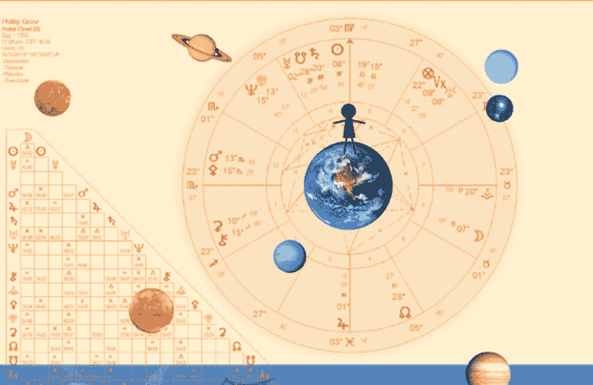

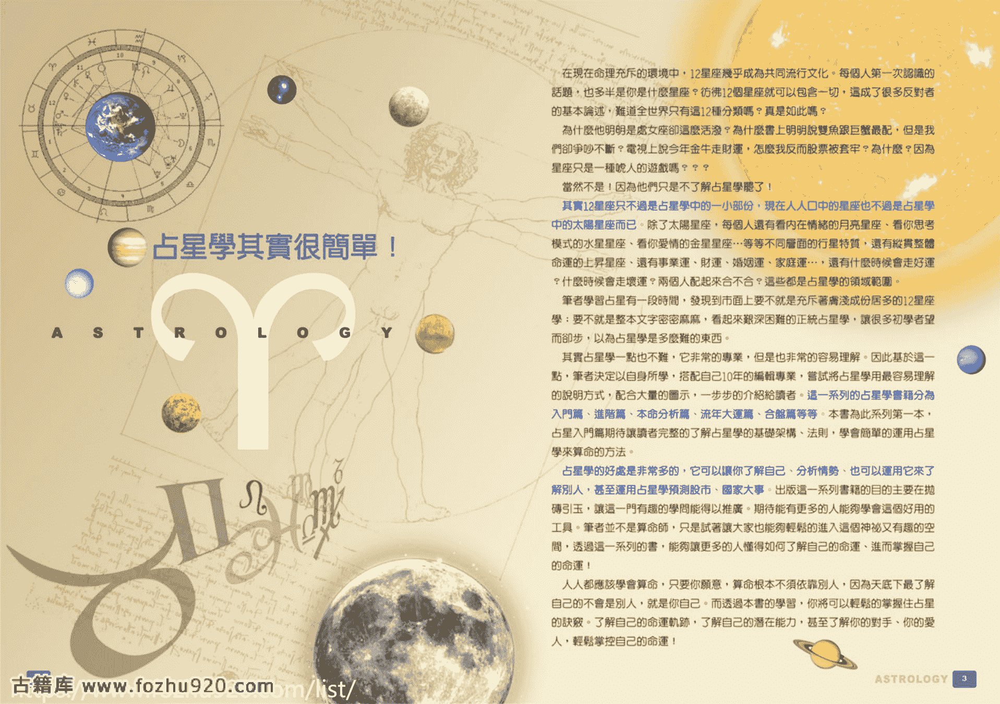

# 占星學其實很簡單！

在現在命理充斥的環境中，12星座幾乎成為共同流行文化。每個人第一次認識的話題，也多半是你是什麼星座？彷彿12個星座就可以包含一切，這成了很多反對者的基本論述，難道全世界只有這12種分類嗎？真是如此嗎？

為什麼他明明是處女座卻這麼活潑？為什麼書上明明說雙魚跟巨蟹最配，但是我們卻爭吵不斷？電視上說今年金牛走財運，怎麼我反而股票被套牢？為什麼？因為星座只是一種唬人的遊戲嗎？？？

當然不是！因為他們只是不了解占星學罷了！

其實12星座只不過是占星學中的一小部份，現在人口中的星座也不過是占星學中的太陽星座而已。除了太陽星座，每個人還有看內在情緒的月亮星座、看你思考模式的水星星座、看你愛情的金星星座⋯⋯等等不同層面的行星特質，還有縱貫整體命運的上升星座、還有事業運、財運、婚姻運、家庭運⋯⋯，還有什麼時候會走好運？什麼時候會走壞運？兩個人配起來合不合？這些都是占星學的領域範圍。

筆者學習占星有一段時間，發現到市面上要不就是充斥著膚淺成份居多的12星座學；要不就是整本文字密密麻麻，看起來艱深困難的正統占星學，讓很多初學者望而卻步，以為占星學是多麼難的東西。

其實占星學一點也不難，它非常的專業，但是也非常的容易理解。因此基於這一點，筆者決定以自身所學，搭配自己10年的編輯專業，嘗試將占星學用最容易理解的說明方式，配合大量的圖示，一步步的介紹給讀者。這一系列的占星學書籍分為入門篇、進階篇、本命分析篇、流年大運篇、合盤篇等等。本書為此系列第一本，占星入門篇期待讓讀者完整的了解占星學的基礎架構、法則，學會簡單的運用占星學來算命的方法。

占星學的好處是非常多的，它可以讓你了解自己、分析情勢、也可以運用它來了解別人，甚至運用占星學預測股市、國家大事。出版這一系列書籍的目的主要是在拋磚引玉，讓這一門有趣的學問能得以推廣。期待能有更多的人能夠學會這個好用的工具。筆者並不是算命師，只是試著讓大家也能夠輕鬆的進入這個神秘又有趣的空間，透過這一系列的書，能夠讓更多的人懂得如何了解自己的命運、進而掌握自己的命運！

人人都應該學會算命，只要你願意，算命根本不須依靠別人，因為天底下最了解自己的不會是別人，就是你自己。而透過本書的學習，你將可以輕鬆的掌握住占星的訣竅。了解自己的命運軌跡，了解自己的潛在能力，甚至了解你的對手、你的愛人，輕鬆掌控自己的命運！

# 目錄

# [占星學] ASTROLOGY

- 1-1 占星學是什麼？
- 1-2 占星學的歷史
- 1-3 占星學與天文學

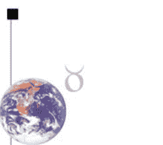

# [出生圖] BIRTH-CHART

- 2-1 出生圖的內涵
- 2-2 占星學的符號
- 2-3 占星學的分類法
- 2-4 十二星座
- 2-5 十二宮位
- 2-6 行星系統
- 2-7 相位分析
- 2-8 解盤法則

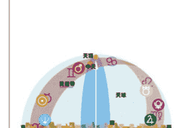

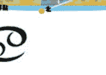

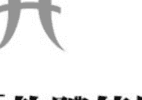

- 關鍵詞表
- 中英對照表

# [軟體使用] SOFT

- 3 如何弄出你的命盤

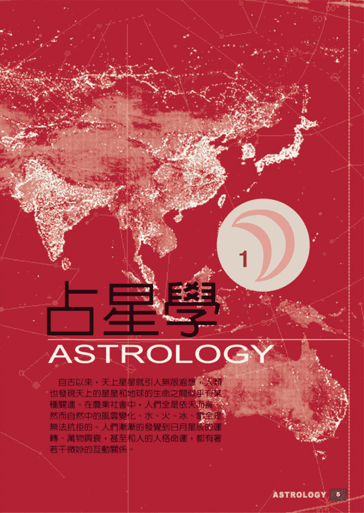

# 占星學

# ASTROLOGY

自古以來，天上星星就引人無限遐想，人類也發現天上的星星和地球的生命之間似乎有某種關連。在農業社會中，人們全是依天而活，然而自然中的風雲變化、水、火、冰，完全是無法抗拒的。人們漸漸的發覺到日月星辰的運轉、萬物興衰，甚至和人的人格命運，都有著若干微妙的互動關係。

# 占星學 1-1 WHAT IS ASTROLOGY ?

# PART1-1
占星學是什麼？
WHAT IS ASTROLOGY?

占星學是什麼呢？這是一個不容易回答的問題，它包含了神話、天文學、數學、哲學、預言與宗教。自古以來，人們就發現到地上的生活事物與天上的日、月、星辰間似乎有著某種特殊的關連。在點點繁星中，他們發現到有幾顆星星是特別的，它們沿著一條特殊的軌道（黃道）前進，有時會後退，有時彼此會合。漸漸的，從歸納與想像中，發展出來了一套學問，這就是占星學。

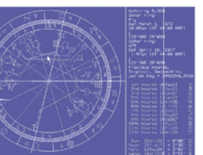

這幾顆特別的星星就是我們所熟悉的太陽、月亮、水星、金星、火星、木星、土星。它們在不同的文明中都同樣被賦予重要的神話角色。占星師利用這些行星的位置關係來預測人事，從星盤中行星的分佈來看出一個人一生的際遇。

從Astrology這個字來說，Astra是星星的意思，而Logos是邏輯，因此簡單的說，占星學就是星星的邏輯法則。進一步來說占星學是：

- 1. 占星學是一套符號語言：
用最基本的方法來看，可以將占星學視為一套符號語言，這套符號系統主

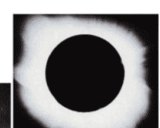

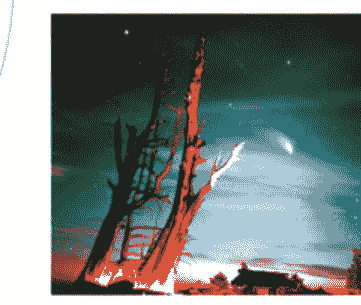

**上天如此，地下如是**
在古時候，每當彗星出現或當日、月蝕出現時，通常都代表某種災難的出現。易經上說：「在天成象，在地成形」，天有此象，地就有此形。

要在描述地球與其他宇宙星體間的關係，而最主要的部分則在希望了解，宇宙的其他星體對地球的影響，進而如何影響到地球上的萬物。

**2.占星學是一種分析工具：**
占星學可以當作一種工具來使用，運用行星與地球的感應關連性，在各種事物層面上，都可以以占星學的角度來進行分析。

**3.占星學是一種思考方式：**
占星學除了實用的部分之外，也有一套自己的邏輯，而這一套邏輯就是一種思考方式，一種哲學態度。

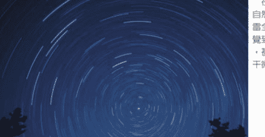

**行星和地球的生命互相關連**
在農業社會中，人們依天而食。自然中的風雲變化、水、火、冰、雷全是無法抗拒的。人們漸漸的發覺到，日月星辰的運轉、萬物興衰，甚至於人的人格命運，都有著若干微妙的互動關係。

# 占星學 1-1 WHAT IS ASTROLOGY !?!

## 行星才是主角

每個人出生時，太陽系中的九大行星、太陽、月亮及介於火星與木星中間的小行星帶，它們當時所處的位置與彼此間的相對關係，會引發特別的反應，這樣的象徵會對應於人生的一切現象，對人產生特別的影響，同時賦予當下時刻特別的意義。
二十世紀心理學大師容格（1875～1961），他提出的同時性理論，說明同一時間點上看似不相關的兩件事物，卻有著相同的意義。同一時間點星體間的對應往往與人的現實對應擁有相同的含意，因而並非行星影響了人，而是彼此具有相同的關連。
沒有一個時間的行星位置是一樣的，也就是說每一個時間都是獨一無二的，因此，每一個人的出生圖也都是獨一無二的，都有它特別的意義。
從地球上來看，所有的行星跟隨著太陽在一條特別的環帶中運行，這條環帶我們將它稱為黃道，在這條環帶古人將它分成同樣大小的12個區域，將這12個區域內的恆星連結，賦予各自的名稱（即12星座），代表著十二種不同的基本原型。這是上帝留給人類的自然密碼，每顆行星所影響人的主要特質部份也不相同，而當這些星球運轉產生各式各樣的變化組合時，我們也就可以看到個人的行為及命運的變化軌跡了。
因此，在占星學中，行星才是一切變化的依據，而非一般人討論熱烈的星座，我們研究占星學，就是要看行星間的互動變化，因此，行星才是主角，是學習占星觀察的依據。

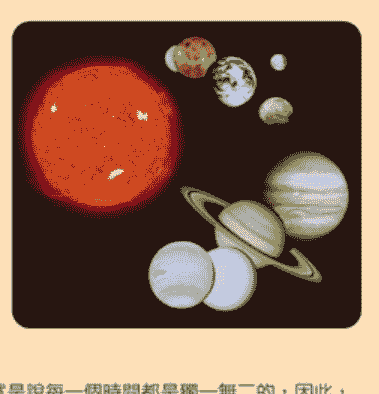

## 人類的潛能

科學家研究，人類使用大腦的功能可能不到十分之一，就像冰山一樣，真正浮出水面的部份其實只有整體的一小部份。人的意識顯現受到廣大潛意識的影響，而運用占星術，我們可以更加了解自己的潛能，了解自己潛在意識的傾向。

## 簡單的說，占星術到底是什麼呢？

太陽從日昇到日落對應到一個人的一生，月亮的陰晴圓缺就像人生的起伏變化，從美麗的金星聯想到美好的事物，跑的快的水星象徵了思想的快速變化…，這一切的巧合似乎有著冥冥中的道理存在。

占星術就是看行星與人之間如何相關連的學問。行星在什麼宮位、什麼星座，會對小至個人、大到世界有什麼樣的對應。行星與行星產生了相位的交互作用時，對每個人會產生什麼對應的影響，什麼行星對應人的什麼部份？我的行星與你的行星有了反應時又產生什麼影響？當天上的行星和我們的行星產生了相位反應，又將造成什麼樣的影響？

這就是占星學關心的東西！

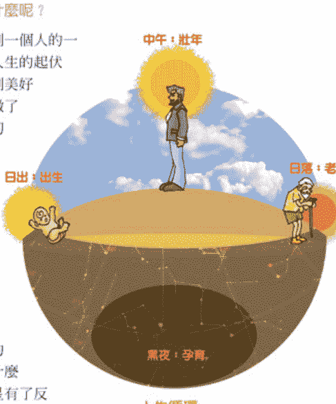

## 人生循環

人的一生從孕育到呱呱墜地，經過青年期成長茁壯，到中年時功成名就，然後開始衰敗，步向老年、死亡的過程，就像是太陽一天的經歷一般。從日出露出曙光，正午光芒萬丈，直到日落西下，然後再到黑夜，準備醞釀第二天的開始，就像是生命的整個過程。

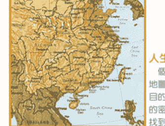

## 人生地圖

個人的星盤就好比是一張人生地圖，地圖越詳盡，越能找到我們希望達到的目的地。因此，越是能解開星圖中隱含的密碼，就越能了解自己的人生方向，找到人生的目標。

原始時代的神話
埃及天空女神，她伸長嬌軀，橫跨過她丈夫大地之神的地平線，身上點綴著耀眼繁星，背上浮著太陽神乘坐的船，從日出航向日落。每天早上太陽神誕生為嬰兒，中午成長為偉大的神，到黃昏衰老死去。因此，所有的占星術，都將太陽一天中的日出到日落的過程，看成人生從初生、成年到晚年的過程。

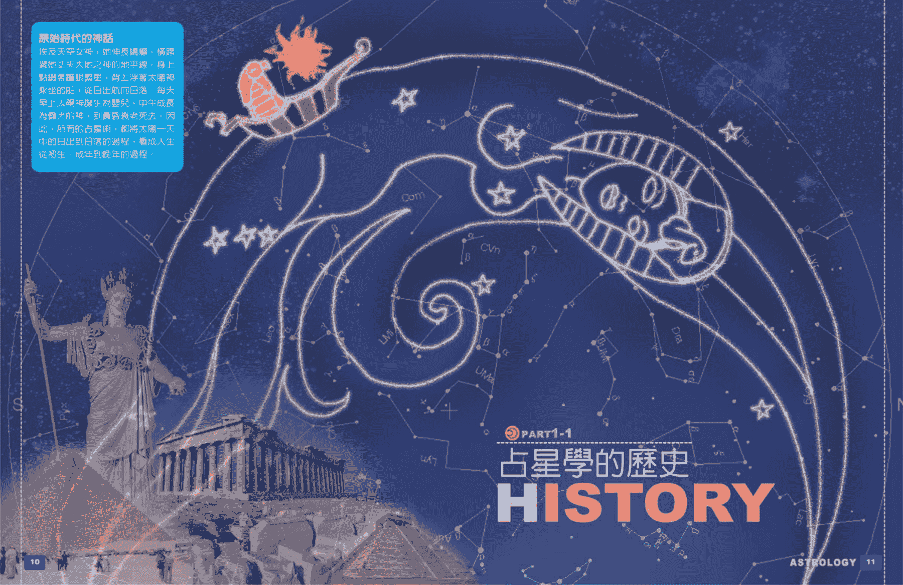

# 占星學 1-2 HISTORY

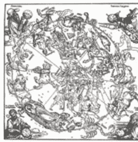

## 占星術起源

占星學的起源為何？因年代久遠已不可考，但從古老的傳說及流傳下來的文獻，可追溯至上古時代。

早在紀元前三千多年前，在幼發拉底河與底格里斯河所沖積出來的美索不達米亞大平原上。當時的古代遊牧民族，把對天體的觀察，從日昇日落、海的潮汐以及四季變化等等自然觀察中，首先發現到太陽、月亮及五大行星的特殊性。結合了對天體的崇拜，以及人類原始的信仰，漸漸發展出一種占卜的形式，形成爲今日占星學的基礎。當時利用觀察天體來預卜天氣、農作物的收成，慢慢的擴大自然和人類的一切變化。

一直到了紀元前六百多年前，迦勒底人建立的新巴比倫王朝時，對占星學作有系統的歸納及整理。迦勒底人對於數學及曆法有其獨到的成就，我們現在所使用的曆法就是當時迦勒底人的占星師所創製的。現代西方文化中，結婚典禮之後的蜜月旅行，也是他們首先採行的，這是一種占星學的儀式，意義是共同開創幸福之門。

到了紀元前五世紀左右，黃道分成十二個30度的宮位已經確立，目前已知最早的占星圖出現於紀元前409年。後來隨著亞歷山大的東征，

> ●馬雅
馬雅人在星象上的發展極為出色，他們有一套特別的計算方式，以一個13×20的循環，產生的一個52年的週期。他們依據這個神聖的週期來預言未來，確定重大事件的時間。這不禁令人聯想到中國的天干地支，一個12×10，60年的循環。

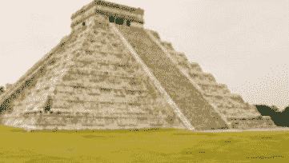

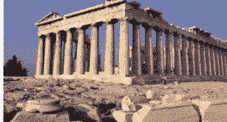

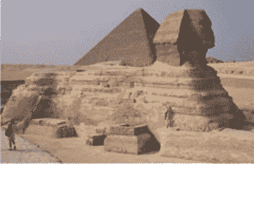

> ●有趣的新發現
星座的發源似乎更為久遠，它也許是上古文明的遺留物。從人面獅身所代表的獅子座與春分點的移動配合，星座告訴了我們時間，一萬多年前，某些人建造了人面獅身像，有趣吧！

占星學也融入了希臘文明，希臘人將太陽、月亮及太陽系諸行星對應於古希臘神話中的神祇。這些希臘天神的拉丁文名字遂成爲後世占星學所共通採用。

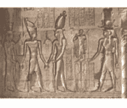

占星師根據天文學家提出的宇宙模型，定義了諸星運動間的相互關係與地球的假想距離。他們將行星、黃道、十二星座與世間諸物建立一個完整的對應關係，於是占星學的應用就愈來愈廣了。柏拉圖提出上帝如何以四大元素一火地風水來創造世界，托勒密（西元100～170）可說是占星歷史中最重要的人物，在其著作《四書》中占星學的架構與原理已經奠定了基礎，他假定星象的效應具有週期性與獨特性：人世間的收割、災荒、地震、洪水，以致戰爭均有一定的週期循環，而這些「成果」早就受孕在一顆特定時間的種子中。

## 阿拉伯占星

阿拉伯延續了西方占星術的發展，是由於基督教對占星術的打壓。一談起「阿拉伯占星學」，自然不能不提「阿拉伯點」(Arabic Parts)。現在的占星學上，也常用到幸運點、婚姻點和死亡點等三個很重要的參考點。由於阿拉伯的地理

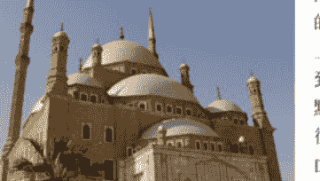

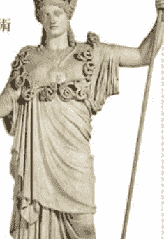

# 占星學 1-2 HISTORY

## 星座的由來

古代人為了方便在航海時辨別方位與觀測天象，於是將散佈在天上的星星運用想像力把它們連結起來，由於占星學的發達區域多半在北半球，因此北半球容易觀測到的48個星座在希臘大天文學家托勒密的時期就已命名了，命名的方式多依照古文明的神話與形狀的附會（包含了美索不達米亞、巴比倫、埃及、希臘的神話與史詩）。另一半（大部是在南半球的夜空中）是近代海洋探索時命名的，因此多半使用航海的儀器。因為地域的不同，所以「連連看」的方式也就不一樣！像中國的北斗七星就是包含在現今的大熊星座中，目前世界已統一星座圖，將天空劃分為八十八區域八十八個星座。

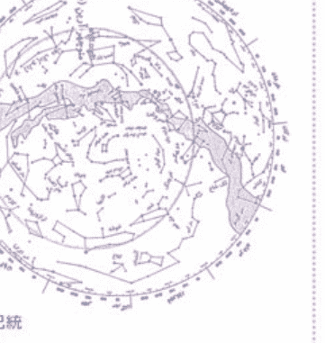

二千多年前希臘的天文學家希巴克斯（Hipparchus，西元前190～120）為標示太陽在黃道上行進的位置，就將黃道帶分成十二個區段，以春分點為0度，自春分點算起，每隔30度為一宮，並以當時各宮內所包含的主要星座來命名，依次為牡羊、金牛、雙子、巨蟹、獅子、處女、天秤、天蠍、人馬、摩羯、水瓶、雙魚等座宮，稱之為黃道十二宮。總計為十二個星群。在地球運轉到每個座宮時所出生的嬰兒，長大後總有若干相似的特徵，包括行為特質、個性等。將這些聯想運用豐富的想像和創造力串聯起來，便使這些星群具象化了；再加入神話的色彩，成為文化的重要部份。這套命理演進、流傳至今至少五千年的歷史，它們以這十二個星座為代表。這些星座就成為十二種基本原型的代替象徵。

現今一般大家所談論的「12星座」其實只是占星學中所指的太陽星座而已，是以地球上的人為中心，同時間看到太陽運行到黃道十二宮上哪一個星座的位置，就說那個人是什麼星座。但是由於春分點的逆行，實際上已經對應不起來了，12星座成了一種象徵意義，而非指對應到的天上星群。

位置容易與歐亞非各地展開交流，也因此在古阿拉伯的文化體系中，大量地吸收了埃及、波斯、印度、古基督教、迦勒底、中國、希臘、古代鍊金術等文化內容，然後融鑄成獨自一格的阿拉伯占星文化。而後經由阿拉伯的占星學家將各古老文明的占星學研究心得作了整理，直到近代又重新傳回歐洲。

## 印度占星學

印度占星學雖與歐洲同源，卻發展出不同的體系，它是以論斷事件為主。印度占星學是跟數字息息相關的，它熟衷於神秘數字的探討，特別是4與9這兩個

數字。自古口耳相傳的《吠陀》勾勒出諸神的故事與占星知識。它採用恆星黃道系統，重視月亮的交點，以及一種二十七宮的分類系統。由於印度保有了許多古老的占星理論，現代西方占星學家因此受到印度占星學的論法啟示，而開闢了新的論法和見解。近廿幾年來，西方的神秘主義研究者，一直熱衷於神秘數字的探討，特別是在廿世紀以後，印度占星學家與西方占星學家不斷地進行交流、切磋，同時也修改了某些古印度占星學的看法。

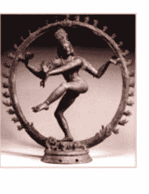

## 中國占星學

中國的占星系統跟西方有所不同，自古以來，易經是所有學說的基礎來源，進而推演出陰陽、五行、八卦、天干、地支所形成一種以60為輪迴單位的體系。中國占星學在春秋戰國時就已經很發達，中國占星術將黃道帶的星區分為28宿，用來觀察日月五星的運行變化，並且重視恆星的象徵，對於北斗七星及北極星至為推崇。魏晉南北朝時，印度占星東傳入中土，結合了中國陰陽五行、28宿而衍生出的七政四餘占星學。而另外又由此推演，發展出以需星為論斷體系的紫微斗數。但由於當政者的害怕與禁止，使得占星成為少數人的特權，進而造成中國占星學的沒落。

## 現代占星學

占星術曾一度因為科學的發展而沒落，但發展到現代又因為結合科學的概念而有了新的技術發展與進步。中點理論、泛音盤、合盤，以及結合心理分析都為占星學賦予新的生命。中點理論是由德國占星學家Alfred Witte和Friedrich Sieggrun創立的漢堡學派所提出。它的論斷技巧中認為兩個行星或敏感點的中點具有重要性，特別強調中點的概念。同時他們認為行星的凶相比吉相位來得更為重要，更足以呈現出事件的徵象。隨著往後的陸續發展，漢堡學派中的行星中點概念，而到現在占星學的研究趨勢，中點的論斷概念除了合盤的論斷受到重視以外，在職業、健康和錢財，甚至死亡的預測上，也有許多的占星學家應用中點來作論斷。甚至有關股市的預測，更是相當廣泛地應用了中點來作推測。

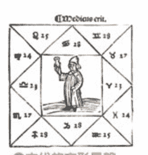

# 占星學 1-2 HISTORY

泛音盤為英國約翰．愛迪所提出，他從印度占星學的分盤技巧得到啟發，開創出一種新技術，用來更加精細的分析命盤的內在含意。運用數學的分割，將星盤一層層的剝開，來看出星盤內藏的訊息。

容格可以說是現代占星最重要的一個人，他重視符號與圖騰的象徵，並試圖將占星與心理學做關連，而他所提出的許多心理學概念，如陰影、原型意象、集體潛意識…等，以及同時性發生的非因果關連理論，為占星學重新注入活水，也指明出一條現代占星的新發展方向。

法國高葛林博士在他著名的「火星效應」實驗中將570位優異的運動選手的火星分布放入星盤中，如果是同等機率，那分布應該趨向圓形，但是結果不然，而是呈十字形，尖端集中在4角附近，有趣的是，他原先是要破除占星學的，卻反而為占星學打了一劑強心針。

## 學習占星學的好處在哪裡？

二十一世紀的今天，占星學更是蓬勃發展，各種門派與新的理論相繼提出，但是我們為什麼要了解占星學呢？他對我們有什麼好處呢？

- 1. 了解自我：
在占星心理學已十分發達的今天，利用占星學來了解自己，從星盤中看出自己的本質與問題，了解自己的天賦和潛力，可以讓自己更誠實的面對自己，改正自己的缺點。

- 2. 人際關係：
運用雙人星盤的配對來看出彼此間的問題點，緣份與適合度，運用占星學幫助你了解自己，也幫你了解別人，讓人際關係更圓滿。

- 3. 生涯規劃：
利用運行星與本命星的配合，了解未來的運勢發展，知道何時進、何時退，讓自己對自己的未來更有計劃。

## 占星學的應用主流

**Natal Horoscope (本命占星學)：**
這是最常見的個人命盤推斷，運用個人的星盤來了解一個人的個性、潛能、適合的工作、六親關係、婚姻、戀愛等等特質狀態。所謂個性決定命運，從命盤中可以分析出一個人的優缺、心理層面的偏向，進而順應著天生的屬性，發展完整的自我。
再利用行星與本命星的互動來作一生運勢，或者是大運流年方面的調斷。針對個人一生的整體概況來作調斷，推斷自己最適當的時機，何時結婚、何時高昇、何時考運佳、何時戀愛運會順順、何時是發財良機等等，一生中順境與逆境的時機。

**Synastry Horoscope (配對占星學)：**
配對占星學是20世紀發展的重要技巧，運用兩張命盤彼此行星間的對應，來推算兩人之間的互動關係，透過這樣的分析，可以了解到情侶、六親、朋友、上司下屬彼此間的問題點，機會點，進而調整彼此的應對方式，達到雙贏的局面。

**Mundane Horoscope (時事占星學)：**
利用占星學來推測當時時勢狀況，如政治占星學、股市財經占星學、氣候占星學、國際局勢占星學等，主要分為自然災害和世界情勢兩大項。所有與人類整體有所關連的占星學預測都屬之。利用占星學來研究大自然的變化，如星體運轉與潮汐變化的關連等，預測地球可能發生的自然現象的變化及世界整體情勢，預測整體人類可能發生的大事。

**Horary Horoscope (卜卦占星學)：**
這是將占星當作卜卦來應用，就像一般所做的卜卦一樣，運用星盤內顯現的資訊來決定吉凶。它的判斷是依據天體的星象，同時包含某些事件之前因後果的解析。他的原理是認為特定時間具有特定意義，任何重要的時刻或是一個靈機閃現決定的時刻都可以當作起盤的時間，基本上跟卜卦的原理沒有兩樣。同樣的，一件事只能占問一次。

**Election Horoscope (擇日占星學)：**
跟中國傳統的八字擇日相同，其原理是選擇行星位置相當吉利的時間，來作為某一事件開始的時間。如此選擇最具吉兆的時間作為開始的時間，以利事件順利的開展。有時要配合所要進行事項之性質加以考量，例如結婚的時刻，要配合主管婚姻的行星與宮位形成良好角度的時間。

**Relocation Horoscope (換置占星學)：**
結合中國的風水概念，當同一個人處於不同位置時，星盤的命度分布就會有所不同。因此，藉由換置占星學可以為個人找尋最適合自己的地點與方位。

**Other (其他應用)：**
除了以上的占星主流，在應用上還有：
心理占星學：用星圖作為心理治療或分析的工具，星盤就像是心的地圖。從星圖中可以顯示出原型、次人格、陰影、潛在傾向等等。
人格占星學：利用占星學來了解一個人的性格並預測行為的傾向。
醫藥占星學：利用占星學來處理人的健康，合時下藥、選擇開刀時間並幫助了解病因。

# 占星學 1-3 ASTRONOMY

其他星體與地球的關係，所以占星學的推算都是以地球為中心的，也就是以事情發生的地點為計算的基準點。星盤圖就是將出生時行星的位置投影在黃道上的平面上，由行星間的位置與相對關係解讀一個人或全世界。

星體為影響力的來源：占星學家假設，天上的星體會影響地球上發生的事物，他們對地球具有特別的關連作用，當他們處於某種特殊位置時，就會引發特別的事件，而行星與行星間亦會發生交互作用，當彼此處於特殊角度時，彼此的作用便會出現好或壞的變化，進而對個人或世界產生潛移默化的影響。因此星體是影響力的主要來源。

星體會因為處在不同的位置（場）而發生本質的變化，這些位置就是星座與宮位。星座代表12種基本原型象徵，是黃道帶以春分點開始十二等分的區間；宮位則表現人與世間接觸的12種基本場景，是依出生時太陽東昇點將黃道帶分為十二等分的區間。行星在黃道帶上運行，因此每一個行星都會落入某一個星座和某一個宮位中。

## 占星學與天文學

## 占星學的天文學基礎

自古占星學和天文學就是密不可分的，我們可以這樣說，五百年前彼此是同一家的，占星學與天文學就是同一件事。古時候觀測天象的人，就是因為占星的需要才去做的，並沒有人專門觀測天象而不占星的。占星學和天文學可說是在同一片天空下、以不同的觀點來作研究。

科學革命之後，開始有一些科學家視占星學為古代落後的迷信，慢慢的天文學與占星學開始分道揚鑣，有趣的是哥白尼、伽利略、牛頓等有名的科學家都是占星高手。到了現在，占星學家為了更精確的知道星體的位置，大多需要有一點天文的知識作為基礎，所用的資料也都經過精確的天文運算，只可惜現代大多天文學家已失去了占星的能力。

在古代，要畫出一張精確的星盤是一件繁複的過程，必須做許多複雜的計算，好在現在電腦發達，只要輸一輸資料就可以得出一張星盤來。雖然如此，但占星學是建立在天文觀測及計算出的行星及交點位置來推命的，所以要學會占星學，基本的天文知識是必需，我們必須了解占星學是以什麼樣的天文基礎為架構，來構成推算的依據。

星體與星體間由地球上看去，之間會夾一個角度，當彼此出現特別的角度時，會出現某些感應，這就是占星學上所謂的相位。於是我們就依星體所處的星座與宮位以及星體彼此間的相位關係為依據推算命運。

## 行星與行星關連在星座、宮位上

雖然現在大家都已經知道，地球是繞太陽而公轉，但是占星學家所關心的是

## 星盤重要點

出生的季節決定了太陽所處的星座（牡羊座一定是春天生的），而從出生的時刻決定了太陽所在的宮位（正午出生的人太陽一定在10宮），因此，太陽可以說是星盤中最重要的一顆星，代表著生命力，幾乎占整個星盤的三分之一。

從出生時農曆的日子，就可以知道太陽與月亮的角度（農曆15日出生的人日月必呈180度角），月亮也是星盤中重要的一顆星，代表著內在的情緒。再加上東昇點與中天點，這四個重點是解讀星盤最須重視的部份。

## 占星學的四大要點

- 星座 [ 基本原型 ]
在占星學中，星座所代表的意義是宇宙方位的代名詞，代表12種基本的原型及表現的形式。當行星進入每一個原型的地盤後，就會受到影響，發生本質的變化。實際上星座只是借用來表現這12種原型的替代品，而非真的指天上的星群構成的星座。這一點必須先釐清，因此，最近有人提出13星座的說法，其實只是不了解占星學的本質罷了！

- 宮位 [ 人生場域 ]
在占星學中，宮位所代表的是個人與後天環境的互動、發生動作的場所以及投入的情境。12個宮位代表著不同的人生場景，像自我、家庭、婚姻…等不同的個人與世界的互動情境。

- 行星 [ 作用力 ]
占星學中，所謂的星體是指太陽系中與我們較相關的星球，包括日、月、水、金、火、木、土、天、海、冥，以及一些較特別的小行星。它們因為離地球比較近、引力大，影響也較為直接。例如：太陽形成晝夜與四季的變化，月亮的運行和潮汐及女子生理週期有關，大地震大多跟木星、冥王星及天王星發生關連，都證明了星體對地球的影響。因此在占星學中，星體是推動的力量、各種能力的展現。

- 相位 [ 吉凶 ]
相位是兩行星之間相對於地球的角度，當產生特別角度時（如：0度、180度、120度、90度是其中最重要的幾個）即成為相位。相位有吉有凶，跟神秘數字具有關連。舉例來說：180度是將星盤對切，即2等分，具有對立與互補的意義，120度是星盤的3分之一，具有和諧與穩定的含意。

## 地球 & 太陽系
SOLAR SYSTEM

太陽系
我們所居住的地球是位於太陽系的一顆美麗行星。太陽系是由太陽及其他環繞太陽的星體所組成，這些星體包括對地球潮汐影響深厚的衛星月球、兩個內行星-水星與金星，三個可見的外行星-火星、木星與土星，以及三個近代發現的外行星-天王星、海王星與冥王星，再加上行星本身的衛星及無可計數的小行星及彗星。太陽系在太空中就像是個大圓盤一樣，行星的軌道是橢圓形的，行星繞著太陽以相同的方向，不同的速率繞著太陽運行。因此當我們從地球上觀察時，就會看到行星會時而前進、時而後退。而月亮是地球的衛星，它繞著地球運轉，我們稱它的軌道為白道。

## 天球、黃道、春分點

當我們以地球為中心來觀察天空時，整個天空像是一個巨大的水晶球，它的表面佈滿了點點的繁星，我們假定這個球為天球，將天球上的星星彼此連結，劃分為88個星座。太陽也在這個天球上運行著，它的軌跡固定的畫成一個圓圈，我們稱為黃道，將黃道上下延伸一些，便成了天球上的一條環帶，即為黃道帶，黃道帶經過了天球上的12個星座，這12個星座就是所謂的黃道12星座。而因為所有的行星軌道都是幾乎平行的環繞著太陽，因此從地球上來看，這些行星都是在黃道帶上移動著。

由於地軸有23.5度的傾斜，因此有黃道面與赤道面的不同，太陽在黃道上運動。每年太陽會跟赤道面在春分、秋分時交會二次，這就是春分點與秋分點。

- 天球
以地球為球心，向太空無限延伸成一個假想球，稱為天球。行星沿著黃道運行，經過黃道12星座，作為行星位置的觀測與記錄。

- 黃道
黃道就是指太陽在天球上運行的軌道，地球自轉軸傾斜黃道面約23.5度（亦即黃道與赤道交角約23.5度），因此造成一年當中不同的四時寒暑變化。在占星學中，所有星體的位置均是以黃道的投影面為基準，因為站在觀測者的角度來看，地球是不動的觀測點。

- 春分點
將赤道向外無限延伸的圓盤，稱為赤道面，同樣的，將黃道延伸的圓盤，稱為黃道面。赤道面與黃道面交會於兩個點，當太陽運行到這兩點時，正好是日夜等長的時候，我們將它定義為春分點與秋分點。

## 星座系統

黃道面與赤道面相交於春分點與秋分點。占星學上便以春分點來定義為黃道起點，將黃道圈分為12個30度的等分，如此定義了12個星座，當作宇宙空間方位的代名詞。春分點即是牡羊座的開始，然後依次是金牛、雙子…雙魚等12個星座。同樣的秋分點就是牡羊的對宮天秤座的開始。

因此當太陽運行到牡羊座時，也就是春分時節的開始。同理當太陽到巨蟹座時正好是夏至的開始，秋分時到天秤座，冬至時到摩羯座。舉例來說，每年7月13日太陽運行到巨蟹座，因此出生在這天的人，他的太陽星座就是巨蟹座了。有很多情況是出生在兩星座交接日的人怎麼認定呢？兩個星座一起算嗎？其實不是的。舉例，以春分點為黃道0度，金牛座的起始點是黃道30度，某一年4月20日下午3點26分18秒，太陽運行入黃道30度，所以4月20日下午3點26分17秒出生的人是牡羊座，4月20日下午3點26分19秒出生的人是金牛座。

## 地球與太陽的關係

實際上，地球是繞著太陽轉的，因此當地球繞到某個星座時，由地球的觀點來看，太陽就在其相對的星座了，如圖中當地球在天蠍時，這時看到的太陽是在金牛。而當地球在雙魚時，太陽看起來就在處女座了！

從地球來看，月亮與行星們跟著太陽在黃道上運行著，因此同樣的，它們也會跟太陽一樣停留在不同的位置。假設某人出生時，月亮正好運行到雙魚座，金星運行到水瓶座，那我們就稱這個人的月亮星座為雙魚座，金星星座為水瓶座。其他水星、火星、木星…等星座也是依此類推。

## 將黃道帶的狀態關連到地上的事物

任何一個時間點，行星在黃道上的位置對全世界的每個人都是相同的。這個位置反映出共通性的符號語言。但是同一個時間點對不同地區的人來說他們所看到的行星方位卻不一樣。舉例來說，某一個時間點太陽位於巨蟹座25度，對每一個人來說都是一樣的，但是在台灣看到的太陽可能在南方天頂，但是在澳洲看到的太陽是在北方接近落日的位置，而在美國這時還是半夜，根本看不到太陽。雖然太陽在天球的位置相同，但是不同地區的人看到的感受卻不同。

對北半球的人來說，大部分時候看到的黃道帶是由東到西，穿越天頂南面一些。所有的行星都依序在黃道帶上運行，因為地球每日自轉一圈，所以看起來像是每天黃道帶像巨型天鐘般轉了一圈。

## 宮位系統

星座是由春分點所定義的，那麼宮位又是如何呢？
宮位是以觀測者為主，觀察天體間的相對位置，所產生的相對方位關係。當我們將個人出生時所在地的地平面無限延伸後，這個平面會與黃道圈交會於兩個點，占星學上，定義這兩點為東昇點與西降點。
以出生地為中心，將地平面畫出東西南北四個方位以及地平面上與地平面下，將出生地正上方與正下方延伸會與天球交會於兩個點，這兩點與地平面南北點形成一個大圈，我們定義為子午圈。子午圈與黃道圈交會於兩點，我們稱這兩點為天頂點與天底點。
因此當一個嬰兒誕生時地平線圈及子午圈會切黃道圈於這四個點。這四個點象徵星盤圖上四個宇宙符號的角（Angles），我們通稱為四角，代表了我們個人與這個世界接觸的四個重點，是人生的最重要點。象徵著我跟我，向內與向外。

## 東昇點〈ASC，上升星座〉

東方地平線與黃道的交點，也就是命宮的起點，表示自己與世界的接觸，這是實際上存在的個體的身體特徵及命運。

## 出生時決定四個重點

如圖，個人出生時刻、當地的地平面東與黃道相交於雙子座，西與黃道相交於射手座。子午圈上與黃道相交於水瓶座，下與黃道相交於獅子座。

## 西降點〈DES，下降星座〉

西方地平線與黃道的交點，與升位相反，也就是夫妻宮的起點，它表示與他人的關連，因此是伴侶與夥伴的結合。

## 中天點〈MC，中天星座〉

黃道最接近天頂的地方，也就是黃道與子午線在空中的交點。象徵人生最高點，也是事業宮的起點，代表成就、職業及權力。

## 底天點〈IC，底天星座〉

黃道與子午線在地下的交點，它位於最低點，象徵根源，也就是家庭宮的起點，表示家、祖先和一個人的根。

這四點將星圖切為四個象限，將每一象限再分為三份就成了星圖中表示生命中各個層面的十二宮（House）。象限在黃道上的大小不等，雖然占星學者對詮釋星座的看法很接近，但是區分宮位的方法卻有很多不同的方式。這意味著不同的宮位系統會產生不同的宮位位置，這也是占星學上一個頭痛的問題！
雖然宮位的分法分類繁多，各有各的立論基礎，但是還是有比較受人重視的幾種。現今比較常用的有利用上升點來分割成十二個30度的等宮分法（equal-house system），而最為流行的系統是十七世紀時一位義大利僧侶譜拉西度斯（Placidus）創立的分宮法，另外Koch分宮制也很受重視。

- 占星學的宮位制
宮位的分法很多，約有下列幾種：
1. 等分宮位制（Equal Houses）
以東昇點為起點，將黃道圈等分為12份的分宮法。
2. 太陽宮位制（Solar House System）
以太陽為起點，將黃道圈等分為12份。
3. 時間分宮制（Placidus House System）
目前使用最廣的分宮制
4. 地點分宮制（Koch House System）
在美國使用最廣的分宮制
5. （Porphyry House System）
將四角形成的象限等分成三份。
6. （Campanus House System）
等分主垂圈的分宮制
7. （Regiomontanus House System）
等分天球赤道以地平為第一宮
8. （Morinus House System）
等分天球赤道以子午線為第十宮

將天空投影
如上所示。將行星與宮位點位置投影在黃道面上，就是一張完整的星盤了。

## 符號構成的語言

占星學是一種用符號構成的語言，一個人由於存在而讓發生在我們周圍的種種生活變化展現在意識的地平線之內。如果將天空劃分為現實意識中可見的天，以及地面下無意識的不可見天。「宇宙」像是環繞著我們每天從東到西旋轉著，整個天空的變化關連到地面，也就象徵著人世的種種轉變。
星星、月亮、太陽及黃道帶經過我們的天際，代表著我們經驗的變遷與改變。我們正上方是天頂，它代表著我們將前進的地方及未來，是希望之所在。我們腳下的延伸是天底，這是代表著我們的過去，我們所來之處，也是我們最後回歸的地方，是我們的根源。
水平線的一方是我，代表這裡，另一邊是你，代表那裡。從這裡到那裡，聯繫了我與我們的關係。
這兩條線彼此垂直成十字，代表著我們降生於世上所背負的責任與命運，結合了天空的圓構成了地球的符號，代表著人類最終的目標-新天堂樂園的實現。

## 12星座回歸系統-歲差現象
PRECESSION

相對於其他恆星，太陽每次交會到春分點時，位置是不同的。每年春分點平均向西逆行50.2弧秒，這就是所謂的「歲差現象」。如此約經過兩萬六千年春分點會繞完一周。從二千多年前開始制定春分點為牡羊座到今天，現在的春分點已退行將近30度，現在的春分點已移動到雙魚座，正接近雙魚和水瓶的交界處。這也就是所謂的水瓶世紀將到的原因。

但是占星學是以春分點開始稱為牡羊座，但由於歲差的原因造成星座方位的變動，所以你會發現到現在春分點是指向雙魚座。因此，現在大家口中的星座早已不是指現今天上的星座了，隨著時間的變化，現在占星術所用十二星座的命盤變成是一種虛擬的意象，如果你是牡羊座，其實應該說是牡羊宮還比較恰當，他代表的是太陽一年的12個變化，真正的星座只是一種借用來做原型分類的符號。

## 不同的系統

其實用另一種觀點來看，你可以在大系統（天體12星座）下另一個屬於地球的中系統（太陽12星宮），在這系統下又依個人出生時產生小系統（12宮位）。大系統是整體性的，中系統是屬於地球全體的（如果一個住在金星上的人，他的中系統就該以金星的春分點來訂吧！），小系統則是個人的。因此如果說你是雙魚座，代表的是中系統的分類模式，它跟地球與太陽之間的關係（四季）息息相關。

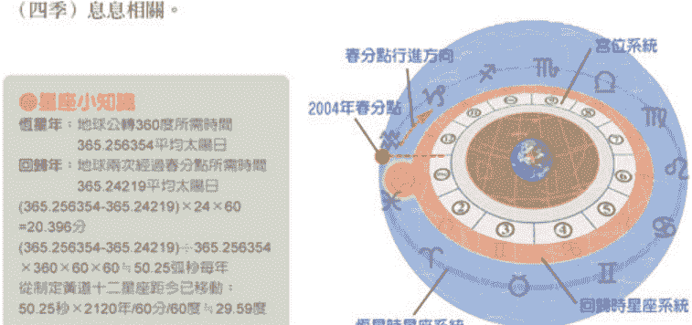

# 占星學 1-3 ASTRONOMY

## 占星學二大門派

因為歲差現象，造成了現代占星學的二大門派，一派是以中系統為依據，另一派則堅持以大系統為依歸。

1. 回歸時星座系統（中系統）：
所謂回歸時系統的十二星座，是西方占星學將傳統占星學的星座象徵運用於回歸時系統。回歸時系統是以地球和太陽的相對關係來決定十二星宮，也就是以春分點和秋分點為主，來分類的系統。這種分類的特點是跟四季節氣符合，星座是借用的符號，而非指天文學上真實的星座。

2. 恆星時星座系統（大系統）
顧名思義，就是沿用古制以真正的星座為劃分依據，這一派以印度占星學為主，清代以前的中國占星學也是使用恆星時系統十二星座，並且除了12分法外，還有一種28星宿的分類法，這種分類是以恆星為主的分類，是依據天上恆星來定位的。

## 二十八星宿

西方將黃道帶分出十二星座，中國則畫成二十八個區域，中國的恆星時系統按戰國時代齊國的甘德、魏國的石申所著的“甘石星經”來推斷，二十八星宿可追朔至西元前四百年戰國時代。所謂二十八星宿，每一宿都是天空中比較明顯的恆星群，正因為是恆星群，所以可以作為天文觀測的指標。這只是分法的不同，西方人看成了十二個星座，中國人則看到了十二星宿。其實都只是將天上的星星們做位置上的分類罷了！而我們熟悉的12生肖也是從二十八宿配置於十二地支後演變而來。

中國古人先將星空區分為四大塊，所謂黃道四象：東方青龍、西方白虎、南方朱雀、北方玄武。再將星空區依據恆星分為二十八個小區塊即構成二十八個星宿：

- 東方青龍七宿：
（角、亢、氐、房、心、尾、箕）

- 西方白虎七宿：
（奎、婁、胃、昴、畢、觜、參）

- 南方朱雀七宿：
（井、鬼、柳、星、張、翼、軫）

- 北方玄武七宿：
（斗、牛、女、虛、危、室、壁）

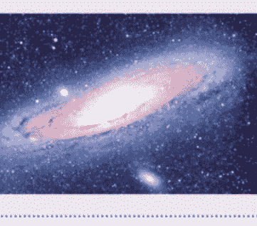

跟西方同樣，根據行星落入的星宿位置變化來推斷人世間的吉凶。

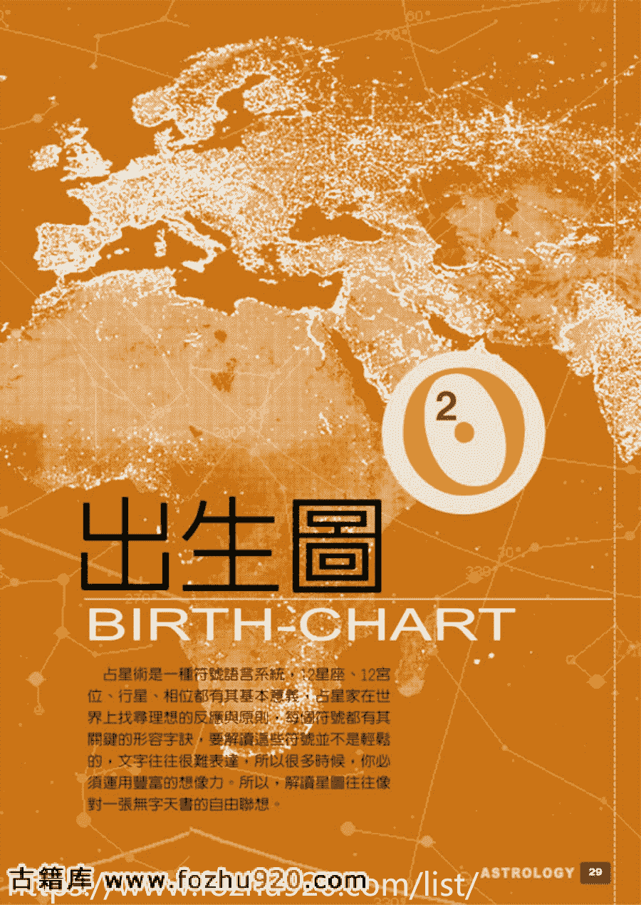

# 出生圖

## BIRTH-CHART

占星術是一種符號語言系統，12星座、12宮位、行星、相位都有其基本意義。占星家在世界上找尋理想的反映與原則，每個符號都有其關鍵的形容字訣，要解讀這些符號並不是輕鬆的，文字往往很難表達，所以很多時候，你必須運用豐富的想像力。所以，解讀星圖往往像對一張無字天書的自由聯想。

## 出生圖的內涵

## BIRTH-CHART

## 出生圖的意涵

要學會占星術，首先就要學會解讀出生圖，英文中稱為 Birth Chart，也就是占星命盤，是占星論命時不可缺少的一項工具。拜現代科技，只要有正確的出生時間，我們可以很容易的從網路上一些算命網站或者免費的占星軟體，只要輸入資料，就可以得到一張出生圖。

出生圖是一種天體投影的圖解，我們利用它來看出太陽、月亮、行星在某一時間、某一地點觀測到的位置。我們所存在的世界是屬於三度空間，由於行星都是在一條扁平的黃道帶上運行，因此占星學家們就以投影的方式，擷取出重要的元素，將行星在三度空間的狀態投影在二度空間的黃道圓圈平面上，這就是我們所看到的出生圖了。

要解讀出生圖首先就要有始點的概念。占星術是以天上運行的星體，作為衡量事物的工具，但是到底要選擇哪一個時刻呢？要如何在不斷運行的天體中，找到一個狀態和個人發生關係呢？大天文學家托勒密認為人在受孕的那一刻才足以代表一個人的一生，但是這是困難的，即使是現代，也很難知道你受孕的那一刻是什麼時間。那麼當一個人與世界第一次接觸的時刻呢？這似乎更符合個人的象徵意義，雙胞胎是受孕在同一時刻，分毫不差，但是他們的命運卻略有不同。因此在現代的占星學中，我們是以一個人生命開始一瞬間的星體位置，來和個人產生關連，簡單的來說，就是以一個人出生當時的天體狀態來代表一個人。

占星圖上有一大堆的符號與線條，各有其意義與象徵，所以首先我們必須弄清楚這些符號與線條代表的含意，了解出生圖中重點在哪裡？

從前面的介紹，我們大致上了解到占星學的三大構成要素，行星、星座與宮位，以及行星彼此間的特殊關係─相位。將出生圖繪出後，便要開始解讀，你可以在一張占星圖中看到這些基本內容：

### 1. 星座：

星座是星體運行的背景，每一個星座都帶有不同的性質，當星體落入某一個星座，就會帶有那個星座的特質。也就是出生圖中最外面那一圈。

### 2. 宮位：

從圖中你可以看到兩條切割線，他們跟星座圈形成星盤中的四個基本點，就是指上升、下降、天頂和天底。以基本點為基礎，將黃道帶分為十二份，代表了世俗的不同部分，劃分出十二個生活領域。是星盤中由外向內數第二圈，也就是寫著1～12數字的部分。這12個部分的起始點就稱為宮頭，代表宮的起點，由宮頭所座落的星座圈位置，我們可以知道這個宮屬於哪一個星座。以下圖來說，我們看到第3宮落在巨蟹座的範圍內，所以便知道他的第三宮（兄弟宮）是巨蟹座，可以知道這個人對兄弟、近親這個領域會有巨蟹座的傾向。

### 3. 星體：

在占星學上所用的星體，主要有太陽、月亮和九大行星，有時也加入一些小行星或恆星及一些特殊點（月交點、福點…），每顆行星都有各自不同的內涵意義。如圖中最內圈的符號。以下圖為例，他的太陽在雙魚座，而且在第11宮內。所以他的太陽星座就是雙魚座，這代表了他的個性會有雙魚的傾向，而且容易展現在11宮（人際、理想性）的領域上。

### 4. 相位：

星體或基本點之間的相對位置，就以相位來表示，所謂的相位，就是相對位置的意思，也就是圖中間的線條，同樣如下圖，我們可以看到他的土星與冥王星產生一條綠線，這代表著120度三分相，象徵土星與冥王星會產生創造性的利益關係。

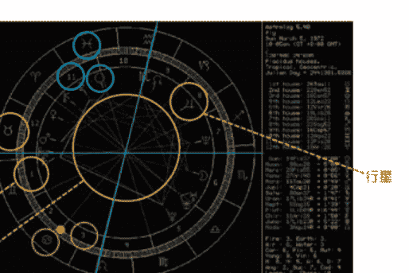

## 更多资料

↓↓↓

## 【中华古籍库】

↓ 点击链接 ↓

https://www.fozhu920.com/list/

珍版刻印 / 海外流传 / 家传手抄 / 民间失传

【易】【医】【道】【武】【文】【奇】【画】【书】

1000000+高清古书籍

## 打包下载

微信：mbook86

# 出生圖 2-1 BIRTH-CHART

了解了幾個出生圖中主要的構成要素後，我們就可以從盤中知道自己的12個宮位落在什麼星座（第一宮就是一般俗稱的上升星座），我們的太陽星座、月亮星座、水星星座…等等，也可以看到我們的太陽、月亮、水星…等落在什麼樣的宮位，同時也可以看到行星與行星之間形成了哪些相位，從形成的相位好壞，了解到行星彼此的關連性，同時由行星座落的星座與宮位，了解到兩星座或兩個宮位之間的相關性。

了解了這些基本資料後，再由這些基本資料之間的相互關係，又可以引申出下列的資訊：

### 1. 上升星：
上升星是指最接近上升點附近的星體，通常是在上升點上、下八度以內的行星，被稱作上升星。上升星會影響上升點的特質，它具有舉足輕重的影響，往往是整個命盤的重心所在。而上升星是哪一顆星往往比在哪一個星座重要，因為上升星通常和上升點同星座，但也有可能落在不同星座。

### 2. 合軸星：
所謂合軸星是指最接近四角基本點附近的星，通稱作合軸星，因此上升星也是合軸星的一種，但因其特別重要，所以分開來看。在特定基本點附近的星越多，代表其對於這個基本點所象徵的東西需求越大。

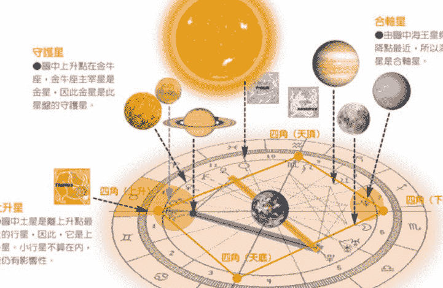

### 3. 主宰星：

什麼是主宰星呢？占星師認為黃道12星座中每個星宮都有屬於它們的主宰行星，也就是將每個星座搭配屬於他們的行星主人。

將星圖分為屬於太陽的半邊（從獅子座到摩羯座）以及月亮的半邊（從巨蟹座到水瓶座）。它們的主宰關係如下圖所示。右半由獅子座（太陽主宰）開始、經處女座（水星主宰）、天秤座（金星主宰）、天蠍座（冥王星主宰，火星副主宰）、射手座（木星主宰）、到摩羯座（土星主宰）結束。左半邊從巨蟹座（月亮主宰）開始、經雙子座（水星主宰）、金牛座（金星主宰）、牡羊座（火星主宰）、雙魚座（海王星主宰、木星副主宰）、到水瓶座（天王星主宰、土星副主宰）結束。其中天王星、海王星、冥王星在未發現前，天蠍、水瓶、雙魚各由火星、土星、木星主宰，後來依照三王星的特性，將天王配給水瓶，海王配給雙魚，冥王配給天蠍，因此這三個星座由兩顆星共管。直到現在，由於一些小行星的性質，也有人將處女座跟小行星帶做關連，將天秤座交給凱龍星掌管，但不是很普遍。一般來說，還是以古法的七星系統為主，偶而搭配三王星使用。

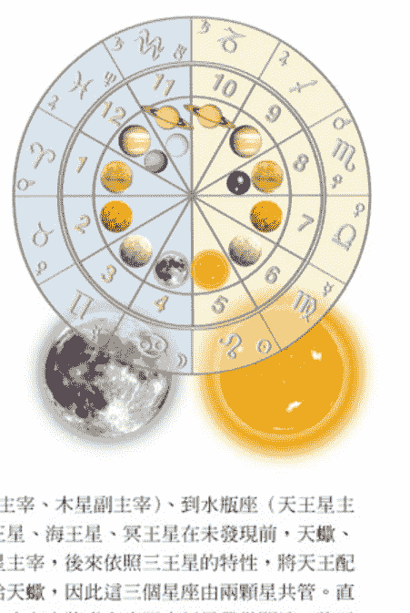

### 4. 宮主星與出生圖的守護星：

宮主星是從主宰星延伸而來的。我們依照每一個宮位的起點來決定宮位屬於哪一個星座，舉例來說，某人出生圖中第二宮的起點在天秤座25度，那麼此人的第二宮（財運宮）就是天秤座。而由於天秤座的主宰星是金星，因此金星就是第二宮的宮主星，宮主星在推運與解盤時是非常重要的依據。

而一張出生圖中，命宮是非常重要的，因為命宮點的確定才決定了整個12宮的位置，因此命宮點是一張命盤的樞紐，所以，命宮的宮主星就特別重要，因此我們特別將命宮的宮主星稱為出生圖的守護星。舉例：某人的出生圖中上升點在牡羊座18度，因為牡羊座的主宰星是火星，因此這個人的守護星就是火星。出生圖的守護星是那一個，或其所在的星座、宮位，對一個人都是十分重要的。

# 出生圖 2-1 BIRTH-CHART

### 5. 守護星所在的宮位：

守護星所在的宮位，通常指出一個人生活的重心，或是其最重要的生活領域，代表他這一生最在意的層面。延續上例，某人的上升點在牡羊座，其守護星是火星，如果他的火星在天秤座，又落在第七宮，那麼如何與他人協調合作或是婚姻配偶就會成為這個人的生活重心，一生中最在意的事。

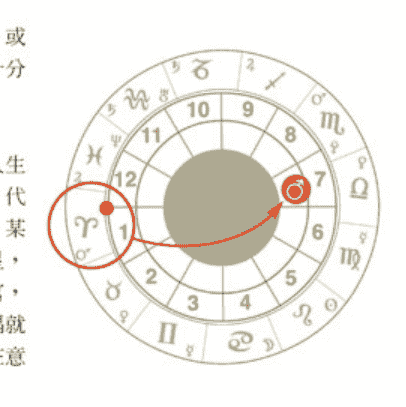

### 6. 陰陽：

在出生圖的星座中，牡羊、雙子、獅子、天秤、射手、水瓶是屬於陽性星座，而金牛、巨蟹、處女、天蠍、摩羯、雙魚是屬於陰性星座，當行星進入陽性星座時，會增加行星陽性的一面，反之，則會增加陰性的一面，若落在陽性星座的行星多些，通常較為陽剛、男性化，反之則通常較為陰柔、女性化多些。

### 7. 三特質：

星座還可以分成三種特質，牡羊、巨蟹、天秤、摩羯屬於主動特質，金牛、獅子、天蠍、水瓶屬於固定特質，而雙子、處女、射手、雙魚則屬於變動特質。把各行星落在星座的特質分別標明出來，可以幫助我們了解一個人的內在動機，主動星座強的人傾向於影響他人，固定星座強的人易於固執己見與堅定，而變動星座強的人則較能適應變局。

### 8. 四大元素：

除了陰陽與特質外，星座還可以分為四象，牡羊、獅子、射手是火象；金牛、處女、摩羯是土象；雙子、天秤、水瓶是風象；而巨蟹、天蠍、雙魚則是水象。將各行星落在星座的元素分別標明出來，可以幫助我們了解一個人主要是偏向哪一個元素，這在性格的分析上十分有用，如果大部分行星落在火象，容易衝動、直接，同樣的土象則保守穩重，風向靈活，水象感性。有時我們也把上升和天頂所落入的星座也一起標示，增加準確性。除了星座可以這樣分成陰陽、特質、元素外，宮位也有這樣的分類方式。

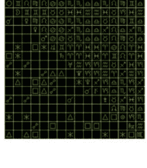

### 9. 相位表：

星盤上一堆線條對一個初學者而言，可能會覺得眼花撩亂，不易掌握，所以將各行星間的相位標列出來的相位表，就變得不可或缺了。就算是一個有經驗的占星學生，也要借重相位表的特性，來幫助分析。

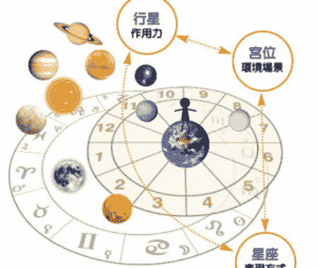

## 出生圖的基本解讀

了解了星盤上的基本要素後，我們要開始對出生圖做解釋了。首先，我們必須了解到星座、宮位與行星之間的關係。占星盤就像是我們人生的一部腳本，行星就是演員，宮位是這部戲的場景，而星座則是表現的方式。當行星與行星之間產生相位，就好像演員與演員之間產生了互動，而有了劇情的高低起伏。從他們（行星）落入的宮位表示了發生的場景，而從所處的星座了解到表現的方式。

大家小時候都玩過一個遊戲：王小明（誰）在公園（哪裡）裡盪鞦韆（做什麼），占星學就有點像這樣，因此，要能夠準確的解釋星盤，必須要清楚的了解12個星座、12個宮位、每一顆行星它們的主要含意，從它們的形成所依據的天文原理，對應於人生的各個層面，配合相位的好與壞，架構出一個人的基本風貌。

占星術是一種符號語言系統，12星座、12宮位、行星、相位都有其基本意義，占星家在世界上找尋最合適的反應與原則，每個符號都有其關鍵的形容字訣，要解讀這些符號並不是輕鬆的，文字往往很難表達，所以很多時候，你必須運用極為豐富的想像力才行。

# 出生圖 2-1 BIRTH-CHART

## 個人星盤

最基礎的解讀便是從個人星盤開始，個人的星座盤是一個嬰兒呱呱墜地那一瞬間的行星分布狀態的凍結，因此從中顯現了一個獨立個體的個性與傾向，他的能量如何反應，對各種事物的偏好，他是一個什麼樣的人，他如何思考，如何表現他的喜好…等，甚至於他是一個好命的人還是一個壞命的人都可以從個人星盤中解讀出來。個人星盤代表的是個人的因果宿命，就像一顆種子，種子本身是好或壞是早已決定的，不會變的，西瓜的種子結出來的一定是西瓜不會是木瓜。但是同一顆種子種在南部或種在北部、種在台灣或種在美國、種在溼地或種在沙漠卻會有不同結果，是否每天澆水施肥還是任憑它自生自滅也一樣會有不同的結果。所以說，先天命雖然是固定的，但是發展卻會因為後天的選擇而有不同的結果。

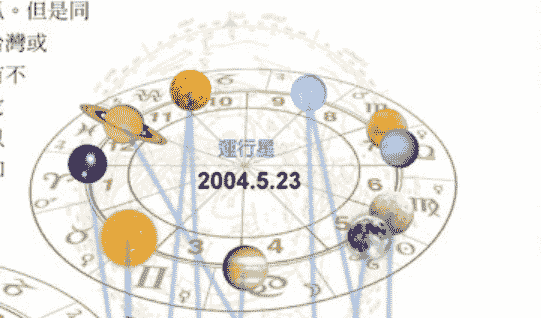

基本上，個人星盤記錄著一個人在人間這個角色扮演遊戲中，角色的基本設定。至於你要怎麼詮釋這個角色，就看你自己的投入了！這裡牽涉到一個基本的問題─自由意志的選擇。原則上，命並非全然確定的，但它又是已決定的，很難懂？以演戲來形容，同樣是張無忌，梁朝偉跟馬景濤演出來的就不一樣，如果你大牌一點，你還可以修改劇本，懂我意思嗎？命的設定是決定的，你無法選擇你的父母、兄弟，甚至你的個性，我為什麼會喜歡她，你根本不知道，但是一切又並非完全不能控制，懂嗎？就像一首歌，旋律是確定的，歌詞是確定的，但是蘇慧倫唱的感覺跟徐懷鈺唱的就不會一樣。因為蘇慧倫表現了蘇慧倫的自由意志，徐懷鈺表現了徐懷鈺的自由意志。但是你知道，這是同一首歌。

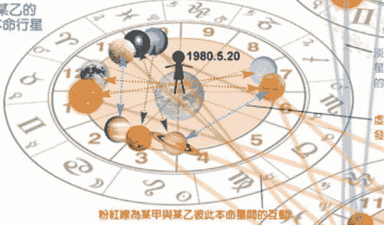

## 個人星盤與運行星

個人星盤詮釋了屬於獨一無二的個體的基本設定，它是不動的，是出生那一瞬間的凝結。可是天上的星星是不斷變動的，它就像一個龐大的命運鐘，不斷的運行，每一個個人的星盤都必須跟著這個大鐘產生反應。這也就是一般所說的運的概念。在不同的時間天上的某顆星引動了個人的某顆星，當天上的星星與個人的星星產生了關係，我們的人生便開始了一個個的段落事件。每一個個人星盤是一個特定時間的點，就像卡通是由一張張靜止的畫面組成一般，將每一個個人星盤集合後，便構成了一個完整連續而不斷運轉的龐大命運鐘。這就是推運的基本概念，利用天上的行星在每一天、每一秒的運行中，與個人星盤產生的關連，而構成了不同的好或壞的影響，依據行星的運動，預測出可能發生的好壞運勢。

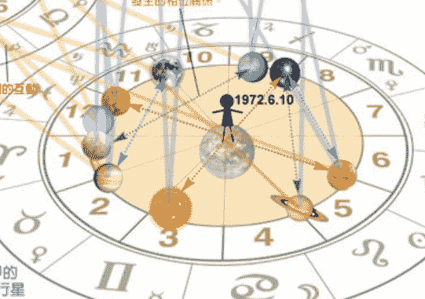

## 行星的分別

行星可以分成本命星、他人星與運行星。本命星是屬於個人出生當時那個時間點的星象。他人星則是另一個人出生當時時間點的星象。而運行星就是推命時當時的星象。因此，每一個人都會有一張獨一無二的星象命盤，而對全世界的每個人來說，大家都會在同一時刻分享同一個運行天象。

## 雙人星盤與運行星

同樣的，當一個人遇到另一個人，彼此的星星便會產生反應，出現彼此行星間的相位，相位當然有好有壞。所以，這就是為什麼我一看到他就不爽；一遇到她，我就好喜歡她，好想跟她在一起。為什麼呢？因為你們的行星之間發生了關連，產生了好的或是壞的頻率。

但是，在共同的命運鐘的影響下，兩個相愛的人各分東西，那個討厭的傢伙卻老是在身旁出現。這就是合盤的觀念，兩個獨一無二的星盤放在一起後，從彼此的星與星間所產生的引動，來看出彼此之間的關連與問題。彼此的相位就像是雙人間的緣分密碼，而當運行星啟動後，就會發生一個個屬於彼此的共同事件。

# 占星學的符號 GLYPH

占星學的符號與特性
占星學是人類數千年來共通的一套想像語言，自然有其特殊的符號，而自成一個系統。對於占星學符號的起源，現在已不可考了，但是可以知道的是，至少在八千年前，就已經有一套占星所使用的語言和文字，雖然現在我們所用的占星符號已和八千年前的人們不同，但是有很大一部分，我們可以看到原始創作的痕跡。
解讀星盤像是一種聯想的藝術，在占星學上，我們可以透過這些現成的符號，去了解占星學的內涵。符號包含二大系統：其中的一個系統，就是星座的符號；另一個系統，就是行星的符號。我們可以經由這些符號，去了解星座與行星的特質，當然其中也包含了許多傳統的神話和文化的價值觀。符號本身具有象徵的力量，占星家運用符號的組合來反應某特定事件的聯想。
除了星座符號與行星符號兩大系統外，星盤上還有相位符號以及一些特殊點的符號，都必須先了解它們的含意，才不會霧煞煞，什麼也看不懂！

## 星座的符號學
占星學所用的各種符號，都有其一定的意義。黃道12星座分別由各自古老的象徵圖形及代表符號來表示，每一個星座都與人類的性格相關，各代表了12種不同的原型象徵。星座的符號是由星座的形象演化而來，以牡羊座的符號來說，象徵牡羊的羊角，也像植物的嫩芽，代表著新生。

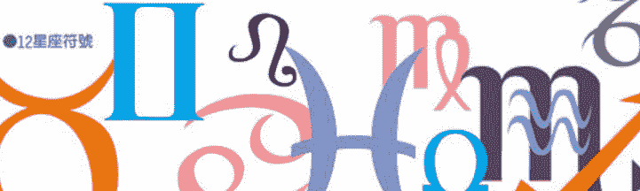

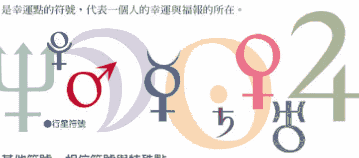

## 行星的符號
行星和星座的特質密不可分，我們也可藉此更了解星座的特質。占星術中，將每一個行星用來象徵每一個人的能量與行為模式，以符號語言來解讀各行星的運動，解釋它們如何反映地球上的生命。行星的符號是由三種基本圖形組合而成，新月形、十字與圓形，這些圖形分別代表著靈魂、物質以及精神。而行星的符號則主要由這三大要素彼此組合來表現各行星的意義。而這三要素的完整組合，就成為地球的符號了！代表終極的完美，這個符號同時也是幸運點的符號，代表一個人的幸運與福報的所在。

## 其他符號－相位符號與特殊點
除了星座與行星符號外，還有相位的符號以及一些特殊點。相位有主要相位與次要相位之分，主要相位有五個，合相（0度）、對相（180度）、三分相（120度）、四分相（90度）、六分相（60度）。
由月亮對地球的關係，還有月交點、月字等符號，以及像福點等特殊點的符號，另外還有超行星系統的符號，小行星的符號，還有四角的簡稱（ASC、MC、DSC、IC）等等，都必須先搞清楚它們的含意喔！

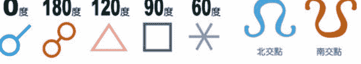

# 出生圖 2-2 GLYPH

1. 牡羊座 **Aries**
    牡羊座的符號是象徵羊的頭，是一種象形的方法，取羊最明顯的羊角和鼻梁部分；由白羊座的神話可以聯想到一些特質，例如衝動、勇往直前。而由另一方面，也有人指牡羊座的符號是象徵新生的綠芽，表現出大地新生和欣欣向榮的景象。

2. 金牛座 **Taurus**
    金牛座的符號是象徵了牛的頭，也是以簡單的線條描繪出牛的形象；由金牛座的神話可以發現，金牛座的外表溫馴，但內心充滿著慾望。由另一方面看，圓圓的牛臉表現出安逸和享樂，但上面的牛角則提示我們牛也有爆發的時候。

3. 雙子座 **Gemini**
    雙子座的符號是Ⅱ，象徵雙胞胎，相較於前兩個符號，就比較抽象了一點；由雙子座的神話可以知道雙子座的二元性和內在的矛盾。其實雙子座所代表的不只是二元性，而是所謂的多元，一方面可以看出其廣，但另一方面也暗示了可能的膚淺。

4. 巨蟹座 **Cancer**
    巨蟹座的符號象徵胸，也就是說明了巨蟹和胸有關，象徵一種家的感覺，同時也和忌妒有關。另一方面，由巨蟹座的神話可以想像，其實巨蟹座的符號是象徵巨蟹的甲殼，由此也可看出巨蟹座所具有的保護特質，和隱藏的習慣，以及不穩定的情緒。

5. 獅子座 **Leo**
    獅子座的符號是象徵獅子的尾巴，高高揚起的尾巴，充分顯示了獅子的個性；由獅子座的神話可以聯想到，獅子的勇敢和善戰。由獅子去聯想獅子座的特性，很容易就可以想到很多，高貴、同情心、王者之風，但是別忘了，母獅子才是出外狩獵的。

6. 處女座 **Virgo**
    處女座的符號是象徵女性的生殖器，或許不容易看出，但如果你注意看右半邊，就可以發現：從處女座的神話中，可看出收成的意涵。由處女去聯想處女座的特質，也可以發現一些，如小心、謹慎、沉靜和羞怯。由另一方面，處女也代表了聰穎和敏銳。

7. 天秤座 **Libra**
    天秤座的符號是象徵一桿秤子，希臘字母Ω代表了衡量，而下面的一則代表了衡量的基礎。在天秤座的神話中可以看出天秤座公平的特質。但由那一桿秤子，可以看出天秤座追求平衡的基本念頭，同時，搖擺不定的秤子也表現出天秤座的猶豫不決。

8. 天蠍座 **Scorpio**
    天蠍座的符號是象徵男性的生殖器，和處女座有點像，也要由右半邊去想像：由天蠍座的神話中，可以知道天蠍座忌妒的來源。由男性生殖器可以知道天蠍座的慾望，另一方面，也有人認為天蠍座的符號是象徵蠍子的甲殼和毒針，表現出復仇的特質。

9. 射手座 **Sagittarius**
    射手座的符號是象徵射手的箭，回到象形的簡單形式：由射手座的神話可以看出射手座的智慧和愛好自由。射手的原型是拿弓箭的人馬，下半身的馬象徵追求絕對自由，上半身的人象徵知識和智慧，而手中的箭，則表現出射手的攻擊性和傷人的一面。

10. 摩羯座 **Capricorn**
    摩羯座的符號是象徵羊的頭和魚的尾，抽象但基本上是象形的：由摩羯座的神話我們可以知道摩羯的擔心和恐懼。摩羯座又稱山羊座，這是由於其上半身的山羊形象所致，有一種向上登峰的慾求，但別忘了，在水面之下摩羯座也有象徵感情的魚尾。

11. 水瓶座 **Aquarius**
    水瓶座的符號是象徵水和空氣的波，是具象但又抽象的：由水瓶座的神話中，可以看出水瓶座的愛好自由和個人主義。象徵水瓶座的波，是高度知性的代表，由波的特性去思考水瓶座的特質，看似有規律，但又沒有具體的形象，是一個不可預測的星座。

12. 雙魚座 **Pisces**
    雙魚座的符號是象徵兩條魚，而其中有一條絲帶將他們連繫在一起：由雙魚座的神話中可以聯想到雙魚座逃避的特質。雙魚座的兩條魚是分別游向兩個方向，除了表現出雙魚座的二元性之外，也象徵了雙魚座內在的矛盾和複雜。

# 出生圖 2-2 GLYPH

1. 太陽 **Sun**
    ●象徵著精神的圓，圓中有一小點，意味著混沌中生命的萌芽。
    太陽守護獅子座：在個人出生圖上的意義是自我表現。為一切行星光之來源，故影響性格。由太陽來看獅子座，可以發現其愛現和發光體的特質；另外，太陽常常被比喻為帝王，這和獅子座的愛面子和王者之風也有關係。

2. 月亮 **Moon**
    ●象徵靈魂的新月，代表著與過去或前世的關連。
    月亮守護巨蟹座：在個人出生圖上的意義是情緒。主宰人的反應，由月亮聯想巨蟹座的特質，立刻想到如月亮圓缺般的情緒起伏，和如月光一般的浪漫；另外，和月亮有關的母親也和巨蟹照顧的特質有關。

3. 水星 **Mercury**
    ●神秘的水星符號，精神連結了物質與靈魂，產生三者的結合。
    水星守護雙子座和處女座：在個人出生圖上的意義是理性。表現人的思考傾向及表達能力。由水星想像雙子座的特質，可以聯想到快速的思考和一大堆的小聰明；當然，雙子的廣播電臺特質也可以由此聯想。由水星聯想處女座的特質，大部分人都可以想到挑剔和分析的特性；但是處女座的細密心思也與水星的守護有關。

4. 金星 **Venus**
    ●代表精神的象徵凌駕了物質，愛與美的追尋。
    金星守護金牛座和天秤座：在個人出生圖上的意義是喜好。主宰人的感情，由金星去想金牛座的特性，常會想到占有慾和存錢的習慣；從另一方面來說，金星也和金牛座和平的特質有關。由金星聯想天秤座的特質，一定不會忽視天秤座的愛美天性；但是同時也因為金星守護的關係，天秤座也可能有享樂主義的傾向。

5. 火星 **Mars**
    ●與金星相反，物質的慾望超越了精神，強烈的占有。
    火星守護牡羊座與天蠍座：在個人出生圖上的意義是衝動，代表人的占有慾表現方式。由火星去聯想牡羊座與天蠍座的特質，很快就可以想到衝動和精力充沛；同時和火星有關的特質還有其不畏一切的勇氣。

6. 木星 **Jupiter**
    ●靈魂在物質之上，代表靈魂支配了物質而提升。
    木星守護射手座與雙魚座：在個人出生圖上的意義是擴展。人的“福氣”，精神生活狀況！由木星去看射手座的特質，可以發現誇張的展現和不斷追求新經驗的特質；另一方面來看，射手座的哲學性也和木星有關。

7. 土星 **Saturn**
    ●物質在靈魂之上，靈魂受物質的禁閉而具體化，充滿困難。
    土星守護摩羯座與水瓶座：在個人出生圖上的意義是限制，以及人的受損方式。由土星去聯想摩羯座的特質，大概都可以想到保守和冷漠；但別忘了，摩羯座重視經驗與踏實的特質也和土星有關。

8. 天王星 **Uranus**
    ●精神上的物質，將靈魂分開，象徵解開過去，邁向未來。
    天王星守護水瓶座：在個人出生圖上的意義是改變，以及與眾不同的能力，由天王星去想水瓶座的特質，其中最明顯的就是水瓶座的標新立異和與眾不同；可是其實水瓶座的發明天分也和天王星有關。

9. 海王星 **Neptune**
    ●被物質打入的靈魂，代表自我犧牲。
    海王星守護雙魚座：在個人出生圖上的意義是夢幻，與個人的想像力相關。由海王星去聯想雙魚座的特質，可以發現其包容力和浪漫的特質；另一方面，雙魚座朦朧的特質也和海王星有關。

10. 冥王星 **Pluto**
    ●靈魂在物質與精神之間，象徵質能的巨大轉變。
    冥王星守護天蠍座：在個人出生圖上的意義是重生，影響人神秘的部分。由冥王星去想天蠍座的特質，不難想到其深沉又不為人知的特色；此外，天蠍座堅強的意志力也和冥王星有關。

## 四小行星

四小行星代表春夏秋冬的過程，婚神星象徵春天，代表婚姻；灶神星象徵夏天，代表努力；穀神星象徵秋天，代表收穫；智神星象徵冬天，代表蘊藏的智慧。

## 凱龍星 Chiron

凱龍星的代表是半人半馬怪凱龍，象徵療傷與不尋常的智慧。

## 月交點 Moon's node

月交點代表潮流的演變，北交點象徵潮流將往的方向，南交點則象徵潮流的過去。

# 占星學的分類法
CLASSIFY

星座分類法的起源很早，依彼此的特性將同一屬性的星座加以歸納。占星學自有一套邏輯，而星座的分類法正是這種邏輯的一種展現，在下面所介紹的幾種分類法，都是由牡羊座開始，將黃道十二星座均等地分入各類別中，而每一種分類法又代表了各自的一種看法，形成各自完整的體系。對一個占星的初學者而言，星座的分類法是記憶與了解星座特質的一個好方法；不但可以將星座的特質作一種邏輯性的記憶，更可以對星座的理論有更進一步的了解，也可以對星座之間的關係有更深一層的認識。

十二星座的分類中，包含了陰陽、三特質與四元素。四元素包括火、風、水、土四種特質，三特質則是三種內在行動方式，為主動、不動、易動。陽性積極，陰性消極。當行星進到主動星座時，他會變得比較主動去改變環境，創造環境，影響環境！而不動星座則行星的特質會傾向不易受環境改變！易動星座則會容易隨周圍改變原有的特質！而四元素也就是四象中火象有熱情；水象重感情；風象有智慧；土象重感官！

因此如果你的行星（太陽、月亮、金星、水星…等）大部分都落在主動星座的話，那你會傾向於是一個主動改變周遭的人。如果你的行星多落在水象的話，則你會是個感情豐富的人！這說明了為何一個處女座的人可能很活潑，如果他的其他行星都是很活躍的像是牡羊或獅子，那他的行為就可能會有火象的樣子！

星座的分類也延伸到了宮位，宮位也一樣可以分為陰陽、三特質與四元素，分類法可以讓我們更容易對一個星座或宮位的特性得到了解，因此如果想了解占星學，哪些星座是屬於哪個元素，是什麼特質，是陽性或陰性是必須清楚的！

## 二分類法-陰與陽

陰、陽二分法是最直接而自然的分法，將星座由白羊座起，單數為陽，雙數為陰。依逆時針方向排列陽、陰、陽、陰，…，這就是就是二分類法。陽性象徵剛強、男性、動態；陰性象徵柔順、女性、靜態。

1. 陽性星座 **MASCULINE SIGN**
    陽性星座有：牡羊座、雙子座、獅子座、天秤座、射手座和水瓶座。與陰性星座相比之下，陽性星座較為外向、主動而帶有侵略性。這類星座的人個性較積極、主動、樂觀、開創性強，成功的機會較大和較快。

2. 陰性星座 **FEMININE SIGN**
    陰性星座有：金牛座、巨蟹座、處女座、天蠍座、摩羯座和雙魚座。相對於陽性星座而言，陰性星座較為內向、被動而有包容力。這類星座的人個性較悲觀、被動、消極，雖然開創性較弱和較慢，但成就具有永恆性。

# 出生圖 2-3 CLASSIFY

## 三分類法—特質 QUALITY

三分類法是由牡羊座開始，依逆時針方向排列為主動、固定、變動，因此同一特質的星座會是彼此的四角，形成十字形。主動象徵自主的改變，固定象徵穩定與不為所動的特質，變動則象徵適應與隨著環境而變化。

1. 主動星座 **CARDINAL SIGN**
    主動星座包括：牡羊座、巨蟹座、天秤座和摩羯座。帶有一種開創的特質。這四個星座分別掌握四季的強旺之時，代表開創和主導：牡羊 (東)主春季；巨蟹 (南)主夏季；天秤 (西)主秋季；摩羯 (北)主冬季。這類星座的人熱切而野心勃勃，熱忱且獨立，心思快捷；但不易滿足，做事倉促草率，枉顧他人感受，專斷自我。

2. 固定星座 **FIXED SIGN**
    固定星座包括：金牛座、獅子座、天蠍座和水瓶座。帶有一種守成的特質。這四個星座皆固定於每個季節的末段，代表守成、忍耐和穩定。這類星座的人專注、意志力強、穩定、眼光遠大、記憶力強、洞察及分析力俱佳，成功雖遙遠根基扎實；但頑固、自我中心且一成不變。

3. 變動星座 **MUTABLE SIGN**
    變動星座包括：雙子座、處女座、射手座和雙魚座。帶有一種適應的特質。這四個星座處於每個季節的轉換，正是預備換季的時候。因此這四個星座代表變動、適應和轉換。這類星座的人多才多藝、善於變通、心思細膩、適應力強；但狡猾、詭詐、短視、不夠可靠而且缺乏恆心。

## 四分類法—元素 ELEMENT

西方將世界分為四大元素，占星學也以此將星座分為四類，由牡羊座起，依逆時針方向排列為火、土、風、水…，稱為四分類法。將十二星座分類為火、土、風、水等四大元素，這四大元素在黃道十二宮的排行上對應，相生相剋。其中，火象與風象屬於陽性星座。土象與水象則是陰性星座。火象代表直覺，是屬於易怒的氣質；土象代表感官，是憂鬱的氣質；風象代表智慧，屬於快活的氣質；水象則是感覺，是冷靜的氣質。

1. 火象星座 **FIRE SIGN**
    火象星座包括：牡羊、獅子、射手。一般來說，火象星座較為衝動，重視直覺，很有自信但卻沒什麼耐性。溫暖、狂熱都算是火象的基本特色，而他們最擅長的拿手絕活是「煽風點火」、「鼓動人心」，他們的脾氣有點火爆，是想到說到就要做到的行動派。這類星座的人性格熱情、果斷、自信、率性而天真；但是也自負、專橫、霸道、衝動和激烈。大多充滿熱情，性格激烈。是非常有個性的一群。因為火需風的助力方能燃燒，所以和風象星座比起來是處於弱勢地位。

2. 土象星座 **EARTH SIGN**
    土象星座包括：摩羯、金牛、處女。一般來說，土象星座較為實際，重視感官，有豐富的常識但是固執己見。穩定、現實主義是土象的基本特色，他們重視物質條件及感官享受。因為是跟隨在火象星座之後，所以他們肩負著達成任務的使命。它們是黃道十二宮的構成者。這類星座的人性格實際、獨立、保守及官能主義；但是笨拙不靈巧，流於物質主義。做事小心謹慎，踏實穩重。是非常實際的族群。大地需要水的灌溉滋潤，否則就會乾涸龜裂，所以容易受水象星座引導。

3. 風象星座 **AIR SIGN**
    風象星座包括：水瓶、雙子、天秤。一般來說，風象星座較為理性，重視思考，能客觀看待人、事，但是較為冷漠。富有智慧、善於交際是風象的基本特色，他們尤其擅長演講及說服的差事，憑藉巧言令色的絕活，他們能接續土象星座打下的基礎而發揚光大。這類星座的人表達力強、重思考、有邏輯頭腦、心胸廣闊而且客觀；但過於理想主義、冷漠和不切實際。處理感情問題時格外冷靜。是十分理性的族群。憎惡嘈雜浮動的他們，能很快的被土象星座的穩重吸引。

4. 水象星座 **WATER SIGN**
    水象星座包括：雙魚、巨蟹、天蠍。一般來說，水象星座較為感性，重視感情，想法浪漫但不切實際。情緒、感覺、想像力是水象星座的基本特色，他們雖然不如風象星座的能言善道，但他們藉由情感的表達來傳遞他們對這世界的感受卻是無人可及的。這類星座的人直覺強、敏感、多愁善感、深情而且持久；但易受外界影響，放縱、自憐、經常猶豫不決、心思細膩而敏感，十分情緒化，是感性的一群。過於感受性而缺乏魄力，因此需要火象星座的衝擊。

# PART2-4 十二星座 12-SIGN

12星座的基本介紹
在占星學上，黃道12星座是宇宙方位的代名詞。黃道12星座代表了12種基本性格原型，一個人出生時，各星體落入黃道上的位置，說明著一個人的先天性格及天賦。黃道12星座象徵心理層面，反映出一個人行為的表現方式。簡單的說，12星座是12種基本的分類，象徵宇宙的12種型態。因此，12星座也跟顏色、金屬、寶石、動植物等等有所對應，至於人體那更是不用說了。所謂天人合一，天上的變化會引發種種地上的對應，天、地、人彼此是相互感應，息息相關的。

- 牡羊座：頭部
    優點：心思單純、有正義感、勇敢不怕困難
    缺點：重自我、不顧他人、急躁、衝動

- 雙子座：手、肺
    優點：反應快、機靈、足智多謀、口才好、多才多藝
    缺點：不專心、容易矛盾、見異思遷

- 天秤座：腎臟
    優點：追求公正、喜愛美麗事物、優雅、浪漫、會交際、善謀略
    缺點：猶豫不決、好辯、愛找藉口、好逸惡勞

- 天蠍座：生殖器
    優點：執行能力強、意志堅定、情感忠貞、深沉內斂
    缺點：報復心重、愛恨分明、佔有慾強、有疑心病

- 射手座：大腿、臀部
    優點：樂觀、愛好自由、坦率率真、活潑大方、和平友善
    缺點：太過直率、粗心大意、做事衝動、喜怒形於色、沒耐心

- 金牛座：喉嚨
    優點：有耐心、脾氣溫和、腳踏實地、堅持到底、有藝術氣息
    缺點：固執、不知變通、佔有慾強

- 摩羯座：膝部、骨骼
    優點：重傳統、不畏艱難、謙遜有禮、重紀律
    缺點：只顧自己、不夠浪漫、不會變通、太現實

- 巨蟹座：胸部、胃
    優點：感情真摯、念舊、懂得體貼、善解人意
    缺點：情緒起伏不定、多愁善感、過度保護自己

- 水瓶座：小腿、循環系統
    優點：樂於助人、有創意頭腦、有前瞻性
    缺點：特立獨行、怪異行為、對人冷淡、不切實際

- 獅子座：心臟
    優點：熱情、大方慷慨、同情弱小、有領導力
    缺點：自尊心強、好面子、浪費、喜歡被奉承

- 處女座：腸、消化系統
    優點：守秩序、勤勞、追求完美、做事有條理、會服務別人
    缺點：吹毛求疵、囉嗦、人際關係不好、杞人憂天、神經質

- 雙魚座：腳、體液
    優點：慈悲、會體諒別人、想像力好、溫柔、善解人意、重感覺
    缺點：太情緒化、逃避現實、不會理財、愛說謊、有濫情傾向

# 出生圖 2-4 12-SIGN

### Aries〔牡羊座〕

⊕ 陽性 ■ 主動 F 火象

主宰星體：火星♂
守護星為熱和乾燥的火星。積極、鬥志高昂，頗有開拓者的精神，由於正義感強，所以有路見不平拔刀相助之風，善惡分明、嫉惡如仇。

牡羊座是黃道12星座中的第一個星座，太陽通過此星座約在3/21日至4/20日左右，這段期間就是夜間要變得比晝間短的「春分」時節，各種花卉開始綻放開花，萬物開始復甦。星座圖像是代表衝動莽撞的一頭公羊，象徵著直接與向前開拓的特性。他的基本含意是自我主義，新生與開始，爭鬥性與開拓性，凡事不退讓、爭奪第一的傾向。

受到火星的影響，具有戰鬥性與競爭性。性急、暴躁、好鬥，生命力強，企圖心旺盛，獨斷、自以為是、不聽他人意見，勇敢大膽、不怕困難。

### 特性

牡羊座強勢的人善於開創，凡事爭先的性格，常能成為開路先鋒，是充滿活力而幹勁十足的活躍者。他們做事很有衝勁，勇往直前不怕困難，以爭取天下第一為其職志。不過他們往往過於急躁，而且只有三分鐘熱度，容易令人感到有勇無謀，加上未經世事磨練，缺乏思考而貿然行事，經常功虧一簣而感到後悔。他們好勝、喜愛競爭，容易跟別人產生衝突，由於過於自我，他們經常不顧他人感受、讓人不舒服。牡羊座的人對新鮮的事物都很投入，對新的事物容易興奮且好奇，勇於嘗試，追求速度，像羊一般做事衝動莽撞。他們容易給人精力旺盛和辦事能力很強的印象，性格剛烈、易怒，是個天生的鬥士，身手矯健，但在意中人面前會流露出孩子氣。

### 相關對應

- 顏色：紅色
- 人物：戰士、軍人、拓荒者、鐵匠、屠夫、救火隊、好打鬥的人
- 事件：打架、戰鬥、競賽、救火、生氣
- 物件：刀劍、槍砲、火、羊、尖銳物、烤箱
- 場所：戰場、競技場、乾燥地、五金行、消防局

### Taurus 〔金牛座〕

⊕ 陰性 ▲ 固定 E 土象

**主宰星體：金星** ♀
守護星為象徵美和愛的金星。和平主義者，內向而害羞，喜歡美好有價值的事物，慎重小心，一旦下了決定就絕不輕易更改。

金牛座是黃道12星座中第二個星座，太陽通過此星座在4/21日至5/20日期間，正是春花盛開的美麗季節。星座圖像是安靜又溫和的公牛，象徵著務實安定與溫順。他的基本含意是圓滿與自然而為，保守穩固、物質主義、實際的擁有與感官的物慾。

受到金星的關照，金牛座強的人多半具有較美好的外表，性格溫文儒雅、溫和、忠誠而且具有耐力。愛美、喜好美食，重視價值與物質享受，容易流於現實，有強烈的審美觀、而且熱愛大自然。

### 特性

金牛座強的人具有美好與調和的精神，更是溫順可親的人，實際、忠誠、有耐心。因為務實的性格，使得他們很懂得分析投資報酬率。他們不做沒意義的事，在意事物的價值。他們雖重視工作，如牛一般勤奮努力，但卻不會忽略休息的重要性，因此他們也喜歡享樂，在沒人打擾的狀況下，容易懶惰怠慢、放縱自己。他們也具有牛一般的固執脾氣，固執己見，鑽牛角尖且頑固古板。金牛座與偶爾狂野、偶爾安靜的自然力量有關，他是跟地球最相關的星座。雖然他們平常總是一副溫和的模樣，其實卻很倔強，而且佔有慾強，一旦使他們發怒，就會非常強烈，一發不可收拾。他們世故但性格穩重持久、有耐性、實際，但也缺乏應變能力，因為過於實際，也有貪婪的一面，對金錢比較執著。

### 相關對應

- **顏色**：黃橙色
- **人物**：畜牧者、資本家、音樂家、園藝家、溫和的人、銀行家
- **事件**：藝術、音樂、商業、理財、資本主義、園藝
- **物件**：美的東西、美食、金錢、牛、飾品、有價值的東西
- **場所**：大自然、田園、銀行、音樂廳、美術館

### Gemini 〔雙子座〕

陽性 變動 風象

**主宰星體：水星**
守護神為司掌智慧和辯才的水星。頭腦反應快、理解力好，能舉一反三，收集情報的能力好，適合有改變的環境性質。

雙子座是黃道12星座中第三個星座，太陽通過這星座在5/21日至6/21日期間，是春天轉為夏天的時刻。星座圖像是以一對雙胞胎為代表圖案，暗示出他的雙重個性。他的基本含意是雙重與矛盾、多元性的變化，多才多藝與一心多用，反應靈敏、具有變通性。

受到水星的主宰，因此它和學習及溝通有關。他們非常聰明，有敏捷靈巧的機智反應，喜歡追求不同的知識與訊息。他們學東西很快，並且能把學到的新東西，很快地傳達出去。善於溝通表達，也很會與人談判及交易。

### 特性

雙子座強的人大多多才多藝，求新求變的性格趨使下，使他們欠缺耐心，學東西不夠深入，容易多而不精。當他們覺得所學不夠時，會使他們常有神精緊張的現象。由於對事物缺乏恆心，經常讓人感覺到他們喜新厭舊而善變。他們就像花蝴蝶般穿梭於每個人之間，由於口才很好，因此很愛說話。不但頭腦靈敏多變，而且推理能力優於他人甚多，他們是天生的傳遞者，是人與人間的溝通媒介。他們反應很快，能夠舉一反三，喜歡耍耍小聰明，但容易浮誇不實，狡猾、光說不練。他們看起來機靈而且令人覺得活潑生動，一雙靈動好奇的眼睛、加上多才多藝，因而容易受異性喜愛，但生性輕浮善變，並有雙重性格，給人非常花心的印象。

### 相關對應

- **顏色**：黃色
- **人物**：兄弟姊妹、同學、鄰居、報馬仔、媒體人、記者、機靈的人
- **事件**：新聞、資訊、廣播、交通、八卦流言、交談
- **物件**：信件、電話、交通工具、雜誌、海報
- **場所**：學校、馬路、郵局、電台、便利商店

### Cancer 〔巨蟹座〕

陰性 主動 水象

**主宰星體：月亮**
月亮為其守護神，因此感性而細膩，情緒的起伏很大，好惡感重，重視家庭的和諧，討厭與人起衝突，創造力、感受力特別強。

巨蟹座是黃道12星座中第四個星座，太陽通過此星座的6/22至7/22的期間正好是夏天來臨的時刻，也是日照從最長開始轉短的時期。代表圖像是一隻螃蟹，意味著這個星座的人在受到傷害時會躲進殼中以保護自己。他的基本含意是保護與防衛，安全感與滿足感，敏感的心情感受與情緒波動。

受到月亮的影響，巨蟹座的人具有天生的母性，很會關心照顧別人，他們很重視親情並且喜歡家庭的溫暖，因為在家中會讓他們有安全感，善於打理家裡，能把家事做得不錯，具有豐富的生活能力。

### 特性

巨蟹座強的人讓人感覺親切、溫馨，情感非常豐富，很容易情緒起伏，他們情緒變化豐富而感性，渴望溫情的撫慰，容易缺乏安全感。他們記性特別好，因此非常念舊，喜歡收集過去的回憶，也容易翻舊帳。因性格敏感害羞而容易有焦慮不安的情緒反應，過於情緒化、自憐、難以取悅。他們的本位主義十分強烈，對於陌生的人、事、物想要進入他們的情感中，不是一件容易的事，對外來的排斥性很強，所以家國觀念非常強烈。憂鬱的天性，眼神充滿感情，給人善解人意的感受。不論男女，巨蟹座的人都具有一種母性特質，會本能的去關懷無助而依賴心重的人。他們遇到問題時總是迂迂迴迴的，不會正面解決，往往使問題更加嚴重。

### 相關對應

- **顏色**：灰藍色
- **人物**：母親、奶媽、皇后、廚師、照顧者、情緒化的人
- **事件**：歷史、家庭、關心、心情、家族、回憶、烹飪
- **物件**：土地、房子、烹飪用具、家用品、古董、甲殼動物
- **場所**：家裡、廚房、餐廳、水邊、古董店

# 出生圖 2-4 12-SIGN

### Leo 〔獅子座〕

陽性 固定 火象

**主宰星體：太陽**
太陽為其守護神。開朗、心胸寬闊、獨立心強，喜歡當領導者、大姊頭、老大去照顧他人。所以在團體中總是最耀眼而可一展雄風。

獅子座是黃道12星座中第五個星座，太陽在7/23日至8/22日通過獅子座，正是盛夏時節。以萬獸之王的獅子為星座的象徵圖形。表現出獅子的尊貴與高高在上，驕傲、忠貞和凶猛。他的基本含意是中心與重心，代表所有事物的焦點，因而期待成為佼佼者，受人注目、如王者般君臨天下。

受到太陽的關照，他們重視榮譽，具有高貴的氣質，光明而熱情。喜好華麗耀眼明亮的事物。他們天生具有父性，像太陽一般照耀四周的人，慷慨大方的付出自己。也喜歡受到注目，愛現、虛榮。

### 特性

獅子座強的人有領導者的風範，他們天生貴氣，莊重而高貴的態度，具有堅定不移的個性。為人光明磊落，對耍小手段的行徑嗤之以鼻。他們重視名聲，不願意一個人默默無聞，因此常用誇張的舉止表現來引起大家的注意。但是過度的自尊心容易讓他們顯得自大，同時過度地玩樂也要當心不要樂極生悲。出生於陽光閃耀中的獅子座，個性格外的熱情開朗而且活得十分快樂，喜歡熱鬧及耀眼的光芒，深受戲劇或創造性的形式所吸引。因為受到重視可以使他們得到快樂，因此他們會盡力去成為眾人的焦點或是領導者。他們像個愛玩的小孩，有強烈的創造天賦、不錯的舞蹈及演戲天分。因為天生熱情開朗，因此戀愛對他們的人生格外的重要，他們會對所愛的人有責任感，並且忠貞不貳。

### 相關對應

- **顏色**：金黃色
- **人物**：父親、國王、領導人、英雄、明星、貴族、舞者
- **事件**：表演、登基、創作、娛樂、英雄主義、權勢
- **物件**：名牌、寶物、黃金、向日葵、權杖皇冠、貓科動物
- **場所**：宴會、舞廳、公園、總統府、娛樂場所、表演場地

### Virgo 〔處女座〕

陰性 ● 變動 ● 土象

**主宰星體：水星**
守護星為支配智能的水星。觀察力入微，分析能力強，任何事情都能從各種角度切入，在團體中最適合作個智囊人物。

處女座是黃道12星座中第六個星座，太陽將通過處女座的8/23至9/22日，是夏天轉換成秋天的時節，其象徵圖形是一名手持麥穗，像天使似的少女模樣，這意味著處女座的純真與潔淨。其基本含意是極致的完美，條理分明與整齊的秩序，不斷的分析與消化。

受到水星的影響，使他們擁有聰明靈巧的心智反應，為人實際，善於分析與批判，溝通表達能力不錯，但與雙子座的口才不同，他們較偏重於文字的表現。拘泥於細節，而且小心翼翼，挑剔而且嘮叨。

### 特性

處女座強的人非常要求完美且重視細節，往往能注意到枝微末節，在別人眼中常會覺得他們很細心，如果有充裕的時間，他們會把事情做到盡善盡美。行事條理及做事謹慎的態度，使他們有條不紊。但要過度挑剔的性格使他們容易忽略大處，往往會有見樹不見林之感，在時間緊迫的狀況下，工作壓力容易令他們精神緊張。他們一般都非常實際，熱愛工作，喜歡服務他人。處女座的人極度愛乾淨，具有纖細的感受性，身體的健康對他們是非常重要的，因而偏愛健康的飲食與生活方式。他們善於分析、批判，因此容易批評他人，總給人吹毛求疵的感覺。愛好工作，尤其是具有服務性質的，同時專注細節的特性，使得他們往往是專業技術的人才。

### 相關對應

- **顏色**：綠色、暗棕色
- **人物**：護士、勞動者、完美主義者、評論家、處女、秘書、服務生、部屬
- **事件**：工作、健康、衛生、營養、專業技能
- **物件**：健康食品、寵物、清潔用品、作文、顯微鏡
- **場所**：衛生所、工作場所、乾淨的地方、服務機構

# 出生圖 2-4 12-SIGN

### Libra 〔天秤座〕

⊕ 陽性 ■ 主動 A 風象

**主宰星體：金星** ♀
代表美和調和的金星為其守護星。應對得體、舉止優雅、公正而不偏不倚，注重和諧，因此團體中常擔任和事佬。

天秤座是黃道12星座中第七個星座，太陽將通過這星座的9/23～10/23日期間，是空氣十分清爽的秋分季節。出生於晝夜均等時期的天秤座的人，是具有冷靜、公平批判力與富於理性者。星座圖像為正義女神所提的天平，象徵著公正平衡與正義。基本含意是和諧與調節，客觀的衡量，強調彼此合作關係的平等，具配合與妥協性。

受到金星主宰的天秤人，具有天生的美感，喜歡一切優美的事物，儀態優雅而高尚，深具魅力。善於社交活動，渴望獲得他人的認同。

### 特性

天秤座強勢的人重視公平，注重人際關係，喜歡和諧的氣氛。他們很理性，看事情的角度為多方面，往往會提出正面及反面意見，他們有時會為了追求公平，站在弱勢的一方，但那不代表是他心中真正的想法。他們喜歡藝術及美的事物，有很好的審美觀，很有文化氣息。因為強烈的正義感，會設身處地為別人著想，具有很高的妥協性。因此多半有不錯的人緣。但是因為重視公平的特質，常會造成欠缺決斷力，使別人覺得他們優柔寡斷，同時因為不願破壞和諧的氣氛，而不將心中的想法表達出來，容易有虛假的事情發生，使別人覺得他們偽善及鄉愿。他們非常擅於與他人交際，注重跟他人之間的關係是否和諧，因此他們非常注重婚姻關係，也努力於合夥關係的穩定。

### 相關對應

- **顏色**：淡綠色
- **人物**：協調者、斡旋的人、外交官、配偶、設計師、合夥人
- **事件**：社交、婚姻、契約、藝術鑑賞、合夥、公關、和平
- **物件**：藝術品、時尚、化妝品、天秤、鴿子
- **場所**：仲裁所、美術館、禮堂、交際場所

### Scorpio 〔天蠍座〕

- 陰性
- 固定
- 水象

**主宰星體：** 冥王星 ♇ 火星 ♂
**守護星為具有爆發力、洞察力的冥王星。個性陰沉、讓人捉摸不定，內心深處蘊涵強烈的猜疑心、鬥爭心，談感情很容易走極端。**

天蠍座是黃道12星座中第八個星座，太陽是在10/24～11/22日期間通過這星座，季節為已近秋末。星座圖像為蠍子，具有毒性的尾針，象徵這個星座的人就像蠍子一般，當受到威脅時，會給人致命的一擊，極具危險性。基本含意是強烈的慾望，毀滅與重生的力量。以牙還牙，以眼還眼。

受到火星與冥王星的影響，使得天蠍具有強烈的爆發力與破壞力，深不可測的內在與強旺的主宰慾，充滿了神秘感。冥王星的黑暗特質，對人性黑暗面的透測，增加他們對環境的洞悉能力。

### 特性

天蠍座強勢的人有很強的心靈直覺能力，能夠觀察周遭的變化而有所因應，感應到玄祕的黑暗世界並且看穿別人心中的想法。他們善於謀略且攻於心計，能長時間策畫一件事。他們有向困難挑戰的決心及勇氣，就算是他們已經無路可走時，也會有逆轉性的變化發生。極端的個性，往往使他們喜歡絕對地掌控一切，重情重義的性格使他們有很強的佔有欲。但是因為報復心的趨使下，使他們容易作出毀滅性的行為，同時因為在意完全的佔有，而造成他們的得失心太強。天蠍座的人當走投無路時，會有自我毀滅及同歸於盡的傾向。他們性格頑固而且不易妥協，愛恨分明，外表冷漠但內心狂放熱情，容不得背叛、猜忌心重、嫉妒心強。會將情緒隱藏起來，因此給人抑鬱而神秘的印象。

### 相關對應

- **顏色：** 深紅色
- **人物：** 間諜、偵察員、犯罪者、心理學家、喪葬業者、陰謀者
- **事件：** 生死、保險、遺產、心理學、性、陰謀、火山爆發
- **物件：** 寶藏、毒蠍、石油、核能、爬蟲類、秘密檔案
- **場所：** 地底深處、火山、色情場所、廢墟、淤塞的池塘、下水道

# 出生圖 2-4 12-SIGN

### Sagittarius 〔射手座〕

陽性 ● 變動 F 火象

**主宰星體：木星**
司掌自由的木星為守護星。樂觀、冒險心旺盛，喜歡交朋友、旅行，討厭受束縛，追求一種自由奔放的人生。

射手座是黃道12星座中第九個星座，太陽通過射手座在11/23到12/21日，秋天轉入冬天時。星座意象是代表神話中的半人半馬怪，象徵同時具備人性與獸性的雙重特質。神話中的人馬是一個精通各種學術的智慧生物，表現出射手座的高層次特質，他的基本含意是追尋與探索，追求自由而隨性，像那雙箭不斷朝著目標前進，不會彎曲與後退。

受到木星眷顧的馬兒，是天生的幸運兒，天性樂觀，坦率而直接，不會拐彎抹角。自信充滿活力，總是靜不下來。同時具有強烈的理想主意與冒險精神，勇於向未知的領域探索。

### 特性

射手座強的人熱愛自由，喜歡探險、追求知識新挑戰與文化探索。他們喜歡到處去遊歷，「行萬里路，讀萬卷書。」正是他們的最好寫照。喜歡從前人的經驗中體會出智慧，因此他們富有哲理性。狂放不羈的性格使他們酷愛大自然，不喜歡受拘束，而幸運之神也常降臨他們身上，使得他們很有自信。但是瀟灑的個性使他們不願安定，常用行為逃避而遠走他方，使別人覺得他們不負責任，而他們過度的自信心常會有喜歡渲染誇大、輕忽的行為表現，常常是他們失敗的根源。他們往往給人粗枝大葉的印象、熱情而且愛好運動，性格像是狂風般的快速，又像飛箭似的突飛猛進。常常因不夠圓滑、過於直接的性格而無意中傷人而不自知。

### 相關對應

- **顏色**：紫色
- **人物**：運動員、冒險家、教育家、哲學家、外國人、旅人
- **事件**：旅行、探險、國外、教育、道德
- **物件**：箭、馬、書籍、運動器具、舶來品、飛機
- **場所**：運動場、異地、法院、大學、天空

### Capricorn 〔摩羯座〕

陰性 主動 土象

**主宰星體：土星**
忍耐、抑制的土星為其守護星。努力而踏實，一步一步地慢慢來穩扎穩打，任何事都講求公平合理，嚴以律己也嚴以待人。

摩羯座是黃道12星座中第十個星座，太陽通過這星座在12/22到1/20日期間，即是冬至季節，是夜間最長之時。星座象徵圖形被描繪成羊身魚尾的圖像，象徵摩羯座的人像山羊攀越高峰一般，追求著人生的高峰。另一半魚尾落於水中，表示摩羯不為人知感性的一面。他的基本含意是保守與節制、嚴肅謹慎，為了爬到頂點而刻苦努力。

受到土星的主宰的摩羯，是先天下之憂而憂的一群，一生充滿著不斷的挑戰，穩健踏實而內斂、善於自律，具有強烈的耐力和長期的執著。重視法律與傳統，遵守規則與命令。

### 特性

摩羯座強的人個性沉穩，重視紀律，在他們心目中，沒有一步登天的想法，總是務實的努力工作。就算他們總是遭遇到困難和挫折，或是別人的冷嘲熱諷，也不以為意。將失敗的痛苦轉換成未來成功的經驗，同時也將這種經驗和別人分享。他們的組織架構能力很好，層次分明、井然有序，他們也遵守秩序，注重公權力及權威，他們自律甚嚴，有堅強的忍耐性。不過踏實的性格，使他們很喜歡向別人說教，讓人覺得嚴肅。堅忍的個性，經常過分壓抑自己，造成自己極大的痛苦，產生悲觀的生活態度。他們看來略顯陰沉，總是在自己周圍建立一道高牆，令人有難以親近的印象。他們會不斷的往上爬，絕不允許任何人事阻礙其達到頂端，為求得名利與權位，可以不計代價的辛勞來證明自我的價值。

### 相關對應

- **顏色**：暗褐色、灰黑色
- **人物**：老人、實業家、政治家、建築師、嚴師、警察
- **事件**：建築、挑戰、野心、法令、傳統
- **物件**：地基、石頭、城牆、礦物、山羊
- **場所**：高山、監獄、警察局、地下室、高塔

### Aquarius 〔水瓶座〕

陽性 ▲ 固定 A 風象

**主宰星體：天王星 土星**
司掌改革的天王星為其守護星。富有創造力及博愛精神，十足的理想主義者，所以會有脫離現實，一味追求理想的傾向。

水瓶座是黃道12星座中第十一個星座，太陽在1/21日到2/18日期間通過這星座，就是正值冬末的時節。星座象徵圖形是一名拿著水瓶倒水的童子，水流代表波動，象徵著資訊的傳遞。他基本的含意是創新與改變、獨立性與個人自由、古怪、不合常理。

受到土星與天王星雙重影響的水瓶子，具有土星的冷漠與邏輯性，但卻急於跳脫，以天王星的反叛、改革來破壞舊有制度，標新立異、與眾不同。但也過於執著自我，流於意識形態。同時聰明、具有科學發明、創造新科技的能力。

### 特性

水瓶座強的人天性喜歡結交朋友但是又重視個人的獨特性。他們像是外星人一樣，想法與一般常人不同。他們喜歡突破傳統束縛，追求特立獨行，是個思想前衛及性格叛逆的人。喜歡創新的性格，使他們的邏輯思考能力很好，能從事科技的發明並且不斷改良及求新求變，同時逾越傳統的思考格局。他們厭惡權威與特權，並且勇於挑戰權威，具有人道主義的精神與社會意識，認為每個人是獨立的個體，不願破壞人我之間的分際。然而過度要求與眾不同而標新立異，常令人有突兀的感覺。對人冷漠加上固執的性格，為追求自我空間而獨來獨往，容易成為別人排擠的對象而變得與世隔絕。他們對新科技能很快的接受，富有改革精神及高貴的情操，但有缺乏熱情的缺點。

### 相關對應

- **顏色**：天空藍、金屬灰
- **人物**：占星家、發明家、革命分子、特異分子、朋友、社團同好
- **事件**：發明、新科技、社團、人道主義、世界大同
- **物件**：雷電、波、電腦、網路
- **場所**：公共空間、議會、實驗室、研發處

### Pisces [雙魚座]

陰性 變動 水象

主宰星體：海王星 ♆ ：木星 ♃
守護星是支配第六感、同情心的海王星。與生俱來良好的第六感，頗有藝術家氣息。由於同情心，因此很容易犧牲自己去成全別人。

雙魚座是黃道12星座中最後一個星座，太陽在2/19到3/20日期間通過雙魚座，正是冬天結束，轉入風和日麗的初春時節。星座符號象徵二條連在一起朝不同方向游動的魚，這代表著雙魚座天生的雙重性格。他的基本含意是模糊與包容，虛幻而浪漫、不切實際。缺乏意志力，容易隨著環境而變化。
同時受到木星與海王星關照的魚兒，他們天生仁慈寬大、不愛與人爭、得過且過，對世俗功名不在意，容易活在自我營造的虛幻世界中。想像力豐富，具有特別的靈動力，能夠輕易感受到他人的情緒。

### 特性

雙魚座強的人十分純真而充滿浪漫情懷，性格迷人又有同情心。浪漫的他們大都富有想像力，喜歡做夢、喜歡幻想，常藉著藝術來宣洩自己的情感。他們像魚一樣滑溜而難以捉摸，個性模糊，容易隨波逐流，情感變化快速、莫名其妙。性格隨緣，情感異常豐富，有很強的直覺能力。他們像大海一樣，有著無窮的包容力，能為別人無怨無悔地付出犧牲而不求回報。因為過於虛幻的性格，常使自己沉醉在夢幻中，逃避現實。不夠真實，缺乏人生目標，常把別人對自己的期望，錯認成自己的目標。而過於同情別人，使自己身陷在悲哀的情感糾葛中，加上不善拒絕別人，讓人覺得過於濫情，也容易有欺騙情事發生，沈淪在自我犧牲的痛苦情緒下。

### 相關對應

- **顏色**：柔和偏暗的海洋綠
- **人物**：漁夫、藝術家、墮落的人、暗中的敵人、出家人、靈媒、醫生
- **事件**：隱藏的秘密、隱居、不倫、囚禁、白日夢、夢境
- **物件**：影像、偽造物、麻醉物、海、酒精、魚
- **場所**：醫院、海邊、精神病院、公益機構

# PART2-5 十二宮位 12-HOUSE

占星學上的宮位
在占星學中，主要的分析是以星體所落入的星座和宮位來判斷，再加上星體間相對位置的分析，就可以大致地分析一個人天生的性格，如果說行星對應星座是人與天的關係，行星對應宮位就是人與地球的關係。

現在我們就占星學上的宮位作概括性的介紹。因為地球自轉的變化，出生時，東方地平線與黃道的交點決定了第一宮，然後依序分出後天12宮位。黃道12星座是指宇宙的絕對方位，是不變的；而後天12宮位是以觀測者座標所觀測的相對方位，同樣地也是分為12個區域，它們是會隨著地球經緯度的不同而有所變化，同時也因為觀測者的所處緯度不同而造成各宮位範圍不一定一樣大，不像黃道12星座的每一個星座都是30度。後天12宮位代表了後天環境的影響，象徵一個人與世界的接觸與互動，在個人的出生圖中，不同的宮位代表個人不同的生活領域，也同時反映出各個不同的心理面向。

在現代的心理占星學中，不但把傳統占星學的說法重新解釋，更利用了不少新的心理學知識來作為論述。宮位落在黃道12星座的起始位置，說明著一個人某方面人生舞台的表現態度，而在宮內的星體，更說明一個人在該舞台的行為能力。同樣的宮位，也會因為落入的行星的強調，而會有不同的解釋。占星學中以後天12宮位說明著12種人生的舞台，而你會發現這12種人生舞台是和黃道12星座（先天宮）非常類似與相關連的。

### [十二宮的意義]

行星是演員：星座是演員的表現；
而宮位則是該角色所投入的情景

十二宮代表人生不同的活動領域，而於個別「後天宮」出現的行星則強調了某些意義。由於行星只有十個，所以某些「後天宮」會沒有行星出現。但這不代表那個「後天宮」空洞無用，因其他因素如感應點和月球南北交點等也可能會影響到「後天宮」的顯性意義。同時，宮位所落星座的主宰星，也影響了宮位的表現。

### 宮位的特別關連

地平線決定了宮位的1宮與7宮，代表了我與我們的關係。天頂與天底定義了4宮與10宮，代表了內與外的分別。這四個點構成了4個重要的象限，由這4象限的延伸，進一步畫分出12個宮位。因此，這4個宮位也就特別重要，如果有行星在這4個交點附近，他便具有特別的含意。

第一宮(Asc)：稱為命宮或上升星座。上升點位於地平線的東端，是太陽升起之處。
第七宮(Des)：稱為下降星座。位於地平線的西端，是太陽下沈處。
第十宮(MC)：稱為中天或天頂。位於星盤的頂端或南端。
第四宮(IC)：與第十宮相反，稱為天底。位於星盤的下端或北端。

四個主要的宮位定出後，再分別畫出其他宮位，每個宮位之間因彼此的象限分布與對應的關係，可以了解到其宮位的屬性。而每兩個宮與宮之間也有其共通性，如下圖：從a-n各代表各自兩個宮位之間的分別與含意關係。

- [a]：個體與他人；主觀與客觀；我與我們
- [b]：內與外；物質與精神
- [c]：付出；勞動服務對精神犧牲
- [d]：遊戲；玩樂對好奇
- [e]：知識；資訊對學問
- [f]：擁有；我的對我們的
- [g]：價值；物質對精神
- [h]：同伴；兄弟與朋友
- [i]：追尋；快樂與冒險
- [j]：耗用；身體耗用與精神耗用
- [k]：資源；擁有與運用
- [l]：家人關係；兄弟與子女
- [m]：內在意識；夢想與慾望
- [n]：未知領域；空間與時間；新視界與未來

# 出生圖 2-5 12-HOUSE

### 1 命運宮

對應星座：牡羊座
宮位主星：火星
後天特質：本位宮
後天元素：火象宮

命運、身體狀況、外貌、生命力、自我。
第一宮，顯出你的人格型態、外貌氣質、自我認同、外在形象及個人的獨特性及表現自己的方法。它還表示他人如何看待你，以及你希望他人怎樣看待你。也表示出你的體形、健康及早年的歲月。它顯示了你跟世界的關係，顯現出你的容貌，言行舉止及你給別人的印象。

第一宮就是所謂的上升星座，是代表觀測者出生時東方地平線第一個升起的星座，因此它和一切的開始有關，上升星座是占星學中出生圖上的起始點，因此地位也相對的格外重要。第一宮的主要影響就是人格與整體命運，和一個人心理人格的形成有關，他可以說是一個人到世間所選擇的扮演角色，代表了和個體生命有關的事物。他代表一個人的天性、長相及體形，來到世間的命運基本設定。

第一宮象徵一個人面對世間的表現態度，也就是心理學中所說的「自我」，和「我」有關的事情都是看第一宮，從第一宮可以看出一個人天生命運是否強旺，是一個人什麼樣特質的人，生命力強不強，外貌特徵、心理狀態，以及自我認知的部份，代表個人早期的生活環境。如果許多行星在第一宮，這個人會傾向以追尋自我的特質為人生的重心。

### 2 財運宮

對應星座：金牛座
宮位主星：金星
後天特質：固定宮
後天元素：土象宮

擁有的資源、理財能力、價值觀、感官、追求物質的能力。
第二宮，代表你的經濟狀況，這一生有沒有錢以及投資、賺錢及處理錢財的能力。它表示你的現實需要，以及你的價值觀。從財運宮也可以看出你能不能順利取得你所需的資源，達成你的目標。

第二宮從第一宮的自我延伸而來，他代表「我的」的含意，也就是所謂的財運宮，和金錢價值及財運有關，代表著一個人的個人價值觀。所以一個人對金錢、喜愛的事物……等等都和第二宮有關，第二宮象徵著一個人看待金錢的態度和物質的享受，在社會上生存，金錢滿足我們最基本的生存需求與實質感，是個人活下去的依靠。

第二宮所代表錢財多半是指透過努力而獲取的收入，是我們經由努力工作後所得到的報償。從第二宮可以了解個人獲得物質資源與支配金錢的能力與意向，天生的財運如何。如果有許多行星在第二宮的話，這個人容易將重心放在物質享受與金錢的追逐，如果行星相位良好的話，也暗示此人在金錢上將有特別的好運道。

### 3 兄弟宮

對應星座：雙子座
宮位主星：水星
後天特質：變動宮
後天元素：風象宮

兄弟姐妹、左鄰右舍、智慧、學習能力、短程旅行、早期學習環境、語言與運用文字能力。

第三宮，表示你如何與世界接觸，你的兄弟姊妹，鄰居，與同儕間的溝通能力。也代表了短期旅行。同時亦顯示出你的心智，語言能力，吸收資訊的能力及早期所受的教育。

有了我的基礎，便開始了對外的接觸。第三宮也就是所謂的兄弟宮，與溝通和學習有關，代表著一個人的思考方式、與人的溝通方式、運用語言和文字的能力。第三宮象徵著與外界互通有無，也就是我們開始和別人接觸時所表現的特質，因此第三宮說明著我們小時候與周遭親近人物互動的關係，例如兄弟姊妹、小學同學及小時候的玩伴。

此外，第三宮代表吸收外界的訊息並且與別人交流，代表常識性知識的學習，同時也是口耳相傳的傳播方式。另外，一個人早年（大學之前）的學習也是本宮的範圍；也代表了交通，但第三宮是指近距離的交通。如果本宮有不好的行星關係落入，則可能會有與人溝通不良的情況發生，也可能暗示一個讓你困擾的兄弟姊妹。

### 4 家庭宮

對應星座：巨蟹座
宮位主星：月亮
後天特質：本位宮
後天元素：水象宮

家庭、生活環境、童年及晚年的生活、不動產、父母遺傳、家世、前世、根。

第四宮是你的勢力範圍，代表你的家庭，雙親及你的根源。你的遺傳，心理根源及潛意識。它還表示不動產，房屋。也代表根源與結束，是你的童年與老年生活。同時顯示童年時父母對你的影響。

接觸了外在，因此必須為自我劃定範圍，與別人有所區別，保護自我的安全。第四宮象徵著一個人的領域，也就是所謂的家庭宮，代表受保護的場所，與家息息相關，是個人的居家生活、生活習慣以及家世背景。孩提時的家庭生活對一個人來說，是個遮蔽風雨休憩的場所，它保護我們，滿足我們的安全需求，代表從小父母給我們的呵護，所以一個人的家庭觀，和父、母的關係和在家中的表現都是和本宮有關，第四宮代表男生的父親、女生的母親。

此外，第四宮代表基礎及根本，同時也和家族有關，象徵我們的根源以及家族遺傳，延伸後代表一個人的家國觀念。同時第四宮也可以看出一個人的土地、不動產運勢以及晚年運。如果第四宮有許多的行星落入，這個人的家庭將會對他影響深遠。

### 5 子女宮

對應星座：獅子座
宮位主星：太陽
後天特質：固定宮
後天元素：火象宮

子女、創造能力、表現力、娛樂、戀愛運、禮物、偏財運、賭博、休閒活動。
第五宮代表你的快樂與創造能力，因此子女、戀愛、羅曼史、娛樂、假期、遊戲、賭注、嗜好和藝術的才華都是五宮所管。它也代表你情感的表現方式、你的偏財運、懷孕、子女的教育及與子女的關係。

有了領域，便可以開始尋求自我的快樂。第五宮也就是所謂的子女宮，與創造和表現自我有關，代表個人純粹的快樂，所以舉凡戀愛、賭博、浪漫、玩樂……等等都和本宮有關，從第五宮可以看出一個人的創造力及如何遊戲人間。在人生舞台中，在我們從不斷地嘗試錯誤的過程中追求樂趣、表現自己。因此第五宮也滿足了我們的被尊重的需求。

第五宮代表個人的創造力，而小孩是一個人生命的創生與延續，所以從第五宮可以推測一個人的子女運，他跟子女的關係以及他對待小孩的態度，進而延伸也可以看出他對戀愛的態度。如果本宮有許多行星，代表此人一生容易沈溺在追逐享樂中度過，如果有不好的星星落入本宮，可能暗示會在戀愛方面有比較大的困難。

### 6 健康宮

對應星座：處女座
宮位主星：水星
後天特質：變動宮
後天元素：土象宮

健康運、部屬關係、飲食、工具、寵物、勞動服務、工作運、生病。
第六宮代表你如何運用你的資源，工作與健康關係到你如何用你的身體。部屬關係到你如何運用人力資源。同時顯示了你為他人提供的服務。此宮亦代表了衣著及飲食健康。當然還有你的寵物。

創造出的資源要開始運用。第六宮也就是所謂的奴隸宮，他與個人支配自我的資源有關，包含身體的運用與工作人力上的運用。從第六宮可以看出一個人的工作運與健康運。一個人的工作態度，個人如何以勞力及心智完成使命，我們使用資源完成任務的模式。反過來第六宮也代表了我們的下屬對我們的服從態度，我們跟部屬的關係。從此推演，我們跟寵物的關係也是屬於第六宮的範圍。

另一方面，身體的運用關係到自我的健康情形。因此本宮也和一個人對健康的態度有關，同時也影響一個人的飲食習慣、對身體的保養與維護。如果本宮有許多行星落入，象徵此人對工作的過分投入。如果有不好的行星關係落入本宮的話，這暗示著可能會有某些特定的疾病。

### 7 夫妻宮

對應星座：天秤座
宮位主星：金星
後天特質：本位宮
後天元素：風象宮

婚姻、合夥人、股東、人與人之間的關係、密友、公開的敵人、合約、法律、訴訟。
第七宮代表我跟你的關係，因此跟配偶、你對婚姻的態度及婚姻的狀況有關。因為是兩人間的互動，因此牽涉合約、法律訴訟、協議，與合夥人的關係。同時代表你的敵人及最缺乏的部分。

一個人不可能獨居於世，他必須與人合作。第七宮也就是所謂的夫妻宮，和一個人對「一對一關係」的態度也就是人際關係有關，代表一個人的婚姻生活。可以看出個人的婚姻運、配偶的特徵、喜歡什麼樣的婚姻對象。
第七宮象徵著一個人與別人相處的態度，代表合作對象或是我們的對手。在我們自己努力的過程中，慢慢地我們會藉重他人的力量來幫我們完成某件事，因此我們會與他人合作，而合作關係通常具有法律的效力，例如會與他人簽訂合同或契約，而這些就是第七宮所代表的事情。婚姻生活亦是被看待成與配偶建立合作關係來共度人生的過程，所以第七宮是代表了婚姻關係的宮位。
如果本宮有許多行星落入，象徵此人對婚姻的重視。如果有不好的行星關係落入本宮的話，這暗示著婚姻關係的不幸。

### 8 疾厄宮

對應星座：天蠍座
宮位主星：冥王、火星
後天特質：固定宮
後天元素：水象宮

黑暗面、共有的資源、他人或配偶的錢、性、死亡、意外、保險、遺產、潛能。
第八宮代表與他人的結合，代表與他人共有的資源。因此引發權力慾念的爭奪，同時象徵內心深處的黑暗面、秘密、性慾、意外、死亡。以及事物的神秘深層面，它同時跟遺產、保險及權謀有關。

內在的潛能必須透過合作的結合啟發，但也引發佔有與轉變。第八宮也就是所謂的疾厄宮，代表著靈魂深處，跟個人黑暗面相關，也象徵生死之事及一個人內心不願被觸及的深處。
第八宮象徵著一個人結合外界資源的過程，代表自己無法掌控之他人錢財及外界的資源，例如投資及負債及稅務問題。透過結合產生蛻變，第八宮代表著佔有與結合他人，因此也是性愛的宮位，同時代表了財團、遺產、保險以及社會黑暗面。
第八宮掌控了死生之事，和一個人對死亡的態度有關，所以代表了一個人致命的關鍵點。第八宮和非正道的事物有關，因此代表黑道、罪惡。
如果本宮有許多行星落入，象徵此人容易陷入引發內在黑暗面的情境當中。但如果本宮有好的行星影響，暗示著對人性慾望的解脫，或者從他人處得到極大的利益。

### 9 遷移宮

對應星座：射手座
宮位主星：木星
後天特質：變動宮
後天元素：火象宮

長途旅行、國外、高等教育、大智慧、出版、哲學、社會福利、宗教道德。
第九宮代表視野的拓展，因此跟長途旅行，國外、貿易，冒險探索以及大學有關，它象徵最高等智慧的追尋，出版、科學、哲學，高深學說。同時象徵道德理想，因此宗教理想、法律正義也是九宮的範圍。

能力必須向外發展更加提升。第九宮也就是所謂的遷移宮，代表一個人向外探索生命的過程，與遠地旅遊及進修、環境的變遷以及國外相關。當我們在社會中生活，發現「自我」有所限制與缺乏時，我們便會開始進修深造，所謂「行萬里路，讀萬卷書」，吸收別人的智慧及經驗使自己更加成熟，因此，第九宮和大學或高深的學術研究有關，代表了心理學中所謂的「超我」，反應出一個人的宗教、哲學觀點及法律相關的事物。

另一方面，本宮也和增廣見聞的長途旅行，未知的環境和文化有關，代表陌生的風土民情。從第九宮可以看出個人的外出運與讀書運好壞。如果本宮有許多行星落入，象徵此人對外拓展自我的天性。如果本宮有好的行星影響，暗示出可能會有較好的出國運或是留學深造的機會。

### 10 事業宮

對應星座：摩羯座
宮位主星：土星
後天特質：本位宮
後天元素：土象宮

社會地位、名譽、榮譽、職業、外在形象、人生的頂點、政治野心、父母、老闆。
第十宮象徵你人生追求的目標與往上爬的高點，代表職業，名譽，社會地位，你的野心，終生職志。它代表你的成就，對社會的影響力。它亦表示了父母的期望，以及你希望達成的外在形象。

向著目標發展，建立個人的地位。第十宮也就是所謂的事業宮，與事業及名譽有關，代表一個人的人生志業及社會地位。第十宮象徵著建立自我城堡的過程，是個人精神層面的領域。一個人在經社會磨練而變得成熟穩重時，開始懂得朝向自己的人生目標邁進，因此開始創造出個人在社會的價值及地位，所以第十宮是滿足我們社會認同的需求和一個人的自我實現。

第十宮是代表一個人突破困難並堅持努力的結果，象徵一個人的成就，同時第十宮也代表官祿，代表了官運及受老闆賞識程度。如果本宮有許多行星落入，象徵此人對權力與地位的渴望以及追求人生頂點的野心。如果一個人有不好的星在本宮或是宮中的星嚴重受剋，可能會在事業上遇到較多困難，另一方面來說，暗示此人的野心不容易得到滿足的感覺。

### 11 人際宮

對應星座：水瓶座
宮位主星：天王、土星
後天特質：固定宮
後天元素：風象宮

朋友、志同道合、社團、群體願望與理想、社會意識、未來、俱樂部、共同嗜好。

第十一宮象徵你如何與群體分工，因此代表朋友與同好的互動，以及你的人際關係；也代表群體的理想，及共同的社會意識。因此象徵未來的變化發展。同時它也代表群體組織、社團、政黨、集體活動。

達成志業便可以創造理想，改變世界。第十一宮也就是所謂的交友宮，和一個人對團體的態度有關，所以畢凡朋友、社團與人群…等都和本宮有關，代表一個人的社團活動及交友狀況，同好及朋友關係，是非地緣及血緣性的。是和我們不熟的朋友或同學、社交場合當中所認識的朋友，雖然可能僅是泛泛之交，但卻可能成為我們的重要資源。

第十一宮也象徵著一個人的理想，透過集體來實現的目標、改變舊有環境、創造新世界。也象徵外太空，代表未來的改變。十一宮也代表分工，每個人在大機器下如何發揮屬於他個人的能力，網路也跟第十一宮有關。如果本宮有太多行星，可能會太重視朋友而忽視身旁的人，如果本宮有不好的星落入或是宮中的星受剋嚴重，則暗示容易對團體不滿或跟社會有疏離感。

### 12 精神宮

對應星座：雙魚座
宮位主星：海王、木星
後天特質：變動宮
後天元素：水象宮

精神面、夢想、隱藏的敵人、幕後工作、自我限制、人生的歸結、隱密面、犧牲、秘密。

第十二宮是你的精神層面與不為人知的部分，因此跟潛在的弱點、自我的限制、秘密，想逃避的隱藏面有關。它也代表精神力與想像力、以及心靈的寄託、夢想、宗教慈善服務、福報，同時也象徵隱藏的敵人。

最後個人超越意識，進入內在的層次。十二宮也就是所謂的精神宮，他代表大海，象徵著夢的世界，與內心及潛意識有關，代表一個人潛在的煩惱及最擔心的事情。第十二宮象徵著一個人退休及休息，當我們離開社會舞台後，開始面對自我的內心深處，這時我們重視的是心理的層面，很容易投身於宗教中，希望從其中參透超現實的意識，因此十二宮是個人引發同情心及感受力的宮位和無私的愛及犧牲有關，十二宮可看出一個人是否有愛心，也代表慈善事業。

從另一個角度來看，第十二宮所呈現的是一種逃避現實的心態，也代表一個人潛在的敵人及隱藏看不到的問題。如果有太多星在本宮，一個人可能過度的隱藏或逃避，還可能太容易同情別人而吃虧。如果有不好的星落入，則暗示某種精神上的問題，或是一件無法公開的秘密。

# PART2-6
行星系統
PLANETS

## 行星是幹什麼的？

占星的三部分，星座、宮位與行星中最重要的部分，就是行星。在無垠的太空中，我們居住的地球是在太陽系當中的一顆行星，因此當我們仰望天空，我們可以看到太陽、月亮及水星、金星、火星、木星、土星等星體，即使更遠的天王星、海王星及冥王星，也透過近代天文科技進步，由天文學家陸續發現。這些星體距離地球近，引力拉力影響大。因此，代表著一個人不同層面的能量，諸如情緒、思想、愛…等。所以在占星學上，星體是主角、演員，星體所在的位置代表著一個人某方面的特質及力量的展現。我們可從各星體的特徵、特性及神話故事的傳說來了解，到底這些星體在占星學中，代表著什麼意義，對我們有何影響，要了解占星學，就必須要深入認識星體不可。

行星是占星最主要的部分，每一顆行星賦予我們不同的特質，從行星座落的宮位與星座，了解某種能力的特質與發揮的情境。當星體與星體產生相位上的反應，於是便產生某種特別的意義與能量，他可能是好的，也可能是壞的，但這都代表個人生命中的原始記號。天上的行星不斷的運行，當他與這些記號產生了作用，生命中的事件便啟動了。人生就在這樣的啟動中產生了一段又一段的高潮迭起。而在芸芸眾生中，我們彼此接觸，當我的行星與你的行星產生了關係，於是我和你之間便產生屬於你我的記號。同樣的，當天上的星體啟動時，我和你之間便出現了一段段的故事。

## 行星與宮位的區別

行星是能量的不同型態，而宮位則為人生的各種層面，代表不同的心理層次。以一種比喻，行星就像一般所說的三魂七魄，各自主宰特別的個人能力。他們所處的宮位代表強調此種能量的層面。所有的能量交互作用於不同的宮位中，上升星座則是作用後整體的表現。這十顆行星的能量中，日、月、水、金、火的能量是自主的能量。其中日、月是發光體，是能量的來源，金星與水星是內行星，附屬於太陽，表現太陽的意志，火星是第一個外行星，代表跟他人整體的首次結合。而木、土、天、海、冥則是屬於整體的能量，這樣的能量是集體性的，是時代的能力，個人較無法控制。其中木、土代表同代的能力，個人還有能力掌握，而天、海、冥則代表世代的能力，他們各自代表了不同的集體潛意識的層面。天王星是群體的改變，海王星是群體的夢，而冥王星則是群體的深層轉變。

## 每個星星的意義

真正要分析星座的話，不能光用太陽星座以偏概全，還必須用各行星所在的星座位置來判斷，這樣才是一個完整的命盤。您出生當時各行星的位置將會影響到您每種不同的能力狀態。

每個人出生的那一刻，便產生了屬於自我獨一無二的星星位置，也因此在不同的行星能量上有屬於自我的特殊能量的反應，從而產生個人的特質。同樣的，不同的人，因為出生時間與地點的不同就產生不同的行星分布。天上的行星依舊不斷的運行著，它們的能量也不斷的影響著我們。所以，研究行星時，除了對行星的基本特質必須認識外，還必須了解自我的行星代表的特質以及天上的運行星所代表的特質在意義的界定上的不同。

行星的運轉速度差異很大，有一個月運行一圈經歷完整12個星座的（月亮），也有二百四十多年才運行完整一圈的（冥王星），因此，在影響的意義上，便有著極大的差別。週期越短的行星對個人產生的影響越大，而週期越長的行星所影響的範圍，便傾向於集體的影響，想想冥王星約三年運行四度，因此，要說這三年的人都會產生某個生命事件（如受重傷）是不合理的。再舉一例，如果某甲金星與另一人某乙的冥王合相，如果將他解釋為彼此會產生強烈的吸引力，這一樣是不合理的，因為這樣子某甲將與某乙年紀相差三年範圍內的人都產生吸引力，這可能嗎？但，換另一個狀況，當天上的冥王星運行到與某甲的金星合相時，就可以解釋為在這三年的期間，某甲容易有情感上的變化，他代表著一件感情（金星）的重生（冥王星）過程。相反的，如果是金星運行到與某甲的冥王星合相，他代表的影響就完全不同，金星的影響只有短短幾天，而同樣的跟某甲年紀相差三年範圍內的人都受到影響，所以，這樣的事件對個人的影響並不明顯，是一種整體的表現，也許是某紅星辦了一場演唱會，而同樣世代的人都感受到這件事。

因此，我們將行星大分為內行星系統與外行星系統與三王星系統，內行星代表偏向個人的特質，外行星介於中間，而三王星則偏向時代的影響。如果是本命盤或看二個人的關係深厚與否，則內行星是最重要的，外行星為輔，三王星為參考。但是看運行星的影響時，則是越慢的行星影響力越大，影響的時間也越久。外行星與三王星代表一個事件（如一段戀情）的發展過程，內行星則代表一個事件的引動徵象（如跟女朋友吵架）。所以在分析星盤時，必須瞭解到行星的週期長短，以及本命星、他人星、運行星之間的個別差異與代表意義。

## 內行星系統

### Sun
〔太陽：個性〕

活力、能量、光、意志、外在形象、創造力、表現、陽性功能、爸爸的影響。

太陽主宰獅子座，是神話中的太陽神阿波羅，是一切之中心，代表一個人的形象，或是給別人的印象，太陽影響個人意識與表現方式。主導先天的個性、給予旁人的印象。高貴、明亮與忠誠。太陽也代表一切陽性的象徵，父親、英雄、國王與權威。

- 太陽運行星：活力的週期。能量與活力，影響個人表現意志與自我的人事物。受重視的機會、受矚目成為焦點、陽性的能量、某個男性。
- 公轉週期一年，相位影響約一星期。

太陽是星盤中最重要的星體。太陽是太陽系的中心，是光和熱的泉源，是地球上所有生物不可或缺的元素。因此在占星學中，太陽代表著生命力及創造力、活力及權勢。本命盤中太陽所在的位置，代表一個人的外在表現及重視的地方。太陽的光照耀出一切的形象，因此太陽代表著外在表象，從太陽星座可以看出一個人的個性與給人的第一印象。這是一般人最常掛在嘴邊討論的星座話題。的確，在占星學上太陽的配置，最具權威性與重要性。

太陽星座也影響個人的意識與意志，動態活動或自我表達的方式。在神話故事中，它是太陽神，代表著創造、熱情、光明、慷慨。基本上若太陽在命盤上凸顯時，你會顯得特別地有活力、積極，擁有自信能力，不畏艱難，往往能在同情中成為領導者。

太陽的位置在個人出生圖的位置好的話，其正面特徵為：自信，活力，活潑的氣質就會表達出來，通常這樣的人身體都很正常且健壯。太陽掌管人類的視力、背部、動脈、和心臟。若你的右眼視力特別好，通常是太陽位置配合得很好。

太陽是陽性的代表，所以女性的星座圖中太陽的位置告訴我們她一生中重要男性的資料；代表父親、男朋友及丈夫等。對男性而言則是父親或自己的象徵，若相位配合良好則表示他容易獲得權威性的地位，四周的男性對他是產生助益的，且通常受人注目；在他的一生中極有希望成功，擁有良好的形象。

### Moon
〔月亮：情緒〕

心情感覺、習慣反應、記憶力、陰性功能、媽媽的影響、感受力。

月亮主宰巨蟹座，是神話中的月神阿耳提密絲，在占星術上代表母性，她的陰晴圓缺象徵害羞、善感、易變。主導你潛在的特質及情緒、遇到突發狀況的立即反應及記憶力、代表母親、妻子或與你關係密切的女性。

- 月亮運行星：情緒的週期。生活的陰晴圓缺與悲歡離合、引發心情反應的人事物、陰性的能量、某個女性、舊識。
- 每隔27天運行一圈，相位影響約一天。

月亮是除了太陽以外第二重要的星體。月亮是地球的衛星，離地球最近，對地球的引力最大，運行的速度也最快。所以月亮對我們的影響也最直接。在占星學中，月亮代表情緒反應及生活習慣也代表一個人對習慣的反應及本能行為模式的表現。本命盤月亮的位置代表一個人的內心情感和關心的事物。

月亮運行的很快，只需二十八天即可經過整個黃道面的十二個星座，相對於太陽的火熱，月亮較屬陰柔面，它影響到一個人的潛在特質，屬於潛意識的層面。月亮反射太陽的光芒，所以代表了反應的能力。它是運轉速度最快的星體，具有陰晴圓缺的變化，所以也象徵變化波動，代表著多變的情緒反應。在神話故事中，它是月之女神，象徵著母愛、深情及女性本能。

月亮的位置對男性而言，顯示出他人生中，母親的影響、心目中理想太太的模樣。對女性而言，月亮是當她成爲妻子時所將扮演的角色，母親對她一生的影響，決定她們的性格傾向。月亮象徵母性，主宰個人與母親的關係。母親是最初照顧我們的人，嬰兒與母親間的關係，直接會影響到日後個人與情人交往的模式。月亮也影響所接觸的女性關係，同時也掌管胃，乳房和消化系統。

母性
自古以來月亮就是母性的象徵。

月亮星座與過去的記憶有關，因此他也與一個人的前世相關，它有一段時期會表現在外，那就是幼年，像是觸角的作用，幼年及少年階段伸展出來，成爲人生初期的反應基礎。月亮星座位置的好壞會影響一般人的情緒反應，位置好的話，有耐心，包容力強，EQ高。若處在不利的位置容易不可靠，排外，心胸狹窄。擁有良好月亮位置的人，左眼視力一定很好，在占星學上，月亮掌管一切感官，若月亮相位良好，在這方面的感覺是銳利而正確的。從月亮星座，也可以了解一個人的家庭生活方式，與感情模式，了解了月亮星座，也就掌握了個人的內心世界。

### 月交點

每一個行星都有交點，交點是行星的軌道與黃道相交的兩個點，其中由於月亮對地球的影響巨大，因此月亮的交點也特別重要。交點分北交點與南交點，又稱爲龍頭與龍尾，它們以逆行的方向做約19年的週期，它們象徵新與舊的潮流變遷，跟前世相關，在靈魂占星中應用很廣。南交點是過去的變遷代表舊潮流，象徵業，北交點是未來的趨向是新流行，象徵報。

當新月或滿月發生在交點附近時，通常是日蝕或月蝕產生的時候。自古以來，日、月蝕一直是受到重視與恐懼的天文現象，而這些現象就跟月交點相關。每當日月運行到與南北交點成一直線時，就會發生日月蝕，太陽象徵的意識層面與月亮象徵的潛意識層面在此交會，因此在心理層面上，北交點代表過去的靈魂進入新的意識層面，而南交點則是由意識層面進入過去的靈魂記憶的過程。

### 黑月

跟月亮相關的點除了南北交點外，還有黑月。黑月是月球橢圓軌道除地球外的另一個焦點，因此跟遠地點重合，它的公轉週期是九年，象徵我們無意識中被壓抑的情緒與感情。以及偶爾消失的能力和性格上的缺陷，是我們隱藏的一面，象徵心理學上的陰影。黑月也就是七正四餘中的月孛。

### Mercury
〔水星：思想〕

想法、溝通能力、學習能力、吸收資訊、聯絡、說話
表達、中性的、智慧、知的慾望。

水星主宰雙子座與處女座，是神話中的信差神赫密斯，他是中性的，代表男與女、意識與無意識、生與死之間的媒介，象徵思考及表達能力。主導個人思考模式。聰明、博學、淘氣。代表你的聰明才智與溝通能力。

- 水星運行星：思緒的週期。吸收資訊與溝通的機會、使自己對外接觸的人事物、朋友、資訊的獲得、動腦筋的事。
- 公轉週期88天，相位影響約二天。

水星是太陽系中最靠近太陽的星體，它是除了月亮外運行最快的星體。因此在占星學中，水星象徵心智的快速及思維的運作。受太陽的日冕作用，使水星有不規則的振動，所以代表緊張及神經反應的靈敏度，也代表了多變思想。

太陽是自我實現的目的，而水星星座表示精神活動或思考型態，代表爲完成目標的手段。水星在十二星座的位置，關係著個人心智的活動，無論是理性或抽象的觀念、分析事物的能力、對日常事務的處理，都屬於水星掌管的領域。它代表一個人的表達方式和思考方向，同時也支配一個人的理解能力。因此在出生圖上水星被加強的話，則是代表理解力強，屬於智慧型的人物。水星主控個人思考的模式、導向及溝通能力；並能引導出每個人的創造力，揭露出影響一個人的決斷力及表達能力。獲得知識和資訊所需要的溝通能力，也在水星的管轄範圍內。

在古希臘時代神話故事中，水星是天上神祇的傳信者，一切思想來源的守護神，也是人類心智的守護神，因此代表著溝通表達與智慧。水星也是商人之神，代表了交流、交易、雄辯。同時也是竊賊的守護神，且被認定是一切口齒伶俐、敏捷機智的代表，擅長商業買賣，手腳靈活。

在本命盤中，水星代表一個人思維運作及溝通表達。你的心思運轉得如何？你的智能是否高於一般人的標準？要知道這些，必須參考你的水星位置，必須去了解自己水星的位置在個人的星位圖中的配置。水星掌管人類的心智及語言表達能力，人體的神經系統，手部、背部和手指。當水星在個人星圖顯得突出時，它暗示著一種不穩定、神經緊張和高度興奮的傾向，以及一種極爲敏捷活潑的心理狀態。

### Venus
〔金星：愛情〕

喜好、喜歡、吸引力、愛的能力、女朋友、美的事物、享樂、愛的慾望。

金星主宰天秤與金牛座，是神話中的愛神阿佛洛狄特，也就是維那斯，她是愛之星，象徵和諧、美感、藝術和戀愛。主導你的愛情觀以及愛情運、代表獲得喜好的能力，享受與快樂，美麗、浪漫而縱慾。對男性來說代表女朋友。

- 金星運行星：喜好的週期。桃花運、讓自己喜愛的人事物、異性（偏女性）。享樂的機會、美的饗宴、人緣佳受歡迎。
- 公轉週期225天，相位影響約五天。

在太陽系中，金星是最靠近地球的星球，在黃道上運轉比地球要快。金星是太陽系當中運行軌道最穩定持久，最美的一顆星體。因此在占星學中，金星象徵愛與美，即令人喜愛的力量，代表著人際關係、帶來與他人和解及調和的力量。

在古希臘的神話故事裡，維納斯是愛之女神，代表了美麗、性感、和諧及藝術。在真實的狀態下，金星象徵著永恆持久的愛情，支配愛情與美麗的事物，它就像月亮那麼的顯示出女性化，也能像木星一樣的代表利益。婚姻也是金星掌管的一種狀況。

本命盤的金星代表一個人的喜好、個人價值觀、審美觀念、人際關係，同時有時也代表金錢，物質慾望。金星也代表喜悅與安逸的賜予，人生中快樂與奢華享受的部分可以從金星在星盤的位置了解。在個人星盤中的金星，意味著社交生活是否受人歡迎，異性間的寵戀，也意味著人生表面的歡樂態度，暗示著好運。金星代表著和諧、美感與愛情，影響一個人的吸引力及人際適應力強弱。因此，金星強的人會使人有美貌和魅力，但負面可能使人懶惰、沈溺享樂、貪婪、猶豫不決、意志薄弱。

金星是顆女性的、陰性的星，代表我們的愛情觀、愛情運。在男性的星盤圖中，金星表示其心目中理想女性或情人的形象。要知道男性愛慕哪種女性、追求哪種女性，即可從金星星座來推算。對女性而言，金星代表著她在情人或異性面前，所展現出的感情特質。對於他本身的愛情生活感到興趣的成年人，金星是極為重要的一環。愛與被愛的力量來源、經歷與遭遇，亦可藉由金星所在位置得到大概的了解。所以，所有愛與美的形式都是由金星星座來展現。

## 外行星系統

### Mars
〔火星：慾望〕

行動力、佔有慾、精力、競爭力、性衝動、男朋友、生理的慾望、鬥爭。

火星主宰牡羊與天蠍座，是神話中戰神阿雷斯，代表你實現慾望的能力，他是戰鬥之星。主導你的競爭與對慾望的佔有以及你的勇氣。好鬥、衝動、易怒，具野性且富侵略性。象徵體格及體能、性能力，對女子來說，代表男朋友。

- 火星運行星：行動的週期。性衝動、使自己想征服佔有的人事物、衝突、競爭者（偏男性）出現、意外傷害、暴力。
- 每隔2年運行一圈，相位影響約二星期。

火星是太陽系中第一顆外行星，是一顆紅色的星體，代表戰鬥力及競爭力。火星是最靠近地球外圍的行星。在占星學中，它代表了熱與乾燥的極端特質，包含能源、熱情等意義，是積極與激烈的本性。代表個人行動方式、體格與體能，也代表戰鬥、競爭、熱情、前進及流血。表示出個人的活動力和勇氣。

在神話故事中，火星是戰神。代表強烈的精力。象徵著一個人努力及積極從事的地方，也代表一個人的脾氣以及是否具備完成任務的勇氣。火星的位置對男性尤為重要，它是支持每個人行動的主要力量，主動、被動或是否具侵略性。

火星是一顆支配肉體力量，使事情完成的行星，同時也是各種慾求和衝動的根源。其星座位置有助了解個人受慾望影響時所表現的特殊行為模式及表達方式；情感的衝動、個人的野心，都可從火星的位置得到了解。在占星學上是支配人體的頭部和臉部，以及一般肌肉組織，而且特別強調了性器官，尤其是支配男性，因為火星象徵了男性肉慾的情愛，表示其對於性愛的態度。在女性星盤圖中火星表示喜愛的男性類型。若彼此的火星關係能夠配合，通常表示，即使對事物的想法和價值觀不同，男女之間仍可能經由肉體，得到超過精神上的契合。

本命盤中的火星代表了一個人的行動力及脾氣好壞。由於火星的行動力很強，如果角度關係不好，會產生無耐性、輕率、好鬥、易惹事端等負面影響，使人有暴躁、殘酷、自私、急躁、猛烈的負面特質。角度位置好的人，則因其明辨是非的意志力，處事知所進退及分寸；具有積極、勇敢、果斷、和不需讓人操心的熱情，具有建設性的力量。當火星在個人星盤圖有不利的相位時，它也暗示著導致發燒的疾病、傷害、火傷或是割傷。

### Jupiter
〔木星：幸運〕

積極面、自信、拓展、擴張、機會、樂觀、向外性、好運。

木星主宰射手與雙魚座，是神話中天神宙斯，代表你的幸運與福氣，你容不容易遇到貴人與機會。主導一生的幸運來源、代表向外的擴張，創造機會與增加自信，仁慈、寬大、樂觀而熱愛自由，象徵自我的發展與成功的所在。

- 木星運行星：向外擴張的週期，得到機會、貴人、使自己更能向外發展的人事物、新發展、幸運的事、快樂。
- 每隔12年運行一圈，相位影響約二個月。

木星是太陽系中除了太陽之外，最大的星體。木星有著穩定和明亮的光芒，因此被視為象徵幸運的吉星。大約十二年繞行黃道宮一周，每一年行一宮；因此，同年齡的人幾乎都有同樣的木星星座。它象徵「擴展」，代表一個人向外發展的能力。本命盤中的木星代表了一個人的幸運處與感到自信的地方，以及將之轉化為智慧的能力。

在占星學中，它代表著巨大、擴張、有包容力的、大方、仁厚及厚實有力。木星是「幸運之星」，想知道何時何處有最佳的運途以及生涯機會，去了解木星在自己星位圖中的位置是很重要的。在神話故事中，它是天神宙斯，因此象徵真理、仁慈、多情及自由。木星是被認為律法的守護神，是真理、節操、公理的保護者，木星和知識、深造、哲學觀、個人的直覺、宗教有關，在基本上是有關個人的快樂來源與哲學思想。顯示出個人的高層次追求，思想意識與道德的發展。

人體受到木星支配的器官有肝臟、靜脈。木星有樂於助人的性格與樂觀的氣質。其在各星座的位置，指出個人會以何種方式與他人分享既得的利益，是否能以寬容的態度去對待他人，並如何得到他人精神上所給予的回饋及幫助。在你遭受困難時，帶給你力量渡過難關，同時賜予你智慧去明瞭你在嘗試過程的經驗中所獲得的真正智慧，是極具保護性的。

木星在占星上是屬於幸運的影響。木星特徵強的人所表現的是：樂觀、忠誠、善良、眼光遠大。負面方面卻是使人：浪費、盲目樂觀與自大。木星代表著機會，假如木星的影響很強烈，可使人在遭遇困難時得到幫助渡過難關；要不然，就是會在最不能成功的情況下，給您一種突破性的助力。而往往成功與否就在於是否能以最佳的方式去利用它所帶來的機會。

# 出生圖 2-6 PLANETS

### Saturn
〔土星：責任〕

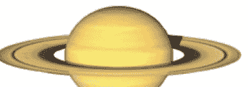

壓力、忍耐力、限制、悲觀、收縮、消極面、孤獨、時間。

土星主宰水瓶與摩羯座，是神話中的死神克羅諾斯，代表你的壓力與責任。是你缺乏自信的部分以及個人的受損方式與壓力限制。主導一生噩運的來源、造成噩運的行為模式。憂鬱、保守、嚴肅、重紀律。象徵你的弱點以及這一生必須努力克服的難關。

- ●土星運行星：向內壓縮的週期。壓力、責任、使自我產生限制的人事物。難關，必須努力克服的事、苦惱與壓抑。
- ●每隔29年運行一圈，相位影響約四個月。

土星是太陽系當中，人們看得到最遠、運行最慢的星體，在土星四周圍，我們常可以看到土星光環。在天王星未被發現以前，天文學家都以為土星是最外圍的一顆行星。在占星學中，土星代表著時間、限制及不可逾越的秩序感，也象徵著挑戰與挫折，是個人最大困難及壓力所在，卻也代表個人突破困難後的成就。

土星是一顆代表束縛限制，困難與延遲的行星，影響到所有人們的限制面，要知道他會遇到多少困境，只要明白他的土星在他的星位圖中位於何種位置。土星會影響人們傾向於一種憂鬱的、沮喪的心情，這種人經常表現出一種孤獨畏縮的感覺。在古希臘的神話裡，土星是死神，在占星學上，土星代表著老年人，所有一切的阻礙與困難，以及一切已經被歲月所毀壞衰微的東西。

土星使人有踏實、節儉、可靠的特點。但也有使人有冷漠、責任感過重、嚴肅不知變通的性格。克服障礙後往往能建立真正的個性，有些受土星強烈影響下的人，會發展出一種極佳的個性；假如土星是上升星座的守護星，會傾向於勤勞努力而且光明正直，但總是以吃力不討好的方法去行事。土星掌管骨骼與牙齒，所帶來健康問題多半是累積性的長期病痛。

土星在占星學上暗示著命運中的困難或試煉等不幸，命運中潛藏的困擾。也代表著個人性格上的弱點，造成命運中危機的主因與個性上的缺失。土星的位置也表示出一個人是否能夠好好發展自己的事業。經由土星的位置的表現，可使個人了解應如何擔負起責任，發展其成熟度，並找出化解危機和改善缺點的方法。通常土星在星盤中的宮位，也表示個人最缺乏，並試圖極力補償的領域。土星是太陽系中衛星最多的星體，因此也代表著多產。

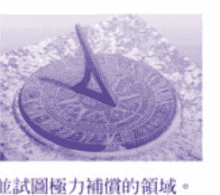

### ■三王星系統

### Uranus
〔天王星：改變〕

創新、除舊、革命、新奇、與眾不同、怪異、獨特性。

天王星主宰水瓶座，是神話中天空之神烏拉諾斯，代表突破傳統、創新改變的能力及創造力，他屬於時代的力量，是整體改變的力量，新奇古怪、叛逆、標新立異。同時象徵科技、革命、未來感與戲劇化的變革。

- ●天王星運行星：自我改變的週期。新變局、使自我產生改變的人事物。突發事故、新奇有趣的際遇、新發現。
- ●每隔84年運行一圈，相位影響約一年。

天王星繞行黃道一周約八十四年，停留在各星座的時間約七年，天王星是位於土星以外第一顆被發現的星體。於1781年時被發現。在太陽系中，天王星的自轉軸心傾斜超過90度(98度)，是側著繞著黃道運行，因此天王星是一顆奇特的行星。在占星學中，天王星代表改變與特別，逾越傳統及改革思想。本命盤的天王星，代表個人的改革力量，象徵一個人尋求與眾不同的地方。代表特立獨行、標新立異及人道主義精神。顯示出一個人對自己的突破，想要改變自我的渴望。

天王星的思想前衛，常常不顧四周異樣眼光而有驚人之舉。天王星也象徵著改革思想，是一個人最大的改革點，代表發明與創造。在神話故事中，它是天空之神，代表科技、未來、進步、改革及天文。也代表突發狀況，任何新奇、特殊、有趣的事物。天王星對個人的影響是突發性的改變，突破舊有傳統限制的創造力。在好的方面使人較獨立自主有創造力、具有特別的智慧、與眾不同的天賦，厭惡受到限制且愛好自由，意志堅定。若相位不良則會讓人覺得叛逆性強，古怪，一心只想與眾不同。

天王星在個人星盤中的宮位比星座位置來的重要，從天王星的宮位可看出個人如何表達其獨特的創新天賦，及偏好何種不尋常事物的傾向。天王星在星座中的位置明顯指出了世代的差異，也就是同一時期人類的共同改變。不同的時代，均對個人產生一定的影響。它的星座位置，有歷史性的時代意義，大於對個人性格與思想的影響。天王星象徵迎接新時代的革命意識，其關鍵字彙是「改變」，即表示對抗陳舊意識的新希望。

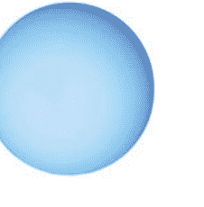

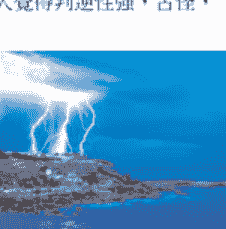

# 出生圖 2-6 PLANETS

### Neptune
〔海王星：渴望〕

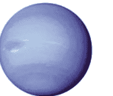

夢想、非現實性、幻想、想像力、迷惑、朦朧、昇華、墮落。

海王星主宰雙魚座，是神話中的海神波賽頓，代表想像力與夢想，也是你容易迷惑與痴心的部份，他是整體的夢想，也是時代的力量。跟個人昇華及潛意識有關。理想性、包容、模糊曖昧及逃避現實。象徵精神冥想、夢境、幻想與超現實主義。

- - 海王星運行星：精神轉化的週期。迷惑與夢幻、消融的力量、引發自己精神昇華的人事物、騙局、夢想成真、受到蠱惑。
- - 每隔165年運行一圈，相位影響約二年。

海王星於1846年時被發現，繞行黃道一周約需時一百六十五年，在每個星座約停留十四年左右，為天王星的兩倍，在太陽系中，海王星是一顆模糊難辨的行星。在占星學中，海王星代表了夢幻及想像。象徵不切實際及曖昧不明的事物，由於其虛幻的特質，常造成一種混亂的局面。本命盤中的海王星，代表一個人沈溺的地方，象徵無悔的偏好。

海王星為了幻象及假象，常會自我欺騙及自我犧牲，所以海王星代表一個人沉迷的地方。海王星的感受力很好，因此代表了超脫的藝術及完美的事物，也代表著同情心、隨緣及與心靈宗教有關的事物。在神話故事中，它是海神，代表了無盡、模糊、理想化，包容力、空想及混亂，掌管著浩瀚的海洋與無邊的夢境。

海王星是夢的主導者。因此海王星特質明顯的人多半充滿想像力。具有超凡的直覺與精神狀態，常涉足和虛幻與超脫現實有關的東西，像是影像藝術和電影。不良的海王星影響力是經常自欺、迷惑、不問世事與墮落沈淪，也容易接觸迷幻藥或酒精。過於大意、因相信別人而受騙，或太過於多愁善感。

海王星象徵憧憬或幻想，是影響世代的三顆行星中的其中一顆。因此，海王星落在各星座時，會對某一時代、某一群人造成特殊的影響，對個人的影響較不顯著。海王星所在的星座位置，顯示出不同年代出生的人，分享同一種精神性的心靈生活，也是影響潛意識最深的精神力量，產生出不自覺且根深蒂固的觀念及思想。海王星在個人的宮位，顯示出個人追尋夢想的領域，但也是個人傾向於自欺或欺人的地方。

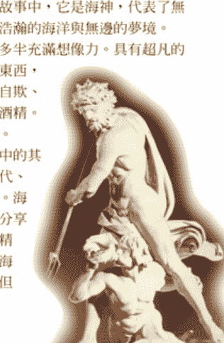

### Pluto
〔冥王星：潛能〕

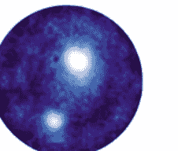

破壞力、重生、潛在的能量、黑暗面、轉型、控制慾、危機。

冥王星主宰天蠍座，是神話中的冥神黑帝斯，代表你的黑暗面與人的神秘部份，潛能與未知的力量。他是整個時代蛻變的力量，就像從毀滅中重生。陰沈、孤獨、神秘、權謀、強迫性。象徵危險、死亡、隱藏的豐富資源、與核能。

- - 冥王星運行星：重生蛻變的週期。大破壞、大轉變、引發自己內在黑暗面與潛能的人事物。脫胎換骨、受到強迫、危機。
- - 每隔248年運行一圈，相位影響約二年半。

冥王星發現於1930年，是所有星體中移動最緩慢的一個，大約需要二百四十八年才能在黃道上繞行一周。在太陽系當中，冥王星是距離太陽最遠的行星，是一對小及結實的雙星系統。由於其軌道較異常，停留在每個星座的時間從十二年到三十年不等。在占星學當中，冥王星代表黑暗及神秘，象徵毀滅與再造的力量。也代表一個人絕對在意的地方及狂熱的所在。冥王星與生死之事很有關係，也代表性與暴力。冥王星亦代表一個人洞悉環境的能力，一個人的覺察能力。本命盤中的冥王星代表個人深層的慾望與潛在的能力，也代表個人最狂熱的事情。

冥王星具有破壞與重生的強大能量，能夠使一般人覺得絕望的事卻東山再起，另創新局。在神話故事中，它是掌管地獄的冥王，代表神秘、死亡、黑暗及再生。象徵人類將受到壓抑的潛意識予以實體化的力量，一般認為那是與太陽相反的力量。他象徵一個人的黑暗面、同時也是未知潛能的根源，能夠對事物徹底顛覆的能力。負面也代表絕對的掌控慾望，有殘忍、陰險、虐待性的一面。還有如命理玄學等玄秘的事物以及巨大的財富資源、礦脈都與它有關。

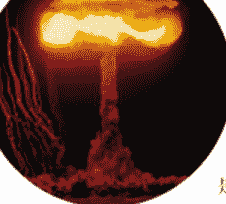

冥王星停留的星座意義對某一時代所產生的影響大於對個人的影響。從冥王星所據的星座位置，通常在歷史上具有強烈的重要性，它們帶來的是根源性的大變動，並為人類的生活及文明帶來劇烈的轉變，甚至會影響到個人的傳統觀念。它被壓抑的力量，一旦被釋放，就會徹底改變過去，這些改變也許創造新生，也可能造成毀滅。而冥王星在星盤中的宮位則代表一個人的深層慾望面以及個人的恐懼所在，但也往往像浴火鳳凰一般，是其引發潛能的場所。

### Astroids
小行星

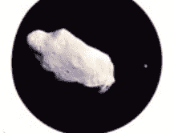

除了行星之外，太陽系中還存在著數以萬計的小行星，他們同樣繞著太陽運行。在占星學中，占星家發現他們對命運也有不同層面的影響。占星學上使用的小行星主要有四小行星以及凱龍星，四小行星是在火星與木星一帶的小行星群中較大的幾個，四小行星都是用古希臘神話中的女神命名，其中穀神星是最大的一顆，智神星第二，婚神星第三，而灶神星則是最亮的一顆。凱龍星又稱206號小行星，是軌道介於土星到天王星之間，目前已知最遠的一顆小行星。

#### Juno 〔婚神星：婚姻〕
婚神星象徵春天的追求，是神話中宙斯的老婆赫拉。被認為是婚姻的守護者，因此代表了婚姻，配偶。此外此星也與不貞、兩性關係中的權力爭奪有關。同時也代表風流的事與吸引力。

#### Vesta 〔灶神星：努力〕
灶神星象徵夏天的勞動奉獻，神話中的維斯塔為了守護聖火而拒絕了追求者的求婚。因此象徵了單身。也代表了承諾，專注，服務，獨居與寂寞，是工作狂的指標，他們努力在自己的崗位上，勞動奉獻。

#### Ceres 〔穀神星：收穫〕
穀神星象徵秋天穀物成長豐收，是神話中的大地女神，是除了月亮之外，第二個關於母親(性)的行星。此外還代表了懷孕，食物，家庭，勞動收穫及養育。

#### Pallas 〔智神星：蘊藏〕
智神星象徵冬天的蘊藏，是神話中女戰神雅典娜的別名。她也是智慧女神。代表了知識，也代表了競爭，對抗，為公理正義而奮鬥與對等。又是女權主義的象徵。

### Chiron (凱龍星：復原)

凱龍星是直到1977年才發現的。它的軌道頗為奇特，以地球為中心，將土星跟天王星的軌道畫出來，凱龍星的軌道有一部分跨進土星軌道之內，距地最遠處則接近天王星的軌道。在神話中凱龍是個半人半馬怪，擁有良好的醫學能力。因此被認為與心靈的傷痛與治療有關。因為軌道在土星與天王之間，因此也意味著知識的整合與不尋常的智慧。他的功用介於水星與木星之間，是一顆吉星，表示腐壞後的復原，也象徵隱藏的精神傷痕。

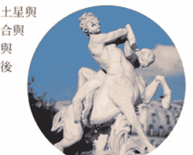

## Point

## 其他特別的點

除了行星之外，占星學中還有一些特殊的點具有重要的影響，除了ASC、MC、DSC、IC這幾個重要的敏感點外，還有許多根據行星與敏感點計算出的點，例如阿拉伯點、中點、至點、映點等。

## 阿拉伯點

阿拉伯點是由阿拉伯人所流傳下來的，是黃道上的一些特殊點，它奠基於宇宙的一種神秘波率，透過數字的方程式所計算出的特殊感應點，比較著名的有福點、婚姻點、死亡點等。流傳至今，基本的阿拉伯點有97個，另外還有73個附加點。

這些點可以歸納成簡單的數學公式A+B=C+D。舉例來說，福點的位置是將上升點的位置加上月亮的位置，再減去太陽的位置。而其他的點，也都是以這樣的計算方式得出來。

## 中點

中點是近代德國漢堡學派發展出來的。認為任何兩顆星或出生圖上的重要點之間在黃道上的中點代表這兩要素組成因子的能量，中點是兩星的關連所在，當有運行星合相中點時，便會引動這兩要素間的作用。

除了本命盤外，中點也應用在合盤上，將兩人的太陽取出中點、兩人月亮取出中點…依此類推，形成另一張盤，代表兩人的共同命盤。

## ■行星的影響力

## Exaltation & Fall
躍升與失利

行星在不同的宮位時，力量會有所不同。我們知道每個行星有各自主宰的星座，當行星落入自己主宰的星座時，行星最能表現其特質，稱為得勢。相反的當行星落入主宰星座對宮時稱為失勢，這時行星本身的特性會受到最大的限制。

但是行星在躍升星座時力量才會最強，比主宰星座時力量還強，而在躍升星座對宮時稱為失利，是行星力量最弱的時候，在失利星座時比在失勢星座時還弱。這是判斷吉凶時很重要的參考依據。

兩個行星“互容”，代表這兩星的完美融合。舉例來說，火星在天秤受金星定位，金星在牡羊受火星定位，因此金星跟火星互容，即使它們是對相，但是因為互容，反而使兩星都能完美的合作與發揮力量。

## Planets Retrograde
行星逆行

除了太陽跟月亮外，由於地球與行星間的速度不同，因此相對來說在某些時候會覺得看起來行星在後退，稱為“行星逆行”。行星逆行時會使行星的能力產生改變與阻礙，功能變弱。尤其是在改變方向—從順到逆時（SR）及從逆轉順時（SD）影響特別明顯。由於逆行的關係，行星在運行時有時會在同一個點來來回回經過3次或5次之多。

## 定位星

行星各自掌管所屬的星座，如圖。而當行星進入非主宰的星座中時，便會受到主宰該星座的行星定位，舉例來說，火星是牡羊座的主宰星，假設有行星進入牡羊座，則受到火星定位，火星就是這個行星的定位星。定位星會對被定位星產生影響，彼此會有微妙的連帶關係，如果行星進入自己主宰的星座，那該行星就沒有定位星或稱為最終定位星。舉例：假設水星在天秤座受金星定位，金星在牡羊座受火星定位，而火星也在牡羊座受火星自己定位，那麼火星就是這一組行星的最終定位星，代表這一連串力量的最終主導，這個行星就具有特別的重要性。

如果兩個行星各自在彼此主宰的宮位上，則稱這

## Cycles & Transit & Progressions
週期、大運法與推運法

行星在黃道上運行，以不同的時間繞行黃道一圈，稱為行星的週期。月亮的週期是一個月，太陽一年，金星與水星因為在地球內側，因此他們的平均週期也是一年，金星每年約逆行一次，水星則有三次之多。火星週期2年，木星約12年，土星29年、天王星84年、海王星165年、冥王星則長達248年。每一個週期都代表一種能量循環的過程。

大運法是以運行星過度到出生圖中重要點時，發生相對應事件的方法，運行星會觸發它所碰的點上的潛能，以他們的特性來影響出生行星，造成事件。舉例來說，當運行土星（壓力）對相（衝突）本命金星（愛情）時，可能會發生跟愛人翻臉或結束一段戀情。

推運法則是以天上一天，地上一年的原理來運作，以出生後一天的行星移位來顯示出生後一年的命運，因此，月亮與內行星等這些跑得快的行星的移位就顯得特別重要了。尤其是月亮的移位，每29年運行一週，與七正四餘中的紫氣週期類似。這些部份比較複雜，我們留待以後再詳談！

# 出生圖 2-7 ASPECT

# PART2-7
相位分析
ASPECT

## 什麼是相位？

以地球為中心，行星與行星間會有角度產生，當他們彼此產生某些特定的相對位置時，就會發生特別的互動，就像是音樂上的共鳴一樣，這些特殊的角度，便稱之為相位，每個相位有其特別的意義，代表兩行星作用後的吉或凶，象徵人生劇情的各種高低起伏。相位有好壞的分別，同時也有強弱的不同。相位經過細分之下，主要有以下三種形式：

**主要相位：**
包括 0 度合相，二分相 180 度，三分相 120 度，四分相 90 度，六分相 60 度。是最常使用的5種相位。

**次要相位：**
包括八分相 45 度、135 度，十二分相 30 度、150 度。

**其他相位：**
包括五分相 72 度、144 度，七分相，九分相等等。

## 容許度

相位有所謂容許範圍。例如：合相是 0 度，當二星在相差 8 度內都稱之為合相。有關容許度的範圍，越重要的相位容許度越大，越重要的行星也是。但二星越接近特殊角度，產生的力量便越大。在現代占星學中，一般皆有濃縮容許範圍的趨勢。

> 如圖，相位是A=60度，容許度是B=3度，那麼在A+B=63度到A-B=57度的範圍內都屬於60度相位。
以合相來說，太陽的容許度是6度，水星容許度3度，所以日水的合相容許度為9度。不過容許度並沒有一定，當然是越少相位力量越強。

## ■主要相位

0度（合相：結合、集中：吉凶參半）
- ●合相容許度8度，是行星會合時的狀態。代表不同能力的結合或直接的影響，由此可知行星力量被集中後，能否好好被發揮效用或相互牽絆。一般來說，吉星（木星、金星太陽、月亮、水星）合相時為吉，凶星（土星、火星、天王星、海王星、冥王星）發生關係時為凶。但是還必須看影響層面，例如：水星和天王星的合相，在科學技術文學方面皆屬吉的。金星和海王星的合相，在藝術靈感方面屬吉的。金星和天王星的0度，在設計方面屬吉的。

180度（對相：對立、衝突：凶）
- ●對相容許度6度，代表對立但是互補，由於兩個行星形成對抗姿態，所以是個招致緊張和對立的凶相位。也表示眼前的問題，對方的挑戰，衝突與紛爭。也象徵高度關心、互補與相互的吸引力。

120度（三分相：協調、幸運：吉）
- ●三分相容許度4度，代表順利與協調，為可順利進行事物的吉相位。意味著好運的到來與不勞而獲，象徵發展以及合作順利。

90度（四分相：困難、障礙：凶）
- ●四分相容許度4度，代表著為了完成某事而引起的障礙與困難。它象徵格格不入左右為難，以及處處受限，是表示不順利的凶相位。

60度（六分相：機會、創造：吉）
- ●六分相容許度3度，代表如果肯努力的話，可以抓住機會的吉相位。它意味著機會的創造，以及源源不斷的支援，同時也象徵創造力。

## ■次要相位

30度（十二分相：幫助、成長：吉）
- ●十二分相容許度2度，這是個只擁有60度一半力量的調和相位。表示獲得金錢利益。而且還意味著改變想法，馬上可朝下一個目標前進。

150度（補十二分相：不均衡：凶）
- ●補十二分相容許度2度，代表須調節與失去均衡，尤其是跟健康有關時是極為重要的相位。也意味著慾望不滿。

# 出生圖 2-7 ASPECT

45度〔八分相：緊張、摩擦：凶〕
- 八分相容許度2度，這是個擁有90度一半力量的不調和相位。意味著金錢上會有困境和破財，以及朋友間和團體內會有摩擦。

135度〔補八分相：焦急、煽動：凶〕
- 補八分相容許度2度，是個類似45度的不調和相位。意味著暗中折磨與焦急的心態，或受到他人的煽動。

## 其他相位

除上述所說的相位之外，也有人考慮將五分相72度（顯示精神支柱與加強）、補五分相144度（表示精神安慰與強調）當作第三種相位。其他還有七分、九分、十分…等相位，但多不常用。因為光五個主要相位就夠複雜了。

## 星曜格局

行星之間因為相位的組合而出現一些特別的格局，具有特別的能量反應，其中比較著名的格局有以下幾個。

### T型（T-SQUARE）
- 這是由兩顆對相的行星，同時與另一顆星雙雙形成90度四分相，如圖中的木星，這個受最大壓力的行星稱為把星，是這個對相的壓力出口。如果這個T型中的任何一星跟其他行星出現三分相或六分相，那這顆行星將成為這個壓力局面的減輕或解決的方法。

### 大十字（GRAND CROSS）
- 大十字格局是由兩組對相彼此又形成90度，如此對任何一顆星來說，都成了對星與把星，因此每一顆星都承受巨大的壓力。而且找不到宣洩壓力的出口。這個格局象徵成功之前的巨大障礙與艱困。如果有行星跟此格局形成三分相或六分相，這行星將對此障礙提供紓解的方向。

### 大三角 [GRAND-TRINE]
- 大三角格局是由三顆行星彼此形成120度三分相所組成。由於彼此都是對方的順利因子，因而形成一種良性循環，這個格局具有很強的創造力，但是容易過分順利而過度強調所主的事物，而深陷在三角漩渦中，跳不出來。

### 風箏型 [KITE]
- 風箏型是由一組大三角行星中一顆星與另一顆行星形成對相，同時這顆星跟大三角的另外兩顆星形成60度六分相所組成的格局。這時另外的這顆行星就形成了風箏的把手。它適合用來主導這個大三角，將這股創造的能量找到發揮的窗口，而不至於陷入漩渦。

### 上帝之指 [YOD]
- 這是由一組六分相的兩顆星同時與另一顆星形成150度的補十二分相。這第三顆星星具有特別的意義，象徵註定的巧合，這個格局代表業力，而這第三星就是業力的出口，也就是業報的地方。如果有某人跟此星發生關連，那代表此人跟你具有前世的因果羈絆。

### 星群 [STELLIUM]
- 星群是由四個或更多的行星彼此極為靠近，一個連著一個而形成像糖葫蘆般。通常會是連結在同一星座或宮位中，如此強調了這個星座或宮位的傾向與特質，這樣的星群象徵一種專家的傾向，這些行星的能量融合而專注在所強調的星座或宮位。並且由領頭的那顆星來主導。

# 出生圖 2-8 ANALYSE

## PART2-8 解盤法則 ANALYSE

命盤分析時主要分三大類型，第一種是運用本命盤來分析個人的基本特質、基本潛能、個人的個性、屬性、命運的好壞…等，是屬於先天的部分。第二種則是配對法，將兩個人的星盤套在一起，藉以看出兩個人之間的配合度，雙方的緣分、個性、想法…等的合適度。第三種則是運勢盤，將運行星套入命盤後，看運行星與本命盤行星之間的關係好壞，藉以推算出某段時間運氣的好壞，或可能發生的未來預測。

除了大運盤法外，推算運勢還有許多特別的方法，如次限位法、太陽反照法…等，都有其特別的預測意義。在此我們先僅以本命盤的分析來說明，而配對盤與大運盤由於較複雜，在下一本進階篇中再行介紹。

## 本命盤分析法

本命盤是個人最基本的命運密碼，從本命盤中我們可以了解到一個人是什麼樣的屬性，什麼樣的個性，在這一生中，我們扮演什麼樣的角色。在一張星盤中，有行星、宮位、星座與行星之間的相位。在這麼多的元素中，我們要如何著手解析呢？

### 第一：基本傾向

首先，要怎麼來開始第一步呢？命盤中行星是力量的主導，因此第一步就是看行星與重要點的分布狀態。依星座與宮位來劃分，從行星座落的分布，可以先看出一個人的基本偏向。

#### 從行星座落的星座分布

##### 星座的陰陽性

- a. 牡羊座、雙子座、獅子座、天秤座、射手座和水瓶座等，是星座的陽性區域。如果大部分的行星是落在這個區域內，個性上會比較容易有陽剛、主動和積極的傾向。

這張星盤中，行星落在陽性星座有7顆，陰性星座只有3顆，因此整體傾向較為陽剛性。

- b. 金牛座、巨蟹座、處女座、天蠍座、摩羯座和雙魚座等，是星座的陰性區域。如果大部分的行星是落在這個區域內，個性上會比較容易有陰柔、被動和消極的傾向。

##### 星座的三特質

- a. 牡羊座、巨蟹座、天秤座和摩羯座，是屬於主動的星座特質。如果大部份的行星是落在這個區域內，個性上會比較容易有主動、開創性和引領先驅的傾向，個性會較有主導性。

- b. 金牛座、獅子座、天蠍座、水瓶座，是屬於固定的星座特質。如果大部分的行星是落在這個區域內，個性上會比較容易有持續、穩固和頑固的傾向，個性會較有堅定性。

- c. 雙子座、處女座、射手座、雙魚座，是屬於變動的星座特質。如果大部分的行星是落在這個區域內，個性上會比較容易有變通、不定和喜新厭舊的傾向，個性會較有適應性。

##### 星座的四象

- a. 牡羊座、獅子座和射手座，是屬於火象的星座。如果大部份的行星是落在這個區域內，個性上會比較熱情、直接和衝動，性急、不服輸而好動。

- b. 金牛座、處女座、摩羯座，是屬於土象的星座。如果大部份的行星是落在這個區域內，個性上會比較容易有謹慎、保守和沈穩的傾向，但也頑強、頑固而不知變通。

- c. 雙子座、天秤座、水瓶座，是屬於風象的星座。如果大部份的行星是落在這個區域內，個性上會比較理性、善於思考、反應快，但也浮誇、善變、缺乏人情味。

- d. 巨蟹座、天蠍座、雙魚座，是屬於水象的星座。如果大部分的行星是落在這個區域內，個性上會比較容易情緒化、容易感動、直覺強，但卻容易過於感性、逃避、自怨自艾。

#### 從行星座落的宮位分布

##### 宮位的陰陽性

- a. 第一宮、第三宮、第五宮、第七宮、第九宮和第十一宮等，是宮位的陽性區域。如果大部分的行星是落在這個區域內，個性上會比較容易有開創、冒險和爭取的傾向。

- b. 第二宮、第四宮、第六宮、第八宮、第十宮和第十二宮等，是宮位的陰性區域。如果大部分的行星是落在這個區域內，個性上會比較容易有守成、多慮和謹慎的傾向。

##### 宮位的三分類

- a. 第一宮、第四宮、第七宮、第十宮稱為始宮。行星落在始宮會較有表現，能夠發揮力量。如果大部分的行星是落在這個區域內，個人能力較有發揮的機會，較有自主性，像是一齣戲中的主角。

- b. 第二宮、第五宮、第八宮、第十一宮稱為續宮。行星落在續宮時無法充分掌握力量，必須透過與他人合作才能掌握。如果大部分的行星是落在這個區域內，個人能力適合以合作方式來發揮，具有承接性，像是戲中的配角。

- c. 第三宮、第六宮、第九宮、第十二宮稱為果宮。行星落在果宮時最為無力，無法表現自己。如果大部分的行星是落在這個區域內，個人能力不容易充分展現，容易為人作嫁，具有利他性，像是戲中的邊緣人。

##### 以軸線來劃分半球

- a. 第一宮、第二宮、第三宮、第四宮、第五宮和第六宮，是宮位的下半球區域。如果大部分的行星是落在這個半球區域內，個性上會比較容易有自私、掌控和內省的傾向。

- b. 第七宮、第八宮、第九宮、第十宮、第十一宮和第十二宮，是宮位的上半球區域。如果大部分的行星是落在這個半球區域內，個性上會比較容易有野心、自信和超越的傾向。

> 這張星盤中，行星大部分落在星盤上方。這個人比較外向，較在乎社會地位與評價。

- c. 第四宮、第五宮、第六宮、第七宮、第八宮和第九宮等，是宮位的右半球區域。如果大部分的行星是落在這個半球區域內，個性上會比較容易有依賴、徬徨和猶豫的傾向。

- d. 第十宮、第十一宮、第十二宮、第一宮、第二宮和第三宮等，是宮位的左半球區域。如果大部分的行星是落在這個半球區域內，個性上會比較容易有自立、開拓和決斷的傾向。

這張星盤中，行星大部分落在星盤右邊。這個人比較客觀，容易依賴他人，也較無主見。

##### 四個象限的分布形態

- 第一象限：宮位的第一象限包括了第一宮、第二宮和第三宮等。如果大部分的行星是落在這個區域內，個性上會比較容易有追尋自我成長的動機。

- 第二象限：宮位的第二象限包括了第四宮、第五宮和第六宮等。如果大部分的行星是落在這個區域內，個性上會比較容易有追尋掌握事物的動機。

- 第三象限：宮位的第三象限包括了第七宮、第八宮和第九宮等。如果大部分的行星是落在這個區域內，個性上會比較容易有擴展生活經驗的動機。

- 第四象限：宮位的第四象限包括了第十宮、第十一宮和第十二宮等。如果大部分的行星是落在這個區域內，個性上會比較容易有擴展理想範圍的動機。

這張星盤中，行星落在第一象限最多。這個人相當自我與主觀，內斂而且較為自私。

### 第二：重點分析

然後我們要來看命盤中的重要點，命宮點與中天點及日、月、水、金、火、木、土、天、海、冥等行星點。這12個點是整個命盤的根本，我們將這12個重點分成：

- (A) 命宮、中天、日、月。
- (B) 水、金、火
- (C) 木、土
- (D) 天、海、冥。等4個部分來討論。

在個人命盤中，首先最重要觀察的部分就是（A）的部分，命宮點、中天點及日、月的關係，命宮點決定了一個人這一生所要扮演的角色，中天點則是一生中追尋的成就象徵，以一部戲來說，命宮點決定了你的角色，中天點則是這個角色要發展成什麼樣的人物，假設你演的是張無忌，但是結局是成為武林盟主或淪為小配角，就看中天點的好壞。

至於日與月則是一個人的基本特性，太陽是你外在的個性，月亮則是你內在的特質，由一個人的日月關係可以瞭解一個人對自己的個性與情緒之間的表達是否調和。

那麼，命宮、中天與日月間又該如何分別呢？剛剛說過，命宮、中天就像是一個人來到世上扮演的角色發展，日月呢則是扮演這個角色的演員的真實個性，怎麼說呢？就以上面的例子，同樣是張無忌這樣有點懦弱的角色，叫成龍來演就一定跟梁朝偉演的感覺不同，但是他們都是張無忌，如果是舜子來演的話，你一定會覺得怪怪的，但是他一樣是張無忌，因此，如果命宮、中天與日月關係是合適的，就會像梁朝偉演張無忌，感覺很搭。相反的，如果命宮、中天與日月關係不佳，就會像舜子來演張無忌，不管你怎么演，就是很難融入角色當中。你會過得很辛苦，因為你一直在扮演一個不適合自己特質的角色。

#### 1. 命宮及命主星

命宮點預告了你這一生要演的角色，也決定了你的命運走向。因此，命宮所在的星座及命宮點附近的行星便特別的重要，他賦予了你這一生的某種特徵，命宮與其他行星間的相位便代表了你這一生能否順利的運用你的能力，也就是你這一生順不順利的關鍵。

#### 2. 中天及中天星

同樣的，中天點可以看出你這一生的最高點會成為什麼樣的發展，因此中天所在的星座及附近的行星便暗示了你一生的成就，你會從事什麼事業，而中天與其他行星的相位好壞便可以看出一個人是否能夠順利爬到人生的高點。

> 假設某人命宮金牛，中天在水瓶，太陽在雙魚四宮，月亮在雙子七宮，我們就可以基本的認知到他是一個溫和而實際的角色（命宮金牛），給人個性模糊、夢幻、不切實際的印象（太陽雙魚），內心剛變化多端（月亮雙子），容易在個人特質強或者特殊的領域得到成就（中天水瓶）。他重視家人（太陽四宮），容易受另一半影響內在情緒（月亮七宮）。

#### 3. 日與月

太陽與月亮是星盤中最重要的兩顆星，他們是一個人的基本特質展現，一個人太陽的好壞關係到他這一生能否有足夠的能量活著，能不能在一生中發光發亮都跟太陽有密切的關係，從太陽的星座可以看出一個人是什麼個性的人，而太陽所在的宮位則可以看出一個人適合展現自己的領域。太陽的相位好壞則可以看出個人的外緣好不好，個人是否能充分展現自己，成為焦點。

相對於太陽，月亮則掌管了一個人對所有能量的反應，一個人的情緒是否能調整得很好，因此，個人月亮所在的星座可以看出一個人的情緒反應方式，而月亮所在的宮位則是最容易挑起個人情緒的領域。太陽與月亮同時也代表一個人接收到父愛與母愛的方式，因此，如果一個人的太陽不好，通常表示他無法順利得到或學習到如何表現父愛的陽性能量，同樣的，如果月亮不佳，則是他無法順利得到或學習表現母愛的陰性力量。如果個人的日月關係不佳，則他的父母關係可能出問題，或者當他結婚後，他的夫妻關係也容易出問題。

另外，對地球來說，太陽與月亮是最重要影響的兩個星體，一外一內、一陰一陽，因此他們也分別代表我們的父母，同時也是我們長大成婚後，代表丈夫與妻子。所以對男生來說，太陽是命盤中最重要的星體。相反的，對女孩子來說，月亮的重要性也就顯得特別。

#### 4. 水星、金星、火星

再來就是看水、金、火三顆星了，水星代表一個人的思想與溝通，金星則是個人的喜好展現，而火星就是你的基本慾望。這三顆星都跟個人的慾望實現有關，水星是知的慾望，金星是愛的慾望，火星則是生理的慾望。

先從水星與金星來說，水星與金星跟太陽是關連在一起的，由於水、金的軌道在地球內側，因此從地球來看，這兩顆星跟太陽永遠在一定的角度內，水星與太陽不會超過28度，金星與太陽不會超過48度，所以水星與金星最多也不會超過76度，所以呢在占星上，我們可以將這三顆星看成一個星組，以太陽為主體，因此太陽的能量經由水星以思想跟語言來表現，同時經由金星以喜好來表現一個人的個性。

由水星的星座可以看出一個人思考的模式，所處的宮位則可看出他思考專注的領域，再從水星相位的好壞，就可以看出你的思考順不順利，進而推斷你的學習溝通能力好不好。

從金星所屬的星座則可以看出你對喜歡事物的表達方式，進而看出一個人表現愛的能力，而其所在的宮位則可以知道你的喜愛在何種領域中，再看金星相位的好壞，就可以知道你容不容易得到喜愛的事物，愛情方面順不順利。

火星座落的星座則可以知道一個人達成慾望的方式，也可以推出一個人對性的表現態度，從火星的宮位可以知道什麼樣的領域會激起個人的慾望，從火星的相位好壞可以知道一個人的生理慾望是否容易實現，進而可看出一個人的性能力好不好。

另外以地球來看，金星與火星分別在地球兩側，因此，這兩顆星也有特別的含意，金星對男性來說代表女朋友，而火星對女孩子來說則代表男朋友。水星位於最內側，代表我們的兄弟姊妹。

#### 5. 木星、土星

前面五顆星（日月水金火）是跟個人息息相關，是屬於個人的能力，因此是分析個人命盤中最重視的部分，接下來的行星由於運行的速度較慢，因此他們所代表的含意就有些不同了！其實從火星開始，行星的能量就已不再個人化了，火星是地球外側第一個行星，但它仍是屬於個人星的範圍，它代表的是個人能力與他人能力的第一次接觸，結合他人的能量成爲自我的能量，因此他也跟性的結合扯上關係。

接下來到了外行星系統，首先我們見到的就是木星與土星。木星與土星它們代表的力量就是比較社會化的了，它們代表的是一個年次代整體的力量，是屬於同輩的能力，因此對個人來說，木星與土星所在的星座，多半帶有同年次代的成分，通常同一年次代的人，他們的木星與土星多半是同一個星座，因此他展現的能力是整體性的，是同一年次代的人他們一起展現出他們那個年次代的特質，而這個整體的特質則會因落入每個人的宮位不同及與個人行星產生相位的不同而對每個個體產生不同領域的影響。

木星代表的是個人擴張的部分，因此同樣年次代的人因爲木星落入同樣的星座而他們會有較雷同的擴張方式，而依木星所在的宮位則可看出一個人受這群體力量的影響在何種領域上表現出積極樂觀的一面。而木星相位的好壞則可看出這股力量是否會使一個人容易得到機會而積極樂觀。

同樣的土星代表的是個人自制的部分，因爲土星走一宮要2年半，因此同樣在這2年多內出生的人，他們會有同樣的土星星座，因此他更是屬於一種整體表現出的力量，他表現出的是一個小年代的集體壓抑的模式，而這股力量會對個人產生限制在土星所坐落的宮位領域中。同樣的一個人土星相位的好壞可以看出這股內縮的力量是否會造成一個人處處受限而消極悲觀。

另外，木星與土星代表著個人脫離自我後與社會的接觸，因此，這兩顆星分別代表了使我們積極與消極的力量。因此木星象徵我們的貴人，而土星象徵我們的導師或是帶給我們考驗的人。

#### 6. 天王星、海王星、冥王星

一直到土星爲止，都是屬於傳統的行星範圍，到了三王星，我們知道這三顆星都是在近代才發現的行星，是屬於現代行星的領域。這三個行星的運行又更慢，因此他們的力量更是不屬於個人的範疇，它們的能力影響比木星、土星範圍更廣，是一種整體世代的力量，天王星影響的是約7年的世代，海王星則將近14年，冥王星又更廣了，將近20年。所以同樣的，它們坐落的星座代

# 出生圖 2-8 ANALYSE

表的是一個世代整體的力量展現，而他們所座落的個人宮位，則表示這整個時代能量對個人產生影響的領域。

天王星代表的是個人創新的部分，它所座落於星盤中的星座代表的是一個約7年的整體世代的顛覆力量，這股力量會對個人產生自我顛覆的影響在所座落的宮位領域中。從一個人的天王星相位的好壞可以看出這股整體改變的力量使一個人產生變化或顛覆的方向是好或壞，是有創意或容易偏激。

海王星代表的是一個人夢幻的部分，他座落的星座代表了一個約14年的世代的整體夢想與內在渴望的形式，是一個世代的潛意識變化傾向，這股世代的力量會因座落於每個人宮位的不同而影響個人不同的領域。由一個人海王星相位的好壞可以知道這整體夢想的力量影響對個人產生的影響是好或壞，是充滿想像力或過於夢幻而不切實際。

冥王星代表的則是人類最黑暗最原始的慾望，也就是人類的原慾與潛能，因此他所座落的星座代表一個約20年的整體原慾潛能大變化的傾向模式，這是一股非常強大的能量，而這股力量多半以一種完全由根源破壞再重生的方式進行，由他座落於個人的宮位可以知道這股大破壞的力量對個人產生影響在何種領域中。由一個人冥王星相位的好壞可以知道一個受原慾影響的結果是好或壞，一個人能否超越自我的黑暗面，是容易殘暴墮落或激發出自我的潛能。

## 7.行星的相位關係

分析完每個行星所在的星座與宮位後，再來就要看行星與行星間產生什麼樣的相位。由吉相與凶相來看出一個人的優異點與問題點。每兩顆行星產生了相位關連，就是一種特別的能力或心理特質，或者暗示某個事件。由不同的組合可以看出一個人所擁有的不同能力特質。

我們從 (A)、(B)、(C)、(D) 這4組關係之間的關連來分析，(A) 與 (B) 中日月水金火五星是屬於個人的能力，因此他們彼此間若產生相位關係，代表的是個人能力的特別性，舉例來說，如果一個人的金星與水星產生了相位，便代表了他的思考能力與愛的能力是有關連的，他的思考與喜好相互影響。

如果 (A) (B) 中的行星與 (C) 中的行星產生相位，那就代表這個人的個人能力與同次代能力產生了關連。舉例，假設一個人他的月亮與木星成合相，那麼這就暗示了他的情緒反應能力與他同次代的擴張能力結合，他的能力便產生了延伸，他很容易經由個人的情緒反應接收到同次代的這股樂觀的擴張力量。也就是他因為自己的月亮關連了木星而擁有了木星的力量，他會容易有貴人相助，因為他的情緒修養帶給他這樣的特質。

同樣的，如果一個人的日月水金火五星與 (D) 中的行星產生相位，那麼他就可能具有某種特別的能力，因為他能夠運用整個世代的力量。舉例來說，如果一個人的金星與天王星產生相位，那麼他可能便具有特別的魅力，能夠顛倒眾生，因為他的愛情能量中結合了一個世代的能力。他的愛情傾向契合了一個世代的變化傾向，很多偉大的人物，他們便具有這樣的特質，他們容易影響眾人，因為他們的個人能力中結合了整個世代的力量，但是反過來說，他們反而是最受命運控制的一群人，表面上看來，他們影響了世界，實際上，他們也是跟著世界不由自主的走著。因為他們的個人能力同樣的也受到整體力量的牽引，彼此是互動的。

## 8.相位所在的宮位與星曜組合

然後，看形成相位的行星所座落的宮位，來了解到彼此關連到的生活層面，舉例來說，某人日月對相於命宮與夫妻宮，日月對相象徵陰陽的對立與衝突，發生在命宮與夫妻宮間，所以就可以推斷此人可能在夫妻關係上會有問題，或者容易與異性夥伴發生衝突。

再從整體來看，看行星的分佈是否有呈現出特別的格局（如大三角、大十字、風箏，多星匯聚…等），在4角（上升點、下降點、中天點、底天點）附近的行星或某象限中的單星，這些特別的狀況都代表某些特別的含意，也突顯出某些星曜對個人特別的影響與暗示。

## 9.定位星與守護星

當完成前面的步驟後，我們可以說對星盤做了第一層的了解，然後呢，由行星定位我們還可以看出星盤的不同層面，一層一層，彼此相關連，從行星的定位關係來瞭解行星能量之間的相互關連性與因果關係，由此了解一個個生命密碼的前因後果，行星力量間的作用。

舉例來說，如果命宮點在金牛座，因為金牛座由金星主宰，因此命宮守護星便是金星，如果金星是位於第二宮，便可以知道這個人對金錢（2宮）的態度影響他的一生，而且金星本身也主金錢，進入第二宮更是適合，如果金星相位良好，他的金錢運會是不錯的。金星位於巨蟹，容易感情用事，對金錢的關注可能不理性，同時金星因為受月亮定位，他的進錢形式是小錢累積成大錢的模式。如此，一層一層的推斷出宮與宮間，星與星間的相互關連性。

再舉一個例，假設一個人的火星在金牛座，那麼火星的定位星就是金星，如果火星在第2宮，金星在第4宮，那麼就可以知道這個人的慾望（火）會受到愛情（金）影響，他的金錢（2宮）會受家庭（4宮）影響。總的來說，金錢會激起這個人的慾望（火2宮），但是他對金錢的慾望是來自於對家庭的愛（金4宮）。

# 軟體使用

### SOFT

工欲善其事，必先利其器，所以要學會占星術，你必須要有一套占星軟體工具，學會如何用軟體來繪製星盤。因此，在這個單元中，要教你怎麼使用占星軟體，除了學習最基礎的星盤繪製外，還要告訴你如何將兩個人的星盤合起來看，如何看運勢盤以及其他重要的功能。

Astrology 是一套非常棒的免費占星軟體，是由德國的Walter先生所寫，並且大方的免費提供給大家使用，目前出到約40版，它的功能非常多，也非常實用，是學習占星的人必備也必學的一套軟體，所以，接下來我們就要告訴你如何使用這個軟體來建立自己的星盤、配對盤與運勢盤。

## 軟體篇 3 如何弄出你的命盤

### PART3
如何弄出你的命盤
How to

要製作一張星盤很簡單！首先，你要有一個占星軟體，在現今網路上你可以找到很多種不同的占星軟體，其中比較功能最完善的免費軟體就是 Astrology，你可以在以下網站下載：

- Astrology的主頁：http://www.magitech.com/~cruiser1/astrolog.htm
- 飛星網：http://www.taconet.com.tw/fly370
- 日月網：http://sunmoon.pair.com/

打開 Astrology 占星軟體後，你可以看到如圖的星盤，你會看到的是打開當時時間的行星分布。

Astrology 軟體主要有九大功能，而首先我們要學會的就是為自己製作一張自己的星盤，然後將它儲存起來，隨時準備開啟。

## 本命盤

### 1.出生圖設定

（資訊/設定出生資訊）

要開始占星首先需要得到一張命盤，因此第一步便是設定出生圖。按下資訊功能表下的設定出生資訊後，即會出現左圖的輸入資訊表單。這個表單中：

- （1）的部分要你輸入出生年月日及時辰等資訊。
- （2）的部分中經度與緯度要輸入出生地點的經緯度。E代表東經，W代表西經；N是北緯，S則為南緯。時區是以格林威治時間為0，而我們台灣的時區晚格林威治8小時，因此以-8表示，另外有些人出生時因為節約需求而全國統一調整時間提早1小時，因此，出生在日光節約時間內的人必須選擇YES，其他人則選NO。
- （3）的部分中在NAME的空格中填入名字（PS：必須用英文），Location空格中填入出生地，這個部份可填可不填。
- 若想要得到的是輸入當時的時間則可以按（4）的鈕，即會自動將電腦中對應的時間輸入，因此，若你的電腦時間與實際時間不同，則結果就會有錯。
- 按下（5）的鈕，便會出現原先預設的出生圖的設定資訊。

設定完出生時間與地點的資訊後，按下OK鈕，則會出現如右的一張星座盤了。然後，我們要將它儲存起來，方便以後叫出讀取。

### 2. 儲存出生圖

〔檔案/儲存出生圖資訊〕

首先我們先在電腦中開一個檔案夾來存放一張張的星座盤，以我個人為例，我開了一個「自己人」的檔案夾來放我所收集的各親朋好友的星盤。在上面的步驟中，我們得到了一張星座盤後，按下檔案功能表中的儲存出生圖資訊選項後，會出現儲存資訊功能表。

如圖：在檔案名稱中填入此星座盤的名稱「飛」，資料夾選項中找到預先建立的「自己人」資料夾，按下確定鈕。如此即完成儲存設定，現在，在「自己人」資料夾中就有了一張新的星座盤了。依照這樣的步驟，陸續建立好一張張的星盤。

### 3. 開啟出生圖

〔檔案/開啟出生圖〕

設定與儲存好出生圖，以後便可以隨時開啟，選擇檔案功能表中的開啟出生圖後即會出現開啟出生圖功能表：

在資料夾選項中找到「自己人」後，打開後即會看到先前儲存的出生圖「飛」，按下確定鈕，即會出現「飛」這張星盤了。

### 〔資訊/現在的出生圖〕

按下資訊功能表中的現在的出生圖選項，畫面馬上會變成現在即時時刻的出生圖。

### 〔資訊/預設出生圖資訊〕

按下資訊功能表中的預設出生圖資訊選項後會出現如下圖的表單。

這個選項用來預設你現在所處的地點的設定值，只要一開軟體便會以此設定地點為準。例如：我現在住在台北，因此我以台北為準作設定，如此，電腦軟體便以台北為基準點來設定出生星盤。（預設完後，必須選取檔案功能表中的儲存設定，如此才會成為永久的設定值）

### A. 台灣地區經緯度表

| 地點 | 經度 (E) | 緯度 (N) |
|---|---|---|
| Taipei City 台北市 | (E) 121度30分 | (N) 25度03分 |
| Kaohsiung City 高雄市 | (E) 120度17分 | (N) 22度38分 |
| Keelung 基隆市 | (E) 121度44分 | (N) 25度08分 |
| Hsinchu City 新竹市 | (E) 120度58分 | (N) 24度48分 |
| Taichung City 台中市 | (E) 120度40分 | (N) 24度09分 |
| Tainan City 台南市 | (E) 120度12分 | (N) 23度00分 |
| Taipei 台北縣 | (E) 121度29分 | (N) 25度00分 |
| Ilan 宜蘭縣市 | (E) 121度45分 | (N) 24度46分 |
| Taoyuan 桃園縣市 | (E) 121度18分 | (N) 24度59分 |
| Hsinchu 新竹縣 | (E) 120度59分 | (N) 24度46分 |
| Miaoli 苗栗縣市 | (E) 120度49分 | (N) 24度33分 |
| Taichung 台中縣 | (E) 120度43分 | (N) 24度15分 |
| Changhwa 彰化縣市 | (E) 120度32分 | (N) 24度04分 |
| Nantou 南投縣市 | (E) 120度41分 | (N) 23度54分 |
| Yunlin 雲林縣 | (E) 120度32分 | (N) 23度42分 |
| Chiayi 嘉義縣市 | (E) 120度27分 | (N) 23度29分 |
| Tainan 台南縣 | (E) 120度17分 | (N) 23度08分 |
| Kaohsiung 高雄縣 | (E) 120度25分 | (N) 22度42分 |
| Pingtung 屏東縣市 | (E) 120度29分 | (N) 22度39分 |
| Hualien 花蓮縣市 | (E) 121度36分 | (N) 22度59分 |
| Taitung 台東縣市 | (E) 121度09分 | (N) 22度45分 |
| Lutao 綠島 | (E) 121度28分 | (N) 22度35分 |
| Lanyu 蘭嶼 | (E) 121度33分 | (N) 22度25分 |
| Penghu 澎湖縣 | (E) 119度33分 | (N) 23度34分 |
| Tungyin 東引島 | (E) 120度32分 | (N) 26度19分 |
| Matsu 馬祖 | (E) 119度53分 | (N) 26度12分 |
| Kinmen 金門 | (E) 118度25分 | (N) 24度30分 |

## 附錄～參考表

### B. 台灣日光節約時間表

| 年份 | 時間 |
|---|---|
| 民國 34-40年 | 5/1 ~ 9/30 |
| 民國 41年 | 3/1 ~ 10/31 |
| 民國 42-43年 | 4/1 ~ 10/31 |
| 民國 44-45年 | 4/1 ~ 9/30 |
| 民國 46-48年 | 4/1 ~ 9/30 |
| 民國 49-50年 | 6/1 ~ 9/30 |
| 民國 63-64年 | 4/1 ~ 9/30 |
| 民國 68年 | 7/1 ~ 9/30 |

### 4.出生圖解析

打開一張出生圖後，上面會有各項的資訊：一張星盤中主要有兩個部分，左邊的星圖及右邊的文字資料。

●舉例：圖中 土星與冥王星之間形成一條綠線，所以可以知道這張星盤中土星與冥王星形成三分相，其他依此類推。

●舉例：若想知道月亮星座位於何星座與宮位，首先找「C」圈中月亮的符號，由圖中即可看出月亮在天蠍座的範圍內，同時也在「6」健康宮的範圍內，因此我們就可以知道此星盤的月亮星座為天蠍座，月亮在第六宮健康宮中。

●由上圖中，我們先從左邊看起，「A」、「B」、「C」三圈分別代表星座、宮位與行星。「A」星座在最外圈，第二圈「B」是宮位，第三圈中我們可以看到日、月、金…等行星符號，由它們座落的位置對應到外圈即可知道各行星座落的宮位與星座。

●然後來看「D」的部分，圖中這一條條的斜線就是代表此星盤中行星之間形成的相位，以軟體本身的設定，圖中綠色線代表三分相，紅色則為四分相…等，不同的顏色代表不同的相位。

●星盤中是以宮位為定位，圖中「E」即是個人出生時所在地東方地平線為起點，以逆時鐘的方式畫分出12宮來，以此星盤為例，ASC（即命宮的起點）在金牛座，也就是說此人的上升星座是金牛座。

●星盤中除了上升點外另外有三個重要的點，如圖中「F」的三個藍色點，也就是上升點的對面下降點（7宮起點），出生時天頂與黃道的交點（10宮起點）及天底與黃道的交點（4宮起點）。

●再來看右邊的文字資訊，「G」的部分主要指出此張星盤的時間與經緯度。「H」的部分則指出12宮宮頭所處的星座位置，例如：圖中第二宮是22Gem52，Gem是雙子座的縮寫，因此這就是說第二宮從雙子座22度52分開始，第二宮在雙子座。同樣的「I」的部分是指出各行星所在的位置，R的符號代表此行星正處於逆行中。

●最後我們來看「J」的部分：

- (a)中寫著FIRE : 3 , EARTH : 4 , AIR : 6 , WATER : 3，這代表著這張命盤中的行星與交點中有3個屬於火相星座，4個土相星座，6個風相星座及3個水相星座。
- (b)中寫著CAR : 7 , FIX : 5 , MUT : 4，這代表著這張命盤中的行星與重要點中有7個位於本位星座，5個固定星座，4個變動星座。
- (c)中寫著YANG : 9 , YIN : 7，這代表著有9個屬於陽性星座，7個陰性星座。
- (d)中寫著M : 9 , N : 5 , A : 6 , D : 8，這代表行星與重要點（不包含ASC與MC）中有9個在星盤的上半圓中，5個在星盤的下半圓中，6個在星盤的左半圓中及8個在星盤的右半圓中。
- (e)中寫著ANG : 2 , SUC : 7 , CAD : 5，這代表著有2個位於始宮中（1、4、7、10），7個位於續宮中（2、5、8、11），5個位於果宮中（3、6、9、12）。
- (f)中寫著LEARN : 5 , SHARE : 11，這代表著這張命盤中的行星與重要點中有5個位於牡羊座到處女座中，11個位於天秤座到雙魚座中。

## 雙人配對圖

占星上有一種配對的方式，可以將二個人的星盤合起來比較，如此可以了解二個人之間具有何種的關係，並可以從彼此行星之間的相位關係，了解彼此的適合性與彼此的問題癥結所在，同時若以其中一人為基準，可以看出另一人的行星位於基準人星盤中的宮位，如此可看出彼此的能量交互作用於何種場景中。

## 軟體篇 3 如何弄出你的命盤

一般我們多半利用配對圖來推測男女雙方的緣分，但是實際上，任意兩個人間都可以藉由配對盤來了解彼此的關係。雙人配對的方法有很多種，而最主要及常用的就是對照出生圖。

## 對照出生圖

### 1. 〔檔案/開啟出生圖〕

要使用配對圖，首先必須決定以誰為主，以誰為對照。選取檔案功能表中的開啟出生圖選項，打開第一出生圖。延續前面的例子，我們以飛這張星盤為主，打開這張星盤。

### 2. 〔檔案/開啟第二出生圖〕

然後選取檔案功能表中的開啟第二出生圖選項，打開欲比較的第二張出生圖。

### 3. 〔資訊/對照出生圖〕

接著在資訊功能表中選取對照出生圖選項，即會出現如左圖的配對圖。比較上下兩圖可以看到下圖多了一圈行星，星座與宮位則仍是以第一出生圖為主。

### ●本命盤

### ●雙人配對盤

## 雙人配對圖的解析

●雙人配對圖與個人出生圖的不同在於以本命盤為主的星座、宮位分布，雙人配對盤多了一圈行星，如下頁圖我們可以看到「A」與「B」兩圈行星系統，其中外圈「B」是他人的行星系統，而內圈「A」則是自我的行星系統。而最內圈的相位則為內圈行星與外圈行星之間所形成的相位。

●文字資訊的部分也與個人出生圖略有不同，「C」的部分是自我的出生時/地等資訊。底下「D」的12宮位是自我的宮位資訊，而最底下「E」的行星則為他人的行星資訊。

- Set Chart Info... Alt+z
- Chart For Now n
- Default Chart Info... Alt+D
- Set Chart #2 Info... Alt+Z
- Charts #3 And #4... Ctrl+Z
- ✓ No Relationship Chart c
- Comparison Chart c
- a Synastry Chart Alt+y
- b Composite Chart Alt+Y
- c Time / Space Midpoint Chart Alt+M

### ●合圖盤

### a：合圖

### 【資訊/合圖】

雙人配盤除了配對法外，還有合圖法、組合中點法與時空中點法。延續上面，如果改選資訊功能表中的合圖選項，則會出現如圖的合圖盤。與前面的圖比較，可以看到合圖中的行星就是第二出生圖的行星，星座與宮位配置則是第一出生圖的配置。由合圖可以讓我們看出他人的行星座落於自己的宮位位置，他人的行星相位如何作用在自己命盤上。

## 軟體篇 3 如何弄出你的命盤

### b：組合中點圖（資訊/組合中點圖）

●選取資訊功能表中的組合中點圖選項，電腦即會計算出自己與他人行星、宮位等的中點，形成另一張圖。如下二圖：雙人配對盤中自己與他人的金星分別在牡羊27度與雙子16度，組合後彼此太陽的中點就變成中間值金牛22度了，其他則依此類推。

●組合中點圖是將兩個人的星盤合為一張，也就是說，將兩個個體當作一個主體時，可以運用組合中點圖來推論，由組合中點圖可以看出兩個人的共同命運。

### ●組合中點盤

### ●雙人配對盤

### c：時空中點圖（資訊/時間、空間中點圖）

●如果選取資訊功能表中的時間/空間中點圖選項，電腦即會以兩個人出生時間的中點及出生地點的中點計算出另一張星盤來，由這張星盤來推斷兩人共同的命運發展。雖然同樣是推算兩人共同的命運關係，但組合中點圖與時間/空間中點圖的基礎原理不同，因此作用也有所不同。

### ●時空中點盤

### ●雙人配對盤

### 〔資訊/沒有關係中點圖〕

● 當你想回復到本命盤的狀態時，可以點選資訊功能表的沒有關係中點圖功能，就會回復到只有本命盤的狀態。

## 運勢星盤：

運勢圖是占星學中極為重要的一環，推算命運的方法很多，但最主要有兩種方法，各有其立論基礎。其一為運行星法，另一種則為推進星位法。運行星法是以運行星與本命星之間的互動相位來推算一個人的運勢發展。推進星位法則是類似天上一天、人間一年的概念，以個人出生後一天後的行星分布作為一歲的推運，依此類推，27歲的運勢便是以出生後第27天的行星分佈來推運。

### 〔資訊/運行星與命盤〕

● 打開出生圖後，選取資訊功能表的「運行星與命盤」選項，即會出現如上的運行星盤圖。上圖中有兩圈行星系統，內圈「B」是本命盤行星，外圈「A」則為運行星，由右邊的文字資訊「D」可以知道這是2004年6月2日的運勢盤，由最內圈「C」的相位可以知道2004/6/2的運行星與本命行星之間的相位互動。「E」是個人12宮位所在的星座位置資訊，而「F」則為運行星所在的星座位置資訊。

## 軟體篇 3 如何弄出你的命盤

## 推運星盤

### 【資訊/推運星位與命盤】

●打開出生圖後，選取資訊功能表的「推運星位與命盤」選項，即會出現上圖，與前面的運行星盤來比較，同樣是推算2004/6/2日運勢的星盤，但是比較兩張圖外圈的行星可以發現差別很大，運行星盤的行星是2004/6/2日當日的行星狀況，而推運星盤的行星則是推算出生圖（如圖為1972/3/5到2004/6/2的時間）以一年為一天的方式，計算出的星盤，以此圖為例，從1972/3/5到2004/6/2經過了約32年，因此電腦便算出出生後32天的命盤。外圈的行星便是出生32天後的行星分布狀況。

### ●推運星盤

### ●運行星盤

## 相位表

### 【出生圖//相位中心點網格】

●星盤的相位很多也很亂，因此如果可以列成表格，就可以很清楚的察看，選取相位中心點網格功能即會出現相位表。相位表主要有兩種，一種是個人星盤自我行星間的相位。另一種則為雙人星盤彼此行星間的相位（運行星盤也屬於這種相位）。

## 個人星盤相位表

●左圖是個人星盤的相位表，「A」的部分是星盤的行星與重要的點。「B」的部分是兩顆星間彼此中點座落的星座。「C」中則為行星間產生的相位，舉例：圖中黃圈中的三角是代表三分相，由垂直與水平對應到「A」中的行星，可以知道水星與海王星成三分相，其他依此類推。

## 雙人星盤相位表

●當處在雙人盤或運行星盤狀態時，選擇此功能時就會出現如左圖雙人星盤的相位表，其中「1」中是本命盤的行星與交點，而「2」中則為他人的行星與交點，如果是運行星圖則「2」的部分就是屬於運行星。簡單來講，「1」是星圖內圈的行星，「2」是外圈的部分。由圖中「3」的部分我們知道本命（第一出生圖）的木星（四分相）他人（第二出生圖）的火星。

# ■關鍵詞-1
KEY WORD

占星術可以說是一種符號系統，因此，每個符號都有其基本含意。這些符號系統可大分為星座、宮位、行星、相位四部份。另外，更進一步，行星與行星的組合，也有另外的特別含意，再加上相位的組合，也會有其他的意義，這是屬於進階的部分，容後再說。

## 1.星座系統：表現模式

●星座是將宇宙大分出12種基本的型態，再依不同的方式可以分出陰陽、三特質、四元素。

### 〔陰陽〕

- **Masculine 陽性**
  積極、上升、外向。
- **Feminine 陰性**
  消極、下沉、內向。

### 〔三特質〕

- **Cardinal 主動**
  開創、自主。
  ●這四座是每個季節的旺時。
- **Fixed 固定**
  守成、穩定。
  ●這四座是每個季節的末段。
- **Mutable 變動**
  適應、改變。
  ●這四座是每個季節的轉換時。

### 〔四元素〕

- **FIRE 火象**
  直覺、易怒的氣質。
  ●熱、溫暖、果斷、自信。
- **AIR 風象**
  智慧、快活的氣質。
  ●空氣、思想、溝通、智慧。
- **EARTH 土象**
  感官、憂鬱的氣質。
  ●大地、物質主義、沉穩。
- **WATER 水象**
  感覺、冷靜的氣質。
  ●流動、感情、想像。

### 〔12星座〕

- **♈ 牡羊座**
  ●我優先。
  ●新生、創始、競爭、喜新厭舊、衝動。
- **♉ 金牛座**
  ●我擁有。
  ●實質、佔有慾、感官、美感、溫和。
- **♊ 雙子座**
  ●我溝通。
  ●二元性、聰明、傳達、連接、快速、多而不精。
- **♋ 巨蟹座**
  ●我保護。
  ●母性、保護、防衛、敏感、安全感。
- **♌ 獅子座**
  ●我創造。
  ●父性、創造力、表現、自我中心、自尊心。
- **♍ 處女座**
  ●我服務。
  ●完美、精細、批判性、分析性、服務。
- **♎ 天秤座**
  ●我平衡。
  ●平衡、社交性、調和性、客觀、公正。
- **♏ 天蠍座**
  ●我再生。
  ●黑暗面、深沉、轉變、性、報復、穿透、隱藏。
- **♐ 射手座**
  ●我尋找。
  ●探索、自由、向外、冒險旅行、直接、樂觀。
- **♑ 摩羯座**
  ●我征服。
  ●穩固、責任感、保守性、審慎、權威。
- **♒ 水瓶座**
  ●我知道。
  ●獨立、個人、特別、革新、分工、疏離。
- **♓ 雙魚座**
  ●我犧牲。
  ●曖昧、同情心、包容力、夢幻、犧牲。

## 2. 宮位系統：人生場景

●宮位代表12種不同的人生狀況，也是個人成長的不同階段與心理層面。

### 【12宮位】

- **① 命宮：命運**
  - 外表、我、面具、生命歷程、角色扮演。
- **② 財運宮：物質**
  - 金錢、資源、經濟、價值觀、擁有物。
- **③ 兄弟宮：接觸**
  - 兄弟、鄰居、小學、溝通、傳播。
- **④ 家庭宮：領域**
  - 根、家、母、前世、童年、晚年、不動產。
- **⑤ 子女宮：創造**
  - 小孩、戀愛、遊戲、玩樂、投機、賭博。
- **⑥ 健康宮：運用**
  - 工作、勞動、健康、部屬、服務、寵物。
- **⑦ 夫妻宮：合作**
  - 婚姻、伴侶、夥伴、契約、訴訟、對手。
- **⑧ 疾厄宮：潛能**
  - 性、死亡、共享資源、黑暗面、遺產。
- **⑨ 遷移宮：發展**
  - 對外發展、旅行、新領域、國外、大學。
- **⑩ 事業宮：成就**
  - 職業、功名、社會地位、上司、父、志願。
- **⑪ 人際宮：分工**
  - 朋友、群體、社團組織、未來、興趣、同好。
- **⑫ 精神宮：精神**
  - 夢想、因果、逃避、隱密、潛意識、暗敵。

## 3.行星系統：能量類型

●行星是不同的能量，而本命星與運行星在本質上是相同的，但代表的意義則有所不同。行星符號主要由三部分組成，分別是：

∪ 靈魂 ○ 精神 + 物質

### 〔行星〕

- ☉ 太陽：陽性
  ●活力、意志、外在形象、創造力、表現、陽性功能、爸爸的影響。
- ☽ 月亮：陰性
  ●反應、心情感覺、習慣、記憶力、陰性功能、媽媽的影響。
- ☿ 水星：中性
  ●想法、溝通、學習、吸收資訊、聯絡、表達、說話、中性。
- ♀ 金星：陰性
  ●喜好、喜歡、吸引力、愛的能力、女朋友、美。
- ♂ 火星：陽性
  ●行動力、佔有慾、精力、競爭性、性衝動、男朋友。
- ♃ 木星：陽性
  ●積極面、自信、拓展、擴張、機會、樂觀、向外性。
- ♄ 土星：陰性
  ●壓力、忍耐力、限制、悲觀、收縮、消極面。
- ♅ 天王星：陽性
  ●創新、除舊、革命、新奇、與眾不同、獨特性。
- ♆ 海王星：陰性
  ●夢想、非現實性、幻想、想像力、迷惑的部分、朦朧、昇華。
- ♇ 冥王星：陰性
  ●破壞力、重生、潛在的能量、黑暗面、轉型。

### 〔小行星〕

- 婚神星 ●婚姻
- 灶神星 ●努力
- 穀神星 ●收穫
- 智神星 ●蘊藏
- 凱龍星：復原 ●恢復力、心靈創傷、治療。

### 〔月交點〕

- 北交點 ●新流行、報
- 南交點 ●舊潮流、業

### 〔運行星〕

- 運行太陽：活力的週期 能量、受重視的機會、使自己表現的人事物、陽性的能量、某個男性。
- 運行月亮：情緒的週期 引發心情反應的人事物、陰性的能量、某個女性。
- 運行水星：思緒的週期 吸收資訊、溝通的機會、使自己對外接觸的人事物。
- 運行金星：喜好的週期 桃花、使自己產生喜愛的人事物、異性（偏女性）。
- 運行火星：行動的週期 衝動、使自己想征服佔有的人事物、衝突、競爭者（偏男性）。
- 運行木星：向外擴張的週期 機會、貴人、使自己更能向外發展的人事物。
- 運行土星：向內壓縮的週期 壓力、責任、使自我產生限制的人事物。
- 運行天王星：自我改變的週期 改革、反叛者、創新、使自我產生改變的人事物。
- 運行海王星：精神變化的週期 迷惑、夢幻想像、消融的力量、引發自己精神昇華的人事物。
- 運行冥王星：重生蛻變的週期 大破壞、大轉變、引發自己內在黑暗面與潛能的人事物。

## 4. 相位系統：角色的互動與關聯（吉凶好壞）

●相位是行星與行星間能量的相互關連與反應，代表人生中的悲歡離合、高低起伏的各種情節。

### 〔相位〕

- 合相：0度 ●結合、相容。
- 對相：180度 ●對立、互補、衝突。
- 三分相：120度 ●協調、幸運、穩定。
- 四分相：90度 ●障礙、難關、困難。
- 六分相：60度 ●機會、合作。

# ■中英對照表-1

## 【A】字部

**affliction 受剋**
→星體處於不利的位置，通常指與其他星體或基本點成對相或四分相。

**air signs 風象星座**
→包括雙子座、天秤座、水瓶座，風象在占星中代表思想、溝通與傳播。

**angles 四角**
→指上升、下降、天頂和天底四個主要基本點。

**angular houses 本位宮**
→包括第一、四、七、十宮。

**angular planets 合軸星**
→與四主要基本點合相的行星。

**Aquarius 水瓶座**
→〔星座〕在黃經300度起到330度前的區間。

**Arabic Points 阿拉伯點**
→通常是以某一行星的黃經加上上升的黃經，再減掉另一行星的黃經，所得之度數即為一阿拉伯點，每個阿拉伯點都有不同的意義。

**Archetype 原型**
→代表人類通用的徵象，星座與行星就代表人類行為的原型。

**Aries 牡羊座**
→〔星座〕黃經0度起到30度前的區間。

**Ascendant(Asc) 上升點**
→〔基本點〕東方地平線和黃道帶的交點。也就是所謂的上升星座，主宰個性與命運。

**Ascendant Sign 上升星座**
→上升點所在的星座。

**aspect 相位**
→兩星或星與基本點之間的相對位置所形成的特殊角度，以角度作為記量標準。

**aspect grid 相位表**
→表示星體或基本點之間的相位匯成的圖表。

**aspect patterns 相位星組**
→由兩個以上行星相互間的相位所形成特別的組合，如大三角、大十字、T 型三角等…。

**asteroids 小行星**
→占星學上常用的有穀神星、智神星、婚神星和灶神星以及凱龍星。

**Astrology 占星學**
→研究天體運行與其週期和地球上發生事件的關連性的一種學問。

**Astronomy 天文學**
→研究天體、太空和宇宙的學問。

**Autumnal Equinox 秋分點**
→太陽由北向南時通過天球赤道的點，同時也是天秤座0度。

## 【B】字部

**benefics 吉星**
→通常指木星和金星，有時也包括太陽。

**birth chart 出生圖**
→表示出生時當地天體運行位置狀況所繪製的圖表。通常包含行星所在星座，宮位及相互之間的相位關係。

**Bowl Shape 碗型**
→〔出生圖型態〕行星皆分布於出生圖內180度內的型態。

**Bucket Shape 提桶型**
→〔出生圖型態〕九顆行星位於出生圖中一百八十度的範圍，只有一顆行星個落在外面，這顆行星具有特別的象徵意義。

**Bundle Shape 集團型**
→〔出生圖型態〕行星皆位於出生圖中120度內的型態，代表偏向某方面的能力。

## 【C】字部

**cadent houses 變動宮**
→包括第三、第六、第九、第十二宮。

**Cancer 巨蟹座**
→〔星座〕黃經90度起到120度前的區間。

**Capricorn 摩羯座**
→〔星座〕黃經270度起到300度前的區間。

**cardinal signs 本位星座**
→包括牡羊座、巨蟹座、天秤座、摩羯座。

**celestial equator 天球赤道**
→天球上與天極等距的大圓。

**celestial latitude 黃緯**
→星體與黃道面的夾角。

**celestial longitude 黃經**
→黃道上由春分點算起，從0度到360度。

**Celestial Poles 天極**
→天球旋轉軸的兩端。

## 【D】字部

**Daylight Savings Time 日光節約時間**
→由國家統一規定將時間撥快一小時，以節約能源。

**decanate 星座區間**
→一個星座可分為三個區間，每個區間皆為10度。

**declination 赤緯**
→星體與赤道面的夾角。

**Decile 十分相**
→〔相位〕兩星或基本點彼此間形成36度的視角。

**Descendant(Dsc) 下降點**
→〔基本點〕西方地平線與黃道帶的交點，也是第七宮的起點。

**Detriment 失勢**
→行星處在其主宰星座對面的星座時不易發揮其特性，稱為失勢。

**Direct Motion(D) 順行**
→從地球上看行星在星空背景中由東向西行。

**dispositor 定位星**
→星體所在星座的主宰星稱為該星的定位星。

**Dragon's Head 龍頭**
→黃道和月亮軌道的北交點，也叫月的北交點。

**Dragon's Tail 龍尾**
→黃道和月亮軌道的南交點，也叫月的南交點。

## 【E】字部

**earth signs 土象星座**
→包括金牛座、處女座和摩羯座，土象象徵著實際、可靠與物質性。

**Ecliptic 黃道**
→由地球上看太陽在天球上運行一年的軌道。

**Elements 元素**
→占星學上將所有事物分為火、土、風、水四元素，四元素源於中世紀的四種體液說，分別是膽汁（屬火）、腎汁（屬土）、血液（屬風）和黏液（屬水）。

**Ephemeris 星曆表**
→記載星體每日位置等運行狀況的圖表。

**Equal House System 等宮制**
→〔分宮制〕以上升為基準點，依逆時針方向將黃道等分為每宮30度的一種宮位制。

**Exaltation 耀升**
→當行星處在最能發揮其正面特質的星座時，稱為耀升或得地。

## 【F】字部

**Fall 失利**
→行星處於易於發揮其負面特質的星座，稱為失利，是行星最不利的位置。

**Feminine signs 陰性星座**
→包括金牛座、巨蟹座、處女座、天蠍座、摩羯座和雙魚座。陰性象徵柔弱與包容。

**fire signs 火象星座**
→星座四象之一，包括牡羊座、獅子座和射手座，火象象徵活力、熱情與精神充沛。

**fixed signs 固定星座**
→星座三特質之一，包括金牛座、獅子座、天蠍座和水瓶座。代表穩定不變的特質。

**fixed stars 恆星**
→在占星學上泛指太陽以外的恆星，但大多只使用接近黃道附近的恆星。

## 【G】字部

**Gemini 雙子座**
→〔星座〕黃經60度起到90度前的區間。

**Glyphs 符號**
→占星學上所用的速記符號，代表物件的一種基本特質或象徵。

**Grand Cross 大十字**
→〔相位組〕有兩組行星之間成對相，且兩兩成四分相所形成的星組，代表一種緊張的關係狀態。

**Grand Trine 大三角**
→〔相位組〕三顆行星之間互相成120度三分相，代表一種良性的循環。

**Great Year 大年**
→天文學上的春分點每年緩緩順時推進稱為歲差，歲差繞行黃道一周為一個大年，約兩萬六千年。

**Greenwich Mean Time(GMT) 格林威治標準時**
→以格林威治當地為0度將全球劃分時區的世界統一標準時間。

## 【H】字部

**harmonics 數律圖**
→將出生星位圖上各星體及基本點的角度，乘以某一整數，再除以360度，所得的餘數所代表的新角度，再繪製的一張星位圖，稱之。

**hemisphere 半球**
→星圖中依四角的兩對角線可分為上半球、下半球，或左半球、右半球。

**Horary Astrology 卜卦占星學**
→以問事當時的星位圖的象徵來判斷事情的占星學。

**horoscope 星位圖**
→表示天體某一特定時間所在位置的圖表。

**houses 宮位**
→從上升點將黃道分為十二個部分用來代表世俗的不同層面。

**House systems 宮位系統**
→星圖劃分宮位的方法有數種。包括等宮法、譜雷西德思分宮法…等。

## 【I】字部

**Immum Coeli(IC) 天底**
→〔基本點〕所在地子午線和黃道在地下的交點，同時也是第四宮的起點。

**Inconjunct 補十二分相**
→〔相位〕兩星或基本點彼此間成150度的視角。

**Inferior planets 內行星**
→指水星和金星，有時也包括火星。

## 【J】字部

**Juno 婚神星**
→〔小行星〕四大小行星之一，象徵婚姻。

**Jupiter 木星**
→〔行星〕九大行星中最大的一顆，象徵擴張與幸運，是最吉的一顆星。

## 【K】字部

**keywords 關鍵字**
→將占星學上星體、星座、宮位或其他分析工具的基本意義，用幾個簡單的詞代表，方便了解各物件的意義，容易解讀星盤。

**Kite 風箏**
→〔相位組〕有一星與形成大三角的其中一星成對相，且和其他二星成六分相，風箏頭的行星具有主導的象徵意義。

## 【L】字部

**Leo 獅子座**
→〔星座〕黃經120度起至150度前的區間。

**Libra 天秤座**
→〔星座〕黃經180度起至210度前的區間。

**Locomotive Shape 火車頭型**
→〔出生圖型態〕行星分布在出生圖中留下120度空白的型態，帶頭的那顆星特別重要。

## 【M】字部

**Major Aspects 主要相位**
→通常指合相、對相、三分相、四分相、六分相，有時也包括十二分相與補十二分相。

**Mars 火星**
→〔行星〕地球外圍第一顆星，象徵衝動與勇氣。

**masculine signs 陽性星座**
→包括白羊座、雙子座、獅子座、天秤座、射手座和水瓶座，象徵積極與開創性。

**Medical Astrology 醫藥占星學**
→研究天體運行和人體健康之間關聯的學問。

**Medium Coeli/Midheaven(MC) 天頂**
→〔基本點〕所在地子午線和黃道在空中的交點，也是第10宮的起點。

**Mercury 水星**
→〔行星〕九大行星中離太陽最近的一顆星，象徵溝通與思考。

**midpoint 中點**
→指兩星或基本點之間角度相加除以二的位置。

**modern planets 現代行星**
→指近代發現的天王星、海王星和冥王星。

**Moon 月亮**
→〔行星〕地球的衛星，代表母性與情緒。

**Moon's Node 月之交點**
→月亮軌道與黃道面的交點，也就是北交點與南交點。

**Mundane Astrology 世界占星學**
→運用天體運行的狀態來預測世界局勢變化的學問。

**mutable signs 變動星座**
→星座三特質之一，包括雙子座、處女座、射手座和雙魚座，代表適應力與善變的特質。

**mutual reception 互容**
→兩行星互相位於對方所主宰的星座，稱為互容，代表兩行星能量的容合。

## 【N】字部

**nadir 天底**
→天球上的最底點。

**Natal astrology 誕生占星術**
→解讀出生圖的占星術分支。

**Neptune 海王星**
→〔行星〕現代行星之一，象徵夢想與模糊。

**Novile 九分相**
→〔相位〕兩星或星與基本點間成40度的視角。

## 【O】字部

**Opposition 對相**
→〔相位〕兩星或基本點彼此間形成180度的視角，象徵對立與互補。

**orb 容許度**
→計算相位時可容許與標準值間的誤差值。

## 【P】字部

**Pallas 智神星**
→〔小行星〕四大小行星之一，是小行星中第二大的一顆，象徵蘊藏的智慧。

**Parallel 同度相位**
→〔相位〕兩星間位於相同的赤道緯度上。

**Part of Fortune 福點(幸運點)**
→〔阿拉伯點〕將上升的角度加上月亮的角度，再減掉太陽的角度，代表一生福氣的所在。

**personal planets 個人星**
→在出生圖中的太陽、月亮、上升星座的主宰星、太陽所在星座的主宰星和月亮所在星座的主宰星；也泛指太陽、月亮、水星、金星和火星。

**Pisces 雙魚座**
→〔星座〕黃經330度起到0度前的區間。

**planets 行星**
→占星學上通常是指在黃道帶上運行的星體，包括太陽、月亮、水星、金星、火星、木星、土星、天王星、海王星和冥王星。

**Pluto 冥王星**
→〔行星〕九大行星離太陽最遠的一顆，也是最晚發現的一顆行星，象徵潛能與重生。

**polarity 對宮**
→黃道上對相的星座或宮位。

**Pression of the Equinoxes 二分點歲差**
→天文學上的春分點以每年約五十點二秒的速度在黃道帶上逆行。稱為歲差。

**Prime Vertical 主垂圈**
→天球上通過正東方、正西方和天空中最高點與最低點的想像大圓。

**Progressed Horoscope 推運星圖**
→計算推運之後畫出之星圖。

**progressions 推運**
→將出生圖上的星體及基本點位圖，以某種特別的方式計算其移動來作預測的方法，有時也指次級推運法。

## 【Q】字部

**Quadrant Method 四分儀制**
→〔分宮制〕以上升為第一宮始點，天頂為第十宮始點，在劃分為十二宮的宮位制。

**quadruplicity 三特質分類法**
→將星座分為本位星座、固定星座和變動星座等三種基本特質的分類法。

**Quartile 四分相**
→〔相位〕同 Square

**Quincunx 補十二分相**
→〔相位〕同 Inconjunct

**Quintile 五分相**
→〔相位〕兩星或星與基本點間成72度的視角。

## 【R】字部

**rectification 生時校正**
→利用生命中重要事件來推算精確出生時間的方法。

**relationship chart 時空關係中點圖**
→將兩人出生時間和地點的中點，在以此畫出另一張星位圖。

**Retrograde Motion(R) 行星逆行**
→由於行星與地球運行速度不同而發生從地球上看行星在星空背景中由西向東行的現象。

**right ascension(RA) 赤經**
→由春分點起算天球赤道上的刻度。

**Rising Planet 上升星**
→和上升點合相的行星。

**Ruler(Ruling Planet) 主宰星**
→行星各有主宰的星座，稱為該星座的主宰星，也稱為守護星。

**Ruler's House 主宰宮**
→主宰星所在的宮位。

**rulership 主宰關係**
→每一星座都有行星主宰的關係，主宰關係如下：牡羊座～火星、金牛座～金星、雙子座～水星、巨蟹座～月亮、獅子座～太陽、處女座～水星(小行星)，天秤座～金星(凱龍星)，天蠍座～冥王星(火星)、射手座～木星、摩羯座～土星、水瓶座～天王星(土星)、雙魚座～海王星(木星)。

## 【S】字部

**Sagittarius 射手座**
→〔星座〕黃經240度起至270度前的區間。

**Saturn 土星**
→〔行星〕九大行星中第二大的一顆星，具有明顯而漂亮的環，象徵限制與壓力。

**Scorpio 天蠍座**
→〔星座〕黃經210度起至240度前的區間。

**Secondary Direction 次級推運**
→將出生圖上的星體或基本點，以一日代表一年的方式計算其移動來作某種預測，也稱progressions。

**See-Saw Shape 蹺板型**
→〔出生圖型態〕行星位於出生圖中相對兩群的型態，代表兩方面的搖擺不定。

**Semi-sextile 十二分相(半六分相)**
→〔相位〕兩星或星與基本點間成30度的視角。

**Semi-square 八分相(半四分相)**
→〔相位〕兩星或基本點間成45度的視角。

**Sesquiquadrate 補八分相**
→〔相位〕兩星或星與基本點間成135度的視角。

**sextile 六分相**
→〔相位〕兩星或星與基本點間成60度的視角。象徵機會與合作。

**Sidereal Time(ST) 恆星時**
→利用恆星為基準計算出之時間。

**Sidereal Zodiac 恆星黃道**
→以天文學上的星座為基準畫出的黃道。

**signs 星座**
→黃道上由春分點開始，每30度劃分為一個星座的區間。

**Splash Shape 散落型**
→〔出生圖型態〕在出生圖中每一行星皆位在不同星座的型態，代表精力分散與多樣特質。

**Splay Shape 擴展型**
→〔出生圖型態〕行星在出生圖中不規則的散佈，而且有些成群的型態。

**Square 四分相**
→〔相位〕兩星或星與基本點間成90度的視角，象徵困難與阻礙。

**Standard Time Zone 標準時區**
→每十五度經度為一個標準時區，全球共有二十四個標準時區，臺灣為-8(CCT)。

**Stellium (Satellitium) 眾星雲集**
→〔相位組〕有三顆星以上位於同一個星座或宮位，代表強調該星座或宮位的特質。

**succedent houses 變動宮**
→包括第三、六、九、十二宮。

**Sun 太陽**
→〔行星〕占星術中在黃道移動的星體通稱為行星，太陽是最重要的一顆星，象徵父性與生命。

**superior planets 外行星**
→星體指火星、木星、土星、天王星、海王星和冥王星，有時將火星列為內行星系統。

**synastry 合圖**
→將對方的行星分佈在自己的星盤中來分析彼此的對應關係。

## 【T】字部

**Taurus 金牛座**
→〔星座〕黃經30度起至60度前的區間。

**Transits 運行星**
→在天空中實際運行的行星。

**Trine 三分相**
→〔相位〕兩星或基本點間成120度的角度，象徵和諧與順利。

**triplicity 四元素分類法**
→〔分類法〕將星座分成火象星座、土象星座、風象星座和水象星座等四大元素的分類法。

**Tropical Zodiac 回歸黃道**
→以春分點為準畫出的星座分佈的黃道帶。

**T-Square T 型三角**
→〔相位組〕兩行星成對相且有另一行星與此二行星皆成四分相。

## 【U】字部

**Uranus 天王星**
→〔行星〕第一顆發現的近代行星，象徵突變與改革。

**unaspected planet 無相位星**
→〔相位組〕一行星與其他行星或基本點之間無任何主要相位。

## 【V】字部

**Venus 金星**
→〔行星〕跟地球最相似的一顆星，自轉方向跟其他行星相反，象徵美好與愛情。

**Vernal Equinox 春分點**
→太陽由南向北時通過天球赤道的點，同時也是牡羊座的起始點。

**Vertex 宿命點**
→主垂圈與黃道在西方的交點。

**Vesta 灶神星**
→〔小行星〕四大小行星之一，是最亮的一顆。

**Virgo 處女座**
→〔星座〕黃經150度起至180度前的區間。

## 【W】字部

**water signs 水象星座**
→包括巨蟹座、天蠍座和雙魚座，象徵情緒與感覺。

## 【Y】字部

**Yod 上帝之指(Y 型三角)**
→〔相位組〕有兩行星成六分相且有另一行星與此二行星皆成補十二分相，這另一顆行星稱為葉星。

## 【Z】字部

**zenith 天頂**
→天空中的最高點。

**Zodiac 黃道帶**
→由地球上看太陽運行的軌道，向兩側延伸約8度的區域，代表生命的循環。

# 中华古籍库

1000000 册 高清影印古籍
珍版刻印 / 海外流传 / 家传手抄 / 民间失传

古籍善本、经史子集、史料笔记、古人文集、
民间收藏、传世家谱、各地方志、中医典籍、
四库全书、古禁毁书、内阁文库、图书集成、
丛书集成、四部丛刊、万有文库、四部备要、
二十四史、三国六朝文、明清和民国古籍史料
……