# 占星學系列叢書

## 占星其實很簡單

# ASTROLOGY

## 進階篇

戴鵬飛 編著

# ■導言與目錄

# A S T R O L O G Y

## 占星學其實很龐大！

占星學是一個非常龐大的體系，在入門篇中，我嘗試著將這個龐大的體系濃縮，把占星學中最基本的入門訊息帶入，介紹關於占星這門有趣科學最根本的常識。而在這本續集中，我要就占星的整個龐大系統嘗試做完整的描述。

占星學畢竟是一個發展了幾千年的學問，可以說目前所有的現代科學體系，都跟占星學脫不了關係。甚至有些神秘論者認為，占星其實是一個高度發展的古文明所留下來的斷簡殘篇，正等著我們將缺漏的部份填補起來。

# 5 [天地人] SKY-EARTH-HUMAN

# 6 1-1 星星的密碼

- 10 本命盤
- 12 運勢盤
- 16 配對盤
- 18 時事占星學
- 19 財經占星學
- 20 置換占星學
- 22 擇日占星學
- 22 卜卦占星學

在這本書中延續了上一冊的架構，共分為四個單元。在第一單元《天、地、人》中，要讓大家了解的是整個占星體系的架構與運作原理，首先闡明占星與命運的關連性，占星四大要素～星座、宮位、行星、相位等對應關係，接著開始就整個占星體系做介紹，從**本命盤**開始、接著是四種**運勢盤**（大運法、推運法、返照法、向運法）系統的介紹，然後是三種**配對法**（比較盤、組合盤、時空盤），接著陸續介紹**時事占星學**、**財經占星學**、**置換占星學**、**擇日占星學**、最後是**卜卦占星學**。

# 26 1-2 象徵與週期

- 26 象徵
- 29 容格與心理占星學
- 32 週期

緊接著我們開始挑論占星的運作原理中非常重要的兩個主題概念～**象徵與週期**，試圖詮釋與解釋行星與宇宙萬物的對應關連性，同時介紹了現代占星學中最重要的人物～心理大師容格，同時介紹了**心理占星學**與春分點移動所構成的**大時代意涵**，並且從萬物的週期性變化推論到行星的不同週期及行星間的組合週期與命運的關連，整理出人生中重要階段與外行星固定回歸循環的強烈關連性。

# 37 [座與宮] SIGNS & HOUSES

# 38 2-1 12星座論

- 38 星座的分類
- 42 各星座基本要點

接著的第二單元《座與宮》中，我們要了解的是星座與宮位的關連性以及其彼此的組合，在12星座論中介紹星座的分類，除了陰陽、三特質、四元素外，並就兩兩對應的六組星座原型，試著以科學的角度定義，讓讀者能夠很快的抓住12個星座所代表的12種基本宇宙原型意義。同時也介紹了星座的四種純資料組成，以及其他以天文、形象的不同分類。然後就各個星座整理其最基本的要點，包含星座分類、主宰星、星座的廟旺弱陷行星、基本原型的原理、星座的分類象徵意義與星座的神話由來。

## 2-2 12宮位論

- 55 12宮位的分類與吉凶
- 56 衍伸宮
- 56 宮位制的爭議與截奪宮
- 57 宮位主星
- 58 飛星理論：宮與座的組合
- 62 上升在牡羊座
- 66 上升在金牛座
- 70 上升在雙子座
- 74 上升在巨蟹座
- 78 上升在獅子座
- 82 上升在處女座
- 86 上升在天秤座
- 90 上升在天蠍座
- 94 上升在射手座
- 98 上升在摩羯座
- 102 上升在水瓶座
- 106 上升在雙魚座

在12宮位論中，我試著以動物學的觀點來做12宮位的推論，接著進一步了解宮位的分類以及宮位的吉凶，然後介紹衍伸宮的方法及截奪宮的概念，接著講解宮主星的原理與意義，並說明宮位與星座的組合所延伸的飛星理論。最後依照12種上升所在的星座位置，詳細解釋這12種狀況中，各宮在不同星座的基本意義。

# [行星論] PLANETS

## 3 行星進階

- 112 行星的屬性
- 113 行星的對應
- 116 定位星
- 120 行星的強弱
- 122 行星逆行
- 126 其他影響

在第三單元《行星論》中，我們就行星做非常詳細的分析與說明，首先在行星的屬性中說明行星的組成與分類、行星的陰陽性質以及行星的吉凶。接著在行星的對應中介紹行星與人事萬物的對應，包括了時間與行星的關係：一週七天與行星的對應及每個行星所掌管的時辰。行星與人的對應：包括人體七個脈輪以及行星掌管的人體部位。還有音樂與行星的對應。

然後我們深入分析**定位星**的方法與意義，並就各行星成為最終定位星時加以說明。接著介紹各行星在不同的星座與星區位置時所產生的力量變化，從最強到最弱的不同模式做說明，這包含了**行星的廟與弱、旺與陷、行星的三分性、界及外觀**。然後深入分析**行星逆行**的狀況，並說明各行星在逆行時代表的意義與可能發生的狀況。最後介紹各種會影響行星力量的狀況：**行星的互容與容納、月相的變化、行星與太陽接近時的影響（是否被太陽燒傷了）、行星的東出與西入**，以及行星與重要恆星的會合，並介紹了古典占星大師威廉．里利所列的幾顆重要恆星。

- 130 十大行星的基本要點
- 144 小行星
- 148 重要的恆星
- 152 星盤上的特別點

然後就**十大行星**整理其最基本的要點，包含行星的基本資料、行星所處的星座與宮位代表含意、行星的能量模式、行星的象徵意義與行星在各個星座的強弱變化。這當中，就太陽與月亮的重要性，我們特別補充了**太陽的不同週期**，如11年黑子週期等的變化影響。**太陽與月亮的關係、日月蝕的形成以及與月亮相關的幾個特別點，南北交點與黑月**。說明完十大行星後，我們進一步的介紹幾顆重要的**小行星**，凱龍星、穀神星、灶神星、智神星與婚神星。然後列出了29顆**重要的恆星**，介紹其象徵意義。最後介紹星盤中的重要特殊點的原理與意義，包括**中點、映點與阿拉伯點**。

# 155 [相位論] ASPECTS

## 156 4 相位進階

- 158 星盤分割法
- 160 主要相位
- 163 次要相位
- 165 其他相位
- 166 出相位與入相位
- 166 行星空相位
- 167 出生圖的型態
- 169 相位組成的格局

最後一個單元為《相位論》，首先讓讀者了解相位的定義與**解讀相位時的步驟**與必須注意的重點。然後深入了解相位的構成方法以及**相位與數字的關連**，介紹二分、三分與五分法所構成的相位及其代表的象徵意義。接著進一步說明五種**傳統相位**（托勒密相位），四個**次要相位**以及兩個**其他相位**。然後說明**出入相位與空相位**的意義。最後我們從整體來著手，從行星群體的分布與彼此構成的相位所產生的特殊形態與格局，介紹了7種（碗型、提桶型、集團型、扇型、火車頭型、蹺蹺板型、散落型）行星在**星盤上的分布形態**，以及6種（T型三角、大十字、大三角、風箏、信封、上帝之指）重要的**星盤格局**。

# 天地人

# ASTROLOGY

我們總是認為是星星決定我們的命運，但是也許剛好相反，是嬰兒自己決定他要的星星分布，也就是說是嬰兒自己決定他要的出生時間，是他自己決定他的命運。每一個小孩、每一個新生命堅持在特定的時刻出生。他要在某個特定的片刻被生出來。

## 天地人 1-1 THE KEY OF STAR

## PART1-1 星星的密碼 THE KEY OF STAR

自古以來，天上的星星就像是無數個神祕的眼睛注視著我們，想要傳達特別的訊息給我們！

經過幾千幾萬年的體驗，先人漸漸累積了這些眼睛想要表現什麼，他們最先認識的就是白天與夜晚出現的兩顆大眼睛～太陽與月亮。發現到四季的變化與海水的潮汐跟這兩個大眼睛息息相關。

接著他們發現有五顆特別亮的星星會沿著太陽的軌道運行著，他們時進時逆，有固定的時間與週期，當他們出現在天空中特定的位置時，總會出現類似事件的發生。

除了這五顆特別的眼睛外，天空中還有無數顆明亮的眼睛，他們不像這五顆星星會變動位置，像是定位系統般固定的每日在天空中旋轉一圈。在東方的中國，先人們最重視的是在北方的盡頭有一顆特別的星星，他永遠不動，所有的星星以他爲中心旋轉著，像君王般受萬民朝拜，這就是北極星。在古代埃及，他們特別重視的是天狼星的出現時刻，每年當天狼星在黎明前出現在東方地平線時，就是尼羅河水要氾濫的時候！

除了這些規律的星星以外，偶而還會出現一些不乖的頑皮份子，當這些彗星、流星出現時，往往會引起世間的騷動。有時天空會突然出現的一顆星星，過一陣子又漸漸消失，以現代眼光來看，這是所謂的超新星爆炸的現象。另外當日蝕與月蝕發生時，往往會造成全球性的集體心理恐慌。

一直到近代望遠鏡出現後，透過望遠鏡，人們發現到更多的眼睛，並且了解到原來我們是住在太陽系裡的一個不算大的行星上，那五顆特別的星星是跟地球一樣，屬於太陽系裡的兄弟姊妹，除了這五個兄弟姊妹外，原來還有三個兄弟姊妹被遺漏了，另外還有數以萬計的小兄弟（小行星）也一直在我們身邊影響著我們！

這些大大小小、看得到與看不到的眼睛都像是帶著特別的密碼般，時時刻刻想告訴我們這個宇宙的訊息！

**行星的人物象徵**
自古以來，占星學就將七顆主星想像為人物，將行星人性化，例如太陽是國王，月亮是皇后，土星則象徵老人等，並且賦予他們獨特的個性或是成為神話中的主角。

## 一個豐富而龐大的體系

占星學到底有多龐大呢？很多對占星嗤之以鼻的人往往以坊間12星座將人分為12等分來反駁占星學，說明人只有12種模式的分類太過膚淺，認為占星毫無科學根據，然而實際上，你知道占星學的體系有多龐大嗎？你知不知道其實許多科學大師都是因為研究占星學而發現了偉大的科學定理！

我們可以這樣說，幾乎現今的科學領域都跟占星學有關，我們知道刻卜勒的行星定律，哥白尼發現的日心系統，還有牛頓的萬有引力。但是大家卻不知道，這些科學大師其實都是占星師。

天文學原本就是占星學，數學是為了計算星星的時間與位置而發展的，化學根本就是煉金術演變而來，而煉金術與占星有著極為密切的關係！儘管近代科學發展後，占星學成為迷信的象徵，但是不能否定的，占星可以說是最古老的一門科學！他並非是一門發展不完整的學問，相反的，他可能是某個先進古文明中高度發展的科學，但是由於文明的失落，現今我們手中所殘留的只是占星學不完整的斷簡殘篇。

## 天地人 1-1 THE KEY OF STAR

畢達哥拉斯相信每一顆恆星、行星、衛星都會在宇宙行進中發射出獨特的頻率，每一顆星星都會發出屬於自己獨一無二的振動。整體群星的振動共同創造出音樂般的宇宙和諧旋律。當你與出生當時的原始音樂振動和諧時，就會是健康的。而當你與這個基本音樂和諧關係中斷時，就會生病。

## 牛頓與占星學

牛頓是一位科學家、物理學家、天文學家，更是一位占星師，對占星有濃厚的興趣。他在一份手稿中，談論個人神秘冥想的經驗、占星學及對煉金術的研究心得。他曾預言在他死後二十三年，在西元一七五○年的頭三個月內，會發生北極光風暴與倫敦大地震。結果一七五○年的二月，真如他所說的發生北極光風暴，接著倫敦大地震，加上強烈風暴，造成數千人喪生。而實際上，牛頓是為了占星的研究，為了計算星體關係而發現了萬有引力。

占星學的理論基礎爲何？有些科學家試圖尋找一個合理化的科學解釋，他們相信宇宙中每一個天體都有它獨特的放射能量。會釋放出一種不同的射線來影響我們，在空間中形成特別的“能量場”影響人類的生活。每一個星體都由不同的氣層組織圍繞著，所以就有不同的放射線組合射向地球，各個星體形成了不同磁場傳遞到地球上，從而形成複雜的磁場影響力。

一個人出生前，接收母體的先天之氣，在母體中隔離了大部分磁場的影響力。當剪斷臍帶之瞬間，人們的身體開始接收到強烈宇宙磁場的影響，從而形成人們體質的基調。《黃帝內經》記載，人身體內有14條經脈，上面分佈著354個穴位，貫穿整個身體。這354個穴位，就是我們每個人身上的敏感點。在我們出生的時候，宇宙磁場的力量，通過這些穴位貫穿我們整個身體，建立了自身的小宇宙。人體小宇宙的磁場在整體大宇宙磁場的影響下，發出共振的火花，造成不同層面的影響。受到的影響力有強有弱，從而使得人們形成不同

## 人體的小宇宙

科學家試圖為占星找到科學根據，他們認為行星的力量以磁波的方式直接影響人體的小宇宙，彼此對應。

的性格、體質與命運。我們每個人對於不同行星磁場的敏感度各自不同。一個出生在木星磁場顯著時候的人，自然會對木星磁場特別的敏感。

這似乎有些合理性，可以解釋一部份現象。但是占星學顯然不止於此。因為占星除了具有因果法則的物理關係外，還隱藏著特別的神秘性，這不是單純的物理定律可以解釋的。

## 天、地、人

從占星學的整體架構來說明，占星是探討人與星星關係的一個學問。當行星在不同的位置與宇宙方位時，和人世間的萬物產生對應，這牽涉了三個方面，宇宙、地球、人這三個因素的關連。也就是天、地、人的交互感應。

12星座就是天空中宇宙方位的代名詞，象徵天與人的關係，表現出12種基本原型特質。

12宮位也就是地球方位的代名詞，象徵地與人的關係，代表人生活在世上面對的12種基本環境場景。

而行星位置就是人與天地關連的地方，代表著每個人的基本能力特質，由出生當下瞬間的行星位置來代表一個人的天、地、人的關係。而行星間的相位則表現出個人能力特質間的互動關係，代表行星能量的流通是否順利。

為什麼是以出生時作為一個人的命盤依據呢？這向來存在著爭議，即使是出生過程，也不是一個固定的時間點，到底是頭出現的一刻、開始呼吸時、剪斷臍帶的那一刻，還是呱呱大哭時呢？

## 天地人 1-1 THE KEY OF STAR

占星大師托勒密認為人受精之瞬間才算代表一個人的時刻，可是即使現今科學如此發達，還是很難知道一個人受精的時間。同時如此會出現一個問題，同卵雙胞胎的受精時間完全相同，但是命運卻還是有所不同！因此，這樣來看，是否還是以出生一刻才算呢？

回到原來的問題，到底應該以哪一個時間為準呢？也許都可以吧！

我們總是認為是星星決定我們的命運，但是也許剛好相反，是嬰兒自己決定他要的星星分布，也就是說是嬰兒自己決定他要的出生時間，是他自己決定他的命運。每一個小孩、每一個新生命堅持在特定的時刻出生，他要在某個特定的片刻被生下來的。

所以相同來源的雙胞胎各自決定了自己的出生時間，從受精那個點開始，我們就開始在人生中做不同的決定，而每一次的決定都影響著未來的變化！

大家小時候應該都玩過一種走線條的遊戲，在紙上畫著連結線由一個起點漸漸分支出去，分支再分支出去，在最尾端寫上不同的結果，將紙捲起來，只露出起點，然後由玩遊戲的人沿著起點開始走，遇到分支就必須選擇，然後一直到終點，看得到糖果或是懲罰。而人的命運似乎也是如此，出生時刻是第一個選擇，一但選了一個分支的一端，就不可能到達另一個分支的終點，如此不斷的選擇下去，因此，每一次重要的抉擇點都決定你最後可能的結果，而這些重要的時間點就隱藏在重要的行星回歸或相位上。

所以有人說婚姻是你的第二人生，如果你選擇好的時間點結婚，你的下半輩子的命運將會改變！

## 本命盤

當個人出生時，行星間構成了形成當刻的特別位置關係，這賦予了一個新生命與天地及天空星體間的相互對應關連，這個瞬間凝結的、獨一無二的位置組合，就是一個人的本命盤。它代表你這一生的基本藍圖。

透過本命盤的行星分佈狀況與位置，我們可以了解到一個生命個體的基本特質與命運密碼。由他行星所座落的星座位置來了解他的個性、內在、思想、喜好…等能力的特性模式。由其行星所落的宮位位置來知道他天賦傾向於哪個人生領域。再透過行星間的相位關係了解到此人各種天賦能力間具有什麼樣的關連問題。本命盤就像一顆種子般，透露個人的種種基本訊息。

### 1.個性命運

個人運氣好壞看命宮與太陽、月亮、命宮主星及命宮內行星的相位關係。

### 2.財運

財運看二宮及金星、月亮及二宮主星及二宮內行星的相位關係。

### 3.交友運

交友運看三宮、十一宮及水星和三、十一宮主星及宮內行星的相位關係。

> ●一張命盤中透露出的人生密碼與訊息是非常龐大的，單單要分析一張最基本的本命盤（不包含特殊點、小行星）就必須學習了解如下所列的基本組合的意義：
> 1. 12宮頭位置座落於12星座組合成的12種基本佈局。
> 2. （日、月、水、金、火、木、土、天、海、冥）十顆星體座落於12星座的120種基本模式。
> 3. （日、月、水、金、火、木、土、天、海、冥）十顆星體座落於12宮位的120種基本人生傾向。
> 4. （日、月、水、金、火、木、土、天、海、冥）十顆星體彼此間形成的相位所產生的45種關連組合。
> 5. 行星彼此間45種關連組合產生的214種基本相位模式。

## 天地人 1-1 THE KEY OF STAR

4. 家庭運
家庭運看四宮及月亮、太陽、四宮主星及四宮內行星的相位關係，其中太陽象徵父親，月亮象徵母親。另外，兄弟姊妹看三宮，子女看五宮。

5. 戀愛運
戀愛運看五宮、金星、火星、五宮主星及五宮內行星的相位關係，其中對男生來說金星代表女朋友，對女生來說火星代表男朋友。

6. 工作運
工作運看六宮與十宮，六、十宮主星及六、十宮內行星的相位關係，六宮看與部屬的關係，十宮看與老闆的關係。

7. 結婚運
結婚運看七宮、金星、火星、太陽、月亮及七宮主星、七宮內行星的相位關係，其中太陽看丈夫，月亮看老婆。

8. 合夥運
合夥看七宮、八宮，宮主星及宮內行星的相位關係。

9. 性愛運
性愛看八宮、火星、八宮主星及八宮內行星的相位關係。

10. 外出運
外出運看九宮、木星及九宮主星及九宮內行星的相位關係。

11. 讀書運
讀書運看三宮、九宮、水星及三、九宮主星及三、九宮內行星的相位關係，其中三宮看基礎教育，九宮看高等教育。

12. 事業運
事業運看十宮、太陽、土星、木星及十宮主星及十宮內行星的相位關係，其中木星看貴人、土星看難關，太陽看名聲。

13. 人際運
人際運看十一宮、九宮、七宮、三宮，各宮宮主星及宮內行星的相位關係。

14. 健康運
健康運看六、十二宮，六、十二宮主星及宮內行星的相位關係，其中六宮看身體，十二宮看精神。

15. 精神運
福氣看十二宮，生死看八宮。各宮宮主星及宮內行星的相位關係。

## 運勢盤

本命盤可以知道一個人的種種生命密碼。但是，光知道你的基本藍圖透露出的訊息，那是沒有意義的！天上的星星不會因爲你的誕生就凝結停止，當你一出生的下一瞬間，行星就已經不在原來的位置了。一顆種子種入土中，沒有時間的繼續，它永遠還是原來的那粒種子。從本命盤只是知道你的命而已，而時間是不斷繼續前進的，你的本命盤密碼必須經由時間精靈來啟動才會活起來，而時間精靈就是這些不停運轉的行星，當他們在某個時間點運行到某個位置引動你的本命盤密碼，你的一生才會產生大大小小的事件，而這就是運的概念了。所以好命如果沒有遇到運行星來啟動，也是徒勞無功的！

太陽每年會回歸一次，也就是你生日那天，太陽代表受重視，因此那天你往往是主角。而月亮每27天就回歸一次，其他行星也都有特定的回歸時間，這些週期有長有短，有些幾百年、有些只有幾十天。他們會在一定的時間跟你本命盤上的生命密碼發生感應，產生特別的人生事件。

例如木星是傳統認為的幸運星，當它跟你的自然愛情星金星發生感應時，你的愛情關係往往會有新的進展！而當土星（第一凶星）跑到你的命宮時，則往往是你人生挑戰的開始！所以，透過了解行星的運轉週期，我們可以掌握住一個人人生重要時刻的徵兆，預知未來可能的發展！

運勢盤的概念就是以行星的時間移動來推算運勢的變化，經過數千年先人智慧的結晶，占星學上也發展出好幾種推算運勢的方法：

### 1. 大運法：Transit

這是最直接的推斷運勢方法，也就是直接對應當下的行星狀態，看當下行星與你的本命盤行星是否產生感應。

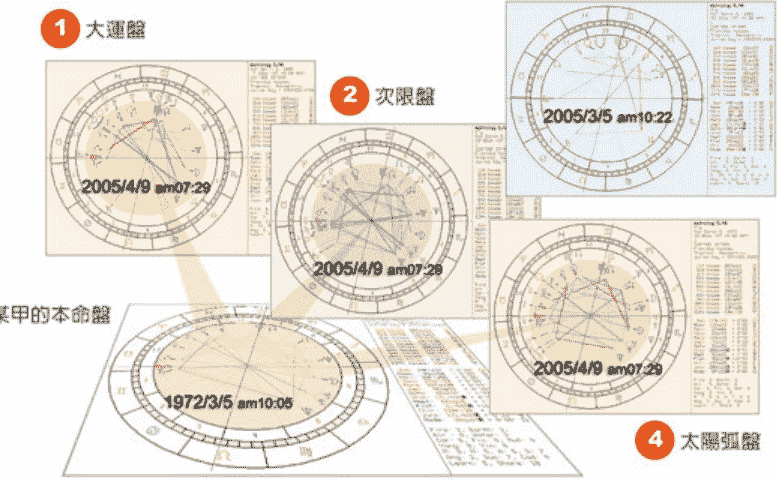

### 同一時間點的不同運勢盤

上圖為某甲（1972/3/5 am10:05 出生）在2005/4/9 am07:29 的四種運勢盤，1、2、4三張盤中內圈行星為本命行星，外圈分別為2005/4/9 am07:29 當刻的運行星，推運星與向運星。
3為2005年當年的太陽返照圖，某甲在 2005/3/5 am10:22 運行太陽回到出生時太陽的位置，以這個時間所形成的盤就是某甲2005/3/5日到下一年2006/3/5日太陽回到原點這段期間的太陽返照盤。

## 天地人 1-1 THE KEY OF STAR

### 2. 推運法：Progression

推運法與大運法的原理類似，但作用不同。大運法是實際當刻的運行星與本命行星的對應，而推運法則是以濃縮的時間作為運行星來對應本命行星。大運法是真實環境的變化，而推運法則是一種內在心境的變化。這個概念其實很簡單，也就是一段小週期的變化可以對應、擴張成一段大週期的變化，類似天上一天，地上一年的概念，由這樣的概念發展出了好幾種不同的推運方法。主要有以下：

- a. 主限法：約四分鐘代表一年。太陽每天運行約一度，以地球替代跟太陽每天運行相同度數的時間，運行一度（約4分鐘）代表一年。以此推論，我們以東升點為基準，出生後東升點每經過太陽運行一天的度數（約一度）就代表一年的變化。
- b. 次限法：一天代表一年。以出生後太陽走一度的時間對應太陽走黃道一圈的時間，太陽約每一天走一度，也就是以一天代表一年的變化。
- c. 三限法：一天代表一月。同理，以太陽走一度的時間來對應月亮走黃道一圈的時間，太陽約每一天走一度，也就是以一天代表一個月的變化。

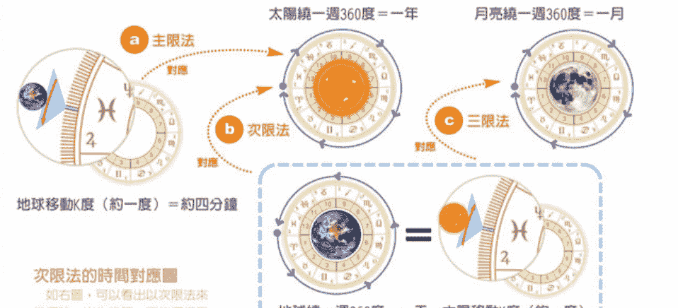

次限法的時間對應圖
如右圖，可以看出以次限法來推運時，出生後第一天的運行星分布就是出生後第一年的推運星分布，也就是一年的時間狀況被濃縮在一天中。所以說，出生後三個月（代表推運約90年）是人生最重要的時期，因為這三個月決定了一生的基本走向。

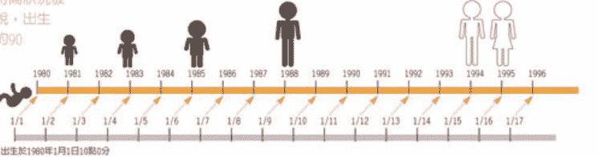

## 天地人 1-1 THE KEY OF STAR

### 3. 返照法：Return

類似中國的小限，以行星回歸到原點的時間作為當次回歸到下次回歸的整體運勢，一般常用的有太陽和月亮返照。太陽返照看當年一整年的運勢，而月亮返照則看當月一整月的運勢。除了太陽與月亮外，任何行星的回歸當刻，皆可作為這一個回歸週期的週期運勢盤。返照法可以看作是以一個特殊時間起點當作一個週期的出生圖，來看出一個週期的整體運。如果再配合運行星，就可以看出這個週期中的運勢變化。

同樣的方法可以運用在任何一個週期中。例如日蝕盤，從這一次的日蝕到下一次的日蝕週期，就可以開始的日蝕時間當作這一個日蝕週期的命盤，配合運行星與這個日蝕週期盤行星的互動感應，可以知道這個日蝕週期中即將發生影響的時間。同樣的方式，除了行星回歸週期外，還可以推及到每一次的行星逆行週期，行星會合週期…等，將每一個週期當作一個生命體一般推算運勢。

所以人的一生是一個大週期，這個大週期中包含著無數的小週期，每一個小週期都可以看成一個新的個體，有其個別的命運，然而這些大週期與小週期間卻又是息息相關的。

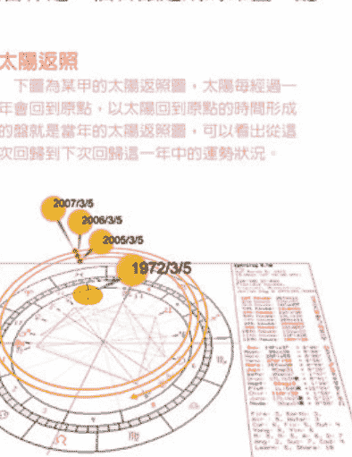

- ●要學會分析運勢就必須了解基本的運行星意義，運行星進入本命宮位的象徵意義，以及運行星與本命行星關連時形成相位的基本意涵。如果單從最基本的運行星法來與本命盤對應，我們可以看到：
  1. 運行（日、月、水、金、火、木、土、天、海、冥）進入本命盤12宮的120種基本象徵事件。
  2. 運行（日、月、水、金、火、木、土、天、海、冥）與本命（日、月、水、金、火、木、土、天、海、冥）產生對應的100種反應組合。
  3. 運行星與本命星間100種反應組合所產生的500種基本相位模式。

## 天地人 1-1 THE KEY OF STAR

### 4. 向運法：Direction

向運法與推運法類似但方法有些不同，它依據的是四度空間的時間概念，同樣以某重要星體運行一段小時間來替代一段大時間，但是卻是以整體星盤來做位置的移動，而非時間的移動。

舉例：以太陽弧向運法及次限推運法來比較，同樣用太陽運行一度來代表太陽運行一圈的時間，但是不同的是，推運法中的星體運行是純粹的時間壓縮，運行速度仍是各自不同的，但是向運法卻是將整個命盤依據太陽的移動速率來進行移位，例如出生後五天，太陽移動五度代表五年後的命運，在推運法中月亮因為運行的比較快運行了六十幾度，但在向運法中月亮一樣跟著太陽做相對移動，只運行五度。

所以向運法是以一個星體的運行速度為基準，將整個命盤上的所有物件（包括行星與重要點）做相對性的移動，進而論斷行星依據此移動後的新位置與本命行星產生的互動反應。

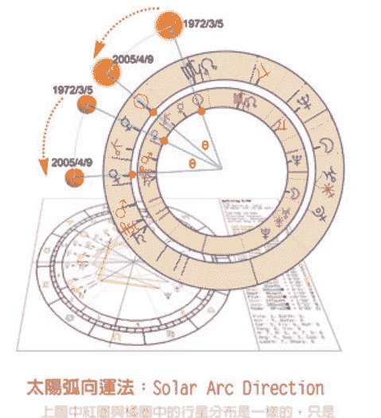

太陽弧向運法：Solar Arc Direction
上圖中紅圈與橘圈中的行星分佈是一樣的，只是隨著太陽的轉動，整個圈圈跟著旋轉。當從1972/3/5到2005/4/9這段期間太陽移動了θ度，所以金星也跟著移動了θ度，同樣的，所有的星體也都移動了一樣的距離。

## 配對盤

占星學從本命盤透析你的命、探究個人的基本密碼。以各種推斷運勢的方式，找尋啟動密碼的時間，讓你了解自己人生中大大小小、鉅細靡遺的每個重要抉擇點的發生時刻。這些都是屬於自我的分析，但是人生在世，並不是光靠自己，還必須與許許多多的人接觸，那麼透過占星來了解二個人、三個人、甚至一群人、一個國家、整個世界也是重要的課題。

我們先從最基本的雙人關係來著手，每個人都有屬於自己獨一無二的行星組合，因此，很自然的占星上便利用兩個人個別命盤的對應，來分析個人與他人的各種關連，這就是基本的配對盤概念！

隨著近代占星發展，配對盤也發展出不同的方法，各有其立論基礎與印證準確度，主要有以下幾種：

### 1. 比較盤：Synastry

這是最基本的配對法，就是將其中一人當主盤，將另一人的行星分布套進來，就像是以另一人的行星當作運行星般，看對方行星落入主盤的什麼宮位，同時與主盤行星產生什麼相位！

### 2. 組合盤：Composite

是由漢堡學派的中點理論推演而來，將兩個人的所有行星、重要點的位置取其中點，重新構成一張星盤！

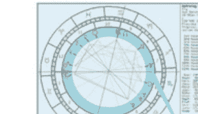

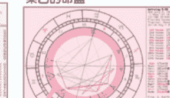

比較盤與組合盤
如圖中A與B為比較盤，A是以某甲為主，將某乙的行星置入某甲的星盤中，比較彼此行星間形成的相位關係，B則將某甲的行星去除，用來看某乙行星進入某甲的宮位狀況。
C為組合盤，是將彼此的行星與重要點找出其中間位置，而構成的一張新的命盤。

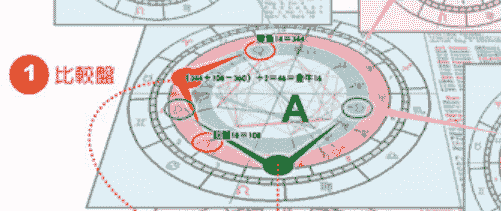

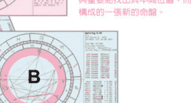

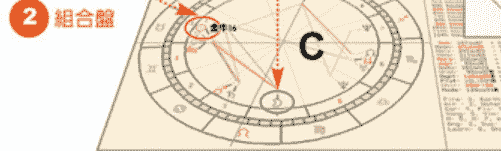

- ●如果單單從最基本的比較盤，我們可以看到：
  1. 甲方（日、月、水、金、火、木、土、天、海、冥）進入乙方12宮的120種基本象徵事件。
  2. 甲方（日、月、水、金、火、木、土、天、海、冥）與乙方（日、月、水、金、火、木、土、天、海、冥）產生對應的50種反應組合。
  3. 彼此間50種反應組合所產生的250種基本相位模式。

## 天地人 1-1 THE KEY OF STAR

### 3. 時空盤：Time/Space Midpoint

時空盤則是將兩個人的出生時間與出生地點經緯度加起來除以二，重新產生的一張星盤！

比較盤主要看出兩人間的關係、利害、彼此相處的合適點、問題點，而組合盤與時空盤除了可以分析兩人關係外，也可以將多人取出共同平均點，起出共同關係盤。在應用上更為廣闊。

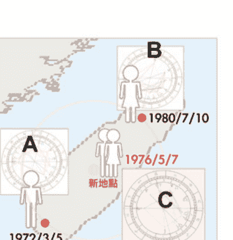

> 時空中點盤
如圖中A與B的出生時間分別為1972年3月5日及1980年7月10日，其中間日期為1976年5月7日。將兩人出生地取其中間位置為圖中的新地點，以這個新地點與新時間起盤形成C，這就是A與B的時空中點盤。

## 時事占星學

實際上，占星學最初的發展並不是為了服務個人的。在古代，占星的預測主要是為了知道國家君王的盛衰，從天象中對應世事的變化。透過行星的位置、順逆、交會，日月蝕、恆星與行星的會合，彗星、流星的出現來推斷可能發生什麼世界大事，這就是時事占星學。例如由木土20年的交會週期來對應各種關於社會、政治、經濟的變遷等等，看行星構成的天象象徵如何影響整個世界的發展。這些影響通常是普及性的、共通性的，像是從春分點的移動位置，我們正由雙魚時代進入寶瓶時代，而這個新時代就表現出科技、個性化、電子發展、人道主義等水瓶座的象徵。

這樣的共同天象意義通常是全球性與整體性的，而對於個別國家的運勢來說，占星學就將國家當作個人一樣，根據一個國家誕生的時辰繪製星盤，來推斷一個國家的命運。例如英國就是以威廉王在1066年12月25日西敏寺加冕的那個時間來立盤的。利用這樣的方法推演，更可擴及到一個機構、一家公司、一個政黨、甚至一個家族命運的推斷。

除了以一個國家誕生時間立星盤來推算的方式外，占星上還會以每年太陽在春分點回歸的時間，依個別區域的經緯度立星盤的方法，來推斷一個地區一年間的運勢狀況。

透過這些行星關連的方法，占星學除了運用在國家、世界的預測上，也應用在許許多多不同的領域中，古代占星師除了預知國運，也經常充當氣象員，預測天氣變化，除此外，在各種社會層面中也都有占星的介入！

現今電視、網站上預測12星座運勢的方法也是一種簡化的時事占星法，以太陽所在星座當作第一宮，接著順著星座分布第2宮、第3宮…，然後看天上行星進入哪一宮，推算某星座全部人的運勢，不過，這當然是非常不準的，因為將全部的人分成只有12等分，很顯然是過於粗糙！

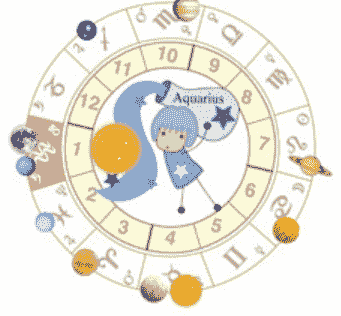

**12星座運勢法**

如圖某人太陽星座為水瓶座，則以水瓶座為第一宮，雙魚為二宮，牡羊為三宮…，其餘類推，再依據運行星進入的宮位推算命運，如圖中土星在獅子座也就是此人的第七宮，因此可以推斷此人可能有婚姻或與人合作方面的壓力。

## 財經占星學

財經占星學是屬於時事占星的一種，雖然發展時間很短，卻很快的成為一門重要的占星門別。運用行星週期的循環，占星師將經濟的循環、股市的波動與行星週期對應，不論是股匯市、黃金、石油、農產品的價格都有個別的波動週期，許多經濟學者都知道這些起起浮浮的波動，都具有一定的規律可循，而這些規律的週期變化，很顯然的可以與行星週期做某種關連，藉由現代電腦科技的分析，將這些相關因素繪製成量化圖表，可以明顯地看出行星之間錯綜複雜的波動關係，再配上流年、流月或流日的波動，形成一種頗為符合科學分析的量化技巧。

由於股市的波動是變化萬千的，需要考量到的因素極為複雜。把這些錯綜複雜的波動關係，配合上行星的波動，與波浪理論相結合，找出彼此之間的相關性，進而用來預測股市的變動趨勢，如果你可以找到這樣的規則，你就可能預測股市未來的走向，而這就是財經占星師想找尋的！在美國，有關股市預測這一方面的研究是相當發達的，財經占星可說是占星學研究中最難和最複雜的論斷技巧，也是占星學家最不願意公開的密技。

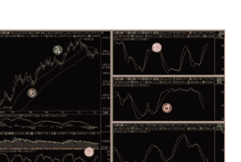

## 天地人 1-1 THE KEY OF STAR

利用占星來預測股市，首先就要確認以何時當作股市的出生時間，台灣股市第一次交易時間是1962年2月9日上午9時，有興趣的讀者不妨研究看看，也許你可以因此成為股神喔！

- ●要研究財經占星要注意到幾個重點：
  1. 以何時為命盤的基準，例如股市命盤、國家命盤、中央銀行命盤、所選的股票公司命盤等。
  2. 週期循環與股市起伏的對應，主要的重要長期週期有太陽黑子11年週期、木土合相的20年週期、月交點的18.6年週期等，短期的影響有太陽、水星、金星的週期、太陽與火星的合相週期等，另外要考慮月亮的影響。
  3. 行星、星座象徵的行業與整體經濟循環的關連性。
  4. 行星相位的影響，會對整體波動具有修正效果。

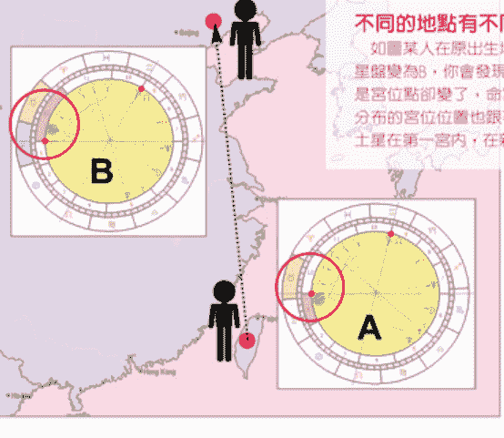

不同的地點有不同的命運
如圖某人在原出生地時的星盤為A，當他到達遠地時，星盤變為B，你會發現到，黃色圈中的行星分布不變，但是宮位點卻變了，命宮從金牛變成雙子，因此原來行星分布的宮位位置也跟著產生了些微的轉變，如圖中原本土星在第一宮內，在新的地點中，土星變成在12宮了。

## 置換占星學

天、地、人是構成命運的基本元素，占星命盤是由出生時間與地點構成的，出生時間雖然不會改變，但是人卻可以改變自己所處的位置。所以換置占星的意義，是指個人離開出生地A到另一地B，若以該地B的經度、緯度重新起盤，則因為各宮宮始點位置的改變而產生命運的變化。因此，如果本命盤位置不佳，透過更換地點的方式，也許可以使行星位置改變分布的宮位，藉以趨吉避凶，這就是置換占星的概念！

置換占星學經過不斷發展，同時加入了東方風水的概念而展現不同的風貌，將陽宅風水的概念與占星學結合成一種新的技巧，這發展為地平空間占星學，以地平座標來衍伸，除可用於擇日學中的太陽到山外，亦可求算個人的地平空間圖，從其中顯現的行星線來安排個人陽宅住居的各種功能使用，提供就職、戀愛、賺錢…的適當方向。

現代換置占星學之父Jim Lewis，發明Astro*Carto*Graphy法，簡稱A*C*G。這是種結合行星路線和世界地圖的方法，利用出生當刻地球上行星能量分布位置的不同，而讓當事人可以選擇對自己有利的位置，接收有利的能量。

A*C*G圖可供個人作為出國發展、移民、留學、生意往來的極佳工具，可以充分掌握全球那一地區是個人最佳幸運區。因不同空間的選擇來增強或改變命運，是一種相當創新的方法，而且驗證性很高。1982年Jim Lewis再接再厲地完成A*C*G的推運和過運，這種技巧他稱為Cyclo*Carto*Graphy，簡稱C*C*G。

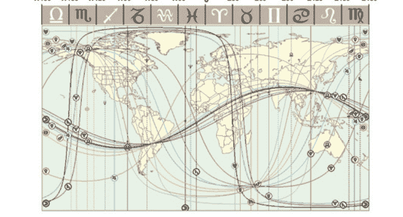

另外還有一種測定圖，它的概念是將全世界地圖分割，以英國格林威治天文臺之經線為起點作為牡羊0°，然後以每30°之地理經度劃分，對應天空黃道的星座。經過這樣的人為分割，可得知全球各地區或國家歸屬那一星座，看行星過運或重大行星會合之重要占星學徵象出現在那一星座，就可判斷對應國家或地區的運勢發展。

## 擇日占星學

中國人一向重視挑選良辰吉日，我們平日所使用的農民曆就是一種擇吉的觀念。擇日顧名思義就是選擇好的時間點以求帶來好運，它只有一個目的：當我們決定要做一件事時，找到正確採取行動的時間，看此時間的行星分布是否吉利。這包括各種日常生活中的大小事物，例如：新居落成、成立公司、挑選結婚時刻，甚至於總統就職時刻都可以運用占星學來挑選好的時機。

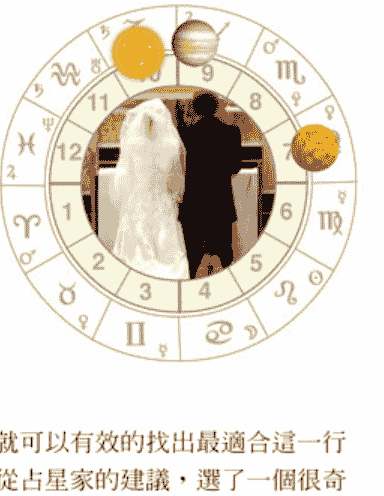

從占星學的角度來說，一旦確立了目標，就可以有效的找出最適合這一行動的星盤。雷根在就任加州州長時，也是聽從占星家的建議，選了一個很奇怪的就任時間。在他就任美國總統期間，很多重要決策的決定也都有占星家的影子。

星盤的構成往往是吉凶相間的，因此要進行擇日占星，在一段時間中挑選一個適合各種因素配合完善的時間，並不是一件簡單的事。你必須能夠清楚的掌握整個全局，針對事物的特性來挑選。還必須要對整個占星學有通盤的了解，必須涉獵各種推運法、次限法、太陽弧法等多個領域。

## 卜卦占星學

卜卦占星學和擇日占星學，通常被歸屬為同一領域，因為這兩種占星技巧都同樣是以「當下」時間作為依據。只是卜卦占星學的時間是隨機的，而擇日占星學則是具有選擇性。

卜卦占星學是西洋占星體系中很重要的一部分，主要用於解決生活中實際的一些問題與困惑，卜卦的形式很多，有使用錢幣的易經系統，有運用塔羅牌的象徵意義的，而占星卜卦則是利用占星命盤，以占星象徵作為占卜的意象工具，來占問吉凶的方法。以某個特定時間，為求問事件起盤，針對命盤的行星狀況顯示的吉凶，來預測問卜事物的發展，從而了解應該如何應對。它的基本原則是：

- 一、決定問題後，選擇特定時間作為起盤的依據，通常是問卜的時間。

二、起盤後，首先要判斷這張星盤是否有效用。占星卜卦學有一套特別的判斷依據，在某些條件下，這張星盤對詢問事件將不會有太大意義，例如當命宮落在一個星座前三度與末三度時，通常代表事情還太早或已經來不及了。

三、找出問占者的象徵星：通常為上升星座的主宰星（主宰星以傳統的七顆行星為主，不包括三王星）、月亮（月亮永遠代表問卜者）、第一宮內的行星、上一個與月亮有交角的行星。

行星的最大作用，乃是作為問卜者與詢問事件的宮主星，並做為論斷占卜的主角。比如說，所卜問的事項與第二宮有關（屬於錢財事項），而第二宮宮頭落在射手座（宮主星為木星）上，那麼木星就具有最主要的論斷作用，並依照木星的強弱與發生的相位來論斷相關的錢財事務。

四、定出問占事件的宮位及象徵星：主要為主宰問卜事件宮位的宮主星、主宰問占事宮位內的行星、下一個與月亮有交角的行星。

五、自然主宰星具有原始的意義，必須參考：例如金星是愛情的自然主宰，當卜問的事與愛情相關時，金星的強弱與相位就具有參考價值。

六、判斷問占者象徵星與事件象徵星所落的位置，象徵星的好壞強弱以及象徵星彼此之間的相位關連。同時必須注意與象徵星形成相位的行星，他們通常是影響事件結果的重要關鍵。

七、評估即將形成的重要相位，這象徵所問事件的未來變化。

八、注意月亮離開原星座時，所形成的最後一個主要相位。

同樣的時間，不同的事件

如圖以同一張時間盤來卜問金錢與婚姻兩個不同的事件時，命宮位於金牛（金星主宰）尾巴，表示占問的事已經快來不及改變了，金星與月亮代表詢問者。問卜金錢跟第二宮有關，二宮在雙子（水星主宰），所以事件象徵星為水星。而當問卜的是婚姻時，則要看七宮，七宮在天蠍（火星主宰），所以事件星為火星。由此可以看出，同一個時間盤，當問卜事件不同時將會完全出現不同的解釋結果。

## 天地人 1-1 THE KEY OF STAR

## 卜卦占星學的行星與宮位象徵意義

- **太陽**：在卜卦盤上象徵著生命力，是一種強勢的象徵。如果太陽落入所問之事宮位內，表示問題的凸顯，代表問卜者對該事件所展現出來的意志力。
- **月亮**：是卜卦占星學中最重要的一顆星，通常用來決定事件的結果。同時月亮也是詢問者的共同象徵星，與命主星共同代表詢問者。另外，月亮也代表就該卜問事件來說，詢問者所展現出來的環境適應能力，亦即月亮可用來透視詢問者對該卜問事件所準備作出的心理反應。
- **水星**：主宰溝通與思考，凡是跟學習、考試或資訊、文件相關的卜問事件，水星是觀察的重點。
- **金星**：主宰價值和愛情，於是是有關愛情和錢財事務的卜問，金星是觀察的重點。因為金星乃是一顆吉星，所以當金星落入所卜問事件的宮位內時，通常代表吉兆的加強。
- **火星**：主宰行動和競爭，是一顆具有傷害與攻擊性的行星，具有行動的象徵，通常有助於事件的明朗化。
- **木星**：主宰遷移、國外、旅行、法律等相關事物，凡是有關此類事件的卜問，木星是觀察的重點。由於木星是一顆大吉星，所以當木星落入所卜問事件的宮位內時，通常特別加強幸運。
- **土星**：主宰事業、挑戰、困難，所以當土星落入所卜問事件的宮位內時，通常是象徵著事件的達成有其難度與障礙。
- **天王星**：主宰革新、改變、科技，所以當天王星落入所卜問事件的宮位內時，通常是象徵著事件的突發變化。
- **海王星**：主宰幻想、覺醒、化學，所以當海王星落入所卜問事件的宮位內時，通常是象徵著事件的不可預測。
- **冥王星**：主宰轉換、重建、神秘，所以當冥王星落入所卜問事件的宮位內時，通常是象徵著事件的結束或重新開始的契機。

- **第一宮**：代表詢問者，當有行星落入時，可呈現詢問者的某些狀況。
- **第二宮**：有關錢財、資產、價值事物的宮位。
- **第三宮**：有關兄弟姐妹、鄰居、同學的宮位。
- **第四宮**：代表卜問的結果，同時也是跟家庭相關事物的宮位，也主宰母親。
- **第五宮**：有關表現、遊戲、賭博、孩子和戀愛事物的宮位。
- **第六宮**：有關工作、疾病和健康事物的宮位。
- **第七宮**：代表相對的一方，如問簽約或買賣能否達成時，第七宮就代表對方。也代表被詢問者（占星家本身），也代表無關係的第三人。同時也是婚姻、合夥、對手、配偶的宮位。
- **第八宮**：有關性、死亡和他人錢財事物的宮位。
- **第九宮**：有關旅行、遷徙、法律、宗教和國外事物的宮位。
- **第十宮**：有關事業發展、職業、地位的宮位，也主宰父親。
- **第十一宮**：有關朋友、團體、社團的宮位。
- **第十二宮**：有關損失、遺失、精神、秘密的宮位。

## 結語

西方占星學在近代蓬勃發展，因而誕生了許多的學派，例如德國占星學家 Alfred Witte和Friedrich Sieggrun所創立的漢堡學派，其論斷技巧主要為行星中點的概念。他們認為行星的凶相位比吉相位來得更為重要，更足以呈現出事件的徵象。同時，凶相位幾乎都是與圓周以二來切割有關，這些角度的切割呈現出中點的特性。因此Alfred Witte創造了90度的占星命盤，這種90度的占星命盤可以比較明顯地看出行星之間的中點關係。

漢堡學派最大的貢獻就是行星中點概念，中點的論斷概念也滲透到各種論斷範圍之內，這也成為雙人組合盤的基礎。除了合盤的論斷外，許多的占星學家習慣應用中點來作論斷的參考要素，Reinhold Ebertin簡化和精煉了中點的論斷。將改良後的漢堡學派占星學稱之為宇宙生物學(Cosmobiology)。

而古典占星學中，與西方分流的印度占星與中國占星更是各自有豐富的發展與深厚的內容。因此真要能夠完全了解占星學，基本上是不可能的，就算花一輩子都研究不完，而這其中的原理是如此的豐富，甚至可以包容現今所有的科學領域。

哈雷對牛頓研究占星極為不苟同，且對占星多所批評，深信占星學的牛頓對於不信占星學的哈雷只說了一句話：「我研究過占星學，而你呢？」所以呢？如果你真的研究過、了解過占星學，再批評也不遲！

## 更多资料

↓↓↓

--------------------------------------------------

## 【中华古籍库】

↓ 点击链接 ↓

https://www.fozhu920.com/list/

珍版刻印 / 海外流传 / 家传手抄 / 民间失传

【易】【医】【道】【武】【文】【奇】【画】【书】

1000000+高清古书籍

## 打包下载

微信：mbook86

## 象徵與週期
SYMBOL & CYCLE

## 象徵

什麼是象徵呢？每當情人節時，大部分人會送玫瑰花給對方，為什麼要送玫瑰，因為玫瑰象徵愛情。在東方，如果遇到黑貓或烏鴉，就暗示可能會有不幸的事物將發生；如果摘到四葉幸運草就象徵好運的事。另外，顏色是最基本的象徵，紅色熱情、藍色憂鬱、黑色神秘…等等。

許多人擁有屬於自己特別的寶貝，可能是一顆石頭、一個器物或是一個布偶，對這個人來說，這些東西可能是他某段時期的記憶象徵，也有可能代表某種特別意義。曾有一個女孩送給他心儀的男孩一株植物，起初他們關係非常好，這株植物也異常茂盛，後來這株植物枯死後，他們也因為感情轉淡而分手，這株植物的成長過程成了他們感情的象徵。常常某些時刻，某些特定類型的事件總是接二連三的同時發生，總是有許許多多的巧合與關連。

量子學大師波姆認為宇宙是一個不可分割的整體，就像人體一樣，當腳受傷時不只腳會痛，而是全身都會感受到。整個宇宙是一個有機的統合體，如果宇宙的某部份改變了，整個宇宙都會受到影響。這意味著沒有肢體是分開的，每一個部分都相接在一起，如果我的肚子痛，那麼我的大腿同樣會感受到那個痛，這個訊息會傳達到心，使全身都會受到影響。身體也是一個有機的統合體，當碰觸一個單點，整個身體都會感受到這個振動，每一個部位都會受到影響，彼此息息相關連，是不可分割的一個整體。所以天的變化人會感受到，人的變化也會讓天有所感覺。

而占星的基本根源就是象徵，透過象徵性的對應，構成天、地、人間的感應。所有的事物都有象徵性的關連，上天如是、地下如此，一一對應，天有陰晴風雷，人有喜怒哀樂。古人認為天是大宇宙，而人是小宇宙，大宇宙的變化會直接對應到小宇宙。宇宙的規律一層一層的包含著，上一層規律綻放在下一層規律中，下一層規律則掩藏在上一層規律裡，整個整體是隱藏的規律，顯現在我們的世界中，包含時間、空間與物質。占星圖是個人命運的掩藏，包含著所有的原型徵象。這些占星圖的內藏含義綻放後就是我們的命運。

> ### 一層一層的對應
一切萬物的結構都具有相同類似性，從最大的宇宙到最小的基本粒子，一層一層，彼此對應，而這些類似性的對應都可以歸類於12個基本原型中。

我們很容易發現到整個世界具有層次的相同性。因此，從長久的累積中，人們慢慢的將身邊的龐雜諸多事物歸類，而在歸類的過程中，找尋基本的分類依據，而這些分類的依據具有最最基本的特質，是最基本的原型，不論是科學家、社會學家大家都在找尋的就是一種可以將萬物包容進來的原理，而同樣的占星學也是。

如果把我這個人不斷的分析下去，你會先看到我的身體由器官組成，再放大則發現器官由組織組成，組織由細胞構成，細胞由細胞核、細胞質等細胞內組織構成，再分解下去，這些細胞內組織又由更小的組織構成，然後你會看到構成物質的分子，分子又由電子、中子、質子構成，而這些東西又可以分解更小的夸克粒子。相反的，不斷離遠離我，你會看到我家附近，然後看到我住的鄉鎮、我所在的城市、台灣島、整個東南亞到整顆地球，如果再加快遠離的速度，你會看到整個太陽系，太陽由九大行星環繞著，而行星也有他們自己的衛星環繞著，衛星還有護星環繞著，一層一層的類似結構，而太陽也同樣環繞著銀河系中某個地方。同時銀河系中所有物體都沿著銀河系中心環繞著，銀河系又環繞著宇宙中的某個地方，最後所有物體都沿著宇宙中心環繞著。

## 碎形
碎形圖案是一種特別的結構，不論你怎麼放大或怎麼縮小，都會出現同樣的圖案，而這種特性也與我們的宇宙結構類似。

我們會發現到，所有的事物都具有這樣一層一層的構成特徵，即使是人世間的組織也是一樣，人構成家、家構成村、村構成鄉，如此一層一層到國家、世界。這些層次間都具有類似性的共同特徵，就像自然界無處不在的碎形圖案一樣，不論你怎麼放大，或是怎麼縮小，都會出現一樣的圖案。都能經由同樣的原型特徵來分類，而同樣的原型也都能在不同層次的組成中發生連結對應，所以頭在人身體的地位可以類比於一家之主、一村之長、一國之君、整個太陽系的中心～太陽。

經由這樣類比式的推演歸納出的一些基本原型，就是占星中的12星座與行星的象徵，將宇宙分出12種基本原型透過12星座位置來對應，而地球的各種層面經由12宮位來類比，最後經由行星來感應傳達象徵性的能量。

每一個小宇宙都包藏著大宇宙的整體象徵，所以手掌上的手紋、臉上的相貌、身體內的痣也都象徵性的對應到整體，帶著特別的徵象。在中國，老祖先將一切萬物歸納到五種基本特質，也就是五行，以金木水火土五星推演對應到身體的五臟、五種基本情緒、五種味道…等等，占星上則將12星座對應到人體、人事、個性、組織…最後歸結到行星。

究竟是天上的星辰影響人還是人影響天呢？也許都有吧！因為彼此都是相關連的。事實上，我們也在改變對行星的認識的過程中轉化了行星的意義。當人類意識進展到日月五星無法滿足時，天海冥適時的出現，填補了快速進展的現代象徵，曾經被隱藏和忽略的它們開始在世界上有意識地活動。由整體大眾的決定改變了我們認識行星的意義，就像原本作為惡魔象徵的土星意義也因此改變，他的惡魔的特性被重新分配給了新發現的冥王星。

所以說，是因為新行星的發現使得近代世界發生巨變，而或是人類世界需要巨大發展，因而出現了三王星來作為時代的象徵呢！

> 「天有四時、五行、九解、三百六十日；人亦有四肢、五臟、九竅、三百六十節」
淮南子

> 「人有悲歡離合；月有陰晴圓缺」
蘇東坡

> 「我們每一個人都是運行星。本命盤是根據運行星在我們內心產生共鳴而設置的。我們觀測星象並由此對宇宙產生影響。」
Jeff Jawer

## 容格與心理占星學

容格是第一位將心理學與玄學領域包容的科學家，他曾說：占星學是古代心理學知識的總合，因為星盤中包含所有的對立面，主體與客體、陰陽、男女。而榮格學說心理發展的目標正是所有對立面的整合。他認為整個世界都連繫於一根線，這根線便是人類的心靈。

因為容格的詮識，現代占星找到了科學之外的另一條路～潛意識心理學。他的原型理論讓占星符號得到力量的依據，黃道12星座就是12個宇宙基本原型，也就是12種集體潛意識的表現。1930年，容格提出了「同時性」的概念，用來解釋有意義的巧合，認為任何一瞬間會發生的事件，都有這一瞬間的意義。這似乎解釋了星盤上每一個符號間相互的特殊組合為每一個個人定義了屬於他個人的人生意象。

占星以行星作為一種心靈象徵，而原型則是人性中的普遍性質，星盤中每個行星都像一位神明，受到我們的崇敬。回歸中心是一種最高的自覺能力，曼陀羅就是這樣的象徵，利用繪製曼陀羅以求凝聚心靈系統的完整。占星命盤

## 曼陀羅象徵
一切的一切都是由中心開始，一層一層的展開，因此將所有展開的一切捲藏起來，最後就會回歸原來的中心。而每一張星盤都是一個曼陀羅，當展開後，就是一個豐富的人生。

就像一張曼陀羅，站在命盤的中心，我們進入神秘的象徵領域。從一種寬廣的角度來了解命盤，你會看見個人內在驚人的無限。

他認為星象研究的是個人小宇宙與大宇宙的關連，古老的占星傳統在預知未來中說明了內在與外在世界的接觸，並將心理學中的各種心靈現象與占星關連，假設原型是意象的表徵，諸如人格面具、陰影、阿尼馬、阿尼馬斯、英雄、智慧老人、本我等。原型是先天具有的內在角色，同時具備光明面與黑暗面。而這些基本原型可以對應在12星座、行星、上升等占星學中的基本占星象徵上。

他試圖找出包容科學與神秘學的統一概念，進而提出同時性的概念，用來解釋同時發生的有意義巧合事件。處於同一時間發生的事件未必需要有必然的因果關係，但也許在它們之間有著一種神秘的聯繫。這說明了兩件毫無關連的事件卻有著同樣的意義，一組元件（天空星象）與另一組元件（客觀事件）被劃上等號。

## 心理的四種類型

容格將四種心理類型與占星做對應，火象是直覺型，是無意識的表現直覺。土象是感官型，重視實際的物理感官刺激。風象為思維型，以邏輯、理性來推斷事物。而水象是情感型，代表以個人感受與情緒來處理事物。

容格著名的一次實驗中，以傳統占星對婚姻產生的三種可能組成：太陽對月亮，月亮對月亮、上昇對月亮，來證明他的原理。但是奇怪的事情發生了，當做太陽對月亮的統計實驗時，這批資料顯示了太陽對月亮的重要性。但是當做月亮對月亮時，這第二批資料即顯示月亮對月亮的重要性。同樣的，當做最後一項實驗時，最後一批資料隨即顯示出上昇對月亮的重要性。這是為什麼呢？他發現到觀察者本身的心理意識參與了事件的結果，占星師的心理狀態與被算命者的命運似乎存在著一種「秘密的交感關係」。似乎顯示了占星師本身的心理狀態與現實狀態間存在著某種相連，也就是說意識決定了現實的發展。

在一次做夢中，他夢見了一個長著翠鳥翅膀的東西。他想畫出這個東西的形狀以便於能夠容易的回憶。正在畫時，突然他在自己的花園中發現了一隻翠鳥的屍體，而這種鳥在該地是十分罕見的。這個不尋常的事件恰恰關連了他夢中所發生的事件。

而占星學正是建立在這種同時性的原則上。行星對我們的影響不存在前後或因果的關係，彼此是同步的。天上的行星與地球上的人事變化互相對應，彼此之間像鏡子一樣相互映照。

## 大時代：從雙魚時代到水瓶時代

同時，容格是第一個有系統的將春分點在黃道星座上的移動與整個時代關連的人。

大家都知道，寶瓶時代要來了，那麼寶瓶時代是怎麼來呢？這不得不提到歲差現象！由於歲差，太陽每年交會到春分點的位置是不同的。每年春分點向西逆行50.2弧秒（一年相差20.396分鐘），經過兩萬六千年春分點才會繞一週回到原點。這個循環稱為一個“大年”。而春分點經過每一個星座的時間，平均約2000多年，稱為一個“大月”。而我們所說的雙魚時代、水瓶時代，就是這樣的一個“大月”。占星學稱之為一個柏拉圖月（PLATONICMONTH），雙魚座代表「精神的驅使」，人類即將進入的寶瓶時代，追求自由和人道社會將是新時代的象徵。

春分點每兩千多年跨過一個星座，代表一個大時代的象徵，從兩千多年前春分點進入雙魚開始，人類經歷了代表犧牲與追求心靈的雙魚時代。在雙魚時代，每個人傾向求助於神靈的力量來解答自己的難題。而水瓶時代的降臨，將會使每一個在精神上的自我覺醒，覺知到每個人都是神的一部份。

耶穌基督顯然代表了雙魚時代的開端，這星座的兩條魚，第一條魚象徵基督，第二條魚象徵反基督，彼此背道而馳。當春分點與構成星座的某一恆星合相時，地球上便會發生重要的大事件。當伯利恆星在天空出現時，耶穌誕生，雙魚時代降臨，基督教產生。當春分點到達第二條魚尾時，世界上開始了法國大革命、科學發展、達爾文、馬克思等人出生，他們的降臨，正是反基督的時代開始。

對於水瓶時代的開始時間占星學家存在比較大的分歧，大致開始的時間從2000年到2050年這段時期。我們即將面對的，是代表個人與強調新變革的水瓶座所象徵的時代，在這樣的時代中，不斷的變化與注重每個個人的重要性是時代的精神，然而，變化後的秩序破壞，與個人化後人性的疏離也將是我們所要面臨的問題。

## 週期

從盤古開天至今，時間就一直不斷前進著，在不同的文明發展中，計算時間與日子的方法雖然不同，但是都有一個共通點，都根據著行星的運行週期來計算。這些週期具有重複性，每一天太陽在東方上升，西方落下，第二天又從東方升起。每一年總是經過春夏秋冬後，再又重新循環一次。除了自然界的重複循環，人世間大大小小的事物也都似乎存在著大大小小、不同的時間週期重複循環著。女人的月經每隔28天會來一次，我們身體的新陳代謝是12天一個週期，動物會在一定的時間產卵、孵育、遷徙、迴游，植物的開花也會在特定的季節綻放。所有的一切事物都像調過鬧鐘一樣，會在正確的時間做該做的事。

太陽經過365又四分之一天會回到原來的位置，形成四季的更替；月亮每27天回到原點，而每29天與太陽形成另一個月相圓缺的週期。馬雅人特別重視金星，他們用的是金星與日、月形成的特殊週期，因為他們相信金星的週期顯現著宇宙的和諧。除此之外，每個行星都有各自固定的回歸週期，而我們發現到自然萬物都在有形無形的受到影響，與他們呼應而產生各自的週期反應。

自然界是最明顯的反應者，科學家發現，每隔幾萬年，冰河期就會重新降臨。乾旱的發生與洪水氾濫也會在固定幾年產生高峰期，依循著特定的週期，週而復始著輪替著。這些都還只是自然現象的變化，但是更更特別的是從歷史的演變中，我們也發現到從亂世到治世、戰爭的發生、國家的興亡、朝代的更替，整個文明的演進也都似乎存在著特定的週期，週而復始！整體世界的潮流推進也都冥冥中依循著固定的模式變化循環著。

經過各種研究統計中我們發現這樣的週期性原來無處不在，人類有一定的生命週期，股市的波動也經由財經專家歸納出特定的週期法則。一切萬象，不論是自然的還是人文的，物質的還是精神面，意識的還是潛意識，都自然而然的變遷著，以一定的、規則的規律循環著！為什麼？自然而然的我們會連想到天，連想到與我們最相關的地球、太陽、月亮、星星，從他們的週期中追尋解答，很巧合的是，這些人世間種種的循環似乎真的跟這些天上的星星具有一種特殊的關連性。太陽與月亮是最明顯的變化，讓我們很清楚的感受到這樣的關連，女人的月經週期明顯的跟月亮有關，蘇聯科學家發現到太陽黑子的11年週期變化跟人類的戰爭明顯的聯繫上，每11年太陽黑子巔峰期時，往往是世界上最容易紛爭對立的戰爭時機。而日月蝕的發生往往跟地震、瘟疫等天災人禍牽連在一起。馬克斯出生在日蝕發生在金牛座（象徵資源、金融）的時刻，於是他創造了共產主義來遮蔽資本主義！

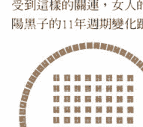

透過週期重複性循環的特性，馬雅人運用金星的週期性變化預言他們的未來。在我們中國，則以10天干、12地支構成60週年一甲子的週期觀念，認為每隔60年類似的事情會重複性的發生

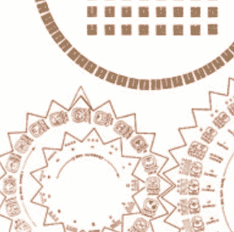

## 不同的週期

馬雅人用金星會合週期訂出一個聖年為13個月，每月20天，一年260天。而中國從易經的推演而形成一甲子60的循環，這些週期其實都是行星週期的轉化。

## 天地人 1-2 SYMBOL & CYCLE

大到整個太陽系甚至全宇宙的運行，小到物質基本要素，原子、分子、電子的運行都提供了大大小小的週期變化，從幾億年到幾億分之秒的的循環，彼此串連，構成這個世界！

黃道上的每一個週期都具有他自己獨特的力量，他們顯著地影響我們。這些週期的力量是有時間性的，隨著時間的變化發生改變。從占星的角度看，春分點的週期是一個至為重要的開端，這個週期有25920年之久。整個黃道是一個迴圈的周期，而每一個星座也是一個迴圈周期，因此星座的起始和結束點是十分重要的，每個星座的0度和29度都是關鍵位置，0度表示這個星座的新的開始或者能量影響的改變，29度表示努力控制了星座的能量。而當春分點要完整經過一個星座時，會有將近2000年的時間，因而他所處的星座位置構成了一個2000年之久的時代象徵。這也就是容格所闡釋的雙魚時代，以及我們即將進入的寶瓶時代的含意！

行星的的回歸是占星學週期的一個重要指標，太陽一年、月亮一月、水星88天、金星225日、火星2年、木星12年、土星29年、天王84年、海王165年、冥王248年。這些回歸都具有屬於與行星本質關連的象徵指標。

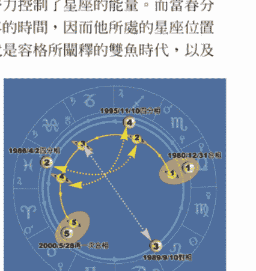

那地球呢？太陽在黃道上經過三百六十度需要一年，而月亮顯然快多了，也要一個月。而地球由西向東自轉在黃道上形成24小時一週期的循環。因此每四分鐘約移動一度，每四秒移動一分。

### 木土的會合

如圖木土由於運行速度的差異，土星還走不到一圈，木星已經繞一圈半了。從1980年合相開始到2000年重新會合總共20年，這是一個完整的週期，他象徵擴張與壓縮力量的變遷，而這個會合週期的起點星座天秤座更是這個週期的重要象徵。

除了行星的回歸，另一個重要的週期指標是行星的會合，天空中任意兩顆行星，都可以組成相應的這兩顆星體的迴圈周期。這個周期從相合(0度)開始到下一個相合(0度)結束。而在這個周期內的任何主要相位，如對相、三分相、四分相等，這些位置時間都是關鍵的。當兩個行星形成相位接近到可以容許度以內時，他們便開始相互影響。當完全接近時，相互影響則會達到一個高潮。太陽與月亮每隔29天合相一次，而最長的合相週期是海冥的合相，長達492年，此外如果是多星的共同合相週期，那又更複雜了！西元前五百七十年春秋戰國之始。此時正逢冥王星、海王星、天王星三星交會，老子、孔子、釋迦牟尼、畢達哥拉斯等中外聖人輩出。

合相代表了一個週期的開始，因此兩顆星合相所在的星座就代表了這個週期的重要指標意義。木土的20年合相週期是自古以來占星師特別在意的，美國流行著一個總統魔咒，每20年木土合相時產生的總統都無法做完任期，很巧的兩個被暗殺的總統，林肯與甘乃迪都是在木土合相時當上總統的。這個魔咒一直到雷根才破解，但他還是被槍擊，差點死在任內！特別的是這個20年週期正好是60甲子週期的三分之一，這顯示60甲子週期顯然跟木土有關！

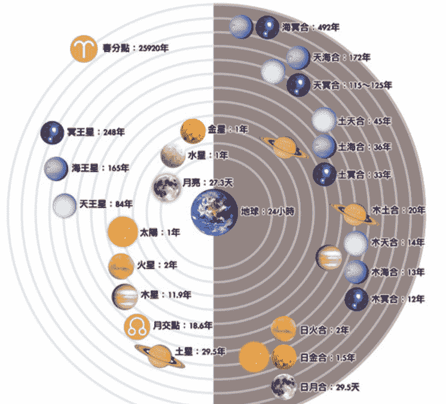

如果從一個人出生開始推算，將人的一生各個階段套入這些行星回歸週期中，你會發現到，還真是關係匪淺呢！因為週期具有的重複循環特性，如果你能夠找到人世間的變化循環與這些行星週期的關連性的話，這就意味著你將找到預知下一個循環發生過程的方法，能夠掌握住未來的變化法則，也就等於能夠預知未來！這就是占星師想要努力的目標！

## 天地人 1-2 SYMBOL & CYCLE

由於行星的回歸週期具有規律性，因此每個人的運行星與本命星之間的互動時間是類似的，例如木星12年回歸一次，因此12歲是青春期的開始，土星29.5年回歸一次，因此所謂三十而立，這時通常是一個人正式進入社會挑戰，面臨人生責任之時。這些規律性的法則也就構成了一生當中的每個階段性的劃分，凸顯一生當中的危機與轉機。當運行星與本命星發生刑剋的當年，是面臨挑戰的高峰期，尤其是土星回歸的影響，通常是一般習俗中所提及需要多加注意事故發生的歲數。所以29歲結婚不宜就是如此，因為正值土星回歸之時。以下是人生受行星回歸影響的狀況，其中色塊標明的是人生中幾個重要時期，比較容易發生衝突與變化。

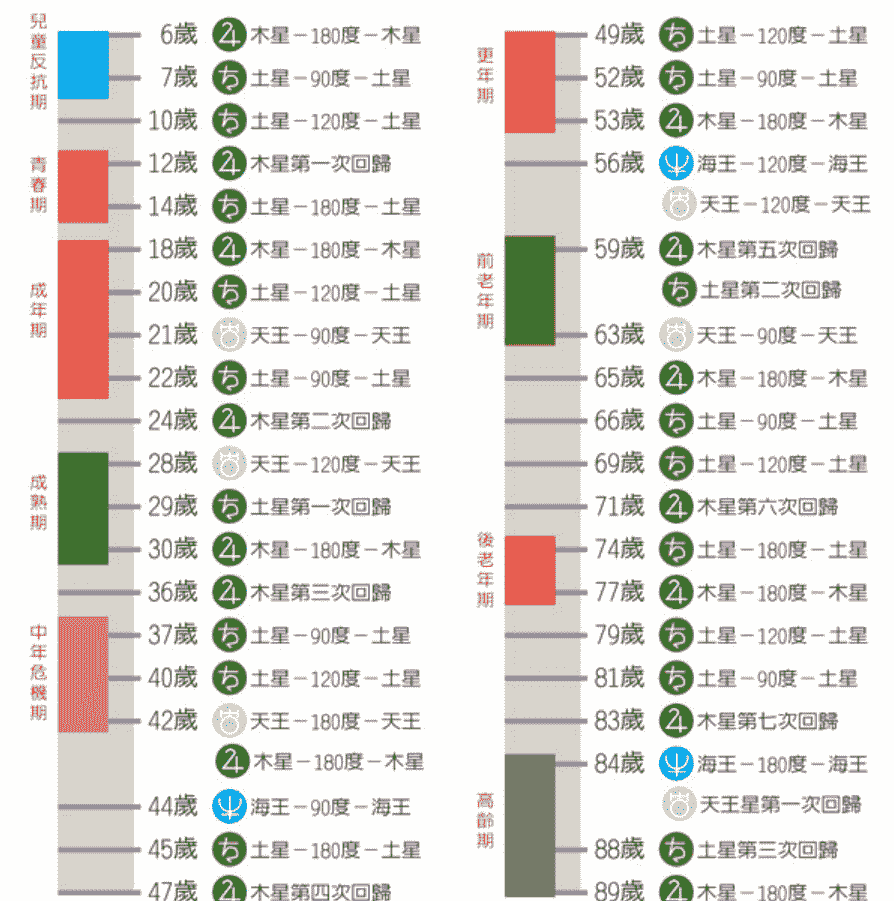

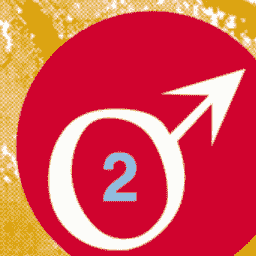

## 星座與宮

### SIGNS & HOUSES

當一個人出生時，每一宮宮頭位置會座落於不同的星座上，而賦予了每一個宮位的特性，因此12個宮頭點對應到各自的星座位置，如此透過12星座各自的主宰行星，形成12宮位各宮的宮主星，因此每個宮頭所在的這個星座的主宰行星就是此宮的宮主星，其重要性要高於宮位的自然主宰星。同時因為宮主星的產生，我們可以了解到宮與宮間的聯繫關係。

## PART2-1 12星座論 12 SIGNS

在入門篇中，我們已經通盤的介紹了12星座、12宮位、行星以及相位等占星學要素的基本含意與基礎，接下來的進階篇中，我們將更深入的了解這些基本要素，做更深入的補充。同時，我們要開始了解到星座、宮位、行星、相位之間的連結關係！

先前我們提過，天（星座）、地（宮位）的能量透過行星展現，因此首先我們要深入這兩個構成要素—星座與宮位，並且了解他們互相對連產生的對應，也就是所謂的天地的交集關係！

## 星座的分類

12星座代表的是12種宇宙方位的代名詞，占星學將整個天球宇宙凝縮在太陽的行進軌道—也就是黃道帶上，以春分點為基本點，分割黃道為12等分，藉由黃道上的12個星座當作12種象徵的圖像意義。因此，我們知道現在我們口中的12星座並非指的是天上的星座，而是太陽與春分點的相對關係。所以與其說12星座，不如以另一個名詞稱為12星宮更為適當。

這12星座將整個宇宙分成12份，代表宇宙中12種基本原型，因此12個星座位置也就附有傳達宇宙能量的意義，當行星進入這12個區域中，就會接收到屬於這12個區域的宇宙能量而產生變化！在西方，黃道被分成12等分，以12種圖像來命名。而在我們中國，則將黃道分的更細一些，共分成12氣與12節的24等分，以四季產生的現象來命名。

要深入12星座前我們必須先從四大元素著手。四大元素是由古希臘學者恩培多克勒提出的四根說而來，他認為世界萬物都是由火土風水四種根基構成

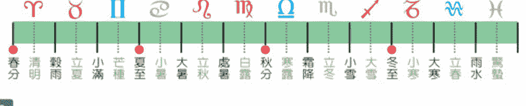

的，後經由亞里斯多德進一步闡釋，認為四元素中內含四種純質料，也就是冷熱、乾溼兩組對立特性的原初物質。風象內含熱與溼的特質；火象內含熱與乾的特質；土象內含冷與乾的特質；水象內含冷與溼的特質。他認為世界萬物都由不同比例的四大元素所構成。並且提出人體內有四種體液與四大元素對應，這四種體液分別為血液（風象）、黃膽汁（火象）、黑膽汁（土象）與黏液（水象），當體內的體液發生不平衡時，就會產生疾病。四體液說在古典醫療占星學上是非常重要的概念！

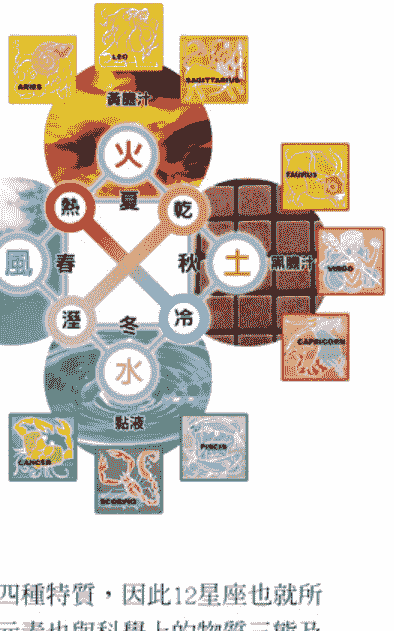

12星座與四季也依照屬性可以分成火土風水四種特質，因此12星座也就所屬的四象而帶有相同的純質料的特質。這四大元素也與科學上的物質三態及最近加入的輻射態構成對應。物質由固態（土象）變成液態（水象）再化為氣態（風象），最後成為輻射態（火象）。目前自然界發現的一百多種化學元素有固態、液態與氣態三種，也許應該還有輻射態元素的存在也說不定！

將萬物歸類似乎是古人的共通智慧，西方以四大元素代表四極或四個方向，而中國則在這四個因素中加入中間的概念，而成為所謂的五行，並且與金木水火土五星對應。透過分類與歸屬，占星學將萬物做歸類並給予對應的星座、宮位與行星，以如此的互通關係來聯繫萬象之間。因此分類是占星學中極為重要的部份。星座所象徵的12種基本原型雖然各有其主要意涵，然而在彼此的屬性上仍有其共通性，而能夠加以歸類，所以從歸類中，我們可以看到這12種基本原型之間的關連。

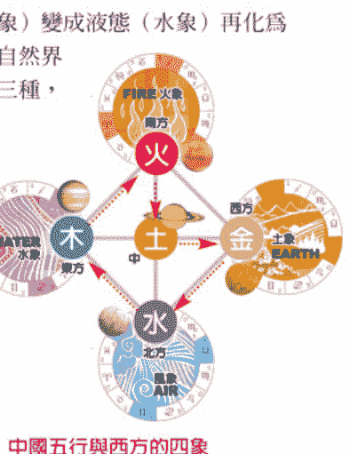

**中國五行與西方的四象**
由於名詞使用的不同，除了火象相同外，實際上水象是屬木，風象是屬水，而土象是屬金，另外中國多了中間的概念，是由土星主管的。

## 星座與宮 2-1 12 SIGNS

在入門篇中我們已經探討過12星座的分類，依屬性可以分為陰陽、三特質以及四元素。陰陽類似物理學中的正負極、正電或負電或是磁力學中的陰陽極。三特質則與化學元素的反應力類似，化學元素中有主動反應的元素，被動反應的元素以及鈍性元素（不易反應的元素）。因此同樣特質的星座彼此不易產生反應，不容易發生能量交流，造成能量間的阻隔！而四元素則如上所提，與物質的狀態類比，因此同類星座間容易配合，彼此性質相似、易於交容而容易有正面的互動！

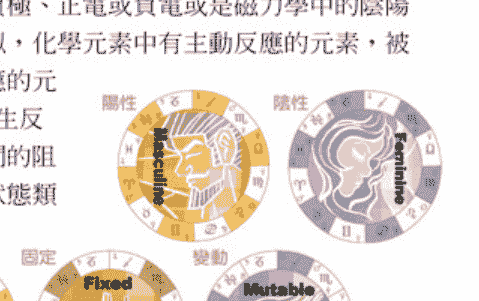

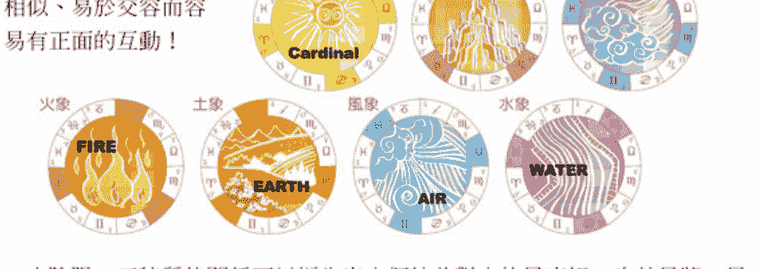

由陰陽、三特質的關係可以衍生出六個彼此對立的星座組，也就是將12星座分成六份。這六條線也各有其意義，象徵六種對立面。彼此互為陰影，當一端成為意識的主導，另一端就會被隱藏進入潛意識中，隨時準備浮出，爭奪意識的主導。

**牡羊VS天秤：**
這條線與主體象徵有關，牡羊代表的是從平衡兩端的一端脫離，造成一端獨大，因而獨斷、自我、主觀。而天秤則相反，試圖與另一端取得平衡而依附，因而具有協調性、客觀、容易妥協。

**金牛VS天蠍：**
這條線與形成象徵有關，金牛代表的是將分散的粒子凝聚成一個穩定的狀態，也象徵將能量變成物質，因此溫和、固執、物質主義。而天蠍則相反，在穩定的狀態中試圖掙脫，由內部爆裂。也象徵將物質轉換成能量，因而內在不穩定，充滿爆發力而危險。

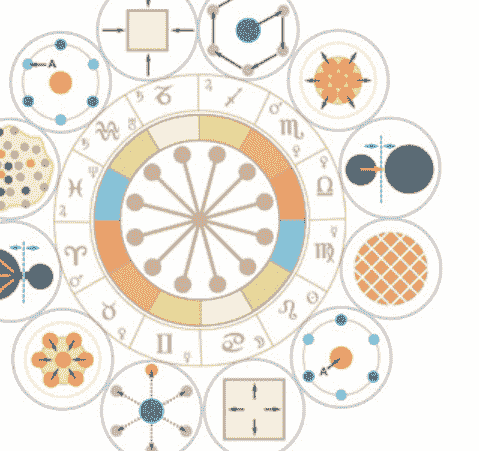

**雙子VS射手：**
這條線與連結象徵有關，雙子是由一個定點往多個方向連結，是一對多的方式，因此善變、矛盾、多而不精。射手則相反，是由一個的定點往一個目標前進，是一對一的方式，因此直接、不拐彎抹角、大智若愚！

**巨蟹VS摩羯：**
這條線與框架象徵有關，巨蟹是由內向外形成框框，構成自我的領域，並且向下深入，因此具有保護、防衛、排外與內省的特質。摩羯則相反，由外往內形成框框，構成基礎，並向上發展，因而保守、謹慎、努力向上！

**獅子VS水瓶：**
這條線與焦點象徵有關，獅子代表是中心的位置，因而尊貴、愛現、熱情付出。水瓶則相反，喜歡遠離中心，因此獨立、自由、個人主義但冷漠！

**處女VS雙魚：**
這條線與解構象徵有關，處女是將一個物質分解成無數的細部，因此分析、細緻、注重細節。雙魚剛好相反，將無數分散的粒子融合在一塊，因此包容、模糊、隨便而散亂。

除了特性上的分類，經過數千年的演進與發展，占星師在12星座上發揮創意與想像，由星座的特徵、圖像、季節性、個別性中發展出星座的特別意義而有不同的分類法，形成占星論斷時重要的參考依據。

### ●以天象來分類，可以分成以下三種：

- 1. 長上升與短上升：長上升包括巨蟹、獅子、處女、天秤、天蠍、射手。而短上升則有摩羯、水瓶、雙魚、牡羊、金牛、雙子。
- 2. 分點與至點（始入）：分點與至點是黃道上四個重要點，因此意義特別重要，分點星座是牡羊與天秤，而至點星座為巨蟹與摩羯。
- 3. 北方（命令）與南方（服從）：太陽在北緯時白天比夜間長，陽大於陰，因此具有支配的涵意。反之陰大於陽，因此隱含服從配合的意義。北方星座有牡羊、金牛、雙子、巨蟹、獅子、處女。而南方星座有天秤、天蠍、射手、摩羯、水瓶、雙魚。

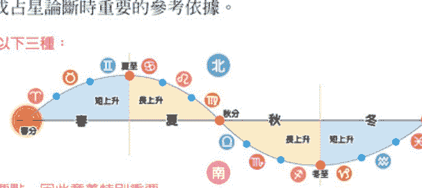

### ●除此之外，還可以形象特徵來分類：

- 1. 人性（雙子、處女、射手、水瓶），獸性（牡羊、金牛、獅子、射手、摩羯），兩棲（摩羯、水瓶）。
- 2. 雙元（雙子、處女、射手、雙魚）：這些星座具有兩面特徵，也有多變的特性。
- 3. 沈默（巨蟹、天蠍、雙魚），有聲（雙子、處女、射手、水瓶、牡羊、金牛、獅子）：沈默星座通常不善言語，而有聲星座多半有口才，尤其是像雙子等有人性特徵的星座。
- 4. 荒地（雙子、獅子、處女），半荒地（射手、水瓶），肥沃（巨蟹、天蠍、雙魚），半肥沃（金牛、天秤、摩羯）。

## 星座與宮 2-1 12 SIGNS

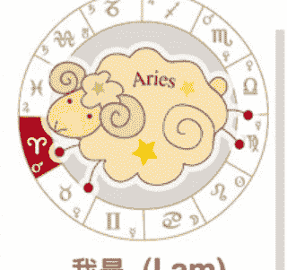

## Aries〔牡羊座〕

⊕ 陽性 ■ 主動 F 火象

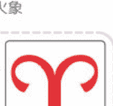

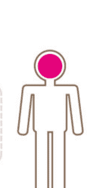

| 區間星 | 0° | 10° | 20° | 30° |
| :--- | :--- | :--- | :--- | :--- |
| 主宰星 | | | | |

我是 (I am)

## 行星強弱

廟：火星 ⊕ 旺：太陽 ⊙ 陷：土星 ♄ 弱：金星 ♀

### 象徵意義

正：果斷的、執行力的、競爭的、積極活潑的、勇敢的、大膽的、活躍的、迅速的、行動力的、直覺的。
負：性急的、暴烈的、衝動的、草率的、自大的、粗魯的、不服從的、虎頭蛇尾的、蠻橫的、對抗的。
身：頭、臉、大腦。
疾：頭痛、頭部、眼睛的疾病、發燒、腦炎。
人：戰士、軍人、拓荒者、鐵匠、屠夫、救火隊、好打鬥的人。
事：打架、戰鬥、競賽、救火、生氣。
物：鐵、刀劍、槍炮、火、羊、尖銳物、烤箱。
地：戰場、競技場、乾燥地、五金行、消防局。

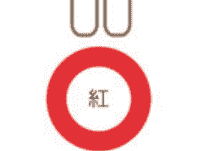

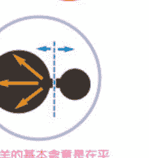

牡羊的基本含意是在平衡的狀態中以競爭的手段，尋求自我的主導，造成單一個體的領先與獨大，脫離平衡的狀態。

## 神話由來

牡羊座是指神話中那隻有金羊毛的公羊。
阿特馬斯國王和王妃涅菲雷生了一對雙胞胎普里克斯和希雷，但國王卻和特貝的公主依諾娃偷情，將王妃趕出宮，改立依諾娃爲新王妃。繼母依諾娃王妃非常討厭這對雙胞胎並且對他們相當殘酷，後來依諾娃王妃生了自己的小孩子，便決定要殺死這對雙胞胎。舊王妃涅菲雷知道後向天神祈禱求救。
天神宙斯非常同情這對雙胞胎，變出了一隻有著金色毛的牡羊送給他們，讓這隻羊帶他們到安全的地方，當牡羊飛過大海時，弟弟希雷一個不留神跌落大海，哥哥傷心的每日以淚洗面。普里克斯安全地到達了在黑海岸的科爾基斯國，爲了尋求國王伊特斯的庇護，普里克斯殺了金羊祭祀天神，將金羊毛奉獻了給國王伊特斯，這隻羊的金羊毛後來成了科爾基斯國的鎮國之寶，由一隻永不睡覺的火龍看守著。後來金羊毛被拋到天空成了星星，便成了天空中的牡羊座。

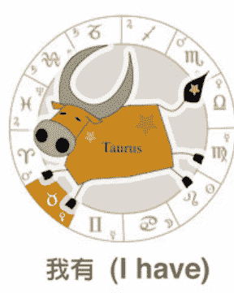

## Taurus 〔金牛座〕

— 陰性 ▲ 固定 E 土象

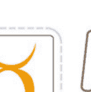

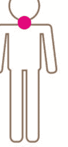

| 區間星 | 0' ♀ | 10' ☿ | 20' ♄ | 30' |
| :--- | :--- | :--- | :--- | :--- |
| 主宰星 | ♀ | | | |

我有 (I have)

## 行星強弱

廟：金星 ♀ 旺：月亮 ☽ 陷：天王星 ♅ 弱：火星 ♂ 冥王星 ♇

### 象徵意義

**正**：有耐心的、保守的、自然的、官能的、溫和的、穩定的、實際的、藝術的、忠實的。
**負**：自我放縱的、固執的、慢動作的、好辯的、牛脾氣的、充滿物慾的、貪婪的、物質主義的、懶惰的、貪婪的。
**身**：後頭骨、頸、喉、聲帶、口、舌、上顎、甲狀腺、扁桃體。
**疾**：喉頭炎、聲帶炎、頸部問題、甲狀腺疾病等。
**人**：畜牧者、資本家、音樂家、園藝家、溫和的人、銀行家。
**事**：藝術、音樂、商業、理財、資本主義、園藝、所有權。
**物**：美的東西、美食、金錢、牛、飾品、有價值的東西。
**地**：大自然、田園、銀行、音樂廳、美術館。

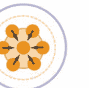

金牛的基本含意是將能量固定為物質，將分散的粒子具合成穩定的狀態，因此象徵物質化、圓滿完整、穩定而牢固。

## 神話由來

金牛座中的金牛其實是天神宙斯的另一個化身。傳說中腓尼基的公主歐羅巴（就是後來歐洲名稱的由來）非常的美麗，一天歐羅巴和宮女們在近海的牧場上摘草，不久，一隻雪白色的公牛出現，溫馴的靠在公主身邊。一開始公主大吃一驚，但是這隻公牛既美麗又溫馴，於是公主走向牛身旁，輕輕的撫摸牠的背，並且放心的騎到牠背上玩耍，忽然間牛奔跑起來了，帶著公主跳進愛琴海，帶她到了克里特島。
其實這隻公牛是素以風流著稱的眾神之王宙斯，他見到了公主後被其美貌所迷惑，於是把自己化身成一隻有金色牛角的雪白公牛。當他們進入海中時，海裡的生物都出來向宙斯行禮，美麗的海上女神也列隊前來，人魚也用海螺吹奏愉悅的歌曲。歐羅巴終於知道公牛是宙斯的化身，宙斯表明了身份後並且對公主表現愛慕之意，終於獲得歐羅巴的芳心，娶歐羅巴為妻。宙斯回復原形後，將他的化身大公牛放置於天上，成為天上的金牛座。

## 座與宮 2-1 12 SIGNS

# Gemini 〔雙子座〕

⊕ 陽性 ● 變動 A 風象

區間星 0° 10° 20° 30°
主宰星

我想 (I think)

## 行星強弱

廟：水星 弱：木星

### 象徵意義

正：雙重性的、機靈的、好奇的、有適應力的、機智的、伶俐的、聰明的、多才多藝的、手巧的、健談的。
負：善變的、不專心的、好動的、見異思遷的、缺乏專注的、矛盾的、膚淺的、緊張的、多嘴的。
身：支氣管、上呼吸道、肺、肺上葉、鎖骨、手、臂、肩膀、神經系統。
疾：支氣管炎、結核病、手疾、肩膀的傷、神經緊張。
人：兄弟姊妹、同儕、鄰居、報馬仔、媒體人、記者、機靈的人。
事：新聞、資訊、廣播、交通、八卦流言、交談。
物：信件、電話、交通工具、雜誌、海報。
地：學校、馬路、郵局、電台、便利商店。

雙子的基本含意是從一個定點以多樣的方式對外連結，象徵多元與多變，因此機靈、善變、矛盾、多面性流於膚淺。

## 神話由來

宙斯化身為天鵝接近他迷戀的斯巴達王妃麗達，從麗達產下的卵孵化出了一對雙胞胎－波律克斯和卡斯托，其中波律克斯因為留著天神宙斯的血液而成為不死之身。
兩兄弟的感情非常的好，長大後皆成為驍勇冒險的勇士，經歷各種冒險而威名遠播。他們最後一次冒險任務是帶回阿爾卡迪亞的牛群，同行的還有另一對兄弟伊達斯和林克斯。他們抓了很多牛，並準備平分時，貪心的伊達斯和林克斯趁波拉克斯和卡斯托兄弟不備時橫加奪取，將牛全部帶回去。為了奪回牛群，卡斯托與伊達斯發生打鬥，結果伊達斯用箭將卡斯托刺死。後來波律克斯殺了林克斯，伊達斯也被宙斯的雷打死。
波律克斯因為卡斯托的死而悲痛不已，便要求天神宙斯用自己的生命讓哥哥復活。他的悲痛感動了宙斯，由於波律克斯是不死之身，於是宙斯讓他們一天生活在奧林帕斯，一天在陰間生活，每天輪替，並且將兩兄弟放到天空，作為友愛的象徵，成為天上的雙子星座。

# Cancer (巨蟹座)

－ 陰性 ■ 主動 W 水象

我感覺 (I feel)

## 行星強弱

廟：月亮 ☽ 旺：木星 ♃ 海王星 ♆ 陷：火星 ♂ 弱：土星 ♄

### 象徵意義

正：敏感的、母性的、家居生活的、愛國的、同情心的、感情豐富的、記憶強的、念舊的、體貼的、內省的、保護的。
負：情緒化的、多愁善感的、防衛性的、易受傷的、消極的、過度謹慎的、自私的、自憐的、排外的、憂鬱的。
身：胸腔、乳房、胃、子宮、卵巢。
疾：胃潰瘍、胃病、消化不良、胸部問題、憂鬱症。
人：母親、奶奶、皇后、廚師、照顧者、情緒化的人。
事：歷史、家庭、關心、心情、家族、回憶、烹飪。
物：土地、房子、烹飪用具、家用品、古董、甲殼動物。
地：家裡、廚房、餐廳、水邊、古董店。

巨蟹的基本含意是在框框內小心的擴張地盤。象徵往內在的發展，因此容易有地域性、累積性、保護、防衛、排外與內省。

## 神話由來

希臘神話中，巨蟹座就是那隻被大力士赫丘力士踩碎的大蟹怪。
好色的天神宙斯有一個充滿忌妒心與報復心的老婆天后希拉。宙斯到處獵豔，跟人間女孩阿克梅妮生了兒子赫丘力士，天后希拉知道後大為震怒，於是下了詛咒。赫丘力士後來和德貝的公主結婚，生了小孩過著美滿的生活。可是因為希拉的咒語，赫丘力士竟然親手殺了自己的老婆，當他正欲自殺時，宙斯為了讓他贖罪，乃命令他必須經歷十二個大冒險，其中一項是制服住在阿米莫涅沼澤中的怪物西多拉。西多拉是一隻有九個頭的巨蛇，躲在沼澤附近的洞窟內，每砍掉它一個頭便會馬上生出無數個頭。
赫丘力士想到一個用火燒焦蛇頭的辦法，對其投以火炬，激怒的西多拉乃吐毒氣反擊，眼見西多拉苦戰，希拉於是派同住在沼澤裡的大巨蟹跳出來咬赫丘力士的腳，結果大巨蟹被赫丘力士一腳踩死，西多拉也被制服。希拉因感傷牠們的犧牲，將牠們放置在天上，於是大蟹怪也就成了天空中的巨蟹座。

## 座與宮 2-1 12 SIGNS

# Leo〔獅子座〕

⊕ 陽性 ▲ 固定 F 火象

我要 (I will)

## 行星強弱

廟：太陽 ☉ 旺：冥王星 ♇ 陷：水星 ☿ 弱：土星 ♄ 天王星 ♅

### 象徵意義

正：戲劇性的、大方的、驕傲的、光榮的、有創造力的、高貴的、浪漫的、慷慨的、熱情的、樂觀的、領導的。
負：虛榮的、孩子氣的、自以為是的、好面子的、權勢的、炫耀的、浪費的、專橫的。
身：心臟、背部、背脊。
疾：心臟病、背痛、脊椎骨問題、高血壓。
人：父親、國王、領導人、英雄、明星、貴族、舞者。
事：表演、登基、創作、娛樂、英雄主義、權勢。
物：名牌、寶物、黃金、向日葵、權杖皇冠、貓科動物。
地：宴會、舞廳、公園、總統府、娛樂場所、表演場地。

獅子的基本含意是位於中心散發光芒，代表成為眾人的焦點，因此象徵尊貴、熱情、愛表現、好面子、慷慨與虛榮。

## 神話由來

神說中的獅子座是位於希臘尼米亞森林中住著的一隻兇猛的食人獅子。
赫丘力士是宙斯與凡人阿克梅妮的私生子，他天生具有無比的神力，天后希拉在赫丘力士還是嬰兒的時候，就放了兩條巨蛇在搖籃裡，希望咬死赫丘力士，沒想到赫丘力士笑嘻嘻的就捏死了牠們。但是希拉並沒有放棄殺死赫丘力士。
宙斯要赫丘力士執行十二項困難的任務，第一個任務就是制服在尼米亞森林的不死食人獅，這頭獅子的皮厚的刀槍不入，牠常常出沒在森林附近傷害居民和其它動物，專吃家畜和村人，之前所有來制服的勇士，都沒有生還過。赫丘力士為了尋找獅子，迷路了好多天才發現獅子的蹤跡。這隻獅子有一般獅子的五倍大，身上沾滿了動物的鮮血，赫丘力士先用神箭射牠，再用木棒打牠，但因獅皮太硬而無效，用劍砍劍也彎掉了。最後赫丘力士只好和獅子肉搏，過程十分慘烈，但最後還是用蠻力勒死了獅子。希拉為了紀念這隻獅子奮力而戰的勇氣，便將獅子丟到天上變成了獅子座。

# Virgo〔處女座〕

陰性 ● 變動 ● 土象

我分析 (I analyze)

## 行星強弱

廟：水星 ☿ 陷：金星 ♀ 弱：木星 ♃ 海王星 ♆

### 象徵意義

正：勤勞的、秩序的、講求方法的、善於分析的、求真的、精確的、追求完美的、整潔的、乾淨的。
負：好批評的、瑣碎的、吹毛求疵的、潔癖的、挑剔的、嘮叨的、懷疑主義的、神經質的、杞人憂天的、緊張的、小題大做的。
身：腹部、大小腸、結腸、十二指腸。
疾：消化不良、便秘、腸部問題、結腸不整、神經質。
人：護士、勞動者、評論家、處女、秘書、服務生、部屬。
事：工作、健康、衛生、營養、專業技能。
物：健康食品、寵物、清潔用品、作文、顯微鏡。
地：衛生所、工作場所、乾淨的地方、服務機構。

處女的基本含意是將一個物質分解成無數的細部。代表從細微處著眼，象徵分析、挑剔、追求完美、見樹不見林。

## 神話由來

處女座就是指左手拿著麥穗，管理穀物的農業女神與大地之母迪米特。
迪米特有一個美麗的獨生女帕瑟芬，她是春天的燦爛女神，只要她輕輕踏過的地方，都會開滿嬌豔欲滴的花朵。有一天帕瑟芬在野地摘花時，突然間，她看到一朵銀色的水仙正盛開著，這是一朵她從未見過的美麗花朵，正當她伸手要摘時，地面突然裂成一個洞，一輛由兩匹黑馬拉著的馬車衝出地面，原來是冥王黑帝斯因愛慕最美的春神帕瑟芬，欲娶她為妻所設下的詭計而擄走了她。
帕瑟芬的呼救聲迴盪在山谷、海洋之間，也傳到了母親迪米特的耳中。為了失蹤的女兒，迪米特悲傷過度因而使得的植物枯萎，整個大地一毛不生。宙斯看事態嚴重，乃向黑帝斯說情，可是黑帝斯在帕瑟芬要走時，拿了冥界石榴給她吃，帕瑟芬因為可以離開，高興的吃了四個，結果被迫一年有四個月要留在冥界，這四個月就變成今日萬物不宜耕種的冬天，而當帕瑟芬一回到人間就是春天的來臨。

## 座與宮 2-1 12 SIGNS

# Libra〔天秤座〕

⊕ 陽性 ■ 主動 A 風象

區間星
0° ♀ 10° ♄ 20° ☿ 30°
主宰星 ♀

我平衡 (I balance)

## 行星強弱

廟：金星 ♀ 旺：土星 ♄ 陷：太陽 ☉ 弱：火星 ♂

### 象徵意義

正：合作的、協調的、愛好和平的、高尚的、公正的、愛好藝術的、善於交際的、配合的、客觀的、平衡的、優雅的。
負：缺乏主見的、附庸風雅的、妥協的、猶豫不決的、優柔寡斷的、鄉愿的、偽善的、依附的。
身：腎臟、腎上腺、副腎、腰部。
疾：腎病、腰痛、糖尿病、平衡障礙。
人：協調者、斡旋的人、外交官、配偶、設計師、合夥人。
事：社交、婚姻、契約、藝術鑑賞、合夥、公關、和平。
物：藝術品、時尚、化妝品、天秤、鴿子。
地：仲裁所、美術館、禮堂、交際場所。

天秤的基本含意是在不對等的狀態中以依附的方式追求整體的平衡。象徵合作的，具有協調性、客觀但缺乏主體性。

## 神話由來

天秤座是正義女神亞斯托雷斯在為人類做善惡裁判時所用的天秤飛到天上而變成的。
在遠古時代，眾神和人類和平共處於大地上，因為人類壽命有限，因此寂寞的神只有不斷創造人類，可是人類愈來愈聰明，不但學會了建房子、道路，還學會鉤心鬥角、欺騙等等不好的惡習，喜好爭鬥，惡業橫行，使得許多天神都受不了，紛紛離開人間，回到天上居住。
天神中只有亞斯托雷斯女神捨不得回去而留在世界上，亞斯托雷斯一隻手持天秤，一隻手握斬除邪惡的劍。為求公正，所以她的眼睛都是朦朧的。不過人類愈來愈變本加厲，開始有了戰爭、彼此殘殺。最後連亞斯托雷斯也放棄人類而回到天上。
但是她對人類並未徹底絕望，依然認為人類有一天會覺悟，會回到過去善良純真的本性。她丟下了那隻金色奪目的天秤，做為衡量人們善惡的指標。於是天空就高掛著象徵正義與公正的天秤座了。

# Scorpio〔天蠍座〕

陰性 固定 水象

我渴望 (I desert)

## 行星強弱

廟：火星 冥王星 旺：天王星 陷：月亮 弱：金星

### 象徵意義

正：意志堅定的、洞察力的、謀略的、有決心的、沈穩的、善於探密的、內斂的、愛恨分明的、義氣的。
負：報復心的、佔有慾的、黑暗的、城府的、暴烈的、報復的、疑心病的、善妒的、威脅的、同歸於盡的、危險的、毀滅的。
身：生殖器官、膀胱、直腸、攝護腺、肛門、鼻部、再生系統。
疾：性病、膀胱炎、前列腺、攝護腺疾病、痔瘡。
人：間諜、偵察員、犯罪者、心理學家、喪葬業者、陰謀者。
事：生死、保險、遺產、心理學、性、陰謀、火山爆發。
物：寶藏、毒蠍、石油、核能、爬蟲類、秘密檔案。
地：地底深處、火山、色情場所、廢墟、淤塞的池塘、下水道。

天蠍的基本含意是在極度壓縮的狀態中，由內部爆發，代表物質轉換成能量，象徵強烈的爆發力、危險、深層內在的掙脫。

## 神話由來

天蠍座是希臘神話中天后希拉派出來的那隻毒蠍子。
神話中，獵戶奧立安是海神波塞頓的兒子，是位有名的鬥士，不僅是美少年，又是有強健體魄的男子，所以相當有女人緣。他本身也相當自豪，因為誇口說要殺盡天下所有猛獸，還大言不慚的公告天下，世界上沒有比自己更棒的人。因而引起天后希拉的不悅，於是派遣了一隻毒蠍子躲在暗處，趁奧立安不注意時從陰暗的地底爬出來，溜到毫不知情的奧立安身邊，以其毒針向其後腳跟刺去，奧立安根本來不及有所反應，就毒發倒地，但最後仍打死了毒蠍，同歸於盡而氣絕身亡。
為了彰顯那隻被擊斃的毒蠍子的功績，於是天后希拉將它放到天空中成為天蠍座，而奧立安也被鍾情他的月之女神放到天上成為獵戶星座。但是奧立安從此就很怕蠍子，於是，從此只要天蠍座一出現，獵戶座就會躲起來，所以天蠍座和獵戶座永遠不會同時在天上出現。

## 座與宮 2-1 12 SIGNS

# Sagittarius〔射手座〕

⊕ 陽性 ● 變動 F 火象

我望 (I see)

## 行星強弱

廟：木星 4 弱：水星 ♃

### 象徵意義

正：坦率的、真理的、自由的、心胸寬廣的、好動的、慷慨的、樂觀的、正義的、開明的、大方的、探索的、大智若愚的。
負：誇大的、浪費的、無責任感的、自我放縱的、無耐心的、粗枝大葉的、狂放不羈的、隨性的、輕忽的、無節制的。
身：臀部、大腿、坐骨神經、尾椎。
疾：坐骨神經痛、臀部問題、腿疾。
人：運動員、冒險家、教育家、哲學家、外國人、旅人。
事：旅行、探險、國外、教育、道德。
物：箭、馬、書籍、運動器具、舶來品、飛機。
地：運動場、異地、法院、大學、天空。

射手的基本含意是從一個點出發，不斷的前進，直到到達目標為止。象徵著直接不拐彎抹角、樂觀、外放、大智若愚。

## 神話由來

在遙遠古希臘的大草原中，馳騁著一批半人半獸的族群，具有動物和人類雙重身分。這是一個生性凶猛的族群，被稱為人馬族。
然而在這群殘暴的人馬族中，卻有一個例外，那就是收穫之神克羅那斯的兒子凱龍，他生性善良，對待朋友坦率，是個著名的先知、醫生和學者，不僅懂得音樂、占卜，還是赫丘力士的老師。他奔跑於郊野中的狩獵技術冠於群眾，還有兼通智性學問的醫術而懸壺救世。
有一天赫丘力士和人馬族起衝突，人馬族們倉皇的逃至最受尊敬的族人凱龍家中，憤怒的赫丘力士拿著他的神弓奮力追殺人馬族，卻不知老師凱龍也混在其中，拉滿弓瞬間射出去，竟然射中了凱龍的心臟，善良無辜的凱龍犧牲了自己的生命。
天神宙斯聽見了人馬的嘶喊，於是他雙手托起凱龍的屍體，往天空一擲，瞬間幻化成數顆閃耀的星星，成為天空中的射手座。

# Capricorn [摩羯座]

陰性 主動 土象

我用 (I use)

## 行星強弱

廟：土星 旺：火星 陷：木星 海王星 弱：月亮

### 象徵意義

正：保守的、謹慎的、負責的、刻苦耐勞的、傳統的、紀律的、實際的、節制的、節儉的、努力的、踏實的。
負：冷漠的、苦悶的、功利主義的、悲觀的、壓抑的、陰沈的、嚴肅的、不擇手段的。
身：膝蓋、膝骨、關節、牙齒、骨骼系統、皮膚。
疾：風濕、骨頭疾病、牙痛、皮膚病。
人：老人、實業家、政治家、建築師、嚴師、警察。
事：建築、挑戰、野心、法令、傳統。
物：地基、石頭、城牆、礦物、山羊。
地：高山、監獄、警察局、地下室、高塔。

摩羯的基本含意是從外在建立框架，並往上發展，代表壓抑與基礎架構，象徵保守、努力向上、追求地位形象。

## 神話由來

在希臘神話中的摩羯座是指漢密斯的兒子野山之神潘恩，他掌管著宙斯的牛羊，以牧神身份成為牧羊人的守護神。潘恩長得十分醜陋，頭上生了兩支角，上半身為人，下半身為山羊，這樣醜陋的外表，讓牧神潘恩十分難堪與自卑。
潘恩最愛唱歌和跳舞，經常吹奏自己所製的革笛。一天他在河畔巧遇仙子裘林克絲，一見鍾情下欲跟蹤時，裘林克絲因為他太醜而驚慌逃走。潘恩窮追不捨，被追的裘林克絲乃向神禱告，突然消失蹤影，只見一隻蘆葦在風中搖曳。失望的潘恩就摘下蘆葦製成笛子，天天吹奏著思念之歌。
一天眾神在河邊設宴，天神宙斯知道潘恩吹得一口好笛，便要他為眾神們演奏助興。突然怪物提凡出現，諸神大驚失色，馬上化身為各種動物逃亡。潘恩因太專注於演奏逃晚了一步，急忙中跳進河中避難，由於過度驚慌失措，只有下半身變成魚形，於是上半身仍是羊身，而下半身則成了魚尾。

## 座與宮 2-1 12 SIGNS

# Aquarius〔水瓶座〕

⊕ 陽性 ▲ 固定 A 風象

我知道 (I know)

## 行星強弱

廟：土星♄ 天王星♅ 旺：水星☿ 陷：冥王星♇ 弱：太陽☉

### 象徵意義

正：獨立的、創意的、個人主義的、革新的、博愛的、科學的、邏輯的、人道主義的、創新的、與眾不同的。
負：不可預測的、冷漠的、不合常理的、古怪的、革命的、分裂的、激進派、叛逆的、孤僻的、無情的。
身：腳踝、腿部、小腿、脛骨。
疾：腳踝問題、迴圈問題、脛骨傷痛、小腿痠。
人：占星家、發明家、革命分子、特異分子、朋友、社團同好。
事：發明、新科技、社團、人道主義、世界大同。
物：電電、波、電腦、網路。
地：公共空間、議會、實驗室、研發處。

水瓶的基本含意是遠離中心，脫離中心的束縛。象徵獨立自主，愛好自由，不願成為焦點，個人主義、冷靜而冷漠。

## 神話由來

在特洛伊城中，住著一位俊美的王子千尼梅德。他的俊美容貌，連城中美女都自嘆不如。有一天眾神在奧林匹斯神殿設酒宴，暢飲涅塔爾神酒。負責斟酒的是宙斯和希拉的女兒赫貝。赫貝之美遠近馳名，但到了適婚年齡，因和宙斯之子格拉斯結婚之故，不能再擔任斟酒職務，宙斯便想尋找赫貝公主的接班人。
一天，太陽神阿波羅到特洛伊城看到俊美的王子正在和宮女遊玩。他心想，人間竟然有如此俊美的王子，於是回到神界後報告給宙斯，宙斯看過特洛伊王子之後，每天朝思暮想，希望得到王子千尼梅德，於是化身為大老鷹將王子抓住。宙斯賜與千尼梅德永保年輕，可是卻必須要終身擔任斟酒的職務。
千尼梅德覺得相當光榮，總是勤奮的工作。宙斯深受感動，送給他一個裝滿智慧之水的水瓶，水瓶中經常裝滿著智慧之源的飲料，而且取之不盡，用之不完。從此特洛伊王子變成天上的水瓶座，專門負責給宙斯倒酒。

## Pisces 〔雙魚座〕

陰性 ● 變動 ● 水象

區間星
0° ♃ 10° ☽ 20° ☉ 30°
主宰星 ♃ ♆

我信 (I believe)

## 行星強弱

廟：木星 ♃ 海王星 ♆ 旺：金星 ♀ 弱：水星 ☿

### 象徵意義

正：善解人意的、好施捨的、仁慈的、感情豐富的、靈動的、包容的、浪漫的、喜好藝術的、想像力的、夢幻的。
負：拖延的、模糊的、曖昧的、混亂的、迷糊的、逃避的、不實際的、意志薄弱的、犧牲的、上癮的、虛幻的。
身：腳、淋巴腺、組織液、松果體。
疾：腳部疾病、酒精中毒、夢遊、精神問題、淋巴問題。
人：漁夫、藝術家、墮落的人、暗中的敵人、出家人、靈媒、醫生
事：隱藏的秘密、隱居、不倫、囚禁、白日夢、夢境
物：影像、假造物、麻醉物、海、酒精、魚
地：醫院、海邊、精神病院、公益機構

雙魚的基本含意將分散的粒子包融在一起，代表模糊與融合，象徵亂中有序、不切實際、雜亂、不清不楚。

## 神話由來

雙魚座就是美神維納斯與其子愛神丘比特化身成的兩條魚。
有一天眾神因為天氣佳之故，於是在河畔設宴。美神維納斯也帶著心愛的兒子愛神丘比特，盛裝打扮去參加這一場豪華的宴會。愛好音樂的眾神們快樂的唱歌和彈奏樂器，氣氛相當熱絡。在整個宴會逐漸進入高潮，大家都陶醉於美味的食物與香濃的美酒中時，突然傳來淒厲的叫聲，原來是肩膀下長著一百尾蛇，擁有大羽翼的怪物提凡。這位不速之客，有著非常猙獰的外表，他伸手大肆破壞，推翻擺設食物的桌子，還用可怕的表情，嚇壞了在場的天神。
眾神一看不妙，開始四處亂竄，宙斯化身為大鳥，阿波羅化身為烏鴉，希拉化身為母牛，喪林梭斯化為山羊，眾神皆以動物之姿逃離。愛和美之女神維納斯與其子戀愛之神丘比特乃也化身為魚，逃入尤法拉特斯河中。為了母子不被沖散，維納斯使用一條緞帶將兩人尾巴綁在一起，永不分開，就這樣順利從怪物手中逃脫。

## PART2-2
12宮位論
12 HOUSES

12星座是宇宙凝結在黃道的基本象徵，是人與天的對應。而12宮位則是地球萬象在黃道上的凝結，代表著12種人與環境的對應象徵，也就是人與地的關係。所以，12宮位與12星座的關連就是象徵天與地的關係！

12宮位的基本是由ASC—DES與MC—IC這兩條對立線構成的四個角在黃道上切割的四個象限再細分成12份而成。每一宮的開始點是宮頭最重要的部份，我們稱為宮頭，由宮頭點所落在黃道上的星座位置，便賦予了此宮的特質。

12宮位是靈魂誕生於世間會面對的12種領域。個人首先面對的是自己的肉身，你降生的意義與命運的基本設定，這是第一宮的範圍。從動物學角度來看，生物誕生後首先面臨的是活命的基本需求，衍生為物質供應、金錢，這是第二宮。然後要跟世界接觸，身旁的兄弟姊妹是第一個重要聯繫，這是第三宮。接著要劃分地盤，衍生為家的歸屬，這是第四宮。動物學者發現，遊戲是動物成長過程中極為重要的一部份，這個過程會使動物產生創意性的方式來面臨複雜環境的變化，這是第五宮。成長後必須學習運用身體來獲取食物，衍生為工作，這是第六宮。然後是與異性接觸，構成關係，這是第七宮。然後交配，共有資產，這是第八宮。完成傳宗接代後，開始回歸的過程，許多動物都有例行性的遷徙，擴張活動領域，這是第九宮。群體的行動需要領導，衍生出社會地位，這是第十宮。當群體發展到一定階段，開始形成分工，發展組織功能，這是十一宮。動物有尋求回歸的本能，而人也不斷追尋著未知的本源，這可以衍生為心靈的寄託，莫名的影響，這是十二宮。

## 12宮位的分類與吉凶

12宮位在先天上有其自然對應的星座與主宰行星，每一個宮位都與其自然對應星座與行星有類比的象徵關連。因此同12星座一樣，12宮位間也有相似性而可以加以分類。在入門篇中我們已經介紹了類似星座三特質的分類法將宮位分為始宮、續宮與果宮。行星在始宮最為有力，接著是續宮、在果宮最弱。

除此外，類似四元素的分類法，可以將宮位分為：

**火象宮位（自我）：**
1、5、9宮與自我發展有關。1宮是自我本身，5宮是自我的表現，而9宮則是自我的向外拓展。

**土象宮位（獲取）：**
2、6、10宮代表實質收穫的過程，2宮是資源的獲取，6宮是為資源付出努力，10宮則是利用資源獲取地位。

**風象宮位（關係）：**
3、7、11宮代表人際的交流，3宮是身邊親近的人際，7宮是人際的表現，代表與他人的相處，11宮則是人際的發展，表現為與社會及群體的關係。

**水象宮位（意識）：**
4、8、12宮代表意識的層面，4宮是內在意識，8宮是內在意識的表現，是深層的慾望，12宮則為內在意識的拓展，關連到整體的集體潛意識層面。

古典占星學中，將宮位定義出好宮與壞宮的差別，它的定義原則是以命宮為基準，凡是與命宮形成傳統相位的宮位為吉宮，反之為凶宮。行星在吉宮較能發揮力量，在凶宮則不易顯現。
12宮中以1、4、7、10宮最重要，5、9、11宮次之，3宮平平，2、12宮較差，6、8宮最差。

## 2-2 12 HOUSES

## 衍伸宮

12宮位代表了人世間的基本項目，但是人世間事物的繁雜，並非單純12個基本項目可以涵蓋，因此透過宮與宮的重疊，而發展出衍伸宮法。衍伸宮是以原來的宮位當作基準宮，再分布12宮的方式，如此產生12×12衍伸成144種涵意。舉例來說，第二宮為財宮，以第二宮為基準，則第三宮就是財宮的第二宮，第四宮就是財宮的第三宮，...，第一宮就便變成是財宮的12宮。如此可以讓原來的宮位除了原本涵意外，又增加衍伸涵意。像五宮原本是子女宮，他同時是第三宮（兄弟宮）的第三宮，因此可以衍伸為第二個兄弟，所以第五宮除了原來代表的子女宮外，又可以當作第二個兄弟的宮位。

以第六宮為主宮時
如圖，以第六宮為主時，原來的第七宮就變成第六宮的第二宮，衍伸為下屬的錢（二宮為金錢）。原來的第八宮就變成第六宮的第三宮，衍伸為下屬的兄弟（三宮為兄弟）。其餘依此類推。

## 宮位制的爭議與截奪宮

西方占星學發展至今，在基本的占星學理論中，宮位的分宮方法是最有爭議的問題。分宮法不少於十種，同樣，對宮位界線的定位也有很多不同意見。目前一般是採用不等宮制，採用等宮制的占星家並不多，在西方國家最受歡迎的分宮法是Placidus分宮法。但是不等宮制有個重大的問題，在緯度較高的地點，如果採用不等宮制，容易造成宮位的空間分佈相差甚大。
因為不等宮制的使用，因此會發生截奪宮的現象。由於宮位點在黃道上的投影關係，各宮位的大小並不一樣，有時一個宮位橫跨了三個星座，那麼中間的星座就稱為被截奪，因為截奪宮的影響被截奪的星座其特性就會被隱藏住，變得不外顯，所以落入其中的行星，和該宮的宮主星力量就會弱化，這意味著原先的象徵會消失或是隱藏了。

如圖中12宮宮頭在牡羊，整個12宮包含了牡羊、金牛與雙子，因此，金牛被整個12宮包住了，這代表金牛被截奪了，而金牛的主宰星金星的象徵就被隱藏了起來。
另一種情況是如圖下方第二宮與第三宮的宮頭都在巨蟹座，因此巨蟹的意義被強調，同時，巨蟹的主宰星月亮的象徵也跟著被加強。

20世紀後英國的一些占星學家是傾向採用等宮制，因為它擺脫了宮位大小出現極端的問題，同時也避免了截奪宮的發生。而在印度占星學上，依據傳統用法，一慣是使用等宮制，但是這種等宮制，與一般的等宮制略有不同，是將宮位與星座合一，亦即是以宮頭所在的星座位置，來概括整個宮位，舉例來說，某人命宮宮頭在巨蟹座20度，一般的等宮制是以巨蟹20度到獅子19度作為此人第一宮的範圍，但是在印度的等宮制則為整個巨蟹座是他第一宮的範圍。不過由於上升與中天不一定是剛好90度，因此中天點在等宮制中的定位就有些不知所措。

## 宮位主星

每一個星座都有它自己的主人！而它們的主人就是太陽、月亮與行星。
除了地球以外，太陽系中太陽與月亮以及八大行星依各自的特性，分別掌管適合的星座，成為星座的主人，我們稱它們為星座的主宰星。
在三王星還未發現前，太陽與月亮各主宰了獅子與巨蟹，另外10個星座則分給金木水火土5大行星，各自主宰兩個星座，直到三王星發現後，發現到天王星與水瓶性質類似，海王星與雙魚類似，冥王星與天蠍類似。於是便有了兩顆行星共管一個星座的狀況。有些占星家認為，完美的結構下應該一個星座由一顆行星掌管，因此他們認為應該還有一顆新行星掌管天秤座，而處女座是跟小行星相關連的。

行星的喜樂宮
行星依屬性有其喜好的宮位，稱為喜樂宮。行星在喜樂宮能增強發揮的力量。如圖，水星的喜樂宮為第一宮命宮，月亮在第三宮、金星喜歡五宮、火星六宮、太陽九宮、木星十一宮、土星十二宮。

同樣的，12宮也依其本身的特性與12星座相關連，有其自然對應的星座，例如第一宮的自我特質與牡羊座對應，第八宮的原欲自然對應到天蠍座。而由於12宮與12星座的對應，因此也跟星座的主宰行星對應，以12星座的主宰星來對應到12個宮位成為12宮位的自然主宰星。除此之外，12個宮位因為屬性的不同，會使某些行星特別有力量，而成為特定行星的喜樂宮。

當一個人出生時，每一宮宮頭位置會座落於不同的星座上，而賦予了每一個宮位的特性，因此12個宮頭點對應到各自的星座位置。如此透過12星座各自的主宰行星，形成12宮位各宮的宮主星，因此從宮頭所在的這個星座的主宰行星就是此宮的宮主星，其重要性要高於宮位的自然主宰星。同時因為宮主星的產生，我們了解到宮與宮間的聯繫關係。原則上，由第一宮ASC宮頭星座位置的確立，12宮便依序佈入12個星座中，假設上升星座為金牛座，那麼照順序第二宮就是雙子座，第三宮是巨蟹座…。

命宮的宮主星稱為命主星，是命盤的重心之一。假如某人命宮在魔羯座，因為土星主宰摩羯，其命主星就是土星。那麼，土星在這個人星盤中的位置就特別重要。

由於回歸時系統與恆星時系統會造成星座位置的不同，因此在不同的系統下就會產生宮主星的變換！如此一來，在兩種不同占星體系下，同樣的一顆行星所具有的宮主星徵象很可能改變了，其同一宮位宮主星也很可能變成是落入不同的宮位。因此兩種系統會產生極大的不同結果。因而有關宮主星的應用，在西方占星學上趨於沒落！而漸漸以相位來作推論的依據。

這張星盤的命宮在金牛座，因此其命主星為金星，如圖知道其金星正好落在第一宮，因此可以知道此人非常重視自己，有自戀的傾向。

## 飛星理論：宮與座的組合

確立了第一宮所在的星座，我們也可以依序得出每一宮的宮主星。因此就可以由宮主星飛入的宮位來看出宮與宮之間，星與星之間的聯繫關係，這種宮主星飛佈的方法稱為飛星。

例如左圖中第七宮落在巨蟹座，因此七宮主星為月亮，月亮落在第十宮，因此第七宮與第十宮有了關連。

再舉例如右圖，某人第二宮的宮頭在射手座，射手座的主宰星木星落在第三宮，而第三宮主宰溝通和寫作。
如此，第二宮與第三宮產生了聯繫，這表示這個人容易透過寫作和口才賺錢。當然這也可能表示某人花費很多金錢在溝通或兄弟身上。

- 太陽：自然形象星、意志星、父親星
- 月亮：自然情緒星、母親星
- 水星：自然智慧星、思考星
- 金星：自然愛情星、喜悅星
- 火星：自然慾望星、性愛星、傷害星
- 木星：自然貴人星、幸運星
- 土星：自然磨難星、壓力星
- 天王星：自然改變星
- 海王星：自然夢幻星
- 冥王星：自然破壞星

宮主星對該宮具有舉足輕重的作用，因此是判斷宮位事件的重要依據，我們將每一宮的宮主星依照宮位的特質以較通俗的名稱來命名，比較容易了解他們的代表意義。這些宮主星會由太陽、月亮、水星、金星、火星、木星、土星、天王星、海王星、冥王星來扮演，而這些行星本身也有其基本自然意義。

## 座與宮 2-2 12 HOUSES

### 命運宮
星座：牡羊座
主星：火星
特質：始宮
元素：火象宮

命運、身體狀況、外貌、生命力、自我。
●第一宮所在的星座象徵個人的人生狀態的模式、個人的特徵、命運的模式。而其宮主星所在的宮位代表其一生中最為在意的層面。

### 財運宮
星座：金牛座
主星：金星
特質：續宮
元素：土象宮

擁有的資源、理財能力、價值觀、感官、追求物質的能力。
●第二宮所在的星座象徵個人對金錢、價值觀的處理方式表現，以及其入財的模式。而其宮主星所落得宮位暗示獲得金錢的目的之所在。

### 兄弟宮
星座：雙子座
主星：水星
特質：果宮
元素：風象宮

兄弟姐妹、左鄰右舍、智慧、學習能力、短程旅行、早期學習環境、語言與運用文字能力。
●第三宮所在的星座象徵一個人與外界接觸的傾向模式，個人與兄弟姊妹的相處模式或是某個兄弟姊妹的象徵。而其宮主星所在的宮位代表其與兄弟間的重要關連層面。

### 家庭宮
星座：巨蟹座
主星：月亮
特質：始宮
元素：水象宮

家庭、生活環境、童年及晚年的生活、不動產、父母遺傳、家世、前世、根。
●第四宮所在的星座象徵一個人與家庭的關係，以及他想要的家庭樣式。而其宮主星所在的宮位代表其與家庭之間的重要關連面。

### 子女宮
星座：獅子座
主星：太陽
特質：續宮
元素：火象宮

子女、創造能力、表現力、娛樂、戀愛運、禮物、偏財運、賭博、休閒活動。
●第五宮所在的星座可以看出一個人以什麼樣的方式追求快樂，他如何對待子女，也代表其某個子女的象徵。而其宮主星所在的宮位代表使其快樂的源頭。

### 健康宮
星座：處女座
主星：水星
特質：果宮
元素：土象宮

健康運、部屬關係、飲食、工具、寵物、勞動服務、工作運、生病。
●第六宮上的星座可以看出一個人如何運用身邊的資源。他是如何對待部屬，工作的模式以及暗示可能的疾病。由其宮主星所落入的宮位可以了解一個人努力付出所求為何。

### 夫妻宮
星座：天秤座
主星：金星
特質：始宮
元素：風象宮

婚姻、合夥人、股東、人與人之間的關係、密友、公開的敵人、合約、法律、訴訟。
●第七宮上的星座可看出一個人以何種方式與人相處，他的配偶的樣式。由其宮主星可看出其與配偶的重要關連所在。

### 疾厄宮
星座：天蠍座
主星：火星
特質：續宮
元素：水象宮

黑暗面、共有的資源、他人或配偶的錢、性、死亡、意外、保險、遺產、潛能。
●第八宮上的星座可以看出個人如何與他人共有資源，他對生死的態度以及處理慾望的模式。由其宮主星可以看出個人深層慾望的根源所在。

### 遷移宮
星座：射手座
主星：木星
特質：果宮
元素：火象宮

長途旅行、國外、高等教育、大智慧、出版、哲學、社會福利、宗教道德。
●第九宮上的星座可看出一個人向外發展的模式以及對新視野的態度。由其宮主星所落的宮位可以知道其向外發展的目的所在。

### 事業宮
星座：摩羯座
主星：土星
特質：始宮
元素：土象宮

社會地位、名聲、榮譽、職業、外在形象、人生的頂點、政治野心、父母、老闆。
●第十宮上的星座可看出一個人如何努力爬到最高點，他適合發展什麼樣的事業。由其宮主星所落的宮位可以知道其追求地位的目的所在。

### 人際宮
星座：水瓶座
主星：土星
特質：續宮
元素：風象宮

朋友、志同道合、社團、群體願望與理想、社會意識、未來、俱樂部、共同嗜好。
●第十一宮上的星座可看出一個人與群體的關係模式，他的朋友狀況。由其宮主星所落的宮位可以知道他與群體間的重要關係層面。

### 精神宮
星座：雙魚座
主星：木星
特質：果宮
元素：水象宮

精神面、夢想、隱藏的敵人、幕後工作、自我限制、人生的歸結、隱密面、休息、秘密。
●第十二宮上的星座可以看出一個人的精神傾向，以及其潛在問題的形式。由其宮主星所落的宮位可以知道他精神的重要關連層面。

## Asc at Aries
〔上升在牡羊座〕

上升在牡羊座的人，其各宮分布以及各宮主星如下圖：

### 第一宮在牡羊座：宮主星為火星

●牡羊一宮象徵一切以我為主。

人格特質：第一宮牡羊座的人非常的自我，具有強烈的精力及原始力量的特質。他們性急不喜歡浪費時間，有不耐煩的傾向。以直覺來行事，當腦中念頭形成的一瞬間，便立刻行動。他們具有很強烈的競爭意識，並且容易用不退讓的態度和人正面對抗。

## 人生模式
他們通常直接而且有侵略性，也以這種方式開拓自己的人生。競爭與戰鬥往往是他們的面對人生所採取的手段。

## 外型特徵
他們的特徵主要強調在肌肉與頭上，整體偏向強烈、尖銳，帶有原始的野性，偏紅色。

## 第二宮在金牛座：宮主星為金星
金牛二宮的人對金錢是自私而實際的，對自己的擁有物很在乎，想要就會去爭取。他們會將賺來的錢花在滿足自我，浪費在奢侈品或華麗享受上。

**價值態度**：他們在乎一件東西是否有實際的價值，對於擁有權很在乎。他們喜歡錢，特別重視生財有利的事物。

**進財模式**：他們進財方式多半透過實質的物品交易或者以錢來滾錢的，非常實際而且穩定。

## 第三宮在雙子座：宮主星為水星
雙子三宮的人總是很自我的表現自己的想法，而且會主動的去接觸外界，總是有很多聰明的妙點子。

**溝通模式**：他們會採取多方向的模式來與外面接觸，會與三教九流交往，也喜歡接觸不同的環境，但多半淺嘗即止。

**兄弟關係**：他們與兄弟姊妹之間的關係也是多變的，總是有各種話題，永遠不會無聊。同時這也象徵一個多變機靈的兄弟姊妹。

## 第四宮在巨蟹座：宮主星為月亮
四宮巨蟹的人他們對自己的領域非常重視，很在意家是否穩固。媽媽在家庭中具有非常重要的地位。

**家庭關係**：他們在乎家人，需要從家庭生活中獲得情感上的滿足。他們特別愛回自己的家，因此他們會為了自己人出頭，凡事以家人為前提。

**家的樣子**：家庭環境舒適而且復古。家中常留有許多舊東西，不肯丟棄。

## 第五宮在獅子座：宮主星為太陽
獅子五宮的人會直接表現他們的快樂。他們愛出風頭，享受受人注目的榮耀。他們好表現，因此舞蹈或表演往往能抒發他們的創造能力。

**戀愛模式**：他們是戀愛高手，熱情而且擅於表現自己，好面子，往往重視的是對方的外表或家世，而且他們老是要對方以他為中心。

**子女關係**：他們對子女非常疼愛，以他們為傲，他們的子女也多半重視自己的表現，他們的子女多半很有男子氣概。

## 第六宮在處女座：宮主星為水星
處女六宮的人是對工作非常認真的，往往會將工作成果當成自己的成就。

**工作模式**：為了達成自我的成就，他們在工作與服務時非常拼命，要求高標準，也以此要求其他人。因此他們完成的工作，都有一定的水準。

**部屬關係**：他們會對部屬要求完美，一絲不苟。因此特別喜歡適合細心、謹慎的工作夥件。

**健康狀況**：健康上，要注意消化系統的問題。

## 第七宮在天秤座：宮主星為金星
天秤七宮象徵此人最缺乏的部份就是協調與平衡。通常會在合作時過度自我未考慮他人感受，而和人發生爭吵。

**合作方式**：他們不擅長與人合作，因為總是想要別人依順自己，因此他們會受具有協調特質的人吸引，與這樣的人合作。

**配偶形態**：同樣的，他們會喜歡溫柔，具交際協調能力的配偶，彼此相處時能事事配合自己。所以他們的另一半多半優雅而且比例完美，個性客觀沒有主見。

## 第八宮在天蠍座：宮主星為火星 冥王星
天蠍八宮由於自我獨斷，因而容易面臨危機中，但也容易於危機中獲得利益。

**合夥關係**：他們跟人分享利益時，容易有衝突，因為他們傾向於主控一切。也容易因他人的死亡，而有遺囑或是遺產方面的問題。

**生死態度**：因為一生不斷的面臨危險與蛻變，他們對死有深刻的體認。他們往往在結束一件事時，變成另一件事開始的生機。

**慾望模式**：他們容易受強烈的原始慾望驅使，在性方面，他們很在行，而且性慾旺盛。

## 第九宮在射手座：宮主星為木星
射手九宮的人在面對目標時是直接的，擴張式的。

**發展方向**：他們會自然的往哲學以及其他高等教育提升自我。他們會在不斷的向外發展中追尋自我的提升。

**外地態度**：他們是天生的探險家，喜歡接觸新的視界，整天往外跑，在外熱情又大方。他們在外面非常的活躍，總是竭盡所能的去了解世界。

## 第十宮在摩羯座：宮主星為土星
摩羯十宮的人是很有野心的，並且會藉著和別人的競爭中，獲得事業上的名聲。

**努力方式**：他們努力不懈為的就是要出人頭地。他們覺得人生就是要往上爬，達到最高峰，因此講究秩序，重視權威。面對權勢時多半保守傳統，堅忍而有毅力，不苟言笑。

**事業模式**：他們適合打基礎，然後一步步的去建構完成的工作。例如政治、建築、專業技師等。

## 第十一宮在水瓶座：宮主星為土星 天王星
水瓶十一宮的人有和別人建立並維持友誼的能力，雖然他們的個人主義往往會阻礙他們結交朋友。

**群體關係**：他們喜歡和朋友之間分工合作，與朋友間交往不深，在朋友或社團中他們會希望保有自己的獨立性。對於反傳統或改革風味的社團活動，他們會積極參與。

**交友狀況**：他們的朋友多半特別叛逆，而且獨立性很強，很有個人特色。

## 第十二宮在雙魚座：宮主星為木星 海王星
雙魚十二宮的人通常擁有特別的直覺。由於自我太強，他們常常會感到心靈孤獨寂寞。

**精神狀況**：他們的心靈是很有包容力的，他們的精神面像大海一般，無法瞭解。

**潛在問題**：他們最大的問題在心靈的混亂，害怕虛幻的事物，不知如何隨著環境改變自己。

## Asc at Taurus
〔上升在金牛座〕

上升在金牛座的人，其各宮分布以及各宮主星如圖：

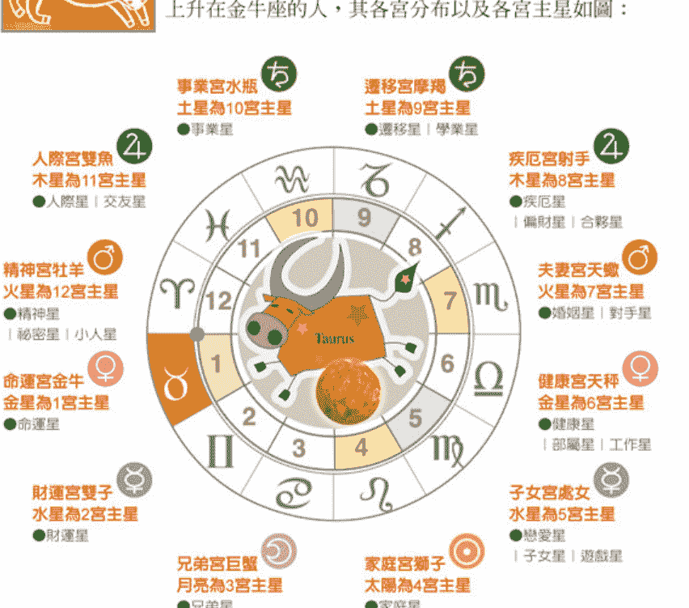

## 第一宮在金牛座：宮主星為金星
金牛一宮象徵資源的重要性，力求完整與實際的擁有。

人格特質：上升金牛的人通常透過建立物資財力的狀況，來表現他們的潛在能力。價值與實際擁有是他們衡量一切的標準，做任何事時第一考量的是合不合算。看似淡泊名利，實際上一旦認定屬於他們的東西，他們就不會輕易放手。

**人生模式**：他們傾向以自然、穩定的方式面對他們的人生，具有溫暖大方的天性，並且會用輕鬆的態度來面對人生。會想辦法去獲取所需，然而一旦累積足夠的個人資源，就會變得慵懶與揮霍。

**外型特徵**：他們的特徵強調在肩、脖子、聲音上。整體偏向豐滿、圓潤、厚重，金黃柔和的色系。

## 第二宮在雙子座：宮主星為水星
雙子二宮的人，象徵對價值觀的多元性。善於判斷資訊，會以不同的角度來衡量事物的價值。

**價值態度**：他們對事物的價值著重在是否多重與新奇，因此容易喜新厭舊，在乎的是花樣多不多，喜歡一樣東西有好多種不同的風貌。

**進財模式**：他們會靠實際思考來增加財富，透過與人合作、溝通的方式得到利益。由於價值觀的多面了解，他們會從不同的管道來獲取利益。

## 第三宮在巨蟹座：宮主星為月亮
巨蟹三宮的人會以內斂的方式表現他們的想法，在與外界接觸時特別謹慎。

**溝通模式**：在與人溝通方面，總是上下波動而不定。他們的溝通模式是累積性的，需要透過熟悉的人為媒介，再進而擴張其資訊網。

**兄弟關係**：他們對兄弟姊妹的態度就像母親一般，具有保護性。習慣跟陌生人保持距離，但一旦熟了，他們就會對你照顧有加。

## 第四宮在獅子座：宮主星為太陽
獅子四宮象徵家庭的中心地位。喜歡別人進入自己的領域中，展示自己以及他們的地位。

**家庭關係**：在家庭生活或家人之中，通常可以發揮他們的領導能力。他們在家喜歡當領導者，大家都要聽他的。非常好客，家裡是他們表現的舞台。

**家的樣子**：家庭環境高貴而且氣派，喜歡明亮開闊的地方。

## 第五宮在處女座：宮主星為水星
處女五宮象徵追求完美的表現，小心翼翼的追求快樂。對於自我的創作過度要求在於細節的掌控上。

**戀愛模式**：他們談戀愛時非常的龜毛，注重每個細節，要求完美，對每個環節計畫詳細，過份的吹毛求疵，有點神精質。使得他們的男女朋友常常會有不安的感覺。

**子女關係**：他們對待子女時過於要求完美，他們的子女多半乖巧而且嚴守紀律。

## 第六宮在天秤座：宮主星為金星
天秤六宮象徵平衡的處理擁有的資源，力求公平與和諧。

**工作模式**：他們擅於與人一起工作，他們的協調能力良好，在與他人合作的團隊工作上，會營造出和諧的分工關係。

**部屬關係**：他們對待部屬時力求公正與公平，並且一視同仁，不分高低。

**健康狀況**：健康上，較容易出現腎臟，過濾系統的問題。

## 第七宮在天蠍座：宮主星為火星 冥王星
天蠍七宮象徵帶有慾望的合作關係，我的就是我的。他們不善於處理與他人共有利益時的分配。

**合作方式**：他們只在乎屬於自己的事物，因此不太輕易的與人合作，由於對彼此之間的利害關係過於計較，他們在合作關係中會有嫉妒、控制慾的發生。

**配偶形態**：因為本身過於實際，他們容易受會將利益分享給他的異性吸引，但是往往事實並非如此，當對方想同時分享他的利益時，彼此相處就會充滿心機而且激烈。他們的另一半多半性感，個性強烈，敢愛敢恨、有點壞壞的味道。

## 第八宮在射手座：宮主星為木星
射手八宮象徵由他人處擴展，獲取自身的利益，常有可能因繼承而獲得財富。

**合夥關係**：由於他們總是想著要往更好、更能獲利的地方發展，因此他們會選擇能夠對他們有所助益的人合作。

**生死態度**：他們對死較為樂觀，會覺得是到另一個未知的領域。

**慾望模式**：他們對慾望表現直接，在性方面，他們外放不拘，非常豪邁，而且會想往更高層次而不斷換性伴侶的傾向。

## 第九宮在摩羯座：宮主星為土星
摩羯九宮象徵構築式的擴張，會在某種限制條件完整時才會再往外擴張一步，是一步一腳印的模式。

**發展方向**：他們通常有向外發展的障礙。在跨越不斷的壓力與艱難中提升自己的層次。

**外地態度**：面對新環境，在外人面前會讓他們感到拘謹。他們會在外人面前築起一道牆，讓人很難親近。

## 第十宮在水瓶座：宮主星為土星、天王星
水瓶十宮象徵從舊有中改變進入高點。會在不同的領域中建築新的社會價值。

**努力方式**：他們重視實質利益，對名聲地位不太重視，對自己的個人實現不同於一般的社會價值，他們會希望自己是創新某種領域中的佼佼者。

**事業模式**：他們適合在集體分工中，負責獨立性的專業領域。具有特別性與新奇性的事業，例如科學家、發明家、新科技都適合他們。

## 第十一宮在雙魚座：宮主星為木星、海王星
雙魚十一宮象徵無盡包容的交往，他們通常可以跟任何人成為朋友，不分貴賤。

**群體關係**：他們在群體中分享一切，容易對人際交往過度的理想化，而有受騙的可能。他們在朋友或社團中會有很多種角色出現，隨著與不同的人接觸，而有不同的變化。

**交友狀況**：他們的朋友通常很不實際、彼此屬於精神層面的交往。

## 第十二宮在牡羊座：宮主星為火星
牡羊十二宮象徵衝動的精神狀態，常常會做出令人意想不到的事情。

**精神狀況**：具有潛在的勇氣，內在精神衝動而率直。他們通常藏不住秘密，對於隱私容易衝動的表現出來。

**潛在問題**：他們會暗中與人較勁，秘密從事新的活動，他們擅於獨處，容易將事情想的太過單純。他們最大的敵人就是自己。

## Asc at Gemini
〔上升在雙子座〕

上升在雙子座的人，其各宮分布以及各宮主星如圖：

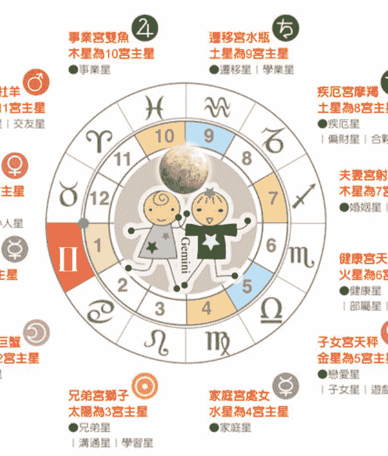

## 第一宮在雙子座：宮主星為水星
雙子一宮象徵我的想法決定一切。他們最具力量的本錢，便是他們的聰明才智。

人格特質：頭腦動得很快，能迅速的察覺訊息、反應訊息並傳遞訊息。有很強的好奇心，喜歡接觸各種人事物，以便得到新鮮的刺激經驗。腦部思維很活躍，轉個不停，透過整合各類訊息來源，所以經常會冒出很多具有創意的點子。同時也是訊息的傳遞者。

**人生模式**：他們以多變的想法來面對人生，能夠迅速吸收新知，並且能夠組織各類資訊來說服別人，所以資訊的取得是他們處理人生的基本利器。但是也因為多方的接觸，往往欠缺深度。

**外型特徵**：他們的特徵主要強調在手上。整體偏向細長、直線、多，淡色系。

## 第二宮在巨蟹座：宮主星為月亮
巨蟹二宮象徵一點一滴的累積資源，為求取安全感，往往很謹慎的處理資源。

**價值態度**：他們具有的應變能力是獲得利益的工具，具有察覺市場變化的本事，了解市場的需求。他們用錢的方式非常情緒化，對一件物品在意的是是否能引發他們的感覺，因此有將舊東西保留的習慣。

**進財模式**：他們進財方式多半透過積少成多的方式，藉由儲蓄來累積財富。

## 第三宮在獅子座：宮主星為太陽
獅子三宮象徵創造性地思考能力，以表現自我的方式溝通外界，常會有誇大且引人注目的想法。

**溝通模式**：他們會主動而熱情的去接觸新環境，並開始展現自己，成為發號施令或決定意見的人。

**兄弟關係**：他們會慷慨大方的付出，在兄弟中總是扮演著領導者或最耀眼的人。

## 第四宮在處女座：宮主星為水星
處女四宮象徵對自我領域的完美要求，往往在家中反而非常嚴謹。

**家庭關係**：他們斤斤計較屬於他們的領域空間。在家中他們喜歡勞動與服務，他們會把家中整理的井然有序，一絲不苟，家裡工作幾乎由他們一手包辦。

**家的樣子**：家庭環境乾淨、清潔、一絲不苟，非常的精緻。

## 第五宮在天秤座：宮主星為金星
天秤五宮象徵以和諧的方式追求快樂。

**戀愛模式**：他們是最好的情人，注重彼此間的和諧與合作，但是他們戀愛時過於猶豫不決，過份重視彼此間的公平性。他們對社交有興趣，喜歡享受合作的樂趣。

**子女關係**：他們公正的對待子女，把他們當作伙伴，他們的子女多半幽雅，擅於與人合作。

## 第六宮在天蠍座：宮主星為火星 冥王星
天蠍六宮象徵為了原慾而努力付出，健康狀況會受到他們自己對慾望表達的強烈影響。

**工作模式**：他們對深沈、不為人知的工作很有興趣。他們工作時，投入大量的情緒與精力，對工作有一股強大的執著。

**部屬關係**：他們對工作時的利害關係了解清楚，對待部屬時會想完全主宰對方。

**健康狀況**：他們慾念過強，要多注意性器官的問題。

## 第七宮在射手座：宮主星為木星
射手七宮象徵他們最缺乏的就是直接而單純的目標，由於他們多變的特性，他們會傾向與單純的人合作。

**合作方式**：他們喜歡與樂觀而且大方的人合作。因為他們本身較為膚淺，因此會重視對方的道德與智慧，是否能增廣他們的視野。

**配偶形態**：他們的婚姻多半幸福，配偶個性樂觀積極，慷慨大方，外向有活力。他們也常有跟外國人結婚的傾向。

## 第八宮在摩羯座：宮主星為土星
摩羯八宮象徵對原慾的自我限制。

**合夥關係**：他們會認真的去看待與他人分享的利益，因為他們總在這個過程中吃虧，得不到好處。

**生死態度**：他們對死的看法較為嚴肅，而且悲觀。他們總是認真的開始一件事，然後努力的建構到結束。

**慾望模式**：他們會很艱困的去實現自己的慾望，甚至會壓抑。他們對性保守，經常壓抑，有性冷感的傾向。

## 第九宮在水瓶座：宮主星為土星 天王星
水瓶九宮象徵以反傳統的方式發展自我，對於異國的文化有強烈的好奇心。

**發展方向**：他們會向外發展以尋求改變。他們樂於與人群接觸，但卻會與人保持疏離。

**外地態度**：他們在外人面前顯的難以捉摸、特立獨行。他們會在不斷的改變與創新中提升自我的層次。

## 第十宮在雙魚座：宮主星為木星 海王星
雙魚十宮象徵虛幻的社會地位，在事業方面，這些人會顯出不切實際的樣子。

**努力方式**：對於社會地位，他們有超凡脫俗、愛幻想的傾向，不太關心社會的評價，會從事不太實際的事業，希望能為世界犧牲奉獻。

**事業模式**：他們適合發揮想像力或感性的事業，也可能牽扯到一些神秘的事件。有時會遊手好閒、無所事事。例如慈善家、社工、醫師。

## 第十一宮在牡羊座：宮主星為火星
牡羊十一宮象徵在人群中積極表現自我。

**群體關係**：他們在社團中非常活躍，對有競爭性的社團活動充滿興趣，會積極的從事新社團的事物。

**交友狀況**：他們對待朋友時主觀而自我，喜歡結交新朋友，認識新朋友時會將舊朋友暫時忘在一邊，有喜新厭舊的傾向。

## 第十二宮在金牛座：宮主星為金星
金牛十二宮象徵執著物慾的心靈，在潛意識中對於物質生活充滿欲求。

**精神狀況**：他們對於自己的隱私是不容許他人侵犯的，私底下，他們對物質慾望有所期待。他們會在暗中一步步的達成他們的秘密想法。他們的夢想多半很實際。

**潛在問題**：他們具有潛在固執的特性，實際而且執著，最想逃避的就是受到物慾需求的控制。

## Asc at Cancer
〔上升在巨蟹座〕

上升在巨蟹座的人，其各宮分布以及各宮主星如圖：

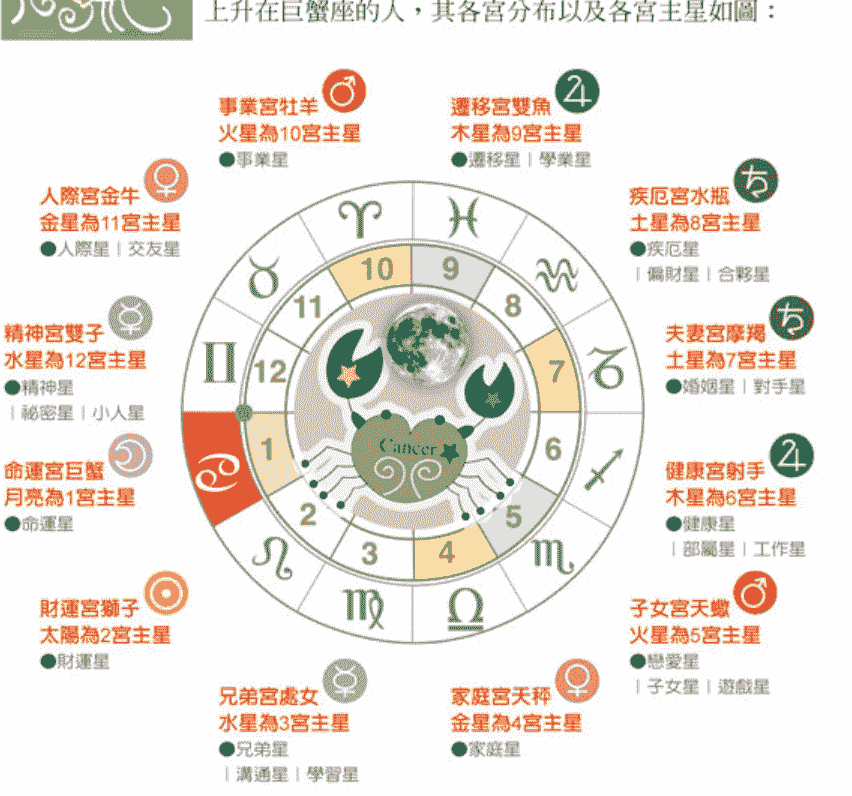

## 第一宮在巨蟹座：宮主星為月亮
巨蟹一宮象徵一切以感覺為主。

人格特質：上升巨蟹的人通常有反覆無常的感情，投入大量的精力在自己的感覺上。同類意識非常強，有關懷和照顧別人的母性本能，但內心卻很敏感且容易受到傷害。有排他性，對於自己人與他人會畫出一道無形的領域範圍，常處在自我防衛的狀態。

**人生模式**：他們的感覺敏銳，也以這樣的方式來處理人生。將感情和自己本身視為一體，全憑自己的感受來判斷一切，對安全感極為在乎，一旦感情遭到傷害，可能要拖很久才能撫平傷痛。

**外型特徵**：他們的特徵主要強調在胸部。整體偏向圓而短小、柔軟，顏色偏白。

## 第二宮在獅子座：宮主星為太陽
獅子二宮象徵以權力名聲來獲取資源，樂於付出金錢以使自我受人注目。

**價值態度**：為了自我的尊嚴，他們努力的賺錢。對他們來說，錢是用來表現自我力量的工具，他們會將錢花在讓自己更有價值的事物上，重視事物的表面，對名牌特別的偏好。

**進財模式**：他們多半利用權力、名聲來得到利益，尤其是外表體面的。

## 第三宮在處女座：宮主星為水星
處女三宮象徵以謹慎的方式與外界接觸，往往會透過書信文件等處理過的資訊來表達心中想法。

**溝通模式**：當接觸外界時，常常過於謹慎而且小心。對資訊會先行消化再傳達出去，因此能夠清晰、精確的表達自己的想法。

**兄弟關係**：與兄弟姊妹間會專注在小事上，對兄弟姊妹過於苛求而且吹毛求疵。

## 第四宮在天秤座：宮主星為金星
天秤四宮象徵領域內的平衡，在他們的想法中，家人就像合夥人的關係一樣，特別強調公正性。

**家庭關係**：他們和人共有領域時，重視彼此間的合作與協調。因此在家中他們多是配合的一方。他們對待家中的每一個人都力求公正與平等。

**家的樣子**：家庭環境雅緻而有質感，具藝術設計感，並且重視協調性，和平與寧靜。

## 第五宮在天蠍座：宮主星為火星 冥王星
天蠍五宮象徵原慾式的快樂表現，他們的快樂建立在強烈的感情釋放上，對人心的深層及性有興趣，容易沈溺於官能肉慾之中。

## 座與宮 2-2 12 HOUSES

**戀愛模式**：他們戀愛時轟轟烈烈，愛恨交織，佔有慾強，過份的投入感情，他們的戀愛多半與性脫不了關係。
**子女關係**：他們對子女付出強烈的感情，但是太強烈的支配慾常造成子女的壓力，他們的子女多半深沈但是性格強烈。

# 第六宮在射手座：宮主星為木星

- 射手六宮象徵以擴張的方式努力服務，他們對服務他人不自私，並且從中得到自信。

**工作模式**：他們總是慷慨大方的服務他人，他們喜歡自由自在、不受拘束的工作，或是能讓他們增加視野的工作。是屬於工作時肯吃苦耐勞的人。
**部屬關係**：他們對待下屬寬大而且常不辭辛苦的貢獻心力。
**健康狀況**：在健康方面，要多注意大腿的部份。

# 第七宮在摩羯座：宮主星為土星

- 摩羯七宮象徵謹慎的交往，由於他們本身極為情緒化，因此會受實際穩重的人吸引。

**合作方式**：他們不擅於與他人合作，總是小心謹慎，與人有隔閡。害怕與他人相處。在建立和別人合夥的關係時，會小心翼翼地有所保留。
**配偶形態**：他們對婚姻非常謹慎而保守，通常很晚婚。他們受努力，老成穩重的人所吸引，他們也會為了得到地位而結婚。他們的另一半通常年紀較大，要不就是感覺傳統守舊。

# 第八宮在水瓶座：宮主星為土星、天王星

- 水瓶八宮象徵顛覆性的原慾，以反抗傳統的方式解決需求。

**合夥關係**：他們會在分享利益時採用獨特的方式，基本上，他們不喜歡與人共有利益。
**生死態度**：對死的看法獨特，往往具有感應的能力。他們會讓事情結束改變後，重新開始。
**慾望模式**：他們會有許多特別的方式表達自己的慾望，他們其實很悶騷，在性方面，喜歡違反傳統的方式。

# 第九宮在雙魚座：宮主星為木星 海王星

- 雙魚九宮象徵精神性的擴張。對於未知的領域心生嚮往。

**發展方向**：他們會以強大包容力不斷的在精神、心靈相關的領域發展，提升自我的層次。
**外地態度**：他們對外充滿著幻想，他們容易感染外界的一切，像隻變色龍一般，調整自己來適應周圍。面對外人時，他們會不清楚自己的定位。

# 第十宮在牡羊座：宮主星為火星

- 牡羊十宮象徵個人為主的事業，對於個人聲望相關的事情，他們會顯得非常地衝動。

**努力方式**：他們拼命的追求社會地位，努力的與他人競爭。他們擅於開創新局，通常是一個事業的開拓先鋒。
**事業模式**：他們適合以個人主導或具有競爭性質的事業，多不適合守成。例如專業技術人員、軍人、創意家。

# 第十一宮在金牛座：宮主星為金星

- 金牛十一宮象徵具有實質利益的群體關係，他們往往先透過價值判斷來決定人際關係。

**群體關係**：他們很容易受到地位穩固而且富裕的人吸引。對於自然、藝術性的社團中感到悠然自得。
**交友狀況**：他們喜歡跟溫和而且實際的人交朋友，不喜歡太複雜的人際關係。有跟有錢人交朋友的傾向，因為他們傾向將朋友當作他們的資源。

# 第十二宮在雙子座：宮主星為水星

- 雙子十二宮象徵多變的心靈，由於精神上的多重變化，常造成心神上的矛盾。

**精神狀況**：他們在暗地裡用心思考。他們通常有很多的秘密，經常會話中帶話，讓人不清楚他真正的意思，他們有私下與人聯絡的傾向，也常自言自語。
**潛在問題**：他們在情感上往往只透露部分感受，將所有應該藏於內心的保留不說。最大的隱憂就是與他人溝通上的問題。

## 座與宮 2-2 12 HOUSES

# Asc at Leo
〔上升在獅子座〕

上升在獅子座的人，其各宮分布以及各宮主星如圖：

# 第一宮在獅子座：宮主星為太陽

- 獅子一宮象徵一切以自我表現為目的。

人格特質：你有自我表現的熱情，喜歡呈現出自信和尊貴的樣子，希望成為大家注意的焦點。只要是自己覺得恰當的事，就一定要表達出自己的意見。明朗、開放且充滿自信，不論走到哪裡，都會給人一種華麗的印象。
**人生模式**：他們非常在乎是否成為焦點，因此也成為他們面對人生的處理方式，有股很強的願望，總希望大家都注視著你，會熱情的將自我表現出去，希望成為眾人所崇拜的中心象徵。
**外型特徵**：他們的特徵主要強調在背部，整體偏向高大而壯碩，捲曲，金黃色。

# 第二宮在 處女座：宮主星為水星

- 處女二宮象徵精打細算的價值觀，他們善於整理與規劃身邊的資源應該如何的運用。

**價值態度**：對金錢的運用一絲不苟，非要把每一分錢都花在刀口上。他們用錢非常仔細而有計畫，對一件物品，他們一定經過非常仔細的評估，他們非常重視一件事物的細節與精緻度。
**進財模式**：他們很會運用資源，善於運用他人為自己工作來得到利益。

# 第三宮在 天秤座：宮主星為金星

- 天秤三宮象徵平衡的溝通模式，以合作的方式分享資訊。

**溝通模式**：他們喜歡合作，也喜歡接觸人群。當表達自己的想法時，常常考慮許久，以求得平衡。
**兄弟關係**：他們對待兄弟姊妹總是力求公正，並且會儘可能的配合對方。

# 第四宮在 天蠍座：宮主星為火星 冥王星

- 天蠍四宮象徵完全控制的自我領域，在家中主導一切事務。

**家庭關係**：他們有侵佔他人領域的傾向。在認定為自己的地盤上經常蠻橫不講理，而且習慣於主宰一切，他們喜歡搞家庭鬥爭，經常對家人生氣地吼叫。
**家的樣子**：他們總會弄出完全屬於自己的空間，需要一個私人的角落。家裡多半隱密或有地下室。

# 第五宮在 射手座：宮主星為木星

- 射手五宮象徵完全放任的追求快樂，只要能夠讓自己快樂的事，他們就會不顧一切的去完成。

**戀愛模式**：他們的戀愛直接而不拐彎抹角，他們通常不是好的情人，當發現目標不對，馬上掉頭，他們喜歡接觸異國文化，所以常會有異國戀情發生。他們熱愛探險，也喜歡追逐刺激。
**子女關係**：他們對待子女寬大而且幾乎到放任的地步，他們的子女則生性開朗，整天往外跑。

# 第六宮在摩羯座：宮主星為土星

- 摩羯六宮象徵盡心盡力的努力服務，只要一投入工作，他們就一定會盡全力工作，是工作時很有組織能力的人。

**工作模式**：他們對工作認真而且任勞任怨，能夠忍受各種壓力，適合有組織計畫的任務。
**部屬關係**：工作時他們過度嚴以律己，對部屬同樣要求嚴厲，嚴肅而不苟言笑。
**健康狀況**：在健康上要注意骨骼方面的問題。

# 第七宮在水瓶座：宮主星為土星 天王星

- 水瓶七宮象徵獨特性的合作關係，由於本身喜歡別人以其為中心，因此他們會特別喜歡特立獨行，不愛出風頭的人。

**合作方式**：他們雖然重視團體，但是不喜歡與人配合，只想他人配合自己。在合作關係中，依然追求個人自我特質的表現。不論是在何種狀況下與人合作，他們都希望自己是中心人物。
**配偶形態**：他們對配偶的感覺像朋友，會受特立獨行的人所吸引，有喜歡比自己小很多的對象的傾向。他們的另一半通常是古靈精怪而且與眾不同。

# 第八宮在雙魚座：宮主星為木星 海王星

- 雙魚八宮象徵模糊不清的原慾，他們的慾望往往是來自未知的潛意識，非常的夢幻。

**合夥關係**：他們與他人共享利益時，總是不清不楚，容易侵占他人的利益，相反的也容易被人侵占。
**生死態度**：他們對生死間的界線模糊，會逃避這一類的問題，他們對事情的開始與結束完全是模糊不清的。
**慾望模式**：他們的慾望過於虛幻，自己都不太清楚，在性方面，他們過於理想化，常搞不清自己為什麼要做。

# 第九宮在牡羊座：宮主星為火星

- 牡羊九宮象徵原始本能的開展，他們憑藉本能來瞭解人世萬物的道理，以此方式來拓展自我。

**發展方向**：他們會發展自我的領域，在不斷的競爭中提升自我的層次。在全新的領域中創造與發展。
**外地態度**：他們像初生之犢般對新的領域好奇而且積極。在外面非常活躍，喜歡冒險，他們會將好爭鬥的部份表現在對外。

# 第十宮在金牛座：宮主星為金星

- 金牛十宮象徵創造實質利益的事業，他們是比較偏愛名望與財富的人。因為這些實質利益能讓他們擁有更高貴更尊嚴的形象。

**努力方式**：他們會為了建立自己的高水準生活，而拼命的賺錢。他們會希望自己是一個在各方面都安全、穩定的人。
**事業模式**：他們適合穩重、安定發展的事業，能夠累積實質的價值。

# 第十一宮在雙子座：宮主星為水星

- 雙子十一宮象徵多變的人際關係，他們會借由跟不同層面的人交往來獲得各式各樣的消息，幫助他們得到希望具有的力量。

**群體關係**：他們會學習由不同朋友中所得到不同的觀點，擅於在社團或朋友中當聯絡人，他們對能讓他們得到資訊的社團活動感到興趣。
**交友狀況**：他們特別愛交朋友，從朋友的交往中能讓他們得到各種新知。尤其是聰明、有智慧的朋友。

# 第十二宮在巨蟹座：宮主星為月亮

- 巨蟹十二宮象徵情緒化的心靈，他們是情緒化而且易受到傷害的，往往具有令人無法置信的脆弱內心感情世界。

**精神狀況**：他們經常將自己內在封閉起來，害怕別人侵犯到他們的隱私。他們會將自己的秘密一層層的包起來，很情緒化的編織他們的夢。
**潛在問題**：他們具有潛在的不安全感，情緒上的不穩定。往往他們都有不為人知的家族密辛。

# Asc at Virgo
〔上升在處女座〕

上升在處女座的人，其各宮分布以及各宮主星如圖：

# 第一宮在處女座：宮主星為水星

- 處女一宮象徵一切以義務與服務爲主。

人格特質：他們非常重視自己的義務，對於命令特別遵從。心思非常細膩，具有極敏銳的觀察力，對於比較現實實際的事情，具有非常尖銳而且理性的反應。不會浪費時間在不實際的計畫上面，愛好乾淨，幾近於神經質，沒有任何微小的細節可以逃過他們的法眼，認真而有潔癖。
**人生模式**：他們是很有階級觀念的，具有使命感，認同屬於自我的任務，以這樣的態度來面對人生。會用吃苦耐勞的心態來服務別人，以得到別人的肯定和讚許。
**外型特徵**：他們的特徵主要強調在腹部，整體偏向細緻、小巧、乾淨，暗褐色。

# 第二宮在天秤座：宮主星為金星

- 天秤二宮象徵互相分享資源，他們賺錢或經營的方式很不穩定，大部分取決於合作的對象。

**價值態度**：他們用錢的方式很不穩定而且不乾脆，在意的是一樣物品是否合乎價值，因而不斷的比較、貨比三家。對協調、美好的事物有所偏好。過於執著價值的合理與否，常常讓他們不清楚是否符合自己的需要。
**進財模式**：他們進財方式多半透過與他人的合作，以爲人作嫁的方式獲取利益。

# 第三宮在天蠍座：宮主星為火星 冥王星

- 天蠍三宮象徵深層透徹的溝通模式，他們通常能通徹的理解所獲取的資訊的深度含意。

**溝通模式**：當接觸外界時，他們總會先瞭解整體利害關係後，才會深入。不太喜歡說話，不過一旦說話，總是一針見血。
**兄弟關係**：他們對兄弟姊妹的情感強烈，也充滿心機，容易有忌妒心。

# 第四宮在射手座：宮主星為木星

- 射手四宮象徵沒有邊界的領域，他們比較沒有地域觀念，也可能很少在家，總是往外跑。

**家庭關係**：他們會不斷的擴張自我的領域，也不在乎別人進入他的領域中。在家中特別輕鬆，知道要如何使家中的人和睦相處。
**家的樣子**：他們尤其喜歡一個很寬廣的場地，家裡多半寬敞，能清楚看到所有的擺飾。

# 第五宮在摩羯座：宮主星為土星

- 摩羯五宮象徵有節制的快樂，他們喜歡較嚴肅或需要深思的遊戲，或是經過設計的娛樂方式。

**戀愛模式**：對戀愛非常認真而且謹慎，他們對感情負責任，而且相當的保守，他們的戀情多半是苦戀，他們喜歡一個人時，即使對方不喜歡，也會堅忍不拔的持續下去。
**子女關係**：他們對子女的期望非常高，管教嚴格，他們的子女多半規矩、吃苦耐勞。

# 第六宮在 水瓶座：宮主星為土星 天王星

- 水瓶六宮象徵獨創性的努力付出，他們通常知道有效執行工作的方法，擁有獨創性的風格。

**工作模式**：他們對工作具有獨立創新的能力，在一個團隊中負責其中一個特別的任務，對工作時的個人自由發揮非常重視。
**部屬關係**：他們對待下屬就像朋友一樣，請求團隊合作，喜歡和別人一起合力完成工作。
**健康狀況**：健康上，要注意小腿的問題。

# 第七宮在 雙魚座：宮主星為木星 海王星

- 雙魚七宮象徵沒有界限的合作關係，由於他們本身過於理性，缺乏包容性，因此會受這樣的人吸引。

**合作方式**：他們透過與人合作了解感情，學習沒有界線、沒有階級的交往，以及犧牲自我的利益去配合對方的精神。
**配偶形態**：他們對另一半充滿不實際的幻想。容易受浪漫，有夢想的人所吸引。他們的配偶多半個性模糊，不切實際。感情異常豐富。

# 第八宮在 牡羊座：宮主星為火星

- 牡羊八宮象徵直接而原始的慾望，他們像個人生的僕人，受到種種義務的制約。所以實際上，他們最大的慾望就是成就自我。

**合夥關係**：他們容易在與他人錢財上有所爭執，會積極的爭取到自己的利益。
**生死態度**：他們常因過於衝動而發生意外，改變了一生。總是急躁的開始然後迅速的結束。
**慾望模式**：他們在表現慾望時直接而急躁，對性方面過於衝動，但是經常開頭很熱，但一下子就冷卻了。

# 第九宮在金牛座：宮主星為金星

- 金牛九宮象徵實質有利的發展，他們追求極致的價值，除非有利可圖，他們才會積極的對外發展。

**發展方向**：除非認為有價值，他們不會主動去向外發展。他們喜歡美麗與實用的東西，喜歡接觸大自然。他們會不斷的去提升自我價值的層次。
**外地態度**：他們對外是慵懶而且不積極的。在外表現出溫和的態度，面對外人時也多半被動。

# 第十宮在雙子座：宮主星為水星

- 雙子十宮象徵人生目標的多元性，追求可以展現他們思考價值的地位。

**努力方式**：他們會為了讓大家肯定他們的才能，努力的用盡腦力以達成目標。他們的人生目標多變，因此往往同時經營二個以上的事業。
**事業模式**：他們適合從事動腦及傳播方面的工作，來滿足分析批判的渴望。如作家、新聞業者、傳播業者。

# 第十一宮在巨蟹座：宮主星為月亮

- 巨蟹十一宮象徵有感情的人際關係，在與他人的交往中，他們多半會投入感情。

**群體關係**：對他們所屬的小團體或組織，他們很容易投入深厚的情感。對於跟家有關，令他們感到溫馨的社團特別感興趣。
**交友狀況**：他們喜歡跟朋友像家人一般，喜歡請朋友到家中作客，他們特別念舊，珍惜與朋友間的回憶。

# 第十二宮在獅子座：宮主星為太陽

- 獅子十二宮象徵光明高尚的心靈，他們多半具有源源不斷的精神能量，擁有高貴的心理特質。

**精神狀況**：他們有潛在的創造力與充沛的精神。對於自己的隱私他們較不保留，甚至會想拿出來炫耀。
**潛在問題**：他們會在私底下認為自己最了不起。害怕別人看不起自己是他們最大的弱點。實際上，他們非常自卑。

## 座與宮 2-2 12 HOUSES

# Asc at Libra
〔上升在天秤座〕

上升在天秤座的人，其各宮分布以及各宮主星如圖：

# 第一宮在天秤座：宮主星為金星

- 天秤一宮象徵一切合作為考量。

人格特質：他們具有很好的社交能力，追求自我和他人的平衡，為了跟別人建立和諧的關係，做出很多不必要的妥協和讓步。本身散發高雅的品味、和諧的氣氛和細緻的質感，追求理性和感性的平衡運作。內心容易在兩極之間擺盪，表現出很多不確定的態度、矛盾的心情與模稜兩可。
**人生模式**：他們必須要透過與別人合作的過程，才能發覺自己的獨特性。所以會以這樣的態度面對人生，從別人的反應，表現出自己的特性。
**外型特徵**：他們的特徵主要強調在腰部，整體偏向比例均勻適中、薄而輕、優雅，顏色偏淡藍。

# 第二宮在天蠍座：宮主星為火星冥王星

- 天蠍二宮象徵隱藏的財富，他們通常獨具懸眼，能夠發現事物隱藏的巨大利益。

**價值態度**：他們在乎一件物品是否有潛在的利益，因此會將錢花在高於實際價值的物品上，他們也會花錢來滿足自己的控制慾。
**進財模式**：具有將他人認為無用的東西轉變成有價值物品的能力，他們具有一夜致富的能力，有獲得他人錢財的能力。

# 第三宮在射手座：宮主星為木星

- 射手三宮象徵來自不同環境的訊息，他們會主動的去跟陌生的環境發生聯繫。

**溝通模式**：他們天生喜歡接觸陌生的環境，從不同的領域獲取所需的資訊。尤其是外國或陌生的地方。因此他們常會接到遠方朋友的訊息。
**兄弟關係**：他們對待兄弟姊妹豪爽而且大方，表達時直接而不保留。

# 第四宮在摩羯座：宮主星為土星

- 摩羯四宮象徵穩固的領域範圍，他們會將屬於自己的領域實質化，構築一道清楚的高牆。

**家庭關係**：他們對自我的領域極為重視，並且不斷的鞏固，費心將家中一切規律化。在家裡他們通常嚴肅而且沈默，家人往往成為他們的壓力。
**家的樣子**：他們對家的要求結構穩固，家的外面通常有高牆，給人堅固而且嚴肅的感覺。

# 第五宮在水瓶座：宮主星為土星天王星

- 水瓶五宮象徵追求與眾不同的快樂，他們通常會在一些特殊的事物、團體活動之中獲得極大的樂趣。

**戀愛模式**：他們的戀愛就像朋友一般，經常有突發的戀情，戀愛過程特殊而且不平凡，但是一旦刺激過後，感情馬上冷卻。
**子女關係**：他們對子女像朋友一般，不同於傳統，他們的小孩多半古靈精怪，而且與眾不同。

# 第六宮在 雙魚座：宮主星為木星 海王星

- 雙魚六宮象徵無私的努力服務，他們能不自私地獻身於服務及勞動工作。

**工作模式**：他們天生具有犧牲服務的特性，對脫離現實的工作有興趣，他們工作時容易混亂，分不清責任的歸屬。
**部屬關係**：他們對屬下極具同情心，而且容易為他們擔憂太多。他們往往一個人沈擔太多事情，最後超過自己的處理範圍，陷入憂鬱而逃避責任。
**健康狀況**：健康方面，要多注意腳部的問題。

# 第七宮在 牡羊座：宮主星為火星

- 牡羊七宮象徵缺乏自我主導性，他們會透過他人的決定表達自己的意志，然而實際上他們早已決定好，只是透過別人的嘴說出來而已。

**合作方式**：他們本身沒有主見，因此非常積極的與人合作，會受有點自我、直接而略帶魯莽的人吸引，合作時多半受對方主導。
**配偶形態**：他們喜歡做事直接而不拖泥帶水的配偶，彼此相處時常常有爭執。他們的配偶多半性格急躁，心思單純。

# 第八宮在 金牛座：宮主星為金星

- 金牛八宮象徵對物質的慾望，他們的慾望非常實際，也非常現實，對於美麗事物過度熱愛。

**合夥關係**：他們對金錢財富具有強烈的需求，在與人分享利益時會很實際，而且絕對算的清清楚楚。
**生死態度**：他們一般都能安詳的結束一生，通常會平靜的開始一件事，慢慢的結束。
**慾望模式**：他們對自己的慾望表現的並不積極，但是會非常實際的去獲取，在性方面，他們有重肉慾的傾向。

## 第九宮在雙子座：宮主星為水星

雙子九宮象徵多重的發展，他們不斷的思考以不同的模式來提昇自我的層次。

**發展方向**：他們通常對不同的世界充滿好奇心，因此會同時往不同的陌生領域拓展自己的視野。

**外地態度**：他們對外面的世界充滿好奇，喜歡接觸各種不同的領域。他們在外像隻花蝴蝶般，變化多端。而且適應力強，不斷的探究。

## 第十宮在巨蟹座：宮主星為月亮

巨蟹十宮象徵一點一滴的累積社會地位，他們會設定一個範圍，然後開始在這個範圍累積實力，建立名聲。

**努力方式**：他們對地位與名聲非常敏感，會一步步的累積實力，希望成為別人心中認為是負責、值得尊敬的人。

**事業模式**：他們的事業與家庭之間有很密切的關係。他們適合較感性的工作，最好跟家有關。例如餐飲業者、廚師、家庭看護。

## 第十一宮在獅子座：宮主星為太陽

獅子十一宮象徵以名氣決定人際關係，他們會盡力培養一些有影響力的朋友，來尋得外來的助力。

**群體關係**：在人群社團中希望成為中心人物。對於能夠讓他們名氣大增，表現創造力的社團，他們都會積極參與。

**交友狀況**：他們喜歡跟有權勢的人交往，會用朋友的成就來突顯自己。他們在朋友面前喜歡裝老大。

## 第十二宮在處女座：宮主星為水星

處女十二宮象徵過度挑剔的心靈，他們往往會精神緊張，對於一些瑣碎小事過度的憂慮。

**精神狀況**：他們會不自覺的過份擔心細節。他們非常在意自己的隱私，自我要求完美。會很謹慎的處理自己的秘密，完全不讓他人有可乘之機。

**潛在問題**：他們的夢則過於要求完美。他們最大的問題是會有莫名的潔癖，甚至是精神官能症。

## 星座與宮 2-2 12 HOUSES

## Asc at Scorpio
〔上升在天蠍座〕

上升在天蠍座的人，其各宮分布以及各宮主星如圖：

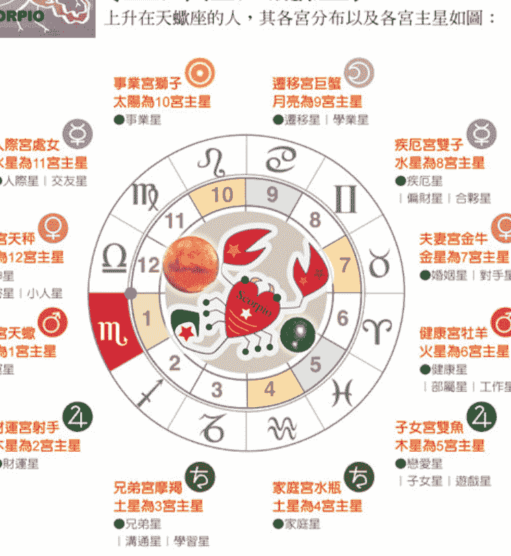

## 第一宮在天蠍座：宮主星為火星 冥王星

天蠍一宮象徵一切原慾為主。
人格特質：雖然有點沈默寡言的樣子，但別人能感受到你藏有強烈的情感深度。他們具有充沛的體力以及堅強的意志力，一旦下定決心，他們便會將巨大、專注的情感投注下去，對自己的事情很隱密，也不想讓別人瞭解自己的狀態。佔有慾很強，也很重視性慾的滿足。

**人生模式**：他們是為了達成自己的慾望可以拿生命做賭注的人，原始的慾望是主導他們的動力。強大的內在力量，容易積存大量嫉妒和報復的衝動。

**外型特徵**：他們的特徵主要強調在生殖器上，整體偏向有稜有角，顏色深紅。

## 第二宮在射手座：宮主星為木星

射手二宮象徵從不同的領域獲取資源，他們能夠清楚的找到讓自己獲取利益的目標。能夠快速的擴張自己的資源。

**價值態度**：他們財運很好，知道增加財富的方法。用錢非常乾脆，看準目標就用。他們善於運用金錢來拓展行動的範圍，以達到目的。對一件事物的價值重視在是否能增加自己的視野與層次。

**進財模式**：他們有喜歡異國事物的傾向，同時，他們也有在外地發財的特質。

## 第三宮在摩羯座：宮主星為土星

摩羯三宮象徵謹慎的溝通模式，他們總是有計畫的表達自己的想法，如果沒有非常明確的動機，他們是不會隨便與人接觸。

**溝通模式**：表達內心想法時，格外的小心謹慎。他們不擅於與人相處，說話時極為保守而且無趣，基本上他們不太說話。

**兄弟關係**：他們總是在兄弟姊妹之間築起一道無形的牆，總是以嚴肅的態度與他們相處。

## 第四宮在水瓶座：宮主星為土星、天王星

水瓶四宮象徵不停改變的領域環境，他們經常改變自己的領域，尋求不尋常而具有特色的居家環境。

**家庭關係**：他們期待家人像朋友而且崇尚自由，他們的家人常會有出人意表的舉動，雖然好客但不喜歡到朋友家。

**家的樣子**：他們經常搬家或改變家庭佈置。家裡的樣子具未來感，很有獨特性。

## 第五宮在雙魚座：宮主星為木星、海王星

雙魚五宮象徵夢幻般的快樂，他們喜歡作夢，對精神性、神秘的事物特別有興趣。在虛幻的世界中表現自我。

**戀愛模式**：他們的戀愛就像夢一般，浪漫而不切實際，他們對愛情無畏的奉獻。因此，經常出現曖昧與欺騙，他們是最常有暗戀與不倫的人。

**子女關係**：他們對小孩全心全意的付出，但是不懂的管教，他們的子女則多愁善感，有逃避現實的傾向。

## 第六宮在牡羊座：宮主星為火星

牡羊六宮象徵以自我的方式努力付出，他們會希望投注的力量有所用處，並傾向於主導一切。

**工作模式**：他們總是主動的去工作與服務大眾，不論任何事，都能自動自發。能很有效率、很有力量地處理好難題。

**部屬關係**：他們樂於伸出援手，但也過於自我意識，容易對下屬或同事過於專橫霸道而產生衝突。

**健康狀況**：他們容易因衝動而受傷。健康上，要注意頭部的問題。

## 第七宮在金牛座：宮主星為金星

金牛七宮象徵實際利益的合作，他們充沛的慾望需要能夠化為實質的人，因此他們傾向於與能夠帶給他們真實利益的人合作。

**合作方式**：他們與人合作時會非常的實際，他們會先考慮到實際的價值，再決定合作的方式。

**配偶形態**：他們在找尋配偶時，會考慮到對方所帶來的價值，彼此的相處溫和而且實際。他們的配偶多半長的不錯，個性隨和，帶有一點藝術與自然氣息。

## 第八宮在雙子座：宮主星為水星

雙子八宮象徵多重的慾望模式，他們本身就是以慾望決定行動的人，因此多變的慾望選擇能讓他們知道該如何進入下一個人生階段。

**合夥關係**：他們與人分享利益時較為理性。他們會同時開始許多事，但是都草草結束。

**生死態度**：他們會去思考死亡的事，他們的一生可能會面臨多次重生的機會。

**慾望模式**：他們有很多的慾望。在性方面，他們會跟不同的人接觸，他們想瞭解各種不同的體驗。

## 第九宮在巨蟹座：宮主星為月亮

巨蟹九宮象徵內心世界的擴展，他們基本上不太容易在真實世界中認識與面對陌生的環境。

**發展方向**：他們往往會朝內在意識擴展自我，會在不斷的自省及從過往的記憶中提升自我的層次。

**外地態度**：他們基本上是戀家的，因此，他們要很有安全感才會向外接觸。他們在外容易情緒化，而且依賴。在外地時需要有能跟家聯繫的物品。

## 第十宮在獅子座：宮主星為太陽

獅子十宮象徵受人注目的事業，他們非常熱衷於使自己成為眾人的焦點，成為具有主導性的人物。

**努力方式**：他們雄心勃勃，努力在事業上求得地位與名聲。熱忠於自己的事業，希望成為眾人眼中的焦點。也很在意權利地位，具有領導者的風範。

**事業模式**：他們的領導能力很好，也努力成為眾人的焦點。適合當政治人物、管理階層、演藝人員。

## 第十一宮在處女座：宮主星為水星

處女十一宮象徵有條不紊的人際關係，他們通常會為自己的人際關係分門別類，依需求性來跟什麼樣的朋友交往。

**群體關係**：他們會在朋友或社團中表現出自己完美的一面。對於服務性或分析研究的社團活動他們特別感興趣。

**交友狀況**：他們的朋友多半由工作場所而來，他們對朋友盡心盡力，會從朋友中學習別人的長處。

## 第十二宮在天秤座：宮主星為金星

天秤十二宮象徵客觀的心靈，平衡協調的精神狀態，他們具有與生俱來的公正直覺及強烈的公平競爭觀念。

**精神狀況**：他們具有公正協調的潛在能力。對於自己的隱私會希望有人瞭解。雖然喜歡獨處，但會暗中與人交往，他們其實渴望與他人共有夢想。

**潛在問題**：他們最大的問題在不知如何與他人合作，其實很害怕自己一個人。

## Asc at Sagittarius
〔上升在射手座〕

上升在射手座的人，其各宮分布以及各宮主星如圖：

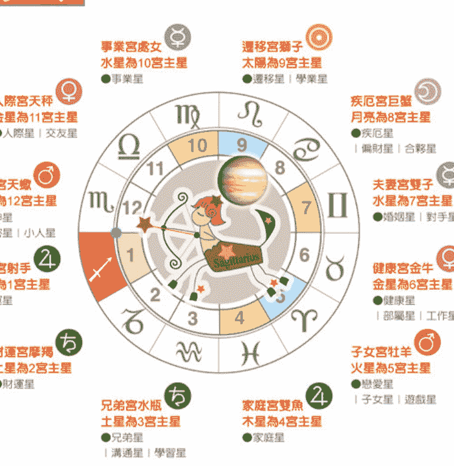

## 第一宮在射手座：宮主星為木星

射手一宮象徵一切以發展自我為主。
人格特質：他們是天生的樂觀主義者，熱愛自由，給人的印象是快活開放的，總是興致勃勃、精神奕奕的樣子，具有樂天知命的天性。他們會設定目標，並朝著目標不斷的前進。喜歡接觸不同的文化，有很強的向外擴張性，喜歡從事旅行和戶外活動來經歷各種豐富的生活體驗。

**人生模式**：他們一生追求的是最高的智慧，因此不斷的發展是他們的人生目的，所謂行萬里路勝讀萬卷書可說是他們的人生寫照。

**外型特徵**：他們的特徵主要強調在大腿與臀部，整體偏向高大、寬闊，色偏紫。

## 第二宮在摩羯座：宮主星為土星

摩羯二宮象徵有節制的運用資源，對於金錢抱持一種實際、渴望而又負責任的態度。

**價值態度**：他們對錢的慾望強烈，非常實際，太過重視實質，因此，對錢非常執著，而且非常的節儉。認為錢應該花在保值、具有永恆價值的事物上。他們對一件物品，會非常重視是否穩固與牢靠。

**進財模式**：他們進財方式多半透過權力或社會地位來取得，一步步的建構。

## 第三宮在水瓶座：宮主星為土星 天王星

水瓶三宮象徵獨特的溝通方式，而且多半藉由群體或組織來聯繫，每個人在組織中負責各自的功能，互相分享訊息。

**溝通模式**：他們很容易與新環境接觸，靠群體的人際關係與世界溝通。經常以特殊、獨創的方式來表達意見。

**兄弟關係**：他們是四海之內皆兄弟的人，所以與兄弟姊妹之間關係不深。

## 第四宮在雙魚座：宮主星為木星 海王星

雙魚四宮象徵缺乏邊界的領域，他們比較沒有地域觀念，以四海為家，有到處漂蕩的特質。

**家庭關係**：他們沒有領域的概念。他們對待家人很隨便，會美化自己家庭的形象。家庭往往是他們逃避現實與做夢的地方。他們家裡總有不為人知的秘密。

**家的樣子**：家裡沒有明顯的隔間，經常是一片混亂。家中的佈置往往很夢幻。

## 第五宮在牡羊座：宮主星為火星

牡羊五宮象徵以自我為優先的快樂，他們喜歡具有競爭性的遊戲，因此喜歡像拳擊、摔跤這一類與戰鬥有關的競賽活動。

**戀愛模式**：他們戀愛時直接而且積極，喜歡就馬上去追，尤其有競爭者時。但也容易來的快、去的也快。

**子女關係**：他們容易以懲罰的方式對待子女，子女也多半脾氣暴躁。

## 第六宮在金牛座：宮主星為金星

金牛六宮象徵實質獲利的努力付出，他們通常會從事比較實際的工作，讓他們的付出得到實質的報酬。

**工作模式**：他們喜歡固定而緩慢的工作，如果確定努力會有錢的話，他們便會很努力。

**部屬關係**：他們對待下屬溫和，不容易發脾氣。

**健康狀況**：他們的身體健康，不會暴飲暴食，喉嚨是他們容易出問題的地方。

## 第七宮在雙子座：宮主星為水星

雙子七宮象徵他們最缺乏的是多變性，他們本身是一根腸子通到底的人，因此會受有多變傾向的人吸引。

**合作方式**：他們會不斷的去嘗試與不同的人合作，喜歡經由不同的合作增加對事物的瞭解，因此，他們有重婚的傾向。

**配偶形態**：他們喜歡看起來聰明或多才多藝的另一半，彼此相處時像兄弟姊妹般，感覺並不親密。他們的配偶多半聰明、伶俐且詭計多端。

## 第八宮在巨蟹座：宮主星為月亮

巨蟹八宮象徵溫情的渴望，他們其實極度缺乏安全感，需要感情的撫慰。

**合夥關係**：他們與人分享利益時過於感性。在過程中容易將感情因素牽扯其中。

**生死態度**：他們對死的事情敏感而情緒化，希望死後能夠留下點什麼。他們會為自己安排好一切後，以便家人有充分的保障。他們重視開始與結束中間的過程回憶。

**慾望模式**：他們曖昧的表達慾望，在性方面敏感而且重視感覺，害怕受到傷害。

## 第九宮在獅子座：宮主星為太陽

獅子九宮象徵在外顯現光芒，他們是那種外地顯貴的人，會渴望在不同領域中，獲得令人稱讚的名聲地位。

**發展方向**：他們在乎自己在外的名聲，也喜歡在外面主導一切。他們會為了讓他人注目而不斷的提升自我的層次。

**外地態度**：他們對外時是熱情而充滿活力的，習慣於在外人面前表現自己。他們喜歡長途的旅行，眼光總是落在遙遠的目標上。

## 第十宮在處女座：宮主星為水星

處女十宮象徵深入分析的事業成就，他們面對目標時，會追根究底到自己能完全掌握為止。

**努力方式**：他們會以有計畫、重效率的方式往上爬，而且執著於自己的事業，追求完美，凡事追根究底。

**事業模式**：他們在事業上細心而且專注，喜歡服務人群，適合注重精緻、講求專精的行業。例如秘書、會計、勞動者。

## 第十一宮在天秤座：宮主星為金星

天秤十一宮象徵調和的人際關係，他們往往是群體間的仲裁者，講求團體的和諧。

**群體關係**：在朋友或社團中他們常擔負協調的任務，他們對人際關係的和諧特別有興趣，也對社交性的社團活動積極參與。

**交友狀況**：他們跟客觀優雅的人交朋友，而且喜歡與朋友合作。他們通常會從朋友中選擇結婚伴侶。

## 第十二宮在天蠍座：宮主星為火星 冥王星

天蠍十二宮象徵深刻強烈的心靈，他們的心靈非常深邃，能夠洞察他人潛在的秘密。

**精神狀況**：他們潛意識裡情緒強烈，能夠看透人心，對自我的隱私隱藏的極為深密。他們私底下具有強烈的慾望，而且對於隱藏不為人知的事具有洞察能力。

**潛在問題**：他們是擅於暗中報復的高手，容易逃避往黑暗面是他們最大的問題。

## 星座與宮 2-2 12 HOUSES

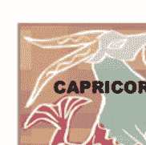

## Asc at Capricorn
〔上升在摩羯座〕

上升在摩羯座的人，其各宮分布以及各宮主星如圖：

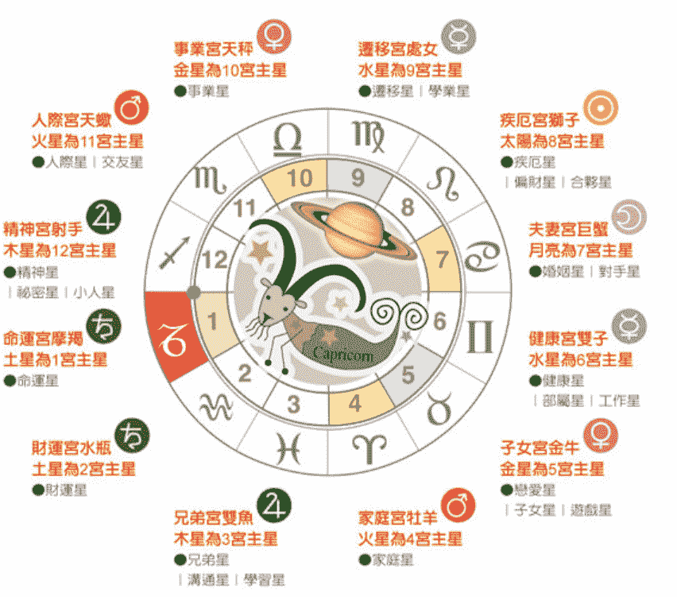

## 第一宮在摩羯座：宮主星為土星

摩羯一宮象徵一切以地位為主。
人格特質：他們是有野心的人，外表看起來有點嚴肅和保守，很有責任感，守規律、力圖使一切井然有序、勤奮努力並且又有耐性，有低估自己和壓抑自己的傾向。他們做的每一件事情，都是有目的的，並且都是為達到某個重要的位子。潛藏著耐力，也擁有能經得起長期痛苦的體力。

**人生模式**：他們受傳統與社會價值的規則所束縛。重視秩序與法律以及別人的期待，以這樣的方式面對人生，努力的朝著社會期許的地位前進。

**外型特徵**：他們的特徵主要強調在骨骼、皮膚上。整體偏向消瘦、薄弱、暗黑。

## 第二宮在水瓶座：宮主星為土星 天王星

水瓶二宮象徵以群體增加資源，他們很會運用群體的力量來累積財富。

**價值態度**：他們對獨一無二或特別新奇的物品很有興趣，用錢的態度非常不尋常。他們的金錢經常來的快、但是去的也快。

**進財模式**：他們常以創新而且不尋常的方式賺錢。或是經由組織、團體中，以個人專業、特殊技巧來得到利益。

## 第三宮在雙魚座：宮主星為木星 海王星

雙魚三宮象徵心靈的溝通，他們心中的想法會顯得神秘而且高度情緒化。

**溝通模式**：不擅於與外界接觸，有逃避的傾向。他們不擅於言詞，說話模糊不清，而且隱藏著許多的秘密，甚至有說謊的壞毛病。

**兄弟關係**：他們對兄弟姊妹間充滿著感情與付出，對他們非常包容。

## 第四宮在牡羊座：宮主星為火星

牡羊四宮象徵爭奪地盤，在家中他們會比較自我，因此容易發生爭執。

**家庭關係**：對跟領域有關的事具有侵略性。他們的家人多半脾氣暴躁，與家人相處時常有爭執，同時，他們有愛與人爭地盤的傾向。

**家的樣子**：家庭環境簡明、單純，很有個人風格。

## 第五宮在金牛座：宮主星為金星

金牛五宮象徵實際的表現自我。他們崇尚自然，樂愛藝術，追求感官的享受。

**戀愛模式**：他們在戀愛時溫和而遲鈍一點也不積極，他們的感情通常醞釀很久，持續力也很強。但是他們的嫉妒心很強，不容許背叛。

**子女關係**：他們對待子女溫和，把他們當作是自己的所有物，他們的子女也多半是乖寶寶。

## 星座與宮 2-2 12 HOUSES

## 第六宮在雙子座：宮主星為水星

雙子六宮象徵多面性的運用資源，他們以從不同的模式運用身邊的資源，以達到事倍功半的效果。

**工作模式**：他們適合動腦筋的工作，可以同時處理好幾件事，想一些讓工作更有效率的點子。

**部屬關係**：擅於與下屬溝通，對待下屬像兄弟姊妹一般。

**健康狀況**：他們容易神經質，手部是常出現問題的地方。

## 第七宮在巨蟹座：宮主星為月亮

巨蟹七宮象徵缺乏安全感，他們實事求是，背負過多的責任，因此會渴望充滿感情的另一半。從對方那得到情感的慰藉。

**合作方式**：他們與人合作時是情緒化的而且充滿感情。他們在乎彼此合作時的感覺。彼此相處時互相的依賴，擁有共同的回憶。

**配偶形態**：他們喜歡有媽媽味道的另一半，可以呵護他們，給他們安全感。他們的另一半多半細心體貼，但是非常感情用事。

## 第八宮在獅子座：宮主星為太陽

獅子八宮象徵受人注目的慾望，他們不斷的努力往上爬就是為了成為中心人物。

**合夥關係**：他們在與人分享利益時，會希望擁有主導權，一切由他們來分配。

**生死態度**：他們一般都很長壽，而且在乎死的體不體面。他們對一件事的結尾一定想辦法弄得好看。

**慾望模式**：他們會很光明正大的表現他們的慾望，對性方面，熱情、積極、充滿活力，注重整體的表現。

## 第九宮在處女座：宮主星為水星

處女九宮象徵謹慎的向外發展，他們通常會在準備充分後，才會往陌生的環境前進。

**發展方向**：他們會仔細的評估外面世界的風險，循序漸進的接觸。他們會從每個細微層面的分析研究中提昇自己的層次。

**外地態度**：他們對外顯的過於謹慎，在外人面前過於追求表現完美。

## 第十宮在天秤座：宮主星為金星

天秤十宮象徵合作性的事業成就，他們善於在合作過程中得到所需的名聲，利用與生俱來的職場手腕，得到高層的好感。

**努力方式**：他們擅於運用人際關係以達成自己的事業，他們多半是配合者，喜歡與人合作並負責協調一切。

**事業模式**：他們非常適合守成，處理人際問題也是他們的專長。適合法官、律師、協調人員。

## 第十一宮在天蠍座：宮主星為火星 冥王星

天蠍十一宮象徵洞澈人心的人際關係，他們能夠輕易了解群體間的強弱與利害關係，選擇真正對他們有利的人際交往，完成自己的願望。

**群體關係**：他們對朋友或社團中的利害關係有深刻的認識，而且擅於運用。對於觸及人性深處，以及神秘難測的相關社團活動，他們特別有興趣。

**交友狀況**：他們喜歡跟神秘、深藏不露的人交朋友。並欣賞這些朋友處理難題的能力。

## 第十二宮在射手座：宮主星為木星

射手十二宮象徵開闊的心靈。由於受到現實的壓抑，他們往往會轉向精神層面發展，因此往往會不自覺的受到潛意識影響。

**精神狀況**：他們有向心靈發展的渴望，有將自我隱私公開的衝動。他們會暗中對外發展，逃避內部的問題。對於夢想，過於自信與樂觀。

**潛在問題**：他們真正的問題便在於不知如何去提升自我的層次，與外面真實的世界接觸。

## 座與宮 2-2 12 HOUSES

# Asc at Aquarius
〔上升在水瓶座〕

上升在水瓶座的人，其各宮分布以及各宮主星如圖：

第一宮在水瓶座：宮主星為土星 天王星

- 水瓶一宮象徵一切群體為主。
人格特質：他們喜歡隱藏在群體中，不想讓人注意到自己。透過群體展現個人意志。對於權威與傳統規範具有反抗性，強調平等互惠的立場，沒有上下之分。具有求新求變的改革傾向，喜歡吸收各種領先時代潮流的觀念和經驗，比較特立獨行，具創造天分，非常獨立。給人獨特、古怪、缺乏感情、看起來很冷漠的印象。

**人生模式**：他們具有群體性，在群體分工中扮演獨特的角色，因此他們非常重視社會、團體與組織的重要性，傾向以整體的發展當作人生的目標。

**外型特徵**：他們的特徵主要強調在小腿、腳裸上，整體偏向剛毅、方正、有特色，顏色偏水藍。

# 第二宮在雙魚座：宮主星為木星 海王星

- 雙魚二宮象徵超現實的價值觀，他們通常重視的不是物品的實質價值，而是物品的精神價值。

**價值態度**：他們用錢的態度非常不實際，會花錢在追逐自己的夢想上。他們對夢幻的事物特別有興趣。完全沒有理財觀念，而且過份的慷慨。

**進財模式**：他們的財運很好，對金錢具有特殊的第六感，也經常會得到秘密的資助。

# 第三宮在牡羊座：宮主星為火星

- 牡羊三宮象徵競爭式的溝通模式，他們在與人接觸時非常自我而且有侵略性，喜歡表達自己的意見。

**溝通模式**：好爭辯，容易與人競爭。對新事物的接觸主動而直接。常用新的表達方式與人接觸。

**兄弟關係**：以自我的方式與他人接觸，容易跟兄弟姊妹間產生衝突。

# 第四宮在金牛座：宮主星為金星

- 金牛四宮象徵實質安穩的領域，他們會花錢在創造一個屬於個人的私人空間，營造自我的價值。

**家庭關係**：他們對屬於自己的領域非常執著，但他們也不會去與人爭，對他們來說只要能棲身就行。而他們的家人多半很溫和。

**家的樣子**：他們喜歡優雅而高尚的家居環境，環境幽雅，富藝術氣息。

# 第五宮在雙子座：宮主星為水星

- 雙子五宮象徵多樣化的展現自我，他們追求不同層面的快樂方式。喜歡手腦並用的遊戲。

**戀愛模式**：他們是典型的花花公子或公主，喜歡同時與不同的對象交往，對戀情不深入，他們把戀人當作是自己的兄妹一般，喜歡跟他們聊天。
**子女關係**：對待子女時像平輩，他們的小孩多半聰明。容易生出雙胞胎。

# 第六宮在巨蟹座：宮主星為月亮

- 巨蟹六宮象徵情緒性的付出，他們會為了得到安全感或情感上的撫慰而努力。
**工作模式**：他們喜歡在有家的感覺的地方工作。工作上，容易情緒化而且不穩定。
**部屬關係**：他們對待部屬像自己的家人，會為他們著想，保護他們。他們容易因心情變化而影響工作。
**健康狀況**：容易有胃部的毛病，女性則要注意胸部的毛病。

# 第七宮在獅子座：宮主星為太陽

- 獅子七宮象徵缺乏主導性，他們不喜歡成為鋒頭人物，因此會傾向跟有光彩的人交往合作，自己像配角般聽從他人的主導。
**合作方式**：他們會受有權者、地位高的人的吸引。與人合作時讓對方表現與主導。但是若違背自己的意志，他們就會採取革命的手段。
**配偶形態**：他們在找尋伴侶時，會考慮到對方是不是顯眼，所以彼此相處時以對方為中心。他們的配偶多半開朗有活力而且有美好的外表。

# 第八宮在處女座：宮主星為水星

- 處女八宮象徵節制的慾望，他們對於慾望的表達特別謹慎。
**合夥關係**：在與人分享利益時，斤斤計較，計算每一個細節。
**生死態度**：他們關心自己的健康，對死的事保持高度的警覺與危機意識。他們一旦開始一件事，就會想辦法讓他完美的結束。
**慾望模式**：他們對自己的慾望表現節制，在性方面，他們非常在乎每個過程是否完美，不輕易嘗試。

# 第九宮在天秤座：宮主星為金星

- 天秤九宮象徵共同的向外發展，他們會透過合作來拓展自己的視野。
**發展方向**：他們會在不斷的平衡內與外的差異中提昇自己的層次。
**外地態度**：他們是天生的外交大使。在外人面前顯的友善與親切。他們喜歡與他人一起接觸外界，他們有在外國結婚的傾向。

# 第十宮在天蠍座：宮主星為火星冥王星

- 天蠍十宮象徵顛覆性的事業，他們是永遠的挑戰者，不斷的嘗試由根源徹底轉變。

**努力方式**：他們的野心很大，會不斷的挑戰當權者，並透過群體進行變革，經由破壞後的蛻變來達成自我的實現。他們往往能在絕境中逆轉。
**事業模式**：適合探索神秘、生死或具有潛力的事業，例如調查員、保險業者、革命者。

# 第十一宮在射手座：宮主星為木星

- 射手十一宮象徵開展式的人際關係，他們不斷的發展新的人際關係，使他的組織不斷的壯大。

**群體關係**：為了擴展自己的生活，他們會積極加入不同的團體中。在朋友或團體中，他們大方慷慨。旅行、冒險等能讓他們提升自我的社團活動都是他們的最愛。
**交友狀況**：他們喜歡跟樂觀開朗、有智慧的人作朋友，藉由跟朋友的交往開拓自己的視野。

# 第十二宮在摩羯座：宮主星為土星

- 摩羯十二宮象徵受制的心靈，他們往往受到莫名的潛意識限制他們，在精神層面面臨壓力。

**精神狀況**：他們實際上比外表所見的還保守。他們對自己的秘密建構的非常的堅固。他們會有不自覺的壓力，會暗地裡用功努力。他們不太敢有夢想，因爲總是讓他們失望。
**潛在問題**：他們的問題在於對成就的渴望，讓他們倍感壓力。

# Asc at Pisces
〔上升在雙魚座〕

上升在雙魚座的人，其各宮分布以及各宮主星如圖：

第一宮在雙魚座：宮主星為木星 海王星

- 雙魚一宮象徵一切心靈為主。

人格特質：他們是感受力很強的人，容易受到別人的影響，具有同情心、適應力與靈氣，並且愛幻想。天生具有神秘的洞察力，會把別人的情緒狀態同化為自己的狀態，擁有特別的第六感，也比較宿命。容易逃避的心態，會使他們沉浸在自我的夢想世界中。

**人生模式**：他們很重視心靈的感受，擁有很強的精神力量，也以這種方式面對人生，追求內在意識的提升，沈浸在私人的想像世界，行事低調而且神秘。

**外型特徵**：他們的特徵主要強調在腳上，多半有大而濕潤的眼睛，整體偏向柔軟、細嫩、朦朧，顏色偏暗綠。

# 第二宮在牡羊座：宮主星為火星

- 牡羊二宮象徵個人的價值，基本上，他們自己本身就是最重要的資源，因此一切只為了滿足個人意志。

**價值態度**：用錢非常衝動容易過度揮霍，對金錢方面的事物投入很多精力，總是不斷的找尋增加金錢的方法，他們總是努力的去得到自己想要的東西，到手了又不加珍惜。

**進財模式**：適合透過直覺、創意、競爭或開創新事業賺取利益。

# 第三宮在金牛座：宮主星為金星

- 金牛三宮象徵務實的溝通模式，他們通常會深思熟慮地形成想法，只會對有利的訊息有興趣。

**溝通模式**：他們總是緩慢的、被動的去接觸外界。不愛與人爭，但是決定了的想法，也很難被更改。

**兄弟關係**：說話慢條斯理，跟兄弟姊妹之間相處和協。

# 第四宮在雙子座：宮主星為水星

- 雙子四宮象徵多變的領域，他們通常是狡兔三窟的人，喜歡變換自我的空間。

**家庭關係**：他們常常擁有多個藏身之所。經常變換住所有擁有二個家的傾向。常常與家人溝通、聊天，但是經常往外跑。

**家的樣子**：他們喜歡多變新奇的環境，家裡通常都會存放很多的書籍。

# 第五宮在巨蟹座：宮主星為月亮

- 巨蟹五宮象徵情緒性的快樂，他們喜歡能夠帶給他們感覺的遊戲，對手工藝或烹飪很有興趣。

**戀愛模式**：戀愛時敏感而且情緒化，他們害怕受傷不易接受戀情，一旦付出就非常深入，非常重視與愛人的點點滴滴回憶。
**子女關係**：他們容易過份保護子女，他們的子女多半溫柔，帶有女性特質。

# 第六宮在獅子座：宮主星為太陽

- 獅子六宮象徵表現自我的付出，他們會希望自己的努力可以贏來別人的注意力。
**工作模式**：他們在工作或服務時會不自覺的表現出自己的權威性，喜歡受人尊重的工作。
**部屬關係**：對待部屬時，會以自我為中心，炫耀他們的能力。
**健康狀況**：他們在健康上，容易有心臟、血液循環的毛病。

# 第七宮在處女座：宮主星為水星

- 處女七宮象徵缺乏處理細節的能力，由於他們本身過於不拘小節、不夠嚴謹、得過且過，因此他們會受實事求是、有效率，而且態度嚴謹的人吸引。
**合作方式**：他們喜歡與態度嚴謹的人合作，能夠幫他們規劃分析，整理細節。會受那些工作勤奮，重視小節的人所吸引，彼此相處時對小細節斤斤計較。
**配偶形態**：他們會希望追求完美的另一半，他們的另一半多半龜毛，個性保守而且一絲不苟。

# 第八宮在天秤座：宮主星為金星

- 天秤八宮象徵得到認同的渴望，他們會藉由與他人的合作成就自己的慾望。
**合夥關係**：他們擅於與他人合作分享利益，他們會力求公正與公平。
**生死態度**：他們對死的事在乎是否和諧。他們總是在衡量每一件事，從頭到尾，是否合理。
**慾望模式**：他們表現慾望時，會去考慮他人與自己之間的關係，在性方面，他們重視協調性，而且會想辦法去配合對方。

# 第九宮在天蠍座：宮主星為火星 冥王星

- 天蠍九宮象徵內在深層意識的開展，他們有往神秘的陌生領域發展的傾向，或是深入黑暗無邊的世界。

**發展方向**：他們容易在外遇險，也會想掌控一切外在的事物。他們會在不斷的內在重生中使自己引發層次的提升。

**外地態度**：他們對外時總是深藏不露。在外人面前總是一副神秘難測的樣子。

# 第十宮在射手座：宮主星為木星

- 射手十宮象徵開展性的事業，他們需要往新的領域發展，拓展個人的視野。

**努力方式**：他們是博愛主義者，充滿理想，樂觀的朝目標前進。他們對外發展的能力強，希望成爲慷慨大方、鼓舞人心的導師。

**事業模式**：他們適合可以向外拓展視野、冒險挑戰的事業。例如旅行業者、哲學家、宗教家。

# 第十一宮在摩羯座：宮主星為土星

- 摩羯十一宮象徵保守的人際關係，他們通常在群體中較爲保留，並且傾向於與有地位的人做朋友。

**群體關係**：在朋友或社團之中，他們都顯的穩重而不易親近，基本上，他們不擅於與人交際。多半參加需要耐力，有組織架構的社團活動。

**交友狀況**：他們傾向於跟保守的人交朋友，朋友對他們來說是獲得成就的助力。

# 第十二宮在水瓶座：宮主星為土星 天王星

- 水瓶十二宮象徵心靈的不斷革新，他們的精神面是不穩定的，一直處於變革的狀態。

**精神狀況**：他們內心有改變的衝動。他們會把秘密說給朋友聽，以求得認同。他們會在暗中進行改革。在私下，認爲自己與衆不同。

**潛在問題**：他們其實渴望能夠成爲獨特的人，如何與他人之間有所區別是他們最大的煩惱。

# 行星論
## PLANETS

以地球為中心，天上的點點繁星跟世間種種發生對應，在這些星星中，古人發現了七顆星星非常的特別，這七顆星星分別是太陽、月亮、水星、金星、火星、木星、土星。他們在天空中最為耀眼，而且會隨著時間經過規律的移動位置，有時還會逆著跑、有時會停止，有時快、有時慢。在古典占星學中，這七顆行星是主要推命的依據，除此之外，天空中明亮的恆星也具有重要的象徵意義。

# 4 PART3
## 行星進階
### PLANETS LEVEL 2

星座、宮位與行星是占星術中最重要的三部分，而行星又是這三者中最重要的。它就像占星的靈魂，所有的人生變化都是從行星間的互動所產生。行星是星盤中的主角，當行星進入天（星座）與地（宮位）的場域中，這張盤才有了意義。而首先，我們從行星的特性來說明。

以地球為中心，天上的點點繁星跟世間種種事件發生對應，在這些星星中，古人發現了七顆星星非常的特別，這七顆星星分別是太陽、月亮、水星、金星、火星、木星、土星。他們在天空中最為耀眼，而且會隨著時間經過規律的移動位置，有時還會逆著跑、有時會停止，有時快、有時慢。在古典占星學中，這七顆行星是主要推命的依據，除此之外，天空中明亮的恆星也具有重要的象徵意義。

而在近代陸續發現新的行星（天王星、海王星、冥王星）與上萬顆小行星後，占星學也開始出現轉變，將新行星一一納入，而這些新行星的發現時間，便自然的象徵了當代的時代意義。

## 4 行星論 3 PLANETS LEVEL2

# 行星的屬性

## 1. 行星的組成：

與四大元素由四種純質料構成一樣，行星也有其純質料特質，並且有對應的體液。其對應關係如下：

- 火性（熱、乾：黃膽汁）：太陽、火星
- 土性（冷、乾：黑膽汁）：土星
- 風性（熱、濕：血液）：木星
- 水性（冷、濕：黏液）：月亮、金星
- 中性：水星

## 2. 行星的陰陽性：

同樣的跟12星座的分類一樣，行星也依照其本身的性質而可以加以分類為陽性、陰性與中性。
一般來說，陽性的行星較為積極、主動，而中性行星受會合行星影響，而陰性行星則消極、被動。

- 陽性：太陽、火星、木星、土星、冥王星
- 中性：水星、天王星
- 陰性：月亮、金星、海王星

## 3. 行星的吉凶：

行星具有吉凶的特性，而其吉凶的原理可由日月主宰星座與其他星座的托勒密相位來了解。基本上，木星為第一吉星，金星次之，水星中性，火星次凶，土星則為第一凶星。太陽與月亮基本上也是吉的，水星則看會合的是吉星或凶星而轉變，至於三王星中，天王為吉凶參半、冥王為凶中帶吉，海王吉中帶凶！
不過這些吉凶只是行星的自然屬性，然而實際上行星的影響好壞必須看行星座落的星座位置、宮位位置以及與其他星形成的相位來判斷！

> 行星吉凶與相位關係
太陽與月亮是整個占星的重心，從星座的主宰關係圖來看，以太陽與月亮為基本，土星是對相關係，故最凶。木星是三分相關係，故最吉。火星是四分相，所以次凶。金星六分相次吉。至於水星，並未形成傳統相位，所以是中性。

# 行星的對應

## 1. 星期與時辰

古人認為每一顆行星都有它掌管的時間，因此給傳統七星每一顆掌管一天，如此構成了一週七天的體系，這些行星以固定的順序輪替著，週而復始。同時，行星除了有主宰的日子外，也有主宰的時辰，每一天日出後的第一個小時由當天的主宰行星掌管，接著按照伽勒底秩序往前，一個小時搭配一顆行星。行星的主宰日與主宰時辰在擇日占星與卜卦占星上是很重要的參考依據。

## 2. 人體七脈輪

我們的身體是由各種能量、電波、光波等組成。一切形式的能量都來自頻率的振動。這些震動構成幾個能量中心，稱為脈輪（chakras）。每一個脈輪有它獨特的感官特質與獨特的振動頻率。太陽系的星體關係會對應著我們體內的能量中心。

行星中心反映了延伸在人體周圍的無形能量，像分布在人體周圍的光量。

人體的光量主要有七種階段的波長頻率，這些不同的波反映了我們的健康、精神、思想、心情、行動力等。這些波是不斷變化的。從我們的食物、呼吸的空氣以及我們的經歷會影響光量的變化。色彩是不同波長的能量在視覺上的呈現。因此波頻的變化會產生不同的色彩。

人體內的能量中心與七大行星的能量相互對應，我們可以透過有意識地冥想聯繫行星的能量，把自己的能量中心控制在最佳狀況下。這七大能量中心與行星間的關連如下：

- 頂 輪：與腦中心相關，位於大腦的中心，（紫紅色），與水星相關。
- 眉心輪：又稱為第三隻眼，位於前額的中央，（藍紫色），與月亮相關。
- 喉 輪：位於咽喉部位，（藍色），與金星相關。
- 心 輪：位於心臟後方和上方，（綠色），與太陽相關。
- 太陽輪：位於胸腔下方的神經網路即為太陽神經叢，（黃色），與木星相關。
- 生殖輪：位於肚臍的下部，（橘色），與火星相關。
- 海底輪：位於脊椎的底部，（紅色），與土星相關。

## 3. 人體與行星

在遙遠的古代，先民就知道人類、植物、色彩、行星之間的和諧與疾病習習相關。古代西方認為要成爲好的醫生往往要熟悉占星的理論，占星家用預測的方法去確定疾病發生的嚴重程度和持續時間，並通過分析一個人的星盤了解此人身體上的優點與缺點，各種疾病發生的可能性。

亞里斯多德確定了四大原素：火、風、水和土，以及它們的組成特質：熱、冷、濕、乾。這四特質關連了人體內的四種體液，分別是血液、黑膽汁、黃膽汁、黏液。心臟會產生一種稱爲固有熱的能量，用來驅使四種體液流動，當這些體液在身體中維持平衡時，身體就是健康的。

身體是非常有效率的自我調整系統，行星落在不同的位置會產生特別的生理機制，雖然現代醫學已經不吃這一套了，但是近期的許多研究慢慢的發現，行星對病人是有重要影響的，許多醫學報告統計，月圓時不宜開刀，病人容易發生大量出血。精神病患在新月與滿月時病況會變得比較嚴重。古老的占星醫學並非毫無根據，就跟中醫一樣，是有很深的理論與驗證的。

不同的疾病，生理結構、病症，透過星盤上行星的符號而呈現出具體的事實。這些基本對應關係如下：

☉ 太陽：
太陽在身體之中，主宰著生命中樞—脊椎以及心臟，整合身體所有的器官與系統並給予活力。背部及心臟的問題可以從個人星盤中，太陽所在的位置看出端倪。

☿ 水星：
水星管轄神經系統、大腦、神經，這些與溝通相關的部分。與神經系統、思考相關的問題可以從個人星盤中的水星位置看出來。

☽ 月亮：
循環系統跟月亮有相當的關係，例如女性的月經週期。因此，月亮象徵著我們身體的週期、消化系統，並且同時影響著我們的情緒。

♀ 金星
金星一向主宰喉嚨、腎臟、與腰部，主導身體間的平衡。金星的問題通常也反映著性與再生系統的化學平衡問題。

♃ 木星
木星掌管肝臟，人體內最大的器官，其功能是轉換並儲存養分。木星也與臀部及腿部有關連。成長是木星最主要的負責範圍，常與身體的過度肥胖及成長過剩有關。

♂ 火星
在占星學中，火星掌管著血液、肌肉和性腺。肌肉使我們得以行動於這世界，並且受我們的意志主導控制。如果星盤中火星受陷，往往象徵著感染的可能性。

♄ 土星
在身體中，皮膚是內在身體與外在世界的界限，所以皮膚是土星所管轄。同樣的牙齒、骨骼，這些身體中堅硬的架構也是土星所管。

♅♆♇ 天、海、冥
外行星對我們身體運作究竟有何影響，至今尚無定論。比較可以確定的是，天王星與神經系統有關係，海王星與淋巴腺體有關，而冥王星則與內分泌有關。

## ●12星座與人體的對應關係

- 牡羊座：頭、臉
- 金牛座：頸部、喉嚨、頸部脊骨
- 雙子座：手臂、肩膀、手掌、肺
- 巨蟹座：膀、胃、子宮
- 獅子座：心臟、脊椎、背部脊骨
- 處女座：大小腸、消化系統
- 天秤座：腰部、腎臟
- 天蠍座：再生系統、生殖器
- 射手座：大腿、臀部、坐骨神經
- 魔羯座：膝蓋、關節、骨骼
- 寶瓶座：小腿、腳踝
- 雙魚座：腳掌、淋巴腺體

## 4. 音樂與行星

自古以來，人們就認爲音律的變化與行星是息息相關的，並且將七個音階與傳統七星做對應。1619年德國天文學家刻卜勒出版了《宇宙譜和論》，發現行星的運動規律可以用音樂表現出來。直到360年後，美國音樂教授魯天將行星運動數據轉化爲人耳可聽到的頻率，發現到水星的聲音像鳥鳴一般，木星深沈而莊嚴，土星像悶雷，火星聲調急促，金星則充滿感傷。

## 定位星

當一顆行星進入別人的星座中時，就像是跑到別人家時，你就得遵守別人家的規矩，而受到主宰該星座的行星規範，這樣的情形就稱爲定位。例如火星是牡羊座的主人，假設有行星進入牡羊座，自然就得聽火星的，讓火星定位，火星就成爲這個行星的定位星。

定位星會對被定位星產生影響，彼此會有微妙的連帶關係。但是如果行星進入自己主宰的星座，那該行星等於回到自己的家，就沒有定位星或者可以稱爲最終定位星。最終定位星位於本身主掌的星座中，這使得它具有特殊的力量。成爲其他行星的最終定位星，這顆星就具有特別意義，成爲整個星盤的主導力量。

定位就像行星能量的關連，因此這一連串的定位關係會表現出行星能量的運作方式，比方說，火星在雙子座被雙子座的主宰行星水星定位。水星位於射手座又受射手座的主宰行星木星所定位，如果木星位於獅子座，則木星又被獅子座的主宰行星太陽所定位。如果太陽又位於摩羯座，則被土星所定位。假設土星在摩羯座，那麼土星就成爲水星、火星、木星與太陽的最終定位星。

如果沒有任何行星落在自己主宰的星座，那麼這個星盤將沒有最終定位，這樣的人容易猶豫不決，無法採取果敢的行動。這種情況往往會出現循環式的定位，舉例：火星位於處女座被水星所定位，水星位於天秤座被金星所定位，而金星又位於牡羊座被火星所定位，如此形成循環式的連鎖關係，沒有最終的定位星，這暗示這個人會在這些能量中打轉，而無法抉擇。

定位星會對被定位星所在的星座與宮位所主掌的事務有所影響，被定位星及定位星的宮位和星座的位置，也會有微妙的連帶關係。

如果兩個行星彼此互相定位。也就是說，他們彼此處於對方主宰的星座，例如：天王星在雙子座、水星在水瓶座，那麼就成為彼此相容的狀態。相容的狀況會給兩個行星帶來額外的積極力量，以及特殊的才華與能力。它們互相交流，彼此支持對方的功能。如果兩個相容的行星組合成爲其他行星的最終定位星。這樣子，這兩個行星便一起對個人命運產生重要影響。但是他們還是會有強弱的區別，例如火星摩羯與土星牡羊的互容。由於火星處於曜升（旺）星座，而土星位於失利（陷）星座，因此火星的能量發揮就會高於土星。如果兩個相容的行星發生相位關係，那麼這個相位就會被特別強調。

如果有兩個以上的行星位於所主宰的星座上，定位星盤中其他行星，那麼這幾顆星就共同擁有支配這個人的命運重心。而它們的相位關係，將表現出這幾股重要力量的互動關係。如圖中，火星是木星、金星、太陽的最終定位星。而土星則爲水星、月亮的最終定位星。如此形成兩股強大的勢力，主宰此人的命運。

## 4 行星論 3 PLANETS LEVEL2

## 當各行星是最終定位星時

行星成為最終定位星時，將會使行星的能力增強，具有決定性的力量，成為命盤中影響力的關鍵，由於行星成為最終定位時一定是處在行星本身主宰的星座中，因此，該星座的特質將會被強調出來，舉例來說，太陽力量高於金星，某人太陽在天蠍座，金星落在天秤座，雖然原本太陽的重要性高於金星，但因金星成為最終定位星，其天秤的性質便加強，相對的太陽天蠍的特質就會減弱而變得較不明顯，反而凸顯出天秤的特質。同時由於金星掌管了其他行星，所以金星所在的宮位就成為其人生的重要領域。

### 太陽：獅子座

當太陽是最終定位星時，這強調了獅子座特質以及太陽座落的宮位。這樣的人非常自我中心與具有權力慾，像個小孩子般，認為所有人都應該以他為主。愛好表現、追求快樂、熱情有活力。他具有驚人的領導力及組織能力，特別有精力、勇氣與自信。名聲、權力、領導慾望會成為所有能力發揮的動機。

### 月亮：巨蟹座

當月亮是最終定位星時，這強調了巨蟹座特質以及月亮座落的宮位。由於月亮容易受影響的特性，因此與月亮發生相位的行星也就特別重要。在他們生命中，女人通常扮演很重要的角色。他們非常敏感，很在意他人的臉色，容易消極地受周遭人的影響。在採取行動時，情感、經驗與安全感是推動他們主要的因素。

### 水星：雙子座 & 處女座

當水星是最終定位星時，這強調了雙子座或是處女座的特質以及水星座落的宮位。對他們來說，做任何事一定會有理由，將理性置於個人偏見及情緒之上，不會陷入情感的泥沼中。他們善於整理資訊、思考、理性的判斷，堅持了解每個細節，但也容易過度理性而顯得冷酷與無情。對他們來說，合理性分析、資訊、思想是他們採取行動的依據。

### 金星：金牛座 & 天秤座

當金星是最終定位星時，這強調了金牛座或是天秤座的特質以及金星座落的宮位。他們很會處理人際關係，喜歡與他人一同合作。生性浪漫，具有吸引力，追尋美妙的愛情與婚姻關係。重視價值與物質享受，具有強烈的審美觀，熱愛自然和諧的事物。愛情、美、和諧、享受是他們行動的誘因。

### 火星：牡羊座 & 天蠍座

當火星是最終定位星時，這強調了牡羊座或是天蠍座的特質以及火星座落的宮位。他們充滿生命力、意志力及勇氣，會努力實現心中的期望，積極主動、暴躁自私、愛憎分明、愛爭鬥狠，往往招來危險的敵人。他們會付出大量精力與行動力達成目的。慾望、佔有、競爭、性衝動往往是他們做事的重要動機。

### 木星：射手座 & 雙魚座

當木星是最終定位星時，這強調了射手座或是雙魚座的特質以及木星座落的宮位。他們的想法通常是積極的、自信的、樂觀的，因此往往幸運而容易成功。他們具有對未來的洞見能力，擁有將信念帶給他人的力量，大方而且慷慨對待他人，從而得到他人的支持。智慧、真理、道德以及自由的發展是他們行事的重要考量。

### 土星：摩羯座 & 水瓶座

當土星是最終定位星時，這強調了摩羯座或是水瓶座的特質以及土星座落的宮位。他們是堅定可以依靠的人，具有驚人的自律性，能將一切事務組織得有條不紊，謹慎而有系統。他所做的每一件事都有確定的目標，耐心又有步驟地建立自己的地位。責任、地位、穩定、紀律往往是他們行事的重要法則。

### 天王星：水瓶座 海王星：雙魚座 冥王星：天蠍座

在定位星的運用上，實際上是以日、月、金、木、水、火、土古典七星為主，三王星只當作參考依據，由於三王星落在同一星座時間往往好幾年，因此會形成一個世代的人都有同樣的最終定位星。舉例來說，天王星在1995到2003年都在水瓶座，所以在這一段時間出生的人的星盤中，天王星都成了最終定位星。因此除非古典七星都沒有形成最終定位星時，三王星才會凸顯其重要性。

當天王星是最終定位星時，這強調了水瓶座的特質以及天王星座落的宮位。這時代的人具有極神秘的創造力。他們會做出一些無厘頭的事，對於自由及創造力的渴望，往往採取離經叛道的行為，完全不會顧及別人的想法。

當海王星是最終定位星時，這強調了雙魚座的特質以及海王星座落的宮位。這時代的人是心靈的一代，他們的動機常出於特殊的精神感應，令人難以理解，似乎毫無實際的理由。

當冥王星是最終定位星時，這強調了天蠍座的特質以及冥王星座落的宮位。他們這一代是顛覆世局的一代，具有強烈的內在慾望驅力，能夠以巨大意志力及內在力量的行動，達成目標。

## 4 行星論 3 PLANETS LEVEL2

## 行星的強弱

每一顆行星的力量會因為處在黃道帶上不同的位置產生不同的變化，因此會有強弱的不同。而這些強弱也有等級上的分別，基本上，由強到弱，我們可以等級化分為廟、旺、平、陷、弱。

行星會有喜歡的星座與討厭的星座，以廟來說，就是行星進入自己主宰的星座，其相對的弱就是進入主宰星座的對面星座，而旺就是行星進入了最能發揮能力的星座，其相對的陷就是進入旺宮的對面星座。然而除此之外，在古典占星學中，星座除了有專屬的主宰星與旺主星外，還有三分性主星、界主星、外觀主星的分類法，當行星進入主宰的三分性、界、外觀中時，也會影響其強弱的變化。這五種狀況稱為行星的五種尊貴狀況。

如圖為行星在各星座與星座區間的強弱表，最下方的分數代表行星在這些位置的強弱，廟最強是+5，旺次強為+4，三分性+3，界+2，外觀+1，而相對於旺的陷為-4，最差的是弱為-5。

### 1. 廟與弱（強勢與失勢）：+5/-5

我們知道12星座都有個自的主人，這個主人就是行星。因此，當行星回到自己家裡，處於自己的主宰星座時，便容易如魚得水，行星最能表現其特質、發揮力量，這種狀況稱為強勢（廟）。

而當行星進入自己主宰星座對面的星座時，因為相對的兩星座彼此性質差異最大，因此進入跟自己家完全相反的環境時，行星就變的綁手綁腳，無法發揮力量，本身的特性會受到最大的限制。這樣的狀況，稱為失勢（弱）。

如圖中外圈行星分布為行星在廟位（強勢），而黑色內圈中行星分布則為行星在弱位（失勢）。

### 2. 旺與陷（曜升與失利）：+4/-4

在強勢（廟）與失勢（弱）的時候，行星主要是本身特質強弱的不同。但是行星真正發揮力量卻不一定是在自己家中，而往往是在曜升星座（旺）時力量才會最強，甚至比主宰星座時力量還強。而在曜升星座對宮時稱為失利（陷），是行星力量虛弱的時候，在失利星座（陷）時甚至比在失勢星座（弱）時還弱。

曜升星座由於屬性的關係，能夠讓行星的力量充分發揮。舉個例來說，太陽雖然主宰獅子座，但是當他在牡羊座時，正是春天開始時，春天的太陽融化了冬天的冰霜，讓萬物開始欣欣向榮，所以這時的太陽最有朝氣，對萬物最有幫助。而當太陽進入失利的天秤時，秋天的陽光開始催促萬物收成，準備進入冬天，萬物開始蕭條，自然不是太陽發揮力量的時候。

### 3. 三分性：+3

三分性主星是由星座的四大元素分類而來，在古典占星學上具有重要的地位，原則上行星在所屬的三分性位置時，代表一種水到渠成的好運。三分性分類具有白天與夜晚的分別，也就是看命主出生於白天還是夜晚，要分別是白天盤還是黑夜盤最簡單的方法就是看太陽在命盤的位置，太陽在ASC-DES連線上方為白天盤，反之為夜間盤。三分性行星的配置為火象由太陽（白天）與木星（夜晚）支配，土象由金星（白天）與月亮（夜晚）支配，風象由土星（白天）與水星（夜晚）支配，而水象不論白天與黑夜皆由火星支配。

## 4 行星論 3 PLANETS LEVEL2

### 4. 界：+2

界又稱為伽勒底界，是一種星座更細微的切割，界主星代表一種傾向，同樣的星座中，在不同的界主星影響下呈現出不同的細微差異。例如同樣是太陽在金牛座，但是在不同度數受不同的界主星影響會帶有不同的傾向，界主星是木星是個性保守而傾向樂觀的，而界主星是土星時會傾向保守而遲疑的態度。

### 5. 外觀：+1

外觀是將每個星座三等分，從牡羊0度配置火星開始按照伽勒底秩序，火→日→金→水→月→土→木的順序，週而復始的配置。外觀主星在應用上比較少用到。

## 行星逆行

星星會倒著跑嗎？這當然是不可能的，但是，為什麼行星會逆行呢？

除了太陽跟月亮外，行星都會有逆行的現象，這是由於地球與行星間彼此運行速度不同而造成的，因為速度的差異，因此相對來說在某些時候我們會覺得看起來行星在後退，這就是“行星逆行”現象。在行星運動從順行轉換為逆行時，他會在黃道上的某一點先停下來。這段停下來的時間稱為停駐點(station)。

在停駐的這個點，行星留下重要的印記，由此產生一個關鍵位置。無論是逆行起始點，還是順行起始點，都是關鍵的重點，一直到下一個逆行(順行)為止，形成一個周期。行星逆行時會使行星的能力產生改變與阻礙，功能變弱。尤其是在改變方向，從順到逆時 (SR) 及從逆轉順時 (SD) 影響會特別明顯。

## 行星逆行過程

行星逆行過程可以分為四個階段，從一開始的順行，到停滯在逆行點，然後進入逆行期，再度停滯在順行點，然後又重新順行。這四個階段中，順行期是吉，逆行點是吉轉凶，逆行期不吉，而順行點為凶轉吉。

由於逆行的關係，行星在運行時有時會在同一個點來來回回經過3次或5次。水星、金星、火星由於與地球接近的關係，逆行現象特別明顯。水星每年約逆行三次，當逆行時往往造成思想與溝通上的混亂。金星每年約逆行一次，當發生逆行時，往往會出現情愛上的放縱，桃花滿天飛的現象。火星每兩年逆行一次，很特別的，每次會在一個星座出現，經過12次逆行後，剛好每個星座輪一次。當火星逆行時，往往是暴力容易橫行時，衝突變的容易發生，而且往往跟性發生關連。

如圖中所示，像三王星由於逆行期長，因此往往因為逆行的關係會在如圖中虛線所在的位置，同一個點經過5次之多。

木星、土星與三王星約每年逆行一次，當木星逆行時往往是樂極生悲的時候，很多過度的行為都容易在此時發生。土星逆行時常常是制度發生問題的時候，大部分的基礎不穩定經常是這段時間發生的。三王星每年逆行的時間都將近半年，因此，在逆行的意義上較不明確，但是對整體世界來說，意義就很大，當三王逆行時，往往是整個世界集體進化的退潮期。

基本上行星的逆行象徵退縮與反省，有回到原點重新嘗試的涵意，當逆行發生時，行星往往會轉性，使行星產生如下的影響：1. 產生混亂。 2. 帶來延遲。 3. 發生矛盾。 4. 回復原狀。 5. 從來一次。 6. 失去正常的力量。當一個人命盤具有很多逆行行星時，代表其容易深受潛意識影響。他們透過潛意識來進行與外界世界的聯繫，因此往往具有特別的巨大精神力量。如果一個人的主要行星中逆行超過四顆以上，這表示此人的潛意識可能會凌駕意識的控制，而使得此人無法以意識來主導個人的行為。

## 4 行星論 3 PLANETS LEVEL2

## 各星逆行的涵義

### 水星逆行：

水星反映的是一個人對世界的理解力與洞察力，以及人們思考、表達、學習和推理的潛力。

一般來說，在一年之間，大概會出現3到4次水星的逆行，每隔三到四個月左右水星就會逆行一次，每次大約二十天。在此時，凡是水星所掌管的事物，諸如記憶、溝通、思考、交通等都容易受到影響。受到水星逆行影響的人在這段期間容易出現迷糊健忘、丟三落四、與人溝通談事情不順利，許多事老是反覆修正、重做一遍的情況發生。任何的交流與溝通現象，都會變得十分敏感。人與人間的誤會層出不窮，個人對事物的判斷力也將會變得遲鈍。在逆行時期，說話做事都要比較謹慎。如果要和人談合作以及簽約，更要特別注意，最好延到水星逆行結束以後再決定。

水星的逆行同樣影響著許多通訊器材。所以往往這個時候有關電腦網路、傳真和電話常會有一些混亂的現象。另外，時間的延遲也是常發生的，例如交通工具的誤點、錯過約會、日程安排的混亂、約好的時間一延再延，而無法如期進行等。

### 金星逆行：

金星象徵人對於愛與美的追求，它影響個人的喜好、社交能力與價值觀。

每一年半左右金星會逆行一次，每次逆行的時間，約為一個半月。當金星逆行時，我們對於美感的敏銳度會大為降低。因為對於美的敏銳度降低了，因此這段時期，大部份人容易做出錯誤的抉擇，在此期間認為美的事物，如新買的衣服、新做的造型、喜歡的對象，往往等到金星逆行結束後，才發現一切並不如想像中美好。

金星逆行使人容易自憐、不善於社交，也不想爭取別人的認同。在人際關係方面，也容易發生摩擦。在這段期間不容易做出正確的價值判斷。原來的價值觀會發生變化，內心真正渴望的事物也變得不太相同。金星的逆行現象，常常意味著雙人關係的一種停滯。這表示應該開始從新檢視感情的時候，從新評估現有感情對自己的價值。另外也暗示舊日戀情或是感情的重新萌發。可能會突然憶起遺忘已久的舊日戀人，甚至突然出現與對方從新接觸的機會。同時這也是重新思考個人財務狀況的時機。

### 火星逆行：

火星影響著個人的欲望以及支配我們的行動力、勇氣與鬥志。

火星每二年都會逆行一次，每次逆行的時間，約二個多月。火星逆行時，要特別注意控制自己的情緒，因為容易發生情緒失控的狀況，每個人的行為、行動以及情緒宣洩的模式，會變得不太一樣，很多人會容易出現衝動、緊張、焦慮、沮喪等情緒反應以及一連串的騷動與混亂。

這段期間精力容易過度，找不到宣洩，因此容易因為衝動做出錯事。因此此時適合沈潛，不宜貿然行動，如果有新的計畫，最好在火星逆行結束再執行！

### 木星逆行：

木星每年都會發生逆行，每次的逆行需歷時四個月左右。木星象徵個人的擴張與向外的遷徙，因此在木星逆行的期間，不太適合出國旅行或是遠行。這段時間不適合做向外發展的事，也不該對任何事情過度的樂觀。在做各種層面的擴張時，很容易因為粗心大意、缺乏深思而在往後發現問題，使事情無法完成或者延後完成的時間，甚至耗費比原先預計更多的時間、精力或金錢！

### 土星逆行：

土星逆行也是每年都會發生，由於土星屬外行星，行進速度較慢，以致每次逆行的時間約需四個半月左右。土星代表的是責任與負擔、以及自我磨練，因而在土星逆行的這段時間中，很多架構的基礎會發生崩解，無論是個人或大團體，這時往往是容易發生挫折的時候。這段期間也不適合合作重大生涯規劃的改變，因此最好讓腳步緩和下來，仔細看看這個架構中是否出現漏洞。由於土星象徵的是困難，因而逆行時往往會發生困難暫時解除的狀況，但是其實這只是錯覺，當逆行解除時，往往是更大挑戰的到來。

## 4 行星論 3 PLANETS LEVEL2

天王星逆行：
天王星的逆行每年都會發生，每次約五個月。當逆行發生時，人們自我改變的渴望容易變成叛逆與失控，過度自由與獨立的行徑，完全不考慮現實狀況而變得沒有規範，只是一味的特立獨行。

海王星逆行：
海王星每年約逆行五個多月，當逆行時，人們的心靈容易混亂，精神面會被過度強化，變得極端夢幻與不切實際。在這段期間直覺力會特別強，適合拓展內在層面，但是也要避免犧牲、依賴、自我欺騙。

冥王星逆行：
冥王星每年約半年處在逆行狀態，由於冥王星代表內在慾望的力量，因此逆行期間，人們變得難以掌控包括憤怒、性慾、以及自我毀滅的情緒。對於慾望將缺乏抵抗力，容易表現出黑暗的一面。

## 其他影響

### 1. 互容與容納

互容與行星的相容一樣，只不過行星的相容是指兩顆行星各自進入對方主宰的星座中，而互容則更為寬廣，傳統占星學中認為行星各自進入對方五種尊貴狀況時，則成為互容狀態，不過一般只考量行星的廟旺，而不採用三分性、界及外觀。舉例來說，金星廟在金牛、天秤，旺在雙魚；火星廟在牡羊、天蠍，旺在摩羯，當金星進入火星的廟旺星座，而火星進入金星的廟旺星座時，就是金火互容。

當兩星成為互容時，會為彼此帶來額外的力量，兩星成為互助的狀態，不但保有行星原有的力量，還增加另一星的能力。在互容的狀態下，原來的弱陷的狀態將消失，反而成為吉利的狀態。例如金星在牡羊原本失勢（弱）力量無法發揮，但是如果火星進入金牛、天秤、雙魚，則因為形成互容狀態反而吉祥。

容納是指當一行星進入某星座與主宰該星座位置的五種尊貴主星形成重要相位（傳統托勒密相位）時，就稱為容納。與互容一樣，基本上只考慮廟旺狀態。舉例來說，金星進入牡羊失勢，牡羊主宰星為火星、曜升星為太陽，因此如果金星與火星、太陽形成重要相位，則形成容納。

當行星形成容納時，會使兩星的關係增加吉祥，即使是不好的相位關係，也能使凶相減弱。以前例來說，假設太陽與金星形成衝突相，由於太陽容納金星，太陽將給予金星好處，像贈與禮物一樣，使金星帶來福氣。同時減緩太陽與金星間的衝突狀態。

### 2. 月亮的月相變化

月亮對女性以及土地相關的事物影響特別明顯，也管到業力、靈魂走向以及精神發展的趨勢，傳統占星中認為月亮的圓缺狀態（月相）比月亮所在的星座更為重要，月相的產生是由於月亮與太陽的相位狀態所形成，從日月0度開始是新月，然後每經約七天形成上半月、滿月、下半月，再回到新月。從新月開始，月亮光度漸增一直到滿月最亮，然後光度漸減到下一次新月。當月亮增光時，象徵著漸熱，因此較為活潑而且較有生產力。月亮減光時，象徵漸冷，因此傾向消極，生產力降低。月相的這四種基本狀態類似一年的四季，因此占星家就將這四種狀態與四季以及四象做對應，並賦予相應的組成純質料。

> 月相的純質料
如圖新月到上弦月屬風象（溼、熱），上弦月到滿月屬火象（乾、熱），滿月到下弦月屬土象（乾、冷），而下弦月到下一次新月則屬水象（溼、冷）。

月相的象徵可以用植物的生長過程來形容，新月期看不到月亮，代表種子被播種與新的開始。月芽期象徵種子已經發芽，需要照顧、滋養，要格外培養照顧。上弦月期代表在生長處爭取地位，把天賦特質表現出來。上凸月期代表已具規模，可以作必要的調整，是發揮生命最好的成果。滿月期代表植物開花結果的時候。下凸月期是果實開始墜落，盛極而衰。下弦月期代表冬天將至，果實已經潰爛。而眉月期時循環即將結束，冬天來臨，保存種子等待春天來臨。

### 3. 與太陽的距離

太陽與月亮象徵天空中的國王與皇后，尤其是太陽更是權威的象徵，由於其強烈的光芒，因此當某一個行星和太陽接近時，其本身的光芒會被太陽遮掩而看不見，傳統占星學家把這種情況稱為這個行星被太陽焦傷，這種情況會讓另外一個行星發生痛苦的情況而失去力量，當相位越靠近的時候，這種現象就越明顯。這種現象會在一個人的生命中產生明顯的作用，在解析命盤時必須加以考慮，可能帶來疾病、是非或危害。但是，如果行星與太陽完全接近時卻又另當別論，反而增強力量，大大吉利。

行星與太陽接近，會對太陽產生“染色”的效果。例如命盤中太陽與金星極接近，他的太陽在雙子座，那麼這個人的個性除了有本來雙子的特性外，又增加了金牛與天秤的特性。從行星接近太陽的度數，會有不同的效應，基本上有三種。

- **在太陽光束下**：當行星與太陽在8.5度到17度之間，行星受太陽光遮蓋本身光芒，因而減弱能力。
- **焦傷**：當行星與太陽接近在8.5度到0度17分時，行星被太陽焦傷，在這種狀況下，行星的能力完全被太陽掩蓋無法彰顯出來。
- **核心**：當行星與太陽接近到17分內時，這時行星成為太陽的核心，太陽的能量完全給予行星助力，行星能力大大的增強，是最吉利的狀態。

### 4. 東出與西入

傳統占星學中非常重視行星與太陽的關係，從實際天象的觀察中，在太陽將升之時，若在東方有行星比太陽早升起，稱為行星東出。在日落時，若在西方天空看見行星，這些行星跟著太陽之後西落，稱為行星西入。

行星的東出與西入會增加行星的吉凶特質，基本上是以接近太陽來決定吉凶。內行星比太陽快，若東出將接近太陽，凶；反之西入則遠離太陽，吉。外行星比太陽慢，若東出太陽將遠離，故吉；反之西入則太陽接近，凶。東出與西入對金星與水星影響特別大，因為金星與水星永遠在太陽附近，金星跟太陽不會超過48度，水星跟太陽則不超過28度，因此他們很容易被太陽焦傷而失去力量。由於太陽是明亮的象徵，因此東出也有提早出現徵象的涵意，而西入則有延遲出現徵象，事情仍未明朗的涵意。

**東出與西入**
將太陽做為基準點分割星盤為兩半如上圖所示，行星若在上方就是東出，在下方就是西入。

**金星與水星**
如左圖從地球上看到的金星與水星總是隨著太陽在其兩邊來回運行，金星不會超過48度，水星不會超過28度，所以金星與水星之間也不會超過76度。

### 5. 與重要恆星形成合相

除了太陽系的行星外，自古以來，天空中明亮的恆星一直是占星學家注意的重點，其中尤其以在黃道附近的恆星最受到注意。占星家威廉．里利特別重視其中三顆，分別為軒轅十四，角宿一與大陵五，其中軒轅十四與角宿一為吉星，大陵五是凶星。

- **軒轅十四**：目前在獅子座29度50分，是獅子的心臟，象徵權力、榮耀與尊貴，是最吉祥的恆星。強度為+6。
- **角宿一**：目前在天秤座23度50分，是麥穗的樣子，象徵好運、收穫與富有，是吉祥的恆星。強度為+5。
- **大陵五**：目前在金牛座26度10分，是魔女的頭，象徵傷殘、斷頭、咽喉的危險，是天上最凶的恆星。強度為-5。

實際上除了這三顆恆星外，其他明亮的恆星都會對行星造成影響。當行星與明亮恆星形成一度內合相時，就會對行星產生重大影響。

## Sun 〔太陽：個性〕

活力、能量、光、意志、外在形象、創造力、表現、陽性功能、爸爸的影響。

性質：吉 | 熱 | 乾 | 陽性 | 白天行星
主宰：獅子座 | 第五宮
星期：星期天
週期：公轉週期一年，相位影響約一星期。
逆行：太陽沒有逆行。
運行：活力的週期。能量與活力，影響個人表現意志與自我的人事物。受重視的機會、受注目成為焦點、陽性的能量、某個男性。

### 太陽12星座強弱表

| 符號 | 星座 | 強弱 | 度數 |
|---|---|---|---|
| ♈ | 白羊座 | 旺 | 10°~19° |
| ♉ | 金牛座 | | |
| ♊ | 雙子座 | | 20°~29° |
| ♋ | 巨蟹座 | | |
| ♌ | 獅子座 | 顯 | |
| ♍ | 處女座 | | 0°~9° |
| ♎ | 天秤座 | 陷 | |
| ♏ | 天蠍座 | | 10°~19° |
| ♐ | 射手座 | | |
| ♑ | 摩羯座 | | 20°~29° |
| ♒ | 水瓶座 | 弱 | |
| ♓ | 雙魚座 | | |

太陽星座代表一個人表現自我的個性與意志時是以何種形式來呈現，一個人如何運用他的基本潛能。同時可以看出他是一個什麼樣個性的人。他們受到重要男性什麼樣的影響。而太陽宮位則代表一個人在什麼樣的人生場景中展現自我的能力，表現自己的特性，燃燒自己的生命。

太陽象徵中心的力量，代表向心力，是往中央集中的力量，同時由中心發散光芒與能量。象徵領導中心、焦點、熱情、活力、表面的。太陽的力量是完整的，一方面向心聚集，一方面向外發散。

### 象徵意義

- **正**：英雄的、尊貴的、亮麗的、驕傲的、熱情的、光明的、權威的、受矚目的、創造力的、父愛的、活力的。
- **負**：自我中心的、驕傲的、霸道的、好面子的、孩子氣的、愛出風頭的、好賭的、虛榮的、揮霍的、重表面的。
- **身**：心臟、男性右眼、女性左眼、血液循環系統、背部、脊柱。
- **疾**：心臟病、眼病，血液循環毛病、背痛、脊椎毛病。
- **人**：父親、國王、領袖、英雄、貴族、丈夫、男性自己、老闆、表演者、明星、小孩、主導者。
- **事**：娛樂、政治、賭博、表演、秀、名聲、形象。
- **物**：金、獅子、天鵝、向日葵、公雞、日光燈。
- **地**：舞台、政府機關、娛樂場所、劇場、皇宮。

## 太陽的不同週期

太陽是影響我們最深最重要的一顆星。他的光亮孕育了所有的生命，造成全球季節的變化。當日蝕出現時，森林中的鳥兒會在二十四小時之前停止歌唱。整個日蝕期間，森林中的動物都變的像受威脅般，充斥著憂慮與不安。鳥兒停止鳥鳴，猴子會群聚在一起互相保護。令人驚訝的是這些平常喋喋不休的動物，在日蝕期間卻變得非常安靜，整個地球都突然靜止下來，可見太陽的重要性。

太陽並非如我們認為的是一顆靜態的火球，它是一顆擁有無限活力、動能的有機體，無時無刻不在改變他的狀態。當太陽只是些微的改變他的狀態，地球上的生命就會受到影響。從樹木年輪的研究發現，每十一年太陽的核能放射最活躍時。這一年，全球所有的樹都形成一個較寬的圈圈，所有的樹都有相似的行為，為保護自己免於強烈的放射線，樹木每十一年會長出較厚的皮。

全球戰爭的發生有著十一個的週期，流行病也有著十或十一年的週期，革命也跟隨著大約十或十一年的週期。1920年一位蘇俄科學家Chi.jevsky，在深入研究後發現，太陽每十一年會發生巨大的爆炸，每十一年會有一次核爆。他發現每當太陽出現核爆時，地球就會開始發生戰爭或革命。依照他所說，過去七百年來，當太陽出現這種現象，地球就有災難。

這種十一個的週期與太陽黑子的週期是一致的。針對這個週期，日本一位醫生得到驚人的發現。這位醫生二十年來一直在研究女性的血液。他發現女性的血液裡有一種男性缺少的特性。在月經期，女性的血液會變薄，同時懷孕期也會變薄，但是男人的血液不會變化。他認為這是男女血液之間一個基本的不同。但是當太陽出現核爆時，男人的血液也會變薄。當太陽黑子出現並且在太陽上增加時，地球上的疾病就會增加，當太陽黑子減少時，地球上的疾病也減少。

科學家最近才發現，就像太陽每十一年的黑子週期一樣，每九十年太陽還有另一個類似的週期。在前四十五年太陽是年輕活力的，之後的四十五年開始衰退老化。有四十五年的時間，能量流入太陽中，使太陽處於年輕的巔峰。四十五年之後，就像人類的衰老一般，進入能量的倒退期。在前四十五年太陽處於年輕期時，整個太陽系都充滿能量且往上朝向巔峰，是地球上流行病最少的時期。在後四十五年期間，地球容易遭受地震的打擊，疾病的數目也達到最高點。

## Moon [月亮：情緒]

心情感覺、習慣反應、記憶力、陰性功能、媽媽的影響、感受力。

- 性質：吉 | 冷 | 濕 | 陰性 | 夜晚行星
- 主宰：巨蟹座 | 第四宮
- 星期：星期一
- 週期：每隔27天運行一圈，相位影響約一天。
- 逆行：月亮沒有逆行。
- 運行：情緒的週期。生活的陰晴圓缺與悲歡離合、引發心情反應的人事物、陰性的能量、某個女性、舊識。

月亮星座代表個人如何面對環境。如何運用過往的記憶，以何種方式反應他的情緒，及他們跟生活中重要的女性是什麼樣的關係，對他們產生什麼樣的影響。月亮宮位代表個人在什麼樣的人生場景中對他們的情緒產生影響。他們的記憶與過去經驗強烈的影響什麼樣的人生情境。

月亮代表的是順著重力的方向，代表萬有引力的影響，因此情緒容易受到環境的影響而變化，象徵緣份、緊密的關係、被動、具有依附性。同時月亮的力量也是完整的，一方面受重力吸引，一方面也吸引別人。

### 象徵意義

- **正**：母性的、溫馨的、安全的、同情心的、感性的、念舊的、記憶力佳的、傳統的、保守的、敏銳的、保護的、內斂的。
- **負**：防衛的、情緒化的、記仇的、心胸狹隘的、害羞的、不穩定的、過敏的、娘娘腔的、搬弄是非的。
- **身**：胃、消化系統、腹部、乳房、子宮、卵巢、月經、男性右眼、女性左眼。
- **疾**：女性病、消化不良、情緒不穩、貧血、胃病、腹痛、腫瘤。
- **人**：母親、妻子、女性自己、人民、接生婆。
- **事**：懷孕、生產、潮汐、情緒、吃、土地、不動產。
- **物**：銀、珍珠、兩棲類、甲殼類、螃蟹、瓜類、鏡子、生活用品。
- **地**：住家、水陸交界、田園、小吃攤、港。

## 太陽與月亮

在占星學中，認為影響一個人最重要的兩顆星就是太陽與月亮。他們影響人世的層面遠大於其他行星的影響，光這兩顆星就佔了50%以上的影響力，因此可以知道它們對我們的重要性。

太陽是太陽系的中心，是地球上所有生命的根源，如果沒有了太陽，那麼一切的生命都不可能存在。因此，太陽象徵生命力與一切事物的中心。

太陽對我們最明顯的影響就是四季的變化，在黃道帶上，太陽分別在春夏秋冬的第一天穿過牡羊座，巨蟹座，天秤座和魔羯座的0度位置這四個基本點點。所以地球上的生命和季節流年息息相關，因而這些點和我們的生活密切關連。任何一個行星跨越這四個點時，都釋放出巨大的能量。每一年的週期中，生物隨著陽光的變化調整著生命的週期，春天繁殖、夏天旺盛、秋天成熟、冬天蘊藏，週而復始。所以，我們每一年隨著太陽而有著生命力的週期變化。

月亮是地球的衛星，因為距離的關係，所以月亮的重力對我們的影響也就特別清楚。地球的潮汐、人體的水分以及女人的經期變化都明顯的跟月亮有關。因此，月亮決定了我們身體一個月週期的循環。

月亮除了重力對我們的影響外，她同時能夠反射太陽光，由於日月間相對位置的不同，因而產生陰晴圓缺的變化，這樣的變化產生的是光線角度的不同，對我們產生一個月週期的感受力變化。

如果以農曆生日來看，我們就可以很容易看出太陽與月亮的關係，初一出生的人，是太陽與月亮合相的人，這樣的人外在個性與內在情緒一致，因此有很明顯的人格特質。15月圓出生的人，太陽與月亮對相，他們的外在個性與內在情緒剛好相反，因此，他們的情緒變化很清楚，狼人是在月圓時變身的。10日、20日出生的人，太陽與月亮呈120度和諧相位，因此這些人內外調和，性情穩定。而7日、23日附近出生的人，太陽與月亮呈90度，因此這些人多半內外不調和，性格上容易發生問題。

## 日、月蝕

日月由合相到下一次合相構成了一個月相週期，也就是一整個農曆月份，這個太陽與月亮之間形成的週期性圓缺變化是特別有意義的，而在這個週期中，新月和滿月的位置是最關鍵的。這個週期變化中偶爾會形成兩個極為特別的天象，日蝕（大新月）與月蝕（大滿月）現象，日蝕是一種特殊的新月形式，在這個相位上月亮完全擋住了太陽光。而月蝕是一種特殊的滿月形式，此時，月亮完全躲在了地球的後面。因為這樣特別的天象對人對萬物具有特別的感受，因此每一次的日月蝕都具有特別重要的意義。

日蝕和月蝕的影響可以被稱作“強大的新月”或是“強大的滿月”效應，他們可以產生一種轉變性的力量，深刻影響我們。日蝕與月蝕通常是危險的，而且影響深遠。影響期限通常是六個月到一年。

由於日月蝕的重要性，人們也注意到月亮軌道（白道）與太陽軌道（黃道）的兩個月交點。每年太陽在月亮南北交點其中一個附近時，日月與交點形成一直線，就是形成日、月蝕的關鍵時刻。當太陽在南北交點18度左右時，是日、月蝕容易發生的位置。如果太陽靠近到10-12度內，就會形成日、月全蝕。在12-18度時，通常會形成偏食。

太陽每隔大約173天從一個交點移到另一個交點，因此大約每隔173天就可能出現一次日、月蝕。因為太陽每天移動1度，因此十八度的容許度，讓太陽可以在每一個交點的有效範圍長達36天來形成日月蝕。同時由於月亮約30天運行一週，因此當太陽處於這些位置時，會形成1到3次日、月蝕。這個長達一個多月的時期稱為“日、月蝕季”。

> 日月蝕的發生
如圖每年當地球繞行到圖中紅色位置時，地球、太陽與月交點會連成一線，而當月亮也運行到月交點的位置時，就會產生日月蝕的現象。

## 月球的交點

月交點(Moon's Nodes)有兩個，就是一般所稱的南北交點，是月球軌道越過黃道面時的交點，因此北交點和南交點的位置永遠是相對的。月交點每隔18.6年逆行繞黃道一週，在每個星座約停留一年半左右。北交點也稱為龍頭，中國稱為羅喉，代表獲得、增加信心的點，類似木星的性質，是個人追尋的領域。南交點也稱為龍的尾，中國稱為計都，代表過去、必須捨棄的點，類似土星的性質，是前世遺留的領域。

在占星學中，月交點在命盤上具有舉足輕重的作用。南交點代表一個人從何處而來。象徵一個人的根源、前世、個人的遺傳基因，與生俱來的能力與天賦，是一個人安身立命的根基，也就是前世的業報。他可能是好的，也可能是先天的一種不足，一個阻礙個人發展的障礙。而相對的北交點代表我們今生將希望達到的方向，也影響著來生。象徵拋棄舊有的包袱，往超越自己的方向成長，它代表著“靈魂要去的方向”。

南北交點在靈魂、心靈與神秘占星中具有極重要的地位，他們認為南北交點象徵著一個人靈魂、精神的潛力和通向新境界的橋樑，是個人靈魂在意識中的自我設定。代表我們這一生所需要實現的目標，這樣才能讓自己的靈魂得到滿足。

在靈魂占星學中南交點代表個人前世所有一切的因，在今生所形成的果，是一個人前世的記憶，前世遺留下來的行為習氣、慣性行為和特性等種種的痕跡。代表一個人運用前生的經歷以新的角度處理今生的一切。而北交點是今生必須面對的靈魂進化課題，代表通往來生的理想與目標，是靈魂想要達成的今生目標，也是靈魂進化的方向。

## 黑月

月亮繞地球的軌道是橢圓形的。橢圓有兩個焦點，其中一個焦點是地球，另一個焦點被稱為黑月或莉莉絲。遠地點和第二個焦點位於橢圓同一個長軸上，所以黑月也是月亮軌道中離地球最遠的那個點，同時也是地球與月球的重心，黑月的公轉週期為9年，在中國稱為月孛。

月亮是我們內在意識和本能的反應，而黑月則反映了我們內心中尚未被我們自身所感知的無意識活動。他是月亮跟地球之間更深一層的聯繫，是屬於看不到的潛意識層面，象徵不能表現出來，在無意識中受到壓抑的情感，代表一個人有時會突然消失的功能，被隱藏的一面，也是陰影的象徵。

他暗示了失敗與挫折，是我們在通往成功道路時的荊棘與歧路，而且經常出現在我們所迫切希望的領域上，而且經常是我們自己的庸人自擾。透過黑月可以瞭解到我們沒有意識到但又確實存在內心的東西，或是自己刻意壓抑的情感慾望。

## 4 行星論 3 PLANETS LEVEL2

## Mercury 〔水星：思想〕

想法、溝通能力、學習能力、吸收資訊、聯絡、說話表達、中性的、智慧、知的慾望。

性質：中｜中性｜中間行星
主宰：雙子座｜第三宮；處女座｜第六宮
星期：星期三
週期：公轉週期88天，相位影響約二天。
逆行：每年3~4次，每次約20天。
運行：思緒的週期。吸收資訊與溝通的機會、使自己對外接觸的人事物、朋友、資訊的獲得、動腦筋的事。與太陽不超過28度。

水星星座表示出一個人以什麼樣的方式表達他們的思考能力。他們如何與外界溝通，對什麼樣的事物能引起他們的興趣。從水星宮位可以知道個人的思想從何種人生情境中形成。他們花心思在什麼樣的人生情境。另外，因為水星是溝通的能力，他必須有一個媒介，因此與水星最靠近的行星會對水星有所影響。

水星12星座強弱表

> 水星代表對外的連結，他是從單體往多個方向聯繫，他也是觸媒，用來連接不同的層面或能力，加速事物的進行。

### 象徵意義

正：機靈的、聰明的、多樣化的、多才多藝的、反應快的、能言善道的、活潑的、善溝通的、傳播的、有趣的、理性的。
負：狡猾的、多嘴的、矛盾的、善變的、神經質的、奸詐的、膚淺的、虎頭蛇尾的、八卦的、淘氣的。
身：手、肺部、呼吸系統、耳朵、神經系統、腦。
疾：神經衰弱、呼吸毛病、手疾、耳疾。
人：手足、好友、鄰居、作家、發言人、商人、郵差、傳播業者、推銷員、同學。
事：廣播、文書、交通、運輸、八卦、謠言、手藝、想法。
物：水銀、狐狸、猴子、鸚鵡、豆類、胡桃類、信、海報。
地：商店、學校、郵局、廣播站、車站、捷運站。

## Venus 〔金星：愛情〕

喜好、喜歡、吸引力、愛的能力、女朋友、美的事物、享樂、愛的慾望。

性質：吉 | 冷、溼 | 陰性 | 夜晚行星
主宰：金牛座 | 第二宮；天秤座 | 第七宮
星期：星期五
週期：公轉週期225天，相位影響約五天。
逆行：每1.5年逆行一次，每次約45天。
運行：喜好的週期。桃花運、讓自己喜愛的人事物、異性（偏女性）。享樂的機會、美的饗宴、人緣佳受歡迎。與太陽不超過48度。

金星星座表現出一個人表達自己喜好的方式。對於自己喜歡的東西，會以什麼樣的方式表現出來，以及他們如何表現愛。而金星的宮位代表了一個人自己的喜好表現在什麼樣的人生場景。在什麼樣的生活層面中，可以找到我們的愛人。在什麼樣的環境中付出我們的愛。

> 金星代表的是一種吸引力與凝聚力，他能夠使物體穩定，將能量固定成物質，因此具有安定、和諧、固定的特質。同時象徵吸引人的魅力。

### 象徵意義

正：吸引人的、美的、可愛的、藝術的、協調的、和諧的、高雅的、喜悅的、社交的、和平的、桃花的、浪漫的、穩定的。
負：好色的、淫蕩的、享樂的、放縱的、懶散的、濫情的、物慾的、固執的、貪婪的。
身：喉嚨、腎、腰部、頸部。
疾：扁桃腺發炎、腎病、甲狀腺病變、桃花病。
人：美人、愛人、藝術家、金融業者、社交名流、美食家。
事：流行時尚、愛情、婚姻、藝術、社交、金融、歌曲、合夥。
物：銅、鴿子、玫瑰、有核的甜果、藝術品、化妝品、服飾、珠寶、有價值的東西。
地：美術館、音樂廳、金融機構、花園、約會地點。

## 4 行星論 3 PLANETS LEVEL2

## Mars 〔火星：慾望〕

行動力、佔有慾、精力、競爭力、性衝動、男朋友、生理的慾望、鬥爭。

性質：凶 | 熱、乾 | 陽性 | 夜晚行星
主宰：牡羊座 | 第一宮；天蠍座 | 第八宮
星期：星期二
週期：每隔2年運行一圈，相位影響約二星期。
逆行：每二逆行一次，每次約二個月。
運行：行動的週期。性衝動、使自己想征服佔有的人事物、衝突、競爭者（偏男性）出現、意外傷害、暴力。

火星星座代表一個人以何種方式完成他們的慾望。他們的脾氣如何，以什麼樣的方式與他人競爭。如何展現他們的精力。火星的宮位表現出一個人對什麼樣的人事具有慾望。在什麼樣的場景發揮精力，他們的慾望在什麼樣的地方。在什麼地方會讓他們衝動，容易與他人爭執。

火星12星座強弱表

> 火星與金星相反，代表掙脫的力量，突破穩定的狀態，在掙脫的過程中釋放能量與慾望，因此象徵著衝動與破壞性、分割與裂解、銳利與切斷。

### 象徵意義

正：勇敢的、精力充沛的、競爭的、積極的、果斷的、衝動的、活躍的、野性的、迅速的。
負：好戰的、性急的、暴烈的、草率的、粗魯的、危險的、有勇無謀的、衝動的、性慾的、傷害的、意外的、侵略性的。
身：頭、肌肉、紅血球、泌尿系統、生殖器。
疾：頭痛、發炎、性病、發燒、出血、刀傷、燙傷。
人：戰士、軍人、外科醫師、鐵匠、屠夫、理髮師、好打鬥的人。
事：打架、戰鬥、競賽、開刀、生氣、意外傷害、火災、性。
物：鐵、老虎、野狼、鯊魚、辣椒、刺激性植物、火、尖銳物、烤箱、武器、針、手術刀。
地：戰場、屠宰場、競技場、爐灶、五金行、手術室。

## 4 Jupiter 〔木星：幸運〕

積極面、自信、拓展、擴張、機會、樂觀、向外性、好運。

性質：大吉 | 熱、溼 | 陽性 | 白天行星
主宰：射手座 | 第九宮；雙魚座 | 第十二宮
星期：星期四
週期：每隔12年運行一圈，相位影響約二個月。
逆行：每年逆行一次，每次約四個月。
運行：向外擴張的週期。得到機會、貴人、使自己更能向外發展的人事物、新發展、幸運的事、快樂。

木星所在的星座具有一個年份的整體象徵意義。代表一個人如何表現出自己自己樂觀的一面。一個人如何向外擴張，他如何與他人分享以及如何獲得幸運。木星的宮位代表一個人的自信在何處。在什麼樣的環境得到幸運，什麼樣的環境會令他們積極，分享自己。

### 象徵意義

正：幸運的、樂觀的、積極的、發展的、快樂的、大智若愚的、單純的、道德高尚的、寬大的、慷慨的、仁慈的、自信的。
負：揮霍無度的、浪費的、放縱的、偽善的、盲目的、狂妄的、不知變通的、誇大的。
身：肝、臀部、大腿、胰臟、脂肪。
疾：肝病、肥胖、糖尿病、中風。
人：貴人、外國人、公理的裁判者、聖人、哲學家、探險家、宗教家、教授、旅人。
事：真理、智慧、好運、外國、新視野、旅行、宗教、高等教育。
物：錫、大象、鯨魚、葡萄、橡樹、箭、舶來品、飛機、輪船。
地：大學、法庭、教堂、國外、開放空間、大平原、異域、天空。

## 4 行星論 3 PLANETS LEVEL2

## 土星 Saturn 〔土星：責任〕

壓力、忍耐力、限制、悲觀、收縮、消極面、孤獨、時間。

性質：大凶 | 冷 | 乾 | 陰性 | 白天行星
主宰：摩羯座 | 第十宮；水瓶座 | 第十一宮
星期：星期天
週期：每隔29年運行一圈，相位影響約四個月。
逆行：每年逆行一次，每次約四個半月。
運行：向內壓縮的週期。壓力、責任、使自我產生限制的人事物。難關，必須努力克服的事、苦惱與壓抑。

土星12星座強弱表

土星星座具有二個半年份的整體象徵意義，代表了一個人如何克服他的難關。他的壓力是何種模式，他們如何面對挑戰，如何負起責任，建立自己的事業。土星的宮位代表一個人的壓力來自何處。他們必須克服什麼樣的困難，他們會努力不懈以求得什麼樣人生環境的改善。

### 象徵意義

正：有計畫的、系統的、組織性的、自律的、節儉的、謹慎的、負責的、有耐力的、守時的、實事求是的、責任感的。
負：悲觀的、壓抑的、不幸的、嚴峻的、刻板的、多疑的、實際的、自私的、重利的、狹隘的、卑鄙的、不擇手段的、困苦的。
身：關節、骨骼、牙齒、表皮、膝蓋、脾臟。
疾：慢性疾病、皮膚病、關節炎、牙疾、結石、骨骼的毛病。
人：歷練者、老人、建築師、官僚、警察、政客、死神。
事：時間、挑戰、困難、建築。
物：鉛、煤礦、夜間動物、禿鷹、蚊子、蟑螂、有毒的植物、陶器、棺材、磚瓦。
地：礦坑、高山、墳地、老舊的場所、工地、監獄。

## Uranus 〔天王星：改變〕

創新、除舊、革命、新奇、與眾不同、怪異、獨特性。

性質：吉凶參半 | 冷、乾 | 中性 |
主宰：水瓶座 | 第十一宮
星期：無
週期：每隔84年運行一圈，相位影響約一年。
逆行：每年逆行一次，每次約五個月。
運行：自我改變的週期。新變局、使自我產生改變的人事物。突發事故、新奇有趣的際遇、新發現。

天王星星座具有世代象徵意義，代表一個七年的整體性改變以何種方式表現。這種改變如何進行，跟什麼相關。天王星的宮位表示了一個人在什麼情況下改變自己。他們對什麼樣的人生環境想做變化，什麼樣的人生狀況會使他們突破傳統，改變自己。

天王星代表的是離心力，脫離中心的力量。象徵著非主流，也表示突然的脫離整體，具有突發性，是突破主流、改變整體的力量。

### 象徵意義

正：創意的、發明的、天才的、自由的、個人風格的、獨立的、突破傳統的、新奇的、與眾不同的、未來的、革新的。
負：古怪的、叛逆的、突變的、孤傲的、分離的、反常的、乖戾的、無法無天的、不負責任的、革命的、不可預期的。
身：腳裸、松果體、小腿、脛骨。
疾：突發的疾病、小腿、腳裸的毛病、痙攣、急性的神經狀況。
人：天才、發明家、科學家、革命份子、同志、議員、怪人。
事：革命、發明、天文占星、未來科技、同性戀。
物：群體移動的鳥、蜜蜂、電、新科技產品、太空船、電腦。
地：太空、實驗室、群眾聚集地、有未來感的場所。

## 4 行星論 3 PLANETS LEVEL2

## Neptune 〔海王星：渴望〕

夢想、非現實性、幻想、想像力、迷惑、朦朧、昇華、墜落。

性質：吉中帶凶 | 冷、溼 | 陰性 |
主宰：雙魚座 | 第十二宮
星期：無
週期：每隔165年運行一圈，相位影響約二年。
逆行：每年逆行一次，每次約五個半月。
運行：精神轉化的週期。迷惑與夢幻、消融的力量、引發自己精神昇華的人事物、騙局、夢想成真、受到蠱惑。

海王星所屬的星座代表一個14年世代的共同夢想如何表現。這樣的渴望，以何種形式表現出來，造成什麼樣的影響。海王星所屬的宮位代表一個人的渴望與夢想在什麼樣的人生環境。他們將在什麼樣的情境中昇華自己或是墜落。什麼樣的人事使他們迷惑。

> 海王星象徵不斷的向外融合一切的力量，具有融化性與超強的包容力，象徵無邊無際與虛幻，代表想像力，容易雜亂、迷惑、空洞而虛浮。

### 象徵意義

正：夢想的、想像力的、靈性的、包容的、悲天憫人的、同情心的、藝術感的、心靈的、迷人的、第六感的、精神性的。
負：虛幻的、不切實際的、墜落的、迷惑的、模糊的、混亂的、欺騙的、癱瘓的、上癮的、中毒的、秘密的、不倫的、催眠的、蠱惑的、虛偽的、不知所措的。
身：腳、視丘、淋巴系統、組織液。
疾：精神性的病、腳疾、淋巴腺病變、中毒、昏睡、夢遊。
人：照相師、心靈導師、神棍、邊緣人、醫生、靈媒、吸毒者。
事：上癮、夢、睡眠、不倫、秘密、隱居、電影、共產主義。
物：酒精、毒品、魚、水晶、麻藥、影像、藥物。
地：海、醫院、夢幻的場所、救濟院、水族館、靈修的場所。

## Pluto 〔冥王星：潛能〕

破壞力、重生、潛在的能量、黑暗面、轉型、控制慾、危機。

性質：凶中帶吉 | 熱、乾 | 陽性 |
主宰：天蠍座 | 第八宮
星期：無
週期：每隔248年運行一圈，相位影響約二年半。
逆行：每年逆行一次，每次約半年。
運行：重生蛻變的週期。大破壞、大轉變、引發自己內在黑暗面與潛能的人事物。脫胎換骨、受到強迫、危機。

冥王星所屬的星座代表一個20年世代的劇烈轉變以何種形式表現，這樣的蛻變可能帶來新生，也可能造成毀滅。冥王星所屬的宮位代表一個人的潛能所在，他將在什麼樣的情況中蛻變。什麼樣的環境將使他脫胎換骨或毀滅自己。

冥王星代表的是外在的極度壓縮造成內在的崩潰，產生爆裂，將物質轉換成強大的能量，象徵極度的控制與內部強烈的掙脫慾望，這股力量可以造成強大的破壞或重生。

### 象徵意義

正：潛力無窮的、蛻變的、脫胎換骨的、有情有義的、愛恨分明的、神秘的、強烈意志的、執著的。
負：強迫的、控制慾的、暴烈的、忌妒的、專制的、陰險的、報復的、殘忍的、虐待狂、變態的、慾望強烈的、恐怖的、侵略的、極端的、兇狠的、黑暗面的。
身：性腺、再生組織、排泄系統、新陳代謝系統、胎記、黑痣。
疾：腫瘤、排泄器官疾病、性暴力、生殖腺病變、免疫系統障礙。
人：黑道份子、犯罪者、地下工作者、間諜、恐怖份子。
事：黑道、死、遺產、性、陰謀、地下活動、保險、陰影。
物：石油、爬蟲類、毒蠍、蜘蛛、排泄物、垃圾、地底的寶藏。
地：地底、火山口、下水道、水溝、廁所、垃圾場。

## 小行星

小行星是直至1800年代才首次被天文學家發現。是太陽系形成時所遺留下來的岩石碎片，主要集中在火星和木星之間，我們稱為小行星帶。小行星的大小不一，大至直徑940公里的穀神星，小的直徑只有幾百米。小行星大多以橢圓形的軌道繞太陽公轉，有時會被行星的引力牽引而被拋出小行星帶，因此小行星軌道變化很大。在這些小行星中，體積較大、較早發現和比較重要的有五顆，其中以穀神星體積最大，直徑940公里。近年來歐洲的占星學家開始重視起穀神星的影響，將他的象徵意義定義為理性和分析結合起來的智慧，甚至認為它才是處女座的主宰行星。水星代表的溝通與連結的媒介比較屬於雙子座的象徵。而穀神星所代表的意義卻更接近處女座的象徵。至於智神星、婚神星、灶神星的重要性目前並沒有準確定義。他們的象徵意義和穀神星是差不多的，因為這幾顆星其實是一體的細部組成，而這也跟處女座相合。

另外，在土星和天王星之間的凱龍星也非常受重視。凱龍星被占星學家看成是一顆代表特殊智慧和傷痕的星體。它的象徵意義也沒有得到過仔細認真的論證。這些新星具有其未知性，帶著令人感到神秘的能量。這同樣象徵著新時代意義象徵，因此實際上對這些小行星的象徵的描述目前分歧較大，並沒有非常同一的描述。他們在占星的論斷上目前只有參考意義，但是隨著時間的演進，他們將會慢慢表現出他們的個性，發生重要的影響，就像三王星一樣。

## 凱龍星 (Chiron)

凱龍星是在1977年11月1日所發現的，它的直徑大約是一般彗星大小的100倍，但又比冥王星類的行星小很多，所以在最初的理解中，凱龍星不能算一顆真正的行星，只是一顆小行星大小的星體。他位於距小行星帶很遠的地方，運行軌道跨越了土星軌道，並向天王星延伸，穿越了土星和天王星的軌道，所以它的運行軌道不是橢圓形的，而是略呈現出三角形。由此可看出凱龍星象徵不符合任何已有的規則和概念。

凱龍星的運行週期是50.68年。在凱龍星發現之前，就已經有兩位占星學家Dane Rudhyar以及Charles Jayne預言了凱龍星的出現，並且點出了凱龍星的

## 4 行星論 3 PLANETS LEVEL2

特質。Jayne曾說：「這顆星的運行時間是五十年，約有兩年的上下空間，並且它的運行軌道是搖擺在土星的軌道之上」。

在占星學上，凱龍星被認為是聯繫時間與空間的橋樑，象徵折磨與醫療傷痛，反映我們生命中的傷痕，代表了靈魂的傷痛處。在個人命盤上的位置，象徵有關於個人在幼年時期受到的不可避免的意外傷害，這種傷害會在我們的心中留下無法完全痊癒的心靈傷痕，個人將伴著這個傷痕成長、發展，直到領會了傷痕的正面意義。同時通過與他人分享傷痕來幫助他人醫療內心的傷痛。

神話中，凱龍是隻半人半馬怪，是許多英雄的導師，教導希臘神話中英雄們音樂、戰術、道德和醫術。也是希臘神話中掌管醫藥之神阿斯克勒庇俄斯的老師。其所能發揮指導的能力範圍包括了軍事、醫藥和文化藝術等，具有多才多藝的特質，也點出了凱龍星的主要特性～導師，代表著完整的了解和直接的感覺。

凱龍星的主要特質，有下列幾項：

- 1. 引導：凱龍星具有導師的特質，擅長於帶領別人進入某一個領域，提供參考意見，或是指導方向。
- 2. 治療：凱龍星具有治癒的特質，包括生理上的健康治療和心理上的心靈撫慰，賦予一個人自我調節的能力。
- 3. 徘徊：從凱龍星運行在土星和天王星之間，代表它同時具有了土星組織壓縮和天王星分裂的特質，徘徊在這樣的狀態中，既想要結合，又想要分離。
- 4. 穿梭：凱龍星是不同世界的連接者。一端是天王星奇異的、未知的、創造性的世界；另一端則是土星傳統的、可知的、規範的世界。凱龍星能在現有格局中突破，能在現有的基礎上推陳出新。
- 5. 昇華：凱龍星象徵開啟智慧，有助於增長個人的智慧，具有跳躍的領悟特質，能夠洞察事物內在的本能，開啟各種新事物的領域，帶來思想、靈魂上的提升。

從心理學層面講，凱龍星象徵內心中的靈魂導師。從凱龍星的星座與宮位，可以瞭解這位導師要告訴我們什麼，我們將要面對的考驗、訓練與折磨，以及我們一直存在的傷痕所在，這樣的傷痕包括外傷以及憂傷。必須在精神上經過折磨與考驗，超越自我與了解傷痕的意義，才可以獲得痊癒，並從了解的過程中得到知識並得以幫助別人。凱龍所在的宮位象徵傷痕所在的領域。而凱龍的星座位置，表現了個人在經歷傷痛中會採用什麼樣的方法來痊癒自己，面對傷痛時的基本態度和處理方法。凱龍的位置就像一個包著繃帶的傷口，當運行星影響時就被打開，使我們的心靈造成打擊。

## 穀神星 (Ceres)

在四小行星穀神星(Ceres)、智神星(Pallas)、婚神星(Juno)和灶神星(Vesta)中，穀神星是最大的一顆，是火星與木星之間的小行星帶中，人類發現的第一顆小行星，發現日期在1800年1月1日，它是最大的一顆小行星，直徑有940公里，約月球直徑的1/4，公轉週期4.6年。剛發現時被列為行星，是月亮以外第二個象徵母親的行星。象徵懷孕、食物、家庭、養育。同時也象徵對自然環境的影響。

一般說來，穀神星對女性的影響力，要遠遠大於對男性的影響力。穀神星在女性命盤上與運行星發生相位時，往往是女性的重大人生時刻的來臨。可能表示的是懷孕生子、月經開始的時間、更年期的開始等。

神話中穀神是主管農業和豐收的女神色列斯(Ceres)，象徵著養育人類文明的肥沃土壤，被當作滋養生產的母親來被人們祭拜。穀神星與處女座的神話有關，色列斯就是處女座神話中女兒被冥神綁架的農耕女神迪米特。因此穀神星也被認為是處女座真正的主宰星，代表秋天果實成熟後的收成過程，她的重要性其實被低估了。

穀神星在星盤中代表了早期所接收到的的養育與關愛以及我們是如何養育與關愛他人。也主宰我們的食物和衣服以及工作。由穀神星落入的星座表示了我們養育與關愛的方式和我們願意接受的養育與關愛。而從穀神星落入的宮位表示了我們表達和接受養育與關愛的領域。

## 灶神星 (Vesta)

灶神星是小行星帶中較大的其中一個。直徑約483公里，在小行星中排名第三，公轉週期3.6年，由於表面的高反射率，因此是小行星中亮度最高的一顆。神話中維絲塔（Vesta）是宙斯的姐姐，掌管萬民的家事。是一位貞潔處女女神。她為了守護聖火而拒絕了追求者，將一生奉獻給神殿。因此她象徵單身、承諾、專注、服務、獨居與寂寞。

灶神星在星盤中的位置象徵我們努力獻身以及花費最大精力的地方。同時灶神星也會對我們的性慾有影響，有節制性慾的傾向。由灶神星落入的星座表示了我們努力獻身的方式。而從灶神星落入的宮位表示了我們專注花費精力的領域。

## 智神星 (Pallas)

智神星是1802年發現的第二個小行星，直徑600公里，公轉週期4.6年。在神話中帕勒絲（Pallas）其實就是戰神雅典娜，同時也是智慧女神。因此智神星是女權主義的象徵。表示了我們預先計畫的能力，以及安排組織解決事情的能力。

智神星在星盤中的位置象徵以智慧及預先的規劃解決問題，由智神星落入星座則表示了你更傾向運用哪一種方式規劃事物。而由落入的宮位表示你善於計畫與解決問題的領域。

## 婚神星 (Juno)

婚神星是在1804年發現的第三個小行星，直徑247公里，公轉週期是4.36年。在神話中朱諾（Juno）是宙斯的老婆。因此她代表婚姻、配偶，也代表不貞、虐待以及兩性關係中的權力爭奪。

婚神星在我們的星盤中暗示了我們真實需求的和將得到的婚姻伴侶是什麼樣的。是要實際生活在一起的，而不是我們所希望的婚姻伴侶。也象徵真實面對婚姻關係的能力。由婚神星落入的星座表示了真正需要的配偶形式以及面對婚姻關係的方式。而從婚神星落入的宮位表示了我們在婚姻關係中實際關注的領域。

## 重要的恆星

占星既然是研究星星的學問，除了日、月、五大行星、三王星外，凡是天上的重要星象，都是占星研究的範圍，在古代，天空中特別明亮的恆星也是很重要的判斷依據，古人對恆星特別重視，恆星的數量雖然很多，但是有幾顆是特別受人關注的，像織女星、牛郎星、天狼星、北極星…等，在許多神話中他們都是主角。

在現代，我們知道行星在軌道上圍著太陽運轉時，太陽和我們的整個太陽系，也圍著銀河系的中心運轉，所以銀河中心點也特別重要，銀河中心的位置目前是在射手座26度49分，代表著一種超自我的精神力量。除了銀河中心外，另一個重要的點是超銀河中心，目前的位置在天秤座1度47分。了解這些重要點對人的影響就是屬於恆星占星學的領域。

> 占星家威廉．里利曾經說過：「恆星給人帶來天賦，它甚至能夠給一個貧窮的人帶來無上的財富和名譽，這是七大行星所做不到的。」

近代占星家將恆星影響範圍的允許度限定在1度以內，當行星與恆星在1度內合相時，恆星的力量會透過行星解放，而發揮影響力。其中尤其以ASC、MC、太陽、月亮與恆星的合相最爲重要。以2000年爲標準，從牡羊座開始，我們依次列出這些重要的恆星：

- ♈ (牡羊座14°18')：壁宿二 (Alpheratz)，吉，性質：♀ ♂ ♃
  象徵：流行大眾化、名望、獨立性、尊榮、優雅。
- ♉ (金牛座07°40')：婁宿三 (Hamal)，凶，性質：♂ ♄
  象徵：暴力、冷漠、殘忍、頭部傷害、預謀的犯罪，同時也是“治療者”。
- ♉ (金牛座14°14')：天大將 (Almach)，吉，性質：♀ ♂ ♃
  象徵：藝術方面的成功、文學或藝術方面的創作能力或評鑑能力。
- ♉ (金牛座26°10')：大陵五 (Caput Algol)，極凶，性質：♂ ♄ ☊ ♀
  象徵：大陵五被古人稱爲“邪惡之星”，代表絞死、斷頭、窒息、頭和喉部的危險，暴力、女性內在激情的能量。
- ♊ (雙子座09°47')：畢宿五 (Aldebaran)，中性，性質：☿ ♂ ♃
  象徵：波斯的皇室之星，主雄辯、兇猛勇氣、榮譽聲望、才智，有煽動性的言論及行動的趨向，從他人處獲得財富以及權利，只要清廉正直則大成功，如果同流合污，則將導致失敗，會有暴力和疾病的危險。
- ♊ (雙子座16°50')：參宿七 (Rigel)，吉，性質：♂ ♃ ♄
  象徵：代表法老王的腳，帶來技藝、教育文化、發明創作能力、幽默感、文藝、技術和藝術方面的才賦。
- ♊ (雙子座20°57')：參宿五 (Bellatrix)，吉凶參半，性質：☿ ♂
  象徵：若歷盡艱辛將帶來大成功、開發大潛能，能獲得巨大的嘉獎。因盲目衝動或墮落而引起意外事件，突發的不名譽、爛桃花、醜聞、多騙、忌妒。
- ♊ (雙子座21°51')：五車二 (Capella)，吉，性質：☿ ♂
  象徵：喜歡速度、機警、好學深思、追求知識，特別愛好新奇的東西。有力量決心能迅速採取行動，心胸寬廣、朋友緣佳、真誠的朋友。
- ♊ (雙子座28°45')：參宿四 (Betelgeuse)，吉，性質：☿ ♂ ♃ ♄
  象徵：主應天賜之福、成功。抱負遠大有進取心、有教養、魅力迷人。
- ♋ (巨蟹座14°05')：天狼星 (Sirius)，吉，性質：☽ ♂ ♃
  象徵：天狼星是天上除了太陽以外最亮的一顆星，埃及人稱之為“灼熱者”或“閃亮者”，代表起死回生、創造奇蹟，主野心、名望、財富。但遇火星主凶災，遭野獸咬傷。
- ♋ (巨蟹座14°58')：老人星 (Canopus)，吉，性質：☽ ♂ ♃ ♄
  象徵：太平、吉祥、長壽，發現新路、新方法、新方向、新的未來。
- ♋ (巨蟹座20°15')：北河二 (Castor)，中性，性質：☽ ☿ ♂ ♃ ♄ ♅
  象徵：與北河三為兄弟之星，主意外損失，手足的殘廢。也代表心智敏銳，分辨能力佳，不經考驗，自然而然成功。
- ♋ (巨蟹座23°13')：北河三 (Pollux)，中性，性質：☽ ♂ ♅
  象徵：與北河二為兄弟之星，是一件事中折磨痛苦較多之一面，主投機、魯莽、無禮、敏感狡猾、詭計多端、不加思考的決定。也與毒藥有關，代表殘酷和衝動的本性，喜愛搏鬥、拳擊。
- ♋ (巨蟹座25°47')：南河三 (Procyon)，凶，性質：☽ ☿ ♀ ♂ ♃ ♄
  象徵：主有名望但易隕落，崛起迅速也隕落容易。能夠迅速成功，但成功不久，會突然由高處跌落，不得善終。與政治暴力有關，驕傲自大、容易生氣、粗心大意，有暴力傾向、脾氣暴躁、莽撞無禮，為人輕浮，軟弱無能，膽小怯弱。也主被狗咬傷和狂犬病。
- ♌ (獅子座07°21')：積屍氣 (Praesepe)，凶，性質：☿ ♂ ♆
  象徵：巧計、隱遁、盲目、陰謀、謀殺、高深莫測，也主火災、屍體。
- ♌ (獅子座29°50')：軒轅十四 (Regulus)，吉，性質：♂ ♃
  象徵：波斯的皇室之星，古占星家用這顆星占卜帝王的命運，當火星接近時會發生不利天子之事。代表尊貴、成就野心、寬宏大量、慷慨大方、雄心壯志、崇尚權力、發號施令、英勇無畏，象徵天賜大成功，有高尚的理想和精神力量。但若有報復之念頭，將突然地衰敗、受關押、慘死。
- ♍ (處女座21°37')：五帝座一 (Penebela)，中性，性質：☿ ♀ ♂ ♄ ♄ ♄
  象徵：幸福轉成不幸，化喜為怒。主應吹毛求疵、保守固執、控制、缺乏想像力。要注意因違反傳統或脫離常軌而遭迫害之事。也代表自然災害、大災難。
- ♎ (天秤座23°50')：角宿一 (Spica)，大吉，性質：☿ ♀ ♂ ♃
  象徵：天空大星之一，是被豐沃女神所捆綁的麥穗，代表女神新知識的禮物成就。象徵幸運之子，主順利、勝利、名譽、財富、尊榮、魅力、知識、繁榮。甜美的性格、愛好藝術與科學。
- ♎ (天秤座24°14')：大角 (Arcturus)，大吉，性質：☿ ♀ ♂ ♃
  象徵：自創新局、新方法，走出前人未走出之路。主財富、榮譽名望、高的名聲、進取心、自我意志堅定。經由旅行而獲利以及航空航海貿易的繁榮。
- ♏ (天蠍座19°22')：氐宿四 (North Scale)，凶，性質：☿ ♂ ♃
  象徵：主被詛咒、不幸、禍從口出、悲劇。
- ♏ (天蠍座29°03')：南門二 (Bangula)，吉，性質：☽ ♀ ♂ ♃ ♄
  象徵：神秘的興趣，主玄學和哲學的興趣、自我分析能力。
- ♐ (射手座09°46')：心宿二 (Antares)，凶，性質：☿ ♂ ♄ ♃
  象徵：波斯皇室之星，能帶來大成功，但因太過沈迷而突然的損失。代表不幸的預兆以及注定的災禍、對眼睛的傷害。頑強、好勝、打鬥、有軍事才能但惡毒、有毀滅性、天生鹵莽、貪婪、剛愎，因頑固而害了自己。
- ♑ (摩羯座15°19')：織女星 (Vega)，大吉，性質：☿ ♀ ♄ ♃ ♆
  象徵：政治上的幸運，有特殊動人之魅力，但也會被獨裁者濫用。代表魅力與魔法的大演說家，仁慈、深沈冷靜、實際、充滿希望、優雅得體，自命不凡但通常好色淫蕩。
- ♒ (水瓶座01°47')：河鼓二 (Altair)，中性，性質：☿ ♂ ♄ ♃ ♅
  象徵：又名牛郎星，主有勇略、志氣、行動迅速、大膽、自信、勇敢、堅定。突然而短暫的運氣、突發的橫財但不長久，因衝動、任性被小人暗害。
- ♓ (雙魚座03°52')：北落師門 (Fomalhaut)，中性，性質：☿ ♀ ♄ ♃ ♆
  象徵：波斯的皇室之星，也是煉金術之星，非常幸運而且有權勢，代表因高貴理念而成功，如果夢想破滅了，那麼會產生極大的混淆和損失。也代表天生的短處、缺點、人生之陷阱、先天性疾病。容易養成極端的性格，從物質享受昇華成了精神上的追求。亦主信心、信念、夢想、煉金術。
- ♓ (雙魚座05°20')：天津四 (Deneb Adige)，吉，性質：☿ ♀
  象徵：聰明有創造力，有強烈的意志與脾氣。主科學、文學、占星、寫作能力。
- ♓ (雙魚座15°19')：水委一 (Achernar)，吉，性質：♂ ♄ ♅
  象徵：主應公職成功、宗教利益、人情味，此星也主冒險，與大火和大水有關，在一個又一個危機中渡過。
- ♓ (雙魚座23°29')：室宿一 (Markab)，中性，性質：☿ ♀ ♂ ♄ ♃
  象徵：傷痛之星、悲傷、情感的傷痕、愛情悲劇，要小心發熱、割傷、喘氣、刺傷。
- ♓ (雙魚座29°22')：室宿二 (Scheat)，凶，性質：☿ ♂ ♄ ♅ ♆
  象徵：極其不幸、監禁、束縛、謀殺、暗殺、自殺和溺死。主思想自由，有思考能力，但不切實際。

## 星盤上的特別點

占星學上除了行星外，還運用了許多的敏感點，除了ASC、MC、DSC、IC等宮位點與月交點外，每個星座的開始也是重要的敏感點，尤其是二分二至點（牡羊、巨蟹、天秤、摩羯的起點）最為重要。除此外，還有許多以不同方式得出的敏感點，例如阿拉伯點、映點以及現代漢堡學派所提出的中點。

### 1. 中點

中點是由漢堡學派提出的觀念，他們認為兩個行星或重要點的中點關連這兩顆星的能量，是這兩星能量的合成，這種關係可以視為兩個整體融合成一個新的個體。彼此的分量和重要性是平等的，兩個因素被完美均衡地混合，強調於中點。當另一顆星與這個中點合相時，將會引發這兩顆行星的合成力量，激發這個關係的本質。

舉例太陽和月亮代表的是陽性與陰性、男與女，因此他們的中點就像象徵陰陽關係，男與女的關連。假如木星成為這個中點位置，那麼木星的吉祥特質會帶給這個關係，他可能象徵陰陽關係的好運。

在占星學中，每兩個行星或重要點都能夠融合成一個新的象徵，因此在解讀中點時是需要一些想像力的。

### 2. 映點與反映點

所謂的映點是以夏至點與冬至點的連線作行星的鏡射，而反映點則是映點的對立點，也就是以春分點與秋分點的連線做行星的映射。由於夏至是由至陽轉陰之時，而冬至是由至陰轉陽之時，因此自古以來，夏至與冬至象徵著轉折點。在應用上，映點類似六分相的調和相位，而反映點則類似四分相的衝突相位。

映點在卜卦占星中有其重要性，實際上他有點像中國太歲的概念，大家口中常常會提到「太歲」這個名詞，所謂的「太歲當頭坐，無喜必有禍」。那麼太歲究竟是什麼呢？在占星學上，木星象徵著幸運與擴張，它平均約12年繞行黃道1週，所以平均每一年會經過一個星座，因此，木星又有歲星的稱號。很多人誤以為木星就是太歲，但是其實不然。

由於木星是以逆時鐘方向運行，這與中國宮位子丑寅卯以順時鐘分佈的方式相反。因此，古人便模擬出一顆虛星，以木星為基準，對應於子午線鏡射出一顆跟木星運行速度一樣，但是運行方向相反的星星，將這顆虛星取名為太歲，這就是太歲的由來。

由於太歲與木星是互相鏡射的關係，因此當木星順時鐘轉時，太歲是逆時鐘。相反的，當木星逆時鐘時，太歲反而是順時鐘了。這樣的關係，使的太歲的性質正好逆於木星，木星是幸運的象徵，而太歲反而帶有凶險的意涵。

因此，太歲的性質似乎蠻合於木星逆行的狀況，有點樂極生悲的意味。所以，反過來說，當木星逆行時，反而是太歲發揮幸運時。進一步來說，如果將這種原理運用在其他行星身上，是否也可以創造出太歲金星、太歲土星…呢？

而這種鏡射的概念跟「映」的相位非常類似，不同的是「映」是以夏至點對冬至點（丑未線）這條線做鏡射，跟中國所用的子午線相差30度。

### 3. 阿拉伯點

近代發現的小行星，因為有許多占星大師研究他們，而愈來愈有份量。而日月交點與日月蝕相關，更是極為重要的部份。除此之外還有所謂的阿拉伯點，在古典占星學中佔有極為重要的地位，也是重要的研究範圍。

所謂的阿拉伯點又稱為箭，它的最初來源是古希臘，由於阿拉伯人繼承了古希臘人的占星成果，並發揚光大，所以後來就統稱為阿拉伯點。阿拉伯點是屬於較高級的占星技術，這些點是利用行星或重要點以特殊的數學公式加加減減得出來的特別點，有些像中國的神煞。雖然現代占星學中阿拉伯點已經沒落了，但是在現在的卜卦占星學中，幸運點、婚姻點和死亡點等三個阿拉伯點，仍然是論斷時的重要參考依據。

九世紀時，阿拉伯天文學家Albumassar整理了阿拉伯點，列出了九十七個，留傳至今，基本的阿拉伯點有九十七個，另外還有七十三個附加的點，總共是一百七十個阿拉伯點，實際上，阿拉伯點總數不止如此總數大約有兩百個以上。阿拉伯點的基本原理是由三個重要行星或重要點來得出第四點。簡單的說可以A＋B＝C＋D這個公式來計算。

舉例：以最廣泛應用的福點(Part of Fortune)來說，它代表興旺和幸運，任何一顆星與福點呈1度合相，它的力量都會大大增強，增加行星的幸運度。福點是由上升點、太陽、月亮的位置計算而成，計算公式依據出生時間是白天或是夜晚而有所不同：

- 白天人福點計算公式：上升點＋月亮－太陽
- 夜生人福點計算公式：上升點＋太陽－月亮

在此我們介紹幾個重要的阿拉伯點：

| 符號 | 名稱 | 計算公式 |
| :--- | :--- | :--- |
| ⊕ (白天) | 福點 | Asc 上升 + ☽ 月亮 - ☉ 太陽 |
| ⊕ (夜晚) | 福點 | Asc 上升 + ☉ 太陽 - ☽ 月亮 |
| Φ (白天) | 精神點 | Asc 上升 + ☉ 太陽 - ☽ 月亮 |
| Φ (夜晚) | 精神點 | Asc 上升 + ☽ 月亮 - ☉ 太陽 |
| Ex (白天) | 旺點 | Asc 上升 + ♈ 牡羊19 - ☉ 太陽 |
| Ex (夜晚) | 旺點 | Asc 上升 + ♉ 金牛3 - ☽ 月亮 |
| β | 基礎點 | Asc 上升 + ⊕ 福點 - Φ 精神點 |
| | 成就點 | Asc 上升 + ☉ 太陽 - ♃ 木星 |
| | 運氣點 | Asc 上升 + ☽ 月亮 - ♃ 木星 |
| | 父親點 | Asc 上升 + ☉ 太陽 - ♄ 土星 |
| | 母親點 | Asc 上升 + ☽ 月亮 - ♀ 金星 |
| | 女孩點 | Asc 上升 + ♀ 金星 - ☽ 月亮 |
| | 男孩點 | Asc 上升 + ♃ 木星 - ☽ 月亮 |
| | 手足點 | Asc 上升 + ♃ 木星 - ♄ 土星 |
| | 朋友點 | Asc 上升 + ☽ 月亮 - ♀ 金星 |
| | 愛情點 | Asc 上升 + ♀ 金星 - ☉ 太陽 |
| | 婚姻點 | Asc 上升 + ⑦ 第七宮 - ♀ 金星 |
| | 離婚點 | Asc 上升 + ♀ 金星 - ⑦ 第七宮 |
| | 資產點 | Asc 上升 + ☽ 月亮 - ♄ 土星 |
| | 玩樂點 | Asc 上升 + ♀ 金星 - ♂ 火星 |
| | 健康點 | Asc 上升 + ♂ 火星 - ♄ 土星 |
| | 精神點 | Asc 上升 + ☉ 太陽 - ☽ 月亮 |
| | 生病點 | Asc 上升 + ♂ 火星 - ♄ 土星 |
| | 爭鬥點 | Asc 上升 + ♂ 火星 - ☉ 太陽 |
| | 災難點 | Asc 上升 + ♄ 土星 - ☉ 太陽 |
| | 死亡點 | Asc 上升 + ⑧ 第八宮 - ☽ 月亮 |

## 相位論

相位在目前的西方占星學論法中佔有很重要的地位，但在占星學的發展歷史中，相位是屬於較後期的產物。在早期只有合相，缺乏其他相位，而在印度占星學上，至今仍是以合相和對相為主，幾乎不提及其他相位。古代的占星論法中非常重視行星所在的星座，並認為只要是行星落入同一星座，皆視為合相。只要行星不落入同一星座，即使是相距很近，照樣不以合相論之。

## 相位進階

簡單的定義相位，相位是指行星間所形成的特殊角度。以地球為中心來看，任意兩行星之間當他們彼此夾著某些特定的度數時，會產生特別的互動，就像是音樂上的共鳴一樣，這些特殊的度數，便稱之為相位。行星的相位可以顯示命盤主人的人格在那些方面可能獲得充分而積極的發揮，或者顯露出某些方面，命盤主人可能會遭受到的心理壓力及緊張的狀態。

相位在目前的西方占星學論法中佔有很重要的地位，但在占星學的發展歷史中，相位是屬於較後期的產物。現今占星學中對相位的解釋基本是一致的，可以說行星的相位是占星的靈魂所在。在早期只有合相，缺乏其他相位，而在印度占星學上，至今仍是以合相和對相為主，幾乎不提及其他相位。

古代的占星論法中非常重視行星所在的星座，並認為只要是行星落入同一星座，皆視為合相。只要行星不落入同一星座，即使是相距很近，照樣不以合相論之。而目前的西方占星論法考慮的是實際上的相位度數，並把合相設定為容許度在八度範圍內。有關容許範圍的說法非常多，原則上都以越接近精確的相位產生的效果越明顯。精確的合相是指行星同樣投影到黃道上的完全同一個位置，精確的相刑是行星距離九十度，而精確的三合，則指行星距離一百二十度。而現代占星學的發展趨勢則朝向濃縮容許範圍的趨勢。

正如同每一個星體具有自己的基本含義，每一種相位本身也有自己的基本內涵，代表一種行星間的互動關係。重要的相位引發的關係，可以很容易從生活的現象中發現其影響力。而一些小相位的關係，則比較不容易表現在現實層面，而潛藏在意識中，等待時機爆發。另外，如果一個行星不和其他星體產生傳統的重要相位關係那麼就稱此為空相位。

分析命盤時，通常會認為60、120的和諧相位是吉，90、180的不和諧相位是凶，但這只是通常情況。其實相位沒有絕對的吉凶，行星也是，只有感覺上的好壞，實際上應該視為中性，吉凶乃是由行星所在的位置來決定，真正的重點在於行星是否能發揮力量來決定。現代占星師漸漸有新的認知，認為凶相位能夠為個人提供衝力與上進心。事實上，這世界上本來就沒有所謂好相位與壞相位之說。任何相位，說白了都是一種潛在的趨勢，全看我們如何去利用它。如何去看待與處理一個相位，將決定著結果的好壞！

在對相位進行解釋時，必須按部就班地依循一定的邏輯，一步一步的解釋與統合，才不會混亂：

- 1. 考慮各相位的意義。例如：四分相代表必須克服的障礙，五分相代表特別的天賦才能。如圖中（1）兩星形成對相，代表著一種衝突。
- 2. 此相位有關的兩行星的本性與綜合意義。如圖（2）所指，形成相位的兩星為火星與月亮，火星代表個人的行動與慾望，而月亮代表的是個人的情緒與內在。
- 3. 二個行星有關的其他相位。那些相位表現出減輕或加重壓力的結果，並且決定了正相的可能性。如圖（3），月亮同時與木星六分相，與MC四分相；而火星同時與太陽六分相，也與MC四分相。
- 4. 形成此相位的兩個行星所在的星座。如圖（4）火星在金牛，而月亮在天蠍。
- 5. 相位的這兩個行星所占的宮位。如圖（5）火星在12宮，而月亮在六宮。
- 6. 形成此相位的這二個行星所主宰的宮位。如圖（6）火星主宰牡羊與天蠍，而12宮在牡羊，七宮在天蠍，所以火星主宰七宮與12宮。同理，月亮主宰第三宮。
- 7. 相位中兩行星的定位星。如圖（7）火星在金牛被金星定位，月亮在天蠍受火星定位。
- 8. 相位中兩行星的定位星及其宮位的管轄關係。如圖（8）火星的定位星金星主宰金牛與天秤，而命宮在金牛，六宮在天秤，所以金星主宰一宮與六宮。同理，月亮的定位星火星主宰第七宮與12宮。
- 9. 考慮這個相位所在的整體相位模式。如圖（9）的火星與月亮的對相，同時與MC形成一個T型三角的相位格局。

## 星盤分割法

占星學與數字學是息息相關的，尤其是質數更是具有特別的含義。傳統上我們定義的相位，就是將360度星盤以質數2、3或5這三個數字來分割的方法得到相位。而這也是相位構成的基礎，在數律圖的領域中認為每個數字都有其基本的宇宙涵意。

在占星學中，一切的相位都由合相開始，合相代表的是兩顆星的集合，象徵交會與關係的開始。從開始發生合相，中間經歷各種相位，到下一次合相結束，構成一個完整的循環。合相具有太陽與月亮的特質，具有向心力與融合的象徵。

二分法得到的相位象徵一種極端力量的互相衝突、無法共存的相位關係；而三分法所產生的相位，象徵各極性力量相互和諧、平衡，能夠整合在一起的相位關係；五分法得到的相位，代表一種在個體內部隱藏的創造力。而大部分重要的相位，其實都是從這三種分割法中得到的。實際上，只要是質數的分割都具有特殊的意義。

### 二分法

以二來分割星盤時首先會得到180度對相，再一次分割就會得到90度四分相，可以組成一個完美的大十字，因此形成這樣的相位表示這兩星是在同樣特質的星座中，同屬主動、不動或變動的特質。將刑相位進一步劃分，就可以得到45度和135度的半刑相位，代表著摩擦與阻礙。

二是一之後第一個質數，象徵著分別與對立，因此傳統中以二來分割的相位被視為凶相位。在某種意味上凶相位具有一種行動受阻的義含。表示一種行星間能量被阻斷，由於能量受阻，因此能量會被累積而急於採取行動來獲得解放，因此若得到釋放的管道，往往能得到強烈的效果。

180度對相具有土星的特質，是一種對立與壓力。而90度四分相則有火星的特質，是能量的衝突的與受到阻斷。

### 三分法

三是一加二的組成，因此具有連結性與完整性，是兩股能量的橋樑，以三來分割星盤，我們首先得到的是120度的三分相位。三分相是將同元素星座中的星體聯繫起來的相位，因為彼此的性質相同，因此具有一種容易和諧的聯繫。三分相在個人星圖上通常意味著一種天賦的才能。而120度的中點60度相位，同樣具備120度的特點，能夠結合兩股互相促進的能量。60度再分割就是30度相位，具有協助與復原的特質。而150度是180度的協助，因此也屬於凶相位，是能量變壞，產生疾病的象徵。

三分相具有木星的特質，是能量的拓展與發揮，而六分相則具有金星的特質，是一種具有吸引力的相位，能夠使兩股力量彼此增加發揮能力的機會。所有採用三分法分割的相位，都具備一種增長和機會的含義，因此傳統上認為是吉相位。這類相位對於個體，會產生很舒暢、很愉悅的感受。因為能量有發揮與流動的機會，因此不容易集中，不容易集合成較大的力量。因此很多時候，因為機會與能力的來的太過順利，而容易浪費機會，不容易有大作為與成就。

### 五分法

數字五往往和個體的創造性有關，五的分割相位是一種天才的相位，象徵一種天生的、無中生有的能力。當兩星形成五分相時會結合產生一種新的能量，因此許多天才藝術家、音樂家、發明家都可以發現到其星盤中具有重要的五分相位。

在這種劃分法下，可以得到72度和144度兩種相位。如果將這些分點連接起來，就是我們非常熟悉的五芒星圖案，這似乎與中國五行的相生相剋力量類似。一般來說，雖然72與144度是影響力很小的相位，但是如果一個人的星圖上這種相位十分顯著，甚至構成五芒星時，那就表示這個人具有一種天才性的創造力特質。

## 主要相位（托勒密相位）

相位雖然有很多，但是傳統占星中最重視的主要有五個，這五種相位是論斷星盤時的主要依據，而其他的相位只具有參考價值。這五種相位分別是合相、對相、三分相、四分相與六分相。這五種主要相位是由大天文學家托勒密所提出的，因此又稱為托勒密相位。

### 合相—0度：中性

集中、融合、特殊的能力、循環的開始

合相可以說是最有力的相位，也是最主要的相位，對於個人特質、每日的運勢預測，以及將雙人合盤時的關係解釋上，都象徵極為重要的影響力。它是指行星和行星相合時的情況。可以探知行星的力量被集中後的融合狀況，也代表兩顆行星的相互關係的開始。

合相在吉凶方面是屬於中性的，它單純的代表著兩股力量發生交集。由於合相代表著兩個行星能量的融合，因為行星能量形式的不同，類似性質行星的相合，會增加正面的力量。相反的，如果是不同性質的行星相合，則會產生一些衝突及矛盾的情況，形成衝突和不協調的情況。因此如果這兩個星球的特質可以搭配得很好，那麼合相的效果就會是有利的。如果說兩個星球的特質互相之間會有所衝突，那麼就容易產生負面的影響力。例如水星和天王星的合相，在科學技術文學方面皆屬吉祥的。金星和海王星的合相，在藝術靈感方面屬吉祥的。而金星和天王星的合相，在設計方面屬吉祥的等等。

另外行星本身的吉凶特質也會使合相產生吉凶的變化，例如吉星（木星、金星）和中性行星（太陽、月亮、水星）合相，通常是吉利的。然而，如果和凶星（主要凶星：土星、火星；次要凶星：天王星、海王星、冥王星）發生關係時，則多半會有不利的影響。

### 六分相—60度：次吉

幫助、合作、機會、產生穩定的關係

六分相表示一種調和的關係。象徵著兩個行星之間能量的協調，這種協調性會反應在性格上或是某些好的機運。對於夫妻關係和朋友關係來說，這是一個非常重要的角度。當星盤中有許多六分相時，象徵源源不斷的機會。

在占星的經驗中，一般是把它看成一種潛能或是潛在的機運，等待個人的努力來發展這個優勢。如果努力發展的話，將容易獲得成功，這是個可抓住機會的調和相位。

對於運行的影響來說，60度的關係表示可能會有一些機會的出現。在個人的命盤中，如果有許多這樣的相位，則表示此人努力時會得到許多助力而獲得成功。如果是合盤時出現這種角度，則意謂這二個人可以相輔相成，彼此成爲助力。同時這個角度也表示和兄弟、親戚及朋友之間的合作關係會不錯，意謂著與兄弟親戚以及朋友合作能擴大自我的範圍，而且容易經由參與一些群體活動碰到良好的機會，獲得好運。

### 四分相－90度：次凶

衝突、阻斷、分裂、產生受困的關係

四分相是一個不利的相位，這代表兩個星球間形成一種緊張的關係，是一個衝突的位置，意謂著兩行星間可能會有一些障礙和不協調的情況出現。尤其是當這兩個行星本身的特性就有所衝突的時候，例如木星與土星本身性質相反，木星擴張、土星壓縮，當彼此又成爲四分相時，則原本的不協調就更爲加強。

在一個人的命盤中，如果出現了許多衝突的四分相，則表示在這個人的基本特質中，會有許多矛盾和衝突的情況，有這種相位的人，大多不能覺察自己的問題，他們不能自覺到他們的痛苦其實是來自於內在靈魂與外在需要的矛盾，只是覺得好像自己老是週期性地因爲外在環境的阻擾而受苦。四分相往往造成因爲追求某個行星的特性，而阻斷了另一個行星的特性，但是不幸的是這兩種特性對個人都很重要，因此這樣的人容易因爲受挫、行事突然中斷、半途而廢。然而相反的，若其能夠突破阻礙，則往往能形成特有的能力，具有重大成就。

對於運行的影響來說，90度的關係表示可能會有一些困難需要解決，或是生活中出現了一些不順利受到阻礙的情況。意謂著想要完成某事而引起障礙的不調和狀況。由於形成90度的兩個行星所在的兩個宮位互爲對方的四宮與十宮的衍伸宮，因而也象徵關於事業和家庭性質的困難。若雙人合盤間出現四分相，往往會使兩人產生不對盤的狀態，彼此互相成爲對方的阻礙，使對方的慾望受到挫敗。

### 三分相—120度：最吉

順利、和諧、發展、流通、自然產生有益的關係

三分相象徵著某種好運、創造力、或是性格上某種天生創意性的優點，是自然產生、與生俱來的，完全不須努力就能夠順利得到發揮的才能。這是一種合諧的相位，也是事情可以順利進行的位置。所帶來的益處是很自然就得到的，讓人覺得好像是理所當然的，因而往往忽視了它的意義與價值，所謂的生在福中不知福。

在一個人的命盤中，如果出現了許多三分相的關係，或在命盤中形成一個大三角形時，代表天生擁有的能力與機運。因此應該要有意識地去發展自己天賦的優點，利用好的根基來達成理想。這意謂著此人擁有非常的能力與運氣，他往往能夠不勞而獲，如果加上一點點努力和奮鬥，就可以獲得不錯的成就。

就因果的觀點來看，擁有許多三分相的人，表示這個人正在享用著過去的努力所結下的果實。然而如果一個人的命盤中只有很多三分相或六分相的優良相位，而沒有任何不良相位的激發，那麼這個人可能會因為過於平順而變成比較軟弱、太過樂觀、或是性格上比較膚淺，因為沒有經過人生的磨練與挑戰讓他去突破自己，他可能容易覺得自己的優點與好運是理所當然，是自己應得的結果。在這情況下，他的一生可能不會有很大的進展。

在合盤時，如果兩人出現了120度的情況，由於具有相同元素的同類關係，這表示二個人在某些方面，會是非常具有協調性的，而且在溝通上沒有任何的困難，彼此帶給對方幸運。而在運勢的預測時，如果出現120度的情況，這表示事情可以順利的進行，或是可以得到一些好運及幫助，自然而然的水到渠成。同時三分相也代表能量得到表現與發揮的管道，象徵創造力的發揮與擴張性的發展。

### 對相—180度：最凶

不平衡、壓力、互補、產生對立的關係

對分相是一個互相對立的相位，這表示兩個行星之間的能量互相對抗、無法達到一個平衡，因此可能在某些方面的行為會偏向極端，因此缺乏協調與平衡是這個相位的主要影響。這是僅次於合相的主要相位，是二行星是位於對宮時的情況，由於兩個行星形成對立姿態，所以是個產生緊張和對立的不調和相位。由於兩股力量缺乏共通點與交集，因此往往造成力量在兩邊擺盪，也可能凸顯了其中一邊，另一邊力量則被隱藏了。因此容易引起偏頗和不協調的情況。所以尋找到一個平衡點，是解決這種對立關係的重要依據，而這個平衡的出口往往由與這個相位的兩顆行星另外形成吉相位的行星來擔任。

在一個人的命盤中，如果出現了這種情況，則表示此人必需在為人處世上，尋找一種平衡點，因為過與不及都會導致事情的失敗。對分相的影響是很明顯的，很容易反映在外在的事件上。有對分相的人，很容易有過度的傾向，由於能量受到彼此對立與壓抑，而這樣的矛盾狀態會表現在對立的宮位中。通常他們的問題往往都與他人發生關係，因為困難一再地以相同的面貌出現，因此容易產生自我設限的狀況。這些困難往往是自己無意識地創造的困境，為了利用創造出的對立面來凸顯本來的面目，從對立的限制挑戰中了解與獲得能力。所以一旦突破了這個瓶頸，他就能更加了解到能力的真實意義，因而能將能力發揮到極致。

當合盤時出現了這種相位時，由於彼此擁有對方所沒有的另一半，因此會有一種非常強烈的吸引力，特別是男女關係上。然而也因為缺乏交集，而容易互相看對方不順眼。而當運勢的預測出現180度的情況時，這表示事情受到外力的限制，容易產生對立的人事物阻止事情的順利進行。

## 次要相位

### 角度解析—30度：吉

幫助、復原、休息、產生助益的關係

12分相是個只擁有60度一半力量的吉相位。是行星能量過度使用產生不均衡時的修復能力，同時意謂在資源上可以獲得援助、補充不足。而雖然算是一個次要的角度，但是在資源方面，這個角度是非常重要的。同時它象徵著兩顆行星彼此得到幫助，成為復原的力量，這種力量像是休息後重新得到補充。所以意味著休息後，重新開始。只要念頭一轉，馬上可朝下一個主題進行。

在二人合盤時如果出現了30度相位的情況，則代表二人是可以在某一方面互相幫助，成為對方復原的力量。而在運勢的預測出現30度的情況時，通常代表得到協助或者有機會休養生息，準備重新出發。如果在生病時遇到12分相，通常代表康復的機會。

### 角度解析—45度：凶

摩擦、糾紛、產生利益衝突的關係

八分相是個擁有90度一半力量的不調和相位，是一個次要的相位，不過對於資源方面來說，這會是一個重要的位置，代表兩顆行星能量彼此制肘。意味著金錢資源上以及人際群體間的困擾和損失，而在溝通過程中產生摩擦以及糾紛。45度相象徵利益上會有困境出現，特別是在支出方面。在二人的合盤時，如果出現了八分相的關係，這表示二人會因為利益上有些微的摩擦。

### 角度解析—135度：凶

焦急、不安、緊張、產生拖延的關係

補八分相和45度的關係是類似的，也是一種次要的位置，是一種不太協調的角度，意味著焦急或受別人的煽動，代表兩顆行星能量彼此拖延。代表因為某些外在的延誤而感到不安或焦慮，不過在某些具有煽動群眾魅力的政治家命盤中，這卻是一種非常重要的相位。在兩人合盤上，這種相位表示彼此互相拖延，會有一些短時間的不安和焦慮，但是這樣的衝突可以經由溝通獲得改善。

### 角度解析—150度：凶

疾病、傷害、腐敗、產生不均衡的關係

補12分相是一個次要的相位，代表一種不均衡的情況，雖然是個弱小的不調和相位，但是對於疾病卻是極為重要的。意味著兩顆行星能量的轉壞，彼此對對方造成傷害，往往能量過度使用也無法達成目的。當個人命盤出現150度相位時，代表著某種層次或能量隱藏著毛病與問題，是容易生病的。如果是在合盤時，二人之間的關係出現了150度的情況，那這意謂著彼此隱藏的病因，或是一種宿命上的不均衡關係。在運勢的預測出現150度的情況時，通常代表出現不均衡的狀況，即將發生問題或產生疾病，但仍然可以挽救與治療。構成150度的兩顆星，在星座的二極（陰陽），三分（主動宮，固定宮，變動宮），四象（火土風水）上都沒有共同點。即使是這樣，這兩顆星仍是有着不可忽視的關聯。由於兩星十分不同，它們必須試圖尋找平衡點，就像對相。一樣。但是由於它們沒有共同的性質，所以是無法達到平衡的，結果導致能量具有擾動性，使人感到必須作出某些調整。為緩解這種壓力，兩星中的一顆會被迫以違反該星特質的方式作出反應，可想而知，這種反應是困難而又痛苦的。

## 其他相位

五分相的關鍵字是創造力，包括72度相與144度相兩種，顯示的是我們整合兩股能量的能力，帶來的是創新的才能和力量，能顯示出你以那種創造性的方式來表達自己的理念。同時還與創造性的活動有關，能夠發揮天賦獲得精神上的愉悅。五分相明顯的人會以天性來行事，從另一個角度來說，這是一種精神上的莫名力量，但是他們通常有能力控制這股力量，把它轉化成基本的創造力。因此這個相位在具有特殊創造力的人如社會改革家、作家、音樂家、藝術創作家、設計者以及科學家的命盤中較為顯著。

## 角度解析—72度：中性

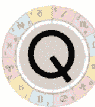

**精神支柱、展現、創造、加強**

五分相是在心理占星中較常用到的相位，屬於中性相位，象徵精神上的支柱，能夠獲得快樂。也代表整合能量的能力，以及思想上的新異和創造力，一種等待發掘與發現的理念。這個人可能充滿接受新觀點的勇氣，能慢慢的從舊理念中蛻變，發展新的觀念與見解，打破局限，創造其更多新的思路。

## 角度解析—144度：中性

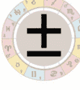

**精神安慰、擴展、實現、強調**

倍五分相代表潛意識中的創造性力量經過吸收、接納過程，得到更大的發展。象徵透過創意的發揮，得到精神上的安慰。把潛意識中隱藏的創造力，努力提升到意識層面上來，並且可以自由探索心智的極限。這種相位強的人容易將精神與思想潛能放大，將人生重心放在一種不具目的性的隨興行為。

## 相位論 4 ASPECTS LEVEL2

## 出相位與入相位

出入相位是指兩顆行星在形成準相位的過程時，當兩顆行星即將形成相位時稱為入相位。舉例來說月亮在金牛6度，太陽在摩羯10度，因為月亮速度比太陽快，因此月亮即將趕上太陽，形成標準的120度三分相。因此這種情況稱為月亮三分相入相位太陽。反過來說，如果是太陽在金牛6度，月亮在摩羯10度，由於太陽運行比月亮慢，因此太陽趕不上月亮，無法形成120度三分相，而逐漸遠離，這種情況就稱為出相位。

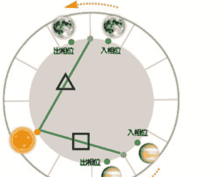

如圖中月亮比太陽快，相對於太陽，月亮是如箭頭方向正著運動。同樣的如果是太陽與木星形成相位，由於木星比較慢，因此相對太陽來說，木星是以前頭方向逆著接近太陽。

同時由於行星會有逆行狀況，因此在判斷出入相位時主要是以兩星逐漸形成的角度來判斷。舉例，以形成120度三分相來說，如果兩顆星的相對角度從超過120度逐漸縮小接近準120度時或小於120度逐漸增加為準120度時稱為入相位，反之則為出相位。

因此以前例中，雖然這兩種情況都是太陽—月亮三分相，但是實際上由於出入相位的不同，在意義上還是有差別的。入相位代表一種即將形成相位的趨勢，而出相位則表現了一種離開相位而尋求新相位的狀況。由於準相位代表事件的發生，因此入相位代表事件仍處在醞釀期，即將發生的狀態。而出相位代表事件已經發生，目前屬於事件影響期中。所以一般來講，入相位的重要性往往強於出相位。而我們在研究相位時如果不考慮這個因素，很有可能會誇大一些相位的影響力，導致判斷時的錯誤。

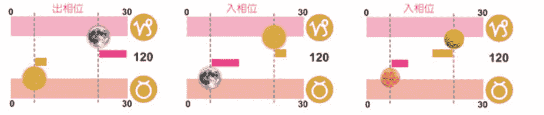

## 行星空相位

空相位是指命盤中當某顆行星完全不與其他行星形成主要相位（托勒密相位）時，便稱此行星為空相行星。在占星學上，有一條不成文的規則就是什麼都沒有比有一些什麼要強。具體一點講，就是如果在某一個宮位□沒有行星落入，反而是較好的一種狀態。雖然無行星落入此宮，會減少此宮的重要性，但因爲行星的力量往往帶來了它宮的關連，反而使得此宮充滿了複雜的變數，增加了關於此宮的問題。

同樣的當行星空相位時，表示這個行星的最本質精神與能量能得到完整的表達，沒有了隱藏的其他動機與刻意的目的。從某種意義上講，空相位的行星就像是一個孤獨的流浪者。它象徵一個人處理行星相關的事物時是單純而直接的，不會受到紛雜的外在影響。因此空相位的行星往往具備此行星最高的潛力。這種強大的能量不會受到妨礙，也就不容易偏離。

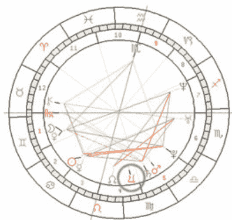

## 空相位

如上圖中的木星，他完全沒有與任何行星產生傳統相位，這種情況就稱為木星空相位，因此代表這張星盤中的木星擁有最單純的木星力量，因為他完全沒有受到其他行星的能量污染。

空相位往往是行星所有的相位中最好的一種情況。行星在這樣的狀況下會是最自由的，最具有創造力的。它表示行星能量會以一種輕鬆、自由自在的方式與其他能量接觸，是自然的不帶有慾望與目的的。但必須注意的是空相行星的影響力往往因為缺乏與它星發生互動而被忽略了。

## 出生圖的型態

行星在星盤上的分布狀況會顯現出有不同特質與集體性的影響，將這些出生圖中行星分佈的型態加以分類，大抵上可以區分出火車頭型、集團型、提桶型、翹翹板型、散落型、碗型、擴展型、扇型等。這些行星分佈的型態對於了解當事人的生命方向以及看出星盤的重點所在，具有重要參考意義。

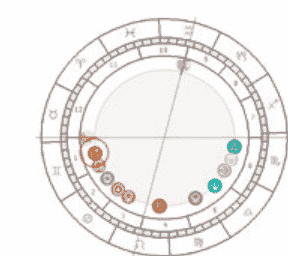

### 1. 碗型：Bowl Shape

碗型是指星盤中行星皆集中於出生圖中的一邊，分布在一百八十度內的型態，標準的碗型是指行星分佈全在地平線以上或以下，或全在子午線以東或以西的狀態。碗型代表缺乏一邊，因此容易偏頗，而在碗型狀態時，領頭的行星便具有特別的重要性。

## 相位論 4 ASPECTS LEVEL2

### 2. 提桶型 : Bucket Shape

提桶型是由碗型而來，此型分布中大部分行星佔據了半圓，位於出生圖中一百八十度的範圍，而只有一顆行星單獨地落在另一邊的半圓中，形成類似水桶的把手。此種類型的人，其所有的能量只為了達成一個目標，可能會任性的只為求得目標之達成，而這一目標之本質就會由把手星所代表的意義與宮位顯示出來。

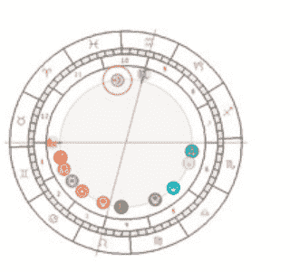

### 3. 集團型 : Bundle Shape

集團型是比碗型更加集中的分布狀態，所有行星的分佈集中在相鄰的幾個宮中，整個分布不超過一百二十度。擁有集團型態命盤的人，通常會表現出明顯的專家傾向，人生模式比較固定，適合往專門的領域深入發展，而領頭的行星便具有這樣的指標意義。

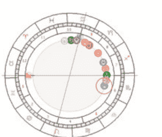

### 4. 扇型 : Fan Shape

扇型是由集團型而來，有點類似提桶型。此型分布中大部分行星佔據了出生圖中一百二十度的範圍內，形成一個集團，但有一星落在集團外，因此這顆星便被特別強調。這一型的人同樣具有專業性，然而其專門投入的目的是為了落在外面的那一顆星代表的象徵意義。

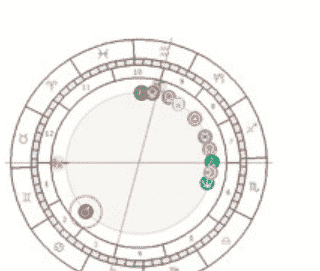

### 5. 火車頭型 : Locomotive Shape

火車頭型與集團型相反，行星在星盤分布中會有一百二十度左右的空白內無星曜分佈，也就是行星散落在二百四十度的範圍內。因此其領頭的一顆星就顯得特別重要，這顆行星便是火車頭，象徵了一種人生奮鬥之驅動力。而留下的一百二十度空白，便使人產生特別之失落感，為了填補空白的部份而產生特別的奮鬥力量來彌補這種失落感。

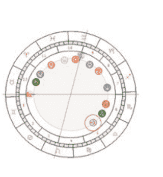

### 6. 跷跷板型：See-Saw Shape

跷跷板型是行星分布形成两个集团，彼此分隔，中间相隔空白的部份至少超过六十度的范围。标准的跷跷板是两组相对位置的行星，每一组有五个，各在星盘的两边。具有此种行星分布型态的人通常具有敏锐的观察力，能够考虑相反的两边观点和意见，但也容易紧张，患得患失。

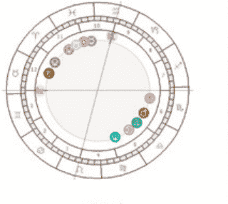

### 7. 散落型：Splash Shape

这是一种很常见的分布型态，这种状态中行星分布的很广泛，也非常的分散，因此有这种星图的人多半兴趣十分广泛，多学多闻，具有丰富的常识，但是同时也象徵多学少精，能量分散、无法集中全力，找不到人生的重心与方向。

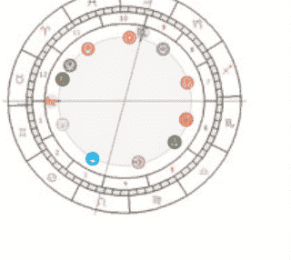

## 相位组成的格局

### 1. T型三角：T-Square

T型相位又叫三刑会冲，所谓三刑会冲是指命盘中有两颗星互相形成180度对相，而这两颗星分别同时与另外一颗星形成90度四分相，构成一个等腰直角三角形的相位格局。这是极难应付的困难相位格局，行星间全部是凶相位，对立的两边要寻找平衡点，却同时受到另一星的能量阻断，因此充分的代表困难、紧张、压力、冲突。命盘上有这种格局的人，代表总是会有需要去突破的难题。

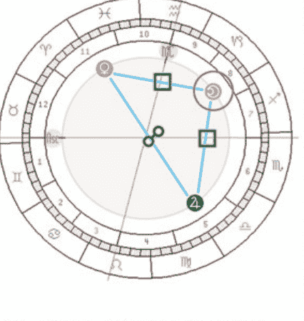

在这个格局中，位于T型的顶点，与其他两颗星形成90度的那颗星就是这个格局的重点。代表这个人会把他的精神以及行动放在这个顶点上，因而导致过度的消耗体力或是脑力，所以必须特别注意这个顶点所落入的的星座与宫位的象徵意义。因於T型是大十字缺了一个点，会形成一种绝对的不平衡状态，使T型頂點過分突出。而欠缺的那個點也就是T型格局壓力及能量的來源，也是解決此相位所帶來的問題的線索，由缺的那部分所落的宮位或者星座所代表的領域便隱藏著解決人生問題的出路。如果不能平衡這種傾斜的力量，個人就會永遠處於一種懸而未決的危機當中。

如果這個格局中的行星沒有與其他行星形成吉相位讓力量找到宣洩的出口時，往往會導致壓力和精力最終爆發出來而導致不幸。假設頂點行星是落入主動宮的話，會有向前邁進的壓力；如果落入固定宮的話，會過度堅持個人的立場；如果是落入變動宮的話，將會有無所適從的壓力產生。

但是T型格局有一個特色，就是會大器晚成，實際上T型格局的人往往是早年辛苦、中年發達、晚年收成的。因為在早年遭遇到各種壓力與外在環境衝撞，受到種種壓迫。但是經過種種磨難，過了中年以後，慢慢心智變得成熟也習慣了磨練，對人生經驗的價值有了正確認知，就會逐漸的一步步往上爬上巔峰。其實，這樣的相位常常在商界要人、企業主管和具有魄力的人物本命盤上出現，因為星盤的能量受到阻礙而被聚集起來，生命中一路走來都是充滿挑戰、備極艱辛，但是正因為充滿挑戰，所以能儲備與激發生命中最大的潛能，反而能爬上更高的巔峰。

### 2. 大十字：Cross

大十字格局是兩組行星兩兩互相形成180度對相，彼此又都構成90度四分相。這樣的格局類似於T型的壓力和衝突，但是壓力比較平衡，不像T型集中在某一點上，因此也象徵能量相互對立，找不到出口，四個頂點都是構成壓力的來源。大十字會給一個人的一生帶來無窮的困難與險阻。擁有這種格局的人往往會做出錯誤的決定，行事猶豫不決，像走在人生的十字路口中，不知該往哪個方向。由於這四顆行星構成四個直角，因此當大十字形成時，這四顆行星將會落在同樣特質的星座中，而這些不同特質的大十字也會有意義上的差異。

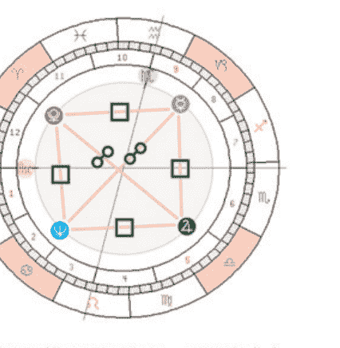

#### 主動大十字：

主動大十字會加強開創與主導的特質，帶有強烈的自我意識，它象徵一輛四頭馬車往四個方向前進，卻彼此拉扯。這樣的人開創力十足，也喜歡駕馭別人。人生過程中馬不停蹄的不斷追求成功，不達到目的決不甘休，但是往往追求的方向太多而且極端，造成彼此拖累。

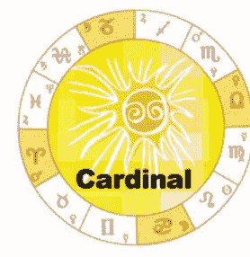

#### 固定大十字：

固定大十字象徵在不同的方向固定與堅持，因此具有極端固執的特性，由於能量找不到出口，又缺乏尋找出口的動機，因而容易造成能量過度的內縮與累積，所以固定大十字的人雖然有堅毅不拔、持續力強的特質。但往往爆發時會更加不可收拾。這樣的人受到傳統的觀念影響很深。過度在意實質的利益、財富和權力，強烈缺乏安全感，對環境的適應力很差。

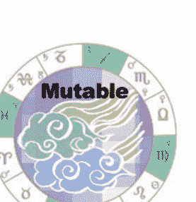

#### 變動大十字：

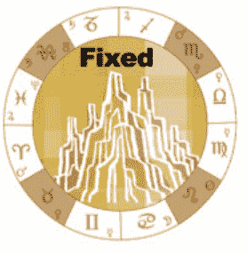

變動大十字象徵受到四面八方的影響，像風向儀一樣隨著風吹改變方向，因此具有善變、逃避或容易妥協的特質。這樣的人一生中像浮萍般的不斷漂蕩，受到命運擺佈，因此有良好的適應力。他們通常多才多藝，缺乏目標，總是逆來順受，容易浪費生命以及精力，因為自己沒有方向性，容易猶豫不決、相互矛盾，無法獨立完成專一性的工作。

### 3. 大三角：Trine

大三角是由三顆星，兩兩形成120度角所構成的格局，當形成大三角時，三顆行星會同屬火、土、風、水四象中的一象。由於行星能量相通，能夠交互作用產生良性的循環，因此能夠非常的順利的流動、生生不息。大三角也就是我國命理學所說的三方會照格局，以所有格局來說，這是第一吉利的格局。

這是對個人極為有利的相位格局，被認為是幸運的象徵，這種格局最大的好處是能夠把吉相位的優點發揮到極致，造成命盤主人特別的人格與能力，往往會在人生中有非常傑出的表現。一般而言，擁有這樣的格局會比別人有比較順暢的人生，容易發揮自己的天賦才能，對一個人的成功發揮良好的推動作用。當與別人競爭時，也會增加勝算的機會。

由於行星能量間能夠順利的、自然的流通，因此很多具有大三角的人，往往會不自覺到這種順利，反而容易有浪費這種天賦的傾向，白白浪費機會，因為缺乏目標與衝擊的歷練反而讓自己怠惰。

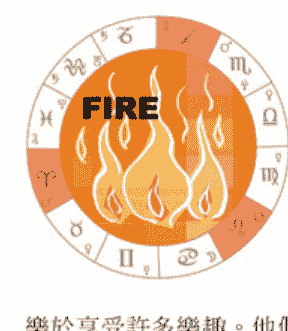

#### 火象大三角：

火象的特點是行動，象徵以純粹的直覺行事。當行星構成火象三角時，會加強行星的行動力，使行星變得更為積極。火象大三角的人容易直接的展現行星的能量，單純地以強烈而原始的方式盡情表現，因此必須學會保存能量。

有火象大三角的人總是充滿了活力，充分的樂觀、積極、行動力強，非常富有勇氣、敢於冒險，也樂於享受許多樂趣。他們面對目標積極並且主動開創以實現理想。他們擁有非常強烈，突出的擴張特質，容易爆發式地表達喜怒哀樂。

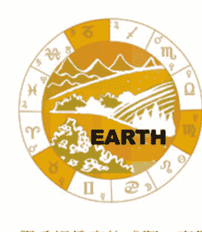

#### 土象大三角：

土象的特點是實際，象徵以真實的感官行事。當行星構成土象三角時，會加強行星的實際性，使行星變得更為穩定。土象大三角的人容易將行星的能量轉化為實質的利益，因此他們容易得到想要的事物，而容易沈溺于舒適的現狀。

土象大三角的人非常腳踏實地，也很現實，講究實際，喜歡有條不紊，循規蹈矩，重視安全感。他們重視真實的感官，喜歡享受來自物質世界，實實在在的喜悅和安慰。並且謹慎評估生命的發展，追求生產力。

#### 風象大三角：

風象的特點是建立聯繫，構成想法，象徵以理性的判斷行事。當行星構成風象三角時，會加強行星的溝通性，使行星變得更有連結力。風象大三角的人容易將行星的能量增加變化與彈性，藉由行星間的連結擴展行星的能力空間。

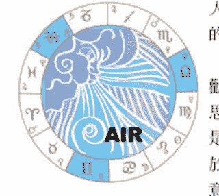

風象大三角的人有強烈的學習力，思想活躍，喜歡超脫、客觀的方式增加對事物的理解。容易發揮思想的溝通與創意，更有打開知識的好奇心，不論是思想上或是溝通上會有許多不同表達的技巧。由於風象具有流動的特點，因此他們缺乏集中力與注意力，不知道如何走出思想空間，走入現實世界。容易天花亂墜，不幹實事，最終淪為空想。

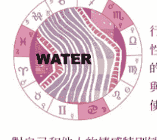

#### 水象大三角：

水象與情感，內在意識有關。象徵以個體的感覺行事。當行星構成水象三角時，會加強行星的感受性，使行星變得更容易與潛意識聯繫。水象大三角的人容易將行星的能量轉化到心靈層次，增加情感與對感覺變化的敏銳性。這種情感的深度和強度，使他們具有藝術天賦與創造力。

水象大三角的人很相信自己的本能和內在感覺，對自己和他人的情感特別敏感。很容易感知到個體以及群體的需要，充滿了感性、敏感、善解人意、體貼別人的本事。他們關注精神和心靈領域，在人生中作決定時常常是憑情緒性的感覺。

### 4. 風箏：Kite

風箏格局是在大三角格局的任一點，有另一星與之形成對相，同時與另兩顆星呈六分相。將這四顆星兩兩相連，就整個外型來看，就像是個美麗的風箏，即為風箏格局，而這顆對立星就是風箏的頭。它表示一個人擁有天生的機會與幸運，但仍有突然爆發的危機，必須要注意。

這種格局具有五個吉相位與一個對沖凶相位，是屬於吉凶參半的格局。當有不利事件發生時，往往能夠逢凶化吉。而這個幸運的調和力量就來自於跟這一顆風箏頭形成60度這兩顆行星的意義。

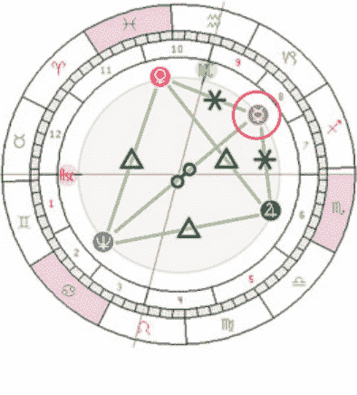

和大三角格局相比，風箏格局反而具有更大的活力，大三角格局是一個對稱的等邊三角，這意味在此種格局能量是通暢的流動，因此沒有特定的儲存點，將能量累積起來做最大的釋放，但是形成風箏格局時由於第四顆星跟大三角中的某一顆星相沖，因此這顆星的位置會使這股順利流動的力量有些阻礙，造成能量的累積，將能量聚集到一起，所以這顆星往往成為這個格局中行星能量的爆發出口，成為風箏格局的重點。

然而這顆星而也因具有對沖相位，經常會遭受到壓力，因此也能刺激生命潛能，所以到後來會比單純的大三角更有成就。

### 5. 信封：Mystic Rectangle

信封型格局同樣是由四顆星所組成。其中總共形成兩個對相，兩個三分相與兩個六分相。這是一種非常詭異而神秘的長方形相位格局組合，同樣具有吉凶參半的特質。其中兩組對立相位形成壓力，但是彼此間又被六分相與三分相行星釋放壓力。由於四個邊同時可以累積能量也得到釋放，因此他們必須找到主要的目標，不然容易在多個面向受到考驗，歷經過多的錯誤嘗試。

信封型格局的命運特徵是在逆境中得到成長的，所以一生中都是挑戰味道十足。在順境時同時帶有壓力，所以不容易驕傲或掉以輕心，而在逆境中又容易得到協助與激勵，所以只要肯吃苦大半都能成功，不至於灰心喪志。所以這種人通常會有成就，毅力堅強，氣度宏偉。

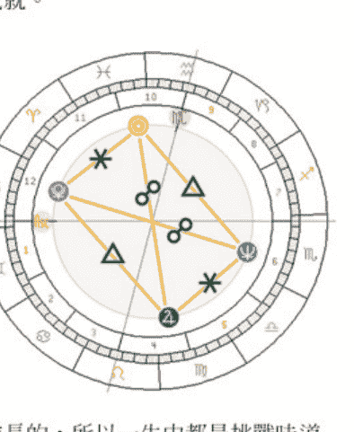

### 6. 上帝之指：Yod

上帝之指格局由兩個指向同一顆行星的150度相位構成，並且這兩個行星間形成一個六分相。這是一種比較少見的格局，通常在旁邊的這兩顆行星是紓解壓力的助力。而上帝所指向的那顆星球，暗示著我們人生中特別要完成的地方，象徵著一種我們無法抗拒的命運。它代表人生某個層面之中隱藏的病源，如果不是一種強制性的不均衡狀態，就是一種長期的永遠無法解決的問題，需要經過治療使其恢復正常。

上帝之指的能量暴發通常是瞬間發生的，就像生病一樣，當不均衡的狀況到一定程度後就會發病。而那兩顆六合星就會使頂端星的作用發生調整。從積極的觀點看上帝之指是指點你，人生的問題點所在，必須有所調整。有上帝之指的人雖然象徵某種毛病，但是也不可忽視其復原能力。它暗示著如果認真面對毛病之所在，好好的治療與預防，反而是一件健康的事。

上帝之指是一種150度的加強形態，並且帶有很大的宿命的色彩。150度相位的特殊之處在於它不像合相位那樣使星體力量得到融合，不像三分相或是六分相那樣使星體間的力量互相流動，也不像四分相或是對相，造成劇烈的能量衝突。而是一種能量間的不均衡狀態而造成的敗壞力量。因此占星家經常利用150度相位來判斷一個人的健康，甚至經常會用來判斷一個人的死亡。

同時它象徵那種永遠困擾我們的莫名的慢性病或是慢性精神疾患，再不然就是那種下意識的墮落嗜好，是一種無意識或是下意識的行為，是個人本身難以改變的。同時上帝的手指在暗示命運病因的同時，也象徵著一種回復性的能量。

另外上帝之指也象徵一種永遠無法完成的工作，因為在這個三角中，沒有一種渠道去釋放這種內在能量，而能量本身是不會消失的，所以它不是造成能量失去均衡而腐敗，不然就會以一種不斷循環的創造力形式表現出來。因此具有這種相位的人，如果參與一些永遠無法完成的工作，比如說科學探索、教育工作，就容易發揮上帝之指的正面作用。

## 中华古籍库

1000000 册 高清影印古籍
珍版刻印 / 海外流传 / 家传手抄 / 民间失传

古籍善本、经史子集、史料笔记、古人文集、
民间收藏、传世家谱、各地方志、中医典籍、
四库全书、古禁毁书、内阁文库、图书集成、
丛书集成、四部丛刊、万有文库、四部备要、
二十四史、三国六朝文、明清和民国古籍史料
……