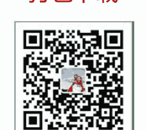

## 行星的特质

大家都晓得星座分为十二种，在一般人看来，太阳落在哪个星座，就说这个人是什么星座。其实看一个人的个性时不能只看其太阳星落入的星座，而要看其他所有的行星，由于每个行星都掌管着人的某些特质：

- 太阳：为一切行星光之来源，故影响性格最重要，每个星性都受它影响。
- 月亮：主宰人的情绪。
- 金星：主宰人的感情（恋爱者必须要晓得对方的金星在什么位置，相位怎么）。
- 水星：主要影响人的思考倾向及表达能力。
- 火星：主宰人的意志表现方式。
- 木星：主宰人的“福气”，精神生活状况！
- 土星：主宰人的受损方式（怎么防御抑制延长等概念）。
- 天王星：影响人的神经。
- 海王星：影响人的想像力。
- 冥王星：影响人神的部份。
- 上升星：主宰人的命运。

## 星座的特质

接下来要说 12 星座的基本特质，先来说说星座的四象与三动！四象即火、风、水、土；三动则是主动、不动、易动三种运行方式。其分布如下：

| | 主动星（带动星） | 不动星（固定星） | 易动星（易变星） |
|---|---|---|---|
| 火象 | 白羊 | 狮子 | 射手 |
| 水象 | 巨蟹 | 天蝎 | 双鱼 |
| 风象 | 天秤 | 水瓶 | 双子 |
| 土象 | 摩羯 | 金牛 | 处女 |

碰到主动星座时，他会比较去改变环境，创造环境，影响环境！而不不动星座则不易受环境改变其特质！易动是随四周改变！而最基本的四象是火象有热情；水象重感情；风象有智性；土象重感官！假如你的行星（太阳、月亮、金星、水星等）多落在主动星座，则你是一个去改变周遭的人，其他类推；假如你的行星多落在水象星座，则你是感情丰富的人！这说明了为何一个处女座的人可能很活跃，假如他的其他行星是很活耀的，像是白羊或射手，那他的行为就有火象的特质！当然还得看上升星！假如想了解占星学，这些星座是属于哪个象，是怎么的“动”都是必须要晓得的。

除了四象与三动外，每个星座都有“正”，“负”两种特质。而其所表现出的是正面还是负面特质，则需看行星在该星座的相位情况。相位好就表现好特质，而且明显！相位不好，则出现负面特质的机率就大！下面列出各星座主要的正、负两方面特质，以供大家参考。

## 白羊座

- 正面特质：心思单纯、有正义感、勇敢不怕困难、积极。
- 负面特质：自我重不顾他人、急躁。

## 金牛座

- 正面特质：有耐心、脾气温顺、脚踏实地、贯彻始终、有艺术气味。
- 负面特质：固执、占有欲强、不知变通。

## 双子座

- 正面特质：反应快、机灵、足智多谋、口才好、多才多艺。
- 负面特质：不专心、轻易矛盾、见异思迁。

## 巨蟹座

- 正面特质：感情真挚、念旧、懂得体贴、善解人意。
- 负面特质：情绪起伏不定、多愁善感、过度保护自己。

## 狮子座

- 正面特质：热情、大方慷慨、同情弱小、有领导力。
- 负面特质：自我强、好面子、浪费、喜欢被奉承。

## 处女座

- 正面特质：守秩序、勤劳、追求完美、做事有调理、会服务别人。
- 负面特质：吹毛求疵、唠叨、人际关系不好、杞人忧天、神经质。

## 天秤座

- 正面特质：追求公正、喜爱美丽事物、优雅、浪漫、会交际、善谋略。
- 负面特质：犹豫不觉、好辩、好逸恶劳、爱找藉口。

## 天蝎座

- 正面特质：执行能力强、意志坚定、情感忠贞、沈稳内练。
- 负面特质：报复心重、爱恨分明、占有欲强、有疑心病。

## 射手座

- 正面特质：乐观、爱好自由、坦直率真、和平友善、活泼大方。
- 负面特质：太过直言、粗心大意、做事冲动、喜怒形於色、没耐心。

## 摩羯座

- 正面特质：重传统、不畏艰难、谦逊有礼、重纪律。
- 负面特质：只顾自己、不够浪漫、不会变通、太现实。

## 水瓶座

- 正面特质：乐於助人、有创意头脑、感情忠实、有前瞻性。
- 负面特质：怪异行为、喜欢多管闲事、对人冷淡、不切实际。

## 双鱼座

- 正面特质：慈悲、会体谅别人、想像好、温柔、善解人意、重直觉。
- 负面特质：太情绪化、逃避现实、不会理财、爱说谎、有滥情倾向。

# 第一章

## 太阳星座

太阳星座表示一个人的形象，或是给别人的印象。太阳星座也影响个人的意识，动态活动或自我表达的方式。太阳的位置在个人出生图的位置好的话，其正面特征为：自信、活力，活泼的气质就会表达出来。

## 月亮星座

月亮是在太阳以外在出生图上最重要的星体，占性格中百分之三十以上。特征是对习惯的反应，和个人本能的行为模式有密切关系。有时月亮星座也是缓和太阳星座的一个重要因素。月亮在占星上代表的是母性，情绪，胃，乳房和消化系统。它好的影响方面：使人记性好，有耐心，包容力强。若处在不利的位置则使人不可靠，排外，心胸狭隘。

## 水星星座

水星是双子座和处女座的守护星，它代表一个人的表达方式和思考方向，同时也支配一个人的理解能力。因此在出生图上水星被加强的话，则是代表：理解力强，属于智慧形的人物。

## 金星星座

金星是金牛座和天秤座的守护星，它代表着和谐，美感，爱情等。金星影响一个人的社交生活，是否具有吸引力，适应力强弱等。同时有时也代表金钱，物质欲望。因此，金星强的人会使人有美貌和魅力，但负面可能使人懒惰，犹豫不决，意志薄弱等。

## 火星星座

火星是白羊座的守护星，其影响是行动方面，有：主动，被动或是否具侵略性。火星的位置对男性尤为重要，它是支持每个人行动的主要力量。不良的火星会使人有：暴躁，残酷，自私，急躁，猛烈的负面影响。

## 木星星座

木星是射手座的守护星，它在占星上是属于比较有好的影响。木星特征强的人所表现的是：乐观，忠诚，善良，眼光远大。负面方面却是使人：浪费，盲目乐观。

## 土星星座

土星是摩羯座（山羊座）的守护星，它的主要特征是：限制。它也许使人有雄心，节俭，可靠的特点。但也有使人冷漠，责任感过重的影响。土星常牵涉到与老年有关的事情。

天王星，海王星，冥王星是三颗“现代行星”，都是在十八世纪后发现的。

天王星是水瓶座的守护星，它对个人的影响是突然性的改变：突发状况，任何新奇、有趣的事物。有时可以形容它是一反常态。在好的方面使人较独立自主有创造力。但厌恶受到限制且爱好自由，意志坚定。若相位不良则会让人觉得叛逆性强，古怪，暴躁，一心要与众不同。

海王星是双鱼座的守护星。一般称海王星跟艺术或宗教有关。海王星特征明显的人就会充满想象力。重直觉、精神，常涉足和艺术有关的东西。不良的海王星影响力是：常自欺，不问世事，过于大意，容易相信他人而受骗，或太过于多愁善感。

冥王星是天蝎座的守护星。影响的事是使一般人觉得绝望的事却东山再起，另创新局。同时它也跟做大生意有关，或者对事物有抽丝剥茧的能力。负面方面有残忍，阴险，虐待性的影响力。

## 各行星的特性

太阳：成功，自信，领导能力，大智慧，名声，男性，父亲，丈夫，老板，政治家，心脏，脊椎，体格，生命力，金子

月亮：内在，潜意识，温柔，情绪，变动，阴性，过去，回忆，妈妈，妻子，家庭，不动产，职员，小孩，胎儿，女性，一般日常生活，饮食

水星：聪明，沟通，文笔，手艺，分析，口才，反应，烦恼，短暂，神经系统，逻辑观念，小旅行，中学以前的教育

金星：金钱，美，品味，和谐，犹豫不决，懒惰，爱情，女朋友，俊男美女，小排演员，艺术，美容，小企业，荷尔蒙

火星：行动力，勇敢，积极，刚强，火爆，冲动，短暂，争吵，战争，刀伤，男朋友，运动项目，军警，金属，机械

木星：财富，幸运，地位，人道，爱心，成功，乐天，繁荣，浪费，国外旅行，大学后教育，贵族，中型企业

土星：严肃，劳碌，努力，实力，中年有成，坚硬，磨练，损失，上司，专家，老年人，牙齿，骨骼，关节，皮肤，慢性病，风湿病

天王星：趋势，革新，创意，新奇，意外，和传统不同，博爱，发明，占星，高科技，精神，文明，怪异，标新立异，飞行，社团，在野党，太空

海王星：升华，舞蹈，艺术，社会福利，奉献，迷糊，酒，化学，药，巫术，糜烂，宇宙，爱，脚，烟雾弹，蒙胧，航海

冥王星：秘密，洞察力，强制，大动乱，再生，阴谋，审判，地震，革命，托拉斯，税务，死亡，心灵学，心理学

## 小行星的意义

莉莉丝——是反映了我们内心中尚未被我们自身所感知的下意识活动。我们一旦了解我们真实的需要，也就是这些以前所未被感知的下意识，这时它将挥发巨大的力量来控制我们的行为，所谓心有所思，行亦随之。

本命盘的莉莉丝揭示一个人内心中最真实的渴望。它在星座和宫位告诉我们自己本身的秘密是什么，它从本质上说明了我们要什么，本能行为，自我主义，性欲，毁灭性，以及我们的创造力。

莉莉丝只有不超过三度的合相和冲相位有研究意义，比如女性的跟太阳、水星、金星的相位被认为能提高其公众眼中的女性气质；与月亮的相位带来怀孕和生产的麻烦；与火星的相位预示了独立、敌对的吸引力。

流年莉莉丝带来痛苦和不适，受其他行星的影响表现为性质的情绪，不能自控并易于发生报复行为。

福点——代表你交际上所给你帮助和合作的好搭档

宿命点——在西方的传统星座学下，真正影响一生的是宿命点，它对人的一生有着巨大的影响，重要的是宿命点代表的星座是指一个人通往成熟道路上所演变的生活态度。（大概在生命年龄中 30 岁开始）其太阳座的接替者，从而演变为上升星座。准确的说是在人生的 25 岁就开始慢慢的转变了。

宿命点对婚神的影响是巨大的，宿命点不光代表人 25 岁以后的上升。它和婚神的关系行同情侣。宿命点罗马神话中命运的守护者，掌管着太阳月亮的神。他有着改变人们命运的力量，被西方星座学家命为星盘的关键。你们的人生性格和命运会被宿命点在无声无息中改变。

凯龙星——代表了一生中反复困扰你的问题，也代表沉思，是指当你一个人在寂静的环境中独处时所思考的方式。

凯龙星所在的宫位和星座反映几个方面的问题：

1. 指明了你的生命中可能出现问题的地方，而且这些地方还可能反复的出问题。和其他行星一样凯龙星有着它积极面和消极面，从一方面说它展示着我们在什么方面我们可以教导和帮助别人，而且凯龙星的问题是可以缓解和解决的。
2. 代表我们在哪些方面可以指导别人做的更好（相对于自己而言）意思就是你可以说得出别人哪里不足，但是自己却常常意识不到自己这方面也不足。
3. 凯龙星所在的宫的位置展现了我们生活中的哪些方面会出现问题。所在星座的位置展示了我们怎么样去作出努力。

谷神星——在我们的星盘中代表了我们所接收到的早期的养育(关爱)和我们是如何养育(关爱)他人的。它也直接地主宰我们的食物和衣服。例如两个职业设计师的星盘中，他们都有着谷神星和智神星(主设计的能力)的重要相位。谷神星落入星座表示了我们养育(关爱)的方式和我们愿意接受的养育(关爱)。谷神星落入宫位表示了我们最愿意表达和接受养育，关爱的方面。

灶神星——在星盘中的位置表示了我们将会献身的方面及方式，表示了我们将花费最大精力的地方，所在的位置就是我们能集中自己力量发挥巨大作用的地方，同时也是我们定期需要休息充电的地方。

智神星——这个星座对自己的工作事业有这相当大的影响和帮助。智神星落入星座则表示了你更喜欢用哪一种方式去做这些事。智神星落入宫位表示了你不能解决的问题和不能预见的规律。

婚神星——代表着你未来婚姻的一个面貌，在我们的星盘中暗示了我们所需要的和将会得到的婚姻伴侣是怎样的，不是我们所想要的婚姻伴侣(那个取决于金星和火星)，而是我们所需要的和实际生活在一起的。也就是说你的另一半是什么样的性格，也是你所需要的生活方式。这个是结婚的关键。

金星和火星表达了我们心中理想的男人和女人；第五宫主我们想与之有罗曼史的那些人；第七宫描述了我们第一次婚姻的伴侣是哪一型的(如果有的话，第九宫描述了我们第二次婚姻的伴侣)；而婚神星而指出了一些更为基础的东西。

婚神星和任何行星的相位都可以表示为，你会被有此行星所主宰的星座的特征的人所吸引。

北交点——代表我们的理想与目标，我们选定面对的挑战，我们灵魂想要达成的今生目标。它代表我们还没有学到的东西。

南交点——一个人从何处而来”。它代表一个人的根基，一个人的遗传基因，一个人的历史，一个人与生俱来的身心情感的能量与特点。这可能是你人生的一笔财富，但如果一个人因为拥有这些就开始不思进取，南交点同样可以变成一个阻碍个人发展的大障碍。

## 占星最最基本的知识：指算法&心算上升星座办法

因为电脑普及，一部分人已经忽略了心算指算的重要性。

也没有在从开始学习占星时就接触到这个方法和技巧。

指算心算可以方便你随时随地，不管是在马路上，还是在公交车。

或是晚上睡觉之前的思考。都可以让离开电脑干扰的你通过此种方法思考一些简单甚至庞杂的问题。

下面来简单介绍一下指算法。

伸出右手，大拇指待用，作为鼠标。

练习用大拇指触击你四个手指的 12 个小节。

4 个手指，每个有三节，代表 12 个星座。

这就是长在你手指上的黄道 12 宫。

下面开始介绍指算法来计算上升星座。

有的时候没有电脑就没办法看盘，就少了很多在平时积累经验的机会。

比方说在外面跟朋友喝茶聊天，人家即使说出了出生时间，缺少经验的话，很难以第一时间确定人家的上升星座。

下面就简单来说一下。

首先，要介绍一个基础知识。

之所以七月份的尾巴是狮子座，那是因为当时的太阳，是落在狮子座的。（废话白痴都知道）

所谓上升星座，就是你出生当时处在东边地平线上升起来的那个星座。

那么，在七月份的尾巴，和八月份的前奏这一段时间之内。

太阳是在狮子座升起的，这也就代表说，在早上 5，6 点钟的时候，伴随太阳升起的那个星座，就是狮子座。

此时出生的人，便是上升狮子。

好了，说到这里大家应该都明白了，大家都知道是每 2 个小时（一个时辰）变换一个星座的。

那么如果此人是告诉你他的太阳星座是狮子座。

那你就可以开始从手指上推算了。

早上 5，6 点出生的人，上升是狮子（注意，5，6 点是日出时间，所以此人太阳一般是在 12 宫或者 1 宫的）

早上 7，8 点出生的人，是处女座。（这是日出后两个小时，太阳已经伴随狮子座进入 12 宫）

然后 9，10 点出生的人，应该是上升天秤。

以此类推，先决条件是你必须知道对方的**太阳星座**和**出生时辰**。

下面简单讲几个容易构成误差的因素。

1. **东部西部的日出时间先后，**

如图所示，图上的中原标准时间就是我们今天的北京时间，

比方说长白时区就比北京时区日出时间提前一个小时。

昆仑时间就比北京时区晚 3 个小时。

不过幸好走一个星座需要 2 个小时。所以误差基本不会太大。

大家大致了解一下就好。

2. **冬季夏季南北的日出时间早晚，**

比如冬天的摩羯座（请你别问摩羯座是几月份呢）水瓶座，日出时间是 6，7 点钟。

夏天的巨蟹座日出时间就是 4，5 点钟。

北方的夏天冬天日出时间误差大概有 3 个小时。

比如黑龙江，内蒙古，新疆北部。

而长江以南的误差就很小，因为和赤道近，一般就在 2 个小时之内。

3. **太阳当时出于该星座的阶段**

以摩羯为例，刚从射手进入的日摩羯（12 月 25），比即将进入水瓶的日摩羯（1 月 19）

要早两个小时。这个误差也是相对比较小的。同时我给出的判断也是以 2 个小时为单位。

所以这个误差在不继续精确算的条件下，可以忽略掉。

上面讲了几种造成误差的因素，可能觉得比较复杂。

但其实那些误差不会严重的影响我们简单的去判断一个人的上升星座。

在这里我只是想把它写出来让大家了解一下，方便精确计算。

基本上使用我说的方法，就可以把一个人的上升点确定在 3 个星座之内了。

以推到狮子为例，那么就是有可能是处女或者巨蟹。

再去观察这个人的神态动作面貌，就大致能够确定了。

大概就讲完了，有什么不明白的回帖提问吧：）

下次说一下行星落入宫位，12 宫头的论断方式。

# 第二章 行星的性质

正宗占星术推命是以行星为主。古代人历经数千年对行星效果的体验，而给各行星赋予各种性情。例如罗马人称火星为战神，称金星维纳斯是爱神，称木星为保护大神。这些根据经验的观察结果是正确的。

人的个性，是由各行星的特质所组合成的。心理学有所谓意识与潜意识之说。太阳、水星、金星掌管意识层面，其他诸星则掌管深层的潜意识。精神分析学大师弗洛伊德曾提出自我（Ego）、原我（Id），与超我（Super Ego）之说。

从占星术的观点，太阳、水星、金星组成自我，是经过大脑思维。原我是生物层面，包括月亮的情绪与感觉，火星主宰食欲和性欲，木星主宰成长，土星主宰老化和衰老；超我则包括天王星、海王星、冥王星。

太阳（Sun）是光与能量之源。它代表内在的自我、中枢，象征人之心、意志与本性。

太阴（Moon）或月亮，主宰情绪，行为反应，下意识。它象征人对外界的感觉反应与行为态度。

水星（Mercury）与人的语言、推理、学习、交谈、思考，与沟通表达能力有关。

金星（Venus）主宰人的感官，包括听觉、味觉、视觉、嗅觉、触觉、喜好、吸引、讨好、选择他人的能力、情爱与享受、管一切清洁、优美、芳香、悦耳、有吸引力之物。

火星（Mars）的本质是动物本能。掠夺、攻击、与繁殖下代的欲望、与食欲、性欲、勇气、激情、精力、冲动、消耗燃烧能量有关。

木星（Jupiter）代表生命力，有机物。有成长扩张与膨胀的性质。但也有负面的浪费、奢侈、好虚荣，浮华不实的性质。

土星（Saturn）与木星相反，代表毁坏，无机物。有收缩、老化、死亡的性质。节制、保守、务实、压抑、严肃、节俭、自制、守旧的一面。人的一生从生到死亡与归于尘土，就是木星与土星两种向上提升与向下沉沦两种力量的交换作用。人生的无奈，就是木星的成长，最终不敌土星导致身体衰老最终面对死亡。

天王星（Uranus）代表不稳定与创新、突变。有标新立异、不受拘束、无恒心耐心、自命不凡、惟我独尊、与众不同、喜新厌旧的个性。

海王星（Neptune）具备气体、液体等无形流体的性质。没有彼此、真假、是非、黑白、对错。有混沌不明，你我不分、真假难辨、扑朔迷离、互通有无、朦胧恍惚、迷糊的现象。耶稣基督提倡的爱，主张要爱你的邻人，爱你的仇敌，分享财富，破除彼此的藩篱，就是典型的海王星精神。因为海王星的开放无私、牺牲奉献的精神，也容易暴露弱点，为人所欺骗陷害。海王星可说是弱者的象征。

冥王星（Pluto）是孤独疏远之星。有顽固、一意孤行、独来独往、冷漠无情、断绝欲念、舍弃割离、铁石心肠、不通人情、离经叛道、自闭、禁食禁欲之意。佛祖释迦牟尼的出家、闭关修行、持戒禅定，是典型的冥王星精神。

以上描述的十大行星称之为『本命星』。是人出生时，星球烙印在人的本性。这些绕行的行星，在人的一生中还是不断地对人的运命产生吉凶的作用。可称之为『行运星』。木星与金星是吉星；火星、土星、海王星、冥王星皆为凶星；太阳、太阴、水星、天王星为中性。

木星是最吉利之星，行运逢木星主万事顺遂，逢凶化吉。升官、发财、鸿运、中奖、考试上榜，都少不了木星。

金星也是吉星，与享乐悠闲娱乐艺术，男女关系有关。运逢金星，有异性缘、桃花运、婚姻之机，或是吃喝玩乐等享福之事。

火星是凶星，运逢火星主劳碌、口角、争执、血光之灾、烧伤、刀枪之伤。

土星是凶星，运逢土星，主受挫折、拖延、滞碍难行、重担、撞伤摔伤，甚至死亡。

行运海王星是凶星，运逢海王星人变得十分脆弱，容易生病或受到伤害，主多烦恼、受骗、遭羞辱、小人陷害。

行运冥王星也是凶星，运逢冥王星主生离死别，遭排斥、遗弃、解雇、离婚、出家、放逐。

太阴为中性之星，运逢太阴，主多动少静、欲求不满、旅行搬家。

水星也是中性之星，运逢水星，多文书、交易、旅行之事。

天王星是中性之星，主不测意外之事。逢吉星木星主发横财，遇金星一见钟情，逢凶星主遭横祸。

学占星术第一步就是要了解行星包括本命星与行运星这两组的特性。更要推敲当行运星遇本命星时会产生何种心理效应。兹以行运吉星木星为例，说明行运星遇本命星时的效应。

行运木星遇本命太阳：由于太阳象征人之心与本性，遇到有膨胀性质的木星，故会自信满满，想大展鸿图。

行运木星遇本命太阴：由于太阴象征人的感情反应与行为态度，遇到有膨胀性质的木星，故心情开朗或出去旅游。

行运木星遇本命水星：由于水星与人的学习、交谈、思考与沟通表达能力有关，遇吉星木星主有好消息，发表文章或考试上榜。

行运木星遇本命金星：由于金星主情爱与享受，遇吉星木星主恋爱与婚姻之事。

行运木星遇本命火星：由于火星与人的精力与战斗力有关，与吉星木星主所向无敌，主在商场、情场、竞技场上有展获。

行运木星遇本命土星：由于土星代表节制、压抑、倒霉的性质，遇吉星木星主苦尽甘来，否极泰来。

行运木星遇本命天王星：由于天王星主机不可测，遇吉星木星主发横财，喜从天降。

行运木星遇本命海王星：由于海王星主多忧虑惶恐，遇吉星木星主侥幸，有重见天日之感。

行运木星遇本命冥王星：由于冥王星主孤立无援，遇吉星木星主因祸得福，例如家人去世得到遗产。

# 第三章 拆解命盘

电脑未普及以前，绘算占星术命盘是相当困难的。要观星量取行星位置制订天盘，或查询天文历，还要用三角几何计算地盘十二宫。古时只有帝王公卿才能独享，一般人是无法接触到占星术。现代绘算占星术命盘只需要输入阳历的年、月、日与准确的生时，几点几分。再输入出生地的经度与纬度，电脑就可以自动绘算命盘。

如果我们夜晚望着南方上空，行星运行的轨迹就是黄道圈，而占星术的星盘（Horoscope）是在地球上的任何时间、空间切割黄道圈而成的盘。

将黄道圈三百六十度分成十二个等分，每三十度赋予一个星座之名，黄经零度到三十度为戌宫白羊座，黄经三十度到六十度为酉宫金牛座，黄经六十度到九十度为申宫双子座，黄经九十度到一百二十度为未宫巨蟹座，黄经一百二十度到一百五十度为午宫狮子座，黄经一百五十度到一百八十度为巳宫室女座，黄经一百八十度到二百一十度为辰宫天秤座，黄经二百一十度到二百四十度为卯宫天蝎座，黄经二百四十度到二百七十度为寅宫人马座，黄经二百七十度到三百度为丑宫摩羯座，黄经三百度到三百三十度为子宫宝瓶座，黄经三百三十度到零度为亥宫双鱼座。

这些星座只是黄道上的标定点，再将诸行星按照他们的黄经位置绘在黄道圈上便成了星象图。

占星术的命盘（Horoscope）是由天盘与地盘合组而成，黄道圈是行星运行的圈，天盘或称行星盘就是黄道圈，包括太阳在内的十个行星的圆盘。

天盘是以地球为中心点来绘出行星在黄道面的位置。下页是一九九八年二月十二日台北晚上九点十分的天盘。这个时间的天盘是全球一致的。天盘共有三百六十度。太阳一年逆时针方向在天盘绕行一周，平均约日行一度。注意其中的水星与金星总是伴着太阳左右。水星离太阳不超过二十八度，金星离太阳不超过四十八度，太阴则每个月就绕行天盘一周，运行速度最快。此图可看到火星此时在亥宫双鱼座十四度逆时针朝向位于戌宫白羊座的土星逼近。

除了太阳太阴外，火星绕行天盘一周要六百八十七日，木星要十二年，土星二十九年，天王星八十四年，海王星约一百六十四年，冥王星要二百四十八年。天盘上值得注意的是慢速度的行星的交会周期：土星与冥王星每隔三十三年交会一次，土星与海王星的交会周期是三十六年，土星与天王星的交会周期是四十五年。天王星与冥王星的交会周期是一百二十七年。天王星与海王星的交会周期是一百七十二年。海王星与冥王星的交会周期是四百九十二年才发生一次。

有意思的是清朝末年民国初年生的人，例如蒋介石、毛泽东、希特勒，命盘内都有天王星与冥王星交会。更特殊的是公元前五百七十年春秋战国之始，此时正逢冥王星、海王星、天王星三星交会，老子、孔子、释迦牟尼、毕达哥拉斯等中外圣人辈出。至于出生在越战与文革的一代，命盘里则有天王星与冥王星交会。

地盘（House）则是在出生地划分当地时空的盘。以出生地点的经度与纬度配合出生时间便可绘出上页的地盘。地盘划分黄道圈为十二宫。中国古书称第一宫为命宫，第二宫为财帛，第三宫为兄弟宫，第四宫为田宅宫，第五宫为男女宫，第六宫为奴仆宫，第七宫为夫妻宫，第八宫为疾厄宫，第九宫为迁移宫，第十宫为官禄宫，第十一宫为福德宫，第十二宫为相貌宫。本书对地盘十二宫另有新的诠释，因此勿望文生义，第八宫其实与人的疾厄无关，第十二宫与人的相貌甚少关连。

地盘具备三度空间，是有方向性的。南方黄道圈最高点称之为上中天（Midheaven）。北方黄道圈最低点称之为下中天（Imum Coeli）。东方黄道圈与地平线交会点称为东升点（Ascendant）。西方黄道圈与地平线交会点称为西没点（Descendant）。这四个交点是命盘最重要的点。

地盘因地球自西向东的自转而在二十四小时内转三百六十度。比起天盘的太阳在一年中转三百六十度，或月亮在一月中转三百六十度快多了。至于转向也相反，黄道圈与其上的行星在地盘上是顺时针转动。将天盘与地盘合在一起，就成了上页的命盘。地盘在二十四小时约转动了三百六十度，因此每四分钟约移动一度，每四秒地盘移动一分（一度等于六十分，一分等于六十秒）。

值得注意的是占星术的命盘是具有独特的时间与空间因素的，同时间在不同地点出生的两个命盘的地盘不同。同一地点（医院）出生的人，两人不会有相同的时间，即使双胞胎也有前后之别。

时间与空间为一体不可分割，这理论早为物理学大师爱因斯坦所证明。时间不能独立于空间之外，三度空间也不是永恒的，沧海桑田会随时间变动。算命也不能忽视这点。

中国古代算命法如『八字』、『斗数』，都是以时辰算；以每两小时为单位的记时法，『八字』、『斗数』用这种粗糙的时间单位，又忽略经纬度的空间因素，以至在同一时辰内，全世界有数万人均有相同的八字，甚至有相同之命与运，这是说不通的。

# 第四章 行星的交角

命盘上行星在三百六十度的圆盘上，各有其固定不变的位置。行星彼此之间，是以交角（Aspects）来联系。交角有很多种，以三百六十度除以任何整数都是交角的一种。零度交角称为『会』（Conjunction）；一百八十度交角称为『冲』（Opposition）；九十度交角称为『刑』（Square）；一百二十度交角称为『拱』（Trine）或『合』；四十五度与一百三十五度交角称为『半刑』（Semisquare）；六十度为『半合』（Sextile）；三十度与一百五十度为『四合』（Semisextile）。

29页图就是交角的图示。将命盘行星置于三百六十度圆盘，则行星彼此之间的交角便易于量度。以A点之行星为主，B星与A星交角为一百八十度，故相冲，C星与D星与A星交角为九十度，故相刑A星；E星与A星交角为一百二十度，故相合；G星与A星交角为四十五度，故半刑A星；J星与K星则四合A星。

除了以上几种交角以外，还有两种特殊交角，一个称为『映』（Antiscion）。这是以夏至点（未宫）与冬至点（丑宫）连线为轴的对映点。举例来说，如果某星在卯宫十五度，则映点为二百七十度减二百二十五度加二百七十度得子宫十五度。

另一种特别的交角称为『纬照』（Parallel of Declination）。每个行星在三度空间的定位，除了黄经（Longitude）以外，还有赤纬（Declination）。当两星的彼此的南北赤纬在一度以内，也形成交角。笔者称为『纬照』。

两星彼此交角要在角距（Orb）内才有作用。『会』与『映』不超过十二度；『冲』不超过六度；『刑』不超过三度，『拱』不超过四度；『半合』二度；『半刑』不超过一度半；『四合』与『纬照』不超过一度。

交角的奥秘其实不难。想象黄道圈三百六十度有如吉他琴弦，吉他手温和地将手指放在弦上然后弹拉它。当他们把手指放开后，该弦会继续以一个音调发声。他们将手指放在弦上的方法，就如同占星术里的交角一样，放在弦的二分之一，弦中点处，就是『冲』；放在弦的三分之一处，就是『拱』；放在弦的四分之一，就是『刑』。当手指放得越接近这些节点时，所发出的音也会越纯越强。命盘就像一件乐器，如果命盘内的行星交角很紧的话（角距小）发出的声音就越宏亮，音色越好。

交角是联系行星彼此的性质，没有所谓好与坏的交角。两个吉星例如金星冲木星还是吉象。会、冲、刑、半刑是硬角度，作用较大；合（拱），半合是缓角度，作用较小。

人的个性并不是看东升点或上升星座的属性，而是由行星彼此的交角来解读人的个性。由命盘太阳、太阴、水星、金星四行星与其他行星『会』、『冲』、『刑』、『拱』的交角，可判读人的性格。

命盘太阳代表人的内在主宰意识；太阴则代表对周围环境的本能情绪反应与外在的表现；水星代表人的想法与思考推理、沟通能力；金星代表喜恶，评估的能力。这四星都在地球内轨道，象征人的内心深处。分析个性首先要看这四星的交角再加上火星。至于木星、土星、天王星、海王星、冥王星彼此间的交角，主要与作风有关，不牵涉到个性。

### 与太阳的交角

- 水星：多言、好学。
- 金星：爱美、安详柔和。
- 火星：有坚强的毅力。
- 木星：有正义感、乐观、有自信。
- 土星：务实、保守、自卑、忧郁、心灰意冷。
- 天王星：聪明有创意、与众不同、自命不凡。
- 海王星：好幻想、理想主义、无私、有宗教信仰。
- 冥王星：不合群、高傲、孤独、冷漠、自闭。

### 与太阴的交角

- 水星：记忆语言能力强、好动。
- 金星：有礼貌、有人缘。
- 火星：胆大、勇敢、急躁、身体容易受伤。
- 木星：慷慨、活泼好动、幽默。
- 土星：小气、胆小、阴沉、慢性疾病。
- 天王星：个性喜怒无常、捉摸不定、好旅游。
- 海王星：神经质、心软、敏感脆弱。
- 冥王星：害羞逃避、叛逆性。

### 与水星的交角

- 金星：文雅、有文采。
- 火星：机智、好逞口舌、与人争辩口角。
- 木星：博学多能、好旅游。
- 土星：精打细算、迟钝多疑、犹豫不决、深思熟虑、长于数理逻辑。
- 天王星：机智、早熟聪明。
- 海王星：口才好、富有想象力、信仰宗教。
- 冥王星：寡言、口才不好、思想偏激。

### 与金星的交角

- 火星：性早熟、热情、情欲强烈。
- 木星：高贵文雅、和蔼可亲。
- 土星：拘谨、冷感、晚婚、忠贞不二。
- 天王星：见异思迁、奇装异服。
- 海王星：浪漫幻想、有艺术修养。
- 冥王星：无法表达爱意、冷漠、苦行、禁欲；金星与冥王星有会、冲、刑的人，大多是单身不婚。

### 与火星的交角

- 木星：精力充沛、好运动、好大喜功、有干劲。
- 土星：懒惰、顽固、迟钝。
- 天王星：好冒险刺激、同性恋倾向。
- 海王星：鲁莽、冲动、盲动。
- 冥王星：无力感、懒散。

### 与木星的交角

- 土星：有节制。
- 天王星：好赌博投机取巧。
- 海王星：慷慨大方、有同情心。
- 冥王星：无道德观念。

以上介绍的只是两星彼此的交角。实际上三个以上的行星形成的交角在命盘上是常见的。这种交角的解析就变得很复杂。在实例篇有许多这种例子。

分析命盘的第一步就是看交角。有时不知生时，仅分析命盘太阳、水星、金星三星的交角就可猜出其人的个性。举个例子，某男士生于一九四二年五月二十二日，生时不知。以正午时间西六区计算，此命太阳会土星与天王星半刑火星，可知其人心冷（土星），聪明（天王星）；水星会木星（有学问）；金星刑火星（色欲）；火星半刑土星（顽固）；金星半刑土星（无情残忍）。

此人就是美国大名鼎鼎的邮包炸弹杀手名叫卡新斯基。他年纪很轻时就得到数学博士学位，到加州大学柏克莱分校当教授，几年后他辞职隐居到西部山区。寄邮包炸弹杀害无数人，十几年后才被他弟弟举发，最后被判终生监禁。

美国总统克林顿，命盘土星与冥王星夹水星，水星又半刑天王星。这交角表示他虽机智但说话圆滑不老实。本命火星会金星与海王星，火星主性欲，遇金星主好色，加海王星则主性丑闻接连不断。他这种个性会惹上不少麻烦。

二零零一年底在台湾因遭偷拍光碟事件而闹得满城风雨的女主角璩美凤，她的本命金星火星木星三星连珠，又拱海王星。金星主感官享受，火星主性欲，木星表示有极大的需求，这又再度证明占星术的交角分析，真是直指人心的利器。

另外值得注意的是慢速度行星的交会周期：土星与冥王星每隔三十三年交会一次，土星与海王星的交会周期是三十六年，土星与天王星的交会周期是四十五年。天王星与冥王星的交会周期是一百二十七年，天王星与海王星的交会周期是一百七十二年，海王星与冥王星的交会周期是四百九十二年才发生一次。

清朝末年民国初生的人，例如蒋介石、毛泽东、希特勒还有其他纳粹党人，命盘内都有海王星与冥王星交会。海王星的爱被冥王星所减，因此他们那一代人多少有无情残忍的性格，缺乏同情心。当他们在二十世纪中期掌权，不管是集权的法西斯或共产党政权，这些人掌握了权力之后，都造成了不少灾难。至于出生在越战与文革的一代，命盘里则有天王星与冥王星交会，那一代人多少有单打独斗的性格。

# 第五章 行星的强弱

一般流行断人个性的方法，是看命盘诸行星位于何星座。例如太阳在天蝎座就说其人『善妒、顽固、倔强、多疑、城府过深』。其实这种说法是经不起分析的。试想同一天生的人，他们的行星的所属星座都一样，难道每人的个性都相同吗？

真正断个性之法，是先看行星彼此之间的交角，次看行星与命盘东西轴与南北轴接近的程度。行星如果离东升点、西没点、上中天、下中天左右十度之内，则位于强势之位，则行星本性会影响人的个性。其中尤其以行星位于上中天为最强。上中天位于黄道圈的高点，是最重要的位置。西没点是第七宫起点，象征与外界的接触。东升点是第一命宫起始点，象征自发的行动。下中天在地平之下，象征隐私之事。

上页图的阴影部分就是强势之区。反之，如果行星位于两强势之区的中间地带A、B、C、D就是位于弱势之区（也就是第二宫、第五宫、第八宫、第十一宫），行星发挥不了作用。

这个行星强弱位的理论，是有统计学的资料佐证。法国心理学家高格林（Michelle Gauquelin），收集了数千个医生、出名运动员的出生资料，以统计学的方法找寻规律。他发现杰出运动员命盘的火星通常在上中天、东升点附近，这也证实了占星术传统对火星的看法。命盘火星强的人勇敢、积极、好动，所以这些人在竞技场上较能成功。如果命盘火星位于弱势之位，则可断其人不积极，不好运动。

太阳位于强势之位者：喜欢发号司令、好出风头、指挥他人、主见甚强；如果位于弱位，只有服从他人领导。

太阴位于强势之位者：不甘寂寞、活泼好动、不满足、个性被动、富有想象力。如果位于弱位，较有节制。

水星位于强势之位者：好学多言、好旅游、可适合教学、写作、新闻工作、旅行业、秘书。

金星位于强势之位者：注重感官享受、文雅有礼、爱清洁、喜爱艺术。

火星位于强势之位者：有勇气与战斗力、精力充沛、喜好运动与竞技。但也容易冲动急躁，有暴力倾向。

木星位于强势之位者：有正义感、慷慨。但也有浪费、奢侈、好虚荣、浮华不实的一面。

土星位于强势之位者：有保守、务实、压抑、严肃、节俭、自制、顽固、守旧的一面。

天王星位于强势之位者：有标新立异、独来独往、不受拘束、无恒心耐心、自命不凡、惟我独尊、与众不同、喜新厌旧的个性。

海王星位于强势之位者：有博爱包容，丰富想象力，个性随和、善良，但容易脱离现实，受骗上当。职业上适合慈善事业、演员、艺术家、宗教家。因为文艺宗教与现实生活较少牵连。

冥王星位于强势之位者：喜欢独来独往、隐居、主见甚强。偏激、不合群、无情冷漠、禁欲、铁石心肠、离经叛道、反传统。

以命盘断个性，不但要注意行星位于强势之位，也要注意行星在弱宫的分布。举个例子：木星如在东升点附近，则可断其人个性乐观进取；反之如果木星位于第二宫、第五宫、第八宫、第十一宫的中心点附近，则木星的性情不显现，其人反而有务实保守的心态。传统的判断个性之法，仅以第一宫命宫内之星为主的方法，应该修正。

命盘行星影响个性，也决定人的性向，适合从事何种工作。例如火星积极好争的性情适合当军人、商人。高格林的统计研究发现，科学家、医生的命盘土星强，木星弱；军人、商人、运动员的火星强而太阴弱。演员、政客、记者的木星强，而土星弱；作家、艺术家的太阴强而火星、土星弱。

用行星来选择职业是极为有用的。例如命盘木星强，个性较积极，是不宜走理工的路线，而应任公职，或从政。而土星强木星弱者，个性务实，应走科技研究路线。火星强者宜作生意、从商。水星强者，宜教育界或传播新闻业。天王星强者，性喜单打独斗，宜自由业。金星强者，宜艺术家。至于海王星与冥王星强者，不适应现实生活，宜走宗教，或艺术事业。

# 第六章 地盘解法

占星术传统古法将地盘（House）圆盘划分为十二宫，分别是第一宫命宫、第二宫财帛宫、第三宫兄弟宫、第四宫田宅宫、第五宫子女宫、第六宫奴仆宫、第七宫夫妻宫、第八宫疾厄宫、第九宫迁移宫、第十宫官禄宫、第十一宫福德宫、第十二宫相貌宫。根据笔者的研究，这些地宫需要现代的诠释。

命盘有两条东西与南北轴线。东西轴线将命盘切割为上下两半，上半为显下半为隐，上半部象征人与外界接触的公众领域，下半部主家里内部只领域。南北轴线将命盘分割为左右两半，左半为已右半为彼。左半部是象征人独自具备的领域，右半部是人与伴侣关系之领域。

命盘上半部包括第七宫到第十二宫，这是人与外界交往的一面。这些宫包括夫妻宫、迁移宫、官禄宫等等，主管人与外界的关系。很明显的，第八宫与人的疾厄、死亡无关，应与夫妻或合伙人的财产有关。

命盘下半部包括第一宫到第六宫。这些地宫包括命宫、财帛宫、兄弟宫、子女宫、奴仆宫等等，主管人与家庭内部包括父母、兄弟、子女、叔伯、佣人的关系。这是私底下不公开的生活面。

从另一角度来看，命盘左半部包括第十宫到第十二宫与第一宫到第三宫。这些地宫包括命宫、财帛宫、兄弟宫、官禄宫、福德宫、相貌宫。这些地宫管的都是靠自己天生，不需要与他人合作的能力。同理推断，人的健康与第六宫无关，而应与左半部，特别是左下部有关。

命盘右半部包括第四宫到第九宫。这些地宫包括田宅宫、子女宫、奴仆宫、夫妻宫、迁移宫等。这些地宫管的都是要与他人合作，自己无法但单方面控制的部分，例如子女宫管的就是取妻生子，需要男女配合才行。

解盘第一步是查看命盘内行星的分布形态。这形态受天盘诸星排列的影响，而与地盘无关。最早注意到天盘分布的是美国占星家Marc Edmund Jones。他列举出散型（Splash）、束型（Bundle）、长蛇型（Locomotive）、碗型（Bowl）、篮子型（Bucket）、对称型（Seesaw）与倾斜型（Splay）。

如果行星分布是束型、长蛇型、碗型、或篮子型，要注意这些星是分布于命盘的上下左右何方。

如果左半边有超过七个行星，则此人自主能力与主见强、自作决断，有单身不婚的可能（47页上图）。如果右半边有超过七个行星（47页下图），则此人依赖性与合作能力强，精神上需要伴侣朋友之指导、肯定、慰藉，凡事自己不易做主。

上半边有超过七个行星（49页上图），则此人态度客观、事业心重、处事圆滑、社交能力强。如果下半边有超过七个行星（49页下图），则此人态度主观、内向、重隐私权、比较不在乎别人对他的观感意见。

本书对解盘方法，不采用行星入何宫的对号入座解法，而着眼于四个半圆的断法。这四个半圆包括上半圆、下半圆、左半圆、右半圆。

## 上半圆

- 木星：主仕途顺利幸运，遇贵人，有地位，出外得意，宜从事公职、当官。
- 金星：有人缘，受恩宠，得异性之助，从事音乐美术等艺术工作。
- 火星：劳碌命，与人争斗诉讼，有刑伤。
- 土星：重责大任，有挫折，事业有倒闭之虑。
- 天王星：事业不稳定，多意外，变动，迁徙。
- 海王星：容易受骗，陷害，名誉受损、耻辱。
- 冥王星：孤独、遭解雇、放逐、抛弃。
- 水星：宜从事著述、写作、教学等。
- 太阴：多动少静，接触公众之职业。

大多数的命盘都是多星处于一个半圆，这时何星较高，又接近中轴（上中天）者效应较强，远离中轴较弱。星位于第九宫与第十宫者强，星位于第八宫与第十一宫者弱。

## 下半圆

- 木星：继承祖业，与父母有缘，出身门第好。
- 金星：与母亲有缘、亲密，家庭和乐。
- 火星：家居不安宁，与家人父母兄弟难合。
- 土星：家教严格，负担家计。
- 天王星：与父母不亲，背井离乡。
- 海王星：家事有隐忧不安。
- 冥王星：与家人疏离不亲。
- 太阴：多动少静，居处不定，给别人收养。

大多数的命盘都是多星同处于一个半圆，这时何星较低，有接近中轴（下中天）者效应较强，远离中轴较弱。星位于第三宫与第四宫者强，星位于第二宫与第五宫者弱。

## 左半圆

- 木星：自信、坦诚、乐观、慷慨。
- 金星：貌美、爱清洁、有礼、爱享受、和蔼。
- 火星：面、身有伤，有勇气、冲劲、竞争。
- 土星：刻苦、自制、节俭、忠实、吝啬。
- 天王星：不务正业、独来独往。
- 海王星：迷信、多虑、受骗受辱。
- 冥王星：孤独、遭放弃、排斥、遗弃。
- 太阴：好动不耐静。

大多数的命盘都是多星同处于一个半圆，这时何星最接近西轴（东升点）东端者效应较强，远离东西轴较弱。星位于第一宫与第十二宫者强。

## 右半圆

- 木星：桃花运、投怀送抱、因婚得贵。
- 金星：有人缘、吸引人、情爱绵绵。
- 火星：有争执、有情敌。
- 土星：婚姻挫折、晚婚、冷淡。
- 天王星：关系不稳定。
- 海王星：受异性之骗，为婚姻而虑。
- 冥王星：分居。

大多数的命盘都是多星同处于一个半圆，这时何星最接近西轴（西没点）西端者效应较强，远离东西轴较弱。星位于第七宫与第六宫者强。

除了判别行星座落于上下左右外，还要注意命盘上哪颗星最高。这颗最高之星，笔者称之为主星。主星不包括太阳，而为太阳的高低位置随着时间变化，这是固定的：每天中午时间日正当中，太阳必定最高，因此无意义。

主星是木星：幸运，官运亨通，宜公职。

主星是金星：深受宠爱，有异性缘，宜艺术。

主星是火星：劳碌命，易遭刑伤，血光之灾。

主星是土星：负重责大任，大器晚成之命。

主星是天王星：运途多起伏、不稳定。易发生意外不测之事。

主星是海王星：名誉有损、丑闻，不利为官。

主星是冥王星：孤克之命，有被孤立、排斥、遗弃可能。

主星是太阴：多动少静，漂泊之命。

主星是水星：宜著述、写作、教学。

命盘上如果吉星与凶星皆位于高处，但吉星高于凶星则逢凶化吉。举例来说，木星高于海王星是比海王星高于木星的格局要好很多。

## 占星学

## 星座

在星盘上，最外围的一圈，是表示的 12 星座。关于 12 星座，有很多种分类方法。

二分法，将 12 星座分为阴性和阳性。

阳性星座：白羊座，双子座，狮子座，天秤座，射手座，水瓶座

阴性星座：金牛座，巨蟹座，处女座，天蝎座，摩羯座，双鱼座。

其中，阳性星座多具有活跃与主动的特质，而阴性星座多较为被动。

三分法，将十二星座分为开创星座、固定星座、变动星座。

开创星座：白羊座，巨蟹座，天秤座，摩羯座

固定星座：金牛座，狮子座，天蝎座，水瓶座

变动星座：双子座，处女座，射手座，双鱼座

开创星座擅于引领改变和把事情变为行动，四元素各自的本位星座，最为精力充沛，强硬武断，甚至有时带一些侵略的特质，不容易接受别人的命令或指派。

固定星座抗拒改变，偏好一成不变的模式和稳定的生活方式，较为忠诚，且能够一直坚持。

变动星座的天性中多有明显的双重性格，在两种性格中或者两种不同的观点中不露痕迹的游移，能够根据周围环境来调整自己，但是不容易被约束下来。较喜欢对外不停探索和改变，因此很难去坚守同一个模式。

## 四分法

- 火象星座：白羊座，狮子座，射手座
- 土象星座：金牛座，处女座，摩羯座
- 风象星座：双子座，天秤座，水瓶座
- 水象星座：巨蟹座，天蝎座，双鱼座

火象星座对经验和让生活更有趣有极大的兴趣，是具有创造力的元素，也是最活跃最消耗精力的元素。其有快速的思考过程而且习惯依靠直觉做事，不论是跳跃式的理解或者是快速下结论，从出生就学会依靠直觉做事。

土象星座重视安全感，是最实际的元素，能够从混乱中带来条理，理清问题，因此与身体、实际感觉和感官性有很深的关联。重视实际和基本需求，使用五官来了解世界，喜欢与他人的互动，清楚肢体接触的价值，是个自足的元素。

风象星座是聪明和创新的元素，和物质层面不沾边，反倒渴望与人沟通分享想法，喜欢讨论，交换想法，更重视精神和谐。能看见无限可能性，却很难实际完成，能够大量收集并消化信息，却无视所有的步骤和关联性就做跳跃性的理解。

水象星座是最微妙和敏感的元素，跟感觉、周期和情绪波动有关，经常不自觉对情绪上的刺激起反应，是最少对外意识以及最不理智的元素。是“感觉”和“预知”本能的元素。

## 行星

太阳——所在的黄道位置，就是大家一般常说的“太阳星座”，代表着以自我出发的灵魂。在出生图上代表一个人的基本特质、人生观、心灵本质、自我态度和自我表达。

月亮——反映事物的介质和潜藏的内在。在出生图上代表一个人的情绪反应、潜意识、不安与依赖、感情态度。

水星——传递的介质。在出生图上代表一个人的沟通、学习能力，特殊专长。

金星——重视灵魂胜于物质。代表一个人的爱情、金钱观、艺术能力以及心中的女性原型。

火星——重视物质胜于灵魂。代表一个人的行动、生存意志、决断力、性冲动以及心中的男性原型。

木星——象征提升于物质之上并免除灵魂束缚。代表一个人的理想、抱负和幸运机会。

土星——象征灵魂被物质的限制。代表一个人的责任与考验必须面对的现实部分。

天王星——展现奇异创新与改革的能力。无法控制的突变与改革的力量。

海王星——展现敏感与理想化的特质。无法捉摸的直觉与虚幻的力量。

冥王星——展现强大的意志与掌控力。置之死地而后生的力量。

北交点——又称“罗睺”或者龙头，与前世、业障等有关，表示得到幸运的地方。

南交点——又称“计都”或者龙尾，与困境、障碍等有关，表示忽略和受挫的地方。

福点——是阿拉伯点中的一个，其代表的是带来幸运事件的地方。

凯龙星——又叫半人马座，表示痛苦的来源，自知的方向。心碎，悲伤，郁闷，受伤，自暴自弃，还代表着直觉，大智慧。

## 行星逆行

由于是以地球为参照物，为中心点，因此行星虽然不会真正逆行，但是从地球上望见的情形会发现行星会静止不动或者呈现倒退。在星盘中，通常标注 R 符号为标志。

逆行发生的当天以及逆行结束要开始回复顺行的前后，都会对世事产生强烈影响。现代通常解释为，逆行的行星会导致在某些方面难以“展现”。这个意思是，这个人并不是缺乏该方面的能力，而是难以被人察觉到，或者难以表现出来。

## 宫位

在大约公元 2 世纪时，部分占星家认为可以根据东方的上升点画出地面上的 12 宫，从而观察一个人的后天发展情形。为了区分，也有人把十二星座称呼为先天 12 宫，而把十二宫位称为后天 12 宫。或者也称为“黄道十二宫”和“命盘十二宫”。中国的占星师用紫薇斗数的方式，将每个宫位也称呼为命宫、夫妻宫等等。在星盘上，中间第二圈的 12 个数字，就是代表的宫位的划分。

第一到六宫是内部生活，第七到十二宫是外部延伸。

第一宫——自我。又叫上升点，Asc，代表当事人希望成为怎样的人，外表上的表现，给别人的第 一印象和自我态度。

第二宫——财务、财运、价值观。与物质有关，也可以观察这个人的金钱态度和运气。

第三宫——兄弟姊妹、亲戚、沟通方式、基础教育、短途旅行。

第四宫——家。又叫“天底”，IC，代表着家庭、家族、父母、以及房子土地，父母亲的影响等。

第五宫——兴趣、爱情、子女。与兴趣有关，并且延伸到爱情、情人、子女甚至宠物，以及“偏财运”。

第六宫——工作、健康状况。所代表的工作偏向劳工、上班族一类。也包括工作态度，工作表现，职场关系，身体健康等。

第七宫——婚姻、伴侣关系、合约。又叫下降点，Des，代表一个人对婚姻态度，婚姻状态，合伙关系等。也代表法律问题。

第八宫——遗产继承、性爱、投资、犯罪。表示一些神秘事件，对死亡的态度，性爱的态度，以及个人财务的延伸，隐秘不为人知的财务状况。

第九宫——宗教、国际事务、大学与研究所的教育、航空与远程旅行。表示一些知识研究和知性发展，以及外语能力等。

第十宫——事业、社会地位。又叫“天顶”，MC，代表人与社会的互动，当事人渴望的社会地位等等。

第十一宫——人际关系、社群关系。也代表较为知性和精神层面的兴趣。

第十二宫——潜意识、痛苦与麻烦、业障。代表隐藏和逃避的层面，不愿意面对的事情。

正宗占星术推命是以行星为主。古代人历经数千年对行星效果的体验，罗马人称火星为战神，称金星维纳斯是爱神。这些观察结果是正确的。

太阳(Sun)代表内在的自我，象征人之心，意志，欲望与本性。

太阴(Moon)或月亮，象征人对外界的感情反应与行为态度。从命盘的太阴可判断人的情绪与外在举止。太阴也与人的健康有关。太阳与太阴的关系就像导演与演员。太阳是导演，太阴是演员。

水星(Mercury)与人的推理，学习，交谈，思考，与沟通表达能力有关。命盘水星强的人可从事教学，新闻工作，旅行业，秘书。

金星(Venus)主人的喜好，吸引，讨好，选择他人的能力，情爱与享受。管一切清洁，优美，芳香，悦耳，有吸引力之物。命盘金星强的人可从事艺术工作。

火星(Mars)与人的性欲，勇气，体魄肌肉，精力有关。命盘火星强的人通常体魄健壮，喜好运动与竞技。但也有负面的急躁，猛烈。

木星(Jupiter)带有正面的欣欣向荣，成长，扩张与膨胀的性质。但也有负面的浪费，奢侈，好虚荣，浮华不实的性质。

土星(Saturn)与木星相反，有收缩的性质。代表节制，保守，务实，压抑，严肃，节俭，自制，固执，守旧的一面。土星个性就像乌龟一样慢吞吞，但有恒久不衰的特性。

天王星(Uranus)有脱俗创新，标新立异，不受拘束，无恒心耐心，自命不凡，唯我独尊，与众不同，喜新厌旧的个性。

海王星(Neptune)有脱离现实，混沌不明，你我不分，真假难辨，扑朔迷离，互通有无，虚情假意，朦胧、恍惚、迷糊的现象。正面表现为宗教式的博爱包容，人道理想主义者但也有负面的欺骗，迷信，虚伪，误导。

冥王星(Pluto)是孤独之星。有一意孤行，独来独往，冷漠无情，断绝欲念，舍弃割离，铁石心肠，离经叛道之意。

以上描述的十大行星称之为‘本命星’。是人出生时，星球烙印在人的本性。这些绕行的行星，在人的一生，还是不断的对人的运命产生吉凶的作用。可称之为‘行运星’。

木星与金星是吉星；火星，土星，海王星，冥王星皆为凶星；太阳，太阴，水星，天王星为中性。

木星是最吉利之星，行运逢木星主万事顺遂，逢凶化吉。升官，发财，中奖，考试上榜，都少不了木星。

金星也是吉星，与享乐休闲艺术，男女关系有关。运逢金星，有异性缘，桃花运，婚姻之机。或吃喝玩乐等享福之事有关。

火星是凶星，运逢火星主劳碌，口角，血光之灾，烧伤，刀枪之伤。

土星是凶星，运逢土星主受挫折，拖延滞难行，重担，撞伤摔伤。

海王星是凶星，运逢海王星主多烦恼，受骗，遭羞辱，小人陷害。

冥王星也是凶星，运逢冥王星主生离死别，遭遗弃，解雇，离婚，出家。

太阴为中性之星，运逢太阴，主多动少静，旅行搬家。

水星也是中性之星，运逢水星，多文书，交易，旅行之事。

天王星是中性之星，主不测意外之事。逢吉星木星主发横财，遇金星一见钟情，逢凶星主遭横祸。

学占星术第一步就是要了解行星包括本命星与行运星这两组的特性。更要推敲当行运星遇本命星时会产生何种心理效应。兹以行运吉星木星为例，说明行运星遇本命星时的效应。

行运木星遇本命太阳：由于太阳象征人之心与本性，遇到有膨胀性质的木星，故会自信满满，想大展鸿图。

行运木星遇本命太阴：由于太阴象征人的感情反应与行为态度，遇到有膨胀性质的木星，故心情开朗或想出去旅游。

行运木星遇本命水星：由于水星与人的学习，交谈，思考，与沟通表达能力有关，遇吉星木星主有好消息，发表文章或考试上榜。

行运木星遇本命金星：由于金星主情爱与享受，遇吉星木星主恋爱与婚姻之事。

行运木星遇本命火星：由于火星与人的精力与战斗力有关，遇吉星木星主所向无敌，主在商场，情场，竞技场上有斩获。

行运木星遇本命土星：由于土星代表节制，压抑，倒霉的性质，遇吉星木星主苦尽甘来，否极泰来。

行运木星遇本命天王星：由于天王星主机不可测，遇吉星木星主发横财，喜从天降。

行运木星遇本命海王星：由于海王星主多忧虑惶恐，遇吉星木星主侥幸，有重见天日之感。

行运木星遇本命冥王星：由于冥王星主孤立无援，遇吉星木星主因祸得福，例如家人去世得到遗产。

## 更多资料

↓↓↓

--------------------------------------------------

## 【中华古籍库】

↓ 点击链接 ↓

[https://www.fozhu920.com/list/](https://www.fozhu920.com/list/)

珍版刻印 / 海外流传 / 家传手抄 / 民间失传

【易】【医】【道】【武】【文】【奇】【画】【书】

1000000+高清古书籍

## 打包下载

微信：mbook86

## 中华古籍库

1000000 册 高清影印古籍
珍版刻印 / 海外流传 / 家传手抄 / 民间失传

古籍善本、经史子集、史料笔记、古人文集、
民间收藏、传世家谱、各地方志、中医典籍、
四库全书、古禁毁书、内阁文库、图书集成、
丛书集成、四部丛刊、万有文库、四部备要、
二十四史、三国六朝文、明清和民国古籍史料
……

