# 占星学刊 Journal of Astrology

中国第一本占星泛神秘学杂志 官方微博：http://blog.sina.com.cn/jastro JUNE 2012年6月 第一期 双月刊

- 卜卦占星：从基础出发 ——关于问题的有效性
- 择时占星术 宫内星优先 or 宫主星优先
- 你的蜜糖我的毒药（上） ——理智与情感
- 木星进入双子座 一场漫无目标的享乐盛宴
- 解密次限法 描绘人生最壮丽的蓝图（上）
- 塔罗新知 有多少禁忌可以胡来
- 跟凤大学占星系列之一 ——星座与元素
- 深入浅出Astrolog32系列之一 ——手把手教你学做本命盘
- 阿布马谢《星占概要》 十二星座概要精解

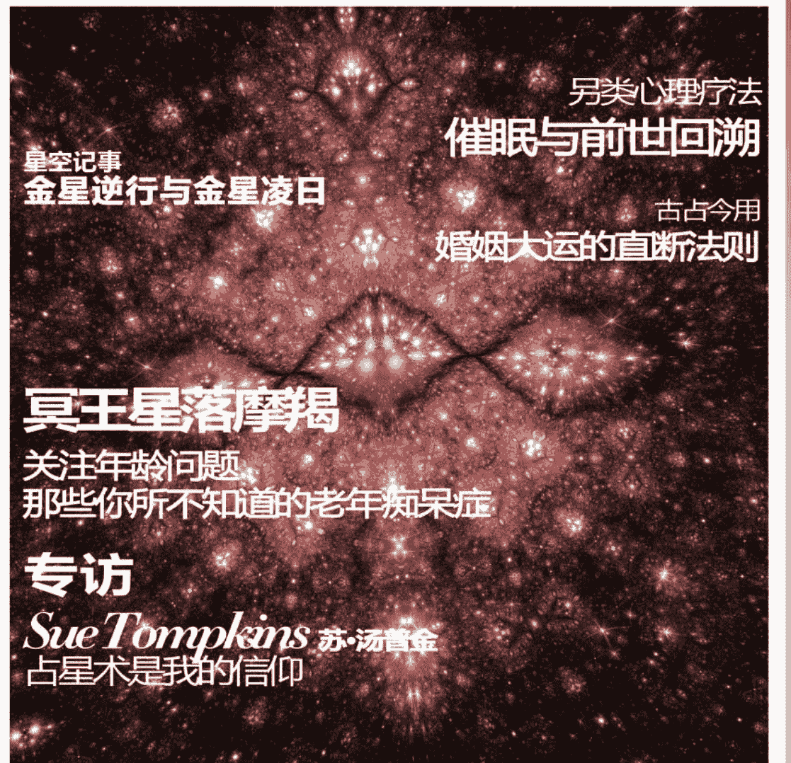

## 星空记事
### 金星逆行与金星凌日

## 另类心理疗法
### 催眠与前世回溯

## 古占今用
### 婚姻大运的直断法则

## 冥王星落摩羯
### 关注年龄问题
### 那些你所不知道的老年痴呆症

## 专访
### Sue Tompkins 苏·汤普金
### 占星术是我的信仰

## 占星卷首语

# 本期目录

占星趣闻

1

本期主打

冥王星落摩羯：关注年龄问题——那些你所不知道的老年痴呆症

2

冥王星进入摩羯座，年纪问题将吸引人们的关注。社会被迫开始面对人口老龄化带来的种种问题，本文将通过占星分析获得老年痴呆症的星盘特点并提供实例分析。

另类心理疗法：催眠与前世回溯

8

心理学与前世，一个纯理性，一个纯神秘，两个看似完全不相干的主题是怎样通过催眠联系到一起的呢？

占星之路

苏-汤普金：占星术是我的信仰

14

苏·汤普金，《当代占星研究》、《占星相位》的作者，当今英国最资深的占星师之一。本刊特约记者对她进行了专访，带你走近这位“传奇人物”。

专栏

塔罗新知：有多少禁忌可以胡来

19

随着塔罗占卜的流行，有关塔罗占卜的禁忌之说也日渐风靡。有些人云亦云，有些又似乎有根有据。到底哪些禁忌必须遵守，哪些禁忌可以胡来？

择时占星术：宫内星优先 or 宫主星优先

21

择时占星是实用性最强的占星术分支之一，因其对现实生活的指导作用而显得更具有实用意义。但是，要怎样择时才能通过提升星盘格局来做出更加有利的选择？

星语解码：你的蜜糖我的毒药（上）——理智与情感

24

水火相星座的感性与风土相星座的理性对撞带来情感上的沟通误区，四相星座的特质解读帮你了解对方表达方式背后的意义。

星空记事

金星逆行与金星凌日

27

5月15日开始，一年半一度的金星逆行已于双子座展开，你是否已经感受到它的能量?在此之后发生的金星凌日又将对我们的生活带来哪些影响?

# JOURNAL OF ASTROLOGY

木星进入双子座：一场漫无目标的享乐盛宴 31
在占星术中，木星与土星共同担当了主宰年运的任务，影响着以年为单位的中线运势。木星将在北京时间2012年6月12日进入双子座，占星历上的双子年就此开启……

## 专题研究

卜卦占星系列之一：从基础出发——关于问题的有效性 33
卜卦占星因能够确切解决咨询者关注的即时问题而广受欢迎。本期开始，西洋卜卦占星大师约翰·佛罗利亲传弟子琥珀将带领大家进入卜卦占星学的世界。

古占今用：婚姻大运的直断法则 38
从本命盘能否推断结婚的大致年龄段？晚婚在星盘中有哪些征象？古典占星研究者谢卓新将自己总结出的一套通过本命盘估算婚期的方法倾囊相授。

解密次限法：描绘人生最壮丽的蓝图（上） 43
相对于网络上常见的本命盘系统阐释而言，太阳弧、次限、三限等推运法显得凌乱而无序。各种推运法有何异同，又分别适用于哪些方面？如何才能准确运用次限法推算个人的发展周期，本期开始，占星学者黄纤越将为你抽丝剥茧解密最传统的次限法。

## 占星教学

占星基础教程：跟凤大学占星系列之一——星座与元素 48
占星菜鸟？不会看盘？教程太复杂，所有符号都在打架怎么办？没关系，本期的占星课程将从最基础和最浅显的占星基础知识入手教你分解星盘。不懂相位，照样也可以是解盘达人。

占星软件教程：深入浅出 Astrolog32 系列之一——手把手教你学做本命盘 55
“工欲善其事必先利其器”。学占星不懂软件怎么行！本期教程从最简单的本命星盘制作开始，教你使用最便利的Astrolog32软件。让你知其然，也知其所以然，快速进入占星大学堂。

## 古典占星·古籍重现

阿布马谢《星占概要》——十二星座概要精解 65
从古阿拉伯文到古拉丁文，再从古拉丁文到英文，最后才从英文到中文，影响整个西方占星学逾千年的手本，终于穿越了历史的长廊来到我们眼前。浓浓的时光气息扑面而来，那些被忽略或失传的占星密语，在醉人的翰墨香气中，熠熠生辉……

# 占星趣闻

# 泰坦尼克沉没之谜：都是月亮惹的祸

《泰坦尼克号》新一轮的公映掀起了一番新的舆论热潮，人物原型的追溯、灾难面前的反应、历史真相的还原充斥着媒体和人们的眼球，而其中关于“豪华巨轮缘何沉没”的探讨更是各界关注度最高最持久的话题之一。

众所周知，泰坦尼克撞冰山导致沉没，影片将此归咎于一副默克多（原型史密斯上尉<Captain Smith>）的傲慢和掉以轻心。对此，来自得克萨斯州州立大学的科学家唐纳德-奥尔森（Donald Olson）和罗素-多谢尔（Russell Doescher）在杂志《天空和望远镜（Sky & Telescope）》2012年3月份刊载的一篇文章中提出了一个与众不同的新观点：泰坦尼克的沉没与天体有关。该理论指出：由太阳和月亮极端引力引起的历史高位潮汐，可能会释放一定数量的冰山，最终使他们遭遇了航道堵塞。

迈克尔-雷莫尼克（Michael Lemonick）在为时代杂志发表的文章（Vol. 179， 11号， 2012年， 第14页）中讲到：“1912年1月4日恰逢1400年来月地距离最近，泰坦尼克号迎着数百年不遇的高潮位起航了。”

该观点从路透社在线（吉姆-福赛思 Jim Forsyth， 2012年3月6日）获得进一步解释的假说。奥尔森由已故海洋学家费格斯-伍德（Fergus Wood）的理论中获知“1912年1月，月亮和地球的异常接近，可能会从格陵兰岛产生数量远多于平时的冰山。尽管收到了冰山警报指出航道已经南移，漂流并生长的冰山仍然进入了大洋航道。”

福赛思还援引奥尔森：“泰坦尼克号”的研究团队可能为史密斯上尉平反——虽然晚了一个世纪——他对自己的失策有了一个很好的借口：冰山的体积之大和数量之多都远远的超出了他的想象。

历经一个世纪的海底长眠， “梦幻之船”铅华褪尽，当年那份号称“永不沉没”的傲慢，在大西洋1912年那个夜晚冰冷的海水里悄无声息地湮没，取而代之的是一份虔诚的信仰：敬畏自然。

# 福布斯聚焦占星和投资

一篇由肯尼斯-拉波扎（Kenneth Rapoza）在福布斯杂志（Forbes Magazine， 2012年2月20日刊）发表的文章提及了金融占星学家雷蒙德-梅里曼（Grace Morris）、格雷斯-莫里斯（Raymond Merriman）和罗伯特-戈夫（Robert Gover）对2012及以后的经济的预测。

拉波扎正面阐述占星学家的观点，他引用了格斯-莫里斯对股市跌宕起伏的记录，以及戈夫的书《时间和金钱》中关于占星经济学如何起作用的描述：行星的经济。拉波扎还详细阐述了当前天王星和冥王星相刑对美国和世界经济的影响。梅里曼解释：“冥王星代表债务，摩羯座和土星代表责任。行星的位置昭示着你在债务方面的行动遇到的后果。”

这篇发表在福布斯杂志上的文章翔实而不含偏见，令人耳目一新。

# 简讯

德国杂志骑行新闻在线（Cycling News online）在2月27日发表的一篇文章中称：彼得-威贝尔（Peter Weibel）教练采纳了占星师的意见，选择像安德烈亚斯-克罗登（Andreas Kloden）和乌尔里希（Jan Ullrich）这样的德国职业自行车手作为自己的队员。威贝尔教练还从占星师那里获知了诸如健康问题和情绪崩溃的可能性等与运动员有关的要素。该消息目前已被威贝尔教练证实。

（编辑：郭晨迪）

占星学刊2012.6

## 本期主打

# 冥王星进入摩羯座：
关注年龄问题
——那些你所不知道的老年痴呆症

作者：苏·汤普金 翻译：黄纤越

经历数个世纪羞于谈“性”之后，冥王星进入天蝎座彻底揭开了“性爱”的神秘面纱。在当代社会中，与“性”相关的主题已经不再神秘，街头巷尾也都随处可见相关话题的身影，这无疑也是艾滋病带来的促进作用之一。而随着冥王星进入摩羯座，类似的状况也会体现在人们对于年纪相关问题的关注度上。社会被迫开始面对老龄化带来的黑暗面，而其中很大一部分原因源于大量老年人群罹患老年痴呆症。不论是通过个人经历还是媒体介绍，我们都会发现无论是在医院、家庭还是社团中，老年人护理领域都是问题重重，正面对着无数让人无法忽略甚至有些残酷的问题。养老金方面的负面新闻也同样令人沮丧，不断提醒着我们贫穷也可能是老年的另一特征。

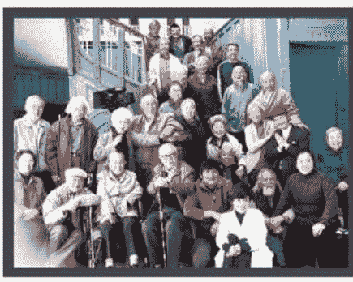

全世界政府都已经开始关注和探讨老人赡养支出的细节问题。在未来，源于老年痴呆症的开支持续攀升带来的系列问题只会大幅增长。老年痴呆症又称为阿尔茨海默病，现已成为继心血管疾病、恶性肿瘤、中风之后老年人的第四大杀手。根据《阿尔茨海默病调查真相[1]》显示：全英国大约有 75 至 100 万人罹患老年痴呆症，每年至少有 6 万人直接死于此症；在美国，罹患此病的人数将超过 500 万；全世界则保守估计有超过 3500 万病人，其中中国至少有 600 万人已正式在医院备案，病患数量居于全球首位，意味着中国同时也已成为老年痴呆症第一大国。每一名罹患

老年痴呆症的病人都需要至少一名全职看护照看（实际更有可能是数名兼职看护和家人共同照看）。据估算，老年痴呆症护理每年消耗英国经济约 230 亿英镑。相比之下，癌症只消耗了 120 亿英镑，心脏病也仅 80 亿英镑。按（2011 年）人均消费计算，英国的老年痴呆症患者人均年耗 27647 英镑，癌症患者人均年耗 6000 英镑，中风患者人均年耗 4770 英镑，而心脏病 3 年仅需耗 455 英镑。虽然老年痴呆症所带来的情感消耗也是毁灭性的，但它所带来的经济负担更是家庭与国家的不可承受之痛。

我们中的许多人都会在生活中的方方面面接触到不同程度的老年痴呆症患者；占星师也常常会在给客户提供咨询服务过程中了解到老年痴呆症在咨客生活中所引发的种种故事与影响。

老年痴呆症只是一个统称，用以辨别一系列因为疾病或意外导致大脑损伤而产生的病症，具体症状可能因大脑受损区域不同而各有不同。大多数患者都会被诊断为阿尔茨海默症或脉管性老年痴呆症（Vascular dementia），又或是两者综合，但这种情况比较少见。其它诸如帕金森综合症（Parkinson's）和亨廷顿舞蹈症（Huntingdon's）都可能发展为老年痴呆症。唐氏综合症（Down's）以及糖尿病和嗜酒症患者也有较大风险罹患老年痴呆症。从占星征象星的角度分析，我们很难具体独立区分出引发老年痴呆症的特别征象星，也很难确信具体诊断时间，尤其如果碰到的是早在数年前就已发病的案例。我们也许可以确诊老年痴呆症，但却无法确定更多导致病症的特殊诱因。致病原因不可避免地具有多重性，很多甚至未被完全解释。

阿尔茨海默病患者无一例外地存在某部分大脑萎缩的状况，并会由此导致不断加重且不可逆转的大脑功能退化现象。阿尔茨海默病是因精神病和神经病理学医师阿洛伊斯-阿尔茨海默得名（Alois Alzheimer [2]）。他于1906年解剖了一具生前患有失忆和奇怪行为的病人尸体，并在大脑表面发现了淀粉质（蛋白质）斑和神经原纤维缠结。艾米丽-迪恩（Emily Deans [3]）是这样描述这类脑内蛋白质堆积带来的效果：患者的脑部开始变得如同从没清洗过的鱼缸一般浑浊不堪。

阿尔茨海默症患者会大多会经历几个典型阶段。病症初始时期，症状相当轻微且容易被忽视：患者开始容易健忘、失去记忆、词汇量缩减以及难以找到恰当的词汇。这类症状会比正常人随着年龄增长都会偶发的类似病症（轻微认知失调症）更加极端。缺乏获得新记忆的能力也意味着未来将很难、甚至无法学习新知识。伴随着近期事件、名字和脸孔记忆的衰退，早期孩童时期的记忆却依然清晰。对短期记忆的丧失也会导致病患持续询问同样的问题和反复絮叨自己的故事。病患时常把财物放错地方或是放在奇怪的地方。同样在早期和中期阶段，病患还会因为意识到自己逐渐失去对个人生活的控制力而沮丧失落。有的人会开始变得不知疲倦地游走于熟悉的地区，却依然迷路走失。他们同时也会变得更加喜欢猜疑，甚至总是疑心他人正在背后议论和指责自己。

随着情况加重，病患将渐渐无法独立生活，症状也将发展到无法独立洗刷和穿衣。判断能力丧失会让他们无法判断和意识到危险的存在，最后还将完全失去记忆和思考能力。病患将不知道他们在哪里，虽然也许可以辨别出某个非常熟悉的人，但却无法说出对方是谁以及和自身的关系。最终，他们将完全失去辨别亲人和朋友的能力，冷漠、疑惑和情绪波动都可能是症状的一部分。其中的一些人还会因为感觉沮丧而导致好斗行为的增加。

进入最后阶段，病患经常连最简单最常规的行为都无法独立完成。最终无法自己进食、大小便失禁、无法独立行走。由于患者身体日益虚弱而伴随产生的一些并发症（大部分情况是肺炎）将很容易导致患者突然死亡。

虽然阿尔茨海默症患者经常会失去大部分的思想，但他们的情绪感应却依然存在。病患会像正常人一样因为粗鲁的言辞、目光、行为而感到受伤，但却忘记让其产生伤害的缘由。你会很容易看到阿尔茨海默症患者流下眼泪却完全不知道到底是因为什么原因。

由阿尔茨海默症引起的老年痴呆症通常会以渐进的方式开始并缓慢稳定地发展，脉管性老年痴呆症也许会表现得非常突然并以相当明显的速度发展。脉管性老年痴呆症也是第二易发的老年痴呆症，是由通往大脑某个部分的血液突然中断引起的，致病的根源是脑细胞缺乏养分和氧气而死亡。症状可能在一次堵塞主要血管的严重中风（也被称为心血管意外或CVA）或在一系列阻塞微血管的“微中风”（短暂性缺血发作或TIA）后发生。比较特别的是，微中风也许不会引发主要症状，但多次发作后的累计作用却会变得明显。

脉管性老年痴呆症在很大程度上由失去血液的大脑特定部分决定，但整体来说与因为其它原因诱发的老年痴呆症区别并不太大。诱发脉管性老年痴呆症的因素包括高血压、高胆固醇、血管硬化、糖尿病以及其它可能导致心脏病的高风险因素。从某个层面来看，脉管性老年痴呆症实际上是可以预防的，而阿尔茨海默症从某种程度上而言也许也是可以预防的。关键点还在于饮食和其它生活方式的选择。减压或是找到更好的压力管理方式（通过抽象的冥想或冥思方法）同样重要。

压力确实会成为老年痴呆症加重的重要因素。当你对着阿尔茨海默症患者说话时，最有效的方式不是提问，同样也不是否定。对老年痴呆症患者来说，问题就意味着压力，简单的指令却不会。你会发现病患的沟通能力将因为对方是否选择提问方式而变得大有不同。由此可见，压力确实在老年痴呆症患者身上确实扮演着重要角色，甚至在病情发展方面也有着同样明显影响。现代生活方式与过去相比早已是天壤之别。我非常赞同维多利亚-哈珀（Victoria Harper）在这方面的观点：当一个人因为生活节奏太快而感到压力倍增时也经常会忘记自己的车钥匙。在现代西方社会，许多人正是一直生活在匆匆忙忙之中，永远在追赶着那些所谓的截止日期。

随着冥王星进入摩羯座与天王星形成刑相位，大破坏的时代即将开始。在众多其它事情上，尤其值得一提的就是速度。白羊座天王星带来的技术革新日新月异，而与此同时，摩羯座的老龄问题却无法跟上脚步。

无论具体诱因，老年痴呆症都可以归于老年失调病症：90%的老年痴呆症都发生在65岁以上的老年人身上。在65岁老年人群中仅有10%的人患有某种程度的老年痴呆症，但在65岁之后，得病几率会每五年翻上一倍。进入85岁以上老人档中，比例将一跃成为三分之一。媒体总是告诉我们寿命变得越来越长，但这并无法解释突然激增的患者数量，人们的寿命并不是突然增长，而确实又有大量人群在60岁至80岁之间罹患此症。就我看来，这一代人的患病年纪足足比上一代人提早了约十年。为数不少的患者（大约5%）属于“早发”痴呆症（发病年龄低于65岁）。

在研究人员与其他人之中也存在着一些讨论。尤其当研究表明老年痴呆症更容易发生在身体机能退化的极端高龄群体身上时，大家开始质疑阿尔茨海默症到底算是一种“疾病”还是随着脑部老化而相应产生“正常”变化。在这种情况下，对像我这样的占星师而言，当然会对那些步入高龄却并没有罹患老年痴呆症的星盘更感兴趣。但就我本人有限的经验而言，某些星盘因素确实会带来比他人更容易罹患老年痴呆症的倾向，尤其是那些在60岁至75岁之间患病人群而言更加明显：

在超过50张病患星盘中，以下星盘特点相对频繁出现：

- 太阳、金星，或是更次一级影响力的上升和月亮，落在金牛座或者天秤座。超过50%的星盘中的个人行星或上升点落在金牛座，接近1/3的星盘拥有至少两颗个人行星落在此处。相当比例的同类指标也指向了天秤座。与金星象征有关的身体原因大概是源于高血糖与阿尔茨海默症的关系。金星是主管一切甜食以及糖分的行星，典型的金星人往往嗜吃甜食。如果同时伴随月亮特质，就可能倾向于一定要“吃到爽”。表面上看，阿尔茨海默症患者脑中的胰岛素浓度非常低（导致高血糖），所以也被称为第三型糖尿病[4]。大脑同样会像胰腺一样产生胰岛素。这样高血糖/低胰岛素的环境会诱发脑细胞退化。一种被认为是果糖的含糖因子已经被认为是肥胖以及大量其它包括阿尔茨海默症在内病症的致病因素。尤其是那些从谷物中提炼出来并添加入各种副食品的果糖更加具有威胁力。从化学角度而言，这种糖分缺乏普通水果糖分中含有的抗氧化剂和维生素C。压力（不论是身体还是情绪）攀升的酒精或糖分/碳水化合物消耗都会提高压力激素皮质醇的浓度并导致其它激素诸如控制血糖的胰岛素浓度的降低。金星型人也许不仅仅嗜吃甜食，也有可能无法很好应对压力，总会试图避免而非真正管理压力。

- 强烈的海王星特质，包括太阳、月亮或上升点合相海王星或是诸如T三角之类的“负面”相位牵扯入了海王星。尤其需要指出，如果太阳、月亮或者水星也同时牵扯在此相位中，倾向将更加明显。在我早先的猜想中，老年痴呆症日益高发流行只是简单地因为这一代人变得比上一代人更容易也更频繁地摄入酒精。这也许是因为酒精实在足够便宜也变得随手可得。但是，标志着损失与混换的海王星指标同样会在滴酒不沾的人身上出现。强烈的双鱼座特征配合/或是强烈突出的12宫也可能带来海王星的类似影响力。

- 强烈的月亮以及巨蟹座主题也在艾瑞斯-默多克（Iris Murdoch）的星盘中凸显。老年痴呆症患者就好像回到他们的婴幼儿时期，所有的行动和决定都需要依赖他们的家庭或看护。因为丧失记忆也是老年痴呆症的主要症状之一，可以预期很多患者的星盘中都有着突出的月亮或是巨蟹座（两者都象征着记忆）主题。

占星学刊2012.6

## 本期主打

天蝎座太阳或上升以及通常是与冥王星形成“负面”相位的太阳或上升也经常出现在患者星盘之中。我怀疑这也与因为未解决的生活主题所引发的内在无意识压力有关。因为他们心中总有着某件“就是无法原谅”的事情。著名的“铁娘子”玛格丽特-撒切尔夫人（Margaret Thatcher）就因罹患老年痴呆症而被自己的保守党同僚放弃。在她离开白金汉宫时说过，自己将永远无法忘记遭遇的背叛行为。但我却会忍不住想，没法因为这些回忆太痛苦，她干脆忘记了呢？有两个星座的人群似乎更容易成为老年痴呆症患者，这就是巨蟹座和天蝎座，因为他们都有着留住感觉而无法彻底放下的心理特征。我所接触的阿尔兹海默症患者并不算多，但共同的特征就是他们总有着一种曾经被人背叛的感觉。正如前文提及的，疑心病也是老年痴呆症的典型症状之一。

她在去世前4年的1995年出版了自己最后的小说《杰克逊的困境（Jackson's Dilemma）》。而该书被著名文学评论家雨果-巴拿克（Hugo Barnacle）拿来与少见世面的十三岁小姑娘所写的文章相提并论。阿尔兹海默症让她在写书时无法牢牢抓住自己的思路。神经学家在研究过她的著作后发现，在最后这本小说中运用到的词汇量大大低于她过去所写过的任何一本小说。

默多克出色的写作能力可以通过与写作相关的两颗星显示出来。她的水星与月亮都落在了角宫且非常强大（各自上升和降下），对冲彼此。这样对冲相位带来的脑力与心灵的拉扯也许也暗示着阿尔兹海默症。

土星合相上升点或是显眼的白羊座在患者星盘中也会频繁见到，我想这是因为土星是一颗与萎缩有关的行星，而白羊座代表大脑[5]。太阳、火星以及土星（某些时候也可能是其它行星）落在白羊座并形成不良相位都会提升中风以及脑部受伤的可能性，并因此导致大脑受损，继而引发老年痴呆症。上升点和第一宫也总是与我们的肉体相关，所以在医疗占星中也有着与白羊座类似的作用。

强烈的巨蟹座特质（太阳合相木星以及火星合相冥王星）以及落在角宫的月亮都指向了个人回到过去甚至活在过去的可能性，而这正是阿尔兹海默症患者最后的表现。正好贴合前面提到的与记忆的关联以及回到儿童时代和依赖性。太阳同时也是合相上升点的土星所落狮子座的守护星，压力也会成为太阳这颗上升守护星的关键词。土星是一颗与衰老有关的行星，同时也代表着硬化和萎缩，而第一宫从某种层面上而言也代表着我们的肉体。太阳同时还与金星形成近乎精确的45度半刑相位，而且两星也都同时出现在了海王星与其它行星的中点树（midpoint tree）上（海王星与其它行星之间的中点与太阳以及金星都形成相位）。

亲属盘中恰好出现的海王星过运（transit）或太阳弧（directions）影响。举例来说，当父母患上老年痴呆症，过运海王星经常与此人的下中天合相。相似的，海王星也有可能合相太阳、月亮、中天，甚至星盘中的父母象征星。某些时候可能会形成“负面”相位，但更多时候是合相。这一点也不奇怪，因为盘主“正在失去”他（她）的父母。而他（她）的父母也开始变得迷失、困惑并失去他们对现实的把握。

当我们研究一种疾病并试图发现它的明显征兆时，有时候也会从患者配偶、父母以及子女的星盘上看出相关问题，尤其如果双方是长期伴侣关系，原因大概是因为被投射出去的能量将会通过一种更加简单、清晰甚至激进的方式从另一半的身上反应出来。要知道，我们生活中的每一个重要人物都会通过星盘特定的宫位、行星以及星座展现出来！所以，一定要关注你的结婚对象，因为你的命运将会从他（她）的星盘中演绎出来！

我所研究过的第一个阿尔兹海默症患者的星盘就是来自于晚年的艾瑞斯-默多克。作为20世纪英国最杰出的女哲学家和富有才华的作家之一，艾瑞斯-默多克一生创作颇丰，共有二十五部小说、六个剧本、一册诗集及五部哲学著作问世。她以丰富的语言闻名于世，思维敏捷，某种程度上有些离经叛道。近年来，默多克因为其夫约翰-贝雷（John Bayley）的回忆录《挽歌献爱妻》改编而成的电影《艾丽丝的情书（Iris）》而受到更多关注。在回忆录中详细描述了艾瑞斯-默多克罹患阿尔兹海默症后的一些生活细节。

以前美国总统夫人南希-里根（Nancy Reagan）为例，她的星盘中就有很强的伴侣可能罹患阿尔兹海默症的指标。据我所知，诸如默多克和南希-里根等拥有强烈巨蟹座特质的人，即便在90岁高龄之后，也仅是肉体变得衰弱，精神却依然强劲。她的丈夫前美国总统里根（Ronald Reagan）确实罹患了阿尔兹海默症，甚至有许多人认为他在任期间就已经患病。在每个人的星盘中，第七宫及其守护星都会体现出配偶的特点，而在女人的星盘中，太阳和火星也会描述出她们生命中的男人。南希星盘中的下降点落在白羊座，而守护星火星则落到了与太阳、水星以及冥王星同宫的巨蟹座，都很吻合丈夫会罹患阿尔兹海默症的特征。而七宫守护星火星合群星落在9宫也吻合对方是一名政治家的特征。而白羊座凯龙星落在下降点也同样会令女人的丈夫容易罹患脑部疾病。罗纳德-里根[6]本身并没有确定的出生时间，但能确定月亮落在金牛座，同时星盘中还存在紧密的水星与海王星的对冲相位，并最终与阿尔兹海默症抗争了近十年。

不论是从酒精的角度还是从阿尔兹海默症患者星盘中的显要的海王星，都不难想象出她的星盘中必然有此特征。而事实上，丽塔-海华斯不仅月亮落在双鱼座的“上帝手指（Yod）”的焦点上，海王星也恰好落在日月中点上。

当然，辩证地说，我们并不能以偏概全地将海华斯星盘中的特征认为是导致疾病的全部原因，还有许多因素也应参考在内：首先，她是一例早发型老年痴呆症（发病年龄低于65岁）；其次，她因为时代以及个人成功而显得更加与众不同，所以更容易坦诚面对诊断结果；第三，在美国有着每年一次的丽塔-海华斯盛会专门为研究和预防阿尔兹海默症筹款，她的名字与老年痴呆症自然而然就结合在了一起。丽塔-海华斯盛会由她的女儿雅思敏-阿迦汗公主（Princess Yasmin Aga Khan）从1984年发起（彼时海华斯还在人世）。海华斯死于1987年5月14日，享年67岁。

而晚年的传奇女神丽塔-海华斯（Rita Hayworth）也是证明星盘中拥有突出的金星者更容易罹患老年痴呆症的最好案例。我们很难再找到比丽塔拥有更强金星特质且生活也更加金星的案例。伴随着星盘上升点落在金牛座和太阳落在天秤座，所有人都会立马把眼睛转向太阳与上升点的共同守护星——同样也落在天秤座（第6宫）并被木星刑相位强烈刺激的金星。因为被“人生一定要快乐”的原则激励，丽塔-海华斯不仅热爱生活，更希望把快乐带给他人，她总会大方地将生活赐予她的美好赠予他人。丽塔-海华斯也是一名舞蹈家（芭蕾舞、踢踏舞、现代舞以及弗拉门戈）、充满魅力的女孩、化妆品巨头蜜丝佛陀的模特以及电影明星，一共在61部电影中出演角色，并与众多好莱坞歌舞巨星共舞。在她的年代被人称为“好莱坞爱神”，前后共结婚5次，前夫包括好莱坞百大著名男演员之一的奥森-威尔士（Orson Welles）和波斯王子阿里-汗（Prince Aly Khan）。

不过，最后的好消息来了：我相信这个世界将在2023/4年冥王星离开摩羯座时对大多数老年痴呆症，尤其是阿尔兹海默症的起因、预防与治疗获得突破性进展，甚至在2019年天王星离开与脑部有关的白羊座时就提前获得。与此同时，我个人的建议如下：我们并没有必要尝试和运转一个国家[7]（这会带来巨大压力），那么只要做到避免过度摄入酒精，安排更加富含营养的食谱，提高或是补充维他命B[8]和欧米伽3的含量，降低副食品、糖以及精卡路里的摄入就可以了。

丽塔-海华斯终其一生都在与酒精上瘾抗争，以至于她的孩子都认为她的病症根源于多年的酒精上瘾问题。直到1980年62岁时，她才被确诊成为老年痴呆症。

即便并非直接原因，酒精无疑还是导致她患上老年痴呆症的最大祸首。大脑损伤也是酒精过量带来的最大健康隐患之一。其中一个原因是因为酒精会分解身体中必须的维他命B1（硫胺）。放在今日，海华斯的病症也许会被诊断成为略不同于阿尔兹海默症，而是被命名为威涅克-柯萨可夫综合症（Wernicke-Korsakoff's dementia）或酒精诱发抵抗型老年痴呆症（alcohol-induced persisting dementia）的病症。

注释：
[1]所有事实与指标都摘选于阿尔兹海默症协会与阿尔兹海默症阅读室（the Alzheimer's Association and the Alzheimer's Reading Room）出版的《阿尔兹海默症调查真相（The Alzheimer's Research Trust）》。
[2]阿洛伊斯-阿尔茨海默（Alois Alzheimer）生于：1864年6月14日，当地时间早上4点，德国马克特布赖特（Marktbreit）。死于1915年11月19日。
[3]www.psychologytoday.com/evolutionarypsychiatry/alzheimers-and-high-blood-sugar
[4]同上以及www.diabetesincontrol.com
[5]需要注意，小脑虽然居于大脑的底部，却在运动控制、身体协同能力以及语言能力中扮演着重要作用。而根据H.L.香奈儿（H.L.Cornell）所撰写的《医疗占星百科全书（Encyclopaedia of Medical Astrology）》，小脑被金牛座掌控。我个人的经验也认同这一点。
[6]罗纳德·里根（Ronald Reagan）出生时间：1911年2月6日，伊利诺斯州坦皮科市（Illinois Tampico）。死于1989年1月20日。
[7]读者也许会有兴趣知道，除了玛格丽特·撒切尔和罗纳德·里根之外，英国前首相霍罗德威尔逊（Harold Wilson）也罹患了老年痴呆症。
[8]来源于www.goodcaregroup.com的资料指出，牛津大学也有相似的研究表明，某些高浓度的维他命B（尤其B6、B12和叶酸）都可以让大脑萎缩的可能性降低500%。维他命D似乎也会起到重要作用。

**感谢Astro-databank/astrodienst提供本文所需的全部数据。**

## 苏·汤普金

苏-汤普金女士从1972年正式跨入占星学领域后至今已经整整40年。自1981年获得占星学正式执业资格以来，苏在占星学方面可谓硕果累累，客户数以千计，学生不计其数。她曾经在英国占星学院（FAS）执教多年，并于2000年创建了在占星学界内举足轻重的伦敦占星学院（LSA）。苏讲学的足迹遍布世界各地，她为占星学领域做出的成绩更是得到了全世界占星学界的普遍认可，并因在占星学方面的突出贡献获得了占星学界的最高荣誉之一——英国占星协会（UK Astrological Association）颁发的查尔斯-哈维奖项（Charls Harvey award）。但令她最受赞誉的还是其著作《占星相位（Aspects in Astrology）》和《当代占星研究（the Contemporary Astrologer's Handbook）》。这两本书都已经是或即将在中国大陆与台湾地区出版发行。《当代占星研究》更是成为中国大陆出版的第一本严谨占星类教本，受到执业占星师与占星爱好者的广泛好评。她于1996年还正式获得了注册顺势疗法理疗师的执业资格。目前，她致力于研究医疗占星学并身兼其他各种头衔的工作，也在持续不断地为追求一个整体的、心理的并有实际功用的占星学而努力。
个人网站：www.suetompkins.com

## 另类心理疗法——催眠与前世回溯

作者：吴琨

由于儿时食物匮乏，致使成年后无止尽的加餐；由于青春期未能随意的恋爱，致使成年后不断的在感情上追求新鲜和自由；由于在成长中缺乏父爱，致使成年后在不知不觉中寻找能够替代父爱的人物或事物。这些例子及相同似的行为模式渗透在我们的日常生活中，让人经常会忘却它的存在。然而，正是这些如影随形的惯性却让我们经常在人生的关键时刻不知所措，顿失方寸。多少人渴望摆脱这样的影响亦或是“阴影”，但却无从下手。它是与生俱来，还是后天影响？是如蛆附骨，还是南柯一梦？想要把负面影响降到最低，唯有先了解问题的成因才有可能彻底根除。

从心理学的角度来看，任何对我们心理或精神造成伤害的事件，都可以被称之为创伤事件。我们在遭受了创伤事件后，受损的心灵很难像之前一样整合在一起，从而给我们的行为及情绪带来极大的困扰。创伤可以造成持续的、难以消弭的负面影响，例如焦虑、紧张、恐惧、妄想、失眠、抑郁、困惑、冲动或其它形式的情绪失调症状。在临床心理学中，“创伤后压力失调症（Post-traumatic stress disorder 或 PTSD）”的体现也集中在这些方面。在《唤醒猛虎：治愈创伤（Waking the tiger: Healing Trauma）》一书中，作者彼得·李维博士（Dr.Peter Levine）解释指出：创伤后压力失调的症状是源于“封存的恐惧”——这种在受创伤时所产生的难以融合、消弭的心理能量。而就是这种“封存的恐惧”，形成了我们无意识中的情结。

在心理学中，对于这些行为的体现有着专门的解释分析。心理学精神分析学派创始人弗洛伊德及其弟子荣格[1]会用情结（Complex）一词来解释上述例子中的行为模式。

情结，是一组强烈而又无意识的冲动集合，它包括了对某个概念的复杂的情绪、愿望、记忆、及思想。在大众文化中，比较常见到的情结术语有“恋母情结”和“自卑情结”等。举例来说，小李五岁的时候父亲便去世了，所以在他成长过程中非常渴望能有一位如同父亲一般的人物出现，照顾他，保护他。成人后，小李结交的朋友都比他年长，并且都对他照顾有加，甚至找连老婆的首要标准都是能够在生活中照顾他。这种对于父爱的强烈渴望，就是我们所说的“父爱情结”。

我曾经治疗过这样一位女性个案：只要与男性单独在一起，她就会变得非常紧张和害怕，导致无法正常发展任何亲密关系。对于自己的问题，事主也感到苦恼，因为她并不知道是什么原因造成的，也不记得有过任何的遭遇。在通过催眠治疗找她问题的根源时，发现她有一部份自我，以五岁小女生的模样出现在幼年家中的大衣柜里，躲避着叔叔对她的骚扰。这种童年中根深蒂固的恐惧，被一直封存在她的潜意识中。即使是她对七岁以前完全没有任何记忆，这种被深植于潜意识的恐惧却一直伴随着她。

荣格认为情结与早期的创伤经历相关，是我们心灵（Psyche）所分裂出的一部分强烈的情绪及意愿的集合。情结对于我们的心理活动有着各方面的影响，而我们在日常生活中的许多思想及行为，都与深层的无意识情结相关。换句话说，情结影响着我们生活中的各个方面。

这便是由于她对叔叔的恐惧，形成了一种情结。她的这种情结强大到令她会不自主地（在潜意识层面）将对叔叔的恐惧投射到其他男性身上。当与男性接触时，她的行为及情绪都会受到这种恐惧的影响，从而无法与其他男性正常交往。而那个“分离”出去的自我其实并没有意识到自己还有一个非常强大的成年自我，她只是很害怕地躲在了衣柜中。

对于这例个案的治疗，我的方案是先让她认识到当下这个成年自我的存在，意识到有这么一位成年的“姐姐”作为自己的“保镖”，能够在时时刻刻都保护着自己，不让自己受到侵犯，从而建立起足够的安全感，从潜意识层面让分裂出去的、还是孩童的那部份心灵感到安全。这样的安全感对于这位个案来说显然是至关重要的，但是却不足以消除影响，因为所受到惊吓和伤害的阴影仍旧还在，即便她明白自己已经安全了。

进入下一步，则是通过不断的深化协调和沟通，将个案分离出去的自我部分与现在的自我融合在一起。让个案成年后的心灵接受并容纳曾经这个担惊受怕的小女孩，并让她意识到这样的创伤经历是她的一部份——压抑这部份经历或是将这部份经历分离出去对自己的心理健康或许会有暂时性的帮助，但是却无法真正的让自己脱离这段经历的负面影响。

在治疗结束三个月，通过回访得知：个案虽然还偶尔会有害怕的情绪出现，但是已经可以接受这样的情绪存在，并且逐渐开始与男性正常交往了。

通常情况下，心理问题都源于早期的创伤经历所形成的情结导致，只要通过催眠中的年龄回溯[2]，便可以寻找到创伤的根源。除此以外，还有一种饱受争议的方法来寻找个案的情结及创伤根源：催眠前世回溯——通过催眠的方法，带领个案进入一种非常深入的催眠状态，让个案可以非常鲜活的，如同第一次体验一般，重新体验前世的经历。

催眠之所以是一种饱受争议的方法，是因为前世及轮回这个概念本身就是充满争议的。在西方文化中，主流宗教基督教教对前世持有否定态度。而中国传统文化相对西方主流文化会对这个概念有着更深的接纳性。《法华经》云：“一切众生，从无始来。生死相续，皆由不知常住真心，性净明体，用诸妄想。此想不真，故有轮转”。佛教认为，灵性是不灭的，所以有前世、今世和来世，形成了不断转生的轮回。但是轮回这一概念，暂时也未能得到任何强有力科学理论证明。所以，“轮回”是否存在就成为了一种信仰上的差别，见仁见智。

就我的执业经验来看，有些个案所形成的情结，的确超出了今生的经历范围。也就是说，这些个案的情结，不单单是今生的生活经历所造成的，它受到了前世或是累世轮回的影响。比如：会有些个体在今生从没有过溺水经历，但是却对水感到恐惧。这些个体通常前世都有过溺亡的经历，这种在溺亡时对于生命的渴望、对于死亡抗拒的挣扎，通常都会令我们的心灵产生强烈、极端的情绪，形成一种强烈的情结烙印在我们的灵魂中。即使是在经历若干次转世之后，仍旧保留着那份对水的恐惧。

催眠，是运用引导，暗示等方法帮助个案进入一种清醒却奇特的意识状态。在此状态下，个案的精力可以更加集中，摒弃杂念，然后进入更深层的潜意识。催眠治疗之所以能够快速并且有效的治疗个案的心理议题，其实是通过潜意识寻找到引起个案行为及思维上的根源，找到那个最深层的无意识的情结，并最终将它带入进意识的层面，使个案能够意识到自身问题的来源，不再为自己的行为或情绪感到困惑，然后在催眠师的帮助下将这种情结给予疏导和释放。这也是为什么催眠治疗能够较其它传统心理治疗方法更加快速有效的原因——它大大缩短了寻找深层的、引起心理议题的根源情结的过程。并且可以在潜意识层面对于个案的心理进行修复及融合。

催眠可以治疗心理问题早已经被为数不少的报道和案例证明，但这种方式仍旧存在着一定的争议，也经常被小说和电影描写成窃取他人秘密或是控制人心智的神秘工具。实际上，催眠并不神秘，也没有“控制人”的神奇能力。它不是让人睡着进入无意识任人摆布的状态，因为这是任何催眠师都不可能做到的。

## 本期主打

同样，在西方也有很多催眠治疗师在前世回溯中发现个案前世有坠亡经历的，通常都会在今生有恐高的表现，尤其是在今生中并未发生任何事件，能对其恐高症状来源做出解释。虽然许多前世的记忆的确会随着转世而消弱，但是某些极端的情绪，尤其是引发死亡的事件所产生的恐惧，以及其它强烈的渴望、遗愿，会在我们的心灵深处形成情结，而随着灵魂一起，带入到下一世生命中，从而继续影响我们的生活。

在这种重复强迫的影响下，最初形成的无助与愧疚的强烈情绪致使 Linda 经历了一世又一世的孤独与无助，以求在这种与最初处境相仿的境地中得到解救与救赎。但是可惜的是，她一直未能如愿。

曾经有这么一位年青女性个案：事主 Linda 总是有非常强烈的孤独感与愧疚感。通过年龄回溯的方法，我们却找不出在今生经历中这种感觉的来源。为了寻求可能存在的、早于今生的根源，我们进行了前世回溯。在回溯前世的过程中发现，她在许多前世中，都存在这种强烈的孤独感，并且都是孤老终生，无一例外。在继续进行的回溯中，发现在很多世之前，她曾经历过非常严重的心灵创伤——那一世所在的村落经受了惨无人道的屠杀，无论男女老幼，都没能逃过这一劫。唯独他（Linda 在这一世是名男性）因为一早起来去树上采果子，躲过了被杀害的命运。因为目睹了整个屠杀过程，使得他产生了强烈的无助感及愧疚感。

这种在轮回中由业力所形成的情结，又被称为是业力情结。进一步理解业力情结，需要我们对业力有一个大概的理解：我们所做出的行为，无论善恶，可以简单的统称为“业”，也就是所种下的因。我们所有前世以及今生中所做出的任何行为，都会叠加、累积形成“业”，而这种“业”的集合所产生的影响力，又称为“业力”。传统思想认为一个人今生的福报（或是恶报）都是由前世的业力所导致。这种认识有它一定的道理，但是业力的影响，更多的是来源于前世累积的创伤和遗留下来的极端情绪所导致。所以业力并不简简单单是因果报应，虽然业力会以福报的方式呈现，但我个人认为：业力更多的是关于我们所重复的行为模式。

在经历村人被屠杀这一过程时，Linda 反复地强调，她认为自己应该做些什么，不能就这么袖手旁观，但是又无法做任何事。因为一旦被发现，自己也会面临与村人同样的命运。这种强烈的无能为力感深刻地烙印在她的灵魂中，与日后一直孤独老去的孤寂感共同形成了异常强烈的情结。这样的情结在她之后的转世中也一直存在着，她的这些转世中反复重复的一个主题便是对命运的无奈感与内心的孤独感。这些感觉生生世世的伴随着她，无法挣脱，无法解除。即使是在今生，依旧如此。

通过弗洛伊德提出的强迫重复，便可以很容易的理解为什么人们总是一而再、再而三的反复的陷入某种生活习性和模式中去。尤其是在经历过轮回转世，在不同的生命中，却重复着相同的原因却是一前世遗留下来的业力情结让我们一次次地重复着同样的遭遇，以求能够解脱，达到圆满。

Linda 所经受情结的影响，让自身反复不断的陷入一种无法超脱的业力循环模式中的情况，与弗洛伊德提出的“重复强迫（repetition compulsion）”概念相似。弗洛伊德认为，如果最初的经历让我们产生强烈的渴望和愿望未被满足（或是某些情绪未被释放），那么我们的潜意识会持续不断的反复将自己置身于与最初的遭遇相同的境地中，以求在这种“仪式化”的重复中将自己的渴望满足（或是情绪得到释放）。同理，在经历过创伤之后，潜意识会想要“修复”创伤所造成的伤害，于是便将我们引领进与当初创伤相仿的情形中，以求解救。

在占星学中，前世及轮回的概念也被许多现代占星学家所接受并广为应用。尤其是现代的西方占星学的流派中最热门的进化占星学（Evolutionary Astrology），其中以史蒂芬·弗里斯特（Steven Forest）的著作《昨日的天空（Yesterday’s Sky）》最具有代表性。与以往很多占星师所认为的“以月亮交点来寻找前世的线索”不同的是，弗里斯特在书中反复强调，星盘中所有的配置，都反映着前世经历的主题——尽管月亮交点是前世议题中非常核心的部份。

弗里斯特在《昨日的天空》中解释了为什么他认为星盘中所有的配置都与前世有关——我们在这一世生命中所体现出的性情，都来源于我们前世的经历。那么我们星盘中所有的配置均在我们的性情中有所体现。所以这些在今生星盘中得以体现的性情，必然与前世的经历都有不可分割的渊源。

我们先来看看 Linda 的星盘（图 1）：

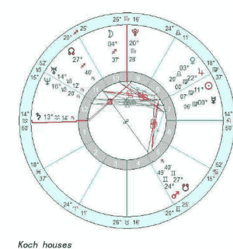

Koch houses
True Node

（图 1）

在 Linda 的星盘中，月亮南交点位于双子座五宫，与火星相合刑克八宫的木星。南交点的配置所反应的是轮回中一直重复的主题。对于 Linda 来说，生命中的暴力冲突和个人损失（火星合南交点），尤其是发生在身边（南交点在双子座）的暴力与死亡（南交点刑八宫的木星）便会是她在轮回中所遗留的业力情结。其起因也在南交点上有着明显的体现：目睹（双子座）暴力（火星）和全村落的死亡（南交刑八宫木星）。

当然，这样的月亮南交点配置还映透出许多其它的主题与业力情结，但是这些并非本文所关注的焦点，而 Linda 的业力显然也不仅仅只是体现在南交点中。

星盘中的土星与上升点合相也对应着她在前世回溯中察觉到的业力情结。土星所代表的孤独与愧疚感，在她的业力情结中体现的淋漓尽致。而土星位于水瓶座更表明了她的业力的来源与群体（水瓶座）相关。她所背负着愧疚于全村人的业力情结延续到这一世中，便是容易对于所在的群体承担起很多不必要的责任与无名的愧疚之情。

在我们的生活中，常常有让我们感到非常纳闷及困惑的经历和体验。当我们试图去解决这些问题，但又不知为何时，无异于盲人摸象——我们总是在臆测自身的问题，或是总是在怪罪对方，他人。而其实我们的经历来源于自身的选择，而选择却又早已被心灵深处的情绪、思维所决定了。也就是说，内心的情结决定了实际的行为，从而决定了最后的经历。那么在每个人一再重复于某个总让自己受伤害的主题时，便有必要检查一下自身的心灵，检查一下是否是某些情结在困扰着我们，是否一直在“强迫”自己不断重复着以往的创伤经历，从而期望在一次又一次的受伤过程中得到拯救。面对内心的业力伤口，便是我们迈出生活困境的第一步。

说到这里，不得不提到我治疗过的，最具有代表性的一个个案：Angela 曾与前男友 Roy 有过长达近五年的恋爱纠缠，两人曾经经历过刻骨铭心的爱恋，但又彼此失望，并且相互抛弃过。但最终却是谁都无法摆脱彼此的纠缠与折磨。经历过数次分手、重逢、和好，却又总无法相安无事。在一起难受，分开更难受，无法容纳对方，却又不能摆脱对方，可谓天生“冤家”。

在前世回溯的过程中，发现 Angela 与 Roy 有着很多世的纠缠，尤其集中在十七、十八世纪的欧洲。曾经的 Angela 是位贵族小姐，Roy 则出身平凡，但是凭借着奋斗一点一点的接近了她，并博取芳心。只可惜，Roy 还是未能脱离“始乱终弃”的套路，在得到了 Angela 所继承的财产后销声匿迹。而 Angela 却一直在等待他的出现，直到最后独身孤老。这样相似的“剧情”反复重复了许多世，均是男性 Roy 有自己喜欢的人，但是为了 Angela 的资源和地位才与她在一起，而 Angela 虽然非常清楚这样的情况，但是还是容忍了 Roy 的所作所为，并且固执的认为只要能与他在一起便其他的什么都无所谓。

当回溯到十四世纪的西班牙时，才追寻到 Angela 与 Roy 之间纠缠的起源。在这一世时，Roy 是一位鞋匠，Angela 是他的女儿。由于母亲很早就病逝，Angela 与 Roy 便一直相依为命，虽说生活不算富足，但也还算是过的去。但是后来由于 Roy 迷恋上了一位有夫之妇的歌女，在 Angela 只有十一岁的时候就与这位歌女私奔，导致 Angela 没有选择地被送到了孤儿院。而后的几年里，Angela 一直饱受虐待与歧视，在十四岁时便因为肺炎而去世。

Angela 在这一世生命快要终结时，充满了对命运的无助感及对父亲（Roy）的怨恨。她在回溯中曾经这么形容她去世前的心情：“虽然我很想他（Angela 的父亲），但是我也很恨他。我真希望他能够明白并且体会到我的遭遇和处境！他怎么能够这样对我？为什么？凭什么？我究竟哪里做错了？” 在痛哭了一阵之后，她又接着说道：“我不相信如果他知道他会把我害成这样，仍旧还会离开我！我真的不相信！”

Angela 的月亮南交点落入了射手座第九宫。在星盘中，可以看到南交点的前世情结影响今生感情问题的明显反映：射手座与第九宫，都是带有强烈的信仰色彩，它们都都在传统意义上代表了哲学、宗教及高等教育。这与 Angela 在前世中总是出身不俗、接受过良好的教育相呼应。而且 Angela 对于 Roy 的感情本身就是一种非常强烈的信仰。

如果只从“善有善报，恶有恶报”的角度，是难以理解这样的根源为何会造成日后 Angela 与 Roy 之间许多世的纠缠。但如果从情结的形成，与“重复强迫”的角度去看，便会容易理解。Angela 在这最初这一世中所形成的强烈的受抛弃的情结一直重复在接下来的轮转世中。这些业力中的情结便是她需要处理和面对的。但是这种情结并未通过轮回消弭半分，反而在一次次的反复受抛弃中被不断的加强。而也正是如此，她便越来越渴望自己能够通过这一次次的重复与 Roy 之间的纠缠，让 Roy 最终能够选择她，而不是抛弃她。对于 Angela 的灵魂及潜意识来说，不断的、类似仪式般的，将自己置身于这样一种十分痛楚的境地中的原因，正是寄希望于 Roy 能够有不同的选择，从而将她“解救”。可惜的是 Roy 一次又一次的让她失望。

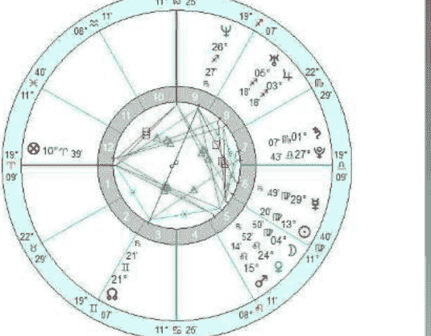

Koch houses
True Node

（图 2）

在经历过这些前世回溯之后，我带领 Angela 进行了深度的自我分析。当她领悟到为什么会一次又一次的陷入不断的纠缠中以后，也明白了这种强迫的重复并不能给自己带来解脱，真正的救赎是不能寄希望在任何他人身上的。在她明白了这一切之后，在灵性的高度最终原谅了 Roy 最初以及这生生世世给她所带来的伤害，并且接受了他们并不适合在一起的事实。

强烈的射手座、第九宫的主题，自然会与宗教脱不开干系。Angela 在回溯中曾经有一世是一名虔诚的教徒，他（那一世是男性）那时最大的愿望便是能自己徒步走完一次朝圣的道路。不过，这一世与 Angela 的接受催眠治疗的初衷关系不大，所以也没有进行进一步的探索。

在此之后，Angela 逐渐摆脱了 Roy 对她造成的影响，开始了崭新的生活模式。虽然以后她仍旧可能会受到这种业力情结的影响。但不同的是，她能够意识到自己感情问题的根源在哪里，并且能够提醒自己不要再重复之前的“恶性循环”。将自己的问题提高到意识层面，使自己能够明白自身问题的前因与后果，对于 Angela 来说额外的重要。这也正是她能够真正摆脱业力情结影响的第一步。

接下来，便需要看与南交点有相位的星体，它们也是非常重要的线索来源。Angela 的南交点与海王星合相。海王星是一颗非常特殊的星体，它即代表了奉献、牺牲、梦想，又代表了欺骗与自我欺骗。毋庸置疑，Angela 在与 Roy 的互动中，海王星的主题体现的淋漓尽致。她为这段关系（无论是前世还是今生）都牺牲奉献了许多，而她在受到 Roy 的欺骗的同时，也是在自我欺骗，并且一直梦想着 Roy 会回心转意。

我们再来看看 Angela 的星盘（图 2）：

Angela 的星盘中也反映着她的前世遭遇与带入今生的业力情结。前文提到，月亮南交点反应了前世中所形成的业力情结，以及可能出现的强迫重复的内容及模式。

然后，我们可以通过月亮南交点所在星座的守护星，即南交点的定位星，来获取更多有关 Angela 前世遗留问题的补充资料。她的南交点落在射手座，木星是射手座的守护星，落入第八宫。第八宫虽然在传统意义上的主题是死亡，但其心理层面对应的主要是抛弃与背叛（从心理层面讲，死亡本身就是一种对于双方关系的抛弃与背叛）。所以 Angela 对于 Roy 的信仰中，经历的许多次的抛弃与背叛可以从这里得到反应。

Angela 星盘中，有一个关于伴侣关系议题的配置非常明显。老道的占星爱好者可能已经一眼发现：位于第七宫的土星与冥王星合相。前文提过，星盘中所有的原素都反应着我们的业力。土星，象征着限制、阻碍、冷漠，是传统意义上的“凶星”，与代表着恐惧、抛弃、分离的冥王星合相，落入代表长期感情关系及婚姻的第七宫。土星与冥王星在这里的相位，显然与刚才所提到的抛弃与背叛共振，因为前面已经讲到，这里就不再赘述。

从进化占星学的角度来看，我们的出生是灵魂选择的结果，那么由出生时间和地点所绘制的本命星盘，就反映着我们在这一世生命中需要处理和面对的议题。但如果让个案认知到自身问题的根源及原因，从而意识到自己可以做出改变，而并不是再由无意识中做出自然反应的选择，命运也许将从此不同。

通过土星与冥王星的合相，同样也可以看出 Angela 在感情问题上可能遇到的问题与挑战：她不是一个能够随便开始一段感情的人，她对于长期关系非常的谨慎（土星带来的限制），但是一旦开始一段长期的感情，便不会轻易的放弃（土星的稳固特性），尤其

> 注释：
> [1]荣格(Carl G. Jung, 1875—1961)瑞士心理学家和精神分析医师。早年曾与弗洛伊德合作，曾被弗洛伊德任命为第一届国际精神分析学会的主席。后来由于两人观点不同而决裂。与弗洛伊德相比，荣格更强调人的精神有崇高的抱负，反对弗洛伊德的自然主义倾向。
> [2]年龄回溯：是一种催眠后运用的技巧。可以帮助个案通过潜意识深层的记忆回到不同的年龄段，从而发掘出更加真实、清晰的记忆。多用来发现被压抑或是隐藏的记忆。

# 吴琨

网名“古都催眠师”，马来西亚精英大学心理学系毕业，美国国家催眠师协会认证持证催眠治疗师。从事职业催眠治疗以来，成功解决数百余例前世回溯及催眠治疗个案。系统学习占星术十载，现跟随大卫-瑞雷老师进一步学习完善职业占星咨询技巧，擅长心理占星学与进化占星学，将心理学与神秘学完美结合，为开启个人心灵晋升之路另辟一条蹊径。

联系邮箱：brian.wukun@gmail.com
个人博客：http://blog.sina.com.cn/lyhypnotist
新浪微博：http://weibo.com/lyhypnotist

## 占星之路

## 专访占星大师苏-汤普金（Sue Tompkins）

——占星术是我的信仰

特约记者：杨华京

导语：在很多占星爱好者的印象里，苏·汤普金这个名字大约都不陌生。如果你仅仅是觉得有些耳熟，那么《当代占星研究》呢？作为中国大陆出版的第一本严谨占星类教本，这本手册受到执业占星师与占星爱好者的广泛好评。而这成就远非全部。自 1972 年正式踏入占星学领域以来，她先在英国占星学院（FAS）执教多年，后创建伦敦占星学院（LSA），讲学的足迹更是遍布世界各地，并获得了占星学界的最高荣誉之一——英国占星协会颁发的查尔斯-哈维奖项。对于这位被夺目光环重重笼罩的英国目前最资深的占星师，你是好奇还是景仰？本期《占星学刊》将为你揭开她的神秘面纱。

**占星学刊：** 首先是俗套的必问话题：您为什么进入占星界，什么时候入行？
**苏-汤普金：** 我曾是一个内向又忧郁的小孩，常常独自思考一些形而上的东西，比如死亡到底是怎么回事，上帝是否存在。我自幼就对所谓灵光一闪的东西感兴趣。我对于占星术抱有很开放的想法。跟其他占星家不同的是，在我 18 岁的时候，我是通过太阳的迹象尤其是通过阅读琳达·古德曼的著作开始首次进入占星界的。现在我当然不会再紧抓“迹象”不放，但当年我一度为各种蛛丝马迹而痴迷。那时候，我常常会想：“这个迹象一定说明了什么，我非得把它们找出来不可。”
在占星学上，我曾孜孜不倦努力了两年却全无长进，因为我生活的小镇太偏远，根本见不到占星术方面的书。那时，我甚至不知道有严肃的占星学书籍存在。1974 年，我取得了相当大的进展，那一年我差不多都呆在加拿大多伦多。我终于读到了真正的占星术书。在自学了基础知识以后，我师从杰夫·梅奥（Jeff Mayo）。现在的梅奥占星学院（Mayo Astrology School）念了函授课程。杰夫是我的第一个老师。后来我追着他，跑遍所有地方念他的课程。回到英国后，只要看到有占星方面的课程，听众里一定少不了我。1981 年我获得了讲师资格，同年我幸运地得到英国占星学院（FAS）夜校授课的机会。当时一位占星家恰好要从教职岗位退休，我接替他在当地夜校授课。这对我来说是一个急速上升的曲线，因为大概从此时我才开始真正地学习占星术。现在我认为，学习的最佳途径就是在传授中学。

**占星学刊：** 在从事占星之前，你是做什么工作的？
**苏-汤普金：** 我最初只是以兼职的方式开始从事专业占星。自从 16 岁离开学校以后，我的非占星生活可谓漫长又多彩！我曾在制造电表的工厂工作，在办公室管记账，也当过酒吧服务生、餐馆招待、售货员、护士，我还担任过一家护理机构的经理，最终我成为一名咨询工作者。在英国，我们有一个组织叫做公民咨询局（CAB），公众可以在这里咨询任何事务。他们会向我们寻求各个方面的帮助，比如申请福利、填写表格、写信等等。这项服务旨在帮助人们争取应得的权益。组织的理念是任何人都不应因无知、语言不通或不善表达而遭受损失。在公民咨询局工作中最常见的是与社会福利权益、就业法、移民、离婚等事务有关的咨询。我在这里任职了大约五到六年。在公民咨询局积累的咨询工作经验和训练对我后来的占星工作大有裨益，因为我在这里学到了生活方方面面的实用信息。

**占星学刊：** 占星术给您带来了什么？
**苏-汤普金：** 它赋予我表达自我的信心（在从事占星术教学的工作前，我是个羞怯的人）。它给予我更好地认识自我、他人和世界的语言。它还馈赠我智慧的满足感。另外，我还可以这么说吗？它赐给了我一份工作和一份收入。

**占星学刊：** 对您来说，顺势疗法和占星术哪个排在第一位？能否对二者在帮助人们的能力和潜力上做个比较？
**苏-汤普金：** 直到上世纪 90 年代，我才开始了顺势疗法的训练，对我个人来说，占星术比顺势疗法领先了一英里，甚至几公里。我总是对替代医学的一些治疗手法很感兴趣，我甚至还学了针灸。占星术对个人来说是非常有用的，因为一个人的星象其实就是他的生命地图。它可以帮助你寻找人生意义，提升自我认识。
占星术和顺势疗法都可以改变一个人对于世界的看法，要解释清楚顺势疗法，我恐怕得给读者们长篇大论一番。大多数人对此并不是很了解，不过这也没关系，因为病人并不需要了解病理和疗法根据。要比较这两者的效果需要参考很多因素，但一般来说，顺势疗法更为有效。我认为，顺势疗法在身体、精神和情感上的治疗潜力怎么赞誉都不为过。

**占星学刊：** 如果您没有成为一名占星家和顺势疗法理疗师，你可能会选择从事什么工作？
**苏-汤普金：** 我钟爱我的工作，但要放任关于职业的幻想，我想我会做的职业大概包括：野生动物摄影师或喜剧演员。在团队作业中，我常常会扮演类似小丑的角色讲一些搞笑的段子。我想我真的可以成为一名优秀的喜剧演员。或许我还可以成为一名非宗教性的灵性导师，或者和声歌手也不错！也许我能成为一名动物园的饲养员，虽然我对动物园这一机构的设立本身就不赞成。我也曾梦想成为一名作家，但我知道我的文学功底不足以让我成为一个伟大的小说家，甚至作一个平庸的小说家也不够。幻想过后，我想我很可能只是一个女服务员或咨询工作者——这是我最喜爱的世俗工作。

**占星学刊：** 教学除外，占星术在您日常生活占据多大的部分？
**苏-汤普金：** 在接受客户咨询或者从事教学工作时，我对星历表的动向和更新了如指掌。但在我的公司，你可能永远不会知道我是一个占星家。虽然我与占星同仁们惺惺相惜，但我觉得没必要总是谈论占星术或经常耗在占星圈子里。不过，占星术的的确确是我日常生活中必不可少的部分，除去英语，它甚至是我思考的主要语言。或者换种说法表达，占星术的征喻在很大程度上代表了我独特的信仰体系，占星术的世界观因此成为我的人生观。这与天主教徒、佛教徒或马克思主义者以他们独特的世界观来解释世界类似。

**占星学刊：** 占星师在平时会有其它爱好与兴趣么？
**苏-汤普金：** 我喜欢交谈和美食。或者有没有交谈也无妨，只要有一人相伴，一场欢笑，足矣。我喜欢读书，涉猎以小说为主，也会阅读有关哲学和新世纪的书籍。我对音乐的爱好相当广泛（除乡村音乐和西部音乐，其余我都很喜欢），不过我什么乐器也玩不来。我曾一度对摄影，尤其是人像摄影相当狂热。职业习惯使然，我喜欢可以触摸的照片，因为这能触及一个人的内在本质。我喜欢乡村田园和野生动物。在我的生活中，猫狗必伴左右。我对大多学科都很感兴趣，唯独觉得运动实在无趣。

**占星学刊：** 您曾长期从事占星教学，这大概也说明您喜欢这个工作。在教学中，哪些是您喜欢的，哪些是您不喜欢的？
**苏-汤普金：** 教占星术的优点是，如果老师教学技艺突出，就能调动全班同学的学习激情，他们会如饥似渴地想要学更多知识。在教学中，能够参与他人自我发现的历程也是一桩妙事。从这点来说，没错，我喜欢教书。在我的星盘中，太阳和金星在第六宫准确合相，这就意味着如果我能把工作做好，就会得到的积极反馈。不幸的是，日金合相还与土星相刑（90 度角），导致我不大相信积极的反馈，需要持续寻求明证！随着年龄增长，我发现自己渴望一个转变，我想把注意力从教学转移到著书立说和接待客户咨询上来。

**占星学刊：** 您讲学涉及面很广，还常常周游列国去讲学。您最喜爱的演讲主题有哪些？

## 占星之路

苏-汤普金：我喜欢对基础的东西进行深入的探讨。我喜欢探讨本命占星学、预测以及一些占星学背后的原理。现在我很热衷于了解顺势疗法患者的病例，跟他们从占星学的角度来探讨，我们常常在探讨中发现疗救的措施。

探索出什么管用，什么不管用。我想，现在我最感兴趣的问题是由占星学引发的大多数人关于生死的灵性问题。

## 有关占星咨询

占星学刊：您的客户有确定的类型吗？你是否有意要吸引特定类型的客户？

占星学刊：您会怎样描述自己的占星家身份？

苏-汤普金：大多数前来求助的人都是因为他们正困惑地站在人生的某个十字路口。有一些人是在自我认知上产生了困扰。还有一些人则仅仅是对占星术是否真管用抱有好奇心。甚至还有有些人就是想要证明占星术就是骗人的把戏。（记得曾有一个化名的记者来找我。我说我擅长笔墨，可以成为一名记者，但她并没告诉我这就是她的职业。好像当时她什么都没有讲。一周后一篇关于我的文章出现在了一份全国性的报纸上！这位记者后来还不时地到我这里来请教，但她坚持说不相信占星术！）客户们经常会在外行星移位或次限盘变动时寻求帮助，他们通常来自社会各个阶层，我喜欢这样的工作状态。我的客户们或老或幼，或贫或富，或聪或敏，或愚或钝。客户群有大概 80%是女性，但总体上来说并没有什么确定的类型。不过在某些特别的日子里出现的客户可能会凸显比较强的类型特征。比如某天可能会遇到 3 个白羊上升的客户，而另一天，则会接连不断地遇到行星落在金牛座 18 度位置的客户。这些日常的模式通常反映的或者是天空中正在发生变化的星相，又或者是某个人的星盘中正在发生的变化。

苏-汤普金：老土与愤世嫉俗兼而有之：嗯，我想这大概不是你想要的答案。我应该是洞察心性、有哲学思维、有现代意识、追求实用性、脚踏实地的人吧。我对“意义”最为关心，我相信占星术有用且有治愈之用。

占星学刊：总体上您怎么评价专业的占星家这一职业？从事这份事业理想状态下需要哪些素质？

苏-汤普金：这是一份低收入高职业满意度的工作。这份工作令我最为钟情的一点是，我每天都可以跟许多人展开格外亲密的交谈，另外还要持续不断地解决人生中的重大问题。至于占星师所要具备的素质，我想第一条是认识自我，认识自我，不断地认识自我。这是占星师工作的中心。认识自我是历经一生也不可能完成的任务，而不是一个可以在某刻到达的目的地，但占星家在认识自我的道路上要勇往直前才能有所建树。认识自我之所以如此重要，很重要的一个原因是，一个连自己都认不清的占星师很容易把别人生命中的包袱当做自己的给扛起来。想要成为一名咨询师，获得必要的辅导和治疗培训是非常有裨益的，但更为重要的则是给自己做治疗，这是成为占星师的先决条件。聆听的能力排在占星师能力需求单的最上方。健谈往往会是学习和领会的障碍，喜欢高谈阔论的人往往处在劣势地位。我认为如果一个人不能做到真正的聆听，不能细致地观察他人以及周围世界，那他也根本不适合做一名优秀的占星师。聆听不仅需要一双耳朵，它需要五个感官同时的，积极的投入。虚怀若谷的心态也是必要的，我们需要承认自己给不出所有的答案，也更不能保证真理在握。

占星学刊：您做占星咨询的出发点是什么？你觉得在星盘的解释中哪些问题是至关重要的？

苏-汤普金：当下的我不会拘泥于任何一种僵化的模式来进行咨询。首先我会好好观察客户的星盘，事无巨细都一一掌握，然后我会通过交谈了解曾经发生了什么。咨询工作的一个重要因素是要优化人，而不是星盘本身。星盘只是水中倒影，而不是池边花朵！客户才是花。

当然，星盘的相位尤其是冲突（180 度或 90 度）相位会告诉我们，客户的困惑到底来自于何方。我知道有些人喜欢使用小行星、恒星乃至其它上帝才知道的分析方法，但是我个人认为大道至简。是的，小行星、恒星等等并非无用，但在运用它们的时候不能忘记根本。在我看来，基本的星盘要素才会提供判断依据，重现当时的情状。至于小行星等其它因素，只要稍加留心即可。如果在星盘上看到过多的讯息，占星师往往会只见树木不见森林。每张星盘上都会有几个至关重要的故事，把这些故事连接在一起就能勾画一个人的人生。我觉得首先要发现的就是星盘的本质问题。小行星和其他因素只能提供一个更加个人和具体的信息，但并不能对主要问题提供更多帮助。

占星学刊：您对占星领域哪一方面最为感兴趣？

苏-汤普金：倒不如说说不感兴趣的更直接一点。我对传统占星学和古典占星学不是很感兴趣。我觉得古老的文本太难理解，也太容易被现在的人错误阐释。我喜欢在日复一日的生活和与客户的沟通中独立地思考。

初入行时，我们还要在在纸上做计算。虽然计算机的出现相当伟大，但到现在我还不能确定技术造成的变化都是好的。进步总要付出代价。而占星方面的代价则是跌份。不可否认，计算机在一瞬间完成所有的计算确实美妙，但是也因此造成很多学生在本应学习怎么迈开步子的时候就妄图大步奔跑。占星术其实是一门手艺，需要长时间的打磨钻研，现在却涌现出太多诱惑人心的捷径。很少有人能够真正深入地掌握和领会征喻，而这恰是占星术最需要被深刻体验的力量。占星术总能反映一个社会的整体面貌，目前我们拥有的是快餐文化，如果你总是吃汉堡，那你根本不可能品味到吃的乐趣，也做不出一顿真正的饭餐。虽然我们大多数人都渴望成为一名“真正的”占星师，不想过度商业化的占星术大行其道，但大部分的占星师只是草草为客户做一番机器的演算，却无法深入到客户的内心，以关系的建立为基础进行咨询。令人欣慰的积极一面是，占星术似乎已经广泛传播到全球各个角落。不同文化对于西方占星术的包容性空前高涨。我想占星术与社会中的其他事物一样都经历了高峰低谷，也曾被大众热捧，也曾有过辉煌的腾飞。现阶段的西方社会，我认为正处于简化一切的时期。可能这一现象并非蔓延整个世界，但在英国我看到了品质上的减法。同样在大众媒体和教育上这也表现得也相当显著。这可能是海王星进入水瓶座所造成的影响——把现实中的普通存在加以理想化。没人可以被拒绝，也没有什么能够被拒绝——一切皆善，其中所失去的，应该是对于卓越的追求。

## 占星学界的专业探讨

**占星学刊：**您常常在电视、电台和报纸上露面。能否谈谈您在大众媒体中的经验？

**苏-汤普金：**这种体验是复杂的。媒体注重娱乐，而占星家则关注对于大众进行真正占星术的普及教育。在现实中，这两种旨意通常是不兼容的，因为我们生活在一个“声音被咬掉”的时代。现在，我通常只参加现场直播的电视和广播节目。预先录制的节目通常都会被剪辑，而被剪辑掉的常常是我们认为最为重要的部分。

**占星学刊：**您最喜欢哪本书？您会向占星学的学生重点推荐哪本书？

**苏-汤普金：**可能查尔斯-卡特（Charles Carter）放到现在已经有点过时了，但是我做学生时非常青睐他，因为他所提供的材料非常精准，令我难以释卷。我本人不太喜欢阅读由讲座转录成的著作，不过我还要热情推荐利兹-格林（Liz Greene）的讲座录系列，斯蒂芬-阿若优（Stephen Arroyo）、霍华德-萨斯波塔斯（Howard Sasportas）和特雷西-马科斯（Tracy Marks）的作品也不容错过。不过首要推荐的应该是丹尼斯-艾维尔（Dennis Elwell）的著作《混沌宇宙（Cosmic Loom）》。我敢肯定在德国、法国、芬兰、瑞典和其他国家也有大量优秀的有关占星学的著作，遗憾的是我只懂英文，因此书籍推荐仅限于英文著作。

**占星学刊：**您认为占星学的未来是什么样？自您投身占星学以来，占星界发生了怎样的变化？

**苏-汤普金：**我不知道占星学的未来会发生什么。占星学的未来是一个“隐性”的话题，因此人们或许会不断地在其中追索。也可能量子物理学的发展会给占星学树立一定的声誉，但对这样的期待我又深表怀疑。在过去，那些想要让世人关注自己的研究的科学家总是要跟占星术撇清关系。这样的例子在历史上不胜枚举，所以我看不出它会有任何改变的理由。在过去 40 年间，我已经见证了占星界的巨大变化。首当其冲的就是计算机及其软件对于占星界的影响。

## 《占星学刊》独家连线

**占星学刊：**您在中国的占星界负有盛名。中国很过占星师都是藉由阅读您的那本不会褪色的经典教本《当代占星研究》和《占星相位 (Aspects in astrology)》入门的。您能谈一下您当初为什么要书写这两本著作，您是怎么写作的？

**苏-汤普金：**我写《占星相位 (Aspects in astrology)》这本书是在上世纪 80 年代，我认为这个议题相当重要，所以就拿来书写。但这些议题很难被阐释清楚，当时手边可用的资料很少，所以我做了独立的调研。《当代占星研究》则是对我多年来教学记录的一个整理。虽然当时市面上已经出现了大量的占星学的书，但我认为在给学生们提供一个全面的知识介绍的书籍方面还有空白。我当时想要做的是一本充满当代气息的信息量丰富的教材。

**占星学刊：** 您能和我们分享一下您对中国传统文化的领悟吗？比如道教、儒教或者阴阳。您认为中国这些传统文化的元素与占星术的关系是怎样的？

**苏-汤普金：** 这是一个宏大的问题，需要深思熟虑才能回答好。若简要说说，我认为真理从来不会与真理相抵触。中国的许多哲学思想其实都能在占星术的基本思路上找到投射。比如阴阳反映的是积极和消极的两面。对于个人的星座有些许了解，可以使这个人与自然更加和谐相处，也能使他与道的理念更加合拍。

**占星学刊：** 在中国传统医学中有与顺势疗法类似的理念，比如有类似顺势在中国传统医学的哲学，如“以毒攻毒”。您如何看待中国传统医学和顺势之间的相似性和差异呢？

**苏-汤普金：** 说实话，我对中医的理解太有限了（虽然我曾在短暂的时间内研习了针灸），还不足以回答如此宏大的问题！这个问题只用简单的一两句话无法作答。我可以将来再回头谈它吗？

**占星学刊：** 您如何从占星的角度描述中国和中国人？

**苏-汤普金：** 四海皆兄弟。每个人作为个体都有其独特的个性，但作为群体又都有共同点。所以，我并不觉得人类在民族和种族上有多大的区别。当然，若要谈论中国，则有几个不同的星象图，我猜大概是在描述中国的文化。我看了一下 1949 年 10 月 1 日 15：15 北京的星象图，我不能确定 15：15 这个时间的准确性，这幅图取自尼古拉斯·坎皮恩（Nicholas Campion）的《世界星座大全（Book of World Horoscopes）》一书，这张星图没有注明来源。在这张国运盘中，天秤座太阳、水星和海王星落在代表理念的第九宫，阐述的就是中国哲学；月亮上升点落于水瓶座则表明这正是中华人民共和国。

**占星学刊：** 西方文化一直是占星术的背景文化，我们想知道占星术是否与东方文化在某些方面不谋而合。占星术在发展中是否逐渐融合了一些东方哲学？

**苏-汤普金：** 我不认为占星术只是一种西方现象。西方占星术源自我们现在所说的中东地区，但是各种文化自古以来都出现过某种形式的占星术。比如占星术在印度一直很风行。每一种文化下的占星术都反映了其母文化的特征。比如印度占星学使用恒星黄道（Sidereal Zodiac）而不是回归黄道带（Tropical Zodiac），强调的是一个人天生被注定的命运，这符合印度种姓制度[4]的理念。

**占星学刊：** 您到过中国吗？您有计划来中国授课吗？您教过中国的学生吗？对于中国学生您有什么印象？

**苏-汤普金：** 我还没有来过中国，但我非常乐意来中国执教！我在英国教过几个中国学生，中国的学生与英国本土学生相比对学习更有热情，更加努力。

**占星学刊：** 对那些努力想要成为占星师的中国学生，您有什么建议？

**苏-汤普金：** 首先，了解你的长项，这可能需要些年头才能弄清楚。给所有你认识的人都建立一个星盘档案，这样你就可以在和亲友的交往中不断地学习。其次，在兼职的基础上逐步开展专业的占星工作。要先把自己置身于这个事业中，这非常重要。即使在欧洲和美国也鲜有专职的占星师，所以理想要与现实相结合。话虽这么说，但若占星真的是你内心深处的召唤，那就坚持走下去，梦想终会实现。

**注释：**

[1]梅奥占星学院（Mayo Astrology School）：由国际公认的占星家和占星术教育家杰夫·梅奥于 1973 年创办，总部设在英国的占星函授学院。

[2]英国占星学院（FAS）：1948 年成立于英国伦敦，是国际知名的专业占星学校。包括远程函授，伦敦课程，暑期学校三种学制。

[3]顺势疗法：又称同类疗法，由德国医生塞缪尔·哈内曼于 18 世纪创立，理论基础是“同样的制剂治疗同类疾病”，即为了治疗某种疾病，需要使用一种能够在健康人中产生相同症状的药剂。

[4]印度种姓制度：又称印度卡斯特体系，是印度与其他南亚地区普遍存在的社会体系，以婆罗门为中心，划分出许多以职业为基础的内婚制群体，即种姓。种姓制度除去以婆罗门为第一阶层的四个瓦尔纳序列之外还有被刻意忽略的贱民阶层。贱民多由罪犯、战俘或是跨种姓婚姻者及其后裔组成。因为他们的身分世代相传，不能受教育、不可穿鞋、也几乎没有社会地位，只被允许从事非常卑贱的工作，例如清洁秽物或丧葬。由于“贱民”被视为不可接触的人，因此四个瓦尔那的人严禁触碰到其他贱民的身体，贱民走过的足迹都要清理抚平，甚至连影子都不可以交叠，以免玷污他人。（来源维基百科“种姓制度”）

## 塔罗新知：有多少禁忌可以胡来

作者：杨珺茹

阴暗客厅里，即将燃尽的壁炉里冒着青烟，空气中弥漫着难以描述的香气。一位戴着奇怪帽子，嘴角干瘪，眼神凝重的老妇人在为一名神色惶恐的女孩翻开塔罗牌。女孩看见牌上的死神图样，害怕地向后倾倒，双手蒙住眼睛。此时的窗外最好开始闪电，接下来雷声大作……

这样的场景是否有些熟悉？在西方电影里，一提到塔罗牌多半就会有类似的桥段出现。从区区七八十张纸牌中就能看透占卜者的内心？可以窥见所问事情的发展状况？许多人亦会期待通过塔罗牌来看透当下感情状态——Ta 是否仍然爱我，矢志不渝？Ta 是否是那个对的人？出色的占卜师总会从牌上找到一些可靠的线索。

随着塔罗牌占卜的渐渐流行，有关塔罗占卜的禁忌之说也日渐风靡。有些人云亦云，有些又似乎有根有据。到底哪些禁忌必须遵守，哪些禁忌可以胡来？不妨选择几个平日被问到最多的塔罗牌禁忌，谈谈个人看法。

许多占卜师都有这样或那样的小习惯：有些并不喜欢别人触摸自己的牌；有些不喜欢他人对着塔罗牌拍照；有些收牌时必须按着顺序来；有些不到晚上不占卜……这类不成文的规矩并不能称为禁忌，只是个人习惯而已。竟有“禁忌”之说要求占卜前必须用药草洗手——别闹了。有些药草都绝种了，难道要穿越时光门从过去找回来？当然，如果你刚吃过盐酥鸡，先去洗洗还是必要的。

关于占卜时间，从日本传来的说法是每至逢魔时刻和魔空时刻[1]不占卜。日本学派认为，在此时占卜易招引恶灵，看到幻像（有兴趣者亦可参考日本传说“百鬼夜行[2]”），但此说法的来源并无任何资料可做佐证。笔者试图寻找可信线索，可惜毫无收获。倒不如说这是太容易困顿的时段，与其占卜，不如打瞌睡睡一觉。笔者认为诸如哪些时段占卜最准，哪些时段占卜会招来厄运，哪些时段占卜有利于感情，哪些时段又对事业有帮助等种种问题其实属于占卜有效性的问题。实际上，一次成功的塔罗占卜所需的必要要素仅有四个：塔罗牌，心情平静的求问者，身体、心理和精神状态都平静愉悦的占卜师，以及尽量安静的环境。至于具体什么环境，笔者认为适合双方最为重要。有的人更喜欢通过电话交流，面对面反而害怕被说中心事或说出自己的疑惑。凡是带有隐瞒的占卜都不具有有效性，所以占卜师和问卜者的互动自然以舒适为佳。

还有一个更流行的“禁忌”——算多了塔罗牌会有恶报。甚至认为塔罗占卜越“准”，就越有这个顾虑。在系统的塔罗牌学习中，几乎每个占卜者都进行过单卡读牌（One Card Reading）的读牌训练。这种读牌训练方法需要练习者每天都按几个不同的方面进行读牌训练，多数人会选择每天为自己占卜作为训练方式。若是果真消耗福报招到厄运，那每日刻苦学习塔罗牌的人岂不是死过一万回。

之所以一些人会认为塔罗牌带有邪恶的象征，多半是从《圣经》的解读或是一些其他野史中来看。《圣经》中讲到“**上帝所反对的乃是预言神学的延伸[3]**”，而并非寻求其他邪恶力量的指引。一些偏门的塔罗牌则并不适合有基督信仰者使用（当然这也与塔罗牌本身是否是邪恶之物无关，纯粹信仰问题）。以巫术崇拜塔罗牌[4]为例，牌本身带有色情暗示，且融合了异教徒的主题。虽然牌义依然以韦特塔罗为蓝本，但其中明确的异教徒主题对于基督徒来讲自然需要封杀掉。从根本上来说，塔罗牌本身并无差异，均是纸牌印上图案，其中的故事、符号与系统，通通是另外一回事。心理学巨擘荣格已为塔罗占卜之所以被认为“准”给出了详尽解释。荣格也是心理学界中第一个正视灵魂学及神秘学的大师，自二十世纪伊始便更关注各种心灵现象。他认为塔罗牌可视为连接人类集体潜意识和显现原型[5]的工具或者媒介，它帮助我们把潜意识意象转化为可见可感的图像，并通过占卜师的解释将其中智慧与启示转述给问卜者。总之，用之正则正，用之邪则邪。如同炸药一样，诺贝尔发明它本是好意，却被用来制造杀戮，塔罗亦是如此。它本是用来作为心灵指引的工具，而并非惹人忐忑不安的邪物。

至于在占卜师的选择上，也有一种说法是一生只能选一位占卜师为自己占卜，否则便是对塔罗本身的不尊重与不信任，之后怎么占卜都不会给出正确的指示。笔者猜想编出这个“禁忌”的人本身就是占卜师，在选择占卜师的时候，最重要的一点是你与对方有着价值观的认同，阅读其写过的案例、博客文章以及种种见解，认为可与之沟通并得到启发——找一个懦弱、狭隘或是毫无语言能力的家伙为你指点迷津实在不可取。你需要认同或向往这位塔罗师的生活方式，并确认你能理解他的表达方式。一段时间之后，如果你的塔罗分析师已无法为你的生活做出更出色的指引时，更换另一位实属必要，因为求问者和分析师的共同成长和默契必须随时日累积。

一位出色的塔罗分析师，需要协助求问者“了解不同角度与行动下的风险分析”，以便于他们“能做出不伤害他人却对自己最有利的决定（ATA[6]《塔罗九戒》）”，同时也要在每次解读时给予求问者努力改善成长的空间。在塔罗分析的过程中，塔罗分析师仅需将牌上种种呈现给求问者，而并非为求问者选择。如有必要，塔罗分析师亦可根据其人生智慧和过往占卜经验给出良性建议。

无稽之谈的所谓禁忌自然不必理会，但占卜师本人的占卜习惯当然应给予尊重。若非要说塔罗占卜有何禁忌，唯一得到普遍认可的便是ATA制定的塔罗师守则——《塔罗九戒》。而笔者信奉的最基本准则仅有两点：不用故作高深的言辞令人害怕，不用模棱两可的语言惹人不安。

**注释：**

[1]逢魔时刻与魔空时刻：说法源于日本。“魔空”为普通形容词，大意为“超自然”、“神秘”。而逢魔时刻在日本指的是黄昏时（17-19点）和黎明前（3-5点）。

[2]百鬼夜行(ひゃっきやこう)是流传在日本民间传说中出现在夏日夜晚的妖怪大游行，也是著名妖怪绘师鸟山石燕一系列的妖怪绘卷。说的是日本的平安时代，那是一个幽暗未明，人类和妖怪共处的时代，妖怪住的地方，和人类所住的地方，其实空间上是重叠的，只是人类在白天活动，妖怪们则是在晚间出现。逢魔时刻与魔空时刻在百鬼夜行的相关资料中常常出现，亦被一些人认为是塔罗禁忌。

[3]上帝所反对的乃是预言神学的延伸：《圣经》中旧约申命记 18:10(1)你们不可把儿女放在祭坛上焚烧；也不可占卜，观兆，行法术；撒迦利亚书 10:2(1)人民向偶像和占卜者求问，所得到的回答是胡言乱语。有些人解梦，只是哄骗你们；他们的安慰没有用处。因此，人民流离失所，像迷失的羊。他们遭受苦难，因为没有牧羊人引导他们。圣经中所禁止的是以其他信仰为背景的占卜方式，而塔罗牌本身并无宗教意味，只要所行皆善，并不在禁止之列，是可行的。

[4]巫术崇拜塔罗牌 (Faery Wicca Tarot)：作者 Christine Yates & Kisma Stepanich, 1999 年 Llewellyn 公司出版发行。其中描述了有关巫术和仙境的内容，多数以作者自己的知识系统为准（作者资料甚少，但的确为异教徒）。牌中用生动形象的色情暗示融合了在异教徒的主题。牌面图片含义是听取了大智慧女神和有角的神。

[5]显现原型：根据荣格对塔罗的诠释和理解，他认为强有力的原型会影响我们个人的命运和行为，虽然不同文化中原型会有差异，但同时也具有共时性，可以超越时间与空间。塔罗牌被荣格视为连接人类集体意识和显现原型的工具即为此。

[6]美国塔罗协会（American Tarot Association）缩写。

**作者简介：**

杨珺茹

网名 Amber，也被称为 Miss A。Miss A Tarot 每周塔罗运势作者，塔罗分析师及媒体工作者。研习塔罗近十年，擅长塔罗占卜和感情占星，热衷探讨感情问题，治愈系与清醒系并行。与窥测命运相比，更注重通过神秘学相关内容达到内心成长和发展。

联系邮箱：missa.happytime@msn.cn

新浪微博：http://weibo.com/missatarot

官方博客：http://blog.sina.com.cn/missatarot

## 择时占星术：宫内星优先 or 宫主星优先？

作者：黄纤越

学习占星数年以来，我一直认为占星术的实用功能最为重要，如果不能应用于实践中对人们的生活带来帮助，就会失色不少。而在我们日常的应用中，除了每个人对自身星盘和亲密关系的好奇，最具有实际意义的就是择时占星术。

在现代社会，择时占星术也随着占星术的广泛推广而重新回到人们眼前。在中国人的传统中，不论是开业、嫁娶、出行，甚至连安床都需要选择一个黄道吉日，这其实就是中国术数中的择时功能。但对大多数人来说，黄历毕竟只是泛泛而谈的参考，求个心安而已。我们只能从黄历上看出今日今时是否适合开业，却无法简单地从黄历上了解这个时辰给使用者带来的优势和劣势，也更加无法区别选取的时辰是否适合本行业。要知道，古人的价值观与现代人差异颇大，生意多是要求长久，细水长流逐渐做大才是正理，跟现代人但求一日暴富的追求不同。从行业来说，古代行业划分也完全没有当代社会多元化。考虑到以上种种细节条件约束，描述性更强的择时占星术就变得极有实用价值。

择时占星术（Election Astrology）也是占星术的一大分支，在古代曾与本命占星术并列为帝王之术。有人可能会说：“当然还是关系盘更为重要。”是的，在当今社会，占星术早已不是王谢堂前燕，已经飞入寻常百姓家。对于过着丰衣足食小日子的普通人来说，家长里短情感关系与日常生活更加息息相关。可是试想一下，如果回到古代，一名帝王除了关心个人王权命运之外最关心的竟然是情情爱爱而不是何时播种才可以让黎民百姓获得一年丰饶收获，大家是不是要忍不住内心咆哮：“昏君啊！”毕竟，四爷的爱恨情仇只是故事情节，要是换成真正的雍正爷在你面前与各路宫女眉来眼去，大部分人应该都会忍不住暴走吧。

以传统择日星盘来说，择日时需要从两个角度考虑星盘设置：其一，择日星盘本身特点是否适合此事，并能对特定的问题起到促进作用，所以星盘本身所显示的信息非常重要，简而言之，就是择日星盘本身的好坏相当重要；其二，挑选出的择日盘是否能对使用该时间者自身的星盘给予有利影响。以上两点说起来似乎十分简单，但在我个人耳闻目睹的真实事件中，能够做到的却难得一见。

什么样的星盘才算是理想之选？个人浅见，**整体星盘格局最为重要。** 简而言之，就是上升守护星、太阳和月亮三者的整体优次是考虑的关键。但是，大约是受到现代占星术更注重星体所落宫位忽略星体本身能量强弱关系，在我所见过择时盘中，大多喜欢把金星和木星两大吉星放在第一宫或者第二宫，星盘整体规划却显得十分一般甚至不够理想。又有人会说了：“木星落在第一宫代表着事情本身发展顺利不易遇到挫折。” 但很多人却忘记了，上升守护星的落点可以影响星盘整体格局。上升守护星落点整体条件好（以古典占星术使用的先天与后天尊贵计算表为衡量标准），意味着这件事有机会站上更大的舞台。不妨这样比喻：上升守护星落点位置不好但木星落在一宫的星盘，就好像一名在乡镇演出的马戏团名角，门票卖到10元一位且每天爆满口碑甚好；而上升守护星擢升且落在第十宫但土星落在一宫的星盘，就可能是一名从农村出来的大叔，起点很低做着辛苦的工作，开始每天被人挑剔，但最后却一路演进国家大剧院（这个故事是不是有似曾相识的感觉），门票卖到500元一位但每天上座率只有一半。两者相比，不知道读者们会认为谁的事业前景更好一些，谁又赚的更多一些呢？

类似的问题还有不少。在我见过的生意开业的择时星盘中，为数不少的择时者出于渴望赚钱容易的考虑而把木星安放在了第二宫财帛宫的择时盘。没错，木星确实可以带来快钱，但如果第二宫的守护星落点不佳甚至陷落呢？这就可能导致虽然收入不少，但每一笔都始终不多。如果与财帛宫宫主星庙旺但无吉星落入的星盘对比，就可能变成前者每天做一百单生意，但每单收入只有10元，后者每天只有寥寥几单生意，但每单收入少则几百元多则上千元。两者相比，高低立见。

在此给大家提供一个我在实际生活中见过的代表性问题择时盘。

### 零售店铺开业择时 1
2012年2月14日 8:01 北京

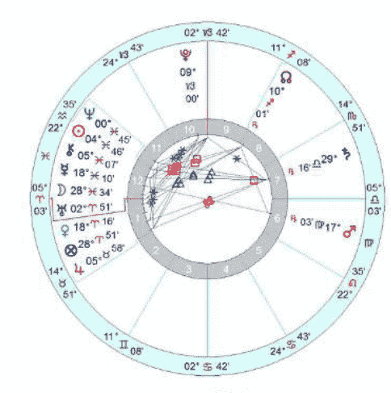

（图1）

这是一个零售店铺生意开业的择时星盘（图1）。不知是因为当地习俗原因，还是仅仅为了把耀眼的木星和金星同时放入星盘第一宫，择时者固执地非要把时间定在早上8点前后。但以我个人来看，这是一个初看过去不错，实际较为糟糕的择时盘。虽然金星、木星与福点都安放在了第一宫，但木星定位星金星落在白羊座毕竟为陷落位且空相位，代表着表面看过去虽然不错，实际带来的好处却是有限。放眼星盘其它细节，除了太阳与木星六合入相位带来助力外再无更多亮点。盘主星火星落在处女座第六宫虽然为喜悦宫位却被劫夺，意味着店主会用愉悦的心情辛勤打理生意，但火星所在处女座被劫夺却会让劳动的效果较难体现。火星的定位星水星在双鱼座界内陷落，并与火星形成对冲相位，让人怀疑是否会有努力方向不对或是结果南辕北辙的可能。而最重要的两颗发光体太阳与月亮竟然都被安放在了象征着囚禁与退隐的第十二宫，尤其代表公众形象的月亮落在双鱼28度空相位，双重暗示着有着难以做出品牌和口碑的倾向。

最后，再来看象征公众认知度和事业发展高度的第十宫以及客户资源的第十一宫。这两宫宫内都无行星，宫头同落摩羯座，而摩羯座守护星的土星却在代表合作关系以及公开对手的第七宫内逆行且除虚点的福点外根本无其它相位（跨宫位的出相位基本可以忽略），会带来客户资源拓展辛苦，事业即便经营好却依然有着命脉掌握在合作方手中或是竞争对手更加强大的可能性。这样的星盘也许选来做一些偏门生意（诸如与第十二宫相关的玄学、宗教、走私乃至殡葬业）都是合适的，但如果给正常开门做生意的行业选用，还真是让人有点担心。

### 零售店铺开业择时 2
2012年2月14日 14:06 北京

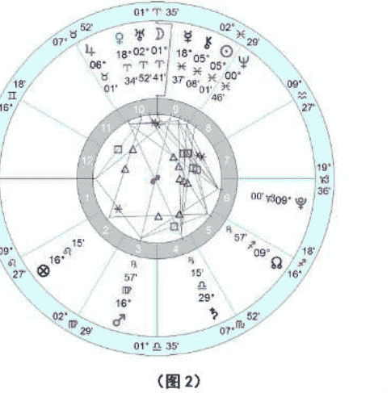

（图2）

出于研究心态，我把同一天的星盘根据个人经验做出时间上的调整，选出了新的择时星盘（图2）供大家参考。

可能很多人会质疑，为什么不把太阳放在中天位置，而是用月亮取而代之？这里就涉及到本文最开始时谈过的整体格局问题。我们先假设如果把太阳放在10宫，那么便是双子座上升守护星水星落在双鱼座陷落，虽然也能落在后天第十宫，但毕竟命主星先天陷落视为不吉，择时盘中如能避免最佳。否则可能出现明明外界条件不错，却偏落了下乘的状况。再来看现在的择时盘，虽然上升守护星月亮落在白羊也不以为美，但至少为平位，且优于双鱼座最后几度的位置（有时我们必须在有限的时间里找出相对优选）。此时太阳为第二宫主，主管财帛。太阳虽然是落在果宫的第九宫，但也是传统中的太阳喜悦之处，让经营者至少不会为赚钱而烦恼。月亮也代表商业威望与地位，落于中天白羊位置，可以开创出新的空间足以未来良性发展。且木星（同时也为双鱼座太阳的守护星）落在很多人最容易忽略的代表商业人气的第十一宫。各种以人气取胜的咨询业与零售业都需要注重代表团体的第十一宫，木星落在此处会带来客户的追捧，而金牛木星更可以落实为实际利益。在大好格局的铺垫下，其它都是瑕不掩瑜的小问题。

无疑，事件择时首先需要尊重的是事主意愿。但在具体择时时，如何帮助对方提升星盘整体格局带来真正有利的选择也将是占星师的永恒课题。

## 星语解码：你的蜜糖我的毒药（上）
——理智与情感

作者：王小亚

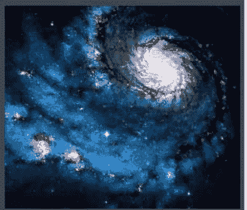

> “当时间和耐心都已变得奢侈，我们只能靠星座来了解彼此。”这句话听上去有些悲哀，但回望生活，却不得不承认，有些时候人与人相处中的某些误解仅仅是因为钻了牛角尖。大家都只会坚定站在自己的立场上，不愿换位思考。如果能拐过个弯，就会发现对方也许并非如你想象的那般糟糕，关系中的阴影随之消散。

事实证明，很多感情并非死于小三，而是彼此间的性格不合和误解造成的裂痕。

你有没有觉得当你掏心掏肺地向对方倾诉着自己的心里话时，对方却越来越心不在焉？你推心置腹给出的忠告，却总是被对方无视？你是否发现自己就像是个外人，很难看到对方由衷的喜怒哀乐？或是当你好心好意拖着心情低落的对方外出散心，换来的却是他一脸的不耐烦甚至被当作了出气筒？

“He is just not that into you!”，你可以很阿Q的安慰自己。但你是否有过这样的想当然：我都可以轻而易举地做到，对TA来说必然也是小菜一碟吧！殊不知，对方可能费上九牛二虎之力也依然很难达到你的标准，甚至压根没有意识到你的需求和目的。反之亦然，若你总觉得对方对你越来越不满，却又想不出原因的时候，也许是TA认为天经地义的事和想法，在你而言就是天方夜谭。

不必以单一星座举例，我们只需通过最基础的12星座分类法则就可以了解：为什么白天不懂夜的黑，夏虫不可语冰。

**星座元素分类：**
在占星术中，人们可以根据星座特性把12星座按照火、土、风、水四相元素划分：

- 火相星座：白羊、狮子、射手
- 土相星座：金牛、处女、摩羯
- 风相星座：双子、天秤、水瓶
- 水相星座：巨蟹、天蝎、双鱼

炽热的火元素象征着热情、冲动，当火势大到一定程度时，他们就要爆发，甚至把沿途的阻碍焚烧成灰也在所不惜。

水元素象征我们的情绪、情感。因而水相星座人往往把自己的“感受”以及别人对自己感受的理解看得非常重要。

风元素是在空气流动中产生的，所以与思考、沟通交流息息相关。风相星座人善于思维和分析，也喜欢与人交流想法。

与无法触摸的风、火元素及不定形的水不同，土是切切实实可把握在手中的物质，也难怪土相星座是如此务实。

**感性和理性的矛盾：**
水火相和风土相之间的思维差异（参考太阳星座与月亮星座为主）

四元素的不同特质也影响到思维和行为模式。可以看出，火相和水相星座较为感性，容易受自己的情绪、冲动和欲望摆布，多少有些以自我为中心的倾向。而重视实际的土相和思维相对不容易受感情因素干扰的风相则显得理性的多。因此，不同思维方式之间发生的碰撞就很容易变成鸡同鸭讲，热面孔贴到冷屁股的尴尬情况了。

当感性派遭遇理性系，多少误会就此产生：

火相星座人气呼呼的找土相星座人吐槽：交通状况怎么可以那么糟糕！让我本月都第三次迟到了！火相星座需要只是发泄，说过就算完，目的是让自己舒服。而土相星座就会把吐槽当作问题来分析和考虑，或是基于“如果你无法改变现状，那就只能改变你自己”的现实来建议：“你应该早点出门，把时间算得宽裕些”、“晚上你可以早些睡，这样早上就不会起不了床”。这对火相星座简直极度扫兴，不仅感觉受到批评，甚至会挫伤他们的自尊心。

而敏感的水相如果总向风相星座人抱怨：“他怎么能无视我的好和我的付出，忍心拒绝我。”风相人则可能基于客观理性思考的习惯，直接了当地指出水相星座人的逻辑问题：“你愿意付出是你的事，对方不喜欢你所以不接受又有什么错呢？”这种话会让寻求安慰的水相星座人心碎成片。

类似情况的反复出现让水火相人觉得对方完全不为自己考虑，胳膊肘往外拐。而风土相人又觉得对方完全不可理喻，不愿意面对现实，自己吃力还不讨好。

其实这完全是因为彼此思维方式的不同。水相和火相是受到情绪支配的感性动物，他们需要的是一支可以陪着自己摇旗呐喊的啦啦队，而不是一位摆事实讲道理的教导主任。在他们借酒消愁或撒疯时，你只要陪他们酣畅淋漓地喝酒胡闹就行，那些“酒多伤身”、“喝醉能解决问题吗”的老爹老妈式教导最好不要出现。

务实的土相人会把对方的抱怨认为“他遇到了麻烦”。如果关系并不算近，也许打个哈哈也就过去了。可正因为是自己的朋友、伴侣，他们才会格外认真负责地替对方想对策，努力解决问题。风相星座也是类似。他们喜欢交流，愿意帮助对方分析情况，提出自己的观点，但缺乏感情成分的理性为免让人感到不近人情。对水火相来说，这就仿佛和自己唱反调。

也许，相处时间久了，双方才能发现彼此间的思维差异。一个明白了对方是纯发泄而不是求指引，另一个也了解对方的泼冷水其实是真正为自己着想。但即便明白，却依然免不了有种“没劲”的感觉。没有意识到这个问题的情侣，更是觉得和对方话不投机半句多：“那时我们的交流模式完全不是这样，你没那么情绪化，也不会这样挑剔我！”实际上，那正是因为感情刚开始时，我们并没有把对方当成真正亲密的另一半，所以你不会看到对方的真实反应。水火相不会什么情绪都对你表露出来，风土相也懒得操心为你想办法谋对策。

如果欠缺经验且又不了解不同星座人的差异，很多人就会想当然地认为别人的思维模式必然和自己类似，而把对方的“反调”解读成对自己的否定，把反复停留在相同问题上的情绪解读成不接受自己好心给出的建议。

当然，即便同样的元素，不同星座之间表现也还是稍有区别的。在水相星座中，巨蟹和双鱼容易围绕类似的问题反复原地踏步，也更需要亲朋好友、恋人的倾听和支持。你只需要有双好耳朵，适时地表现出同情、安慰、怜惜就可以。神秘主义的天蝎虽然同属水相，但相对来说不太容易说出心事，即便对亲密恋人也会有所保留。何况天蝎和白羊都受火星掌管，拖泥带水碎碎念着同一话题是他们所最不齿的。

同样是火相星座，白羊和射手就更加随心所欲一些。前者受到暴烈的火星掌管，想爆发时就爆发，So Easy！后者在轻松肆意的守护星木星影响下，不管三七二十一，想怎么说就怎么说。狮子座却会比较注重自己的形象和姿态，想发作时都会先考虑一下：这么做会不会显得有点丢份。

火相星座的发泄多数是一股作气的冲动，发作完就算，并不会特别在意对方的反应。当他们遇到理性派的风土相时，虽然扫兴，却也不至于有多大的不快，倒是需要情感支持的水相星座，如果得不到期望的回应，就如同受了双重打击一般更加失望。

喜欢聊天的双子座对感性派的发泄和吐槽倒是挺欢迎的。善于跟上内容的他们是个不错的谈话对象，因为你几乎完全不用担心他们会有厌倦的时候，等你发泄完后，被他们拉着继续天南海北聊到深夜的可能性反而更大。在双子们插诨打科之下，你甚至都忘了谈话的原意。

### 王小亚

星座性格分析专家，占星专栏写手。国内首个运势及占星资料翻译志愿组织“星译社 ATS”主要成员，星座漫画《12 星座人，看你准到骨子里》文案策划。

- 联系邮箱：adawang115@sohu.com
- 新浪微博：http://weibo.com/adawang
- 官方博客：http://blog.sina.com.cn/adawang115

## 金星逆行 与 金星凌日

作者：黄纤越

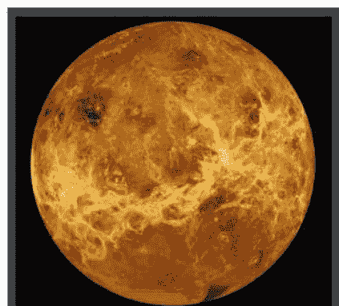

众所周知，在占星术中会把行星根据阴性和阳性划分，金星无疑是归属于阴性的柔软行星，她的影响力也相对温和，表现得委婉、低调且隐性。观察所有金星掌管的领域，你会发现不管是从感情爱欲、人际关系、兴趣享受乃至价值观念都是通过一种不显山不露水的方式发挥作用。不妨这么评价，**金星更像是一颗倾向性行星，而非行动性行星。金星影响个人生活的方式是经由影响你的喜好倾向，因为这些喜好倾向促使你做出一些行为，随后才会产生一系列后果。所以任何与金星有关的星相都会以相对柔和、间接的方式产生作用。**

进入 2012 年 5 月份，我们又将迎来一年半一度的金星逆行。从北京时间 5 月 15 日起，金星就将从双子座 23 度开始她本年度在双子座的逆行，并将一直持续到 6 月 28 日于双子座 7 度结束。如果考虑到“阴影期”[1]的影响，本次金星逆行甚至可能从 4 月 12 日金星进入双子座 7 度开始就已经逐渐发生影响，然后直到她在 7 月 31 日回到逆行开始的双子座 23 度才算告一段落。长达近 1 个半月的金星逆行周期中，金星将全程都在双子座移动，让此次金星逆行带来问题和挑战在表现方式和影响区间都更加集中。在此期间，我们还将经历百年难得一见的金星凌日现象，这令本次金星逆行变得不同寻常，相比平时有更大的可能发生与金星相关的宿命事件，影响也尤其深远。

行星逆行，也是占星历里常常能见到的星相。除去最重要的太阳和月亮，从水星开始到冥王星的所有行星都有机会发生逆行。而占星术中所谓的“逆行”也并非是行星本身在其轨道上退行，而是因为地球观察行星的视角差异而产生的视觉上的退行。在占星术中，逆行代表着发生逆行的这颗行星所掌管或相关的事物可能出现停滞、迂回，甚至回到过去的某个节点重新来过。**行星的逆行并不会真正的改变事情原本的发展方向，只是带来回顾、重审与修订过去问题的机会，事情会延后或是波折，但只会让结果发生程度上的变化，方向保持不变。** 这就好比我们去参加一场限时交卷的考试，考试本身就是行星向前推进的过程，而在此过程中最后留下了 10 分钟检查的时间。每个人可以根据个人需求不同选择是修改答案或是保持原样。但不论你是否修改，都不会改变到时考试交卷本身，唯一的区别在于最后是加分还是减分的不同。

金星逆行出现的频率仅仅高于两年多出现一次的火星逆行。相比一年三次的水星逆行和一年一次的大行星逆行，她的出场频率低了不少，也决定了她的重要性不可忽略。需要注意的是，**重要并不等于恐怖。** 虽然金星逆行也为行星历法中的重要时间段之一，但这样的重要性并非因为破坏力足够大或是颠覆性足够强。具体缘由，还得回到金星的特质和行星逆行的原理谈起。

因为金星掌管着地球上所有与爱情、人际、享受、时尚和艺术相关的主题，可以预计在金星逆行期间，这些问题都会成为大家重新思考的重点。人们可能在双子座金星逆行期间开始反思自己过去的爱情态度是否正确：“他值得我去爱（金星）么？”“他真是个有趣（双子座特质）的人么？”“我跟他真能聊得来（双子座特质）么？”过去的喜好与口味也有可能突然变化，某些一直很喜欢做的事情或是很喜欢吃的食物突然都变得毫无吸引力，与此同时对失去兴趣很长一段时间的事物却有可能突然重新投入，个人的审美和品位也有可能突然发生偏移。

**根据整个行星逆行影响期内的位置和状态的不同，我们也可以将广义的行星逆行周期（包括阴影期在内）分为三个阶段。第一个阶段：预逆行阶段（4月12日-5月15日）**，从行星进入“阴影”的起点到行星正式开始逆行，在这段时期内我们的喜好、决定甚至行动都有可能在真正的行星逆行阶段受到质疑和考验，需要大家在此阶段更加谨慎；**第二阶段：正式逆行阶段（5月15日-6月28日）**，从行星正式转向逆行到行星正式恢复顺行，在此阶段内，我们将可能面对逆行行星所掌管的相关事物和主题的反复和犹豫，有停滞甚至退回起点的感觉，做的事情大多是为了修补过去的遗留问题；**第三阶段：后逆行阶段（6月28日-7月31日）**，从行星恢复顺行到正式走出“阴影”的结束点，这也是逆行周期中最容易被忽视却最重要的阶段，此前需要重审和反思的问题终于可以在此阶段做出决定，或者是找到最终方向。

一些占星师会建议避开金星逆行期间整容或是改变个人造型，因为此时的个人偏好可能只是短暂的。也许等到金星逆行结束之后就会变得不喜欢，让此前的改变变成一场灾难。金星逆行也不是决定结婚或是确定重要合作关系的良好时机，因为金星掌管着所有与谈判、社交、合作以及法律相关的方方面面，在此期间各种类型的谈判都可能受到不同程度的影响，但是过去悬而未决的问题却有可能重新放上台面解决争端。

**如果你必须在金星逆行期间对相关问题做出决定，逆行的阶段划分将为你的决定提供最重要的辅助参考。** 举例来说，如果你的前男友（女友）在正式逆行阶段向你提出复合，那你就需要先回忆你们决定分手的时间。如果这个时间点早于预逆行阶段，也就是早于4月12日，这次的决定将很有可能只是对方头脑抽风的冲动之举，逆行结束之后有很大可能再度分手。但如果上次分手的时间点正好位于预逆行阶段内（4月12日-5月15日），那么也许你还有挽回的余地，或者至少让事情的结局不要太过痛苦，以金星的和平方试放下过往。

金星逆行期通常也会被认为是一个从社交活动抽离的时期。在金星逆行初期，社交机会会明显减少。然而，这样的减少并非源自外界环境条件的改变，而是由于观点和观念的转变。在这段时期内，与金星相关的事物和主题都会变得更加凸显，带来的影响力似乎也更加明显。其实，认真思考，你就会发现——事情本身没有改变，改变的是我们自身。金星逆行，会让人们对金星的能量变得更加敏感，对金星相关的问题也想得更多。而金星落在双子座会引发人们更加频繁地思考（双子座）有关感情喜好和人际交往（金星）的问题，也更愿意用双子座轻松的方式去谈论所有关于爱情、人际、享受以及艺术的方方面面。因为重视，所以感到孤独，因为孤独，所以需要爱情。经过一系列对于个人感情问题的思考后，很多人可能在金星逆行的后期开始尤其渴望一段感情，或是更加需要满足自己的享受欲望。而在本次金星逆行周期中，这些欲望将很有可能被6月6日发生的金星凌日彻底激发（后文我们也将详细谈到“金星凌日”）。

### 金星在双子座逆行

金星在双子座逆行，无疑会为金星蒙上一层双子座特有的色彩。双子座是变动宫的风相星座，金星在此逆行可能会让大家对一些无关痛痒的传播话题分外有兴趣。某些过去的八卦会被拿出来重新提起，某些过去的享乐点子也会被重新拿来讨论。而双子座又是黄道十二星座中直接代表“说话”和“传播”的星座，人们会变得乐于谈论各种与感情事件有关的八卦话题，甚至做出帮人表白（双子座的传播性）等无厘头事件。

金星在双子座，也会带来“双”的特质，意味着三角恋、劈腿的现象会明显增多。有人大概会忍不住犹豫：“到底该选谁比较好一些”、“要是可以三人行就好了”。吸引你的对象也许不止一个，你可能需要在两个人之间做出选择，其中一个对象或许是曾经的恋人或是朋友，又有可能两个对象都是过去认识但消失一段时间后又同时出现的熟人。双子座也代表着初等教育阶段和身边的人，于是这些突然出现的人很有可能是你的小时玩伴、小学或中学同学、隔壁邻居或是哥们的好友之类。此时，你需要想明白的是，你们的关系到底是靠着过去的记忆维系，还是真正有着共同的兴趣爱好。这段时间出现的感情，也许更适合双子

## 星空记事

座浅尝即止式的聊天，而难以涉及未来规划。这样的结果，你愿意承担么？

本次金星逆行的全程都在双子座，于逆行期间发生的其它重要星相也无一例外，星盘上有重要行星（尤其是上升点、太阳、月亮、金星以及命主）落在双子座以及其它三个变动宫星座[2]的个人将首当其冲受到影响。在做出决定之前，你们需要考虑清楚自己是真的需要这份感情，又或只是感觉还算聊得来，或是因为烦躁想要寻找出口，又或是因为对未来单身的恐惧。

而在本次双子座金星逆行中，有四个星相值得关注：

## 金星凌日

金星凌日，是非常罕见的天文现象。凌日时，位于太阳和地球之间的行星金星将直接从太阳的前方掠过，成为相对于太阳的可见黑暗盘状（并且因而遮蔽太阳的一小部分）。当凌时，从地球可以看见金星是在太阳盘面上移动的一个黑色小圆盘。金星凌日以 243 年的周期重复相同的模式，在漫长的 121.5 年和 105.5 年的间隔之间，插入了一组间隔 8 年的事件[3]。而本次的金星凌日正是这一组中的第二次，本组中的第一次发生在近 8 年前的 2004 年 6 月 8 日，恰好也逢金星在双子座逆行，是否非常有趣？（有心者也可以回忆自己在上一次金星凌日时的个人状况，也许将有机会以类似的形式再度经历。）

金星凌日时，金星虽然只能挡住太阳的部分光辉，却足以对太阳产生影响。正如日食意味着月亮的潜意识凌驾于太阳的表意识之上，金星凌日则意味着个人的喜好欲望凌驾于太阳的表意识之上，加上此前的日食已经将太阳的能量弱化，意味着我们将有可能进入一个少见的肆意妄为的时间段内。在金星凌日发生前后，人们将更容易沉溺于自身的喜好和欲望之中无可自拔。我喜欢和好奇的，就要去接近，去攀谈。这一刻的享受和愉悦将凌驾于正常判断的理性之上，最终的结果似乎变得不再重要。而金星逆行前期因为反思回顾而无心娱乐的状况也会全面改变，各种玩乐聚会活动都会突然增加，也给痴男怨女们提供了一个演绎人生大戏的舞台。

值得注意的是，本次金星凌日还伴随着月亮南交点同落双子座，让宿命性情感事件发生的可能性大大提高，你将很容易碰到让你一见倾心或是无法遗忘的对象，某些人还会就此疯狂坠入爱河无法自拔。对某些相信轮回的人而言，甚至有遇到前世恋人的感慨。有些人则是突然爱上某种娱乐活动，沉迷于其中不亦乐乎。不论你是以上哪一种情况，在金星凌日期间都将有机会享受到前所未有的享乐生活。

而对那些总是瞻前顾后的人来说，只要你想要，就不妨去享受这一刻带来的情感愉悦。金星的主题是欢愉，即便过程是纠结的，个人却依旧容易在其中得到前所未有的内心愉悦感。千金难买我喜欢，大概会是这一刻大多数人脑海中的想法吧。

## 双子座日食

在金星逆行开始的一周内，也就是 5 月 21 日，我们就将迎来本年度第一次的日食。日食，是月亮运行到了地球与太阳之间，挡住了太阳的光辉，也意味着月亮所代表的潜意识将凌驾于太阳所代表的表意识之上，隐藏在阴影中的真相也会意外浮出水面。占星师认为，日食和月食都代表着时空的扭曲，在这样的特殊时间里，过去、现在以及未来在此交错，你可能突然回到过去的某个场景，也有可能突然有了某种超前预感。而日食也往往是命运之轮开始运转的起点。在日食的影响之下，所有人都要做好迎接突如其来变化的准备。

本次金星逆行恰好开始于双子座 23 度，为本年度重要的黄道 23 度再度留下浓墨重彩。回顾本年度已经发生的重要星相事件，几乎都与黄道 23 度这个特别的度数产生了联系。首先是 1 月份火星于处女座 23 度开始逆行，然后是 3 月份土星大三角时太阳落于双鱼座 23 度的空相位，紧接着是 4 月上旬水星在双鱼座 23 度恢复顺行，此后是本次金星逆行开始于双子座 23 度并与落在天秤座 23 度的土星相拱照。而在此之后，金星凌日时的土星恰好也落在了天秤座 23 度。最后，在 9 月中旬还将在处女座 23 度发生本年度的处女座新月。这一系列的重大星相都将引动所有命盘中落在黄道任何一个星座（尤其是四个变动星座）23 度附近的重要行星，带来相关事件的连锁反应。

如果以延续性来说，我们不妨将最初的火星停滞视为力量的积蓄，太阳空相位则代表着开始关注问题却无从下手，此后水星从停滞到恢复顺行会激发人们对相关问题的思考能力，而本次的金星逆行则是给那些之前还没有做好决定的人们一个再次考虑的机会——“这件事情到底值得我去做么”，“这个人真的值得我去争取么？” 此后，发生于 6 月 6 日金星凌日时的逆行天秤座土星 23 度则可能引发情感与理智的挣扎。但对那些已经做好决定的人们而言，却有可能是落实于现实后稳定关系的机会（土星也代表着积累而来的成果）。再到最后的处女座新月，我想那将是一个对所有条件和细节挑剔磨合的过程。对一部分人而言，也许是得到后再付出，以实际服务（处女座特质）反馈社会的机会。

本次日食恰巧发生在双子座 0 度内。在黄道之上，每个星座中的 0 度都是该星座的起始点，也有着最强的能量。双子座又代表着传播与交流的星座，在此星座发生的日食会让所有突然惊爆的秘密都以超出控制的速度快速传播，再也难以压制和掩饰。而双子座 0 度恰好也是黄道上所有三个风相星座[4]的第一度，这意味着本次日食对三个风相星座来说都代表着一次新的开始。

值得一提的是，在过去大半年中，包括双子座、天秤座以及水瓶座在内的三个风相星座都纷纷接受了来自生活各个不同方面的考验，曾经的巧笑倩兮都会被人当做反面教材，让一众风相星座都有着动辄得咎、步履维艰的感慨。尤其是从 2009 年底就开始遭受土星考验的天秤座，更是以自身的血泪教训交出了一份长线答卷。而这一切在本次日食之后将开始逆转。考验将逐渐结束，虽然受金星在双子座逆行影响启动时间略为押后，但距离三个风相星座搭乘高速大巴开往拨云见日新生活的时刻已经指日可待。

对任何星盘中有重要行星落在变动宫 23 度及其前后 4 度的个人而言，本年度都将是你经过深思熟虑后改变生活的一年。不论你是否愿意，请不要错过这个千载难逢的提升机会。

## 火星刑金星/太阳

最后需要关注的是本次金星凌日前后还将依次与在双子座的逆行金星以及太阳发生刑克相位的处女座火星。

### 双子座 23 度

火星的负面相位往往代表着能量发挥方式不够恰当。金火相刑则意味着表达好感和爱意的行为举止不够恰当，可能你明明希望与对方划清界限，对方却会误认为你对他很有好感；或者你其实只是想要聊得开心就行（风相金星），却被对方误解为能够上床切磋更好（土相火星）。这样的相位可能让你在享乐和示爱的过程中产生不必要的误会，一不小心就会表错情会错意。此外，刑相位也容易带来冲动的结果。直奔肉欲主题没有错，重要的是：你确定这真的是你喜欢的么？

此后的火星刑太阳会将之前的能量发挥不当的问题继续放大。用时下流行的话来说：火星刑太阳有些用力过度。也许你认为只是在含蓄示爱，对方却已觉得无尽的电话和短信追杀让他快要崩溃。沐浴爱河、享受生活是我们每个人都期待的理想生活，但操之过急也许反而会与梦想渐行渐远。张弛有度才是维持亲密关系真正的长久之道。

注释：
[1]占星学上将行星结束逆行时所在的黄道位置视为逆行“阴影”的起始点，行星开始逆行时所在的黄道位置视为逆行“阴影”的结束点。从行星逆行前进入“阴影”起始点到行星结束后走出“阴影”结束点之间的这段时间都视为行星的“阴影期”。
[2]变动星座：黄道上的双子座、处女座、射手座和双鱼座。
[3]维基百科中文版“金星凌日”词条。
[4]风相星座：黄道上的双子座、天秤座和水瓶座。

## 木星进入双子座：一场漫无目标的享乐盛宴

作者：黄纤越

在占星术中，木星与土星共同担当了每年主宰年运的任务，影响着以年为单位的中线运势。也许很多人还不知道，木星其实就是中国传统天文学所说的“岁星”。他以平均每年一个星座的速度沿着黄道向前推移，影响着一年内的运势。

随着木星在北京时间2012年6月12日凌晨1点22分25秒进入已阔别12年的双子座，占星历上的双子年就此开启。在占星学中，木星不仅是代表着富裕与扩张的最大吉星，也代表着理想、追求、宗教、神性等等一切更加关乎精神层面的领域。

木星进入双子座会放大双子座原有的沟通、思考、传播以及多变的特质。**双子座掌管的传媒、短途交通、中低档的迷你型汽车、电动车、自行车、各种便携工具以及软件等相关行业都会直接受惠于此。**考虑到中国的三大门户网站几乎都是在上一次木星停留在双子座（2000年6月30日-2001年7月13日）的一年中正式崛起。我们有理由相信，本次的木星移位也将给已经日薄西山的门户网站带来一次回光返照的机会。当然，更大的可能，是新一代手机门户或创新式网络资讯领头羊的崛起。想要预知到底谁是赢家？不妨把视线锁定于那些在2011年上半年木星落白羊座时成立的网络创新公司吧！

对太阳和上升星座落在双子座乃至天秤座和水瓶座的人而言，木星落在双子座自然会为他们带来幸运，让他们有望一扫此前郁结，得到了梦想成真的机会。但对大多数人而言，双子座也许只是掌控着命盘中的某个宫位，木星移位于此会带来双子座掌管宫位的能量扩张，让人们有更多机会参与到这一后天宫位所代表的相关事务中去。举例来说，如果双子座恰好是某人的第五宫宫头所落星座，那么在本年度内，此人会有更多机会表现自我、吃喝玩乐以及养儿育女（以上都是第五宫所主管的内容）。然而，这也只是人生的过程而已。会带来什么样的结果？还得从此人命盘第五宫原本的状况好坏而定。这就好比你今天出门吃夜宵吃得很开心很满足，但并不能确定会不会因吃错东西而第二天拉肚子。

木星总让人们更加向往畅快淋漓的奔跑，这样的理想在当代自然被开着跑车驰骋郊外所替代。不幸的是，双子座代表市内交通。于是，很多人将有可能在这一年遭遇类似兴致勃勃买车渴望外出郊游，却被糟糕的市内交通死死困住，最后压根无法出城的黑色幽默。

当木星落入双子座，木星好大喜功与浮夸之风的负面特质都会在双子座的喋喋不休和狡猾多变的世界里找到最佳表现舞台。加上海王星早已进入双子座，大家可以想象身边会有多少浮夸忽悠的人和事出现。姑且听权当娱乐还是很有新意的，但“认真你就输了”！而木星落在双子座，也会将木星原有的崇高理想和远大追求套牢于东家长李家短的俗世之中，变得随遇而安，再无进取之心。当你发现自己有此倾向时，请记得扪心自问：我曾经的理想都到哪儿去了？

值得一提的是，木星进入双子座，却是先天的陷落位置。这意味着在木星落于双子座的一年，我们将更容易见识到木星带来的负面影响。双子座是黄道上的第三宫，是代表沟通、市内交通以及亲朋好友的先天宫位，性格上则代表着机敏、活泼、多变，擅长传播、沟通和思考。而木星则更注重深度的哲学性思考，带有其守护星座射手座所特有的精神目标至高性。而这样的两个星座看似类似，其实却有着方向性的分歧。双子座注重资讯的传播，贵多不贵精；木星则更注重深入课题的探讨。当以上两个特质相结合，就会呈现立体维度上的差异。木星更愿意一把长弓射到底，而双子座则更习惯于就近广撒网，可以想象一下，当迫击炮被迫变成散弹，效果会减弱多少。

在本年度的木星移位过程中，还有一点有趣的现象值得关注。从2012年8月29日开始，在双子座运行了将近1年半之久的流年南交点将与木星错肩而过逆行进入金牛座。木星与南交点位置的互换，会令上一年的风潮以一种奇怪的生命力继续延续。

南交点所落星座揭示出世人容易放纵自我沉溺的方面。木星也容易让人因为过于舒适而变得贪图享乐萎靡不前。在南交点落于双子座，人们只愿意了解浅显的表面问题，而不愿费力深究。待会木星进入双子座，只会让这种忽略问题本质、粉饰太平的特质继续放大。双子座与金牛座的负面影响都会在这一年中继续体现，这场漫无目标、随遇而安、满足于当下（双子座）的享乐盛宴（金牛座）还将继续一年。当明年木星进入旺位的基本宫巨蟹座，一切才将从根本上改变。

## 卜卦占星系列之一

### 从基础出发：关于问题的有效性

——作者：琥珀

卜卦占星作为占星体系中最基础最入门的分支，早已被广大占星爱好者们认知。但由于坊间资料大多不够规范，让大部分占星爱好者无法认清到底该以何为准。如何有体系地学习卜卦占星因此成为占星学习中的重大课题。这也正是我所想要写出的卜卦占星系列文章中所希望攻破的课题和体现的价值。对待一个学科的研习，最忌讳的便是舍本逐末。所以，第一堂课不妨让我们踏实下来，从最基本的问题开始入手吧。

进入卜卦占星流程，第一件事当然是起盘，也就是根据问卦时间建立有效的卜卦星盘。不少占星爱好者一听到问卦人的问题时就随手起卦，然后开始通过星盘本身来寻找“有效”或者“无效”的出入口。但事实上，在确定星盘之前，有一件最为根本和重要的事情需要完成，那就是确定问题的有效性。当问题确实有效时，我们才有可能从中得出正确的答案。所以，在起盘之初，就需要根据以下几个方面对问题的有效性进行辨识。

#### Part 1 问题对于发问人是否有意义。

首先，作为解盘者需要考虑的是，该问题对于问卦人本身是否有意义。怎样才算有意义呢？即，对问卦者自己很重要。发问者本身的心情非常迫切，渴望了解事情的状况；而且，该问题最好是已经经过事主反复考虑，这时候所提出的问题都是适合问卜的。

举例来说，如果是失物卦，一个人丢了 2 毛钱和丢了 2000 块钱，心情肯定是不一样的。2 毛钱不会让他焦急得手足无措、翻箱倒柜。而 2000 块钱却可能让事主开始心慌发堵，开始认真考虑自己到底放在哪里，是借人了、丢了、还是花掉了？相比较之下 2000 块钱显然更适合问卜（当然，如果 2 毛钱是收藏品或者有特殊意义就应另当别论了）。沿着这个问题我们可以继续下去。2000 块钱，事主发现丢了。但是事主并没有很想知道它的去处，还是继续去做其它事情，这时候问题就不是很适合问卜。在事主已经放下手上的工作开始思考这笔钱的出处的时候，问卦才是有效的。记得在古典占星学者狄波拉-霍丁（Deborah Houlding）的某篇文章中，特别强调了在失物卦中，尤其是在问卦人已经翻箱倒柜努力寻找之后未果且非常焦虑的状态时，才是最适合进行问卜的。

在关系盘中，也有类似的情况。A 和 B 谈恋爱，但是 A 的朋友小 C 出于八卦角度跑来问我：“他们俩能结婚吗？”那么，这个情况则不是一个很好的问题。因为问题本身基本只是一个不严肃的八卦谈资而已。但如果换成 A 的妈妈来问我：“我女儿最近谈了一个男朋友，我想知道他们能结婚吗？”这个情况则适合问卜，因为母亲本身是在严肃思考这件事情，并确实希望确认自己的女儿是否能够幸福等等。

以下，我将以案例来做更好的说明

#### 案例 1
2011年3月4日21:24，厦门（图1）
问题：我能当成道姑么？在哪里才能当成？

基于对发问者本身的了解，问卦人的性格较为飘忽不定忽东忽西，因此她的发问初衷也并非是严肃严谨的，卦盘上的讯息更加不会骗人。

观察星盘，我们会发现上升点落入天秤座28度06分，不仅处于星座尾度3度之内，更是落于燃烧之路中。同时，星盘月亮又被双鱼座太阳燃烧。这些条件均意味着问题的不成熟，以及发问人对于状态已然无法改变却依然要发问（星座的最后3度象征着事情本身已是尘埃落定）的事实。而事主本身对自身状况也并不能客观认识（燃烧之路），甚至带着双鱼式的妄想。且日月众星均在地平线之下，唯一的土星虽然在地平线以上却落入了12宫，也是黎明前最黑暗的角落，再次暗示着问题的本身的不成熟和无结果，同时也揭示了发问人对问题的态度：只是随口问问而已。

**事实反馈：**问卦人此后也再无纠结于此问题。一段时间之后，又开始追问感情问题，此案例也告一段落。无意义的问题，意味着占星师也可以更合理化的利用资源，不必浪费时间纠结于此。

#### Part 2 问题的单一性与局限性

在考虑完问题是否有“意义”之后，下一步要考虑的就是问题本身是否具有“单一性”和“局限性”。

“这个月体育彩票是多少号？”——很多人都会提出这样的问题。由于这个问题被很多人关注，而且被不止一次提出，此类问题在大部分卜卦占星的典籍中均被认为无效。但是对于这一点，专业占星领域目前并未达成完全的一致，不妨让我们先以保留的态度来看待这一点。在之后的Part 4中，我也将有进行进一步的补充。而在这一部分中，我想谈的则是本人最不提倡的事情：同一个人反复问卜同一个问题，譬如“我们会分手吗？”“我们会和好么”“我们吵架了会分手吗”，每一次提问的文字排列虽不一样。但问题实质却是相同的。另外，如果问卦人已经寻求过多位卜卦占星师的意见，这个问题则更加没有必要重复提及。

我在此前曾经遇到一名年纪不轻的女性问卦人，反复找人问卜自己什么时候能够结婚。最后问到了我这里时，问卦第一时间已然模糊不清。虽然此时依旧可以建立卜卦星盘，但的确是不推荐采用卜卦占星（从某个角度来说，这些问题更适用于本命盘的探讨）。同样，占星师在此时也无需畏惧问卦人，可以直接拒绝掉他们的要求，因为星盘上必然会有明显的特征告诉你是否该接下此类问卜。

同时也存在另一种情况，有些客人会拿着数天之前的卜卦星盘来找你求解。这个时候，我依然会建议你推翻掉之前的卦盘，或者可以将其作为当下卦盘的补充和参考。的确，它的第一发问时间和地点是明确的，但事情本身并没有停留在原点，状况已然发生变化。所以，我强烈建议占星师应以自己听到问题的第一时间/地点做盘。

读到这里，读者可能会觉得为什么会这样矛盾？答案很简单，因为卜卦占星是建立在精准的时效性上的。

卜卦占星界大师约翰-佛罗利（John Frawley）在《卜卦占星教本（Horary Textbook）》中指出：“……的确是这样，但是的确又并非如此：占星的基础就是建立在不同的每个单独的时间点上的。“这个”瞬间不同于“那个”瞬间。每个瞬间都是不同的，不管发生什么，它们都是不同的。如果否定了这一点，那么也便不存在占星了。因此，针对同一个问题反复发问是不讨喜的，因为本身就不可能成立。即便是同一个问题，提问的文字也一模一样，反复问也早已不是同一个问题了。”套用哲学思想，这也是成立的，正如赫拉克利特所说：“人不能两次踏入同一条河流。因为，答案是唯一的，问题却被无数次问及。那么到底哪个才是对应唯一答案的初衷呢？”

的确是非常模糊不清的。很多古代占星师，特别是阿拉伯占星师，都会特别强调不允许占卜师自己问卜。想想也是有几分道理的。但是现代的我们也着实无需苛求，只需谨记第一点里的内容：是否诚恳，是否迫切，是否是经过深思熟虑后才决定发问的。

> 案例 2
> 2011 年 2 月 22 日 18:09 泉州（图 2）
> 问题 1：和男友今年的感情会怎么样？
> 2011 年 3 月 23 日 17:31 泉州（图 3）
> 问题 2：和男友开始异地恋了，会很快就会分手么？

但从另一个角度来看，是否反复发问的问题就无解了呢？

以上是同一个女生在间隔一个月的光景里问过的两个问题，其实质却是基本一致的。

理论上而言，同样的问题是不应该被多次反复提问，“除非事情已然有了实质性进展”（因为此时占星师才可以更容易的抓住卦盘流露出的讯息，并将之联系作为事件进展的额外补充，而不是在原地徘徊）。不要反复提问本身也是对占星学的一种最大尊重。而当问题被反复提及让第一时间已然模糊时，所作出的卦盘必然也是有所差异，若无必要补充，的确很容易判断失误。这也就是我前面所提不要接下此类问题的最重要原因（关于发问的第一时间的重要性，我们后面会继续讨论）。

在问题 1 的卦盘中，命主太阳落入七宫双鱼，其定位星木星又落入白羊，这意味着问卦人对对方（火星）非常在意。然而，月亮落入天秤尾度不仅是位于燃烧之路且即将换座。在换座之前月亮还将与七宫火星发生精准相位，表示女方开始对这段感情感到到非常焦虑，并希望能够进一步与男方（火星）有所发展。120 度的和谐相位，也象征着给予进一步正面的回应；由于七宫主星土星（表示男方）落入天秤，而金星落入土星守护的摩羯座。虽然女方（金星）在这段感情中找不到舒适的感觉。然而金土互溶，彼此依然十分

在这里，我也特别需要强调一下，占星师本身问卜也需要额外的慎重。因为很多时候，“第一时间”

## 专题研究

喜欢，再一次可以肯定双方关系是牢固的。

针对这个问题，我的结果是：“好好沟通吧，感情看起来还是应该还很稳定。男方性格快人快语，而问卦人本人应该也不甘示弱，讲话较为直接，有时完全不搭理对方（注意三宫与转三宫之间的关系。）”问卦人的朋友反馈说：“状况的确如此。”

一个月之后，问卦人又来发问了第二个问题。可以肯定的是第二个问题已然被第一个问题涵盖了。

在问题2的卦盘中，上升点落在处女座，守护星水星落入白羊座八宫，而其定位星火星正好落在下降点。以上信息都非常清晰的表明女方（水星）还是很爱男方（火星），月亮天蝎与命主八宫的位置也阐明了女方的焦虑之处，很担心两人会分开。但是盘里命主星与月亮均被火星（男方）稳定定位。同时火星落入金星（女方）擢升的双鱼座，男方对女方的心意也是明确的。唯一的问题就是土星与木星的180度相位。说明双方还是会因为一些矛盾产生不小的不愉快。

最后我下的判断是：“感情不会那么脆弱，你们会吵架，但是不会彻底分手，因为双方都舍不得。”问卦人反馈说：“很想有家的感觉，男方即将去异地，让我的内心非常不安。”我最后告之问卦人：“问是不是会分手，答案是否定的，但是会有矛盾。”

事后反馈，男方去异地之后，双方的确发生了不小的争执，并因此分手，但是很快和好，在2012年年初喜结连理。

从这个案例中，我们可以清晰的发现，其实反复针对从一个问题发问，意义其实并不是很大。但我们依然可以从中发现彼此的关联，第一个盘中的三宫关系，其实更可以体现为后来发展中的异地恋情。因为男方所去的城市是本省的另外一个地方，距离泉州非常近，这也是三宫的另一层含义：往返于距离较近的城市。

如果占星师已经与客户之间建立了非常熟悉的咨询关系，对于“反复发问”占星师还可以在相似的问题中找到问题进展的脉络。若在事情无任何实质性进展的时候，我们则可以直接推翻问题本身维持原判，因为反复发问的确是无意义的行为。但是，倘若占星师本身对客户并不了解，在其已经发问过多次的情况之下，请千万要慎重判断问题本身的有效性。如果问题已经失去时效性，并且已然在卜卦盘里找出相应联系（如土一，土七，月亮空亡等），则需要格外慎重判断此盘，拒绝此类问题也是未尝不可。须知，卜卦占星是一门建立在精准时效性上面的分支学科。

## Part 3 可以被验证的问题

最后一点，也是最让我个人看重的部分：问题需要可以被验证，得到确切的答案反馈。

如果某人发问：“玛丽莲-梦露是怎么死的”，这个问题没有确切答案的，除非死者从棺材里爬出来自己承认（也许他们本人也都不知道），否则不管哪种情况都是无法反馈的，这样的问题也就等同于无意义。

我个人始终把占星当作一门非常严谨的学科。而对于无解的问题，我很难以哥德巴赫式猜想的态度去面对他。占星同时又是抽象而迷离的神秘学，而这也是占星术最具魅力与风采的特点所在。当然，对于这一点大家都可以保留各自的态度和想法。我个人只是不愿意将占星本身推到一种玄幻到令自己都无法信服的方面去。卜卦占星最大的魅力，不就在于可以给予迷惑中的人们明了清晰的答案，以此来帮助心存疑惑的他们吗？

## Part 4 补充讨论

最后补充的一条虽然有些自相矛盾，但还是拿出来与大家共享。有很多占星师会通过问卜来进行预测赛事，但另一批占星师则认为赛事问卜不应该通过卜卦占星，而应该采取赛事占星（Horary sports Astrology）[1]，即以比赛开始的时间和地点做盘，来进行预测。

李-雷曼博士（Dr J.Lee Lehman）在其个人著作《卜卦占星术的武术（The Martial Art of Horary Astrology）》中对这一点有一段比较详细的阐述。在此我摘要下来，供大家思考与理解：

> “……假如占星师已经知道一件物品是被偷走了，那么就没必要再问一个关于盗贼的问题。可能这判，因为反复发问的确是无意义的行为。但是，倘若占星师本身对客户并不了解，在其已经发问过多次的情况之下，请千万要慎重判断问题本身的有效性。如果问题已经失去时效性，并且已然在卜卦盘里找出相应联系（如土一，土七，月亮空亡等），则需要格外慎重判断此盘，拒绝此类问题也是未尝不可。须知，卜卦占星是一门建立在精准时效性上面的分支学科。”

样说有点奇怪，那么不妨假设我从街头失窃者处得到一个问题，并且失窃者都知道失窃的**精准**时间。在此时再根据问卦者的提问时间尝试建立卜卦星盘来作为原始事件盘的补充只会让人更困惑，而并不能让人更好地理解问题本身。如果你的事件或卜卦方法是有效的，那么你就不需要再堆砌额外的星盘来支持自己原始依据。”

的。如果问题本身是出自于问卦者八卦他人隐私的娱乐心态，或者问卦者自身其实对所提问题毫无头绪且自身也毫无章法，最终也没有能力去验证问题结果，那么在建立星盘之前就可以判断这个问题无效了，问题也就不用进一步进行讨论了。

万事万物均有定数，说是神的旨意也好，宇宙定律也罢。我们都是在以严肃和严谨的心态来研讨占星的，信口雌黄终归是不可取的（而恰恰不可忽略的是，很多方法本身是精华却被糟粕的人使用到名节不保，这真是让人惋惜不已！）。不管怎样，写作本文的初衷是要尊重这个“无形的法则”，尊重占星本身。归根到底，只有你尊重一门学科，才有能力通过这门学科继续提升自己。问卦者也需要尊重这门学科，才能得到富有智慧的答案。

回到赛事论断，足球比赛的具体时间一般在赛前几个月前都可以知晓，至少会提前一周之前公布出来。因此，建立一个球赛星盘要比问卜盘更加直观也便于考虑。然而，我必须要承认我的观点有点矛盾，因为有很多卜卦占星师坚持通过发问来预测赛事，或者预测选举问题。我认为有以下两点原因：

- 1 大部分卜卦占星师从未研究过赛事占星，并且缺乏相关主题的专业知识，也缺乏对卜卦占星规则的了解
- 2 每个学习事件占星（Interrogatory Astrology）[2]的人都是通过卜卦的方法来获得结果的，而且也更加方便……”

**注释：**
[1]赛事占星（Horary Sports Astrology）是以比赛开始的时间和地点来做盘用来预测比赛结果的一种占星术分支。

## 结束语

其实综上几点，我们可以得知一个合理的问题如果以诚恳的心情提出，那么这个问题本身就是有效

[2]事件占星（Interrogatory Astrology）是以事件开始发生的时间和地点来做盘进行预测的一种占星术分支。

## 琥珀

昵称“小猫琥珀”、“琥珀口袋”，旅澳占星师，旅行家，师从西洋卜卦占星大师约翰·佛罗利(John Frawley)擅长卜卦占星与流年分析。研习占星十余年痴迷于此，以占星为己之导向与信仰，热爱一切占星古籍。二零一零年于澳大利亚悉尼成立了澳洲第一个华人占星工作室，积累大量案例分析并不断练习精进。在互联网上拥有多个案例研习QQ群，因其精湛的卜卦技艺与诚恳温和的交流态度而受广大网友敬爱，每每在大家焦急危难时出手相助极具大侠风范，也被大家昵称为“琥珀姑姑”。

**联系邮箱：** info@starfavor.com。
**豆瓣主页：** http://www.douban.com/people/ambercat
**新浪微博：** http://www.weibo.com/amberpouch

## 古占今用：婚姻大运的直断法则

作者：谢卓新

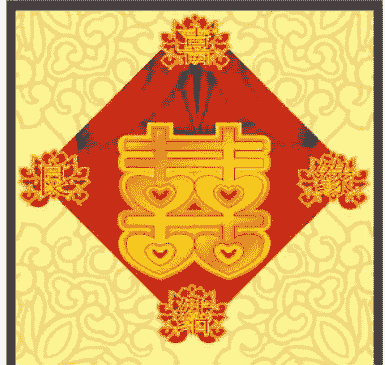

在占星术系统中，对婚运的分析，常用的推运法有返照法、太阳弧法、次限法、三限法等。这些推运方法大多擅长捕捉具有婚姻或重大恋情发生的年份。但如果单纯使用这些推运方法，而没有一个辅助方法对婚姻的大致远期（时间段）做判断，在遇到多个时间目标都存在着可能性的婚恋征象时就会面临筛选上的麻烦。因此，对远期的判断孕育而生。最简单的远期应用就是在分析婚运之前先对盘主婚期的早、中、晚做出预先评估。

在传统的古典占星法中，还是留传了一些远期的推断法则，但对于不熟悉古典占星大运系统的人来说，要理解并掌握好它们并不容易。而本文则介绍一种从本命盘的结构分析入手来判断婚姻远期早晚的方法，避开纷繁复杂的推运技术，将命盘中的婚恋征象拆分成一系列的判断规则，然后通过对规则的理解和把握实现对婚运早晚的预期作大致的估算。

本文介绍的这种远期推算方法并不是传承于古典占星的先人经验，但却是建立于古典占星的部分理论基础之上的。使用时，本命盘将采用整宫制的分宫系统，并且不考虑三王星、小行星的使用。整宫制划分命盘12宫的方法是以命盘中上升点落入的星座为准，将这个星座的黄道30度全部视为该星盘的命宫。然后，将下一个星座分配给第2宫，并依次向后顺排12宫，每个宫位与对应的星座完全重合。举例来说，如果上升星座是天秤座，整个天秤座就将被视为命宫，整个天蝎座对应着第2宫，射手座对应着第3宫，以此类推依次排序到处女座对应的第12宫。上升点（ASC）、中天（MC）、下降点（DSC）、天底（IC）这四个命盘中的轴点简称四轴。四轴仍属于命盘中最关键的位置，但在整宫制系统下不再是宫位的起点。

除了分宫制的问题之外，笔者建议行星之间的相位允许度也需按如下的标准：太阳12度、月亮12度、水星7度、金星8度、火星8度、木星12度、土星8度。计算两颗行星之间的相位允许度，要取两星的允许度合计后除以2得到的数值。例如，金木相位的允许度为10度，是按金星相位容许度8度与木星相位容许度12度相加后再除以2后得到的。

下面以女性命盘为例，分四个步骤对这个婚期研判方法的规则作简要的介绍：

第一步：先划分清楚婚姻早、中、晚期的年龄界限。以女性为例，我们可以将25岁之前定义为早婚，将29岁之后定义为晚婚，将25岁-29岁之间的阶段定义为中等或者说是偏晚婚。需要注意的是，婚龄早中晚区间的划分需要考虑不同城市地区文化背景可能存在的差异。考虑到国内的部分城市和地区生活观念倾向于早婚，那么基于观念差异，上述的年龄界限就需要相应地向前调整1-2年。使用者可以根据实际情况做出调整。

第二步：在命盘中，主管婚姻的宫位是第7宫，所以我们将根据第7宫的宫主星落入的宫位情况，先取出盘主的基准婚期，判定的基本规则如下：

- 1、如果第7宫宫主星落入第1、4、7、10宫，或者是落在命盘四轴附近，基准婚期在25岁之前。
- 2、如果第7宫宫主落入第2、5、11、9宫，基准婚期在25-29岁之间。
- 3、如果第7宫宫主落入第3、6、8、12宫，基准婚期在29岁之后。

势力得以增强，所以婚期就需要从29岁之后的阶段向前调整到25-29岁之间的阶段。

基准婚期的概念只是个初始参数，我们先由第7宫宫主的落宫情况得到婚期的初始参数，然后再根据命盘中各类可能会导致向前推进婚运和向后拖延婚运的征象作判断，依据这些征象调整婚期所处的阶段。

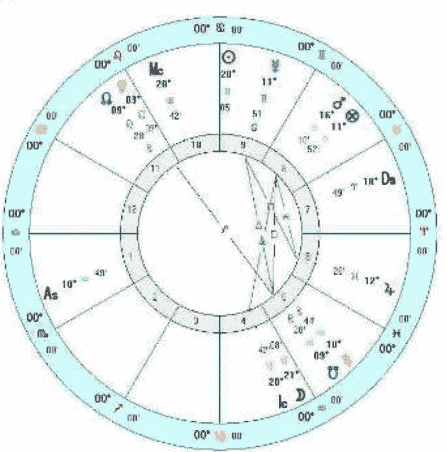

第三步：通过对第7宫宫主的势力强弱和与它构成的行星相位情况作分析，进行婚期的调整，规则如下：

- 1、如果第7宫宫主地处庙旺位置或者是存在着互容关系，则婚期要向前提前一个阶段。例如，某人的第7宫宫主土星落在第3宫天秤座属于庙旺位置。排除第一步的文化差异，通过第二步我们可以得知，当第7宫宫主落在第3宫内，应该取29岁之后的阶段为基准婚期。考虑到土星落在天秤座位庙旺位置，
- 2、如果第7宫宫主地处落陷，则婚期要向后推迟一个阶段。例如，如果某人的第7宫宫主土星落在第2宫狮子座，但考虑到土星在狮子座视为落陷，所以在第7宫宫主落第2宫得出基准婚期取25-29岁之间的基础上，需要对婚期往后调整，也就是从25-29岁之间的阶段向后调整到29岁之后。
- 3、如果第7宫宫主与土星构成合、冲、刑（分别为0度、180度以及90度相位，下文不再作另外说明）相位，并且不存在着互容关系，那么婚期要向后推迟一个阶段。土星代表着延缓、迟滞的影响力，因此一般来说当第7宫宫主受到土星的负面影响时，盘主会倾向于晚婚或者是早婚存在着困难。
- 4、如果第7宫宫主被太阳燃烧，即第7宫宫主落在太阳前后附近17分(1度可以分为60分)到7.5度之间的范围内，婚期要向后拖延一个阶段。例如，如果太阳落在狮子座12度，那么土星落在狮子座的4度30分到11度43分或者是12度17分到19度30分的区域内，就属于被太阳燃烧。掌控第7宫的行星被太阳燃烧也是比较关键的受克因素，它对婚姻的负面影响不在土星之下。
- 5、如果第7宫宫主与木星构成相位，且木星没有落陷或者是受克的，那么婚期可以提前一个阶段。
- 6、如果第7宫宫主与庙旺的金星构成合、拱、六合（分别为0度、120度以及60度相位，下文不再做另外说明）相位，且没有受到凶星的克制，那么婚期也可以提前一个阶段。

（图1:宝拉-阿巴杜的本命盘）

在此，我们以《美国偶像》的知名女评委宝拉-阿巴杜（Paula Abdul, 1962年6月19日14点32分；34.03N, 118.15W；西7区）[1]的命盘（图1）为案例讲解。从星盘可以看到，第7宫对应于白羊座，宫主星火星落在金牛座8宫，因此取基准婚期是29岁之后。

继续参见宝拉-阿巴杜的命盘，宝拉的第7宫宫主火星与土星构成了刑相位，但是也与木星构成了六合相位，两者对婚期构成的推迟和提前的作用力被抵减。此外，第七宫宫主火星落在金牛座属于落陷，也是推迟婚期的征象。但是因为基准婚期已经是处于最后阶段，因此到这步的判断结果婚期仍然是29岁之后。

第四步：通过对命盘中其它与婚姻、恋情有关的征象，对前面得到的婚期作最后一步调整，规则如下：

- 1、命盘中第7宫内如果有落入土星，并且土星不是命主星，也不是地处庙旺星座，并缺少强有力的木星或金星调和，那么婚期要向后拖延一个阶段。
- 2、土星与下降点构成的合、刑、冲相位，婚期要向后拖延两个阶段。土星对下降点的直接影响对婚姻进程产生的阻碍力也是最大的，即使是吉星对土星有调和的影响力，依然会严重延缓婚期。
- 3、木星、金星对下降点构成的合、拱、六合、刑相位，在木星、金星没有落陷的情况下，婚期可以向前提前一个阶段。
- 4、命盘第5宫内落入土星或火星，或者是土星和火星同时落入，火星和土星不是庙旺的，或者是受到了其它凶星的克制，5宫内也无其它吉星的调和，则婚期要向后拖延一个阶段。命盘第5宫是主管恋爱的宫位，这一宫受克会影响恋情经历的顺逆，令好的恋情出现得比较晚，从而令婚期产生了拖延。
- 5、5宫主与土星构成合、刑、冲相位，若5宫主不具有庙旺或互容的地位、或者是缺少有力的吉星的调和，婚期要向后拖延一个阶段。
- 6、金星受到土星的合、冲、刑相位，如果没有木星相位的调和，婚期要向后拖延一个阶段。木星的相位调和（包括刑冲相位）需要优先考虑木星自身力量的强弱，而不在于相位的吉凶。如果木星本身陷落失势，则即使是和谐相位，也难以起到调和作用。

经由这第四步调整之后得到的结果，我们将最终得出盘主的参考婚期。

回到宝拉-阿巴杜的命盘。在第四步调整环节中，她的命盘中没有出现促进婚期的征象，而延缓婚期的征象却有两项：一是金星与土星的刑相位，且无吉星的调和；二是土星落入了第5宫合相南交点。由于之前在第三步得到的婚期已经是处于29岁之后的晚期了，因此在这一步中得到的最后结果，依然是婚期在29岁之后。

宝拉-阿巴杜在1992年4月29日第一次结婚，恰好即将30岁。

下文我们将继续拿出三个实例进行分析：

> 塔特姆-奥尼尔[2]（Tatum O'Neal, 1963年11月5日3点38分；34.06N, 118.20W；西8区）

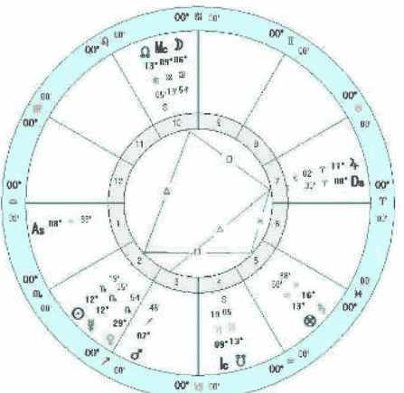

塔特姆的第7宫落在白羊座，宫主星火星落在第3宫射手座，第一步先取基准婚期在29岁之后。因为有木星与DSC相合，婚期向前推进一个阶段，回到25-29岁之间。此外，木星还同时与第7宫宫主火星构成拱相位，并且火木构成互容关系，由此婚期将再向前推进一个阶段，得到婚期在25岁之前。命盘中的5宫恋爱宫虽然有土星落入，但土星在水瓶座属于先天强势，主宰自身宫并有木星的相位调和，因此不作向后调整。经过上述条件推导出的最后结果是预期婚期在25岁之前。

塔特姆-奥尼尔的实际结婚时间是1986年8月，在她23岁的时候。

> 琼-艾伦[3]（Joan Allen, 1956年8月20日0点45分；41.55N, 89.04W；西6区）

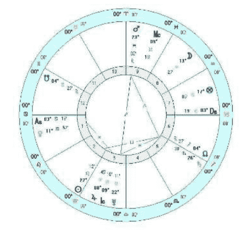

（图3：琼-艾伦的本命盘）

琼-艾伦的第7宫落入摩羯座，宫主星土星落在5宫天蝎座，取基准婚期在25-29岁之间。命盘中土星落入5宫会造成婚恋问题的拖延，因此婚期应向后调整到29岁后。土星自身的势力一般（既无庙旺也无陷落），并且也没有与吉星构成相位，因此她的预期婚期就是29岁之后的阶段。

琼-艾伦实际结婚时间是1990年，大约是在她34岁生日前后。

> 凯瑟琳-克拉夫特[4] (Catherine Krafft, 1942年4月17日20点40分; 47.55N, 007.12E; 0时区)

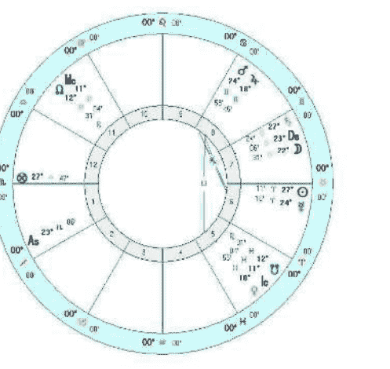

（图4：凯瑟琳-克拉夫特的本命盘）

凯瑟琳-克拉夫特的第7宫落入金牛座，宫主星金星合于下中天点，取基准婚期在25岁之前。命盘中的土星与下降点相合，为此婚期向后直接推迟两个阶段到29岁之后（土星本身就代表着延迟，土星合下降点可直接将基准调至晚婚阶段）。第7宫宫主金星落在双鱼座是庙旺位置，可以将婚期向前提早一个阶段回到25-29岁之间。木星与第7宫宫主金星也构成相位，但因为木星在双子座属于落陷，提升能力不足，因此不作调整。经过上述推断，最终得到的预期婚期是在25-29岁之间的阶段。

凯瑟琳-克拉夫特实际结婚时间是1970年8月，是她28岁的时候。

在对上述婚期的推断方法有了基本的了解之后，读者在实际运用这个方法时，还需要注意以下几点内容：

第一，这个方法仅适用于盘主第一次婚姻的婚期判断。如果盘主的婚姻不止一次，那么之后的婚期不能使用这个方法判断。另外，本方法也不适用于终身不婚的案例分析。

第二，命理角度的婚姻概念，不仅包括了法定婚姻，还包括了公开的（为双方亲戚朋友所知）、长期的同居生活关系。这里长期的概念会显得比较含糊，判断的标准会因个人认知和社会背景而异。

第三，部分具有特殊结构的命盘不适宜应用上述的规则。举例来说，如果月金火三星构成的汇聚或三角形的相位组合（包括三星之间互成120度的大三角相位和三星之间互成60-120-60度的等腰小三角相位），在火星强势的情况下，婚期可能会比较早，无论第7宫宫主落宫是强是弱。又比如，以女性盘来说，太阳是代表配偶的指标之一，所以在有些女性命盘中存在着太阳受克的情况下，婚姻可能会拖延得比较晚。而对于感情的自然征象星月亮来说，如果受到土星这类具有延缓、阻碍效果的凶星克制时，并不会对推迟婚姻构成突出的影响力。但如果月亮与一些对婚恋生活起到负面作用的恒星合相，也会很大程度上推

占星学刊2012.6

## 专题研究

迟婚期。这种情况通常代表着盘主在青年时期或是因为感情经历非常不顺、或者是因为婚姻观念淡薄而导致了晚婚；如果下降点也是落在这些恒星位置上也会得到相同的效果。由于恒星方面的知识牵扯到的内容比较多，实际遇到的情况也并不多见，因此本文不作详细阐述。

晚，提供的信息只是辅助参考。使用时，可以在此基础之上再结合其它推运法，在预估的婚期内定位可能会有婚运的年份。这种方法一方面可以在一定程度上排除多余信息的干扰，另一方面也可以在其它推运法结合得到相似结论时用以辅助论断。但如果在用此法推得的婚期之内应用其它推运法却得不到对应的婚运年份征象，就仍要以常规的推运法为主要依据，不要在两者之间的选择上出现困惑。

第四，本方法的意义在于大致估算盘主的婚期早晚。

## 谢卓新

谢卓新，又被称为“Izul”、“依祖”，中国知名古典占星师。自1997年开始接触并学习西洋占星术至今已有15年，后于2003年转入西洋古典占星术领域，专精于对事业、婚姻、合盘、后天运势等领域的技术研究与实际应用，并于2010年开始提供专业的占星咨询服务。

联系邮箱：izulland@126.com
新浪微博：http://weibo.com/izul
官方博客：http://blog.sina.com.cn/izul

## 次限法：描绘人生最壮丽的蓝图（上）
——总论与次限太阳

作者：黄纤越

次限法（Progression），也被称为二次推运法（Secondary Progression），是占星学中最早形成完整体系的推运法之一。次限法是以出生后的每一天代表生命中的每一年，再通过观察每一年象征盘与本命盘的互动分析个人运势的占星方法，以其简单易用和目标明确而成为历代占星师们使用最为频繁的占星推运法之一。

## 次限法

次限法（Secondary Progression），也有称为月次限法，是以个人出生的星盘为基础，将其出生后的每一天视为生命中的每一年，以月亮在黄道上运行一圈为每一循环周期的推运法。命主在出生后27至28岁之间将会经历第一次的次限盘月亮回归，意味着第一周期的结束。从次限法的原理可以看出，月亮是次限法中的核心行星，在推运时最为注重推运月亮的先天与后天宫位以及推运月亮触发的本命问题。

然而，进入中国占星圈后，由于众多其它速成推运法的出现，次限法渐渐失去了其在推运方法中的主导地位。追根究底，我想这与国人追求快捷和速效的生活方式有关。不少人在占星推运时，只求结果不问过程，盲目以判定事情发生为最高衡量标准，只追求准确率而不求甚解，却忽略了事情发生的前因后果，只能片面地看到当下带来的影响，而无法观察出命主本身生命演化的过程。但以占星理念而言，**占星师更应该做的不是将可能发生的事情简单断言或是心理恐吓咨客，而是更为注重命主本身生活变化所带来的人生演化过程，以帮助命主更好的掌舵人生。** 因此，我个人认为传统的次限法依旧是最值得研究和学习的占星推运方法之一。只有通过次限法，我们才能更好地明白自己已经进展到了生命的哪个阶段，应该以何种方式和心态应对即将到来的变化，方能利用好当下的每一天。

次限法的发源已无法探究，我们无法得知古人是从何原理设计出这样的推运模型，但中国古代四大名著的《西游记》曾说过的“天上一日地下一年”倒是与次限法有异曲同工之妙。而现代科学理论早已证明月相变化与人体生物节律的关系，更加证明了月亮会给个人生活的方方面面都带来影响。

不妨这样来看，在新生儿来到世界上之后，每一天都是崭新的认知。当月亮在星盘上走过完整的第一圈，代表着婴儿通过自身真正需求（月亮）去完整经历和感知了一遍世界，对生活的方方面面有一次全面的认识。而当月亮在星盘上走过第二圈时，重复的经历让婴儿变得富有经验，懂得未来应该怎样与这个世界接触才能更好地满足自己。当月亮在星盘上走过第三圈，此时的婴儿已经对生活习以为常。

与三限法以及太阳弧等等当下热门的推运方式相比，次限法更加体现个人阶段性的人生蓝图以及事件对生命本身带来的长期宏观影响，因此也要求占星师有更加深刻的本命盘描述与分析功底，才有可能挖掘出次限法背后的隐藏课题。如果这么说有些抽象，我们不妨先从三种推运法的原理入门稍作比较就可明白其问题所在。

而转换成次限法，次限月亮在黄道上运行的第一圈代表着我们从出生到27-28岁之间第一次次限月亮回归过程中对生活每个方面的崭新认知；第二圈代表着27-28岁间至55岁左右第二次次限月亮回归过程中对生命各个方面富有经验的深层体验；而第三圈则代表着55岁至82-83岁之间看淡风云宠辱不惊地回归平淡。这一切，是否与我们在婴儿时期的个人体验有着异曲同工之妙呢？

验有着相似之处呢？

（45度相位）和六合相位（60度相位），此问题至今还未有完善的解决方法；

## 太阳弧法

太阳弧法是以个人出生星盘为基础，以太阳的平均日移动速度59分8.33秒为刻度单位，星盘中所有行星每一年都向前推移一个单位，从特定年份的太阳弧盘与本命盘之间的相位为基础判断该年份是否有重大事件发生。太阳弧法的优势在于可以快速判断出一阶段内可能发生的重大事件以及影响方面，信息直观、简单扼要，因此受到部分现代占星师喜爱。

## 三限法

三限法是一种以个人出生的星盘为基础，将其出生后的每一天视为生命中的每一太阴月（约27.3天，接近农历），以月亮在黄道上运行一圈为每一循环周期的推运法。三限法也是当今中国占星圈内使用最广的一种推运法，但在国际占星圈中却鲜少有人使用。

从个人的角度看来，太阳弧法的精髓是以太阳为核心而制定的推运方法。在占星学中，太阳也代表着我们的肉体，所以太阳弧法更容易看出实际的物质和事件变化，而较少体现内心真实的情感体验和心灵演进过程。

三限法的原理类似次限法，是一种从次限法基础上发展出来的新的推运法。相比次限法，三限法的周期更短，更适合做短期应期预测，配合其它推运法可以将应期圈定在一个月乃至一周甚至几天内，也因此广受占星爱好者的喜欢。

除此之外，太阳弧法也存在着一些无法忽略的硬伤：

从三限法的原理来看，三限法以新生儿出生后的每一天视为每一个太阴月。第一个循环周期过后，命主约为2岁零3个月，学会了接受照顾和模仿外界，已经可以独立完成很多事情的年纪；第二循环周期过后，命主约为4岁零6个月，期间经历了重要的个人认同时期；第三个循环周期结束时约为6岁零9个月，正好接近心理学上认为儿童成长最关键头七年的结束期。此时，还勉强可以用在介绍次限法时提及的婴儿认知理论来解释三限法与个人运势之间的关系。但在第三循环周期结束后，婴儿已经开始熟悉这个世界，流日盘并不足以对婴儿产生更大的影响。试想，如果我们要用三限法观察60岁时某个月可能发生的事件，就需要调用3岁生日前后的某一天的流日盘，而这一天的流日盘会对58年后命主的生活产生多少影响实在让人怀疑。

其一，以我个人观点，太阳弧法是从古典占星中的主限法简化后、结合次限法使用的太阳位移精度改良而来。在太阳移动的时间精度上更加精确，减少了经年累月后可能带来的度数改变误差。但考虑到太阳弧技法本身对事件判断的时间精度有限，经常只能将事件发生的时间限定在准确相位的前后一年中，很多时候并不足以体现时间精度提高所带来的优势。而在论断时，太阳弧法可能出现相位众多而无法区分主次轻重，令论断方向不够明确；

其二，太阳弧法本身为虚拟行星算法，所有行星皆按照同样的太阳刻度单位移动，导致行星间的距离并未产生变化。不妨理解为该方法重点关注的是太阳位置改变带来的连锁反应（而太阳弧法中的使用的太阳位置其实就是同一时间次限法中太阳的位置），因此除太阳（以及本命盘中与太阳构成了强烈相位的行星）之外的其它行星相位触发的效果存在疑问。正如著名占星大师查尔斯·卡特（Charls-E-Carter）曾说过：“占星师最重要的准则之一就是本命盘中没有显示的信息将不会发生在流年中。”在判断太阳弧盘的时候，占星师也会很容易陷入太阳弧盘所展示出的各种相位之中，而忘记观察本命盘是否存在这样的问题蓝本，带来实践中可能出现的偏差；

此外，过于快速的运行周期也会让推运星盘所显现的信息频繁变化，减弱长期效应。综合上述分析，我个人认为三限法在实践中虽然有一定的准确度，但随着命主岁数渐长，影响力也会越来越弱，论断时也会缺乏可靠性。除非把三限法作为其它推运方法的辅助判断工具，否则并不建议单独使用。

其三，当命主行运至45岁和60岁时，因为行星移动刻度的统一化，会导致星盘全盘出现半刑相位

经过上述比较，相信读者们已经对三种推运法有了比较清晰的了解。通过比较不难发现，三种推运法由于其原理不同而在论断方面各有千秋，但如果以独立操作而言，还是次限法更胜一筹，可以体现出整个推运流年的完整性和延续性。如果解盘人有着足够的

占星学刊2012.6

44

## 专题研究

本命星盘解读能力，次限法在应期方面也会有着非常出色的表现，让占星师和客户不仅可以描画出个人宏伟壮阔的人生蓝图，更可以找出最适合发力和成就的决战时刻。

月亮的推进无疑是最具有延续性和周期性的指标，也是次限法中判断个人命运轨迹的关键因素。除此之外，同样为发光体的太阳也因为他的重要地位而被优先考虑。

正如我们一贯所说的，再好的工具都要用正确的方法使用才有可能让其发挥事半功倍的效果，次限法也是如此。还记得在2004年前后，大陆占星界已经有不少人开始尝试使用次限法辅助推运。但随着其后论坛开始流行应期更加明显的三限法，次限法也就逐渐退出了大家的视线。

下文将系统从次限太阳、次限月亮、次限虚点与行星以及次限相位四个方面详细地论述次限法的使用方法：

不难想象，在当年多为十几岁学生的论坛使用人群中，三限法因为命主年纪尚轻的缘故应验颇多，又因为年轻人的生活中多为小事而非人生转折的大事，所以三限法足以满足普通占星爱好者的需求。而次限法因为大多数使用者不得其法，又无法在小事应期上与三限法匹敌而在中国星坛逐渐没落。但随着占星术的普及，爱好者的年龄分布也越来越广泛，人们需要的更多是规划人生的工具，次限法的优势在此时再度体现。

## 次限太阳

不论一个人的太阳落在了黄道的什么位置，终其一生都会遭遇2-3次次限太阳转换星座。众所周知，每个黄道星座都只会占据黄道上的30度，所以任何一个人都会在30岁之前经历一次太阳过宫。我们经常会感觉某人在青年时期的某一年突然从性格到生活都产生巨大变化，仿佛变成了另外一个人，这就有可能是次限太阳改变星座带来的影响。出生太阳落在阳性星座（白羊座/双子座/狮子座/天秤座/射手座/水瓶座）的人会因为次限太阳进入阴性星座（金牛座/巨蟹座/处女座/天蝎座/摩羯座/双鱼座）而变得更加沉稳，出生太阳落在阴性星座的人则因为次限太阳进入阳性星座而变得更加活泼。

就我看来，次限法就像一块未经打磨且形状怪异的璞玉，需要找准角度打磨才会变成光彩夺目的成品，若没有看准下刀也有可能雕成残次品。所以，解读次限法并不能依据一般的星盘解读方法，必须牢牢抓住几个关键点下手，才有可能让次限法的效应发挥到最大。

当次限太阳进入每个星座的最后一度并开始准备转换星座的时候，这一年也经常是个人生活面临挑战的年份（次限太阳每走1度将影响几乎等同1年的运势）。由于前后两个星座能量性质的阴阳差异，次限太阳在此处都需要经历一段调整期。当次限太阳进入阳性星座的最后一度，命主身边的环境容易变得充满杂乱不堪的干扰和抉择，而命主自己也会躁动不安以茫无目标的行为来缓解自身的焦虑感（但其实经常是无用功）。而当次限太阳进入阴性星座的最后一度，命主身边的环境则趋向于如一潭死水般不见生机沉闷不堪，而命主本身也容易被外界环境压迫地喘不过气来却又无法改变苦闷不堪。因为害怕与恐惧，命主容易盲目寻找各种出路试图尽早摆脱困境，草率糟糕的决定以及迫切焦虑的心态是这一阶段的明显特征。

在解读常规星盘时，我们会更加注重星盘本身所蕴含的信息，偏向于从星盘本身行星、相位之间的关联找出解盘关键点。但在次限盘中，星盘本身的相位作用将被弱化，次限盘与本命盘之间的互动作用才是判断的核心。就我个人的实践经验看来，想要抓住次限盘的关键，必须从次限月亮/太阳/上升/中天的星座、宫位以及与本命盘中个人行星产生的相位入手，辅以其它行星的过宫、合相以及与本命盘的相位参考，之后才考虑次限盘中行星与行星间的相位。

正如前文提及的，次限盘是依据出生后的每一天代表此后每一年的准则建立的。所以人生经历数十年中，次限盘所体现的也只能是出生后2-3个月左右的流年盘。而这短短几十天根本无法让除月亮外任何一颗行星完成环绕黄道一圈的周期，所以次限盘中次限

随着次限太阳顺利进入下一个星座，命主可能突然感觉拨开迷雾找到了新的人生方向，并开始向着某个确定的目标而努力。期间，个人对外界的反应模式都会产生明显变化，一些大的人生事件可能就此拉开帷幕。在某些个案中，变化（新生活、新工作、新伴侣和新城市）可能在太阳切换星座的一年内、甚至短

占星学刊2012.6

45

## 专题研究

短数周中，快速发生。但以我个人的经验，如果次限太阳在过宫时并没有触动本命盘其它象征星，同时也沒有其它次限与本命相位的辅助，将更多地体现在心态带来的行为模式和行动方向的改变。次限太阳进入新的星座时也需要一段过渡周期。具体事件也许会在1年内发生，但也有不少是需要1-2年的过渡期才会逐渐显现成果。

速崭露头角，很快就成为亚洲流行乐坛领军人物。也被誉为本世纪初最具革命性的华语创作歌手，创造性地把西方嘻哈音乐与传统中国风相结合，自成一派。他的唱片在全亚洲总销量超过3100万张，当代无人能敌。下文案例都将以周杰伦的次限星盘为蓝本，选用出生地的为次限盘经纬度，其它不再另做说明。

次限太阳在推运过程中与本命星盘中的个人行星产生合相或是刑冲相位，也会对该颗行星象征的领域带来直接影响，甚至在准确合相的日期前后几天就有重大事件发生。举例来说，次限太阳合本命金星，可能令事主突然恋爱，也有可能意味着个人形象的改变，或是具体事件的发生令经济情况改变。具体体现在生活的哪个领域，突出了金星的哪方面特质，都需要借助金星所落和掌管的宫位判断。而相位则更容易显示事件带来的是正面（合相）抑或负面（刑相）影响，甚至需要放弃一些东西去换取满意结果（冲相）。

从星盘中圈（图1）的次限盘（1982年5月8日）可以观察到，此时的次限太阳恰好从摩羯座进入水瓶座，带来了生活本质的不同。水瓶座也代表着创作才华与革新思想，次限太阳进入此星座容易发生与才华、团体以及革新有关的事件。值得注意的是，当年的次限太阳还与次限火星发生了准确合相，将本命盘中原本的日火入相位落到实处。火星落在水瓶座有着严厉受教的意义，加之火星在其本命盘中也是代表日常生活和专业技能的第六宫宫主星，由此可以判断命主将有相当机会在此年加入某种团体（水瓶座）或是学习某种特别的专业技能（第六宫）。而正是在这一年，3岁的周杰伦开始学琴，后被母亲叶惠美发现其拥有惊人的音乐才华，为其购置好钢琴，开始周杰伦“严厉管教”的音乐童年。

下面，不妨让我们通过实例解析次限盘中次限太阳的影响：

**周杰伦**(1979年1月18日,校正生时1:03:30am<误差1分钟以内>，中国台湾台北县，121E29/25N00,东八区)，华语流行乐坛一代天王。2000年出道后迅

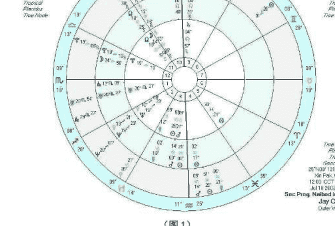

然后，再来看星盘外圈（图1）的次限盘（2002年7月18日，第三张个人专辑《八度空间》发行日）。从次限盘可以看出，次限太阳在当年稍早时间与本命天王星发生了刑克相位，专辑发行时正处于该相位出相位1度以内的影响期间。原本就落在命主的第一宫内的天王星代表着个人本来坚持的特质与才华，如果与次限太阳刑克，则可能导致命主需要放弃原本坚持的理念（天王星）带来不希望看到的结果（刑相位）。次限上升点也恰好落在天蝎座29度多，带来了将变未变的方向性迷茫（后文也将详细介绍如何结合参考次限上

（图1）

占星学刊2012.6

46

## 专题研究

升点判断次限星盘）。
值得注意的是，次限月亮恰好刚刚进入了代表荣耀与成就的狮子座，同时也是整宫制的事业宫，并将在2个月内与大吉星木星形成合相。由此可以推断，虽然命主会在本年做出一些情非所愿的事情（本命天王星的刑相位），让自己个人尊严或是荣誉（太阳）受损，但最后结果（参考次限月亮宫位）却依旧是好事（次限月亮合相次限木星），具体原理在后文会详细阐述。而在当年，《八度空间》发行后就被人指出制作不够精良、歌曲缺乏创新等弊病，就连周杰伦也认为这是自己最糟糕的一张专辑，最后却依然以其辉煌的销量和传唱度而占据各大排行榜，捞金无数。

先后改变星座也会带来人生目标和生活领域的巨大改变。根据这张次限星盘，个人推论周杰伦很有可能在近期将真正成立自己的电影公司，正式从艺人转型成为导演或是制片人。当然，因为双鱼座与射手座都带有很强的宗教意味，也不排除命主选择一种更加宗教性的生活方式，开始致力于宗教推广也很难说。

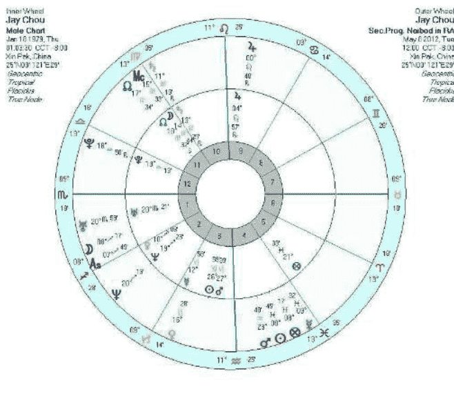

进入今年（2012年5月8日，随机选取时间），外圈次限盘中（图2）的太阳再次改变星座，进入了与梦想、宗教以及电影有关的双鱼座。而在2012年4月底，次限月亮也同步进入了与理想、追求、宗教以及意识形态有关的射手座。射手座同时也是本命盘整宫制第二宫，与财富、资源管理以及价值观有关。次限太阳与月亮在短期内

（图2）

## 黄纤越

网名“凤影焰”，江湖人称“凤大”。中国著名占星师，水晶能量灵疗师，新浪星座教程专栏编写者，也是国内首批占星学研究者和占星资料翻译者。近年来一直致力于发展中国的占星文化事业，并于2012年5月正式创办中国的第一本专业占星泛神秘学期刊——《占星学刊》。她也是中国首位将占星术与水晶灵疗完美结合的咨询师。
联系邮箱：lucky.astro@163.com。
新浪微博：http://weibo.com/luckyastro
官方博客：http://blog.sina.com.cn/luckyastro

## 占星基础教程：跟凤大学占星系列之一
——星座与元素

作者：黄纤越

对大多数刚接触占星学的爱好者来说，一张简单的星图都不啻于一张高难度的空间物理轨迹图。行星、星座、宫位、相位以及其它组合因素，每一种都是一组密码。大多数人仅仅能解开其中一组或两组，而无法全部解析，于是就卡在了某一个关口无法再往前行。

盘根据不同分类法划分成了不同的区域，让我们可以在坐标轴的基础上更好地定位各个坐标。行星和相位，就好像航海图上的具体坐标以及两个不同坐标之间的位置。当四者综合在一起，才能构成一张准确可信的航海坐标图供人参考。所以，在第一堂课，我们将从最基础的星座讲起。

在我所认识的初学者中，大多数人可以理解单颗行星和星座的意义，若是单独提到宫位，似乎也能理解。但想要把三者结合在一起，乃至加上相位解释，很多人就开始逻辑混乱，再也说不出个所以然。考虑于此，本教程将侧重于基础内容的简单介绍和快速解盘分析方法讲解。

## 星座

占星术上，会将（北半球的上半年）白昼时间从短到长的变化过程中昼夜时间完全相等时，太阳经过黄道上的位置视为春分点，然后以春分点为界将黄道上的360度等分成为12份，依次分为白羊座、金牛座、双子座、巨蟹座、狮子座、处女座、天秤座、天蝎座、射手座、摩羯座、水瓶座以及双鱼座。

在阅读本教程时，也推荐大家配合苏·汤普金老师的《当代占星研究》和台湾秦瑞生老师的《占星学（上）（下）》两本书对概念进行更加深入地学习，前者更加注重现代占星推崇的人本理论，后者为古典占星术入门读本。

在日常生活中，我们经常会听到有人说到“我是白羊座”或者“我是双鱼座”。这里的指代的通常是他的太阳落在了黄道上的白羊座或是双鱼座。为什么我们需要强调只是“太阳”落在了某个星座呢？因为在占星术体系中，黄道十二星座实则是相对独立的体系，包括太阳在内的太阳系八大行星（在此并不包括地球，因为整个占星术体系是以地球为核心的相对天体系统）和月亮都可能落在其中的任意一个星座。当星体落在黄道上的某个星座时，这颗星体同样也会带上该星座的特质（在未来的课程中，也将详细讲解这部分内容）。因此，了解黄道上十二星座的具体意义和表现是学习占星术时最基础也是最重要的部分。

古语有言：“师父领进门，修行在个人。”本文能够教给大家的只是方法，想要成为一个有一定水准的爱好者，乃至真正合格的占星师，最终靠的还是个人的努力学习。

第一堂课，我们将从星盘基本元素入手，教大家从最基本的层面进入占星的世界。

在占星学中，星盘是所有理论的基础。最简单的星盘可以由星座、宫位、行星和相位四个部分组成，只要了解四个部分各自的含义和表现，就意味着你已经开始迈进了占星术的大门。

大多数人也许可以轻松地说出每个星座的特点与特质，但却知其然不知其所以然。这里就必须先从基础的十二星座分类方法说起。了解了分类的原因和类别，才能更加深入地了解十二星座的意义精髓。

星座与宫位就好像航海图上的两条坐标轴，将星

对于黄道十二星座，我们可以从简到繁，依次根

## 占星教学

据阴阳、三方和四正三种分类法来进行归类：

## 阴阳

众所周知，阴阳是渗透于中国人数千年文化血脉中的核心哲学。而在西方体系中，也同样存在这一哲学观点。人们认为，阳性代表着外显、主动、积极、外向以及阳刚等特性，阴性代表着内敛、被动、消极、内向以及阴柔等特性。十二星座也可以按照依次隔开的顺序分为阴阳两类。

阳性星座：白羊座、双子座、狮子座、天秤座、射手座、水瓶座；
阴性星座：金牛座、巨蟹座、处女座、天蝎座、摩羯座、双鱼座；

阳性星座大多主动外向，性格活泼，更愿意表现自我，争取机会；阴性星座相对内向、性格内敛、较为被动、退隐，不喜表现自我。

使用占星软件时，软件会将星盘显示出的所有行星和虚点都以 1 分计算，最后得出星盘中分别的阴（Yin）阳（Yang）属性得分。从星盘信息区的第四列可以看出，当个人星盘中的“阳（Yang）”的得分高于“阴（Yin）”时，此人大都性格较为主动，更愿意争取机会表现自我；而当“（阴）Yin”的得分高于“（阳）Yang”时，则意味着此人相对来说性格更为阴柔内向，偏向于隐藏自我，不太显山露水。

## 三方

三方分类法是一种按照星座的四种不同属性对其进行分类的方法。与中国传统的五行不同，西方文化认为世界由火、土、风、水四种元素组成。在阴阳的基础上又将十二星座划分为四种不同性质的星座——火相星座（Fire）、土相星座（Earth）、风相星座（Air）以及水相星座（Water）。

在四相星座体系中，火相星座与风相星座属于阳性星座，带有上文提及的所有阳性星座的特质，但相对而言，火相星座代表着行动力，风相星座代表着思考力，所谓“一文一武，张弛有度”。土相星座和水相星座属于阴性星座，带有上文提及的所有阴性星座的特质，但是土相星座更重视物质和实际，水相星座更重视精神与感受，两者代表着物质世界的积累与精神世界的审视。

火相星座：白羊座、狮子座、射手座；
土相星座：金牛座、处女座、摩羯座；
风相星座：双子座、天秤座、水瓶座；
水相星座：巨蟹座、天蝎座、双鱼座。

火相星座代表着行动与激情，土相星座代表着物质与实际，风相星座代表着思考与理性，水相星座代表着情绪与感受。

占星术中的个人星盘是由这四种元素组合而成，而元素所占比重的不同更是决定了一个人会用怎样的方式去看待和认知世界，以及习惯用什么样的方式去影响和融入外界。

在计算星盘元素时，软件会将星盘显示出的所有行星和虚点都以 1 分计算，得出累计最高分数的元素，就是这张星盘中占据比例最大的元素。

当星盘中某一相星座所落行星累计数量较高时，此人会带有典型的该相星座的特点，并擅长于使用这一相星座所具备的能力。例如：如果一个人星盘中土相星座所落的行星最多，那么此人一定擅长于土相星座所特有的规划和落实能力。

而当星盘中某一相星座所落行星数量太少甚至没有时，说明此人相对来说欠缺这方面的能力，部分人会回避这方面的需要，而另一些人则可能更加锲而不舍地追寻这种能量。例如：如果一个人星盘中没有任何行星以及上升点落在火相星座，那么此人可能会不断努力尝试各种需要行动力的工作，以得到现实中的弥补。

## 元素组合

分析星盘中的四相元素分配比重也是用来挖掘个人基本特质的最直观方法之一。使用这种方法，可以让你即便不会看星盘，却也照样能够通过星盘勾勒出一个人的基本性格。

首先，我们需要先锁定星图中列出四相元素分配的位置，找出得分最高的两种元素，进而得出这张星盘的元素组合。以俄罗斯总统普京的本命星盘为例（图 1），可以看出风相元素（Air）得分最高，火相元素（Fire）与水相元素（Water）均为 3 分。考虑到火相元素的其中两分分别来源于虚点的中天（MC）和外行星冥王星，相比之下不如水相星座中的上升点（ASC）和个人行星金星重要，所以可以将普京的星盘判定为风相元素与水相元素的组合。

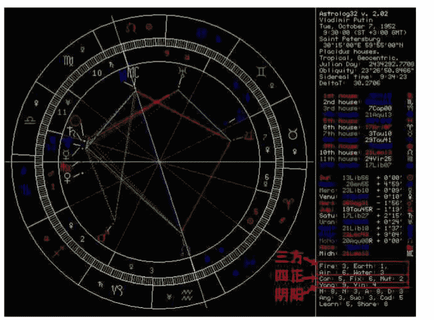

（图 1）

也是最具有执行力的人。他们既有火元素热情的一面，却又能兼顾土元素冷静的一面，遇到事情不会盲目，注重实际效果。对他们来说，没有任何困难可以阻挡他们，因为他们相信只要努力去做，就可以克服一切。

值得一提的是，星盘中除了逆行的木星之外，再无其它行星落于土相星座，也会让其人因为缺乏土相代表的物质与实际因素而更想努力追求。而普京本人正是以出色的实务和执行能力而广受俄罗斯国民欢迎。在苏·汤普森老师的《当代占星研究（第二章元素小节）》里有关于**元素缺乏**问题的详细阐述，有兴趣者可自行阅读。

得到星盘的偏重元素组合后，我们可以根据组合不同而获得此人的基本性格信息：

### 火相元素与风相元素组合

火元素的热情加上风元素的思考，很容易就会变成一股“热风”——让人满脑子鬼点子，但也容易头脑发热。这些人会拥有美好的理想，也是最好的煽动者。他们既饱含热情，头脑也足够活跃，各类创意源源不断，总能带来与众不同的新鲜感。但如果缺乏土元素的介入，就容易流于表面或是半途而废。

### 火相元素与土相元素组合

火元素注重行动力，土元素重视结果并会努力把所做的事情变成现实，因此以这两种元素为主打的人

### 火相元素与水相元素组合

水元素的灵感与浪漫搭配火元素的激情与动感让他们成为最富生活热情的一类人。他们的个人喜好会直接影响到生活选择，也是情绪波动最明显的一批人。他们会为一件事情倾尽全力，只因为感觉对了（一旦感觉不对，最快撂挑子的也是他们！）。但如果一些人或事是他们所不喜爱的，个人的情绪化也将严重影响办事效率和人际关系，变得得过且过浑水摸鱼。

### 土相元素与风相元素组合

土元素的务实加上风元素的机敏令这类人成为最为冷静和发挥稳定的杀手级人物。他们有着注重现实的智慧，做事既有头脑又有计划，稳健的作风也会带来几乎无懈可击的发挥。这类人看上去有些过于理智甚至思虑过重拖累发展。但时间长了你才会发现，他们才是真正的常青树，看似不起眼的树冠却有着既深又多的盘根错节，一朝发力无人能敌。

### 土相元素与水相元素组合

土元素的忍耐力与水元素的包容力相结合，很容易让他们成为了擅长防守的“隐形人”。生活上的他们就好像传说中的“隐身侠”，悄然无息，让人很容易忽略他们的存在。这类人不够激进和活跃，却懂得踏实地充实自我，在最关键的时刻反而会成为避风港。他们也有着超出常人的忍耐力和抗压力，在长期的高压环境下将凸显优势，成为攻坚战的主力军。

### 风相元素与水相元素组合

风元素的协调性与水元素的感受力会令这类人成为左右逢源的“香饽饽”。对他们来说，人际关系也是生活中最为重要的一部分。他们既懂得与人交往，也懂得体贴他人，因此也很容易成为朋友圈中值得信赖的核心人物。如果搭配适当的土元素，这些人也会是一流的团队管理人才。任何涉及到跟人打交道、需要洞察人心的事情都是他们的长项。

## 四正

正如星盘可以划归为四种元素，黄道十二宫同样可以根据行为模式和性质的不同被分成三种不同的类型组——**基本星座（Cardinal）、固定星座（Fixed）与变动星座（Mutable）**。有趣的是，这三组中每一组的四个星座相互之间形成 90 度的刑克相位，形成正方形，也是星盘上的四正。**这样的关联会令四个分别具有不同元素特征的星座却共同分享了一种相似的思维方式、行为模式和释放管道：**

**基本星座：** 白羊座、巨蟹座、天秤座、摩羯座；
**固定星座：** 金牛座、狮子座、天蝎座、水瓶座；
**变动星座：** 双子座、处女座、射手座、双鱼座。

同样通过上文提及的软件积点计算，可以找出星盘中基本星座（Car）、固定星座（Fix）以及变动星座（Mut）三项中得分最高的一项，这一项就是影响你最深刻的一种行为模式。

### 基本星座（基本宫）：

基本星座又名开创宫，顾名思义，就是他们喜欢去开始做一件事情。基本星座的能量是一股强有力的积蓄能量，找准方向后就会对着这一方向持续发力，“开创”是他们的关键词。基本星座更像是社会的架构搭建者，他们建立社会规范，并要求所谓事情都有理可循，原则性极强。但因为基本星座极度讲究“一击即中”，如果时机未成熟宁可以逸待劳（白羊座虽然偶有冲动，但冲动过后同样如此），偶尔会显得过分因循守旧。他们并非传统意义上的卫道士，只是更喜欢在有架构的环境里保护自己。一旦时机成熟，基本星座也有可能彻底翻盘，成为新世界的构建者。基本星座偏重的人往往有着极强的个人素质，他们既有着恰当的社会交往能力，又懂得把握时机，专业上也颇有涉猎，关键时刻敢于承担责任并处理各类危机，是难得一见的综合性人才。

### 固定星座（固定宫）：

在占星术上，四个固定星座所处的时间段都是季节特征最为明显的时候，所以也带有明显的深化和强调的意味。固定星座的能量是一股在固定范围内持续加强的永动能量，“强化”是他们的关键词。典型的固定星座注重个人感受和现有状态，与基本星座和变动星座相比，有着明显的拒绝变化的倾向。对固定星座而言，他们认可的是个人的小宇宙，如果一件事情或者观念得到他们的认可，就会不计代价地全身心投入坚持到底。一方面，他们通常是非常好的专业型人才（因为够钻研），但另一方面却又容易走上过分固执的道路以致阻隔了与外界的沟通渠道。固定星座特质明显的人善于坚持（不论条件多恶劣）、非常可靠（如果这件事得到了他们认可，不认可立马撂挑子），是出色的守成型人才。

关键词：我是（I am）
——主动、开创、行动与激情

### 变动星座（变动宫）：

变动星座所处的时间恰好是每个季节的尾端，此时气候不再具有该季节明显的特点，而向着下一个季节过度，所以变动星座也以善于变通、圆融而著称，“调整”是他们的关键字。变动星座的能量就像流动的溪水，没有固定轨迹，也没有固定的目标，可以穿过任何存在的缝隙，也可以汇集成河流随大势而改变河道。但这类人也非常容易被周围环境所改变，缺乏原则性更导致可能做事无底线。他们容易被当下的利益迷惑视线，为一时之好而缺乏长远考虑。因为没有基本星座的原则和固定星座的固执，变动星座在很多时候显得更有能耐，懂得利用手中的一切资源努力向目标进发（不像基本星座总是被自己的条条框框先框住），也不会过分执着于预定路线和目标（不像固定星座执着于目标而走进死胡同），既懂得寻找机会，又懂得适时放手，让所有的可能性都无限放大，是良好的公关型人才。

## 黄道十二星座

根据上文通过阴阳、三方、四正这三种方法对十二星座进行分类，我们通过组合法可以得出十二星座的关键词和基本特征，并对每个星座的特质进行更加深入的理解：

### 黄道第一宫：白羊座

关键词：我行动（I do）
——主动、开创、行动与激情

白羊座，勇敢而冲动，他们是火相的开创星座，所以更愿意用自己的双手主动出击改变世界。对白羊座而言，感受世界的方式就是从现在开始亲力亲为努力争取。他们富有活力和激情，喜欢领先于他人，不断追求新鲜东西，也深爱挑战自我。他们以速度取胜，却缺乏持续力，燃烧太快而容易泄气，也因为只顾着目标而忽略了周围。因为既是阳性的基本星座，又是心急火燎的火相星座，有时容易流于毛躁，冲动草率，容易得罪他人。白羊座也代表着初生婴儿的阶段，需要用自己的行动去体验世界，任何事情不需思考，只是很直接地想要就去做。

### 黄道第二宫：金牛座

关键词：我拥有（I have）
——被动、强化、物质与实际

金牛座，稳健而迟缓，他们是土相的固定星座，所以更愿意从物质世界寻求实实在在的安全感。以逸待劳（被动）也是金牛座的特质之一。他们需要时刻用自己的感官（物质与实际）享受着来自物质世界的舒适、美食和美感。金牛座虽然反应相对迟缓，却有着强大的持续力（强化）和抗压力，加上重视物质，也因此容易完成金钱方面的积累。但也因执着于物质世界的金钱与享受，而有过干物欲的倾向，态度固执难以沟通。金牛座同时代表着在了解世界之后的安全感需求，需要用一切的触碰去实实在在地感受到自己的存在。

### 黄道第三宫：双子座

关键词：我认为（I think）
——主动、调整、思考与理性

双子座，灵活而变通，他们是风相的变动星座，更愿意用活络的思维和灵动的交际手腕了解世界。好奇心重是双子座最重要的标签，令他们会非常主动地通过谈话、聊天等手段获得信息，并快速传播出去。灵活的头脑、出色的资讯获取能力和技巧学习能力是双子座最大的优势。但也因为是变动星座，双子座的能量是漂浮散乱的，令思考与理性的层面变得浅薄，多以快速传播和思考表象为主，而欠缺深度，容易流于肤浅和浮躁。双子座代表着开始成长之后对这个世界的好奇与求知，需要通过与人沟通、收集信息去更好的了解世界。

### 黄道第四宫：巨蟹座

关键词：我感觉（I feel）
——被动、开创、情绪与感受

巨蟹座，温吞而敏感，他们是水相的基本星座，更愿意用感受和情绪去了解世界。作为水相的基本星座，他们的“开创”是需要在情绪积累后才会爆发。巨蟹座通过情绪上的交流和付出获得认知和认同，进而获得安全感。他们善于囤积却无法自我消化，当情绪积累到一定程度，才会从阴性的隐藏状态爆发，引发事件并与物质世界接轨。巨蟹座的情感付出是需要对方回报的，看似无私包容的背后却可能是狭隘自私，有时也会沦为情感胁迫。巨蟹座也代表着少年时期开始明白家庭的意义，受到原生家庭的照顾和影响，也因此得到相应的好的或者坏的传承，变成内在根深蒂固、不可磨灭的印记。

### 黄道第五宫：狮子座

关键词：我要（I will）
——主动、强化、行动与激情

狮子座，高调而亮眼，他们是火相的固定星座，更愿意用华丽的表现和耀眼的才华去影响世界。作为火相的固定星座，他们强调自身表现，需要舞台去用富有表现力的行为将自身的色彩渲染于众，也因此带来强烈的创造力与表现力，但偶尔也有表现过度而流于浮夸的嫌疑。由于过于强调自身表现，狮子座很容易作茧自缚，被一些无形甚至虚无的东西制肘，“死要面子活受罪”。狮子座的坚持表现自我有时也会变成他人眼中的刚愎自用。狮子座也代表着开始进入青年时期，勇于表现自我，寻找各种让自己愉悦的方式和方法，恋爱也是一种表现自我并获得愉悦感的最佳方式。

### 黄道第六宫：处女座

关键词：我分析（I analyze）
——被动、调整、物质与实际

处女座，勤劳而挑剔，他们是土相的变动星座，更愿意用逻辑的理论和细节的认知去了解世界。作为土相的变动星座，他们擅长于任何实务的细节问题，也是各种工具爱好者，尤其擅长学习各种工具和技术。他们勤劳刻苦，做事精益求精，是绝对的劳动模范。而对于实际细节的细化更是无人能及。但由于是变动星座，所以可能因为过分追求细节完美而呈现出吹毛求疵或舍本取末的问题。过于挑剔、甚至喜好批判他人，都让处女座人缘受损。处女座也代表着青年时期的后期开始懂得生活的意义，需要每天通过学习和使用各种工具获得生存能力，健康也成为直接影响生活的重要因素。

### 黄道第七宫：天秤座

关键词：我平衡（I balance）
——主动、开创、思考与理性

天秤座，圆融而温和，他们是风相的基本星座，更愿意通过与他人的互动以及公平的维系去影响世界。作为风相的基本星座，他们擅长于换位思考，从对方的角度理解问题，以圆融的社交手腕成为人群中不可缺少的润滑剂，最终藉由良好的人际关系获得自我满足感并达成目的。他们同时也极度追求内心遵循的“客观公正”原则，希望以最理性的姿态达成公正平等的结果，有时也因此被各方条件制约手脚，犹豫不定难以下决断。天秤座也代表着开始进入成年期，开始与人平等相处，懂得照顾别人的想法，通过人际关系和交换方式达成自己的目的，婚姻和合作也是这一阶段的具体表现。

### 黄道第八宫：天蝎座

关键词：我渴望（I desire）
——被动、强化、情绪与感受

天蝎座，强势而犀利，他们是水相的固定星座，更愿意通过深刻的洞察力与强烈的情感力去感受世界。作为水相的固定星座，他们有着看穿他人心智的深刻洞察力，而对于他人的各种情绪反应更是了若指掌，在强烈的情感驱动下足以完成许多他人难以持续和战胜的艰难任务。天蝎座从来都不会被外部力量真正击败。于他们而言，最难控制的反而是自己过于强烈的情绪和欲望，也会因此带来执念、原欲、嫉妒、仇恨等负面问题。天蝎座代表着成年后的成熟期，人们开始更加注重内心深层次的情感渴求和恐惧阴影，并在此原动力的驱使下通过性和共同的金钱及价值观与他人更加深刻地结合。

### 黄道第九宫：射手座

关键词：我看见（I see）
——主动、调整、行动与激情

射手座，自由而奔放，他们是火相的变动星座，更愿意通过对理想的追求和对真理的探寻去认知世界。作为火相的变动星座，他们渴望不一样的人生经历，挑战自我才是常态，形而上的哲学、高深的宗教以及遥远的梦想都可能是追逐的目标。因为崇尚他人无法企及的神性，而对俗世间的条条框框不太介意，也因此不被常规思想和问题束缚，别有一派令人羡慕的乐观精神，表现过头则会显得有些肆意妄为。当追求的过程遭遇挫折，也可能导致意外的消沉。射手座代表着壮年阶段，生活已经稳定，人们开始更加注重心智的成长，追求深度的专业学习，可以通过宗教、旅行以及出版等方式实现。

### 黄道第十宫：摩羯座

关键词：我运用（I use）
——被动、开创、物质与实际

摩羯座，保守而冷静，他们是土相的基本星座，更愿意通过积累经验和对现实的把握去改变世界。作为土相的基本星座，他们需要先积累丰富的经验并获取足够的实力后才会试着以建立架构和组织规矩的方式去改变世界。他们务实而保守，会提前估计好一切的最坏情况，中规中矩的计划背后也潜藏着有朝一日实力足够再去颠覆现实的野心。沉默老实的背后是对社会成就和地位的渴望，他们深知责任的意义，却也因为不愿意担负责任而显得冷漠。摩羯座代表着老年阶段，人们在此阶段已经获得属于自己的社会地位和社会成就，并开始以自身的方式回报社会。

### 黄道第十一宫：水瓶座

关键词：我知道（I know）
——主动、强化、思考与理性

水瓶座，独立而创新，他们是风相的固定星座，更愿意通过对人性的思考和对知识的创新去影响世界。作为风相的固定星座，他们强调对知识的积累，有着超出常人的思考能力，经常因为与众不同的想法和风格而显得遗世独立。由于脑力无人能及而执着地相信自己的认知，并努力将之传播给大众，但也容易因为过于偏执于自身想法而封闭自我、拒绝沟通。他们遇事冷静、洞察世事，但也因为过于理性而显得不近人情。水瓶座也代表着老年后的重生，人们在此开始摆脱世俗的束缚，专心追求自己的理想，并更愿意以群体和社团的方式寻求创新突破。

### 黄道第十二宫：双鱼座

关键词：我相信（I believe）
——被动、调整、情绪与感受

双鱼座，多情而怜悯，他们是水相的变动星座，更愿意通过对他人感同身受和自我牺牲去感觉世界。作为水相的变动星座，他们多愁善感、情绪多变、内心善良且有着悲天悯人的一面，容易因他人而牺牲自我。但也因为缺乏自我的坚持和主张而容易依赖他人，甚至陷入把自己当成受害者的悲情梦想中去。他们有着浪漫主义的一面，却也是关键时刻最为现实的一类人，在梦想与现实之间游离，最终可能迷失了本性。双鱼座代表着肉体消融后的灵魂阶段，在此阶段人们已经可以完全放下自我，将自己消融于群体无意识之中，也代表着即将进入新的轮回。

## 总结

通过对先天十二星座特质的分类，我们会发现十二星座都有着各自的独立特点，优势和缺陷并存。然而，就仿佛老天爷在创造十二星座之始就已经按照顺序逐渐进行改良，于是我们会惊讶地发现：每个星座的致命弱点都恰好能被此后的另一个星座完美补足——

白羊座单纯却急躁，而金牛座却恰好有着与急躁相反的温吞的性格；金牛座的固执到了双子座就变成了变通；双子座的浮躁本性也可以被巨蟹座的专精囤积所弥补；巨蟹座的回避退缩到了狮子座就变成了表现自我；而狮子座的狂妄自大进入处女座却演变成了自我反省；处女座的挑剔可以被天秤座的包容平衡；天秤座的犹豫到了天蝎座却又深化成了执着；天蝎座的怀疑到了射手座却变成了信念；射手座的好高骛远也会被摩羯座的脚踏实地所弥补；而摩羯座的固步自封终将被水瓶座的突破创新改变；水瓶座的过分独立到了双鱼座则变成了放下自我；而双鱼座的混乱最终还是回到了白羊座的单纯。十二星座形成了一个简单却有趣的循环系统，也刚好代表着每个人在成长过程中必须经历的各个阶段。

通过这一节课，我们主要了解了占星术中的黄道十二星座以及根据不同的星座归类方法、元素和特质。在下一堂课，我们将进入更深入的后天十二宫位与具体划分、行星、相位以及基础解盘部分，敬请关注。

## 深入浅出 Astrolog32（一）

作者：吴琨

“工欲善其事，必先利其器”。

想要系统专业地学习占星，熟练掌握一套占星软件是必不可少的。不过专业占星软件常因价格昂贵、操作繁琐复杂而令初学者们望而却步。一般网站中提供的星盘计算页面又太过简陋，信息量有限，无法满足更加深入的研究需求。那么找到一款既操作简便，又能提供足够的信息供广大占星爱好者使用的软件就变得相当关键。

Astrolog32 就是这么一款在中国占星学界广为人知的免费占星软件，以便捷的操作及简约的界面令使用过的每一个占星爱好者都爱不释手。即便是专业的占星师，除了购买的专业占星软件外，通常也会常备一份 Astrolog32 作为参考和补充。

不过即便是免费软件，想要玩转也并非那么容易。毕竟，占星学内含数以千计的专用术语，涉及面相当庞杂，无论多么易用的占星软件，职业占星师们在使用时也常常需要查询专业的占星百科全书作为辅助。而当前流传于网络上的各种“Astrolog32”软件教程都着重于具体操作方法步骤，对软件中涉及到的占星知识却并未详细解释，令很多占星爱好者使用起来往往是“知其然，不知其所以然”，进而制约了软件的使用程度。

有鉴于此，本教程将侧重于软件的详细讲解，剖析常规使用中的盲区；在由浅入深讲解 Astrolog32 软件具体操作方法的同时，也会为大家解释操作中可能涉及到的占星术语以及软件的相关配置和选择，以帮助广大占星初学爱好者彻底玩转“不是专业却堪比专业”的 Astrolog32。

从 1991 年发布“Astrolog v1.0”到如今，“Astrolog”系列软件经历了 20 余年的发展。终于在千锤百炼之后推出了“Astrolog32”2.02 最终版。由于中国地区还未有 2.02 最终版的规范汉化版推出，所以本栏中将以英文版为示范模板，配以中文翻译，帮助大家尽快熟悉占星软件的英文操作和界面。事实上，因为现代占星学中的主要信息和资料来源均为英文，而软件的汉化速度往往无法跟上软件更新的速度，所以尽量多掌握常用占星英文词汇、摆脱对汉化更新的过度依赖，对于未来进一步使用进阶专业占星软件会非常有帮助。

## 第一步，初识星盘：

图一是“Astrolog32”的主界面。“Astrolog32”软件秉承了一向的简约设计：主界面一共分为两个区，左边的是星盘区，右边的是信息区。

星盘区中，星盘以三圈的形式构建而成：

最外圈是被划分为十二个等分区域的“黄道 (Zodiac)”。这十二个等分区域代表了我们耳熟能详的“十二星座”（又被称为“先天黄道十二宫”）。在这十二个等分区域中，较大的符号是代表其星座的符号，比如最下方的“♎”代表了天秤座。在星座符号旁边较小的符号代表了该星座的守护星[1]。例如，在天秤座“♎”旁边有一个较小的符号“♀”，它代表了天秤座的守护星是金星。详见（表一）

中圈是将黄道等分划分成了 360 度，每个星座独立包含了 30 度。

内圈则被划分为十二块大小不一由数字 1 至 12 所代表的区间。这十二个区间就是星盘中的“宫位”，也被称之为“后天十二宫”。每一个数字都分别代表其所对应的宫位，如 4 代表了第四宫。每一个宫位都有与其相对应的主题，在数字旁边的星体符号代表了与此宫位主题最兼容的星体。例如，第四宫所代表的是原生家庭，在星体中与之相呼应的是月亮，所以在数字“4”的旁边有一个月亮的符号“☽”。

在内圈的内侧，我们可以看到一圈不均匀分布的符号，这些便是专业占星文献中提及的“星体”。图 1 左下角的红色符号代表着火星“♂”，也是代表男性的符号；最下方黄色符号“♄”代表着土星。每一个星体符号的内侧都有一条不易注意到的短短小白线，将星体符号与该星体在星盘内的具体点位相连接。

（表一）星座与星体符号对照表
（括号内为与星座对应的守护星）

| 星座符号 | 中文名称 | 在软件中的简写 |
| :--- | :--- | :--- |
| ♈ (♂) | 白羊座 | Ari |
| ♉ (♀) | 金牛座 | Tau |
| ♊ (☿) | 双子座 | Gem |
| ♋ (☽) | 巨蟹座 | Can |
| ♌ (☉) | 狮子座 | Leo |
| ♍ (☿) | 处女座 | Vir |
| ♎ (♀) | 天秤座 | Lib |
| ♏ (♂) | 天蝎座 | Sco |
| ♐ (♃) | 射手座 | Sag |
| ♑ (♄) | 摩羯座 | Cap |
| ♒ (♅) | 水瓶座 | Aqu |
| ♓ (♆) | 双鱼座 | Pis |

| 星体符号 | 中文名称 | 在软件中的简写 |
| :--- | :--- | :--- |
| ☉ | 太阳 | Sun |
| ☽ | 月亮 | Moon |
| ☿ | 水星 | Merc |
| ♀ | 金星 | Venu |
| ♂ | 火星 | Mars |
| ♃ | 木星 | Jupi |
| ♄ | 土星 | Satu |
| ♅ | 天王星 | Uran |
| ♆ | 海王星 | Nept |
| ♇ 或 P | 冥王星 | Plut |
| ☊ | 月亮北交点 | NoNo |
| ☋ | 月亮南交点 | SoNo |
| Asc | 上升 | Asce |
| Mc | 天顶 | Midh |

行星的具体点位代表了此星体在星盘中的精确位置。星体具体点位之间的线条形成的颜色各异的线条代表着此星体与其它星体的“相位”，反映出这颗星体与其它星体之间的关系。相位线用不同颜色来区分不同相位。举例来说，海王星与冥王星之间的青色线条代表着 60 度相位，也被简称为六分（合）相位。相位的度数与线条颜色的关系，可以参考（表二）

（表二）主要占星相位说明：

| 度数 | 相位名称 | 颜色 | （图一）示例 | 符号 |
|---|---|---|---|---|
| 0 度 | 合相 | 黄色 | 金星与木星 | ☉ |
| 60 度 | 六分、半拱 | 青色 | 海王星与冥王星 | ✱ |
| 90 度 | 四分、刑 | 红色 | 火星与北交点 | □ |
| 120 度 | 三分、拱 | 绿色 | 木星与冥王星 | △ |
| 180 度 | 对分、冲 | 蓝色 | 火星与月亮 | ☍ |

Tips: 相位线条的虚实又代表了相位间容许度[2]的大小，容许度越大，线条越虚；容许度越小，线条越实。通过观察相位线条的虚实，可以一目了然的看出相位间的容许度情况：容许度越小，星体间相位的影响力则越强，与之相对应的，相位间线条也就越实；而容许度越大，星体间相位的影响力则越弱，线条也就越虚。

例如，（图 1）中木星 “♃” 在金牛座 “♉” 10 度 47 分，冥王星 “♇” 在摩羯座 “♑” 9 度 27 分，两个星体间夹角为 121 度 20 分，比拱相位 120 度的夹角多出 1 度 20 分，这 1 度 20 分就是这两个星体间的容许度。通常情况下，拱相位的容许度范围在 8 度。换句话说，两个星体间只要是在 112 度与 128 度之间（120 度±8 度），便是可以看作为拱相位。不同占星师及书籍对于容许度有不同的设定和偏好，下文中还将详细说明。

（图 1A）为（图 1）中右上角信息的截图。这些密密麻麻的英文和术语大概会令许多占星爱好者皱眉。没关系，我们一行一行地来拆解其中的含义，其实非常简单。

1. “Astrolog32 v 2.02”: 软件的版本号，此为最新的 2.02 版。版本号越高，推出的越晚，存在的错误也越少。
2. “Tue, March 20, 2012”: 星盘具体日期与时间。对应为“星期几，月份日期，年份”。
3. “13:14:00 (ST +8:00)”: 星盘的时间与时区。在时间后面的括号中，标明了夏时制[3]与时区的选择。“ST” 为 “Standard Time（标准时间）”，如果使用了夏时制，“ST” 会变成 “DT (Daylight Saving Time; 夏时制)”。
4. “Beijing, China”: 在制作星盘时输入的地理位置信息。因为不支持中文显示，所以这里使用的是拼音，“Beijing, China（北京，中国）”。
5. “116°28'00"E 39°55'00"N”: 星盘的经纬度。此例为北京的经纬度，东经 116 度 28 分 0 秒，北纬 39 度 55 分 0 秒。
6. “Placidus houses. ”: 该星盘选用的宫位制系统。目前 Astrolog32 v2.02 版本支持 16 种不同的分宫制系统，“Placidus（普拉西度）” 是软件的默认分宫制，也是最常用的分宫制。选用其它的分宫制可以通过菜单栏的 “Settings（设置）\House Types（宫制方式）” 进行选择。
7. “Tropical, Geocentric. ”: 此行信息分为两部份，“Tropical” 指的是 “Tropical Zodiac（回归黄道带[3]）”，它表明了目前星盘用的是回归黄道带（现代占星学所普遍使用的黄道带）。如果需要选择通常在印度占星学（Vedic Astrology）中用到的“Sidereal Zodiac（恒星黄道带[4]）”，可以通过菜单栏中的“Settings（设置）\Sidereal Zodiac（恒星黄道带）”设定。“Geocentric（地心制）”指的是以地球为星盘观测中心，其它星体都“围绕”着地球运转。通过“Settings（设置）\Heliocentric（日心制）”可以实现“地心制”与“日心制”的切换。“日心制”，顾名思义，是以太阳为观测中心所绘制的星盘，主流占星学中几乎不会用到。
8. “Julian Day”：儒略日，一种天文学中用到的历法。该项显示的数字“2456006.7181”代表了当前日期换算成儒略日后的数值。除非是需要计算年代久远的日期，通常情况下儒略日是不用参考的。
9. “Obliquity”指的是地球的转轴倾角，又被称为黄赤交角，约为 23.44°（23°26'）。在主流占星学中很少需要参考这一条。
10. “Sidereal Time”：恒星时[5]。该项显示的时间值“0:52:26”为当前星盘换算成恒星时后的时间。在手动计算星盘时，我们需要把时间先换算成恒星时，然后再通过星历表来查阅星体位置，最后制作星盘。因此，这一项通常只在与星历表核对时参考。
11. “DeltaT: Delta Time（时间差值），以秒为单位的时间差值，只用来修正软件与星历表中的细微差值，初学者可以忽略。

在星盘信息的下方，显示的是宫位信息：

这一区域所列出的是每一宫位宫头所在的星座度数。如第一行：“1st house: 29Can 03 d”表明第一宫的宫头落在巨蟹座“d” 29 度 03 分的位置，往下以此类推。其中，第一宫、第四宫、第七宫、与第十宫的宫头位置分别又对应了上升点、天底、下降点、天顶的位置。因为这四个宫位是以这四点为起点划分的。

再往下的一个区域，是星体所在具体星座度数坐标的列表。如第一行的“Sun: 0Ari00”，即是太阳当下落在白羊座 0 度的位置，最右侧是此星体的代表符号，如太阳为“A”。中间显示的“+0°00'”是此星体的黄纬[6]坐标（通常不用参考）。此列表中由上至下的星体排列顺序与（表一）中列出的星体顺序一致，大家可以通过查阅（表一）来熟悉每一个星体的简写及符号。

值得注意的是，在这一项列表中，有些星体的星座度数后面带有一个白色的“R”符号，它代表这颗星体正处于逆行（Retrograde）[7]状态。在图一表中的，水星、火星、土星、北交点、南交点都是处于逆行状态（北交点与南交点和其它星体的正常运行方向相反，逆行才是它们的常态）。

Tips：逆行的星体除在星体列表中有所标注外，在星盘中也可直接观察：星体符号与星体具体落点之间的短小白线会有亮白色和暗白色两种不同颜色的显示，其中亮白色短线，如图中的太阳，表明该星体正在顺行（太阳永远都是正行），而暗白色短线则表明此星体正在逆行，如本张星盘中显示的水星、火星和土星等。这样的设计是不是既贴心又实用呢？

右侧最下方的七行白色文字显示出星盘中所涵盖的所有星体（包含上升、下降、天顶、天底等虚点）分别根据不同分类方法算出的不同比例数量。（表三）将详细列举星盘的主流分类法。

（表三）星盘的主流分类法

| 元素 | Fire 火/Earth 土/Air 风/Water 水 |
| :--- | :--- |
| 特质 | Car (Cardinal)基本/Fix (fixed) 固定/Mut (mutable) 变动 |
| 两极 | Yang 阳/Yin 阴 |
| 半球 | M 上半球/N 下半球/A 左半球/D 右半球 |
| 宫位 | Ang (angular)角宫/Suc (succeedent)续宫/Cad (cadent) 果宫 |
| 主题 | Learn 学习/Share 共享 |

在这些分类法中，元素与特质分类法是最常见，也是最常用的。

两极分类法是根据阴阳两极划分，把火相星座与风相星座归为阳，土相星座与水相星座归为阴。

半球分类法又分两种，一种是以上升与下降点形成的地平线为基准，将星盘分割为上半球与下半球。另外一种是以地轴所指向的天顶与天底为中线，将星盘分割为左半球与右半球。

宫位的分类法是将以上升、天底、下降及天顶这四个重要点位为起点的宫位（一、四、七、十宫）归为角宫，紧邻角宫的宫位即为续宫（二、五、八、十一宫），紧邻续宫并以四个重要点位为结束位置的星宫也是被称为终止宫的果宫（三、六、九、十二宫）。

主题分类是将以白羊座为起点的前六个星座（白羊座、金牛座、双子座、巨蟹座、狮子座、处女座）归为“学习”类，喻意着这六个星座与我们需要学习的事物相关。而后六个星座（天秤座、天蝎座、射手座、摩羯座、水瓶座、双鱼座）则是与我们需要“共享”的事物相关。

## 二、制做本命星盘

在认识了软件的主要界面以后，是不是很想把自己或朋友的本命星盘制作出来呢？通过 Astrolog32 制作本命星盘的步骤也非常简单：

首先，我们需要先点选菜单栏中第二列的“Edit（编辑）”选项，然后从下拉菜单中选取第一项“Enter/Edit Main Chart Data…（输入主星盘数据）”，该操作也可以通过快捷键“Alt+Z”实现。

（图 2）中所填写的数据也就是在（图 1）中星盘所显示的数据，两者是一致的。每一项的具体说明如下：

- Month：月份，可以填写月份的英文全称，或是通过下拉菜单选择，也可填写数字（1-12）；
- Day：日期；
- Year：年份；
- Time：时间，24小时制；
- Summer Time：夏令时[8]，也被称为日光节约时间。如果出生时是在夏时制执行期间，需要选择“Yes”；否则选“No”。这里选择“Yes”的效果是将星盘按提前一小时的时间制作，以抵消夏时制的时区差。如果时间填写的是中午12点，夏时制选择“Yes”后制成的星盘与时间填写上午11点，夏时制选择“No”后制成的星盘是一致的。

Tips：我国曾于1986年至1991年之间短暂实施过夏时制时间表，具体时间为每年四月的第2个星期日早上2点到九月的第2个星期日早上2点之间：
1986年4月13日至9月14日，
1987年4月12日至9月13日，
1988年4月10日至9月11日，
1989年4月16日至9月17日，
1990年4月15日至9月16日，
1991年4月14日至9月15日。

- Time Zone：时区。这里的时区需要填写的是星盘所在地与零时区的时区差值。中国所在的东八时区比零时区时间快上八个小时，所以填入减八小时（-8:00）以消除与零时区的时区差。如果是美国东部时区的西五时区，则比零时区慢五个小时，需要填写（+5:00）。值得注意的是，在生成星盘的右上角时区信息中，如（图1A）所示，显示的是实际时区情况，即与我们填入的时区差值是相反的。意味着虽然我们填写的是-8:00，但最终星盘中将显示出+8:00，因为东八时区比零时区快八个小时。
- Longitude：经度。填写格式可以参照图中示范“度数:分数:秒数 E（或W；E为东经，W为西经）”或“度数E（或W）分数”。“116E28”与“116:28:00E”都代表了东经116度28分。
- Latitude：纬度。格式同上，唯一不同的是由字母N代表北纬，S代表南纬。
- Name：星盘名称。虽然此处可以填写中文，但在生成星盘后，软件只支持英文字符的显示。也可以选择不填入任何内容。
- Location：位置。星盘的位置名称，同样可以填入中文，但在生成星盘后无法显示中文字符，因此还是建议填写英文或是拼音为佳。也可以选择不填入任何内容。

在显示窗口的中间还有三个非常有用处的按钮，功能如下：

- Here and Now：此时此地。按下此按钮后，软件会选择当前计算机设定的时间与软件默认的地点、时区为生成星盘的输入数据。此按键为查看根据当前时间地点生成的星盘提供了非常便捷的通道。
- Recall Data from Memory：从内存中读取星盘。此按钮可以读取存在内存中的星盘资料。需要注意的是，该选项读取的是储存在内存中、而非硬盘中的星盘资料。你需要先通过选择菜单栏中的“Edit（编辑）\Save Current data in Memory（在内存中保存当前星盘资料）”将之前的星盘暂时储存在内存中，然后才可能通过此按钮进行有效读取，一般情况下很少有机会使用到该功能。
- Call Atlas…，读取地图集。如果你的软件已经内置好地图集（《占星学刊》官方博客中提供已完整内置中国地图集的Astrolog32最新软件版本下载），可以通过点选“Call Atlas”按钮直接搜索城市的经纬度，步骤参看（图3）。

占星学刊2012.6

60

## 四、星盘中星体显示的选取：

“Astrolog32”软件可以根据个人使用偏好定制在主界面星盘中显示的星体。星体选择界面将星体按照主要星体、次要行星、宫头和虚星分列。设置时可以先点击菜单栏中的“Setting（设置）”一栏，然后从下拉菜单中选取“Object Selections…（星体选择）”选项，该操作也可以直接通过快捷键“Alt+R”实现。操作之后将弹出如（图4）的菜单界面：

整个制图过程就是这样，是不是非常简单？

小问题：图二中所输入的星盘信息是一个具有特殊占星含义的时间点，你知道是什么？（答案将在下期公布）。

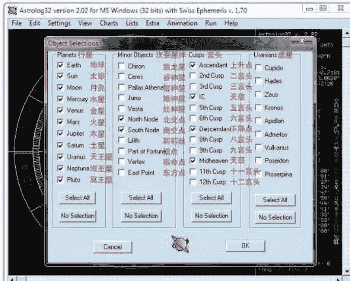

## 三、本命星盘的保存和读取

使用 Astrolog32，有一个必须要掌握的功能——星盘的保存和读取：

- 在菜单栏选取“File（文件）\Save Main Chart Data…（保存主星盘数据）”可以立即保存当前星盘。在保存星盘时需要注意：软件默认会将星盘资料保存为“.dat”文件。如果你在存档时改变了所保存文件的后缀名，那么在再次打开文件时需要相应选取“查看所有类型文件”后才可看到保存为其它后缀名的星盘文件。
- 在菜单栏选取“File（文件）\Open Main Chart…（打开主星盘）”便可以打开之前保存过的星盘。

点击“Call atlas（读取地图集）”之后，会弹出如图三的窗口。在这个看似复杂的窗口中，我们只需按图上的步骤点选，便可轻易搜寻出需要的城市经纬度。

Tips：大家可以在存放星盘的文件夹中建立诸如“朋友”、“家人”、“同学（同事）”等子文件夹，以便归类储存的星盘。

1. 单击“International Atlas（国际地图集）”（除美国本土以外的城市均属于“国际地图集”）
2. 双击第2步的“China（中国）”选项。在这个图框中列出的是该软件所装载的地图集。如果有装其它地图集也会在这里显示。
3. 在输入框里填写城市名的拼音，如图中的“Beijing（北京）”。
4. 点击“Search Atlas（搜寻地图集）”
5. 从搜索到的包含所搜寻字母的城市名列表中寻找到你需要的城市，然后双击该城市名称即可完成城市经纬度搜寻。
6. 回到输入星盘的窗口，点击“OK”键，生成一张定制好的星盘。

### 星体选择界面详解

第一栏“Planets（行星）”，涵盖了常用主要星体。其中“Earth（地球）”选项只有在采用“Heliocentric（日心制）”后才会体现区别。如果使用的是常用的“Geocentric（地心制）”系统，则不会有任何影响。其余的星体是现代占星学中都会使用到的主要星体。你也可以根据个人需要通过取消勾选来减少一些星体的显示。比如在“古典占星学”中，三王星的显示是不必要的，那么就可以在这里将它们取消显示。

第二栏“Minor Objects（次要星体）”中，前五项是被称之为“小行星”的次要星体。从北交点开始的后六个“星体”都是虚点——即并非是真实存在有实体的“星体”，而是通过其它星体轨道或位置计算得出的且没有实体的“点”，但是它们每一个都有自己独特的含义。需要注意的是，次要星体代表的只是占星师的个人偏好。大多数占星师通常会使用主要星体解读星盘，在需其它特定信息时才会勾选相应的次要星体。

第三栏“Cusp（宫头）”列出了后天十二宫的宫头。“宫头”指的是每一宫开始的点。其中“Ascendant（上升点）”为一宫宫头，“IC（天底）”为四宫宫头，“Descendant（下降点）”为七宫宫头，“Midheaven（天顶）”为十宫宫头。通常情况下，只需要选择上升与天顶。占星师只有在需要查看此宫头与其它星体的相位时才会将相应的宫头显示打开。因为在星盘中已有宫位线准确分割每一个宫位，所以平时并没有必要让它们单独显示。当宫头显示过多时，也会因为可能与星盘中的星体产生太多相位而给解盘带来不必要的干扰信息。

第四栏“Uranians（虚星）”是汉堡学派（Hamburg School）所认为存在的星体（虽然一直未得到天文方面的证据证实）。除非专门研究汉堡学派，否则不会使用到虚星，所以通常这一栏无需选择任何星体。

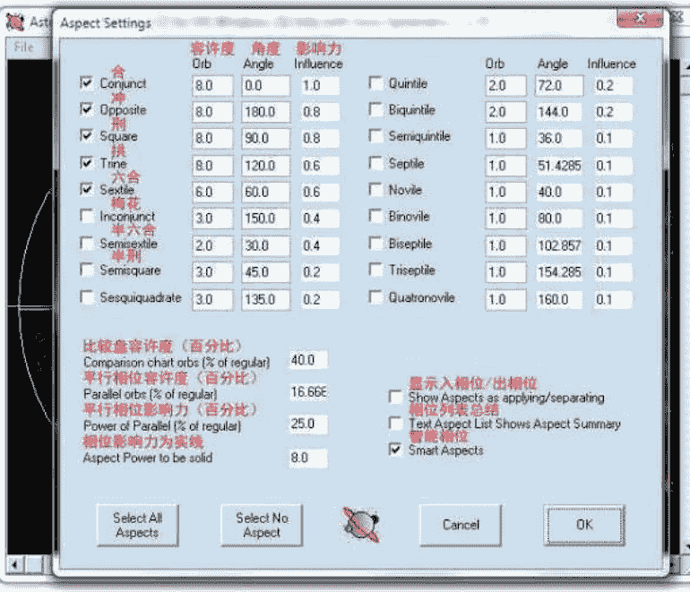

（图5）

## 五、容许度设定：

在占星软件中，对于容许度的设定是十分重要的。对于容许度设定的细化程度也是判断占星软件专业程度的标准之一。“Astrolog32”软件可以设定星盘采用和显示的相位以及相位的容许度。虽然还未能进一步细化到每个星体的容许度设置，但是对于初学者来说已经足够。

设定容许度时，我们需要先从菜单栏点击“Settings（设定）\Aspect Selections and Settings（相位选择设定）”。这项功能也可以通过快捷键“Alt+Shift+A”实现。在此窗口中，我们可以根据自己的偏好选取需要显示的相位。通常情况下，占星师最常用到的是合（0度）、冲（180度）、刑（90度）、拱及六合（60度）这五个“主要相位”。这些相位也被称为“托勒密相位[9]”。

除去这五种主要相位以外的其它相位都被称之为“次要相位”。“次要相位”相对于“主要相位”而言，使用的范围及影响力都不及后者。读者使用时可以通过自己的喜好来勾选具体相位。

在每个相位右侧的第一个输入框中可以填入使用此相位时的容许度 (orb)。许多占星师在经过一段时间的学习和实践后都会形成一套个人偏好的容许度。在此也向大家推荐最常见的一组容许度值，即除六合相位设置为 6 度以外，所有主要相位容许度均设为 8 度 (参看 (图 5) 主要相位)。

右侧第二个输入框可以用来自定义每一个相位的基础角度 (angle)，如冲相的 180 度，拱相的 120 度。建议读者不要改动此处任何一项设置。

右侧第三个输入框可以用来设置相位影响力 (Influence)。这一项涉及到星体间影响力的计算及排行，通常情况下也不会用到，所以也无需改动。

在此页面中，我们除了设定每一个相位的不同容许度以外，还可以设定其它与此相位相关的一些数值和选项：

- Comparison chart orbs，比较盘容许度：这一项的数值设定了比较盘 [10] 中使用的相位容许度与正常相位容许度的百分比。如 (图 5) 中的 “40”，意味着比较盘中的相位容许度为正常相位容许度的 40%。举例来说，如果冲相正常容许度为 8 度的话，在比较盘中的容许度就为 8×40%=3.2 度。除非是对于比较盘的相位有特殊要求，否则也不建议改动。
- Parallel orbs，平行相位容许度：这一项数值是用来设定平行相位与正常相位之间的百分比。平行相位指的是两个星体位于赤纬 [11] 坐标中的相位。现代占星中很少会用到平行相位，所以平行相位的容许度值更是不需要自行改动。
- Power of Parallel，平行相位影响力：这一项数值设定了平行相位影响力与正常相位影响力的百分比，基本也不需要改动。
- Aspect power to be solid，相位影响力为实线：这一项数值用来设定当相位的影响力超过多少度时线条显示为实线。除非是有特殊要求，否则也不需要任何改动。
- Show Aspects as applying/separating，显示入相位/出相位：这一项可以将文字相位列表 [12] 中的容许度以入相位和出相位的方式分别显示。
- Text Aspect List Shows Aspect Summary，相位列表总结：点选这一项后，在文字相位列表的末尾会显示所有相位的整体总结。

- Smart Aspects，智能相位：勾选这一项后，相位会以更加智能的方式显示。当星体与成组的虚点 (如南北交点，四轴) 形成相位时，星盘中将不会再显示重复及不必要的相位。例如，当一个星体与北交点有相位必然也与南交点有相位，所以星盘中只会显示星体与北交点的相位，因为再显示星体与南交点的相位是不必要的。

通过对制作本命星盘的基本使用和设置方法的讲解，相信至此读者们应该都可以随手制作一张属于自己的星盘了。在下一期中，教程将着重介绍各种不同查看 “流年” 星盘的制作方法，详细分解 “Transit (行运)”、“Secondary Progression (次限)” 与 “Solar Arc (太阳弧)” 等特殊流年星盘的制作方法，敬请关注。同时也欢迎大家向杂志的官方微博和博客提出宝贵建议。

> 注释：
> [1]守护星 (Ruler 或 Ruling Planet)：与所守护星座特质最相近的一颗星体，比如，在现代占星学中，与天蝎座特质最相近的是冥王星，所以冥王星是天蝎座的守护星。
> [2]容许度 (orb)：指两个星体相位间的误差值。
> [3]回归黄道带 (Tropical zodiac)：是以一个回归年为黄道带的起始及终点。回归年 (Tropical year)：从地球上看，太阳绕天球的黄道一周的时间，即太阳中心从春分点到春分点所经历的时间，又称为太阳年。
> [4]恒星黄道带 (Sidereal zodiac)：是以一个恒星年为黄道带的起始及终点。恒星年 (Sidereal year)：地球绕太阳一周实际所需的时间间隔，也就是从地球上观测，以太阳和某一个恒星在同一位置上为起点，当观测到太阳再回到这个位置时所需的时间，通常在天文学中使用。
> [5]恒星时 (Sidereal time)：天文学和大地测量学标示的天球子午圈值，由于借用了时间的计量单位，所以常被误解为是一种时间单位。恒星时是根据地球自转来计算的，它的基础是恒星日。由于地球环绕太阳的公转运动，恒星日比平太阳日 (也就是日常生活中所使用的日）短约 1/365（相应约四分钟或一度）。
> [6]黄纬（celestial latitude），或称为天球纬度，是在黄道坐标系统中用来确定星体在天球上位置的一个坐标值（另一个值是黄经），在这个系统中，天球被黄道平面、或是地球的轨道平面，分割为南北两个半球。从地球上透视，太阳永远在黄纬 0 度。
> [7]逆行（retrograde）：从地球上观察，行星在天空中运行的路径会周期性地改变运动的方向。虽然所有的恒星和行星，在回应地球自转的基础上，看起来每夜都是由东向西运行的，但是在外侧的行星通常都会相对于恒星缓缓地由西向东移动。这种运动是行星的正常运动，因此被认为是顺行。但是，因为地球的轨道周期短于外侧行星的轨道周期，因此会周期性地超越外侧的行星，于是产生了所说的逆行。
> [8]夏时制（Daylight saving time），又称“日光节约时间”或“夏令时间”，是一种为节约能源而人为规定地方时间的制度，在这一制度实行期间所采用的统一时间称为“夏令时间”。一般在天亮早的夏季人为将时间提前一小时，可以使人早起早睡，减少照明量，以充分利用光照资源，从而节约照明用电。各个采纳夏时制的国家具体规定不同。
> [9]克罗狄斯·托勒密（约 90 年—168 年）是古希腊天文学家、地理学家和光学家。托勒密相位最早出现于公元 2 世纪托勒密所著的占星学著作《四书（Tetrabiblos）》中并一直沿用至今。
> [10]比较盘（Comparison Chart）：两个不同的星盘放在一张星图中做比较，具体使用方法及用处，会在下一期杂志中介绍。
> [11]赤纬（英文 Declination）是天文学中赤道坐标系中的两个坐标数据之一，另一个坐标数据是赤经。赤纬与地球上的纬度相似，是纬度在天球上的投影。赤纬的单位是度，更小的单位是“角分”和“角秒”，天赤道为 0 度，天北半球的赤纬度数为正数，天南半球的赤纬的度数为负数。
> [12]相位列表：可以通过选取菜单栏中的“Lists（列表）”，“Aspects（相位）”，或快捷键 Alt+L 查看。

占星学刊2012.6

## 古典占星·古籍重现

## 阿布马谢《星占概要》——十二星座概要精解

翻译：黄纤越

### 译者的话：

#### 背景介绍

“占星王子”阿布马谢是占星术历史中影响巨大的占星师之一。他是著名阿拉伯占星师阿尔金迪的学生，也是西方中世纪时期最重要的阿拉伯籍占星学派的代表人物。阿布马谢所写下的《星占概要(The Greater Introduction To Astrology)》以及其它基本重要占星学典籍在12世纪被翻译成拉丁文，流传于当时的欧洲占星师手中，在西方占星学的发展历史上扮演着非常重要的角色。而这本《星占概要》也从最早的古阿拉伯文翻译成为古拉丁文，再从古拉丁文翻译成英文，最终才得以有机会以中文方式呈现于大家眼前。

阿布马沙尔-贾法尔-伊本穆罕穆德（Abu Ma’shar Ja’far ibn Muhammad ibn ‘Umar al-Balkhi），在西方，人们对他的拉丁化名字——阿布马谢更加熟悉。阿布马谢于787年8月10日出生于靠近呼罗珊（Khurasan）的大夏城（中文音译巴尔赫<Balkh>），并于886年3月9日死于伊拉克的阿尔瓦希特（al-Wasit）。在他漫长的一生里，获得作为整个阿拉伯世界首席占星学家的巨大声名。在稍晚一点的时期，他在西方也逐渐声名鹊起。

于我本身，第一次拿到这本由现代西方著名占星翻译大师查尔斯-伯纳德(Charles Burnett)翻译的版本时还是在2007年之末。当时的我因为对古典典籍接触甚少，翻译颇为吃力，在第一章完工之后感觉问题颇多，于是做出了暂停翻译的决定。而后又在2009年的年底再度审视未完成的工作，发现错误确实甚多，改进之后依然自觉无法驾驭，最终再度决定暂停。而时至今日，在《占星学刊》发刊之际，自身对古典占星了解也相对更加深刻，才觉得终于到了可以拿来全本和大家分享的时机。

大夏城，以其希腊化中亚的中转站身份而闻名于世。在萨珊波斯（Sassanian）时期（公元226-651年）成为了外来文化的交融之地。中国人、印度人、斯基泰人（Scythian）和希腊化叙利亚人构成了伊朗独特的地方文化。在宗教上，它涵盖了犹太教、琐罗亚斯德教（在中国也被称为祆教或明教）、基督教聂斯脱里安派、摩尼教、印度教甚至佛教。随着呼罗珊强大的反叛势力阿拔斯人建立的阿拔斯朝（Abbasid dynasty）的崛起，他们重伊朗反抗阿拉伯的倾向也直接开启了闻名于后世的“百年翻译运动”，并为新首都巴格达无数的图书馆和翻译房带来了新的机会。阿布马谢在此成为了阿拔斯朝的第三代文化精英。在哈里发安拉玛蒙（al-Ma’mun）时期（公元813-833年），阿布马谢开始在当时的世界级学术中心——智慧宫担任哈迪斯（专家<hadith>）职务。

古典占星典籍与现代占星不同，古人言语多为精短，文章不长却内含深意。为了让大家可以更好地阅读本书，在此次翻译过程中，我们专门请教了天涯煮酒论史的版主约克公爵以确保背景资料的准确度，并将原来未能翻译的背景介绍和翻译须知以及文内注释全部翻译，以求让大家阅读到最为完整精确的内容。而我个人建议有一定占星基础的朋友一定要多读几遍，结合自己的实践总结，相信每次阅读都会带来新的收获，这样才能把古典精华收入囊中。占星资料，不在乎多而在乎精，更重要的是善于与身边的事物相结合总结，才能真正提高。

1825年，因为一次与当时阿拉伯世界的第一贤者阿布优素福-雅各布-伊本-依沙克阿尔辛迪（Abu Yusuf Ya’qub ibn Ishaq al-Kindi）的争吵，阿布马谢意识到想要了解哲学的奥义就必须学习各种形式的数学，其中也包括了占星术。“从此之后，他开始投入了全部精力去诠释占星术在哲学和历史上的合理性，并努力论述和扩大这门学科的实际运用水平。在这种努力之下，他借鉴多种不同思想理论的元素建立出了几乎完全创新的独特理论。”这些传统和关键字相互关联，但阿布马谢实际上只借鉴了其中很少的一部分：

- 巴列维王朝希腊-印度-伊朗理论（Pahlavi Greco-Indo-Iranian tradition）
  【布泽拉米赫（Buzurjmih），法官（al-Andarzaghar），查拉图斯特拉（Zaradusht），赞吉阿尔沙（The Zij al-Shah），多罗修斯与华伦斯（Dorotheus & Valens）】
- 梵文泛希腊 - 印度理论（Sanskrit Greco-Indian tradition）
  【瓦拉哈米希拉（Varahamihira），卡纳卡（Kanaka），花剌子密（the Sindhind），赞吉阿尔坎与阿里亚哈塔（the Ziji al-Arkand & Aryabhata）】
- 希腊哲学（Greek philosophical），占星学与天文学理论（astrological & astronomical tradition）
  【亚里士多德（Aristotle），托勒密（Ptolemy），塞翁（Theon）】
- 受到巫术与星相影响的叙利亚柏拉图派哲学（Syriac Neoplatonising philosophy of astral influences and theurgy）
  【阿尔金迪（al-Kindi），哈兰的塞巴人（the “Sabaens” of Harran）】
- 阿拉伯语书写的伊朗学术（Iranian scholars writing in Arabic）
  【马沙阿拉汗（Masha’ allah），阿布萨哈-阿尔法德尔-伊本-瑙巴卡特（Abu Sahl al-Fadl ibn Nawbakht），乌马尔-伊本-阿尔法鲁汉-阿尔塔巴里-奥马尔与阿布优素福-雅各布-阿尔卡斯拉尼（Umar ibn al-Farrukhan al-Tabari< Omar> & Abu Yusuf Ya’qub al-Qasrani）】

阿布马谢关于占星有效性的哲学依据现在仅存于他所著的《星占详要（Kitab al-madkalahal-kabir< the Great Introduction >>）中第一章节（Maqala）中的一段长篇论述中。虽然，阿布马谢多是通过赛巴人的文献而非希腊哲人的阿拉伯语版本资料来提高自身的理解能力，但他的哲学依据却更多地来自于亚里士多德哲学（Aristotelian），并加以新柏拉图主义（Neoplatonic）元素。因此，他的学说也与公元后五百年内的大部分宗教运动所赞成的多种理论非常类似，而这些理论恰恰也催生出了《秘义集成（Coprus Hermeticum）》、《迦勒底神谕（the Chaldaean Oracles）》以及多种新柏拉图主义文献。

赛巴人的哲学包含了三个层次，分别对应着三种同轴循环——神圣的（八层天球之外）、天界的（八层天球）与尘世的，它们伴随着四种恩培多克勒（Empedoclean）元素（即风火水土四元素）的运动存在于一个恒定的变化过程中。人从神圣的等级里延续下来，并降至尘世间，而且必须通过奋斗抗争才能与神再次重聚。根据赛巴人的传授，人们只有在天体媒介的帮助下，并且必须通过对占星术和天文学的学习对行星致以神性致敬，才有可能完成这个过程。在尘世间，赛巴人为整个行星象征体系的表现提供了科学基础，而阿布马谢则通过亚里士多德哲学对地球上的主体可能会被哪些特别的天体影响以及哪些天体掌控着影响着特定地球主体的力量予以解读。

阿布马谢煞费苦心地将赛巴人的这种新柏拉图主义化的亚里士多德哲学发展成就，而这种长期性占星主义的真实性也再次得到认同。不出意料之外的是，自从阿布马谢开始相信并试图证明可以通过自身对世界历史的占星论断达到传递科学的目的、并且这也是一种值得全人类追随的原始知识和世界智慧后，阿布马谢在他的年代里将此前的独立存在的多种传统理论融合创新。他观察了这些自然真实核心中的每一项，并将那些此前分别属于单独启示内容且不尽相同的民族思想体系整合成了先进的理论。在此时，人类对于三个球体关系的知识并不是通过强有力的推理证明，而是通过启示得到。赫尔墨斯-特利斯墨吉斯忒斯（Hermes Trismegistus）是赛巴人的先知。阿布马谢将赫尔墨斯和包括多种接近自己母文化并能反应自身文化差异的波斯神话与印度神话的友善精灵（Agathodemon, the good daimon）普遍化。而从这些人物形象中，每个传播揭露真相的睿智之人都能从这种原始、淳朴和神圣的知识中获得反馈。

阿布马谢渐渐成为《科学家列传》作者伊本阿尔格佛克（Ibnal-Qifti’s）所说的“伊斯兰教徒的行星影响力导师”，在坚持严格遵循伊斯兰教信条的同时，也允许学生去接受其他宗教的观点。比如，他对于历史的占星解读指出——包括他所处时代的具有支配性的宗教信仰以及世俗权力在内的所有人类习俗都具有与生俱来的暂时性。在公元八世纪至十世纪之间，这样的观点在伊朗知识分子中盛极一时。而阿布马谢则将这种观点进一步推广到了全人类。

占星学刊2012.6

## 古典占星·古籍重现

## 翻译须知

《短释（the Smaller Introduction/Yasgoga minor）》，曾是中世纪欧洲翻译阿布马谢的《星占概要（Abbreviation of the introduction to astrology）》时常用的标题。这本自成一体的“概要”省略了阿布马谢在公元 850 年完成的《星占详要（Great introduction to Astrology）》中的哲理部分，精简成为一本只包含七章主要占星学概述的手册。虽然一直不如《星占详要》受人称誉，这本详述的占星学书籍仍然广受欢迎，同时也有可能是最早被翻译为拉丁文的占星学手册。

我们对文中所作的注释都煞费苦心，力求精准。借着近年越来越多的希腊文得以呈现于学者眼前的东风，我们终于可以开始追踪希腊化对于早期阿拉伯占星文献的影响以及这位杰出的阿拉伯占星领袖阿布马谢。我们的注释都是经过查阅和研究与特定占星理论相关的早期希腊文占星资料后总结得出。值得注意的是，在占星知识从希腊地区向阿拉伯区域传播的过程中，一直都呈单向输出状态。当然，我们研究和参考过的文献有限，也许也制约了我们的想象力。但是，我们确实可以将古希腊视为一个输出不同占星体系分支资料的发展起始点。需要指出的是，我们同时也参阅了从希腊文翻译为巴拉维语并最后以阿拉伯语存留下来的多罗修斯（Dorotheus of Sidon）的著作——《卡门占星学（Carmen Astrologicum）》。所以，我们无法确保在追踪希腊文化对阿布马谢这部伟大作品所起的影响时所参考的多罗修斯的著作是未受“污染”的。此外，我们也参考了阿尔伯鲁尼（Al-Biruni，公元 973-1050）的《天文学入门（Tafhim）》(R. Ramsey Wright 版)。因为《天文学入门》从阿布马谢的《星学详要》中汲取了许多内容，所以该书也可以用来为《星学概要》的细节进行延展补充。

这一版的翻译是在查尔斯-伯纳特博士（Dr. Charles Burnett）、山本启二（Keiji Yamamoto）和矢野美智子（Michio Yano）从阿拉伯原文翻译的基础之上再进行了修订。在阿拉伯原文释义不明的地方，我们都采用了阿德拉德【Adelard of Bath】翻译的中古拉丁文版（这一版也被翻译成了英文）对原文进行再次编译。这次修订过程是在伯纳特博士（Dr. Burnett）的咨询下进行的，我们在此也由衷地感谢他的支持。

## 第一章

奉仁慈悲的上帝之名，本书将用七个章节为您简要介绍星相学：第一章，主要介绍十二星宫的自然赋性、状态和象征意义；第二章，主要介绍行星的自身条件、星体大小以及它们与太阳之间的关系；第三章，主要介绍了行星的 25 种不同状态；第四章，介绍行星的正面特质、得势、失势、负面特质、月亮的刑伤（the corruption of the moon）以及十二分盘（dodecatemoria）；第五章，介绍七大行星（包括月亮，但不包括近代发现的三王星）的自然赋性，它们的象征意义和所代表的现实事物，同时也对日期与时间的守护行星进行了介绍；第六章，对阿拉伯点的描述总结；第七章，介绍法达（fardarat）运限的相关知识，日生盘与夜生盘的不同推运行星序列以及埃及人使用的埃及序。

贾法尔-伊本穆罕穆德（Ja'far ibn Muhammad），以著名占星师阿布马谢（Abu Ma'shar）这个名字闻名于世，告诉那些哲学与科学爱好者及长期对绚烂星空的实际情况做出各种猜想的人们：虽然我们知道这些大个子的“家伙”是通过它们自身的运动对所有存在于世界的事物产生影响，但我们是否遗忘了一些最重要的知识？这些知识涵盖了黄道周期度数的知识、黄道中星宫的数目和名称、每个星宫所包含的度数、星宫的守护星、星宫的尊贵和自然赋性、十二宫位和行星的自然属性以及南北星空的知识，包括它们的状态和特征。从前言来看，似乎本应将这本书取名为《行星诊断科学入门手册（The Introduction to the Science of the Judgements of the Stars）》，然而我们还是将它取名为《星占概要》，因为我们会将以上这些知识都尽可能简单明了地介绍给大家以便更容易学习。

黄道轨道包括了 360 度和 12 星宫（星座），就是大众所知的牧羊座、金牛座、双子座、巨蟹座、狮子座、处女座、天秤座、天蝎座、射手座、摩羯座、水瓶座及双鱼座。每个星宫都占据着黄道上的 30 度，每一度又可以分为 60 分，每一分可再分为 60 秒，每一秒又可再分为 60 毫秒，每一毫秒又可继续按照 60 等分划分，直到第十次和第十一次的六十等分后，得到的碎片才将细微到难以跟踪[1]。在运动中不断变化的行星一共有七颗，最远最大的一颗是土星，然后从远到近依次是木星、火星、太阳、金星、水星以及月亮[2]。它们中的任何一颗行星都至少掌管了一个星宫，也都有行星自身的远地点和南北交点（行星自身的运行轨道与黄道的交点）。

牧羊座是由火星掌控的星宫[3]，太阳会在牡羊座 19 度擢升。牧羊座可分为三旬（Decans，也被称为外观或十度守护）[4]，每一旬均平等拥有十度，每旬也均由一颗行星守护。白羊座的第一旬受到火星守护，第二旬受到太阳守护，第三旬受到金星守护。牧羊座的基本赋性[5]是热、干、火属性、黄胆汁型、苦味、阳性星座；白昼；基本宫，属于春天；白昼时间长于夜晚；短上升星座；垂直上升、半臂缺失[6]、易于发怒、拥有两种颜色和两种外形、重色欲、子女稀少、偶尔也象征双胞胎、皇室、四足偶蹄、半有声星座[7]。掌管人体中的头部和面部[8]。属于牧羊座的国家与地区是巴比伦、波斯、阿塞拜疆和巴勒斯坦四国（受著作时代限制，十二星座代表国家主要集中在现代中东地区）[9]。

金牛座是由金星掌控的星宫，月亮在其 3 度的位置擢升。金牛座分为三旬，第一旬受到水星守护，第二旬受到月亮守护，第三旬受到土星守护。金牛座的基本性质是冷、干、土属性、黑胆汁型、酸味、阴性星座；夜间；固定宫，白昼时间长于夜晚；形状残缺、半臂缺失；重色欲、子女稀少，该星座的初始部分带有贫瘠的意味（荒地区域）；半有声、四足偶蹄。植物和所有一切被人工种植的树木都属于金牛座掌管，以及人体中的脖子和喉结[10]。属于金牛座的国家与地区是奥苏瓦德岛（al-Suwad）、麦金（Mahin）、哈马丹（Hamadan）及库尔德（帝国）。

双子座是由水星掌控的星宫，北交点在双子座 3 度的位置擢升。双子座分为三旬，第一旬受到木星守护，第二旬受到火星守护，第三旬受到太阳守护。双子座的基本性质是热、湿、风属性、多血质型、甜味、阳性星座、白昼、变动宫、属于春天，双子座的最后阶段是一年中日照时间最长的时候；多面性、轻盈。高大的树木都属于双子座管辖。以人形出现、善辩、贫瘠星座，有声、显年轻、靓丽的脸庞、拥有慷慨而善良的灵魂。双子座还掌管着人体中肩膀、上臂和手掌部分，以及国家与地区中的约旦、阿米尼亚、阿塞拜疆、吉兰（Jilan）、伯疆（Burjan）、穆全（Muqan）、埃及和巴恰（Barqa）。

巨蟹座是由月亮掌控的星宫，木星在巨蟹座 15 度的位置擢升。巨蟹座分为三旬，第一旬受到金星守护，第二旬受到水星守护，第三旬受到月亮守护。巨蟹座的基本性质是冷、湿、水属性、粘液汁型、咸味、阴性、夜间、热带、基本宫、属于夏天，在巨蟹座期间日照时间逐渐减短。多子女，却是无声星座。爬行动物、水生动物、中等高度的树木、快速流动的水、雨水都由巨蟹座象征。巨蟹座还掌管着人体中的胸腔、乳房、心室、胃、腹腔、脾脏和肺叶。属于巨蟹座的国家与地区是小亚美尼亚、东呼罗珊（Eastern Khurasan）、中国和马尔拉德（Marw al-Rud）以及部分大夏（Balkh）和阿塞拜疆地区。

狮子座是由太阳掌控的星宫。狮子座分为三旬，第一旬受到土星守护，第二旬受到木星守护，第三旬受到火星守护。狮子座的基本性质是热、干、火属性、黄胆汁型、苦味、阳性、白昼、固定宫、属于夏天，掌管带有大牙和利爪的四足野兽，以及高大的树木。狮子座半臂缺失，易于发怒、重色欲、贫瘠星座、半有声，是聪明伶俐、奸诈狡猾的雇主，具有小心谨慎、悲观黑暗的一面。狮子座还掌管着人体中的胃部以上、心脏、肌腱、人体侧面的腋下部分、背部及其两侧，以及国家与地区中的土耳其帝国的领域直到中亚的索格狄亚那（Sogdiana，中亚古国，在今乌兹别克斯坦国阿姆河与锡尔河之间的泽拉夫尚河流域）和尼沙布尔城（Nishapur，在今伊朗东北部地区）[11]。

处女座是由水星掌控的星宫，水星在处女座 15 度擢升。处女座分为三旬，第一旬受到太阳守护，第二旬受到金星守护，第三旬受到水星守护。处女座的基本性质是冷、干、土属性、黑胆汁型；处女座属于变动宫，在它的最后时刻将迎来秋分点。处女座一共有三种形态、轻盈并略带阴郁；所有的农作物都属于她掌管，并以人形出现，属于贫瘠星座、强大的发声能力、拥有美丽的脸庞以及慷慨优质的灵魂，同时掌管着人体中的腹部、大肠、小肠、横隔膜，以及国家与地区中的杰拉马恰（Jaramaqa）、叙利亚、幼发拉底河流域、阿尔詹辛拉岛（al-jazira，阿联酋的一个岛国）、古波斯的基尔曼省[12]。

射手座是由木星掌控的星宫，南交点在射手座3度的位置擢升。射手座共分为三旬，第一旬受到水星守护，第二旬受到月亮守护，第三旬受到土星守护。射手座的基本性质是阳性、白昼、变动宫，在射手座的最后时段日照时间达到一年中的最短；形状不完整，垂直，拥有两种自然属性，人形与兽形共存，其中人形部分高贵、庄重，另一个部分是有着四足和四蹄的动物。被捕食的哺乳动物和地球上的昆虫都与射手座相关，子女稀少，半有声、是颇有诡计和狡猾的管理者。射手座掌管着人体中的两条大腿，以及国家与地区中的巴格达、阿吉波岛（al-Jibal），伊斯法罕（Isfahan），以及草药使用者（Herpads）及拜火教徒活动的地区[16]。

天秤座是由金星掌控的星宫，土星在其21度擢升。天秤座分为三旬，第一旬受到月亮守护，第二旬受到土星守护，第三旬受到木星守护。天秤座的基本性质是热、湿、风属性、多血质型、基本宫、阳性、白昼；热带、属于秋天、日照时常开始少于平均时间；长上升、垂直上升，拥有两种颜色和两种形态，略带阴郁；高大的树木都属于这个星座。天秤座具有人的形态，中等程度的色欲，子女稀少，有时候也代表着双胞胎，有声星座，并带有漂亮的脸庞和慷慨的灵魂，掌管着人体的脊柱、下腹部、肚脐、生殖器、屁股、腰部，国家与地区中的拜占庭帝国（疆域直到迦太基海岸、阿尔及利亚等东非国家的沿海地区），上埃及（疆域直到埃塞俄比亚、巴恰的边缘等地），毗邻基尔曼、锡斯坦（Sijistan）、喀布尔（Kabul）、突厥斯坦（Tukharistan）、大夏（Balkh，阿富汗三十四省之一）和赫拉特（Herat，阿富汗三十四省之一）[13]。

摩羯座是由土星掌控的星宫，火星在摩羯座28度的位置擢升。摩羯座共分为三旬，第一旬受到木星守护，第二旬受到火星守护，第三旬受到太阳守护，其基本性质是冷、干、土属性、黑胆汁型、阴性、夜间和热带；进入摩羯座后，日照时间开始延长，白昼越来越长。摩羯座的在星空中呈圆形，但形状不全，并同时拥有两种元素和自然属性：摩羯座的前半部分是土相、属于土地并干燥，有时也指代驾驭动物（类似骑马）或流产（胎死）；后半部分是水相并属于海洋，意味着子女繁多、双胞胎，代表鸟类[17]。摩羯座掌管着草、需要耕种的草与农作物以及泥土里面的昆虫；堕落，极其享受自己钟爱的生活方式，缺乏发声能力；易怒、谨慎，是善于运用策略又极其小心的管理者；心理阴暗，重肉欲。人体中的双膝和国家与地区中的埃塞俄比亚和印度河地区、马卡兰（巴基斯坦、伊朗境内）、辛德和汉德（Sind and Hind）、阿曼（Oman）和巴林都属于摩羯座掌管[18]。

天蝎座是由火星掌控的星宫，分为三旬，第一旬受到火星守护，第二旬受到太阳守护，第三旬受到金星守护。天蝎座的基本性质是冷、湿、水属性、粘液质型、阴性、夜间、固定宫和黑暗。被捕食的哺乳动物和水生动物、流动的水以及中等高度的树木都属于天蝎座主管，多子女，邪恶、谨慎、易于发怒、擅长谎言，是极其小心的主管，拥有美丽的脸庞、慷慨的灵魂却是无声星座。天蝎座掌管着人体中的阴茎、睾丸、膀胱、臀部以及会阴部[14]，以及国家与地区中的阿西杰兹岛（al-Hijaz），阿拉伯沙漠地带以及往也门、摩洛哥的唐吉尔城（Tangier）、伊朗的曲密斯城（Qumis）以及古波斯的若伊城（Rayy）方向延伸的地区，并与狮子座共同管辖索格狄亚那（Sogdiana）地区[15]。

水瓶座也是由土星掌控的星宫，分为三旬，第一旬受到金星守护，第二旬受到水星守护，第三旬受到月亮守护，其基本性质是热、湿、风属性、多血质型、阳性、白昼、固定宫。高大的树木和流动的水体都属于水瓶座掌管。水瓶座也是人形星座，子女稀少，有时也意味着贫瘠以及缺乏发声能力。水瓶座掌管着膝盖以下的两条小腿，以及国家与地区中的阿尔苏维德岛（Al-Suwad）、库法（Kufa）地区、阿尔希加芝岛（Al-Hijaz）、埃及基督徒聚集区及辛德岛西部地区[9]。

双鱼座是由木星掌控的星宫，金星在双鱼座27度的位置擢升。该星座也分为三旬，第一旬受到土星守护，第二旬受到木星守护，第三旬受到火星守护，基本性质是冷、湿、水属性、粘液质型、阴性、夜间、变动宫。双鱼座的最后时刻紧连着春分点，星座的后半部分掌管着中等高度的树木[20]。双鱼座也掌管被捕食的哺乳动物和水生动物以及生活在污水（死水）里面的动物，节制的肉欲，多子女，半臂缺失，无声星座，极其小心，是善于运用策略的管理者，草率，具有多种形态。人体中的足部和国家与地区中的从拜占庭帝国到叙利亚之间的地区、阿尔詹辛拉岛（al-jazira，阿联酋的一个岛国）、埃及、亚历山大和也门海[21]都属于双鱼座掌管。

六个星座属于直上升星座（它们与地平线形成接近垂直的 90 度交角，比赤道与地平线构成的交角更加陡立。因为从本星座第一颗星露出地平面开始到全部出现在地平线以上所花时间超过 2 小时），从摩羯座开始到双子座结束的六个星座属于斜上升星座（这些星座从本星座第一颗星露出地平面开始到全部出现在地平线以上所花时间少于 2 小时）。斜上升星座与直上升星座恰好对应，每组两个星座中的一个星座的白昼时长正好等于另一个星座的黑夜时长，两者互成和谐一致、友善友好的关系，例如：双子座与巨蟹座，金牛座与狮子座，牧羊座与处女座，双鱼座与天秤座，水瓶座与天蝎座，摩羯座与射手座。这些日照时间一样长的星座据说在能量强度上也达到一致[24]。

以上就是关于十二个星座的基本赋性及重要象征意义的总结。在特定的星座中，行星还将可能失势和陷落。当行星落在自身掌管星宫的对宫谓之失势，当行星落在自身擢升星宫的对宫同一黄道度数时谓之陷落[22]。每三个星座都可以根据三分性的共同自然属性被分为一组[23]。

我们也许也可以认为斜上升星座与直上升星座根据服从原理也可对应分为六组；举例来说，双子座服从于狮子座、金牛座服从于巨蟹座、处女座服从于摩羯座、双鱼座服从于天蝎座、水瓶座服从于射手座、摩羯座服从于天蝎座[25]。虽然牧羊座服从于天秤座、摩羯座服从于巨蟹座，但因为这两组星座在黄道上呈 180 度对冲相，所以并不意味着和谐与友好。

牧羊座、狮子座和射手座聚集并饱满；它们互为三合位置（120 度），火属性，代表东方，统称为火相星座。在日间，它们的三分性主星是太阳，然后是木星；在夜间，它们的三分性主星则首先是木星，续而才是太阳；土星是火相星座在白昼和夜晚的共同三分性主星。

同时，在“黄道带上具有共性（agreeing in the zodiac-belt）”的十二星座也会因它们的升起时经过黄道带的时间长度一致而两两对应分为六组：牧羊座与双鱼座，金牛座与水瓶座，双子座与摩羯座，巨蟹座与射手座，狮子座与天蝎座，处女座与天秤座。具有“共同路径（agree in the path）”的星座也会因守护行星的共同性成为两两一组：摩羯座与水瓶座都由土星守护，射手座与双鱼座都由木星守护，天蝎座与牧羊座都由火星守护，天秤座与金牛座都由金星守护，处女座与双子座都由水星守护[26]。

金牛座、处女座、摩羯座具有赐予财富与物质的特点：它们也互为三分位置（120 度），土属性，代表南方，统称为土相星座。土相星座的日间三分性主星是金星，然后是月亮；夜间的第一位三分性主星是月亮，然后才是金星；火星是白昼与夜晚的共同三分性主星，水星也将与火星共同统领土相星座。

双子座、天秤座、水瓶座给予却空虚：它们互为三分位置（120 度），风属性，代表西方，统称为风相星座。风相星座的日间三分性主星是土星、续而水星；夜间则首先为水星，其次才是土星；木星是白昼与夜晚的共同三分性主星。

巨蟹座、天蝎座、双鱼座总在倾泻与索取：它们互为三分位置（120 度），水属性，代表北方，统称为水相星座；水相星座的日间三分性主星是金星、续而是火星；夜间三分性主星则先为火星、其次为金星；月亮是白昼与夜间的共同三分性主星。

黄道环带在任何时刻都被分为四个区域。由上升点（东升点）起到上中天为止的象限具有东方、阳性、前进的性质；由上中天（的准确度数）起至下降点为止的象限具有南方、阴性、退隐的性质；从下降点起至下中天（第四宫的起始点）为止的象限具有西方、阳性、前进的性质；由下中天起至上升点（东升点）为止的象限具有北方、阴性[27]、退隐的性质。黄道环带在地平线（东升点与下降点相连的轴线）以上的部分被称之为黄道环带之右，地平线以下的部分被称之为黄道环带之左。而象限中的两个阴性象限也被称之为左象限。黄道环圈中从上中天开始经过上升点直到下中天的部分被称为上升区域，相对应的另一半被称为下降区域。

在十二星座里面，从巨蟹座开始到射手座结束的六个星座属于直上升星座，从摩羯座开始到双子座结束的六个星座属于斜上升星座。

以上的四个区域会根据星宫的先后顺序被分为12个小区域并依次编号，每个小区域都有其特殊职责。每个象限起始的第一宫被称为“始宫”，紧随其后的第二宫被称为“延续着始宫（succedent to the cardine）”，再之后的宫位被称之为“从始宫坠落（falling from the cardine）[28]”。这十二个星宫每一个都有一个合适的名字可以描述它们所代表的意义。第一宫起于东方的地平线（被称为“上升点”或“东升点”），象征着身体、生命，以及一切的起始状态[29]；第二宫被称为财富和生计宫；第三宫代表兄弟姐妹、具有血缘和法律关系的亲戚（血亲和姻亲）、法律相关、宗教、谣言、信使和旅程；第四宫代表父亲、不动产、金银珠宝、以及所有被篱笆围绕和覆盖的东西；第五宫是代表孩子的宫位，同时也代表着使者和向导；第六宫是与疾病以及奴仆相关的宫位；第七宫是与女人、婚姻、争议与反抗相关的宫位；第八宫与恐惧、死亡以及遗产有关；第九宫是与长途旅行、道路、宗教、礼仪、哲学、书籍、邮差、谣言和梦想有关的宫位；第十宫代表着权力、晋升、国王、名声、荣誉、技巧、行为及母亲；第十一宫是与希望、好运、赞扬、赏识以及帮助者相关的宫位；第十二宫是与敌人、不幸、悲哀、伤痛、嫉妒、狡猾、谋略和骑驶动物有关的宫位。

七颗行星中的任意一颗都会在十二宫位的某个特定位置感到喜乐：水星最喜上升点（第一宫），月亮在第三宫喜乐，金星在第五宫喜乐，火星在第六宫喜乐，太阳在第九宫喜乐，木星在第十一宫喜乐，土星在第十二宫喜乐。

注释：

[1]、六十进制最早来源于古巴比伦天文学/占星术，后来被希腊人采用。现已被人们大量使用。

[2]、行星都被赋予迦勒底序，参考托勒密所著的《四书（Tetrabiblos）》中的第四册，第十章（本书使用的均为 Schmidt 翻译版，下文将不再复述）。

[3]、在古代占星术中，惯于把星宫（houses）用来指代黄道上的星座，而比较少用于指代后天十二宫。行星与星宫的关系也就是现代占星所说的“守护星（rulership）”。阿布马谢遵循了希腊占星术的传统（托勒密《四书》第一册，第18章）。行星的擢升星座与擢升度数同样源于传统用法。托勒密只给出了行星擢升的星座，多罗修斯（Dorotheus）在《摩西五书（Pentateuch）》第一册第二章中给予了行星擢升的度数。阿德拉德（Adelard）的拉丁文译本又加入了行星陷落的星座与度数，恰好是与行星擢升的星座与度数完全相反。

[4]、旬（Decans）也被传统上称为“外观（Faces）”：阿布马谢的旬序列遵循了希腊传统，认为白羊座的第一旬受到火星守护，其后按照迦勒底降序排列（火星-太阳-金星-水星-月亮-土星-木星）。

[5]、十二星宫的基本赋性描述：（以下内容将包含所有剩下的十一个星座）

a) 基本宫/固定宫/变动宫：阿布马谢遵循了托勒密关于十二星座的基础理论。托勒密（《四书》第一册第12章）认为当太阳进入分点（equinoctials）星座以及至点（tropical/solstitial）星座（“基本星座”是后期形成的传统称谓）的四个星座时象征着季节的转换。双体星座（也就是后来所说的变动星座）象征着随着太阳向四个基本点靠近时带来的自然和季节的变化时期。托勒密的“固体”星座就是我们所说的“固定星座”。

b) 气质、元素以及星座：古希腊医学将人分为四种气质，易怒型（黄胆汁质）是热加干；抑郁型（黑胆汁质）是冷加干；血液型（多血质）是热加湿；粘液型（粘液质）是冷加湿。但我们并不能完全认为这整个体系与十二星座的归类是托勒密时代希腊占星术的产物。阿布马谢的分类与托勒密的分类并不连贯。举例来说，阿布马谢将白羊座归为热与干的易怒型，但是托勒密（《四书》第一册第10章第25页）认为白羊座是潮湿的。托勒密的看法倒是与希波拉底（Hippocrates）的分类一脉相承。而希波拉底将春天归于多血质，也就是热与湿。阿布马谢所用分类方法的来源似乎依赖于占星象征体系内两条完全不同的分支：首先，是将火、土、风和水四种元素相应地与黄胆汁质、黑胆汁质、多血质以及粘液质对应。然后，再参考四种元素在十二星座中的三方分类：白羊座、狮子座和射手座是火元素；摩羯座、金牛座和处女座是土元素；天秤座、水瓶座和双子座是风元素；巨蟹座、天蝎座和双鱼座是水元素。在托勒密的著作中并未提及这种元素分类法。根据罗伯特-汉德（Robert Hand）的考究，维迪斯-华伦斯（Vettius Valens）是最

## 古典占星·古籍重现

早提出《天文书（Anthology）第一册第2章》元素三方分类法的学者（参考汉德关于华伦斯的评论）。阿布马谢遵循了华伦斯对于星座与元素的分类，并给前五个星座加入了对应的味觉“苦、酸、甜、咸”，而这些也是从星座对应的血质直接衍生而来。

c) 阳性、白昼星座对应阴性、夜间星座：这是希腊占星术的传统，例子可见托勒密《四书》第一册第13章第28页。

d) “日光增加”指的是当太阳进入这些星座时（譬如说在夏天），每天白昼的时间会长于平均的12个小时。

e) “长上升星座”和“短上升星座”：当一个星座“直线”上升路径与地平线构成夹角的倾斜度超过（相比较更加接近90度直角）赤道与地平线构成的夹角时，这些星座自有的30度经度将需要30度以上的赤道才能完整跨越地平线，因为整个跨越的时间也超过平均的2小时。因此，他们将这类跨越地平线需要超过2个小时的星座定义为“长上升星座”。当星座“倾斜”上升的夹角会比赤道与地平线构成的夹角更加倾斜和偏向时，星座上升时更加倾斜的夹角就保证了整个星座会在赤道30度通过地平线之前就完全超越地平线，因此需要的时间少于两小时，并被定义为“短上升星座”。阿布马谢的这些分类仅仅适用于北半球。南半球的长、短上升星座都将彻底互换。

[6]、垂直（upright）/半臂缺失（cut in limbs）/形状残缺（defective in figure）：白羊座和天秤座都被标注为垂直上升（upright in rising），而射手座却只是被简单的归为“垂直（upright）”。这也许是因为这几个星座的形状在上升时并不会与地平线形成夹角而呈现“直线向上”的状态。形状残缺（defective in figure）意指星座整体形状显示地不够完整（譬如，金牛座，在天空中只能看到整只公牛的前半部分）。此处的金牛座被称为“形状残缺”，而射手座则被归类为“形状不完整”；在维迪斯-华伦斯的书中把金牛座称为“不完整（incomplete）”，把射手座称为“半完整（semi-complete<Schmidt 翻译版>）”，然后并无其它星座有此描述。白羊座、金牛座、狮子座和双鱼座都有被归为“半臂缺失（cut in limbs）”，但却很难看出这种描述的具体含义。阿德拉德（Adelard）对此引用似乎也存在理解困惑，在他的拉丁文版本中，“半臂缺失”和“形状残缺”的定义实际消失了。

[7]、十二星座的其它赋性描述：

a) 好色（libidinous）：白羊座、金牛座和狮子座都被归类于“好色”，天秤座是“中等程度的好色（of medium condition in libido）”，摩羯座、双鱼座被认为是“节制欲望（moderate in libido）”，但拉丁文给出的评价却是“漠视女性（Mulieribus indifferens）”。《安条克（Antiochus）》第一册第5章中给出了相似的列表，但他排除了狮子座而加入了双鱼座：“白羊座、金牛座、摩羯座、双鱼座以及天秤座的部分”。与阿布马谢的评价一样，《赫菲斯提欧（Hephaistio）》的第一册第一章中也把狮子座定义为“淫乱的”。

b) 关于子女——多产和贫瘠（fecundity and sterility）：巨蟹座、天蝎座、摩羯座的后半部分以及双鱼座被认为是多子女星座，白羊座、金牛座、天秤座、射手座以及水瓶座被认为是拥有少量或无子女；摩羯座的前半部分也许会显示为“造人失败”。双子座、狮子座和处女座被认为是贫瘠的。阿布马谢在此遵循了希腊广泛使用的传统。虽然托勒密（《四书》第四册第6章）并没有针对此问题给出复杂的分类，但阿布马谢还是沿用了他的列表。托勒密将巨蟹座、天蝎座和双鱼座归于多产星座，狮子座和处女座归为贫瘠星座。维迪斯-华伦斯（Vettius Valens）在《天文书（Anthology）》（第一册第2章）给出了包括“多产（prolific）”、“半多产（unprolific）”和“贫瘠（barren）”在内的三种分类。华伦斯的列表基本赞同阿布马谢的列表，只有在摩羯座的前后矛盾部分存在分歧。因为阿布马谢对摩羯座的前后两部分分别给予了两种完全不同的赋性。

华伦斯的对比描述：
多产星座：巨蟹座、天蝎座、双鱼座；
非多产星座：白羊座、金牛座、摩羯座（等同于不结果）；
贫瘠星座：双子座、处女座、天秤座、射手座和水瓶座；
无分类星座：狮子座。

c) 有声（voiced）/半有声（half-voiced）/无声（without voice/weak in voice）：除去狮子座，阿布马谢基本服从了华伦斯在《天文书》（第一册第2章）中的分类，因为华伦斯没有给予狮子座分类。而对于射手座，华伦斯将其归类为“有声（vocal）”，但阿布马谢却认为其是“半有声（half-voiced）”。阿布马谢还认为双子座既“善于雄辩（cloquent）”又“强烈发声（powerful in voice）”，而华伦斯给予的是“悦耳（euphonious）”的评价。该分类法则的根源也许是基于古希腊对声音的定义：有声等同于自由公民，无声等同于牲畜，半有声等同于非公民（奴隶等）。

[8]、身体部位（Melothecia）：星座与身体部位的关联传承于《保卢斯（Paulus）》第2章中的希腊传统用法，但是阿布马谢的列表给出了更加详细和特别的分类。托勒密并没有给出星座与身体部分的对应。

[9]、地区与国家：以下获得阿布马谢和托勒密（《四书》第二册第3章）共同认可的列表受到了希腊化的影响：
白羊座：巴勒斯坦；
双子座：埃及（托勒密：下埃及）；
处女座：美索不达米亚（阿布马谢：幼发拉底河流域）；
摩羯座：印度（阿布马谢：巴基斯坦的信德与汉德省<Sind and Hind>，以及印度西北部）；
双鱼座：阿布马谢：从拜占庭帝国到叙利亚/托勒密：土耳其奇里乞亚覆盖了部分以上区域。

[10]、在《星占详要》一书中称为“珍珠”，阿尔伯鲁尼（Al Biruni）也这样使用。

[11]、《星占详要》中给出了适合每个星座的具体地址细节，而这一项也被阿德拉德认为符合狮子座属性，因为狮子座“属于细沙沙漠，皇帝的宫殿与城堡”。

[12]、《星占详要》加入了“每一片可以种植的土壤，女人的地盘，娱乐、歌手和公园。”

[13]、阿德拉德增补了“……打猎和训鹰的地方，山峰之巅。”

[14]、《星占详要》将女性外阴增补入了此列表。

[15]、《星占详要》补充了“所有带有邪恶气味的地方，监狱、悲痛与悲伤之所在，被遗弃的房屋，蝎子的洞穴与巢穴。”

[16]、阿德拉德增补了“一切有火的乡间、高山与地点。”

[17]、《星占详要》第六册第22章认为摩羯座的第二句和第三句都意表鸟类。

[18]、阿德拉德增补了“……在地区，花的海洋与牧场，狗与野猪、野狼的地盘，阿拉伯人的领地。”《星占详要》第六册第9章给出了如下解释：“城堡的遗址……长满树木的山脊，水路航道……狗、狐狸、野生哺乳动物以及食肉动物的地盘，外国人的木屋，当地人与奴隶以及点燃火焰的地方。”

[19]、阿德拉德增补了“在乡间，森林……的地区，在有水和草地的地方。”《星占详要》第六册第9章写到“有水和奔腾河流的地方”。

[20]、阿德拉德补充“前半部分代表着沼泽。”

[21]、阿德拉德增补了“部分法国以及境界、海岸线、祈祷者和天使的地盘。”查尔斯-伯纳德（Charles Burnett）认为“法国”也许是阿德拉德个人的增补；因为阿德拉德在法国居住多年，也许会因法国被阿布马谢遗忘而感到吃惊。《星占详要》将“境界”定义为“接近河流、水路和湖泊……天使与战士的地盘，以及哀悼的地方”。

[22]、陷位与弱势（Detriment & Fall）：这是源于希腊占星术的惯用定义。可参看《安条克》第一册第8章的示范。陷位已经被斯密德与汉德（Schmidt & Handl）在《希腊古占技法手册（Companion to the Greek Track）》的第29页以“矛盾（contrariety）”一词列出。想要考证对弱势（Fall）最早的处理方法，可以参看多罗修斯在《摩西五书》第一册第二章中的案例。

[23]、三分性（将星座以三个为一组划分的元素分类法）：
其它内容请先参看注释5中对于“气质、元素和星座”的描述，以下是其它分类法。

a) 拱相：三分性来源于《安条克》第一册第9章中的三方或三个一组。昼与夜的三分性以及水星在土相三分性的处女座时的补充运用都在多罗修斯的《摩西五书》第一册第一章中得到确认。

b) 东/南/西/北 与三分性的关联并非传承自托勒密（《四书》第一册第17章33-35页）。但是，本书内的通用方法在《保卢斯》一书的第2章中也有同样记载：第一个三分性与东方的风相关，第二个三分性与南方相关，第三个三分性与西方相关，第四个三分性与北方相关。

c) “聚集并饱满（come together and fill）”是火相三方；“给予财富与不动产（giving of wealth and prosperity）”是土相三方；“给予却空虚（give and empty）”是风相三方；“倾泻与索取（pour forth and take）”是水相三方。查尔斯-伯纳德指出，这些描述最早都源于亚里士多德（Aristotle）。

[24]、遵循“映点（videntia）”的传统，每个星座都可以“看见”与自身对映的星座，而且两者力量相等（equipollent）。我们在托勒密的《四书》第一册第16章第31页中以及《安条克》第一册第10章中都可以看到相关内容。阿布马谢使用的分类“服从”最早也是源于拉丁语中对“勇气 (audentia)”的俗称。

[25]、我们很难看出这一排列组合的基本原理。有人也许会认为：“双子座服从于狮子座，处女座服从于金牛座，双鱼座服从于天蝎座以及水瓶座服从于射手座。”但是，我们在《星占详要》第338页发现了同样但却互惠的组合序列：“双子座服从于狮子座，狮子座也服从于双子座；金牛座服从于巨蟹座，巨蟹座也服从于金牛座；摩羯座服从于处女座，处女座也服从于摩羯座；天蝎座服从于双鱼座，双鱼座也服从于天蝎座；射手座服从于水瓶座，水瓶座也服从于射手座；摩羯座服从于天蝎座，天蝎座也服从于摩羯座。”

[26]、“黄道带上具有共性”也遵循着命令与服从星座 (audentia) 的分组，按照白羊座0度与天秤座0度的对角线划分 (《Hephaistio》第一册第9章)。“共同路径 (agreeing in the path)”也遵循了星座共用守护星的共感法则 (《安条克》第一册第16章)。斯密特和汉德在《希腊古占技法手册》中将之翻译为“仿佛共同缠绕 (like-engirdling)”。

[27]、把象限按照阳性和阴性分类可以参看托勒密《四书》第一册第13章的第29页，同时也可以查阅《保卢斯》第七章；这句话后半段中的将东南西北四个基本方向赋予不同象限的方法来源于阿布马谢。

[28]、这十二个区块也被现代占星术称为“宫位”。阿布马谢遵循了古希腊传统上对于始宫、果宫和续宫 (cardinal/succeedent/cadent) 的分类法则。《保卢斯》第24章将续宫定为始宫的“上升后 (post-ascensions)”，而果宫则是始宫的“上升前 (pre-ascensions)”。

[29]、宫位的解释遵循着希腊传统，可参看华伦斯在《天文书》第四册第12章中的释义。

[30]、行星获得愉悦和“喜悦”的宫位遵循着《保卢斯》第24章的用法，但是该书认为仅有夜间盘的火星落在第6宫才算为喜乐，而土星则只有日生盘落在第12宫才算喜乐。多罗修斯在《摩西五书》第一册第10章的第169页中也提供了相同的论断。

## 中华古籍库

1000000 册 高清影印古籍
珍版刻印 / 海外流传 / 家传手抄 / 民间失传

古籍善本、经史子集、史料笔记、古人文集、
民间收藏、传世家谱、各地方志、中医典籍、
四库全书、古禁毁书、内阁文库、图书集成、
丛书集成、四部丛刊、万有文库、四部备要、
二十四史、三国六朝文、明清和民国古籍史料
……