## 占星学刊 Journal of Astrology

中国第一本占星泛神秘学杂志 官方微博：http://t.qq.com/justrology OCT 2012年10月 第三期 双月刊

- 从出生牌解读你的生命之河 ——第二部分
- 卜卦占星系列之三 ——宫位的选择（上）
- 你的蜜糖我的毒药（下） 互异标准衡量下的外界投射差异
- 双子座木星逆行 价值观的省思和重建
- 2012年水星逆行终结篇 ——穿越射手座与天蝎座的星探索
- 塔罗新知 逆位慌什么（下）
- 跟凤大学占星系列之三 ——行星与周期
- 深入浅出Astrolog32（三） ——返照星盘及数率星盘
- 阿布马谢《星占概要》 ——行星的25种状态

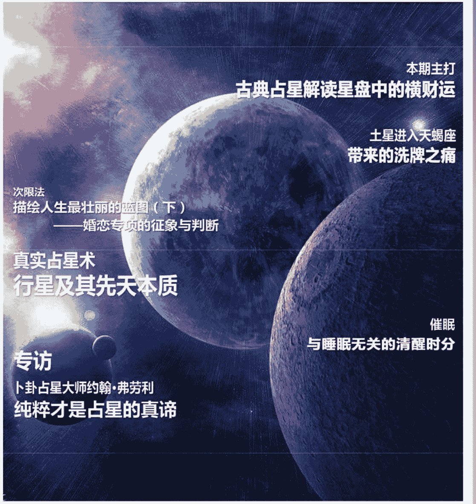

本期主打 古典占星解读星盘中的横财运

土星进入天蝎座 带来的洗牌之痛

次限法 描绘人生最壮丽的蓝图（下） ——婚恋专项的征象与判断

真实占星术 行星及其先天本质

催眠 与睡眠无关的清醒时分

专访 卜卦占星大师约翰·弗劳利 纯粹才是占星的真谛

## 目 录

名誉主编：苏·汤普金
执行主编：黄纤越
责任编辑、校对：胡乃月
人物编辑：杨华京
翻译编辑：韩小竹、刘瑞颖、刘欣、王思雪、邢祎、叶思晨
美术编辑：夏峥妮
技术支持：吴琨
运营专员：金小贵
推广专员：郭晨迪
营销策划：王玥

首席合作媒体：腾讯星座

官方微博：http://t.qq.com/jastrology
E-mail: astrology_journal@yahoo.com.cn

### 本期主打

- 真实占星术：行星及其先天本质 1
- 古典占星解读星盘中的横财运 4

### 占星之路

- 专访卜卦占星大师约翰·弗劳利：纯粹才是占星的真谛 9

### 星空记事

- 土星进入天蝎座带来的洗牌之痛 16
- 双子座木星逆行：价值观的省思和重建 19
- 年度水星逆行终结篇：穿越射手座与天蝎座的星探索 22

### 专题研究

- 次限法：描绘人生最壮丽的蓝图（下）——婚恋专项的征象与判断 25
- 卜卦占星系列之三——宫位的选择（上） 31
- 塔罗解读：从出生牌解读你的生命之河——第二部分 35

### 名家专栏

- 催眠，与睡眠无关的清醒时分 43
- 星语解码：你的蜜糖我的毒药（下）——互异标准衡量下的外界投射差异 45
- 塔罗新知：逆位慌什么（下） 47

### 占星教学

- 占星基础教程：跟风大学占星系列之三——行星与周期 50
- 深入浅出 Astrolog32（三） 56

### 古籍重现

- 阿布马谢《星占概要》——行星的 25 种状态 64

### 新满月播报

- 10 月 15 日天秤座新月 71
- 10 月 30 日金牛座满月 72
- 11 月 14 日天蝎座日食 73
- 11 月 28 日双子座月食 74

### 占星趣闻

- 趣闻及简讯 75

本杂志所有翻译内容均来源于《占星学刊》翻译组
本刊文章的网页刊载权独家授权予腾讯星座，未经许可不得转载

## 真实占星术：行星与其先天本质

文/约翰·佛罗利（John Frawley） 译/琥珀

> 编者按：本文经作者授权节选自约翰·佛罗利先生的《真实占星术（THE REAL ASTROLOGY）》一书。该书赢得了国际知名的“角宿一大奖：2001年度国际之书（SPICA AWARD: INTERNATIONAL BOOK OF THE YEAR, 2001）”称号。

在实用占星学里，倘若不考虑行星的先天本质，只会徒劳无功。

在直接的实践操作中，黄道星座的第一含义只不过是坐标的意思，每个星座代表着黄经上的30度，那么若“行星落入白羊座”，简而言之就是它落在了黄道上的第一个30度区间内。若它落在白羊座的12度，即表示它落在黄道第一个30度区间内的12/30的位置上。所以行星落在不同星座中表示其与春分点（白羊座0度）之间的相互位置关系。如果我们确定某星座的某度是东方地平线此刻所落入的位置，那么我们就可以算出各个黄道30度区间与各行星此刻位于地球上此观测位置的哪些相应位置。这也便是占星星盘所描绘出的情景，并不神奇，也不复杂，就是这么简单。通过这些信息，我们就可以描绘出详细的星盘。

占星学的传统使我们了解行星的先天本质在黄道某些位置里是处于有力或愉悦的状态，而在其他位置则是虚弱的。行星总是穿越于一个星座与另一个星座之间，能量的发挥也会有高潮与低谷。假如行星甲是我的兄弟并开始走霉运，可表现为这颗行星运行于属性与其不匹配的星座中。如果甲是一个工匠并觉得此刻工作状态不佳，那么他会将复杂的需要精加工的任务先留下来，而转去做一些工场屋顶打磨补丁的活儿；但如果甲是一个齿轮，那么他就需要日复一日保持住啮合杠杆的状态，他不允许有掉链子的时候。然而，在当代社会，占星术已经从过去引领人们接近神灵的职能，沦为现在日常生活里安抚人们的催眠剂。如此这般，保留占星元素的先天本质反而让现代占星师感到束手束脚。

正如我们所看到的，造物主的创造欲给予了每个黄道星座的不同特质。以黄道上第一个星座白羊座为例，它显示出普遍创造力的第一声春雷，而正是这种创造力驱使了万物演进。也恰恰是由于白羊座所具有这种原始的力量，使之成为无法适于精致灵巧的金星的黄道位置，如同爆炸的火炉与精美的芭蕾舞裙那般格格不入。同样，白羊座也并不适合代表界线、限制与分界的土星。而那些落入白羊座具有优势的行星太阳与火星，其先天本质恰可以借由这种白羊座的狂暴而得以壮大，所以他们被认为在此处得到尊贵。金星与土星则恰恰相反，他们在此处得到了最多的不愉快，因此他们处于无力。

现代占星师会将金星描述成“和谐”或者其他类似的奇思语言；若金星落入白羊座，他们会用另外一个词汇来描述白羊座——可能是“独断”或者“活力”。然后他们堆砌华丽的词藻在这些求测人身上，告知他们的和谐想法可以在独断或者是有活力的状况下才能得以实现。他们所使用的语言基本上让任何人都可以找到跟自己相吻合的完美描述，就好像是一件魔法服，不管是谁穿了都那么得合适体面。遵循于传统法则的占星师不奢求可以讲出如此飘渺的语言，但是会观察相关特定星盘中的金星的细节。如果财务是金星在这里所关乎的内容，他们会说：“你的财务前景是不容乐观（由于金星落入白羊座，因此其状态非常虚弱）。你很可能一直都较为贫穷，并且由于火星位于星盘的这个特殊区域里（火星主宰白羊座，因此其有着影响落入白羊座内任何行星的能力），我可以发现这里是你浪费全部金钱的原因。”这是一个可以被认为是正确或者错误的陈述观点，而且其细致的估测并非适用于所有人。这是一个简化的例子，很多要素都需要考虑才能构成一个人生活的领域，重要的观点是在于仔细考虑行星的先天本质，是尊贵或是无力，这样我们才能从星盘中得出一个具体于任何事情的判断。

对于行星本质的考虑是我们评估行星是否有能力发挥的主要依据。现代占星术却没有考虑太多可以支撑这种表象行为的讯息，不去思考这些，也没有在此方面做出更深入的研究。行星也可以通过其星盘内所落入的位置获取或丧失优势，举例来说，任何一颗行星落入上升或者中天位置可都以获得极大的优势，而任何一颗行星落入阴暗隐藏的第八宫和第十二宫也会难以发挥其本性，这也就是我们所说的偶然的尊贵和无力。但需要重视的是，优势的主要评估归根结底还是要看其先天本质，即必然的尊贵。如果我赢得了百米短跑比赛，那说明我是一个出色的运动员，是由于必然的尊贵我才可以赢得比赛；若我赢得比赛的原因是因为其他运动员都遭遇流感，那么简单点说赢得比赛是因为偶然的尊贵，在恰好时间，恰好完成了某件事。

行星落入其本身守护的黄道星座（即火星守护白羊座，金星守护金牛座）可以获取其最大的必然尊贵。这可以在传统上比作男人留守在自己的房子里。每颗行星又有一个擢升星座（例如太阳擢升于白羊座，月亮擢升于金牛座）。这虽然不及落入其主宰星座内的优势，但也是一个很有力的尊贵位置。位于擢升的行星就好比一个到别人家里作客的尊贵客人：他虽享有最高的礼遇，但是自身的权力却有着严格的限制，想要翻箱倒柜地找酒喝就不合时宜了。较之擢升的初始优势，其总是伴有一种不真实感。行星擢升的星座被认为是其失势前所占据的位置，所以一颗行星不管其代表着什么，落入其擢升星座便会给我们一种近似于堕落之前的画面。这是一个很妙的场面：一个人有着极高的荣誉，但在真实世界中，我们深知他远没有看起来的那般光鲜亮丽。而对于我们所尊贵的客人也是如此，我们给予他的此般礼遇是因为我们认为他值得被如此尊重。

每颗行星都会联合到某种元素来主宰有昼夜属性之分的三个星座，也就是我们说的三分性守护[1]。三分性守护与主宰单个黄道星座相比能量稍弱，但依旧属于须考量的优势。占星短句“在其元素内（in his element）”亦如是说：三分性守护是舒适的尊贵；虽无特别之处，却非常安全。举例来说，如果我准备接手一份工作，而相关的卜卦占星盘里表示我的象征星落入其自身元素的星座中，那么我可以安心地认为自己的确可以胜任这份工作，虽然我不一定会成为该领域的神话精英，但是却可以在此尽舒拳脚。

每个星座又按照两种不同的方式再次被划分，每颗行星的位置都会涵盖在这两种区间内。“界（terms）”是将星座划分成五个不等份区域；“外观（faces）[2]”则是按照十度标准划分成三个等分区域。每个界与面都是由某一颗行星来主宰的，如果有行星落入其自己的界或者面的区域中，那么它便得到了某小份尊贵，即聊胜于无的一点点尊贵。行星落入此类尊贵里就好比在办公室内的下级职员一样，虽有着某些权力但是他的职位却仅类似于九品芝麻官那么小。其实关于星座还有更多更细的划分方法，但是那些对于我们在实际运用的精准性而言帮助甚微。

占星师会根据自身经验选用不同的三分性守护表，下文就为大家提供的是17世纪著名占星师威廉·李利（Williams Lilly）使用的托勒密行星先天尊贵表，用以参考行星必然的尊贵与必然的无力。表格从左到右共有八大列。从左数起第一纵列为黄道星座的排序，第二纵列为黄道星座对应的守护星（火星 E 守护白羊座 a，金星 D 守护金牛座 b，接下来的纵列表示该星座使何行星擢升（太阳 A 擢升于 a，月亮 B 擢升于金牛座 b）。第三纵列是每颗行星特定的擢升度数：行星落在擢升星座内的某个特定度数上会带有更大的荣耀[3]。第四大纵列则表示该星座按照日夜来划分的三分性之主宰行星。判断一张星盘是日生盘还是夜生盘并不难：日生盘，即太阳位于地平线以上，就像真实生活中的白天一样；夜生盘，即太阳位于地平线以下。以白羊座为例，其三分性为火元素，太阳为其日间三分性之主宰星，木星为其夜间主宰星，而土相星座金牛座，日间被金星守护，夜间被月亮守护。

## 托勒密行星必然尊贵表

| 星座 | 星座守护 | 擢升星体 | 三分性守护 D N | 界守护 | 外观守护 | 陷落 | 失势 |
|---|---|---|---|---|---|---|---|
| ♈ | ♂ D | ☉ 19 | ☉ | ♃ | ♃ 6 ♀ 14 ☿ 21 ☊ 26 ♄ 30 | ♂ 10 | ☉ 20 ♀ 30 | ♀ | ♄ |
| ♉ | ♀ N | ☽ 3 | ♀ | ♀ | ♀ 8 ☿ 15 ♃ 22 ♄ 26 ♂ 30 | ☿ 10 | ☉ 20 ♄ 30 | ♂ | |
| ♊ | ☿ D | ☊ 3 | ☿ | ☿ | ☿ 7 ♃ 13 ☉ 21 ♄ 25 ♂ 30 | ♃ 10 | ☉ 20 ☿ 30 | ♄ | |
| ♋ | ☽ D/N | ☽ 15 | ☽ | ☽ | ☽ 6 ♃ 13 ☉ 20 ♄ 27 ♂ 30 | ♀ 10 | ☉ 20 ☽ 30 | ♄ | ♂ |
| ♌ | ☉ D/N | | ☉ | ☉ | ☉ 6 ♃ 13 ☉ 19 ♄ 25 ♂ 30 | ♀ 10 | ♃ 20 ♂ 30 | ♄ | |
| ♍ | ☿ N | ☿ 15 | ☿ | ☿ | ☿ 7 ♃ 13 ♃ 18 ♄ 24 ♂ 30 | ☉ 10 | ♀ 20 ☿ 30 | ♄ | ♀ |
| ♎ | ♀ D | ♄ 21 | ♀ | ♀ | ♄ 6 ♃ 11 ♃ 19 ♄ 24 ♂ 30 | ☽ 10 | ♀ 20 ♃ 30 | ♂ | ☉ |
| ♏ | ♂ N | | ♂ | ♂ | ♂ 6 ♃ 14 ☉ 21 ♄ 27 ♂ 30 | ♂ 10 | ☉ 20 ♀ 30 | ♀ | ☽ |
| ♐ | ♃ D | ☊ 3 | ☉ | ♃ | ♃ 8 ♃ 14 ☉ 19 ♄ 25 ♂ 30 | ☿ 10 | ☉ 20 ♄ 30 | ☊ | |
| ♑ | ♄ N | ☊ 28 | ♄ | ♄ | ♄ 6 ♃ 12 ♃ 19 ♄ 25 ♂ 30 | ♃ 10 | ☉ 20 ☿ 30 | ☽ | ♃ |
| ♒ | ♄ D | | ♄ | ♄ | ♄ 6 ♃ 12 ☉ 20 ♄ 25 ♂ 30 | ♀ 10 | ♀ 20 ☽ 30 | ☉ | |
| ♓ | ♃ N | ☉ 27 | ♂ | ♂ | ♂ 8 ♃ 14 ☉ 20 ♄ 26 ♂ 30 | ♄ 10 | ♃ 20 ♂ 30 | ☊ | ☿ |

注：D日间，N夜间

接下来的第五大纵列区域表示的是每个界的守护行星。每个行星符号与其下方的度数表示每颗行星所守护的界的范围：表格前排横向第一行的白羊座为例，木星守护的这段次要尊贵包括从白羊座初始 0 度至 5 度 59 分；然后金星为白羊座 6 度至 13 度 59 分的界主，然后依次转为水星守护，火星守护，最后才是土星守护。在此后的第六大纵列里体现的是星座的面（旬），与上述原理一致。依旧以白羊座为例，火星为其星座初始至 9 度 59 分此区域的面主，太阳守护接下来的 10 度至 19 度 59 分的面，最后剩下的外观守护行星为金星。剩下的两个纵列为必然的无力：前者为行星陷落的黄道星座，后者为行星失势的位置。

则若没有任何必然尊贵，这颗行星将无法发挥其作用。“游离（peregrine）”经常被现代占星误读，有人认为是一颗无任何相位的行星，这是一种没有根源出处的凭空猜测。

行星优势的评估是我们要研习任何占星领域中的关键所在。在卜卦占星中，基本上全部的问题都需要依靠星体是否可以实现其特定行为来做判断。因此它们去表现的能力为关键所在。在择日占星学中，如果选择某个时刻来行动，就必须保证在这个时间可以让相关的行星带有足够的尊贵，这才是整体技能中最主要的部分。在本命盘占星中，找出星体是带有优势还是弱势，或者找出我们是否有能力可以在某个特定方向内获取成绩，通过以上信息基本就可以推导出个体星盘内我们想知道的全部内容。在世俗占星中，公众事件的星象，去判断国家防御机制是否强大的能力显然是最具有意义的问题。这些是可以做到的，而若想独立的完成，只有研习行星的尊贵，才是理解这些精髓内容的关键所在。

通过这张表格，我们可以清晰地看到行星的五种必然尊贵：分别为其守护星座、擢升、三分性守护、界守护与外观守护，或者是任何这几种的混合搭配。作为一种经验法则，这些尊贵的各自优势可以按照从星座对应的五颗守护星降至某个面所对应的一颗守护星的序列以逐渐递减的形式表现出来，而这些优势也是可以积累的。以火星为例，若其落入天蝎座的最初几度，那么它将同时位于其守护星座、三分性守护、界守护和外观守护之中，这样它的能量是非常强的。如果一颗行星位于其所有必然尊贵之外的位置，那么就被称之为游离（peregrine），如无家可归的流浪者一般。除非有一些值得考虑的偶然的尊贵，否则必然的无力也是同样的。一颗行星位于其守护星座的对宫位置，便是陷落（detriment），当位于其擢升星座的对宫位置，则是失势（fall）。这些都是比较严重的损伤，行星落入此处所带来的无力感较之“外来”要严重的许多。无家可归者也可以身体康健，而陷落或者失势的行星却好比那些身染恶疾的人。这不难想象了吧，一颗行星不管在星盘中象征了谁，都表示其通过自身努力达成心愿的可能性微乎其微。

在卜卦星盘判断中还有一个被最频繁提及的问题，可以简单例证一下强势行星和弱势行星在实际应用中的区别。在问题“我什么时候会遇到可以结婚的人？”中，如果问题是由西方人提出的，那么一般是出于其较为沮丧的阶段。在他们所处的这种文化期待里，问卦人常感觉他（她）对于此事束手无策无能为力，而不是那种满心欢心等待丘比特之箭的心境。甚至就算加入一些婚恋中介，也依然觉得爱情这种东西可遇难求。在此类问题中星盘所描述出的情况很容易出现这种情况，象征问卦人的行星位于其弱势位置。而问卦人如果来自亚洲文化背景，那么情况则会不同。当他们认为是时候该决定结婚了，并不会被动等待爱神降临，通过社会性机构迅速给出的安排，在相当短的时间内就可以找到一个合适的结婚对象。问题中涉及的人物有着全然不同的能动性，他们的象征星也处于典型的强势状态，这真实描述了时下的状况，他们有能力去获得自己所期盼的结果。

关于先天尊贵与无力的评估可以引出星盘中错综复杂毫无尽头的信息之网。它向我们展现了我们所需要了解的星盘中所拉开序幕的一个个故事中所涉及到的角色们的力量与意向。这张星盘可以仅仅是一次日常可见的事件卜卦，也可以是影响了几百年政治变迁的世俗占星盘。然后若加之后天偶然尊贵的考量，可以使得我们拥有更全面的视角去审视星盘。

一颗行星的先天尊贵，是基于其行星所落入的黄道位置而言的，这可以使其拥有成为一个史上最优秀运动员的特质；但若其身处牢狱，他自然不会赢得任何赛事：这些则是通过行星落入星盘的后天位置来决定的，这便是偶然的尊贵与无力。通过对于尊贵的学习就好比是一把钥匙，可以使我们更加明智地去解决那些复杂的问题。也就是这些，却恰恰是时下很多占星师所弃之不用的技能，而即便如此他们却依然觉得自己可以很好地解盘，当下这门技艺的状态可见一斑。

注释：
[1] 在古典占星里，基本要素按其三分性可以划分为四类，白羊座、狮子座和射手座为火相星座，金牛座、处女座和摩羯座为土相星座，双子座、天秤座和水瓶座为风相星座，接下来巨蟹座、天蝎座和双鱼座为水相星座。每个三分性星座都由几颗行星守护，即按照日生盘和夜生盘的不同状况分别守护之，同时也有不需要根据日夜划分的常守护星；
[2] “外观（face）”在古典占星中也被称为“旬（Decan）”或“十度守护”；
[3] 此处列出的度数是按照从星座0度伊始的顺序所排出的，而并非真实度数。举例来说，太阳的擢升度数为白羊座19度，其实应该是18度至18度59分，而并非为19度至19度59分。

## 约翰·弗劳利（John Frawley）

约翰·弗劳利（John Frawley）从1994年就开始全职从事占星教学与实践工作，他的学生遍布世界各地。他的第一本著作《真实占星术（The Real Astrology）》就荣获了国际占星届知名的“角宿一年度图书大奖”，其后出版的《真正实用的占星学(The Real Astrology Applied)》、《卜卦占星教本（The Horary Textbook）》以及《运动占星学（Sports Astrology）》也都广受好评。他在全球五大洲巡回演讲，还有学生从远至澳大利亚和南非的地方飞到欧洲参加他的欧洲研讨会，多次精确预测更是常被英国电视节目津津乐道。

## 古典占星解读星盘中的横财运

文/谢卓新

人的财运可以大致分为四个部分的内容，即正财、偏财、横财和遗产：正财运依托于事业，受事业发展的高度与顺逆决定；偏财运与事业也有紧密关联，它会受到事业运的顺逆影响，但是不会为事业发展高度所限制，弹性很大；横财运针对的是投机性收入，无关事业方面的影响，它依靠的纯粹是先天运气的成分；遗产具有特殊性，它得自家庭成员的继承，与自身的事业和运气成分都无关系，决定它的因素仅仅是生活的家庭条件和环境。

市场中的交易是频繁的，这会令有些运好的人在大赚一笔或几笔之后，随着交易时间和次数的增多，之前爆发的收益会逐渐缩水，这属于正常现象。此外，由于金融市场投机存在着巨大的亏损风险，这点与摸奖、赌博差异很大。彩民购买彩票可以在投机成本上自我计算并控制，并且成本相对低，不会有什么大的心理压力感；而在金融市场中做投机交易，受价格大幅波动的影响，对于非专业人士来说，收益与成本难以预期和控制，这导致了无论交易是盈是亏，对人的心理都会造成很大的影响，并在这个过程中不断地考验人性的弱点，这是投机性交易行为与投机性博彩行为的最大差别。投机交易对人的分析、决策、应变和心理承受能力要求很高，所以如果不是具备有优秀交易员禀赋和性格特质的人，即使命盘中横财运很旺，在频繁交易的市场环境下，也难免遭遇重大损失。

本文将要探讨的问题是针对本命盘的横财运的分析要点。横财运的特点，在于其突然性地爆发、数额大且不费任何力气或很大的代价获得，它们大多是来源于彩票、摸奖、赌博活动。部分拥有横财运的人是不鸣则已、一鸣惊人，一生之中一次运气的爆发就改变人生，也有部分人则是日常生活中频频摸小奖，在次数上比普通人拥有很大的优势，也能积少成多。横财运因为不花费辛勤的汗水去赚取，故与第2宫无关，不需要人缘关系的协助或是投资理念，所以也不受第8宫的影响。在命盘12宫的领域中，对它运气强弱影响最大、最直接的宫位是第5宫。

由上述的论据我们可以看出，命盘中所带的横财运，其单独力量的发挥只适用于简单的摸奖、押注性质的投机性行为，而不能完全适用于交易型的投机行为，在把握了这一点后，下面我们从案例解析的形式开始，分步探讨对命盘横财运有影响的征象要点。

在希腊宫位制理论中，命盘的第5宫被定义为“Fortune”。“Fortune”这个词除了带有财富的意思外，还有“碰运气、幸运”的含义，与投机撞大运正好相对应。投机是碰运气、搏小概率的胜出机会，但是对于现代社会才出现的高风险金融市场投机来说，比如股票、期货、期权、外汇交易之类，其性质带有很大程度的赌博性质，但是又不是简单纯粹的赌博。这个领域对于专业就职或靠此谋生的人来说，需要有很专业的知识和分析判断的能力，有的则是依靠消息或内幕，所以它关联到偏财运的强弱，横财运在此不再是首要考量的因素。而对于非专业人士来说，赌博的成分被加大，横财运仍然占据着主导性影响的成分。不过，由于横财的爆发不是年年有月月有，而金融

### 一、强势的五宫

我们先从命盘的5宫入手，判断的要点是5宫内落入的星和5宫主的吉凶与强弱情况。需要注意的是，本文对占星理论的阐述和命例解析，全部是基于整宫制分宫系统，与流行宫位制不同，读者在阅读并理解本文讲述的分析要点和命例分析之前，首先要了解清楚整宫制的概念。

下面先从一位垃圾清洁工中彩的案例开始：

案例 1：克雷格·兰德尔（Craig Randall，1972年8月8日5点23分出生；地点：美国，Stoughton，西4区；职业：垃圾清理工）

星（射手座28度）构成120度交角的相位，这对应了一个非常有利的运势期。

案例 2：莎伦·布朗（Sharon Brown，1950年4月24日4点45分出生；地点：美国，Methuen，西5区；职业：秘书，有兼职）

克雷格·兰德尔属于社会低阶层群体，以垃圾收集与清理为业，未婚妻是名护士。1995年9月11日他意外地拿到了中奖的奖券，当看到中奖的祝贺文字时还没有什么惊喜的意识，回家后与未婚妻分享这张奖券时两人欣喜若狂，他中奖的数额是20万美元，数额还不算是巨大，但是对于他所处的社会阶层来说，已经是很大的一笔暴发。

莎伦·布朗一家属于中等偏低收入的家庭，丈夫是工厂装配线的工人，为了能让两个孩子顺利上大学，她除了白天上班之外，还要夜间做兼职赚取收入。她于1996年10月26日中奖，中奖数额是3千5百万美元（35 million）。

查看克雷格·兰德尔的命盘，他的木星落在5宫射手座，位于本宫庙旺，木星作为盘中的第一吉星，突显了他5宫的优势，而命盘中其它的星则平淡无奇，这是一个典型的依靠5宫的强势而带有横财运的例子。

莎伦·布朗的命盘中，上升点落在白羊座最后一度，在整宫制分宫下，命盘5宫对应的是狮子座，狮子座无星落入，看宫主星的情况，5宫宫主星太阳落金牛座4度，与上升点相合，5宫主合轴会得到力量的提升，而她的太阳更得到木星的相位守护，木星在双鱼又是强势的，由此可见，莎伦·布朗的命盘以太阳主管的5宫的优势是多么得突出。

不过，有横财运未必就是买个彩票就中，或是喝瓶可乐开罐就获奖，对于横财运的分析，因为发财是一生中难得遭遇的幸事，所以对相应的运势的判断不可或缺。通常来说，大的幸运事件必然对应有醒目的运势时点，就本命盘中行星1年行走1度的行运尺度来说，吉星、宫主星与光体或四轴在行运中发生的联系是观察的要点之一。从克雷格·兰德尔的命盘来看，他是23岁中奖，他命盘中的月亮落在狮子座5度半的位置，在他23岁时月亮行走了大约23度到达了狮子座28度附近的位置，与本命的木

再看看运势的情况，莎伦·布朗中奖是在46-47岁之间，观察她命盘中金星和太阳的距离，这个距离大约就是46度，所以她是在金星行运经过本命太阳的运势背景下中了奖。其次，她命盘中天点（MC）与木星的距离也恰好是46度，所以中奖的这一年还对应有行运中天点经过本命木星的时期，拥有双重的好运征象，中奖对她事业的影响，也许不用在白天正职工作后再辛苦地兼职打夜工了吧。

### 二、幸运的福点（Part of Fortune）

如果命盘中5宫平平，未必代表着横财运就差，因为除了命盘宫位征象外，宫外信息也是不可忽视的，如果命盘中其它征象利于横财运，也会存在暴发的可能，只是对于宫外的其它征象来说，要求的条件要严格一些，下面说说福点的问题。

福点是通过命盘中上升点和发光体（太阳与月亮）位置相互加减计算后得到的虚点，它在命盘中占据了重要的地位，如果它的落点足够好，也能带来很好的横财运。

**福点的计算公式如下：**
对于白天出生的命盘，计算公式为：上升点（ASC）+月亮-太阳
对于夜晚出生的命盘，计算公式为：上升点（ASC）+太阳-月亮

一般的占星软件都能够自动计算出福点的位置，要观察它的具体落点，只需要开启显示就可以了，所以这个点通常不需要手工去计算，计算公式作为了解即可。

福点最初阶的用法，是看其落宫、定位星的强弱、定位星与福点间的关系、以及吉星对福点的支持力度，它具备的有利条件越多，对增强横财运的作用力就很大。

> 案例3：
李J杜宾（Lee J. Dubin，1954年2月8日4点5分出生；地点：美国，Boston，西5区；职业：库房劳工（Laborer））
迈克尔杜宾（Michael Dubin，1954年2月8日4点8分出生；地点：美国，Boston，西5区；职业：地产公司经理）

这个案例为双胞胎兄弟，兄长的命盘上升点落在射手座尾度，弟弟的命盘上升点落在摩羯座1度，在整宫制分宫下，兄弟两人12宫的排列完全不同。依照两人的命盘5宫情况来看，5宫对应于白羊座要明显优于金牛座，因此这里判断为彩票是哥哥买的，因为哥哥的投机运要强于弟弟。根据资料的记载，兄弟俩于1994年6月25日中彩，中奖金额为两千五百多万美元，从资料文字阐述的情况看，貌似彩票确实是李J杜宾购买的，但是这只是推测，因为文字讲述的信息并不是非常的清晰，资料重点指出的是所中的奖金是由兄弟俩分享的。

这个案例是基于强有力福点受益的典型，兄弟两人的命盘因生时差距很小，虽然上升点的差异导致了12宫的排列不同，但是他们的福点位置变化微小，福点在命盘中所处的环境是相同的。以兄长李J杜宾的命盘为例，他的福点合于中天，并且与中天一起落在恒星角宿一（Arctaurus）的位置，角宿一是一颗象征着幸运和富贵的恒星，其影响力为吉不言而喻，其次，福点落在天秤座，定位星金星也恰好对福点构成了拱相位的支持，给予福点进一步的有力提升，这些征象综合之后是横财运突出的体现。

继续对兄弟俩人的1994年的运势进行考察，可以发现这一年他们是40岁出头的年纪，太阳行走了大约40度后于1994年开始进入过宫的时期，即从4宫双鱼座进入到5宫白羊座。太阳在这个时期与本命5宫主火星构成了和谐的120度的交角相位，对应着一个利于财运的关键时期。

案例 4：某幸运赌客（1951年5月24日23点20分出生；地点：美国，Washington，西4区）

命盘中有些格局，就是通过一定量的案例分析与统计规律所得，本身并无神秘之处。

### 三、金木相位及其衍生的虚点

如果多看一些这类意外发横财的命例，会发现他们的命盘中存在着最多的行星相位是金木相位，无论是和谐还是紧张相位，一样起到作用。这是什么原因呢？道理也许就是这么简单，因为这两颗星是命盘中最吉利的先天吉星，吉星无论是汇聚在一起，还是呈现着某种角度的联系，吉星与吉星之间的联系所赋予的正面能量，总是会比他们单独存在要多一些优势。

（图 4）

这是赌客在赌场获胜的案例，资料来源于占星师的咨询记录，姓名和背景没有具体的记载，无法知道是否是专业赌客。1986年1月2日上午，这位赌客在拉斯维加斯的哈瑞斯赌场度假大酒店（Harrahs）赢取了75万美元。

在上述列举的例子，均有金木相位或汇聚于同宫的现象。根据统计的情况看，金木两星间的关系并不是带来好运的必要条件，有些命例是不需要这个支持的，但是因为它在案例中很常见的存在着，可以拿来作为分析增强幸运度因素的辅助看点。那么，对于金星和木星的利用，除了它们之间的相位之外，还有可挖掘的更多价值吗？

观察这位赌客的福点情况，他的福点是落在第5宫金牛座，定位星与5宫主相同都是金星，金星合于轴点（DSC）而强势，金星对福点构成的相位，对横财运的提升构成了强有力的支持，尤其是金星本身还主管着消遣玩乐活动。因此，综合这位赌客第5宫和福点的有利征象，在横财运方面尽显优势。

答案是有的，问题在于用何种方式如何充分利用它们。

下面我们模仿福点的公式构成，尝试把金星和木星融合到一个公式中来，看看效果如何。比如，这个公式可以定义为：上升点（ASC）+木星-金星，公式计算后得到的是一个虚点，通过这个点的位置优劣来看看它对横财运是否有促进作用。在未能充分地理解并掌握好它的应用之前，它只能作为辅助判断看点存在，在本文中，我们暂且称之为 RP 点。

再说说大运的情况，这位赌客的太阳行运到与本命木星构成90度交角的时期大约是他34岁附近，而他赌博发财的日子是他34岁多不到35岁的时候，因此1986年初对他来说仍然是处于幸运的大运背景时期。

下面用一个具体命例来解释 RP 点的计算和运用的方法。

如果仔细观察上述两个案例，有心者可以归纳得到一个典型的格局，即当福点落在财帛宫、或者是落在有利吉星的守护点时，若其定位星为吉星或强势行星、并且定位星对它构成了相位支持，代表了盘主会有很好的意外财运、甚至是横财运（这需视命盘的整体结构辅助判断）。

案例 5：布鲁斯乔治赫加蒂（Bruce John Hegarty，1954年12月5日12点19分出生；地点：美国，Brighton；职业：管道工）

RP 点落在射手座29度22分，其定位星木星庙旺，并且木星对其构成了拱相位的支持，此点的优势看起来是很突出的。

他的大运情况，由命盘中金星与中天的距离来看，两者相距约28度半，Bruce1993年初中奖时正值28岁半的时候，因此对应了金星行运经过本命的中天这一关键时期，不过这个行运带来的转折不是新的工作机会，而是经济、家庭生活条件的彻底改变。

### 四、结语

通过上述几点内容的探讨，想必读者对如何判断命盘中的横财运的问题有了一个大致的轮廓性概念，在有了这个基础之后，读者可以通过实践多看命例以增加心得和体会。最后，本文强调在看盘分析横财运时需要注意的几个问题：

- 1. 先论命，再论运，不能单方面地偏废哪一面，两者必须相辅相成。
- 2. 大运只是背景，运好的时期未必就会暴发，但是如果有暴发，则大多是发生在运好的时期，因此，对于某些案例不要过于纠结为什么那个运好的时期没有暴发。
- 3. 运势分析的方法有多种，本文只是用最简单的方法作为案例阐述运的重要性，在进入深层次的研究时可以选择更为精确的、或者是自己偏好和擅长的推运法，只要行之有效。

布鲁斯·乔治·赫加蒂一家属于贫困家庭，夫妻育有3个孩子，生活压力大，而他却常遭遇失业危机，全家主要是靠妻子做出纳员工作的收入艰难维持。1993年2月23日他喜中两千六百多万的头彩，成为当时美国马赛诸塞州历史上第三大头彩，人生得到了转机。

布鲁斯·乔治·赫加蒂的第5宫落入庙旺的木星，同时福点也落入5宫之内，福点与定位星月亮有相位，不过月亮的落点还不算是强势，综合5宫和福点情况来看他已经具有不小的优势和潜力了，下面看看 RP 点的情况。

布鲁斯·乔治·赫加蒂的上升点落在双鱼座16度40分，木星落在巨蟹座29度22分，金星落在天蝎座14度40分，由公式上升点+木星-金星计算所得的结果是射手座29度22分。

（图 5）

## 谢卓新

谢卓新，又被称为“Izul”、“依祖”，中国知名古典占星师。自1997年开始接触并学习西洋占星术至今已有15年，后于2003年转入西洋古典占星术领域，专精于对事业、婚姻、合盘、后天运势等领域的技术研究与实际应用，并于2010年开始提供专业的占星咨询服务。
联系邮箱：izulland@126.com
新浪微博：http://weibo.com/izul
官方博客：http://blog.sina.com.cn/izul

## 访卜卦占星大师约翰·弗劳利：纯粹才是占星的真谛

特约记者/杨华京 王思雪

约翰·弗劳利（John Frawley）是现今世界占星领域内最顶尖的卜卦占星师之一。他的著作《卜卦占星教科书（The Horary Text）》已经成为世界卜卦占星教学领域的首选教材。而他本人也一直以犀利的批判风格而颇受争议。他的第一本书《真实占星学（The Real Astrology）》一经出版，就获得了广泛的认可，并在2001年获得国际占星书籍年度“角宿一大奖”。人们评价该书对现代占星学的批评“透彻而有趣，同时也是对传统技艺主要分支的详细介绍”。2002年出版的《真正实用的占星学（The Real Astrology Applied）》是对第一本书的续集。约翰是占星传统技术方面坦率的发言人，他的风格充满挑战，刺激而又睿智。他的个人网站上也提供了更多详细资料，详见 http://www.johnfrawley.com/。

占星学刊：你是如何对占星学产生兴趣的呢？

约翰·弗劳利：少年时代的我在阅读太阳星座的专栏时就对占星学产生了兴趣。那时候我想弄清楚的无非都是是：“车站那女孩儿今天会对我笑吗？”之类的问题。从那开始，我逐渐越学越认真。

占星学刊：你在早些时候也已经接触到了卜卦占星？

约翰·弗劳利：大概五六年前我才接触了卜卦占星。我先是在现代占星学派的模糊性中备受折磨，之后才走近卜卦占星的。我对卜卦占星背后的思想有了更为深入的了解，占星学非常精确、具体。卜卦占星不存在中间状态的结果，答案非对即错。

占星学刊：能举一个关于您刚刚提到的“非常模糊的现代占星学派”的例子吗？

约翰·弗劳利：如果来看一看当代关于行星的关键词，其中很多都是模糊的，或多或少是无意义的标签。而我们从一开始就用传统的技术来探究出具体的结果。以火星为例，它并不代表“侵略”，金星也不代表“和睦”，它们实际代表“你的父亲”、“你的姐妹”等等。有了这样具象化的表征，即使我们在面对一个心理层面的事情，我们最终也能得到非常具体的判断。传统的占星技术同样也能帮助占星家们跳出框架，摒弃先入为主的观念。我们没必要把当一名治疗者看作是人生的最高形态。

占星学刊：你觉得人们在卜卦占星之前和之后有什么区别？

约翰·弗劳利：这很难判断，因为我已经很久没见客户了。哪些只是行事方法有了改变，哪些又是人格上更为成熟，这很难判断。对于卜卦占星来说，令人感觉心情舒畅的是，你知道你的判断是对还是错。有了客户的正面反馈，你会信心大涨，但要是你预测错了的话，你会感觉倍受打击。

是下一轮大选的赢家不同。你得到的答案是清晰、确定的。要是赌球公司肯为你的研究买单，那当然再好不过了。

占星学刊：你觉得太急于通过占星赚钱会伤害占星技术？

占星学刊：谁对你影响最大的？

约翰·弗劳利：要是贪心太重，你的判断也会被扭曲，事实就是如此。比如，在一场足球比赛中你喜欢的球队赔率是2比1，你不喜欢的球队赔率是3比1，这样的数据使得你很容易想去支持不看好的球队，因为那样的话钱会更多！

约翰·弗劳利：当然是威廉·李利。我非常关注李利，至少我对他的思想精髓非常关注。

不过，我不像有些人会把李利的话奉为“上帝之语”，但他当之无愧是一位经验极其丰富的占星家，我非常尊敬他。他的经验告诉我们：至少在英格兰没人能跟他相提并论。有些人视他为真正的福音，我觉得这有点夸张了，他还没有达到字字箴言的地步。

钱的问题会造成阻碍，原因就是这个。撇开占星术不说，我发现我在足球方面的知识和兴趣也会让这个问题模糊化。我会愿意用占星术做判断，然后想：“得了，那不可能！”

占星学刊：你曾经说过有可能会通过预测足球比赛的结果来过日子，你是说真的？

占星学刊：最近有很多关于筹集资金来帮助占星协会在伦敦设立新总部的讨论。通过占星预测押注的办法挣钱来养这个组织，你认为这在理论上可行吗？或者你觉得这种想法太自傲了，注定会失败？

约翰·弗劳利：是的，要是你一门心思做这个的话，但我从来没有以赌球谋生。相反，我发现对财富的追求很可能会妨碍占星的判断。更糟的是，赌球对占星术本身也会有巨大的损害，因为结果来得太快。这跟预测五年后谁

约翰·弗劳利：单纯从理论上讲，要是一个占星组织都没法通过投资挣到钱，不管是对赌界还是对股市来说，都有点太寒碜了。在现实中，这却更加困难。

占星学刊 2012.10

## 占星学刊 | 占星之路
Journal of Astrology
第3期

我在电视上公开预测之后，我发现提供有偿预测给我带来了各方面的压力，这种压力是灾难性的。只有现在，当人们都不再围着我招惹我，我只单纯因兴趣来做预测，我才能得到正确的结果。这是一个关注点的问题：比如在网球运动中——要是你关心的是击中球，你会打得很好；要是你只想赢，你反而会输。道理同样适用于占星学，在占星学中，你的关注点必须是纯粹的预测，而不是预测的结果。

时常在卜卦占星中，关注点必须完全在星盘上，而不是客户的喜恶。只要流露出一丝试图取悦客户的心，你的关注点不可避免会发生变化，错误就会趁虚而入。

占星学刊：在占星协会会议上，贝尔纳黛特·布雷迪（Bernadette Brady）谈到了波纳提以及其预测谁将获胜的方法，并声称她已经将把这种方法运用到预测运动成绩中。请问您的方法与过去任何一位作者有关联吗？

约翰·弗劳利：很不幸的，我通过事件星盘预测结果的方法完全是经验在说话。贝尔纳黛特·布雷迪的方法当然可行，但是我忍不住会想她的推理是有缺陷的。不过她确实做得很好。同时我发现这个塞满大量数据的方法跟结果有点风牛马不相及。我没说它错了，仅是个人看法而已。

占星学刊：要怎样才能算出乐透结果？

约翰·弗劳利：我曾经想过这个问题，不过仅限于“嗯，要是那样挺不错！”的程度。这是很多人问我的第一个问题，我总是不知道该从何回答。问题在于你要处理的数字高于30，而在占星学中没有高于30的数字。那都不过是些看起来很美的数字组合而已。有人曾经愿意花100美元押注在一个数字组合上，他让我看了那个组合，还信誓旦旦一定会中大奖，到头来也不过是胡说八道而已。

占星学刊：您曾经在电视节目“预测（Prediction）”和“伦敦今夜（London Tonight）”出过镜。你都在节目上谈些什么？

约翰·弗劳利：“预测”节目安排观众电话进来，大概一个月的时间里收集了不少问题，我对这些问题进行卜卦占星。有些问题的答案出奇得准，我想主要是提问的人是对这个问题真的很感兴趣。在卜卦占星中，要是你只是玩玩试试，而根本不是真心感兴趣，那你其实不是在就你的问题发问，而是在问“这家伙真的很神吗？他别不是蒙人的吧？”那我得到的星盘针对的只是你内心的疑问，所以答案一定是无效的。

“预测”的录制一直很顺利。“伦敦今夜”的团队问到了温布尔登网球公开赛。我在比赛一开始就看了事件星盘，预测赛期雨量会较大，后来果真下了大雨，大家看好的选手也都没取得很好成绩。

在《占星学徒（'Astrologer's Apprentice'）第三期和第五期，我写了不少关于世界杯决赛以及英格兰意大利对决的预测。对足球的预测提供了非常精确的答案，还有其他诸如就像查尔斯没娶卡米拉，爱德华没娶索菲（尽管当时的媒体说他们订婚了）这样的事情，答案只可能是：是或者不是。

占星学刊：大多数客户最初是如何跟你联系上的？

约翰·弗劳利：靠的都是口碑，仅此而已。我不做广告。

占星学刊：一般预测需要多长的准备时间？

约翰·弗劳利：各有不同。我不接受本命星盘咨询。卜卦占星的准备时间各有不同——有的问题一眼就有答案，不过你也不是只靠看一眼就能做出判断，你得检查确保它的准确性。有的事情可能需要花费数小时的时间。有一位客户参与了巴基斯坦政治活动，星盘显示了巴基斯坦政治情况——烂泥一滩！所以你得在这一池烂泥里静心观察，辨别真相，这真的很花时间。李利会把接待每位客户的时间控制在 10-15 分钟，这也是我的期望。这会让大脑思想非常集中！

占星学刊：如果您在调查有关巴基斯坦政治活动的问题，你肯定需要了解一些背景知识才能了解相关的背景因素，是吗？

约翰·弗劳利：是的，有时是必要的。我在应付一团乱麻的人际关系上是个高手，所以能很轻松地回答人际关系的问题。背景知识相当重要。

占星学刊：您为什么不接受本命星盘咨询？

约翰·弗劳利：只是机缘巧合我选择专注于卜卦占星。我总是小心地向别人明确我提供的是占星术。我不是心理咨询师，也没有供执业服务可提供。所有古典占星家都认为看某人的星盘时，第一件事是告诉他们何时死亡。但是你却不能这么做！

占星学刊：在卜卦占星中，有没有你不愿告诉客人的信息？

约翰·弗劳利：有，会有这样的事，尤其涉及到隐私问题。一旦你接受问题，就必须给出答案，不过有些问题我不会接受，一般都是有关第三方的问题，比如“我女儿什么时候能一脚踹了她那屌丝男友？”或者“我奶奶啥时候才能蹬腿归西？”

占星学刊：但是如果有人问“我啥时候会蹬腿归西？”你会不能接受还是理所当然地接受？

约翰·弗劳利：我的态度是：问题由你问，风险由你担。要是你不想知道答案，就不该提问。不过我也会考虑整个社会对这种事情的看法，所以我只回答熟客此类问题。我和客户交流都是通过电话完成的，所以我对于客户的当时的状况了解有限，比如说，要是客户跟我通话时，其实手里拿着一把枪指着脑袋，就等着把自己结果了，我根本无从知道。

占星学刊：对你来说，帮助客户意味着什么？

约翰·弗劳利：你可能常常在帮助别人，而且大多数的情况下你都是不知不觉在做这个事情。你所认为的帮助他们的方式可能对他们根本没用：真正的帮助或许只是对这一过程的揭示——它向人们开启了对占星学所蕴涵意义的认知。

占星学刊：李利说过：“你越圣洁，越接近上帝，你得到的判断就会越纯粹。”你是否相信除占星技术之外，有某种接近上帝而又不属于占星学范畴的特质会对读星盘的能力产生影响？

约翰·弗劳利：是的，我觉得这是对的，原因有二。首先，技术可以传授，但是占星家们仍需要在不同的技术中做出抉择。其次，越能做到将个人利益放在一边，你得到的判断就越真实。卜卦占星的美在于它是非黑即白，绝没有灰色地带，你很难将你成见强加在星盘上。而现实中很多占星家们不免会有这样的误区：他们一开始就带着先入之见，拼命地在所看星盘上寻找痕迹来印证自己最初的想法。这是我们必须要努力去超越的。

举一个有关个人利益的极端例子：要是一个令你神魂颠倒的人来向你咨询：“我应该和丈夫离婚吗？”你可能抵御不了诱惑，说：“好哇，离吧，跟他离，我单着呢！”这就是我们要力图避免的情况。

占星学刊：能不能举一些你在预测中大成功大失败的例子？

约翰·弗劳利：我在布托夫人政府（Mrs Bhutto's government）下台前的18个月就预测出这一结果，这一预测还发表在了一本美国占星杂志上，这就是一次巨大的成功。至于巨大的失败，我跟很多人一样都以为戴安娜王妃会再婚育子。

占星学刊：能介绍一下您对生活的信念吗？

约翰·弗劳利：上升摩羯座就是对我信念的总结——苦逼操蛋一个！如今我信奉天主教——迄今为止，它是唯一能够使我获得满足感的思维活跃的系统。

占星学刊：你怎么摆平占星与信奉天主教这两回事？

约翰·弗劳利：有98%的我认为两者没有任何矛盾。我不是天生的天主教徒，我是通过占星术才信奉天主教的。教义手册上曾经有说过这样的话：占星家都是魔鬼的仆人（第2116段）——另外2%的我认为这种表述相当准确。我自己都怀疑有一天我是否会因为教义上的这种说法金盆洗手，不再占星。但是，眼下我觉得信仰延伸了我的占星事业，占星事业又延展了我的信仰。

占星学刊：对“占星家都是魔鬼的仆人”这句话你如何理解？为什么有2%的你认同这句话？

约翰·弗劳利：教会抵制占星术。原因在于，教会认为我们不应该认为行星对我们施加了力量。行星对我们并没有影响。行星没有促成任何事情的发生，它们只是反映了地球上正在发生的事情。正如镜子不会让你脸上生出痣来，它只不过告诉你：你脸上有痣。

但我们却常常听到占星家给行星施予了强大的力量：“我最近过得很糟，因为在我的星盘上土星怎么怎么样了”，“这个不管用，因为水星逆行”，“注定要竹篮打水一场空了，因为月亮巴拉巴拉……”这些论调完全是无稽之谈，这是对人的精神的贬低。你日子不好过，可能背后有一堆原因，可这不关土星的事儿；你的方法不起作用，可能是因为不得要领，不要把罪责推到水星逆行上；竹篮打水一场空，可能是因为你在微博上荒废了太多大好光阴，可别瞎喊都是月亮的错。

占星学刊：作为一名天主教徒，你怎么看待其他宗教？

我相信上帝不会“以帽取人”——不管我们戴的是白帽还是黑帽，上帝对我们都一视同仁。

占星学刊：占星能否帮你找到你纠结的答案？

约翰·弗劳利：我觉得这种做法不虔诚。生命中总有比占星术更重要的事情。占星离不开光谱，但最终来说最要紧的还是白光的源头。

占星学刊：这么说来，自由意志是带着欢喜去做上帝想要你做的事吗？

约翰·弗劳利：我觉得是这样。

占星学刊：你为什么要出版一本杂志？它的工作量一定很大吧？

约翰·弗劳利：工作量确实很大。说实话，我开始创办杂志是因为我对那些随意编辑我的言论的人怒了。自己出版杂志，我可以想怎么写就怎么写，不用考虑谁会伤心，谁会失望，全都去他的。另外一个原因是，做杂志还可以让我沉迷于个人兴趣之中——足球、文学、摇滚乐——你只要在这堆爱好的集结上覆上一层薄薄的占星标题的封面，就出活了。

占星学刊：对于占星圈子的现状你希冀什么样的变化？

约翰·弗劳利：要是占星家们不停止争吵，他们的脑袋就会不断地乱碰乱撞，什么时候不吵了，什么时候脑袋不再乱撞。我觉得这主意不错。

占星学刊：你是否觉得占星家们应该宽容彼此方法的不同，因为他们都一样有效，还是你觉得大家都应该以一个基本的方法为基准点？

约翰·弗劳利：我觉得分歧可以有，但不要把分歧私人化。比如，我跟你可以因为占星术上的一个技术问题而吵得脸红脖子粗，但是吵完以后俩人啥事儿没有，还能乐呵呵地喝上一杯。目前的问题是不少人普遍对他们的技术缺乏安全感，所以他们一旦遭遇批评和攻击，就要拼了命地跳出来捍卫自己。

占星学刊：这个问题背后还有一个原因，那就是，直到现在，对占星术的追求依然被大多数人质疑。你觉得这种状况有可能改观吗？

约翰·弗劳利：得有些日子。

占星学刊：你觉得这是个问题吗？你是否会祈望占星术能够获得更多人的认同，比如能在大学里开一门占星课，或者你觉得这种状态亘古不变？

约翰·弗劳利：我倒没想过大学开占星课，或者会出现一所占星大学。曾经有一个时期，最优秀、最杰出的人都在研究占星术，然而今天我只能说太遗憾了，辉煌已过，今非昔比。

占星学刊：您能否讲讲占星术被边缘化的主要原因？

约翰·弗劳利：我们能从很多角度来看这个问题，从而也能找出很多原因来解释。我们可以把它看做是社会、政治和宗教发展变化的产物。其根本在于对精英概念的瓦解，而这一概念恰恰是占星术赖以生存的支柱。精英概念的瓦解迎合了新的社会政治结构，也使得一些拥有“启蒙”名号的技术人员获得了荣誉地位。

如果我们一定要找出一个特定的原因，那我们可能要把它归咎于基督教改革运动，这一运动把人类置于上帝之上，或者要归咎于印刷媒体，因为它的出现带来了普遍的知识品味下降的后果。

占星学刊：我们能从中学到什么？

约翰·弗劳利：占星术的知识基础比现代的伪科学——物理、天文等等更为坚实。

占星学刊：你认为占星师需要怎么做才能突破重围，恢复占星界的名声？

约翰·弗劳利：把有天王星的一堆废话都丢掉，回到我们荣光的水星传承中来。我们是思想家，不是怪胎。

占星学刊：能不能跟我们分享一下你占星中成功的例子？

约翰·弗劳利：例子太多了——单从星盘中进行医疗诊断，几周之后专业医生确诊，客户对我的诊断百思不得其解——很明显要拿出这样的诊断需要非常精确的预测，你不能从“大概”的讯息中得到任何结论。占星术的作用是惊人的。

## 占星学界的专业探讨

占星学刊：大家普遍都知道占星术就是用来预测的，那么卜卦占星术和占星术的其它分支之间的主要区别是什么？也就是说卜卦占星凭什么成为卜卦占星术而不是其他占星术？

约翰·弗劳利：卜卦占星术是从发问的那一刻开始起作用，而不是从一个人出生的那一刻起作用。因而卜卦占星术针对一个问题有非常精确的时间对焦。卜卦占星术比本命占星术速度更快、使用更简便、结果也更精确。若要运用本命占星术，我们必须从客户生活中所有的问题堆中找出目前最为关键的问题。而在卜卦占星中，我们不需要费这样的力气，我们只紧紧盯住那个关键问题，别无杂念烦扰。

占星学刊：请问可不可以把每个人的命盘也视为一张卦盘，生活的不同方面就是问卦的不同方面，只是影响的时期更加长线？

约翰·弗劳利：对于卜卦占星的理解的确可视为简化版的本命盘，这种类比没错。但是我们却无法将本命盘当做卜卦盘来对待。本命盘的解读是非常繁琐的，包括需解读用不同方法推导出的星盘，例如太阳返照盘和月亮返照盘等，而所有的这些都是解读个体人生当前状态所需要的信息。卜卦占星好比一场舞台剧，舞台上只有三两个演员，直接简单地表达着剧情的发展。本命盘则好像一场时代剧，需要上百的角色来充实这个舞台：在熙攘的人群里，的确很难指出哪个角色是当前最重要的，也很难一目了然地指出他们到底在演绎着什么。

占星学刊：为什么在预测界有许多不同的方法和体系（比如西方有占星术、中国有易经等等）？在预测界是否有一个更好的选择还是这些方法的功能是平等的？你认为预测界的未来如何？会不会有东西方预测方法的结合？或者不同的预测方法总会有冲突？

约翰·弗劳利：是的，预测界是有许多不同的预测方法。就像我们可以通过观察候鸟如何飞行、通过占星术的研究、通过阅读气象卫星信息等不同的方法来预测即将到来的冬天的气候。到目前为止，我认为预测中至关重要的一点是，任何预测方法都应该是客观的、非侵入性的。

客观是指，如果拿到同样的证据，任何预测界的执业者都应该得出相同的结论。否则，我们得到的不过是执业者强加的他个人的观点和期望。这是没用的。

非侵入性是指，执业者不应该在工作中进入客户的内心世界到处查探，诸如“读心术”。我们应该警惕，不要随意让别人进入我们的心灵世界。

占星学刊：一旦你预测到有事发生，有没有什么办法能避免它的发生，还是不管你怎么努力，要来的一定会来，没法避免？

约翰·弗劳利：这取决于我们预测的是什么。假设我想开车从A地到B地，但我打开收音机，听到道路被封锁的消息。也许我没得选择，只能取消这次旅行；也许我还能走另外一条路，我只需要对计划稍作改动，不过仍然能够完成旅行；也有可能只是一棵树被吹倒在路上，挡住了去路，而我哥们儿恰好是开推土机的，那我很快就能解决掉这个问题。预测跟我举的例子是一样的：你得具体问题具体分析，然后根据不同情况拿出不同的解决办法。

占星学刊：关于人的自由意志和宿命的问题你怎么看？

约翰·弗劳利：刚才的辩论说明了人们对于自由意志的概念了解是多么狭小：大多数人谈论“自由意志”的时候，实际上他们的意思只是“心血来潮”。占星图告诉你的其实就是真正的你和即将成为的你——那是你的最终模样。这是向仙女许下的最后心愿，比如你会说：“请把它放回原来的位置，把那根香肠从我的鼻尖上拿开。”这就是你的意愿。

占星学刊：我们真的能改变自身命运吗？

约翰·弗劳利：不能。我们若能改变，它就不叫命运了。不过我们的命运不是我们生命以外的东西，它就落在我们的肩头，是我们自身的一部分。

占星学刊：中国占星爱好者们喜欢在解读卜卦盘时使用占星骰子辅助解盘。对此你有什么看法，你觉得这管用吗？

约翰·弗劳利：这一点也讲不通。占星骰子只是雕虫小技，你可千万别较真。占星术的基础是行星的运动与世界上发生的事件存在一种有意义的联系。骰子上只是印着一些占星的象征符号，这完全不能说骰子就跟行星的运动有了任何联系。

## 土星进入天蝎座带来的洗牌之痛

文/黄纤越

在占星系统中，木星和土星是最重要的两颗大运行星，这两颗星的变化会对每一年的运势产生最直接的影响。其中，木星代表着机会、机遇以及信仰的变迁，土星则代表着责任、危机和管制的重点。木星环绕黄道运行一周需要大约 12 年，平均下来 1 年左右移动一次宫位，且木星的本质即带有扩张的意涵，因此木星变迁带来的影响力也会反映得更加迅速直接；而土星环绕黄道运行一周需要大约 29.5 年，约 2.5-3 年移动一次宫位，加之土星的本质也带有压缩的意涵，所以土星变迁带来的影响力会反映得缓慢却持久。

天蝎座之旅。此次，土星将在天蝎座停留约 2 年多时间，直到 2014 年 12 月 24 日零点 34 分进入射手座。此后，还将于 2015 年 6 月 15 日 8 点 34 分回到天蝎座，短暂停留 3 个月后，最终于 2015 年 9 月 18 日 10 点 49 分离开。

土星，也是罗马神话中掌管农业之神萨图尔努斯，这也意味着土星讲究的是“一份耕耘一分收获”，而非木星喜好的“撒大网碰运气”。当土星移位进入某一个星座，该星座所影响的领域就会受到土星缓慢却坚韧地考验。在这一星座相关领域和行业中所掺杂的水分将逐渐被土星挤干，过去可以被掩饰的问题也一一暴露，必须严肃对待甚至遭受惩罚才能继续运行下去。

在土星停留在天蝎座的两年半期间，土星与天蝎座的特征将相互融合，社会与个人都将接受土星缓慢和天蝎决绝的考验。而天蝎座主管的领域也会首当其冲受到冲击。从世俗占星学上来说，天蝎座代表着社会资源、共同财富以及垄断经济。与对宫金牛座注重自身所拥有的一切不同，天蝎座是人际星座天秤座的延续，关注的是合作和共有的资源，所以土星落在天蝎座所带来的问题也会更明显地体现在严重影响群体的社会问题上。

在占星学中，天蝎座也是最为黑暗却可视为拐点的星座。天蝎座之前的天秤座恰好与黄道上的第一个星座——白羊座构成 180 度对冲位置，意味着任何行星运行到天秤座都恰好经历了其黄道运转周期的前半段，开始进入天秤座寻求平衡状态。当过去的问题无法通过天秤座的调节达到平衡之后，进入天蝎座就要开始对此前遗留的问题逐一清算，通过最黑暗和残酷地方式全盘重整洗牌，然后再进入下一星座射手座对更高远目标的追求中去。

当土星进入天蝎座，管理社会财富的银行业将面临新一轮的检验和洗牌。在金融占星中，金牛座代表着存款，天蝎座则代表着贷款，土星落于天蝎座会带来全球性的贷款紧缩、利率高涨，对于通过融资进行投资的个人会带来严重打击，而过去随意放出的贷款也会有极大风险成为死账，连锁反应之后甚至引发大量银行破产。过去存在信贷问题的个人也容易在这段时期内遭遇因为个人信用破财而带来的各种麻烦和阻碍。因为缺乏监管而导致的信贷问题也让各大政府意识到加强金融业监管的重要性，各种新的银行业及金融业法规以及金融业管控手段也会在土星落于天蝎座的几年间逐渐推出。而对银行业监管的加强以及经济形势的走差都会导致银行利润缩水，金融行业从业人员也会成为受冲击最为严重的人群之一。

从北京时间 2012 年 10 月 6 日 4 点 34 分开始，土星将进入他阔别近 27 年的天蝎座，开始本轮黄道周期的税收与保险也是天蝎座所掌管的内容。这意味着在未

## 占星学刊 | 星空记事
Journal of Astrology
第3期

来数年中，各国的保险和税收制度都将受到质疑与重置。天蝎座的生与死也将社会老龄化带来的保障问题和殡葬问题曝光到了幕前。养老金的压力将成为各国政府最为头疼却难以解决的问题，养老金的紧缩也在所难免，这也将导致各国福利的削减，发达国家尤其明显。而在中国，部分过去体制内的高养老行业和部门也有可能被直接缩减至社会养老行列内，让体制内职业的优势持续减弱，职业性的洗牌在所难免。而税收收紧也势在必行，各种查税手段的增加将令逃税变得非常困难，而过去的逃税问题则可能突然曝光，被要求大额追缴也不奇怪。新的大型税制改革也即将发生，对企业而言，税制的改革也会对相关行业进行一次优胜劣汰的彻底洗牌。

除此之外，土星进入天蝎座还意味着全球性通缩的时代即将来临，虚拟经济和实体经济都将经受进一步的考验，任何不在自己口袋里的货币和资源都有可能缩水。因此，在此期间投资绝非上策，除非你有极强的反应能力，否则明显的下降趋势只会让你苦不堪言。与天蝎座相关的大宗商品及资源类产品都会出现价值缩水的状况。黄金、石油以及白银都有极大可能出现短期暴涨然后大跌的过程，总体趋势依旧向下。回顾上一次土星进入天蝎座期间，白银经历了短期缩水90%的疯狂时期，而美元的疲软和白银的暴跌也连带石油和黄金价格走低。因此，我们也有理由怀疑，在未来2-3年中，资源类商品都将经历一次“过山车”的过程。

而土星进入天蝎座，也是续土星进入天秤座之后对婚姻关系的再一次考验。在土星进入天秤座期间，天秤座所代表的伴侣关系也是受到最严重冲击的方面之一。大家可以观察到普通人群的离婚率在2009至2012年的三年中明显攀升，而各类相亲类和婚姻类节目及话题也充斥着各大电视与网络媒体。但因为天秤座属于基本宫，而土星在此也是擢升，所以人们考虑更多的是现实问题，譬如双方是否门当户对、郎才女貌，可否做到相互尊重相敬如宾。但随着土星进入固定宫且为水相星座的天蝎座，人们会更考虑更加深刻的情感问题，譬如对方是否真的与自己兴趣相投，双方的性生活是否和谐，两人的价值观是否相近等等。在这两年半中，我们会发现分手和离婚的原因往往会是一些看起来不影响现实却很影响心情的原因，譬如认为对方不理解自己的理想，或是感觉对方过于世俗等等说不清道不明的原因。而对于一贯在婚恋方面更加注重现实的中国人来说，土星进入天蝎座也许反而会带来婚恋形态的突破。各种违背传统观念、乃至惊世骇俗的恋情和婚姻出现，会让更多中国人勇于面对和追求内心的所爱。

值得一提的是，从现代占星的角度看来，天蝎座的现代守护星——冥王星恰好也在土星守护的摩羯座运行，意味着土星与冥王星产生了难得的行星互容。这就好像两人交换房屋，相互在对方的领地行使管理职权。虽然没有落在自身所掌管的星座内一般随心所欲，却会因为得到了互容行星赋予的管理权力而具有管理能力。而重温星座概念，我们会发现摩羯座代表着社会认知、当权者与政府，冥王星也代表着集权和垄断。所以，土星与冥王星互容也代表着纵使外界充满危机和阻碍，政府和垄断机构却将有能力执行管理方案和解决现有问题。而从个人层面而言，也更容易找到个人心情爱好与社会规章制度的互容方式。

涉及到个人层面，本命太阳和土星落在天蝎座的人群无疑将是重点影响人群。其次，星盘中太阳、上升或是命主星落在金牛座、狮子座和水瓶座的个人和太阳、上升以及命主星落在巨蟹座、双鱼座的个人也会受到明显影响。

对太阳落在天蝎座的人而言，土星进入天蝎座就好像终于在迷茫中看见了一条荆棘之路。在此前三年中，因为土星落于天蝎座的先天十二宫天秤座，许多天蝎座都经历过了生活各方面的不顺与迷茫，一贯强健的身体也有可能出现各种小毛病让人不甚其扰。但随着土星进入天蝎座，天蝎座会逐渐明白自己真正需要面对的压力与任务，纵使荆棘之路却好过在迷雾中打滚。而且，对天蝎座而言，最不害怕的就是困难，因为他们天生具有逆境中重生的能力，所以土星移位进入天蝎座反而会给他们带来机会。

而对本命星盘中土星落在天蝎座[1]的人而言，土星再度回到此处也就是占星学上所说的“土星回归[2]”。进入土星回归影响期内，生命中原本被土星掌管而心生恐惧无法面对的部分会自然而然成为你生活的重心，无论愿意与否，都需要耐心面对。以上升白羊为例，过去不愿面对的事业发展与社会成就（土星掌管的摩羯座第十宫）问题都变成现实问题摆在眼前，不论你愿意与否，都可能必须去工作或是走到大众面前接受专业度的考验。只有在经历第一次土星回归之后，才有可能真正明白责任的含义。

对太阳、上升点以及命主星落在金牛座、狮子座以及水瓶座的个人来说，土星进入天蝎座也会经过他们星盘的先天或后天四角宫，带来生活重要领域的压力与责任。对重要行星落在金牛座的人来说，压力和责任可能来自于婚姻、伴侣或合作；对重要行星落在狮子座的人来说，压力与责任可能来源于父亲、家族、房产以及自己内心的阴影；而对重要行星落在水瓶座的人来说，压力与责任可能来源于母亲、事业、名誉以及个人成就。虽然刑相位会带来初始的艰难，但只要认真面对，一样会得到满意的回报。

对太阳、上升点以及命主星落在巨蟹座和双鱼座的个人而言，土星进入天蝎座也意味着落在他们的三方星座内，承担相应的责任也会帮助他们更好地确定自己的人生方向与个人选择。压力过后，他们将为未来打开一扇窗，进入崭新的人生层面。

注释：

[1] 出生星盘中的土星落于黄道天蝎座 0 度至 29 度 59 分 59 秒之间的位置。

[2] 在大多数人的一生中都会经历至少 2 次土星回归，也就是流年土星运行回到出生盘中土星所在的黄道位置。不论你出生在任何一个年份或是任何一个星座，第一次的土星回归都大约发生在 29 岁—30 岁之间，其影响期通常短则 2 年长则 5 年。直到第一次土星回归结束，个人才算是第一次完成了对人生各方面责任的认知，正式成为社会的一份子并懂得责任的真正含义，也知道该怎样直面自己内心的恐惧和过去不敢面对的部分。第二次的土星回归大约发生在 59 岁—60 岁之间，此时大多数人已经完成了主要的向社会贡献与承担责任的过程，开始逐渐淡出主流社会进入接受社会回馈的阶段。

占星学刊 2012.10

## 双子座木星逆行：价值观的省思和重建

文/袁筱芬

北京时间 2012 年 10 月 4 日，木星在双子座 16 度 23 分开始逆行，并一直持续到 2013 年 1 月 30 日，在双子座 6 度 20 分结束逆行。由于木星每年都要经历一次为期四个月左右的逆行时段，我们若想考察此次逆行对于社会层面、大众心理层面以及个人星盘的具体影响，势必要回到木星所在的星座、木星行经个人星盘中的宫位，去探讨其具体的能量运作模式以及由此显化出来的外在环境。

### 木星在双子座逆行

逆行意味着“回顾”。由于这次木星是在双子座逆行，我们也需要回顾与此相关的关键时间点。今年 6 月 12 日，木星开始步入双子座，而在 5 月 15 日至 6 月 28 日期间，金星在双子座（从 23 度到 7 度）也曾有过一次逆行之旅。也即是说，自上述时间以来，我们内心所发生的变化，以及生活中作出的重要选择，都会借由木星逆行得到重新检视。

关于行星逆行，应该了解的前提是，这是以地球为中心不动点所观察到的视觉现象，并不真的意味着行星在轨道上倒退。因此，逆行首先关乎我们看待世界的主观视角和心灵能量的变化，其次才引发客观现象的相应变化。从心理占星的角度来看，当行星顺行时，它引导我们的能量向外投射，去接触外界、与之互动并表达自我；而行星逆行对应的则是能量的内倾，意味着我们通过外界的映射来体验和观照自己的内心。具体到木星的逆行，这颗象征着扩张、膨胀、发展驱力的星体也会从外部世界的征战转向内在的心灵王国，就好比一位开疆拓土的战士归隐田园，开始休养生息、积聚能量。

木星进入双子座后，由双子座掌管的大众传媒、交通物流、商业、通讯等领域都得到了扩张和发展的机会，但与此相应的，也带来了社会人心的喧嚣与浮躁——注意，木星在双子座是一个落陷的位置，木星所代表的深度思考、精神目标和双子座流于表面的信息采集、资讯传播、轻松八卦是背道而驰的。因此，在社会层面，过往曾有过虚假繁荣和浮夸作风的这些行业领域，在木星逆行阶段将迎来泡沫的消散，其市场前景将面对暂时的悲观和萧条。而在人心层面，频繁的人际沟通和过度膨胀的信息开始令人心念浮躁、不得要领，而精神上的漫无目标也会让人焦虑不安、缺乏归属感。

因此，解读流年的木星逆行有一个核心关键，那就是把握一分为二的原则：1，和其他行星的逆行一样，木星逆行也会带来一些外在事务的延缓、停滞和受阻。这是因为，此期间我们对外界事物缺乏清晰的视野，看不到长远的目标，也看不清未来的发展方向。如果一味坚持向外拓展、扩张，就会带来混乱和失误。2，在木星逆行期间，由木星掌管的所有精神面向，包括人生信念、宗教信仰、真理的追求、知识的梳理、文化的探索等，反而可以得到沉淀、省思和明确。因而这时期若致力于内在的探索，往往可以在精神层面取得长足的进展。

对于个人来说，木星进入双子座的同时也在星盘中相应的宫位引发了显著的变化，让你将许多的时间和精力倾注于此。而在木星逆行期间，你需要省思这些变化所带来的影响。宇宙中的万事万物都是借由二元对立统一的法则所构筑而成。就木星而言，精神性的发展和成长是它的一极，而物质性的满足和自我放纵是它的另一极。当木星开始逆行时，你需要检视这枚硬币的两面：过去的几个月里，你是否在人生的某个领域收获了精神上的满足，在观念上得到了拓展和成长？抑或是，你已经长久地迷失在杂乱的信息狂潮和纵情享乐的欢宴中，浪费了太多的时间和精力？此外，5月至6月金星在双子座的逆行，以及5月21日发生在双子座的日食，在很大程度上也提示了反思回顾的方向——重要的感情事件、人际关系、金钱和价值的议题，以及内在安全感和习性的束缚，都可能是此次木星逆行需要揭露的主题。而在所有这些主题的背后，仍然贯穿著木星双子座的核心法则——探索和确立成熟的价值观、思维方式及沟通表达模式。

个人的自我价值。适宜整合手头已有的资源，从事理财规划，发掘精神层面的价值。不宜奢侈浪费，在金钱上盲目支出，出于逐利的需求而改换工作。在商业和赚钱方面不宜扩张，而应等待时机。

可以预见的是，此次木星逆行必然给我们带来相当大的压力，但同时也可能带来非常重要的人生转机。结合整体的天象来看，土星从10月6日开始进入天蝎座，而冥王星盘旋在摩羯座，这两颗行星的互溶将带来攸关现实生存的危机感和激烈的内心交战，而它们恰好对双子座的木星构成150度的双重夹击。而位于双鱼座的海王星和双子座星四分相，一方面散播着迷茫的云雾和沉沦放纵的诱惑，另一方面又呼唤着精神理想的回归和超越现实的灵性转化。此外，天王运行于白羊座，正鼓动着双子座的木星建构新的思维理念和生活哲学，以促进个性的独立和自由。如此的星相组合，让这段时间逆行的木星任重道远，它必须在现实与理想之间，在自由与责任之间，在复杂的外境和纷繁的心念之间，找到真正属于自己的信念和坚定前行的方向。

木星在第三宫逆行：需要省思人际关系、思维观念、言语沟通和文字表达。适合消化过往所得的信息和知识，去芜存菁；调整自己的沟通表达方式，改善周遭的人际环境；借由短途旅行可获得精神上的启悟。不宜开展新的人际关系和学习项目，不宜盲目跑动。

木星在第四宫逆行：需要省思内在的情绪模式和安全感需求。适合整理家居、和家人之间深入沟通；通过探索精神领域可获得心灵的成长，明确人生信念。不适合搬家、扩张不动产。应警惕懒散耽溺的生活方式。

木星在第五宫逆行：需要省思自己的兴趣爱好、爱情观和对待子女的态度。适合发掘个人独特的创造力，在既有的恋爱关系中强化心灵的沟通，改善和子女之间的关系，落实生育计划。不宜耽溺于享乐、奢华放纵、赌博投机。不宜盲目涉入恋爱。

### 木星逆行对十二宫位的影响

木星在第六宫逆行：需要省思自己的日常工作、生活习惯，以及工作中的人际沟通问题。适合改善工作方式、提高工作效率，改善同事关系；在饮食起居方面重建良好的习惯，有利于减肥瘦身、养生保健。不适合找工作、更换工作，以及开展新的工作项目。

具体到个人，此次木星逆行的影响力会集中地呈现在出生星盘中的相关宫位，即双子座6度20分至16度23分所占据的区域。对照自己星盘中的这个部分，你可以找到需要省思和重建的生命领域，并调整相应的人生策略。以下便是木星在十二宫位逆行的关键提示：

木星在第七宫逆行：需要省思伴侣关系、社交生活，以及重要的人际合作。适合改善和恋人、伴侣、合作伙伴之间的沟通模式，达成观念上的共识，转化沟通上的阻碍。不宜开拓新的人际合作，盲目进入婚姻。应避免过度沉溺社交生活。

木星在第一宫逆行：需要省思和重建自我身份，尤其是借以确立自我的思维观念，以及对外的自我表达。适合整理和消化过去所学的知识、所获取的资讯，寻找自己的专业方向。不宜在诸多不相干的事情上耗散精力，流于空想，追逐不切实际的欲望。

木星在第八宫逆行：需要省思深层的情感需求和欲望动机。适合探索内在的潜意识和心理阴影，揭露和净化过往积累的负面情绪；思考和探索神秘学及玄奥事物，从事内观和冥想。不利于金融投资、信贷和保险，应避免投机行为，警惕盲目涉入性关系。

木星在第二宫逆行：需要省思金钱观、消费观，以及个人的自我价值。适宜整合手头已有的资源，从事理财规划，发掘精神层面的价值。不宜奢侈浪费，在金钱上盲目支出，出于逐利的需求而改换工作。在商业和赚钱方面不宜扩张，而应等待时机。

木星在第九宫逆行：需要省思人生观、价值观和宗教信仰。适合求索高等教育，在知识领域进行深入研究，从事文化交流和探讨。借由宗教灵修有机会获得崇高的精神体验。不利于非精神性目的的长途出行、海外旅行。应避免和姻亲之间发生口舌争执。

木星在第十宫逆行：需要省思自己的公众形象、事业目标，以及和上司领导之间的关系。借由谨慎的言行和工作中的创意发挥，可以塑造良好的职业形象。适合反思和厘清事业方向，改善和上司之间的沟通互动。在事业方面不宜改弦更张、盲目扩展。

木星在第十一宫逆行：需要省思朋友关系、和团体之间的互动，以及关于未来的精神理想。适合改善和朋友、团体之间的沟通互动以及自我的表达模式，重新规划未来的人生目标。不宜过度沉溺于肤浅的社交生活，不宜开拓新的社团活动。应避免作出重要的人生决定。

木星在第十二宫逆行：需要省思和重建内在的精神信念。有利于发掘个人潜在的才华，整合并消化过往吸收的精神资源。适合从事灵性修行、内在的心灵探索，展开朝圣之旅。不利于追逐物质世界的成就和个人欲望的满足。应警惕健康问题，避免涉入法律纠纷。

### 受影响的重点人群

所有人都会在不同程度上、在不同的领域里受到这次木星逆行的影响。但是对于太阳、月亮或上升落在逆行区域（在容许度范围内，从双子座5度至17度）的人来说，影响最为直接和强烈。其他受影响的重点人群还包括：

- 出生星盘中有其他行星或轴点位于双子座5度至17度之间。
- 太阳、月亮或上升落在双子座、处女座、射手座和双鱼座。
- 木星落在双子座、处女座、射手座和双鱼座。

### 袁筱芬

袁筱芬，网名女祭司，天蝎座占星师，心理学、神秘学探索者。北京大学文学硕士，国家二级心理咨询师。多年从事身心灵图书出版工作，曾任北京立品图书公司副总编辑。现主要从事占星学研究、星相专栏写作，以及心理占星个案咨询，同时致力于严肃占星学的大众普及。在《InnerLight心探索》、《LOHAS乐活》、《名汇famous》等杂志上开设有星相专栏。
个人博客：http://blog.sina.com.cn/bambu112
新浪微博：http://weibo.com/mythbamboo
电子邮箱：mythbamboo@sina.com

## 2012年水星逆行终结篇：穿越射手座与天蝎座的探索

文/琥珀

世界时[1]2012 年 11 月 6 日晚 23:03 分 ,北京时间 2012 年 11 月 7 日早 7:03 分，水星将在射手座 4 度 18 分起开始 2012 年度的第三次同样也是最后一次的逆行运动。**此次逆行涉及到时间点( 以下时间均参考北京时间 )与黄道度数如下:**

- 2012 年 10 月 28 日，水星开始减速，进入逆行前的“阴影期”
- 2012 年 11 月 7 日，水星于射手座 4 度 18 分开始逆行
- 2012 年 11 月 14 日，水星逆行进入天蝎
- 2012 年 11 月 27 日，水星于天蝎座 18 度 10 分结束逆行
- 2012 年 12 月 5 日，水星开始加速。
- 2012 年 12 月 11 日，水星进入射手座
- 2012 年 12 月 15 日 ,返回至本次逆行的起始点射手座 4 度 18 分，水星逆行后的“阴影期”至此画上终点。

**期间将会涉及到与水星相关的行星相位表( 以下参数均参考北京时间 )：**

- 2012 年 11 月 1 日 6:54，月亮（双子座）与水星成 180 度
- 2012 年 11 月 6 日 11:56，月亮（狮子座）与水星成 120 度
- 2012 年 11 月 8 日 19:56，月亮（处女座）与水星成 90 度
- 2012 年 11 月 10 日 23:56，月亮（天秤座）与水星成 60 度
- 2012 年 11 月 14 日 18:38，月亮（天蝎座 29 度 51 分）与水星成 0 度
- 2012 年 11 月 17 日 23:46，太阳（天蝎座 25 度 42 分）与水星成 0 度

对于八月的狮子座水星逆行 ,大部分朋友对其中的遭遇恐怕还心有余悸，伴随着背叛与磨合，努力与停滞，加之之外行星的介入，天冥四分相的能量催化，水星在被拉扯中煎熬着太阳燃烧的炙热：虽然很多“痛”是人生之中的必经之路，要痛过才能学会如何迈出稳健的步伐，但是对于一些人来说，也许这个过程超出了自己的想象或者理解，特别是对于非水星守护的金牛座、狮子座、天蝎座与射手座来说，上次水星逆行带来的变化是伴随着实质性转变的一场革命。不管怎样，逆行的过程是反思与巩固中迈出新的一步，回想一下，相信所获得的也是弥足珍贵的。

那么来审视一下本年度最后一次水星逆行吧 ,其所带来的内容较之狮子座水星逆行更多集中在心智上的自我补给与提升。本文将把本次水星逆行分为三个大区域来分析其状态与影响，即水星逆行前的阴影期，水星逆行期，水星逆行结束后的阴影期 ,同时又会将水星逆行期的区间按照黄道宫位（天蝎座与射手座）以及与太阳的合相前后再分为三部分，来重点分析水星逆行对于人的心智生活面的深层次影响转变。（之所以会将与太阳合相作为划分区域的标准，是因为水星逆行的重点就在于其回归到黄道位置中的太阳运行方向相反的位置，这是其逆行的核心内容，同时也是体现水星逆行于人们生活影响的主要依据之一。）最后将总结阐述本次水星逆行的受影响较大的群体。

## 更多资料

↓↓↓

--------------------------------------------------

## 【中华古籍库】

↓ 点击链接 ↓

https://www.fozhu920.com/list/

珍版刻印 / 海外流传 / 家传手抄 / 民间失传

【易】【医】【道】【武】【文】【奇】【画】【书】

1000000+高清古书籍

## 打包下载

微信：mbook86

## 水星逆行前的阴影期（2012年10月28日-2012年11月7日）

在此期间，水星已经进入了逐渐减速的状态，速度逐渐降至0，能量也处于慢慢的累积状态（能量发挥状态逐渐停滞）。水星本身的黄道位置也是由天蝎座尾度逐渐进入到射手座初度。从减速到陷落，此刻的水星就像一个高烧病人一样开始无法行使其传达沟通的正常职能。特别是在11月1日左右与月亮成对分相位与水星刚刚步入射手座的影响下，人们很容易借由内心的“无主题”意识去扩大一些负面的想法或者付诸于行动，比如突然不受控制发表了某些脱线言论，或者内心曾经产生过的不靠谱的想法此刻更没有理由地想去尝试，甚至于因为这特殊的超常规反射弧而做出了一些无法解释的错误判断。如果随心所欲地去任由其负面能量的发挥，恐怕会因此严重影响耽误到自己的工作与生活。因此，请避免在这个阶段做任何所谓的“大胆尝试”，这种行为带着无计划且漫无目的的属性，如果发现产生了此类状况，请冷静判断，听从身边理性朋友的建议再做决定不迟。也请避免在水星逆行之前进行相关的文书方面草拟，如果时间紧迫，请尽量安排在水星逆行开始之后方为妥帖之举。

## 水星逆行期（2012年11月7日-2012年11月27日）

### 第一阶段：2012年11月7日-2012年11月14日
逆行于射手座区间

水星的传递交流功能被射手座的扩张性与教育性渲染，会使其产生丰富跳跃性特质，然而却缺乏持久性。虽然水星射手座与木星双子座产生互容，但由于两颗星体均处于陷落位置，同时不得不提及的是木星也处于逆行状态，此种情况下的互容很难发挥出使彼此正面能量中解脱与释放的功效。因此，逆行的水星在此期间会体现出跳跃与延滞的特质：例如文件出差错（如页数发生前后不搭，中间内容置换掉）；交通方面特别是航班（尤以国际航班为典型）会受到很大程度的滞留现象；学术理论会出现复古潮流，昔日被遗忘的理论会被拿出来再次渲染推广等等。

### 第二阶段：2012年11月14日-2012年11月17日
逆行于天蝎座区间且与太阳双向入相位

水星逆行返回至天蝎座，本身水星落入天蝎座就有一种对于事物本质的精准洞察力，逆行会使得这种能力引导公众逐渐接近事件的本质，所谓“真相只有一个”，而现在让公众对一切都了然于心的时刻到来了。真相总会带着刺痛感，但反过来毒舌却不一定都是真相，使一针见血言论保持在“对他人伤害”的最低范畴，也是社会所该提倡的准则，因此在所谓真相被披露的同时，也会伴随着蓄意伤害他人言论的产生，极端舆论也会变成一把利器刀刀伤人，善于自控是避免不必要口舌之争的基准。此阶段中隐私方面的丑闻（特别是性丑闻）易被曝光与提及，到底孰真孰假请保持理性分析的态度，涉及到债权债务方面的纠纷需要提防，怀疑或者揣摩已久的谜团逐渐浮出水面。带着天蝎特质影响力的水星，随着与太阳加速双向入相位发生，则推进着公众与个人对事件的认知以及此类讯息传播的波峰的到来。

同时，水星也开始处于被太阳严重燃烧的状态，加之新月的影响，如果你尝试着进行一些隐秘事件的计划与实施，这是一个再合适不过的时机，躲在日光下的水星会让你避过重重监视而得以顺利实施那些需要保密的事件，如果需要签署秘密协议，那么这也是恰当的时机。同样，这个期间也需要提防恶性的暴力犯罪事件的发生，秘密的犯罪活动易在此期间产生一个小型波峰。（这并非与前段文字矛盾，须知，前文提及的是已然发生的事情，而此段讲述的即将发生/进行时态的事件。）

### 第三阶段：2012年11月17日-2012年11月27日
逆行于天蝎座区间且与太阳出相位

水星逐渐开始减慢速度并为恢复正向运行储备能力，水星的惰性特性特质加强。适于对曝光出的问题进行反省与思考，同时对于前段能量返流也可以很好地进行一下稳固的消化，期间所产生的众多深刻性的情绪延绵在脑海中，此刻该做一个回顾性整理工作了。由于过大的信息量，从而使得人的主观反应变得相对延迟，给自己一些空间和时间来思考，不要将任务量安排得太满，是可以缓和此类问题的好办法。

卜卦占星之水星逆行的注解 在逆行进入到的第二阶段与第三阶段之间最经常发生就是“失物事件”，也就是人们经常抱怨的一到水逆就丢东西。一般这个时候的“失物”并非真正意义的“丢失”，通常都是指代“失而复得”的一个过程。理由很简单，水星被太阳燃烧，躲藏在日光之下而暂时无法被发现。等水星逃离了日光，遗失于某处的失物自然会清晰可见（或者是事件的结果可以浮出水面）。由于本次水星发生在天蝎座与射手座，前者意味着与犯罪事宜挂钩的事件，后者则表现了水星所代表事物的损伤性，因此在卜卦占星的判断时候要特别注意，复得的结果可能要伴随着不愉快的事件以及物体本身的损伤。最好的解决办法，莫过于别丢东西咯。

与生活。

在本文的最后让我们重新审视与总结一下本次水星逆行所波及到的主要群体吧。伴随往返于天蝎座与射手座的辗转，本年度水星逆行的探索之旅也可以说让人长嘘一口气地落下了帷幕。逆行本身其实对于行星而言是非常循规蹈矩的事情，我们来分析其影响，就好比按照春夏秋冬的属性来安排一年的耕种一样，只是为了更好地按规律去办事，扬长避短罢了。因此，请勿将逆行本身过度妖魔化。需知，福兮祸之所依，祸兮福之所伏。

## 水星逆行后的阴影期（2012年11月27日-2012年12月15日）

## 受波及较大的主体人群：

### 第一阶段：2012年11月27日-12月11日 顺行于天蝎座区间

上升/太阳落入金牛座尾度至双子座初度、狮子座尾度至处女座初度，天蝎座尾度至射手座初度，水瓶座尾度至双鱼座初度的群体（具体度数为前一星座的18度至下一星座的4度左右的区间）

水星已经逃离了日光的伤害，同时逐渐恢复了正常的运行状况。但是请不要掉以轻心，以为一切可以风平浪静了。这个阶段只是一个可以喘息的空当与暂时恢复的平台期。这可以是水星再次进入射手座前的一个理性准备期，即将迎来的圣诞节与元旦假期（或者是之后的任何具体事宜），可以在这个空档期间进行一个合理计划，相对来说这个期间的想法与安排是最可靠安全的。如果等水星进入射手座再做打算，则会觉得琐事乱如麻的状况又再次扑面盖脸地让人无法喘过气来。

水星以及月亮处于上述星座度数区间的群体

出生日期在二月、五月、八月、十一月中处于九号至二十六号左右的人群

### 第二阶段：2012年12月11日-12月15日 顺行并进入射手座区间

上升/太阳落入双子座/处女座的群体

水星再次回到了其陷落的黄道宫位，会使得本次水星逆行的周期变得“使人感觉”加长。这多半是自我主观感受的层面，原因有两点：其一是本次水星逆行所涉及的行星基本上仅集中于月亮本身，就使得民众个体对于本次水星逆行的感受更加得集中于深刻；其二是水星逆行恢复之后再次返回到陷落的射手座，水星的正面性特质再次被抑制。因此本次水星逆行前后需要特别注意出行、文书、沟通等方面的事宜，避免不必要的麻烦而耽搁了正常的工作

> 注解
[1] UT（universal time）格林尼治时间，亦称“世界时”。格林尼治所在地的标准时间。是一种以格林尼治子夜起算的平太阳时。世界时是以地球自转为基准得到的时间尺度。如果对国际上某一重大事情，用地方时间来记录，就会感到复杂不便。而且将来日子一长容易搞错。因此，天文学家就提出一个大家都能接受且又方便的记录方法，那就是以格林尼治的地方时间为标准。（摘自维基百科与百度词典）
UT（世界时）是我们在占星中经常遇到的词汇，特别是在查阅星历表以及查阅世俗占星的事件信息的时候，基本上以UT（世界时）为时间基准，需要我们通过时差换算从而转化成各地的具体时间。在世界时的基准上加上八小时，即可得到北京时间，换算实例参见本文水星逆行的时间。

## 次限法：描绘人生最壮丽的蓝图（下）
——婚恋专项的征象与判断

文/黄纤越

在上两期中，我向大家介绍了次限推运法的基本原理与推运思路，侧重分析了个人公共事务和事业发展方面的重要征象。而在本系列文的第三篇中，我将重点为大家分析个人婚恋生活中的重要事件在次限盘中可能的征象。

在很多人对占星术的基本认知中，恋爱都与第五宫有关，婚姻则与第七宫有关。但在实际应用中，这项分类并不算足够明晰。尤其在个人婚恋方面，由于大多数人都是通过自由恋爱后走向婚姻殿堂，无可避免地出现第五宫和第七宫都被触动，甚至仅仅是第五宫被触动，因为恋情升温而决定结婚的婚恋模式。此外，次限盘是一种具有周期性的运限方法。次限法，也被称为月次限法，因为它是以月亮每运行一天代表命主一年的缩放方式来观察未来的运势走向。因为月亮每28.5天左右循环黄道一周，所以月次限法中的月亮也需要运行大约28.5年才能绕行星盘黄道一周。这也意味着某些星盘中的次限月亮在命主进入最普遍的适婚年龄和生育年龄（20-35岁）时根本无法经过次限盘中直接相关的第五宫和第七宫。因此，在用次限法分析个人婚恋和子女问题时，决不能被单纯的宫位所限，任何与相关星宫发生联动的行星和宫位都需做相关参考。

## 结婚与离婚

不论在哪个年代，结婚和离婚都是个人私生活中最重要的方面。成功的婚姻可以让婚姻双方共同进步获得双赢，失败的婚姻则可能改变人生跌落谷底，因此对于婚姻应期的推断也是占星术中非常重要的一门技术。而从次限盘看来，婚姻信息则相对比较明显，人们往往会在次限盘征象明显的年份和月份前后开始一段走向婚姻的关系，这类恋爱关系也是中国传统中常说的“正姻缘”。而大多数未能修成正果的感情则对个人生活本质上的影响不大，更不会带来一系列生活上的连锁后果，因此星盘上的征象也因为投入感情的缘由差异而信息杂乱，缺乏系统性征象，在此也不做分析。简而言之，本文只对真正影响生活本质的恋爱婚姻关系和长期伴侣关系作出分析，其它情感关系不做总结。

首先需要注意的是，由于从恋爱到婚姻本身并没有完全独立的时间性，所以只适合做阶段周期性判定。举例来说，某些人在见到对方的第一眼就一见钟情快速投入感情，最终走向婚姻殿堂，那么双方第一次见面的时间就是婚运应期的影响时间；而另一些人则可能开始只是普通的友人或工作关系，第一次见面并无特殊感觉，只是在相隔一段时间后的某个时段突然擦出火花投入恋爱，那么开始认真投入情感或严肃考虑婚约的时刻才是婚运应期。第一次见面的时刻征象不一定明显，但开始投入情感的时刻却可以看到明显的次限征象。而对于有多次婚姻的个人而言，第一次婚姻和长期关系所呈现的征象会更为明显。

此外，观察星盘实例我们也会发现结婚征象最明显的时期反而是次限月亮进入第五宫恋爱宫的时期，而非第七宫婚姻宫的时期。究其原因大约是因为现代人多以恋爱为导向，水到渠成即进入婚姻。而当次限月亮进入第七宫时，往往象征着婚恋方面的变动。次限月亮行进到第七宫，会引起人们对自身婚姻和伴侣关系状态的审视，长期单身的可能突然转变态度进入婚姻，稳定伴侣却有可能在这段时期内因为内部或外部原因离婚分手，具体情况还需参考全盘分析。

以下将直接通过案例分析次限盘中的结婚与离婚征兆，案例中所使用的出生时间全部来源于专业占星软件Janus数据库以及占星名人资料网站astrotheme（http://www.astrotheme.com/）：

**根据大量案例分析，在次限星盘中可能的结婚征象如下：**

- 次限月亮进入第五宫，如合相第五宫内原有行星则更加明显；
- 次限月亮与第七宫守护行星形成强烈相位（合相及冲相为主，拱相其次）；
- 次限月亮进入第七宫或与第七宫宫头形成强烈相位（合相及冲相为主，拱相其次）；
- 次限月亮进入第十宫，如合相第十宫内原有行星则更加明显；
- 次限月亮与本命金星形成强烈相位（主要为合相，其次是刑、冲相位）；
- 次限第七宫宫主合相南北交点。

案例 1：
好莱坞著名女星安吉丽娜·朱莉（Angelina Jolie）

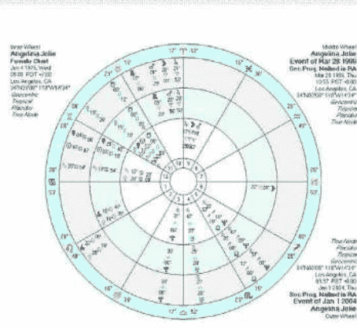

（图 1）

而在次限星盘中，离婚的征象则没有结婚的征象明显。**因为离婚不仅是婚姻中某个人的问题，往往是双方流年同时触碰才可能构成离婚事实。如果只是一方婚姻征象受到冲击，则有可能度过危机。**此外，本命星盘中所带的婚姻信息（婚姻相处美满或是无法和谐）也会决定此人是否容易离婚，两人的合盘同样会受到流年影响出现波动。而个人盘中则可能因为离婚对生活带来的影响方面不同而出现不同征象。**如果双方是因为第三者分手，则可能出现劈腿的一方星盘中呈现结婚的征象，而另一方则因为深受打击而呈现出破坏性的离婚征象。**所以，对于离婚征象则需要更加慎重分析。

安吉丽娜·朱莉是好莱坞的风云人物，从16岁出道以来一直备受关注。她个人的婚恋生活也一直是媒体的关注焦点。根据维基百科资料，安吉丽娜·朱莉从16岁与中学男友分手后一直未谈恋爱，直到1995年拍摄电影《骇客（Hacker）》时与英国导演约翰尼·李·米勒（Jonny Lee Miller）相识。但两人并未在当时立即坠入爱河，在电影拍摄结束数月后两人再度相逢后却迅速点燃爱火并于1996年3月28日结婚。两人的情感关系持续到1997年9月宣布和平分手，但也并未对双方的生活和事业带来巨大影响。此后，安吉丽娜又与另一好莱坞导演有过短暂婚姻然后再度和平分手。而后在2004年拍摄《史密斯夫妇（Mr. & Mrs. Smith）》时第三者插足布拉德·皮特（Brad Pitt）与珍妮弗·安妮斯顿（Jennifer Aniston）的婚姻，导致两人七年模范婚姻解体。而安吉丽娜·朱莉与布拉德·皮特的伴侣关系则维系至今，并于近日传出即将结婚的消息。在本次案例中，选取的则是安吉丽娜初次结婚以及与长期伴侣布拉德·皮特相遇时间的次限盘。

**根据大量案例分析，在次限星盘中可能的离婚征象如下：**

- 次限月亮进入第七宫，并与本命盘中火星、土星以及冥王星等凶星形成合相或刑相；
- 次限月亮合相下中天或下降点，带来个人生活领域的巨大变化；
- 次限月亮与第七宫宫主相刑。

首先，可以看见安吉丽娜第一次结婚时间（1996年3月28日）的次限盘（图1中圈）中次限月亮落在摩羯座24度，靠近其本命盘下降点位置。根据维基百科内容，安吉丽娜·朱莉与约翰尼·李·米勒的恋爱时间应在半年左右。而根据次限盘中月亮每个月约运行1度的规则，两人再度相逢擦出火花的时间大约正好是次限月亮在摩羯座17度左右对冲本命盘第七宫宫主巨蟹座17度土星的时期，符合婚姻征象中次限月亮触动本命盘婚姻宫宫主的征象。而在两人结婚随后不久，次限月亮也将进入婚姻宫第七宫对冲本命金星，也可以作为婚姻征象的辅助条件。

其次，再来看安吉丽娜与布拉德·皮特相遇时间的次限盘。根据朱莉在写给皮特的信件中明确表示自己在第一眼见到皮特的时候就已坠入爱河。而《史密斯夫妇》一片于2004年1月开拍，意味着两人应在这一时间前后见面，然后已经暗生情愫，所以在此选取2004年1月1日的次限盘作为参考时间。在该时间的次限盘（图1外圈）中，次限月亮运行到第十宫白羊座28度的位置，恰好与朱莉本命盘中的上升金星在巨蟹座28度的合相形成准确的刑相位，而次限月亮十宫原本也代表着社会形象的改变，本命盘中的上升和金星触动都可能是人生方向和感情状况的巨大变化，两人在此时相遇，于安吉丽娜·朱莉而言无疑意味着重要的情感关系的挑战。在这种流年次限盘中，我们无法根据个人本身星盘的状况判定最终结果，因为两人是否有机缘突破阻力长期发展与双方星盘的和谐度密切相关，只能依次推断在这样的次限流年中盘主会有机会进入一段重要的乃至改变人生方向的情感关系。

案例 2：
好莱坞著名男星布拉德·皮特（Brad Pitt）

布拉德·皮特自出道以来一直以帅哥形象屹立银屏不倒，是好莱坞长红的英俊男星。在80年代几乎与每一位合作过的女影星都确定过恋爱关系，并与著名的一线女星格温妮丝·帕特洛（Gwyneth Paltrow）订婚后又宣布分手。但他最为著名的婚恋事迹莫过于与珍妮佛·安妮斯顿的七年婚姻以及后来为安吉丽娜·朱莉劈腿离婚并恋爱至今。因布拉德·皮特的离婚主要源于自身的“劈腿”，同时与朱莉保持恋爱关系，所以离婚对其本身并没有造成严重伤害，相反进入了另一段稳定关系。所以，在此选取的是皮特与安妮斯顿第一次开始约会的时间以及第一次遇见朱莉的时间。

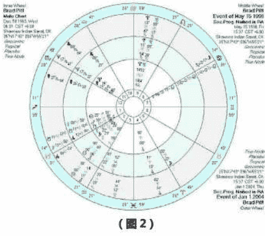

根据维基百科资料，皮特与安妮斯顿在1998年5月第一次开始正式约会，所以选取1998年5月15日的中间值为基点。在这一时间的次限盘（图2中圈）中，次限月亮刚刚进入第五宫，但除了此前一个月刚刚与本命金星形成刑相位之外并无太多其他相位，这意味着与安妮斯顿的恋情开端也许仅仅是皮特本人渴望进入一段稳定的恋情并更愿意倾注精力于此。而在此后2000年双方结婚时的次限星盘中（不在此列出）也无明显的其它结婚征象。结合布拉德·皮特本命盘中群星摩羯座务实的特性分析，不排除结婚只是因为他认为已经到了该结婚的年龄而选取身边合适的对象进入婚姻。

而对于皮特与朱莉相遇的时间，选取的是2004年1月1日的次限盘，具体原因已在上一案例中列出。在这一次限盘（图2外圈）中，次限月亮进入代表危机的第八宫，意味着这段时间于命主而言将是一段充满危机和转折的时期。落在巨蟹座17度的次限月亮在一个月之前刚刚与本命盘第七宫婚姻宫宫主——落在摩羯座16度的水星，形成了对冲相位，与此同时还与次限上升点形成准确对冲，意味着次限月亮合相了次限下降点。而更重要的是，在这一年皮特的次限水星，也就是次限婚姻主，正好合相本命南交点，让婚姻与神秘的前世因果及缘分联系在了一起。而以上三个征象都可视为次限盘中可能进入婚姻和长期伴侣关系的重要征象。从次限盘角度看来，皮特在此时遇见朱莉，并最终决定与安妮斯顿分手也是受到了强烈的次限流年影响，甚至还带上了神秘的因果缘法。加上皮特与朱莉的比较盘中也充满强烈互动，最终星盘中群星落在摩羯极度顾及社会形象的皮特离婚与第三者朱莉走到一起也并不奇怪。

座21度土星构成刑相位。而仅从这一相位分析，似乎更像是涉及原生家庭关系的巨大改变与父母双亲关系疏离。而从其母后来撰写的回忆录中可以得知，安妮斯顿正是在1998年前后与母亲关系闹僵并形同陌路长达近十年。而在此时开始的亲密关系，更有可能是一种将倾注于原生家庭的情感转移至男女关系中的移情效果。

案例 3：
好莱坞著名女星珍妮弗·安妮斯顿（Jennifer Aniston）

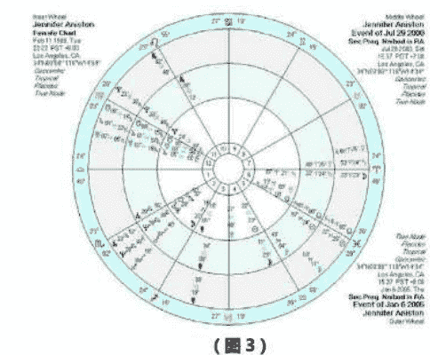

再来参看安妮斯顿与皮特于2000年7月29日结婚时的次限盘（图3中圈），此时的结婚征象则明显得多。首先是次限月亮合相落在本命第五宫宫头附近6度内的水瓶座太阳。不管在古典占星学还是现代占星学中，都认为某一宫宫头前6度内都会对此宫位产生影响，因此这一次限月亮的相位也可以视为一种与第五宫内行星有关的合相。此外，此时的次限月亮落在水瓶座23度，与安妮斯顿本命盘中落于白羊座24度的下降点的几乎在1度内紧密六合，也带来进入婚姻和长期伴侣关系的可能性。

（图 3）

珍妮弗·安妮斯顿也是好莱坞知名女星，以《老友记》中瑞秋的形象深入人心，也是好莱坞收入最高的女影星之一。安妮斯顿早年与皮特被誉为好莱坞模范夫妻，未料却在后来被第三者安吉丽娜·朱莉插足而导致离婚，成为好莱坞历史上最著名的离婚事件之一。时隔多年之后，安妮斯顿与皮特的离婚事件依然是八卦杂志的热门话题。安妮斯顿突然从完美婚姻直接进入被迫离婚状态，受到极大的心灵冲击，对她的精神与生活都造成了极大的影响，而次限盘中也同样呈现出明显的征象。

再进入安妮斯顿与皮特最被人关注的分手时期。皮特在2004年拍摄《史密斯夫妇》时认识安吉丽娜·朱莉，在对方的穷追不舍中最终做出选择，与安妮斯顿在2005年1月6日宣布分居，并在2005年3月25日提出离婚要求。而在以双方分居时间做出的次限星盘（图3外圈）中，我们发现了甚至比其结婚时明显数倍的婚姻变动征象。在这张盘中，最值得关注的依然还是次限月亮。落于白羊座23度23分的次限月亮恰好将与次限盘中落在白羊座24度的下降点在一个月内紧密合相，也将与落在本命盘下降点附近的代表危机的第八宫的宫主土星相合，意味着来自婚姻合作方面的问题将遭遇现实状况的考验，与他人共有的财产和亲密关系也可能发生变化。此时，呈现个人表现和认知变化的次限上升落在天蝎座23度，也与本命盘第七宫（婚姻宫）守护星落在天蝎座23度的火星形成准确合相，这些都意味着在本年度婚姻将遭遇挑战与变化。而与此同时，次限金星也在这一年开始逆行，所有与金星所掌管的情感以及婚恋有关的事宜在这一年中都将遭受重大考验，或是与此相关的问题都需要命主仔细反思回顾。次限金星逆行会给命主的婚姻状态带来不少冲突与分歧，而受金星落在白羊座为陷落位置加之逆行更容易带来负面影响，令安妮斯顿的婚姻状况有更大可能向负面发展。最后，两人的离婚申请

先从珍妮弗·安妮斯顿与布拉德·皮特交往初期（1998年5月两人初次开始约会）的次限盘（此处不做单独列出）分析，会发现星盘中并无明显的婚姻及长期关系征象，唯一与此有关的相位是次限月亮在摩羯座21度贴近下降点并与本命盘中距离下降点仅3度容许度的白羊

## 案例 4：
英国前威尔士王妃戴安娜（Princess Diana）

（图 4）

被称为“英伦玫瑰”的早陨王妃戴安娜也是英伦王室历史上的一段传奇。她虽然拥有贵族身份，却出身平民，并以处女之身嫁给查尔斯王储，成为当时的一段佳话。而戴安娜的出现也为当时被负面消息缠身的英国王室注入了新鲜活力，她本人更被视为英国人的“新偶像”。但戴安娜的婚姻生活却并不如传奇的开端一般幸福美满。在其婚姻后期，戴安娜和查尔斯两人因性格差异争吵不断，而查尔斯王子与初恋情人卡米拉的藕断丝连也令两人的关系雪上加霜，最终在 1992 年 12 月 9 日宣布分居，两人的婚姻关系在 1996 年 8 月 26 日正式结束。

根据维基百科资料，戴安娜与查尔斯相遇于 1977 年年中的一次派对上，而后查尔斯又于 1977 年 11 月邀请戴安娜参加自己的 30 岁生日派对，两人的感情在此后逐渐升温，但直到 4 年后戴安娜年满 20 岁之后才举办了隆重的婚礼。因为这一段情感关系在婚前已持续较长时间，从官方资料中无法找出两人情感开始的具体事件，而因为王室婚礼需要，婚礼准备时间也比较漫长，所以需要选取双方确定结婚意向的时间作为参考。根据媒体报道，查尔斯大约在 1980 年 8 月期间向戴安娜求婚并获得对方同意，因此次限盘也将选取这一时间为婚运参考时间。在这一次限盘中（图 4 中圈）会发现二个重要的次限流年征象。其一，影响女性婚恋状况的次限太阳在巨蟹座 27 度与本命盘中代表责任与现实的摩羯座 27 度的土星相冲，本身这就意味着有机会进入现实的伴侣和婚姻关系，并开始承担现实责任；此外，需要注意的是，土星还是其婚姻宫守护星水星的最终定位星[1]，因此也会直接影响到命主的婚姻状态；其二，次限月亮在大约 3-4 个月之前刚刚进入了代表社会形象、事业提升和上级关注的第十宫。资料表明，此前查尔斯原本已经对这段关系失去兴趣，英国王室却对戴安娜的出现表现出极大兴趣（上级关注），并认为她将是英国储妃的最佳人选。英国王室的重视最终导致查尔斯决定迎娶戴安娜，也直接提升了戴安娜的社会地位和公众曝光度，让戴安娜通过婚姻实现了个人社会形象、事业发展的提升。

再切入戴安娜与查尔斯在 1992 年 12 月 9 日宣布决定分居感情破裂的次限盘（图 4 外圈），在这一次限盘中，运行至巨蟹座 26 度多的次限水星将与本命盘中代表责任和压力，同时也是婚姻守护星水星最终定位星的摩羯座 27 度土星在一年内准确对冲。水星也为戴安娜星盘中第七宫婚姻宫的守护星，这一相位将直接导致其婚姻受到现实挑战。而又因为在其本命盘中水星为逆行的弱势状态，意味着本命盘中即存在婚姻隐患，一旦流年触发，大多会向负面状况发展，令离婚几率大大增高。此外，次限月亮也正好在刚刚经过星盘最低点的下中天位置准确合相，带来了个人生活领域从根本上的改变，且变化将可能涉及整个家族、住宅乃至个人社会起点，成为戴安娜离婚的辅助征象。戴安娜本人也恰好在次限月亮升入星盘最高点天秤座 23 度的前后受到王室关注成为储妃候选人，又在次限月亮进入星盘最低点白羊座 23 度时正式决定分居，更加体现了次限盘对于判断人生阶段的准确性。

综合上文案例，不难发现无论是结婚还是离婚，都不能简单地参考某一单一元素，一定要通过其它辅助征象加以判断。次限盘虽然可以为我们提供个人星盘中关于婚恋状况的信息，但具体结果却必须谨慎对待才有可能得出正确结论。

注释：
[1] 最终定位星：当行星 A 落在非自身守护的星座内时，就会被该星座的守护星 B 定位，行星 B 也被成为行星 A 的定位星。此后，通过行星 B 所落的星座又可以找出守护该星座的行星 C，行星 C 又成为行星 B 的定位星。在寻找最终定位星时，需要依次类推，直到定位星 X 也落在其自身守护的星座内时，X 即为在整个寻找过程所涉及所有行星的最终定位星。

## 黄纤越

网名“凤影焰”，江湖人称“凤大”。中国著名占星师，水晶能量灵疗师，新浪星座教程专栏编写者，也是国内首批占星学研究者和占星资料翻译者。近年来一直致力于发展中国的占星文化事业，并于 2012 年 5 月正式创办中国的第一本专业占星泛神秘学期刊——《占星学刊》。她也是中国首位将占星术与水晶灵疗完美结合的咨询师。
联系邮箱：lucky.astro@163.com
新浪微博：http://weibo.com/luckyastro
官方博客：http://blog.sina.com.cn/luckyastro

## 卜卦占星系列之三：
## 宫位的选择（上）

文/琥珀

卜卦占星学是占星学中有着悠久历史与深奥文化技艺沉淀的古老分支，但如何在立盘解卦时选取合适的宫位和象征星却成为卜卦占星殿堂的最大门槛。我常说的一句话就是：卜卦占星中核心的核心莫过于宫位与象征星的选取，这就好比一个减肥的人，在面对琳琅满目的美味佳肴时，你需要清醒认知你所需要的减肥核心食物，这样才能慢慢顺着此类信息达到最终的“窈窕”目的。而若选择了错的宫位，无异于蛋糕炸鸡度日的增肥生活，最终只能与所求目标渐行渐远了。从本期开始，我将分三期系统地从古代大师对于十二宫的归纳入手，同时与时俱进加入现代生活中必可缺少的基础元素（即最频繁出现的问卦问题），用当今的视角来翻新整合传统的宫位概念。

### 第一宫

在此，选用了李·雷曼博士（Dr. J. Lee Lehman）在著作《卜卦占星学的技艺（The Martial Art of Horary Astrology）》中对威廉·李利(William Lilly)及其门生约翰·盖布利（John Gadbury）[1]关于涉及到第一宫的问题所做的系统总结[2]，将其合并整理如下：

- 问卦人是否可以长寿
- 问卦人在人生中的哪些阶段会生活得最幸福，哪部分会最高质
- 突发事件的吉凶性
- 问卦人身体的相应部位的疤痕或疵斑
- 乘船远行是否会平安抵达目的地
- 失踪者的生死状况[3]

#### 何时国家会发生巨变

在卜卦占星的应用中，作为与上升点紧密联系的宫位，第一宫及其宫主星的状态良好与否是整个星盘的基点。而由问题所诞生的卜卦占星盘，其问题产生者“问卦人”亦由一宫所代表，所传达的信息可以涉及到：外貌、年龄、身体状况，甚至于社会地位等。

除此之外，第一宫还担负着问题本身合理性的考量：上升落入的度数是否为黄道星座的前后几度之内。古代卜卦占星师均认为上升点所落入为“不适宜对星盘作出判断”的标志，这期间涉及的原因众多，如对于问卦人发问动机的质疑（发问的目的是否带有对占星师本身的挑衅或欺骗性），或者占星师对于所提及问题本身无法做出有效指引与帮助：问题提出太早，带有庸人自扰的嫌疑，比如问题是关于“我能在今年年底结婚吗？”，上升点落入天蝎座2度，若星盘无其他合理支配的依据，结论可以作为：“八字没有一撇呀，至少先找个靠谱的男朋友才好论及婚嫁吧！”问题提出太迟，即上升点落入星座尾度，事情已然发生且无回天之力去解决，如“我能得到今天面试的那份工作吗？”综合星盘，结论可为对方已然有了内定人选，因此问卦人将失望而归。其实关于所谓“上升度数无效”的考量原则，究其本质是因为古代由于测量条件的限制，导致地点经纬度的数据较粗糙且时间计量工具也难以保持精准状态，使得上升点在处于星座更替的时刻，占星师很难识别出其真实位置，从而无法判断真正的命主星到底花落谁家，因此在此时刻分析星盘需要格外得警惕与谨慎，威廉·李利认为前后三度都需要列入特别考量的度数，约翰·盖布利甚至认为前后五度都该列入小心解盘的范畴！

关于第一宫的相关案例，建议大家参考一下《占星学刊》第一期中《卜卦占星系列之一——从基础出发：关于问题的有效性》一文的案例一，就可以清楚明了地为大家例证本段的内容。

### 第二宫

此宫位受人热捧的最重要原因就是其与财富相关联。让我们继续借鉴大师们的总结：

- 问卦人是否会富有，及其所需要途径以及达成的时间
- 财富可否持久
- 问卦人是否可以获利（在某事），或者得到某件其所需求的财物
- 问卦人无法获取财富的原因
- 问卦人是否可以讨回其借出/典当的财物
- 问卦人是否可以通过非婚姻关系获取财富[4]

第二宫的主题基本上围绕着“财物”这个关键字，引入到最经常被涉及的现代卜卦事宜中的相关联问题为：失物与薪资。虽然此两类主题均需要参考第二宫，但引入效应的其他宫位却大不相同。失物类问题需要参考的是第二宫及其宫主星的状态与落位来判断寻求物品的地理位置，通过与月亮、上升点（ASC）及一宫宫主星的关系来进一步判断可否寻回失物，大致来说，是以一宫、二宫与月亮为主的内部整合。薪资卦所要参考的东西则并非仅为简单的一宫与二宫的关系，它需要涉及的是财富所来源的宫位，即十一宫，十宫的转二宫，找到具体的源头才能履行开源的职能。同理，如果问题涉及到了债务矛盾，那么我们可以通过七宫的转二宫来寻求本二宫的财源，再进一步分析其关系从而得出关于债务是否可以顺利解决的最终结论。

其实关于第二宫的含义还可以做进一步的补充：即帮助“问卦者”的人（副手）。需要明白这个概念较之六宫（下属）与七宫（合作伙伴）的区别。这个副手的含义更偏向于需要做某件事，但要通过其他人的帮助或者协助才可以完成。例如，在法律纠纷中，律师便是二宫来表示；移民留学的案例中，中介这个角色也是由二宫来表示。所以我们可以看到赔了夫人又折兵的案例中，二宫的损伤往往带着所托之人的能力与衷心并不尽如人意的问题，而俗语“劳民伤财”放在二宫的这个涵义中，是不是非常形象生动呢？

### 第三宫

- 问卦人所问及的手足/邻居，或问卦人是否有同胞手足
- 其兄弟的状况与财产
- 问卦人国内之旅是否顺达
- 外界谣传的八卦或传闻是否属实
- 朋友的建议是否（对问卦人）有利[5]

对于“兄弟姊妹”之于第三宫，这方面基本上很少引发争议。对于现代生活，特别是更适合中国国情的问题，基本上让第三宫出现频率最高的问题是“考试”，须知并非所有的“考试”都可以一顶高帽百搭三宫。第三宫所涉及到的通常为“基础类技能”方面的培训，比如小学的基础类教育，简单的识字算数，以此延伸至基本的电脑操作，乃至于现在生活的必不可缺的代步工具的使用“开车”技能，均为三宫所指代。

另外一个第三宫所代表的较有意思的涵义为“传闻的真伪性”，记得在我们豆瓣案例小组中曾经有过这样一个让人印象深刻的趣味案例，某位女生来询问手机联络对象的性别，当时大家都按照以七宫为主的方式来推测，只有一个朋友是采取了三宫测传闻真伪来进行分析，最终大家判断的结果是错误的，采取三宫的朋友却得出了正确结论。理由很简单：猜测对方性别真伪，且在无任何依据的情况，我们无法确定对方是“已知的人”，用隐藏的十二宫也许是一个判断基准，但是运用三宫则是快刀斩乱麻直奔主题的宫位选取。这也体现了卜卦占星灵活巧妙的一面，这也恰恰是其魅力迸发之处。

至于“国内旅行”这个概念则常常会与“国际旅行”相比较，而当代著名英国卜卦占星师约翰·佛罗利（John Frawley）有其特别的观点：他认为三宫所蕴藏的“出行”是带着日常性与周期性的。如，某人住在苏州，但是工作地点为上海，因此需要每周一至五往返于苏州与上海之间，那么这种情况则为三宫，若此人需要每周往返的工作地方为韩国，那么依旧参考三宫。那么，同样的案例，如果是某人住在苏州，偶尔去上海度假游玩该如何选择呢？约翰·佛罗利老师认为这要归结到第九宫（假期）去，因为这并非为“日常性的出行”。此观点仁者见仁智者见智，特别提出与大家分享一下，你更偏好于哪种呢？

### 第四宫

- 问卦人是否要购买房产及其质量如何
- 是否适宜搬家还是继续居住原地
- 宝藏问题以及是否可获取
- 所猜测的地方是否藏有宝物
- 问卦人是否对父亲留给其的财产满意
- 错放的物品如何可以找回
- 河道转移以及灌溉田地
- 父母，地产，房屋租赁，农场，庄园[6]

第四宫在我们当今生活中使用最广泛的依旧是其本意“房产”，不管是租赁房屋，购买房产抑或是家居装修，我们需要参考的主要对象均为第四宫以及四宫宫主星的位置，若宫主星位置陷落，那么所落之处则往往代表房屋易出问题的地方：风相星座代表着屋顶与窗户；水相星座代表着水管与其相关设施；风相星座为暖气与墙壁；土相星座则为地板与地基。

除此之外，这里不得不提及第四宫作为父亲的指代。当代的占星学术中针对四宫与十宫到底孰为父孰为母的指代争议颇大。其实站在古典占星的角度来分析，通过后天十二宫与其共同象征星[7]，即土星守护第一宫，木星守护第二宫，火星守护第三宫，可以推至太阳守护着第四宫：太阳。有什么比太阳作为父亲的象征更有说服力的呢？如果问题中没有涉及特指父亲或者母亲，那么四宫若被提及，则可以推测为父母或者父辈们的含义。

接下来，我将通过案例分析来尝试了解和应用一下今天提及的宫位内容。

## 案例 1：

（2012年4月19日，19点54分，无锡）
问题描述：父亲想买个二手房，会顺利吗？

卜卦盘中，星盘的上升点落入天蝎座，一宫宫主星火星落入处女座（问卦人的上升星座便为处女座）。其父亲为四宫代表，那么房产变为第四宫的转四宫表示，即为七宫。五宫也是四宫的二宫，表示其父亲的财政状况，第五宫宫主星木星落入金牛座且为第四宫的转四宫即第七宫宫头附近，表示其对于买房的消费意愿强烈且坚定。白羊座的月亮则表示事情发展快速。而卖家则为第四宫的对宫第十宫表示，宫主星太阳落入第四宫的转三宫，意味着买方与卖方之间的沟通以及资料方面的传递。由于太阳落在果宫，也意味着买方会主动沟通与联系。月亮接下来将与金星的60度入相位，暗示着事件会在三周内有所落实，甚至更快。

五月七日问卦人反馈父亲已经找到合适的卖家，并且已于当天签订了购房协议，距离问卦时间三周不到。六月底房屋装修结束，过户完成，一切顺利。

注释：
[1] 威廉·李利（William Lilly，1602-1681）英国著名占星师，以下卦占星闻名于世，著有占星学宝典《基督占星学（Christian Astrology）》。约翰·盖布利（John Gadbury 1627-1701），英国占星师，著有多本占星学年鉴，早年追随李利并为其得意门生，后于1675年倒戈，背弃李利。
[2] 节选自《卜卦占星学的技艺（The Martial Art of Horary Astrology）》第 56 页。本文之后关于威廉·李利及约翰·盖布利的理论概述均将引用李·雷曼博士书中的总结，特此注明。
[3] 作者认为失踪人口选择一宫并不合理，因为第一宫即为问题产生者，失踪人口既无法提出问题，也很难合理被第一宫的全权代表。
[4] 节选自《卜卦占星学的技艺（The Martial Art of Horary Astrology）》第 70 页。
[5] 节选自《卜卦占星学的技艺（The Martial Art of Horary Astrology）》第 84 页。
[6] 节选自《卜卦占星学的技艺（The Martial Art of Horary Astrology）》第 105 页。
[7] 古典占星中后天十二宫与其共同象征星：基于迦勒底占星的行星排序：土星、木星、火星、太阳、金星、水星、月亮——其中土星被看作第一颗行星是因为它是我们可视的最远的行星。其余行星的排列则根据它们与地球间的距离远近。因此得出：土星象征第一宫，木星象征第二宫，火星象征第三宫，太阳象征第四宫，金星象征第五宫，水星象征第六宫，月亮象征第七宫，土星象征第八宫，木星象征第九宫，火星象征第十宫，太阳象征第十一宫，金星象征第十二宫。

## 琥珀

昵称“小猫琥珀”、“琥珀口袋”，旅澳占星师，旅行家，师从西洋卜卦占星大师约翰·佛罗利(John Frawley)擅长卜卦占星与流年分析。研习占星十余年痴迷于此，以占星为己之导向与信仰，热爱一切占星古籍。二零一零年于澳大利亚悉尼成立了澳洲第一个华人占星工作室，积累大量案例分析并不断练习精进。在互联网上拥有多个案例研习 QQ 群，因其精湛的卜卦技艺与诚恳温和的交流态度而受广大网友敬爱，每每在大家焦急危难时出手相助极具大侠风范，也被大家昵称为“琥珀姑姑”。
联系邮箱：info@starfavor.com。
豆瓣主页：http://www.douban.com/people/ambercat
腾讯微博：http://t.qq.com/amberpouch

## 塔罗解读：从出生牌解读你的生命之河（二）

——魔术师、命运之轮与太阳

文/Claire Chak

在上一期（《占星学刊》第二期）中，我向大家介绍了塔罗出生牌的来源与计算方法，并对 12 组出生牌做出了基本的关键字介绍。而从这一期开始，我将继续为大家详细解读 12 组出生牌的具体含义和使用方法。

出生牌的人也得看他们自身的取舍，自己能否把一对出生牌之间的对立能量整合平衡好，从而活出此出生牌最精彩的一面。

### 命运之轮 & 魔术师

#### 相似点

只有出生的年月日相加后得出 10 和 1 的人才能有“命运之轮 & 魔术师”的出生牌组合。这一个组合的人都有很强烈的急躁不安的特点。他们的情绪也非常得起伏不定，时常会有变化。这跟“魔术师”和“命运之轮”都有着很活跃、很主动的能量有关系。另外一个特点是“命运之轮 & 魔术师”组合之人都很有个性，我行我素，但是不会不顾后果。他们的生活或者性格也许是倾向于奔波，动力十足。可是他们也同时拥有着某种稳定性，让他们稳住。

“命运之轮”与“魔术师”两张牌之间无论在图面上还是在牌意上都有着很多的共同之处。在理解出生牌的过程中，第一步是从牌的视觉元素着手。“魔术师”一牌中的主角是站立的，这个动作代表着阳性的、主动的能量。在“命运之轮”的牌面中找不到人物，而从牌的名称我们也可以得知此牌的主角不是人物，而是不停转动的轮。既为“命运之轮”，便不会为任何的事情而停止转动。它代表着生命的源源不息，也是一股很强烈的阳性、动态的能量。

从“魔术师”到“命运之轮”一共有十张牌的距离，这十张塔罗牌也刚好跟卡巴拉里的生命之树中的十个深度（Depth / Sephiroth）对号入座，从而形成在出生牌系统里的“个人的生命之树”（Personal Tree of Life）。通过“个人的生命之树”，我们能进一步地运用出生牌组合去深入了解一个人。这是中高级别的出生牌学习课题了，也超出了现在这篇文章的范畴。

另外一个共有的要点是牌中的四元素。塔罗中所指的四元素跟占星的很相似，分别为火相（权杖作为象征）、水相（圣杯为代表）、风相（宝剑为象征）和土相（金币作为代表）。而这四元素在两张牌中分别以不一样的方式呈现。在比较明显的“魔术师”中，主角魔术师身前的桌面上摆放着四元素的象征物件：权杖、圣杯、宝剑和金币。这表示魔术师拥有足够的能量和能力运用这四大元素，而这些都是时刻为魔术师准备着的。在“命运之轮”里，四元素的象征物在牌的四个角落上。牌的左上角以人类来代表占星中的水瓶座（风元素）；鹰象征着天蝎座（右上角 - 水元素），这是因为在古典占星学里，天蝎座是由鹰来代表。

当然，“一种米养活百种人”，我们不可以千篇一律地说哪一组出生牌的人是如何如何的性格或命运。同一组出生牌的人也得看他们自身的取舍，自己能否把一对出生牌之间的对立能量整合平衡好，从而活出此出生牌最精彩的一面。

#### 对比 / 差别

“魔术师”和“命运之轮”还有一个很重要的相同主题，那就是圆。圆形也代表着不朽、永恒、无穷无尽的含义。在“命运之轮”中，我们更容易看见这一主题。牌正中间的轮永恒地转动，无论我们的生活中发生了任何的愉快或不愉快，命运之轮的转动都不会停止。某一刻的来临也随即暗示着它的离开，可是集体的命运和生命却不会因为某些人或事而停止转动，就像地球不会为了我们的心情或遭遇停止它的转动一样。但是在“魔术师”中，这种圆的象征很微妙，也隐藏得特别有意思！在牌中魔术师的头顶上飘着一个像是数字“8”倒过来的无穷号（Lemniscate），这似乎在说明着他深刻地明白宇宙中的永恒是什么，生命的不朽是什么，所谓的无穷无尽又是什么。而在魔术师的腰部，我们能看见一个很特别的“腰带”。这是一条蛇，也是一个比无穷号更早期、更原始的永恒符号。这条咬着自己的尾巴、不停吃着自己、能无限循环的蛇名叫衔尾蛇（Ouroboros）。这条衔尾蛇的腰带正好挂在魔术师的腰间，象征着他是心行合一的人。真正的魔术师创造出来的东西会跟随圆的理念，不会任意打破永恒不变的宇宙真理。

从以上的分析我们可以看见，“命运之轮”与“魔术师”都具备着动静皆宜的潜能和大氛围。而且在这种动与静之间它们各自上演了各自对于不朽、永恒的诠释。

“命运之轮”和“魔术师”这一对之间也存在着许多不同之处。首先，最大范围地去看待这两张牌时，我们会发现它们的主要颜色很不相同。“魔术师”的主色调是白、红、金，这些都是非常强烈、激烈和热情的颜色。而相比之下，“命运之轮”的蓝、橘和灰主色调就显得很温和很文雅。单从主色调的差别就能立刻把两张牌所表现的情感和总体感觉分别开来。

另一个对比主题是阴性与阳性能量，直线象征与圆形象征的能量差异。在“魔术师”中人物的笔直站立，塑造出来的形状就是一个阿拉伯数字“1”的形象。再加上“魔术师”在塔罗的大阿卡纳牌系里被排列为一号。仔细地看还真能发现到许多与“1”有关系的符号和象征物。比如魔术师右手中的魔法棒，双尖头的魔法棒树立在空中，就像是一个垂直的能量通道；魔术师的左手往地面方向指着，食指伸出形成了另外一个“1”字符号。可是这个“1”象征着的不是魔法棒里的天赐能量，而是“事在人为”中的行动。这些“1”形符号都是阳性的、积极的、主动的、强烈的、稳固的象征。然而，“命运之轮”的主角是一个大轮，一个大圆圈，恰恰与“魔术师”形成了一个强烈的阴阳对比。命运的轮子在不停的转，牌面上的大轮还套着两个小轮，显然是在提示着牌中像阿拉伯数字中的“0”为符号的阴性象征。继续分析此图，大轮子的外面有三个神话中的动物，他们似乎在各自跟着轮子转动。在远处的四个守护神代表着占星学里的四个固定星座，它们在天空的黄道十二宫大环中也是永不停歇地转动着。可见“命运之轮”中的能量以阴性为重，拥有着浮躁不安、起伏不定，却使人振奋的、高兴的感觉与能量。这张牌在塔罗的大阿卡纳牌中刚好编排为第十号，阿拉伯数字中的“10”，分别由“1”和“0”组成。虽然“命运之轮”的大氛围感觉是在转动的阳性能量，可是它的种种细微符号和象征都代表着刚中带柔的阴性力量。这也跟“魔术师”那自我、唯一的感觉成了鲜明的对比。

值得一提的是在出生牌系统里，每一张牌的占星学属性都十分重要。虽然占星学跟塔罗是像苹果和橘子一样不同的两个系统和学问。可在好几百年的历史演变过程中，有很多跟占星有关的特征和属性被注入了塔罗的系统结构里。在一般的塔罗解读中，也许每一张牌在占星学中的属性都是无需被提及的，可在出生牌的讨论和探讨中，这可是很有价值的信息！不过虽然说是占星属性，但是我们要切记在此提及的占星资料是以塔罗出生牌的探讨为目的。所以，读者不能完全把占星里的知识原封不动地搬到这里运用。我在此所谓的占星属性是以塔罗牌为主的解释，内容远不够完整，可是能突出出生牌里的主题和要点。

“魔术师”的占星属性是水星。在我们的塔罗讨论范围中，水星的贡献是圆滑的，狡猾的，无常的，善变的，灵巧，骗局，虚假，伪造，骗子，有意思的谎言，能言善道，意味深长的，有口才的，沟通能力强的，有魅力和吸引力的特质。所以，“魔术师”也拥有着水星所带来的正面与负面的潜能。另一方面，“命运之轮”的占星属性是木星。而木星所赋予此牌的特性包括广阔的，健谈的，扩张的，豪爽的，膨胀的，幸运的，带来好运的，积极的，有信心的，确信的能量。

“魔术师”牌面主角是一名魔术师，画的是人类。可是“命运之轮”里没有人类，只有神话中的动物或神兽。其实这是“命运之轮”的一大特点，也是因为这样，很多的塔罗师对此牌的认识不多，也往往会觉得“命运之轮”不好懂。没有人类的画面自然的会让我们感觉到疏远和不真实。这是因为牌面上只有神话元素，它们的比例和规模都是非人类可以衡量的巨大，是我们无所得知的宏伟。人类在这样的能量面前会变得无助、渺小、遥远。相反人们在“魔术师”面前会觉得一切皆有可能，很受鼓舞。因为牌面主角是我们熟悉的主题——人物，而且是拥有着创造万物的四元素、也懂得如何去运用它们的不凡人物。这似乎拉近了人与神、与完美的距离。“魔术师”里的世界是我们可以理解、可以感同身受的。他象征着我们渴望的人类最极致的能量与能力。通过个人的努力、行动和意愿，我们是可以成为魔术师的，可是我们永远也没有办法在神话世界里找到归属感。

最后一个我要提到的差别也是最为重要的。“魔术师”的能量特质是控制，牌的作用围绕着个人的意志和技巧。魔术师面前摆着的四元素任由他控制和操纵，随着他的个人意志掌控着这能创造世界万物的基本元素和能量。传统来说，此牌的意识是运用个人意志和技能。牌中的魔术师深信着自己就是宇宙能量的通道，神圣的能量会通过他和他的意志在我们的世界中实现和实践。在生活中，无论是哪一个方面，只要魔术师愿意他都能去有意识地改变。显然，这魔术师是个人主义者，也是行动派，相信自己是命运的主宰者，是他的个人意愿使这个现实生活和状态存在成形。相反，“命运之轮”中的主要意识是接受和接纳。牌中唯一的动力和动作就是各种元素不息的、有规律的转动。哪怕此牌充满着未知数和戏剧性的起伏，生命还是会一直按照它固有的循环和定律延续下去。“命运之轮”是典型的宿命论者，此能量重的人会接受生命中所发生的任何事物，认为这一切都是有定数且无法改变的。人生对于这一类人而言也许像是一次坐过山车的经历，坐上去后就停不下来，好好地享受和接受这次历程所带来的任何事物，任由这车带你去任何地方，指定的某个目的地。“命运之轮”的格言也许是“既来之则安之”！

#### 互相协调的“命运之轮 & 魔术师”

当“命运之轮 & 魔术师”两股能量非常和谐、和调地运作时，这一组出生牌的人会拥有着某种强烈的动感。他们会很愿意旅游，出远门，周游列国。此外，结交不同类型的朋友也是这一组合人的强项。他们往往能在世界各地或者在家门口轻而易举地认识到来自四面八方的朋友。他们这种好动、容易亲近人的个性是“命运之轮”给的礼物。

而“魔术师”赋予他们的优势是多才多艺、追求完美的本质。因为有着创造能力很强的“魔术师”的庇佑，“命运之轮 & 魔术师”出生牌的人都会在一生中学习到很多不同的才能或技能。而且他们都是潜在的完美主义者，在做事情时务求完美。

当“命运之轮”和“魔术师”的两股对立能量能融入到一起形成平衡时，这组出生牌的能量可以互相补充对方的不足，非常好的融入到一起。它们是很好的搭配，也让这个世界没有那么的乏味！

#### 未整合的“魔术师”能量

当“魔术师”特质没有被承认或意识到的时候，它会出现不平衡状态，很有可能展现出负面或阴暗面的能量。在最糟糕的情况下，“魔术师”会变得狂妄自大，变得爱说谎，夸大现实，吹牛，自我为中心，为了达到目的使用非常手段，缺乏实践能力，有“彼得·潘”（Peter Pan）般永远不愿意长大的孩童情结，不负责任，见人说人话，见鬼说鬼话，道德界线模糊，容易做出永不兑现的承诺等特质。

未被实现的“魔术师”能量是很任性、任意、琐碎、小气和斤斤计较的。一个有强烈控制欲的完美主义者，他会对自己和别人提出超于极限的要求。他也会伪装自己，使自己和别人都相信他拥有现实中没有掌握的能力，目的是想修饰自己的光环形象。这会让他人对未被整合的“魔术师”产生出没有根据的信赖和信任。

#### 未整合的“命运之轮”能量

如果“命运之轮”的能量没有被接纳和整合的话，这时候也会出现它的负面或阴暗面能量。当出现问题的时候，它会出现懒惰，“三分钟热度”般没有坚持能力，做事情没有始终，侥幸心理过重，不切实际，精神和专注力无法集中，极端的“守株待兔”态度，对细节没有耐性，做事情毫无持续能力等。

未被实现的“命运之轮”会非常地“认命”，极其有宿命论倾向。它夸张，会把自己想象成是电视剧里的主角一般戏剧化地生活。在棘手的事情面前，它会显得束手无策，而且还会觉得自己是在受害者和幸运星之间不断地轮流交替。不排除它会觉得一切早已有定数，是运气，是注定的天意。它也会觉得每一件事情都有举足轻重的分量，可是它无从控制局面。在这时候，它会转向占卜和预言以求安心和保证，并深信不疑。

#### “命运之轮 & 魔术师”的个人分享

出生牌其实是一门非常个人化，非常私密的研究。每个人除了基本对出生牌的认识后，就得靠自己的生活经验和观察别人的能力去进修这门功课了。虽然挣扎了很久在此分享我生活中的案例是否合适，最终还是决定要这么做。因为只有这样贴心的个人故事和分享才能让读者感觉到共鸣，也只有这样的以身作则才能让读者意识到我在文章中串连贯通的“自我化”、“个人化”和“生活化”学习出生牌的方法。“At the end, I can only show you through practicing what I preach.” 这是我最终选择在此分享的目的。

在我身边熟悉的人群里只有我的父亲是“命运之轮 & 魔术师”出生牌组合的，这一点直到我要写这篇文章时才自觉到。所以我要分享的故事里也只有我爸爸的个人分析了。从小听爸爸说起他小时候的经历或“想当年”的故事时都会感觉到他那种本分、随波逐流的“命运之轮”情结。无论是在顺境还是逆境中，我爸爸都会抱着这就是命运的安排，只要往前走下去，一切都会好的态度。同时，他的一生也相当戏剧。他年轻的时候因为工作原因几乎走遍了全世界，他喜欢那种漂泊的感觉，也结交了一帮好朋友。但是成家立业了以后，他又是最顾家最稳定的家庭顶梁柱！从小就不富裕的父亲，有着不怕累的“魔术师”精神。他给自己原生家庭里的四个弟妹以及以后给我和弟弟的一切都是靠他自己的双手所创造出来的！这一点，他的确很“魔术师”。

可是在我成年以后，让我印象最深刻的“命运之轮 & 魔术师”故事是当爸爸被诊断出有前列腺癌症时，他那坚强却从容的表现。当时的他极其地配合医生的治疗，每天坚持着吃药、打针、做化疗。当家里的人都很为他担心，每个人都很害怕时，爸爸却以“既来之则安之”的态度去面对病魔！当时我刚到日本教书，弟弟也刚刚进入大学一年级。我们得知爸爸的病情时都很担心，甚至已经做好回家照顾和照应的准备。爸爸却出乎意料地让我们俩不要回家，还说要专心地“该干嘛干嘛去”。爸爸的意思是如果我们都回去纽约了，这个病就扰乱了我们全家的生活，没有任何意义。现在他自己应付得来，还开玩笑说“当命运给你准备好了午餐，都煮熟了端到你的面前时，你就老实地吃吧！没有什么可怕的。”

这已是多年前的事情了，现在我的爸爸已经战胜了病魔，他体内的癌细胞受到了控制。这几年我跟他一起去复诊时，医生还会经常说起当时的危险，因为当年的癌细胞生长得实在是太迅速、太凶猛了。我那时才深刻地意识到爸爸的勇敢和事情发展的侥幸！

我父亲在面对生活中最紧张的关头时所展现出的那一面完全就是“命运之轮 & 魔术师”组合协调的典范！勇于面对个人困难，承担个人责任的同时，不狂妄自大，反而保持着从容和阔达的心态，随之迎来了（木星）“命运之轮”该有的幸运和“魔术师”本有的创造和改变命运的能力！

#### 名人案例

> 艾萨克·牛顿爵士（Sir Isaac Newton），英国科学家 1643年1月4日

作为“命运之轮 & 魔术师”出生牌组合的表率，牛顿当之无愧。凭着他“魔术师”（水星）中的无限好奇和创造能力，他给世人的多种贡献中最为人知的莫属“万有引力定律”。这也让我很调皮地想起了“命运之轮”中四个角落的固定星座象征，因为有了四个方向，四个元素，这牌的能量才这么得稳定。也是因为有了这四个角落的守护神在，命运之大轮才能如此稳当地永恒转动着。这都好像是在解释着牛顿的地心吸力法则。虽然一直以“魔术师”倾向为强的科学家身份和成就为众人所知，晚年的牛顿可是一位哲学家或者可以被称之为神秘学家。在近期很受欢迎的身心灵或新时代书籍中，常常提到牛顿深知和运用“吸引力法则”和各种高级灵性法则，甚至还有传言说牛顿归属于某神秘学地下组织。

从对生活和命运的好奇，做出一系列的努力去解释，去改变对现状和现实的认知；到学会倾听自己的内心或更高层次的声音，顺心顺势而生活和创造。牛顿极度体现出了“命运之轮 & 魔术师”的超强能力。

#### 太阳 & 命运之轮 & 魔术师

“太阳 & 命运之轮 & 魔术师”是在12对出生牌中唯一的三张牌组合。而且出生年月日相加后只有得出19的人才属于这独特的一组。如果把每一组出生牌的能量比喻成两点一线的平面的话，那么三张牌的组合就好比如一个三角形，有三点三线，还被树立起来变成3D立体的。在研究这组牌时，我们其实是在看3对牌：“太阳 & 命运之轮”，“太阳 & 魔术师”和“命运之轮 & 魔术师”。从“太阳”到“魔术师”之间有20张牌，比一般10张牌距离的组合多出了整整一倍的能量。在所有的出生牌组合里只有三组拥有这样的潜能，其他的两组是“批判 & 女教皇”和“世界 & 女皇”。当每一对出生牌里都只有一颗卡巴拉里的生命之树时，这三组合却拥有两个。当然，细说这里面的含义已经超出了此文章的范畴，可是这特质和潜能很值得一提。

一般来说，“太阳 & 命运之轮 & 魔术师”的人也像“命运之轮 & 魔术师”一样有很多的朋友，从容地穿梭于各式各样的朋友群中，非常友善，擅长社交，在社交群里很被瞩目和欢迎。他们永远都处在某种动态中停不下来，可是这种动是有稳定性的，性格非常得复杂，不容易被看懂，可是头脑清晰、狡猾、接受能力强，能够接纳世界给他们带来的任何事物，所以也一般不爱埋怨。

#### 相似点

“太阳 & 命运之轮 & 魔术师”这组牌有一个很基本也很重要的共通点，那就是它们都有持续不断的动态或运转。在“魔术师”中是一种很流畅的能量，比如魔术师头顶上飘着的无穷号和腰上永无尽头地吃着自己尾巴的衔尾蛇都是在表现着一种不变、恒定的动态能量。“命运之轮”中的轮就是一个更加明显的运转象征了。相似的“太阳”也一样有一个巨大的、圆形的、永恒的、稳定运转着的主角。动力与活力都是这一组牌里一大贯通的特征。

三部不同的好戏马上就要上演了，让我们先看看戏中的不同角色。“太阳”的主角们是一个孩童和太阳。小孩子是年轻的、没有经验的能量代表，可是他也很需要很稳定的照耀。太阳给人开心、愉悦、高兴的朝气感觉，也是最亮的发光体。“命运之轮”的大轮却是不受时间限制的永恒象征，它神秘、充满着动力和活力，也是很可靠和值得信赖的。“魔术师”里的角色只有一个，魔术师成熟、面无表情，感觉有点冷漠，可是他有超强的专注力和效力。

给人这么阳光、强烈感觉的“太阳”一般会被认定是阳性能量的牌。可是太阳的形状对应着“命运之轮”中的圆形元素，因此肯定了两张牌里的阴性能量。太阳跟命运之轮有规律、有条理地不停运转，似乎在展现着它们能自我满足、自供自给的本质。这两张牌都给人足够在自身寻找到信念继续前进的力量，不需要从外界吸取任何的动力。这种自足的循环是很典型的阴性能量之一。相比之下，“魔术师”倒是目的性超强，目标性重，专注力放在外界，喜欢走直线的阳性能量。而“太阳”放射出来的绷直光线却刚好加固了“魔术师”那完美的专注力和坚定的目的。他们同时共享阳性能量中的无限活力和不动摇的决心。

牌里人物的衣着也是一个很好的对比之处，从戏服中我们也能看到导演想传达给观众的信息。在“太阳”里小孩儿光着身子，一丝不挂地坐在马上。他身上散发着的是一种自由的气息，很天然、自然的表现，清澈，无拘无束，开放和无惧。可同时他也容易受伤害。不过一般在塔罗里的裸体人物都是说明能活出真我的表现。强烈的对比下，“魔术师”从头到脚都穿着衣服，而且他所穿的还不是一般的服装，而是仪式中穿着的袍子。他的额头上带着头饰带，腰上系着特殊的蛇腰带。这种种的打扮都意味着人物的安全，保守、防护意识强，软性武装，封闭，正式，拘谨，有条理的特征。而很奇妙的“命运之轮”中的神兽们谈不上衣着，它们是象征式的，是非人类的，复杂的代表。

#### 对比 / 差别

总体上来讲，“太阳”是充满着乐观精神的，是典型的乐天派。它相信一切发生了都有最好的解释和原因。生活很美好，这个世界也很好，因为所有的事情都会最终得到最佳的发展和结果。这跟“命运之轮”的宿命论是不一样的。认命情结的关键词是接受和接纳，当事情好的时候，它希望能持续；当事情不妙时，它也只会默默地承受着，希望低谷会很快地过去。该来的总得来，你能跑，但是你终究躲不掉，因为一切都自有安排，冥冥中都有注定。“魔术师”是完全不一样的目的和意志主义派。他凭着顽强而坚定的个人意志，可以改变生命中的一切，包括自己的命运。在他眼里只有想不到的，没有办不到的事情。这三种反差极大的生活观、命运观就像是给了我们三个截然不同的大舞台和剧情大纲。

最后看看故事的背景和时代描述，“太阳”中有明确的近景，最显著的位置是一匹马和小孩儿。虽然远景不是很具体，可是因为中间有墙和向日葵把画面隔开了，清晰的近和远距离视觉效果也就出来了。这在塔罗中象征着“太阳”的焦点和关注点在过去、现在、未来等时间段都很活跃。“命运之轮”牌面中只停留在中间距离的部分，没有太多的立体感觉。这代表着它不限时间的拘束，是超然的永恒。“魔术师”呢，所有的演员、道具都挤在近处。显然，关注的只有能量最强烈，最立即的当下一刻，把其他的一切时间段都给逐出魔术师的意识层面了。

除此之外，“太阳”的占星属性是太阳。它代表着中心的，主要的，所有好运和财富的来源，快乐的，愉快的，高兴的，决定性的，无需置疑的，自发的，自然的，和任意的本质。这与“命运之轮”的幸运木星，和“魔术师”那能言善道的水星很不一样。

#### 互相协调的“太阳 & 命运之轮 & 魔术师”

在“命运之轮 & 魔术师”的基础上带进“太阳”的能量会是怎样的呢？！平衡的“太阳”能量是非常聪明，敏捷，迅速，快速，乐观和朝气勃勃的。最有意思的是正面时的“太阳”有着清澈的思维。“魔术师”有多狡猾、或会掩盖事实，“太阳”就会有多灵敏、多善于看出真伪。所以说，“太阳 & 命运之轮 & 魔术师”这一组合的人是最擅长愚弄和欺骗他人，但是又最难被别人戏弄和忽悠的。有着这样复杂的原材料，此出生牌的人不容易被人看透。他们神秘，高深莫测，很多时候不能被他人理解，他们的行为也不能被身边的人预测得到。如果这一组合的人有座右铭的话，一定是“我能看透世人，但世人却看不懂我！”也许因为自身的内在结构和风景实在是太不一般，太复杂了，所以这组合的人也不懂得如何去解释和表达自己。往往会因此被误认为是“有所保留”或不愿响应，有意无意地让人觉得神秘和过分隐私。

#### 未整合的“太阳”能量

“太阳”的阴暗面会像是荣格所说的“光明阴影（bright shadow）”，也就是说你对于承认自己的优点有一定的困难，还往往会把自身的优点投射到别人的身上。看看你的周边是否有这么一位你很仰慕的优点投射对象呢？你希望你能变得跟这个人一样得发光。你只是没有充分的承认自己的价值，所以感觉被他人抢了风头，使你相形见绌罢了。

记得首次参加安博斯顿（Amberstone）夫妇的塔罗课时，露丝·安（Ruth Ann）就第一时间帮我计算出我的出生牌组合。当我问她“太阳 & 命运之轮 & 魔术师”是什么意思时，她笑了笑说：“You are not crazy!” 她继续说道：“当别人都活在三维世界里，你比他们要多一个。所以他们不能理解你，不过你没有疯掉。记住这一点就好了。”

如果你现在的工作不能让你得到创造空间或独立性的操作，你永远都只会把目前的职位当成做“工作”而不是“职业”或“事业”看待。你这个时候需要另外一个渠道让自己有机会“发亮”和“闪耀”。

读一年级的时候，我有一位好朋友。她长得特别漂亮，在我眼里特别有气质。我从第一眼看见她后就默默地仰慕着这位心中的女神，鼓起勇气要跟她说话，套近乎。结果我成功地跟她成为了好朋友。可是，我发现自己不自觉地就会开始模仿这位好友的一举一动，从她那不合格的写字坐姿（说实话，她的脸差那么一厘米也就碰到笔记本上了），到她那不正规的拿笔手势（她拿笔的时候很奇怪，会把手指头很明显地突出来），我都认真努力地每天学习着。直到有一天妈妈奇怪的感叹道：“你的字怎么越写越差了？连拿笔都这么难看，从哪里学来的？”我没吭声，觉得说出来了妈妈也不会欣赏她（我）的美。因为早已习惯了，我至今写字的时候拇指还是会很突出，视力也早就泡汤了，需要带着上百度的眼镜。幸好，随着自己的成长，我也渐渐地开始接纳了“太阳”独特的闪光点，不再需要在周边的人身上投射出自己梦寐以求的品质了。

当“太阳”没有被接纳或整合的时候另外一种极端的情况也会出现，你会发现太阳的光芒有多明亮，它的阴暗一面也就会有多阴沉。未被察觉的“太阳”非常得直接，冷酷，无情，没有同情心，专制。它会把自己看不懂、看不见的东西当成是没有价值的，无用的，愚蠢的，甚至于疯狂的事情放弃掉。它对比自己弱和迟疑的人或事会表现得不耐烦，这种情绪也不容易被缓和。未被实现的“太阳”还会忍受不了讽刺、暗讽等表达方式，所以显得格外的没有情趣，缺乏幽默感和娱乐精神。它也藏不住秘密，为人处世很不谨慎。

#### “命运之轮 & 魔术师”的个人分享

在学习和研究出生牌的过程中，你会很快发现除了自己的组合你会特别得有发言权，特别得有触电般的连接感以外，对剩余的11个组合的认识就得全靠观察身边人的积累了。“自己的出生牌只有自己才知道”真的一点都不假。

之前提到过我的爸爸是“命运之轮 & 魔术师”组合出生牌的。这个发现对我而言很重要，特别有意义！不知道什么时候开始，我跟爸爸的关系就远不及童年时候的亲近了。我知道他身上的很多东西都会让我抓狂，我们还曾

#### 名人案例

> 卡尔·荣格（Carl Jung），瑞士心理学家 1876年7月26日

就以塔罗为例，荣格给塔罗打开了一扇窗，开发了塔罗的自我认知，心理治疗等作用。也拉近了塔罗与心理学和人们的距离。荣格的先知先觉能力连他的老师弗洛伊德也很是佩服，在晚年时说如果能重来一遍的话，他一开始也会研究神秘学的。

“19 - 10 - 1” 出生牌的人都很有领导者，发明家和创造者风范。他们很多都是在该行业里开端新领域的人，很多的“第一”都得归功于他们的努力。当一切和谐运作时，“太阳 & 命运之轮 & 魔术师”组合的人焕发光彩，闪烁无比，不停地给我们所已经认知的界限扩张，带来意想不到的惊喜。

其中荣格的案例是最让我着迷和感兴趣的。当很多人在他的年代还在摸索着什么是心理学的时候，荣格就领先投入到了对神秘学与心理学的关系研究里。占星学和塔罗在近五六十年间与心理学的发展可以说得归功于荣格的超前思维。他对各种神话、占卜体系、神秘学派的好奇和独特的见解成就了现今心理治疗中的多元化，也成就了塔罗、占星和各种神秘学派被大众的认知和接受。

## Claire Chak

Claire Chak，被好友们称为“大C”，美籍华人塔罗师。从小在美国纽约长大，说一口流利的英语、普通话和广东话。Claire 活跃于东西方的塔罗界，连续三年参加美国东岸最大型国际塔罗研讨会——读者工坊（Readers Studio）。并引进了以色列著名灵性导师、卡巴拉学者和塔罗师戴维·沙尔（David Schar）到中国开办课程，担任现场翻译和共同教学的责任。纽约塔罗学院《The Tarot School》独家授权 Claire 翻译并且在大中华区发布每月的塔罗新闻邮件——塔罗小贴士（Tarot Tips）。她在乐视网《可以说的秘密》节目中向大家介绍和分享塔罗的秘密。Claire 在北京创办了一家名为“塔罗小屋”的工作室，环境优雅，气氛温馨。她在小屋里接受塔罗咨询，开办塔罗课程，并经常举办塔罗聚会和各种活动，给塔罗爱好者们提供一个舒适、安全的平台分享塔罗。

联系邮箱：Claire_Chak@hotmail.com
新浪微博：http://weibo.com/claire20110326
新浪博客：http://blog.sina.com.cn/claire20110326

## 催眠，与睡眠无关的清醒时分

文/吴琨

催眠现象并非只存在于舞台上的催眠秀中，或是神秘催眠师的治疗室里，催眠现象无处不在。电视广告、宣传画册、政治演讲、宗教聚会，处处都充满了催眠的元素，只是大多数情况下，我们并不知道自己被“催眠”了。到底什么是催眠呢？为何我们会在毫不知情的情况下被催眠？

大多数人对催眠存在理解上的误区，是因为“催眠”二字的字面含义。从字面上理解，催眠就是让人睡觉。但事实并非如此。

例如，我们看电影的时候，就已经是在一种催眠状态。当我们身处电影院，看着银幕上由不同投影组成的影像和故事的时候，发自内心地感受到故事中人物的那些喜怒哀乐、各种不同的情绪时，我们就是在一种催眠的状态。因为在看影片的同时，我们心里都十分清楚：这些故事都是“假”的，都是由编剧写出来，在导演和演员的配合下演绎出来的。所有的服装、所在的场景、说出来的对白以及任何一个表情和动作，都是事前定制好的。那么为什么在这些“虚假”的组合中，我们能够感受到最真实的感情呢？因为我们将意识都集中在了电影的故事中，而忽略了对银幕背后的分析，所以我们能产生代入感，与电影中的人物共鸣。

所以，在任何时候，只要我们将自己的思维集中在某个焦点思路时，我们就是被“催眠”了。当我们认为自己的人生健康只系于某一保健产品时，我们被催眠了；当我们认为自己的幸福取决于是否执行某条宗教律令时，我们被催眠了；当我们认为自己的国家受到某一民族的危害时，我们被催眠了（后人分析希特勒的演讲时，发现他运用了大量的催眠理论和元素）。

**催眠，不是让人昏睡，而是让人清醒。**

是的，你没有看错。这里的清醒，指的是从日常生活中、嘈杂的琐事、烦乱的心念中清醒过来，将意识高度集中于某一种思维，从而解放心灵，让潜意识和情绪更好地释放。

然而，即使是在这种状态下，我们同样的，还是可以清晰地知道身边，周围发生的一切，也很清楚我们正处在这样一种状态下。就如同看电影的例子中，不管我们对这部电影有多投入，我们总是知道我们周围所发生的一切，只不过我们会有意识或无意识地选择去忽略这些对自己无关紧要的事情。并且我们时时刻刻清楚自己是在电影院里，并非是真的身在电影的场景中。如果不是这样，那么当电影中的怪兽向我们“扑”来的时候，我们不单会感到害怕，还会不顾一切地逃跑，冲出电影院。但是却没有人会这样去做，其原因就是跟身在催眠状态中一样：我们时时刻刻都知道我们在这样一种状态下。

这也就是为什么根本不必担心“催眠了以后醒不来怎么办”，“如果我受到催眠师的完全控制怎么办”，“如果我暴露了任何不想被别人知道的隐私怎么办”，因为这样的事情几乎不会发生。任何一位被催眠的人，在心里的某处都意识得到自己是在一种被催眠状态下，如果催眠师对他进行一些违背他个人意愿的事情，他都只会警醒，而不会去服从。各种催眠的书籍及文献记载，多次地做过催眠实验，暗示当事人做违背意愿的事，结果都是失败的。

其中流传比较广的一个实验就是暗示一位催眠对象手里的一杯清水是硫酸，让他泼向另一个人，无论怎样命令催眠对象去泼，他都没有执行。而在上个世纪五十年代，美国政府曾经让军方做过大量的实体实验，想将催眠应用在审问犯人身上。后来发现，不但不配合的犯人根本就无法进入催眠，就算进入了催眠，这些犯人编的谎言会更圆滑，细节更真实，更符合逻辑，反而提高了他们撒谎的能力。

有人又会担心在暂时被催眠后会不会做出一些受催眠师暗示、自己认为是没有危险但是实际上却是非常危险的事情呢？有一条流传很广的例子，说的是如果催眠师直接让当事人脱掉衣服可能无法成功，但是如果催眠师将环境描述为可以将衣服脱掉的环境，比如告诉当事人：“你现在到了一处无人的地方，这里很安全，你看到有一湾清澈的湖水，非常想去洗澡”。虽然这样的例子看上去很符合“逻辑”，但是在实际操作中是不可能成功的。

有一例类似的实验已经证明，即使是催眠当事人接受“幻觉”的暗示，他的潜意识中仍然意识得到危险。在这个实验中，催眠师将当事人催眠后，告诉他，他无法看到屋子正中间的桌子。在确认了这样的效果后，再让当事人从屋子的一侧走到另一侧，若按直线路线行走当事人就会撞到桌子上。但事实上，当当事人快要撞到桌子时，突然就变换了路线，绕过了桌子。催眠师问他为何会突然改变路线，当事人回答，他也不知道是为什么，但是就是觉得这样走更舒服、合理。

从这个例子中我们可以看出来，即使是催眠师将当事人催眠，告诉他前面的悬崖是坦途，他也只会走到悬崖边就止步停下来，因为内心中那个与现实层面紧密联系的潜意识总会提醒他。当然，催眠术，如同任何的其它技巧、工具一般，也可能会被滥用。但是，其被滥用的前提，必然是当事人在内心中早已愿意这么去做，而催眠与否，并不是决定性的技巧。换句话说，如果催眠师可以用催眠术去利用当事人，那么是无论是否用“催眠”这样的技巧，都可以骗到。因为催眠最根本的元素，就是信任。如果当事人对于催眠师不信任，催眠师所讲述的任何话语，都不会被当事人所接受。而当事人全身心信任催眠师的话时，催眠师即使不运用催眠技巧，也一样可以利用当事人。

所以，比选择催眠更重要的，是选择催眠师。大家在选择催眠师时，应当像选择任何其它形式的治疗一样，首先考察这位催眠师的口碑及资历。是否能够完全相信对方才是催眠及接下来的治疗中最重要的元素。

## 吴琨

网名“古都催眠师”，马来西亚精英大学心理学系毕业，美国国家催眠师协会认证持证催眠治疗师。从事职业催眠治疗以来，成功解决数百余例前世回溯及催眠治疗个案。系统学习占星术十载，现跟随大卫·瑞雷老师进一步学习完善职业占星咨询技巧，擅长心理占星学与进化占星学，将心理学与神秘学完美结合，为开启个人心灵晋升之路另辟一条蹊径。

联系邮箱：brian.wukun@gmail.com
个人博客：http://blog.sina.com.cn/lyhypnotist
新浪微博：http://weibo.com/lyhypnotist

## 星语解码：你的蜜糖我的毒药（下）

### ——互异标准衡量下的外界投射差异

文/王小亚

“我们摩羯怎么可能没情趣！” “我可不是情绪化的巨蟹。” “挑剔？我们处女才不挑剔！” “谁说水瓶自大，我们只是很特别……” 每次谈起星座，总能听到类似这样的反应，很多被提到的星座人纷纷表示星座不准，然而与之形成对比的是，此时周围人心里却在暗笑：“你平时表现明明就是星座文里描述的那样嘛！”

星座性格也是如此，很多人不认可书上写的那些特征，因为他们觉得是人都会这样，自己没什么特别的。但当别人用他们的标准来衡量时，就完全是另一种感受了。

很多星座人并不觉得自己符合那些描述，无论是缺点还是优点。摩羯们照样认为自己不靠谱又懒惰，但就数他们容易认真乃至较真；天秤纷纷表示自己才没刻意搞人际关系，可君不见遇到需要明确表现立场甚至决裂态度时，和稀泥打圆场各敲五十大板的主张十有八九由秤子们提出。

最典型也是受人诟病的当属处女座的吹毛求疵和挑剔了。可是在处女座人眼里，他们真的就能够轻易地留意到一些细节，怎么看都碍眼，觉得有必要去修正，这么简单的事不该是人的基本素质吗？怎么别人就是做不到呢？还是根本就不想做？其实他们心里也替别人捉急啊：“你们怎么可以这么烂塌塌？” 可是其他人，真的连这不协调的细节都未必能看得到，更何况是改正呢？或是即便观察到了，也觉得并不碍眼，留着也无所谓，多一事不如少一事，大家都没意见，怎么偏就你们处女座唠叨个没完？别人也是满肚子委屈啊。

在有关感情的讨论中，诸如“XX星座人为什么这样”的抱怨也层出不穷。比如某位巨蟹妹子亲手做了份便当，把配菜摆成螃蟹状，拍了照片喜滋滋地传给摩羯男友看，满心等着收获夸奖，结果摩羯男来了句：“螃蟹脚少了一只啊……” 可把巨蟹妹子郁闷得不行；叠了1314个千纸鹤给对方，结果对方数都没有数；而火土相星座人也常抱怨水相人的玻璃心一碰就碎，G点太低。

我作为一个上升摩羯，也是一直觉得自己马虎、懒散、不爱工作，即便从小到大的学生手册里老师评语必然都有“认真学习”这一条，也依然认为老师只是随便写写。直到工作后反复被提到认真、负责，才诚惶诚恐地勉强接受，还依然有种被过奖的感觉。始终觉得：事情没干完主动加班加点，不管个人有什么事或情绪，工作任务第一位，不是最基本该做到的吗？很多摩羯座人没准也是这么想，可落到别人眼中，简直是无七情六欲只知道工作的机器。

是星座书都写错了吗？还是他们自我认知出了问题？其实这一切都在于采用标准的不同。记得以前看过一部关于超能力的电视剧，剧中有位女子拥有超凡记忆力，过目不忘，且能回忆起过去任何时间段的情况。但她很长一段时间里都不知道自己拥有超能力，因为她以为所有人都和她一样天生就能做到这些。直到后来经过与他人的频繁接触、比较之后，才发现自己的与众不同。

在协作中，常会遇到有时我对自己表现很不满意时，却收获对方一堆好评；有时我觉得已经尽力且做得相当不错，却被认为效率还不够高，或是还有提升空间。前一种情况常发生在合作者是双鱼座的时候，后者则常在与处女、天蝎座人一起共事时发生。我，依然还是那个我，衡量的标准不一样，自然评价跟着变化。

我们往往习惯拿自己的标准去要求他人，于是怨念由此而生。自己轻而易举能做到的事，当别人做不到时，往往就觉得对方是不上心、不够在乎或是故意的，把根本性格的不同上升为态度问题。满心期望得到好评却落空，未必是对方故意针对你，恰恰就是你还未超出对方的期望值。

只有真正认识到彼此标准线的不同，才能理解他人的行为，明白究竟对方付出了多少努力。否则没准一方拼老命强扭着自己性格去满足另一方需求，却也依然达不到合格标准线。

与其说土相功利、势利，倒不如说他们习惯拿“功用”的标准来评判事物。“功用”这个词是中性的，没有功用的东西他们实在不知道该拿什么尺子去衡量。他们没有细腻的情绪情怀，夏虫不可语冰，又让他们如何对你的敏感小情绪感同身受？自然他们给出的安慰始终如隔靴搔痒。

在分配工作任务时，根据各自性格、特长的不同选择合适的人去担任相应职务，远比强要求对方按照某个标准行事来得更好。所以我们常能看到阳性星座活跃在公关、社交、业务类岗位上，而阴性星座在行政、辅助、技术研究等岗位上得心应手。

为何非要去控制被认为难把握又多变的风向星座？本就是流动的风要是静止也就意味着消亡，给他们安排合适的任务，爱他们就该欣赏他们本身，而不是去同化他们。

感情中，每个人心里都有属于自己的一套浪漫，可能你的浪漫对方未必欣赏，甚至感觉不到。能理解这一点，很多尴尬场面不过就是个挺有喜感的情感插曲，完全无须上升到“你不重视我”这种高度。

是否觉得水相星座多少有些被迫害妄想？那是因为他们的防御力确实比旁人要低。你不怀恶意的轻轻一敲打，可能就让他们觉得痛楚。

火相星座天生就带着种“理所当然就该如此”的气势，他们虽然并非全然没有心眼，但很多时候懒得去顾及细节，天性乐观自信的他们也瞧不上凄凄惨惨切切的苦逼范儿。

所谓的腹黑星座，比如天蝎、摩羯、处女不过是习惯理性为先，任何事都会先考虑一番，不会由着自己性子来直接反应。这和爱玩阴谋诡计完全是两码事，可落到一些率性或情绪化星座眼里，就觉得这是有心计有城府，连自己的情绪都能忍住，真是好可怕。殊不知“控制情绪”这种事对他们来说实在是不费多少力的低难度行为。

理解了各星座之间标准的不同，很多行为都能得到解释，世界也会变得单纯及美好许多。

## 王小亚

星座性格分析专家，占星专栏写手。国内首个运势及占星资料翻译志愿组织“星译社 ATS”主要成员，星座漫画《12 星座人，看你准到骨子里》文案策划。

联系邮箱：adawang115@sohu.com
新浪微博：http://weibo.com/adawang
官方博客：http://blog.sina.com.cn/adawang115

## 塔罗新知：逆位慌什么（下）

文/杨珺茹

逆位[1]在具体占卜中并无太多需要注意之处，但塔罗牌除了做占卜之外，更重要的功能就是探测自己的内心和当下的状态。情绪低落的时候，也可借此找到一些方向。而逆位牌对于窥测自己的不足非常有益。

一个案例中，C是一个刚刚分手的女孩，虽然她并不想了解是否有复合可能，但十分希望借由塔罗牌给自己一些指引，算是一个塔罗逆位牌在内心指引上很有代表性的案例。冗长的占卜过程中，令人印象极深的是一张“高塔”逆位和一张“权杖八”逆位（图1）。

每遇到“高塔”牌，都会令人心生恐惧。其实，每一张塔罗牌都是客观的。动笔撰写这篇专栏之前，刚翻过一位同行的文章，她用了比“客观”更为精准的两个字：中立。的确，塔罗牌无论正逆位，也无论哪一张，都仅仅是中立地反映当下的情况，而无对错和好坏的判断（这一点以后详述）。“高塔”最明显的意味就是“改变”，脱离一种情况，以进入另一种情况，含有“先破后立”的意味，而“立”是怎么“立”就是问卜者当下需要攻克的问题，在一段可上可下的时间里，问卜者如何把握自身就异常重要。

韦特曾将“权杖八”的正位称为“爱之箭”，而当“权杖八”转为逆位时，它则化身为嫉妒和争执之箭。而“权杖八”本身即为火元素，火元素代表着迅速的移动以及变化，这种影响力可以说是瞬息万变的，逆位时，无论“权杖八”的力量被助长还是被缩减，这种毫无方向感的嫉妒和争执都会造成问卜者将内在的焦虑放到最大。在“权杖八”的正位中，代表火元素的权杖全部向下指向土地（土元素），而逆位时，蔓延的火元素却无法被土元素接纳，难以找到出口。此时问卜者所需要的是抛开一切重新开始的勇气，以及脚踏实地一点一点扭转心境的能力。

有人问我会不会为自己做占卜？说实话，很少，几乎没有，因为我不敢保证不带任何主观色彩地为自己解读牌面。当脑子中加入了太多主观的东西，就很难毫无立场地进行解读。但每到遇到难事、低潮，持续超过半月的时候，做一个指引也是可以的。因为塔罗牌能告诉你当下你需要注意的种种（并非针对事件，而是你当下的状态，切记！），并且根据对五位志愿者和对自己长达2个月的跟踪状态占卜中发现，当天的状态牌如果呈现逆位，百分之八十六的当事人都有比较深度的改变需要（从能量平衡的角度来看，状态牌中出现逆位，代表更深层的欠缺以及能量补充的需要）。

以下，是22张大阿卡纳逆位在作为状态牌为问卜者进行心灵指引时所代表的含义，可为大家作为参考。

> 注释：
> [1]《逆位慌什么 下》文中所有阐述的“逆位”均为状态牌中的含义，而非具体事件占卜时的逆位，事件占卜中的逆位如何解释请参看上一期内容。

| 牌面 | 含义 | 牌面 | 含义 | 牌面 | 含义 |
| :--- | :--- | :--- | :--- | :--- | :--- |
|  | 过于冲动和草率，在不适宜之处过于执着，而在需要勇气之处过于保守。问卜者需要调整内心，以看清真正需要勇气的方向再前进。 |  | 过于保守，对当下情况理解有偏差；缺乏创造力，致使事件无进展。 |  | 在当下的情况中缺乏理性，并有不真诚的嫌疑。问卜者缺乏诚意和诚信。 |
|  | 缺乏行动力，过于看重自己的能力，过于骄傲。缺乏专注力。 |  | 不专业、有过强硬的嫌疑。安全感不足，难以给自己信心。 |  | 缺乏诚信，过于依赖他人，却不相信他人。对自己无自信，又对他人毫无信任可言。并可能以慈悲的面具来对待他人，但内心游离。 |
|  | 对当前的状况十分犹豫，通常问卜者会面对两个选择，不知如何抉择，或面对诱惑，难以抽身。问卜者没有坚定的个人立场。 |  | 难以控制自己的情绪，毫无方向感，问卜者需要先停下来，仔细思考后再前进，否则会加深当下的不良状况。 |  | 与合作伙伴互相猜疑，缺乏诚信。如果当下问卜者对某些特定事宜有怀疑，则代表问卜者需要一个指引者，而不是单打独斗。 |
|  | 有一些高傲，无法和人群接触，或是表面合群，但心里没有集体感。或感觉无法融入群体。问卜者并没有脚踏实地。 |  | 不够果断，抓不住到手的好机会；缺乏明确的方向感；问卜者本人情绪不够稳定。需要提高做事效率。 |  | 过于强求，执着于某一个状态不肯回头、不肯抽离，缺乏放弃的勇气，从而搞得自己生活一团糟。 |

## 占星基础教程：跟凤大学占星系列之三
——行星与周期

文/黄纤越

在占星术中，星座与宫位就好像罗盘中经纬度，而行星则是这张星空罗盘中的定位点。每一颗行星都带有其本来的赋性，落在不同的星座与宫位则意味着这颗行星所影响的方面会通过该行星所落星座的特质表达出来，而具体呈现的领域则由其所落宫位决定。由此可以看出，在占星术中星座、宫位与行星是互不可缺且相互联动的三种基本元素。只有这三方组合呈现，才能描述出星盘本质的特征。

在前两节课中，我就曾向大家说明过，占星术中所选用的体系全部是以地球为中心点的参照体系，所以星盘中的主要星体也是由太阳、月亮和太阳系九大行星（除地球之外）组成，在后文中我将统称以上星体为行星。而月亮自转轨道与地球自转轨道的交点——南北交点也被视为星盘中的敏感点，是除主要星体外最重要的虚点。其它小行星在此入门教本中不做涉猎。

追寻地球上最为古老的文明，不难发现古人对于行星崇拜的身影，行星所代表诸神的神话贯穿于多数古老文明的传说之中。最为受人崇拜的多为太阳神和月亮神，因为太阳和月亮是地球上肉眼可见最大的星体，也是最常见的星体和对地球影响最大的星体，所以它们同样也成为占星术中最为重要的两颗行星。而其它行星则因为出现（肉眼可观测）季节和特质的不同而被人们赋予不同属性，并通过神话给他们披上了不同的外衣。下文中，我就将从神话[1]开始向大家介绍不同行星的独特属性、特质、影响方面以及自身能量强弱的判断。

## 行星的属性与特质

### 太阳：

罗马神话中太阳神阿波罗同时也是希腊神话中的光明之神与文艺之神，他为人们带来光明，从不说谎，光明磊落，多才多艺，也是希腊神话中著名的美男子。在古人的世界里，太阳就是整个世界的焦点，因此更容易受到关注。它也意味着强大的生命力，通过才华和创造力带来新的希望。在个人星盘中，太阳代表着一个人的根本性格和命主认为最能表达和证明自己的方式。他是个人才华、意志力、能力和权力意识的体现，也是男性星盘中父亲的象征和女性星盘中父亲或丈夫的象征。在健康方面，因为太阳代表着一个人的根本活力，因此也与心脏息息相关。

### 月亮：

希腊神话中的阿耳忒弥斯（Artemis）同时也是罗马神话中的戴安娜（Diana），她是太阳神阿波罗的同胞姐妹，希腊神话中的月亮与狩猎女神。以处女之身为神的她也是纯洁处女和妇女生育的守护神。在神话中，身为光明之神阿波罗的姐妹，阿耳忒弥斯同样也被称为光明之神，区别仅仅在于她掌管的是夜晚的光明。月亮的光明也来源于吸收的日光，所以令她以吸收能力闻名，同时也代表着太阳表现力背后的隐藏内容。在个人星盘中，月亮代表着一个人的直觉反应和情感反应模式。她是个人情感、潜意识和行为本能的体现，也是男性星盘中母亲或伴侣的象征和女性星盘中母亲的象征。在健康方面，因为月亮具有强烈的包容性，所以代表着子宫、胃、乳房、卵巢、盆腔等一系列容器型器官。

### 火星：

代表着行为模式、个人欲望、性欲强弱、为达到目的而会采取的方式以及最重要的生存能力和危机处理能力，在男人星盘中代表着性欲与表达自身能力的方式，在女人星盘中代表着性欲与喜好男人的类型。健康方面主管头部、红血球、肌肉和生殖系统。

### 水星：

希腊神话中的旅行者之神赫尔墨斯（Hermes）同时也是罗马神话中的商业之神墨丘利（Mercury），他是除冥王哈得斯和冥后珀耳塞福涅之外唯一可以在冥界自由出入的神，体现出他超群的旅行和传递能力。在星盘中，运行速度最快的水星却仅能在黄道上距离太阳位置前后28度内徘徊（因为星盘体现的是行星在黄道上的视运动），很容易如神话中一般紧随宙斯而失去自己的个人意识，被周边行星的特质影响。水星在星盘中代表着一个人的思考能力和思维模式，也会间接决定一个人的消费观念。由于水星活跃的传递和学习能力，也可以视为个人职业特质的判断行星，同时也代表着子女后代。健康方面会直接影响沟通相关的肺、手臂以及神经系统。

### 木星：

希腊神话中的诸神之王宙斯（Zeus），同时也是罗马主神朱庇特（Jupiter）。在希腊神话中，宙斯作为众神之王掌管着至高无上的权力，拥有财富、地位，也掌管和制定法律，可以决定一切，因此也代表着机会与幸运。但宙斯同时也以好色闻名，与诸多女神和人类有染，并以谎言著称，所以木星本身也隐藏着过多泛滥和缺乏约束的负面含义。木星在个人星盘中代表着道德、信念、信仰、异域、高等教育、成长和放大。木星也是第一大吉星，暗示着幸运与机会，是财富的象征。健康方面与肝、动脉、坐骨神经以及胰脏密切相关。

### 金星：

希腊神话中的阿弗洛狄忒（Aphrodite）与罗马神话中维纳斯（Venus）同为爱与美之神，但阿弗洛狄忒不仅掌管着一切爱欲，也掌管着人世间所有的情谊，所以阿弗洛狄忒的神话更准确地体现了金星的特质——爱与美，战争与和平。根据神话，金星不仅仅代表着和平，在各种手段未能达到目的之时，也会通过战争方式解决问题。金星在个人星盘中代表着个人喜好与处世手段，在男人的星盘中代表其喜爱的女性魅力表达方式，在女人的星盘中则代表其散发魅力的方式。由于金星也是人际交往手段，直接影响个人的赚钱能力，也代表了个人的现金流。健康方面主管静脉系统、肾脏、膀胱、泌尿系统、喉咙以及甲状腺等。

### 土星：

希腊神话中的命运与时间之神克洛诺斯（Kronos）也是后来罗马神话中的农耕之神。克洛诺斯是第一代泰坦十二神的领袖，也是宙斯的父亲。他率领泰坦众神推翻了自己的父亲乌拉诺斯（Uranus）并领导了希腊神话中的黄金时代，直到最后被宙斯推翻。克洛诺斯在即位后因为害怕被自己的子女夺位而不断吞噬自己的子女，却最终导致了宙斯一代的反抗。从神话可以看出，土星精于组织与经营，但也会陷于权力欲望之中无法自拔，缺乏感情色彩。而农神则代表着耕耘之后的收获，也呈现了土星需要时间经营的一面。在个人星盘中，土星代表着责任、压力、限制和困境，也是个人最难面对的问题。土星也是星盘中的第一凶星，暗示着不幸与限制，健康方面会直接影响皮肤、牙齿、骨骼、脾脏、胆囊和关节。

### 火星：

希腊神话中的战神艾瑞斯（Ares），后衍生成为罗马神话中的战神马尔斯（Mars），但后者比前者更为注重保护家园。在希腊神话中，艾瑞斯是力量与权力的象征，同时也伴随着血腥与杀戮，所以被视为人类灾祸的化身。但在后期的罗马神话中，战神马尔斯更加注重运用力量和勇气保卫家园，体现出火星正面的一面。火星在个人星盘中代表着行为模式、个人欲望、性欲强弱、为达到目的而会采取的方式以及最重要的生存能力和危机处理能力，在男人星盘中代表着性欲与表达自身能力的方式，在女人星盘中代表着性欲与喜好男人的类型。健康方面主管头部、红血球、肌肉和生殖系统。

### 天王星：

天王星是近代以来太阳系内发现的第一颗行星。虽然天王星的亮度也是肉眼可见的，但由于较为黯淡以及缓慢的绕行速度而在未被古代观测者认定为一颗行星，直到1781年3月13日威廉·赫歇尔爵士宣布他发现了天王星。而正是在这一年，英军在美国战场投降，并在两年后承认美国独立，天王星也因此被人们赋以独立、革命的意涵。但在希腊神话中，天王星被定义为被泰坦神推翻的乌拉诺斯，也意味着天王星太过超前的创新并不能顺应时代，而创新却不顾后果的行为也终会被土星的稳定和保守替代，体现出土星与天王星之间的平衡之道。在个人星盘中，天王星代表着时代赋予的创新力与革命性，是可以引领时代突破自我的方面，健康方面与脚踝、脑神经、下半身血液循环以及神经性官能有关。

### 冥王星：

冥王星也是整个太阳系中最为神秘的一颗行星，因为其轨道部分与天王星重合而在 2006 年被降级为“巨矮星”。但因为占星术中考虑的主要是冥王星对于地球的相对影响力，所以冥王星的降级并不会对占星术的使用造成影响。早在 1894 年，美国亚利桑那州的天文学家帕西瓦尔·罗威尔就计算出了冥王星的位置但却一直未能找寻到其存在的证据。在此后的 30 余年中，罗威尔和他的继任者一直试图找寻到冥王星的踪迹，却总被各种存在物干扰而未能确定其存在。直到 1930 年 1 月 18 日与 23 日，汤博在双子座拍摄两张照片，在这两张照片上发现一个移动的小点，从而发现冥王星。而此时正是 1929 年美国股市大崩盘之后，整个美国和欧洲的经济都在走向崩溃的边缘，必须在重压之下改变。而此时的俄国则处于斯大林的集权政治和大清洗之中。在此后连年的经济衰退之后，希特勒的法西斯政权更是将欧美各国卷进了长达数年的第二次世界大战。从冥王星的发现过程之中，不难发现冥王星的隐藏性以及其所代表的在外界严酷压力之下被迫改变和摧毁后重建的意涵。被迫改变、破坏重建、死亡再生、形态转变、神秘主义、集权清洗以及恐怖主义都是冥王星所代表的意涵。健康方面会影响到生殖器官、前列腺、肛门和直肠以及肿瘤。

### 海王星：

海王星被发现者以罗马神话中的海神尼普顿（Neptunus）命名，同时也是希腊神话中的海王波塞冬。伽利略在 1612 年就首次观测到了海王星，但因为其时海王星正在逆行停滞状态移动位置难以觉察而被认为是一颗恒星而非行星。伽利略在 1613 年再次观测到海王星，还是做出了错误的判断。进入十八世纪，数位天文观测者和天文学家都试图计算出海王星的轨迹，却频频犯错，直到 1846 年法国工艺学院的天文学教师勒维耶才真正完成了对海王星轨迹的运算，并在误差不到 1° 的位置上观测到了海王星。在海王星整个发现过程中的误读、谬误以及含糊的误差都成为海王星被赋予的意义。模糊界限，无限制地弥散、朦胧、蔓延、渗透、潜意识以及理想主义和幻想都与海王星有关。健康方面与各种慢性病、脚部疾病、免疫系统病症以及难以确诊的疑难怪病有关。

### 南北交点：

南北交点是月亮绕地轨道面与地球公转（绕日）轨道面（黄道）相交叉的两个交点。北交点永远与南交点呈 180 度相位。举例来说，当一个人星盘中的北交点落在巨蟹座 25 度，那么他的南交点一定落在对称的摩羯座 25 度。在古典占星中，北交点被称为龙头，南交点则称为龙尾。北交点有着类似木星的作用，代表幸运与扩张，而南交点则有着类似土星的作用，代表不幸与收敛。在现代占星学中，认为北交点代表着前世未能完成而今世需要继续努力的成长目标，而南交点代表着前世已经积累足够经验而应该避免在此浪费时间的习惯和惯性。

## 行星的分类

根据行星的运转周期、阴阳性以及吉凶性将行星给予分类：

### 运转周期分类

根据行星的运转周期和体现作用，人们将占星学中最常用的十大“行星”分类为三种行星，即个人行星、社会行星和世代行星。

#### 个人行星

个人行星包括从太阳、月亮、水星、金星到火星的五颗运转周期较短的行星。太阳绕行黄道一圈需要一个太阳年，也就是 365 天又 5 小时 48 分 46 秒；月亮绕行黄道一圈需要 29.5 天；水星绕行黄道一圈需要 87.97 日；金星绕行黄道一圈需要 224.7 日；火星绕行黄道一圈需要 687 日（两年不到）。以上行星因为其周期较短，多以月或年来计算，所以更容易影响到性格特质、行为模式、思考方式、情绪喜好、行动欲望等个人层面，也被分类为个人行星；

#### 社会行星

社会行星包括木星和土星，运转周期都在十年以上。木星绕行黄道一圈需要 11.9 年；土星绕行黄道一圈需要 29.5 年。木星与土星因为运转周期长度居于太阳系行星的中间部分，所以起到了衔接个人与时代的作用，也被称为社会行星。木星主要影响着次序、法律、道德、宗教和理想等个人的社会高阶层面；土星主要影响着规则、纪律、条理、政治和现实等个人的社会高阶层面。

#### 世代行星

世代行星包括晚期发现的天王星、海王星以及冥王星，他们也被统称为“三王星”。三王星的运转周期几乎可以用百年来计算。天王星绕行黄道一圈需要 84 年；海王星需要 164.8 年；冥王星则需要 249.9 年。因为所影响的多为社会群体潜意识和全人类全世代的意识层面，大多经由群体潜意识而实现对个人的影响力，所以也被称为世代行星。天王星代表着分裂、瓦解现有的形态，通过革命实现革新；海王星代表着浸透、弥散和腐蚀当下的形态，通过渗透式的方式模糊界限，也代表理想主义；冥王星代表着强制性地改革和难以接受却必须接受的事物，通过摧毁后的重建达成目标。

### 阴阳性分类

传统上，占星学家还会根据行星的性质[2]和特点将其分为阴性行星、阳性行星和中性行星。其中，阳性行星更为主动、外向和积极，阴性行星更为被动、内敛和消极，中性行星则根据其所在位置和状况的不同而受到其它行星影响，若无则保持中性。古典占星术中，太阳、火星、木星以及土星因为其主动性而被归为阳性行星，月亮和金星因为其被动型而被归为阴性行星，水星则是中性行星。在后世发现三王星之后，现代占星学家将具有主动爆发性的天王星归为阳性行星，被动消散性的海王星归为阴性行星，而在隐藏和压抑后再爆发的冥王星则被归类为偏阳性的中性行星。

### 吉凶性分类

在最早的巴比伦时代，对于行星的吉凶性就已有分类，除去太阳和月亮两颗发光体[3]之外，木星被视为第一大吉星，金星被视为第二大吉星，土星被视为第一大凶星，火星被视为第二大凶星，而水星则为中性行星，只会因其它行星的影响而带上吉凶性。但如果要从占星系统中寻找理论依据，根据传统的守护行星排列方法和希腊化时期的托勒密相位[4]也许更能说明问题。

首先，需要先了解传统的守护行星是如何分配到各个星座的。这里需先注明的是，古典占星术中仅有太阳、月亮、水星、金星、火星、木星以及土星七大行星，近现代发现的天王星、海王星和冥王星是在近代才由现代占星师根据其本身的含义参照星座特质分配给了水瓶座、双鱼座和天蝎座，并非由逻辑性理论推导而来。因此，在占星术的推导和演算中，应更加注重三王星对时代和集体潜意识的影响力。古典占星师不认为其真正守护了水瓶座、双鱼座和天蝎座，在推演星盘时只将三王星的星座守护性质作参考之用。

狮子座和巨蟹座是赤纬最高的两个黄道星座，分别由太阳和月亮守护。从这两个星座分别按照逆时针方向和顺时针方向往外拓展，依次根据行星距离太阳的远近分配给各个星座，因此距离最近的水星守护了双子座和处女座，金星守护了金牛座和天秤座，火星守护了白羊座和天蝎座，木星守护了双鱼座和射手座，土星守护了水瓶座和摩羯座。

公元二世纪托勒密所撰写的占星巨著《四书》中对相位做出了定义。不同于当下精确到星座内度数的相位划分，托勒密相位是以整个星座为单位的相位判定。例如说，只要 A 星座 0°与 B 星座 0°恰好构成 120°拱相位，即意味着 A 星座内所有行星与 B 星座内所有行星都构成了 120°拱相位。在《四书》中，托勒密仅仅提到了合（0°）、拱（120°）、冲（180°）、刑（90°）以及六合（60°）五个相位，也被现代占星称为主要相位。

从狮子座逆时针算起，第一个星座处女座，与狮子座并没有构成任何托勒密相位，因此被视为中性星座，而守护其的水星也被定义为中性行星；第二个是呈六合相位的天秤座，因为六合相位在占星术中属于小吉相，所以守护天秤座的金星也被视为小吉星；第三个是天蝎座，与狮子座呈刑相位，是占星术中的次凶相位，所以其守护星火星也被视为第二凶星；第四个是射手座，与狮子座呈最为吉祥的拱相位，所以守护狮子座的木星也被视为第一大吉星；而进入最后的摩羯座，虽然与狮子座也不构成主要相位，但却与另一起点的巨蟹座相冲，因此守护摩羯座的土星也被视为第一大凶星。

同理，从巨蟹座顺时针算起，第一个星座双子座，与巨蟹座也没有构成任何托勒密相位，因此也被视为中性星座，其守护星水星也被定义为中性行星；第二个星座金牛座与巨蟹座构成六合相位，所以守护星金星也被视为小吉星；第三个星座是白羊座，与巨蟹座呈刑相位，所以其守护星火星也被视为第二凶星；第四个星座是双鱼座，与巨蟹座呈拱相位，其守护星木星也被认为是占星术中的第一大吉星；第五个星座是水瓶座，与太阳守护的狮子座对冲，因此守护水瓶座的土星也被视为第一大凶星。

## 行星的本质

每颗行星因为其特质的不同而在黄道不同的位置上呈现不同的表现，落在与其本身特质相符的星座就会更加

## 守护星座

行星进入自己守护的星座就好像一个人回到了自己的家里，不管整洁或杂乱、富有或贫穷，都可以肆无忌惮地掌握权威，放任自由。在守护星座内，行星可以最为彻底地发挥出自身的能量和特质，能量上达到最强，但因为缺乏限制而偶尔显得过犹不及。古典占星术中，还会根据日生盘和夜生盘[5]的不同对行星的守护星座做出更加细微的划分，在此我将直接采用现代占星中的简要描述。太阳在狮子座，月亮在巨蟹座，水星在双子座和处女座，金星在金牛座和天秤座，火星在白羊座和天蝎座，木星在射手座和双鱼座，土星在摩羯座和水瓶座[6]都可以发挥其最大能量。

## 行星的本质

每颗行星因为其特质的不同而在黄道不同的位置上呈现不同的表现，落在与其本身特质相符的星座就会更加

| | 守护星座 | 擢升星座 | 陷落星座 | 失势星座 |
|---|---|---|---|---|
| 太阳 | 狮子座 | 白羊座 | 水瓶座 | 天秤座 |
| 月亮 | 巨蟹座 | 金牛座 | 摩羯座 | 天蝎座 |
| 水星 | 双子座（日）处女座（夜） | 处女座 | 射手座、双鱼座 | 双鱼座 |
| 金星 | 金牛座（夜）天秤座（日） | 双鱼座 | 天蝎座、白羊座 | 处女座 |
| 火星 | 白羊座（日）天蝎座（夜） | 摩羯座 | 金牛座、天秤座 | 巨蟹座 |
| 木星 | 射手座（日）双鱼座（夜） | 巨蟹座 | 双子座、处女座 | 摩羯座 |
| 土星 | 摩羯座（夜）水瓶座（日） | 天秤座 | 巨蟹座、狮子座 | 白羊座 |
| 北交点 | | 双子座 | | |
| 南交点 | | 射手座 | | |

# 杨珺茹

网名 Amber，也被称为 Miss A。Miss A Tarot 每周塔罗运势作者，塔罗分析师及媒体工作者。研习塔罗近十年，擅长塔罗占卜和感情占星，热衷探讨感情问题，治愈系与清醒系并行。与窥测命运相比，更注重通过神秘学相关内容达到内心成长和发展。

联系邮箱：missa.happytime@msn.cn 新浪微博：http://weibo.com/missatarot
官方博客：http://blog.sina.com.cn/missataro

## 擢升星座

行星进入擢升星座就好像被邀请的贵客到达了主人家中，可以帮助主人管理事务，却无法超越主人的位置，也不能像在自己家中一般毫无限制。行星在此可以恰到好处地表现出其最优势和擅长的方面，也因此获得荣耀或尊敬，但却总有一种不够真实的感觉，其真正的基础和依靠也不如行星落在守护星座时牢固和强劲。太阳在白羊座，月亮在金牛座，水星在处女座，金星在双鱼座，火星在摩羯座，木星在巨蟹座，土星在天秤座以及北交点在双子座和南交点在射手座都可以发挥其优势。

被行星 B 定位，意味着他没有落入自己守护的星座内，必须受到行星 B 的影响或制约。而行星 A 的行事特征也会受到行星 B 自身所落星座的影响，因为此时的行星 B 也带有它自己所落星座的印记。举例来说，当星盘中金星落入了巨蟹座，意味着金星被巨蟹座的守护星月亮定位，所以盘主会以巨蟹座表达关心的方式散发魅力。而这种关心又会在哪个方面体现呢？这就会由巨蟹座守护星月亮所落的星座决定。当月亮落在狮子座，此人可能会以非常夸张的方式在众人面前表现出对你的各种关心，却未必真正跟进。当月亮落在天蝎座，此人则可能会用隐秘的方式体察你的问题所在，再用天蝎座替人解决困难的方式直接出手摆平问题。

## 陷落星座

陷落星座与守护星座呈对称分布，即行星在黄道上与其守护星座相冲（180°）的星座内陷落。行星进入陷落星座就好像进入了囚室，完全失去自由和能动性，无法发挥自身的力量，失去自身的特质，或只能运用错误的方式表达自我而导致不良后果。太阳落在水瓶座、月亮落在摩羯座、水星落在射手座和双鱼座、金星落在天蝎座和白羊座、火星落在天秤座和金牛座、木星落在处女座和双子座，土星落在巨蟹座和狮子座都会阻碍行星自身的能量和发挥。

在这一节课中，我们集中学习了行星的特质、分类和本质。在下一节课中，我们将继续学习相位的概念，敬请关注。

## 失势星座

失势星座与擢升星座也呈对称分布，即行星在黄道上与其擢升星座相冲（180°）的星座内失势。行星进入失势星座就好像进入了不欢迎自己的房子，虽然没有完全被囚禁，却处于动辄得咎的状态，稍有行动就可能受到惩罚，所在星座的风格也与自身行为模式完全不符，难以发挥自我，只能在夹缝中求生存。太阳落在天秤座，月亮落在天蝎座，水星落在双鱼座，金星落在处女座，火星落在巨蟹座，木星落在摩羯座，土星落在白羊座都会限制行星的能量和表达。

> 注释：
> [1]全部来源于维基百科在线词条；
> [2]古典占星会根据行星的不同特质赋予干、湿、冷、热的特质，在此不作累述；
> [3]古人认为月亮也是光源之一，并不知道月亮的光线源于太阳光的折射，所以将月亮与太阳并列视为发光体；
> [4]托勒密在公元2世纪所著的占星巨著《四书》中提及的合（0°）、拱（120°）、冲（180°）、刑（90°）以及六合（60°）五个主要相位；
> [5]出生星盘中太阳落在地平线以上被定义为日生盘，太阳落在地平线以下被定义为夜生盘；
> [6]水星在日间盘中守护双子座，夜间盘中守护处女座；金星在日间盘中守护天秤座，夜间盘中守护金牛座；火星在日间盘中守护白羊座，夜间盘中守护天蝎座；木星在日间盘中守护射手座，夜间盘中守护双鱼座；土星在日间盘中守护水瓶座，夜间盘中守护摩羯座；

## 定位星

最后需要提及的还有定位星的概念。定位星即当行星落在某个星座内时会被该星座的守护星定位。这就好比当你借住进陌生的房子就必须按照这栋房子原有的设施和要求行事，而定位星就是制定这些要求的房东。当行星 A 被行星 B 定位，意味着他没有落入自己守护的星座内，必须受到行星 B 的影响或制约。而行星 A 的行事特征也会受到行星 B 自身所落星座的影响，因为此时的行星 B 也带有它自己所落星座的印记。举例来说，当星盘中金星落入了巨蟹座，意味着金星被巨蟹座的守护星月亮定位，所以盘主会以巨蟹座表达关心的方式散发魅力。而这种关心又会在哪个方面体现呢？这就会由巨蟹座守护星月亮所落的星座决定。当月亮落在狮子座，此人可能会以非常夸张的方式在众人面前表现出对你的各种关心，却未必真正跟进。当月亮落在天蝎座，此人则可能会用隐秘的方式体察你的问题所在，再用天蝎座替人解决困难的方式直接出手摆平问题。

## 深入浅出 Astrolog32（三）
——返照星盘及数率星盘

文/吴琨

经过两期的“深入浅出”相信大家对于 Astrology32 软件都有了一定的了解和掌握。能够制作基本的本命星盘与各种过运推运星盘。这些技巧足以应对基本的占星使用。从本期开始，本栏目将逐渐向大家介绍更加复杂的软件使用技巧，以满足大家更高阶的占星需求。本期将向大家介绍如何制作返照星盘（Return Chart）及数率星盘（Harmonic Chart）[1]。

的宫位、相位，都是解读重点。另外，与四轴（上升、天底、下降、天顶）有紧密相位的星体也需要额外注意。

在 Astrolog32 上制作返照星盘稍微复杂一些。以月亮返照为例：打开本命星盘后，在菜单栏选择“List（列表）”，“Transits...（过运）”或者按下快捷键“Alt+Shift+T”，在弹出的窗口中，如（图1）示例选择相应的选项。

## 返照星盘原理

本期仍旧采用周杰伦的本命星盘为示例，具体资料为：1979年1月18日凌晨1时03分30秒，台湾省新北市，东经121度29分，北纬25度0分

当过运星体与本命星盘中同一星体完全合相的那一时刻，所生成的星盘，即为返照星盘。常用到的返照星盘有太阳返照与月亮返照。因为返照星盘是星体绕本命星盘一周后又回到了本命星盘中的位置，所以解读它的方向是看接下来这一个星体周期内，这一星体的主题会有怎样的运势和发展。如太阳返照星盘揭示了之后一整年（太阳绕星盘一周的时间）会有怎样的自我人格（太阳的含义）发展的运势；月亮返照是在接下来27.5天（月亮绕星盘一周的时间）里情绪方面（月亮的含义）会有哪些波动；金星返照是在下一个金星周期中（大概是十至十二月之间），感情、个人价值方面会有什么样的变化。返照星盘的解读重点自然是返照的那颗星体，其所在

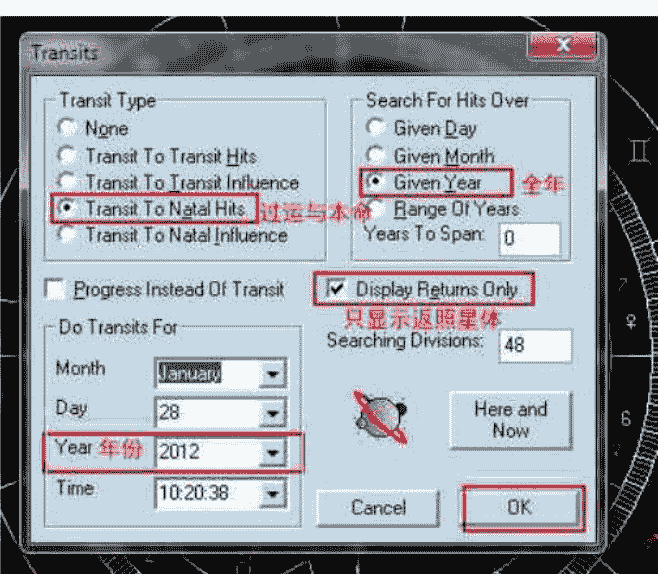

（图1）过运列表选项

（图 1）窗口的功能是按指定选项 列出指定时间范围内，所有的过运相位时间表。此功能十分强大，详细使用方法会在以后的栏目中列出。在本期栏目中，我们只聚焦于如何运用它制作返照星盘。

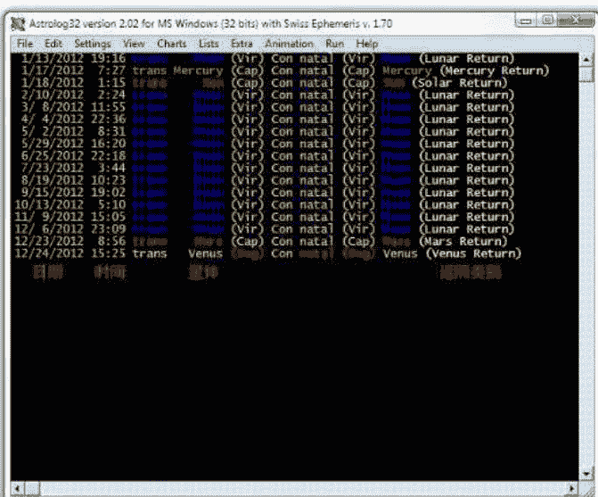

如（图 1）所示，逐个选择完毕后，点选 OK，便可生成如（图 2）一样的，2012 年所有星体的返照时间表。

**注意：** 通过修改（图 1）中“年份”选项，就可以生成任意指定年份的星体返照时间表。

**（图 2）星体返照时间列表**

(图 2)中生成的是周杰伦在 2012 年所有星体的返照时间表。其中日期与时间指的是返照星体与本命星体重合那一刻的精确时间，按此时间生成的星盘，即为返照星盘。在“返照类别”一栏中，列出了更详细的返照种类，列表中有月亮返照（Lunar Return）、太阳返照（Solar return）、水星返照（Mercury Return）、金星返照（Venus Return）和火星返照（Mars Return）。其它的外行星因为行驶周期过长，其返照星盘很少被使用，在这里就不做赘述了。

## 返照星盘的地点选择

（图 3）显示了周杰伦 2012 年 1 月 13 日以出生地为经纬度制作的月亮返照星盘。返照星盘一直以来存在一些争议，其中之一是：返照星体是否需要按盘主在返照时的所在地制作星盘。本文旨在提供 Astrolog32 软件使用说明，故不对此争议进行探讨。大家可以按照自己对占星学的理解自行选择。如果采取按所在地制作返照星盘，在同一时区内，返照星盘的时间不用改动，只需将返照星盘的经纬度更改为返照时盘主所在地点即可。如果盘主当时在其它时区内，则需将时间、时区一并更改，需换算为其时区内同一时刻的时间。

## 制作月亮返照星盘

## 验证返照星盘是否制作正确

下面我们按（图 2）列表所给出的时间所示，制作周杰伦 2012 年 1 月 13 日 19 时 16 分的月亮返照星盘（图 2）列表中第一行显示的信息）。如果是在生成列表的软件窗口中制作，制作完毕需要选择“View（察看）”，“Graphics Mode（图形模式）”，或按下快捷键“V”，切换回图形模式，显示制作完成的星盘。我建议大家另外打开一个软件窗口制作新的返照星盘，这样生成的列表可以原封不动地留在那里，以便随后制作其它返照星盘时查看。

在制作完返照星盘后，可以通过对比返照星体与本命星体的所在度数是否一致，验证返照星盘是否制作正确。（图 3）中，月亮位于处女座 14 度 44 分，与周杰伦本命星盘中的月亮位置是一致的，故而可以判断，此返照星盘是正确的（即使是改变了返照星盘的经纬度，星体所在的度数是不变的）。

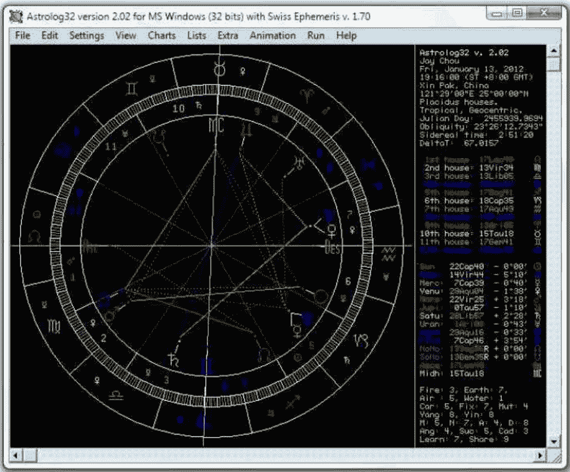

（图 3）周杰伦 2012 年 1 月 13 日的月亮返照星盘（以出生地为经纬度）

## 制作太阳返照星盘

制作其它星体的返照星盘的步骤与制作月亮返照星盘相同，只需按（图 2）列表中其星体的返照时间制作星盘即可。（图 2）中第三行列出了返照星盘中，最常使用的太阳返照星盘的时间：2012 年 1 月 18 日 1 时 15 分。

问题。占星学中采用的回归黄道带（Tropical Zodiac）是从地球的角度观测太阳绕天体一周所投射出的黄道带，其星座的划分是根据从地球观测时太阳的位置而定，与实际恒星的星座位置毫无关系。因为地球的轨道并不完全规则，所以与天文学中采用的恒星黄道带（Sidereal Zodiac）有每年 50 秒（每 72 年 1 度）的距离差值。这个差值，就是岁差。

（图 4）的太阳位于摩羯座 26 度 59 分，与周杰伦本命星盘中太阳所在的度数一致，可以判定为正确的太阳返照星盘。

有一部份占星学家提出，返照星盘中应当以天体以恒星黄道带为基准，按其实际回归的位置（即把岁差消除）制作返照星盘。这一争议一直到今天仍旧在持续中。本文本着中立的态度，在这里向大家讲解如何通过 Astrolog32 软件制作出消除岁差的返照星盘，至于是否采用，请读者自行斟酌。

## 返照星盘中的岁差（Precession）

返照星盘中另一个争议点是“岁差（Precession）”

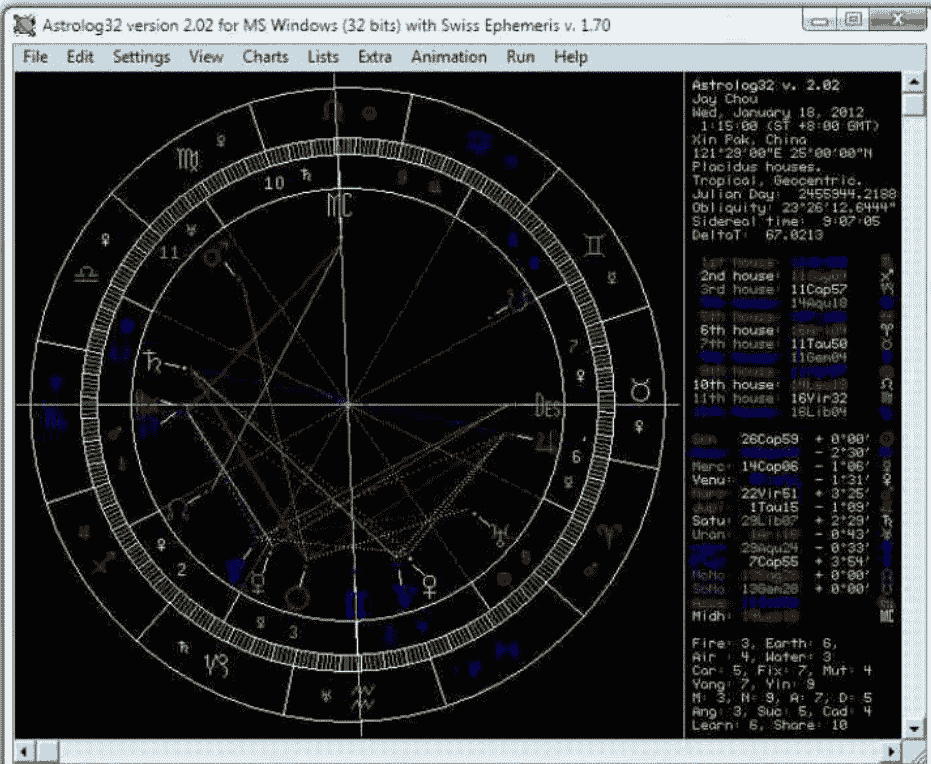

（图 4）周杰伦 2012 年 1 月 18 日（33 岁）的太阳返照星盘（按出生经纬度制作）

如果采用恒星黄道带，计算出的返照星盘已经将岁差计算在内，所以可以通过先选择恒星黄道带，再计算返照星体的回归时间的方法消除岁差。实现这一方法，需要我们在打开本命星盘后，在菜单栏选择“Setting（设置）”，“Sidereal Zodiac（恒星黄道带）”，或是按下快捷键 S，切换回归黄道带与恒星黄道带（在软件的右上角信息区有显示目前采用的是哪一种黄道带，详见本栏目第一期中的相关讲解）。

度 59 分，而在恒星黄道带中，位于摩羯座的 2 度 33 分。其中的差距，就是近两千年以来每年 50 秒的差值累积结果。

在以恒星黄道带为基础的本命星盘中，再一次地调出返照星体的列表（步骤同上）。

大家可以将（图 6）与（图 2）对比，（图 6）中星体返照的时间均晚于（图 2）星体返照的时间，这其中的差值，是从周杰伦诞生年（1979）至返照列表设定的年份（2012）之间，33 年的岁差。按列表中给出的时间，再制作一次他的 2012 年太阳返照星盘。

选择了恒星黄道带后，星盘中的星座位置发生了变化，这就是将岁差消除后，恒星黄道带中的星座位置。

在恒星黄道带中，周杰伦星盘中所有星体所在星座发生了变化，如太阳在回归黄道带中，位于摩羯座的 26

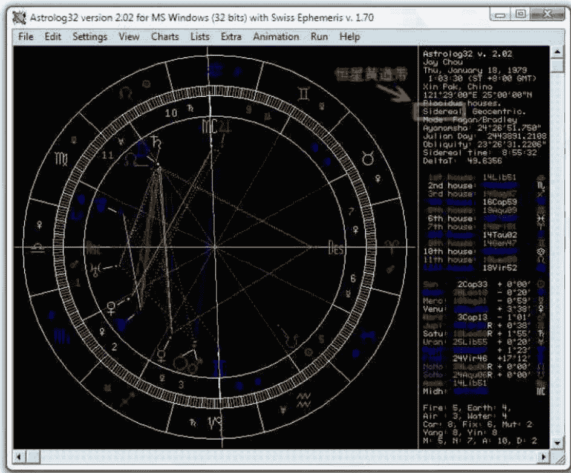

（图 5）恒星黄道带中，周杰伦的本命星盘

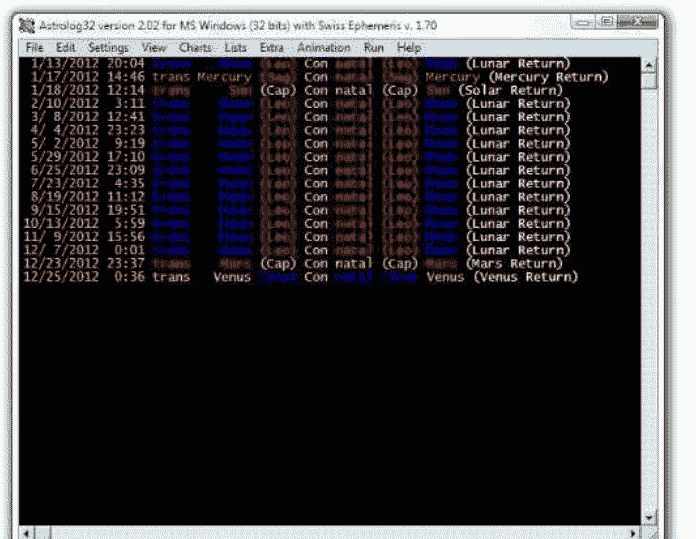

（图 6）消除岁差后周杰伦 2012 年星体返照时间列表

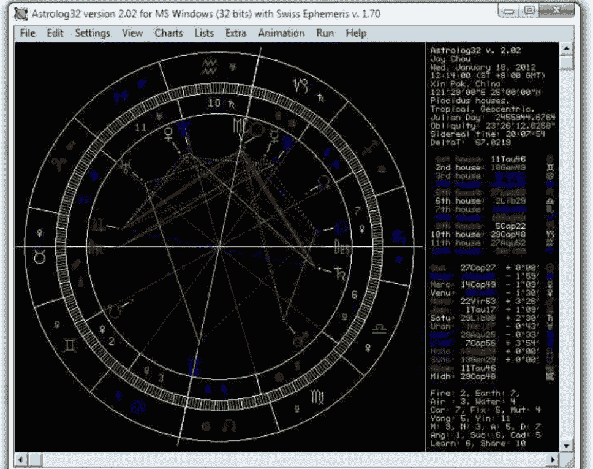

（图 7）消除岁差后的周杰伦 2012 年太阳返照星盘（按出生地经纬度制作）

**注意**：如果是在之前切换为恒星黄道带的软件窗口中制作的返照星盘，在制作完返照星盘后，一定要切换回回归黄道带。

因为它并不属于主流占星学的范畴。但这并不代表我们不需要去了解它的原理和其星盘的制作方法。数律星盘是将星盘中的星体根据特定的数字倍数重新整理制作的星盘。其原理如下：

（图 7）所示为周杰伦 2012 年消除岁差后的太阳返照星盘。其中太阳的位置为摩羯座 27 度 27 分，与他出生时太阳的位置（摩羯座 26 度 59 分）相差 28 分，这个值便是他出生后 33 年（1979 至 2012）间累积的岁差。

从 0 度白羊座至 29 度 29 分 29 秒双鱼座，一共有 360 度，在其中任何星座的星体，都有其从 0 度白羊座算起的“总度数”。例如金牛座 15 度的星体，从白羊座 0 度算起，其总度数为 45 度；天秤座 10 度的总度数为 190 度。将星盘中所有星体的总度数乘以特定的倍数后，按其积值将它安放在新的位置（如果这乘倍后的积值大于 360，便减去 360 或 360 的倍数，按其小于 360 的总度数安放在相应的星座上），所生成的星盘就是特定倍数的数律星盘。

其它星体的返照星盘可以通过上述的例子，以同样的方式制作，这里就不再赘述。

## 数律星盘（Harmonics Chart）

大多数的读者对“数律星盘”这一概念会感到陌生，

数律星盘的倍数与数字学中数字的含义相对应，也与占星学中的相位所对应，如对分相（冲相位）是将一个圆（360度）除以二，得出的相位度数（180度），三分相（拱相位）是将一个圆除以三，得出的相位度数（120度），以此类推。在数律图中，根据所乘以的倍数不同，会体现出不同的主题。如2倍数律图中会将所有对分相的相位变成合相（180度乘以2），四分相变成对分相，更有利于观察星盘中有压力的相位。而四倍数律图会将对分相及四分相全部变为合相，平时不易观察到的八分相（半刑相位）变为对分相，让星盘中所有有紧张相位、

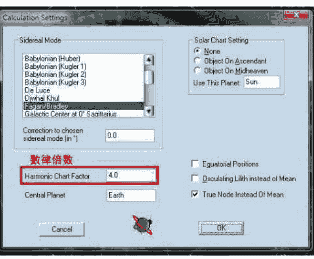

（图8）计算设置

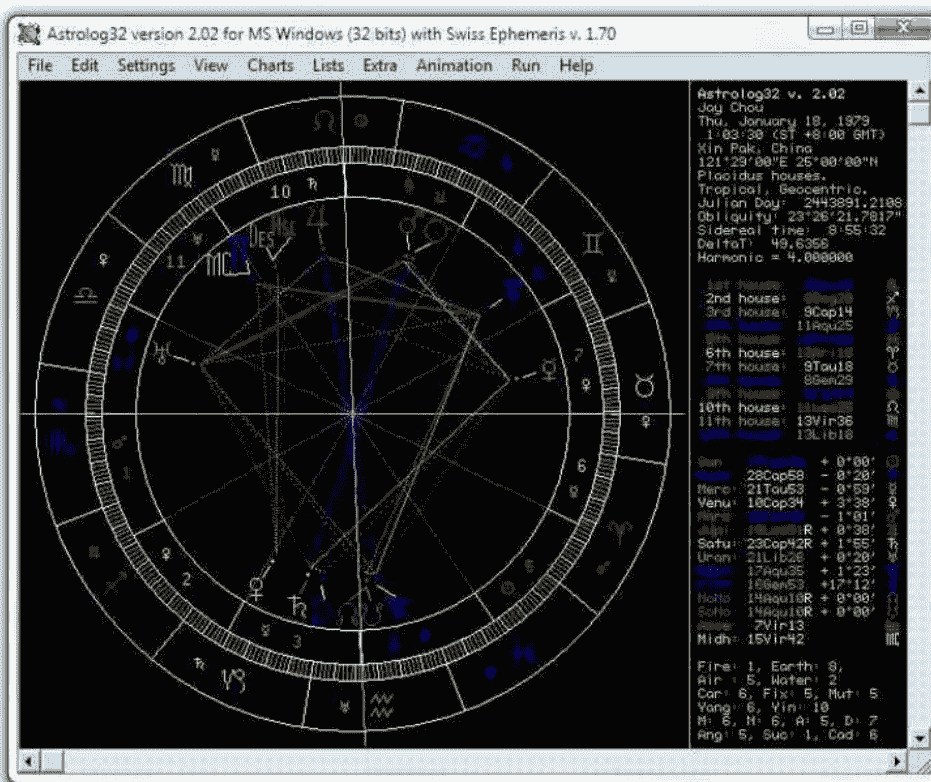

（图9）周杰伦的4倍数律星盘

常用到的数律倍数与其主题
- 4 倍：压力、紧张的处理方式
- 5 倍：创造力、才华的体现方式
- 7 倍：激励、奋发的展现方式
- 9 倍：传播欢乐与幸福的方式

Astrolog32 软件的使用方法，对如何细致解读数律星盘就不作过多讲述，有兴趣的读者可以另行寻找阅读资料。

**注意**：若设置完毕后，如果不更改过来，星盘的计算方式将持续为所填写的数律倍数，直到关闭软件为止。

## 数律星盘的制作方式

制做数律星盘，需要首先打开本命星盘，然后选取菜单栏中的 “Settings（设置）”，“Calculation settings...（计算设置）” 选项，或按下快捷键 “Alt+Shift+S”，会弹出计算设置的窗口，如（图 8）

本期的《深入浅出 Astrolog32》就写到这里，欢迎大家继续关注。在下一期的栏目中，我会向大家讲解关系星盘系列的制作方法。

这是本专栏的第三期，也是《占星学刊》的第三期，为了学刊和本栏目的长期发展，欢迎大家指出错误或提出改进的意见。可以向杂志的专用邮箱发邮件，或是去官方的微博中留言，也同样欢迎大家给我发邮件（pwukun@gmail.com）探讨占星及软件使用技巧。谢谢大家。

以制做 4 倍数律星盘为例，在数律倍数选项中填写 4，然后点选 “OK”，就会生成以本命星盘为基础的 4 倍数律星盘。

（图 9）为周杰伦的 4 倍数律星盘。在解读数律星盘时，星体所在的宫位和星座失去了原先的含义和意义，所以解读重点是星体的相位与结构。本文的重点在于讲解

注释：
[1]数率盘，也就是泛音盘。

## 阿布马谢《星占概要》——行星的 25 种状态

文/阿布马谢 译/黄纤越 校对/琥珀

译者的话：

“占星王子”阿布马谢是占星术历史中影响巨大的占星师之一。他是著名阿拉伯占星师阿尔金迪的学生，也是西方中世纪时期最重要的阿拉伯籍占星学派的代表人物。阿布马谢所写下的《星占概要 (The Greater Introduction To Astrology)》以及其它基本重要占星学典籍在 12 世纪被翻译成拉丁文，流传于当时的欧洲占星师手中，在西方占星学的发展历史上扮演着非常重要的角色。而这本《星占概要》也从最早的古阿拉伯文翻译成为古拉丁文，再从古拉丁文翻译成英文，最终才得以有机会以中文方式呈现于大家眼前。

性星座之内，且在日生盘中位于地平线之上或在夜生盘中位于地平线之下，或者一颗阴性行星落在阴性星座之内，且在日生盘中位于地平线之下或在夜生盘中位于地平线之上。所有行星中只有火星例外，他的分类恰好与之相反。[2]

“优先（advance）”指的是行星落在始宫或续宫内。

“回撤（retreat）”指的是行星落在果宫内。

“合相（conjunction）”指的是两颗行星落在同一星座内。如果两颗行星之间的距离少于 15 度，且不论行星之前或之后，他们的作用都将更加明显。两星之中先天更为强旺的那一颗行星会变得更加明显。如果在他们发生合相之时，两星之间的距离等同或少于两颗星体中任意一颗的影响半径，则两颗星所表达的方面都会更加凸显[3]。但如果他们落在不同的黄道星座内，即使他们之间的距离只有几度，也不能视为“合相”[4]。

## 第三章

第三章主要介绍了行星的 25 种不同状态。

行星的 25 种不同状态包括：主宰（domain）、优先（advance）、回撤（retreat）、合相（conjunction）、相位（aspect）、入相位（application）、出相位（separation）、空亡（void of course）、空相位（wild）、光线传递（translation）、光线集中（collection）、反射光线（reflecting the light）、阻止（prohibition）、促进天性（pushing nature）、促进能量（pushing power）、促进双本性（pushing two nature）、促进协商（pushing counsel）、返回（returning）、折返（refranation）、抵抗（resistance）、逃避（evasion）、阻隔光线（cutting the light）、喜好（favor）、补偿（recompense）和接纳（reception）[1]。

行星的“相位（aspects）”仅仅只会发生在特定的位置：如果他们落在彼此的第 3、4、5、7、9、10 和 11 宫内。与第 3、11 宫构成六合相位，代表着友好；与第 4、10 宫构成四分相位，代表着敌意；与第 5、9 宫构成三合相位，代表着和睦；与第 7 宫构成对冲相位，代表着敌对；与第 9、10、11 宫形成的相位在其右边，与第 3、4、5 宫形成的相位在其左边。[5]

“入相位（application）”分为两种类型。第一种是经度入相位，另一种是纬度入相位。只有一颗行星正在快速向另一颗比自己速度更慢的行星靠拢即将形成合相或其他相位时的状态才能被称为经度上的入相位；只有当快追进的行星的度数少于那颗即将与其形成合相或其它

“主宰（domain）”就是说当一颗阳性行星落在阳

## 相位的慢速前行的行星的度数时，我们才能称之为“正在入相位”；当两者来到同一度数时，入相位状态结束；当快速前进的行星超越慢速前行的行星后，两星开始出相位。纬度上的入相位则更加严格，如果是合相的入相位，则要求两颗行星不论在度数、经度和纬度乃至行进方向上都相同，且其中一颗行星凌于另一颗行星之上（即两颗行星发生蚀相）。如果是冲相的入相位，则要求两者不仅对冲，且其中一颗正在北半球且上升中，另一颗则在北半球且下降中；又或是两者之一正在南半球上升，与此同时另一颗正在南半球下降。如果是其它相位的入相位，则要求其中之一正在北半球上升，而另一颗则在南半球下降，又或是其中之一正在南半球上升，而另一颗却在北半球下降。在所有这些“状况”中，当一颗行星正在从纬度较低的位置攀升至自己可以到达的最高纬度，但却没有达到另一颗行星的纬度，也被称为正在从纬度上入相位。如果两者纬度相同，则被称为已经完成了纬度上的入相位。如果其中一颗行星的纬度已经超过了另外一颗的纬度，则两者已经在纬度上出相位（separation）。[6]

中一种指的是一颗或者两颗所指定的行星，彼此之间并无任何相位，但他们却与第三颗行星成为或者即将形成相位，那么这第三颗行星会与黄道轨道上的某个位置形成相位：即，它将这两颗行星的光线折射到此位置。第二种指的是如果上升守护星与事件征象星没有构成相位或是正在彼此出相位，此时如果有一颗行星正在前两者之间移动，则这颗行星可以将其中一颗行星的光线反射给另一颗行星。[8]

“空亡（void of moon）”指的是当一颗行星已经从与另一颗行星的合相或其它相位出相位，且在离开当前星座之前不会再与任何行星入相位[7]。

“禁止（prohibition）”也分为两种方式。第一种来源于合相，指的是当三颗行星落于同一星座内的不同度数上时，而运行最慢的行星 A 落在度数最大的位置，然后落在中间度数的行星 B 将落在最小度数的行星 C 禁止于行星 A 之外，直到行星 B 运行超越行星 A 才被视为“禁止”结束。第二种“禁止”的方式指的是当两颗行星落在同一星座内，如果运行速度较快的行星 A 正在与运行速度较慢的行星 B 形成合相，而行星 C 也在另一星座与行星 B 入相位。此时，如果行星 A 与行星 B 的度数相同，与行星 B 落在同一星座内的行星 A 就会阻止行星 C 与行星 B 形成相位并破坏其入相位。但是，如果行星 C 与行星 B 入相位的容许度低于行星 A 与行星 B 合相的容许度，那么行星 C 的入相位依然成立。[9]

“在野（wild）”指的是行星没有同任意一颗其它行星形成任何相位；月亮经常会有这种情况发生。

“促进天性（pushing nature）”指的是当行星 A 与其所在星座的守护星行星 B 入相位，又或是行星 A 与其所在星座的擢升行星、界守护、三分性守护或是旬守护入相位，那么行星 A 将促进行星 B 释放其天性。[10]

“光线传递（translation）”分为两种。其中一种指的是当一颗快速前进的行星 A 正在与另一颗慢速前进的行星 B 出相位，并同时与另一颗行星 C 入相位，行星 B 的本性就会被传递给行星 C；第二种指的是如果一颗快速前进的行星 A 正在与速度慢于自身的行星 B 入相位，而行进速度较慢的行星 B 也正在与第三颗行星 C 入相位，那么速度较快的行星 A 所拥有的本性就会被行星 B 传递给行星 C。

“促进能量（Pushing power）”指的是当行星 A 落入自身守护的星座或擢升星座和其它之前提及过的先天尊贵中，并与另一行星 B 入相位，则行星 A 会将自己的能量赋予行星 B。

“光线集中（collection）”指的是当两颗或两颗以上行星同时与一颗行星入相位，那么后者将收集所有与其入相位行星的光线并收到他们的本性。

“促进两种天性（Pushing two natures）”分为两种情况。其中一种情况指的是如果行星 A 落在拥有自身先天尊贵的星座中，并与同样落在拥有自身先天尊贵的星座中的行星 B 入相位。举例来说，当行星 A 金星与行星 B 木星在双鱼座合相入相位[11]；第二种情况指的是当一颗日间行星与另一颗日间行星入相位，且两颗行星都落在日间位置，又或是如果一颗夜间行星与另一颗夜间行星入相位，且两颗行星都落在夜间位置。[12]

“光线反射（reflecting the light）”分为两种。其

“促进协商（Pushing counsel）”指的是当一颗行星从任意方向与另一颗行星入相位，而当这个相位是友好的（六合）、和睦的（三合）或是接纳（reception）时，被视为有利；但如果这个相位是敌意（四分）或敌对（对冲），则被视为不利。[13]

“返回（Returning）”有两种情况。情况之一指的是当行星 A 与在太阳光束下的行星 B 入相位时，因为行星 B 太过衰弱无法接受导致行星 A 所赋予行星 B 的能量将被退回[14] 第二种情况指的是行星 A 与正在逆行的行星 B 入相位，于是就变成行星 B 从之前离开行星 A 的状态变为返回至行星 A 的状态，因为行星 B 正在逆行。返回在某些情况下可以带来改善，在某些情况下又可能更加恶劣。而可以经由返回得到改善的情况包括以下三种：其一要求被动的行星 B 可以接纳主动的行星 A；其二要求顺行的行星 A 与逆行或焦伤的行星 B 都落于始宫或续宫内；其三要求主动的行星 A 在顺行中且落于始宫或续宫中，被焦伤或是在逆行中的行星 B 落于果宫中。如果接受能量的行星 B 将行星 A 给予的能量返还给行星 A，而行星 A 此时处于优势位置，那么相关主题会在恶劣后改善。而经由返还变得更加恶劣的情况也有两种：其中一种指的是当释放能量的行星 A 落在果宫，而接受并返还能量的逆行或焦伤的行星 B 却落了始宫或续宫，然后如果行星 B 将能量返还给释放能量的行星 A，因为行星 B 自身处于逆行或被焦伤的不良状况，相关主题会在被建立之后崩盘；第二种情况指的是如果释放能量的行星 A 与接收能量的行星 B 落在果宫或被焦伤，那么他们将没有足够的力量去接受提升，这也意味着请求将无始无终无疾而终。[15]

“折返（Refranation）”指的是如果行星 A 正与行星 B 入相位，但在行星 A 与行星 B 形成相位之前却突然逆行离开了行星 B，于是入相位被终止。

“抵抗（Resistance）”指的是如果行进速度较快的行星 A 处于度数较多的位置，而另一行进速度较慢的行星 B 处于度数较少的位置，同时运行速度超过前两颗行星的行星 C 正在与行进速度较慢的行星 B 入相位。行进速度较快且度数较多的行星 A 却在此时突然开始逆行，并与行星 B 形成逆行入相位。然后，行星 A 将越过行星 B 与行进速度最快的行星 C 入相位，这意味着行星 C 将与这颗速度低于自己的逆行行星 A 入相位，而非此前的行星 B。

“逃避（Evasion）”指的是如果行星 A 正在与行星 B 入相位，在行星 A 与行星 B 形成相位（同一度数）之前，被入相位的行星 B 就已经进入另一星座。此后，当主动向前的行星 A 也切换星座后，另一行星 C 比行星 B 更加靠近行星 A，行星 A 就会与行星 C 入相位，而与行星 B 的入相位就会被终止。

“阻隔光线（Cutting the light）”分为三种情况。第一种情况指的是当行星 A 正在试图与比其运行速度更慢的行星 B 入相位时，行星 C 正在行星 A 所在星座往后数第二个星座内逆行，并在之后运行进入行星 A 所在星座超越行星 A 先与行星 B 入相位，最终阻隔了行星 A 试图达到行星 B 的光线；第二种情况指的是运行速度更快的行星 A 正在与运行速度较慢的行星 B 入相位，而行星 B 也在试图与运行更加缓慢的行星 C 入相位。在运行速度最快的行星 A 抵达行星 B 所在度数之前，行星 B 已经与运行速度最慢的行星 C 形成精准相位后出相位，于是行星 A 开始试图与行星 B 产生的入相位被终止；第三种情况指的是如果一颗行星与并非其事件象征星（Lord of the request）的另一颗行星入相位，或是一颗行星与另一颗行星入相位，并把其光线传递给另一颗并非其事件象征星的行星。

“喜好（favor）”和“补偿（recompense）”指的是如果行星 B 正在与落在其旺位或弱位的行星 A 入相位，或是行星 A 试图与拥有友好（六合相位）或先天尊贵的行星 B 入相位，又或是两颗星中的某一颗获得了来自其守护星座的支持，就可以帮助另一颗行星增加其自身顺境或是走出其自身困境。[16]行星 B 对于行星 A 的“喜好”直到将自身喜好赠予对方的行星进入自身的旺位或弱位以及接受帮助的行星离开自身的旺位或弱位时才会中止。行星 A 会因为行星 B 赠予其喜好而补偿和嘉奖对方。某些时候，行星擢升星座的守护星也会被称为“喜好守护星（Lord of its favor）”。

“接纳”指的是当行星 A 在行星 B 的守护星座或擢升星座、三分性守护、界守护以及旬守护内与行星 B 入相位，行星 B 就接纳了行星 A。又或是相位接收者行星 B 正处于与之入相位的行星 A 守护的星座或是之前提及过的先天尊贵之中，就称之为行星 A 接纳了行星 B。而这些接纳情况中力量最强的莫过于守护星座和擢升星座。界守护、三分性守护和旬守护的能量会略显不足，除非两个或两个以上的次要尊贵共同参与进来。两颗行星中的任意一颗行星即便与对方无入相位也可以接纳之，但入相位的接纳无疑能量更强。[17]

(diurnal) 和月亮 (lunar) / 黑夜 (nocturnal) 两种区分。托勒密同时还加注水星如果在东出区域则为日间行星，如果在西入区域则为夜间行星。

[3] 考虑到下文“相位”一词定义所提及的，我们也许需要在通过整宫制决定的相位和通过行星容许度决定的相位之间搭建一道转化的桥梁。

[4] 关于“合相”的注释：关于 15 度“容许度”（在这里阿德拉德的拉丁文翻译加注了“越少越好”的标注）我们可以参见关于“入相位”段落的注释。这句似乎建立起了行星容许度半径 (moiety) 的概念——也可参考阿尔贝鲁尼 (Al-Biruni) 第 304 页 490 小节。从阿布马谢的《星占详要》第六册第五分册第 391 页第 7-8 段我们得到了关于区分的如下解读：“如果落在同一界 (‘hadd’) 内或距离不超过它们之间影响度数较小的行星本身一半之时，它们相互混合的天性会变得更加强大。”这一关于两颗行星落在同一界内的相关内容让我们想起了在《安条克 (Antiochus)》第一册第 29 页第 40 章中的提及的关于“Juxtaposition”的定义。

注释：

[1] 在以下列出的 25 种状态中，中文译本将置于最前，括号中将英文译本，以及阿拉伯语的来源和出自阿德拉德译本中的拉丁文写法依次列出。这 25 种状态分别是：主宰 (domain, Hayyiz, competientia)、优先 (advance, iqbaal, accessus)、回撤 (retreat, idbaar, recessus)、合相 (conjunction, muqaarana, concilium)、相位 (aspect, naDhar, respectus)、入相位 (application, ittiSaal, applicatio)、出相位 (separation, inSiraaf, neglectio)、空亡 (void of course, khalaah al-siir, solitudo)、在野 (wild, waHshii, absolutio)、光线传递 (translation, naql, translation)、光线集中 (collection, jam`, coniunctio)、反射光线 (reflecting the light, radd al-nuur, transmutatio)、阻止 (prohibition, man`, prohibitio)、促进天性 (pushing the nature, daf`al-Tabii`a, donum naturae)、促进能量 (pushing the power, daf`al-quuwa, donum potentiae)、促进双本性 (pushing the two nature, daf`al-Tabii`ain, donum duarum naturarum)、促进协商 (pushing counsel, daf`al-tadbiiir, donum consilii)、返回 (returning, radd, redditio)、折返 (refranation, intikaath, revocatio)、抵抗 (resistance, i`tiraaD, interruptio)、逃避 (evasion, fawt, fuga)、阻隔光线 (cutting the light, qaT`al-nuur, impeditio)、喜好 (favor, na`ma, patrocinium)、补偿 (recompense, mukaafa`a, mutuatio) 和接纳 (reception, qubuul, receptio)。

[5] 关于“相位”的注释：参看托勒密《四书》第一册第 29-30 页第 14 章（斯密特版）；同时也可以查看罗宾斯 (Robbins) 版第一册第十三章第 72-73 页的注释 2：“托勒密……虽然在《四书》中似乎一直将其视为相位的一种，但其实并没有将‘合相’归类为相位。”《测试者 (Tester)》猜测因为“合相没有被提及的原因是因为其不涉及星座，而只涉及行星。”（《测试者》，第 66 页）”。希腊占星术和阿拉伯占星术中所使用的相位都非常清晰地来源于对行星所落星座之间的角度关系考虑。

[6] 关于“入相位”的注释：可以参看托勒密《四书》第一册第 48-49 页第 24 章（斯密特版）。托勒密对于行星在经度上的入相位和出相位定义依赖于它们之间的空隙“不会很大 (not great)”。在《保卢斯 (Paulus)》第 17 章第 37-39 页可以找到更加完整的解释：“行星合相和其它相位的入相位和出相位只有在容许度少于 3 度时才能最大化体现它们带来的影响力；第二强烈的影响力等级划分在容许度少于 7 度时；再其次是当容许度少于 15 度时；最次是当行星的之间的容许度少于 30 度时（同星座内）。”但文章也并没有很清晰地注明第 2、3、4 档的划分是否仅限于合相。无疑，保卢斯的案例仅仅例举了合相。此外，《安条克（Antiochus）》第一册第 27 页第 34 章和《西法伊斯条（Hephaistio）》第一册第 14 章第 33 页都给出了 3 度的容许度，同时也都没有提及是否存在合相和其它相位的使用区别。

以上四位作者仅有托勒密讨论了关于纬度的问题。当行星在经度上合相入相位和出相位时，“观察它们的纬度也非常重要，因为只有这样才能确定这些落在黄道同一侧的过客是否可以形成相位。”即，当两颗行星必须同时位于北纬或者南纬。否则，对那些仅仅在经度上入相位或出相位的行星而言，关注它们的纬度非常“多余，因为这些光线总是从同一点，即地球中心，落下并且相似地从不同方向集中。”阿布马谢对于出相位和入相位的完整定义看上去似乎包含了阿拉伯的创新。

[2] 昼夜区分 (sect, 希腊语<hairesis>)，记载于托勒密《四书》第一册第七章第 17-18 段落（斯密特<Schmidt>版）和华伦斯 (Vettius Valens)《天文书 (Anthology)》第三册第五章中。这些希腊作者赋予了水星太阳 (solar) / 白昼

[7] 参考《安条克（Antiochus）》第一册第 28 页第 39 章；《佛米修斯（Firmicus）》第四册第 8 章；《神使之书（Liber Hermetis）》第二册第 86-89 页第 33 章、这三部著作都只提及了月亮，并没有任何关于月亮“在野（wild）”或“未驯化（feral）”的内容出现。

[8] “反射光线”的定义也被现代卜卦占星实践归入了光线传递的范畴。

[9] 光线传递（translation）、光线集中（collection）、反射光线（reflecting the light）、阻止（prohibition）的注释：对于卜卦占星师而言，这一部分是非常熟悉的。它涉及到“成功（perfection）”和因第三颗行星的介入而带来的失败（denial）。以下描述清晰地显示出这些概念与卜卦占星的关联：如“一颗或者两颗所指定的行星，其彼此之间并无任何相位（光线反射）”至“上升守护星与询问者守护星（光线反射词条）”就提到了卜卦问题的象征星。处理方法是动态的，因为行星按照次序形成相位，并将它们的光线和本性“完全“传递给其它行星。但是，对于连续相位的当代分析方法与相关行星的空间排列顺序之间的区别也许非常重要。例如说，希腊占星认为合相的入相位优先于其它相位的入相位，两颗入相位行星之间的距离也非常重要。无论行星的移动速度更快还是更慢，只要入相位的某两颗行星之间的度数距离更近，就应视为它们会更早形成相位。如果将此原则与现代实践相比较，我们就会发现现代占星是依据完美相位的成立早晚决定相位优先性。

希腊占星术相对比而言是非常静态的。一般考虑的是月亮正在与哪颗行星出相位，又在与哪颗行星入相位。但是并没有考虑这类一颗行星通过另一颗行星与第三颗行星发生连续关联，传递光线和天性的问题，也没有考虑光线可以被反射到黄道上的某个点（推测是通过传递给某颗即将通过这一点的行星）。阿布马谢的这一章节在希腊资料中似乎并无先例可考，也许可以参看《安条克（Antiochus）》第一册第 27 页第 36 章 “考虑干扰（Concerning Intervention）”：“当一颗行星照射（should hurl its rays）到入相位中的某个位置时就会发生干扰。”这一定义非常简要，似乎仅应用于被打断的吉相位（“照射”）和而且也不足以证明希腊占星术可以像阿拉伯占星术一样动态地考虑行星相位的形成和中断。

[10] 这是接纳的一种。阿拉伯占星师似乎比它们的前辈希腊占星师更加注重基于守护、擢升、三分性、界和外观这五种必然尊贵而来的行星之间的接纳。促进行星是正在入相位的行星，被促进的则是被入相位的那颗行星。

[11] 有一种特别的接纳被称为“共享（communion）”。《安条克（Antiochus）》第一册第 26 页第 30 章指出这种接纳要求两颗行星必须都落在同一星座内且一颗是守护行星，而另一颗是擢升行星。

[12] 关于这一段的内容是基于日间区域和夜间区域做出判断。在罗伯·汉德（Rob Hand）《日与夜》一文第 5 页中提到，任何行星如果在日间盘中居于地平线之上或在夜间盘居于地平线之下就视为落在日间区域，任何行星如果在日间盘中居于地平线之下或在夜间盘居于地平线之上就视为落在夜间区域。举例来说，如果木星与土星入相位在白天处于地平线之上或在晚上处于地平线之下都属于落在日间区域内。

[13] 比照阿布马谢《占星详要》第六册第 400 页第五章：“如果两颗行星六合或三合且相互接纳，促进将是和睦的……”拉丁文译本将刑相位和冲相位定义为“是敌视的或者敌对的。”

## 史蒂芬妮·奥斯丁

史蒂芬妮·奥斯丁（Stephanie Austin）从 1985 年开始教学、写作并提供占星咨询至今。她尤其擅长帮助人们忆起自己的灵性目标并完成生命的目的。除去每月在《占星学刊》杂志上的专栏，她也会定期撰写可以通过电子邮件订阅的新月与满月电报，这一内容会对当下的星相做出更加详细的解析和补充。更多星座知识、课程、电子书和运程，请参照她的网站:www.EcoAstrology.com。

**导语：**本系列的新满月文章均由著名占星师史蒂芬妮·奥斯丁（Stephanie Austin）创作，刊登于国际著名占星杂志《大占星师（The Mountain Astrology）》2012年10月刊中，由《占星学刊》获得中文独家授权刊登于此。本系列文章的星盘都以白羊座0°为上升的基础星盘排列，所使用的月相图均以北京时间为准。所有与萨比恩符号相关的参考资料都来自于丹恩·鲁伊尔（Dane Rudhyar）所著的《占星曼荼罗：转变周期和360种象征（An Astrological Mandala: The Cycle of Transformations and Its 360 Symbolic Phase）》，古典书局（Vintage Books），1973年版。

[14]《占星术入门（The Greater Introduction）》第六册，第5章加注：“因为行星 B 无法抓住行星 A 给予的好处，所以只能返还给行星 A。”以报答（reciprocating）对方。”对比本书第七章，行星落在其“旺位”在之后被指定为“落在某个特定度数（in a pitted degree）”。

[15]“返回”的注释：“光线的返回”是阿拉伯占星术建立的“失败（denial of perfection）”概念的蓝本之一。“返回”的概念并没有在希腊占星术中出现过。关于第一种状况可以参考阿尔伯鲁尼（Al-Biruni）列举（506 句，第 311 页）出的：“如果……它们之间存在接纳关系（if…there is reception between them）。”

[16]阿德拉德的拉丁文译本将本段解读为：“但是‘资助（patronage）’和‘报答（reciprocating）’要求其中一颗行星落在它的旺位或衰位上，而另一颗行星可以与它分享自己的所有或位置时——不论是守护星座、擢升星座或是其它尊贵——才能成立，而其中状况较好的一颗行星必须落在状况较差的那颗行星的某种必然尊贵之中。因此行星才能从自身原有的旺位或衰位中得到提升。被提升的行星将一直处于另一颗行星的资助（patronage）之中直到自身可

[17]关于“接纳”的注释：从这一段我们可以看出“接纳”存在着明显的强度之分。我们可以从阿德拉德的拉丁译本中找到且与阿布马谢的《占星术入门（The Greater Introduction）》内容相符的更多证据：“慷慨（即‘接纳’）的能量或强或弱，或中等。而其中最为慷慨的莫过于太阳与月亮之间的接纳。对月亮来说，除去对冲相有害之外，在任何星座获得太阳的接纳都是有益的。因此，当月亮落在太阳得到某种程度必然尊贵的星座时，好处将被加倍：因为既可以得到星座的赐予，也能够得到天性（nature）的赐予。当其它行星落在处女座时，水星也可以给予对方两种赐予。而中等的慷慨指的是两颗行星都可以从对方的星座守护、擢升守护、三分性守护、界守护或外观守护中得到能量。如果可以获得两种以上尊贵，则意味着赐予更多。如果没有以上所说的任何一种情况，则赐予较弱。”

## 10 月 15 日天秤座新月

译/叶思晨

太阳系在太空中呈螺旋形运转，因此我们也处于千变万化的几何光线之中。每次新月都会带来一系列新的指引。跟随着新月的召唤，我们的创新意识和创新能力都会得到极大的提升。

平衡、合作、和平。天秤座的进化目标是实现人人平等。在处女座的基础上天秤座得到完善：他们能够洞悉细节，而不锱铢必较；增强自我修养，而不自嘲；为他人服务，而不奴役别人。在过去5000年中，这个世界都处于精英阶层和封建家长的统治之下——世界上99%以上的资产掌握在男人手中，在穷人和文盲阶层中，妇女占到了70%。超过十亿人每天靠着不到1.25美元为生。在美国，白人家庭的净资产价值是非裔和拉丁裔平均净值的14倍；有色人种占到美国总人口的30%，但其中却有60%的人正在服刑。这次新月结合了持续的天冥刑相位，促使我们去改变那些极度不公正和不公平的现状。

天秤座传统上与维纳斯紧密联系。而维纳斯的原型则来自于埃及神话中的伊南娜（Inanna）、伊什塔尔（Ishtar）和艾西斯（Isis）。维纳斯在印度教中的对应女神是萨蒂（Shakti），象征着女性的创造性力量，在玛雅人的宇宙学中也处于中心的地位。在神秘学中，金星对应着心轮，这是微妙的力量中心，帮助我们拥有同情和感激之心。当我们敞开心扉时，就会意识到自己和世间万物紧密相连。我们是善良、彼此合作和紧密联系的团体，而不是孤立、相互竞争，用挑剔的目光看待彼此的个体。

婚神星，这颗以罗马神话中的婚姻女神朱诺命名的小行星，与金星、凯龙星处于相刑的位置，同时也与月亮呈45度相位，合火星，三分天王星，这些相位预示着女性力量的新崛起，此外人们也更加能够接受男人们表达出阴柔的一面。神话中朱诺和丈夫朱庇特（Jupiter）之间的争斗启示我们，在追求人际关系的平衡和世界的长久和谐之前，我们需要先平衡内心阳性的一面和阴性的一面。如果想要更清晰的认识此等重要性以及更巧妙的融合内心的阴阳面，可以参照罗伯特·弗莱（Robert Bly）和马里昂·伍德曼（Marion Woodman）的《少女国王（The Maiden King）》和克拉丽莎·科洛·艾斯蒂斯（Clarissa Pinkola Estes）的《解放你心中强悍的女性一面（Untie the Strong Woman）》，或访问 www.lovesedona.com/02.htm。双子座木星在10月17日与在处女座16°的金星精准相刑，同时三分新月并土星成补八分相（135度），这将鼓励我们对性别角色提出疑问和重新定位。土星和谷神星、海王星形成了水象大三角。谷神星代表着来自于女性的养育和保护，海王星是更高级别的金星，将帮助我们释放早已失衡旧俗，展望关系的新模型。

新月在天秤座24°15'与天空中的第四亮星（恒星）大角星合相。预言家埃德加·凯西（Edgar Cayce）在他的著作中提及大角星不下30次，称之为“银河系中最高级的文明所在”和“通向宇宙之外的门”。其他的一些通灵资料也称大角星是“向地球撒播生命种子的外星群之一，并在人类的进化中起到促进作用”。新月与大角星的合相，将帮助我们向彼此敞开心扉，治愈精神的伤口，进一步增加对我们这个星球和宇宙的理解。

这次新月在天秤座23度，其萨比恩确定了新时代的黎明正在来临。“公鸡的啼声预示着日出，对生命过程富有创造性与愉悦的回应。”我们要怎么做，才能让自己和这个世界更均衡、更美丽、更和谐？这次新月提示我们：“你的使命不是去寻求真爱，你只需找到自己心中筑起的爱的屏障——鲁米（Rumi）。”

## 10 月 30 日金牛座满月

译/刘欣

光越亮，影越暗。随着太阳与外行星之间的相位逐渐紧密，随着地球在震动中上升，一切都处于无意识中，一切都被拒绝或者投射，外在却已经在整合和转化。面对改变带来的进化力量，我们可以试图逃跑，但却无处躲藏。满月显示了我们已经走了多远以及我们现在必须处理的事情。它照亮了我们需要敬畏的极限和我们必须超越的限制。

天蝎座涉及共享的资源和权利。伴随着土星和冥王星在之后三年的互溶（互相经过对方的星座），外加持续到 2015 年的天冥刑，满月凸显了我们被欺骗和统治的部分，鞭策我们利用我们自己的力量和创新完成自己的使命和任务。

天蝎座的力量迫使我们面对内心的恐惧和迷恋，并放弃那些已经不适合我们的人事物，可能是令人窒息的工作、关系、生活方式、体系，以及一切压力的和无法承受的。放手并不痛苦，紧握才引起折磨。你生活中有哪些方面已经行将就木？又有哪些方面蓄势待发？金牛的精神任务就是发展个人核心价值观，并学会与其共存。这也包括我们的自我价值，以及我们对待金钱、安全感和娱乐的态度。2008 年，当冥王星进入摩羯座时全球经济危机开始，此后一直刺激着全球经济改革运动和替代货币以及协同消费的产生。低迷经济带来的好的一面是创新和联络的增加；无数人现在使用在线的社区，例如拼车网（Zipcar.com）、沙发客（CouchSurfing.org）以及全球捐赠网（Freecycle.org）。这也说明了租赁、分享和易货不仅可行而且是优于单独所有权的选择。更多相关信息也可以访问协同消费网（http://collaborativeconsumption.com/）。你可以看到一个关于钱的绝妙视频，关于我们如何转化为基于礼物分享的经济，也可以访问神圣经济学网站（http://sacred-economics.com/）阅读查尔斯·爱森斯坦（Charles Eisenstein）革命性的著作《神圣的经济学（Sacred Economics）》。

满月同样突出了我们个人关系中需要转化的部分。土星和巨蟹座中的谷神星、海王星和双鱼座中的凯龙星形成的大三角召唤出女性的直觉力、养育力和同情心。从 11 月 1 日到 3 日，天秤座金星与落在白羊座 5° 的天王星相冲，且和摩羯座 7° 的冥王星相刑，形成了一个强大的 T 三角，它也强调了合作、真诚和正直的需要。在 11 月 3 日，月亮进入巨蟹座，并与金星、天王星和冥王星形成一个强大的基本星座大十字，更深入地激起了强烈的洞察力和行动力。在 11 月 6 日，水星在射手座 4° 停滞逆行，彰显了它的欺骗性；仅有的另一次水星在美国总统大选期间停滞逆行发生在 2000 年美国大选期间，彼时布什对战戈尔，竞选充满了不实争论，剥夺了少数民族的公民选举权，以及作弊的投票机。

土星和太阳在天蝎座的合相强调了这是一个审视、和解和偿还的时候，是一个以责任和相互依赖为荣的时候。

萨比恩符号强调了恢复我们的阴性面和着手处理真正问题的重要性。落在金牛座 7° 的月亮：“在古老井边的撒玛利亚女人，穿插古老过去与创造性灵性指向未来的集会。”落在天蝎座 7° 的太阳：“深海的潜水员，探索过往经历的隐蔽深渊和寻找原始动机的意愿。”满月提示我们：“现在不仅仅是掌控自身力量的时候，也是帮助你周围的人去发现他们所拥有力量的时候。每一次在街头的擦肩而过，每一次的主动问好，握手拥抱，现在就是应该去做这些的时刻，亲爱的！这不是一个实验（Steve Rother）。”

## 11 月 14 日天蝎座日食

译/邢玮

光线编制了信息的密码。太阳射线每秒钟会把三十亿兆瓦紫外线、X 光和其他形式的电磁能量照射到地球。一年中有两次，月球会遮挡住连续不断的太阳辐射。

在这少有的时刻，鼓励创造的能量将被重新分配和重新开启。旧项目消除，新模式浮现。

日食因此也跟超级新月的作用一样，标志着重要的结束和开始。每 19 年日食出现在近乎相同的度数。1993 年 11 月 13 日，日偏食发生在天蝎座 21°32'。不妨回忆一下当时你的生活中出现了什么样的事情？在你的生活中有哪些方面正准备往下一阶段发展？这次的日食同样也是一次超级月亮，因为月亮在近地点（离地球最近），并且是望月（月亮处于太阳和地球之间），对潮汐、地壳板块和我们的精神都将产生强烈的影响。只有在澳大利亚、新西兰和南太平洋的人会看到这场仅有四分钟全食的日全食，但我们所有人都会感受到自上而下充满变革性的影响。

假如我们无法前行，就必须找出阻碍前行的障碍。我们需要为黑暗带来光明，挖掘潜藏于潜意识之下的东西。我们的阴影抑制的不仅仅是令人称羡的品格，同样也是那些被压抑或被拒绝的东西，即力量、真相和光明。这次新月月食会暴露出我们最深层的欲望、最糟糕的恐惧和宇宙的命运。

在银河系的中心存在一个超重的黑洞，这个黑洞比太阳大百万倍，吸收并传输了庞大的电磁能量。玛雅人将之称为胡纳伯·库，即太阳背后的太阳。火星是传统占星中天蝎座的守护星，在这次日食中与银河系的中心紧密结合，从银河系的中心辐射电磁能，为旧信念的释放和假定提供支持，也为宇宙的起源和使命留下记忆。

海王星和凯龙星分别于 11 月 11 日和 15 日结束了为期五个月的逆行。受到同在双鱼座的海王星和凯龙星的影响，我们将愿意大步朝着心灵的指引向前而行。当任何天体处在逆行停滞或顺行停滞中时，它的能量都会剧增，因为它们可能会在特定的度数停留数周。海王星从 6 月 5 日起开始逆行，凯龙星从 6 月 12 日开始逆行。那时起你有了什么改变？现在的你又在做什么？土星在天蝎座，继续与海王星、凯龙星和谷神星形成水相大三角，指引我们密切注意自己的感觉，治愈旧伤，并追寻我们的内心。谷神星从 10 月 31 日在巨蟹座 3°44' 逆行停滞，并在整个 11 月底都与冥王星对冲，与天王星相刑，这将揭示让我们相互依赖又彼此拒绝的困境。土星与天王星梅花相（11 月 15 日分别在天蝎座和白羊座 4°56' 的位置精确呈相），迫使我们朝着可以改变的方向努力，并对自己无法做到的事情放手。

在萨比恩符号里，这次发生在天蝎座 22° 的新月日食提醒我们留意自己的动机，并理性运用我们的力量。“猎人射击野鸭，社交性地接受个人或团体释放出的攻击本能。”读罗伯特·约翰逊的《拥有自己的影子》（Owning Your Own Shadow）并观看同名电影《影子效应》（The Shadow Effect）。

把你的光带入暗夜中。把你的爱和智慧带到任何呼唤疗伤、转变的情境下。

新月提醒我们：我们永远充满力量，我们永远可做选择，我们都有重要的可给予的东西。阿西尼的圣·弗朗西斯（The prayer of Saint Francis of Assisi）在几个世纪前说过的话非常适用于此次新月时期。他说：“主啊！使我成为你和平的工具；在有仇恨的地方，让我播撒爱心；在有伤痛的地方，让我播撒宽恕；在有猜疑的地方，让我播撒信任；在有失望的地方，让我播撒希望；在有黑暗的地方，让我播撒光明；在有悲伤的地方，让我播撒喜乐。我不求别人的安慰，但愿能安慰别人；我不求别人的理解，但愿能理解别人；我不求别人的爱，但愿能去爱别人。因为在施予中，我们有所获得。在宽恕中，我们获得宽恕。在丧失生命时，我们得到永生。”

## 11 月 28 日双子座月食

译/刘瑞颖

食相，以及所有行运，都在召唤着我们踏上灵魂之旅。月食期间，月亮将进入地球的影子里；我们将经历数个小时月亮无法正常反射太阳光线的状况。我们得将注意力转到自我隐藏部分，更加觉知到无意识的欲望与恐惧。此次发生在双子座与射手座轴线的满月月食将强调那些需要我们质疑的自我假设，记起我们到底是谁，并活在灵魂的实相中。

随着火星从 11 月 16 日开始进入摩羯座，19 日对冲谷神星，23 日刑冲天王星，以及 27 号合冥王星，进化的脚步也随之加快。火星象征着个人欲望；冥王星是高八度版的火星，象征着超越个人意图：“你的旨意。”此次火星的一系列相位——尤其是火星合冥王星以及火星与天王星、谷神星形成的 T 三角——将敦促我们放下对抗他人的想法并意识到我们都已置身其中。三个小行星也会形成另外一个 T 三角（婚神星在射手座 23 度，灶神星在双子座 20 度，以及智神星雅典娜女神在双鱼座 23 度），此相位挑战我们的自我假设以及关系、灵性和社会公正模式。金星合土星（精准相位将于 11 月 27 日发生在天蝎座 6 度），而且此次满月金星接近六合火星与冥王星也会带来的宇宙信息：进化是来自爱的力量。

凯龙星和海王星与太阳、月亮形成 T 三角相位，更强调了多维空间、多重现实与多种真相的存在。立场决定所见。当立场转变 90 度或 180 度，视野也将随之不同。这就如同去国外旅游体验当地独有的坐标建筑。转换维度，“现实世界”完全变样。从三维的视角来看，我们生活在一个二元对立空间——好与坏、上与下等等。但在高维度世界中，我们发现万事万物相连，每个人都是整体不可分割的一部分。我们就像埃德温·阿伯特（Edwin Abbott）《平原（Flatland）》中的原著民，以及柏拉图（Plato）《洞穴寓言（allegory of the cave）》中的囚犯。我们仅意识到宇宙微细的一部分。据美国国家航空航天局（NASA）证实：“地球上的所有物质，也就是运用所有仪器能观察到的物质，加起来的总和也只占整个宇宙物质种类不到 5%。” 更多了解此类信息，请参看影片《我们到底知道什么!?（What the Bleep Do We Know!?）》5 分钟精选片段（网址：https://www.youtube.com/watch?v=BWyTxCsIXE4 ）；弗雷德·艾伦·沃尔夫（Fred Alan Wolf）的《时间循环和空间扭曲（Time Loops and Space Twists）》及罗布·布莱顿（Rob Bryanton）的《想象一下第十维（Imagining the Tenth Dimension）》。

此次满月月食的萨比恩符号表明人类将准备进入心灵主导模式，每当我们努力趋进时总能获得支持。太阳在射手座 7 度：“丘比特敲开心门；对浪漫的渴望勃然而发。” 月亮在双子座 7 度：“带有水桶和绳索的深井在大树的影子里；人类的原始信仰隐藏在维持生命的力量中。” 我们正在进化，从宗教向灵性，从信仰到具象，从分离到统一。此次月食告诉我们：“越深入本质，越认识到生命的圆满，越体会到所有生命的神秘，越能感受到与自然的一切生命相连。人再也不能仅为自己而活。我们意识到所有生命都是可贵的，我们与之相联。此信息源于我们与宇宙的灵性关系。——艾伯特·史怀哲（Albert Schweitzer）”

## 星座营销：让你为星座埋单

编辑/郭晨迪

“自由不是遥不可及的奢望——射手座微电影《远方》”，若你身为射手座，在视频网站看到这样的标题，一定会产生一睹为快的冲动吧？

由上海通用汽车别克品牌和优酷网携手打造的“追逐无限 - 别克十二星座微电影”自四月份启动以来，已经吸引了无数网民目光。目前该系列电影在优酷的华语电影热播榜排名第四，评分更是高达 9.4 分。该品牌在豆瓣发起的海报设计大赛活动也已引来了数以万计的网民竞相参与。

一场品牌营销活动获得如此高度的关注，声势浩大的宣传功不可没。此外，还有滕华涛、陆川、王小帅、郝蕾四位实力导演的重磅加盟。但笔者认为，本次活动成功吸引网民注意力的关键，还在于“星座”已成为时下最流行的话题之一，利用“星座”这一概念进行营销活动，能有效地抓住年轻网民的眼球，第一时间使他们产生认同感。

该系列电影通过不同星座不同性格不同人物的故事，聚焦当代主流时代精英的内心追逐，演绎他们激情进取的背后所具备的非凡勇气和不断超越自我的时代精神。白羊对七年之爱恒温的热情，狮子对自我永恒的信仰，天蝎哪怕万劫不复也要追逐一丝光亮，摩羯用无止境的耐心赢得幸福……12 个故事，最终回归同一主题：“追逐无限”。既传递了品牌内涵，也使人们对 12 星座的性格有了更为感性的认识。

随着人们对星座的热情持续升温，善于把握消费者心理的商家敏锐地把握了这一趋势，以星座为话题进行事件营销的案例已经屡见不鲜。桔子水晶酒店的 12 星座微电影，康师傅茉莉清茶的“人人 12 星座、清蜜告白大 PK”，女装品牌尤麦的“星 启程”系列服装等等都利用了年轻群体对自己的星座信息的关注、愿意为自己的星座买单的心理，在满足消费者身份认同感的同时，也赢得了不错的效益。

“星座营销”已经开始作为一个概念被营销学术界提出并探讨，也许这成为一种潮流，但潮流最忌盲目追随。接受并喜爱星座的群体以年轻人居多，若某产品的顾客群年纪偏大，也许就不适合星座营销。相对于电器、房产、汽车等耐消品，也许服饰、饮料、日化等快消品更适合这种营销方式。

星座营销方兴未艾，现阶段的星座营销活动还需要进一步发掘。真正靠谱的星座营销，应该建立在对各种星座的消费心理理性分析的基础之上，若能做到这一点，即便不用星座做噱头，也不难赢得消费者的心。

## 占星师预测美国总统大选引发热议

编辑/郭晨迪

2012年5月下旬在新奥尔良举办的美国占星大会总结活动中，六名预测2012美国总统大选的占星师受到瞩目。包括美联社和路透社在内的200多家媒体对本届占星大会进行了全方位的新闻覆盖，不仅有哥伦比亚广播公司（CBS）的关注，今日美国（USA Today）也通过印刷媒体和网络媒体以及图片会议进行了报道，当地的电视台和报纸媒体也都出席了这次大会。

从本质上讲，媒体的注意力集中在总统大选预测上，这与2008年在丹佛市举办的美国占星大会出现的情况类似。今年六名专题小组成员均预言奥巴马将连任，尽管每位占星师使用的方法都不同。此外一些小组成员和主持人雷蒙·梅里曼（Raymond Merriman）评论称水星逆行也将在选举日2012年11月8日开始（这一天恰好也是中共十八大的开幕日），2000年11月7日布什当选总统时便遭遇了水星逆行而面临投票违规的问题，同样的问题今年可能也会发生。2012年5月29日的《今日美国》便对潜在的投票违规问题进行了深度报道。美联社和路透社还提及了可能的惊喜与灾难，总而言之在大选举行前，已经做了充分全面的预测。

## 与占星术有关的骗局

编辑/郭晨迪

2012年6月，佩尔绍德“旁氏骗局”（Persaud's Ponzi）的新闻在各路媒体传播开来。记者关注的角度在于其使用占星术选择投资的时机。《纽约杂志（New York Magazine）》发文指出：佩尔绍德的策略的前提是万有引力影响人类行为，进而影响投资市场。在其它的几篇文章里，则大肆炒作将佩尔绍德的失败归咎于月亮或行星周期。

佩尔绍德因“旁氏骗局”而被法院指控。“旁氏骗局”是指用拆东墙补西墙的方法，用一名投资者的钱去填补另一投资者的空缺，以弥补他的损失并支付他的个人开支。他的公司——白象贸易公司（White Elephant Trading Company），对任何潜在投资者而言都意味着一个危险信号。美国证券交易委员会（Securities and Exchange Commission）控告佩尔绍德欺骗投资者，并暗示其使用占星术。

美国证券交易委员会迈阿密办事处的理事埃里克·巴斯蒂罗（Eric Bustillo）指出：当佩尔绍德欺骗投资者并用“旁氏骗局”隐藏损失时，他就应该预料到有一颗星星正昭示着他的结局。

## 简讯

编辑/郭晨迪

《法制晚报》7月22日使用一整版的内容揭秘了奥运冠军和星座的关系，标题为《摩羯最棒》。《法制晚报》统计了自1984年洛杉矶奥运会至2008年北京奥运会的全部奥运冠军的出生日期，发现摩羯座的冠军最多，有23人。紧随摩羯之后的分别是白羊座、水瓶座和双鱼座，人数都有20人左右。文章评论称：“这与星座特性不无关系，摩羯座的人拥有成熟认真的人生观、谨慎负责的行事态度，他们不会丢掉坚定的意志和果决的判断力。另外，他们不但有能力爬上巅峰，还能够始终保持顶尖的状态。”

研究人员罗伯特·巴斯特（Robert Bast）发现地震和月食之间的关系。自1973年以来，他研究了每一个地震，其中包括一次6.5级以上的强震。发现月食时大地震的可能性增加一倍。完整的文章网址为 http://survive2012.com/index.php/eclipses-and-earthquakes.html

## 中华古籍库

1000000册 高清影印古籍
珍版刻印 / 海外流传 / 家传手抄 / 民间失传

古籍善本、经史子集、史料笔记、古人文集、
民间收藏、传世家谱、各地方志、中医典籍、
四库全书、古禁毁书、内阁文库、图书集成、
丛书集成、四部丛刊、万有文库、四部备要、
二十四史、三国六朝文、明清和民国古籍史料
……

