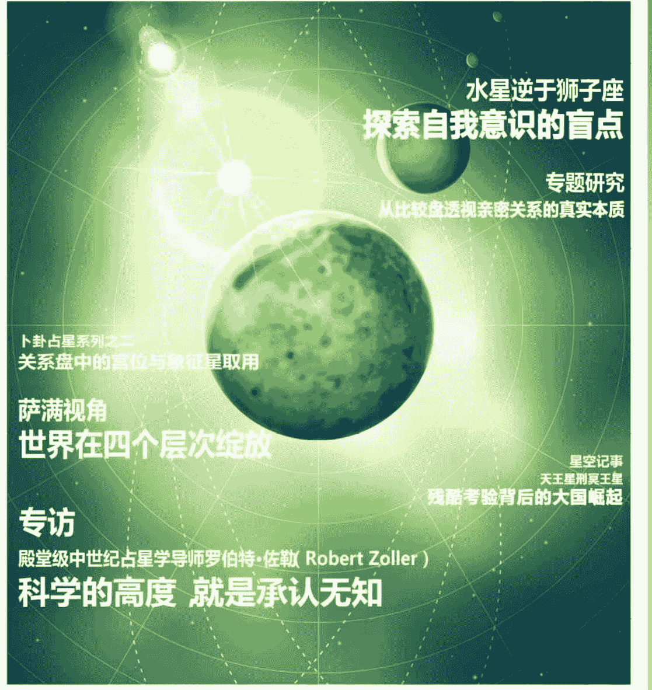
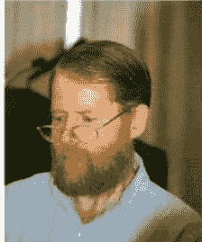
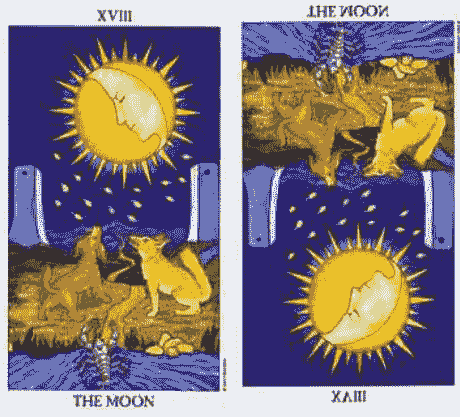
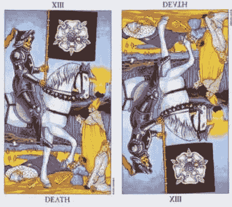
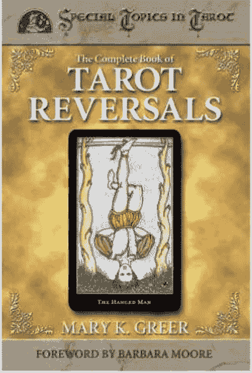
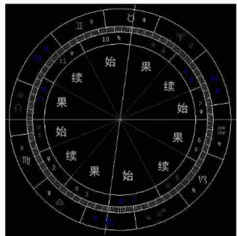
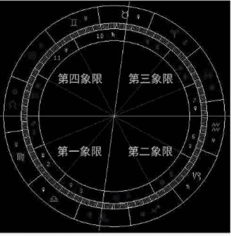
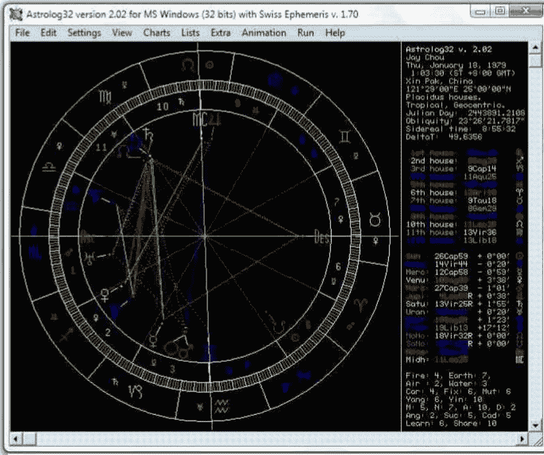
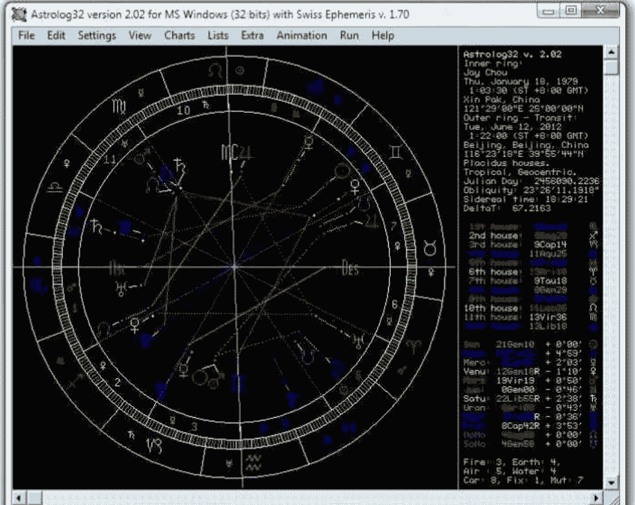
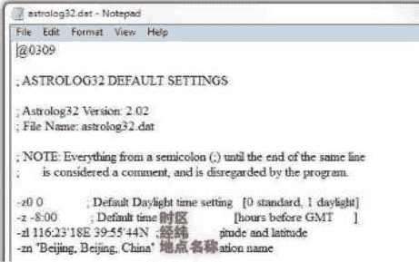

# 占星学刊 Journal of Astrology

中国第一本占星泛神秘学杂志 官方微博：http://t.qq.com/jastrology AUG 2012年8月 第二期 双月刊

- 现代社会中的中世纪占星学
- 十二组出生牌
- 让塔罗告诉你生命能量的两岸——总论与组合
- 你的蜜糖我的毒药（中）——真心换来是沉默

- 北交点进入天蝎座 灵魂蜕变的始点
- 描绘人生最壮丽的蓝图（中）——次限月亮、宫位、星座以及行星
- 塔罗新知 逆位慌什么（上）

- 跟凤大学占星系列之二——后天十二宫位
- 深入浅出Astrolog32（二）——过运、退运及太阳弧
- 阿布马谢《星占概要》——行星与其法则

## 水星逆于狮子座
### 探索自我意识的盲点

专题研究
从比较盘透视亲密关系的真实本质

卜卦占星系列之二
关系盘中的宫位与象征星取用

## 萨满视角
### 世界在四个层次绽放

星空记事
天王星刑冥王星
残酷考验背后的大国崛起

## 专访
殿堂级中世纪占星学导师罗伯特·佐勒（Robert Zoller）
### 科学的高度 就是承认无知

## 目 录

名誉主编：苏·汤普金
执行主编：黄纤越
责任编辑、校对：胡乃月
人物编辑：杨华京
翻译编辑：韩小竹、刘瑞颖、刘欣、王思雪、邢祎、叶思晨
美术编辑：夏峥妮
技术支持：吴琨
运营专员：金小贵
推广专员：郭晨迪
营销策划：王玥

首席合作媒体：腾讯星座

官方微博：http://t.qq.com/jastrology
E-mail：astrology_journal@yahoo.com.cn

- 1-10 本期推荐
  - 现代社会中的中世纪占星学 1
  - 十二组出生牌：让塔罗告诉你生命能量的两岸——总论与组合 4

- 11-16 占星之路
  - 专访殿堂级中世纪占星学导师罗伯特·佐勒——科学的高度，就是承认无知 11

- 17-22 专栏
  - 萨满视角：世界在四个层次绽放 17
  - 星语解码：你的蜜糖我的毒药（中）——真心换来是沉默 18
  - 塔罗新知：逆位懂什么（上） 20

- 23-32 星空记事
  - 天王星刑冥王星：残酷考验背后的大国崛起 23
  - 水星逆于狮子座：探索自我意识的盲点 28
  - 北交点进入天蝎座：灵魂蜕变的始点 31

- 33-48 专题研究
  - 从比较盘透视亲密关系的真实本质 33
  - 次限法：描绘人生最壮丽的蓝图（中）——次限月亮、宫位、星座以及行星 39
  - 卜卦占星系列之二：关系盘中的宫位与象征星取用 45

- 49-62 占星教学
  - 占星基础教程：跟凤大学占星系列之二——后天十二宫位 49
  - 深入浅出 Astrolog32（二）——过运、退运及太阳弧 55

- 63-66 古籍重现
  - 阿布马谢《星占概要》——行星与其法则 63

- 67-72 新满月播报
  - 8月2日水瓶座满月 68
  - 8月17日狮子座新月 60
  - 8月31日双鱼座满月 70
  - 9月16日处女座新月 71
  - 9月31日白羊座满月 72

- 73-74 占星趣闻
  - 占星趣闻 73

## 现代社会中的中世纪占星学

文/罗伯特·佐勒 译/黄纤越

中世纪占星学是占星领域中前所未有的巅峰。从现实的角度来看，它的精准性和可靠性甚至超越了吠陀占星学和希腊占星学。当然，中世纪占星学并不会否定那些自19世纪发展起来的抽象占星分支体系的存在意义，更不会将心理占星学归为无效。

嫁接产物又被加入了诸如命运和轮回等来源于东方哲学的随机观点。

从心理学的角度看来，中世纪占星学本身存在缺陷，因为心理动力在其中的投入为零，这并不是说它的心理动力不足，而是根本就没有心理动力的存在空间。中世纪占星术同样也有着自身的性格分析体系（伯纳提《Bonatti》的著作中有提及），但却是零碎、粗糙和世故的，且并没有现代心理学的深度。心理学是19世纪的产物，而心理占星学更多地创立于20世纪。正因如此，从心理学角度看来，衍生自十九世纪以前的占星知识有着大面积的不足。

中世纪占星学可以提供一些不论是传统占星学还是心理占星学在内等现存占星体系都已缺失的内容。可以说，“传统”占星学也是中世纪占星学占星实践的衍生物。我始终对称其为“传统”持保留态度，因为“传统”占星学本身并不完整，只是空留有真正传统的外壳。“传统”占星学由于历史原因缺乏必然会缺少中世纪占星学的某些特征。其中最明显的就是展现个人生活具体内容方法的缺失，缺乏精确诊断具体事件的洞见。

中世纪占星学缺乏现代概念。除去心理因素，它也没有将现代占星学注重的进化理论（the Theory of Evolution）考虑其中。而“进化理论”发展于19世纪，最初基于科学性地观察，并在此基础上形成体系。因此，19世纪的占星术更加强调进化理论和心理学。

不过，以上说法也会因为许多“传统”占星学的实践者同样作出成功预言而不被认同。虽然，许多“传统占星学”使用者的理论体系并不完整，但却依然可以凭借着从19世纪幸免于难传承下来的方法成功预测。虽然经过“阉割”，某些不完整的占星方法依然可以运作良好。大多数“传统”占星者可能因为以下两个原因而表现良好：

职业心理学家可以从中世纪占星术中寻找到被心理占星术忽略的一些内容：预测能力。中世纪占星学也是一门预测性占星学：它将明确地从客观层面而非心理学层面告诉你将要发生的事情。中世纪占星学的哲学依据主要来源于炼金术和新柏拉图亚里士多德理论。如果非要找出现代占星学的哲学基础，那应该是就唯心主义哲学的某种新世界（New Age）观点的解读，这种唯心主义哲学恰恰是嫁接在了过去被称之为“科学”的架构之上。而这样的

- 经验：他们中的很多人从业多年，并在多年（某些甚至达到了50年）历练中发展出了一套自有的传承体系和一系列也许无法复制和清楚说明的深刻见解。

- 反复：在使用所有自己熟知的占星方法并得到结果的检验之后，他们发现了某些套路，例如基本上每种公式都能阐述出类似的事件。然后他们才会安心地认为自己的方向并未错误，而说出来的内容当然也不会错误。

尽管这类方法在通常情况下确实管用，我却依旧无法认同这种方法，因为其缺乏连贯的条理，而且经常不够可靠。方法论的缺失也意味着并不能真正传授于学生，从根本上而言就是缺乏可传授的技术。此外，科学的现代论断范围也未被有效界定，经常把两种分属不相关体系的不同技术放在一起混用。

在当下“传统”占星术学习中，不仅缺乏清晰连贯的论断方法，学习方法也同样显得模棱两可。我曾经碰到过“学习”占星学20年却依旧不会读盘的人。有人总会说：从某种意义来看，那是因为占星术是教不来的。学生永远不确定他所正在学的东西和老师所知道的内容是不是一回事儿。

不幸的是，我们经常会发现很多师从所谓“传统”占星学老师的学生必须花费数年积累大量各具特色的案例才能在潜移默化中吸收老师们的经验成果。很多情况下，这些经验都蕴藏在大量趣事之中，只有拥有惊人记忆力的学生才能记录吸收。如果老师（或是学生）可以在一次真实的解盘过程中推断出正确的时间和正确的事情，往往也只是因为潜意识提取出了过往经历中的正确猜测——有些人也会把这种能力称之为直觉。在这种过程中，真正重要的反而是判断能力。中世纪占星学强调方法并提供了描述和预测的法则。这样系统的展现令它可以如计算机一般精确计算得出答案。它的轮廓被清晰界定，大多数人只要通过几年的学习就可得其精华。

现代非心理学预测占星学（也就是所谓的“传统”占星师）多数使用次限法（Secondary Progressions）和过运法（Transits）。三限法和太阳弧法也时有使用。主限法（Primary Directions）反而较少被选用，因为这种方法需要极高的运算能力，且对于其正确的使用方法也一直存在争议。

次限法主要观察太阳、月亮、水星和金星（某种程度上也会运用到火星）。外行星因为推进过慢而无法带来太多相关推运。最后的结果就是相当数量的重大事件会在某段时间内云集发生。当以上提及的行星随着每日推进而与本命盘行星构成众多相位时，这类的时间段就会来临，可能发生在生命的早期、中期或者晚期。

中世纪占星学同样也会使用次限法和过运法。但是，现代占星技法过多依赖于次限法和过运法。无疑，这些方法是可以预测出个人的状况，但却问题重重，其中最明显的就是它并不能按年论月地描绘个人生活。毕竟，在重大事件之间还有很多重要的时间段，就好比说一件大事发生在13岁生日，另一件则发生在25岁生日，而这其中的12年却仿若空白，很难用这些技法描述出一个人真正的人生历程。我们需要把视野放大，从宏观的角度看待人生，又或者你可以把所有信息衔接起来。从另一角度来看，中世纪占星学可以打破生命界限，进入更加广阔的时间洪流，然后再把它们逐渐细分，令生命的主线更加清晰，并可以勾勒出真正的“人生蓝图”。

过运经常被提及的问题就是看上去过运的流年并不一定真的发生影响。这也是困惑了很多现代占星师的问题。中世纪占星学对此却有解释，那就是要依据该行星本身具有的“影响力”是多是少来判断。但必须要说的是，因为中世纪占星学通常会优先选用其他预测技术，所以过运法对于他们的影响力并没有对使用现代占星学的占星师那样重要。以主限推运法为例，阿尔查比琉斯（Alchabitus）的介绍已经对托勒密的“休停”系统给出了清晰明了的解释，让大家可以更好地理解怎样计算主限推运法。

中世纪占星学与现代占星学（“传统”预测与心理学）最大的区别在于，现代流派的占星师主要受到了心理占星影响而将整个星盘视为“自己”或个人。于是就变成第一宫代表着“我”，第二宫是“我的金钱”，第三宫是“我对于事物的看法”，第七宫是“我的伴侣”，第十宫是“我的专业”，第九宫是“我的出国旅行”……所有一切都是我自己。

这种观点来源于以自我为中心的特定观点。但问题就在于如果你的生活完全以自我为中心，又怎么能有任何理由去期待其他人或者事会放弃自我以你为中心。

中世纪占星学的观点会将个人限定于第一宫以及第一宫的守护星，并通过那些与第一宫形成相位的行星来描述个人。所有的其它宫位都是相关的事项，简而言之，就是其它宫位都环绕于命主周围。与我的生命有关的事项是我的金钱、兄弟姐妹、家庭、子女等等。所有这些事项都独立存在。因此，位于某个宫位内的某颗行星也许与命主本人并无任何形式的联系。这颗行星也许与命主生命中的其他事情或其他人物有关。因此，你可以通过这一预测法则判断你是否会被某人所影响。如果一个人需要判断谁将成为本命盘中某个相位的接受者，区别命主与他人的能力将变得非常重要。

在预测方面的最大区别就是可以告知对方去了解会有怎样一个人，以及会发生什么样的事情。

举例来说：在 1997 年 2 月，流年木星与天王星相合落在我的本命太阳、火星和水星上。如果这一相位只与我（命主）有关，那么我应该期待特别的灵感或是出国旅行。但事实上却并没有任何事情发生。相反，受到影响的却是我身边的其它人。我所属的好几个组织都在领导者方面发生了巨大的变化。所以木星与天王星的合相却是造成了影响，但却没有影响到我本人，也就是星盘的命主。这同时也显示出行星所落的宫位更多地会影响生活中的特定领域而非将所有的宫位都直接等同于个人会有什么样的生活领域。中世纪占星学的观点并非心理学的观点而是将星盘的所有内容视为客观存在的现实。也就是说，变化可能会影响命主的社交生活，但却不会直接影响到命主本人。

你可以使用中世纪占星学做出预测，因为相比心理占星学，它可以从星盘中看出更多明确的问题。当然，这并非指责。心理占星学认为做出任何预测都不是明智之举。心理占星学指出是不可以进行预测的，或者他们干脆就更直接将这一想法告知对方：“我们不能做预测。”不过，正如我开始就承认的，心理占星学依旧还是为很多人提供了良性的帮助。

> 注：特别鸣谢罗伯特·佐勒官方教学网站。（http://www.new-library.com/home.html）
本文系作者于 1997 年 4 月 7 日在格洛斯特广场参加的伦敦占星同盟会（the Astrological Lodge of London）活动中的一篇讲演稿整理而成，原文链接：http://www.new-library.com/info/articles/medieval-astrology-in-the-modern-world+48.html

## 罗伯特·佐勒（Robert Zoller）

罗伯特·佐勒（Robert Zoller）是首屈一指的占星家和隐匿哲学的奉行者。他的著作和译作是占星术和相关艺术领域的精华。现代古典占星家使用的主要工具和技术都要归功于他。罗伯特创办了中世纪预测占星学院，并担任校长一职，同时负责讲授一些最精深的课程。现在活跃于大中华区的古典占星师多师从于罗伯特·佐勒或是受到其深刻影响。为了回溯中世纪占星术的源头，罗伯特从 1976 年开始翻译伯纳提（Guido Bonatti）的占星巨著《天文之树（Liber Astronomiae）》。他对伯纳提作品的翻译一直没有间断，还把这些译作发布在个人网站上。此外，罗伯特还就占星术、隐士哲学、炼金术和魔法等广泛议题发表了许多作品和演讲，这是他二十多年来研究的心得与成果。罗伯特学识渊博、深厚而广泛，他对西欧、北欧和佛教密宗传统都有所承袭研究。

## 十二组出生牌：让塔罗告诉你生命能量的两岸——总论与组合

文/Claire Chak

出生牌的秘密是……

图获得最佳运转的能力，并体验对立能量所随机带来的各种问题和矛盾，从而得到灵性的提升和成长。

> “每一对出生牌构成两个柱子或门柱，在它们之间漂流着一次完整轮回的能量。这是进入一个人生的通道。”
——瓦尔德·安博斯顿

如果把出生牌比喻成一条河的两岸，那我们的一生所拥有的能量就是这条河。出生牌能明确地给予我们此生的能量定义。我们的一生，从出生到死亡，都会徘徊在这出生牌的两岸之间，不停地学会在这两元对立的能量中平衡和通过考验。再深入一点的出生牌研究和探讨中，还可以通过卡巴拉的帮助，看懂“个人的生命之树”，和现阶段的灵性成长路线和进度。

出生牌是塔罗里一个有趣的系统，也是一个至今为止被忽略的宝藏。哪怕有很多的塔罗师都听说过出生牌，可是真正能明白它的作用和运作的塔罗学者少之又少。

出生牌由塔罗中的 21 张大阿卡纳牌组成，一共有 12 个组合。根据我们每个人的出生年月日可以计算出每个人的出生牌。无论是哪天出生，你都一定会属于这 12 组出生牌里的其中一组。从你出生的那一天直到你离开此生的那一刻，你都会拥有着这组出生牌的能量和限制。

生命的能量不是独立的几个点，而是一股持续不断、河流般的能量。在出生牌系统里，我们可以用摸得着的牌、看得见的图面分析去认知自身。知道了自己的能量限制后，也能更好地发挥出其优势和特点。我们还可以通过内观、自我审视等练习，在出生牌中寻找到目前自己能量的流向或堵塞处。

出生牌的最大意义建立在一个很古老的概念之上，那就是轮回。在轮回中，我们每个人都是不朽的灵魂，在人世间不停地转变，每次投胎转世为的都是灵性上的提升和进化。所以，我们在每一次的轮回中都会给自己的人生定制不同的挑战和锁定一些限制，然后在这些条件之下使自己在这一轮人生中去努力克服该经历的课题，充分地体验生活。

就算你是不相信轮回说法的人，出生牌对你还是会有帮助。如果我们都只有一次的机会、只能活一回的话，那么出生牌的作用就有点像占星学里的命盘。也许出生牌所能给我们勾画出来的个人肖像会比精准计算出来的占星命盘更加得模糊一点、抽象一些。可是通过出生牌，一个人的大体感觉、心境、能量、性格特征、行为和思考模式都会慢慢地浮现于眼前。

在这样的信念基础上，出生牌就能发挥很重要的作用。因为出生牌能给我们的每一次轮回带来某种能量上的限制和特质。两张出生牌（或三张）都是对立的能量，我们每一个人本质上就含有非常矛盾和对立的能量。我们的灵魂试图在特定下的两种对立元素中寻找平衡的状态，试

有一点要切记的是，出生牌不是占卜，不能让你预知未来，预知命运。可是它能让你认识到自己和他人的不同性格特点和生活模式。这跟心理学很是相似，在纽约的塔罗学院里，出生牌也被归类成塔罗心理学（Tarot Psychology）。

塔罗界里有几个出生牌的系统和派别，本文章里介绍的系统是源之于纽约塔罗学院（The Tarot School）的安博斯顿（Amberstone）夫妇。他们目前没有对于出生牌的任何文字发表，所有的内容都仅通过课程中的口传延续至今。另外还有两位塔罗学者对出生牌也很有研究和贡献，她们分别是玛丽·K·葛瑞瞒（Mary K. Greer）和安杰利斯·艾瑞恩（Angeles Arrien）。她们的出生牌分析和解说又分别属于完全不同的系统，来自于不同的原始资料和原理。要切记不要把三大学派给搞混了，因为它们的区别太大，运用混了会对塔罗师和寻问者造成不必要的遗憾和困扰。

### 出生牌的用途

> “如果你不能读懂自己，你就很难读懂别人。”
——瓦尔德·安博斯顿

出生牌的一大作用是可以让我们更好地审视自我，了解、原谅和接受自己，清楚自身的本质后懂得如何整合能量，从而活出更好的真我。虽然这些承诺听起来很不真实，可是出生牌真的有这样的作用。当然，我们不可能只通过头脑的分析和学习出生牌得到以上的成果，而需要更深刻地去感受、了解、体会、知晓和经历每一对出生牌中的能量。这是微妙而细腻的过程，需要长期的时间和精力投入。

用一个比喻，你自己是一片大陆，在这片大陆上有很多的地方还未被发掘和认知。而你同时也是一位探险家。通过塔罗和出生牌这些指南针和望远镜，你就可以开始对未知的大陆进行探讨、观察、审视、研究和摸索。如果你愿意下苦功的话，你可以运用出生牌看见你从所未见的自己，寻找到你不敢想象存在的自己。

当你对 12 组出生牌有了初步的了解后，你还可以运用它去更加理解你身边的家人、朋友、爱人和同事。通过知道家人、朋友和爱人的出生牌组合后，我们能更谅解对方。尤其是当彼此关系中出现矛盾时，我们能在彼此的出生牌能量中找到问题的根源，也更容易进行换位思考。一旦深入地了解了对方的性格特质、思维、感情表达和行为模式后，我们能用更宽的心去接受身边的他们！在我的个人经验中，出生牌的运用改善了我生活中的重要关系，它帮助我更好地去了解我身边的人们，而这种理解拉近了我和他们的距离。

通过出生牌，你也可以对刚认识和接触的人有一个很准确和深刻的了解，让你更容易与不同的人相处。通过出生牌信息，你能在短时间内更加精准地了解一个陌生人的总体心境、性格和特征，从而做出判断，选择相对应的方式去跟对方交流互动。在我的每天塔罗咨询工作中，出生牌就能让我很好地把握该如何跟每一位客户互动。我想象在公司招聘时的面试中，出生牌也能派上用场。

这里有一个很直接、简单运用出生牌的方法：在日常解读塔罗牌时，准备两副牌，先从第一副中先把寻问者的出生牌找出来，放在桌面上。然后再用另外一副牌进行普通解读。在寻问者的出生牌底下（或一旁）洗牌、抽牌、放置解读的牌与牌阵。在解读的过程中，塔罗师可以留意牌阵里的牌与寻问者的出生牌有没有任何的关联，在牌阵里有没有出现寻问者的出生牌？这些都是很重要的线索，可以让塔罗师更深层次地去解读问题，拉近问题与寻问者的本质距离。而在寻问者的出生牌的见证和指引下，针对问题抽出来的牌阵也会更具有灵性的感觉。我强烈推荐各位下次给自己或他人解读塔罗时不妨试试这个有效的做法。

即使出生牌有如此多妙用，但是也不能仅凭十二组出生牌就把把复杂多面的人性给概括化。这种概括化的做法也是很多人在运用 12 组太阳星座时常常会犯的毛病。譬如你常会听见“你是双子座的，那你一定很花心了！”或者“你不像是双子的呀，你怎么这么安静？”这类话。事实上，无论是太阳星座还是出生牌系统都不能用来简单武断地概括所有的人，同样是“月亮 & 隐士”的 9 个人就可能有 9 种不同演绎该出生牌的方式并呈现出 9 种不同的性格特征。塔罗与出生牌都有更加神奇和有意义的用途，希望各位能够善用出生牌，发挥出它最强大的一面。

### 如何计算出生牌？

计算出生牌的方法也会因不同学派而有所不同。在这里介绍的安博斯顿出生牌系统用的计算方法跟一般“生命数字”的计算方法也有所不同。所以哪怕是清楚知道自己的“生命数字”的朋友们也需要重新按照以下方法来计算自己和他人的出生牌！

请注意，我们在计算出生牌时只用阳历计算。如果你只知道自己的阴历或农历生日，请换算成阳历日期。

计算方法：

安博斯顿出生牌系统的计算方法很简单。首先，我们把一个人的出生年月日分为 4 组两位的数字：出生的年份（年份四个数字拆分成前后两组，如 1985 分为 19 和 85），出生的月份，和出生的日子。然后把这 4 组两位的数字加起来，得出总数。

一起看看以下的例子：

阳历出生日期：1988 年 10 月 13 日

19（年份前两位）
88（年份后两位）
10（月份）
13（日）
+
-----------------
130

我们得出的总数如果是大于 21 的话，那我们需要进行进一步的数位相加。

现在总数是 130（大于 21），所以我们要进行数位的相加。如果总数是 3 位数的话，我们把前两位数隔开，变成一个双位数，再加上最后的一位数。

这个案例中，前两位数是 13，加上最后一位数 0。
13 + 0 = 13（死神）

这次的结果是 13（小于 21），可是出生牌都是一双一对的，所以要知道另外的一个数字，我们得再一次的把数位相加，直到结果是小于 9 的单位数字。
1 + 3 = 4（皇帝）

现在，我们有一对的出生牌数字：13 & 4

这两个数字在塔罗的大阿卡纳牌里对应的牌是 死神 & 皇帝。

所以，出生于 1988 年 10 月 13 日的人拥有 “死神 & 皇帝（13 & 4）” 组合的出生牌能量！

让我给大家总结一下，出生牌的计算方法：

（1）把一个人的出生年月日分为 4 组双位的数字：出生的年份（分为两组）出生的月份和出生的日子。4 组两位数字相加，得出总数。

（2）如果加起来后的总数大于 21，则进一步进行数位相加（备注：如果总数是 3 位数的话，就将前两位数隔开，变成一个双位数和最后的单位数，二者再相加），直至得出一个小于或等于 21 的数字，此数字为第一个出生牌数字。

（3）如果第一个出生牌数字为双位数，则再将数位相加，得出第二个出生牌数字。
如果第一个出生牌是单位数字，则计算有哪个两个位数相加能得到第一个出生牌数字，同时又小于或等于 21。
例：7（战车）是我们的计算出的第一个出生牌数字，那就开始计算有什么数字既是双位、小于或等于 21，每一个位数加起来又能得 7。答案只有一个：16（1 + 6 = 7）。

（4）得出一对数字后，把数字跟塔罗里的大阿卡纳牌对照，相对应的牌就是你的出生牌组合。（备注：结果一定是一个双位数和一个单数的数字组合。想知道自己是否计算正确，把双位数的两个数位相加就能得出另外的数字了。）

例：13 是结果中的两位数的数字，想知道自己有没有计算正确，把 1 和 3 相加，得出的 4 应该就是组合里的另一个数字（单位数）。如果你的结果 4 跟另外一个数字不吻合，你的计算有误，请从头计算一遍。

注意：唯有 19 能让我们有 3 个数字，这也是出生牌里唯一的 3 张牌组合 - “太阳 & 命运之轮 & 魔术师”。

不妨从案例来试一次：

阳历出生日期：2004 年 7 月 16 日

20（年份前两位）
04（年份后两位）
07（月份）
16（日）
+
-----------------
47

我们得出的总数如果是大于 21 的话，那我们需要进行进一步的数位相加。我们的总数是 47，所以的继续相加数位。

总数：47
4 + 7 = 11（正义）

这次的结果是 11（小于 21），可是出生牌都是一双一对的，所以要知道另外的一个数字，我们得再一次的把数位相加，直到结果得是小于 9 的单数字。

结果：11（正义）
1 + 1 = 2（女教皇）

所以，我们的答案是 11&2，相应的塔罗大阿卡纳牌是“正义 & 女教皇”。

需要注意的是，在出生牌中，拥有“女教皇”一牌的有两个组合，分别是“正义 & 女教皇（11 & 2）”和“批判 & 女教皇（20 & 2）”。这是因为把 11 与 20 的位数相加都能得出 2 的结果。以上这个案例就是 11 和 2 的相加结果。要小心别把“正义”和“批判”搞混了，因为“正义 & 女教皇”和“批判 & 女教皇”组合的能量是很不一样的！

在出生牌中，拥有“皇后”牌的也有两个组合，分别是“倒吊人 & 皇后（12 & 3）”和“时间 & 皇后（21 & 3）”。这是因为把 12 和 21 的位数相加可以得出同样的结果，就是 3。

那么问题出现了，如果我们计算出的第一张牌是 2 或 3，那么第二张出生牌就会出现两个答案：

第一张牌是 2，则答案可能是 11 或 20；
第一张牌是 3，则答案可能是 12 或 21；
那我们到底应该如何抉择哪一个数字（牌）跟 2（女祭司）或 3（皇后）组合起来呢？！

每逢遇见这样的难题，都要记住选择比较低的数字与 2 或 3 搭档。所以当 2 作为第一个出生牌数字出现时，正确的所属出生牌组合应该是：11&2 或者 12&3。

另外，因为 21 & 3（世界 & 女皇）的组合是 12 组出生牌里最稀有的，能量也是最复杂的组合之一。所以，结果一定要是确确实实的 21，才可以说这个人拥有“世界 & 女皇”的出生牌。

一起看看很少见的“世界 & 女皇”出生牌案例：

阳历出生日期：1989 年 12 月 9 日

19（年份前两位）
89（年份后两位）
12（月份）
09（日）
+
-----------------
129

我们得出的总数如果是大于 21 的话，那我们需要进行进一步的数位相加。而总数是 3 位数的话，需要把前两位数隔开，变成一个双位数，再加上最后的一位数。

总数：129
12 + 9 = 21（世界）

大家要切记，只有加起来的结果是 21 无误时，才可以确定这个出生牌组合是罕有的“世界 & 女皇”。这一组合的能量很复杂也很强大，不要跟“倒吊人 & 女皇（12 & 3）”的组合搞混了。

说到能量复杂的出生牌组合，就必须得提到最特殊的“太阳 & 命运之轮 & 魔术师”这一组。它比其余的 11 组合出生牌都多出来一张，成为唯一拥有 3 张牌的组合。

一起看看这独特的案例：

阳历出生日期：1978 年 4 月 8 日

19（年份前两位）
78（年份后两位）
04（月份）
08（日）
+
----------
109

10 + 9 = 19（太阳）
1 + 9 = 10（命运之轮）
1 + 0 = 1（魔术师）

就这样，凡是相加位数的结果得 19 的，都会拥有 3 张出生牌，分别是“太阳 & 命运之轮 & 魔术师（19 & 10 & 1）”。这组合出生牌的能量非常不凡，很是特殊。

出生牌组合解说：

十二组出生牌的组合排列和摆放很简单。除了“愚人”一牌以外，我们会运用到所有的其他 21 张大阿卡纳牌。这是因为“愚人”是“0”号，而我们的出生牌计算中是没有可能出现有“0”号的结果的。在别的出生牌体系里，“愚人”会被解释为“22”号，这其实不正确。“愚人”是塔罗里的第一张牌，编排成“0”号。这一点在安博斯顿的出生牌体系里是非常重要的。

所以把“愚人”牌拿出来以后，我们剩下了 1 号至 21 号的大牌。按顺序的从左至右，从 1 号的“魔术师”到 9 号的“隐士”摆放在桌面上，形成我们的第一排。接着，在第一排“魔术师”的底下摆放 10 号的“命运之轮”，第二排由 18 号的“月亮”牌结束。接着把剩下 19 号“太阳”放在第二排的第一张“命运之轮”之下，20 号“批判”放在第二排的第二张牌“正义”之下，最后的 21 号“世界”放在第二排的第三张牌“倒吊人”底下。这样就大功告成了！

出生牌的组合名称一般是从编排数字较高的牌开始，然后再念数字较低的对应牌。“命运之轮 & 魔术师”，“太阳 & 命运之轮 & 魔术师”，“正义 & 女教皇”，“批判 & 女教皇”，“倒吊人 & 女皇”，“世界 & 女皇”，“死神 & 皇帝”，“节制 & 教皇”，“恶魔 & 恋人”，“塔 & 战车”，“星星 & 力量”，“月亮 & 隐士”。

### 12 组出生牌组合的基础解读

#### 魔术师 & 命运之轮

只有出生的年月日相加后得出 10 和 1 的人才能有“命运之轮 & 魔术师”的出生牌组合。这一个组合的人都有很强烈的急躁不安的特点。他们的情绪也非常得起伏不定，时常会有变化。另外一个特点是该组合之人都很有个性，我行我素，但是不会不顾后果。他们的生活或者性格中也许是倾向于奔波，动力十足。可是他们同时也拥有着某种稳定性，让他们稳住。

#### 太阳 & 命运之轮 & 魔术师

“太阳 & 命运之轮 & 魔术师”是在 12 对出生牌中唯一的三张牌组合。只有出生年月日相加后得出 19 的人才属于这独特的一组。一般来说，这个组合的人也像“命运之轮 & 魔术师”一样有很多的朋友，从容地穿梭于各式各样的朋友群中，非常友善，擅长社交，在社交群里很被瞩目和欢迎。他们永远都是在某种的动态中停不下来，可是这种动是有稳定性的。他们性格非常得复杂，不容易被看懂，可是头脑清晰、狡猾、接受能力强，能够接纳世界给他们带来的任何事物，所以也一般不爱埋怨。

#### 正义 & 女祭师

出生年月日相加后得出 11 和 2 的人拥有 “正义 & 女祭师” 出生牌。这一组合的人如果能平衡好这两股对立能量的话，会拥有很多不同种类的朋友，会被神秘学吸引，在生活中的很多方面都会抱着完美的梦想。这一组合的人群也会一生都徘徊在极端之中，比如说时而安静，时而嘈杂，时而安稳，时而毛躁，时而温和，时而攻击性强。该组合的人还有一个特征，那就是想的、说的永远比做的东西要多！他们很擅长于想事情、说教，可是要他们把自己的好主意和完美的理想实践在这三维世界中就有点难度了。他们很喜欢陶醉在知识和完美层面的世界里。

以接近超然的境界。这组合的人也很有英雄风范，他们给予他人的无私奉献是非常伟大和高尚的。“圣人” 好像都具备这组合人的本质。母亲和孩子、照顾他人和被照顾等主题都是该组合需要面对的。理解到三维世界中的真实存在和灵性上的超然存在也是此组合的两股对立能量。

#### 批判 & 女祭师

这一组合很特殊，只有出生年月日相加起来有 20 的人群才是 “批判 & 女祭师”。他们很有通灵、玄学等天赋。整合好的 “批判 & 女祭师” 有很不平凡的智慧，他们所明白理解的事情超出了平凡和普通的层面。他们所关注的是超然的存在，而不是平庸的、普通的生活。当两股对立能量得到平衡时，这组合的人会非常得强大。他们会对灵性、灵修、秘密、神秘知识等感到无比的兴趣。在生活中，他们也会被注入强大的能量、动力、变化和成长的元素，一点都不乏味。

#### 世界 & 女皇

这也是一个很特殊的组合，只有出生日期相加起来有 21 的人才有 “世界 & 女皇” 的出生牌。此组合的人群在平衡的状态时像舞者一样的优雅、脱俗、美丽、自如。“天生我才必有用”，这对他们来说再合适不过了。因此此组合的人群会找到自己最能体现才能的活动，他们的命运会被证实、得到完满。这是一组非常强大的组合！在整合的时候，该组合的人群会非常地专注于当下此刻。他们能活在当下，活出此刻最漂亮的自己。生活和命运都会变得如此的完满、完美、有趣、安全，受鼓舞和沉浸在爱中。

#### 倒吊人 & 女皇

出生年月日相加起来得出 12 & 3 的 “倒吊人 & 女皇” 人群如果得到整合，活出了自己的最亮的真我时是非常的慷慨、大方、忠诚、保护意识强，有创造力和天才般的原创能力！他们能对于他人的无私奉献、关怀，大爱可

#### 死神 & 皇帝

此组合的人群都能把出生日期相加为 13 和 4。“死神 & 皇帝” 的人有很好的领导才能，如果在职场中是领导的话，一定会对属下非常地照顾和怜惜。可是，他们也深刻地明白一位真正的王者是没有个人权力的。一位皇帝的所有权力来自于他的子民，所有王者的一生都是为了他的子民而服务和奉献的。此组合的人很注重排场，做事情都会很注重形式。他们不容易让别人看见自己的真实情感，内在那软绵绵的自己只会允许身边的几位至亲好友看见。

#### 节制 & 教皇

出生牌“节制 & 教皇”组合的人把自己的出生日期相加都能得到 14 和 5。平衡好了的时候，此组合的人非常的有专注能力，受启发，很有魅力。他们是能让他人信任的领导，同时也能成为非常忠诚、衷心的追随者。他们所知道的、说出来的和行动的事情都是出于他们最高的自我。当没有被整合时，此组合人群会有死板、自我矛盾、极端的自以为是等负面表现。有时候也会变得很懒惰、自我膨胀、草率和粗心大意。

他们不会再害怕任何事情！对他们来说，没有什么事情是解决不了的，没有什么事情是能让他们害怕的。他们很强大，能在任何的困境中站立，在任何难题前不畏惧，这里指的是内在和外在的双重能量。勇敢地面对挑战，深信自己是与困难平等的。

#### 恶魔 & 恋人

出生年月日相加起来得出 15 和 6 的人拥有“恶魔 & 恋人”出生牌组合。此组合的人都很有幽默感，很有喜剧才华，常常能让身边的人感到愉快感和带来欢笑。他们还很有魅力，很有吸引力。此组合的人都得经历各种人与人之间的关系课题，其中爱情课题尤其得重要。不过当他们平衡后，此组合的人群能知晓宇宙中的秘密，他们明白万物是如何运作的，如何都融洽地融入到一起的。他们拥有这和谐的能量和礼物！

#### 星星 & 力量

出生年月日相加得出 17 和 8 的人群拥有“星星 & 力量”的出生牌。如果未被整合的话，此组合的人会非常地极端。所以平衡好自己的内在对立能量是首要的事情。当整合好了，他们是最美丽、平和、强壮、优雅的人群。他们所拥有的天赋、才华和力量都是在完美的分配和平衡中的。他们也能把这些优点利用在为全人类服务中，为世界奉献里。

#### 塔 & 战车

“塔 & 战车”组合的人把出生日期相加起来能得 16 和 7。此组合的人一生中的起伏很多，貌似命运的安排就激烈和戏剧化。可是，当他们整合好了自己的潜能后，

#### 月亮 & 隐士

出生日期相加得出 18 和 9 的人群拥有“月亮 & 隐士”的出生牌。此组合的人能在高度与宽度中进行，是很强大的组合。他们在阴暗中探索，是通往智慧、知识的旅行者。被整合后，此组合的人可以成为别人的指路明灯，带着更多的人群通往深度与高度并存的个人成长路径。此组合的人能给他人证明个人的灵性演变和进度是一个伟大的旅程，而且是每个人都能实现、能完成的旅程。

### Claire Chak

Claire Chak，被好友们称为“大 C”，美籍华人塔罗师。从小在美国纽约长大，说一口流利的英语、普通话和广东话。Claire 活跃于东西方的塔罗界，连续三年参加美国东岸最大型国际塔罗研讨会——读者工坊（Readers Studio）。并引进了以色列著名灵性导师、卡巴拉学者和塔罗师戴维·沙尔（David Schaar）到中国开办课程，担任现场翻译和共同教学的责任。纽约塔罗学院（The Tarot School）独家授权 Claire 翻译并且在大中华区发布每月的塔罗新闻邮件——塔罗小贴士（Tarot Tips）。她在乐视网《可以说的秘密》节目中向大家介绍和分享塔罗的秘密。Claire 在北京创办了一家名为“塔罗小屋”的工作室，环境优雅，气氛温馨。她在小屋里接受塔罗咨询，开办塔罗课程，并经常举办塔罗聚会和各种活动，给塔罗爱好者们提供一个舒适、安全的平台分享塔罗。

联系邮箱：Claire_Chak@hotmail.com
新浪微博：http://weibo.com/claire20110326
新浪博客：http://blog.sina.com.cn/claire20110326

## 专访殿堂级中世纪占星学导师罗伯特·佐勒（Robert Zoller）——
科学的高度，就是承认无知

特约记者/杨华京

罗伯特·佐勒简介：

罗伯特·佐勒（Robert Zoller）是首屈一指的占星家和隐匿哲学的奉行者。他的著作和译作是占星术和相关艺术领域的精华。预测占星家使用的主要工具和技术都归功于他。罗伯特是中世纪预测占星学院的校长，他还负责讲授一些最精深的课程。

为了回溯中世纪占星术的源头（这个命名得自于它吸取了欧洲中世纪所广泛应用的技术手段，当时西方占星正处于发展高峰），罗伯特从 1976 年开始翻译伯纳提（Guido Bonatti）的占星学巨著《天文之树（Liber Astronomiae）》。他对伯纳提作品的翻译一直没有间断，罗伯特把这些译作发布在个人网站上。罗伯特也就占星术、隐士哲学、炼金术和魔法等广泛议题发表了许多作品和演讲，这是他二十多年来研究的心得与成果。罗伯特学识渊博、深厚而广泛，他对西欧、北欧和印度密宗传统都有所承袭研究。

罗伯特也是全美宇宙研究协会纽约中哈德森（Mid-Hudson）分会的联合创始人。他也是多家相关刊物的编委。他曾在美国、加拿大、新西兰、澳大利亚、英国、爱尔兰、德国、墨西哥和南非演讲；他帮助促成了 Janus 占星软件的发布。

对话罗伯特·佐勒

Q：您是怎么对星相学产生兴趣的？
A：我不记得为什么却记得从什么时候开始钻研星相学。大约 16 岁那年，我买了第一本有关星相学的著作，那是爱德华·林度（Edward Lyndoe）的作品，书名大概是《属于每个人的星相学》。此后我对星相学的兴趣越来越浓厚，因为在此之前我已经开始阅读并尝试创作有关秘术和民俗学的作品，并因此对魔法产生了一个想法：魔法其实是星相学的一部分。

所以，孩提时代的我大概是先奔着魔法来的，之后我逐渐意识到进入魔法世界的前提——从传统的角度上来说，首先得对星相学有充分的理解和认识。就这样，我开始努力学习星相学当时由于要升大学，我只是浅尝辄止；又因为读大学，还曾一度把星相学研究搁置起来。直到上世纪 70 年代完成了大学学业后我才重新拾起星相学的爱好并积极地投入研究。

Q：当时的研究达到你的预期了吗？星相学有没有为你打开进入魔法世界的大门？

了解超出普通的人（比如占星学家、哲学家、研究炼金术和魔法之人），实际上却与普通人一样对于这些学科的渊源一无所知，对于它们的真实性无从知晓。

A：最终，我成功了。但是这一路上，我扫荡了不少垃圾废物一样的拦路虎。我所认为的垃圾就是新世纪星相学以及与新世纪有关的魔法理念、与新世纪有关的炼金术等此类理念。它们终归钻进了死胡同。

Q：既然魔法可以从不同的角度来理解，您能否以自己的理解给它下个定义？

为了自我提升，我重新回到学校，开始学习拉丁文，随后在进一步学习拉丁文的过程中拿到了中世纪研究专业的学位。在修读哲学、方法论以及科学历史的课程中，这些学术学习馈赠予我一些颇有教益的指导。科学历史把我带到真正的文献资料以及历史、文学和各种学说的丰碑的面前，我因此了解到什么才是真正的传统，这与当代有关星相学、炼金术和魔法的“理念再形成”（这是委婉善意的叫法）正相反。

A：魔法的定义是个难缠的话题。“Magic”一词源波斯索罗亚斯德教的传统“magh”，以我的理解，magh与magic例行其道的力量有关。但这一定义又显其局限性。你也会听到有关“埃及魔法”、“巴比伦魔法”的说法，或是魔法与一些非洲传统活动相关联——这大概是因为魔法一词的应用相当广泛。

我从荣格学说的陷阱中跳了出来，我从新世纪有关魔法的证确陷阱中跳出来，在我迎来观念的曙光之前，我一度要面对自身的无能为力。

因此我想，明智的做法是摈弃“magic”一词并以“科学”或者“智慧”取而代之。但这种做法依然有漏洞。在《隐匿哲学的三本书》（Three Books of Occult Philosophy）中，阿古利巴（Henry Cornelius Agrippa）提出了一种观点：奇迹的创造常常不是超自然能力的结果，而是对于能量和事物的操控（这些能力以及这些事物本身所拥有的力量，普通人往往无从了解）。从我的个人研究和思考中，我得出了一个结论，我认为魔法包括了普通人无法达到的做事的能力。

最终我开始看到在科学史与神秘学史上巨大的交接点。神秘学史的作者从这个出发点上来书写的可谓寥寥无几。在我们的社会中科学与艺术以及科学与宗教、科学与神秘学之间存在着分裂和对立。而那些本应对这些知识的

## 占星学刊 | 占星之路
Journal of Astrology 第2期

如果要和人们探讨魔法的定义，你会发现没人关心它到底是什么意思。其实这也说明了这个概念在人类历史中有多原始。我们人类中总有人有能力做出英雄或不同寻常的事——我们不知道如何命名这一义举，我们也不理解它到底怎么回事，但我们怀有一个信念——它一定是存在的。

Q：您认为魔法与占星学之间有必然的联系吗？一个人可能在学占星学的同时而与魔法完全绝缘吗？

A：这不可能，我认为占星学是魔法研究的一部分。不幸的是，占星学被新世纪占星师们降格为心理学。

在个案中，你当前的状态与占星推导可谓心有灵犀，但星象与主观状态之间的联系又是一个谜。我个人认为，占星师意识上的变化是让这个谜变得越来越清晰的唯一途径。仅有态度上的转变也还不够，我指的是通过类似瑜伽等活动达到心灵上的效果的一个根本性的转变。我认为，人的心脏里有一个喷泉，喷泉流出七眼水。这七眼水流是行星力量的前因。

但是，这种流淌通常无法被识别，所以大多数情况下，我们只能意识到行星和恒星对心灵的影响，偶尔我们会隐隐感觉到，却茫然无解，我们的内心与外部的事件是有关联的。但这关联到底如何作用，我也不得其妙。

Q：人类似乎不大愿意承认神秘与奥秘的存在。

A：是的，面对这个谜，我也备受煎熬。一方面我被神秘所吸引，另一方面我却费劲力气想要解开这些奥秘。如果有一天我真的解开了奥秘，我又全然不知该如何面对这样的结果。

Q：您心目中人类进化的典范是怎样的？

A：首先我觉得人类不会进化。我曾接待这样的客户，他们在二十多岁的时候咨询我，想要找到一个理想的伴侣，到了三十多岁，他们还是带着同样的困惑寻求我的帮助……四十岁、五十岁、六十岁，悬而未决的还是一样的问题：他们不明白，为什么，众里寻他千百度，那人始终未现灯火阑珊处。

我躬身自查，自己也为一样愚蠢的错误反复栽跟头。积习是一种瘾，旧瘾复发，无可救药。唯一令我庆幸的是，我并不是毒品瘾君子。但若要学习一种社会互动方式，或者在学术和个人兴趣上做一些研究，我总会显现出非常个性化的模样来，使得自己和身边的人轻易就能品出我的风格来。所以，我个人颇认同这个观点：上帝赋予人类自由意志，人类却好像不大愿意使唤它。

Q：可是，即便大多数人深陷这样不断反复的怪圈中难以自拔，但是只要有一个人出现，就有可能打破这个怪圈的秩序，推动人类朝着神的启示（当然也可以有其它叫法）的方向进化，不是吗？

A：耶稣为我们的罪而死。我不是耶稣，我也曾经荒唐过，我也不断地犯下一样的错误而无法自制。关于这点，我学会了诚实面对，不再自欺欺人。你说的不无道理，要打破怪圈，只消一个人出现。我也曾乐观地四处寻找这样的英雄，然而最终发现那些人也同我一样，只是凡夫俗子而已。

大部分人依然相信进化的存在，因为人们需要希望。我不想引起公愤，但你若要问我有关这个话题的真实想法——坦白地讲，我对人类进化心存怀疑。我对于达尔文的进化论也并不认同。

我对进化概念的问题之一是，这个词的意义本身就不够明确。斯泰纳书写进化论时，他所用的进化论的概念与达尔文和斯宾塞所用的概念不同。当人们谈论进化论时，我不太明白他们的意思。但是很少有人愿意费力不讨好地追问：“嗯，进化论到底是什么意思？”所以想要他们在使用这个词的时候保持意义一致也完全不可能。

重申一下我的意见，如果你不知道你在谈论什么，也不能总是用涵义一致的话语来推断出一个相对合理的结论，那么你也无法在思想上取得大的进展。偶尔解决方案会以直觉的方式显现，似乎灵感突现解决了千古难题。我认为灵感和直觉实际上犹如神助，它在该出现的时候会自动显现，时机不对的时候则是黑洞一片。所以大部分时间里，我仅伴着自我的理性困守在茫然无助的黑暗里。

Q：这样看来，您认为占星学对人真能有所帮助吗？或者，分析到最后，占星学不过是世事无常之下的聊以自慰而已？

A：二者皆有可能。如果占星术操作正确，当然能够帮助人类。问题归根到底在于——大部分的占星师都是为了一个错误的原因研究占星学。我们大都出于纯粹自我或者纯粹自私自利的意图来研究占星学。

Q：您认为您在占星方面取得的最大成功是什么？比如您得出的最为精确的预测是什么？

A：我想我大概比较幸运，因为我的体系都还挺管用。但在世俗占星方面，我没有做太多的预测，我从未预测过股市的起落，虽然我已经通过对月亮与日月食的研究发现它们与纽约地方政治有所关联。但我主要研究的是本命占星学，只关乎个人运势的预测。

很多成功预测的例子恕我不能与你分享，因为这些都涉及个人隐私。不过有一个事例我倒可以讲一讲。我的一个女性朋友的女儿想要寻求能够步入婚姻殿堂的两性关系。我预测到了某天，一位有着同样想法的年轻人会向她告白，并且这位年轻人符合她各方面的期许。那一天到来的时候，事情果然同我预测的一样发生了。不过她却临阵退缩了，因为她担心失去了自我的独立。这个成功案例推动我的事业取得了巨大进展，此后许多人找我咨询两性关系。

多年以前，与我一起研习占星学的同窗在人生中面临许多悬而未决的问题。她想知道未来的生活如何。在解读她的个人星象时，我发现了一个非常突出的现象，于是我问她：“你是不是在13岁的时候曾被父亲强奸？”这个秘密她甚至从未向母亲透露。同窗大为震惊，我也深深为占星学折服。占星中这样的精准的预测常常出现。

Q：当您的预测不准的时候，您通常是会回头检省哪里出错了，而后不断提升您的技术，还是会无奈地想：“好吧，完胜不可能”？

A：两者皆有。有时候我会耸耸肩自嘲一下：“完胜没戏”，因为我不可能拿到所有需要的信息。多年以来，我以第七宫为出发点来判断女人的两性关系。可是后来我发现从中世纪的方法来判断一个女人的婚姻与第七宫全然没有关系。判断男人的婚姻则与第七宫有点联系。要判断一个女人的婚姻在很大程度上与太阳、土星和金星有关。

Q：您认为学员们能从您教授的中世纪传统中学到什么？

A：装满水的水瓶再也容纳不下一滴水。我发现最不可教的人往往是自以为是的人。有人曾经试图给我上课，我却自以为对这个问题有了足够的理解，结果是，我一丁点儿知识也没学到。所以当我面临同样顽固的学生时，我也束手无策。要学习中世纪占星学，一颗开放的心是不够的，一颗无知的心倒还差不多，你要把自己彻底倒空，以第一次学习占星学的状态来学习它。

这当然只是一种理想。唯一一次接近这个理想的时候就是我面对的人真的对占星学一无所知。我发现，那些没有学过其它任何占星学的人在研究中世纪占星学上进步最快。当然这也需要些智慧，虽然占星学并不需要大量高深的数学知识，但它还是会运用到数学，而且也会涉及一些常识。那些有智慧、有能力、头脑清晰、没有芜杂的信仰系统挡道，且坐得住冷板凳的人往往能在中世纪占星学上取得最大的成就。

每个人都能从中获得一些预测的能力，能力的高低在自己。麻烦的是，到了19世纪和20世纪，占星术逐渐沦为各种社会和政治理念的挂衣架。这个问题至今依然存在。靠上大树好乘凉，天主教徒在其教义遭遇挑战时寻求当时政权的庇护，而当下新世纪占星术也在寻找这样的大树以应对各方面的责难。

其实，最大的挑战，用一句俗语表达就是：“科学的高度，就是承认无知。”

Q：中国传统命理认为一个人的命运在出生时就确定好了，但是通过在学识和德性上的自我提升，他依然有机会部分地改变自身命运轨迹。您对这一论点怎么看？您是否认为每个人的命运就是一本写好的书，您是否认为一个人依然有机会对自己的命运做出巨大改变？

A：西方和东方对人的自由意志和命运有许多辩论。有观点称，人类通过锻炼其自由意志，最终能够直接掌控人类各项事务的进程。而另一种声音则认为世上根本不存在自由意志，人类只能听天由命。人不过是命运的工具，自由意志只是海市蜃楼般的幻象。另有介乎其中的论点则认为通过占星等先验的知识或者对于命运天定的理解，可以避免注定要发生的某些事件。比如，若一个人事先知晓在某天会遭车祸，他就可以在当天格外注意避免车辆。

对大多数人来令人难以接受的是：如果一切由命，那么人不过是任由命运摆布的玩偶，就像一只飘荡在大海中的木头，被海浪席卷，飘摇东西，完全没有自我把控的能力。按照这样的理论，所谓经由自由意志支配的任何行为都不过是命中注定的结果。自由意志仅是一汪泡影，所谓个人关乎对错的“抉择”也毫无道理。这种理论破坏了以“抉择”为其核心部分的宗教及其他教条和意识形态的基本前提。因为如果我们的所言所行都是命中注定，那么所谓个人抉择的理念则是一派胡言，建立在抉择之上的各种教条也都是错的。

毫无疑问，杰出的占星家（世上罕见）不光能预测人的一生，还能预测国家和世界的进程。许多这样的预言（仅少数此类预言得以公布于众，主要原因是这些预言大师深谙此道——从长远来看预言对于世界运程所发挥的作用微乎其微）都是在事件发生前几十年推断得到的。预言被认为是对自由意志的锻炼，是对命运的对抗，而实际上预言本身也是命中注定要发生的。这不是对命运的改变，而是早已注定的结果。

这听起来相当复杂。**人类只有一部分的存在不受命运的约束，这就是大多数人所说的灵魂或者精神。这一核心，也就是灵魂或精神，存在于人的肉体，而肉体绝对服从命运的管辖。**占星大师们已经多次证明了这一点。重要的一点是，**人的精神内核可免受命运的束缚，人只有经由精神内核才可以行使自由意志。这里所说的自由意志即为摆脱的命运束缚。**

从本质上讲，如果你打算跳出命运的藩篱（即行使自由意志），你必须要触及那个核心——这就是为什么许多深奥的艺术，如占星术最终会把人引上追求精神境界之路，因为方向正确的占星术研究迟早会把你指引向你的内在，即灵魂。

**我们在任何精神探寻之外的所作所为不过是在履行命运的程序，这让我们沦为命运的工具。**在命运操纵的轮回里，占星术有什么用？它的存在有什么意义？我认为，

其一，它可以经由在事件发生之前推断出清晰明确的预言向我们展现命运是什么，从而指点我们与命运的关系，让我们认识自身在世界上的真实位置。总结来说，**占星预测的使命就是：勾画命运的轨迹，揭示我们与命运之间的关系。** 其二，西方（古）预测占星学向我们提供发现“我中真义”的工具。它向我们个性化地提供了通往真理的直接路径。通过亲身使用这些工具，你不必依赖信仰，也不必处处随人意见，你已经拥有了最直接的路径。在这条路上，能走多远都由你说了算，我们每个人都有不同的路径。意识形态或宗教教条是以一应万，用一种理念来迎合所有人。而预测占星学则大为不同，它以人们之间所存在的巨大差异为前提来设计，与每个人的精神层面相吻合。

你投信任于他们，你要拿起占星术的工具（方法和技巧）走上自我发现的道路。换句话说，他们不会向你鼓吹自身的精神境界有多高远，而是把工具送到你面前，请你躬身挖掘探究。

> **请记住：信仰是心灵的一种发明，许多所谓灵性上的理念不过是心灵（自我）的发明。真理可以发现，却不能发明。** 无论我们是否知道，有关我们和世界（甚至超然于外的事物）的真理始终存在。发现是找到它的唯一方法。在发现的征程中，工具必不可少。预测占星学恰恰给我们提供了工具。

Q：您是否认为那些专注于占星研究和事业的人在灵性层面上比别人更高一筹？

再回到你的问题本身：许多占星界的新手，他们在精神境界上的理念和信仰与其他任何人没有高劣之分。

A：如上所说，那些运用占星学来提升精神或信仰层面的人只是初阶的占星师——初学者而已，他们还需要不断学习精进，他们还不具备填充自身与信仰之间巨大鸿沟的真知。然而现实中，此类人大多貌似仙风道骨，实则盛名难副。一位真正的占星大师，若你有幸邂逅，你会发现他根本无意向你展示其精神信仰，也更不会夸夸其谈，以洞察一切的架势揭示你与宇宙的联系。

Q：当下我们正处于传说中的末日 2012 年的当口，所有占星师和爱好者都很关心影响数年的天冥刑相位，面对因此而来的挑战与重压您是怎么看的？您认为这样的挑战会带来什么正面影响么，可以给我们的读者一些建议么？

如有幸得到他们的指点，也不过得其一二，简述如下：

A：天冥刑星相位仅是发挥作用的一方面因素。需要提醒的是，这只是一家之言。持这方面言论的一般都是主流派占星家、心理占星家或者那些西方预测占星术的新兴拥泵者。曾经，许多既没有坚实的跟踪记录、也拿不出准确的世俗预测的人都声称，冥王星是纽约世界贸易中心和五角大楼被袭击的事件中的罪魁祸首之一，它起了决定性的作用。但事实则是，我们这个时代最有名的占星预测——“911 事件”的预测与现代行星（冥王星和天王星）没有丝毫关系。更进一步地说，在过去 1000 年间的所有占星预测与冥王星和天王星的结合都没有任何瓜葛。因为天王星仅在 1781 年被发现，而冥王星直到 1930 年才被发现。

通常你会看到他们展示技能，他们能对未来发生的一个事件做出清晰明确、深入本质的预测。这种能力是占星师的标志——如果一个人做不到这一点，那他根本没资格作占星师（许多自称占星师的人徒有其名）。在占星界，这些人只是初学者，是占星学方面的思想者、作家、理论家或者研究人员。

如果你需要，他们会给你工具，之后便是“请君自便”或“请君自学成才”。他们不要你执信任何话语，也不要你投信任于他们，你要拿起占星术的工具（方法和技巧）走上自我发现的道路。换句话说，他们不会向你鼓吹自身的精神境界有多高远，而是把工具送到你面前，请你躬身挖掘探究。

## 萨满视角：世界在四个层次绽放

文/伯纳黛特·凯耶 译/王思雪

萨满既是医疗者又是精神导师，他们通常进入一种变化的状态去看待世界并与之互动沟通。萨满被教导为通过进入大多数人无法触及的问题、疾病、主题或是生命中不愿接受的模式的最深本源去获取信息。许多人视萨满为人类世界与看不见的世界的中间人与信息传递者。

作为一名萨满，我可以根据治疗所需去通过不同的层次看待这个世界。每个层次都有其自身的功能，但也必须承认大多数萨满在所有层次中更倾向于选择蜂鸟层次，至少我是这样认为的。

第一层次——蛇。这也是地球上大多数人所选择的生活层次。在这种最基本的物理层面上，所有问题都被视为是生理的和直接的。以胃痛为例，在蛇的层次中，你仅仅会认为你的疼痛是一种生理疼痛，只需要使用如药草或药丸之类的物理解决方法就可以了。类似，假如被骂“笨蛋”也会以同一层回应，立即回骂对方“愚蠢”。这一层充满了战争及以眼还眼，是非常低的层次。

第二层次——美洲豹。这一层包含了智力、逻辑、哲学、法律、数学和心理学。我们从这一层次开始思考，开始理性。同样以胃痛为例，你或许会发现一旦和所爱之人争吵，疼痛就会加剧，所以你会试着处理好你们的关系，因为这会对胃产生影响。又或者你发现了你的胃会对压力做出反应，所以需要应对压力才可以帮助胃部减缓疼痛。同样地，如果被骂“笨蛋”，你会开始思考被骂的原因（也许是因为他太累了、童年悲惨或者你本来就是笨蛋），所以你开始希望去了解到底发生了什么。

第三层次——蜂鸟。这也是萨满们渴望的生活。这一层次包含了符号、诗歌、原型、梦境、能量运作和灵性。在这一层次，只需很少的语言就可以理解一切。再次以胃痛为例：你会认为疼痛源自于对独处于这一世界的恐惧，然后就可以从对孤独的惧怕入手去解决疼痛。如果被骂“笨蛋”，你会把此人视为自身阴影的投射（我在后文中将对这个较难的概念做出解释）。蜂鸟的层次只需要使用少量词汇来解释世界——这句话是不是很言简意赅？没错，这就是蜂鸟层次解释世界的方法。曾有一名十岁男孩对其母亲所说的话（这是一个真实的故事）就将蜂鸟的层次做出了很好的阐释：“上帝让我们拥抱并忠于所爱之人。”理解这个孩子话语的唯一方式就是通过蜂鸟的层次。在这一层次之上，宇宙就是一本书，其中万物皆有含义：不论是鸟儿的飞翔，还是你的胃痛，或是昨天上班错过的车。萨满就是学习宇宙这本书的语言，而这也正是我所教授的！

第四层次——鹰。这一层次关乎精神，没有文字和概念，只有最深的理解和智慧，一切都在转瞬间就被理解。这是愉悦的时刻。我的许多学生都达到了这一层，并在瞬间明白了他们过往的许多痛苦、困辛以及求而不得的原因。达到这一层次时，这名学生往往会暂停呼吸，面露惊喜和宽慰。很少有人可以长时间停留在这一层次，但这一层次确实是可达的。

萨满的秘密之一就是长期问题永远无法在同一层次被解决，我们需要进入更上一层，通常情况下要直达蜂鸟层次才能真正解决问题。

## 伯纳黛特·凯耶（Bernadette Kaye）

伯纳黛特·凯耶（Bernadette Kaye）是一名萨满、灵魂导师和疗愈者，在加拿大渥太华实践多年。几十年来，她环游世界并在游历中师从多位乌拉圭、古巴、加拿大印第安人、英国、法国、美国、中东和印度的萨满和疗愈者，学习萨满和其它治疗方法。除去萨满实践，凯耶女士同时也教授塔罗牌，让人们通过塔罗洞见自身，解读宇宙的指示和许多其它精神主题。凯耶女士相信所有灵魂都是为了愉悦而来到这里，萨满也是与世界连结最好的工具。

## 星语解码：你的蜜糖我的毒药（中）
——真心换来是沉默

文/王小亚

美好的动机有时未必能收获大团圆的结果。

在占星系统中，即便是金木这等吉星，只要落点组合不佳，一样可能是花开别家院，只留你望着一树繁花羡慕嫉妒恨。而若得火土等凶星的鼎力相助，同样可能一将功成万骨枯，只是，枯的是别人，成的是你。可见无论动机是什么，适合的和需要的才是最好的。

在人际关系中，我们常会遇到尴尬的“好心没好报”情况，越是亲近的关系，满腔热情却贴上对方的冷屁股，甚至惹来反感，也就越发失落。事与愿违往往因为缘木求鱼。所以，当细心的你体察到对方的不快想宽慰 Ta 时，请在化身吕洞宾前先想想对方究竟需要什么样的开解方式，抑或是“只要你离远点别烦我就好”。

**星座的阴阳性分类：主动者与被动者**

**阳性星座包括火相和风相星座，即：白羊、双子、狮子、天秤、射手、水瓶**

**阴性星座包括水相和土相星座，即：金牛、巨蟹、处女、天蝎、摩羯、双鱼**

阳性星座喜欢简洁明快的交往，即便无法做到直言不讳，起码也是乐于和你进行沟通的，除非他们实在觉得话不投机半句多。所以不要憋着闷着让他们猜哑谜，长此以往只会让他们觉得累。也许他们自己会喜欢捉迷藏的游戏，但你最好不要，交流要以省心省力为前提。

阴性星座更注重心灵层面的默契，喜欢把那些并不熟悉的人隔绝在自己交际圈之外，因为认为这种宽泛的社交对他们的身心而言是种负担而不是快乐。另一方面，他们对着熟悉的人群，也依然崇尚“虽然我没说，但你应当明白，并按我期望的那般回应”，或是“懂我的人始终会懂，不懂的也没必要多说”这类默契式的交往。如果你坚持要求阴性星座抛下情绪投入人际互动，还会令他们觉得被粗暴地伤害。

**情绪处理方式的不同：**

阳性星座的负面情绪需要通过向外发泄的方式来排解，例如通过玩乐、聚会、聊天等外界互动方式来转移注意力。他们并不喜欢反复回味自己的喜怒哀乐，这点在火相星座身上表现尤其明显。他们来不及停下来体会自己的情绪，分析其源头，甚至本能地排斥这么做。

阴性星座的情绪就像潮汐，周期性地总上来那么一波，让周围稍大条些的人无所适从。虽然有时他们也爱倾诉，需要亲朋好友、爱人借出耳朵和肩膀，但他们也必须有可供自己安静咀嚼、品尝情绪的空间。

当阴性星座人情绪低落时，该如何应对可算是个难题。因为他们有时本着“我觉得你该懂”的想法等待你作出 ta 所期待的行动。有时却是真的需要独处，你的出现只会打破他们静谧的小世界。

所以当你发现自己重视的某位阴性星座朋友似乎情绪不佳时，首先要做的是试探：“你怎么了？”“你看上去情绪/状态不太好？”请尽量用真诚的语气去询问他们，点到即可，在得到答案之前不要追问。以阴性星座的细腻和忍耐，即便他们此时需要的是独处，你的关怀也能让他们感到温暖。

若他们的回答明确且有具体的内容，诸如“工作中某人总是与我过不去”、“他究竟怎么想的？为什么可以这么做！”等等，那就说明他们需要情感交流。你需要做的只

## 占星学刊 | 专栏
Journal of Astrology
第2期

是耐心倾听，适当引导便可。

记，这是他们自己提起的。懊悔也好，自嘲也罢，都只能从他们口中说出，而不是你。

若你得到的回答简洁、粗略，例如“工作中有点烦心事”、“嗯，心情不太好”、“没什么，想心事呢”，甚至表现出明显需要独处信号“想安静会”，则很可能他们需要的是独处的空间。这时候别天真地以为拖他们出门聚会、吃喝玩乐就能让他们忘记那些烦心事。这些方式只能让阴性星座人暂时中断思索，娱乐过后还会继续沉溺其中，更有可能因为思考被打断而越发焦虑。坚持用你的方式帮他们处理情绪，换来的没准就是他们一波胜一波的冷暴力，直到你知趣地不再去打扰他们为止。

换言之，同样刚被上司批评过，对待水相星座，尤其是巨蟹座和双鱼座，你务必去表示下同情，否则他们会觉得你根本不在乎自己；对土相星座，可以给予理性的分析建议和少许安慰（注意建议和安慰间的比例）。然而对待火相，尤其是狮子座，倾听他们咆哮并表示支持，尔后他们一起把这事抛在脑后便可（至少表面上），反复的安慰甚至同情在他们眼中就是“哪壶不开提哪壶”；轻则也会觉得你相当落伍，都陈年烂芝麻谷子的事还有什么好谈的？阴性星座或许还会把旧事拿出来时不时地回味感慨一番，阳性星座却宁可多花些时间去想象未来。

这种情况在射手座、双子座与阴性星座的相处中尤其多见。前者会比白羊更热衷于“来嘛，大家一起玩一下就好了”，后者则喜欢用自己的喋喋不休且只停留在表层的交流让阴性星座人倍感聒噪。

天秤座却是阳性星座里的特例。天秤座优柔寡断和反复权衡再作决定的习惯会让他们花较多的时间去思考如何处理一些烦心事和不如意。这使得他们和阴性星座相似，更需要独处，而且也会较长一段时间里反复提起这些事情。对比其他阳性星座，天秤座忘事没那么快。但他们在考虑和斟酌时，需要有人在旁让自己感觉不是那么孤单（除非和你实在合不来），并配合他们的节奏交流此事。此外，和狮子座一样。他们可以自说自话，可以与你分享，也需要时间来斟酌，但你却不能以关心的名义去反复抚摸他们的伤疤。即便不愿摘下绅士淑女的面具，难忍的疼痛也会让他们在暗地里咬牙切齿。

即便是处理自己的负面情绪，阳性星座也会略有不耐烦，他们本能地对这种干扰自身状态的感受持有排斥态度。多数阳性星座会选择在情绪升腾时找个出口宣泄一番，转头就去忙活其他事情了。而阴性星座则可能基于过往处理负面情绪的经验，在对方已经转移了关注点后，依然扮演起慈母严父的角色，劝慰对方，不琐碎地分析、讲道理，让阳性星座人好生纳闷“我都不想提了，事都过去了，你咋还反复叨叨呢”，进而开始不耐烦起来，而阴性星座人则感觉自己的好意完全被对方视若敝履。

在这方面反应最为突出的是狮子座。这是一个有着强烈自尊心无法容忍自己露出污点的星座，对他们来说，反复提起失败失意事仿佛在扇他们耳光。的确，他们自己有时亦会咆哮，会对自己受的不公平待遇感到愤怒。但别忘

阴性星座里特别需要独处的是天蝎座。受到火星掌管、代表外在形象的天顶又落在狮子座的他们有着极强的自尊心。你只要做个被动的听众即可，千万不要强行拖他们从阴影里走出，否则或者让你承受火星喷发的怒火，或让他们被自己内心深处的火星燃烧得越发痛苦。

王小亚

星座性格分析专家，占星专栏写手。国内首个运势及占星资料翻译志愿组织“星译社 ATS”主要成员，星座漫画《12 星座人，看你准到骨子里》文案策划。

联系邮箱：adawang115@sohu.com
新浪微博：http://weibo.com/adawang
官方博客：http://blog.sina.com.cn/adawang115

## 塔罗新知：逆位慌什么（上）

文/杨珺茹

“糟糕，又翻到逆位牌了！”

“我是不是要失恋了啊，我和男友的牌里全都是逆位。”

不知什么时候，“逆位恐慌症”蔓延扩散，将“逆位”等同于“倒霉”“不顺”已经成了好多人的“读牌准则”。

先不说是否应该看到逆位就好像如临大敌一样，其实很多塔罗分析师并不使用逆位，也很少提及逆位这个概念，除非我们必须要针对某件事或某个人做出相对确定的结论，一般来说只要可以对每张牌进行全方位的解读，是可以选择忽略去考虑逆位的。这里还是要提到荣格[1]，在他对塔罗牌的相关解释中，认为塔罗牌可以将人类的集体潜意识和原型链接起来，就像投影仪一样，由于具有共时性的集体潜意识过于抽象，塔罗牌就将这些抽象的东西改换成具象的物体、颜色等，从而使人能从中解读。从这个意义上来说，只要全面解读牌意，逆位与正位的区别或许只在于程度深浅、已然或未然等（根据不同牌面来确定和分辨）。

有关塔罗牌逆位的运用最早可以找到的资料是在1909年神秘学团体“黄金黎明”[2]的成员亚瑟·爱德华·韦特创作韦特塔罗牌[3]时，但韦特也仅仅是“记录”逆位，说明在此之前逆位的概念已经被提出和运用。恰恰相反，同属于黄金黎明的透特塔罗牌的作者克劳利[4]明确表示托特牌并不鼓励利用逆位的概念。虽然各种塔罗牌创作的宗旨、灵感来源等都有不同，但如果是能力足够的占卜师，无论使用哪种牌，一般来说都不会有太大的出入。可见除了是否有必要使用逆位和所选择的塔罗牌有关之外，从另一个角度来看，塔罗牌的正逆位其实对于占卜本身是没有明确的决定性影响的。随机从以往的简单占卜案例中找一个：

(图1)

占卜时提出的问题是“我和男友之间的问题是否还存在？”（仅参考）占卜结果是月亮牌，月亮牌本身就会在强调“暗”（这里说的暗没有任何感情色彩，而是单纯的强调隐藏部分，人们眼睛暂时没看到的东西、被忽略的东西等）。单就此问题来说，问题仍然存在，并且还会比当事人自己认为的问题更多一些，背后仍有其他问题存在。而同时，月亮牌也出了一些启示，当事人可以利用自己的女性魅力或是团体作用改变当下状况。这也是塔罗分析师从塔罗牌中找到的启示。很多时候当事人希望塔罗分析师给出意见，如果说是意见未免太过主观，读牌时最忌过于主观。

再来说说大家都非常关注的“死神”牌。2002年美国华盛顿一带发生的连环杀人案的其中一个袭击地点，警察发现了一张凶手留下的“死神”塔罗牌（也可译为死亡牌），和一张写着“警察们，我是上帝”的字条。这起连环杀人案最后查出凶手是一位年仅17岁的男孩马尔沃。资料对此案件的深度报导并不翔实，凶手本身的资料也不够详细，如果凶手并不懂塔罗牌，很可能把这张牌理解为顾名思义的“死亡”（death）[5]。如果他对塔罗牌有些研究，那么把这张牌放在凶案现场倒是有点意思。同样我们从正位逆位来看。

的逆位就等于上一张牌的正位。就像月亮逆牌，我们回到上一张星星正位，它和月亮逆位虽然有一些微妙的相同之处，但更多的是需要读牌人知道，之所以现在处于月亮逆位，是因为“在星星正位所代表的问题”或者说“本来应该在上一步时呈现星星正位的状态，但并没有”。这个方法仅建议初学者使用，但并不建议依赖。塔罗牌的理解中强调联系，但亦有区分，每张牌之间连接起来如同故事甚至史诗，但单独拿出一张时，也有诸多独立要素值得被注意。

总体来说，如果并不乐意忽略逆位，或者选择那些一定使用逆位的塔罗牌的话，逆位的解释除了要对牌意有全方位的了解之外，还要注意它在牌阵中的位置、前后的牌是什么、如何配合以及考虑实际问题等等，综合进行解读，逆位并不代表什么结果。

死神牌上主角就是骑着马的骑士，手持瘟疫旗帜，所到之处死亡就会跟随而来，情景中皇帝已经死去，而小孩和教皇仍生存。从这张牌中我们很难确定小孩和教皇是否会走向死亡，而受到死亡威胁的人从年龄、地位、性别上来说都没有特定规则，和案件本身十分类似。但死亡牌并不意味着真正意义的走向死亡，而是一种形态的毁灭、结束（并非生命形态的消失），新的政策、方向将会被提出。案件的后续报导中说凶手在犯罪结束后和义父开着车预备去环游世界，无论他们被捕还是环游世界计划成功，他们面临的都是死亡牌所代表的“一个阶段即将结束”。而这张牌，对于牌的大概意义上来说，和上面说到的月亮一样，无论正逆，都必须要接受改变，都很难逆转，而同时，也都不是严格意义上所说的“死亡”。许多影视、文学作品中都涉及到塔罗牌，比如知名的侦探小说《第十二张牌》中的隐者牌，韩国电影《清潭菩萨》、《红色小提琴》等，名侦探柯南似乎也有一集有关塔罗牌，动漫和真人版均有，感兴趣可以找来看看。不过大多数文艺作品中对塔罗牌的观念并不正确，有些更侧重它的历史或是传说方面，将它鬼神化了。

仍有一种说法，还算适合塔罗牌初学者使用。当你遇到逆位时，可以回到上一张牌的正位上来看。这个方法有一个普遍存在的误区，回到上一张牌，并不意味着这张牌

塔罗牌爱好者们一定都会对《塔罗读牌21式》耳熟能详，其作者玛丽·克里尔（Mary Katherine Greer）也曾写过一部《塔罗逆位精解》[6]，在其中玛丽很翔实地记录了她对塔罗牌逆位的看法和观点，对于逆位的读牌方法，罗列了十二种。这本书其实更像是一本参考书，或者是读牌方法的“列表”，连作者本人也认为并无任何定论。
塔罗牌本身就是非常个人化的占卜方式，因为选择牌的不同、派别不同、目的不同、当事人不同等等而有不同的讲法。并不能找出一个标准来衡量逆位的好与坏，其实单单从好与坏的角度来讲塔罗牌，就已经将塔罗牌贬值，无端抹杀了许多牌意。

创作韦特塔罗牌。

[4] 透特塔罗（Thoth Tarot）和克劳利（Aleister Crowley）：透特塔罗由克劳利绘制，也被译为透特塔罗。牌中有三张魔术师牌，分别是《马太福音》第2章记录的三位向耶稣献上宝物的人，相传是三人分别名为加斯巴、梅尔该和巴尔塔沙尔。这副牌几乎加入了西方神秘学的所有知识。

注释：
[1] 荣格(Carl G. Jung, 1875—1961)：瑞士心理学家和精神分析医师，分析心理学的创立者。早年曾与弗洛伊德合作，曾被弗洛伊德任命为第一届国际精神分析学会的主席。

[5] 华盛顿连环杀人案：该案件发生在2002年10月的美国华盛顿，到10月14日时，凶手共发12枪，其中1枪失手，共11人被击中。因为民众间9·11事件影响并未完全消失，而凶手的开枪次数和命中次数又恰好契合9·11（后正面并无关联），所以受到非常大的关注。凶手确定为17岁未成年的马尔沃之后，虽然身为退伍军人的义父约翰·艾伦·穆罕默德也是当时的嫌疑之一，却并未在凶器上找到他的指纹。该案件曾经引起很大争议，一些资料上认为义父负责开车义子作为狙击手的可能性极小，对马尔沃是否具备比较高的射击技术表示怀疑，但最后仍然将马尔沃定为杀人凶手。该案件并无作案动机。

[2] 黄金黎明（Golden Dawn）：也被译为黄金黎明、金光黎明等，是19世纪最黑暗也最神秘的团体，学会宗旨是研究犹太神秘主义哲学、卡巴拉、炼金术、巴比伦占星术，以及各种召唤魔法。其中最著名的神秘学者是阿莱斯特·克劳利（Aleister Crowley），他在1920年被认为是地球上最邪恶的男人，也是近代第一个将魔法理论转为实践仪式的魔法师。

[6] 玛丽·克里尔（Mary Katherine Greer）：著名神秘学作者。是一位十分擅长归纳总结的作者，对待学术的观点和态度十分开放积极。

[3] 亚瑟·爱德华·韦特（Arthur Edward Waite）：1857年在美国出生，是英国有名的神秘学者，黄金黎明会员。

## 杨珺茹

网名 Amber，也被称为 Miss A。Miss A Tarot 每周塔罗运势作者，塔罗分析师及媒体工作者。研习塔罗近十年，擅长塔罗占卜和感情占星，热衷探讨感情问题，治愈系与清醒系并行。与窥测命运相比，更注重通过神秘学相关内容达到内心成长和发展。
联系邮箱：missa.happytime@msn.cn
新浪微博：http://weibo.com/missatarot
官方博客：http://blog.sina.com.cn/missataro

## 天王星刑冥王星：残酷考验背后的大国崛起

文/黄纤越

在占星术中，天王星与冥王星是两颗影响时代的世代行星，也是最为重要的行星。当这两颗星彼此产生作用，就将带来巨大变革，牵动地球上从个人到国家、从经济到政治、从气候到环境的方方面面。而在天王星与冥王星的众多不同相位组中，天冥刑相位更是因为代表摩擦与冲突的刑相位的加入而变得极富挑战性，一旦发生即意味着从上而下、从里而内的巨大变革一触即发。这样的重要星相将给人们和世界带来怎样的影响？我们又要如何才能从残酷的挑战中脱颖而出成为时代赢家？只有真正了解了天冥刑的含义和象征才能更好地掌握时机。

在占星术中，天王星是一颗与科技创新、开创革命相关的行星，擅长创新与变革，可以用激化的力量摧毁现有模式，同时也代表着群体以及人们对于自由的渴望。天王星落在白羊座意味着创新的方式将带来新的开端，同时天王星也更倾向于沿袭着白羊座直接冲动的方式爆发出来；冥王星代表着死亡与重生的准则，必须先毁灭再重生，也代表着权力以及控制一切的能量，是一颗与集权垄断、暴力压制以及彻底改变有关的行星。冥王星落在摩羯座则意味着社会结构面临着全面的严管，垄断和集权将更加盛行。所有天王星与冥王星的相位都代表着充满压力的改变和革新过程。当这两颗星发生互动，他们之间的联合发力将展示出动荡且戏剧化的连锁反应，并最终导致态度与态势的剧烈变化。而当下两颗行星所在星座也会加剧两者的冲突性，让自由与垄断、独立与霸权的冲突更加直接，刑相位更会激发能量以一种充斥着冲突和摩擦的方式爆发出来。

天冥刑，是天王星与冥王星刑克相位的简称，在占星术中有着非比寻常的含义。与其它刑相位相比，天冥刑显得尤其突出，因为它既是周期最长的刑相位，也是改变能量最强的刑相位。在占星术使用的九大行星中，外行星中的天王星和冥王星是太阳系中最外围的两颗行星，意味着他们的运转周期也是最长的。天王星每84年才能环绕黄道12星座一周，冥王星则需要更长的248年才能环绕黄道一周。因为两者运行周期都十分漫长，大约每20年左右才会发生一次互动相位。而在天冥相位组中，能量强大的主要相位，即合相、冲相位以及刑相位，更会带来无法回避的彻底变革，最终颠覆整个时代。

从个人层面而言，天冥刑会导致包括个人、婚姻家庭以及事业等最重要的生活基石都可能发生无法回避的彻底改变。不管你是否愿意，事情都会往着某种未知并令人充满恐惧的方向发展，人们必须鼓起勇气面对被迫改变的环境，用创新的方式努力找到新的立足点；而从群体层面而言，各种关于人权、性别权利以及工人权利的运动都可能是天冥刑相位带来的表现。群体性的变革最后更会推演至国家层面，某些国家需要面对严重的内部危机，即便可以找到创新的解决方式也难以规避转变中的阵痛，以希腊为首的南欧“猪四国（PIGS）”就是其中典型。而国家内政的动荡最终也会导致国体强弱的变化，此消彼长之后更有可能实现新一轮世界大国霸权的转移。

在本次的天冥刑周期中，宽泛的影响其实从2010年中就开始作用。不少人在2010年年中已经经历了天冥刑能量的第一次试探，生活的重要方面都发生了巨大变化。而从2012年6月24日开始，我们将在3年内经历一共7次精准相位。精准相位意味着相位能量的极致发挥，变革的能量将更加强劲，也逼迫着我们适应新时代。

## 更多资料

↓↓↓

### 【中华古籍库】

↓ 点击链接 ↓

https://www.fozhu920.com/list/

珍版刻印 / 海外流传 / 家传手抄 / 民间失传

【易】【医】【道】【武】【文】【奇】【画】【书】

1000000+高清古书籍

### 打包下载

微信：mbook86

## 占星学刊 | 星空记事
Journal of Astrology
第2期

在占星术中，但凡发生在白羊座、巨蟹座、天秤座以及摩羯座这四个基本星座的相位都更容易引发社会体制的变革。因为基本星座是每个季节开始后的第一个星座，蕴含着刚刚进入新一季节的崭新能量，在世俗层面则分别代表着奠定社会基底的个人、家族、婚姻（合作）以及社会成就四个方面。所以，本次发生在代表独立个体白羊座与代表社会成就的摩羯座之间的天冥相位也必将带来比一般天冥相位更加彻底的颠覆。

而回顾过去三百年中仅有的三次基本宫天冥相位，我们会发现，每一次相位都由天王星进入白羊座开启，相位的发生都直接导致了新兴霸权国家的崛起以及世界第一霸权国家权力地位的移交：1762年前后，同样是白羊座天王星刑克摩羯座冥王星，俄国的叶卡捷琳娜女王登基，令俄罗斯从地方政权逐渐成为世界级帝国。但因天冥刑相位并未能形成真正的精准相位，所以转化的过程更加隐性，也没有发生激烈的战事冲突；1845年前后（跨越整个19世纪40年代），天王星再度进入白羊座并先后合相同样落在白羊座的木星和冥王星。在此期间，英国通过侵略中国和分裂奥匈帝国，将当时的世界两大帝国拖下神坛，并终于坐稳世界第一帝国的位置；1929年以及20世纪30年代初期，美国股市崩盘引发世界经济危机，直接拖垮当时的欧洲金融系统，最终导致第二次世界大战的发生。从根本上而言，经济危机发生时的美国已经从经济上超越英国成为世界第一大国。而在二战之后，美国因为没有成为战场而比需要重建的欧洲各国获得更多优势，轻松坐稳第一帝国的位置。再到进入本次基本宫天冥相位，白羊座天王星将再度挑战过往的摩羯座冥王星霸权，过去的第一帝国将逐渐衰弱，新兴帝国将在此崛起。

从当下的经济和政治形势分析就会发现，自2008年冥王星进入摩羯座开始，美国和欧洲就陆续爆发出严重的次贷危机。而在过去三年中，经济问题并未得到彻底解决，过去通用的补救方式全部以失败告终。随着天冥刑精准相位的到来，无法解决的次贷经济问题势必引发更加严重的金融和经济海啸，安逸多年的欧美国家将继续受到直接重创，国力严重衰退，经济地位岌岌可危，霸权地位难保。

以国际局势来看，由于现在世界上的重要经济或人口大国的国运太阳多落在基本星座，都将受到本次发生在基本星座的天冥刑的最直接冲击。中国国运盘为天秤座，多因他国问题受到输入性影响和牵连，美国、加拿大大国运盘为巨蟹座直接受到对宫冥王星压制，更容易受到各种天灾和战争影响，英国、俄罗斯、德国、澳大利亚的国运盘为摩羯座，内部问题爆发自顾不暇；伊朗为白羊座，合相天王星会令其更加渴望摆脱外界制约强势反抗。而发生在白羊座和摩羯座的天王星冥王星刑相位将成为各国矛盾激化的导火索。当各个国家都因为各种突发事件焦头烂额之时，国家与国家之间的冲突与争端也必然产生。美国与加拿大将尤其受到冲击，摩羯座的各个国家也将经历严重内部经济和政治考验。伊朗一心崛起的同时，美国国力却在走弱，两者此消彼长也会让正面冲突升级，中东地区的局势将更加紧张，有很大可能引发第三次中东战争，并最终导致世界格局的重新洗牌。

而在这样的时代天相之下，经济和行业也将面临洗牌。天王星代表的创新、IT，以及白羊座代表的军工、钢铁还有各种创新行业会有比较大的前景。而冥王星所代表的垄断企业则会明显占据大片市场，小企业生存空间变小，资源将持续向少数人手中集中，只有并购才有可能在市场上生存下来，勇于创新的垄断型大企业将成为最大赢家（譬如腾讯这类符合科技创新、又在行业拥有垄断地位的大型企业），中小企业会大量倒闭，另一些曾经的垄断企业将被新兴势力分割吞噬，最终只有少量创新型企业航母可以在这一次产业洗牌中存活，并成为新一代的国际垄断企业。而回顾曾经的天冥刑时期发生的历史事件，我们也不难得出结论——一场席卷全球的大型金融危机将席卷而来，程度只会更甚于二十世纪三十年代的经济危机。欧美股市的彻底崩盘在即，投资风险急剧增高。而中国股市因为相对独立于欧美市场运作而略有不同，虽然不至于跌至谷底，但因全球经济环境恶化，也会直接导致输入性通胀和市场资金链断裂，市场难有良好表现。即便资本因为没有其它投资渠道重新进入证券市场，也难以重归牛市。

此外，天冥刑也代表着巨大的裂变能量，宇宙磁场的改变将直接影响到太阳系的引力和地球本身的磁场。引力变化导致地壳内部一系列的变动带来山河巨变，而地磁的变化也会直接影响气候。在占星术中，天王星会激发高气压和寒流来袭，冥王星代表着极致寒冷，当两者以负面相

## 占星学刊 | 星空记事
Journal of Astrology
第2期

位形式结合必然会带来极寒气候的来临。人们将经历2012的严寒考验，“这个冬天有点冷”。由于摩羯座同时也代表着巨大的山体架构和稳定的地质结构，白羊座又与爆炸、断裂有关，本次的天冥刑相位无疑也会引发各类水灾、冰灾、泥石流以及火山爆发等各种由山体变动带来的自然灾害，其中以天王星为导火索的地震更会频繁出现，超级地震不再罕见，并给特定地区人们的生活带来最直接的影响。而在后文中，我也将对每一次精准相位影响的区域作出重点提示。

影响睡眠，长期作用也会令个人的健康状况持续走差。在这样的大流年之下，个人减压变得尤其重要，平时可以多吃一些安神的食物，并有效改善住宅环境的遮光性，尽量减少睡眠干扰，才能有效降低神经衰弱的可能性。此外，天冥刑相位往往也会导致重型伤害事件明显增多。日常生活中的骨折、刀伤等状况也会更加容易发生，因此在使用利器、刀具时需要尤其小心。出门在外更要尽量减少不必要的争执，凡事以和为贵才是最佳选择。

社会与经济的多种变革最终也会反馈到个人层面。很多人会在天冥刑相位影响的数年间面对生活的巨变。或者是自身状况的彻底改变，原来的生活突然不可继续，必须以一种崭新方式开始。也许是搬家、移民、结婚或者离婚，又或者是因为工作环境和性质的改变而导致整个生活颠覆，意志力和情绪都将受到极大考验。经济的衰退也令人再难独善其身，唯有努力面对，披荆斩棘，才可能在天冥刑的大流年中杀出一条血路。

本次的天冥周期始于1965-1966年的天冥合相，因此此次的天冥刑相位也会对上世纪六十年代期间出台的决策和导致的结果提出挑战并作出修正。天冥刑的7次精准相位分别发生于北京时间2012年的6月24日、9月19日，2013年的5月21日、11月1日，2014年的4月22日、12月15日以及2015年的3月17日，每次精准相位也都会因为同期配合星相的不同而带来影响力的偏重。因为冥王星的能量通常会有延时性，在发生精准相位的一个月内都属于重点影响时段。

在面对天冥刑带来的不得不面对的重大抉择时，每个人也需要根据自身过往的经历作出合适的选择。如果你从小生长在逆境之中，并且通过自己的努力已经有了一定成就，那么相信天冥刑将带给你登上更大舞台的机会，可以在适当的时候放手一搏。如果你一直只是温室里的花朵，没有经历过风雨，一直受到家人保护顺风顺水，那么就还是建议你凡事尽量保守。而经济环境的严重衰退也会令就业环境变得更加糟糕。对大多数人而言，学会忍耐和面对困难以退为进才是最佳选择，但对少部分适合挑战的人们而言，却也可能迎来百年难遇的机遇，经历一场时势造英雄的梦幻画卷。对那些看准机会打算逆境创业的人们而言，需要先考虑清楚自己是否具有逆流而上的勇气。在这个变革的时代之中，面对惨淡的经济环境，除了要选择合适的行业之外，是否具有超强的抗压力和逆境中扭转乾坤的坚毅心智变得更加重要。除非所选择的行业正在急剧变化，且个人确实拥有大量垄断资源，否则创业并非最佳选择。

### 第一次天冥刑精准相位：2012年6月24日

本次天冥刑伴随着双子座金星逆行减速与天秤土星停滞，今天王星与冥王星的爆发性能量无法快速散发，将产生明显的延时性效果。但值得注意的是，从6月24日发生第一次精准相位开始，直到9月19日发生第二次精准相位，期间天王星与冥王星几乎一直持续着非常紧密的等分相位（两颗星都在同一度数上），也今天冥刑的力量在这三个月中频繁爆发，带来各种严重的天灾人祸。

从健康角度来看，天冥刑也比较容易带来神经系统的干扰。冥王星的高压会令焦虑感持续增加，天王星的亢奋也会直接影响全身的神经系统运转，两者交互作用会直接

此外，在第一次天冥刑精准相位滞后短期内将发生两次严重的大十字相位，惊人的破坏力更容易在此时展现。首先需要关注发生于6月27日的日月天冥大十字，伴随着金星同时转向，以及之后7月初的摩羯座满月，容易引发严重的交通事故和爆炸事件。其后发生在7月18日的月火天冥大十字更有较大可能引发严重的超级地震，影响区域集中在印尼苏门答腊岛及中南美洲一带，西非国家也易受影响。8月17日的狮子座新月伴随着金星、天王星与冥王星的T三角相位也易引发频繁的各类交通事故，需要尤其注意。8月31日的双鱼座满月因为伴随着众多伤害相位，也有较大可能引发严重的地震和自然灾害。

占星学刊 2012.8

### 第二次天冥刑精准相位：2012年9月19日

因为此前持续三个月的等分相位已将天冥刑此前储备的能量作出足量释放，所以等到第二次天冥刑精准相位之时反而不会有太多事件发生。但在这段时间内，美国墨西哥湾地区仍需小心预防飓风和龙卷风等各类风灾的袭击，希腊债务危机也将面临进一步恶化的可能。

其中需要关注的是9月30日的白羊座满月，可能再度引发中东地区动荡，俄罗斯的远东地区以及东非都属于受影响区域。其后，11月28日的双子座满月更有可能引发带来严重破坏的风灾和交通事故，在其前后坠机事件的发生概率也会大大提高。最后到达年底的12月28日，也是玛雅历传说中的世界末日。在这一天，巨蟹座满月恰好与天蝎座土星以及双鱼座海王星与凯龙星形成风筝的图形相位，虽然依旧充满危机，却又可能以一种精神至上却不失务实的方式将危机转化，开启新的时代之门，为人们在2012早已脆弱不堪的精神打入一针强心针。

进入2013年后，首先需要注意的是3月27日，此时日火天合相白羊座，令各种渴望自由的情绪更加激烈，由此可能引发更多的区域冲突，中东地区的伊朗问题、朝鲜半岛问题以及南美洲部分国家内部问题都可能受此星相激化，引发大规模武装冲突。

### 第三次天冥刑精准相位：2013年5月21日

因本次的精准合相恰逢占星术中的两大吉星木星与金星在双子座入相位合相，而且也没有其他太具破坏力的爆发性相位，所以并无太多负面能量需要爆发。而天冥刑所带来的能量也因前面一年中的多次爆发而得以释放。相比此前一年，能量的猛烈程度明显下降。加上星盘整体也并没有过于明显的破坏性相位，让此次精准相位的影响主要以延续、推动此前已经爆发的事件带来的后遗症为主。

而发生在整个2013年6月至7月间的水相土海群星大三角也会让很多冲突得以缓和，一些问题将得以暂时隐藏或是通过某种缓冲的手段拖延。人们也将在漫长的天冥刑相位周期中得到短暂的休息，放下某些过于现实的斤斤计较，听从自己的心灵选择也许将有机会找到一条新的出路。

### 第四次天冥刑精准相位：2013年11月1日

此次天冥刑精准相位发生时，日水土都几乎合相了天蝎座北交点，并与摩羯座冥王星以及处女座火星形成小三角图形相位，不仅带来灵性方面的突破，更会让人们可以务实地面对和解决当下的问题，从基础和细节做起，逐渐改变天冥刑相位带来的各类问题。

发生在2014年1月1日的基本宫大十字星相也是这段时间内最需要小心的天相。摩羯座新月合相冥王星对冲巨蟹座木星并与白羊座天王星以及天秤座火星形成基本宫大十字，继续给稳定近一年的生活泼入一盆热油。此前隐藏的关于事业与家庭的分歧将再度爆发，以退为进寻求双赢才是解决之道。此次大十字也会再度引发地壳活动，各类大小地震容易在此期间频繁发生，东南亚以及南美等地将是重点影响区域。

此后，由于巨蟹座木星逆行与天冥刑入相位，所以木天冥T三角将贯穿整个2014年的第一季度，并于季度最后一天的3月31日白羊座新月时将达到最强，此时白羊座日月合相天王星与巨蟹座木星以及摩羯座冥王星形成重磅T三角图形相位，引发世界政治格局的新一轮变革，革命风潮席卷而来，一些新的机构和组织以及游行活动将如雨后春笋一般勃发。美国、英国以及北爱尔兰地区、伊比利亚半岛（西班牙）以及北非的摩洛哥等地将是时局受影响最为严重的区域。

### 第五次天冥刑精准相位：2014年4月22日

第五次天冥刑精准相位也会是这一系列相位中影响力最为明显的相位之一。受到此前火星在天秤座逆行的影响，火星在4月下旬将回到2014年元旦当日大十字的位置。而在4月22日的天冥刑精准相位当日，天秤座火星与巨蟹座木星也将加入天冥刑的行列。其中木星与天冥刑仅有7'之差，几乎等同于精准相位，而火星与另外三颗相位内行星也只有半度左右的容许度，相位紧密带来异乎寻常强大的影响力，令2014年第一季度本已动荡的时局，尤其是2014年1月1日前后爆发的问题，受到更加强大的一轮挑战。

年初爆出的各种问题，在2014年4月22日新一轮大十字之后会进入更加剑拔弩张的阶段，流年白羊座水星合相流年南交点也会令思维禁锢于个人需求的牢笼中，与火星天秤座双赢的需求背道而驰，各方都更加关注于自身要求和想法，缺乏妥协与谈判精神，事态严重激化。受到火星在天秤座逆行又再度顺行影响，火冥天T三角也将持续数月直到6月下旬，令谈判解决争端成为面对问题的唯一方式。

而从5月中旬开始巨蟹座木星与天蝎座土星的木土拱相位逐渐形成，并与凯龙星形成了水相大三角，在5月底形成比较准确的相位。这意味着经济方面的跌势将逐渐平稳，问题虽然难以解决，却已经形成危机下的运转模式，部分在前期贬值过猛的商品价格将得到理性回调，经济与债务危机也将得到暂缓。

2014年6月27日的巨蟹座新月可能引发因为气候异常带导致的森林火灾以及地质变化火山爆发等问题，北美、菲律宾以及中亚地区较容易受到影响。7月12日的摩羯座满月还将延续这一影响，但此时流年火星合相流年南北交点，只要秉承合作态度就有可能带来新的方向。在10月8日的白羊座满月中，白羊座月亮合相天王星对冲天秤座太阳合相金星北交点后还分别拱相位射手座火星和狮子座木星，众多重量级行星形成的风筝相位将带来创新派的新动力和合作方式，真正开启新时代的命运之轮。

### 第六次天冥刑精准相位：2014年12月15日

由于前一次天冥刑精准相位影响力过于强大，本次的精准相位的作用反而相对平淡，落在天蝎座29度的土星成为最值得关注的焦点。因为29度也带有清算和结尾的意涵，本星座的主题会在29度位置直接放大。

随着土星将在2014年12月24日凌晨进入射手座，发生于12月中旬的第六次天冥刑精准相位会将土星天蝎座的深层清理、垄断重组的主题强势激发。一些与医疗改革、金融系统改制、资源重组的问题将被又一次放大，此前未能解决的问题再被放上台面。2015年1月5日的新年第一次满月也会将一些停滞已久的谈判和改革重启，逼迫人们放下心存侥幸坚持自我的态度。太阳摩羯合相冥王星对冲月亮巨蟹并与白羊座天王星及南交点以及天秤座北交点形成大十字相位，带来停滞中不得不改变的推动力。

### 第七次天冥刑精准相位：2015年3月17日

随着第七次天冥刑精准相位的来临，这一轮天冥刑周期带来的众多问题已经全部浮出水面，虽然充满困难，却必须面对。而在第七次精准相位之时，也有两组看似矛盾却充满玄机的相位出现。其中之一是陷落位的射手座土星与落在本位的双鱼座海王星相刑，带来方向上的迷失，出现志向高远却无力奔达的状况，令人们在困难之前充满无力感。然而，同时存在的另一相位，也是占星学上被视为最大幸运的木天拱相位，恰好是白羊座天王星合相太阳拱照狮子座木星。发生在火元素星座的木天拱也会为人们带来强大的行动力和幸运能量，同时也能抵消土海刑带来的部分负面影响，只要激情燃烧就可能通达新的彼岸。

纵观2012年至2015年间的七次天冥刑精准相位，其带来的时代影响将超出当下所有人的预期。也许，当下我们所看到和面对的是艰辛无比的苦难，然后相位的背后却是新的灵性时代开启之时所必须面对的彻底转变。对于命运之轮的开启，勇敢面对才是唯一的方法。

## 水星逆行于狮子座：探索自我意识的盲点

文/袁筱芬

北京时间 7 月 15 日至 8 月 8 日，我们将迎来本年度的第二次水星逆行周期。在此次水逆中，水星持续运行在狮子座，从 12 度一直退行到 1 度。然而，如果考虑到“逆行阴影期”的影响，那么从 6 月 27 日水星进入狮子座 1 度开始，便可视作水逆发生作用的势力范围；而当 8 月 22 日水星再次经过狮子座 12 度时，则可认为是水逆周期的正式结束。

水星象征着思维心智的运作、人际间的沟通交流、口头和书面的语言表达，以及信息资讯的撷取、传播、交换等等。而在社会层面，水星会关涉到大众媒体、通讯、网络、商业、贸易、交通、物流等举凡具有沟通、交流、交换性质的领域。由此，我们也不难理解水星逆行会带来的一系列内在及外在影响。

所谓的行星逆行，并非是指行星在其轨道上真正发生了方向性的改变，而是从地球的角度所观测到的视觉现象。但占星学的整个理论架构正是建立在以地球为中心观测点的基础上，围绕着“地球—人类”的主观经验进行象征性的诠释。因此，行星逆行在占星学中也就拥有了非常特殊的意义，它所指涉的是有关这颗行星的能量进入停滞、倒退、迂回、重组和重新建构的阶段。换句话说，逆行并不会减弱行星本身的力量，而是改变了它的运作方式。事实上，逆行中的行星往往会有更加强有力的表现——或许是通过其在天空中的停滞和倒退，来锁住人们的心识焦点。

从外在的生活环境来看，水逆期间最容易观察到的现象包括：交通的拥堵和混乱，信息资讯的膨胀和混淆，通讯、网络及电子产品的故障，商业领域出现的繁多促销等等。这是因为，水星的停滞和倒退凸显出大量的“信息”需要处理，从而对整个社会的“信息处理系统”造成冲击。与此相应，个人的“信息处理系统”在此阶段也处于超负荷的运作状态中，因此往往会导致思维心智的混乱失焦、人际沟通的误会、语言表达的障碍、信息传递的错漏、判断决策的失误等。那么，从占星学的角度就会建议大家，在水逆期间尽量仔细谨慎地应对和沟通交流、信息传递、判断决策有关的各种事宜。

水星逆行会给大家带来什么样的影响？它所引发的现象及其背后的心理意涵是什么？这一次，位于狮子座的水星逆行有何特殊含义？在逆行中的不同时段是否有所差异，具体的应对策略是什么？接下来，我们将逐一探讨这些问题。

### 水逆引发的现象及注意事项

以下列出的事项是水逆期间特别需要注意的：

- 避免签订新的文书、协议、合同，避免作出重大决策。
- 避免网络购物和购买电子产品。
- 不要贸然开始新的工作项目，多花些时间对以往的工作进行查漏补缺。
- 不要把日程表安排得太满，多留出一些调整回旋的余地。
- 在人际沟通中付诸更多的耐心，避免误会的发生。
- 在通讯、文书及口讯中仔细检查和确认，确保信息传递到位。

由于水星逆行非常频繁，每年都会发生三次，大家也许早已熟悉了它所带来的诸多现象。作为一种心理能量，

- 有策略地安排交通出行的时间，在交通出行中付诸更多的耐心。
- 对日程的延误和计划的重新调整要做好心理准备。

### 水星在狮子座逆行的心理意涵

虽然水星逆行会制造出日常生活中的一些混乱，容易让事情的进展变得缓慢甚至徒劳无功，但它并非只有负面的含义。我们所生活的物质世界，是建立在二元对立法则之上的，就如同阳光和阴影永远是一体两面。如果你只关注事物的负面效应，就容易被负面效应所支配和左右，从而成为宇宙能量转化的牺牲品；而如果你能关注到事物的积极面向，那么你就能随缘应化，在能量转化的过程中获得自身的成长。具体到水星逆行，其本质含义是指水星所象征的思维心智必须“向内转”——你必须深刻地反思自己的思维模式、心智观念，以及相关的沟通模式和表达欲求，致力于内在的自我完善，如此才能随顺这股宇宙的能流。

水星逆行会带来许多让你深思熟虑的机会，也会带来解决过往遗留问题的机会。它会让你重新审视过往的生命经验，从中获得新的领悟。前提是，你愿意这么去做。尤为特别的是，当水星在狮子座逆行时，狮子座的象征——自我身份感、直觉性的个人意识会通过水星的相关议题呈现到台面上。在人际沟通和思维运作中，我们会更加明显地感受到主观的自我意识与外界的冲撞，我们也会更加明确地意识到自己的思维想法、言说表达与他人的不同。通过觉察各种思维表达模式之间的歧异，我们可以探索到自我意识和沟通表达中的盲点。而如果我们固执己见，拒绝转变自己僵化的思维观念和言说方式，那么沟通中的分歧和误会就会变得愈发严重。

对于那些并不熟悉狮子座能量的人来说，水星在狮子座逆行也提供了一个机会，让你发掘内在的直觉性灵感和创造性思维。通过出生星盘中狮子座所在宫位代表的领域，你可以回顾过往所学到的知识和经验，对其进行整合和转化，从而达成更深的领悟。经过这段时间之后，你在精神上的收获，便可以转化为富有创意的思想和表达，运用到你的生活中。

从现实层面来看，水星在狮子座逆行也可能会引发对娱乐休闲活动的强烈需求，过往某些兴趣爱好的重拾，以及过去的恋人、朋友重新跟你联络沟通。这是因为，狮子座也象征着生命自发的愉悦和快乐，并因而关涉到娱乐、游戏、嗜好、孩童、恋爱等事宜。而水星是一个信使，通过它的逆行，你会重新关注到上述事宜。但这并不是说，你可以放纵自己沉溺在无休止的娱乐活动中，或是你一定要跟某位旧日恋人复合。它只是给你提供一段反思的时光：对你而言，哪些事物可以带来生命的喜悦感，让每一个当下闪闪发光？到底哪些事物应该成为你生命的重心所在？

### 逆行三阶段&关键时段

我们可以把这次水星逆行跨越的时间分为三阶段来区别对待。而在逆行期间，水星形成相位的关键时段也需要我们作出特别的考量。

#### 第一阶段：前端阴影期（6月27日~7月15日）

在这段时间中，随着水星逆行即将开始，它的运行逐渐变得缓慢。大量矛盾混乱的信息会在此时浮现出来，让人注意力分散乃至迷茫失措。这一时期也是最容易作出错误判断和决定的时期，因为我们会倾向于过往既定的思维模式和沟通方式，而某些僵化的思想观念正是在水逆期间需要转化的。

在前端阴影期，需要特别注意的关键时段有：
6月29日左右，受水木六合的影响，容易作出盲目乐观的决定。而同时伴随的日冥天T三角格局则表明，在人际互动中过于强势的自我表达容易埋下隐患。
7月4日前后，水金六合，以冥王为顶点形成上帝手指（Yod）格局，同时水星、金星又分别和天王构成120度拱相，表明此时的人际沟通非常活跃，且容易引发不同观点的交锋。涉及到情感关系和人际合作，此时作出的判断和决定很可能经不起时间的检验。
7月14日前后，水星处于逆行前的停滞阶段，此时信息的膨胀、沟通的混乱进入高峰状态；同时水金再度呈现六合相位，频繁的人际沟通和大量涌现的资讯中很可能隐藏着会造成误导的错误信息。

#### 第二阶段：正式逆行期（7月15日~8月8日）

在此期间，前一阶段酿造的错误很容易浮现出来，促使人们进入反思和内省。此阶段工作进展的停滞、日程的延误和计划的反复变更都是常见现象，因此不适合开展新的工作和接手新的项目，而应付诸更多精力去对以往的工作进行查漏补缺，并对自己既往的工作方法、工作思路进行调整。这段时间，日常的信息沟通和交通出行也最易陷入忙乱失序的状态。因此，应对策略包括：有效安排自己的出行时间，在人际沟通中确保信息传递到位，在撷取资讯的过程中注意屏蔽不必要的垃圾信息。

正式逆行期需特别注意的关键时段有：

7月22日前后，受水火六合、木天六合的影响，观念的更新及开放的心态有助于为过去累积的问题找到解决之道，并作出富有建设性的决议。

7月25日前后，受水木六合、水天拱相的影响，前一阶段作出的盲目决定会在此时遭遇挑战，但可借助发散性的创意思维，对他人观点的包容和尊重，来谋求人际间的共识。

7月27日前后，水冥150度易引发固执己见和话语权的争夺，并由此带来情绪低潮，应注意言说表达中的措辞，避免无心的伤害。

7月28日前后，日水合相让心智变得极度紧张而活跃，应防止思想过度主观、闭目塞听，同时应深入反思如何表达自我的课题。

8月3日左右，水星和海王构成150度挣扎相，此时的人际沟通和信息传递特别容易混乱失焦，应保持头脑清晰，防止无意识的瞒骗，尽量诚实地去直面问题。

8月7日左右，水星处于恢复顺行前的停滞阶段，之前未解决的遗留问题会再度集中呈现，呼唤我们寻找新的解决方案。

#### 第三阶段：后端阴影期（8月8日~8月22日）

在这段时间，逆行带来的混乱逐渐结束，新的思想、观念开始形成，新的计划、方案开始制定，新的沟通表达方式也开始建立。这一时期，经过深思熟虑后的选择通常会比较有把握，而不像前两个阶段那样，容易受制于思维的陷阱和观念上的盲点。

后端阴影期需特别注意的关键时段有：

8月11日前后，水海再度构成150度，前一阶段隐藏的秘密可能会在此时曝光，同时我们应尝试在人际沟通中付诸更多的同理心，对自己的沟通表达方式作出新的调整。

8月18日前后，水冥150度、水天120度再度形成，此时新的思维观念有助于突破困境，而第一阶段引发的矛盾和混乱也有望找到解决方案或作出决议。

### 受影响的重点人群

每个人的星盘中都有水星，也都有狮子座掌管的宫位，因此大家都会在不同程度上、以不同的方式受到这次水逆的影响。在个人的出生星盘中，如果有行星位于狮子座1度至12度，则属于首当其冲的受影响人群。大体上来说，受影响的重点人群如下：

- 星盘中有行星或轴点位于狮子座1度至12度，尤其是太阳、月亮或上升点。
- 太阳、月亮或上升落在狮子座、水瓶座、金牛座和天蝎座。
- 水星落在狮子座、水瓶座、金牛座和天蝎座。
- 太阳、月亮或上升落在双子座和处女座。

袁筱芬

袁筱芬，网名女祭司，天蝎座占星师，心理学、神秘学探索者。北京大学文学硕士，国家二级心理咨询师。多年从事身心灵图书出版工作，曾任北京立品图书公司副总编辑。现主要从事占星学研究、星相专栏写作，以及心理占星个案咨询，同时致力于严肃占星学的大众普及。在《InnerLight心探索》、《LOHAS乐活》、《名汇famous》等杂志上开设有星相专栏。
个人博客：http://blog.sina.com.cn/bambu112
新浪微博：http://weibo.com/mythbamboo
电子邮箱：mythbamboo@sina.com

## 北交点进入天蝎座：灵魂蜕变的始点

文/吴琨

2012年8月30日，北交点将离开射手座回到阔别17年的天蝎座，也预示着人类的灵魂蜕变将翻开新的篇章。

北交点与南交点被共称为月亮交点，两者永远呈180°对冲。月亮交点（Lunar Nodes）是两个并不真实存在的“虚点”。它是月亮绕地轨道与地球绕日轨道（黄道）相交叉的两个点。在古时，这两个交点被称为龙头和龙尾，因为相传它们经过太阳时，会将太阳吞噬，形成日食。在现代我们都理解，其实是月亮正好行进至它与黄道相重合的地方（轨道交点），在地球与太阳之间形成了遮挡，导致了日食。所以在星盘中，日食必然是发生在交点附近的新月。而月食则必然是发生在交点附近的满月。

现代占星学中，龙头被称作为北交点（North node）或上升交点（Ascending Node），因为它是月亮在黄纬（celestial latitude）坐标中自南向北行进时轨道与黄道的交点。龙尾被称作为南交点（South Node）或下降交点（Descending Node），它是月亮在自北向南“下降”时轨道与黄道的交点。因为月亮绕地轨道与黄道的角度并不是完全固定的，所以南北交点的“真实”运行速度总在发生变化。月亮交点大部分时间处在“逆行”（相对于太阳在星盘中行进的方向）的状态中，并且永远在同度数的对立面（因为交点永远处于同一轴线）。

在现代占星学中，本命星盘里的北交点象征着我们需要努力完成的目标。它所在的星座、宫位及相位，揭示了我们需要在哪些领域学习怎样的主题。北交点也是令我们感到陌生，需要去探索和发展的领域，所以会时常对北交点所影响的方面感到不安甚至恐惧。南交点则是我们内在潜意识中感到安全和熟悉的领域。但是通常也是被我们的执念所牢牢抓紧不肯放手的行为模式。

在进化的道路上，北交点才是当下真实需要追求的领域，而南交点则扮演了一个总让我们陷入以往的行为模式的角色，使我们很难脱离自认为安全的道路。人们乐于在南交点这里找到心灵的慰藉与熟知的安全，往往在受到挫折与打击时，会不由自主地退行至此。如果长期沉溺于南交点，只会阻碍我们前往北交点实现灵魂蜕变的人生目的。

月亮南北交点的行进速度是18.6年绕黄道一周，每1.5年变换一个星座。行运北交点所落入的星座，也会成为群体潜意识的聚焦所在，引发集体对于此星座议题的热切关注，社会在这一星座相关的主题上必须放弃过往陋习，然后进一步发展和前进。而南交点通常会引发人们对于安全的思考，大众在南交点所落星座的相关议题上会有更多安全方面的顾虑，从而会促进相关领域的安全性。

流年北交点的位置会给社会、群体乃至个人带来怎样的变化？不妨先来复习一遍北交点在射手座期间发生的点点滴滴。

北交点在2011年3月3日至2012年8月30日之间位于射手座。在此期间，公众对于自由的渴望、真相的探索有了更热切的需求，对于宗教、身心灵及高等教育方面也有了更多的发展和探讨。与此同时，南交点则一直处于双子座，人们开始摒弃一些老旧的沟通模式，许多与传媒相关的行业不得不转型或是寻求新的发展，交通法规也开始越来越严谨，受到更多的限制。

## 占星学刊 | 星空记事
Journal of Astrology
第2期

2011年日本3-11大地震导致福岛核电机组起火、爆炸，在全球范围内引发了对于核电的思考和讨论。此次核危机促使公众对核能源对社会的整体影响进行反思，公益和道德在北交点进入射手的影响下成为了讨论的主题。是否应该为了能源和发展而放弃安全？这是一个非常具有哲学性的探讨，与射手座相关的主题所对应。与此同时，各类身心灵机构如雨后春笋般不断的在各大城市涌现，恰好对应着射手座对于精神、心灵及真相的追求和渴望。人们不再满足于物质收获，或者说物质的丰富让人们更加意识到内心的匮乏和需求，寄希望于在心灵层面得到更多的富足。

另一方面，一系列与交通道路安全相关的议题引起了人们大量的关注和反思。如：2011年5月1日，对醉驾的新规定开始正式执行，让人们不得不对以往在交通方面的行为模式进行检讨和改进。而后在7月23日的温州动车事故引发大量的公众讨论和关注，使得高铁建设放慢，动车运行减速。这一系列问题都指向一个主题：交通安全。这与南交点落入双子座，大众对于交通方面的需求有了进一步的加强相关联。

## 吴琨

网名“古都催眠师”，马来西亚精英大学心理学系毕业，美国国家催眠师协会认证持证催眠治疗师。从事职业催眠治疗以来，成功解决数百余例前世回溯及催眠治疗个案。系统学习占星术十载，现跟随大卫·瑞雷老师进一步学习完善职业占星咨询技巧，擅长心理占星学与进化占星学，将心理学与神秘学完美结合，为开启个人心灵晋升之路另辟一条蹊径。
联系邮箱：brian.wukun@gmail.com
个人博客：http://blog.sina.com.cn/lyhypnotist
新浪微博：http://weibo.com/lyhypnotist

## 从比较盘透视亲密关系的真实本质

文/希斯莉

几年来的占星实务经验，发现当人们逐渐失去生活中某些事物的掌握度，失去驾驶生命的方向感时，就会开始想要寻求占星谘商的帮助，这其中很大的比例是来自感情问题，因为感情的发展是与另一位当事人的直接关系，感情的付出得不到相等的回馈，甚至等不到对方的响应，会陷入暗不见底的寂寞深井中，或是命运将不同道的人错置于婚姻的轨道上，生活中找不到认知的交集，难以被理解的两人世界比一个人自在生活更孤单。

合起来时，都会产生繁多的相位，如果以比较盘的列表式信息——分析，会产生繁杂且互相矛盾的信息。因此，以下只解说分析婚姻比较盘时的统合信息。

占星学的历史发展上，开始具体讨论到两人星盘的互动关系，为文艺复兴时期，十七世纪的英国占星名家威廉·李利（William Lilly）曾提出夫妻星盘的和谐征象：“一方的太阳星座与对方的月亮星座和谐一致，反之亦然。”同时期的法国占星名家简·莫宁（Jean Baptise Morin）也提出：“当某一星盘的行星落在另一星盘的星盘四角（即第1、4、7、10宫的宫头）与其宫内，特别是上升点（ASC）与中天点（MC）；当某一星盘的行星落在另一星盘的行星位置上。”这些论述，成为现代占星学讨论两人星盘互动关系的基础概念，进一步发展出现代占星学的一项重要的技巧：比较盘（Synastry）。

### 一、个体星盘的分析

许多人在关系中所显现的问题，反映出他内心所缺乏的和谐一致性；受困于自我内在不和谐的人，最容易直接反映在困难的关系中纠葛。因此，合盘的首要第一步应当先去观察当事人的个人星盘，自我是否有能力创造完成自己所期待的和谐生活。例如一个太阳受严重刑克的在第十二宫的男性，可能一直无法满足社会所期待的男性形象，他逃避去承担丈夫与父亲的成人责任，即使遇到互相吸引的异性，他内心的不和谐仍会造成长期关系的问题。

比较盘的英文拼写“Synastry”来自希腊两个字根“Syn-Astron”，“Syn”代表相互带来的影响力，“Astron”为星星，因此“Synasry”即代表彼此的行星所带来的交互影响力。使用方法需要选定两张星盘，其中一张作为内圈，另一张作为外圈，两者相比较以判断外圈行星对于内圈的影响力。之后，再彼此交换内外圈位置，重复前述的分析。比较盘的分析可以广泛用于婚姻感情、家庭成员、合作伙伴、朋友交往等两人互动关系上。在此，我仅以婚姻感情的角度探讨比较盘。当我们将两张星盘组

此时，必须先分析两人星盘中，特别是男性太阳与女性月亮的征象，是否能适切地表现它的能量（落在具有必然尊贵<Essential Dignity>与偶然尊贵<Accidental Dignity>的位置上），且没有受到许多凶星的伤害，或是即使受到伤害也有能力强的行星给予吉相位化解。

再者，同时特别关注分析第一宫、第四宫、第五宫、第七宫、第八宫等征象，观察个别当事人面对家庭、婚姻、感情与性关系的态度，以及其中潜藏的问题。

### 二、吸引力的交感作用

维系长远的婚姻关系主要元素未必是来自吸引力，但双方会开始一段关系，势必感受到彼此强烈的吸引力，吸引力理所当然成为关系的引线。判断吸引力上，有以下几个要素：

#### 1. 三方元素

三方元素在一开始的吸引力上扮演重要的交感元素，因为当事人会察觉自己性格中所缺乏的元素，容易受到有此元素性格的对象所吸引，成为一种补偿的吸引力。例如一个风象星座很强但缺乏水象星座的人，他习惯把所有感觉都以逻辑来分析，却缺乏真正感受性的体会，或者他表达感情时，对方难以感受到，当他意识到自己所缺乏的性格，会对水象强、很容易流露关怀情感的人，产生强烈的吸引力。除了这种互相补偿的吸引力，良好的两性关系应该还要气味相投，想法与情感才能和谐一致，因此也需要相同的三方元素来协调。

在比较盘的分析中，即使在三方元素上并未形成明显的吸引力，如果观察彼此行星交互所形成的相位，会更为明显激发彼此的吸引力与连结性。

#### 2. 重要行星的交会

在男女双方的吸引力上，最容易见到金星和火星在两者星盘产生许多交叉的相位，在两人之间激起奇妙强烈的化学变化。

金星关系着我们能否创造人际和谐的社交能力，她扮演两性开始接触时的感官魅力，比起月亮在长久关系中的亲密感，金星是开启关系时更直接强烈的吸引力，她代表姣好外貌的魅力，如果彼此金星受到对方行星和谐的相位，她可以自在地表达出爱慕之意，尽情表现浪漫的情愫，享受愉悦的情感，信任感情的承诺，与对方建立良好互动的关系，如果彼此金星遭受对方凶星的紧密相位，会想无所不用其极来展现性魅力，操控感情关系来达到自己的目的，或是对感情易产生极端不安与猜疑，因而对感情退缩或产生强烈的占有欲。

火星代表我们性欲望的驱动力，它也是在两人一开始接触时兴奋刺激的感官吸引力。透过火星的运作，会对另一方产生热情追求的行为。如果彼此火星受到对方行星和谐的相位，能让当事人自在地表达性的渴望与需求，对方也能以相同的热情强度来响应，如果彼此火星遭受对方凶星的紧密相位，会有过分的性驱动力却缺亲密的爱的感觉，造成性爱不协调，或是因对方的冷淡压抑退却性的冲动。

在关系初期，最强大的关系就是金星与火星的互动相位，即使是两者的刑冲相位，双方对彼此仍具有强大的吸引力，但又可能同时忌妒、排斥或嫌恶对方，又或是这份关系建立在不稳定短暂的性刺激之上，只有一方单方面喜欢另一方，长久下来会有摩擦冲突。这样的相位就需要其它好的行星和谐相位来调合，或是两人星盘有长远关系的要件存在，逐渐将性爱的吸引力转移至其它生活层面上，才能化解这个不和谐的征象。

金星与三王星所产生的相位组合，也可以激发出触电般的化学变化，例如金星与天王星的相位组合具有强大的磁力，会带来一见钟情、冲动的爱情，他会感受到对方为独特的那一个人，独特的行事风格会带给自己全然的不同视野，因此产生强大的吸引力；金星与海王星的组合会沉溺在浪漫幻想的爱情假象中，难以自拔；金星与冥王星的组合会因为强烈的性渴求而产生难舍的占有欲。

说明：

- a. 前述所论的相位，不仅考虑行星交叉相位，更会考虑行星与星盘四角（ASC，DSC，IC，MC）所产生的相位之情况，特别是与四轴会合的行星，当事人将会感受显著的影响力。以下所讨论行星相位皆需考虑此项重要关系。
- b. 英国占星家罗纳德·戴维森（Ronald Davision）所提出比较盘的相位容许度为：行星 2-3 度，发光体日月为 3-5 度，次相位则为 1.5 度。我在实务上以秦瑞生老师所指导使用的容许度：一般相位为 5 度，六合相位为 2.5 度
- c. 许多占星资料手册会提出一方行星落在另一方星盘宫位的影响力，应先讨论行星的相位产生的影响力，再依照所落宫位去分析当事人受影响的环境场景。

### 三、承诺长远的关系

两性间强烈的吸引力不等同于幸福美满的关系。只有金火和谐相位，将带来双方初识时的热烈恋火，但最后可能结束于破碎的关系。如果两人在其它条件上并不相合，关系将难以持续。因此，长远关系建立在太阳、月亮的交互相位之上：

太阳代表当事人的自我成就的动机与生命目标，在比较盘中特别用来讨论关系中男性的角色。如果彼此太阳受到对方行星和谐的相位，能使当事人觉得自我的价值被对方肯定，因对方的认同而感到骄傲自豪，两人有相似的人生目标与方向，双方的社会成就相当；如果彼此太阳遭受对方凶星的紧密相位，双方的人生观不一致，彼此不会肯定对方的成就，忽视甚至打压对方的表现，或是霸道无理掌控彼此关系，特别是男性的太阳受到女方的行星刑克时，他很难表现出符合对方期待丈夫或是父亲的角色形象。

月亮代表从内心产生的亲密感，彼此感情的付出与回馈，是孕育感情的长期安定基础。在比较盘中特别用来讨论关系中女性的角色。如果彼此月亮受到对方行星和谐的相位，两人在一起会感受熟悉的亲密安全感，当事人可以安心坦白内在的感受与情绪，能被对方包容与理解，所付出的情感能得到温暖的回馈；如果彼此月亮遭受对方凶星的紧密相位，就会时时感到不被对方关心与了解，付出遭受忽视，感觉对方自私冷酷，对另一半猜疑不信任。

心理学大师卡尔·荣格(Carl Jung)曾经做过一项调查分析，他从已婚夫妻的比较盘中统计出以下几个最显著的征象：

- A. 双方的太阳月亮落在同一星座；
- B. 双方的月亮在同一星座；
- C. 一方的月亮会合另一方的上升点（ASC）；

判断婚姻比较盘中，两人最易产生和谐共鸣与契合度的相位就是双方的太阳与月亮互动形成的合相位、拱相位与六合相位。如果是男性太阳与女性月亮所形成的和谐相位，且日月合相，那么强度将更为明显。双方会感受到彼此之间有一股特别的力量将他们拉在一起，女性会意识到对方的英雄特质，受他所征服。男方也会感觉到女性温柔魅力，为她而融化。双方有相投合的人生方向，也很习惯有对方的陪伴，所以容易发展出长远的伴侣关系。或是相反地，男性的月亮与女性的太阳所产生的相位，女性会在关系之中掌握主导权。这种情况在两性平权，女性意识高涨的社会现像是寻常易见的。就如同草食男与肉食女的关系，但仍不减损两人的合适度。

美国占星家罗伊斯·海恩萨根 (Lois Haines Sargent) 在她的著作中强调承诺婚姻关系时，行星与上升点（ASC）与下降点（DSC）相位的重要性，他提到前述太阳、月亮、金星、火星的交互相位，还需落在对方上升点（ASC）或下降点（DSC）星座中，才能确保双方的吸引力与婚姻的可能性，如果没有与上升点（ASC）或下降点（DSC）形成紧密相位，即使彼此的行星之间有形成相位关系，仅代表彼此具有吸引力，却未见到双方承诺婚姻关系。

除了上述行星的相位，他还说明即使双方的吸引力够强，如果缺乏以下重要的判断征象，仍然未必可以成为夫妻，这些征象如下所示（下文所指的宫主星皆为古典占星层面的各星座传统守护星，即火星守护天蝎座，土星守护水瓶座，以及木星守护双鱼座）：

1. 确定 A 星盘中第一宫的宫主星，再去查看 B 星盘中的同一行星是否落在 B 的上升点所在星座内。举例来说，如果 A 的上升点落在天秤座，B 星盘的上升点落在巨蟹座，确定 A 星盘第一宫宫主星为金星后，就需要去查看 B 星盘中的金星是否落在巨蟹座内；
2. 确定 A 星盘中第七宫的宫主星，再去查看 B 的星盘中的同一行星是否落在 B 的上升星座上，反之亦然；
3. 确定 A 星盘中的第一宫和第七宫的宫主星，然后去查看 B 星盘中的同一行星是否落在 A 星盘的上升或下降星座内。举例来说，如果 A 的上升点落在天蝎座，守护星为火星，下降点落在金牛座，守护星为金星。然后再去查看 B 星盘中的火星和金星是否落在了天蝎座或金牛座内；
4. A 与 B 的一宫主星、七宫主星是否落在相同星座上。例如，A 的上升点落在摩羯座，守护星为土星，下降落在巨蟹座，守护星为月亮。B 的上升点落在处女座，守护星为水星，下降点落在双鱼座，守护星也为木星。然后需要查看 A 星盘中的土星、月亮与 B 星盘中的水星、木星是否落在同一星座内；
5. A 与 B 的一宫主星、七宫主星是否落在对宫星座上；

上述的征象，可以统合理解为：A 的另一半（第七宫）的特征，吻合 B 的人格特质，实务经验常见的例子为：女性星盘的第七宫为魔羯座，守护星土星落在天秤座，她就可能嫁给一位上升在天秤座，而且金星（天秤座的主星）与土星相合（或只是落在同一星座）的另一半。当然，以上的所有征象呈现越多，越有机会承诺婚姻关系。

草率地进入婚姻，却又很快发现彼此不适合。这些征象若在配对盘中再受对方相似的征象予以重迭，表示两人都有此现象，将会更加重这个问题。

### 四、关系的危机

另外，Lois 提出有位法官从他多年经办离婚案件中发现，离婚夫妇的出生月份以相差三个月以上至六个月以内者最多。以占星学的太阳星座来看，出生日期差三个月至四个月之间可能造成两者太阳星座形成 90 度，相差六个月即为两者太阳星座为 180 度。在这种情况下，两人的生活目标不同，两人的人格特质也不兼容，因此不容易理解或同意对方的表现。180 度同时具有相异互补的吸引力，但如果其中一方的固定星座甚强，本来就不容易改变自己的原则观点，另一方在关系中就需要妥协，否则双方都不会让步，所以如果比较盘中的太阳不受严重伤害，并有其它吉星带来的和谐相位，两人在长久共同生活能找到一致性的交集，即使不同意对方，也能肯定对方的表现，才能维持长远的关系；否则关系将结束在恶意的权力相争、互相打压与否定之下，最后终将各走各的路。

虽然大多数人是受到彼此的吸引力而进入关系，选择长久伴侣是为了使人生迈向完整，透过婚姻携手完成共同生活目标。但是承诺婚姻的要件，未必是爱到浓时的决定。在两性问题中，许多当事人经常矛盾徘徊于跟不适合生活的人吸引，或是适合相处生活的对象，自己却完全不受到对方的吸引。这种情况下，有人妥协于其它因素而进入婚姻，有人因为家庭社会期待而结婚，有人为了财务的保障、或为了提升社会地位而结婚。这些进入婚姻的背景，并非以互信互谅的相爱为婚姻基础，容易存在潜藏的危机，命运却偏偏将他们牵引在一起，即使两人的比较盘呈现了成为夫妻的必要征象，却也同时存在着难以包容彼此的困难，进而造成未来关系的破裂。

星盘中有时会见到一张星盘的行星集中于某个半球位置，而只剩下一两个行星在另一个半球。讨论比较盘时就要特别注意这颗较为孤单的行星在比较盘中是和谐还是刑克。再者，当双方星盘中存在最终定位星时，因为最终定位星的影响力强，所以须考虑最终定位星在比较盘中是否和谐不受刑克。

有时，成为夫妻的要素常与业力的因缘有紧密关系。业力的连结常见到 A 的土星、南北交点与 B 的太阳、月亮以及日月中点形成紧密相位。这种状况常出现在貌合神离的夫妻比较盘中，土星在比较盘中代表在承诺婚姻关系时，双方会考虑对方是否已经够成熟，未来可否承担家庭婚姻的长远责任，所以许多夫妻的比较盘常出现土星与重要行星的相位，南北交点在双人星盘的相位扮演着业力的角色，经常会见到比较盘呈现严重不协调的刑冲相位，却见到两者的重要行星：如日月与南北交点形成紧密相位，甚至见到这些行星落在命定度数上（即行星的度数与南北交点恰为相同度数者），上天竟然让他们遇见彼此。这份吸引力也带来关系的困境，相处上的困难刺激着彼此去觉知自我必须调整之处，通常这种相遇都是业力的果报。

自古典传统以来火星与土星就是两大凶星，如果双方的火土与对方个人行星形成刑克，却无吉星以和谐相位与之调合，就会造成双方最大的困难点。现代的三王星：天王星、海王星、冥王星所形成的相位，或是在紧密会合对方的尖轴（星盘四角的上升点、中天点、下降点以及下中天点）位置，也会形成双方压力困难与误解等关系之问题。但并非上述行星的凶相位都视为不协调的困难，只要能有化解之处，它们也会成为刺激彼此成长的竞争关系。当这些行星在比较盘中所形成的潜藏危机，又同时见到过运的行星时会一同引发双方潜伏的问题。特别是较为慢速的行星，如木星、土星与三王星来引发，激发某些事件让潜藏问题浮出台面，其中一方开始重新思考人生的方向，调整面对关系的态度。

判断关系的危机，主要仍须观察个别星盘是否有一七宫关系的困难，潜藏容易离婚的倾向，特别是火星与天王星与第七宫所产生的困难相位，容易见到离婚的现象。如果火星、天王星与太阳、月亮有相位组合，也要小心冲动

## 比较盘案例

男方当事人的太阳落于金牛座，无任何必然尊贵之位置，落在第十二宫内，又为偶然无力，并被土星会合克制，且三合冥王星，而冥王星同时刑克上升点。这些征象代表当事人有个务实、严厉、威权并令他畏惧的父亲，但父亲却很少在身边，所以他一直难以得到父亲的肯定与赞赏，因此素性逃避父亲对自己的要求。且第四宫的天王星与火星的三合相位，原生家庭关系就疏离不稳定，他因此也缺乏稳定家庭生活，无从去学习日复一日所累积灌溉的家庭关系经验。

在中天点（MC）附近的月亮落于双鱼座，而第十宫主木星与海王星皆对冲太阳，这说明他有位包容心无限宽广的母亲，也成为支撑他的最大力量，并让他顺应母亲学会表现出温柔好男人的社会形象。但木星与海王星也代表母亲对他无止尽的纵容溺爱，让他更有容易理由逃避责任。木星同时也是第七宫宫主，令他在潜意识中也会寻找像母亲一样宽容，甚至是纵容他的另一半。他落在第六宫的木星配偶也被对宫的日土对冲，面对他逃避丈夫与父亲的责任，他的另一半必须得扛起维持家庭生活运作的所有任务。

上升点落在双子座的他，命主星水星落于重感官享受的金牛座，并与金牛座守护星金星相合，同时受到八宫的火星刑克，意味着此当事人外型俊美，嘴巴甜很会说话，容易得到很多女性友人的帮助。其中更有许多机会，让他可以满足于爱欲的刺激享受中。

女方当事人上升双鱼座，木星在第十宫射手座，心地善良包容力强，具有宽厚乐观正向的社会形象，喜欢照顾弱者。女方星盘中代表原生家庭和父亲的第四宫落有土星，与第十二宫的月亮，以及第八宫的天王星形成大三角。女方来自一个传统家庭，一家之主的父亲生活严谨，想法新颖的母亲选择扮演配角来配合主角父亲，因此维持家庭的和谐关系。

代表女方当事人自身的木星受到第七宫冥王星的刑克，再加上火星与太阳入相位相合在第七宫宫始点对冲上升点，女方较容易因为对方强烈性魅力而开展关系，且对方的性格自我、霸道不讲理。但是她另一命主海王星与火星日成四分相刑克，她会想以更大的包容力试图去改变他的坏脾气。我分析过许多这类好女人遇上坏男人的亲密关系，当坏男人颠覆原有形象仅对她呈现出恶行时，她会归责于自己才是造成他黑暗性格的原罪，试图以无限的宽容去融化他。

观察两人的比较盘，以吸引力来说，女方的金星刚好就落入男方的第一宫又与男方的月亮三合，女方的火星也与男方的金星三合，所以女方的女性温柔魅力正是男生所寻找的另一半特质，女方也深受男方的吸引而激起强烈热恋的情欲渴望。

分析夫妻的相关征象来看，男方的月亮恰好落在女方的一宫内，且紧密会合女方上升点；男方的第七宫主星木星，恰好也是女方的命主星木星，两者的木星又都落在射手座，符合罗伊斯·海恩·萨根判断法则中的第 2、3、4 条的，且女方的木星紧密会合男方的下降点；男方的土星太阳与女方的南北交点紧密形成拱及六合相位，女方的土星又与男方的日月中点——牡羊座 19 度形成紧密的六合相位。以上这些都符合了前述婚姻关系的重要征象，更显见两人受业力操控的痕迹。

两人的星盘中因为金星与月亮、金星与火星的和谐相位，开启了关系的吸引力，但并未形成长久和谐关系的配对要件：即彼此日月形成和谐关系，甚至彼此的太阳还形成四分刑克相位。两人之中更潜藏一个困难的征象，即造成男方逃避责任性格的本命盘中日土与木海的对冲相位与女方第七宫宫头的日火刑克海王星相位重迭配对，恰好构成了三刑会冲的相位结构。女方以更大的包容却造成男方理所当然的逃避，两人在生活目标不一致的情况下，十多年来共处一室却形同陌生的室友。女方独自茹苦养大两个女儿，男方则继续与其它异性享受纵情游戏。

受到男方的土星牵制相位，即使十多年来两人的婚姻早已有名无实，他也早已逃避所有家庭责任，却依旧不愿意结束婚姻，因为他更深深恐惧于被父亲冠上逃避责任之名。直到 2012 年 4 月，过运的土星以 150 度疾病相位引动男方本命中的日土相位，男方父亲病逝。6 月底时，分离之星火星也过运相男方的本命冥王星，同时引动日土相位，再加上代表法律承诺之星木星与海王星也同期过运引动男方的海王星与女方的火星，男方愿意签字离婚，终于让两人从业力枷锁中解脱。

## 希斯莉

希斯莉（CECILY HAN），台湾著名古典占星师，师承台湾古典占星宗师秦瑞生老师，全球权威天文占星机构 NCGR 会员，也是著名古典占星团体——天人之际占星学会的创始成员之一。著有《占星占心》以及《卜卦全占星》，同时兼任台湾文化大学身心灵学苑以及晴心灵工作坊占星学讲师职位。
天人之际学会博客：http://www.astrology-academy.blogspot.com/
迷占星 108 室博客：http://tw.myblog.yahoo.com/hancecily-astrophile
联系方式：cecilyhan@gmail.com

## 次限法：描绘人生最壮丽的蓝图（中）
——次限月亮、宫位、星座以及行星

文/黄纤越

### 次限月亮与月相

海外占星师认为，观察次限月亮首先需要从月相入手，观察月相所处的阶段可以推断出命主当下的心理状态和人生周期。在此基础上，继续追寻次限月亮在本命盘中后天十二星宫内的轨迹，会更加明确命主在短期内（通常是次限月亮走一宫所花费的2-3年）最重要的人生课题，并在此基础上勾勒出更好的人生蓝图。

月相，也是占星术中最基础的课题。古语云：“月有阴晴圆缺。”快速变化的月相就好像我们的生活，充满着变数与机遇。推运月相则是以本命太阳与推运月亮形成的角度为主要指标，循环周期从次限月亮的新月开始，一直到下一次新月（合相本命太阳）的出现（大约每27-28年一圈）。

在此，不妨直接引用西方占星师安妮·海斯（Annie Heese）对次限月相的诠释：“在推运新眉月月相（New Moon phase，7-45度）时，个人会凭着本能开始一段新的人生阶段或篇章。新弦月月相（Crescent phase，45-90度）带来新的挑战与机遇以及调节，这个阶段未必会相当愉快，因为在此阶段，新周期的目标还未完全明确。上弦月月相（First Quarter phase,90-135度）代表着特定的活动，人们在此阶段开始为自己构建舞台；进入凸月月相（Gibbous Moon phase，135-180度）则是精炼和调整的阶段。之前的过程为满月月相（Full Moon phase）做好了铺垫，人们在此时将获得成果和技能。然后进入月圆月相（Waning Moon phase，180-225度），一些事情开始结束，人们意识到必须学会放手。传播月亮月相（Disseminating Moon phase，225-270度）是学会分享的时候，人们开始“传播”在月圆月相时学会的东西。进入最后象限月亮（Third Quarter Moon，270-315度），标志着在此时期个人的生活中开始遭遇一些不满和不平。这段是一段充满困扰的时期，因为人们本能地开始准备亏月的最后阶段：香脂（消散）月相（Balsamic Moon phase，315-0度）。在推运月亮的最后阶段，老旧的系统开始逐步淘汰，也许还会强烈的渴望反思和撤退。”

**部分占星师认为，月相可以帮助我们更好地了解当下的心态和时机是否恰当。**我个人也对以上观点基本认同。但需要注意的是，本命太阳与次限月亮其实并非同一张星盘中的不同行星，不能称为标准月相。在实际运用中，更适合用来充当辅助判定依据，而无法用来做出时间精度较高的细节判定。

### 次限月亮与宫位

**在我个人使用中，月相运用得相对较少，更关注次限月亮的星座和宫位。**在占星术中，星座与宫位也是永恒的话题。不少初学者会对两者的表现层面和方式摸不着头脑，因而无法向更高层面晋升。**简而言之，星座更像是一种工具，宫位则是使用工具的地点。**以日常穿衣来打比喻，星座就好比衣服的颜色，次限月亮所在星座代表每个人当下喜好的穿衣颜色，但人们还是会根据出席场合（次限月亮所在宫位）的不同来选择不同风格和款式的服装，恰当的款式加上合适的颜色才可以塑造出完整的形象。

在次限盘中，次限月亮从命主出生开始，以每年13度上下的距离沿黄道推移过本命盘的各个宫位，大约27-28年间完成一次月亮回归。次限月亮在黄道上不同宫位间的推进相比其它推运法可以更加完整地诠释我们每个人在成长中遭遇的环境与心理的变化，也是人生蓝图最清晰的指引。次限月亮进入新的宫位也会带来生活重点领域的改变，会让命主因为自身或外界的缘故对该领域更加重视，迫切希望可以在这个领域达成某种程度的突破或是成就。

以下将列举出月亮进入不同宫位而带来的生活重心变迁：

- ◇ 次限月亮入第一宫：个人会对自身有着更加清晰的认知，可能完全舍弃原来的生活状态开始一种彻底不同于过去的新生活；
- ◇ 次限月亮入第二宫：需要面对与资源运用或是财务管理有关的课题，可能面对重大的财务问题，得到或是失去财富；
- ◇ 次限月亮入第三宫：沟通技巧遭遇挑战，容易被身边的各种小事困扰，也有可能开始与学习、写作、短途旅行相关的事物；
- ◇ 次限月亮入第四宫：关注自己的原生家庭，面对少年时代的阴影，找到根源解决或是更加严重，父亲带来的相关议题；
- ◇ 次限月亮入第五宫：个人突出的表现能力，投入于各种娱乐和休闲项目中，容易在此阶段恋爱和生育子女，或是开始投资；
- ◇ 次限月亮入第六宫：被生活中的各种琐事缠身，工作困扰或是下属需要倾注更多精力，部分个人会被健康问题困扰；
- ◇ 次限月亮入第七宫：单身人士会开始考虑步入婚姻，已婚人士会再度思考和定义已有关系决定未来，重要的合作在此开启；
- ◇ 次限月亮入第八宫：压抑苦闷的时光，个人容易在此时陷入困境，找不到发展方向，甚至被严重的疾病和抑郁情绪困扰；
- ◇ 次限月亮入第九宫：改变人生价值取向，寻找到新的方向，倾向于选择更加自由的生活方式，可能出版、出国旅行和访友；
- ◇ 次限月亮入第十宫：事业方向的建立，找准自身的事业领域，在此阶段更容易获得令人瞩目的世俗成就，名气也在此提升；
- ◇ 次限月亮入第十一宫：世俗成就之后的更高追求，倾向于更加理想的目标，可能建立或是进入某种新的团体，并共同努力；
- ◇ 次限月亮入第十二宫：目标达成后的回顾时间，开始承担此前所做选择后或好或坏的后果，迷茫的心态，精神有被囚禁感。

次限月亮推进经过本命太阳、上升守护星以及星盘四点（上升、下降、天顶以及天底）时经常也是人生发生重大变化进入重要阶段的时刻。举例来说，当一个人的次限月亮恰好进入第七宫，意味着他/她会对婚姻、伴侣以及其他意义上的合作伙伴或是重要合同更加关注，未婚人士很容易在这段时间开始考虑婚姻问题，也有部分案例会在此期间开始重要的合伙关系。不论命主做出了以上何种决策，他/她的生活都将进入一个崭新的阶段。如果次限月亮在后天星宫内通过合相或是刑冲相的形式激活本命盘中的重要行星或相位，也代表着次限月亮所在宫位领域的事件作为导火索而引发的被触发行星所代表的一系列本命盘中原本存在的隐性问题。

依旧以周杰伦的星盘为样本进行分析：

（图 3）

在中圈次限星盘（图 3，2000 年 11 月 7 日）中，选取的是周杰伦正式出道发行第一张专辑《杰伦》的时间。可以看出在这张次限盘中，最重要的征象就是巨蟹座月亮刚刚进入了代表未来发展方向的第九宫，意味着命主终于可以突破第八宫的黑暗与蛰伏，厚积薄发调整方向进入新的人生领域。而周杰伦恰恰在此时开始发行个人的第一张专辑，从此走上了一代天王巨星的辉煌道路。

**在外围次限星盘**（图3，2003年7月16日）中，选取的是周杰伦第四张《叶惠美》中的单曲《以父之名》的首播日期。这张次限盘中最显要的行星无疑是刚刚经过次限星盘中天点挺进第十宫的狮子座月亮。第十宫象征着个人的事业成就与社会形象，狮子座月亮落在此处代表着事业成功散发出的最耀眼光芒。月亮本身也代表着个人社会形象，与第十宫的双重暗示带来了个人社会形象的极大体现。而正是这盘专辑的发行，让周杰伦的事业从某种程度上进入了真正的顶峰时期，不仅专辑热销风靡全华语区。单曲《以父之名》更是在50家电台同步首播，预期当时有八亿人群收听，也被歌迷们认为是“周杰伦日”。在当年晚些时候，周杰伦又被美国《时代》周刊亚洲版选为封面人物，被该杂志赞许为“新一代的亚洲音乐天王”。除此之外，在这张次限盘中，次限上升点的位置也恰好发生了变化，从原本的天蝎座推移进入了射手座。在后文中，我有专门的内容说明**次限上升点的星座改变也会带来个人价值观和处事方式的根本变化**。相比天蝎座，射手座显得更加勇于追求个人梦想和文化尝试。也正是从这张专辑开始，周杰伦开始更加主动得尝试不同的编曲风格，在个人事业方向选择上也更加多元大胆（射手座）。一系列大手笔的慈善捐赠更是将射手座慷慨大方的个性发挥到极致。

### 次限月亮与星座

次限月亮进入不同的星座，又会带来另一种形式的变化。在本命占星术中，月亮星座的位置代表着我们的安全感之所在，也影响着个人的情绪表达和个人形象。次限月亮也有着相似的作用，所不同的是，次限月亮会更多地表现出个人的成长性，以及在不同人生阶段所追寻的不同特质的生活方式。在次限盘中，次限月亮改变星座经常会带来一个人心态的彻底变化。在此时，人们经常会因为心态的变化而做出完全不同于往的决定和事情，所以也是判断个人生活改变的重要因素。

**在我所见过的案例中，有不少命主都会在月亮转换星座的前后一段时间（甚至几天内）做出或是实施新的计划，让人生的节奏变得与过去完全不同。**如果说次限月亮宫位的变化带来关注领域的改变，那么次限月亮星座的变化则更像是改变前的酝酿。以次限盘从第五宫宫头落在处女座的星盘为例，命主可能在次限月亮进入处女座时就开始考虑生育子女并为此作出详细规整的计划（处女座次限月亮），等到次限月亮正式进入第五宫宫头时，发现自己顺利怀孕并开始严格按照此前的计划待产。从案例可以看出，**次限月亮所在星座更代表着当下我们渴望的生活节奏和方式，也更容易作为事件发生的时间判断标准**。

以下提供次限月亮落在不同星座所带来的生活特质供参考：

- 次限月亮落白羊座：渴望崭新的，不同于往的生活，尝试各种新鲜事物，勇于接受挑战；
- 次限月亮落金牛座：需要稳定，创新后的落实发展，节奏相对放缓却更加温和且持久；
- 次限月亮落双子座：渴望新鲜与有趣的创新，更愿意与人沟通并从中挖掘生活的乐趣；
- 次限月亮落巨蟹座：容易得到他人提携与保护，有过于敏感和思虑的倾向，寻求内心安全感；
- 次限月亮落狮子座：勇敢表现自我，有更多创意产生并希望顺畅表达自我，直接而热烈；
- 次限月亮落处女座：趋于冷静，对生活的各个方面查缺补漏，更加含蓄和内敛，自我修正；
- 次限月亮落天秤座：关注人际交往，更具亲和力，学会进退取舍，个人形象与魅力的提升；
- 次限月亮落天蝎座：内在情绪的加强，处理内心的极端情绪，渴望更加深刻的情感体验；
- 次限月亮落射手座：不满足于现状，追求更高层次的精神需求，对未知领域的探索与冒险；
- 次限月亮落摩羯座：个性趋于务实，接受现实的束缚，学会计划和成就世俗认可的生活；
- 次限月亮落水瓶座：内心的解脱，不再受限于传统道德观念，渴望加入更高追求的团体；
- 次限月亮落双鱼座：情绪高度敏感，敢于梦想与渴望，但缺乏与世俗的连接，倾向于内省；

于此处，虽然也会发生一些变化，但却难以达到命主原本期待的结果，且易被困住，名声不佳。结合星盘其它相位共同参考还会发现另一重要相位——次限 MC 点（中天也为第十宫事业宫起点）与本命盘中的中天土星 1 度内合相入相位，同时也与第三宫的摩羯座水星 1 度内拱相位入相位。我们都知道，土星代表着质疑与考验，当次限 MC 点合相土星，很容易带来事业上的考验与审核，外界也容易对命主的事业选择表现质疑态度。而本命水星的拱相位支持毕竟远水解不了近渴，虽然自身的想法（三宫水星）可以实现（拱相位），却备受大众的挑剔和考验（土星），最后的结果次限月亮入 12 宫天蝎座，带来了投资惨败，可以视为周董至今为止在事业上遭遇的最严重的滑铁卢战役了。

（图 4）

### 中圈次限星盘

（图 4，2000 年 1 月 10 日）选取了周杰伦出道前的某个看似偶然的时间点，但稍作分析，大家就会发现其中玄机。从这张次限星盘可以看出，整张星盘除了次限月亮进入先天守护的巨蟹座之外，与本命星盘并无更多互动，代表着虽然变化发生，但暂时也不会看到太多明显表现。巨蟹座也是月亮的守护星座，次限月亮在此擢升，象征着情感和生活上的安全感。次限月亮走到此处通常代表着阶段性的起始点（基本宫有开创新事物的特质）和上升期（月亮擢升），且容易遇到贵人相助伯乐识马（巨蟹座）的惊喜。而且巨蟹座也是命主本命盘中整宫制的第九宫，代表着方向感落实带来的安全感，前景可期。只是毕竟月亮暂时还位于代表潜伏的第八宫，虽然已有机会却还需要等待，万事只在酝酿之中。而就在 1999 年 12 月，也是本次次限盘所用时间的一个月之前，周杰伦与吴宗宪打下了著名的“十天 50 首原创歌曲”的赌约，并顺利以个人出色的才华打动吴宗宪。可以说后来的“天王巨星”就是在这个赌约后悄然出世的。我在此大胆猜测，也许吴宗宪就是在 2000 年 1 月初正式与周杰伦签订了音乐专辑出版合约。

### 上升点、中天、命主星与其它行星

在次限盘中，上升点、中天、命主星与其它行星也可以起到重要判断作用。在我的实践中，当它们在推进过程中与本命太阳、月亮产生重要相位或是改变星座的时候，以及次限太阳、月亮、上升点和中天与本命重要行星产生相位时，都可能发生生命中重要的改变，影响领域则依据行星的先天赋性及后天宫位决定。以下也将根据我的个人经验提供各个重要虚点及其它行星引动可能影响的领域做参考：

- 上升点：个人的人生观，处世态度和生活环境
- 命主星：类似上升点作用
- 中天：个人形象、工作行业、个人事业
- 水星：工作选择、子女后代
- 金星：财务收入、人际关系、爱情关系
- 火星：身体健康、事业发展、意外事件
- 木星：价值观念、长途旅行、教育宗教
- 土星：世俗成就、磨难挫折、压力考验

### 外圈次限星盘

（图 4，2010 年 2 月 2 日）选取的是周杰伦投资的首部电视剧《熊猫人》上各大卫视播映的首播时间。此时，次限月亮刚刚在一个月之前从天秤座切换到了天蝎座。天蝎座为月亮的陷落位置，十二宫在占星术中也有着受困、囚禁的意义，所以当次限月亮落

首先来看**中圈次限星盘**（图 5，1997 年 9 月 30 日）。从上内容，我们已经了解到当次限星盘中的重要虚点与主要行星推进进入新的星座，往往也是个人生命发生重大转折的时刻。而在这张次限星盘中，次限中天与次限金星几乎同时进入新的星座，次限月亮也在 2 个月之前刚刚进入双子座。这样**多颗行星的同步变动意味着命主生命中的巨大转折**。而从变化的行星具体来看，最重要的是中天点（MC）从表现力的狮子座进入了细节实践的

占星学刊 2012.8 42

处女座，这意味着事业方向将从单纯的表演与表现进入实际的细节实现阶段。而金星也是本命盘中合作宫（第七宫）以及因果宫（第十二宫）的守护星，将变化的具体内容指向合约签订（第七宫）以及意外之喜（金星守护十二宫）。但考虑到次限月亮（影响结果）刚从擢升的金牛座进入游离的双子座，同时也即将进入象征蛰伏与转型的第八宫，所以变化的结果在短期内也许不会十分理想，但却依旧可能铺下未来发展的潜力种子。回顾周杰伦的出道之路，正是在这一个月在自己不知情的情况下意外参加了吴宗宪主持的台湾《超级新人王》娱乐节目，获得亚军。在节目中因为个人出色的才华而受到吴宗宪赏识签下艺人合同。但在此后两年内，周杰伦创作的歌曲因过于另类而一直不太能被市场接受，自己也未能有专辑面世，只能到民歌餐厅驻唱，可以称得上事业变化巨大却还是前景茫然。

本命盘中第十一宫（团体、人气）以及第八宫（危机）的守护星，落点不好或是相位不佳都会带来人气上的影响甚至公关危机。而这一时间正是周杰伦与方文山从阿尔发音乐拆伙单干成立个人音乐公司的时间。该公司并未在商业运作上做出突出成绩，而在成立之初更是传出因周方二人离开原公司而导致大量工作人员失业的负面新闻，影响人气。

### 行星逆行及相位

因为次限盘是以出生后的每一天代表一年时间，所以并非每个人都有机会体验次限盘中的行星逆行。但对某些人而言，如果出生时星盘中就已经有数颗行星逆行，那这些行星也有可能在终其一生的次限盘中都呈现逆行状态。因此，在次限盘的论断中，行星逆行只是状态的表现，并不会呈现为事件。只有当行星发生状态改变时，才有可能发生具体事件。举例来说，个人可能在水星从顺行为逆行的那一天所代表的年份中经历职业或是思考模式的重大转变，但在其后水星逆行的二十多年中只会呈现出某种内省状态，而并不会再有更多具体事件发生。而发生状态变化的行星本身的特质和它在本命盘中所掌控的宫位都会给我们带来变化方向的指引。具体每颗行星的影响方面可以阅读上文已经提供的重要虚点及其它行星引动可能影响的领域做参考。

然后再来看外圈次限星盘（图 5，2007 年 4 月 1 日）。纵观全盘，最重要的变化当属次限水星从水瓶座进入了双鱼座。正如我前文列出的，水星的变化经常也会带来职业方面的改变，但因水星进入双鱼座为先天的陷落位，同时也未见其它次限行星和虚点变动，所以并不会对命主个人的人生根本和发展方向带来质的改变，相反可能更容易带来不算理想的影响。首先，水星先天陷落双鱼座意味着职业的变化多少带有理想主义和缺乏重点（双鱼座）的随意性，正面效果难以发挥；其次，水星同时也是

在本命星盘中，行星相位代表着事件发生的方式，尤其被现代占星术所推崇。但在次限盘中，行星相位反而列于较次位置，主要原因在于：“只有本命星盘中本就存在的问题才会被流年行星引动发生。”所以，一味关注次限盘行星相位或是次限盘行星与本命盘行星形成的相位并无太大意义，过滤的关键点在于本命盘中是否存在该组相位。举例来说，假设本命盘中没有金星与冥王星的相位，那么即便次限盘中出现这两颗星体组成的相位也无需太过担心，因为本命缺乏对此组相位的感应，即便发生事件，也只会像蜻蜓点水一般影响力稍纵即逝，并不会给命主的生活留下太多痕迹。但假设本命盘原本就存在金星与土星的刑相位，那么即便次限盘中出现的是金土拱相位，也可能同样触发金土刑带来的情感关系障碍问题，相位带来的区别也许只是程度略轻而已。但就个人经验而言，这一判断手段在次限法中并不常用，只适合作为辅助判断条件。

### 结语

通过这一部分的讲解，相信大家已经对最为传统的次限法有了大概的了解。需要说明的是，因为案例需要，文中的次限星盘讲解是根据星盘特点打乱年份分类。建议读者在自助阅读时可以尝试根据年代发展排序，依次对比次限星盘，相信这将帮助你更加清楚地观察到次限星盘所呈现的人生阶段性改变是如何一一发生。

在下一期文章中，我还将为大家详细介绍从次限法推演恋爱、结婚、生子以及置业等私人生活的方方面面，也令大家可以更好地全方位使用这一传统方法引导当下的生活点滴。

## 黄纤越

网名“凤影焰”，江湖人称“凤大”。中国著名占星师，水晶能量灵疗师，新浪星座教程专栏编写者，也是国内首批占星学研究者和占星资料翻译者。近年来一直致力于发展中国的占星文化事业，并于2012年5月正式创办中国的第一本专业占星泛神秘学期刊——《占星学刊》。她也是中国首位将占星术与水晶灵疗完美结合的咨询师。
联系邮箱：lucky.astro@163.com
新浪微博：http://weibo.com/luckyastro
官方博客：http://blog.sina.com.cn/luckyastro

## 卜卦占星系列之二：关系盘中的宫位与象征星取用

文/琥珀

在卜卦占星中，两性关系的感情类问题基本上一直占据了比例较大的位置。作为现代人生活中的必要元素，感情问题存在的意义毋庸置疑，其包含的内容也是多种多样的。我们可以暂且抛开道德问题于一旁，根据问题所涉及到的人物关系大概总结为以下两种情况：1、一对一的感情类事宜，这类问题中只会涉及到问卦人与被问及对象，相对而言也是感情类问题中最简单最基本也是最常规的；2、一对多的感情类事宜，比如三角恋、婚外恋、劈腿关系等等。这类问题中涉及到了包含问卦人在内的三个或者三个以上的人物关系。本文的主旨则在于讨论在这两种关系问题中，我们该如何选择宫位以及如何选择正确的象征星。

基于社会的发展与变迁，人们对于情感生活的接纳程度较之过去发生了巨大的变化，对不同的情感模式也变得更加得宽容随性。特别是对于中国而言，传统的男婚女嫁妁妁之言，演化成了女性也可以勇敢地站上选秀舞台去展现自己的魅力，主动选择或者拒绝男性。传统观念中的婚姻关系也不再是简单的一纸文书。随着男性与女性之间社会关系的日益平等与独立，我们可以清晰地理解占星中的后天十二宫中“一宫”与“七宫”的关系：平等，合作，竞争。我们选择七宫代表关系卦中所涉及的对象的原因，正是由于其与一宫最直接正视，不仅有开心的(合作关系)，也有不开心的(公开的敌人)，这恰恰验证了这样一个不争的事实：不是每次恋爱我们都一定会甜蜜幸福，我们也可能会心碎受伤害，用这样的思路来看，是否七宫最符合这个情况呢？嬉戏融洽的时候，对方让我们寸步难离，无论做什么都觉得美好，彼此是相依相偎的伴侣（合作）；而发生矛盾激烈对峙的时候，双方却又常常恶言相向，巴不得老死不相往来（公开的敌人）。

说到这里，就不得不提及很多卜卦占星初学者容易陷入的一个误区：卜问恋爱关系的时候往往会认为五宫代表所询问的对象。这大概是因为五宫是“恋爱宫”而给人们造成的误区与错觉。五宫到底代表什么呢？在涉及到人物关系的问卦中，五宫的意思往往只是“问卦者的子女”（在非转宫的情况下）。

狄波拉·霍丁（Deborah Houlding）在其著作《卜卦占星学习（Learning Horary Astrology）》中特别指出“在卜卦占星中，五宫的意义：问卦者的子女。怀孕的可能性以及未出世孩子的性别。”另一位优秀的卜卦占星师奥利维亚·巴克雷（Olivia Barclay）[1]除了赞同狄波拉·霍丁的观点之外，又进行了进一步补充“土星和海王星落于此处对于怀孕不利，而木星落于此处则有力且表示肥沃，因为‘木星会带来多产’”[2]。

诚如我前文所提及的，人们对于婚恋关系态度的变化不仅源于时代的改变，更因为平等和合作才是两性关系的主题。体现在卜卦占星中的问题不该随着“恋爱宫”的误导而将五宫引入。不管是恋爱还是婚姻，所涉及的都应该是平等对立以及相互呼应的关系。卜卦占星教父威廉姆·李利（William Lilly）对于在感情关系问卜中对象征星的取用作出了如下阐述[3]：

- 如果是关于婚姻的问题，那么首先应观察上升、上升守护星、月亮以及与月亮出相位的行星，这些均为问卦人的象征；而所询问对象则参考七宫、七宫宫主星与月亮即将入相位的行星；
- 如果是男人询问此类问题，太阳和月亮为其象征星；如果是女人询问此类问题，金星和月亮为其象征星；
- 观察上升守护星或者月亮与以下行星有何种入相位：七宫主星、与月亮有出相位的行星、与月亮入相位的行星、太阳、金星；
- 如果上升守护星或者月亮与七宫宫主星有入相位，意味着虽然问卦人将达成其心愿，却仍然需要种种祷告才可成功。如果相位为 90 度或者 180 度，但相互之间存在接纳，意味着事情伴随着延迟、费力以及奔波，不过最后可以成功。
- 如果七宫宫主星与以下行星有 60 度或者 120 度入相位——上升守护星、与月亮入相位的行星、与月亮出相位的行星，或者是七宫宫主星落入上升，则问卦人所询问的感情事宜可以非常轻易的达成。

李利在后文又说到[4]：“如果是男人提问，他的象征星应依次为上升主星、月亮、与月亮出相位的行星、太阳以及自然属性为男性的行星；如果所问及的女性对象，则象征星应依次为七宫宫主星、与月亮入相位的行星、落入七宫的行星、金星以及自然属性为女性的行星。”

根据我个人的经验以及多位现代优秀国外卜卦占星师的文献来看，根据“月亮的出入相位”来选择关系卦中的象征星这一方法的可行度其实并不高。只有在其它必要的象征星都无法进行清晰判断时，不得已才需要考虑到它。对于卜卦占星的初学者而言，建议请勿直接尝试此类方法。因为它很容易使解盘人陷入误区无法自拔，最终反而由于舍本逐末得出错误判断。

也有个别的占星师提倡用同为阳性行星的火星来取代太阳来代表盘内涉及到的男性，我个人认为这并不可取，原因见前文引用。

我们可以通过以下两个案例来由浅入深地分析关系卦的解析过程。

### 案例资料一
日期：2012 年 4 月 23 日
时间：21 : 44
经纬度：113E14，23N10

这是一个给我印象深刻且感触良多的案例，真道是“问世间情为何物，直教人生死相许”。问卦人是一个刚刚步入社会的金牛座男生，在大学期间喜欢同校一名女生，追求其六年有余，表白多次，均被拒绝。在去年三月再一次努力未果后，便不再联系。而今年春节，这个女生给他发了短信，两人重新开始联络，通过多次短信聊天，问卦人感觉到女生的微妙变化，于是决定再次追求她。但是四月份之后，她态度又发生了变化，对问卦人说还是做朋友好。问卦人非常不解，同时又准备好“五一”时期去女孩所在城市再次表白。于是男孩来找我问卜：“我能表白成功吗？”

在前文我已经引用并总结了对于关系盘中象征星选择的一些基本方法。那么让我们来进行一下具体操作吧。

问卦人：上升射手，木星落在金牛座，月亮与太阳均落入金牛座（男性）。这些均吻合问卦人的金牛特质。

所问及女方：下降双子，水星落在白羊座，金星落在双子座。说明对方是一个活泼灵巧且有着娇好外貌的女孩（金星合轴）。

问卦人的象征星均被金星定位，说明男孩对女方非常痴迷甚至到了无法自拔的程度（象征星均落固定星座），从另外一个侧面信息“六年单恋”也说明问卦人对这段感情的执着（金牛座）。那么，女孩到底是怎么想的呢？

水星与天王星的等分合相，同时落在阳性星座白羊座，说明女方内心有一个喜欢的男生，但是却聚少离多；水星的定位星火星落入处女座，产生了水火互容的状态，意味着这个被涉及的男生对这个女孩也是颇为爱恋，可谓是两情相悦。金星双子说明女孩的确有些摇摆不定。由于金星位于女方自己宫位（七宫），暗示着女方其实目前来看内心更在乎自己的想法。同时木星与月亮均落入女方的十二宫[5]，太阳落入女方的十一宫。女方想假装忽略掉问卦人的爱意，却不想中断与之保持的朋友关系。

最后我们可以根据其它因素来判断事件结果：代表结果的月亮空亡[6]。根据上述种种判断，再加上“月亮空亡”的辅助条件，可以得出结论：问卦人的心意落空，告白最终失败，但是女方却会挽留与之保持朋友状态。

最终的反馈：问卦人于五一假期赶往女方所在城市进行再次表白，女方婉拒并说：“我很珍惜你这个朋友，能跟我说说话的异性朋友不多，所以我真的很珍惜你。”同时，女方也说出了自己有一个彼此喜欢却身处异地的对象，因此自己的心里也的确容不下其他的人。

问卦人擦拭了为这段六年感情流下的第一滴也是最后一滴泪，然后选择了放弃。爱情，让我们的心疼；爱情，也让我们成熟。不一定得到才是幸福，放手未尝不是于人于己的一种解脱。

### 案例资料二
日期：2012年3月13日
时间：11:36AM(北京时间)
地点：144E56 37S49

问卦人是时下最流行的大龄剩女。她在去年年初时曾经问我是否在本年可遇到适合结婚的人，当时我给予的判断是可以遇到一个人，但是恐怕她不中意。于是，今年年初她再次来问卜：“去年的确是遇到了一个人，但是我当时并不喜欢。可是我现在有些后悔，我是否能够和他重新开始？”

我们可以看到在此卦中，上升星座落在了双子座，上升守护星水星逆行于中天附近，即将与天王星入相位，恰好可以表示问卦人之前拒绝了这段关系，现在又想重新来过的心情。只可惜天王依然代表分离，这也表现了问卦人一厢情愿的念头。同时月亮落在天蝎座，代表着问卦人内心非常郁闷，且现实状况于其不利！

那么对方呢，下降射手，木星落在其转五宫（即十一宫）金牛，同时又位于水星界内，如果用“情场浪子”形容男方，我想并不会太失礼，可以判断出男方和问卦人还在保持联系，也还是心存喜欢。然而，代表男方的木星被一个更强劲的“金星”定位了，而且金星还在逐渐入相位木星，说明对方已然有了更感兴趣的对象。火星（代表询问人的上升守护星自身的定位星）与木星的出相位，再一次强调了问卦人发问的这段关系的无力且渐行渐远。同时月亮还落在了对方的十二宫，说明对方根本也不打算把与问卦人的关系公布出去。那么，在这个盘里，南交点落入十二宫以及木星的定位星金星，均表现出同一个特质：有一个问卦人并没有注意到的女人，她与男方关系已久，而且近期也许还会有进一步发展。

写到这里可能会有朋友提出疑问，为什么在这里金星不能代表这位女性问卦人呢？答案很简单，上升守护星与月亮均被火星定位，然而火星特质与金星属性本身就是截然相反，由此可以得出推断：金星象征着一个与问卦人气质外貌相去甚远的女性。

因此，我最后非常肯定的判断就是：你们俩的事情对于你来说还要纠结，但是对于他来说已成往事。除了你之外，他恐怕一直有别的女人。问卦人当时坚定地反馈：“他说没有谈女朋友，还可以继续跟我玩，也没看出来不愿意。但是我不知道他心里到底怎么想的。”

过了一段时间，问卦人再次找我反馈，她终于发现，男方在追她的同时，还在跟其他女人交往！所幸的是问卦人已经开始下定决心要忘记这个男人了。

在这一个案例中，其实我们不需要特定寻找什么第三个人，定位星本身就足以说明象征星本身的心之所向。我们要明白一件事，幸福满足的人是不会来找占星师问卜的，通常是需要倾诉和自身迷惑的人才会走进你的工作室，向你咨询。因此，还是要回归到原本的主题：卜卦占星方法本身没有问题，重点在于运用方法的我们，是否足够小心谨慎公正公平的去分析评判这张盘。在涉及到第三方的关系盘中，比如牵扯不清楚的三角关系又或是藕断丝连的介于前男友与现在男友之间的关系，在这种复杂的情况下，我们要如何进一步界定谁来代表谁呢？

理论上，并没有选取第三者象征星的特定模式。但是大部分占星师会推荐土星来作为“不想要的那一个伴侣”。对于这一点，其实需要非常灵活地运用。如果死搬硬套，只会闹出乌龙，或者使问卦人混淆。在问卦人自己没有提及有第三个人存在的盘里，占星师请一定要万分慎重地鉴定是否有第三个人的存在。须知，我们所能做的是尽力给予人希望，而非徒增其烦恼。也许你不经意的某句话会触痛问卦人最脆弱的内心，因此论断一定要慎重、慎重、再慎重。

注释：
[1] 奥利维亚·巴克雷（Olivia Barclay）生于 1919 年，卒于 2001 年，伟大的英国女占星师。致力于推广提倡威廉·李利《基督占星》于当代占星领域；
[2] 奥利维亚·巴克雷《卜卦占星新说（HORARY ASTROLOGY REDISCOVERED）》第 71 页；
[3] 《基督占星术（Christian Astrology）》第 302 页；
[4] 《基督占星术（Christian Astrology）》第 304 页；
[5] 转宫法是卜卦占星中最为基础以及常用的方法，即在涉及到与他人相关的从属问题中所必然用到的一种方法。如在关系盘中，所询问的对象为七宫，那么看其财帛则看转二宫，也就是七宫的二宫，即八宫，以此类推。
[6] 笔者认为月亮空亡不一定代表卦盘无效，有兴趣的朋友可以阅读笔者的《琥珀占星百卦讲坛》（http://www.douban.com/note/220919767/）。

## 琥珀

昵称“小猫琥珀”、“琥珀口袋”，旅澳占星师，旅行家，师从西洋卜卦占星大师约翰-佛罗利(John Frawley)擅长卜卦占星与流年分析。研习占星十余年痴迷于此，以占星为己之导向与信仰，热爱一切占星古籍。二零一零年于澳大利亚悉尼成立了澳洲第一个华人占星工作室，积累大量案例分析并不断练习精进。在互联网上拥有多个案例研习 QQ 群，因其精湛的卜卦技艺与诚恳温和的交流态度而受广大网友敬爱，每每在大家焦急危难时出手相助极具大侠风范，也被大家昵称为“琥珀姑娘”。
联系邮箱：info@starfavor.com。
豆瓣主页：http://www.douban.com/people/ambercat
腾讯微博：http://t.qq.com/amberpouch

## 占星基础教程：跟凤大学占星系列之二——后天十二宫位

文/黄纤越

在上一期的教程中，我已为大家详细介绍了先天十二宫位，也就是我们平时所说的十二星座。进入第二期教程，我将为大家继续介绍占星学体系的另一基础内容——后天十二宫位。

后天十二宫位是以个人出生时东方地平线延长线与黄道切点为起始点（上升点）的后天分宫体系。星盘的后天宫位以上升点为始点，根据不同分宫制体系（House System）将黄道 360 度分割为 12 个区间，每一区间都代表着个人生活（或具体事项）的各个影响领域。因为使用需求不同，制盘者可以根据情况选用不同的分宫制系统，由此得出的后天十二宫的位置也会略有区别。但以整个中国大区而言，通用的普拉西度制（Placidus System）是最为常用和实用的出生盘分宫体系。而本文中也将选用普拉西度制为大家做出详细讲解。

与先天黄道十二星座不同的是，后天十二宫并非按照 30 度一宫等分划分，而是根据不同分宫制将星盘根据不同算法划分成可能并不等分的 12 份，然后再依次赋予每一宫不同的意义和影响范围。在星盘划分后天十二宫位之时，需要先根据命主出生当时的日出东升点以及太阳最高点与黄道的切点计算出重要的星盘四角，即上升点、中天点、下降点以及下中天点（上升点与下降点以及中天点与下中天点分别为互为 180 度的两组虚点）。然后再根据四角位置将星盘划分为四个象限，最后再根据特定算法将每个象限划分为三个宫位，四个象限组合在一起恰好为后天十二星宫。

### 后天十二星宫

在占星学系统中，后天十二宫也代表着每个人生活中的方方面面，包括个人状况和身处环境。每个星宫都代表特定的影响方面，主要内容如下：

- 第一宫：命宫，代表着个人、自我、个性、气质、外表等特质；
- 第二宫：财帛宫，代表着个人的经济状况、稳定财源、财富、价值观以及个人手中的资源；
- 第三宫：兄友（学习）宫，代表兄弟姐妹、发小、亲戚、邻居、初级教育、沟通方式、资讯、短期旅行、小型商业、对内贸易；
- 第四宫：家宅宫，代表原生家庭、家族、父亲、成长环境、家乡、不动产、居住环境、私密空间以及生命最终结果；
- 第五宫：恋爱宫，代表恋爱、自我表现、创造力、子女、游戏、娱乐、不稳定收入、投机和投资以及赌博；
- 第六宫：仆役宫，代表服务、下属、助手、同事、帮工、奴仆、健康、宠物、日常事务；
- 第七宫：婚姻宫，合作伙伴、伴侣关系、重要合同、公开对手、咨询关系；
- 第八宫：疾厄宫，危机、共同财务、死亡、性欲、遗产、税务、借贷、保险、神秘事物；
- 第九宫：迁移宫，出国旅行、宗教、哲学、法律、国际事务、高等教育、深度进修、不同文化背景相关、对外贸易；
- 第十宫：官禄宫，职业成就、工作行业、社会形象、社会荣誉、母亲、领导、老板、大型企业、政治权利、政治机关、政治人物、社会责任；
- 第十一宫：朋友宫，朋友、社团、共同理想、民众意识、公益组织、事业收获、个人人气；

### 第十二宫：福德宫，因果业报、集体潜意识、医院、监狱、禁闭之所、秘密敌人、牺牲、自我毁灭、避世；

宫代表着个人事业、职业发展、社会成就以及母亲，是一个人最终的社会定位。以上四个宫位基本奠定了个人在世间生活的基础，因此也是星盘中能量最强的四个宫位。但凡星体落在这四个宫位中，都会更容易体现出星体本身的特性，对个人产生最明显和最强力的影响，也更容易刺激个人的主观动能去根据星体能量作出努力，通过改变生活中最重要的四个领域而达到撬动整个生活的结果。这令一切与这四个宫位相关的行星和星相元素都会具有最强的力量。古典占星学认为第1宫能量最强，因为它代表着个人拥有的能量；其次为第10宫，因为社会成就而达成的非凡影响力；此后是第7宫，通过合作（或挑战对手）而实现力量整合；最后才为第4宫，依靠家族力量和内心力量获得最终胜利。

根据后天十二宫各自的特点和性质，也可以通过**力量强弱、半球与象限以及宫位性质**三种主流分类法对所有宫位进行不同的方式的分类：

### 始宫、续宫与果宫（力量强弱分类法）

在这种按照力量强弱的分类法中，我们将每个象限中的第一宫称之为始宫，第二宫称之为续宫，第三宫称之为果宫，也就是说将1、4、7、10宫归于始宫，2、5、8、11宫归于续宫，3、6、9、12宫归于果宫。总体而言，始宫能量大于续宫能量，续宫能量大于果宫能量。

#### 续宫

续宫，顾名思义，是承续能量的位置。在四个象限之中，他们都按逆时针方向紧接着始宫出现，将始宫原有的特质进一步延展发挥，是仅次于始宫的能量宫位。第二宫代表着金钱、资源、价值观和稳定收入，是一个人存活于世界的基本物质条件；第五宫代表着表现与创造、恋爱与子女，是个人价值延续于家族根本之上的表达与实现；第八宫代表着死亡、危机、性欲、借贷与遗产，是与他人（爱人或敌人）密切接触之后遭遇的状况与挑战；第十一宫代表着朋友、社团、共同理想和事业收获，是获得社会成就之后找到志同道合之人，再去追求更高的梦想，并从此基础上收获的物质和人际资源。以上四个宫位延续了始宫的力量，并将始宫的付出转化成为不同形式的收获赖以延续，虽然不足以开启事务，但却可以凭借自身力量将始宫的特质保持延续。但凡星体落在这四个宫位中时，都会有一定可能依靠其它力量表现自身能量。尤其在阳性的5、11宫，将更容易通过自身努力或是拥有共同目标的组织和社团得以实现。如果落在第2宫，则会通过个人价值观的模式间接影响生活；如果落入第8宫，则可能因为第8宫本身具有的隐藏含义而在平时难以显现，只有在触发与第8宫相关的危机、死亡以及债务问题时才易凸显。在古典占星学中，第11宫因为获得更多外界支持，且位于星盘较高位置（仅次于第10、9宫）而成为续宫中能量最强的宫位，第5宫其次，第2宫再次，而第8宫则因为其隐藏和危机的含义而落于最后。

#### 始宫

始宫，顾名思义，是一切开始的位置。在星盘之中，上升点（ASC）、中天点（MC）、下降点（DSC）以及下中天点（IC）四个轴点分别代表着正东、正南、正西和正北四个方向，也是能量最强的四个点位，紧邻四个轴点的1、4、7、10宫也就成为了能量最强的四个后天宫位。第一宫代表着个人的本质、自我和特质，是一个人的根本；第四宫代表着家族的影响、家庭、父亲、个人背景以及最终结果，是一个人立于社会之本；第七宫代表着婚姻、合作、对手以及伴侣，也是与外界接触的最根本动能；第十宫代表着个人事业、职业发展、社会成就以及母亲，是一个人最终的社会定位。以上四个宫位基本奠定了个人在世间生活的基础，因此也是星盘中能量最强的四个宫位。但凡星体落在这四个宫位中，都会更容易体现出星体本身的特性，对个人产生最明显和最强力的影响，也更容易刺激个人的主观动能去根据星体能量作出努力，通过改变生活中最重要的四个领域而达到撬动整个生活的结果。这令一切与这四个宫位相关的行星和星相元素都会具有最强的力量。古典占星学认为第1宫能量最强，因为它代表着个人拥有的能量；其次为第10宫，因为社会成就而达成的非凡影响力；此后是第7宫，通过合作（或挑战对手）而实现力量整合；最后才为第4宫，依靠家族力量和内心力量获得最终胜利。

#### 果宫

果宫，顾名思义，是产生结果的宫位。在四个象限之中，果宫成为按逆时针顺序续宫之后、始宫之前的宫位，代表着延续力量产生结果以及事物完结即将进入新开始（进入下一个始宫），能量相对而言最为薄弱。果宫是能量的终结和调整，与变动星座类似，代表着进入新状态之前的自我调整。第三宫代表着获得安全感之后与周围亲朋好友的沟通、交流和日常学习，以及拥有个人财产之后与他人的以物易物等小型商贸活动；第六宫代表着个人表现过后进入常规的生活状态，需要服务于他人，不断调整个人的生活作息、健康以获得进一步的发展；第九宫则代表危机与死亡之后的重生，个人从物质世界上升至精神层次的学术、道德以及宗教追求，增长见闻的海外旅行或大批量商贸交易；第十二宫则代表着完成共同目标之后的退隐，繁华落尽回归精神世界并放弃肉体（或困惑于肉体束缚）。对比始宫与续宫，四个果宫均带有不同程度的退隐之意，弱化个人需求并更多转为学习或是配合，令落于这些宫位的行星无法强烈地自我表达，通常只能以其它力量的辅助者角色出现。在古典占星学中，因为第9宫也是距离天顶（MC）最近的宫位之一，代表着神性追求，强大的心灵力量可能带来质的飞跃，所以是四个果宫中能量最强的宫位；其次为通过学习和交易获得知识和财富的第3宫；再次是代表劳作、配合、日常生活以及健康的第6宫；最后才是代表消隐和消退的第12宫。

注意：在古典占星学中，认为第8宫因为代表着危机与死亡而显得能量难以发挥，所以虽然属于续宫，在宫位能量排位时却会列于部分果宫之后。而第9宫虽然为果宫，但因接近天空最高位置（天顶）而显得意义非常，能量相应放大而居于部分续宫之前；第3宫也因为学习和沟通带来的力量足以改善生活而排于部分续宫之前；根据17世纪著名占星师威廉·李利（William Lilly）的使用习惯，星宫能量强弱排序（从强到弱）依次为第1宫、第10宫、第7宫、第4宫、第11宫、第5宫、第9宫、第3宫、第2宫、第8宫、第6宫以及第12宫。

### 半球与象限

占星学将星盘以上升点（ASC）与下降点（DSC）连接的轴线以及中天点（MC）与下中天点（IC）连接的轴线分别作为纵横轴线，将整个星盘划分成为四个相互影响的半球和相对独立的象限。

其中，根据水平走向的上升下降轴线划分出的上下两个半球，上半球为**南半球**，下半球为**北半球**；根据上下走向的中天和下中天轴线划分出的左右两个半球，左边为上升点所在的**东半球**，右边为下降点所在的**西半球**；以象限划分，从上升点到下中天点，既北半球与东半球的共有象限，为**第一象限**；从下中天点到下降点，既北半球与西半球的共有象限，为**第二象限**；从下降点到中天点，既西半球与南半球的共有象限，为**第三象限**；从中天点到上升点，既东半球与南半球的共有象限，为**第四象限**。东半球内含第一、四象限；西半球内含第二、第三象限；北半球内含第一、第二象限；南半球内含第三、四象限。

通过对半球和象限的认识可以让我们找到个人潜在的心理关注点以及擅长的人际交往模式。

#### 相互影响的半球

##### 如果你的行星能量主要集中在北半球：

行星落在北半球也意味着行星都处于地平线以下，从视野看来是一片看不到摸不着的盲区，因此能量集中于此半球的人也有着低调的倾向。他们更加注重私人感受与个人事物，以隐藏的姿态享受自我空间，对外界不太关心，遇事更加愿意依赖自己的方法而不愿意向外界寻求帮助。因为他们较少考虑外界的看法，所以不易受到外界干扰，而以自我的方式选择自我内省、沉溺于过去或是狭窄的个人生活中。

代表人物：西蒙娜-波伏娃

##### 如果你的行星能量主要集中在南半球：

行星落在南半球，意味着它们所处的位置位于地平线之上，容易被人关注。行星多落在这个半球的人是活在他人眼中的人，他们多注重与外界的沟通，也在意世界是如何看待自己，容易受到他人拥戴而担当起领导者的角色。他们注重社会对于他们的需求，渴望通过足够的利他性获得他人的认可，但也因此容易陷入人在江湖身不由己的怪圈，忽略自己的感受，成为耀眼光圈中的傀儡。

代表人物：富兰克林、巴菲特、刘翔、马英九

##### 如果你的行星能量主要集中在东半球：

行星落在东半球，象征着大多数行星正在从低处逐渐往高处攀升，而能量值也在逐渐提高中，是个人角色走向社会迎接外界挑战的过程。因此能量集中于这个半球会让你更加主动积极，相信我命由我不由天，只要努力就可能改变任何状况。东半球能量过重的人也存在过于自我的倾向，而容易因此忽略他人的感受和需求，如果能在人际交往中需要学会倾听将获得更好的发展。

代表人物：迈克尔-杰克逊

##### 如果你的行星能量主要集中在西半球：

行星落在西半球，意味着大多数行星已经运行过了星盘的最高点，开始由高处进入低处，而能量值也在逐渐降低中，是从社会角色逐渐淡出而开始关注个人角色的过程。能量集中在此半球的人注重他人感受，遇事更愿意寻求合作解决，偶尔也会显示出依赖性并自信不足。西半球能量过强的人需要注意，虽然合作可能带来双赢，但并不意味着凡事都要以他人的需求为优先而忽略了自己的需求和感受。

代表人物：奥巴马、特蕾莎修女、夏奈尔

#### 相对独立的象限

##### 强势的第一象限：

第一象限象征着童年及自我的感受，因此行星能量集中于此处的人有个儿童式的率真、直接，他们非常独立，强调行动力的作用，追求自我成长。有着东半球的自我表现性和北半球强调自我感受的特质，显得非常个性化。

代表人物：章子怡、乔治-克鲁尼、王永庆

##### 强势的第二象限：

第二象限就好像人生的青少年阶段，关注自我呈现与自我表现，强调个人的情感，也关心他人反应，有着明显的保护性，既夹杂了北半球的自我感受，又加入了西半球被动、配合和强调合作的特性，带来私人生活中的社会化的合作倾向。

代表人物：毕加索、肖邦、莫扎特

##### 强势的第三象限：

第三象限就好像人生进入了成年阶段，人们开始更加关注如何与人互动，也令个人表现升华到了社会性层面，迎来了个人进入社会的转机。而西半球的观察力与配合性加上南半球的未来和客观性，让合伙关系更容易得到社会认可。

代表人物：巴菲特、乔丹、夏奈尔

##### 强势的第四象限：

第四象限就好像人生进入了老年阶段，人们不再忙着只顾自己，而开始思考如何将自己所得的回馈给社会，并逐渐开始脱离世俗与肉体，开始更高的精神追求。他们强调个人在社团与社会中的表现，注重外界评价，渴望服务利他，通过个人影响社会。

代表人物：普京、刘德华、安吉丽娜-茉莉

### 四相元素分类法

占星学中，也可以把全部十二个后天宫位根据每个宫位的性质划分成为掌管性格发展与追求的火相宫位，掌管物质实践与成就的土相宫位，掌管学习沟通与群体的风相宫位以及掌管情绪情感与灵性的水相宫位。其中，第1、5、9宫掌管个人特质、表现与追求，为火相宫位，第2、6、10宫掌管物质实践与成就，为土相宫位，第3、7、11宫掌管交流沟通与人际互动，为风相宫位，第4、8、12宫掌管情绪、灵感与潜意识，为水相宫位。

#### 火相宫位

火相宫位也是代表着个人特质、表现力与追求的系列宫位。从始宫第一宫表达个人特质、释放生命的力量以标榜个人与他人的独特不同，到续宫第五宫通过创造力、表现力、生育后代等方式将个人特质逐渐强化，延续、强化和稳固来源于始宫的能量，再到果宫的第九宫通过对宗教、理念、道德以及更高智慧的追求得到个人特质的升华，并通过个人的努力将能量散播于他人，实现个人特质对他人的真正影响。

火相宫位突出的个人会比他人拥有更加显著的个人特质，他们愿意并主动表达自己，以惊人的才华和超人的智慧通达于世，是带来社会改革与进步的推动力。

#### 土相宫位

土相宫位也是代表着物质财富、日常生活以及社会成就的系列宫位。从续宫第二宫带来的个人所拥有的身体力量、财富、资源以及价值观的囤积强化，通过稳定收入获得立命之本，再到果宫第六宫的调整与应用于日常生活之间，在劳累与健康之间寻找平衡点，进而在自我调整过后登上社会成就高点的始宫第十宫，获得社会与他人的认可，并最终回报反馈社会。

土相宫位突出的个人会比他人拥有更多的物质财富或是技术能力，他们更愿意踏实地忙碌于社会重要岗位之上，以兢兢业业的精神推动社会的正常运转，是保持社会稳定发展的根本力量。

#### 风相宫位

风相宫位也是代表着沟通学习、合作互动以及群体目标的系列宫位。从果宫第三宫与亲朋好友的沟通交流以及初级学习获得社会认知和个人特长，调整之后找到个人的优势与缺点，再到始宫第七宫的遭遇另一个与自己平等的个体，并通过沟通交流获得双方优势的联合或是态度的对立，因此改变对生活其它领域的一些态度，最后进入续宫的第十一宫，在此找到与自己志同道合的友人或是团体，与他人分享思想，最后达到续宫的强化沉淀，成为影响他人的高远理想。

风相宫位突出的个人会比他人拥有更加出色的学习和沟通能力，也擅长在思想中寻找共识。他们更愿意思考身边的问题，并从中找到可能的解决方法，是保持社会更新换代向更高领域发展的智囊团。

#### 水相宫位

水相宫位也是代表着隐藏情绪、深刻情感关系以及自我消融的系列宫位。水相宫位开始于位于星盘最低点的始宫第四宫，从最隐藏最深刻的情绪到原生家庭给予自身的深刻影响开始了解自己的感受，然后进入通过与另一人亲密接触或是经历危机和死亡而获得强烈深刻情感体验的续宫第八宫，最后来到代表放弃主观情感将自我消融于集体潜意识和因果感应之中的第十二宫。

水相宫位突出的个人会比他人拥有更加强烈的情绪感受能力和直觉力。他们更愿意通过情绪去感知世界，超越物质世界的限制去获得更加深刻的情感体验。他们带有人类最根本的原动力，是引领世人突破物质世界获得更高提升的灵性存在。

### 总论

在后天十二星宫的宫位体系中，每一宫位都有其特定的存在意义，也代表着人生成长的发展阶段。从第一宫的个人能量、性格特质到第二宫获得赖以生存的物质与安全感，然后进入第三宫与亲朋好友接触、学习，学会最初步的交换（贸易），之后融入第四宫的原生家庭，获得来自家庭的帮助和影响，明白自身存在的根本背景和意义。第五宫则代表着了解自我后的勇敢表现，将个人特质通过表现、创造、恋爱以及生儿育女等方式强化，随后进入代表回归平淡生活和服务于他人的第六宫。在辅助他人获得足够经验得到自我提升之后，个人将朝着平等合作的第七宫前行，并在此处与他人形成同盟（或是敌对）关系，在关系的碰撞中得到第八宫资源整合、亲密接触或是危机四伏、战斗死亡的结果。而在度过黑暗的死亡边缘，个人将重新回到光明之下，在懂得死亡和危机的深刻含义之后，个人将自我投入于追求更高目标和长途旅行增长见闻的第九宫中，最终获得智慧与灵性提升。然后，个人将进入人生发展的最高阶段，也就是第十宫所代表的社会成就与荣誉地位，在此处也学会回报社会，并因此延伸出需要与更多人合作以达到普惠世人长远目标的第十一宫。而在共同愿望达成之后，个人也将放下自我的主观意识，将自我消融于群体潜意识中，以求得灵性的真实升华，获得第十二宫的真正大成。

值得注意的是，星盘中被强调的星宫、象限、半球与宫位组都代表着个人此生所需要重点关注的生活领域。尤其是有太阳、月亮、水星、金星、火星、木星和土星中超过两颗以上行星落入的宫位更是个人尤其需要重点感受和经历的领域。而天王星、海王星以及冥王星三颗星所强调的宫位往往是时代带给个人的影响与体现，相对其它行星影响力偏弱，除非与日、月上升或是星群有显著相位，否则可以先不做考虑。

在这一节课中，我们学习了关于后天十二星宫的概念，在下一课中，我们还将接着学习行星与相位的概念，敬请关注。

## 深入浅出 Astrolog32（二）

——过运、推运以及太阳弧

文/吴琨

在上一期中，向大家介绍了 Astrolog32 的基本功能和界面说明。这一期的“深入浅出 Astrolog32”栏目，将介绍相对“高阶”的用法：如何制作过运（Transit）、次限（Secondary Progression）以及太阳弧（Solar Arc）等一系列预测运势时使用的星盘。

**过运星盘（Transit）：**

过运星盘是在指定时间与地点生成的星盘。一般而言，占星师会通过比较过运星盘与本命星盘来解读盘主的过运情况。如（图 1）与（图 2）。（图 1）为周杰伦的本命星盘，（图 2）为周杰伦的过运星盘与本命星盘的双圈比较星盘。

（图 1）周杰伦的本命星盘

（图 2）周杰伦的过运星盘与本命星盘的比较星盘

在（图 2）中，内圈星体为周杰伦本命星盘中的本命星体，外圈星体为 2012 年 6 月 12 日 1：22 时的过运星体。星盘中的相位是外圈星体与内圈星体所形成的相位。

通过 Astrolog32 查看过运星盘与本命星盘的比较星盘十分容易。只需要选择菜单栏中的“Charts（星盘）”，“Transit and Natal（过运与本命）”，快捷键“Alt+N”，即可制作出过运与本命的双圈星盘。对于内圈本命星盘的设定，可以打开已经保存的存档文件，或是输入新的星盘资料（详情可参阅本刊第一期文章）。

与（图 1）中相位线条反映本命星盘中星体间的相位所不同的是，（图 2）中的相位线条，反映的是外圈过运星盘与本命星盘所形成的相位。比较星盘的容许度设定，可以在菜单栏中选择“Settings（设置）\Aspect Selections and Settings（相位选择设定）”中的“Comparison chart orbs（比较容许度）”，进行修改。这一项的数值设定了比较盘中使用的相位容许度与正常相位容许度的百分比（具体内容可以参考《占星学刊》前一期本栏中容许度设定的相关部分）。

在未自定义过运星盘的数据之前，Astrolog32 默认打开外圈的过运星盘是软件设定好的时区、经纬度及计算机系统的当前时间。可以选择菜单栏中的“Edit（编辑）”，“Enter/Edit Chart #2 Data（输入/编辑 第二星盘数据）”，设定过运星盘的时间及地点（地点通常为盘主目前所在地）。

### 修改软件默认设置

Astrolog32 2.02 版本可以通过菜单栏的 “Edit（编辑）\Edit Configuration File（修改配置文件）” 进行对配置文件的直接修改。选取后，会弹出一个如(图 3)的记事本文档。可以通过修改图中标注的三行文本进行相应的修改。修改完毕后，一定要保存此文件，并重新打开 Astrolog32 软件，新的配置才会生效。这里先介绍这三个相关默认配置的修改，本专栏会在将来推出一篇关于配置文件修改的详细介绍。

（图 3）配置文件

### 动态星盘

Astrolog32 有一个非常棒的功能——动态星盘。这甚至是一些专业付费软件都不具备的功能。不得不说，Astrolog32 的确有很多过人之处，所以在全世界范围内都广泛流传。使星盘转动起来的方法很容易，只需要按下键盘上的加号（增加一个时间单位）与减号（减去一个时间单位），就可以随意地转动星盘。

如果打开的是单个的本命星盘，转动的便是此星盘本身。如果打开的是过运与本命的比较星盘，转动的是外圈的过运星盘。软件默认按下加号或减号所增加或减去的时间单位是一天（24 小时整）。这样在看过运时，可以看到过运星在每一天的同一时刻对于本命星盘的影响。

Astrolog32 还可以调整转动星盘的时间单位的速度及幅度。通过菜单栏选取相应的选项：“Animation（动态）\Jump Rate（跳转节奏）”，可以调整每转动一次星盘所跨越的时间。这些选项与快捷键可以参阅（表一）。

菜单栏中也可以选择转动星盘的时间单位幅度（从一至九）。选择菜单栏的 “Animation（动态）\Jump Factor（跳转幅度）”。可以选择从一至九的不同时间单位幅度。快捷键为直接按下数字键对应的 1 至 9。

例如，通过菜单栏选取，或直接按下 Shift+5（时间单位速度为 “月”），然后再按下数字键 3（时间幅度为 3），此时按下一次加号，星盘的时间会增加三个月；按下一次减号，会减少三个月。其它的转动速度与幅度的组合以此类推。

如果需要暂停自动转动，可按下快捷键 “P”。如果需要自行转动，可再次按下 “P” 键。

（表一）转动速度与快捷键的对应

| 转动速度 | 快捷键 |
| :--- | :--- |
| Seconds（秒） | Shift+1 |
| Minutes（分） | Shift+2 |
| Hours（时） | Shift+3 |
| Days（天） | Shift+4 |
| Months（月） | Shift+5 |
| Years（年） | Shift+6 |
| Decades（十年） | Shift+7 |
| Centuries（百年） | Shift+8 |
| Millennia（千年） | Shift+9 |

### 次限星盘（Secondary Progression）

在各种流年推运的预测方法中，除了最常用的过运推运法以外，用的最频繁的就是次限推运法。它有时也被称为月亮次限法（简称为月次限）。次限法的原理是出生后每一年中所经历的运势在每 24 小时的过运星盘中反映出来。即：次限一年等于过运一天。例如，20 周岁（出生后 20 年）的次限星盘与出生后 20 天的过运星盘完全等同。次限法的原理及进一步的运用法则，大家可以参阅本刊刊登的由黄纤越老师撰写的《次限法：描绘人生最壮丽的蓝图》系列文章，在此不多赘述。

在 Astrolog32 旧版本中，当设定转动星盘的跳转节奏后，星盘有可能会自动转动。这种情况下，需要按下快捷键 “P” 暂停自动转动。如果需要自行转动，可再次按下 “P” 键。

查看次限星盘的方式有两种：次限星盘与本命星盘的比较星盘，或单独看次限星盘。一般来说，单独次限星盘用来查看次限星盘本身的一些情况，比如次限月亮周期（次限月亮与次限太阳的相位），或是次限星体变换星座。更多的时候，次限星盘还是以通过与本命星盘对比的方式来查看次限星体是如何（通过什么样的相位）影响我们的本命星盘，以作出预测。

次限星盘中，由于外行星（木星、土星、天王星、海王星、冥王星）几乎不怎么移动，所以对于次限星盘的影响力和解读，主要集中在内行星（太阳、月亮、水星、金星、火星）及轴线四点（上升、下降、天顶、天底）对本命星盘所形成的相位上。其中次限月亮是移动最快的星体，每个月平均移动 1.09 度，27.3 年绕星盘一周，它也是在次限星盘解读中最需要重视的星体。

在软件默认设置的情况下，制作次限星盘与本命星盘的比较星盘的方法很容易。打开本命星盘后，只需在菜单栏中选取：“Charts（星盘）\Progressed and Natal（推运星盘与本命星盘）”，或是按下快捷键 “Alt+Shift+N”。此时的星盘，内圈为本命星盘，外圈为系统当前时间的次限星盘。大家可以通过前文讲解的转动星盘的方法转动外圈的次限星盘，以观察不同时间点时次限星盘对本命星盘的影响。

制作单独的次限星盘的步骤稍微复杂一些。在打开本命星盘之后，首先需要在菜单栏中选取 “Charts（星盘）\Progressed (single wheel)（推运星盘设置）”，或是按下快捷键 Alt+Shift+P，弹出次限星盘设置的窗口，如（图 5）。在设定好需要推进的时间点后（如本文中为 2012 年 6 月 12 日 1：22），点选 “Do Progression（制作单独推运星盘）”，再点击 OK。如（图 6）所示，此时生成的星盘即为周杰伦在 2012 年 6 月 12 日时次限星盘的单独星盘。此星盘与（图 4）中的外圈次限星盘中星体所落的星座度数是一模一样的。

（图 4）周杰伦的次限星盘与本命星盘的比较星盘

（图 5）次限星盘设置

TIPS：次限星盘与本命星盘使用的宫位是以本命星盘为基准，而单独次限星盘则是以次限星盘的宫位为基准。所以通常在需要参考次限星盘落入宫的情况时，会采用次限星盘与本命星盘的比较星盘。月次限中所使用的容许度一般为 1 度至 1.5 度之间。

(图 6)周杰伦的单独次限星盘

### 太阳弧星盘（Solar Arc）

太阳弧是另一种在推运及生时校正中常用到的方法。它表现为整个星盘的所有星体每年转动太阳在一天中所移动的度数（平均值为 59 分 8.33 秒）。也就是说，相当于两张一模一样的本命星盘，其中一张星盘（太阳弧星盘）以每年移动 1 度左右（因为太阳移动的速度在一年中会稍有不同）的速度逆时针全盘转动。

制作太阳弧星盘需要先打开次限星盘的设置表。打开本命星盘后，在菜单栏中选取“Charts（星盘）\Progressed (single wheel)（推运星盘设置）”，或是按快捷键 Alt+Shift+P，弹出如与（图 5）相同的窗口，然后按照（图 7）所示，将默认选择在“Secondary Progression（次限）”的选项改为“Solar Arc Directions（太阳弧）”。点击 OK。

（图 7）太阳弧星盘设置

这一步完成后，再在菜单栏中选取“Charts（星盘）\Progressed and Natal（推运星盘与本命星盘）”，或快捷键“Alt+Shift+N”。完成后即会显示太阳弧星盘（外圈）与本命星盘（内圈）的比较星盘。如（图 8）。

（图 8）周杰伦的太阳弧星盘与本命星盘的比较星盘

解读太阳弧星盘，是通过它与本命星盘做比较，查看两张星盘中星体产生的相位。通常只参考“硬相位（合，冲，刑）”，容许度为一度以内。其中太阳弧轴线四点与本命星盘星体的相位，及太阳弧星盘的其它星体与本命星盘的轴线四点所产生的相位尤为重要。因为涉及到轴线四点，所以对于出生时间的精确度要求很高。很多占星师会通过这种方法来验证出生时间的精确度，或是校正星盘。

### 三限星盘（Tertiary Progression）

三限星盘是一种在西方主流占星界运用较少的方法，虽然在国内流行过一段时间，但是已经逐渐地边缘化。三限星盘的原理是在次限的原理之上发展而来（所以称为三限）——将一个月亮周期的时间等同于过运一天的时间。三限星盘的制作方法有两种争论，一种观点认为月亮周期应当为一次新月至下一次新月的时长，即 29.5 天；另一种观点认为应当是月亮绕黄道一周的时间，即 27.3 天。比较普遍的做法是采用月亮绕黄道一周的计算方法制作三限星盘。

解读三限星盘的方式有两种，一种是查看单独的三限星盘，另一种是比较三限星盘与本命星盘。这两种星盘的制作与次限星盘相似，不同之处在于，三限星盘需要通过设定，来调整其所采用的月亮周期时长。

（图 9）三限星盘设置

三限星盘与本命星盘的比较星盘：在菜单栏中选项“Charts（星盘）\Progressed (single wheel)（推运星盘设置）”或快捷键：Alt+Shift+P。在弹出的窗口中点选“推进时间”然后在时间单位的下拉列表中选择“27.32158”然后点选 OK，再通过菜单栏选择“Charts（星盘）\Progressed and Natal（推运星盘与本命星盘）”，或快捷键：“Alt+Shift+N”，查看三限星盘与本命星盘的比较星盘，如（图 10）。

单独三限星盘：再一次地打开“推运星盘设置”的窗口，在选择完三限的“推进时间”后，点选窗口左上角的“制作单独推运星盘”，点击 OK 即可，如（图 11）。

（图 10）三限星盘与本命星盘的比较星盘

（图 11）单独三限星盘

（图 10）与（图 11）所展示的三限星盘，均为周杰伦的三限星盘推进至 2012 年 6 月 12 日所呈现的推运情况。

这一期为大家介绍了四种常见的运势预测时用到的星盘制作方法。四种方法各有优劣，所以在通常情况下，占星师会根据情况混合运用。每个占星师都会有自己的个人偏好，大家也可以通过多收集资料的方式发展出自己最喜欢和认同的推运方式。在下一期的《深入浅出 Astrolog32》中，将会继续向大家介绍各种返照星盘及各种关系组合星盘的制作方法，敬请期待！

# 阿布马谢《星占概要》——行星及其法则

译/黄纤越

第二章主要介绍了行星本身的基本性质，体积大小以及它们与太阳之间的关系。

每颗行星本身都有不同的特性，同时与太阳之间的关系也各有不同。其中，行星本身固有的法则一就是“如果行星处于其均轮远地点的上升区，它们的亮度、体积及移动速度会相应递减。”该法则只适用于当行星本身与其远地点形成的弧角小于90度的情况（不论左右）；当角度恰好等于90度时，行星的亮度、体积及移动速度会达到相应的平衡状态；如果超过90度弧角的顶点，随着角度的递减，亮度、体积及移动速度反而会相应递增[1]。

法则二是“数字增大法则”，但只有在行星与均轮远地点形成的交角小于180度时才成立。如果交角大于180度，则所有亮度、体积及移动速度都持续递减；当交角恰好等于180度或360度时，行星的亮度、体积和移动速度将既不会增加也不会减少[2]。

法则是“运算增加法则”，即它的黄道经度是平均经度值加上调整值；或“运算减少法则”，即方程需要在平均值基础上减去调整值。如果既不增加也不减少，那么行星正处于太阳轨道黄赤交角上[3]。

法则是“速度提升法则”。五颗行星（除去太阳和月亮）都会在其运行速度高于自身平均速度时符合这一原则。如果它们当下的运行速度与其平均运行速度相等，那么它们就正在以平均速度运行，但如果它们当下的运行速度低于平均运行速度，我们说行星正在减速。但对金星和水星而言，如果它们的运行速度高于太阳的运行速度，就是速度提升；如果低于太阳的运行速度，则速度降低；如果两者的速度都与太阳的速度相等，可以说它们正处于平均速度水平上[4]。

法则是“北方法则”，也就是说如果行星已经超过龙头，但并未到达龙尾；当行星经过龙尾，但还未到达龙头，则是在“南方”[5]。

每颗行星都会将自身的影响力覆盖至其前后几度的黄道位置内。太阳的力量会影响到其前后的15度。土星和木星的影响力会覆盖至其前后9度内[6]。火星的影响力会覆盖至其前后8度内。金星和水星的影响力会覆盖至其前后的7度内。

所有行星与太阳的关系都取决于它们与太阳的距离，我们在《说明手册 (Book of the Introduction)》中已讨论过。但是，我们还是会在这里做出一次总结[7]。

对土星、木星以及火星而言，从它们与太阳合相之出相位到太阳运动至它们的180度对冲位置前，它们都落在太阳的右边。当它们经过对冲相位并直到下一次与太阳的合相之前，它们都会落在太阳的左边[8]。而对金星和水星而言，从它们在东部地区与太阳出相位之后，直到它们开始逆行后再度与太阳合相之前，它们都在太阳的右边。但当金星和水星逆行至与太阳出相位，并到恢复顺行再次准备进入与太阳的合相之前，它们都在太阳的左边。而对月亮而言，从它离开太阳开始直到与其形成对冲相位，它都在太阳的左边，而当它经过与太阳的对冲相位直到与太阳形成合相，它都落在太阳的右边。

三颗超级“行星”（这里指的是火星、木星和土星）与太阳之间都存在着8种不同的关系。第一种关系是当行星们落在太阳的心脏上[9]。这就是说他们在太阳前后16分的距离之内。这一关系对其它行星同时适用；第二种关系是当太阳与土星或木星之间距离15度，以及与火星之间距离 18 度，它们都在太阳的东方[10]；第三种关系是当它们与太阳形成 90 度相位，并且都在太阳的东方；第四种关系是当它们正处于逆行前的静止（停滞）状态或正在逆行中。第五种关系是当它们与太阳形成 180 度相位。第六种关系是当它们正在顺行前的静止（停滞）状态，并开始顺行；第七种关系是当它们正在太阳西方的 90 度位置；第八种状态与太阳之间距离 15 度，当距离少于此度数，它们就将进入太阳的辐射范围。

金星与水星同样与太阳之间存在 8 种不同的关系。第一种关系是当金星与水星都落在太阳的心脏之上；第二种关系当它们正处于太阳东方的 7 度位置且正在逆行中[11]；第三种关系是当它们正处于顺行前的静止（停滞）状态中并将开始恢复顺行；第四种状态是当金星与水星两者之间或是与太阳之间相距 7 度，且它们都在太阳的左边顺行中；第五种状态是当金星与水星贴近彼此的“心脏之中”，且合相位于太阳的西方；第六种状态是当它们都在太阳西方并与太阳距离 7 度；第七种状态是当它们正处于逆行前的静止（停滞）状态或正在逆行中；第八种状态是当它们与太阳之间相距 7 度且正在逆行状态入相位中。

而对于月亮而言，同样与太阳之间存在 8 种关系[12]。第一种是当它处于太阳的心脏之上；第二种关系是当它距离太阳 12 度；第三种关系是当它距离太阳 90 度，且自身正在增光中；第四种关系是当它正在与太阳对冲入相位 12 度之内；第五种关系是当月亮正在与太阳的精准对冲；第六种关系是当月亮正在与太阳对冲出相位 12 度之内；第七种关系是当它与太阳形成 90 度，且月亮正在减光中；第八种关系是当月亮与太阳相距 12 度，恰好在太阳燃烧的边缘之上，并正在靠近太阳。

注释：
[1]“行星远地点弧角变化”出自托勒密的行星运行理论，不过此理论早在十七世纪就被开普勒定律推翻了。为了进一步解释行星的运动以及计算行星在天空中的真实位置，需要考虑两种轨道。每颗行星在围绕着自身较小轨道运动的同时也围绕着一个较重要的轨道做逆时针运动（即黄道十二宫的顺序），这个重要的轨道叫做“均轮（deferent）”，而我们所观测的行星按逆时针方向所做圆周运动的轨道，叫做“本轮（epicycle）”。地球并非均轮的中心点，均轮上距离地球最遥远的一点被称为“均轮远地点（auge）”（希腊词汇远地点“apogee”通常用来指称的是距离地球最远的某一点，例如本轮的远地点，但阿拉伯词汇远地点“auge”可能是用来描述均轮上的远地点，以与另一个远地点“apogee”区别开来）。术语“均轮远地点的上升区域”与“均轮远地点的下降区域”的概念其实是关于在某一时刻的均轮一半的条件下，行星本轮的中心点沿均轮运动的轨迹。这些都可以通过以下两种方法验证——阿尔伯鲁尼(Al-Biruni 202,p.110)：(1)当本轮轨道中心点正以逆时针方向远离的均轮远地点（此中点亦在均轮上），且与均轮远地点角度小于 180 度时，此时这颗行星是处于“均轮远地点的下降区域”中；而当本轮中心点已经通过均轮远地点的对分点位置，向返回均轮远地点方向运动，也就是说均轮远地点到此颗行星的逆时针角度大于 180 度，那么此行星所处于“均轮远地点的上升区域”；(2)当行星在远地点左右两侧，距离远地点超过 90 度时，它就处于下降状态；如果不超过 90 度，则处于上升状态。这也是阿布马谢运用的判定方法。需要注意的是，当行星本轮的中心正好处于距离均轮远地点 90 度的点位之一时，这个角度并非以本轮为中心而是以地球为测量点得出。这些点位，包括均轮远地点和其相反的对称点，会以地球为太极点将黄道划分成为四个同等大小的象限，也被阿尔伯鲁尼称为“niṭaqs”（201 节，第 107 页），并按照逆时针顺序从均轮远地点开始分别标记为 1 到 4 象限。而这同样的等分轴也会将均轮划分为 4 个大小不一致的象限。所以，阿布马谢认为，当行星在均轮远地点的轨道下降时，其必然落在第 2 或第 3 象限中，并且更加接近地球，亮度、体积以及速度都会相应增加。当行星正在上升，意味着其必然落在第 1 或第 4 象限中，距离地球更远，同时也会呈现出亮度、体积以及速度的减少。而当行星正好与均轮远地点形成 90 度角度时，意味着它既不在上升也不在下降，亮度、体积、速度都呈平衡状（根据另外一种测量方法，即上文提及的方法(1)，一颗行星如果落在均轮的第 1 或第 2 象限内，行星被视为正在下降；落在第 3 或 4 象限内，则视为正在上升。但如果用这种方法，行星亮度、体积以及速度的增减情况似乎并不能与之相符）。虽然本轮理论才是托勒密宇宙学的核心，但是在希腊占星术中，“行星在其均轮中上升或下降”理论的实用解释价值是不可替代的。

[2]阿布马谢将“最后交角（‘final argument’，阿德拉德版本中的‘argumentum’）”与行星的经度挂钩，可以通过从均轮中心为轴的地球对称点或是地球（真实经度），计算出均轮远地点与行星本轮中心点之间的弧角得出。从以上两个中心点与行星本轮中线点延伸出的直线将与本轮产生交点。这些点就是人们所知的“本轮远地点”。这些点与点之间距离形成的弧角也被称为“交角角度（equation of the argument）——阿尔伯鲁尼 180-184 以及 pp.93-95”。后文的图中将插入行星的交角编号以方便确定交角角度正在增大还是减小。无疑，在这张图中的两栏竖列——阿尔伯鲁尼 203, p. 111——交角将分别从 0-180 度递增和从 360-180 度递减（这是因为行星的交角角度会对称相等，举例来说，当本轮中心点与均轮远地点形成的角度为 30 度和 330 度时构成的交角角度是一样的）。当一颗行星正在“交角增大”，我们就会清楚地知道此时行星必然在第一竖列的区域内运行。换言之，如果在均轮远地点轨道上逆时针运行，这颗行星的经度少于 180 度；如果交角角度大于 180 度，它必然在第二竖列的区域中运行，且“交角减小”。注意，如果我们确定一颗行星的交角正在增大或减少，而同时也可以界定这颗行星正在均轮远地点轨道上上升或下降，我们就可以直接判断出行星正处于均轮的哪一个象限中。

行星正运行在 P 点上，以逆时针方向在自己的本轮上运行。行星本轮的中心点 F 也正在均轮上逆时针运转。B 点是以地球为中心点得出的行星远地点，而 D 点则是以对等点（E 点）为中心点得出的行星远地点。数字 1-4 标示着不同的四象限。

交角 AED 与 AGB 代表着相应的行星本轮中心点的平均和真实经度。弧度 BD（或者说交角 BFD）就是交角角度。行星 P 的近点角（anomaly）可以通过弧度 BP 与 D 勾勒出来（就是角 PDB）。在本例中，行星 P 正在均轮远地点轨道上上升，交角（角 BFD）增大，近点角（角 PDB）减少。

[3]一旦行星的交角通过自身的近点角校正后得到真实经纬度，就是说已经获得了该行星本轮中心点的真实经度，还需要再继续进行第二次修正才能发现该行星的黄道经度。这也是近点角方程（equation of the anomaly）。近点角是一种计算本轮上从地球视角看本轮远地点（本轮中心点的真实经度）与行星在本轮上位置之间弧角（在蚀相时计算出的行星真实黄道经度）的计算方法。如果行星在本轮上从远地点按逆时针方向计算弧角大于 180 度，则它正在“运算减少”，因为近点角方程需要做减法。也许行星特质在“运算增加”时更容易得到表达（阿尔伯鲁尼，203 节，112 页有提及“运算增加”）。

[4]“速度增加”。希腊占星术在考虑行星基本状况时会将行星速度纳入考虑的唯一证据来源于多罗修斯（Dorotheus）：“如果月亮正与凶星同行或是与凶星入相位，又或是月亮正在从经度及纬度上远离太阳并且如果月亮正在其最慢速度时，那就是说它的速度一直在降低，每一日的运行速度低于 12 度，就会像土星一样运行。如果这样，那么在这些时段中开始的事情都会呈现困难和缓慢的状况。”——多罗修斯《摩西五书（Pentateuch）》，第五章，264 页。因为月亮的平均速度时 13° 10’ 36”，多罗修斯将这些极端的慢速状况与土星相比较（至少对于月亮是这样的）。

[5]龙头：这里指的是每颗行星自身的南北交点。

[6]《星占详要（Great Introduction）》第八册第三章第

## 月亮容许度的来源与行星与太阳的关系

378 页 21-22 行和其拉丁译本都有加注：“月亮：在其前后都是 12 度内。”阿布马谢对每颗行星影响角度（容许度）的判定与后来的传统非常相近，只是在某些认定上有些微的区别。但是这些容许度从何而来？当我们翻看希腊占星学，并未能找到太多关于容许度的连贯性依据；而在大多数情况下，甚至完全不会使用容许度，对相位的认定仅仅取决于行星是否落在合相、六合、相刑、拱照以及对冲的宫位之间。不过，这里还是能找到一些行星相互之间入相位与出相位的关联资料。《底比斯之书（Hephaistio of Thebes）》第一册第 14 章第 33 页提出当行星在 3 度范围内入相位和同样度数后出相位的问题，但月亮被认为影响区域会被放大到 13 度。但需要注意的是，书中仅仅将此限于合相位。维迪斯·华伦斯（Vettius Valens）在《天文书（Anthology）》第三册第 3 章第 11 页中同样使用到了 3 度的容许度。而《保卢斯（Paulus）》第 17 章第 37 页至第 39 页中将月亮与其它行星入相位 3 度内描述为：“总是因为被其它行星带来的不同形态影响而最为活跃。”保卢斯将入相位和出相位的影响力延展到了 30 度。

当我们回到行星界定不清的容许度问题（对于相位的问题更加没有提及），《Liber Hermetis》第一部分第 21 章第 72 页将月亮的边缘（perimeter）定为 20 度。罗伯特·汉德（Robert Hand）在笔记中写到：“容许度（orb）”其实是对原始拉丁词汇“perimetros”直接考究的翻译，而后者恰恰正是现代词汇“边缘（perimeter）”的拉丁词源。

我们也可以从托勒密《四书》第一册第 8 章第 19 页和第 24 章第 48 至 49 页中以及多罗修斯《摩西五书》第三册第一张第 235 页中找到对于行星与太阳之间关系的描述。

右边指的是东方，早于太阳从地平线以下升起；左边指的是西方，晚于太阳落于地平线以下；

心脏之上（日心）。这种状态也可以从《安条克（Antiochus）》第一部分第 4 页中找到相关描述。书中写到：“……这些被认为落在太阳心脏之上的行星与太阳一同旅行，或是在同度数，或是紧密贴近。没有任何古人意识到这一现象，但我们在经过试验后记录下来。虽然托勒密将这一现象称为‘相合（synodic）’，但他并没有提及这一现象的活跃性。”

第二种状况，也被称为在光束之下（Under the Rays），来源于多罗修斯的发现：“如果土星与太阳相距 15 度，以及木星与太阳相距相似……度数，火星与太阳之间相距 18 度，金星与太阳相距……度，水星与太阳相距 19 度……。不论何时，当你发现它们落后于太阳这些特定度数，它们将拥有落在太阳东方的同样能量。”多罗修斯和阿布马谢对土星和火星落于光束之下的度数达成了共识。但两者都没有提及“光束之下”和在后来的传统占星术中形成的“燃烧”的概念有何区别。

阿布马谢赋予水星和金星的 7 度概念与阿尔伯鲁尼在其书第 297 页第 482 节中提及燃烧的范围一样。可以看出关于行星与太阳之间关系的各种理论在此时期都正在形成中。

月亮的状况可以在华伦斯著作的第二册第 36 章第 71 页中找到，虽然与阿布马谢的说法依然有些细微的不同。第八种状况看上去在月亮与太阳形成以下相位时也同样适用：落在日心；开始合相；上弦月刑相位；开始对冲；等分对冲；结束对冲；下弦月刑相位；开始合相。

导语：本系列的新满月文章均由著名占星师史蒂芬妮·奥斯丁（Stephanie Austin）创作，刊登于国际著名占星杂志《大占星师（The Mountain Astrology）》2012年8月刊中，由《占星学刊》获得中文独家授权刊登于此。本系列所使用的月相图均以北京时间为准。所有与萨比恩符号相关的参考资料都来自于丹恩·鲁伊尔（Dane Rudhyar）所著的《占星曼茶罗：转变周期和360种象征（An Astrological Mandala: The Cycle of Transformations and Its 360 Symbolic Phase）》，古典书局（Vintage Books），1973年版。

## 史蒂芬妮·奥斯丁

史蒂芬妮·奥斯丁（Stephanie Austin）从 1985 年开始教学、写作并提供占星咨询至今。她尤其擅长帮助人们忆起自己的灵性目标并完成生命的目的。除去每月在《占星学刊》杂志上的专栏，她也会定期撰写可以通过电子邮件订阅的新月与满月电报，这一内容会对当下的星相做出更加详细的解析和补充。更多星座知识、课程、电子书和运程，请参照她的网站:www.EcoAstrology.com。

## 8月2日水瓶座满月

译/邢玮

当下我们正在经历的全球巨变及个人变化可以从一个主要的占星现象上来解读，即天王星和冥王星相刑（参见处女座新月）。在未来两个月内，这股变革的风潮会将每一次的新月和满月都反复放大。更加值得关注的是太阳活动的增强正在改变地球的磁场，并影响到地球上所有的居民，令旧有模型开始瓦解，新的框架逐渐建立。人类正处于意识形态重大转折的迷雾之中，并已到达了一个重要的转折点，也可以称之为临界点。我们正创造着水瓶时代，社会由等级制度转向人人平等，由竞争转向合作，由两极分化转向合作共赢。每个人都贡献出自己独一无二的天赋变得至关重要。当变化开始发生，整体的力量将远比部分的累加更强大。

每一次的满月都揭示了我们可以走多远和我们必须走多远。这一次的满月则集中在狮子和水瓶轴线的原型上，涉及我们的创造力、群体性、权威性、差异性、勇气和利他主义。在我们的生活中，大部分人感觉自己如同害群之马或者客居异乡，可能也不曾觉察到究竟有多少人分享了我们的理念和愿景。从1950年代开始，看重个人价值、情感关系以及对地球的关切超过了对经济效益的追求的人群比重稳步增加。社会学博士保罗·雷（Dr. Paul Ray）把这个团体称作“文化创造者”，在《文化创造者（The Cultural Creatives）》命名的书中描述了这种值得关注却又被低估的现象。“文化创造者”看重自我实现，注重社会责任感和利他主义在人类发展中的作用。在二十世纪60年代之前，可以划归至这一类的美国人不到百分之四。而到1999年时，“文化创造者”的人数增加了百分之二十六，大约包括五千万成年人。来到2008年，这一人群的比重增加到整个人口比例的百分之三十五，即八千万成年人。在世界范围内，“文化创造者”所占的百分比大体与美国持平，支撑起了一个跨文化的全球社区。

水星落在狮子座3°也在本次满月中扮演着明星的角色，因为他不仅与太阳相合，拱相位天王星，而且即将停滞。水星这颗众神的神秘信使在7月15日从狮子座13°开始逆行，直到8月8日在狮子座2°恢复顺行。受到水星逆行的影响，今年水星在狮子座将近停留将近十周（从6月26日至9月1日），而不是通常的三到四周。在水星停留于狮子座的这段时间内，我们有了额外的培训时间去思考心中之所想，并以直观的形式付诸行动。天王星，这颗现代占星中水瓶座的守护星，同时拱相位太阳、六合月亮，并与在双子座的木星一起拱相位月亮、六合太阳，带来闪耀着乐观、新颖和突然变化的见解。你的灵性指引正处于待命状态，请寻找那些可以让生活发生变化的消息，并在同时确定自己行走于正确的方向上。

萨比恩符号昭示着我们在每一步和每一个进展阶段都获得了包括生理和形而上学方面的支持。太阳在狮子座11°：“孩子们在大橡树的树枝上荡秋千；传统的力量庇护着早期的个人表现。”月亮在水瓶座11°：“在寂静的时段，男人获得可能改变生活的新灵感；新进展开始之时对内心灵感和指引的需求。”我们正处于地球至关重要的转折枢纽之上。走出去，集思广益，与那些可以分享梦想的人们合作。请记住：“你无需明白无误地知道发生的事情，也没有必要清楚地知道将去往何处。你只需要认识到此刻面临的可能性和挑战，然后用勇气、信念和希望去拥抱他们（托马斯·默顿，Thomas Merton）。”

## 8月17日狮子座新月

译/韩小竹

我们已经朝着离开真实的本我的方向走了很远很远，而现在，我们终于驶回到返航的路上，记住我们的本源以及我们所有的。你是神的眼睛和手，可以通过你来创造生活和学习。你生来是为了什么？不去行动起来或是获得一点什么，只是存在着吗？你的梦想，是为了自己还是为了世界？需要你的声音、才华和激情的时候到了。这次新月照亮我们生活的中心舞台，昭示着我们在当前的宇宙戏剧中需要扮演的角色。

位于巨蟹9°的金星与这轮新月成半四分相（45°），强调了6月6日金星凌日带来的宇宙信息，对妇女而言是步入权力，对男子而言则是回归内心。金星同时也会对冲处于摩羯座7°的冥王星，并与处于白羊座8°的天王星相刑，形成了一个唤醒我们个人天赐女性能量、并强调父权模式向平等和可持续性转变需求的动态T三角。权力，就像其它任何事物一样，是简单的能量，只因使用方式的不同而令结果大不相同。位于狮子座7°的水星与天王星形成拱相位，同时也与冥王星形成十二分之五相（150°），刺激个人的思想和心灵发生变化。火星与土星相合（8月15日时准确位于天秤座25°），并与太阳和月亮接近形成六分相；这将需要我们对合作关系的耐心和务实地评估，以及了解如何来做才能获得双赢局面。8月23日，位于处女座0°的太阳会与5月21日0°双子座日食的位置形成刑相位，催促所有的人彻底进入我们作为有意识的创造者所拥有的与生俱来的能力中。

狮子座与太阳相关，太阳是太阳系的核心，也是我们身体的中心，太阳系的中枢神经。狮子座也与心脏（我们的生命力量的中央泵）以及心轮（七脉轮系统的中心）相连。狮子座的灵性任务是追随自己的内心活着。这个十二星座中排位第五的星座挑战我们去找到自己的核心真理，我们生活中的其它一切都必须围绕其周围。狮子座的象征物狮子反映出奉献精神和英雄气概才是至高无上的存在。表达出真实的自己需要勇气——既不假装也不隐瞒。当家长、老师、文化环境和媒体舆论都指向其它方向时，就需要意志力去坚持行走于自己的道路上。如果我们期待别人告诉我们应该做什么、如何打扮、去成为谁，那么宇宙将永远不会知道我们的天赋。这次狮子座新月也在提醒着我们每个人都是原始的神圣火花，会在非常特殊的时间和地点通过特殊的途径表达自我。

新月所在的狮子座26°的萨比恩符号表明我们的努力是值得的：“暴雨之后的彩虹……对成功的承诺，前提是只要做好自己的本分。” 哪里最需要你的天赋和诚实？你在哪里需要一个信念的飞跃？为未来几周的重大启示和突破做好准备吧。在每天开始和结束的时候，每当你感到气馁或不堪重负的时候，想想你要感恩的五样东西。敞开你的心扉，为活着而心存感激，感谢地球，感谢她的爱与美，感谢太阳、星星、树木、鸟儿、玫瑰的芳香，蟋蟀的鸣叫。我们很幸运，可以在这个非常时期生活在这颗非凡的行星上。请记住，你本身就是祝福，世界需要你去发光和爱。做你所能做到的一切，在生活的每一刻都请记住：“我们每个人都可以有所作为。只要在一起，我们就能做出改变。”

天王星和冥王星均与这个新月成八分之三相（135°），神话中天空之神和冥界之神（见处女座新月）都象征着进化的驱动器。天王星告诉我们：“这是全新事物出现的时候。” 冥王星告诉我们：“躲得了初一躲不了十五。” 八分之三相位并不像刑相位那么强烈，偏向于敲门而不是砸门。我们回应得越早，就能越早看到生命对我们的要求到底是什么。有了天王星和冥王星的参与，召唤只会变得更加连绵。我们有两个选择：改变，或被改变。

## 8月31日双鱼座满月

译/刘瑞颖

海啸般的巨变还在继续。每颗行星都参与了此次满月影响，更增强了进行中的天冥刑相位的效用（见处女座新月），对我们协调生活与意识的方方面面带来了挑战。那些让我们最不情愿去面对的恰恰是当下最需要去解决的，如此我们才能提升到下一阶段。

我们提升的关键因素之一就是整合左右半脑。左脑如同台电脑处理信息，是以线性、逻辑、照章取义模式处理信息。它客观、注重外部，以二元论、机械化、归纳论的方式看待世界。而右脑则以整体、非线性、象征模式去感知世界。右脑可以辨识情感、图像、梦境、音乐及想象所隐含的模式及比喻。它不受时间与空间限制，可以设想所有可能性并化为现实。这已经由量子物理学而非古典物理学证实。包括内观、气功、太极、瑜伽在内的多种冥想方式以及音乐和艺术表达，都有助于增强脑胼胝体这种神经纤维组织去促进左右半脑间交流信息。

几个世纪以来，左脑的分析和分离能力，一直被认为优于右脑的直觉与联结功能。伦纳德·史莱因（Leonard Shlain）在他所著的《字母表对女神（The Alphabet Versus the Goddess）》假定是线性发明和字母式写作形式直接促成了左脑的支配地位，也扰乱了阴阳两性之间的平衡，为父权制及厌女症铺平了道路。贬低直觉、情感和性情这些与女性相关的观念与价值观，剥夺女权，去地球神圣性。对此内容感兴趣者可以观看他的说明讲座，网址：http://video.google.com/videoplay?docid=-65173645159783472。

处女座观察到树木，而双鱼座看到的却是森林。生在西方的人们已经深受程序化的影响，以至于仅停留在处女座条理化的“现实世界”，而回避双鱼座的“精彩世界”。在我们进入水瓶座时代之前，必须先融合双鱼座矛盾的真相：我们既是粒子又是波纹，既是无常又是永恒，既是有形又是无限。凯龙星与海王星合相双鱼座月亮，帮助我们认清世事无常，万物一体，正如拉姆·达斯（Ram Dass）简单一句：“一切都是上帝在安排。”

金星入巨蟹座，与太阳形成准确的半四分（45°）相位，同时与月亮形成八分之三（135°）相位，并与土星在天秤座26°相刑。这种相位会推动我们表达自我感情及需求。8月30日，太阳将与冥王星发生今年第二次的六合（第一次发生在4月29日），此相位将会促进消除阻碍。同样也是在8月30日，行运北交点将进入天蝎座，并呆在天蝎座直到2014年2月18日，这意味着我们将被宇宙强制转变成潜意识模式，而正是此模式让我们陷入分离。太阳将于9月6日与6月4日月食的蚀点相刑，会重新刺激本已极其强大的满月的转化目标，进而传送出用以重新平衡阴阳两性的崭新能量模板和代码。

此次满月的萨比恩符号劝诫我们完全地活在实相中。太阳落在处女座9°：“表现主义的画家正在作画；表达个性感觉的渴望将不顾传统价值观。”月亮落在双鱼座9°：“骑师策马，意图将竞争对手甩在身后。”这是伟大的觉醒，时代的转变，新时代的曙光。这就是我们为什么来地球，为什么经历精神训练营——全是为了服务于这非凡转变的时期。你需要为你的使命调整人生的每一件事，并且记住：“这是受到祝福的世界，恒星太阳的第三颗行星，需要你和我让她成为她所应是。我们有机会带给她一份大礼，一份她从人类第一次出现在她梦里就一直渴望的礼物。这也是给予我们自己的一份礼物。觉醒！全体。圣子。（摘自肯·凯瑞（Ken Carey）所著《重返鸟族部落（The Return of the Bird Tribes）》）”

## 9月16日处女座新月

译/王思雪

现在开始，请为又一大波变化做好准备，因为一些重要天象将在几日内快速发生。9 月 17 日，冥王星将结束其一年一度的逆行，预示着是时候迈进一大步了。每当行星改变运行方向时，其原型能量都将加强，因其可能数月之内都在 1°之间徘徊。冥王星位于摩羯座将深刻地告诫我们放弃权力、责任的后果并揭示了当下必须要做的事。在我们的心中，从何处得到救赎与庇护？我们又是在何处仍然扮演着受害者亦或是奴隶的角色？生活又会如何映照出我们的信仰与判断？

9 月 19 日，天王星和冥王星将形成本次相刑周期内总共七次精准刑相位中的第二次相位。刑相位象征着转折，也会涉及到之前的合相位。天王星和冥王星在 1965 至 1966 年间于处女座 16°至 17°间合相三次，并在几乎整个 60 年代都紧密相合于 10°以内，期间发生了众多闻名于世的事件：反对越战及公民权利的示威、女权运动及“和平与爱情”的非暴力政治主张、互联网的起步、初次登月、反应停事件和中国的文化大革命。在 1986 至 1987 年间，天王星与冥王星成半四分相位（45°相位），我们见证了近七百万人参与的美国人链募捐活动、戈尔巴乔夫改革苏联、菲律宾独裁者费迪南德·马科斯下台、切尔诺贝利灾难、伊朗门事件以及股市黑色星期一。而当下，我们正处于天冥刑的上弦月刑相位中，意味着在合相中的开端将发展得更为深入，也是时候展示水瓶座平等、和平和繁荣的理想了。

进化意味着步入未知和混沌。古埃及和《圣经》对混沌的解释是“创世之初的空白”。60 年代由爱德华·洛伦茨（Edward Lorenz）发展的“混沌理论”告诉我们，“开始不起眼、细微的改变可以极大地改变一个系统的长期行为”，小至一个想法、一个词汇、一个人都可以带来巨大的变化。

处女座的传统守护星水星会与本次新月相合，并于 9 月 21 日与天王星、冥王星形成精准 T 三角相位（分别位于天秤座 7°、白羊座 7°和摩羯座 7°），强调我们必须想出跳出框架的更高方法。天王星是高八度的水星，代表了结合逻辑与直觉的高等思想。这两颗行星的对比会引发激进的洞察与揭露，而与冥王星的刑相位则提醒我们需要耐心，并且思考自己的动机。不要与什么都对立，因为这样做只会使问题延续。善其身，兼其爱，聚其神，盈其心。同时，灶神星、谷神星也与日月相刑，伴随着智神星与天王星以及婚神星与北交点的合相位，组合作用将会唤起女性治愈和团结的力量。新月发生的处女座 24°的萨比恩符号同时也鼓励我们互相培养和关注。“玛丽和她的小羊羔们；历经磨难才是令内心充满生气和保持纯净的关键。”

变化总是令人兴奋又惧怕。弗里茨·皮尔斯（Fritz Perls）曾经说过：“恐惧是悄无声息的兴奋。”当你意识到了畏惧，请放慢脚步深呼吸。卡罗尔·施特顿（Carol Steinel）提供了一个解决恐惧的好办法：“尝试着让自己去想象你所惧怕的一切。问问自己未来还有多远？几小时？几天？还是几年？仔细思考，然后想象自己正在提取出你内心潜在的独特意识，感受体内的能量，认可并付出它。随之再次想象将你的意识传递到那个时间/空间，最后勾勒出你所想体验的蓝图。”如同力量一般，恐惧也只是能量罢了。买卖恐惧是一种控制人的有效方式。你只需要记住：那些试图控制他人的人也只是源于恐惧。

是的，让我们力量满满、正直诚实的时代来临了。占卜吧，尽管“占卜”的原意是“有掌控命运的能力”。但你需要相信内心的指引并且牢记：“全然开放的未来时由我们书写（Pema Chodron）。”

## 9月31日白羊座满月

译/叶思晨

这也许将是本年度最火爆的一次满月。白羊座满月和天冥刑的距离越来越近了（参照处女座新月），这使那些进化的动力得到了进一步的释放。改变势在必行，我们没有回头的机会，甚至原地踏步也是不可行的。旧的模式正在发出临死前的哀鸣，而新生活将惊天动地地诞生。无论是在行为方式上，还是在意识层面上，我们都要一起经历这些变化。如果我们能互相理解和支持，就能够更快也更容易地完成这个转变。

女性的力量将再次被推上舞台。位于天秤座7°的太阳、白羊座7°的月亮和天王星以及摩羯座7°的冥王星形成了精确的T三角，而巨蟹座1°的谷神星又与其形成了大十字相位——这个充满活力的形态将开辟出新领域。基本星座标志着季节的开始，而这四个基本星座的全部激活也象征着人类新的标准的诞生。谷神星是以伟大女神的名字命名的，它也召唤我们从现在这个等级森严的模型发展到一种男女平等、人类和地球更加和谐、更富有创造力的状态。谷神星正在接近逆行停滞期（在10月31日停滞在巨蟹座4°），并会在2013年5月中旬与天冥刑形成紧密相位，重新定义权利规则和女性的角色。9月26号，谷神星进入了巨蟹座这个与生命的创造力以及保护性紧密联系的星座，并会在那里一直呆到2013年6月22日。在这段时间，它会帮助我们更好地处理人际关系，人与自然的关系也会更和谐。出生在天王星巨蟹座时期的一代人（1949年-1956年）和天王星摩羯座时期（1988-1996年）的一代人将更明显地感受到人际关系、经济、环境的巨变所带来的影响。

还有其他一些因素也同样预示了女性力量的高涨。天秤座和金牛座的守护星金星，正处于和南北交天蝎/金牛轴线的精确刑相位之内。这个相位唤起了我们心中爱与美女神的力量，促使我们打破世俗对男女的传统角色界定。金星也代表了我们的价值观和自我价值。白羊座的守护星火星，也是神话中战神的象征，正在合相北交点，并与金星相刑，这将迫使我们去保护对我们来说最重要的东西。土星在10月6日进入了天蝎座，结束了它从2009年10月29日开始，29年一次在天秤座的时光；在接下来的三年中，土星将与摩羯座的冥王星互容，这也将放大了宇宙的力量，使我们更加合理地去利用资源和力量。天蝎座土星让我们去疗伤和走出阴影。同时，在为男女平等做出努力之前，我们必须先在自己的内心完成这些转变。关于我们内心的男性和女性一面的细节，请参照 www.lovesedona.com/02.htm 或托尼波特（Tony Porter）的《对男性的呼唤（Call to Men）》(www.ted.com/talks/lang/en/tony_porter_a_call_to_men.html)和伊芙·安斯勒（Eve Ensler）的《皈依你内心的女孩（Embracing Your Inner Girl）》(www.ted.com/talks/lang/eng/eve_ensler_embrace_your_inner_girl.html)。

萨比恩符号提醒我们，当我们向新的领域进发时，将一直被看不见的力量所引导、支持。太阳在天秤座8°：“废墟中耀眼的火焰；我们需要明白即使在最空虚的时刻，灵性力量也始终准备好欢迎我们任性的意识重新步入正轨。”月亮在白羊座8°：“一顶巨大且配有饰带的女士帽子被东风吹起；精神意识在提升中受到保护和引导。”勇敢起来，去热爱一切吧！“不要让那些你做不到的事情去影响你本可以做到的事。”约翰·伍登（John Wooden）如是说。

## 占星家预测美国政治：2012奥巴马连任，2016希拉里参选

编辑/郭晨迪

2012美国大选奥巴马会连任？希拉里将参加2016总统大选？《今日美国》称，在今年举办的联合占星会议上，一个由著名占星家组成的小组一致预测奥巴马将赢得十一月的选举。与此同时，在一次在线访谈中（abcnews.go.com，2012年5月7日），达纳·休森（Dana Hughes）说：“占星家们解读到，希拉里曾在自己学生时代参加竞选，而这一行为模式将在2015—2016年重复”。

每年联合占星会议的最大看点就是对总统大选的预测，在2008年5月举行的会议上，6个小组成员一致预测奥巴马击败共和党参议员麦凯恩。今年的小组成员使用一系列的方法得出预测的结果。其中一个成员将总统候选人的出生信息插入到冬至图，将该信息指向总统宣誓地点——华盛顿；另一个成员查看了追溯到1880年的行星图——他们得出同一个结论：奥巴马获胜。但是占星家们也提醒说，水星出现倒退——水星、太阳和地球对齐，该现象在选举日开始出现，可能导致投票违规行为的出现。同样的现象出现在2000年11月7日的选举日，导致佛州重新计票，最高法院最后决定谁是获胜者。

关于美国现任国务卿希拉里·克林顿（Hillary Clinton）是否会参加2016年总统大选，美国广播公司（ABC）和福克斯电视网（Fox television networks）邀请占星学家尼克·达冈·贝斯特（Nick Dagan Best）、帕特里克·沃森（Patrick Watson）和克里斯·布伦南（Chris Brenn）就这一问题展开讨论。2012年3月8日，福克斯电视台的早间节目《福克斯与朋友们（Fox & Friends）》邀请克里斯·布伦南讨论奥巴马总统和国务卿希拉里的政治期货，在节目中布伦南也提及了希拉里这一行为模式的重复。布伦南还称：“由于希拉里的竞争对手是谁尚未可知，所以我们不敢妄断她是否会赢得大选。但我们能确定希拉里会参加这场大选，因为每当她在政治生涯的关键时刻，她都将重复这一行为模式。”布伦南还援引奥巴马的例子来强调精确出生日期的重要性：奥巴马曾在2008年公布了他的出生证明。布伦南、沃森和贝斯特还预言奥巴马会在2012年连任。

联合占星会议发言人戴维说：“数百年以来，学者们把占星术边缘化，他们偏爱天文学——一种研究恒星和行星的科学，而占星术探索的是行星与太阳所处的位置如何影响人类的行为。”“1930年，占星术重新在民间流行，当时的英国报纸开始登载天宫图帮助商家销售产品。如今，在许多大学，占星术依旧落后天文学，后者提供学位。但随着越来越多的人了解这一领域，情况正在发生变化。”

占星学的不断发展不仅给我们的日常生活带了很大帮助，占星学也用其独有的方式解读美国将来。来自俄勒冈州波特兰的占星家丹尼尔称：“人们对占星术了解得越多，他们将它用在日常生活上（从预测在股市投资的最佳时间到如何应对难相处的老板）的机率就越大。”“如果他们不从宗教的角度看待占星术，他们会发现它的有用之处。”

## 宠物占星师为猫狗解读星座 处女座猫有洁癖

编辑/郭晨迪

宠物占星师认为，这只巨蟹座的宠物犬，敏感又恋家。

宠物占星师认为，这只处女座的宠物猫有洁癖。

> “活泼的生命完全无须借助魔法，便能对我们述说至美至真的故事。大自然的真实面貌，比起诗人所能描摹的境界，更要美上千百倍。” ——《万物有灵且美》
吉米·哈利（James Herriot）

有洁癖的猫，敏感而恋家的狗，笔者脑海中情不自禁地浮现出一幅喵星人嫌弃邋遢的主人的画面。万物有灵，众生平等，和动物相处过都不难发现，即便是同一物种，也可能有着迥异的性情。

52岁的英国女子菲奥娜是英国唯一一位宠物占星师，她提供宠物星座解读服务，帮助宠物主人通过星座更好地了解宠物的性格。

据称，菲奥娜从2009年开始从事宠物占星师的工作，她主要根据宠物星座解读其性格，每只宠物收费30英镑，她还会分析宠物星座和主人星座的匹配程度。

菲奥娜在为宠物主人解读宠物星座时曾表示，六、七月份出生的巨蟹座狗狗天生敏感，比较恋家。她还提到，白羊座的宠物犬自信而勇敢，精力充沛；金牛座的性格温顺；双子座的好奇心强，主人走到哪里它会跟到哪里；处女座的猫咪有洁癖，吃东西比较挑剔。

虽然动物的世界比人类世界要单纯许多，当你跟随着宠物占星师的方式去解读时，也许会发现，让一只猫过得舒服，并不比讨一个姑娘的欢心来得简单。

## 中华古籍库

1000000册 高清影印古籍
珍版刻印 / 海外流传 / 家传手抄 / 民间失传

古籍善本、经史子集、史料笔记、古人文集、
民间收藏、传世家谱、各地方志、中医典籍、
四库全书、古禁毁书、内阁文库、图书集成、
丛书集成、四部丛刊、万有文库、四部备要、
二十四史、三国六朝文、明清和民国古籍史料
……