# 占星学刊 Journal of Astrology

中国第一本占星泛神秘学杂志 官方微博：http://t.qq.com/jastrology DEC 2012年12月 第四期 双月刊

- 2013年年度星相全面解析
- 心理占星应用：从星盘活出高质量的自我
- 2012年世界末日星相大起底
- 12星座“末日”众生相
- 2012末日传说知多少
- 世界末日之塔罗启示录
- 跟凤大学占星系列之四——相位基础
- 深入浅出Astrolog32（四）——关系星盘
- 《托勒密占星百句》之一

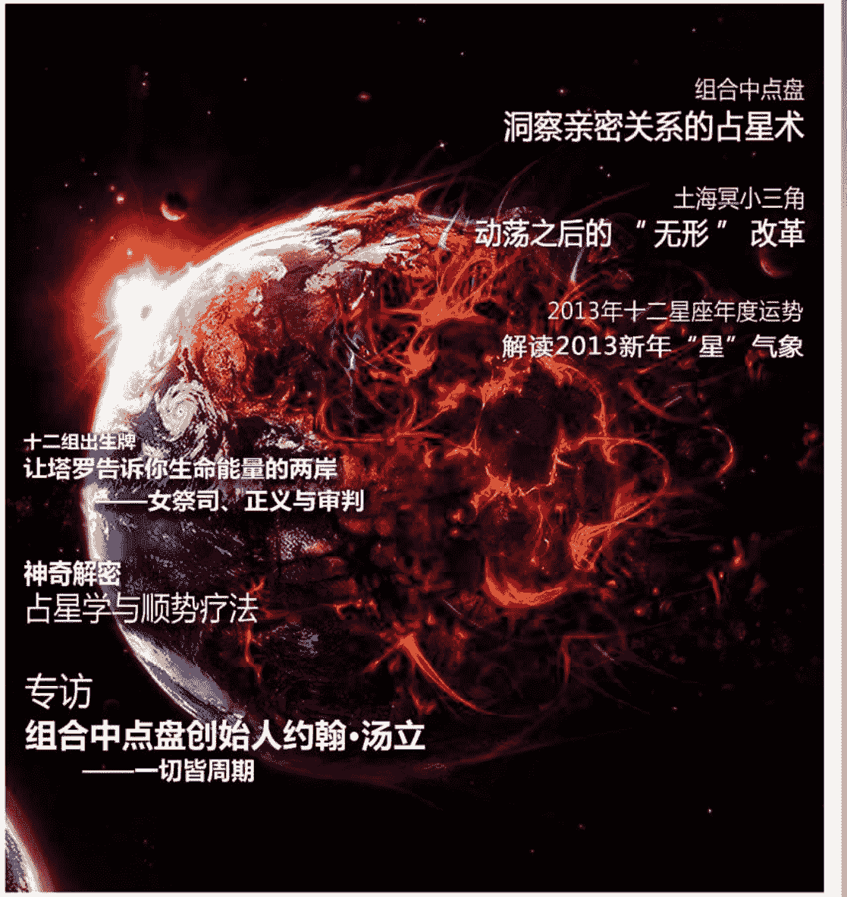

# 组合中点盘：洞察亲密关系的占星术

## 土海冥小三角：动荡之后的“无形”改革

## 2013年十二星座年度运势：解读2013新年“星”气象

## 十二组出生牌：让塔罗告诉你生命能量的两岸——女祭司、正义与审判

## 神奇解密：占星学与顺势疗法

## 专访：组合中点盘创始人约翰·汤立——一切皆周期

# 目 录

名誉主编：苏·汤普金
执行主编：黄纤越
责任编辑、校对：胡乃月
人物编辑：杨华京
翻译编辑：韩小竹、刘瑞颖、刘欣、王思雪、邢祎、叶思晨
美术编辑：夏岭妮
技术支持：吴琨
运营专员：金小贤
推广专员：郭晨迪
营销策划：王玥

首席合作媒体：腾讯星座

官方微博：http://t.qq.com/jastrology
E-mail: astrology_journal@yahoo.com.cn

## 本期主打（1-10）
- 组合中点盘：洞察亲密关系的占星术 1
- 神奇解密：占星学与顺势疗法 7

## 占星之路（11-16）
- 专访组合中点盘创始人约翰·汤立——一切皆周期 11

## 星空记事（17-24）
- 2013年年度星相全面解析 17
- 土海冥小三角：动荡之后的“无形”改革 20
- 2012年世界末日星相大起底 22

## 专题研究（25-41）
- 2013年十二星座年度运势——解读2013新年“星”气象 25
- 心理占星应用：从星盘活出高质量的自我 32
- 十二组出生牌：让塔罗告诉你生命能量的两岸——女祭司、正义与审判 37

## 名家专栏（42-48）
- 12星座“末日”众生相 42
- 2012末日传说知多少 44
- 世界末日之塔罗启示录 46

## 占星教学（49-58）
- 占星基础教程：跟风大学占星系列之四——相位基础 49
- 深入浅出Astrolog32（四）——关系星盘 52

## 古籍重现（59-61）
- 《托勒密占星百句》之一 59

## 新满月播报（62-66）
- 12月13日射手座新月 63
- 12月28日巨蟹座满月 64
- 1月12日摩羯座新月 65
- 1月27日狮子座满月 66

## 占星趣闻（67-68）

本杂志所有翻译内容均来源于《占星学刊》翻译组
本刊文章的网页刊载权独家授权予腾讯星座，未经许可不得转载

# 组合中点盘：洞察亲密关系的占星术

文/约翰·汤立（John Townley） 译/黄纤越 唐雁超 杨文俊

尽管大多数成功的占星学技术都具有很长时间的应用历史，有的甚至可以上溯到古希腊和古巴比伦时代。如果以这些标准来看，组合中点盘只能算是一项全新的技术。它很有可能起源于20世纪20年代的德国，但直到70年代早期被我引入美国之后才开始被真正运用起来。不同于其他大量全新但却经常被质疑的实验性技术，组合盘早已因其精准而卓越的表现而被当时几乎所有的占星师们和他们随后的一代人接纳，成为用来分析人际关系的标准技术。

个人转换至另一个人以及关系亲疏变化等等的关键点。这确实是一个极为关键的、代表阶段性变化的传递点，在此处，一个人（通常在他未察觉时）会通过能量和责任的共同转变将“球”传递给另一个人。这是相互作用的一点，在这个传递点上，一个人会从最根本上将自己托付给另外一人。随着行星运行过境，个人星盘中的太阳节奏将持续跳过，合盘太阳这一能量传递点却持续加强，建立出一种独立的、于这段关系而言独一无二的共同节奏。这点不仅适用于两人的本命太阳，也同样适用于他们星盘中所有其它星体。当你整合了所有这些关键点后，就可以开始描述这一共同构筑的“海岸线”了。

组合中点盘的这一概念非常简单，以至于让我奇怪竟然没有前人想到。一张组合中点盘就是由两人的本命盘中同一行星的中点制成的星盘。组合盘的太阳落位于两张本命盘的太阳之间的中点位置，组合盘的月亮位于两张本命盘的月亮之间的中点位置，然后依此类推……这样就生成了一张新的、由人工生成的星盘，可以用来准确描述两个个体之间的连接：就好像一条“一人在此止步，而另一人又在此起航”的海岸线。与任何一个海岸线相似的是，它可能在某一时段平缓舒展，在另一时段却旋绕险峻，具体状况取决于“天气”是晴朗还是风暴。

这一物理与数学的结合会呈现出可能与它的两个本源个体截然不同的，仅属于自己的新生命。譬如，本命星盘中都发光体（太阳与月亮）之间柔和相位的两个人，却可能会在他们的组合盘中发现相当棘手的日月刑相位——这一困难展现的方式对两人的本命而言都是相当不熟悉的，这会让他们疑惑到底发生了什么。与之相反的情况也有，比如某些人自身在某些领域中充满艰辛，但却可能发现这段关系反而神奇地解放了他们，两个人在一起时比独自一人时可以更好地运作发挥。这才是一段关系切实展示出来的东西，而不仅仅只是个体部分的相加总和。

这种占星学的“天气”指的是行星和发光体（太阳和月亮）的反复运行。而正如现实中的海岸线一般，“天气”会切实地勾勒出两人共有“海岸线”的初始模样。这是一种结合了物理学与数学的现象，通过那些结合了两个个体来构建出组合盘的数字进行描述。例如，我们知道每个人都会经历日常的每天、每月、每年的流年星体相对于本命太阳的流年影响，然后从中得出人生起伏的节奏。组合中点盘中的太阳无疑正是描绘出这些运势节奏如何从一

既然组合盘（也可以延生到关系自身）是由重复的个人周期及他们的相互交换合并创造出来的。两人相处时间越久，组合盘的影响就越会强烈，越会完全发挥，它会先打下根基，然后充分实现自身的动力。随着影响固化，系统性的惯性成长和加强也会日积月累。这将使得好的方面更加可靠，坏的习惯也不断重复，从而形成了一段关系中长久的优势和弱点。由于大多数关系中的优势和问题都倾向于在潜意识层面保有自我，因此也难去控制或者改变。组合盘就成为一个无敌的工具，它能够阐明这关系的运作方式，将其暴露在有意识的发展和成长之下。合盘可能是伴侣双方在建立关系之时应该做的第一件事，因为它是两人未来的模板，可以反映出关系开始时的样子，也可以预言出未来事情将如何演变。随着时间发展，伴侣们应该持续参考组合盘，从而能够对这段关系的发展更具有掌控力，而不是被超出自身理解范围的外在环境挟持。

## 合盘构建和解读

据说有些婚姻或合作关系是注定在一起的，而有些则不是。合盘几乎可以立即确定地指出这一点。运用合盘来开始一段关系可以给予伴侣双方某种此前不可能拥有的控制力，这在某种程度上能够敦促他们改变和修复那些本应避免的问题，并且能够最大化那些他们此前认为理所当然的益处。如果他们愿意承担个体责任，合盘将能够使伴侣们不再受控于演变成奇特第三方的关系本身，而是通过他们共有的优势在这段关系中游刃有余。这实际上是一种相当现代且具有革命性的观念，尤其是当涉及到婚姻关系时。

从数学上来说，通过两张本命盘而构建出组合中点盘非常简单：只要取用两人各自星盘上相同的星体（例如每张本命盘上的太阳），找出它们的中点，就是组合盘中的该星体落点。因此，两张本命盘太阳的中点就是组合盘的太阳，两张本命盘月亮的中点就是组合盘月亮，等等。

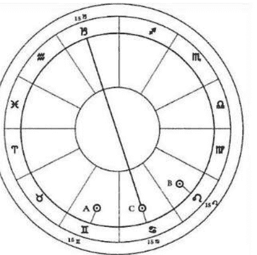

在过去，伴侣双方会被视为婚姻的奴隶，不管婚姻成功与否，都必须依照约定由其主宰双方的人生。但最近的情况已经发生改变：如果没能成功，那就离婚。从本质上看，即使有某些东西还值得拯救，但也还是索性全部抛弃算了。

例如，如果A盘的太阳在双子座15度，B盘的太阳在狮子座15度，组合盘的太阳就会在它们的中点巨蟹座15度，正处于两者之间的等距位置。如果A盘的月亮落在射手座20度，B盘的月亮落在天秤座10度，组合盘的月亮就会落在天蝎座15度。依此类推，直到创造出一张包含了发光体、行星和月交点等全套星体的星盘。然而要记住的是，你需要坚持一致采用近端中点（毕竟，双子座15度和狮子座15度之前的远端中点也可以是摩羯座15度）。

然而在合盘的帮助下，我们有第三条路可走，事情可以以这样的方式呈现：在伴侣双方意识到他们正在与一个强大的、但却由伴侣间的互动所孕育而生的富有操控力的第三方打交道时，这一关于关系的新观念就能允许双方在这段关系中游刃有余，并更多地像独立的个体来共同驾驭这段关系，这样也令双方都可以从中受益。正如合盘本身描述的那些微妙的两者整合力量，合盘技术的使用不仅让关系中的个人可以更深入地从中获得力量，并使他们可以有更有力地控制那些可能早就在不知不觉中否定和放弃的生活。在占星学领域，亦如其它学科一般，知识就是力量：未知的宿命是无知的产物，而命运其实就是你本应早就想到（和应对）却未能做到的“马后炮”。

在此，观察组合盘最本质的要点：合盘并不只是一组中点的集合，而是一组轴线的集合，它们有时有着强大、清晰的关注焦点（当关键的星体在合盘上产生合相时），有时则是显得极端对立的关注点（当关键的星体在盘上对分接近180度冲相时）。

一旦计算出一系列的组合盘行星，你要把它们放置到哪里？建立合盘宫位系统会有一点点复杂，但也可以简化行事。最简单的方法是做出以上升点为起点的合盘宫头。

然而，如果根据原始星盘的纬度，你可能会发现坚持采用近端中点会令上升点或者某些宫位的宫头落到了与原始黄道星座对宫的位置。解决办法是从上升点开始，并按照黄道星座的顺序向前推进，不去管是远端中点还是近端中点。或者，如果你愿意的话，也可以从天顶开始，先计算出合盘天顶的起点位置，然后按照黄道星座的顺序排列下来。

与之相似，如果两张本命盘太阳接近对冲，你会发现水星和金星的近端中点可能会以对冲告终（类似冲相位）。为了保持星盘的连贯性，无论如何，都最好采用最靠近太阳位置的中点。

（可能以上内容都很抽象，因为你很可能通过电脑程序来制作你的合盘，这些问题就都迎刃而解了，但是如果你是手工制作合盘，知道这些内容就变得很重要了。）

然后，只要简单地将你的合盘行星插入到你的合盘宫位，就会得出你的组合盘。这里我们以辛纳蒙（Cinnamon）和凯文（Calvin）的星盘为例：

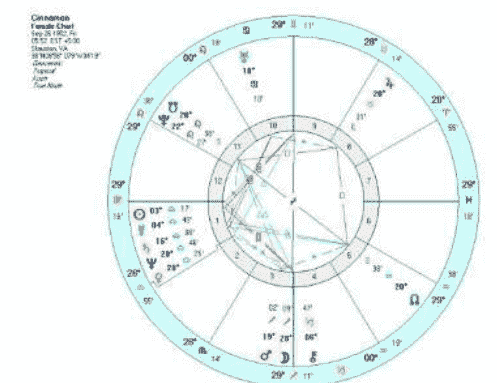

辛纳蒙（下文简称“辛”）的上升点落在处女座29度17分，凯文（下文简称“凯”）的上升点落在巨蟹座25度32分。因此合盘的上升点就落在狮子座27度25分，或者两者之间的中点。接下来，你需要计算剩余的两人后天宫位宫头的中点，然后就能够得出用来放置合盘行星的合盘宫位图。合盘太阳是Cinnamon太阳（天秤3度17分）和Calvin太阳（双子5度57分）的中点，或者说狮子座4度37分。将其放入到星盘宫位图中，你会发现合盘太阳位于合盘的第12宫。依此类推，绘制月亮、其余行星和交点。你的电脑可以给出每个位置的精确度数，但是如果你是手工制作，简便起见可以四舍五入到半度。

所以，现在你得到一张全新的星盘，与原来的两个本命盘完全不同。它是什么呢，它真正会告诉你关于辛和凯之间关系的哪些内容呢？在考量这个星盘时，你第一件要做的事情是什么呢？

实际上，你应该做的第一件事也许仅仅是将它放到一边，转而察看两张本命盘，这才是你在开始合盘时就应该做完的事情。传统的配对盘（星盘比较）在千百年来一直为占星师们所运用，所以我们首先要查看配对盘中有什么内容，暗藏着哪些问题。

传统的配对盘会使事情变得相当复杂——要观察一方的各个行星落入另一方的各个宫位，还有每张本命盘中每颗行星之间形成的所有相位——但是我们并不需要把问题复杂化。简单的概览就已足够，我们只需选取最强力和最明显的问题，譬如比较盘中双方星体的合相。这些合相问题在配对盘中是最为重要的，因为它们最能引领人们的聚散离合。举个例子，一方的太阳与另一方的月亮呈合相通常被认为是一个经典的婚姻互动——为什么？因为这意味着当一方的太阳被流年行星触及及时，另一方的月亮也是一样；一方太阳的太阳运行周期会将其影响力带给另一方的月亮，反之亦然。类似的连锁事件会同时发生在双方身上，也正因如此，事件带来的能量流动会从内到外逐渐将双方推到一起。

令人伤感的是，即使有这些相位也并不意味着两个人必定会在一起，除非他们因同一主题在同样状况下走向终点。如果你从更大的范围中挑出那些与你长时间打交道的所有朋友和熟人，你会发现他们本命盘中的行星大多数都落在几个特定的黄道度数上——而且你会发现这些度数也是你个人的本命盘中的行星所占据的。占星师们也会经常在他们的咨询人本命盘中发现这种情况，也被称之为“吸引力效果”。通俗地来说就是“人以群分”的法则。实际上，这是一个很少被用到却很有用的命盘校正工具。

当然，分到一类里并不意味着就能走到一起，我们在组合中点盘中可以找到更明显的线索。

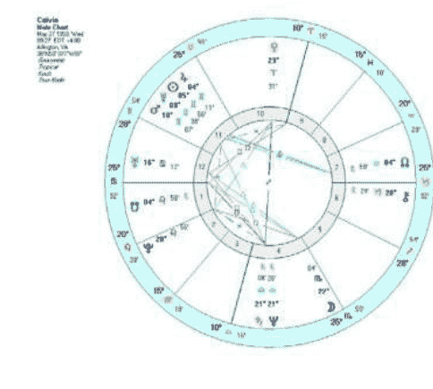

观察Cin和Cal的配对盘，两人星盘相互重叠的区域非常的明显。男方的金星及土星海王星轴线与女方的金星土星海王星群星合相相合，女方的南交点和冥王星合相与男方的冥王星合相（冥王星因时代相近而合相，而南北交点则不是这样），天王星也因时代原因而处于相似的位置。还有很多其他的更微妙、更引人注意的合相。女方的太阳水星合相以及土星非常接近男方的天底位置，而日水合相与土星的中点也恰好是男方的天底。男方的月亮恰好也处于女方星盘中金星与火星的中点处，女方的木星则处于男方星盘中金星与火星的中点处。

传统合盘会简单粗暴地将这些组合解释为“令人沮丧的欲望和幻想”（土星、金星、海王星），并触发“膨胀的性和情感的表达”（木星、金星火星合相、月亮）。听起来就像是一场脱胎于压抑而后过度放纵的激烈性爱。事实诚如所示，解释虽然粗糙，但是却很准确。在整段关系中，性是最重要的焦点，双方在经历了长期无奈的独身生活后终于爆发，连续数月全身心地投入帐内春情。

其实这还不错，实际上应该说是很棒。但是还有什么其它的吗？冥王星与南交点的合相可能有话要说。大多数时候，由于是辛的南交点合相冥王而Cal的南交点却没有，所以辛会带有她那个年代的人特有的冥王式问题，她可能也需要避免这些问题。而且，辛的太阳水星土星紧密合相凯的天底，这可能会让她在家里对凯有点固执和限制。但是再说一次，在不考虑凯本命盘需求的情况下，这可能也正是凯所需要的，尤其是凯的天蝎座月亮和巨蟹座上升弥补了辛本命盘中缺乏水相元素的问题……当然，我们并不能以此判断这段关系到底是一夜情（或者“一月情”）还是一段长期的热烈关系。很明显，经典的婚姻征象例如日、月、上升和宿命点交互影响，在他们的配对盘中却不见其踪；争执的征象却很明显，例如双方的火星、月亮、天王星以及土星的影响力相互交错。

当然，我们能够、也应当简单地观察一下本命盘中的潜在因素，来看这段关系是否会半途而废。双方看起来是能够以积极的态度来面对这些摩擦呢，还是更倾向于坚持两人各自独立的习惯而选择消极的道路去处理？本命盘是观察这些事情的基础，而且也很少会让我们失望。

在本命盘中寻找线索也分为几个层次。一个是世代层次，外行星和中层行星在某个时代内的整体模式足以描述许多事情。20世纪50年代早期，土星参与到天海刑相位中，引发了各种令人不快的问题，比如关于如何界定理想和现实、探求和幻想；这使得50年代出生的这一代人从阿尔伯特猜想期（Alpert-Leary）的早期心灵探索药物试验转变为普遍的药物滥用。他们是自此前本命盘天海拱后，被天海刑塑造的一代人。这一时代相位会以一种与此前相似的方式影响人与人之间的关系。但从轻松的天海拱时代转变成为严苛的天海刑，也会使得后者对情感关系主题的要求更高，但是道路也更模糊。因此，这一对伴侣会接受到时代性的挑战影响，尤其是当个人行星也参与其中的时候，影响更大——在这个例子中，两人本命盘中的金星都参与其中。因而我们可以总结出：两人可能都有关于欲望、金钱、普遍欲求的问题，包括起初对欲望的困惑，以及欲望被抑制后感到的沮丧。还有一点，这两人都受到冥王星的折磨，辛的冥王星合相南交点刑木星；凯的冥王星刑月亮，这两个刑相位都有双方的金星与火星参与其中。而且这两个盘之间重要的关联也代表了两人本身的一些关键问题，配对盘其实没有真的显示出新的东西。当他们两人走到一起时，他们能够定下心来解决这些问题吗，还是说只是加剧了他们的冲突？

这就是组合中点盘所能够发挥优势的地方了——至少可以同时通过本命分析和流年分析，尽可能地作出更多的解读。这是非常棒的一个方法，而且始终是既简单又精确的“模范”。并非所有的占星术都拥有组合中点盘这样的优势！

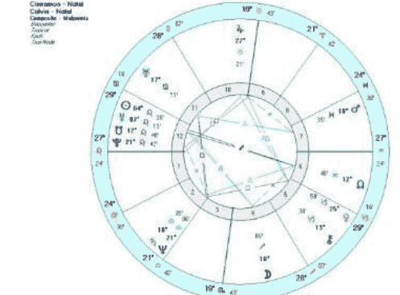

回到双方的组合中点盘，首先第一点，太阳落12宫，这会将两人的关注点放到隐私、秘密、心理层，甚至潜在的麻烦层面。相应的，这段始于工作伙伴之间的秘密恋情，因为工作中的合作而擦出火花。合盘太阳拱相4宫（家庭）内的月亮，这是他们能够欢笑（射手座）和逃离的地方，这很棒；而且太阳位于宿命点的轴线上使得关系看起来的确是命中注定的；再有，现在组合盘也弥补了四相元素的不平衡，这种情况意味着各自本命盘中缺乏的元素也被对方弥补了；合盘金火弱六合，性事连绵，谁还能要求更多呢？

好了，看起来，以上这些基本就是辛和凯所处的境地了，不管从哪种占星学方法看，都没有任何有利点。在几个月的激情之后，凯辞去了他的工作，两人在1986年6月7日结婚了（过运土星正在离开陷位射手座前的最后一次逆行中远离组合中点盘中的月亮），一切看起来很美好。他们结婚了，若不在天堂，便一定在床上。

然而这样的局面被改变了，12宫内的太阳带来的滋生秘密事件的能量是如此激烈，它相当快地开始聚焦于之前被激情掩盖的潜在心理问题上。同样，其他一些更负面的相位实际上也起到了推波助澜的作用（或者看起来是这样）。那些他们两人秘密与世界抗争的事情，现在成为他们相互对抗的原因了。譬如10宫内的木星与12宫内的冥王星相刑会成为隐藏内在发展的堡垒。然而一旦这些秘密公开，就会演变成因为“日后该如何谋生”的分歧而不断升级的冲突。合盘木星（以及辛的本命木星）成为辛全力工作而凯却无所事事时的唯一支撑，带给双方压力，却又无处可逃。诡谲、令人迷惑的（虽然也同样带来两性引力）金星、天王星与土海合相的刑相位在起初时会让沉浸于爱河中的双方被表面的光环所迷惑，但是当要面对真实的世界时，这股力量便会转化为纷乱的欲望和不切实际的理想。双鱼座火星和天秤座土星的梅花相位也开始带来凯酗酒的问题，并因为内外双重境况都持续无力而愈演愈烈。男方的上升点本身就刑克了本命海王星和组合中点盘中本已备受折磨的金星，凸显了凯在这段关系中的施害者身份。

很快，从配对盘来看情况也够呛的这一对儿，把更加明确且相当惨烈的组合中点盘分毫不差地变成了现实。而且不仅在形式上成真，也正如预期中的两种不同生活情况下——隐藏与公开，把一种状况下的好事变成了另一种状况下的问题。

此外，随着时间的推移，两张本命盘中一些积极的相位也在不断地被组合中点盘中更强大的消极相位侵蚀。简而言之，两个本来相当快乐的人在结婚了之后反而互相拖累，日常生活给他们的生命投下越来越浓重的阴影。

最终，凯声称自己在离家几千英里外的地方找到了工作，还说自己会从那寄钱贴补家用，让婚姻从经济上得以维系。但实际上，他只是带着一点钱离开了家找到了一个安全的地方继续酗酒，直到他发现辛已经受够了并向他提出离婚之前都没有回过家。

组合中点盘在这里也证实了这段婚姻的终结，他们于1991年4月离婚，彼时流年木星与土星的冲相位正好加诸在了组合盘中宿命点与太阳的冲相位上，流年冥王星准确合相天底，伴随着月食吞噬水星。短短五年，这场始于浪漫性爱的关系就使得两位迷人善良的人从年轻的爱情幻梦跌落到了捉襟见肘酗酒度日的现实生活，最终又以苦涩、怨怼和彻底的破灭收场。

## 利与弊

尽管对于刚接触组合盘的人来说，这个案例有点过于压抑，但是它彰显了组合盘技术最突出的优势。首先，对于一段关系来说，组合中点盘是一种于人际关系而言有效精准的独立星盘；其次，组合中点盘和本命盘一样都会和流年相互呼应（但并不适用于次限法，因为次限星体变动太快而效果难以强化凸显）；最后，所有组合盘都有着展现这个迷人特点的能力——组合盘的影响力会随着时间增强，甚至成为可以主导两人各自本命盘的要点。

然而，辛和凯的组合盘同样能够从一些古老的智慧中找到依据，譬如“好的开始是成功的一半”。倘若一段关系能有一个良好的开端，并且越来越好，那么即使过程有起有伏，它也更容易一直保持下去。倘若一段关系在刚开始的时候就表现得好像一艘将沉的船，那么提前准备一场大修，或是准备在船只沉没之前登上一艘航行的救生船等诸如此类的准备就非常重要了。惯性并非是静止的，而是一种不断增强的力量，至少在人类事务中如此。你越习惯于“固定程序”，就越难改变或者逃离它。

这种“惯性”利弊两分。一个强力的组合盘能够弥补个人盘中的许多不足，而这些被弥补的方面则能够鼓励两人从迷茫走向巨大成功。相似的，随着时间过去，组合盘中受惠更多的一方会因为得到有益力量的不断加强而使他从一个局外人转变成为整段关系中的主导者，反之亦然。而且，对大众而言，想要解释为什么这个神秘的“东西”可以使整体变得多于且还不同于单独部分相加的总和也并不容易。它也许会呈现出“引力的中心”的样子，让一段关系围绕其旋转，而随之而来发生的事件就好像建造房屋所需的基石，参与者也最终得以在逐渐繁盛的景观中泰然处之。

## 总结

总而言之，组合盘会给出不同的、动态变化的关系分析，与传统配对盘描绘两人之间将如何相处的方法相辅相成。因为它（组合中点盘）不是先看一个人再看另一个人，而是观察两人在相互影响下随着时间变迁所必须的进展，这些进展经常是在幽灵般的“第三方”影响下的结果。看起来就像是数字魔法，但却又如此真实。时光的流转给星盘带来流年的沉淀，关系重点也会在两个星盘之中来回转变，直到从纯粹的事件影响转变成为共同的期望和习惯，让惯性描绘出这段关系自身的特点。

的确，合盘也可能是个人的本命盘展现自身个性的方式，也许不是对早已成形的性格的描述，而是真正的基础人格。在此基础上，从童年时开始乃至贯穿你一生的行星反复过运都会不断在此基础上施加影响。也许我们的星盘也并不是一张仅有我们自己的图画，而是一张决定重复经验会如何塑造个人性格的模板。随着时间流逝（一旦我们明白了它们），我们也许会选择接受、逃避或者是任其摆布。

更多关于乔治·汤立的内容请点击：
http://www.astrococktail.com/john.html
书籍：http://www.astrococktail.com/books.html
占星：http://www.astrococktail.com/articles.html
音乐：http://www.astrococktail.com/music.html

## 约翰·汤立（John Townley）

知名跨界占星大师，组合中点盘和行星动态学的创始人。他著有《月亮返照（Lunar Return）》、《组合中点盘（Composite Charts）》、《动态占星术（Dynamic Astrology）》以及《在爱中的行星（Planets In Love）》等畅销专业占星著作。他是一名占星师，同时还是音乐家、作者、知名记者和思想家，擅长用超出常人的见识和思想深入占星学核心，创造出业内颇受赞誉的组合中点盘和行星动态学技术，是一位独一无二的当代占星开创大师。他不仅在占星学界屡创佳绩，在其它领域也获得多个国际级嘉奖。近年来，他把更多精力投向周期研究领域，并与妻子苏珊共同创建了占星网站 AstroCocktail，专门介绍占星内省及敏锐内心。

## 神奇解密：占星学与顺势疗法

文/苏·汤普金（Sue Tompkins） 译/吴琨 黄纤越

长期以来，传统占星学都与古典医疗结合在一起。但由于时代原因，一些传统方法已经鲜少为大众所知。而在本文中，我将向大家展示占星学的整体观哲学，并将聚焦于顺势疗法（homeopathic philosophy）其中的分支之一，通过展示几个实际案例和简论本命星盘让大家对神奇的“以形补形”疗法是如何运作的有所了解。

从根本上而言，顺势疗法就是一套基于“以形补形”理念上的药物（疗法）系统，其理论基础是：如果一种成分的原生状态会使健康人产生与某种病症相似的一系列症状，那么这种病症就可以被该种成分制成的药剂治愈。

顺势疗法的药物可以由多种不同的物品制成：植物、矿物、动物甚至病变物质都是常见原料。因为这些原料的用量极少（少到甚至难以被科学方法检测出来），所以那些即便在原生状态下含有毒性的植物或其它物质同样可以被安全的使用。当使用动物做原料时，一只自然死亡的蜜蜂可以做出足够全球几代人使用的 Apis 药物。制作这类药物是一项极其复杂的工艺，但是简单来说，就是原料会被大量稀释，然后再通过摇晃或是研磨，萃取其中的治疗功效。稀释和摇晃的程度取决于药物的效力（强度）；药物的功效越强大就越需要更多的稀释和更长时间的摇晃或研磨。即便最早的成分早已没有任何一个分子留在效力低微的成药中，药物却依然管用。以现代物理学的角度来看，顺势疗法使用的药物中真正保留下来的其实是某种结构、精华，甚至原始成分的“记忆”。这是一种被认为具有治疗效果的精华。正规的医学手段认为药物是需要通过被称为“证明”的实验过程，然后再临床试验论证。在“证明”的过程中，药物会被分配给那些并不了解药物效果的健康个人。这些个体会在服药后反馈他们感觉到的变化，他们也许会报告他们的行为、新的症状或是他们的梦境，基本上他们会反馈出任何他们发生的变化。这一过程需要被重复数次以测试药物的效力。现在有几百种常见的处方药物，但是却有几千种顺势疗法的药物在使用中，并且更多的正在被发现和使用中。

被誉为西方医学奠基人的古希腊名医希波克拉底(公元前 460 年——公元前 370 年）无疑也是一名占星师，据说他会常规性地为自己的病人绘制疾运盘（decumbiture）。“以形补形”（Like must be treated with like）的名言也是出自希波克拉底之口，虽然在他数世纪之前的希腊和印度也有其他人说过此类的话。

“以形补形”法则的实例比比皆是。比如巴拉赛尔苏斯（Paracelsus）认为核桃对大脑有影响，因为它看起来很像大脑。许多黄色的植物有益肝脏，就像当一个人太过怯弱时，英国人也喜欢用“百合肝（lily livered）”和“黄色”来形容他一般。切开时会让人流泪的洋葱，也会在顺势疗法中被用于治疗同样产生流泪症状的过敏性鼻炎。

身为占星师，我们倾向于认为天上星体的走势就好像一面“镜子”映射出地球上发生的事。我们或许会说星盘就是一张地图或是一面能够映射出能量或时事走势情况的镜子。占星师的职责就是举起这面镜子，让咨客可以更清楚地看清状况，从而做出更合适的选择，最起码能够更好地掌握真实的情况。以此为例，占星咨询师也同样是在“以物治物”（以毒攻毒）。在我看来，占星师用的也是顺势疗法。

占星学的基础概念之一是认为宇宙是一个包括了所有独立个体的整体。与“独立及整体”概念相似的，是微观世界和宏观世界。正如谚语所说的“上行，下效，存乎中，形于外 (As Above, So Below, As Below, So Above. One might add, As Within, So Without.)”，也就是说：在天，如在地；既在物质层面，又存于精神层面；既在身，也在灵；照己映彼。把所有的这些总结起来便是：在宇宙中（宏观世界）所有发生的、显现的，都会反映在每一个个体中（微观世界）。因此，人类身体中包含了所有的物质——所有的植物、动物、矿物乃至星体。正如已经被科学证实的——所有自然界的东西最终都可以被分解为118种元素周期表中的元素。查尔斯·卡特 (Charles Carter) [1] 在1928年就曾这样写到：“每一种生命都可以被占星学归类。” 对于我来说，这意味着所有的植物、动物、地质、地理和其它自然界所有的东西都可在星盘中体现出来，并且不需要考虑彗星或是柯伊伯带中的星体，尽管它们可以提供额外的信息。以我自己的方法，基于我对事物的观测，会把鸟类分配到水瓶座，但是在细化子类或是子类的子类时，又会把红襟鸟归为白羊座，家禽列为巨蟹座，天鹅放在狮子座，麻雀划为处女座，捕猎鸟类分给天蝎座等等。这种子类分配的方法与印度占星学家用的方法类似。或许这种子类分配的方法在西洋占星系统中并不通用，就好像水瓶座虽然掌管了普通的鸟类，但是天鹅可能就是专属于狮子座。无论怎样，以我的经验而言，在星盘中很容易发现不同的动物、植物，或是看出一个人更喜欢居住在法国、西班牙、廷巴克图或是澳大利亚（假设这个人知道这些地方的环境），即使并没有使用地理占星术。

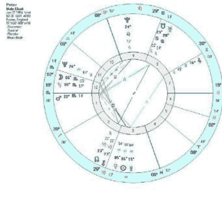

下文我将向大家分享一个曾经经历过的典型案例，让大家可以更好地理解顺势疗法与占星学的联系。

1998年时，42岁的彼得在一次例行医疗检查中被发现患有先天性心脏瓣膜缺损。他曾在幼年患过支气管肺炎及成年后的肺萎缩，这两种病症都和之前未查出的心脏瓣膜缺损有关。贯穿他的生活的真正症状是呼吸困难。这一症状在1998年的时候虽然并不严重，但是已经可以察觉得到，而后在2000年我第一次见他的时候变得越发得严重。彼得从未做过运动员，也不喜欢运动，尽管他非常喜欢以围观者的心态观赏体育节目。虽然彼得身体机能不如其他男孩的，但是他从未认为这是一个非常严重的问题，而其他人也同样未予以重视。

在将近五十年的人生中，压力以及（不可避免的）悲伤已经把彼得折磨得够呛。在2000年春天我们第一次见面的时候，他已经有了主动脉瓣反流和高血压的问题，并且完全无法深呼吸，健康状况相当糟糕。医生认为他必须尽快接受心脏搭桥手术。

彼得有一段非常稳定的婚姻和一个年幼的女儿，并且非常热爱他的航空管制员工作。在担忧自己的健康状况及可能给家庭带来负担的同时，他也同样担心自己会失去这份不错的工作和收入。彼得一点都不了解顺势疗法，对此也毫无看法。他抱着“死马当活马医”的态度，并且想让一直劝说他尝试一下顺势疗法的姐姐简（我的一位朋友）得到些许安慰。正巧，我当时正好去简的家里做客，他弟弟就住在附近。然后我就在彼得的客厅跟他做了“咨询”。在与彼得的交谈中，我感觉自己并未得到什么有用的信息。当我从他家离开时觉得一点头绪都没有。关于彼得，我最大的收获是发现他是一位患有恐高症的航空管制员。当我问及他的梦境时，他说最喜欢梦到自己在飞行。我感觉这点非常重要。他还告诉我，其它的健康问题只有反复出现的面部皮疹，这些会在后面做讲解。

彼得的星盘被水瓶座与天蝎座之间的刑相位主导，以致于可以暂时把星盘其它元素暂时忽略。他的火星与上升点相合在天蝎座，或许可以这样：他进入了一个充满竞争或是感觉受到攻击的世界，所以不得不做好防御。强烈的天蝎座元素会让他极度渴望保护自己的隐私。火星和上升点的合相又与冥王星紧密相刑，强化了他总认为自己危在旦夕的情绪。他很容易感到自己受到威胁。冥王星落到了代表心脏的狮子座，而他也正是因为心脏原因而引发了生存议题（还是以冥王星的方式隐藏了这么多年）。“适者生存”这一主题对于所有生物来说都管用，不过“竞争”这一主题在动物界却尤其突出，而落在上升点的火星刑冥王星这一相位给出了以下线索：解药应当来自动物界。或许，一只轻易受到威胁的动物，最终也会让其它动物感到危险。

现在回到彼得的呼吸问题，三颗个人行星落在水瓶座描述出一个非常想要足够空间去“呼吸”的人。而来自天蝎座的、尤其是土星的刑相，喻示着窒息的感觉。也许你会认为（因为刑相位涉及了金星和月亮的位置）他会感到女性让他窒息。无疑，他强烈的责任感和恐惧感会限制他真正想做的事情，所以他会觉得呼吸困难。蛇类药物经常出现在治疗心脏的药单中，是因为窒息感也是心脏病症中普遍出现的症状，而许多蛇类都是以窒息的方式来杀死猎物的。

让我们继续用最简单的占星学原理查看：我们把太阳与心脏联系起来，那么狮子座与水瓶座这样的轴线就对应了心血管循环系统。这里需要注意的是，彼得的太阳与金星合相刑土星，意味着他会在不同的情况下经历心功能不足的状况，而土星也是他的三颗落在水瓶座的个人行星的传统守护星。并且，更重要的是，他的星盘中拥有太阳与土星、月亮与土星、以及金星与土星的紧密相位。这些相位说明了他需要一切尽在掌握之中，同时也尽职尽责，甚至会觉得自己需要为所有事情负责，却又可能不具备必需的信心（或强壮的身体）去承担这些责任。土星落在天蝎座，他需要负责防范危机，而太阳和月亮的介入也许意味着需要承担来自父母的责任（他们的健康已经恶化）。这么重大的责任在他的身上，也就不难理解为什么他必须感觉一切尽在掌握。而在水瓶座的群星，又显示了他想要拥有自己的空间和自由，这与他的责任感又无法相容。作为一名航空管制员，他每天都要为他人的安全承担巨大责任，而他的工作实质上也正是防止危机的发生。

印度非常著名的顺势疗法大师拉加·山克兰（Rajan Sankaran）[2]曾这样描述娜迦（Naja）（以印度眼镜蛇的毒液制成）：“娜迦（Naja）具有其它常见的蛇类药物的特质——游走、引人注意的声响、攻击他人、毒素和妒忌、感觉对方意愿等等。而它的特殊性在于它具有责任意识。”

眼镜蛇在印度既被人被当成神抵一样的供奉着，又因为是可致命的毒蛇而让人恐惧和屠杀。我发现娜迦族的人们总是威胁要罢工，但是通常又不会这么做，除非真是特别极端的情况。这与眼镜蛇的习性相似，近距时，它们总是高抬着头，但是如果它们没有被打扰到，就不会做出什么样的反应。

能够治愈彼得的是“娜迦（Naja）”：印度眼镜蛇。这不是一种日常常见的药物，但却经常意外出现在心脏瓣膜患者的处方上。这里提到的“治愈”并非是说他的心脏瓣膜可以得到替换，或者是他能够像其他正常人一样不再受到这种先天性疾病的困扰。但在用药几周之后，他的身体状况的确恢复很多，也不再需要做手术了。即使是在十年之后的现在，他也只需要接受定期观察。他的医生们都对他的好转感到非常困惑，各个都认为其他之前的医生夸大了他的症状。彼得的呼吸和睡眠问题都有了很大的好转，也不再那么焦虑。同时他也在短期内对自己更有信心，工作饭碗也更加地保险。他在之后继续做了好几年的航空管制员，然后转向航空管制教育方面的工作，并为此感到非常高兴。

可能会有人说，这恰恰就像星盘中拥有火星与冥王星相位的人做出的行为——对他们来说，暴力是他们的禁忌。而对于火冥刑落入天蝎座与狮子座的人来说，暴力是挑战他们的尊严。当彼得被问到他害怕什么时，他说：“我不喜欢陷入一种需要通过争吵才能表述自己观点的情形。”

彼得很瘦，但是却跟我说他曾经一度很胖。在他年轻时还是使用英石作为计量单位，17岁时他就已经重达17英石（大概238磅）。他的姐姐说他有一点厌食症，而他却认为自己只是能够控制好饮食，因为可以很容易地催吐自己。当我问到他是怎样控制了自己的体重让自己瘦下来时，他说自己会先禁食一周，然后开始一个长期的间断性禁食。这当然与蛇类的习性很像。蛇类不需要经常进食，但是一旦它们进食，却能够让自己膨胀到与食物同样的体积！

彼得害怕高度，但是却喜欢飞行的梦境，就好像许多蛇类，眼镜蛇的主要天敌（除人类以外）就是鸟类。如果我们以动物王国的角度去看待十二星座，我会把蛇归到天蝎座，把鸟归到水瓶座。彼得的星盘可以被看成是水瓶座 vs 天蝎座，就如同鸟类 vs 蛇类。对于蛇类来说，飞行是鸟类巨大的优势。做为航空管制员，彼得控制了天空中的“大鸟”！有趣的是，娜迦也是治疗“飞翔梦境”症状常用的几种药物中之一——这也是最先让我想到这种药物的原因。他喜欢飞翔的梦境也许就象征着渴望被仰视和来到没有天敌的地方（鸟类没有天敌，除了某些鸟类）。

面部皮肤非常干燥，从发际线那里就有脱皮，眉毛和鼻子两边也有这种情况，就像是眼镜蛇的形状。他表示那些地方的皮肤时常会泛红干痒。与皮肤相关的星体（土星）落在天蝎座（蛇），金星的介入也许意味着他会受到照顾，就如药物完全治好了他如湿疹一般的皮肤问题。

于是你会一点都不奇怪地发现彼得喜欢“持续性炎热气候”（日复一日一成不变的炎热天晴），并且热爱摇滚乐。你也会发现一件很有趣的事情，那就是蛇类虽然是冷血动物，但也总喜欢在岩石（“岩石（rock）”对应“摇滚音乐（rock music）”）上晒太阳。有人也会注意到天蝎座和水瓶座元素混合的人性格都相对冷淡。当然了，有心脏问题的人也总是容易感觉到冷。

最后，也为了让整个案例更加完整，再补充一些关于彼得的其它经历：彼得还在孩童时期时就养过蛇，并且曾把受伤的鸟儿带回家。有趣的是，他的姐姐很害怕鸟（水瓶座群星恰好落在了他的第三宫，即兄弟姐妹宫）。我该说一下他还在客厅养了一只沙鼠做宠物吗？以中国的属相划分，彼得恰巧还是属蛇的！

山克兰大师认为如果从面部外貌来判断那些需要娜迦的人，常常会发现他们的面部与眼镜蛇的头部相似，有时候戴眼镜也会带来类似的效果。在彼得的情况中，他的

> 注释：
> [1] 查尔斯·卡特（CARTER, C.E.O.），《十二星座与灵魂（The Zodiac and the Soul）》，通灵出版屋（Theosophical Publishing House），1968 版；
> [2] 拉加·山克兰（Rajan SANKARAN），《灵魂治愈法（The Soul of Remedies）》，顺势疗法医疗出版社（Homocopathic Medical Publishers），1997 版。

## 苏·汤普金（Sue Tompkins）

苏·汤普金女士从 1972 年正式跨入占星学领域后至今已经整整 40 年。自 1981 年获得占星学正式执业资格以来，苏在占星学方面可谓硕果累累，客户数以千计，学生不计其数。她曾经在英国占星学院（FAS）执教多年，并于 2000 年创建了在占星学界内举足轻重的伦敦占星学院（LSA）。苏讲学的足迹遍布世界各地，她为占星学领域做出的成绩更是得到了全世界占星学界的普遍认可，并因在占星学方面的突出贡献获得了占星学界的最高荣誉之一——英国占星协会（UK Astrological Association）颁发的查尔斯-哈维奖项（Charls Harvey award）。但令她最受赞誉的还是其著作《占星相位（Aspects in Astrology）》和《当代占星研究（the Contemporary Astrologer's Handbook）》。这两本书都已经或是即将在中国大陆与台湾地区出版发行。《当代占星研究》更是成为中国大陆出版的第一本严谨占星类教本，受到执业占星师与占星爱好者的广泛好评。她于 1996 年还正式获得了注册顺势疗法理疗师的执业资格。目前，她致力于研究医疗占星学并身兼其他各种头衔的工作，也在持续不断地为追求一个整体的、心理的并有实际功用的占星学而努力。

个人网站：www.suetompkins.com

# 专访组合中点盘创始人约翰·汤立：
一切皆周期

采访/黄纤越 翻译/杨华京 王思雪 刘瑞颖

约翰是一位有着多重背景的占星大师，他不仅是著名占星合盘技术——组合中点盘的创立人，同时还是音乐制作人，他（几乎是单枪匹马地）自己设计建造了他自己在纽约和旧金山的多轨录音工作室(门徒(Apostolic))，改变了现代音乐录音的面貌。不仅如此，约翰还是海洋歌曲家与表演家——他还是一位作家、思想家和家庭妇男等等。约翰早期的音乐生涯，曾是民谣摇滚乐队魔术师的成员(与加里·邦纳（Garry Bonner）、阿兰·戈登（Alan Gordon）和杰克·雅各布斯（Jake Jacobs）一起)，他们唱的“来哭吧（Invitation to Cry）”后来收录在莱尼凯的60年代经典合辑《掘金》中。近年来，约翰和他的妻子苏珊共同创建了占星网站 AstroCocktail，专门介绍占星内省及敏锐内心。

星盘到行星与生命周期不一而足。很明显，您对周期这个话题有很多话要说。您是怎么对它们产生兴趣的，又是什么使您乐此不疲呢？

**约翰·汤立**：从一开始，当占星学与其它学科相联系时我就感兴趣了。周期和周期分析与许多领域的研究相关，包括气象、生物、医学以及历史。所以这是关注物质是如何构成的中心领域，这其中包括了占星学。当我第一次读戴弗（Devore）《占星百科全书（1947）》中查尔斯·杰恩（Charles Jayne）关于周期的那部分内容时，它触动了我的心弦，随后向查尔斯（Charles）学习并和他一起工作的过程又进一步引起了我的共鸣。在那之后，对占星学难以捉摸的基础的追求让我回归了结构周期。

**占星学刊**：您最近在忙些什么呢？有什么即将举行的系列讲座、新书或是报告与大家分享的吗？

**约翰·汤立**：最近我过得不错，在网络世界中做记者写媒体技术方面的文章。自从《组合中点盘（Composite Charts）》一书出版，我的工作重心又将重回占星上来，附带音乐和历史（我同时还有一张全新的历史海洋音乐CD面世），这也是另一种重复步骤周期。我会整理一些之前写好的占星报告，最后要完成一篇长周期分析项目报告，也可能写一些关于月亮回归的文章之类——其中大部分都是结合占星软件的创作，我很高兴参与其中。

**占星学刊**：由于我们对学科的兴趣的起因往往包括了我们如何学习它，您可能已经回答过这个问题，可是您是如何学习了那么多关于周期的知识？您的学习过程是怎样的？

**约翰·汤立**：这是个周期性过程。我还有其它一些的职业追求：音乐、历史和科技，我在这些职业的发展中似乎有些循环。当我在各方面都有提升时，它会为下一个职业发展提供新的推动力——这就是连续的周期。所以说这包含了周期。

**占星学刊**：在简略浏览过各大占星书籍销售网站之后，发现您至少写过7本关于占星的书，写作内容从关系

**占星学刊**：您参与其它项目如新闻、音乐和技术是如何影响您的占星工作的？

**约翰·汤立**：这些工作其实都是一体的并相互影响。比如，我在写星座解读，不管是在阐述如何以及为什么如此运作都将技术经验带到前台时，记者身份与音乐背景就近在咫尺。同样，当我在写有关技术的文章时，星座周期通常都是洞察那个领域的金钥匙，其实它们与音乐品味处在同一个周期世界。每一种都支持并丰富另一种，并可能能为整体加分。

**占星学刊**：自从您开始写作，占星界更有序地发展着，涌现了更多相关书籍，社会也会用新的专业标准看待占星学。对于占星群体何去何从您有什么想法？源自哪里？您认为开始涉猎占星学的人群中有健康向上的年轻人吗？如果没有的话，您认为为此需要做些什么？

**占星学刊**：我一直试图去发现我们这个团体中的名人如何到达今日的成就，就此我准备了关于这个的一系列问题。您是怎么开始学习占星学的呢？告诉我成为一个占星家的旅程，以及您是如何成为一名专业的占星家和老师的？最初是哪些占星家启发了您？又有哪些占星家的作品让您至今仍觉得兴奋和受鼓舞？

**约翰·汤立**：自从 20 世纪 70 年代的大复兴以来，我见证了占星学的成长与分裂。有利的一面是它的起源和历史发展得到了更好的关注；不利的一面是在于其过于迎合大众市场，这意味着内容必须浅显，乃至流于肤浅。这种现象甚至发生在了堪称佼佼者的占星家身上，而某部分更是成为无底线的夸夸其谈。为保持专业标准做出的努力大部分是无效的，因为这些标准基于大量相互冲突且还没有被物理标准以及一些社科偏好统一的传统。如果对使其运转的原理没有达成共识（如果它确实存在），对于与其随之而来的相应事情你可能会无能为力。自文艺复兴以来，现代思想大多依赖于基础理论，并完善或者质疑它们。这就好像建造轮船，你可以按图纸实施，也可以原始地只用眼看。维京造船者就用眼造了一些很美的船舶，只用拇指控制即可，不过如果要造游轮或者飞机就不能用这个方法了。占星很大程度上仍停留在“维京”的水平上，带来所有好的和坏的暗示。你可以像前人一样凭直觉发现新大陆，但是却不能一直用这个方法纵横江湖。这需要更加连贯和深思熟虑之后的架构，而不是仅靠偶然和灵感。与其它学科相结合并得到其它领域新结构视角的支持，占星学才有可能往这个方向继续发展，但会需要花一些时间。

**约翰·汤立**：开启占星学习之路源于我将我的综合录音室借给艾尔·莫里森（Al Morrison），而作为交换，他则帮与我共事的几位音乐家（如法兰克·扎帕（Frank Zappa）和发明之母乐队（the Mothers Of Invention））解析星盘。艾尔是一位直觉型启发灵感的老师，尽管他有时候的过分狂热会导致人们疏远他，而且最终我也成为其中一员。查尔斯·杰恩(Charles Jayne)则是对我持续研究占星学影响最大的人。在我开始完善自己的想法和创作自己的书之后，尤其在合盘和周期方面，我也开始了占星实践和教学。但最终我发现自己更愿意全心投入到写作、研究和理论提升中，这其中大部分也是我从 20 世纪 80 年代早期就开始保持的习惯。奇怪的是，如今我所看到最令人兴奋、鼓舞人心的工作并不在占星学本身，而在可能推动改变占星术、给予它更连贯的基础的领域，尤其是混乱、复杂和突变理论。

**占星学刊**：您认为不久的将来读者对星座、美国或世界趋势有什么需要特别关注的吗？

**约翰·汤立**：确实有不少，我虽然不像原来那样每天关注，但其实还是有留意的。如果你喜欢美国神圣的国运星盘，那么 21 世纪是美国首次流年冥王星上升合相——这将是国家独行侠形象的终结并更好地融入国际社会，必然的？可能吧？即使这个星盘不合你口味，美国现在面临的是第一次冥王星回归，这可不是小事。当你研究海王星第一次恰巧回归所发生的变化，你会问冥王星会带来什么呢？其他很多人都会这么问。比方，海王星在水瓶座时，世界各地频发严重瘟疫。说到非洲，那里已经开始了可以与黑死病相抗衡的瘟疫，而海王星甚至都没有过水瓶座第一个十度区间。总的来说，国际趋势不是从整体就是从个体来看，但这也不是什么新闻了。占星学或其它方面的的新闻是我们将设法完成的，我们活在一个独特有趣的时代，只有时间能证明。

及出生的天空图），分析行星、标志、宫位以及相位之间的关系，用传统占星规则来解释这其中的关联。

另一些人则是以事件为导向的，并想知道做事的最佳时机，所以我会根据他们的需求，为他们挑选时间，这是由事件或其他相关人所决定的。

下面的概念都有两面性：

+   1. 所有的事情大概都是串联起来的，只不过有的串在上面，有的串在下面
2. 当一些事发生在你身上（出生或发生在某个特定时间的事件），事件发生的最初条件会贯穿在整个人的人生周期中，并以一定规则及可定义的方式呈现出来。

这确实非常简单、非常物质化。但它却涵盖了所有的交互系统，它无所不在不论是否是生物形态都受其控制。

**占星学刊**：那么自由意志与运气是如何进入占星领域的？

**约翰·汤立**：当你定义它们并运用它们时，需要将两者结合。显然，去向占星家咨询就是你朝自由意志迈出的一步，你对自我拥有了更多控制，就像出门旅行之前查询天气预报一样。所以这不是命运论，真的。你会发现可为之事，然后去做。而另一方面，运气则是更为个人化的定义，也更加麻烦。运气是你无法掌控的，你无法找到其中的模式，因为你触摸不到运气（而不是因为它不存在）。若再想一想世间事十之八九就是这样发生的，要是我们不知道是进化促成了如今世间的一切面貌，一定会觉得惶恐不可终日，而这就是我们开始这一研究的原因。我们对所发生之事有了大概的想法（现在我们称之为科学），并顺水推舟地完成剩下的。我们所能说的就是，感谢上帝让我们顺水行舟。

**占星学刊**：您如何定义占星术？

**约翰·汤立**：天体运行、行星模式与地球上事件与行为模式之间的相关性。这些超过普通概率的相关性足够解读个人风格、事件、运势等等，这可不是简单的机械分析。在“天上”与地下之间，还有许多的细节（尤其是引力），所以这需要更多的研究。

但如果你心细如发并保有怀疑精神，那你的研究就会一帆风顺。有很多事情我们没有答案也无法证实，但时间终会给出结果，就像最复杂的生物进化过程或语言。这里面一定存在一个明显的组织结构系统，但目前的智者还没有能力发现这背后运作的原理。

若要简单讲下如何整理占星星盘并提交给客户，这取决于人们为何而来。有些人想要探究他们自己的心理与个人性格，这种情况下，我会做他的出生地星盘（确切时间

古籍库 www.fozhu920.com

占星学刊 2012.12 13

**占星学刊**：当陌生人发现您是占星家时有什么典型反应？

**约翰·汤立**：这要看他们对占星家的看法是什么样。那些极端教条主义的宗教类型（主要是基督教和伊斯兰教）的人会认为我是在跟魔鬼对话；书呆子科学型的会认为我是骗子，因为他们最新的范式应该可以解释一切（除了运气，这大概是他们研发出来整蛊用的吧），其他信仰都是不正确的；大多数人则是中间派，他们认为占星学有些道理，大概是这样吧，管它怎么地吧，反正它还挺有意思的，不过有意思的程度要这取决这些人于对占星学的熟悉程度。

人们在社会中如何生活这一方面很感兴趣。您介意谈谈这一点吗？

**约翰·汤立**：这实际上更多地与占星术本身相关，你必须意识到每个行星都参与到你的所有活动（包括各种关系）之中。行星的运行速度和周期与我们社会框架内外的发展共存节奏一致。在个人的基础上，我们开始互动并将行星周期以奇妙的方式展现。在本质上它是如此简单，就像分形集的公式，膨胀成为令人惊叹的复杂宇宙，并立刻被我们感知察觉，然后最终超出了我们的掌握。社会只是其中的一部分，而我们自己才是决定如何体验宇宙的过滤器，才是决定如何开始的关键。

**占星学刊**：我想问两个同样的问题，关于您在人际关系占星学的投入。是什么促使您感兴趣？怎样保持兴趣？您是怎么通过学习达到了如今的程度的？

**约翰·汤立**：从青春期开始，两性性关系就开始吸引我的兴趣了。占星学可以把物理的结构与这种难以言说的东西相结合，这对我来说太有诱惑力了。我在颇具声望的月刊《今日性星相学（Sexology Today）》当了三年总编，使我有机会与那个领域的顶尖人物接触，并将我引向了和占星学的现代观点——《在爱中的行星》。正是我对组合中点盘的发现和发展，让我深深地投身其中。那项技术真的是周期的“孩子”，揭示了那么多关于占星学是如何起作用并且为什么会起作用的原理。

## 对话中国读者

**占星学刊**：在中国，很多人困惑于是否应该走上职业占星师这条道路，他们认为只有全职投入这份工作才可能做到最好。但从您的经历可以看出，您不仅从事占星学，同时也从事着音乐和新闻的工作，您是怎样为多种工作找到平衡点的呢？

**约翰·汤立**：值得一提的是，这些年来对占星学的发展做出巨大贡献的大师们，譬如毕达哥拉斯、希波克拉底、希帕克斯、托勒密、普罗提诺、哥白尼、迪伊（Dee）、布拉赫（Brahe）、培根、开普勒、卡尔佩珀、牛顿、乔伊斯纳德（Choisnard）、贝利、琼斯和鲁德伊（Rudhyar）都是复兴占星技巧的人。他们对探索宇宙的方方面面做出很大的贡献。对他们而言，占星学是一个大一统的学科，它与人类及物质世界有紧密的联系，这包括音乐、艺术、自然科学、历史和哲学。天空的节奏也包含其中并影响一切，因此占星学并不是纵向、专业一处不及其余的学科。

**占星学刊**：在您写的占星报告《关系潜能（Relating Potentials）》一文中，你从一个新奇的角度对星盘进行了解析，挖掘了在人际关系的各个部分。我从中发现您对

其分析的基本形式是包容的而不是排他的。因此，视野越开阔，你在占星方面的把握就越好。

这并不是说一个人的经济状况不会促使他为了谋生而专于一个领域，也不是说一个人全职从事占星学会太过受限。但即使对于一个全职实践占星家（并非理论研究占星家），想要给予顾客恰当的建议也还需要熟悉咨客的职业以及他们渴望获得成功的领域。你的视野越开阔，可提供的建议就越多。那些给予证券市场占星学建议的占星师就必须熟稳经济学、数学和历史方面的知识；如果是从事个人咨询，就必须懂得心理学和医学；职业顾问则需要了解招聘流程、市场营销和产品开发诸如此类的专业知识。最重要的是，你懂的越多，就能更好地把丰富的知识相关联并融会贯通，这样才能清晰地向顾客阐释他们需要获得指点之处。

我先是专注于音乐和录音技术，后来才进入了占星学领域，再到后来又接触了新闻业和历史研究，它们之间都创造性地相互影响。我在这些领域中来去自如，发现每个兴趣对发掘其它爱好都有所帮助，这是个共同成长的过程。比如现在，我刚开始学单簧管，在玩了一辈子弦乐和萨克斯风后，接触新的乐器开阔了我看待其它事情的视野，包括历史、物理和占星学。

**占星学刊**：对于业余学习占星学的爱好者，您可以给我们一些建议吗？

**约翰·汤立**：现在的时代和我刚开始学占星学大不一样了。那时还需要人工手绘星盘，占星学被一层神秘的光环环绕。然后你好不容易才能找到一位老师，又指望着能找到足够的书籍来提升自我。而现在已有了组织完善的知识体系，你可以像学习大学的其它课程一样，脱产或者不脱产参加现场或线上课程。选择一个声誉较好的教学组织，它将提供给你广泛的阅读指导和丰富的学习资源，你需要做的只是投身其中。但你必须要具备怀疑精神，反复核对你所阅读的内容（就像你看新闻故事那样）。毕竟，占星学仍然是一个未被标准化、不够规范的领域，太多江湖骗子恶意地传播着错误观点或者至少是个人臆想的占星学知识。在此，我会建议初学者先去了解占星学的历史和本源，然后试着找出由许多现代观念所带来的新的转变，再去查看它们是否依旧有用或始终如一。终上所述，当你测试一种观点或是技能的时候，最好先去寻本溯源并确定它的完整性。我曾经花费巨大的精力来找到不同领域

不同范畴（从微观到宏观）的操作原则之间的根本相似性，它们的周期相互影响，占星学也同样贯穿其中。比如说，当你注意到天体物理学中的拉格朗日点，你也将很快看到占星学中基本相位起源，即任何行星轨道中由重力本身塑造的最基本形状。

**占星学刊**：看得出来您很重视占星中周期的作用，这是否意味着运势的起伏亦有周期性？如果这样，当碰到那些正在体验运势下行周期的咨询者时，你会告诫他们未来可能遇到更多的麻烦么？您又会给出怎样的建议呢？

**约翰·汤立**：一切皆周期。周期只是重复，如果事情没有重复的话，就不会有秩序——从量子级到星系间级。这和测算有关，计算重复的次数，找到适合自己的地方。但是会有许多周期同时运转，即便在占星学中也是如此。当一个周期处于下降时，另一个周期却正在上升，所以当你在做判断时就会相对比较顺利。例如，当你正在学习土星的课题，体验它对你造成的限制时，试着最大化星盘中木星的作用吧！请记住：所有的一切都会过去。享受美好，但不耽于享乐；要从困难中学习，而不要被它打败。

**占星学刊**：在中国，组合中点盘是寻求浪漫关系答案的主要技术。很多人都希冀知道他们能否拥有永恒的伴侣关系。作为此项技术的创始人，你相信组合中点盘真的能揭示这种答案吗？或者这种盘只是提供一种可能性和理念，而不能给出最终答案？

**约翰·汤立**：组合中点盘描绘出一段关系中的动态参数，你们俩最可能的发展趋势。组合中点盘解释了你们的两性关系的现状、规则和挑战。一个组合中点盘可能有明显的进取型策略，就像是国际象棋。而另一个则可能是更多包围和渗透，就像围棋。组合中点盘会帮助你更好地了解自己可能要玩哪种游戏，甚至告诉你这会是一场有趣的游戏还是令人沮丧的游戏，但却并不会告诉你最终鹿死谁手，或者结局如何。然而，仅是了解你正在参与的游戏类型，也可以让你知道这是不是你想玩的游戏，然后，你可以自行决定是否还想玩下去。我曾经说过，越南战争除了让人痛心不会有任何好的结果，因为西方玩国际象棋而东方人玩围棋。从技术角度而言，东方赢了……但实际上，每个人都是输家。组合中点盘与此相似。

# 占星学刊 | 占星之路
Journal of Astrology
第4期

**占星学刊**：在中国，人们对于比较盘和组合中点盘的用法持有多种不同的意见。有些人相信比较盘应该用于两人何时相遇，组合中点盘仅用于长期持续关系。另一些人则说组合中点盘可以用来解释两人如何相处，但应从比较盘中寻求日常生活的细节。对此您怎么看？您又是如何运用上述这些不同的占星技术来解读关系盘？

**约翰·汤立**：比较盘显示出两人之间如何接触，组合中点盘揭示出他们如何进行能量与动力交换。两人盘中如果有很多行星落在相似度数则极大增加了两人生活在同一“社区”的可能性，因为事件（相位）会同时击中并共同指导他们。这就是为什么你会认识更多与你有行星落在共同度数的人。所以比较盘中的交互也会告诉我们哪些领域因为拥有两颗行星相合而更容易受到流年相位的激发。如果 A 的月亮与 B 的木星合相，那么 B 会为 A 带来欢愉，而 A 则会感性地影响 B 的雄心，尤其当这一度数被过运星盘的四角击中（每天都经过一次）或是与过运发光体和行星形成相位时。

组合中点盘显示出不同周期的两个人各自星盘中的相同星体受到这段关系的影响，以及这一改变从长期而言是相对轻松的（和谐相位）还是相对困难的（困难相位）。因此，组合中点盘需要通过时间去成长和积蓄动能及惯性，也因此更容易被视为长线影响，而比较盘更容易立竿见影。但是，组合中点盘无疑也会受到流年星相的影响。我个人会观察容客本命盘与组合中点盘构成的比较盘，当组合中点盘中的行星与其中某方的个人行星恰好有相位时，他们将更容易体验到流年带来的直接影响。

**占星学刊**：在中国，有些人相信并提倡“马克斯盘”（由鲍勃·马克斯创立）。你怎么看此项技术？

**约翰·汤立**：“马克斯盘”是一种混搭技术，其本质与其它一般占星原则相违背。由于这个原因，在经过大量运用后，他们往往会遭遇彻底失败。马克斯盘由戴维森（Davison）盘以及合盘中某一方的出生盘构成，并形成一种新戴维森（NEW Davison）盘，旨在挖掘本命盘在特定关系中的作用。比较马克斯盘与出生盘旨在找出这段关系可能帮助你自我实现的方面以及可能表现出的个性。（实际上，你能看出相比之下使用组合中点盘和个人出生盘制作比较盘会更为简单。）

就像某些相关的“联合”盘，也都是基于戴维森盘，通常称为戴维森组合盘（即常说的“时空中点盘”）。这种方法以第一次提出并出版的人命名，已经流传多年并被广泛认为存在缺陷。总体来说，外行星和中间行星以及太阳的位置会非常类似于空间组合，但是星盘四角和月亮以及内行星通常会完全不同。罗伯·汉德（Rob Hand）曾经揶揄我：“如果时空中点盘中四轴以及内行星的位置与组合中点盘中的位置相似，那么就可以有效解读。但如果与组合中点盘看上不同，就不管用了。”这的确是赞美。

实际上，这就好像是把苹果和橙子的概念弄混了。中点盘（一般来说的组合点）通过流年相位的重复经过来增强影响，在此过程中也会把它们的周期相对优势从一颗行星传递到另一颗行星上。这种经常会发生在拥有不同周期长度的行星之间，如流年月亮过运 A 盘中的本命太阳，然后紧接着经过 B 盘中的本命太阳，也就会在两者太阳的中点度过上弦月或下弦月周期。分别发生在两张盘上的过运也会直接影响当下的同时系统（也是我们称之本命星盘）。因此，中点体现的是现在发生的事情，而不是过去的，并且主要应用于空间上而不是时间上。这里的时间中点盘（time composite）错在认为出生盘是过去的事件，而不是对行进中的系统及其环境的（初始条件）开放性描述。本命星盘是一幅正在展开的画卷，有着过去与未来，描画出事情的初起，以及两张星盘的关联。这就好像两人握手，就发生在当时当下，而非跨越时空。时间组合盘只有在三维时间中才可能有其合理性（但完全是不同类型的），即便如此，我们还没有学会如何测量或判断——它也许只是对组合中点盘（space composite）平等而独立的反射。这也许是描述涉及宇宙多重时间维度的要点之一（我们中的大部分人并不会在现实生活中实际体验）。认为时间有其形状也是未来的趋势之一，相信会有更多的占星学家和宇宙学家继续研究这个问题。而我个人最近一直也是这么想的。

## 2013年年度星相全面解析

文/黄纤越

在占星系统中，木星和土星是最重要的两颗大运行星，这两颗星的变化会对每一年的运势产生最直接的影响。其中，木星代表着机会、机遇以及信仰的变迁，土星则代表着责任、危机和管制的重点。木星环绕黄道运行一周需要大约12年，平均下来1年左右移动一次宫位，且木星的本质即带有扩张的意涵，因此木星变迁带来的影响力也会反映得更加迅速直接，而土星环绕黄道运行一周则需要大约29.5年，约2.5-3年移动一次宫位，加之土星的本质也带有压缩的意涵，所以土星变迁带来的影响力会反映得缓慢却持久。

纵观全年星相：2013年将发生包括5月10日金牛座日环食和11月3日天蝎座全环食在内的**两次日食**，以及包括4月25日的天蝎座月偏食、5月25日射手座半影月食、10月18日白羊座半影月食在内的**三次月食**；而**每年三次的水星逆行则将全部发生于水相星座**，分别于2月23日发生在双鱼座，6月26日发生在巨蟹座，10月21日发生在天蝎座，令水相星座所代表的家庭、精神、情感领域成为本年度需要反思的重中之重；除此之外，我们还将在这一年内的5月21日与9月21日经历**天冥刑相位周期中的第三次和第四次精准正刑相位**，将天冥刑带来的危机再度升级。

在众多文化的传说与历史之中，2012年都有“末日之年”一说，而这一年也的确天灾人祸得让人心惊胆战。在经历过2012年一整年的跌宕起伏之后，大多数人怀揣着一颗惊魂甫定的心来到所谓“末日”后的新一年——2013年。在这一年中，我们也将继续承受着大时代带来的出其不意，继续见证着超出众人想象的新时代的开启。

而从6月26日开始，**木星在一年一次的移位之后进入擢升的巨蟹座**，带来全年能量的拐点，将新的能量重点推向了以巨蟹座为代表的水相星座。此后，**从7月份开启的由巨蟹座木星、天蝎座土星以及双鱼座海王星三大行星组成的水相大三角会将众多水相星座推向命运高点**。此后，由于摩羯座冥王星的加入，水相大三角将演变成为百年难得一遇的世代行星风筝相位，也让**土相星座有望通过合作或是另一半的关系搭上水相大三角的顺风车**。这一相位将会成为很多水相星座和土相星座的命运转折点，让他们在此之后走上不一样的人生之路。不过，在8月份发生的**基本宫木天冥T三角**也可能会把涉及到生活最基本和最重要的个人尊严、家庭定居和社会成就方面的问题和矛盾激发，**成为上升通道中最大的隐患**。

回顾2012年，上半年由于行星频繁逆行带来的多方位调整，下半年则直接切入天冥刑正相位带来的惊涛骇浪，几乎呈现前后半年壁垒分明之势。而在新的**2013年内，星相依旧延续了2012年下半年的汹涌之势，主要以大型周期相位的轮替或是联袂出演为主**。

在此尤其需要重点指出的是，在2013年内除土天相位与天海相位之外，包括木土、木天、木海、木冥、土海、土冥、天冥、海冥在内的所有外行星和时代行星相位竟然全部同时出现，甚至**在年中形成了蔚为壮观、百年一遇的大行星“风筝”图形相位，成为开启“大时代”的枢纽时间**。而这一群星汇聚的图形相位也是数年来最为罕见的星相之一，相当值得期待。

在这一整年的星相中，**白羊座、天蝎座和摩羯座的11度以及巨蟹座、天蝎座和双鱼座的4度都成为本年度最频繁出现的行星位置**。首先是土星、天王星以及冥王星由于逆行停滞的缘故，将分别在天蝎座11度、白羊座11度和摩羯座11度停留长达数月的时间，这也意味着从1月份的土冥六合，到2月份的火土六合、土星逆行，到3月份的凯冥六合、火冥刑和木火刑，到4月份的冥王星逆行，到5月份的火冥拱和天冥刑，以及9月份的火天拱，乃至最后11月最重要的全环食全都发生在以上三个星座的11度位置。这会令**星盘中有行星落在以上任何星座11度内以及落在以上几个星座11度及其前后3度内的个人都会在2013年感受生活中翻天覆地的变化。**而下半年最重要的水相大三角发生在水相星座4度的位置，也会为有个人重要行星落在水相星座4度位置及其前后6度范围内（跨星座除外）的个人带来最直接和真正的收获。

### 全年星相概况简介

### 第一季度

进入以时代行星相位为代表的2013年，第一季度的大幕即从大相位开启。从1月份开始，天蝎座土星与摩羯座冥王星就会开始相互六合，形成本年度的第一个周期相位——土冥六合，而且该相位将贯穿整个2013年的第一季度。与此同时，双子座的逆行木星也将逐渐与白羊座天王星再度入相位。但木星会在形成精准相位之前恢复顺行，影响力一直持续到3月底。最终，木天六合与土冥六合相位会共同成为整个第一季度的时空背景板，让人们在被迫巨变整合的同时总算还有一些创新方式可以选择。

而从2月份开始，双鱼座凯龙星将逐渐加快步伐加入土冥六合相位的交际圈，三者最终在3月中旬组成土冥凯小三角相位，相位影响力也将一直持续到4月底才暂告一段落。土星会在2月17日与双鱼座火星形成拱相位的2天后，于天蝎座11度开始在天蝎座的首次逆行之旅，并将一直持续到年中的7月份，令土星天蝎座带来的窒息压力顿减，也是一年中难得的喘息时分。2013年度的第一次水星逆行也将在2月23日隆重登场，让缓冲的状态更加明显。本次水星将在弱位双鱼座逆行三周，使得所有思维和选择都可能蒙上过度的情绪化阴影，交通也会变得更加混乱不堪。

进入3月份，星空看似平静却暗藏火花。月初，人们只需继续接受土冥凯小三角的潜移默化，并在自我平复疗愈的过程中迎来本年度的春分时节。然而在3月21日的春分之后，落于守护星座的强势白羊座火星将在短短一周内先后与白羊座天王星合相、与双子座木星六合，最后与摩羯座冥王星形成精准的火冥刑相位。而一系列耀眼的火星强势相位会令各国烽烟再起，国家与群体都会呈现纷争不断的状态，对个人来说，也会是无比繁忙、事情扎堆的时分，感觉更加忙碌劳累。

### 第二季度

进入2013年第二季度，星相将继续以各种大相位为主线发展。第二季度看似稳定实则动荡，更像是为了全民推进下半年的颠覆性蓝图而留下的休整时间与对过去的矛盾寻求答案的过程。自3月底的火冥刑相位之后，冥王星将继续在摩羯座11度停滞月余，并于4月中旬开始其每年一次的逆行之旅。4月底，也将迎来本年度的第一次，同时也是唯一一次的月偏食——天蝎座月偏食。

进入5月份之后，火星将在自身陷落位的金牛座11度与依然停留在天蝎座11度的土星形成对冲，令各种问题僵化死板，陷入停滞状态。而同时火星也与摩羯座冥王星相拱，会带来“无法放手”，宁可“鱼死网破”也要求个结果的执拗精神。此后，逆行的冥王星又将于5月21日在摩羯座11度再度与顺行的白羊座天王星形成本次天冥刑周期内的第三次精准相位。而第三次的天冥刑相位正好与3月份火冥刑发生在同一黄道位置，令3月下旬火冥刑相位遗留问题更加激化，局势紧张，战局扩大。此外，发生于5月10日的金牛座日环食与5月25日的射手座半影月食也会对时事和个人均产生重要影响。

6月份，重头星相几乎都集中在下旬发生。在6月7日和6月16日，将先分别迎来一年一次的海王星逆行以及凯龙星逆行；进入下旬后，太阳在6月21日进入巨蟹座夏至点，奏响了月度重要星相密集上演的序曲；紧接着6月23日将发生摩羯座半影月食；而在6月26日，我们将在同一天内迎来年度相位——木星进入巨蟹座和水星在巨蟹座内开始本年度第二次的逆行之旅。逆行水星刚刚回到自身旺位星座的木星的入相位，更加强调了未来一整年中巨蟹座“家”议题的重要程度，也同时开启2013年下半年以木星为杠杆的水相大三角和大风筝相位。

### 第三季度

这一季度，也是本年度最为耀眼的一个季度。土星首先在7月8日恢复了顺行，巨蟹座木星又在7月18日同时与天蝎座土星以及双鱼座海王星在水相星座4度形成精准相位，三星相互拱照水相星座大三角。随后火星也在7月21日与土星海王星形成精准大三角，并紧接着与木星合相，加入本次木土海大三角的行列。在占星学中，大三角相位本来就属于相对少见的相位。而此次木土海大三角不仅涉及到的都是能量强大的外行星及世代行星，且还几乎同时在木土海之间互成精准相位，加上火星的催化，让所有能量都几乎发挥到极致。本次包括了火星、木星、土星和海王星在内的大三角也会影响到整个七月份的星相，带来近年来罕见的正能量。直到7月28日的巨蟹座火星与摩羯座冥王星对冲才令歌舞升平的星相告一段落。这一相位也会令所有人长期以来压抑的情绪得以舒缓，对经济走衰的悲观兴趣会被突然扭转，由此会带来的证券和大宗市场触底反弹，甚至反转大涨。而整体经济也会呈现出一种久违的繁荣景象，个人会因为此相位带来的正面情绪而心情好转，不论是感情发展、资产投资或者工作换轨都会有良好机会出现。

而进入8月份，木星在立秋当日，即8月8日，与冥王星准确对冲，并与两翼的天蝎座土星以及双鱼座海王星形成百年难得一遇的“风筝”相位，冲突升级，但与此同时也为所有之前可能存在的问题都带来峰回路转的可能性。此前7月份水相大三角时发生的具体事件所引发的系列后果会在此时展现，并通过摩羯座冥王星直接带来政令出台带来的制度改革以及政府机构和大型组织的梳理清洗。由于木星、土星、海王星以及冥王星都属于移动较慢的外行星或世代行星，所以这一风筝相位的影响也将延续相对长的时间。而同期8月21日由于木星与天王星准确相刑，又形成了另一特殊的图形相位——木天冥T三角相位。众所周知，T三角代表着难以平衡和解决的矛盾与纷争，而天王星在白羊座又带来了多重潜在的不稳定因素，为大风筝相位埋下可能突然爆发的隐患。

来到金秋9月，星相则相对波澜不惊，冥王星会在20日恢复顺行，而仅有土星与冥王星在21日再次形成了土冥六合相位，让危机带来的政体和体制改革默无声息地逐渐展开，也为2013年第三季度的重要星相划下一颗平淡无奇的句号。

### 第四季度

在2013年最后一个季度，首先迎来的是几乎无重要星相的10月份。在这一个月中，除了从10月21日开启的本年度最后一次水星逆行以及10月18日的白羊座半影月食之外再无其它可以多言的重要相位。

但在进入11月的第一天，也就是11月1日，我们就将迎来本次天冥刑相位周期中的第四次天冥精准正刑。这一相位的力量可能会在10月底入相位时即有所表现，而过去积累和压制下来的相关问题也会被天蝎座水星逆行带来的能量再次起底洞察真相。11月3日发生的天蝎座日食也是相当罕见的全环食，能量强度也随之加强。日食与土星的合相会让各种压抑的情绪积累至顶点，随之而来的调整和管控将可能产生深远影响至未来三至五年。木星也会在11月7日冬至当天开始一年一次的逆行，为6月木星进入巨蟹座之后带来的乐观情绪泼上一盆冷水，第三季度由于木土海大三角以及冥王星大风筝带来的强劲经济发展势头也将再度减缓回落。但此后海王星和凯龙星又分别在11月14日和11月19日恢复顺行，为人们脆弱的内心注入灵性的力量，也许会略微减缓木星逆行带来的悲观走势。

最后来到年底12月，逆行木星将在13日再度与天蝎座土星形成水相星座的拱相位，让之前因为发展太快而没能完成的任务和职责有了再次重复、休整和再续的机会。天王星则在随后的18日恢复顺行，创意和革新精神都更加活跃，改革性的建议和行动也更加容易实施。而在12月22日发生的摩羯座金星逆行则为这一整年的星相划下完整句号。名利、事业是否真的那么重要？在这一年中，你所付出的是否得到了应有的回报，你所得到的回报又是否如你所愿。这一切，也许要留到2014年再去寻找答案了。

## 土海冥小三角：动荡之后的“无形”改革

文/黄纤越

随着土星在2012年10月5日进入天蝎座之后，将在2年内多次与同期停留在双鱼座的海王星以及摩羯座的冥王星分别形成相拱和六合相位。恰逢此阶段，海王星与冥王星也都位于各自星座比较靠前的度数。通过土星的光线传递[1]，三者将以土星为媒介组成星相中相对少见的图形相位——小三角相位。实际上，土海冥小三角的相位影响力从2012年10月5日土星进入天蝎座后就已经逐渐开始作用。土星、海王星和冥王星都属于运行周期较长和运行速度较慢的行星，加之土星和冥王星在2013年2月将分别在天蝎座11度和摩羯座11度停滞逆行，而海王星又在同期恢复顺行，使得从2012年12月份开始正式成形的土海冥小三角将持续影响到2013年9月份。在这长达将近一年的影响期内，土星与冥王星也形成了现代占星学中认可的行星互容[2]关系，海王星的加入更为群体潜意识留下暗门，“无形”的改革风暴将就此悄无声息地席卷至生活的方方面面，此前天冥刑带来的巨大动荡也会因为土星的加入而逐渐回稳，改革将以平稳过渡的方式深入持续。

在占星学中，木星与土星是最直接影响运势趋势的行星。从掌管范围而言，木星代表着社会趋势、价值观走向和精神追求。土星代表着政治体制、社会结构和物质积累，两者都与个人生活产生最直接的联系。任何土星相位都可能带来组织结构、社会体制以及世俗成就的变动，而这些变动也会直接对个人产生作用和影响，带来社会角色和生活习惯的改变。土星进入天蝎座会带上浓重的天蝎座色彩，对曾经隐藏的秘密问题、黑暗势力、潜规则以及遗留毒瘤都进行彻底清算和重整。而天蝎座主管的社会资源、共同财富、金融投资、银行理财、医疗卫生、垄断企业等相关方面会受到最直接的影响。

本次土海冥小三角带来的强劲风暴源于行星本身，也源于罕见的世代行星小三角相位。“小三角相位”是一种相对简单的图形相位，因为它只需要三颗行星相互之间互成相拱和六合相位。当行星之间的能量都通过正面相位传导，相位能量也会变得更容易以较为平静和舒缓的方式释放出来，令任何在此背景下发生的其它星相及其引发的事件易于执行和被采纳、接受。图形相位的影响力也会因为参与行星的不同而出现大小之分，太阳、月亮、水星、金星及火星相对较弱，木星、土星影响力中等，天王星、海王星及冥王星涉及的小三角影响力最强。而此次由土星、海王星以及冥王星组成的小三角图形相位涉及到占星系统中运行周期最长的海王星、冥王星以及直接影响物质世界的土星，加之相位持续时间很长，几乎可以被称为“史上最强小三角”。

海王星和冥王星都属于世代行星。海王星有着模糊界限，无限制地弥散、朦胧、蔓延、渗透、潜意识以及理想主义和幻想的意涵，会以“润物细无声”潜移默化的方式影响社会倾向与时局大势。冥王星代表着被迫改变、破坏重建、死亡再生、形态转变、神秘主义、集权清洗以及恐怖主义，往往代表着在外界严酷压力之下被迫改变和摧毁后重建。世代行星会更倾向于通过对时事的影响进而推动社会变革，最后间接影响到个人身上。它们代表的更像是中国传统中认为的“天意”。因为“天意”如此，而无法被个人意志所转移，而个人也只能感叹“天意如此”，无法主动改变，只能被动接受。

现代占星术认为冥王星也是天蝎座的守护星。这意味着当土星落入天蝎座也是进入了冥王星的守护星座，冥王星落入摩羯座则是进入了土星的守护星座，即形成了占星学上的“行星互容”状态。“互容”就好比两人分别旅行至对方的城市交换房屋居住，两人可以大量共享各自在本城市内的资源，双方都可以获得对方支持，让两个城市的资源都可以得到最大化利用。

当土星和冥王星实现互容，两者的特质都会得到最大的发挥，天蝎座和摩羯座所涉及的领域也受到最直接和最强烈的影响。土星可以利用摩羯座所代表的国家权力、政府机关、大型组织更好地过滤、组织、管理和有序化天蝎座所代表的军警纪检、金融投资、资金借贷、医疗殡葬和垄断企业；冥王星则可以利用天蝎座所代表的隐藏势力、非常手段、军警纪检、条例法规去贯彻其对摩羯座所代表的国家政权、政府机关、大型企业进行强制性改革和清洗。但受到海王星模糊视线、强力渗透和小三角图形相位柔和散发星体能量的作用，这样强势的改革不会直接显现，而以一种“温水煮青蛙”的方式至上而下逐渐渗透，于不知不觉中达成目标。

而本次土海冥小三角形成之时，恰逢中美政府换届，也象征着新政府上台之后的稳定改革之心。土星带来的管理和收敛作用将首当其冲地影响到此前缺乏监管的军公检法、地下势力、金融企业、医疗殡葬以及各种社会边缘领域和行业，约束其行为的各种条例法规逐渐出台，过去大胆放肆而为带来的恶果必须自己吞下，军警、金融、医疗以及殡葬等行业的丑闻频繁曝出，行业问题会集中曝光。在这类行业过去好赚的“快钱”也会变成定时炸弹，胆大妄为敢于挑战权威，就会直接被管理机构就地正法。冥王星也会促使各级政府和国有企业、机构加快改革，精简机构、国企裁员都将成为下一步的改革必行之策。近几年以来的公务员、国企高收入也会逐渐受到从上而下的管制和削减，部分人浮于事缺乏实际作用的部门可能在不知不觉中就被转轨、转型或是直接砍掉。所有人必须接受来自上级的要求和政令，否则将会直接被冥王星扫地出门或彻底清算。

因为土星与海王星相互作用，经济泡沫也会被土星以相对柔和的方式逐渐挤出，一系列不合理的“泡沫”会在土星的调控下直接破灭。但因土星的方式相对缓慢，且又有海王星在其中模糊视线，部分人群会因此混淆视听，令受众无法明确经济动向，做出错误的投资决策。而宏观经济方面，土星的稳定加入将直接缓解此前天冥刑相位带来的剧烈经济动荡，市场得以平稳，各国问题都将得到喘息之机，实现某种程度的“软着陆”。但毕竟土海冥小三角只是缓解尖锐矛盾，并不能阻止趋势变化，而土星和海王星与改革“祸首”冥王星形成的均为代表存在机会（但却必须主动争取才可能抓得住）的六合相位，所以经济衰退的整体趋势并不能就此扭转，就此大意可能会在未来面对更加惨痛的后果。

鉴于此次小三角相位期间，土海冥三星之间其实并不会同时形成精准相位，当三颗行星中的任意两颗形成精准相位即会让此次小三角能量强力发散，从土冥六合、土海拱以及海冥六合精准相位的发生时间可以追溯出其重要的发展轨迹。土星移位入天蝎座之后迅速与此时停留在双鱼座0°37'的海王星入相位，并于2012年10月11日形成本次土海拱相位周期中的第一次精准相位，此后土星与冥王星会于2012年12月27日形成第一次精准六合相位，标志着土海冥小三角的正式亮相。因土星和冥王星将分别在2013年2月份和4月份逆行停滞，并分别长期停留在天蝎座11°和摩羯座的11°位置，同时于2013年3月8日第二次在同一位置形成精准六合相位。独特的两次同一位置精准相位也在此强调了土冥六合的决心，而相位影响期跨越的2013年第一季度必然成为改革风暴最为劲爆的时期。同样也因为土星的逆行停滞和海王星的顺行停滞缘故，土星与海王星也会分别在2013年6月12日和7月19日在天蝎座4°和双鱼座4°形成拱相位，再度提升本次小三角图形相位的力量，只是改革将以海王星“搅浆糊”的方式下达，让人难以想象其背后真实意图和巨大影响。而在2013年8月份会经历一段相对平静的时期，最后土星与冥王星于9月21日发生此次土冥六合相位周期内的最后一次精准合相，这场“隐藏”式的暴风行动也终将告一段落。

**注释：**

[1] 光线传递：光线传递分为两种情况。其中一种指的是当一颗快速前进的行星A正在与另一颗慢速前进的行星B出相位，并同时与另一颗行星C入相位，行星B的本性就会被传递给行星C；第二种指的是如果一颗快速前进的行星A正在与速度慢于自身的行星B入相位，而行进速度较慢的行星B也正在与第三颗行星C入相位，那么速度较快的行星A所拥有的本性就会被行星B传递给行星C。

[2] 互容：行星互容指的是两颗行星各自落于另一方所主管的五种必然尊贵（守护星座、擢升星座、三分性守护、界守护以及旬守护）的黄道位置中。

## 2012年世界末日星相大起底

文/宸涵

随着12月的临近，越来越多友人询问“真的要2012世界末日了吗？”“怎么办呢？”从占星师的角度看来，对待这类问题颇有无奈。

关于世界末日预言的版本有很多，从玛雅人的预言到神谕师的推算，一直到印第安巫师的梦境，再到中国《易经》的巧合，它们最终似乎都把世界末日这一说法精确到具体的同一个时间：北京时间2012年12月21日下午3点14分35秒。

这个说法是否可信，先让我们来看看2012年12月21日下午3点14分35秒的星相图。

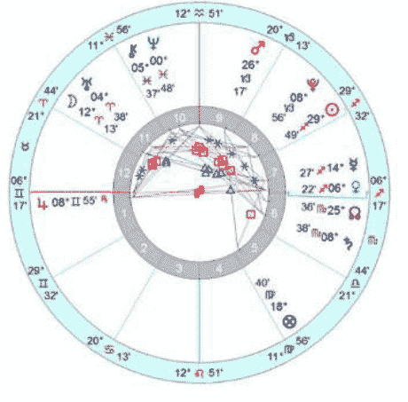

引用盛传的2012年世界末日说法一些言论：

> “一些星象学家认为，2012年将可能会出现“天体重叠”。这种“天体重叠”现象每二万六千年出现一次。

根据“天体重叠”的预言，太阳在天空中的前进轨迹将会横穿银河系的最中心点（即“银心”）。许多人担心这种天体错位将会让地球处于更为强大的未知宇宙力量的牵引之下，会加速地球的毁灭。要么可能是引起地球两极互换，要么是在银河系中心形成一个巨大的黑洞。”

> “2012年12月22日前后，地球终将毁灭，届时太阳、月亮、金星、火星、水星等行星将会排成一条直线。”
——电影《2012》

从世界末日（2012年12月21日，15：14：35分，北京时间）的星图可见，除内行星金星、水星与太阳落入同一星座射手座外，其他行星均分布于不同星座，相互角度也距离甚远。这个时间点的天象与一般天象并无太大的区别。既不存在“星体排列将成一条直线”，更谈不上“天体重叠”、“两万六千年出现一次”这类滑稽的说法。

而从星盘相位本身看来，这个时点盘的重要星相在于水木互容、火土互容、木水相冲、木金相冲、木月拱以及木天拱。很明显，星盘的重点全部集中在落陷的木星身上。

互容接纳，是占星学上一个很重要的概念。即是指两颗行星正好位于彼此的尊贵之地（即行星掌管的星座）；譬如当太阳落入月亮的守护星座巨蟹座的同时，月亮也落入了太阳的守护星座狮子座，则这里存在两颗行星形成了因为“彼此位于对方之入庙地”的接纳，也被称之为互容。如果用白话来说，就好比两个原本不存在确切关系的自然人，互相住到对方的家里去了，所以形成了彼此掌控对方信息，一荣俱荣一损俱损的联盟关系。

# 占星学刊 | 星空记事
Journal of Astrology
第4期

互容，听起来是非常容易理解的一个概念。但具体互容的效应在占星学上会有什么样的具体情状出现又是另外一回事。对于初接触占星学的爱好者来说，“互容”是比较难掌握的概念，在“互容接纳”的概念应用上存在着一定的误区。

古典占星认为，当两颗行星中存在着互容相位时，意味着两颗行星所象征的先后天领域会出现包容与互补的关系。而这种关系带来的究竟是好是坏，是由两颗行星的性质以及涉盘的其他信息来决定的。但可以肯定的是，这种关系带来的善与恶、好与坏都是抱团呈现递增效应。而应用在实际事件上的考衡来说，即便存在有互容关系带来的好处，但其负面效应往往是并存共生的。譬如当金星落入天蝎座/白羊座，火星落入天秤座，则此时金火本身都存在先天陷落的状态，虽然存在着互容的关系，但其先天陷落的负面影响必然会呈现在事件本身中。用白话来说，就是你住到你仇人家里去了，非常不自在，而仇人也住到你家里去了，对方也不自在，但是因为彼此存在这种“互容”的关系，所以彼此一举一动都可能会影响到对方的行为，存在一种互相监控的能量。

再来单独细看末日星盘中的互容关系，首先是水星与木星互容。

木星，是神话体系中的主神“宙斯”，是仁心、坚忍、聪明、公正的代表。而在占星术中，它的象征范围包括：个人的直觉、理解的事物、成功、荣耀、长途旅行、法律事件、宗教溯源、抱负、理想、梦想等。水星，是一颗中性行星，象征着个人的心智活动及思维逻辑，影响个人的思维运作方式、思考的生活领域、沟通意识逻辑方式、支气管及神经系统、亦包括买卖交易行为及商业欺诈等等。

水木互容，则意味着水星转化思维、思想觉知模式以及心智的表达，与木星转化信念、抱负以及未来长期工作计划的承诺及改善的可能性，双方之间产生的问题。木星落在双子座伴随着水星落入射手座，会容易出现概念扩散化、目标扩大化的状态，双方之间呈现出一种前景大好、思路泛散、缺乏实务支持的模式。除了金字塔顶领导层的意识方针问题外，还存在着政治上的决策失误及商业诱导欺诈，黑幕乌龙递延的一个弊病。而泛散在普遍生活领域，还存在着个人目标的不切实际、商业活动的经济欺诈、思维传播的错误信息等等。

火土互容，则意味着火星转化意志力、行动力及自身需求的目标，与土星转化为企图心、整体构建基础的选择范围，这两者之间的力度权衡。个人目标和欲望上的行动，与实际构建的基础和领域间带来了重重的考验。从生活层面来说，不仅仅在实际操作方面上有来自内在的迫切追逐感，而同样来自于外在的不和和大环境的压迫，夹击一并的状态会呈现一种如火如荼的焦炙感和欲解无力的胶着黏着状态。如果说水木互容的相位带来更多的是意识上的盲目和失误，那么火土互容这一组相位带来更多的是现实层面及实际操作上的层层压迫和磨练。

木水相冲、木金相冲、木月拱以及木天拱这一系列木星相位带来的是对其本身先天性的冲击及负面效应的扩大化。木星本身作为一个观念、抱负及指导性力量的行星概念的存在，遭受到象征逻辑及思维觉知模式的水星的冲击，象征情感的价值观及亲密性的喜好接纳范围的金星的冲击，而同时得到了自身感觉及舒适度的月亮、象征个人目的及生命自由度的天王星的良好支持，这两冲两拱的相位组之下所产生的感染力是富有艺术及魅力的。但往往这种魅力及动感扩张的过程中带来的是盲目的不切实际以及眼高手低，这个时期所做的许多决策往往都经不起推敲。

而从2012年6月中旬起，木星就正式进入了自身陷落的双子座，这也会放大双子座原有的沟通、思考、传播以及多变的特质。而木星在此本是先天的陷落位置，尤其木水对冲，木金对冲，加之木星同期与天王星、水星以及海王星形成相位，意味着在木星落入双子座的这一年时间内（2012.6～2013.6），人们也将更易见到这颗木星带来的负面影响。

而在趋近“末日审判日”之时，木星合轴更加加重这种负面特征。木星本身好大喜功与浮夸之风的负面特质都会在双子座的喋喋不休和瞬息多变的世界里找到最佳表现舞台。而金星射手座好高骛远缺乏实际考量、水星射手座但求一瞬的爽快而经不起推敲的负面特质也将一并参与，加上早已进入本位双鱼座的大忽悠星海王星、进入火星主管的白羊座区域的善恶莫辨的天王星，可以想象会有多少突发离奇又浮夸忽悠的人和事出现。

海啸及地震。尤其大西洋沿岸、非洲东部海岸、美洲中部地区、马六甲海域及日本海域这些重点地区，与星体投影图的相位趋近尤其需要注意。

大范围时政来说，对政局的动荡和领导人的政策方针来说，这个状态实际上是不太适合做具体的执政意见的。因水木互容、土火互容会带来的一些个人利益参入政局的纠纷以及不切实际而忽略民众实际客观需求等等而做出有欠考量的方针目标。这对于整体民情国情格局来说是相当不乐观的。经济投资方面来说也会有过高期望而导致大范围的投资亏损的情况产生，这些都是需要相关方面的领导人谨慎行事并保持高度关注。

而这个时期对于个人、平民百姓来说，最大的麻烦或许是容易偏离自己原有的理想与道路，而被套牢于现实中一些琐屑杂碎的俗世纠纷。盲目冲动行事之下，由于对结果的过度乐观考量而导致过多不必要的损失。从大范围来说，凡事不要过度乐观考量，天上掉馅饼这种事情从来不会有太高几率。有些事情权当看戏，无需太过认真，否则亏损到头犹不知前因后果。

同时世界大范围的自然灾害，地壳位移运动导致的海啸、地震等也将因三王星与木星的趋近而并发比较大型的。

总的来说，“世界末日”，无需太过紧张，保持轻松保持平常心，我们安然度过就好。

## 徐宸涵

网名曼陀罗华（冥王星女王），资深星相占星师，师从大陆第一代占星师落落研修现代占星及心理占星和台湾命理大师子辰老师专研精修古典占星。腾讯、新浪、网易等各大媒体认证占星师、占星专栏写手。国家注册认证心理谘商师，人力资源师。擅长个人星盘人生规划、情侣关系合盘等，提倡在顺应运势的同时，提升个人主观能动性，开创更好的生活。

**腾讯微博：** http://t.qq.com/melancholiac
**新浪微博：** http://weibo.com/salomequeen
**网易微博：** http://t.163.com/plutoqueen

## 2013年十二星座年度运势

### ——解读2013新年“星”气象

文/琥珀

**前言：** 2012，虽然传说中玛雅人预言的末日灾难并未如期而至，但若是用多事之秋来概括即将过去的2012年度，恐怕并不为过：这是两极分化严重的一年，人们感受到自己的生活饱受着颠沛与冲击，恍惚瞬间遭受悲喜两重天。上半年的金星凌日让人喜悦得忘乎所以，随之而来的天冥相位剑拔弩张，紧接着大吉星木星沦陷于双子座，包含了分至点在内的白羊座和天秤座轴线、双子座和射手座轴线、巨蟹座和摩羯座轴线成为基准被镭射状发散开来，仿佛神灵下定决心不会放掉一条落网之鱼，忧虑、烦扰、恐慌、疲惫不堪……成为本年度回顾时刻的肺腑心声。转入振动模式的地球发生了频繁的地壳运动，巨蟹月遭遇水灾泛滥，与之相对的摩羯月恐怕事件依旧不会减少，北半球的雪灾与寒流将会成为冬日里更难挨的心结，南半球则须警惕飓风、冰雹、洪水等灾害侵袭，以及异于常年的极端恶劣气候。在如此让人焦虑难挨的一年，耐心缺乏成为当下群体的共性，也难怪澳洲女总理原本也想娱乐一把，煞有介事地为某娱乐节目做SHOW，称2012年年末将有丧尸来袭，结果不但并未赢得大家一笑，反而备受质疑。释放心情，也许反而应该是在送走2012迎接2013期间，我们可以做到最简单却也是最必须的准备。

那么随着2013年的临近，我们是否有机会重整旗鼓，将那些充满阴霾与波折的过去彻底颠覆呢？本文将从星象报告、运势概述以及十二星座2013年度运势分析三个部分为您揭秘2013年的“星”运势。

### 第一部分：星象报告

A．日食/月食

2013年度将发生两次日食与三次月食。第一次日食为2013年5月10日（金牛座19度左右）的日环食，第二次为2013年11月3日（天蝎座10度左右）的日全食[1]；第一次月食为2013年4月26日（金牛座5度左右）的月偏食，第二次为2013年5月26日（双子座4度左右）半影月食，第三次为2013年10月19日（白羊座24度左右）半影月食。

B．行星运行

**水星（双子座与处女座之守护星）：**
水星将于摩羯座初始度位置进入2013年，于摩羯座10度左右位置进入2014年。

2013年水星的三次逆行时间为：2月23日逆行于双鱼座20度左右，3月18日恢复顺行于双鱼5度左右；6月27日逆行于巨蟹座23度左右，7月21日恢复顺行于巨蟹座13度左右；10月21日逆行于天蝎座18度左右，11月11日恢复顺行于天蝎座2度左右。

**金星（金牛座与天秤座之守护星）：**
金星将于射手座19度位置进入2013年，于摩羯座27度进入2014年。

2013年12月22日金星将逆行于摩羯座28度59分，2014年2月1日于摩羯座13度左右恢复顺行。

**火星**（白羊座之守护星以及天蝎座之传统守护星）：
火星将于水瓶座4度位置进入2013年，全年无逆行，于天秤座11度进入2014年。

**木星**（射手座之守护星以及双鱼座之传统守护星）：
木星将于双子座7度位置进入2013年，于巨蟹座16度位置进入2014年。
木星进入2013年时即为逆行状态，将于1月30日恢复顺行于双子座6度20分；同年6月27日木星步入巨蟹座，并于11月7日启程巨蟹座逆行之旅（始于20度31分），于2014年3月6日恢复顺行于巨蟹座10度27分。

**土星**（摩羯座之守护星及水瓶座之传统守护星）：
土星将于天蝎座9度位置进入2013年，于天蝎座20度位置进入2014年。
2013年土星将有一次逆行，始于2月19日天蝎座11度32分，恢复顺行于7月8日天蝎座4度49分。

**天王星**（世代行星，水瓶座之现代守护星）：
天王星将于白羊座4度46分进入2013年，于白羊座8度40分进入2014年。
2013年天王星将有一次逆行，始于7月18日白羊座12度31分，恢复顺行于12月18日白羊座8度35分。

**海王星**（世代行星，双鱼座之现代守护星）：
海王星将于双鱼座1度4分进入2013年，于双鱼座3度12分进入2014年。
2013年海王星将有一次逆行，始于6月7日双鱼座5度22分，恢复顺行于9月14日双鱼座2度35分。

**冥王星**（世代行星，天蝎座之现代守护星）：
冥王星将于摩羯座9度19分进入2013年，于摩羯座11度13分进入2014年。
2013年冥王星将有一次逆行，始于4月13日摩羯座11度35分，恢复顺行于9月21日摩羯座8度59分。

**凯龙星**：
凯龙星将于双鱼座6度2分进入2013年，于双鱼座9度56分进入2014年。
2013年凯龙星将有一次逆行，始于6月16日双鱼座13度50分，恢复顺行于11月20日双鱼座9度7分。

**月亮真实交点**（True Node）[2]：
2013年1月1日北交点位于天蝎座25度，于天蝎座5度41分进入2014年。

**月亮平均交点**（Mean Node）：
2013年1月1日北交点位于天蝎座23度，于天蝎座4度19分进入2014年。

### 第二部分 年度运势概况

回顾2012年，比之于同名电影《2012》，虽无影片中的惊心动魄，但是震荡于人们心头的恐惧、焦虑与不安的心态似乎并未少减，甚至由于“切肤”而更有痛感。2012年是徘徊与挣扎的一年，付出与收获也需要时间来积淀。特别是从年中开始，第一吉星木星的失力（陷落以及逆行）让本年度的好事变得更加得渺茫。分至点轴线之白羊座、巨蟹座、天秤座、摩羯座直接受到天冥四分相的冲击，生活中的压力与机遇并存，进退均充满戏剧性的跨度。木星陷落逆行于双子座，使得射手座踩着慌乱的节奏跳起浮躁的舞步，看似机会满满却如水月镜花。土星转入天蝎座，固定宫金牛座、狮子座、天蝎座与水瓶座被迫开始了人生新一轮拉力赛，若没个好身板，还真怕扛不住这一圈赛程。如果2012是一杯红酒，那么品尝它的过程便有这样三个层次：观其诱人色泽，心中充满疑虑与好奇，初入口蕾饱受惊喜，让人意气勃发，迎接一场娱乐盛典；中度开始觉得味蕾酸麻，有些苦涩又乏于言表，后悔吞咽了这充满灵性的诱惑；最后则是坚持，在这一系列的急升急坠、起伏跌宕的过程里，你会遇到很多超出认知范围的外界反应与自身体会，艰难之路是在磨炼你对于生活的态度，以便未来走得更加踏实与稳健。

展望2013这崭新的一页，新年伊始，水瓶座火星将与双子座木星发生双向入相位加速三分相位，且双方均与天王星发生链接，加之土星已远离白羊座-天秤座轴线，使得凶星凶性大大减缓。这看似是一个好兆头，然而鉴于木星仍然拘禁于双子座，吉性尚无法有效发挥，且火土强硬相位的发生，使得2013年的序幕有些像灾难片的片花一般：明知道是电影，但是依然令人胆战心惊，不能自己。

那般集中，体现的层面也开始变得多元化一些。主要负面相位：狮子座太阳与天蝎座土星的四分相，巨蟹座火星与白羊座天王星四分相，以及摩羯座冥王星与巨蟹座木星火星对分相，想必这个火星逞威的炎炎盛夏，日子也不会太好过。

2013年的整体运势从三个时间段分析如下：

### 第一部分（一月至四月）：

两端尖锐，中间繁琐。土星的负面能量被火星与太阳四分相位激发出来，怀有阴谋特质的暴力事件引发，揭露更丑恶的真相或是以最恶劣的形式冲破人心，追求人道公益却要付出巨额代价。接下来的水星逆行则是给人们反省的机会与调整的时间，也算是一个回归生活主线的缓冲，这期间的日木四分接纳相位，会使得人们对生活重新燃起憧憬与希望，tomorrow is another day! 三四月份算是本年度较为尖锐的季节，白羊座群星与摩羯座的冥王星在较为集中的时间内先后四分相位：竞争本无过，倘若充满了过激的火药味就有些没有必要，因此请控制情绪与心绪。换而言之，也许不烧掉些枯草（冥王星），新芽的成长的确会被阻碍（白羊座），国有政府属性的优化组合会以星星之火燎原，使得事件充满了剑拔弩张的戏剧感。

### 第二部分（五月至八月）：

进入五月份便开始了土星的考验，不愠不火的煎熬是土星的特质，那种陈腐而又酥酥麻麻的感受，有点像哑巴吃黄连——有苦难言。这其实是延续之前的进一步策划与改革，天蝎座的土星依然躲不过冥王星力量的影响，群星相当于敞开胸襟直接面对新旧更替的洗礼：所以，以金牛座的执着坚持下去吧！六月可以喘口气儿，趁着水逆之前，给自己放个大假出外游玩一圈，是一个非常明智的选择。木星换座与水星逆行大体同步，而恰好又都发生在巨蟹座，笔者个人认为这是一个适合装修的好时候，颠覆与家居概念并存，有什么比凿墙钻眼装修新家更应景的事呢？进入八月，事情显得不再如之前

### 第三部分（九月至十二月）：

九月将迎来火星与土星本年度第二次90度相位，不过这次四分相较之年初有着极大的不同，金木两大吉星均状况颇佳并遥相呼应，这就好比虽然都是辛苦劳作，但是此刻你却可以有更丰硕的收获。十月份开始则需要特别注意，天秤座太阳/月亮、摩羯座冥王星以及白羊座天王星将形成一个T三角，而前后发生的白羊座月食与天蝎座日食更会将本年度的剧情推向最高潮。这两个蚀相所在星座均为火星掌控，引发的必然是一场雷厉风行的大规模洗礼，权利掌控者受到震荡而发生换位也并非过于大胆的假设。平静的射手月是给予之前惊涛骇浪之最佳缓冲：祈祷，更好的黎明。

### 第三部分 十二星座运势指向标

运势导读：
☆ 单身朋友看桃花，有伴朋友看感情。
☆ 根据个人情况选择参照日座/升座

### 白羊座（3/21-4/19）

桃花：贴心又惬意的爱情可遇不可求，反而是那些虐心又虐身的情感纠葛似乎总是避之不及。上半年寻觅桃花的机会虽然不多，但是至少心情不会太错综复杂。然而下半年开始，会上演较为狗血的感情戏码。相对来说，六七月间是感情机缘的低迷期，此时你本身魅力状况也是较为一般，不建议在此阶段冲动投入太多情感于新对象。

感情：聚少离多的感情相处模式将会在一定的时间内固定在你们的关系中，而这种疏离并非一定是物理距离，也可能因为各自忙于工作或者其他事宜，而无法拥有较充沛的相处与交流时间。倘若双方缺乏理解与耐心，这种相处模式极易引发很多负面问题，其中经济问题最容易成为双方情感上恶性争论的导火索。有时候鱼和熊掌的确难以兼得，如何平衡、取舍是需要我们用一生的时间去学习的课题。

工作：挑战与压力并存的一年，只有坦然接受挑战，乐观面对压力，逆风而上才能越飞越高。年中与年底为工作运势较为萎靡的时刻，工作能力与状态均受到限制，不建议在这两个阶段选择跳槽或者展开新项目，因为可能面对超出预计的压力与阻碍。

财运：由于土星的影响，会使得本年度的财运显得尤为吃力，特别是贷款与股票等相关的理财手段恐怕很难奏效，反而可能加重包袱。下半年则较宜进行与房产家居等相关的理财投资，会得到较积极的反馈。

### 金牛座（4/20-5/20）

桃花：上半年感情方面会一直处于无法放松的状态，高山流水知音难寻，有的时候倘若不看开一些事情，而放任自己在牛角尖冲撞，既徒劳无益，还会增加痛苦。下半年开始则逐渐会有较为清新的感情机会出现在你的视野中。给自己一个机会，给自己一个可以幸福的机会吧。

感情：有伴侣的金牛座在这一年可能会觉得责任感重担在一直挑战自己的承受能力。往前一步需要更大决心与勇气，而原地不动也难维持现状。两个人相处，每个人都要适度做出选择性的牺牲，以维持这段感情的继续，想想走到今天是多么得不易，想想离开彼此是多么得不舍。特别提醒：尽量避免在上半年做出任何实质性的决定！

工作：年初事情较为繁琐，易让人忙得焦头烂额。而本年度工作运势方面的关键词就是：凡可以自己做的，就千万别指望他人。虽然说团结就是力量，可是伴随着土星天蝎的压力位置，愉快的合作会变成一件奢侈的事情。同时如何处理好与同事/客户的关系，也将显得更为重要。

财运：需要不断地调整自己的理财观念才能进一步积累财富。对你而言，有些相对比较浮躁急进的理财手段可能并非是本年度的首选，踏实保守的理财方式才是明智之举。

### 双子座（5/21-6/21）

桃花：持续已久的浮夸盛宴，上半年终将进入最后的收尾阶段，朋友与情人傻傻分不清楚的阶段基本上可以彻底终结。有的人是泡沫，看似美好，却无法触碰，这其实也无妨，但千万别太过迷恋。我们人生中或多或少都有这样的过往。爱一个人，别爱感觉，别爱影子，爱得实在，才安全。

感情：可能双方会开始准备理性面对外界发出的诱惑信号。有人说坚持与否并非看是否感情够牢固，而是看诱惑是否够大。能理清好朋友与恋人的区别，也算是把握一个最基本的尺度考量。双方在财政方面的管理上也会进行一番新的分配，这对感情的稳定颇为有利。

工作：付出总有收获，经过2012年下半年的沉淀，加之新的一年里的继续努力，你会逐渐获得相应的成绩与酬劳。不过可能操劳指数也会随之飙升。别揣着不劳而获的心态就好，因为对你而言，劳有所得是今年最坦然的关键词。

财运：看完了工作运自然而然可以推测出本年度双子座的财运还是很不错的。进账丰富且比较连续。不过由此产生的最大问题是：存钱。当然，如果你怀揣着前卫的月光消费观，自然可以不考虑本段。倘若你有着更为长久的计划，建议定期定量存款。

### 巨蟹座（6/22-7/22）

桃花：巨蟹座的好桃花算是可以盼到了，特别是那个让你朝思暮想了许久的TA可能终于肯点头答应给你一个机会了。虽然过程有些吃力与反复波折，但是至少你的心里会有甜滋滋的味道。酸甜，又有些痛楚，爱一个人没什么错。

# 占星学刊 | 专题研究
Journal of Astrology
第4期

感情：有条路走了很久，又绕了很多弯，到了接近终点的时候，才知道这滋味有多悠长而饱满。但其实是不是得到一个形式就算是感情的结局了呢？当然没有。当你们结束了一个状态，自然是携手或各自走上了通往寻求人生真谛的求知之路。

桃花：如果只是想找个人陪伴，那么不会缺乏这样的对象；若想好好谈个恋爱，那么你需要更加耐心的等待与寻找。身边经常会出现第一眼印象很好，然而接触下来却发现并不适合交往的人选，理由很简单，就是对方不够坦诚有所隐瞒。所以不妨多花点时间了解别人，然后再决定下一步如何进行。

工作：较之2012年，上半年基本上不会有太大的变动。但是到了下半年则会有着较多的变迁与提升机会，可谓“好风凭借力，送我上青云”。不过人在得意时，也需谨言慎行，避免触怒他人而引发不必要的麻烦。

感情：对方可能心思有些不稳定或者华而不实，从而使你们的感情到了某一阶段就无法再有让人比较有信心的进展。其实你们真正需要解决的是如何进行有效沟通，而不是一问一答的问卷模式。共同投入一些有意思的事情，让生活变得丰富多彩，对你们关系加温会有颇大帮助。

财运：尽量避免通过股票基金等手段进行新一轮的增长财富的手段，因为整体看起来运势较为低迷，虽说长线大鱼，可是今年这个线，未免有些过长了。

工作：工作方面，最实质性的进展就是恭喜你本年度薪水可以上一个新的台阶。由此看来，虽然没有太大的惊喜或者愁事，但整体而言事业是在稳步提升的。

## 狮子座（7/23-8/22）

桃花：在感情上经历了太多的磕磕绊绊，让你失去了对感情应有的纯粹憧憬与饱满态度，反而容易悲观失落地任由命运左右。其实本年度你会认识颇多谈得来的朋友，虽然更深入地发展感情的机会并不算太大，但这些也是潜力股。

财运：运势高涨，尽管本年度娱乐方面的开销稍显巨大了些，不过赚得多，也就不怕花得多，只要做好计划一切OK。

## 天秤座（9/23-10/23）

感情：双方的矛盾较尖锐。个性使然是一方面，但是更多的可能是超出双方能力可控制范畴的其他因素存在，会成为导致阻碍彼此关系顺利梳理下去的关键。爱情，是两个人的你依我依柔情蜜意；婚姻，则是牵扯很多人的错综复杂的连环锁扣。

桃花：感情机会多到让你眼花缭乱，就好像进入了一个五花八门的糖果店，充满了各种华丽包装的诱惑，但是你口袋里的钱是有数的，想挨个儿品尝显然不可能。只能把握机会好好挑选，别做让自己后悔的选择哦。

工作：压力非常大，整个2013年对于狮子座的事业来说是处处充满限制与瓶颈的一年。每前进一点都有些举步维艰，这就是你在通往事业巅峰途中的爬坡阶段，尽管有时心中可能弥漫一些无助甚至绝望，记住只有咬牙坚持才能登上你心中为自己规划的峰头。

感情：需要整理好自己的思路与心情，人生就是这么一条路，你可以有多样的选择，但是某一段路只能有一个人陪你。TA可以陪你多久，取决于你们的坚持，取决于你能否抵挡得住那些所谓的诱惑。

财运：整体来看财运还是不错的。对于你的长期理财而言，比较混乱的账目支出是最大的阻碍。不过已然形成比较稳定的进账与财富积累。

工作：一波三折，让你有的时候有些不知所措，其实凡事都是贵在坚持，世间本无路，你走着走着，就能走出属于你自己的路。虽然波折，但相信你可以执着地坚持下去。

## 处女座（8/23-9/22）

财运：状态偏弱，但是整体已经开始复苏，特别是到了下半年，财运状况会发生较大面貌的改变，请拭目以待。

## 天蝎座（10/24-11/22）

桃花：有的时候不是景色不美，而是你没有欣赏眼前美景的心。太过于自我压抑与低迷的态度会让你失去很多机会，也会逐渐蚕食爱的能力。上半年会显得有心无力，不过年中之后，你会渐渐恢复一些往日的神采，相信自己的魅力，请加油。

感情：不要因为家庭方面的纷争而给对方施加太多压力。很多事情需要双方的良好沟通才能更顺畅地进行下去。做自己不会后悔的选择，努力过了，结果如何，那要看“缘分”。至少，不要把责任都推给“态度问题”。

工作：本年度的工作运其实稍显紧张。不过相对来说，却没有太多的波折与动荡，取而代之的则是本身现阶段的不懈努力与攀援，过程漫长与枯涩了些。有的时候，不计结果最后奋力放手一搏，反而可以战出不俗的成绩。

财运：会有零散财富逐渐过渡为整笔整笔的入账，化零为整，财运越滚越旺。

## 射手座（11/23-12/21）

桃花：这算是一个好事吧，烟花散尽，让自己终于有一个可以踏实冷静下来面对自己与他人的心境。虽然感情方面你依旧会显得有些不切实际的倾向，但是整体较之以前已经变得踏实了很多。你也开始从单纯的寻觅，转而将自己打造成被人寻觅的蝴蝶，自身魅力提升，当然更有吸引力。

感情：有一些事情积压在心里面，时不时地爆发一次，也许嘴巴说说便会很爽快。但是其实这并非是最佳的解决问题途径。精神方面的压力与焦虑来源有不同缘由，不要把责任都一股脑的推到他人身上。心平气和，你的好，TA才懂。

工作：抓住上半年的贵人机会，在别人的帮助与提点下，你可以节省很多气力来登上到原本对自己颇有难度的高度。当然，贵人帮助也需要你自己多多努力才行哦。

财运：可能暂时无法形成让你比较满意的财政收入，因为赚钱的瓶颈被自己卡死，而你自己也为此颇为困扰。放松情绪，有助于你财运的提升。

## 摩羯座（12/22-1/19）

桃花：感情的机会对于你来说是不少的，甚至有一些越开越灿烂的迹象，特别是在下半年，有望结识到让你非常迷恋且懂你的对象。好事将近，把握机会，别因为犹豫而让好缘分从你指间溜走。

感情：过去的情伤问题也许会成为你对现任毫无保留付出的一个障碍。始终有一些阴霾在你心头挥之不去，有的时候别太跟自己过不去。遇到了真正的爱你、懂你、体贴你的人，怎能让那些过去的阴影成为无形中的感情杀手呢，幸福是珍惜现在。

工作：变动较大，且你整体的工作能力不能得到较好的体现，如果说2012年你可能在事业上得到了某些让人瞩目的成绩，那么2013年你需要首先冷静一下，更加清楚地认识自己、磨炼自己，然后才能更好地把握住下半年的机会，一鸣惊人。

财运：财政方面的压力会变得非常大，不建议在本年度盲目增加更多的负债项目，因为目前需要投入在事业上的资金可能远远大于生活上的消耗。

## 水瓶座（1/20-2/18）

桃花：如果说上半年你抱着可以谈到一起、玩到一起的心态去认识可以发展的潜在对象的话，那么你的感情可能会就此痛快燃烧，而提前耗尽下半年的热情，因为你觉得投入和收获难以成比例。心态放平稳些，细水才能长流。

感情：双方的互动中，你可能会觉得有些被动与劳累，所谓被动不是对方推推你动动，而是你觉得你没有较好的掌控权，任由对方把握。而双方给予这段感情的共有时间有些不平均，容易导致一些分歧与不愉快。不妨列出一个时间表，让大家都能主动分配出合理的精力与时间来。

的太过任性与不满足，会让一些痛楚成为对方心里的阴影，也成为你自己的一个甩不掉的紧箍咒：知足常乐。

工作：本年度对于水瓶座的事业而言非常重要，当然，所承受的压力也是不容小觑的。为此你可能不得不选择性地牺牲掉一些家庭娱乐相关的事宜，才能达成理想目标。这又是一个十字路口，你要三思而后行。

工作：今年不是一个特别适合挖掘新兴行业的时机，不如保守点去踏实做一些已经积累了经验的行业与领域。比较忌讳眼高手低，因为你现在的确缺乏比较脚踏实地的目标感。而踏实这东西，是练出来的，不是想出来的。

财运：运势一直较为不错，算是这年度里最大的收获与安慰了。不过赚钱是为了好好生活，而不是金钱本身。别让赚钱成为阻碍你生活愉悦的绊脚石。

财运：开销较为巨大的一年，特别是家具房产方面的投入可能会更大些。但下半年开始可以慢慢攒钱，积累出让你较为满意的数字。

## 双鱼座（2/19-3/20）

桃花：感情方面的机会变得越来越多。如果说上半年遇到的人多少还有些不靠谱，年中之后桃花质量则会显著上涨。这不是玩玩闹闹的机会，而是让你可以踏实稳定冷静下来考虑是否要认真在一起的对象。

感情：你可能对于生活还有一些过高的期许与要求，而且对方也一直在很有耐心地配合你。不过有的时候你

注释：
[1]2013年11月3日的日全食亦有报道称之为全环食，因为全食带经过大西洋至中非洲大部分地区，环食出现在大西洋近北美洲的小部分地区，由于日环食的区域面积很小，因此本文称之为日全食。本资料参考香港天文台网络共享文献以及维基百科，日期均已转为北京时间。
[2]Mean Node(平均交点)，True Node(真实交点)，均用以是表达月亮交点。只不过前者为古代人推算出来的月亮交点之平均值，而后者为现在电脑计算之精确值。时下流行占星软件的默认设定一般均为 Mean Node。

## 琥珀

昵称“小猫琥珀”、“琥珀口袋”，旅澳占星师，旅行家，师从西洋卜卦占星大师约翰·佛罗利(John Frawley)擅长卜卦占星与流年分析。研习占星十余年痴迷于此，以占星为己之导向与信仰，热爱一切占星古籍。二零一零年于澳大利亚悉尼成立了澳洲第一个华人占星工作室，积累大量案例分析并不断练习精进。在互联网上拥有多个案例研习QQ群，因其精湛的卜卦技艺与诚恳温和的交流态度而受广大网友敬爱，每每在大家焦急危难时出手相助极具大侠风范，也被大家昵称为“琥珀姑娘”。
联系邮箱：info@starfavor.com。
豆瓣主页：http://www.douban.com/people/ambercat
腾讯微博：http://t.qq.com/amberpouch

# 心理占星应用：

## 从星盘活出高质量的自我

文/秦瑜

本我(id)、自我(ego)和超我(superego)是弗洛伊德人格构成学说的主体部分，在弗洛伊德人格理论中，自我的功能是被动的，处处受着本我和超我的双重制约。荣格的人格理论则把自我置于人的意识领域（个人无意识和集体无意识）的中心地位来看待，他认为自我的表现就是人为了达到人格的统一和整合所做的努力，只有达到个性化的人才是心理的健康人，才拥有一个充分分化了的平衡和统一人格。实现个性化的第一个要求是把理性的意识与非理性的潜意识整合为一个人格的整体，使之处在一种和谐平衡的状态中，而这种整合的力量就是“自性”。

这两个看似难以调和，实质上都是为人类灵魂服务的学科，尝试从星盘中找出一个可操作模式，看看如何从星盘活出高质量的自我。

我们星盘中错综复杂的线条与每个落点都是生命中的礼物，都是能量开启点，唯有珍视之，我们方可活用之。

首先我们来看一下心理学的自我、本我、超我与行星元素的对应关系：

本我——主体：月亮（情感需求）辅助元素：金星（喜好品味）

后期精神分析学家艾里克森更是把自我看成是人格结构形成和发展的源泉，认为人格发展的本质是自我的发展，人格发展的过程就是自我同一性形成的过程。他把自我看成一种心理过程，它包含着人的意识活动并且能够加以控制。自我是人的过去经验和现在经验的综合体，并且能够把进化过程中的两种力量——人的内部发展和社会发展综合起来，引导心理性欲向合理的方向发展，决定着个人的命运。自我的过程已失防御性质的重要性，其所表现的游戏、言语、思想和行动等带有自主性，具有对内外力量的适应性。艾里克森认为，人格发展的每一阶段都由一对冲突构成形成一种危机。危机的积极解决，就会增强自我的力量，人格就得到健全发展，利于适应；危机的消极解决，就会削弱自我的力量。

本我，作为动物的人的自我，包含生存所需的基本欲望、冲动和生命力。本我是一切心理能量之源，本我按快乐原则行事，它不理会社会道德、外在的行为规范，它唯一的要求是获得快乐，避免痛苦，本我的目标乃是求得个体的舒适，生存及繁殖，它是无意识的，不被个体所觉察。本我中的内容是不会相互冲突而产生自身矛盾的。这是因为本我中的一切，永远都是无意识的。

本我就是怎么舒服怎么来，即“我想怎样”。

月亮

而在占星术中，个人行星与外行星的联动关系以及流年行星的作用，与上文精神分析学的理论正好可以互相呼应，我们不妨大胆对号入座，糅合心理学与占星术

占星学中，月亮星座代表情感需求，你无法把握，只能感知。月亮的诉求因人而异，即使是同样的月座，也因宫位、相位影响而有着相去甚远的区别，但拥有相同月座的人，往往有一见如故之感，能轻易认同对方的想法。

“良心”为原则。本我与自我的矛盾产生了超我，而超我的出现，又不为人本身所控制。

### 金星

金星则从你诞生的那一刻决定了你的喜好品味，我们无法用科学来解释天蝎座金星为何偏好深刻浓烈的感觉，白羊座金星热衷视觉冲击力，处女座金星无论对感情或是物件都要求尽善尽美。

### 超我，就是耳边那个声音，即“我不该做什么”或“我该怎样做”。

### 如何开启月亮、金星的能量

#### 尊重内心意愿，心灵不扭曲是自由第一步。

### 土星

土星代表制约力、局限，星盘中对应的领域，会感觉受到限制。土星的制约效应，其实是一种外界的投射，更多的是来自后天，来自于与他人的互动。很多时候来自原生家庭或对你有重大影响的人，通常以道德为准绳，施以压力，在我们的人生中充当告诫者、权威的角色。心理学者阿德勒指出：一个人的固定生活型态，是在5岁就建立起固定模式，这就是心理占星中土星的限制作用。

以上两颗星体，直指“本我”，拥有惊人的力量，如同一个可撬起地球的支点。它们平时不会跳出来指手画脚，但是，一旦涉及到情感需求、喜好问题，它们会立马给你最直接的下意识反应。它们很诚实，从不欺骗你，同时，它们就如同一个秘密，一个树洞，只有你自己知道，你现在感到是冷或热，你愿意跟谁亲近，你现在最想吃什么东西。

土星所落的星座，代表个人最在意的层面，或是自觉不如人的地方。比如，土星落在双子座，会很在意自己的反应够不够灵敏，很担心别人说自己不够聪明；而土星在摩羯座，最在意的则是社会地位、事业成就，很怕别人觉得自己身份低微。

但是，这两颗星体的力量是隐形的，不构成行动。因为它们分别是情感与喜好，蕴藏于内心，你必须呵护之，观照之，倾听之，让它们如水流般自由。因为，无论你想什么，都是自由的，都是被允许的。如果你明白到“想”并不等同于“做”，不再去控制自己的想法，不再扭曲自己，你就更接近自己的内心，更明白自己真正的需求。只有真实的情感，才能导向持续良性的身心发展。

### 如何善用土星的能量

#### 超越限制，转换成努力与内省、秩序感

如果当我们最终明白，个人的潜能是无极限时，你会发现土星的限制指标归零了。当你的生活不再受困于舆论，方能活出真正的自我。而关于土星的部分，我们可以把能量转换成努力、内省。找出星盘中土星的影响领域与流年领域，作为攻克与改善的方向，既顺其自然，也发挥主观能动性，使之成为我们生命中的礼物，而非束手束脚的障碍。

举个例子，如果你是月亮巨蟹座，能量开启的关键在于尊重你那澎湃的内心起伏，充分感受之；如果你是月亮白羊座，激情与冲动、争先的热情正是你的财富，为你带来更激越卓越的人生，请珍视之；如果你是月亮天秤座，你无需为自己的左右权衡感到困扰，没有好坏之分，无论是好是坏，都是你灵魂的一部分。

土星与太阳、月亮或命主星形成负相位者，更容易感受到土星的压力与制约，但同时，也有可能由此产生过强的责任心与刻苦努力。尤其是太阳的相位组，通常会直接构成行动，很多名人星盘中都有清晰的日土负相位，成功其实就是百分之一的天才加百分之九十九的努力，但这也意味着付出很大的精神代价，比如日土刑

### 超我——土星（制约力，来自外界的投射）

超我，实现个人与社会的整合，实现个人的社会价值，为社会人类贡献。超我是道德的我，以“道德”、

的美国脱口秀主持人欧普拉，童年经历坎坷，通过不懈的努力一举成名。

此外，不容忽视的是，土星特有的稳固性其实还可以带来秩序感，而秩序是保障我们内心安全感重要的形式之一。所以，在实际案例咨询中，要注意保护土星影响势力范围的秩序感，以免造成失衡。我有好几位土星落在第六宫的顾客，一年忙到头，只要闲下来就觉得心慌，哪怕是赋闲在家的全职太太，日程表也安排得满满的。

星盘中土星元素欠缺的人群，通常较适宜家庭系统排列治疗方式，通过序位排列来习得秩序感，而土星也代表长者，通过巩固父母的序位，来调整盘主在孩提时期的系统错位，使盘主与内在父母达成和解，重构安全感。

**本我与超我的转换元素——天王星（破坏、颠覆，可转换成创造力）、海王星（迷幻、麻醉，可转换成艺术感受力）、冥王星（执念、毁灭，可转换成意志力）**

三王星同样也属于超我的部分，但如果得到正当的引导，可以成为正面能量，化作实现目标的推力，成就我们的梦想。

星盘中天王星元素偏重的人，破坏力与颠覆力甚强，但天王星的智能是相当惊人的，有如高八度的水星，可以转换成创造力。比如爱因斯坦的星盘里，事业宫的白羊座水星与土星相合，严谨而又富于激情的工作态度；而天王星落在第三宫，拱照事业宫的水星与土星，在此充当一个转换器，创意与革新带来崭新的思维模式。

海王星则具有逃避、迷幻、麻醉的倾向，同时也是高八度的金星，可以转换成艺术感受力。李安太阳与海王星相合，在经历六年赋闲在家的韬光养晦后，并没有被海王星的负面能量吞噬，相反提升了他的艺术感受力，最终夺得小金人。

冥王星代表执念、毁灭，像是高八度的火星，可以转换成意志力。

在这里分享我一位顾客的案例：

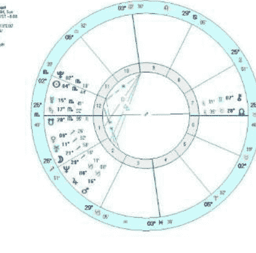

小 N 来找我咨询时，正承受着巨大的压力，因合同纠纷与原公司的高层反目成仇，并背上了天价债务，众叛亲离，饱尝人情冷暖。她群星落在 12 宫，的确容易遇到宿命事件，土星所带来的超我力量，会让她感到倍受限制，难以突破。太阳与冥王的合相，容易卷入人事纷争中，受高层打压。她的星盘群星汇聚在 12、1、2 这三个宫位，上升点落在天蝎座，强化了冥王星特质，加上月亮又落在不甘受约束的射手座，而火星曜升在摩羯座，财帛宫宫主星又落在原宫位，所以建议她自行创业，从事外贸方面的生意，以电子商务为佳。她很快在网络上把事业做得有声有色，但创业初期，屡次受黑社会的威胁，最终，她以冥王星人特有的韧性与进取心，在两年之内把事业做得很成功，并偿清所有债务。冥王星就像内心的恐惧黑暗隧道，但当你在漆黑中，勇敢穿越，就会看见亮光。值得注意的是，冥王星人的自我接纳程度较低，太阳与冥王星的紧密相位，会令盘主对自己的行为产生一种偏执的坚持或排斥。在个案咨询中，要重点处理盘主与父亲的关系，盘主通常会对父亲隐藏着很深的敌意。此外，冥王星特质强的人，往往会在关系中扮演迫害者或受迫害者的角色，由于冥王星的极端方式，而令盘主的人际关系破裂时充满宿怨。

接下来，我们一起来看看关于“自我”部分所对应的行星，抵达“如何活出高质量自我”的核心。

**自我——主体：太阳（发光体）**

辅助元素：水星（心智表现力）、火星（行动力）
关键点：上升点、北交点

自我，就是社会中显示的自我，有感情、有理智。自我是自己可意识到的执行思考、感觉、判断或记忆的部分，自我的机能是寻求“本我”冲动得以满足，而同时保护整个机体不受伤害，它遵循的是“现实原则”，为本我服务。

自我就是最终能做成什么，即“我做了什么”。

### 太阳

太阳是星盘中的核心，是发光体，以其所在星座与位置，照耀你的生命。太阳代表人格核心，决定了你人生目标的导向，提供了通往自我实现的原始创造力。

### 水星

水星代表心智与表达能力，起到桥梁作用，它如同一个过滤器，把月亮与金星的情感喜好过滤了一遍，有了缓冲的空间，然后用水星的表达方式，向外界展示。也因此，月亮、金星与水星有着良好相位的人，往往更容易表达内心，反之，则容易有表达障碍。而水星庙旺者，心智表现力更占优势。

### 火星

火星是行动力，是执行计划的关键人物。它直接决定了你的执行风格，是想到就去做还是一再拖延，是虎头蛇尾还是坚持到底。火星处于庙旺地或愉悦宫位，或与太阳、冥王星有正面相位的人，往往执行力过人。

### 如何开启太阳、水星、火星的能量

#### 如何开启太阳的能量

太阳所落的星座与宫位就是你荣耀自己的方式与领域，那是你最具光芒的部分。太阳星座意味着我们本真的面目，我们对自己的身份认同度越高，我们就越能散发光芒，越能滋养自己的灵魂。在心理占星个案咨询中，要注重唤醒太阳星座的能量，顺势而为；反太阳之道而行之的治疗方式通常都收效甚微，甚至无效，并很有可能会令盘主产生抵触情绪，从而令个案的深入治疗半途中止。比如，对于太阳落在射手座者，尊重他的尊严与理想，才能保全太阳能量与活力。

与太阳形成相位的行星，会影响我们自我认同的方式。通过观察太阳相位，会了解到盘主会不会认为自己不够好，是否自我逃避，又或者过度膨胀。同时，太阳相位也会决定自我实现的途径，是木星式的扩张与拓展，还是土星式的积累与努力，又或者天王星式的创造与自由。

若星盘中太阳严重受困，可观察有无良性相位支持，因为良性相位犹如黑暗中的亮灯，可以起到疏导的作用，从中找到突破口。

#### 如何开启水星的能量

水星所落的星座与宫位是个人最习惯的交流方式与最感兴趣的沟通领域，在个案咨询中，可以通过观察水星的落点，去判断盘主的日常沟通方式，这也是个案咨询中最容易直接判断与调整的一个落点。水星的守护星为双子与处女座，这两个变动宫星座决定了水星的可塑性与可调整性较强，我们的思维模式和说话方式往往会根据环境作出调整。

所以，在个案咨询中，通过观察影响水星的行星，针对性进行改善，比如水星受海王星影响较重者，通常表达方式较发散，并有粉饰模糊的倾向，需加强条理性以及精炼语言；而水星受天王星影响较重者，虽然不失创造力，但在现实事务的沟通上有时候缺乏实际性与耐性，还容易表现在本能地对情绪表达不适应，应使其接纳并学会情绪表达，从而达成更好的人际交流。

#### 如何开启火星的能量

火星除了代表行动力之外，同时也是情绪的阀门，火星所在的星座与宫位决定了我们发脾气的方式：在哪个状况下容易被触及底线而愤怒，在哪个领域更具战斗力，在哪个领域受到挑战或干涉时会触动情绪。

月亮的情绪波动往往是隐性的，火星的情绪则是外显的，我们内心的情绪，最后通过火星的模式来传递出去。对星盘中火星能量受阻的人，可观察所落星座、宫位与相位，根据这三者的性质，进行情绪疏导，另外，应因地制宜地为不同的星盘制定出适宜的运动方式，让情绪有一个宣泄的出口。

个星圈出来，“本我”会告诉我们一个真理：只有最爱才能长存，其余都是糟粕。

### 木星（理想、抱负、价值信念系统）

之所以把木星单独罗列出来，因为个人认为，木星代表价值观，信念系统，虽然先天星盘中木星的落点与位置不可撼动，但木星是一颗可以自我完善自我改造的星体，我们可以调节自己的价值观，信念系统一旦改变，我们看待生活的角度必会随之改变。

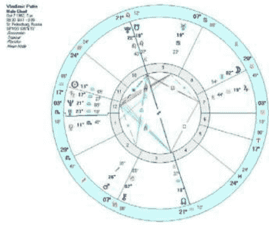

观察木星所落的星座以及宫位，那是我们的信念所在，也是追逐梦想的位置，决定了你会追随哪种特点的精神领袖，受哪种道德舆论所左右。

另外，还有两个很重要的虚点：**上升点与北交点。**

上升点是星盘中最具个人化的落点，因为上升点的位置取决于出生的地点与时间。上升星座就如同我们的人格面具，是我们与外界互动的方式，也可以说是别人对你的第一印象。

普京的双子座月亮落在第八宫，权力与操纵感是他内心满足的源泉；天蝎座金星落在第一宫，他很清楚自己的喜好，并且不惧怕在众人面前展现这样的喜好，这两颗“本我”特质的行星都与天蝎座、冥王星相关，坚毅执着地选择强权，是普京发自内心的选择，这种强大的本我原始力量促使他在去年赢得大选，第三次连任总统。

人格面具有可能与我们的核心人格是一致的，也有可能是分裂的，这得视乎每个星盘而定。当人格面具与核心人格产生冲突时，盘主会有一种撕裂的被拉扯感，但也正因此，而学会了在冲突中成长。

北交点则是我们今生追寻的方向，就像朝圣者，内心会有一个声音呼唤着你不由自主地朝那个方向走去。

下面我们来看一下俄国总理普京案例，看看从星盘中如何活出高质量的自我：

强烈的“本我”愿望还需要靠“自我”来执行，普京的太阳、水星落在第十二宫，运筹帷幄，射手座火星得到冥王星、太阳的良性支持，构成一股强大的“自我”能量，行动力佳、目标明确、顽强坚持。强悍的第十二宫与高挂中天的冥王决定了他的职业走向。12 宫及冥王均与秘密事务有关，普京大学毕业后投身克格勃，并经历了 15 年的特工生涯。

首先，我们来看一下普京真正的内心选择是什么，前文我们说过，可把月亮与金星视为“本我”，把这两

此外，“超我”部分的限制，土星落在第十二宫，普京在任期间曾遭到恐怖分子袭击，太阳与海王星、土星、水星紧密相合，与天王星互刑，则让他不断寻求变革，并勇于走属于自己的不寻常之路。

## 秦瑜

秦瑜，网名 aster，知名资深占星师，中央广播电台香港之声电台、吉林卫视《天天女人帮》客座嘉宾。研究西方各流派占星技术、塔罗与中国紫微斗数、心理学，擅长人生规划、关系合盘等，提倡在顺应运势的同时，提升个人主观能动性，开创更好的生活。

## 十二组出生牌：让塔罗告诉你生命能量的两岸（三）

### ——女祭司、正义与审判

文/Claire Chak

在《占星学刊》第二期中，我向大家介绍了塔罗出生牌的来源与计算方法，并对 12 组出生牌做出了基本的关键字介绍。而在这一期中，我将继续为大家详细解读 12 组出生牌中的女祭司、正义与审判的具体含义和使用方法。

### 相似点

### 正义 & 女祭司（女教皇）

我们在探讨出生牌的时候，一定要注意要从能辨别、能看得见的牌面开始着手分析。“正义”与“女祭司”这两张牌的画面上是有很多相同之处可寻的。首先，她们两位都是安静地坐在各自的王位上。她们的坐姿虽然有所不同，可是给人的感觉都是稳稳地坐着，非常得宁静，貌似比较被动，却很有威严与很有气势的感觉。两张牌中的人物都以正面示人，她们坦然的坐姿和那直直注视着我们的眼神更是显象了她们的无惧与庄严。也许是因为两位人物都是坐着的，所以有着根深蒂固的意味，两者都缺乏行动与动力。

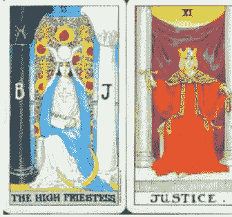

另外很有意思的相同点是两张牌中都有着不多但是很显著的黄颜色元素。而且两位人物的穿着都非常严密，同样有两件装的长袍与披肩。她们的正装打扮体现出了她们的地位，以及正式、仪式等特征。另外一个很重要的相同之处是两张牌都有两根柱子，塔罗中这被称之为“门（Gate）”。除此以外，两位主角人物都是坐在这两根柱子或者门之间的。这使她们成为了门户与秘密的守护者。在塔罗中，凡是坐在两根柱子（门）前的人物都是秘密的守护者，同时也是带领你进入奥秘探索的引导者。

出生年月日相加后得出 11 和 2 的人拥有“正义 & 女祭司”出生牌。他们会用其一生徘徊在两个极端之中，比如说时而安静，时而嘈杂，时而安稳，时而毛躁，时而温和，时而攻击性强。“正义 & 女祭司”组合的人还有一个特征，那就是想的、说的永远比做的东西要多！他们很擅长于想事情、说教，可是要他们把自己的好主意和完美的理想实践在这三维世界中就有点难度了。此组合的人也是不折不扣的完美主义者，也拥有这绝对音感与音准的能力（Perfect Pitch）！

在这一对牌之间，它们掌管着无穷无限的秘密与智慧。而且在它们的面前，所有的事情都会被解释清楚和说明原因。在她们之间，也存在着一股很沉稳的能量。我们也很容易能体会到此组合的人会是很棒的思考者或者演

说家，可绝对不是实践者！她们缺乏行动的动力与冲劲。不过，这两张牌的组合有着很完美的内容特质，此组合的人很擅长与内省与反省。

一切都是被接受的，无需改变。“女祭师”包容、接受和拥有无穷的智慧！

### 对比 / 差别

在“正义”与“女祭师”之间也有着很多的不同之处。首先，“正义”的人物服装颜色是很鲜明、鲜艳的红色；这代表着此牌中响亮而清澈的感觉。主角人物坐在王座上有着无惧和坚定的神情。而同样是坐在宝座上的“女祭师”却有着让人感觉宁静、安详的蓝色着装。再者，我们观察一下她们的双手摆放。“正义”的人物一手握住宝剑，一手稳拿天秤；此姿态强烈并带着些许紧张感。相反，“女祭师”的双手自主，放松和随意的摆放在自己的腿上。另外一个值得关注的细节是她们两者的头发颜色。“正义”中的人物头发颜色为金黄，在塔罗中此代表着主人翁的头脑清晰，并且她的注意力在当下此刻；可是，“女祭师”的头发是黑色的，在塔罗中此表现出她的脑海里都是隐藏着的奥秘。

### 互相协调的“正义 & 女祭师”

得以整合的“正义 & 女祭师”会交友甚广，朋友圈里往往存有不同背景和性情的人们。此组合的人群会被神秘学吸引，对于奥秘他们有着情不自禁的爱好。在生活中的很多方面此组合的人都会抱着完美的梦想。他们很喜欢陶醉在知识和完美层面的世界里。虽然两张牌中的人物都貌似很安静，可是此组合的人有着很强的语言能力。他们的力量一般会通过思考与言语来表达和传达。他们的声音、话语树立起两张牌中的权威。

在卡巴拉塔罗系统中，每一张牌都被赋予一个占星属性。“正义”的占星属性是天秤座，所以它不断地关注着平衡，不时地保持着完美的平衡！在它的眼里，所有的东西都得有完美的平衡感，不能太左，不能太右，不能太多，不能太少，不能太上，不能太下……一切都有着它平衡的最佳状态。此外，天秤座的特质是检查所有的事物，然后排斥任何的不完美，最终达到最佳的状态与核心。可是，“女祭师”的占星属性是月亮。月亮是有着不能被打破的规律的，而且整体的基础形状与意识是圆形。圆形的意识是循环和包容的。在圆形里没有什么是被排斥在外的，没有什么是不要的，没有什么是被拒绝的。圆包含着一切万物！此外，月亮的智慧是它知道时间万物有着一定的规律与道理，它们的现状也是最原始的本质，无需任何的改动。

### 未整合的“女祭师”

如果“女祭师”的能量没有得到平衡的话，它会很容易陷入困境之中。当身边的事情发展得不顺心时，未被接受的“女祭师”会感觉到无比的失落、迷失。这个时候，它会深刻地感受到恐惧和惶恐。另外，没有被意识到的“女祭师”会自以为什么都懂，无所不知。它的阴暗面还包括喜怒无常、易怒、悠悠喜欢、偷偷摸摸的、难以接近的、不可亲近的、绝望与压抑等脾性。没有被调整好的“女祭师”还有一个特征是控制狂，它会用软硬兼施的方式去控制身边的人与事物。

### 未整合的“正义”

当“正义”的能量被忽略或拒绝时，它在这个世界中会格格不入，生活中的经历也会变得艰难、艰苦。当此潜质不能被接受时，“正义”可以变得自大、傲慢、爱批判、爱挑毛病、无常、含糊、靠不住、迟疑不决和悠游寡断。除此以外，“正义”的阴暗面可能会以坏脾气的形式出现。无缘无故的、不平衡的“正义”会突发脾气，给自己与他人形成非常大的“暴动”！而且，它还会变得在知识与学习方面尤其的看不起人。当它发现一件事物或人是不被自己接受与肯定时，就会马上对他们失去兴趣，表现出视而不见的轻浮。

虽然两张牌的主人翁都是门户守护者，可是“正义”守护着的是“完美之奥秘”的神殿（The Temple of the Secret of Perfection）。而“女祭师”却是守护着“终极知识”的神殿（The Temple of Final Knowledge）。“正义”要在变幻无常中寻找到最平衡的完美，它运用的方式是排斥、检查和筛选。但是，“女祭师”明白在这千变万化的尘世中所有的一切都有着它们的存在价值与原因，这

### “正义 & 女祭师”的个人分享

在接触到塔罗中的出生牌系统没多久后，我就把父母两边家族成员的出生牌算了个遍！然后我很惊讶地发现，我来自于百分之五十的“正义 & 女祭师”大家庭！虽然

我的父母与亲弟弟都不是这个组合，可是我的表兄弟、叔叔、姑姑、舅舅们都是“正义 & 女祭司”组合的成员。回想起成长的种种，我倒是对此没有特别的感觉。这个现象对我的影响看来是有待探索与察觉的。

对于“正义 & 女祭司”一组合的认识，我是从恩师瓦尔德·安博斯顿（Wald Amberstone）身上观察到最多也学习到最多的。瓦尔德是一名非常著名的塔罗与卡巴拉学者，在纽约的塔罗学院任教多年，我每次回到纽约都得腾空周一晚上去参加他的塔罗课程。每一次的课程内容都很激发人心。不知道从什么时候开始，我发现瓦尔德的声音是有着让人无法抗拒的能量的！经过他有意识的控制，他在课堂上所说的每一句话都强而有力，此频率震动直渗入每位学员的内心深处，无形中影响着我们在座的每一个人。可是，“正义 & 女祭司”的言语能力也像塔罗中的宝剑一样是把双刃剑，它能在无形中拯救人们的同时也能把我们伤害于无形之中！我曾经目睹过一些对瓦尔德非常不礼貌的学员，被他的一句话所击倒的过程。这说来一点都不夸张，语言是有能量的，最重要的不是当时瓦尔德所说的内容，而是他说那句话时的专注力、目的与意图。他的声音、他的言语、他的语言传达能力都是瓦尔德这位可爱可敬的“正义 & 女祭司”老师的秘密武器！

### 批判 & 女祭司（女教皇）

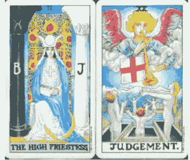

这一组合很特殊，只有出生年月日相加起来有 20 的人群才是“批判 & 女祭司”。他们很有通灵、玄学等天赋。整合好的“批判 & 女祭司”有很不平凡的智慧，他们所明白理解的事情超出了平凡和普通的层面。他们所关注的是超然的存在，而不是平庸普通的生活。当两股对立

能量得到平衡时，这组合的人会非常得强大。他们会对灵性、灵修、秘密、神秘知识等感到无比的兴趣。在生活中，他们也会注入强大的能量、动力、变化和成长的元素，一点都不乏味。

可是，当“批判 & 女祭司”不平衡的时候，他们会变得自大，愿意相信自己拥有着非常特别的超能力。他们也会相信自己是特别的人选去继承重要和神秘的知识。而且这些人会认定自己拥有未知的视野与非凡潜能，这是很危险的处境。

从“批判”到“女祭司”之间有 20 张牌，比一般 10 张牌距离的组合多出了整整一倍的能量。在所有的出生牌组合里只有三组是拥有这样的潜能的，其他的两组是“太阳 & 命运之轮 & 魔术师”和“世界 & 女皇”。

### 相似点

“批判 & 女祭司”这一对牌中的相似点很少，这组组合似乎是专攻“对比与差别”课题的。不过，我们仔细地观察后还是能找到一些相似点的。第一，两张牌的总体颜色非常得相似，都是蓝、灰与白色。这些都是稍微比较被动、舒缓的色调。另外一个相同点是两张牌面上都有水，也就是塔罗大阿卡纳中的第一张和最后一张牌出现了水的元素！水在塔罗中代表着潜意识、创造与创作能力、情感与感情。

### 对比 / 差别

在“批判”与“女祭司”这一对牌之间存在着非常多的不同点。让我们先专注于牌面上的人物，在“批判”牌面的下方位置站立着六位裸体的人物，牌面的上方有一个腾云驾雾的天使吹着乐器。多位人物的出现让我们以多种不同角度和观点去看待这张牌，站立着的肢体语言比坐着更有动力与行动力。至于多位裸体的人物也象征着“批判”一牌中那剥夺一切重新开始的概念，这也让我们想起“死后不能带走任何东西”的古老说法。相比之下，“女祭司”一人宁静安详地坐在牌面中间就形成了强烈的对比。她的盛装出场好像在提醒我们“女祭司”本身就是完整的，充分的装备齐全。她不需要天使的呼唤才能重新开始或者得到任何的提升，因为“女祭司”就是永恒的完整，完美的状态。而且她的视野虽然是单一的，可是也是

唯一的、古老的，她是通过懂得奥秘中的智慧去看待世界万物的。

当大部分的人物在“批判”中在昂着头望着天使的时候，“女祭师”却直直地盯着我们，正面示人。前者的多位人物反应着必须接受神圣的召唤，从而苏醒的升华过程，而“女祭师”的内在就存在着所有她所需要的力量与特质，她已经是完美、完整、永恒的了。

“批判”的占星属性是火元素，这可是非常高度的能量，而且火也能制造出光芒。可是“女祭师”的月亮是本质上没有光的，只是反射着太阳的光芒，非常得隐约。另外一个区别是“批判”一牌里的所有人物都是拥有着某种过去、改变、期盼、行为和正在经历着改动与移动的。可是，“女祭师”的时间观念中只有永恒的现在，当下的一刻。在她的世界里没有过去、现在与未来的区分。“女祭师”的知识都存在于同一个时空，在一个点上包含着宇宙万物的存在与智慧。这里面是无为的永恒。

在“批判”的世界里，每一位人物都在一个无止境的学习与提升的过程中，每个人都在转变与转换的交接点中，他们昨天、今天与明天的处境与位置都不会相同。“女祭师”呢，她是完整的、完美的知识。她就是她的存在，她永远都不会改变，也不需要改变。

在卡巴拉塔罗中，每一张牌都拥有属于自己的智慧。“女祭师”的智慧是合并的智慧，或者联合的智慧（The Uniting Intelligence），这说明她无时无刻都停留在同一个层次上，因为通过她，所有的一切都可以合并与联合。她的能量是平静、冷静、宁静、安详和沉思的。相反，“批判”的智慧是不断的智慧，或者无期限的智慧（The Perpetual Intelligence）。这里面的概念是通过火慢慢的、不断的、无期限的把其中的事物转变、改变。大家可以想象一个巨大的锅，里面都装满了水，我们不断的、无止境地慢火加热。这个锅里的水会随着冷转变为温，转变为暖，转变为热，然后转变为滚烫……这个提升和转变的过程是无止境的。这里面充满着动力，也是“批判”一牌的深刻含义。

### 互相协调的“批判 & 女祭师”

被整合后的“批判 & 女祭师”组合拥有着非凡的知识与智慧！他们对世界的认知超于平凡、无趣、苍白、普通的层面。两张牌的能量都是专注于超然的存在，而不是平庸的事物。当两张牌的能量得到肯定与互助的时候，此组合的人能接受能量、改变、动力、成长与提升。他们也会拥有灵性与奥秘的知识。

一般而言，自身能量被全然接受的“批判 & 女祭师”组合成员有着玄学、占卜、通灵、灵媒、能量感应等超自然功能的天赋。他们是天生的巫师与女巫、灵性大师和玄学家。他们的视觉的能力特别棒，能感应、感知到凡人肉眼无法看得见的超然存在。

### 未整合的“批判”

如果“批判”的能量没有被整合好的话，可能会出现两种非常极端的现象。第一，它会拒绝听见与接收天使的召唤！也许它会一直继续沉于平庸的尘世中，或者坠入比之前更加深度的睡眠与盲目中。这时候，“批判”会拒绝相信或接触任何与玄学、灵性或者超自然的事物，甚至于对这些用五官无法感应到的东西抱有怀疑和抗拒的态度。此时的“批判”被阻塞、被封锁住了它本有的能量。另外一种可能性是未被整合的“批判”会变得极度得痴迷，甚至于走火入魔。因为它拥有与生俱来的天赋，所以没有被调整好的“批判”很容易被灵界的存在所影响。当身边的事物都不是很顺利时，未整合的“批判”会不过脑子地随便相信任何不寻常的故事与传说，使自己变得脆弱和容易受到无必要的伤害。

### “批判 & 女祭师”的个人分享

在我学习塔罗和后来教导塔罗的过程中，我发现“批判 & 女祭师”一组合的人绝大部分都是有非常棒的直觉的通灵塔罗解读者！他们能依靠自己的直觉自如地解读塔罗，而坚持不去碰触任何的书籍或拒绝任何系统化的塔罗训练。这些人真的很有这方面的天赋。

不过，我与这组合的很多人也有着又爱又恨的经历。也许这是因为我自己是“19 & 10 & 1”的出生牌组合，与比我高一个数字的他们（“20 & 2”）一起会很容易让我抓狂（一般而言，跟比自己数字高一号的人在一起，会从他们的身上学习到很多的东西，可是也会让你很没有

安全感与不由自主地抓狂）。我还记得有一次，一位当时与我感情很好的“批判 & 女祭师”朋友在电话中很生气，很大声地吼叫：“Claire，你为什么修炼了这么长时间还是不能看透你的业力呢？！”我一头雾水的问到：“你在说什么呀？你为什么这么得生气，别这样！”她情不自禁地继续吼叫：“我恨铁不成钢啊！”可是我没有觉得自己有什么地方不好呀。我反问她：“那你自己呢？你就没有任何业力的问题了？”她突然平静了许多回复我：“没有了，我狂扇自己耳光，给自己都清理好了。”

她身边的一位好友（也是我的出生牌组合）如何如何得不自爱。然后，又说到另外一位与她一样出生牌的朋友如何活出了“批判 & 女祭师”组合的阴暗面。最后我的学员说：“我就从小到大没有过这样的不良特征！”我回复说：“你有的，你看得见别人拥有这些特质就意味着你也拥有。”“但是我从小就觉得自己很特别啊！我是有特殊的能量的人。”她很坚信不疑地回答我。我认为这位学员真的很有塔罗的天赋，可是她必须得认知到自己“平凡”的一面！这样才能让她发展成真正非凡的塔罗师与灵性的存在。

最近，我有一位“批判 & 女祭师”的学员跟我分享

## Claire Chak

Claire Chak，被好友们称为“大C”，美籍华人塔罗师。从小在美国纽约长大，说一口流利的英语、普通话和广东话。Claire 活跃于东西方的塔罗界，连续三年参加美国东岸最大型国际塔罗研讨会——读者工坊（Readers Studio）。并引进了以色列著名灵性导师、卡巴拉学者和塔罗师戴维·沙尔（David Schaar）到中国开办课程，担任现场翻译和共同教学的责任。纽约塔罗学院（The Tarot School）独家授权 Claire 翻译并且在大中华区发布每月的塔罗新闻邮件——塔罗小贴士（Tarot Tips）。她在乐视网《可以说的秘密》节目中向大家介绍和分享塔罗的秘密。Claire 在北京创办了一家名为“塔罗小屋”的工作室，环境优雅，气氛温馨。她在小屋里接受塔罗咨询，开办塔罗课程，并经常举办塔罗聚会和各种活动，给塔罗爱好者们提供一个舒适、安全的平台分享塔罗。

**联系邮箱：** Claire_Chak@hotmail.com
**新浪微博：** http://weibo.com/claire20110326
**新浪博客：** http://blog.sina.com.cn/claire20110326

## 12 星座“末日”众生相

文/王小亚

距离 2012 年 12 月 21 日那个传说中的“末日”已经越来越近，不留意也难。从新闻中可以看到，有人充分发挥自己的手工技术开始造船，有些人善心大发卖掉房子捐献，希望能让穷苦儿童末日前过几天好日子，那么 12 星座人在念及“末日说”时，各自会有怎样的反应呢？

星座的四象元素分别能体现出他们重视的层面。土象重现实和物质层面，火象有行动起来的倾向，风象爱交流，水象则默默咀嚼自己的感受。所以在“末日说”面前，土象的反应依赖于他们有无能力求证实情和改变现实；火象或许是最想做些什么去求存的，但面对强大的天道，究竟该怎么做，“静下心来好好思考”又实在难为了他们；风象倒是爱思考爱表达，不过行动嘛，就到时候再说了；水象星座就和流水一样，会随着环境而改变自己的形状，所以反应更多是顺势而为——如果即将末日，我该如何尽量实现自己的心愿？

然后整理成文，在网络上发帖表明自己的看法，一时之间成为热点。

摩羯倒也想学金牛享受一下，免得到时万一成真后悔莫及。但看看案头堆积的工作，他们的责任感就又发作了，一边叫唤着“人生没意思啊~~”，一边继续苦哈哈地按部就班照常完成任务。

### 土象星座（金牛、处女、摩羯）

对末日反应最平淡的恐怕就是土象星座了。土象星座的现实性会让他们想：急或不急，末日就在那里。个人财力能力有限，造个方舟也不现实。既然个人力量在末日前犹如螳臂挡车，那何必浪费时间去想那么多？他们既不会因为“末日说”而停下生活的脚步，也不会赶着挥霍自己的积蓄，但拿笔不伤筋动骨的款子出来稍微犒劳下自己还是需要的，不然万一末日成真，也太冤了。

金牛座大概是最想得开的，死也要做个牡丹花下死的饱死鬼。赶在末日前找个恋人、珍惜现有的感情、吃几顿好的免不了。处女座也许是最不相信“末日说”的一位，他们会发挥其水星批判性的本质，对“末日说”进行充分的考据，罗列正反双方种种论点和论据，逐一辨别真伪。

### 火象星座（白羊、狮子、射手）

除了土象外，另一组受“末日说”影响不大的是火象星座。他们根本就懒得费多大心思停留在类似隐隐的担忧和离情别绪这股令人不爽的心境中，所以不仅会依然故我地生活着，更会把身边那些“杞人忧天”的朋友拉出来。

白羊是懒得多琢磨，有条件的也许直接行动起来去造方舟，而平民羊则会省点力气留到最后那一天和大自然拼命一搏。

而狮子呢，即便有些感慨也不会露出来，末代帝王也是需要尊严的，他们会继续用爽朗的笑声和耍宝来表示自己才不担心这种无稽之谈呢。

至于射手，忙着四处传播正能量、拯救忧虑群众都来不及呢——强拉着闭门忧天的朋友出去玩，或是将房屋抵押款捐献掉的没准就是他们了。至于要是资产挥霍完了末日却不来怎么办？他们相信——好人一生平安。

### 风象星座（双子、天秤、水瓶）

对风象星座来说，这个话题的本身也许比这件事更吸引人。他们会充当各种评论员的角色。双子是惟恐天下不乱的八卦评论员，不管是支持“末日说”的，还是批驳的，他一律都转发、转述。至于看官会不会受刺激或是更一头雾水，那就不是他操心的事了。

天秤分有伴和无伴。有伴者马照跑舞照跳，要去思考“末日说”的正反两面哪方更可信，实在难为了骨子里其实很懒的秤子们。不过对那些仍然单身，或和伴侣形同陌路的秤子们，在世界末日之前如果仍无真爱相伴，大概也会叹息一声：“撒比西……（真是孤单啊……）”

水瓶则相反，不经过自己独立思考就从众的论点他们并没兴趣。当你一脸担忧地去找水瓶们倾诉，或是心怀侥幸地拿着几个反方论点找水瓶们验证，水瓶们会笑眯眯地听你讲，然后内心里智商优越感油然而生……不过处女座所写的《论 2012 是否末日将近》论文也许能得到他们几句夸奖。

### 水象星座（巨蟹、双鱼、天蝎）

被“末日说”改变最多的当属水象星座。离别对他们太是沉重的话题，平时不忍触碰，一碰碎一地。然而若是末日，若是有很多对亲爱之人说的话还没说，实在太遗憾。也许短时间内未必人人找得到伴侣，所以他们会先想起自己的父母，不管平时再怎样都是带自己来这世上的人，多在一起吃几顿饭是必须的。若已有伴侣，自然还得缠绵一番。

天蝎在水象里显得有些异类，他们死到临头依然会嘴硬，对某些人也永不打算原谅，一些说了也无益的话索性也不说。但留意他们的行动就会发现，比起往常他们显得柔软了许多。天蝎用自己的行动无声地表达了自己的爱。

巨蟹的心思最接地气，大难临头，各找各妈，所以家庭的温暖必须成为自己最后的记忆才行。临近 12 月 21 日，他们的心情究竟是死而无憾还是此恨绵绵无绝期，很大程度取决于身边有无伴侣。

双鱼座的担忧最有超前意识，此生未尽，他们已在思考来生归宿去向何方。又在疑惑到了那一天，传说中的昴宿星人是否会出现，将那些如自己这般具有灵性已经觉醒的人接到另一个时空。

很多星座人并不觉得自己符合那些描述，无论是缺点还是优点。摩羯们照样认为自己不靠谱又懒惰，但就数他们容易认真乃至较真；天秤纷纷表示自己才没刻意搞人际关系，可君不见遇到需要明确表现立场甚至决裂态度时，和稀泥打圆场各敲五十大板的主张十有八九由秤子们提出。

## 王小亚

星座性格分析专家，占星专栏写手。国内首个运势及占星资料翻译志愿组织“星译社 ATS”主要成员，星座漫画《12 星座人，看你准到骨子里》文案策划。

**联系邮箱：** adawang115@sohu.com
**新浪微博：** http://weibo.com/adawang
**官方博客：** http://blog.sina.com.cn/adawang115

## 2012 末日传说知多少

文/吴琨

关于 2012 年 12 月 21 日是“世界末日”的流言由来已久。这一消息来源于玛雅人的历法在这一天结束，所以被推断为玛雅人“预言”了世界末日。一部美国好莱坞“大片”《2012》，更是通过其卖点的末日景象在世人的心中留下了深深的印记。直到现在，仍旧有大批的“末日论”信徒以地球毁灭为卖点，向周围的人兜售着恐慌。当然，每个人都对死亡有着本能的惧怕，人们关注世界末日也是合情合理的。那么，真的，2012 年 12 月 21 日有可能是世界末日吗？

玛雅文明虽然曾经辉煌伟大，在许多方面的确有“不可思议”的进步与发展，但是它毕竟是一个已经被灭亡的文明。我们需要通过理性的角度去解读所有与它相关的资料和信息。任何历法本身，都是人类通过观察日月更迭、季节变化的周期而定的。历法本身的所有意义都是人为赋予的。所以“长计历”的结束无论对玛雅人来说意味着什么，都是玛雅人自己赋予它特殊的定义和含义。就如我国的农历春节，每年的这一天并不会发生什么非常特殊的天文现象或地理变化，只是中国文化中非常重视的一个日子而已。

### 玛雅历法

“末日论”者喜欢从蛛丝马迹中寻找与末日相关的理论。在 16 世纪被灭亡的玛雅文明，是一支充满了神秘和古老的文明。它在数学系统、天文探索、艺术绘画方面虽有超出时代的造诣，但却免不了被灭亡的命运。玛雅文明充满了与外地生命的象征和联系，让许多人都猜测他们的科技来源于外星生命。

关于为何“长计历”纪会在 2012 年 12 月 21 日截止，众说纷纭，争议重重。一直以来，“长计历”的结束在玛雅人的文献记录中并没有世界末日的说法，反而有提到“长计历”结束之后的日期。可见，玛雅人从未做过任何末日预言。所谓玛雅人预言 2012 年 12 月 21 日是世界末日，只是世人牵强附会的解释而已。尤其是在这个预言背后有着巨大的商机。单从电影《2012》就可看出端倪：此片在全球收获 7.4 亿美元的票房（曾在中国大陆连续 4 周为票房冠军），而近期它又被翻拍成 3D 版，开始了新一轮的“末日销售”。

此前就有席卷全球的玛雅水晶头骨新闻：几个据说在玛雅遗迹中被发现的由水晶制作而成的骷髅头骨，被渲染成具有通灵和预测未来的神秘物件。而后经过研究，发现这几个水晶头骨均无正式的发掘记录。反倒是根据其制作的工艺考据，推断很有可能是在 19 世纪制造于德国。

随着一个个跟玛雅相关的神秘传闻被现代科学手段解密，关于玛雅的末日学说中的谜团也被解开。首先，将“末日论”与玛雅文明联系在一起的，是所谓的“从玛雅人的历法中发现了玛雅人关于 2012 年为地球末日的‘预言’”。这则“预言”来源于一些媒体报道玛雅人的年代记录都在“第五太阳纪”终结，第五太阳纪开始于公元前 3114 年，经历了一轮玛雅人的大周期 5126 年后，刚好到公元 2012 年 12 月 21 日终止。这个 5126 年的大周期，其实就是玛雅人的一个最长纪年法“长计历”的终结，一个“大循环”的结束。

玛雅人的“长计历”提供了一个让诸多媒体及“末日论”者展示自己想像空间及牵强附会能力的平台。在所谓的世界末日的时间点上，可能会出现导致世界末日局面的谣言就有七八种之多。其中流传比较广泛的，当属“地磁倒转论”和“银河连珠论”。

### 地磁倒转论

“地磁倒转论”者宣称，在 2012 年 12 月 21 日，我们不仅可以感受到地球磁场的迅速衰减，而且还可以看到磁极快速倒转。随之而来的是磁场屏蔽来自宇宙射线的能力会大幅度下降，所以我们将会暴露在大量的太阳辐射中，并且导致大部份电子通讯设备失灵，从而引起社会动荡、经济危机、战争、饥荒，等一系列毁灭性的全球灾害。

地磁是由地球自转而引起的地核内液态铁的自由流动而产生的一个磁场。这个磁场的两极分别位于地球的南北极地区。地球的磁极在史前的数百万年间，的确曾经发生过许多次的倒转。根据研究记录显示，最近一次磁极倒转发生在约 78 万年前。但是地磁倒转的周期目前尚是不固定、无迹可循的。任何人都无法作出待磁极倒转的预测。

何况，太阳到银河系中心之间的距离有 2.6 万光年之遥，即使是当形成一定角度时银河系中心的黑洞会开始对太阳系产生巨大影响，以光速传播也需要 2.6 万年之久。在这期间，太阳和地球早已经跑得无踪无影了。所以，这样的传闻只能被称之为谣言。

就磁极而言，即使是它真的倒转了，也不至于造成毁灭性的打击，毕竟 78 万年前的早期人类——直立人，就成功地从上一次磁极倒转中生活了下来。目前为止，还没有发现任何可能会导致地磁倒转的因素。而且对比过去百万年的地球磁场数据，我们现在的磁场强度仍然位于平均值以上。所以即使是地磁会发生倒转，也是在未来 500 年至数百万年期间，而不会是在 2012 年的年终。（资料来源：http://www.universetoday.com/18977/2012-no-geomagnetic-reversal/ ）

### 银河连珠论

流言称 2012 年 12 月 21 日，地球、太阳系和银河系中心的巨型黑洞会连成一线，这一现象每 25700 年才能形成一次，所以会对地球造成巨大影响。这个谣言更是以讹传讹，是现代人生硬地将玛雅人的历法按自己的臆测去解读，生搬硬套来的“末日预言”。

首先，银河系的中心位于射手座方位，当 12 月太阳进入射手座后，地球、太阳、银河系中心的确会形成一个比较接近的平面二维的直线角度，但是星系是存在于三维空间之中。当以三维空间来看时，太阳在赤纬坐标上偏离银河系中心有好几度之遥。在天文学中，真可谓是“失之毫厘谬以千里”，这几度在实际的偏差距离中，足以达到上千光年了。

### “末日论” 盛行的原因

“末日论” 每隔一段时间都会出现，且“经久不衰”。这中间除了蕴含的巨大商机外，另外一部份原因则是源于我们自身的心理机制对“末日论”的热衷。“末日论”所激起的，是人类心理中所具有的共通性的情绪：对死亡的恐惧。这种本能式的恐惧最能激起所有人的注意力。何况“末日论”激起的，不单单是对自身死亡的恐惧，而是全族类、全部生命的灭亡。这是一种客观的、无法改变的终结。

而我们对生的渴望，更是强化了对于死的恐惧。除了对于死亡的恐惧本身，我们还对于死亡的未知及不确定性感到恐惧。如果能够预知死亡，如果能够确定地球在不久以后一定会毁灭，这样的新闻无可厚非一定是最重要、最引人注目的一条。几乎所有的宗教，都有对死亡之后的世界和经历的描述。从心理学的角度讲，这也是为何人类需要宗教的原因——宗教可以帮助我们“战胜”对死亡的恐惧，或者让我们更好地理解死亡的意义。

把握好当下，将所有的潜能都发掘出来，将自己的生命活出最精彩的一面，是我们面对不可逃脱的死亡恐惧的最好方法。在面对现在的、将来还会再产生的“末日论”的时候，我们需要真正思考的是：如果这样的事是真的，我是否能坦然的面对死亡？我的生命中还有哪些遗憾的地方？只有活得更精彩，才能够“死而无憾”。

## 吴琨

网名“古都催眠师”，马来西亚精英大学心理学系毕业，美国国家催眠师协会认证持证催眠治疗师。从事职业催眠治疗以来，成功解决数百例前世回溯及催眠治疗个案。系统学习占星术十载，现跟随大卫·瑞雷老师进一步学习完善职业占星咨询技巧，擅长心理占星学与进化占星学，将心理学与神秘学完美结合，为开启个人心灵晋升之路另辟一条蹊径。

联系邮箱：brian.wukun@gmail.com
个人博客：http://blog.sina.com.cn/lyhypnotist
新浪微博：http://weibo.com/lyhypnotist

## 世界末日之塔罗启示录

文/杨珺茹

“世界末日”成了临近年末的热点话题之一，到底传说中的12月21日是世界末日吗？想必这些问题着实令人困惑。

诸位占星师、塔罗分析师都拿出大气力去“探索地球的命运”，纷纷问玛雅人到底靠不靠谱，今天我也来插一脚。不过我们不急，还是要从头开始。假使把世界末日当做普通的命题，我们首先要来界定，这究竟是在占卜什么？世界末日所导致的后果相信在电影《2012》里大家都见识过，我们最关心的就是生命还是否存续。说到这，如果你肯仔细想想看，一定发现一个难以明确的问题，我们所说的“世界末日”，究竟是宗教或神话中的世界末日，还是自然科学中的世界末日？宗教或神话中的世界末日指“人类或地球文明、某个精神阶段的终结，或被新的精神阶段所替代”；而自然科学中的世界末日则是指“宇宙系统的崩溃或人类社会的灭亡”[1]。

玛雅人的长历法（Long Count Calendar）里提到的世界末日，显然是宗教、神话中的世界末日概念，即“人类或地球文明的终结”。其实据说玛雅人记录了五阶段的人类文明历史，即五个太阳纪，第一个文明是根达亚文明，即所谓的“超能力文明”，有过于神化的嫌疑，比如男人有三只眼睛，女人是受到神的旨意才会生孩子，这次文明毁于大陆沉没。而就玛雅人的记录，似乎没有强调这次文明终结的人类毁灭方面，只是“这种超能力在后世被遗忘”；第二个文明就是美索不达米亚文明，也叫两河文明或饮食文明，这个时候人类与上个文明阶段相比退化许多，男人没了第三只眼睛，并且超能力成为前世记忆，此次文明毁于地球磁极转换（关于地球磁极的转换，现代可考的资料也非常少，有记载的文献也仅是淡淡带过）；第三个文明是穆里亚文明，也被称为“生物能文明”，这个文明时期最大的创举就是懂得利用植物萌发时的力量；第四个文明是亚特兰蒂斯文明，也称为“光的文明”，据说建立这个文明的人是来自猎户座的殖民者，他们拥有光的能力，并且在上一个文明时期就已经建成，并且与穆里亚文明还打过核战争。玛雅人记录的第五个文明就是我们现在的文明，也称为“情感的文明”，据说会在2012年12月的冬至结束。

几乎每一种被玛雅人记录在册的文明都是由前一个文明的“幸存者”来建立，而结束多数是因为自然原因——起码表面上看是如此。而当我们把这五个文明阶段列成表格的话，似乎可以发现一些端倪：

| 文明名称 | 特征描述 |
| :--- | :--- |
| 根达亚文明（超能力文明） | 神化了的人类→人对神和神性、神力的崇拜→对生育过程的蒙昧 |
| 美索不达米亚文明（饮食文明） | 饮食文明，人们对“吃”有了依赖和更深层次的认识、开始有专家产生。 |
| 穆里亚文明（生物能文明） | 发现自然界的可能性，发现及初步利用植物萌发时产生的巨大力量→开始认知自然力、与自然力共处→利用自然力 |
| 亚特兰蒂斯文明（光文明） | 认为自己要为自己的心灵成长与提升负责，人们对于自身的关注由对外转为对内。 |
| 我们现在的文明（情感文明） | 人们对于自身了解的深度更胜以往，并且有了情感关照。 |

每一个文明都是由经历过上一个文明，并且能够留存下来的人建立的，五个文明呈递进状态，人的思维在一步步走向成熟。到这里，其实已经可以明白，为什么不摆出一个牌阵来看看 2012 世界末日到底是不是真的了，这并非是一个成立的可占卜事件（尤其是当你未能理解此处所提到的世界末日的真正含义之前），它更像一个连续的旅程，自有它的发展之道。

人类从愚人开始（愚人本就是经历过整合、毁灭重组之后得以重新出发的牌），他代表着一趟旅程的终结，也代表旅程的开始。在塔罗牌的解读中，对于韦特塔罗的看法主要分为两种：其一，初生牛犊不怕虎；对世间万事不熟悉的人才会有愚人如此的临近悬崖也不退缩的勇气，其二，愚人亦可代表思路与世人迥异的世外高人，有艺高人胆大的意味。（图 1）从愚人带着探索的心出发开始，途中经过整个旅程，而 2012 末日之说的兴起，更像是人们带着太阳的光芒，接受到审判的影响。（图 2）太阳代表着光辉、十足的能量与辉煌，经历过一系列前进与倒退的人们开始过于重视自己的能力，以为可以用科技能力来对抗一切，而审判牌则开始对人类的所作所为做出评判，人类也自己进行反省。而那些地震、洪灾，以及一系列人们认为是世界末日征兆的灾难，其实是对人类自己的审判。当我们知道自己的路无法走得长久之时，就是审判所带来的影响，我们必须要重新找到一个能够与自然并存的方式。执迷不悟的错误方式自然会遭到清除，世界也会借由许多手段让人们醒悟。审判牌中的“天使的号角”，也是世界对人类的传声筒，我们需要打开自己心灵，去看看世界到底要我们做些什么，以顺应世界的能量。这并非一个世界的终结，而是一种方式的结束，以及另一种方式的开始。

始。到抵达新世界为止，末日也是重新启程之日。

任何事物都有它发展的方向，无论从塔罗牌来看，还是世界发展的规律来看，人们总是需要为自己在曾经做过的事而付出代价，交出学费。这些并非是要将个体毁灭，而是提示个体要趋向一条新的发展道路。

至于 2012 的世界末日之说，玛雅人还算是靠谱的，因为当你亲手将一切毁灭时，自然会需要付出一定的代价。而如果我们可以经历过审判的一关，并聆听天使的号角所传达给我们的讯息，我们终会迎来另一个更好的世界。

附：

### “世界末日纪录”

如果你了解人类文明以来，据不完全统计，人类曾“遭遇”多少末日，就能对 2012 处之泰然了：

- 1843 年，北美农夫米勒认为自己在圣经中发现“末日”会在 1843 年 3 月 21 日至 1844 年 3 月 21 日之间到来，许多人因他的预言捐出财产；
- 1891 年，后期圣徒运动始创人史密斯 1835 年 2 月声称，从“上帝”处获悉会爆发导致末日的大战；
- 1910 年，一名天文学家在 1881 年认为 1910 年彗星掠过地球时，人类恐怕无法躲过这场灾难，曾引发全球性恐慌；
- 1982 年，电视福音传道者罗伯森 1980 年曾在电视节目中预告 1982 年底的某天将是上帝审判世界的日子；
- 1999 年，法国著名预言家丹玛斯早在 1555 年提到 1999 年 7 月的某天是世界末日；
- 2000 年时，许多人认为电脑会带来世界末日，尤其是所谓“千年虫”，导致许多人的恐惧。

**注释：**

[1]词语释义来自维基百科及《Longman Dictionary of Contemporary English》，稍加简略及整理，并保持原意。

《世界文明史前篇》，菲利普·李·拉夫等，2009年，台湾五南图书出版有限公司

**参考文献：**

《对话录》，柏拉图，2003年，吉林人民出版社

《亚特兰蒂斯蓝图》，科林·威尔逊，2011，江苏人民出版社

《我在亚特兰提斯的日子》（非严格意义上的科学著作），英格丽特·本内特

《史前：文明记忆拼图》，科林·伦福瑞，猫头鹰出版社

《人类交换规律与人类行为准则的发展》，赫尔曼·海因里希·葛森，2000年，商务印书馆

《人类历史上间断的毁灭现象 (Galactic Encounters, Apollo Objects and Atlantis: A Catastrophic Scenario For Discontinuities in Human History )》，Emilio Spedicato，Tinner Traditions Bear Company

# 杨珺茹

**作者简介**

网名 Amber，也被称为 Miss A。Miss A Tarot 每周塔罗运势作者，塔罗分析师及媒体工作者。研习塔罗近十年，擅长塔罗占卜和感情占星，热衷探讨感情问题，治愈系与清醒系并行。与窥测命运相比，更注重通过神秘学相关内容达到内心成长和发展。

**联系邮箱：** missa.happytime@msn.cn

**新浪微博：** http://weibo.com/missatarot

**官方博客：** http://blog.sina.com.cn/missataro

# 占星基础教程：跟凤大学占星系列之四
## ——相位基础

文/黄纤越

在此前三期的教程中，我们已经了解了星盘四大基础要素中的星座、宫位与行星，而在这一讲我将继续为大家系统介绍最后的一种基础要素——相位。相位也是占星学中最基本的概念和组成部分，它是把黄道中散落的行星串联到一起的媒介。如果说星座和宫位分别是坐标轴的横轴和竖轴，行星是具体坐标，那么相位就是不同坐标之间的连接线。通过相位的联系，才能让占星师们把复杂的星盘能量厘清关系，解读出星盘中隐藏的秘密与信息。

次要相位为后期从主要相位基础上衍生出来的半分相位，包括十二分相（30°半六合）、半四分相（45°半刑）、八分之三相（135°半刑）以及十二分之五相（150°补半六合）。次要相位在星盘分析中较少运用，但对特定的健康、伤害问题会有较大影响，医疗占星学中的疾运盘对十二分之五相较为重视，除此之外，在主流星盘分析中仅为辅助分析的参考作用。

相位指的是行星与行星的黄道位置投射到地心系统之中所构成特定的角度。行星与行星之间黄道位置的绝对度数之差如果恰好符合特定的角度，或在容许角度的误差（容许度）之内，即构成相位。

其它相位包括除主要相位和次要相位在内的所有其它相位。这类相位多为后期的现代占星师所挖掘，由涉及数字学的数率盘（也被称为泛音盘）反推而来，包括五分相（72°）、两倍五分相（144°）、七分相（51°25′）、两倍七分相（102°50′）、三倍七分相（154°25′）、九分相（40°）、两倍九分相（80°）、三倍九分相（160°）、十分相（36°）、三倍十分相（108°）等许多根据数字划分衍生出的其它相位。这类相位多用于通过数率盘挖掘星盘中的隐藏特点，将占星学结合数字学使用，在日常解盘中几乎不会用到。

### 相位的分类

从传统占星术来说，占星师会在大分类上根据相位影响力的大小将相位分为主要相位、次要相位以及其它相位。但在现代主流占星应用中，大多还是以主要相位为主，所以本教程只会在相位分类部分简单介绍次要相位和其它相位，后文将仅围绕主要相位展开讨论。

### 相位容许度

主要相位即传统上常说的托勒密相位，从公元二世纪托勒密所著的占星典籍《四书》中即有记载。主要相位包括合相位（0°合相）、冲相位（二分相，180°对冲）、拱相位（三分相，120°相拱）、刑相位（四分相，90°相刑）以及六合相（六分相，60°六合）。这类相位是占星术中最频繁使用到的相位，影响力和作用力也是最为明显的，解盘时必须作为重点参考。

“相位”这一概念最早出现于希腊化时期，以整个星座为相位计量单位，即只要两颗行星各自所在星座在黄道上形成特定的角度就视为相位成立。受当时的星相观测方法和知识水平所限，占星师难以精确计算出行星在黄道上的位置，只能大致定位到具体的12星座之中，然后通过星座三方四正特质为背景对落于不同星座的行星之间的互动关系计量分析，不考虑星座内的度数差异。即以希腊占星的标准看来，如果太阳落在狮子座1°，月亮落在射手座 29°，两者所落的狮子座和射手座相差 3 个星座，虽然两者相差近 150°，但以星座划分依然为拱相位。

### 相位的特质

公元 2 世纪在托勒密编写的占星巨著《四书》中正式出现了“相位”这一概念（但仅限于主要相位），并将相位的计量准确定义至确定角度，即 0°合相、60°六合、90°刑相、120°相拱和 180°对冲。但值得注意的是，即便后世是以两星之间相差的具体角度作为计算相位的标准，但由于相位最早依然是基于各星座的性质相合与否而判定相位本身的优劣，所以星座之间构成特定角度关系是相位成立的基础。

正如之前所提及的，相位最早源于希腊占星时期，以星座为判定标准而非准确度数，所以相位可以带来正面还是负面影响也因星座特质是否相合而定：

当两颗行星呈合相（0°），意味着两颗行星落在同一星座内，因星体本身受到该星座同一性质的影响，所以几乎不存在冲突，代表着合作与结盟，是否为正面相位由行星本身的吉凶性决定；当两颗行星呈冲相位（180°），意味着两颗行星分别落在黄道上相差 180°的两极星座，两个星座虽然阴阳性一致，也同属于四正（同属基本星座、固定星座或变动星座），但两者位于一根轴线的两极，互为黄道上距离最远的两个星座，差异巨大，代表着对立与冲突，通常会判断为负面相位；当两颗行星呈拱相位（120°），意味着两颗行星分别落在黄道上相差 120°的星座内，既拥有共同的阴阳性，也属于三方星座内，拥有最大的相似能量，判定为正面相位；当两颗行星呈刑相位（90°），意味着两颗行星分别落在黄道上相差 90°的星座内，除都属于四正之外，不管从阴阳性还是三方（同属于火相星座、土相星座、风相星座以及水相星座）而言都无共同点，两个星座差异巨大，判定为负面相位；当两颗行星呈六合相位（60°），意味着两颗行星分别落在黄道上相差 60°的星座内，除阴阳性一致外也无其它共通点，虽然为正面相位，但能量较小。

“容许度”这一概念则是在后世托勒密限定相位具体度数之后逐渐衍生而来。如果两颗星体之间的角度接近相位定义的度数，在可以接受的误差范围之内，同样也被视为相位成立。而每个相位自身允许的误差大小就是我们所说的“容许度（Orb）”。根据相位的重要性和能量强弱，容许度也会有所不同。一般来说，国际上现行通用的容许度标准为主要相位中的合相位、对冲相为 8°，刑相位、拱相位为 7°，六合相位为 6°，次要相位中除十二分之五相容许度为 3 度外，其它均为 2°。在实际应用中，占星师也可以根据自己的使用习惯和经验对容许度进行重新设定，通行容许度仅供参考。举例来说，拱相位（120°）容许度为 8°，只要两星之间距离在 112°和 128°之间，拱相位视为成立。当星盘中金星落在白羊座 10 度，火星落在狮子座 7 度，两者度数差为 118°，大于拱相位度数下限的 112°，所以形成金火拱相位；但如果火星落在了狮子座 19°，两者度数差为 129°，高于拱相位度数上限 128°，视为相位不成立。

以下为基本的相位特性表，供大家参考：

| 相位名称 | 符号 | 距离度数 | 容许度 | 度数范围 | 影响属性 | 特征 |
| :--- | :--- | :--- | :--- | :--- | :--- | :--- |
| 合相（相合） | ☌ | 0° | 8° | 0°~8° | 视行星而定 | 加强、互相促进、融合 |
| 六合（六分） | ☍ | 60° | 8° | 52°~68° | 正面相位 | 机遇、帮助、和谐 |
| 刑相（四分） | □ | 90° | 7° | 83°~97° | 负面相位 | 摩擦、阻碍、排斥、不和 |
| 拱相位（三分） | △ | 120° | 7° | 113°~127° | 正面相位 | 互助、拓展、顺利、恰当 |
| 冲相位（二分） | ☍ | 180° | 6° | 174°~186° | 负面相位 | 冲突、对立、交战、争斗 |

### 相位的误读

在古典占星中，星盘分析尤其注重星体本身的力量与旺衰，**相位只是辅助判断星盘具体体现的工具，不决定结果只影响过程。** 而自 19 世纪现代占星术出现，开始急于摆脱容易给占星师带来麻烦的事件占星，转向“心灵鸡汤”式的个性、心理分析，相位的作用性就急剧凸显。毕竟，在古典占星学中，星体先天的旺衰决定事件本身的基调，相位体现出具体事件的呈现方式。基调无法改变，方式却可以调整。这令现代占星师们更加关注相位本身，强调个人如何通过相位了解自身的行为模式和心理误区，并结合宫位所代表的后天人事领域分析出不同性格心理模式可能带来的行为走向，以及此后导致的事情发展走向。相位因此反而跃居行星先天本质之上成为现代占星师们最为津津乐道的占星要素。

也因为以上提及的原因，以个性分析和心理调整作用为主的现代占星学很容易在实际应用中将可以直接套用工具书解读的相位上升为星盘中最为重要的部分，舍本取末忽略行星本质。这同时导致很多人会对行星相位存在误区，认为只要是负面相位（对冲或相刑）即为凶性相位，如果是正面相位（相拱或六合）即为良性相位。但实际上，**一组相位整体的吉凶并不完全由星体之间呈现的相位本身属于正面相位还是负面相位决定。**从最真实的占星学核心出发，**解读星盘最应该重视的是行星本质，即这颗行星本身带来的是凶性还是吉性，而相位只是事情实现的过程，并不会决定事物最终发展的结果。**

以双鱼座金星与射手座木星相刑为例，虽然两者形成负面的刑相位，但因为金星本身在双鱼座擢升，木星也在射手座旺位，这意味着命主一定会得到射手座木星带来的非凡好运和双鱼座金星带来的人缘财运。只是在好运出现的过程中，因为“刑相位”而导致过程坎坷，可能是优质桃花出现太多无法决定选谁，或是赚钱机会太多而无法长久专奉。不论以上何种情况，最后的结果都依旧让周围人看红了眼，只是当事人本身还会感到美中不足而已。而这一相位和行星关系的误区也是坊间很多所谓“高人”的不传之秘，实则只是基础概念，说破不过如此。

这期我们主要给大家介绍了相位的基础内容，下一期将继续给大家介绍关于相位的进阶内容，敬请关注。

# 深入浅出 Astrolog32（四）
——关系星盘

文/吴琨

在本栏目的前三期中，着重向大家讲解了个人星盘的制作、各种推运以及返照星盘的制作。在这一期栏目中，我们会聚焦于更为复杂多变的关系星盘的制作方法。在各类关系星盘的使用中，最常见的有比较星盘（Comparison Chart）、配对星盘（Synastry Chart）、时空中点盘（Time & Space midpoint Chart，又称为戴维森盘 Davison Chart）、组合中点盘（Combined Midpoint Chart）以及在西方占星界中很少用到却在国内十分流行的马克斯盘（The Marks Chart）。

**本篇文章会以两个本命星盘为例子：**
【A】：1980年1月1日凌晨2时15分，北京。
【B】：1982年7月1日中午12时15分，上海。

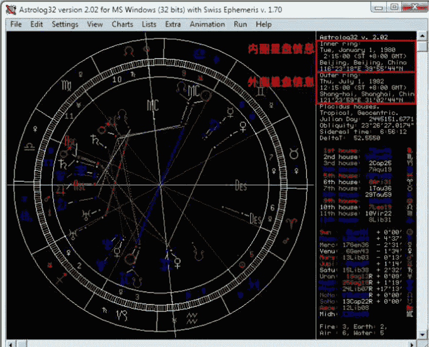

（图一）A 为内圈的 AB 之间比较星盘

### 比较星盘（Comparison Chart）

在关系星盘的系列里面，最基础的莫过于比较星盘。顾名思义，比较星盘就是将两张本命星盘放在一起做比较。其原理是将两张星盘按内圈外圈，将彼此的星体放到一体进行比较，比较时一般以内圈星盘的宫位为基准。

以 A 为内圈，B 为外圈星盘为例（见图一）：

- 如果是第一次输入这两个星盘的信息，可以通过选择菜单栏“Edit（编辑）”，“Edit/Enter Main Chart Data（编辑/输入第一星盘信息）”，或者按下快捷键“Alt+Z”输入第一星盘信息。然后再选择“Edit（编辑）”，“Edit/Enter Chart #2 Data（编辑/输入第二星盘信息）”，或者按下快捷键“Alt+Shift+Z”，输入第二星盘信息。
- 如果是两个已经保存的星盘，可以通过选择“File（文件）”，“Open Main Chart（打开第一星盘）”以及“Open Chart #2（打开第二星盘）”，快捷键分别为：“Alt+O”，“Alt+Shift+O”，打开保存好的星盘信息。

- 然后再选择“Charts（星盘）”，“Two Wheels (Comparison Chart)（比较星盘）”，快捷键：“Alt+C”。

比较星盘中的相位线条，均是两个星盘之间的相位。例如内圈 A 星盘的太阳，与外圈 B 星盘的太阳呈 180 度对分相位。内圈的北交点与外圈的天王星呈 90 度四分相位。

由于比较星盘是以内圈星盘的宫位为基准，如果想要察看外圈星盘的宫位信息，需要将这两个星盘互换。可以通过选择菜单栏中的“Edit（编辑）”，“Exchange Main Chart and #2（交换第一第二星盘信息）”，或者按下快捷键：“Shift+X”，进行交换。

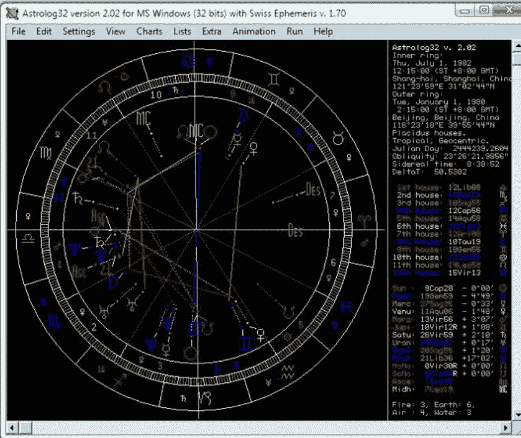

(图二)B 为内圈的 AB 之间比较星盘

（图二）为交换过后，以 B 星盘的宫位为基准的比较星盘。AB 星盘，无论哪一个为内圈，其星体所落的星座以及星体间的相位是不变的。唯一变动的是宫位的不同。

TIPS：在察看配对星盘时，同样可以用交换星盘的方法进行第一与第二星盘的互换。

### 配对星盘（Synastry Chart）

配对星盘其实是简化的比较星盘：将第二星盘的星体置入第一星盘的宫位中。配对星盘中显示的星体相位，为第二星盘中的星体相位，所以配对星盘更利于查看第二星盘的星体与相位落入第一星盘的宫位时的情况。

制作方法：在打开或输入了第一及第二星盘的信息后，选择菜单栏的“Charts（星盘）”，“Synastry（配对星盘）”，快捷键：“Alt+Y”。

### 时空中点盘（Time & Space midpoint Chart）

时空中点星盘是取两个星盘的出生时间及出生地点的中间点，生成一个新的星盘。生成的中点时间与地点是真实存在于现实中的。本质上来说，它等同于一个真实存在的本命星盘，所以可以在其基础之上进行任何形式的推运（如次限、返照、太阳弧等）。

制作时空中点盘，需要首先打开或输入第一和第二星盘的信息。然后选择菜单栏的“Charts（星盘）”，“Time/Space Midpoint（时空中点盘）”，或者快捷键：“Alt+Shift+M”。

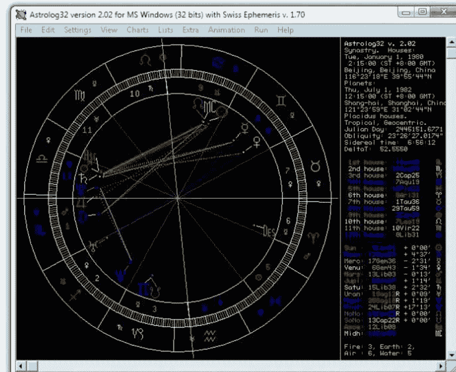

（图三）以 A 为第一星盘，B 为第二星盘的配对星盘

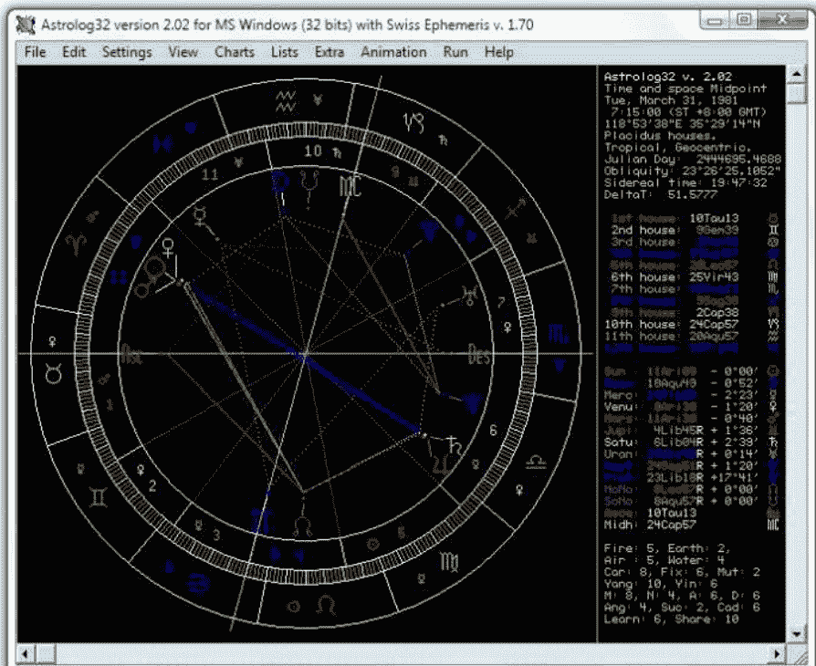

（图四）以 A 和 B 为第一、第二星盘生成的时空中点盘

在生成的时空中点星盘的右上角，星盘信息区，显示的是两个星盘的出生时间中点，与出生地点中点。这个星盘与在这个时间和经纬度出生的新生儿的本命星盘是一模一样的，因为时空中点星盘就是以两个本命星盘的时间和地点为中点，新“诞生”出的第三个星盘。时空中点星盘反映着这一段关系中两者的互动和主题。

### 组合中点盘（Combined Midpoint Chart）

制做组合中点盘，也需要先打开或输入第一、第二星盘信息，然后在菜单栏选择“Charts（星盘）”，“Composite（组合中点盘）”，快捷键为 Alt+Shift+Y。

组合中点星盘是一张完全由两个星盘的星体中点组成的“虚拟”星盘，它并不存在于现实中。它的星体所呈现的轨迹并不是真实的星体运动轨迹，所以无法通过太阳返照、次限或太阳弧等方法进行推运（但仍旧可以参考行运星体）。

组合中点星盘是以两个星盘中相同星体的中点生成的完全“虚拟”的星盘。以 A、B 星盘中的太阳为例，A 星盘的太阳在摩羯 9 度 28 分，B 星盘的太阳在巨蟹 9 度 01 分，取这两点在圆周中最近的中点，为白羊 9 度 15 分的位置（如（图五）中太阳所在的位置）。以此类推，取所有星体的中点后所形成的一张新的星盘，就是组合中点星盘。

组合中点星盘与时空中点星盘有着原理和本质上的区别。通常占星师会通过自己认为最准确或自己最接受的原理选择这两种中点星盘的其中之一。也有个别占星师认为两者看的是不同的关系形态和类别。这如同许多占星的争议一样，是见仁见智的选择。

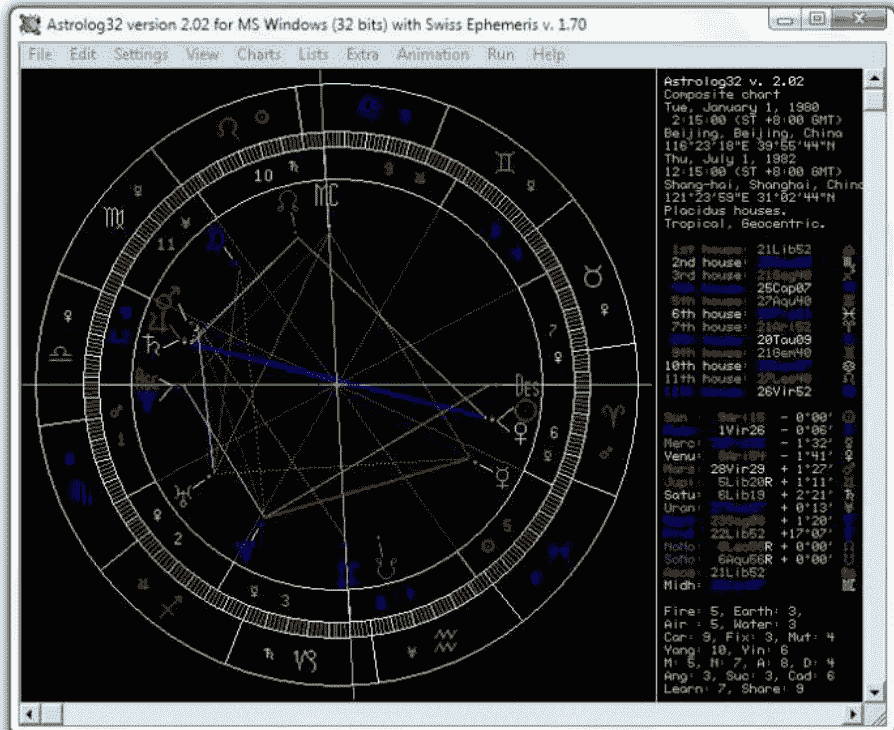

（图五）以 A 和 B 为第一、第二星盘生成的组合中点盘

### 马克斯盘（The Marks Chart）

Marks 的个人网站进一步阅读：
http://www.bobmarksastrologer.com/markschart28.0.htm

所谓的马克斯星盘，是占星师 Bob Marks（鲍勃·马克斯）“发明”的一种由时空中点盘延伸的技巧。他将这种技巧以自己的姓氏命名，在国内，一些占星爱好者简称其为“马盘”。

马克斯盘的制做步骤稍微复杂一些，在制做完时空中点星盘后（具体方法参见本文之前的示例），选择菜单栏的“File（文件）”，“Save Main Chat Data（保存当前星盘）”，然后将这张时空中点星盘保存起来。然后打开刚才保存的时空中点星盘为第一星盘信息。取决于你想要做哪一个人的马克斯盘，然后再打开 A 或者 B 的星盘为第二星盘信息。如果软件此时仍然是在时空中点星盘模式，这时新生成的星盘就是马克斯盘（如果不是，则需重新选择制作时空中点星盘）。

马克斯盘的原理是将两个星盘的时空中点盘与其中一个本命星盘再次组成为一个新的时空中点星盘，以解读这段关系对于此人的个人影响。如果将刚才我们制做的 A 与 B 的时空中点盘为一个新的星盘，将其与 A 的本命星盘再次制做成时空中点星盘，就是马克斯盘。其解读的方向是这段关系对于 A 的影响，以及 A 是如何看待这段关系的。同理，将 A 与 B 的时空中点盘与 B 的本命星盘再次制做成一个新的时空中点盘就是 B 的马克斯盘；解读它可以了解 B 是如何看待这段关系，以及这段关系对于 B 的影响。更详细的马克斯星盘的解说，大家可以登陆 Bob

TIPs：在制做完 A 的马克斯盘后，通过打开第二星盘，将其更换为 B 之后生成的星盘，就是 B 的马克斯盘。

# 占星学刊 | 古籍重现
Journal of Astrology
第4期

5. 一位有技巧的个人是可以规避很多来自行星的影响的，只要他能够注意到行星的天然特性，并在效果产生影响之前做好准备[4]。

6. 然后，如果能选择合适的时机，择日和择时将带来帮助，但如果时机不对，即便看过去很美，其结果却可能镜花水月一场。

7. 一个人如果没有办法区分（事物的）区别和先天混合属性，那么他也将无法读懂行星的相互作用。

8. 聪明的头脑会帮上大忙，就好像最优秀的农民可以通过犁田和除草帮助作物。

9. 在生产和腐化过程中，事物的形态会受到天体的形态影响。占星图标的绘画者可以通过检查行星的流年运转来利用这一规律。

10. 在择日和择时中使用凶星，就好像最出色的物理学家使用毒药来调节药剂。

11. 不要在了解使用[5]意图之前就提前择日和择时。

12. 喜好和厌恶会阻止你得出真正的占星结论，因为它们会让你低估优势，放大劣势。

13. 当天体能量势必带来影响时，记住重点观察可以带来帮助和破坏性的行星，次限盘中的也不要放过。

14. 当第七宫和其守护星被伤，你必须从挫败中成长。

15. 那些上升星座落入帝国本命星盘果宫的他国将成为帝国的敌人，上升星座落入始宫的他国将是亲密的战友，上升星座落入续宫的他国将依赖于帝国，其它也可以此类推。

16. 当第八宫被吉星守护，它们会带来来自好人的伤害，但如果它们本身入吉，则不存在此问题。

17. 给老年人做预测之前请先估计他大致能活的寿数，然后再做预测不迟。[6]

18. 当两个发光体都落在（同一星座）同一分上，且上升点合吉星，当事人简直是万事如意，富贵手到擒来。相似的，如果发光体也在同一分上紧密对冲且合相上升下降轴线，并且还有凶星合相上升，那么请参照上条自行逆向思维（译者注：或者说衰神附体，喝凉水都塞牙）

19. 当月亮合相木星时，消化能力会受到影响。

20. 不要用铁器接触当下月亮所在宫位代表的身体部位。

21. 当月亮落在天蝎座或双鱼座时，如果上升星座的守护星与地平线以上的行星形成相位，是雇佣清洁工的好时机，但如果形成相位的行星落在地平线以下，他会把你的美酒全部洒掉。

22. 不要在月亮落在狮子座时穿上或剪裁衣服，如果这件衣服本来就不应该再穿，它会变得更加破烂。[7]

23. 月亮与其它行星的相位会令命主变得喜欢折腾；如果与月亮成相位的行星本身强势，就会带来成功，如果与月亮成相位的行星本身弱势，就会变成无用功。

24. 当蚀相发生在命主的星盘四点上，或是落在年度转换点上[8]都会带来负面影响。但是发生蚀相的位置与上升点的距离会降低影响，就好像日食时长[9]每增加一小时就会影响一年，月食时长每增加一小时就会影响一个月。

25. 如果计算盘主星的次限位置时，如果它落在了中天位置，按照上升点落在直上升星座处理；如果它落在了上升位置，则按照上升点落在斜上升星座处理。[10]

注释：
[1] 塞洛斯（Syrus）是托勒密的赞助人，在他的帮助下托勒密的权威著作得以在公元2世纪出版。在此提及他是因为《占星百言》的匿名作者希望让自己的创作看过去更像是托勒密天才的著作。

[2] 箴言的希腊文版本非常明确，而拉丁文则是：“当一名当事人来咨询，希望让一件事情好转，但事情本身和分析出来的结果其实并无差异。(Cum is qui consulat, ipsum melius scrutabitur inter id et eius formam, nulla rerum differentia crit.)” 这看起来似乎是在说一名仔细的占星师会发现现实存在与他的占星观察之间其实并无区别。

[3] 也就是说，那些有天赋的人将会比从书本学习技术的人更容易预言成功。

[4] 这一箴言也被托勒密同时在《四书》第一卷第三章提及“占星是有帮助的”。

[5] 希腊文版本使用“poioteta”表示询问，拉丁文版本则使用“quailtatem”表示评估，后者似乎更加恰当。

[6] 应该在作出占星判断之前先对他的身体情况和寿数预期作出评估。

[7] 亨利·柯里（Henry Coley）在翻译第22句时加入了以下批注：“李利先生说过，某次在没有事先关注月相的情况下，他穿上了一件新外套。而此时月亮恰好落在了狮子座，相位不佳。不过两周之后，他就因为采收坚果而将衣服拉出了一堆洞，这件衣服在此后再也没有派上过用场。”

[8] 所有译者均认为这里指的是“世界的年转折点（a Revolution of the Years of the World)”，如白羊点，或个人的年转折点（a Revolution of the Years of a Nativity），如太阳返照点。而拉丁文版本则是“年转折点（Revolutions of Years <revolutionum annorum>）”。

[9] 拉丁文版本使用的是“年（annos）”，而希腊文版本则使用的是“时间（choronous）”。

[10] 也就是说，对落在中天的行星使用直上升，但对落在上升点的行星使用斜上升。

> **导语：** 本系列的新满月文章均由著名占星师史蒂芬妮·奥斯丁（Stephanie Austin）创作，刊登于国际著名占星杂志《大占星师（The Mountain Astrology）》2012年10月刊中，由《占星学刊》获得中文独家授权刊登于此。本系列文章的星盘都以白羊座0°为上升的基础星盘排列，所使用的月相图均以北京时间为准。所有与萨比恩符号相关的参考资料都来自于丹恩·鲁伊尔（Dane Rudhyar）所著的《占星曼荼罗：转变周期和360种象征（An Astrological Mandala: The Cycle of Transformations and Its 360 Symbolic Phase）》，古典书局（Vintage Books），1973年版。

## 史蒂芬妮·奥斯丁

史蒂芬妮·奥斯丁（Stephanie Austin）从 1985 年开始教学、写作并提供占星咨询至今。她尤其擅长帮助人们忆起自己的灵性目标并完成生命的目的。除去每月在《占星学刊》杂志上的专栏，她也会定期撰写可以通过电子邮件订阅的新月与满月电子报，这一内容会对当下的星相做出更加详细的解析和补充。更多星座知识、课程、电子书和运程，请参照她的网站:www.EcoAstrology.com。

## 12 月 13 日射手座新月

译/邢玮

这次新月，这一个月以及这一年标志着极为重要的转折，标志着本次26000年周期循环的结束。这一转折点也因“大觉醒运动”、“耶稣升天”、“玛雅历法的终结”、“霍皮人的第五世界”、“基督化”、“归零曲线”及其它众多称呼而闻名于世。阿拉伯数字“12”象征着完结：天地融合，神俗相遇。2012年12月12日和21日，这两个日子经常代表着演化的通道，不是世界的终结，而是全球变化的开端，从二元性和唯物论到意识到我们的统一和神性。

在这样一个大的循环之中，最明显的标志莫过于冬至这天银河系中心耀眼罕见的行星队列，这也象征着灵魂最深处的印记浮现，并重新归于光明。我们对自身的阴影清理得越多，我们也将对自己越了解，也就越能接受这组行星队列带来的非凡的宇宙级提升。当我们把“得过且过”的目标变为“活得精彩”之时，当我们治愈和打开心房之时，我们就会觉察到自己已然生活在一个截然不同的世界之中。欲了解更多信息，请观看电影《2012奥德赛（2012: The Odyssey）》并阅读由闻真出版社（Sounds True）编辑的《2012的奥秘（The Mystery of 2012）》一书。

射手座新月标志着一个新周期的开始，也标志着对自身以及我们身处宇宙环境的崭新认识。射手座的人马瞄准天空，他的箭头瞄准了我们伟大的银河中心（下文简称为“银心”）。光线携带信息。银河中心发出巨大的电磁波，天体与银河一线排开，将这些高能粒子汇聚起来，触发了意识的转变。在新月发生几个小时之内，小行星婚神星就会与银心在射手座28度合相，并同时与矮行星谷神星对冲，促进阴阳融合，并为人类社会和自然社会带来更为协调的关系。金星与北交点也在天蝎座相合，智神星与新月相刑，灶神星与新月相冲，这些都会强调向平等和合作演化发展的必要性，也促使我们从对权力的热爱转向爱人的能力。

仅在新月形成几个小时之后，天王星就结束它在本年度的逆行，为宇宙对意识层面的支持带来质的飞跃。更高级的智能、创新和自由原型大多与代表水瓶座的天王星有关。天王星从五个月前的7月13日开始从白羊座8°32'停滞逆行。而天王星的顺行也会驱使我们大步向前迈进。这次同样也是“超级月亮”，即月亮在近地点（离地球最近）的同时也是朔望日（地球、太阳、月球在一条直线上）。在“超级月亮”发生时，受电磁力和重力的影响，地球上的潮汐、构造板块和我们的心理活动都被放大加强。

在12月20日至22日之间,传统中与射手座相关的木星会在双子座与在天蝎座9°的土星和在摩羯座9°的冥王星形成一个“Yod”相位，也被称为“上帝的手指”相位（由两个150°梅花相和一个六分相形成），激励我们超越父母、宗教和社会规划的限制。这次新月发生在射手座22°，萨比恩符号是“一间中国洗衣店,暗示着灵魂的觉醒需要同化自身不熟知的部分，多方位净化我们的生活。”

明确我们对于未来的意图和愿景从未像当下这般重要。这次新月也被12月12日和12月22日的转化能量赋予了极大的变革力量，放大了我们的思维和心智。凡事相信的，必将看得见；凡是渴望的，必将被证实。我们选择的是爱还是恐惧？我们是创建者还是受害者？我们是按照自己的目的还是按照规划来生活？我们对这些问题的答案将决定我们如何体验这历史上的非凡时刻。

> “2012年将决定你会是谁。没有什么事情会发生在你身上，出现的事情不过是源于你的选择。” ——戴安娜·斯通（Diana Stone）

## 12 月 28 日巨蟹座满月

译/韩小竹

每个结束同样亦是开始。2012 的落幕像是个毕业典礼，地球则是一所全年龄段灵魂的学校。在这里，我们学会去变成一个有思想、有责任心的创造者。生活中的双重性以及分离的错觉给我们提供了宝贵的训练机会去掌握因果法则，我们发现“善有善报，恶有恶报”。正如电影《土拨鼠日（Groundhog Day）》中一般，我们只有在学会爱之后才能前行。现实会一直重复，直到我们意识到自己就是故事的演员、编剧和导演。想要让事物改变，必须先让自己改变。我们将最终学会，人生就如广播和电视一样有许多个频道，我们同样可以通过调整频率和转换频道去选择完全不同的节目。2012 年预示着大地崭新能源网的完结，就像我们的 DNA 发生重大的变异，促进我们的意识范围在深度和广度上更加延伸。当下，进入超越物质的领域对于每个人来说都很容易，获取真相和新的选择也会同时变得更加容易——只要我们选择登陆这片领域。

巨蟹座满月同时也形成了一个动态的 T 三角，除太阳、月亮之外还加入了婚神星、冥王星和天王星，预示着一系列在合作、权力、模式上的巨大转变已经准备就绪。婚神星与太阳以及冥王星的合相会强调太阳女性特质的一面，具有自信、保护、强大又包容的的能量，并被心灵的直觉和智慧所指引。这种能量并不仅仅只会传递给婴儿降生，也会传递给所有创造性的活动。这种太阳女性能量的象征在莉莉丝（Lilith，魔鬼撒旦的妻子）与布里吉特（Brigit 威力无比的爱尔兰女神）、贝利（Pele，火山女神）与卡莉（Keli，印度神话中最为暴虐和黑暗的黑色地母）、赛克麦特（Sekmet，埃及雌狮女神）与天照大神（Amaterasu，日本太阳女神）这些女性神灵的原型中均能找到。对于男女两性来说，我们可以更容易地从脉轮第三层的自我吸引转到脉轮第四层心灵的核心意识。同样，月球的阳刚之气也会更加容易获取。波塞冬和透特（Thoth，埃及神话中的月神）、钱德拉（Chandra，印度神话中的月神）和瓦德（Wadd，马因人的月神）、摩尼（Mani，摩尼教创始人）和月读尊（Tsukuyomi，日本夜国之神与月神）的原型均象征这流动的、纯净的、有支撑的月亮阳刚的力量。落在射手座 25°的水星主导了另一个 T 三角，它与落在双子座 24°的谷神星对冲，并与落在双鱼座 27°的智神星相刑，都强化了我们围绕女性力量和创造力传递信念的宇宙主题。

启示和突破出现在 12 月 26 日，在这一天太阳精准四分相天王星（摩羯座 5°，白羊座 5°）。重要的洞见将继续在 12 月 30 日太阳相合冥王星时浮现（摩羯座 9°），聚光于那些需要我们去处理的阴影、重申的权利以及做出本质改变的方面。重新界定男性和女性力量的需求仍在继续，因为婚神星会在 1 月 1 日精确刑克天王星（摩羯座 5°，白羊座 5°），并在 1 月 15 日合相冥王星（摩羯座 10°）。12 月 27 日土星会形成此次周期中与冥王星三次精确六分相中的第一次（天蝎座 9°，摩羯座 9°），并从 2012 年 10 月 5 日到 2015 年 9 月 18 日一直与之保持互容（互相位于对方所守护的星座中），这需要拥有更多的责任感、诚信和信念去面对现实问题，以改变在人际关系、金融以及政府方面长期以来的不公正状态。

此次满月的萨比恩符号提醒我们享受虚心受教的角色，但要避免伪装成不是自己的样子。太阳在摩羯座 8°是“鸟儿在明媚的阳光下愉快歌唱”。而月亮在巨蟹座 8°则是“一队兔子穿着人类的衣服如游行般行走，不同形式的生命都会有着如他们渴望成长一般追求更高状态的倾向”。这一有力的满月向我们揭示：“我们正处在神圣生活的边缘。你被邀请时刻准备好跳入其中。这是 26000 年一遇的机会，值得你使出浑身解数。请谨慎的分配时间，将生活中的一切沉静下来；尝试彻底的正直，对真相寸步不让；驱除心中阴影，大量地祈祷和默想；追求美好，学会原谅自己，原谅别人。这世界上不存在任何让你放弃爱的情况。选择爱吧，这是你通往神圣生活的必经之门。”——莱斯利·神圣·默斯顿（Leslie Temple-Thurston）

## 1月12日摩羯座新月

译/刘欣

新月标志着新周期的开始，预示着上升到下一阶段的机会。摩羯座，也是第三个土相星座，连接着物质现实的时间、空间、责任和资源。新月提供了一个强力的信息，因为它不仅涉及到太阳和月亮，还有水星、冥王星、木星和金星——它们全部都在摩羯座。这个强有力的阵容将持续为重塑编译前一个新月和满月中的太阳女性角色以及转化我们对物质现实的认知提供支持。

不论是摩羯座，还是它传统的守护星土星，追寻它们神话根源都会回归到女性神灵。山羊和角是居住在山上神殿的月亮女祭司的象征。土星则是古代农业之神，是大女神的化身。灶神（Vesta）是农业之神的第一个孩子，也是奥林匹斯山女神中和摩羯座联系最紧密的一位。而在阿玛尔忒亚（Amalthea）的神话中，这位养育着宙斯的山羊女神和她长着山羊角的哥哥牧神潘（Pan）也和这个星座紧密联系。新月与落在双子座 21°40' 的谷神星形成紧密的梅花相位，同时天蝎座土星也与落在双子座 10°40' 的灶神星形成紧密的梅花相位，两者都会推动我们重塑自身与女性、自然以及灵性之间的关系。

正如我们对女性的概念在不断变化，我们对时间和空间的体验也在剧烈转变。摩羯座和土星常常和现实世界紧密联系，通过我们的五种感觉变得可见和可测量。冥王星在摩羯座长期的停留（2008-2024）和它与天王星的相刑（2012-2015）会带领我们超越经典物理学定律，突破现实，进入没有静止、固态和分离的量子物理学领域。当我们超越有限的三维世界，时间将不再只是单向和线性的过程，而是变成永恒的现在。这完全取决于我们的关注和意识水平。时间将成为幻相，过去会变得像未来一样多变。古代希腊人用两个完全不同的词语形容时间：“cairos”，代表灵性的和循环的时间，“chronos” 代表世俗的和连续的时间；英文单词“同时性（Synchronicities）”（词根“syn”意味着联合，而“chronos”代表着“时间”）确定我们和我们的神圣本质和灵魂时间一致。关于时间，科学和灵性进化的神奇内容，请阅读大卫·威尔科克（David Wilcock）的《源场调查（The Source Field Investigations）》一书。

本次新月也召唤我们将关系转变为力量。在大多数西方世界里，力量被定义为金钱、名誉、控制力。我们忘记了爱、真相、自然、创造力、集体和健康才是真正的力量源泉。我们如何花费我们的时间、能量和才能决定我们对力量的体验。急躁、担忧和衡量只会耗尽我们的力量，风度、感恩和宽恕才能建立力量。当我们让其他人制定我们的目标，当我们害怕说“不”，当我们因为恐惧而行动，我们就放弃了自己的力量。这次发生在摩羯座的新月会开启我们对力量的感知，意识到是我们自己创造出想法、话语和事件，生活中的每件事件都反映出我们选择的结果。随着金星与天王星在 1 月 13 日相刑，与冥王星在 1 月 17 日相合，与婚神星在 1 月 18 日相合，我们会意识到伴侣关系的重要性和可能会发生的变化。发生在 1 月 15 日的冥王星合相婚神星，木星刑凯龙星，也会帮助我们回忆并重新排列我们心中所愿。

这次新月所在的摩羯座 22° 的萨比恩符号指导我们放下那些麻木灵魂的事物，提醒我们没有失败，只有学习：“通过优雅地接受失败，将彰显出高贵的品格；失败比成功更容易让人受益匪浅。”我们对时间、空间和现实本身的看法正在变化。继续调整你的心和直觉到现在的真实。阅读大卫·霍金（David Hawkins）的神奇之书《权力和力量（power versus Force）》，并且记住：“……当我们死亡时就轮到上帝来审判我们，他不会问‘你一生做过多少好事？’但他会问‘你对你所做的事情中投入了多少爱？’”——特蕾莎修女（Mother Teresa）

## 1月27日狮子座满月

译/叶思晨

从每两小时一变的上升星座，到每两千多年移位一次的占星纪元，天宫图描述了我们所经历的不同层面的原始循环。黄道上的每个星座都携带着意识进化所必须的一组特质。水瓶座代表着群体意识的发展，在这里，我们会从之前对自我、性别、信仰、种族和国家的认定逐渐转换到将每个个体都视为人类家庭中平等的一员。虽然有关水瓶时代具体起点的争论仍然存在，但毋庸置疑的是人类已经开始努力雕刻水瓶时代的理想，从阶级社会走向人人平等，从竞争迈向合作，从自我中心转向利他主义。

在这一独一无二的时空交接处，满月揭示了我们需要融合成为一个整体，其中又强调了狮子和水瓶的原型真相——每个人都是上天的礼赐，也是生命之网中不可分离的一部分。我们都有独特的天赋，承载着不同的使命。每个人都意义重大，而当我们把力量凝聚起来时，便组成一个强大的同心协力的整体，它的力量要比单个个体的力量要大的多。

平衡男性力量和女性力量的重要性又一次引起公众注意。天王星，也是水瓶座的现代守护行星，几乎与小行星智神星相合。智神星的原型是希腊集勇气、创造力和医术于一身的智慧女神雅典娜。智神星的传说折射了千年以来男女之间头脑和心灵的争斗。在一些版本里，她是从朱庇特（罗马神话中的宙斯神）的脑中生长出的，而根据另一些说法，当朱庇特的脑袋被一把双刃战斧（母系的象征）劈开时，她便从中解脱出来，同时也缓解了朱庇特头部的剧痛。狮子座满月期间，天王星与智神星相合，点燃了人们对自由与平等的渴望之火。同时天王星与智神星的合相也会与落在狮子座的月亮形成三分拱相位，以及与落在水瓶座的太阳和水星六合，这也使我们很容易和那些有着同样视角和理想的人们交流和联系。

灶神星是天空中最亮的小行星，另一个重要的女性象征。它在满月达到高峰前十二小时停滞，唤起了我们对神圣事业的记忆，和我们带给世界的荣光。2012年10月20日，灶神星在双子座26度逆行，在双子座10度恢复顺行，非常接近木星。而木星在1月30日恢复顺行，鼓励我们在接下来的一些天敢想敢为。木星每年一次的逆行始于2012年10月4日、双子座16度，在双子座6度恢复顺行。由于它们各自的逆行，在2012年6月19日到2013年4月1日期间，木星和灶神星的角度都在10度以内，使我们对女性议题的认知、奉献和生命的目的都有了新的认识。

这次满月的萨比恩符号阐释了这是一个新观念和新偶像的时代。月亮落在狮子座8°：“共产主义激进分子传播着他的革命理想，作为新秩序的前奏，情感和意识都会试图回到未异化和混乱的状态。”太阳在水瓶座8°：“橱窗里陈列着穿美丽长袍的蜡像，它们的灵感来源于新文化的几个原型。”（登陆 www.TransitionUS.org 和 www.Avaaz.org 查看更多内容。）建立一个共同体，让思想和生活跳出传统。“思想的碎片在到达耳朵之前就会被捕获，造成真相的腐烂。像一天两次使用牙刷和牙线那样清洁你的精神世界。当你快要勃然大怒时，记住：与其以牙还牙，不如特立独行。（Swami Beyondananda）”

## 女白领盲目占卜惹非议

编辑/郭晨迪

辽宁都市频道11月17日报道了一则消息，一女白领热衷占星塔罗，盲目为同事、领导算命，差点儿惹出了乱子。

今年大学毕业的琳琳（化名）在一家公司就职，刚到公司一个月，琳琳就把所有人的星座了解得一清二楚。琳琳还网购了一本占星书和一副塔罗牌，不论在公司还是在家里，只要有空就去研究，抽屉里还放着测算用的星盘。当然了，琳琳最热衷的还是给同事算命。

前不久，琳琳的一位女同事和男朋友闹了别扭，谁也不搭理谁了。琳琳知道以后，一定要用塔罗牌给他们测一下感情运势，还说这个特准，算完了就知道问题出在哪儿了。女同事按照琳琳的要求把塔罗牌洗了好几遍，再交给琳琳。只听琳琳慢条斯理地说了一句：“逆位！”“什么是逆位呢？”女同事问。“就是情况不太好”，琳琳叮嘱道，“要小心男友有外遇！”一听这话，女同事脸都绿了，一回头她就去找了男朋友，质问他：“你是不是真有外遇了！如果有，咱俩就分手！”幸好男友并未移情别恋，后来把话说清楚了，二人重归于好。

琳琳差点棒打鸳鸯却并没有吸取教训，反而算到了领导头上。鼓捣了一番塔罗牌之后，琳琳煞有介事地说：“领导，塔罗牌显示，您最近可能有决策是错误的，需要自我检讨。”搞得领导相当尴尬。

有专家建议，像琳琳这样真喜欢占星的年轻人，应该多做一些正面的预测，给人信心和鼓励，也能够活跃气氛。

琳琳的例子在占星爱好者中并不少见，这类爱好者对占星没有一个明确的态度。若爱好者仅仅把占星作为一种娱乐，用来活跃气氛、拉近人际关系也是极好的。如果希望在占星领域有所建树，就必须以十分严谨的态度来对待，切忌盲目自信、急于求成。

## 美国NPR电台访谈金融占星师

编辑/郭晨迪

在今年的9月19日，两位金融占星家，凯伦·斯达什（Karen Starich）和埃尔·克劳福德（Arch Crawford）在接受全国公共广播电台（NPR）记者海蒂·摩尔（Heidi Moore）的采访时，关注了特别显著地影响着现今经济市场的一些周期。在使用占星术预测金融市场的变化和问题上，这二人都曾创立了辉煌的记录。

摩尔女士同两位占星家详尽地探讨了关于占星术如何成为财务策划的工具的问题。她强调：“投资者们希望占据优势，希望看到未来的走势。”在接下来关于美联储的讨论中，她提到，当前流年土星正在和美联储本命盘的海王星形成紧张的刑相位——“这下真的要破产了！”她说道。

克劳福德举例阐述不听从他警告的后果：“骑士资本（Knight Capital）没有采纳我们关于水星逆行期要避免大额购物和尝试新事物的建议。”因为水逆期间往往伴随着通信、沟通障碍。结果骑士资本在新软件方面遭遇了重大的故障，这几乎导致他们破产。

## 土星回归的意义

编辑/郭晨迪

28岁的女作家安娜贝尔·罗斯（Annabel Ross）在她发表于2012年8月22日《悉尼先驱晨报（Sydney Morning Herald）》的《土星回归：第一生命危机（Saturn Return：The First Life Crisis）》一文中写道：她无意中发现了一个十分有价值的信息——关于土星回归可能会带来什么。

罗斯女士在研究灵性故事的过程中，采访了几位医生和心理咨询师，当她谈到她生活中的挫折感时，不止一个人说：“这只是你的土星回归。”罗斯女士还发现，许多有名的人谈到或写到他们的第一次土星回归的意义。她采取了很多途径来获得资料，包括搜索网络资源、阅读书籍文献、采访朋友以及请同事讲述自己的经历。

最后，她得出结论：“……这是一种普遍的经验，二十年代的一项测试结果也显示：如果我们在此刻（土星回归）做出正确的决定，将会收获更大的确定性和满足感。”

## 简讯

编辑/郭晨迪

《中国新闻周刊》11月22日刊登的文章《于丹呛声，源于水逆期间气场反差》从水逆的角度分析了11月21日于丹在北大昆曲雅集遭遇的一场危机。当台下很多观众还沉浸在昆曲的优雅中，呼唤着让老艺术家返场和讲话的时候，于丹却被主持人盛情邀请上台，代表观众发表感言，引发观众席中传出不少诸如“下去吧！”“你没资格代表我们！”等炮轰其下台的话语。随后此事被渲染成全场喊“滚”。作者古曼评论此事称：“如果从占星角度来说，这不过是一季一次的水逆效应罢了。”“水星逆行时星体的能量会有某种程度的制约……而被水星掌控的信息、交通、交流方面的事宜均会遭受影响。”在作者看来“于丹被炮轰下台的事件只不过是一种突发性的气场冲突，既上升不到北大精神的‘腐朽’，也压不住于丹效应的‘神奇’。”

## 更多资料

↓↓↓

---

### 【中华古籍库】

↓ 点击链接 ↓

https://www.fozhu920.com/list/

珍版刻印 / 海外流传 / 家传手抄 / 民间失传

【易】【医】【道】【武】【文】【奇】【画】【书】

1000000+高清古书籍

### 打包下载

微信：mbook86

### 中华古籍库

1000000册 高清影印古籍
珍版刻印 / 海外流传 / 家传手抄 / 民间失传

古籍善本、经史子集、史料笔记、古人文集、
民间收藏、传世家谱、各地方志、中医典籍、
四库全书、古禁毁书、内阁文库、图书集成、
丛书集成、四部丛刊、万有文库、四部备要、
二十四史、三国六朝文、明清和民国古籍史料
……