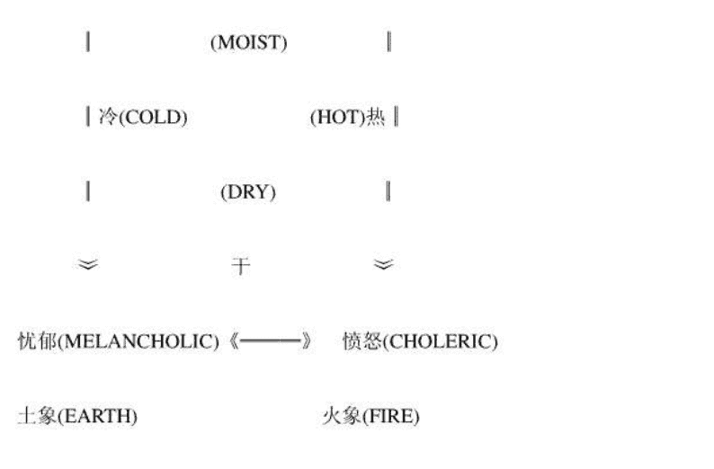

# 占星学家谈星座

## 目 录

- 序 2
- 自 序 5
- 第一章 导 论 8
- 第二章 阴 阳 宫 25
- 第三章 四 正 宫 35
- 第四章 三 方 宫 62
- 第五章 自然属性 82
- 第六章 气 性 98
- 第七章 宫 主 星 115
- 第八章 对 宫 133
- 第九章 后天宫 150
- 第十章 荣格的精神分析 163
- 第十一章 征象与符号 180
- 第十二章 生活领域的基本态度 207
- 第十三章 流年的推运 231
- 第十四章 基本个性的论断提示 257

## 序

我们认为在现阶段推展现代占星学，所应该努力的目标，除了促使中国的命理研究走向于更高阶层的应用，以适应于时代性和国际性的发展趋向之外，也应该致力于把中国的命理研究从传统的具有宗教、迷信色彩当中抽离出来，赋予科学性的研究意涵。而这种非常具有时代性意义的工作，其所必然要面对的首要课题，至少有以下二项：

第一，是要对传统术数进行批判继承的工作，勇于脱掉传统术数扑溯迷离的外衣，重新进行检验和考证的工作，扫除中国传统术数当中伪造、篡改和托古等弊端，并针对不合时宜的部份进行淘汰的工作。

第二，是要引进国外的命理研究成果，介绍世界性的命理研究发展现况，使中国的命理研究不致于成为“闭门造车”和“井底之蛙”的情况。

在这两方面的相结合之下，才能使得中国的命理研究走出自己的一条新道路。而在发展方向上，我们认为主要有下列三项：

首先，真正而确实地解读占星论命。“占星学”这个名称，是自古一直沿用下来的，是与天文星象相结合的意思。在古时候，也确实是天文学与占星学合而为一。但是现在新一代的占星学家，却反而喜欢以“宇宙生物学”来称呼，它代表着人体在宇宙活动空间中，感受于宇宙能量的影响而所导致的人体磁场的转变，也因此而构成了命运。以“宇宙生物学”来称呼占星学，是赋予命理具有人类潜能开发的积极意义，改变传统命理上宿命论之下的悲观消极色彩。这套“宇宙生物学”的命理体系，是人类智慧的共同结晶，是整体人类探索于生命奥秘的途径之一，有必要以新的时代意义来对占星论命进行解读。

其次，走出一条中国命理研究的新道路。在中国传统的命理学当中，原本就存在着属于星象系统的命理学，所谓的“七政四余”即是属于世界占星学的一环，也保留着一些占星学上的研究成果。因此，在整体人类探索于宇宙奥秘的过程中，中国人不但不会缺席，而且应该可以做出点成就。同时，由于命理的解析涉及到社会和文化背景的差异，所以奠基于西方文化背景的现代占星学，其所代表的征象意涵，未必能完全适用于中国社会的实际情况，有必要进行适当的修正与补全。而这有待于将国外现有的占星学研究成果，与中国的占星学研究相结合，并且依照社会和文化背景的差异，而重新界定占星学上的某些命理征象，为中国的占星学研究创造出另一个新的发展方向。

其三，为中国占星学的科际整合做出抛砖引玉的工作。占星学本来就是一门实用的学问，然而在应用的层次上，却随着时代的演进而有所改变。本世纪以来，西方由于自然科学和社会科学的研究成果相当丰硕，尤其是心理学的研究相当发达，导致形成占星学上科际整合研究的发展途径，这是整个世界的命理研究趋向。然而，中国目前在这一方面的研究却相当缺乏，所以有必要透过抛砖引玉的手段，来吸引更多的专业人才，投入于占星学的科际整合研究，提高中国命理的研究位阶，走出局限于狭隘的个人式命理论断的格局。

本书的内容，所诉求的乃是前面第一项的发展目标，最主要的目的是在于澄清对于星座的某些看法。因为就目前台湾所出版的占星学书籍来看，几乎完全只是太阳星座或月亮星座的探讨而已。暂且不谈在西方国家的占星学研究领域中，太阳星座专家与专业的占星学家是完全不相同的；也暂且不谈专业的占星学家对于太阳星座或月亮星座的看法，是不同于太阳星座专家的看法。而仅就星座本身所具有的征象意涵来看，则无疑地台湾有许多谈论星座的书籍，充满着太多的误导现象。我们认为这种误导现象之所以会发生，最主要的原因是因为我们缺乏了解西方占星学家对于星座的看法，反而大量地介绍了日本式的错误说法。

当然，国内也有几本翻译自西方太阳星座专家的著作。但是，却普遍地存在着三种缺失：一是不了解原作者在占星学研究领域上的位阶（西方国家对于占星学家的资格和程度的认定，是具有一定的标准和规定的），以致于所翻译的书籍的原作者，大部份是属于不入流的角色，内容上的错误也就自然比较多了；二是不了解书籍的内容有多少是已经被淘汰了的，导致于我们所辛苦阅读的星座内容，却是已经过了时的东西；三是翻译用语上的不适当和缺乏原因的诠释，前者容易导致读者误解星座所代表意涵，而后者则无法让读者明了星座特质的来源，两者的结合阻碍了读者对于星座的真正理解，也妨碍了读者培养对于星座书籍所谈内容之对错的分辨能力，更导致了读者永远无法真正地进入占星学研究领域。

因此，我们认为短期内的现代占星学推展工作，绝对不可能不针对太阳星座的某些误导进行厘清。这一来除了让读者能真正地知道星座在占星学论断上所扮演的角色，以及如何从专业性的角度来研究星座以外，二来是本着占星学家所诉求的专业传统，进行扫除低俗化太阳星座的误导现象，这是全世界占星学家所共同认同的责任。

我们知道在目前台湾的电脑使用尚不普遍、占星学的服务网路也还不具备的情况下，无法像西方的占星学家一样，在九十年代把太阳星座导入于正确的认知方向。但是，我们认为还是有必要去做，因为我们相信不久的将来，透过占星学电脑软体的普遍化，以及绘制各种占星学命盘的服务，所谓“星星人类”的未来星座话题，已经不再是你或你的太阳星座或月亮星座是什么？而是你或你的主要人格星座是什么？次要人格星座是什么？你或你对于爱情或婚姻的基本态度的星座是什么？对于职业或工作的基本态度的星座是什么？你或你的意识星座有那些？潜意识星座有那些？等具有心理学基础的星座知识。

我们相信每一个人都具有求知的潜在能力，每一个人都具有想要更进一步地了解自己的心理动机。因此，只有太阳星座或月亮星座的话，是无法满足于人们期望透过占星学来了解自己的个性。于是，能平君所企划的几本有关探讨星座及人格特质的书籍，正好有助于读者更清楚地认识星座，以及知道占星学家是如何应用命盘来透视个性，这同时也有助于读者修正某些错误的星座观念，并且奠定往后在实际论断上的分析能力。

最后，我们相信随着电脑资讯服务的逐渐完备，以及年轻人的期望于从占星学来更进一步地了解自己，必然会使到太阳星座的误导现象减到最低的程度。而任何一位专业的占星学家（西方占星学家根本不承认太阳星座专家在占星学领域上的地位），也都不可以忘记扫除太阳星座误导的责任，这不只是知识专业性的问题，也不只是道德良心的问题，更是尊重人类生命和命运的问题！

“天星论命工作群”．指导顾问

吕阳明．彭喜豪 写于台北市

一九九五年八月十五日

## 自 序

本书的写作如果从比较自私的角度来看，则是在于为我自己免除一些困扰。因为每当有人知道我懂得占星学的时候，总是会问我一些有关星座的问题，譬如说，白羊座的个性应该是如何？天蝎座的个性又应该是怎样？月亮落入巨蟹座会如何？火象星座有何特征？甚至问我为何知道这么多有关星座的内容...等，所有这些问题都令我相当困扰。使得我最后只好回答说：我会尽快地写几本有关星座的书籍，你只要详阅书中的内容，就可以与我同样地了解星座了。

其实，我不是不愿意回答任何有关星座的问题，而是因为时常会在回答问题的过程中，发生三个重大的难题：一是总是必须修正对方对于星座所具有的某些错误观念；二是总是必须提供对方如何了解星座的方法；三是总是必须解释占星学家如何在实际论断上应用星座。最后，甚至还必须说明对方的个性，是由那几个主要的星座所形成的。所有这些难题所造成的困扰，是任何一位专业的占星学家都必然会面临的。而产生困扰的最大原因就是：太阳星座的误导！

于是，在为了推展现代占星学，以及扫除太阳星座所形成的误导的双重目的下，我决定把有关探讨星座的部份先行写出。然而，在我写作完成之后，却有不少关心我的朋友认为内容不具普遍性，可能会大大地影响了销售量。甚至还有人认为，读者大部份都是只需要太阳星座的说明而已，只有相当少数的人才会有兴趣去深入研究占星学。况且，占星学的论断又是如此的复杂，不同样的命盘又是如此的多，所以恐怕很难确保一定的销售量，甚至还会有亏本的可能。

针对关心我的朋友所提到的担心销售量的问题，我承认，而且我也心里有数。只是我一直认为应该坚持既定的专业立场，绝不随波逐流地去为了销售量，而写一些无聊透顶、胡言乱语和跟着日本低俗潮流在走的低级作品。因为就一位知识份子型的占星学家来说，这种作法不但是低估了读者的智慧、昧着良心去介绍错误的东西，甚至从探讨人类命运的角度来说，简直就是“草菅人命”！

我承认占星学有它复杂和艰深的地方，然而这绝对不是难以学习的关键所在，真正的关键乃是在于我们还无法熟悉于现代占星学的论断方法－“意识流的论断手法”。我时常对我的朋友和学生们一再地强调，在即将迈入廿一世纪的此时，心理占星学已经成为论断的主轴，如果无法把心理占星学研究得透彻的话，就别想成为一位卓越的占星学家，而如果认为我的写作很难懂，或者是根本对论命无所帮助的话，那么当你看到西方占星学家所写的那种“梦境式”的心理描述，就无从理解起，也永远只能停留在古代占星学的层次，无法赶上新时代的新潮流。

因此，我甚至时常开玩笑地对朋友说：我的占星学书籍是“无心人不宜观赏”！这绝对不是我自划界线来限制自己的销售量，而实在是因为研究占星学需要相当有心，它绝对无法以“休闲式”的阅读方式来进行。我更时常告诉别人：现代占星学是一门与个人人生课题有关的知识，如果你关心自己的一生，并且以谨慎关注的态度来面对自己的人生的话，你就会想要知道比较深入的占星学内容。所以，我不求销售量的大增，也不求读者的大量，我只期望我的读者，千万不要以休闲好玩的态度看待占星学。这就好像是朋友并不需要多，只要有几个知心的就可以了。

每当我想到占星学是由天王星和宝瓶座所主宰的时候，就深深地体会到它的创新精神、坚持理念和人道主义色彩，也就更加深了我的专业主义走向。同时，我更肯定中国人的文化和智慧的深度，远比日本人高出许多，中国占星学在现代占星学的广泛研究领域中，有着西方占星学家所认同的一席之地，而绝对没有日本占星学这个名称。也因此，我相信目前台湾所走的“东洋占星学”的路线（特别指的是血型加星座的无聊讲法），在不久将来会被淘汰，而只要这种深具东洋风格的星座讲法一日不除，我就永远不会停止进行扫除的工作！

此外，我也相信每一个人皆具有理性的能力，它诉说着人们具有求知的本能，以及具有分辨知识深浅的能力，更具有不愿意永远只停留在“一知半解”之中的向上力。也可以说，就是肯定了人们会想要对占星学有更深一层的理解，不管这种理解是要用来解读自己的个性和命运，或者是要用来透视某种宇宙的神秘力量，或者是要用来证明占星学根本就是一种迷信。所有的这些不同的学习动机，都有赖于专业性的诉求来作解决，太阳星座在先天上就已经缺乏了满足这些动机的功能，所以我决定提供读者另一种选择。我希望本书能够有助于读者对于星座有更深一层的了解，至于有关占星学在实际应用上的探讨，我会在往后的书籍中陆续地来作介绍，以便让读者能够真正地把占星学应用在解决自己人生的重要课题上。

最后，特别感谢吕阳明老师将美国占星学会(AFA)的台湾独家书籍代理销售权转交予我，我准备陆续引进上千种以上的欧美占星学专业著作和期刊，以提供给有心研究占星学的同好们选购；并感谢美国占星学会(AFA)的授权及协助处理有关中文翻译版权的事宜；也再次感谢 Alfred B. Andersen 的协助，使得占星学电脑软体逐步获得改进，并且以平实的价格售予读者。

此外，也感谢自强兄等好友的协助翻译，目前在台湾实在是很需要通晓占星学并学有专长的专业人才，来进行占星学专业领域的书籍介绍；也感谢吕祥兄协助建立“现代占星学服务中心”；也感谢雅君、世芬、学玲和玉珍等好友，接下“凯龙星工作室”的筹划工作，负责占星学的普及化和简易化，以及筹划一切对外的宣传工作；也感谢中和兄的加入“天星论命工作群”，并接下总编辑的工作，负责“现代占星学系列丛书”和“现代占星学名著译粹”的出版事宜，以及协助规划“现代占星学校园推广小组”，虽然我们之间在论断方法上有所差异，但是透过不断的沟通和切磋，已经取得基本概念上的一致；也感谢国耀兄和建毅协助占星学期刊和教学中心的筹划；也感谢彭喜豪老师协助筹划“政经顾问小组”的研究工作；也感谢森益兄、律璋兄和家盛兄等，在百忙之中还热心地提供我有关规划各县市工作站的意见；更感谢莲福兄在场地、资金和出版行销上提供支援，使得整个推展工作无后顾之虑；也感谢董惟森先生的来函鼓励，我相信只要是有兴趣研究占星学的前辈和后辈们彼此互相共同努力的话，现代占星学的研究一定可以很快地在台湾推广起来。

本书所存在的任何缺点，恳请各位读者多多指正赐教，并恳请一再地催促我快点出书的读者们多多见谅。我因为白天尚有其他的工作要做，只能利用晚上的少许时间来进行写作，所以出书的速度跟不上读者的求知欲。对此，我除了感慨于本土化之专业占星学家的相当缺乏以外，也力图透过引进占星学原文书籍和期刊，以及翻译专业的占星学名著，并邀约研究占星学多年的好友们协助写作，同时也加快占星学人才的训练等途径，来尽量地在最短的时间内把占星学的知识陆续介绍给读者们。若有任何电脑操作上的问题，可直接与出版社联系。

“天星论命工作群”．总策划

洪能平 写于阳明山

一九九五年八月十五日

## 第一章 导论

曾经有许多人问我：“如何才能成为一位星座专家？”我的回答是：“对于星座不但要‘知其然’，而且还要‘知其所以然’，如此才有资格可以称得上是一位星座专家。”

“知其然”并不困难，只要购买几本有关星座的书籍来看，多多少少就可以了解到星座所具有的特质。但是，这往往会存在着两个基本性的问题：一是为何某一个星座会具有这样的特质？二是如何判断书中所写的星座特质的对错？这两个问题的结合，往往造成有兴趣研究星座的人，不知道到底应该如何去研究星座，进而时常导致对于星座只是“一知半解”。而接下来的一个问题是：不可能把所有有关星座的说明都全部地记忆下来。再来是，如果真的很用心地去死背星座特质的话，又如何进行消化？又如何理解单一星座之特质所存在的内在一致性？又如何把星座的特质应用在实际的命理论断上？

总之，所有问题的解决，都必须有赖于针对星座进行一种“知其所以然式”的解读。而这时常也是占星学家在进入占星学研究领域时，所以必须要面对的第一个重要的课程。因为唯有在对于星座具有相当充分的认知之后，才有可能奠定心理占星学的论断基础，作为往后与行星进行整合性论断的入门功夫。

然而，由于目前大部份的人们对于星座的认知，只是停留在太阳星座或月亮星座的相当粗浅（甚至是错误）的概念之中，形成只能说是还站在星座的“入门之外”。于是，我认为有必要就占星学家眼中的星座，来作一种比较专业性质的介绍，以引导读者进入星座的研究之门，并且让读者学习到如何去分辨太阳星座书籍所写之内容的对错。

在进入主题的探讨之前，我想先就个人时常被问及的几个有关星座的问题略作回答，以及针对太阳星座所存在的某些错误观念略作说明，以便读者能够对于星座先具有一种基本性的认知。

### 谈有关星座的十大问题

在此，我所谓的“星座问题”，指的是在专业性占星学研究上所可能会遭遇到的星座问题，以及几个有关太阳星座的问题，而不是学习太阳星座所可能会面临的难题。

第一，占星学家眼中的星座，与太阳星座专家眼中的星座，有何异同？

这个问题可以简单地从三个方面来看。首先，从整个占星学所涉及到的论断因素来看。太阳星座只能算是所有考量因素之中的一个而已，绝对不是全部。严格地说，每一个人都会受到十二星座的影响，因为每一个人的命盘当中皆具有黄道十二宫，每一个人皆具有十二星座的特质。因此，占星学家根本就无法接受太阳星座的草率说法；占星学家所要求的是，尽可能地对于各种因素进行整合与分析，而不是从单一因素来说明个人会是怎样的一个人。换言之，太阳星座专家所著重的只是单一星座而已，而占星学家所著重的十二星座彼此之间的互动关系。

其次，从占星学之实际论断的角度来看。太阳星座专家时常是以星座来作为主要的诉求重点，并且把太阳所落入之星座的特质广泛地扩展到各种层面。然而，占星学家讲求的是精密度，诉求的是透过相位、宫位宫头所在的位置以及庙旺陷弱等，来评估太阳星座的吉凶特质，以及它所最可能会影响到的生活层面，绝对不会把太阳星座的影响力扩展到无所不能的境地，更不会不考虑到太阳星座将会遭遇到其他因素的制约。

其三，从太阳所具有的特质来看。由于占星学家所著重的是行星的功能，所以占星学家眼中的太阳星座，指的是在太阳功能运作下的星座，它不同于月亮功能运作下的星座，也不同于金星功能运作下的星座。因此，当太阳星座专家忽略了太阳本身所具有的特殊功能，转而把太阳的功能过度地膨胀化，自然会引起占星学家的反感。

此外，从西方国家的占星学研究现况来看，还存在着一种颇为有趣的现象。那就是如果想要在占星学研究领域上取得一定地位的话，就必须确立自己的研究主题，并且针对该研究主题提出自己的研究心得，这也可以说是占星学研究之专业化的走向。然而，太阳星座专家往往无法具备这种条件，因为太阳星座专家无法具备充分的实际论断经验，而只能谈一谈星座而已。也因此，太阳星座专家时常只能具有“一般会员”的资格，而无法具备“研究会员”的资格（西方国家的占星学会，对于占星学家的资格认定，是具有一定标准的）。

当然，在此我也不可否认有一些西方的占星学家，也会在报纸或杂志的专栏上，写作与星座有关的探讨。这在商业社会中为了适应某些读者的要求，是一种很自然的现象。然而，只要是占星学家所执笔的内容，总是会事先明确地界定太阳星座的意义，以及说明太阳星座本身所存在的局限性，以免误导读者。而且，在目前西方的一般民众已经相当明了太阳星座之局限性和错误性的情况下，专栏的写作内容已经与以前大不相同了，专业性的倾向越来越浓厚，因为大部份的人都已经可以应用电脑来绘制自己的各种命盘。

第二，星座在整个占星学论断的过程中，到底扮演着怎样的角色和地位？

这可以简单地从“环境”和“天赋特质”来作思索。所谓的环境，指的是星座乃是行星所落入的环境，也可以说就是行星运作的背景。换言之，行星一定会落入某一个星座之中，并且与该星座产生互动，而这种行星与星座彼此之间的互动关系，突显了星座本身所具有的环境制约的作用，亦即行星只能从它所落入的星座来发挥力量（在此暂时不谈论相位和飞星），而无法从其他的星座管道来作发挥。也因此，在实际论断上，星座时常指示着“部位”（如医药占星学上的身体部位）、“基本态度”（如各种生活领域的基本态度）和“基本特质”（如个人的基本人格特质）等。

所谓的天赋特质，指的是星座除了具有个别性的特质以外，也具有综合性的特质，两者在实际论断上都会应用到。以前者来说，针对的是个别性、细微性的论断，譬如说，与爱情有关的星座论断，可以从金星所落入的星座，以及第五宫宫头所在的星座等，来作一种基本性的观察，因为透过以上两者的星座特质，可以看出个人在爱情方面的某些天赋才能。而就后者而言，针对的是整体性、综合性的论断，这在心理占星学上是居于最重要的地位，因为它塑造了个人的基本心理结构。换言之，可以透过每一个人命盘上之十二星座的轻重比例，来决定一个人的意识和潜意识的作用，进而论断个人对于各种事件可能会采取何种行为反应，以及可能会发生何种事故。

这种十二星座特质的综合性论断，以现代占星学的论断过程来说，乃是最基本的论断方法，也可以说就是整个命盘论断的切入点。如果无法熟悉命盘上十二星座特质的基本整合，也就无法拉出论断的主轴线，亦即也就无法了解个人的基本心理结构，如此一来，也就难以进行比较细微方面的论断。

以前面所提到的爱情来说，假设某一个人的基本人格特质，受到二个土象星座、一个水象星座和一个风象星座的影响，则很明显地此人的土象比较重。此时，如果金星是落入火象星座，或者第五宫宫头是落在火象星座的话，也可能很难发挥爱情的主动性、爆发性，因为整个人格特质的基本结构是以土象为主。所以，命盘上十二星座特质的综合性论断，乃是研究占星学的入门功夫，无法精通于此，就别想作更深入的研究。也因此，我才会强调太阳星座根本就是还停留在“入门之外”，因为它连最基本的单一星座的特质都还无法厘清，试问如何进行十二星座的综合性论断？

#### 第三，如何才能彻底地了解星座？

由于占星学家在进行论断的时候，对于星座的应用是多元性的，因此占星学家在学习星座的时候，就已经开始在为将来的论断打基础了。所以，占星学家对于星座的理解方式，早在学习的过程中就已经与太阳星座专家有所差别了（太阳星座专家大部份并没有受过专业的占星学课程，所以才会把占星学看得如此简单）。因此，这里所谓的彻底了解星座，指的是占星学家到底是如何解读星座的，而且这些解读方法是可以应用在实际论断上的。就此而言，星座的解读涉及到以下的几个面向：

首先，是分析星座的解读角度，亦即到底可以从那几个角度来分析星座，同时这些分析的角度也就是进行基本人格论断的媒介。这是本书的重点所在，也是占星学家在学习星座时的最基本课程内容。

其二，是如何结合单一星座的内在机制，亦即如何串连单一星座的全部特质，以避免死记星座的特质，同时可以发挥星座特质的扩展性、联想性之解释。这一部份的说明，可参阅我所写作的《星座关键字解读》。

其三，是如何分析相似特质（元素）之星座，彼此之间的细部差异。如此才能对于星座的研究更精密，并区别星座彼此之间的异同。

其四，是如何进行综合性论断，亦即如何判断十二星座在个人本命盘上的轻重比例，以及如何划分十二星座的意识和潜意识的功能，这也就是应用十二星座来作基本人格特质的诠释。

其五，是星座的流年应用，亦即透过流年系统的应用，可以分析个人在一生之中，到底会有何种比较大的心理意识上的变化，又是会在那一年开始逐渐形成，以及个人每年到底会有何种心理意识上的些微变化。这些都受到星座的影响，是属于实际论断上的应用。

如果能够从以上的五个面向来了解星座的话，我相信你就足以称之为是“星座专家”了。

#### 第四，如何才能把星座的特质运用自如，侃侃而谈？

我时常告诉朋友，如果想要成为一位很杰出的占星学家的话，则必须具备“哲学家的心灵”、“宗教家的冥想”、“艺术家的技巧”、“科学家的精神”和“政治家的口才”。如果无法全部具备的话，至少也必须拥有前三项的基本条件。

每当朋友听到我所开出的条件时，总是说句：“这未免太难了吧！”而我的解释是：占星学所涉及的乃是宇宙与人生的种种问题，如果没有哲学家的心灵，对于生命的种种问题无法产生激情，试问如何进行命运的诠释？而如果没有宗教家的冥想，则很难进入星座和行星特质的感觉过程，试问如何摸索和领悟对方的心理意识？而如果没有艺术家的技巧，则很难在瞬间统合各种考量因素，试问如何能面对每一个命盘所呈现的各种变化？

我可以接受任何人对于我所开出之条件的反驳，但是我必须强调的是，如果真的想要针对命盘或命盘上的单一因素，达到一种侃侃而谈的境界的话，你必须记住如此的不变原则：命盘（星座）的符号是死的，而人是活的；所谓的命盘（星座）之论断的到达运用自如的地步，指的是可以透过符号来进入符号的心灵之中，用自己的心灵来感觉对方的心灵，进而用自己的语言来描述对方的心灵；以无形的心灵感觉来引导有形文字的诉说，如此才足以称之为是“运用自如”。

以上的说明印证了为何心理占星学会成为现代占星学的主流，也印证了精神分析心理学在占星学上的地位。总之，现代占星学的从开始学习直到可以进行实际论断，是依循着以下的步骤：先从意识的层面（也就是占星学知识的吸收）来开始了解各种征象和符号的说明，然后使这些说明内化为自己的潜意识（也就是每当你看到某一个符号的时候，就可以很自然地描述你对于这个符号的感觉，不用经过任何的思索），进而以自己的潜意识来摸索（感觉）对方的潜意识，再来是把自己所摸索出来的对方的潜意识，结合于对方的意识层面，掌握住对方的整体心理结构，然后使用自己意识层面的思维能力，来针对对方所可能产生的行为以及所可能发生的事件，进行口头或文字上的语言预测。而唯有透过这种意识流论断方法的实际考验，才能以反馈的方式来加深对于星座特质的理解，也才能算得上是运用自如。

如果根本不晓得如何进行占星学的实际论断，则对于星座的了解，只能算是勉强地“记住”星座的特质（这些特质还有可能是错的）而已，并不能算是能够“感觉”、“体会”和“内化”星座的特质。而如果又把太阳星座拿来夸言可以很准确地看爱情、人际关系和每年、每月的运气等的话，这可以说是连占星学的基本认知都有待加强。

#### 第五，如何才能分辨太阳星座书籍之内容的对错？

我时常碰到许多喜爱星座的年轻朋友们告诉我说，某一个星座的个性应该是....。而所有这些个性的描述，大部份都是从太阳星座书籍中得来的，于是我总是会回问：你怎么知道书中所写的就完全是对的？于是，对方总是反而要求我教他进行分辨错对的方法。

其实，只要对于星座的基本概念相当清楚的话，就已经没有必要去分辨星座特质的对错了，因为你已经能够自己诠释星座的特质了，又何需去借助于别人的说词？当然不可否认地，在学习星座的过程中，还是有必要去阅读某些有关星座的资料；然而我的建议是，与其浪费精神、时间和金钱去研究太阳星座，倒不如去研究可以用来进行实际论断的占星学。因为你根本就无法透过太阳星座来详细地分析个性，以及真实地体会到十二星座的综合作用；但是，你却可以透过学习如何进行论断来掌握星座的真正特质。

如果你只是对于太阳星座感到兴趣，而不想知道更多的占星学之个性论断的话，那么你只需要特别注意十二星座的“原型”，也就可以了。而所谓的十二星座的“原型”，指的是每一个星座的独特个性，此时就有必要特别注意太阳星座书籍所写的内容是否正确。在此，我无法针对如何判断对错进行详细的说明，仅提供两点原则给读者作参考。

首先，凡是书籍的内容有提到血型的话，这种太阳星座的书籍不值得看。因为这表示作者对于占星学缺乏基本性的了解，其内容大部份都是抄袭日本书籍而来的（西方的太阳星座书籍不会把血型加入，否则会笑掉占星学家的大牙）。所以，如果你只想要了解星座之独特个性的话，我建议你只要阅读翻译自西方太阳星座的书籍就可以了，因为西方的太阳星座专家对于星座的了解，至少比日本星座书籍的瞎掰来得正确。

其次，在阅读的过程中，必须分析是否有矛盾的特质产生。读者必须记住的是，每一个星座的特质都存在着一致性，绝对不会有互相冲突的特质同时存在于一个星座之中。而如果是经过翻译的太阳星座书籍，则更有必要注意到译者的翻译是否恰当，而你又是否可以理解到原作者的意思。以“时报出版社”所出版的《日月星座》为例，该书一开头之白羊座特性的说明，就足以让读者满头雾水，现在我简略说明如下。

书中把“激情”和“冷漠”两种完全相反的特质同时列入白羊座之中，那么试问：白羊座到底是激情还是冷漠？你能看得出其中的玄奥吗？再来，书中又把“大胆冒险”和“敏感多虑”同时列为白羊座的特性，那么试问：如果以“冒险”为特性的话，又何来“多虑”？你能看得出其中的关系吗？而这到底是原作者的错误，或者是译者的用词不恰当呢？此外，书中还写着白羊座是“对事物的醒觉”，试问何谓“醒觉”？你能看得出整个有关白羊座特性的描述，都只是在于诠释“醒觉”两字吗？在此，我不愿多作说明，希望读者在看完本书之后，能够自己进行判断和分析。

#### 第六，如果想要精通星座的话，是否需要具备某些特殊的条件？

学习任何事物皆存在着深浅的差别，如果是要“精通”的话，除了持续性的研究，以及透过实际的论断来感受星座的特质以外，最好是能够请教于真正了解占星学的人，而并不需要有什么样的特殊条件。只是由于每一个人的学习能力不同，所以学习速度会有快慢的差别。

#### 第七，有没有什么的方法或途径，可以很快速地精通星座？

我的回答是：没有！因为星座的特质是无形的，它是需要去感受和体会的，而感受和体会是必须花费某些时间。即使你很详细地阅读本书，我也不敢保证你可以很快速地精通星座，因为我无法确定你到底能够体会多少。在此，我所能提供的最快速的捷径，就是对于占星学保持高度的兴趣，并且不断地分析自己和别人的命盘和个性，你就可以很快地掌握住星座的无形特质了。

#### 第八，有关于从星座可以看出个人的爱情、婚姻、职业和人际关系等的说法，是否正确？

不能说完全错误，因为太阳有它的巨大影响力存在着。但也不能说是正确，因为占星学家在论断爱情、婚姻、职业和人际关系等，需要评估很多的判断因素，甚至需要许多特别的论断技巧，所以绝对不能单凭一颗太阳就断然地判定一个人的爱情、职业和人际关系等会发生什么情况。请参见下面有关太阳星座之错误的说明。

#### 第九，有关于从星座可以看出个人运气之好坏的说法，是否正确？

这可以说是太阳星座错得最离谱的地方，因为在占星学的论断上，有关大运、童运、流年、流月和流日等，有其特殊的论断技巧，根本就不是太阳星座所谈的那样简单。请参见下面有关太阳星座之错误的说明。

#### 第十，如果说太阳星座所谈的内容，存在着许多的错误的话，那么它为何会如此地受到欢迎？又为何可以用来说明个性？难道太阳星座真的连一点价值也没有吗？

错误与受到欢迎，两者不一定是无法共存的。所谓的错误，可以把它看成是过度地扩大了太阳星座的影响力，而忽略了人类命运的复杂性。如果能够单纯化地把太阳星座看成：只是在于说明太阳的落入星座所可能产生的影响的话，则它同样也是影响个人命运的因素之一。而太阳星座的受到欢迎，与它的简单化有很大的关系，同时这也显示了大家对于从星座来看个性具有高度的兴趣。

由于太阳本身有它的影响力存在着，所以太阳星座是个人的主要人格特质之一，它决定了个人的自我意识，也因此，太阳星座可以用来解释个性。然而，从占星学家的观点来看，是有必要分析那些个性才真正是由太阳星座所赋予的，而那些个性是由其他的星座所赋予的，绝对不能全部划归于太阳星座的影响。也因此，当有人从你的太阳星座来说明你的个性应该是如何如何的时候，你必须分清楚这些个性特质是否归属于你的太阳星座所主宰，否则你可能就会被误导了。

例如，假设你的人格特质的重要星座是白羊座、金牛座、巨蟹座和射手座，而你的太阳星座是金牛座。此时，如果有人把某些射手座的特质，说成是你的太阳星座的个性，则由于你也具有明显的射手座特质，于是在你不明了你的射手座特质是因为其他行星的作用而产生的，那么你就可能会误认为你的太阳星座特质具有某些射手座的特质，导致于混淆了你的太阳星座的真正特质（金牛座）。

最后，从比较客观的角度来看，并不能完全否认太阳星座的价值。只是，一定要明了太阳星座的涵义，以及它所存在的局限性。当然，如果只是以一种消遣、休闲的态度来看待太阳星座的话，则它的价值是在于娱乐性，也就没有必要去苛求它的研究性了。而我在本书所谈论的观点，则完全是研究性质的，是为了奠定读者的实际论断基础，所以与一般的太阳星座书籍有所差异，希望读者不要一概而论。

### 谈太阳星座的十项错误

西方占星学家总是以“困扰”、“混淆”和“误导”，甚至使用“痛恨”等字眼，来形容太阳星座专家对于占星学所造成的伤害，而我也一再地强调太阳星座所存在的错误概念。我想也许会有许多的读者不表认同，甚至认为我是在刻意地“丑化”太阳星座。因此，在我说明太阳星座的错误之前，先译出占星学的专业辞典对于太阳星座的描述。以下的整段文字翻译自《占星学辞典》，本书是颇受欢迎的占星学工具书，我所引用的是一九八0年的英文版（Larousse Encyclopedia of Astrology, by Helen Weaver and Allan Edmands）。该书对于太阳星座的说明如下：

> “太阳星座占星学（Sun-Sign Astrology）是一种过于简单化的占星学形式，仅用来处理太阳星座。虽然在时间层面上具有占星学的依据，但却对于太阳有所混淆，被严谨的占星学家所轻视，被认为是低级的占星学，它可以在一般的普通占星学杂志专栏和每日新闻的‘每日命盘’上看得到。”

> “太阳星座占星学的应用原则，乃是使用太阳宫位（solar houses）的技巧，这是将本命盘上的太阳星座，当成是第一宫的宫头，而其他的星座则依此类推。例如，所有太阳在狮子座出生的人，他们的第二个太阳宫位是由处女座所主宰，而他们的第三个太阳宫位是由天秤座所主宰等等。行星的过运（current transits）于这个假设的命盘，被用来作为预测的基础；当然，对于同一时段内之太阳星座是狮子座的人，都一律等同视之。此技巧的好处是，可以在缺乏出生时间或地点之讯息的情况下来使用，因为它并不需要计算命盘。”

> “虽然太阳在本命盘上是一个最主要的因素，但是任何企图仅奠基于太阳星座的位置，而进行人格特质或事件预测的描述，无疑地忽略了个人本命盘上所呈现的复杂性，这通常是一种‘不负责任’的作法。这是一种何等粗略的个性描述！因为太阳星座只能代表着包含每一星座在内的人类特质的十二分之一而已。太阳星座在今后仍将继续存在着，而且还是会相当流行，其最简单的理由是，它具有最容易普遍化的形式。大部份的人们都知道自己的生日，并且以此来简单地发现自己是什么星座。可是，一位足以胜任咨询服务的占星学家，所需要的是更精致的占星学；因此，任何的占星学家，都有必要超越长年持续地利用大众的受骗，而且是普遍流行的太阳占星学之上。”

由上可知，所谓的太阳星座，指的是一种依据个人出生日的太阳位置，来进行个性描述和事件预测的过于简单化的占星学。它仅能处理太阳星座而已，而且虽然在时间上具有占星学的依据，但是对于太阳有所混淆，所以被认为是低级的占星学。以下我就太阳星座所形成的误导现象，提出最常见到的十个项目来作说明。

第一，从个性的分析来看，太阳星座的影响力未必就会大于命度所在的星座（大部份的占星学家认为命度星座的影响力量大于太阳星座）。虽然太阳星座所代表的个性，比较能够为个人自己所能认知得到；但是，深具影响力并且会随着年龄的增长，而更发挥其影响力量的是命度星座。

再者，每一个人都是十二星座的个性皆备，不是只有太阳星座的个性而已。如果从主要人格星座的角度来看，也不是只有太阳星座而已，通常是需要依据三个到四个的主要人格星座，来一起作综合性的判断。所以，如果仅从太阳星座就论断一个人的个性是如何，很容易忽略了其他主要人格星座的特质（有时候其他星座的力量会大于太阳星座）。

第二，太阳星座占星学建构了自己的宫位系统，并且进而以此宫位系统来作每一个月、每一星期或每一天的运气预测，其误差率高达十二分之十一，只有十二分之一（太阳与命度在同一宫位的人）的准确率。

再者，太阳星座没有考量到行星相位的问题，而仅以行星的落入宫位（此宫位指的是太阳宫位）来作判断，很容易误判了行星之吉凶运势的呈现。更何况，占星学上的流年、流月与流日等，是必须配合本命盘来作判断的，绝非如此地简单。所以，太阳星座很容易把吉当成是凶，而凶则反论为吉。

第三，一般的太阳星座书籍，总是喜欢谈及那一个星座的幸运数字、幸运植物、幸运方向、幸运日期、幸运色彩和幸运宝石等，这在占星学上是有所依据的。但是，太阳星座的严重错误是发生在完全没有考虑到相位的问题。例如，太阳星座是白羊座的话，如果你认为东方、紫水晶、红色和金雀花等，会给你带来好运的话，那你就错了！因为万一你的太阳凶相过多，则那些所谓的幸运之物，反而会带来不幸，所以绝对不能一概而论。

在占星学的实际运用上，星座的幸运象征是需要配合最能呈现出你的星座吉兆来作决定的。譬如说，某一颗吉相特多的行星所在的星座，或者是木星所在的星座。

## 第二章 阴阳宫

黄道十二宫的最简单且最基本的划分，就是阴阳二分法，此即现代占星学上所称呼的“男性星座”和“女性星座”。这种称呼方式乃是因为西方文字缺乏阴(yin)和阳(yang)的概念，于是只好以"male"和"female"来作代表。不过，在现代占星学的应用上，西方占星学家已经很普遍地使用中国的阴阳观念，来作为星座二分法的代表名词了。这是因为阴阳的观念远比男女的观念，更适合用以诠释星座的特性，以及避免使星座落入于男女实体的概念之中。

黄道十二宫是以白羊座为起始点，依照奇偶的排列次序：奇数为阳(+)，偶数为阴(-)。形成以下的阴阳配置情况：

- 阳性星座：白羊座、双子座、狮子座、天秤座、射手座、宝瓶座
- 阴性星座：金牛座、巨蟹座、处女座、天蝎座、摩羯座、双鱼座

由上可知，从星座的阴阳性划分，可以看出十二星座彼此之间至少可以分成两组，而且可以从这最基本的二分法之中，再进而细分为不同的区别。而凡是同属于阳性的星座，则会具有某些共同的特质呈现；凡是同属于阴性的星座，也会具有某些共同的特质呈现。

如果将这种阴阳性的区分，配合着三方宫来看，则很明显地，阳性星座是火象和风象的组合，而阴性星座是水象和土象的组合。此呈现出星座在特质上的进一步划分，也突显了火象星座和风象星座的本质是阳性的，而土象星座和水象星座的本质是阴性的。因此，火象星座和风象星座彼此之间，存在着某些共同的特质，而土象星座和水象星座彼此之间，存在着某些共同的特质。

如果将这种阴阳性的区分，配合着四正宫来看，则很明显地，每一组四正宫皆包含着二个阳性星座和二个阴性星座，并且彼此互相形成对立而统一的态势。此呈现出在每一组的四正宫之中，两对阴阳星座彼此之间是形成互相斗争(90度的刑克关系)、互相对立、互相平衡(180度的对冲关系)的态势。

### 星座的阴阳性内涵

在占星学的实际论断上，星座之阴阳性特质的区分，可以与心理占星学来作连系，进而把阴阳二分法看成是一种人格特质的简易观察途径。例如：积极与消极、外向与内向、外露与内敛、热情与沉默等。以下是采用相对列表的方式，把星座的阴阳性分成为：内向和外向、消极和积极、行动和思考、敏感和主见、稳定和变化等五大类型来作简要的说明。

从内向和外向的区分来看：阳性星座代表着比较热爱群众、深浓、鲜艳、自制力比较弱、耐不住孤独、外显、外露、比较表面化；而阴性星座则代表着比较可以独处、清淡、朴素、自制力比较强、耐得住寂寞、压抑、克制、比较内心化。

从消极和积极的区分来看：阳性星座代表着善于社交、易引人注意、主动、比较冲动、风头健、活跃、比较具有支配欲、竞争性较强；而阴性星座则代表着不善于社交、寂静、被动、比较畏缩、不喜欢出风头、比较缺乏支配欲、竞争性较弱。

从行动和思考的区分来看：阳性星座代表着思考比较快速、比较注重表象的成就、好动、健谈、比较开朗和乐观、比较虚荣、反应比较敏捷；而阴性星座则代表着思考比较细腻、比较注重实质的成就、沉默、寡言、比较疑心和悲观、比较慎重、责任感比较重。

从敏感和主见的区分来看：阳性星座代表着比较具有自信心、外显型的独断自我、粗枝大叶、草率、坦率、轻浮、刚性、比较不容易有困惑；而阴性星座则代表着比较缺乏自信、内敛型的自我保护、心思比较细密、多虑、城府较深、柔性、比较容易有所困惑。

从稳定和变化的区分来看：阳性星座代表着比较会关注于外在环境的变化、比较具有目标性、心浮气躁、倾向于带动环境；而阴性星座则代表着稳健、沉着、传统、保守、含蓄、平心静气、倾向于适应环境。

以上所列出的区分，只是概略性的说明，提供给读者作为一种简单性的感觉途径。在实际的论断上，可以把星座的阴阳性特质，简要地落实在星座的个性说明上。

例如，如果你的阴性星座特质(如巨蟹座)很强烈，那么在个性上就会比较偏向于不善社交、寂静、传统、保守、慎重、沉默、寡言等。而如果你的阳性星座特质(如射手座)很强烈，那么在个性上就会比较偏向于外露、自信心、关注于外在环境的变化、较具目标性、草率、好动等。从实际的论断经验来说，星座的阴阳性特质最好是配合着三方宫来一起合看，如此才比较能够具有更清楚的体会。

此外，从廿世纪以来，由于女权主义的高涨，对于阴阳性所意涵的男女性别的差异，在西方成为女权主义者攻击的对象，并且以透过星座阴阳性解析的方式，意图取得阴性所具有的正面意义。其实，我认为没有这个必要，因为只要把阴阳的观念抽象化，也就不会有所谓的男女不平等的现象发生。换言之，没有必要把社会文化层面所造成的男女不平等现象，套用在星座之上。当然，这并不排除男女会由于生理上的差别而导致心理上的差异；但这是属于生理学和心理学上的基本认知，只是个性论断上的前提，而不是论断的主要判准。

如果从社会文化塑造的角度来看，则在传统社会中对于男性和女性所具有的先入为主的观念，确实对于女性有着不公平之处。例如，总是认为男人就会比较强壮、主动、积极、理性、冷静和有能力；而女人就会比较柔弱、被动、消极、感性、激动和需要被保护。这种看法如果不谈生理上的差别，而仅从心理占星学的个性分析来看，则女人未必就是属于阴弱(阴性)的特质，男人也未必就是属于阳刚(阳性)的特质，它是必须依据命盘上的行星配置情况来作判断。同时，阴性特质有它本身的功能，它具有调和阳刚之气的作用，这就是所谓的阴阳互济，也是人格特质是否均衡的一种指标。因此，在心理占星学的论断上，强调的是阴阳比例的平衡，以及地水火风四大元素的均衡，这不会因为男女性别的差异而有着不相同的标准。

换句话说，目前对于男人和女人所应该扮演之角色的既定观念，只是对于男女进行实体上的认知；也就是说，是社会上对于男人应该是怎样的形象，以及女人应该是怎样的形象的一种认知，是针对所谓的男人和女人来说的。然而，占星学上的阴阳性则是一种抽象式的描述，其所代表的乃是一种特质的表现，它可能会呈现在男人身上，也可能会呈现在女人身上。例如，具有一个男人的外形，并不能代表他内在的阴阳比例，就一定会是阳性大于阴性。因此，以抽象式的阴阳概念来认知所谓的男性特质和女性特质，相对地会是比较适当的，也比较不会造成男女不平等的现象。

以占星学家所具有的特质来说，我个人就认为阴性特质应该比阳性特质更重要，因为占星学家往往需要更多的敏感度，来体会一个命盘所呈现的特质，也需要阴性特质来把论断的过程艺术化，而不是一种机械式的纯思维之推演。因此，在命理论断上以阴阳性特质来取代男女性特质，才可以使得个人的内在心理特质有着一种比较合理的定位。

再者，透过阴阳性的抽象式描绘，可以更清楚地认知到阴阳平衡的重要性。例如，以星座的阴阳性和三方宫的结合来看，则土象和水象是阴性、风象和火象是阳性，这形成了贯串于个人的心理机制是：

| 阴性 | 阳性 |
| :--- | :--- |
| 感觉＋秩序 | 创造＋逻辑 |
| 水象＋土象 | 火象＋风象 |

在阴阳性彼此配合的情况下，阳性特质可以透过阴性特质的秩序与感觉，使得创造与逻辑有所步骤或意境的提升；而阴性特质可以透过阳性特质的创造与逻辑，使得感觉与秩序得以付诸行动，如此才会有具体的成果呈现出来。同时，火象的行动力必须要依靠水象的直觉来产生灵感，才有行动可言；而风象的逻辑性必须依靠土象的秩序来产生结构，才有逻辑可言。

总之，星座之阴阳性特质的主要诉求，乃是在于说明个人应该取得内在阳性特质和阴性特质的平衡，也就是阴阳调和与互济。而占星学的个性论断，也可以说就是在于看出一个人之内在阴阳性的分配比例，找出不均衡的原因所在，进而寻求取得平衡，来创造一种调和、健康的人生。

### 阴阳性对星座的影响

这里所谓的阴阳性对星座的影响，指的是透过星座本身所具有的阴阳性质，来观察星座的特质呈现，亦即把星座的特质与星座的阴阳性串连在一起。在此，星座的阴阳性乃是一种“原因”的角色，而星座的特质乃是一种“结果”的呈现，并且由“因”来推论“果”。希望藉此推演方式，可以使得读者对于星座阴阳性的应用，能够具有更深一层的了解。

为了解释的方便，我把每一星座的阴阳比例，以一种数据的方式来作表达，用以呈现出每一星座所代表的外显和内敛、动态和静态等的区别。而这种比例表列的方式，只是为了容易观察、分析、理解星座而所作的简单划分，因此只能说是一种观察的指标，它是最简单、最容易的理解方式，但却不是唯一的解析途径。主要是在于透过有机的比例说明，来把各星座特质的抽象性尽可能地具体化，使读者能够逐渐掌握住星座的特性，并将其内化为自己的感觉。有此感觉才能真正地体会出各星座的特性，也才能在面对个性论断的时候，可以不断地涌现出灵感。因此，千万不要以“绝对”的方式来看待这种比例分配。

**阳性星座**

- 白羊座：8分阳，2分阴
- 双子座：7分阳，3分阴
- 狮子座：9分阳，1分阴
- 天秤座：5分阳，5分阴
- 射手座：7分阳，3分阴
- 宝瓶座：6分阳，4分阴

**阴性星座**

- 金牛座：4分阳，6分阴
- 巨蟹座：3分阳，7分阴
- 处女座：5分阳，5分阴
- 天蝎座：2分阳，8分阴
- 摩羯座：3分阳，7分阴
- 双鱼座：1分阳，9分阴

由上可知，左边阳性星座的阳刚比例大于阴柔的比例；而右边阴性星座的阴柔比例大于阳刚的比例。在实际应用上，可以把星座本身所具有的阴阳性，当成是一种“体”的性质，而上面的星座内在之阴阳比例分配，可以当成是一种“用”的性质。例如，以白羊座来说，它的本体是阳性星座，而它的内在阴阳比例是8分阳和2分阴的组合，所以它的阳刚之性仅次于狮子座。以下就黄道十二宫的每一个星座，用这种方式来作简要的说明。

### 白羊座（戌宫）

由于具有8分阳的成份，所以会展现出热力、热情、积极、主动和外向等阳性特质。而且，如果就精力的爆发性来说，白羊座是所有阳性星座之中最强的。因此，它的热力总数虽然比不上狮子座，但是它的短期爆发力却远甚于狮子座，因为它是基本宫，而且宫主星是火星。

星座。因此，太阳星座的不求精细，时常会反而得到反效果，把害人误解为助人。

第四，一般的太阳星座书籍，也时常谈到太阳和月亮对于爱情对象或婚姻对象的影响，亦即以太阳和月亮来判断对方可能是那个星座的人，甚至以无聊的百分比来作说明。这种说法的依据是，以太阳或月亮所在三方宫来作判断的标准，然而就如同前面第一点所提及的，每一个人的主要人格星座不只一个，所以看爱情或婚姻的对象的适合度，充满着太多的可能性，不能仅以单一的太阳或月亮是落入那一个星座来作决定。只要所有主要人格星座的其中之一可以配合的话，都足以构成适合的条件。有时候，男女双方的婚姻形成，甚至是与太阳和月亮所在的星座无关，而是两人之间行星相位组合的问题，这时候就必须从男女双方的合盘来作论断。

再者，占星学上的爱情与婚姻的论断是两回事。爱情是偏重于金星的作用，而以太阳和月亮来论断婚姻，也是男女有别的：男人以月亮来看太太，女人以太阳来看先生。而往往在实论断上，与太阳和月亮形成相位的行星，时常会比其所在的星座更能呈现出婚姻对象的特质。同时，结婚之后的家庭状况，也必须考量到与第四宫和第七宫有关的行星和相位。所以，在一般的占星学论断上，有所谓的婚姻合盘的分析，它绝对不是只有太阳星座或月亮星座如此简单而已。

第五，从人际关系的角度来看，太阳星座书籍也时常提到那一个星座遇到那一个星座，会产生什么样的互动关系。这与前面所谈的爱情与婚姻之判定上的误导情况一样，绝对不是如此地简单化与型式化，它也是充满着各种可能性。在占星学的实际论断上，凡是涉及到两者之间的关系的论断，都是应用合盘的分析技巧，绝对不是从单一太阳星座来胡言乱语。而如果仅从太阳本身对于人际关系的影响来看，则与太阳形成相位的行星的影响力，应该与太阳所在星座的影响力，是处于同等的地位。

再者，如果仅从个人处理人际关系的角度来看，则涉及到个人面对人际关系时的态度、手腕，以及何人对其有利、何人有必要提防等问题。而所有这些问题的论断，是与代表着各种不同生活领域的宫位有关，所以绝对不能以广泛式的“人际关系”来包含所有的一切。例如，工作上的人际关系之处理，除了主要人格星座的考量之外，还必须考量到第六宫、第十宫和第十一宫等的情况；而朋友之间的人际关系的处理，除了主要人格星座的考量之外，还必须考量到第三宫、第七宫和第十一宫等的情况；而亲戚方面的人际关系之处理，除了主要人格星座的考量之外，还必须考量到第三宫（兄弟姐妹）、第四宫和第十宫（父母）、第七宫（配偶）等的情况。因此，以太阳星座来谈论所谓的人际关系，实在是把太阳星座的影响力过度地膨胀化了。

第六，一般的太阳星座书籍，也时常以太阳星座来判断一个人的职业与工作。这种说法也是大有问题的，否则同一太阳星座的人们，岂不是都要从事于同一星座特质的职业或工作了（或者说同一太阳星座的人们，都适合于同一星座特质的职业或工作）。其实，如果从太阳的角度来看职业与工作的话，则只能说是此人具有太阳所在星座的特质和才能，并且可以把该星座的天赋才能应用在工作上，它还不足以论断一个人之工作或职业的类型。在占星学的实际论断上，职业与工作的判断，必须配合第六宫和第十宫的情况（宫头位置、宫内行星和飞星等），或者是看与太阳形成合相的行星，或者是看命盘上的特殊相位格局，或者是看命盘上特别突显的行星等。因此，除非太阳星座本身是第六宫或第十宫的宫头位置，否则它的影响力可能会被其他的影响因素所取代。

此外，许多太阳星座书籍所列出的星座所代表的职业和工作之类型，与专业性占星学书籍的内容有所差异。一般而言，太阳星座书籍所列出的单一星座的职业内容比较多，涵盖的范围过度地广泛，大有“统吃”的色彩，此更导致了一般人误认为太阳星座所谈的内容是对的。

第七，有些太阳星座书籍还提到从太阳星座来看个人的财运，以及一生的运势。这种说法是属于比较严重性的错误讲法，它大部份是抄袭自日本式太阳星座书籍而来的。在占星学的论断上，凡是涉及到“运势”和“运气”等的判断，可分为静态和动态两方面来看：“静态的运势”，指的是本命盘上的吉凶征兆，这是从行星的相位来作判断；而“动态的运势”，指的是出生后行星移动所导致的行运，这是从大运、流年、流月和流日等来作判断。一般来说，所谓的运势大部份是指后者而言。

因此，仅从太阳星座就可以看出个人之一生运势的讲法，可以说是错误得太过于离谱了！而就财运方面来看的话，也同样是错误的说法，因为在缺乏相位吉凶征兆的情况下，根本就不足以论断财运的幸运与否；更何况，每一个人的太阳未必就是落入于第二宫之中（这种比率只有十二分之一），试问如何论断财运？如果要勉强地把太阳星座与钱财结合在一起的话，则只能说是透过太阳星座的人格特质之呈现，来论断个人可能会对于钱财的处理采取何种态度（包括花钱和赚钱的态度），它不足以说明钱财的运气。

第八，太阳星座书籍还时常把单一星座区分成三个区间，也就是0度～10度、11度～20度和21度～30度等，并且说明前面的区间带有前一星座的特质，而后面的区间则带有后一星座的特质。在专业性的占星学上，并没有这种讲法，因为彼此形成相邻的星座之间，它们的特质是相当具有明显差异性的，不可能会有重叠的现象产生。换言之，彼此相邻的两个星座之间，它们的特质是完全不相同的。如果要说有重叠现象的话，也只是在过宫的时间上（前一星座的29度到后一星座的1度之间），存在着大约七、八分钟的“濛气差”（这是一种气质转变过程中的浑沌状态）。所以，凡是两个相邻的星座（如白羊座和金牛座），彼此之间的特性可以说是截然不同的。

有关星座之区间划分的作用，在占星学上的说法有二种：第一种，是这三个区间受到三方宫星座的影响，而不是受到前后星座的影响；例如，白羊座的11度～20度会受到狮子座的影响，21度～30度会受到射手座的影响，而0度～10度则是白羊座特质最强烈的位置，它不是受到双鱼座和金牛座的影响。第二种，是把单一星座的30度分成十二等分，每一等分为2.5度，并且以本宫星座为起始，依照星座的排列次序（逆时针方向）来决定其所受到其他星座的影响；例如，金牛座前面的0度到2.5度，是金牛座特质最强的度数，而2.5度到5度则是会受到双子座的影响，以此类推。在一般的占星学论断上，第一种应用得相当普遍，而第二种则只是在比较细微的论断上，才会使用到。

第九，太阳星座书籍的最严重错误，就是把血型以及其他很奇怪的讲法，随便地加在星座的解释上。这可以说完全是日本式的无聊、低俗和胡言乱语的说法，希望读者不要认为西方的星座解释也是如此地低级。在此，如果说西方太阳星座专家的过于简单化的说法值得批评，那么日本式的星座内容则更需要批判，而且要把它批得一文不值！否则别说误导了占星学，就连星座本身也会被严重地误导。

日本式星座书籍的内容，甚至无聊到从星座来看男人和女人的性器，到底是长得什么样子（参见：门马宽明所著作的《简易占星术》，鸿文出版社，民国68年5月，书中还介绍说原作者是日本占星术的权威，这简直是丢尽了日本人的脸）。此外，我还看过日本式的太阳星座书籍，把巨蟹座的符号解释成性姿势的“69”，然后说巨蟹座的人喜欢口交！暂且不谈这是否正确，而仅从占星学所意图解答的人生课题来看，性器的形状或者是性交的姿势，都是属于一些琐屑和猥亵的问题，如果把命理论断的焦点集中在此，岂不让人觉得占星学是一种相当低级的内容。这与相术中的肛门有毫毛其人必淫乱一样（参见：《麻衣相法．石室神异赋》），不只是毫无人生哲学意涵，更是一种污辱命理研究的作法。因此，读者你若是真的有心研究占星学或星座的话，最好是不要看日本式的星座书籍，以免走入低俗的格调，或者是被严重地误导了。

第十，如果说要总结太阳星座占星学所导致的错误之根源，则应该把它归结于缺乏宫位宫头位置的考量。换言之，太阳星座只能说明太阳本身赐予星座呈现出该星座的整体特质，这是一种天赋才能的表现；然而，它却缺乏了后天宫位所代表的生活领域的表现管道，于是无法很明显地界定太阳星座的作用，到底会主要地表现在个人的那一个生活领域方面。

例如，同样是太阳星座在摩羯座的两个人，如果其中一个人的太阳星座是第二宫，而另一个人的太阳星座是第三宫，那么这两个人在发挥太阳星座的作用上，会呈现出完全不相同的表现途径；其中一个人是表现在钱财和物质的拥有上，而另一个人则是表现在沟通和思考的层面上。也因此，造成这两个人的才能表现有所不同，进而呈现出不同的行为模式，以及不同的命运征象。

总之，太阳星座所造成的误导，应该归因于太过于简单化的原故。然而，它的简单化也就是它之所以会流行的原因所在，而且这种简单化的现象还会一直持续下去，因为台湾目前的电脑使用比率，以及对于占星学的基本认知，还无法与欧美国家相比拟。所以，只能希望有心研究占星学的人，能够提升自己的研究层次，而不要停留在太阳星座的庸俗化误导层次。

#### 《金牛座．酉宫》

由于具有 6 分阴的成份，所以平常看起来会是比较内敛、谨慎、沉着、安静和寡言。然而，由于具有 4 分的阳性成份，所以活动力也是蛮强的。只是金牛座时常会倾向于把阳性成份储存起来，等到受了刺激或者是受了激励的时候，就会一下子把全部的阳性成份发挥出来。

#### 《双子座．申宫》

由于具有 7 分阳的成份，所以其基本特质的展现会是耐不住寂寞、好动、敏捷、活跃和健谈等。可是，由于同时也具有 3 分阴的成份，所以多少也会呈现出自省的特性。如果就整体的阳刚性来看，它比不上狮子座和白羊座，而与射手座来作比较的话，两者的活跃程度差不多，只是射手座的独断自我色彩比较浓厚。

#### 《巨蟹座．未宫》

由于具有 7 分阴的成份，所以会展现出寂静、不喜出风头、朴素、沈默和柔性等阴性特质。然而，由于巨蟹座比较无法承受刺激，所以它的阳性特质时常会有发泄的机会。而与摩羯座来作比较的话，巨蟹座具有拢络的味道，摩羯座则会展现出野心色彩，两者的共同点是把阴阳的组合应用在长久的持续力上。

#### 《狮子座．午宫》

由于具有 9 分阳的成份，所以可说是阳性星座的极致表现，不但热力够、精力足，而且亮度更是光芒四射，因此会呈现出喜社交、风头健、引人注意、竞争性强和开朗乐观等特质。与其他的阳性星座来作比较的话，狮子座的阳性最具有普遍化的特性，而且随时都在发挥阳性作用。

#### 《处女座．巳宫》

由于具有 5 分阳和 5 分阴的成份，所以会呈现出一种阴阳有所平衡的态势，导致于着重权衡、分析、细腻、多虑和慎重等。然而，由于处女座本身乃是以阴性星座为体，所以也会具有自省、寂静、抑制、朴素和含蓄等特质。在此，阴阳平衡的特性时常会加强它完美主义的倾向。

#### 《天秤座．辰宫》

在阴阳成份的比例上，与处女座相同，所以同样具有分析、均衡、评估、调适和合理等特质。然而，由于天秤座本身乃是以阳性星座为体，所以会比处女座更具有活跃、主动、外露、自信心和反应敏捷等特性。而天秤座与处女座的共同特质是皆存在着优柔寡断的特色，这可以说是拜阴阳平衡的特性所赐予。

#### 《天蝎座．卯宫》

由于具有 8 分阴的成份，所以平常看起来会是比较可以独处、平心静气、城府较深、敏感和内敛。而天蝎座与其他阴性星座的差别是，它最能够把阴性的特质深度化，造成一种阴沈的感觉。此外，它对于阳性特质也具有储藏的功能，并且也可以在瞬间之内爆发出来。

#### 《射手座．寅宫》

在阴阳成份的比例上，与双子座相同，所以同样具有活泼、开朗、乐观、自信和出风头的特质。然而，由于射手座属于火象，所以在权威、霸气、冲动、竞争和虚荣等特质上，比双子座来得强烈，而双子座则是反而容易呈现出心浮气躁，这是因为两者存在着浅近与深远之间的差别，双子座比较会关注于周遭环境，而射手座则是比较会关注于远处的事物。

#### 《摩羯座．丑宫》

在阴阳成份的比例上，与巨蟹座相同，所以同样具有自制力、耐得住孤独、节俭、朴素和疑心等特质。然而，由于摩羯座属于土象，所以在克制、耐力、稳健、传统和保守等特质上，比巨蟹座来得强烈。此外，由于摩羯座的视野比较广、成就感比较重，所以城府会比较深，疑心病也会比巨蟹座较强烈。

#### 《宝瓶座．子宫》

由于具有 6 分阳的成份，所以其基本特质的展现会是善于社交、喜欢热闹、比较具有目标性、健谈和鼓动等特质。可是，由于同时也具有 4 分阴的成份，所以宝瓶座也会有它静态的一面，这特别会表现在当它有所思索的时候；而且，宝瓶座的阴性特质加强了它的持久力，造成了有所坚持的特性。

#### 《双鱼座．亥宫》

由于具有 9 分阴的成份，所以可说是阴性星座的极致表现，不但柔性够、无竞争性，而且适应环境的能力更是一流的，因此会呈现出寂静、自省、容易困惑、敏感和多虑等特质。与其他的阴性星座来作比较的话，双鱼座的阴性最具有普遍化的特性，这导致于它最不具有抵抗力、最容易采取牺牲奉献的行为表现。

以上各星座的特质说明，有时候很难仅从阴阳性的观点来作诠释，这是因为阴阳性的特质区分过于简单，因此还是有必要配合各星座所具有的其他特性来作理解。其实，任何一个星座的完整特质，都是许多因素所共同造成的，所以在研究星座的时候，最好是能够把影响单一星座的全部因素进行汇整，如此才能了解得更透彻。而本书基于解说的方便，所以才采取分开说明的方式，希望读者在阅读完全部的相关因素之后，能够自己进行融会贯通。

最后，仅就星座阴阳性特质的说明，再次提示几点注意事项：

第一，单一星座之阴阳性特质的划分，只能说是相对的，而不能说是绝对的，亦即只能说是比较偏向于阳性或阴性，而不能说成是绝对的阳性或阴性。这是因为在整个命盘的特质呈现上，往往会由于各种因素的相互冲击或融和，而导致单一星座的力量有所强化或弱化。所以，在实际论断上，至少必须配合着落入星座的行星，以及整个命盘的星座力量态势等两项因素来作考量。

此外，由于阴阳性的区分过于简化，所以很容易被其他更仔细的星座划分法所取代。因此，星座的阴阳性区分不足以成为解释星座特质的重要指标，它只能是一种附属性的观察方式。因为越是细分的方法，就越足以展现出星座独特性，也才能越明确地看出每一个星座的特质差异。

例如，就以适应环境的观点来看狮子座和双鱼座的差别，则双鱼座由于是9分阴1分阳，所以会导致于柔性太过度，倾向于适应环境的变动，而且它的适应方式会是比较偏向于被动式地去适应；而狮子座是9分阳1分阴，阳刚之性太重，具有带动、引导环境的味道，所以会是主动地在环境中取得表现。两者在环境适应上所采取的途径具有相当大的差别，这种差别的比较明确的解析，是因为狮子座是火象和固定宫，而双鱼座是水象和变动宫。所以，如果从三方宫和四正宫的角度来看，则两者差异的原因所在会更为明显。

第二，星座基于阴阳性所呈现出来的个性差异，绝对没有所谓的好坏之分，只能说是有轻重差别而已，这同时也与占星学家的说词具有相当大的关联。例如，处女座具有完美主义的倾向，占星学家可以说成是有耐性、善反省；但也可以说成是苛刻、挑剔。所以，千万不能说阳性星座比较好，或者是阴性星座比较好。在心理学上讲求的是心理的平衡、调适，也可以说是阴阳的平衡、调适，绝对不可以一刀切地论断星座的好坏。如果硬要说的话，只能说是个性上有所偏向，偏向于外向或内向、偏向于主动或被动等。

例如，从职业上来看，有些工作需要阴性特质重的人才会比较适合，而有些工作则是需要阳性特质重的人才会比较适合。因此，绝不能说阳性特质重的人就会比较有所成就，或者是说阴性特质重的人会比较有所成就，这需要看该项职业所需要的个性特质来作判断。

第三，在实际论断上，占星学家时常是以行星的落入后天宫，来判断一个人之整体特质的外向或内向。如果你的行星大部份是落入于第一宫到第六宫之中，则是属于比较内向的人，而如果你的行星大部份是落入于第七宫到第十二宫之中，则是属于比较外向的人。

当然，你也可以依据行星的落入于星座的情况，来判断一个人之整体特质的外向或内向。如果你的行星大部份是落入于阳性星座之中，则是属于比较外向的人，而如果你的行星大部份是落入于阴性星座之中，则是属于比较内向的人。

有时候，以上的两种观察方式未必可以取得一致性。例如，你的行星可能会大部份落入于阳性星座之中，但却是大部份落入于第一宫到第六宫之中。此时，从星座的角度来看，则是在个性上具备了阳性的活动力，所以基本上会是一位相当活跃的人；然而，由于行星大部份是落入于第一宫到第六宫之中，所以活动的范围有所限制，相对地也就限制了往外发展的可能性。当然，你可以再依据行星的力量之强弱，来作更进一步的细分，只是似乎没有这个必要，因为你可以透过三方宫和四正宫的考量，来厘清星座的特质展现。

第四，占星学论断是一门相当细腻的功夫，它涉及到许多的考量因素。而且，单是以星座一项来说，就绝对不是阴阳性可以说明清楚的。更何况，阴阳性是星座的最粗浅分析方式，往后所提到的分析方式都比阴阳性更为重要，也更加细腻。在基于由浅入深的原则下，诉求带领读者逐渐进入星座的分析境地，所以才会从最简单的谈起，并不是说先说明的就是最重要的。

当你已经学会星座的阴阳性特质时，你就已经进入星座解析的第一步了！

## 第三章 四正宫

从黄道十二宫的划分来看，除了二分法所造成的星座阴阳性之外，更进一步的划分可以是三分法，或者是四分法，形成所谓的星座的三方四正。在此，先说明星座由于三分法所导致的差异，也就是所谓的四正宫的区分。

所谓的四正宫（THE QUALITIES），正好是把十二星座分成三类，包括基本宫（CARDINAL SIGNS）、固定宫（FIXED SIGNS）和变动宫（MUTABLE SIGNS）。这种星座的性质分类，正好是同一组的四个星座彼此的间隔距离是 90 度；也就是说，凡是落入同一四正宫的行星，彼此之间所可能会形成的相位度数，是 90 度或 180 度。而由于每一组的四个星座，正好是形成一个正方形，因此以四正宫来称呼。四正宫的配置情况如下：

- 基本宫：白羊座、巨蟹座、天秤座、摩羯座。
- 固定宫：金牛座、狮子座、天蝎座、宝瓶座。
- 变动宫：双子座、处女座、射手座、双鱼座。

这种四正宫的划分法，在命理的论断上已经具有相当长久的时间了。以中国传统的命理来说，一般所谓的“四墓地”、“四桃花地”和“四马地”等，其实也就是四正宫的意思。其中，四墓地指的是辰、戌、丑、未等四个宫，也就是基本宫；四桃花地指的是子、午、卯、酉等四个宫，也就是固定宫；四马地指的是寅、申、巳、亥等四个宫，也就是变动宫。

在此对于星座之四正宫所作的解说，所采用的名称一律是以现代占星学翻译过来的基本宫、固定宫和变动宫等名词来作代表。而之所以不用中国传统名称的原因，主要有二：

首先，是避免先入为主的观念。中国传统命理对四正宫所采用的一般称呼，是一种与文化背景相关连的习俗代号。它具有简单、易懂、易记，适合古时候一般民众的理解能力等优点。但是，这种称呼从现代的命理观点来看，则似乎带有先验性的主观色彩。

例如，所谓的四桃花地，把子午卯酉等四个宫位，先主观性地认为是具有桃花性质的。如此一来，很容易造成一般民众对于四桃花地有所误解。当然，如果把“桃花”界定为是：具有相当程度的“异性缘”，而“异性缘”又指的是“引起异性来关注”，或者是“相当地关注异性”的话，那么四桃花地与其他的星座比较起来，确实是比较具有桃花性质。然而，到底命理上所谓的桃花指的是什么？男女之间的交往到底要到达何种程度，才可以称之为桃花？这涉及到个人对于桃花这个名词的主观认知，也因此很容易形成占星学家口中的桃花意涵，与顾客所认知的桃花意涵有所差异。

此外，桃花这个名词多少带有一些负面的味道。其实，从现代的人际关系来看，则四桃花地未必是负面性质的。譬如说，一位公众人物，如果是狮子座和宝瓶座的特质比较强烈，以致于具有“引起异性来关注”之本能的话，则从事公众性活动的成功机率会比较高。又如果纯粹从感情的角度来看，则天蝎座和金牛座在十二星座之中，是感情坚持与不变心的代表，这种属于比较专情的星座，如果以桃花来称呼的话，似乎反而会有以“滥”来取代“专”的误解。因此，为了比较客观性地解析星座，所以用固定宫的名称来代替传统的四桃花地，会是比较符合现代的命理观点。

同样地，一看到四墓地中的“墓地”，给人的感觉就是一股死气沉沉的味道，缺乏基本宫所具有之“动”的意涵。而四马地的称呼，可以说是比较符合于变动宫的意思，但如果又把变动宫分为精神层次的变动与肉体层次的变动来看，则四马地所意味的肉体外形的活动，无法像变动宫一样地涵盖着精神层次的变动。当然，懂得中国传统命理的人，不会对于四正宫的意义不了解。只是就初学占星学的人来说，在对于一个命理名词作初步认知和体会的时候，如何正确地认识到命理名词的意思，是相当重要的。

其次，现代占星学上的四正宫称呼，比较能够符合于星座的心理解析。而由于现代占星学讲求的是以心理占星学为主的论断方法，因此在基于从心理占星学的角度来解析命盘的需要与必然，故采用现代占星学上的称呼。

中国的传统命理由于受制于缺乏心理学的论断内容，所以比较偏重于外在行为上的判定（这是任何古老命理论断所具有的共同现象）。因此，四墓地、四桃花地和四马地等，其所表达的意思偏重于个人之外在行为的呈现。例如，四墓地可以说是代表一个人的外在行为，相对地是比较不具有活跃性；然而，从心理学来看，一个人的外在行为的不活跃，并不能代表着心理层面的不活跃，反而可能是内心充满着波涛汹涌。譬如说，一位艺术家的沉静、不动，可能是正在进行一场内心世界的伟大构思和感触，岂能以四墓地来形容他的内心战场。同理，四桃花地和四马地，也都同样地具有判定外在行为的意思。于是，比较不适合用以诠释四正宫所代表的心理动机。

### 星座的四正宫内涵

在每一组的四正宫之中，四个星座彼此是两两互相成为对宫的，而且这四个星座正好分别是土、水、火和风等四大元素的组成。因此，如果要判断四正宫彼此之间的差异性，可以从对宫和三方宫的角度来作分析。但是，四正宫彼此之间也存在着共同的特质，而且这种共同特质会互相形成冲突，这是因为凡是落入四正宫之中的行星，很容易发生相克（90度或180度）的情况。以下针对四正宫所作的说明，先就四正宫本身的意涵，来解析三组四正宫彼此之间所存在的共同性和差异性，然后再配合对宫和三方宫的角度，来分别说明四正宫对于每一个星座的影响。

#### 一、四正宫的本质异同

这里所谓的四正宫的本质异同，指的是基本宫、固定宫和变动宫等的本质差异，以及每一组四正宫所具有的共同特质。在解析上先用比较抽象性的描述来作说明，然后再将其本质落实在心理、行为和环境等来作观察并进行比较，使读者能够确实地掌握住四正宫的本质。

##### （一）基本宫的本质

所谓的“基本宫”，可以设想白羊座、巨蟹座、天秤座和摩羯座等四个星座，都具有往前追寻某一个基地的特性，此导致基本宫具有向前开发、创导、侵蚀和不断地被未知的领域所吸引的特质。

当基本宫特质的人专注于、安稳于某一个基地的时候，会呈现出短期的静态现象，甚至会因此而忽略了外在环境的变化，或者是忽略了各种人际关系的妥善应对。然而，一旦发现新的目标或机会的话（基本宫本身就会不断地去找寻、关注于各种新的目标和机会），就会放弃原来的基地，把重心转移到另一个基地，然后从这个新的基地重新出发。在一连串地追寻着各种基地的历程中，基本宫的人得到了生命的乐趣。但是，却又时时刻刻需要有一个基地（关心的重点）的存在，如此才不至于失去了最基本的依靠，而这最基本的依靠则是基本宫的一种心理安定的泉源。

当基本宫的人往外追寻另一个基地的时候，会呈现出一种动态的现象，此时的心理情境会是新鲜、好奇、想像未来所要到达的未知领域，甚至略带着面对陌生情境时的不安和惧怕等心理反应。换言之，基本宫是在一种似乎无助的心理情境下（这里的“无助”，指的是单独和寂寞的个人），由于受到未知领域的吸引，并且渴望于探知该未知领域的一切，所进行的一场摸索式的历程。这就是为什么基本宫具有追寻的倾向，它不会长久地固定在某一个基地上（定点、目标或成果）。而这种有所追寻的需要和期望，正好可以体现基本宫的生命意义。基本宫往往就是在迈向一个又一个基地的历程中，创造出辉煌的成果，因为前面总是有一个基地在等着他。

如果把人生历程比喻为：单独一个人驾驶着汽车，前往自己所未能知晓的人生终点站。此时，个人所掌握的方向盘，意味着个人对于命运的掌控；未来历程中道路的好坏（崎岖或平坦），意味着个人的行运；而个人本命盘所呈现出来的吉凶征兆，则意味着汽车本身的机能和轮胎的优劣。在此，基本宫所指的就是在抵达终点（生命终了）之前，个人在驾驶的过程中，可能会对于沿路所面临的各种情境、现象和景观等付出多少关注之心，又可能会在沿路上停留几个中点站，以及可能会在沿路上有几次的转弯。

于是，凡是本命盘中基本宫特质强烈的人，比较容易停留下来，而停留的原因是为了专心地在某一个中点站上取得某些成果；也会比较容易又重新出发，而重新出发的原因是为了在另一个中点站上又有所获取。所以，基本宫的人生历程是弯曲型的，其弯曲的原因是自己本身并没有既定的目标所在，而是在沿路上才发现新目标的，并且在一旦发现新目标之后，就会很直接地把车子往新目标的方向开去。

基本宫与固定宫、变动宫的最大差异点，是基本宫在人生历程中，会带领着别人一起走，亦即会要求自己走在别人的前面，而不是由别人来带领着他走。换言之，基本宫的最大乐趣是：“我先走，你们跟着我走”，而由于有这种带着别人走的快乐和成就感的存在，导致于基本宫具有克服困难和不断地寻找另一个基地的原动力（所以基本宫的开拓动机，并不全然只是为了自己）。直到人生终结时，真的走入四墓地的“墓地”时，基本宫的原始开创动力才能算是真正地结束。然而，就在临死的那一刹那，基本宫的人还是会尽力地去影响他周围的子孙或朋友，要带领别人去体验他曾经到达过的每一个基地（中点站），至死不渝！

##### （二）固定宫的本质

所谓的“固定宫”，可以设想金牛座、狮子座、天蝎座和宝瓶座等四个星座，都具有一个立足点（坚持点），并且以此立足点，与它周遭的环境和别人产生互动，在互动的过程中，固定宫突显了它的“坚持”立场，只有以它为焦点才能逐渐地产生妥协性。于是，固定宫所注重的是对于某一个焦点的投入，这个焦点使它投入了一生的精力。相对地，当固定宫本身处在这个焦点的时候，会更坚持于这个焦点的拥有，不容许别人的侵犯，它享受于这个焦点的拥有。而这个焦点的拥有，是固定宫生命安适的所在。

当固定宫在某一个时空中，认知到、看到他所要拥有的焦点时，会很快地走入这个焦点。而接下来，就是在这个焦点上立足，并且尽可能地应用各种方法来扩大这个焦点的影响力。同时，他认为这个立足点是他的，别人抢不走，外在环境也更改不了他的决心和坚持，而这个焦点就是他个人的天下。因此，固定宫的人生精彩处，就是在于他如何去发挥稳坐泰山的力量，使得周遭的人们都能感受到他所拥有的空间界线，不要随便地入侵于他所划定的个人活动空间。而固定宫与基本宫的最大差异是，固定宫可以长期地安享于某一个焦点，并且扩散立足点的影响范围，而不是一再去追寻另一个基地（请读者自行厘清基地和焦点在意涵上的差别）。

以人类生命的有限时间来说，基本宫所停留在中点站（新目标）上的次数会比较多，因此在每一个中点站上所停留的时间会比较短；而固定宫则是所停留的中点站比较少，因此在每一个中点站上所停留的时间会比较长，甚至只有少数几个中点站而已。所以，凡是固定宫特质强烈的人，大部份都会对于自己的人生走向，比较能够提早地有所认知。而如果说基本宫是弯曲型的开车方式的话，那么固定宫就是直线型的开车方式，它会一路开到底，因为它大部份是在既定的目标指引下来开车。也因此，它不太会关心于沿路上所发现的新目标，它要把时间和精力储藏起来，用在既定的中点站上（如果固定宫很强烈的话，时常会没有中点站而只有终点站，一路通到底地在人生的既定目标上发挥力量，此时全部的精力完全展现在终点之上，直到人生结束，例如有些人很早就立志要当一位政治家或科学家）。

再者，固定宫往往具有影响周遭环境的能力，而不是受到环境的影响。这是因为固定宫一旦锁定某一个目标之后，就会致力于该目标的达成，而且会深化该目标的完美程度，亦即会自我要求达到目标的高标准。同时，当固定宫在完成目标的过程中，如果遭受到外在力量入侵的话，会相当具有抵制的能耐，因为他比较难以忍受别人占据他所划定的自我领域。所以，固定宫的主力表现不像是基本宫一样地要去带动别人，而是要求自我的发挥，这会导致别人去牵就他、注意到他的存在，进而对别人和环境有所影响。只是，他影响别人和环境的表现方式，不会像基本宫一样地走出某一个基地，反而是比较容易僵化在某一个基地（于是这个基地变成是一个固定的焦点），可以说是处于一种既抵制外来力量的入侵，而又意图彻底地达成自己既定目标的人。

当固定宫是处于无人与其争峰的情况时，他所展现的影响力，是人人皆可以感受到的。可是，如果有人与其争峰的话，则整个反应的情况就会有所不同。换言之，固定宫会因为深恐别人占据他的焦点，使他无立足之地，所以会采取相对应的反

##### （三）变动宫的本质

所谓的“变动宫”，可以设想双子座、处女座、射手座和双鱼座等四个星座，皆具有融入于一种“新情境”的变动态势，而在融入的过程中，突显了所谓“变动”的能耐。也就是说，变动宫是处于一种不断地调适、应变的态势中。当变动宫不断地面临着各种情境时，也就是它发挥应变能力的时候。所以，变动宫的“变”是其能力的印证，也是其生命力的展现。变动宫的一生，似乎也就是由一连串的适应所构成的，而变动宫的适应是在等待着基本宫来开拓新目标，以及缓和固定宫的僵化和坚持。于是，可以把基本宫和固定宫当成是父母的角色，因为它们的特质区分比较明显，而变动宫则可以看成是孩子的角色，因为它是基本宫和固定宫两种特质的混和，也是两者的折衷。

当变动宫面临一种新的情境时（此新情境未必是一种更好或更坏的情境，只能说是与过去有所不同的情境），会很快地感觉到现在的情境已经不同于从前，所以变动宫可以很敏锐地察觉到情境已经有所改变了。接下来，就是与新情境产生交集，这种交集是用来作为变动宫衡量新情境到底是怎样的凭藉。也就是说，不管融入新情境的速度是快或者是慢，变动宫可以在衡量新情境是如何的过程中，自然而然地产生适应于新情境的方法和途径。当他有了应对的方法和途径之后，融入只是迟早的事，只是由于人类的外在环境是随时都在变化的；也因此，变动宫是随时都在发挥力量的，以适应于各种新的环境。这可以说是上天赐予人类的一种生存之道。

因此，变动宫的变动意味着在变动的过程中，突显出应变的能耐。换言之，变动宫是以变动、调和的方式来与外在环境产生互动。所以，变动宫与固定宫不同的是，变动宫对于外来力量入侵的抗拒度比较弱，甚至可以说变动宫根本无意去抵抗外来力量的影响。对他来说，外来影响代表着一种刺激，可以让他发挥适应新情境的能耐，进而展现他的应变能力，何需抵抗与反弹呢？但也由于强调应变的能耐，使得他一再地遭受到外来力量的影响，一再地进行变动。

当变动宫完全融入于一种新情境的时候，固然代表着新情境对它有所刺激。然而，事实上却是在变动宫尚未完全融入新情境时，就会发生另一个外来力量的入侵，导致不断地会有新情境的产生，而变动宫也就一直忙于应付一个又一个的新情境。这就好像是，先有一个 A 的新情境，变动宫在融入于 A 的情境过程中，又来了个 B 的新影响，此时变动宫所面临的是“A+B”的新情境；而当变动宫在融入于“A+B”的情境时，又来个 C 的新影响，形成“A+B+C”的新情境，如此一直发展下去。变动宫的可贵之处，就是不断地去厘清和应付这些新情境，也从厘清和应付的过程中，发挥了他的才能，并得到了他所想要的体验和成就。

因此，变动宫既不是要去追寻另一个基地，也不是要在某一个焦点上作永久性的停留，所以它的开车方式既不是弯曲型的，也不是直线型的，而是依据基本宫和固定宫的力量强弱，来决定开车的方式和方向。如果基本宫加上变动宫的话，就会偏向于采取弯曲型的方式，也会具有比较多的新目标；而如果固定宫加上变动宫的话，则会偏向于采取直线型的方式，也会比较具有既定的目标。在此，如果把基本宫看成是人生之开车历程中，对于中点站的追寻的话，那么固定宫就是对于终点站的坚持，而变动宫则是享受于开车的乐趣以及欣赏沿路的风光，或者是发挥选择路况的才能。所以变动宫是否会有所停留，以及停留在那里，或者是会停留多久等，都必须依赖基本宫和固定宫的力量之对比来作决定。

总之，变动宫可以说是“以变应变”，它不同于固定宫的“以不变应变”，也不同于基本宫的“以变带变”（自己先有所转变，再来带领别人改变）。而变动宫的这种“以变应变”的处世态度，使得它被认为是很容地与周遭环境融为一体。其实，当变动宫被认为已经是融入于某一环境的时候，也就是他正在心境上开始离开这个环境的时候，因为他已经感受到环境正在改变了，所以他需要作新的调适、新的融入，需要不断地变！

以上的三组四正宫，又可以分成四个阶段，每一个阶段的四正宫，彼此之间正好形成一种循环式的连结。由基本的促动力开始，继之是固定宫之持续力的展现，最后则是变动宫的进行总结以及因环境而作改变。然后，又由基本宫选择了另一个新的目标，再由固定宫来作执行，而后又由变动宫来进行总结和改变。在每一个阶段之中，其所呈现出来的主力性质有所不同，于是形成以下的不同类型：

- 第一阶段：戌宫、酉宫和申宫，偏向于思维和知识。
- 第二阶段：未宫、午宫和巳宫，偏向于情绪和亲切。
- 第三阶段：辰宫、卯宫和寅宫，偏向于再生和提升。
- 第四阶段：丑宫、子宫和亥宫，偏向于服务和奉献。

再者，可以把四正宫与命度、太阳和月亮来作类比，形成以下的配置情况：

- 基本宫类比于命度：是动力的来源，行动的指标。
- 固定宫类比于太阳：是意志力的表达，目标的完成。
- 变动宫类比于月亮：是智力的展现，环境的适应。

#### 二、同一组四正宫的异同

##### （一）基本宫的彼此差异

#### 《白羊座．戌宫》

戌宫是一种最普遍的基本宫型态，是基本宫的原型代表者。最容易对于外在事物发生关注，进而引发要有所促进和带动的意图，只要是能够引起他感到兴趣和注意，他就会尽其全力地去投入。换言之，当一种高度兴致的心理情境被促动时，会很直接地从一个目标转移到另一个目标，既使没有外来的诱因，也会自己去找寻新目标。于是，在行为表现是引领的特质，要别人跟着他走，而且认为只要跟着他走，就不会错。

他要带着大家（其实时常是自己一个人先走）走入一种前所未有的新天地，要影响别人也具有开创性的做法。如果你不和他一样，他还是会自己先走，走给你看！戌宫的表现范围最广，是一种普遍性的领导特质，会发生在各种生活领域和关系之中，只要这个生活领域或关系，被他认为是处于一种相对落后的情况，而有必要有他这号人物来进行领导，以促使情况有所改观的时候，他就会义不容辞地担任这个角色。所以，戌宫是典型的开拓者、先锋官和领导人物。

#### 《巨蟹座．未宫》

未宫的表现范围有所局限，只会表现在与家庭、情绪和感情有关的事物上。因为它是一种对于感情有所需求的心理反应，也是一种对于安全感有所需求的心理反应。他所要促进、领导和改变的，也是属于感情层面的；亦即，会从一个目标（感情的基地）转移到另一个目标，这是一种不断地扩大其感情势力的拉拢手法，如此才能增强自己的安全感。

最明显的行为表现，就是会逐步地以温情、照顾的方式来争取别人对他的信赖，就好像是逐步地把别人吸收为自己的家人一样，使别人进入他的保护范围（未宫所要拉拢的每一个新人，可以说就是它的新目标）。他会以感情的方式来影响别人，促使别人与他采取一致的行动。那是一种看不见，但却是可以感受得到的无形力量，以温暖、亲情和照顾等感情式的影响力，使别人难以拒绝，而在不知不觉中被他所领导。觉之中占据了别人心中的一席之地，并以此一席之地来发挥自己可以影响别人的力量。它要促使别人在感情上表达认同，以确保自己的安全感。

#### 《天秤座．辰宫》

辰宫的表现范围也是有所局限的，只会表现在婚姻、亲密的合伙关系以及社交关系，而且它比较偏向于观念上的促进和转移。辰宫需要有一个足以让他发挥平衡力量的基地，一个能赋予他进行调和与衡量的心理环境。也就是说，要在处于思维上有所衡量的过程中，心理才会有所专注与依附，并且把自己的衡量结果提供给别人作参考，希望别人认同它的评估能力。而当平衡已经达成的时候，往往也就是无所适从的时候，于是需要再去寻找另一个可以进行平衡的新目标。

最明显的行为表现，是会把自己的意见、看法和观念提供别人，亦即意图藉由自己评估后所呈现出来的分析结果来影响别人。希望别人认同、听取于它的分析结果，进而从别人的认同中取得领导地位，带领别人一起进入自己的分析结果，而在不知不觉之中成为别人想法上的重要指导者。辰宫的主要表现环境是在合伙关系上，所以它特别会把自己衡量的结果灌输给配偶、亲近的朋友和合伙人等，进而成为合伙关系上的参谋者，并且以此来维系自己与别人之间的和谐关系。

#### 《摩羯座．丑宫》

丑宫的表现范围也是有所局限的，只会表现在事业、名望和实质成就之上。它会在实际成果的吸引下（关注于何处有实质成就），引发前进、促动的心理需求，而它也就是在不断地满足于自己对实质成就有所欲求的心理情境下，从一个目标转移到另一个目标。也就是说，每一个目标的前进，代表着可以拥有更多的实质利益，进而以此实质利益的拥有来发挥它足以带领别人的能耐。

丑宫是一种努力地致力于有所成就的行为表现，要以比别人先走一步地来获取比别人更多的东西，再以自己所拥有的成就，回过头来影响别人，成为别人的楷模，也鼓励别人和他一样，争取所应该争取的东西。所以，丑宫偏向于实质性、看得见、摸得着的物质环境，诸如钱财、事业、地位、名声等具有成就感意涵的事物，会追寻自己在某一个组织系统中的领导地位，进而以透过实权之掌握的方式来带动别人。

所有的基本宫都具有要别人与他们走相同的道路、采取相同作法的意涵。然而，由于基本宫本身缺乏持续力，所以有赖于固定宫来作配合，以发挥坚持目标的作用，才能达成目标。同时，也需要变动宫来发挥协调的作用，才能不致于造成一厢情愿，而能多多考量到别人的立场，以及多多考量到客观环境的变化。

##### （二）固定宫的彼此差异

###### 〈金牛座．酉宫〉

酉宫是一种最标准的固定宫型态，是固定宫的原型代表者。它最能够享受固定和安稳所带来的安适感，然而却也是最难以改变的星座。酉宫的安适心理，可以带来情绪上的稳定，把精力表现在如何保持现况。这就好像是自己先划一个圆圈，然后坐在这个圆圈当中，而这个圆圈当中有着它的全部财资和一切，它的目标就是享用和应用这一切的资产。它坚持于这个圆圈之中的生活模式，而圆圈范围的大小，是取决于他目光所能到达的利益所在。

当实质利益是位在现有圆圈范围以外时，它会扩大圆圈的范围，或者是走出圆圈之外，这是它有所行动的动力来源；然而，当它取得想要得到的实质利益之后，又会走回圆圈的中间，享用已经有所增加的全部资产。所以，酉宫在行为的表现上，会呈现出规律性，容易墨守成规，除非有所利诱，或者是被激怒，否则宁可不要变动。酉宫在感官和实质事物上的坚持，往往需要有别人或外在事物的促动，他才会走得比较快，否则总是一步一步地慢慢来。而不管别人或外在事物是如何促动、引诱他，他总是在心中划一个圆圈，等到没有外来刺激时，他就会重回那个圆圈，因为这个圆圈是他所熟悉和习惯的一切，会带给他适舒的感觉，没有必要走出去遭受风吹雨打。也因此，酉宫在感情上是忠实和可靠的，在物质上是占有和掌控的，在观念和印象上是一眼定终生的。

#### 《狮子座．午宫》

午宫的表现方向，是展现在娱乐、游戏、戏剧、艺术、政治和创作等方面，所以午宫比较具有“谁敢与我争锋”的倾向，它会固定于自己的表演空间，展现自己的创作才华，可以成为众所注目的焦点。于是，午宫可以说一种个人式的表演心态，是一种“秀”的快感，可以不问作秀的背后动机为何，但却不能没有作秀的舞台。其焦点就是舞台，舞台赋予他立足点，他要在舞台上扮演着国王的角色，而台下的观众也就成为众星拱月，以及他招降、照顾和恩赐的对象。

午宫甚至会展现出“戏烂也不下台”的特质，所以在行为表现上，时常会带给别人一种霸气的感觉，我行我素、自我中心主义，亦即坚持要表现自我。有时候，为了博得群众的掌声，它也会应观众的要求而改变表演内容，但这只是改变表演的外在形式，并没有改变坚持自己作表演的固定宫意涵。此外，它不只是坚持自己的表演空间，而且还相当渴望于观众的热情回馈，掌声越多则越能肯定自己的表现是相当精彩的，也因此而更不愿意下台。由于午宫的表现会偏向于展现以人为焦点的活动，所以它相当注重气氛的控制，希望四周的气氛能够由于它的带动或加入而活络起来，以此来站稳自己在众人心目中的地位和形象。

#### 《天蝎座．卯宫》

卯宫的表现方向，是展现在感情、情绪、神秘和心灵等方面，所以它是一种潜意识的绝对坚持，别人难以捉摸它的意图，而它自己也不甚理解自己的深层欲望，但它却可以感知到别人的内心深处，因此只能以深沉和黑暗的结合，来描绘这种心理意识。卯宫的坚持是一种感情深度的诉求，并且由深度而形成暗度，而不是午宫的亮度。同时，由于深度而产生极度，坚持度达到百分之百，没有折扣和中间值可言。

因此，在行为表现上，是一种沉默寡言式的“暗动”行为，也是一种斗争式的“消灭”行为，绝对不容许敌人可以长期地嚣张；而为了消灭敌人，它可以长期地忍受各种磨练，等待反击时刻的来临。所以，卯宫的焦点是放在情欲的往下扎根，藉由扎根的深度来巩固立足点的居于不败。然而，当往下的力量越深耕的时候，其反弹的力量也就越强，会越来越无法忍受反叛，也越来越缺乏弹性，攻击和报复的力量也就越强化。由于卯宫是偏向于感情方面的作用，所以惹毛了它，一旦引发它的恨意，则这种恨意可能会至死方休。

#### 《宝瓶座．子宫》

子宫的表现方向，是展现在观念、理念和概念之上，所以它是会固定于自己的想法，而且具有传布自己之理念的作用。子宫坚持的是一种既要与别人有所不同，而且又不容许别人与它的意见有所不同的立场，它的焦点是放在于自己所独创的见解上，坚持于这个见解的正确性以及时代性。当子宫一旦认为“应该是如此”的时候，别人与外在环境就很难去改变他了。

因此，在行为表现上，子宫会给人一种特异、与众不同的感觉，相当具有新鲜感，甚至是叛逆感，不喜欢与别人采取相同的意见和行动，所以具有虽千万人吾往矣的气魄。子宫时常会以新潮的观念或新奇的作法，来成为众所注目的焦点，进而巩固自己在别人想法上的影响力。子宫的表现会偏向于社会层面和群众路线，是一种处于平民之中的关怀心境，会主动地加入群体组织中去发挥影响力，所以相当具有鼓动特性。而当该群体组织无法接纳他的理念时，则可能会离开该群体，或者是仍然奋力不懈地在群体中争取认同者，但绝不会抛弃它原本所具有的理念。

所有的固定宫都具有以某一个焦点为中心，来进行一场相当持久性之奋斗的意涵。而由于固定宫是精力补给最充分，所以往往会是达成目标的主要动力来源。然而，固定宫缺乏目标的开拓性，所以需要有基本宫来作带领，引导固定宫的精力往确定的目标前进，而且基本宫可以适时地提供固定宫进行目标上的转移。同时，也需要变动宫来发挥圆滑、融入和调适的作用，如此才不致太顽固、僵化和坚持。

##### （三）变动宫的彼此差异

#### 〈双子座．申宫〉

申宫是一种最明显的变动宫型态，是变动宫的原型代表者。它是无所不变的，而且一变再变，以没有原则为原则，可以说它是机敏、灵巧、反应快、八面玲珑和人人皆可以为友，但也可以说它是狡猾、投机和见人说人话、见鬼说鬼话。这是因为申宫是一种好奇、新鲜的心理反应，是会主动地吸收新知识的表现。所以，申宫所要融入的情境是一种新奇的情境，而这种新奇的情境可以说成是一种兴致的表现，它的心理意识与外在事物之间的互动关系，是基于外在事物的足以吸引他的目光。而且，由于他非常容易地对于任何事物引起兴趣，也因此很容易改变自己的兴趣，再配合上高度的学习能力，使得它的兴趣不断地在变更，亦即会不断地学习新的事物，导致于有多才多艺或者是博而不精的倾向。

于是，申宫的行为表现是一种搜寻的特征，东摸摸西摸摸，跑东跑西，无法安定于某一定点，除非该定点有什么他所想要搜寻的东西。而申宫的搜寻具有找到了、知道了就好的特征，并不会去作更深入的研究，而且每次所要搜寻的东西不止一样，是同时对于多样事物展开搜寻。而它也有能力对于多种事物进行整合，并且把整合后产品变成是自己的东西。所以，他的变动不只是受新奇事物的吸引而已，也会把许多别人的东西整合变成自己的东西。它的表现会偏向于观念性，可以很快地受到别人观念的影响，也会很快地把别人的观念稍作修饰，进而变成自己的观念，并把变动后的观念传达给别人。当别人今日接受他的观念后，会发现他明天又有新的不同观念了，因为他已经又融入于另一个新的情境，接收新的事物和知识了。

申宫可以说是融和了戌宫的好奇、新鲜和知性，以及酉宫的坚持己见、墨守成规，造成了既会追寻于新鲜的事物和知识，又会把别人的观念据为己有。同时，它也会徘徊于自己的见解和别人看法之间，这反而时常使得别人不容易知道它的观念到底为何。

#### 《处女座．巳宫》

巳宫所对应的环境适应，是属于物质层面的。它最能查觉到外在物质环境的变化，也最能对外在物质环境的变化有所付出。因此，巳宫可以说是一种内心世界之秩序感的需求，它会先认知到“应该是如何”的各种规定，然后对于这种规定进行完整性和完美性的要求，不容许别人破坏，自己也会融入于这种“应该是如何”的情境当中。如果外在环境的秩序遭受到破坏，它就会力图重新回复原来的规定，而由于外在环境是随时都在变动的，所以巳宫也就随时随着外力的干扰，而随时地扰乱了自己的内心秩序，进而随时都在进行复原的工作。

于是，巳宫的行为表现是无法容忍乱象，因为乱会破坏它心中的既定秩序，使得“应该是如何”失去了规定的作用，所以它会对乱做整理，在整理的过程中意图回复原来的秩序或规定，而且会是以默默地付出的态度来进行这项工作。再者，它也会把这种“应该是如何”的规定加诸在别人的身上，要求别人不要破坏规定和秩序，所以它会特别讨厌搅局的人。然而，如果别人的搅局已经成为事实的时候，它往往又会是第一个进行收拾残局的人，因为它会是第一个查觉到乱象的人，同时也是最无法忍受乱象的人。由于巳宫偏向于表现在物质环境上，因此对于各种事物的摆设、例行公事和各种法律或规定等，都会力行于遵守着既定的秩序。

巳宫可以说是融和了未宫的情绪反应，以及午宫的不容许别人对于自己所要求的气氛（或环境）有所干扰，造成了既会以亲切的方式来付出（或服务），又会坚持于自己所要求的环境标准。同时，它也会徘徊于自己的情绪和别人的感受之间，会感觉到自己的情绪很不爽，但却又会顾虑到别人的情绪反应。

#### 《射手座．寅宫》

寅宫所要对应的环境适应，是属于精神层面的。它最能够感受到精神领域的刺激，也最能够对于精神领域的提升作出贡献。因此，寅宫可以说是要去体验人生历程中的各种精神领域，它会想要去尝试和知道人生到底有什么可贵与稀奇，更会想要从各种体验之中，取得有所成长的不断补充。寅宫在人生历程中的每一种体验，都是他智慧累积的来源，而它的智慧累积是透过情境融入而取得的，是要在融入于情境之后才会产生智慧的升华。

因此，寅宫在行为表现上，会以实际的行动去接触各种足以丰富人生体验的情境。譬如说，出国旅游去感受于异国情调，或者是阅读思想性的书籍，或者是参加宗教性的聚会。所以寅宫的变动方式，是受到各种体验的影响，而且在不断地累积各种体验之后，会一再地改变自己的精神层次。由于寅宫偏向于高远的所在，所以可能会是地点上的变动（如出国），也可能会是定点上的往上发展（如精神层次的提升）。

寅宫可以说是融和了辰宫的理性和知识性，以及卯宫的深层体会和感触，造成了既会拥有评估性的解析能力，又会力求在逻辑推演的过程之中，把知性和理性提升为心灵的感触。同时，它也会徘徊于自己有所克制的理性，以及自己有所欲求的潜意识之间，造成了人性与兽性之间的挣扎和矛盾。

#### 《双鱼座．亥宫》

亥宫所对应的环境适应，是属于感情、情绪层面的。它最能够接受感性意境的刺激，也最能够对于外在环境的意境提升作出贡献。因此，亥宫可以说是一种不断地融入于大环境的心理需求，它可以成为大众和大自然的一份子，再进而以大众和大自然的一份子的角色，来体验何谓众生、何谓大自然；并且，在体验的过程中，使自己全神地融入于大众和大自然之中，进而甚至会忘记自己的存在。所以，亥宫的变动方式，会使自己与他人无所差异，顺应于别人和群众，而且是每到一个新的环境时，就会很自然地顺应于新环境的一切。

但是，这种顺应是表面式的，只能说是表面上的附和，所以会给人随和、温顺的感觉。然而，在顺应和随和的表层底下，却是正在进行感受的工作，感受于新环境的所有一切变化，包括人物和事物，并且把这种感受的心得潜藏在自己的内心之中。因此，亥宫是十二星座之中最难以理解和捉摸的星座，因为它的外表的行为表现，并不足以诠释它的内心感触。于是，有些人会倾向于周旋在众人之中，烟没在群体之中；而有些人则是会倾向于走出群体之外，感悟于大自然和神秘气息，或者是沉溺于自我的想像空间之中。

亥宫可以说是融和了丑宫的人世间的现实主义，以及子宫的人世间的理想主义，造成了既会落实于人世间的牺牲和服务，又会感触于人世间的孤独和无奈。同时，它也会徘徊于自己的梦想世界和现实的压力之间，形成了在面对别人和独自一人时的两种截然不同的心境。

所有的变动宫都是在于展现人类的适应环境，并且从环境当中有所学习。然而，由于变动宫缺乏稳定性，很容易随着环境的变化而起舞，所以需要基本宫来作方向上的带领，也需要固定宫来作目标上的坚持。而变动宫的最大作用，就是扮演着基本宫和固定宫之间的和解角色，同时它也游移在基本宫和固定宫之间，不知道应该去进行开拓，或者是去进行坚持！

### 四正宫对星座的影响

在一般的太阳星座书籍当中，往往也会列出星座的四正宫属性，然而却时常没有多作说明，以致于读者根本无法理解四正宫对于星座的特质，到底会带来什么样的影响；同时，对于三方宫的说明也是如此。
因此，我时常会被问到应该如何对于星座的四正宫和三方宫进行整合，以便能够对于星座的原始特质有更进一步的了解。

以下就针对四正宫和三方宫的结合，来作简要的说明。请读者先务必记住如此的一个基本概念：四正宫是一种“动力”和“精神”的意涵，而三方宫则是一种“落实”和“身体”的意涵。于是，四正宫可以说是为“体”，而三方宫则是为“用”，两者的结合形成了把四正宫的“动力”“落实”在三方宫之上，也可以说是把四正宫的“精神”展现在三方宫的“身体”层面。因此，形成了以下十二星座的基本特性：

基本宫类型：白羊座 巨蟹座 天秤座 摩羯座

三方宫类型：火象 水象 风象 土象

两者的结合：基本宫的促进、带动和引导等动力（精神）特质，展现（落实）在三方宫（身体）的各个层面上。

白羊座→在精力、活力和爆发力的展现上，呈现出促进、带动和引导的动力型态；在直觉和直观的心理功能上，呈现出前进、开拓和领导的精神。

巨蟹座→在感情、情绪和感觉的展现上，呈现出促进、带动和引导的动力型态；在感受和情欲的心理功能上，呈现出前进、开拓和领导的精神。

天秤座→在理性、思考和逻辑的展现上，呈现出促进、带动和引导的动力型态；在思维和理智的心理功能上，呈现出前进、开拓和领导的精神。

摩羯座→在实际、现实和稳重的展现上，呈现出促进、带动和引导的动力型态；在感官和知觉的心理功能上，呈现出前进、开拓和领导的精神。

固定宫类型：金牛座 狮子座 天蝎座 宝瓶座

三方宫类型：土象 火象 水象 风象

两者的结合：固定宫的坚持、稳固和持续等动力（精神）特质，展现（落实）在三方宫（身体）的各个层面上。

金牛座→在实际、现实和稳重的展现上，呈现出坚持、稳固和持续的动力型态；在感官和知觉的心理功能上，呈现出掌控、占有和坚持的精神。

狮子座→在精力、活力和爆发力的展现上，呈现出坚持、稳固和持续的动力型态；在直觉和直观的心理功能上，呈现出掌控、占有和坚持的精神。

天蝎座→在感情、情绪和感觉的展现上，呈现出坚持、稳固和持续的动力型态；在感受和情欲的心理功能上，呈现出掌控、占有和坚持的精神。

宝瓶座→在理性、思考和逻辑的展现上，呈现出坚持、稳固和持续的动力型态；在思维和理智的心理功能上，呈现出掌控、占有和坚持的精神。

变动宫类型：双子座 处女座 射手座 双鱼座

三方宫类型：风象 土象 火象 水象

两者的结合：变动宫的适应、融入和变化等动力（精神）特质，展现（落实）在三方宫（身体）的各个层面上。

双子座→在理性、思考和逻辑的展现上，呈现出适应、融入和受影响的动力型态；在思维和理智的心理功能上，呈现出学习、机敏和调和的精神。

处女座→在实际、现实和稳重的展现上，呈现出适应、融入和受影响的动力型态；在感官和知觉的心理功能上，呈现出学习、机敏和调和的精神。

射手座→在精力、活力和爆发力的展现上，呈现出适应、融入和受影响的动力型态；在直觉和直观的心理功能上，呈现出学习、机敏和调和的精神。

双鱼座→在感情、情绪和感觉的展现上，呈现出适应、融入和受影响的动力型态；在感受和情欲的心理功能上，呈现出学习、机敏和调和的精神。

以下针对黄道十二宫之基本特性所作的说明，是采用四正宫和三方宫的结合方式，来诠释四正宫及三方宫对于星座特质的影响。

#### 《白羊座．戌宫》

由于戌宫是基本宫的原型，所以最具有开创、冲锋和前进的特质，它会不断地去追寻各种新鲜的目标；然而，由于戌宫同时也是火象星座，所以更增强了开拓的直觉反应，精力的发挥、消耗和投入会是十二星座之最。也因此，戌宫时常是冲动、急性子和草率的，因为当它一发现新目标的时候，就会直觉式地冲过去。

例如，当戌宫认为某项事物颇为新鲜，值得去作研究或探讨（它找到了关注的基地），则即使这项事物与他的生活无关，他也会主动地投入于该项事物的研究，要透过理解该事物的内容，来影响别人也能理解该项事物。但是，当它取得研究成果之后，时常又会很快地把目标转移到另一个新鲜事物了。

#### 《金牛座．酉宫》

由于酉宫是固定宫的原型，所以最具有坚持、安定和不动的特质，它会持续地安享于自己的生活空间；然而，由于酉宫同时也是土象星座，所以更增强了实际、踏实和稳重的考量，对于物质性、实质性事物的掌控会是十二星座之最。也因此，酉宫时常是缓慢、谨慎和墨守成规的，因为当它一安定下来之后，就会倾向于安享现有的一切。

例如，一位喜欢欣赏声乐的人，正斜躺在沙发上，享受着声乐之韵律所带来的乐趣，同时也一边喝着高级的咖啡（焦点是在于享受这种舒适的气氛）。此时，如果你要拉着他陪你去做某件事的话，除非你能让他认为做该项事会有某些收获，或者是他可以顺便藉此机会做其他事，否则免谈（他是能不动则不动）。

#### 《双子座．申宫》

由于申宫是变动宫的原型，所以最具有转变、适应与融和的特质，它会一再地受到外来因素的影响；然而，由于申宫同时也是风象星座，所以更增强了想法和学习方向上的变动性，机敏、反应和狡猾会是十二星座之最。也因此，申宫时常是一方面附和着别人的意见，另一方面又试图把自己的看法融入于别人的看法之中。

例如，新闻记者的采访新闻（采访是一种吸收和学习），在采访的过程中会受到被采访者的影响，进而吸收了被采访者的观念（亦即受到被采访者的影响），改变了自己的某些看法，然后再加上自己的看法，就变成了自己的东西，并且把融和后的想法和观点传达给第三者。而当发现有新奇且值得做采访的事项时，就会马上被它所吸引。

#### 《巨蟹座．未宫》

由于未宫是基本宫的本质，所以具有开拓、带领和促动的特质，它会不断地去追寻各种拉拢的目标；然而，由于未宫同时也是水象星座，所以更增强了感情的侵蚀作用（溶化对方的排斥意识），情绪的发挥、消耗和投入会是十二星座之最。也因此，未宫时常是亲切、照顾和关怀的，因为当它一发现新目标的时候，就会以感情来笼罩。

例如，母亲藉由对于孩子的照顾（找到感情开拓和侵蚀的对象），来增加亲密度，使得孩子一步一步地走进母亲的影响范围，溶化了孩子的反抗意识。如此一来，当家庭有事要表决的时候，孩子往往会站在母亲的一方（已经被母亲的感情所渗透了），进而主宰了整个的家庭事务，成为家里实际上的一家之主。

#### 《狮子座．午宫》

由于午宫是固定宫的本质，所以具有坚持、顽固和绝对的特质，它会持续地安享于自己的表现空间；然而，由于午宫同时也是火象星座，所以更增强了表演意识的直觉反应，精力的持续度和不服输会是十二星座之最。也因此，午宫时常是热情、慷慨和需要掌声的，因为掌声可以印证自己的存在、印证自己是位居舞台之上。

例如，一位政治人物在讲台上演讲（演讲只是一种传达与沟通的工具，也可以说只是一种手段，而站在讲台上成为注目的焦点，才是坚持的所在），他的演讲情绪是与群众的掌声合而为一的，他坚持于要努力地去争取群众的掌声；而群众所回馈的掌声，使得他更坚持于自己是高人一等的，也证明了他适合站在讲台上。

#### 《处女座．巳宫》

由于巳宫是变动宫的本质，所以具有适应、协调与融和的特质，它会一再地受到外来因素的影响；然而，由于巳宫同时也是土象星座，所以更增强了实际和对物质环境的适应性，细致、完美和勤劳会是十二星座之最。也因此，巳宫时常是一方面顺应于别人的指挥，另一方面又试图把自己的要求标准融入于别人的命令之中。

例如，一位从事秘书工作的人，当她把所有的东西都整理好时（整理成她自己认为什么东西应该放在什么地方的规定，而且放置东西的位置已经记在脑海之中），如果有人把东西移动了（移动是一种外在物质环境的变化），此时她会立刻发觉（发觉是因为既定的规定被搅乱了），并且把东西再做整理（意图重新回复原来的秩序）。

#### 《天秤座．辰宫》

由于辰宫是基本宫的本质，所以具有开创、促动和提供的特质，它会不断地去追寻各种提示的目标；然而，由于辰宫同时也是风象星座，所以更增强了想法、观点和概念上的提示，评估、判断和客观会是十二星座之最。也因此，辰宫时常是中立、公正与和平的，因为当它一发现新目标的时候，就会把衡量的结果提供给别人参考。

例如，当女方向男方问（问，代表提供一个进行衡量的基地）：晚上去吃西餐好，还是中餐好？如果男方回答：西餐具有浪漫的气氛，而中餐具有传统风味。此时，重点是要告诉女方他的看法是：西餐比较有气氛，而中餐比较有传统口味。要女方认同于他的这种看法，提示给女方作参考，看女方是要选择气氛或者是选择口味。

#### 《天蝎座．卯宫》

由于卯宫是固定宫的本质，所以具有坚持、绝对和占有的特质，它会持续地安享于自己的欲望空间；然而，由于卯宫同时也是水象星座，所以更增强了感情的深化作用，对于感情的掌控和欲望的深化会是十二星座之最。也因此，卯宫时常是洞悉、韧性和养精蓄锐的，因为当它有所欲求的时候，就会想要长期性地独占。

例如，一位深深爱着对方的人（深深是一种坚持的表现，而爱则是情欲的表现），忽然遭遇对方的抛弃，而自己又无法容忍这种背叛的行为（不是占有就是毁灭的完全掌控）。于是，准备采取各种报复的手段，甚至想要置对方于死地，而后再自己自杀，如果有第三者介入的话，可能也会想要连第三者一起做掉（反弹力量的展现）。

#### 《射手座．寅宫》

由于寅宫是变动宫的本质，所以具有融入、适应与提升的特质，它会一再地受到外来因素的影响；然而，由于寅宫同时也是火象星座，所以更增强了直觉感触上的变动性，向往远方和精神体验是十二星座之最。也因此，寅宫时常是一方面经历着各种情境，另一方面又试图透过融入于各种情境之中来提升自己的精神层次。

例如，独自一个人踏上国外自助旅行的路途（受到异国情境的吸引而变动），在沿途观看着各种形形色色的人物和事物，体验了人生的百态；而这种体验引发了追寻、探索于人生的意义、目标和目的。当他回国之后，其心境已经有所改变了，对于人生的看法也有所不同了，不会再回到精神层次的原点，只会追寻更多、更远的体会。

#### 《摩羯座．丑宫》

由于丑宫是基本宫的本质，所以具有开创、促进和带动的特质，它会不断地去追寻各种有所成就的目标；然而，由于丑宫同时也是土象星座，所以更增强了现实、实际和谨慎的考量，保守、孤独和严肃会是十二星座之最。也因此，丑宫时常是冷漠、沉稳和讲求实际成果的，因为当它一发现新目标的时候，就会尽全力去取得可观的成就。

例如，一位历经千辛万苦而白手成家的企业家，在他的奋斗历程中，不断地从实质成就的累积中去提高他所想要的社会地位和名望（实质成就的累积就是从一个目标迈向于另一个目标的过程）。而当他事业有成的时候，就会促动别人也和他一样地成为一位企业家，同时他自己也会更进一步地致力于在企业界中取得领导地位。

#### 《宝瓶座．子宫》

由于子宫是固定宫的本质，所以具有坚持、绝对和不妥协的特质，它会持续地安享于自己的理念空间；然而，由于子宫同时也是风象星座，所以更增强了想法、观念和创见的独特立场，怪异、前卫和革新意识会是十二星座之最。也因此，子宫时常是反叛、独立自主和令人惊讶的，因为当它一确立理念之后，就会倾向于扫除不同的理念。

例如，一位从事反对运动的人（坚持反对立场是焦点的所在，而其背后则是一种毫不妥协的理念），对于社会所存在的某些不公平现象，认为有必要进行改革的时候，则那怕大部分的人是无动于衷，他也会坚持他的革新立场，并且尽全力地向别人宣传他的观念，鼓动别人抛弃旧观念，接受他的新思想，与他一样地站在时代的前端。

#### 《双鱼座．亥宫》

由于亥宫是变动宫的本质，所以具有适应、融入与变化的特质，它会一再地受到外来因素的影响；然而，由于亥宫同时也是水象星座，所以更增强了感情、意境和体悟上的变动性，幻想、仁慈和自怜会是十二星座之最。也因此，亥宫时常是一方面顺应于别人的立场，另一方面又试图透过周旋于各种立场之中来实现自己的幻想。

例如，一位宗教家的传教（传教是必须融入于大众之中），不论贫富或贵贱，都是他所要传教的对象（顺应于各种立场），他可以在融入于大众之中去体会众生生活的苦与乐、喜与悲，并且从感触和体悟众生相之中，提升自己的奉献精神，透过与群体（或大自然）的合而为一而进入无我的意境，进而实现了包容他人的博爱情感。

## 第四章 三方宫

我们最常见到的解析十二星座的方式，就是三方宫（The Elements），也就是四大元素的划分。而不管是从实际论断的应用上来看，或者从学习星座的最有效方法来看，三方宫可以说是最重要的，甚至可以说如果无法熟悉三方宫的话，那就别谈人格特质的论断了。于是，为了让读者对于三方宫有更进一步的了解，以便奠定往后对于人格特质论断的基础，所以接下来的三章内容，完全是以三方宫为主轴，分别从三方宫的本性、自然属性和气性等三个角度来作说明，希望读者能够发挥高度的想像力，来对于三方宫的无形特质进行体会。

所谓的“三方宫”是将十二星座进行四等分的划分，分成四种类别，每一种类别分别包括了三个星座，构成了所谓的三方宫。由于三方宫是均等地切割了十二星座，所以在三方宫之内的行星，彼此之间的行星位置如果是在同一个度数，或者是在相位容许度以内的话，就会形成120度的相位；而由于三方宫的三个星座，彼此之间具有互助的特质，所以120度被视是最主要的吉相位。

三方宫共有四组，分别以地、水、火、风等四象来作代表，也就是佛教所说的四大元素。为了统一名称和论断方便起见，将地象改以土象来称呼。

在中国人的传统命理观念之中，三方宫占据着一定的重要性地位，甚至在日常生活之中也应用得相当普遍。例如，传统式的以男女双方的年龄差距，来作为合婚的考量，就是木星配合上三方宫的应用。简单说明如下：

木星乃是岁星（它每一年的运行正好是接近于走完一个星座的距离），而且木星又是第一吉星。因此，可以简单地透过男女双方的木星的所在星座位置，来看男女双方合盘的木星的相位关系，这就是合婚的最简单原则。

如果男女双方的木星，彼此是位在相同的三方宫的话，很容易形成双方木星是处于120度（三合）的情况，这在合盘上是属于吉相位，可以为彼此带来调和。因此，凡是年龄相差四岁的男女双方，由于彼此的木星可能会是位在120度的位置，形成合盘上的双方的木星是处于吉相位，所以被看成是一种吉利的代表。而如果双方的年龄相差六岁的话，由于彼此的木星可能会是位在180度的位置，形成合盘上的双方的木星是处于对冲的位置，所以被看成是一种不吉的代表。同理，如果双方的年龄相差三岁的话，由于彼此的木星可能会是位在90度的位置，形成合盘上的双方的木星是处于犯刑的位置，所以被看成是一种相克的代表。因此，传统上的合婚，如果男女双方的年龄相差三岁、六岁的话，是属于凶相；而如果是相差四岁、八岁的话，则是属于吉相。这完全是以木星的落入于三方宫，来看男女双方合盘上的木星的吉凶相位，以此来简单地论断双方是否有所刑克。

这种合婚上的简单判断，固然有其占星学上的论断基础。但是，我们必须知道的是，行星之间的相位关系有其容许度的要求，所以绝对不能断然地说：凡是相差三岁、六岁的双方，必然就会是木星位于彼此刑克或相冲的位置，而是要更精确地以两个人的木星的真实位置来作判断。同时，由于木星并不是正好每年走一个星座，而只是接近于每年走一个星座。因此，以时间上的差距来看，木星所在的真实的星座位置，如果单是以年支来作判断的话，其误差率会是颇高的，所以并不能用此来作为刑克的判准。再者，合婚所涉及到的判断考量因素很多，绝非木星和三方宫而已，譬如说太阳和月亮的位置，在合婚上的重要性绝对大于木星。

因此，中国传统上所谓的男女相差几岁的合婚判断，在精确度的要求之下，以及社会形态已经有所改变的情况下，应该有更精确的和更适合于现代社会形态的新的合婚诠释。（可参见我所写作的《占星学看爱情与婚姻》）

此外，在一般的太阳星座或月亮星座的书籍当中，时常会提到所谓的某一个星座与另一个星座的相处，可以呈现出多少的适合度，甚至以此来看男女双方的谈恋爱的适合度或感应度，并且自称为是爱情星座占星。这种适合度的判定标准，也是奠基在三方宫之上，亦即认为只要男女双方的太阳和月亮是位在相同的三方宫之上，则彼此之间的适合度或感应度就会加强，彼此之间谈恋爱的成功率就会提高。

其实，从实际的论断经验上来看，当一对恋人正处在谈恋爱的高峰期时，也可以说就是爱情的迷惘期，根本没有必要进行所谓的爱情占星，因为相爱的双方早已经失去价值判断了。这是因为爱情是没有理性可言的，爱情所诉求的完全是感情性，所以除非是风象很重的人，能够在谈恋爱的过程还保持着相当程度的理性思考，或者是摩羯座的基于现实主义的考量，否则没有什么合适与不合适的问题存在。况且，男女双方之所以会互相吸引，绝对会有命盘上的某种契合产生，而这种契合可能会是建构在彼此的其他主要人格特质，或者是某些行星的互动关系上，并不完全只是建构在太阳、月亮或金星而已（虽然这三者的影响力颇大，但是木星和火星所代表的性冲动也相当重要）。因此，正在谈恋爱的双方的太阳或月亮，如果并不是位在相同的三方宫的话，根本没有必要担什么心，双方可能是在其他的契合条件下，来建构起彼此之间的爱情互动。

最常碰到的论断反而是婚姻占星（亦即已经具有正式的法定关系了），尤其是离婚的问题。这突显了每一个人总是在遭遇问题的时候，而且是在不知道应该如何是好的情况下，才会去请教占星专家，看是否能够提供一些参考意见，或者看是否能够化解婚姻的危机。然而，由于离婚的考量因素，往往也是颇为复杂的，并不是合适与不合适就可以说明了的，它涉及到双方的各种冲突点，而这必须从双方的合盘来作细论，特别是必须从合盘上的行星相位关系来作判断，绝不能仅以单一行星的是否落入于相同的三方宫，来作粗糙的说明。但是，由于太阳和月亮有它们的重要性地位，所以是不可忽视的，因此它们往往成为合盘上相位互动关系的主要观察点。

以上的说明，似乎有点偏离主题。其实，在此我所要提醒读者的是，所谓的爱情和婚姻的占星论断，绝对有必要更精密地考量到其他的各种因素，因为这种亲密的关系，不同于一般的人际关系。而如果是仅从人际关系的角度来看，则由于太阳或月亮足以形成每一个人的主要人格特质，所以可以用来粗略地判断任何两个人的人格特质，进而说明这两个人是否存在着共同的个性特征，并且以此来判断这两个人是否可以藉由相同的个性特征，来产生相处上的融洽。

例如，太阳落入双鱼座和巨蟹座的两个人，由于彼此皆具有水象的特征，所以具有某种程度上的个性类似，都会比较注重于情绪和感性。自然而然地，这两个人就会比较容易相处，甚至于两者所感到有兴趣的事物，也可能会是相类似的（因为两者皆拥有水象特质的能耐）。于是，两者彼此之间相处起来的感觉，会是比较轻松和愉快的。

又例如，如果两个人的太阳是分别落入双鱼座和双子座的话，则由于双子座是风象，注重的是知识性、理性和活动性，会比较难以和双鱼座的精神性、幻想性和感情性取得较高程度的共同个性特征，于是除非这两个人的其他人格特质可以互相配合，否则彼此之间的个性差异会是比较大的。也因此，这两个人相处起来，可能会比较不具有协调感。不过，由于双子座和双鱼座都是变动宫，所以从两者在心理意识上的变动性来看，还是存在着某些共同的特质，只是由于彼此的三方宫不同，所以它们的变动宫的落实方向有所差异。

三方宫在实际论断上的最大功能，是可以用来在本命盘的论断上，作为判定人格特质是否调适的判准。也就是说，可以用三方宫来判定一个人的心理意识功能是否取得平衡，这也可以说就是三方宫之所以在论断上会居于重要地位的原因。就三方宫在本命盘论断上的重要性来说，可以从以下的三个方面来看：

第一，三方宫提供一个人心理意识的基本结构：从一个人的主要人格特质来看，由于大部份的人是拥有三个到五个的主要人格星座，于是就可以从三方宫的角度来对这些星座作分类。例如，假设你的主要人格星座，包括了白羊座（火象）、巨蟹座（水象）、宝瓶座（风象）和处女座（土象）等四个星座，那么你的主要人格特质就会呈现出四大元素皆具备的情况。如此一来，你的基本人格是属于比较平衡的，理性与感性、秩序与行动等，可以取得一定程度上的均衡态势。

因此，可以从主要人格星座所呈现出来的三方宫属性，先简单地看出一个人心理意识的基本结构，然后再来观察比较细微的个性表现。但是，不可忘记的是，由主要人格星座之三方宫属性的互动，所建立起来的基本心理意识结构，是一种大环境的特质，它会对于整个本命盘产生巨大的影响力，永远影响着个人的基本个性。

第二，三方宫提供一个人人格特质的调和途径：前面所举的例子是四大元素皆具备，所以在基本人格特质上，呈现出某种程度的平衡状态。然而，从实际的论断经验上来看，主要人格星座同时具备了四大元素的人并不多。大部份的人的三个到五个主要人格星座，并不是平均地分布在四大元素之中，而是会有所偏向的，于是形成了人格特质的偏向。例如，假设你的主要人格星座是由白羊（火象）、金牛座（土象）、巨蟹座（水象）和狮子座（火象）所组成。如此一来，在人格特质中有一个土象、一个水象和两个火象，显然地火象是居于偏重的地位，但最重要的是你缺乏了风象，造成了在人格特质中的风象是处于弱力的状态。

当然，这并不是说你就因此而缺乏风象（主导理性、思考和逻辑等能力），也许你可以藉由水星的居于重要的位置（如水星在命宫）来弥补风象的弱力。然而，如果你的水星并未能居于重要位置的话，那么就会很明显地呈现出缺乏风象能力的展现。以前例来说，由于风象的运作能力处于弱力态势，而且又有两个火象，因此是属于行动派，但是其行动的促动力时常是属于情绪性的反应，而不是理性思考的结果。虽然有一个土象来限制火象，然而克制的力量还是不够，反而可能会在金牛座和巨蟹座的作用下，一旦被激怒了的话，就会如同火山爆发式地爆发出来。

因此，三方宫所呈现出来的主要人格星座，可以拿来判断一个人会是比较缺乏那一方面的能力。而这种人格特质的判定，在实际论断上至少具有二项重大的功能：一是提醒一个人应该去培养那一方面的能力，以此例来说，就需要多多培养理性和思考方面的能力，以弥补自己先天能力上的不足；二是发觉一个人的特长所在，使工作能够尽量地配合着自己的个性与专长，这是以下所要说明的。

第三，三方宫提供一个人发展趋向的基本动力：既然大部份的人并不是四大元素皆具备，也因此而产生了人格上的偏向。然而，所谓的人格偏向，固然是标志着一个人可能会比较缺乏某一方面的能力；但是，也可以说成是某一方面的能力的特别发达。以前例来说，虽然缺乏了风象，但是火象特别强，所以此人会比较具有行动力，可以从事于开创性的工作。因此，从三方宫可以看出一个人的基本特长，但这种特长指的是心理意识方面的，它是可以作为个人在发展趋向上的参考指标。

其实，从论断的精细度来看，还是有必要分辨出四大元素的轻重程度。譬如说，命度所在星座的影响力，往往会大于太阳所在星座的影响力；而太阳所在星座的影响力，往往会大于月亮所在星座的影响力。当然，所谓的命度、太阳和月亮等，各有其所代表的不同功能，严格地说是不能混淆的。同时，具有丰富论断经验的占星学家，在论断的时候，往往会很自然而直接地思考到行星落入星座（如月亮所落入的星座，或太阳所落入的星座）所产生的差异性。但对初学者而言，倒是可以先不必太过于细分，因为随着论断经验的逐渐累积，自然就会增加论断上的精细度。

### 星座的三方宫内涵

针对星座的三方宫来作星座解析，可以透过四大元素的意涵、每一元素中各个星座的特质差异等来作说明。

#### 一、四大元素的意涵

##### （一）火象(FIRE SIGNS)：白羊座、狮子座、射手座

火象代表的是一种精力、活力、爆发力的呈现，是一种主动型的动力展现，三个星座皆是阳性星座，三者皆与领导者、冒险家和开拓者等有关。整体火象的特质，就好像是充满电力的发电机，要把整个动力展现出来，寻找电力的发泄管道。于是，最好是能够开拓出一条适当的发泄管道，把精力集中在有用的方向上，以免造成精力的浪费。而在发泄的过程中，也表示着火象的挥发性、燃烧性和爆发性，所以往往火象的负面特质就是由于无法妥善处理精力的发泄所导致的冲突。

因此，从心理层面上来看，火象的人比较具有目标性和理想性，而目标和理想就是他发泄能量的最佳管道。当然，从另一角度来看，所谓的目标和理想也代表着火象的雄心、野心和企图心。同时，也由于火象具有企图心的展现，所以会导致比较无法容忍别人与其争锋，形成具有自私和独断的个性，而自私是为了证明自己的存在。因此，火象在精力的发泄过程中，比较不会考虑到周遭的环境和人事，以致于别人认定他是自私的。

以外在行为来观察火象的人，可以相当容易地看出来，因为火象具有行动力，绝对不是一位静态型的人。他给人的感觉是有冲劲，并且带有侵略性，散发着一股带动气氛的感觉。火象的人会采取行动去达成自己所确立的目标和理想，但是别忘了，火象由于挥发过度，所以容易导致身体的过度消耗。同时，也会由于时常采取独断专横的行为，而容易得罪别人。

火象的人必须相当注意的是：勿过度地消耗精力，否则身体的健康会受到影响；也不可以太过于急躁，要培养耐性；也应该多多考量到别人的立场，才不会被认定为是自私的人，或者是独裁者；也不要太过于向着目标直冲，目标的设定与达成，是有赖于长期性的确切执行，而不是短期性的冲劲，如此才能有所成就，所以火象有赖土象来做补充，才能使得理想和实际相互配合。

##### （二）土象(EARTH SIGNS)：金牛座、处女座、摩羯座

土象代表的是一种实践的能耐，所以会呈现出谨慎、稳固、不动和可靠的形态，同时也是一种木讷的表现。三者皆是阴性的星座，而且皆具有生产性的意涵。土象就好像是一片富饶的大地，是善养万物的根本所在。因此，绝对不可以小看土象，它所代表的实质产出是人类生活需求的依靠。而土象的最大贡献，也就是在于它的实践性和生产性，以及展现出土象的组织、结构和秩序等能力，进而肯定了存在的价值。

从心理层面上来看土象，可以说是一种情绪波动相当稳定的征兆，甚至给人一种凝固、冷凝的感觉。因为土象的人的内心，就像是一幢结构相当严谨而结实的建筑物一样，期求的是组织性和秩序感，而不是火象的目标性，或者是水象的敏感和风象的逻辑思考。土象的这幢内心建筑物，具有冰冷的感觉，它的冰冷并不是意味着残酷无情，而是因为土象的人比较不晓得如何去表达自己内心的感觉与需求，由于表达不出来，压抑久了，也就干脆不表达算了，或者是以默默耕耘或付出的方式来取代口语上的表达。

因此，土象的人所呈现出来的外在行为，无疑地会表现出严谨、慎重、缓慢、坚忍、努力和实际等行为特征，是属于一步一步地去完成任务的代表，所以比较具有责任感。同时，由于土象是建设性与生产性并重的人，所以它所采取的实际行动的出发点，是倾向于实质性的，而不是理论性、直觉性或理想性，也因此土象的人往往给人一种现实的感觉。其实，土象的现实是由于太注重实际的结果，它希望所有的努力能够有所收获，也因此会去掌握实质的事物与成就。

土象的人必须相当注意的是：不要太过于以实际的考量来衡量一切事物，否则很容易留给别人现实主义的印象；也不要太过于坚持既定的作法，虽然土象的坚持是一种稳定和落实的作法，但是却往往会造成动作迟缓或者是一成不变，以致于缺少变通性，所以应该多多培养自己拥有比较快速的应变能力；同时，也要多多掌握自我表达的机会，改善自己的木讷特质，如此才会有更多的机会降临。

##### （三）风象(AIR SIGNS)：双子座、天秤座、宝瓶座

风象代表的是一种思维的运作能力，所以与理性、概念、逻辑和知识等有关，也因此风象特质比较重的人，会是属于比较聪明的人。但是，风象的聪明与所谓的“智慧”是所有差别的，因为风象的聪明是一种知识的吸取、整合及反应的表现，而不是知识运用上的“智慧”之考量。两者的分别就好像是：武器的制造需要聪明的脑袋来完成；但是武器的使用则有赖于智慧来作抉择。所以，风象比较倾向于知识的表面性、表层性，相当有助于考试时的“临时抱佛脚”。同时，风象是一种动态的表现，随风而飘动，比较难以安定，这种飘动可能会表现在心智和思考上，也可能会表现在外在行为的活跃上。

因此，从心理层面上来看风象，最基本的“飘动”表现是无可避免的，这种“飘动”的最明显特征就是喜欢想东想西、喜欢脑袋有所运作。它会随着本身所处的环境，或者是所面对的问题，而展现出思考的能力。也就是说，每当他进入一个新的环境时（此环境也包括知识领域在内），往往可以很容易地从这个新的环境中去吸取新的知识，并且可以用理性的概念来说明这个新环境、看待这个新环境。这就好像是一部电脑一样，你只要把任何新的资料输入，他都可以帮你运作、说明、建档和记忆，而你只要输入任何新的电脑软体，他都可以吸收这套新的电脑软体，并以此电脑软体来做资料分析。

以外在行为来观察风象的表现，则是具有三项特征：一是属于身体层次的活动，他无法使自己久居于一个定点，会采取飘动的行为，喜欢跑来跑去，譬如四处串门子、开车四处跑等；二是属于语言层次的表达，相当具有说服力，文字和语言的运用能力相当好，往往可以给人一种“知道蛮多”的感觉，甚至可以无所不谈；三是属于社交层面的圆滑和手腕，可以很容易地成为别人的朋友，这可以说是前二项特征综合下的必然结果（亦即会四处活动又可以谈天说地）。

风象的人必须注意的是：尽量减少飘动，虽然这很难做到，但是风象往往就是因为太过于发挥思考能力，以致于能量消耗过多，有精神衰竭之虑；也不要太过于强调理性，因为有许多的事物并不是完全依靠理性就可以解决的，例如谈恋爱要讲求感性和气氛，而不是谈你对爱情有何看法，如果以知识来说明爱情的话，是与爱情的本质不相符合的；睡觉前应该做少许的散步或休息，最好是不要看书，否则睡梦中仍然会有思维运作的现象产生，比较难以有一个甜蜜的美梦出现。

##### （四）水象(WATER SIGNS)：巨蟹座、天蝎座、双鱼座

在四大元素之中最难理解的是水象，因为水象与个人的潜意识有相当大的关连，往往可能连自己都难以意识到它的作用。同时，水象也是最难以藉由外在行为的表现来作观察，因为它是属于个人内心深处的。对水象的最直接的描述就是水，以下分别从水的六项特征来作描述。

(1) 所谓的柔情似水，说明了水的柔性，由柔情而令人感觉甜蜜，进而展现出温暖、温柔和外表上的略带柔弱，是女人吸引男人展现雄性本质的所在，因此女人如果水象特质重的话，可以引发男人展开追求的欲望。

(2) 水可以适应于各种容器，这呈现出水的适应性和依恋性，可以把容器看成是外在环境的变化，所以水象特质重的人，可以因时因地而针对外在环境来作反应，但是水的本质并没有改变。换言之，水象所主宰的情绪和感情特质不会改变，但是却会随着各种不同的环境来展现情绪和感情的反应。

(3) 任何的东西都可以丢进水里，亦即水可以容纳各种东西，不管是好的或者是坏的，这呈现出水的包容性。这种包容性是一种“捕捉”的写照，说明了水象可以发挥捕捉各种外在意境和内心情境的能力，并且可以把这些意境和情境储存起来，化为一种潜意识的无形力量。

(4) 水可以滴水穿石，以日积月累的功夫来达到感情目标，这说明了水的持久性。所以水象的运作历程往往会是比较慢的，因为它需要配合着体会和感受，是一种慢慢消化、慢慢侵蚀的方式，以致于别人难以提防水象的感情渗透力，当你发现时，可能已经步入它的感情之网了。

(5) 水是只要有空隙就可以进行渗透，所以水具有渗透的能力，而这种渗透力是一种深度性的表现。因此，水象的人往往会把许多的事物藏在内心深处，是别人难以捉摸到的，甚至会渗透到潜意识，或者至少会与潜意识产生互动。也因此，如果惹到水象的人，而且是惹到让他恨你的话，这种恨意可能会是一辈子的，因为这种恨意往往会是难以泯灭的。

(6) 水可以接受各种东西的丢入，但在丢入的时候，水会因为东西的丢入而产生波动，所以水象的人很敏感、敏锐，不耐别人的刺激与挑战。那怕你只是轻描淡写，或者是采取影射的手法，他仍然会感觉得到。而如果你的挑战是直接的，而且是大石头型的，则丢入水中所激起的波浪就会越大，这表示着情绪的反弹力量就会随着加大。

以上针对水象所作的描述，不难理解到水象主宰着情绪、感情和感性的运作能力。所以，水象的运作重点是在于，水象的人如何与外在环境产生互动，亦即外在环境是如何地赋予水象刺激，而这种刺激对于水象的情绪会有什么样的波动产生，或者是水象如何去接受、感受刺激。

因此，从外在行为上来看水象，则会呈现出一付沉静、沉默和静态的外表。但是在静态的表层底下，却是正在进行观察、直觉、感受和体会，水象的人除了可以透过眼睛来作目视之外，也可以透过身体的其他部位来感知到周遭环境的气氛，而这种感受透视法可以应用在外在环境上，也可以应用在对人的判断上。所以，千万不要小看水象外表上的漫无目的、一切无所谓的态度，其实他是正在进行捕捉的行动，捕捉景物的意象，或者是捕捉别人的企图与内心深处。

水象的人必须注意的是：不要太过于以感性和情绪的反应方式来面对所有的问题与事物，应该多多培养理性和思考的能力，因为感觉有时候可能会导致于判断错误；也不要以梦想来取代一切，因为梦想的实现是需要依靠行动，所以应该多多采取实践的方式，以实际的行动来实现梦想，把梦想落实在实际的事物上。

#### 二、每一元素中各星座的特质差异

针对星座的四大元素来看，每一元素中的三个星座，除了具有以上的共同特质之外，也存在着相当程度上的差异性，所以有必要作更进一步的细分。

##### （一）火象的特质差异

火象的三个星座皆会呈现出充满活力、动力和热力，但是它们的表现方式却有所不同，分别说明如下。

白羊座（戌宫）——是一种焦点式的热力展现，强调的是对于“点”的集中，也就是说白羊座的热力爆发，会是以点来作为发泄的管道。譬如说，当他专注于某一项事物的时候，也就是他把热力集中在这一事物之上，而这一事物即是一种点的象征。由于是点的集中方式，因此所产生的瞬间力量也就相对地会特别大，爆发力也就会特别地强。

再者，白羊座的点的关注是会移动的，所以只能说是在某时某刻正好把注意力集中在某一点，爆发于某一点，而不是永久地把精力集中在此。所以，当此集中点不再足以吸引他去关注的时候，就会转移目标，关注于另一项事物，如此一直不断地以点为中心，继续地探索和开拓下去。

因此，白羊座的人很难针对单一事项具有持续力，除非他所关注的点可以提供不断的变化，吸引他继续做更进一步之广度性或深度性的探索，使他愿意把注意力放在上面，否则会失去耐性。例如，一位研究经济学的学者，刚开始时可能偏重于经济理论方面的研究，但接下来的同一领域的研究，可能会是转移到经济实务方面，或者是可能会转移到经济思想方面的研究，但也可能会在理论方面继续作其他不同理论的研究。总之，必须有各种不同的经济研究领域，来提供他不同的研究关注点，因为白羊座会促使自己去开拓其他的研究领域，甚至会是去研究与经济完全无关的事物。

狮子座（午宫）——是一种向四方炸射的热力展现，光亮、耀眼，无所不在，也没有特定的对象，强调的是要让他能有所表现，让别人都能够看得到他的才华，感受到他的存在。因此，狮子座最具有个人秀的色彩，而既然是个人秀，当然不容许别人与其争光，两头狮子的相遇也就是“王见王”的局面，所以会是最能发挥热力四射的，同时也是最独断自我的。

狮子座的热力四射，可以把它视同为是歌星在作秀一样。当狮子座在舞台上尽情地表演的时候（所谓的舞台，指的是有观众和听众的存在），可以说就是他人生最快乐的时光，他不能没有表演的舞台，而他也会在日常生活当中寻找舞台的所在。因此，那怕是平常的一言一行，也总是带着些许的表演色彩。而狮子座的表演是需要观众来回馈的，也就是说他的作秀还渴求于有掌声来助阵，而当掌声越多的时候，越能激发起他秀的热劲。然而，狮子座对于掌声的期待，容易造成潜在的致命伤，因为往往会在别人的掌声所带给自己的荣耀感之下，答应了别人所要求的事，这是作为老大所必然要付出的代价，也是狮子座之所以会慨慷付出的背后主要动机，所以狮子座是“耳根软”的星座。

射手座（寅宫）——是一种向上型的热力展现，在火象之中最具有目标性、理想性和向往性，充分地呈现出射手座对于远距离的诉求。换言之，射手座的热力展现是往高处和远处发展的，也因此他会在人生历程上，向往着体验于既定目标之下的各种阶段性层次，亦即当既定目标的低层次达成之后，就会意图去达成既定目标的高层次，而在低层次与高层次之间，存在着向上型的无数间隔距离，他以“人往高处（或远处）爬”的射线走向来经历这些无数的间隔距离。

那么射手座所要到达的目标是否有其终点？可以说是没有。因为在射手座的内心中，会感觉到有一股向上发展的动力在促动着他，使他自己不能停下来，而总是期望着人生体验能够一而再地有所突破，以致于不知道自己的终极目标究竟在那里。因此，射手座的人在人生历程中，一直在追寻，追寻着那种自己内心所想要去到达的各种体会，顺着这种体会，射手座呈现出高度的精神层次意涵，造成了与哲学、宗教和国外等有所关连。

##### （二）土象的特质差异

土象的三个星座皆呈现出实际、稳定和冷凝，以及具有生产性，但是各自的表现方式却有所不同，分别说明如下。

金牛座（酉宫）——是一种艺术性之感官作品的生产，也由于具有艺术性质，所以在土象之中是比较具有敏感性的。然而，金牛座的艺术性是不同于水象的艺术性，因为两者的感觉器官不同，表达的方式也就有所差异，况且金牛座具有土象的组织与建构的能力。因此，金牛座的艺术作品会偏向于感官性，是属于看得见、摸得着、听得见的，而且也是属于具有结构性美感的。诸如：音乐（尤其是西方音乐，因为西方音乐是由一连串的节拍结构所组成，是一组庞大的组织艺术）、园艺（对植物与生活空间作一种调和性美感的创作）、陶瓷（以手工来创造和美化日常用品）、建筑师（生活空间的艺术创作）和金融业者（金钱运用的艺术创作）等。

但是，金牛座的这种艺术特质，也相对地带来了讲求享受与舒适，这背后是一种对于生活之美的诉求，也因此而难以忍受粗俗，自己也就不会粗鲁了。所以，金牛座会讲究精致的生活，尤其是会成为美食主义者的代表，而最重要的是，金牛座也是金钱拥有者的代表，因为必须有钱才能有更多的物质享受；相对地，因为想要有更好的生活享受，所以会比较注重金钱的应用。

处女座（巳宫）——是一种服务性之实质利益的生产，比较偏向于身体力行的展现，所以是勤劳的代表。然而，处女座的勤劳是属于“螺丝钉”的性质，可是虽然只是一颗小小的螺丝钉，却具有两项相当突出的功能：一是不能没有它，否则生产会发生问题，尤其是它擅长处理细节和微末之事，可以保持整组机器的顺利运转，以确保生产的顺利进行；二是众多螺丝钉的组合，可以创造出一整组的机器。

##### （三）风象的特质差异

风象的三个星座皆会呈现出理性、概念和逻辑性等，但是其表现的方式却各有所不同，分别说明如下。

双子座（申宫）——是一种多元化的思考模式，而且这种多元化的思考往往会是同时进行的；也就是说，双子座可以在同一个时间内想很多的事情，或者是同时做多件事情。当然，要能如此的先决条件，就是要具备相当机敏的反应能力，以及快速的思考整合能力。这种多元化的思考给双子座带来多才多艺的特质，甚至是十八般武艺样样皆会，因为任何新奇的事物都可能会引发他去作思考和学习。而机敏的反应能力，导致于可以很快地就进入学习状况，并且带来手脚的灵巧和活泼的气质，这一切可以说是奠基于聪明的脑袋。同时，再配合上快速的整合能力，以致于可以很快就把新的事物，经过脑袋的思考整合运作，转换成另一种新的知识图象，并且将它浮现在自己的脑海中，进而把脑海中的知识图象透过语言的表达来展现他的知识多样化。

因此，双子座的概念和观念会呈现出比较多的变化，因为每当有吸收新知识的时候，总是会再一次地发挥思考整合的能力。而新知识的吸收也就代表着另一种新观念的产生，甚至于是另一种新理解方式的诞生，或者是另一种新理智与新理性的呈现。其所反应在外在的言语表达上，会是今天所谈的道理和昨日所谈的道理可能会有所不同，甚至于解释的理由和方式也许有所改变。但是，无论如何其多元化的思考模式则是永远不变的。

天秤座（辰宫）——是一种均衡式的思考模式，所以天秤座对于知识的认知，偏重于发挥分析、评估、衡量等方面的特质。与双子座不同的是，双子座是综合式的思考运作，会全部装进去，全部搅在一起，并且是以新奇和兴趣来作为知识吸收的导向；而天秤座则是偏向于归类与划分，亦即会对于那一方面的知识可以应用在那一方面有所区分，而且会以等量的方式地看待各种知识领域，比较不会有所偏颇。而与宝瓶座不同的是，天秤座不会要求有奇特的创见产生，因为天秤座所注重的是分析上的合理性，它要以权衡各种态势来作为合理化解释的基础。因此，天秤座在思考运作的速度上，也就会比双子座和宝瓶座慢，因为他必须同时考量到权衡上的合理性。而天秤座所谓的合理性，也就是不可以偏袒任何一方，所以天秤座是公正与公平的代表。

其实，天秤座在知识应用上的最大特质，是在于展现它的分析能力，它可以在分析的过程中，透视任何事物的优缺点，评估所有可能的后果。也因此，天秤座会比双子座和宝瓶座来得踏实一点，飘动性也就因此而比较弱。同时，由于对知识是采取对等式看待的方式，所以不会有极端的现象发生，并且对于同一领域的相关知识的吸取，也会采取两头并用的方式，不会只采取某一方的观点而反对另一方的观点，它往往会认为两者皆有可取之处。

宝瓶座（子宫）——是一种独创性的思考模式，所以宝瓶座对于知识的吸取，强调的是要具有独创、特殊、与众不同等特质，这种深具创见性的特质贯穿于宝瓶座的整个思考过程。也因此，所有的新思潮、新观念、前卫派和革新派等，都是由宝瓶座来做主宰。宝瓶座的整个思考过程可以分成三个阶段来看：一是知识的吸取：凡是带有改革色彩，或者是与众不同的知识和观念等，才足以引起宝瓶座的注意，进而展开理念上的吸收；二是思考的逻辑：会以特殊或怪异的思考逻辑来理解事物，简单地说就是看法上或想法上的与众不同；三是语言的表达：在经过特殊或怪异的思考运作之后，其所呈现于外在上的语言表达也往往是与众不同的，正是所谓的一鸣惊人、突发奇想、语不惊人死不休的写照；也就是说，时常会产生与当时当地的话题有所明显差距的言词（如突然穿插一句无关主题的话），或者是说出来的意见与众人差异太大。

宝瓶座在经年累月的独创思考过程中，除了会不断地涌现出新的观念之外，更重要的是它可以带动时代的巨轮往前走。也许众人会认为宝瓶座的创见简直是异想天开，但也就是因为有了宝瓶座的“天才”特质，才能创造出许多人类现在所能享用到的新产品，所以宝瓶座是给传统注入新血的最佳动力来源。

##### （四）水象的特质差异

水象的三个星座皆会呈现出敏感、情绪和感性等特质，但其表现的方式却各有所不同，分别说明如下。

巨蟹座（未宫）——是一种狭隘而浅薄的温情主义者，狭隘代表着感情范围上的有限性，所以只愿意照顾与自己有亲近关系的人。而浅薄则代表着敏感，以及情绪的反应很容易让别人感受得到，亦即巨蟹座的水象是既不深也不广，所以只要是有一颗小石头丢下去的话（打击或刺激），它就一定会有所反应（亦即会引发内在情绪的波动），而且时常是立刻就起反应。所以，巨蟹座是十二星座中情绪化星座的代表，这与巨蟹座的心情波动往往很容易让别人感受得到，有很大的关系。它不像双鱼座所象征的广博大海，丢下一颗小石头只能起了个不起眼的小涟漪；也不像天蝎座所象征的深海，石头丢下去所引起的波动，在表面上根本看不出来。然而，也由于巨蟹座的这种浅薄之水，可以很容易让别人感受得到，所以当它发挥感情作用的时候，也同样是人人都可以感受到它的那股温情的滋润、那种温馨的亲切感。因此，巨蟹座是十二星座之中最具有温暖色彩的星座，就好像是小孩子依偎在母亲的怀抱中，享受着一种亲情、温情、照顾与关怀。

由于巨蟹座是最不耐刺激的，所以每当有人刻意或明显地对它展开攻击或讽刺的话，它的情绪性反应也相对地会是刻意或明显的。不过，只要对方肯向它表示抱歉、悔过或示好的话，巨蟹座还是仍然可以接受对方的。所以，如果你已经刺激到巨蟹座的话，千万别忘记道歉，否则他可能会永远地记得这笔帐。而当巨蟹座在心情平和、不起波浪的时候，会是相当温情的，会如同照顾家人一般地对待别人，发挥他的母性光辉，照顾与关怀他周遭的亲友。因此，在与巨蟹座成为好朋友之后，就可以得到它的照顾的情况下，又何必与它为敌而白白损失帮助呢？

天蝎座（卯宫）——是一种深沉而黑暗的专情主义者，深到难以探测，黑到难以捉摸，专到难以妥协。这就好像是太平洋中的马里亚纳海沟一样，是潜意识作用的最好写照。天蝎座的水象与其说是柔情，倒不如说是致命的性感吸引力，它往往是意图要把你吸到它的内心最深处，让你无从摆脱它的感情掌控。当你被这种深沉的魅力所吸引的时候，也就是你开始往马里亚纳海沟下沉的时候了，渐渐地，你会发现你已经被它所困住了，而困住的力量是来自于天蝎座的绝对性占有欲，它绝不容许任何的反叛，也没有任何的感情折扣可言。换言之，天蝎座会把自己的专情（绝对式的感情）套用在别人的身上，要求别人也是如此。这是一种深海之中潜藏着巨大漩涡的写照，这股漩涡具有很强的吸引力，但对被吸引的人来说，恐怕要事先做好跳下去的心理准备，因为一旦跳下去之后，就只能顺着漩涡而动，否则漩涡的反扑可能会导致于两败俱伤的结果。

对于天蝎座的这种深沉而黑暗的水象，第一个跳下去的不会是别人，而是他自己。因此，天蝎座具有探查于黑暗和深邃的能力，喜欢探索于与深沉或黑暗有所关联的事物，诸如生死的问题、轮回、魔术、巫术、玄学、深层心理学、性、中医、调查和侦探的工作等，是标准的间谍型人物。

双鱼座（亥宫）——是一种广大而稀薄的泛情主义者，就如同大海一般地可以把柔情带给所有的人，是标准的博爱主义者，是属于宗教情感式的无限付出，最具有仁慈和社会服务的色彩，最有可能去当义工的人。但也因此而使得双鱼座对于自我意识的理解产生了模糊，以致于有点分不清楚别人与自己之间的差异和距离，也比较难以看透事实的真象。所以，它时常会设身处地为别人想，也比较难以拒绝别人的要求，会随着别人的脚步而起舞，顺应于环境的变迁，具有逆来顺受的特质，也因此而比较容易受骗。由于是大海般的情绪状态，所以丢进一块小石头并不会有太大的作用，因为小石头会被大海所吞食，此意味着双鱼座最容易原谅别人的错误与攻击。换言之，大海的容量是相当大的，它可以容纳各种的打击和刺激，或者是根本无视于打击或刺激的存在。但是相对地，大海是可能会令人窒息的，因为那种尽其所能地为自己所爱的人而付出的行为，甚至是会到达几近于完全牺牲奉献的付出，只有双鱼座的人才会做得出来。

因此，如果双鱼座的大海般的情绪，无法以正常的管道（诸如宗教上的修行、艺术的创作、爱情的依恋和社会服务等）来获得精神层次方面的提升的话，则可能就会转而沉溺于精神上的麻痹，诸如喝酒、吸毒和嗑药等。因为双鱼座所要追寻的是那种大海般的感性和想像，它需要有融入于精神之海的感觉。所以，往往就在一线之隔之间，造成了精神层次上的提升与沉沦之间的差别。

### 四大元素之间的互动关系

以下只是简单说明两元素彼此之间的互动关系，至于比较复杂的互动关系，留待以后再作说明。

火象加风象：强烈的挥发性和爆发性，因为两者都是属于动态的和阳性的。风象的飘动助长了火象的燃烧，可以说是烧得一塌糊涂。因此，不但会具有冲锋的精力，也会具有快速的思考力；但是相对地，也因此而很快地消耗了体能和精神，所以应该尽量多多地休息，避免把精力浪费于无关紧要之事，以及尽量减少冲动的行为。

火象加土象：这是一种相当好的组合，因为火象的目标性与精力性，可以配合于土象的稳固与踏实，而使得目标和理想得以藉由一步一步地实践来实现。同时，火象可以促使土象采取主动和活泼的行为，以避免冷凝和僵化。唯一需要注意的是，如果土象特质过重而压住火象的话，一旦压抑久了，恐怕会有火山爆发的一天。

火象加水象：火象的燃烧会使得水象变成水蒸气，造成是满头雾水的景象，没有理性和逻辑可言，完全凭着感觉和直觉来采取行动，所以情绪会很直接地反应到外在行为上。同时，也会主动地去捕捉感性的意境，投入于感情的追寻，并且由于火象的热度会加强感情上的激情成份，所以是最有可能发生一见钟情的人。

风象加土象：风象是思考，土象是实际，两者结合的最大特征就是：“想法实际”，是现实主义和实践主义的最佳组合，所以也是生产力的代表。土象赋予风象在思考上具有组织性和结构性，而风象赋予土象在行动上呈现出快速和变通。总是会去想一些比较有用的，以及比较实际的事物与问题，只是未免有点太过于缺乏感情成份了。

风象加水象：两者的特质差异太大，以致于有一种难以调和的感觉。因为风象是理性，而水象是感性，感性加理性容易变成是“一团浆糊”，分不清楚何者为理性，何者为感性。换言之，简直就像是一团云雾一样，脑袋似乎是在半空中飘浮；亦即蛮会思考的，但所想的却又是诗情画意或虚拟的东西，幻想和逻辑交织在一起。

土象加水象：土和水相拌的结果，就是“泥浆”；亦即会既感性又现实，这就好像是爱情与面包两者都要，缺一不可，你有钱我才会爱你更深，可是我的爱却是真实的。这种组合会使得土象减少了实际性，也会使得水象减少了感情性。然而，在这一团稀泥当中，却也存在着生命力的象征。因为在现实生活中，往往是不能没有面包的，否则无法生存下去；也不能没有感情，否则人何以为人。

以上两元素之间的互动关系，可以扩大地应用在三个或四个元素之间的互动关系上，在此不多作赘述。而针对四大元素所作的论断的最基本原则，就是要讲求整个命盘中所呈现出来的生命力；也就是说，命盘中的四大元素的组合，要具有生气蓬勃的生机，并且要具有实质性的生产特质，如此才能算是一种比较好的元素组合。同时，在人格特质上也相对地会比较具有和谐性，以及减少心理上的冲突与矛盾情况。

## 第五章 自然属性

由于占星学的论断所涉及到的是，对于一种无形力量的描述，特别是针对个人之心理意识的捉摸，更是如此。于是，占星学家总是希望透过各种方式，来把抽象符号具体化，以便让想要学习占星学的人，可以领略到抽象符号所代表的意涵，而这同时也有助于初学者，可以比较容易地记住十二星座彼此之间在特质上的差异。

以下针对黄道十二宫所作的自然属性的描述，乃是以四大元素来作为区分的基准。同时，请读者特别注意同一元素的三个星座，彼此之间在自然属性上的差异，因为这在往后讲求细致化的论断过程中，是必须被应用到的区分原则。换言之，读者在讲求更细致化的论断上，有必要区分巨蟹座、天蝎座和双鱼座等彼此之间的特质差异，而不能仅以水象所代表的特质，来概括式地诠释这三个星座的特质。

本章和下一章（气性）在诠释上会比较抽象，所以希望读者以略带“想像”的心情来进行感受。我敢保证，如果你能够逐渐品茗出每一个星座的独特味道的话，对于往后的实际论断将可以受益无穷，这是我过来人的经验。

### 星座的自然属性内涵

这里所谓的“自然属性”，指的是藉由四大元素所代表的朴素物性，来对于十二星座进行讲解。换言之，希望从自然界本身之物质在物理性质上的差异，来区别每一个星座的独特性。而在进行星座之自然属性的说明以前，有必要先从以下的两个面向，来观察自然属性的意涵。

首先，从四大元素所代表的自然元素来看，则火象不只是代表着光亮、照耀和燃烧而已，它同时也代表着自然界中的动物，拥有兽性的潜在力，也同时代表着人性中的心灵直觉，拥有灵性的潜在力。土象则不只是代表着踏实、稳健和韧性而已，它同时也代表着自然界中的矿物，拥有生产的潜在力，也同时代表着人性中的肉欲感官，拥有物性的潜在力。风象则不只是代表着飘动、沟通和传达而已，它同时也代表着自然界中的人类，拥有理性的潜在力，也同时代表着人性中的精神思考，拥有知性的潜在力。水象则不只是代表着沉静、内敛和情绪而已，它同时也代表着自然界中的植物，拥有积淀的潜在力，也同时代表着人性中的感情情欲，拥有情性的潜在力。

其次，四大元素的自然属性具有阶层性，而且在每一个自然属性之中，也存在着不同的阶段性。其中，火象和风象是属于上阶层的自然元素，是地表以上的自然现象。而土象和水象是属于下阶层的自然元素，是地表以下的自然现象。此外，从每一个自然元素的不同阶段来看，火象中的白羊座是第一层次、狮子座是第二层次、射手座是第三层次；土象中的金牛座是第一层次、处女座是第二层次、摩羯座是第三层次；风象中的双子座是第一层次、天秤座是第二层次、宝瓶座是第三层次；水象中的巨蟹座是第一层次、天蝎座是第二层次、双鱼座是第三层次。这种层次性可以用来描述同一自然元素中的普遍性、集中性和超越性等之间的层次区别，以便对于星座的特质有更深一层的理解。以上的两个面向完全贯串于整个自然属性的说明之中。

#### 一、火象的自然属性

自然界中的任何一项元素，都可以被拿来当作是一种手段。换言之，自然元素本身都是中性的，依据于人类到底是如何地去利用它，而决定了它的善和恶。所以，火可以被拿来温暖身体，也可以被拿来烹调食物，但是却也会烧毁我们周遭的一切，甚至包括烧毁人类本身。于是，火不但可以为我们照亮天空、为我们扫除黑暗，也可以让我们倍受煎熬、让我们遭受惩罚。如果我们能够透过命盘来理解我们的内心之火，得知它是如何地对我们产生作用的话，那么我们就可以控制火的大小和温度，使火正好符合于我们的需求，而发挥火的最佳正面功能。

以火的自然属性配合着火象星座的特质来作说明，我采用了以下的两种诠释方式：一是透过火苗来作遐想；二是透过点火的过程来作观察。

首先，以火苗来进行火象的遐想时，白羊座就好像是红色的火焰，强调的是火的热度；狮子座就好像是金黄色的火焰，强调的是火的亮度；射手座就好像是蓝色的火焰，强调的是火的内心。

其次，以点火的过程来看，白羊座就好像是火刚开始被点燃的那一刹那；狮子座就好像是火被点燃之后，迅速地扩展火焰范围的那一刹那；射手座就好像是火焰扩展之后，火焰的顶端向上窜升的那一刹那。

以下就分别配合着火象星座的各个特质来作描述。

##### （一）白羊座（戌宫）的自然属性

白羊座是第一层的兽性之火，此意味着它的火和热是具有普遍性的，可以因时因地而随着目标的转移来展现出兽性般的精力。同时，白羊座是火苗点燃之刹那间的引发，此意味着它的快速和直接，而红色的火焰则展现了它的肃杀之气，所以它是战斗之神。

白羊座同时也是第一层的灵性之火，此意味着它扮演了人类灵性要有所发挥时的第一道关卡，唯有透过白羊座的“无所不在的关注”，人类的灵性才得以与外在事物产生共鸣，进而以火苗被点燃之刹那间的光明，体悟于任何事物之新生的喜悦，所以它是生命灵性的临机一动。

然而，白羊座的内心挣扎，也就是在于战神般的红色火焰是徘徊于兽性和灵性之间。如果火焰是烧向兽性的话，则会给人带来粗野与无礼；而如果火焰是烧向灵性的话，则会给人带来沉思与专注。所以，白羊座的心灵之火是需要被导向于精神上的有所关注，以此来净化兽性。

##### （二）狮子座（午宫）的自然属性

狮子座是第二层的兽性之火，此意味着它的火和热是具有集中性的，可以因时因地而随着环境的转移来展现出兽性般的威力。同时，狮子座是火苗迅速扩展之刹那间的膨胀，此意味着它的浪费和虚华，而金黄色的火焰则展现了它的尊贵之气，所以它是太阳之神。

狮子座同时也是第二层的灵性之火，此意味着它扮演了人类灵性要有所发挥时的第二道关卡，唯有透过狮子座的“无所不在的创造”，人类的灵性才得以掌握和创造外在事物，进而以火苗扩展时之刹那间的光明，体悟于任何事物之创作的喜悦，所以它是生命灵性的光华四射。

然而，狮子座的内心挣扎，也就是在于虚华的金黄色火焰是徘徊于兽性和灵性之间。如果火焰是烧向兽性的话，则会给人带来蛮横与独裁；而如果火焰是烧向灵性的话，则会给人带来高贵与浪漫。所以，狮子座的心灵之火是需要被导向于精神上的有所创新，以此来活化灵性。

##### （三）射手座（寅宫）的自然属性

射手座是第三层的兽性之火，此意味着它的火和热是具有超越性的，可以因时因地而随着精神的转移来展现出兽性般的活力。同时，射手座是火焰顶端向上窜升之刹那间的超越，此意味着它的扩散和升华，而蓝色的火焰则展现了它的深邃之气，所以它是智慧之神。

射手座同时也是第三层的灵性之火，此意味着它扮演了人类灵性要有所发挥时的第三道关卡，唯有透过射手座的“无所不在的探索”，人类的灵性才得以超越和升华，进而以火焰顶端向上窜升时之刹那间的光明，体悟于任何事物之真理的喜悦，所以它是生命灵性的自由奔放。

然而，射手座的内心挣扎，也就是在于深邃的蓝色火焰是徘徊于兽性和灵性之间。如果火焰是烧向兽性的话，则会给人带来放纵与粗心；而如果火焰是烧向灵性的话，则会给人带来智慧与豁达。所以，射手座的心灵之火是需要被导向于精神上的有所探索，以此来升华兽性。

#### 二、土象的自然属性

自然界中的任何一项元素，都可以被拿来当作是一种产品。换言之，自然元素本身都是中性的，依据于人类到底是如何地去改造它，而决定了它的正与邪。所以，土可以被拿来耕种农作物以养育众生，也可以被拿来建构起居室，但是却也会崩塌和地震，甚至摧毁了人类所曾经拥有的一切。于是，土不但可以为我们提供安身之所、为我们提供农产品，也可以让我们倍感艰辛、让我们体验现实。如果我们能够透过命盘来理解我们的内心之土，得知它是如何地对我们产生作用的话，那么我们就可以善用土的地势和矿物质，使土正好符合于我们的需求，而发挥土的最佳正面功能。

以土的自然属性配合着土象星座的特质来作说明，我采用了以下的两种诠释方式：一是透过土地来作遐想；二是透过耕作的难易程度来作观察。

首先，以土地来进行土象的遐想时，金牛座就好像是平原的景象，强调的是土的平坦；处女座就好像是山谷的景象，强调的是土的空谷回音；摩羯座就好像是山丘的景象，强调的是土的崎岖。

其次，以土地的耕作难易度来看，金牛座就好像是一片富饶的农田，可以轻松地进行耕作；处女座就好像是牧场或草地，必须多加施肥和细心照顾，才能免于土地的逐渐干化；摩羯座就好像是沙地或脊地，寸草不生，必须付出更多的心力，才能有所收获。以下就分别配合着土象星座的各个特质来作描述。

##### （一）金牛座（酉宫）的自然属性

金牛座是第一层的矿物之土，此意味着它的土质是具有普遍性的，可以因时因地而随着环境的变化来展现出土地的安适力。同时，金牛座是平原上的平坦景象，此意味着它的逍遥和悠闲，而富饶的农田则展现了它的肥沃之象，所以它是收获之神。

金牛座同时也是第一层的物性之土，此意味着它主宰了人类物欲要有所占有的第一道关卡，唯有透过金牛座的“无所不在的享受”，人类的物欲才得以感受到外在事物所提供的感官刺激，进而以拥有丰富资产的动机，感受于任何事物之充裕的喜悦，所以它是生命物欲的瞬间快感。

然而，金牛座的内心挣扎，也就是在受困于丰富的土地是落置在浪费和开垦之间。如果土地是被闲置而不用的话，则会给人带来懒散和依赖；而如果土地是被有所开垦的话，则会给人带来财富和满足。所以，金牛座的物欲之土是需要被导向于生活上的有所开创，以此来丰富人生。

##### （二）处女座（巳宫）的自然属性

处女座是第二层的矿物之土，此意味着它的土质是具有中和性的，可以因时因地而随着情境的变化来展现出土地的吸纳力。同时，处女座是山谷中的空虚景象，此意味着它的忧郁和消沉，而一望无际的牧草地则展现了它的朴素之象，所以它是纯洁之神。

处女座同时也是第二层的物性之土，此意味着它主宰了人类物欲要有所占有的第二道关卡，唯有透过处女座的“无所不在的付出”，人类的物欲才得以感受到如何去抓住对方的内心感激，进而以仔细照料的动机，感受于任何事物之完美的喜悦，所以它是生命物欲的纤细快感。

然而，处女座的内心挣扎，也就是在受困于山谷的虚空和完美的诉求之间。如果是偏向于虚空景象的话，则会给人带来缺乏自信心和悲伤心绪；而如果是偏向于诉求完美的话，则会给人带来真挚和勤劳。所以，处女座的物欲之土是需要被导向于生活上的有所依附，以此来计划人生。

##### （三）摩羯座（丑宫）的自然属性

摩羯座是第三层的矿物之土，此意味着它的土质是具有沉淀性的，可以因时因地而随着目标的变化来展现出土地的深层实力。同时，摩羯座是山丘上的崎岖景象，此意味着它的孤独和奋斗，而寸草不生的脊地则展现了它的强韧之象，所以它是坚忍之神。

摩羯座同时也是第三层的物性之土，此意味着它主宰了人类物欲要有所占有的第三道关卡，唯有透过摩羯座的“无所不在的威严”，人类的物欲才得以感受到如何去控制对方的意志，进而以坚忍不拔的务实作为，感受于任何事物之成就的喜悦，所以它是生命物欲的荣耀快感。

然而，摩羯座的内心挣扎，也就是在受困于山丘的孤高和迟来的成就之间。如果是站在山丘之顶而向下看的话，则会给人带来目空一切和轻视他人；而如果是肯耐心地经营一切的话，则会给人带来稳健和踏实。所以，摩羯座的物欲之土是需要被导向于生活上的有所步骤，以此来成就人生。

#### 三、风象的自然属性

自然界中的任何一项元素，都可以被拿来当作是一种启示。换言之，自然元素本身都是中性的，依据于人类到底是如何去看待它，而决定了它的真与假。所以，风可以带来清凉的空气，也可以使窒闷的气氛有所转变，但是强烈的飓风却会吹走我们的一切，甚至使得我们空无一物。于是，风不但可以为我们提供新鲜的空气、为我们扫除郁闷，也可以让我们遭受吹袭、让我们真假难分。如果我们能够透过命盘来理解我们的内心之风，得知它是如何地对我们产生作用的话，那么我们就可以调整风的强弱和方向，使风正好符合于我们的需求，而发挥风的最佳正面功能。

以风的自然属性配合着风象星座的特质来作说明，我采用了以下的两种诠释方式：一是透过空气来作遐想；二是透过风吹动的形态来作观察。

首先，以空气来进行风象的遐想时，双子座就好像是沙漠之风，强调的是风的干度；天秤座就好像是平原之风，强调的是风的暖度；宝瓶座就好像是高原之风，强调的是风的高度。

其次，以风吹动的形态来看，双子座就好像是台风，不但是一扫而过，而且是时间短暂；天秤座就好像是和风，不但是徐徐地吹，而且是化解僵局；宝瓶座就好像是龙卷风，不但是席卷全场，而且是改变局面。以下就分别配合着风象星座的各个特质来作描述。

##### （一）双子座（申宫）的自然属性

双子座是第一层的理性之风，此意味着它的风是具有普遍性的，可以因时因地而随着情境的改变来展现出理性的活泼力。同时，双子座是沙漠中的干燥之风，此意味着它是变幻莫测的，而如台风一般的吹袭则展现了它的迅速之象，所以它是传递之神。

双子座同时也是第一层的知性之风，此意味着它扮演了人类知性要有所发挥时的第一道关卡，唯有透过双子座的“无所不在的好奇”，人类的知性才得以对外在事物产生思考，进而以台风般一扫而空的态势，领会于学习任何事物的喜悦，所以它是生命知性的随时启示。

然而，双子座的内心挣扎，也就是在左右地摆动于思维的浮面和磨练之间。如果是摆向于浮面的话，则会给人带来肤浅和表面；而如果是摆向于磨练的话，则会给人带来冷静和警觉。所以，双子座的知性之风是需要被导向于理智上的有所磨练，以此来成熟思维。

##### （二）天秤座（辰宫）的自然属性

天秤座是第二层的理性之风，此意味着它的风是具有折衷性的，可以因时因地而随着目标的改变来展现出理性的分析力。同时，天秤座是平原上的暖和之风，此意味着它是温和亲切的，而如和风一般的吹袭则展现了它的优雅之象，所以它是和平之神。

天秤座同时也是第二层的知性之风，此意味着它扮演了人类知性要有所发挥时的第二道关卡，唯有透过天秤座的“无所不在的权衡”，人类的知性才得以对外在事物进行评估，进而以和风般清风徐来的态势，领会于策划任何事物的喜悦，所以它是生命知性的谋略启示。

然而，天秤座的内心挣扎，也就是在左右地摆动于思维的犹豫和裁判之间。如果是摆向于犹豫的话，则会给人带来多虑和不定；而如果是摆向于裁判的话，则会给人带来公平和正义。所以，天秤座的知性之风是需要被导向于理智上的有所抉择，以此来应用思维。

##### （三）宝瓶座（子宫）的自然属性

宝瓶座是第三层的理性之风，此意味着它的风是具有超越性的，可以因时因地而随着环境的改变来展现出理性的诉求力。同时，宝瓶座是高原上的寒冷之风，此意味着它是特立孤高的，而如龙卷风一般的席卷则展现了它的决裂之象，所以它是改造之神。

宝瓶座同时也是第三层的知性之风，此意味着它扮演了人类知性要有所发挥时的第三道关卡，唯有透过宝瓶座的“无所不在的发明”，人类的知性才得以对外在事物进行新的思考，进而以龙卷风般改变局面的态势，领会于创新任何事物的喜悦，所以它是生命知性的灵感启示。

然而，宝瓶座的内心挣扎，也就是在左右地摆动于思维的乖张和创意之间。如果是摆向于乖张的话，则会给人带来异端和任性；而如果是摆向于创意的话，则会给人带来合理和独立。所以，宝瓶座的知性之风是需要被导向于理智上的有所突破，以此来提升思维。

#### 四、水象的自然属性

自然界中的任何一项元素，都可以被拿来当作是一种感受。换言之，自然元素本身都是中性的，依据于人类到底是如何去感觉它，而决定了它的美与丑。所以，水可以提供我们饮用，也可以被拿来清洗东西，但是却也会淹没我们周遭的一切，甚至沉溺了人类本身。于是，水不但可以为我们清除污秽、为我们带来挚诚的爱，也可以让我们遭逢逆流、让我们有所沉溺而难以自拔。如果我们能够透过命盘来理解我们的内心之水，得知它是如何地对我们产生作用的话，那么我们就可以疏导水的流向和深浅，使水正好符合于我们的需求，而发挥水的最佳正面功能。

以水的自然属性配合着水象星座的特质来作说明，我采用了以下的两种诠释方式：一是透过海水来作遐想；二是透过水的形态来作观察。

首先，以海水来进行水象的遐想时，巨蟹座就好像是浅海湾之水，强调的是水的浅度；天蝎座就好像是深海沟之水，强调的是水的深度；双鱼座就好像是大海洋之水，强调的是水的广度。

其次，以水的形态来看，巨蟹座就好像是水的液态，是可以四处流动和被激起波浪的；天蝎座就好像是水的固态，是水被冰冻后的僵化状态；双鱼座就好像是水的汽态，是水升华为水蒸气时的空幻状态。以下就分别配合着水象星座的各个特质来作描述。

##### （一）巨蟹座（未宫）的自然属性

巨蟹座是第一层的情性之水，此意味着它的水是具有普遍性的，可以因时因地而随着目标的转变来展现出情性的笼罩力。同时，巨蟹座是浅海湾之水，此意味着它的温情和敏感，而水的液态则展现了它的波动之象，所以它是月亮之神。

巨蟹座同时也是第一层的情性之水，此意味着它扮演了人类情性要有所发挥时的第一道关卡，唯有透过巨蟹座的“无所不在的关怀”，人类的情性才得以对外在事物产生寄情作用，进而以水的液体流动的散布，关爱于任何事物之念旧的喜悦，所以它是生命情性的袒护之心。

然而，巨蟹座的内心挣扎，也就是在彷徨于防卫和依恋之间。如果是倾向于防卫的话，则会给人带来敌意和嫉妒；而如果是倾向于依恋的话，则会给人带来柔顺和顾家。所以，巨蟹座的情性之水是需要被导向于感情上的有所寄托，以此来回忆感情。

##### （二）天蝎座（卯宫）的自然属性

天蝎座是第二层的情性之水，此意味着它的水是具有集中性的，可以因时因地而随着环境的转变来展现出情性的掌控力。同时，天蝎座是深海沟之水，此意味着它的深情和难测，而水的固态则展现了它的冷凝之象，所以它是深邃之神。

天蝎座同时也是第二层的情性之水，此意味着它扮演了人类情性要有所发挥时的第二道关卡，唯有透过天蝎座的“无所不在的洞察”，人类的情性才得以对外在事物产生专情作用，进而以水的固态冷冻的坚忍，关爱于任何事物之魅力的喜悦，所以它是生命情性的慑魄之心。

然而，天蝎座的内心挣扎，也就是在彷徨于复仇和重生之间。如果是倾向于复仇的话，则会给人带来凶残和封闭；而如果是倾向于重生的话，则会给人带来转机和新生。所以，天蝎座的情性之水是需要被导向于感情上的有所重生，以此来化解情仇。

##### （三）双鱼座（亥宫）的自然属性

双鱼座是第三层的情性之水，此意味着它的水是具有超越性的，可以因时因地而随着情境的转变来展现出情性的深灵力。同时，双鱼座是大海洋之水，此意味着它的柔情和包容，而水的气态则展现了它的虚幻之象，所以它是梦幻之神。

双鱼座同时也是第三层的情性之水，此意味着它扮演了人类情性要有所发挥时的第三道关卡，唯有透过双鱼座的“无所不在的奉献”，人类的情性才得以对外事物产生怜情作用，进而以水的气态升华的飘散，关爱于任何事物之同情的喜悦，所以它是生命情性的牺牲之心。

然而，双鱼座的内心挣扎，也就是在彷徨于自欺和体恤之间。如果是倾向于自欺的话，则会给人带来谎言和善变；而如果是倾向于体恤的话，则会给人带来善良和仁慈。所以，双鱼座的情性之水是需要被导向于感情上的有所提升，以此来怀抱感情。

### 自然属性对星座的影响

这里所谓的自然属性对星座的影响，指的是透过四大元素所代表的自然属性，来观察星座的特质呈现，亦即把星座的特质与星座的自然属性串连在一起。在此，星座的自然属性乃是一种“原因”的角色，而星座的特质乃是一种“结果”的呈现，并且由“因”来推论“果”，或者是把“因”和“果”拿来进行同步的连想。希望透过这种方式的说明，能够让读者除了对于星座的特质有更深的体会之外，也能够培养读者的想像力，以便逐渐地掌握住星座的无形特质。以下就黄道十二宫的每一个星座来作简单的解说。

#### 《白羊座．戌宫》

由于白羊座会普遍地去找寻兽性般之精力的发泄管道，所以它充满着冲锋的精神，勇往直前，毫无畏惧。又好像是火苗的点燃一样，热情奔放，炽热非凡。然而，它却是纯真无邪的，似乎不在乎别人的一眼就看穿了它的意图，因为它自信自己的燃烧可以为别人带来光明。

由于白羊座的精力发挥是全面性的，亦即会四处去找寻点亮心中灵性的关注所在，所以它的直觉力会被新奇的事物所吸引住，会探索于自己深感兴趣的事物，甚至会到达废寝忘食的境地。此时，专心一致的白羊座是最可贵的，因为它正在开启人类的灵性之锁。

#### 《金牛座．酉宫》

由于金牛座会普遍地去安享于人类物欲的占有，所以在它悠闲的表象背后，却存在着一股不可忽视的顽强之力。也许，就是因为天生具有富饶的优势，所以它总是以不急的态度来进行耕耘，似乎不在乎别人可能会抢先它一步，因为它自信自己的条件可以稳坐泰山。

由于金牛座的物欲展现是全面性的，亦即会四处去感触那里可以有所实质上的收获，或者是那里可以给它带来安适的感官享受，所以它的感受力会被高级的或高贵的物品所吸引住，会陶醉于自己认为具有品味的气氛之中，甚至于不惜花大钱，就只为了享受短暂的快感。

#### 《双子座．申宫》

由于双子座会普遍地去发挥人类知性的机智反应，所以它充满着搜寻的眼神，一方面是搜寻于那里可以获得讯息，另一方面是搜寻于那里可以传达讯息。在此，前者总是为后者服务的，亦即时常是因为要在别人的面前展现它的丰富知识，所以才会去吸收各种新知。

由于双子座的思考模式是全面性的，亦即可以同时思考多件事情，也可以同时思考一件事情的各种变化可能性，所以深具触类旁通的本能。然而，在知识表象的背后，不但可能会欠缺深思熟虑，而且也可能会留给别人太过于理智的印象，或者是未免太过于饶舌巧辩了。

#### 《巨蟹座．未宫》

由于巨蟹座会普遍地去投入于人类感情的寻根，并且力求扩大和巩固感情的根基，所以它不但充满着温情和关怀，以此来确保感情的稳固，而且也充满着防卫性和抵抗性，以此来保护自己易受伤害的脆弱感情。于是，它总是会在人情的作祟之下，而忽略了现实的考量。

由于巨蟹座的感情寄托是全面性的，亦即可以同时照顾到许多的人，也可以同时关心于一个人的各种生活事项，所以深具感情笼罩的本能。然而，就在感情逐渐付出的同时，加强了依恋的深度，并且把感情的依恋转化为感情的回忆，所以孩子不但是母亲的寄托，也是母亲的回忆。

#### 《狮子座．午宫》

由于狮子座会把精力集中在如何去展现它的权威性，所以它充满着自我意识，喜欢出风头，喜欢支配的感觉。又好像是火苗的扩展一样，光芒四射，热情大方。然而，它的耳根和心肠却都是软的，承受不了别人的恳求，因为它认为自己的燃烧就是要照顾朋友和大众。

由于狮子座的精力发挥是固定点式的，亦即会去找寻扩展心中灵性的创作点，所以它的直觉力会被可以进行创造的事物所吸引住，会游戏于自己的创作过程，甚至于可以发挥高度的艺术性。此时，展现才华的狮子座是最可贵的，因为它正在应用人类的直觉心灵。

#### 《处女座．巳宫》

由于处女座会把人类的物欲集中地发挥在纤细神经之上，所以在它辛劳的表象背后，是一股要有所安排的促动力，以便透过细节来安置物欲。也许，就是因为特别容易产生空虚感，所以它总是以勤劳的态度来进行耕耘，希望透过身体的劳动来填满空虚，以建立自己的自信心。

由于处女座的物欲展现是变化点式的，亦即会去感触那里必须加强完美性，或者是那里可以给它带来自信心，所以它的感受力会被各种乱象所吸引住，会陶醉于需要自己去作整理的环境之中。然而，由于各种环境总是需要被整理的，所以它一直忙碌于为各种完美的焦点而付出。

#### 《天秤座．辰宫》

由于天秤座会集中地去发挥人类知性的评估能耐，所以它充满着折衷的手腕，一方面是分析于任何外在两者之间的态势，另一方面是分析于自己与他人的关系。在此，前者总是为后者服务的，亦即时常是因为要建立起自己和别人的关系，所以才会去扮演合事佬的角色。

由于天秤座的思考模式是累积点式的，亦即可以同时思考多件事情的利弊得失，也可以同时思考一件事情的各种优缺点，所以深具权衡谋略的本能。然而，在理智分析的背后，不但可能会欠缺明确的立场，而且也可能会太过于在意别人的反应，或者是未免太过于精明圆滑了。

#### 《天蝎座．卯宫》

由于天蝎座会集中地去投入于人类感情的忠贞，并且力求扩大和巩固感情的深层基础，所以它不但充满着专情和极致，以此来确保感情的专一，而且也充满着征服性和报复性，以此来保证自己可以控制对方的感情。于是，它总是会在隐密的作为之下，而一再去考验对方的忠贞。

由于天蝎座的感情洞察是固定点式的，亦即会针对一个人的各种感情表象和内在进行探索，所以深具感情冷战的本能。然而，就在感情逐渐深化的同时，加强了感情上的权力意志的作用，并且把感情的意志转化为感情的垄断，所以同生共死不但是感情的坚毅，也是感情的垄断。

#### 《射手座．寅宫》

由于射手座的精力发泄具有超越的特性，亦即如果不是停留在兽性般的野性狂劲，就是直达人类的最高灵性，超越了人类的身体局限，崇尚于法律的正义和宗教的心灵。于是，它既是充满着直率的胸怀，粗枝大叶，讨厌噜嗦；又是向往于人类的善良情操，乐观大方，放眼世界。

由于射手座的精力发挥是垂直性的，亦即会直接往人类灵性的最高点去作探索，所以它的直觉力会被足以刺激心灵的事物所吸引住，会探索于超越自己日常生活范围以外的事物。在身体上而言，是走向于不同的国度；而在精神上而言，是走向于哲学、法律和宗教。

#### 《摩羯座．丑宫》

由于摩羯座会把人类的物欲带入有所超越的境界，而不是只停留在一般的物质满足而已，所以在它有所成就的表象背后，存在着一股野心胸怀，具有实现梦想的特性。也许，就是因为天生具有力争上游的意志力，所以它总是以自信的态度来缓慢地达成目标，并且排除竞争者。

由于摩羯座的物欲展现是垂直性的，亦即会直接往人类物欲的最高点去攀升，所以它所需求的价值，不是物质或金钱的表象数字累积，而是数字背后的荣耀和地位象征。因此，它会超越于自己日常生活范围以外的事物，追求于自己存在于社会中的自我价值。

#### 《宝瓶座．子宫》

由于宝瓶座会把人类的知性带入有所超越的境界，所以它充满着脱离的色彩，一方面是跳脱出既定的传统思维模式，另一方面是跳脱出知识的表象。在此，前者总是为后者服务的，亦即时常是因为要明了事情表象背后所隐藏的真理或真象，所以才会从异于常态的角度来作思考。

由于宝瓶座的思考模式是垂直性的，亦即不但可能会上升为特立独行的发明天才，也可能会下降为推翻现况的革命家，所以深具求新求变的本能。然而，在理念或主义的实践上，难免会比较欠缺现实条件的考量，而且也可能会留给别人太过于理想化的印象。

《双鱼座．亥宫》

由于双鱼座会把人类的感情投入于有所超越的境界，并且力求扩大和巩固感情的隐密，所以它不但充满着神秘和梦幻，以此来确保感情的浪漫，而且也充满着逃避性和敏锐性，以此来保护自己易受欺骗的感情。然而，它总是会在同情怜悯的作崇之下，而迷惘于情为何物。

由于双鱼座的感情奉献是垂直性的，亦即不但可能会上升为无私无我的博爱情操，也可能会下降为耽溺于梦想的不切实际，或者是相信于因缘的宿命论，所以深具感情迷思的特质。然而，就在感情逐渐迷惘的同时，加强了感情的无私，并且把感情的无私转化为感情的包容和原谅。

## 第六章 气性

中国人喜欢谈“气”，也最懂得如何去理解和运用“气”，并且把“气”发展成为中国哲学范畴系统中的一个重要范畴，而且与西方哲学范畴相比较，它是中华民族独有而普遍的范畴。在“气”的概念笼罩下，中国的传统命理与它结下了不解之缘，例如所谓的阴阳五行，皆与“气”有着直接和间接的关系。于是，形成了中国人在命理诠释上的独特现象，这应该说是与中国人喜欢作统合有所关连，也因此而导致了所谓的“五术”是合而为一的，并且使得“气”在五术当中，是一种可以贯串其脉络的重要概念。例如，中医讲的气血、养生术中的气功、阴宅中的地气和命理中的运气等。

有关中国自古以来到底是如何去看待这种有形无形而存在的气的问题，并不是本章所要探讨的主题。因此，以下仅就本章所涉及到的内容，简单说明气的属性。

> （参见：《气》，张立文主编，中国人民大学出版社，1990年12月，第一版）

第一，气是自然万物的本原或本体，是天地万物统一的基础，这是与中国古代的宇宙生成论相联系的。所以气不具有形体、声音和状态等，气是最高的本体，它是与太虚相结合而成为一个抽象的、一般的范畴。

第二，气是客观存在的质料或元素，可能是有形有体的，也可能是无形无体的，是一种细微的物质现象，是形质未具的浑沌，经凝聚而成为有形象的事物，强调的是气的物质性。

第三，气是具有动态功能的客观实体，始终处于不断运动变化之中，并以运动变化作为它自己存在的条件或形式。而气之所以能不断运动变化，是由于气自身包含着阴阳对待的矛盾，并且以此来说明世界一切事物的变化。气以运动变化而造作万物，并且以自己的属性来影响万物。

第四，气是充塞于宇宙的物质媒介或媒体，它使得宇宙中日月星辰的运转处于和谐的秩序之中，并且使得各种事物能相互存在于一个系统之内，这皆是由于气的互相贯通所形成的，是一种吸拒力的表现，也是世界万物相摄相赖的载体。光和声之所以能传播出去，是因为气的作用。

第五，气是人生性命，因为人的寿夭、善恶、贫富、贵贱、尊卑等都与气有关。气作为导引神气则可以延年益寿，它乃是人体生命信息的指标。同时，人之禀气而生也导致由于所禀之气的清浊、昏明、贤鄙，而有所谓的资质、寿夭、贵贱的不同。

第六，气是道德境界，它充塞于天地之间，与天地相通。它不是具体的血气，而是知气、神气，是属于一种精神、意识或意志，也就是所谓的道德修养。

以上有关气的概念的说明，可能会使得读者觉得枯燥和难懂，但是它却有助于我们在研究占星学的时候注意到这两点：一是如何区别中国传统命理与中国哲学对于气的概念的差异，也就是说在中国的传统术数上，所谓的气到底指的是什么，它又如何去混淆和利用了中国哲学上的气的概念；二是如何赋予气在现代占星学的翻译名称上，取得一个适当的称呼。

就气在中国传统术数上的概念来说，显然地是偏重于第一、第三和第五项。而其中的第一项则是整个中国传统术数的基础所在，也可以说是中国传统术数产生，并且具有独特系统的根源所在，它是一种哲学、宗教和科学的结合体，在此结合体下建构了中国传统的宇宙观，进而影响了中国的传统术数。而第三项则可以视为是中国传统术数诠释法则的根源，因为它建构了中国传统术数当中的相生相克的变化原则，以此来解释万物变化的原则，特别是人的命运的变化。而第五项则是将气的概念落实在人的身上，除了力求突破肉体生命的限制之外，更将其与个人的贵贱相联系，形成了人之贵贱在命理上的合理化解释。

此外，有关阴阳宅的部份则多少具有第四项的意涵，然而它却是在第一项的涵盖范围之内而建构起来的。又其中第六项的概念，如果从道德修养的角度来看，则是比较属于儒家的观念，而如果是从所谓的精神或灵通的观点来看，则是偏向于“五术”中“山”的部份，是成仙成道的基本要求。

反观现代占星学上所运用的气的概念，则是偏重在第二、第四和第六项。这当然与近代西方自然科学和社会科学的发展有关。其中的第二项可以视为是一种物理学上的解释，是一种质量化的形式，同时这种质量也存在着能量，这奠定了在现代占星学上，由于磁场的变化而导致于对人体产生不同的影响，进而建构了何谓命运的基础。第四项是在第二项的观点之下，更进一步地说明了天体磁场的变化和影响，它是行星互动的解释基础，同时这种互动也概括了人生命运之吉凶参半的法则，因为每一个人所感受到的天体影响都是同等的，在每一个人的命盘上皆有先后天宫和行星，只是由于每一个人之行星的吸拒力有了差异，所以导致于每一个人的生命本质有所不同。而第六项的部份，在现代占星学上则是比较偏向于精神、意识和意志的解释，这也是现代占星学在十九世纪以来的最大突破，它与精神分析心理学相结合，以致于更能够透视到个人的潜意识；同时，藉由精神分析学的方法论，使得占星学得以和人文科学与社会科学产生联系，让命运的诠释因此而大大地突破了原来的格局，但这也标志着中国传统术数的远远地停留神秘主义的“定数”迷思之中。

其实，就占星学上所使用的气的概念来说，气通常是用在气象占星学上来预测气候的冷热干湿，或者是用在医药占星学上来说明体质。其中，有关气的概念在医药占星学上的使用，具有相当久远的历史，而且可以与中医的原理进行结合。这是因为使用气来对于体质作解释的时候，气不只是代表了身体的有形机能而已，而且也代表了无形的情性，可以把生理的和心理的机能结合在一起，透过命盘来作观察和分析。这种生理和心理结合为一的原理，与中医的观念比较接近，而与西方的把生理学和心理学分开差异比较大。以下先简单介绍中医和医药占星学上的气的概念，然后再来把这个概念带入黄道十二宫的特质说明之中。

首先，就中医方面来看，应该先从《左传》中“天生六气”的“六淫”说起。《左传·昭公元年》：“六气曰阴、阳、风、雨、晦、明也。分为四时，序为五节，过则为灾。阴淫寒疾，阳淫热疾，风淫末疾，雨淫腹疾，晦淫惑疾，明淫心疾。”其中的“阴”是指寒，“阳”是指热，“风”是指寒热，“雨”是指寒湿，“晦”是指阴寒，“明”是指阳暑，这六者皆可以为致病之候（这也可以说就是把气象占星学和医药占星学结合在一起）。其中的“末疾”是指四肢之端，“惑疾”是指心闷乱而气不舒，“心疾”是指暑气伤心、呕吐昏厥。又此处的“五节”后来被引入五行，而成为五行合五节，构成了中医的学理。

《黄帝内经》的成书年代大约是在战国的中后期，比《左传》来得晚，所以在内容上也就比较完备。其中《内经·灵枢》说：“夫百病之始生者，必起于燥、湿、寒、暑、风、雨，阴阳喜怒，饮食居处。”此承袭了《左传》的观点而有所发挥，但仍然不甚完备。到了《内经·素问》则把人体的因气候变化而致病，重新说明为：“风、寒、暑、湿、燥、火。”构成了中医病理的中心理论。

以上的致病原因是属于外因，它是与内因，也就是“六志”相配合的。《左传·昭公二十五年》：“民有好、恶、喜、怒、哀、乐，生于六气，是故审则宜类，以制六志。哀有哭泣，乐有歌舞，喜有施舍，怒有战斗。喜生于好，怒生于恶，是故审行信令，祸福赏罚，以制死生。”“好物、乐也；恶物、哀也。哀乐不失，乃能协于天地之性，是以长久。”这说明了人的情性的偏失也是与气候的失调有关，所以应该“审则宜类”来进行调和，修性养生以合乎“天地之性”，如此才能活得更长久。

到了《内经》论“志”时，则发展成为“七情”、“九气”，“七情”指的是：喜、怒、忧、思、悲、恐、惊。而“七情”的致病必然会阻碍了气机，所以又将其归纳为“九气”。《内经·素问》：“百病生于气也，怒则气上，喜则气缓，悲则气消，恐则气下，寒则气收，炅则气泄，惊则气乱，劳则气耗，思则气结。”将人体的情性致病与寒暑致病结合起来。同时，并提出了“五志”的五脏情性说，配合了五脏五行对五脏情性的相生相克原理，创造了制胜调节的“五胜”法。至此，完备了气在中医学理上所扮演的贯透者角色。

其次，就现代占星学来看，气的概念成为是一种中医原理、现代心理学和生理学，以及佛教四大元素等三大系统组合而成的产物。从现代心理学和生理学以及四大元素的组合来看，则每一个元素皆代表了一种心理上的情性，也代表着一种生理上的机制，所以透过四大元素的组合，可以看出一个人的心理与生理的基本结构，进而论断其偏失的所在，而后采取中医式的调和治疗法，正是所谓的“致中和”，来使得个人同时具有健康的生理和心理。

以下的关系图乃是气的概念在现代占星学上的配置表，它是把冷热干湿结合于四大元素和心理上的情性。此图所显示的基本概念相当重要，因为它时常会被占星学家所应用到。所以，如果你曾经在占星学的原文书籍上，看到 cold、hot、dry 和 moist 等字汇的话，指的就是以下的涵义。

冷静(PHLEGMATIC) 快活(SANGUINE)
水象(WATER) 《———》 风象(AIR)
≋ 湿 ≋

> ※资料来源：Nicholas Campion, THE PRACTICAL ASTROLOGER (London: Hamlyn Publish, 1987), p.150.

从以上的图表中可以看出，四大元素彼此间的互动关系存在着气的互动，也就是说每两个元素可以合成一种气。例如，风象加水象会产生湿气，因为风可以把水份吹走，以此类推。而且，从上表中可以看出，愤怒和忧郁是干气的性质，象征着火把土烤干了，也因此而反应在人的体格上，会是属于苗条型的，读者可以此类推。

这种气的概念在实际论断的运用上，非常好用，而且非常重要，因为它至少具有以下的功能：

第一，可以把占星学的抽象性转化为一种相对比较具体的直观体会，以自然的现象来针对无形的命理征象进行朴素的观察和想像。

第二，可以与心理学和生理学作结合，尤其是配合上中医的知识，则可以推演出人体的内因和外因之疾病的诊断与治疗。

第三，把这种气的概念应用在星座和行星上的话，则可以作为行星落入星座的一种论断的切入点，而且相当好用。如果仅从星座来看的话，也可以藉由命盘中主要人格特质的气的结构，来简单地看出此人的心理和生理状况。

第四，把佛教的修行观点和精神分析心理学作结合的话，则可以透过气的概念调和两者的歧见，用来说明如何提升个人的精神层次，或者是如何取得心理上的平衡。

第五，气的概念不但指出了一条占星学与气候结合的途径，亦即星象与节气是如何地进行统合；也指出了占星学与医学结合的途径，亦即星象与气脉机制是如何地进行统合。此两者更可以与易学上的八卦进行整合，用来研究环境科学上的方位问题，以及是否风水真的会影响到个人的生理和心理。当然，这还有待于读者自行作更深一层的研究和实验，因为这毕竟是目前现代占星学原理所没有谈论到的，是中国人的特产。

### 星座的气性内涵

本书的主题是在于探讨星座，所以在此是仅就黄道十二宫所意涵的气的概念来作介绍。以下所谈论的观点乃是吕阳明老师的看法，这是他的创见，在西方的占星学书籍上是看不到的。吕阳明老师原本的解析图是包括了行星、黄道十二宫、太极图和十二辟卦，而我为了介绍的简单化，所以略作修改，仅以星座的气性比例来作说明。

此外，以下所谈的气性比例的解析方式，是不同于前面所提到过的四大元素与气的配置情况，因为以下的说明的每一个星座都包含了两种气性在内，而不是把四大元素之中的两种元素组合成为一种气。两者之间在应用上的差异，主要是因为如果仅针对单一星座来作解析的话，则有必要采用单一星座所包含的两种不同气性，来说明每一个星座的独特性；而如果是要针对整个命盘的综合情况来看的话，则可以借助于两种星座的气性互动来作说明。

总之，不管是应用那一种说明方式，其目的无非都是为了用有形的文字或比例来描述无形的命理征象，好让初学占星学的人，可以逐渐掌握住命盘的特质。因此，希望读者把所有的这些方法都当成只是一种学习的过程或手段，而不是一种定论。

在进入星座气性的说明之前，读者有必要先了解以下的几项应用原则：

第一，四大元素和气性乃是一种类比的概念，例如：火类比于热、水类比于湿、土类比于冷、风类比于干。

第二，凡是属于相同元素的星座，都是以该三方宫的元素居于主要地位，并类比于气性。例如：火象的三个星座，都是以热居于主要的地位，以此类推。

第三，属于相同元素之中最极致的一个星座，会因为度数的不同而有着气性上的差异。例如，狮子座是火象的极致，所以是9分热，但是在与行星产生互动的时候，会因为行星所落入星座之度数的不同，而使得星座所呈现出来的气性略有变化。其判断的原则，是以中间值（即该星座的15度）来作为划分的界限，右边（0度～15度）是1分湿，左边（15度～30度）是1分干。这是因为狮子座的右边是巨蟹座，略带湿气；左边是处女座，略带干气。于是，假如太阳是落入狮子座20度的话，则此时狮子座针对太阳所反应出来的气性，会是9分热1分干；而如果太阳是落入狮子座10度的话，则反应出来的气性，会是9分热1分湿。双鱼座、摩羯座和双子座等，皆是依据这个原则来作气性上的区别。

第四，气性所呈现出来的比例值，只是一种参考性的指标，而不是僵硬式的定值，只是在于透过一种比例值的说明，来让读者掌握到每一个星座的特质。等到读者对于星座有比较深入体会的时候，自然就会将这些观察星座的切入法融合为一。

以下所说明的内容，希望读者能够配合四正宫、三方宫和自然属性等三章来进行融会贯通。如此一来，必然可以对于星座有另一种不同层次的感受，更可以奠定实际论断的雄厚实力。

#### 一、火象的气性

火象的气性是热气，它足以让人联想到就好像是置身在一团熊熊烈火的旁边，感受到火在烧燃时所产生的热气，令人产生一种温暖、激情和兴奋的感觉，引发人们的热络情结，促动人们去采取亲热和热闹的行为表现。你可以想像原住民在举行丰年祭的时候，大家围着一堆很高的烈火，彼此手牵手，一边唱着快乐的丰年歌，一边跳着令人兴奋的舞步，并且有酒作伴，享受着不醉不归的开怀畅饮。此时，你所感受到的周遭环境是一种热性，它可以激发人类最原始的心灵直觉，而忘了自己的存在。

热气是会让人血液循环加速的，它活络了我们的身体，也活络了我们的心理，使我们变得主动和积极，否则就不叫作热心了。然而，热气如果太过于强烈的话，是会让人受不了的，所以热情和霸气是应该有所节制的。

##### （一）白羊座（戌宫）的气性

白羊座是 7 分热和 3 分干的组合。这种热气的组合，意味着白羊座除了热气之外，还略带着干气，所以它也具有研究和思考的特质。同时，白羊座的热气展现，似乎是比较偏向于自我陶醉的方式，所以它的亲热度和热心行为比不上狮子座和射手座，反而很容易把热气集中在个人所关心的单一事项之上，甚至于因此而忽视或不在意外在环境的变化。所以，它是一种直冲个人脑袋的热气，血气翻腾的内心未必可以从外在行为来看出，反而有时候会给人一种沉思的感觉，因为它是热和干的组合。

##### （二）狮子座（午宫）的气性

狮子座是 9 分热和 1 分干或 1 分湿的组合。这种热气的组合，意味着狮子座是热气的极致，所以它本身就是一股充满热气的烈火，热力十足，热情无限，它的热可以传达给周遭所有的人，而所有的人也都可以感受到这股热气流。然而，也就由于是热气的极致，所以往往会浪费颇多的时间和精神在传达热气上，亦即会把太多的精力消耗在散布它的热心之上，甚至于只为获取别人的某种肯定，而慨慷解囊。所以，它是一种恩泽四方的热气，热气直逼四周的人们，热气的作用一眼就可以被人看出来，因为它是热的极致。

##### （三）射手座（寅宫）的气性

射手座是7分热和3分湿的组合。这种热气的组合，意味着射手座除了热气之外，还略带着湿气，所以它也具有感情和情绪的特质。同时，射手座的热气展现，似乎是比较偏向于自我感受的方式，所以当它在表现热心和热情的时候，总是不会忘记对方所带给自己的感受，甚至于是依据感受来决定热心的程度，而如果感受是相当恶劣的话，还可能会引发粗暴的行为。所以，它是一种反覆无常的热气，热气的强烈程度比较难以控制，因为它会受到湿气的影响。

#### 二、土象的气性

土象的气性是冷气，它足以让人感受到一股寒冷之气。这种感觉，你可以想像在寒冷的冬天时刻，独自一人漫步地走在冰天雪地之上时的情境和感受。此时，迎面而来的是一股令人颤栗而刺骨的寒气，一阵阵的冰冻之气会让人肌肉僵硬，会冻凝了人的血液循环。

因此，冷与热是正好相反的，它降低了我们的体温、降低了我们的活动力，让我们以一种似乎是“冰人”般的心态来看待这个世界，等待着热气来融化。于是，土象以一对“冷眼”的现实态度来面对这个世界，也暗藏着一只实际的“冷箭”，准备随时向既定的目标来发射。因此，寒冷之气是不用表态的，因为它的沉静和冷凝就是表态，所以它会以客观的立场来观看人生百态，也会以主观的现实态度来观看四周存在着那些实质利益。

##### （一）金牛座（酉宫）的气性

金牛座是 7 分冷和 3 分湿的组合，这种冷气的组合，意味着金牛座除了冷气之外，还略带着湿气，所以它也具有感情和情绪的特质。它就好像是冬天里大湖结冰的景象，湖面上是一片皑皑的光彩，这种情境如果是与心爱的情人一起漫步和观赏的话，未尝不是一种令人钦羡的美景，可以让人产生许多的遐思，虽然有阵阵的寒意来袭，但却存在着一股美丽的感性。所以，它是一种感性的冷气，在冷凝的表象底下，情绪和感情的波动未曾停止，因为它是冷和湿的组合。

##### （二）处女座（巳宫）的气性

处女座是 7 分冷和 3 分干的组合，这种冷气的组合，意味着处女座除了冷气之外，还略带着干气，所以它也具有研究和思考的特质。它就好像是沙漠里的寒冷之气，既冷又干，且夹杂着细微的风沙，会让人难以捉摸到它的心思，也更增添了它的“冷眼”特质，一双冷峻的眼神似乎要把人看得无微不至，因此会特别注意周遭环境的改变。所以，它是一种理性的冷气，在冷凝的表象底下，会特别不自主地观察人们的言行举止，然后记住对方的特征并且打上不容易改变的印象，因为它是冷和干的组合。

##### （三）摩羯座（丑宫）的气性

摩羯座是 9 分冷和 1 分干或 1 分湿的组合。这种冷气的组合，意味着摩羯座是寒冷的极致，所以它是标准的冷酷型人物。它就好像是西马拉亚山上的冰山，也好像是冬天里的寒流，严厉而无情，往往带给别人一股打冷颤的感觉。它难得开玩笑，也不打狂语，字字真言，句句实在，外表上展现出一付严肃之气，冷凝的表情刻在脸上，一眼就可以看得出来。所以，它是一只标准的“冷箭”，此意味着它一方面会以现实和冷静的态度来达成自己心中的目标，而另一方面却也可能会为了达到目的而伤人，或者是伤了别人的心，因为它是冷的极致。

#### 三、风象的气性

风象的气性是干气，它足以让人感受到一片干躁之气。这种干气所造成的干旱景

##### （一）双子座（申宫）的气性

双子座是 9 分干和 1 分冷或 1 分热的组合。这种干气的组合，意味着双子座是干气的极致，所以它是标准的沙漠型干气，理智十足，思维多变。它的干气可以传达给周遭所有的人，似乎意图要促使别人以理性的态度来处理各种事务，而不要被感情所困。如果是在双子座的 0 度～15 度之间的话，则实在是太干了，但也意味着具有聪明的头脑；而如果是在 15 度～30 度之间的话，则那微弱的 1 分冷气，可以给双子座带来实践的可能性，而不是只会空谈。所以，它是一种吹袭四方的干气，干气的作用可以从它那滔滔不绝的喜爱说话来看出，因为它是干气的极致。

##### （二）天秤座（辰宫）的气性

天秤座是 7 分干和 3 分冷的组合。这种干气的组合，意味着天秤座除了干气之外，还略带着冷气，所以它也具有现实和实践的特质。同时，天秤座的干气展现，似乎是比较偏向于协调和折衷，所以它的最大功能是在于使得激怒的双方冷静下来，意图促使争吵的双方以理性的态度来解决问题，而它除了会为双方剖析问题之外，甚至于会还扮演着合事佬的角色，亲自化解争论。所以，它是一种向两边直冲的干气，干气的吹袭有着一定的范围限制，然而绝对不是口头上说一说而已，因为它是干和冷的组合。

##### （三）宝瓶座（子宫）的气性

宝瓶座是 7 分干和 3 分热的组合，这种干气的组合，意味着宝瓶座除了干气之外，还略带着热气，所以它也具有热情和霸气的特质。同时，宝瓶座的干气展现，似乎是比较偏向于理想和理念，所以它的最大功能是在于使得周遭友人的理想或理念有所转变。然而，由于存在着 3 分的热气，所以它会以主动、积极的态度去传递自己的理念，也会以霸气的态度来坚持自己的理念。所以，它是一种变化无常的干气，凡是接受或不排斥它的理念的人，都可以接受它的热情招待；而反对或不接受它的理念的人，则可能会遭受到它的以霸气相对，因为它是干和热的组合。

#### 四、水象的气性

水象的气性是湿气，它足以让人感受到一种黏黏的感觉，令人难以忘怀它的存在。这种感觉，你可以想像独自一人走过沼泽地时的情境和感受。此时，四周的空气是湿湿黏黏的，湿透了我们的衣服，甚至于湿润了我们的皮肤，激起我们内心的纠葛情结，让我们受困于感情的泥沼之中，而难以自拔。

因此，湿和干是正好相反的，它是表层之下的活动，它滋润了我们的内心、引发了我们的情份。当它面对火象的强烈阳光来照射的时候，湿气会上升为一股暖和之气，不但热情而且会真实地付出感情。当它面对风象的干气来袭的时候，在干湿相互有所冲突的情况下，反而会无从抉择。当它面对土象的冷气来冻结的时候，一尊“冰山美人”浮现在我们的眼前，既感性又现实。

##### （一）巨蟹座（未宫）的气性

巨蟹座是 7 分湿和 3 分热的组合，这种湿气的组合，意味着巨蟹座除了湿气之外，还略带着热气，所以它也具有热情和霸气的特质。在湿热的混合之下，3 分热情激发了人们内在的情份，导致于会主动地去关心别人、照顾别人，一扫闷热的气氛，而让人感受到一股温柔的暖流。然而，在温情的背后，却也存在着不愿意妥协的霸气，特别是如果敌意被激发起来的话，很可能会在毫无理性考量之下，采取反击的行动，因为它是湿和热的组合。

##### （二）天蝎座（卯宫）的气性

天蝎座是7分湿和3分冷的组合。这种湿气的组合，意味着天蝎座除了湿气之外，还略带着冷气，所以它也具有现实和实践的特质。在冷湿的混合之下，湿气被冷气所凝固，呈现出一股令人有所颤栗的气氛，导致于外表上看起来是静止不动的。然而，在不动的表象底下，一旦面临了重要的考验，特别是与生死或感情问题有关的时候，则实践的特质会引发天蝎座去采取执行的手段，而且手段的采行往往是基于原欲的有所发泄，所以时常会是不惜一切代价、不达目的绝不终止的，于是它时常会导致在人生历生上的大转变，因为它是湿和冷的组合。

##### （三）双鱼座（亥宫）的气性

双鱼座是9分湿和1分热或1分冷的组合。这种湿气的组合，意味着双鱼座是湿气的极致，所以它是标准的仁慈型人物。在湿气的极致作下，情份充溢着全身，内心不但充满着同情和怜悯，而且甚至会达到自怜和自欺的境地。于是，楚楚可怜的双鱼座是最需要其他气性来协助的，火象的热气可以加强它的主动和专断；土象的冷气可以为它增添现实的考量；风象的干气可以给它带来理性的思考，而不致于整日沉沦于感性的梦想之境。所以，双鱼座是黄道十二宫之中最需要被保护的星座，因为它是湿的极致。

### 气性对星座的影响

这里所谓的气性对星座的影响，指的是透过四大元素所代表的气性，来体会星座的特质呈现，亦即把星座的特质与星座的气性串连在一起。在此，星座的气性乃是一种“原因”的角色，而星座的特质乃是一种“结果”的呈现，并且由“因”来推论“果”，或者是把“因”和“果”拿来进行同步的连想。以下就黄道十二宫的每一个星座来作简单的说明。

#### 《白羊座．戌宫》

由于是 7 分热和 3 分干的组合，所以是直觉和理性的组合。因此，在旺盛的活动
力背后，仍然存在着思考的成份，所以白羊座并不是纯粹的冒险或盲动，在它大
胆地采取行动的同时，也多少会对于所要冒险或探查的事项进行研究或思索，只
是它的理性由于受到直觉的牵引，所以偏向于个人式的行动，而不重视别人的看
法。

#### 《金牛座．酉宫》

由于是 7 分冷和 3 分湿的组合，所以是感官和感情的组和。因此，在冷若冰霜的
表象背后，仍然存在着艺术性的美感，所以金牛座并不只是纯粹的享受或现实，
在它心中的那一片冰湖，也多少潜藏着美与情的波动，只是它的感情成份由于受
到感官的克制，所以不太容易表达出来，而需要别人以耐性的态度来对它进行融
化。

#### 《双子座．申宫》

由于是 9 分干和 1 分冷或 1 分热的组合，所以是干气的极致，理性的成份居于主
宰的地位。因此，它纯粹是一种表象化的活动，不但是言谈上的风趣和机智，而
且是学习上的多才多艺，也是社交上的善于察言观色与随和，以及消息灵通的人
士，只是由于它比较缺乏深入思考的特质，所以难免会停留在热中于事物的表面
功夫之上。

#### 《巨蟹座．未宫》

由于是 7 分湿和 3 分热的组合，所以是情绪和直觉的组合。因此，在满怀温馨的
亲和力背后，仍然存在着莫名其妙的冲动性，所以巨蟹座并不只是纯粹的感情付
出，它也多少会对于感情的掌控采取主动和积极的态度，只是它的直觉反应由于
受到情绪的影响，所以往往是以情绪来带动直觉，而缺乏理智和现实的考量。

#### 《狮子座．午宫》

由于是 9 分热和 1 分干或 1 分湿的组合，所以是热气的极致，直觉的成份居于主
宰的地位。因此，它纯粹是一种热闹和热心的活动力，不但是内心的期求于足以服
众，而且是充满着高度的自信心，以明朗、活泼和大方的言行举止来成为社交场
合上的主角，也具有济弱扶倾的英雄风格，所以难免会成为许多人崇拜或嫉妒的
对象。

#### 《处女座．巳宫》

由于是 7 分冷和 3 分干的组合，所以是感官和理性的组合。因此，在实际劳动和
执行事项的过程中，仍然存在着理性批判和精细分析的本能，所以处女座并不只是
纯粹的身体劳动，它也多少具有头脑清晰和思考缜密的特质，只是它的精神性和
思考性必须依附在感官的实际劳动之上，否则会若有所失，所以它是精神紧张的工
作者。

#### 《天秤座．辰宫》

由于是 7 分干和 3 分冷的组合，所以是理性和感官的组合。因此，在展现客观思
维和均衡评估的时候，仍然存在着实际执行和现实主义的特质，所以天秤座并不只
是纯粹的分析优缺点而已，它也多少具有灵活的手腕和执行策略的本能，只是它的
实际执行能力由于受到理性评估的影响，所以难免会显得顾前思后和优柔寡断。

#### 《天蝎座．卯宫》

由于是 7 分湿和 3 分冷的组合，所以是感性和感官的组合。因此，在情绪的波动
和欲望的遂行上，仍然存在着感官的触觉和物欲的掌控，所以天蝎座并不只是纯粹
的隐藏情绪和占有感情而已，它也多少具有灵与肉合而为一的特质，亦即内在的情
感和原欲是会透过肉体的感官来作印证的，所以它具有从外表来洞察别人内心的特
质。

#### 《射手座，寅宫》

由于是7分热和3分湿的组合，所以是直觉和情欲的组合。因此，在野性般的潇洒
作风背后，仍然存在着情份和敏锐的特质，所以射手座并不只是纯粹的崇尚自由或
粗枝大叶、不拘小节而已，它也多少具有同情性的慷慨作风和光明磊落的情操，只
是它的情绪激动往往与冲动合而为一，所以难免显得太过于直肠子和令人感到露
骨。

#### 《摩羯座，丑宫》

由于是9分冷和1分干或1分湿的组合，所以是冷气的极致，物欲的成份居于主宰的
地位。因此，它纯粹是一种现实主义的发挥，不但是言谈上的讲求实际，而且是外表
上的难得一笑，也是社会地位的追求及实质事物的掌握与运用，只是由于它比较缺乏
情趣和太过于要求自己有所成就，所以难免会展现出一付唯物主义的形象。

#### 《宝瓶座，子宫》

由于是7分干和3分热的组合，所以是理性和直觉的组合。因此，在理念和思维的
运作之下，仍然存在着莫名其妙的冲动，所以宝瓶座并不只是纯粹的擅长于意见的
独特和观念的创新，它也多少具有热情的社交活力，以及对于自己的理念采取独断
的作风，只是它的精力展现是受到理智思维的指引，所以是社会的改革者和前卫派。

#### 《双鱼座，亥宫》

由于是9分湿和1分热或1分冷的组合，所以是湿气的极致，情感的成份居于主宰的
地位。因此，它纯粹是一种感情共鸣的飞跃，不但是想像空间上的广大无际，而且是
心灵深处的自怨自艾，以及慈善家的博爱情操，也是艺术家的灵巧和韵味，只是由于
它比较缺乏顽强的抗拒力，所以难免会容易随着情境的变化而展现出弹性和包容性。

## 第七章 宫主星

一般略懂占星学的人，都知道每一个星座各有一颗行星来守护，也就是所谓的“宫主星”。而在解释星座特质的时候，也多多少少会提到宫主星与星座之间的关系。然而，对于行星与星座之间的关系的说明，却时常存在着说词上的混淆不清，以致于宫主星似乎只是被拿来当作装饰品而已。这个问题之所以会发生，主要是因为一般的太阳星座书籍，并没有把解释的重点放在行星之上，反而是把行星与星座的特质完全等同起来，亦即把行星与星座的特质合而为一。如此作法，固然可以使得解释简单化，但却很容易造成读者根本不知道宫主星有何作用，以致于根本无法在实际论断上来应用宫主星的作用。

其实，从实际的论断上来看，行星的重要性远甚于星座。因为十二星座只是一种背景环境的征象，所以每一个人的整体命运的最主要差异，是发生在行星所落入的位置的不同。换言之，由于每一个人的行星是落入不同的先后天宫，以及每一个人的行星间的相位有所差异，所以才会导致每一个人的命运有所不同。

如果仅从个性的特质差异来看，则十二星座是以行星的落入所引发的变化，来决定该星座是如何地影响到一个人的人格特质。例如，太阳所落入的星座可以成为一个人的主要人格特质，这是因为有太阳的落入才造成的；同理，月亮所落入的星座也会成为一个人的主要人格特质。然而，同样是主要人格星座，如果把行星的本质差异列入考量的话，则很明显地太阳星座和月亮星座是有所差别的。譬如说，某人的太阳与月亮，如果分别落入于白羊座和金牛座，则此人会同时具有白羊座和金牛座的主要人格特质，但是由于太阳与月亮所代表的作用不同，所以对于人格特质的影响也就有所不同，这完全是由于行星的特质差异所导致的。

更明确地说，由于太阳所代表的是一个人的能力、精力和权力的“三力说”之表现，因此可以简单地将其视为整体个性的表现，并且是比较容易被个人所自知的。如此一来，此人由于太阳落入白羊座，所以对于白羊座所代表的人格特质，会相当明显地表现在整体的个性上，而且自己也比较容易得知到自己的白羊座个性，甚至此人留给别人的印象也是白羊座的。然而，月亮并没有太阳的“三力说”，她是属于比较内在的情绪性感受，在此可以先简单地把月亮看成是一个人对于情绪的反应；因此，当月亮落入金牛座的话，则代表着此人的情绪反应是属于金牛座型的。

将以上的两种人格特质作一个简单性的结合，则很明显地此人的主要人格具有白羊座和金牛座的特质，但是金牛座的人格特质却是会特别地表现在情绪上。如此一来，也就不能因为此人的太阳是落入白羊座，而直接地论断他一定会相当没耐性。因为从情绪上的表现来看，由于有月亮落入金牛座的克制，使得白羊座有了情绪上性急的缓和作用。这就造成了此人在单独一个人，或者是不说话的时候，看起来并不是白羊座的个性，反而给人一种沉静不动的感觉；然而，一旦有所行动的时候，却往往又会是快速的、性急的。这是太阳白羊座和月亮金牛座的共同作用的结果。

因此，在实际论断上，如果要更进一步地区分人格特质的细微差异，则只能借助于行星来作考量，而不能一概地只以星座来作论断。以上只是很简要的说明，至于有关行星与星座之间的关系的论断，甚至于整个命盘的整体互动关系的说明，将会在往后所陆续出版的书籍中来作介绍。在此，最主要的目的是让读者先了解行星在实际论断上的重要性。

至于星座与宫主星之间的关系，一般是把它看成是守护、统御和主宰等观念，这种观念是可以讲得通的，因为宫主星确实对于星座有所主宰，可以把此看成是行星各有自己的星座领域，各个行星分别主宰着不同的星座。但是，在此所论述的宫主星与星座之间的关系，是把宫主星与星座视为是一种“归属”和“类比”的观念，把宫主星当成是归属于或类比于各个星座，以此来区别宫主星对于后天十二宫有所“主宰”的观念。

从归属或类比的角度来看宫主星与十二星座，可以很明显地看出，宫主星与星座之间的归属原因，主要是因为宫主星和星座之间，有了某种高度的契合存在。而这种高度的契合性，也就是何以能从各个星座之宫主星的不同，来分析各星座在特质上的差异。换言之，透过宫主星的不同，可以简单看出各个星座的差异。但是，必须知道这种高度的契合性也存在着“不契合性”，因为行星所代表的征象是比星座更为丰富的。

例如，以火星与白羊座的关系来说，由于火星和白羊座彼此之间具有相同的特质，它们所代表的征象也很类似，所以可把火星与白羊座归属为同一个类型。其实，十二星座可以简单地说就是十二种不同的类型，而宫主星也就是依据行星本身的特质，来把星座与行星之特质的相似作一种类型上的统合，把它们合成为一组，进而把行星划归入星座之中，建构起星座与宫主星的关系。

如此一来，行星落入星座也就可以看成是两种特质类型的互动关系了，并从这两种类型的相互感应来看其统合后的结果，论断是吉或是凶。换言之，这两种类型的互动有着基本上的相助或相克的关系发生，产生了所谓的吉凶现象，这就是在论断上有关行星落入星座之庙旺陷弱的基本由来。

当然，宫主星在实际论断上的作用，绝非是如此而已。如果配合上后天宫来看，则宫主星的主要作用至少包括以下几项：

第一，行星落入星座——这可以说是最基本的论断思考要素，可从行星与星座的互动关系来看行星是如何赋予星座动力，行星是如何去引发星座的特质；反过来说，星座又是如何去赋予行星活动的空间，同时又是如何去限制行星的运作范围。

第二，行星落入宫位——这是生活领域方面的论断，可以看出行星是如何在某一个生活领域中展现其作用力，如何表现出对于某一生活领域的基本要求；反过来说，宫位又是如何去赋予行星活动的空间，同时又是如何去限制行星的运作范围。

第三，行星与行星间的相位——这是行星间互动关系的呈现，可以看出两颗具有相位关系的行星，是如何赋予彼此动力，而这个动力是助力或者是压力？同时，某一颗行星在与其他行星产生相位之后，行星的特质有了某种程度的转变以后，又是如何地透过星座与宫位来展现已经转变了的行星特质。

第四，行星与宫位的飞星关系——这可以进一步地看出某一生活领域与另一生活领域之间的关系，透过飞星可以知道后天宫彼此之间更进一步的关系性。例如，第九宫宫主星飞入第八宫，则可能此人是因为生意的关系而到国外。

第五，行星与星座的飞星关系——这可以进一步地看出某一生活领域与星座的关系。例如，第九宫宫主星飞入巨蟹座宫的话，则可能此人在国外所从事的事务是与巨蟹座有关。

第六，行星与飞星的关系——这是透过行星的相位关系，来看某一颗宫主星所代表的生活领域，是如何地与和该颗宫主星形成相位关系的行星产生互动。

第七，飞星与飞星的关系——这是透过行星的相位关系，来看某一颗宫主星所代表的生活领域，是如何地与和该颗宫主星形成相位关系的行星所代表的生活领域产生互动。

从以上的简单说明，可以得知藉由行星所具有的宫主星意涵，而推演出许多的论断讯息。但是，也由于宫主星涉及到如此多的论断讯息，所以必须依赖于实际论断经验的累积，才能够充分地掌握住宫主星所反应出来的命理征象。此外，除了以上所提到的归属观念之外，我认为从宫主星来看星座，则至少具有以下的论断意义：

- (1)从宫主星来更明确地得知星座的特质表现；
- (2)从宫主星来划分行星与星座的差异；
- (3)从宫主星来看星座与后天宫的差异；
- (4)从宫主星来看行星的庙旺陷弱；
- (5)从宫主星来看行星的“互容”；
- (6)从宫主星来看飞星体系的建构。

本章只有简单地说明第一项和第四项，至于其他的四项，由于涉及到比较复杂的考量因素，甚至有必要透过实际命例的解说，才能够说明的比较详细，所以暂时略而不谈，留待以后再来作解释。

从宫主星来更明确地得知星座的特质表现，就是把宫主星的特质与星座的特质，进行一种特质上的类似的统合，用以加强读者对于星座特质的理解。但在说明之前，有必要先就所谓的宫主星的划分，作以下的补充说明。

第一，一般我们所常看到的宫主星的划分，是以太阳、月亮、水星、金星、火星、木星、土星、天王星、海王星和冥王星等十颗行星来作划分。而其中的双鱼座、宝瓶座和天蝎座等分别具有两颗的宫主星，也就是说这三个星座的特质，是具备了两颗行星之某些特质的综合。但是，如果从行星的角度来看，则显然地木星、土星和火星各成为两个星座的宫主星，也就是说这三颗行星同时具备了两个星座的某些特质。因此，宫主星与星座只能说是某些特质相类似，而不能说是完全相同。

第二，现在的处女座的宫主星，在论断上是用水星，而双子座的宫主星也同样是水星，于是水星就成为这两个星座的宫主星，而水星也确实是具有这两个星座的某些特质。然而，如果从三方宫的角度来看，则处女座是土象、双子座是风象，水星的特质是比较趋向于风象，而不是土象。所以，如果要从宫主星的角度来对双子座和处女座的特质进行区分的话，可以把介于火星和木星之间的“小行星群”，拿来当作处女座宫主星的补充，如此就能够把处女座的特质看得更清楚。但是，在一般的实际论断上，还是以水星作为处女座的宫主星，因为小行星群涉及到更多的考量因素，目前尚未取得看法上的一致性。

第三，同样地，天秤座与金牛座的宫主星都是金星，这两个星座也都具有某些相当类似于金星的特质。然而，如果从三方宫来看，则金牛座是土象、天秤座是风象，金星的特质是比较类似于金牛座，尤其是金牛座所具有的金钱意涵，是天秤座所缺乏的特质，但却是金星的一个重要征象。因此，如果以“超冥王星”来作为天秤座宫主星的补充，就比较能够把天秤座的特质突显出来。但是，由于目前在占星学的论断上，应用超冥王星的占星学家并不普遍，而且在看法上也存在着许多的争议，所以在一般的论断上，还是以金星作为天秤座的宫主星。

如此一来，十二星座的宫主星就增加了小行星群和超冥王星，也使得十二星座各有自己所专属的宫主星。在此，有必要说明的是，增加小行星群和超冥王星的主要目的有二：一是让读者了解超冥王星的存在；二是藉由小行星群和超冥王星的补充说明，让读者能够更明了双子座和处女座、金牛座和天秤座之间的关系和区别。但在实际的论断上，尤其是在有关于后天宫宫主星的划分上，目前还是以金星作为天秤座和金牛座的宫主星，水星还是双子座和处女座的宫主星。但是，如果在未来确认了超冥王星足以取代金星，而成为天秤座的宫主星之后，则可能会改由金星和超冥王星来一起作为天秤座的宫主星，并且由超冥王星来作为天秤座的后天宫位的宫主星。

这就像现代行星（天王星、海王星、冥王星）在尚未被发现的时候，是暂时以土星来作为摩羯座和宝瓶座的宫主星，以木星来作为双鱼座和射手座的宫主星，以火星来作为白羊座和天蝎座的宫主星。等到现代行星发现之后，虽然宝瓶座也具有土星的特质，双鱼座也具有木星的特质，天蝎座也具有火星的特质。但是，在后天宫位宫主星的划分上，却已经改由天王星、海王星和冥王星来作为宝瓶座、双鱼座和天蝎座的宫主星了。

以下仅就行星与星座之间的最主要的类似特质，分成十二星座的划分来作说明，其中前者代表的是行星的特质，后者代表的是星座的特质。这种简单的类比方式，当然不能包含行星和星座的全部征象，但是可以藉由这种类比来出行星与星座之间的类似特质，也可以加深读者对于行星与星座的印象。

### 星座的宫主星内涵

#### 《火星——白羊座》

爆发与热力：火星所具有的热力、发射性、突发性、冲动、积极、战神、企图、冒险、进取、动能、行动力、自作主张、独断、自我、打架、暴力事件、刀枪、爆炸、血光、发炎、高温和精力等特质是与白羊座相类似的，所以火星是白羊座的宫主星。

#### 《金星——金牛座》

拥有与稳固：金星同时是金牛座和天秤座的宫主星，所以综合了这两个星座的特质。而就金星与金牛座的特质类似来看，主要是表现在：金钱、放松、舒服、享受、安适、快乐、艺术（主要是指音乐、陶艺、园艺和建筑等）、感官、拥有、稳固、多产和喜欢等，所以金星是金牛座的宫主星。

#### 《水星——双子座》

沟通与知识：水星是概念和理性之星，它与双子座的类似，主要是表现在：人际关系的沟通、头脑好、反应快、东跑西跑、无法安定、聪明、多才多艺、话题多、好奇、喜欢吸收新知识、写作能力、表达能力、机智、短程旅行、教学、新闻和商业等，所以水星是双子座的宫主星。

#### 《月亮——巨蟹座》

保护与情绪：两者之特质的类似相当多，包括：感情、情绪、周期、直觉、敏感、母性特质、家庭、家人、温情、暖和、亲情、照顾、保护、安全感的需求、想像力、亲切、根的感觉、不安定、人情、抵抗、神经质、收集东西和怀旧等，所以月亮是巨蟹座的宫主星。

#### 《太阳——狮子座》

表现与大方：两者之特质的类似相当多，包括：能力、精力、权力、表演、发光、外射、领导、表现、出名、活力、自信、主动、高贵、自我、尊大和一流等，由于太阳所落入的星座，会把该星座的一般特质呈现出来，所以与狮子座所突显的娱乐和游戏等特质，有着些微的不同。

#### 〈小行星群、水星——处女座〉

分析与细节：处女座具有水星之理性和概念的能力，但在发挥上比较偏向于分析的层面，而且处女座的水星运作层次比较深、比较内在，而双子座的水星运作层次是比较浅、比较外在。处女座还具有小行星群的作用，产生了独特的细节性、挑剔、洁癖、敏锐、纯洁和琐碎等特质。

#### 〈超冥王星、金星——天秤座〉

平衡与优雅：超冥王星的特质如果暂且不谈，而就金星与天秤座的类似特质来看，主要是表现在：爱情（指喜欢的对象，这里是以人为主，不同于金牛座之以物的喜欢为主）、婚姻、社交、调和、和谐、优雅、和蔼、可亲、合伙、愉悦和俊美等，所以金星是天秤座的宫主星。

#### 〈冥王星、火星——天蝎座〉

绝对与深沉：冥王星代表的是：死亡、深沉、黑暗、消灭、绝对、恐怖、霸道和阴谋，是人类深层潜意识的表现，是原欲的遂行，毫无妥协的余地。而天蝎座是冥王星再加上火星，火星所具有的某些特质是与天蝎座相类似的，例如：战斗和斗争。因此，可以把天蝎座看成是，由火星的行动力和冥王星的原欲所组成。

#### 〈木星——射手座〉

发展与超脱：木星的最基本特征即是扩张、成长和发展等，与寅宫所具有的远程目标性相类似，特别是寅宫具有人性与兽性统合的征象，所以这种发展可以表现在精神层面，也可以表现在肉体层面。因此，木星与冥宫的特质类似，主要有：乐观、智慧、自信、慷慨、宽大、浪费、任性、宗教、哲学、长途旅行、外国和高等教育等。

#### 〈土星——摩羯座〉

限制与现实：两者之特质的类似相当多，几乎是相一致的，包括：组织、结构、传统、保守、规范、秩序、节制、克制、延迟、缓慢、阻碍、限制、压力、困顿、挫折、束缚、训练、压抑、禁制、困难、严肃、拘谨、看不开、掌控和艰难等，所以土星是摩羯座的宫主星。

#### 〈天王星、土星——宝瓶座〉

变异与独创：天王星所具有的变异、特殊、自由、独立、突裂、突变、唱反调、与众不同、分离、革新、激进、自主和反动等特质，固然是与宝瓶座的特质相类似。但是，由于宝瓶座的与众不同，是除了“为反对而反对”之外，也不容许别人不反对，亦即同时也会“要求”别人采取相同的立场，而这种要求是土星的特质，所以宝瓶座除了具有天王星的特质以外，也具有某些土星的特质。

#### 〈海王星、木星——双鱼座〉

梦幻与意境：木星所具有的发展性，如果呈现在精神层面则会是精神层次的提升，形成宗教和哲学上的精神诉求。而双鱼座是除了具有木星之精神层次提升的特质以外，也具有海王星的梦幻、想像、朦胧、浪漫、敏感、感受、神秘和预知力等，两者的结合，形成了双鱼座的奉献、牺牲、修行、灵性、仁慈和社会服务等特质。

至于有关行星的庙旺陷弱部份，可以从心理意识方面来作理解。在此，先直接举例来作简要的说明，细节的部份有待读者自行推演，因为毕竟占星学所要探讨的实在太多了，无法一一详述。

例如，以现在所流行的月亮星座来说，如果从庙旺陷弱来看的话，则可以提供某些论断上的讯息。月亮的庙旺陷弱分配如下：

- (1)入垣：月亮落入巨蟹座。由于正好是落入同性质的星座之中，形成一种调和的状态，可以发挥母性、亲情、照顾和关怀等特质。而且这些特质的展现，会使得此人的情绪安定下来，并且具有多产的涵义。
- (2)入庙：月亮落入金牛座。金牛座代表着稳定、安适，所以月亮落入金牛座的话，可以使得情绪表现出稳定、安适的状态，所以是很好的情绪表现方式，而且也同样具有多产的涵义。
- (3)入弱：月亮落入摩羯座。由于摩羯座所代表的是严肃、凝重、压抑，所以当月亮落入摩羯座的时候，情绪会表现出压抑和凝重，不知道那一天会突然爆发出来。再说，如果每天都摆出一张扑克脸的话，又如何能乐观呢？所以月亮落入摩羯座是入弱，是属于比较差的情绪表现方式。
- (4)入陷：月亮落入天蝎座。天蝎座所代表的是深沉与绝对，比摩羯座更严重，感情与情绪的反应是相当绝对的，只要是得罪了他，让他不爽，他可能会恨你或讨厌你一辈子，而且这种印象是深入心底的，这种心理意识能说是健康的吗？因此，如果以心理意识的角度来看行星的庙旺陷弱的话，是可以得到理解的。

### 宫主星对星座的影响

这里所谓的宫主星对星座的影响，主要是透过占星学上之星座内的区间划分，来应用宫主星以透视单一星座内不同阶段的不同特质。当然，这种区间的划分法并不一定要配合上宫主星来作判断，而只要以单一星座的三方宫来作解释，也就可以了。然而，在基于精细性和推演性的考量下，我认为如果能够把三方宫和宫主星来作结合性应用的话，则可以提供给读者更多的想像空间，有助于彻底地了解每一个星座，所以有很多的西方占星学家也是采取如此的说明方式。

以下是仅就星座的区间(DECAN)来作说明，这是一种星座的三区间法，亦即把每一个星座分成三个区间，第一个区间是由该星座所主宰，而第二个区间则是由该星座与它的下一个三方宫来一起主宰，而第三个区间则是由该星座与它的再下一个三方宫来一起主宰，并以此来配合着宫主星来作解释。

例如，白羊座的第一个区间（0度～10度），是纯粹由白羊座所主宰，它的宫主星是火星，亦即第一区间是白羊座之最明显特征的所在，火星的作用也会是最强的。而白羊座的第二个区间（10度～20度），是由白羊座和狮子座所共同主宰，所以它的宫主星是火星和太阳，亦即狮子座和太阳会对于白羊座的第二区间发生影响，所以白羊座的第二区间除了具有白羊座和火星的特质之外，也略具有狮子座和太阳的特质。再来，白羊座的第三个区间（20度～30度），是由白羊座和射手座所共同主宰，所以它的宫主星是火星和木星，亦即射手座和木星会对于白羊座的第三区间发生影响，所以白羊座的第三区间除了具有白羊座和火星的特质之外，也略具射手座和木星的特质。其他星座的情况也是如此，不多作说明。

然而，读者有必要记住的是：尽管单一星座会受到其三方宫星座的影响，但是该星座的整体特质是居于主要的影响地位。例如，尽管白羊座的第二区间受到狮子座和太阳的影响，但是此影响是在白羊座的整体特质的前提下来作发挥的，绝对不能脱离白羊座的特质范围。

此外，除了星座的三区间划分法之外，星座的阶段划分还有所谓的“区分”法 (dwaddy)，这是一种更细微的划分，请参见本书第十三章的说明。因为这种更细微的划分法，主要是被应用在流年的判断上，所以在此暂不作解释。

#### 《白羊座．戌宫》

第一区间：戌宫、戌宫；火星、火星

此区间是最足以突显出白羊座之特质的区间，所以它是由火星的特质所主宰。因此，可以展现出白羊座和火星的整体特质，包括：诉求于取得领导权，以开疆辟土的精神向前冲刺，会特别无法忍受于任何的阻扰。

第二区间：戌宫、午宫；火星、太阳

此区间除了白羊座的特质之外，还略带着狮子座的特质。于是，此区间呈现出以火星为主，而太阳为辅的特质。所以，特别容易展现出独断和专横的特性，喜欢去支配别人和下达命令，青春的活力和热情的奔放有所加强。

第三区间：戌宫、寅宫；火星、木星

此区间除了白羊座的特质之外，还略带着射手座的特质。于是，此区间呈现出以火星为主，而木星为辅的特质。所以，会以自信的态度来征服困境，为正义而挺身，会专心地投入于研究某件事项，甚至到达忘我的境界。

#### 《金牛座，酉宫》

第一区间：酉宫、酉宫；金星、金星

此区间是最足以突显出金牛座之特质的区间，所以它是由金星的特质所主宰。因此，可以展现出金牛座和金星的整体特质，拥有天生的审美观以及实用的经济观，在两情相悦之下却充满着高度的自私的爱，并且颇为孝顺。

第二区间：酉宫、巳宫；金星、水星

此区间除了金牛座的特质之外，还略带着处女座的特质。于是，此区间呈现出以金星为主，而水星为辅的特质。所以，也会展现出冷静的思考与判断，然而却也增强了第一眼印象的影响力，金钱的运用也比较灵活。

第三区间：酉宫、丑宫；金星、土星

此区间除了金牛座的特质之外，还略带着摩羯座的特质。于是，此区间呈现出以金星为主，而土星为辅的特质。所以，特别容易展现出感情忠贞的特性，并且经济性的价值观会比较明显，是金牛座最勤劳化的区间。

#### 〈双子座．申宫〉

第一区间：申宫、申宫；水星、水星

此区间是最足以突显出双子座之特质的区间，所以它是由水星的特质所主宰。因此，可以展现出双子座和水星的整体特质，包括：相当具有传达的特质，所以话比较多，而且往往可以很快速地学会任何事物的皮毛。

第二区间：申宫、辰宫；水星、金星

此区间除了双子座的特质之外，还略带着天秤座的特质。于是，此区间呈现出以水星为主，而金星为辅的特质。所以，特别容易展现出社交手腕的特性，会四处去结交各种朋友，而且文艺的才华有所加强。

第三区间：申宫、子宫；水星、天王星、土星

此区间除了双子座的特质之外，还略带着宝瓶座的特质。于是，此区间呈现出以水星为主，而天王星和土星为辅的特质。所以，特别会无法忍受索然无味和平凡单调的生活，并且在看法的表达上颇具有自己的创意。

#### 〈巨蟹座．未宫〉

第一区间：未宫、未宫；月亮、月亮

此区间是最足以突显出巨蟹座之特质的区间，所以它是由月亮的特质所主宰。因此，可以展现出巨蟹座和月亮的整体特质，想像力和记忆力可以得到颇高的发挥，并且比较容易见景而有所感伤，以及善体人意。

第二区间：未宫、卯宫；月亮、冥王星、火星

此区间除了巨蟹座的特质之外，还略带着天蝎座的特质。于是，此区间呈现出以月亮为主，而冥王星和火星为辅的特质。所以，情绪化的特质会比较明显，而且也比较容易发怒，内心的热情被隐藏起来，性欲能力加强。

第三区间：未宫、亥宫；月亮、海王星、木星

此区间除了巨蟹座的特质之外，还略带着双鱼座的特质。于是，此区间呈现出以月亮为主，而海王星和木星为辅的特质。所以，特别容易展现出幻想和错觉的特性，然而却也是巨蟹座最亲切和温馨的区间，比较不具防卫性。

#### 《狮子座．午宫》

第一区间：午宫、午宫；太阳、太阳

此区间是最足以突显出狮子座之特质的区间，所以它是由太阳的特质所主宰。因此，可以展现出狮子座和太阳的整体特质，对于荣耀、名声和领导权的追求会比较强烈，而且热情与活泼带来多采多姿的生活及戏剧化的爱情。

第二区间：午宫、寅宫；太阳、木星

此区间除了狮子座的特质之外，还略带着射手座的特质。于是，此区间呈现出以太阳为主，而木星为辅的特质。所以，尊贵、显赫和气派的特质会比较明显，以英雄姿态来面对生活，强烈的自信心可以换得朋友的帮助。

第三区间：午宫、戌宫；太阳、火星

此区间除了狮子座的特质之外，还略带着白羊座的特质。于是，此区间呈现出以太阳为主，而火星为辅的特质。所以，霸道、粗鲁和攻击的特质会比较明显，而且狮子座的艺术和创作的才华很可能会被强烈的性欲所取代。

#### 《处女座. 巳宫》

第一区间：巳宫、巳宫；水星、水星

此区间是最足以突显出处女座之特质的区间，所以它是由水星的特质所主宰。因此，可以展现出处女座和水星的整体特质，记忆力佳，挑剔、批判、评论和讽刺的特质有所突显，然而却也是处女座最神经质的区间。

第二区间：巳宫、丑宫；水星、土星

此区间除了处女座的特质之外，还略带着摩羯座的特质。于是，此区间呈现出以水星为主，而土星为辅的特质。所以，特别会突显出勤快、简朴和规律的特质，然而却也会是比较胆怯和谨慎，以害羞的态度来对爱情。

第三区间：巳宫、酉宫；水星、金星

此区间除了处女座的特质之外，还略带着金牛座的特质。于是，此区间呈现出以水星为主，而金星为辅的特质。所以，特别会展现出同情和牺牲的个性，而且对于细节相当敏感，也是处女座最具有文艺才华的区间。

#### 《天秤座. 辰宫》

第一区间：辰宫、辰宫；金星、金星

此区间是最足以突显出天秤座之特质的区间，所以它是由金星的特质所主宰。因此，可以展现出天秤座和金星的整体特质，包括：诉求“以和为贵”的和平主义，个性温和而不偏激，在社交活动上相当有人缘。

第二区间：辰宫、子宫；金星、天王星、土星

此区间除了天秤座的特质之外，还略带着宝瓶座的特质。于是，此区间呈现出以金星为主，而天王星和土星为辅的特质。所以，也会追寻于独立和自由，并且比较具有决断力，超然的客观立场特别明显。

第三区间：辰宫、申宫；金星、水星

此区间除了天秤座的特质之外，还略带着双子座的特质。于是，此区间呈现出以金星为主，而水星为辅的特质。所以，特别容易展现出圆滑的个性，或者是特别强调理性的均衡分析，并且在社交上的活动力会比较强。

#### 《天蝎座．卯宫》

第一区间：卯宫、卯宫；冥王星、火星、冥王星、火星

此区间是最足以突显出天蝎座之特质的区间，所以它是由冥王星和火星的特质所主宰。因此，可以展现出天蝎座、冥王星和火星的整体特质，似乎随时都在养精蓄锐，等待决战时刻的来临，是深藏不露和全力以赴的组合。

第二区间：卯宫、亥宫；冥王星、火星、海王星、木星

此区间除了天蝎座的特质之外，还略带着双鱼座的特质。于是，此区间呈现出以冥王星和火星为主，而海王星和木星为辅的特质。所以，神秘和探究的特质会比较明显，感受上的敏锐度以及洞悉别人意图的能耐会特别强。

第三区间：卯宫、未宫；冥王星、火星、月亮

此区间除了天蝎座的特质之外，还略带着巨蟹座的特质。于是，此区间呈现出以冥王星和火星为主，而月亮为辅的特质。所以，特别容易展现出感情掌控的特质，性的需求会比较强烈，而且在言谈上会略带尖酸讽刺。

#### 《射手座．寅宫 》

第一区间：寅宫、寅宫；木星、木星

此区间是最足以突显出射手座之特质的区间，所以它是由木星的特质所主宰。因此，可以展现出射手座和木星的整体特质，包括：以乐观和自信的态度来面对生活，向往于人类的高尚情操，追寻于新鲜的刺激和远大的理想。

第二区间：寅宫、戌宫；木星、火星

此区间除了射手座的特质之外，还略带着白羊座的特质。于是，此区间呈现出以木星为主，而火星为辅的特质。所以，运动和率性特质会比较明显，以自己一时的心情和兴致来处理事务，也比较会追寻于精神上的有所超越。

第三区间：寅宫、午宫；木星、太阳

此区间除了射手座的特质之外，还略带着狮子座的特质。于是，此区间呈现出以木星为主，而太阳为辅的特质。所以，特别容易展现出独断自我和自信自大的特质，在宗教信仰上会诉求高度的道德感，并且难以容忍异教徒。

#### 《摩羯座．丑宫》

第一区间：丑宫、丑宫；土星、土星

此区间是最足以突显出摩羯座之特质的区间，所以它是由土星的特质所主宰。因此，可以展现出摩羯座和土星的整体特质，包括：以坚定的意志力来达成既定的目标，以自律和自我训练的态度来面对生活，比较严谨和无趣。

第二区间：丑宫、酉宫；土星、金星

此区间除了摩羯座的特质之外，还略带着金牛座的特质。于是，此区间呈现出以土星为主，而金星为辅的特质。所以，特别会突显出摩羯座的手巧特性，并且在追求社会地位的手腕上也比较灵活，也比较会有怜悯之心。

第三区间：丑宫、巳宫；土星、水星

此区间除了摩羯座的特质之外，还略带着处女座的特质。于是，此区间呈现出以土星为主，而水星为辅的特质。所以，特别容易展现出谨慎和辛劳的特质，不会采取轻举妄动的行为，相当诚实和信守诺言，规划的能力加强。

#### 《宝瓶座．子宫》

第一区间：子宫、子宫；天王星、土星、天王星、土星

此区间是最足以突显出宝瓶座之特质的区间，所以它是由天王星和土星的特质所主宰。因此，可以展现出宝瓶座、天王星和土星的整体特质，除非是专心地投入于思潮的研究或事物的创新和改造，否则难以定下心来。

第二区间：子宫、申宫；天王星、土星、水星

此区间除了宝瓶座的特质之外，还略带着双子座的特质。于是，此区间呈现出以天王星和土星为主，而水星为辅的特质。所以，特别会突显出宝瓶座的新奇想法之特性，并且会热衷于追寻真理，强化了个人的思考力。

第三区间：子宫、辰宫；天王星、土星、金星

此区间除了宝瓶座的特质之外，还略带着天秤座的特质。于是，此区间呈现出以天王星和土星为主，而金星为辅的特质。所以，特别会追寻于新鲜的爱情，而且喜欢与陌生人交往，乐于助人的特质会比较明显。

#### 《双鱼座．亥宫》

第一区间：亥宫、亥宫；海王星、木星、海王星、木星

此区间是最足以突显出双鱼座之特质的区间，所以它是由海王星和木星的特质所主宰。因此，可以展现出双鱼座、海王星和木星的整体特质，是想像力的高度扩展，也是精神上的自我逃避，或者是追寻于灵性的成长。

第二区间：亥宫、未宫：海王星、木星、月亮

此区间除了双鱼座的特质之外，还略带着巨蟹座的特质。于是，此区间呈现出以海王星和木星为主，而月亮为辅的特质。所以，会加强了同情怜悯的特性，是双鱼座最感情化的区间，浪漫、灵敏和仁慈等特质有所加强。

第三区间：亥宫、卯宫：海王星、木星、冥王星、火星

此区间除了双鱼座的特质之外，还略带着天蝎座的特质。于是，此区间呈现出以海王星和木星为主，而冥王星和火星为辅的特质。所以，特别会追寻于心灵的解脱与探索，是双鱼座最神秘化的区间，是沉沦与重生的关键点。

## 第八章 对宫

黄道十二宫除了阴阳的二分法、四正宫的三分法、三方宫的四分法以外，还有对宫的六分法，把十二星座分成六组。所谓的对宫 (OPPOSITE SIGNS)指的是：每一个星座皆可以与它的对面星座共同合为一组。而既然可以合为一组，就表示互为对宫的两个星座具有共同的特征。但是，由于对宫在相位上的意涵，指的是对冲（凡是落入对宫的行星，只要是位在相同的度数，或者是在容许度范围以内，就会形成 180 度的相位），因此互为对宫的一组星座，除了具有共同的特征以外，也具有冲突、压力和互补的涵义。

那么到底应该如何去看待对宫？简单地说就是“对立而统一”的概念。换言之，作为对宫的两个星座既存在着对立的成份，也存在统一的成份；对宫之两个星座的互动关系，既是冲突也是互补。而透通过对宫的分析，我们可以更明确地看出每一个星座与它对宫之星座的关系，以及六组对宫星座彼此之间的差异所在。

对宫的概念在实际论断上，虽然在人格特质的探讨上并不能发挥很大的作用，但是如果配合上后天宫位来应用的话，则可以看出人生之生活领域层面的协和性和冲突性，相当具有人生哲学的意涵。

在进入对宫星座的解释以前，先就所谓的“对立与统一”的概念稍作说明。这种概念类似于第二章探讨星座之阴阳性时的概念，因为阴阳也是一种对立而统一的概念。阴与阳是对立的，但也是统一的，两者的统一是万物内在的组合成份，这就是说两者存在着辩证的关系。但是，阴阳的概念是属于比较抽象性的，而对宫的概念则是属于比较具体性的，它是被落实在身心上和人间世来看待的。因此，对宫可以说即是把阴阳辩证的概念落实在人间世。

首先，“对立”指的是互为对宫的两个星座，具有冲突性存在，而且是“正面”和“公开”的冲突，是一种“相冲”的征象，也是一种“两端”的表示。“冲突”代表着对宫的两个星座，由于在特质上有所差异，所以很容易产生摩擦。而摩擦的原因是在于，每一个星座都会感受到来自于对宫星座的压力，对宫的压力会试图去改变该星座所具有的原来特质，亦即会把该星座往另一个完全不同的方向拉去，于是该星座自然会产生讨厌于对宫所赋予的压力，因为与它的本性并不符合，所以摩擦也就因此而产生了。

但是，由对宫的压力所造成的摩擦，并不完全是不好的，它反而具有克制本宫过度发展的作用。从心理调和的角度来看，对宫的两个星座应该是取得平衡的，所以“相冲”未必就是不好，如果可以藉由“相冲”而使得对宫互相取得均衡的话，对于心理意识来说，标志着是一种健全与和谐的人格特质。然而，如果调和的不好，也就是说当有一方失去克制力量的时候，对宫的两者之一会走向极端，造成人格特质上的极端表现，人生的生活领域也会因此走向极端，偏向于某一个生活领域，而忽略了对宫所主宰的生活领域。

其次，“统一”指的是互为对宫的两个星座存在着共同性，而这种共同性使得对宫彼此可以发挥出“一致性”的作用。也因为对宫具有一致性的作用，所以在对宫的相冲所造成的抗拒力当中，具有贯串于两者之间的主力存在着，该主力是对宫的两个星座皆具有的特质，它是对宫之拉力的产生来源，不同于对宫之对冲所造成的拒力。

黄道十二宫之中的天秤座，最足以说明对宫的特性。天秤的两端可以说就是代表着互为对宫的两个星座，由于两端重量的不同会使得天秤有所不均，造成高低不平的现象，此象征着心理意识上的不均衡。所以，天秤的两端是代表着对宫的冲突性和相冲性，而使得两端产生连系并发挥平衡作用的中间那条横式铁条，也就是象征着贯串于两个星座之间的拉力主力，透过该主力的拉动，才能够发挥对宫的一致性作用。因此，对宫就好像是一整组的天秤一样，既不能少掉放秤物品的两端，也不能缺乏把两端连结起来的铁条。

针对对宫所作的说明，以下是先从互为对宫的两个星座的特质呈现来作探讨，然后再进而从这些特质当中，分析出其中的对立与统一的关系，以及对宫彼此之间的互动关系。

### 黄道十二宫的对宫特质

对宫共有六组，以下是分别以六组来作归类，并且分成特质本性、对立性、统一性和后天宫属性等来作说明。

#### 一、对宫的特质本性

〈第一组：白羊座（戌宫）、天秤座（辰宫）〉

白羊座代表着个人角色的突显，是一种自我的行为表现，会导致于注重个人，自己管自己，独断自我，自我意识太过于浓厚。

天秤座代表着合伙关系的突显，是一种会考虑到别人的行为表现，会导致于强调与别人分享，以别人为重心，合伙意识太过于浓厚。

〈第二组：金牛座（酉宫）、天蝎座（卯宫）〉

金牛座代表着感官体验的坚持，强调肉体感官上的稳固与固执，可以说是一种肉欲的需求，追求于实际事物的掌握。

天蝎座代表着感情体验的坚持，强调感情神秘上的稳固与固执，可以说是一种情欲的需求，追求于感情上的完全掌控。

〈第三组：双子座（申宫）、射手座（寅宫）〉

双子座代表着对于知识的追寻，是一种比较表层式的概念运作及反应，以常识为主，强调知识的广度化及多元化。

射手座代表着对于智慧的追寻，是一种比较深层式的思想运作及反应，以体会为主，强调知识的深度化以及知识运用上的沉思。

〈第四组：巨蟹座（未宫）、摩羯座（丑宫）〉

巨蟹座代表着感情世界的成就，以感情的建构来作为人生的目标，并且以情绪来作为与周遭环境产生互动的主体。

摩羯座代表着实质世界的成就，以实质的建构来作为人生的目标，并且以现实来作为与周遭环境产生互动的主体。

〈第五组：狮子座（午宫）、宝瓶座（子宫）〉

狮子座代表着个人价值的呈现，是个人主义的象征，信仰于自己的价值观，强调个人存在的价值，是存在主义的呈现。

宝瓶座代表着集体价值的呈现，是集体主义的象征，考虑到如何去带动群众，强调团体的价值，是社会主义的展现。

〈第六组：处女座（巳宫）、双鱼座（亥宫）〉

处女座代表着身体上的自我牺牲，是属于肉体上的劳动与服务，表现在外在行为上的劳碌与实践。

双鱼座代表着精神上的自我牺牲，是属于精神上的奉献与服务，表现在精神层面上的提升与历练。

#### 二、对宫的对立性

〈第一组：白羊座（戌宫） 、天秤座（辰宫）〉

两者的对立特性，简单地说就是自己与别人之间的不同。白羊座强调的是自己，不管别人的态度及反应是如何，是我行我素的行为，别人的一切在他的眼中是没有必要多作考虑的因素。而天秤座则是会以别人为重心，考虑到别人的立场及反应，会设身处地为别人想，是要与别人共同分享的行为表现，太缺乏自己的立场了。它们两者之间的差异，可以说是自我世界与外我世界的不同，也是一人世界与两人世界的不同。

〈第二组：金牛座（酉宫）、天蝎座（卯宫）〉

两者的对立特性，简单地说就是感官和感情之间的不同。金牛座强调的是自己感官上的舒适及拥有，偏向于对外在实质事物的掌握，从实质事物的掌握来获得感官上的满足。而天蝎座则是感情上的绝对与坚持，偏向于对内在情欲的掌控，要从感情的完全掌控来满足于自己对于感情上的要求，进而遂行自己的原欲。它们两者之间的差异，可以说是表象世界与内在世界的不同，也是物欲世界与情欲世界的不同。

〈第三组：双子座（申宫）、射手座（寅宫）〉

两者的对立特性，简单地说就是多元和一元之间的不同。双子座所要追寻的是多元化的东西，愈多愈好，可以说是了解以后就会放弃的表现，比较缺乏深入探究之心。而射手座则是要追寻于一元化式的升华，比较具有目标性和理想性，会不断地往上寻求境界上的提升，把知识提升为智慧，思考的程度比双子座更深更久。它们两者之间的差异，可以说是多元世界与一元世界的不同，也是知识世界与智慧世界的不同。

〈第四组：巨蟹座（未宫）、摩羯座（丑宫）〉

两者的对立特性，简单地说就是人情和实利之间的不同。巨蟹座是以人情来作为主要的考量因素，而且需求的也是人情网络的建构，缺乏现实层面的动机，人情足以压倒实利。而摩羯座则纯粹是现实主义的代表，以实利来作为主要的考量因素，而且需求的也是实质利益网络的建构，缺乏人情味的感情动机，现实足以压倒感情。它们两者之间的差异，可以说是小型世界（家庭）与大型世界（事业）的不同，也是有情世界与无情世界的不同。

〈第五组：狮子座（午宫）、宝瓶座（子宫）〉

两者的对立特性，简单地说就是个人与团体之间的不同。狮子座是单一的个人，是站在个人的立场来与群众产生互动，以个人来吸引群众的关注，考量的重点是个人在群众之中的地位。而宝瓶座则是团体的，是与群众站在一起的，考量的重点是如何促进及注意团体的福利与价值性，是群众之中的一份子，强调每一个人的价值性是一样的。它们两者之间的差异，可以说是个人世界与众人世界的不同，也是台上世界与台下世界的不同。

〈第六组：处女座（巳宫）、双鱼座（亥宫）〉

两者的对立特性，简单地说就是身体与情操之间的不同。处女座的身体活动是属于外在的，很容易看得出来的，藉由身体的活动来奉献于操劳性的工作。而双鱼座的情操活动是属于内在精神层次的，不容易看得出来的，是要用感受的，藉由情操的诉求来奉献于仁慈性的工作。它们两者之间的差异，可以说是狭窄世界与宽广世界的不同，也是平面世界与高空世界的不同。

#### 三、对宫的统一性

〈第一组：白羊座（戌宫）、天秤座（辰宫）〉

两者的共同性可以用“研究”来作代表。研究具有专注、重心、分析和权衡的涵义。白羊座是射线式的研究，注重的是一种探究的精神，所以会偏向于个人式的、自己玩的研究；而天秤座则是横线式的研究，注重的是两端的权衡，研究的是利弊得失的评估，以及自己与别人之间的互动关系，是分析如何使得别人的权益不致于受损。

〈第二组：金牛座（酉宫）、天蝎座（卯宫）〉

两者的共同性可以用“欲求”来作代表。欲求是一种“我要拥有”的意思表示，不容许别人来分享，会尽全力地去掌握住全部。金牛座是表面化的欲求，表面化指的是身体表层的感官享受，以及物质层面之金钱和财务的拥有，是可以看得到、感觉得到的；而天蝎座则是底层化的拥有，底层化指的是内在的心理欲求，是潜意识里原欲的呈现，是“一定要”的意思。

〈第三组：双子座（申宫）、射手座（寅宫）〉

两者的共同性可以用“触动”来作代表。触动是由于周遭环境有了某些变化，以致于吸引了关注的眼神，进而有了要一看究竟的动机。双子座的触动是普遍化的，它的眼光会时常注意着周遭环境的变化，也随时在搜寻那里有着新奇的东西；而射手座的触动则是高度化和远处化的，随时在藉由自己的新体验，来探知于何处可以累积经历和智慧。

〈第四组：巨蟹座（未宫）、摩羯座（丑宫）〉

两者的共同性可以用“关系”来作代表。关系表示着人与人之间是基于什么样的因素考虑，来作为彼此的连系，并结为具有利害共识的共同体。巨蟹座是一种奠基于情感的人际关系，范围小，亲密度高，会与别人建立起情感上的连系，以情感活动来作为关系建立的基础；而摩羯座则是一种奠基于以实质利益来作为考量重点的人际关系，范围大，只要是有利可图，那怕是觉得很讨厌，也会勉为其难地与别人交往，以成大功立大业之成就感心态，来作为关系建立的基础。

〈第五组：狮子座（午宫）、宝瓶座（子宫）〉

两者的共同性可以用“舞台”来作代表。舞台表示着一个活动的空间与场所，可以容纳许多人在里面，但是表演者的表演方式却各有所不同。狮子座的表演方式是精彩的个人秀，会让众人叹为观止，惊讶于它的大胆和才华；而宝瓶座则是属于带动唱的表演方式，要让众人跟着它一起做动作，带动整个活动空间内融为一体的气氛。

〈第六组：处女座（巳宫）、双鱼座（亥宫）〉

两者的共同性可以用“体验”来作代表。体验表示着具有一种以身投入的精神，是亲身的体验，而不是透过书本去作理解的。处女座的体验方式是身体式的，以身体的实际活动来做体验，在体验的过程中，感觉于身体存在的价值；而双鱼座的体验方式则是冥想式的，以精神层次的实际活动来做体验，在体验的过程中，感觉于精神存在的价值。

#### 四、对宫的后天宫属性

〈第一组：白羊座（戌宫）、天秤座（辰宫）〉

白羊座具有第一宫的意涵，所以是个人的生命起源，只知道有自己，不知道有别人。就好像是出生的婴儿一样，肚子饿了就哭，那管得着妈妈正在做什么，反正他就是要吃奶，吃不到就一直哭。

天秤座具有第七宫的意涵，是合伙关系的象征，在此以夫妻关系来作描述。夫妻关系是由两人同心协力所建立起来的，彼此应该考虑到对方的心理、情绪和立场。夫妻双方即是天秤上的两端，没有谁轻谁重的划分，唯有取得谐和性的共处，才能维系一个健全的家庭。

〈第二组：金牛座（酉宫）、天蝎座（卯宫）〉

金牛座具有第二宫的意涵，是钱财的象征，在此以正财来作描述。正财指的是自己辛辛苦苦努力工作所获得的金钱收入，也是财库的象征，是可以守得住、留存得下来的钱财，深具金牛座之“拥有”的涵义。

天蝎座具有第八宫的意涵，是偏财的象征，而偏财指的是不劳而获、轻松得来的，或者是收入远大于付出的钱财取得方式。所以，天蝎座与政治权力和生意收入（标准之官商勾结的代表）有关，也与遗产或配偶所带来的钱财（第八宫正好是第七宫的第二宫，指示着配偶的财务状况）有关。

〈第三组：双子座（申宫）、射手座（寅宫）〉

双子座具有第三宫的意涵，是旅行的象征，旅行是一种移动、外出和新鲜经验的意思。双子座的旅行是短程的、国内的旅行，同时也是身体式的旅行，喜欢在短程范围内跑来跑去。

射手座具有第九宫的意涵，同样也是旅行，但是射手座却是长程的、国外的旅行，同时也是属于精神层次的旅行，喜欢出国去体验新鲜的环境和经验，或者是在精神层次上追求于哲学、宗教和思想方面的提升。

〈第四组：巨蟹座（未宫）、摩羯座（丑宫）〉

巨蟹座具有第四宫的意涵，是家庭的象征，家庭是一种小范围的感情世界，而且具有保护性，不容许敌人的入侵。同时，巨蟹座也是母亲的代表，是慈母的意思，是一个休息和依靠的场所。

摩羯座具有第十宫的意涵，是事业的象征，事业是一种大范围的物质世界，而且具有保护性，不容许敌人窃取商业机密，或阻碍了个人的攀升高位。同时，摩羯座也是父亲的代表，是严父的意思，是一个奋斗和成就的场所。

〈第五组：狮子座（午宫）、宝瓶座（子宫）〉

狮子座具有第五宫的意涵，是游戏、娱乐和投资的象征，属于玩乐的性质比较重，是有所刺激的享乐。同时，也是代表着个人才华的呈现，可以把自己所创作出的东西展现出来，取得别人的认同及赞赏。

宝瓶座具有第十一宫的意涵，是团体内友谊的象征，具有传达理念的功能，是团体组织内的社交活动力。同时，也是代表着个人才能的呈现，可以把自己所独创的见解或所发明的东西拿出来与别人共享，把自己的理念传达给团体组织中的成员。

〈第六组：处女座（巳宫）、双鱼座（亥宫）〉

处女座具有第六宫的意涵，在此以劳动性工作来作描述。劳动性工作代表着体力的付出，而且是职员的象征，亦即只是大公司之中的一个小份子。同时，也是代表着自己与老板的相处情况，是劳碌及听命于人的意思。

双鱼座具有第十二宫的意涵，在此以逃避和隐退来作描述。逃避代表着不负责任、无法面对挑战，工作的态度只是过一天算一天，看不到人生目标的所在，缺乏强烈的企图心。同时，逃避也具有隐退的涵义，隐退指的是人在历经岁月的各种磨练之后，年老体衰退休时的精神修养，所以双鱼座缺乏竞争力。

### 对宫的互动关系

在此，只是提供少许对宫彼此互动关系的描述，读者可以自行类推，在推敲的过程中，往往也就是深入地体会于星座特质的过程，所以希望读者能仔细地品味一番。

#### 一、对宫的互援性

这里所谓的互援性，指的是对宫如何赋予本宫有所发挥的支援力量，亦即对宫是如何地对本宫之特质的发挥产生影响。

〈第一组：白羊座（戌宫）、天秤座（辰宫）〉

天秤座是属于风象，所以对于符号的运作比较擅长（符号包括了图片、概念、数字、文字和声音等印象），而且天秤座的符号运作是偏向于分析、平衡与评估等方面的能力，它可以提供给白羊座的专注性研究具有分析的能力，所以天秤座是白羊座专心研究的背后支援。

白羊座是属于火象，具有爆发、精力和目标性等特质，而且白羊座的精力爆发是集中式的、焦点式的，它可以提供给天秤座的评估具有专注力和关注点，使得天秤座在作分析的时候，可以比较专心及具有精力，并且可以很快地看出重点的所在，因此白羊座是天秤座分析和权衡的背后支援。

〈第二组：金牛座（酉宫）、天蝎座（卯宫）〉

天蝎座是属于水象，所以它的感觉性会比较敏锐，而且天蝎座又是深度化的代表，所以对于探查黑暗、深沉等方面的事物具有独到的能耐，它可以提供给金牛座加强触感的深度化，使得金牛座能够感受到事物的深层内在，所以天蝎座是金牛座之艺术才能的感受支援。

金牛座是属于土象，所以对于实质性的事物可以产生良好的触觉，而且金牛座又是带有组织结构性的艺术才能，所以它可以提供给天蝎座在作深度探查时的触感能力，藉由金牛座的敏锐感官作用，可以让天蝎座知晓经由深层内在所反应出来的外在形态，所以金牛座是天蝎座之探索才能的触觉支援。

〈第三组：双子座（申宫）、射手座（寅宫）〉

射手座是属于火象，所以具有精力放射的特质，而且射手座是高远式的放射表现，所以对于高远性的事物具有追寻的兴趣，它可以提供给双子座拥有更高的活动空间。同时，射手座的火象也可以助长双子座的风象，提供双子座追寻于新奇事物所需要的精力，所以射手座是双子座四处飘动的精力支援。

双子座是属于风象，着重的是理性和概念，而且双子座是最具有飘动的特性，它可以提供给射手座更多方面的追寻可能性，扩大射手座的平面活动空间，所以双子座的风象成为射手座追寻于高远目标时环顾四周的依据，并且助长射手座从事于精神活动时所需要的理性与逻辑能力，所以双子座是射手座思想运作的理智支援。

〈第四组：巨蟹座（未宫）、摩羯座（丑宫）〉

摩羯座是属于土象，具有实际、物质与稳固的特性，这种特性从后天宫的角度来看是最明显的，因为摩羯座是事业的代表星座，摩羯座可以提供给家庭物质所需要的一切，也由于有事业上的实质收入，才能使得家庭获得安定的生活，所以摩羯座就好像是面包的特质，可以提供给家庭具有稳定的生活，因此摩羯座是巨蟹座的生活支援。

巨蟹座是属于水象，是感情的世界，而且这种感情是家人般的亲情，所以巨蟹座就好像是一个人的温情窝，当一个人在外发展事业，拖着疲倦的身躯回到家里的时候，最渴望的就是家人的安慰与亲情的关怀。同时，家庭的和乐与融洽是事业发展的最有力支持，可以使得个人无后顾之虑地全力冲刺，所以巨蟹座是摩羯座的亲情支援。

〈第五组：狮子座（午宫）、宝瓶座（子宫）〉

宝瓶座是属于风象，而且具有社交和鼓动的特性，擅长于透过言语的表达，而使

#### 二、对宫的突破性

这里所谓的突破性，指的是对宫彼此之间如何产生拉力，亦即如何藉由对宫的力量来开拓本宫的特质。

##### 〈第一组：白羊座（戌宫）、天秤座（辰宫）〉

天秤座由于具有如何使得两端取得平衡的特质，所以往往会造成优柔寡断的个性，对于事情总是着重于分析和评估，而不是在于下决定，因此需要白羊座的决断力，亦即白羊座是突破天秤座优柔寡断的最佳途径。

白羊座由于太具有爆发力，所以往往会因为冲动而坏了事情，因此需要天秤座的冷静、思考和分析，亦即天秤座是突破白羊座之冲动个性的最佳途径，把白羊座的外在冲动行为转化为天秤座的外在绅士举止。

##### 〈第二组：金牛座（酉宫）、天蝎座（卯宫）〉

天蝎座由于太过于强调感情的深化与绝对，所以往往会不具有理智性的思考，甚至不会去顾虑到现实的状况，而且由于太过于具有斗争性和暗干性，所以需要金牛座来突破天蝎座的黑暗特质，使得天蝎座能够比较注重现实层面，并且能够把深沉的感受转化为外在的艺术作品。

金牛座的物质性、现实性和表面的感官性，需要天蝎座来做突破，使得金牛座能够具有感情性，使得艺术的创作能够不只是结构性的美感而已，而是应该更具有让人看了就能够产生共鸣的深层吸引力。

##### 〈第三组：双子座（申宫）、射手座（寅宫）〉

射手座由于太过于追求高远的目标，所以往往可能会造成高度的理想化，而且它是比较偏向于直觉式的体会，或者是太过于强调理论和方法论，缺乏幽默的口才和生动的说服力。而双子座正好可以对此发挥突破的功能，使得射手座的思考和体验具有常识性和活泼性。

双子座由于太过于偏向知识的表面，所以时常只是懂得皮毛而已，然后就可以说成好像很懂的样子，缺乏作更深入研究的动力，所以有赖于射手座来做突破，使得双子座的知识和思考能够提升到思想和理论的层次。

##### 〈第四组：巨蟹座（未宫）、摩羯座（丑宫）〉

摩羯座由于太过于追求外在事物的成就，希望自己能够在有生之年成为某一领域之中的佼佼者，所以往往会给人一种现实、无情而冷酷的感觉，因此需要巨蟹座的感情和温情来做突破，使得无情世界变成是有情世界。

巨蟹座狭隘式的情感表现，往往会使人背负着太多的人情压力和感情包袱，阻碍了事业的发展，养太多没有必要的人员在公司，所以需要摩羯座的现实力量来做突破，以无情而现实的角度来考量事业的发展，毕竟利润的提高是事业继续发展下去的基本要件，虽是无情，但却是必要的手段。

##### 〈第五组：狮子座（午宫）、宝瓶座（子宫）〉

宝瓶座的人道主义色彩，往往会造成以大家的权益为主，比较缺乏个人权益的突显，所以是鸡婆、唠叨和多事的代表，做太多没有必要做的事，因此需要狮子座来做突破，发挥独断自我的特性，使得宝瓶座在为众人谋权益的过程中，也不要忘记自己的利益，说得露骨一点，就是如何在为群众谋权益的过程中，使得自己能捞到更多的好处，或者是确立自己的权威。

狮子座的太过于自我主义，往往会是难以让人接受的，所以需要一层防护罩来做掩饰，而宝瓶座就是最好的防护罩，可以藉由宝瓶座的众人谋权益，来突破狮子座之单打独斗的态势，让群众成为狮子座的支援，也让狮子座的地位能够处得更高，完全立于不败之地。

##### 〈第六组：处女座（巳宫）、双鱼座（亥宫）〉

双鱼座的自我奉献、牺牲太过于没有选择性了，往往会留给别人一种好欺负的印象。同时，双鱼座本身也往往会由于太缺乏反抗力，容易导致暗自落泪和自怜情境，所以有必要以处女座来做突破，勇于指责别人的缺点，发挥挑剔、批评和要求的能耐，使得别人不得不另眼相待，以批判别人来保护自己的脆弱心灵。

处女座的完美主义也需要双鱼座来做突破，以双鱼座之容纳四海的雅量，来包容别人的小小缺失，不要把一切都看得太清楚、太仔细，如此一来，生活才能够与双鱼座一样，享受着梦幻而快乐的浪漫情趣。

#### 三、对宫的互辅性

这里所谓的互辅性，指的是对宫彼此之间如何取得调和，亦即如何藉由对宫的力量，来使得本宫的特质取得平衡，以致于能够有良好的特质展现出来。

##### （第一组：白羊座（戌宫）、天秤座（辰宫））

天秤座的两端同时进行，很明显地无法达到重点突破，而白羊座正好可以弥补这项缺失。因此，如果你的主要人格特质同时具有白羊座和天秤座的话，那么你将可以成为一位很优秀的专业研究人才，因为不但具有白羊座之爆发性的专注研究精神，而且具有天秤座的理性和概念运作能力，可以把你所要研究的事物做到很清楚的条理分析，并且提出客观而合理的评估报告，有许多的学者专家皆具有如此的主要人格星座组合。

##### （第二组：金牛座（酉宫）、天蝎座（卯宫））

天蝎座的非现实性和感情的深度要求性，往往就是造成“恨”意的根源，而金牛座正好可以缓和或发泄这种恨意，亦即金牛座可以把天蝎座的深层力量提升到外表上。因此，如果你的主要人格特质同时具有天蝎座和金牛座的话，你将可以成为一位很好的医师（探究于人体的奥秘）、艺术创作者（探究于美感的呈现）、政治人物或成功的商人（探究于官商勾结的管道）等，这种主要人格星座的组合具有多方面才能表现的可能性。

##### （第三组：双子座（申宫）、射手座（寅宫））

射手座的高远性质往往会给人一种好高骛远的感觉，谈论的东西似乎偏离了日常生活，只适合于少数志同道合的人。而双子座则正好相反，它所谈的是平常性的知识，大家都很容易懂的，而且说起话来也相当具有趣味性。因此，如果你的主要人格特质同时具有射手座和双子座的话，你将可以成为一位很好的思想家、宗教家、哲学家、律师或老师，因为你不只是具备了知识吸收与传达的优点，而且能够深入地思考到问题的根源，并探究其发展的可能性，同时也可以由浅入深地引导别人进入该项知识领域。白羊座和天秤座的组合，比较偏向于专业技术方面；而双子座和射手座的组合，比较偏向于理论和思想方面。

##### 〈第四组：巨蟹座（未宫）、摩羯座（丑宫）〉

摩羯座的实质利益之生产特质，虽然是家庭生活所必需的，但未免太过于无趣了。这就好像是一个家庭已经有了严父，当然需要有慈母来做搭配，软硬兼施，白脸和黑脸交互运作，才能够使得小孩具有合理的教育环境，亦即不但要有依恋的对象和疼爱的来源，也要有严厉的对象和管教的来源。因此，如果你的主要人格特质当中，同时具备了摩羯座和巨蟹座的话，那么你在事业的发展过程中，就不会忽略了家庭亲情的重要，那怕是事业有成，外遇及离婚的可能性会减少。同时，往往如果这种主要人格星座的组合运用得当的话，可以使得事业具有更好的发展，因为下属不但能够感受到巨蟹座的温情和照顾，也能够感受到摩羯座的才干和严格要求。

##### 〈第五组：狮子座（午宫）、宝瓶座（子宫）〉

宝瓶座的社会主义特质，往往会导致于站在贫穷者、无产阶级者的立场，以悲天悯人的胸怀来对社会现象展开批判，是革新与革命的最佳星座代表。但是，仅仅是理念的传递，或者是付诸于实际行动，最后仍然不能不考量到权力的掌控，有了实际的权力，才能够真正地把社会主义的理念落实在法律层面。因此，如果你的主要人格特质当中，同时具备了宝瓶座和狮子座的话，那么这个世界就好像是为你而存在，尽量地去发挥你的权力掌控的特质，并且成为无产阶级的喉舌吧。

##### 〈第六组：处女座（巳宫）、双鱼座（亥宫）〉

双鱼座之精神式的无限付出，往往会导致于不知道自己身处何境，为谁而活；而处女座正好可以把双鱼座之已经飞上天的暇想拉下人世间，把双鱼座的精神力量依附在真实的身体上。因此，如果你的主要人格特质当中，同时具备了双鱼座和处女座的话，那么你将会成为一位到处受欢迎的人（处女座坐命宫的人另当别论），因为你对于为人服务的工作有着高度的热诚，自愿性大于被强迫性。当你忽然消失的时候，每一个人都会怀念你、想到你，因为缺少了你，实在是太不方便了。

以上针对黄道十二宫之对宫所作的说明，潜藏着心理调和的色彩。而在实际论断上，对宫的最大用处，也往往就是在于发挥人格特质的突破面，也就是说要以对宫的拉力来平衡本宫的过度发展，使得人格特质不致于太过极端。当然，由于对宫只涉及到两个星座，所以在论断上还不够完备，还需要考虑到其他的主要人格星座来一起作论断，才能够算是整个主要人格星座的组合。

## 第九章 后天宫

黄道十二宫的每一个星座，除了皆具有各自的独特性，可以用来作为人格特质的论断以外，还可以用来论断事件以及生活领域。因此，针对星座所作的解析，也有必要就星座在事件和生活领域之论断上的功能略作说明。换言之，在论断生活领域上所可能发生之事件的时候，不能只是看后天宫而已，也必须配合着星座来一起合看，特别是在星座与宫位结合的情况下（亦即先后天宫合盘），星座在论断生活领域上具有两大重要功能：一是可以透视后天宫之生活领域的基本态度；二是可以透视后天宫之生活领域的天赋才能。而就星座本身所具有后天宫意涵来看，也是具有天赋才能的特质。因此，可以藉由星座本身所具有的后天宫意涵，来观察个人对于某一项生活领域所拥有的天赋才能。

例如，如果第二宫的宫头是落入狮子座的话，那么会影响个人在钱财的运用上是采取狮子座的基本态度，亦即花钱会比较慷慨，也可以说是赚得多、花得也多的人。同时，这也意味着此人对于钱财的运用具有狮子座的天赋才能，亦即对于钱财会有投资和赌博的本性，而且对于钱财的反应相当敏锐（狮子座是火象，是直觉的特质）。而由于钱财与金牛座有着密切的关系，所以金牛座本身所呈现出来的情况（包括金牛座之内的行星，以及这些行星的相位等），也是必须考量到的基本因素。至于第二宫宫内的行星，以及这些行星的相位，还有第二宫宫主星的情况等，也都必须进行评估，但这并不是本章所要说明的主题，所以暂时略而不谈。

总之，任何一项有关后天宫生活领域的论断，都绝对不可以忽略了同样主宰该生活领域的星座情况，否则可能会产生误判。例如，如果木星是落入第二宫，而且吉相位相当多；但是，却同时是土星落入金牛座，而且凶相位相当多的话，那么绝对不可以因为第二宫的情况相当好，就直接论断钱财状况很好，还必须配合着金牛座的情况来一起合看，才能决定真实的钱财状况。

此外，在中国传统的“果老星宗”上，是把黄道十二宫称之为是先天宫，而把用来论断生活领域的十二宫，称之为是后天十二宫。而且，中国传统上对于后天十二宫的排列次序，依序是命宫（第一宫）、财帛宫（第二宫）、兄弟宫（第三宫）、田宅宫（第四宫）、男女宫（第五宫）、奴仆宫（第六宫）、夫妻宫（第七宫）、疾厄宫（第八宫）、迁移宫（第九宫）、官禄宫（第十宫）、福德宫（第十一宫）和相貌宫（第十二宫）等。同时，这种传统的后天宫划分是采用等宫制，所以不会有截夺宫的情况发生，然而也因此而比较容易产生宫头位置上的误差。

再者，本书所采用之后天十二宫的名称，是与西方的现代占星学用法相一致，以第一宫、第二宫... 等来称呼，之所以如此称呼的主要理由如下：

首先，占星学上的后天十二宫所涉及到的涵义，主要是与人类的生活领域有关。然而，由于生活领域所涉及到的范围相当广泛，并且又会随着时代的演进，而陆续地扩大了生活领域的涵概事项。如此一来，如果以特定的名称来称呼或界定后天宫位的话，则恐怕会有误导之虑，所以除了第一宫可以用命宫来作称呼以外，其余的皆以第二宫、第三宫... 等来称呼，比较能够包含更多的生活事项。

其实，中国传统占星术的名称用法，并没有什么不妥当之处，只是它所反应的乃是古代农业社会的实际情况。在古代的农业社会之中，人们的生活领域并不广阔，也并不复杂，因此所要论断的生活领域事项，也就比较单纯。如此一来，以财帛、兄弟、夫妻.... 等，来作为命理上之生活领域事项的论断，也就够用了。举例而言，以第九宫来说，它包含了法律、思想和国外等生活范围，而在古代的农业社会之中，由于无法突显出第九宫的所有意涵，所以只能将它界定在远程的旅行上，造成了所谓的迁移宫的称呼，用以论断出远门的状况。

从现代占星学上来看，由于每一个后天宫所包含的生活领域事项，可以说是相当复杂和广泛。因此，如果说硬要以一个很足以代表那一个后天宫的名称来称呼，实在有所困难，所以干脆以后天宫的排列次序来称呼，反而是比较简单，这就像是以十二地支来称呼黄道十二宫一样。

其次，从心理分析的角度来看，古代农业社会所呈现出来的命理论断，偏重于外在事物的论断，所以用与外在事物有关的名称来称呼后天十二宫乃是必然。当然，在占星学的理论断上，后天十二宫的最主要用途，就是在于论断生活领域中外在事物的拥有情况。但是，现代占星学在广泛地应用心理学理论的基础下，已经使得后天十二宫的论断不只是外在事物的拥有与否，也包括了论断到个人对于外在事物拥有时的心理反应，以及面对该生活领域内的外在事物时，所可能呈现出来的应对行为。

最明显的例子就是，每一个后天十二宫都会对应于一个星座；也就是说，后天十二宫的每一个宫位的宫头，都会落在十二星座的其中之一。而除了命宫（第一宫）会影响到主要人格特质，进而影响到所有的生活领域之外，其他的十一宫所各自主宰的生活领域，不管有没有行星落入，皆可以从其宫头所在的星座，来决定对于该项生活领域所主宰之事项会采取何种基本态度，亦即可以透过星座来决定个人对于某一项生活领域所主宰之事物的基本心理意识和心理反应，进而论断某一项生活领域的吉凶趋势。

因此，基于心理分析的必要性，以第几宫来称呼该宫所主宰的生活领域事项，可以意味着只要是该宫所主宰之范围以内的事物，都会呈现出共同的心理意识倾向，而不是只针对特定的对象，诸如钱财、夫妻、职业和迁移等。

其三，从现代的人际关系角度来看，每一个后天宫皆具有相当程度的人际关系意涵，而绝对不是仅限于单一对象而已。换言之，每一个后天宫位所具有的人际关系意涵，并不能以特定对象来作限定。

例如，第七宫在命理的论断上，以现代的人际关系来看，除了包括夫妻关系以外，也包括了同居、合伙等关系。又例如，第三宫在命理的论断上，除了兄弟以外，也包括了比较有亲近沟通关系的友人。这种后天宫位所包含之生活领域的扩大，是与时代的变迁有关，同时也与文化背景因素有关。譬如说，在农业社会之中，当然只有夫妻才能够同居；而在现代的社会之中，同居关系发生情况相当多，甚至也包括了同性恋的同居关系（不一定要一男一女），以及没有性关系的异性知己在内。于是，在认定第七宫所具有的生活领域范围的时候，不能只限定在夫妻关系而已，必须以现代人际关系的角度来作更进广泛的解释。所以，用第几宫来称呼后天宫，固然是比较抽象，但却是比较能够包含更多的主宰事物，也比较能够随着时代和文化背景的不同而作适当的修正。

最后，从与自然科学和社会科学作整合的角度来看，后天宫所代表的意涵会随着所要研究的专业领域而有所修改。此时，以个人本命论断为主的后天宫意涵，就有必要作修正。例如，以政治占星学来说，个人的本命盘变成是国家的本命盘，此时后天十二宫所代表的生活领域，套用在国家本命盘之论断上的时候，就不能称之为是夫妻宫、田宅宫和疾厄宫等，而是要改以适合政治占星学所要使用的名称。因此，干脆以第几宫来称呼，就可以避免应用上的麻烦。

在谈及星座所具有的后天宫意涵时，可以从四个方面来进行说明：一是星座的后天宫生活领域意涵；二是星座之三方四正的后天宫关系性；三是后天宫的六亲互动关系；四是星座与生活领域论断上的关系。其中的第一项和第二项可以合起来谈。至于星座与后天宫之互动关系的更进一步说明，除了先后天宫的合盘参见本书第十二章以外，其他的探讨由于涉及到行星和相位，所以留待以后陆续出版的书籍当中，再来配合着实例的分析而作比较详尽的解释。

### 星座的三方四正与后天宫的关系

现代占星学上的后天宫位之所以要如此地排列，以及之所以具有如此的生活领域涵义，绝对不是没有道理的，而是有其黄道十二宫之三方和四正的互动关系上的意义。

#### 一、星座的后天四正宫属性

先从星座的四正宫来看，以白羊座来作为第一宫（即命宫），则基本宫（辰戌丑未）应该是第一、四、七、十宫，在后天宫位的统一名称上，是称之为“始宫”；固定宫（子午卯酉）应该是第二、五、八、十一宫，在后天宫位的统一名称上，是称之为“续宫”；变动宫（寅申巳亥）应该是第三、六、九、十二宫，在后天宫位的统一名称上，是称之为“果宫”。

##### （一）白羊座．巨蟹座．天秤座．摩羯座

始宫所包括的第一、四、七、十宫，可以说是在人类的生活之中，是最基本的领域与基地，而且也具有在人生历程当中有所改变基地的意涵。

命宫是一个人生命的诞生，展开了人生历程的第一步，具有从生命创始的那一刹那，开始往前迈进的意义，可以看成是以娘胎为基地，而要脱离娘胎以寻求成长。

第四宫是一个人的幼年生活环境，奠定了适应于家庭生活的基础，并且以此来进而迈入于社会环境。因此，可以看成是以家庭来作为幼年成长的基地，进而要脱离这个基地，去建构另一个比较广大的基地。

第七宫是社会关系建立的基础，也就是夫妻、合伙关系的建立，是最基本的社会组织，可以看成是以此基本组织为基地，进而要去发展更进一步的社会关系。

第十宫是社会成就的认定，是个人在社会当中所建立起来的一切有形与无形的成果，可以看成是以此成果为基地，进而去确认与体验生命的意义。

此外，第一、四、七、十宫，还可以看成是在人生历程当中，所必然要面对的难题以及突破的方向。

第一宫所代表的人类的初生，意味着要面对成长的难题。打从娘胎出来就表示着要面临人世间所有的生老病死，以及个人应该如何去开创和突破生命的意义。况且，许多个人先天上所具有的外表形态和个性等，也大部份已经在出生的时候有所决定了。

第四宫所具有的家庭意涵，固然是个人温暖亲情的所在，但往往也是感情压力的包袱，有些人就是一辈子在父母的荫影之下生存，缺乏己见。所以，家庭的感情压力是每一个为人子女者所必然要面对的难题，如果能够突破家庭的压力和限制的话（这往往是需要父母的配合与支持），才能够算是真正的个人成长。

第七宫的夫妻关系，虽然是代表着社会基础的建立，但却也是生活压力的开始；尤其是以往的农业社会，是依靠男人的工作来养家活口，必须面对负起生活家计的难题。同时，夫妻关系的建立也就是子女来临的前兆，一旦有了子女，也就表示突破了夫妻关系的两人活动空间，而这种突破会更加重了生活的责任与压力。

第十宫所代表的事业意涵，是人生历程当中社会成就的所在，而事业的建构往往是最具有困难性质的；尤其是在现代社会之中，如果要白手成家的话，谈何容易，是必须付出相当多的心血与努力，才能够有所成就。但是，也由于是最困难，所以最具有突破的意义，一旦功成名就之后，也就不枉此生了。

将星座和宫位结合起来作对比，则白羊座相当于第一宫，具有开创、诞生和突破的意义，所以白羊座具有后天第一宫的特质。巨蟹座则相当于第四宫，具有家庭、亲情和根的意义，所以巨蟹座具有后天第四宫的特质。天秤座则相当于第七宫，具有合伙、夫妻和同居的意义，所以天秤座具有后天第七宫的特质。摩羯座则相当于第十宫，具有事业、成就和名誉的意义，所以摩羯座具有后天第十宫的特质。

##### （二）金牛座．狮子座．天蝎座．宝瓶座

续宫所包括的第二、五、八、十一宫，可以说是在人类的生活之中，是活动力有所展现的所在，也是个人有待发掘之生活焦点的所在。

第二宫是感官享受与物质拥有的代表，这就好像是小孩子抓到东西以后，不愿意放手一样，如果你把他的东西抢过来，则他就会哭，哭的原因是他已经拿在手里的东西，就是他的了，不容许别人抢走。于是，活动力的展现就是表现在抓住东西，而生活的焦点也就是在于抓住什么东西。

第五宫是个人才华表现的代表，这就好像是小孩子已经逐渐长大了，他不只是要抓东西而已，也要抓住别人有所注意的眼神，更想要与别人一起玩乐。娱乐游戏对小孩子来说，是活动力的发泄，也是生活的焦点，因为他还不必工作，不必烦恼一些大人的事，可以尽情地玩乐，尽情地发挥个人的创作才华，而生活的焦点就在于抓住玩的机会。

第八宫虽然是许多生活领域事项的组合，但是其深层的原始动机却是有着共同的特质，会表现出一种“征服”的共同特性。不管是性（异性的征服）、政治（权力的征服）、生意（偏财的征服）或巫术（神秘力量的征服）等，都是人类潜在力量的展现，同时征服也就是其生活的焦点，比抓住来得更有力。

第十一宫是属于团体性的生活，是活跃于团体当中去展现社交的能力，会在组织团体之中去展现活动力，所以其生活焦点是放在人群上，藉由人群去体会真实的社会生活，是一个人在步入老年休养之前的生活领域。

此外，第二、五、八、十一宫，还可以看成是在人生历程当中，最足以表现出个人才艺，以及体验生命意义的方向。

第二宫是金钱运作能力的表现，足以建立起个人的物质生活水平，也因此而才能拥有更高的物质享受。这种物质的享受也可以说是一种生命的享受，家财万贯者所过的舒适生活，往往不是无产阶级所能体会到的。

第五宫综合了娱乐、游戏、投机和冒险等特质，赌博性相当浓厚。这种赌性并不是每一个人都可以拥有的才华，它具有“人生就像一场赌”的涵义，如此一来，才能够体会到游戏人间的生命乐趣。

第八宫所代表的涵义更多，但却都是在于表现出个人对于深层黑暗面之探究与遂行的能耐，这也并不是每一个人都会具有的兴趣和才华。而透过各种方式来进行探究或遂行，与其说是对于生命意义的体验，倒不如说是对于生命意义的探究与征服。

第十一宫主要是表现在社交方面，负有使团体气氛更为融洽，以及表达团体之诉求的才华。而其生命的意义也就是在于为众人做点事，争取团体之成员的权益以及平等地位。

将星座和宫位结合起来作对比，则金牛座相当于第二宫，具有掌握、金钱和物质的意义，所以金牛座具有后天第二宫的特质。狮子座则相当于第五宫，具有娱乐、创作和玩的意义，所以狮子座具有后天第五宫的特质。天蝎座则相当于第八宫，具有性欲、权力和神秘的意义，所以天蝎座具有后天第八宫的特质。宝瓶座则相当于第十一宫，具有团体、组织和社交的意义，所以宝瓶座具有后天第十一宫的特质。

##### （三）双子座、处女座、射手座、双鱼座

果宫所包括的第三、六、九、十二宫，可以说是在人类的生活之中所必须进入的场所，也可以说成是必须融入的情境，同时也具有扩大个人活动领域的象征。

第三宫是语言文字的传达和领悟，与初中级教育有关。这就好像是小孩子开始学说话一样，东问西问，充满无限的好奇心，而且可以学得很快；同时，也由于开始学会走路了，所以会喜欢东跑西跑，东抓西抓，根本难以定下心来。这是正式进入于人类生活领域的象征，不再是躺在母亲怀褓或摇篮之中的小宝贝，而是要融入于他视野所及的活动空间之中。

第六宫主要是包括了工作和疾病两大项目。从工作领域来看，是个人的谋生手段，是每一个人都必须进入的场所，那怕是家庭主妇，也要投入于家务性的工作。同时，这也表示着是个人活动空间的扩大，藉由工作来使得整个人的头脑和四肢都投入活跃之中。

第九宫所代表的国外、哲学思想和宗教信仰等，可以更进一步地扩大个人的生活领域，促使个人去跑得更远、想得更多、体会得更深，融入于精神层次的感受之中。

第十二宫是个人生命的终点，但却也是再生前的准备。就好像是一位年近百岁而将死的人一样，人世间对他来说，可以说是酸甜苦辣皆已尝过了，现在只是在静静地等待着死亡的来临。所以，它是融入于一种生死交界的情境，由生扩展到死，是人生所必须步入的终极场所。

此外，第三、六、九、十二宫，还可以看成是在人生历程当中，心境有所转变的主轴，以及生活品味的变换。

第三宫所代表的初中级教育，是一个人吸收知识的开始；而其沟通的特性，就是透过语言文字来与外在世界产生联系的本质。藉由教育与沟通而使得个人的心境有了转变，开始认知到外在世界的广阔，也展开了个人的知识品味。

第六宫所代表的工作意涵，是一个人维系生存的手段，也是一个人的价值所在。透过工作来体现出个人劳动的价值性，开始认知到人之所以为人的价值；但是，工作的压力和环境，往往也会促使个人的心境有所转变。

第九宫所代表的高远意涵，是人类有所向往和追求于既定目标的动力来源。不管是异国情调的追寻，或者是思想、信仰上的向往，都是一种离开原本心境的象征，寻求于另一种生活品味。

第十二宫所代表的生命之终结，呈现出一种与世无争的隐退心境。它是一种脱离世俗纷争的心境上的转变，也是一种正在品味着宁静、安祥、冥想和无争的生活心境。

将星座和宫位结合起来作对比，则双子座相当于第三宫，具有沟通、知识和教育的意义，所以双子座具有后天第三宫的特质。处女座则相当于第六宫，具有工作、劳碌和辛苦的意义，所以处女座具有后天第六宫的特质。射手座则相当于第九宫，具有外国、哲学和宗教的意义，所以射手座具有后天第九宫的特质。双鱼座则相当于第十二宫，具有隐退、冥想和生命终结的意义，所以双鱼座具有后天第十二宫的特质。

#### 二、星座的后天三方宫属性

前面所提到过的后天宫特质就不再多作说明，而直接以三方宫的关系来作论述。

##### （一）白羊座、狮子座、射手座

三方宫具有调和、舒适、类似和气息相通的意思。因此，狮子座的才华展现和射手座的精神提升，有助于促进白羊座之个人生命意义的开拓得到更整全的发挥。白羊座的生命原创力和射手座的追求理想，有助于丰富狮子座的才华表现。白羊座之生命诞生的喜悦和狮子座戏说人生的幽默，有助于带动射手座的思想层次和异国情调的品味。这三个星座都偏向于诉求个体生命的存在意义，是属于个人式的活动空间。

##### （二）金牛座、处女座、摩羯座

处女座的工作和摩羯座的事业，有助于金牛座金钱财物的累积，是生活历经奋斗之后的果实，是最有形的人生资产。金牛座的钱财拥有和摩羯座的社会成就，可以激发起处女座的工作意愿，提高工作的兴致。金牛座的钱财后盾和处女座的努力工作，是摩羯座事业有成的必备条件。这三个星座都是相当有形的、看得见的成果，可以说是个人生命历程之中的有形成绩单。

##### （三）双子座、天秤座、宝瓶座

天秤座的合伙关系和宝瓶座的团体关系，提供了双子座发挥沟通能耐的管道，使得双子座的沟通性有了活动的场所。双子座的沟通意愿和宝瓶座的平等地位，是天秤座的合伙关系和夫妻关系要长久维持下去的基本条件。双子座的理解和沟通与天秤座的合伙和搭配，是宝瓶座在团体组织当中进行活动的基本要件。这三个星座都是个人的往外发展，都是必须与对象产生互动，所以可看成是人际关系的呈现。

##### （四）巨蟹座、天蝎座、双鱼座

天蝎座的征服欲望和双鱼座的看开一切，在巨蟹座的家庭亲情之中，取得了化解与融和之道。巨蟹座之家庭式的狭窄生活空间和双鱼座之天地式的广阔生活空间，在天蝎座之人世间世俗式的生活空间之中，取得了平衡与调适的方向。巨蟹座的家庭亲情和天蝎座的征服欲望，在双鱼座的隐退与冥想之中，取得了抛开与短暂的休息。

### 后天宫的六亲互动关系

在占星学的实际论断上，有关六亲的论断主要是属于后天宫的论断范围。然而，星座也具有论断六亲的作用，这主要是因为先后天宫在特质上有着相类似之处，所以可藉由后天宫所主宰的六亲关系，来加强对于星座的认识。

以下的说明只是在于透过后天宫的六亲关系，来把星座的特质结合于六亲关系来作简要的说明。然而，随着时代的演进，六亲关系的重要性已经有所改变了，因此以下仅列出五种关系来作说明，读者不妨把它当成是一种人际关系来看待。

1. 夫妻关系——与白羊座和天秤座有关，因为白羊座和天秤座类似后天宫的第一宫和第七宫。而第一宫是代表着自己，第七宫是代表着配偶。所以，可以将天秤座当成是配偶的角色来看待，而夫妻是共为一体的，因此天秤座往往需要有伙伴，比较怕寂寞，喜欢小型的社交活动。而白羊座则是代表着自己，所以时常是不需要伙伴，比较喜欢独来独往。

2. 父母关系——与巨蟹座和摩羯座有关，因为巨蟹座和摩羯座类似后天宫的第四宫和第十宫。而第四宫是代表着母亲，第十宫是代表着父亲。同时，第四宫是第十宫的第七宫，第十宫是第四宫的第七宫；亦即母亲的配偶是父亲，父亲的配偶是母亲。而巨蟹座就好像是母亲的温暖、关怀、照顾和保护；相对地，摩羯座就好像是父亲的严肃、拘谨、权威和传统。

3. 兄弟关系——与双子座有关，因为双子座类似后天宫的第三宫，主宰着亲近的友谊关系，而最亲近的好友应该就是兄弟姐妹了。因为在一个人的成长过程当中，除了父母以外，最先与自己进行沟通的就是兄弟姐妹。因此，可以把双子座当成是兄弟姐妹的关系来作理解，而双子座的人也确实是四海之内皆兄弟的，他可以和每一个人做朋友。

4. 子女关系——与狮子座有关，因为狮子座类似后天宫的第五宫，主宰着游戏和娱乐，是男女游戏的主宰宫位，所以也被称之为是男女宫。而男女游戏之后的结局，当然就是子女的出生了，所以也被称之为是子女宫。因此，可以把狮子座当成是男女游戏的关系来看待，而狮子座也确实在这方面相当具有才能，是十二星座之中最会玩的。

5. 朋友关系——与宝瓶座有关，因为宝瓶座类似后天宫的第十一宫，主宰着在团体组织当中的人际交往。因此，可以把宝瓶座当成是朋友之间的社交关系，而宝瓶座也确实相当具有带动团体的活力。在此，所谓的朋友关系指的是同学、同事、会员和团员等具有组织性质的朋友关系，不同于双子座的无组织性质的朋友关系。

### 星座在生活领域论断上的应用

这里所谓的星座在生活领域论断上的应用，是把前面所谈过的星座与后天宫位的关系略作总结，可以包括以下的几项重点：

第一，后天宫宫头所在的星座位置，可以用来决定个人对于该后天宫所主宰之生活领域事项的基本态度。

第二，各个星座与本身所类比的后天宫，会共同影响着相同的生活领域。例如，金牛座也和钱财的拥有有关，所以凡是当行星落入金牛座或第二宫的时候，都可以用来作为钱财方面的论断参考。又例如，巨蟹座也和田宅有关，所以凡是当行星落入巨蟹座或第四宫的时候，都可以用来作为个人之不动产方面的论断参考。

第三，凡是星座已经成为主要人格星座的时候，由于该星座会影响到一个人的整体心理意识，进而影响到外在行为的表现，所以主要人格星座会影响到各个生活领域的基本态度。只是依据于构成主要人格星座的原因有所不同，所以会有不同程度的影响力，或者是影响到的年龄阶段有所不同。例如，太阳是很明显的外在行为表现，很容易被看出来，而月亮却是内在的情绪反应，比较难以观察出来。又例如，太阳星座的个性会在三十岁以前比较明显，而在三十岁以后，命度星座的影响力会是最强的。

第四，凡是有行星落入的星座，如果并不是主要人格星座的话，也还是相当具有影响力，在实际论断上也是重要线索的所在。

第五，如果某一个后天宫位形成空宫的话（亦即没有任何的行星落入该宫位），则可以透过飞星来与星座所代表的生活领域产生互动关系。例如，如果第四宫宫主星是落入射手座的话，则由于射手座是代表着国外，所以还是存在着移民的可能。

第六，有些后天宫位所包含的征象，是与该宫位相类比的星座所没有具备的征象。例如，第八宫与偏财有关，这是因为第八宫是第七宫的第二宫（配偶的钱财），并且是与因死亡而获得遗产有关，同时也和生意、官商勾结等有关。因此，也有必要注意到那些后天宫位所具有的征象，是与该宫位相类比的星座所不具备的征象。

由于后天宫还涉及到转盘和跳盘的问题，所以与星座之间仍然是存在着相当大的差异，这会在以后有关后天宫位的专题探讨上来作说明。本章的目的只是在于透过后天宫，来使得读者能够对于星座有更深一层的认识。

## 第十章 荣格的精神分析

目前在台湾有许多人自称精通西洋占星学，然而只要一看这些人所写的占星学内容皆充满着太多的“古代”色彩（脱离不了“果老星宗”的论断方式），就不免让人怀疑，这些人到底对于西方占星学家的专业论断技巧懂得多少？也不免让人怀疑这些人只是“挂羊头卖狗肉”，表面上说是懂得西洋占星学，而实际上搞的却是中国古代的占星学，只是加上一些现代的个性说明而已。

在此，我不想多作批判，也不想细说中国古代占星学的内容，到底有多少已经被淘汰了。我所要强调的是，现代占星学不只是有现代的命运观，而且也有太多的现代论断技巧。因此，当你自认为自己很懂得占星学的时候，可能你所知道的占星学内容，早在一百年前就已经被淘汰了。我的这种说法，可能会被许多研究传统占星学的人所质疑，在此我也不愿多作反驳，只希望能够透过本章的说明，让真正有心研究现代占星学的人，稍微知道西方占星学家在进行个性论断时，到底是如何地应用心理学的理论。同时，这种心理占星学的论断方法，从现代占星学的角度来看，是整个本命占星学的论断基础，也是占星学科际整合上的一个重要方法。

本章仅就荣格的精神分析学在占星学上的应用来作说明，而且是以荣格的心理类型来作为解析的主轴，这是因为此心理诠释方法，在现代占星学的论断应用上，是最普遍的。如果无法熟练这种论断方法，或者是根本就不知道这种论断方法，那么很可能会看不懂专业占星学书籍所写的论断内容。

此外，本章的说明并没有涉及到荣格所谈的集体潜意识，而是一律以意识和潜意识的区分来作论断上的应用。再者，由于篇幅的限制，所以有关精神分析学在占星学上的应用的整体概念，以及其他心理学理论在占星学上的应用等，必须留待以后再作补充说明，因为这不只是涉及到星座的问题而已，还必须连同行星的心理功能一起处理。

### 四大元素与荣格之心理功能的组合

现代占星学在进行人格特质论断时，最广泛使用的是荣格所提出的精神分析心理学。当然，如果要谈精神分析心理学的话，就应该从弗洛依德谈起，因为他是精神分析心理学的理论建构者。

然而，由于一来荣格的精神分析心理学涉及到集体潜意识的概念，这是现代占星学的研究内容之一；二来是荣格本身对于古老神话和占星学皆有所涉略，也提出了不少创见，使得古老神话、符号征象和心理学等，可以与占星学进行整合，并且更进一步地带动了心理学与超心理学在占星学上的合而为一，这也是现代占星学的研究课题之一；三来是荣格所提出的心理类型理论，可以与佛教（占星学上）的四大元素作结合，使得个人之意识和潜意识的组合，得到比较适当的说明。于是，荣格的精神分析学成为心理占星学的主要分析方法，特别是荣格的后继者（包括荣格的女儿在内），更致力于精神分析学与占星学的结合性应用，突显了占星学在心理治疗上的作用。

在进行荣格的精神分析说明之前，有必要先简单地说明佛教上的“五蕴”概念，以便能够把荣格的心理功能和佛教的心理意识作结合。这是因为佛教（在此不细分小乘和大乘的差别）所讲的四大元素，是属于物质界而无法概括精神界的，所以四大元素只是五蕴中的一蕴而已（色蕴），而五蕴中的后四蕴才是属于精神界（请参阅：圣严法师所著作的《正信的佛教》）。但是，荣格所提到的心理功能，以及占星学上所应用到的精神分析，其中有关四大元素（土象、水象、火象和风象）的概念，已经不只是物质界而已，更包括了精神界，甚至也包括了因轮回而来的精神业力。这反而是必须从五蕴的概念来作理解，比较能够明了占星学上的四大元素的真正意涵。

佛教所说的“五蕴”，包括了：色、受、想、行、识。从广义上来说，五蕴是一切因缘和合的事物的总概括，也就是物质世界（色蕴）和精神世界（受、想、行、识）的总和；从狭义上来说，五蕴是现实人的代称。而五蕴的具体涵义如下：（请参阅：方立天着，《佛教哲学》，北京：中国人民大学出版社，1991年3月，第二版）

色蕴：相当于物质概念，指的是占有空间并具有实质形体的。在具体的人身上，就是眼、耳、鼻、舌、身五种感官（“五根”），以及和五根相应的色、声、香、味、触等“五境”；此外，还包括“无表色”，指的是由于身口作业而产生在身内的一种无形的、不能表现于外的现象。在心理占星学的论断上，色蕴指的是土象，是眼、耳、鼻、舌、身等五种感官功能。

受蕴：也就是感受的意思，指的是外界环境作用于眼、耳、鼻、舌、身而产生的感受，也就是领略于外在境界所产生的情绪反应。佛教把它分成乐、苦、舍（不乐不苦）等三种感受。在心理占星学的论断上，受蕴包括了土象和水象的功能，是个人之感官和感受的组合。

想蕴：指的是理性和概念的活动，是个人对于各种形相和符号的运作功能，佛教通常是把“名”、“想”或“名”、“相”并称，用以表示事物的表象和概念。在心理占星学的论断上，想蕴指的是风象，主宰着个人的思维运作。

行蕴：也就是意志活动，是被外在境界所引发的主观活动，并且经过审虑、决断，最后形成相应的语言和行为。佛教也把除了受蕴和想蕴以外的一切心理活动，也总称之为行蕴。在此，行蕴无法与心理占星学上的火象，取得一种比较适当的类比，因为行蕴包括了从水象、火象到风象的一连串心理作用。于是，火象必须从六根中的意根来作理解，亦即如果从六根的角度来看，则前五根（眼、耳、鼻、舌、身）是属于感官功能，而意根则是属于前念意识的功能，它具有引发后念意识的功能，而且可以表现出记忆和推理的作用；在此，可以把火象看成只是停留在前念意识而尚未引发后念意识的一种心理作用。

如果从“灭尽定”的角度来看，则更足以说明火象星座的意涵。佛教巴利文《杂部经第四一六章》中，对于灭尽定作了说明：“比丘们啊！我已经讲过业的渐次寂灭。凡入初禅正受者，言语寂灭；凡入二禅正受者，觉观寂灭；凡入三禅正受者，喜心寂灭；凡入四禅正受者，出入息寂灭；入空无边处正受者，色想寂灭；入识无边处正受者，空无边处想寂灭；入无所有处正受者，识无边处想寂灭；入非想非非想处正受者，无所有处想寂灭；入想受灭正受者，想受寂灭。凡比丘诸漏已尽者，贪已寂灭，嗔已寂灭，痴已寂灭。”（转引自：顾法严法师所译之《原始佛典选译》）

在此，所谓的灭尽定，就是心、意、识之一切活动的渐渐止息，以至完全停顿，也就是说星座四大元素的心理功能完全停止。从步骤上来看，初禅定的言语寂灭，代表着风象作用的停止；而从二禅定到四禅定，代表着火象作用的停止，可以把它看成是“我识”作用的停止，所以火象可以类比于“我识”的功能；而在四禅定之后，就是属于深层潜意识的部份，是阿赖耶识（识海）的所在，它包括了个人的潜意识（来自于父母的遗传，以及个人的轮回）和集体潜意识（来自于种族遗传、同世代和“共业”等）。

因此，土象、风象和火象的一切心理作用，都会造成水象（潜意识）的积淀，进而形成个人之“业力”的累积，而且这种“业”还会透过轮回而带到下一世（这就是轮回占星学所探讨的主要课题）。而从阶段划分和步骤上来看，则土象和风象是位居表层的、水象是位居下层的，而火象则正好是位在两者之间，扮演着两者之间的沟通者角色。

识蕴：“识”就是认识的功能和结果，它是由“行”所引起的，也就是由意志活动所产生的。识可以使得五蕴结合成为有生命的个体，所以识被看成是形成生命的精神和形体的直接原因与条件，甚至被认为是众生死生的根本。它相当于包括了感性认识和理性认识的内容，也就是土、水、火和风等四大元素的组合。因此，心理占星学的论断，也可以说就是论断个人的“识”，让个人知道自己的识的整体作用，进而透过对于识的认知，来改变自己的命运。

经过以上的简要说明之后，再来把荣格的心理功能配合着四大元素来作解析，才可以很清楚地理解到心理占星学的高度论断技巧。以下先简单介绍荣格的心理功能与四大元素的结合，然后再来介绍荣格的心理类型在实际论断上的应用。

荣格所谈的心理功能，包括四种：感官、情感、直觉和思维等，它们分别与土、水、火和风等四大元素产生连结，说明如下：（请参阅：C.S.Hall & V.J.Nordby着，史德海、蔡春辉合译，《荣格心理学入门》，台北：五洲出版社，民国77年五月，以下所谈的内容，大部份是转引自此书）

(1) SENSATION：感官、知觉，主要是由金牛座、处女座和摩羯座等三个星座所主宰，亦即巳酉丑等三个星座的最主要心理意识作用，是在于表达个人的感官和知觉的功能。而所谓的感官，是包括了所有通过感官刺激（声、色、嗅、味、触）而产生的意识经验，以及包括了那些来源于人体内部的感觉（这一部份与水象的功能有些重叠）。

(2) FEELING：感受、情欲，主要是由巨蟹座、天蝎座和双鱼座等三个星座所主宰，亦即亥卯未等三个星座的最主要心理意识作用，是在于表达个人的感受与情欲的功能。而所谓的情欲，是根据一种表象所唤起的愉快的体验，或者是不愉快的体验，进而以此来决定是接受，还是排斥这个表象，简单地说就是爽，或者是不爽，它完全是情绪性的。

(3) INTUITION：直觉、直观，主要是由白羊座、狮子座和射手座等三个星座所主宰，亦即寅午戌等三个星座的最主要心理意识作用，是在于表达个人的直觉和直观的功能。而所谓的直觉，是一种直接把握到的，而不进行任何思维反应和情绪反应所产生的经验（体验），也就是所谓的“无关心的关注”。所以，直觉与感官的差异是，它是个人所不自知的，亦即个人自己并不知道这种自觉是来自于何处，也不知道它是如何产生。而且，直觉会是出其不意地展现出来的，它不同于感官的可以透过指出刺激的来源而获得解释，所以直觉有时候又被称为超感知觉(extra-sensory perception)。

(4) THINKING：思考、概念，主要是由双子座、天秤座和宝瓶座等三个星座所主宰，亦即申子辰等三个星座的最主要心理意识作用，是在于表达个人的思考与概念的功能。而所谓的思维，是由彼此形成联结的观念所组成的，进而产生一个总的概念，或者是形成一个解决问题的答案，所以它是一种渴望理解事物的理智功能。

荣格曾经针对这四项心理功能，作出简要的定义：“这四项心理功能符合于四种明显的意识方式，而意识则是通过这些方式来使得经验获得某种方向。感官告诉我们存在着某种东西；思维告诉你它是什么；情感告诉你它是否令人满意；而直觉则告诉你它来自何处及去向何方。”

以上荣格所提到的人类四大心理功能，与星座四大元素的结合，被广泛地运用在现代占星学的论断上。而在进入下面的心理类型说明之前，读者先必须具备以下的几个基本概念。

第一，每一个人的本命盘，都代表着此人的基本心理结构，而由于每一个人的本命盘都具有十二个星座，所以每一个人都具备着感官、情欲、直觉和思考等四项心理功能。

第二，由于每一个人的主要人格特质有所差异，所以每一个人的四项心理功能也就因此而有所不同。有些人可能会是思考能力特别强（如风象特别强），而有些人则可能会是直觉能力特别强（如火象特别强），这就突显了个人在天赋才能上的差异。

第三，由于同属于相同元素的三个星座，彼此之间仍然存在着些微的差异，所以会在四项心理功能的反应上有所差别，这是属于同一心理功能上的细分。

第四，凡是有行星落入的星座，则行星所代表的心理功能会和星座所代表的心理功能产生互动，进而导致了每一个人在心理结构上的差别，这是属于每一个人在心理结构上的细分，也是每一个人命运有所不同的出发点。

第五，行星与行星之间的相位关系，会导致个人在心理结构上有所变化。

第六，每一个人的心理结构，都会展现于外在行为上，亦即都会反应在某个特定的对象（人）上，或者是某个特定的生活领域上，或者是发生某件特殊的事故，而这就是现代占星学的主要论断所在。

### 四大元素与荣格的心理类型分析

在进行荣格的心理类型说明之前，必须先处理两项关键因素：一是在占星学的论断上，到底是如何区分意识和潜意识的，亦即当整个命盘的行星配置情况完全呈现出来的时候，占星学家是如何着手第一步的基本区隔；二是如何把星座的四大元素，结合于荣格所谈的外倾型和内倾型的区分。透过以上的两项基本分析步骤，才有可能进入荣格的心理类型探讨之中。

由于在现代占星学的论断上，仍然对于荣格的精神分析的应用，存在着许多不同的见解。于是，以下的说明只能说是论断方法之一而已，希望读者不要认为这就是唯一的论断方法。此外，以下的说明与前面所提过的看法略有出入，这除了是因为占星学家在统合整个命盘的理论上，存在着各种不同的观察途径以外，最主要的是我希望能够透过不同的解析方式，来提供给读者更多的论断技巧。

因此，读者除了可以依照前面所提到过的四项心理功能，来分别针对单一心理功能进行论断说明以外，也可以依照以下的论断方法，来作另一种不同的诠释。例如，可以把行星的落入于水象星座，来作为个人潜意识之运作的判断依据，也可以透过下面的论断方法，来评估个人之水象（感性）和风象（理性）彼此之间的力量对比，进而用以透视个人的整体心理结构。从实际的论断经验来看，以下的论断方法比较偏重于大方向和意识层面，可以用来观察个人整体性的一般心理状况，以及比较明显的行为表现；而前面所提到过的说明，则可以配合着单一行星的落入于星座（可以暂时不涉及行星的相位问题），来作比较细微上的论断说明。

对于初学者来说，可能不太容易将这两种方法进行结合性应用，因为这必须透过实际论断经验的累积，才有办法应用得比较纯熟。因此，我建议初学者在学习论断的过程中，可以先应用以下的论断技巧来作分析，然后再随着实际论断经验的累积，逐步地把其他的论断方法融和进来，如此才不致于有不知如何着手之感。

#### 一、意识和潜意识的区分

荣格把他所提到的四项心理功能，分成两种不同的类型：一是思维和情感的组合，这两者的共同性是它们都必须作出一种判断，思维是就两种或多种观念（表象）之间的有无真实联系作出判断，而情感则是就一种表象（观念）的愉快或厌恶、美或丑、欣喜或乏味等作出判断；二是感官和直觉的组合，这两者的共同性是它们都不需要任何的依据与理由，感官是具有明确刺激来源的，而直觉则是未知的刺激。在此，荣格所认为的感官和直觉只能说是与理智完全无关，而不能说是与理智互相冲突。

在占星学的论断上，以上两组之中的两项心理功能，彼此是处于力量对比的态势。换言之，前项的风象（思维）和水象（情感），彼此是处于对立的情况；而后项的土象（感官）和火象（直觉），彼此是处于对立的情况。于是，如果两组之中的两项心理功能之一，有所突显的话，则其中的另一个就必须有所减弱，进而以此来论断何者位居于意识层面（力量较大的一方）、何者位居于潜意识层面（力量较小的一方）。

因此，如果主要人格星座之中的风象力量大于水象的话，则风象是位居于意识层面，而水象就位居于潜意识层面；与此相对地，如果主要人格星座之中的水象力量大于风象的话，则水象是位居于意识层面，而风象就位居于潜意识层面。同理，土象和火象的彼此关系，也是以此来看待。在此，所谓的意识层面，指的是在上的心理功能，它可以很容易地被个人所表现出来；而所谓的潜意识，指的是在下的心理功能，它是被压抑的，不容易被个人所表现出来，可以说是潜能，也可以说是积淀。

例如，如果一个人的主要人格星座特质，包括了金牛座、巨蟹座、处女座和宝瓶座，总共是二个土象、一个水象和一个风象。因此，土象会位居于意识层面，而火象则是位于潜意识层面；而如果此人的巨蟹座力量大于宝瓶座的话（以行星数量的多寡和行星本身的影响力来作判断），则水象会位于意识层面，而风象则是位于潜意识层面。

#### 二、外倾和内倾的心态区分

在说明荣格的外倾心态和内倾心态之前，有必要先就荣格所谈到的“主观的”和“客观的”意涵来作解释。荣格所认为的“客观的”，指的是涉及到一个人身外的、他生活于其中的世界。这是一种人与物的世界，传统与习俗的世界；政治的、经济的、社会制度的世界，以及一切物质条件的世界。这个客观世界被归结为环境、外界或外部现实。

荣格所认为的“主观的”，指的是内在的和个人的精神世界。它是个人的世界，因为它不能被局外人所直接观察到。它是十分隐密的，甚至时常不能直接地被自觉意识所接纳，而往往只有透过心理治疗者的帮助，透过对梦的分析，才能接触到这些潜意识的心理要素。

荣格认为外倾型的人，利比多(Libido)会被引导到客观外部世界的表象之中，它被投入到对客观对象、人与物、周围环境条件的知觉、思维和情感之中；而内倾型的人，则是把利比多流向于主体的心理结构和心理过程。而简单地说，外倾型就是一种客观的心态，内倾型则是一种主观的心态。

在占星学的论断上，是把荣格的外倾型和内倾型，分别划归于风象和火象，以及土象和水象所主宰。换言之，风象和火象主宰着“客观的”，而土象和水象则主宰着“主观的”。于是，形成以下的两种组合：

〈客 观〉 〈主 观〉

风 象 <------------> 水 象

火 象 <------------> 土 象

在风象和火象的组合之中，又可以分成以下的三种类型：

第一，白羊座和双子座：这一类型的客观性，是表现在知识和知性上。双子座具有普遍性和平面性的特质，而白羊座则具有研究性和专业性的特质。换言之，双子座会以客观的态度来面对广泛的知识，而白羊座会以客观的态度来面对专业的知识。

第二，狮子座和宝瓶座：这一类型的客观性，是表现在针对群众之上。狮子座具有以上对下的普遍性特质，而宝瓶座则具有同辈看待的普遍性特质。换言之，狮子座会以位居高处的一视同仁来面对低下的群众，而宝瓶座会以位居相同地位的一视同仁来面对周遭的群众。

第三，天秤座和射手座：这一类型的客观性，是表现在判裁和公正上。天秤座具有对两端不偏不倚的特质，而射手座则具有对现实有所超越的特质。换言之，天秤座会以客观的态度来面对两端的争执，而射手座会以客观的态度来面对事物的真理所在。

在土象和水象的组合之中，又可以分成以下的三种类型：

第一，金牛座和双鱼座：这一类型的主观性，是表现在安适性和感触性上。金牛座具有实际性和占有性的特质，而双鱼座则具有幻想性和放弃性的特质。换言之，金牛座会以主观的态度来面对世俗的物质安享，而双鱼座会以主观的态度来面对非世俗的灵魂安享。

第二，摩羯座和巨蟹座：这一类型的主观性，是表现在针对亲近的人之上。摩羯座具有以上对下的权威特质，而巨蟹座则具有同辈看待的亲切特质。换言之，摩羯座会以位居高位的一厢情愿来面对亲近的人，而巨蟹座会以位居相同地位的一厢情愿来面对亲近的人。

第三，处女座和天蝎座：这一类型的主观性，是表现在要求和批判上。处女座具有对事物讲求细腻的特质，而天蝎座则具有对感情讲求精致的特质。换言之，处女座会以主观的态度来面对完美和纯洁，而天蝎座会以主观的态度来面对完全和深情。

从星座之四大元素的划分上来看，客观性是属于阳性星座的作用，而主观性则是属于阴性星座的作用。此外，在占星学的实际论断上，还必须注意到荣格所提的以下几项说明：

第一，外倾型和内倾型的两种心态，是不能同时并存在意识之中的，尽管它们可以而且确实是交替地进入于意识之中。换言之，风象和水象只能有一者可以进入意识层面，而另一者则会时常留置在潜意识之中。同理，土象和火象只能有一者可以进入意识层面，而另一者则会留置在潜意识之中。

第二，一个人可能会在某些时候是外倾型的，而在另一些时候则是内倾型的。然而，从一个人的整体人生历程来看，则通常是其中的一种心态位居于优势。换言之，如果一个人的风象和火象是占据优势的话，那么这个人平常的行为表现，会是倾向于外倾型的；而如果一个人的土象和水象是占据优势的话，那么这个人平常的行为表现，会是倾向于内倾型的。

第三，内倾型的人喜欢探究和分析自己的内心世界，他会是内向的、孤僻的、过分地关心于自己的内心体验，在外表行为上呈现出冷漠、寡言和不擅长社交。而外倾型的人喜欢把注意力集中在和他人的相互交往之中，他总是活跃和开朗的，并且对于周围的一切都很感兴趣。换言之，如果一个人的阳性星座占据优势的话，那么这个人平常的行为表现，会是以阳刚之性为主的；而如果一个人的阴性星座占据优势的话，那么这个人平常的行为表现，会是以阴柔之性为主的。

第四，所谓的一种心态相对于另一种心态的位居优势，只是程度的差别而已，亦即一个人只会是或多或少地属于外倾型或内倾型，而不是全部都展现出外倾型，或者是完全呈现出内倾型。换言之，在每一个人皆具有十二星座之特质的前提下，星座四大元素的分配会是呈现出不平均的情况，于是造成了每一个人在心理结构上的大致区分，这同时也就拉出了整个心理论断的主线。

第五，意识中的外倾正好是潜意识中的内倾，而意识中的内倾则正好是潜意识中的外倾；也就是说，在一个外倾型的人的潜意识之中，却具有内倾型的特质。这是因为当外倾型的特质在意识领域中发挥作用的时候，他的内倾型特质便会在潜意识之中发挥作用，于是在他的潜意识之中也就有了内倾型的特质。这说明了潜意识在人的心理之中，具有补偿性作用。

例如，当风象位居于意识领域的时候，水象就会在潜意识之中发挥作用；而当土象位居于意识领域的时候，火象就会在潜意识之中发挥作用。此外，依据荣格的梦补偿理论，则外倾型的人会在他的梦中呈现出内倾型；而内倾型的人则会在他的梦中呈现出外倾型。

第六，自觉意识的外倾或自觉意识的内倾，在经过有意识的作为之后，会直接地表现出一个人的外倾或内倾，而且这种行为可以很容易地被观察出来，但是补偿性的潜意识，却不能展现出来，因为它总是受到压抑的。而每一个人也总是会有某些时候，短暂性地受到潜意识的控制，进而表现出异于平常的个性。譬如说，一位平常活泼、开朗的人（火象或风象特质强烈的人），有时候会突然变得抑郁和孤僻（土象或水象在暂时内起作用），这就是潜意识长期被压抑所导致的结果。而且，由于潜意识的心理过程，并不如意识的心理过程一样地可以得到适当的发展，于是当被压抑的潜意识爆发出来的时候，就会呈现出一种原始粗野的行为倾向。例如，一个内倾型的人（土象或水象居于意识领域），可能会毫无理由地突然疯狂或暴力起来。

#### 三、八种心理类型

以下就荣格所提到的八种心理类型，配合着四大元素的轻重比例，来作一种简要式的解析。而且，在文字的说明上，是摘要于《荣格心理学入门》，希望藉此突显荣格的精神分析理论，在占星学人格特质论断上的应用性和重要性。同时，希望读者能够配合着表中的说明，自行推演其他的心理特质，如此才能在个性的论断上有所进步。而在表中，强力和弱力的区别，也是以四大元素的轻重比例来作判断，只是强力之组的力量，相对于弱力之组的力量，会更突显出它的影响力。于是，位居于强力之组，而且又位居于意识层面的元素，对于一个人的个性影响会是最明显的。

##### ●外倾思维型●

客观思维支配了此人的生命激情，于是会压抑自己的情感，甚至会呈现出冷漠和傲慢。在缺乏情感的情况下，思维的表现方式会是枯燥无味的。而如果情感被压抑过重的话，情感可能会透过迂回曲折，甚至是病态的方式表现出来。

（外 倾） （内 倾）

强力→意 识：风 象〈----------〉水 象：潜意识

弱力→意 识：火 象〈----------〉土 象：潜意识

※风象大于水象，再加上火象。

##### ●内倾思维型●

思维的展现是内向型的，希望理解的是他个人自己的存在。他往往会显得冷漠无情，因为他并不重视其他人。他容易变得顽固执拗、刚愎自用、不善于体谅别人、拒人于千里之外，如果这种倾向太强的话，就可能会使得情感以变态或狂热的方式，来对于思维施加压力。

（外 倾） （内 倾）

强力→意 识：风 象〈----------〉水 象：潜意识

弱力→潜意识：火 象〈----------〉土 象：意 识

※风象大于水象，再加上土象。

##### ●外倾情感型●

此人的理智是服从于情感的，于是情绪会随着外界的变化而不断地变化，时常呈现出反覆无常的情况。因此，往往会是多愁善感、浮夸卖弄、过份殷勤、强烈地依恋于他人（而这种依恋又往往会是短暂式的昙花一现），并且对于爱可以轻而易举地转变为恨。

（外 倾） （内 倾）

强力→潜意识：风 象〈----------〉水 象：意 识

弱力→意 识：火 象〈----------〉土 象：潜意识

※水象大于风象，再加上火象。

##### ●内倾情感型●

此人不会像外倾情感型一样地炫耀自己的感情，而是把感情深藏在内心。所以，往往会表现出沉默寡言、难以捉摸、态度既随和又冷淡，并且往往具有一种忧郁和压抑的神态；也因此，时常给人一种内心和谐、恬淡宁静、怡然自足的印象。

（外 倾） （内 倾）

强力→潜意识：风 象〈----------〉水 象：意 识

弱力→潜意识：火 象〈----------〉土 象：意 识

※水象大于风象，再加上土象。

##### ●外倾感官型●

此人热衷于积累与外部世界有关的经验，所以是现实主义者、实用主义者，头脑清醒但却又不会对于事物过份地追根究底。感情状况一般会是浅薄的，而且不会赋予生活以自己的幻想和预见，生活的目标是在于从生活之中获得一切能够有所享有的感觉。

〈外 倾〉　　　　　〈内 倾〉

强力→意 识：风 象〈----------〉水 象：潜意识

强力→潜意识：火 象〈----------〉土 象：意 识

※土象大于火象，再加上风象。

##### ●内倾感官型●

与所有内倾型的人一样，此人远离外部的客观世界，沉浸在自己的主观感受之中。与自己的内心世界相比，他觉得外部世界是淡乎寡味、了无生趣的。在别人看来，他可能会显得沉静、随和、自制，然而实际上却往往并不是一个十分有趣的人。

〈外 倾〉　　　　　〈内 倾〉

强力→潜意识：风 象〈----------〉水 象：意 识

强力→潜意识：火 象〈----------〉土 象：意 识

※土象大于火象，再加上水象。

##### ●外倾直觉型●

此人的特征是异想天开、喜怒无常，他会从一种心境跳跃到另一种心境，借以从外部世界中发现新的可能性。一个问题尚未解决，就又渴望于解决另一个新问题了。他可以成为新事业的开创者，但却会由于忍受不了日常事务的繁琐，以及很难固定从事于某一项工作，所以时常会是一事无成的。

〈外 倾〉 〈内 倾〉

弱力→意 识：风 象〈----------〉水 象：潜意识

强力→意 识：火 象〈----------〉土 象：潜意识

※火象大于土象，再加上风象。

##### ●内倾直觉型●

最典型的代表就是艺术家，以及梦想家、先知和充满各种幻觉的人。由于与现实和传统都不发生任何关系，所以无法有效地与别人进行沟通，甚至会是禁闭在一个充满原始意像的世界里，连自己也无法理解这些原始意像。而且，始终透过一个又一个的意像，来寻找各种新的可能。

〈外 倾〉 〈内 倾〉

弱力→潜意识：风 象〈----------〉水 象：意 识

强力→意 识：火 象〈----------〉土 象：潜意识

※火象大于土象，再加上水象。

以上的八种心理类型，如果从荣格所说明的解释来看，则仍然与四大元素的相互配置，彼此存在着某些差异之处。因此，严格地说，占星学上的人格特质论断只是借用于荣格的方法，而不是与荣格的方法完全一致。更何况，荣格所提出的八种心理类型，只是在于描述每一种心理类型的极端模式，而人类个性的处于极端模式的情况并不多见。换言之，除了少数人的心理结构是形成极端的模式以外，大部份的人都还是可以取得一定的心理平衡。

因此，荣格强调他的八种心理类型的作用，是在于要把四项心理功能作一种程度上的区别，形成主导功能和辅助功能两种，藉以透视一个人的整体心理结构。当然，如果有人可以把四项心理功能和两种心态，做到同样适度的发挥的话，那是最好不过的了。然而，实际的情况却是很难，因为每一个人的各种心理成份，彼此之间始终存在着不平等。也因此，每一个人的精神整体，总是在努力地追求于平衡与和谐。而占星学家的人格特质论断，就是希望藉由透过于宇宙的某种认知，来解释天体对于人格特质所造成的影响，进而解释每一个人之命运与遭遇的成因。

占星学家与精神分析学家的目标是相一致的，都是希望每一个人可以过着具有一定程度的人格平衡的生活形态。只是占星学家所应用的方法是命盘的论断，而精神分析学家则是应用催眠和各种心理谘询的方法，来获知顾客的心理结构。而这两种方法的结合性应用，已经成为现代占星学的研究主流了，所以我才会一再地强调，如果无法精通心理占星学的话，根本就不配称得上是懂得现代占星学。

本章所谈论的内容，只能说是相当粗浅的，因为如果再加上行星的个别心理作用的话，才能够得到更精致的论断讯息，也才能够把心理结构看得更清晰。然而，由于这涉及到更多的专业理论和技巧，所以只能留待以后专门探讨精神分析的时候，再来作更详细的补充说明。而在本章的最后，我认为有必要作以下的三点提示：

第一，荣格在说明心理类型的时候，曾经谈到男女性别的问题，譬如说，女性比较容易表现出外倾情感型，而男性则比较容易表现出外倾感官型。这种说法是纯粹属于心理学的，它是奠基于男人和女人在生理和心理上已经有所差异的前提下，所产生的个性偏向。这与占星学上的人格论断，不能说完全没有关联，但绝不是占星学上的论断主轴。换言之，占星学家与心理医生一样，对于顾客由于性别差异所导致的心理上的基本差别，乃是一种最基础的常识，它是占星学家应该知道的心理学知识，但却不是占星学上的专业知识。

第二，在荣格心理学和占星学的结合性应用之下，每一个人的潜意识可以分成五种层次：一是人类共同的集体潜意识，它是由黄道十二宫所共同组成的，是最低层的所在，与天体上的大年（The Great Year）有关；二是种族的集体潜意识，这与民族性的遗传基因有关，是以世俗占星学上的民族性格差异来作判断；三是个人因轮回而来的潜意识，这与计都有关；四是同世代的集体潜意识，这与现代行星有关；五是由父母所遗传而来的潜意识，这与太阳、月亮、水星、金星、火星、木星和土星等有关。而这也就说明了每一个人的潜意识都是很多因素的积淀，导致于个人很难去理解自己的潜意识。

第三，前面所谈到的荣格的心理类型，通常是只能用来分析第五层（最上层）和第四层的潜意识而已，而第三层以下的潜意识分析，则必须透过其他的论断诠释来作说明。也因此，本章在前面所谈过的佛教的超心理学内容，与后面所谈到的荣格的心理学内容，并没有冲突之处，而只是有点比较难懂。换言之，占星学是意图透过心理学和超心理学来解开潜意识的神秘性，而由于潜意识本来就是一种相当复杂的组合体，所以占星学家也就试图透过同样复杂的论断方法，来厘清潜意识的结构。因此，佛教的超心理学与荣格的心理学的交叉应用，在占星学上是解开潜意识之谜的一种方法，两者的组合应用在现阶段的占星学研究领域上，是属于高段的层次，所以对于初学者来说，恐怕会有很多难懂之处。

于是，最后我希望读者先从荣格的精神分析开始应用起，而不必太急于直接走入高段的层次，以免造成混淆。因此，有关前面佛教的超心理学的说明部份，仅是提供给读者作参考而已，希望有助于读者更了解潜意识。

## 第十一章 征象与符号

在一般谈论星座的书籍当中，一定会提到星座所具有的神话故事，并且由此神话之中，导出有关星座特质的描述。其实，在古代的神话中所提到的星座故事，是可以很明显地把每一个星座的主要特质表现出来。而在此，没有必要探讨有关这些星座故事的起源与背景，也没有必要再对故事的内容多作叙述。读者要是有兴趣研究星座神话故事的话，可以自行参阅有关星座的书籍，其内容只是大同小异而已，或者是更进一步地阅读有关希腊和罗马的神话故事，从中去体会古代希腊人和罗马人对于星座所具有的认知。

本章的最主要的目，是从实际论断的角度作出发，把星座的神话故事和星座的符号象征结合在一起，并将其与星座的个性特质作串连，如此将可加强读者掌握住星座的灵活应用。

这里所提到的征象是属于比较普遍性的讲法，读者也许都已经看过了，也都相当熟悉了。然而，当读者在阅读星座的神话和符号的时候，可能就不知道应该如何去厘清星座之神话和符号，与实际论断之间的思考脉络。所以，我建议读者在阅读任何有关星座的神话故事和符号意义的时候，一定要掌握住以下的两项要诀。

第一，如何从星座的神话故事当中，去抓住每一个星座之特别明显的特质，并且从这一项明显特质当中，去进一步地作推演和想像，以获得与该项明显特质相类似的特质。这除了有助于训练推演和想像能力以外，更可以避免在论断的过程中造成僵化，而不知道如何去形容个性的呈现。

第二，如何从星座的符号征象中，看出符号所代表的特别意义，以及如何将其应用在实际论断上。同时，也可以从符号所代表的某一项特质，去推演和想像其他的相似特质。

以下针对每一个星座之征象所作的说明，主要是依据这二个面向来作出发的。当然，有时候难免会有些不太搭配得上的情况，所以只能说是尽力而为地为读者提供另一条理解星座的方式罢了。

在进行星座征象的说明之前，有必要再次强调以下的两点原则：

第一，所谓的黄道十二宫只是地球相对于天体的空间划分，而不是天文学上的星座实体。因此，星座的征象也只是一种代表符号而已，不要简单地误认为每一个星座就是刚好占据着那一个星座的位置；也千万不要因为星座的形状与它所呈现出来特质，正好是与神话故事一样，所以就把星座的征象和星座在天体中的位置等同起来。

第二，针对星座来进行征象的说明，虽然是有助于对星座的理解和记忆。然而，针对某一个星座的特质来作描述的时候，是可以用许多征象来作表达的，并不一定要使用神话中的故事。毕竟，神话征象的表达也只是在于把星座的无形特质实体化，使人们能够比较容易了解而已。因此，征象只是一种理解或记忆星座特质的方式，有助于我们体会星座的无形特质。

例如，巨蟹座的征象是一只螃蟹，于是我们可以透过对于螃蟹的认知和感觉，来转而体会出巨蟹座所代表的心理特征。然而，如果以老母鸡来形容巨蟹座的话，则似乎也颇为传神，因为老母鸡的照顾性、舍命抗抵老鹰（敌人）的攻击等特质，同样可以用来说明巨蟹座的本性。因此，我们可以说每一个星座的征象特质绝对不是唯一的，也绝对不是仅限于神话或符号所代表的征象而已，完全是看个人如何去体会星座的特质，并且应用各种人物、事物、动物或意象等，来把星座的特质很传神地表达出来。

例如，我就曾经应用过武侠小说的描述方式来解释星座和行星，把每一个星座当成是一位武林人物，而星座的特质也就是在于描写此人的心路历程，以及此人在练就武功时的特长所在。此时，行星就扮演着一种武功招式的角色，进而透过行星的落入星座，来看此人的特长是否能够发挥某种武功的优点（如庙旺），或者是此人的特长（星座）根本就无法与武功路数（行星）相配合（如弱陷）。而行星与行星之间的相位，也就是武功招数之间的对打、互助或互克。

总之，占星学除了有它的天文学基础和一套推论的原则以外，更需要占星学家去发挥高度的想像力，才能够真正地捕捉到论断对象的内心结构。以下先就读者所熟悉的神话和符号中的征象，来作简单的说明，而且每一个星座都只以两个征象来作代表。至于可以用来作为诠释星座的其他征象，则有待于读者自行发挥想像力了。

### （一）白羊座．戌宫：往前跑的羊、植物的嫩芽

首先，白羊座在星座神话中之所以称为是白羊座，自然而然地，是以“羊”来作为神话故事的主角。而从神话故事当中，我们可以得知这是一只粗心的羊，只知道一直往前跑，而不知道回头，等到回头观看的时候，却时常是已经太迟了。因此，我们可以从这头“粗心地往前跑的羊”当中，发掘出白羊座所代表的某些特质。

其实，白羊座的“粗心”与“往前跑”是同一个特质，是因为只顾着往前跑而忽略了其他的细节部份，所以才会被认为是粗心的。“往前跑”表示了白羊座具有冲锋前线的特质，同时也具备了相当不错的爆发精力，可以促使它有能力往前跑。此外，也表示了白羊座具有跑的动机，它永远不可能站在起跑点上不动，在它的背后有着一股促发它去展开行动的充沛力量。而一旦起跑之后，在它的眼光之中，则只有终点站的存在，无暇顾及其他周围环境的变化和细节，因为其他的东西对他来说都是多余的，它只想要尽快地到达终点，甚至有没有别人来加油或支持都无所谓。反正，白羊座特别拥有“自己干”的特质，不太去理会别人的看法与观点，完全以是自己的精力发泄来作为指导原则。

白羊座的往前跑是属于短时间内的向前冲刺，所以可以把白羊座想像成是短程的赛跑，是属于一百或二百公尺的赛跑，而不是马拉松式的长跑，是一种要在短时间内全力冲刺的精力爆发，是很急的、很快的、很专心的，一下子就想要到达终点的，想要很快地知道到达终点时会是什么样的感觉。再者，由于精力是在短时间内发泄过度，所以白羊座往往会在到达终点以后（此意味着白羊座在很短的时间内完成某件事情之后），感到特别疲累，而需要相当多的休息，以补充失去的精力，然后再来面对下一场的短程赛跑；也因此，白羊座的睡觉往往是相当熟睡的（火象星座往往会是比较可以熟睡的）。同时，白羊座在跑完一场比赛之后（此意味着完成某件事情之后），就会对该场比赛失去再探讨或再研究的兴趣（亦即很难再对该件已经完成的事物具到高度的兴趣），它的兴趣是集中在下一场比赛（亦即下一件足以引发它去完成的事物）。

其次，白羊座的符号可以把它看成是“植物的嫩芽”，此象征着白羊座主宰着太阳的回归到三月份一样，正好是春天来临的时刻，大地植物欣欣向荣，呈现出一片无限生机的感觉。在历经寒冬的洗练之后，所有的植物都期盼着阳光的温暖能够再度照耀，使得大地能够一扫冬天的寒意，为春天揭开序幕。而序幕揭开的最明显象征，就是植物嫩芽的冒出，它冲破了冬天冷凝后的土壤，以两片稚嫩的小叶来开启万象更新的大门，并且以稚嫩的小叶来象征着双手的开展，来迎接春暖花开的到来。

因此，白羊座意味着具有冲破土壤的能耐，具有不怕困难而勇于冒出头的勇气，尽管土壤的压力是沉重的，但它还是能丝毫不为所阻地冒出头，因为它有一股坚强的意志力存在心中，这股意志力告诉它：绝对一定能够打开一片新天地。然而，何以必须这么努力地要去冒出头呢？难道只是为了证明自己的能力，或者只是一种精力的发泄而已？我想更好的解释是：外面的新鲜空气正在等着它呢！就是因为想要看一看外面的新环境到底是如何，想要去探知自己所未知的领域，所以用尽一切的力量来努力地突破种子的硬壳（此意味着突破重重的困难），以新嫩的小叶来对外面的新奇世界展开探索。

于是，在一探究竟的心理促动下，稚嫩的小叶逐渐地冒出大地，与大地结为一体，成为大自然春天景象中的一员。然而，回想于嫩叶开疆辟土的过程，可以说是相当辛苦和劳累的，但却又往往是别人所看不到的，或者是所不知道的。因为白羊座喜欢自己一个人去做，而且时常会是关起门来自己做，等到有所成果展现的时候，别人往往是只看到了外在的成果，而忽略了白羊座不知道自己一个人寂寞地渡过了多少日子，好在白羊座的专注精神，可以让它忘记时间的难握以及寂寞的可怕，专心地投入于探究和开拓的工作之中。然而，在探究和开拓的过程中，也是会有弊端产生的，那就是只为了一探究竟，而忽略了任何的价值判断、是非判断，以及世俗间的人情世故，在关注的眼神中看不到周遭环境的变化，也无视于他人的存在，时间和空间已经无关紧要了。这就好像是新嫩的稚叶不管一切地只想要冒出大地一样，要冒出头去呼吸新鲜的空气以及感受阳光的照耀，因为这才是最重要的。

### （二）金牛座，酉宫：金牛、触角

首先，对于金牛座的认知，可以直接从“金牛”所代表的“金”和“牛”来看出某些征象。“金”代表的是金钱和财务的意思，是属于物质生活方面的需求；亦即金牛座对于钱财的拥有的感觉会特别强烈，因为钱财的拥有可以使得金牛座所需求之生活物质上的享受得到满足。因此，金牛座与个人的钱财运有相当密切的关系，并且它的钱财是属于拥有和占有的性质，指的是可以累积留存下来的钱财，也就是所谓的财库或正财型的钱财。所以，金牛座的“金”才是“真金”，是富翁型的“金”；同时，能够让金牛座自愿采取行动的最大诱因也是钱财，钱财可以让一头躺着的牛站起来活动。

从“牛”的观点来看金牛座，则第一个最明显的征象就是体型，那种略带圆胖而有肉感的脖子，以及厚实而宽阔的肩膀，是牛外表上的最佳特写。再者，与牛最有关的就是“牛脾气”，牛脾气并不是随便就会发作的，但是一旦发作起来，往往就是不管一切人情面子的，是很拗的个性。此外，与牛有关的联想就是“多产”，因为牛是相当韧性和勤劳的，可以一步一步慢慢地生产。同时，除非牛自己想要加快速度，否则千万不要催促和要求它加快速度，因为在牛深感负荷不了或厌烦的时候，是会爆发牛脾气的。它是比较喜欢以按步就班的方式来做事，这就好像是牛在吃草时一样，喜欢慢慢地吃、慢慢地消化，于是时常让急性子的人有点受不了。

从牛的庞大外型到喜欢漫步在大自然的草原中，我们可以想像得到牛是如何地需要一种安适的生活，而为了追求这种安适的生活，会使得牛不得动，不得不去努力累积财富。然而，由于为了追求一种安适的物质生活而进行各种辛勤的工作，是与金牛座自己所期望于能够自由自在地漫游在大自然的心理意识构成矛盾，所以这种心理矛盾会由于压抑太久，无处发泄，而在当有人逼得太急的时候，促发内心的压抑在瞬时之间不顾一切地爆发出来。这种牛脾气的爆发，其实是希望能够脱离世俗对于牛的限制，是一种对于人世间为什么一定要有钱才能够享受安适生活的反抗意识。

其次，金牛座的符号可以把它看成是“长出触角”，这种触角是感官上的敏感象征，所以金牛座虽然是土象星座，但却也具有敏感的成份。而触角所意味的敏感，也指示着是艺术气息的呈现，所以金牛座也具有艺术和美感的特质。但是，金牛座由于受到土象的影响，所以艺术气质是倾向于落实在工艺之上，藉由工艺的操作来表达自己的艺术理念。同时，也可以把此触角看成是具有攻击性的斗角，它是在牛脾气发作的时候，可以用来摧毁一切，而引发牛脾气发作的背后力量，也与敏感有关，因为金牛座也略具情绪性的特质（它是3分湿、7分冷）。

此外，金牛座的触角是两端式的，一端是触及到感官艺术；另一端则是触及到金钱感觉。如果把感官艺术结合于金牛座所主宰的喉咙来看，则形成了金牛座的美食主义，会把吃当成是一种艺术，不一定要吃得贵，但却一定要是具有精致和特色的口味；在同样是喉咙的作用下，金牛座喜欢唱歌，唱歌可以表现出金牛座的感官艺术，所以它特别与声乐有关。同时，另一端的金钱触角，可以使得金牛座特别有能力去感觉出金钱的味道，知道那里有钱可以赚。金牛座所代表的钱财运是依靠着触角的敏感作用来帮助的，所以它虽然是动作比较缓慢，但却又往往能够比别人收获较多，因为触角可以让它感觉到利润的所在；也由于牛相当信任于自己的金钱敏感功能，所以当触角发现目标的时候，牛就会开始采取行动。

金牛座的触角所代表的敏感性，主要是表现在身体的感官功能之上，所以它是不同于水象的感情性的敏感。换言之，金牛座的敏感是显而易见的，不同于水象的潜藏在内心之中。就以脾气的发作来说，水象的发脾气很可能会只停留在内心的层次，甚至转化为憎恨，有时候甚至会恨一辈子，在外表上比较不容易让别人看出来。可是金牛座的脾气发作是土象式的，所以可从外表和脸部的反应来看出，况且它的牛脾气深具破坏力（可能会摔东西），进而很明显地对现有的实质关系造成伤害（亦即马上就让人知道它正在发脾气）。又如果从艺术的角度来看，则水象的艺术是偏向于想像力的展现，是一种幻想式的空间艺术。而土象的金牛座则是偏向于组织力的展现，是一种结构式的空间艺术，以结构性和组织性来布置空间，所以呈现出来的美感往往是每一个人都可以感受得到的，可以引发每一个人对于该项艺术作品的感官享受，并且金牛座的艺术创作也往往具有实用的价值。所以，金牛座的触角可以被视为是一种触摸的感觉，譬如触摸到金钱、触摸到一件陶艺作品时的那种很爽的感觉。

### （三）双子座. 申宫：两人的相对、一到二的推演

首先，双子座的征象一般都是以两个相对的人来作描述，有人认为这两个相对的人，指的是两位彼此互相观察对方的人，是一种你看我、我看你的意思，并且从此而推演出双子座的双重人格特质，也代表着它可以看出别人的心思。我认为如果从心理学上来看，则这种征象的描述并不十分恰当，因为每一个人的心理意识都是多种人格特质的组合，绝不是所谓的双重人格特质而已。所谓的双重人格特质，应该指的是一个人的人格特质同时呈现出两种极端不同的情况。譬如说，主要人格特质只有土象和火象，而且两者的力量相当均衡，于是在这两者同时发挥作用的情况下，人格特质就会产生两极化的倾向。

此外，双子座所代表的风象，也不应该说是它可以看出别人的心思，而是应该说双子座可以“推敲”别人的“看法”，可以很快地把别人的所言、所写转化成为自己的东西，这是双子座自己在脑海中所进行的运作，与别人无关。当然，这并不是说双子座就不会去对别人的想法产生好奇，只是你必须先引发它的好奇心，然后双子座才会去推敲你的想法，重点是在于它的好奇心，而不是在看出别人的心思。因此，单从“双子”的征象来看双子座的话，好像是没有什么太大的关连性，如果有的话，也只能说是一种“多元化”的象征。

双子座确实是十二星座之中最具有多元化特质的星座，它可以同时做多件事，也可以同时想多件事，因为它不但好奇心重，而且学习能力相当不错。基于高度好奇心的驱使，使得双子座无时无刻不在对于周遭的环境进行观察，想发现某些新奇的事物。这些所谓的新奇事物，可能是一本书、一张图，或者是一件东西，反正只要是它没有看过的东西，就很可能会吸引他的注意，因为它想要知道这件新东西到底是什么。再者，由于双子座的学习能力很快，脑袋的反应相当敏捷，所以在发现新事物的同时，也可以很快地了解到新事物的内容，只是会比较缺乏追根究底的精神。因此，双子座在好奇心和学习力的合而为一之下，可以很快地学到不少新事物，再加上具有相当不错的口才，所以往往给人一种多才多艺、懂得蛮多的印象。例如，当双子座看到一本有关宗教的书籍，他觉得蛮好奇的时候，就会拿起来看，但他时常是不会从头看到尾，而只会看他觉得有趣的部份，并且在看过以后，便可以就宗教方面的问题提出自己的某些看法，让人觉得他好像对于宗教也蛮有研究。

其次，双子座的符号其实就是“二”的意思，而这“二”的涵义除了以上所提到的“多元化”之外，更应该强调多元化的动态过程，因为双子座毕竟是属于风象，是一种脑袋思考运作的象征，所以双子座的符号可以被看成是“由一到二的推演过程”。简单地说，就是“举一反三”的意思，这只是一种形容词而已，如果一个人除了双子座的特质颇为强烈以外，还有其他的风象和火象星座来配合的话，则恐怕就不只是举一反三而已，连举一反十都有可能，可以说是一位相当聪明的人。

从“由一到二的推演”来看双子座，则无疑地它深具逻辑上的演绎能力，而且可以把这种演绎能力表现在日常生活上。所以，双子座根本就没有必要，也不会去把书本中所谈的内容从头读到尾，因为它可以依靠着自己的演绎能力，逐步地推演出自己对于该书本的理解，虽然可能会与书本作者的某些观点有所出入，但却也可以自圆其说，因为它是依据自己的演绎方式来作推论的，并不是胡乱推论的。因此，双子座尽管有时候会给人一种满篇歪理的感觉，但如果你要发掘他的错误也不太容易，因为他还是有逻辑上的推演过程在支持着他的道理，所以你往往也只能说它是满篇歪理，但却是歪得颇有道理。

然而，双子座也往往由于自己的思考能力过强，而导致于某些缺点，主要的缺点是表现在：神经系统的过度紧张，以及过于好辩、流于空谈。双子座由于随时都

### （四）巨蟹座．未宫：螃蟹、卵巢

首先，巨蟹座之最一般化的征象就是螃蟹，从螃蟹这个征象当中，可以联想到螃蟹的形状、习性和特征等。螃蟹是属于甲壳类动物，也是水陆两栖型的动物，因此螃蟹有着坚硬的外壳，并且可以同时在水里或陆地上生存。再者，螃蟹怕见生人，一旦看到有其他的动物或人靠近的时候，它的第一个反应就是赶快躲进沙里。此外，螃蟹的最大特征就是有着两只可以攻击别人的大夹子。

因此，从以上的螃蟹征象可以联想到巨蟹座所具有的某些特质，并且可以把这些特质串连起来。从坚硬的外壳来作联想，它是与内部的柔嫩肉质相对应的，是因为内部的肉质太嫩，所以需要有坚硬的外壳来做掩饰和保护。此意味着巨蟹座在外表行为上，时常会呈现出防卫状态，以保护自己柔弱的内心情感，深恐别人看穿自己具有感情脆弱的特质，这也可以说是巨蟹座的生存之道。而从水陆两栖的特性来看，可以知道巨蟹座的适应能力颇为强韧，既能柔也能刚，同时也表示着巨蟹座与水有相当大的关连。然而，必须注意到的是，巨蟹座在水陆之间来回活动的时候，是抱持着一种谨慎的态度，亦即只要是陆地上有危险情况发生的话，它就会立刻跑回水里；同理，只要是水里有危险情况发生的话，它就会赶快躲到岸上，此意味着巨蟹座具有高度的警觉性。此外，两只大夹子是用来作为攻击敌人的武器，然而巨蟹座是不会随便地就发动攻击，它往往是在被攻击的情况下，而有必要采取抗敌措施以保护自己的时候，才会使出大夹子，所以大夹子时常是在被激怒的时候才会被拿出来当作武器，平常的时候则是用来当作一种警告敌人的标志。

如果要对巨蟹座的螃蟹征象作一种简短式的描述，那最好的说明就是：“一只一边抵抗一边退的螃蟹”。为何如此？因为它的情绪性最浓厚，很容易受到外在刺激的影响而产生情绪上的变化，这种情绪上的变化会写在脸上。这还只是刺激所造成的第一个反应而已，是一种自卫的准备动作，如果又再次遭受刺激的话，就很可能会立刻对敌人还以颜色。但是，由于巨蟹座毕竟是水象星座，所以攻击力还不够强大，它往往是一边抵抗一边退，以退的方式来自保。因此，与其说巨蟹座具有攻击性，倒不如说只是具有抵抗性，因为攻击是为了抵抗，而不是要消灭对方。然而，当巨蟹座深感已经面临到生存与否的紧要关头时候，这种抵抗力就会立刻加强力度而变成攻击力，甚至会是一种有意致对方于死地的力量。因为它感受得到情势已经发展到你死我亡的地步了，在基于为自己、家人、家族和国家的生存作考量，它的命是可以不要的，所以千万不要把巨蟹座逼到没有退路，否则它是会拼命的。

其次，巨蟹座的符号有人说是卵巢的象征，我觉得这蛮符合巨蟹座的特质。卵巢是代表着生命的源起，它是卵子的诞生之所，如果把卵巢和子宫联合起来作描述的话，则更可以把巨蟹座的母性特质呈现出来。从卵子的诞生到受精卵的形成，并且历经十月怀胎而成长为婴儿，完全是在卵巢和子宫的保护下进行的。因此，巨蟹座具有保护和照顾的涵义，它的主要功能是在于提供一种适合生存与成长的环境，并且又必须是照顾得无微不至、衣食不缺，所以巨蟹座与日常生活上的食衣住行有关，尤其是吃和住更是它的主要特质。不过，巨蟹座的吃与金牛座的吃有所不同，金牛座是吃出喉咙的感觉，是美食主义者，讲求的是质；而巨蟹座是吃出胃的感觉，是吃饱的感觉，讲求的是量。

从卵巢的征象来看，也可以推演出巨蟹座对于生命源头的注重，所以它是十二星座之中最具有乡愁色彩的，会怀念旧有故乡的一切情景，会对于本土、本乡和传统的东西产生一种莫名其妙的情怀，也会怀念老朋友、老同事、老同学等。因此，回忆对于巨蟹座来说，是人生的一大乐事，它会怀念着年少时的轻狂与趣闻，也会念念不忘于壮年时的成就与努力，所以“历史”对它来说具有特别重要的意义，巨蟹座可以依靠着回忆来渡过老年的生涯。巨蟹座由于具有如此浓厚的乡土气息，所以有许多巨蟹座特质重的人，从事于与传统有关的研究，诸如国乐、考古、历史、传统戏剧等，巨蟹座可以说是最标准之乡土情结的星座。

以上的特质如果再加上巨蟹座之对于安全感的需求，就会产生它独特的“垃圾性质”。所谓的“垃圾”并无轻视或否定之意，反而应该说是一种崇高的敬意。巨蟹座由于深具母性的保护意识，所以促使它要尽其可能地照顾别人的日常生活，如此才能称之为是无微不至的照顾。可是，巨蟹座又往往缺乏安全感，深怕别人在它的保护之下无法获得完整的照顾，于是它会以“量”来确保安全，形成购买日常用品往往是一次会买很多，因为害怕不够用，食物的准备也时常会过量，因为怕不够吃。同时，巨蟹座又相当念旧，它会保留历史的痕迹，保存自己之值得回忆的东西，或者是买些古书、古物和古董等过时的东西。总之，它会去储存一大堆东西，而这一大堆东西如果在别人的眼光之中，是属于无用之物的话，也就是所谓的“垃圾”。又例如，如果从食物的准备上来看，则炒菜一炒就是一大盘，吃不完倒掉也算是垃圾；然而，巨蟹座往往会舍不得倒掉，所以会自己尽力而为地把菜吃光，好在巨蟹座的胃是十二星座当中最大的，蛮能吃得下的，可是其最后的结果往往就是身体发胖，所以巨蟹座应该尽量克制自己的垃圾特性。

### （五）狮子座．午宫：狮子、心脏

首先，以狮子来形容狮子座可以说是十分恰当的，因为狮子被称之为是万兽之王。于是，我们可以从狮子的外型、气质和力量等来联想狮子座的特质。狮子的外型无疑是相当突出的，尤其是雄狮子的外型，远远望去就可以看到脖子周围有一环浓密的鬃毛，再配合上原本就已经蛮大了的头，就形成了标准的“大头型”动物。而从狮子的气质上来看，狮子有着一股威严而让人望之却步的王者之威，狮子又往往喜欢站在山头之上，俯看猎物的出现，此更增添了狮子座高高在上的特质。此外，狮子之所以能够被称为是万兽之王，与它所拥有的力量有关，它是肉食性动物，擅长于捕捉弱小动物来充饥，所以狮子具有捕捉猎物的能耐，可以掌控弱小动物的生死。

从以上有关狮子的描述，我们可以针对狮子座所具有的特质作以下的联想。狮子座的人有着严重的“大头病”，大头病一般是被用来形容政治人物的政治狂热，而且大头病带有无药可救的意思。而在十二星座当中，狮子座的大头病也确实是最严重的，大头病可以被视为是一种可以不惜任何代价，而只求证明自己之存在价值的一种心理反应。而对于自己之存在价值的最佳证明，就是获得别人的肯定，而且越获得更多人的肯定，就越能证明自己的存在价值。因此，狮子座时常就是为了证明自己的存在价值而不惜付出一切，只要是有这种自我之存在价值在暗地里作祟的话，狮子座的人就会变得相当慷慨和大方，因为它可以藉由对别人的施舍来换取别人的支持，进而肯定自己的存在价值，形成一种这个社会如果少了它的话，就会缺乏领导人物的自我意识心理。

狮子座的大头病会反应在气质的呈现上，它是一付唯我独尊的态势，高高地站在山头上俯看一切众生，好像别人都需要他的领导和救助。因此，狮子座比较不喜欢与别人站在同等的地位上，它需要有所突出，要站在最高点来展现它的雄壮和威武。然而吊诡的是，它又无法忍受没有群众的痛苦，所以虽然是有着高贵的气质来足以站在山头之上，但却又难以承受没有掌声的生活。所以，狮子座虽然是十二星座之中站得最高的，但却又往往是最好应付的星座，只要说它好、说它棒、说得让它爽得一塌糊涂，它就会乖乖地任你所求，因为它是王，你是臣，你的几句“大王万岁”足以让狮子有着“众卿平身”的快感，此时你的任何要求，它都会尽可能地为你做到。

如果从狮子捕捉猎物时所展现的力量来看，则狮子由于有力量和权力在握，所以会比较霸道和独断，是标准的大男人主义和大女人主义心理，也颇为骄傲和自负，不太容易驯服，除非你能够让狮子座有所心服口服，否则你永远不可能成为驯狮者。而狮子所拥有的力量特质，表示着狮子座具有追求于权力的欲望，因为它相当知道有了权力之后，才能够掌控一切，才能够成为大王，也才能够有“秀”的空间；更何况，只要是有权力在手，那怕是戏码再烂，观众也没得选择。而从权力的掌控来看，可以知道狮子座相当具有支配欲，喜欢操控一切，而且是明的操控，所以狮子座是标准的领导型人物，可以成为老板、工头和董事长等。

其次，狮子座的符号就好像是一颗心脏，而它也确实是主宰着心脏。所以，凡是狮子座的情况不好，或者是太阳受克太严重的话，与心脏、血压和血液循环等有关的疾病就可能会发生。而从心脏所具有的功能来看，则多少可以提供某些狮子座的特质联想，这可以就心脏的重要性、心脏的循环功能和心脏的动力等特质来作连想。

人之死亡的第一个征兆就是心脏的停止跳动，所以心脏可以用来断定人的生机，因此心脏的重要性是无可怀疑的。而从心脏的重要性和唯一性来联想狮子座的特质，可以想像得到狮子座会把自己的“重要性”看得比较重，它几乎无法冥冥无闻地生存下去，它期盼于别人肯定它的重要性，所以狮子座会以出名为人生之一大志，那怕是无法当省长，至少也要当个村长或里长。

从心脏的循环功能来作联想，则最明显的特征就是热心。心脏可以透过心跳而把血液传送到身体各部份，也把身体各部份的血液传回到心脏，所以心脏是不断地在进行着热心的活动。将这种热心的特质用来形容狮子座的话，则意味着狮子座具有两方面的才能：一是社交方面的活跃性；一是艺术上的表现性。前者促使狮子座人具有娱乐游戏的本能，是玩不累的，只要有人找它去郊游、跳舞或烤肉等的话，它赴约的可能性很大，而且只要有它在场，就可以使得整个会场的气氛相当活泼，它的夸张式的社交能力可以博得众人的掌声，但也因此而引发桃花的可能，这是因为太过于吸引异性的注意了，再加上它的可以不分男女地玩成一堆，所以不桃花才怪。而后者则促使狮子座展现出艺术方面的才能，它的艺术才能应该被更广泛性地说成是才华的展现，比较偏向于雅俗共赏的创作类型，尤其是狮子座的色彩感相当强烈，所以它所创作出来的艺术作品，往往也是相当耀眼和亮丽的。

从心脏的动力性来作联想，则意味着狮子座具有外显性和外露性，可以表现出相当积极与主动的行为反应。然而，心脏的动力表现是必须透过血管来作运输，此意味着狮子座的动力表现是有选择性和范围性的，而它的选择和范围标准就是以自己为主。所以，狮子座的动力发挥时常是表现在自我之上，诉求的是自我活力的突显，故以所谓的爱慕虚荣、自私、自恋、英雄主义和个人主义等名词来形容狮子座所具有的特质，也并不是没有道理的。

### （六）处女座．巳宫：处女、肠子

首先，“处女”的概念涉及到人类发展史上的许多问题，尤其是与贞节意识有相当大的关连；而最麻烦的就是，古代人们对于处女的认知与现代有所不同。例如，原始人类认为普通人是不宜接近处女的，因为怕处女的出血会加害到自己，所以只有酋长、君主、祭司等具有所谓“魔力”的人，才可以接近处女。再者，处女所象征的初夜权问题，更因为各民族性的有所差异，而导致了各种千奇百怪的看法和做法的出现。例如，有些初夜权的原始执行者是僧侣祭司，有些是酋长、地主、君主，有些则是亲朋宾客或父兄舅弟，还有些则是奴仆下人或外地宾客等。

因此，如果要以处女来形容处女座的话，不妨将其看成是中国传统婚姻制度下的大家闺秀，如此似乎可以比较传神。而从中国传统的大家闺秀来作联想，则可以联想到处女座的二项征象：一是未结婚前的处女式生活情境；二是处女破贞时的心理意识。先说前者，中国人习惯以花来形容女人，如“水性杨花”、“交际花”或“玫瑰花”等，而少女就称之为是“含苞待放”，这正好可以用来形容处女座。因为处女座可以说是一种少女情怀的心理，一切都是那么地纯洁与善良，含羞脉脉地期盼着自己的未来郎君会是一位白马王子型的人，几乎可以说是生活于单纯之中，大门不出、二门不迈，就好像是一张白纸一样，也正如同花儿的含苞待放而未曾遭受污染。此意味着处女座的生活情况，会是比较单纯和规律的，而且个性上也比较纯真和期待完美，同时它更期望或要求别人与它一样，亦即希望别人能够符合于它心目中的理想标准。所以，处女座在十二星座之中，是对于爱情最挑剔和最纯情的星座。

如果从破贞的心理意识来看，则此涉及到中外皆然的处女癖与童贞迷信的问题，在中国则更加上了采阴补阳的荒谬色彩。而如果仅从心理层面来看，则男人会因为初交而肯定了自我的阳刚之气，促使大丈夫的意识提高，具有征服的快感；女人则会因为“千金之躯，一旦弃之”而诚心事奉破己贞节的男人，产生所谓的“我生是他家人，死是他家鬼”之莫名其妙的臣服心理，是一种托付终身的甘心情结。而处女座正好具备了这样的甘心情结，它可以心甘情愿地从早操劳到晚，所以如果以“下女”来形容处女座的话，也是可以的。处女座由于具有这种甘心情结，所以无法成为冲锋前线的将材，但却可以成为最好的执行秘书、幕僚人才，它可以把事务处理得相当完美与清楚，让老板无后顾之虑。然而，要征服处女座也并不是一件很容易的事情，至少必须先符合于它所要求的标准，如果没有九十分的话，也应该要有七十分。

其次，处女座的符号其实就是处女的意思，有人说那是处女梳发的描象化，我认为这个意思最好不要用，因为在中国的用词上，所谓的“梳弄”乃是专指青楼女子的初夜失贞，这实在有失处女座之大家闺秀的气质。因此，处女座的符号可以用两种征象来作说明：一是肠子；二是蛇。

处女座确实是主宰着肠子，在此我们可以把肠子转化为“管子”来作联想，以此来联想某些处女座的特质。管子是有范围性的，亦即它的圆周直径相当小，此意味着处女座的视野范围通常是比较狭窄的，可以用“以管窥天”来作形容。所以，处女座不会把眼光看得太远，它是属于目光短小型的人，也因此会比较胸无大志，只要当个小职员而生活稳定的话，也就可以颇为满足了。这一来是因为处女座对自己比较缺乏信心；二来则是因为处女座只会把注意力集中在下一步应该如何去做，而不是注意到将来五年、十年或廿年之后的成就。此外，管子可以被用来传送东西，此意味着处女座必须随时地被赋予某个指令，亦即它是指令的接受者或传送者，等待着别人来交代它工作，所以它是先天的第六宫，与工作的劳碌有关。而它之所以会劳碌的原因，乃是因为处女座往往在完成一项工作之后，总是会有一种失落感呈现，不知道接下来应该做什么。于是，最好是能够随时有新的工作等待处女座去完成，否则它会回过头去检验自己曾经做过的工作是否已经做得很完美了。所以，与其让它一再去检查已经做过的工作，倒不如给它一个新的工作任务。

从“蛇”来联想处女座之特质的话，可以从蛇的冬眠，以及蛇的脱皮来作联想。蛇的冬眠可以象征着处女座具有孤僻的个性，自己一个人默默地生活在人群当中，使得大部份的人都会遗忘了有它这一号人物。因为在它的内心之中，总是存在着畏缩的心理，总是害怕事情没有做得很完美，也害怕别人会搅乱了它的规律的生活秩序。而蛇的脱皮则可以让我们联想到处女座具有剖析的能耐，这可以说是处女座的防卫武器，它可以很仔细地分析、观察和推敲别人的缺点，连小细节也不放过，简直就好像是让对方（包括人物和事物）脱一层皮一样，把对方看得清清楚楚。所以，处女座最引人注意之处，也就是它的吹毛求疵、洁癖和完美主义等特质。

### （七）天秤座．辰宫：天平、日落西山的地平线

首先，天秤的征象相当符合于天秤座的特质，它代表着平衡，此意味着天秤座无时无刻不在寻求平衡感。当然，也就因此而不会去破坏平衡感。所谓的平衡感指的是如何促使两端取得一致性和平等性，而不会有偏颇的现象产生。

因此，从平衡感来看天秤座，则可以说天秤座简直就是一流的军师和幕僚人才，而天秤座的幕僚型态与处女座有所不同，处女座是属于后勤部队，天秤座则是属于智慧型而略带机诈的人。况且，天秤座的外表是一付优雅、绅士的风范，足以把师爷的特质很明显地衬托出来。而由于过度地强调平衡感，所以它相当注重平等性，是一种大家都平等的心理意识，因此它不会去得罪任何一方，是一位滥好人。天秤座的“滥”是属于乡愿型的，它不会去拒绝别人，别人的任何请教或拜托对它来说，是一种可以让它的平衡感有所发挥的管道。所以，天秤座的平衡感，也包括了与别人之间的友谊关系的维持，于是它会尽可能地帮助朋友，也因此而更增添了天秤座的滥好人色彩。

从平衡感所引伸出来的缺点，则是优柔寡断、难以下决定，亦即天秤座具有犹豫不决的特质，因为下决定并不是军师的主要任务，天秤座只是针对实际的情况来作分析和评估，进而提出某些策略与方案，而真正最后做决定的人并不是它。如果真的要天秤座去下决定的话，则它反而时常会不知道应该选择那一个，于是在历经左思右想而又无法做抉择的情况下，它的最后决定往往会是一种随机变数的选择方式。换言之，天秤座在历经痛苦的极度思考和分析之后，根本就已经懒得再为该项决定而费思了，反而是随便选一个吧！藉由终于做好决定的放松心理，来使得自己的脑袋获得暂时的休息。

其次，天秤座的符号看起来很像是日落西山时的情景，中间突出的半圆就好像是太阳快要下山了。如果以白羊座当命宫的话，则天秤座正好是第七宫；而由于命宫指的是太阳正好是位在日出东方的地平线上，所以天秤座也就成了太阳正好是处于日落西山的位置，因为天秤座与白羊座是互为对宫，两者正好是处于对冲的位置。

从日落西山的景象来作联想，可以得知天秤座具有优闲、懒散与平和的特质。它的外形是属于俊男美女型的，而且在气质上也颇为“幼秀”，绝对不同于火象的冲动和率直，所以天秤座给人的第一眼印象的感觉很好，真的是有点让人联想到日落西山时的那种宁静之美。但是，天秤座的优闲特质却是与懒散结合为一的。换言之，天秤座由于在外表的言谈举止上颇为斯文，再加上风象的脑袋思考过多所导致的疲倦，所以时常会显出一付需要休息的样子，此时找个东西或地方来依靠的话，不知道该有多好！因此，天秤座走路时的样子和停在某一定点站着或坐着时的姿态差异颇大，后者总是呈现出一付慵懒的形态，毕竟太阳已经下山了，应该好好地休息了。

此外，日落西山所象征的平和感，与前面所提到的平衡感是一样的，只是更增添了几份美感而已，但这对天秤座来说是相当重要的。因为带有艺术和美感特质的平和感，足以突显出天秤座在扮演合事佬时的外交手腕。虽然它时常会基于维持友谊的考量，而隐藏自己的不悦感，不愿意破坏自己与别人之间的平衡。然而，它却往往可以自行化解这种不愉快的感觉，亦即它擅长于透过艺术性的社交手腕，来把自己与别人之间的关系重新做调整。天秤座的这种能耐，也可以应用在当朋友之间有所争执的时候，让争执的双方重新调整彼此的看法和观点，而天秤座此时就扮演着一位仲裁者的角色。

### （八）天蝎座．卯宫：蝎子、阴毛

首先，我认为天蝎座是颇难描述的星座之一，因为它除了涉及到深层潜意识之外，也包含了比较复杂的生活领域事项，所以它是有心研究星座的人，必须多花点时间去体会的星座。也由于天蝎座本身的复杂与深层，所以论断起来是颇有意思的。然而，在进行理解天蝎座的时候，有必要作一番“自我反省”的工作，以一种毫不自欺的方式，来针对自己的潜意识进行探索，如此才可以逐渐体会到何谓潜意识，也才能感受到天蝎座的主要功能。

以蝎子来形容天蝎座，可以点出天蝎座之复杂特质当中的阴暗面和残暴面。蝎子是生存在比较阴暗潮湿的地方，而且时常是躲藏起来的，不太容易被找到，但它却可以很快地察觉到其他动物的入侵。此象征着天蝎座具有深藏不露的特质，往往令人无法捉摸到它在想什么，而它却可以透过高度的神秘透视力来知道你在想什么。再者，从天蝎座的深藏不露，可以推演出他的暗干行为和神秘特质。它由于已经习惯了深藏不露，自然而然地，它有很多事情不愿意让别人知道，因为它认为无此必要，于是往往就会造成别人对它有所误解。同时，如果暗干的行为表现得有所偏差的话，就很容易采取损人利己的行为。所以，给天蝎座的最佳建议是：“若要人不知，除非己莫为”，天蝎座时常会因为让朋友觉得不够坦白和诚实，而因此破坏了友谊的情感。

在深藏不露之行为的背后，其实就是一种喜欢神秘感的心理反应，此展现了天蝎座具有很浓厚的神秘特质。它的神秘特质的表现，是偏重在与生死有关的事项上，亦即天蝎座对于生命之神秘性的探寻颇感兴趣。而且，可以从天蝎座的这种探寻于生命之神秘性的特质中，推演出它对于人的透视能力。换言之，天蝎座由于具备了体验潜意识的特质，因此可以藉由自己的潜意识去探寻对方的潜意识，由探寻对方的潜意识去洞察对方的心理动机，进而探知对方所可能采取的行动。这就好像是蝎子一样，对于外来敌人的入侵，具有高度的探知能耐。

其次，蝎子所具有的残暴性，应该与天蝎座所具备的“性”能力合起来作联想。天蝎座的符号征象，有人认为是阴毛的抽象化，先不管是否真的是如此，天蝎座确实是与性有很重大的关系。从性来透视潜意识，再进而以潜意识所代表的原欲来看天蝎座所具有的权力欲，才能够解说天蝎座之所以会残暴的根源。然而，这种解说方式的突破，是在佛洛依德建立精神分析学之后才形成的，所以在此之前的占星学，是无法针对天蝎座作心理学上的合理解释。

从精神分析学的角度来看，我们可以藉由“性”来透视个人的潜意识，如果把性再加上恋母情结的话，那就更加精彩了。同时，原欲和恋母情结已经被用来解释人类的文学、艺术、法律、宗教、民族学、民俗学和整个社会制度等，这间接地使得占星学与整个社会科学产生联系，可以用来解释个人与社会之间的互动关系，包括了正常与病态的所有可能情况。毕竟，精神病并不完全是个人的问题，而应该是整个社会的问题。

以“性”来作为观察点，可以把天蝎座所具有的权力欲与残暴性合在一起作解释。性代表的是一种纯个人式的原欲展现，简单地说，就是：“以自己的爽为原则”。这种“爽”是完全没有价值判断的，也没有是非可言的，只求自己的意志得以履行而已。而问题的发生也就是出在于“不爽”，“不爽”会引发潜意识的激动和积淀，甚至可能会以不正常的管道来作发泄，于是形成所谓的精神病，或者是变态的行为。因此，从“爽”所代表的原欲之得以遂行来看，权力变成是最重要的诉求点，因为有了权力才能使得原欲得以遂行，同时权力本身也就是一种原欲的象征，深具征服的涵义。而为了获取权力，天蝎座可能会不惜一切地采取比较残暴的行为，特别是当别人的阻碍令天蝎座相当不爽的时候，它可能会以残暴的方式来扫除令它不爽的阻碍，如此一来，才能履行“爽”的原则。

### （九）射手座．寅宫：半人半兽、飞箭

首先，射手座所代表的征象，也可以称之为人马座。但是，我发现目前对于射手座之征象的说明，似乎是偏重在射手的涵义上，强调了“飞跃之箭”的意思，而对于所谓的人马兽的意义，也就相对地比较缺乏解释了。同时，对于人马兽的解释也并没有一致性的看法，大部份的描述是说：人马兽是代表着心智与肌肉的结合，或者是感情与身体的结合。这样的说法也是可以讲得通，但这与我的认知略有差异，以下是我基于实际论断的考量而作的解释。

对于人马兽的最直接观察，就是“人”与“马”的结合，人在上、马在下，它代表着人类的“人性”与马的“兽性”合为一体。由于这样的组合相当具有矛盾性和复杂性，所以导致于许多人不了解射手座的个性到底是如何，甚至连射手座自己也都难以了解自己的个性。“人”是代表着理性，这种理性是可以进行逻辑思考的意思；从心理学上来看，它是代表着人类可以藉由理性去认识外在事物，并且可以产生自我克制的行为能力，亦即人类是在社会制度的结构之下，与社会产生互动，并且会有所受制于社会规范的意思。“马”则是代表着兽性，这种兽性是很自然的情绪反应；从心理学上来看，它是一种直觉式的行为表现，毫无理性可言，因为它是没有经过思考的，此代表着在某种社会制度的结构之下，由于无法忍受规范而爆发出来的破坏社会规范的行为反应，它是不被克制的，因为它诠释了人类也是自然界的动物，所以也具有兽性的本质。

于是，“人在上、马在下”即代表着人的理性在上、马的兽性在下。“在上”是代表着表面的、看得见的，所以射手座平常是一付理性的脸孔，蛮讲道理的，也很懂得体谅别人的处境，可以说是善体人意。但这往往只是表象而已，因为射手座的最大特质是在下的那一匹马。其实，马平常也是蛮温和的，可是别忘了一句话：“畜生总归是畜生”。当马在发泄情绪的时候，不管是谁去骑它，照样把他摔下来，甚至于再补上一脚，这完全是马的兽性在起作用。因此，“在下”所代表的内心之兽性，是射手座的最大特征，以“抓狂”来形容最为恰当，所以它绝对不是好惹的，因为一旦抓起狂来的话，其杀伤力会是蛮强烈的。同时，射手座的抓狂形态与巨蟹座有所不同，巨蟹座时常只是恨在心里而已，但是射手座却会造成表面上的明显破坏力。所以，射手座可能会摔东西，但巨蟹座则不会。况且，巨蟹座的情绪反应可以很容易从脸部表情来看出，比较好预防，也比较好劝服；但射手座则是突发性的，没有预告的，不知道被刺激到何种程度才会抓起狂来，也比较难以劝服，因为当它正在发飙的时候，根本是谁来说也没有用，而且它的脾气又是来得快去得也快，所以在兽性发作之后，很快地就会回复人性，于是时常是你正准备进行劝服的时候，他已经飙过而没有兽性了。

其次，射手座的符号是“一只往上飞跃的箭”，而从箭的发射，可以联想到射手座的三项特质：一是箭发射时所需要的推动力；二是箭飞跃的过程；三是箭的目标在何处。

射箭时所需要的推动力，是代表着射手座具有发射的能量，这种能量诠释了射手座之火象星座的热力特性。此代表着射手座是相当具有热度的，亦即它是相当热情、积极、主动、坦率和直接的。这种热度会让人感觉到射手座有着人性温暖的一面，甚至于会是相当慷慨和大方的。然而，一旦热度发挥在兽性的时候，热度也会是不变的，所以往往会因此而得罪了人，因为当它被兽性所宰制的时候，是很难让自己的热气自动降温。

从箭的飞跃过程来进行联想，无疑地那是一种直线式的飞跃过程，是没有阻碍的。此象征着射手座具有一直往上提升的特质，这种提升性质会造成人性与兽性的对立。如果是往人性去作提升的话，则有助于使得射手座成为一位喜好哲学、思想和宗教的人，喜欢探究于人性的终极价值；而如果是往兽性去作提升的话，则会使得射手座成为一位脾气爆躁的人，很难相处。所以，占星学也相当讲求行为主义中的学习理论，以透过规范和学习的方式，或者是教育的方式，来促使射手座的兽性得以往人性的方向去作发展。再者，从没有阻碍的角度来作联想，此象征着射手座是一位自由主义者，不喜欢别人的约束、限制和压力，它要的是可以无拘无束地把箭射上去，任何人的阻碍都可能引发它的兽性。

最后，射手座的飞箭可以说是没有终极目标可言的，因为它需要的是一种无止境的飞跃感，需求于不断地提升自己的各种体验。于是，我们只能说射手座的箭靶（亦即目标的所在），是存在于飞跃过程之中，亦即每当射手座射中一个靶的时候（亦即体验到某一经验之后），就会站在这个箭靶的位置上，继续地瞄准另一个更远、更高的靶，如此地一直往上射去。所以说，在射手座的心中，不存在着一个最后之靶，因为对射手座来说，人生实在是有着太多的体验必须去经历，一辈子也体验不完。

### （十）摩羯座．丑宫：羊身、鱼尾

首先，在黄道十二宫之中，有二只怪物：一只是射手座的人马兽；另一只是摩羯座的摩羯怪。为什么会把摩羯座称之为“摩羯”，我到目前还看不到比较合理的解释。但是，从摩羯座的羊身鱼尾造形来看，倒是可以把摩羯座的特质形容得颇为恰当，尤其是那一条“鱼尾”，更是具有深刻的涵义。

在此，我把摩羯座的神话征象和符号征象合起来作解释，因为摩羯座的符号本身就是摩羯形态的抽象化，两者都是在于说明同一个特质：羊身和鱼尾的组合。并且，对于摩羯这个怪物的说明，也是采用以上射手座之“在上”和“在下”的概念来作诠释。在上的是羊身，而且是一只长了胡须的老山羊；在下的是鱼尾，而且是泡在水里的鱼尾。

先从老山羊来谈，“老”象征着摩羯座的长者之威风；而“山羊”则象征着摩羯座的心路历程。摩羯座就好像是一位年长而且具有权威的人，它是在整个组织团体当中拥有实权的人物。简单地说，它就是官僚，而且是大官僚，可以掌控局面，这就好像是原住民部落中的长老一样，一切部落内的重要事务都有赖于它来做决定，是一人之下、万人之上的人物。再者，由长老可以联想到摩羯座所承受的心理压力，它由于身居领导地位，所以一切行止必须相当谨慎。于是，它的外表总是呈现出一付严肃、拘谨和权威的表象，如此才足以得到族人的信任，也才能够建立起自己的威严。但这同时也很容易造成食古不化、保守和坚持传统道德，简直就是观其颜也厉、听其言也厉，说起话来总是带有那么一点“训话”和“道学”的味道。

山羊所代表之摩羯座的心路历程，象征着摩羯座的努力向上，因为山羊是不同于一般平地牧场上的绵羊。它必须与大自然搏斗，此象征着摩羯座的奋斗精神，具有努力向上的坚强意志，这是它之所以得以生存下去，并且得以功成名就的原动力。再者，山羊之与大自然搏斗，也意味着摩羯座除了具有不屈不挠的精神以外，也具备了相当程度的忍耐力和韧性，可以承受得了大自然的风吹雨打，忍受得了为了获取最后的成果而所必须付出的寂寞和心血，甚至是亲情。

其次，在一般的星座书籍当中，很少谈到摩羯座的那一条泡在水里的鱼尾，有人把它当成是一种冷淡的象征，因为摩羯座具有冷酷的特性。但在此，我想提出另一种不同的解释，把鱼尾当成是一种情份的表征，它代表着在老山羊的严肃面孔之下，仍然存在着感情的成份。这种情份赋予摩羯座在严父的表象之下，也具有慈爱的精神。这可以说是上天有好生之德，不愿意摩羯座冷酷到极点，因为只要是人，就不可能没有感情的成份，否则岂不与动物无异，况且动物也是有情的。

然而，摩羯座的鱼尾由于受到老山羊的压制，所以实在很难表达出来，以致于我们很难去感受到摩羯座的关爱。这就好像是长官基于一番好心，而对下属展开一场训话，在长官来说，他可能认为这样对下属或对公司来说是有利的，但听训的人却不这么认为，因为摩羯座的训话，有时候真的会让人受不了，而人类又总是喜欢听好话的，所以摩羯座的一番训话，实在是很难让人感受到关怀之情。因此，摩羯座应该多多发挥鱼尾的特质，练习讲一些比较感性而有气氛的话，如此才能够使得生活气氛有所转变，而不再是刻板的形态，也才能够有助于人际关系的拓展。

此外，在老山羊和鱼尾的结合之下，形成了摩羯座的两项突出的特质：一是手巧；一是疑心病。摩羯座之所以会手巧，与金牛座的土象特质有点类似，但金牛座是以愉悦的心情来看待艺术，所以金牛座的作品虽然与摩羯座同样是属于组织性和结构性的产品，但是金牛座的作品会比较具有浪漫的气息，而摩羯座的手巧往往是配合着老山羊的特质，形成了钢金水泥式的形态，比较缺乏情调，所以特别与工艺类有关。而且，由于摩羯座的成就感比较重，所以如果不是自己的满意之作，往往是不太轻易展现出来的。摩羯座的成就感在结合了感情性的鱼尾之后，会呈现出一种情绪性的反应，这是一种保护意识的展现，它造成了摩羯座具有疑心的特质。摩羯座的疑心，时常是起因于怀疑别人会占据了它应该占据的地位，或者是怀疑别人会暗地里搞鬼，而阻碍了它的成就感的达成，所以它会以老山羊的谨慎来激起鱼尾的保护心绪，最后则是导致了疑心病的产生。

### （十一）宝瓶座．宝瓶：瓶子、水涌出

首先，宝瓶座的图样，是一个男人拿着一只正在倒出水来的大瓶子，其重点不是在于这个男人，所以如果是换成女人来拿的话，也无所谓。宝瓶座的真正特质是展现在瓶子之上，以及正在倒出来的水，而宝瓶座的符号也就是水正在流动的抽象化。在此，先谈宝瓶座的那只瓶子，用瓶子来联想宝瓶座的某些特质，可以从两个方面来看：一是瓶子的密封性；一是瓶子的容纳性。

瓶子的密封性指的是，从外面根本就看不到瓶子里面到底装的是什么。从这个角度来进行联想的话，则意味着宝瓶座简直就是让人不知道它“葫芦里卖的到底是什么药”。换言之，要知道宝瓶座到底在想什么，实在是有所困难，因为它往往是不按牌理出牌的人，所以很难去预测它的下一步到底可能会采取什么样的做法。然而，对宝瓶座本身来说，它自认是一位很好沟通的人，没有什么不可以让朋友知道的，而实际上也确实是如此，因为它是风象星座，具有理性沟通的长处。但问题是出在于别人很难知道在宝瓶座的脑袋里，到底装有那些鬼主意，或新奇的点子，所以导致于别人不太容易了解宝瓶座的为人。好在宝瓶座还蛮好相处的，否则时常不按牌理出牌的特性，是很容易得罪人的。

此外，宝瓶座的瓶子是一个容器，这个容器可以把很多的东西都装进去，此代表着宝瓶座相当具有吸收新知识的能力，尤其是有关于新科技、新发明，或者是时代潮流所趋的新事物，宝瓶座都可以对此展现出它的高度学习能力，所以说它是站在时代尖端的人物，绝对不会落在新时代之后。同时，这个瓶子的容器也可以用来象征着宝瓶座的容人雅量，因为它是先天第十一宫，与社交有相当大的关连，所以它是不能没有朋友的，而且它的瓶子所容纳的朋友会遍及五湖四海，只要是谈得来，就可以与宝瓶座结交为朋友。

其次，宝瓶座的符号是水正在流动时的抽象化，从这个符号意象可以联想到宝瓶座的“流动性”和“波浪性”等两大特质。

宝瓶座的流动性应该与瓶子合起来作联想。在宝瓶座的瓶子里面所装的东西，并不是静态的，亦即宝瓶座不是把东西吸收进去就算了，它还会在瓶子里面进行搅拌，此意味着宝瓶座不只是依据着自己的兴趣来吸收新事物，而且在吸收新事物之后，它还会创生自己的新观念和新见解，进而以“水流动”的方式，把自己所发明出来的新东西倒出来（亦即传递给别人），这是宝瓶座的最大特质之一。因此，有必要特别记住宝瓶座之“水正在流动式地倒出来”的特性，此象征着宝瓶座不但具有与众不同的想法、观念、见解和思考逻辑等，它还会进而透过外在行为上的特立独行、突发怪言、突发奇想等，来传达它的理念，有时候甚至还会强迫别人一定要接受它的想法。于是，宝瓶座说得好听一点，是很具有发明力；说得难听一点，根本就是在唱反调。

宝瓶座的波浪性并不是意味着水波（亦即与水象无关），它指的是包括了所有与波长和波率等有关的东西，诸如电波、光波、音波等。因此，绝对不要把宝瓶座的水波，当成是四大元素之中的水象，因为它是风象星座。再者，可以把波浪看成是具有频率的磁场，它是被拿来当作传递之用的媒介物质；而反应在人体上的话，也就是脑波的磁场运作。所以，宝瓶座如果呈现出良好情况的话，会是一位很聪明的天才；而如果是呈现出不好情况的话，则会是一位“秀逗型”的白痴。

### （十二）双鱼座．亥宫：鱼、双向

首先，双鱼座的那两条在海里游来游去的鱼，实在足以让人苦思多日，不知道应该如何去进行特质上的联想，于是以下所作的说明可以说是有点勉强的。因为双鱼座与人生的终结有着很大的关系，而这种终结是意味着人类到底应该如何去看待生命、应该如何去与大自然合而为一。同时，双鱼座并不只是人生终结而已，它还象征着为另一个新生命的开始做准备。因此，基于读者与我在年龄和人生经历上的局限，只能尽力而为地来作解释了。

我们可以先用鱼来说明双鱼座。从鱼的身上可以产生与双鱼座有关的三个联想：一是大海水的生活环境；二是鱼的鲜美肉质；三是鱼儿的游动。这三者互相产生脉络上的串连。

双鱼座的鱼是成长在大海之中的鱼，而大海又是如此地广大到足以让鱼儿自由自在地游来游去。鱼儿从小到大就生活在大海中，此意味着双鱼座颇能体会大自然的神秘与奥妙，它能够体恤上苍对于人类的慈悲，产生“天生我才必有用”的关怀心境。再者，鱼儿所生存的大海，不但在范围上相当广阔，而且水份特别多；广阔象征着双鱼座的无限想像空间，可以进行天马行空式的幻想，而大量的水份象征着双鱼座的多情和博爱，可以把仁慈之心散布给需要被关怀的人。

然而，鱼儿身体上的鲜美肉质，却成为是它的致命之伤。因为残忍的人类看上了鱼儿的鲜美肉质，于是鱼儿就成为人类捕捉的对象，而且鱼儿的抵抗能力难以与人类的聪明头脑相抗衡，那怕是鲨鱼也难逃人类的捕杀，所以鱼儿只能逃，只能尽其可能地躲避人类的捕杀。此象征着双鱼座的缺乏抵抗力和拒绝力，以及很容易被别人的伪善所欺骗，所以双鱼座的同情怜悯之心，很容易被无情之人视为是一付可怜相。因为它实在是太缺乏攻击性了，所以比较容易引发别人来欺负它，它是最没有抵抗力的星座。

好在鱼儿懂得如何去逃避人类的捕杀，这种逃避是一种生存之道。此意味着双鱼座由于缺乏抵抗力，所以只好以逃避来换取生存空间，以自我欺骗的合理化解释来安慰自己所遭遇到的欺负，或者是藉由耽迷于药物、烟酒和毒品等，来麻痹自己的心灵，以逃避现实而残酷的人类生活。双鱼座的另一种生存之道，是以“变色龙”的方式来获取生存空间。此意味着双鱼座时常会以“没有原则为原则”，来随着环境的变动而变动，不管来者是谁，它都可以随时变换颜色来适应对方，藉由与别人是站在同一阵线的表象，来保护自己、来隐藏自己的弱点。其次，从双鱼座的符号征象来作联想的话，则可以说是一种双向式的象征。我认为这种双向式的游动，可以从三方面来作联想：一是人生的终结和人生的开始；二是融入与超脱；三是世俗与非世俗。

双鱼座的逃避性，如果从比较好的一面来看的话，则逃避可以意味着是已经看破了人世间的险恶，已经知晓了人性的本质。但是，要达到这种境界，往往需要历经许多的人世沧桑，尤其是必须面临人生终结之死亡的挑战，唯有在看透了死亡意义之后，才能够产生另一种不同的生存哲学。于是，双鱼座的双向式游动，其第一个走向即是走向于人生的终结，此显示了双鱼座的退隐心态，是一种无所争的心境。而第二个走向，则是从无所争当中，重新认知到生存的意义，建构起新的生存哲学，是从死亡意义当中脱胎出来的生命意义，双鱼座就是具有这样的神秘特质。

再者，双鱼座所代表之鱼儿的游动，如果把它落实在人际关系上来看的话，则第一个游向是一种融入的象征，此代表着双鱼座相当具有融入于群体的能耐，并且可以在群体当中进行伪装、欺骗、观察和适应各种环境的变化，可以让群体当中的每一个人，都认为它是与他们站在同一阵线上，它会是每一个人的同志，也会是每一个人的朋友。而第二个游向，则是从群体当中游出来，此意味着双鱼座具有个体超脱的特质，正是所谓的“一轮明月映万川，千江有水千江月”，月亮只有一个，而这一个就是它自己，那怕月影是照在无数的河流上，月影也绝对不是月亮的实体。所以，双鱼座具有与众同流合污，但却又是出污泥而不染的特质。我只能言尽于此了，请读者自行多多体会吧。

双鱼座的另一种世俗与非世俗的走向，乃象征着双鱼座的不知道何去何从，不知道如何去定位自己。其第一个走向，是走入人问世的世俗面，它可能会是以慈悲的胸怀去做慈善事业，为社会大众服务，也可能会是以欺伪的手段去做犯罪的事。这两者皆是由于不知道自己身居何处所导致的，亦即可以藉由从事慈善事务来为自己的生存作定位，也可以藉由欺骗来摸索出自己的道路，这两者的差异是何其大？第二个走向，则是非人问世的非世俗面，可能会是以诗情画意来陶醉自己的心灵，也可能会是以药物或烟酒来麻醉自己的神智，也可能会是以坐禅的暝想来达到“圆满”和“狂悦”的境地，其差别也是何其大？但是这一切，都是在于强调超脱世俗，不愿意落入于俗套当中。

## 第十二章 生活领域的基本态度

本章所谈的内容，乃是从宫位所落入的星座位置，来判断个人对于各种生活领域所可能采取的基本态度。在此，读者必须注意到的是：这种生活领域的基本态度，只是论断上的一种参考指标而已，并不足以决定所谓的吉凶；因此，有关各种生活领域事项的吉凶趋势，还是必须配合着行星来作判断。

此外，由于每一个后天宫位所包含的征象相当多，根本无法针对各种征象来作全盘性的解说，因此以下的说明是采取重点解说的方式，并且是从第二宫开始来作说明，而省略了与主要人格特质有关的第一宫。

### 《第二宫：财富和拥有》

#### 第二宫宫头在白羊座（戌宫）

对于钱财的基本态度是冲动和直接的，会以突然之心血来潮的方式来花钱，而且不喜欢别人过问自己的财务处理。对于钱财应该如何去应用，有自己的一套独断想法。

#### 第二宫宫头在金牛座（酉宫）

对于钱财的基本态度是稳重和实际的，特别会把钱花在自己的物质生活享受上，或者是特别喜欢研究如何以钱滚钱。可以为钱而很努力地工作，是属于很爱钱的人。

#### 第二宫宫头在双子座（申宫）

对于钱财的基本态度是多元化和随机应变的，时常会有小额的意外开销，而且特别会把钱花在朋友交际上。如何去运用钱财的点子相当多，但时常是只会说而不会做。

#### 第二宫宫头在巨蟹座（未宫）

对于钱财的基本态度是累积和情绪性的，是属于很懂得如何去存钱的人，有点吝啬，特别喜欢把钱花在购买日常用品上，是一位很懂得量入为出的人。

#### 第二宫宫头在狮子座（午宫）

对于钱财的基本态度是夸张和慷慨的，在金钱的开销上比较不懂得如何去节制，而且会特别喜欢大把花钱时的那种快感。对于钱财的运用具有赌性的特质。

#### 第二宫宫头在处女座（巳宫）

对于钱财的基本态度是计划和分析的，会特别注意到金钱之运用上的小细节，很懂得精打细算，而且可以把财务处理得有条不紊。

#### 第二宫宫头在天秤座（辰宫）

对于钱财的基本态度是平衡和策划的，以理性和客观的立场来处理财务，所以具有为别人调解财务纠纷的能力，然而考虑的时间往往会比较长。

#### 第二宫宫头在天蝎座（卯宫）

对于钱财的基本态度是隐密和暗干的，是属于财不露白的类型，特别会对于地下金融深感兴趣，而且具有意图透过钱财的占有来掌控感情的可能。

#### 第二宫宫头在射手座（寅宫）

对于钱财的基本态度是自由和乐观的，亦即比较不会去担心钱财的问题，具有“船到桥头自然直”的态度，所以对于钱财的运用是呈现出潇洒、直爽和干脆的特性。

#### 第二宫宫头在摩羯座（丑宫）

对于钱财的基本态度是慎重和保守的，会把钱花在比较重要的事物上，所以是属于不乱花钱的类型。对于金钱的获取相当具有企图心，而且对钱财的借贷会信守承诺。

#### 第二宫宫头在宝瓶座（子宫）

对于钱财的基本态度是独立和特异的，所以对于如何运用金钱，具有自己的一套与众不同的看法，而且对于别人的干预自己的财务相当反感。

#### 第二宫宫头在双鱼座（亥宫）

对于钱财的基本态度是浪漫和迷惘的，可以说是比较缺乏金钱概念，因此到底自己的钱是花在那里，可能连自己都不知道，同时也具有藏私房钱的特质。

### 《第三宫：沟通和学习》

#### 第三宫宫头在白羊座（戌宫）

对于沟通和知识的基本态度是急躁和专注的，所以时常会因为太过于坦白和口无遮拦而得罪别人。同时，一旦发现到自己有兴趣之事物的时候，会很专注地去研究它。

#### 第三宫宫头在金牛座（酉宫）

对于沟通和知识的基本态度是缓慢和安详的，所以在学习能力上会略带迟缓，讲求真正的理解。同时，说起话来慢条斯理，会以温和的态度来对待别人。

#### 第三宫宫头在双子座（申宫）

对于沟通和知识的基本态度是变动和广泛的，因此可以说是一位相交满天下的人，很容易与别人建立友谊的关系，而且会对于各种知识充满好奇。

#### 第三宫宫头在巨蟹座（未宫）

对于沟通和知识的基本态度是防卫和念旧的，所以在语言的表达上会比较谨慎，而且话语之中总是带着真挚的情感，与家人的缘份会比较浓厚。

#### 第三宫宫头在狮子座（午宫）

对于沟通和知识的基本态度是大胆和精采的，说起话来虽然有点夸张，可是却充满着戏剧感，所以颇擅长于谈情说爱，但也会很坚持自己的意见。

#### 第三宫宫头在处女座（巳宫）

对于沟通和知识的基本态度是胆怯和精细的，而且在表达上总是带有批判的味道，相当具有分析性的解说能力，也比较喜欢闲聊。

#### 第三宫宫头在天秤座（辰宫）

对于沟通和知识的基本态度是优雅和温和的，所以说话的语气比较斯文，而且学习能力相当不错，常识也颇为丰富，也很喜欢找朋友聊天。

#### 第三宫宫头在天蝎座（卯宫）

对于沟通和知识的基本态度是隐藏和深沉的，比较缺乏侃侃而谈的能力，时常反而会是扮演着一位聆听者角色，并且透过别人谈话时的态度，来感受别人的意图。

#### 第三宫宫头在射手座（寅宫）

对于沟通和知识的基本态度是知性和野性的，如果偏重于前者，则会是一位喜好哲思的人，而如果是偏重于后者的话，则可能会成为一位出言不逊的人。

#### 第三宫宫头在摩羯座（丑宫）

对于沟通和知识的基本态度是严肃和凝重的，所以说起话来总是有点不讲情面的味道，也不太喜欢谈废话，在学习的态度上会比较严谨。

#### 第三宫宫头在宝瓶座（子宫）

对于沟通和知识的基本态度是天才和创作的，比较难以接受传统式的教育方式，偏好于自己学习和研究，而且可以提出自己的看法和观点。

#### 第三宫宫头在双鱼座（亥宫）

对于沟通和知识的基本态度是朦胧和散慢的，在学习上会比较难以掌握住重点，说起话来略带感性，而且总是会赞同别人所说的任何内容和意见。

### 《第四宫：家庭和念旧》

#### 第四宫宫头在白羊座（戌宫）

对于家庭和家人的基本态度是天真和坦率的，所以不会去欺骗或隐瞒家人。同时，也时常可以成为家庭事务之处理的领导者，也会比较注意家人的一举一动。

#### 第四宫宫头在金牛座（酉宫）

对于家庭和家人的基本态度是安定和踏实的，特别注重于拥有一个生活稳定的家庭环境，所以会为改善家庭的生活而工作努力。

#### 第四宫宫头在双子座（申宫）

对于家庭和家人的基本态度是多变和新鲜的，如果不是时常搬家的话，也会时常改变家里的布置和摆设，希望拥有一个活泼气氛的家庭环境。

#### 第四宫宫头在巨蟹座（未宫）

对于家庭和家人的基本态度是体贴和温情的，会比较依恋和眷恋于家庭生活，所以与家人的缘份比较深，并且擅长于处理家务。

#### 第四宫宫头在狮子座（午宫）

对于家庭和家人的基本态度是愉快和亮丽的，不但希望家人能够彼此很热闹地生活在一起，而且家里的摆设往往会是充满着强烈的色彩感，或者是充满着豪华的气息。

#### 第四宫宫头在处女座（巳宫）

对于家庭和家人的基本态度是细致和完美的，强调拥有一个窗明几净的家庭环境，所以会比较勤于打扫和整理，而且也会注意家人穿着上的干净和简朴。

#### 第四宫宫头在天秤座（辰宫）

对于家庭和家人的基本态度是和谐和依恋的，喜欢拥有一个舒适和安祥的家庭环境，所以会特别强调家庭的祥和气氛，时常会征求家人提供意见。

#### 第四宫宫头在天蝎座（卯宫）

对于家庭和家人的基本态度是神秘和深切的，虽然对于家人具有深厚的感情，但却往往难以表达出来，而且也不太愿意对别人谈及与家庭有关的事情。

#### 第四宫宫头在射手座（寅宫）

对于家庭和家人的基本态度是理想和精神的，所以会特别渴望于家人能够提供精神上的支持，可以说是对于家庭充满着高度的理想，或者是家里充满着异国情调。

#### 第四宫宫头在摩羯座（丑宫）

对于家庭和家人的基本态度是传统和保守的，所以在日常的家庭生活上会比较缺乏情趣，但却会以默默付出的方式来表达自己对于家人的关心。

#### 第四宫宫头在宝瓶座（子宫）

对于家庭和家人的基本态度是独立和自主的，所以会特别不喜欢家人的束缚，而且停留在家里的时间不多，时常会往外跑，也比较能够接受前卫性的家庭观念。

#### 第四宫宫头在双鱼座（亥宫）

对于家庭和家人的基本态度是软弱和梦想的，所以会对于家人充满着无限的包容力，以宿命缘份的态度来面对家庭的遭遇，同时在家庭的布置上颇具浪漫风格。

### 《第五宫：娱乐和愉悦》

#### 第五宫宫头在白羊座（戌宫）

对于娱乐和投机的基本态度是充满高度兴趣和行动派的，会对于具有冒险性质的游戏特别感到兴趣。同时，在投机的行动上，会比较缺乏详细的考虑。

#### 第五宫宫头在金牛座（酉宫）

对于娱乐和投机的基本态度是安全和敏感的，不喜欢冒险性的游戏，可是如果认为自己已经抓住投机机会的话，也会很大胆地投注下去。

#### 第五宫宫头在双子座（申宫）

对于娱乐和投机的基本态度是临机和随和的，所以会特别喜欢与异性聊天，而在有关投机的事项上，则是会喜欢去打听一些小道消息。

#### 第五宫宫头在巨蟹座（未宫）

对于娱乐和投机的基本态度是娴淑和猜疑的，所以对于异性的态度会颇为温柔和善体人意，而在投机上则是会保持着谨慎的态度，不敢冒险。

#### 第五宫宫头在狮子座（午宫）

对于娱乐和投机的基本态度是热情和大方的，只要是有玩乐的机会的话，大多数是不会放过的，而且对于投机具有自信，颇敢冒险的。

#### 第五宫宫头在处女座（巳宫）

对于娱乐和投机的基本态度是胆怯和缜密的，所以投机很容易引发神经紧张，而且在与异性的交往过程中，会相当冷静地分析对方，所以感情的进展会比较迟缓。

#### 第五宫宫头在天秤座（辰宫）

对于娱乐和投机的基本态度是体谅和犹豫的，因此颇具有异性缘，是朋友眼中一位很好的玩伴。对于投机事项，会颇具有策划和评估的本能，所以下决定会比较慢。

#### 第五宫宫头在天蝎座（卯宫）

对于娱乐和投机的基本态度是敏锐和探测的，会以纤细的洞察力去观察异性，对于休闲式的游戏娱乐不太感兴趣，而且会比较偏好地下投机。

#### 第五宫宫头在射手座（寅宫）

对于娱乐和投机的基本态度是活跃和乐观的，在面对异性的时候，可以表现出慷慨和风趣，而且热情奔放，同时对于自己的投机眼光相当有信心。

#### 第五宫宫头在摩羯座（丑宫）

对于娱乐和投机的基本态度是实际和沉稳的，所以对于异性的态度会比较木纳，时常是采取缄默的方式以对，而且会以慎重和冷静的态度来处理投机事项。

#### 第五宫宫头在宝瓶座（子宫）

对于娱乐和投机的基本态度是前卫和独创的，会以新时代的新观念来处理孩子的教育问题，而且对于投机拥有自己的独特看法和运用方式。

#### 第五宫宫头在双鱼座（亥宫）

对于娱乐和投机的基本态度是奉献和灵巧的，所以会以仁慈和依恋的态度来处理爱情和孩子的问题，在投机事项上比较缺乏自己的主见。

### 《第六宫：工作和辛劳》

#### 第六宫宫头在白羊座（戌宫）

对于工作和健康的基本态度是自我和独断的，所以比较适合于单独研究或开创性的行业。在健康的问题上，要注意头部和脸部的疾病。

#### 第六宫宫头在金牛座（酉宫）

对于工作和健康的基本态度是规律和确实的，所以比较适合于例行性或手巧性的工作。在健康的问题上，要注意喉咙和颈部的疾病。

#### 第六宫宫头在双子座（申宫）

对于工作和健康的基本态度是机巧和多变的，所以比较适合于宣传性或旅行性的工作。在健康的问题上，要注意手臂、肺脏和神经方面的疾病。

#### 第六宫宫头在巨蟹座（未宫）

对于工作和健康的基本态度是照顾和怀旧的，所以比较适合于家政性或看护性的工作。在健康的问题上，要注意胃部和胸部的疾病。

#### 第六宫宫头在狮子座（午宫）

对于工作和健康的基本态度是热切和傲慢的，所以比较适合于指导性或创作性的工作。在健康的问题上，要注意心脏和脊柱的疾病。

#### 第六宫宫头在处女座（巳宫）

对于工作和健康的基本态度是服务和卖力的，所以比较适合于劳动性或卫生性的工作。在健康的问题上，要注意腹部和肠的疾病。

#### 第六宫宫头在天秤座（辰宫）

对于工作和健康的基本态度是和平和高尚的，所以比较适合于交涉性或时尚性的工作。在健康的问题上，要注意肾脏和腰部的疾病。

#### 第六宫宫头在天蝎座（卯宫）

对于工作和健康的基本态度是探查和专制的，所以比较适合于调查性或斗争性的工作。在健康的问题上，要注意生殖器官方面的疾病。

#### 第六宫宫头在射手座（寅宫）

对于工作和健康的基本态度是乐观和理想的，所以比较适合于国外性或思想性的工作。在健康的问题上，要注意肝脏和坐骨神经的疾病。

#### 第六宫宫头在摩羯座（丑宫）

对于工作和健康的基本态度是效率和官僚的，所以比较适合于领导性或政府性的工作。在健康的问题上，要注意骨格和皮肤的疾病。

#### 第六宫宫头在宝瓶座（子宫）

对于工作和健康的基本态度是改革和人道的，所以比较适合于群众性或科技性的工作。在健康的问题上，要注意脚踝和血液循环的疾病。

#### 第六宫宫头在双鱼座（亥宫）

对于工作和健康的基本态度是同情和秘密的，所以比较适合于慈善性或机密性的工作。在健康的问题上，要注意脚部的疾病。

### 《第七宫：夫妻和合伙》

#### 第七宫宫头在白羊座（戌宫）

对于婚姻和合伙的基本态度是激情和性急的，会采取主动追求的态度，并且又意图掌握合伙关系中的主导权，所以反而自己时常是成为拆伙的主角。

#### 第七宫宫头在金牛座（酉宫）

对于婚姻和合伙的基本态度是悠闲和安稳的，会采取忠诚和踏实的态度，所以在合作关系上会比较稳定，不会有反覆无常的举动。

#### 第七宫宫头在双子座（申宫）

对于婚姻和合伙的基本态度是善变和理智的，在采取见异思迁的行动时，也会配合上一套诡辩的言辞，可以同时与许多人进行合作。

#### 第七宫宫头在巨蟹座（未宫）

对于婚姻和合伙的基本态度是感情和嫉妒的，所以合作关系是奠基在深厚的感情基础之上，然而也因此而充满了嫉妒的心态，害怕感情的失去。

#### 第七宫宫头在狮子座（午宫）

对于婚姻和合伙的基本态度是愉快和夸张的，希望合伙人或配偶能够以崇拜的态度对待他，会要求在合作关系上是居于主宰者的地位。

#### 第七宫宫头在处女座（巳宫）

对于婚姻和合伙的基本态度是认真和纯洁的，虽然会对合伙人或配偶有所挑剔和批评，然而却也会对于合作关系尽其全力地付出。

#### 第七宫宫头在天秤座（辰宫）

对于婚姻和合伙的基本态度是和谐和中庸的，所以会特别具有处理合作关系的能耐，然而难免有点太过于依赖对方，而缺乏明确的自我立场。

#### 第七宫宫头在天蝎座（卯宫）

对于婚姻和合伙的基本态度是保密和洞察的，而且具有掌控合作关系的意图。对于秘密性的合作关系感到兴趣，也会去探查合伙人的一切。

#### 第七宫宫头在射手座（寅宫）

对于婚姻和合伙的基本态度是自由和真诚的，会特别不喜欢受到合作关系的束缚，而且对于合伙人或配偶的态度会是单刀直入的。

#### 第七宫宫头在摩羯座（丑宫）

对于婚姻和合伙的基本态度是传统和实际的，因此会以现实的态度来处理合作关系，虽然会致力于确保合作关系的稳定，但也意图主导合作关系。

#### 第七宫宫头在宝瓶座（子宫）

对于婚姻和合伙的基本态度是理性和特异的，所以固然会以理智的手法来处理合作关系，然而却也会讨厌受制于合作关系，并且会要求对方接受他的想法。

#### 第七宫宫头在双鱼座（亥宫）

对于婚姻和合伙的基本态度是包容和适应的，会针对合作对象的态度来作自我的调适，而且在合作关系中往往会是居于比较吃亏的一方。

### 《第八宫：死亡和洞察》

#### 第八宫宫头在白羊座（戌宫）

对于性和神秘事物的基本态度是攻击和专注的，所以对于性爱具有征服欲，是火辣辣的表现方式，而且对于探查事物的黑暗面，有着勇猛前进的精神。

#### 第八宫宫头在金牛座（酉宫）

对于性和神秘事物的基本态度是感官和肉欲的，所以在性爱的态度上是灵肉合一的，是肉体占有的表现方式，会以实际触摸的方式来感知神秘事物。

#### 第八宫宫头在双子座（申宫）

对于性和神秘事物的基本态度是表面和技巧的，喜欢谈论有关性爱的话题，但却是不轻易被性爱所俘虏的人，可能会喜欢谈论别人的隐私。

#### 第八宫宫头在巨蟹座（未宫）

对于性和神秘事物的基本态度是闷骚和想像的，内心的丰富情感会发泄在性爱之上，恋母情结的特质会比较突显，脑海中的想像和幻想是自己的重要秘密。

#### 第八宫宫头在狮子座（午宫）

对于性和神秘事物的基本态度是明朗和开放的，因此可以在大众面前谈论与性爱有关的话题，以多采多姿的态度来面对自己的性生活，保密的能耐有待加强。

#### 第八宫宫头在处女座（巳宫）

对于性和神秘事物的基本态度是纯情和洁癖的，性爱的基本态度是建立在纯纯的爱之上，而且可以很冷静地分析秘密性的事物。

#### 第八宫宫头在天秤座（辰宫）

对于性和神秘事物的基本态度是分享和知性的，所以在性爱上会顾虑到对方的感受，同时倾向于以知识性的研究态度来面对神秘性的事物。

#### 第八宫宫头在天蝎座（卯宫）

对于性和神秘事物的基本态度是深沉和浓郁的，是情与欲合而为一的表现方式，对于性爱颇为敏感，特别具有洞悉别人秘密的能耐。

#### 第八宫宫头在射手座（寅宫）

对于性和神秘事物的基本态度是直爽和体悟的，具有野性般的性爱热望，所以会以大胆的方式去追求性爱，特别能够体悟于宗教的神秘性。

#### 第八宫宫头在摩羯座（丑宫）

对于性和神秘事物的基本态度是自律和孤独的，所以在性爱上会比较缺乏情趣，但爱抚的技巧还不差，心中总是存在着一些不为人知的秘密。

#### 第八宫宫头在宝瓶座（子宫）

对于性和神秘事物的基本态度是奇特和异常的，可能是对于性爱有着异于常人的看法，或者是具有异常的性癖，对于神秘性的事物充满着好奇心。

#### 第八宫宫头在双鱼座（亥宫）

对于性和神秘事物的基本态度是融入和敏感的，所以在朦胧的眼神中，可以透露出深邃的性欲，会特别具有预感和通灵的特质。

### 《第九宫：宗教和出国》

#### 第九宫宫头在白羊座（戌宫）

对于宗教和异国情调的基本态度是主动和研究的，以坦荡荡的态度来面对宗教信仰的问题，而且会颇为喜欢到国外去旅游和冒险。

#### 第九宫宫头在金牛座（酉宫）

对于宗教和异国情调的基本态度是逍遥和平稳的，不会对于宗教信仰有太高的期待，但却会相当肯定宗教的价值，在面对外国人的时候态度颇为悠闲。

#### 第九宫宫头在双子座（申宫）

对于宗教和异国情调的基本态度是平易和好奇的，可以同时信仰于不同的宗教，所以对于宗教比较难以有深刻的体悟，而且可以和外国人成为好朋友。

#### 第九宫宫头在巨蟹座（未宫）

对于宗教和异国情调的基本态度是慈爱和安全的，会把宗教信仰当成是一种感伤时的慰藉，因此是以真挚的态度来面对宗教，以防卫的心态来面对初次见面的外国人。

#### 第九宫宫头在狮子座（午宫）

对于宗教和异国情调的基本态度是尊贵和显眼的，认为宗教信仰是一件庄严神圣之事，可能会透过宗教来表现他的济弱扶倾，在外国人眼中是一位自尊心强烈的人。

#### 第九宫宫头在处女座（巳宫）

对于宗教和异国情调的基本态度是完美和畏缩的，所以在宗教信仰的选择上会比较慎重和挑剔，以忠贞和纯洁的心态来看待宗教，在面对外国人的时候比较害羞。

#### 第九宫宫头在天秤座（辰宫）

对于宗教和异国情调的基本态度是客观和协调的，因此会以不偏不倚与和平主义的态度来看待宗教，在面对外国人的时候，可以表现出八面玲珑的手腕。

#### 第九宫宫头在天蝎座（卯宫）

对于宗教和异国情调的基本态度是深邃和探查的，所以会比较注重宗教所涉及到的神秘特质，同时对于宗教所持的立场往往是相当绝对的，比较难以忍受异教徒。

#### 第九宫宫头在射手座（寅宫）

对于宗教和异国情调的基本态度是哲思和率直的，所以颇能体会出宗教的思想作用，但也有很多人则是不愿意被宗教所约束，会向往于外国的生活情趣。

#### 第九宫宫头在摩羯座（丑宫）

对于宗教和异国情调的基本态度是坚忍和迟缓的，会以现实的角度来看待宗教，所以在决定自己的宗教信仰上会比较慢，而且在面对外国人的时候会感到有所压力。

#### 第九宫宫头在宝瓶座（子宫）

对于宗教和异国情调的基本态度是平等和怪异的，如果是倾向于人道主义的话，则可以接纳各种不同的宗教信仰，而如果是倾向于怪异的话，则会强烈地排斥异教徒。

#### 第九宫宫头在双鱼座（亥宫）

对于宗教和异国情调的基本态度是广阔和因缘的，特别能够感受到宗教信仰所带来的心灵安慰，所以颇能体会于心灵解脱的情境，在面对外国人的时候相当随和。

### 《第十宫：事业和名望》

#### 第十宫宫头在白羊座（戌宫）

对于事业和社会地位的基本态度是开创和冒险的，希望能够凭着自己的才能而打开一片新天地，而且也意图在自己所从事的事业领域范围内成为一方之霸。

#### 第十宫宫头在金牛座（酉宫）

对于事业和社会地位的基本态度是现实和沉着的，认为事业是必须建立在脚踏实地的基础上，因此会以井然有序的作法来处理业务，具有掌握财务运作的能力。

#### 第十宫宫头在双子座（申宫）

对于事业和社会地位的基本态度是不定和机智的，特别偏好于多角化经营，以多谋善变的手法来处理业务，往往可以拥有多种头衔。

#### 第十宫宫头在巨蟹座（未宫）

对于事业和社会地位的基本态度是保护和情绪的，不自觉地强调于如何维持既定的经营模式，所以会比较缺乏开创性的作法，追求社会名望的企图心并不强烈。

#### 第十宫宫头在狮子座（午宫）

对于事业和社会地位的基本态度是气魄和响亮的，特别注重气派和名声，所以意图以旺盛的精力来建立足以让人另眼相看的事业，也会特别在意自己的社会地位。

#### 第十宫宫头在处女座（巳宫）

对于事业和社会地位的基本态度是勤劳和干净的，会为事业而日夜操劳，而且事必躬亲，所以比较劳碌；也相当重视自己的名声，对于名声的受损很容易神经紧张。

#### 第十宫宫头在天秤座（辰宫）

对于事业和社会地位的基本态度是权衡和中庸的，以合作或共享利润的态度来面对事业的经营，不喜欢独自一人承担责任和后果，并且强调社会地位的平起平坐。

#### 第十宫宫头在天蝎座（卯宫）

对于事业和社会地位的基本态度是坚决和强烈的，会以不屈不挠的奋战不懈之精神来发展自己的事业，所以不会屈服于挫折，并且对于名声的受损会采取报复的手段。

#### 第十宫宫头在射手座（寅宫）

对于事业和社会地位的基本态度是扩展和磊落的，所以特别具有不断地扩展事业的雄心，很容易造成没有必要的浪费，而且希望能够建立起正义和智慧的社会形象。

#### 第十宫宫头在摩羯座（丑宫）

对于事业和社会地位的基本态度是强韧和孤独的，以严格自我要求的态度来建立属于自己的事业，而在有所成就的社会形象背后，却隐藏着孤独和寂寞。

#### 第十宫宫头在宝瓶座（子宫）

对于事业和社会地位的基本态度是独创和革命的，喜欢以不同于传统的经营手法来开创自己的事业，社会地位的确立是建立在友爱的精神和改革的形象上。

#### 第十宫宫头在双鱼座（亥宫）

对于事业和社会地位的基本态度是梦想和博爱的，所以会对于事业的经营寄予无限的希望，但却缺乏足够的开创力，社会地位可以建立在仁慈的作为之上。

### 《第十一宫：友谊和社交》

#### 第十一宫宫头在白羊座（戌宫）

对于友谊和人际关系的基本态度是纯真和正义的，所以会勇于照顾弱者。然而，由于具有独来独往的特质，所以在维持长久的友谊关系上会比较困难。

#### 第十一宫宫头在金牛座（酉宫）

对于友谊和人际关系的基本态度是寡言和忠实的，所以比较强调一种实实在在的朋友感，而且也希望能够维持长久的友谊关系，以温和的态度来处理人际关系。

#### 第十一宫宫头在双子座（申宫）

对于友谊和人际关系的基本态度是求变和表面的，会以平易近人的态度来处理人际关系，所以很容易与别人建立友谊关系，然而却比较缺乏深交的特质。

#### 第十一宫宫头在巨蟹座（未宫）

对于友谊和人际关系的基本态度是防卫和温馨的，会给初次见面的人感受到不易亲近的气氛，然而一旦相当熟悉之后，就会主动地去关怀和照顾别人。

#### 第十一宫宫头在狮子座（午宫）

对于友谊和人际关系的基本态度是热情和尊大的，会以大哥照顾小弟般的态度来处理人际关系，所以会为朋友而慷慨解囊，但也相对地会要求朋友确定他的领导地位。

#### 第十一宫宫头在处女座（巳宫）

对于友谊和人际关系的基本态度是细致和认真的，虽然朋友不是很多，但却都是经过精挑细选的，可以与朋友无所不聊，甚至尽是谈些鸡毛蒜皮之事。

#### 第十一宫宫头在天秤座（辰宫）

对于友谊和人际关系的基本态度是依靠和高雅的，因此对于朋友有着高度的依赖感，颇为担心得罪别人，而很懂得为朋友设想的态度，可以让他在社交上相当有人缘。

#### 第十一宫宫头在天蝎座（卯宫）

对于友谊和人际关系的基本态度是沉默和掌控的，时常会以锐利的眼光来洞察朋友的心事，而且会特别难以忍受朋友的背叛，要求绝对忠诚的友谊关系。

#### 第十一宫宫头在射手座（寅宫）

对于友谊和人际关系的基本态度是真诚和开朗的，而且会很主动地去结交各种类型的朋友，特别是外国朋友，以光明磊落的态度来处理人际关系。

#### 第十一宫宫头在摩羯座（丑宫）

对于友谊和人际关系的基本态度是严谨和道德的，所以友谊关系可能是建立在现实的考量或严格的道德标准之上，心中有着一股期望于指导朋友奋力向上的动机。

#### 第十一宫宫头在宝瓶座（子宫）

对于友谊和人际关系的基本态度是人道和独立的，因此会以一视同仁的态度来处理人际关系，而且也会期望于朋友能够接受他的观念，不太喜欢接受朋友的帮助。

#### 第十一宫宫头在双鱼座（亥宫）

对于友谊和人际关系的基本态度是同情和怜悯的，所以必须尽可能地防止受骗，因为时常会比较难以拒绝友人的求救，以感性主义的态度来处理人际关系。

### 《第十二宫：忧伤和隐密》

#### 第十二宫宫头在白羊座（戌宫）

对于隐私和社会服务的基本态度是明快和冲劲的，所以具有独善其身的特质，仁慈之心的发挥往往会只是短期性的，应该特别小心因冲动而带来的损失。

#### 第十二宫宫头在金牛座（酉宫）

对于隐私和社会服务的基本态度是韧性和宁静的，所以能够长期性地保守秘密，喜欢享有宁静和悠闲的私人生活，对于社会服务是以金钱捐献的方式来处理。

#### 第十二宫宫头在双子座（申宫）

对于隐私和社会服务的基本态度是应变和波动的，因此会以顾左右而言他的方式来处理私人隐密，而且具有说服别人多做善事的口才。

#### 第十二宫宫头在巨蟹座（未宫）

对于隐私和社会服务的基本态度是内敛和感伤的，因此会相当同情于别人的不幸遭遇，然而却也会暗地里自怜和自我感伤。

#### 第十二宫宫头在狮子座（午宫）

对于隐私和社会服务的基本态度是独断和慷慨的，所以对于自己的私事会特别不喜欢别人的干预，而且总是以布施的心态来面对社会服务事项。

#### 第十二宫宫头在处女座（巳宫）

对于隐私和社会服务的基本态度是琐碎和执行的，会以细心保护的方式来处理自己的秘密，担心别人探知自己的秘密，并且会以实际的行动来执行慈善事业。

#### 第十二宫宫头在天秤座（辰宫）

对于隐私和社会服务的基本态度是懒散和认同的，所以在一人独处的时候，总是会特别显得懒洋洋，而对于慈善事业则是以随缘的心态来处理。

#### 第十二宫宫头在天蝎座（卯宫）

对于隐私和社会服务的基本态度是透视和沉默的，所以不但能够察觉到别人的心事，而且也具有探测自己内心深处的本能，对于社会服务则是为善不予人知的。

#### 第十二宫宫头在射手座（寅宫）

对于隐私和社会服务的基本态度是夸大和爽快的，平常的时候是很少谈及个人的隐私，但突然心血来潮时，则会一股脑地吐尽自己的秘密，很能体谅贫困者的处境。

#### 第十二宫宫头在摩羯座（丑宫）

对于隐私和社会服务的基本态度是忧郁和无情的，很少谈及个人的私事，独自一人的时候很容易产生忧郁的心绪，而且会以社会就是相当现实的心境来面对慈善事项。

#### 第十二宫宫头在宝瓶座（子宫）

对于隐私和社会服务的基本态度是关心和不满的，所以会以社会主义和人道主义的心态，来面对社会中的各种不平等现象，而在独自一人的时候会特别有创意产生。

#### 第十二宫宫头在双鱼座（亥宫）

对于隐私和社会服务的基本态度是瞑想和无私的，当独自一人静静地享受于个人之生活小空间的时候，最能够体会到心灵有所释放的感觉，关心于社会的不幸和无奈。

以上所提到之各种生活领域的基本态度，只能是作为一种论断时的参考而已，它会受到各种主要人格星座，以及落入宫位之中的行星的影响。因此，在实际论断的时候，是必须先论断主要人格特质，然后再来把主要人格特质和宫位中的行星，结合于各种基本态度来作论断，如此才能把握住真确的各种生活领域之基本态度。

## 第十三章 流年的推运

这里所谓的“流年推运”，指的乃是我们可以依据简单的流年推运系统（亦即“次要推运”，这是占星学上的流年系统之一），来预测每年所可能会发生的情况。其应用的原则相当容易：出生时间的每往后推一天的行星位置，也就是每年的流年行星位置。例如，如果某人出生于 1967 年 5 月 17 日，早上 11:50；于是，此人出生后第二年的流年情况，可以从 1967 年 5 月 18 日的行星位置来作预测；而出生后第三年的流年情况，则是可以从 1967 年 5 月 19 日的行星位置来作预测，以此类推下去。

这种方法有点类似于八字命理的行运，只是占星学上的行星运行是顺行和逆行同时进行的，亦即以十颗常用的行星来说，不一定完全都是顺行的，逆行的情况也时常会发生。所以，它不同于八字命理之行运的只有顺行和逆行的其中之一。同时，在应用这个方法的时候，必须配合着本命盘来使用，亦即必须把行星的每日移动位置落实在本命盘上来看，然后透过行星的每日移动位置之与本命盘上的行星位置的相位关系，来判断每年的流年行运情况。

例如，同样以前例来作说明，并且以太阳的位置移动来看。由于出生时之本命盘上的太阳位置是落在狮子座 25 度 34 分，所以出生后第二年流年（隔日）的太阳位置大约是在狮子座 26 度 30 分（这里所谓的“大约”，是把太阳的每日移动位置简化为 1 度），如此一来，我们就可以透过太阳的落在狮子座 26 度 30 分，来与本命盘上的行星位置作对照，以判断第二年的流年情况。当然，第二年的流年本盘（亦即依照生后第二天所绘制出来的本命盘），也是很重要的参考线索。请读者自行使用电脑软体来进行推运(Progression)命盘的绘制。

以下是仅就黄道十二宫的每一个“区分”（2.5 度）的特质来作简要说明，并没有把行星列入考量之中。于是，读者可以自行依据单颗行星所代表的特质，来与这些“区分”作整合，以得出行星之落入这些“区分”时所意涵的命理征象。由于本书只是在于探讨有关星座的问题，所以本章的目的也就只是在于说明黄道十二宫的更精细的划分，以及区别这些划分所呈现出来的不同特质。于是，有关“推运”的更进一步解释，将留待专门探讨“流年推运”的专门书籍来作介绍。

### 〈白羊座（戌宫）第一区间〉

白羊座（戌宫）第一区间——第一区分（0～2.5度）

戌宫、戌宫、戌宫：火星、火星、火星。这是一个相当冲动、暴躁和易怒的区分，因为它充满着高度的精力。

白羊座（戌宫）第一区间——第二区分（2.5～5度）

戌宫、戌宫、酉宫：火星、火星、金星。火星的精力会展现在金星所代表的社交、感官享受和性欲上。

白羊座（戌宫）第一区间——第三区分（5～7.5度）

戌宫、戌宫、申宫：火星、火星、水星。火星的冲动会展现在水星所代表的语言沟通和近距离的出外上。

白羊座（戌宫）第一区间——第四区分（7.5～10度）

戌宫、戌宫、未宫：火星、火星、月亮。火星的急躁会展现在月亮所代表的情绪上，而且克制了月亮的内敛。

### 〈白羊座（戌宫）第二区间〉

白羊座（戌宫）第二区间——第五区分（10～12.5度）

戌宫、午宫、午宫：火星、太阳、太阳。火星的精力会发挥在争取领导权，以及赢得名声和地位。

白羊座（戌宫）第二区间——第六区分（12.5～15度）

戌宫、午宫、巳宫；火星、太阳、水星。火星的精力被导向于去思考应该如何进行规划，以克服各种阻碍。

白羊座（戌宫）第二区间——第七区分（15～17.5度）

戌宫、午宫、辰宫；火星、太阳、金星。火星的热力发挥在对于性爱的强烈需求，以及慷慨地援助别人。

白羊座（戌宫）第二区间——第八区分（17.5～20度）

戌宫、午宫、卯宫；火星、太阳、冥王星。火星的热情发挥在占有和掌控上，相当具有斗争和霸权的特质。

### 〈白羊座（戌宫）第三区间〉

白羊座（戌宫）第三区间——第九区分（20～22.5度）

戌宫、寅宫、寅宫；火星、木星、木星。火星的精力冲向于高远的理想和目标，而且有时候会脾气相当暴躁。

白羊座（戌宫）第三区间——第十区分（22.5～25度）

戌宫、寅宫、丑宫；火星、木星、土星。火星的瞬间爆发力有所缓和，因为在脾气的发作上相当具有节制性。

白羊座（戌宫）第三区间——第十一区分（25～27.5度）

戌宫、寅宫、子宫；火星、木星、天王星。火星的热力被导向于开创和革命，所以会特别排斥和反对传统。

白羊座（戌宫）第三区间——第十二区分（27.5～30度）

戌宫、寅宫、亥宫；火星、木星、海王星。火星的精力发挥在理想和精神层面，所以会呈现出精神上的愉悦。

### 《金牛座（酉宫）第一区间》

金牛座（酉宫）第一区间——第一区分（0～2.5度）

酉宫、酉宫、酉宫；金星、金星、金星。金星的感官与享乐在此获得突显，所以会注重金钱和物质的占有。

金牛座（酉宫）第一区间——第二区分（2.5～5度）

酉宫、酉宫、申宫；金星、金星、水星。金星的和平与友善在此透过语言来展现，所以特别具有社交的才能。

金牛座（酉宫）第一区间——第三区分（5～7.5度）

酉宫、酉宫、未宫；金星、金星、月亮。金星的舒适与柔和在此结合于月亮的亲切，所以是相当温和优雅的。

金牛座（酉宫）第一区间——第四区分（7.5～10度）

酉宫、酉宫、午宫；金星、金星、太阳。金星的美感与触觉在此得到太阳的支援，所以会追求于艺术的创作。

### 《金牛座（酉宫）第二区间》

金牛座（酉宫）第二区间——第五区分（10～12.5度）

酉宫、巳宫、巳宫；金星、水星、水星。在此引发了金星的均衡特质，所以会注重于知识的应用。

金牛座（酉宫）第二区间——第六区分（12.5～15度）

酉宫、巳宫、辰宫；金星、水星、金星。在此引发了金星的艺术特质，所以会强调生命中要具有诗意。

金牛座（酉宫）第二区间——第七区分（15～17.5度）

酉宫、巳宫、卯宫；金星、水星、冥王星。在此引发了金星的敏锐特质，所以特别无法忍受别人的言语刺激。

金牛座（酉宫）第二区间——第八区分（17.5～20度）

酉宫、巳宫、寅宫；金星、水星、木星。在此引发了金星的安适特质，所以会特别有自信心和乐观的态度。

### 《金牛座（酉宫）第三区间》

金牛座（酉宫）第三区间——第九区分（20～22.5度）

酉宫、丑宫、丑宫；金星、土星、土星。以实际和谨慎的态度来面对一切，所以总是比较冷漠和迟缓。

金牛座（酉宫）第三区间——第十区分（22.5～25度）

酉宫、丑宫、子宫；金星、土星、天王星。以权威和绝对的态度来面对一切，所以会特别突显顽固的特质。

金牛座（酉宫）第三区间——第十一区分（25～27.5度）

酉宫、丑宫、亥宫；金星、土星、海王星。以既现实又浪漫的态度来面对一切，所以会落实在艺术的才能上。

金牛座（酉宫）第三区间——第十二区分（27.5～30度）

酉宫、丑宫、戌宫；金星、土星、火星。以积极和严谨的态度来面对一切，所以会特别注重实质成就的达成。

### 《双子座（申宫）第一区间》

双子座（申宫）第一区间——第一区分（0～2.5度）

申宫、申宫、申宫；水星、水星、水星。这一个区分会特别呈现出多元化和表象化，所以会特别具有好奇心。

双子座（申宫）第一区间——第二区分（2.5～5度）

申宫、申宫、未宫；水星、水星、月亮。水星的思考受到月亮的支援，所以可强化记忆力及对文字的感受力。

双子座（申宫）第一区间——第三区分（5～7.5度）

申宫、申宫、午宫；水星、水星、太阳。水星的沟通受到太阳的强化，所以会特别喜欢说话及四处走动。

双子座（申宫）第一区间——第四区分（7.5～10度）

申宫、申宫、巳宫；水星、水星、水星。水星的学习在此得到很好的发挥，所以相当具有分析力和理解力。

### 《双子座（申宫）第二区间》

双子座（申宫）第二区间——第五区分（10～12.5度）

申宫、辰宫、辰宫；水星、金星、金星。把水星理性沟通的本能发挥在社交上，所以会特别具有交际的手腕。

双子座（申宫）第二区间——第六区分（12.5～15度）

申宫、辰宫、卯宫；水星、金星、冥王星。把水星好奇的特质发挥在搜寻于神秘的事物，所以喜欢探知秘密。

双子座（申宫）第二区间——第七区分（15～17.5度）

申宫、辰宫、寅宫；水星、金星、木星。把水星学习的特性发挥在知识的追寻上，或者发挥在商业的交际上。

双子座（申宫）第二区间——第八区分（17.5～20度）

申宫、辰宫、丑宫；水星、金星、土星。由于受到土星的克制，所以在社交和沟通上会比较严肃和缺乏信心。

### 《双子座（申宫）第三区间》

双子座（申宫）第三区间——第九区分（20～22.5度）

申宫、子宫、子宫；水星、天王星、天王星。可以突显出思考能力上的创意，建立起自己特异的观点和理念。

双子座（申宫）第三区间——第十区分（22.5～25度）

申宫、子宫、亥宫；水星、天王星、海王星。可以突显出思考能力与预感能力的结合，而产生特异的洞察力。

双子座（申宫）第三区间——第十一区分（25～27.5度）

申宫、子宫、戌宫；水星、天王星、火星。可以突显出观念的传达能力，只是在沟通上会比较急躁。

双子座（申宫）第三区间——第十二区分（27.5～30度）

申宫、子宫、酉宫；水星、天王星、金星。可以突显出爱情看法上的理性态度，所以喜欢与不同的异性交谈。

### 《巨蟹座（未宫）第一区间》

巨蟹座（未宫）第一区间——第一区分（0～2.5度）

未宫、未宫、未宫；月亮、月亮、月亮。感伤的心境笼罩在这一区分，而情绪写在脸上及关怀表现在行为上。

巨蟹座（未宫）第一区间——第二区分（2.5～5度）

未宫、未宫、午宫；月亮、月亮、太阳。情绪受到自我意识的导引，特别容易采取防卫和自我保护的行为。

巨蟹座（未宫）第一区间——第三区分（5～7.5度）

未宫、未宫、巳宫；月亮、月亮、水星。同情和感伤的特质转化为记忆的沉淀，所以强化了想像力和记忆力。

巨蟹座（未宫）第一区间——第四区分（7.5～10度）

未宫、未宫、辰宫；月亮、月亮、金星。以亲切和关怀的态度来对待别人，对于家人和爱人的依恋感比较重。

### 《巨蟹座（未宫）第二区间》

巨蟹座（未宫）第二区间——第五区分（10～12.5度）

未宫、卯宫、卯宫；月亮、冥王星、冥王星。对于感情的依恋容易转化为强烈的占有，而且特别经不起刺激。

巨蟹座（未宫）第二区间——第六区分（12.5～15度）

未宫、卯宫、寅宫；月亮、冥王星、木星。在付出关怀和照顾的同时，也期待着等量的感情回馈。

巨蟹座（未宫）第二区间——第七区分（15～17.5度）

未宫、卯宫、丑宫；月亮、冥王星、土星。以有所保留的态度来处理感情，所以总是会慢慢地观察对方。

巨蟹座（未宫）第二区间——第八区分（17.5～20度）

未宫、卯宫、子宫；月亮、冥王星、天王星。在遭遇刺激的时候，情绪很容易爆发出来，而且反击力相当强。

### 《巨蟹座（未宫）第三区间》

巨蟹座（未宫）第三区间——第九区分（20～22.5度）

未宫、亥宫、亥宫；月亮、海王星、海王星。以诗意和怜悯的心境来面对生活，所以内心充满着温馨的胸怀。

巨蟹座（未宫）第三区间——第十区分（22.5～25度）

未宫、亥宫、戌宫；月亮、海王星、火星。对于感情的付出会是主动的，然而却也会是情绪相当激动的。

巨蟹座（未宫）第三区间——第十一区分（25～27.5度）

未宫、亥宫、酉宫；月亮、海王星、金星。以柔情和感性的心境来面对生活，但其中也掺杂着现实的价值观。

巨蟹座（未宫）第三区间——第十二区分（27.5～30度）

未宫、亥宫、申宫；月亮、海王星、水星。在思考上会呈现出混淆和朦胧，进而在态度上会表现出暧昧不明。

### 《狮子座（午宫）第一区间》

狮子座（午宫）第一区间——第一区分（0～2.5度）

午宫、午宫、午宫；太阳、太阳、太阳。以无限的精力去展现自己的才干，热切期望得到别人的赞同和欣赏。

狮子座（午宫）第一区间——第二区分（2.5～5度）

午宫、午宫、巳宫；太阳、太阳、水星。往往是透过口才的表现来取得领导地位，因此具有意见领袖的特质。

#### 狮子座（午宫）第一区间——第三区分（5～7.5度）

午宫、午宫、辰宫；太阳、太阳、金星。往往是透过社交手腕的展现来取得领导地位，会是异性眼中的焦点。

#### 狮子座（午宫）第一区间——第四区分（7.5～10度）

午宫、午宫、卯宫；太阳、太阳、冥王星。相当强调实权的掌控，而且会走向于肉欲的需求，也比较易怒。

### 狮子座（午宫）第二区间

#### 狮子座（午宫）第二区间——第五区分（10～12.5度）

午宫、寅宫、寅宫；太阳、木星、木星。内心充满着乐观和自信，所以会特别需求于尊严和高贵。

#### 狮子座（午宫）第二区间——第六区分（12.5～15度）

午宫、寅宫、丑宫；太阳、木星、土星。内心充满着野心和企图，然而却也会怀疑别人将有所阻碍。

#### 狮子座（午宫）第二区间——第七区分（15～17.5度）

午宫、寅宫、子宫；太阳、木星、天王星。希望荣耀和名声是建立在自己的知识之上，具有带动群众的特质。

#### 狮子座（午宫）第二区间——第八区分（17.5～20度）

午宫、寅宫、亥宫；太阳、木星、海王星。往往会呈现出愉快和气派的特质，可以使得周遭的气氛相当热络。

### 狮子座（午宫）第三区间

#### 狮子座（午宫）第三区间——第九区分（20～22.5度）

午宫、戌宫、戌宫；太阳、火星、火星。在此增强了攻击的特质，所以会以正面冲突的方式来争取领导权。

#### 狮子座（午宫）第三区间——第十区分（22.5～25度）

午宫、戌宫、酉宫；太阳、火星、金星。对于爱情和游戏充满着高度的兴趣，然而却往往只是短暂的。

#### 狮子座（午宫）第三区间——第十一区分（25～27.5度）

午宫、戌宫、申宫；太阳、火星、水星。在争取领导权的过程中，难免会掺杂着狡猾的计谋在其中。

#### 狮子座（午宫）第三区间——第十二区分（27.5～30度）

午宫、戌宫、未宫；太阳、火星、月亮。积极地追寻于个人的表演空间，而且在感情的表达上相当露骨。

### 处女座（巳宫）第一区间

#### 处女座（巳宫）第一区间——第一区分（0～2.5度）

巳宫、巳宫、巳宫；水星、水星、水星。完美和细致在此达到高峰，所以批判和挑剔会是相当严苛的。

#### 处女座（巳宫）第一区间——第二区分（2.5～5度）

巳宫、巳宫、辰宫；水星、水星、金星。胆怯的心理可以用和平的外表来作掩饰，强调秩序所带来的安适感。

#### 处女座（巳宫）第一区间——第三区分（5～7.5度）

巳宫、巳宫、卯宫；水星、水星、冥王星。神经质一旦被激发以后，讲话和文字的批评会是充满着怒气的。

#### 处女座（巳宫）第一区间——第四区分（7.5～10度）

巳宫、巳宫、寅宫；水星、水星、木星。对于自己的分析能力充满着信心，只是有点过于钻牛角尖。

### 处女座（巳宫）第二区间

#### 处女座（巳宫）第二区间——第五区分（10～12.5度）

巳宫、丑宫、丑宫；水星、土星、土星。谨慎和羞怯阻碍了机会的争取，也担心自己的分析不过精细。

#### 处女座（巳宫）第二区间——第六区分（12.5～15度）

巳宫、丑宫、子宫；水星、土星、天王星。在严谨的思考过程中也具有创意，笔端和话语有着人道主义色彩。

#### 处女座（巳宫）第二区间——第七区分（15～17.5度）

巳宫、丑宫、亥宫；水星、土星、海王星。尖锐的批评转化为适应别人的意见，以实际的行动去付出爱心。

#### 处女座（巳宫）第二区间——第八区分（17.5～20度）

巳宫、丑宫、戌宫；水星、土星、火星。在分析和思考上不但具有组织性，而且反应的速度也相当快。

### 处女座（巳宫）第三区间

#### 处女座（巳宫）第三区间——第九区分（20～22.5度）

巳宫、酉宫、酉宫；水星、金星、金星。以友善和同情的心理面对生活，所以可在社交上获得别人的欢迎。

#### 处女座（巳宫）第三区间——第十区分（22.5～25度）

巳宫、酉宫、申宫；水星、金星、水星。以现实和唯物主义的心理面对生活，所以相当注重利益，而且善辩。

#### 处女座（巳宫）第三区间——第十一区分（25～27.5度）

巳宫、酉宫、未宫；水星、金星、月亮。以默默付出的心理面对生活，并在内心中期待着纯洁爱情的降临。

#### 处女座（巳宫）第三区间——第十二区分（27.5～30度）

巳宫、酉宫、午宫；水星、金星、太阳。以沉思和明察秋毫的心理面对生活，所以会探察于知识的真象。

### 天秤座（辰宫）第一区间

#### 天秤座（辰宫）第一区间——第一区分（0～2.5度）

辰宫、辰宫、辰宫；金星、金星、金星。这一个区分会特别呈现出均衡性，总是力求于考量到另一方的立场。

#### 天秤座（辰宫）第一区间——第二区分（2.5～5度）

辰宫、辰宫、卯宫；金星、金星、冥王星。在友善之交际手腕的背后，存在着征服和压制别人的心理动机。

#### 天秤座（辰宫）第一区间——第三区分（5～7.5度）

辰宫、辰宫、寅宫；金星、金星、木星。在此会更加强了社交上的扩张性，喜欢享受与许多人在一起的感觉。

#### 天秤座（辰宫）第一区间——第四区分（7.5～10度）

辰宫、辰宫、丑宫；金星、金星、土星。在此会担心于受到朋友的牵连或伤害，因此在挑选朋友上比较慎重。

### 天秤座（辰宫）第二区间

#### 天秤座（辰宫）第二区间——第五区分（10～12.5度）

辰宫、子宫、子宫；金星、天王星、天王星。强调知识与真理，喜欢追寻于自由，并在爱人和友人之间徘徊。

#### 天秤座（辰宫）第二区间——第六区分（12.5～15度）

辰宫、子宫、亥宫；金星、天王星、海王星。范围狭窄的私情和小团体，在此转化为广博的群众性友谊。

#### 天秤座（辰宫）第二区间——第七区分（15～17.5度）

辰宫、子宫、戌宫；金星、天王星、火星。在大胆地追求并获得爱情之后，接下来可能就是意图脱离束缚。

#### 天秤座（辰宫）第二区间——第八区分（17.5～20度）

辰宫、子宫、酉宫；金星、天王星、金星。希望获得广大同辈的友谊，所以会热心地去帮助朋友们。

### 天秤座（辰宫）第三区间

#### 天秤座（辰宫）第三区间——第九区分（20～22.5度）

辰宫、申宫、申宫；金星、水星、水星。在此会以理性思考的方式来处理社交事宜，而且具有利益性的考量。

#### 天秤座（辰宫）第三区间——第十区分（22.5～25度）

辰宫、申宫、未宫；金星、水星、月亮。在此会特别突显社交上的多话，所以容易留给别人只说不做的印象。

#### 天秤座（辰宫）第三区间——第十一区分（25～27.5度）

辰宫、申宫、午宫；金星、水星、太阳。在主动地与别人进行沟通的背后，存在着要掌握意见主导权的意图。

#### 天秤座（辰宫）第三区间——第十二区分（27.5～30度）

辰宫、申宫、巳宫；金星、水星、水星。在友善之脸色的背后，总是存在着斤斤计较的精打细算特质。

### 天蝎座（卯宫）第一区间

#### 天蝎座（卯宫）第一区间——第一区分（0～2.5度）

卯宫、卯宫、卯宫；冥王星、冥王星、冥王星。绝对占有的特质带来了强烈的征服欲，相当具有攻击潜在力。

#### 天蝎座（卯宫）第一区间——第二区分（2.5～5度）

卯宫、卯宫、寅宫；冥王星、冥王星、木星。在此会以乐观和自信的态度去追求欲望的实现，精神力特别强。

#### 天蝎座（卯宫）第一区间——第三区分（5～7.5度）

卯宫、卯宫、丑宫；冥王星、冥王星、土星。谨慎和小心的外在行为，会使人难以捉摸到真实意图的所在。

#### 天蝎座（卯宫）第一区间——第四区分（7.5～10度）

卯宫、卯宫、子宫；冥王星、冥王星、天王星。我行我素的特质会特别强烈，而且不容许别人反对或阻挠。

### 天蝎座（卯宫）第二区间

#### 天蝎座（卯宫）第二区间——第五区分（10～12.5度）

卯宫、亥宫、亥宫；冥王星、海王星、海王星。以深邃的洞察力来面对周遭的环境，凭直觉来认识陌生人。

#### 天蝎座（卯宫）第二区间——第六区分（12.5～15度）

卯宫、亥宫、戌宫；冥王星、海王星、火星。强烈的占有欲结合着海王星的敏感，引发疑神疑鬼的特性。

#### 天蝎座（卯宫）第二区间——第七区分（15～17.5度）

卯宫、亥宫、酉宫；冥王星、海王星、金星。在随和以及不表示反对的态度背后，存在着好恶分明的区隔。

#### 天蝎座（卯宫）第二区间——第八区分（17.5～20度）

卯宫、亥宫、申宫；冥王星、海王星、水星。在此会探索于神秘主义，并且会隐藏自己的想法和观念。

### 天蝎座（卯宫）第三区间

#### 天蝎座（卯宫）第三区间——第九区分（20～22.5度）

卯宫、未宫、未宫；冥王星、月亮、月亮。在此突显了激动的情绪反应，以及强调了性欲的重要。

#### 天蝎座（卯宫）第三区间——第十区分（22.5～25度）

卯宫、未宫、午宫；冥王星、月亮、太阳。情绪徘徊在占有之手法的明暗之间，疑心和深恐失去自己的所爱。

#### 天蝎座（卯宫）第三区间——第十一区分（25～27.5度）

卯宫、未宫、巳宫；冥王星、月亮、水星。对于仇恨总是念念不忘，而且擅长以阴谋的方式来夺取利益。

#### 天蝎座（卯宫）第三区间——第十二区分（27.5～30度）

卯宫、未宫、辰宫；冥王星、月亮、金星。对于爱的需求会特别强烈，而性欲则很容易在遭受刺激后被挑起。

### 射手座（寅宫）第一区间

#### 射手座（寅宫）第一区间——第一区分（0～2.5度）

寅宫、寅宫、寅宫；木星、木星、木星。这一个区分呈现出高度的理想和雄心，并且拥有乐观和愉快的心情。

#### 射手座（寅宫）第一区间——第二区分（2.5～5度）

寅宫、寅宫、丑宫；木星、木星、土星。以谨慎的作为来达成自己的目标，而且以实际的态度来面对生活。

#### 射手座（寅宫）第一区间——第三区分（5～7.5度）

寅宫、寅宫、子宫；木星、木星、天王星。在此会特别向往于独立自主，而且会对束缚采取反击的态度。

#### 射手座（寅宫）第一区间——第四区分（7.5～10度）

寅宫、寅宫、亥宫；木星、木星、海王星。精神层次的高度发挥带来对于宗教的兴趣，以及追寻思想的意义。

### 射手座（寅宫）第二区间

#### 射手座（寅宫）第二区间——第五区分（10～12.5度）

寅宫、戌宫、戌宫；木星、火星、火星。充沛的精力一直寻求发泄的管道，所以时常会与别人发生冲突。

#### 射手座（寅宫）第二区间——第六区分（12.5～15度）

寅宫、戌宫、酉宫；木星、火星、金星。在满怀信心和充满热情的结合下，可以经历各式各样的爱情浪漫史。

#### 射手座（寅宫）第二区间——第七区分（15～17.5度）

寅宫、戌宫、申宫；木星、火星、水星。火爆的脾气发挥在言语上的不客气，但也可能是追寻于高深的知识。

#### 射手座（寅宫）第二区间——第八区分（17.5～20度）

寅宫、戌宫、未宫；木星、火星、月亮。情绪的反应不但是激动的，而且是大胆和粗鲁的，会经不起刺激。

### 射手座（寅宫）第三区间

#### 射手座（寅宫）第三区间——第九区分（20～22.5度）

寅宫、午宫、午宫；木星、太阳、太阳。高度的自信心固然可以带来成功，但高傲的态度却带来别人的反感。

#### 射手座（寅宫）第三区间——第十区分（22.5～25度）

寅宫、午宫、巳宫；木星、太阳、水星。在此强化了思考的逻辑能力以及知识的专业性，瞧不起低俗的作品。

#### 射手座（寅宫）第三区间——第十一区分（25～27.5度）

寅宫、午宫、辰宫；木星、太阳、金星。期望在社交场合上扮演着主导者角色，也希望成为异性眼中的英雄。

#### 射手座（寅宫）第三区间——第十二区分（27.5～30度）

寅宫、午宫、卯宫；木星、太阳、冥王星。不但会以充沛的精力追求于名声和荣耀，而且也会要求掌控实权。

### 摩羯座（丑宫）第一区间

#### 摩羯座（丑宫）第一区间——第一区分（0～2.5度）

丑宫、丑宫、丑宫；土星、土星、土星。高度成就感和野心的促动，会带来严格的自我要求和训练。

#### 摩羯座（丑宫）第一区间——第二区分（2.5～5度）

丑宫、丑宫、子宫；土星、土星、天王星。热衷于建立自己的权威性地位，所以相当排斥异己的思想和作法。

#### 摩羯座（丑宫）第一区间——第三区分（5～7.5度）

丑宫、丑宫、亥宫；土星、土星、海王星。在难以表达自己的感情的背后，也存在着害怕受到伤害的提防心。

#### 摩羯座（丑宫）第一区间——第四区分（7.5～10度）

丑宫、丑宫、戌宫；土星、土星、火星。火星的精力增强了奋斗的本能，因此可以面对高难度之困难的挑战。

### 摩羯座（丑宫）第二区间

#### 摩羯座（丑宫）第二区间——第五区分（10～12.5度）

丑宫、酉宫、酉宫；土星、金星、金星。在此可以突显出艺术性的技艺本能，只是会偏重于实用性和价格性。

#### 摩羯座（丑宫）第二区间——第六区分（12.5～15度）

丑宫、酉宫、申宫；土星、金星、水星。在此可以突显出社交的手腕，只是会从现实的角度来作交友的考量。

#### 摩羯座（丑宫）第二区间——第七区分（15～17.5度）

丑宫、酉宫、未宫；土星、金星、月亮。在此可以突显出情绪的压抑性，一旦爆发则往往会是相当严重的。

#### 摩羯座（丑宫）第二区间——第八区分（17.5～20度）

丑宫、酉宫、午宫；土星、金星、太阳。在此可以突显出现实主义的色彩，会追求于实质事物和实际权力。

### 摩羯座（丑宫）第三区间

#### 摩羯座（丑宫）第三区间——第九区分（20～22.5度）

丑宫、巳宫、巳宫；土星、水星、水星。以事必躬亲的态度来面对生活，以劳碌换取成就，害怕事情做不好。

#### 摩羯座（丑宫）第三区间——第十区分（22.5～25度）

丑宫、巳宫、辰宫；土星、水星、金星。以现实考量的态度来面对生活，相当具有掌握和指挥部属的能力。

#### 摩羯座（丑宫）第三区间——第十一区分（25～27.5度）

丑宫、巳宫、卯宫；土星、水星、冥王星。可能会为了夺取权力而施展计谋，经不起别人的刺激和批评。

#### 摩羯座（丑宫）第三区间——第十二区分（27.5～30度）

丑宫、巳宫、寅宫；土星、水星、木星。可以享受于辛勤工作的乐趣，因为高兴自己又向着目标迈进一步了。

### 宝瓶座（子宫）第一区间

#### 宝瓶座（子宫）第一区间——第一区分（0～2.5度）

子宫、子宫、子宫；天王星、天王星、天王星。这一个区分呈现出诉求自由和反抗的特性，最难以忍受约束。

#### 宝瓶座（子宫）第一区间——第二区分（2.5～5度）

子宫、子宫、亥宫；天王星、天王星、海王星。以宽阔的心境来面对人世间，愿意为世人诉说各种不满。

#### 宝瓶座（子宫）第一区间——第三区分（5～7.5度）

子宫、子宫、戌宫；天王星、天王星、火星。充沛的精力落实在独来独往之上，也比较容易与别人发生冲突。

#### 宝瓶座（子宫）第一区间——第四区分（7.5～10度）

子宫、子宫、酉宫；天王星、天王星、金星。把人道主义的理念发挥在社交之上，希望与每一个人成为朋友。

### 宝瓶座（子宫）第二区间

#### 宝瓶座（子宫）第二区间——第五区分（10～12.5度）

子宫、申宫、申宫；天王星、水星、水星。创意的思考特质在此得到发挥，然而却难免有点过于神经质。

#### 宝瓶座（子宫）第二区间——第六区分（12.5～15度）

子宫、申宫、未宫；天王星、水星、月亮。对于别人的关怀往往会是透过唠叨来作展现，也相当异想天开。

#### 宝瓶座（子宫）第二区间——第七区分（15～17.5度）

子宫、申宫、午宫；天王星、水星、太阳。以独特的煽动性言辞来影响别人，很能掌握住群众的心理。

#### 宝瓶座（子宫）第二区间——第八区分（17.5～20度）

子宫、申宫、巳宫；天王星、水星、水星。强调科学性的知识，并要求事实的统计分析，所以相当排斥迷信。

### 宝瓶座（子宫）第三区间

#### 宝瓶座（子宫）第三区间——第九区分（20～22.5度）

子宫、辰宫、辰宫；天王星、金星、金星。期望于不断地扩大自己的交际网络，所以会结交各种奇人异士。

#### 宝瓶座（子宫）第三区间——第十区分（22.5～25度）

子宫、辰宫、卯宫；天王星、金星、冥王星。在灵活的社交手腕背后，潜藏着不容许别人反对的霸权意识。

#### 宝瓶座（子宫）第三区间——第十一区分（25～27.5度）

子宫、辰宫、寅宫；天王星、金星、木星。以慷慨和友善的态度来对待朋友，因此相对地可获得朋友的帮助。

#### 宝瓶座（子宫）第三区间——第十二区分（27.5～30度）

子宫、辰宫、丑宫；天王星、金星、土星。在以平等的态度来对待朋友的同时，也存在着有所提防的心理。

### 双鱼座（亥宫）第一区间

#### 双鱼座（亥宫）第一区间——第一区分（0～2.5度）

亥宫、亥宫、亥宫；海王星、海王星、海王星。这一个区分可以表现出高度的同情心，以及追寻于浪漫气氛。

#### 双鱼座（亥宫）第一区间——第二区分（2.5～5度）

亥宫、亥宫、戌宫；海王星、海王星、火星。高度的敏感性结合于直觉力，带来了透视别人和预知的能力。

#### 双鱼座（亥宫）第一区间——第三区分（5～7.5度）

亥宫、亥宫、酉宫；海王星、海王星、金星。梦幻式的意境在此落实在艺术上，可以发挥出艺术上的想像力。

#### 双鱼座（亥宫）第一区间——第四区分（7.5～10度）

亥宫、亥宫、申宫；海王星、海王星、水星。脑海中呈现出一片空白或胡思乱想，难以理出思绪和注重现实。

### 双鱼座（亥宫）第二区间

#### 双鱼座（亥宫）第二区间——第五区分（10～12.5度）

亥宫、未宫、未宫；海王星、月亮、月亮。同情和怜悯会透过亲切的态度来作展现，然而也担心会受到伤害。

#### 双鱼座（亥宫）第二区间——第六区分（12.5～15度）

亥宫、未宫、午宫；海王星、月亮、太阳。在奉献牺牲的背后，却也存在着期待于别人的照顾和赞同。

#### 双鱼座（亥宫）第二区间——第七区分（15～17.5度）

亥宫、未宫、巳宫；海王星、月亮、水星。在此突显了诗意的特质，可以发挥出写作上的想像力。

#### 双鱼座（亥宫）第二区间——第八区分（17.5～20度）

亥宫、未宫、辰宫；海王星、月亮、金星。以感性的态度来面对生活，并且在待人处事上相当柔顺和体贴。

### 双鱼座（亥宫）第三区间

#### 双鱼座（亥宫）第三区间——第九区分（20～22.5度）

亥宫、卯宫、卯宫；海王星、冥王星、冥王星。以自我剖析的态度来了解自己的欲望，会探索于神秘的事物。

#### 双鱼座（亥宫）第三区间——第十区分（22.5～25度）

亥宫、卯宫、寅宫；海王星、冥王星、木星。强调于精神层次的心灵提升，然而却难以摆脱欲望的纠缠。

#### 双鱼座（亥宫）第三区间——第十一区分（25～27.5度）

亥宫、卯宫、丑宫；海王星、冥王星、土星。在此突显了隐退的特质，对人世间的险恶采取尽量避开的心态。

#### 双鱼座（亥宫）第三区间——第十二区分（27.5～30度）

亥宫、卯宫、子宫；海王星、冥王星、天王星。以科学精神来面对神秘主义，试图解开人类的生死轮回之谜。

## 第十四章 基本个性的论断提示

在占星学的论断上，基本人格特质的分析时常扮演着论断的切入点，亦即在整个论断的过程中，必须先掌握住个人的基本个性，然后再来逐一地考量细部的特质。换句话说，一个人的心理结构就好像是一张很大的蜘蛛网，而基本人格特质就是这个网的主线，它支撑了整个网的基本架构；而在这网中的其他细线，就是比较细部的心理脉络，它依靠于主线来支撑，但却又拥有自己的线路，它成为主线与主线之间的连系，也串连起细线与细线之间的连系。在全部主线与细线的交互作用之下，构成了整个心理结构的完整面貌。用下，建构了个人的整体心理结构，也决定了个人的基本命运形态，因为一个人的命运无法与他的心理结构相脱离。

占星学的“看命”，就是“透视”这个心理之网的整体结构；占星学的“论命”，就是“解说”这个心理之网的整体结构，以及“判断（预言）”其所可能会产生的影响；占星学的“改运”，就是让个人透过了解自己的心理之网，来进而“调整”这个网线的乱象，使整个网呈现出一种平衡的状态。

举例来说，假设某一个人的十颗行星，是落入于七个星座之中，而且其中有四个星座的力量特别强。那么这力量特别强的四个星座，就是此人心理之网的主线，其他三个星座则是副线，而行星之间的相位关系则是细线。因此，如果要拉出整个命盘的论断主轴的话，就是必须先看这四个星座，分析它们彼此之间的互动情况，然后再沿着副线和细线，来作更进一步的分析。同时，在整个论断的过程中，必须永远记住这个主线的综合特质，因为主线的力量永远大于副线和细线，也永远影响着副线和细线的一举一动。

由于主线的综合分析，与星座具有密切的关系，所以在探讨星座的时候，我认为有必要对此进行说明。这一方面可以让读者知道占星学家是如何透过星座来分析个性，另一方面则可以让读者藉此而学习到如何进行个性的分析。

然而，由于目前的现代占星学，对于以重要的星座作为主线来进行个性的分析，仍然存在着许多应用方法上的差异；换言之，占星学家对于重要星座的综合方法，以及如何进行诠释，仍然存在着不同的观点，可以说是完全依据占星学家的个人偏好来应用这些论断方法。也因此，我不希望读者就此而认为有关人格特质的论断只有一种方法而已，更希望读者能够建立起自己的新方法。

### 基本人格特质的分析方法

我曾经整理过占星学家对于人格特质的论断，所采取的各种方法，总共可以归类为十七种方法。这十七种方法，也可以说就是专业占星学家对于人格特质进行论断的切入法，每一种方法也都代表着不同的着眼点，以及代表着不同的心理诠释方式。然而，不管是应用那一种方法，读者都必须记住以下的三点共同原则：一是，确立心理的论断是所有论断的基础；二是，凡是有行星落入的星座，都必须加以特别注意；三是，一定都是“由大到小”来进行论断，亦即都是先统合重要的特质，然后再来论断细部的影响，也可以说，“层层逼进”是占星学家论断人格特质的不变法则。以下简单说明我所归类的十七种有关人格特质的论断方法。

#### 〈第一种方法：主要人格与次要人格的划分法〉

这种方法是把十二星座分成主要人格星座、次要人格星座和更次要人格星座，划分的标准是行星的影响力和数量的多寡，以及计都的所在星座。本章后面所说明的就是这种方法的应用。

在实际论断上，是先决定主要人格星座到底有那几个，然后针对主要人格星座来作统合性的论断。此方法除了考量到四正宫和三方宫的统合性质以外，特别强调每一个主要人格星座对于个人所可能产生的影响。这种论断方法比较传统，在英国相当流行。

#### 〈第二种方法：意识和潜意识的区别法〉

这种方法是把命盘上的重要星座（有行星落入的星座），分成意识层面和潜意识层面。而区分的标准则是以星座内之行星力量的大小来作判断，力量大的星座个性列为意识层面，而力量小的星座个性列为潜意识层面。

在应用这个方法之前，必须先把三方宫分成两组：一组是风象和水象；另一组是火象和土象。各组中的两个元素，彼此是处于意识层面和潜意识层面之对立的态势，配合着重要星座之力量的强弱对比，来论断意识和潜意识的互动情况。

例如，如果重要星座之中的风象星座的力量，大于水象星座，则此人的风象特质（逻辑和思维）居于意识层面，水象特质（感情和情绪）居于潜意识层面。而如果重要星座之中的土象星座的力量，大于火象星座，则此人的土象特质（实际和稳固）居于意识层面，火象特质（冲动和直觉）居于潜意识层面。结果，此人的意识层面是由风象和土象所主宰，而水象和火象则潜伏在潜意识之中。这种论断方法在德国比较普遍。

#### 〈第三种方法：四正宫和三方宫的交叉法〉

这种方法也是从行星落入星座的配置情况，来进行个性上的说明，只是它所着重的是四正宫和三方宫的互动关系，而暂时不谈单一重要星座的特质。

在应用这个方法的时候，请记住一个很重要的口诀：“四正为体、三方为用”。例如，假设命盘上的行星配置情况，是以落入基本宫居多数，而且又是以水象和风象居多数，则此人的基本人格特质呈现出以下的情况：

四正为体：充满着基本宫的前进、促进、主动和带动的味道，心理上期求着一种有所突破和引导别人的动机。

三方为用：以上基本宫的特质会被落实在水象和风象之上，所以此人会特别需求于感情的主导权，而且情绪的反应也比较直接；同时，此人也会特别喜欢把自己的观念和想法告诉别人，而且吸收知识的能力和思考反应的能力也都相当好。在这种四正宫和三方宫交叉下的“重点突出”，可以拉出此人的心理之网的主线。这种论断方法在美国比较盛行，它的最大优点是可以与其他的各种论断方法进行结合性的应用。

#### 〈第四种方法：行星之心理功能的分析法〉

这种方法完全是以行星来作为论断的主轴，亦即是以行星本身所代表的心理功能来作为切入点。此时，透过行星所落入的星座，以及行星本身的相位，来判断一个人的心理结构，进而论断可能的外在行为表现，以及可能会发生的事件。当然，在诠释的过程中，行星本身的力量大小是一个相当重要的观察基础。

例如，太阳是一个普遍性的人格特质表现，也是自我意识的作用所在，因此太阳所落入的星座会影响到整个心理结构，特别是意识层面。又例如，金星主宰着感官机能，因此金星所落入的星座会影响个人对于感官方面的反应。于是，在论断某一个人的感官特质的时候，至少必须结合着太阳和金星所落入的星座来作判断，而如果太阳和金星是形成合相的话，则此人的感官机能会特别发达。这种论断方法的应用，在北欧国家比较盛行。

#### 〈第五种方法：三方宫的阴阳二分法〉

这种方法是先以阴阳宫的划分来区隔三方宫，把三方宫分成土象和水象、风象和火象两组，然后再来进行力量上对比，进而呈现出心理结构上的调和或冲突。

例如，风象的理性和水象的感性，彼此是两种不同的特质；而土象的感官和火象的直觉，彼此是两种不同的特质。如果一个人的行星，大部份是落入水象和土象之中，则此人的阴性特质比较明显。于是，此人的外在行为表现会是比较静态的，但是内心却充满着矛盾与挣扎，因为他的主要心理结构徘徊在感性和感官之间，不知道以感情诉求为主，还是以现实考量为主。这种论断方法，在美国也相当流行。

#### 〈第六种方法：荣格精神分析的应用〉

这种方法可以分成星座和行星两种类型，来与荣格的精神分析主张进行交叉分析，于是正好可以产生四种观察途径。这种方法的应用相当普遍，而且可以说是心理占星学的入门，如果无法熟悉这种方法，则很难看得懂西方占星学家对于论断所作的诠释，因为这种方法已经渗透到整个现代占星学的分析方法之中，同时这种方法也是现代占星学的主力所在。

以荣格所提出的四大元素的心理功能来看，则土象代表着感官、水象代表着感受、火象代表着直觉、风象代表着思考，这是从星座的角度来看的。而如果是从行星的角度来看，则金星代表着感官、月亮代表着感受、火星代表着直觉、水星代表着思考，其他的行星则分别对这四种心理功能进行影响。譬如说，木星和月亮形成凶相，则木星的扩张特质加强了月亮的情绪、感受功能。又譬如说，金星和火星形成凶相，则火星的直觉赋予金星的感官有所压力，形成在感官享受上特别具有冲动特质。

以荣格所提出的集体潜意识来看，则木星、土星、天王星、海王星和冥王星等所落入的星座，分别代表着各种不同的集体潜意识的呈现，也代表着各种不同世代之间的心理特征，这是从星座的角度来看的。而如果是从行星的角度来看，则内外行星彼此之间的相位关系，代表着个人的意识、潜意识和集体潜意识之间的互动，此时有必要特别注意到个人的意识层面和集体潜意识之间的冲突。譬如说，当太阳和天王星形成凶相，则代表着个人的意识层面，与天王星所落入的星座的集体潜意识产生冲突，于是当此人在面对天王星所落入之星座（如处女座）特质强烈的人时，就容易引发意识层面上的不爽、讨厌和冲突，需要其他的吉相来作化解。

在此，有必要说明的有二点：一是荣格所谈的是人类的集体潜意识，它所指涉的是整个黄道十二宫的特质，亦即十二星座的组合就是人类的集体潜意识，所以不同于占星学上所谈及的世代的集体潜意识，也不同于占星学上的民族集体潜意识；二是荣格的精神分析只能说是精神分析学派之一，它与弗洛依德的精神分析学有所差异，因此如果是采用弗洛依德的精神分析来作命盘之诠释的话，则在解析方法上略有不同，特别是会没有集体潜意识的概念。也有很多西方的占星学家是偏好应用弗洛依德的理论，特别是有关于弗洛依德所提到的幼年生活足以影响到个人的潜意识。所以，读者绝对不可以认为占星学上的精神分析，只有荣格一派而已。

#### 〈第七种方法：发展心理学的观察法〉

这种方法也可以分别从星座和行星的角度来作说明。从星座的角度来看，则从白羊座开始，沿着金牛座、双子座等，一直到双鱼座为止，代表着个人的人生历程，同时也代表着个人的心理发展。于是，凡是力量有所特别突显的星座，就代表着个人在心理发展的历程中，会特别突显这方面的心理功能。

从行星的角度来看，则是透过行星本身所代表的行运年龄（在占星学上，每一颗行星都代表着某一阶段的人生历程），来看个人在心理意识上的转变情况。于是，由于行星会是落入于不同的星座之中，所以也就代表着在各种不同的年龄阶段上，会有不同的心理意识呈现，也就会有不同的心理发展情况。而且，依据幼年的心理发展情况会影响到成年的心理结构来看，则必须特别注意太阳、月亮和内行星所落入的星座及其相位。有关行星所代表的年龄阶段之划分，我会在探讨行星和大运的部份来作说明。

#### 〈第八种方法：行为主义的行为判断〉

这种方法完全是以外在行为的说明，来作为论断的主轴，比较偏向于事件占星学的论断方式。从实际的论断经验来看，这种方法是很实用的，因为当一个人已经可以认知到自己的外在行为的时候，往往表示着主宰该行为特质的命理征象，已经相当明显了，甚至已经发生过某些事件了，也甚至是已经难以援救了。

同时，在论断时间有所限制的情况下，根本就无法针对一个人的心理结构进行很详细的说明，于是外在行为的论断时常成为论断的主角。而顾客也时常以此来判断占星学家的论断是否正确，更明白地说，很少顾客会询问占星学家说：“我到底是怎样的一个人？”而大部份是会问：“我可能会发生什么样的事？”当然，占星学家必须在心理结构的分析上，已经累积相当丰富的经验之后，才有可能直接地从行为的论断来着手。而在实际论断上，往往是依据着火象、土象、风象和水象的次序来作说明，因为这种次序代表着个人认知于外在行为的次序。譬如说，一个人是否冲动，他自己可以很明白，而一个人是否会受到感情的影响，进而采取某些不理性的行为表现，则必须在达到一定的年龄之后，自己才比较可以查觉出来。

此外，读者必须注意的是，外在行为的论断只能说是一种“果”的呈现，如果要化解这种“果”所呈现出来的凶兆的话，还是要从“因”来着手，亦即还是要从心理结构的本质来作诠释，进而提供顾客采取那些外在行为上的修正，以作为改变命运的主要方法。

#### 〈第九种方法：人本主义心理学的调和法〉

这种方法强调的是人格特质的平衡，亦即在所谓的人格特质均衡的条件下（如何才可以称得上是一位人格特质平衡的人，请参阅有关人本主义心理学的说明），透过命盘所呈现出来的个性特征，来说明如何辅助一个人，使他成为一位人格特质健全的人。

换句话说，每一个人的本命盘都是不完美的，都有人格特质上的缺失。于是，就要针对这些缺失来作补强，尽量地使自己的人格特质达到均衡和完美。譬如说，一个人如果火象星座的特质特别强烈，而缺乏水象星座的特质的话，则在实际论断上，除了点出火象星座的人格特质之外，还必须强调水象星座的重要，希望此人能够多多发挥水象星座的特质，以此来健全自己的人格特质。

当然，由于每一个人时常是“性难改”的，所以人格特质的平衡只能说是一种理想态；也因此，这种方法具备了“造命”的浓厚色彩，比较偏向于哲学人生观的诠释。

#### 〈第十种方法：符号象征行为的透视法〉

这种方法强调的是民族的集体潜意识，所以是配合着种族占星学来应用。在此，“符号象征行为”指的是某一民族的整体行为模式，亦即每一个种族都会透过该种族的集体遗传基因，而建构了该种族的社会结构和文化遗产。于是，只要是身为该种族的一员，也就自然而然地会遗传到该种族的集体潜意识，进而自然而然地采取该种族所习惯的行为模式。也因此，透过这种方法的应用，可以用来论断个人与他所生存的传统社会环境，是否能够取得协调，甚至于可以用来论断此人是否能够在传统的社会环境中，建立起他自己的事业以及其他成就。

例如，在中国人的集体潜意识当中，深具着巨蟹座的特质。于是，中国人的“吃”是一流，是其他民族所难以比拟的。因此，我们可以透过巨蟹座的特质，来更进一步地推演出中国人的其他重要的人格特征，诸如：特别强调人情关系、特别注重历史、特别重视家庭和家族，以及特别经不起刺激等。也因此，在我们的命盘当中，如果巨蟹座的特质颇为强烈的话，则就表示了比较能够适应于中国人的社会环境，因为在行为的表现上比较能够符合于中国人的行为模式。所以，这种方法主要是用来判断个人与社会环境的互动，观察个人在某个特定的社会结构之中（不一定要是中国社会，也可以套用在外国的社会环境上），个人的行为模式与这个社会的整体行为模式，是否能够取得协调，或者是冲突性相当大。

#### 〈第十一种方法：生活基本态度的说明法〉

这种方法是直接以先后天宫的合盘，来作为论断的切入点，亦即可以透过这个方法，来很简单地看出个人对于各种生活领域的基本心理反应。在此，必须特别注意两项基本原则：一是，凡是有行星落入的后天宫位要特别注意，并且进行比较细部的论断；二是，要特别注意四个基本点（亦即第一、四、七、十宫的宫头所在位置），以及与这四个基本点形成相位关系的行星。

一般来说，这种方法应该是属于比较细微的论断方法，它不具备拉出心理主线的功能。然而，如果把后天宫位当成是先天宫位来看的话，这种方法同样可以具有拉出心理主线的作用，只是应用这种方法的占星学家并不多。换言之，可以把第一、五、九宫视为是火象星座；第二、六、十宫视为是土象星座；第三、七、十一宫视为是风象星座；第四、八、十二宫视为是水象星座。因此，如果某一个人的行星是集中地落在第一、五、十和十一宫之中的话，则也可以把此人的主要人格星座视为是有二个火象（第一、五宫）、一个土象（第十宫）和一个风象（第十一宫），所以同样可以用来看出个人的主要心理结构。但是，在应用这个方法的时候，最好是能够以星座为主，而宫位为辅，因为毕竟人格特质是与星座的关系比较密切。

#### 〈第十二种方法：气性的感觉法〉

这种方法可以分成行星和星座两方面来看。从行星方面来看，则是可以透过行星所代表的气性，来与星座的气性进行组合，然后论断组合之后的心理意识。此时，没有必要针对每一颗行星来作论断，而只要论断太阳、月亮和命主星，并且配合着命度星座和计都星座来作观察，如此也就可以拉出心理主线了。例如，太阳是9分热（以狮子座的气性比例来看），当太阳落入金牛座的时候（金牛座是7分冷和3分湿），冷与热的比例会产生抵消的作用，于是结果变成是剩下2分热和3分湿，所以此人的心理主线之一，是具有2分热和3分湿的组合之气，是会把情绪（湿的作用）直接反应在行为上（热的作用），只是由于热度还不够强，所以不致于粗暴。同理，月亮和命主星也可以依照相同的方式来进行论断。这种方法的优点是可以顾及到行星的气性，然而只是会比较复杂。

从星座的方面来看，则是可以把主要人格星座的气性进行加总，分别列出冷热干湿所具有的数据比例，此时不可以进行抵消。于是，我们可以透过冷热干湿的分配比例，来判断个人的心理意识功能，到底是何者比较强烈、何者比较弱化，以此来拉出心理之网的主线。同样地，这种方法的应用，也会是比较复杂，因为必须进行数据的加总。

#### 〈第十三种方法：超心理学和前世今生法〉

这种方法是以南交点和北交点来作为论断的主轴，并且是以四十岁来作为分界线，四十岁以前强调南交点的作用，四十岁以后则是强调北交点的作用。此外，还必须配合上佛教所谈的超心理学内容，以及强调幸运点和行星逆行的特殊意义。于是，这种方法的应用颇具高难度，是属于轮回占星学的研究范围。

此外，这种方法也意味着个人之精神分析的建构，是可以往前推移的，亦即是可以从今生往前世来作推移的。换句话说，弗洛依德所谈到的幼年的生活情况，足以影响到成年之后的潜意识，只能说是个人潜意识的来源之一而已；而个人潜意识的另一个重要的来源，则是前世的心理结构。所以，这种方法是延伸了潜意识的根源，从今生一直延伸到前世；也因此，所有前世的生活情况和心理恐惧（不是只有一世而已，而是累世的总结），以及今生幼年的生活情况和心理恐惧，都是个人成年之后的潜意识基础。

#### 〈第十四种方法：波率泛音盘的共鸣点〉

这种方法的应用更为复杂，它是把命度和天顶，以及每一颗行星（包括小行星群和凯伦星等），都进行波率泛音（有关波率泛音的公式，请参见我所写作的《择日占星学》），然后观察以下的四项指标：一是，依据命度、天顶和每一颗行星所具有的特殊心理功能，来判断每一个行星点对于个人的心理潜能产生什么样的影响；二是，把所有波率泛音出来的行星点，进行统计分析，然后依据波率泛音所规定的某些特定度数，来加总个人的所有行星点之落在这些特定度数上的数目，以此来论断个人的主要心理倾向；三是，统计所有落在临界点位置上的行星点数目（临界点指的是 29 度～1 度之间），并且分析是落在四大元素中那一个元素的比例比较高，以此来论断个人的主要心理倾向；四是，从所有的行星点当中，找出与本命盘之行星形成特殊相位格局的行星点（容许度不得超过 1.5 度），以此来判断如何调适自己的心理与行为。

#### 〈第十五种方法：遗传基因诠释法〉

这种方法主要是以太阳、月亮和内行星来作为论断的主轴。严格地说，这种方法并没有什么特殊之处；然而，如果我们能够把父母的本命盘，拿来与个人的本命盘作对照的话，则除了可以透视我们到底有多少人格特质是遗传自父母以外，还可以透过父母的本命盘，来观察在我们的命盘当中有关现代行星的心理作用。譬如说，如果父亲具有太阳和海王星合相的特质，那么在我们的命盘当中，虽然海王星是属于同世代的行星，可是它的影响力一定会有所加强。

#### 〈第十六种方法：对宫的辩证关系法〉

这种方法主要是透过对宫所代表的对立、统一和互补等概念，来对于对宫所代表的相同心理征象进行说明。例如，金牛座和天蝎座都与占有的心理意识有关，所以如果某一个人的行星落置情况，是有重要的行星落入于这两个星座之中的话，则表示着此人的占有意识颇为强烈。严格地说，这种方法还不足以拉出心理主线，所以它是必须配合着其他的方法来一起应用。

#### 〈第十七种方法：特殊相位格局点破法〉

这种方法的应用是最简单的，而且也是最具有实用性的，只是它的应用条件比较有所限制，只能应用于论断具有特殊相位格局的命盘。也就是说，凡是本命盘具有特殊相位格局的话，则构成相位格局的行星，将足以严重地影响到此人的一生，当然也包括心理结构在内。例如，以“三刑会冲”的相位格局来说，位在顶点的行星所代表的心理作用，或者是该行星所象征的事物，将是此人这一生的生活重点之一，甚至也指示着此人的疾病所在。又例如，以“大三角型”的相位格局来说，由于形成“大三角型”的三颗行星，很可能是落在相同的元素之中，如果真的是如此的话，那么该元素将扮演着很重要的角色，而这三颗行星的综合特质也将为此人带来好运。

以上的十七种人格特质论断方法，可以综合为只有一个方法：“探照灯法”。因为以上的所有方法，其目的无非只是在于透过各种论断方法的应用，来观照整个心理之网的结构。于是，我们可以把以上的每一种方法，当成是一只照明灯，是用来观照心理之网的一项工具。当我们可以同时应用多件工具的时候，也就是表示了我们可以同时注意到心理之网的各个角落，也因此而就可以论断的更为仔细。

当然，对于初学者来说，刚开始进行论断的时候，总是会有点困难，这是难免的。然而，这是研究占星学所必须突破的一个最重要的关卡，如果能够对于人格特质的论断相当熟悉的话，那么对于往后的任何占星学研究，都可以很快地进入状况。因为毕竟心理占星学是所有占星学分枝系统的入门课题，也是培养论断功力的根基所在。

在学习的过程上，读者千万不要一下子就想要同时应用多种方法来进行论断。我认为最好的学习方式，是先找出两种比较适合自己的论断方法，把它们应用的滚瓜烂熟，然后再来参考其他的方法。其中，特别是第一、二、三、四、五和六等六种方法，是最常见到的方法，读者不妨先从这六种方法当中选出两种来使用。

### 主要人格星座与次要人格星座的解析

以下是用第一种方法来作为论断上的应用说明。在此，仅是简单地解释此方法的应用要点，以及此方法的优缺点和应该注意的事项。

我在《现代占星学基础》中，就已经提到过有关如何去判断主要人格星座的问题，其判断原则如下：

- 第一，命度所在的星座（也就是所谓的上升星座）；
- 第二，太阳所在的星座（也就是所谓的太阳星座）；
- 第三，月亮所在的星座（也就是所谓的月亮星座）；
- 第四，命主星所在的星座（也就是盘主星星座）；
- 第五，计都所在的星座；
- 第六，有三颗或三颗以上的行星所从聚的星座；
- 第七，命宫内的行星。

其中，从第一项到第六项都是与星座有关。因此，如果暂时不考量到第七项的话（并不是每一个人的本命盘上的命宫之中，就一定会有行星落入），则我们可以依据前六项的判断原则，来找出本命盘之中的全部主要人格星座，然后应用三方四正和四大元素，来拉出心理之网的主线。

一般来说，大部份人的主要人格星座是三个～五个，只有很少数的人会是二个或六个，而四个的情况是比较普遍的。所以，我们可以很快地就列出了所有的主要人格星座。而接下来，就是依据以下的简单步骤，来判断主要人格星座所显示的心理征象：

第一，先看这些主要人格星座，分别是落在那些四正宫之中，以此来观察基本人格特质的“本体”。例如，如果某一个人的主要人格星座共有四个，分别是落入二个固定宫、一个基本宫和一个变动宫，则很明显地，此人的固定宫特质比较强烈。所以，此人的人格特质本性，相当具有坚持、稳固、立足和集中的特性。

第二，再来是看这些主要人格星座，分别是落在那些三方宫之中，以此来观察基本人格特质的“落实”。例如，如果某一个人的主要人格星座共有四个，分别是落入二个火象、一个水象和一个土象，则很明显地，此人的火象特质比较强烈，而且是严重地缺乏了风象的特质。所以，此人的人格特质本性，是倾向于直觉的心理功能特别发达；也因此，在个性上会是比较冲动、坦率、直接、急躁和活泼的。同时，如果此人的水星位置不够突显，或者是第三宫没有重要行星落入的话，则此人会很明显地缺乏了理性思考和概念运作的心理功能；也因此，在个性上会比较难以发挥出阅读、分析、写作和语言表达等才能。

第三，接下来就是针对每一个主要人格星座的重要特质，进行简要的说明。例如，如果某一个人的主要人格星座共有四个，分别是金牛座、狮子座、处女座和双鱼座的话，那么就可以针对这四个星座所具有的个性特征来作说明。换言之，这四个星座所代表的个性特征，都会很明显地呈现在此人的人格特质上。

第四，此外还可以依据构成主要人格星座的条件的不同，来进行比较细部的心理描述。例如，以太阳星座和月亮星座来说，由于它们所代表的心理意涵有所不同，所以我们还可以分别从太阳和月亮的角度，来作更详细的主要人格星座的特质说明。

第五，最后则是针对次要人格星座，以及后天宫宫头所落入的星座位置来作说明。

换言之，在说明完主要人格星座的各个特质之后，也有必要针对每一颗行星的落入星座所代表的心理意涵来作解释；此时，暂时可以不必理会行星相位的问题，而先针对单颗行星的落入星座来作说明，等到逐渐熟悉行星落入星座所呈现出来的特质的时候，再来把行星的相位关系列入考量之中。至于有关后天宫宫头所在之星座位置所代表的生活领域基本态度，可以在论断有关生活领域之事项的时候，再来作解说。

此方法的优点是简单易学，而且也很容易配合其他的方法来使用。同时，此方法也可以突显出每一个人的主要人格星座的个性特征；亦即透过此论断方法，我们可以知道某一个人的个性，到底是由那几个重要的星座所组成，进而从这几个重要的星座，来看出一个人的主要个性是如何。

然而，此方法无法突显出心理之意识层面和潜意识层面的对立性，也无法突显出四大元素之中两组元素特质的冲突性。换言之，此方法强调的是所有主要人格星座的特质整合，以及主要人格星座的个别论断。于是，我们甚至可以说，此方法所强调的是论断个人的意识层面，而相对地是比较忽略了潜意识层面。因为任何一个主要人格星座，都表示了该星座的个性特质是比较能够被个人所认知得到，而且对于个人的个性影响也会是比较强烈的，所以应该是个人自己所可以意识得到的个性特征，因此应该是属于意识层面的心理特征。

最后，读者在应用这个方法的时候，请务必注意到以下的两种情况：一是，如果主要人格星座的三方宫属性是四大元素皆备的话（亦即主要人格星座包括了土象、水象、火象和风象等星座在内，而没有缺少任何一项元素），则可以直接论断每一个主要人格星座，而没有必要论断三方宫的整体组合情况；二是，如果主要人格星座的数目超过五个（包括五个在内），而且元素的分配情况颇为平均的话（例如，二个土象、二个火象和一个风象），那么也可以直接论断每一个主要人格星座，而没有必要论断三方宫的整体组合情况。以上这两种情况，由于人格特质的呈现比较均衡，没有所谓极端化的情况产生，所以直接从每一个主要人格星座来进行论断的话，才能够让顾客体会到自己的个性特征，也才能突显占星学在人格特质论断上的功能。

本书在完稿之后，我认为有关星座的部份，除了人格特质的论断，将会在以后配合着实际的命例解说来陆续作介绍以外，尚有以下的几个重点没有说到。如果以后时间许可的话，我会再写一本《占星学家再谈星座》来作补充，或者是尽量在我的其他占星学著作中来作说明，或者是干脆留给有心研究占星学的人去作探讨。

第一，有关于命度星座、太阳星座、月亮星座、计都星座和命主星星座等，它们彼此之间的特征和差别到底是如何？亦即它们的主要作用，到底是如何分别地对于个人的人格特质产生那些重要的影响？

第二，星座和宫位彼此之间，如何去作更详细的区分？特别是如果因为使用不同的宫位系统，而使得宫位的宫头位置是落在不同的星座之上的时候，如何透过星座来作印证和修正？

第三，有那些方法可以直接由行星和星座来论断后天的生活领域事项，而没有必要应用到后天宫位系统？而在应用到这些比较特殊的方法的时候，星座是如何从一个背景和环境因素的角色，转变为主宰生活领域事项的角色？

第四，在流年的推运上，每一颗行星又是如何分别地与星座的每一个“区分”产生互动？再者，黄道十二宫的最精细区分法—每一度数法，又是如何地进行论断，亦即每一度又是分别代表着什么样的涵义？更神秘的是，专业的占星学家又是如何地透过灵修的方式，来洞悉黄道十二宫的每一个度数所代表的特殊意义。

第五，在黄道十二宫的360度当中，有所谓的“临界点”和“危紧点”，它们分别是位在那一个星座的那几个度数？它们分别代表着那些特殊的涵义？又是分别被应用在那些特殊的专业研究领域之上？

第六，一般我们所看到的命盘是二度空间的命盘，如果改由三度空间的命盘来看的话，则由于天体是呈现出立体的形态，所以行星所落入的星座位置也是立体的，此时的星座是否另外具有特殊性的意义？再者，如果改由“太阳中心系统”来看的话，则星座的涵义到底有何改变？

第七，从发展心理学来看，黄道十二宫是应该依据着白羊座、金牛座、双子座....等的一般排列次序来作说明，用以配合着人类的成长过程。然而，吊诡的是，从轮回占星学和世俗占星学的角度来看，则人类的历史演进却是依据着白羊座、双鱼座、宝瓶座.... 等的次序来排列。两者的方向正好相反，这到底透露了什么样的意义？占星学家又是如何对此进行解释呢？

第八，每一个人格星座是如何地对于个人的爱情、婚姻、人际关系、职业、工作.... 等生活领域事项产生影响？而主要人格星座在整合以后，又是如何地对于个人的爱情、婚姻、人际关系、职业、工作.... 等生活领域事项产生影响？

第九，以中国传统术数之中的“星命之说”来看的话，透过对于星座的深刻了解之后，应该如何去厘清“五行”与星座的关系？避开把“五行”硬套在星座上所造成的严重错误。此外，还必须透过行星、恒星与星座的关系，来去除某些错误的神煞概念，以及修正庙旺陷弱的误差。

第十，有关风水理论的部份，如何在八宫位系统和十二宫位系统之间取得协调？又如何把现代占星学所开创出来的新技巧应用在风水理论之上？而星座又是如何在其间扮演着重要的角色？再者，除了风水理论以外，卜卦占星学也是涉及到这些相同的探讨范围。

占星学家谈星座
洪能平/著
版权所有 觀音山出版社
望远镜

## 中华古籍库

1000000 册 高清影印古籍
珍版刻印 / 海外流传 / 家传手抄 / 民间失传

古籍善本、经史子集、史料笔记、古人文集、
民间收藏、传世家谱、各地方志、中医典籍、
四库全书、古禁毁书、内阁文库、图书集成、
丛书集成、四部丛刊、万有文库、四部备要、
二十四史、三国六朝文、明清和民国古籍史料
……