# 占星学手册
The Astrology Handbook

风儿

AsterMatch
San Ramon, California, 94583 USA
2004

# 占星学手册
The Astrology Handbook

Published by AsterMatch
PO BOX 1181
San Ramon, CA 94583
www.astermatch.com(简体中文)
www.astermatch.net(English)

Copyright @ 2004 by Qun Jiang

No part of this book may be used or reproduced in any manner whatever, including internet usage, without written permission from AsterMatch, except in the case of brief quotation embodied in critical articles and reviews.

# ISBN 0-9747808-0-4

Cover & Page Design: Qun Jiang
Cover Image: Created by Astrolog5.41F

Published in the United States of America

All rights reserved

网上订购：http://www.amazon.com/

> 谨将此书献给我的孩子，生命中遇到了你，唯有感恩。

To my son Emory, I love you.

# 作者自序

计算机和网络的普及，以及占星软件专家的贡献，使得曾经耗时巨大的星盘绘制变得轻而易举。既然再也不用对着星历表，一步一步地手工绘制星盘了，于是如何全面地解读星盘，就成为广大占星爱好者的首要问题了。虽然很多人对十二星座耳熟能详，但太阳星座只是占星学的一小部分，以点概面，很容易误导。一直以来中文占星学书籍寥寥，我相信很多占星爱好者，应该和我一样，都会希望有一本很全面的中文占星书在手，能够罗列至少十大主星的星座、宫位、相位等等对应的解释。

可是，与其等待别人，为什么我不自己动手呢？二〇〇二年六月十一日那一天我这样问我自己。

……

于是就有了本书。

在此十二万分地感谢所有为本书出力和出谋划策的人们，本书的出版过程中遭遇了很多挫折，如果没有你们的支持，我可能早就半途而废了。

风儿
二〇〇三年十二月十六号

# 目 录

- 第一章 引子 1
- 第二章 什么是占星学 4
  - 第一节 占星学简史 4
  - 第二节 占星学与科学 6
- 第三章 占星学术语，星盘和软件简介 10
  - 第一节 占星学常用名词和符号 10
  - 第二节 星盘实例 17
  - 第三节 星盘软件和网站 21
  - 第四节 Astrolog5.41F 使用指南 23
  - 第五节 如何校正出生时间 44
- 第四章 星座两极、三相、四元素 47
  - 第一节 星座两极 47
  - 第二节 星座三相 49
  - 第三节 四元素 51
- 第五章 星体与十二星座 55
  - 第一节 太阳与十二星座 55
  - 第二节 月亮与十二星座 63
  - 第三节 水星与十二星座 67
  - 第四节 金星与十二星座 69
  - 第五节 火星与十二星座 73
  - 第六节 木星与十二星座 78
  - 第七节 土星与十二星座 82
  - 第八节 天王星与十二星座 85
  - 第九节 海王星与十二星座 90
  - 第十节 冥王星与十二星座 93
  - 第十一节 凯伦星与十二星座 97
  - 第十二节 南北交点与十二星座 100
- 第六章 十二宫与十二星座的叠映 103
  - 第一节 第一宫（上升星座）和第七宫的星座 106
  - 第二节 第二宫和第八宫的星座 109
  - 第三节 第三宫和第九宫的星座 112
  - 第四节 第四宫和第十宫的星座 115
  - 第五节 第五宫和第十一宫的星座 119
  - 第六节 第六宫和第十二宫的星座 122
- 第七章 星体在后天十二宫中的分布 126
  - 第一节 太阳在十二宫 126
  - 第二节 月亮在十二宫 129
  - 第三节 水星在十二宫 132
  - 第四节 金星在十二宫 136
  - 第五节 火星在十二宫 138
  - 第六节 木星在十二宫 141
  - 第七节 土星在十二宫 144
  - 第八节 天王星在十二宫 147
  - 第九节 海王星在十二宫 150
  - 第十节 冥王星在十二宫 153
  - 第十一节 凯伦星在十二宫 157
  - 第十二节 南北交点在十二宫 159
- 第八章 星体之间的相位角度简介 161
  - 第一节 主要相位简介 162
  - 第二节 次要相位简介 163
  - 第三节 星体相位概论 164
- 第九章 合相—星体之间交角为 0 度 167
  - 第一节 太阳的合相 167
  - 第二节 月亮的合相 170
  - 第三节 水星的合相 173
  - 第四节 金星的合相 175
  - 第五节 火星的合相 178
  - 第六节 木星的合相 180
  - 第七节 土星的合相 181
  - 第八节 天王星的合相 183
  - 第九节 海王星的合相 184
  - 第十节 冥王星的合相 185
  - 第十一节 凯伦星的合相 186
  - 第十二节 南北交点的合相/对相 187
- 第十章 六分相—星体之间交角为 60 度 188
  - 第一节 太阳的六分相 188
  - 第二节 月亮的六分相 190
  - 第三节 水星的六分相 192
  - 第四节 金星的六分相 195
  - 第五节 火星的六分相 196
  - 第六节 木星的六分相 198
  - 第七节 土星的六分相 200
  - 第八节 天王星的六分相 201
  - 第九节 海王星的六分相 202
  - 第十节 冥王星的六分相 203
  - 第十一节 南北交点的六分相/三分相 204
- 第十一章 四分相—星体之间交角为 90 度 206
  - 第一节 太阳的四分相 206
  - 第二节 月亮的四分相 208
  - 第三节 水星的四分相 210
  - 第四节 金星的四分相 212
  - 第五节 火星的四分相 214
  - 第六节 木星的四分相 216
  - 第七节 土星的四分相 218
  - 第八节 天王星的四分相 219
  - 第九节 海王星的四分相 220
  - 第十节 冥王星的四分相 221
  - 第十一节 南北交点的四分相 222
- 第十二章 三分相—星体之间交角为 120 度 223
  - 第一节 太阳的三分相 223
  - 第二节 月亮的三分相 225
  - 第三节 水星的三分相 227
  - 第四节 金星的三分相 229
  - 第五节 火星的三分相 231
  - 第六节 木星的三分相 233
  - 第七节 土星的三分相 235
  - 第八节 天王星的三分相 236
  - 第九节 海王星的三分相 237
  - 第十节 冥王星的三分相 238
- 第十三章 对相—星体之间交角为 180 度 239
  - 第一节 太阳的对相 239
  - 第二节 月亮的对相 241
  - 第三节 水星的对相 243
  - 第四节 金星的对相 246
  - 第五节 火星的对相 248
  - 第六节 木星的对相 250
  - 第七节 土星的对相 251
  - 第八节 天王星的对相 253
  - 第九节 海王星的对相 254
  - 第十节 冥王星的对相 255
- 附录一 全国各省市经纬度 256
- 附录二 占星学术语英中对照 282
- 参考文献 296
- 参考网站 296

# 图表目录

- 图 3-2-1 戴安娜王妃出生星盘 20
- 图 3-4-1 选择设定新星盘的指令 25
- 图 3-4-3 戴安娜王妃星盘的相位列表 30
- 图 3-4-4 存储星盘 32
- 图 3-4-5 输入文件名 33
- 图 4-1-1 星座两极 48
- 图 4-2-1 星座三相 50
- 图 4-3-1 星座四元素 54
- 图 5-5-1 希特勒的星盘 75
- 表 3-1-1 十二星座 15
- 表 3-1-2 十二宫 16
- 表 4-2-1 星座三相 49
- 表 4-3-1 星座四元素 51
- 表 8-1-1 相位和符号 162

## 一☆占星学手册☆一

### 第一章 引子

小时候，偶尔看到流星划过，老人们会说：有人升天了。那时候我想：我会是天上的哪颗星呢？长大以后，知道星星的生命远比人类长久，那么人类与宇宙的关系是怎样的呢？也许远古的人们也是带着同样的疑问，开始占星旅程的吧。

很多年前，我还在国内读研究生的时候，初次接触到十二星座，就被它的个性分析震住了。那时候完全没有想到，有一天我也会提笔话占星，更没有想到我会把它当成一门科学而不是迷信，也许是我本身所学专业是气象预报的影响吧。日月星辰对自然界的大气潮汐，以及地球生物的作息生衰有着规律性的影响，人类会是例外吗？

最初开始学习占星的时候，是因为对未来迷茫，对现状不甘，对过去无奈，想从这门人生预测学中寻找明天的希望，到后来越来越偏离本来的目的，不再那么关心明天会怎样：会不会有钱，会不会有名，会不会幸福，等等，而是被占星学理论所揭示的宇宙奥秘和蕴含的人生哲理深深吸引，感叹生命历程的奇妙。

当你拿起本书的时候，你或许已经知道十二星座，也就是太阳星座了，你很可能知道自己是什么星座的，也许你每天都会阅读万维网上或者报纸上的十二星座运程栏目。那么，你是否知道？太阳星座只是占星学的一小部分，一个引子，天上所有的星星，尤其是太阳系的其它行星，都在影响着你的性格和你的命运。在你出生的那一刻，众星的坐标将是你开始人生旅途的地图。

> 有人会问：“命运是固定不变的吗？如果是，那我知道了又有什么用呢？如果不是固定的，那预测又有什么用？”

首先，占星学不只具有预测功能，就像易经不只具有预测功能一样。其次来看“命运是不是固定的”，回首历史，那些已成往事的，我们不再能改变，那么将来是不是早已定了呢？我不知道，因为我不是神，如果有神的话。但是，预测的将来是未定的，只是根据以往的经验和统计规律推演大概。既然预测有可能不准，预测又有什么用呢？反问一句，天气预报也有可能不准，天气预报又有什么用呢？

是的，有用。今天人们越来越依赖各种预报，比如天气预报和市场预报，为的是减少日晒雨淋造成的损失，抓住转瞬即逝的商机致富。如果天气预报说可能下雨，人们出门会带伞，开敞篷车的会把顶篷盖上，即使这雨未必落在你的头顶，也不能由此推论气象学家在瞎掰，因为雨可能落在附近，或者当时存在下雨的天气条件。同样道理，如果人生预测某人容易溺水，他可以不去深水游泳，不上超载的船来避开危险。并不是每一个星盘显示有溺水可能性的人都会被淹死。

有人曾经问我：“为什么象里根夫人南希那样事事占星，美国前总统里根照样挨枪子，微软总裁不懂星相照样成为全球首富？”这是混淆了预测和改运的概念，占星学又不是点石成金学。以现有的知识，一些突发事件的准确发生时间是无法预测的，而里根那样的公众人物却不能因此而闭门不出。气象预报员也会遭受风吹雨打，地震预报员也有死于唐山大地震的，不是吗？气象学家不能改变台风的路径使之不对我国的生命财产造成损失，占星学家也不能把别的人变成比尔盖兹。

《圣经·创世纪》里记载了这样一个故事：

有一天晚上，埃及地法老作了个梦，梦见从尼罗河上来又美好、又肥壮的七只母牛，随后又有七只又丑陋又干瘦的母牛上来吃尽了先前的七只肥母牛。法老接着又作了一梦，梦见七个饱满的穗子，随后又长出七个被风吹焦的枯槁细弱的穗子，这些细弱的穗子吞了那七个佳美的穗子。法老为了解梦召集了埃及所有的饱学之士，却没有人能够解答。后来酒政推荐约瑟解了这梦：那七只好母牛和七个好穗子，指七个大丰年，那七只又干瘦又丑陋的母牛和七个虚空、被东风吹焦的穗子是指七个荒年。

于是法老派约瑟治理埃及，约瑟在丰年的时候征收埃及地五分之一的余粮储存起来。正如约瑟所说的，七个丰年一完，七个荒年就来了。天下绝粮，惟独埃及全地有粮食。约瑟不可能把七个灾年也变成丰年，同样道理，占星学家也不可能靠预测改变自身原本贫穷或死于非命的命运。预测是为了提前防范，使我们有可能把损失降到最低。

本书的目的是为初学者打开西洋占星学之门，为已经入门的占星爱好者提供一本工具参考书。希望藉由本书的推广，使更多的人建立对西洋占星学的正确认识，并由此了解自我的潜能和缺陷，宽容他人的性格和过失。值得注意的是，书中的释意均来自统计结果，所以你不见得每条都符合。就好比天气预报说：北京地区有阵雨，这雨可能只落在昌平县而没有落在中关村。还有，占星学揭示是可能性，可能性不等于必然性。比如，个人星盘上有火星刑冲天王星，个性冲动、冒进、不顾后果，所以容易出意外，但是决不可以理解为一定出意外。如果一个带有火星刑冲天王星的驾驶员在读过本书以后，从此小心谨慎，宁停三分不抢一秒，总是先系好保险带再开车，决不酒后开车，也不开摩托车，那么这位驾驶员正确地理解了本书，反之，如果他从此变得惶惶不可终日，担心自己不知哪天会出事，那么他就误用了本书。每个人的星盘上都会有不那么悦人的星体宫位和相位，如果被这些缺陷所吓倒，那么了解人生还有什么正面的意义呢？

### 第二章 什么是占星学

#### 第一节 占星学简史

占星学（Astrology），也被译作占星术、星相学，是人类通过观测天体运动与人类行为的关联所发展起来的学说。古代的农业社会里，人类全是靠天吃饭。他们渐渐的发觉，日转星移、天气变幻，万物兴衰，人格命运，都有着若干微妙的互动关系。占星学认为，天体，尤其是太阳系内星体及其运动，都以某种规律性的方式预示人间万物的变化。

有迹象表明，在公元前五千年左右，几个文明发源地：中国、印度、埃及、西亚和玛雅就各自开始了观测天象以预测天灾的活动，早期的占星学和天文学（Astronomy）是一家，占星学最初的用途是预测自然灾害和战争，后来扩展到预测统治者的命运，然后再推广及普罗大众，预测个人的命运起伏。虽然西方的科学界直到哥白尼才从地心说转移到日心说，古代的印度占星学（Hindu Vedic Astrology）早就指出：地球是圆的，地球围绕着太阳运动，有一根无形的绳子（万有引力）牵制着彼此。

现代西洋占星学起源于西亚的两河流域—古美索不达米亚（现今伊拉克）。公元前十八世纪到前十六世纪的古巴比伦王朝，出现了第一本分门别类论述天体预兆的楔形文字的书。公元前六到前四世纪，天体预兆学说开始传入埃及，并被统治者用来预测国家命运，战争与和平，以及饥荒与丰收。埃及占星学家对现代占星学的贡献可能是引入了后天十二宫的概念。

占星学在希腊时代得到了蓬勃发展，希腊人将哲学、医药学、宗教融入占星学，许多占星名词取自希腊神话。公元前二世纪，希腊科学家托勒密撰写了第一本关于占星学的书（Almagest and Tetrabiblos），Almagest 描述太阳，月亮，和行星的运动，Tetrabiblos 解释这些运动如何作用于个人和人类事件，这就是今日世界普遍运用的占星学原型。因此缘故，我们今天常常冠之以西洋占星术，尽管也有称之为巴比伦占星术的，但不普遍。

托勒密认为当星体之间形成特殊的相位角度—60°、90°、120°和180°时，对人有较明显的影响，这种论点已经间接地被科学观测结果证明。1952年5月，当时只是美国RCA电子公司的年轻工程师的尼尔森（J.H.Nelson），在《Electrical Engineering》杂志上发表了他的论文，“Planetary Position Effect on Short Wave”。尼尔森在研究短波收音机的干扰现象时发现，当天上行星形成许多占星学意义上的紧张角度（0度，90度，180度等）时，则短波干扰增大；当天上行星形成许多占星学意义上的和谐角度（60度，120度）时，则短波接收良好。根据这种推断，他预测短波收音机接收率的好坏准确度接近百分之八十五。

中世纪基督教的兴起和政教合一，实行罢黜百家，独尊圣经，占星学在欧洲日渐式微。后来的文艺复兴才使得占星学重新被人们接受，但是好景不长，十七世纪后，随着日心说的确立和近代科学的兴起，因为占星学并不是一门象天文学那样精密的科学，占星学的不确定性使它逐渐失去了科学上的支持，随着托勒密的地心说一起被科学摒弃。占星预测甚至被法律禁止。

十九世纪末二十世纪初，占星学开始复苏，很大程度上归功于当时的占星学家里欧（Alan Leo）、预言家布拉瓦斯基夫人（Helena Petrovna Blavatsky），和心理学家容格（Carl Jung）。

出生在乌克兰的布拉瓦斯基夫人（1831-1898）是十九世纪主导的预言家，是当今流行深层（心理）占星学（Esoteric Astrology）的鼻祖。1849年布拉瓦斯基夫人结婚之后，开始了二十多年的旅行生活，广泛地接触了印度和西藏的宗教和哲学思想，认为物质（matter）、精神（spirit）和意识（consciousness）是万有的基础。1875年布拉瓦斯基夫人成立神智学社（Theosophical Society），Theosophy来自希腊词根theos（神）和sophia（智慧），代表“神的智慧”。布拉瓦斯基夫人认为真理高于一切信仰，人类自具神性，可以自救。在当时的欧洲，占星学远不如今日繁荣，布拉瓦斯基夫人强调天体对人的身心的影响，勇敢地对抗同时代的大多数欧洲人只认天体运动性能的思潮。

被誉为现代占星学之父的英国占星学家里欧（1860-1917），不仅仅是一位天才的占星学家，还具有非凡的领导才能，他创办了两本杂志：《占星学家》和《现代占星学》，并且出版了不少占星著作，他把那些各自为政的占星学家们组织起来，并且身体力行，在全英国巡回演讲，把占星学从纯预测的狭小圈子，引领到心理和精神层面上来。1915年里欧创立伦敦占星学社（Astrological Lodge www.astrolodge.co.uk），旨在定期地、系统地普及占星学知识，促进占星学研究。

与大家所熟悉的佛罗伊德齐名的、同时代的瑞士心理学家容格（1875-1961），将占星学理论用于心理学研究，容格应用占星学理论分析了483对夫妻星盘之间的行星相位关系后发现，占星学所指出的越是适合夫妻关系的相位，比如月亮之间的合相，月亮合相太阳，月亮对相太阳，在夫妻合盘中出现的频率越高，而占星学上认为不适合婚姻关系的相位，比如双方火星的刑冲，太阳之间的合相，则出现的几率很低。容格首创了集体潜意识的概念。

二十世纪是占星学蓬勃发展的世纪，这段时期诞生了许多占星流派，各大报纸都开设了每日星座栏目，尤其是上个世纪后期，计算机科学的普及，使得曾经耗时巨大的星盘绘制，只要几分钟就能搞定，为占星学研究带来了极大的便利。一些占星学家开始研究日心星盘，由于日心星盘刚刚起步，本书的星盘制作和解读均采用托勒密的以地球为中心的星盘。

#### 第二节 占星学与科学

如果以四十五度角抛出质量相同速度相同的钢珠、乒乓球、羽毛和飞去来，它们的轨迹会相同吗？不会，因为我们不是生活在真空中；如果以四十五度角同时朝相反的方向抛出两个完全相同的物体，它们的轨迹会镜像对称吗？不会，因为我们不是生活在静止的空气中。

我们生活在运动着的空气中，由于空气的阻力，实际抛物运动的轨迹跟它的形状密度有很大的关联，与真空中的抛物运动公式所计算的结果，相去甚远，要是遇上龙卷风，更不知其落点何处。不是理论上不能精确计算轨迹全程，而是实际运动过程过于复杂，无法达到，然而这并不是说物理公式不对。同样道理，没有两个人的长相、性格、命运会完全符合占星学的描述，不管他们的生日、生时、生地如何接近，不管他们的星盘如何相似，因为人是活的，人是有思想的，人不是流水线生产出来的。

许多人对占星学的了解仅仅止于算命和星座，说起占星学，心中颇有一些鄙夷，反对占星学是因为占星学不是百分之百准确。我当初也一样，早时与三五好友一起算星座，觉得要真信了这些是很丢份的事，何况人生还长，明天会如何，谁说得准？要是什么都命定了，人还有什么奔头呢？别人点不点破都一样了。可是，为什么要认定命运是一成不变的呢？请问天气是一成不变的吗？如果是固定不变的，那气象学家们还花那么多财力物力去做天气预报、研究人工降雨和人工消雹干什么？

为什么可以接受天气预报不准，可以接受股市预测不准？因为它们被认为是科学的东西，科学总是在发展嘛，而对人生预测的期待就高多了，因为它长期以来被视为玄学而不是科学，一方面把它当作迷信，本来就是蒙人的；一方面有把它当作神学，神应该是万能的、绝对正确的，这样的期待能不落空吗？人生预测也只是预测而已，而所有这些预测的方法的提炼都是来自人类生活经验的累积和统计规律的升华。

也许正是因为占星学不那么准，才使我开始思考它为什么不是神准的，而逐渐认识它的科学性。

早期人类没有多少书要读，视力好，白天看太阳，晚上观星星，没有太多的东西要背，只好记记天象人事，于是有好事者，多半是天文学家，注意到它们之间有某种联系，就记录下来成了占星学的雏形。古人不也是这样发现月亮圆缺跟潮汐的联系吗？

由此可见占星学起源于统计，统计结果运用到个体怎么可能都对呢？

在预测重大事件时，准确率更低，跟天气预报一样，凡是难度大的都叫异常天气、恶劣天气，这时候天气预报的准确率也是很低的，就拿台风来说吧，从一个气旋刚刚在赤道太平洋形成时，到它是否能发展成台风的风力，走什么路径，会不会登陆，在哪登陆，这中间不知要错多少回，每天都要根据新的观察资料修正，就这样还是会出错。

有一大帮气象学家在研究数值天气预报的边界条件，弄了一堆权且凑合着用的参数和公式，反过来看占星学，只有初始条件：出生年、月、日、时间和地点。到目前为止，还没有占星学边界条件公式或参数，在此所谓的边界条件，指的是地理气候，父母素质对个人一生的影响，至少在同一家医院同时出生的两个婴儿的DNA会不一样。比较中国北方人和南方人的差别，江浙人和两湖两广人的差别，各人容貌体格与父母的相似程度，相信你会同意地理气候，父母家世对人生有不可忽视的影响。因此，天地人，占星学还只是考虑了天的因素，其准确率当然会受到限制。而且与其他预测科学相比，占星预测难度更大，因为人有思想、有主观能动性。

十七世纪伟大的丹麦天文学家第谷·布拉赫（Tycho Brahe 1546-1601）曾经这样说过：“对于受过教育、判断力健全的人来说，那些否认行星影响这样明显事实的人不值一驳。”

有不少人对占星理论进行了测试，其中比较有名的是法国心理学家高格林（Michel Gauquelin）对各行各业名人所作的出生星盘行星位置的统计，和物理学家卡尔森（Shawn Carlson）对美国占星组织NCGR的测试，这些测试有的证明、有的证否现有的占星理论，一些占星学家和反占星学的人士把注意力集中在样本的客观性和参与行星的取舍问题上，其实这样的测试结果正说明占星学的合理性和缺陷。如同天气预报的失误并不代表气象理论不合理，占星学家的判断失误也不能代表占星理论不合理。经过这两千年来的风风雨雨和人为阻碍，占星学的发展远远落后于其他学科，旧有的占星理论绝非尽善尽美，亟需大量的样本分析进行取舍。有些人测试占星学的目的，是将已知的科学当作唯一真理，殊不知真理是高于一切学识的。以人类对未知世界现有的浅薄认识，企图去证否或者禁止尚不能验证的学说，是极其错误的和有害的。几百年前，象开普勒那样的天才科学家也曾经否认月亮对潮汐有任何影响力，今天，月球万有引力引起地球的潮汐已经是家喻户晓的常识。

虽然让现今社会大多数人认同占星科学还有很长的路要走，值得庆幸的是，科学技术的飞速发展，有望逐渐地证实、更新和发展古老的占星理论，现代社会的广泛交流和知识爆炸，也使得人们越来越开明和远离偏见。可以期待，未来的技术能够使我们对那些看不见摸不着的宇宙奥秘有更清晰的认识。

### 第三章 占星学术语，星盘和软件简介

在使用本书解读个人星盘之前，你首先需要有星盘在手，因此本章将介绍一些占星学和星盘上常用的名词和符号，以及如何使用免费的占星软件 Astrolog 制作星盘。不少名词并不复杂难懂，即使你连十二星座都没有接触过，也应该对太阳、月亮和太阳系的行星耳熟能详。

#### 第一节 占星学常用名词和符号

##### 一、星体

星盘上常用的星体有十个，太阳、月亮和除地球以外的八大行星。每一个星体都代表了不同的人类性格特质。这些星体的名称大多源自于希腊罗马神话，以众神的名字和特征命名。

许多占星学家都认为小行星凯龙星是相当重要的，因此本书将其收列在内，供已经有一定占星基础知识的读者参考。由于凯龙星发现晚，这些释义还没有经过长期的实践检验。

南北交点不是实质的星体，而是月球绕行地球的轨道与黄道相交的两点，分为北交点与南交点。南北交点永远相差 180 度，形成对相。

有些占星学家还会考虑小行星和恒星的影响，由于这些影响比较弱，本书限于篇幅不赘述。

以下是星体和点的中英名称对照以及符号和意义，代表冥王星的占星符号有两个。

**星体：太阳，Sun**
- **意义：** 自我，自信，傲慢，华丽，高贵，娱乐，创造力，领导能力，个人意志，权威，名望，成功，眼睛，心脏，脊椎，精力，男性，父亲
- **守护星座：** 狮子座
- **周期：** 365.26天
- **符号：** ⊙

**星体：月亮，Moon**
- **意义：** 情绪，情感，感觉，同情心，潜意识，过去，回忆，反复无常，不动产，家庭，生育力，腹部，消化器官，眼睛，乳房，小孩，女性，母亲
- **守护星座：** 巨蟹座
- **周期：** 29.5天
- **符号：** ☽

**星体：水星，Mercury**
- **意义：** 心智，聪明，理解能力，应变能力，交流，文笔，沟通，交通，知性，逻辑观念，短暂，谎言，神经系统，肺，气管，手臂，同学，兄弟
- **守护星座：** 双子座、室女座
- **周期：** 87.97天
- **符号：** ☿

**星体：金星，Venus**
- **意义：** 爱与美，婚姻，金钱，友谊，价值观，金融证券，审美观，艺术，魅力，和谐，懒惰，腰臀，肾脏，荷尔蒙
- **守护星座：** 金牛座、天秤座
- **周期：** 224.7天
- **符号：** ♀

**星体：火星，Mars**
- **意义：** 欲望，胆识，勇气，脾气，爆发力，行动力，生殖能力，积极，体能，运动，意外，刀伤，军事，武力，头，肌肉，生殖器
- **守护星座：** 白羊座、天蝎座
- **周期：** 686.98天
- **符号：** ♂

**星体：木星，Jupiter**
- **意义：** 运气，财富，智慧，成功，乐观，慷慨，浪费，自大，繁荣，高等教育，哲学，法律，宗教，探索，膨胀，扩张，动脉，血压，肝脏
- **守护星座：** 射手座、双鱼座
- **周期：** 11.86年
- **符号：** ♃

**星体：土星，Saturn**
- **意义：** 责任，限制，困难，组织，结构，保守，自律，严肃，沉默，劳碌，土木工程，骨骼，牙齿，关节，脾脏，慢性病，老人
- **守护星座：** 摩羯座、水瓶座
- **周期：** 29.46年
- **符号：** ♄

**星体：天王星，Uranus**
- **意义：** 突变，意外，直觉，创意，新奇，极端，革命，发明，无线电，高科技，天文学，占星术，飞行，太空，文明，脑垂体，精神病
- **守护星座：** 水瓶座
- **周期：** 84年
- **符号：** ♅

**星体：海王星，Neptune**
- **意义：** 艺术，升华，直觉，幻想，梦境，第六感，敏感，谎言，软弱，理想主义，牺牲奉献，社会福利，航海，海洋，巫术，神通，混沌，麻痹，麻醉剂，毒品，神经衰弱，梦游，自杀
- **守护星座：** 双鱼座
- **周期：** 164.8年
- **符号：** ♆

##### 二、星座

为了便于识别，古人将天球划分为许多区域，叫做星座。我国古代天文学家将星空分为三垣和二十八宿，现代天文学上使用的星座体系始于几千年前迦勒底和埃及天文学家，后来为希腊和罗马天文学家进一步发展。他们选出显著的星群，以神话中的人物或动物等为星座命名。公元2世纪，北天星座名称已大体确定；公元17世纪，环球航行成功，南天48个星座名称才逐渐确定。1928年，国际天文学联合会公布了88个星座方案，并规定以1875年的春分点和赤道为基准的赤经线和赤纬线，作为星座界线。

从地球上看，太阳每年都穿行在一些星座之间。太阳穿行的路线就称为“黄道”。换句话说：地球公转轨道平面无限扩大而与天球相交的大圆，就是黄道。黄道经过88个星座中的13个，除去蛇夫座，黄道穿过十二个主要星座。古人发现，在同一星座，更确切地说，是在同一时间范围内出生的人具有某些共同特点，于是黄道十二星座代表了十二种基本性格原型，一个人出生时，各星体落入黄道上的位置，将揭示一个人的先天性格和天赋。值得一提的是，每个星座区间正好对应中国历法的两个节气。

今天的星空与两千多年前占星学萌芽时的星空已经不同，现在有人根据十二星座在黄道上的位移来质疑占星学沿用最初的十二星座划分，提出十三星座的划分，这个问题有待商妥，因为两千多年前希腊天文学家希巴克斯（Hipparchus，西元前190～120）划定黄道区间时，是以春分点为零度，每隔三十度为一区间，为了记忆和使用的方便，才以当时各宫所包含的星座来命名，所以是由黄道的十二区间决定占星学的十二星座，也就是与中国历法的节气正好吻合，反之不然。

表 3-1-1 罗列了十二星座的中英名称对照、节气对照和符号。星座的元素、性质和能量将在下一章，也就是第四章的十二星座的归类中介绍。

表 3-1-1 十二星座

| 十二星座 Sign | 时段 | 节气 | 守护星 | 元素 | 性质 | 能量 | 符号 |
|---|---|---|---|---|---|---|---|
| 白羊座 Aries | 03/21-04/20 | 春分 清明 | 火星 | 火 | 本位 | 阳性 | ♈ |
| 金牛座 Taurus | 04/21-05/20 | 谷雨 立夏 | 金星 | 土 | 固定 | 阴性 | ♉ |
| 双子座 Gemini | 05/21-06/21 | 小满 芒种 | 水星 | 风 | 变动 | 阳性 | ♊ |
| 巨蟹座 Cancer | 06/22-07/22 | 夏至 小暑 | 月亮 | 水 | 本位 | 阴性 | ♋ |
| 狮子座 Leo | 07/23-08/22 | 大暑 立秋 | 太阳 | 火 | 固定 | 阳性 | ♌ |
| 室女座 Virgo | 08/23-09/22 | 处暑 白露 | 水星 | 土 | 变动 | 阴性 | ♍ |
| 天秤座 Libra | 09/23-10/22 | 秋分 寒露 | 金星 | 风 | 本位 | 阳性 | ♎ |
| 天蝎座 Scorpio | 10/23-11/22 | 霜降 立冬 | 火星 冥王星 | 水 | 固定 | 阴性 | ♏ |
| 射手座 Sagittarius | 11/23-12/21 | 小雪 大雪 | 木星 | 火 | 变动 | 阳性 | ♐ |
| 摩羯座 Capricorn | 12/22-01/20 | 冬至 小寒 | 土星 | 土 | 本位 | 阴性 | ♑ |
| 水瓶座 Aquarius | 01/21-02/19 | 大寒 立春 | 土星 天王星 | 风 | 固定 | 阳性 | ♒ |
| 双鱼座 Pisces | 02/20-03/20 | 雨水 惊蛰 | 木星 海王星 | 水 | 变动 | 阴性 | ♓ |

##### 三、十二宫

十二宫，又称后天十二宫、地盘十二宫，代表人生的十二个领域。对于只知道十二星座的读者来说，十二宫是个新概念，很容易与十二星座混淆。十二宫和十二星座不同，十二星座又叫做黄道十二宫或者先天十二宫。十二星座是根据地球每年绕太阳的公转将星空划分为十二区间，十二宫是根据地球每天二十四小时自转将星盘划分为十二区间。十二宫的划分由出生时刻决定，是根据出生时，东方地平线无限伸展与黄道的交接处作为第一宫的起始，交点所在的星座就是常说的上升星座。

表 3-1-2 十二宫

| 十二宫位 | 名称 | 意义 |
| :--- | :--- | :--- |
| 第一宫 | 命宫 上升宫 | 言行举止，性格气质，外貌体型，给人的第一印象，出生时的环境和童年。 |
| 第二宫 | 财帛宫 经济宫 | 代表经济状况，动产，金钱价值观，处理财物的能力，内在天赋与智能。 |
| 第三宫 | 兄弟宫 | 早期教育(大学之前)，心智，沟通能力，短程旅行，兄弟姐妹，亲戚邻居。 |
| 第四宫 | 田宅宫 家庭宫 | 家庭，双亲，遗传，潜意识，私生活，晚年生活及不动产。 |
| 第五宫 | 子女宫 娱乐宫 | 代表子女，爱情，赌博投机，休闲，创意，艺术才华，副业。 |
| 第六宫 | 奴仆宫 工作宫 | 对工作的态度、部属关系、健康和饮食。 |
| 第七宫 | 夫妻宫 婚姻宫 | 婚姻、合伙、合作关系，法律诉讼，交易，协议，公开的敌人。 |
| 第八宫 | 疾厄宫 | 遗产、保险、信托、赋税和嫁妆，对性，死亡、神秘事物的态度。 |
| 第九宫 | 迁移宫 | 高等教育，宗教、法律、哲学观，宇宙观和大智慧。长程旅行、出国深造的运气。 |
| 第十宫 | 官禄宫 事业宫 | 自我实现和外在表现，野心、名声、创业、升迁、社会地位、信用等。 |
| 第十一宫 | 福德宫 交友宫 | 交友状况、社会公益的参与程度与梦想实现。 |
| 第十二宫 | 相貌宫 玄秘宫 | 潜能或弱点，悲伤，限制，秘密，隐居，挫折，幕后工作，潜意识，直觉力，秘密敌人等。 |

十二宫每日自转一周，差不多每四分钟，十二宫的轴线便移动一度。占星学对出生时间的准确度要求很高，要精确到分钟，所以我们每个人的星盘都是不同的，可以很容易区分孪生子女的差异。如果以中国的时辰(两小时)来绘制星盘，误差最高可达三十度，即使只用来解读个性特征，也会相差很远，要是用来推运，误差就更大了。

太阳在后天十二宫的分布与出生时间紧密相关，总体来说，一天之中太阳在星盘的位置随时间绕星盘顺时针旋转，从日出开始，太阳从第十二宫渐次转到第一宫。日出时出生的，太阳重合第一宫起点，这也是为什么第一宫起点叫做上升星座 Ascendant，因为太阳刚刚上升。正午时分出生的，太阳重合第十宫起点，所以第十宫起点又叫天顶 MC，因为太阳正在天顶。日落时分出生的，太阳重合第七宫起点，所以第七宫起点叫做下降星座或下沉星座 Descendant，此时太阳正好下沉到地平线以下。午夜出生的，太阳重合第四宫起点，于是第四宫起点叫天底 IC，因为太阳在天底了。

十二宫的特性也对应于十二星座，比如第一宫代表自我本身，对应我字当头的白羊座，第二宫代表价值观，对应精打细算的金牛座，第三宫代表交流交通，对应能言善辩的双子座，第四宫代表家庭，对应热爱家庭的巨蟹座，第五宫代表娱乐，对应爱出风头的狮子座，第六宫代表日常工作，对应注重细节的室女座，第七宫代表合作，对应讲求和谐的天秤座，第八宫代表原欲，对应神秘和极端的天蝎座，第九宫代表高深知识和远游，对应崇尚自由的射手座，第十宫代表名利地位，对应吃苦耐劳的摩羯座，第十一宫代表群体社会，对应博爱叛逆的水瓶座，第十二宫代表潜意识，对应敏感浪漫的双鱼座。

#### 第二节 星盘实例

下面以戴安娜王妃为例，介绍星体、星座和宫位的位置。

图 3-2-1 的左边是星盘，也是本书的封面采用的星盘。图左的最外圈是十二星座坐标，分别标有各星座的符号和星座的守护星的符号。十二宫和十二星座的次序都是逆时针旋转的。每个星座占据了 30 度黄经。次外圈标有数字的十二个不等分的扇形区域是十二宫位坐标，小符号是宫位守护星，既普遍意义上的十二宫所对应的十二星座的守护星，而不是后面章节要讲到的各宫起始位置所在的星座的守护星。图中有两条贯穿星盘的直线，水平穿过的是地平线，由上至下的是子午线。地平线的东西两端(左东右西)也就是第一和第七宫的宫头分别称为上升点(Asc)和下降点(Des)，子午线的上下两端也就是第十和第四宫的宫头分别称为天顶(MC)和天底(IC)。上升点所在的星座就是通常所说的上升星座。

中心圆里的是星体的分布。星体之间的连线代表二者之间形成了特定的相位角度，图中蓝色（见封面的彩图）连线代表 60 度角距，红色连线代表 90 度角距，绿色连线代表 120 度角距，紫色连线代表 180 度角距。球差也就是误差越小则线越粗，反之则是虚线。

图 3-2-1 的右边是星盘的文字叙述，文字区的第三段列出了各星体的具体位置，在某些星体度数之后有一个字母“R”，表示这颗星正在逆行(Retrograde)，也就是由西向东运行。再后面的蓝字正负度数是黄纬（celestial latitude），这个对占星没什么意义，仅仅表示星体位置而已。现将图 3-2-1 右边文字区的主要部分翻译如下：

软件名 Astrolog 版本 5.41F
戴安娜王妃
一九六一年七月一日下午六点四十五分（零时区）
英国仙灵汉姆，东经 0 度 32 分，北纬 52 度 50 分。
普拉西达斯分宫法，以热带地球中心为基准，儒勒太阳时
=2437482.2813 天

+   第一宫（上升星座）从射手座 18 度 26 分起始
第二宫从摩羯座 29 度 51 分起始
第三宫从双鱼座 18 度 24 分起始
第四宫从白羊座 23 度 05 分起始
第五宫从金牛座 16 度 05 分起始
第六宫从双子座 03 度 19 分起始
第七宫从双子座 18 度 26 分起始
第八宫从巨蟹座 29 度 51 分起始
第九宫从室女座 18 度 24 分起始
第十宫（中天）从天秤座 23 度 05 分起始
第十一宫从天蝎座 16 度 05 分起始
第十二宫从射手座 03 度 19 分起始

太阳在巨蟹座 9 度 40 分
月亮在水瓶座 25 度 00 分
水星在巨蟹座 3 度 13 分逆行
金星在金牛座 24 度 25 分
火星在室女座 1 度 9 分
木星在水瓶座 5 度 06 分逆行
土星在摩羯座 27 度 49 分逆行
天王星在狮子座 23 度 20 分
海王星在天蝎座 8 度 38 分逆行
冥王星在室女座 6 度 02 分
凯伦星在双鱼座 6 度 03 分逆行
北交点在狮子座 29 度 43 分逆行
南交点在水瓶座 29 度 43 分逆行
上升星座在射手座 18 度 26 分
中天在天秤座 23 度 05 分

位于火相星座的星体数目：3，位于土相星座的星体数目：4，
位于风相星座的星体数目：4，位于水相星座的星体数目：4。
位于本位星座的星体数目：4，位于固定星座的星体数目：7，位于变动星座的星体数目：4
位于阳性星座的星体数目：7，位于阴性星座的星体数目：8。
位于地平线上的星体数目：7，位于地平线下的星体数目：6，
位于子午线东的星体数目：6，位于子午线西的星体数目：7。
位于一、四、七、十宫的星体数目：4，
位于二、五、八、十一宫的星体数目：9，
位于三、六、九、十二宫的星体数目：0。
位于春夏星座（白羊座到室女座）的星体数目：7，
位于秋冬星座（天秤座到双鱼座）的星体数目：8。

图 3-2-1 戴安娜王妃出生星盘

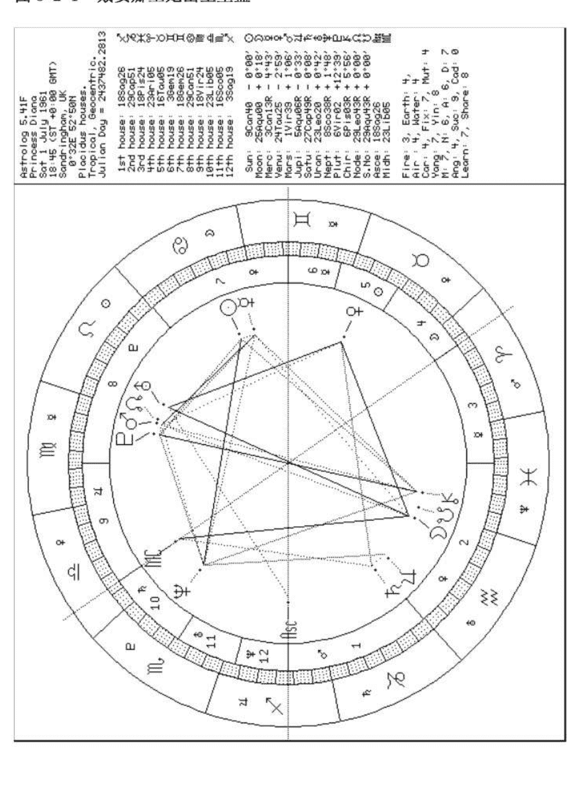

图 3-2-1 左边所形成的相位如下：

-   太阳与水星成 0 度交角的合相，太阳拱海王星和凯伦星，也就是与海王星和凯伦星成 120 度交角的三分相，太阳与冥王星成 60 度交角的六分相。
-   月亮与南交点合相，月亮与金星成 90 度交角的四分相。月亮对冲火星、北交点和天王星，也就是月亮和火星、北交点以及天王星成 180 度的对相，月亮与水星和中天 MC 成三分相。
-   水星拱海王星和凯伦星，水星与火星和冥王星成 60 度交角；
-   金星刑火星、北交点和天王星，金星拱土星。
-   火星与冥王星和北交点合相，火星冲凯伦星，火星与海王星成 60 度。
-   木星刑海王星，90 度。
-   土星刑中天。
-   天王星拱上升。
-   海王星与冥王星成 60 度，海王星拱凯伦星。
-   冥王星合北交点，冲凯伦星。

#### 第三节 星盘软件和网站

学习占星，第一步就是绘制占星出生图 (Natal Chart)，就在十年前，星盘的绘制还是一件非常耗时的工作，1992 年我第一次作自己的星盘时，是根据一本英文的占星书籍上的介绍，用计算器一步步计算，用喝水杯画星盘的圆圈，在加上出生时间很模糊，折腾了一天，才把星盘画好。不管怎么说，比起占星学的前辈们还是快多了，毕竟计算器和星历表为我省下了大量时间。古代的占星学家同时也必须是天文学家、数学家，因为他们还要观测和手算每个行星的位置，可以想象，绘制星盘曾经是多么浩瀚的工程，能够绘制占星盘的人必须具备极高的智慧和先进的科学知识。

现在好了，占星软件和网路占星的普及，使得星盘的绘制费时连五分钟都不到，所以本书不用再罗列行星万年历，介绍如何手绘占星盘了，读者可以上网去下载免费的占星软件，或上网直接作图，又准确又漂亮。下面介绍一些在线绘制星盘的网站和免费的占星软件。对于既没有多少星座知识，又没有多少英文基础的读者来说，建议使用繁体中文软件 Vastro 来绘制星盘。

目前热门的、功能强大的占星软件多半还是英文的，不过星盘上所使用的占星名词术语不多，对于已经入门的读者来说，即使不会英语，也不会有太大困难，若有不认识的英文单词，可以对照本章的列表。功能强大的免费占星软件有两种：Astrolog 和 AstroWIN，以 Astrolog 拥有多数用户，这可能是由于 Astrolog 一直都是公开源码的免费软件的缘故。Astrolog 的原作者是美国人瓦尔特·普林(Walter D. Pullen)，九十年代初他编写 Astrolog 时才刚二十岁出头，还是个大学生，由于他的无私贡献，占星学才得以在世界范围的计算机使用者中迅速推广，他的个人网页是 www.astrolog.org/home.htm。同时也要感谢第一个撰写了 Astrolog 中文使用说明的日月网 sunmoon.pair.com，为占星学在华语世界的推广作出了不容忽视的贡献。

##### 一、提供在线作图的网站

-   http://sunmoon.pair.com-使用 Astrolog5.41F 生成 GIF 格式的星盘，同时也可以得到中文文字命盘，英文解释，交角/中点图等等。可以将占星盘存下来。
-   http://www.ezcity.net-该网站用 JAVA 书写了很漂亮的星盘，注册以后，可以随时制作出生图，并有部分中文解释，图形无法存下来。
-   www.astro.com-英文网站，提供出生图，出生图分析和运程，还可以查询世界各地的经纬度，是功能非常强大的网站。可以将星盘存下来。
-   http://simpchinese.astroeast.com-简体中文，也有其他国文字。有比较简略的占星盘，有详尽的解释和运程，是功能非常强大的网站。可以将占星盘存下来。

##### 二、免费占星软件下载网址

软件名： Astrolog5.41F
下载地址： http://www.astermatch.com/software.php
http://www.bdcol.ee/astrolog/changed/a541fwin.zip
功能介绍： Astrolog5.4 的改良版，可以输入中文，是作者使用的软件。

软件名： Astrolog5.4
下载地址： http://www.astrolog.org
http://www.zhanxing.com/ast54win.zip
功能介绍： 英文版，功能非常强大，多平台，源码公开。

软件名： AstroWIN
下载地址： http://www.astrowin.org
功能介绍： 英文版，功能非常强大，曾经收费，现在免费，源码公开。

软件名： Vastro
下载地址： http://www.astermatch.com/software.php
http://server36.hypermart.net/pollux1151/vastro.zip
功能介绍： 繁体中文版，有太阳返照和太阴（月亮）返照。适合英文基础薄弱的。

#### 第四节 Astrolog5.41F 使用指南

瓦尔特在九十年代初迷上占星术时编写了免费程序 Astrolog。经过这些年的改进，功能越来越强大好用，瓦伦丁·阿卜拉莫夫（Valentin Abramov）改进了瓦尔特的 Astrolog5.41，使得用户可以输入中文或其它 8-bit 的文字，同时 Astrolog5.41F 还附有用户可编辑的 interpretation source files，也就是说用户可以自己编写星盘解说部分。

以下 Astrolog5.41F 的大部分说明，同样适用于 Astrolog 的其他版本。

##### 一、初级指南

(1)下载软件：去 http://www.astermatch.com/software.php 下载 a541fwin.zip，解压缩。

## 一、第三章 占星学术语，星盘和软件简介

(2) 执行软件：执行解压缩后产生的文件 Astrolog.exe。此时你会看到一个圆形的星盘(chart)。如果进入的是文字界面，请按一下英文小写字母“v”键。按一下英文小写字母“x”键可将黑色背景换成白色。

(3) 自制出生图(Natal Chart)：选择指令 Info->Set Chart Info (请参照图 3-4-1)，填入出生月、日、年、时间（请参照图 3-4-2）。如果你完全不知道自己的出生时间，请不要造一个，最好是使用中午十二点。这种情况下，十二宫位的划分对你已经完全没有意义，月亮的星座也可能不准。如果你只知道出生时辰，比如戌时，就选该时辰的中间值晚上八点，这种情况下，上升星座可能不准。

请按次序输入出生月（Month）、日（Day）、年（Year）、时间（Time）。时间采用 24 小时制，所以下午 5:50 应该输入 17:50。

“Daylight?”是日光节约时，也就是夏令时，通常选择 No，如果你的出生时间是使用的夏令时，请选 Yes。中国解放前几年在部分地区也曾实行过夏令时，1986 年到 1991 年实行过夏令时。1986 至 1991 年间，每年从四月中旬第一个星期日夏令时开始；到九月中旬第一个星期日夏令时结束。除 1986 年因是实行夏时制的第一年，从 5 月 4 日开始到 9 月 14 日结束外，其它年份均按规定的时段施行。

“Time Zone”为时区，中国在东八区，请输入-8，如果是美国太平洋时区，即西八区，为 8，这一点与我们的习惯相反，因为软件作者住在西半球。

图 3-4-1 选择设定新星盘的指令

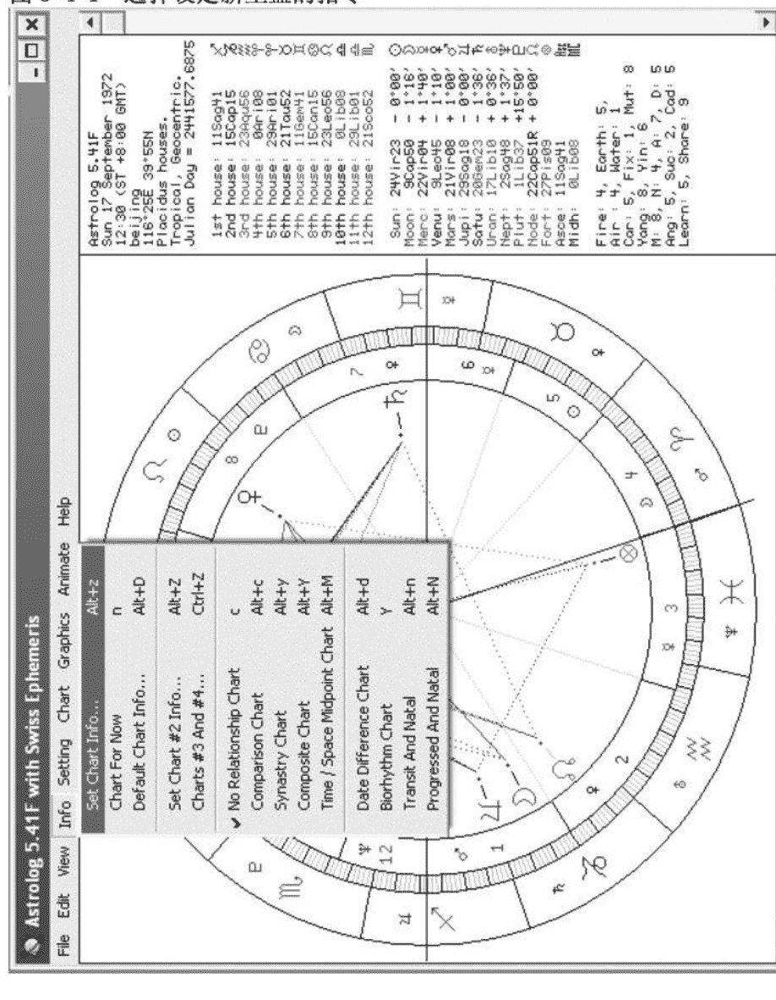

图 3-4-2 输入出生资料制作星盘

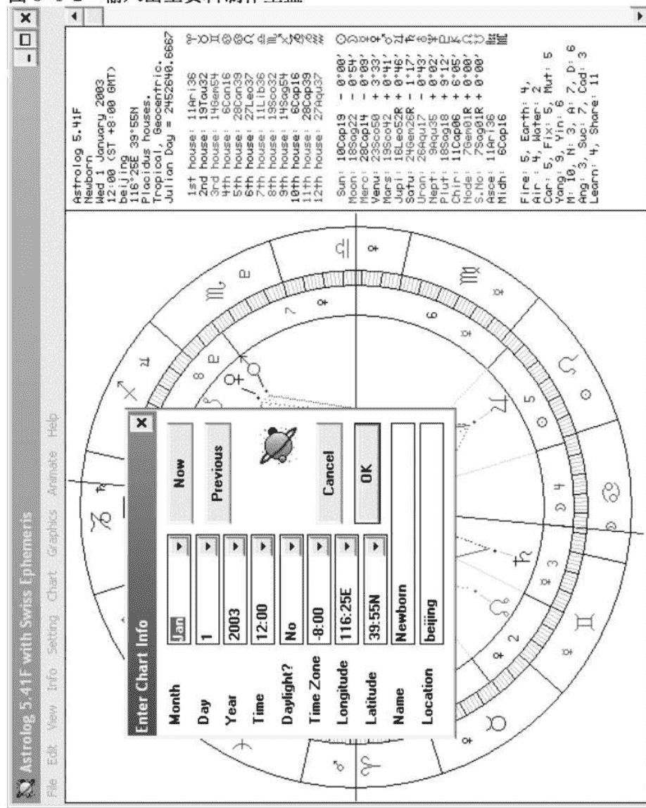

时区的下面是经纬度，比如北京的经度（Longitude）是116:28E，纬度（Latitude）是39:55N。精确的时间和经纬度对于计算宫位非常重要，你可以对照地图册求出你的出生地的经纬度，本书附录一有全国各省市主要地名的经纬度，如果你的出生地不在上面，也可以上网查询，这个英文网站http://www.astro.com/cgi/aq.cgi?lang=e 可以查到全世界绝大多数地方的经纬度。经纬度后面的栏目是星盘主人的姓名（Name）和出生地（Location），属于可选项，可填可不填，点击“OK”按钮确认后，看到的就是你的出生图了。如果你下载的Astrolog5.41F 的缺省设置中没有包括凯伦星或者南北交点，可以暂时不要管它，等你熟悉了软件之后，再去参考本节的“二、Astrolog5.41F 完全菜单指令指南”中的Setting菜单“Restrictions”部分。

选择 Chart->Aspect List 可以给出各星体之间的相位角度。如果你还不习惯看图捕捉各星体间的相位角度，可以根据这个列表对照本书第八章的相位解读。图 3-4-2 是戴安娜王妃的相位列表，图上星座和相位都是使用的缩写字，读者有疑难的话可对照本节（4）的星盘缩写语简介。

下面对译图 3-4-3 作为示范，使读者对该软件经常使用的英文占星名词有所了解：

1: Pluto (Vir) Opp [Pis] Chiron - orb: +0:00' - power: 27.88
冥王星(室女座)对相[双鱼座]凯伦星 - 球差:0 度 0 分 - 强度:27.88

2: Moon (Aqu) Squ (Tau) Venus - orb: -0:35' - power: 27.76
月亮(水瓶座)四分相(金牛座)金星 - 球差:0 度 35 分 - 强度:27.76

3: Venus (Tau) Tri [Cap] Saturn - orb: -3:24' - power: 22.45
金星(金牛座)三分相[摩羯座]土星 - 球差:-3 度 24 分 - 强度:22.45

4: Moon (Aqu) Opp (Leo) Uranus - orb: -1:39' - power: 20.85
月亮(水瓶座)对相(狮子座)天王星 - 球差:-1 度 39 分 - 强度:20.85

5: Sun (Can) Tri [Sco] Neptune - orb: -1:01' - power: 20.72
太阳(巨蟹座)三分相[天蝎座]海王星 - 球差:-1 度 1 分 - 强度:20.72

6: Venus (Tau) Squ (Leo) Uranus - orb: -1:04' - power: 19.16
金星(金牛座)四分相(狮子座)天王星 - 球差:-1 度 4 分 - 强度:19.16

7: Mars (Vir) Con (Vir) Pluto - orb: +4:23' - power: 18.03
火星(室女座)合相(室女座)冥王星 - 球差:4 度 23 分 - 强度:18.03

8: Mercury [Can] Tri [Pis] Chiron - orb: -2:50' - power: 16.20
水星[巨蟹座]三分相[双鱼座]凯伦星 - 球差:-2 度 50 分 - 强度:16.20

9: Moon (Aqu) Tri (Lib) Midheaven - orb: +1:54' - power: 16.00
月亮(水瓶座)三分相(天秤座)中天 - 球差:1 度 54 分 - 强度:16.00

10: Sun (Can) Tri [Pis] Chiron - orb: +3:37' - power: 14.15
太阳(巨蟹座)三分相[双鱼座]凯伦星 - 球差:3 度 37 分 - 强度:14.15

11: Neptune [Sco] Tri [Pis] Chiron - orb: -2:35' - power: 13.78
海王星[天蝎座]三分相[双鱼座]凯伦星 - 球差:-2 度 35 分 - 强度:13.78

12: Sun (Can) Con [Can] Mercury - orb: +6:27' - power: 13.59
太阳(巨蟹座)合相[巨蟹座]水星 - 球差:6 度 27 分 - 强度:13.59

13: Mercury [Can] Sex (Vir) Mars - orb: -1:33' - power: 13.03
水星[巨蟹座]六分相(室女座)火星 - 球差:-1 度 33 分 - 强度:13.03

14: Mercury [Can] Sex (Vir) Pluto - orb: +2:49' - power: 11.58
水星[巨蟹座]六分相(室女座)冥王星 - 球差:2 度 49 分 - 强度:11.58

15: Mars (Vir) Opp [Pis] Chiron - orb: -4:24' - power: 10.84
火星(室女座)对相[双鱼座]凯伦星 - 球差:-4 度 24 分 - 强度:10.84

16: Sun (Can) Sex (Vir) Pluto - orb: -3:37' - power: 10.01
太阳(巨蟹座)六分相(室女座)冥王星 - 球差:-3 度 37 分 - 强度:10.01

17: Neptune [Sco] Sex (Vir) Pluto - orb: +2:35' - power: 9.92
海王星[天蝎座]六分相(室女座)冥王星 - 球差:2 度 35 分 - 强度:9.92

18: Jupiter [Aqu] Squ [Sco] Neptune - orb: -3:32' - power: 9.17
木星[水瓶座]四分相[天蝎座]海王星 - 球差:-3 度 32 分 - 强度:9.17

19: Mercury [Can] Tri [Sco] Neptune - orb: +5:25' - power: 7.99
水星[巨蟹座] 三分相[天蝎座]海王星 - 球差:5 度 25 分 - 强度:7.99

20: Mars (Vir) Con [Leo] Node - orb: +1:55' - power: 7.74
火星(室女座)合相[狮子座]北交点 - 球差:1 度 55 分 - 强度:7.74

21: Saturn [Cap] Squ (Lib) Midheaven - orb: +4:43' - power: 7.60
土星[摩羯座]四分相(天秤座)中天 - 球差:4 度 43 分 - 强度:7.60

22: Moon (Aqu) Opp (Vir) Mars - orb: -6:38' - power: 7.56
月亮(水瓶座)对相(室女座)火星 - 球差:-6 度 38 分 - 强度:7.56

23: Uranus (Leo) Tri (Sag) Ascendant - orb: -4:54' - power: 6.16
天王星(狮子座)三分相(射手座)上升 - 球差:-4 度 54 分 - 强度:6.16

24: Jupiter [Aqu] Con [Cap] Saturn - orb: +7:16' - power: 3.99
木星[水瓶座]合相[摩羯座]土星 - 球差:7 度 16 分 - 强度:3.99

25: Moon (Aqu) Tri [Can] Mercury - orb: +8:12' - power: 2.66
月亮(水瓶座)三分相(巨蟹座)水星 - 球差:8 度 12 分 - 强度:2.66

26: Venus (Tau) Squ (Vir) Mars - orb: +7:14' - power: 2.39
金星(金牛座)四分相(室女座)火星 - 球差:7 度 14 分 - 强度:2.39

27: Mars (Vir) Sex [Sco] Neptune - orb: +6:59' - power: 0.03
火星(室女座)六分相[天蝎座]海王星 - 球差:6 度 59 分 - 强度:0.03

图 3-4-3 戴安娜王妃星盘的相位列表

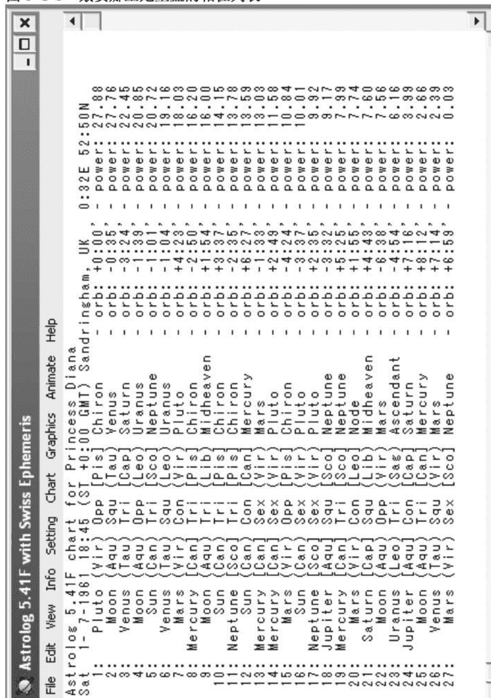

你还可以把它存成文件方便下次调用：File->Save Chart Info（请参考图 3-4-4），注意文件名不能超过八个字母，后缀为.dat，比如 newborn.dat（请参照图 3-4-5）。

如果用 File->Save Chart Positions 来保存的话，文件里记录的是星体位置而不包含星盘资料(时间地点等)。

软件本身的缺省值，也就是刚执行时产生的星盘所在的时区和经纬度，很可能不是你常用的设置，你可以将你的常用设置，比如将前面的新生儿星盘或者你本人的出生图，存入缺省，可以通过指令 File->Save Settings…，必须将文件名存成 Astrolog.dat，覆盖软件原有的同名文件（请参照图 3-4-6）。

图 3-4-4 存储星盘

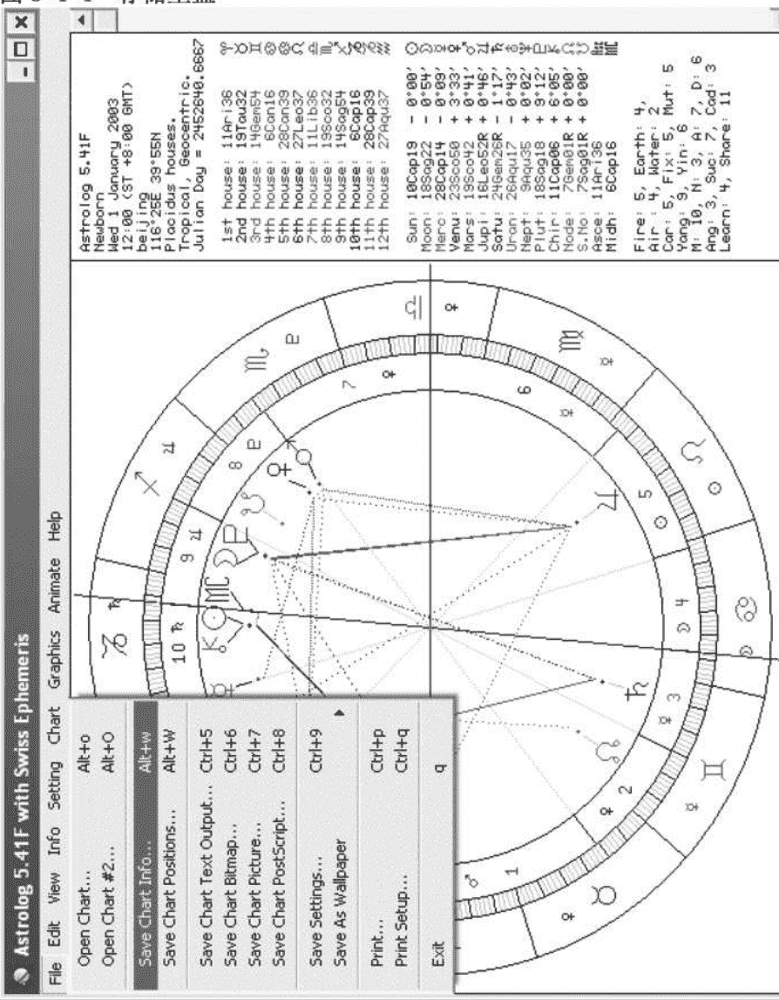

图 3-4-5 输入文件名

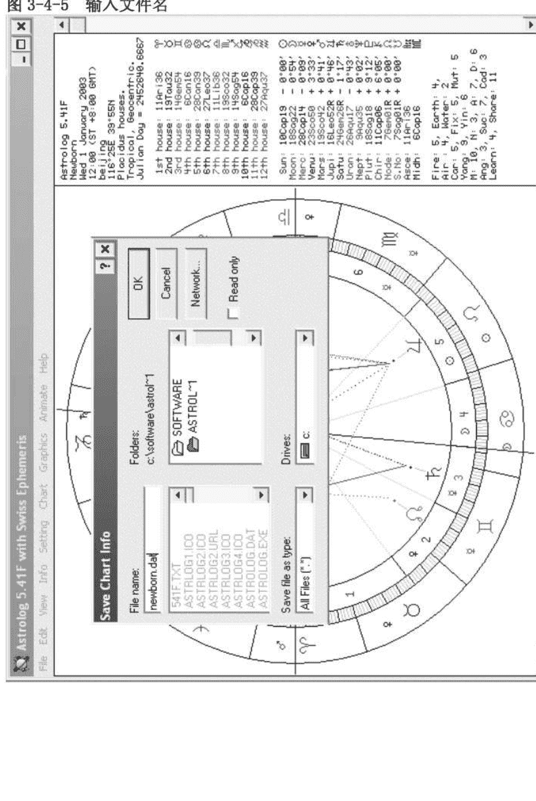

图 3-4-6 存储常用 Astrolog5.41F 设置

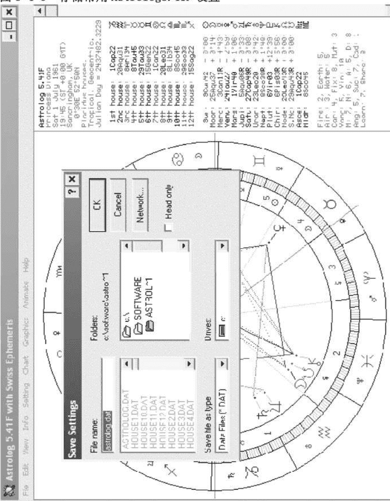

##### 二、星盘缩写语简介

在星盘右边框架里的文字解释中有很多缩略语，下面是 Astrolog5.41F 常用缩写语的中文对照：

(1) 十二星座缩写语
- Ari-白羊座，Tau-金牛座，Gem-双子座，Can-巨蟹座，
- Leo-狮子座，Vir-室女座，Lib-天秤座，Sco-天蝎座，
- Sag-射手座，Cap-摩羯座，Aqu-水瓶座，Pis-双鱼座。

(2) 十大主要星体缩写语
- Sun-太阳，Moon-月亮，Merc-水星，Venu-金星，
- Mars-火星，Jupi-木星，Satu-土星，Uran-天王星，
- Nept-海王星，Plut-冥王星。

(3) 次要星体缩写语
- Chir-凯伦星，Cere-谷神星，Pall-智神星，
- Juno-婚神星，Vest-灶神星，Fort-福点，
- Node-北交点，S.No-南交点，
- Lili-莉莉丝、黑月，Vert-宿命点，East-东方点。

(4) 常用主要相位角度缩写语
- Con-0 度、合相、会，Sex-60 度、六分相、半合，
- Squ-90 度、四分相、刑，Tri-120 度、三分相、拱，
- Opp-180 度、对相、冲。

(5) 各种类型星座缩写语
- Fire-火相，Earth-土相，Air-风相，Water-水相，
- Car-本位，Fix-固定，Mut-变动，
- Yang-阳性，Yin-阴性。

(6) 其它缩写语
- M-地平线上，N-地平线下，A-子午线东，D-子午线西，
- Ang-一、四、七、十宫，
- Suc-二、五、八、十一宫，
- Cad-三、六、九、十二宫，
- Learn-白羊、金牛、双子、巨蟹、狮子、室女，
- Share-天秤、天蝎、射手、摩羯、水瓶、双鱼。

另外有一个单词 orb 很重要，它的意思是容许度或者球差。比如两个星体之间相距 178 度，这两个星体于是形成了 180 度的对相，球差为（178-180=-2）负 2 度；如果两个星体之间相距 188 度，这两个星体也是形成了 180 度的对相，球差为正 8 度。球差越大，相位的影响力越小。球差的范围就是容许度，如果容许度为 8 度，那么当两个星体之间相差 172°～188° 时，两星形成对相。

##### 三、Astrolog5.41F 完全菜单指令指南

对于初学占星的读者来说，只要会做星盘就够了，不要企图一口吃成胖子，先把占星学基础打好，再来发掘 Astrolog 软件的强大功能也不迟，下面的内容，是给已经熟悉本书内容、想要更进一步提高的读者作为参考的。如果你下载的 Astrolog5.41F 的缺省设置中没有包括凯伦星或者南北交点，可以参考下面的 Setting 菜单的 Restrictions 部分。

###### File 菜单

- Open Chart...—打开已有的出生资料文件。
- Open Chart #2...—打开已有的出生资料文件，作为人际关系星盘的第二命主。
- Save Chart Info...—把星盘资料存成文件，方便下次调用。
- Save Chart Positions...—文件里记录的是星体位置而不包含星盘资料(时间地点等)。
- Save Chart Text Output...—将星盘资料存成文字格式，这些文字资料与执行 View->Colored Text 时看到的一致。
- Save Chart Bitmap...—将星盘存成 Bitmap 格式的图形文件。
- Save Chart Picture...—将星盘存成.wmf 格式的图元文件。
- Save Chart PostScript...—将星盘存成 PostScript 格式的打印文件。
- Save Settings...—把常用设置，比如你出生时的经纬度、时区，或者你现在居住地的经纬度、时区存到 Astrolog.dat 文件中去。
- Save As Wallpaper—将星盘存成墙纸。
- Print...—打印。
- Print Setup...—设定打印机。
- Exit—退出软件。

###### Edit 菜单

- Enter Command Line...—输入命令行。在软件的帮助文件中列举了所有的指令，有兴趣的读者可以自己研究。下面介绍如何应用输入命令行制作太阳回归图(又叫太阳返照图)和月亮回归图（又叫太阴返照图）。
    - 先作出生图，
    - 点击 View->Colored Text
    - 点击 Edit->Enter Command Line
    - 太阳回归图:在命令行输入 “-tr 你的生月 回归年”
    - 月亮回归图:在命令行输入 “-tr 回归月 特点年份”
    - 范例：
        - 假如某人的生月是 1 月，想求出 2003 年 9 月的月亮回归图，应输入指令：-tr 9 2003
        - 如果要计算 2003 年的太阳回归，则输入指令：-tr 1 2003
        - 通常太阳回归的时间会落在生日的前一天至后一天的三天范围之内，因此，如果你的生日在 1 月 1 日或 1 月 31 日，有时候太阳回归会落到相邻的月份，请记得变通一下，输入 -tr 12 2003 或者 -tr 2 2004。
    - 抄录该月的太阳或月亮回归时间，再作一张星盘即是。
- Run Macro (Normal Set)/ Run Macro (Shift Set)/ Run Macro (Control Set)/ Run Macro (Alt Set)—执行预先设定的指令。在前面的输入命令行所输入的指令常常很长难记，可以把常用的指令存到代号里。有兴趣的读者可以参照软件的 Helpfile 中的详细步骤。
- Copy Text Output/ Copy Bitmap/ Copy Picture/ Copy PostScript—拷贝星盘的文字输出/ Bitmap 图形/ .wmf 图元/ PostScript 格式以备用。

###### View 菜单

- Show Graphics—显示星盘的图形界面。
- Window Settings—软件屏幕的设定。
- Buffer Redraws—切换随时间变化星盘的更替方式，连续的还是间歇式的。
- Redraw Screen—刷新屏幕。
- Clear Screen—清除屏幕上的所有东西。
- Hourglass On Redraw—计时刷新。
- Chart Resizes Window—星盘随软件屏幕大小变化而变化。
- Window Resizes Chart—星盘随软件屏幕大小变化而变化。与前一个指令的差别是，当你先改变屏幕大小，然后选择指令时，前一个指令会重新改变屏幕大小来迁就星盘的大小，这一个指令是改变星盘的大小来迁就屏幕的大小。
- Size Chart To Window—这个指令执行一次根据屏幕大小改变星盘的大小。
- Size Window To Chart—这个指令执行一次根据星盘大小改变屏幕的大小。
- Scroll Page Up/ Scroll Page Down/ Scroll to Beginning/ Scroll to End—均为翻页指令，用键盘和鼠标更方便，所以这些指令形同虚设。
- Colored Text—显示星盘的文字界面，切换彩色/黑白文字界面。
- Set Colors... —设置星盘线条和文字的颜色。

## —☆占星学手册☆—

- Show Interpretations—显示星盘的解释。软件自带简单的英文解释，读者可以建立完整的解释文件数据库，有关如何建立自己的解释文件，请阅读你的软件目录下的 INTERALT.TXT 文件。
- Print Nearest Second—要是你觉得角度显示到分还不够精确，选中这一项可以显示到秒。
- Apply Aspects—计算相位是正在形成(入相位)还是正在消失(出相位)。先执行菜单指令 Chart->Aspect List，再执行本指令，可以看出相位偏差前面正负号/字母的切换，a 代表入相位，s 代表出相位。
- Parallel Aspects—使用磁偏角、赤纬(declination)计算的同度相，或曰纬照。本书没有包括纬照的解释。

###### Info 菜单

- Set Chart Info...—填入月、日、年、时间。Daylight?是“日光节约时”，也就是夏令时，通常选择 No。Time Zone 是时区，中国在东八区，请填-8:00。下面是经纬度。精确的时间和经纬度对于计算宫位非常重要。确认后，看到的就是你输入的星盘了。
- Chart For Now—显示当前时刻星盘。
- Default Chart Info...—可以设置好通常用的时区和经纬度。最下面的 Correction For Now，如果是-8:00 时区请填入“-960”，这样可以保证在计算 Chart For Now 的时候时间与你电脑的时钟一致。
- Set Chart #2 Info...—用来输入第二个星盘的资料，方式与第一个相同。
- Chart #3 And #4...—用来输入第三、四个星盘的资料。
- No Relationship Chart—显示单一星盘。做个人出生星盘分析时，只要显示单一星盘。
- Comparison Chart—比较盘，把两个星盘中的星体显示在同一盘中，用来看相位关系。盘上显示的是 Chart #1 的宫位，Chart #1 的星体在内圈，Chart #2 的在外圈。此时只显示两星盘之间的相位而不显示各自内部的相位。
- Synastry Chart—合盘，跟比较盘相似但是只显示 Chart #2 的星体，观察其落入 Chart #1 宫位的关系。
- Composite Chart—组合中点图，这个星盘里每个星体的位置是取自两个盘中对应星体的中点。
- Time/Space Midpoint Chart—时空中点图，根据两个星盘的时间和经纬度分别取中点，以此计算的星盘。注意使用过这一项之后，结果会保存在 Chart #1 里，把原先的资料冲掉。
- Date Difference Chart—显示 Chart #1 和 Chart #2 之间相隔的年数，月数，天数等等。
- Biorhythm Chart—人体生理功能节律图。
- Transit And Natal—流年盘。其实就是以出生星盘为主，流年星盘为辅，所画的比较盘。根据比较盘的星体关系可以分析流年运程。
- Progressed And Natal—推运盘。从出生时开始，一天代表一年，第几天的星盘就代表第几年的运程。

###### Setting 菜单

- Sidereal Zodiac—切换恒星黄道或者回归黄道，一般占星学使用的是回归黄道。
- Heliocentric—切换日心星盘或者地心星盘，一般占星学使用的是地心星盘。
- House System—切换不同学说的分宫法，也就是如何划分后天十二宫。最常用的是 Placidus 和 Koch 分宫法。本书一律采用最传统的普拉西达斯（Placidus）分宫法。
- House Setting—这一组指令多半不会用到，全都不选，其中的 Solar Chart 就是以当前的太阳位置做第一宫起始。
- Aspect Settings...—用来选择其他相位，修改容许度 (orb) 和影响力 (influence)，Astrolog5.4 和 Astrolog5.41F 在合盘星体交角容许度定义上有些不同，前者合盘和单盘共用同一容许度，后者是以单盘的容许度减去合盘容许度矫正值作为合盘的容许度。但是看起来后者在进行这项改进时，产生了一个虫子：当你使用 Astrolog5.41F 内设的容许度矫正值 (Decrease comparison chart's orbs=2.5) 时，不管你如何增大单盘的容许度，其合盘的容许度都小于 4。如果你希望扩大合盘容许度的范围，请将容许度矫正值设为 1.0 或者 1.5，这样的话，实际显示的合盘相位角度所使用的容许度会比单盘的容许度还要略大一点，如果单盘的容许度是 8 的话，合盘的容许度实际上会达到 8 以上，9 以下。
- Object Settings...—可以进一步设置每个星体的容许度，事实上是按两个容许度中较小的来计算。还有在这里设置星体的影响力值。
- More Object Settings...—可以进一步设置各宫和一些不常用的星体的容许度。
- Restrictions—选择星盘使用的星体，占星时通常使用十颗行星，但有时也会用到小行星等其他天体，注意这里打勾的是不选，空白的才是选中的。第一栏是十颗行星，第二栏前五个是小行星，后五个是一些特殊天体。第二栏的第一颗星就是凯伦星，缺省的情况下是不选的，你可以自行选上。第二栏的第七颗是 Lilith/S.Node，在这里莉莉丝和南交点共用一个位置。缺省状态下计算的是莉莉丝，如果想计算南交点，请打开 Setting->Calculation Settings，将 Use Ephemeris Files 选空。
- Include Minors—选用小行星。
- Include Cusps—计算相位时，包括各宫宫头。
- Include Uranians—计算相位时，包括 TNPs (Transneptunian Points)。
- Include Fixed Stars—计算相位时，包括恒星。只有与主要星体合相（容许度为 1°）的恒星的才会显示出来。
- Star Restrictions...—选择恒星。
- Transit Restrictions...—选择流年盘上显示的星体。
- Calculation Settings...—修改 Harmonic Chart Factor 的数字，可得到数律图，平时所说的个人星盘为一律图 (Harmonic Chart Factor=1)。常用五律图 (Harmonic Chart Factor=5) 来看天分。
- Obscure Settings...—更多的设定，比如设定星盘采用 24 小时制还是上下午制。

###### Chart 菜单

- Standard List—标准格式列表，显示最常用的星盘样式。如果 View->Show Graphics 没有打勾，选择此项会显示星盘的文字描述。
- House Wheel—宫位星盘，星盘上的天轴与地平线垂直，十二星座在星盘上所占据的扇形范围不相等。如果 View->Show Graphics 没有打勾，选择此项会显示矩形星盘。
- Aspect Midpoint Grid—显示星体间的交角和中点所在星座。
- Aspect List—如果 View->Show Graphics 没有打勾，选择此项显示星体间的交角，球差和影响力。
- Midpoint List—如果 View->Show Graphics 没有打勾，选择此项列出星体间中点的信息。
- Local Horizon—显示星体在地平线上的高度。
- Solar System Orbit—显示以太阳为中心，各星体的分布。
- Gauquelin Sectors—高格林盘，是本书第二章提及的法国心理学家高格林所发明的。他对各行各业名人的出生星盘行星位置进行统计后，认为从事某一种职业的人往往有相关的行星落在四轴尤其是上升和天顶附近，也就是盘上带加号的红色区域。
- Calendar—显示当月月历。
- Influence—如果 View->Show Graphics 没有打勾，选择此项会显示星体对星盘主的影响力大小。
- Astro-Graph—显示星体在地球上的投影轨迹。
- Ephemeris—显示星体当月的运动轨迹。
- Arabic Parts—阿拉伯点，所有阿拉伯点的资料。
- Rising And Setting—按时间先后显示每个星体一天中上升、下降和到达天顶的时间和位置。
- Transits...—计算流年盘的影响。
- Progressions...—计算推运盘的影响，使用时还要选择 Do Progressions 项。
- Chart Settings...—星盘的输出设置。

###### Graphics 菜单

- Show World Map—显示展开的世界地图。
- Show Globe—显示星盘所设地点的东西半球图。
- Show Polar Globe—显示星盘所设地点的南北半球图。
- Show Constellations—显示中天星座。
- Reverse Background—切换黑白背景颜色。
- Monochrome—显示单色星盘。
- Show Border—显示周边框架。
- Show Chart Info—显示右边的文字叙述。
- Show Info Sidebar—显示右边的文字叙述窗口。
- Show Glyph Labels—显示星体符号。
- Square Screen—将星盘变成正方形，因为有时候改变软件窗口的大小时可能造成星盘非正方形。
- Character Scale—设定星盘上的文字大小。
- Globe Tilt—倾斜西半球地图，选择附属指令可以使地图的中心点从赤道向两级移动。
- Modify Display—略微更改显示，比如当选择了 Globe Tilt 指令时，更改显示会点出星体在天顶的位置。
- Modify Chart—切换星盘的类型，比如从 Chart->Standard List 换成 Chart->House Wheel。如果选择了显示日历，则切换月历和年历。
- Scribble Color—决定鼠标在星盘上画线的颜色。
- Graphics Settings...—其他图形设定。
- Add Aspect Info—选中时会在右侧文字区分别显示吉相、凶相与合相的影响力，以及总体影响。

###### Animate 菜单

- Stop Animation—停止星盘随时间的动态变化。
- Jump Rate—选择时间间隔单位，星盘即会随之变化。
- Jump Factor—选择一次变化几个时间间隔单位。
- Reverse Direction—改变星盘随时间演变的方向，由当前时刻向前一时刻变化。
- Pause Animation—暂停星盘的动态变化。
- Time Exposure—产生类似多次曝光的效果，也就是把每次变化的结果都保留在图上。
- Step Forward—下一时间的星盘。
- Step Backward—上一时间的星盘。
- Store Chart Info—暂存星盘的时间和地点。
- Recall Chart Info—调出暂存星盘。

###### Help 菜单

不需要解释，请自己去试。如果你有兴趣，又有英语和计算机功底，就去 Documentation->Open Helpfile，你会发现很多更有用的、菜单指令之外的功能，这部分内容中的如何自己安装解释文件在日月网 http://sunmoon.pair.com 有一些的介绍。

#### 第五节 如何校正出生时间

本节的内容是给有了一点占星基础的读者作为参考的，初学者请跳过。

精确的出生时间是占星预测的必要条件。由于种种原因，很多人的出生时间都是模糊的。如果你完全不知道自己的出生时间，请以中午十二点作为出生时间，此时星盘的宫位是无效的，不过除月亮外，其他星体的位置和相位在一天之中变化不大，可以用来分析星盘主人的个性特征，推算运势则误差太大了。如果知道出生时辰，或者上午、下午、晚上，可以根据下列步骤来估计出生时间。所知道的出生时间范围越窄，越有可能找出准确的出生时间。

##### 一、取时间间隔的中点作出出生星盘初稿

假设你的出生时辰是戌时，也就是晚上 7-9 点钟，那么以 8 点整作为出生时间，做出星盘初稿。

##### 二、以星体的宫位校正出生星盘

首先检视星盘，看是否有星体靠近两宫交接的地方。举例来说，太阳在第一宫和第十二宫交界的位置，如果星盘主人性格内向、容易害羞，那么太阳多半是在第十二宫，如果星盘主人性格外向，喜欢发号施令，自我中心，太阳多半是在第一宫，尤其当太阳星座是火相星座或风相星座时，准确度更高。又比如说，天王星在第七、八宫附近，如果星盘主人经常经历人际关系的变更，或者离婚多次，天王星多半是在第七宫，如果星盘主人意外获得遗产或馈赠，天王星可能在第八宫。这个方法适合出生时间范围比较窄的，最好不要超过一小时，同时读者需要熟悉星体在后天十二宫的分布所代表的意义。

##### 三、使用流年盘校正出生星盘

在过去的时间里，总会有一些事件对你影响深远，比如大病、重大事故、结婚、近亲的死亡等等，那个时候，应该会有相应的星体临近相应的宫头。以戴安娜王妃跟查理斯王子订婚为例，戴安娜的上升星座在射手座 18 度，中天在天秤座 23 度，在定婚的时刻，刚好流年金星推进到双子座 16 度，接近第七宫婚姻宫，同时流年冥王星刚好在天秤座 21 度，接近中天，代表声名地位的巨变。如果根据订婚时间所求出的金星推进跟冥王星的移位，则会校正戴安娜的上升星座在射手座 16 度，中天在天秤座 21 度。比原先记录中的出生时间早 8 分钟，因为每 4 分钟差 1 度，共差了 2 度。又比如星盘主人在八岁的时候，爷爷过世，以爷爷逝世的时间作流年盘，发现土星在第七宫，于是可以调节出生时间，使得流年土星正好与第八宫宫头重合。

##### 四、使用推运盘校正出生星盘

比如星盘上海王星位于第十宫、天蝎座 15 度，而第十宫的起始在天蝎座 2 度，海王星在第十宫意味着可能有亲如父母的抚养人，事实上星盘主人从小跟祖母生活在一起，十岁的时候，祖母去世，根据推运法一度代表一年，海王星应该在距离第十宫宫头 10 度的位置，于是可以调整出生时间，使得第十宫宫头在天蝎座 5 度。

应该注意的是，不同的校正方法所得出的结果会有差异，至于如何取舍，建议读者以自己的感觉为准。

### 第四章 星座两极、三相、四元素

所谓两极、三相、四元素是星座的分类法，由于译法的差异，两极、三相、四元素又分别称之为二分法、三分法、四分法，以及三方四正等等，就是根据十二星座的某些共同点将它们分成两组、三组或四组。在这三种分类法中以四元素分类法，也就是所谓的火相星座、风向星座、土相星座和水相星座，最常在十二星座理论中运用，其星座三合特性也为很多懂点太阳星座的读者所熟悉。

#### 第一节 星座两极

十二星座按阳性能量和阴性能量可以分为两类：
阳性 白羊座、双子座、狮子座、天秤座、射手座、水瓶座。
阴性 金牛座、巨蟹座、室女座、天蝎座、摩羯座、双鱼座。

十二宫位相应的也可以分为两类，奇数为阳，偶数为阴：
阳性 第一、三、五、七、九、十一宫。
阴性 第二、四、六、八、十、十二宫。

阳性星座的特点是积极主动，外向活泼，阳性星座包括了所有的火向星座和风向星座。阴性星座的特点是被动内向，保守安静，阴性星座包括了所有的土向星座和水向星座。如果你的星盘中落入阳性星座的主要星体(在此和以下各节中，主要星体是指太阳、月亮、水星、金星、火星、木星、土星、天王星、海王星、冥王星和上升)比较多，那么你积极主动，比较男性化，有进取心，是理想主义者。如果你的星盘中落入阴性星座的星体比较多，那么你比较女性化，性格内向、被动，是战略家。

以戴安娜王妃的星盘（图 3-2-1）为例，落入阳性星座的星体有上升、月亮、木星、天王星四颗，落入阴性星座的星体有太阳、水星、金星、火星、土星、海王星和冥王星等七颗，阴性星座的特征明显一些。

图 4-1-1 星座两极
白色代表阳性星座，灰点代表阴性星座

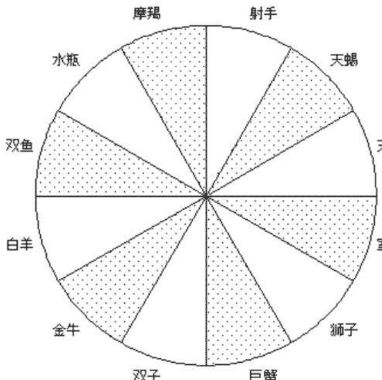

#### 第二节 星座三相

占星学将星座按本位、固定、变动分为三组，每组包括四个星座：

表 4-2-1 星座三相

| 类型 | 星座 | 特性 |
| :--- | :--- | :--- |
| 本位星座 | 白羊座、巨蟹座、天秤座、摩羯座 | 开创者型 |
| 固定星座 | 金牛座、狮子座、天蝎座、水瓶座 | 组织者型 |
| 变动星座 | 双子座、室女座、射手座、双鱼座 | 传授者型 |
| 季节 | 春、夏、秋、冬 | |

本位星座属于引领者、开创者，代表起始状态。当太阳进入这四个本位星座，分别代表春夏秋冬四季的开始。本位星座的优点是勇于破旧立新，本位星座的缺点是莽撞。如果你的星盘中落入本位星座的星体稀少，你比较被动，容易为人左右，喜欢等待机会。

固定星座代表稳固，当太阳进入这四个固定星座，分别代表春夏秋冬四季的全盛，固定星座的优点是顽强稳定，有较多的星体位于固定星座的人，耐力持久，固定星座的缺点是顽固偏持，拒绝变化，固定星座具有强烈的地域观念，不甘受别人的掌控。如果你的个人星盘中落入固定星座的星体稀少，有可能办事不是有头没尾就是虎头蛇尾，凡事适合打头阵而不是收尾，你也有经常变换工作、居住和伴侣，甚至信仰的倾向。

变动星座处事弹性、追求刺激、喜欢旅行，对环境具有良好的调适能力。当太阳进入这四个变动星座，代表着春夏秋冬四季进入尾声。变动星座的优点是适应性强，容易入乡随俗，缺点是太善变，心无常性。如果你的个人星盘中落入变动星座的星体稀少，你可能不愿尝试新事物，难以适应新环境。

以戴安娜王妃的星盘（图 3-2-1）为例，位于本位星座的星体有太阳、水星和土星等三个，位于固定星座的星体有月亮、金星、木星、天王星和海王星等五个，位于变动星座的星体有上升、火星和冥王星等三个，比较平均。

图 4-2-1 星座三相

白色代表本位星座，灰点代表固定星座，方格代表变动星座

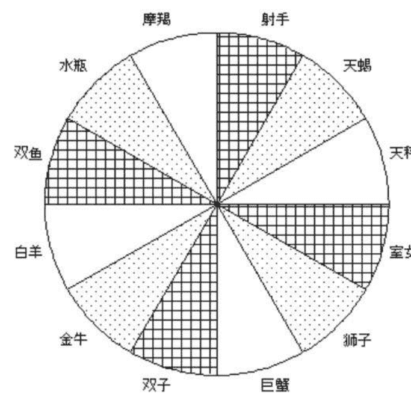

#### 第三节 四元素

根据各星座对待事物、人际、环境的方式，可以将星座按火、土、风、水分为四组，每组包括三个星座。

表 4-3-1 星座四元素

| 元素 | 星座 | 类型 |
| :--- | :--- | :--- |
| 火向星座 | 白羊座、狮子座、射手座 | 活力型 |
| 土向星座 | 金牛座、室女座、摩羯座 | 稳健型 |
| 风向星座 | 双子座、天秤座、水瓶座 | 知性型 |
| 水向星座 | 巨蟹座、天蝎座、双鱼座 | 感性型 |

个人星盘中，十一个主要星体，这里指太阳、月亮、水星、金星、火星、木星、土星、天王星、海王星、冥王星、上升，在火、土、风、水中平均分布的情形并不是常见的。

以戴安娜王妃的星盘（图 3-2-1）为例，位于火向星座的星体是上升和天王星，位于土向星座的星体是金星、火星、土星和冥王星，位于风向星座的星体是月亮和木星，位于水向星座的星体是太阳、水星和海王星。戴安娜王妃属于多土型。

##### 一、多火型

如果你有四颗以上的星体落在火向星座中，那么你精力旺盛，身手敏捷，感情奔放，过于自信，自我中心，凡事喜欢打头阵，行事冲动，有时较草率和粗心。你比较注重性爱，热情来得快去得也快，缺乏细腻的感受能力。

##### 二、缺火型

如果你只有不到两颗星体落在火向星座，那么你不爱运动，身体协调性差，一年四季手足冰凉，凡事缺乏热情和自信，不爱抛头露面，生病时很少发烧。如果一个运动员具有这样的星盘分布，那他的成绩真是得来不易，因为他需要花比别人多几倍的努力去取得同样的成绩。作者本人就是一个典型的缺火型，没有一个星体落入火向星座，再加上不耐低温的太阳巨蟹，从小就非常怕

### 第四章 星座两极、三相、四元素

冷，也不爱运动，曾经洗过一冬天的冷水澡锻炼自己，也未见成效，还是一如既往地怕冷。因为生病不发烧，所以被人认为很少生病。在大学时，为了提高十秒以达到八百米长跑的国家标准，练了一年有余，以至于成为体育老师们鼓励其它同学的榜样，学游泳，更是二十年后才掌握换气，而且仍然只会蛙泳。

##### 三、多土型

如果你有四颗以上的星体落在土向星座，那么你比较现实，注重物资利益，对世俗的金钱、权力和性爱等兴趣浓厚。你的作风保守谨慎，循规蹈矩。你的身体强壮，吃苦耐劳。你的组织能力很强，野心勃勃，有独裁倾向。你重视结果，信奉“胜者王侯败者寇”。你非常注重美食和性爱，往往感官欲望高于热情。土向星座的你三思而后行的风格，常常被认为是迟钝。

##### 四、缺土型

如果你只有不到两颗星体落在土向星座，那么你可能不切实际，缺乏责任感，不重物质利益。由于动手能力差，缺乏土相元素的你可能连最简单的事情都要人帮忙才能完成。

##### 五、多风型

如果你有四颗以上的星体落在风向星座，那么你思维活跃，聪明伶俐，见解独到，活到老学到老，爱做智力测验和猜谜。你学得快，忘得也快，你也不会记恨长久。风向星座的你通常是乐观的，也爱指手画脚、评头论足，光说不练。你对待性爱是精神需要高于感官欲望，你很容易从感情痛苦中恢复，其它星座的人会认为风向星座的你用情不深。

##### 六、缺风型

如果你只有不到两颗星体落在风向星座，你可能不善表达自己，不爱动脑筋。除非有利可图，否则不愿为娱己而学习，这不是说你会文化程度低，只是读书的热情低。缺风型的你缺乏周密的规划，所以办事容易浪费时间和金钱。

##### 七、多水型

如果你有四颗以上的星体落在水向星座，那么你感情丰富，善解人意，同情心很强。水向星座的你喜欢跟着感觉走，而不是通过逻辑思考。你溺爱孩子，腻爱伴侣，长于非语言的交流，是天生的艺术家，并且有着很强的第六感。在性爱方面，水向星座的你感官欲望和精神需要都非常强烈，由于你用情太深，使得你很难从感情创伤中复原。

##### 八、缺水型

如果你只有不到两颗星体落在水向星座，你可能神经大条，情绪稳定，比较粗心大意，不容易感情受伤，也很少忧郁。你难以和他人建立非常亲密的关系，有时被认为是冷酷无情的。缺水型的你人很少相信直觉得来的知识。

图 4-3-1 星座四元素

白色代表火相，灰点代表土相，方格代表风相，灰色代表水相

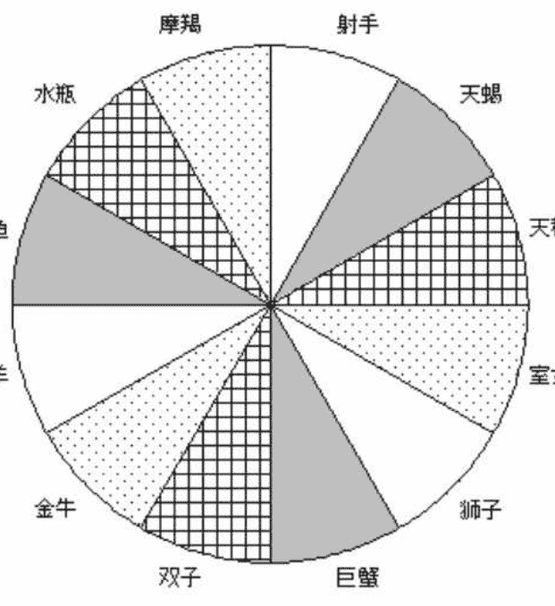

### 第五章 星体与十二星座

#### 第一节 太阳与十二星座

太阳星座就是平时最常见的所谓十二星座，你是什么星座的？其实就是问你出生时，太阳在什么星座。太阳星座代表个人外在性格特征，在众人面前的表现方式，在所有星体中影响最大。

##### 一、太阳在白羊座

当太阳到达黄道春分点，此时太阳就进入白羊座了。白羊座是黄道第一个星座，代表新一轮的开始。太阳经过白羊座期间，正是大地回春，万物初长，所以白羊座的人也是血气方刚，直率坦白，敢做敢为。白羊座的代表词是“我是”，白羊座的守护星是火星。太阳在白羊座得势，也就是容易发挥其正面特质。土星失势，容易发挥其负面特质。金星弱势，不容易发挥其任何特质。

白羊座的你心直口快，鲁莽冲动，热忱任性，是乐观主义者。你凡事好争先、不服输，比如喜欢在路上与人飙车，只因为见不得有人挡在前面。在工作方面，白羊座是开拓者的星座，你容易接受新事物、新观念，喜欢冒险犯难，但你很少自始至终地完成所开创的事业，你缺乏耐性、毛糙，难以胜任细致的工作。在爱情方面，你热情如火，敢爱敢恨，直接主动，让异性难以招架，你也很少吃回头草。

占星学上白羊座支配人体的头部，如果太阳相位不佳时，你的身体常有发热的现象，同时易患中风或剧烈的头痛，以及精神方面的疾病。

白羊座需要学习的是三思而后行，切忌自我中心，强人所难。

白羊座的名人有，画家梵高。

##### 二、太阳在金牛座

当太阳在金牛座，农作物从萌芽状态进入稳定成长阶段，这个星座出生的人，谨慎稳健，勤奋实际，固执保守。金牛座的代表词是“我拥有”，金牛座的守护星是金星。月亮得势，火星弱势。

金牛座的你个性温和，善于理财，并珍惜金钱所换取的物品。你天生具有艺术鉴赏力，喜好一切美好的事物。虽然你不常发怒，但是一旦发怒，不可收拾。你很难改变成见。在工作方面，你脚踏实地，过分谨慎，从不奢求不劳而获，做事有计划，而且能坚持到底。在爱情方面，你比较被动，喜欢日久生情，先友后婚的方式，占有欲极强烈。

身体方面，你耐力持久，体质强健。占星学上金牛座掌管人体的咽喉、颈部及肩膀，你可能容易罹患咽喉和食道方面的疾病，应当避免暴饮暴食的习惯。

金牛座需要学习的是放下我执，超越物欲。

金牛座的名人有，马克思，列宁，希特勒。

##### 三、太阳在双子座

当太阳进入双子座，农作物开始开花结果，赋予双子座反应灵敏，思维快捷，求知欲强烈。双子座的代表词是“我思考”，双子座的守护星是水星。北交点得势，南交点失势，木星弱势。

双子座的你多才多艺，学识丰富，性格善变，拥有良好的智能与记忆力。在工作方面，你十项全能，视野开阔，善于随机应变，你可以同时进行多项作业，却无法专注完成某一项事业，也无法忍受长久而单调的工作。在爱情方面，你十分理智，注重精神交流，喜欢运用各种花招，戏剧性十足。

占星学上双子座管理人体的手臂、上呼吸道、人体神经末梢、及脑中控制思想能力的部份。抽烟的恶习特别会增加你患肺癌的危险性，快戒掉吧。

双子座需要学习的是，坚持原则，持之以恒。

双子座的名人有，英国维多利亚女王。

##### 四、太阳在巨蟹座

太阳进入巨蟹座，农作物正在孕育，赋予巨蟹座母性和对家的依恋。巨蟹座的代表词是“我感受”，巨蟹座的守护星是月亮。木星得势，火星失势，土星弱势。

巨蟹座的你直觉灵敏，多愁善感，情绪夸张，杞人忧天中的杞人多半就是巨蟹座的。无论环境如何变迁，你都不轻易改变自己，通常你对家庭及母亲的依附心很重，怀旧，记忆力好，喜欢收藏属于过去的东西。你没有什么伟大的志向和野心，你不会为了工作而牺牲与家人共处的时间，也不喜欢加班加点赶任务。在爱情方面，你向往稳定温馨的家庭生活，忠于爱情，重视婚姻，粘人善妒。

在占星学上巨蟹座支配人体的胃、胸部、及肺的下部，如果太阳相位不良，有可能产生消化器官的溃疡或疾病。你的健康也是情绪的晴雨表，情绪低落时，疑神疑鬼，百病丛生，心情开朗时，不药而治。

巨蟹座需要学习的是，理性思考，别太多疑，凡事要拿得起放得下。

巨蟹座的名人有，戴安娜王妃和不爱江山爱美人的爱德华八世。

##### 五、太阳在狮子座

就像百兽之王狮子一样，狮子座性情高傲，喜欢掌权，狮子座的代表词是“我要”，狮子座的守护星是太阳。土星和天王星弱势。

狮子座的你就像盛夏的太阳一样，热情慷慨，光明正大。你举止雍容，作风海派，做事果断，好大喜功，喜欢被人吹捧奉承，死要面子活受罪。在工作上，你喜欢掌权，不愿意担当附属性的工作，宁做鸡头不做凤尾。你深具野心与专横，却不冷酷无情。在爱情方面，你需要情人的尊敬与崇拜，你也不避讳将自己的热爱表达出来。

一般来说，你身体强壮，复原能力很强，对于抵抗疾病的能力也不错。狮子座掌管人类的心脏、背部。你需要注意饮食，以免高血脂、高血压和心脏病找上门。

狮子座需要学习的是，谦虚谨慎，自信而不自负。

狮子座的名人有，拿破仑。

##### 六、太阳在室女座

太阳在室女座，赋予室女座擅长分析，心思细腻和高度智慧。室女座的代表词是“我分析”，室女座的守护星和双子座的一样，是水星。水星得势，金星失势，木星和海王星弱势。

室女座的你通常都有很好的记忆力，演讲和书写能力很强。你态度实际，脚踏实地，头脑清晰，明察秋毫。你通常具有完美主义倾向，凡事吹毛求疵、精益求精，去收税一定让大家有得受的。在工作上，你有条不紊，不厌其烦，喜欢一成不变地例行公事，是领导的最佳助手。在爱情方面，你保守含蓄。由于有洁癖倾向，潜意识里认为性是肮脏的，室女座独身的人最多。

占星学上室女座支配人体的肠胃系统和中枢神经，虽然你饮食方面一丝不苟、定食定量，对健康非常注意，仍然比较容易便秘和拉肚子。

室女座需要学习的是，少发牢骚，过于注重细节可能会拣了芝麻丢了西瓜。

室女座的名人有，一生未婚的英国女王伊丽莎白一世。

##### 七、太阳在天秤座

太阳进入天秤座，正是丰收的季节，赋予天秤座优雅的气质和奢华的品味，天秤座的代表词是“我平衡”，天秤座的守护星和金牛座的一样，是金星。土星得势，太阳失势，火星弱势。

衣食足而知荣辱，出生在一年之中最富庶的季节的天秤座的你，知书达理，处世中庸，注重教育，好为人师，对别人的态度公正而客观，很能体谅别人的感觉，能和周遭的人保持和谐的关系。金星带给天秤座的你不凡的审美观，你对美的东西情有独钟，热衷名牌，不象金牛座那样精打细算。在工作方面，钱多事少离家近是你的理想工作，你有些好逸恶劳，办事优柔寡断。你处世圆融，知识丰富，能屈能伸，善于随机应变，你天生优雅的气质特别容易受到异性的青睐，你喜欢被爱胜于爱人，重精神轻情欲，因为不忍心拒绝追求者，又喜欢被众星捧月，常造成脚踏多条船的后果。

天秤座在占星学上支配人体的腰底和肾脏，如果太阳相位不良，可能引起这方面的毛病。

天秤座需要学习拒绝和自省，不要过分追求公平，吃不得亏。

天秤座的名人有，圣雄甘地，鲁迅。

##### 八、太阳在天蝎座

在黄道十二宫中，天蝎座是野心、欲望和性魅力的代表，天蝎座的代表词是“我渴望”，天蝎座的守护星有两颗，传统的战神火星和现代的地狱之神冥王星。天王星得势，月亮失势，金星弱势。

天蝎座的你具有非凡的直觉和敏锐的目光，你沉着冷静，精明果敢，思虑周密，意志坚强。在工作方面，天蝎座的人通常都有一技之长。不管多困难，你都能不屈不挠坚持到底，因此往往能获得成功。你工于心计，严守秘密，喜怒不形于色，适合从事情报方面的工作。无论外表是否好看，你都具有致命的性吸引力，非常“酷”，有个性，你感情炙热，专一善妒，天蝎座的爱情是刻骨铭心的。对天蝎座的你来说，爱就是完全占有，爱等于性。冥王星代表生与死，有时导致天蝎座人格两极分化，正面的天蝎廉洁公正，理想崇高，负面的天蝎冷酷奸诈，阴险卑劣。

在占星学上天蝎座掌管人体骨盘部份和生殖器官，假如星位不良的话，这些部位常会发生毛病。

天蝎座需要学习的是，正确地使用天赋的能量，造福人类。

天蝎座的名人有，居里夫人，孙中山，蒋介石。

##### 九、太阳在射手座

太阳从天蝎到射手，就好像柳暗花明又一村，赋予射手座乐观幸运，个性豪放，不拘小节。射手座的代表词是“我看见”，射手座的守护星是木星。南交点得势，北交点失势，水星弱势。

射手座的你崇尚自由，无拘无束，喜欢呼朋唤友，你幽默诙谐，喜欢与人进行各种讨论与辩论，也擅长哲学思考。你做事直截了当，不喜欢单调乏味的例行公事，和双子座一样，射手座的你也是多才多艺，经常从事一种以上的工作。拥有处理紧急事件的能力，缺乏持之以恒的韧性。受到幸运之神木星守护，使你生性乐观，总是相信明天会更好，下一份工作会更好，下一个情人会更好，你也的确运气好。在爱情方面，虽然你对友谊是忠诚的，但是讨厌任何羁绊的你是没有贞节观念的，如果有朝一日人类取消婚姻制度，自由奔放的射手座和博爱叛逆的水瓶座多半是最先跳出来的支持者。

你爱好户外生活和与人竞技，造就了你健康的体魄，射手座是十二星座中最长寿的星座之一。在占星学上射手座支配人体的大腿骨、臀部、肌肉的筋与腱，太阳相位不佳会导致这方面的疾病。

射手座需要学习的是，脚踏实地，严以律己，不要迟到。

射手座的名人有，邱吉尔。

##### 十、太阳在摩羯座

看过山羊在险峻的峭壁上不畏艰难一路往上爬吗？“世上无难事，只要肯登攀”，“只要功夫深，铁杵磨成针”，这就是摩羯座的写照，摩羯座是野心勃勃的星座。摩羯座的代表词是“我用”，摩羯座的守护星是土星。火星得势，木星失势，月亮弱势。

摩羯座的你大智若愚，性格非常谨慎保守，行事有条不紊，循规蹈矩，重视道德和权威，责任感极强，你工作认真，留意细节，而且忠实可靠。你喜欢一步一个脚印地迈向成功，你没有投机豪赌的倾向。通常你情愿承继世代相传的事业，而不是开创新的事业。摩羯座在年轻的时候显得早熟，年龄越大越显得年轻，身体越好，事业越兴旺。在爱情方面，你是讲求实惠的，你通常深思熟虑，循序渐进，你的婚姻与事业密不可分。嫁给上司，娶上司的女儿，或者家族联姻，对摩羯座来说是很正常的现象。

摩羯座的你骨骼发达，有着钢铁般的意志和耐力，是除了射手座外最长寿的星座。在占星学上摩羯座掌管人体的双膝和骨骼，摩羯座的人容易罹患风湿和关节炎。

摩羯座需要学习的是，乐观、豁达和慈悲。

摩羯座的名人有，耶稣基督，毛泽东。

##### 十一、太阳在水瓶座

太阳在岁寒三九天进入水瓶座，寒冷赋予了水瓶座清醒和睿智，冬日的阳光赋予了水瓶座博爱和宽容。水瓶座的代表词是“我知道”，水瓶座的守护星是土星和天王星。太阳弱势。

水瓶座怀抱世界大同的伟大理想，致力于人类的自由平等。你喜欢社交，热心公益，追求正义。代表革新创造的天王星，使得水瓶座知识渊博，深懂逻辑，见解独特，离经叛道。在工作上你创意十足，富于改革精神。在爱情方面，你重视精神交流，爱情中有着浓厚的友情成分。水瓶座是十二星座中醋劲最小的。

水瓶座的小孩，智慧开起早，做父母的应该经常给孩子玩智力游戏，免得孩子有时间试验“石头以怎样的角度投向邻家的窗户才能造成最大破坏”。

水瓶座的心智过于发达，肢体活动欠缺，在这个网路时代，特别要注意不要在屏幕前坐太久。占星学上水瓶座掌管人体的小腿、踝部、循环系统和神经系统。

水瓶座需要学习的是，如何让理想接近现实，而不是空中楼阁，不要为反叛而反叛。

水瓶座的名人有，美国总统林肯。

##### 十二、太阳在双鱼座

冬末，新一轮的生命蓄势待发，就像孕育中的母亲，赋予双鱼座迷漫的第六感和似水柔情。双鱼座的代表词是“我相信”，双鱼座的守护星是木星和海王星。金星得势，水星失势，水星弱势。

双鱼座的你谦虚羞涩，温柔浪漫，对别人深具同情心以至忘我。你容易受人影响，容易沉醉在药物与酒精的自我麻醉中。你天生具有浓厚的艺术气息，想象力没有疆界，你会把感情融合在工作中去。你为爱情而生，通常是全心全意地付出，因此感情易受伤害。

双鱼座的孩子，善良敏感，爱幻想，易走神，如果水星也同时在双鱼的话，不容易在教条化的初级教育系统中出类拔萃，做父母的不要强求。

双鱼座的你并不是特别地健壮，缺乏对疾病的抵抗力。占星学上双鱼座掌管人体足部和淋巴系统，若太阳像位不佳，则易导致上述器官的毛病和失调。

双鱼座需要学习的是，自信，别胡思乱想。

双鱼座的名人有，美国总统华盛顿，科学家爱因斯坦。

#### 第二节 月亮与十二星座

月亮快速地绕行着黄道十二宫的星座，它在每个星座大约停留两天半，月亮的位置可以大致估计，每当新月，月亮与太阳重合，此时月亮与太阳在同一个星座，每当月圆，月亮与太阳正对，成180度，此时月亮在太阳星座所正对的星座，与太阳星座相差六个星座，上弦月半，月亮与太阳相刑，成90度，月亮与太阳相差三个星座，下弦月半，月亮与太阳相刑，成90度，月亮与太阳相差九个星座。举例来说，当太阳在白羊座时，新月在白羊座，满月在天秤座，上弦月半在巨蟹座，下弦月半在摩羯座。

在占星学中，月亮掌管着我们的情感、习惯、兴趣、情绪、还有行为模式，月亮星座的影响存在于潜意识和童年阶段，相对于太阳的火热，月亮较阴柔，它强烈影响到一个人的潜在特质和内心情绪。由于月亮快速地移动，月亮也反应着事物的快速变迁，比如引起突如其来的忧伤。月亮还反应着饮食习惯和对待情人的态度。月亮也主宰个人与母亲的关系，月亮代表人生的第一份爱，这份爱来自母亲，当母亲不在，月亮代表充当母亲之职的人。婴儿与母亲的关系，直接影响到日后个人与人交往的模式。如果月亮与其他行星之间相位紧张，意味着母亲在其幼小时会疏于照顾。

女性的月亮是当她成为妻子时，所将扮演的角色，男性的月亮代表心目中理想太太的模样，以及一生中和周遭女性相处的情况。

从月亮星座，可以了解一个人的家庭环境和感情模式，了解了月亮星座，也就掌握了个人的感情世界。从自己的月亮星座，可以大致看出某一类适合自己的伴侣。根据占星合婚的观点，当两人之间有太阳和月亮的合相、对相、或者和谐相位时，有助于婚姻的稳固。通常你可以比较容易知道他人的太阳星座，这样就可以估计自己的月亮星座与他人的太阳星座之间的相位。

举例来说，如果你的月亮在白羊座 15°，相位容许度为 8°，那么，你的月亮将合相白羊座 7° 至 23° 之间的太阳。由于太阳的速度大致是每天 1°，如果白羊座第一天在三月二十一号，那么生日在三月二十八号到四月十二号这十六天的太阳就与你的月亮形成合相。以此类推，如果天秤座的第一天在九月二十三号，那么生日在九月三十号到十月十四号这十六天的太阳就与你的月亮形成对相。

如果你本人的月亮相位很不好，尤其当月亮与土星成 90° 或者 180°，你将不适合与年龄非常接近的人交往，因为这些人的土星都与你的月亮成紧张相位，会有意无意地伤害你的情感。

极端的大男子主义者也不适合以月亮去和女性的太阳合婚。

##### 一、月亮在白羊座

月亮白羊的你通常没有耐心，脾气急躁，有着尖锐的判断力。你很少怀疑自己或是心神不定。爱自己胜过别人的你是很少自责的，不过你也不常责备别人。你总是充满着勇气去实现自己的梦想，适合创业。你对事物的感触强烈直接，情绪的反应突发短暂，“自信”是月亮白羊的关键词，你不太容易接受别人的忠告。你可能有一个脾气急躁、个性独立的母亲。你可以通过运动来释放自己的情绪。

##### 二、月亮在金牛座

月亮金牛的你脚踏实地，勤劳能干，反应迟钝。你十分重视物质利益，容易坚持己见，不喜欢改变环境，味觉和触觉都很发达，好美食美色。建议你通过按摩和美食来疏解情绪。你可能有个思想传统，衣着俭朴，值得信赖的母亲。

##### 三、月亮在双子座

月亮双子的你求知欲很强，观察敏锐，个性善变，心思转得飞快，缺少深思熟虑，肤浅，容易不耐烦，不太记仇。你经常同时进行几项计划，最后全都半途而废。你习惯短期约束和短程旅行。你的音乐感很强，喜欢逻辑思考，爱唠叨。你可能有一个多才多艺的母亲，从小就被灌输各方面的知识。你可以通过与人交谈来释放情绪。

##### 四、月亮在巨蟹座

月亮巨蟹的你喜欢家居生活，爱作家事，恋母情结明显，会很晚才离开父母独立。你十分念旧，记忆力非常好，能回想起过去的种种细节，尤其是具历史性的日期。你可能有个无微不至的母亲。你非常需要关爱和被关爱，可以通过泡浴、阅读言情小说和照顾小孩来释放情绪。

##### 五、月亮在狮子座

月亮狮子的你风趣慷慨，好大喜功，自负卖弄，非常需要别人将注意力集中在你的身上。你喜欢小孩，宴会和一切娱乐活动。你可能有个温暖的、自命不凡的母亲。你适合去做演讲者而不是听众。参加娱乐表演，做发言人，游迪斯尼等等都可以让你放松情绪。

##### 六、月亮在室女座

月亮室女的你勤劳实际，重视健康，有良好的医药常识。你有条有理，遵守秩序，非常爱整洁。你有些害羞，喜欢幕后工作。你注重细节，经济方面也很有计划。你可能有个爱挑剔的母亲，她可能是个完美主义者，吝啬称赞之词。打扫卫生，保持环境整洁，可以使你情绪稳定，心情舒畅。

##### 七、月亮在天秤座

月亮天秤的你气质优雅，重视和谐，爱好和平，追求交际乐趣，优柔寡断，立场不坚定。月亮天秤的你可能拥有一位讲究穿戴，注重礼仪的母亲。不良的月亮相位可能造成你对他人的过分依赖。你可以通过唱歌跳舞，观摩艺术来减轻压力。

##### 八、月亮在天蝎座

## 一☆第五章 星体与十二星座☆一

月亮天蝎的你警醒敏锐，意志坚定，情欲和占有欲非常强，却不轻易表露，你喜欢隐藏自己的情感，一旦爆发，就像山崩地裂，你喜欢阅读惊险刺激的小说，特别是侦探小说。建议你经常洗温泉来疏解紧绷的情绪。你出生时，可能受到创伤，可能母亲正处在某种危机之中，这种危机可能是难产，也可能是感情、事业或家庭的危机，你可能有一个比较积极而专横的母亲。

##### 九、月亮在射手座

月亮射手的你具有非凡的领悟力和直觉，反应快速准确，喜欢探险和结交各路英豪，有强烈的征服欲和报复心。天马行空的思维，可以使你在科学研究领域里，成就不凡。情绪低落的时候，去坐云霄飞车，或者呼朋唤友，将进酒莫停樽。你可能有一个热情的、敢做敢为的母亲。

##### 十、月亮在摩羯座

月亮摩羯的你思虑周到，踏实稳重，容易沮丧。保持忙碌对月亮摩羯的你来说，是良好的情绪安慰剂。你可能有一个对你要求严格、情感冷淡的母亲，她可能信奉“人必自救方能得救”，她不会溺爱你，或者小时候她没有照顾你，造成你成年以后个性压抑、缺乏温情。

##### 十一、月亮在水瓶座

月亮水瓶的你理智冷静，远见卓识，缺乏丰富情感，情绪非常独立而不易受干扰。你可能有一位特立独行、重视知性的母亲，比如送你去森林学校而不是接受正常的全日制教育。参加智力俱乐部、与人讨论将对你很有帮助。

##### 十二、月亮在双鱼座

月亮双鱼的你温柔怜悯，非常罗曼蒂克，爱情至上，极具同情心和牺牲精神。你是梦想家，总是把世事想得过于美好，以至于很少认清人生的真正面目，事与愿违时，你容易借助酒精和毒品来麻痹自己脆弱的神经。你可能有一位感情丰富、溺爱子女、自我牺牲的母亲，使得你非常习惯于温柔拥抱和心灵交流来释放感情。你很容易感伤流泪，什么“流血不流泪”，什么“有泪不轻弹”，都一边歇着去吧，鱼儿的眼泪不就是那潘多拉匣底的希望？让我们感觉在这个弱肉强食的世界里，还有爱与和平。

#### 第三节 水星与十二星座

天文学上的水星是一颗紧随在太阳的行星，它体积小速度快；在希腊神话中水星—墨丘利是宙斯的私生子，年青，聪明伶俐，拥有翼帽和飞鞋，外型纤细而灵巧，是众神的传信使者。占星学上水星代表心智、学习和表达能力，以及中小学时代的表现，是双子座与室女座的主宰行星。水星还代表兄弟姊妹，以及不期而聚的那些人，例如：同学、同事等等，除此之外它还掌管着短程旅行。水星入双子、室女或射手座的，是那种东奔西忙的人。

因为水星最接近太阳运行，和太阳在黄道上的距离不超过二十八度，所以每一个人的水星不是和太阳同一星座，就是超前或是落后一个星座。所以，太阳白羊的人，水星在双鱼、白羊或金牛；太阳金牛的人，水星在白羊、金牛或双子；太阳双子的人，水星在金牛、双子或巨蟹；太阳巨蟹的人，水星在双子、巨蟹或狮子；太阳狮子的人，水星在巨蟹、狮子或室女；太阳室女的人，水星在狮子、室女或天秤；太阳天秤的人，水星在室女、天秤或天蝎；太阳天蝎的人，水星在天秤、天蝎或射手；太阳射手的人，水星在天蝎、射手或摩羯；太阳摩羯的人，水星在射手、摩羯或水瓶；太阳水瓶的人，水星在摩羯、水瓶或双鱼；太阳双鱼的人，水星在水瓶、双鱼或白羊。

如果星盘中水星与其他重要行星相位良好，你通常能够拥有精确的分析能力和完美的表达力以及学习能力，并且容易沟通相处。如果水星的相位不佳，你可能在表达能力上会有一点障碍和混乱，有口难言，也可能好辩，爱造谣，常发生口角，难以自我控制。

##### 一、水星在白羊座

水星白羊的你言语诙谐尖刻，喜欢辩论，反应敏捷，凡事急于下定论。你的学习能力很强，思想富创见性，经常有新点子。你可能缺乏恒心，办事粗糙。你特别不能忍受他人的迟钝。

##### 二、水星在金牛座

水星金牛的你有条不紊，墨守陈规，有经济头脑。在学习方面，你喜欢按部就班，稳扎稳打，具有数理和艺术方面的才华，思想专注，不容易受外界干扰。

##### 三、水星在双子座

水星双子的你聪明伶俐，心智敏捷，言语锐利机智，思想非常活跃，求知欲特别强，知识广博但不深入。在科学家、数学家、计算机工程师、作家和记者中有很多水星双子的人。

##### 四、水星在巨蟹座

水星巨蟹的你智商随情绪波动，容易感情用事，很在意别人的看法，第六感很强，依赖直觉而不是逻辑。你的记忆力很强，喜欢阅读文学和历史小说，喜欢考古。

##### 五、水星在狮子座

水星狮子的你言语夸张傲慢，不容异己。你擅长表现，喜欢演讲，喜爱戏剧，喜欢热闹的聚会。你容易忽略细节，粗枝大叶。

##### 六、水星在室女座

水星室女的你条理分明，心思慎密，深具智慧，重逻辑而轻人情，学习能力很强，课业优秀。由于你过于理性和繁琐，可能会太注意细枝末节而抓不住重点。

##### 七、水星在天秤座

水星天秤的你说话文雅，兴趣广而不专，具有很好的艺术鉴赏力，重视与人沟通，追求公平正义，经常充当和事佬或仲裁者。因为追求绝对平衡，你的思想经常左右摇摆，优柔寡断。你适合做咨询而不是决策人。

##### 八、水星在天蝎座

水星天蝎的你明察秋毫，洞烛人心，喜欢试探别人，说话一针见血。你沉默寡言，顽固乖僻，对神秘事物颇有兴趣，喜欢阅读侦探小说。

##### 九、水星在射手座

水星射手的你性急，主意多，求知欲旺盛。你是企画高手，却不善执行。你喜欢旅行和户外活动，对哲学、宗教、法律和外语有兴趣。你说话直接坦率，不经大脑，容易伤人。

##### 十、水星在摩羯座

水星摩羯的你主观踏实，兴趣单一，审慎多疑。你记忆好，反应慢，有恒心。你说话象法官，喜欢批评别人。

##### 十一、水星在水瓶座

水星水瓶的你见解独特，言语机智。你相信科学，追求真理，思想开放，观察力惊人。你对天文地理、发明创造很有兴趣。

##### 十二、水星在双鱼座

水星双鱼的你心智敏感，对外界的心灵感应很强。你的想像力非常丰富，有出奇的创意，在文学艺术方面独具匠心。你可能没有条理，缺乏逻辑，不能保守秘密。

#### 第四节 金星与十二星座

金星主导审美观、爱情观和金钱观。金星影响一个人的社交生活和个性魅力，以及理财观念和物质欲望。好的金星使人有美貌和魅力。不良的金星，显示在爱情上会受到挫折与失望，也能够造成好色多淫的性格和懒惰奢靡的生活方式。

从金星的性质来看，人们倾向于受到异性的外貌和财力的吸引，而财力包括有形的钱财，和无形的才能、智力，爱才实际上是爱财的另一种表现形式。金星之爱并非如人所期望的那样纯洁无私。所谓年少时的爱情纯洁，不功利，不重金钱，其实只是表现形式不同而已。因为情窦初开之时，既无挣钱能力，也无经济负担，爱财就集中表现在无形的财力，也就是对方的才华或者其他本事上，才能就像上市前的股票，不知什么时候就发了。试想，如果挣钱的本领不和人的智力正相关（不是成正比），才子还有什么可俏的呢？爱情对财貌的选择是本能的，潜意识的。

窈窕淑女，君子好逑；青青子衿，悠悠我心。如果不是历来男女经济地位的悬殊，女人如何会弃色就面包？当然财色兼得最好，只是财色兼具的人稀少。过去女人不挣钱，女人的无形资产表现在心灵手巧和勤俭持家上，所以看起来好象男人重色，其实不然。

所以在爱情中，不必责备男人重色，女人爱钱。也许有人要问，德呢？德行才是最重要的。且慢，人过三十，就得对自己的长相负责，人的德行已经融入外表中去了。虽然长相美丽英俊与否是天生的，然而可不可爱却是自我修养的。

占星学中金星是一个人爱与美的指标，如果希望送礼送到心坎上的话，最好先要清楚对方的金星所在星座，那会比太阳星座更贴近对方的喜恶。依照容格心理占星学派的说法，男人的金星位置会表现出他心仪的女性原型。

金星非常接近太阳，二者的角距相差不超过 60 度，每一个星座的跨度是 30 度，所以金星星座只能在太阳星座的前两个星座，或者后两个星座的范围之内。如果太阳在狮子座，金星只能在双子座、巨蟹座、狮子座、室女座和天秤座。

##### 一、金星在白羊座

金星白羊的你是一见钟情的实行者。你表达爱情的方式大胆、激烈、直接，容易将爱情理想化。你喜欢有自信、热情开朗的异性。你可能是一个没耐性的情人，冲动的消费者。

##### 二、金星在金牛座

金星金牛的你循序渐进地追求爱情。你喜欢先累积财富再纵情享受，常以鲜花珠宝或美食来取悦对方。你喜欢保守、美貌的异性。你的占有欲很强。

##### 三、金星在双子座

金星双子的你风趣活泼，异性缘佳。在金钱方面，你慷慨大方，浪费奢侈。你在热恋中也能保持头脑清醒，不容易刻骨铭心，或激情狂热。你反覆无常，你喜欢智慧狡黠型的异性。

##### 四、金星在巨蟹座

金星巨蟹的你情感丰富，害羞敏感，易受伤害。你追求爱情的方式是以退为进，内心渴望轰轰烈烈，外表风平浪静。你思想开放，行为保守。你喜欢逛超市和家庭用品商店。你喜欢成熟体贴的异性。

##### 五、金星在狮子座

金星狮子的你热情主动，自以为是，善于表达情感。你对人慷慨，很会挣钱，也很会花钱。你喜欢明亮耀眼、气质高雅的异性。

##### 六、金星在室女座

金星室女的你理性挑剔，认真，计较。你很难爱到深处，倒可以成为别人的爱情顾问。在经济上你精打细算，很会存钱。你喜欢好学上进的异性。

##### 七、金星在天秤座

金星天秤的你喜欢帅哥美女，自己也属于帅哥美女。你天生善于沟通协调，温柔体贴，浪漫多情。由于追求者众，难以取舍，常造成脚踏几条船的情况。你喜欢外貌出众，气质优雅，也迷恋自己的异性。

##### 八、金星在天蝎座

金星天蝎的你魅力过人，爱欲疯狂，刻骨铭心。如果有人想谈一场轰轰烈烈的恋爱，建议找金星在天蝎座的人。你对金钱的占有欲强烈，也很有办法。你喜欢能给予你精神与肉体双重震撼的异性。

##### 九、金星在射手座

金星射手的你活泼开朗，无拘无束，不在乎天长地久，只要曾经拥有。你天性慷慨，交游甚广，经常请客，要完成储蓄计划，还得小气一点。你喜欢非常独立，不过分缠人的异性，和外国人交往会有发展。

##### 十、金星在摩羯座

金星摩羯的你可靠务实，严肃有余，浪漫不足，晚婚机率很大。你非常节俭，喜欢用经济基础来表达爱情。你喜欢成熟稳定的异性。

##### 十一、金星在水瓶座

金星水瓶的你博爱理性，重友轻色，思想前卫、开放。你是群婚和多元化性爱的倡导者。你没有很强的占有欲，爱情观与众不同。你很懂得使用金钱，既不守财，也不浪费。你喜欢独立、智慧、与众不同的异性。

##### 十二、金星在双鱼座

金星这颗世俗之爱的星曜在双鱼座达到爱的最高境界，金星双鱼的你浪漫多情，为爱而爱，只要爱情不要面包，为对方无怨无悔地牺牲奉献，只要几句甜言蜜语的回报。你存钱只是为了消费。人善被人欺，马善被人骑，金星双鱼的你需要多爱自己一点，免得被人骗了。此外，你也许要把爱集中一点，免得象金庸小说《天龙八部》里的段王爷一样，到处留情，害得情人们大打出手。

#### 第五节 火星与十二星座

在太阳系中，火星的绕行轨道在地球之外，离地球很近，在晴朗的夜空中肉眼可见。在占星学中，火星代表体能和精力，主宰个人野心，工作态度，性欲表现，运动长项，和暴力倾向。火星正面的表现是积极、勇敢、热情，负面的表现是暴躁、残忍、好勇斗狠。火星是白羊座与天蝎座的守护星，这两个星座都具有明显的火星特质。男性的火星代表他对异性展现热情的方式，女性的火星代表她会对什么样的男性动心。

人的情欲强弱各不相同，根据火星的位置可以粗略估计性欲的强弱。从所处星座来看，火星金牛性欲最强，火星白羊最冲动、急色，来得快去得也快，火星双子是心有余而力不足，火星狮子、天蝎、摩羯者仅次于火星金牛，剩下的排中间。从所处宫位来看，火星在第八宫最强，第五宫和第一宫渐次。

情欲越强，冲破道德的动力越大，一旦性能量不能正常释放，很容易转化为刻毒和暴力。火星所在的星座可以揭示人在冲动时会有什么样的表现，这是要跟一个人谈分手前不可不看的一个章节，不要以为双鱼座的人温柔软弱，万一他有个火星在金牛座，并且与其他行星相位不佳，和他说分手时得注意了，可能会引起一场火山爆发，根据韩良露的《人际缘分全占星》里的资料，台湾星座专家陈靖怡被太阳双鱼、火星金牛的男友李正克刺杀的事件就是前车之鉴，李正克的火星金牛分别与天王星和海王星形成不良相位。比情杀更可怕的是种族灭绝，大独裁者希特勒也是火星金牛（图 5-5-2），他的火星与土星成 90 度刑相。为人父母者，对于这样的孩子，应该特别留意他释放愤怒的方式，善加引导，用天赋异能为人类造福。万万不可以毒打的方式累积孩子的仇恨，子女的暴力行为首先是从父母或者抚养者那里学来的。成为杀人犯的多半曾经在童年受到父母或者抚养者的虐待。

火星走完黄道一周耗时将近两年，平均在每一个星座停留将近两个月的时间。

写书的时候，火星处在六万年来与地球最接近的位置，意味着人们比以往容易被怒火冲昏头脑。希望我们每一个人都能以智慧和忍让来消弭火星冲地球可能带来的战争灾害。

##### 一、火星在白羊座

火星白羊的你事业心强，精力旺盛，具有非凡的爆发力和强烈的攻击欲，在竞技项目中可以有良好的表现。你很容易被挑起欲望，在床上充满了原始的冲动，如果星盘中没有其他星体呈现相反的影响，你将缺乏持久力。火星在这个位置的暴力倾向十分明显，情绪很容易在瞬间失控，这点在月亮与火星形成 45 度、90 度、或是 180 度的负面角度时更是必须注意，如果与土星、天王星、或冥王星相位不良很有可能产生残忍的行为，好在你的怒火燃烧不久，所以只要避开你的盛怒就没事了。你容易受到头部外伤或烫伤，容易发烧和发炎。

##### 二、火星在金牛座

火星金牛的你体力过人，对于性爱和金钱的需求都非常强烈，欲望深沉绵长。你相当在意性爱上的表现与占有，所以分手时千万别刺激你，最好是让感情渐渐变淡，以避免可能的暴力行为发生。你坚持己见，工作起来也像一头蛮牛，潜力无穷。你虽然缺乏瞬间的爆发力和超速的行动力，但是有着无比的毅力，能坚持到底，不轻易放弃，在需要耐力的运动项目中可以大显身手。你的喉咙容易发生病变，比如：扁桃腺发炎、甲状腺亢进，以及声音沙哑。

## 图 5-5-1 希特勒的星盘

Astrolog 5.41F
Adolf Hitler
Sat 20 April 1889
18:30 (ST +1:00 GMT)
Braunau, Austria
13°02'E 48°15'N
Placidus houses,
Tropical, Geocentric.
Julian Day = 2411113.2292

1st house: 25Lib15
2nd house: 22Sco22
3rd house: 25Sag18
4th house: 24Aqu15
5th house: 6Pis15
6th house: 3Ari44
7th house: 25Ari15
8th house: 22Tau22
9th house: 25Gem18
10th house: 24Can15
11th house: 6Leo15
12th house: 3Lib44

Sun: 0Tau48 - 0°08'
Moon: 6Cancer33 + 0°45'
Merc: 25Ari40 + 1°05'
Venu: 16Tau23 + 6°21'
Mars: 16Tau23 + 6°10'
Jupi: 8Cancer25 + 0°17'
Satu: 13Leo26 + 1°10'
Uran: 19Lib31R + 0°39'
Nept: 0Gem52 - 1°37'
Plut: 4Gem40 - 11°47'
Chir: 7Cancer38 - 6°27'
S.No: 16Cap09R + 0°00'
Node: 16Cap09R + 0°00'
Asc: 25Lib15
MC: 2Leo15

Fire: 3, Earth: 6,
Air: 4, Water: 2
Car: 8, Fix: 5, Mut: 2
Yin: 7, Yan: 8
M: 10, N: 3, A: 5, D: 8
Ang: 5, Succ: 2, Cad: 6
Learn: 10, Share: 5

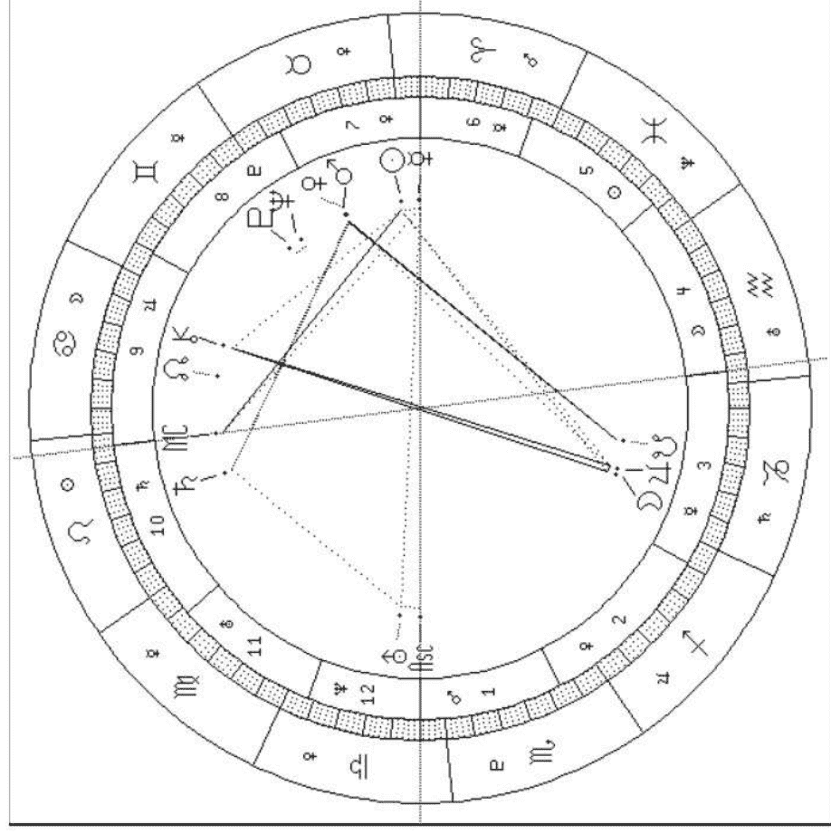

##### 三、火星在双子座

双子座的理性削弱了火星的冲动，火星双子的你是君子动口不动手的，冲动时会出言不逊、口诛笔伐。喜欢讽刺挖苦和说大话，工作时，无法长时间专注一件事情，脑筋常想着怎样省时省力，活用智慧，在学术领域内会表现突出。在性爱的表现上，你重视心灵上的契合胜过肉体上的结合，有些轻浮善变。你灵巧机智，缺乏耐力和持续性，可以在棋类竞赛中崭露头角。你容易意外伤到手臂或手指。

##### 四、火星在巨蟹座

火星在巨蟹座呈现非常正面的性质：爱好和平，不好斗，不自负，不苛刻，工作上野心勃勃，勤奋努力。火星巨蟹的你精力充沛，有耐性，工于家政，非常忠诚，爱家爱国。你对性爱感受纤细，重视环境影响，喜欢温柔缠绵。你容易情绪泛滥，喜怒无常，你的冲动是悲伤式的，缺乏行动能力。你容易因情绪起伏而发生胃部疾病。

##### 五、火星在狮子座

火星在狮子座达到最佳状态，火星狮子的你性情活泼，有胆有识，光明磊落，即不乏冲动，又成熟圆融。说话和煦流利，有感染力和说服力，工作态度认真，志向远大，精力旺盛，富创造能力和领导能力。你可能自负、好出风头，容易忽略他人的感受。在性爱方面，你喜欢采取主动，注重自己的表现。怒火中烧时你会捶胸顿足、破口大骂，偶尔也会出手伤人。你容易发生心脏方面的疾病，还有背部和脊椎的运动伤害。

##### 六、火星在室女座

火星室女的你冷静沉着，干净利落，工作上精益求精，公私分明，计划周详，讲究效率。你的文字表达十分精确，擅长控制精密仪器。在性爱方面，你过于注重一些细节而缺乏激情。火星室女的你情绪紧张时会唠唠叨叨，有些神经质的表现，因为冲动而伤害人的情况较少见，不过你属于君子报仇十年不晚的人。你容易有手部、肩部、肠胃方面的疾病。

##### 七、火星在天秤座

火星天秤的你和蔼可亲，处事圆滑，自我控制能力很强，发怒时也保持君子风度。在性爱方面，你讲究气氛，姿势优雅。你在工作上讲究原则，小心翼翼，重视公共关系，不太寻求自我表现，有裁判调停的天分，也有些懒惰。你容易扭伤腰部，肾脏功能不太好。

##### 八、火星在天蝎座

火星天蝎的你外表冷静，内心火热，越挫越勇，不达目的绝不罢休。你面对危急或胁迫时，越能显现爆发力。你野心勃勃而且攻击精准，令人不寒而栗。火星在这个星座使人沉迷于情欲，技巧高超狂野，是天生的烈火情人，你的爱意与肉欲一样浓烈，占有欲更强，任何人都别想夺走你的东西包括情人，愤怒与仇恨会让你做出玉石俱焚的行为。你可以成为优秀的外科医生、军事领袖和间谍。你容易发生生殖系统的病变。

##### 九、火星在射手座

火星射手的你具有宗教哲学式的狂热，是民族主义者。你热衷军乐、阅兵和其他军事。在性爱方面，你过于热情大胆的作风常常吓坏保守的伴侣。你热情洋溢，心胸宽大，分手时只要不过分去激怒你应该会没事。在工作方面，你有不凡的先知和远见，反应敏捷，行动迅速，但是缺乏持之以恒的耐性，适合做企划而不是执行者。你喜爱户外运动和探险，不妨去登山、滑雪，或者到国外旅行。你腿部容易运动伤害，肝脏疾病也要注意。

##### 十、火星在摩羯座

火星摩羯的你沉稳内敛，热衷于追求名声和社会地位。你精力旺盛，雄心勃勃，是个工作狂，在任何职场上都会有不凡的成就。在性爱方面，你是持久型的，不过，对你来说，性爱是工作完成

The request was rejected because it was considered high risk

The request was rejected because it was considered high risk

## 一☆占星学手册☆一

##### 二、北交点在金牛座，南交点在天蝎座

你在上一次轮回中可能主要发展了精神领域，以及帮助他人发现自身价值。今生开始转向物质世界的追求，努力工作，你也确实能吸引财富，在追求财富的过程中，要远离贪婪，培养爱心和慷慨，但是也不要大方地纵容好吃懒做之徒。

##### 三、北交点在双子座，南交点在射手座

你在上一次轮回中可能非常理想主义和情绪化，蜗居在知识的象牙塔里，今生的成长方向是理性思维和传播知识，享受与大众交流的乐趣，避免射手的教条主义和自命权威。你可能从事教职。

##### 四、北交点在巨蟹座，南交点在摩羯座

你在上一次轮回中可能位居高位，社会责任使你负荷过重，潜意识里压抑了你的个人情感，你今生的努力方向是放下权力欲，展现温柔的一面，享受家庭幸福。

##### 五、北交点在狮子座，南交点在水瓶座

你在上一次轮回中可能把太多的能量消耗在朋友和团体的事务上，以及清心寡欲的知识追求中，今生的努力方向是开发个人的创造性，勇于表现，成为众人的焦点。

##### 六、北交点在室女座，南交点在双鱼座

你在上一次轮回中可能是梦想家、虔诚教徒，今生的努力方向是适应朝九晚五的生活秩序，扎扎实实学习服务他人的技巧，有效地完成工作，不要沉迷在幻想的世界里。

##### 七、北交点在天秤座，南交点在白羊座

你在上一次轮回中可能过于自我中心，罔顾他人利益，今生的学习课题是节制与人相斗的竞争心态，提高公正的判断能力和与人合作的技巧。

## 一☆第五章 星体与十二星座☆一

八、北交点在天蝎座，南交点在金牛座

你在上一次轮回中可能是物质利益至上的拜金主义者，今生的人生方向是开发心理资源，升华精神世界，促进灵魂转化。

九、北交点在射手座，南交点在双子座

你在上一次轮回中可能杂而不精，浅尝即止，今生的努力方向是执著地追求高等知识，拓展智慧，探索宇宙的奥秘。

十、北交点在摩羯座，南交点在巨蟹座

你在上一次轮回中可能过度怀旧敏感，情绪依赖，今生的努力方向是坚强个人意志，追求事业成功和社会地位，树立领导权威。

十一、北交点在水瓶座，南交点在狮子座

你在上一次轮回中可能沉迷于个人享乐，狂妄自大，今生的努力方向是摆脱潜意识里的自命不凡，广交朋友，平等待人，服务社会和团体，献身人道主义的理想。

十二、北交点在双鱼座，南交点在室女座

你在上一次轮回中可能陷身于柴米油盐等琐碎事务中，没有时间完善自身的进化，今生的努力方向是摆脱吹毛求疵的习性，开发想象力，接受高层精神的影响，重拾心灵世界的宁静平和。

### 第六章 十二宫与十二星座的叠映

后天十二宫代表人生的不同活动领域，十二宫宫位起始所在的星座影响着宫位的表现。

以戴安娜王妃的星盘（图 3-2-1）为例，第一宫起始在射手座，也就是说，上升星座是射手座，第二宫在摩羯座，第三宫在双鱼座而不是按顺序的水瓶座，第四宫在白羊座，第五宫在金牛座，第六宫在双子座，第七宫在双子座，第八宫在巨蟹座，第九宫在室女座而不是按顺序的狮子座，第十宫在天秤座，第十一宫在天蝎座，第十二宫在射手座。

本书采用普拉西达斯（Placidus）分宫法，它是在十六世纪由普拉西达斯（Placidus de Tito）发明的，它在靠近地球两极的区域误差很大。另一种常用的分宫法是德国占星学家科赫（Walter Koch）在上个世纪六十年代发明的科赫分宫法，美国占星学界普遍使用科赫分宫法。普拉西达斯分宫法的后天十二宫不是等分的，这样的话，有的宫位可能占据三十度以上的范围，所以会发生整个星座被包含在一个宫位中的情况，就是说，这个星座被截夺了。在戴安娜王妃的星盘中，水瓶座完全包含在第二宫里，狮子座完全包含在第八宫中，也就是说，水瓶座和狮子座被截夺了。被截夺的星座对星盘主的影响将被削弱。

下面来看各宫的意义：

第一宫就是上升星座，是“人格面具”，代表本我，包括人的身材外貌、个性举止、人生观、童年环境，以及给人的第一印象。如果一个人海王星重合上升星座，此人很可能出生不明，父母不详，很多被遗弃的孤儿有这样的相位。如果有太多的主星落入第一宫，这个人可能很主观，不管别人。一天之中，十二星座依序从地平线上升起。日出时分，太阳重合第一宫起始，也就是说，日出时分出生的人，上升星座和太阳星座在同一星座。其余大多数时间里，上升星座和太阳星座是不一样的，上升星座每分每秒都在变，所以每个人的星盘都与众不同，天下无双。

## 一☆第六章 十二宫与十二星座的叠映☆一

第二宫代表个人财物和价值观。这个财就是中国命理学所谓的正财，也就是职业所带来的收入，包括动产，比如金银财宝，不包括不动产比如房子，它同时也反映个人对金钱的使用方式。一个很有钱的人可能很节省。如果一个人的第二宫在双鱼座，即使他的太阳在精明的室女座，花钱也是没有太多概念的，相反，如果一个太阳双鱼的人，第二宫在室女座，对个人财政可不迷糊。

第三宫代表表达能力、兄弟姐妹、中小学、通讯和交通，第三宫所代表的讯息和思想交流是比较浅的，不带高深的理论思想。如果一个人的第三宫很强，口才会很好，不容易冷场，也许可以做推销员。如果一个人的第三宫比较弱，中小学成绩可能不会拔尖，做父母的就不要强求。兄弟姐妹又叫手足，有占星学家认为，如果水星在第三宫对冲木星，也就是与木星成180度的话，可能会有手足残疾。

第四宫代表家庭、家庭观、父母、根、不动产和晚年。如果一个人不是亲生父母抚养的，那么第四宫就代表抚养他的保姆、养父母、祖父母或者孤儿院。从第四宫所在的星座，可以看出一个人来自什么样的家庭。一个来自破碎家庭的人，有可能把破碎继承下去，人所遗传的不仅仅是身体毛发。按照传统的西方占星学派，第四宫代表母亲，对宫第十宫代表父亲，按照现代心理占星学家（Liz Greene 和 Howard Sasportas）的研究，四宫为父、十宫为母，因为母亲是儿童最早接触和最常接触的人，父亲因为工作，经常不在，所以成为子女心中偶像的，母亲居多。不过台湾占星学家丁长青认为，第四宫代表男性的父亲、女性的母亲，而第十宫代表男性的母亲、女性的父亲，在没有统一定论之前，本书一律将第四、十宫各代表双亲之一，读者可根据自身的情况变通。

第五宫代表个人的娱乐和偏财运，恋爱赌博、生儿育女、琴棋书画等等都和五宫有关，恋爱期间的情人也由第五宫代表，结婚以后的伴侣则由第七宫代表，生儿育女也是个人的娱乐之一，是为自己而不是为子女，生儿育女的原因不外乎为了自己老有所养、老有所伴、证明自己能生、小孩好玩、不小心怀孕了，等等，没有人是因为人间太美好才要制造一个孩子来分享。第五宫强的人，会比较注重个人的享受。恋爱顺利的人，赌博手风可能也很顺，但冥王星五宫的人可能除外，所以还是有情场失意、赌场得意一说。不过新世纪以来股票族大多失手，就算手风很顺也挡不住大趋势啊。

第六宫代表生活中的琐事，也和健康有关，又被称为健康宫，宫内行星与特定的疾病有关。第六宫还代表对下属的态度，因此也被称作奴仆宫，这个名称具有歧视意味，摒弃不用为好。第六宫所代表的职业和第十宫所代表的事业不同，第十宫的事业是一种理想，第六宫则是代表具体工作，每天要处理的事，以及处理事务的方式。

第七宫代表和他人一对一的关系，包括伴侣、公司合伙人、律师以及公开的敌人。和第一宫不同，如果有太多的星云集第七宫，其人会太在意别人的意见而失去自己的主见。水星在第七宫的人，常常不只结一次婚。第七宫在第一宫的对宫，第七宫所在的星座也一定和第一宫所在的星座正对，如果第一宫在白羊座，第七宫一定在天秤座；如果第一宫在金牛座，第七宫一定在天蝎座，余次类推。

第八宫是原欲之宫，体现人的生物本能。它是第二宫的对宫，第七宫的第二宫，代表夫妻共有财产、他人财产、危险、风险投资、性和性欲、遗产信托，还代表死亡和对死亡的看法。财、色、死互相关联，正所谓人为财死、鸟为食亡。比如一个国家对另一个国家资源的觊觎，就会导致人为的大规模死亡。性也是一种对他人资源的占有，“色字头上一把刀”，贪财贪色会面临危险或死亡。第八宫既代表死亡，也代表重生，人类必须战胜自身的阴暗，才能获得永生。

第九宫是第三宫的对宫，代表大智慧、宗教哲学观点和高等教育，以及外国文化和长途旅行，第九宫所代表的知识是人类历史的积累，进出口业务和国际贸易也属于此宫。第九宫的含义正应了熟语“行万里路，读万卷书”，第九宫强的话，出外旅行和留学深造会比较顺利。

## 一☆第六章 十二宫与十二星座的叠映☆一

第十宫也叫事业宫，和个人的事业，社会地位，信用有关，也显示父母中的一方。十宫由刻苦耐劳的土星表征，可见成功与努力密不可分。第十宫是第四宫的对宫，事业和家庭有时很冲突。

第十一宫代表朋友社团、个人理想和大众福祉，万维网络也和第十一宫有关。第十一宫是第五宫的对宫，所以有重友轻色、重色轻友之说。情人最好是重色轻友，朋友最好重友轻色，想得多美啊！五宫是个人之乐，十一宫是天下之乐。

第十二宫代表人的潜意识、第六感、医院、监狱、自我牺牲和暗中的敌人，与灵魂和宿命的概念有关，秘密隐私、梦境都和第十二宫有关。如果有太多的星在此宫，此人可能逃避，遁世，太同情别人而牺牲自己。第十二宫是第六宫的对宫，第六宫是劳累和身体健康，第十二宫则是休息和精神健康。

#### 第一节 第一宫（上升星座）和第七宫的星座

##### 一、第一宫在白羊座，第七宫在天秤座

第一宫白羊的你，给人的第一印象是结实精悍，活力四射，行动敏捷。你有极佳的爆发力，在运动方面可以创造出好的成绩。“生命在于运动”是你的写照。你不喜欢浪费时间，一旦定下目标，就勇往直前。你是肌肉形体格，目光有神。

第七宫天秤的你，喜欢温柔优雅、身材比例完美、个性客观、缺乏主见、有交际能力的伴侣。

##### 二、第一宫在金牛座，第七宫在天蝎座

第一宫金牛的你，看起来像是一个从容不迫、悠闲自得的田园之主。你重视经济基础，爱好美的事物，并且也能创造美。你的身材较宽，壮实。

第七宫天蝎的你，有较强的控制欲。你喜欢性感神秘、个性强烈、敢爱敢恨的伴侣。

##### 三、第一宫在双子座，第七宫在射手座

第一宫双子的你，大脑和身体的其他部件都动个不停。你喜欢传播小道消息、谣言八卦、以及新的资讯，你言辞敏捷，机灵能干，但给人不安定不沉着的印象。你的体型苗条，骨架瘦小，眼睛很活。

第七宫射手的你，重视对方的道德与智慧，喜欢个性乐观、慷慨大方的异性，你的婚姻多半幸福，可能与异族通婚。

##### 四、第一宫在巨蟹座，第七宫在摩羯座

第一宫巨蟹的你，外表宁静安详，富有人情味。你乐于助人，愿意倾听他人的烦恼。你很容易受情绪影响，喜怒哀乐形于色。你的想象力非常丰富。你四肢较短，个子不高，脸有些圆。

第七宫摩羯的你，对婚姻非常谨慎而保守，通常会晚婚。你喜欢勤奋努力、老成稳重、传统守旧的人，也会为了得到地位而结婚。

##### 五、第一宫在狮子座，第七宫在水瓶座

第一宫狮子的你，自信满满，处处摆出庄严华贵的帝王架势。你动作夸张、说话幽默，喜欢引人瞩目。你的身材魁梧，气宇轩昂，目光有神。

第七宫水瓶的你，受特立独行的人所吸引，有喜欢比自己小很多的对象的倾向。

##### 六、第一宫在室女座，第七宫在双鱼座

第一宫室女的你，给人的印象是干净整洁，心思细腻，对工作非常认真，热心而且爱管闲事。你对自己要求严格，有完美主义倾向。你的身材中等偏瘦，显得年轻。

第七宫双鱼的你，对另一半充满幻想，容易受浪漫、不切实际、感情丰富的人所吸引。

##### 七、第一宫在天秤座，第七宫在白羊座

第一宫天秤的你，气质典雅，重视生活情趣。你十分在意别人对自己的看法，喜欢与人合作，不喜欢孤军作战。你身材匀称，长相迷人。

第七宫牡羊的你，有点自我，你喜欢个性直率、勤快的伴侣，你可能早婚，或突然结婚。

##### 八、第一宫在天蝎座，第七宫在金牛座

第一宫天蝎的你，外表很酷，冷静从容。你习惯隐藏自己的真实感受，让人不敢亲近。你具有魔鬼般的身材，你的目光深邃，可能有鹰勾鼻。

第七宫金牛的你，喜欢长相不错、有经济实力的异性。

##### 九、第一宫在射手座，第七宫在双子座

第一宫射手的你，开朗乐观，目标远大。你的乐天态度，使你相信明天会更好、下一个会更好，让人觉得你不切实际。你的身材高挑，四肢修长。

第七宫双子的你，喜欢聪明伶俐、多才多艺的异性。

##### 十、第一宫在摩羯座，第七宫在巨蟹座

第一宫摩羯的你，看起来老成持重、不苟言笑、锋芒内敛。你大智若愚，头脑冷静，个性坚强。你希望成为一个成功的人，但你的悲观和缺乏自信往往阻止你去实现梦想。你的体型瘦弱，骨骼粗大。

第七宫巨蟹的你，喜欢细心体贴、能给你安全感的异性。你们在情感上相互依恋很深。

##### 十一、第一宫在水瓶座，第七宫在狮子座

第一宫水瓶的你，看起来脾气古怪、智慧很高。你喜欢标新立异、与众不同。你不太会感情用事。你对奇闻异事很感兴趣。你的体型高瘦，额头较宽。

第七宫狮子的你，欣赏位高权重、让你很有面子的异性。

##### 十二、第一宫在双鱼座，第七宫在室女座

第一宫双鱼的你，表现得十分浪漫，富有同情心。你感受纤细，文学艺术气质浓厚。你体型丰满，眼睛大而湿润。

第七宫室女的你，受到工作勤奋、重视细节、一丝不苟的异性所吸引。

#### 第二节 第二宫和第八宫的星座

##### 一、第二宫在白羊座，第八宫在天秤座

第二宫牡羊的你，花钱冲动，容易过度挥霍，你适合通过开创新事业获得利益，你总是很努力地去取得自己想要的东西，到手了又不珍惜。如果你的火星与海王星相位不佳，你可能骗取他人财物。

第八宫天秤的你，擅长与人合作共同致富，你的伴侣可能对你们的共同资产贡献较多。在性方面，你重视配合和协调。过度纵欲和酗酒会影响你的肾功能。

##### 二、第二宫在金牛座，第八宫在天蝎座

第二宫金牛的你，重视金钱和金钱所带来的安全感，你也很有理财的头脑。你会花钱在奢侈品或华丽的享受上。

第八宫天蝎的你，性欲旺盛，也很在行。你对死有深刻的认识，你一生都在不断地面临死亡与蜕变，绝处逢生。你有过强的控制欲，不宜与人分享利益。

##### 三、第二宫在双子座，第八宫在射手座

第二宫双子的你，赚钱的方法很多，你多半是脑力劳动者，或者通过思考来增加财富。你的亲戚朋友对你的财产增值有助力。

第八宫射手的你，可能继承遗产，你的伴侣有稳定的经济基础。你对探索宗教哲学和死后的未知世界有浓厚的兴趣，在性方面，你为了追求更高层次的经验而可能经常更换性伴侣。

##### 四、第二宫在巨蟹座，第八宫在摩羯座

第二宫巨蟹的你，具有察觉市场变化、了解市场需求的第六感。你花钱很情绪化，你重视金钱上的安全感，所以喜欢储蓄和收藏。

第八宫摩羯的你，害怕衰老，会买人寿保险。你可能有性压抑。你如果借钱给人恐怕会收不回来。

##### 五、第二宫在狮子座，第八宫在水瓶座

第二宫狮子的你，通过财富来表现实力，富有是你的人生目标，而你通常能够得到你想要的财富。你会利用职权来获取利益，你愿意为家人大洒金钱。

第八宫水瓶的你，对生命的看法独特，朋友的逝去会对你的心灵造成很大震动。你可能具有特异功能，你可能自虐。在性方面，你喜欢违反传统的方式。

##### 六、第二宫在室女座，第八宫在双鱼座

第二宫室女的你，精打细算，不会随便浪费一分钱。你善于通过合作来致富。

第八宫双鱼的你，回避生死问题的思考，对于自身的欲望和性取向也是稀里糊涂，搞不清楚。你可能沉迷药品，没病的时候就吃很多维生素。

##### 七、第二宫在天秤座，第八宫在白羊座

第二宫天秤的你，可以与伴侣合作事业赚钱，你购买物品重视包装，货比三家，所以花钱犹豫不决。你可以通过提供美的事物赚钱。

第八宫牡羊的你，容易与人发生财务纠纷，过于冲动也会使你遭逢意外。你的性冲动来得快，去得也快。

##### 八、第二宫在天蝎座，第八宫在金牛座

第二宫天蝎的你，有变废为宝的本领和一夜致富的运气。你有辨认物超所值的眼力，有获得他人钱财的能力，你会花钱来满足自己的控制欲。你不喜欢别人打探你的收入。

第八宫金牛的你，重视肉欲，具有利用隐藏资源来赚钱的能力。你与人分享利益时会很实际。

##### 九、第二宫在射手座，第八宫在双子座

第二宫射手的你，财运很好，能挣会花。你有在外地发财的运气，你愿意出钱支持教育和宗教机构，你可以成为经济学家。不要独享自己的好运气。

第八宫双子的你，喜欢探讨神秘事物和死后的世界。你对于共同的财产有很多计划。在性方面，你想得多、做得少。

##### 十、第二宫在摩羯座，第八宫在巨蟹座

第二宫摩羯的你，非常节俭、实际，你不会冲动购物，你偏向于选择物品的实用性和耐久性。

第八宫巨蟹的你，希望在身后能留在别人的美好回忆里，你会为家人安排一切保障。你的伴侣通常会挣钱给你花。在性方面，你敏感，过于重视自己的感觉，害怕受到伤害。

##### 十一、第二宫在水瓶座，第八宫在狮子座

第二宫水瓶的你，对金钱的嗅觉灵敏，常以不寻常的方式赚钱。你对新奇的物品很有兴趣，你花钱的态度与众不同。你的钱来的快、去的也快。如果你的天王星比土星强势，你可能没有稳定的收入。

第八宫狮子的你，可能很长寿，你在乎事情结尾的体面。你在共同资产方面，希望拥有主导权。你可能在保险行业工作。在性方面，你热情积极、充满活力，注重自我的表现。

##### 十二、第二宫在双鱼座，第八宫在室女座

第二宫双鱼的你，缺乏理财概念，过分慷慨，财运却很好。你在乎物品的精神价值，花钱很不实际。请你在签帐单之前要反复阅读，以免被骗。

第八宫室女的你，非常关心自己的健康，具有危机意识，喜欢让事情有个完美的结束。在处理共同资产方面，你斤斤计较。你不太相信灵异之事。在性方面，你很节制，不会轻易尝试。

#### 第三节 第三宫和第九宫的星座

##### 一、第三宫在白羊座，第九宫在天秤座

第三宫牡羊的你，头脑灵活，喜欢尝试新思想、新事物。你说话冲动，好与人争辩。你有很好的写作能力。

第九宫天秤的你，重视理论的和谐性。你可能在国外结婚，或者与外国人结婚。你喜欢和朋友、家人一道旅行。你喜欢做学问，尤其是科学。

##### 二、第三宫在金牛座，第九宫在天蝎座

第三宫金牛的你，说话慢条斯理，不爱与人争执，跟兄弟姊妹、街坊邻里之间相处和谐。你的观念一旦形成，就很难更改，你会认为自己绝对正确。

第九宫天蝎的你，喜欢钻研各种宗教哲学等深奥理论。你有心理治疗的天分。你可能在学术界、出版界发展。

##### 三、第三宫在双子座，第九宫在射手座

第三宫双子的你，喜欢说话，鬼点子多。跟你在一起总是有很多话题，永远不会无聊。

第九宫射手的你，是天生的探险家，喜欢出门在外。你的信仰比较传统。你对高深学问更感兴趣。

##### 四、第三宫在巨蟹座，第九宫在摩羯座

第三宫巨蟹的你，非常照顾兄弟姊妹、亲戚朋友，你具有非凡的想象力和惊人的记忆力。除非因公出差，你喜欢呆在家里。

第九宫摩羯的你，具有非常传统的世界观。你很难相信那些你没有亲身体验的事物。

##### 五、第三宫在狮子座，第九宫在水瓶座

第三宫狮子的你，头脑机灵，艺术表现能力强。你小时候喜欢做孩子王。你喜欢探亲访友。你的自尊心很强，使你容易记仇。

## 一、第六章 十二宫与十二星座的叠映

第九宫水瓶的你，喜欢探索未知世界的奥秘，你会结交三教九流、各色各样的朋友。你的灵感会把你带向新的旅程。

##### 六、第三宫在室女座，第九宫在双鱼座

第三宫室女的你，语言能力很强，能够清晰明白地表达思想，你的文字经得起推敲。你天生具有医药知识。你对兄弟姊妹过于苛求而且吹毛求疵。

第九宫双鱼的你，对外面的世界充满幻想，宗教信仰是你人生的重要部分。你如果写作会倾向于神秘事物和精神世界。你可能经历海上旅行。

##### 七、第三宫在天秤座，第九宫在白羊座

第三宫天秤的你，说话温文尔雅，想得多说得少。你重视兄弟姊妹、街坊邻里之间的和谐，你会是很好的调解人。出门在外你讲究舒适。

第九宫牡羊的你，求知欲很强，喜欢冒险。在思想上，你不喜欢步人后尘。

##### 八、第三宫在天蝎座，第九宫在金牛座

第三宫天蝎的你，沉默寡言，一旦开口，一针见血，语不惊人死不休。你与兄弟姊妹之间的感情强烈。

第九宫金牛的你，具有非常现实的世界观，你很难改变信仰。你喜欢接触大自然。

##### 九、第三宫在射手座，第九宫在双子座

第三宫射手的你，说话直率，对兄弟姊妹慷慨大方。你天生喜欢接触不同的环境。你常会收到来自远方的讯息，说不定你是个明星，有不少崇拜者。

第九宫双子的你，适应能力很强，对外面的世界充满好奇，喜欢探究各种不同的思想领域。

##### 十、第三宫在摩羯座，第九宫在巨蟹座

第三宫摩羯的你，说话谨慎，你小时候可能过得不快乐。你常常被误解并且懒得为自己辩护。你的早期教育可能不太顺利。

第九宫巨蟹的你，身心具有强烈的旅行欲望，你能够通过梦境和第六感来探究神秘世界。

##### 十一、第三宫在水瓶座，第九宫在狮子座

第三宫水瓶的你，思想前卫而不切实际，经常以刺激或独特的方式来表达意见。你和兄弟姐妹、街坊邻里的关系很不寻常。

第九宫狮子的你，本能地追求专业领域里的声名。你是一个空想主义者，热衷探索真理。你最好住得离你伴侣的父母远些。

##### 十二、第三宫在双鱼座，第九宫在室女座

第三宫双鱼的你，具有通过直觉获得知识的能力。你对兄弟姊妹充满感情，愿意慷慨付出。你说话语义模糊，有编造的习惯。你可能有异父母的兄弟姐妹。

第九宫室女的你，相信实用的、完美自恰的哲学。你通常是无神论者，你怀疑一切不能在现实世界里被证明的理论，你会是很好的批评家。你会为工作而旅行，或者在旅行中工作。

#### 第四节 第四宫和第十宫的星座

##### 一、第四宫在白羊座，第十宫在天秤座

第四宫牡羊的你，在家里、在家事上很容易冲动，你家里有很多仪器设备，你的家人颇多争执。你的父亲或母亲比较凶。

第十宫天秤的你，善于运用人际关系推动自己的事业，你也善于处理工作场所的人际关系。你喜欢与人合作，辅助上司，你适合守成。你的父亲或母亲比较公正客观，但缺乏主见。

##### 二、第四宫在金牛座，第十宫在天蝎座

第四宫金牛的你，重视家庭和睦，愿意为打扮家居大洒金钱，你的家庭环境优雅。你不会去与人争地盘，也不容人侵犯自己的领地。你的父亲或母亲性情温和，物质占有欲很强。

第十宫天蝎的你，事业心很强，不轻易放弃目标，不轻言失败，往往能绝处逢生。你可能与某些领导不和。你的父亲或母亲可能性格极端。

##### 三、第四宫在双子座，第十宫在射手座

第四宫双子的你，经常搬家或者经常不在家，你可能有两个家，家里有很多书，你喜欢与家人谈天，你的父亲或母亲非常聪明。

第十宫射手的你，理想远大，乐观上进。你的职业很可能与教育、宗教、旅游有关。你的父亲或母亲乐观开朗、爱好旅游，知识丰富。

##### 四、第四宫在巨蟹座，第十宫在摩羯座

第四宫巨蟹的你，特别恋家，家使你的身心完全放松。你的家舒适，常留有许多旧东西。你有一个温柔慈祥的父亲或母亲。

第十宫摩羯的你，雄心勃勃，脚踏实地，渴望出人头地。默默无闻的时候，你会逃避麻烦和是非，引人注目的时候，你会勇敢地去面对一切困难。你非常爱惜羽毛，重视名誉。你有一个保守传统，对你要求严格的父亲或母亲。

##### 五、第四宫在狮子座，第十宫在水瓶座

第四宫狮子的你，是家里的领导，对家人慷慨大方。你可能出生名门，所以你以家为荣。你喜欢把家布置得富丽堂皇。你非常热情好客。你有一个热情高贵的父亲或母亲。

第十宫水瓶的你，可能会在大的企事业中负责专业领域。你对个人名声地位不太在乎，你重视个人的社会贡献和价值。你很忠实地对待帮助过你的人。你的父亲或母亲非常与众不同。

##### 六、第四宫在室女座，第十宫在双鱼座

第四宫室女的你，爱做家务，爱唠叨，你总是把家整理得干净整洁。你会把工作带回家里来做。你有一个任劳任怨的父亲或母亲。

第十宫双鱼的你，是个梦想家，你适合医院、监狱或慈善机构，以及一切能让你发挥想像力的事业。你可能会有两份工作。你通常有一个爱幻想并且仁慈的父亲或母亲。

##### 七、第四宫在天秤座，第十宫在白羊座

第四宫天秤的你，重视家人之间的合作，你喜欢配合。你公正平等地对待每一位家庭成员。你有一个公正、优雅的父亲或母亲。

第十宫牡羊的你，爱与人竞争，拼命追求出人头地。你适合开创新事业，你可能有一个脾气暴躁的父亲或母亲。

##### 八、第四宫在天蝎座，第十宫在金牛座

第四宫天蝎的你，有侵占他人领域的倾向。你是家中主宰，你经常埋怨家人，但他们不能埋怨你。你家里可能会有地下室。你的父亲或母亲多半有控制欲。

第十宫金牛的你，渴求财富和名声，你偏好选择稳定发展的事业，你的父亲或母亲性情温和、固执忠诚。

##### 九、第四宫在射手座，第十宫在双子座

第四宫射手的你，会不断扩张自己的领域，你的家宽敞，你热情好客，待家人更是慷慨大方，你很少在家。你多半有一个开朗豪放的父亲或母亲。

第十宫双子的你，希望自己的聪明机智被别人欣赏，你常常会有两个以上的专业发展方向。如果只有一份职业，你也必定会发展一项业余爱好。你适合在传播业发展，你多半有一个聪明机智的父亲或母亲。

##### 十、第四宫在摩羯座，第十宫在巨蟹座

第四宫摩羯的你，有着传统保守的家庭观念，你在家里是严肃沉默的，你要求家人遵守你制定的规章纪律。你的家外面可能有高高的围墙。你以你的祖先为荣。你有一个循规蹈矩的父亲或母亲。

第十宫巨蟹的你，对声名地位非常敏感，你希望受人尊敬。你的事业家庭密不可分。你有一个非常顾家的父亲或母亲。当你的父亲或母亲离开人世之后，你会觉得自身的一部分也死了。

##### 十一、第四宫在水瓶座，第十宫在狮子座

第四宫水瓶的你，经常搬家或改变家居布置，你把家人当作朋友。你好客但不喜欢走亲访友。你的家庭非常有特色，与众不同。你有一个标新立异的父亲或母亲。

第十宫狮子的你，雄心勃勃，渴望成为众人的焦点。你有领导能力，也热衷权利地位。你有一个热心负责的父亲或母亲。

##### 十二、第四宫在双鱼座，第十宫在室女座

第四宫双鱼的你，爱呆在家中做梦，你对家有很高的期望，同时也有失望，你家中可能有病人需要你照顾，你的家经常乱糟糟的。你家里可能有不为人知的秘密。你多半有一个感情丰富、脱离现实的父亲或母亲。

第十宫室女的你，追求完美，对自己的专业技术精益求精，做事有计划，讲效率，适合服务大众和精密仪器行业。你有一个注重细节、完美主义的父亲或母亲。

#### 第五节 第五宫和第十一宫的星座

##### 一、第五宫在白羊座，第十一宫在天秤座

第五宫牡羊的你，恋爱时积极主动，喜欢谁就会马上展开追求。你爱好竞技运动。你对子女粗暴，你的子女也因此脾气暴躁。

第十一宫天秤的你，爱交朋友，会从朋友中选择结婚伴侣。

##### 二、第五宫在金牛座，第十一宫在天蝎座

第五宫金牛的你，是浪漫主义者，你的感情持久，嫉妒心也很强。你爱好文学艺术。你对子女温和，子女也多半是乖巧。

第十一宫天蝎的你，会结交一些有能力处理难题的朋友，你对朋友忠诚，也期待他们对你忠诚。

##### 三、第五宫在双子座，第十一宫在射手座

第五宫双子的你，对恋情不深入，你把恋人当作兄弟姐妹一样，你可能脚踏两条船，你喜欢手脑并用的游戏。你重视子女的智力开发，你的孩子多半聪明，你容易生出双胞胎。

第十一宫射手的你，交际广阔，朋友很多，你可能会成为人道主义运动的领袖。

##### 四、第五宫在巨蟹座，第十一宫在摩羯座

第五宫巨蟹的你，恋爱时敏感而情绪化，非常投入，重视与恋人的点点滴滴回忆。你喜欢在晚上进行创作。你的写作能力比语言表达能力强。你爱好美食，容易超重。你容易过份保护子女，你的子女多半性格温柔。

第十一宫摩羯的你，不善交际，你倾向于结交保守稳定、年长的、对你有帮助的朋友。

##### 五、第五宫在狮子座，第十一宫在水瓶座

第五宫狮子的你，是恋爱高手，热情主动，你看重对方的外表和家世。你对表演很感兴趣，可以进军演艺界。你非常疼爱子女，喜欢和孩子们玩，你的子女也很出色。

第十一宫水瓶的你，积极参与社会活动，爱交朋友，尤其是年轻的朋友。

##### 六、第五宫在室女座，第十一宫在双鱼座

第五宫室女的你，恋爱时注重细节，追求完美，有点神经质。你对子女要求完美，你的子女多半乖巧守纪律。

第十一宫双鱼的你，对朋友非常慷慨，你缺乏心机，容易美化朋友，有受骗的可能。

##### 七、第五宫在天秤座，第十一宫在白羊座

第五宫天秤的你，是注重恋爱气氛和美感的情人，你犹豫不决的个性会使你在恋爱受阻的时候退缩。你对待子女公正平等，你的子女多半气质优雅，人情练达。

第十一宫牡羊的你，积极参与社会活动，对朋友有喜新厌旧的倾向。

##### 八、第五宫在天蝎座，第十一宫在金牛座

第五宫天蝎的你，爱得天翻地覆，你会过份地投入感情，你的恋爱伴随着性。你对子女有强烈的支配欲，你的子女多半性格强烈。

第十一宫金牛的你，喜欢建立稳定的朋友关系，你有跟有钱人交朋友的倾向。你对艺术社团比较感兴趣。

##### 九、第五宫在射手座，第十一宫在双子座

第五宫射手的你，追求刺激，可能有异国恋情发生。你爱好运动健身。你对待子女放任自流、过分慷慨，你的子女也是开朗豪放，喜欢户外活动。

第十一宫双子的你，特别爱交朋友，尤其是聪慧的朋友。你喜欢为社会活动奔忙。

##### 十、第五宫在摩羯座，第十一宫在巨蟹座

第五宫摩羯的你，对感情相当负责和保守，你的恋情多半是马拉松。你可能喜欢登山运动。你对子女期望很高，管教严格，你的子女多半个性坚韧。

第十一宫巨蟹的你，对朋友像家人一样，你特别念旧，珍惜友情。你对所参加的社团充满感情。

##### 十一、第五宫在水瓶座，第十一宫在狮子座

第五宫水瓶的你，分不清朋友和恋人，你很可能一见钟情。你把子女当朋友，你的孩子多半古怪精灵，与众不同。

第十一宫狮子的你，喜欢结交权贵，在社团中你希望成为中心人物。你会积极参加能增添你的知名度的社会活动。

##### 十二、第五宫在双鱼座，第十一宫在室女座

第五宫双鱼的你，温柔浪漫，不切实际，把爱情想的太美好，容易受骗，你可能有暗恋和不伦之恋。你溺爱子女，不懂管教，你的子女可能体弱多病、或者多愁善感。

第十一宫室女的你，对朋友尽心尽力，像个保姆。你会参与服务社会活动。

#### 第六节 第六宫和第十二宫的星座

##### 一、第六宫在白羊座，第十二宫在天秤座

第六宫牡羊的你，做事主动，你敢于挑战不可能的任务。对于老板而言，你是积极上进、不知疲倦的优秀职员，对同事，你乐于伸出援手，你看起来就象二老板。如果你是老板，你的专横容易引起下属的不满。你急于对他人下结论。健康上，要注意头部的问题。

第十二宫天秤的你，不太喜欢独自一人，即使独处的时候也会选择豪华舒适的环境，你通过学习与人合作而得到升华。

##### 二、第六宫在金牛座，第十二宫在天蝎座

第六宫金牛的你，精力充沛，可以适应长时间的工作，当然这必须和报酬挂钩。你喜欢有点情趣的工作。虽然你不轻易发脾气，你对待下属的看法很难更改，你很固执。喉咙是你容易出问题的地方。

第十二宫天蝎的你，足智多谋，具有洞悉不为人知之事的能力。你是善于暗中报复的高手，你最大的敌人是你潜意识里的黑暗面。

##### 三、第六宫在双子座，第十二宫在射手座

第六宫双子的你，适合脑力劳动，工作效率高，可以同时处理好几件事，你善于与下属沟通，对待下属像兄弟姊妹一般。你容易神经质，手部是常出现问题的地方。

第十二宫射手的你，独处的时候，喜欢思考高深的哲学。你会暗中对外发展，你可能有未能实现的梦想。

##### 四、第六宫在巨蟹座，第十二宫在摩羯座

第六宫巨蟹的你，喜欢在像家的地方工作，你会把情绪带入工作场所。你像对待家人一样关心同事和下属。你的健康随着情绪起伏，你容易有胸部和胃部的毛病。

第十二宫摩羯的你，内心非常保守，即使外表开放。你善于保密，你可能完成秘密计划。你受到潜意识里的恐惧所限制。如果土星受克，你必须战胜与生俱来的自私自利。

##### 五、第六宫在狮子座，第十二宫在水瓶座

第六宫狮子的你，喜欢受人尊重的工作，会在同事和下属的面前有意无意地炫耀自己的能力。你生病有时只是为了引起注意，过度劳累会使你的心脏、血液循环出问题。

第十二宫水瓶的你，内心非常敏感，你难以适应物质世界。你渴望能够成为独特的人。正面的你对宇宙的有着深刻认识，可以开启智慧之门；负面的你会沉湎于麻醉剂，有自杀倾向。

##### 六、第六宫在室女座，第十二宫在双鱼座

第六宫室女的你，工作时非常小心谨慎，适合精密仪器方面的工作。你会是一个置健康于不顾的工作狂。你对待同事和下属同样要求完美，一丝不苟，你非常注重工作环境的干净整洁。健康上，要注意消化系统的问题。

第十二宫双鱼的你，具有无意识的智慧。你的内心比你所表现出来的要敏感的多。你通过读书来恢复身心。

##### 七、第六宫在天秤座，第十二宫在白羊座

第六宫天秤的你，擅长与人一起工作，会营造出和谐的同事关系。你对待同事和下属公平友善、一视同仁。健康上，你较容易出现肾脏，过滤系统的问题。

第十二宫牡羊的你，藏不住秘密。你的内心充满勇气和自信，会暗中与人较劲，秘密从事新的计划。你容易将事情想的太过单纯，你喜欢独处。你最大的敌人就是自己。

##### 八、第六宫在天蝎座，第十二宫在金牛座

第六宫天蝎的你，求知欲很强，喜欢探索未知世界，经常卷入科学研究工作。你通过全心投入工作使自己蜕变。你可以用心去改善健康状况，你适合练气功。

第十二宫金牛的你，内心固执，不容他人侵犯隐私。私底下，你物欲强烈，你会藏私房钱以满足内心的安全感。你的梦想很实际，你会在暗中一步步实现梦想。

##### 九、第六宫在射手座，第十二宫在双子座

第六宫射手的你，喜欢自由自在、不受拘束的工作，你喜欢因公出差。你的精力不太充足，常常需要额外的睡眠。你乐于帮助同事和下属。在健康方面，你的大腿是薄弱部分。

第十二宫双子的你，能够自我推动、成长，你通过倾听增长知识。你有很多的秘密，经常会话中带话，让人不清楚你真正的意思。你常自言自语。

##### 十、第六宫在摩羯座，第十二宫在巨蟹座

第六宫摩羯的你，对工作认真负责、任劳任怨，信仰一分耕耘一份收获。你适合有组织有计划的任务。你对待同事和下属要求严格，不苟言笑。你的骨骼是身体的薄弱部分。

第十二宫巨蟹的你，潜意识里缺乏安全感，这或许是你母亲造成的。你经常将自己封闭起来，害怕别人侵犯到你的隐私。你可能有不为人知的家族密辛。

##### 十一、第六宫在水瓶座，第十二宫在狮子座

第六宫水瓶的你，具有技术革新的能力，你适合特别任务，你对工作时的个人自由发挥非常重视。你对待同事和下属就像朋友一样。你的小腿是身体的薄弱部分。

第十二宫狮子的你，潜意识里认为自己最了不起，害怕被别人瞧不起。你喜欢炫耀自己的隐私。

##### 十二、第六宫在双鱼座，第十二宫在室女座

第六宫双鱼的你，具有服务他人的热心，对脱离现实的工作最感兴趣。你对同事和下属极具同情心，为他们担忧太多。当工作压力太大时，你容易患上抑郁症。健康方面，要多注意脚部的问题。

第十二宫室女的你，非常在意自己的隐私，会谨慎地保守秘密。私底下你很在意自己的健康。

### 第七章 星体在后天十二宫中的分布

星体、星座、宫位和相位之间的关系就像演戏，星体是演员，星座是角色，宫位是舞台，相位则是故事情节。每一个星体都具有不同的功能，星体的宫位就是星体对你起作用的生活领域。下面的释义适用于星体独守某一宫位的情况。当几个星体共处同一宫位时，其作用并非是各星体独处时作用的简单相加。这就好像太阳光线，分开来是赤橙黄绿青蓝紫，然而在多数情况下，人们看到的只是没有颜色的白光。

#### 第一节 太阳在十二宫

##### 一、太阳在第一宫

太阳在第一宫的你，自尊心和权力欲非常强，你也确实具有创造力和领导力。你的个人意志坚定，为人光明正大。你对自己的期望很高，为了成为杰出的人，你会辛勤工作。如果太阳的相位不佳，你可能会过度自傲，极端自私，目中无人。你的基调是“存在”。

##### 二、太阳在第二宫

太阳在第二宫的你，希望经济独立，有强烈的赚钱欲，也善于理财。太阳的星座位置会影响你赚取和使用金钱的方式。比如说，如果太阳双子，会容易赚到钱，而且将钱花在知识的追求上；如果太阳狮子，会以管理能力来赚钱，而将钱用于戏剧艺术及旅游或社交事务等娱乐上。如果太阳的相位不佳，你会认为有钱就有一切，你会购买昂贵的物品以满足心理需要。你的基调是“拥有”。

##### 三、太阳在第三宫

太阳在第三宫的你，从小就热爱学习，对新事物充满好奇心，你的求知欲很强，尤其在你的太阳星座所代表的领域。你口齿伶俐，善于表达，有写作天分，你可以成为出色的教师、作家或者演讲人。你喜欢旅行，喜欢探知各种可能性，如果你是教师，你会热衷于带领学生去校外实习。兄弟姊妹和邻居通常在你的生命中非常重要。如果太阳相位不佳，你可能好卖弄知识，喜欢强迫他人赞同自己的想法。你的基调是“知道”。

##### 四、太阳在第四宫

太阳在第四宫的你，家世背景良好，孝顺父母。你可能从小生活富裕，父母是一方名流，这使你通常有点贵族气质，你以自己的父母和血统为荣。成年以后你会把家布置得富丽堂皇，你希望自己是家中主宰。你年轻时发奋图强，你的晚年健康而富足。如果太阳相位不佳，你可能会过度骄傲，无法与双亲共处，以至于早早离家，开辟自己的事业。你的基调是“建立”。

##### 五、太阳在第五宫

太阳在第五宫的你，是天生的明星，人生是舞台，你就是主角。你热爱生命，特别喜欢小孩，你的子女也很成器，如果你的太阳在火相星座，你的孩子可能很少。你善于寻找快乐，希望引人注目。你热衷于参加各色各样的娱乐活动。你阳光般的个性和慷慨大方使你到处受人欢迎。你是一个热烈的、魅力四射的情人，你喜欢恋爱的感觉，也容易发生风流韵事，如果你的太阳在金牛座或者天蝎座，你会有强烈的嫉妒心和占有欲。你害怕衰老，你适合去教书，和年轻人打交道。如果你的太阳相位不佳，你可能过于孩子气和戏剧化，并且招风惹蝶，游戏爱情。你的基调是“表达”。

##### 六、太阳在第六宫

太阳在第六宫的你，通过工作来表现自我，你干一行爱一行，是出色的员工，得力的下属，但是如果得不到领导的赞赏的话，你就会厌倦而转换工作。如果你是老板，你会表现得很有权威。如果太阳相位良好，你身体健康，对医药行业感兴趣，容易找到报酬高的工作。如果太阳相位不佳，你的身体虚弱，病后康复慢，容易失业。你的基调是“改进”。

## 一☆第七章 星体在后天十二宫中的分布☆一

##### 七、太阳在第七宫

太阳在第七宫的你，极为重视婚姻合作关系，你倾向于和有分量的人结婚，因婚得贵，戴安娜王妃的太阳就是在第七宫。你适合从事公关工作，可望成为良好的销售人员或宣传人员。如果太阳相位良好的话，你姻缘美满，能够吸引情谊深厚、有能力而且忠实的朋友。如果太阳相位不佳，夫妻一方有把个人意志强加给另一方的倾向。你的基调是“联系”。

##### 八、太阳在第八宫

太阳在第八宫的你，对思索生命奥秘有深厚的兴趣，你可能在神秘学方面颇有造诣。如果太阳相位良好，你可能因为结婚而变得富有，你可能继承遗产。如果太阳相位不佳，你可能会与人发生遗产纠纷，你和伴侣之间可能进行长期的性、权力、金钱竞争，如果离婚的话，财产分配可能对你不利。你可能幼年丧父。你可能生前默默无闻，死后你的天分才被赏识。你的基调是“转化”。

##### 九、太阳在第九宫

太阳在第九宫的你，有浓厚的求知欲，对高深的学问特别感兴趣，喜欢研究哲学、宗教、法律等理论，能够成为某一领域的学术权威，你丰富的灵感对你的学术研究很有帮助。你喜欢长途旅行，对外国文化非常着迷，如果你的太阳星座是固定星座(狮子、天蝎、金牛、水瓶)，你可能会倾向于在知识的瀚海里做精神旅行，而非出门做身体旅行。如果太阳相位良好的话，你会很有道德感，你出门遇贵人。如果太阳相位不好，你可能是伪善的，喜欢故作谦虚，或者把自己的信仰强加于人。你的基调是“懂得”。

##### 十、太阳在第十宫

太阳在第十宫的你，事业心很强，有政治野心，有不少政治人物的太阳在第十宫。你追逐名利，为了获得成功，为了得到众人的尊敬，你会努力工作，你喜欢成为别人的榜样。你通常出生在社会地位较高的家庭，你痛恨任何不名誉的事。如果你太阳相位不佳，你可能独裁专制，迷恋权力，为达目的不择手段，尤其当太阳和土星相位不佳时更是如此。你的基调是“达到”。

##### 十一、太阳在第十一宫

太阳在第十一宫的你，组织能力很强，喜欢社交活动，可能成为团队领袖。你对玄学和科学发明也很有兴趣。你崇尚自由、平等、博爱，有强烈的人道主义情感。对你而言，四海之内皆兄弟，你的朋友很多，你会有贵人相助。如果太阳相位不佳，你可能会有控制朋友的倾向，也可能会被朋友利用、贬低。你的基调是“美化”。

##### 十二、太阳在第十二宫

太阳在第十二宫的你，性格内向、害羞，深居简出，不爱抛头露面。如果你拥有领导地位，那你会是幕后的指挥者。你经常自我反省，你对心理研究感兴趣。服务他人使你感到充实，你可能在医院、收容所或者疗养中心工作。如果太阳相位不佳，你可能有点神经质和过度羞怯，或者喜欢秘密地控制他人。由于无意识地自我中心和权力欲，你可能会有躲在暗处的强势敌人，当太阳相位特别糟时，你本身也可能成为自己最大的敌人。你的基调是“超越”。

#### 第二节 月亮在十二宫

##### 一、月亮在第一宫

月亮在第一宫的你，具有诗人气质，想象力非常丰富，对事物有极强的感受力，敏感而善变，情绪很容易泛滥。你像婴儿需要一个全能母亲的关爱，你非常粘人，因此你会和伴侣建立十分亲密的关系。如果你是女性，你会有很强的母性本能，如果你是男性，你会很女性化。你有些爱慕虚荣，优柔寡断，缺乏长期计划及目标。你通常会有一张方形或圆形的脸蛋，爱吃垃圾食物，所以有时候会显得有点肥胖。如果月亮相位不佳，母亲生你的时候可能难产。

##### 二、月亮在第二宫

月亮在第二宫的你，很有经济头脑，收入不是太稳定。你渴望获得经济独立以保障家庭生活。你需要享受物质的舒适才能达到心理均衡。你有极佳的创业能力，尤其是在与餐饮、家庭或房地产有关的行业。如果月亮在土向星座或者固定星座，你会牢牢地守住你的钱财，同时你也企图掌控他人的钱财。你可能从母亲或伴侣那里获得财产。你需要避免过分吝啬或者大方。

##### 三、月亮在第三宫

月亮在第三宫的你，思想和身体都相当好动，你爱好短途旅行，你有强烈的好奇心，你的观念变化莫测，你经常作白日梦。你非常保护兄弟姐妹，关心邻居。你的思维和语言表达受家庭和童年经验的影响极深，有时你的情绪化会凌驾于理性之上，你的思维受到想象力的影响，你的思绪和言谈经常围着生活琐事打转。你有很好的记忆力，但学习的时候不能集中注意力。小时候你可能经常转学。

##### 四、月亮在第四宫

月亮在第四宫的你，非常重视家庭，家庭是你快乐的源泉，你喜欢烹饪、做家务，你受母亲的影响很深。如果月亮在变动星座，你可能经常搬家。你在食品、房地产或家电用品的相关行业上会有杰出的表现，你的经济状况在后半生会逐渐转好。

##### 五、月亮在第五宫

月亮在第五宫的你不经意地散发着魅力，让人喜欢亲近，你是个迷人的、充满诗意的情人，却不招蜂引蝶，你渴望一个罗曼蒂克的终生伴侣。你非常喜欢小孩，能够运用你出色的想象力和艺术创造力去教导小孩，你希望子女成群，但若你的月亮和土星、天王星、海王星、冥王星相位不佳，你将无法如愿。你可能少年得志。如果月亮相位不佳，你可能有严重的恋母情结，你可能无法维持稳定的婚姻，你在赌博及玩股票时会采取一些非常冒险的投机手段而导致失利。

##### 六、月亮在第六宫

月亮在第六宫的你，健康和工作效率随情绪起落，你很关心他人，尤其是下属，然而你难以保持长期稳定的下属，如果你是职员，你也会经常换工作，除非你的月亮是位于固定星座(狮子、天蝎、水瓶、金牛)。你小时候多半身体不好。你通常很会烹饪，非常适合在餐饮业发展，但你有必要学习健康的饮食习惯。你的神经系统和肠胃容易出问题。此外，你相当喜爱宠物和小动物。

##### 七、月亮在第七宫

月亮在第七宫的你，会为了寻求情感和家庭的安全感而早婚。家庭对你婚姻的影响很大，通常你的结婚伴侣都和你的父亲或母亲有点相似。你和女性接触的机会比较多。而在职场上，你很擅长做公关的工作。如果月亮相位不佳，你的伴侣可能敏感、忧郁和不稳定。

##### 八、月亮在第八宫

月亮在第八宫的你，有玄学研究天份，对不可见的力量有着超强的反应力和感受力，因为想和死去的家人联络，你可能会对通灵很感兴趣。你非常关心继承权、保险以及所得税的相关事情。你的财富状况与婚姻息息相关。你的财产受到婚姻、母亲或其他女性的影响，你经常需要处理他人的、或公共的财产。对你来说，抚爱比性更为重要。如果月亮相位不佳，你可能好色淫荡。

##### 九、月亮在第九宫

月亮在第九宫的你，爱好旅行，出外遇贵，有可能远离出生地，在国外定居。你通过潜移默化的方式来学习新知识，你具有非凡的直觉和灵感，对研究十分投入，天生可以成为任何一门知识的老师。你对家庭的精神生活期望很高，你的宗教观和价值观大部分来自于儿时所受的教育。如果月亮相位不佳，你的思想和见识容易局限在某一领域。

##### 十、月亮在第十宫

月亮在第十宫的你，渴望得到公众的赏识，从事公共事业会有杰出的表现。你通常能够成为公众人物，由于你名声在外，受大众瞩目，因此也常常面对流言蜚语。你多半出生在良好的家庭，你的父母对你寄予厚望，特别是你母亲对你的影响更大。你职业也多半受到女性的影响。如果月亮相位良好，适合从政。

##### 十一、月亮在第十一宫

月亮在第十一宫的你，特别需要朋友，需要他人的陪伴，你喜欢结社、演讲。你很容易交朋友，但大多是泛泛之交。你的家常常是朋友聚会的场所，你的朋友，尤其是女性朋友，对你很有助力，如果月亮相位不佳，你可能受朋友利用。你公正客观，你的目标经常改变。

##### 十二、月亮在第十二宫

月亮在第十二宫的你，内向害羞，喜欢独处，有些孤僻，容易受到伤害。你不喜欢新环境，你倾向于自我牺牲，你痛恨被人小看。接受催眠对你来说是危险的。如果月亮是第五宫、第七宫、或第八宫的守护星，或是与金星形成紧密的相位，你可能有秘密恋情。如果月亮相位不佳，你有自闭的倾向，可能神经过敏而需要接受治疗。

#### 第三节 水星在十二宫

##### 一、水星在第一宫

水星在第一宫的你，特别好奇，求知欲很强，机智多话，喜欢涂涂写写。周围的事很少能逃过你的注意，你就像复印机一样，能够抓住事物的每一个细节。你的创造力和意志力都非常强，你的言行是建立在逻辑推理之上，你通常都具有较高的智商。你说话太快常常不经大脑。如果水星相位良好，你善于雄辩。反之，如果水星相位不佳，你可能有口吃和其他语言障碍。

##### 二、水星在第二宫

水星在第二宫的你，善于打理生意，计较金钱，非常务实。你通常很会讲价，你受教育的主要目的是为了提升赚钱的能力。你有自己一套赚钱的方法，你适合担任经济学教授、商业顾问、商业企划人员等职务。除此之外，也有不少水星位于此宫之人从事秘书、会计师、图书馆管理员、电话接线员、作家以及一些赚取佣金等工作。

##### 三、水星在第三宫

水星在第三宫的你，相当聪明。你善于与人打交道，也有兴趣与他人沟通，由于有卓越的创造力和智商，你通常会在写作和演说上有杰出的表现。你喜欢做研究工作，你喜欢用脑的工作，你擅长为各式各样的难题寻找实际的解决方法。你喜欢短程旅行，与兄弟姊妹、邻居感情良好，你与亲朋好友经常保持联络。如果水星相位不佳，可能喜欢造谣说谎，与他人签订契约时务必小心。吸烟对你的健康危害很大。

##### 四、水星在第四宫

水星在第四宫的你，多半出生于书香门第，接受过良好的教育。你以自己的血统为荣，也爱好夸耀上一辈的事迹，你对收集与家族有关的资料很感兴趣。你爱好古董，喜欢收藏与通讯有关的物品，比如集邮。你对房地产、农业、地球科学、地理以及与生态环境有关的学科相当感兴趣，你可能会成为这些领域的专家。你可能与亲戚同住，或者常常搬家，也可能过着游牧民族似的生活。如果水星相位不佳，你可能常常与家人意见不合。

##### 五、水星在第五宫

水星在第五宫的你，有智力游戏的天份，对艺术创作相当感兴趣，可以成为优秀的编剧、艺术评论家及作家。所有的艺术形式和文艺创作，都能吸引你的注意。你透过演说和写作来表达自己，并希望其它人能崇拜你。你很适合从事股票分析和投资。你会以冷静的态度看待自己的风流韵事，可能早生贵子，你相当关心子女的教育，同时也以他们为傲。你可能担任教职。你的恋爱对象必须聪明，不能一脑浆糊。如果水星相位不佳，你可能会有不智的投机或智能型欺骗的行为。

##### 六、水星在第六宫

水星在第六宫的你，有很高的智能，能够掌握专门的技术和知识，很多优秀的医生、工程师和科学家的水星在第六宫。你很讲究工作效率，并且精益求精，你也相当负责任。你穿着得体。工作环境的混乱对你的负面影响很大，你同时会有工作狂和完美主义的倾向。如果水星相位不佳，你会有健康状况不良的倾向，而且吹毛求疵，爱批评人。

##### 七、水星在第七宫

水星在第七宫的你，十分注重与他人的沟通和心灵交流。你擅长公共关系，适合从事销售、公共关系、中介咨询及法律方面的工作。你对于心理学也有特别的偏好，常成为朋友倾吐心事的垃圾桶。你倾向于寻求相知相惜、聪明慧黠的伴侣。你可能不止结一次婚。如果水星相位不佳，你容易与同伴发生误会，伴侣可能会不忠实，你有无法信守合约的倾向，所以在签约之前应该先仔细考虑合约协定。

##### 八、水星在第八宫

水星在第八宫的你，对于科学和神秘事物的探索兴趣浓厚，你会研究灵魂学和通灵现象。对于合作生意、纳税、保险、丧葬商品等也特别有兴趣。你希望保有自己的隐私，你喜欢暗中规划，你足智多谋。你喜好神秘和阴谋，喜欢阅读和写作侦探神秘类的故事。你喜欢探讨人类行为背后的动机，兄弟姊妹的死亡可能会对你的打击很大。你容易患神经系统失调或呼吸疾病。你十分在意他人冷淡的言语。如果水星相位不良，你可能会怨恨他人、言语中伤和报复。你的性经验可能开始得很早。

##### 九、水星在第九宫

水星在第九宫的你，热爱读书写作，学富五车。你对高等教育兴趣浓厚，会追求更高的学位和学术地位。你也喜欢跋山涉水，见多闻广。你可以成为很好的史学家或人类学家，如果水星相位良好，尤其是与天王星、海王星、冥王星呈有利的相位关系时，你可能具有预知未来的能力。如果水星相位不佳，可能会恃才自傲，学术独裁。

##### 十、水星在第十宫

水星在第十宫的你，适合从事脑力研究工作，你甚至可能从事两份以上的工作以保持大脑忙碌。你会为了成就自己的事业和名望而追求更高的教育。你具有良好的组织、规划能力，你的人生所发生的事绝非出自偶然，而是源于刻意的计划。你的政治嗅觉灵敏，具有与上司、领导者沟通的能力，许多出谋划策的智囊或演说撰稿人都属这一宫。你可能从事大众媒体、出版、写作、印刷、数学、演讲等职业。如果水星相位不佳，你可能会诡计多端，野心过大并且不诚实。

##### 十一、水星在第十一宫

水星在第十一宫的你，热爱真理，观点公正客观而且宏观，你通常很喜欢探索科学、天文学、形而上学以及人文主义等等，喜欢参加智力俱乐部，同时也拥有许多兴趣相投的朋友，你和朋友彼此教学相长，你有很多年轻的朋友，你愿意和任何人沟通，这使你对于重大的社会议题具有理解和深刻透视的能力。如果水星相位不佳，你可能固执而且不切实际，你会利用朋友来实现个人私利，同时你也可能被朋友利用。

##### 十二、水星在第十二宫

水星在第十二宫的你，想象力非常活跃，喜欢隐藏自己的思想，你的思维容易受经验和习惯所左右，你的抉择通常是基于感性，而非逻辑推理。如果水星相位良好，尤其与天王星、海王星及冥王星之间的相位良好，你可能通过梦境和第六感而获得知识。如果水星相位不佳，你可能会有心理障碍，留恋过去，很难与外界互动，你的早期教育可能不是很顺，你感到周围的人不理解你。

#### 第四节 金星在十二宫

##### 一、金星在第一宫

金星在第一宫的你，很有艺术修养，通常容貌出众，气质优雅，也很爱打扮，注重外表。如果你是女性，将深具女人味。你通常有快乐的童年，因此对生命充满了信心。你喜欢被人恭维。你在社交界很活跃，使你有许多发展生意、爱情以及结婚的机会。如果金星相位不佳，你会觉得别人都该让着你，你会好逸恶劳。

##### 二、金星在第二宫

金星在第二宫的你，热衷追求财富，以达到更高的社会地位，你通常会有经商的天分，尤其是与艺术有关的商业交易。你喜欢购买价值不菲的物品，从珠宝首饰、名牌服饰到艺术品。你可能会为钱而结婚。如果你是女性，你可能对金钱挥霍无度；如果你是男性则倾向于花费大量金钱取悦女友。

##### 三、金星在第三宫

金星在第三宫的你，具有良好的沟通能力，说话动听，对文学艺术甚感兴趣，可望成为艺术家、学者或作家。你时常有短途的旅行，可能是为了游玩，也可能是工作需要。你倾向于分析爱情关系，你容易和伴侣、朋友沟通。你不喜欢争执，你与兄弟姊妹、邻居之间关系良好。你的童年很幸福，使你养成了宜人的个性。你很会写情书和浪漫的诗歌。如果金星相位不佳，你可能肤浅和薄情。

##### 四、金星在第四宫

金星在第四宫的你，家庭观念很强，家庭和睦，家中环境美观。你与双亲之间感情亲密，你可能获得继承权，家是你快乐的源泉。你可能结婚较晚，婚姻幸福。你的晚年会美好而且幸福。如果金星相位不佳，你可能独裁、苛求。

##### 五、金星在第五宫

金星在第五宫的你，风采宜人，和蔼可亲，热爱艺术。你是浪漫主义的信徒，憧憬美好的爱情，也容易吸引异性，如果金星没有不良相位，你将得到快乐和幸福。你对孩子非常慈爱，你可以成为出色的教师和儿童心理学家，你的孩子外表美丽，也很有艺术天分。如果金星相位不佳，你可能外表美丽脑袋空空，喜欢招蜂惹蝶。

##### 六、金星在第六宫

金星在第六宫的你，热爱工作，与同事相处融洽。你喜欢在气氛和谐、环境优美的场所工作，你的工作性质通常与艺术或女性有关。在工作时，你注重穿戴，也具有服装设计的天分。你喜欢宠物和小动物。你可能发生办公室恋情，你的健康良好，结婚之后，健康会更好。

##### 七、金星在第七宫

金星在第七宫的你，性格很好，体贴他人，极受人欢迎。如果金星相位良好，你善于表达爱意，会拥有美满婚姻，可能早婚。你具有处理公众事务的能力，很适合从事心理学、销售、公共关系、表演艺术等方面的工作。你很少涉及法律官司，如果不慎卷入其中，也会寻求庭外和解。如果金星相位不佳，你可能容易怀恨在心。

##### 八、金星在第八宫

金星在第八宫的你，可能透过婚姻、社交、遗产继承而获得钱财。你通常会有和谐的性关系。你的情感强烈，占有欲和嫉妒心很强。如果金星严重受克，你可能完全为钱而结婚。你多半会长寿而且死于安逸。

##### 九、金星在第九宫

金星在第九宫的你，对爱情理想化，可能和外国人通婚。你和伴侣的家人相处和谐。国外旅行可以为你带来很多快乐。你通常在文学艺术方面有很高的素养，有可能成为这方面的佼佼者。你会说服别人相信自己的宗教或哲学观。如果金星相位不佳，你可能很懒，或者是个宗教狂。

##### 十、金星在第十宫

金星在第十宫的你，是天生的外交官。你的事业受父母和异性助益良多。你偏向于选择与艺术有关的职业，你也可能成为受欢迎的艺术家。你会与有助于提升自己地位和财富的对象结婚，你能和上司、权威人士建立深厚友谊。如果金星相位不佳，你可能是一个贪恋功名，过河拆桥的人。

##### 十一、金星在第十一宫

金星在第十一宫的你，有很多异性朋友，你通过团体活动结交朋友，建立友谊。你的结婚对象可能就是你朋友中的一个。

##### 十二、金星在第十二宫

金星在第十二宫的你，深具同情心，情感敏锐，容易受伤。你喜欢宁静和独处，深居简出，好自我反省。你的社交活动通常很隐密，你也可能会有秘密恋情。如果金星相位不佳，你有消极遁世的倾向。

#### 第五节 火星在十二宫

##### 一、火星在第一宫

火星在第一宫的你，个性积极，身体健壮，精力旺盛，鲁莽冲动，带有侵略性。你野心很大而且会努力工作。如果火星相位不佳，你可能会刚愎自用，极端自私，有暴力倾向。你的头上或脸上可能有疤痕或胎记。你容易发高烧，容易秃顶。

##### 二、火星在第二宫

火星在第二宫的你，积极追求金钱，有强烈的物欲，你的冒险精神可能使你暴富，你的急功近利会给你造成重大损失，你的冲动式消费使你存不住钱。你可能从事工程、军事、或政府部门的职业。你通常有创业的欲望，也有实现的魄力，你常常希望凌驾于竞争者之上。如果火星相位不佳，你会过于关注物质价值，为了获取利益或满足物欲，你可能会偷窃、抢劫、或欺骗。

##### 三、火星在第三宫

火星在第三宫的你，思路敏捷，反应迅速。你说话直接，爱占人上风，言辞激烈而带着挖苦，容易与人吵架，和兄弟姐妹、街坊邻里不和。你有很多好主意，你不太注意细节。你的职业通常和机器、沟通有关。不少新闻记者或和政治评论家都有第三宫的火星。如果火星相位不佳，你可能在初级教育阶段求学困难，出外容易遭遇交通事故，以为别人很蠢而常常发脾气。

##### 四、火星在第四宫

火星在第四宫的你，凡事喜欢自己动手，一生都很忙碌。你会积极储蓄晚年的钱，你可能从双亲那里继承到土地和房屋，你会对家事劳心尽力，有统御家务的欲望，这可能会引起家庭的争吵。你强壮的体格和充沛的精力会持续到老。你可能出生在军人家庭，你可能经常搬家，你必须离开出生地才能维持良好的家庭关系。如果火星相位不佳，你可能父母早逝或不和，家中容易遭窃和失火，会有不动产方面的麻烦。如果火星严重受克，你可能多灾多难，家破人亡，难以善终。

## 一☆第七章 星体在后天十二宫中的分布☆一

##### 五、火星在第五宫

火星在第五宫的你，非常性感，天性风流。你积极追求性爱快乐，可能导致未婚先孕，你的恋情多变。你很有毅力，但有勇无谋，你喜欢运动和竞争，但是输不起。在需要使用工具的艺术上，比如雕刻，你可能出类拔萃。你如果能减少投放在性爱上的精力，再加上运动天份或艺术天份，可以成为优秀的艺术家和运动员。如果火星相位不佳，你可能不要生小孩，你的子女也容易发生意外。女性容易流产或难产。

##### 六、火星在第六宫

火星在第六宫的你，是工作狂，并且要求下属也像你一样象个工作机器，你痛恨他人的懒惰。你的工作通常与仪表机械相关，而且会消耗或产生极大的能量，你可能从事机械师、工程师、外科医师等行业，你可能会在组织良好、有效率的公司工作，你的自尊来自工作的成效。你具有完美主义的倾向，可能会过度关心工作的细节，而忽略了重点。生病时你很容易发烧，你容易发生工作意外、灼伤或头痛。如果火星相位不佳，你容易与同事或下属发生冲突。

##### 七、火星在第七宫

火星在第七宫的你，不太好相处。在人际关系中，你表现得带有侵略性，容易与人起冲突，你需要学习外交手腕。你可能结婚早，你的伴侣可能专横好斗，你容易与伴侣争吵，你可能仓促结婚，仓促离婚。如果火星相位不佳，女性可能丧夫，男性惧内。

##### 八、火星在第八宫

火星在第八宫的你，具有强烈的欲望和活力，在性关系、夫妻共同财产以及与他人财务合作方面，你具有侵略性。你对于神秘力量、心理力量以及死后的灵魂世界非常有兴趣，你可能成为出色的政治家、外科医生、精神病医生、调查员。如果火星相位不佳，你可能死于意外，可能卷入犯罪活动。

##### 九、火星在第九宫

火星在第九宫的你，是天生的改革者、怀疑论者。你积极追求知识，自学能力很强。你对于户外活动、旅游、宗教、哲学、社会和高等教育等非常感兴趣。你会以实际行动积极支持服务性质的高等教育、宗教、哲学机构。你可能狂热地信仰宗教，并且痛恨那些与你信仰不同的人。你没有耐心去理解他人的观点，凡是与你意见不一致的，你会口诛笔伐。你可能和你伴侣的亲属难以相处。如果火星相位不佳，你去国外旅行会遇到麻烦。

##### 十、火星在第十宫

火星在第十宫的你，非常积极地追求事业功名。你具有开创和执行的能力，能够达到事业高峰。你在政治、企业管理、工程师、军事等专业领域可以成就非凡。如果火星相位不佳，你可能会使用非法的手段来获取政治权力或地位，你的名声容易受到诽谤，你可能与父亲或母亲不合。

##### 十一、火星在第十一宫

火星在第十一宫的你，是天生的领袖。你积极地投身于团体活动中，你的朋友大都具有男子气概和侵略性，他们对你的事业很有帮助。你可能对发明机械装置颇有兴趣，也可能是社会改革者。如果火星相位不佳，你会对现有的社会秩序非常不满，而投身革命，你可能和社团组织不和，你的冲动可能伤害自己和朋友。

##### 十二、火星在第十二宫

火星在第十二宫的你，善于隐藏自己的思想和行动。你可能是地下工作者、有地下情，或隐姓埋名。通常你都在大机构中工作，大隐隐于市。如果火星相位不佳，你可能参与阴谋策划，你可能是秘密敌人，也可能被秘密敌人暗箭中伤，你可能受到政治迫害而身陷囹圄或被关进精神病院，你可能有被虐欲。

#### 第六节 木星在十二宫

##### 一、木星在第一宫

木星在第一宫的你，为人慷慨，诚实友善，天性乐观。你深受命运之神眷顾，一生一路顺风，你会把注意力放在人生的光明面。如果木星相位良好，你可能成为宗教或精神领袖；如果木星与天王星、海王星、冥王星相位良好，你可能具有预言能力。如果木星相位不佳，你有可能发胖，也有可能骄傲自满，言过其实。

##### 二、木星在第二宫

木星在第二宫的你，财运很好，能挣会花。你的收入通常来自房地产、国产品、食品、公共机构、医院、心理学、教育、旅游和出版等行业。如果木星相位不佳，你可能过于铺张浪费，你的钱财来得快去的也快。

##### 三、木星在第三宫

木星在第三宫的你，心性乐观贤明，言谈诙谐幽默。你善于谈判，出门有贵人相助。你有很好的直觉和判断力，可以胜任讲解员和社会评论家。你对最新通讯器材十分好奇。你和兄弟姐妹、街坊邻里相处融洽。如果木星相位不佳，你的过份自信和鲁蛮使你容易发生交通事故，尤其当木星和火星、天王星相克时。

##### 四、木星在第四宫

木星在第四宫的你，出生在富裕和睦的家庭。你从小受到家庭的照顾，接受良好的教育，你多半会继承父母的财产。你的不动产运气很好，通常会住在较大的房子里。你下半生的运气很好。如果木星相位不佳，你可能被父母灌输过时的宗教信仰，你可能因为家庭成员而破财，你早年的家可能象战场，你最好搬离出生地。

##### 五、木星在第五宫

木星在第五宫的你，恋爱和投资的运气很好，容易遇上富有、有地位的恋爱对象。你喜欢小孩，你的子女都很出色。你具有艺术、幼儿教育、体育方面的创造力，通常会投身于商业投资、教育、艺术或娱乐界，你很能带给人们罗曼蒂克的快乐。如果木星相位不佳，你可能投资失败或者赌博上瘾而损失金钱。

##### 六、木星在第六宫

木星在第六宫的你，工作运很好，只要你想工作，你就能找到工作，而且工资较高。你对工作尽心负责，与同事上司相处融洽。你通常健康良好，疾病恢复能力强，你对医药知识也很感兴趣。如果木星相位不佳，你可能懒惰，喜欢推卸责任，对同事傲慢。如果你在生活上过分放纵，可能罹患肝病。

##### 七、木星在第七宫

木星在第七宫的你，心地仁慈，待人宽厚、慷慨，很有异性缘。在选择合作对象方面，你具有良好的判断力，所以你的婚姻和合伙企业很幸运，你可能和也许曾经已婚的、拥有财富地位的人结婚，虽然你很少离婚，却仍然可能结两次婚。你的婚姻会非常持久。你有强烈的正义感，也希望他人公正对待自己。你具有法律、谈判、调停、销售方面的才干。如果木星相位不佳，你可能会许诺太多而无力完成，对他人期望太高，或者容易轻信不诚实的人。

##### 八、木星在第八宫

木星在第八宫的你，可能继承父母亲的遗产，可能因婚得财。你在保险、税务、金融方面可以获得不错的发展。你对死亡和死后世界的事情有兴趣，如果木星和天王星、海王星、冥王星形成相位，你会有通灵的能力，你会十分平静地自然死亡。

##### 九、木星在第九宫

木星在第九宫的你，对精神世界和高等教育极为注重，你热衷于周游列国，追求更高深的学问和更高的学位。你的职业多半与出版、演讲、教书有关，如果你教书，多半是大学教师，你很可能成为权威人士。如果木星相位不佳，你的狂热信仰可能使你心胸狭窄，不容异己。

##### 十、木星在第十宫

木星在第十宫的你，目标远大，会获得很高的声望和社会地位。你在自己的岗位上会有杰出的表现，成为社会的栋梁，你的事业有贵人相助，越到晚年越发达。然而你可能忽视家庭生活。你有很高的道德标准，如果木星相位不佳，你可能傲慢自大、伪善。

##### 十一、木星在第十一宫

木星在第十一宫的你，喜欢社交，重视朋友，你会结交一些有权有势的社会名流。朋友们对你的事业帮助很大，如果木星相位不佳，你会过度依赖朋友、择友不慎，或者有目的性地交友。

##### 十二、木星在第十二宫

木星在第十二宫的你，有深厚同情心，好自我反省，深居简出。你会对慈善机构慷慨捐款，帮助有困难的人，这使你的心灵得到满足。你具有化敌为友的能力。你有前世阴德，使你逢凶化吉。你对精神层面的探索有极大的兴趣，你的工作性质可能与医药、教育、宗教有关。如果木星相位不佳，你可能缺乏自信、神经质，有殉教倾向，你也可能成为慈善机构收容的对象。

#### 第七节 土星在十二宫

##### 一、土星在第一宫

土星在第一宫的你，外表严肃，不苟言笑，相当有责任感。你不够自信，挫折会较多，你会勤奋努力，克服各种障碍，以获得成功。你的童年可能承受种种限制和困苦，使你不轻易相信别人，过度保护自己。如果土星相位不佳，你可能拒人于千里之外，自私自利，你可能有残疾。

##### 二、土星在第二宫

土星在第二宫的你，害怕贫穷，非常节俭小气，挣钱也很辛苦，常常多劳少获。在商业上你是很精明的，总是能买到物超所值的东西，由于舍不得投资必要的基金，你无法扩展自己的生意。你的晚年会富裕，如果土星相位不佳，你可能物质至上，自私贪财。

##### 三、土星在第三宫

土星在第三宫的你，说话小心谨慎，力求准确，思维清晰有序，数学科学能力强，你将是好的会计师、秘书、学术研究者、作家及教育者。对于新事物，你犹豫不决，心存害怕。你的童年可能很不幸福，从小就要照顾弟弟妹妹。你不喜欢旅行，除非是工作需要。你很容易沮丧。如果土星相位不佳，你可能求学困难，导致日后求职困难，你可能和兄弟姐妹关系冷淡，你喜欢抱怨和吹毛求疵。你的肺不够强壮，所以你尤其不能吸烟。

##### 四、土星在第四宫

土星在第四宫的你，个性坚强，对家庭负有重大责任，你可能出身寒微，或者家教严格，缺乏家庭温暖。你的父母通常严厉、保守，由于他们自身的坎坷，而把光宗耀祖的重担全压在你身上，使你过早成熟独立，所以你几乎是没有童年的。这也造成你日后无法正确地释放情绪，弄得家里气氛紧张。你的职业通常与房地产、建筑、农业或日用品的制造有关。你会努力寻求晚年的经济保障。你晚年的时候，可能喜欢隐居。

##### 五、土星在第五宫

土星在第五宫的你，不爱娱乐，对自我表现过于保守，你多半有个缺乏温情的父母，从小就被要求“只许学习、工作，不许玩”，你颇有组织能力，是良好的投资者，或保守的股东经纪人，你对艺术的理解着重它的价值。你对爱情逃避，通常与较自己年长的人拥有意外的爱情。你与小孩相处困难，你不适合领养子女。如果土星相位不佳，你可能性冷淡，如果你是女性，你可能难产。

##### 六、土星在第六宫

土星在第六宫的你，责任感强，工作态度非常认真。你努力工作而且很有效率，你认为自己是不可缺少的，你受到下属的敬畏。你的工作可能与医药、食品、科学工程或其它须要特殊技能的专业有关。你会学习多种技能以获得经济保障。如果土星相位不佳，你可能因工作过劳、营养不良而造成慢性病，你会有求职的困难。

##### 七、土星在第七宫

土星在第七宫的你，可能晚婚，或者与成熟年长的人结婚，婚姻会稳定持久。如果你结婚太早，你会觉得不够成熟而导致婚姻波折。你严肃地对待婚姻，对你来说，婚姻是重大责任。你通常具有组织和管理能力。如果土星相位不佳，你需要避免与人合作，你好批评，伴侣可能对你冷漠、毫无爱意、爱唱反调。

##### 八、土星在第八宫

土星在第八宫的你，非常看重金钱，不喜欢和人分享，但是常常需要对他人的财务负责，如果土星相位良好，你可以管理他人财产。你可能与贫穷的对象结婚，因而造成财务负担。如果离婚，你通常会有赡养费之类的纠纷。你很长寿。如果土星相位不佳，你可能因钱而伤感情，你可能被苛以重税，你难以满足伴侣的性需求，你可能长期卧病而死亡。

##### 九、土星在第九宫

土星在第九宫的你，会为了个人成功而寻求高等教育。你通常会在传统的教育机构中完成更高的学位，你看重理论的使用价值，不太容易接受新思想。你的职业可能与法律、教育、出版、宗教、旅游有关，你不太喜欢出门远游，但不得不因公出差。如果土星相位不佳，你可能离乡背井，出门不利，求学受阻。

##### 十、土星在第十宫

虽然土星在每一宫都会带来阻碍多过助力，在第十宫却是例外。土星在第十宫的你，有极佳的组织能力和强烈的责任心，可以担当重任。你强烈的事业心会使你功成名就，尤其是 29 岁以后，也就是天上的土星走完黄道一圈经过你的本命土星，你的事业会越来越发达。如果土星相位不佳，你会为了达到目的放弃原则，从而导致命运逆转，丧失名誉地位。

##### 十一、土星在第十一宫

土星在第十一宫的你，对朋友和团体很负责任，你会为提升社会地位和达到个人目标而努力去结识重要人物，你的朋友中，年长的居多。由于你交友的目的性强，你很难有知心朋友。如果土星相位良好，你和朋友之间可以互相促进，如果土星相位不佳，你和朋友之间会相互利用，你会很孤独。

##### 十二、土星在第十二宫

土星在第十二宫的你，经常独处，从事幕后工作。你独立工作的时候会很有创造性。除非你的土星与第十宫的星体相位良好，否则你容易受人中伤，很难得到赞赏。你内心的恐惧使你有被害的妄想症。如果土星相位不佳，你易患心理疾病，可能身陷囹圄或住院养病，你的父亲可能在你的生命中过早缺席。

#### 第八节 天王星在十二宫

##### 一、天王星在第一宫

天王星在第一宫的你，敢于挑战传统，有不寻常的天份，在别人眼里有些古怪。你的行为不可预测，你喜欢走极端，很少采取中庸之道。你小时候可能非常好动、任性。你可能有偏头痛。

##### 二、天王星在第二宫

天王星在第二宫的你，经济状况波动很大，你有不寻常的天份赚钱，能得意外之财，但是你花钱非常冲动，所以仍然入不敷出。你可以从发明创造或高科技产业中赚钱，你可能向朋友借钱，或借钱给朋友。如果天王星相位良好，你会出钱支持人道和科学的用途。如果天王星相位不佳，你会欠帐不还。

##### 三、天王星在第三宫

天王星在第三宫的你，是独立思考者。你的观点来自科学和经验，你有兴趣探索不寻常的领域，你的大脑非常活跃，你很难集中精神。你喜欢到处旅行，接受新的刺激。你经常突发奇想，许多发明家的天王星都位于第三宫。如果天王星相位不佳，你可能不切实际，反复无常，经常变卦，你小时候的学习环境经常变化，你容易遇到车祸。

##### 四、天王星在第四宫

天王星在第四宫的你，居无定所，经常搬家。你的家庭很不寻常，父母中的一方可能个性非常独特。你经常在家中举办聚会，你会把亲密朋友当作家庭成员。你的家中有很多机器设备，你的晚年环境多变。

##### 五、天王星在第五宫

天王星在第五宫的你，是一见钟情的实践者，你的爱情来得快，去的也快。你容易受到与众不同的人吸引，除非天王星的相位非常好，否则你的恋情不容易稳定。你的爱情观、性行为不接受任何传统约束，你可能会有别样性趣，同时你也具有不同凡响的艺术创造力，你比较能欣赏电子艺术。你对赌博和投资着迷，但你输的时候多，所以最好避免。你的子女非常聪明，你对他们的管教方式就是放羊。你应该多约束你的子女，以免他们智力过剩，用在搞破坏上面。如果天王星相位不佳，你可能有私生子或者把子女送人，你的子女可能有心理障碍，子女恐有意外，如果你是女性，容易流产。

##### 六、天王星在第六宫

天王星在第六宫的你，不喜欢朝九晚五的例行公事，你喜欢性质多变的工作，否则你就会不停地换工作。良好的天王星相位代表你具有数理天份。如果天王星相位不佳，你容易神经紧张，你可能尝试非传统的治疗方法。

##### 七、天王星在第七宫

天王星在第七宫的你，渴望自由开放的婚姻关系。你不愿被伴侣束缚，容易见异思迁、移情别恋。你的伴侣可能拥有特殊的才华，你结婚仓促，离婚也很干脆。你对他人的情绪变化很敏感，你容易突然翻脸。因为你的行为不可预测，使你的人际关系接受考验。

##### 八、天王星在第八宫

天王星在第八宫的你，对于生命的奥秘、死后的世界和先进的科学技术有着浓厚的兴趣。你的性意识和观点与众不同、违反传统。你具有不寻常的直觉、预兆和梦境。婚姻、合伙、税务、保险、或遗产继承等可能给你的生活带来巨变。你的死会很突然，如果天王星相位不佳，可能死于意外。

##### 九、天王星在第九宫

天王星在第九宫的你，有非常前卫的思想，常常偏离正轨，离经叛道。历史上的神秘事件和未来世界使你深深着迷。你会突然决定旅行去寻求刺激和冒险，你常常遇到怪事或意外。你对现有的社会系统充满批评，但不是讨厌这个世界，而是要把社会上不愉快的变好，你是一个理想主义者。如果天王星相位不佳，你可能信奉少见的宗教，你的法律事务会发生意想不到的逆转，你和伴侣的亲人无法相处。

##### 十、天王星在第十宫

天王星在第十宫的你，是所在行业的改革家。如果天王星相位良好，你可能成为科学、神学、或人道主义运动的领袖。你非常激进，喜欢与上层的人唱反调，你的社会地位可能大起大落。你经常改变事业方向。你可能不务正业。

##### 十一、天王星在第十一宫

天王星在第十一宫的你，有许多不寻常的友谊。你的朋友对你的心智启发很大，你和朋友之间没有强烈的情绪依赖。你对宇宙规律的直觉和认识使你具有人道主义精神和四海之内皆兄弟的胸怀。你不在乎别人的承认与否，你只关注真理。你通常对自然和超自然科学着迷。在你找到真正喜欢的专业之前，你会经常改变事业方向。你对于婚姻和爱情的态度是反传统的和放纵的，你不愿被任何固定的关系所束缚。如果天王星相位不佳，你和朋友之间可能发生背信弃义之事，你的社会观不切实际，你可能有性的问题。

##### 十二、天王星在第十二宫

天王星在第十二宫的你，有高度发展的直觉力和洞察力。你可能加入秘密组织，你可能有地下情。你倾向于在幕后开展人道主义事业或研究科学。除非你学会自制，否则你将是你自己的最大敌人。你渴望精神自由，但常常感受到生命的限制。你潜意识里的矛盾使你转向玄学研究，如果天王星相位不佳，你最好避免做精神方面的探索，那会使你变得神经质、行为失常。

#### 第九节 海王星在十二宫

##### 一、海王星在第一宫

海王星在第一宫的你，乐于助人，具有博大的同情心。你就像一块海面，能够吸附别人的情绪，迷失自我。你非常了解人性，能轻易察觉隐藏在事情背后的真正动机。你生活在想象的世界里，你拥有非凡的想象力和卓越的艺术才华。你的双眼迷蒙，从骨子里散发出一种神秘的魅力，即使你不是俊男美女，也让人着迷。如果海王星相位不佳，你容易对酒精和毒品上瘾而醉生梦死。你可能有奇怪的经历或者染上怪病。你可能为一个不值得的人牺牲所有，也可能把生活弄得一团糟，让伴侣去收拾烂摊子。

##### 二、海王星在第二宫

海王星在第二宫的你，金钱观念很混乱，对金钱的理解过份理想化。你可能为了一个崇高的目标而一掷千金，甚至把明天的饭钱都捐出去。你有赚钱的直觉，但过分浪费，而且很容易被人占便宜。如果海王星相位不佳，你可能懒惰、不切实际，靠别人养活。

##### 三、海王星在第三宫

海王星在第三宫的你，直觉灵敏，想象丰富，有心灵感应能力。你的逻辑思维不清晰，小时候的数理成绩难以优秀，你的初级教育可能遭遇困难。你喜欢把自己的知识与人分享，当然也包括制造和散布谣言八卦，因此你非常适合从事大众传播的工作。你可能会有异父母的兄弟姐妹。你可能有众所周知的笔名或别名。如果海王星相位不佳，你容易精神恍惚，心不在焉。

##### 四、海王星在第四宫

海王星在第四宫的你，对家庭有着无意识的、强烈的情绪依赖。你的家庭生活混乱，家中有不可告人的秘密，可能有两个家。你可能居住近水，容易遭水患。你的双亲中可能有人精神异常、沉迷酒精、或者不在。你有很强的母性，可能带陌生人回家。晚年的时候，你可能会离群索居。你可能有亲如父母的保姆。

##### 五、海王星在第五宫

海王星在第五宫的你，拥有旷世艺术奇才，能够获得观众强烈的共鸣。你对爱情充满了不切实际的幻想，你会遭遇奇特的恋情，你容易暗恋，或者陷入婚外情、不伦之恋中不能自拔。你可能对股市有预见能力，能够对他人的投资提出良好的建议，不过当你自己购买股票时，你就糊涂了。你的孩子通常不太好带，他们天

### 第七章 星体在后天十二宫中的分布

生容易受苦，他们可能有太高的艺术天分（能够体会人类痛苦的深沉），或者智障，也可能从小身体不好，你可能有私生子女，或者领养子女。如果海王星相位不佳，你有自虐的倾向，为受苦而爱，你认为崇高的爱来自牺牲，所以你可能为一个不肯离婚的情人而独身一辈子，或者迷恋一个酗酒赌博五毒俱全、既不挣钱也不持家的货色。

##### 六、海王星在第六宫

海王星在第六宫的你，偏好与精神领域有关的服务，你对于健康食品、营养学、精神疗法等感兴趣。你可能选择医院或学院的工作，你选择的工作会偏向于精神层面。如果海王星相位良好，你能够高效地完成任务。你非常喜欢养宠物，有时甚至会与小动物心灵相通。如果海王星相位不佳，你可能懒惰、心不在焉、容易失业、或者在不愉快的环境下工作。你容易患心理方面的疾病或难治的传染病。毒品、酒精、食物中毒等，对你的身体损害极大。

##### 七、海王星在第七宫

海王星在第七宫的你，有很强的直觉，使你非常了解他人，也容易受他人的情绪感染。你对婚姻关系充满幻想、期望过高，对伴侣有强烈的精神依赖，你需要一个有艺术天分或宗教倾向的伴侣，你自己也具有音乐艺术才能，你可能爱上一个典型的艺术家，很有才气却怀才不遇。如果海王星相位良好，你给与他人无私的爱和理解，反之，你会心存欺骗。你和伴侣之间的个性差异很大，你们的结合是宿命的因素，你所爱的人可能已有家室。你的伴侣可能有残疾。

##### 八、海王星在第八宫

海王星在第八宫的你，直觉超强，具有接受宇宙智慧的特异功能，通常是通过梦境或幻觉。你容易接受催眠，你可能在睡梦中、昏迷中或麻药下死亡。你与人合股多半会损财，你的伴侣可能过于浪费，你要小心注意你们的银行共同账户。你对性相当困惑，可能有同性恋倾向。

##### 九、海王星在第九宫

海王星在第九宫的你，通过知觉和直觉获得很多知识。你热爱学习和旅行，你的语言能力非常强。如果海王星相位良好，你可能具有深邃的洞察力。你很容易被感动和感化，你可能疯狂地追随某些精神领袖或偶像，你需要学习如何尊敬而不是顶礼膜拜。如果海王星相位不佳，你对实用的事物没兴趣，你可能与伴侣的家人关系紧张。

##### 十、海王星在第十宫

海王星在第十宫的你，具有强烈的同情心和理想主义倾向，有成为精神领袖的潜力，你的职业可能不寻常，你经常改变方向，通常你做得多，获得的少，所以你比较适合慈善事业。你的名声可能受到诽谤。你的双亲中可能有人酗酒，或者逃避对你的责任。如果海王星相位不佳，你缺乏实际工作的能力，不可靠、不诚实，容易与上司不合。

##### 十一、海王星在第十一宫

海王星在第十一宫的你，是梦想家而非实干家。你可以从朋友那获得精神力量，但是你善良、博爱、理想主义的个性，也使得滥交朋友的你容易受某些朋友欺骗。

##### 十二、海王星在第十二宫

海王星在第十二宫的你，想象力没有疆界，有极高的艺术天分。你可能有预见能力和特异功能，也可能你带有前世的记忆。你喜欢独处，以求心灵成长。在医院或公共机构工作可以使你一展长才。如果海王星相位不佳，你可能欺诈。

#### 第十节 冥王星在十二宫

##### 一、冥王星在第一宫

冥王星在第一宫的你，个性叛逆偏激，有强烈的个人意志，你很难保持中庸。你小时候可能孤苦伶仃，使你成年后对挫折习以为常，你很难向人敞开心扉。你有强壮的体魄，犀利的眼神，你的行动力很强，具有惊人的狂热去完成既定目标，绝不会把事情做到一半就丢开，但是你与他人难以合作。你的控制欲强，猜疑心重，醋劲非常大，决不容许别人背叛，当然你可以对人不忠。你擅长保密。如果冥王星相位不佳，你有自毁毁人的可能。

##### 二、冥王星在第二宫

冥王星在第二宫的你，对金钱具有强烈的占有欲，理财能力很强，你具有卓越的洞察力，能够从混乱的信息中找到隐藏的真相，你有暴富的潜力。如果冥王星相位不佳，你可能因为太贪财而失去朋友和亲人。你可能遇到法律诉讼。

##### 三、冥王星在第三宫

冥王星在第三宫的你，具有敏锐的心智，对基础理论有深刻的理解。你容易对事物着迷，你的判断通常很准，你有丰富的灵感和科学研究能力。如果冥王星相位良好，你非常专心致志。如果不是铁证如山，你拒绝改变自己的错误。你常常秘密旅游，而且带有神秘的目的，你在旅途中常常会遇上怪事，有出意外的可能。受教育是你的人生大事，如果你中途不得不辍学，你会花一切代价来补上。如果冥王星相位不佳，你容易心智不稳，你会不经意地破坏兄弟姐妹及邻居的感情，也会与社会秩序发生冲突，与工作伙伴敌对。

##### 四、冥王星在第四宫

冥王星在第四宫的你，希望成为家中的主宰，你就像大地之子，热爱大自然，热爱地球类科学，对于生态环境保护非常感兴趣。晚年的时候你可能发财或者对神秘事务感兴趣。如果冥王星相位不佳，你可能父母不全，你的控制欲会引起其他家庭成员的强烈不满和疏离，老年孤苦。

##### 五、冥王星在第五宫

冥王星在第五宫的你，占有欲和控制欲很强，也爱得非常深刻，你的性感含而不露。你是天生的赌徒，敢于冒险犯难，可能大发横财。你的创造力将透过艺术、爱情或对子女的教养表现出来，你的子女才华出众。如果冥王星相位不佳，你可能失去挚爱，你也可能纵欲过度或者禁欲。

##### 六、冥王星在第六宫

冥王星在第六宫的你，可能通过科学研究来服务社会。你觉得你身负某种前人预言的使命，你在工作上非常执著和专心致志，具有改善工作环境和工作方法的能力。如果冥王星相位不佳，你可能太专横，难以和同事相处，你在青少年时期可能满脸粉刺，可能便秘、长肿瘤，你需要培养正确的饮食习惯和卫生观念，才能改善健康状况。

##### 七、冥王星在第七宫

冥王星在第七宫的你，疾恶如仇，与他人的合作或婚姻关系会给你的生活带来极大的变化。你的伴侣个性很强，喜欢掌权，有些神秘。你能洞悉他人的内心动机。如果冥王星相位良好，与人合作事业可以大获成功。如果冥王星相位不佳，你难以与人合作，夫妻貌合神离、同床异梦，有丧偶倾向，你可以成为婚姻心理学专家。

##### 八、冥王星在第八宫

冥王星在第八宫的你，直觉和逻辑分析能力都很强，有物理学天赋。你可能受到超自然力的影响，能够理解死后生命和精神的延续。你有生意头脑，尤其能够利用别人丢弃的东西发财，也可能在与性、税或死亡有关的行业获利。你的个人意志极强，有非生即死、决不妥协的极端性格，你容易遭遇生死危机而死于非命。你对于宗教玄学深深着迷，你拥有强烈的精神力量去战胜困境。如果冥王星相位不佳，你可能是一个宗教狂，或者利用神秘力量侵占他人财产，你可能被杀。

##### 九、冥王星在第九宫

冥王星在第九宫的你，对社会秩序和人类未来有深刻的洞析力，因而能对人类的未来提出重要的预言。你天生是精神领袖，有追求名誉的野心。你对伪善和社会不公正深恶痛绝，你企图改变它而进行革命。如果冥王星相位良好，你可能大学学业出类拔萃，在学术界声名显赫，和外国人结婚或者改变信仰；如果冥王星相位不佳，你可能在国外遭遇法律官司，和伴侣的亲人难以相处，出外不利。

##### 十、冥王星在第十宫

冥王星在第十宫的你，有强烈的成功欲望。你有勇气、有精力、有韧劲、有登上顶峰的决心。你擅于应付复杂的权利关系，非常适合在政界发展，你的远见卓识将重建社会秩序，同时也为你带来强而有力的朋友和敌人。在名利路上，你可能变得非常阴险狡诈、冷酷无情，尤其当冥王星相位不佳时更会如此。你有可能突然改变职业。

##### 十一、冥王星在第十一宫

冥王星在第十一宫的你，在团体组织中是改革者和领袖。你不大喜欢交朋友，但你能够吸引对你有利的朋友，你的人际关系非常两极化，你若非帮助朋友就是利用朋友，你需要学习尊重他人。如果你的目的是自私的，将导致财务损失。如果冥王星相位不佳，你可能和朋友突然决裂，也可能为了帮助朋友而经济损失惨重。

##### 十二、冥王星在第十二宫

冥王星在第十二宫的你，有深刻的洞察力和同情心，你能改善恶劣的环境，你对神秘世界有深刻的理解。你具有心灵感应能力，能感受到他人的想法，你可以成为卓越的心理学家。如果冥王星相位不好，可能有暗藏的敌人欲置你于死地，你可能精神失常、身陷囹圄或住院养病。

#### 第十一节 凯伦星在十二宫

##### 一、凯伦星在第一宫

凯伦星在第一宫的你，将凯伦星的能量完全植根于你的自我中。你非常迷人，具有超凡的个性魅力，让人一见难忘。你不会甘于平凡，那样会使你崩溃。你拥有神秘的能量，可能是气功治疗大师或精神导师，你能够帮助他人找到自己的潜能，战胜身心的顽疾。

##### 二、凯伦星在第二宫

凯伦星在第二宫的你，非常确信自己的判断力，很有观点。你具有改变世人价值观的能力。相较于凯伦星一宫的人传送凯伦星的力量，你是帮助他人创造凯伦星的能量，并且只有当你这样做的时候，你才能激发了自身的资源。

##### 三、凯伦星在第三宫

凯伦星在第三宫的你，具有从错误中学习的能力，你的错误常常很奇怪。你能够治愈兄弟姐妹的创伤。你影响媒体也受媒体影响。由于二十世纪的媒体偏向与性有关的话题，这使你对性产生困惑，也通过对性的认识，影响社会。弗洛伊德的凯伦星就在第三宫。

##### 四、凯伦星在第四宫

凯伦星在第四宫的你，治愈自己的同时也治愈我们星球。你小时候可能被家抛弃，家庭、根是你痛苦的来源，你会因为不能帮助那些和你有同样痛苦的人而自责，当你摆脱自身痛苦的时候，你才有能力去安抚那些被父母抛弃的孤儿和被社会抛弃的囚犯。

##### 五、凯伦星在第五宫

凯伦星五宫的你，内心总是揣着一个长不大的孩子，不断地经历、经历再经历，尤其是性经历。你通过性来恢复活力。你的治疗是通过打开隐蔽的心扉，重获有羞耻心的性关系。

##### 六、凯伦星在第六宫

凯伦星在第六宫的你，工作就是最好的治疗方法。你能感觉身体健康方面的细微变化，可以行医治病、发明医药，为人类疾病找到更好的疗法。修习瑜伽将对你的帮助很大。

##### 七、凯伦星在第七宫

凯伦星在第七宫的你，通过认识伴侣是自身的反照以及婚姻关系的实质，从而弥合婚姻所造成的伤害，获得智慧的升华。

##### 八、凯伦星在第八宫

凯伦星在第八宫的你，通过控制自己的欲望而得救。你的犯罪倾向和对犯罪倾向的认知，可以使你成为最好的侦探。

##### 九、凯伦星在第九宫

凯伦星在第九宫的你，努力在更高层次的精神世界中寻找自我，直到有一天将更高层次的自我与每一天的平凡生活联系上，才能恢复内心的平衡。

##### 十、凯伦星在第十宫

凯伦星在第十宫的你，具有很强的影响力，最初的时候你或许逃避利用自己的影响力。你可能从小就被教育要做一个成功的人，这使你对权力的追求产生困惑。

##### 十一、凯伦星在第十一宫

凯伦星在第十一宫的你，具有极高的创造天份，你需要培养强烈的个性让大众注意到你的才华。你的创造性和理想主义将受到考验。

##### 十二、凯伦星在第十二宫

凯伦星在第十二宫的你，具有预知能力和神秘力量，你需要认识自己的特殊天赋并善用它来帮助他人。

#### 第十二节 南北交点在十二宫

##### 一、北交点在第一宫，南交点在第七宫

你需要培养独立、主动的个性，你太依赖于他人，驯服于他人的统治。你必须规划你自己的命运，你通过自力更生来建立自信。你可能结婚多次。

##### 二、北交点在第二宫，南交点在第八宫

你最好不要依赖他人的金钱和资源。你需要开发自身的财富，你具有吸引财富的能力，你应该多加利用。

##### 三、北交点在第三宫，南交点在第九宫

你擅长逻辑思维和分析，你应该善用你的能力来改变环境，你应该避免盲目的信仰和教条主义。你需要脚踏实地，解决了现实的问题之后再去探索未知的领域。

##### 四、北交点在第四宫，南交点在第十宫

你曾经引人注目，过着众星捧月的生活，现在你需要隐退，把精力和注意力转移到家里来，让心灵安安静静地成长，你可能搬家多次。

##### 五、北交点在第五宫，南交点在第十一宫

你需要学会表达自我意愿，独立设计、独立完成你的目标而不是仰仗朋友的帮助。

##### 六、北交点在第六宫，南交点在第十二宫

你通过服务大众来融合发展你的下意识和超意识，你需要走出自我封闭，走入社会，和他人一起工作，在这个过程中，你可能经常换工作。

##### 七、北交点在第七宫，南交点在第一宫

你非常独立，你需要放下自我中心，考虑他人，在自我转化的过程中，你可能结婚多次。

##### 八、北交点在第八宫，南交点在第二宫

你需要学习把激情变成同情，帮助他人致富并且获得信心。

##### 九、北交点在第九宫，南交点在第三宫

你需要找到你的理想和信仰，使你聪明的心智受到指引。你需要身心的旅行来扩展视野。

##### 十、北交点在第十宫，南交点在第四宫

你需要离开家，走向社会，去追求社会成功。

##### 十一、北交点在第十一宫，南交点在第五宫

你的朋友比你的子女给你带来更大的满足，放下小爱，去追求大爱吧。

##### 十二、北交点在第十二宫，南交点在第六宫

你需要放下对健康的忧虑，去帮助不幸的人们。通过服务大众，你还清宿债。

### 第八章 星体之间的相位角度简介

黄道的一圈被划分为 360 度，星体之间的相位角度，就是星体的黄道度数之差，也是我们观察两个星体时所张的视角。比如，在地球上观察星体，以地球为顶点，作直线连接地球和木星，地球和金星，这两条直线所夹的角度，就是木星和金星之间的相位。占星学认为，当星体之间形成某些特定角度时，会对人类的性格命运产生较大的影响，这是有间接的科学根据的。1952 年 5 月，美国 RCA 电子公司的年轻工程师尼尔森（J.H.Nelson），在《Electrical Engineering》杂志上发表了他的论文，“Planetary Position Effect on Short Wave”。尼尔森在研究短波收音机的干扰现象时发现，当天上行星形成许多占星学意义上的紧张角度（0 度，90 度，180 度等）时，则短波干扰增大；当天上行星形成许多占星学意义上的和谐角度（60 度，120 度）时，则短波接收良好。根据这种推断，他预测短波收音机接收率的好坏准确度接近百分之八十五。

紧张相位也被视为是凶相位，和谐相位也被视为吉相位。然而吉凶并不是绝对的。缺乏紧张相位的人，也缺乏上进心。紧张相位就像是人生的发条，上紧了人才有动力。当然，紧张相位太多的话，就像发条上过了，超过了弹性系数，弹簧很容易断的。

星体的相位在占星学中占有相当重要的地位。尤其是当个人的出生时间不太准确时，比如像中国传统的时辰记法，上升星座和宫位的划分就无法确定，然而两小时之内，星体之间的相位没有太大变化，只要排除星体与上升和天顶的相位就好了。如果连出生时辰都不知道，在分析星盘时只要排除星体与月亮、上升、天顶的相位就好了。所以星体的相位分析准确度很高。

比较重要的相位有：
- 合相，两星之间的夹角为 0 度；
- 六分相，两星之间的夹角为 60 度；
- 四分相，两星之间的夹角为 90 度；
- 三分相，两星夹角之间的为 120 度；
- 对相，两星夹角之间的为 180 度。

其他相位，比如：30度、45度、72度、135度、150度等，都是比较不重要的相位，对人的影响力也小一些，本书不予讨论。

表 8-1-1 列出了相位和符号的对照。

表 8-1-1 相位和符号
| 主要相位 | 0度 | 60度 | 90度 | 120度 | 180度 |
| :--- | :--- | :--- | :--- | :--- | :--- |
| 符号 | ☉ | * | □ | △ | ∞ |
| 次要相位 | 30度 | 45度 | 72度 | 135度 | 150度 |
| 符号 | ∠ | ∠ | Q | ⊕ | ∠ |

#### 第一节 主要相位简介

##### 一、合相—0度

当两个星体之间的夹角接近0度时，这两个星体就形成合相，比如太阳在白羊座12度，水星在白羊座15度，太阳和水星之间相差3度，也就是说太阳和水星形成合相。目前大家常用的合相容许误差为8度左右，与太阳合相的容许误差可以到12度。合相可以说是所有相位中最有力的。合相的力量是参与合相的星体力量的集中，合相的性质是中性，由参与合相的星体性质而定。如果两个星体的特质可以搭配很好，则合相是有利的；如果两个星体的特质是互相冲突的，则合相会带来负面的影响。合相的关键词是“强调”。

当行星与太阳合相时，这个行星会被太阳“烧伤”，行星会对太阳星座染色，比如行星是土星，太阳星座是白羊座，那么他的人格特征中，除了白羊座的冲动之外，又加入了摩羯座的稳重，因为土星是摩羯座的守护星。

##### 二、六分相—60度

六分相也被称为调和相，六分相的容许误差是 6 度左右。六分相是一个和谐的相位，代表两个星体之间能量的协调，这种协调会反应在性格上的优点、或是潜在的好运上，如果肯努力的话，就可以发挥它的优势。六分相的关键词是“机会”。

##### 三、四分相—90 度

四分相又叫刑相，当两个星体形成 90 度角度，就称这两个星体相刑。四分相的容许误差为 8 度左右。顾名思义，四分相是一个很不利的相位，这代表两个星球间形成一种紧张的关系，尤其是这两个星球的特性有所冲突的时候。星体的冲突引起人的内心冲突和性格矛盾。星体的冲突，就像两个人吵架，如果互相都认为自己是对的，这架会越吵越烈，后果不堪设想。这种相位使人不能觉察自己的问题，反而认为命运不公。要改善这种情况，必须理智地观察自己的情绪和欲望，学习放下欲望，臣服于更高尚的理念和目标。四分相的关键词是“障碍”。

##### 四、三分相—120 度

三分相又称为和谐相，当两个星体形成 120 度角度，就称这两个星体相拱。三分相的容许误差为 8 度左右。三分相象征着天生的好运、性格优点和天赋。从因果的观点来看，三分相代表宿世的善行孕育了今生的福报。三分相的关键词是“和谐”。

##### 五、对相—180 度

对相是两个星体的正面冲突，对相的容许误差为 8 度左右。对相和四分相有所不同，对相使人能够意识到自身的问题。对相的关键词是“知晓”。

#### 第二节 次要相位简介

次要相位的容许误差一般不超过 3 度。

##### 一、30度

30度是60度的一半，因此也是只拥有60度一半力量的调和相位。通常表示获得金钱利益，还意味着一旦休息后，只要一转心机，马上可以朝下一个主题行进。相位的关键词是“微利”。

##### 二、45度

45度是90度的一半，因此也是只拥有90度一半力量的不调和相位。代表来自外界的阻力，相位的关键词是“摩擦”。

##### 三、135度

类似于45度，也是不调和相位。代表焦虑不安、延误和煽动，对于煽动群众运动的政治家来说，是一个重要的相位。相位的关键词是“躁动”。

##### 四、150度

代表失序、不平衡，对于疾病预测极为重要。相位的关键词是“杂音”。

##### 五、72度和144度

代表天赋之所在。相位的关键词是“天才”。在五律图上，原本在出生图（一律图）上形成72度或144度的星体会重合，所以五律图也被用来看天分。所谓五律图，是将一律图上的星体的黄道度数乘以五，然后以所得的度数重画星盘。

#### 第三节 星体相位概论

##### 一、太阳的相位

太阳代表自我，主宰人的心脏、脊椎和眼睛。和谐的太阳相位，使人精力充沛，不怕困难，能从父亲和男性朋友那里获得帮助，

## 一☆第八章 星体之间的相位角度简介☆一

容易获得成功；不和谐的太阳相位，使人傲慢自负、气量狭小，右眼视力不佳，身体缺乏基本的能量和勇气，有可能不会长寿。

##### 二、月亮的相位

月亮代表感觉和情绪，也代表与女性的关系。和谐的月亮相位，使人心平气和，受人欢迎，得益于女性，婚姻美满；不和谐的月亮相位，使人情绪急躁，人缘不好，左眼视力不佳，消化不良，反应迟缓，也代表从小缺乏母爱，受女性所累。

##### 三、水星的相位

水星代表头脑，和谐的水星相位使人拥有优秀的心智，知书达理；不和谐的水星相位，使人说话尖刻、爱撒谎，或者有口吃的毛病。

##### 四、金星的相位

金星代表个人喜好和金钱。和谐的金星相位使人深具魅力，生活富足，不和谐的金星相位显示在爱情上受到挫折和失望，也能够造成好吃懒做、好色多淫的性格。

##### 五、火星的相位

火星代表个人勇气和欲望。和谐的火星相位，使人精力充沛、胆识过人，有体育天份；不和谐的火星相位，使人个性暴戾好斗，粗心大意，有勇无谋，也可能身体上有缺陷。

##### 六、木星的相位

木星代表乐观、扩张和运气。和谐的木星相位，使人乐观上进，慷慨大方，财运亨通；不和谐的木星相位，使人盲目乐观，大话连篇，个性懒散，铺张浪费。

##### 七、土星的相位

土星代表世俗、传统和困顿。和谐的土星相位，使人勤奋努力，慎思明达，遵纪守法；不和谐的土星相位，使人命运多舛，悲观沮丧，严肃冷酷。

##### 八、天王星的相位

天王星代表变革和意外。和谐的天王星相位，使人具有发明创造的能力，和敢于挑战传统价值的勇气；不和谐的天王星相位，使人个性孤僻，行为怪异，容易发生意外。

##### 九、海王星的相位

海王星代表想象、迷恋和牺牲。和谐的海王星相位，使人灵感丰富，精神高尚；不和谐的海王星相位，使人容易上当受骗，不切实际，容易上瘾。

##### 十、冥王星的相位

冥王星代表死亡和重生，能量巨大。和谐的冥王星相位，使人能够激活个人潜能，成就宏图大业；不和谐的冥王星相位，可能引发内心的黑暗面，自毁毁人。

##### 十一、凯伦星的相位

凯伦星代表治疗和觉醒，和谐的凯伦星相位，使人容易通过自我疗伤，而达到觉醒；不和谐的凯伦星相位，代表自我觉醒的过程中会有较多的痛苦。

### 第九章 合相—星体之间交角为 0 度

#### 第一节 太阳的合相

##### 一、太阳与月亮合相

除非太阳和月亮正好处于两个星座的交界，否则太阳与月亮合相的你，比较一维，你的人格和情感有着共同特点，可能易怒，可能多变，可能固执，要由所在星座的特性决定。你比较专心致志，但很难保持客观，你有一些根深蒂固的习惯。如果太阳的力量比月亮强很多，你可能会因为消耗过度、营养不足而产生健康问题。你和伴侣、子女的关系活跃而有创意。你的父母个性相近，是属于夫唱妇随（或妇唱夫随）型。如果这个合相有严重受克情形，父母中有一人因环境因素，将扮演父兼母职或母兼父职的角色。你的生日在新月前后。

##### 二、太阳与水星合相

太阳与水星合相的你，是有说服力的思想家。你聪明伶俐，喜欢动脑筋，尤其当合相发生在风向星座时，你的创意源源不断，你的分析能力受到自我欲望很大的控制，这使你不能客观地正视自己，看不见自己的自私和偏见。你的语言能力很强，做教师会比较得心应手。你的外表看起来比实际年龄年轻，这种现象会越老越明显。

##### 三、太阳与金星合相

太阳与金星合相的你，个性随和，开朗乐观，待人热情大方，爱好和平，热爱生命。你具有文化艺术方面的天分，对异性充满魅力。你喜爱小孩，也很受孩子们的爱戴。这个相位使你能够吸引所有美好的东西，使你的生活美满幸福，同时你的爱心和热心，也为他人带来幸福快乐。这是个女性化的相位，你适合与女性有关的行业，如果你是男性，最好有其他男性化的相位来平衡。如果合相的误差太小，两星过于接近，你可能懒惰，华而不实，自我本位，野心太大。

##### 四、太阳与火星合相

太阳与火星合相的你，勤劳勇敢，积极果断，有强烈的竞争心和统治欲，受动物本能驱使。你的体格非常健壮，喜欢使用工具器械。你不怕危险，容易发生意外，平时割伤烫伤不断。如果这个合相受克严重，又处在阳性星座或固定星座的话，你将非常好斗嗜杀，脾气极端恶劣，完全个人意志。

##### 五、太阳与木星合相

太阳与木星合相的你，拥有慷慨的本性和乐观的精神，因而为你带来好运。如果你是女性，你一生受益于父亲、丈夫和男性；如果你是男性，你父亲对你一生有很大的助益。你积极的人生态度使你能够利用环境的优点；对他人的热诚关怀，使你赢得大家的信赖和支持；因此你能够获得很大的成功。你言语幽默。你可能经常旅行。如果你过于放纵自己，你的健康可能受损。

##### 六、太阳与土星合相

太阳与土星合相的你，非常自律，训练有素，意志坚强。你的保守退缩阻碍了你的野心。你的所有成功都是辛苦得来的。可能是因为父亲的“缺席”（人不在或心不在），你的童年不幸福，使你过早成熟，容易悲观和自责。你的组织能力和纪律严明使你能够胜任要求苛刻的职业。如果你是女性，你的父亲可能非常权威，使得你长大以后，不懂如何表达爱意，造成婚姻困难。

##### 七、太阳与天王星合相

太阳与天王星合相的你，自然随性，有独特的个人风格，给人印象深刻。你通常都有一技之长，你对科学技术的深刻理解，使你成为人们眼中的天才。你的思想行为不可预测，拒绝受到任何限制约束，这使你的婚姻难以稳固。如果你是女性，你非常男性化。

##### 八、太阳与海王星合相

太阳与海王星合相的你，极端地敏感、浪漫、情绪化，容易受到精神方面的启示和神秘事物的吸引。你具有艺术方面的灵感和直觉，尤其在电影、戏剧、芭蕾、诗歌等领域。除非你有很强的土星，否则你倾向于梦想家而不是实干家，你会不自觉地自欺，沉溺在自己的想象世界里。你叫人难以捉摸，甚至你自己也搞不懂自己，添油加醋是你的本能，你意识不到自己在骗人，从你开始会说话，就开始会编故事，相信见识过你童年的人都不再相信“童言无欺”。

##### 九、太阳与冥王星合相

太阳与冥王星合相的你，蕴藏巨大的能量，如果你集中心智，你可以吸收宇宙的精神，可以改变自己和周遭的事物；如果你把能量集中在身体，你的性欲极为高昂，体能优异。因为你天赋异能，你不能理解别人为什么会弱小，也不会同情。如果你过度追求权力，你可能会变成独裁。你需要懂得“物极必反”的自然规律，虽然你有能力把事情做到绝，但不知节制最后只会毁了你自己。

##### 十、太阳与凯伦星合相

太阳与凯伦星合相的你，有强烈的使命感，你是独一无二的，你会爬上很高的世俗地位。当土星经过你星盘的中天的时候，你开始寻找内心深处的珍藏。

##### 十一、太阳与北交点合相/太阳与南交点对相

太阳与北交点合相的你，生日前后发生过日食或月食，世界上也有重大事件发生，这使你生而具有远见卓识，这个相位也暗示你前世积德，为今生带来好运。

##### 十二、太阳与南交点合相/太阳与北交点对相

太阳与南交点合相的你，机运不佳，缺乏自我表达能力，在你的前进路上，会遇到很多阻碍，这些阻碍是宿命的，谕示在前世里，你非常自私，你利用了他人来实现你的野心。

##### 十三、太阳与上升合相

太阳与上升合相的你，能够驾御环境和自己，除非太阳相位极差，你通常拥有强壮的身体和直觉，很少生病，即使病倒，复原也很快。

##### 十四、太阳与天顶合相

太阳与天顶合相的你，受到所学的专业和所从事的职业的极大影响，很多政治家都拥有这个相位。

#### 第二节 月亮的合相

##### 一、月亮与水星合相

月亮与水星合相的你，多才多艺，适应能力强，机智诙谐，想象力丰富。你具有文学天才，尤其当这个合相与天王星和谐时更是如此。你对储存在潜意识里的资讯能够运用自如，对家事和家人非常关心，尤其是食物和健康。你的声音带有磁性。如果这个合相严重受克，你的理智会受到情绪左右，思考带有强烈的感情色彩，你对别人的言论和批评过度敏感。

##### 二、月亮与金星合相

月亮与金星合相的你，个性善良，敏感多情，处世圆融，喜欢美好的事物。你通常具有艺术才能，品味高尚，你的衣食住行都能展现你的创意。你与母亲的关系很好，与其他女人相处也表现出绝佳的魅力，你可能成为优秀的外交官。除非星盘中有其他因素妨碍了恋爱关系，通常你会拥有美好的爱情。如果这个合相受克，你可能放纵任性，容易遭人玩弄感情或上当受骗。

##### 三、月亮与火星合相

月亮与火星合相的你，感情强烈，行为激烈，脾气不好，没有耐性。你身体健康，也具有较强的领导能力。你对他人的批评非常敏感，对他人的感受毫不在意，你的行为没什么理由，如果这个合相与其他星体的关系十分完好，你可能以智慧来引导过剩的精力，完成丰功伟业，否则的话，你善妒易怒，蛮横无礼，树敌太多。

##### 四、月亮与木星合相

月亮与木星合相的你，宽宏大量，热心助人，开朗乐观，虚荣心强。你喜欢到处游历，爱管闲事。你诚实正直，容易获得他人的信赖，尤其是女人的信赖。你身体健康，营养均衡，有贪吃的倾向。你重视自己的受教育程度，会努力追求学位。

##### 五、月亮与土星合相

月亮与土星合相的你，性格忧郁，留恋往事往物，容易情绪低落。你非常守纪律，负责任，有些小气自私，你工作认真努力，但吝啬赞扬他人的成绩。你的完美主义倾向使你常常否定自己。你可能与母亲缘分极深，或者因为缺少母爱而怨恨母亲。你的压抑使你容易罹患囊肿、通风和关节炎等疾病。

##### 六、月亮与天王星合相

月亮与天王星合相的你，个性独立，直觉灵敏，才智过人。你的行为常常出人意表，你就是要与众不同，这使你难以合作。你的家居生活可能极不寻常，你的家可能是招待朋友的地方或各种活动的举行地点。你会不断追求新刺激，你善于为人解难。你的神经系统容易出问题。

##### 七、月亮与海王星合相

月亮与海王星合相的你，感情脆弱，直觉灵敏，忧郁浪漫，同情心强，容易受到感动，对他人的情绪感同身受，太容易受到环境的影响。你的想象力丰富，可以提升你在音乐艺术方面的才能。你常常做清晰的、预言般的梦，你具有通灵的能力，你通常会有宗教倾向。你的身体也很脆弱，容易药物过敏。如果这个合相受克，你活在你的精神世界里，逃避现实。

##### 八、月亮与冥王星合相

月亮与冥王星合相的你，情感浓烈，冲动冒进，无所畏惧。你追求完美的爱情，常常为了不可能的爱，而伤害了现实的感情关系。你的母亲对你充满了冥王星式的爱和期望，你认同母亲的所有无意识，如果你是男性，你的妻子永远无法使你满意，因为你的母亲永远不会真正欣赏你的伴侣，而且对周遭的环境有强烈的支配欲。你可以完全抛开过去，重新开始。你可能以极端的方式来处理家庭问题，为家庭生活带来突然的改变。

##### 九、月亮与凯伦星合相

月亮与凯伦星合相的你，极端敏感、神秘，无法忍受日常生活中的人际关系。你与母亲的紧密联系妨碍了你与他人建立亲密的关系。如果你能找到适合你的伴侣，将有助于你的升华。

##### 十、月亮与北交点合相/月亮与南交点对相

月亮与北交点合相的你，具有认清时局的本能，这为你带来幸运。如果你从事与公众联系较多的行业，比如：公共关系、销售、娱乐、和政治，这个相位对你的成功助益很大。这个相位暗示你在前世对人慷慨大方，助人为乐。

##### 十一、月亮与南交点合相/月亮与北交点对相

月亮与南交点合相的你，可能遵守纪律，有条不紊，努力、专心，但是你经常不合潮流，抓不住机会，你无法与人合作而获益，你反感这个世界。这个相位暗示你在前世错误地使用了金钱和权利。

##### 十二、月亮与上升合相

月亮与上升合相的你，理智和情感一致，非常敏感而情绪化，头脑活跃，有良好的记忆力，富同情心，忧虑过多。生命中的一切经历都深深触动你的心灵。这个合相女性化，所以更适合女性。你通常有张圆脸。你强烈地认同家和家庭。如果这个合相受克，你对周围世界的认识将过分主观。如果月亮落在第十二宫，你有自闭、离群索居的倾向。

##### 十三、月亮与天顶合相

月亮与天顶合相的你，受人欢迎，可能是公众人物。你可能经常改变职业，也可能与家人合作或者继承家业。如果月亮的其他相位良好，你将受惠于女性，并赢得社会声望。

#### 第三节 水星的合相

##### 一、水星与金星合相

水星与金星合相的你，个性乐观，气质优雅迷人，待人亲切随和，充满善意。你有驾驭文字艺术的天赋，你的声音悦耳，并且很懂得在什么时间地点说什么话，你喜欢和人打交道，你适合从事写作和外交。这个合相也能赋与你科学和数学能力。保持身心的和谐，接触美好的事物，可以增进你的健康。如果这个合相受克，你可能轻浮薄情。

##### 二、水星与火星合相

水星与火星合相的你，个性积极，具有敏锐的心智和清晰的思维，头脑和身体的反应非常迅速。你文笔很好，喜欢辩论，喜欢表现出你更聪明，好讽刺挖苦他人。如果这个合相受克，你可能容易精神崩溃。

##### 三、水星与木星合相

水星与木星合相的你，喜欢阅读和游历，兴趣非常广泛，受教育程度高，见多闻广，凡事乐观，待人和气友善，容易获得别人的支持。你说话流利，有说服力，有点自以为是。你可能从事教师、演说家和政治家等行业，并赢得权威和声誉。你没有太大的野心。如果这个合相与火星相克，你可能傲慢自大。

##### 四、水星与土星合相

水星与土星合相的你，仔细、认真，冷静、准确，你的数理才能优秀，做事很有计划，条理分明，喜欢单干。你有些挑剔，容易沮丧，多疑。你不太能接受非传统的思想和建议。

##### 五、水星与天王星合相

水星与天王星合相的你，聪明过人，头脑反应极为迅速，你对尖端科学有浓厚的兴趣，如果你接受过良好的教育，你会在科学技术领域出类拔萃。你的思想相当独立，不会人云亦云随大流。你能够为老问题找到新的解决方法。如果这个合相受克，你可能行为古怪，幼稚。

##### 六、水星与海王星合相

水星与海王星合相的你，想象力和心电感应能力超强。别人的话还没讲完，你已经知道重点，酝酿中的计划还没有宣布，你已经猜到轮廓，而且你对自己的判断深信不疑。你添油加醋的本领简直超凡绝伦，谣言八卦就是专为这个相位所造的词，这可能是因为你白天也在梦游，所以你的话只能当梦呓，不能当真。你的才能在文科而不是理科，诗人、作家、画家、摄影师等等，都是适合你的职业。

##### 七、水星与冥王星合相

水星与冥王星合相的你，足智多谋，擅长分析，有追根究底的精神，与人交谈时，你多听少言，三思而后言，所以你的话很有说服力。你可以成为优秀的侦探。

##### 八、水星与凯伦星合相

水星与凯伦星合相的你，能够洞察时局和他人的动静，你具有卓越的谈判手腕，可以成为优秀的企业家、辩护律师、教师、或治疗专家。

##### 九、水星与北交点合相/水星与南交点对相

水星与北交点合相的你，受人欢迎拥戴，你的观点、倡议能够被社会接受，你能够为文明注入新的概念，然而你的新概念可能很快被人遗忘。

##### 十、水星与南交点合相/水星与北交点对相

水星与南交点合相的你，思想跟不上时代，不是落后就是超前，没人听你的，即使最后证明你是对的。

##### 十一、水星与上升合相

水星与上升合相的你，拥有罕见的聪明才智和逻辑思维能力，三思而后行。你的外表脆弱，身手敏捷，多嘴多舌。你的主要兴趣在教育、演说和写作等方面。

##### 十二、水星与天顶合相

水星与天顶合相的你，可能从事与沟通有关的职业，诸如：教育、出版、新闻、报章、写作、科学研究、图书管理、公关、电信等。

#### 第四节 金星的合相

##### 一、金星与火星合相

金星与火星合相的你，做任何事都很热爱和投入，对性爱更是如此。火星的性感加上金星的妩媚，使你特别有吸引力，你的表现方式是倾向于优雅还是野性，由金星和火星的强弱决定。你对伴侣的期望很高，如果他不能满足你的需要，你会很生气。你的个性独立，不愿意被束缚。你花钱冲动。你很有创意。

##### 二、金星与木星合相

金星与木星合相的你，非常慷慨乐观，待人诚恳亲切，有很高的道德教养和艺术修养。你与人合作愉快，尤其是与异性合作。对慈善、宗教事业，你愿意慷慨解囊，你为人们带来快乐和欢笑。虽然有人会利用你的诚实大方，但是你天生的好运保佑你不会遭遇大的灾难。除非你有很强的土星，否则你太轻松自在、懒惰、铺张浪费。

##### 三、金星与土星合相

金星与土星合相的你，具有成为卓越的艺术家和数学家的天分，你对于整体结构和韵律有着非比寻常的感受和表达能力，对自然法则有很深的理解。你正直、忠诚、遵守公平竞争的品德使你成为值得信赖的朋友，你可能害怕过于亲密的关系，尤其当你有一个冷漠、缺乏爱心的父母时，更加明显。你可能很晚结婚，你对金钱的企图心表现在外，可能藉助婚姻与合伙手段，来提升社会地位或增加财富。

##### 四、金星与天王星合相

金星与天王星合相的你，喜欢社交活动和一切新鲜刺激的经验，你活跃和快乐的个性使你广受欢迎，你对异性散发着闪电般突然而强烈的魅力，你的爱情来得快去得更快，你常常搞不清爱情和友情，所以请你不要仓促结婚。

##### 五、金星与海王星合相

金星与海王星合相的你，是唯美主义者，有可能体验最崇高最纯粹的精神之爱。你对世界有超出人类经验的深刻理解，你极度敏感，远离现实。你的同情心很强，心肠软，轻信，常常吃亏，但你并不在意。你对异性散发出近乎催眠的魅力，让人难以抵挡。你拥有的精神力量，可以治疗他人。

##### 六、金星与冥王星合相

金星与冥王星合相的你，风采迷人，对异性有着炙热的吸引力，你的吸金本领也同样高超，你拥有赚钱和聚财的天赋，也常常能敏锐地感应到他人的利用价值。你可能过度沉湎于性爱。你对情人会全身心地付出，这使你容易对爱情失望，你能够从失败的爱情中悟道重生。你拥有戏剧方面的天才。

##### 七、金星与凯伦星合相

金星与凯伦星合相的你，感觉没有得到足够的爱，与情人的关系不够亲密。你从亲密关系的经验中得到升华。

##### 八、金星与北交点合相/金星与南交点对相

金星与北交点合相的你，总是能够在合适的时机建立合适的关系来获得金钱、爱情、婚姻。你倾向于抓住所有过路的快乐，因而可能把生命浪费在没有意义的社会活动上。这个相位暗示你在前世对人友好慷慨。

##### 九、金星与南交点合相/金星与北交点对相

金星与南交点合相的你，倾向于孤独、自闭，你对爱情的态度严肃认真，常常抓不住机会。你不太善于表达感情，或者缺乏爱情。这个相位暗示你在前世不欣赏、不感激他人给与的爱和帮助。

##### 十、金星与上升合相

金星与上升合相的你，是俊男或美女，有自恋倾向。如果金星在第一宫，你太顺利，使得你懒惰；如果金星在第十二宫，你倾向于挑容易的路走。你能为周围环境带来和谐和美观。

##### 十一、金星与天顶合相

金星与天顶合相的你，善于交际，具有艺术天分。从事娱乐、公共关系、外交等工作比较有利。你追求名利地位，可能通过婚姻来提升社会地位，当金星在金牛座或者摩羯座时更是如此。如果你是女性，你可能向你的上司放电来获得好处。

#### 第五节 火星的合相

##### 一、火星与木星合相

火星与木星合相的你，雄心勃勃，精力充沛，直率大度，运气很好，自信满满。你对于自己所追求的一切都充满狂热，你相信你要的就一定能得到，你不能接受“不”字。你喜欢炫耀，喜欢壮观的场面，可能为了阅兵和典礼而去当兵。如果这个合相位置不佳，你可能把法律当儿戏，以为“我就是法律”。

##### 二、火星与土星合相

火星与土星合相的你，勇气十足，耐力惊人，你能够在艰苦的环境或危难的处境中屹立不倒。如果这个合相受克，你容易盛怒，心怀怨恨，有暴力倾向，树敌太多，也容易骨折或损伤牙齿、皮肤。

##### 三、火星与天王星合相

火星与天王星合相的你，特立独行，逆反心理很强，越是有人反对，你越是要做。你反应灵敏，性情急燥，不能忍受一成不变的环境。你勇敢果断，因为太爱寻求刺激，使你很容易出意外。你有领导才能和成为革命家的潜力。

##### 四、火星与海王星合相

火星与海王星合相的你，具有精神吸引和精神治疗的能力，你也会对神秘力量感兴趣。你的雄心可以引领你达到很高的灵性境界，或不切实际的方向。你的行为常常是下意识的。你容易药物过敏，感染传染病。你有自欺欺人的倾向。

##### 五、火星与冥王星合相

火星与冥王星合相的你，有比常人多得多的能量，有勇往直前、无惧任何危险的胆量和意志，如果你能够善加利用，你可以建功立业，否则的话，你残忍暴戾，是一个虐待狂。

##### 六、火星与凯伦星合相

火星与凯伦星合相的你，无比的顽固，就像盲目推磨的驴，你可以成为出色的宗教卫士。

##### 七、火星与北交点合相/火星与南交点对相

火星与北交点合相的你，与环境融合，随大流，使得你有可能成为战争或大规模群众运动的牺牲品。

##### 八、火星与南交点合相/火星与北交点对相

火星与南交点合相的你，与社会脱离，你对军事行动和其他集体行动的价值表示怀疑，你不怕做一个孤独的观望者。

##### 九、火星与上升合相

火星与上升合相的你，天生具有欺压他人、作威作福的倾向，你会使用高压手段改变周围的环境和人事。你喜欢当头目，受人注目，除非水星和土星较强，你是头脑简单、肌肉发达。你的极端自私和飞扬跋扈非常招人厌恶，受人孤立。你容易有刀伤和烧伤。

##### 十、火星与天顶合相

火星与天顶合相的你，有极大的野心，你的一切都在计划之中，你能够在你的专业领域内出类拔萃。有不少政治家、企业家、工程师、军官都有火星合相天顶。

### 第九章 合相—星体之间交角为 0 度

#### 第六节 木星的合相

##### 一、木星与土星合相

木星与土星合相的你，保守、实际、单纯、顽强，你的一生就是奋斗，你有坚忍不拔的精神去完成你的使命，在你最困难的时候，有贵人相助。你常常要为金钱烦恼。

##### 二、木星与天王星合相

木星与天王星合相的你，直觉和逻辑判断携手并进，除非这个合相与海王星相克，大多数情况下，你的直觉都很正确。你能够接受别人眼里的异端邪说。你会有意外的教育和职业培训机会，从而使你的事业更上一层楼。你从事与自然科学或电学有关的行业会有利可图。你对朋友非常慷慨，也会鼓励朋友做不平凡的事。你会有突发性的旅行。

##### 三、木星与海王星合相

木星与海王星合相的你，拥有丰富的想象力，适合在音乐、艺术、哲学和宗教方面发展，但是你脱离现实，缺乏实践能力。你生活在自己的想象世界里，你的极度敏感遮蔽了你的逻辑判断能力，你可能会卷入神秘类宗教。你的同情心泛滥，缺乏常识，可能为完全不值得的事物牺牲自己的利益。你很容易上瘾，你必须远离毒品和酒精。

##### 四、木星与冥王星合相

木星与冥王星合相的你，有不达目的决不罢休的决心和意志，你能够集中精力和精神力量，你会对瑜伽、冥想、精神治疗、灵异世界特别感兴趣。越是危急关头，越能凸显你的领导才能。你可以完全重新开始，把过去的一切抛到脑后。你可能非常自我中心。

##### 五、木星与凯伦星合相

木星与凯伦星合相的你，独行其是，与自己原来成长的文化和环境格格不入。

##### 六、木星与北交点合相/木星与南交点对相

木星与北交点合相的你，与社会、大众、文化、传统都非常和谐，你可能全盘接受传统价值观。

##### 七、木星与南交点合相/木星与北交点对相

木星与南交点合相的你，非常努力，但常常因为错过了时机而白费力气。你的高等教育可能受阻，出国不顺利。

##### 八、木星与上升合相

木星与上升合相的你，天性乐观自信，也能激起他人的自信心和善意。你对宗教和哲学等兴趣浓厚，有时企图扮演宗教领袖的角色。你爱好旅行。你的体型较硕大，可能超重。

##### 九、木星与天顶合相

木星与天顶合相的你，德高望重。你的职业方向可能在政府部门、司法、教育或商业。如果木星受克，你的追求将出于自私的目的。

#### 第七节 土星的合相

##### 一、土星与天王星合相

土星与天王星合相的你，不按牌理出牌，你能够从习以为常的事情上发现新东西。你非常独立，对自己负责。你具有数学、自然科学、占星等方面的智慧，你对于平庸、肤浅的人没有耐性。如果这个合相受克，你可能在悲观和不切实际地乐观之间摆动。你容易神经紧张，你需要学习放松。

##### 二、土星与海王星合相

土星与海王星合相的你，将海王星的精神力量落到实处，使其不再是梦想。这个合相赋予你音乐、艺术才华，你也适合幕后工作，如果整个星盘呈现和谐景象，你很容易获得成功并且声名远扬。如果合相受克，你可能涉足诈欺。

##### 三、土星与冥王星合相

土星与冥王星合相的你，拥有魔术师的法力，你能够运用科学知识找到更好、更有效率的方法来充分利用自然资源。你有很多远大的目标，你会坚持不懈地一个个实现它们，你对自己的计划能够保守秘密。如果这个合相受克，你可能参与阴谋，利用权力满足私欲，有暗藏的敌人。

##### 四、土星与凯伦星合相

土星与凯伦星每 145-150 年相聚一次，最近的一次合相发生在 1966 年，这是一个社会动荡的时期，这段时期出生的人感情格外偏向母亲，对父亲评价很低。

##### 五、土星与北交点合相/土星与南交点对相

土星与北交点合相的你，小心翼翼地与主流社会保持一致，你知道在适当的时候接近权威人士，从而使得你事业成功。

##### 六、土星与南交点合相/土星与北交点对相

土星与南交点合相的你，需要学习协调自己的思想、方法和社会主流之间的关系，因为你的目标常常和社会规范撞车。

##### 七、土星与上升合相

土星与上升合相的你，有强烈的责任心和远大目标，你非常稳重可靠。你的童年可能比较艰难，缺少欢笑，使你外表严肃刻板，不苟言笑，难以接近。你个性内向害羞，讨厌虚伪的社交应酬，也不爱管人闲事。你容易罹患风湿、关节炎、牙痛等毛病。

##### 八、土星与天顶合相

土星与天顶合相的你，拥有很好的行政管理才能，你在政治方面趋于保守，你的野心和勤勉使你脱颖而出。如果土星相位良好，你诚实、负责、远见卓识；如果土星相位不佳，你可能粘上丑闻。

#### 第八节 天王星的合相

##### 一、天王星与海王星合相

天王星与海王星的合相大约每 171 年发生一次，相当于人类文明的主要演进所需花费的时间，最近一次的合相发生在 1993 年，前后持续了十年左右。天王星与海王星合相的人，相互友爱，多半具有敏锐的洞察力和丰富的想像力，以及接收大自然力量的触角，他们成年以后，将会推动新一轮的精神领域和科学领域里的重大变革。

##### 二、天王星与冥王星合相

天王星与冥王星的合相大约每 110-130 年形成一次，上一次的合相发生在 1966 年左右。天王星的变革遇上冥王星的毁灭，因此这段时期的社会变革将是十分剧烈的，带有破坏性质的，比如众所周知的文化大革命。这段时期出生的人，都会显现出一种积极革新的革命意图，多半不能忍受任何过时落伍的、腐败的思想，他们只有一个目标，便是全盘推翻，再重新创造一个全新的、健全的社会体制，这就是他们与生俱来的责任与使命。

##### 三、天王星与凯伦星合相

最近一次的天王星与凯伦星的合相发生在 1898-1899 年，这个合相可能减缓天王星的激烈转化作用。

##### 四、天王星与北交点合相/天王星与南交点对相

天王星与北交点合相的你，可能从社会突变中获益。

##### 五、天王星与南交点合相/天王星与北交点对相

天王星与南交点合相的你，会因为社会的突然变化而变得措手无策。

##### 六、天王星与上升合相

天王星与上升合相的你，有不同寻常的直觉能力，能够接触超常意识的知识，对于不寻常的领域，有极大的探索兴趣。你可能会成为社会改革的领袖，推动哲学和科学领域内的突破性进展。你拥有异于常人的体格，超乎寻常的快速反应和适应能力。你崇尚个人英雄主义，相当喜爱冒险。你容易头痛。

##### 七、天王星与天顶合相

天王星与天顶合相的你，有非凡的天才和独创能力，可能在专业领域内享有盛名。

#### 第九节 海王星的合相

##### 一、海王星与冥王星合相

海王星与冥王星合相的周期是 493 年，合相的持续时间也比较长，有十几年。公元 905 年，玛雅文明灭亡，中国唐代文明结束，欧洲进入中世纪的黑暗。1399 年，欧洲进入文艺复兴，中国进入闭关锁国的明朝，最近一次的合相发生在 1892 年左右，欧洲旧帝国瓦解，中国封建统治结束。海王星和冥王星都有着神秘的力量，和潜意识、灵性的觉醒、混乱、堕落有关。这个合相代表旧思想的毁灭，使得经历这些变动与危机的人们，承受了无法避免的局促不安与烦躁压力。拥有这个合相的人，将带领全人类迈向新的意识境界。

##### 二、海王星与凯伦星合相

海王星与凯伦星合相的你，幸运地拥有通往神圣境界的能量，但你需要完全抛开自我，才能架起通道。

##### 三、海王星与北交点合相/海王星与南交点对相

海王星与北交点合相的你，具有良好的直觉，使你合乎潮流。但是流行的东西不一定就好，比如抽烟、肝炎。

##### 四、海王星与南交点合相/海王星与北交点对相

海王星与南交点合相的你，常常受到自身下意识和直觉的误导而偏离潮流，但这未必是坏事。

##### 五、海王星与上升合相

海王星与上升合相的你，有一双朦胧、深邃、神秘的眼睛，可以催眠他人。你卓越的想象力和创造力，使你的文学艺术修养达到很高的境界。你脱离现实，仿佛就像是生存在另一个世界里，你可能真的不知道自己的亲生父母是谁，你可能因为是私生子或女婴而被遗弃。

##### 六、海王星与天顶合相

海王星与天顶合相的你，无法成为朝九晚五的理想员工，你的梦幻和神秘，使你更加适合需要运用想象力和修行的职业，比如艺术家、慈善家、苦行僧。

#### 第十节 冥王星的合相

##### 一、冥王星与凯伦星合相

冥王星和凯伦星都具有不寻常的能量和很扁的椭圆轨道，性质类似，一个是毁灭、重生，一个是进化。最近一次的合相发生在1999年12月30号，上一次在1941年7月间。冥王星与凯伦星合相的你拥有改变社会的能量。马克思就是冥王星与凯伦星合相在第一宫。

##### 二、冥王星与北交点合相/冥王星与南交点对相

冥王星与北交点合相的你，能够看清主流形势，并且抓住机会。如果你企图操纵潮流，你将被潮流淹没。

##### 三、冥王星与南交点合相/冥王星与北交点对相

冥王星与南交点合相的你，只能依靠自己，不光无法借助潮流来推动自己，恐怕还要逆流而上。

##### 四、冥王星与上升合相

冥王星与上升合相的你，有旺盛的再生能力，你出生前后或童年时期可能遭遇生死关头。你有 X 光的视野，能够察觉不为人知的潜流。如果冥王星的其他相位良好，你总是将注意力全部放在生命较高层次的运作上，全心全意的为提升人类心灵境界而努力。反之，你可能相当任性、固执，会将自身所具备的较高层次的能量用于自私的目的。

##### 五、冥王星与天顶合相

冥王星与天顶合相的你，具有成为精神领袖的远见卓识和能力，你的影响力将极为深远。你通常很有经济头脑，你在你的事业领域能够声名远播（也可能是臭名远扬）。

#### 第十一节 凯伦星的合相

##### 一、凯伦星与北交点合相/凯伦星与南交点对相

凯伦星与北交点合相的你，能够成为医者、精神导师，在你到达这个层次之前，你总是感到失落。

##### 二、凯伦星与南交点合相/凯伦星与北交点对相

凯伦星与南交点合相的你，很容易唤起前世的记忆，你的前世可能是一位伟大的医者，而你的今世应该去完成其他事业。

##### 三、凯伦星与上升合相

凯伦星与上升合相的你，在扮演医者、导师的角色。

##### 四、凯伦星与天顶合相

凯伦星与天顶合相的你，本质是一个医者。你的职业可能和凯伦的治疗有关。

#### 第十二节 南北交点的合相/对相

##### 一、北交点与上升合相/南交点与上升对相

北交点与上升合相的你，能够塑造自己的个性以顺应潮流，这使你受欢迎，也使你肤浅。你通常是瘦高个，个性乐观外向。

##### 二、南交点与上升合相/北交点与上升对相

南交点与上升合相的你，具有与人合作或婚姻方面的好运气。你的个性较强，不大合群。你有周期性的情绪压抑，你的个头较矮，可能有啤酒肚。

##### 三、北交点与天顶合相/南交点与天顶对相

北交点与天顶合相的你，顺应潮流为你赢得更大的声望。你能够获得有权有势的人的支持。你所获得的可能超出你的能力，尽管如此，你有福报，可以避免大灾难。

##### 四、南交点与天顶合相/北交点与天顶对相

南交点与天顶合相的你，在与家有关的事情上非常顺利。

### 第十章 六分相—星体之间交角为 60 度

#### 第一节 太阳的六分相

##### 一、太阳与月亮六分相

太阳与月亮六分相的你，情绪与意志和谐，个性宜人，能够与异性沟通良好、建立友谊，婚姻多半和谐，与家人感情深厚，孝敬父母，疼爱子女，爱家爱国。在你的孕育阶段，父母的感情和谐。由于你喜欢安宁闲适的生活，你可能缺乏雄心壮志。你的生日在农历 4-5 号或 24-25 附近。

##### 二、太阳与火星六分相

太阳与火星六分相的你，精力充沛，有胆有识，正直、积极，有特别的能力可以开创一番事业。你具有管理才能，与人沟通、合作良好。你具有顽强的意志力去完成既定的目标。如果你是女性，你对男性很有性吸引力。

##### 三、太阳与木星六分相

太阳与木星六分相的你，开朗乐观，胸襟宽大，一生很少遭遇严重的困境和伤害，危急关头，总是有贵人相助，或者你能急中生智，解决问题。你有信仰宗教、追随哲学思想体系的倾向，你从来不会失去生活上的目标，总能够完成计划中想要完成的。你心地仁慈，热心帮助他人，处处为家人着想，是家中重要支柱。

##### 四、太阳与土星六分相

太阳与土星六分相的你，诚实、守信、耐心、自制，思路清晰，精神集中，有组织能力，固执。你的成功来自你的勤奋和忍耐。如果你是女性，你的父亲、丈夫事业成功，或者说，你有帮夫运。

##### 五、太阳与天王星六分相

太阳与天王星六分相的你，直觉灵敏，个性独立，有创造力和心理治疗能力，你的成功来自于你的发明创造和领导才能。你心胸宽大，是人道主义者。你很可能对占星学感兴趣。如果你是女性，你会是男性的好哥们。你的伴侣可能是某方面的专家或权威人士。

##### 六、太阳与海王星六分相

太阳与海王星六分相的你，有活跃的想像力，使你在艺术、宗教、神秘主义方面能够获得成功。作家、艺术家、音乐家多具有这种六分相。你温柔浪漫，关怀家人，你也非常关心他人的疾苦，并且爱护动物，你天生具有治疗安抚他人的本领。你很有生活品味，同时对股市和商界的趋势观察细致。

##### 七、太阳与冥王星六分相

太阳与冥王星六分相的你，能量很大，意志坚定，足智多谋，能够不断地自我反省，自我提高。你天生具有领导能力，注意力集中，你多半会对瑜伽、冥想等感兴趣。你可能继承遗产。

##### 八、太阳与凯伦星六分相

太阳与凯伦星六分相的你，从小就对周围环境有深刻的认知，但你仍然对自己的成就不太满意。

##### 九、太阳与北交点六分相/太阳与南交点三分相

太阳与北交点六分相的你，与主流社会和谐，你在需要创造力的戏剧音乐、文学美术等领域有不错的造诣。

##### 十、太阳与南交点六分相/太阳与北交点三分相

太阳与南交点六分相的你，具有非常活跃的创造力，在知识领域内可以起到领导作用。

##### 十一、太阳与上升六分相

太阳与上升六分相的你，内心与外在配合得很好，你的人格和智力发展完整，你热情风趣，有丰富的创造力。你在各种人际关系中表现自如，你的婚姻多半美满。

##### 十二、太阳与天顶六分相

太阳与天顶六分相的你，个性和雄心协调一致。你很清楚自己要做什么，你具有管理才能。你能够看到自身的不足之处。你给人的印象是热情风趣，有创见。

#### 第二节 月亮的六分相

##### 一、月亮与水星六分相

月亮与水星六分相的你，心智和情绪平衡，甚少焦虑，能够清楚地表达自己的想法，与家人和社会沟通良好，因而你的事业顺利。你既精明又诚实，反应快，记忆好，你偏好回忆过去的好时光。你很在意饮食卫生，你多半身体健康。如果你是男性，你的妻子聪明，婚姻幸福。

##### 二、月亮与金星六分相

月亮与金星六分相的你，多半拥有美好的姻缘。如果你是女性，你温良恭谦让，具有传统美德，对爱情忠贞；如果你是男性，你与女性相处融洽。你性情怡人，聪明悟性，受人欢迎，连动物都喜欢你。你想象力丰富，有艺术才华。你十分恋家，厨艺高超。

##### 三、月亮与火星六分相

月亮与火星六分相的你，外向直率，有恒心、有毅力去完成你的目标。你的体力很好，康复能力强。你倾向于进入比较挣钱的公司，或者与改善家居有关的行业。为了保护你的家庭和财产，你会表现出攻击性。如果你是男性，你与女性关系良好；如果你是女性，你的身体十分健康。

##### 四、月亮与木星六分相

月亮与木星六分相的你，乐观、慷慨，知足，同情弱者，爱惜动物，总是能有雪中送炭的表现。你喜欢呆在家里，除非必要，不会出门旅行。你所作的一切都是为了让家永保美丽、温馨。你的诚实正直、真诚待人的态度，也会带来事业上的成功。你拥有丰富的想像力和智慧，对哲学、宗教、体育都颇有兴趣，你的运气很好。

##### 五、月亮与土星六分相

月亮与土星六分相的你，勤劳俭朴，谨慎小心，有组织能力。你适合继承家业或守成，担任高层的主管。你会长寿。如果你是男性，你会吸引到忠实、勤劳、纯朴的女性。

##### 六、月亮与天王星六分相

月亮与天王星六分相的你，求知欲很强，拥有独特的想像力，经常出人意料。你的情绪很少被往事拖住，你懂得为平淡无奇的生活注入新意和乐趣，你的家通常是家人和朋友娱乐活动的场所，你具有制造欢愉局面的神奇能力。你的母亲与众不同。

##### 七、月亮与海王星六分相

月亮与海王星六分相的你，拥有良好的直觉和精神潜能，对你寻找赚钱机会，或是个人发展很有帮助。你对他人的话外之音能心领神会，你和家人的关系非常密切。你热爱音乐，想像力异常丰富，可能成为音乐家。你过于敏感，健康受环境影响较大。如果你是男性，你吸引敏感优雅的女性。

##### 八、月亮与冥王星六分相

月亮与冥王星六分相的你，能够建设性地利用意志引导想象力，来调和物质生活和精神生活。你通过不断地反思、再生来更新你的活力。你有能力改善你的事业和家庭状况。偶尔的情绪失控会影响你的人际关系。

##### 九、月亮与凯伦星六分相

月亮与凯伦星的六分相，使你能够通过情绪来推动精神升华，当你成熟之后，你可以用同样的方法帮助他人。

##### 十、月亮与北交点六分相/月亮与南交点三分相

月亮与北交点六分相的你，日常生活合乎大众规范，你受人欢迎，你的家庭背景对你有所助益。

##### 十一、月亮与南交点六分相/月亮与北交点三分相

月亮与南交点六分相的你，天生善于抓住潮流和流行趋势而获得成功。

##### 十二、月亮与上升六分相

月亮与上升六分相的你，自我表达和情绪感觉平衡，你很好相处，如果你是男性，你与女性相处愉快，也能建立美满婚姻。

##### 十三、月亮与天顶六分相

月亮与天顶六分相的你，家庭事业都得意，你与同事之间合作愉快。

#### 第三节 水星的六分相

##### 一、水星与金星六分相

## 一、占星学手册

水星与金星六分相的你，心智和情感协调，具有文学艺术方面的天才和良好的判断能力，你的声音悦耳，适合唱歌。你懂得博人好感。

##### 二、水星与火星六分相

水星与火星六分相的你，心智敏锐，反应迅速，性格果断，说一不二。你有很强的办事能力，而且非常有计划、讲效率。你从不会停止学习新知识，科学、机械、战略规划都是你的强项。

##### 三、水星与木星六分相

水星与木星六分相的你，擅长抽象思维，热爱读书，学业表现优秀，适合从事脑力劳动，特别是与哲学、神学、法律、科学研究有关的工作。你的直觉灵敏。你善于驾驭语言，幽默风趣，辩才无碍，但你不喜欢与人争论。你喜欢旅行。你过分乐观，缺乏野心。

##### 四、水星与土星六分相

水星与土星六分相的你，条理分明，思维慎密，数学天分高。你一言一行都经过思考。你的记忆力很好，注意力集中，有组织才能。你从不放过任何机会，因此你在工作岗位上表现突出。有不少科学家、历史学家、政治家、将军、企业家、作家拥有这个相位。

##### 五、水星与天王星六分相

水星与天王星六分相的你，心智敏捷，灵感丰富，擅长创造发明，可以在高科技、物理、大气能源等领域一展长才。你的表达方式独特。你有很好的直觉和记忆力，你更相信自己的判断，不信教条。对于反应慢的人，你缺乏耐性。

##### 六、水星与海王星六分相

水星与海王星六分相的你，有丰富的直觉和想像力，充满艺术细胞。你的显意识和潜意识之间相互沟通良好，你可以通过睡眠和冥想，将与更高层次的智慧接触，传达给显意识。你的感觉非常灵敏精致，嘈杂的环境容易使你受伤。你热爱大海。你有预见能力。

##### 七、水星与冥王星六分相

水星与冥王星六分相的你，心智敏锐，明察秋毫。你的分析能力很强，专心致志，有毅力、有创见，对事物理解非常深刻。你诡计多端。

##### 八、水星与凯伦星六分相

水星与凯伦星六分相的你，心智活跃，能接收和传达造物主的信息。你可能成为优秀的摄影师、设计师或巧舌如簧的推销员。

##### 九、水星与北交点六分相/水星与南交点三分相

水星与北交点六分相的你，对于传统价值、社会趋势有很好的理解，你的思想为大多数人所接受。

##### 十、水星与南交点六分相/水星与北交点三分相

水星与南交点六分相的你，了解社会制度和趋势，在与大众媒体有关的领域里表现良好。

##### 十一、水星与上升六分相

水星与上升六分相的你，自我表达简单明快，与人沟通顺畅，不容易发生误会。与兄弟姐妹及团体合作无间。你喜欢智力游戏。

##### 十二、水星与天顶六分相

水星与天顶六分相的你，能够合理地规划家庭和事业的关系，与家人或上司沟通良好，你的主意可以得到权威人士的认同。

#### 第四节 金星的六分相

##### 一、金星与火星六分相

金星与火星六分相的你，快乐、积极、精力充沛。你与异性相处融洽，你的婚姻和谐，你可能通过婚姻得到情绪和金钱上的满足。这个相位对艺术家特别有帮助，尤其是雕刻家或是其他利用工具来完成作品的艺术家。对从事艺术作品的买卖事业也有帮助。你受人欢迎，经商可能顺利。

##### 二、金星与木星六分相

金星与木星六分相的你，宅心仁厚，乐观合群，一生衣食无忧。你运气很好，不喜欢冒险。你的朋友很多，风流韵事也多，你可能通过婚姻获得情绪满足、社会地位、以及财富。你的艺术表达能力很强，也很有品味，如果经营艺术品和家具买卖能够吸引顾客。

##### 三、金星与土星六分相

金星与土星六分相的你，彬彬有礼，很有责任感，对朋友和伴侣忠心，会为了他人的幸福而牺牲自己的快乐，但你的朋友并不多，你有时会觉得孤独。你很有艺术才华和经商手腕，你能够从专业领域中获得丰厚的利益。

##### 四、金星与天王星六分相

金星与天王星六分相的你，作风前卫，自由放任，有很多朋友。你很会放电，对异性充满吸引力，你可能闪电恋爱、闪电结婚。你具有艺术和音乐的原创力，你对电子艺术颇有兴趣。你赚钱的方法也很不寻常。

##### 五、金星与海王星六分相

金星与海王星六分相的你，拥有细腻的触觉和丰富的想象力，你优雅精致，艺术气质浓厚，追求完美爱情。你好逸恶劳。

##### 六、金星与冥王星六分相

金星与冥王星六分相的你，感情强烈，深刻理解爱情的转换力量，你认定你的婚姻是命中注定、无可抗拒的，你能帮助其他人将亲密关系深化。你具有艺术原创力、经济头脑和领导才能。

##### 七、金星与凯伦星六分相

金星与凯伦星六分相的你，愿意为爱情牺牲。

##### 八、金星与北交点六分相/金星与南交点三分相

金星与北交点六分相的你，有教养、有礼貌，懂得如何利用自己的魅力获得社会认同。你的审美符合流行时尚，这对你经商将很有帮助。

##### 九、金星与南交点六分相/金星与北交点三分相

金星与南交点六分相的你，漂亮迷人，能够赢得有权势的人的帮助而发展你的事业。你具有艺术鉴赏力。

##### 十、金星与上升六分相

金星与上升六分相的你，举止优雅，很会说话，讨人喜欢，是天生的外交官。你具有艺术和音乐的才能。你注重和谐的天性使你的婚姻美满。

##### 十一、金星与天顶六分相

金星与天顶六分相的你，家庭生活和谐，与父母关系密切。你的家居装饰非常有品味，你在职场上处世练达。

#### 第五节 火星的六分相

##### 一、火星与木星六分相

火星与木星六分相的你，思路开阔，乐观进取，坦率真诚。你是理想主义者，你愿意为不幸的人奋斗。你精力旺盛，物质生活充裕。

##### 二、火星与土星六分相

火星与土星六分相的你，体能极佳，耐力持久，生命力旺盛，能够胜任高强度的工作和体育训练。你具有不屈不挠的精神，去达到你的目标。你的动手能力很强。

##### 三、火星与天王星六分相

火星与天王星六分相的你，动作迅速、准确，你很清楚自己需要充满兴奋的生活，总是精力充沛地为目标奋斗。你独特的造诣为你带来名利地位。你有个人主义倾向。对待爱情，你浪漫、冲动。

##### 四、火星与海王星六分相

火星与海王星六分相的你，坦率、自制，能够看穿别人的伎俩，不容易被愚弄。你具有超自然的能量可以用于心理治疗和玄秘工作。为了避开阻碍和敌对，你不会把你的勤奋努力表现在外。你在表演艺术领域有很好的发展。

##### 五、火星与冥王星六分相

火星与冥王星六分相的你，有巨大的勇气和能量，你会运用这些天赋来帮助自己。你会喜欢上瑜伽等引导重生的运动。你可以完全从新开始。你有可能卷入与黑暗势力的斗争。

##### 六、火星与凯伦星六分相

火星与凯伦星六分相的你，有无比的勇气，愿意为意识形态而献身。

##### 七、火星与北交点六分相/火星与南交点三分相

火星与北交点六分相的你，能够为自己的奋斗目标找到广泛的支持。

##### 八、火星与南交点六分相/火星与北交点三分相

火星与南交点六分相的你，行为受到大众的欣赏和认同，有希望成为政治家和领袖人物。

##### 九、火星与上升六分相

火星与上升六分相的你，动作敏捷，善于抓住机会；有说服力和行动力，能激发他人的合作意愿。你通常坦白而直接，在人际关系中显得很霸道。

##### 十、火星与天顶六分相

火星与天顶六分相的你，事业和家庭互相促进，你有可能在家工作。

#### 第六节 木星的六分相

##### 一、木星与土星六分相

木星与土星六分相的你，懂得张弛之道，既积极主动，又保守机警，你尽忠职守，诚实正直，办事稳健可靠。你乐于助人，但不滥施同情。你向往稳定的家庭生活。

##### 二、木星与天王星六分相

木星与天王星六分相的你，非常乐观、利他主义，有很多朋友，幸运之神常常突然降临在你头上。你积极参加人道主义活动，对新颖的思想观点颇感兴趣，你可以在新兴的工业或高科技行业致富。

##### 三、木星与海王星六分相

木星与海王星六分相的你，对神秘事物和超自然现象有深入的认知，你的直觉与思考协调，你可以遵循你的直觉的指引，你具有精神力量。你的感受纤细，容易受伤，但是你又有能力升华你的情感到博爱、人道主义层次。你活跃的想象力可以通过宗教、哲学，及艺术形式来表达。你应该远离毒品、酒精和暴饮暴食。

##### 四、木星与冥王星六分相

木星与冥王星六分相的你，可以透过哲学、学术研究以及宗教的体验，不断提升精神和灵性的层次。你具有智慧和洞悉事物本质的能力，通过冥想和祈祷，你可以加强你的精神力量，你同时也能够帮助他人发掘自身的潜能。你有很好的组织能力，愿意从头开始。

##### 五、木星与凯伦星六分相

木星与凯伦星六分相的你，能够看清凯伦星的引导力量，你的木星所在的宫位被加强，并且使你在该宫位所代表的领域里容易获得成功。

##### 六、木星与北交点六分相/木星与南交点三分相

木星与北交点六分相的你，有较传统的信仰，你的努力能获得大众的协助，你通常能够抓住商机。

##### 七、木星与南交点六分相/木星与北交点三分相

木星与南交点六分相的你，道德观和价值观与主流社会保持一致，你本能地顺应潮流而获得声望和财富。

##### 八、木星与上升六分相

木星与上升六分相的你，外表优雅，待人慷慨，个性乐观，使你容易获得他人的帮助，事业婚姻皆顺利。你可能参与投机生意。

##### 九、木星与天顶六分相

木星与天顶六分相的你，有积极达观的生活态度，能够吸引公众注意而获得事业成功，家庭事业两相得意。

#### 第七节 土星的六分相

##### 一、土星与天王星六分相

土星与天王星六分相的你，具有数学和科学的才能，擅长将理论用于实践，在政商界表现出色。自制尽责使你享受真正的自由。你不喜欢没有头脑的人，你能交到忠诚可靠的朋友，你重视金钱但不会唯利是图。

##### 二、土星与海王星六分相

土星与海王星六分相的你，能将海王星的灵感用于实践，你具有与众不同的洞察力和企划力，很懂得为自己的事业规划，并且暗中执行。你不愿被人超越。你有探知谜底的天分。

##### 三、土星与冥王星六分相

土星与冥王星六分相的你，有雄心、有毅力、有组织能力，你通过勤奋工作而不断更新自我。你的注意力集中，有数学和科学天份。你可以看清自己的短处，而且能够准确、聪明地运用你的能量。你能唤起他人的积极性。

##### 四、土星与凯伦星六分相

土星与凯伦星的六分相，将加强土星的成熟和能力、稳定凯伦星的特性。

##### 五、土星与北交点六分相/土星与南交点三分相

土星与北交点六分相的你，能够获得传统势力的支持从而获得事业成功。

##### 六、土星与南交点六分相/土星与北交点三分相

土星与南交点六分相的你，保守谨慎，能够获得传统势力的支持。这个相位尤其有助于保守派政治家。

##### 七、土星与上升六分相

土星与上升六分相的你，正直可靠，自制尽责，有组织能力，外表严肃，受人尊敬。

##### 八、土星与天顶六分相

土星与天顶六分相的你，有传统的家庭观念，有很强的事业心，家庭稳定，事业稳步上升。

#### 第八节 天王星的六分相

##### 一、天王星与海王星六分相

天王星与海王星六分相的人，具有理想主义的倾向，在艺术方面有明显的才能，对大自然奥秘和玄学有特别的兴趣，这一代人可能推动精神领域的发展。

##### 二、天王星与冥王星六分相

天王星与冥王星六分相的人，能够抓住瞬间的直觉灵感来扩张现有的知识范围、改善现状或是进行开创性的改变。这一代人在科学和精神领域有许多新的发现。

##### 三、天王星与凯伦星六分相

天王星与凯伦星六分相的人，精力旺盛，固执己见，对艺术感受深刻，在精神的进化过程中感到困惑。

##### 四、天王星与北交点六分相/天王星与南交点三分相

天王星与北交点六分相的你，能够察觉社会思潮的突变，并抓住机会。你有改革现状之心，你以不寻常的方式获得社会的认同和支持。

##### 五、天王星与南交点六分相/天王星与北交点三分相

天王星与南交点六分相的你，能够抓住社会变革所带来的机会，也许你就是那个领导改革运动的人。你可以很快地适应新形势和新环境。

##### 六、天王星与上升六分相

天王星与上升六分相的你，风格特别，有独创精神，使你备受瞩目。你可能闪电结婚。

##### 七、天王星与天顶六分相

天王星与天顶六分相的你，家庭环境特别，选择事业眼光独具。你通常可以获得朋友的支持。

#### 第九节 海王星的六分相

##### 一、海王星与冥王星六分相

从二十世纪三十年代开始，海王星与冥王星六分相将持续到 2020 年，这个相位赋予人们在灵异、直觉、科学、美学方面的能力。这些人将带来世界文明的巨大进步。

##### 二、海王星与凯伦星六分相

海王星与凯伦星六分相的你，渴望乌托邦式的理想国。你对水瓶世纪的远景有广泛的认知。

##### 三、海王星与北交点六分相/海王星与南交点三分相

海王星与北交点六分相的你，能够感知社会制度和习俗的细微变化，即使你不喜欢，你也不会公开反对。

##### 四、海王星与南交点六分相/海王星与北交点三分相

海王星与南交点六分相的你，对社会变化有很好的直觉感应，本能地知道如何利用社会力量获益。

##### 五、海王星与上升六分相

海王星与上升六分相的你，敏感、仁慈，易受人影响，或影响他人。你的目光神秘而迷人。你具有特殊的感受力，有时在他人未开口前，便可预知他人想说的话。

##### 六、海王星与天顶六分相

海王星与天顶六分相的你，能够感知影响你事业的暗藏因素。你对上司善于察言观色，你会潜移默化地影响政策以避免公开的反对势力。你热爱艺术。你和家人之间感情亲密和谐，你的住处近水。

#### 第十节 冥王星的六分相

##### 一、冥王星与凯伦星六分相

冥王星与凯伦星六分相的你，能够建构通往冥王星世界的旋风通道，将凯伦星所在宫位的能量卷向冥王星宫位所代表的领域。

##### 二、冥王星与北交点六分相/冥王星与南交点三分相

冥王星与北交点六分相的你，知道如何操纵人们的恐惧和希望心理，能够借助幕后力量，竭力推动社会潮流。

##### 三、冥王星与南交点六分相/冥王星与北交点三分相

冥王星与南交点六分相的你，懂得如何影响公众心理并获得支持。

##### 四、冥王星与上升六分相

冥王星与上升六分相的你，头脑专心、警觉、清晰，会建立重要的人际关系，以扩大对社会环境的影响。

##### 五、冥王星与天顶六分相

冥王星与天顶六分相的你，有雄心、有能力，你会不断寻求事业发展。

#### 第十一节 南北交点的六分相/三分相

##### 一、北交点与上升六分相/南交点与上升三分相

北交点与上升六分相的你，善于抓住社会趋势为个人和人际关系服务，你知道什么能流行。

##### 二、南交点与上升六分相/北交点与上升三分相

南交点与上升六分相的你，知道如何表达和推销自我，以获得最大的支持。

##### 三、北交点与天顶六分相/南交点与天顶三分相

北交点与天顶六分相的你，具有特殊的能力，使得事业家庭相辅相成。

##### 四、南交点与天顶六分相/北交点与天顶三分相

南交点与天顶六分相的你，能看清社会趋势对你事业家庭的影响，并保持相互间的协调关系。

### 第十一章 四分相—星体之间交角为 90 度

#### 第一节 太阳的四分相

##### 一、太阳与月亮四分相

太阳与月亮四分相的你，心性不容易平衡，不知道如何与异性相处，与伴侣之间容易起争执，与父母和子女都有代沟，可能要为事业和家庭的矛盾烦恼。在你的孕育阶段，父母感情不睦。你的生日在农历 7-8 号或 22-23 号附近。

##### 二、太阳与火星四分相

太阳与火星四分相的你，热情、外向、冲动、好斗，没有耐性。你的好动和任性，使你成为自己最糟的敌人。你太容易发怒，家里最好不要备置武器，以免发生不可挽回的错误。记住“君子动口不动手”，要多用你的脑，少用你的手。

##### 三、太阳与木星四分相

太阳与木星四分相的你，盲目乐观，妄自尊大，为人不懂得谦虚，爱吹嘘摆谱，常因说话夸张而造成撒谎。你做事懒散，眼高手低，粗枝大叶。你的判断力很糟糕，造成你毫无原则地大方，并且容易陷入“迅速致富”的骗局。你体型魁梧，手长脚长，如不节制饮食，容易疯长。

##### 四、太阳与土星四分相

太阳与土星四分相的你，个性耿直，外表严肃，让人不敢接近。你天生对权贵反感，不会阿谀奉承，所以难得上司垂青。你幼年不得父亲欢心，或是与父亲接触少，你的父亲是个要求严格、难以取悦的人，在他的眼里，你永远做得不够好。遗憾的是，你将来也可能以同样的方式对待你的子女。你具有忧患意识，常常做最坏的打算。你的野心很大，渴望成功，一心要比别人强。

##### 五、太阳与天王星四分相

太阳与天王星四分相的你，行为古怪，思想非常有创意，但是不切实际。你习惯一鼓作气地做事，而不是按部就班，所以经常半途而废。你过分自负，目空一切，使你轻易拒绝他人的好建议。你凭空想象不公正现象，使你变得毫无理性。你容易神经紧张，如果你不能放松情绪，你很容易发生意外。

##### 六、太阳与海王星四分相

太阳与海王星四分相的你，想象力泛滥，对事实的认知因而受到扭曲。你的恋爱方式，上自柏拉图式的爱情下至低级的肉欲享乐都有可能，你会受到秘密恋情和丑闻的困扰。如果你是女性，可能为男性牺牲太多。你不愿面对现实，有自欺欺人的倾向。你非常容易上当受骗，你应该审慎地对待宗教说教和诱惑，远离毒品和酒精。

##### 七、太阳与冥王星四分相

太阳与冥王星四分相的你，傲慢自负，有争权夺利之心，你企图控制别人，会把自己的意愿强加于人，你固持己见的态度，会引起他人的愤怒。你有暴力倾向，尤其是对异性。你的父亲可能非常强势，从小对你言传身教“强权就是真理”。如果你是女性，你可能遇上冷血、占有欲极强的男性。

##### 八、太阳与凯伦星四分相

太阳与凯伦星四分相的你，在第一次土星回归（大约三十岁）之前，会有很多精神方面的挣扎，在三十至四十岁之间，你积极寻找生活的真正意义，当流年天王星对冲了你的天王星（大约四十二岁）之后，你才能把握凯伦星赋予的能量。

##### 九、太阳与南北交点四分相

太阳与南北交点四分相的你，常常觉得自己生错了时代，你的步伐与社会潮流不一致，不是超前就是落后，你的表现方式和创造力不受大众的欣赏，在人群中你找不到自己的位置。

##### 十、太阳与上升四分相

太阳与上升四分相的你，外表和内心不一致，很难把自己真实的一面表达出来，与社会或伴侣之间易生摩擦。你为家庭或事业带来压力。

#### 十二、太阳与天顶四分相

太阳与天顶四分相的你，易与上司不和，你的前途充满险阻，你可能因为常常失败而自卑。你也许不得不丧失部分自我以得到社会认同。你可能有极强的权力欲。

#### 第二节 月亮的四分相

##### 一、月亮与水星四分相

月亮与水星四分相的你，容易紧张激动，因为执着于过去而心胸狭窄，感情过于脆弱使你缺乏清晰理智的思维。你有唠叨、说长道短的倾向。你可能会有神经和消化系统的毛病。

##### 二、月亮与金星四分相

月亮与金星四分相的你，对伴侣或合作伙伴过于信任，容易被人占便宜，你可能有不明智的恋情发生，你可能因为父母不满意你所选择的对象而晚婚。小时候的家庭环境使你的情绪受到压抑，你与母亲的关系可能不那么愉快。你在金钱方面运气不佳。

##### 三、月亮与火星四分相

月亮与火星四分相的你，自私，非常情绪化，容易冲动，经常沮丧或发脾气，缺乏耐性，对他人的容忍度很低。你常和伴侣吵

The request was rejected because it was considered high risk

### 第十二章 三分相—星体之间交角为 120 度

#### 第一节 太阳的三分相

##### 一、太阳与月亮三分相

太阳与月亮三分相的你，阴阳平衡，内外和谐，个性随和，乐观自信，很好说话，非常吸引异性，未来婚姻和谐的机率很高。在你的孕育阶段，父母的感情深厚。你与家人相处融洽。你的身体健康、精力充沛，疲劳容易恢复。你的生活态度是随遇而安，不太积极。你的生日在农历 10 号或 20 号附近。

##### 二、太阳与火星三分相

太阳与火星三分相的你，体魄强健，勇敢自信。你通常具有领导才能和雄心壮志，行事干脆利落，喜欢向高难度的工作挑战。你热爱体育运动。你专注于自己的目标，不太在乎他人，这使你显得比较自私。如果你是女性，你对男性很有性吸引力。

##### 三、太阳与木星三分相

太阳与木星三分相的你，外向、好动、开朗、自信、乐观，热心助人，别人也愿意帮助你。你的运气特别好，很少遇到绝望的困境，好似有神保佑。你有些懒惰，不求上进，过分放纵可能损害你的健康。你对未来有预言能力。你可能从现实的世界退出，而与书本和好朋友一起度过。你的四肢修长，身材高大。

##### 四、太阳与土星三分相

太阳与土星三分相的你，诚实保守，谨慎实际，责任感强，遵守纪律。你从小就非常听话，做事认真专心。你认为每一件物品，都要有实用价值，每一份付出，都要有一份收获，你是个很讲求效率的人，不会浪费时间精力和资源。你是一个勤劳的人，劳动使你得到满足。你总是未雨绸缪，有备无患，即使在经济不景气，生活困难的时候，你的生活所需也不会有所短缺。你的体质很好，不容易生病。如果你是女性，你有帮夫（父）运。

##### 五、太阳与天王星三分相

太阳与天王星三分相的你，有奇特的个人魅力和灵魂的洞察力，以及领导力和创造力。你必定有某个方面的天分，你的直觉也相当灵敏。你对科学和奇幻的事物充满兴趣，许多优秀的占星家都具有这个分相。你做事非常投入，热中改革运动，喜欢从事发明创造。如果你是女性，你容易与男性朋友成为好哥们，你的伴侣可能是某方面的权威。

##### 六、太阳与海王星三分相

太阳与海王星三分相的你，是彻头彻尾的理想主义者，你的直觉敏锐，天生具有神秘感知能力，对周围的一切波动都能心领神会。你热爱艺术，很有品味，个性优雅。你出色的想象力可以使你在文化艺术领域获得成功。你特别具有博爱精神，能超越个人的、身体的和性方面的欲望为人类牺牲奉献。境界达到最高时，能帮助周围的人提升精神的层次，并为他们减轻身体病痛。你对于交易和股市有很好的洞察力。

##### 七、太阳与冥王星三分相

太阳与冥王星三分相的你，是天生的领袖，对局势有非凡的洞察力和敏锐的直觉。你蕴藏巨大的能量和起死回生的能力，你会善用自己的能量来获得成功。你在精神方面有高度发展的潜力，你对瑜伽、冥想、气功等很感兴趣。你可能继承大笔财产。

##### 八、太阳与凯伦星三分相

太阳与凯伦星三分相的你，对宇宙有创造性的认识，这个相位赋予你蜕变的能力。

##### 九、太阳与上升三分相

太阳与上升三分相的你，积极、乐观、自信，充满活力。你外向的性格使人愿意与你合作，这个相位也会为你带来和谐的婚姻关系。

##### 十、太阳与天顶三分相

太阳与天顶三分相的你，有领导能力，也能和权威人士相处良好。你知道自己的局限性，你的个性对你的事业很有帮助。事业成功的同时也促进你的家庭幸福。

#### 第二节 月亮的三分相

##### 一、月亮与水星三分相

月亮与水星三分相的你，精明、诚实、理性，记忆力好，常识丰富。你的理性思维和感性思维相互协调，你很少焦虑。你的头脑反应快，逻辑判断能力强，与人沟通良好。你颇有经商的能力，特别是在与食品和日用品有关的经营方面，会有很好的表现。如果你是男性，你的婚姻美满，伴侣聪慧。

##### 二、月亮与金星三分相

月亮与金星三分相的你，温文尔雅，讨人喜欢，对他人充满同情心，有安抚他人的能力。你与女性投缘，与母亲的关系良好，常会享受到母亲带来的好处。你喜欢艺文活动，具备艺术方面的才能，在衣食住行方面都能显出你的品味。如果金星或月亮与海王星有柔和的相位，你将具备卓越的音乐或艺术天才。你的声音悦耳动听。

##### 三、月亮与火星三分相

月亮与火星三分相的你，活泼、坦率、诚实，自信。你喜欢运动，体魄非常强健。你喜欢帮助别人，有强烈的进取心，热爱工作。你的情感很强烈，但你能有效地控制自己。你通过不断累积实际经验，来丰富你的想像空间。

##### 四、月亮与木星三分相

月亮与木星三分相的你，宽大仁慈，丰衣足食，一帆风顺。如果你是男性，常常受惠于女性。你的想象力非常丰富，推理能力很强。你喜欢四处游历。你具有为宗教和穷人奉献的特质，你因而受到祝福，无论是学业、事业、家庭，你都很顺利。你爱护动物。

##### 五、月亮与土星三分相

月亮与土星三分相的你，谨慎、保守、冷静、自制。你具有很强的理解能力和组织能力，在经商方面，你有独到的见解。你通常深思熟虑，计划长远，并且持之以恒。你不轻易吐露感情，如果你是男性，会娶个勤劳、朴实的女人；如果你是女性，会看中对方的实力。你非常重视个人荣誉，并且有强烈的责任感。你的父母对你助益良多。

##### 六、月亮与天王星三分相

月亮与天王星三分相的你，机智独立、积极进取。你爱好科学和占星学，喜欢新颖的、与众不同的事物，你具有原创和活跃的想像力，总是能想出各种新奇的点子，这对你从事新兴行业，颇有助益。你的家庭、父母以及私生活也与众不同。你会不断地追求新奇的经验，你无法忍受一成不变的日子。突如其来的变化，常常对你有利，比如飞来艳福。

##### 七、月亮与海王星三分相

月亮与海王星三分相的你，有灵异能力，可能作预言性质的梦，能够洞悉未来。你富有同情心，心肠软，人缘佳，能直觉地感受其他人的心意。与心理学和精神现象相关的课题，你特别有兴趣。你对周围环境高度敏感，你的想像力非常细致，如果能与金星配合，你会是卓越的艺术天才。你过于理想主义，因而可能自欺。

##### 八、月亮与冥王星三分相

月亮与冥王星三分相的你，个性好强，不轻易服输，有强烈的意志力、勇气，足以克服所有的困难以达到物质和精神上的成就。你非常专情，直觉很强，对周遭的气氛非常敏感。月亮与冥王星所落的宫位，往往是此生经营得最成功的地方。

##### 九、月亮与凯伦星三分相

月亮与凯伦星三分相的你，情绪和高层次的自我意识获得平衡，你倾向于创造美好和谐的环境，这个相位非常有利于艺术家和音乐家。

##### 十、月亮与上升三分相

月亮与上升三分相的你，情绪表达顺畅，想像力活跃，婚姻和谐。

##### 十一、月亮与天顶三分相

月亮与天顶三分相的你，家庭生活和谐，你与家人之间情绪相通。你的公共关系能力和善于顺应领导情绪的能力使你的事业获得成功。

#### 第三节 水星的三分相

##### 一、水星与火星三分相

水星与火星三分相的你，心智活跃，反应迅速，理解能力强，是活到老学到老的典范，你善于发现他人的弱点并为己所用。你非常具有创造性、文学才能和动手能力，而且辩才无碍。你能够从事特别严肃的科学研究工作，也非常适合担任播报员或评论员的工作，或者投入政界、法律界。你有很好的视力和听力。你喜欢小孩，但不一定要小孩。

##### 二、水星与木星三分相

水星与木星三分相的你，诚实正直，远见卓识，有语言天赋，口才文笔俱佳，谈吐幽默风趣，很会鼓舞士气。你喜欢读书并且藏书，你通常会达到很高的教育程度。你习惯性地以道德标准来反省自己的所思所为。你对朋友很大方，喜欢在自己家里招待朋友，你常获得兄弟姐妹的助益。你喜欢旅行，你的旅途愉快，很少碰到不愉快的事。

##### 三、水星与土星三分相

水星与土星三分相的你，思维系统化，组织能力强，讲求精确，精益求精。你会是很好的学生，有着完成繁重功课的耐心与毅力。这个相位也很适合数学家、科学家、工程师、手工艺人，你有很强的理论联系实际的能力，思虑周到详尽，记忆力甚佳，很少出错。你不喜欢阿谀奉承，你重视朋友。

##### 四、水星与天王星三分相

水星与天王星三分相的你，充满自信，记忆力超群，头脑反应迅速。你天赋异秉，在某些特别的领域中，有异于常人的智慧，你不一定显得聪明，因为你一根筋。这个相位对研究占星特别有利，它能使你明白奇妙不可解的宇宙隐约存在的秩序。你从不会被传统限制，即使对于大家一致公认的事情，你也会根据自己的独立判断。你能把自己原创的见解戏剧性地表达出来。你可能领导潮流，或者远远超前潮流。你适合从事高科技工作。

##### 五、水星与海王星三分相

水星与海王星三分相的你，具有逼真的想像力、丰富的灵感和创造性的思维，所以常常可以写出精采的故事，或者成为杰出的摄影家或电影制作人。你也具有直觉感应能力，能够读出别人的心事或预知未来。你追求成功的方式是渗透而不是征服。你是脚踏实地的理想主义者。你热爱海洋，可能居住在水边。

##### 六、水星与冥王星三分相

水星与冥王星三分相的你，具有洞悉事物根源的能力，你非常专注，能将个人意志发挥到极限。你分析能力强，有勇有谋，甚至诡计多端。你可能期望从他人那获得太多。你喜欢竞争，因为你能影响别人。你有很强的精神力量。你会突然改变主意。你适合作家、研究人员，你对于写作或阅读神秘、悬疑的小说感兴趣。

##### 七、水星与凯伦星三分相

水星与凯伦星三分相的你，拥有前世记忆，是古老的智慧灵魂。你热爱阅读那些有关古埃及和失去的大陆亚特兰蒂斯的书籍。如果你意识到并懂得如何运用自己的天赋，你将成为指路明灯。

##### 八、水星与上升三分相

水星与上升三分相的你，聪敏机智，表达能力很强，善于说服别人。你和伴侣、同事及朋友之间的关系非常融洽，互相帮助。你可能成为有名的学者、金融人员。如果水星在第九宫，你可能精通多国语言。

##### 九、水星与天顶三分相

水星与天顶三分相的你，具有良好的沟通能力，使你的事业和家庭互相协调，你的论文可能引人注目，你很容易和权威人士打交道。你的家通常有一个大图书室。你的亲戚朋友可能对你的事业有帮助。

#### 第四节 金星的三分相

##### 一、金星与火星三分相

金星与火星三分相的你，热情大方，很好相处，特别具有性吸引力，与异性相处融洽，恋爱顺利。你是个很有创意的人，有文学艺术方面的天分。如果这个相位受其他行星所克，你的私生活可能不检点。

##### 二、金星与木星三分相

金星与木星三分相的你，乐观慷慨，个性迷人，同情心强，处事圆融，人缘很好。你具有文学艺术天赋，喜欢有美感、美好的事物，如果经营与艺术，家具、厨具、装潢有关的事业，会有很好的表现。你的声音悦耳动听，如果月亮也在这个三分相之中，你有成为歌唱家的潜力。你喜欢买东西，你的财运很好，不会有拮据的时候。你的婚姻和家庭生活和谐美满，你能将喜悦传给他人。你不喜欢冒险。

##### 三、金星与土星三分相

金星与土星三分相的你，勤俭持家、忠诚可靠、举止端庄、循规蹈矩，从小就受长辈的喜爱，受朋友的信赖和支持，所结交的朋友多能维持长久的情谊，婚姻也能持久。你的立体感很强，对时空的结构和韵律有很强的感受力，适合建筑师、工程设计师、数学家、艺术家等行业，你既重视美感又重视实用。如果你是女性，喜欢结交年长成熟的男性。如果土星位于第一、二、三宫，你的青少年时期可能很艰苦。

##### 四、金星与天王星三分相

金星与天王星三分相的你，好动、爱玩，常做惊人之举。你积极光明的心态，很容易吸引到有钱有势的人物，你有不少奇特的朋友，你很受朋友欢迎。你对异性充满魅力，你会不断发生令人兴奋的恋情和婚姻。如果从事表演艺术，你会是杰出的演员。你的工作通常与电子媒体有关。你的财运很好，有突如其来的好运。

##### 五、金星与海王星三分相

金星与海王星三分相的你，非常浪漫、敏感，想象力丰富。你具有音乐、艺术和诗歌方面的天分。你仁慈、有同情心，非常乐于助人，即使是你不喜欢的人，你极端优雅的天性也吸引别人主动帮助你。你不喜欢太艰苦的工作，你在服务性行业表现出色。你有很强的第六感，甚至能预感到爱情的出现，你会在不寻常的地方发生不寻常的恋情，似乎一切都是命运的安排。

##### 六、金星与冥王星三分相

金星与冥王星三分相的你，非常浪漫而且现实。你的欲望强烈，你需要亲密的关系，你通过恋爱不断蜕变、获得新的精神力量。你的恋情和婚姻似乎天注定，你第一眼就能确定。你很早形成了坚定的生活观。你很有经济头脑和领导能力。

##### 七、金星与凯伦星三分相

金星与凯伦星三分相的你，对爱情的渴望带给你精神压力，你的前世可能经历过不少令你遗憾的爱情关系，你的今生在重复一些旧事，这使你对人类的爱有更深刻的认识。

##### 八、金星与上升三分相

金星与上升三分相的你，容貌美丽，举止优雅，深具个人魅力。你与人为善的个性，为你带来婚姻的和谐和朋友的支持。你具有音乐、艺术方面的才能和鉴赏能力。

##### 九、金星与天顶三分相

金星与天顶三分相的你，漂亮迷人，能够打动有权势的人，而且你常常在家招待宾客，你的事业因而获得发展。你擅长表达情感使你的爱情甜蜜。你对美的事物容易产生共鸣。

#### 第五节 火星的三分相

##### 一、火星与木星三分相

火星与木星三分相的你，热情如火，直率、自信，充满精力、耐力、行动力。你既有木星的智慧、乐观和理想主义倾向，又有火星的积极和敢闯敢干落实你的理想。你有很强的正义感，会以实际行动来保卫你所信仰的价值。你热爱探险、体育运动、和旅行。你各方面的运气都很好。你会以有效的行动来帮助比你不幸的人，而不仅仅是施予同情。

##### 二、火星与土星三分相

火星与土星三分相的你，有极强的意志、韧性和耐力，能够胜任艰巨、危险、繁重的工作；你讲求效率，决不会把精力浪费在无意义的事情上；你积极、充满雄心壮志，并且擅长经营，有工程技术专长，因此你会获得比多数人更大的成功，而且你的成就与日俱增。你常常需要管理很多人。家庭和别人的尊重对你很重要。

##### 三、火星与天王星三分相

火星与天王星三分相的你，极端精力充沛、直率独立、浪漫冲动。你不理会任何羁绊，为了个人自由，你可以牺牲一切，很难让你遵守纪律。你追求刺激、充满新鲜感的生活，喜欢冒险犯难。你工作努力，动作麻利，能够运用独创方法达到目标。你的观点新颖，敢于破旧立新，但是你有时缺乏常识。你有创造发明的天分，尤其在电子技术方面。你容易精神紧张。

##### 四、火星与海王星三分相

火星与海王星三分相的你，具有神奇的精神力量，能够治疗人们的创伤，尤其是帮助不幸的人。你能够预感危机的出现从而想办法避开，因此你能够打败隐藏的敌人。你敏锐的感受力使你知道何时何地应该如何回应他人的伪善。你是脚踏实地的理想主义者，你通常不动声色地做你想做的事，因而能够巧妙地躲开别人的反对和干涉。你的艺术修养很高，尤其是舞蹈。这个相位也非常适合化学家，尤其是与液体打交道的化学家。

##### 五、火星与冥王星三分相

火星与冥王星三分相的你，具有完善的个人意志、明察秋毫的观察力、领导才干和积极的人生态度。你在哪里跌倒，就能从哪里重新开始，你无所畏惧，充满自信。对于你认定的真理，你会毫不犹豫地捍卫。你对于高深的科学感兴趣，你有更正前人错误的能力。在极端的情况下，你可以运用超自然的力量造福人类。你通常体格强健，精力特别旺盛，你可能需要多个性伴侣。

##### 六、火星与凯伦星三分相

火星与凯伦星三分相的你，具有超自然的、活跃的直觉，能够抓住恰当的时机，突破自我的局限。

##### 七、火星与上升三分相

火星与上升三分相的你，有强健的体格和意志力，你的反应敏捷，立场坚定，雄心勃勃。这个相位强化男性气概，对男性特别有利。

##### 八、火星与天顶三分相

火星与天顶三分相的你，工作勤奋努力，满怀雄心壮志。事业成功的同时也将改善你的家庭环境。

#### 第六节 木星的三分相

##### 一、木星与土星三分相

木星与土星三分相的你，脚踏实地。你会根据自己的局限和特长，订立可行的目标，所以你通常容易获得成功。你的生活态度认真，常识丰富，诚实正直，远见卓识，具有经商和管理才干，可以担当重任。这个相位对从政非常有利，你可以成为优秀的主管或政府官员，并且受到大众的肯定与尊敬。你的家庭责任感很强，你为既定目标而勤奋工作。

##### 二、木星与天王星三分相

木星与天王星三分相的你，乐观，直觉灵敏，灵感丰富，常常能够发现并且抓住别人没有注意的好机会。你崇尚个人的自由，厌恶一切限制。你喜欢追寻刺激，会突然外出旅行。你对于宗教、玄学，尤其是形而上学感兴趣。你的好运可能来自前世，你可能突然继承一笔财产，或者发觉自己一夜成名。

##### 三、木星与海王星三分相

木星与海王星三分相的你，对于神秘的、超自然的世界有深刻的理解，你的直觉和判断一致，你应该跟着直觉走，如果星盘中没有其他因素妨碍。你可能参与慈善事业，特别是保护动物协会。你善于待客，对所有的来宾都非常关怀。不管你值不值得，你都会获得别人的协助。你喜欢戏剧、神秘、华丽的庆典和受人敬畏。你的想象力可以在艺术、音乐、戏剧、宗教等方面发挥到极致。你可能懒惰。你需要周期性的“闭关”，你可能有出家、流浪的想法。你应该远离毒品、酒精和贪吃。

##### 四、木星与冥王星三分相

木星与冥王星三分相的你，雄才大略，远见卓识，有愚公移山般的钢铁意志。你可以通过集中心神和沉思来强化精神力量，你非凡的创造力，使你能够改善你的生活和周围的环境。你会鼓励其他人发掘他们的潜力。你可以完全抛开过去，重新开始。你深刻的观察力和准确的判断力使你能够及时地发现并且纠正错误。

##### 五、木星与凯伦星三分相

木星与凯伦星三分相的你，具有完美的知性，在幼年时就有可能已经展露出过人的聪慧和艺术才华。你的木星能量巨大，你的课题是如何通过凯伦星来发掘它。

##### 六、木星与上升三分相

木星与上升三分相的你，乐观自信，生活态度积极热情，而且有建设性。你待人亲切友善，使你赢得别人的信赖和支持，也使你的婚姻和谐美满。

##### 七、木星与天顶三分相

木星与天顶三分相的你，积极、光明的人生态度使你成就非凡，你的诚实和教养使得有权有势的人愿意帮你。事业成功的同时也将促进你的家庭幸福。

#### 第七节 土星的三分相

##### 一、土星与天王星三分相

土星与天王星三分相的你，具有洞悉宇宙运行规律的直觉能力。你明白因果循环的道理，能够平衡过去和未来，联系新旧事物，并且帮助其他人理解新陈代谢的规律。在人们没有接受新事物之前，你不会推毁旧事物。你的常识丰富，有独到的见解、清晰的洞察力和组织的天份，做事有始有终，有毅力、有热情、有能力将理想变成现实。这个相位非常有利于科学家、数学家、玄学家、公司主管以及政府首脑。

##### 二、土星与海王星三分相

土星与海王星三分相的你，能够集中心智，具有良好的自觉和自我保护本能。你明白因果循环的道理，你能有效地将创造性思维应用到实践中去。你的父母教导有方，使你从小就很有责任心。你可能参加秘密的、玄学或宗教性质的社团组织。这个相位有利于电影制片者，因为海王星主导影像，土星会带来经营管理的才能。

##### 三、土星与冥王星三分相

土星与冥王星三分相的你，有强烈的意志和充沛的精力，会不顾一切地朝目标努力。你对于宇宙和自然的规律有深刻的理解。你具有很强的管理和组织能力，你通常受到特别的使命感和宿命观所驱使，你认识自己的短处，你具有激发他人斗志的能力，所以你可能成就非凡。

##### 四、土星与凯伦星三分相

### 第十二章 三分相—星体之间交角为 120 度

土星与凯伦星三分相的你，非常磁性，有吸引力，人们看你，加上了神的光环，你受到神秘的自然所保护，如果犯罪，你有可能逍遥法外。

##### 五、土星与上升三分相

土星与上升三分相的你，谨慎保守，很有见识，少有轻率的言行举止。你的正直诚实和脚踏实地，使你受到信赖和敬重。你的人际关系有意义，你的婚姻稳定。如果土星在第五宫，你可能对子女期望太高、要求太严而造成问题。

##### 六、土星与天顶三分相

土星与天顶三分相的你，有抱负、有耐心，对于自己的目标，你不会急于求成，而是脚踏实地、一步一个脚印地迈进。你诚实可靠，有管理才能。事业成功的同时也为你带来家庭的稳定。

#### 第八节 天王星的三分相

##### 一、天王星与海王星三分相

天王星与海王星的三分相，象征着高度发展的心智能力和想象力，以及乌托邦式的理想主义倾向，最近一次的天海三分相发生在 1939 年到 1945 年间。这段时期出生的人，对占星学、瑜珈术、魔术、超自然现象很感兴趣，对政府持怀疑态度。他们将对提升整个人类的精神层次做出贡献。

##### 二、天王星与冥王星三分相

天王星与冥王星的三分相，赋予人们崇高的理想、强烈的正义感和改革人类社会的动力，这些人对科学和超自然的现象有极大的兴趣，并透过科学和超自然的力量，以激烈的方式重建世界新次序。上一次天冥三分相发生在 1918 到 1924 年间。

##### 三、天王星与凯伦星三分相

天王星与凯伦星三分相的你，在现实的世界中找不到自己的落点，你可能很晚才生小孩。

##### 四、天王星与上升三分相

天王星与上升三分相的你，非常聪明、别具一格，有丰富的创造力和坚强的意志，是天生的领袖人物。你能够自然地激发人们的热情。你可能在不寻常的情况下发展不寻常的关系。

##### 五、天王星与天顶三分相

天王星与天顶三分相的你，成就来得突然，你的职业也很特别。你的居所风格独特。

#### 第九节 海王星的三分相

##### 一、海王星与冥王星三分相

海王星与冥王星的三分相，赋予这一代人预知和直觉能力，以及神秘主义倾向。他们对科学和灵异都很感兴趣，尤其是爱好转世轮回和死后复生的学说。目前活着的人没有这个相位。

##### 二、海王星与凯伦星三分相

海王星与凯伦星三分相的你，喜欢幻想，并且能够表达想象的世界。你热衷于幼儿教育，可以成为优秀的教师。

##### 三、海王星与上升三分相

海王星与上升三分相的你，优雅敏感，心地仁慈，你具有神秘而吸引人的特质，你的眼睛带有磁场。你很容易感受环境或他人的心理活动，并且发生移情作用，因此，你与周围的环境紧密地结合，你的人际关系极融洽，你和伴侣的关系非常亲密。

##### 四、海王星与天顶三分相

海王星与天顶三分相的你，建设性地将直觉，尤其是对上司的察言观色应用于职场。你容易被任何艺术形式打动，你和父母之间的联系紧密，你的家居充满艺术气息，你可能住在靠近水的地方。

#### 第十节 冥王星的三分相

##### 一、冥王星与凯伦星三分相

冥王星与凯伦星三分相的你，很早就对命运有深刻的认知，可能成为出色的教师和研究人员。

##### 二、冥王星与上升三分相

冥王星与上升三分相的你，意志坚定，充满自信，全神贯注，有很强的管理能力。你不断地改善自己的生活和周围的环境。你具有提升他人知性的能力。

##### 三、冥王星与天顶三分相

冥王星与天顶三分相的你，有很强的事业心和权力欲，你会不断提高自己的工作技能，你懂得如何与权力阶层打交道，你无疑会获得成功。这个相位对于从事科学、政治、玄学等方面工作的人非常有利。

### 第十三章 对相—星体之间交角为 180 度

#### 第一节 太阳的对相

##### 一、太阳与月亮对相

太阳与月亮对相的你，内心充满矛盾，容易精神紧张，突然发怒，特别是在新月和月圆的日子。你觉得你应该做的和你想要做的不一致，你拿不定主意，常常半途而废。你的父母在家中的角色分工或个性截然不同，易有不和。童年时不愉快的家庭环境，使你不知道如何当好父母亲，你不适合早婚，因为容易与伴侣有摩擦。要到 30 岁以后，你才有可能学会如何调理自己的矛盾心理。你的生日在农历十五、十六，也就是月圆时期。

##### 二、太阳与火星对相

太阳与火星对相的你，坦率、好斗、鲁蛮，你的身体非常强壮，经常加班加点会损害你的健康。你经常为小事引发争执，容易与人起肢体的冲突。在性方面，你也会表现得过分冲动。你容易与你的上司或父亲发生矛盾。

##### 三、太阳与木星对相

太阳与木星对相的你，盲目乐观，奢侈浮夸，自命不凡。你会对他人提出不切实际的需求，或者轻易地承诺，却无法兑现。你要小心宗教骗子的诈财和迅速致富的骗局。你喜欢把自己的宗教信仰和道德标准强加于人。你喜欢冒险和放纵，这将损害你的肝脏。

##### 四、太阳与土星对相

太阳与土星对相的你，缺乏自信，冷漠，不合群。你的成功都是艰苦奋斗得来的。你宿命中的坏运气使你的前进路上布满荆棘，你与父亲的关系不亲密，也许父亲早逝，也许父母过于严苛，也许他们成为你的沉重生活负担。你的拘谨和有所保留使你在交友和恋爱中受挫，你可能晚婚或独身。你的伴侣可能曾经丧偶，或者与你年龄相差很大。你排斥小孩。你容易有牙科疾病或关节炎。

##### 五、太阳与天王星对相

太阳与天王星对相的你，过度敏感，容易紧张。你的个性非常独立、高傲，不易相处。你常常莫名其妙地改变心意，你的怪异和捉摸不定，妨碍了你的成功。你认为自己是天才，你可能真的是天才，但是你缺乏发挥天才的智慧。你具有非凡的个性魅力，但是你倾向于利用魅力来推销你的宗教信仰和道德标准。你容易出意外。你如果不学会放松神经，健康将变坏。

##### 六、太阳与海王星对相

太阳与海王星对相的你，常常有情感、宗教和人际关系的困惑。你的观点会受到过去经验扭曲，你过分美化他人，完全感同身受他人的情绪，使你容易上当受骗，被人利用，当替罪羊，甚至牺牲。你对爱情充满幻想，你可能被所爱的人拖进丑闻或骗局。你特别需要远离宗教骗子和精神领袖。

##### 七、太阳与冥王星对相

太阳与冥王星对相的你，傲慢自负，任性反叛，使你容易遇上危险局势。你需要学习如何正确地使用你的能量。你有领导才能，但是你企图以自己的看法来改变世界，你的表达方式直接、带有压迫感，使人感到不安，你必须学会妥协才能获得他人的支持。如果你参加社会革命或政治改革，你可能有危险。在你的孕育阶段，你父亲可能不希望你出世。

##### 八、太阳与凯伦星对相

太阳与凯伦星对相的你，对于如何表达自我感到挣扎。你通过参透生与死的对立统一关系而获得圆满。

##### 九、太阳与上升对相

太阳与上升对相的你，如果太阳落在第六宫，你的上升星座和太阳星座所代表的身体部位会有健康问题；如果太阳落在第七宫，你把婚姻看得很重，你的婚姻会比较稳定，你的伴侣能够帮助你发挥自己的潜力。

##### 十、太阳与天顶对相

太阳与天顶对相的你，通过家庭来表达个人意志，你喜欢在家招待重要人物，你的成功不会到来得太早，在没有达到目标之前，你的自我不会膨胀。

#### 第二节 月亮的对相

##### 一、月亮与水星对相

月亮与水星对相的你，聪明狡猾，多嘴多舌。你凭感觉做事，容易焦虑不安。你会把金钱花费在不重要的东西上。你对家人过分关心，唠唠叨叨，招人嫌。你从小就不容易睡好。你主观，喜欢骤下结论。你爱搬弄是非，小心自己成为人言的受害者。

##### 二、月亮与金星对相

月亮与金星对相的你，有魅力，有些忧郁害羞，因为自卑而希望引人注目，被人捧着。你的判断力很差，不善表达情感。如果你是男性，往往结交不适合的女生；如果你是女性，容易被殷勤的男性追到手，或者你的父母不满意你的伴侣。你喜欢美好的事物，过度重视物质生活的享受。你在精神上或实际上与母亲分离。你对人、对环境的习惯性很强，对很多事都不太积极。你可能放纵性欲，放纵饮食。

##### 三、月亮与火星对相

月亮与火星对相的你，急躁、易怒、好斗。你会为微不足道的小事大发雷霆，你和父母尤其是母亲之间意见不和。你如果放任自流，你可能会性侵犯、酗酒、吸毒。你不能忍受公式化的工作，因此不能长期担任某项责任。铺张浪费会使你陷入财政困境，糟蹋他人的财富会爆发仇恨争斗。你可能因为战争而失去亲人。你的房子容易失火。如果你是男性，你会太粗鲁；如果你是女性，你缺少女人味。你需要培养耐心、爱心、和平常心。

##### 四、月亮与木星对相

月亮与木星对相的你，奢侈浪费、邋遢傲慢。你受人欢迎，幽默，财运好，但是你不加选择地对人大方仁慈，会使你被人骗财。你承诺太多做不到的事。你会因为好吃懒做而肥胖。你恋家，不太喜欢出门远游。

##### 五、月亮与土星对相

月亮与土星对相的你，胆小、害羞，容易紧张、沮丧。你很在乎别人对自己的观点。你的自信心要花较长的时间才能建立，为此，你会比别人更加努力。你喜欢批评别人，并且以过去的经验来判断人际关系。你从小就受到父母的严格要求，你的童年过得很不幸福，造成你冷淡悲观、情绪波动，使你很难与人发展亲密友情，或者你的父母对你的朋友反感。你的事业和家庭之间很可能发生冲突。

##### 六、月亮与天王星对相

月亮与天王星对相的你，多才多艺，孤僻急躁，性情多变。你容易紧张的情绪给人带来困扰，你通常能很快的与人熟识，但关系不会长久。你的家庭生活不稳定，你把太多的时间和精力浪费在追求刺激和冒险，使你无法对家庭尽责，从而导致家庭破裂。如果你是母亲，你会觉得照顾孩子是无聊的事；如果你是父亲，你缺乏对家庭的责任感。

##### 七、月亮与海王星对相

月亮与海王星对相的你，将自己的情绪投射到他人身上，在你和他人之间，常常会有潜在的精神感应力量，使你深受影响，但你不知道问题来自何方。你对周围环境分外敏感。你需要避免毒品、酒精和精神诱惑，以及快速致富的陷阱。你常常被那些利用你同情心的人占便宜。你有必要学会如何选择对你有帮助的朋友。你的私人生活混乱，你有懒惰寄生的倾向。

##### 八、月亮与冥王星对相

月亮与冥王星对相的你，冲动、好色、多疑、不合群。你会不断地重组家庭、交朋友。你与他人相处时，会表现出强烈的控制欲，让人感到压抑。你会为了金钱和共同财产吵架，也可能会为了遗产与家人争吵。你的爱情带有侵略性。你潜意识里觉得母亲想毁掉你，可能你的母亲曾经想流产，使你有被遗弃的创伤和恐惧，使你不信任自己的爱和别人对你的爱。

##### 九、月亮与凯伦星对相

月亮与凯伦星对相的你，童年比较艰难，有复杂的性意识。你的月亮能量获得放大，如果你能够找到情绪的平衡点，你将在各行各业中表现出色。

##### 十、月亮与上升对相

月亮与上升对相的你，与伴侣和密友之间有强烈的情绪纽带。如果月亮在第六宫，你小时候身体不好，可能经历家庭巨变；如果月亮在第七宫，你的婚姻易受到情绪波动的影响。你敏感的情绪使你适合公共关系和销售方面的工作。

##### 十一、月亮与天顶对相

月亮与天顶对相的你，和父母、家庭有很深的情感联系。你喜欢做家务，你可能经常搬家以寻找新的情感经历。

#### 第三节 水星的对相

##### 一、水星与火星对相

水星与火星对相的你，聪明、好斗、言辞尖锐，爱挑剔、批评他人，易与人争辩。你任性、主观、自以为是，喜欢过早下结论，你的欲望和情绪，时常阻碍了你的理性，你无法从别人的立场看问题。你非常敏感，很容易因为别人稍微不友善的态度就火冒三丈。你说话、做事讲求精确，但是你粗枝大叶。你对自己的目标坚持不懈。你有可能成为谣言的受害者。

##### 二、水星与木星对相

水星与木星对相的你，眼高手低，常常做些不切实际的白日梦。你的想象力丰富，主意特多，但是经常心不在焉。你可以成为成功的骗子。你在压力之下变得健忘。你喜欢读书，但是偏好深奥的、不挣钱的学科。你的心地很好，但是承诺太多自己无法完成的事情。你不会将自己固定在某一个信仰上，你多半是不可知论者。你从来就藏不住秘密，而且总是在最不恰当的时机，把自以为是的见解夸大宣扬。

##### 三、水星与土星对相

水星与土星对相的你，聪明、保守、负责、勤奋、多疑、悲观。你缺乏安全感，防卫意识强。你的教育可能中断，但你会从实践经验和书本中自学成材。你对人求全责备，所以你的朋友很少。你的极端保守和不近人情的态度会阻碍你的事业。你的名声可能受人攻击。你渴望在学术界成名，但常常事与愿违，可能是因为他人对你妒贤嫉能，或者你本人如此。极端的情况下，你可能是阴谋家，心胸狭窄。你的呼吸道比较弱，吸烟对你的危害很大。

##### 四、水星与天王星对相

水星与天王星对相的你，机灵，思想怪异，固持己见。不管你有没有天才，你都会以为自己是难得一见的天才。你很难与人合作，因为你认为唯有你的意见是正确的，你不会接受他人的主意，你的心意变得很快，但不容别人来改变你。你下结论太快。你胆大妄为，有时你藐视权威只是为了取乐。在文件上签字之前，你一定要多看几眼，以免损失。你可能具有预言能力。

##### 五、水星与海王星对相

水星与海王星对相的你，高度敏感、富创造性、见解深刻。你潜意识里能强烈的感应他人的想法，因而会导致善意或非善意的欺骗行为。你经常心不在焉，容易心烦意乱，你因为轻信而容易受骗。你的爱情观天真而不切实际。你如果直率一点会更加成功，但是你经常聪明反被聪明误，造成别人对你的不信任。你容易泄密。你容易患神经系统和呼吸系统的疾病。

##### 六、水星与冥王星对相

水星与冥王星对相的你，神经高度紧张，你可能常常需要接触秘密的、危险的资讯，你甚至可能从事间谍工作，并因此遭遇危险。另一方面，你可能说话不经思考，爱抢话题，或者别人喜欢打断你的话头。你可能从事科学研究工作，你有审问别人的倾向，因此你的人际关系不佳。

##### 七、水星与凯伦星对相

水星与凯伦星对相的你，土星和天王星的能量达到平衡，能够最大限度地发挥作用。你天生具有特异功能。

##### 八、水星与上升对相

水星与上升对相的你，如果水星位于第六宫，过多的担心、忧虑可能使你神经失调或罹患忧郁症；如果水星位于第七宫，你具有交际能力，会站在别人的立场看问题。你的伴侣聪明。

##### 九、水星与天顶对相

水星与天顶对相的你，可能来自书香门第，父母受过良好的教育。你的家是学习、交流的场所，家里藏书颇丰。你的事业可能因为你的教育程度不够而受阻。

#### 第四节 金星的对相

##### 一、金星与火星对相

金星与火星对相的你，非常敏感，很容易因为别人稍微不友善的言辞和态度而受到伤害。你和伴侣之间可能有情绪和性的不协调，如果金星较强，你可能是受虐待的一方；如果火星较强，你可能会利用异性来满足自己性需求，而忽略对方的感受和需要。你可能很漂亮。你对他人期望太多。你或者你的伴侣可能不忠。

##### 二、金星与木星对相

金星与木星对相的你，自恋、空虚、游手好闲、贪图享受、铺张浪费。你的故作甜蜜让人生厌，如果你是女性，你可能会自以为惹人喜爱。如果你衣食无忧，你会把大量的时间浪费在无意义的社交活动上。你特别爱好甜食，小心发胖。你可能有很多风流韵事，这将影响你的婚姻。你是可以同甘不能共苦的朋友，你只能利用别人，不能被人利用。你缺乏经济头脑，不宜与人合作。你喜欢、并且通常能够成为众人的焦点。

##### 三、金星与土星对相

金星与土星对相的你，因为父母的贫穷、冷漠或严苛，从小就要负担沉重的家计，使你感到人生就是受苦，也使你敏感内向、冷漠自私、容易悲观失望，而且你也容易生活拮据。你的婚姻可能是基于经济因素的考量，完全没有爱情，或者你的伴侣不负责任、贫穷、粗鄙、冷酷，年龄比你大很多。你可能晚婚或者独身。你唯有培养慈悲和施舍之心才能改变宿命。

##### 四、金星与天王星对相

金星与天王星对相的你，好心、亲切、敏感、顽固。你非常迷人，情感强烈而不稳定。你的个人自由高于一切，丝毫不理会任何人的意见或道德规范，当然也不会为爱情而有所牺牲。你会不断进出恋情，每一次恋爱都是全心全意，然而爱情来得快，去得更快。你可能会有数次的婚姻，最后以离婚收场。你的友谊完全是根据欲望和享乐，你经常瞎花钱。你会用夸张的表现来掩饰内心的自卑。

##### 五、金星与海王星对相

金星与海王星对相的你，对现实世界的理解是扭曲的、或者过于理想化的。你的情感和爱情强烈地受到潜意识的力量所左右。你的判断力很差，不是被人骗财，就是选错伴侣。你可能是你自己的最坏敌人。你的懒惰和自我放纵会使你沉湎于毒品或酒精。你的目标常常是不可能达到的，你一旦失望，就埋怨别人。你可能因为不可告人的秘密恋情而卷入丑闻，你可能有与众不同的性癖好，比如同性恋。你多半出生于富裕的家庭，因此你热爱品味高尚的生活。

##### 六、金星与冥王星对相

金星与冥王星对相的你，可能卷入反传统的性关系，比如三角关系、性犯罪，从而经历婚姻危机、激情的痛苦和死亡。你常常吸引一些自己不喜欢的人。极端情况下，你会利用性或怀孕来获取金钱。你和伴侣之间可能是独裁关系。你企图改变所爱的人，而不是改变自己。你可能会遇到税务问题、遗产问题、合资问题。

##### 七、金星与凯伦星对相

金星与凯伦星对相的你，非常诱惑，对他人完全开放和接受，对神秘事物有优异的直觉和理解，仿佛来自另一个星球。

##### 八、金星与上升对相

金星与上升对相的你，处事圆融、为人着想、受人欢迎。你的婚姻和谐美满。如果金星在第六宫，你可能会有头痛、腰痛的毛病。

##### 九、金星与天顶对相

金星与天顶对相的你，热爱家庭、孝敬父母。你重视家庭的和谐以及家庭环境的优美，你可能会为了一幢漂亮房子而结婚。你的收入大部分都用于装饰家居。

#### 第五节 火星的对相

##### 一、火星与木星对相

火星与木星对相的你，外向、友善，当然这只是针对与你有共同信仰的人。你特别不能容忍你眼中的异教徒、持不同政见者、反对派。如果你的火星和木星都在固定星座，你将是狂热的宗教卫士，你只会为了自己物质上的利益和精神上认同的价值而牺牲、奉献。你非常勤奋努力，敢做敢为，但是你有把每一件事都做过头的倾向。你浪费、贪婪，特别会浪费别人的金钱。你的暴饮暴食可能导致血液中毒或肝脏受损。你会不知疲倦地冒险和旅行。你常常盲目乐观。

##### 二、火星与土星对相

火星与土星对相的你，在冲动和退缩之间摆荡。你常常以暴力、激烈的行为来克服内心的自卑感。你的积极性热得快，冷得也快。你时常感到挫折，心中充满不忿。你的事业野心，常常被坏运气或掌权者阻碍。你不爱助人，人也不愿助你。你和父亲的关系不好，也可能父亲早逝。你容易成为施暴者或暴力受害者。你不适合与人合伙。

##### 三、火星与天王星对相

火星与天王星对相的你，脾气暴躁，容易冲动，难以相处。你的自制能力很差，很容易与人争吵，你不经思考的行动，可能化友为敌。你执著地追求个人自由，独断专行，使你难以沟通，你必须经过惨痛的教训才能有所觉悟。你工作努力，但是有点天女散花，把精力铺得太开。你年轻的时候可能投身革命，敢于打破一

## 一☆第十三章 对相—星体之间交角为 180 度☆一

#### 第五节 火星的对相

#### 一、火星与海王星对相

火星与海王星对相的你，可能在各个方面都是理性的，除了在火星和海王星坐落的宫位所代表的方面，你有种难以抑制的欲望，火星的冲动和暴力倾向通过海王星的无意识不断散发出来，连你自己都搞不清楚自己在干什么。你喜欢秘密行动，可能表现为本能的、而非故意的欺诈行为。别人也可能利用你的同情心骗财。你很容易受到毒品和酒精的诱惑。你可能有病态的性欲。如果你自制能力非常强，品德确实受人尊敬，你可能已经过度地压抑了自己的欲望，因而有罹患神经官能症的可能。

#### 二、火星与冥王星对相

火星与冥王星对相的你，行为和欲望相互矛盾，你如何处理二者的关系，决定你灵魂的进化方向。这个相位使你能够通过冥王星所具有的集体力量，来满足火星的个人私欲，所以你必须学习正确地使用你的能量，因为你的行动可能引起多米诺骨牌效应。在战争期间，你很可能直接参与，并因此而负伤甚至丧生。你常常成为革命、犯罪、自然灾害的受害者或者发动者。你适合外科医生、雕刻家等需要动刀子的职业。

#### 三、火星与凯伦星对相

火星与凯伦星对相的你，内心蛰伏着为人类公平正义而奋斗的精神，随着年龄的增长，这种精神会慢慢苏醒。

#### 四、火星与上升对相

火星与上升对相的你，喜欢竞争而不是合作，你和伴侣之间经常争吵。如果火星在第六宫，你可能过劳。

#### 五、火星与天顶对相

火星与天顶对相的你，家里经常发生争吵，你的职业方向可能是父母所安排的。

#### 第六节 木星的对相

##### 一、木星与土星对相

木星与土星对相的你，保守严肃，悲观厌世，你通常肩负重任，你从小就在父母的严厉管制下，承担太多的家务甚至养家，因此你把工作当作不得不完成的生活责任，而不觉得有什么乐趣。为生活所迫，你有时不得不放弃自己的理想，选择不喜欢的职业。缺乏规划和错失良机使你蒙受金钱上的损失。你的高等教育可能受到挫折。你可能遇到法律诉讼。你的国外旅行不会太顺利。

##### 二、木星与天王星对相

木星与天王星对相的你，爱好自由随意的生活，不会因循守旧。你可能突然出门旅行，然后欠一大堆账。你在工作上稍有不满就会跳槽。你过分乐观，缺乏远见和计划，经常作些愚蠢的尝试，把自己的和投资者的金钱耗散殆尽。你常常承诺太多你无法做到的事，在大家眼里，你是个不切实际和不诚实的人。

##### 三、木星与海王星对相

木星与海王星对相的你，太慷慨善良，不愿把人往坏里想，几乎命中注定地经常上当受骗，所以签署文件之前，你一定要反复阅读。你不会刻意说谎，但时常心不在焉地对人承诺无法完成的事，总之，你靠不住。你有宗教倾向，你的信仰有被想象力夸张的可能，你可能想象你自己是神的使者。你的多愁善感，有时让人尴尬。你有艺术才能，但缺乏表现的渠道。你会梦想到遥远的地方去旅游，有如通往朝圣之途一般。你应该远离煤气、燃油、毒品以及酒精等有害物质。你需要遵循正确的饮食方式。

##### 四、木星与冥王星对相

木星与冥王星对相的你，傲慢自负、独断专行，你狂热的信仰使你企图强迫别人认同你的宗教或世界观。你认为在精神上改造别人是信徒的天职。你对财富和权力的贪婪，可能使你不惜运用欺骗的手段来达到目的，同时也会导致你的人际关系的困难。

##### 五、木星与凯伦星对相

木星与凯伦星对相的你，对奥秘的洞察力到了极致，你非常明了宇宙法则和自然规律，你的知性就像激光能够穿透生命的本质。这种能力为你早年的生活带来困难，使你在人的世界和神的世界中摇摆不定。

##### 六、木星与上升对相

木星与上升对相的你，非常诚挚地关怀他人，所以婚姻和与人合作为你带来好运。你具有公共关系、销售、外交、娱乐以及法律方面的长才。如果木星受克，你可能伪善。如果木星在第六宫，你可能有肝脏方面的毛病，缺乏精神；如果木星在第七宫，你可能有婚外情。

##### 七、木星与天顶对相

木星与天顶对相的你，在房地产、农业、建筑领域表现出色，你的家通常很大，你与父母的关系很好。你的家经常举办宗教、教育活动。

#### 第七节 土星的对相

##### 一、土星与天王星对相

土星与天王星对相的你，朋友很少，因为你性格矛盾、霸道、易怒，对人马列主义，对己自由主义。你很少实现自己的想法，你是理想主义者，但你的实际表现让人难以忍受。你工作勤奋努力，但是缺乏常识、计划和持之以恒。你不够谦虚，经常说一套做一套。你的生活不稳定，经常有意料之外的事发生。如果你握有权力，你的部属会对你抱怨，甚至背叛；如果你是部属，则会沉迷于位高权重的幻想之中。

##### 二、土星与海王星对相

土星与海王星对相的你，不轻易相信别人，你的保留和焦躁不安也让人怀疑。情绪障碍和容易悲观失望，使你变得孤僻乖张，你的潜意识和过去的经验使你时常产生莫名其妙的恐惧，你可能会因为心理问题，诸如妄想症、虐待狂或被虐狂，而就医，但很难治愈。你可能狡诈或者被骗。你的名誉可能被人抹黑。你有很强的个人意志，但是缺乏野心。你有财政、经营和艺术等多方面的天分，但是常常卷入不切实际的工程。你常常在责任和逃避遁世之间摇摆不定。

##### 三、土星与冥王星对相

土星与冥王星对相的你，受到命运安排，可能成为施暴者或受害者。你的不幸常常是人类共业的结果。你的行为不可预测，如果你能够学会规划，你将成为很好的管理人才。你的自我表达和自我发展受到抑制，你必需通过艰苦的工作和训练，才能获得重生。

##### 四、土星与凯伦星对相

土星与凯伦星对相的你，将神性的智慧用于实践，你可能是不屈不挠的人道主义战士、慈善家。你会是糟糕的父母，不懂得向子女学习。

##### 五、土星与上升对相

土星与上升对相的你，待人公正而诚实，你的友谊稳定持久，你保守的外表使你显得算计。你对法律感兴趣，你可能成为政府或团体的公众代表。你可能晚婚。如果土星受克，你的婚姻可能不幸福。如果土星在第六宫，你可能行动不便、不灵活；如果土星在第七宫，你的伴侣可能年龄很大，可能成为你的负担。

##### 六、土星与天顶对相

土星与天顶对相的你，在家一本正经，了无生趣。你和父母、子女之间缺少温情。你可能从小就负有过多的责任，你的父母可能生活不能自理，需要你的照顾，这些都阻碍了你的事业发展。

#### 第八节 天王星的对相

##### 一、天王星与海王星对相

天王星与海王星的对相，对应一段社会动荡的时期。上一次天海对峙发生在 1902 年到 1913 年之间，命运迫使这一代人在宗教、社会，以及政治的严重对峙局面中选择一方，并且不得不认同所属派系的价值观。他们有些神经紧张，容易走极端，理想不切实际。

##### 二、天王星与冥王星对相

天王星与冥王星的对相，对应一段政局不稳、硝烟四起的年代。受这个对相影响的人，必须避免极端主义、种族主义、宗教狂热的行为，否则会带来暴力和危险。上一次天冥对相发生在 1899 到 1903 年间。

##### 三、天王星与凯伦星对相

天王星与凯伦星对相的你，可能被推上很高的升华层次，也很容易被毒品引诱到绝路。你似乎容易飞机失事。

##### 四、天王星与上升对相

天王星与上升对相的你，在所有的人际关系中，都保持着自由主义和个人主义心态。你可能一见钟情，你的爱情来的快，去的也快。如果天王星在第六宫，你可能是不守常规的职员，可能罹患关节炎或循环系统的疾病；如果天王星在第七宫，你追求不寻常的两性关系。

##### 五、天王星与天顶对相

天王星与天顶对相的你，可能经历过家庭巨变。你的父母与众不同，你的家有很多非家用的电器，你会在家里进行科学实验。你小时候经常搬家或转学。在工作中你容易紧张。

#### 第九节 海王星的对相

##### 一、海王星与冥王星对相

海王星与冥王星的对相，将造成人们潜意识的精神紧张，想象和观察的矛盾。也可能造成种族、宗教和社会问题。

##### 二、海王星与凯伦星对相

海王星与凯伦星对相的你，在没有找到凯伦的指引之前，可能非常困惑，然后将豁然开朗，向神的智慧打开心灵之窗。

##### 三、海王星与上升对相

海王星与上升对相的你，人际关系和婚姻关系常常处于奇特的状态。你对于他人的心理活动非常敏感，你让人消除戒备的魔力会使人不安。如果海王星在第六宫，你需要非常小心家里的煤气，以免煤气中毒，即使是处方药也可能对你造成危险，你的工作场所很乱。

##### 四、海王星与天顶对相

海王星与天顶对相的你，在精神上强烈依赖于家庭，你可能离群索居，或者在家里进行精神方面的活动，你常常生活在靠近水的地方。对于事业，你感到焦虑和迷惑，常常只见树木不见森林。如果海王星受克严重，你可能在监狱、疗养院或医院度过余生。

#### 第十节 冥王星的对相

##### 一、冥王星与凯伦星对相

冥王星与凯伦星对相的你，将冥王星和凯伦星的能量都充分地表现出来，你无法过平凡人的生活。

##### 二、冥王星与上升对相

冥王星与上升对相的你，有企图控制伴侣，或者反过来被伴侣控制的倾向。你对伴侣有强烈的需求。你会不断更新你的亲密关系。你和昔日朋友之间可能互相妒嫉。

##### 三、冥王星与天顶对相

冥王星与天顶对相的你，会不断更新你的家庭生活，尤其是你与父母的关系。你的家可能是精神活动的场所。这个相位非常有利于地理学家或地质队员。从你的晚年生活可以看出你是否正确地使用了冥王星的能量。

### 附录一 全国各省市经纬度

这个网站可以查询世界上其他地点的经纬度：
http://www.astro.com/cgi/aq.cgi?lang=e

#### 北京
| 地名 | 经度(E) | 纬度(N) | 地名 | 经度(E) | 纬度(N) | 地名 | 经度(E) | 纬度(N) |
|---|---|---|---|---|---|---|---|---|
| 北京 | 116:28 | 39:55 | 平谷 | 117:06 | 40:08 | 密云 | 116:51 | 40:22 |
| 顺义 | 116:39 | 40:08 | 通县 | 116:40 | 39:55 | 怀柔 | 116:37 | 40:19 |
| 大兴 | 116:20 | 39:44 | 房山 | 115:59 | 39:43 | 昌平 | 116:12 | 40:13 |
| 延庆 | 115:58 | 40:28 | | | | | | |

#### 重庆
| 地名 | 经度(E) | 纬度(N) | 地名 | 经度(E) | 纬度(N) | 地名 | 经度(E) | 纬度(N) |
|---|---|---|---|---|---|---|---|---|
| 重庆 | 106:32 | 29:35 | 綦江 | 106:34 | 29:25 | 长寿 | 106:38 | 29:01 |
| 南桐 | 107:02 | 29:52 | 合川 | 106:17 | 29:16 | 潼南 | 106:13 | 30:02 |
| 铜梁 | 105:48 | 30:10 | 壁山 | 106:02 | 29:52 | 荣昌 | 106:13 | 29:37 |
| 大足 | 105:35 | 29:24 | 永川 | 105:43 | 29:45 | 万盛 | 105:55 | 29:23 |

#### 上海
| 地名 | 经度(E) | 纬度(N) | 地名 | 经度(E) | 纬度(N) | 地名 | 经度(E) | 纬度(N) |
|---|---|---|---|---|---|---|---|---|
| 上海 | 121:29 | 31:13 | 嘉定 | 121:14 | 31:24 | 宝山 | 121:29 | 31:25 |
| 川沙 | 121:42 | 31:11 | 南汇 | 121:46 | 31:03 | 奉贤 | 121:28 | 30:55 |
| 松江 | 121:14 | 31:00 | 金山 | 121:10 | 30:53 | 青浦 | 121:06 | 31:10 |
| 崇明 | 121:24 | 31:44 | | | | | | |

#### 天津
| 地名 | 经度(E) | 纬度(N) | 地名 | 经度(E) | 纬度(N) | 地名 | 经度(E) | 纬度(N) |
|---|---|---|---|---|---|---|---|---|
| 天津 | 117:12 | 39:08 | 宁河 | 117:50 | 39:20 | 静海 | 116:55 | 38:56 |
| 蓟县 | 117:24 | 40:03 | 宝坻 | 117:18 | 39:45 | 武清 | 117:03 | 39:24 |

#### 安徽
| 地名 | 经度(E) | 纬度(N) | 地名 | 经度(E) | 纬度(N) | 地名 | 经度(E) | 纬度(N) |
|---|---|---|---|---|---|---|---|---|
| 合肥 | 117:16 | 31:52 | 长丰 | 117:10 | 32:28 | 淮南 | 116:59 | 32:37 |
| 凤台 | 116:43 | 32:41 | 淮北 | 116:46 | 33:58 | 濉溪 | 116:46 | 33:55 |
| 芜湖 | 118:23 | 31:20 | 铜陵 | 117:49 | 30:56 | 蚌埠 | 117:20 | 32:56 |
| 马鞍山 | 118:29 | 31:34 | 安庆 | 117:02 | 30:31 | 宿州 | 116:58 | 33:38 |
| 宿县 | 116:58 | 33:38 | 砀山 | 116:20 | 34:25 | 萧县 | 116:56 | 34:11 |
| 吴壁 | 117:33 | 33:33 | 泗县 | 117:53 | 33:29 | 五河 | 117:52 | 33:08 |
| 固镇 | 117:19 | 33:20 | 怀远 | 117:11 | 32:57 | 滁州 | 118:19 | 32:20 |
| 嘉山 | 117:59 | 32:47 | 天长 | 119:00 | 32:41 | 来安 | 118:26 | 32:26 |
| 全椒 | 118:16 | 32:06 | 定远 | 117:41 | 32:31 | 凤阳 | 117:24 | 32:52 |
| 巢湖 | 117:52 | 31:37 | 巢县 | 117:52 | 31:37 | 肥东 | 117:28 | 31:53 |
| 含山 | 118:06 | 31:42 | 和县 | 118:22 | 31:42 | 无为 | 117:45 | 31:18 |
| 卢江 | 117:17 | 31:14 | 宣城 | 118:44 | 31:57 | 当涂 | 118:29 | 31:33 |
| 郎溪 | 119:10 | 31:08 | 广德 | 119:25 | 30:53 | 泾县 | 118:25 | 30:41 |
| 南陵 | 118:19 | 30:55 | 繁昌 | 118:13 | 31:04 | 宁国 | 118:57 | 30:37 |
| 青阳 | 117:50 | 30:38 | 屯溪 | 118:19 | 29:43 | 休宁 | 118:11 | 29:49 |
| 旌得 | 118:32 | 30:17 | 绩溪 | 118:34 | 30:04 | 歙县 | 118:26 | 29:53 |
| 祁门 | 117:42 | 29:52 | 黟县 | 117:55 | 29:56 | 太平 | 118:08 | 30:17 |
| 石台 | 117:29 | 30:11 | 桐城 | 116:56 | 31:02 | 纵阳 | 117:13 | 30:41 |
| 怀宁 | 116:38 | 30:25 | 望江 | 116:41 | 30:07 | 宿松 | 116:08 | 30:10 |
| 太湖 | 116:16 | 30:25 | 岳西 | 116:22 | 30:50 | 潜山 | 116:32 | 30:37 |
| 东至 | 116:59 | 30:05 | 贵池 | 117:29 | 30:40 | 六安 | 116:29 | 31:44 |
| 霍丘 | 116:16 | 32:19 | 寿县 | 116:47 | 32:34 | 肥西 | 117:10 | 31:42 |
| 舒城 | 116:56 | 31:27 | 霍山 | 116:19 | 31:23 | 金寨 | 115:52 | 31:40 |
| 阜阳 | 115:49 | 32:53 | 亳县 | 116:46 | 33:52 | 涡阳 | 116:13 | 33:29 |
| 蒙城 | 116:33 | 33:15 | 利辛 | 116:11 | 33:07 | 颖上 | 116:16 | 32:37 |
| 阜南 | 115:36 | 32:38 | 临泉 | 115:14 | 33:04 | 界首 | 115:20 | 33:14 |
| 太和 | 115:37 | 33:10 | | | | | | |

#### 福建
| 地名 | 经度(E) | 纬度(N) | 地名 | 经度(E) | 纬度(N) | 地名 | 经度(E) | 纬度(N) |
|---|---|---|---|---|---|---|---|---|
| 福州 | 119:18 | 26:05 | 闽侯 | 119:08 | 26:10 | 厦门 | 118:06 | 24:28 |
| 同安 | 118:10 | 24:44 | 南平 | 118:10 | 26:39 | 南平 | 118:06 | 27:20 |
| 建瓯 | 118:19 | 27:03 | 浦城 | 118:33 | 27:55 | 邵武 | 117:29 | 27:20 |
| 顺昌 | 117:48 | 26:48 | 崇安 | 118:01 | 27:46 | 光泽 | 117:20 | 27:32 |
| 松溪 | 118:46 | 27:32 | 政和 | 118:51 | 27:23 | 宁德 | 119:31 | 26:39 |
| 福安 | 119:39 | 27:05 | 连江 | 119:32 | 26:12 | 福鼎 | 120:12 | 27:20 |
| 霞浦 | 120:00 | 26:53 | 吉田 | 118:44 | 26:35 | 罗源 | 119:33 | 26:29 |
| 寿宁 | 119:30 | 27:28 | 周宁 | 119:22 | 27:07 | 屏南 | 118:59 | 26:55 |
| 柘荣 | 119:53 | 27:15 | 莆田 | 119:00 | 25:26 | 仙游 | 118:42 | 25:22 |

### 附录一 全国各省市经纬度

| 地名 | 经度 | 纬度 | 地名 | 经度 | 纬度 | 地名 | 经度 | 纬度 |
|---|---|---|---|---|---|---|---|---|
| 福清 | 119:23 | 25:44 | 长乐 | 119:31 | 25:58 | 永泰 | 118:57 | 25:53 |
| 平潭 | 119:47 | 25:31 | 闽清 | 118:52 | 26:13 | 泉州 | 118:35 | 24:56 |
| 晋江 | 118:34 | 24:49 | 南安 | 118:23 | 24:58 | 惠安 | 118:47 | 25:02 |
| 安溪 | 118:11 | 25:04 | 永春 | 118:18 | 25:20 | 德化 | 118:14 | 25:30 |
| 金门 | 118:20 | 24:26 | 漳州 | 117:21 | 24:31 | 龙海 | 117:47 | 24:26 |
| 漳浦 | 117:37 | 24:07 | 诏安 | 117:10 | 23:44 | 平和 | 117:18 | 24:23 |
| 云霄 | 117:20 | 23:59 | 南靖 | 117:21 | 24:31 | 长泰 | 117:45 | 24:37 |
| 东山 | 117:24 | 23:43 | 华安 | 117:32 | 25:00 | 龙岩 | 117:01 | 25:07 |
| 上杭 | 116:25 | 25:26 | 永定 | 116:49 | 24:46 | 长汀 | 116:22 | 25:51 |
| 武平 | 116:06 | 25:06 | 连城 | 116:45 | 25:43 | 漳平 | 117:24 | 25:18 |
| 三明 | 117:37 | 26:14 | 龙溪 | 118:10 | 26:11 | 宁化 | 116:38 | 26:16 |
| 大田 | 117:50 | 25:41 | 永安 | 117:22 | 25:58 | 沙县 | 117:46 | 26:25 |
| 将乐 | 117:27 | 26:44 | 清流 | 116:49 | 26:07 | 建宁 | 116:49 | 26:51 |
| 泰宁 | 117:10 | 26:55 | 明溪 | 117:11 | 26:22 | | | |

#### 甘肃

| 地名 | 经度(E) | 纬度(N) | 地名 | 经度(E) | 纬度(N) | 地名 | 经度(E) | 纬度(N) |
|---|---|---|---|---|---|---|---|---|
| 兰州 | 103:44 | 36:02 | 永登 | 103:15 | 36:44 | 榆中 | 104:05 | 35:52 |
| 永昌 | 101:56 | 38:14 | 皋兰 | 103:58 | 36:19 | 定西 | 104:34 | 35:34 |
| 会宁 | 105:05 | 35:43 | 陇西 | 104:37 | 34:59 | 临洮 | 103:53 | 35:23 |
| 靖远 | 104:43 | 36:32 | 通渭 | 105:16 | 35:14 | 渭源 | 104:11 | 35:10 |
| 平凉 | 106:41 | 35:31 | 灵台 | 107:37 | 35:06 | 华亭 | 106:39 | 35:13 |
| 静宁 | 105:44 | 35:31 | 泾川 | 107:23 | 35:19 | 崇信 | 107:03 | 35:16 |
| 庄浪 | 106:04 | 35:12 | 庆阳 | 107:53 | 36:02 | 华池 | 108:00 | 36:26 |
| 庄宁 | 108:26 | 35:30 | 镇源 | 107:13 | 35:42 | 环县 | 107:20 | 36:34 |
| 合水 | 108:01 | 35:49 | 宁县 | 107:56 | 35:10 | 天水 | 105:41 | 34:36 |
| 徽县 | 106:06 | 33:47 | 礼县 | 105:10 | 34:13 | 武山 | 104:53 | 34:41 |
| 秦安 | 105:41 | 34:53 | 清水 | 106:07 | 34:44 | 两当 | 106:17 | 33:54 |
| 西和 | 105:17 | 34:01 | 甘谷 | 105:21 | 34:42 | 漳县 | 104:29 | 34:52 |
| 张家川 | 106:14 | 35:00 | 武都 | 104:56 | 33:26 | 宕昌 | 104:23 | 34:04 |
| 康县 | 105:35 | 33:20 | 成县 | 105:42 | 33:45 | 文县 | 104:42 | 32:57 |
| 临潭 | 103:21 | 34:41 | 舟曲 | 104:23 | 33:49 | 玛曲 | 102:02 | 33:58 |
| 下河 | 102:28 | 35:13 | 卓尼 | 103:32 | 34:37 | 迭部 | 103:14 | 34:05 |
| 碌曲 | 102:30 | 34:36 | 临夏 | 103:13 | 35:37 | 永靖 | 103:20 | 35:58 |
| 和政 | 103:19 | 35:26 | 康乐 | 103:41 | 35:23 | 广河 | 103:32 | 35:28 |
| 东乡 | 103:23 | 35:41 | 岷县 | 104:02 | 34:25 | 积石山 | 102:51 | 35:44 |
| 武威 | 102:37 | 37:56 | 民勤 | 103:05 | 38:37 | 古浪 | 102:52 | 37:26 |
| 景泰 | 104:03 | 37:08 | 天祝 | 102:50 | 37:14 | 张掖 | 100:28 | 38:56 |
| 民乐 | 100:51 | 38:26 | 临泽 | 100:10 | 39:08 | 山丹 | 101:11 | 38:47 |
| 高台 | 99:50 | 39:08 | 肃南 | 99:34 | 38:52 | 玉门 | 97:35 | 39:49 |
| 酒泉 | 98:30 | 39:43 | 敦煌 | 94:43 | 40:08 | 金塔 | 98:55 | 39:58 |
| 安西 | 95:46 | 40:31 | 阿克塞 | 94:15 | 38:28 | 肃北 | 94:53 | 39:29 |

#### 广东

| 地名 | 经度(E) | 纬度(N) | 地名 | 经度(E) | 纬度(N) | 地名 | 经度(E) | 纬度(N) |
|---|---|---|---|---|---|---|---|---|
| 广州 | 113:14 | 23:10 | 花县 | 113:11 | 23:24 | 新十 | 114:12 | 24:05 |
| 增城 | 113:49 | 23:08 | 从化 | 113:33 | 23:34 | 龙门 | 114:15 | 23:45 |
| 番禺 | 113:22 | 22:57 | 海口 | 110:21 | 20:01 | 汕头 | 116:41 | 23:23 |
| 洪江 | 110:23 | 21:12 | 茂名 | 110:53 | 21:41 | 佛山 | 113:06 | 23:03 |
| 江门 | 113:04 | 22:37 | 深圳 | 114:04 | 22:37 | 宝安 | 113:51 | 22:35 |
| 珠海 | 113:31 | 22:18 | 韶关 | 113:37 | 24:50 | 曲江 | 113:35 | 24:41 |
| 乐昌 | 113:21 | 25:08 | 仁化 | 113:44 | 25:06 | 南雄 | 114:20 | 25:08 |
| 始兴 | 114:05 | 24:47 | 翁源 | 114:08 | 24:22 | 佛岗 | 113:31 | 23:52 |
| 英德 | 113:23 | 24:10 | 清远 | 113:01 | 23:42 | 阳山 | 112:39 | 24:29 |
| 连县 | 112:24 | 24:46 | 连山 | 112:04 | 24:35 | 连南 | 112:17 | 24:44 |
| 乳源 | 113:17 | 24:46 | 惠州 | 114:24 | 23:05 | 惠阳 | 114:24 | 23:05 |
| 博罗 | 114:17 | 23:11 | 河源 | 114:41 | 23:44 | 连平 | 114:29 | 24:23 |
| 和平 | 114:53 | 24:27 | 龙川 | 115:15 | 24:05 | 紫金 | 115:11 | 23:38 |
| 惠东 | 114:42 | 22:58 | 东莞 | 113:45 | 23:02 | 梅州 | 116:06 | 24:33 |
| 梅县 | 116:06 | 24:33 | 平远 | 117:54 | 24:35 | 蕉岭 | 116:11 | 24:40 |
| 大埔 | 116:42 | 24:20 | 丰顺 | 116:11 | 23:47 | 五华 | 115:45 | 23:56 |
| 兴宁 | 115:45 | 24:10 | 潮州 | 116:38 | 23:41 | 澄海 | 116:48 | 23:29 |
| 潮安 | 116:38 | 23:41 | 饶平 | 117:01 | 23:42 | 南澳 | 117:02 | 23:26 |
| 潮阳 | 116:37 | 23:16 | 惠来 | 116:17 | 23:04 | 陆丰 | 117:38 | 22:57 |
| 海丰 | 117:20 | 22:59 | 普宁 | 116:10 | 23:17 | 揭西 | 115:49 | 23:27 |
| 揭阳 | 116:21 | 23:33 | 南海 | 113:06 | 23:03 | 三水 | 112:53 | 23:11 |
| 顺德 | 113:14 | 22:50 | 中山 | 113:23 | 22:31 | 斗门 | 113:15 | 22:12 |
| 新会 | 113:01 | 22:31 | 鹤山 | 112:56 | 22:46 | 开平 | 112:41 | 22:22 |
| 台山 | 112:47 | 22:16 | 恩平 | 112:17 | 22:13 | 高明 | 112:46 | 21:43 |
| 廉江 | 110:16 | 21:38 | 化州 | 110:35 | 21:38 | 高州 | 110:50 | 21:57 |
| 信宜 | 110:54 | 22:22 | 阳春 | 111:47 | 22:10 | 阳江 | 111:57 | 21:51 |
| 电白 | 110:59 | 21:31 | 吴川 | 110:47 | 21:26 | 徐闻 | 110:10 | 20:20 |
| 海康 | 110:04 | 20:55 | 遂溪 | 110:14 | 21:23 | 肇庆 | 112:26 | 23:03 |
| 高要 | 112:26 | 23:03 | 怀集 | 112:11 | 23:56 | 广宁 | 112:26 | 23:08 |
| 四会 | 112:41 | 23:22 | 新兴 | 112:12 | 22:41 | 云浮 | 112:01 | 22:56 |
| 罗定 | 111:34 | 22:46 | 郁南 | 111:31 | 23:14 | 德庆 | 111:45 | 23:10 |
| 封开 | 111:29 | 23:27 | | | | | | |

#### 广西

| 地名 | 经度(E) | 纬度(N) | 地名 | 经度(E) | 纬度(N) | 地名 | 经度(E) | 纬度(N) |
|---|---|---|---|---|---|---|---|---|
| 南宁 | 108:20 | 22:50 | 柳州 | 109:24 | 24:20 | 桂林 | 110:17 | 25:17 |
| 梧州 | 111:20 | 23:31 | 凭祥 | 106:45 | 22:06 | 邕宁 | 108:29 | 22:44 |
| 武鸣 | 108:16 | 23:10 | 马山 | 108:12 | 23:44 | 上林 | 108:35 | 23:26 |
| 宾阳 | 108:48 | 23:13 | 横县 | 109:12 | 22:41 | 扶绥 | 107:55 | 22:39 |
| 崇左 | 107:22 | 22:25 | 宁明 | 107:05 | 22:07 | 龙州 | 106:50 | 22:22 |
| 大新 | 107:13 | 22:51 | 天等 | 107:07 | 23:05 | 隆安 | 107:41 | 23:11 |
| 河池 | 108:04 | 24:42 | 环江 | 108:16 | 24:50 | 罗城 | 108:54 | 24:47 |
| 宜山 | 108:38 | 24:28 | 东兰 | 107:22 | 24:32 | 凤山 | 107:03 | 24:33 |
| 天峨 | 107:10 | 25:01 | 南丹 | 107:32 | 24:59 | 都安 | 108:05 | 23:56 |
| 巴马 | 107:15 | 24:10 | 合山 | 108:53 | 23:49 | 柳城 | 109:14 | 24:40 |
| 融安 | 109:22 | 24:14 | 鹿寨 | 109:44 | 24:29 | 象州 | 109:42 | 23:59 |
| 武宣 | 109:40 | 23:36 | 柳江 | 109:20 | 24:16 | 来宾 | 109:14 | 23:46 |
| 忻城 | 108:40 | 24:04 | 融水 | 109:14 | 25:04 | 三江 | 109:35 | 25:48 |
| 金秀 | 110:11 | 24:08 | 临桂 | 110:13 | 25:13 | 灵川 | 110:20 | 25:25 |
| 兴安 | 110:40 | 25:36 | 资源 | 110:40 | 26:02 | 全州 | 111:04 | 25:58 |
| 灌阳 | 111:08 | 25:29 | 恭城 | 110:49 | 24:51 | 平乐 | 110:40 | 24:38 |
| 荔浦 | 110:23 | 24:31 | 永福 | 109:59 | 24:59 | 龙胜 | 110:01 | 25:47 |
| 苍梧 | 111:13 | 23:31 | 钟山 | 111:18 | 24:32 | 富川 | 110:16 | 24:50 |
| 贺县 | 111:32 | 24:26 | 岑溪 | 111:00 | 22:57 | 藤县 | 110:54 | 23:22 |
| 蒙山 | 110:32 | 24:13 | 昭平 | 110:48 | 24:11 | 玉林 | 110:08 | 22:38 |
| 桂平 | 110:04 | 23:23 | 平南 | 110:24 | 23:33 | 容县 | 110:32 | 22:52 |
| 北流 | 110:20 | 22:43 | 陆川 | 110:15 | 22:20 | 博白 | 109:59 | 22:16 |
| 贵县 | 109:36 | 23:06 | 北海 | 109:07 | 21:29 | 钦州 | 108:37 | 21:58 |
| 灵山 | 109:17 | 22:26 | 浦北 | 109:34 | 22:16 | 合浦 | 109:12 | 21:20 |
| 上思 | 107:59 | 22:10 | 防城 | 108:21 | 21:47 | 百色 | 106:37 | 23:55 |
| 凌云 | 106:33 | 24:21 | 乐业 | 106:34 | 24:47 | 田阳 | 106:54 | 23:45 |
| 田东 | 107:07 | 23:37 | 平果 | 107:35 | 23:20 | 德保 | 106:36 | 23:20 |
| 靖西 | 106:25 | 23:10 | 那坡 | 105:51 | 23:25 | 西林 | 105:05 | 24:31 |
| 田林 | 106:14 | 24:19 | 隆林 | 105:20 | 24:48 | | | |

#### 贵州

| 地名 | 经度(E) | 纬度(N) | 地名 | 经度(E) | 纬度(N) | 地名 | 经度(E) | 纬度(N) |
|---|---|---|---|---|---|---|---|---|
| 贵阳 | 106:43 | 26:34 | 六盘水 | 104:49 | 26:35 | 水城 | 104:49 | 26:35 |
| 盘县 | 104:38 | 25:49 | 六枝 | 105:28 | 26:13 | 遵义 | 106:54 | 27:42 |
| 绥阳 | 107:11 | 27:57 | 道真 | 107:36 | 28:53 | 凤冈 | 107:43 | 27:58 |
| 余庆 | 107:53 | 27:13 | 赤水 | 105:41 | 28:34 | 桐梓 | 106:48 | 28:10 |
| 正安 | 107:26 | 28:34 | 务川 | 107:52 | 28:32 | 湄潭 | 107:30 | 27:46 |
| 仁怀 | 106:25 | 27:49 | 习水 | 106:12 | 28:20 | 铜仁 | 109:13 | 27:44 |
| 玉屏 | 108:55 | 27:14 | 思南 | 108:14 | 27:56 | 德江 | 108:08 | 28:16 |
| 万山 | 109:12 | 27:31 | 江口 | 108:49 | 27:41 | 师阡 | 108:14 | 27:31 |
| 印江 | 108:25 | 28:01 | 沿河 | 108:29 | 28:34 | 松桃 | 109:11 | 28:10 |
| 毕节 | 105:17 | 27:19 | 黔西 | 106:02 | 27:02 | 织金 | 105:46 | 26:40 |
| 赫章 | 104:43 | 27:08 | 大方 | 105:37 | 27:10 | 金沙 | 106:13 | 27:28 |
| 纳雍 | 105:23 | 26:46 | 威宁 | 104:17 | 26:52 | 安顺 | 105:55 | 26:15 |
| 息烽 | 106:44 | 27:06 | 清镇 | 106:28 | 26:34 | 普定 | 105:45 | 26:19 |
| 开阳 | 106:57 | 27:04 | 修文 | 106:35 | 26:50 | 平坝 | 106:16 | 26:25 |
| 镇宁 | 105:45 | 26:05 | 紫云 | 106:04 | 25:45 | 关岭 | 105:37 | 25:56 |
| 兴义 | 104:55 | 25:06 | 普安 | 104:58 | 25:47 | 贞丰 | 105:38 | 25:23 |
| 望谟 | 106:05 | 25:10 | 册亨 | 105:47 | 25:00 | 安龙 | 105:29 | 25:06 |
| 兴仁 | 105:11 | 25:26 | 晴隆 | 105:13 | 25:50 | 凯里 | 107:58 | 26:35 |
| 施秉 | 108:06 | 27:02 | 镇远 | 108:25 | 27:04 | 天柱 | 109:12 | 26:53 |
| 剑河 | 108:35 | 26:38 | 黎平 | 109:08 | 26:14 | 从江 | 108:54 | 25:46 |
| 麻江 | 107:35 | 26:29 | 黄平 | 107:53 | 26:53 | 三穗 | 108:41 | 26:59 |
| 岑巩 | 108:43 | 27:13 | 锦屏 | 109:11 | 26:42 | 台江 | 108:19 | 26:41 |
| 榕江 | 108:30 | 25:56 | 雷山 | 108:04 | 26:23 | 丹寨 | 107:47 | 26:13 |
| 都匀 | 107:32 | 26:43 | 贵定 | 107:13 | 26:35 | 瓮安 | 107:29 | 27:05 |
| 平塘 | 107:33 | 25:50 | 长顺 | 106:27 | 26:02 | 惠水 | 106:40 | 26:08 |
| 荔波 | 107:53 | 25:25 | 福泉 | 107:31 | 26:42 | 独山 | 107:32 | 25:50 |
| 罗甸 | 106:44 | 25:26 | 龙里 | 106:59 | 26:28 | 三都 | 107:52 | 26:00 |

#### 海南

### 附录一 全国各省市经纬度

| 地名 | 经度(E) | 纬度(N) | 地名 | 经度(E) | 纬度(N) | 地名 | 经度(E) | 纬度(N) |
|---|---|---|---|---|---|---|---|---|
| 海口 | 110:21 | 20:01 | 琼山 | 110:20 | 19:59 | 文昌 | 110:43 | 19:37 |
| 定安 | 110:19 | 19:41 | 琼海 | 110:28 | 19:15 | 万宁 | 110:23 | 18:48 |
| 屯昌 | 110:06 | 19:22 | 澄迈 | 110:00 | 19:45 | 儋县 | 109:34 | 19:31 |
| 临高 | 109:41 | 19:55 | 保亭 | 109:42 | 18:38 | 白沙 | 109:26 | 19:14 |
| 琼中 | 109:50 | 19:03 | 陵水 | 110:01 | 18:29 | 崖县 | 109:30 | 18:15 |
| 乐东 | 109:10 | 18:44 | 东方 | 108:38 | 19:05 | 昌江 | 109:02 | 19:15 |

#### 河北

| 地名 | 经度(E) | 纬度(N) | 地名 | 经度(E) | 纬度(N) | 地名 | 经度(E) | 纬度(N) |
|---|---|---|---|---|---|---|---|---|
| 石家庄 | 114:29 | 38:02 | 唐山 | 118:01 | 39:38 | 行唐 | 114:32 | 38:25 |
| 灵寿 | 114:23 | 38:19 | 束鹿 | 115:11 | 37:56 | 晋县 | 115:02 | 38:02 |
| 藁城 | 114:50 | 38:02 | 高邑 | 114:35 | 37:37 | 赵县 | 114:47 | 37:46 |
| 井陉 | 114:08 | 38:02 | 获鹿 | 114:02 | 38:05 | 新乐 | 114:40 | 38:20 |
| 正定 | 114:34 | 38:08 | 深泽 | 115:12 | 38:12 | 无极 | 114:58 | 38:10 |
| 赞皇 | 114:21 | 37:39 | 元氏 | 114:30 | 37:44 | 栾城 | 114:38 | 38:52 |
| 平山 | 114:14 | 38:12 | 邯郸 | 114:28 | 36:36 | 永年 | 114:30 | 36:46 |
| 曲周 | 114:55 | 36:47 | 馆陶 | 115:24 | 36:28 | 魏县 | 114:56 | 36:22 |
| 成安 | 114:41 | 36:26 | 大名 | 115:08 | 36:17 | 涉县 | 113:40 | 36:34 |
| 鸡泽 | 113:51 | 36:57 | 丘县 | 115:11 | 36:50 | 广平 | 114:56 | 36:29 |
| 肥乡 | 114:48 | 36:34 | 临漳 | 114:37 | 36:21 | 磁县 | 114:22 | 36:22 |
| 武安 | 114:12 | 36:42 | 邢台 | 114:29 | 37:03 | 柏乡 | 114:41 | 37:29 |
| 宁晋 | 114:54 | 37:37 | 隆尧 | 114:45 | 37:21 | 临西 | 115:30 | 36:52 |
| 南宫 | 115:22 | 37:22 | 巨鹿 | 115:02 | 37:13 | 任县 | 114:41 | 37:06 |
| 沙河 | 114:31 | 36:56 | 临城 | 114:30 | 37:26 | 内丘 | 114:30 | 37:17 |
| 新河 | 115:13 | 37:32 | 清河 | 115:40 | 37:04 | 威县 | 115:05 | 36:58 |
| 广宗 | 115:08 | 37:04 | 平乡 | 115:01 | 37:04 | 南和 | 114:43 | 37:00 |
| 保定 | 115:29 | 38:51 | 涞水 | 115:43 | 39:23 | 涿县 | 115:59 | 39:29 |
| 定兴 | 115:47 | 39:17 | 容城 | 115:52 | 39:04 | 安新 | 115:55 | 38:55 |
| 鑫县 | 115:35 | 38:29 | 博野 | 115:28 | 38:28 | 定县 | 114:01 | 38:31 |
| 阜平 | 114:11 | 38:51 | 唐县 | 114:58 | 38:45 | 涞源 | 114:40 | 39:22 |
| 易县 | 115:29 | 39:21 | 新城 | 115:50 | 39:20 | 雄县 | 116:06 | 38:59 |
| 徐水 | 115:39 | 39:01 | 高阳 | 115:47 | 38:41 | 安国 | 115:18 | 38:25 |
| 清苑 | 115:28 | 38:46 | 望都 | 115:08 | 38:43 | 曲阳 | 114:41 | 38:37 |
| 完县 | 115:07 | 38:50 | 满城 | 115:27 | 38:57 | 张家口 | 114:52 | 40:49 |
| 康保 | 114:36 | 41:52 | 赤城 | 115:49 | 40:55 | 怀来 | 115:32 | 40:24 |
| 蔚县 | 114:32 | 39:50 | 宣化 | 115:02 | 40:38 | 张北 | 114:42 | 41:10 |
| 沽源 | 115:41 | 41:41 | 崇礼 | 115:15 | 40:59 | 涿鹿 | 115:12 | 40:22 |
| 阳原 | 114:10 | 40:07 | 怀安 | 114:23 | 40:40 | 尚义 | 113:57 | 41:03 |
| 万全 | 114:44 | 40:50 | 承德 | 117:56 | 40:58 | 围场 | 117:43 | 41:57 |
| 平泉 | 118:41 | 41:01 | 宽城 | 118:28 | 40:37 | 兴隆 | 117:29 | 40:25 |
| 滦平 | 117:32 | 40:57 | 隆化 | 117:42 | 41:19 | 青龙 | 118:56 | 40:26 |
| 丰宁 | 116:38 | 41:12 | 秦皇岛 | 119:34 | 39:57 | 迁西 | 118:18 | 40:10 |
| 迁安 | 118:41 | 40:01 | 昌黎 | 119:10 | 39:43 | 卢龙 | 118:51 | 39:53 |
| 滦南 | 118:40 | 39:29 | 玉田 | 117:54 | 39:54 | 唐海 | 118:32 | 39:19 |
| 遵化 | 117:58 | 40:12 | 抚宁 | 119:13 | 39:53 | 乐亭 | 118:54 | 39:26 |
| 滦县 | 118:44 | 39:44 | 丰南 | 118:06 | 39:35 | 丰润 | 118:08 | 39:49 |
| 廊坊 | 116:42 | 39:32 | 安次 | 116:41 | 39:31 | 三河 | 117:04 | 39:58 |
| 香河 | 117:00 | 39:46 | 霸县 | 116:23 | 39:07 | 固安 | 116:17 | 39:26 |
| 大城 | 116:38 | 38:42 | 文安 | 116:27 | 38:52 | 永清 | 116:29 | 39:19 |
| 大厂 | 116:59 | 39:59 | 沧州 | 116:50 | 38:20 | 黄骅 | 117:20 | 38:24 |
| 盐山 | 117:13 | 38:04 | 吴桥 | 116:22 | 37:39 | 东光 | 116:31 | 37:53 |
| 肃宁 | 115:49 | 38:26 | 河间 | 116:04 | 38:27 | 泊头 | 116:34 | 38:05 |
| 交河 | 116:16 | 38:01 | 青县 | 116:48 | 38:35 | 海兴 | 117:51 | 38:10 |
| 南皮 | 116:42 | 38:03 | 任丘 | 116:05 | 38:43 | 献县 | 116:07 | 38:12 |
| 孟村 | 117:06 | 38:04 | 衡水 | 115:43 | 37:43 | 饶阳 | 115:44 | 38:14 |
| 阜城 | 116:08 | 37:52 | 景县 | 116:16 | 37:41 | 枣强 | 115:43 | 37:31 |
| 深县 | 115:34 | 38:01 | 安平 | 115:30 | 38:13 | 武强 | 115:58 | 38:02 |
| 武邑 | 115:54 | 37:49 | 故城 | 115:58 | 37:22 | 冀县 | 115:34 | 37:35 |

#### 黑龙江

| 地名 | 经度(E) | 纬度(N) | 地名 | 经度(E) | 纬度(N) | 地名 | 经度(E) | 纬度(N) |
|---|---|---|---|---|---|---|---|---|
| 哈尔滨 | 126:38 | 45:45 | 齐齐哈尔 | 123:58 | 47:20 | 鹤岗 | 130:18 | 47:20 |
| 双鸭山 | 131:10 | 46:39 | 鸡西 | 130:58 | 45:18 | 大庆 | 125:02 | 46:35 |
| 伊春 | 128:55 | 47:44 | 嘉荫 | 130:00 | 48:56 | 铁力 | 128:05 | 47:59 |
| 绥化 | 127:00 | 46:38 | 绥棱 | 127:07 | 47:13 | 海伦 | 126:58 | 47:28 |
| 庆安 | 127:30 | 46:52 | 兰西 | 126:18 | 46:17 | 肇东 | 125:59 | 46:04 |
| 肇州 | 125:15 | 45:43 | 肇源 | 125:04 | 45:32 | 安达 | 125:20 | 46:25 |
| 明水 | 125:53 | 47:11 | 青岗 | 126:08 | 46:41 | 望奎 | 126:30 | 46:50 |
| 黑河 | 127:32 | 50:13 | 爱辉 | 127:32 | 50:13 | 德都 | 126:10 | 48:30 |
| 通北 | 126:48 | 49:46 | 北安 | 126:30 | 48:13 | 孙吴 | 127:30 | 49:13 |
| 逊克 | 128:25 | 49:34 | 嫩江 | 125:12 | 49:10 | 佳木斯 | 130:21 | 46:50 |
| 桦川 | 130:41 | 47:01 | 萝北 | 130:50 | 47:35 | 绥滨 | 131:50 | 47:18 |
| 富锦 | 132:01 | 47:14 | 同江 | 132:30 | 47:40 | 抚远 | 134:10 | 48:20 |
| 饶河 | 134:00 | 46:47 | 七台河 | 130:50 | 45:49 | 宝清 | 132:10 | 46:20 |
| 集贤 | 131:08 | 46:42 | 勃利 | 130:32 | 45:45 | 桦南 | 130:32 | 46:15 |
| 依兰 | 129:33 | 46:20 | 汤源 | 129:55 | 46:44 | 牡丹江 | 129:35 | 44:36 |
| 林口 | 130:14 | 45:18 | 鸡东 | 131:02 | 45:16 | 密山 | 131:51 | 45:32 |
| 虎林 | 133:58 | 45:45 | 绥芬河 | 131:10 | 44:23 | 东宁 | 131:07 | 44:04 |
| 穆棱 | 130:30 | 44:54 | 宁安 | 129:28 | 44:21 | 海林 | 129:21 | 44:34 |
| 阿城 | 126:57 | 45:31 | 呼兰 | 126:35 | 46:00 | 巴彦 | 127:23 | 46:05 |
| 宾县 | 127:29 | 45:45 | 木兰 | 128:02 | 45:57 | 通河 | 128:42 | 45:59 |
| 方正 | 128:48 | 45:50 | 延寿 | 128:21 | 45:28 | 尚志 | 127:57 | 45:13 |
| 五常 | 127:10 | 44:56 | 双城 | 126:19 | 45:32 | 富裕 | 124:24 | 47:48 |
| 讷河 | 124:51 | 48:29 | 克山 | 125:52 | 48:02 | 克东 | 126:13 | 48:02 |
| 拜泉 | 126:04 | 47:37 | 依安 | 125:18 | 47:55 | 林甸 | 124:52 | 47:11 |
| 泰来 | 123:27 | 46:24 | 龙江 | 123:11 | 47:21 | 甘南 | 123:29 | 47:54 |
| 杜尔伯特 | 124:26 | 46:52 | 加格达奇 | 124:04 | 50:25 | 呼玛 | 126:36 | 51:43 |
| 塔河 | 124:42 | 52:19 | 漠河 | 122:22 | 53:29 | | | |

#### 河南

| 地名 | 经度(E) | 纬度(N) | 地名 | 经度(E) | 纬度(N) | 地名 | 经度(E) | 纬度(N) |
|---|---|---|---|---|---|---|---|---|
| 郑州 | 113:39 | 34:46 | 荥阳 | 113:21 | 34:47 | 开封 | 114:21 | 34:47 |
| 平顶山 | 113:17 | 33:45 | 洛阳 | 112:26 | 34:42 | 焦作 | 113:13 | 35:14 |
| 鹤壁 | 114:10 | 35:54 | 杞县 | 114:46 | 34:34 | 尉氏 | 114:10 | 34:25 |
| 新郑 | 113:43 | 34:24 | 登封 | 113:01 | 34:28 | 通许 | 114:28 | 34:29 |
| 中牟 | 114:00 | 34:44 | 密县 | 113:21 | 34:31 | 巩县 | 112:58 | 34:46 |
| 兰考 | 114:49 | 34:41 | 新乡 | 113:51 | 35:19 | 汲县 | 114:03 | 35:26 |
| 封丘 | 114:02 | 35:02 | 获嘉 | 113:38 | 35:16 | 温县 | 113:04 | 34:56 |
| 济源 | 112:34 | 35:05 | 博爱 | 113:03 | 35:10 | 辉县 | 113:46 | 35:28 |
| 延津 | 114:11 | 35:08 | 原阳 | 113:58 | 35:03 | 武陟 | 113:23 | 35:06 |
| 孟县 | 112:46 | 34:55 | 沁阳 | 112:55 | 35:05 | 修武 | 113:25 | 35:14 |
| 安阳 | 114:21 | 36:06 | 南乐 | 115:13 | 36:05 | 范县 | 115:28 | 35:54 |
| 台前 | 115:50 | 36:00 | 滑县 | 114:31 | 35:34 | 浚县 | 114:32 | 35:40 |
| 淇县 | 114:10 | 35:36 | 内黄 | 114:53 | 35:57 | 清丰 | 115:06 | 35:53 |
| 濮阳 | 114:59 | 35:43 | 长垣 | 114:40 | 35:11 | 汤阴 | 114:21 | 35:55 |
| 林县 | 113:49 | 36:04 | 商丘 | 115:39 | 34:26 | 夏邑 | 116:08 | 34:13 |
| 柘城 | 115:17 | 34:05 | 睢县 | 115:02 | 34:28 | 虞城 | 115:52 | 34:24 |
| 永城 | 116:22 | 33:56 | 宁陵 | 115:19 | 34:26 | 民权 | 115:08 | 34:39 |
| 周口 | 114:38 | 33:38 | 商水 | 114:35 | 33:32 | 扶沟 | 114:23 | 34:03 |
| 鹿邑 | 115:29 | 33:52 | 淮阳 | 114:53 | 33:44 | 沈丘 | 115:04 | 33:25 |
| 西华 | 114:30 | 33:47 | 太康 | 114:51 | 34:04 | 郸城 | 115:10 | 33:38 |
| 项城 | 114:54 | 33:26 | 许昌 | 113:49 | 34:01 | 鄢县 | 114:10 | 34:06 |
| 鄢城 | 113:59 | 33:36 | 襄城 | 113:28 | 33:52 | 鲁山 | 112:53 | 33:44 |
| 郏县 | 113:11 | 33:59 | 漯河 | 114:01 | 33:34 | 长葛 | 113:46 | 34:13 |
| 临颍 | 113:56 | 33:49 | 舞阳 | 113:35 | 33:26 | 叶县 | 113:21 | 33:37 |
| 宝丰 | 113:02 | 33:52 | 禹县 | 113:28 | 34:10 | 驻马店 | 114:01 | 32:59 |
| 确山 | 114:01 | 32:50 | 西平 | 114:00 | 33:23 | 汝南 | 114:21 | 33:00 |
| 新蔡 | 114:58 | 32:45 | 泌阳 | 113:19 | 32:43 | 遂平 | 113:59 | 33:10 |
| 上蔡 | 114:16 | 33:15 | 平舆 | 114:37 | 32:58 | 正阳 | 114:23 | 32:37 |
| 信阳 | 114:05 | 32:08 | 息县 | 114:43 | 32:21 | 固始 | 115:41 | 32:10 |
| 潢川 | 115:02 | 32:08 | 新县 | 114:50 | 31:37 | 罗山 | 114:32 | 32:13 |
| 淮滨 | 115:25 | 32:26 | 商城 | 115:25 | 31:49 | 光山 | 114:55 | 32:01 |
| 南阳 | 112:32 | 33:01 | 方城 | 112:59 | 33:15 | 唐河 | 112:50 | 32:42 |
| 新野 | 112:22 | 32:31 | 邓县 | 112:05 | 32:41 | 浙川 | 111:28 | 33:08 |
| 南召 | 112:24 | 33:29 | 社旗 | 112:55 | 33:03 | 桐柏 | 113:24 | 32:22 |
| 镇平 | 112:14 | 33:02 | 内乡 | 111:50 | 33:03 | 西峡 | 111:30 | 33:19 |
| 三门峡 | 111:11 | 34:46 | 孟津 | 112:25 | 34:50 | 临汝 | 112:50 | 34:10 |
| 汝阳 | 112:28 | 34:10 | 嵩县 | 112:04 | 34:08 | 栾川 | 111:36 | 33:49 |
| 灵宝 | 110:51 | 34:31 | 渑池 | 111:45 | 34:46 | 义马 | 111:55 | 34:44 |
| 偃师 | 112:46 | 34:44 | 伊川 | 112:25 | 34:26 | 宜阳 | 112:10 | 34:31 |
| 洛宁 | 111:39 | 34:23 | 卢氏 | 111:02 | 34:04 | 陕县 | 111:11 | 34:46 |
| 新安 | 112:08 | 34:45 | | | | | | |

#### 湖北

| 地名 | 经度(E) | 纬度(N) | 地名 | 经度(E) | 纬度(N) | 地名 | 经度(E) | 纬度(N) |
|---|---|---|---|---|---|---|---|---|
| 武汉 | 114:19 | 30:31 | 武昌 | 114:20 | 30:21 | 汉阳 | 114:01 | 30:34 |
| 黄石 | 115:05 | 30:12 | 十堰 | 110:47 | 32:39 | 沙市 | 112:14 | 30:19 |

### 附录一 全国各省市经纬度

| 地名 | 经度(E) | 纬度(N) | 地名 | 经度(E) | 纬度(N) | 地名 | 经度(E) | 纬度(N) |
|---|---|---|---|---|---|---|---|---|
| 宜昌 | 111:18 | 30:42 | 襄樊 | 112:08 | 30:01 | 孝感 | 113:55 | 31:55 |
| 黄陂 | 114:22 | 30:53 | 汉川 | 113:35 | 30:38 | 云梦 | 113:44 | 31:01 |
| 应山 | 113:49 | 31:37 | 大悟 | 114:05 | 31:34 | 应城 | 113:36 | 30:56 |
| 安陆 | 113:41 | 31:15 | 鄂城 | 114:52 | 30:23 | 黄冈 | 114:52 | 30:26 |
| 新洲 | 114:48 | 31:50 | 红安 | 114:37 | 31:17 | 麻城 | 115:00 | 31:10 |
| 罗川 | 115:22 | 30:47 | 浠水 | 115:13 | 30:28 | 蕲春 | 115:18 | 30:14 |
| 黄梅 | 115:56 | 30:05 | 广济 | 115:34 | 29:51 | 英山 | 115:34 | 30:45 |
| 咸宁 | 114:17 | 29:52 | 阳新 | 115:13 | 29:50 | 通山 | 114:31 | 29:36 |
| 通城 | 113:48 | 29:14 | 嘉鱼 | 113:55 | 29:58 | 崇阳 | 114:02 | 29:32 |
| 蒲圻 | 113:51 | 29:43 | 荆门 | 112:11 | 31:01 | 江陵 | 112:11 | 30:21 |
| 钟祥 | 112:35 | 31:10 | 京山 | 113:06 | 31:02 | 监利 | 112:54 | 29:50 |
| 石首 | 112:25 | 29:44 | | | | | | |

#### 湖南

| 地名 | 经度(E) | 纬度(N) | 地名 | 经度(E) | 纬度(N) | 地名 | 经度(E) | 纬度(N) |
|---|---|---|---|---|---|---|---|---|
| 长沙 | 113:00 | 28:13 | 望城 | 112:48 | 28:22 | 株洲 | 113:10 | 27:50 |
| 湘潭 | 112:55 | 27:52 | 衡阳 | 112:37 | 26:53 | 邵阳 | 111:30 | 27:13 |
| 岳阳 | 113:05 | 29:22 | 临湘 | 113:25 | 29:29 | 平江 | 113:34 | 29:43 |
| 汨罗 | 113:03 | 28:48 | 湘阴 | 112:52 | 28:41 | 华容 | 112:33 | 29:31 |
| 浏阳 | 113:38 | 28:10 | 醴陵 | 113:30 | 27:40 | 攸县 | 113:19 | 27:01 |
| 茶陵 | 113:32 | 26:47 | 鄱县 | 113:46 | 26:29 | 湘乡 | 112:30 | 27:45 |
| 郴州 | 113:00 | 25:47 | 郴县 | 113:00 | 25:47 | 安仁 | 113:16 | 26:43 |
| 永兴 | 113:06 | 26:08 | 资兴 | 113:23 | 25:57 | 桂东 | 113:55 | 25:05 |
| 汝城 | 113:41 | 25:32 | 宜章 | 113:58 | 25:25 | 临武 | 112:33 | 25:16 |
| 嘉禾 | 112:21 | 25:34 | 桂阳 | 112:43 | 25:44 | 来阳 | 112:50 | 26:25 |
| 衡南 | 112:37 | 26:53 | 衡山 | 112:52 | 27:15 | 衡东 | 112:57 | 27:06 |
| 常宁 | 112:23 | 26:23 | 祁阳 | 111:51 | 26:35 | 祁东 | 112:08 | 26:48 |
| 衡阳 | 112:23 | 26:59 | 永州 | 111:38 | 26:13 | 零陵 | 111:38 | 26:13 |
| 新田 | 112:13 | 25:55 | 宁远 | 111:57 | 25:36 | 蓝山 | 112:10 | 25:22 |
| 双牌 | 111:38 | 25:58 | 江永 | 111:20 | 25:25 | 道县 | 111:34 | 25:31 |
| 东安 | 111:17 | 26:25 | 江华 | 111:47 | 24:58 | 新宁 | 110:50 | 26:26 |
| 武冈 | 110:37 | 26:44 | 隆回 | 111:02 | 27:08 | 绥宁 | 110:08 | 25:35 |
| 洞口 | 110:34 | 27:04 | 城步 | 110:18 | 26:22 | 娄底 | 111:58 | 27:43 |
| 涟源 | 111:40 | 27:41 | 新邵 | 111:28 | 27:20 | 双峰 | 112:11 | 27:26 |
| 冷水江 | 111:25 | 27:41 | 邵东 | 111:44 | 27:15 | 新化 | 111:17 | 27:44 |
| 怀化 | 109:57 | 27:31 | 黔阳 | 110:08 | 27:20 | 辰溪 | 110:11 | 28:01 |
| 沅陵 | 110:23 | 28:28 | 溆浦 | 110:34 | 27:55 | 会同 | 109:43 | 26:52 |
| 靖县 | 109:41 | 26:34 | 洪江 | 109:58 | 27:06 | 芷江 | 109:47 | 27:26 |
| 麻阳 | 109:47 | 27:52 | 通道 | 109:46 | 26:10 | 新晃 | 109:10 | 27:22 |
| 吉首 | 109:43 | 28:18 | 永顺 | 109:50 | 29:00 | 桑植 | 110:10 | 29:23 |
| 大庸 | 110:29 | 29:08 | 古丈 | 109:55 | 28:37 | 泸溪 | 110:44 | 28:17 |
| 凤凰 | 109:26 | 27:55 | 花垣 | 109:28 | 28:35 | 保靖 | 109:38 | 28:42 |
| 龙山 | 109:25 | 29:38 | 常德 | 111:41 | 29:03 | 临澧 | 111:38 | 29:26 |
| 澧县 | 111:45 | 29:39 | 安乡 | 112:10 | 29:25 | 津市 | 111:52 | 29:38 |
| 汉寿 | 111:58 | 28:54 | 桃源 | 111:28 | 28:54 | 慈利 | 111:05 | 29:25 |
| 石门 | 111:21 | 29:35 | 益阳 | 112:20 | 28:36 | 南县 | 112:23 | 29:22 |
| 沅江 | 112:22 | 28:50 | 宁乡 | 112:33 | 28:16 | 安化 | 111:12 | 28:23 |
| 桃江 | 112:06 | 28:31 | | | | | | |

#### 江苏

| 地名 | 经度(E) | 纬度(N) | 地名 | 经度(E) | 纬度(N) | 地名 | 经度(E) | 纬度(N) |
|---|---|---|---|---|---|---|---|---|
| 南京 | 118:47 | 32:02 | 江宁 | 118:50 | 31:57 | 六合 | 118:50 | 32:22 |
| 江浦 | 118:37 | 32:04 | 徐州 | 117:12 | 34:16 | 连云港 | 119:10 | 34:35 |
| 南通 | 120:52 | 32:01 | 苏州 | 120:37 | 31:19 | 无锡 | 120:17 | 31:35 |
| 常州 | 119:57 | 31:47 | 丰县 | 116:34 | 34:47 | 沛县 | 116:56 | 34:44 |
| 赣榆 | 119:06 | 34:50 | 东海 | 118:45 | 34:32 | 新沂 | 118:20 | 34:23 |
| 邳县 | 117:58 | 34:18 | 睢宁 | 117:56 | 33:53 | 铜山 | 117:12 | 34:16 |
| 清江 | 119:01 | 33:35 | 灌云 | 119:14 | 34:18 | 灌南 | 119:22 | 34:05 |
| 沭阳 | 118:47 | 34:07 | 宿迁 | 118:18 | 33:58 | 泗阳 | 118:41 | 33:44 |
| 盱眙 | 118:03 | 33:00 | 涟水 | 119:16 | 33:46 | 淮阴 | 119:01 | 33:37 |
| 淮安 | 119:10 | 33:30 | 洪泽 | 118:51 | 33:17 | 泗洪 | 118:14 | 33:28 |
| 金湖 | 119:01 | 33:01 | 盐城 | 120:08 | 33:23 | 滨海 | 119:50 | 34:01 |
| 阜宁 | 119:47 | 33:47 | 射阳 | 120:16 | 33:46 | 建湖 | 119:46 | 33:28 |
| 响水 | 119:34 | 34:12 | 大丰 | 120:27 | 33:11 | 东台 | 120:19 | 32:50 |
| 海安 | 120:27 | 32:34 | 如皋 | 120:34 | 32:23 | 如东 | 121:11 | 32:20 |
| 启东 | 121:40 | 31:48 | 海门 | 121:10 | 31:53 | 南通 | 121:03 | 32:05 |
| 扬州 | 119:25 | 32:23 | 宝应 | 119:19 | 33:14 | 兴化 | 119:49 | 32:56 |
| 高邮 | 119:27 | 32:47 | 泰兴 | 120:01 | 32:10 | 泰县 | 120:10 | 32:31 |
| 泰州 | 119:54 | 32:29 | 靖江 | 120:16 | 32:02 | 江都 | 119:33 | 32:26 |
| 邗江 | 119:25 | 32:23 | 仪征 | 119:10 | 32:16 | 镇江 | 119:26 | 32:12 |
| 丹徒 | 119:26 | 32:12 | 扬中 | 119:49 | 32:14 | 丹阳 | 119:33 | 32:00 |
| 武进 | 119:57 | 31:47 | 宜兴 | 119:49 | 31:22 | 金坛 | 119:34 | 31:44 |
| 溧阳 | 119:29 | 31:26 | 句容 | 119:10 | 31:57 | 溧水 | 119:01 | 31:39 |
| 高淳 | 118:52 | 31:19 | 江阴 | 120:16 | 31:55 | 沙洲 | 120:33 | 31:52 |
| 常熟 | 120:44 | 31:38 | 太仓 | 121:06 | 31:27 | 昆山 | 120:57 | 31:23 |
| 吴县 | 120:37 | 31:19 | 吴江 | 120:38 | 31:10 | | | |

#### 江西

| 地名 | 经度(E) | 纬度(N) | 地名 | 经度(E) | 纬度(N) | 地名 | 经度(E) | 纬度(N) |
|---|---|---|---|---|---|---|---|---|
| 南昌 | 115:53 | 28:41 | 新建 | 115:48 | 28:41 | 景德镇 | 117:13 | 29:18 |
| 萍乡 | 113:51 | 27:36 | 九江 | 115:58 | 29:43 | 彭泽 | 116:34 | 29:54 |
| 湖口 | 116:14 | 29:45 | 都昌 | 116:11 | 29:17 | 星子 | 116:02 | 29:28 |
| 永修 | 115:49 | 29:02 | 德安 | 115:45 | 29:20 | 瑞昌 | 115:39 | 29:41 |
| 武宁 | 115:05 | 29:16 | 修永 | 114:33 | 29:02 | 上饶 | 117:58 | 28:28 |
| 婺源 | 117:50 | 29:15 | 德兴 | 117:35 | 28:58 | 玉山 | 118:15 | 28:41 |
| 广丰 | 118:12 | 28:27 | 铅山 | 117:43 | 28:19 | 横峰 | 117:37 | 28:25 |
| 鹰潭 | 117:01 | 28:14 | 贵溪 | 117:12 | 28:18 | 余江 | 116:49 | 28:13 |
| 万年 | 117:05 | 28:42 | 乐平 | 117:07 | 28:58 | 波阳 | 116:41 | 29:00 |
| 于干 | 116:41 | 28:42 | 弋阳 | 117:26 | 28:25 | 宜春 | 114:23 | 27:49 |
| 万载 | 114:26 | 28:06 | 铜鼓 | 114:22 | 28:32 | 宜丰 | 114:47 | 28:24 |
| 上高 | 114:55 | 28:15 | 安义 | 115:33 | 28:52 | 奉新 | 115:23 | 28:43 |
| 高安 | 115:23 | 28:25 | 丰城 | 115:42 | 28:11 | 清江 | 115:32 | 28:04 |
| 新余 | 114:55 | 27:49 | 分宜 | 114:41 | 27:49 | 靖安 | 115:22 | 28:53 |
| 抚州 | 116:20 | 28:00 | 临川 | 116:17 | 27:57 | 金溪 | 116:46 | 27:55 |
| 资溪 | 117:04 | 27:42 | 黎川 | 116:55 | 27:18 | 南丰 | 116:31 | 27:13 |
| 南城 | 116:37 | 27:34 | 宜黄 | 116:12 | 27:33 | 崇仁 | 116:03 | 27:45 |
| 乐安 | 115:49 | 27:26 | 东乡 | 116:37 | 28:14 | 进贤 | 116:16 | 28:22 |
| 吉安 | 114:58 | 27:07 | 新干 | 115:24 | 27:46 | 峡江 | 115:10 | 27:34 |
| 吉水 | 115:08 | 27:13 | 永丰 | 115:25 | 27:20 | 泰和 | 114:53 | 26:49 |
| 万安 | 114:46 | 26:28 | 遂川 | 114:30 | 26:20 | 宁冈 | 113:58 | 26:43 |
| 永新 | 114:14 | 26:58 | 莲花 | 113:56 | 27:08 | 安福 | 114:37 | 27:23 |
| 井冈山 | 114:10 | 26:34 | 赣州 | 114:55 | 25:51 | 广昌 | 116:19 | 26:50 |
| 石城 | 116:19 | 26:20 | 宁都 | 116:00 | 26:28 | 兴国 | 115:20 | 26:19 |
| 于都 | 115:23 | 25:58 | 瑞金 | 116:01 | 25:53 | 会昌 | 115:47 | 25:35 |
| 安远 | 115:25 | 25:10 | 寻乌 | 115:38 | 24:58 | 定南 | 115:01 | 24:42 |
| 龙南 | 114:47 | 24:55 | 全南 | 114:32 | 24:46 | 信丰 | 114:56 | 25:23 |
| 赣县 | 114:01 | 25:51 | 南康 | 114:45 | 25:40 | 上犹 | 114:33 | 25:48 |
| 崇义 | 114:19 | 25:41 | 大余 | 114:22 | 25:23 | | | |

#### 吉林

| 地名 | 经度(E) | 纬度(N) | 地名 | 经度(E) | 纬度(N) | 地名 | 经度(E) | 纬度(N) |
|---|---|---|---|---|---|---|---|---|
| 长春 | 125:21 | 43:53 | 吉林 | 126:34 | 43:52 | 农安 | 125:10 | 44:27 |
| 德惠 | 125:41 | 44:31 | 榆树 | 126:33 | 44:50 | 九台 | 126:50 | 44:10 |
| 双阳 | 125:41 | 43:32 | 永吉 | 126:34 | 43:52 | 舒兰 | 126:58 | 44:24 |
| 蛟河 | 127:20 | 43:45 | 桦甸 | 126:43 | 42:58 | 磐石 | 126:02 | 42:56 |
| 延吉 | 129:31 | 42:56 | 汪清 | 129:45 | 43:19 | 珲春 | 130:21 | 42:51 |
| 图们 | 129:50 | 42:59 | 和龙 | 129:00 | 42:31 | 安图 | 128:18 | 42:35 |
| 敦化 | 128:11 | 43:21 | 通化 | 125:55 | 41:29 | 柳河 | 125:42 | 40:53 |
| 海龙 | 125:39 | 42:32 | 辉南 | 126:02 | 42:41 | 靖宇 | 126:48 | 42:23 |
| 浑江 | 126:24 | 41:58 | 抚松 | 127:16 | 42:20 | 集安 | 126:10 | 41:10 |
| 长白 | 128:10 | 41:26 | 四平 | 124:22 | 43:10 | 梨树 | 124:20 | 43:19 |
| 怀德 | 124:49 | 43:30 | 伊通 | 125:19 | 43:20 | 辽源 | 125:10 | 42:58 |
| 东丰 | 125:30 | 42:41 | 双辽 | 123:30 | 43:31 | 白城 | 122:49 | 45:38 |
| 大安 | 124:11 | 45:30 | 扶余 | 124:49 | 45:12 | 乾安 | 124:01 | 45:00 |
| 长岭 | 123:58 | 44:18 | 通榆 | 123:08 | 44:49 | 洮安 | 122:45 | 45:21 |

#### 辽宁

| 地名 | 经度(E) | 纬度(N) | 地名 | 经度(E) | 纬度(N) | 地名 | 经度(E) | 纬度(N) |
|---|---|---|---|---|---|---|---|---|
| 沈阳 | 123:23 | 41:48 | 新民 | 122:50 | 42:00 | 辽中 | 122:42 | 41:31 |
| 大连 | 121:37 | 38:55 | 金县 | 121:42 | 39:08 | 复县 | 121:58 | 39:38 |
| 新金 | 121:57 | 39:33 | 庄河 | 122:58 | 39:42 | 长海 | 122:35 | 39:17 |
| 鞍山 | 122:51 | 41:07 | 海城 | 122:45 | 40:51 | 台安 | 122:24 | 41:24 |
| 抚顺 | 123:58 | 41:58 | 新宾 | 125:01 | 41:43 | 清原 | 124:54 | 42:08 |
| 本溪 | 123:44 | 41:18 | 桓仁 | 125:20 | 41:17 | 锦州 | 121:10 | 41:08 |
| 锦县 | 121:21 | 41:10 | 义县 | 121:13 | 41:33 | 黑山 | 122:07 | 41:42 |
| 北镇 | 121:48 | 41:36 | 锦西 | 120:50 | 40:46 | 兴城 | 120:41 | 40:38 |
| 绥中 | 120:19 | 40:21 | 丹东 | 124:22 | 40:08 | 东沟 | 124:08 | 39:58 |
| 岫岩 | 123:15 | 40:18 | 凤城 | 124:03 | 40:28 | 宽甸 | 124:46 | 40:45 |
| 阜新 | 121:39 | 42:00 | 彰武 | 122:31 | 42:25 | 营口 | 122:11 | 40:39 |
| 盖县 | 122:22 | 40:25 | 盘山 | 122:02 | 41:01 | 大洼 | 122:04 | 41:00 |
| 辽阳 | 123:10 | 41:17 | 灯塔 | 123:20 | 41:26 | 铁岭 | 123:51 | 42:19 |

### 附录一 全国各省市经纬度

| 地名 | 经度(E) | 纬度(N) | 地名 | 经度(E) | 纬度(N) | 地名 | 经度(E) | 纬度(N) |
|---|---|---|---|---|---|---|---|---|
| 开原 | 124:02 | 42:32 | 昌图 | 124:08 | 42:48 | 铁法 | 123:30 | 42:29 |
| 康平 | 123:20 | 42:45 | 法库 | 123:22 | 42:31 | 西丰 | 124:42 | 42:46 |
| 朝阳 | 120:25 | 41:35 | 建昌 | 119:47 | 40:49 | 北票 | 120:45 | 41:49 |
| 凌源 | 119:22 | 41:16 | 建平 | 119:38 | 41:23 | | | |

#### 内蒙古

| 地名 | 经度(E) | 纬度(N) | 地名 | 经度(E) | 纬度(N) | 地名 | 经度(E) | 纬度(N) |
|---|---|---|---|---|---|---|---|---|
| 呼和浩特 | 111:39 | 40:49 | 土默特左旗 | 111:08 | 40:43 | 托克托 | 111:10 | 40:17 |
| 包头 | 110:00 | 40:35 | 土默特右旗 | 110:31 | 40:33 | 固阳 | 110:02 | 41:02 |
| 乌海 | 106:49 | 39:40 | 集宁 | 113:05 | 41:02 | 兴和 | 113:58 | 40:53 |
| 清水河 | 111:39 | 39:55 | 武川 | 111:25 | 41:07 | 卓资 | 112:31 | 40:56 |
| 商都 | 113:32 | 41:35 | 丰镇 | 113:10 | 40:27 | 凉城 | 112:29 | 40:31 |
| 和林格尔 | 111:48 | 40:24 | 化德 | 114:00 | 41:54 | 察哈尔右翼后旗 | 113:10 | 41:51 |
| 察哈尔右翼中旗 | 112:37 | 41:17 | 察哈尔右翼前旗 | 113:11 | 40:47 | 四子王旗 | 111:41 | 41:22 |
| 达尔罕茂明安联合旗 | 110:25 | 41:43 | 二连浩特 | 111:58 | 43:39 | 阿巴哈纳尔旗 | 116:05 | 43:57 |
| 多伦 | 116:29 | 42:11 | 阿巴嘎旗 | 114:58 | 44:02 | 西乌珠穆沁旗 | 117:35 | 44:36 |
| 东乌珠穆沁旗 | 116:58 | 45:32 | 苏尼特左旗 | 113:42 | 43:51 | 苏尼特右旗 | 112:57 | 42:28 |
| 太仆寺旗 | 115:18 | 41:54 | 正镶白旗 | 115:00 | 42:19 | 正蓝旗 | 116:01 | 42:15 |
| 镶黄旗 | 113:50 | 42:15 | 海拉尔 | 119:44 | 49:13 | 满洲里 | 117:28 | 49:35 |
| 莫力达瓦达斡尔族自治旗 | 124:30 | 48:28 | 鄂温克族自治旗 | 119:45 | 49:08 | 通辽 | 122:17 | 43:38 |
| 开鲁 | 121:19 | 43:37 | 科尔沁左翼后旗 | 122:21 | 42:58 | 科尔沁左翼中旗 | 123:17 | 44:08 |
| 库伦旗 | 121:45 | 42:43 | 奈曼旗 | 120:39 | 42:51 | 扎鲁特旗 | 120:52 | 44:33 |
| 赤峰 | 118:52 | 42:17 | 宁城 | 119:19 | 41:37 | 林西 | 118:01 | 43:37 |
| 喀喇沁旗 | 118:40 | 41:57 | 敖汉旗 | 119:52 | 42:18 | 翁牛特旗 | 119:00 | 42:58 |
| 巴林右旗 | 118:39 | 43:31 | 巴林左旗 | 119:21 | 43:59 | 阿鲁科尔沁旗 | 120:03 | 43:58 |
| 克什克腾旗 | 117:29 | 43:17 | 伊克昭盟 | 110:00 | 39:50 | 东胜县 | 110:00 | 39:50 |
| 准格尔旗 | 111:08 | 39:41 | 乌审旗 | 109:02 | 38:23 | 伊金霍洛旗 | 109:46 | 39:15 |
| 鄂托克旗 | 107:58 | 39:07 | 鄂托克前旗 | 107:26 | 38:11 | 杭锦旗 | 108:42 | 39:50 |
| 达拉特旗 | 110:01 | 40:25 | 临河 | 107:22 | 40:47 | 五原 | 108:17 | 41:07 |
| 磴口 | 106:59 | 40:20 | 杭锦后旗 | 107:07 | 40:53 | 乌拉特中旗 | 108:31 | 41:33 |
| 乌拉特前旗 | 108:39 | 40:45 | 乌拉特后旗 | 108:31 | 40:53 | 阿拉善左旗 | 105:41 | 38:51 |
| 阿拉善右旗 | 101:41 | 39:12 | 额济纳旗 | 100:53 | 41:54 | 乌兰浩特 | 122:05 | 46:04 |
| 突泉 | 121:30 | 45:24 | 科尔沁右翼前旗 | 122:02 | 46:07 | 科尔沁右翼中旗 | 121:28 | 45:03 |

#### 宁夏

| 地名 | 经度(E) | 纬度(N) | 地名 | 经度(E) | 纬度(N) | 地名 | 经度(E) | 纬度(N) |
|---|---|---|---|---|---|---|---|---|
| 银川 | 106:16 | 38:28 | 永宁 | 106:14 | 38:17 | 贺兰 | 106:21 | 38:33 |
| 石嘴山 | 106:23 | 39:02 | 平罗 | 106:32 | 38:55 | 陶乐 | 106:41 | 38:49 |
| 吴忠 | 106:13 | 37:59 | 同心 | 105:56 | 36:58 | 灵武 | 106:20 | 38:06 |
| 中宁 | 105:40 | 37:29 | 盐池 | 107:25 | 37:47 | 中卫 | 105:11 | 37:31 |
| 青铜峡 | 106:04 | 38:01 | 固原 | 106:17 | 36:01 | 西吉 | 105:42 | 35:58 |
| 泾源 | 106:20 | 35:30 | 海原 | 105:38 | 36:34 | 隆德 | 106:06 | 35:38 |

#### 青海

| 地名 | 经度(E) | 纬度(N) | 地名 | 经度(E) | 纬度(N) | 地名 | 经度(E) | 纬度(N) |
|---|---|---|---|---|---|---|---|---|
| 西宁 | 101:44 | 36:34 | 大通 | 101:40 | 36:55 | 平安 | 102:05 | 36:28 |
| 湟中 | 101:34 | 36:29 | 乐都 | 102:23 | 36:29 | 民和 | 102:48 | 36:18 |
| 湟源 | 101:17 | 36:43 | 互助 | 101:57 | 36:50 | 化隆 | 102:18 | 36:06 |
| 循化 | 102:28 | 35:50 | 门源 | 101:37 | 37:22 | 海晏 | 100:59 | 36:53 |
| 刚察 | 100:10 | 37:19 | 祁连 | 100:13 | 38:12 | 同仁 | 102:00 | 35:32 |
| 尖扎 | 102:00 | 35:55 | 泽库 | 101:30 | 35:02 | 河南 | 101:37 | 34:45 |
| 共和 | 100:37 | 36:16 | 贵德 | 101:28 | 36:01 | 贵南 | 100:45 | 35:34 |
| 同德 | 100:38 | 35:14 | 兴海 | 99:59 | 35:36 | 玛沁 | 100:16 | 34:29 |
| 甘德 | 99:53 | 33:57 | 久治 | 101:28 | 33:28 | 班玛 | 100:44 | 32:55 |
| 达日 | 99:41 | 33:44 | 玛多 | 98:16 | 34:55 | 玉树 | 96:58 | 33:02 |
| 称多 | 97:07 | 33:21 | 囊谦 | 96:28 | 32:14 | 杂多 | 95:18 | 32:55 |
| 治多 | 95:36 | 33:52 | 曲麻莱 | 95:30 | 34:31 | 格尔木 | 94:54 | 36:25 |
| 乌兰 | 98:28 | 36:54 | 都兰 | 98:08 | 36:18 | 天峻 | 99:02 | 37:17 |

#### 山西

| 地名 | 经度(E) | 纬度(N) | 地名 | 经度(E) | 纬度(N) | 地名 | 经度(E) | 纬度(N) |
|---|---|---|---|---|---|---|---|---|
| 太原 | 112:32 | 37:52 | 阳曲 | 112:39 | 38:03 | 娄烦 | 111:47 | 38:03 |
| 清徐 | 112:20 | 37:37 | 大同 | 113:18 | 40:07 | 阳泉 | 113:34 | 37:51 |
| 长治 | 113:05 | 36:11 | 天镇 | 114:05 | 40:25 | 灵丘 | 114:12 | 39:28 |
| 怀仁 | 113:06 | 39:49 | 山阴 | 112:49 | 39:31 | 平鲁 | 112:07 | 39:32 |
| 右玉 | 112:20 | 40:11 | 阳高 | 113:43 | 40:23 | 广灵 | 113:16 | 39:45 |
| 浑源 | 113:41 | 39:42 | 应县 | 113:11 | 39:35 | 朔县 | 112:25 | 39:19 |
| 左云 | 112:40 | 40:01 | 忻县 | 112:42 | 38:23 | 代县 | 112:58 | 39:04 |
| 五台 | 113:19 | 38:43 | 静乐 | 111:54 | 38:22 | 保德 | 111:05 | 38:01 |
| 河曲 | 111:10 | 39:23 | 神池 | 112:10 | 39:06 | 原平 | 112:42 | 38:44 |
| 繁峙 | 113:17 | 39:12 | 定襄 | 112:57 | 38:30 | 岢岚 | 111:35 | 38:42 |
| 五寨 | 111:49 | 38:56 | 偏关 | 111:28 | 39:27 | 宁武 | 112:17 | 39:00 |
| 榆次 | 112:43 | 37:41 | 孟县 | 113:22 | 38:01 | 昔阳 | 113:41 | 37:37 |
| 左权 | 113:21 | 37:04 | 太谷 | 112:32 | 37:25 | 平遥 | 112:11 | 37:12 |
| 灵石 | 111:46 | 36:50 | 寿阳 | 113:10 | 37:53 | 平定 | 113:37 | 37:47 |
| 和顺 | 113:33 | 37:20 | 榆社 | 112:58 | 37:05 | 祁县 | 112:20 | 37:22 |
| 介休 | 111:53 | 37:02 | 离石 | 111:08 | 37:32 | 兴县 | 111:13 | 38:28 |
| 方山 | 111:14 | 37:52 | 岚县 | 111:37 | 38:17 | 交城 | 112:08 | 37:33 |
| 文水 | 112:01 | 37:25 | 汾阳 | 111:45 | 37:16 | 孝义 | 111:48 | 37:07 |
| 交口 | 111:12 | 36:58 | 石楼 | 110:50 | 37:00 | 中阳 | 111:10 | 37:22 |
| 藜县 | 110:57 | 37:57 | 柳林 | 110:51 | 37:27 | 襄垣 | 113:01 | 36:33 |
| 黎城 | 113:24 | 36:34 | 壶关 | 113:14 | 35:06 | 高平 | 112:53 | 35:29 |
| 阳城 | 112:23 | 35:50 | 长子 | 112:52 | 36:08 | 沁源 | 112:19 | 36:30 |
| 翼城 | 113:13 | 36:20 | 武乡 | 112:50 | 36:50 | 平顺 | 113:26 | 36:11 |
| 陵川 | 113:16 | 35:47 | 晋城 | 112:50 | 35:31 | 沁水 | 112:10 | 35:40 |
| 屯留 | 112:52 | 36:19 | 沁县 | 112:41 | 36:45 | 临汾 | 111:30 | 36:05 |
| 汾西 | 111:32 | 36:38 | 安泽 | 112:12 | 36:10 | 古县 | 111:54 | 36:17 |
| 翼城 | 111:41 | 35:44 | 曲沃 | 111:20 | 35:38 | 吉县 | 110:39 | 36:07 |
| 大宁 | 110:43 | 36:28 | 侯马 | 111:27 | 35:02 | 永和 | 110:38 | 36:37 |
| 洪洞 | 111:41 | 36:15 | 霍县 | 111:43 | 36:34 | 浮山 | 111:50 | 35:58 |
| 襄汾 | 111:26 | 35:52 | 乡宁 | 110:48 | 35:58 | 蒲县 | 111:04 | 36:25 |
| 运城 | 110:58 | 35:02 | 闻喜 | 111:12 | 35:22 | 垣曲 | 111:38 | 35:18 |
| 芮城 | 110:41 | 34:43 | 临猗 | 110:47 | 35:10 | 新绛 | 111:13 | 35:37 |
| 河津 | 110:42 | 35:35 | 夏县 | 111:13 | 35:07 | 绛县 | 111:35 | 35:29 |
| 平陆 | 111:12 | 34:07 | 永济 | 110:25 | 34:53 | 万荣 | 110:50 | 35:25 |
| 稷山 | 110:58 | 35:36 | | | | | | |

#### 山东

| 地名 | 经度(E) | 纬度(N) | 地名 | 经度(E) | 纬度(N) | 地名 | 经度(E) | 纬度(N) |
|---|---|---|---|---|---|---|---|---|
| 济南 | 117:00 | 36:39 | 历城 | 117:04 | 36:41 | 长清 | 116:44 | 36:33 |
| 章丘 | 117:32 | 36:43 | 青岛 | 120:20 | 36:04 | 崂山 | 120:25 | 36:10 |
| 胶南 | 119:58 | 35:53 | 即墨 | 120:27 | 36:23 | 胶县 | 120:00 | 36:17 |
| 淄博 | 118:03 | 36:47 | 枣庄 | 117:34 | 34:52 | 滕县 | 117:10 | 35:05 |
| 东营 | 118:29 | 37:28 | 垦利 | 118:32 | 37:35 | 利津 | 118:15 | 37:29 |
| 德州 | 116:17 | 37:27 | 宁津 | 116:48 | 37:38 | 乐陵 | 117:13 | 37:44 |
| 商河 | 117:10 | 37:19 | 济阳 | 117:12 | 36:58 | 禹城 | 116:40 | 36:57 |
| 夏津 | 116:00 | 36:57 | 陵县 | 116:35 | 37:20 | 庆云 | 117:22 | 37:22 |
| 莘邑 | 116:52 | 37:12 | 齐河 | 116:46 | 36:47 | 平原 | 116:26 | 37:10 |
| 武城 | 116:05 | 37:12 | 滨州 | 118:02 | 37:22 | 滨县 | 117:58 | 37:28 |
| 广饶 | 118:25 | 37:02 | 桓台 | 118:07 | 36:57 | 邹平 | 117:45 | 36:53 |
| 阳信 | 117:35 | 37:39 | 沾化 | 118:08 | 37:42 | 博兴 | 118:07 | 37:07 |
| 高青 | 117:40 | 37:11 | 惠民 | 117:31 | 37:29 | 无棣 | 117:35 | 37:44 |
| 潍坊 | 119:06 | 36:37 | 潍县 | 119:13 | 36:46 | 平度 | 119:58 | 36:46 |
| 诸城 | 119:25 | 35:59 | 安丘 | 119:12 | 36:25 | 临朐 | 118:32 | 36:30 |
| 寿光 | 118:44 | 36:52 | 昌邑 | 119:25 | 36:52 | 高密 | 119:45 | 36:23 |
| 五莲 | 119:12 | 35:44 | 昌乐 | 118:50 | 36:41 | 高都 | 118:28 | 36:41 |
| 烟台 | 121:23 | 37:31 | 牟平 | 121:35 | 37:23 | 文登 | 122:03 | 37:12 |
| 海阳 | 121:10 | 36:46 | 莱阳 | 120:43 | 36:58 | 栖霞 | 120:50 | 37:17 |
| 撤县 | 119:56 | 37:11 | 长岛 | 120:44 | 37:55 | 威海 | 122:06 | 37:30 |
| 福山 | 121:16 | 37:29 | 荣成 | 122:25 | 37:10 | 乳山 | 121:31 | 36:53 |
| 莱西 | 120:32 | 36:52 | 招远 | 120:23 | 37:21 | 黄县 | 120:31 | 37:38 |
| 蓬莱 | 120:45 | 37:48 | 临沂 | 118:21 | 35:03 | 沂水 | 118:38 | 35:47 |
| 日照 | 119:28 | 35:25 | 临沐 | 118:44 | 34:53 | 仓山 | 118:02 | 34:50 |
| 平邑 | 117:38 | 35:29 | 沂源 | 118:10 | 36:11 | 沂南 | 118:28 | 35:32 |
| 莒县 | 118:50 | 35:34 | 莒南 | 118:50 | 35:10 | 郏城 | 118:21 | 34:37 |
| 费县 | 117:58 | 35:16 | 蒙阴 | 117:57 | 35:42 | 泰安 | 117:08 | 36:11 |
| 莱芜 | 117:40 | 36:11 | 肥城 | 116:46 | 36:14 | 平阴 | 116:28 | 36:17 |
| 新汶 | 117:40 | 35:52 | 新泰 | 117:46 | 35:55 | 宁阳 | 116:48 | 35:46 |
| 东平 | 116:18 | 35:55 | 济宁 | 116:35 | 35:23 | 兖州 | 116:50 | 35:32 |
| 泗水 | 117:16 | 35:39 | 鱼台 | 116:39 | 35:00 | 嘉祥 | 116:20 | 35:25 |
| 汶上 | 116:29 | 35:43 | 曲阜 | 116:59 | 35:35 | 邹县 | 116:58 | 35:23 |
| 微山 | 117:07 | 34:48 | 金乡 | 116:19 | 35:04 | 菏泽 | 115:26 | 35:14 |
| 郓城 | 115:56 | 35:35 | 巨野 | 116:05 | 35:23 | 单县 | 116:04 | 34:49 |
| 曹县 | 115:32 | 34:50 | 郓城 | 115:30 | 35:34 | 梁山 | 116:06 | 35:48 |
| 成武 | 115:53 | 34:58 | 定陶 | 115:34 | 35:04 | 东明 | 115:05 | 35:19 |
| 鄄城 | 115:58 | 36:27 | 高唐 | 116:14 | 36:52 | 东阿 | 116:14 | 36:19 |
| 莘县 | 115:40 | 36:14 | 临清 | 115:43 | 36:41 | 在平 | 116:16 | 36:35 |
| 阳谷 | 115:47 | 36:06 | 冠县 | 115:27 | 35:28 | | | |

#### 陕西

| 地名 | 经度(E) | 纬度(N) | 地名 | 经度(E) | 纬度(N) | 地名 | 经度(E) | 纬度(N) |
|---|---|---|---|---|---|---|---|---|
| 西安 | 108:57 | 34:16 | 长安 | 108:58 | 34:11 | 铜川 | 109:06 | 35:05 |
| 耀县 | 108:59 | 34:55 | 宝鸡 | 107:10 | 34:23 | 凤翔 | 107:23 | 34:32 |
| 千阳 | 107:08 | 34:39 | 陇县 | 106:52 | 34:55 | 麟游 | 107:48 | 34:41 |
| 岐山 | 107:38 | 34:28 | 浮风 | 107:52 | 34:23 | 武功 | 108:13 | 34:17 |
| 眉县 | 107:46 | 34:17 | 太白 | 107:18 | 34:05 | 凤县 | 106:31 | 33:56 |
| 榆林 | 109:46 | 38:18 | 神木 | 110:31 | 38:50 | 府谷 | 111:04 | 39:03 |
| 佳县 | 110:29 | 38:02 | 米脂 | 110:14 | 37:47 | 吴堡 | 110:44 | 37:29 |
| 绥德 | 110:14 | 37:29 | 清涧 | 110:10 | 37:06 | 子洲 | 110:03 | 37:27 |
| 横山 | 109:19 | 37:58 | 靖边 | 108:47 | 37:37 | 定边 | 107:35 | 37:36 |
| 延安 | 109:28 | 36:36 | 安塞 | 109:20 | 36:53 | 子长 | 109:39 | 37:10 |

# —☆占星学手册☆—

| 地名 | 经度(E) | 纬度(N) | 地名 | 经度(E) | 纬度(N) | 地名 | 经度(E) | 纬度(N) |
|---|---|---|---|---|---|---|---|---|
| 延川 | 110:11 | 36:52 | 延长 | 110:01 | 36:35 | 宜川 | 110:10 | 36:02 |
| 黄龙 | 109:52 | 35:36 | 洛川 | 109:25 | 35:46 | 宜君 | 109:06 | 35:26 |
| 黄陵 | 109:16 | 35:36 | 富县 | 109:22 | 36:00 | 甘泉 | 109:22 | 36:17 |
| 志丹 | 108:47 | 36:50 | 吴旗 | 108:13 | 36:56 | 咸阳 | 108:43 | 34:22 |
| 礼泉 | 108:26 | 34:30 | 永寿 | 108:08 | 34:43 | 彬县 | 108:05 | 35:02 |
| 长武 | 107:48 | 35:13 | 旬邑 | 108:20 | 35:08 | 淳化 | 108:34 | 34:49 |
| 泾阳 | 108:50 | 34:32 | 三原 | 108:56 | 34:37 | 高陵 | 109:06 | 34:33 |
| 户县 | 108:37 | 34:07 | 周至 | 108:13 | 34:11 | 兴平 | 108:29 | 34:19 |
| 乾县 | 108:15 | 34:32 | 渭南 | 109:30 | 34:31 | 蒲城 | 109:35 | 34:58 |
| 白水 | 109:36 | 35:11 | 成城 | 109:56 | 35:12 | 韩城 | 110:27 | 35:28 |
| 合阳 | 110:10 | 35:14 | 大荔 | 109:58 | 34:49 | 潼关 | 110:15 | 34:34 |
| 华阴 | 110:05 | 34:35 | 华县 | 109:46 | 34:32 | 蓝田 | 109:19 | 34:10 |
| 蔡潼 | 109:13 | 34:23 | 富平 | 109:10 | 34:46 | 商县 | 109:58 | 33:53 |
| 洛南 | 110:10 | 34:06 | 丹凤 | 110:21 | 33:43 | 商南 | 110:53 | 33:32 |
| 山阳 | 109:55 | 33:33 | 镇安 | 109:10 | 33:27 | 柞水 | 109:08 | 33:41 |
| 安康 | 109:01 | 32:42 | 旬阳 | 109:21 | 32:50 | 白河 | 110:04 | 32:50 |
| 平利 | 109:22 | 32:25 | 镇坪 | 109:31 | 31:55 | 岚皋 | 108:53 | 32:18 |
| 紫阳 | 108:33 | 32:34 | 汉阴 | 108:32 | 32:54 | 石泉 | 108:16 | 33:03 |
| 宁陕 | 108:20 | 33:20 | 汉中 | 108:02 | 33:04 | 留坝 | 106:57 | 33:39 |
| 城固 | 107:19 | 33:10 | 洋县 | 107:34 | 33:14 | 佛坪 | 108:00 | 33:33 |
| 西乡 | 107:46 | 33:00 | 镇巴 | 107:55 | 32:34 | 南郑 | 106:56 | 33:00 |
| 宁强 | 106:15 | 32:49 | 勉县 | 106:41 | 33:10 | 略阳 | 106:10 | 33:20 |

#### 四川

| 地名 | 经度(E) | 纬度(N) | 地名 | 经度(E) | 纬度(N) | 地名 | 经度(E) | 纬度(N) |
|---|---|---|---|---|---|---|---|---|
| 成都 | 104:04 | 30:40 | 金堂 | 104:19 | 30:53 | 双流 | 104:56 | 30:34 |
| 蒲江 | 103:17 | 30:12 | 郫县 | 103:52 | 30:48 | 新都 | 104:08 | 30:49 |
| 来易 | 102:10 | 26:54 | 盐边 | 101:34 | 26:54 | 温江 | 103:49 | 30:58 |
| 灌县 | 103:37 | 31:02 | 彭县 | 103:56 | 30:59 | 什邡 | 104:10 | 31:08 |
| 广汉 | 104:15 | 30:59 | 新津 | 103:47 | 30:25 | 邛崃 | 103:28 | 30:25 |
| 大邑 | 103:32 | 30:35 | 崇庆 | 103:41 | 30:38 | 绵阳 | 104:44 | 31:29 |
| 江油 | 104:42 | 31:48 | 青川 | 105:13 | 32:35 | 平武 | 104:31 | 32:25 |
| 光元 | 105:52 | 32:26 | 旺苍 | 106:20 | 32:15 | 剑阁 | 105:27 | 32:02 |
| 梓潼 | 105:10 | 31:38 | 三台 | 105:04 | 31:06 | 盐亭 | 105:21 | 31:14 |
| 射洪 | 105:19 | 30:54 | 遂宁 | 105:35 | 30:31 | 蓬溪 | 105:44 | 30:47 |
| 中江 | 104:41 | 31:04 | 德阳 | 104:22 | 31:08 | 绵竹 | 104:11 | 31:19 |
| 安县 | 104:25 | 31:38 | 北川 | 104:26 | 31:53 | 内江 | 105:02 | 29:35 |
| 乐至 | 105:01 | 30:18 | 安岳 | 105:18 | 30:07 | 威远 | 104:42 | 29:34 |
| 资中 | 104:51 | 29:49 | 资阳 | 104:36 | 30:11 | 简阳 | 104:32 | 30:23 |
| 隆昌 | 105:15 | 29:38 | 宜宾 | 104:34 | 29:46 | 富顺 | 104:58 | 29:14 |
| 南溪 | 104:58 | 28:52 | 江安 | 105:04 | 28:43 | 纳溪 | 105:23 | 28:46 |
| 泸县 | 105:28 | 28:58 | 合江 | 105:47 | 28:47 | 泸州 | 105:23 | 28:55 |
| 古蔺 | 105:47 | 28:02 | 叙永 | 105:26 | 28:11 | 长宁 | 104:55 | 28:36 |
| 兴文 | 105:04 | 28:22 | 珙县 | 104:49 | 28:23 | 高县 | 104:31 | 28:24 |
| 筠连 | 104:32 | 28:10 | 屏山 | 104:10 | 28:41 | 乐山 | 103:44 | 29:35 |
| 夹江 | 103:35 | 29:45 | 洪雅 | 103:23 | 29:57 | 丹棱 | 103:32 | 30:02 |
| 青神 | 103:49 | 29:52 | 眉山 | 103:49 | 30:03 | 彭山 | 103:50 | 30:13 |
| 井研 | 104:04 | 29:40 | 仁寿 | 104:05 | 30:00 | 犍为 | 103:56 | 29:13 |
| 沐川 | 103:59 | 28:58 | 峨眉 | 103:30 | 29:37 | 马边 | 103:32 | 28:52 |
| 峨边 | 103:15 | 29:14 | 金口 | 103:08 | 29:14 | 涪陵 | 107:22 | 29:42 |
| 垫江 | 107:20 | 30:22 | 丰都 | 107:42 | 29:53 | 石柱 | 108:08 | 29:59 |
| 秀山 | 108:58 | 28:28 | 酉阳 | 108:45 | 28:51 | 黔江 | 108:49 | 29:32 |
| 彭水 | 108:11 | 29:17 | 武隆 | 108:43 | 29:17 | 南川 | 107:08 | 29:10 |
| 万县 | 108:21 | 30:50 | 开县 | 108:23 | 31:14 | 城口 | 108:40 | 31:59 |
| 巫溪 | 109:36 | 31:25 | 巫山 | 109:52 | 31:06 | 奉节 | 109:31 | 31:04 |
| 云阳 | 108:53 | 30:59 | 忠县 | 108:02 | 30:20 | 梁平 | 107:47 | 30:40 |
| 南充 | 106:04 | 30:48 | 苍溪 | 105:58 | 31:45 | 阆中 | 105:58 | 31:45 |
| 仪陇 | 106:23 | 31:31 | 南部 | 106:02 | 31:20 | 西充 | 105:50 | 31:01 |
| 营山 | 106:34 | 31:04 | 蓬安 | 106:26 | 31:02 | 广安 | 106:37 | 30:29 |
| 岳池 | 106:26 | 30:33 | 武胜 | 106:18 | 30:23 | 华云 | 106:44 | 30:25 |
| 达县 | 107:29 | 31:14 | 万源 | 108:04 | 32:04 | 宣汉 | 107:43 | 31:23 |
| 开江 | 107:52 | 31:06 | 邻水 | 106:55 | 30:22 | 大竹 | 107:13 | 30:45 |
| 渠县 | 106:56 | 30:51 | 南江 | 106:50 | 32:22 | 巴中 | 106:44 | 31:52 |
| 平昌 | 107:06 | 31:35 | 通江 | 108:14 | 31:57 | 百沙 | 108:11 | 32:00 |
| 雅安 | 102:58 | 29:58 | 芦山 | 102:55 | 30:10 | 名山 | 103:04 | 30:05 |
| 荥经 | 102:49 | 29:47 | 汉源 | 102:40 | 29:24 | 石棉 | 102:23 | 29:13 |
| 天全 | 102:47 | 30:05 | 宝兴 | 102:50 | 30:22 | 马尔康 | 102:13 | 31:55 |
| 红原 | 102:33 | 31:47 | 阿坝 | 101:43 | 31:56 | 若尔盖 | 102:56 | 33:37 |
| 黑水 | 102:57 | 32:04 | 松潘 | 103:37 | 32:38 | 南坪 | 104:11 | 33:14 |
| 汶川 | 103:37 | 31:28 | 理县 | 103:10 | 31:25 | 小金 | 102:20 | 30:58 |
| 金川 | 102:02 | 31:29 | 壤塘 | 100:58 | 32:18 | 茂汶 | 103:53 | 31:40 |
| 康定 | 101:57 | 30:02 | 炉霍 | 100:39 | 31:23 | 甘孜 | 99:58 | 31:38 |
| 新龙 | 100:17 | 30:58 | 白玉 | 98:50 | 32:14 | 德格 | 98:34 | 31:49 |
| 石渠 | 98:04 | 33:01 | 色达 | 100:21 | 32:18 | 泸定 | 102:15 | 29:55 |
| 丹巴 | 101:52 | 30:51 | 九龙 | 101:32 | 29:01 | 雅江 | 101:00 | 30:02 |
| 道孚 | 101:08 | 30:59 | 理塘 | 100:17 | 30:02 | 乡城 | 99:47 | 28:56 |
| 郜城 | 100:19 | 29:02 | 巴塘 | 99:00 | 30:00 | 得荣 | 99:15 | 28:43 |
| 西昌 | 102:17 | 27:55 | 昭觉 | 102:50 | 28:02 | 甘洛 | 102:44 | 28:58 |
| 雷波 | 103:37 | 28:13 | 宁南 | 102:46 | 27:04 | 会东 | 102:33 | 26:44 |
| 会理 | 102:13 | 26:40 | 德昌 | 102:10 | 27:24 | 美姑 | 103:08 | 28:20 |
| 金阳 | 103:13 | 27:44 | 布拖 | 102:48 | 27:42 | 普格 | 102:31 | 27:23 |
| 喜德 | 102:25 | 28:20 | 越西 | 102:29 | 28:40 | 盐源 | 101:31 | 27:25 |
| 冕宁 | 102:10 | 28:35 | 木里 | 101:15 | 27:54 | | | |

#### 新疆

| 地名 | 经度(E) | 纬度(N) | 地名 | 经度(E) | 纬度(N) | 地名 | 经度(E) | 纬度(N) |
|---|---|---|---|---|---|---|---|---|
| 乌鲁木齐 | 87:41 | 43:46 | 克拉玛依 | 84:46 | 45:35 | 石河子 | 85:58 | 44:16 |
| 吐鲁番 | 89:11 | 42:55 | 托克逊 | 88:38 | 42:46 | 鄯善 | 90:15 | 42:49 |
| 哈密 | 93:26 | 42:47 | 伊吾 | 94:39 | 43:17 | 巴里坤 | 93:00 | 43:36 |
| 库尔勒 | 86:04 | 41:41 | 和静 | 86:21 | 42:19 | 和硕 | 86:50 | 42:14 |
| 博湖 | 86:32 | 41:57 | 尉犁 | 86:14 | 41:22 | 轮台 | 84:15 | 41:46 |
| 焉耆 | 86:33 | 42:03 | 和田 | 79:56 | 37:07 | 民丰 | 82:38 | 37:04 |
| 莎勒 | 80:47 | 37:02 | 于田 | 81:38 | 36:52 | 洛浦 | 80:10 | 37:07 |
| 皮山 | 78:17 | 37:04 | 墨玉 | 79:44 | 37:19 | 阿克苏 | 80:17 | 41:10 |
| 温宿 | 80:14 | 41:17 | 拜城 | 81:50 | 41:49 | 库车 | 82:58 | 41:41 |
| 新和 | 82:38 | 41:33 | 沙雅 | 82:54 | 41:15 | 阿瓦提 | 80:20 | 40:38 |
| 柯坪 | 79:04 | 40:33 | 乌什 | 79:15 | 41:13 | 喀什 | 75:56 | 39:31 |
| 巴楚 | 78:35 | 39:47 | 伽师 | 76:47 | 39:28 | 乐普湖 | 76:40 | 39:14 |
| 麦盖提 | 77:37 | 38:57 | 莎车 | 77:15 | 38:27 | 泽普 | 77:16 | 38:12 |
| 叶城 | 77:25 | 37:53 | 疏勒 | 76:03 | 39:25 | 英吉沙 | 76:10 | 38:55 |
| 疏附 | 75:50 | 39:25 | 塔什库尔干 | 75:13 | 37:46 | 阿图什 | 76:07 | 39:44 |
| 阿合奇 | 78:25 | 41:55 | 阿克陶 | 75:56 | 39:08 | 乌恰 | 75:11 | 39:42 |
| 昌吉 | 87:19 | 44:03 | 阜康 | 87:56 | 44:08 | 奇台 | 89:31 | 44:01 |
| 吉木萨尔 | 89:08 | 44:00 | 米泉 | 87:41 | 43:58 | 玛纳斯 | 86:13 | 44:17 |
| 呼图壁 | 86:55 | 44:11 | 木垒 | 90:20 | 43:48 | 博乐 | 82:06 | 44:56 |
| 精河 | 82:55 | 44:40 | 温泉 | 81:05 | 44:57 | 伊宁 | 81:20 | 43:55 |
| 尼勒克 | 82:32 | 43:49 | 新源 | 83:16 | 43:25 | 巩留 | 82:14 | 43:21 |
| 奎屯 | 84:53 | 44:27 | 特克斯 | 81:49 | 43:14 | 昭苏 | 81:05 | 43:10 |
| 霍城 | 80:52 | 44:04 | 察布查尔 | 81:07 | 43:49 | 塔城 | 82:58 | 46:44 |
| 额敏 | 83:37 | 46:31 | 乌苏 | 84:37 | 44:27 | 托里 | 83:35 | 45:55 |
| 裕民 | 82:56 | 46:13 | 沙湾 | 85:34 | 44:17 | 和布克赛尔 | 85:08 | 46:47 |
| 阿勒泰 | 88:08 | 47:52 | 青河 | 90:22 | 46:43 | 富蕴 | 89:26 | 47:03 |
| 福海 | 87:31 | 47:10 | 吉木乃 | 85:50 | 47:25 | 布尔津 | 86:55 | 47:42 |
| 哈巴河 | 86:25 | 48:03 | | | | | | |

#### 西藏

| 地名 | 经度(E) | 纬度(N) | 地名 | 经度(E) | 纬度(N) | 地名 | 经度(E) | 纬度(N) |
|---|---|---|---|---|---|---|---|---|
| 拉萨 | 91:06 | 29:58 | 林周 | 91:14 | 30:12 | 当雄 | 91:03 | 30:31 |
| 墨竹工卡 | 91:46 | 29:46 | 尼木 | 90:08 | 29:26 | 米林 | 94:08 | 29:11 |
| 那曲 | 95:16 | 29:13 | 达孜 | 91:23 | 29:38 | 曲水 | 90:42 | 29:23 |
| 堆龙德庆 | 90:58 | 29:40 | 林芝 | 94:15 | 29:35 | 工布江达 | 93:15 | 29:55 |
| 那曲 | 92:06 | 31:28 | 巴青 | 94:06 | 31:58 | 比如 | 93:41 | 31:32 |
| 班戈 | 90:03 | 31:21 | 嘉黎 | 93:28 | 30:38 | 聂荣 | 92:18 | 31:05 |
| 索县 | 93:43 | 31:55 | 安多 | 91:41 | 32:17 | 申扎 | 88:42 | 30:56 |
| 昌都 | 97:08 | 31:11 | 贡觉 | 98:17 | 30:52 | 左贡 | 97:54 | 29:41 |
| 察隅 | 97:29 | 28:37 | 洛隆 | 95:46 | 30:49 | 丁青 | 95:38 | 31:25 |
| 波密 | 95:45 | 29:55 | 江达 | 89:11 | 31:32 | 察雅 | 97:34 | 30:41 |
| 芒康 | 98:41 | 29:38 | 八宿 | 96:57 | 30:02 | 边坝 | 94:41 | 30:56 |
| 类乌齐 | 96:34 | 31:12 | 乃东 | 91:46 | 29:11 | 加查 | 92:36 | 29:05 |
| 曲松 | 92:06 | 29:05 | 错那 | 91:55 | 27:59 | 穷结 | 91:39 | 29:02 |
| 贡嘎 | 90:58 | 29:15 | 浪卡子 | 90:20 | 29:58 | 桑日 | 92:00 | 29:16 |
| 朗县 | 93:06 | 29:04 | 隆子 | 92:25 | 28:28 | 措美 | 91:24 | 28:29 |
| 洛扎 | 90:50 | 28:25 | 扎囊 | 91:16 | 29:13 | 日喀则 | 88:49 | 29:17 |
| 定结 | 87:46 | 28:23 | 拉孜 | 87:37 | 29:06 | 聂拉木 | 85:56 | 28:11 |
| 谢通门 | 88:15 | 29:26 | 仲巴 | 84:10 | 29:40 | 康马 | 89:40 | 28:34 |

# —☆占星学手册☆—

| 地名 | 经度(E) | 纬度(N) | 地名 | 经度(E) | 纬度(N) | 地名 | 经度(E) | 纬度(N) |
|---|---|---|---|---|---|---|---|---|
| 亚东 | 88:56 | 27:33 | 尚巴 | 88:30 | 28:17 | 南木林 | 89:01 | 29:43 |
| 萨迦 | 88:00 | 28:52 | 定日 | 87:06 | 28:34 | 吉隆 | 85:17 | 28:56 |
| 昂仁 | 87:13 | 29:18 | 江孜 | 89:38 | 28:56 | 仁布 | 89:46 | 29:13 |
| 白朗 | 89:10 | 29:06 | 萨嘎 | 85:18 | 29:23 | 噶尔 | 80:00 | 32:05 |
| 革吉 | 81:08 | 32:27 | 扎达 | 79:46 | 31:28 | 措勤 | 85:10 | 31:04 |
| 日土 | 79:37 | 33:26 | 改则 | 84:06 | 32:20 | 普兰 | 81:11 | 30:22 |

#### 云南

| 地名 | 经度(E) | 纬度(N) | 地名 | 经度(E) | 纬度(N) | 地名 | 经度(E) | 纬度(N) |
|---|---|---|---|---|---|---|---|---|
| 昆明 | 102:44 | 25:02 | 富民 | 102:29 | 25:13 | 晋宁 | 102:35 | 24:41 |
| 呈贡 | 102:47 | 24:54 | 安宁 | 102:26 | 24:57 | 昭通 | 103:42 | 29:19 |
| 永善 | 103:38 | 28:13 | 大关 | 103:55 | 27:44 | 彝良 | 104:04 | 27:37 |
| 鲁甸 | 103:32 | 27:13 | 绥江 | 103:58 | 28:35 | 盐津 | 104:17 | 28:05 |
| 威信 | 105:03 | 27:51 | 镇雄 | 104:52 | 27:25 | 巧家 | 102:55 | 26:54 |
| 水富 | 104:23 | 28:37 | 曲靖 | 103:47 | 25:31 | 宣威 | 104:05 | 26:14 |
| 富源 | 104:14 | 25:40 | 师宗 | 103:58 | 24:51 | 嵩明 | 103:02 | 25:21 |
| 会泽 | 103:16 | 26:25 | 罗平 | 103:49 | 25:37 | 罗平 | 104:18 | 24:53 |
| 陆良 | 104:38 | 25:02 | 宜良 | 103:07 | 24:54 | 马龙 | 103:37 | 25:25 |
| 路南 | 103:14 | 24:46 | 寻甸 | 103:15 | 25:34 | 玉溪 | 102:31 | 24:21 |
| 华宁 | 102:56 | 24:16 | 通海 | 102:45 | 24:05 | 澄江 | 102:55 | 24:41 |
| 江川 | 102:44 | 24:16 | 易门 | 102:10 | 24:40 | 元江 | 102:00 | 23:35 |
| 新平 | 101:59 | 24:04 | 峨山 | 102:23 | 24:10 | 思茅 | 101:00 | 22:47 |
| 普洱 | 101:02 | 23:04 | 镇沅 | 100:53 | 23:54 | 景东 | 100:49 | 24:25 |
| 景谷 | 100:43 | 23:30 | 墨江 | 101:43 | 23:24 | 澜沧 | 99:58 | 22:33 |
| 西盟 | 99:28 | 22:44 | 江城 | 101:53 | 22:35 | 孟连 | 99:33 | 22:19 |
| 沧源 | 100:05 | 23:53 | 云县 | 100:07 | 24:26 | 镇康 | 99:01 | 23:55 |
| 永德 | 99:15 | 24:02 | 凤庆 | 99:55 | 24:35 | 双江 | 99:51 | 23:27 |
| 沧源 | 99:14 | 23:10 | 耿马 | 99:25 | 23:34 | 保山 | 99:11 | 25:07 |
| 施甸 | 99:10 | 24:41 | 腾冲 | 98:31 | 25:01 | 昌宁 | 99:37 | 24:49 |
| 龙陵 | 98:42 | 24:35 | 丽江 | 100:15 | 26:52 | 华坪 | 101:14 | 26:38 |
| 水胜 | 100:46 | 26:43 | 宁蒗 | 100:49 | 27:17 | 文山 | 104:14 | 23:22 |
| 广南 | 105:05 | 24:03 | 西畴 | 104:41 | 23:25 | 麻栗坡 | 104:43 | 23:07 |
| 马关 | 104:24 | 23:01 | 丘北 | 104:11 | 24:02 | 砚山 | 104:21 | 23:37 |
| 富宁 | 105:36 | 23:37 | 个旧 | 102:26 | 23:21 | 弥勒 | 103:26 | 24:25 |
| 蒙自 | 103:25 | 23:22 | 元阳 | 102:49 | 23:10 | 红河 | 102:25 | 23:21 |

# —☆附录一 全国各省市经纬度☆—

| 地名 | 经度 | 纬度 | 地名 | 经度 | 纬度 | 地名 | 经度 | 纬度 |
|---|---|---|---|---|---|---|---|---|
| 石屏 | 102:29 | 23:44 | 泸西 | 103:46 | 24:31 | 金平 | 103:14 | 22:46 |
| 开远 | 103:14 | 23:42 | 绿春 | 102:25 | 23:01 | 建水 | 102:47 | 23:38 |
| 河口 | 103:59 | 22:31 | 屏边 | 103:40 | 22:41 | 景洪 | 100:47 | 22:00 |
| 勐海 | 100:30 | 21:57 | 勐腊 | 101:34 | 21:29 | 楚雄 | 101:32 | 25:01 |
| 元谋 | 101:51 | 25:42 | 武定 | 102:22 | 25:33 | 禄丰 | 102:05 | 25:10 |
| 南华 | 101:16 | 25:13 | 大姚 | 101:20 | 25:44 | 永仁 | 101:42 | 26:04 |
| 禄劝 | 102:27 | 25:35 | 牟定 | 101:35 | 25:19 | 双柏 | 101:40 | 24:41 |
| 姚安 | 101:14 | 25:24 | 下关 | 100:14 | 25:27 | 剑川 | 99:53 | 26:32 |
| 洱源 | 99:56 | 26:06 | 宾川 | 100:33 | 25:49 | 弥渡 | 100:31 | 25:20 |
| 永平 | 99:31 | 25:27 | 鹤庆 | 100:11 | 26:33 | 大理 | 100:11 | 25:41 |
| 漾濞 | 99:59 | 25:41 | 云龙 | 99:23 | 25:54 | 祥云 | 100:34 | 25:29 |
| 巍山 | 100:20 | 25:14 | 南涧 | 100:31 | 25:02 | 潞西 | 98:36 | 24:25 |
| 陇川 | 97:58 | 24:20 | 盈江 | 97:56 | 24:41 | 哦町 | 98:05 | 24:05 |
| 瑞丽 | 97:50 | 24:00 | 梁河 | 98:18 | 24:47 | 泸水 | 98:49 | 25:58 |
| 碧江 | 98:57 | 26:33 | 福贡 | 98:55 | 26:53 | 兰坪 | 99:17 | 26:29 |
| 贡山 | 98:39 | 27:44 | 中甸 | 99:43 | 27:47 | 德钦 | 98:56 | 28:29 |
| 维西 | 99:16 | 27:10 | | | | | | |

#### 浙江

| 地名 | 经度(E) | 纬度(N) | 地名 | 经度(E) | 纬度(N) | 地名 | 经度(E) | 纬度(N) |
|---|---|---|---|---|---|---|---|---|
| 杭州 | 120:11 | 30:16 | 余杭 | 120:18 | 30:26 | 富阳 | 119:57 | 30:04 |
| 建德 | 119:16 | 29:29 | 临安 | 119:43 | 30:14 | 萧山 | 120:15 | 30:10 |
| 桐庐 | 119:38 | 29:48 | 淳安 | 119:03 | 29:37 | 宁波 | 121:34 | 29:52 |
| 镇海 | 121:43 | 29:58 | 温州 | 120:39 | 28:01 | 瓯海 | 120:39 | 28:01 |
| 永嘉 | 120:41 | 28:10 | 洞头 | 121:07 | 27:50 | 平阳 | 120:33 | 27:41 |
| 泰顺 | 119:42 | 27:34 | 乐清 | 120:56 | 28:08 | 瑞安 | 120:37 | 27:48 |
| 文成 | 120:05 | 27:05 | 苍南 | 120:22 | 27:32 | 湖州 | 120:06 | 30:52 |
| 平湖 | 121:01 | 30:42 | 桐乡 | 120:32 | 30:38 | 安吉 | 119:41 | 30:41 |
| 嘉善 | 120:55 | 30:50 | 嘉兴 | 120:46 | 30:46 | 海盐 | 120:55 | 30:32 |
| 海宁 | 120:41 | 30:32 | 德清 | 120:05 | 30:32 | 长兴 | 119:55 | 30:01 |
| 定海 | 122:06 | 30:02 | 岱山 | 122:12 | 30:16 | 嵊泗 | 122:27 | 30:43 |
| 普陀 | 122:18 | 29:58 | 鄞县 | 121:34 | 29:52 | 象山 | 121:48 | 29:29 |
| 奉化 | 121:25 | 29:40 | 慈溪 | 121:14 | 30:11 | 宁海 | 121:25 | 29:18 |
| 余姚 | 121:10 | 30:02 | 绍兴 | 120:35 | 30:01 | 新昌 | 120:53 | 29:29 |
| 诸暨 | 120:14 | 29:43 | 上虞 | 120:52 | 30:02 | 嵊县 | 120:49 | 29:36 |

# —☆占星学手册☆—

| 地名 | 经度(E) | 纬度(N) | 地名 | 经度(E) | 纬度(N) | 地名 | 经度(E) | 纬度(N) |
|---|---|---|---|---|---|---|---|---|
| 椒江 | 121:26 | 28:40 | 临海 | 121:06 | 28:48 | 三门 | 121:23 | 29:06 |
| 温岭 | 121:22 | 28:22 | 仙居 | 120:44 | 28:51 | 天台 | 121:02 | 29:10 |
| 黄岩 | 121:16 | 28:38 | 玉环 | 121:14 | 28:08 | 丽水 | 119:55 | 28:27 |
| 青田 | 120:17 | 28:27 | 庆元 | 119:04 | 27:37 | 遂昌 | 119:15 | 28:35 |
| 缙云 | 120:36 | 28:40 | 云和 | 119:34 | 28:07 | 龙泉 | 119:08 | 28:05 |
| 松阳 | 119:29 | 28:28 | 金华 | 119:38 | 29:07 | 浦江 | 119:53 | 29:28 |
| 东阳 | 120:14 | 29:16 | 武义 | 119:49 | 28:54 | 江山 | 118:37 | 28:44 |
| 开化 | 118:23 | 29:09 | 衢州 | 118:53 | 28:58 | 兰溪 | 119:29 | 29:11 |
| 义乌 | 120:04 | 29:19 | 永康 | 120:01 | 28:55 | 常山 | 118:30 | 28:54 |

# —☆附录二 占星学术语英中对照☆—

Abscission of Light—截光。当一快一慢两个星体正在入相位，第三个星体横刀夺爱，先与其中一个星体形成完美的相位。

Accidental Dignity—意外增值。星体因为处在有利的宫位或者与吉星形成良好的相位，而意外沾光。例如木星在第九宫。

Affinity—关系亲和、投缘。形容星体和所处宫位或星座之间关系融洽。例如火星在第一宫或白羊座。

Afflicted/Affliction—受克。通常指星体与其他星体，尤其是凶星形成对相或四分相。

Air Signs—风向星座。包括双子座、天秤座、水瓶座。

Albedo—反照率。

Almagest—托勒密的占星著作之一，描述太阳、月亮、和行星运动。

Almuten—强旺星。星体因为所处的位置和所形成的相位，而比守护星影响更大。

Altitude—海拔高度。

Androgynous Planet—双性星座，中性星体。星体特质不偏向阴性或阳性，比如水星和天王星。

Angles—基本点。指上升、下降、天顶和天底四个点。

Angular Houses—本位宫。包括第一、四、七、十宫。

Angular Planets—合轴星。与基本点合相的行星。

Antipathy—不和。

Antiscia—（与夏冬至轴线）等距点。以巨蟹座0度和摩羯座0度为分界线，黄道上任何一点都有对应的另一点，二者到分界线的距离相等。例如金牛座20度和狮子座10度，二者相距分界线均为40度。

Antiscion—（与夏冬至轴线）等距。

Anti-Vertex—东方点的另一种称谓。

Aphelion—远日点。

Apoapsis—远拱点。

Application—进行时。星体正在入相位，或者接近特殊点。

Applying Aspect—入相位。两个星体正在形成特定的相位。

Apogee—远地点。

Apparent Solar Time—视太阳时。

Appulse—月亮移进地球的阴影中。

Aquarius—水瓶座。黄经300度到330度的区间。

Arabic Part—阿拉伯点。通常以某一行星的黄经加上上升的黄经，再减去另一行星的黄经。每个阿拉伯点有不同意义。

Arc—弧，拱，弓形。

Aries—白羊座。黄经 0 度到 30 度的区间。

Aries Point—春分点的别称，白羊座 0 度。

Armillary Sphere—浑天仪。

Ascendant—上升。东方地平线和黄道带的交点。

Ascendant Sign—上升星座。上升所在的星座。

Ascending Node—北交点的别称。

Aspect—相位。星体之间的相对位置。

Aspect Grid—相位表。星体之间相位的列表。

Aspect Patterns—相位组，格局。星盘上两个以上星体间的联线，形成了特别的形状，比如大三角、大十字、T 型三角等等。

Aspectarian—形成（零误差）相位时间表。

Asteroids—小行星。常用的有谷神星、智神星、婚神星和灶神星。

Astrolabe—古代的天地观测仪，星盘。

Astrology—占星学、占星术、星相学。

Astronomical Coordinate Systems—天文坐标系。

Astronomical Unit—天文单位。

Astronomy—天文学。

Astro-Twins—星相孪生。两个人有相同太阳、月亮和上升星座。

Autumnal Equinox—秋分点。太阳由北回归线向南时通过天球赤道的位置，同时也是天秤座零度。

Average Daily Motion—日平均运动。

Axial Rotation—自转。多半指地球自转。

Azimuth—方位角。

Barren Signs—不孕星座。包括双子座、狮子座和室女座，因为缺乏事实根据，现已不用。

Behold—被拥有。两个等距的或处在相位中的星体互相被拥有。

Beholding Signs—互有星座，等距星座。例如：白羊/室女，金牛/狮子，双子/巨蟹，天秤/双鱼，天蝎/水瓶，射手/摩羯。

Benefic Planet—吉星。通常指木星和金星。

Beseiged—受困。指当星体处在凶星（比如火星和土星）之间，或者当星体相继与凶星形成相位。

Bestial Signs—兽性星座。包括白羊座、金牛座、狮子座、射手座和摩羯座，现已不常用。

Bicorporeal (Double Bodies) Signs—双体星座。例如双子，射手（半人半马），双鱼。

Birth Chart—星盘、出生图。显示出生时当地天体运行状况的图表。

Bitter Signs—火向星座的旧称。

Blue Moon—双望月。一月中出现两次月圆。

Boomerang—飞去来型。类似 Y 型三角，但是有第四个星体冲 Y 型底部的星体。

Boreal Signs—北方星座的旧称。包括从白羊座到室女座。

Bowl—碗型。星体皆位于出生图中 180 度范围内的格局。

Bucket—提桶型。九个主要星体位于星盘 180 度的范围内，另外一个落在外面。

Bundle—集团型。主要星体皆位于出生图中 120 度内的格局。

Cadent House—变动宫。包括第三、六、九、十二宫。

Campanus—一种等分主垂圈的分宫法。

Cancer—巨蟹座。黄经 90 度到 120 度的区间。

Capricorn—摩羯座。黄经 270 度到 300 度的区间。

Caput Algol—恒星大陵五。凶星，位于金牛座 26 度。

Caput Draconis—龙头，北交点。

Cardinal Signs—本位星座。指白羊座、巨蟹座、天秤座、摩羯座。

Cauda Draconis—龙尾，南交点。

Cazimi—日心强化。当星体位于距太阳的 17 分角度之内时，作用加强，不过月亮除外。

Celestial Body—天体。宇宙间星体的通称，包括恒星、行星、彗星与卫星。

Celestial Equator—天球赤道。天球上与天极等距的大圆。

Celestial Latitude—黄纬。自黄道开始，到天极 90 度的范围围称为黄纬，向北为正，向南为负。

Celestial Longitude—黄经。黄道上由春分点算起，从零度到三百六十度。

Celestial Pole—天极。天球旋转轴的两端。

Celestial Sphere—天球。以地球为中心，半径为无限大的一个假想球，所有的天体运行看起来都在天球表面上进行。

Ceres—谷神星。

Chaldean Order of the Planets—迦勒底秩序。星体从慢到快排列，土星、木星、火星、太阳、金星、水星、月亮。

Chart Ruler—星盘守护星。即上升星座的守护星。

Chiron—凯伦星，凯龙星，天医星，天师星。

Chronocrators—长周期，木（星）土（星）合相周期。在天王星被发现之前，木星和土星是人们所知道的最慢的行星。

Chronos—土星的旧称。

Collection of Light—借光。两个未形成相位的快星体，因为同时与一个慢星体形成了相位，使得快星体所表征的事物圆满。

Collective Unconscious—集体无意识。心理学家容格始创的词。

Combust—灼伤。当星体位于距日心 17 分到 8.5 度范围内时，会被太阳灼伤而功能衰弱。

Comets—彗星。

## —☆占星学手册☆—

Composite charts—组合中点图。根据两张或两张以上的星盘，找出对应星体的中点，所画出的星盘。

Conjunction—合相。星体间成0度的角。

Constellation—星座。天文学上将天空分为八十八个星座。

Contra-Parallel—反同度相，反纬照。两个星体一南一北纬度相同。

Contrascion—（与春秋分轴线）等距。

Converse Directions—反向运行。

Co-Significator—辅助表征星。

Cosmobiology—宇宙生物学。

Cosmogram—宇宙生物学的星盘。

Culmination—顶峰。指星体到达中天，或者形成了零误差相位。

Cusp—界线。星座或宫位的分界。

Daylight Savings Time—夏令时，日光节约时间。将时钟拨快一小时以节约能源。

Debility—贬值，衰弱。

Decanate (Decan)—区间。将星座等分为三个区间，每个区间十度。

Decile—十分相。星体之间相差36度。

Declination—赤纬。星体与赤道面的夹角。

Decumbiture—测病星盘。以病发时间所作的时盘。

Derived Houses—衍生宫。在卜卦占星学中，根据提问者的问题而重排宫位顺序。比如问子女的事时，第五宫成第一宫，余次类推。

Descendant(Dsc)—下沉、下降，西方地平线与黄道带的交点。

Detriment—弱势，也有译作失势。星体处在不易发挥其特性的位置，或是当星体位于其守护星座的相对星座。

Dexter/Waxing Aspect—增光相位，吉相位。当形成合相的直行星体出相位，其中的快星体将光芒洒向右侧的慢星体。

Descending Node—南交点的别称。

Dignity—增值。

Direct Motion—直行，顺行。星体依顺时针方向由东向西运行。

Directions—Progressions的另一种说法。

Dispositor—定位星。星体所在星座的守护星。

Dissociate Aspects/Signs—补十二分相（旧），异质相位。现在指形成120度相位的两个星体，却不在相同元素的宫，例如一个在白羊座1度，一个在巨蟹座29度。

Diurnal Chart—日间星盘，白天星盘。指太阳位于地平线上宫位，七至十二宫。

Diurnal Motion—（星体）周日运动。

Diurnal Planets—指土星、木星、太阳。

Domal Dignity—自守增值。星体位于自己所守护的星座内而被加强。

Domicile—自守。

## 一☆附录二 占星学术语英中对照☆一

Doryphory—指星体刚刚在太阳之前升起，或紧随着月亮之后升起。

Double Signs—同 Bicorporeal Signs。

Dragon's Head—龙头，北交点，罗睺。

Dragon's Tail—龙尾，南交点，计都。

Dwadashamsa—原自印度，同古希腊文 Dodecatmoria，将黄道分为 144 格，每格 2.5 度。

Earth Signs—土向星座，包括金牛座、室女座和摩羯座。

East Point—东方点，是地平线与主垂圈在东方的交点。

Eccentricity—离心率。

Eclipse—食，日食、月食。

Ecliptic—黄道，由地球上看太阳在天球上运行的轨道。

Ecliptic Coordinates—黄道坐标。

Ecliptic Plane—黄道面。

Egress—出星座点。

Electional Chart—择日占星星盘。

Elements—元素，占星学上指火、土、风、水四元素。

Elevation—海拔。

Elongation—延长。

Ellipse—椭圆。

Ephemeris Map—即时星盘。

Ephemeris Motion—（星体）瞬间运动。

Ephemeris—星历表，历书，记载每日星体运行状况的图表，可以快速查出星体的精确位置。

Equal House System—等宫制，以上升星座为起点，依逆时针方向将黄道等分为每宫三十度的宫位制。

Equator—赤道。

Equatorial Ascendant—赤道上升，极轴圈与黄道在东边的交点。

Equatorial Coordinates—赤道坐标。

Equinoctial Signs—赤道星座，指白羊座和天秤座。

Equinox—昼夜平分点，春分或秋分。

Exact—精确相位，零误差相位。

Exaltation—得势，入庙，星体处在易于发挥其正面特质的星座，比如太阳在牡羊座，月亮在金牛座。

Face—面，将黄道等分为 72 个面，每个面五度。

Fall—失势，落陷，星体处在其负面特质容易发挥的星座，或是位于得势星座的相对星座，比如太阳在天秤座，月亮在天蝎座。

Feminine Signs—阴性星座，包括所有的土向星座和水向星座：金牛座、巨蟹座、室女座、天蝎座、摩羯座和双鱼座。

Fertile Signs—繁殖星座，多产星座，包括巨蟹座、天蝎座和双鱼座。

## —☆占星学手册☆—

Fire Signs—火向星座，包括白羊座、狮子座和射手座。

Fixed Signs—固定星座，包括金牛座、狮子座、天蝎座和水瓶座。

Fixed Stars—恒星。

Fortified—加强。增值、自守，或形成良好相位都使得星体加强。

Fruitful Signs—同 Fertile Signs。

Galileo, Galilei (1564-1642)—天文学家伽利略。

Galactic Center—银河中心。

Gemini—双子座。黄经 60 度到 90 度的区间。

Geniture—出生图的旧称。

Geocentric—以地球为中心的。

Glyphs—符号，占星学上所用的速记符号。

Grand Cross—大十字。两对形成 180 度相位的星体，又两两分别形成 90 度的格局。

Grand Trine—三个星体彼此之间形成 120 度角。

Gravity—重力，地心引力。

Great Circle—大圆。例如黄道大圆。

Greatest Eastern Elongation—东大距。

Greatest Western Elongation—西大距。

Greenwich Mean Time/GMT—格林威治标准时。

Hayz—增效。当阳性的日间星体（太阳、木星、土星）位于地平线上，阴性的夜间星体（金星、月亮）位于地平线下。

Hades—冥府，地府。

Harmonics—数律图，泛音盘。将出生星位图上各星体的黄经，乘以某一整数再除以三百六十度。以所得的余数所代表的黄经，再绘一张星图。

Heavy Planets—重行星，外行星。包括木星、土星、天王星、海王星、冥王星。

Heliacal Rising—星体移出太阳的光芒，变得可见。

Heliacal Setting—星体与太阳合相前的状态。

Heliocentric—以太阳为中心的。

Hemisphere—半球。

Hindu Astrology—印度占星学。

Horary—卜卦占星学，时运占星学，以问事时的星盘来判断事情。

Horizon—地平线。

Horizon Coordinates—地平坐标。

Horoscope—星盘，星座运势。

Houses—宫位。将黄道分为十二个部分以代表世俗事物的不同方面。

Humanistic Astrology—人文占星学。由 Marc Edmund Jones 始创，Dane Rudhyar 发展，与现代心理学紧密相关的占星学派。

Hyleg/Alpheta—指星盘上代表星盘主人寿命长短的星。现已不用。

## 一☆附录二 占星学术语英中对照☆一

Hyperbola—双曲线。

Hypothetical Planets—虚星。假设存在却还没有被观察到的星。

Imum Coeli/IC—天底。所在地子午线和黄道在地下的交点。

Immersion—初食。指太阳、月亮进入食的状态。

Impeded—类似 Debility。指星体形成了不好的相位。

Inception Chart—初创星盘，企事业的初创时星盘。

Inconjunct—补十二分相。星体之间成 150 度角。

Ingress—入星座点。

Intercepted—截夺，无靠。指一个星座完全被包括在某一个宫位中。

Joys—星体因为处在友好的星座而喜悦，容易发挥正面特质。例如土星在天秤座，木星在射手座，火星在天蝎座，太阳在狮子座，金星在金牛座，水星在室女座，月亮在巨蟹座。

Juno—婚神星。

Jupiter—木星。

Kepler, Johannes (1571-1630)—天文学家开普勒。

Ketu—印度占星学中的北交点。

Keywords—关键字，关键词。将星体、星座、宫位或其他分析工具的意义，用几个简单的词代表。

Kite—风筝型。星盘中，有一个星体与形成大三角的三个星体其中的一个形成 180 度对相，并且和另外两颗星形成 60 度的格局。

Koch House System—科赫分宫法。

Kronos—汉堡占星学的虚星之一。

Latitude—纬度。

Leo—狮子座。黄经 120 度到 150 度的区间。

Libra—天秤座。黄经 180 度到 210 度的区间。

Lilith—黑月，莉莉丝。

Local Mean Time—地方时间，当地标准时。

Locational Astrology—地域占星学。占星绘图法（AstroCartoGraphy）是其方法之一。

Locomotive—火车头型。行星分布在出生图中留下一百二十度空白的格局。

Logarithms—对数。

Long Ascension—长上升星座。北半球包括巨蟹座、狮子座、室女座、天秤座、天蝎座和射手座。

Longitude—经度。

Lord—守护星的旧称。

Luminaries—发光体。在占星学里太阳和月亮都被视为发光体。

Luna—月。

Lunar Nodes—月交点。见 North Node 和 South Node。

## —☆占星学手册☆—

Lunar Mansions—月宿。将黄道按月亮的 28 天周期，分为 28 个区间。卜卦占星学认为每一宿的交界都很重要。

Lunation—太阴月。两次新月之间的时间。

Major Aspects—主要相位。通常指合相、对相、三分相、四分相、六分相。

Malefic—凶星，煞星。通常指火星和土星。

Mars—火星。

Mars Effect—火星效应。高格林认为火星位置跟职业紧密相关。

Masculine Signs—阳性星座。包括白羊座、双子座、狮子座、天秤座、射手座和水瓶座。

Matutine/Matutinal—清晨比太阳早升起的星体。

Maximum Declination—最远点。星体在轨道上能达到的最北或最南点。

Medium Coeli/MC—天顶所在地子午线和黄道在空中的交点。

Mercury—水星。

Meridian—子午线，子午圈。指通过南北两极点的大圆，作为南北方向的基准线，也就是经线。

Meteor—流星。

Meteorite—陨星。

Meteoroid—流星体。

Meteor Shower—流星雨。

Midheaven—中天，同 MC。

Midpoints—中点。星体之间黄经相加除以二的位置。

Minute—分。六十分之一度。

Mixed Application—指一顺一逆两个星体形成相位。

Modes—同 Qualities。代表本位、固定、变动三相。

Moon—月亮。

Moon's Node—月之交点，指 Dragon's Head 和 Dragon's Tail。

Mundane Astrology—世局占星学，时事占星学。Mundane 源自拉丁文 mundus，原意是“世界”。世局占星学是研究天体运行对自然现象和世局变化影响的占星学派。可以预测地球上的自然变化，比如地震、火山爆发等自然灾害，以及国际间或一国的政治局势，是一门相当古老的占星学派。

Mutual Reception—互容，两星互相位于对方所守护的星座。

Mutable Signs—变动星座，包括双子座、室女座、射手座和双鱼座。

Mystic Rectangle—神秘矩形。四个星体形成两组三分相，两组六分相和两组对相的矩形。

Nadir—天底，天球上的最底点，同 IC。

Natal Horoscope—出生星盘，占星学。

Nativity—出生，有时用来代表 Natal Chart。

## 一☆附录二 占星学术语英中对照☆一

Natural Houses—自然宫位。十二星座与十二宫有种自然的联系，白羊座对应第一宫，金牛座对应第二宫，余次类推。

Neptune—海王星。

Nocturnal—夜间的。

Nocturnal Chart—夜间星盘。夜间出生的，太阳在第一至第六宫。

Nodes—月亮的交点，北交点。

North Node—北交点。

Novile—九分相。星体之间成 40 度的角。

Nutation—章动。

Obliquity of the Ecliptic—黄道倾角。

Occultation—遮光。例如日食就是太阳被月亮遮光。

Opposition—对相。星体之间成 180 度角。

Orb—容许度或球差。既代表计算相位时可容许的与标准值间的最大误差即容许度，也代表误差值即球差。

Orbital Eccentricity—（绕太阳公转的）轨道偏心率。

Out of Bounds—越界，超出限度之外。指星体到达太阳的最远点之外。

Pallas—智神星。

Parabola—抛物线。

Parallel/ Parallel of Declination —纬照，同度相。两个星体位于相同的赤纬上。

Parallax—视差。

Paran (Paranatellon)—指合轴星之间有类似合相的关系，特别是太阳和月亮。

Pars Fortunae/Part of Fortune—福点，幸运点，阿拉伯点。

Partile—准精确相位。指相位误差在 1 度之内。

Pattern/Shape—星盘格局。

Perfect—完美相位。相位误差在 17 分之内。

Peregrine—飘游。星体在所处的星座，既没有被增值，也没有被贬值，并且与其他星体之间也没有联系，此时星体在飘游状态。

Perihelion—近日点。

Perigee—近地点。

Pisces—双鱼座。黄经 330 度到 0 度的区间。

Planet—行星。占星学上通常是指太阳、月亮、水星、金星、火星、木星、土星、天王星、海王星和冥王星。

Planetary Hours—行星时。每个小时都有一颗对应的守护星。

Planetary Nodes—行星交点。行星轨道与黄道的交点。

Platic—泛精确相位。指相位误差较大，通常在 1 度以上。

Pluto—冥王星。

Polaris—北极星。

## —☆占星学手册☆—

Porphyry—一种旧的分宫法。

Poseidon—汉堡占星学的虚星之一海神星。

Precession of the Equinoxes—岁差。

Prime Meridian—本初子午线，本初子午圈。

Prime Vertical—东西圈。

Prognostication—预测，预言。

Progressions—推运。

Ptolemaic Aspect—托勒密相位。同 Major Aspect。

Ptolemy, Claudius (100-178 A.D.)—天文学家托勒密。

Quadrant—象限。星盘分为四个象限。

Quadruplicities—星座三相，三分法。依照不同的行事风格和应变能力，将星座分为本位星座、固定星座和变动星座，每组四个星座。

Qualities—同 Modes 和 Quadruplicities。

Querant—（卜卦占星学的）询问者。

Quesited—（询问者）所问之事。

Quincunx—补十二分相。同 Inconjunct。

Quindecile—十五分相。星体之间形成 24 度角。

Quintile—五分相。星体之间成 72 度角。

Radical—初始的，基本的。

Radix—根基，特指初始星盘，而非其它如回归、推运等衍生的星盘。

Rays—指太阳射线。用于 “Under the rays”，在太阳的辐射下。

Rational Horizon—同 celestial horizon，天球地平圈。

Rectification—生时校正，推算精确出生时间的方法。

Refranation—折回，相位天折。在完成入相位之前，因为其中一个星体改变方向而终止。

Regiomontanus—常用的分宫法之一。

Relationship Chart—关系中点图，根据两人出生时间和地点的中点，以此画出一张星盘。

Relocation—迁移星盘，换置命盘，重置出生图。以同一时间，不同地点所绘制的出生星盘，用以分析新地点对当事者的影响。可以使用迁移星盘为当事者推测较有利的地方。

Retrograde—逆行，从地球上看行星在星空背景中由西向东行。

Return—回归，返照。星体回到轨道上的同一点。

Right Ascension—赤经。自春分点开始算天球赤道上的刻度。

Rising Planet—上升星，和上升合相的星体。

Ruler/Rulership—守护星/守护关系。

Ruler's House—守护星宫，守护星所在的宫位。

Sabian Symbols—莎比恩象征。将黄道上的每一度都以一句诗文形容，赋予不同的意义。

Sagittarius—射手座。黄经 240 度到 270 度的区间。

## —☆附录二 占星学术语英中对照☆—

Satellite—卫星。

Saturn—土星。

Saturn Return—土星回归。土星回归约需 29 年。

Scorpio—天蝎座。黄经 210 度到 240 度的区间。

Secondary Progressions—次级推进。将出生图上的星体及基本点位置，以一日代表一年的方式计算它的移动，作为某种预测，有时也称作 progressions。

Seesaw Pattern—秋千型格局。星盘上的所有星体位于相对的两个区域内，在个人占星学中，拥有这种出生图型态的人有同时向两个方向发展的可能性。

Semimajor Axis—半长轴。

Semiocitle—半八分相，十六分相。星体之间形成 22.5 度角。

Semisextile—十二分相，半合。星体之间形成 30 度相位。

Semisquare—八分相，半刑。星体之间形成 45 度相位。

Separating Aspect—出相位。两个星体正在离开特定相位。

Septile—七分相。星体之间形成 51.43 度角。

Serpentis—巨蛇，一颗位于天蝎 19 度恒星，代表悲伤和不幸。

Sesquisquare—补八分相，星体之间成 135 度角。

Sextile—六分相，星体之间成 60 度角。

Short Ascension—短上升星座。在北半球为摩羯座、水瓶座、双鱼座、白羊座、金牛座和双子座。

Sidereal Period—恒星周期。

Sidereal Time—恒星时。简称 ST，以恒星为基准所算出一天长度。地球的恒星时为 23 小时 56 分 4.09 秒。

Sidereal Zodiac—恒星黄道。以天文学上的星座为准画出的黄道。

Sigma Point—秋分点。

Signs—星座，黄道十二星座。

Significator—表征星，征象星。卜卦占星学中代表发问者、问题等的星体。

Singleton—孤立星体。星盘中的其他星体形成格局，唯此星孤悬在外。

Sinister Aspect—消光相位。当形成合相的直行星体出相位，其中的快星体将光芒洒向左侧的慢星体。

Soft Aspect—轻松相位，良好相位。包括六分相和三分相。

Sojourn—（在星座）逗留。

Solar Chart—太阳星盘。当出生时间未知，可以选取太阳在特定位置，使得宫位划分均匀。

Solar Return—太阳回归。每年的太阳回归点在生日附近。

Solar System—太阳系。

Solstice—（夏、冬）至点。

## —☆占星学手册☆—

South Node—南交点。
Southern Hemisphere—南半球。
Splash Pattern—天女散花型。星体在星盘中分散分布，拥有这种格局的人精力分散不能专心，兴趣广博而不深入。
Splay Pattern—扩展型。星体在出生图中不规则地成群散布，拥有这种格局的人热爱自由不受约束，多才多艺。
Square—四分相。星体之间成 90 度角。
Standard Time—标准时。以 GMT 为准订出的国际时间标准。
Standard Time Zone—时区。每 15 度经度为一个标准时区，全球共有二十四个标准时区，在 Astrolog 软件里，中国为-8(CCT)。
Star Pattern—星型。星体在星盘中均匀地分布成对称的五到六组。
Station—星体静止、停滞。
Stellium—众星云集。同一个星座或宫位里有三颗或三颗星以上的星体。
Succedent House—固定宫。包括第二、五、八、十一宫。
Summer Solstice—夏至点。
Sun—太阳。
Sun Sign—太阳星座。
Synastry—合图。将两张星位图作比较和分析的配对法。Synastry 源出于希腊文的 SYN-ASTRON，意思是将星星连接起来。在占星学领域里，常用以了解人际关系和缘份。其方法是将比较和分析两张或多张星图之间的相容性，因此也有人称其为合图。无论彼此的关系是父母子女、情侣夫妻、朋友同事、上司下属，配对法皆可看出彼此之间关系的发展、所发生的事件、两人的内心感受等。
Synchronicity—同步发生。
Synodic Period—与太阳合相的周期。
Synthesis—综合分析。将星位图上所有资讯综合起来作一个系统地解读，是占星的最后步骤。
Syzygy—会合，朔望。
T-Square—T 型三角。两个星体形成 180 度对相，第三个星体与这两个星体成 90 度。
Table of Houses—宫位表。
Taurus—金牛座。黄经 30 度到 60 度的区间。
Term—区间。每个星座再分为五个区间。每个区间都有一颗守护星。
Tetrabiblos—托勒密的占星著作之一。论述星体的四大相位。
Topocentric—以地面某点（而不是地心）为中心的。
Transit—流年法。根据某一特定时间的星体和个人出生星盘上的星体所形成的相位、宫位关系，来分析当时的情况。
Translation of Light—移光。移动较快的星体在出相位的过程中，又与第三个星体形成了相位，使得三个星体形成特殊关联。

## 一☆附录二 占星学术语英中对照☆一

transpersonal planets—超个人行星。指天王星、海王星和冥王星。
Transpluto/Persephone—冥后星。假说星体，轨道在冥王星之外，占星学认为是金牛座的守护星。
Trigon—同 Triplicity。
Trine—三分相，和谐相。星体之间形成 120 度角。
Triplicity—星座四元素，四分法。将星座分成火向星座、土向星座、风向星座和水向星座，每组三个星座。
Tripod Pattern—鼎型，三角架型。指星盘上星体分为三组，互相之间形成三分相。
Tropic of Cancer—北回归线。
Tropic of Capricorn—南回归线。
Tropical Zodiac—回归黄道。以春分点为准画出黄道，即一般占星学上所称的黄道带。
Unaspected Planet—无相位星。指星体与其他星体之间无主要相位。
Under the Sunbeams—日照之下，受到太阳辐射。指星体位于距日心 8.5 度到 17 度的范围内，功能减弱。
Uranian Astrology—汉堡占星学派。
Uranus—天王星。
Venus—金星。
Vernal Equinox—春分点。当太阳从南回归线向北走，与天球赤道相交的那一点就是春分点，春分点也是白羊座零度。
Vertex—天顶。
Vespertine—指星体在日落后没入地平线。
Vesta—灶神星。
Via Combusta/The Burning Way—燃烧路。指天秤座 15 度到天蝎座 15 度之间的区域。卜卦占星学中，月亮位于燃烧路代表所问的事物难以圆满。
Virgo—室女座。黄经 150 度到 180 度的区间。
Vocational Astrology—职业占星学。分析个人职业方向的占星学。
Void of Course—空亡，月亮空亡。
Vulcan—祝融星，虚星之一。
Vulcanus—汉堡占星学的八大虚星之一。代表精力、魄力、能量。
Waning—月亏。也指消光相位，见 Sinister Aspect。
War Time—夏令时。一战和二战期间，一些国家开始使用夏令时。
Water Signs—水向星座。包括巨蟹座、天蝎座和双鱼座。
Waxing—月盈。也指增光相位，见 Dexter Aspect。
Winter Solstice—冬至点。
Yod—Y 型三角。两个星体形成 60 度调和相，第三个星体与前两个星体成 150 度相位的格局。
Zaminium—同 Cazimi。

## —☆占星学手册☆—

Zenith—天顶，天空中的最高点。
Zodiac—黄道带，由地球上看太阳运行的轨道。
Zone Standard Time/ZST—时区标准时。在当地时区所用的时间，大部分与 GMT 差整数个小时。

## —☆参考文献☆—

### 参考文献

- 《The Astrologer's Handbook》, Frances Sakoian and Louis S. Acker, 1989
- 《How To Be A Great Astrologer》, James Braha, 1992
- 《Chiron》, Barbara Hand Clow, 2001
- 《爱情全占星》, 韩良露, 1998
- 《宝瓶世纪全占星》, 韩良露, 1999

### 参考网站

- Astrolog 使用指南, http://horoscope.myrice.com/knowledge/ast.html
- 日月网—>中西占星术, http://sunmoon.pair.com/astro/index.html
- 幸运之轮占星论坛, http://www.unixbox.com/~fate/cgi-bin/fate.cgi
- HOA 星座小屋—秤子的天空, http://star.silkera.net
- ONLINE College of Astrology, http://www.astrocollege.com
- Astrology on the web—A Glossary of Astrological Terms, http://www.astrologycom.com/glossary.html

## # 中华古籍库

1000000 册 高清影印古籍
珍版刻印 / 海外流传 / 家传手抄 / 民间失传

古籍善本、经史子集、史料笔记、古人文集、
民间收藏、传世家谱、各地方志、中医典籍、
四库全书、古禁毁书、内阁文库、图书集成、
丛书集成、四部丛刊、万有文库、四部备要、
二十四史、三国六朝文、明清和民国古籍史料
……

