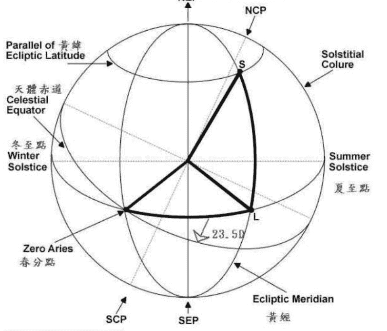
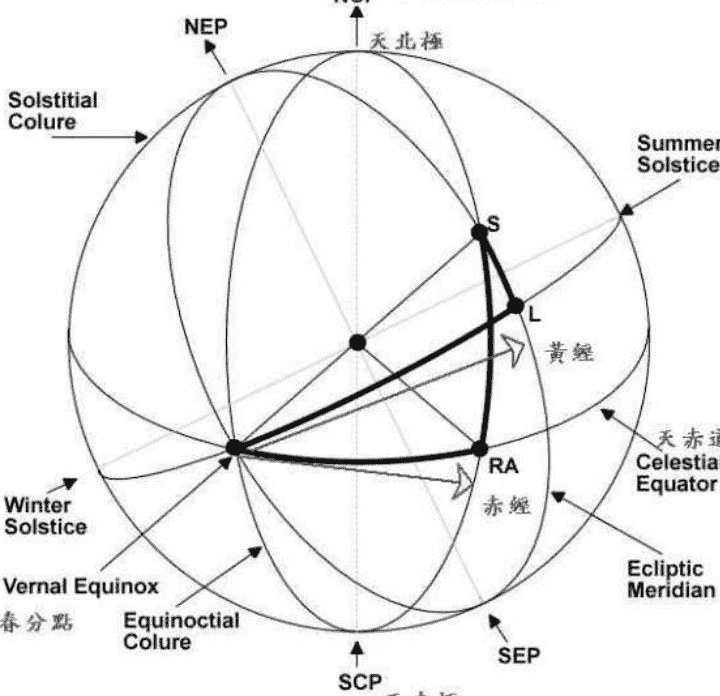
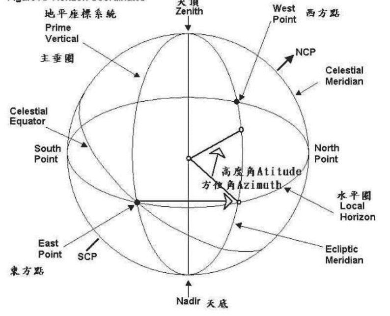
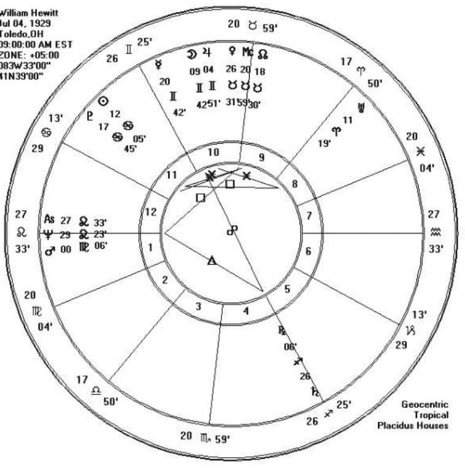

## 何谓占星学

占星术的字源是Astrologia，占星术（Astrology）又称作占星学，原本如字面所指，是『行星（ASTRO）』的『学问（LOGY）』，占星学为探讨天空的星体对于地球上的人类、生物、环境的影响的一门学问。

占星学源自「天人合一」的中心思想，透过「大宇宙」的现象反应出「小宇宙」的状态。由历史的发展来看，早期的占星学与天文学是密不可分的。许多著名的天文学家本身也是占星学家。例如：第谷(Tycho Brahe 1546-1601)，克卜勒(Johannes Kepler 1571—1630 A. D.)，牛顿(Sir Isaac Newton 1642-1727)等等。（见附录一）

## 中国传统的占星学

- 1. 钦天监：观星测候，订定历法，推测君主、国家之大事。
- 2. 七政四餘：以廿八星宿、日月五星為主體，用以預測人生的軌跡。

> 唐 韓愈 三星行：「我生之辰，月宿南斗，奮其角，箕張其口。牛不見服箱，斗不挹酒漿。箕獨有神靈，無時停簸揚。無善名已聞，無惡聲已讇。名聲相乘除，得少失有餘。三星各在天，什伍東西陳。嗟汝牛與斗，汝獨不能神。」

> 宋 蘇軾 「吾生時與退之相似，吾命在牛斗間，其身宮亦在箕，斗牛宮為磨蝎，吾平生多得謗譽，殆同病也。」

## 西方占星學

早期的西方占星學論斷亦是著重在人生的軌跡與國家社會之大事，後來逐漸轉向心理層面，強調「個性決定命運」。

現今流行的學派如：心理占星學派，漢堡學派，宇宙生物學派，（古典）中世紀占星學派。

中西的差異：

- 中国人着重功名利禄与家族关系（父母、夫妻、兄弟、子女）。
- 西方人着重「我」为主体，强调发掘自我，发挥潜能。

## 为何要学占星学？

A：它可以自娱，悠游在星海中是件令人愉悦的事。

B：它可以打开你生命的眼睛。让你看到更多，更细，更远。

C：它可以用来解读人生的现象，就像经济模型可用来描述家计与厂商的个体行为，可用来描述经济体系的总合行为一样。占星学能解释个体的行为现象，也能解释整体社会的潮流变迁。一个良好的经济模型除了能解释现实，也能预测未来的经济现象。同样的，一位训练精良的占星家也具有解释现实，与预测未来的能力。

D：它不是纯科学

占星不是定义严谨的纯科学（如物理、化学），它解释的是人生，试问人生的构成，是全然科学吗？我们知道社会上有相当多的学问，能帮助我们解释物理现象的有物理、化学。帮助我们解释经济现象的有经济学，帮助我们解释政治现象的有政治学，帮助我们解释社会现象的有社会学...同样的用来解释人生现象的有心理学、家庭社会学、宗教，玄学...

占星学仅是解释人生现象诸多学问中的一种，它虽可看出一个人生理上或心理的病痛所在，但解决这些病痛无庸置疑的还需要其它技巧（如医学、心理治疗...）。例如清·名医类案载道：邱子元因事以致积郁成心疾，某僧以佛理为他做心理治疗，令其去幻心，成觉心，这病也就治好了。洋人有许多开业医师、心理治疗师、催眠师等等都学习占星，这种不同学问的结合，才能解决更多苦主的问题。

E：它不是定论

占星学提供的是可能性(possibility)，它显示一种心理上或生理上的趋势(trend)。

F：它不是万能的

占星学的构成的确需要精密的科学（如天文测度），但它的操作却可说是一种高明的艺术。也就是说占星并不如地心引力般的具有必然性，它不意味者你将注定拥有何种命运，何种结局。

## 占星学的历史

数千年前地球上的人类就存在许多观星活动，这些活动不仅是单纯的天文活动，也隐含了许多预言活动。此时期的占星学多局限预言国家大事、灾异变动，是属于国王或皇室的御用时期。

早期的占星学发源于美索不达米亚(2300B.C.)，约在公元前六世纪左右，传播进入古希腊。

亚历山大大帝帝国建立(336-323B.C.)，此时时期政经中心为埃及，就在这三百年间占星学迅速地发展，而希腊占星学也不在属于御用，以用来预言人命。

### 希腊和罗马的占星学

占星学很晚才流传到希腊，但是大约在公元前二百五十年左右，巴比伦的占星家贝勒索斯曾因写了一本占星学的著作轰动了古老的世界；后来他在哥斯岛开班授徒，造就了不少占星家。紧接着四百年中，希腊人将源自迦勒底人的占星学融入自己的传统中，逐渐形成更复杂而严谨的体系。他们也使本来专为国王御用的学说普及化——利用个人出生的时辰推算他未来的命运。

第一本关于现代占星学的书籍是「Tetrabiblos」，是由伟大的天文学家、数学家、地理学家等多重身份兼具一身的托勒密 (Claudius Ptolemy 85-165A.D.) 所著，他出生于亚历山大城，是当时知识界的领袖，他在公元一五O到一八O年间，致力为宇宙的影响建立法则，至今他的学说仍是现代占星学的基础。

以托勒密为首的希腊人将行星、黄道十二宫、星座等现象加以合理化的解释，所以能流传至今，而没有重大的改变。

罗马帝国时期，占星成为一时的风尚，不过他们的生计依旧要仰仗帝王。台比留斯 (Tiberius，罗马皇帝，42B.C.~37A.D.) 一生下来就「贵不可言」的预言，终其一生周围经常为占星家所包围，而被罗马的讽刺诗人周伯纳 (Juvenal 60-140A.D.) 称为「迦勒底势力」。另一皇帝克劳第斯 (Claudius I，10B.C.~54A.D.) 却独好占卜之道，而将占星家驱逐出境。有关占星学在罗马的社会地位，可以从公元一百年左右，周伯纳的一段文字找到例证：「有些人在没有观察星象之前，不肯出入公共场合、同餐或上澡堂。」

公元335-337 年，皇帝的秘书费尔米库司·马特尔努司·尤力乌斯写了「数学」、「恒星的能力和影响」等八本关于占星术的书，它们巨大的影响一直延续到文艺复兴时期。后来，随着基督教时代的到来和罗马帝国的衰落，最后一批占星家在将近公元六世纪时消失了。占星术于是变成犹太和阿拉伯学者的事情。罗马帝国沦亡后，基督教会出现反对、攻击占星学的言论，迫使欧洲地区的占星学在西方沈寂下来。然而在其他地区（中东、犹太人及阿拉伯）占星学则持续发展中。

在中东，基督教时代的初年，对于最初的基督徒来说。占星术是一种异端，公元321年，君士坦丁皇帝皈依新的宗教，禁止实施占星术，违者处以死刑。在几个世纪里，占星术连同天文知识一起消失，这使得基督教国家在科学方面大为落后，以致连教父们都试图把占星术与天文学区分开来。

### 阿拉伯的占星学

许多古代的科学和哲学所以能流传至今，得归功于八世纪左右散居北非和地中海东岸的阿拉伯人。其中尤以医学和天文学方面的成就最显著。在阿拉伯人看来，占星术是天文学的实际应用，两者是不可分割的。阿拉伯人一接触到这方面的知识，立刻表现出惊人的吸收能力。他们在巴格达和大马士革两地建立学术中心，而阿曼苏国王更在巴格达城建立天文台和图书馆，使该城成为世界的天文之都。阿拉伯的天文研究到后来也离不开浓厚的星象色彩。

阿拉伯人重新建立了一种实用的占星学，举凡日常生活的各种琐事，都可预作占卜；例如找一个适合旅行的幸运时刻等等。不过这种只预「有」或「不利」的占卜方法比推测未来发生的事件为稳当，也使占星学在文艺复兴时期更获重视。

阿布马谢Abu Mashallan(740-815A.D.)是阿拉伯最伟大的占星家，他的论文「天文学入门」显然受到亚里士多德学派的影响。「这些行星（七大行星）的运行从未息止，」他写道：「因而使地球上的万物生生不息。我们人类只有在观察行星运行的时刻，才能体会到人世上无数的变迁」

阿布马谢的「天文学入门」一书，是中世纪最早翻译成西班牙文，再由西班牙传入欧洲的阿拉伯的书籍之一，这本书对天文学和占星学重获学术界的重视，具有不可磨灭的贡献。

文艺复兴时期，占星学蓬勃发展，教会、教皇的支持。

### 占星学的全盛时期

随着文艺复兴的来临，占星术得到了发展，在意大利，政府都按照占星家们的建议来管理相关的事务。皇帝和教皇们只有在向占星家们咨询之后才进行召见。现代天文学的电机人，提出行星运动定律的刻卜勒本人，也要靠占星卜来谋生，这样做并没有失身份，何况据说他在预言未来的事件方面极为灵验。

占星学在文艺复兴时期所以能蓬勃发展，除了得感谢教会外，也得归功于几个教皇的推波助澜。据说路得反对占星学的原因之一，就是因为梵谛冈倡行此道。最早致力研究占星学的教皇有西斯塔四世（Sixtus IV）和朱利阿斯二世（Julius II）。朱利阿斯二世的继任者利奥十世在位时则延请了一群占星家到教廷充当顾问。第一个提出反对宗教改革主张的皇保禄三世（1468-1549）则任用占星家为他的宗教法廷制定时间。就是连那位曾经颁发敕令驳斥占星家某些观点的教皇乌尔班八世（1568-1644）私式底下也重用占星家：这些人曾经在他私人的政治斗争中尽心出力。

除了教廷外，欧洲宫廷也盛行此道。英国的伊利利沙白一世每天听取约翰·迪（John Dee）的意见。丹麦的克里斯钦四世（Christian IV）和瑞典的西济斯孟三世（Sigismund III）还有波希米亚的腓特烈王宫廷中，全都备有宫廷占星家。

法国奇才諾斯特拉達馬斯（Nostradamus）成為醫生、煉金術士、占星家和預言者之後，依據占星術來開藥方，預報天氣，並且在普羅旺斯地區的一場瘟疫中進行了成功的治癒能力。他還寫作了著名的預言四言詩「占星術的百人團，1555年」與多預言在他生前就得到驗證，早在法王亨利二世死於馬上比武的四年之前，就已作了準確的預測，因而成為當時最負盛名的預言家。國王的遺孀凱瑟琳·麥迪西因而召他進宮。諾斯特拉達的降神學學並不遜於他在占星學上的本領，據說他曾經連續四十五個晚上，為皇后舉行降神儀式。最後他還召來一個靈魂，為皇后顯現未來。她看到自己的三兒子依次在鏡中一閃而過，每一次的出現代表他們在位的年限，接著她的女婿新教徒亨利（Henri de Navarre）也就是後來的亨利四世在她眼前出現了二十三次。凱瑟琳大驚之下，立刻下召結束這個惱人的經驗。

最後他預言了自己的死亡，正如他宣布的那樣，1566 年他死於痛風。

### 占星學和新宇宙觀

文藝復興的占星家對於這門學說包含的秘色彩特別感興趣。他們從煉金術、算學各方面進行研究，而使一般人對預知未来的神秘学产生莫大的兴趣。不过，这些人观点却使占星学的主流发生偏差。

一五四三年，哥白尼（Nicolaus Copernicus）——一个波兰教会执事和著名天文学家——发表了一本着作，书中提出许多观点证明太阳系的中心是太阳而非地球。此种以太阳为中心的理论不但为文艺复兴时期的学者所知，早在几世纪前就为希腊数学家阿里斯塔克等人所提出，不过一般人只把这种理论当成许多看法中的一种，未予采信。哥白尼深知他的主张会被教会视为异端邪说，所以直到临死之前，才同意付梓出版。他的恐惧果然应验了，在他的学说公诸于世的随后五十年间，教会一直采取敌对的立场。

教会的宗教裁判所虽然在一五四二年更名为教宗法庭，实际上都采取一贯的高压政策，而没有改弦易辙的迹象。哥白尼的支持者布鲁诺便于一六〇〇年因倡导他的学说，被烧死在柱上。一六六三年，大约距哥白尼一个世纪以后，伽利略被迫在最后关头撤回自己的主张。可见教会当局虽容许预言形式的占星学，却无法接受天文思想家突破性的新观念。

哥白尼学说并非全然正确，他无法经由直接的观察找到证明，不过，不需要很久的时间，他的学说就得到证实。讽刺的是，这个证据是由一个极力反对哥白尼的占星家发现的。此人为第谷·布洛赫 (Tycho Brahe)，是丹麦贵族，也是利用望远镜观察天文的新派观察家中最奇特的一个。第谷崛起于占星学和机械化的精密天文学尚能彼此包容的过渡期。他生于哥白尼死后三年，到了一五六六年他已是狂热的占星家，曾宣布某一次月蚀是预言土耳其苏丹的死亡。

一五七二年出现一颗明亮异常的星星，就是在大白天也可以用肉眼看见。如今我们知道它是一颗超级新星 (supernova)，乃是远方的一个太阳（星球）发生爆炸，飘散在太空中的分裂物。第谷当然不晓得这个道理，但是他认为新星的出现驳斥了天体不会改变的传统观念。同时他还看到一个占星学上的异象：「这颗星星最初就和金星和木星一样，带来令人愉悦的影响，但后来却愈来愈像火星，带来一段时期的战争、纷扰、混乱、王侯的死亡和城市的毁灭，空气中弥漫着干旱、瘟疫和蛇蝎的气息。最后这颗星就如土星般，带来贫穷、死亡、囚禁和悲苦。使人间笼罩着愁云雾。」这颗新星的出现使第谷决心将全副精力献身于天文学。丹麦王资助他在哈芬岛上成立天文观察台。一五七六年到一五九六年间第谷利用在此工作的期间绘制了一张精确的星图并仔细观察行星的位置，尤其注意火星的动态。稍后他到波希米亚成为神圣罗马帝国皇帝鲁道夫二世的皇家数学大师，他的头号助理就是赫赫有名的刻卜勒(Kepler)。

### 天文学与占星学的分家，托勒密体系的解体

一六〇一年第谷死后，刻卜勒继他成为皇家数学大师。他在占星学上的造诣虽然不逊于第谷，但是和第谷最大的差别在于他是哥白尼的信徒——他利用第谷精确的观察技术来证明地球与其他行星绕太阳而行。

刻卜勒的学说使数个世纪来确认不移的托勒密体系面临解体。值得一提的是，教会对哥白尼的学说虽然始终采取敌对的立场，但是直到一八三五年为止，他的伟大著作却一直存教廷的档案。事实上这个学说对占星学的影响，并不如预期中那么具有威胁性。就算太阳为宇宙中心，地球只是行星，地球上人类受行星的影响却始终如一。占星家们很快发觉他们的行业并未受到丝毫的影响。

### 短视的理性主义者

一六七五年英国最重要的天文观察台在格林威治成立时，是由第一位皇家天文学者约翰·佛兰史帝所主持，他绘制了天文台的出生图，却以下列的话作结论：「朋友们，这不是很好笑的事吗？」佛兰史帝的话为天文学和占星学间的分裂作了最好的批注。

接着牛顿又于一六八七年发表他的傲世巨著「数学原理」，将天文学带入全新的领域。过去有人将他的壮举形容为人类史上，以一己之力完成个人事功的最伟大表率，除了地心引力之外，他的许多新发现也为今日科技发展奠下初基。牛顿为今日的物质文明草拟了无数的蓝图，但他年轻时，曾经对传统的占星学下过苦功。终其一生，他从未改变过去从占星学中所获得的信念，和个人对这门学问的尊重。

科学思想的飞速发展使天文学与占星术之间产生了分离，最终法国在科贝尔当政的1665年正式禁止了占星术的教学，占星术被再次排斥到民间活动的范畴中去了。牛顿深入宇宙表象采讨当中所蕴含的奥妙和当今探讨天体和谐的动机，事实上并无二致。不过新理性主义者不经考虑便全盘否定了占星学的价值，而忽略了过去占星学家从哥白尼、刻卜勒甚至牛顿在言领域所作过的探讨和既定的成就。无可否认，直到十九世纪中叶为止，占星学握过一段长时间的没落，不过奇怪的是人类对这门学说的失传，感到可惜而图振兴的竟然是严肃、正统的占星学，而非那充满神怪色彩的旁門左道。

### 现代占星學的再次復興：在將近兩百年前

占星術在十九世紀恢復了活力，因為面對用的過份的實證主義和理性主義，人們對神秘學又產生了好感。心理學激起了 一種迷戀，人們扶乩招魂，轉向東方去尋求智慧之路。通神學者們恢復了占星術的名譽 英國人亞倫·雷歐(Alan Leo) 再次引起了人們對占星術的注意。

二十世紀初，薔薇十字會會員韓德爾(Max Heindel) 和人智學者經常實施占星術，重新賦予它高貴的身份，並且把它與東方的各種哲學和宗教，包括猶太密教卡巴拉聯繫起來。而新興的心理學，尤其是卡爾·容格(Carl Jung) 的著作對占星術頗為關注。

二十世紀三零年代，原籍法國的美國哲學家、占星家丹·盧迪亞爾(Dane Rudhyar) 研究了時間週期的觀念，發現了月球及月相對人的機能的影響。他關於占星術的著作使人們不再僅僅關心自己碰到的事件，而是對整個占星術都發生了興趣。他使占星術成為一種掌握方向的工具，促進了個性的發展。這個學派構成了人道主義的占星術，使占术和现代性得以协调起来。

二次世界大战后，法国的米歇尔·高格林 Michel Gauquelin) 教授，统计了许多份出生图，证明天体与职业有某种程度的关连（他原本是想证明占星学的谬误），他得到了看来无可辩驳的证据，然而却未能说服怀疑主义者，反而引起了更多的论战。

一些占星家也提出了关于未知的行星 冥后 及虚拟的行星 汉堡学派。

占星名人录 见附录四

托乐密

诺斯特达马斯

第谷

西斐尔

艾倫·雷歐
依凡哲琳·亞當斯
查爾斯·卡特
瑪格莉特·何恩
丹·盧迪亞爾
瑞侯·艾伯丁
約翰·艾迪
李茲·格林

## 天文基礎

- 太阳系：（见附图）

太阳、月亮、水星、金星、火星、小行星、木星、土星、天王星、海王星、冥王星

- 三个大圆：黄道、赤道、与子午线

黄道：地球绕行太阳的轨道面 黄经、黄纬

赤道：与地球自转轴相交90度的平面 赤经、赤纬

子午线：通过正南正北的大圆 ⇒ 天顶MC、天底IC。

白道：月亮绕行地球的轨道面 ⇒ 北交点North Node 计都、南交点South Node 罗喉。

### Figure A. Ecliptic Coordinate System 黃道座標系統



### Figure C. The Equatorial System



### Figure A. Horizon Coordinates



- 岁差：（见附图）

地球自转的陀螺运动造成春分点的的退行。

- 历法：太阳历

太阳历采用回归年做为基本周期，是以太阳的周年视运动做为依据的历法，它和月亮的运动没有任何关系。太阳历简称「阳历」，以地球绕日公转的周期（即一回归年，每年约为365.2422日）为单位。

- 儒略历和格里历

阳历大小月的分布，是人定分配的，与月亮的圆缺无关。公元前46年，罗马皇帝儒略·西泽（Julius Caesar）在天文学家索西琴尼（Sosigenes）的参与下改革历法，称儒略历。儒略历每年有365天，分为12个月，规定单数月31天；双数月30天，平年时，2月29天，闰年时30天。每4年闰年一次（该年366天），平均每年长度为365.25天，比回归年多0.0078天，约每128年相差一日，每四百多年出3.12日。

直到公元前8年，罗马会议议决称8月为奥古斯都（August），那是奥古斯都皇帝（Augustus Caesar）之名，同时改为大月31天，以纪念他的功绩和西泽同等伟大。而8月以后的大小月便相反过来，9月和11月改为小月30天，10月和12月则为大月31天，2月平年为28天，闰年为29天。

## 占星學的組成 中心思想：象徵法則（大宇宙V.S 小宇宙）

- 地心系統(Geocentric)V.S 日心系統(Heliocentric)
- 回歸系統(Tropical)V.S 恒星系統(Sidereal)
- 行星、先天宮、後天宮、交角為主；
- 經星、虛星、阿拉伯點為輔。

## 占星命盤：命盤(Horoscope)的組成

占星工作的第一步，就是要畫出一張占星圖(Horoscope Chart，Natal Chart)。所謂的占星圖就是在地球上的一個特定時間、特定地點的天體圖，這張圖包含了行星的位置與黃道十二宮。而占星家就是取Baby 出生時的那個時刻、地點來描繪出該Baby 的占星圖。占星圖的圓心代表地球，尤其代表出生的地點，而最外面的一圈代表了環繞地球與行星的黃道帶，在圓心與黃道帶劃分十二宮區域，稱為後天宮(Houses)。

楊國正 老師 編著

聯絡電話：13691909606 (大陸) · 0916-824856 (台灣)

William Hewitt
Jul 04, 1929
Toledo, OH
09:00:00 AM EST
ZONE: +05:00
083W33'00"
41N39'00"



Geocentric
Tropical
Placidus Houses

1994 Matrix Software Big Rapids, MI

Unequal Houses

Email:pukayang@189.cn, puka@pchome.com.tw

占星學講義(一)

## 更多资料

↓↓↓

### 【中华古籍库】

↓ 点击链接 ↓

https://www.fozhu920.com/list/

珍版刻印 / 海外流传 / 家传手抄 / 民间失传

【易】【医】【道】【武】【文】【奇】【画】【书】

1000000+高清古书籍

### 打包下载


微信：mbook86

楊國正 老師 編著

聯絡電話：13691909606（大陸）· 0916-824856（台灣）

## 行星與人生的發展 地心系統觀 距地球遠近：

- ○ 嬰兒期：月亮 ☽。
- ○ 學習期：水星 ☿。
- ○ 青春期：金星 ♀。
- ○ 青年、成年期：太陽 ☉。
- ○ 壯年期：火星 ♂。
- ○ 成就期：木星 ♃。
- ○ 老年期：土星 ♄。

## 四大占星分類：

- ※本命占星(Natal Astrology)
- ※卜問占星(Horary Astrology)

Email:pukayang@189.cn, puka@pchome.com.tw

占星學講義(一)

楊國正 老師 編著

聯絡電話：13691909606（大陸）· 0916-824856（台灣）

- ※ 择日占星(Electional Astrology)
- ※ 世俗占星(Mundane Astrology)

推荐网站：

揭开星空的奥秘 http://obser.nmns.edu.tw/info.asp

参考书目：

星象大观 好时年出版社

占星术 三联书店

占星术 立绪文化

Parkers Astrology / Dorling Kindersley

Email:pukayang@189.cn, puka@pchome.com.tw

占星學講義(一)

## ◎认识十二星座

「你是什么星座的？」这句话可能是当两个人想要了解对方时最常被问到的。你可能十二个星座名称都记不熟，但是你肯定会常听到这类的话：「听说巨蟹座的男人最顾家哦！」、「处女座的人最挑剔了」、「男双子是不是很花心啊？」、「女宝瓶跟男天蝎合不合得来？」面对信息媒体庞大的星座热潮，倘若你仍不知星座为何物，当朋友们兴高采烈地讨论星座时，你恐怕只能默默地在一旁发呆。

坊间的星座书大都是在谈「太阳星座」（少部份谈及月亮星座与上升星座），这在专业的占星家眼中可能不值一顾，因为占星家们会告诉你不能只看太阳星座，必须整张占星图综合分析才能分析。是的，占星家们说得不错，要精确地分析一个人的个性乃至于运势的确要有详细的图才较有把握。但是太阳星座就不重要了吗？不是的，笔者认为星座是进入占星学的第一级阶梯，同时星座也是最为简单易懂的。了解了星座有助于更进一步地探索出生图的全貌，简单地说，星座是我们进后解释出生图的背景知识。

一般说来，学问都有其深奥与浅显的部分，像太阳星座就是占星中较浅显的部分。因为它简单，只有十二个分法，而太阳运行的速度又十分平稳，每年的三月二十二日到四月二十日，太阳都落在牡羊座上，星座交界的日期虽然会有些微的变动，但三月三十日出生的，一定是牡羊座，千古不变。基于如此稳定的性质，太阳星座会如同中国的十二生肖这样风行，也就不足为奇了。

再者，太阳象征了外显的人格特质，强烈地影响我们的个性与行事作风，用太阳星座来占卜个性，并无可厚非。再加上主宰思维的水星、主宰人际、感情的金星皆常常与太阳落在同一个星座上（水星永远不超过太阳 28 度，金星则必然在太阳前后 48 度以内），因此用太阳星座来谈论个性或爱情准确率不会太低。故而广为大众接受也是自有因的。

其次，要谈到前几年跑出蛇夫座的问题，到底有没有「第十三个星座」呢？
「当然没有！」这事让笔者想起当英国天文学会宣称：「十一月三十日到十二月十七日之间出生的人应是蛇夫座，而不是射手座」，大约在两三个月后，笔者去逛书店时竟然发现了「十三星座占卜」这种书，着实吓了一跳，商人的脑筋未免也动得太快了吧！

在现代占星学中所应用的十二星座，并不是晚上看星星时看到的星座。换句话说，天文学家眼中的星座跟占星学所谈的星座是不相同的。占星学家所采用的星座是以地球绕日公转的春分点黄经零度作为牡羊座零度开头，然后等分周天三百六十度，每一个星座三十度。因此不管天上的星怎么斗转星移，星座的坐标都是固定的，不会因天体改变而有第十三个星座的出现。因此占星学家是不会理会第十三、十四乃至第一百个星座的出现的。

### ◎星座起源

如果要谈目前天文学上使用的星座，那就得追溯到五千年前的往事了。在幼发拉底河及底格里斯河之间，曾创造古代文明的加尔底亚人在美索不达米亚平原(相当于现在的伊拉克)一带居住，过着牧羊的生活，并每天晚间眺望星星，将人与动物和星星连接而开始的。

大约五万年前的古星图模样，被画在北欧的斯堪地纳维尔半岛的一些洞穴墙壁上，同时从美索不达米亚平原上所挖掘到的境界石及粘土板上，发现包括太阳、月球、星及山羊、牧羊、蝎子等图案。这可充分证明是经由腓尼基人(公元前约 2000 年时，在地中海东部海岸从事贸易的人)传播到希腊。因此古代星座与希腊神话里的众神们及动物们，甚至器物都有连带关系。

在公元前九世纪，盲眼诗人荷马在他的叙事诗「依阿里斯」及「奥德赛」里，歌诵了「昴宿星团」及「毕宿星团」，还有大熊座、猎户座、牧夫座、大犬座的天狼星等等。到了纪元前三世纪，诗人阿拉都斯(公元前 315-240)，他曾根据公元前五至四世纪天文学家尤德克苏斯(公元前 408-前 355 年)的著作而改写了一本名叫《准诺美娜》的天文诗。

古代希腊的星座，是先经由公元前二世纪的天文学家希巴谷(公元前 190 年-前 125 年)，再传给托勒密(公元前二世纪人)，他是亚历山大的杰出天文学家，同时也在数学和物理学方面享有声名，甚至更以《天文学大成》一书而名满天下。

《天文学大成》后来被译为阿拉伯文，其内容有 13 卷，是本集古代天文学大成的经典作品。此书认为宇宙的中心是地球，而太阳及行星一直是环绕着地球周围而运行的。天动说就是依此书而创立的。

此书的确是在天文学、数学方面，历经至哥白尼时代的权威巨著。托勒密把阿拉特斯及希巴谷所记载的内容及另外增加整理的资料，合计有 48 个星座，即为托勒密 48 星座，一直延用至今。

到托勒密的时代，终于完成了星座的形状，不久传入阿拉伯及波斯两个国家。在欧洲则一直使用至十五世纪之久，当时欧洲天文学几乎没有进步，星座只被利用在占星术方面。可是到了近代却有很大的变化，近代的天体观测逐渐进入精密化，迎着大航海时代，托勒密星座到了南半球便开始不敷用了。

公元 1603 年，德国天文学家约翰拜亚尔(1572-1625 年)在天球上，添增了 12 个南方星座。此后，开始陆续有许多天文学家添增星座。结果造成星座混乱，甚至弄到不可收拾的局面。至十九世纪才逐渐有整理的征兆。1930 年，当国际天文联合会(I. A. U.)开大会时，决定把全天分为 88 个星座，并且约定用平行的赤经与赤纬去区分那些星座之间的界限。因此不再发生星座位置不明的恒星了。

以上所言为天文学上的星座，占星术中所使用的并非实际的天体星座，而是人为虚拟的，按照太阳运行轨道(称为黄道)的位置，划分为十二等分，称为黄道十二宫(黄道十二星座)。

### ◎星座的分类

占星学家把十二星座的基本特质加以分类为阴阳性质、四大元素及季节四正宫。透过这种二分法、四分法、及三分法可以帮助我们了解每一个星座的运作机制。对于初学者来说，星座的分类提供了一种思考比较的基准，有助于我们更细致地掌握每一个星座的内涵。也就是在共通的性质中，我们加以思考其差异的性质，透过这种思考，学起星座更能事半功倍。

例如：金牛座、处女座、摩羯座都是土象星座，三者都具有现实、谨慎、稳定的特质。但我们如何从同中求异呢？不妨由四正宫来想。金牛是固定星座、处女是变动星座、摩羯是基本星座，因此同样具有谨慎特质的土象星座，摩羯的基本宫性质会使得摩羯座比其他两个星座来的有企图心，因为基本宫是一种前进的、开创的特质。而变动宫处女座则较容易因为物质世界（土象掌管）的改变而引起心态的改变。金牛座的固定宫特质结合土象的物质象微，使得金牛座会比其他两个星座更想牢牢地抓住物质世界。

其他的思考方式尚有利用人事宫位（如金牛是第二宫、处女是第六宫、摩羯是第十宫）或是守护星的差异来进行思辩。这些方式在介绍完人事宫位及十大行星的性质后，相信各位也就能自行推演了。

### ◎星座的二分法－两极性质

这是最简单的分类法，将十二个星座分为两组，从牡羊座开始，为阳性星座，下一个金牛座为阴性星座，再下个双子座阳性，依此类推。

阳性星座：包括有牡羊座、双子座、狮子座、天秤座、射手座、宝瓶座。

阴性星座：包括有金牛座、巨蟹座、处女座、天蝎座、摩羯座、双鱼座。

阳性星座代表了：外向、积极、主动、乐观、刚性、坦率等性质。

阴性星座代表了：内向、消极、被动、悲观、柔性、压抑等性质。

倘若我们从四大元素的角度来看，阳性星座是火象星座与风象星座，它们表现得较为开朗、好动。而阴性星座则为土象星座与水象星座，表现得都较为内敛谨慎。

这二分法虽然简单，但仍然有参考价值。除了帮助我们了解星座的特性外，在实务上，只要统计出生图中行星分布在阴阳星座的多寡则大致可以知道这个人是内向居多，还是外向居多。例如苦苓出生时十大行星分布如下：

| 月 | 日 | 水 | 金 | 火 | 木 | 土 | 天 | 海 | 冥 |
|---|---|---|---|---|---|---|---|---|---|
| ♋ | ♎ | ♎ | ♎ | ♍ | ♌ | ♏ | ♌ | ♎ | ♌ |

阳性的星座有七个（包含影响个性极大的太阳），阴性的星座有三个。粗略地看来，苦苓是偏于外向的，但是怎样的外向法呢？通常得找出最突显的星座来判断。像有四颗行星落在天秤座，这个星座象征社交、人际关系与美好的事物、当然啰，爱情也包括在里面，因此阳性星座好动、外向的性质就会从天秤座表现出来。再加上象征敏感、幻想、浪漫的海王星也落入天秤座，于是你便不难体会苦苓能成为作家的原因了。另外，象征扩张的木星落在了爱表现的狮子座，本来天秤座就已经很会讨好人了。再加上好动的木星也来凑一脚，你看苦苓在电视上搞笑是不是很符合呢？

此外，笔者还要强调一下，阴阳星座的分类的方法只是帮助我们了解这个人概略的底色，不能谈阳性星座多的人，就没有安静、沈稳的一面。例如苦苓的月亮落在守护的巨蟹座上，这是很强烈的阴性情怀，你看看苦苓的作品或是电视节，是不是都透露出许多关怀与照顾的母性呢？

### ◎星座的三分法－季节性质

这是分类是取自于季节的转换。把季节的到来时、太阳所位于的星座称为基本宫（CARDINAL），季节中间时段，称为固定宫（FIXED），季节的结束时段，称为变动宫（MUTABLE）。

- 基本星座：牡羊座、巨蟹座、天秤座、摩羯座。
- 固定星座：金牛座、狮子座、天蝎座、宝瓶座。
- 变动星座：双子座、处女座、射手座、双鱼座。

这种分类法又称为「四正宫」，这是中国七政四余星命术的名词，后来的紫微斗数也有谈及，也就是斗数书常言及的「三方四正」，不过斗数拿去后就变了形，将三方宫加上对宫，合称四正，不禁令人发噱。四正宫的原意是成九十度的宫位。例如牡羊、天秤与巨蟹、摩羯成九十度，称为基本宫。（另一种说法是四正指正东、正西、正南、正北）

四正宫主要是谈人与环境的影响关系。

基本星座是每个季节的开头：牡羊是春季、巨蟹是夏季、天秤是秋季、摩羯是冬季。代表带动季节的意思。这四个星座都具有前导、促进的意味。他们富有领导力与开创性，面对环境是采取一个积极影响或改变环境的心态。因此，他们会想去改变别人的想法或作为，他们在面对困难时，想到的是去扭转环境。这种行动力会表现在事业（牡羊、摩羯）或是爱情与家庭（天秤、巨蟹）上。

固定星座是每个季节的中间时段，代表了持续发展的稳固力量。这四个个星座都具有稳定、固执的意味。他们的态度明显，而且不易动摇。面对环境是采取不动如山的策略，也就是说当他们面对新的观念或是新的环境时，会有习于旧有的观念或作风，不愿改变，不随波逐流的现象。通常，在友人的眼中是比较固执的一群，例如金牛对物质掌控欲强，天蝎对情欲的执着性强，狮子对自己的才华表现欲强，就连风象的宝瓶座也不例外，他们对自己的理念相当执着，你要说服宝瓶可得有充份的理由加上良好的辩才。

变动星座是每个季节即将结束，准备转换下一个季节到来的星座。这四个星座都具有适应与改变的意味。他们的态度并不如基本星座及固定定星座般的强硬。正好相反的，变动星座在面对环境时不会有雄心壮志去影响周遭，也不会习于故旧，而是以改变自己的态度去适应新的环境或新的观念。他们对于周遭环境比较敏感、适应能力良好，并且愿意去吸收新的知识或观念。不过缺点是会让人觉得他们态度前后不一致，令人感到善变。

在实务上三分法及以四元素是比较常应用的，这是因为阴阳性质已稳含在四元素中了。熟悉这两种分类方法很有助于我们分析占星图，它提共了人们心理运作机制的基本型态。

实务上，通常是以十大行星加上上升及天顶星座来作统计，观察其分布的多寡。基本星座多的人则是积极、独断、富领导力，已如前述。另一种角度则是以最缺乏的属性来讨论这个人的个性缺失。例如：

缺乏基本星座的人比较欠缺进取心与动力，对于人生的热情也会较少，因此不太会去主动追求自己的欲望，而是等待别人来给予。这种人也不适于担任领导地位。不过，如果出生图的其他因素（如行星的分布，交角或是火象强）能加以补足，则缺点就不会如此强烈。

缺乏固定星座的人实行能力较弱，优点是思想灵活，不拘泥于故旧。不过也可能欠缺恒心与毅力，容易有三分钟热度的事发生。

缺乏变动星座的人适应性比较差，在面对剧变的环境时较难适应，而且会希望别人依照他们的喜好行事。想法也比较单纯，脑筋不大会转弯。然而，因为基本及固定星座影响力大，会使得他们很有自信，甚至不 CARE 别人的想法。

### ◎星座的四分法－四大元素

这种分类法是源自古希腊及古印度的世界观思想，认为我们所存在的世界是由四种基本元素所构成－土、水、火、风。从占星学的角度来看，人命是这四种元素的多寡组合而成的。对于首次接触占星学的读者而言可能比较陌生。

其实这四大元素的概念很类似中国的五行—金、木、水、火、土的观念。前一阵子有部科幻片「第五元素」上映，其中的四个元素就是土水火风四元素，这部片是洋人拍的，若是中国人来拍，可能就会改名为「第六元素」。ANYWAY，我们来看四大元素是甚么。

四大元素是古代智者对自然环境的体验所归纳而得的。火—代表了光明与热量，给予我们一种热情、活力的感觉。土—代表了承载、支撑，是一种摸得到的实体，以及给予人们一种可以信赖的感觉。风—或称气，是一种充斥于地球空间的物质，它具有流动性，与变化性。水—即是我们看见的流质，它具有强烈的渗透力。

- 火象星座：牡羊座、狮子座、射手座。
- 土象星座：金牛座、处女座、摩羯座。
- 风象星座：双子座、天秤座、宝瓶座。
- 水象星座：巨蟹座、天蝎座、双鱼座。

火象象征了活力与热情。火象星座强的，也就是行星分布在火象星座多的人，会表现出冲动、外向、好动的倾向。他们通常精力充沛、全身充满了能量、喜爱热情与具冒险性的生活。

土象象征了物质与实际。土象星座强的人，会表现出小心谨慎，努力踏实、稳定发展的倾向，他们通常持续力很好，也就是耐力与耐心较强，较重视现实，并且有比较畏缩或悲观的心理。

风象象征了智识与理性，风象星座强的人，会表现出反应灵敏、思想灵活、着重知性的倾向。他们通常着重逻辑、喜爱与人沟通、喜好富有变化的人生。

水象代表了情感与非理性。水象星座强的人，会表现出较为情绪化、情感丰富及对周遭人事物感应力强的倾向。他们通常着重心灵的讯息、具有浪漫好幻想的情愫以及多愁善感的心理。在他们的眼中，这个世界是由感情的力量所构成。

这四大元素分类法是最常用到的方法，它给予我们一种化繁为简的指标，几乎一般的太阳星座书籍都会谈及。例如：就感情的层次来看，火象的人十分热情，他们的爱情相当猛烈，可是热情是需要加燃料的，如果在激情过后、不加点油上去，火很快就会熄灭的。土象人的人比较重实际，他们是那种偏爱面包的人，通常谈恋爱时比较没情调，而且当他们下决定要跟你厮守终生时，口袋里绝对不会没半毛钱。风象的人较理智，他们谈恋爱时并不十分投入，很难发生深挚一生的感情，不过他们活泼的个性，可以让伴侣多认识这个世界。水象的人最容易谈恋爱了，他们若不是跟真实的男女朋友谈恋爱，就是在跟回忆谈恋爱。通常在结束一段恋情后，仍会念念不忘的就是水象星座强的人。

再举个例子。火象的人上网络很可能在猎艳，他们渴望有热情又新鲜的事情发生。风象的人上网络可以是喜欢与人接触，传达自己的理念与交换讯息。土象的人可能比较少上网络，因为他们通常都忙于工作，也许上网络是他们放松的一种方式。

## （一）牡羊座（太阳星座周期：3/22 - 4/20）♈

- 一．阴阳：阳。
- 二．四正：本位。
- 三．三方：火（直觉）。
- 四．相对后天宫：命宫（开国第一宫）。
- 五．身体部位器官：头、脸、肾上腺、大脑、脑壳、头盖骨。

牡羊座给人精力旺盛和办事能力很强的印象，脸部特征为轮廓深刻鲜明，额头和颧骨高耸，下巴结实有力，唇形紧闭。眉毛浓密，眼光锐利、直接，鼻子较长。性格善变、易怒；是个天生的斗士，身手矫健；在意中人面前会流露出孩子气。

神话由来：
菲利塞斯(Phrixus)乃奈波勒(Nepele)之子，蒙上奸污碧雅蒂蕯 (Biadice) 的不白之冤，而被判处死刑，临刑之前一只金色的公羊及时将他和妹妹海菈 (Helle) 一起背走。不幸的是，妹妹因不胜颠簸，一时眼花落下羊背，菲利塞斯则安然获救，他将公羊献给宙斯当祭礼，宙斯将牠的形象化为天上的星座。后来贾森为了夺取这金羊的羊毛，还展开了一段精彩的冒险故事。

优点：深爱自由，不喜欢受到外界的压抑。有企图心和冒险精神，勇于尝试，精力旺盛，一旦确定目标就会全力以赴。

缺点：缺乏耐性、暴躁、冲动、自私、以自我为中心、尖酸刻薄、好斗、粗枝大叶而不细心。

性格：牡羊座的人最擅长维护自己的利益和保护自己，甚至为了些微的利益而不惜说谎，不过他们却不善自圆其说，谎言很容易被拆穿；好在他们虽然自私，还算讲理，一旦被拆穿谎言时，也能勇于承认。此星座的人多半性急，因此往往出言不逊，且口不择言。

具有强烈牡羊座倾向的人，性格进取、慷慨、活泼。应变能力敏捷，处事明快，但往往粗枝大叶容易忽略细节，至于敏锐的反应也常会有负面的影响，例如容易激怒别人、冲动。和别人发生争执时，总是设法占尽上风，而最糟糕的一种，往往自私自利，完全不会考虑别人的立场。

牡羊座的人所以喜欢开快车并不是想自杀，而是想成为个中的翘楚。牡羊座的冒险行为并非仅因贪图快感，虽然有人因为开车横冲直撞而远近驰名，但也可能因为英勇表现而获得奖章。个性粗枝大叶，常在不留意中割伤或烫伤。不怕噪音，有时甚至喜欢喧哗，不过头痛的次数也比别人频繁。

牡羊座的人思想敏锐，天性好动难以安份，别人绝对无法勉强他去从事不感兴趣的事物。面对逆境时，只有在确定努力会得到回报时，才能保持耐性。不顾一切勇往直前的特质只是神话的传说，真正的牡羊座性格是确定目标之后才肯一试。

### 心智表现：

牡羊座的人虽然素以难缠著称，但他们的机智反应和嘲讽的态度，往往能在最紧张的时刻，博人一笑。然而过份敏捷的反应有时也会惹出麻烦，他的脑筋动得太快，常常像脱了缰的野马，不受逻辑的束缚，不过在面临抉择时，总能够快速而正确地下判断。

从表面看来，牡羊座的人比较难以相处。他精力充沛、外向、厌恶单调、不愿受到限制。但是实际上，只要有充份的自由，无论是工作上或人际关系上，都能有最好的表现。

思考方式常会受到其他行星位置的影响（地球以外之九大行星影响不同的方面，例如：水星和智力、头脑、神经系统的协调及身体的呼吸系统、心思灵敏度、甲状腺及每日的交通有关；金星影响人爱人的能力、情感及身体的腰部、肾脏、喉咙、副甲状腺及女性的影响力.... 以后若有时间再一一说明）例如水星若在双鱼座，则牡羊座最占优势的思想敏捷就无法完全发挥，会受到限制，虽然他的反应依然很快，但有健忘的情形和胡涂的倾向，有时看来甚至是全然的无知和愚蠢。其他星座的人，尤其是较世故、练达的星座或许会嘲笑牡羊座的冲动、善变，但他那不经修饰，甚至近乎原始的，几乎仅凭本能的冲动，常常让人有耳目一新的感觉，有时甚至还会为他带来好运。

爱情：牡羊座的人有着强烈的性欲，性爱态度积极主动。假如上升星座为牡羊座，则性冲动会较为缓和，他可能会是一个浪漫的调情圣手，但是自私的倾向也会加深；如果太阳同时受克（根据上升星座作判断），则这种自私的倾向会导致精神上的困扰和异常。此星座的人略带孩子气，特别是一切事情都不顺其意时，这种倾向更为明显。

事业：牡羊座的人具有积极开创的精神，有可能成为探险家，也有可能将冒险犯难的精神发挥在别的领域中，而得到真正的满足。喜欢从事竞争性的工作，在热闹且富于变化的环境中更能展现其的灵敏的反应和过人的判断力，无法忍受步调缓慢或安定而一成不变的职业，他天生不适合局限在小小的办公桌后面，因为那让他没法尽情发泄过人的精力，适当的挑战会激发他步向成功之路。

休闲：闲暇之余，牡羊座的人喜欢从事激烈的运动，可以发泄他无穷的精力；长于操作尖锐器械，例如雕刻；着迷于速度感且喜欢刺激嘈杂，故喜欢飙车及赛车。

父母：牡羊座父母最大的缺点就是常常为了自己的好胜心而给予子女很大的压力，为了让子女在校出人头地以满足其好面子的心理，往往会有过火的表现，尤其身为母亲的牡羊人更应尽量约束这个缺点。不过牡羊座尚不失为理想的双亲，尤其对个性活泼外向的孩子而言，更有助其发展，须注意的是不要揠苗助长，让孩子以正常的速度成长。

子女：牡羊座的孩子有发泄不完的精力，父母若是不能给予适当的管教，将来后患无穷，但亦不可太过严格，否则会适得其反，愈容易走向歧途，应自小养成他良好的生活习惯和守纪律的精神。牡羊座的小孩可能对学校中一些枯燥乏味的课程不感兴趣，而有上课不专心或逃学的现象，但若发现其兴趣所在，将会十分专注与热中，故应引导探寻其兴趣所在，从旁辅导。

## （二）金牛座（太阳星座周期：4/21 - 5/21）♉

- 一. 阴阳：阴。
- 二. 四正：固定。
- 三. 三方：土（实际）。
- 四. 相对后天宫：财帛宫（第二宫）。
- 五. 身体部位器官：颈部、喉咙、颈部脊骨、小脑、声带、食道上半部、甲状腺。

金牛座的长相整体而言显得精壮结实，一头浓密的头发，眼光稳定，脖子像公牛一般粗壮，再配上坚定的嘴唇及下巴，看来世故而稳重。正面性格有耐性、持久、实际、热情；负面性格则有懒惰、贪婪、顽固。

神话由来：
传说素以风流著称的众神之王宙斯看上欧萝芭(Europa，后来化为欧洲)，为了避开天后海娃的耳目，自己化身为白牛，将欧萝芭驮在背上，以遂其所愿，事后宙斯又回复原形，将他的化身大公牛置于天上，成为众星座之一。

优点：有主见、意志坚定、热情、友善、有耐心及责任感、可以信赖、实际、可靠、具有商业头脑和牢靠的价值观、富美感，喜欢美食和精致昂贵的奢侈品。

缺点：贪婪、顽固、嫉妒心重、占有欲强、懒惰、古板、缺乏应变能力、自我放纵、易怒。

性格：此星座的人就如树木根植于泥土中，为大地恒久不变的景观般，有着根深蒂固的特质，一旦打定主意，就有不易更改的韧性和顽固。他追求永恒，因而性格上显得稳重而可靠，喜欢炫耀，最忌讳别人的顶撞和批评，周遭的亲友须适时地给他一点激励，否则他会因为过度追求完美，而显得步调缓慢，甚至导致精神涣散。

无论家庭、事业或是婚姻上，最重视安全感——不过常会为了突发的牛脾气毁掉苦心经营的一切。他还不算暴躁易怒，但会将积压已久的怒气，一下子发泄出来，那时声势就相当惊人。因为此星座的人具有强烈的占有欲，所以在婚姻生活中之争吵，导火线多半和嫉妒有关。

金牛座的人相当有耐性，待人也称得上诚恳、友善，因此具备吸引人的条件，不过有时也会显得呆板且惹人厌。他习惯好整以暇地去做每一件事，因而不适合具时间性的工作，此外内敛的性格也不适合从事冒险；比较适合乡村，可从园艺工作中，得到最大的满足，金牛座的人精于经商——他懂得赚钱之道，更知道如何聚财。喉部是身体上较脆弱的部分。

### 心智表现：

金牛座的思考方式缓慢而保守，不要奢望从他们的口中听到石破天惊的言论或是新奇的见解，然其思想却时有建设性。金牛座的人对自己的计划，最能贯彻到底，并彻底发挥所长，但常因为日常生活的琐事和不重要的困扰而沮丧或灰心。

向金牛座的人询问他在想些什么时，他多半会据实以告，不会隐瞒，且当他一说出来后，事实也就与结果相去不远；千万不要奢望改变他的主意，因为顽固是这星座最主要的特征。占星学上行星所在的位置对每个星座的特质具有加强或减轻的影响力，如果水星和太阳的位置同在金牛座，则金牛座所具有的顽固特质会更加明显；若是太阳在金牛座，水星在双子星座时，他的决定就较有商量和改变的余地。

爱情：金牛座在感情方面的占有欲，就像将情人或是妻子当作一畦需要悉心照顾的园地，银幕上的男主角热情洋溢地紧握着意中人的手，口中一再喃喃说道：「你是我的！」他的表现无疑是最标准的金牛座的作风，而假若金星在金牛座的位置时，此种倾向会更加明显。不过他的迷人和热情倒不会因此而显得逊色，反而更增添了安全感。他们在生活上会过分以感情为中心，一旦发现妻子或情人并非专情于他时，对他会是严重的打击，而会有激烈的报复行动。

事业：此星座的人具有明显的艺术倾向，但因其重视安全感，所以他们多半受雇于人，而不像一般画家在成名前，必须忍受三餐不继，或生活困顿无着的苦楚。

金牛座对紧张的都市生活和枯燥的上班生涯不感兴趣。但因朝九晚五所提供的安定，能够满足他对安全感的需求，所以只要确定每个月会有一笔稳定的收入时，就会在工作上全力投入。他能在和经济有关的行业上出人头地，并且会未雨绸缪地极端关心退休以后的福利。

休闲：金牛座的人多半易有昏睡的毛病，闲暇之余应多作运动，否则容易发胖。

父母：金牛座的父母生性保守，与下一代之间容易产生疏离，由于喜欢诉诸权威和重视纪律，往往忽略了子女的意愿。管教方式容易流于严格，对纪律的要求也会过于苛刻。对子女教育上的花费从不考虑，为了达到最高的效果，纵使费用昂贵，亦不吝惜。一般说来，金牛座的父母应该努力的约束自己的占有欲，并避免管教方式流于教条化（尤其是金牛座的母亲更要注意），否则容易发生子女离家出走的悲剧。

子女：父母教养金牛座的孩子，应该自小就约束他的占有欲，鼓励他和别的孩子一起游戏，并将玩具和别人共享。这星座的孩子天生守纪律，在学期间不太需要父母的操心。

不要给他们太多压力，或以强迫的手段使他们屈服，否则会有反效果。金牛座的孩子天性专心用功，但因缺乏应变能力，故进步缓慢，不过当他们一旦吸收以后，就能够融会贯通，持久不忘。在追求上进的过程中，他们能够专一而持续。

金牛座与生俱有的美貌和魅力（金牛座在所有星座中素有美女美男最多的声誉）加上多情，在与异性之第一次约会中即多半能够令对方倾心，但越轨的危险也倍增——若他生性保守，或许还能够约束自己，不至失去分寸。

## （三）双子座（太阳星座周期：5/22 - 6/22）Ⅱ

- 一. 阴阳：阳。
- 二. 四正：变动。
- 三. 三方：风（思考）。
- 四. 相对后天宫：兄弟宫（第三宫）。
- 五. 身体部位器官：手臂、肩膀、手掌、手指肺、神经系统、呼吸循环系统、支气管。

双子座的长相充满智慧而令人觉得生动有活力，椭圆形的脸型，十分柔和，五官很少会过分夸张。弧形优美的眉毛下，是一双灵动好奇的眼睛，鼻梁瘦长，颧骨较高，下颚稍尖，嘴唇虽大却不果决。生性轻浮善变，并有双重性格，但却因为多才多艺且生气蓬勃，而深受异性垂青。

神话由来：
神话故事中几乎找不到和双子星座有关的传说。在埃及它的名称为「孪子星」，是以这星座中最明亮的两颗星卡斯达(Castor)和波利克斯(Pollux)命名，这两颗星另外还有两组名称，分别为海克利斯(Hecules)、阿波罗(Apollo)，崔特勒玛(Tritolemus)、艾逊(Iasion)。埃及人观念中的孪子座为幼童，而非一般常见的成人形象。

优点：适应力强、机智、敏捷、喜欢忙碌和变化、主动、活泼而健谈、聪慧且多才多艺、具有写作和语言方面的天才、对时尚有着敏锐的感受力，能够永久维持着年轻和时髦的外貌。

缺点：怀疑心重、善变、双重性格、缺乏耐性、狡猾、不安份、过人的精力未能发泄时则脾气暴躁且喋喋不休。

性格：双子座是所有星座中最能保持青春和活力的星座，他们经常都处于行动的状态，而且往往同时进行好几件事情，天生具有双重性格，对于呆板及枯燥的事物容易感到厌烦，而导致半途而废。双子座的人喜欢不断地动脑筋，所以对神经系统要多加留意，因为压力过大时，容易导致崩溃。

双子星座的人具有良好的判断力，永远不会改变主意——然而一旦与人发生争执时，他很可能完全改变立场，对自己原本早先的看法则一口否定，像是未曾说过似的（很矛盾吧？！真像是有两个人同时在他体内似的）。他生性博而不精，对种种事物都好奇却又不能持久，所以样样都能沾到一点皮毛，却无法得其精髓。和双子座的人争辩，是种十分不愉快的经验，因为此星座的人言词犀利，精于操纵语言，只要有一点粗浅的印象，便能将这一点最起码的认识，说得像煞有介事，总之他瞎吹胡捧的本事绝对是第一流的。

虎头蛇尾和肤浅是他的致命伤，只要一遇到挫折，便即退缩，但因其感觉敏锐，故而许多通俗而受欢迎的新闻从业人员如电视播报员、记者都是双子星座，可见这种缺点有时还能当作饭碗呢！他们天生喜欢交际，尤其是这星座的女人一拿起电话筒，便一发不可收拾，非要聊个尽兴才肯罢休。智慧较高的双子座则经常在报章杂志上发表文章、演讲、面对电视镜头侃侃而谈、出席各种会议……假如一时找不到适当的人选来分享他的观念，或许会在街上找个不相干的人，对他发表即兴演说，总之他喜欢向别人推销自己的观点，享受扮演信息输出者的角色。

### 心智表现：

双子座的人活动力强，惜欠缺耐性，职业转换频繁，不要设定太多目标，最好一次选定一两个，努力以赴，才不致半途而废。行星所在的位置同样具有加强或减弱的功能，假如太阳和水星的位置同在双子座的话，不安份的特征会更加明显；水星在金牛座时，这种不安份的特质会减弱，外表较为稳重、实际，思想也趋深入，做事较能贯彻始终。
如果双子座的聪明机智没有得到适当的启发引导，往往会流于狡诈、邪恶。

爱情：双子座的人看起来冷冷的，在感情上不会太热情，不过必须配合出生图上各行星的位置，才能作深入的了解（参考"占星术一"之前言）。例如金星的位置在巨蟹座时，待人比较热情、友善。双子座的人对爱情的表达能力很强，尤其擅长写缠绵悱恻的情书，他精于取悦他人之道（金星的位置在双子座时，这种倾向更加明显），因而使爱情或婚姻生活显得多采多姿。不过由于其双重性格所致，他需要两个以上不同类型的情人。

事业：新闻事业（报社、广播或电视）能够满足具有语言方面才能的双子座急于沟通的本能、喜欢变化的需求，是最适合他们的行业。此外喜欢旅行和擅长交涉的能力也适合从事业务工作。他们对教职也能充分胜任，因为他们是所有星座中最能迎合时代潮流的星座，故而和学生较易打成一片，不容易有代沟的问题。
双子座的人天生有驾驭文字的能力，大多写得一手好文章，不过若是有心从事写作的行业，最好事先拟好写作大纲，以免半途而废。双子座的人需要不断发掘新的兴趣，故应避免从事单调、冗长的工作。

休闲：运动可以避免双子座用脑过度的后遗症，因其体型属于轻灵活泼型，故适合从事小型的运动如溜冰、网球、桌球、射箭等。

父母：双子座的父母相当开明，此外广泛的兴趣，也能给予子女多方面的启发。他们会在子女幼年时，就购买大量的书籍，并不时以言语的鼓励来提高孩子的学习兴趣。其子女在其潜移默化下，也会变得善于辩论和自我表达。

子女：双子座的孩子对书本入迷的程度就像别的孩子吃零食一样，津津有味，乐此不疲。不过此星座的人看书，容易看尾看头看中间地浏览而过，并且经常半途而废，父母应该自小就针对这种虎头蛇尾的毛病给予适当的纠正，培养贯彻始终的耐性。

双子座的孩子对规律的学校生活容易感到厌烦，尤其无法忍受在课堂上无法随兴说话的欲望，父母在选择学校时，需要注意避开过份纪律化的学校，以免使其丧失学习的兴趣。管教双子座的孩子必须诉诸理性，他们能够接受合理的劝导，而过份严格的限制，反会扼杀他们的天赋，双子座的孩子在智慧上需要别人不断地启迪和激发。总之，对双子座的子女必须采用灵活、弹性的教育方式，有时一盒糖果能使双子座的孩子维持几天的安静，但下一次同样的方法可能就不管用了。

## （四）巨蟹座（太阳星座周期：6/23 - 7/23）♋

- 一．阴阳：阴。
- 二．四正：本位。
- 三．三方：水（亲情）。
- 四．相对后天宫：田宅宫（第四宫）。
- 五．身体部位器官：嘴、胃、子宫、胸部、胸腔、乳房、消化道、消化器官。

巨蟹座的标准性格为坚贞与毅力，脸型圆圆的、肉肉的，眉头经常深锁，因而有明显的纹路，可充份看出其忧郁的天性。眼睛充满感情，狮子鼻、嘴角略微下垂，粗短的颈子和圆圆的下巴给人善解人意的母性的感觉。

神话由来：
巨蟹座最早脱胎于巴比伦的传说。在埃及，这星座的象征为两只乌龟，有时被称为「水的星座」；有时又被称为阿璐儿(Allul，一种不明的水中生物)。可见这星座和水关系之密切，但详尽的传说却已散佚。

优点：善良、热心、敏感、富有同情心；长于记忆、脑筋敏锐、领悟力好、适应力佳、有高度的想象力；具强烈的母性或父性的本能、保护色彩浓厚、谨慎、节俭；有坚强意志力和耐力，不屈不挠；理财观念甚佳；爱国；忠于爱情，重视家庭的温暖与安定，擅理家务，重视家庭的和谐，是所有星座中最具家庭观念的星座。

缺点：天性多疑且情绪化致难以取悦、嫉妒心强并有恋母情结、可能因过度敏感而导致自怜、个性善变、不稳定、有时因生活态度太认真而失之无趣、心胸狭窄、苛刻、贪吃、邋遢、喜欢被奉承。

性格：巨蟹座的人生性多愁善感，有忧郁和作白日梦的倾向，他常会为过去那段美好的日子而低回缅怀不已，并容易生活在过去（水星的位置在巨蟹座时会加强这种性格），不过他也能充分掌握现在，巨蟹座的人具有不屈不挠的意志，一旦拟定计划，必然付诸实现。为了私人利益，有时会过于大方，应避免不必要的奢侈。

巨蟹座的人易有极端的情绪化表现，他们的情绪阴晴不定，常会没来由地大发脾气，对别人的问话，也会随自己的高兴予以反驳或根本拒绝回答；兴致好的时候，他却变成最佳的听众，充分发挥体谅、设想周到的优点。他们的性格时常在两个极端间摇摆不定，只有在受到家庭影响时，才有可能安定下来，因为巨蟹座天生热爱家庭，并珍惜婚姻的关系。

巨蟹座的人心胸狭窄，常为了一点芝麻小事而耿耿于怀，缺乏容人的雅量，经常像被激怒的刺猬般竖起浑身的尖刺，拒人于千里之外，不过他自己在言词上不小心伤到朋友时，也会有自知之明，而感到内疚，应学习容忍、体谅别人，如此再加上其有礼貌、善交际、富幽默感之迷人个性及对人道主义的尊崇，会吸引许多朋友。事实上巨蟹座的人经常在强悍外表下，隐藏着柔弱的内心，他就像这星座的表征——螃蟹，用硬如铁甲的外壳将自己密密地武装起来。

### 心智表现：

巨蟹座的长处之一是记忆力甚佳，他不仅能记得孩提时的琐事，对于历史事件，和一切事物都有很好的记性，这也许和他们喜欢不断回忆过往的性格有关。他们对事情的看法，喜欢诉诸直觉，且通常都能作出正确的判断。擅长将别人的思想融会贯通，再以推陈出新的手法表现出来。但如太阳星座是巨蟹座而水星是双子座；或上升星座是巨蟹座而水星在水瓶座时，此种优点则较不明显。

巨蟹座的人经常忧心忡忡，又不愿和朋友分享而将烦脑隐藏在心中，经年累月下来，易伤及消化系统，因而容易罹患肠胃溃疡的毛病。

具有高度的想象力，善加发挥时，能解除心中的郁结；但若生活过于认真时，会使其杞人忧天和多疑的毛病更加严重。

爱情：巨蟹座的人喜欢优越和成功的对象，故伴侣必须是他所尊敬或景仰的人，他们生性浪漫热情，性生活上能充分发挥敏锐的官能感觉。不过巨蟹座的女人容易为繁忙的家务缠身，即使情势允许，也无法享受生活的情趣，因其天生的拘谨、审慎，使其成为最佳主妇但却对情妇的角色无法胜任。巨蟹座的丈夫能够给人安全感，但须注意控制其恋母情结之过度发展而忽略了伴侣，另外他和巨蟹座的妻子都应该避免将自己的情绪带入家庭生活当中，以免由于自我中心和执着的观点而导致夫妻不和。

事业：因巨蟹座个性善良、感觉敏锐及长于家务的天性，女性是优良的看护人选，特别适合照顾婴幼儿。而其天生喜欢思古怀远，加上良好的记忆力，对旧事件的枝枝节节都能随手捻来毫不费力，也适合从事历史研究与考证的工作。此外，因其与水有密不可分之关系，所以与海有关的工作也能胜任。

巨蟹座的人能够给人安全感，配合与生俱来卓越的记忆力，不仅记得许多人的名字、面孔和一些琐碎的特征，也清楚顾客的爱好，加上心思敏锐和伶俐的特质，使他们在商场上无往不利。此外烹调方面的长才，也适合经营饮食业，不过其只有在安静的工作环境中才能避免因情绪紧张而导致消化器官的不适，故必须慎选工作场所。

休闲：爱好文学、音乐和艺术；喜欢户外活动，尤其爱好游泳及水路旅行。

父母：巨蟹座的父亲或母亲会努力地尝试使全家人团结在一起，可惜往往收到反效果。此星座之人其占有欲虽不像金牛座那么强烈，但他们将家庭置于一切事物之上，愿意为家庭奉献一切的精神不容忽视，在正常情况下他们也都能维持一个美满的家庭。

一般说来，巨蟹座是母性的星座——事实上，他们仅适合教养依赖性强且没有主见的孩子，因为巨蟹座的母亲无法接受子女已经长大成人的事实，她们喜欢指挥支配子女的生活，且无法忍受孩子合理的反驳，故与独立性强的孩子相处较易起冲突。

子女：巨蟹座的小孩情感丰富而容易受到伤害。学生时期会因为记忆力强而占尽优势，尤其历史一科更是成绩斐然，喜爱游泳及艺文活动。

巨蟹座的孩子天生眷恋家庭，可于管教时对这种情感加以运用而不需要其他严厉的责罚。

## （五）狮子座（太阳星座周期：7/24 - 8/23）♌

- 一. 阴 阳：阳。
- 二. 四 正：固定。
- 三. 三 方：火（爱现）。
- 四. 相对后天宫：男女宫（第五宫）。
- 五. 身体部位器官：心脏、脊椎脊柱、背部脊骨、上背部。

狮子座的前额宽广，眉骨突出，鹰钩鼻，下巴线条清楚，嘴型宽而坚毅，整张脸孔给人的第一个印象是蕴涵着力量，特别是他的双眼总是炯然有神，透露着坚忍不拔的神情，庄重而高贵的态度，俨然有王者之风。

神话由来：
传说中和这星座有关的表征是位于希腊之尼米安(Nimean)谷地的一头狮子，在一次搏斗中被海克利思杀死。

优点：为人博爱、热心、慷慨、有领导能力、花钱大方、思想开阔、具创新的能力、对戏剧和表演具有天份。

缺点：主观意识太强、自以为是、偏狭、无法容忍与自己相左的观点、自视过高、势利、权力欲过强、仗势欺人、好管闲事。

性格：狮子座人的特性一目了然，毫无复杂或隐藏难解之处。是王者、是上司，总之，在团体中他就是 leader，且其深知自己此种操纵和领导别人的能力。此星座不仅擅长领导，本身也能以身作则，努力工作。当太阳的位置在狮子座时，此种倾向更加明显。这星座具有自大、武断、不容异己的缺点，因而需要时时约束自己、自我反省，才能将与生俱有的如乐于助人、大方等优点作最好的发挥。

狮子座天生具有戏剧天才，是舞台上众所瞩目的焦点。若周遭某人喜着华丽衣装、举止雍容、作风海派、遇事果决，那么十有八九是个狮座人。狮座人天性热情、乐于助人、乐观、进取，有他们存在的场合，往往就有阳光和欢笑。

令人感到讶异的是，狮子座的人相当敏感，容易受到伤害，不过因其具有戏剧天份，故在表面上能够不动声色，并且对不公平的对待展现出最大的宽容。在被激怒的时候，他会以王者的威严慑服对方。狮子座的人尽管出身寒微，依旧拥有一己的尊严和属于自己的王国。

### 心智表现：

狮座人的思想和见解不会局限一隅而有恢宏的格局，经常面临智力上的考验和政策性的决定。虽然看来粗枝大叶，却是此星座所独有的性格。他绝非多愁善感那一型，所以很少闷闷不乐，但是一旦面临绝望时，精神容易崩溃，幸好他们的复原能力惊人，内在的热力会再度散发。思想具有建设性，虽然称不上心思敏捷，却会作出有力的结论。

狮座人具有开阔的视野，能够一眼就看出事情的重点所在和理出梗概，不过却经常忽略了细节（水星在处女座的位置时，可纠正这种缺点）。此外狮座人对年轻时候的理想或信念往往会供奉终生不予改变，因而应该避免思想闭塞，他们在人生早期的理念，虽会随着时间的流逝而有所改进，但基本观念仍然未变，这种固守既有观点的习性，难免显得顽固。

### 爱情：

狮子座的人对感情专注且十分忠实，且会毫不避讳地将热情和忠贞完全的表现出来，他们天生需要情人的尊敬和崇拜。狮子座的妻子对自己不让须眉的脾气应稍加约束与节制，以免与丈夫争权而导致争执。一般说来，狮子座的人在婚姻上比较容易出问题，特别是上升星座为狮子座时，此种现象更为明显。

### 事业：

此星座的野心虽大，幸而却没有冷酷无情的缺点，事实上狮子座的人是个忠实勤勉的下属，但有一个前提——必须上司的威严足以使他心服。在此类主管的领导下，他们能够无怨言地承担最艰巨的工作，甚至对呆板枯燥的工作也能够不厌其烦地承受。然而万一他的上司属于愚蠢、器量狭小或是缺乏组织能力者，狮子座的下属就只有另谋高就一途了，他们无法接受这类上司的指挥。

狮子座需要一份能够充份发挥才能的工作，他们热爱工作，总是全力以赴，几乎不知休闲为何物，尤其是适合需要高度创意和艺术性的工作，才更能满足其工作狂。与生俱有的戏剧才华则使其颇适合演艺工作。狮子座的人由于天生具有领导能力，能够在最愉快的气氛下引导别人付诸行动，颇适合为人师表，而他本身亦能从作育英才的工作中得到最大的乐趣，不过他们适合教导年纪较大的孩子。

### 休闲：

狮子座的人对任何休闲活动都不感兴趣，只希望将自己份内的工作做得尽善尽美，所以工作也可算是他们的娱乐。

父母：狮子座的人对子女的期望和要求自己的标准一样严格，如果子女的表现未能符合他的标准，他的失望将毫不保留地表现出来。狮子座的父亲（根据传统占星学的说法，狮子座为父亲的星座）虽稍嫌专制，倒不致成为子女心理上的负担。他们的管教方式相当极端，不是具有高度的热诚就是全然的放任。一般说来，狮子座的父亲对子女的花费相当慷慨，即使超过自己能力所能负担者也不吝惜。狮座人自视甚高，假如子女也属于活泼进取的孩子，一家人定能和乐融融；反之，面对胆怯而怕羞的孩子时，狮子座的父母就得处处小心，不要以自己的标准去打击孩子的信心。大体说来，狮子座的父母对子女的教育相当热心，并且能够从中得到真正的乐趣。

子女：狮子座的子女往往对自己过于自满，因此需要特别的教导，虽然他们天生具有无可言喻的精神力量，却需要旁人的引导，使其习于驾驭。从小就应该让他明白：他虽然智能优秀，但人外有人，天外有天，使其明了满招损、谦受益的道理。不过，在提出批评时，要格外谨慎，因为此星座的孩子，一旦满腔的热诚受到阻挠时，就会像泄了气的皮球般失去朝气。

## （六）处女座（太阳星座周期：8/24 - 9/23）♍

- 一. 阴阳：阴。
- 二. 四正：变动。
- 三. 三方：土(气小)。
- 四. 相对后天宫：奴仆宫（第六宫）。
- 五. 身体部位器官：小肠、胰脏、脾脏、腹部、横隔膜、肚脐、十二指肠。

处女座的人看起来干干净净、伶俐过人，拥有一双眼神柔和且观察入微的眼睛，嘴型优美，下颚宽阔，整体而言，散发着清新而高雅的气质。喜欢批评他人。

神话由来：
根据罗马神话，处女座又名艾思翠诗(Astraes)，为天神郝比特和希蜜丝女神的女儿，是正义女神。黄金时代末期，人类触犯了她，于是大怒之下回到天庭。

优点：谦虚、喜欢整洁、处事小心、头脑清晰而分析能力强、能明辨是非。

缺点：喜欢鸡蛋里挑骨头、要求太高以致吹毛求疵、多愁善感、小题大作、古板、难以取悦。

性格：处女座的人十分看重枝微末节，常为了小地方的完美而忽略了大局。水星的位置影响这种倾向的强弱，例如若太阳的位置在处女座，水星的位置在狮子座时，则较能顾全大局。他们工作勤奋、重实际，优秀的处女座人不仅慎重且具有乐于助人的天性，他们具有服务精神，并充份享受施予的乐趣。

因为有一股来自精神的力量支撑其行动力，所以他们看起来总是忙得团团转，但却乐在其中。问题是他们很难放松心情去享受休闲生活，要他停下来休息，受困扰的情况就像别人遇到难题一般。假如此星座的守护行星水星的位置在天秤座时，就较能悠闲地享受空暇时光。水星虽然也是双子座的守护行星，但处女座的人却不像双子座之轻躁浮夸。

或许是因为这星座和「纯洁」脱离不了关系，处女座的人特别对人体的健康和卫生感到兴趣，有许多是素食者，如若不然，也会对日常饮食力行节制。他们天生喜爱整洁并笃信精确，且如同此星座名称所暗示，性喜纯洁，有时甚而会因此至于洁癖之地步，为自己和别人带来困扰，也容易造成人际关系的阻碍。

只要纠正上述的缺点，处女座悲天悯人的胸怀和温和的个性在在具备了良朋益友的条件，而他天生有所保留的态度反而增添了几许神秘魅力。

### 心智表现：

处女座的分析能力是别星座的人所难以抗衡的，他们遇到棘手的问题时，就会依直觉反应去作巨细靡遗的剖析。针对事情发生的起因、方式和时间作逻辑式的推理，从而寻获重要之线索。他们虽因缺乏整体概念和无法顾全大局以致无法有太高的智慧表现，但以其敏锐的感觉和清晰的逻辑观念，若从事研究方面的工作，则不难有出色的表现，不过尚须留意自己完美主义的倾向和注意细节的毛病。

处女座的人容易忧郁，有多愁善感的倾向，他们经常处于战战兢兢的精神状态，生活中总有百般禁忌，长期累积下来，容易有肠胃溃疡的毛病。

此星座的人应该设法使自己的精神得到适度的放松；情感能有自由发泄的管道，如果能将注意力从不断的自责与反省中转移，或许能有较开阔的心境容纳别的事物。

### 爱情：

处女座的人具有洁癖的倾向，因而在情感生活上较难和别人建立起亲密的关系。当他陷入情网时，很少直截了当的表达，而是以含蓄的方式，故而恋情看来颇为寂寞。金星的位置关键着此星座的情感，假如太阳和金星的位置同在处女座时，他在情感上的禁忌会更多，同时也更难和旁人分享亲密的关系，不过金星的位置在天秤座时，表达的方式会较为自由，性格上也比较平易近人。

### 事业：

由于天生欠缺领导能力，处女座的人很难成为出色的主管，最适合担任幕僚工作，给予领导者合宜而稳当的帮助。基本而言，处女座的人找寻工作的前提是必须有稳定的收入，经济基础的坚实能予其充份的安全感。

处女座的女性最适合从事秘书工作——永远是一身整洁高雅的服饰，办公桌也收拾得有条不紊，给人清爽利落的感觉，对老板交待的事情，更能够处理得条理分明。他们喜欢一成不变的例行公事，因为井然有序是他们所追求的目标。此外，凡是对任何有关分析方面的工作都能胜任愉快。

在绘制出生图时，我们可以发现，如果上升星座是处女座，天顶多半会是双子座（处女座和双子座的守护行星皆为水星），而工作上也会倾向双子座所适合的行业。由于水星的影响，处女座的人往往是出色的文学评论家，或是更倾向于双子座喜欢沟通的本质，而从事新闻或播音员的工作。

父母：当此星座的母亲，一看到儿女全身弄得脏兮兮地走进她费心打理的整洁房间时，她的洁癖将使她的脾气爆发。幸好处女座的人虽然生性挑剔，却能督促孩子善用课余的时间，特别是教导他们从琐碎的事情中（例如家事）培养耐性。由于处女座一丝不苟的习性，子女不易得到亲切的对待，他们很容易因为外表冷漠，而造成和子女之间的隔阂，日常生活中应该格外留意。

子女：学校规律的生活和处女座喜欢井然有序的天性正好不谋而合，故处女座的孩子在学校生活中最受老师疼爱，他们并非对所有的纪律都能照单全收（因其生性多疑，对任何不合理的事情都会发出疑问），但是他们很讲理，只要提出的解释合理，则一定遵守，不仅循规蹈矩、成绩优异，而且无论试卷或是作业都能维持得干干净净，字体也都写得清清秀秀的。

课余时间父母应该鼓励他们从事一些具有创意的艺术活动。女孩可鼓励学习女红，男孩则对工艺有特长。

### 休闲：

处女座的人可以从个人嗜好中充分享受乐趣，园艺、散步或骑着脚踏车兜风，对其身心有莫大的裨益。

## （七）天秤座（太阳星座周期：9/24 -10/23）♎

- 一. 阴 阳：阳。
- 二. 四 正：本位。
- 三. 三 方：风（平衡）。
- 四. 相对后天宫：夫妻宫（第七宫）。
- 五. 身体部位器官：下背部(腰部脊骨)、肾脏、静脉、输卵管、内生殖器官。

天秤座大多目光柔和、鼻子略尖、嘴巴宽阔但唇型优美，头发柔而细软，颈部线条优雅，五官细致，整体长相给人协调的印象。

神话由来：
是希腊神话里女祭司手中那个掌管善恶的天平飞到天上而变成的。大约公元前二大约公元前二〇〇〇年此星座和巴比伦宗教主宰生死的审判有关，天平是用来衡量灵魂的善恶之用。

优点：外型高雅、擅长交际，个性平易近人、注重罗曼蒂克的浪漫情调、为理想主义者，具有迷人的性格特征，对和谐而愉快的生活环境十分珍惜。

缺点：容易生气，个性轻浮、善变，做事犹豫不定、优柔寡断而难以做下决定，喜欢卖弄风情，对事情没有主见，容易受骗。

性格：天平人心地善良，有古道热肠和仁心，富同情心而看重感情，处事力求公正与中庸，不愿偏激。诚实温和，是个理想主义者，生性浪漫，有自我牺牲的倾向，个性坚强、聪明、前进、具有灵活而好质问的脑子，常有非凡的构想。

此星座的人不喜欢争执，所以容易赢得别人的好感，为了避免争执和不愉快的事情发生，天秤座的人喜欢采取避重就轻的方法解决问题，而他们最不好的缺点是优柔寡断。「船到桥头自然直」的观念根深蒂固，因而遇到棘手的麻烦时，总是一拖再拖，甚至来个相应不理。天秤座的人容易给人懒散的印象，不过其实真正的他并不像外表那么柔弱，一旦目标确定时，欲望会变得非常强烈，只是因为内心的犹豫不定而导致外表的懒散。天平座的人在还没采取行动之前常显得满不在乎，可是一旦打定主意，则勇往直前，故而多半都能得到他所想要的。

天秤座的人天生好客，并且也擅长社交活动。他的家总是布置得美观而舒适，让客人有宾至如归的感受。

他们天生有表现欲，喜欢成为众人目光的焦点，并要求别人给予热烈的反应和激赏。此星座的人最常抱怨：「我对他这么好，他竟然如此待我，实在没有良心。」在天秤座的心目中，永远有一个天平，在衡量着他的施与回报是否能够维持平衡。

### 心智表现：

天秤座的人，是美的追求者，审美眼光很高，讨厌粗俗的东西。他们特别讨厌和人争吵，此星座的人给他人的第一印象总是很好，因为他们天性知道取悦他人的方法，而且他们本身也相当懂得待人接物的礼貌。他们是无缺点的「优雅派」，深知礼仪，不论何时都带着温煦的笑容；不管遇到何事都不会失去原有的冷静和成熟，最忌讳摩擦与纠纷的发生。

天秤座的人生性乐观，喜欢呼朋引伴，这种不甘寂寞的个性往往是精神上最大的弱点，无论是工作上、日常生活，甚至连脑力活动都需要同伴共同分享。就如这星座的表征----天平----所象征的平衡关系，他们在待人处事方面也经常带有爱憎分明的色彩，不是将尊敬、爱慕集中于一个人身上，就是对另一人产生极端的不满或憎恶。

只要是跟自己无关的事，天秤座都能给予公平客观的判断，然而一旦碰上切身的问题，他的天平就左右摇摆，难以决定，甚至心情恶劣，乱发脾气。天平座的人所以会显得没有主见，主要的原因是因为他事先对可能面临的困难早已了然于心，而不知道该从那一点着手。他具有强烈的正义感，并且会设法对弱者给予一臂之力，让公道得以伸张（不过却不希望卷入其中）。他的直觉通常很灵，偶尔也能够发挥力量，帮助他解决事情。

因为天平人意志薄弱，易导致犹豫不决，所以当一件事经过分析多次后，一定要下结论，莫再犹疑。天平人应该学习自作主张的能力，否则很容易受别人的左右，而变得没有主见。水星的位置在处女座时，这种缺点可望纠正，若是水星在天平的位置，这种缺点会更加明显（因水星是智慧之星，控制知觉力、判断力、学习能力、语言能力、沟通等所有的精神能力）。

天秤座是和平主义者。不得已而与他人陷于敌对关系时，也会抑制感情，以冷静的态度来解决，绝对不会生气或强硬坚持自己的主张。对事情不会拘泥或偏袒，其行动不会太过大胆也不会过于慎重，思考有弹性，能接受各种的意见，情绪方面也很平稳，不会随便露出情感起伏。应对得体、举止优雅，公正而不偏不倚，因此团体中常扮演仲裁者的角色。

### 爱情：

天秤座的人很难有发诸于情的恋爱。不甘寂寞的个性，使他常在毫无准备的情况下，就接受了别人的感情。若要进一步了解此星座的情感动态，金星的位置具有决定性的影响。

天秤座可能是十二星座中最需要「伴」的，以其代表图型而言，均衡性为其重视的程度，不言可喻，故而寻找一个终生的好伴侣，对平人而言，更是重要，他们渴望共享快乐幸福的伙伴，且因其重视朋友，所以对伴侣的交友则不会做无理的嫉妒。但因其非常挚爱所爱的人，须注意不要让太敏感的天性，使你对亲近的伴侣过份挑剔，应多问问伴侣的感受，以减少因疏忽而积下的怨尤。可能有爱情和婚姻方面的失意。

### 事业：

天秤座的人适合从事任何工作----肮脏、气氛不佳的工作环境不包括在内。他们天生具有艺术细胞和创造力，有令人激赏的音乐及艺术天才，假使能控制对享乐的沈溺，必可获致此方面的成功。在医学和慈善事业方面亦有卓越的才能。天秤座所特具的机灵和外交手腕，使他们很容易成为站在时代尖端，而又受到欢迎的人。

天秤座的人不善独处，工作上也适合和人合作，而不适合独挑大梁。如果想经商的话（他们具有商业头脑，却狠不下心给竞争者致命的打击），多半会和人合伙。虽然在工作方面会尽心尽力分担起另一半的责任，合伙人却要当心他有挥霍无度的习性。

他们很适于艺术或职业生涯，但不宜于生意方面的追求，购买值钱的东西时，要谨防受骗。若太关心别人的利益，可能会损及自身的利益，要避免在生意或私事方面做不必要的冒险，可能会由于受欺骗而遭受损失。在牵涉到重要文件之签署时，要格外小心。

父母：感情丰富的天秤座父母喜欢有礼貌、感情充沛的小孩。天秤座的父母虽然也会管教孩子，但很少惩罚，久而久之，所有的训诫自然被当作耳边风了。此星座的人和子女间关系融洽，尤其是天秤座的母亲，总不惜以昂贵的花费，将孩子打扮得漂漂亮亮，万一遇到顽皮捣蛋或是不修边幅的孩子，可就让作母亲的大摇其头了。

子女：管教天秤座的孩子时应该灌输他自作决定的观念，而不要养成事事依赖父母、兄姊的习惯，此外也要培养他做事情有始有终的个性。课余父母应该鼓励他们发展艺术方面的兴趣，特别是音乐或是舞蹈方面的才艺。

天秤座的孩子懂得利用天生讨喜的个性博取好感，他们随和、友善，在学校中并不需要操太多心。他们对学校生活不会有适应上的困难，不过或许会因师长的偏爱而遭致顽皮孩子嫉妒性的欺侮。

## （八）天蝎座（太阳星座周期：10/24 -11/22）♏

- 一. 阴阳：阴。
- 二. 四正：固定。
- 三. 三方：水（深情）。
- 四. 相对后天宫：疾厄宫（第八宫）。
- 五. 身体部位器官：生殖系统、生殖器官、结肠、膀胱、鼻子、排泄系统、肛门、会阴、摄护腺。

天蝎座天生由于皮肤颜色比较黑，因而凸显出眼光特别锐利、明亮。他们的额头宽阔，眉毛粗浓，颧骨平坦而多肉，嘴型明显而看来坚毅，下巴则坚硬、有力。整体而言，其长相容易给人精力旺盛、果决、热情的印象。

神话由来：
天后朱娜命天蝎从阴暗的地底爬出来，攻击欧立安（Orion, 黛安娜所钟情的猎人，后化为猎户星座）。另外一次，天蝎施放毒气攻击正驾着太阳神马车经过的菲顿，而使丘比特有机会发射雷电，将奔跑中的太阳车击毁。

优点：天蝎座人有谋略、富洞悉事物重点的能力。情绪十分敏感、感情细腻而具有丰富的想象力，果决、实际而热情，主观意见强、意志坚定、有毅力，一般人容易厌倦而逃避的事情，往往能坚忍固执的做下去。机敏、聪明、悟力高。富直觉能力。

缺点：天蝎座有干涉别人事物的倾向，冲动、急进、善妒、易怒、顽固、倔强、难驾驭、多疑、善变、心机较深、太感情用事、好冒险，常有狂妄的梦想。对于食物美酒常会过度纵欲，个性阴险、冷漠，时常利用诡计与机智去击败敌人。

性格：过人的精力是天蝎座人深藏不露的本钱，其他人往往想不到这一点而不知防范，要是将这份精力应用在正途上，其所具有的持久耐力，能不屈不挠地追求目标，直到完成，使他能在激烈的竞争中，脱颖而出。天蝎座人的占有欲、嫉妒心和报复心都极重，不只在情感上如此，其他方面也无法忍受别人的超越，甚至会因而采取冷酷的手段，施以报复。

天蝎座人冷静、精明、忠于自己的欲望，毫不理会别人的想法。专横霸道、擅保密及掩饰真象、工于计谋、个性阴沈、让人捉摸不定。

全神贯注是天蝎座人格上最大的特色，因此一旦确立目标以后，就会全力以赴。几乎所有和天蝎座有关的描述，都强调了他在情感上的深刻，事实上此星座的人对生命中其他领域也都赋予同样的热情，他喜欢将自己的生命发挥到极致，不论工作上或是游戏方面都会有过分卖力的倾向，但对目标之强烈和真诚，会导致过份苛求。

心智表现：
天蝎座的人外表冰冷内在热情，富有好奇心，很有眼光。他们天生具有吸引别人的磁力，周身散发着活力、刺激而迷人的气息。虽然天蝎座的人天生不乏推理及分析的能力，能够一眼看穿自己所面临的难题，但是他的直觉感应却更为俐锐，因而往往会有不按牌理出牌的表现。

他所以喜欢面临困难，并非他对困难本身有特别的嗜好，而是他想要知道自己面对困难时会有什么样的反应。创新、大胆、喜欢权势，要随时抑制过份强烈的意志和独断独行的倾向，高傲的个性与冲动的行为易树立敌人，应多宽容别人不同的想法与作风。是很卓越健谈的人物，很受欢迎，表现出独立而井然有序的精神及敏锐的外交能力，能够很容易地自朋友那儿得到他所想要的，因此可能很容易被惯坏而变得自我中心。

爱情：在黄道十二宫中，天蝎是最喜爱强烈感情的星座，在感情生活方面的表现炽烈、专注而持久，当嫉妒心一旦被激起，是深具毁灭性的。感情极不稳定，有时很难了解，内心深处蕴涵强烈的猜疑心、斗争心，所以谈感情的话很容易走极端。

天蝎座的人通常是最具有「性」吸引力的，不论男女对性方面的需要量都很浓厚，具有热情而深沉神秘的性魅力，如果性生活上得不到满足的话，他会在生活上和人格上有一种无可弥补的缺憾。

通常天蝎座男人总有着足以征服对方的精力，他是追求胜利感的，在这方面也是一样。天蝎座充沛的情感可以从性生活中得到最好的发泄，不过善妒的个性很可能造成情感上致命的打击。

事业：天蝎座的人无法忍受平板而单调的职业，需要从事有成就感的工作，而无法忍受单调的例行公事。他一旦发现工作上缺乏挑战性时就会另谋他职，甚至会强迫自己置身于麻烦中，努力从逆境中建立起自己的基业，或是放弃已具规模的事业重新奋斗。任何使他的能力面临最大考验的工作，都能够满足他对工作的需求。

天蝎座的人具有找出问题核心的长才，若是从事犯法的工作，也会是个智慧型的罪犯，而让警察大感头痛。此星座的人常拥有权力、财富、名声和人所称羡的地位，但要留意的是，不要轻易与他为敌，因为他本身是一个容易记仇的人。

追根究底的学术研究工作，是天蝎座的人所擅长的项目之一。他可以全神贯注在长期性的探索当中，并经常选择和医学有关的项目如外科或心理学当作研究的对象。天蝎座的人也可成为优秀的军人或水手，它们喜爱纪律，并能恪遵不误，或许军事化的桎梏能够满足他近乎自虐的心态。若能善用天赋，亦可在侦探、间谍、科学界大有发展。

休闲：天蝎座在运动方面要多做体能运动，以免使脑子的负担太大，爱好文学和艺术。

父母：天蝎座的人生性固执，他对管教子女的方法有自己的一套理念，因而子女很难让他改变初衷。为了避免与子女产生代沟，他最好平时就多接受和当代思潮有关的讯息。

天蝎座的父亲对子女的要求有时会过于严苛，但他天生能在应付困境中优游，因而能够从教育子女中得到乐趣，一方面他也能让子女从不断的旅游和各式各样的接触中开拓见闻。

子女：父母在管教天蝎座的小孩时，应该设法让他保持忙碌，并有足够的户外活动，好让他充沛的精力得以发泄。家中有新成员降临时，为对付天蝎小孩善妒的习性，可让他负起帮助父母照料弟妹的责任，即可化解他因为弟妹的降临，自己受到冷落而产生的妒意，因他喜欢被重视，故能有称职的表现。

## （九）射手座（太阳星座周期：11/23 -12/22）♐

- 一. 阴阳：阳。
- 二. 四正：变动。
- 三. 三方：火（直接）。
- 四. 相对后天宫：迁移宫（第九宫）。
- 五. 身体部位器官：大腿、臀部、坐骨神经、肝脏、动脉。

射手座的眼睛灵活生动而有神，鼻子具有希腊鼻直而长的特征，唇型优美，下巴较尖，椭圆的脸上五官精致，头发鬈曲浓密，气质高贵不凡。思想开明且能兼容并蓄，但有时则不够圆滑和喜欢渲染夸大，充分表现出极不传统的射手座性格。

神话由来：
射手座呈现的是半人半马的型态，具有动物和人类双重面目，是个著名的先知、医生和学者。他是希腊著名大英雄贾森(Jason)、亚齐里斯(Achilles) 和亚尼斯(Aeneas)的抚养者。传说他是卡罗拉斯(Cronus)和斐莱菈(Philyra)之子, 也是宙斯的父亲。他是在受惊吓后，把自己变为马身，其母斐莱菈受不了儿子半人半马的怪模样，便变成了一棵菩提树。

优点：乐观、活泼、坦率、自尊心强、多才多艺、有很高的智慧，颇富直觉与鼓舞他人的力量，思想开明、适应力强，有很好的判断力，有处理紧急事务的才能，擅长哲学思考，富崇高的正义感，非常敏感而聪慧，喜爱自由、诚恳、正直、可靠、慎重。

缺点：个性敏感而有点浮躁，好吹嘘、喜夸张、没有责任感、反复无常、有不安分的倾向、盲目而过分乐观、粗心、偏激、行事有些笨拙。

性格：射手座的人崇尚自由，并有幽闭恐惧的倾向，若长久处在相同的环境中会变得相当沮丧。情感上，他害怕一种被束缚的婚姻关系，易受感动，所以很容易被朋友或同事利用。

占星学上射手座的象征是一半人半马的形体手执弓箭瞄准目标，实际上也可印证在性格当中。他喜欢一切空间广阔的户外活动，特别是骑马奔驰。此星座的人无论精神上或是实际生活中都有向未知领域探索的倾向，他们认为生命是由一连串的挑战组合而成。对任何事都充满好奇心，在成长的过程中，若发现可以狩猎之处必如满弦之箭瞄准猎物。对射手座人而言，生命过程中的理想和憧憬，比目的更为重要。

射手座年轻时作风莽撞，开车喜欢超速的快感而很少顾及安全问题，有过度追求刺激的倾向，且生性乐观，甚至有盲目乐观的倾向，因此射手座从犯错中受到教训的次数较其他星座频繁。年轻时常会有不合传统的举止，但年老时，很容易忘记年轻时的莽撞而成为古板的人。虽然他终生不改崇尚个人自由的习性，但总能发挥与生俱有的智慧和潜能，很可能会涉及和哲学有关的领域。

射手座容易给人喜欢户外运动胜于智力活动的印象，事实上他们是相当擅长思考的。非常爱好真理及正义，喜欢探讨自己所不了解的领域，语言是他们拓展见闻的工具，因而积极拓展多方面的语言能力。常会着眼于自己能力所不及的事物，将之视为简单易得的目标而全力追求，却总是在完成一件事情之前就急于从事新的计划。

射手座的人和双子座一样，天生多才多艺，经常从事一种以上的工作。具强烈的野心，有很好的折冲能力，是相当出色的执政人才，非常适于政治生涯。经常从事多方面的脑力活动，故需要大量的运动加以和缓压力。当他们感到疲倦时，多半是因为单调无聊所致，只要换个工作就能恢复一贯的生气。必须设法纠正不安分的缺陷，否则在事业或婚姻上难有美满的结局。

心智表现：
射手座的人喜欢自由与户外活动，心思运转很快，往往同时将精力分散于多样事务，而不愿集中在单一目标。冒险心旺盛，喜欢交朋友、旅行，讨厌受束缚，追求一种自由奔放的人生。虽然不拘小节，但他们运筹帷幄的本领却高人一等。只要假以适当的栽培和纳入正轨，他们在心智上的表现绝对是第一流的！富侵略性、有野心，心智能力及体力都很充沛。遇到困难时，他们最擅长拐个弯，而后以全新的角度找出克服的方法。他们的观念常会突破传统的窠臼，予人一新耳目之感。

射手座的人受温柔、爱及信任的吸引，忠于友谊，婚姻与爱情却不稳定。喜欢面临挑战，具克服一切阻难的能力及决心——找出音响的毛病或发掘诗词的出处——都是他所乐于克服的困难。一加一为什么等于二？吸引他的不是答案，而是具有挑衅意味的问号。放轻松些，太紧张容易神经崩溃！

爱情：射手座人非常热情，个性开朗活泼，喜欢紧张刺激，所以太平凡的女人引发不了他的兴趣。男性不喜欢较被动的女孩，往往向高难度挑战，对已死会的女孩最感兴趣。较喜欢有健美型的异性，林黛玉型的女孩或仙风道骨的男孩，他(她)们是看不上眼的。

射手座女子个性浪漫多情，对世界充满了好奇，没有戒心，故常因冲动而受到伤害，幸而乐观的个性使她不致被挫折击倒，而有再试一次的勇气，所以有人误以为她游戏爱情。喜欢知性活动，所以常会有从友情转化成爱情的状况发生，事实上，他们往往也分不太清楚这两者的区别。

他们需要灵活而富有创意的性生活——不拘泥于形式、地点或是时间——可以配合对方，创造出各种不同气氛和方式的性交场面，此星座的人不仅对伴侣的肉体感兴趣，对方也必须具有旗鼓相当的慧黠和智能。虽然渴望肉体上的快乐，但异性朋友中可能有许多柏拉图式的精神恋爱。他们在情感上，需要有适度的空间来容纳他所崇尚的自由，善妒或是占有欲过强都会使他丧失热情。如果在婚姻中得不到适度的自由，连带日常生活也会受到影响——在双重束缚下，他很可能会有挣脱的意念。

事业：射手座的人通常喜爱动物，因为她们在情感上不会有需求，正好符合他喜欢自由的天性，所以兽医、养狗、驯马均是此星座的专长。对艺术相当有天份，舞台、音乐、文学或艺术都是很适合而能获利的生涯。

此星座的人即使没有机会受到较高深的教育，依然具有强烈的求知欲，他们会在失学之后，继续进修。由于天生喜欢接受挑战，故在事业上，也需求成就感，为了逃避沉闷和呆板，他总是处于不断的变动当中。虽然有不少射手座的人终生从事办公室或工厂里一成不变的工作，但是他们多半迫于形势，而非心甘情愿。

休闲：富有艺术细胞，可从舞蹈之中得到相当的乐趣。他们喜欢大自然、户外活动，故而热中于运动及遥远冒险的旅行。

父母：挑战性依旧在此星座的亲子关系中扮演重要的角色。乐观的天性使射手座的父母对子女充满信心，并能从教育子女中满足喜欢挑战的心理。在智慧的层次上，或许会有期待过高的表现，但孩子在他的潜移默化之下，不仅能享受生活情趣，也能适应生活的挑战。

子女：射手座的孩子较难驯服，他们无法忍受过分严格的家教和校规，假如管教过严时，就会有严重反弹的倾向。女孩子顽皮捣蛋的程度不在男孩之下，相对的亦长于运动和游戏，并且反应灵敏。

## （十）摩羯座（太阳星座周期：12/23 -1/19）♑

- 一. 阴阳：阴。
- 二. 四正：本位。
- 三. 三方：土（物质）。
- 四. 相对后天宫：官禄宫（第十宫）。
- 五. 身体部位器官：膝盖、关节、胆囊、头发、牙齿、皮肤、结缔组织。

摩羯座额头上的皱纹、蹙紧的浓眉及锐利的眼神，使他看来严肃而略显阴沉，令人有难以亲近的印象。

神话由来：
汉密斯的儿子潘恩是半神之一，半神虽不如天神，但却仍远比人类卓越。牧神潘恩的丑，是连亲娘也嫌的，他头上长有山羊的耳朵和犄角，上半身是长毛的人形，下半身却是山羊的姿态，他最喜欢音乐，经常吹奏自己所制的苇笛。
有一次，诸神在尼罗河岸设酒宴时，突然出现了一个怪物，诸天神都大惊失色，变成各种形态逃进河中，潘恩也急忙跳进水中避难，但由于过度惊慌失措，而无法完全变成一条鱼… 这就是「摩羯星座」的由来。
古代巴比伦有一名为依亚(Ea)的神仙，据说是「深海中的羚羊」，和摩羯座鱼尾羊身的形象相当吻合。

优点：保守、谨慎、实际、有责任感、可靠，机智、有主见、尊敬权威、看重自己，谨慎、有抱负、有耐心、守纪律。

缺点：悲观、善变、外表冷漠严肃、不易亲近、墨守成规、吝啬。

性格：外表是半身为羊半身为鱼的摩羯座，诞生在一年四季最为酷寒的季节，故展现出其独立的精神和阴柔的个性。
摩羯座人勤勉而踏实，一步一步稳扎稳打，任何事都讲求公平合理，他们生性保守，对年轻一辈所崇尚的自由开放较难以苟同。一般说来摩羯座的人具有传统而守旧的观念。他们有着强烈的企图心，会将全部精力耗费在追求成功的事业与社会地位，时时鞭策着自己或亲人，但常因对凡事都过于认真，而忽略了生活的情趣。
他们对事物往往有自己的看法，且常坚持己见，不愿妥协，有时甚至自以为是到顽固的地步，让人有不通情理的印象，故易使人产生反感，假如能多设身处地为别人着想，会更受欢迎。

摩羯座生性谨慎，可靠，有耐心，他们或许行动不甚敏捷，但是如同龟兔赛跑中的乌龟一般，持之以恒的个性使他们在逆境中能发挥坚忍卓绝的精神，而获得最后的胜利。他们脑筋深沉、野心勃勃，组织能力甚佳，是天生的领导人才，喜欢控制别人。

### 心智表现：

魔羯座的人总是知道自己在做什么，他喜欢控制全局，而不想作被人操纵的棋子，不过似乎很少看到成为领袖的山羊(摩羯座又名山羊座)，因为他们并非为权力欲而争权力，权力只是追求理想的工具，虽然山羊确实具有领袖的实力与气度，但又厌恶身陷权力斗争的漩涡中。追求高难度的理想，使得魔羯座人斗志昂扬，纵然因而搞得头破血流、伤痕累累，也绝不放弃。山羊喜欢占住首位，假如不幸有人跑在前面，他们一定会竭尽全力去超越，他们不是那么想做「第一」，只是受不了有人挡住前面的视野。

摩羯座的思想条理分明，他们擅长精密而繁琐的思考模式，并且具有付诸实现的耐心与能力，一旦开始行动，就没有转圜的余地。摩羯座的人充满野心、城府颇深，他们在判断事情和从事研究工作时，很少作立即的情绪性的反应或判断，通常只做有把握的事，没有十成胜算，至少也要有八成把握才肯放手一搏，他们总是仔细考虑、反复推敲之后才会作下结论，所以如果你和山羊有赌局时，只要看到他下大赌注，那你最好快点认输，因为他要不是百分之百的赢家，就是要把你搞得两败俱伤。

「严以律己」是摩羯座的特点，最怕别人认为他们不完美，所以总是严厉地批评自己，对自己的过失一点也不宽贷，因为情绪总是在紧绷状态，所以脾气常会失去控制，容易在小事上大发脾气。摩羯座的人多半渴望被了解，但因有极度的不安全感，对别人不信任，所以很少有知心朋友，生活十分孤单，所以，你常可见魔羯人摆出孤寂、冷漠的脸孔。他们生性忧郁，是所有星座中忧郁气质最浓厚的一个。如果水星在天蝎座的位置，他的思想会更趋深沉、细腻；水星在水瓶座时，外表则比较开朗，思想也较开明。

魔羯座的人天性都略带羞怯，通常他们喜欢默默观察别人的表现来决定接近的距离远近。如果你的表现符合他们的标准，和他们的期望相符合，他就会往你靠近一点，但是仍然处于警戒状态；假若你的言谈思考让他觉得和你是同一阵线，就有可能和你来往；但只有当他开始把心中真正的感觉、不为人知的过去(例如恋情的起伏)告诉你时，才算把你列入正式朋友的名单。

爱情：摩羯座的人常会有人际关系的困扰，尤其难以和别人建立起亲密的关系。他之所以不善沟通，一方面可能因为害羞，另一方面则是他过分执着于事业上的成就。不管在何种情况下，他常有被孤立的感觉。假如太阳的位置在摩羯座，上述弱点的减弱或加强，就视金星的位置而决定。

他们会压抑自己的情感与性欲，如果金星位在摩羯或处女座，则这种压抑的情形会更严重。但是要知道，摩羯其实是个双面人，外表冷漠，内心却是火热无比；看来现实，但心底却渴求浪漫；他们不喜欢失去控制权，但是超越其控制能力的异性，对他们却有莫大的吸引力。

摩羯人不管男女都相当重视社会地位，但是考虑的方向略有不同，男摩羯在意的是女方家族的社会地位是否有助于他的事业；女摩羯在意的是男方本身的社会地位是否有助于装点她的门面，他们需要藉物质地位及财富以获取情感保障。摩羯座个性保守而传统，认为恋爱到最后就是为了结婚，当他们一旦定下心来，就能海枯石烂，永世不渝。

事业：摩羯座的人不会冀求「出奇致富」或「一步登天」，他们总是埋头苦干，按部就班朝着既定目标前进。安全感和稳定的收入，是此星座的人选择职业时首先考虑到的条件。

他们在商界上可望成功，摩羯座所拥有的优点，可使他们一旦下定决心，就志在必得。有商业头脑，对生意有关的各方面都很有兴趣，因为他们具有优秀的组织能力，所以适合任何和管理有关的工作。

通常具有音乐方面的特长，尤其是金星的位置在金牛座或天秤座时，更有成为音乐家的可能。

休闲：喜欢音乐与艺术，有试验及科学头脑，对神秘科学极有兴趣。他们很容易养成习惯，可以从琐碎的事情中找到乐趣，并能乐此不疲。

父母：摩羯座的父母「望子成龙」心理特别殷切，他们希望自己的子女能够出人头地，如果孩子个性消极，对他们会造成相当大的困扰。
因为他们的控制欲，常会在不知不觉中把孩子操纵于自己的掌心，因而应该随时提醒自己保持幽默感，冲淡这种紧张的关系，且要不时给孩子鼓励和打气，并且设法为子女生活带来情趣，否则很容易与孩子产生隔阂。
此星座的父亲常会忙于事业，而将照管孩子的责任交给母亲；此星座的母亲在子女年幼时，最好当个安分的家庭主妇，因为难以亲近的外表，很容易让孩子有缺乏温情的不满。

子女：摩羯座的孩子虽然擅长运动，却因为其孤僻性格与不适应群体生活而很少加入运动团体。摩羯座小孩一般而言反应较为迟钝，父母应该不时给予鼓励，才能让他们较为开放而不致太过孤立。

## （十一）水瓶座（太阳星座周期：1/20 -2/19）

- 一. 阴 阳：阳。
- 二. 四 正：固定。
- 三. 三 方：风（与众不同）。
- 四. 相对后天宫：福德宫（第十一宫）。
- 五. 身体部位器官：小腿、脚踝、血液循环系统、脊髓。

水瓶座大多有着一双灵动的眼睛，高耸的鼻子和面积不小的嘴唇，下颚线条柔和，略呈圆形，外表综合来说堪称得上是英俊美丽，却并不特别突出。生性悲天悯人，富有改革精神及高贵的情操，可惜有缺乏热情的缺点。

神话由来：
特洛伊的王子干尼梅德(Ganymede)是个黄金般的美少年，有一天他在牧羊时，突然被宙斯(Juze)变成的老鹰捉到奥林帕斯(Olympus)，负责嫁给赫尔克里士的西碧公主原所担任的斟酒工作。在古代的罗马，当太阳的位置在这个星座的第一个月为雨季，所以定名为水瓶。

优点：求知欲强、独立、博爱、友善、忠实、可靠、有创意、有远见、有智慧、思想新颖、头脑敏锐、善于观察、富有改革精神。

缺点：个性怪异、过份执着、标新立异、易夸大问题、固执、墨守成规、不知变通、过于理想主义、倔强、偏激、叛逆、不合群。

性格：因为天王星守护的缘故，水瓶座的人非常需要朋友的陪伴，感觉身旁的人都是朋友，甚至结婚也不会减轻其对友谊的重视程度，一旦被水瓶座人当成朋友，那么就会得到他们坚定不移的忠诚。水瓶座的人可能会经历各种不同的感受，但他们绝不会有寂寞的感觉。但水瓶人需注意，为朋友所做适度的牺牲叫义气，过度了，就叫傻气。

水瓶人总是让人觉得仁慈、友善，给人的第一个印象是富有同情心和善解人意，但他们善于和别人保持距离，并且有些难以捉摸，一方面乐于助人，另一方面却又保持旁观者的超然，别人很难和他建立亲密的关系。在十二星座中，水瓶座可说是最理智的一个，对事物的观察可随时变更角度，把复杂的问题加以巧妙分析，并准确地预测可能的结果。

水瓶座潜存的顽固性，平时不易表露出来，给人的一般印象是柔和、舒畅的冷静及客观的观察力，积极而强烈的求知心，坚定的意志力和公正的判断力，然由于其刚正不阿的个性，极为厌恶逢迎巴结的小人姿态，具有公正无私的一面。这种硬梆梆的态度，容易被误解为薄情寡义，在不违原则的情况下，倒是不妨通融一下。因为过分的冷静和理智，就缺乏人情味，这对人际关系来说，影响颇大。

### 心智表现：

水瓶座的最大特色是讨厌束缚、追求自由，他们崇尚独立自主到不惜牺牲一切来换取的地步，而且因为他们崇尚自由的精神，所以对他人的自由也颇为尊重，是友善的个人主义。对此型的人而言，地位、名誉、财富都是束缚自己的链子，连结婚也是一种束缚。与朋友基于精神与心智的亲近而建立情谊，待人亲切但不深交，充满智慧却缺乏热心。是怀抱着世界大同理想的博爱主义者。富研究精神，喜爱新颖的事物、音乐及自由。十分理智，不易受周围环境影响。对于博爱又知性的水瓶座来说，所有的关系都是从朋友开始发展的，每个人都可以成为他的朋友，因为每个人都有不同的特质和优点，值得他去发掘、去了解。天生不爱装模作样，也不屑那些媚上做下的行为。讨厌仿冒品和伪君子。

此星座的人，极不欣赏平凡而无奇的思想，喜欢献身于自己的信念中，完全不理会他人，故总是让人有与众不同、自行其是的印象。对名利不太热衷，只希望能过着象风一样自由自在的生活，他们不会在乎别人的看法或批评，顶多只是耸耸肩或是一笑置之。水瓶们具有快捷的行动，求新的思想，天生富有创意，常会有新奇的点子，具有科学家的特质，擅于将新奇的见解表现在艺术或是科学研究当中。由于他特别喜欢创新和出奇招，有时甚至会有标新立异的倾向。

水瓶座的人一向我行我素，不管别人一切善意恶意的批评，甚至在行为上也是凭直觉，懒得去找冠冕堂皇的借口去做合理的解释，乃因其自有其原则，并不是缺乏想像力，其实瓶子的思想总是超出所处的时代，并总能提出一针见血、充满智慧的见解。他们的精神领域相当宽阔，常神游其中，不过在别人眼中，或许会被视为漫不经心。

具有利他精神，朋友有难，马上雪中送炭。与人意见不合时即致力于沟通，不会停滞在无益的愤怒、叫骂或颓废的情绪中，会追求积极面，排除消极面，表现公正的性格。瓶子选择朋友有点严格，而且喜欢开朗的人，不太会主动对沉默的人伸出友谊的手，但一旦被他的友谊之手握住了，在朋友危急时，他是不会松手任其跌落的。

水瓶具有科学精神，能够以批判的态度和合于逻辑的思考方式面对问题。虽然有时会显得固执，但他们的思想往往超越时代，能够提出独到的见解。

然许多水瓶座的人成为科学家，但并不是所有的水瓶座都适合从事科学研究。必须藉水星的位置来判断其思想是否能维持平衡。假如水瓶座在上升星座，他那难以捉摸的性格会较趋平和、稳定；如果水星在金牛座或摩羯座，则会有变本加厉的倾向。

爱情：水瓶人深厌束缚的天性使得他们纵使在婚姻中仍需维持某种程度的独立自主，瓶子的伴侣对这点特质切记须予以尊重和谅解，才能维系良好的感情，因为让瓶子感到受困是种不智之举，他们会力求脱困，如果你对瓶子绑得愈紧，那么他跑得愈快，最高层次的作法就像如来佛对孙猴子一般，让他感觉海阔天空，实情则为他仍在你掌握之中。事实上即使他的伴侣温柔而体谅，水瓶座的人依然喜欢独处，而不喜欢别人的干扰，他们认为享受孤独是一件美妙的艺术。水瓶座中较好的一类型，婚姻生活稳定，会忠于妻子，不过却不解风情。

财富与地位这类外在条件对瓶座人而言并不怎么重要，而一个有足够的智慧与开阔胸襟的人能陪着他们追寻理想的人对他们却有致命的吸引力，「人生」对瓶子来说，是一场无尽的探索。他们喜欢聪明、博学或是具有丰富知识的人；醋桶奇大，占有欲强，脑筋不会转弯的人都不适合他们的胃口。重视精神层面，因此对肉体吸引的感应力较弱，沉迷于恋爱的过程而非结果。

性爱对于瓶座人来说，只是一种知识的追寻，他们可能有丰富的理论、高明的技巧，但是却难有遏抑不住的激情，男性往往控制得很好，不会有太激动的表现；女性纵使在过程中为应对方需要而有热情的响应，内心却仿佛有另一个人在冷冷地观察，但她们亦为此深深懊恼，期盼能拥有激情的感受。

事业：此星座的人需要富有创意或是能够使自己长进的工作，他们对一成不变的例行公事很快就会感到厌倦。当然，他们当然也有足够的能力从事呆板的工作，不过这却白白辜负了他们与生俱有的创造能力。只要有机会，瓶座人便能想出许多新奇的点子，并且赋予他所从事的工作，一种崭新而独特的面目。

瓶座人不适合独立工作，会因过于认真的态度而使压力过大，造成心情紧张、忧虑不安，故适合与别人合作，甚至仅为团体的一部份，在无压力的状态下，方能完全展现其绝佳的记忆力与创造力。

休闲：水瓶座的人常将他的创意和对科学的爱好带入休闲生活中，通常比较讨厌运动，而喜欢在一旁观看，说得得好听点是偏向智力而非体力的活动，但事实则是较为懒散，因此单一定点的渡假中心最对其脾胃。

父母：水瓶座的父母往往把自己的心性套在孩子身上，因此期望子女能有独立自主的精神，他们会为孩子购置最新的教育用品，也会把逾越年龄的智慧灌输在小小脑袋当中，不过瓶座的父母常会和子女就各种问题进行讨论，所以也比较不会有沟通上的问题。会是个仁慈、友善、讲理的父母。不过，因其善于自我控制的本能，孩子会觉得缺乏热情。

子女：瓶座的孩子学习能力很强，学校的成绩也会有令人满意的表现，但因其常跑在其他同龄孩童的前面，父母应该提防并纠正那脱离常轨的举止。水瓶座的子女相当聪明，喜欢寻求新知，父母应给予适当的引导，使其创意能够自小就有适度的发挥。

## （十二）双鱼座（太阳星座周期：2/20 -3/21）

- 一. 阴 阳：阴。
- 二. 四 正：变动。
- 三. 三 方：水（太多情）。
- 四. 相对后天宫：玄秘宫（第十二宫）。
- 五. 身体部位器官：脚掌、淋巴腺体、淋巴系统、脚趾。

双鱼座多半有浓密的棕色头发，而其温和、敏感的特质则全都显现在椭圆型的脸孔上。有弧形优美的额头、一双大而温润的眼睛、小巧的鼻子、丰满的双颊、尖型的下巴和充满感性的嘴唇以及优美的颈项，四肢匀称而纤细。

神话由来：
维纳斯和丘比特有一次被巨人泰峰(Typhon)所追逐，双双跳入幼发拉底河中，化身为鱼逃走。蜜妮华(Mineave，雅典娜的别名) 将鱼化为星辰置于天上，以纪念这件事。另有一说是其为捆绑人鱼仙女阿蜜妮坦(Aminitum)和希玛(Simmah)的丝带。

优点：天真、清纯、温柔而富于直觉、谦虚、敏感、善解人意、感情丰富、脱俗、适应力强、仁慈、富有同情心、多才多艺。

缺点：粗心、浮躁、缺乏自信而意志薄弱、优柔寡断、散漫、不切实际。

性格：双鱼座位于黄道十二宫的最后一宫，集十一个星座的优点于一身，当然也汇集了十一种缺点，因此其复杂性和人格分裂性在十二星座中也位居第一。此外，双鱼座在所有星座中，也最容易受到外界的影响，他们生性敏感、思想脱俗但不切实际，常有逃避现实的倾向。出生图中其他行星的位置对这种与生俱有的弱点有正面或负面的影响。

具有温柔浪漫的个性，富直觉和艺术性，有自我牺牲的精神，但性格多变，不易下正确的判断。有点像小孩，充满着冒险和狂妄的梦想，显得有些冲动和急进，虽然幸运女神常眷顾此星座，但若一旦将好运视为理所当然，则危险性将大为增加，应自我修正。舌灿莲花，有着和双子座不相上下的灵巧辩才，但只在其感觉受威胁时才会展露，和双子那种为辩而辩的个性大不相同。

有过份浪漫的倾向，在他(or 她)迷蒙的眼中看到其梦想的国度，如果够聪明的鱼座人应该将自己的缺点化为优点，展露于艺术当中，小说、戏剧、诗歌或舞蹈所需要的正是这种梦幻的特质。不幸的是许多人为了逃避现实而对药物过度依赖，结果陷于沉沦而难以自拔。由于意志薄弱加上优柔寡断，不懂得该如何拒绝别人是很大的弱点，应该随时警惕自己切勿着迷于外界的诱惑，而缺乏原则的个性则可能使自己总是活在别人的阴影下。从优点来说，双鱼座的人有丰富的同情心，能够以悉心的看护、祈祷或是冥思的方式疗护朋友心灵的创伤，但总缺乏面对现实的勇气。

双鱼座容易让人联想到「水」。他们的性格确实和海有许多相似之处：深沉、突然的风暴，及翻腾起伏的潮流。鱼座人的感情就像汹涌的波涛，深刻而强烈，因而备尝为情所苦的折磨。世界上许多著名的艺术家，出生图中均显示了强烈的双鱼座倾向，就是善于将这份波澜壮阔的情感加以升华，移情于艺术当中，因而产生了无数传世佳作。

极度浪漫的鱼座无法忍受机械化的生活方式，严肃的纪律和一成不变的例行公事，正好和他罗曼蒂克的天性相背而行。他天生善解人意、坦诚而迷人，能够让朋友有充分温情的感受。双鱼座的多情与瓶座人的博爱不相上下，在一般世俗的眼光看来，或许会被讥为滥情，但事实上他对朋友的关怀和义气，却是目前世态炎凉的社会所应大力发扬的。

常常是身在此山望向他山，总认为在另一个地方一定有更好玩的事情发生，总是毫无目标地由一件事情游移到另一件事情；从这个目标转移到另一个目标，很容易厌倦，要学习专心致志才行。

### 心智表现：

从表面上看，双鱼座的人内向而羞怯，然而内心的复杂和矛盾却非外人所能想象，在鱼座人的心中，善与恶、精神与物质…等等对立的事实总是与时并存的。虽然有着丰富的想象力，相对的也容易做着不切实际的白日梦，幻想着白马王子(或白雪公主)的出现，而忽略了现实生活中的原已存在的缘份。此外也该小心别因滥用想象力而沉溺于虚幻之中，当理想与现实出现差距而导致情绪不稳时，留意莫被细节分心而削弱了寻求改善的努力。

双鱼座的人在决定事情或是表达自己的思想时，很少前后连贯。他们的点子很多，却常出现多头马车的情况而不知如何取舍。常会提出超乎现实而不切实际的看法，不过够坦诚的鱼儿在别人以委婉的口气提出批评时，他们会欣然接受且不吝于赞美对方。

双鱼座需要一个英雄形象以供追随，无论做什么事，鱼座人一定会找出同领域中最拔尖的人物，作为自己模仿的对象。因为守护星为支配第六感、同情心的海王星，所以鱼儿的宗教倾向也较其他星座强烈，具有高度直觉，喜欢接近灵异神秘之学，有时进而发展成和灵界沟通的能力，不过本身最好能排除过分迷信的倾向。

乐于行善、慈悲为怀，乐于帮助前来求助的人，因此很容易牺牲自己去成全别人。双鱼座的细心与体贴，当表现在他们关爱不幸者的时候，最令人难忘，别人常会向鱼儿诉苦，他们是很好的倾听者，耐心的听着别人的苦恼，即使发现叙述的内容有漏洞，也会软心肠地不去故意以言语相刺激。

友谊的滋润对鱼儿来说，是件不可或缺的必需品，尤其是交上一个「感觉很对味」的朋友，更会使双鱼座的人感到兴奋不已。但这并不能使他心中的孤独感消逝，因为他们一向认为人是各自独立的个体，孤独感的存在，在他们看来不过是一件平常事，所以并不热衷去解除这份孤独感，然而寂寞却和孤独不同，鱼儿们能忍受孤独却害怕寂寞，他们喜欢热闹，故而常喜欢赖在温暖、愉悦的聚会场合，为了保持热烈的气氛，他们会努力让大家更开心，甚至做一些以己娱人的糗事也在所不惜。

爱情：双鱼座柔和的个性，无论男女都具有吸引异性关怀的能力，但博爱的天性，无论如何灼热的爱情，一旦到手之后就变得平淡无奇，鱼儿在感情世界里像极了花丛中的蜜蜂，他们只会在某一朵花上暂时停驻，当爱情的甜蜜一过，就会飞到另一朵花上停留陶醉。水象星座的人大多深情，可是在鱼儿的热情消褪之后，心目中原本娇艳的花朵霎时凋萎，此时自然免不了心痛惋惜，只不过为时不久，因为新的恋情会马上补位。

因为浪漫，双鱼座的人在感情方面也应特别小心，有时会不自觉地因为一句话或眼神的交会就陷入情网，等到发现自己遇人不淑时，已经深陷而不可自拔。是个理想的情人，但鱼座人对婚姻生活中世俗的一面常有不知所措的感觉，是个分数不高的丈夫。假如处女座位于上升星座的位置，对伴侣会比较挑剔，这一点可以弥补他凡事马马虎虎的性情。若金星的位置也在双鱼座时，罗曼蒂克的气质会更加明显。

事业：一般说来，双鱼座的人不擅长逻辑和科学方面的思考、不适合嘈杂的工作场合或从事纪律严格的工作，他们具有浓厚的艺术气息，并且有那种把自己的感情融入工作中的天性，所以适合往艺术、文学或设计界发展。

休闲：喜欢一切与水有关的事，尤其水路旅行和长途的海上航行。天生就有颗艺术心，举凡绘画、设计、文字、摄影、音乐等与艺术相关的项目，既是兴趣也可当成工作，两两相乘使得成绩更是斐然。

父母：双鱼座的人不善于扮演板起脸孔教训别人的角色，他们喜欢大家庭、对孩子有溺爱的倾向，管教很松、任孩子自由发挥，所以其子女很容易有被宠坏的情形，不幸的是，别人很难劝服他纠正这个缺点。不过若是月亮的位置在处女座，或是处女座在上升星座的位置，那么性格上就会较为挑剔，可平和这种好好先生的弱点。双鱼座的父母会给孩子一个充满艺术气息的环境，并会以与孩子共通的气质和孩子打成一片，成为很好的朋友。

子女：双鱼座的孩子敏感、善良、温和、爱幻想，依赖心很重，无法面对现实，所以若是身处一个纪律严格或是过分教条化的学校中定会显得郁郁寡欢。不喜欢过分实际的科目，却会对历史产生兴趣。鱼座的孩子天生有艺术细胞，父母应该鼓励他们往此方向发挥。

## ◎十二星座的特性

♈ 牡羊座

充满能量，富领导力，对事物的醒觉、激情、激进热切、大胆冒险、冷漠、具事业心、斗志旺盛、敏感多虑、夸张的。

♉ 金牛座

物质取向、害怕改变、持续稳定、热爱大自然与优美的事物、追求逸乐、高贵优雅、重感官的、易于沈溺放纵、和蔼的、可信赖、讲求实际、有承受、容忍的力量、顽固固执的。

♊ 双子座

热中学习、多变不定、灵巧机敏、洞悉前险、伶牙俐齿、表情清楚、可塑性高、追根究底、丰采迷人、令人难以信赖与尊敬、神经质、矫饰做作、不诚实、踌躇犹豫、思想行动迅捷。

♋ 巨蟹座

包容力强、顾家的、恋家情结、多愁善感、充满母性、情绪化、温柔含蓄、怀乡恋旧、保守谨慎、好静默独思、重安全的环境、未雨绸缪、易偏执妄想、追求宗教的情操强烈。

♌ 狮子座

阳性的能量、重自我表现、富创造力、充满自信、点子多、富组织与领导力、专制独断、傲慢、光荣体面、坦白公正、热情如火、膝下无子。

♍ 处女座

讲究方法、分析及正确无误、讲究秩序与精确、富批判性、聪慧、神经质的、好学不倦的、过分挑剔、讲究实际、重技巧、重科学、疏远隐秘、自以为是、独善其身、难以取悦与满足。

♎ 天秤座

和谐、公正、合伙、掌沟通协调、缺乏自信、害怕独处、受众望的、迷人的、负责任、富外交手腕、与各阶层多所接触、长于政治游戏、浮夸的、谦恭有礼、适应力强、依赖人的。

♏ 天蝎座

意志力强、精力过人、怀恨、猛爆、有磁性、报复心重、心情多变、自毁、脾气大、爱欲强烈、神秘。

♐ 射手座

变动不定、积极热望、喜好自由、充满想象力、风趣、好旅游、重智性与哲思、理想主义、未经雕琢、到处传散开放、不可信赖、机伶诙谐、慷慨大方。

♑ 摩羯座

坚强不屈、百折不挠、耐久、野心、目标意识、自我中心的、利己的、责任感、重工作利益、努力工作、严肃的、勤勉的、唯物的、尊荣的、孤独的。

♒ 宝瓶座

理想主义、人道主义、乐于助人、人类本质的知识有直觉的了解、社交的、同情、超然的、世界性的、平等的、传播撒种的、政治性、不实际的、前卫而不着边际。

♓ 双鱼座

重内在生活、隐居、直觉、自我牺牲、宇宙的大爱、神秘主义、诗歌、文学、音乐、静默、未雨绸缪、慈悲、温柔纤细、消极。

### 星座名词简表

| 序号 | 星座名称 | 英文名称 | 简称 | 符号 | 横跨时间 |
| :--- | :--- | :--- | :--- | :--- | :--- |
| 1 | 牡羊座 | Aries | Ar | ♈ | 3.21～4.20 |
| 2 | 金牛座 | Taurus | Ta | ♉ | 4.20～5.21 |
| 3 | 双子座 | Gemini | Ge | ♊ | 5.21～6.22 |
| 4 | 巨蟹座 | Cancer | Ca | ♋ | 6.22～7.23 |
| 5 | 狮子座 | Leo | Le | ♌ | 7.23～8.23 |
| 6 | 处女座 | Virgo | Vi | ♍ | 8.23～9.23 |
| 7 | 天秤座 | Libra | Li | ♎ | 9.23～10.23 |
| 8 | 天蝎座 | Scorpio | Sc | ♏ | 10.23～11.22 |
| 9 | 射手座 | Sagittarius | Sg | ♐ | 11.22～12.22 |
| 10 | 魔羯座 | Capricorn | Cp | ♑ | 12.22～1.20 |
| 11 | 宝瓶座 | Aquarius | Aq | ♒ | 1.20～2.19 |
| 12 | 双鱼座 | Pisces | Pi | ♓ | 2.19～3.21 |

### 行星名词简表

| 序号 | 行星名称 | 英文名称 | 简称 | 符号 |
| :--- | :--- | :--- | :--- | :--- |
| 1 | 太阳 | Sun | Su | ☉ |
| 2 | 月亮 | Moon | Mn | ☽ |
| 3 | 水星 | Mercury | Me | ☿ |
| 4 | 金星 | Venus | Ve | ♀ |
| 5 | 火星 | Mars | Ma | ♂ |
| 6 | 木星 | Jupiter | Ju | ♃ |
| 7 | 土星 | Saturn | Sa | ♄ |
| 8 | 天王星 | Uranus | Ur | ♅ |
| 9 | 海王星 | Neptune | Ne | ♆ |
| 10 | 冥王星 | Pluto | Pl | ♇ |

### 特殊点名词简表

| 序号 | 相位名称 | 英文名称 | 简称 |
| :--- | :--- | :--- | :--- |
| 1 | 上升点 | Ascendant | Asc |
| 2 | 下降点 | Descendant | Desc |
| 3 | 天顶 | Midheaven | MC |
| 4 | 天底 | Imum Coeli | IC |
| 5 | 宿命点 | Vertex | Vtx |
| 6 | 赤道命度 | Equatorial Ascendant | Eq |

### 分类名词简表

| 四分星法 | | | 三分星法 | | |
| :--- | :--- | :--- | :--- | :--- | :--- |
| 序号 | 相位名称 | 英文名称 | 序号 | 相位名称 | 英文名称 |
| 1 | 火象星座 | Fire | 1 | 本位星座 | Cardinal |
| 2 | 土象星座 | Earth | 2 | 固定星座 | Fixed |
| 3 | 风象星座 | Air | 3 | 变动星座 | Mutable |
| 4 | 水象星座 | Water | | 三分宫法 | |
| 二分星法 | | | 序号 | 相位名称 | 英文名称 |
| 序号 | 相位名称 | 英文名称 | 1 | 始宫 | Angular |
| 1 | 阳性星座 | Masculine | 2 | 续宫 | Succeedent |
| 2 | 阴性星座 | Feminine | 3 | 果宫 | Cadent |

## ◎人事十二宫(House) Local Determination

人事十二宫又称「后天宫」，相对于十二星座的「先天宫」。十二星座(先天宫)是天之垂象，是宇宙某一时点的行星场，代表地球公转的大循环。而后天的十二宫乃是根据出生地的经纬度所计算出来的，代表了在地球某位置的感应点，为地球自转的小循环。

后天宫位(House)，是依照命盘主人出生的时间地点，将天空分成不同的区域，每个区域称为宫。由于在该时间各个天体有其黄道位置所在，当我们将天空划分成若干区域后，便产生了天体落入后天宫的概念。

后天宫可以说是比拟先天宫的产物，天有十二星座，而人也有十二宫，这是一种天人相关的思想。在后天十二宫的解释中，大都可以用先天宫来比拟，像第一个星座牡羊是一年的「开始」，在后天宫则象征了生命的开始。而在解释特殊领域时，也常常先后天齐观。如要看金钱事项，则先天第二宫金牛座、守护星金星，后天第二宫的宫头星座、宫内行星、及后天第二宫的守护星座（宫主）都应一并检视。这是美国占星家 Zipporah P. Dobyns 博士所提倡的方法。这种概念可以参考但不能完全依此推断。

前述将天空划分成不同的区域的方法称为分宫制，目前占星学上所用的分宫制，大致可分为两种：等宫制和四分仪制。等宫制包含为整宫制与等宫制，而四分仪制分宫法，由于各个占星家提出了许多不同的划分方法，而显得相当分歧。在台湾所惯用的是延续清朝欧洲传教士传入的普拉西德制分宫法(Plucidus)，美国所惯用的为 Koch 分宫法，此方法台湾也渐渐有人使用。另外，二十世纪阿根廷的两位占星家提出的锥心分宫制(Topcentric)在何鼓老师的介绍使用下，也逐渐在台湾占有一席之地。但是尽管这些分宫法有点分歧，相同的都把天空分成十二个区间，也就是十二个宫位，而且在宫位的使用和解释上，也多是相近的。

> 先天宫为行星的先天禀赋，后天宫为行星表现的舞台。

占星问答：到底有没有第十三个星座？

占星学上的星座(Signs)和天文学上的星座(Constellations)不同。占星学上定义星座的方式是以春分点为始，将黄道带 360 度(Zodiac)平均等分为十二个区间，每个星座 30 度，大小相同，统称黄道十二宫。而天文学上是将天空分为八十八个大小不同的星座，定义黄道星座的方式是算太阳所通过的天文学星座为准，故天文学上的黄道星座也不只有十三个，而且也与占星学上所定义的黄道星座不同。

## ◎十二宫的意义

第一宫，传统上称为命宫。代表一个人个性，与人格的形成有关，所以同时也和一个人的幼年生活有关，再加上第一宫也和一个人的体质有关，占星学家对于第一宫相当的重视。如果第一宫中有某一个行星落入，这个星的性质就会强烈影响你的个性；但是如果有太多星落在第一宫，则可能会太过主观而不为别人着想。这宫的中心思想就是「我」。

人物：我、自己、我的身体。

主题：开始、开端、个人的兴趣嗜好、长相。早年的生长环境

主宰事项：

- 1 头部及脸部。
- 2 躯体、及形象，包含身材、外观、引人注意的特征、体质、是否有缺陷（形体上）、姿态、气质，也就是所有关于你物质身体的事项。
- 3 个人事务。
- 4 你的个性。
- 5 你对于人生的看法及态度。
- 6 你给别人的最初印象，即别人怎么看你。
- 7 私人的环境与生活。

相关职业：军人、探险者、先锋。

第二宫，传统上称之为财帛宫，与个人的金钱有关，现代占星中加入了心理学的因素，认为此宫与个人的价值观有关。如果有行星落入第二宫，这个人对金钱的看法、对物质的观念法就会受到这个星的影响；当然，如果有不好的行星落入或是宫中的星受克严重，则此人的财运可能就会不佳。这宫的中心思想是「价值」。

人物：银行家、投资者、所有关于金钱的人物。

主题：金钱、动产、报酬、拥有。

主宰事项：

- 1 颈部、喉咙。
- 2 自卫的本能。
- 3 自己赚来的金钱与资产。
- 4 你的金钱、财务、安全感（偏重物质层面）、动产。
- 5 借贷。
- 6 财务的获得。
- 7 你施与受的方式。

相关职业：股票经纪人、银行业、会计业。

第三宫，传统上称之为兄弟宫，代表兄弟姊妹手足，现代占星认为此宫和一个人的沟通有关，所以举凡思考方式、与人的沟通方式、运用语言和文字的能力等等都和第三宫有关。另外，一个人基础教育（大学以前）的学习也是本宫的范围。所以如果有不好的行星落入，则可能会有与人沟通不良的情况发生。这宫的中心思想是「心智」

人物：兄弟、姐妹、邻居。

主题：沟通、短期旅游、有意识的心智活动。

主宰事项：

- 1 手臂、手腕、手、手指、肩、肺。甲状腺。神经系统。
- 2 你的兄弟姐妹及邻居。
- 3 你的心智能力及其如何运作。
- 4 你的精神活力。
- 5 运输交通。

相关职业：作家、演说家、销售员、播音员、教师、拍卖员、记者、秘书。

第四宫，传统上称为田宅宫，和一个人的家庭有关，代表家庭观，和父、母的关系，男女成家之后另立家庭，都是和本宫有关。当有行星落入本宫，可以看出他对家庭的态度与双亲的关系，如果是不好的星，可能心中的家并不是稳定的避风港。这宫的中心思想是「根源」。

人物：父母亲、供养人、保护我们的人。

主题：家庭、主地、家庭事务、生命的结束、结束、根。

主宰事项：

- 1 胃、消化系统、肋骨、胸部。
- 2 家庭环境。
- 3 土地、不动产、矿产。
- 4 父母亲（与你异性的那一位）。
- 5 生命的结束。
- 6 结束（如恋爱的结束、工作的结束）。
- 7 你的墓穴（最终长眠之所）。
- 8 你的安全感受（偏重心理层面）。
- 9 晚年的生活及其环境。

相关职业：厨师、矿业、营养师。

第五宫，传统称为子女宫。现代占星学认为与游戏、快乐有关。举凡恋爱、赌博、浪漫等等都和本宫有关，而子女是父母游戏（性交）后的产物，也与本宫有关。如果有行星落入本宫，可以看出他对恋爱的态度，也能推测与小孩的关系；如果有不好的行星落入本宫，可能会在恋爱方面有比较大的困难。此宫的中心思想是「玩乐」。

人物：小孩、恋人、赌徒、艺人。

主题：恋爱、子女、你的才能、冒险、投机、娱乐、赌博、运动、创造活动。

主宰事项：

- 1 心脏。
- 2 你的恋爱事项。
- 3 你的子女。
- 4 运动。
- 5 嗜好。
- 6 放松无拘束的休闲娱乐。
- 7 赌博与投机。
- 8 各式的游戏（恋爱没有应负责任是一种游戏，婚姻则不是游戏）。
- 9 创造力。

相关职业：演员、艺人、运动家、艺术家。

第六宫，传统上称为奴仆宫，和仆人有关，现代则改为同事。另一方面，本宫也和一个人的疾病有关，影响一个人的饮食习惯。现代占星也认为与每日的工作有关，可以看出工作的内容与工作态度。如果有不好的行星落入本宫，可能会有某些特定的疾病，被下属所害。

此宫的中心思想是「服务」。

人物：工人、医师、护士。

主题：雇员、服务、劳动、健康。

主宰事项：

- 1 肠。
- 2 工作环境。
- 3 健康状态。
- 4 你的雇员、员工、下属。
- 5 不得不做的工作或职责。
- 6 服饰。
- 7 饮食。
- 8 宠物。
- 9 对于工作、义务的态度。

相关职业：医师、护士及与健康相关的从业人员。

第七宫，传统上称为夫妻宫，代表配偶的宫位。现代占星认为与一个人对「一对一关系」的态度有关，所以本宫和一个人对婚姻、合伙、咨商等等有关。另一方面来说，本宫和第一宫有对宫的关系，所以第七宫也代表「他人」，相对于「我」。当有太多行星在第七宫时，会太在意别人的想法而缺乏主见，如果有不好的行星在本宫，也可能有在婚姻方面有较大的困难。此宫的中心思想为「对待」。

人物：配偶、伴侣、合伙人、公开的敌人、对手。

主题：婚姻、合伙关系。

主宰事项：

- 1 肾、膀胱。
- 2 婚姻及合伙事项。
- 3 配偶的形态。
- 4 对于别人的认知。

相关职业：法官、仲裁人。

第八宫，传统上称为疾厄宫，可用来推论个人的灾咎。现代占星的意涵认为代表维持「一对一关系」的相关事物，例如夫妻共同的财产、性、遗产等等，以及一个人对死亡的态度有关。如果有本宫有好的影响，可能由他人处获利，若是不佳的行星落入则要注意意外灾难。

本宫的中心思想是「死亡」。

人物：投资人、与丧亡相关的人。

主题：别人的钱、手术、死亡、再生、性。

主宰事项：

- 1 性器官、直肠、尿道。
- 2 性。
- 3 死亡、或死亡的原因。
- 4 遗产、保险、丧葬事务。
- 5 神秘经验。

相关职业：屠夫、殡仪业、侦查业、病理学者、外科医生。

第九宫，传统上称为迁移宫，看迁居远行的运势。现代占星认为反应出一个人的宗教、哲学观点，同时因为和第三宫的对宫关系，和大学或高深的学术研究有关。另一方面，第三宫代表短程的旅游故本宫也和增广见闻的长途旅行有关。如果本宫有好的影响，可能会有较好的出国运或是深造教育的机会。本宫的中心思想是「膨胀」。

人物：出版商、陌生人、神职人员、外交官。

主题：长途旅游、印刷、出版、法律、哲学、信仰、外国事务、高等教育。

主宰事项：

- 1 臀部、大腿、坐骨神经。
- 2 信仰及其活动。
- 3 你的哲学观、信仰及精神倾向。
- 4 心灵经验、法律。
- 5 高等教育（大学以上）。
- 6 长程旅游、移民。
- 7 教会、宗教。
- 8 高层次的思想。

相关职业：律师、神职、印刷业、出版业。

第十宫，传统上称为官禄宫，可以看出其人的事业运势。现代占星中，和一个人在社会中的外在表现有关，诸如事业发展、社会地位、个人声誉等等。同时，也和一个人的自我实现有关，如果一个人有不好的行星在本宫，可能会在事业上遇到较多困难。本宫的中心思想是「志业」。

人物：老板、父母、主管、领袖。

主题：事业、声望、名声、地位。

主宰事项：

- 1 关节、膝盖、牙齿、骨骼。
- 2 公众生活。
- 3 事业。
- 4 你的野心。
- 5 大众如何看你。
- 6 你的名声、地位。
- 7 父母（与你同性别的一位）。
- 8 你的目标、人生志业。
- 9 权威。

相关职业：政客、领袖、经理人、具有权力或领导的地位。

第十一宫，传统上称为福德宫，看人福荫大小。现代占星认为此宫和对团体的态度有关，故朋友、社团等等都和本宫有关。第五宫代表爱的付出，本宫代表爱的获得。如果本宫有太多星，可能会有太重视朋友而忽视自己的倾向，如果本宫有不好的星落入或是宫中的星受克严重，则可能朋友所拖累。本宫的中心思想是「朋友」。

人物：朋友、顾问、参谋。

主题：希望、愿望、朋友、群体。

主宰事项：

- 1 足踝。
- 2 你的朋友。
- 3 你与群众交流的方式。
- 4 俱乐部、或关于自然、人道的组织。
- 5 社会关系。

相关职业：人道主义的工作。

第十二宫，传统上称为相貌宫，看人相貌与性情。现代占星认为本宫与隐密、逃避、痛苦、限制及潜意识有关。所以如果有太多星在本宫，一个人可能过度的隐藏或逃避，潜意识活动过于频繁而干扰到正常生活。本宫也与疾病有所关连。本宫的中心思想是「隐退」。

人物：敌人、孤儿、鳏寡。

主题：逃避、潜意识、限制。

主宰事项：

- 1 足部。
- 2 自我毁灭、自暴自弃。
- 3 监狱。
- 4 医院。
- 5 隐密的敌人、小人。
- 6 痛苦、损失、苦恼。

相关职业：狱卒、间谍、小偷、医院。

> 占星问答：每四分钟地盘约移一度，准确的出生时如何定义？

有关准确的出生时，有以下几种说法：1、婴儿的头（或脚）离开母体。2、婴儿的身体完全离开母体。3、剪断脐带时。4、接触空气时的第一次哭声。比较常用的是第4，以婴儿第一声哭声为准。因为这在推算双生子时特别重要。

### 四个轴点：

ASC：Ascendant，第一宫的始点(Equal、四分仪制)，又称为命度、东升点。为地球自转在出生时刻出生地点东方地平方位与黄道相交的黄经度数。与个人禀赋、健康、环境相关。为命盘中极为重要的敏感点。

MC：Midheaven，拉丁文Medium Coeli，第十宫的始点(四分仪制)，称为天顶、上中天。为出生时刻出生地点子午经圈与黄道相交的黄经度数。与个人声誉、成就、职业有关。为命盘中极为重要的敏感点。

DSC：Descendant，Asc 相对 180 度点。

IC：Immum Coeli，MC 相对 180 度点。

### 后天宫的分类：行星表现的能力

- 始：一、四、七、十
- 续：二、五、八、十一
- 果：三、六、九、十二

### 十二宫掌管事项

第一宫（命宫）：代表性格，外表，外在的行为，人生观，气质，脾气，幼年的生活环境，身体。

第二宫（财帛）：主财富，经济，收入，欲望，个人的资源，股票，有价证券，价值观。

第三宫（兄弟）：主兄弟姐妹，基础教育，写作，表达能力，通信，邻居，短程旅行，交通工具，交通事故，考试。

第四宫（田宅）：主祖业，幼运，传统的，家庭生活，房地产，阳宅，阴宅，矿山，根源，人生的结束，父母。

第五宫（子女）：主子息儿女，玩乐，娱乐，享受，爱情，性生活，恋爱，艺术能力，股票投资，投机，赌博，竞技，同居，性关系。

第六宫（奴仆）：员工下属，上班，同事，工作环境，健康，医药，疾病，饮食，公务员，宠物。

第七宫（夫妻）：主婚姻，合伙人，外交事务，赞助人，明显的敌人，合作运势，合股的成败。

第八宫（疾厄）：主死亡，遗产，继承，嫁妆，配偶之财，作生意之财，意外不劳而获之财，配偶的钱，生意合伙人的钱，性态度，性能力，玄学，凶祸。

第九宫（迁移）：主国外运势，外国人，远方旅行，出国，高等教育，学术研究，法律，宗教信仰，贸易，旅行社，出版，姻亲。

第十宫（官禄）：主地位，成就，名誉，事业，政府官员，法庭，行政首长，董事长，老板，上司。第十宫特别是与事业有关，而个人的社会名望也同样是由此宫所主宰，父母。

第十一宫（福德）：主社交，朋友，社团，议员，国会，泛泛之交，社会关系，文化层次的活动，希望，心愿。

第十二宫（相貌）：主不幸，自省，隐忧，拘禁，监狱，潜意识，神秘，迷幻药，慈善机构，服务，暗中之敌人，小人，鬼神，秘密恋人，宗教修行。

> 占星问答：二十八宿是中国特有的产物吗？

「宿」有宿舍、旅舍之意，所以二十八宿又叫作二十八舍；标明以恒星为背景，月亮每二十七天多一些绕地球转一圈，每晚它在天上都要换一个「住」处，只要翻开通俗的农民历，还都注明每一天值宿之二十八宿。

二十八宿是古代的一种标示恒星群系统，为了便于观察和研究星空，依据太阳和月亮所经过的星空背景组成 28 个星组，用来作为标示日月星辰的位置和量度它们的运动情况。古代印度、阿拉伯、伊朗和埃及等都有类似二十八宿的恒星群系统。我国远在周代之前就有二十八宿的划分，且将二十八宿又和四象相配而均分为四组，即：
东方苍龙之象，包括角、亢、氐、房、心、尾、箕七宿；
西方白虎之象，包括奎、娄、胃、昴、毕、觜、参七宿；
南方朱雀之象，包括井、鬼、柳、星、张、翼、轸七宿；
北方玄武之象，包括斗、牛、女、虚、危、室、壁七宿。

### 十二宫在政治占星学上的代表意义

第一宫：属人民宫。代表整个国家、民众、社会。

第二宫：属经济宫。代表经济、财富、银行、证券珠宝、货币。

第三宫：属新闻宫。代表报业、交通、运输、铁路，一般通讯、无线电。

第四宫：属地产宫。代表土地、住屋、农业、石油、矿产。

第五宫：属娱乐宫。代表娱乐、运动、儿童、股票、戏剧、音乐、电影。

第六宫：属劳动宫。代表军队、劳工阶级、员工利益。

第七宫：属国际宫。代表外交事务，订立条约、外贸。

第八宫：属遗产宫。代表税务、保险、死亡、重大灾难、公众安全。

第九宫：属船务宫。代表旅游、航空、船务、法律、宗教、哲学。

第十宫：属官商宫。代表国家元首、政府、国家声望。

第十一宫：属议会宫。代表议会、选举、民意、立法。

第十二宫：属救济宫。代表救济、慈善、秘密社团、修道院、宗教团体、老人院、医院。

## ◎由一知十：转宫法(Derived House)

学员若有学过紫微斗数的应该会对转宫法感到很熟悉，是的！占星术也有转宫法，而且占星使用转宫的历史比紫微斗数还要久。约在中世纪（十二、三世纪）时，占星家就普遍的使用转宫法。占星术的一支一卜问占星(Horary Astrology)里头就充满了转宫法的应用。

何谓转宫法？例如要看配偶的兄弟，就用第七宫的第三宫，也就是第九宫，代表配偶的兄弟姊妹，那老婆的哥哥的小孩是哪一宫呢？答案是第一宫！第九宫的第五宫。

问题：请猜猜是哪一宫！
请问老婆的妹妹她的仆人的女孩养了一只猫，
请问这只猫要用第几宫来代表牠？

案例：流年火星与流年天王会合，并且与本命命度相刑（90度），且流年海王与本命金星相刑，而金星为十二宫之主星。Guess what？发生甚么事了？

流火天刑命度，同时也是刑降度(Desc)，也就是我的配偶，火天到此，显示有突然紧急之事发生，加上金星为我老婆的六宫主（掌工作疾病），我的老婆身体不舒服，去看了好几次医生。（同时，在她本命盘内，流土会合太阳，又逢新月 lunation 引动其六宫，是故身体出现毛病）。

转宫法有的称为移宫换位，有的号称可测知周遭人等在个人星盘所显现之轨迹。其实说穿了都是太极点转换后的应用。

案例：

2002 年九月有人向我卜了一个占星卦：

> 「我男朋友的表姐夫近日酒后驾车撞伤一妇女，能否通过金钱了结而免于牢狱？」笔者顺利的用转宫法告知牢狱之灾难免，怎么看的？请想想。

## 占星名词索引（李怡达 编撰）

### A

affliction 受克：星体处于不利的位置。

air signs 风象星座：包括双子座、天秤座、水瓶座。

angles 基本点：指上升、下降、天顶和天底四个点。

angular houses 本位宫：包括第一、四、七、十宫。

angular planets 合轴星：和基本点合相的星。

Aquarius 水瓶座。

Arabic Parts 阿拉伯点：通常以上升的黄经加上某一星的黄经，再减掉另一星的黄经，用来作某种的预测。

Aries 白羊座。

Ascendant (Asc) 上升：东方地平线所在的位置。

Ascendant Sign 上升星座：东方地平线正在升起的星座。

aspect 相位：两星或基本点之间的相对位置：有时也指星所在的位置。

aspect grid 相位表：表示星体和基本点之间相位的图表。

aspect patterns 相位组：由两个以上星体之间的相位，形成特别的组合。

asteroids 小行星：占星学上常用的有谷神星、智神星、婚神星和灶神星。

Astrology 占星学：研究天体运行和地球上发生事件的关系。

astronomy 天文学：研究天体运行和天体本身的学问。

### B

benefics 吉星：通常指木星和金星。

birth chart 出生图：表示出生时天体运行状况的图表。

Bowl Shape 碗型：星体皆位于星位图中一百八十度内的型态。

Bucket Shape 提桶型：九颗星体位于星位图中一百八十度的范围，只有一个落在外面。

Bundle Shape 集团型：星体皆位于星位图中一百二十度内的型态。

### C

cadent houses 变动宫：包括第三、六、九、十二宫。

Cancer 巨蟹座。

Capricorn 摩羯座。

cardinal signs 本位星座。

Celestial Poles 天极：天球旋转轴的两端。

Celestial Sphere 天球：假设有一个球以地球为球心，球面在无限远。

Ceres 谷神星。

Chart Ruler 出生图的守护星：出生图中上升星座的守护星。

chart shaping 出生图型态：把出生图中星体所分布的型态分类。

Chiron 凯龙星。

composite charts 组合中点图：用两张星位图互相星和基本点的中点，画出另一张图。

Conjunction 合相：两星或基本点间成零度的角度。

constellation 星座：天文学上将天空分为八十八个星座。

cusp 界线：星座或宫位的分界。

### D

decanate 区间：一个星座可分为三个区间。

Decile 十分相：两星或基本点间成三十六度的角度。

declination 赤纬：星体与赤道面的夹角。

Descendant(Dsc) 下降：西方地平线所在的位置。

Detriment 失势：星体处在不易发挥其特性的位置。

Direct Motion(D) 顺行：星体在运行时从地球上看是由东向西行。

dispositor 定位星：星体所在星座的守护星。

Dragon's Head 龙头：黄道和月亮轨道的北交点。

Dragon's Tail 龙尾：黄道和月亮轨道的南交点。

### E

earth signs 土象星座：包括金牛座、处女座和摩羯座。

ecliptic 黄道：由地球上看太阳运行的轨道。

elements 元素：指火、土、风、水。

ephemeris 星历表：记载星体运行状况的图表。

Equal House System 等宫制：将宫位以上升为准，等分为每宫三十度的宫位制。

equator 赤道：地球上假设距两极等距的线。

East point 东方点：东方太阳升起之处。

Exaltation 强势：星体处在易于发挥其正面特质的星座。

### F

Fall 弱势：星体处在易于发挥其负面特质的星座。

Feminine signs 阴性星座：包括金牛座、巨蟹座、处女座、天蝎座、摩羯座和双鱼座。

fire signs 火象星座：包括白羊座、狮子座和射手座。

fixed signs 固定星座：包括金牛座、狮子座、天蝎座和水瓶座。

fixed stars 恒星：在占星学上指太阳以外的恒星。

### G

Gemini 双子座。

glyphs 符号：占星学上所用的速记符号。

Grand Cross 大十字：有两组星之间成对相，且两两成四分相。

Grand Trine 大三角：三颗星之间互相成三分相。

Great Year 大年：天文学上的春分点岁差绕行黄道一周为一个大年。

### H

harmonics 数律分析法：将出生星位图上各星体及基本点的黄经，乘以某一整数，再除以三百六十度，用所得的余数所代表的黄经位置，来作分析。

hemisphere 半球：星位图中可分为上半球、下半球，或左半球、右半球。

Horary Astrology 机率占星学：以问事当时的星位图来判断事情的占星学。

horoscope 星位图：表示天体某一特定时间所在位置的图表。

houses 宫位：将黄道分为十二个部分以代表不同的生活领域。

House division 分宫制：划分宫位的方法。

### I

Immum Coeli(IC) 天底：天空中最低点所在的赤经和黄道的交点。

### J

Juno 婚神星。
Jupiter 木星。

### K

keywords 字诀：占星学上把星体、星座、宫位或其他分析工具的作用化为简单的几个词。
Kite 风筝：有一星与形成大三角的其中一星成对相，且和其他二星成六分相。

### L

latitude 黄纬：星体与黄道面的夹角。
Leo 狮子座。
Libra 天秤座。
Locomotive Shape 火车头型：星体在星位图中留下一百二十度空白的型态。
longitude 黄经：黄道上由白羊座零度起算，共有三百六十度。

### M

Major Aspects 主相位：通常指合相、对相、三分相、四分相和六分相。
Mars 火星。
masculine signs 阳性星座：包括白羊座、双子座、狮子座、天秤座、射手座和水瓶座。
Medical Astrology 医药占星学：研究天体运行和健康之间关联的学问。
Medium Coeli(MC) 天顶：天空中最高点所在的赤经和黄道的交点。
Mercury 水星。
Midheaven 中天：同 MC。
midpoint 中点：指两星或基本点之间黄经相加除以二的位置。
modern planets 现代行星：指天王星、海王星和冥王星。
Moon 月亮。
Moon's Node 月之交点：指 Dragon's Head 和 Dragon's Tail。
Mundane Astrology 世俗占星学：研究天体运行和世局变化关系的学问。
mutable signs 变动星座：包括双子座、处女座、射手座和双鱼座。
mutual reception 互容：两星互相位于对方所守护的星座。

### N

natal horoscope 出生星位图：同 birth chart。
Neptune 海王星。
Novile 九分相：两星或基本点间成四十度的角度。

### O

Opposition 对相：两星或基本点间成一百八十度的角度。
orb 容许度：相位可容许的误差值。

### P

Pallas 智神星。
Parallel 同度相：两星间位于相同的赤纬上。
Part of Fortune 福点(幸运点)：上升的黄经加上月亮的黄经，再减掉太阳的黄经。
personal planets 个人星：在出生图中的太阳、月亮、上升星座的守护星、太阳所在星座的守护星和月亮所在星座的守护星；有时指太阳、月亮、水星、金星和火星。
Pisces 双鱼座：黄经上三百三十度到三百六十度的区间。
planets 星体：占星学上通常是指太阳、月亮、水星、金星、火星、木星、土星、天王星、海王星和冥王星。
Pluto 冥王星。
polarity 对宫：黄道上对相的星座或宫位。
Precession of the Equinoxes 二分点岁差：天文学上的春分点以每年约五十点二秒的速度逆行。
Progressed Horoscope 推进星位图：计算推进之后画出之星位图。
progressions 推进：将出生图上的星体及基本点位置，以某种方式计算其移动，来作预测，有时也指次级推进。

### Q

Quadrant Method 四分仪制：将宫位以上升和天顶为准，分为十二份的宫位制。
quadruplicity 四分星类法：将星座分为本位星座、固定星座和变动星座。
Quartile 四分相：同 Square。
Quincunx 补十二分相：两星或基本点间成一百五十度的角度。
Quintile 五分相：两星或基本点间成七十二度的角度。

### R

relationship chart 关系中点图：找出两人出生时间和地点的中点，以此画出一张星位图。
Retrograde Motion(R) 逆行：星体在运行时从地球上看是由西向东行。
Rising Planet 上升星：和上升合相的星。
Ruler(Ruling Planet) 守护星：同 Chart Ruler，有时也指与某星座有守护关系的星。
Ruler's House 守护宫：守护星所在的宫位。
rulership 守护关系：每一星座有一星守护的关系。

### S

Sagittarius 射手座。
Saturn 土星。
Scorpio 天蝎座。
Secondary Direction 次级推进：将出生图上的星体及基本点位置，以一日代表一年的方式计算其移动，来作某种预测，有时也作 progressions。
See-Saw Shape 跷板型：星体位于星位图相对两群的型态。
Semi-sextile 十二分相(半六分相)：两星或基本点间成三十度的角度。
Semi-square 八分相(半四分相)：两星或基本点间成四十五度的角度。
Sesquiquadrate 补八分相：两星或基本点间成一百三十五度的角度。
sextile 六分相：两星或基本点间成六十度的角度。
signs 星座：黄道上由黄经零度开始，每三十度为一个星座。
Splash Shape 散落型：在星位图中每一星体皆位在不同星座的型态。
Splay Shape 扩展型：星体在星位图中不规则的散布，而且有些成群的型态。
Square 四分相：两星或基本点间成九十度的角度。
Stellium 众星云集：有三颗星以上位于同一个星座或宫位。
succedent houses 变动宫：包括第三、六、九、十二宫。
Sun 太阳。
superior planets 外行星：指火星、木星、土星、天王星、海王星和冥王星。
synastry 合图：将两张星位图作比较和分析。

### T

Tables of Houses 宫位书：在采非等宫制时所用记载宫位划分的图表。
Taurus 金牛座。
transits 运行星：在天空中实际运行的星。
Trine 三分相：两星或基本点间成一百二十度的角度。
triplicity 三分星类法：将星座分成火象星座、土象星座、风象星座和水象星座。
T-square T型三角：两星成对相且有另一星与此二星皆成四分相。

### U

Uranus 天王星。
unaspected planet 无相位星：一星与其他星或基本点之间无主相位。

### V

Venus 金星。
Vesta 灶神星。
Vertex 宿命点。
Virgo 处女座。

### W

water signs 水象星座：包括巨蟹座、天蝎座和双鱼座。

### Y

Yod 手指(Y型三角)：有两星成六分相且有另一星与此二星皆成补十二分相。

### Z

Zodiac 黄道带：由地球上看太阳运行的轨道，向两侧延伸八度的区域。

# 行星

## ◎概论

一般的星座学以太阳在黄道十二宫的位置划分为十二周类型风行一时，使得某些人嗤之以鼻，振振有词地说「这世界怎么可能只有十二种类型的人类」。YES！不只十二种。就占星学而言每个人都是独特的个体，都是与众不同的。但异中求同，这是人类善于抽离实际意义，演变出许多抽象的分类方法。十二星座是一种，四大元素是一种，本章节所谈的行星也是一种。占星学透过数千年的发展，逐渐形成它独特的思想与系统观。以行星而言，占星学认为各行星代表了各自的涵意。譬如：月亮代表情绪、代表从母亲所得到的特质；火星代表性及我们精力所发挥之处等等。每个行星都有它自身独立的象征涵意，是藉此影响我们心理或生理的部分功能。而解读占星图也是透过行星的了解，将星图主人依各行星的功能分解，以得到各部位功能的基本运作机制，然后再透过行星能量的交换，重新整合各部位形成一个完整的个体。因此，我们可以说占星就是用行星问占人生事项的学问。如果，把行星从占星学中抽走，就好像把人的骨骼抽走，剩下的那堆肉，怎么看也不象是人（占星学）。

## ◎十大行星

首先，你得知道占星学用了那些行星，这其实很简单，占星学所用的就是我们这个太阳系的几个大星体。包含了太阳、月亮、水星、金星、火星、木星、土星、天王星、海王星、及冥王星。请注意并记熟上面的次序，这对以后行星的应用相当重要。扣除太阳、月亮这两颗星，其他的行星在越后面的次序则绕日公转的周期越长。如果你还不是很清楚的话，可以去翻翻天文学的书籍。

另外，你可能比较疑惑的是十大行星中太阳是恒星，月亮是地球的卫星，怎么也叫行星呢?喔！这是占星学的传统。在古代的人们认为天上的星星都是绕地球转，也就是地球是太阳系的中心，甚至是整个银河系及宇宙的中心。直到一五四三年，哥白尼发现地球是绕着太阳转的，并非是宇宙的中心。不过占星学仍延续传统，将太阳及月亮视为行星。这并无错误，因为占星学讨论的是这个地球上的人事物，自然应该以地球作为观测的中心。

## ◎行星的分类法

如同星座一样，占星学家也把行星分类，以便厘清星体彼此的差异。较常见的分类方法有三种：阴阳、内外，与吉凶。

以阴阳来看，阳性的行星有太阳(会发光发热)、火星(主宰战争、冲突)、木星(代表扩张的外显行为) 及土星(代表压制)。阴性的行星为月亮(代表女性)、金星(代表爱情)。

另外，水星一般视为中性的行星。而天海冥三王星则不予归类。

以内外来看，太阳、月亮、水星、金星、火星为内行星；木星、土星、及三王星为外行星。这是依照行星运行的速度加以区分。

内行星运行速度较快，影响个性十分明显，因此也称为个人行星。而外行星运行的速度缓慢，以木星而言，同年次出生的，几乎木星都是在同一星座，因此影响个性上不如内行星般容易区分，故外行星也称为非个人行星。

更详细的说，太阳、月亮是发光星体 (The Lights)；水星、金星、火星是个人行星(Personal Planets)；木星、土星是非个人行星(Impersonal Planets)；三王星是超个人行星(Transpersonal Planets)。

日月(The Lights)是影响最大的两个星体，在星图中强烈地影响外在与内在的人格。而三王星由于公转周期相当长，被视为集体潜意识，影响世代的意识型态。

若以意识与潜意识而言，内行星所视为意识行星，这些行星的心理或行为常常会被察觉。自木星以后的行星则偏向潜意识或无意识，木土是个人潜意识，三王是集体世代的潜意识。

不管个人潜意识或是集体潜意识多少都带有几分难以改变的性质，有些占星学家把外行星的性质与宿世的业(Karma)相提。此外，根据心理学的说法，潜意识的能量极大，会迫使意识的我屈服。在星图中，若外行星严重刑克到主要的内行星时，通常会造成许多不幸，不管是心理上或是事件上。并多少带了些许无奈的宿命色彩。

以吉凶来看，传统的占星学认为火星及土星是凶星，而月亮、金星及木星是吉星。太阳、水星视为中性的。而三王星在古代尚未发现，但若以行星的特质来看，三王星应是凶星。例如鼓先生的「计算机占星术」即以此贯串全书。

倘若我们数一数吉凶星比例，则有三个吉星五个凶星，中国人说「凶多吉少」似乎有那么点道理。不过读者也不用太过担心，现代占星学已少用吉凶这两个概念了。取而代之的是每个行星都有正面负面的性质。完全取决于星图的位置结构以及当事人如何发挥而定。

行星的分类中，以内外行星最为重要。读者应记住外行星的运行速度较慢，在流年运势中(TRANSITS)外行星与命盘的交角重要性远高于内行星。以月亮来看流年月亮的交角往往只有数小时就结束了，重要性就不如木土及三王星。

此外，内外行星尚有一种类法，是以地球轨道作区分。在地球轨道内的日月水金为内行星，以外的火木土及三王星为外行星。本书采取前种方法，视火星为内行星是限于火星的色彩偏向水金等内行星。且以内行星而言，日月是一对，金火是一对，水星是中性。以外行星而言，木土是一对，三王是一组。

## ◎行星的逆行(RETROGRADE)

这里要介绍一个名词「逆行」。所谓逆行就是从地球观测行星时，会发现有时候天上的行星像是在跳舞一般，进二步退一步，也就是说今天看火星在牡羊10度，明天的火星在牡羊11度，而后天火星却倒着走到牡羊10度，会发生逆行是因为我们是在地球观测行星，倘若我们在太阳上看行星就不会有这种现象了。不过尽管这是行星运行相对速率所造成的自然现象，古时的人们可不用这么认为。譬如中国的政余术就说：「众曜逆行战克为凶」。在占星学，逆行被视为行星力量的弱化。

并非所有的行星都有逆行现象，太阳与月亮永远不逆行，其他的行星则都有逆行现象。不过三王星时常有逆行现象通常我们不去注意他们。而水星的逆行较常用在择日占星学上，当流年水星逆行这段期间应避免开始水星所主宰的事项，譬如：签订契约。

一般逆行的过程是一个行星会先减速，然后停住，最后才是逆行。之后再停住，再继续顺行。真正具有负面影响力的，是逆行的过程，很多占星家一般会从减速开始观察。一般在本命盘或者流年论断都必须特别注意。

此外，流年星的逆行亦十分有趣，流年星逆行通常会发生三次时间与本命行星产生交角。也就是顺行一次，逆行一次，再顺行又一次。在何鼓先生的「计算机占星术」中，曾举说某位小孩当流年火星逆行与本命盘接触时，前后脸部受伤五次。一般说来，流年星逆行时在第三次时最为明显。若是流年三王星逆行星与本命盘形成交角，则往往旷时日久。笔者曾见过流年海王星顺行又逆行对冲第七宫行星长达二年多。这位命盘主人自流年星交角后夫妻感情不睦，恰好在拖了二年多后宣告离婚分手。

水星反映在于理解力与洞察力，以及思考、表达、学习和推理的潜力。而当水星处于逆行现象，就进一步为我们揭示人类的复杂心智活动。处在这段时间，交流与沟通都会变得十分敏感。人际间的误会层出不穷，人们对事物的判断力也将会变得迟钝。占星学家有着一致的看法，那就是在逆行时期，人们不宜开始新的计划，签署任何具有法律效益的合同与契约。

出生命盘上金星逆行，意味着这一些交往上面的问题。这些问题往往是因为逆行金星造成个性上的羞怯、缺乏价值感或缺乏社交热情，因而导致的交往失败。
而在行运中金星的逆行现象，意味着两人感情关系的一种停滞转折，会让人感到难以捉摸。另一种暗示，是旧日恋情或是感情的重新萌发。

火星逆行影响着人们的精力，可能造成突发性的冲动行为。隐藏在心中的那些仇恨，经常在此时期会显得更难以抑制。甚至有的人会因为仅仅与人理念不合就要与之起极大的争执。

木星逆行影响的则是我们的经济大环境，对个人的影响力相对较小。它会造成一种经济的整体不景气。曾经有一次，恰好在圣诞节期间发生了木星逆行现象，结果是各大商铺门庭冷落，任何促销行为都没有收到好的效果。

土星逆行比较有趣。当它开始逆行，往往那些长期困扰你的慢性疾病会暂时离开你，而当它开始顺行，慢性病就又回来了！

在占星图或星历中，逆行常用“Rx”来表示。

## ◎行星的庙旺陷弱

如果学员曾学过紫微斗数，可能会讶异怎么占星也有庙旺陷弱。是的，正确的说紫微斗数中的庙旺陷弱其实是抄袭占星的。用抄袭似乎不是很好听，也许该是承袭吧！庙旺陷弱其实是中国政余术的用词。在英文里是用 Rulership、Exaltation、Detriment、Fall 来表示。

Rulership 及 Exaltation 为行星与星座的气质相合，通常表示该行星是有力的。其中的 Rulership 就是黄道十二宫与行星的守护关系。（守护、入垣）

至于 Detriment 及 Fall，例如太阳在宝瓶座是 Detriment，太阳在牡羊座为 Exaltation，则天秤座即为 Fall。（失利、落陷）

Detriment、Fall 代表行星与星座的气质不合，有弱化的现象产生。

## ◎行星的互容(MUTUAL RECEPTION)

所谓行星的互容是指甲星落在乙星守护的星座且乙星也正巧落在甲星所守护的星座中。

譬如：安室奈美惠的出生图中月亮在射手座，木星在巨蟹座，这就是一组互容的结构。

在安室的星图中月亮与木星互容代表这两个行星的力量都增强了，此外，安室的星图是碗型，行星分布偏于一方。而顺时针数来的第一颗行星也是木星，这颗行星具有引导众星的指标意义，加上互容的增强，使得安室的处女座并不是那么内向害羞，木星与火星的合相使得安室活力四射。加上火木皆落在先天的家庭宫巨蟹上，或许可以解释为何年纪轻轻便踏上红地毯的那一端的心理动机。（火星：渴望、木星：理想、巨蟹：家庭）

总之互容是星图值得留意的部位，尤其当互容的行星落在星图的显著位置时（四个角点附近）。像笔者会对占星及神秘学兴趣浓厚，木星与海王星的互容可能也是原因之一哦！

# 行星的意义

## 太阳 ☉

太阳是太阳系中心，是地球上光与热的来源，是赋予生命之神。

太阳代表活力与创造力。

命盘中太阳的位置，代表一个人的基本个性及生活重心。

太阳为太阳系的中心，因此也象征帝王或统治者、权力、英雄，太阳强的人，具有王者的风范，有领导才能，会让大家看到他的存在。

太阳也象征阳性，代表父系的特质遗传。在女命的命盘中，太阳代表她生命中重要的男人。中国古占星认为太阳代表：父、夫、子。

太阳一日约行一度，在一个星座中约待上三十天，三百六十五天运行一周天。太阳不逆行。

正面的特质是：高尚、尊严、慷慨、大方、有意志力、重视名誉、有热情。
负面的特质是：自负、傲慢、挥霍、虚荣、自私。

## 月亮 ☽

月亮是地球的卫星，距离地球最近，十大行星中运行速度是最快的（占星术中将太阳月亮视为行星）。月亮有阴晴圆缺，性质代表变化。

月亮代表我们的情绪反应及生活习惯（前世的习性）。月亮也代表内心的情感。

月亮象征阴性，代表母系的特质遗传。在男命的命盘中，月亮也代表他生命中重要的女性。月亮代表：母、妻、女。

月亮强的人，比较会照顾及关心别人，也可能心思常起伏不定。

月亮与记性、历史、想象力、幼年的健康状况有关。月亮影响人的体液，并与女性的生理节奏有关。

月亮一日约行十二至十五度，在一个星座中约待上 2~5 天，二十八天运行一周天。月亮不逆行。

正面的特质是：关怀、照顾、母性、直觉力、适应力。
负面的特质是：情绪化、易变化、排他、空想、害羞。

## 水星 ☿

太阳系中，最靠近太阳的行星，公转速度最快，每八十八天就绕太阳一周。因此在占星中，代表心智的快速运作。在本命盘中，水星代表我们的思维运作及沟通表达。

水星显现出个人思考与表达的方式。代表与学习有关的事物。

水星强的人，对新鲜的事物具有好奇心，不断地学习并接受新知，学习一样事物很快上手，但比较不容易深入。脑袋里头有一堆想法转来转去，人很聪明，但是没啥耐性。

水星也代表交通、旅游、神经系统、商业的交易。

水星不超过太阳二十八度外，一日运行 0 度至二度 12 分，端视是否逆行，故在一个星座待上 14 天至 30 天不等，约一年运行黄道一周天。水星一年有四次逆行，每次逆行约三周。

正面特质为：富有机智、聪明、沟通能力佳、适应力佳。
负面特质为：狡猾、易变不安、欺骗、好管闲事。

## 金星 ♀

太阳系中，金星是一颗和谐稳定的美丽星体，是古希腊罗马神话中爱神维纳斯的化身。占星学中，金星代表着一切美好的事物。

代表爱情、人际关系、金钱、艺术以及与美有关的事物。

本命盘的金星代表一个人的喜好、感到舒服愉悦的事物、人际关系以及金钱观念。

金星强的人，重视人与人之间的关系的和谐，不喜欢与人争执。可能为帅哥美女，或是对于艺术有天分，个性为好男好女。

在男性的命盘中，金星代表你会被何种女性所吸引。

金星被视为第二吉星，带来幸运，愉快的事物。

金星不超过太阳四十八度外，一日运行0度至一度16分不等，在一个星座待上23天至两个月，约一年运行一周天。金星约七个月逆行一次，每次逆行约六周。

正面特质为：优雅、具魅力、愉快、美好、艺术才能。
负面特质为：放纵、贪图享受、懒散、好色、虚荣。

## 火星 ♂

太阳系中，火星为一颗红色的行星。古代认为是战神的化身，主宰战争与侵略。占星学中，火星代表竞争、热力与性欲。

命盘中的火星代表了一个人的行动力及脾气好坏。火星的位置表现出命造一生精力投注的方向。

火星强的人，作事积极勇敢，精力充沛，求胜心强，是个行动派的人。也可能是性子急躁，脾气不佳，让人有莽撞的感觉。

在女性的命盘中，火星代表你会被何种男性所吸引。

火星被视为第二凶星，带来猛烈的伤害，或意外。

火星一天运行0度至一度16分，在一个星座内约待上1~5月，约两年运行一周天。大约每两年逆行一次，每次逆行约2~5月。

正面特质为：积极、勇敢、开拓、热情、精力充沛。
负面特质为：攻击、冲动、暴躁、鲁莽、破坏、伤害。

## 木星 ♃

木星是太阳系中最大的行星，除了太阳会散发光和热之外，木星是唯一也会发光发热的星体（木星会散发电磁波，是不可见光波）。在占星学中，木星代表着扩张与幸运。

命盘中的木星代表了一个人的幸运点、感到自信与会去扩张的地方。

木星强的人，充满自信，宽大仁慈，是命运之神眷顾的幸运儿。但也可能因为过度自信而乐极生悲。

木星代表生理、心理上的成长，与宗教、哲学、法律、出版等事物有关。

木星被视为第一吉星，带来幸运与成功。

木星一日约行0度至16分，在一个星座约一年，约十二年绕行一周天。一年约逆行一次，一次逆行约四个月。

正面的特质为：乐观、自信、好运、好名声。
负面的特质为：浪费、沈迷、夸大、吹嘘、过度乐观。

## 土星 ♄

在1781年天文学家发现天王星以前，土星一直是古时人们所认知到最远的行星。也由于土星长期以来被古人认为是地球系（古人是诡地说）中最外面的一颗行星，因此占星学家认为土星是一颗又远又冷的行星，是古时地球系的边界，故而赋予了它「限制」的象征意义。

本命盘中的土星代表人生的困难及压力所在，代表人生的限制。

土星运行的速度相当缓慢，它逸黄道一周大约要29年之久，比起水星或是金星等内行星而言，土星就像是一个年岁已大的老人，走起路来老态龙钟，缓如牛步。占星学家们也认为老人、谨慎、孤独、悲观都是土星所象征的。

土星被认为是第一凶星，带来沉重的负担与悲伤。相较于木星的「扩张」，土星的「限制」意味着人生的困境与责任，它告诉人们，生命中有木星的快乐，也有土星的悲伤。

在情绪上，土星象征着不可逾越的悲苦情结，当它位置不佳时，悲观与压抑就随之而来。有的占星家认为这是前世所遗留下的习性，造成今生中难以释怀的痛。因此，若土星的位置不佳，便很可能就是长期压力的来源。

在土星的困难背后所带来的是一种责任，当你愿扛下这种重大的负担并学习成长，土星所代表的就变成你的最大成就。

土星也象徵勤奮、耐力、穩固、持久、野心。

土星在一個星座內約待上 2~5 年，約 29.5 年運行黃道一週天。一年中約逆行一次，每次逆行約 4.5 個月。

正面特質為：勤勞、穩重、自制、有組織能力。
負面特質為：壓抑、挫折、延遲、欠缺活力。

## 天王星 ♅

天王星為一顆相當奇特的行星，它的自轉軸心傾斜超過 90 度。在占星學中，天王星代表突破傳統及改革思想。

天王星強的人，行事作風特立獨行，思想新潮前衛，時有驚人之舉。常是怪才型人物。

天王星也代表疏離感與突如其來的變異，因此六親宮中不喜歡天王星進入。

本命盤的天王星，代表一個人的改革的力量，象徵一個人尋求與眾不同的地方。

天王星象徵改革、革命，也代表天文學及星象學。天王星喜好自由、不受拘束、有很強的邏輯力。

天王星在一個星座中約待上七年，「逢七則變」，約 84 年運行一週天。一年中約逆行一次，每次逆行五個月。

正面特質為：創新、發明、突然的好運。
負面特質為：叛逆、變態、脫軌。

## 海王星 ♆

海王星是在 1846 被發現的，此時正值麻醉運用在醫學上，煤氣燈、招魂術、與催眠術正大行其道。

占星學中，海王星代表了夢幻及想像，並由此延伸出的曖昧不清、虛無飄渺、心靈經驗、怪力亂神皆是其象徵。

本命盤中的海王星，代表一個人幻想的地方、最弱化與迷糊的地方。

海王星强的人，具有强烈的感受力，想象力丰富，容易有艺术、宗教、玄学、毒品、酒色方面的经验。

海王星也代表大海、与水相关的事物、包容、随缘、同情心、牺牲、逃避。

海王星是相当柔性的星、对外界的刺激并无多大的抵抗力、常常随波逐流、对于事物常常认识不清、是一个迷糊、混乱之星。其性质可视为凶星。

海王星在一个星座约待上 14 年，约 165 年运行一周天。一年中约逆行一次，每次逆行五个月。

正面特质为：想象力、灵感、艺术才能、浪漫、直觉力。
负面特质为：幻想、空想、沈迷、逃避、失望、茫然。

## 冥王星 ♇

在太阳系当中，冥王星是距离太阳最远的行星。因此在占星学中，冥王星代表最深沈的力量、阴暗及神秘。

冥王星于 1930 年被发现，正值世界大战、发现原子的分裂，法西斯主义及斯大林主义、恐怖主义、犯罪等。因此，冥王星代表着死亡、毁灭、残酷、性、暴力。

命盘中的冥王星代表一个人绝对意志呈现的地方，也代表一个人可能面临彻底改变的地方。

冥王星强的人，性格极端，与人寡合，对事情要求绝对地掌控（冥王：地下之王），具有强大的毅力且善于谋略。

冥王星代表了性、暴力、犯罪、黑社会，为社会中最黑暗的一面也是人性中最黑暗的一面。冥王星也代表对金钱权势的狂热、情欲的掌控。冥王星也代表玄秘、超自然的事物，因此也与玄学有关。

冥王星在一个星座内约待上 14 至 30 年，约 248 年运行一周天。一年中约逆行一次，每次逆行五个月。

正面特质为：坚毅、洞察力、强大的力量。
负面特质为：毁灭、破坏、残暴、色欲、极端。

## 月交点☊、☋

为白道面与黄道面相交的两个点，月亮的轨道面与黄道面之倾角约5.1度，月亮由黄道南向北过升交点时，称为北交点，月亮由黄道北向南过降交点时称为南交点。南北交点永为相对。

一般认为北交点与木星相似，具有幸运、顺利的特质，南交点与土星相似，具有不幸、阻碍的特质。

日月于新月满月遇交点则蚀(Eclipse)。

印度将北交点称为Ketu，南交点称为Rahu。

中国古时称北交点为计都或龙尾、天尾，称南交点为罗喉或龙头、天首。清朝传教士误以为中国搞错了印度的罗计，而将中国的罗计改为与印度相同，故今之罗喉为古之计都，今之计都为古之罗喉。

一般又以南交为前世遗留的习性与才能，北交为今生要发展的课题。一般皆以宿命轮回(Karma)观之。

宇宙生物学派(Cosmobiology)认为月交点代表人际关系的关连。

美国占星家Noel Tyl认为月交点与母亲的影响有关。

月交点在合盘(Synastry)时具有特殊意义。

## 关于凯龙星与四小行星(Astroids)

历史：

四小行星是在火星与木星一带的小行星群中较大的几个，在1972年时，Eleanor Bach女士首度制作四小行星的星历(ephemeris)，这是小行星星历的开端。不过早期婚神(Juno)与战神(Pallas)因为摄动强烈，其真实位置与星历所载大约有二度多之差。到了七十年代后期，Neil Michelson，Zipporah Dobyns，Rique Pottenger三位连手建立1888~2000年的星历。而在1980末，Demetra George出版了Astroid Goddesses一书，这是第一本探讨四小行星的专书。

作用：

四小行星都是用古希腊神话中的女神名，这四个行星都是阴性行星，有日本书写说“小行星是为了女性而出现的四个星球，倒是很幽默的说法。一般说来，四小行星的作用在当小行星与主要行星相合时，或是在四角点附近时，则会显示出一些重要的事项。尤其在于两人的关系中，在家庭、爱情、婚姻方面会特别的凸显其重要的影响。以下谈四小行星的象征与实例。

### Ceres(谷神) ♀ :

顾名思义，谷神象征农业，其养活万物，被视为母亲的象征，是除了月亮之外，第二个关于母亲(性)的指标。此外还代表了怀孕、食物、家庭、故国乡情、劳动与工作及养育。谷神是火星与木星之间的小行星带中，人类发现的第一颗小行星，发现日期为19世纪的一个夜晚，它是最大的一颗小行星，直径为1000公里，等于月球直径的1/4。谷神还跟居住有关，谷神是同一家的人一起吃东西，同一家有很多种，比如说亲人、夫妻关系、亲属关系，同居或者是同一楼层的室友等，有住在一起的关系。在看婚姻方面，如果男女双方的谷神与金星、婚神有助力的话就容易成家。在本命盘上，一个受到谷神星强烈正面影响的女人，往往会成长为一个关爱后代的伟大母亲；而受到此影响的男人，也很有可能成为一名好父亲。

例一：
某男性的出生图中月亮与谷神及海王相合在摩羯其母亲常过度地用很理想化的方式对待他。

例二：
某人是热衷保护动物者，并且对于心理咨询与治疗相当有兴趣。其出生图中谷神与太阳及北交合相于双鱼座第八宫。

例三：
我本人Ceres在双鱼与木星相合，且与水星天王及火星在第六宫成120度。 我认为我母亲是个非常慈祥的人，并带有一点牺牲的印象，他总是辛苦的工作，从未喊累。

### Vesta(灶神) ♀ :

同样是在小行星带中，较大的其中一个，直径约483公里，在小行星中排名第三，然而表面高反射率使得亮度是小行星中最亮的。在神话中Vesta是宙斯的姐姐，掌万民的家事。神话中的维斯塔曾为了守护圣火而拒绝了追求者的求婚。她们(Vestal Virgins)将其一生奉献给神殿(Temple)，因此此行星象征了单身。此外又代表了承诺、专注、服务、独居与寂寞以及禁欲。是工作狂的指标，他们努力在自己的岗位上，牺牲奉献。

例一：
据Maritha Pottenger女士的说法，有一些具有超能力的儿童(例如能把汤匙弄弯)其出生图中具有凸显的灶神星(Vesta表专注)。此外，许多心理治疗师都是灶神与太阳相合，例如:Alfred Adler，Carl Jung and Fritz Perls (这三位皆是著名的心理学家)。

例二：
某女在婚前与其丈夫性关系良好，但婚后却性趣缺缺，其灶神星与Dsc相合。

### Pallas(战神、智神) ♀ :

这是 1802 年发现的第二个小行星，直径 600 公里。这个 Pallas 其实就是战神阿西娜 (Athena)的别名。她代表了竞争、对抗，为公理正义而奋斗与对等。此外，阿西娜也代表了知识，是智能女神。在神话中的阿西娜并不是从母胎出生的，她是从其父亲宙斯的额部诞生的，战神星又是女权主义的象征。在艺术家，顾问或政治活动者常有凸显的战神星，这些行业常作一些一对一的交流(战神象征对等)。战神是属于单身关系，两个人如果战神星过强，则双方要结合会存在许多困难。战神受到刑克，或是战神与婚神刑克，不论是在你的星盘或者是与对方的星盘产生合盘的对应，即使星合相也是非常不利的。

例一：
某人的战神与月亮相合在宝瓶座，其母亲是位艺术家，相当的独立。

例二：
某人的战神与天顶相合，其专职是女性主义推动者。

### Juno(婚神) * :

Juno 在 1804 年发现的第三个小行星，直径 247 公里。但直到 1970 年代才开始有人对它研究。神话中的朱诺(即赫拉 Hera)是宙斯的老婆，宙斯是个风流神，他老婆常常去解决老公的情人或情妇。被认为是婚姻的守护者，另外也有人认为这可以代表女孩子星盘中的帮夫运。因此代表了婚姻，配偶。此外此星也与虐待、不贞，两性观象中的权力争夺有关。在一些性虐待小孩的家庭中显示了凸显的婚神星。

例一：
1945，46 年，木星海王星与婚神星(all seek the ideal)皆在天秤座，生于此时之人会有强烈的议题与人际关系有关。

例二：
在 Synastry(合图的一种)中，Juno 若与另一方的太阳，月亮，金星或是 Juno，Asc，Dsc 接触，则显示了强烈的吸引力。第七宫代表婚姻、爱情关系，尤其是婚神落在对方的第七宫，与七宫主有吉相位，或与七宫主合相，则这个婚约很强。

注：以上数据部份取材自 Maritha Pottenger 女士的"The Big Four Astroids"一文。

### 关于 Chiron(奇伦，凯龙) ♄ :

这颗星是于 1977 年发现的，不过天文学家对其是不是太阳系的一员感到怀疑。有些人认为它来自外层空间，在经过太阳系时被太阳的引力抓抓到，而成为太阳系的一员。它的轨道颇为奇特：以地球为中心，把土星跟天王星的轨道画出来，而凯伦星的轨道则有一部份(近地)会跨进土星轨道之内，距地最远处约接近天王星的轨道。够怪了吧。这颗行星占星家们还在研究中(虽然已有些专书出版了)，不过我还是建议少使用。在神话中凯龙是个半人半马的人(怪物?)，其拥有良好的医学能力。被认为与心灵的伤痛与治疗有关。其轨道在土星与天王星之间，也意味着一些心灵课题(Saturn)与不寻常的智慧 (Uranus)。它表现出一个人的精神伤痛的所在。凯龙被称为智慧的长者、心灵的治疗者和预言家。希腊神话更是将“伤痕的医治者”这个称号授予了它，代表了灵魂的伤痛处。

例如玛丹娜的奇伦(凯龙星)在第五宫，表现在爱情与娱乐事业还有子女上。奇伦在第五宫需要藉由外界的掌声与肯定来弥补她的心灵创伤，奇伦在这个位置造成她与她的小女儿之间势必会有非常亲密的亲子关系，甚至可以说她的女儿会是她相当重要的精神依靠。

注：以上奇伦星之数据部份取材自 Nicholas Campion 之"The Practical Astrologer"一书。

汉堡学派八虚星 见附录六

| CUPIDO ♄ | APOLLON ♃ | HADES ♄ | VULCANUS ♄ |
| :---: | :---: | :---: | :---: |
| ZEUS ♄ | ADMETUS ♄ | KRONOS ♄ | POSEIDON ♄ |

## 行星行度

太阳一日行一度。 一月行一宫。 一年行一周天。
太阴一日行十三度。 两日半行一宫。 一月行一周天。
岁星（木星）十二日行一度。 大约一年一宫。 十二年一周天。
荧惑（火星）二日行一度。 大约两月一宫。 二年行一周天。
镇星（土星）二十七日行一度。 大约廿八月一宫。 廿八年一周天。
太白（金星）一日行一度。 大约一月一宫。 一年一周天。
辰星（水星）一日行一度。 大约一月一宫。 一年一周天。
紫气二十九日行一度。 大约廿九月一宫。 廿九年一周天。
月孛九日行一度。 九个月一宫。 九年一周天。
罗喉十八日行一度。 十八月一宫。 十八年一周天。
计都十八日行一度。 十八月一宫。 十八年一周天。
天王星约一年行四度。 八十四年一周天。
海王星约一年行二度。 一百六十五年一周天。
冥王星约一年行一度三十分。 二百五十年一周天。

## Planetary Rulerships 行星所掌管的事項

SUN 太陽：

外觀：又圓又胖的身材、圓臉、大頭、骨架大、鮮名的膚色、淡淺的或稀疏的頭髮、藍眼或灰眼
性格：驕傲自豪的、高貴的、光榮體面的、慷慨大方的、尊貴的、懷有野心的
身體：心臟的活力、背部、男人的右眼、女人的左眼
疾病：衰弱症、發熱、發燒、中暑、心臟病
職業：珠寶商、金匠、經理者、當權的、握有權力的人、公務員
人物：國王、貴族、上司、長官、高位的人、父親或丈夫

MOON 月亮：

外觀：短小的、豐滿的、闊臉、寬闊的胸部、棕髮、蒼白的膚色、灰眼、慈祥柔和的眼神
性格：易變的、反覆無常的、見異思遷的、感受力強、多愁善感、富想像力、幽默的、喜好旅行與新奇的事物、內向羞怯、膽小的
身體：胃部、胸部、交感系統、腺體的組織、男人的左眼、女人的右眼
疾病：機能障礙或失調、發冷、發抖、感冒、虛弱症、腫大、瘤、水腫
職業：水手、旅者、籌辦宴席的職業、僕人、漁夫、廣告客戶、所有有關液體的工作
人物：人民、女人，尤其是母親或妻子

MERCURY 水星：

外觀：身材高的、細瘦苗條的、四肢修長、黑髮的、黑眼的、橄欖淡綠色的膚色
性格：伶俐機敏的、機警的、敏感的、狡猾的、詭詐的、敏捷的、活潑的、喜歡說話的、多嘴的、不安定的、浮躁的、急躁的
身體：神經、肺臟、腦、腦髓、腸、手、手臂、舌頭、毛髮、頭髮
疾病：神經失調、肺病、焦慮、失眠症、飲食失調
職業：作家、老師、編輯主編、事務員、職員、秘書、書商、郵差
人物：兄弟、堂表兄弟、鄰居、年輕的男人

VENUS 金星：

外觀：豐滿的、圓胖的、短小的、圓臉頰、微笑的臉、淡棕色滑順的頭髮、藍眼或棕眼、有光澤的膚色
性格：有艺术技巧或鉴赏力的、艺术的、愉快的、善交际的、有人缘的、温柔的、和蔼的、高尚的、优雅的、开朗活泼的、亲切的慈爱的态度
身体：下巴、颏、脸颊、喉咙、咽喉、唇、卵巢、肾脏、内生殖系统
疾病：性病、喉咙肾脏的失调症或慢性病
职业：诗人、艺术家、糖果糕饼商、女帽头饰商、刺绣工、香水商、花商、布商
人物：姐妹、堂表姐妹、年轻的女人

### MARS 火星：

外观：中等身高、强壮的、大骨架的、轮廓鲜明的眼睛、眉棱骨突出、红发明亮或黑发
性格：勇敢的、充满自信的、大胆的、独断的、易怒的、怪异的、热烈的、热情的、暴躁的、精力旺盛、破坏性的
身体：额、前额、鼻子、胆汁、肌肉与肌腱、外生殖系统
疾病：发热、发烧、传染病、发炎的、炎症、手术、血液的流出物、锐利疼痛的或障碍疾病
职业：军人、外科医生、牙科医生、药剂师、化学家、摄影师、金属工匠、屠夫
人物：中等年纪以下的男性

### JUPITER 木星：

外观：体格好的、有威严的、高贵的、椭圆形脸、高额、棕色或是栗色头发、绿眼或是棕眼、鲜明的肤色
性格：慷慨大方、慎重审慎的、快乐愉快的、仁慈的、同情的、关怀的、慈悲为怀的、谦恭的、有礼貌的、自豪得意的
身体：大腿、脚、足（脚踝以下的部分）、右耳、肝脏、血液、肋膜、胸膜
疾病：中风、肋膜（胸膜）炎、血液的症变、肝脏的病变、过度耗损所引起的病
职业：律师、内科医师、银行家、神职人员、织造业者、服装商人、食品杂货商、烟草商
人物：叔（伯）父、姑（姨）丈、舅父、姨（姑、舅、伯、婶）母

### SATURN 土星：

外观：瘦的、细瘦的、大鼻子大耳朵、深色或黑色头发、苍白的或黄土色的气色、眼睛深陷
性格：小心谨慎的、周密的、嫉妒心重的、吝啬的、脸上表情严厉的、勤勉的、勤奋的、冷静的、冷淡的、保守拘谨、正直的、公正的、不宽容的、多疑的、坚定不移的
身体：牙齿、骨头、关节、左耳、脾脏
疾病：感冒、发冷、风湿症、虚弱症、慢性病、缠绵的疾病
职业：矿工、劳工、矿业商、地产商、水管工、建筑师
人物：老人

## ◎行星与四角：

太阳：主观强，凡事自作主张，指挥他人。
月亮：优柔寡断，没有主见，阴晴不定，随波逐流，感情用事，被动软弱，飘忽无常。
水星：喜好旅行，写作，从商交易，谈判，算计，狡黠聪明，巧言令色，能言善辩。
金星：面容英俊姣好，和蔼友善，慈祥宽厚，爱美，爱清洁，迷人，富同情心。
火星：刚强好动，精力充沛，好勇斗狠，有勇气，有毅力。
木星：自信乐观，高贵文雅，幽默，慷慨，活泼，夸张浪费，好高骛远，投机取巧，眼高手低，志大才疏，吹牛贪心。
土星：拘谨内向，忠厚老实，保守尽责，忍辱负重，安分守己，刻苦耐劳，沉默寡言，严肃凝重，深思熟虑，老成持重，节俭吝啬，逆来顺受，自卑失望。
天王：自命不凡，冒险刺激，特立独行，喜新厌旧，出奇致胜，标新立异，推陈出新，惊世骇俗，今日挑战昨日，别出心裁，不断追求新鲜事物。
海王：富宗教信仰，博爱精神，思想混沌，迷信虚伪，放浪形骸，逃避现实，自我陶醉，说谎惑众。
冥王：肆无怨惮，霸道蛮干，狂妄，倒行逆施，一意孤行，唯我独尊，残忍无情，高傲冷酷，愤世嫉俗，离群索居。

## 行星在時勢占星學上的代表意義

太陽：國家元首，地區領袖，總督，行政機構內掌握權力者。
月亮：一般民眾、婦女、農業。
水星：文化、新聞、通訊、政治演講、出版、教育。
金星：慶典、婚姻、藝術、娛樂、音樂。
火星：軍隊、戰爭、火災、暴力。
木星：慈善事業，福利機構，司法界、法官、律師、宗教、教育。
土星：農民、農牧、老人、房地產、礦山。
天王星：電力、核能、航空、汽車、電車、鐵路、反對黨、社會運動。
海王星：醫院、慈善機構、海軍、酒店、化學藥品、麻醉劑、欺詐、犯罪醜聞。
冥王星：礦藏及探測、秘密組織、黑社會、獄政。

## 巴比伦占星术 行星的影响力

### ◎太阳：

你的个性猛烈吗？你的外表体态如何？你的精力旺盛与否？别人是否愿意接受你的指导，遵循你的指示？这些都是每个人所关心，而且是日常生活中常有的问题。针对这方面的问题你必须参考太阳的星座位置。

这颗号称太阳系中心的恒星，由八颗行星环绕着；所有的行星绕着它，以其为中心而运转不息，所以占星学上的太阳配置，最具权威性。它能告诉你有关于你的个性与人生。

黄道面上的十二宫，自古即由占星学区分为四种基本型态：地象星座(earthy sign)，风象星座(airy sign)，火象星座(fiery sign)，水象星座（watery sign）。

当太阳落在地象星座（金牛座、处女座与摩羯座），你通常都显得奋发，是富于实际的稳重型人物，有这些特性的缘故，特别适合于踏实的工作，对于不动产以及富实际性方面的事业较为合适。假若太阳落在风象星座（双子座、天秤座与宝瓶座），给生在这些星座的人更丰富的智能，善于社交生活，同时对于艺术与科学较易引共鸣和兴趣，这种型态人比较敏捷，神经总是绷得很紧。换句话说就是很敏感，同时这些星座下出生的人特别有一种经由书写、谈话来表达他们自己的能力。而太阳落在火象星座（牡羊座、狮子座与射手座），强调了野心，坚强的勇气，猛烈的热情而富于积极性，喜爱行动，以及渴望拥有领导权以便影响周遭的人。当太阳落在水象星座（巨蟹座、天蝎座与双鱼座），在这些星座下出生的人具有强烈的情感，极富同情心，同时对于性方面的能力有其独到之处。

黄道面的十二星座通常可以由它们的本质分为三大类。当太阳位于活动的星座时（牡羊座、巨蟹座、天秤座、摩羯座），你富实际行动，创意构想，就像建筑设计师一样，直到你影响了在四周围的一切，你才会感到满意，且你将你的理想完整的自我展现来，方肯罢休。当太阳位于固定型的星座时（金牛座、狮子座、天蝎座、宝瓶座），你积极而具于可靠性，就像建筑工人一样，一步步坚实的「修建」成功，或者可以说你拥有坚实的持久力量，出生在这类型星座的人，天生似乎就是要维持这个世界平稳得就像太阳一样。你有情愿重复同样经验的倾向，无论是日常例行工作，或者你生命中重要的事情，你都能受它一再的重复，而不感到厌烦。当太阳位于多变型的星座时（双子座、处女座、射手座、双鱼座），你拆除属于古老过时的一切，而想创立新的一切，你对事务的含意感到兴趣，你由经验、及所见的，转化收集成你个人的智慧。

在星相学上，某些行星影响你的个人较为深刻些，假如某个星座重复的出现在你个人的星座图中重要的行星时（有的人太阳的影响不是最强的）这个星座的特质在你身上就会表现得特别强烈。

太阳的位置配置得良好，给予一个人拥有向前迈进的活力，给予人们不屈不挠的意志。通常这样的人身体是很健康的，各部门的器官都很正常而健旺，因为在占星学上太阳是主管着人类的视力、背部、动脉、和心脏。一个人的右眼视力良好的话，通常表示这个人的太阳位置配备得很好。

因为太阳是具有阳性的力量，所以女性的星座图中，太阳的位置告诉我们在她一生中所关联的男性数据，例如她的父亲、她合适的异性对象、她的丈夫。假如太阳的相位良好的话，它的意义就是代表着前列系人物对她是向心的，对她是是有帮助的，反过来说，假如太阳的相位不佳，情形便与前进了相反了。至于对男性而言，拥有良好的太阳相位表示这位男性常获有权威性的地位，他四周接触到的性是对他产生助力的、而且通常此男性能受到人们的仰慕。无论是男性、女性拥有良好的太阳相位，就表示他们在一生中的成功极有希望，太阳的相位好往往能修补个人其他在星座图的缺憾，而能使你本身进一步的发展。

相位不佳的太阳位置，在另一方面来说，可能象征着愚昧的自负与傲慢，对待别人的气量是狭窄的。太阳相位不佳也暗示着脆弱而不欢悦的性质，而且即使其他行星有再好的相位配置也不能完全抵销这个劣势。在一个人的星位图中有着相位不良的太阳位置，通常缺乏坚强的意志力或者迈向成功的持续力。或者当他们有意志力朝目标迈进时，健康的缺憾使得他们不能真正的完成人生的理想与愿望，或者是遭遇到别人的嫌恶，或者被真正拥有权位的人所反对；在处理任何事情时必然会遭到很多的障碍与困难。对于女性来说，位置不佳的太阳，往往导致她一生中，与她接触的男性是缺乏健全的个性，或者是她所接触的男性，对她采取不佳的态度。

### ◎月亮：

你受人欢迎吗？你是否具有吸引力？女性对你人生中的影响是好、是坏？你的官感是否敏锐？要获得以上问题的答案，必须参考月亮的位置。

对于每一个成年人来说，都觉得有兴趣知道他自己本身给别人的印象如何？要知道这方面的数据，必须知道自己的星位图中，月亮是居于那一个星座。

莎士比亚称月亮为变幻的月亮，事实上它的确如此。月亮是在地球上看来移动最快的天体，感旋光性也最强。在黄道面上移动的束度比太阳或其他的行星都来得快，所以月亮在十二宫所受的影响，也特别强烈的支配着人类的气质与个性。这种个性是深藏于人内心的深处，同时月亮与其他行星之间的相位所造成的影响，也是特别深厚的。

月亮运行很快，事实上它经过整个黄道十二个星座所需的时间，只二十八天，这可以说明为什么出生仅差几分钟的两个人，其基本个性却完全不相同，因为月亮可能在短短时间内改变不同的星座位置。

某些行星对于人影响特别大。假如月亮在你个人星位图中与其他各重要行星之间的相位配置良好的话，你具有灵性、优雅的精神状态、和适度均衡的气质，是平静的爱好者，且具有慈善之心。

月亮星座位置的好坏，也影响到一般人对你的评价与印象，假如月亮落在幸运的星座，人们对于你有良好的感觉，愿意与你相处，月亮位置的好坏，显示了你个人对于人际关系的表现；星座良好，而且位置又不差的话这种月亮配置最能表现出你受人欢迎，令人愉快、有趣的个性。

你月亮的位置显示了，你在各种生活领域从事个人事业。在著名的人物、突出的名人里，月亮支配着他们的风采。月亮的位置与相位良好的话，表示着良好的声誉。它显示有这种相位的人，对群众有很大的吸引力，能够在娱乐界或政界中受到欢迎，而步入成功坦途。

但月亮显出某种程度上的好动性格。假如你经常由一个地方移转到另一个地方，或者你时常重新布置家具，则很明显的，月亮在你的星位图中占有优势，月亮对你的影响很大。好的月亮相位甚至使你喜欢新奇的东西，你的嗜好是很合一时之风尚的，包括你喜爱的食物与衣着。当你需要改变环境，适应新环境的时候，具有良好月亮相位的人是占很大优势的。

一个具有良好月亮位置的人，他左眼的视力一定很好，不仅如此，它也表示着体内的一切流体，比如血液、腺体……等均正常，且具有良好消化能力。事实上，在占星学上，月亮掌管人体的一切感官——味觉、触觉、视觉、听觉、嗅觉。因此提供了你精神上，官感上的需要，假使月亮的相位良好，这方面的感觉是锐利、精密而正确的。月亮也影响到人体所有的机能，当某些机能发生障碍时，表示月亮位置有某种程度的不佳。

月亮的位置，对于男性尤其重要，因为它显示他本身在整个人生中，所遭遇女性的状况。假如月亮位于有利位置，他的妻子、他的母亲、他的女儿对他是有帮助的，具建设性的。至于女性的月亮位置良好，代表着她一生遭遇到的女性朋友，是有利于她的。它也代表着开阔、气度良好的胸怀。

假如月亮相位不佳的话，换个方面来说，代表懒散愚钝、粗心大意，而且可能有嗜酒的习惯。别人很少对你怀有好印象的，所以也表示你不得人缘。月亮相位不良，表示左眼的视力情况不好，消化情形不良，循环系统和内分泌可能常有毛病。而且月亮支配着有关液体的东西，假使月亮位置特别的差，就可能导致这个人有溺毙的可能；也表示这种人可能会死亡于公共场所；也表示这种人的名誉、声望特别的差。

对于男性来说，星位图中的月亮位置不好，代表着他早期与自己母亲的关系复杂，也表示在未来遇见的其他女性对他有不利的判断，或者表示他一生中接触的女性对他产生有害的影响。

对女性来说，相位不好的月亮，意味着其他的女性对她的态度是有害的，不能有助于她。假如月亮恰巧也支配你的「上升星座」(Ascendant)，这种不良的月亮相位更会破坏了你整个的个性与人生。

### ◎水星：

你的心思运转得如何？你的智能高于一般人吗？你是否拥有强记忆力？你言语及书写能力流畅吗？你是否具有一种令人难以忘怀的声音？你要知道这些，必须参考你的水星位置。

它对于每一位成年人而言是很重要的，因为人们不只要用心思对解决日常生活的一切问题，也要能经起工作上的考验，因此每个人必须去了解他出生时水星在个星位图中的配置。

在古希腊的神话中，水星是天上神祇的传信者，一切思想来源的守护神，也是人心智的守护神，此神的外表细长伶俐，而且长着翅膀，是一位永远年轻的神祇，因此水星对于年轻的特别具有支配力，当一个人的水星位置在个人的星位图里是突出的话，这个人无论如何总保有年轻人的一切特性，即使年纪多大，他的心理状况是年轻的。在罗马时代，水星是代表着商人之神，同是窃贼的守护神，而且被认为是一切口齿伶俐、敏捷机智的代表、擅长于适业买卖，而且手脚灵活，在今天以上的这些特质，都与占星学上的水星有关。

水星(Mercury)，正如其名称，物质中的水银不但形状易变，而且形状不定、性质浮动。就像水银能随环境应变颜色，比如镜子底面所涂的水银剂一样，反射物体所照射的形像。也温度计里的水银柱，随着周围温度升降，上升或者下降。所以水星在不同的星座中，最能随星座的不同而显出各种不同的性质，对于与其他行星之间的相位反应也有同样的情形。

水星掌管着人类的心智，人类的语言表达能力，人体的神经系统，手部、臂部与手指。当水星在个人星位图显得突出时，它带给人们一种不稳定、神经紧张、高度兴奋的倾向，以及一种极为敏捷活泼的心理状态，你比起一般的人更需要充分的休息与新鲜的空气，无论如何，你比喜欢过都市生活，而不倾向于喜爱乡村生活。

在前面有一章专门解释人类一切的官感，这些官感为月球所支配，它供给人类心理的「精神食粮」。而在这一章里，你将看出每一种人的心智是多么的不相同，这都因为每个人的水星位于不同星座之故，与月亮所掌管人类官感有着密切的特别关系。

事实上在爱因斯坦发表时间空间论以前，就已经有不少默默无名之卒，了解三维空间向量外，应该还有时间向量，也知空间的无穷尽，事实上爱因斯坦只是具体的将他的相对论发展成一种公诸于世的理论罢了。理论与抽象观念是属于心智上与记忆上的范围，普通的一般思绪过程也是属于心智的运转，人们日常生活中事务的处理也包含在这个范围之内。

当相位良好时，水星保证你拥有优秀心智，这种人很讲理，而且能够快速而正确的记忆。当遭遇问题时，他们迅速的展开观察，分析推断。他们拥有自我表达的能力，在言词上与书上使人信服，而且嗜好公开性的讲演，或是爱好文学。这种人也能成为高效率的秘书人物，同时也是位不凡的打字人员，他们的笔迹是清晰的，其他良好的水星相位，还能成为优秀的艺术批评家、律师、科学家、作家、发明家，或是旅行家。水星通常也掌管人们的嗓音，如果水星位于有利的星座，而且相位良好的话，对想要歌唱表演的人是再好不过了。

水星的相位不好，在某一方面来说，常常引起口吃的毛病、错误的记忆与缓慢的思考。这种人缺少在言语上、书写上的表达能力，他们不能有效率而轻松的阅读。他们在学校可能是一位与众不同的学生，但是在上了年纪以后，他们将缺乏「朝气」再为自己学习吸收新的事物。

有时候，这种人还表现很机智，而且能说善道，但是他们所表达的，大都是尖酸刻薄而令人感到不愉快的话语，而且不知道为自己提出自我训练的计划，或者是改进自己的能力。这种人也常常显得没有原则，好争辩，卑鄙狡猾。而且无论是出于无心或者恶意，他们倾向于散播谣言，甚至编造谎话。在某种情况下，他们实际上是非常的聪明，但是显诡计多端而虚伪，诈骗者与伪善者可能都有不利的水星相位。

### ◎金星

你惹人喜爱吗？别人乐于帮助你吗？在你的朋友圈里你是最受欢迎的人物吗？你与异性相处得和谐吗？你该参考的行星是金星(Venus)。

对于他本身的爱情生活感到兴趣的成年人，金星是极为重要的一环。对于社会的适应能力，一生中是否「快乐」，能够「享受生活」吗？想得到答案的话，必须知道金星在个人星位图的位置。

在古希腊的神话故事里，维那斯是爱之女神，是居住在奥林帕士山上女神中最美丽的一位，金星的符号是十字型上加上一个圆圈；此圆意味着永久，十字架意味着地球，两者连接在一起象征着的世间的理想与爱情。实际上，金星象征着永恒持久的爱情。

然而理想的爱情，在占星学上的金星来说也是一种稀罕的例外，但的确可能存在，其实金星较通常代表是美与安逸的赐予。在个人星位图中，意味着此人社交是否受别人欢迎，和异性之间相处的情形。

情性与追寻快乐，金星多少意味着人生的欢乐态度，也暗示着幸运，事实上，当遭到严苛的考验时，他们往往缺乏严明的态度来应付。他们可能像吃了「忘忧草」的人，忘记人生中应有积极刻苦的生活，只想品尝甘美，而不愿去面对严酷的现实，这种人也时常表现出愉快、受人欢迎的生活态度，是欢乐轻松的伴侣。

金星，支配爱情与美丽的事物，它就像月亮般趋向于女性化，也像木星一样的代表利益，因为其本身的崇尚快乐，就和木星追寻利益也会带来快乐。婚姻也是金星所支配的一种状况。它使人们在年轻时，即因肉体的相互吸引导致早婚，在晚年却带来后悔，当吸引之激情减低时，这种结合并不坚固的，无法使人和谐到老。一个具有有利相位的金星配置，经常赋予人们真正的美，这种型态的人常常是令人喜爱的，通常意味着与他人相处得很好。有这种相位的人如果外貌不漂亮，那么他一定具有某种程度的吸引力，而且擅于穿着，经常将自己修饰得很有魅力。这种人必定具有异性间很强的吸引力，同时也拥有幸运。

鲜花、宝石和其他奢华礼品的来往频繁，拥有顺利的社交，常受到别人的邀请，参与娱乐活动，以及其他的乐趣，这都是具有良好金星相位所显示的基本型态。

金星也支配人们的艺术天赋，不论你的工作是否属于设计、雕刻、绘画、博物馆研究，或者学习艺术历史。这种良好的相位也意味着，你会费心于美化你的生活空间，且在收集艺术作品上展现你对美的鉴赏力，这种倾向也常扩展成其他艺术的兴趣，譬如音乐、诗歌。

另一方面来说，不良相位的金星显示在爱情上受到挫折与失望，这种类型的人，经常爱上一位并不回报他的对象，甚或他本身从没有真正陷入情网的时机。假如女性，有这种不良相位，会在外貌上做过分的自我表现，而且发现这种女人通常在服装外表上，做出令人觉得古怪奇异的打扮，比如加上过长的眼睫毛、过浓的香水，与庸俗的服装式样，或者佩带粗俗的珠宝装饰。在艺术方面的粗浅也是这种人常有的情形。不良的金星相位会造成淫逸的性格；懒惰，奢侈放肆，堕落而且伤风败俗，他们倾向于选择最少阻碍的生活方式，而且会和奸恶的分子牵扯不清，并且受到影响而做出坏勾当，最后就毁了自己。

### ◎火星：

你健壮而且精力旺盛吗？你通常能操纵控制周围情况，使之能照心意进行吗？在运动方面你具持久力吗？你是否时常发现自己介入一场事件的纷争之中？

对于这些问题的解答，你必须参考一个行星—火星。

对于成年人而言，想要了解你的意见与行动是否强而有力的影响周围的人、事、物，必须要了解火星在他个人行星图里的位置。

在罗马时代，火星—「马斯」是战神。在罗马祭司穿着盔甲，拿着挡箭盾，跳遍全城。三月正是火星在宗教上的月份。火星的符号是个圆，其上加一个箭头，圆代表永恒，箭头表示强烈的精力。

火星是一个火烈的行星，在天空中闪烁着红色的光芒，当它的位置接近地球时，到处暴行不断。各种的谋杀、抢劫、绑架、意外事件，以及火灾等，似乎都在其影响范围内。在火星接近太阳时，或者在视觉上有逆行现象时也有同样的情形发生。

火星在占星学上是支配人体的头部与脸部，以及一般的肌肉组织，而影响最大的为性器官，尤其是支配男性的，因为火星也象征了男性的肉欲。当火星在个人星位图有不利相位时，它也象征着导致发烧的疾病、火伤、一般的外伤或者是伤。它也可能引起牙齿上的毛病，头疼或者黄疸病。一般而言，火星的相位不利，将导致牡羊座所支配的身体各部分的疾病。这点可以提供医疗上的参考。举个例，假如一个人的火星是位于狮子座具有不利的相位，那么有可能使你必须做心脏手术，假如火星位于摩羯座，那么导致膝盖受伤。以此类推。

火星，总而言之是一颗支配肉体力量的行星。这种力量可以建设性的加以利用，也可以非建设性的加以利用，这其相位而定。以上的两种情况，火星所带来的是忙碌与活跃，而且喜欢觉得他本身正要赢得一项考验的胜利。在他的人奋斗中，为了要达成实际的成就，必须将所有的障碍铲除。失去了火星，没有人能够应用由其他行星所赋予的「潜能」与「等性」。火星将想法转化为实际的行动，给予肉体上的表达。火星，换一句话说，是一颗使事情完成的行星。

相位良好的话，火星赐予这个人更多的精力与个性的力量，这种人精力充沛而且具有胆量。总之他们非常的勇敢，当他们介入一场争斗时，他们更倾向于奋不顾身的争取胜利，他们不愿意降服于他人之下。他们扮着统御与征服的角色。他们能当一位良的军事人员，在战争时发挥他们的本性。在男性方面，一个良好相位火星配置，使得他在与女性的交往上获得成功。

火星带来实际的意志力量，与使计划推行成功的能力。你不但充满活力而且深具野心。人们拥有良好相位的火星，便具有优秀的动作协调性，在运动体能，方面容易成功，至少在技能运动方面很行，这种人是外向的，慷慨豪爽的，同时是非常谨慎明达的。他们过分走进极端时会知道适可而止，而且正确的知道他们该走多远，是不是足够了。

一个不良的火星相位，换另一方面来说，使得一个人很暴烈，而且喜于引发争端。这人不能远离争斗，也不能防制自己不介入争吵之中，他本身若不是一个恶性难改的暴徒，就是为其他人侵犯时的被害者。他通常是如此的好争斗而且喜与人作对，以至于在他自己挑拨起的争执中失败。他引出别人内心的兽性，他不只是为自己以不同的方式带给自己灾祸，他心倾向于粗心大意而且有勇无谋，他冒着没有必要的风，险然而终究灾难易于产生。火星的相位不佳，带来一种过剩的精力，而这种人必以此种过剩的精力花费在招惹麻烦的事情中。有不良的火星相位也可能暗示肉体上有弱点，这种人在运动比赛中不能具有足够的持久力以获得胜利。实际上他们的意志力是贫乏的。似乎从来不完成他们当初开始做的任何事。

### ◎木星

你是一位擅于作东请客的人吗？你是豪爽慷慨的？或者只是一位地道的浪费者？你是否具有一种亲切和蔼的态度？你是否尊重律法，以及自己生命中的基本信念？木星是以上的行为主要的影响力来源。

对于每一位想知道何处何时有最佳的运道，以及生涯中成功机会是多少的成年人来说，去了解木星在自己星座图中位置是很重要的。

在古罗马，木星是被认为律法的守护者，是真理、节操、公理的保护者，它与奥林匹斯山众之父的「宙斯」，被视为是同一个人，在星相学上，木星被视为「幸运之星」，而且事实上有了木星良好的相位，对于个人运势是很有利的。

木星是一颗明亮、清晰的行星，以略少于十二年的周期，走完黄道面的十二个星座，他是一颗高热、潮湿、属于阳性、代表欢乐的一颗行星，而且以其「幸运」倾注在拥有强烈木星影响的出生者身上。

### 土星

你很容易倾向沮丧忧郁吗？你是一位悲观主义者吗？你愿意欣然的接受重托与责任吗？你比别人更勤勉的工作吗？你的一生过程是不是充满着动摇与颠沛？一切都是土星对你的影响。

土星影响到所有人们的行为境遇。对于每一个成年人，要知道未来会遇到多少困境，明白土星在星位图中位于何种位置是很重要的。

在古希腊的神话里，土星是一个掌管农业与耕种的神。因为有人警告他会被他自己的小孩所毁灭，所以他的小孩一出生后，很快的就被他杀掉了。但是只有一位叫宙斯（Zeus）的，他后被他的母亲藏匿起来，后来他推翻了他的父亲而要求获得他父的王座。土星于是变成了一位老人—心中充满着愤世嫉俗、与悲痛抑郁的人，嫉妒所有的年轻人。在占星学上，土星代表着老年人，和所有一切的阻碍与困难，以及一切已经被岁月毁坏衰征的东西。

但土星影响人们的性情时，它是倾向于一种忧郁的、沮丧的心情。这种人经常表现出一种独特孤立的精神，一部分是由于他自己的态度拒绝了所有计划与安排，一部分是因为这种人天生的喜欢孤独。

土星是一颗代表束缚限制、困难、与延迟的行星。它的效应是阻碍任何的进展，把你从美梦中拖回来，这种情形常常是由于遭受负担，与不可抗拒的环境压力所得来的。上述土星所产生的情绪与情况，通常藉由对人们的境遇，或者遭遇的失望与打击中所发生的感触而产生。消耗时间与智能，对你也不会有帮助的，意外损失与其他的障碍阻扰了你努力付出代价所应该获得的进展。这些都是在土星所管辖之下。感冒与牙齿上的病痛都是土星所带来的最通常的健康缺憾。

由于克服障碍之后往往能建立真正的个性，有些人在土星强烈影响下发展出一种极佳的个性。有些人则被恶运击倒，而停止向前继续尝试。如果土星在你的星位图上位于上升的方位，无论如何，可以给你带来强大的世俗权力。当恶摩撒旦带领耶稣上了山顶，而答应了只要他能够俯伏跪拜在他的脚前，就赐给他地上的任何王国，然而他向他展示的就是强烈的土星上升助力。（按耶稣是出生在摩羯座的人）

假如土星是你的上升星座（rising sign）的守护星，你倾向于勤劳努力而且光明正直，但是你是用吃力不讨好的方法去行事。然而并不是土星所代表的每一件事都充满了困难艰苦。一个具有良好相位的土星位置，是极为珍贵的。你是庄重的，值得信赖的，而且忠实可靠。你品行非常端正，而且能够信赖你所做的事正直恰当。一切阻碍只能成为你发展个性上的一种磨炼而已，你非常严谨而且能自我控制。你是节省的，但是不会流于吝啬，「当省不用，当用不省」尘该是你个人信条之一。

假如土星的相位不良，换句话说，暗示着你会遇障碍、失望与耽搁。倒霉的运气使你变得过分的小心谨慎，同时也就是因为你被不幸减损了勇气，你往往将到手的机会，拱手让给他人。当你发牢骚抱怨不止的时候，你将变得不受别人的欢迎，对金钱方面你非常的节省，甚至是个守财奴，如果不是因为你的金钱赚来不易，要不然你就是天生的吝啬，两种情形，都因为你的本性是习于储蓄隐藏你的金钱。通常拥有不良土星相位的人，会惦记他因金钱损失所受到的穷困情况。

## 行星入先天宫

★行星入先天宫（星座）代表行星力量的性质展现，星座提供了行星基本变化的背景。

### 太阳的十二星座

#### ◎太阳：牡羊

个性直率、勇敢、专断、自我本位、富开创力、被视为有领导者的特质、做事重视效率，不过有没有效果则要看白羊有没有用大脑仔细想过用，性急是最大的毛病，并且容易因此而树立敌人。

#### ◎太阳：金牛

个性顽固，令人有不知变通的感觉。保守、固执、不喜欢剧烈变化的生活、耐性与忠诚是金牛最大的优点。不过忠诚应要择善，否则真是苦了自己。个性敏感，对于美的事物有偏好，例如：金钱、爱情、甚至是懒懒的不工作。

#### ◎太阳：双子

个性机敏、反应快、通常脑筋很好，能举一反三，现学现卖、嗜好很多、可惜因不够专注显得样样通样样松。变化太快及不专注是最大的缺点，应该培养耐心才容易成功。聪明多闻的双子座是黄道的狗头军师，要点子找他们就对了。

#### ◎太阳：巨蟹

个性敏感、对于一点风吹草动都可能撩动巨蟹的心。巨蟹给人一种温情，像是妈妈的味道。很懂得体贴人，照顾人，是黄道的妈妈星座。巨蟹很重视安全感，没有安全感会令他们觉得像无根的浮萍，心情起伏大是最大的弱点，应该要多放开怀，学习关爱他人而不被他物所扰。

#### ◎太阳：狮子

个性富有创造力、生性活泼开朗。狮子是万兽之王，具有王者的风范、慷慨大方，也具有者的骄傲浮华的缺点。个性相当爱现，不希望被冷落，通常自尊心强，对生命相当狂热。臭屁骄傲是最大的毛病，应该去除眼高手低的坏毛病。

#### ◎太阳：室女

个性朴实努力，不过太过挑剔，是鸡蛋里挑骨头的人。室女脑筋不差，擅长分析，但是缺点是见树不见林，容易迁就小处忽略大处。完美主义是室女的优点也是缺点，此外，室女容易过份担忧，杞人忧天，紧张拉肚子是心理健康的警讯。

#### ◎太阳：天秤

个性喜爱美好的事物，举止优雅，具有良好的审美观，对于艺术有天份。心理上常常需要一个伴，比较耐不住寂寞。较大的缺点优柔寡断，总是想了又想，还是做不了决定，常依赖他人提供意见。天秤是黄道的外交家，交际手腕好，社交生活频繁，人际关系良好。

#### ◎太阳：天蝎

个性较沈稳内敛，这不是痴愚，而是天蝎正在观察事物显现出的深沈。令人感到机谋深厚，似乎心机很多。缺点是好批判他人，但虚心接受天蝎批判的人会得到好处。此外，天蝎注意隐密性，他们会想发掘他人的另一面，却不容许别人窥探他自己。情欲强烈也是天蝎的致命伤，不仿跟射手学习率真。

#### ◎太阳：射手

个性独立、喜爱自由、与体验生命。射手的天性乐观开朗，作风大方且率直，傻大姐、傻大哥型的。可能喜爱旅行或玩乐，因为这也是体验生命。不过较高层次的射手会把目标转向宗教或是哲学，透过观照生命提升自己。射手也很热情，因为是火象星座，故粗心大意也是如影随形。

#### ◎太阳：摩羯

个性稳重、严肃、摩羯的责任感很重，像是背着十字架的人，不过责任也为摩羯带来成就。他们的野心不下于火象星座，更甚之的是摩羯比火象来得有毅力。他们作事勤勉几乎每个老板都称颂，不过保守与谨慎的态度会令人觉得是食古不化的怪物。

#### ◎太阳：宝瓶

个性独立、具有创意。脑筋与众不同，想法独特，不过天才与白痴是一线之间，不欣赏宝瓶的人认为宝瓶简直是怪胎，仿佛生来是破坏社会秩序的。宝瓶相当理智，他们常有众人皆醉我独醒的感慨。此外，他们还相当自负，不要忘了宝瓶的神话就是位自恋的男子變成的。

#### ◎太陽：雙魚

個性像水一樣，容易因外在而改變自己。他們的個性就是沒個性，常常反應他們的喜怒哀樂在自己身上，具同情心與關懷弱者最大的優點，不過雙魚也常是弱者，因此常有自憐的事情發生。雙魚是水象的極致，愛幻想又敏感，在雙魚的世界，人與我是沒有分際的。

### 月亮的十二星座

#### ◎月亮：牡羊

这是个充满能量的月亮，野心大且凡事争先，通常脾气暴躁，喜怒无常，但是勇气与自信会加分。他们喜爱刺激，独立不受约束，并且执意去做他们想做的事，不论对或错。粗心与莽撞是最大的败笔。

#### ◎月亮：金牛

这是很稳定的位置，能改善月亮浮动的气质。他们的情绪相当平稳。正面的特质使月亮的温情得以发挥，勤奋而有耐心，但负面则可能过份懒散，喜爱享受并且占有欲强。在金钱与家庭事务上较拿手，对于艺术有天份。

#### ◎月亮：双子

月亮本来就具有变动的特质，遇到了也静不下来的双子，更加强了好动的成分，他们可能从小就是好动儿，说不定是过动儿，不过这个位置对于公众事务或写作演说很有帮助。他们的情绪来得快，去得也快，只要改进爱说话的毛病，并不难相处。

#### ◎月亮：巨蟹

月亮回到守护星座，因此巨蟹座的特质会十分明显，不论是正面或是负面，正面的，增强了人格中温情、感情丰富及照顾的特质。负面上则可能相当情绪化、过度的罗曼蒂克。家对他们格外重要，不幸福的家庭生活会是永远的痛。另外，若身为父母时，会要求子女依照他们的喜好行事，这是要避免的。

#### ◎月亮：狮子

月亮代表反应在公众环境的一面，加上爱现的狮子座使得他们会希我为众人注目的焦点，再加上狮子富戏剧化的个性，通常欢乐的场合少不了他们。同时，这个位置也加强了爱心与野心。不过要注意的是狮子骄傲的一面也会显现，他们极需要被认同，以及一个能让他们散发活力的舞台。还有，月亮在此也会喜爱小孩，而狮子开朗的个性中，也带了几分孩子气。

#### ◎月亮：室女

这个位置会比太阳在室女还来得挑剔，甚至洁癖都会出现。月亮是敏感的行星，遇上室女这个爱担忧的星座，我想他们的肠胃一定常常不舒服。此外，这个人可能还很害羞，可是私底下却是爱唠叨的人。生活的秩序感对他们而言很重要，一旦被破坏，你就会看到室女月座相当神经质的一面。

#### ◎月亮：天秤

这个位置的月亮对人际关系相当敏感。他们对婚姻期许很高，也常希望有人能陪陪他们。正面的，这个位置令他们看来优雅迷人，举止高尚。负面上则情绪不平衡，任性甚至极端。个性上会有爱美的一面，以及优柔的一面，需要别人帮忙拿主意。

#### ◎月亮：天蝎

月亮在此被认为是不佳的位置。通常情绪十分强烈，正面上，增加了热情与自信，并且具有心灵的洞察能力。负面上，则可能情欲相当执着、占有欲强烈。一旦被激怒，具有毁天灭地的能量会爆发出来。必须学习如何处理自己的情绪及培养开阔不计较的心胸。

#### ◎月亮：射手

月亮在此会令他们有夸张、夸大的举止出现。在公众面前显得十分乐观有活力、爱好自由。他们很具有理想，不过可能本性爱夸张的原故，使得他们往往太过理想化。负面上，情绪比较暴躁、不安，以及容易对现实感到不满。

#### ◎月亮：摩羯

他们通常野心勃勃，并且比较具功利色彩。在情绪上比较严肃，并且不知道如何表达自己的感受。内心很重视物质世界的指标，例如金钱、地位。他们也是老板眼中的好员工，任劳任怨。比较要注意的是他们的标准较高，做事一板一眼，容易跟自己过不去。

#### ◎月亮：宝瓶

这是和善的一群。宝瓶的人道思想加上月亮温情的一面，使他们在处理公众事务时得心应手，并且具有同情弱者的个性。不过他们也可能变得很古怪，并且有顽固的一面显现。情绪上他们是较为理性观的一群。负面上，他们容易神经紧张，并做出令人仓惶失措的举动。

#### ◎月亮：双鱼

这个位置强烈地指出心灵的重要性。他们非常敏感与情绪化，通常会受到别人的影响而感到心情不佳。不过这个位置对于艺术家或音乐家、文学家而言相当有利。负面上，这是个容易伤心落泪的月亮，害羞、爱幻想是通病。严重受克时，要注意精神上的毛病，并可能会逃避现实。

### 水星的十二星座

#### ◎水星：牡羊

思考速度很快，反应快速，尖锐讽刺，滔滔不绝，喜欢跟人进行心智反应的竞赛，易以自我为中心，会很匆促地做出定论，也会凭一时冲动而做出决定或付诸行动，很容易和人发生争论，说起话来比较急，不能太过坚持己见，必须要对问题的细节多加注意，也要学习聆听别人的技巧。

#### ◎水星：金牛

思考速度比较缓慢，能替自己的的想法打下比较扎实的基础，有组织和结构性。想法比较实际稳重且带有些固执。比较喜欢感性的生活常识和具体的艺术形式，而比较排斥高度抽象的理性思考，不愿轻易改变自己的意见和工作习惯。

#### ◎水星：双子

心智反应很灵活敏捷，可以快速吸收各种新鲜的信息，喜欢交换各种讯息，可成为强有力且锐利、机智的辩论家。好奇心强，专注力和持续力不太够，可能无法专精学习一件事情。脑部思维过于活跃，容易让脑神经系统过度疲累。适合从事记者、大众传播、业务和导游等工作，对文学、旅行及说话的方式却有极高的天赋。

#### ◎水星：巨蟹

记忆力很强，想象力丰富，思惟方式偏向凭感觉感情用事，容易会把话闷在心里，除非对方是很熟或能信任的人，你才会说出自己的真正心思。容易沉浸在回忆往事。无端的忧虑、恐惧和狭窄的心胸，都是必须遏止的倾向。

#### ◎水星：狮子

说起话来是戏剧性、夸张的，自视甚高，主观意识会比较浓厚，对自己的创意想法而自豪，容易用命令的语气来指使别人，而无法轻易接受别人的意见其实。适合从事国小老师、作家、艺术评论和股市分析师等工作。

#### ◎水星：处女

心思细腻，注重细节，逻辑分析能力很强，具有把各种观念和信息一一分类和组织的能力，适合从事图书分类和数据分析的工作。说起话来比较啰唆，带有批评的口吻。容易变成爱挑剔、卖弄学向、不顾大局的人。

#### ◎水星：天秤

说话温和的人，风度优雅，态度谦和，具魅力，是社交的能手，但容易失去立场与人妥协。适合学习心理学，并从事各项有关人际关系的工作。会仔细衡量各方的观点，并且评估每一项选择方案的利弊得失，有犹豫不决的倾向。

#### ◎水星：天蝎

想法敏锐具有直觉力，会追根到底，有洞悉力，做事专心，喜欢研究神秘难解的人性深处或玄学体系。你也可能会用精明的头脑适宜商业情报分析及心理分析的工作，有解决困难问题的能力。属于话少的人，但话一出锋利具杀伤力。

#### ◎水星：射手

心智单纯而开阔，谈吐活泼生动，滔滔不绝，喜欢增长见闻，主动探索各种知性领域。容易唱高调或打高射炮的下场。讲话直率坦白。这个位置的人也是绝佳的学生，因为他经常需要接受心智的挑战。对出版、国外有关事物、法律及宗教等有极大的兴趣。

#### ◎水星：摩羯

心智谨慎小心且务实保守，不轻易允诺，喜欢用理性的逻辑来仔细思考和计划事情，有良好的组织能力，科学和数学方面的能力显著。想法上比较凝重、悲观。

#### ◎水星：宝瓶

会有新潮的思想，独到的见解，常带有批判性。对抽象推理的思考能力佳，适合学习数学和科学。你会对自己的社会观点很固执，有时显得脾气古怪、思想奇异，易有跟人故意作对的倾向。

#### ◎水星：双鱼

思考不易集中，具有高度的想象力，浪漫的情怀，优异的直觉力，易感伤，容易忽略现实世界的状况。因此，你很容易觉得自己受到别人的误解，而更加不愿意向别人吐露自己的梦想。理性思考和逻辑的能力比较差，着重在心灵的感受，神秘的渗透。

### 金星的十二星座

#### ◎金星：牡羊

很容易点燃爱的火花，情感天真直率，并且会主动表达爱意，冲劲十足，而激情来得快，也去得快。在人际关系的处理上，会比较急性，可能会常与别人有所争执。男人会被比较大胆、主动热情的女人所吸引；女人则会想成为女强人。

#### ◎金星：金牛

爱情的占有欲强，你很喜欢感官的感觉，也很重视物质需要的满足。情感关系表现的柔和体贴而平稳坚定。对音乐、美术等艺术方面有偏好。感情不如意的时候，很容易因为贪吃（点心或甜食）而发胖。在人际关系的处理上，采取稳健踏实的做法。男人会被较性感魅力稳重端庄或有钱的女人吸引；女人则会想成为有艺术品味或富婆。

#### ◎金星：双子

情感上不会长时间的热衷于某一事物，会用幽默的笑话和机智的谈吐，来和各种人进行既轻松又活泼的交往。你不容易对固定的伴侣关系产生依附的情感，反而会因为厌烦或无聊的感受，而有忽冷忽热或反复无常的倾向。在人际关系的处理上，八面玲珑，朋友很多。男人会被知性慧黠型的女人所吸引；女人则会想成为一位知性的女人。

#### ◎金星：巨蟹

在人际关系的处理上，可说是慈祥而富有同情心，相当念旧。情感上具有依恋家庭的现象，流露出诚挚温馨的感情，喜欢温馨家庭的感觉。也重视情感关系的安全感，希望找个很顾家又很忠实的伴侣。情感受到伤害的话，会用坚硬的蟹壳来自我防卫。男人会被具有母性爱或顾家的居家型女人所吸引；女人则会想成为家庭主妇。

#### ◎金星：狮子

感情表现热情与爽朗，待人非常友善和热诚，但容易有夸张的言辞、重视内在的自尊和自傲。重视浪漫的欢乐关系，对身边的人满奢华，也会尽力满足对方。男人很容易被高贵大方又很热诚忠实的异性所吸引；女人则会想成为众所注目的焦点。

#### ◎金星：处女

在爱情表现上属于羞怯保守而拘谨的人，对于感情会用知性分析的态度来拆解爱情的感受，而覺得愛情要實際一點，以完美的標準來衡量，容易干涉對方太多而不自知。男人會被純潔又很會料理家務的小女人所吸引，女人則會想成為一位生活安定就好的女人。

#### ◎金星：天秤

感情和諧，重視美感的品味，具有社交魅力。態度優雅和諧，能得到異性的緣份。不會去得罪朋友，善於傾聽和了解伴侶及友人的需要。男人會被注重穿著美麗優雅的女人所吸引；女人則會想成為一個相當優雅的女性。

#### ◎金星：天蠍

對於愛情的期望是熱切的，強烈的情感陶醉傾向，情感的張力十足。有很強的佔有欲，要求對方百分之百的忠實，經常會吃醋。因猜疑心及佔有欲過強，反而容易使對方產生壓迫感。在人際關係的處理上，以一種深沉而直覺的方式來與人往來，散發出一種神秘的吸引力。男人特別會被性感尤物或神秘的女性所吸引，女人則會成為一個相當具有吸引力的女人。

#### ◎金星：射手

充滿了活力，嚮往自由的戀情，異國風情，喜愛自由自在的愛情生活，不會隱藏自己對別人的感覺，因而能結交很多朋友。可以擦出浪漫的愛情火花，但卻不太願意接受兩人關係的約束和責任，無法忍受感情上的束縛，隨時都有逃離的可能。男人會被深具知性大方自由色彩或異國風味的女人所吸引，女人則會比較嚮往單身自由的日子。

#### ◎金星：摩羯

對愛情採取比較保守務實的態度，愛情之火是慢慢的升起，強調的是持久與穩定。情感的流露比較自我壓抑。可能會比較重視經濟安全和物質，因而挑選具有社會地位和事業成就的人。男人會被很端莊穩重或實際的事業型女人所吸引，女人則會想成為事業有成的女人。

#### ◎金星：寶瓶

具有前衛的愛情觀，重視精神與理想的契合，不苟同於一般世俗的價值觀，內在有點冷漠和疏離，不太願意和別人形成固定的親密關係，即使結了婚，也很在意情感的自由表達與個人的獨立性。男人會被具知識性或有自我主張的獨立型的女人所吸引，女人則是不願意受傳統社會所束縛的女人。

The request was rejected because it was considered high risk

### 冥王星：宝瓶 公元1778-1798年

隐含意义：知性的，非因循惯例，追寻真理。主张自由、平等、博爱。革命、叛逆、集体的行动。
1762年，法国卢梭《民约论》强调人民权利。
1776年，美国宣告独立，要求脱离英国殖民统治。
1778年，美国独立战争爆发。
德国康德出版《纯粹理性批判》对人类心智探讨，既深且原创。
1789年，法国大革命主张自由、平等、博爱，法皇路易十六处决。

### 冥王星：双鱼 公元1798-1822年

隐含意义：痴心与妄想、幻灭、失望、悲观、放逐、囚禁。敏感、想象、戏剧创造才华。
1799年，拿破仑担任法国大统领，1804年，自封为法国大皇帝。
贝多芬、歌德《浮士德》。
1815年，滑铁卢战役，拿破仑流放外岛。

### 北交点与南交点的十二星座

#### ◎北交：牡羊 南交：天秤

过去：太过顾虑别人的态度、看法和价值观，过于依靠别人的认同，不敢做出忠于自己感受的决定，讨好他人，并且会回避各种人际摩擦或冲突的状况。
成长：人生挑战是学习独立自主，直接表达出自己的需要、情感和主张。

#### ◎北交：金牛 南交：天蝎

过去：过于情欲化，把自己卷入不必要的情感骚乱状态，占有欲强，而对别人产生嫉妒心。
成长：学习稳定而实际的生活，累积个人资产来建立安全感，肯定的自我价值观。

#### ◎北交：双子 南交：射手

过去：过于向往长远的目标，不切实际不受拘束的理想主义。
成长：学习与周围的人通讯息，建立情报交换的人际网络。

#### ◎北交：巨蟹 南交：摩羯

过去：过度压抑情感、成就动机过强，重视物质成就。
未来：学习情感表达、家庭的需要，建立家庭的情感交流。

#### ◎北交：狮子 南交：宝瓶

过去：过于特立独行，内心情感疏离，将精力耗费在朋友与团体。
未来：学习展现自我，表现自信与个人魅力。

#### ◎北交：处女 南交：双鱼

过去：过于逃避不负责任，生活散漫，退缩和迷失在想象世界。
未来：学习负起应负责任，努力完成工作，服务别人，建立有秩序的工作感。

#### ◎北交：天秤 南交：牡羊

过去：只知道满足自我的冲动，无法和别人分享自己的经验，很少考虑他人的立场。
未来：学习倾听和理解别人的态度，与他人沟通合作，建立良好的合伙关系。

#### ◎北交：天蝎 南交：金牛

过去：过于重视物质利益，固执的行为模式，重视感官的享受。
未来：学习面对自己的需要和欲望，提升与转化感情的层次，接纳负面的情绪。

#### ◎北交：射手 南交：双子

过去：过于琐碎肤浅，爱耍嘴皮子，好逞私智，聪明反被聪明误。
未来：学习设定目标，追求真理，扩展人生的智慧。

#### ◎北交：摩羯 南交：巨蟹

过去：过度怀旧、自怜而情绪化，生活在过去。
未来：学习以实际现实的观念来改善人生，建立有组织的生活，赢得社会的肯定。

#### ◎北交：宝瓶 南交：狮子

过去：过度自负、自我夸大，不能接受他人意见，且生活奢侈浪费。
未来：学习卸下自我优越感的面具，发挥利他的博爱精神，在团体中寻求自己的理想。

#### ◎北交：双鱼 南交：处女

过去：过于执着自己的工作计划与要求完美的习性，喜爱批评别人。
未来：学习善用想象力与直觉，让自己放松精神，以慈悲的心态对待别人。

### 上升星座

#### ◎上升：牡羊

个性积极的你，凡事喜欢与人竞争，想要在自己有冲劲的生活领域中，利用充沛的精力和果敢的勇气，来开拓自己新天地。具有非常强烈的竞争性，重视时间，行动力强，并且希望把每一件事都做得完美。你有很强烈的竞争意识，并且容易用毫不退让的态度和人正面对抗，但因为个性的冲动，常不知不觉地伤害别人，使人觉得太过于自我及自私。你有不耐烦的倾向，需要大量的挑战和冒险，才能得到一定程度的兴奋感，并肯定自己的独立自足性。遇事多观望，自然免去许多是非。

#### ◎上升：金牛

你有温暖大方的天性，并且会用轻松的态度来处理事情，而能发散出镇静和优雅的味道。通常会透过处理财务的能力，来表现自己。也喜欢从事与「美」相关的事情。你是一个辛勤踏实的劳动者并不会妄想投机取巧而一步登天，你也会用谨慎的行动，来稳定完成工作的进度，以确定能收到实际的成效。你具有固执的个性，使人无法领教你的牛脾气，而过度重视安全的考虑，也容易使你丧失许多的机会。

#### ◎上升：双子

你有很强的好奇心，喜欢接触各种人事物，你热衷于学习方面，因此你会多方面地去追求新知，能够快速地吸收外来的新信息，脑筋常转个不停，喜欢和人谈论各种话题。灵敏的反应，使你适应环境变迁的能力极强。你能够迅速吸收新知，适合从事大众传播方面的工作。虽然博学多闻但却欠缺深度，缺乏耐心这是需要注意的地方。

#### ◎上升：巨蟹

温柔重感情的你，颇能体贴别人，有关怀和照顾别人的母性本能，但你的内心却很敏感且容易受到伤害。以感觉导向为主，并且会注重自己家庭的相关事务。会把感情寄托在家庭环境和朋友圈的倾向，或者退而求其次地转移到自己的兴趣和事业上面。但由于易焦虑的性格使你情绪反应起伏很大，过强的本位主义也使你对于新观念容易心生抗拒而无法接受。

#### ◎上升：狮子

活泼大方而又热情的你，常能带动快乐的气氛，具有王者风范，有着不错的领导能力。你有自我表现的热情，喜欢成为大家注意的焦点。在别人眼里可能偏向傲慢的人。但是自己总认为，自己是有尊严有能力及具有坚强意志的人。要注意过度乐观的你，不要只看表面而忽略实际，同时应多注意适时听听别人不一样的声音。

#### ◎上升：处女

心思细腻而有条理的你，有着重视细节的性格，自我要求标准颇高，凡事要求尽善尽美。你有点害羞，不善于提出自己的主张，有注重整齐清洁的生活习惯，容易给人良好的第一印象。应注意过度地注意小细节，易使你忽略大处。你也有知性分析的能力，喜欢研究和整理工作实务的各类信息。观察力敏锐，标准的完美主义者，事事都要求不能有任何缺点。你对别人的批评很敏感，并且会以反击的心态来强化自己讲究完美的挑剔态度。

#### ◎上升：天秤

你的自我感比较薄弱，容易为了跟别人建立和谐的关系，做出很多不必要的妥协和让步。藉由与别人的合作中，才能找到与突显自己的特质。看事情的角度，是正反面都会去思考的，擅长运用个人的自然魅力来说服别人，而不至于表现出强势的性格。会很在意自己的外观有没有吸引力，美貌善良且会为人着想，着重高雅的品味、和谐的气氛，你常拿不定主意而造成优柔寡断的个性。

#### ◎上升：天蝎

你虽然有点沉默寡言的样子，但别人能感受到你藏有强烈的情感深度。一旦决定目标，就不易为他人左右改变决定。洞悉能力极强的你，有很敏锐的观察力，你对自己的事情很隐密，对别人的内心反应很敏感。有着向困难挑战，不怕挫折的勇气，你相当自信，就算你跌得再惨你也能从毁灭中再次地重生，你的占有欲很强，能拥有强大的内在力量和资源。

#### ◎上升：射手

喜欢从事旅行、学习、教导和户外活动，在你四处游历后，使你得到许多人生的经验及智慧。你很热爱自由，喜欢随意过自己的生活，开放外向，坦白诚实。乐天知命的本性，随时都是精神奕奕的样子。你能用乐观和自信的态度来面对人生挑战，但是不受拘束的个性，也需要反省一下自己漫不经心的态度。而过度的自信，也导致容易有轻忽大意的举动。

#### ◎上升：摩羯

你外表看起来有点严肃和保守，性格木讷，但是做事有计划，勤奋努力，守规律，很有责任感，愿意把事情扛起来。不过墨守成规的个性，使你容易固步自封，让别人觉得你严肃固执。自信心稍嫌不足，容易有低估自己和压抑自己的倾向。特别是你受到外界环境的打击时，容易忧郁和悲观。应多开扩人际关系，结交朋友。

#### ◎上升：宝瓶

你是个喜欢求新求变革新的人，很有自己的创见，想要找出自己的新解决方案。你比较不愿意被一对一的亲密关系绑死，而想要和志同道合的朋友共同建立团体活动的友谊。容易对科学新发明和新时代运动产生浓厚的兴趣。你不太能接受长者就是权威的当然代表，并且希望大家能以平等互惠的立场来交往。要注意过于独立的性格常造成你的疏离感。

#### ◎上升：双鱼

随缘的你是个很有同情心的人，与生俱来的感受能力，容易受到别人心情的影响，甚至会把别人的情绪状态同化为自己的状态。过于随缘的个性使你不懂得说「不」，变得滥情而常造成欺瞒及混乱的局面，也使你容易不切实际而爱好幻想，你喜欢沉浸在私人的想象空间。要避免发展出逃避、不切实际的心态。对于艺术与音乐具有天份。个性容易迷迷糊糊，看不清世界的真相。

## 行星入后天宫

★行星入后天宫代表行星能量的展现领域。

### 第一宫

日：自我意识强烈，甚至发展成自私的可能，重视自我，具有领导的魅力，有成为公众人物的可能性，自尊心强，光芒四射，引人注意，喜欢当老大，精力、权力皆旺盛。若太阳受克，则不利健康。自幼应训练他多体谅及关怀他人。太阳位于第一宫，常与上升命度同星座，称为 Double Sign，因此该星座的特性将特别强烈。兄弟稀少。

月：具有母性的特质，情感需求与情绪波动明显，个性敏感，同时具有自我防卫心理，重视家庭及感情生活，同时受家庭的影响很大，需要别人的认同（因对自己没安全感），喜爱美食，应注意体重问题，如果月亮受克严重，可能出生时难产，或是小时体质不佳，不易带大，另外要留意精神疾病。生性善变。

水：心智能力不错，表达能力佳，反应敏捷，有机智且聪明，但容易不专心或不专一，多学少成，滚石不生苔，好奇心重，喜欢变动，脑袋总是转来转去，常成为优良的医师、作家、秘书，或学者，受克时，容易轻浮，善变，表达障碍，口吃，或是神经质，智能不足。

金：气质优雅，重视和谐，能发迷人的风采，常是俊男美女，能受人欢迎，重视自我的形象，爱打扮，具社交手腕，受克时，个性懒散，不利人际关系，与男女情爱，小时可能成长环境不错，父母应避免过度宠爱他。

火：个性积极，精力旺盛，独断且自我，容易因冲动而与人摩擦争吵，个性直接，不作作，具攻击性，对人生抱持竞争的观感，身体上容易头痛，外伤，发烧，意外，没耐心。面目有伤。

木：个性乐观，自信，对生命充满热忱，运气好，早年成长环境不错，若木星受克严重，则过度乐观，乐极生悲，个性浪费不知节制，言语夸大，言过其实。可能对旅游、哲学、宗教、写作产生兴趣，中年后身体可能发福。

土：性格保守严肃，对人生容易抱持悲观的态度，心理压力大，优点是具有责任心，认真负责稳定中求发展，早年的成长环境较不顺遂，被迫早熟，若土星受克，要留意慢性疾病，且童年体质不佳。生性害羞、固执。

天：性格怪异，特立独行，个人主义与自由主义，不喜被约束，适合革命家、创新者，不在乎常轨，受克时，脾气古怪、乖戾、偏激，为反对而反对，要留意神经系统的毛病，及突发的病变或伤害，生命充满变化、刺激，可能身高较高。与亲人疏远，易遭器械受伤，神经过于紧张。

海：想象力丰富，敏感，个性迷糊，看不清事物，可能个性软弱，具有艺术气息，容易自我沈迷，沈醉于梦幻之中，个性善良易受骗，要远离毒品、烟酒。与灵异玄幻之事特别有缘。

冥：意志坚定，喜居主导地位，暗中掌权，控制大局，观察力与直觉力佳，刚毅而独立，不易与人妥协，喜走极端。受克时容易独裁、残暴、个性偏激与六亲寡合，不利婚姻、合伙与亲密的人际关系。

### 第二宫

日：对财务具有信心，有不错的赚钱能力，关心金钱，资产，并会积极地追求，可能占有欲强，并要注意因奢侈慷慨所造成的金钱花费，看起来有钱。财易来也易去。

月：拥有金钱，即拥有安全感，财务上有波动起伏，因女性得财受惠，处理财务较为情绪化，很会储蓄。精明的生意人。

水：赚钱的点子多，脑袋打转的都是钱，可因沟通，写作，营销而获财，也可能因误判，或是文书契约而损财。讨价还价的高手。

金：金钱可能是经由艺术，美的事物，人际关系而赚取，具有商业才能，但要留意因无节制造成的浪费或因社交，异性及奢侈品而损财。

火：积极地追求财富，不放过赚钱的机会，花钱时也是一样很敢花，会因冲动草率而破财，因财惹祸，若不知节制，钱来得快，去得也快。会赚会花。

木：金钱运佳，可以很幸运地赚到钱，得贵人相助，或投机取财。对金钱的态度慷慨大方，造成浪费挥霍，轻忽。

土：赚钱辛苦，非得努力才行。处理财务小心谨慎，给人小气的感觉，对金钱有强烈的不安感，害怕贫穷，因此更会努力保有金钱。

天：财务大起大落，可能意外得财或损财，有独特的金钱观。

海：对金钱没概念，不善理财，因认识不清，迷糊或疏忽而损财。

冥：热中金钱，对金钱完全掌控，占有欲强，有赚大钱的能力。

### 第三宫

日：强调沟通的性质，心智的活动，善于言语，活跃但缺少耐性，手足具名望，父奔波劳碌。

月：思想受情绪影响，变动频繁，聪明而好动，对手足极为照顾，母奔波劳碌。

水：聪明机智，学习力佳，好动，好奇心强，多话，静不下来，喜欢旅游，要留意因沟通、言语、文书、交通产生的麻烦。

金：手足关系和谐，具有社交能力，喜欢沟通、学习。

火：手足不和，说话速度快，有冒险心，言语直接，冲动，易有口舌是非，应留意交通事故，祸从口出。

木：手足相处融洽，手足有成就，积极且自信的沟通能力，思考及领悟性佳，喜欢旅行，增广见闻。

土：为手足所累，学习不顺，思考上偏重组织性，结构性，思虑慢，沟通缺乏自信，容易悲观。

天：手足疏远，具有独立与众不同的思考方式，沟通时屡出奇招，要留意交通事故。

海：思考方式偏向想象、梦幻、不着边际，学习不易专心，也容易有说谎欺骗的行为或是逃避现实。

冥：沟通方式霸道，想掌控全局，具有洞察力，容易固执己见，容易与手足、亲友发生断绝往来的事。

### 第四宫

日：生命的重心在家庭，可能为长子，很会照顾家人，也可能出身不错，受父母影响很大，若相位不错，则可带来幸福和美满，相位不佳，则家庭不和。如有过于重视家庭生活，则应鼓励多结交朋友。

月：很重视家庭关系的和睦，幼年家宅常有变动，重视家庭生活，父母影响很大，家庭是安全感的来源。住宅近水。

水：重视与家人的沟通，居处多变动，也可能在家从事工作。住宅附近多文教机关。

金：居家环境舒适，与家人相处和睦，得父母疼爱。

火：对家庭事务非常投入，具有旺盛的精力，专断、直接的个性可能造成家庭关系失和。受克需留意家宅的损失。

木：出身佳，得父母疼爱，家庭关系和睦，可因家族、田产而获利。

土：家庭为压力的来源，可能家教甚严，或与父母感情不睦，早年的家庭生活不快乐，须背负家庭的责任。与父母的缘分不佳。

天：常搬家，家庭环境常变动，家庭关系较疏离，早年家运可能遭变故。

海：家庭混乱，不善处理家务，为家人牺牲奉献，对家庭生活理想性很高。相位不佳则可能有不为人知的事情发生。

冥：与双亲有隔阂，没话讲，对家庭采取专断、强制与极端的手段，相位不佳，则家运有重大变故。

### 第五宫

日：有强烈的生命力与创造力，很有才华，喜表现自我，散发个人魅力。尽情享受各种娱乐活动，具有冒险的倾向，对于恋爱、娱乐事业、投机或艺术都具有相当高的兴趣。子女稀少。

月：相当浪漫的人，容易被爱情冲昏了头，谈恋爱时情绪起伏不定，对子女相当的保护。对于投机或赌运直觉感应力强。与子女或小孩很有缘份，适合当幼儿园老师。可从事戏剧、娱乐、运动或投机相关的活动。

水：喜欢动脑筋的游戏，知识的传递结合艺术与创作，心智活动与娱乐、游戏、投机或小孩有关。喜欢风流韵事及享乐。谈恋爱时会花心思动脑筋讨好对方。

金：容易有多采多姿的爱情生活，喜欢恋爱具有创造才华。天生浪漫，恋爱运佳，喜欢游戏、投机及社交活动。

火：将精力投入于艺术创作的领域或是运用在谈恋爱或游戏娱乐上，甚至沈溺赌博。对于恋爱，性欲很强，追求激情，会主动表达爱意。此位置很适合运动选手。女性生产过程应格外注意。

木：适合从事财务投机投资及运动、冒险活动，在恋爱运、子女运上也不错，容易有多次恋爱的机会。在艺术上有天分，创造力强。子女贤孝。受克时，易沈迷赌博。

土：谈恋爱时相当害羞保守，不敢表达自己，容易错失真爱。恋爱迟，或容易与年长的人谈感情。对于投资、投机和赌博等运势较差，子女是烦心的来源，女性在生产过程应多加注意。对于子女过于严肃有威权，对子女期望高。

天：具有独到的创造力与才华，喜欢投机，易涉及不寻常的浪漫情感，或可能会有突发的恋情，爱好戏剧化的刺激，恋情也容易有变化。有天才型的子女。

海：重视情感，能将灵感应用于玩乐、戏剧。谈恋爱相当浪漫有憧憬，对异性也比较难以抗拒，但也容易看不清对方，因而遭受失望与被欺骗。

冥：过度重视爱情关系，谈恋爱时惊天动地，会想绑住对方，醋意较大。对于神秘、超自然的事物感到兴趣。在艺术创作及恋爱上表现出独特的创意及执着性。

### 第六宫

日：重视自己的工作名誉，在职场上表现自我，通常认真负责，有不错的敬业精神。对医学、药物、卫生特别有兴趣。要注意过度工作消耗了自己的健康。

月：情绪随着工作而起伏，安全感与工作的满足有关。容易从事与女性、照顾、想象相关的行业。具有良好的服务心与工作态度。

水：对于工作耗损不少心思，或是容易有变动，不易安分工作。紧张或多变的工作情形，易使你精神疲惫。分析、归类的知识及技术运用在工作，能有效率的处理日常事务。

金：重视工作环境的气氛及同事间的和谐关系，受克时要多注意饮食的摄取，容易发胖或有新陈代谢的疾病。

火：对于工作投入大量的精力，工作努力，因此耗损自己的健康。或是从事需要大量体力或激烈的工作。要注意同僚之间的冲突意外。

木：工作机会和运气不错，对于工作抱着乐观的态度，能与同事和谐相处。疾病与过度安逸或沈溺与过度的饮食有关。饲养宠物得利。

土：工作的机会与运气比较差，工作压力大，造成身体的不适。做事讲究效率而谨慎行事，与同事相处不甚愉快。

天：工作时有变化，无法安于一职。对于工作要求自由与独特性，因此比较适合自由业。饮食习惯特殊，要留意对健康的影响。

海：工作中身心健康受到极大的不满与困境，对工作失望或无心于正常的工作。海王的牺牲加上六宫服务，很适宜义工人员或医疗业。体质敏感，要留意饮食或药物引起的过敏现象。

冥：将意志力及执着力投注于工作上，具有分析和解决问题的能力。工作可能与秘密、危险、葬仪等相关行业有关。

### 第七宫

日：很重视人际关系，或合伙关系，善于利用合作对等的关系，因密切的合伙或婚姻关系得到利益。伴侣很重要，希望有伴。在乎他人的评价。配偶亮丽或有名声或大男人。嫁贵夫或娶贵妇。

月：情绪会影响与他人的关系，安全感建立在他人身上，感情关系善变。不论男女，与女性的关系密切。配偶顾家具母性一面或情绪化。

水：注重与配偶的沟通与心智交流，喜欢与他人交流沟通，受克时容易招来敌人。配偶有才华善言语。

金：喜欢人际的交往，体贴为他人着想，得人喜爱。婚姻运及合伙运佳。配偶有艺术才能或长相姣好。可能早婚。

火：容易与他人争执不快，与配偶感情不睦，事业合伙也不利，会想主导并掌控配偶和合伙人。在伴侣的追求上颇为热心，配偶个性不佳，或很有活力。要注意争论之事。

木：宽大为怀，与人为善，能结善缘，得贵人相助。在合伙及婚姻具有很好的运势。但在婚姻中需特别注意极端的倾向出现——过度乐观、奢侈、喜欢在婚姻之外找乐趣——而这些倾向不易控制住。结婚及恋爱次数亦可能不少。

土：在社交场合上无法放得很开，对于婚姻比较保守严肃。容易晚婚，或与配偶年龄悬殊，婚后有可能受到限制、消极、沮丧。

天：与人疏离，不愿意被婚姻所束缚，对婚姻的态度甚至是相当前卫的。婚姻存在不稳定的关系，有分裂离异的可能。有个性与众不同的伴侣。

海：对婚姻抱持较为一相情愿的态度，甚至有为配偶牺牲的现象。容易与艺术、宗教、心灵、神秘有关的人缔结婚姻。理想参杂着暧昧与困扰，若相位良好可以找到灵魂伴侣。

冥：会用强烈的情感来投入自己的人际关系，可能有控制和压迫配偶或别人的倾向。过分想独占掌控对方，会造成双方都承受极大的心理压力。夫妻聚少离多。

### 第八宫

日：对于性、灵魂、神秘、玄学、死亡，有深究的能力。情感深刻，意志力坚强，性、金钱、及情感的占有是重要的人生课题。配偶可能很会花钱，可因婚姻而得到名声。若受克则中年要注意意外或激烈的灾祸。

月：具有强烈的直觉与感应能力，对于神秘的事物或财务领域有兴趣。对于情感安全有强烈的需求。

水：具有敏锐的直觉和分析能力，在神秘学、心理学具有高度的能力。相当具有生意头脑。女性命盘上，不容易得到配偶的金钱帮助。

金：强烈的性欲与占有，醋劲较大。得合伙或配偶财力支持，在婚姻、遗产中受益。

火：具有强烈的欲望冲动，权力斗争激烈。也可能将精力展现在神秘事务，和商业经营的高度兴致。此位置要留意意外的灾祸降临。

木：扩张商业才能并带来利益，继承财产，在合伙及婚姻上获利。在性方面有自信，并可能比较放纵。

土：对于性方面比较压抑，要留意财务处理，在投资、借贷容易吃亏，不宜做保证人。要留意配偶的财务。

天：性嗜好特殊，或有较不常见的经验。相位好的话，可能有意外的遗产或偏财。反之容易大破财。要留意突然意外的灾祸。

海：具有直觉力、想象力，可能有神秘经验或与神秘学相关的嗜好。对财务概念不佳，容易信任别人，而招致损失。

冥：性方面有魅力、欲望与精力十足。有神秘学的感应潜能，并且善于资金调度运用，具有赚大钱的运势。此位置也要留意横祸临身。

### 第九宫

日：对于外国事物、高深学问、宗教、哲学具有相当的兴趣，着重精神层面，并可能喜欢四处游历，迁移运佳。

月：善于研究探讨，深入宗教、哲学，经常漂泊在外或旅行出国，迁移状况频繁。

水：喜欢深思、研究，具有浓厚的学习兴趣。适合往高等教育及学术界发展或从事出版或写作方面的工作。

金：喜欢出国旅行、进修高等教育、广交朋友、增广见闻，有不错的大学生活。有发展异国他乡的恋情的可能。

火：具有运动及旅行、冒险的天分，精力旺盛，行动力与野心十足。对宗教、哲学、旅行、学术研究或国外事物相当狂热。

木：可能有宗教信仰、或对宗教哲学有兴趣。旅行迁移运不错。高等教育的运气考运佳。可在文化、出版、宗教及学术研究方面获得成功。

土：宗教的苦行者，会去深思宗教哲学的严肃课题。长期旅游及迁移运容易受限。要留意因配偶亲戚带来的损失。

天：具有很好的领悟力，勇于尝新，喜开拓视野。热爱宗教、学术研究、发明创造。旅游或在国外有奇遇。

海：对于宗教、哲学具有极高的敏感度及感应能力。可能迷恋异国风情或因法律及外国事物而招致损失的可能。

冥：对于宗教及哲思相当执着、狂热或有独到的见解。大彻大悟。有独立、冒险之性格。

### 第十宫

日：重视事业、名誉、与成就，会想在人前表现自己的能力与魅力，希望获得大众的肯定。具有掌握权力的野心与领导能力。过于投注于事业，要注意生活中其他部分的平衡。中年可获得名誉、成功。

月：潜意识中有获得认同、功成名就的强烈需求，会将情感投入事业之中。适合从事于与教育、关怀、照顾或是日常用品、不动产和女性相关的行业。事业心会使个人成为社会上的要人，但却使个人没有私生活可言。

水：获得名声或事业方向与水星相关。适合从事教育、文化、写作、旅游、新闻、推销等职业，能运用智力及口才来获得社会的认同。

金：将感性、社交能力、艺术情怀表现在事业上。适合从事金融、艺术、美容化妆、服饰和休闲娱乐相关的事业，事业上有不错的女人的缘与财运。也可能与上司交往谈恋爱。

火：将个人意志、精力投注于事业经营与人生成就上，具有很强的进取心，会不断努力，不服输。事业可能是相当竞争的或是与厨师、外科医师、军警、消防员等等相关的。此位置要留意与双亲及上司的关系。

木：能在事业上有许多机会获得成功，充满自信，是当老板的人才。从商或从政之运气不错，事业可能与国外事务、贸易、学术、出版、法律、宗教有关。如果木星受克，会表现出凡事都不在乎的态度，或因过度自信轻忽而损害名声。

土：富有忍耐力与企图心，对事业相当务实，一步一脚印，能耐得住寂寞，守候成功的果实。在受克时，为实现野心而无情的几近残忍。有可能从事孤寂而需负责的职位。大器晚成，要逐步克服困难。此位置可能与双亲关系不佳。

天：不喜欢一成不变的工作，事业有不稳定、变化之可能。事业与创造、发明、科技、前卫等性质有关。与双亲的感情多疏离，与上司的关系也要注意，不喜欢被管，有抗上的性格。

海：对于事业或人生目标过于理想化，或是不切实际，容易逃避社会的责任，或因丑闻而葬送名誉。事业内容可能与艺术、玄秘、心灵、宗教、慈善、化学、戏剧有关。

冥：具有追求权力的执着欲望，以强势的方式领导，独断独行。具有权力情结，喜掌控局势。

### 第十一宫

日：热衷于社交生活，投入人群，重视朋友及人际关系。大部份时间都花在社会和群体活动中，交游广阔。具有良好的组织能力，友谊可以得到回报，得有利贵人相助。

月：情感、安全感附着于朋友团体，会希望与朋友建立深厚的感情，藉由友人的肯定获得安全感。能够与建立良好的友谊，并且获得女性友人的支持和信任。

水：交游广阔，且友人多属知性及才华人士。会以沟通、智识、口才等水星的才能来与友人往来，有活泼的社交生活。可以结交不少知性的朋友。

金：喜欢社交生活，很容易与别人相识，进而成为朋友。结交具有艺术才华的朋友或女性朋友，可获得友人的帮助。

火：积极的行动力投入团队中，会想在团体中居于领导地位。个性热忱助人，但也容易得罪人，时有争执。结交朋友快，失去朋友也很快。男性要留意妻子的生产过程。

木：人缘极佳，交游广阔，能拥有丰富的人脉资源。待人宽厚，亦能得到友人帮助，出外逢贵。相位不佳时要留意宗教纠纷与诉讼的可能。

土：不善于在社交场合周旋，朋友稀少，由于自卑、安全感不足，因此要成为你的朋友不大容易。若相位良好，结交年长者可获帮助。

天：可能参与特殊性质的团体（新时代、灵修、科学…），或是容易结交特别与众不同的友人。突然的相识甚欢，也容易突然失去朋友。不喜欢感情上的束缚。

海：对待友人相当的理想化，可能因此遭到友人的陷害。对人友善而随缘。可能加入宗教或慈善或社会福利团体，或是结交玄学、宗教人士。要留意择友，不要交到损友。

冥：秘密的友人，因于利合，于利分。在团体中扮演领导、转换、变革的角色。友谊可能面临重大变故，或有权力争夺之事。

### 第十二宫

日：具有牺牲奉献的精神，会为自己的理想、兴趣不断付出。对神秘学、灵学、宗教感到兴趣。适宜幕后工作，重视自己的私密空间。相位不良时，要留意逃避的可能。

月：具有很敏感的感应能力或想象力，感情与情绪会隐藏起来，比较害羞，情感层面上不太能信任别人，不安全感极重，容易有过多的潜意识活动。宗教、慈善、社会福利工作。

水：容易受到神秘主义的吸引，心智活动偏向隐密的修行、宗教、神秘。会习惯性的隐藏自己的想法，不太愿意向别人吐露。想法也比较容易悲观、逃避。

金：情感表达比较内向、害羞，社交圈小，亲密的人不多。此位置的金星也暗示可能有秘密的恋情。可发挥柔性的心灵美感，追求美善的事物。

火：对神秘未知的事物有兴趣。要注意潜藏的敌人或突发性的意外，小人暗害，牢狱之灾。但此宫所管辖的火星精力却会使人有力量帮助他人，例如：社工。

木：此位置可提升精神层次，具有宗教感应或神秘能力。能得到贵人暗助。在宗教、艺术、慈善、社会福利及心理学方面有不错的天赋。但要留意沈溺于非世俗的一面。

土：心灵上常觉孤独，悲观的潜意识，内心不安全感、自卑情结。受到无形的灵界侵扰伤害。要留意心理健康。

天：潜意识中，喜欢奇特事物、追求刺激，也容易与人疏离。克时，变成古怪。意识的冲突或许会很严重。也要留意意外灾害。具有能研究内心的秘密世界的思考能力。

海：潜意识喜欢幻想，逃避现实的倾向。丰富情感，具有诗人情怀。具有超感应能力甚至是预知能力。但也可能因此受害，产生出世、幻想、逃避的一面。

冥：把自己隐藏起来，对于未知神秘的世界有浓厚的兴趣。也可能将冥王的能量用于秘密的权力斗争上。

## 行星的交角(相位)

### 相位的分割

行星分布于黄道 360 度，任何两个行星都有相距的距离，当星曜之间行成特殊的角度距离时，即占星学上所谓的「相位」。交角即现星体间数学角度关系，而某些特殊的角度产生的行星的共鸣甚大，这些共鸣甚大的交角就是占星学家所讨论的重点。我们所绘出的星图，是将天空中的星体投影在平面图上，以此来观察行星彼此的互动关系。如同每一颗行星具有它的基本含义，每一组相位也有它代表性的基本内涵。行星的交角可以透露许多命运的讯息，是现代占星学不可或缺的技巧之一。

原始的相位交角是根据星座所产生的，同元素的为 120 度，同四正性质的为 0 度、90 度、180 度，同阴阳不同元素也不同四正的为 60 度。其余的 150 度、30 度因为彼此性质不同故为不协调的相位。现今的相位交角是以音律(Harmonic)的观点切入。

### 星盘分割法

定义相位一般是采用将周天 360 度作 2、3、4、5、6 等分的方法来分割相位。而这些分割数位 2、3、4、5，6 都是有其含义。

- 2 分法得到的相位，被当作力量互相冲突、无法共存的相位关系。
- 3 分法所产生的相位，被当作力量能够整合、和谐、平衡的结合在一起的相位关系。
- 5 分法得到的相位，被当作在个人隐藏的能量或创造力。
- 较常使用的相位，其实都是从这三种分割法中诞生出来的。

### 二分法诞生之相位

我们采用二分法，即 360 度除以 2，首先得到的是 180 度的相位。

```
360 ÷ 2 = 180       二分相位

180 ÷ 2 =  90       四分相位

90  ÷ 2 =  45       八分相位       45 + 90 = 135

45  ÷ 2 = 22.5      十六分相位
```

采用二分法的 180 度及其诞生的中点 90 度相位、45 度相位，一般称之为凶相位，表示一种真正面对问题，急于采取行动来获得成果的态度。此外还有补角 135 度的相位。有些占星家将 45 度和 135 度视为为小相位，因此往往忽视它们的作用。根据老师的经验，45 度、135 度在推算运势时是不可忽略的相位。

### 三分法诞生之相位

当我们采用三分法，即 360 度除以 3，首先得到的是 120 度的相位。

```
360 ÷ 3 = 120 三分相位
120 ÷ 2 = 60 六分相位
60 ÷ 2 = 30 十二分相位 180 - 30 = 150
```

采用三分法的 120 度及其诞生的中点 60 度相位，一般称之为吉相位，具备 120 度的一些特点，都具备增长幸运和机会的含义。还有 60 度的中点是 30 度，以及 30 度的补角 150 度。

### 五分法诞生之相位

五分法，即 360 度除以 5，首先得到的是 72 度的相位。

```
360 ÷ 5 = 72 五分相位
72 × 2 = 144 补五分相位
72 ÷ 2 = 36 十分相位
```

五分法的分割下，得到了 72 度和 144 度相位。占星家认为这是属于一种智慧的相位，将这些分点连接起来，所次形成的图案竟然就是非常熟悉的五角星。一般 72 与 144 度也是归类于小相位，但是如果一个人的星图上这种相位十分显著，甚至于星盘构成整个五角形，那么就表示这个人具有一种天赋的智慧，创造能力。太阳与水星的夹角特别小，甚至于能将 36 度再分割为 18 度，也都有特别的涵义。

### 相位的吉凶

过去，占星学家将相位交角分成吉相位、凶相位、与中性相位(合相)，这是一种分类方法，但是现今的占星家慢慢避免使用吉凶的字眼，而是改称为和谐、不和谐。现在占星学家已普遍相信即使是不和谐相位(90度、180度)能够为人格提供冲力与上进心，尤其在它与图中其他的星曜相互整合时为然。

另一种说法是认为行星的交角并没有吉凶，只是在表达交角的强度，而星曜彼此是透过星性的交换来表现出吉凶的现象。一般认为行星交角的强度依序为：0度、180度、90度、120度、60度(主要相位、拖乐密相位)。

吉相位带来轻松、成功、与机会，但容易缺乏行动力，以致浪费机会。
凶相位带来紧张、压力与挫折，但却富有动力，反而容易达到成就。

### 相位的分类

主要相位：0度(会合)、60度(六合、半合)、90度(刑)、120度(三合)、180度(对冲)。
次要相位：30度、45度、135度、150度。

### 相位的容许度(orb)

容许度是行星形成交角时所涵盖的度数范围。有两大派的论述方法，一派以星曜来区分容许度，例如英国的西斐尔(Sepharial)主张太阳有15度的容许度、月亮12度、木星10度、土星8度、火星6度、其余为5度。

另一派(现代占星采此派)则由相位来区分容许度，老师建议的容许度为：
0度 ：日月9度、行星8度；
180度：日月9度、行星8度；
120度：日月8度、行星7度；
90度 ：日月8度、行星7度；
60度 ：日月6度、行星5度；
30度 ：日月3度、行星2度；
150度：日月3度、行星2度；
45度 ：日月3度、行星2度；
135度：日月3度、行星2度。

### 出相位(separating)与入相位(applying)

相位的构成为一个运行较快的行星与另一个运行较慢的行星，当快速星逐渐接近慢速行星并形成交角时，称为入相位；当这两个行星的相位容许度接近零度时，称为准确相位(exact)，力量达到最高；当快速行星逐渐离开慢速行星的交角时，称为出相位。

### 无相位行星

一颗星曜完全没有与其他行星形成相位的情形并不多见。通常这一颗星曜可显露图主的人格在哪方面难以整合（依其星座与宫位而定）。例如：金星落入第七宫无相位时，可能意味图主亟欲与人结交，并保持关系，但却发现很难如愿。

### 特殊的相位型态

1. 星聚(Stellium)，三个以上的行星彼此形成会合0度的相位。或者两星会合，而这两星其中一星与另一行星也成会合亦算。解释上可从星座及宫位的加强上着手。
2. 三刑会冲(T-square)，两星对冲，并且这两星与第三星成九十度。此相位充满张力，代表困难、冲突、紧张与压力。
3. 大三角(Grand Trine)，三个行星彼此成为120度交角，故会形成一个正三角形。表示行星能量十分顺利和谐，但却可能过于意志薄弱。
4. 大十字(Grand Cross)，四个行星形成四个90度交角，两个180度交角。常被认为不是大好就是大坏的相位型态，由于形成交角的四个行星彼此张力达到最高，常造成严重的心理问题，有如背负命运的十字架。
5. 其他型态：等腰三角，梯形，鸢形，YOD…

## 中华古籍库

1000000 册 高清影印古籍
珍版刻印 / 海外流传 / 家传手抄 / 民间失传

古籍善本、经史子集、史料笔记、古人文集、
民间收藏、传世家谱、各地方志、中医典籍、
四库全书、古禁毁书、内阁文库、图书集成、
丛书集成、四部丛刊、万有文库、四部备要、
二十四史、三国六朝文、明清和民国古籍史料
……