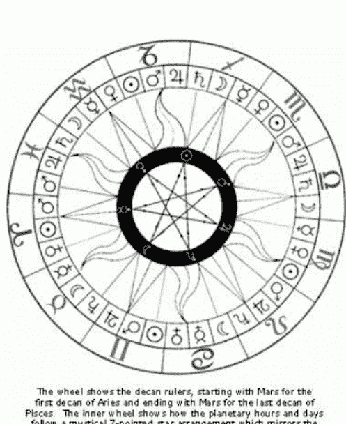
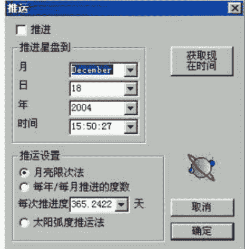
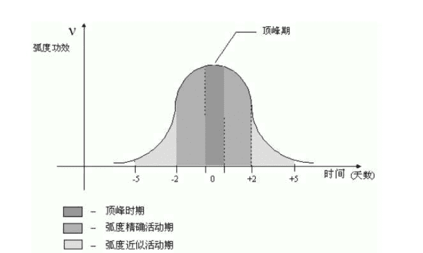
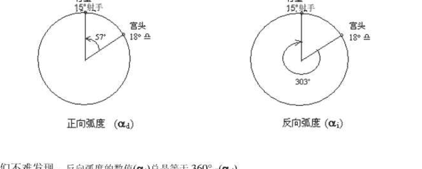

星相学，或称占星术（ASTROLOGY），是星相学家观测天体，日月星辰的位置及其各种变化后，作出解释，来预测人世间的各种事物的一种方术。

星相学认为，天体，尤其是行星和星座，都以某种因果性或非偶然性的方式预示人间万物的变化。星相学的理论基础存在于公元前300年到公元300年大约600年间的古希腊哲学中，这种哲学将星相学和古美索不达米亚人的天体“预兆”结合起来，星相学家相信，某些天体的运动变化及其组合与地上的火，气，水，土四种元素的发生和消亡过程有特定的联系。这种联系的复杂性，正反映了变化多端的人类世界的复杂性。这种千变万化的人类世界还不能为世人所掌握，因此，星相学家的任何错误都很容易找到遁词。星相学对于神的作用有各自不同的说法。有人认为，宇宙完全是机械化的，他们对神的介入和人的自由意志这两种可能性都加以摈弃。另一部分人认为，星相学并不是一门象天文学那样精密的科学，它只能指出事物发展的趋势，而这种趋势是可以为人或神的意志所左右的。也有人认为，行星本身就是强大的神，他们的旨意可以通过祈祷来改变，而且星辰只对那些通晓星相学的人才显示神的意志。后面的这种观点和古代美索不达米亚人的思想很接近，他们主要是向朝廷预告那些即将来临的福祸，这些福祸可能以气象或疾病的形式来影响人类和动植物的生长，或是以某种形式来影响国家大事或皇室成员的生活，如此等等。但他们认为天体的预兆并不决定事物的未来，只是作为一种征兆向人们显示神的旨意。

占星术的最初目的，是根据人们出世时行星和黄道十二宫的位置，来预卜他们一生的命运。后来发展为几个分支，一种专门研究重大的天象（如日食或春分点的出现）和人类的关系，叫做总体占星术；一种选择行动的吉祥时刻，叫做择时占星术；另一种叫做决疑占星术，根据求卜者提问时的天象来回答他的问题。

占星术起源于古美索不达米亚人的天体预兆。公元前18世纪到前16世纪的古巴比伦王朝，出现第一本分门别类论述天体预兆的楔形文字的书。公元前6到前4世纪，天体预兆学说传入埃及，希腊，近东地区和印度。后来经由印度僧人传到中亚。公元前3世纪以来，有人把大小宇宙相对应的概念数学化。所谓的“小宇宙”指人体。他们还把黄道十二宫进一步细分，认为五星在黄道不同的弧段上的作用各有主次。某星对人的影响力按照其所处的弧段以及与其他敌友弧段的关系而定。十二宫又和人体的特定部位相应，千变万化的物质世界和人的性格多少也和十二宫有关。星相学家根据给定的时刻的日月五星坐标和黄道十二宫的位置，以及它们之间复杂的几何关系，算出行星的影响力，再利用占星天宫图，找出上述各种因素与地上事件的对应关系，得出占星的结果。这种结果有时自相矛盾，这就需要占星者根据求占者的情况和占星者本人的经验加以圆通。到公元1世纪之后，上述方法已经定型。

希腊占星术也曾经传入印度，伊朗，进入伊斯兰文化。17世纪后随着日心说的确立和近代科学的兴起，星相学失去了科学上的支持。但近年来星相学又在西方开始抬头，有人还试图将近代发现的外行星引入占星术中，并试图找出行星位置和人类生活的统计关系。

# 本命盘解析初步

今天我们讲解析本命盘的总的要诀与方法。

个人命盘上主要有五大要素：星体（包括十大星体，五大小行星和一些恒星）、星座（黄道带的十二个区域）、宫位（以上升点为起点，将黄道分为十二份）、相位（星体间的角度）、基本点（主要指东升西末天顶天底北交福点等）。接着，我以最直观最形象的方式予以说明。

（1）上升点表示我们此生的面具，也就是说今生我们要在人生的舞台扮演一个怎样的角色。天顶表示我们的人生所能达到的顶点以及达到这个顶点的方式。

举例来说，在电视连续剧中射雕这个世界中，翁美玲扮演黄蓉，这就是她的上升点，丐帮帮主就是她的天顶。

（2）星体是命盘的能量来源，是塑造我们性格与人生各个方面的力量。（鉴于大家是初学者，为简单起见，先不讨论五大小行星和恒星。等第一阶段全部完成之后，再进行专门论述。）我习惯把十大星体分为三个部分。第一部分是塑造我们性格的太、月、水、金、火；第二部分是影响我们同年代关系的木、土；第三部分是影响我们同时代关系的三颗远地行星天、海、冥。

太阳作为维系太阳系的最重要星体，也是维系我们个人命盘的最重要星体。它是提供命盘正面力量的源泉。它塑造一个人的主人格，提供一个人走完人生道路所需要的能量。月亮则塑造我们的个人情感世界，体现我们对外界事物的反应。这就好像太阳可以发光发热，而月亮只能反射太阳的光辉一样。太阳与月亮的关系就好比司机与汽车的关系。司机可能喜欢他的车子也可能不喜欢他的车子，但他没有选择的机会，不论如何他都要开这辆车子驶完人生的全程。而上升天顶与太月的关系就好比角色与演员的关系，黄蓉可以由翁美玲演，也可以由周迅演，但哪个会演的好呢？我想不用我说了吧？

水，金，火是三颗近地行星。水星主导我们的思维模式、语言与思想，也就是主导我们的理智。金星主导我们的感情表达、爱与喜好，也就是主导我们的感性。火星主导我们的勇气，表达欲望的方式与对性的态度，也就是主导我们的欲望。它们离太阳最近的是水星，其次是金星，再次是火星。好像我们人体从上至下也是：大脑、心、生殖器。大脑表示理性、心表示感性、生殖器表示欲望，大概我们接受上帝的光辉也是自上而下的吧。也许所有得道高僧都是先超脱最底层的欲望，再超脱中间的感情，最后提升高层理智的层次，最终超脱自我而体会到与万物合一的境界吧……

两颗巨行星木星与土星，由于离太阳较远且速度较慢。不塑造个人性格而是左右个人与他人的初步接触。基本上体现个人在年代中的影响。区别在于，木星是扩张属性，土星是收敛属性；木星是吉星，土星是凶星；木星是张扬、浮华的象征，土星是压抑，沉稳的象征。

三颗远地行星天海冥主导我们在时代中的影响。假如相位良好可能意味着一个人可以左右他所处的时代。天王星代表的是个人创新变化的部分，它象征变动，意外与创新。海王星代表的是一个人梦幻的部分，它象征一个人的潜意识。冥王星代表的则是人类最黑暗最原始的欲望，也就是人类的原欲与潜能，它象征一个人心灵的黑暗面，暗示一个人堕落、死亡、重生与觉醒。占星学有这么一个规律，行星的影响力与距离成反比，这好像正好与万有引力定律相反呀！我自己的理解是，根据开普勒定律“所有的行星单位时间扫过的轨道面积相等”，所以得出越远的行星角速度越小，越近的行星角速度越大。再联想分子扩散理论“大颗粒由于受到的分子撞击力较平均，所以不规则运动慢；小颗粒受到的分子撞击力不平均，所以不规则运动快”。由此得出越远的行星影响力越持久所以它影响力就越大，越近的行星影响力越分散所以它影响力就越小。看，解释得多完美呀！

（3）星座行星发挥力量的舞台。前面讲过在不同的星座，行星的力量会得到张扬或抑制。行星落入某个星座就会带上这个星座的影响。所谓的入庙、失势、曜升、落陷这就好比在自己家中你感到自由，在好朋友家中你就感到和气，在不熟的人家中你会感到约束一样。行星的力量就好像白炽灯，当它透过什么颜色的玻璃薄膜就会显什么颜色一样。因为红色的玻璃薄膜只允许红光透射，而其他光都被吸收。可以说星座是行星影响力的滤镜。

（4）十二宫位是人生的十二个区域。落入不同的行星就表示这个行星要在这个区域里发挥作用。

（5）相位是行星间的角度，表示行星间将是什么样的作用关系。会位表示行星间将发生中性的影响；六合与拱位表示行星间将发生和谐的影响；刑位与冲位表示行星间将发生冲突抵触的影响。但这也不是绝对的，一切要具体分析。毕竟“塞翁失马，焉知非福”？

所有决定学习占星学的同学，大概都会遇到三个障碍。

第一个是学习勇气的障碍。很多初次来到研究室的人都会有这样的惊叹：占星真的好神奇呀！你们与我相隔千里，从来也不认识我，怎么能知道我那么多事情呢？于是他们就会想如果我也能学会这种神奇的知识就好了。但当他们得知要背那么多的东西，要面对乱七八糟古里古怪的星盘时，很多人后退了……

第二个是占星资料的障碍。当你怀着可贵的勇气进军占星殿堂的时候，你会发现想找到一套比较系统，深入浅出的教程与资料是一件多么难的事情。占星学是西方一门非常古老的学科，甚至比世界上绝大多数宗教存在的时间都要长。近现代西方占星学逐渐由西方传到日本，由日本传到台湾，再由台湾传到大陆。国内对占星学的研究主要还是在依赖个人行为，少数占星界的先行者们零零碎碎地翻译了少部分西方占星家的文章与著作节选，并写了一点个人心得体会。由于目前还没有足够的人力与物力来大规模系统翻译西方占星学主要著作，所以目前我们只能用这些零碎的中文资料（很多还是繁体的）作为学习占星学的依据。

第三个是理解深度的障碍。当你很努力的搞懂占星学里的基本概念并用来看盘的时候，就会遇到很多瓶颈。比如，一个刑冲特别多的盘是不是说明盘主命运很不好？相反一个三分六分合相特别多的盘是不是说明盘主命运很好？如果所有的行星都落到少数几个宫里，是不是盘主的人生就只在乎这几个宫呢？相反盘上的空宫是不是说明盘主在这方面没有作为？宫主星空相、逆行时该如何解释？太阳金牛，二宫宫头落白羊，盘主是喜欢花钱还是喜欢存钱，还是时而喜欢花钱时而喜欢存钱？太阳星座、月亮星座和上升星座如果具体塑造一个人的基本性格？这些问题我曾经都遇到过，相信大家在对占星研究到一定深度时也都会遇到。

从一粒沙中看出一个世界，
在一朵野花里发现一座天堂。
把无限放在你的手掌上，
永恒就在一刹那那里收藏。

如果你产生了以上提到的疑惑，究其根本原因是缺乏对占星最基本的概念——诸如星体、星座、宫位、宫头、相位的深刻理解所导致的。一个奇怪的现象，几乎世上所有最复杂的东西第一眼看上去总是很简单的样子，所以它们常常被人们忽略。人们总是在追求那些表面上看上去很复杂的东西，人们总是以为理解了复杂的理论就能证明他们的聪明与智慧。很多学习占星的同学，在掌握本命盘基本概念以后就急急忙忙的学习比较盘、组合盘、戴维盘、马克思盘、流年盘、返照盘、次限三限盘、太阳弧度盘、卜卦盘、数率图等。其实真正的水平不仅是知识广度的扩展更重要的是知识深度的扩展。本命盘的分析分两个层面。一个是性格分析，另一个是运势分析。对于同一个星体或相位，各自有不同的方法与角度。所以当你在解析具体的命盘具体成分时，你必须明确你是在进行哪种分析。我有两点要提醒大家，不论进行哪一种分析都要深刻理解星体、相位等基本概念！！！都要时刻牢记命盘是一个整体！！！

对于第一点我随便举几个例子说明一下。

对于星体，我想天海冥三王星大家一定不会陌生吧？同学们先默想一下自己对三王星概念的理解……每一个地球人的命盘上都有天王、海王与冥王。这三颗星代表了人类最极端的三种潜在趋势，即——神性、魔性与变异。由于他们的存在，所以任何一个人都有产生任何一种变化的可能性。所以再善良的人都有堕落的空隙、再邪恶的人都有成佛的可能，再顺从的人被压迫久了都会叛变。

天王——蛰伏在人类基因中的不确定因子。我们生活的领域里充满各式各样的惯性。物体有惯性，总试图维持当前的运动状态；人有惯性，总拒绝任何生活方式上的改变；社会制度有惯性，总维护当前已经建立起来的利益分配形式与等级制度。为了平衡“不变”的力量，上天创造了天王星，因为它代表了“变”的力量。由于它的存在，人类一切试图永久维持某样的事物的成功率是零。所以，这世界上再没有绝对的忠诚与信任，不论多么高明的控制方式与奴化、愚化政策都不能扼杀人类心中对绝对自由的渴望与追求。花开花落，云卷云舒，冬去春来，北雁南归，星移斗转，沧海桑田……这世界唯一不变的就是“变”，不论这种变是好、是坏。

冥王——每一个怨魂累世胶结的终极欲望，是近似疯狂的占有，是近似偏执的追求，近似恶魔的仇恨，近似黑暗的穿透。欲望——人类唯一拥有的力量，给了人类超脱宿命，敢于指天斗地的勇气。借助冥王的力量，把佛学中的“我”张扬到极至，永不言败的精神使人们在一次次失去后重新拥有，拥有后重新失去，再重新拥有。就在失失得得的轮回中，这只没有死亡的火凤凰终于蓦然明白“一无所有就是全然拥有”的道理，所以在欲火中重生的是崭新而高贵的灵魂！

海王——是欺骗？是迷醉？是逃避？是纵容？为自私的目的，我们戴着伪善的面具，披着谎言的披风，干着纵容罪恶的事情，并美其名曰：宽容、和谐、中庸。如果说万物皆有神性，如果说人类曾是神明的子孙，那海王就是我们血管里残存的那最后一丝来自上古神明的绯红。偶然，我们的心中滋生一丝善念；偶然，我们对他人起了一点同情；偶然，我们的思想里升腾一线慈悲……当我们到了醉无可醉避无可避，所有的谎言都已破灭的落日天涯，才发现左手是天堂，右手是地狱。所有的努力化作东逝的江水，唯一留在心中的是人生一梦的感叹……所有往日的小仁小善在此刻交汇，化作普渡众生的宽容与悲天怜人的大慈大悲。

对于第二点，我暂时先不细说，只简单提一下。做性格分析时，任何时刻都必须兼顾太阳星座、月亮星座与上升星座。做运势分析时，不论具体分析哪一个宫，都要牢记其他任何一个宫，任何一个星座，任何一颗行星都在或直接或间接的影响到这个领域。下面的教程将分为性格分析与运势分析两个部分展开，并进行详细论述。

# 占星的思路及基础知识

占星的思路，之所以我们要讲这个问题，也是因为在我们实际研究过程中经常会遇到一些对占星很困惑的朋友，很多人学了一年、两年，甚至四、五年都对自己占星没有自信，甚至对占星表示了极大的怀疑。实际上这就是我们所说的思路问题，占星的思路在我来看主要是两种，一种是感性的，一种是理性的。感性的占星思路多凭借占星者的超强的感应能力，我想因人而异，这不在我们教授范畴之内。

而今天我给大家说明的就是如何按照一个理性的分析思维去研究占星术。这里我要特别强调的是研究二字，为什么要强调研究，因为占星太复杂了，大家不要指望教材或者哪个所谓的大师告诉你，这个行星、这个相位是做什么的，是什么含义，你就可以给别人下结论。因为命盘太复杂，很多规律虽然是人总结出来的，但并不代表这个规律就100%的正确，因为可能有其他因素在影响。就好比很多人问我，她什么时候结婚，什么时候有钱。说实话，我有的人可以很明显的告诉她，你什么时候可以，这是因为她的命盘特征在我的研究中是比较明显，而有的人我就不敢肯定，因为她的特征在我的研究中还没有发现。所以研究这两个字在占星之中是非常重要的。

没有绝对的大师，没有绝对的高手，学过今天的课程，我希望你们能够保证研究和怀疑的态度去看待每一个所谓大师的理论，每一份教材中可能存在的问题，学占星，我希望大家先要清楚命盘上每个图形和点代表的含义，这个很多地方都有教材，我想今天不做过多的陈述，同时，要熟悉占星中基础的基础。占星的知识基础是行星、星座、相位、宫位等等，而行星是基础中的基础，为什么这么讲，充分了解了行星的含义会让你更深刻的了解星座的含义，更深刻的了解宫位的含义。

这就是为什么我让很多学占星的朋友要清楚记得行星的特征。比如天王星，谁都知道是意味着创新、变动、意外等等，而水瓶座的守护星就是天王星，而水瓶的特点我想大家也很熟悉了。实际上星座的特征是来源于其守护行星的特征。这样去理解星座的目的并不只是为了记星座含义，而是为日后的学习打下基础。特别是行星落星座的强弱情况会有很好的帮助。所以大家一定要切记每个行星的含义，实际上也就是每个行星具备的关键字。

在我们去理解分析之前，首先我要告诉大家理性的占星研究思路是全局的、是综合的。这也就是为什么我比较反对有些人说“XXX座”和“XXX座”不合之类的话。从一般人或者娱乐星座的角度来看也没有什么问题，12星座中的对应确实存在一定的概率，毕竟太阳是最外在的表示，但是如果是抱着一个研究占星术的态度去这样考虑问题的话，确实是有些偏驳，因为我们都知道一个命盘的组成并非只有太阳一颗，世界上人的分类也并非只有12种。我希望大家通过今天的学习能在今后在任何占星讨论中避免类似的言论。

其实这个问题引申下来就是一个占星中思路最大的误区——盲目下结论。准确说是用某一个教材中所说的特征去给人家下结论，我想大家在平常的讨论中一定自己也说过，或者也听别人说过，“你行星在哪里哪里，就如何如何”之类的话。也有很多人问我金星落XXX，她会不会娶个好老公，木星落2宫她会不会有钱等等，其实我无法回答，因为命盘的复杂并不是一个行星落在哪里就能说明问题的，这跟这颗行星所处星座，所被其他行星影响等因素有着相当大的关系。金星落2宫按教材理解财运是很好，但如果同时又被土星刑克，我不知道大家还敢说她财运好否。综合考虑问题是减少错误的最基础的思维模式，是一个负责任的占星师所应该具备的基本思路。其实这也就是为什么很多占星爱好者在给别人看的时候发现不准的原因，因为只看局部而忽略全部的时候是很容易犯错误的，包括我自己一样也是如此。

我这里特别提醒风象个性的朋友在研究占星术的时候要切记这个问题。另外一点我在此插一句，本来不该在这次课程提，但我想即便避免大家在研究中犯其他人犯的错误，大家切记，学占星一点一点来。我很理解大家迫切了解自己和他人未来的好奇心，包括我本人在学占星的时候也是如此。但是如果你真的想提高自己的水平的话，一切慢慢来，不要想一口气吞个胖子。有很多人看了两天教材就觉得自己把本命盘搞清楚了，然后就去学合盘、去学流年，甚至MARKS盘、阿拉伯点之类的东西。还有甚者，觉得自己上面的都学明白了，又开始去琢磨紫微斗数，四柱了。因为在他看来，教材那些告诉他就够了，所以干脆全学了，因为教材毕竟是前人总结，确实可以告诉我们一些相对准确的东西，但是教材再丰富也不过那几十种情况。命运不是那么简单，所以学了这么多，这种还是什么都不会，但名词给你搞一堆，然后自己封个大师就觉得了不起了。我想大家千万千万不要学这种人。一切慢慢来，从本命盘好好看起，本命盘是一切的基础，流年、合盘等全部是建立在本命盘的基础上的，本命盘你看的越明白，以后组合盘再看的时候你也会越准。说了以上这些，我只是希望大家在学习占星的过程中能保持一个合理客观的思维态度。也希望大家在学习中得到研究成果后能保持一个谦虚严谨的研究作风。所谓自封自己是大师是天才的占星师，我想他是没有理解占星的真谛。因为占星你学的越多，研究的成果越多的时候，你会越觉得自己的渺小。因为占星确实很奇妙，而我们是人，不是神。

> (编外话：占星不是算命，它可以为我们看到感情的合适与否，但却没有办法真正帮助我们实现什么。真正决定的人，还是我们自己。另外，我也希望所有喜爱占星文章的人，不要将占星作为一个生活依赖，而是一种参考。人生本来就是充满无穷的变数，实在不要说什么是一定的。)

在占星中，每一个行星都有它自己的功能。下面这些知识，大家用找关键词的方式把它记住。

## 太阳：

自我，你的基本性格，你到底是个什么样的人，你怎么和男性相处，你和父亲的关系。如果太阳的力量强大，你往往会待人友善，有威严，可能有一点喜欢搞怪，更需要他人的关注。守护着狮子座。在白羊座为旺相，在宝瓶座为失势、在天秤座则为落陷。

## 月亮：

公转周期：27天。直觉，习惯，下意识的行动，你最喜欢的家庭模式，你怎么和女性相处，你和母亲的关系。如果月亮的力量强大，你可能会有很明显的情绪波动，而且往往你只凭预感就做出决定。守护着巨蟹座。在金牛座是旺势，在摩羯座是失势，在天蝎座则是落陷。

## 水星：

公转周期：88天。思考、交流、获得信息的能力，水星力量强大的人会非常需要和外界做各种各样的交流。你会比其他人更喜欢煲电话煲。守护着双子座和处女座，在宝瓶座是旺势，在射手座、双鱼座是失势，在狮子座则是陷落。

## 金星：

公转周期：225天。表达爱的方式，艺术感觉，爱情，财产和快乐，出生图中金星力量强大的人，守护着金牛和天平座。在双鱼座是旺势，在天蝎座和白羊座是失势，在处女座则是落陷。

公转周期：225 天。表达爱的方式，艺术感觉，爱情，财产和快乐，出生图中金星力量强大的人，具有迷人的一面，而且容易被艺术深深吸引。守护着金牛和天平座。在双鱼座是旺势，在天蝎座和白羊座是失势，在处女座则使落陷。

## 火星：

公转周期：差不多 2 年。活力和攻击性，如果你的火星力量强大，你可能会比较积极，比较有活力，果断，甚至是好斗。守护着白羊座和天蝎座。在摩羯座是旺势，在天平座、金牛座是失势，在巨蟹座则使落陷。

## 木星：

公转周期：12 年。你能掌握大原则、大方向，虽然木星守护的星座正好在水星守护的星座对面，但是他一样能带给我们乐观的精神，木星所在的星座通常会让我们在那些方面感到安全和放心，或者给我们带来机会和好处。这难道就是好运气？不要忘了"不入虎穴，焉得虎子？"没有冒险，哪来收获？守护着射手座和双鱼座，在巨蟹座是旺势，在双子座是失势，在摩羯座则是落陷。

## 土星：

公转周期：29 年半。担心、害怕和收缩，也代表了野心和决心。没有土星带给我们的障碍我们是不会真正成长的。通常在医生，科学家和商人出生图中，土星的力量都非常大，土星所在的星座代表了需要安全和安心而又从来不能让我们放心的地方。这些地方让我们感到害怕恐惧，甚至连试都不敢试的地方，所以土星常常被人们认为是凶星。土星守护着摩羯座和宝瓶座，在天平座是旺势、在巨蟹座是失势，在白羊座则是落陷。

## 天王星：

公转周期：84 年。与众不同和渴望自由。这是颗"反叛"的行星？它反对现有的规则，因为它认为规则该由自己来制定。如果天王星位置力量强大，这些人会被他们所生活的社会认为是天才，古怪或者疯狂的人，他们随时会给人门带来不安或者震惊，即使他们自己并不想这么做，如果政客的出生图中天王星的力量强大，他可能是一个仅仅为了建立自己的规则，就去推翻现在政府的人。例如，希特勒的出生图中天王星的力量就很强。投票时千万不要选他们！守护着宝瓶座，在天蝎座是旺势，在狮子座是失势，在金牛座则是落陷。

## 海王星：

公转周期：165 年。海王星代表了幻想，如果一个人出生图中海王星的力量强大，这个人就被认为敏感和富有想象力。贪图享受和浪费是海王星带来的负面效应。但是我再强调一遍，一定要在分析完所有可能以后再做出结论。守护着双鱼座，旺势星尚未确定，在处女座是失势，落陷星尚未确定。

## 冥王星：

公转周期：248 年，极遥远的小行星。性，死亡，重生，极端。冥王星所在的地方是我们克服所有难关，永远不妥协的地方，冥王星如果在你星盘中的力量强大，你将会是一个不愿意被人摆弄的人。它守护着天蝎座，旺势星尚未确定，在金牛座是失势，落陷星尚未确定。

# 行星在天宫图上分布的意义

大部分行星在地平线上(即在黄道第 7、8、9、10、11、12 宫：白天)和*****在中天附近，这一分布使人容易从事很快获得成功的职业，如果能有好的太阳与木星方位的配合，那么还容易被提升和获得财富。

大部分行星在地平线下(即在黄道第 1、2、3、4、5 和 6 宫上：夜间)，这一分布对个人生活的影响要比对社会生活的影响大。如果以被动行星月亮、金星、海王星或土星之中的一个为主宰行星，那么则会使人不愿出头露面或者安于默默无闻的生活。

大部分行星在东边：朝向黄道第 1 宫，会有以我为中心的倾向，自己很早就把自己的命运确定下来。

大部分行星在西边：朝向黄道第 7 宫，命运很大程度上取决于别人，人生道路上会有许多变化的障碍。

大多数行星分布在黄道第 1、4、7、10 宫，人生大事都是一闪而过。生活充实，富有生机。会有显赫的地位。

大多数行星分布在黄道第 2、5、8、11 宫，安静的命运之神以缓慢的步伐伴随着人生之路。坚持不懈的精神，会有助于事业或物质财富上的成功，但要提防失败带来的损失。

大多数行星分布在黄道第 3、6、9、12 宫，缺乏机遇、有不安全感，付出辛勤的劳动，但不一定会有可靠的成功来兑现。多处在从属地位。

大多数行星分布在主位星座(白羊座、巨蟹座、天秤座、摩羯座)中：善于谋生和为自己开辟生活之路。喜欢凭借自己的力量和努力去实现事业的夙愿，或按自己的兴趣独立行动。

大多数行星分布在恒定星座(金牛座、狮子座、天蝎座和水瓶座)中：擅长组织、管理工作。适合担任可靠的职位，有出色的劳动观念。

大多数行星分布在易变星座(双子座、处女座、射手座和双鱼座)中：缺乏应变能力，一切都取决于别人，个人情况变化不定。

所谓的相位（Aspects）是指：行星和行星间所形成的角度。行星之间形成的各种不同角度，在对于命盘解释上，有好有坏。行星的相位可以显示星盘主的人格在某些方面可能获得充分而积极的发挥，也可以显露某些方面，星盘主可能感受到心理压力及紧张的状态。相位没有绝对的凶吉，现代星象学家已普遍相信刑相位，能够为人格提供冲力与上进，尤其在它与星盘中其他的行星相互整合时。另外注意假如出生的时辰够正确，则行星与上升点及天顶互成的相位，也应列入考虑，如果不正确，这些相位最好不要考虑。（上升和中天其实为第一宫和第十宫的宫头，这两个点受时间影响比较大）

（另如果一个行星不和其他星体产生角度关系那么就叫空相位）

精确的合相位是指行星同占黄经的某一度某一分；精确的“相刑”是指行星距离九十度。而精确的“三合”，则指行星距离一百二十度。精确的相位不易形成，星象学家会用“容许度”，比精确的相位数或多或少来做出相位。

一般来说，可能有下列几种传统相位：

## 角度解析—0 度

是一个主要的相位，指行星和行星相合时的情况。类似性质行星的相合，会增加正面的力量，例如在一个人的命盘中，木星和金星的相合，会增加一个人的幸运；但是如果是不同性质的行星相合，则会产生一些冲突及矛盾的情况，例如热的火星和冷的土星相合；虽然彼此会抵消掉一些负面的力量，但是也会让人产生一些冲突和不协调的情况。

合相这个相位，对于每日的运势预测，以及将二人命盘合盘时的关系解释上，有非常重要的影响力。其可容许的误差范围是 8 到 12 度。

## 角度解析—30 度

虽然算是一个次要的角度，只有 60 度一半的力量，但是在金钱方面，这个角度是非常重要的。

半调和的角度，意谓在金钱上可以获得利益。不过，在将二人的命盘合盘时，如果出现了 30 的度的情况，则代表二人是可以在某一方面互相帮助，不过有时会有争执。此相位的容许误差是 2 度。

## 角度解析—45 度

是一个次要的相位，只有冲突关系 90 度的一半力量，不过对于金钱方面来说，这会是一个重要的位置。

半冲突的关系意谓，金钱上会有困境出现，特别是在支出方面。在将二人的命盘合盘时，如果出现了半冲突的关系，这是表示二人会有些微的摩擦。此相位可容许的误差范围是 2 到 4 度。

## 角度解析—60 度

这是个主要的相位，表示一种调和的关系。对于夫妻和朋友来说，这是一个非常重要的角度。

调和的关系表示，如果肯付出努力的话，将可以获得成功。在一个人的命盘中，如果有许多这样的相位，则表示此人可以经由努力，获得成功。如果是合盘时出现这种角度，则意谓这二个人可以相辅相成。

这个角度也表示，和兄弟、亲戚及朋友之间的合作关系会不错，而且多多参与一些团体活动，可以获得好运。这个相位的所容许的误差范围是 2 到 7 度。

## 角度解析—72 度

这是西方心理占星中较常用到的相位，属于中性相位，代表人克服困难和解决问题的能力，以及思想上的新异和创造力。

## 角度解析—90 度

是一个冲突的位置，意谓可能会有一些障碍和不协调的情况出现。在一个人的命盘中，如果出现了许多冲突的关系，则表示在这个人的基本个性中，会有许多矛盾和冲突的情况，也就是说：此人也许表里不一，经常口是心非。

不过，在男女的关系上，如果将情侣的命盘合盘，出现 90 度的关系时，并非全然是不好的；有一种例外就是金星和火星的关系。如果男性金星和女性火星，或是女性的金星和男性的火星，形成 90 度的关系时，这可能表示，二人会有非常强烈的性吸引力（虽然这不一定是爱情）。

对于每日的预测来说，90 度的关系表示，可能会有一些困难需要解决，或是生活中出现了一些不顺利的情况，不过对于每日的运势来说，除非是非常不利的情形，否则可能都只是一些短暂的情况。这个相位可容许的误差范围是 5－8 度。

## 角度解析—120 度

这是一种合谐的相位，也是事情可以顺利进行的位置。在一个人的命盘中，如果出现了许多合谐的关系，则会在命盘中形成一个大三角形；这意谓著，此人非常的聪明，而且能力也不错，经由努力和奋斗，可以获得不错的成就。

在合盘时，如果现了 120 度的情况，通常是相合元素间的互补关系，例如火象和风象，水象和地象；这表示二个人在某些方面，会是非常具有协调性的伴侣，而且在沟通上，没有任何的困难。

在每日运势的预测时，如果出现 120 度的情况，这表示计划可以顺利的进行，或是可以得到一些好运及帮助。此相位的可容许的误差范围是 4 到 8 度。

## 角度解析—135 度

和 45 度的关系是类似的，也是一种次要的位置，这是一种不太协调的角度，表示会因为某些延误而感到不安或焦虑，不过在某些具有煽动群众魅力的政治家命盘中，这却是一种非常重要的相位。

在合盘或是每日预测时，这种相位表示，虽然会有一些不安和焦虑，但只是短时间的；在人与人的关系上则表示，冲突可以经由沟通获得改善。这个相位可容许的误差角度是 2 度。

## 角度解析—144 度

经过短暂的 135 度造成的紧张与危机，潜意识中的创造性力量再一次通过“成 144 度”表现出来。一个人再次拥有实现个人潜能的实力，并且可以自由探索心智的极限。

因为思想已经不受先前残留的过去的星体力量的影响，此相位影响下的人的重心更多的放在一种个人行为，并且是那种不具有很强目的性的随兴行为。如果一个个体想要发挥 144 度的力量，就必须仔细研究自己的星图，找到潜意识中隐藏的这些创造力，并努力把他们提升到意识层面上来。

## 角度解析—150 度

这是一个次要的相位，代表一种不均衡的情况，和 30 度是相似的。不过，这种相位对于疾病的预测而言，却是一个重要的位置。

在解读一个人的命盘时，如果在第二宫、第六宫、第八宫和第十一宫，出现这种相位，那么就是定要特别注意，和此宫星座及行星所代表的相关疾病。

如果是在合盘时，二人之间的关系出现了 150 度的情况，那么这意谓著欲望的不满，或是一种宿命上的不平等关系。这个相位可容许的误差范围是 2 度。

构成 150 度的两颗星，在星座二极（阴阳），三分（基本宫，固定宫，变动宫），四分性质（火土风水四象）方面没有共同点。即使是这样，这两颗星仍是有着不可忽视的关联。由于两星十分不同，根据自然规律，它们试图寻找平衡点，就像冲相星一样。但是，由于它们没有共同的性质，所以，是无法达到平衡的，结果导致能量具有扰动性，使人感到必须作出某些调整。为缓解这种压力，两星中的一颗会被迫以违反该星特质的方式作出反应，可想而知，这种反应是困难而又痛苦滴。但是 150 度也不尽相同，主要分为以下 3 类：

- 1. 有些成相的星星所落星座拥有相同的守护星，例如白羊座和天蝎座同受火星守护；金牛座和天秤座同受金星守护。
- 2. 有些是成相星星落至日点力量同等的星座（antiscia，至日点），即沿巨蟹座和摩羯座的 0 度轴划分的星座，属“软相”，类似三合和六合；或是至日点对立（countra-antiscia，能量平衡点分别是昼与夜，沿白羊/天秤轴）的星座，属“硬相”，类似刑相位。
- 3. 有些是根本毫无关联地（averse）。YOD 的能量暴发通常是瞬间地。通常，我们对第一颗六合星作出迅速反应，然后，我们会等上相当长的一段时间，才对第二颗六合作出反应。释放点，即真正适合行动的时间点，是冲顶端星，即六合的中点时。等到 YOD 被整合后，并且当我们知道应该何时，如何对它作出反应时，两颗六合星会协同推动顶端星的作用调整。由于梅花和六合相位不是“行”相位，因而 YOD 让人感到的是情绪的困扰。在 YOD 的影响下，我们总感觉缺少了一些重要的东东，即帮助我们超越烦恼的信息，那种感觉是细微地，难过地，我们认为它不应该是酱紫滴。从积极的观点看 YOD，它在指点你，并对你说，你正处在人生的转折点，你的生活将发生改变，比喻而言，也许你花费了许多时间去学习揣摩某明星的表演技艺，试图替代他/她，当时机成熟的时候，你一夜成名。YOD 也可能是消极滴。有 YOD 的人不仅有健康问题，而且重生能力也不可忽视。有时 YOD 使人身体不适，当你真正去看医生的时候，这种不适却又消失了。当 YOD 开始行动时，你的生活会改变。比如有人在 YOD 发生作用时，被诊断患有癌症；然后在 YOD 再次发生作用时，结婚。

## 角度解析—180 度

这是仅次于合相的主要相位，是二行星是位于对宫时的情况，这会造成一种紧张和不协调的情况，找寻一个平衡点，则是解决这种对立关系的方法。

在一个人的命盘中，如果出现了这种情况，则表示此人必需在为人处世上，寻找一种平衡点；过与不及都会导致事情的失败。

当合盘时出现了这种相位时，会有二种情况出现：一种是这二个人，会有一种非常强烈的吸引力（特别是指男女关系上），而另外一种情况则是，互相看对方不顺眼。解决这种关系是唯一办法是，藉着互相的多多沟通，寻求一种动态的合谐情况。这个相位可容许的误差范围是 6 到 12 度。

除上述所说之外，也有人考虑将 72 度、144 度（显示精神支柱，精神安慰等事项）当作第三种相位。

# 组合相位：

## 1. T-Square（T 型三角）

如果有两颗行星互相形成 180 度，同时又分别与另一个行星形成 90 度，就代表这个相位格局全部是负相位，因此充分的代表困难、紧张、压力、冲突。凡是命盘上有这种格局的人，总是会有需要去突破的难题，也就是在这种 T-Square 的顶点。因此这个人会把他的精神以及行动放在这个顶点上，而导致与消耗过度的体力或是脑力，所以应该特别注意这个顶点所落入的的星座宫位的代表意义。如果没有其它吉相位的行星可以当成助力的话，会导致压力和精力爆发出来而导致不幸。如果顶点的行星是落入基本宫的话，会有向前迈进的压力。如果是固定宫的话，会更坚定个人的立场。如果是落入变动宫的话，会有难以适应环境的压力产生。

## 2. Cross（大十字）

如果有的行星互相形成 90 度，而其中的两组是两个行星互相形成 180 度，会类似于 T-Square 的压力和冲突，但是压力也会比较平衡，比较不像 T-Square 会集中在某一点上。如果是落入固定宫的话，会更坚持，不变和坚毅不拔、持续力强的特质。如果是落入基本宫的话，会更加强要开创，领导的特质，如果是落入变动宫的话，会更加善变、逃避或妥协等等的特质。

- 本位大十字：喜欢发挥强烈的自我意识，炙手可热的人，组织力强，开创力够，喜欢驾驭别人。在朋友中喜欢指挥者，人生不断追求成功，有马不停蹄的倾向，不达到目的不甘休。人生的功课第一是充分发挥潜能，第二是讲求环境上的和谐。
- 固定大十字：容易有强烈情绪反应，情绪纠结，强烈需要安全感，在潜意识中受到习性以及传统的观念影响很难改变。此人会经常追求心目中的理想力量，包括智慧、财富和权力，有时候也会帮助别人，自己扮演援助者的角色，对环境的适应力不强，所以壮志难撑，但是一旦成功，就能够绵延不绝，富贵有余，人生的功课是为人类提供助力，不要让别人变成他的阻力。
- 变动大十字：一生中不断追寻神秘的事情，有良好的适应力。多才多艺，追求平等，容易混淆，浪费生命以及精力，为了生活四面奔波，提供知识给别人，宁愿做部属，因为自己方向性太多，相互会矛盾，犹豫不决，无法完成独立专一性的工作，人士的功课是要不断更新自己的思想以及幸免，另外就是要对自己有充分的了解。

## 3. Trine（大三角）

大三角型是指 3 颗行星彼此都是吉相位，可能是 120 度或者是 60 度。一般而言，会比别人有比较顺畅的人生，容易发挥自己的天赋才能，当与别人进行竞争时，也会增加胜算的机会，但是要注意的是，不要因为说是没有目标没有冲击让自己怠惰。如果这样的相位组合落在火象星座的话，这个人会充满了活力，目标积极并且主动开创以及实现理想的能耐。如果是落入土象星座的话，那么会充满了坚毅不拔、落实执行，脚踏实地、坚持到底的精神。如果是落入风象星座的话，不论是思想上或是沟通上会有许多不同表达的技巧，知识和思想都会很流畅。如果是落在水象星座的话，就会充满了感性、敏感、善解人意、体贴别人的本事。

- 火象大三角：充分的乐观、积极、行动力强，有控制神秘发挥到极致的愿望。人生功课是要激励别人能够持续为人类的成长而努力。
- 土象大三角：讲究实际，并且经济谨慎评估生命的发展，追求生产力，功课是尊重生命的价值以及培养忍耐力，不能够游手好闲吃喝玩乐。
- 风象大三角：强烈的学习力，容易发挥思想的沟通、创意、传播，更有好奇心打开知识的门户，透过文化的交流，增加对人的理解。人生功课是教导别人享受生命的喜悦。
- 水象大三角：同情心以及民代立场，很容易感知到个体以及群体的需要，人生功课是为人类带来灵魂觉悟的真善美。

## 4. Yod

如果在命盘上，有两颗行星彼此 180 度，再加上旁边另外两颗星星，跟 180 度的这两颗行星，分别是在 30 度和 150 度的相位关系，我们就称这种相位的格局，叫做 Yod。这是一种比较少见的格局，通常在旁边的这两颗行星是纾解压力的助力。

## 5. Kite（风筝）

风筝型的相位各区，它是有一个所谓的大三角形的相位格局，但是有一颗行星分别跟一个 180 度，另外两个 60 度，那么这就是我们所说的 Kite。那么所谓的助力就来自于跟这一颗凶星形成 60 度的这两颗星星的意义。

## 6. Mystic Rectangle（信封）

这是一种神秘的长方形相位组合，其中两组对冲，两个 60 度，两个 120 度，这也会形成压力，但是彼此间又可以释放压力，非常诡异。

通常我们对星座有三种归类方法 附另外两种分法：
1. 特质 Quality 2. 元素 Elenment 3. 阴阳法

# 特质 Quality 代表的是会怎样发挥作用

**本位星座：** 代表行动。他们都是那些马上开始行动的人，包括白羊，巨蟹，天平和摩羯，如果没有什么紧要的事情要处理的话，没事可干的他们会自己找一些事情来做。出生图上每个人都会有不同的星座，而本位星座代表了你的生活中会立刻展开行动的地方。

**固定星座：** 稳定。如果本位星座倾向于找一件事情去做，固定星座就是倾向于占有这件事情。固定星座想成为老板然后让本位星座为他们做事情。固定星座代表了顽固，固定星座的人往往开始的很慢，但是一旦开始就不会停下来，本位希望事情运转，固定星座希望所有的事情都围绕他们运转，而自己不动。固定星座包括金牛，狮子，天蝎和宝瓶。固定星座代表了生活中遇到压力而后不会后退的地方。

**变通星座：** 交流者。本位星座开始一件事情，固定星座发展一件事情，变通星座谈论其他星座。

# 变通星座：交流者。本位星座开始一件事情，固定星座发展一件事情，变通星座谈论其他星座正在做的事情。

设想一个情景本位星座会说：“让开，我来把这个事情做完”
固定星座会说：“我认为这是对的，那是错的，还有……”
如果没有变通星座，另外两类星座都会想杀了对方，变通星座代表了适应，妥协。
这时变通星座会说：“让我们商量一下吧？”
变通星座会在那些引起他们兴趣的事情上停不下来。变通星座代表了你生命中那些方面倾向于适应，会对事情详细的商议和妥协。

# 元素 代表的是基本的特点

**火相星座：** 请记住每个人的出生图上都有每个星座，火相星座其他相星座都同时对人产生影响，如果只考虑火相星座得到结果肯定是不准确的。

火相星座完全自我为中心，好像周围的人都不存在，很难让他们用别人的观点来思考问题，因为在他们的内心深处认为除了他们自己的观点其他的都是错误的。火相星座的人倾向于急切的开始事情，任何拦路障碍的都会被清除掉。

火相星座积极的一面是比较表里如一，表面，平时和内心，独处一样。

火相星座所在的位置是你过分自信，或者有权威的位置。

白羊座是本位火相：是你能马上发动直接而且强有力攻势的地方。

狮子座是固定火相：是你富有创造力的地方，是你能真正用心的地方。

射手座是通变火相：这是明智的星座，所在的位置是你能最能理解事情的地方。

白羊座想一个炸弹，狮子座像太阳，而射手座就像黑暗中的烛光。

**土相星座：** 土是固体，实际的东西。火是直觉，和火相星座相比土相星座只相信他们看得到的，听得到的，闻得到的，只要他们感觉不到的都认为不存在，火相星座知道有东西要从山那边过来了，而土相星座得等到确实过来以后，才相信有。没有火相，就失去了快乐，失去了生存得理由，但是土相知道不能只生活在精神上。人必须努力工作，努力改变自己。土相星座反映了注重实际的方面，消极的一面，土相星座反映了强硬的，消息闭塞的，害怕改变的方面。

**风相星座：** 风相星座涉及交流，人与人之间的关系和智力。风相星座是最人性的星座，也是感情和理智分的最清楚的星座，那些有很重风相元素的人，会发现自己很难理解那些很情绪绪化的人。他们常会问“他们为什么不那样做？这样太不合理了，应该这样，这样……”风相星座的人不会让事情平息下来，他们对一件事情讨论的更多，他们需要更多资讯。风相星座反映了你强调思考，交流能力，和喜欢社交的方面。出生图中如果没有风相元素，而火相元素占主导地位的话，会让我们容易失去控制，陷入麻烦。如果土相占主导地位，会让我们难以改变，每日都是例行公事，从不去想不改善。

**水相星座：** 水代表了是情感和本能？火相星座看上去想烧掉一切障碍，相对与火相希望无处不在，包容所有可能的东西，看看比尔盖茨的星盘，它的太阳在水相星座天蝎，上升在另外一个水相星座，巨蟹，再看看他公司的座右铭是“微软无处不在”水相星座（情感）常常会和有比较重的风相星座的人不太和谐，因为那些有过分水相的人常常会有下意识的举动，他们好像只凭直觉就能感觉到事情该到底是怎么回事，常常让人不容易琢磨。所以水相和风相的常常觉得对方很笨。在出生图里面水相星座代表了重感情，养育和直觉。如果没有水相星座你也许永远不会感觉到生存的价值。

附图：

从白羊第一个十度开始，每十度的守护星如图。
举例天蝎座 10－20 度的守护星是太阳。
星座还可以分为★48 个独立的星区

The wheel shows the decan rulers, starting with Mars for the first decan of Aries and ending with Mars for the last decan of Pisces. The inner wheel shows how the planetary hours and days follow a mystical 7-pointed star arrangement which mirrors the order of the decan ruleship scheme.

# “宫”的意义

基本上，“黄道星座”是天空中地固定区域，是由出生月日的太阳行度来决定的。相反的，“宫”却是天空中相对于黄道星座的区域，它是依个人的出生地与出生时刻而定。

由地球的运转，各星座与各行星每天都会通过十二宫，在出生时刻位于东方地平线的星座，称为“命宫”。每个“宫”代表人生基本的活动领域，宫决定了落在其中行星在什么方面发挥作用。每个行星都有自己代表的意思，星座是决定行星怎么样(HOW)发挥作用，而宫就是决定在什么方面(WHERE)发挥作用。

上升星座也称为命宫或第一宫（Asc）：上升点总是位在地平线的东端，是太阳每天升起之处。
下降星座或称为第七宫（Dec）：是位在地平线的西端，这是太阳每天下沉之处。
中天又称为天顶、第十宫（MC）：总是位在星盘中的顶端或南端。

相反的一点称为天底、第四宫（IC）：总在星盘中的最下端或北端。

第一宫：代表人格、企图、态度、生命力、早年环境、身材外貌、体质状况、自我发展能力。

第二宫：代表财运、欲望、资源、价值观、赚钱能力、物质生活、有价证券（股票、债券）。

第三宫：代表言语、思考、沟通、学习、考试、兄弟姊妹、人际关系、短程旅游、大学以下的教育。

第四宫：代表私生活、不动产、心情感受、安全意识、父母管教、晚年生活、家庭生活和事务。

第五宫：代表子女、爱情、热情、怀孕、性关系、投机运、私人社交、休闲娱乐、创作或艺术能力。

第六宫：代表宠物、健康（饮食疾病）、发展运（同行、同业、同事）、部属关系、工作精神态度。

第七宫：代表同居、婚姻、艺术、契约、诉讼、合伙（包括配偶、赞助人）、公共关系、明显敌人。

第八宫：代表意志、神秘、犯罪、性、死亡、债务、保险、偏财（遗产、贪污、配偶）、性能力。

第九宫：代表法律、宗教、信仰、哲学、长程旅游、国外事务（贸易、移民）、研究所以上的教育。

第十宫：代表目标、野心、责任、权威、信用、事业、政治、老板、名望声誉、成就地位。

十一宫：代表泛泛之交、社团活动、拥护支持者、精神和文化层次、对环保公益和人权的态度。

十二宫：代表慈善、修行、逃避、隐居、诈欺、隐密（敌人、交易、恋情、谋杀、性）、潜意识。

# 截夺宫

截夺宫是一个初学者常问的问题，1.截夺宫的定义由于黄道和后天宫位的投影关系，各宫位的大小是不一样的，有时一个宫位里包含了三个星座，那么，中间的星座就称为被截夺，套中国的八字命理术语就叫做空亡。

2.截夺宫的影响被截夺的星座其特性就会被隐藏住，变得不外显，所以落入其中的行星，和该宫的宫主星力量就会弱化，以实论的角度来看，意味着原先的象征会消失，当你向命盘主提出说明时，他会说，"好像没有这样耶!"这就是截夺宫的效应。

# 十二宫（上）

## 第一宫 （命宫）

+   ★第一宫小档案：
●宫位意义：自己的个性、身体状况、外貌、举止、一般的健康、生命力、给人的第一印像。
●相关星座：牡羊座
●宫位主星：火星
●后天三分：主动宫位
●后天四分：生命之宫
●擢升行星：太阳

★第一宫又被称为上升宫位，位于此宫位的星座就被称为上升星座，它是星宫图之中最重要、最敏感的宫位，它透露出个人对生活的基本态度、他的自我认知、他如何归类自己的生活经验，面对外来刺激会有怎样的反应等等。

●任何位于第一宫的行星，特别是与个人星宫命盘上的上升星座有著合相关系的，对个人的基本特头及他追求知性的感度上会有著合理且充分的诠释。还有一些基他因素会影响到第一宫的特质：第一宫位内的星座、该星座的主宰行星、任何和第一宫位形成主要相位的行星及命盘上之上升星座的主宰星的定位星等等。

●第一宫及这些众多的主宰因素，控制了原初的形体相貌与喜恶癖性。因为太阳及月亮所座落的星座与宫位是体能基本类型的指标。体能上的特质正是维系生活动力的展示，也是个人实力的表现。这也或多或少透露出个人的健康情况与活动状态，同时也显现出一些在他们身上的影响。

●第一宫同时也意味著个人早期的环境及生活状况，这是因为牡羊作为众星座之首，有著新生起始的涵意。

+   ★第一宫象微：
●第一宫，显出你的人格型态、外貌气质、自我认同、外在形象及个人的独特性及表现自己的方法。它还表示他人怎看待你，以及你希望他人怎看待你。它还表示出你的体形，健康，及早年的岁月。它显示了你对生命及世界的看法。它亦显现出你的容貌，言行举止及事业的开端。同时，它也影响到你给别人的印象。

## 第一宫--[命宫]

●上升星座是占星学中出生图上"定宫"的主要起始点，因此地位也相对的格外重要。上升星座是第一宫的起始，而第一宫的主要影响就是人格；在占星学上第一宫，是和一个人心理人格的形成有关，他可以说是一个人来到世间所选择的扮演角色，第一宫就是所谓的上升星座，是代观测者的东方地平线第一个升起的星座，因此它和开始有关，代表了和个体生命有关的事物，他代表一个人的个性、长相及体形。第一宫象微一个人待人处事的表现态度，是一种经过修饰的个性，也就是心理学中所说的“自我”，和“我”有关的事情都是看第一宫，也就是代表一个人初次与人接触所展现的性格。

+   - 如果第一宫中有某一个星星落入，则一个人的想法会带有这个星的特质，但是如果有太多星在第一宫，则可能会太过主观而不为别人著想。由于地球自转的关系，黄道面约四分钟就会于地平线上升一度，所以，在计算上升星座的时候，出生时间的准确度要求是相当高的。
- 上升星座所表现的特质与太阳星座所表现出来的形态很像，但是完全不同，太阳代表的个性的表现，他是一种能量的展现，而上升则是人格形成的表现，他是所有行星能量交互作用后的结果。

### ★第一宫与星座：

+   - 上升星座所显示是你出生时所选取的“面具”。在传统的西洋占星学中，上升星座被认为是用来表示“诞生”及“肉体”。这是你在这个世上所戴的第一个“面具”，表示肉体上的特微或印象等。

## 命宫在牡羊座：

+   - 你出生时所戴的面具为“战士”。你给人的印象是非常活跃且爽快，行动敏捷、发言明确，凡事当自己认为正确无误的话，势必贯彻到底。给他人的印象是非常热情，生气勃勃。纵使内心有点不安，也会突破难关的。
- 肉体上属于中等身材，为脂肪少、肌肉结实的体质。如果经过锻炼的话，会产生极佳的瞬间爆发力，在运动方面可以创造出好的成绩。有一副非常精悍的长相。感觉上有一股男性的气魄。
- 不过，你有将自己心中的不安和弱点隐藏起来的倾向。只要太阳及其他重要行星不在此星座，“战士”即为你不折不扣的面具，而不是你本人。如果没有意识到这一点的话，你可能会在不知不觉中，苦于“自己必须坚强”与“自己也有脆弱的一面”之间的纠葛。

## 命宫在金牛座：

+   - 你出生时所配戴的面具是美丽的“田园之主”。给人的印象是淡泊宁静且稳重优雅。对所有事都从容不迫，稳健而踏实。你所喜欢的是自然的节奏，而不愿凡事都显得忙忙碌碌。但偷懒一天，农作物就无法收成。你一旦著手做一件事，就不是那么容易罢手。虽然外表看起来很稳重，但内心却潜藏著顽固的意志。还有，对美丽和美味的东西，没有监赏的能力。
- 身体的特微是丰满、圆脸，还有双下巴。
- 你贯彻自己的意志，需要花费一点时间。前面所叙述的是你的“面具”，而不是你本人，但这是你最易于使用的面具。你的面具不善于性急的从事工作。显得焦躁的话，只会带给周围的人负面的印象。

## 命宫在双子座：

+   - 你出生时所配戴的面具是“使者”。头脑动得很快，能迅速的察觉对方的想法和心情，反应也不错。周围的人看起来，你必然是做事很有要领，敏捷而非常能干的人；但却经常席不暇暖，或多或少会给人一种不沈著的印象。
- 体型苗条，瘦长脸，眼珠常骨碌碌的转。你拥有善于交际，能看出潮流走向的一个面具。
- 因此，有被周围状况所左右，丧失初衷之虞。面具是你必须运用自如的道具和一种能力。你的面具是“使者”，但真正必须传达的讯息是你自己本身，而且接受此讯息者也是你自己本身。

## 命宫在巨蟹座：

+   - 你出生时所配戴的面具是“母亲”。给人的印象是有点怕生的倾向，但很容易亲近，是非常亲切而勤奋的人。言行举止常受情绪的影响，但也惹人喜爱。同类意识非常强，在团体中常想庇护弱者。
- 圆脸，手脚较短，个子也不高。但整体而言，给人一种富有人情味、可爱的印象。可是，你有将自己的感情和自己本身视为一体的倾向。全凭自己的好恶来判断别人的人格，而且毫无理由的突然改变态度。还有，一旦感情遭到伤害，可能要拖很久才能抚平伤痛。
- 你的感情就是你的“面具”，请务必妥善控制。

## 命宫在狮子座：

+   - 你出生时所配戴的面具是“帝王”。明朗、开放且充满自信的态度，不论走到哪里，都会给人一种华丽的印象。自己则喜欢领导别人，总希望引人注意。讲话时动作有点夸张，充满幽默感，社交能力颇佳。
- 眼睛大大的，给人印象非常深刻。鼻子有点圆。相貌堂堂，一下子就能吸引别人的注意，体格魁梧。不过，你有股很强的愿望，总希望大家都注视着你。如果你将自己本身和面具视为一体的话，你必须成为经常为人所崇拜的帝王。请不要作个虚饰矫情的帝王，而是你自身灵魂“王国”的帝王。

## 命宫在处女座：

+   - 你出生时所选择而戴在脸上的面具，是能力不错的“秘书”。心思非常细腻，而且爱好干净。对自己的工作和义务很忠实，几近于神经质。认真而有洁癖。严守约定的你，会受到人们相当的信赖。
- 脸为细长型，即使上了年纪，也不失去朝气。决不是漂亮的类型，乍见之下给人的印象并不显眼。但不经粉饰、白白净净的模样，使人觉得很愉快。不过，你内心的“秘书”，时常会支配身为主人的你。如果没有按照既定的行程，合乎规范来做的话，你的“秘书”这个面具就会陷入不安之中。
- 但，这种完美主义会带来精神病。你必须偶尔摘下面具，好好伸一下懒腰。

## 命宫在天秤座：

+   - 你的出生所配戴的面具，社交界的“公主”。在 12 星座中，是最文雅且最具有情调的上升星座。腰围和臀围有点大，但整个比例看起来还算均匀美丽。长相应该是很雅致、高尚。不过，如果你将本身与公主面具视为一体的话，就会有一点麻烦。因为当你想玩得满身都是泥，或想与你喜欢的人交往时，你的面具会直接的制止你的行动。
- 你这个公主不过是个面具或衣裳而已。所以，必须偶尔正视真正的你。而不要在意别人的看法。

## 命宫在天蝎座：

+   - 你出生时所配戴的面具是“侦探”。你的面具非常厚，而且毫无表情。给人的印象是像个谜团，而将真心隐藏于深处。可是，你的眼眸可以透视人心，且具有不可思议的压迫力。除此之外，还有一股超凡的魅力。
- 长相有棱有角、鼻子为鹰勾鼻。皮肤有一点黑。说起来还具有老练的魅力，也有难以想像的十足性感。由于你的面具很厚又牢固，将你真正的表情掩盖住。所以，你不善于表达你真正的心情。因此，从不热衷于使自己适应社会，也不想开放自己。经过长久交往之后，别人才会慢慢的发觉出你在面具下温柔的微笑。此时，你才会舍弃你那顽固的面具。

## 命宫在射手座：

+   - 你出生时所配戴的面具是“猎人”。行动力、好奇心都很旺盛，一刻也停不下来。而喜好追求自由，憧憬远方的事物。给人的印象是快活、开放、运动型。脸瘦长、个子高腿长、潇洒、健康的面貌和晒黑的皮肤很相称，属于俊男美女型。
- 不过，一旦你受到这个面具的支配，就会成为成天梦想著遥远世界的理想主义者。你的面具经常告诉你：“不对，不对。我所寻找的是更优异的东西。”
- 而你会抛开“现在、这里”，而走向“明天”之旅。你想要的东西，存在于渺不可及的远方。这样一来，你很容易变得没有责任感，而且心智总是不够成熟。所以，你必须学会脚踏实地！

## 命宫在摩羯座：

+   - 你出生时所配戴的面具是“官僚”。你给人的印象决不是阔气或有显著的才能，但却具有冷静的判断力及坚忍不拔的特性。生轻时虽不见得是如此，但随著年龄的增长，敦厚高尚的品格就会显现出来。
- 属于此上升星座的人体型苗条、骨骼发达。乍见之下，弱不禁风，但潜藏著耐力，也拥有能经得起长期痛苦的体力。你往往被现实或社会的规则所束缚。当你怀著极大梦想时，你的面具就会违背你真正的意志，而说道：“这件事当然办不到，需要找对门路，也必须花笔钱。”于是你被这句话所约束，而放弃了梦想。
- 你的面具生活在社会上极其方便，但必须注意，不要被面具所束缚，而遗忘了你多年的梦想。

## 命宫在水瓶座：

+   - 你出生时所配戴的面具是“发明家”。你的面具很难忍受“与人相同”这件事。一立以蔽之，你非常有个性而且智慧高。给人的印象是独特、有点古怪、不太会感情用事、看起来很冷漠。五官端正、鹅蛋脸、额头很高、中等身材、脾气古怪，极端时，看起来就像是个机器人。
- 但是，如果你将这个面具与自己本身视为一体的话，就会有点麻烦。你不想和别人一样，因此，往往会热衷于古怪的思想和作风，或被新奇事物强烈的吸引。然而，那是相当辛苦的事。你的确与别人不一样，但共通的地方也很多。如果你断然的摘下面具，应当会有很多人能了解你的本意。

## 命宫在双鱼座：

+   - 你出生时所配戴的面具是“人鱼”。具有非常纤细和优异的感受性，喜欢做梦的你会引发周围的人产生保护的本能，想要来保护你。而你也非常亲切，看到别人蒙受痛苦时，总是无法释怀。此上升星座的人有大而湿润的眼睛、皮肤细嫩、白里透红。
- 你的面具总是考虑别人甚于自己。外表看起来是一种自我牺牲，但事实上，内心深处则响起人鱼面具的话：“我已经厌倦人类的世界，想要回到大海之中。”

## ★第二宫小档案

+   - 宫位意义：拥有的资源、处理钱的才能、价值观、感官、五官、追求钱财的安全感。
- 相关星座：金牛座
- 宫位主星：金星
- 后天三分：固定宫位
- 后天四分：物质之宫
- 擢升行星：月亮

★第二宫掌管的主要部分是个人所需的物质，它处理了关于自我要求的物质资源或个人对维生的需求。在这一方面，第二宫所对应的星座是金牛座。它是所有星座中最为平静安定的。因为金牛座既是地象星座，也是固定星座，所以它是最守成、最经久安定的四分星座之一。它可以维系自己的生存以及稳定地自大地中取得自我表现的能源。第二宫也意味着个人对金钱的敏感程度，以及他们需要金钱来取得自己缺乏或感觉缺乏的资源的程度。更进一步来说，第二宫代表了个人在处理钱财上所表现的义务观念与责任感，同时也关系著他们能取得多少资产以及何种资产。

+   - 第二宫的星座、主宰行星及相对于主宰行星的定位星，以及第二宫位内的行星的星座位置和位等，都决定了他们运用物质资源和支配金钱上的能力与意向。这些成因也多少解释出，在处理资源与金钱的过程时所发生的问题。因此第二宫位的主宰行星的相位，因此也显得格外举足轻重。
- 在此一情形下，由于金星及月亮与自然黄道带的第二宫位有关，这些行星的特性就为第二宫与生俱来的性格倾向提供了合理的答案。
- 既然取得资源不可免地需要分工互助的整合，个人在天性上就能培养出友爱兄弟，服务社会的精神认知。他们必得要那些仰赖他的人提供安全无虞的保障，以实现个人所追求的绝对和平与安全。
- 透过第二宫的体验，即使天性十分实际倾向的个人，也不能单单只是自私地为自己的欲望而努力，而是尽可能地为最大多数觅食、安居并教导他们。

## ★第二宫象徵：

+   - 第二宫，代表经济状况，财产（不动产除外），投资、赚钱及处理钱财的能力。它表示你的内在天赋与智能，你的现实需要，自我价值和价值观。它亦是个代表自由的'后天宫'。

## 第二宫--[财运宫]

第二宫，代表经济状况，财产（不动产除外），投资、赚钱及处理钱财的能力。它表示你的内在天赋与智能，你的现实需要，自我价值和价值观。它亦是个代表自由的'后天宫'。

第二宫从第一宫的我延伸而来，他代表我的的含意，也就是所谓的财帛宫，和金钱及财运有关，代表著一个人的个人价值观。所以一个人对金钱、喜爱的事物……等等都和第二宫有关，第二宫象徵著一个人看待金钱的态度和物质的享受，在社会上生存，金钱满足我们最基本的生存需求与实质感，是个人活下去的依靠。此外，第二宫所代表钱财多半是指工作而获取的收入，因为努力工作为的是我们可以换取相对的报酬，这投资报酬率很合理，它是我们努力后所得到的报偿。

如果有星星落入第二宫，这个人对金钱的看法就会受到这个星的影响；当然，如果有不好的星星落入或是宫中的星受克严重，这个人的财运可能就会不佳。

### ★第二宫与星座：

第二宫跟个人的金钱有关，代表一个人实质上的拥有与价值观。所以有关利益、财产、资金、收入等都可以由第二宫来判断。由第二宫所属的星座可以看出一个人对价值的处理以何种方式表现出来。

## 财运宫在牡羊座：

用钱非常冲动容易过度挥霍，对金钱方面的事物投入很多精力，总是不断的找寻增加金钱的方法，适合开创新事业赚取利益。他们总是努力的去得到自己想要的东西（尤其是别人的），到手了又不加珍惜。

## 财运宫在金牛座：

他们非常实际，很有理财的头脑，对自己的拥有物很在乎。同时，他们会将赚来的钱花在奢侈品或华丽的享受上，他们在乎一件东西是否有实际的价值。对他们生财有利的东西，他们也会特别重视。

## 财运宫在双子座：

他们总有独特的点子来赚钱，并靠实际思考来增加财富，他们会透过与人合作、沟通的方式得到利益，而且赚钱的管道不只一个。他们对事物的价值著重在是否有趣，容易喜新厌旧，在乎的是花样多不多，喜欢一样东西有好多种不同的风貌。

## 财运宫在巨蟹座：

他们具有的应变能力是获得利益的工具，具有察觉市场变化的本事，了解市场的需求。他们用钱的方式非常情绪化，对一件物品在意的是是否能引发他们的回忆。他们渴求安全感，所以喜欢储蓄，也有将旧东西保留的习惯。

## 财运宫在狮子座：

为了自我的尊严，他们努力的赚钱。对他们来说，钱是用来表现自我力量的工具，他们多半利用自己的权力来得到利益。他们会将钱花在让自己更有价值的事物上，重视事物的表面，对名牌的物品特别的偏好。

## 财运宫在处女座：

对金钱的运用一丝不苟，非要把每一分钱都花在刀口上。他们很会运用资源，善于运用团队的分工合作来得到利益。他们用钱非常仔细而有计画，对一件物品，他们一定经过非常仔细的评估，他们非常重视一件事物的细节与精致度。

## 财运宫在天秤座：

他们倾向于跟别人合作赚钱，他们用钱的方式很不稳定而且不乾脆，他们在意的是一样物品是否合乎价值，因而不断的比较、货比三家。他们对协调、美好的事物有所偏好。过于执著价值的合理与否，常常让他们不清楚是否符合自己的需要。

## 财运宫在天蝎座：

具有将他人无用的东西转变成有价值物品的能力，他们具有一夜致富的能力。他们在乎一件物品是否有潜在的利益，因此会将钱花在高于实际价值的物品上。他们有获得他人钱财的能力，他们也会花钱来满足自己的控制欲。

## 财运宫在射手座：

他们财运很好，知道增加财富的方法。用钱非常乾脆，看准目标就用。他们善于运用金钱来拓展行动的范围，以达到目的。他们对一件事物的价值重视在是否能增加自己的视野。因此，他们有喜欢异国事物的倾向，同时，他们也有在外地发财的特质。

## 财运宫在摩羯座：

他们对钱的欲望强烈，非常实际、而且负责。他们非常的节俭，认为钱应该花在保值、具有永恒价值的事物上。他们太过重视实质，因此，对钱非常执著，而且非常的节俭。他们对一件物品，会非常重视是否稳固与牢靠。

## 财运宫在水瓶座：

他们常以创新而且不寻常的方式赚钱。或是经由组织、团体中，以个人专业、特殊技巧来得到利益。他们对独一无二或特别新奇的物品很有兴趣，他们用钱的态度非常不寻常。他们的金钱经常来的快、但是去的也快。

## 财运宫在双鱼座：

他们用钱的态度非常不实际，他们会花钱在追逐自己的梦想上。完全没有理财观念，而且过份的慷慨，但是财运却很好。他们对梦幻的事物特别有兴趣，在乎一件事物的精神价值。他们重视物品的感觉，容易将喜欢的物品过度美化。

## ★第三宫小档案

- 宫位意义：智慧、学习的能力、兄弟姐妹、左邻右舍、短程旅行、短篇写作能力、早期学习环境、机械方面的技术、语言能力、心理上的调适度。
- 相关星座：双子座
- 宫位主星：水星
- 后天三分：变动宫位
- 后天四分：关系之宫

★第三宫的天性关乎个人在天性上富有缜密的思考逻辑与现实的经验逻辑，并且它在发展上是继承第二宫而来，因此能对于第二宫所取得的资源得以思考出一套管理模式以资应用，并期望能发挥最大的效益。而第三宫在这方面独到的能力也暗示出，主导他们心智思考与终极关怀的主观优先次序，以决定个人心理能量应从何发挥？何以发挥？最为恰当。

众所周知，当我们将思考与关怀焦点聚于某项事件时，个人的形象会格外凸显，这些属于个人情感上的反应与行动，会自发性随着思考架构的转变起舞。因此，思考模式关系了行动究竟攀向天堂或直坠地狱的结果，而水星所独具的本端因子也在此加强了主观思考的偏好，它总是致力将行动落实于厘清现实的紊乱，并期望能有具体的成长。

由于第三宫的相对星座是双子座，是受水星所统治的星，这个星座非常擅长吸收资讯、消化与整理，而且他们的心智思考也倾向于务实严谨的逻辑，不会天马行地胡思乱想，而他本身所具有的人际网络与他所拥有的知识观念互为交会时，我们便能发现到双子座对于兄弟姐妹、近邻以及他周围大多数人的日常心灵交流极为关注并企图全力提升。

位于第三宫位的行星、主宰行星及相关相位等，都关系着个人独到的思考沟通能力。他们的自我表达方式，对存在环境所具有的关怀思考，为他们性格剖析提供了一个清楚的线索。而水星的位置和相位在主导他的思考上扮演了很重要的角色。第三宫天性的思考倾向，主导了个人与各种传播媒体之间的关系，只要是人类赖以沟通传播表达的途径，无一不在其管辖范畴之内。

此外，第三宫也统辖个人在旅游方面的表现，我们知道，旅游意味著扩大生活领域，增广社交圈子，接触到的人会因而增多增广，而藉著彼此的互动，自能对双方产生微妙的影响。双子座的子民天生的心灵容量是极为深广的，即使这并不等于他们都拥有一颗成熟的心灵，不过他们的确确努力地跨越私我的心灵疆界，藉著更高层次的思考感应宇宙的心，这个直觉机能使个人道德良知与社会公序良俗相呼应。

## ★第三宫象徵：

第三宫，表示你居住的环境，你的兄弟姊妹，邻居，与其它人的沟通方式。它代表了短期旅行。它亦显示出你的心智，语言能力，学问及早期所受的教育。

## 第三宫--[兄弟宫]

有了我的基础，便开始了对外的接触。第三宫也就是所谓的兄弟宫，与沟通和学习有关，代表著一个人的思考方式、与人的沟通方式、运用语言和文字的能力。第三宫象徵著与外界互通有无，也就是我们开始和别人接触时所表现的个性，因此第三宫说明著我们小时候与周遭人物互动的关系，例如兄弟姐妹、小学同学及小时候的玩伴，同时也代表了交通，但第三宫是指近距离的交通。

此外，第三宫代表吸收外界的讯息并且与别人交流，代表常识性知识的学习，同时也是口耳相传的传播方式。另外，一个人早年（大学之前）的学习也是本宫的范围；所以如果有不好的星落入，则可能会有与人沟通不良的情况发生。

### ★第三宫与星座：

第三宫是跟兄弟姊妹、小学同学、初等教育有关的宫位。他代表一个人对外接触的部份，也包括了一个人与他人连结的情况：如说话、交际、写作、联络、广播等事物。从第三宫的星座可看出一个人如何与外界接触。

## 兄弟宫在牡羊座：

以自我的方式与他人接触，容易跟兄弟姊妹间产生冲突。好争辩，容易与人竞争。对新事物的接触主动而直接。常用新的表达方式与人接触。

## 兄弟宫在金牛座：

他们总是缓慢的、被动的去接触外界，说话慢条斯理，跟兄弟姊妹之间相处和协。不爱与人争，但是决定了的想法，也很难被更改。

## 兄弟宫在双子座：

他们总是有很多聪明的妙点子，他们也喜欢接触不同的环境，但多半浅尝及止。他们跟兄弟姊妹之间总是有各种话题，永远不会无聊。

## 兄弟宫在巨蟹座：

他们对兄弟姊妹的态度就像父母一般。对外的沟通总是上下波动而不定。他们习惯跟人保持距离，但一旦熟了，他们就会对你照顾有加。

## 兄弟宫在狮子座：

他们在兄弟中总是扮演著领导者或最耀眼的人。他们会主动的去接触新环境，并开始展现自己，成为发号施令或决定意见的人。

## 兄弟宫在处女座：

对兄弟姊妹过于苛求而且吹毛求疵。他们能够清晰、精确的表达自己的想法。当接触外界时，常常过于警慎而且小心。

## 兄弟宫在天秤座：

他们对待兄弟姊妹总是力求公正。他们喜欢合作，也喜欢接触人群。当表达自己的想法时，常常考虑许久，以求得平衡。

## 兄弟宫在天蝎座：

他们对兄弟姊妹的情感强烈。不太喜欢说话，不过一旦说话，总是一针见血。当接触外界时，他们总会先了解整体利害关系后，才会深入。

## 兄弟宫在射手座：

他们对待兄弟姊妹豪爽而且大方，表达时直接而不保留。他们天生喜欢接触不同的环境，尤其是外地。他们常会接到远方朋友的讯息。

## 兄弟宫在摩羯座：

他们在兄弟姊妹之间总是非常严肃。表达内心想法时，格外的小心谨慎。他们不擅于与人相处，说话时极为保守而且无趣，基本上他们不太说话。

## 兄弟宫在水瓶座：

他们与兄弟姊妹之间总是群体出现，但是关系不深，每个人在这个组织中负责各自的功能。他们以直觉来对新环境接触，他们经常以刺激、独创的方式来表达意见。

## 兄弟宫在双鱼座：

他们对兄弟姊妹间充满著感情与付出。不擅于与外界接触，有逃避的倾向。他们不擅于言词，说话模糊不清，而且隐藏著许多的秘密。他们有说谎的坏毛病。

## ★第四宫小档案

- 宫位意义：家庭、从小基础的环境、坟墓、情绪、潜意识、遗传、房地产、遗产、晚年的生活、父母。
- 相关星座：巨蟹座
- 宫位主星：月亮
- 后天三分：主动宫位
- 后天四分：结束之宫
- 擢升行星：木星及海王星

★第四宫主要的管辖范围包括内部事物，与外在环境情况的精确衡量。在我们取得资源以后，我们建立一套使用管理模式，以保障它的来源，此一原则在规划家计时最能清楚展现。藉由事物的搜集、管理、组织与运用，我们也明确地表现了自我的想法。第四宫因而统治了家庭、食物、服装，以及一切关于治家的必要物品。他们可以因为环境的需要，抽离出自我的偏见，以进行最有效率的管理。而一个紊乱无章的环境，几乎肯定是心思迷乱，混淆不清，思考状态失序的同义词。

第四宫也统治了土地，也就是生活戏剧所赖以演出的舞台，所有人类都在地球上的某一固定范围谋求生计，他们会寻觅一处安适的所在长栖，并称其为“家庭”。在家庭之中，他们便得以累聚财富物资。无论如何，从心灵及情感层次来思考，家也是我们得以从中取得安适与平静的地方。

而习惯上，我们总是将记忆中的家庭状态随携于名，无论我们身处世界的哪个角落，它形成了心灵状态下无意识的凝聚点，并且决定了我们面对外在事物的刺激时，所激发的机械性反应，同时也影响到我们感情的态度。

第四宫而对应的星座，是由月亮统治的巨蟹座，月亮会显现出女性处事时不自觉的情绪倾向。而大部分这些机械性反应及习惯都建立在孩童时期。而第四宫与生命起源与遗传轮回更有密不可分的关系。我们会受我们双亲的影响，我们尚是幼儿、成人，直到我们已为人双亲，直到我们活著咽下最后一口气时都无法改变，从身体官能的角度来看，第四宫展现出的是大地最终的安眠之处。

## ★第四宫象徵：

第四宫，代表你的家庭，双亲及你的根源，亦即是你的遗传，遗产，心理根源及潜意识。它还表示不动产，房屋。它也代表结束，如晚年的生活，坟墓和死后的名声。它亦显示了你童年时父母对你的影响力。也表示你的自我及主观的看法。

## 第四宫--[家庭宫]

接触了外在，因此必须为自我划定范围，与别人分别，保护自我的安全。第四宫也就是所谓的田宅宫，与家庭有关，代表著一个人的居家生活及生活习惯。第四宫象徵著一个人的领域。孩提时的家庭生活对一个人来说，是个遮蔽风雨休憩的场所，它保护我们，满足我们的安全需求，代表从小父母给我们的呵护，所以一个人的家庭观，和父、母的关系和在家中的表现都是和本宫有关，第四宫代表男生的父亲、女生的母亲。此外，第四宫代表基础及根本，是一种“代”的关系，同时也和家族有关，延伸后代表一个人的家国观念。

当有星星落入本宫，可以看出他在家庭中的表现，如果是不好的星，可能会在家中会格外的坏脾气。

### ★第四宫与星座：

第四宫跟一个人的自我领域有关。所以，与家、房子、根等事件。都可看此宫。他也跟受保护有关，因此，代表男性的妈妈与女性的爸爸。另外，晚年的运势与人生的结果也是看此宫。从第四宫上的星座，可以看出一个人的家庭是什么样子。

## 家庭宫在牡羊座：

对跟领域有关的事具有侵略性。他们在家时脾气非常暴躁，与家人相处时常有争执，同时，他们有爱与人争地盘的倾向。他们的妈妈通常很凶。家庭环境简明、单纯。

## 家庭宫在金牛座：

他们对属于自己的领域非常执著，但他们也不会去与人争，对他们来说只要能栖身就行。在家时，他们是标准的乖宝宝，他们的妈妈通常很温和。家庭环境幽雅，富艺术气息。

## 家庭宫在双子座：

他们常常拥有多个藏身之所。经常变换住所，有拥有二个家的倾向。他们常常与家人沟通、聊天，但是经常往外跑。他们的妈妈通常很聪明。家里通常都会存放很多的书籍。

## 家庭宫在巨蟹座：

他们对自己的领域非常重视，很在意他是否稳固。他们在乎家人，并从中得到情绪上的满足，他们特别爱回自己的家。他们的妈妈慈祥而温柔，家庭环境舒适而且复古。家中常留有许多旧东西，不肯丢弃。

## 家庭宫在狮子座：

他们喜欢别人进入自己的领域中，展示自己。他们在家喜欢当领导者，大家都要听他的。他们非常好客，家里是他们表现的舞台。他们的妈妈热情而尊贵，家庭环境高贵而且气派。

## 家庭宫在处女座：

他们斤斤计较属于他们的领域空间。在家中他们喜欢劳动与服务，他们会把家中整理的井然有序，一丝不苟，家里工作几乎由他们一手包办。他们通常有一个任劳任怨的妈妈。家庭环境乾净，清洁。

## 家庭宫在天秤座：

他们喜欢和人共有领域，重视彼此间的合作与协调。在家中他们多是配合的一方。他们对待家中的每一个人都力求公正与平等。他们多半有一个公正的妈妈。家庭环境雅致而有质感。

## 家庭宫在天蝎座：

他们有侵占他人领域的倾向。在家中经常蛮横不讲理，而且习惯于主宰一切，他们喜欢搞家庭斗争。他们总会弄出完全属于自己的空间。他们的妈妈多半有控制欲，家里多半隐密或有地下室。

## 家庭宫在射手座：

他们不断的扩张自我的领域，也不在乎别人进入他的领域中。他们很少在家，总是往外跑，对待家人大方而且慷慨。他们多半有一个开朗而随性的妈妈。家里多半宽敞，能清楚看到所有的摆饰。

## 家庭宫在摩羯座：

他们对自我的领域极为重视，并且不断的巩固。在家里他们通常严肃而且沈默，对待家人严格而且保守。他们的妈妈是传统而守规律的。家的外面通常有高墙，给人坚固的感觉。

## 家庭宫在水瓶座：

他们经常改变自己的领域。他们对待家人像朋友而且崇尚自由，在家中常会有出人意表的举动，他们好客但不喜欢到朋友家。他们的妈妈多半新潮而且特异。他们经常搬家或改变家庭布置。

## 家庭宫在双鱼座：

他们没有领域的概念。他们对待家人牺牲奉献，经常美化自己的家庭。家庭往往是他们逃避现实与做梦的地方。他们家里总有不为人知的秘密。他们的妈妈多半感情丰富而且迷糊，缺乏现实的能力。家里经常是一片混乱。

## ★第五宫小档案

- 宫位意义：创造力、表现力、娱乐、爱情、艺术、休闲活动、礼物、偏财运、赌博、宴会。
- 相关星座：狮子座
- 宫位主星：太阳
- 后天三分：固定宫位
- 后天四分：生命之宫
- 擢升行星：冥王星

★第五宫是发挥创造欲、表现欲的宫位，它展现了个人发展的另一个舞台。个人一旦拥有自我行动的意识，足堪使用的丰沛资源，并且得以驾驭心灵思考，以其为根据行使运用，于是天生使命定要表演完备自我，创造自我的第五宫就遂而形成。

第五宫统管了孩童的心灵与身体，并且必定与一切创造性艺术产生关联，特别是表演艺术、爱情、游乐与属于欢愉色彩浓厚的事务。派对社交、赌博，包括股市投机炒作等，无一不是大有关系。它也保留孩提时代与早年教育的影响、学习、教导、运动以及一切机能性、社会性的活动，皆是发展的专长。这对竭力促使个人发展自我表现风格，建立社会知名度的第五宫而言自属当然。

既然创造力的展现必须具备意愿来执行，自我机动力透过太阳无远弗届的光芒昭示，燃烧出勃勃的热力，此一星相的子民充满了生之喜悦，并且将影响推己及人，赋给自己的至爱，在这种连结之中，新的生命得以创造，生活也因此完满。

第五宫是一个力量地匣，存于宇宙间太阳无所不在的创造能源，驱使个人的天赋发挥最大的能量，成果便衍生而出。在第五宫，人类终究会有机会成为像上帝般的创造者。

## ★第五宫象徵：

第五宫，表示子女，爱情，罗曼史，娱乐，假期，游戏，赌注，嗜好与副业。它代表你的创造力和艺术的才华。它亦表示了情感的表达方式。它还代表出头，政治，纯艺术，社交，怀孕及子女的教育。

## 第五宫-[子女宫]

有了领域，便可以开始寻求自我的快乐。第五宫也就是所谓的子女宫，与尝试和表现有关，和一个人纯粹的快乐有关，所以举凡恋爱、赌博、浪漫、玩乐……等等都和本宫有关，也代表著一个人的休闲生活及创造力。第五宫与一个人尝试错误的过程有关。在人生舞台中，在我们不断地尝试错误的过程中追求乐趣、表现自己。因此第五宫也满足了我们的被尊重的需求。

第五宫代表创造力，因此也代表子女的宫位，和一个人生的孩子有关，所以如果有星落入本宫，可以看出他对恋爱的态度，也能推测他对小孩的看法，当然，如果有不好的星星落入本宫，可能会在恋爱方面有比较大的困难。

### ★第五宫与星座：

第五宫与创造快乐有关。因此跟恋爱、游戏、玩乐以及子女的事物都要看此宫，另外，一个人的赌运、创意、休闲娱乐也要看这宫。

从一个人第五宫上的星座可以看出一个人是以什么样的方式追求快乐。

## 子女宫在牡羊座：

他们恋爱时直接而且积极，喜欢马上去追，尤其有竞争者时。但也容易来的快、去的也快。喜欢具有竞争性的游戏，因此他们喜欢竞赛活动。他们容易以惩罚的方式对待子女，子女也多半脾气暴躁。

## 子女宫在金牛座：

他们在恋爱时温和而感性一点也不积极，他们的感情通常酝酿很久，持续力也很强。但是他们的嫉妒心很强，不容许背叛。他们崇尚自然，喜欢艺术。他们对待子女温和，把他们当作是自己的所有物，他们的子女也多半是乖宝宝。

## 子女宫在双子座：

他们是典型的花花公子或公主，他们喜欢同时与不同的对象交往，对恋情不深入，他们把恋人当作是自己的兄妹一般，喜欢跟他们聊天。他们喜欢手脑并用的游戏。对待子女时像平辈，他们的小孩多半聪明，他们容易生出双胞胎。

## 子女宫在巨蟹座：

恋爱时敏感而且情绪化，他们害怕受伤不易接受恋情，一旦付出就非常深入，非常重视与爱人的点点滴滴回忆。他们喜欢家庭，对手工艺或烹饪很有兴趣。他们容易过份保护子女，他们的子女多半温柔，带有女性特质。

## 子女宫在狮子座：

他们是恋爱高手，热情而且擅于表现自己，他们好面子，往往重视的是对方的外表或家世，而且他们老是要对方以他为主。他们好表现，对舞蹈或表演很有兴趣。他们对子女非常疼爱，以他们为傲，他们的子女也多半重视自己的表现，他们的子女多半很有男子气概。

## 子女宫在处女座：

他们谈恋爱时非常的龟毛，注重每个细节，要求完美，对每个环节计画详细，过份的吹毛求疵，有点神精质。他们喜欢分析与研究，工作时能让他们得到乐趣。他们对待子女时过于要求完美，他们的子女多半乖巧而且严守纪律。

## 子女宫在天秤座：

他们是最好的情人，注重彼此间的和谐与合作，但是他们恋爱时过于犹豫不决，过份重视彼此间的公平性。他们对社交有兴趣，喜欢享受合作的乐趣。他们公正的对待子女，把他们当作伙伴，他们的子女多半幽雅，擅于与人合作。

## 子女宫在天蝎座：

他们恋爱时轰轰烈烈，爱恨交织，占有欲强，过份的投入感情，他们的恋爱多半与性脱不了关系。他们的快乐建立在掌控一切，对人心的深层及性有兴趣。他们对子女付出强烈的感情，但是太强烈的支配欲常造成子女的压力，他们的子女多半深沈但是性格强烈。

## 子女宫在射手座：

他们的恋爱直接而不拐弯抹角，他们通常不是好的情人，当发现目标不对，马上掉头，他们喜欢接触异国文化，所以常会有异国恋情发生。他们热爱探险，也喜欢追逐刺激。他们对待子女宽大而且几乎到放任的地步，他们的子女则生性开朗，整天往外跑。

## 子女宫在摩羯座：

对恋爱非常认真而且谨慎，他们对感情负责任，而且相当的保守，他们的恋情多半是苦恋，他们喜欢一个人时，即使对方不喜欢，也会坚忍不拔的持续下去。他们喜欢较严肃或需要深思的游戏，像登山。他们对子女的期望非常高，管教严格，他们的子女多半规矩、吃苦耐劳。

## 子女宫在水瓶座：

他们的恋爱就像朋友一般，他们经常有突发的恋情，恋爱过程特殊而且不平凡，但是一旦刺激过后，感情马上冷却。他们喜欢社团活动，共同研究独特的事情。他们对子女像朋友一般，不同于传统，他们的小孩多半古灵精怪，而且与众不同。

## 子女宫在双鱼座：

他们的恋爱就像梦一般，浪漫而不切实际，他们对爱情无畏的奉献。因此，经常出现暧昧与欺骗，他们是最常有暗恋与不伦的人。他们喜欢作梦，对精神性的活动特别有兴趣。他们对小孩全心全意的付出，但是不懂的管教，他们的子女则多愁善感，有逃避现实的倾向。

## ★第六宫小档案

- 宫位意义：健康、服务【付酬领薪】、部属、短期的病痛、饮食、工具、宠物、不自动的劳动。
- 相关星座：室女座
- 宫位主星：水星
- 后天三分：变动宫位
- 后天四分：物质之宫

★第六宫与个人努力工作，不畏艰辛和复杂思考有关，而这些正是为第五宫的创造力提供了实践与辩证思考的过程。

第六宫、位于该宫的行星、该宫的主宰行星以及各相关相位，皆关乎个人对热爱工作，服务人群的狂热，用来执行任务的才华；或者能否有效率地运用心智，以发挥最大的工作效益罢了。

发明家爱迪生曾经说过：“发明是百分之五的灵感，加百分之九十五的努力。”第六宫与生俱来的谦冲本质，使他们如履薄冰地援援到达舞台聚光的焦点，并成为最耀眼最显赫的人物。他们长于以卓绝耐心学习繁复艰难的技巧，以完成人类困难的任务。

想要认识整个宇宙的全貌，唯一关键是必得要先通晓构成单一原子的细微架构。微微粒内部力量结构的通盘掌握，推论出整体的存在原理，从事这样的了解与剖析是一项极为庞杂的任务。而为了让心灵能有规律地训练，水星要求对生活能有一番通盘的了解，这对擅于发展处理实际事务的处女座而言，天生便有责任完成这项使命。因此我们可以看得出来，第六宫对学习过程而言，非常重要，而第六宫从个人所受到的教育，教育的种类与程度、比例都会展现在他所从事的工作上，对第六宫而言，学以致用是显而易见的。

学习细节的部分责任，来自于身体健康的正确保养与维护。如此学习时才能有本钱发挥，从这个方向来看，我们可以看出第六宫关系到个人不论健康与否，都会非常注意自己的体能状况。尤其第六宫对人控制食物与食量方面也十分重视，其对能遮蔽身体的衣物也极为关切，一个人无论穿著整洁与否，对第六宫而言，都是刻意注意经营的结果，因为穿著是最细致的沟语言，通过它的展现也能传达出水星的影响力。

- 星座之中，前六宫都是以个人为重点，第一宫象徵自我，第二宫影响个人的金钱欢、物质观。第三宫孕育出实际的思考方式,第四宫建立出个人执行运作资源的基调,第五宫则长于创造性地自我表现，第六宫则更进一步地透过工作及服务来提升自我。

- 总而言之，从较细微的角度来看，我们的生活之中，有绝大部分与他人的生活重叠，人与人，人与社会发生关系产生互动是免不了的,星座的后六宫因此便走出自我,把触角扩展至群体的人际关系上，黄道带的后六宫都可追溯至前六宫与其符号的影响，不同于前六宫单从个人的观点解析自我，后六第则是以群体或社会作为参考架构，强调个人如何与们他所赖以生存的大环境互动，如何发挥个人的能力，如何适应社会等。

## ★第六宫象徵：

- 第六宫，表示你的工作，健康与习惯。它显示了下属和奴仆的状况。亦显示了你为他人提供的服务，衣著及饮食健康。这宫亦代表了表叔伯等旁系长辈，以及心智中的无意识部份。

## 第六宫--[健康宫]

- 创造出的资源要开始运用。第六宫也就是所谓的奴仆宫，他与个人支配自我的资源有关，身体的运用与工作和健康有关，代表一个人在工作上的服务性及健康情形。第六宫象徵著一个人的工作态度，跟我们使用资源完成任务的模式和人力资源的运用有关,反过来第六宫也代表了我们的下属对我们的服从态度。工作和民生问题就是一种资源的重组，因此，第六宫和饮食、衣著及豢养宠物相关，另一方面，本宫也和一个人对健康的态度有关，同时也影响一个人的饮食习惯。

- 所以如果有不好的星落入本宫，可能会有某些特定的疾病。

### ★第六宫与星座：

- 第六宫与物质的运用有关。代表身体的使用，因此工作、健康、劳动服务要看此宫。同时，对有关部属、宠物等也是此宫的范围。从第六宫上的星座可以看出一个人如何运用身边的资源。

## 健康宫在牡羊座：

- 他们总是主动的去工作与服务大众，不论任何事，都能自动自发。他们乐于伸出援手，但也容易对下属过于专横而产生冲突。他们容易因冲动而受伤。健康上，要注意头部的问题。

## 健康宫在金牛座：

- 他们喜欢固定而缓慢的工作，如果确定努力会有钱的话，他们变会很努力。他们对待下属温和，不容易发脾气。他们的身体健康，不会暴饮暴食，喉咙是他们容易出问题的地方。

## 健康宫在双子座：

- 他们适合动脑筋的工作，可以同时处理好几件事，想一些让工作更有效率的点子。擅于与下属沟通，对待下属像兄弟姊妹一般，他们容易神经质，手部也是常出现问题的地方。

## 健康宫在巨蟹座：

- 他们喜欢在有家的感觉的地方工作。工作上，容易情绪化而且不稳定。他们对待部属像自己的家人，会为他们著想，保护他们。他们因心情容易受工作影响，容易有胃部的毛病，女性则要注意胸部的毛病。

## 健康宫在狮子座：

- 他们在工作或服务时会不自觉的表现出自己的权威性，喜欢受人尊重的工作。对待部属时，会以自我为中心，炫耀他们的能力。他们在健康上，容易有心脏、血液循环的毛病。

## 健康宫在处女座：

- 他们适合细心、谨慎的工作，他们在工作与服务时非常小心、钜细靡遗。他们完成的工作，都有一定的水准。由于过于追求完美，容易半途而废。对待下属同样要求完美，一丝不苟。健康上，要注意消化系统的问题。

## 健康宫在天秤座：

- 他们擅于与人一起工作，他们的协调能力良好，会营造出和谐的分工关系。他们对待部属时力求公正与公平，并且一视同仁，不分高低。健康上，较容易出现肾脏，过滤系统的问题。

## 健康宫在天蝎座：

- 他们对深沈、不为人知的工作很有兴趣。他们工作时，投入大量的情绪，以使自己获得精神上的重生。他们对工作时的利害关系了解清楚，对待部属时会想完全主宰对方。他们欲念过强，要多注意性器官的问题。

## 健康宫在射手座：

- 他们总是慷慨大方的服务他人，他们喜欢自由自在、不受拘束的工作，或是能让他们增加视野的工作。他们对待下属宽大而且常不辞辛苦的贡献心力。在健康方面，要多注意大腿的部份。

## 健康宫在摩羯座：

- 他们对工作认真而且任劳任怨，能够忍受各种压力，适合有组织计画的任务。他们对部属同样要求严厉，严肃而不勾言笑。工作时，他们过度严以律己，在健康上要注意骨骼方面的问题。

## 健康宫在水瓶座：

- 他们对工作具有独立创新的能力，在一个团队中负责其中一个特别的任务，对工作时的个人自由发挥非常重视。他们对待下属就像朋友一样，讲求团队合作。健康上，要注意小腿的问题。

## 健康宫在双鱼座：

- 他们天生具有牺牲服务的特性，对脱离现实的工作有兴趣，他们的工作容易混乱。他们对属下极具同情心，而且容易为他们担忧太多。他们往往一个人沈担太多事情，最后超过自己的处理范围，陷入忧郁而逃避责任。健康方面，要多注意脚部的问题。

# 十二宫（下）

## ★第七宫小档案

- 宫位意义：婚姻、合伙人、股东、人与人间的关系、密友、公开的敌人、合约、吵架、口角、法律、诉讼。
- 相关星座：天平座
- 宫位主星：金星
- 后天三分：主动宫位
- 后天四分：关系之宫
- 擢升行星：土星

★在第七宫之中，展现自我的“我是”，直接与“无我”的观念抵触，第七宫的关键语码是“我们是”。这一宫位意指人与人间的亲密关系，并且在他人回馈的行动上会对自己的行动发生举足轻重的影响。该宫在本质上是第一宫个人思考的延伸，因此关系到个人能否极力珍惜他的伴侣，不论是婚姻对象的配偶，抑或是其他类的亲密关系，金星在该宫的统理风格中建立起爱的网路，并且相互间和谐、紧密地信赖依恃，使得婚姻与友情都极为幸福美满。

- 第七宫管辖了婚姻配偶间的关系，紧密的友谊关系，甚至与公兴之间接触所发展和法律关系、商业上协议、契约关系等。

- 因为土星的影响，第七宫还有著强烈的因果关系，亦即所谓的“业报”或反映在现世社会的法律间损害赔偿关系，而个人给了这个世界什么？世界就回报他什么？种瓜得瓜，因果相循，第七宫，它的主宰行星及位于此宫位的行星，都可以透过因果的理论予以解析。

- 既然金星也与象微金钱、物质的金牛座有著密不可分的关系，而土星亦擅于处理各项商务仲裁合约，影响所及，第七宫特别攸关商务管理。事实上，要与人建立商务往来关系必得要与其他公司甚至社会大众发生交易行为，因此第七宫统合了商务管理代表及公共关系的发展。

## ★第七宫象微：

- 第七宫，代表贸易，配偶，婚姻，离婚，合约，法律，诉讼，交易，协议，股东，合伙人及一切与大众有关的往来及大众的反应。它代表你的敌人及你最缺乏的部分。它亦代表了你对婚姻的态度及婚姻的状况。同时它也表示你的祖父母以外任何赞助或替代你的人。

## 第七宫--[夫妻宫]

- 一个人不可能独居于世，他必须与人合作。第七宫也就是所谓的夫妻宫，和一个人对“一对一关系”的态度也就是人际关系有关，代表一个人的婚姻生活及合作关系。第七宫象微著一个人与别人相处的态度，代表合作对象或是我们的对手。在我们自己努力的过程中，慢慢地我们会藉重他人的力量来帮我们完成某件事，因此我们会与他人合作，而合作关系通常具有法律的效力，例如会与他人签订合同或契约，而这些就是第七宫所代表的事情。而婚姻生活亦是被看待成与配偶建立合作关系(也具有法律的效力)来共度人生的过程，所以第七宫代表了婚姻关系的宫位。

- 另一方面来说，本宫和第一宫有对宫的关系，所以当有太多星在第七宫时，会太在意别人的想法而缺乏主见，如果有不好的星在本宫，也可能有在婚姻方面有较大的困难。

### ★第七宫与星座：

- 第七宫跟与他人合作有关。因此，在人生中，夫妻关系由此看出，一个人的结婚运、配偶要看此宫，另外，个人与他人之间的合作、诉讼、法律规范、还有对手都跟此宫相关。由第七宫上的星座可看出一个人以何种方式与人相处。

## 夫妻宫在牡羊座：

- 非常积极的与人合作，但有点自我。合作时直接而略带鲁莽，而且带有竞争的味道。他们喜欢做事直接而不拖泥带水的配偶，彼此相处时常常有争执。他们的配偶多半性格急躁，心思单纯。

## 夫妻宫在金牛座：

- 他们与人合作时会非常的实际，他们会先考虑到实际的价值，再决定和合作的方式。他们在找寻配偶时，会考虑到对方所带来的价值，彼此的相处温和而且实际。他们的配偶多半长的不错，个性随和，带有一点艺术与自然气息。

## 夫妻宫在双子座：

- 他们会不断的去尝试与不同的人合作，他们喜欢经由不同的合作增加对事物的了解，因此，他们有重婚的倾向。他们喜欢看起来聪明或多才多艺的另一半，彼此相处时像兄弟姊妹般，感觉并不亲密。他们的配偶多半聪明、伶俐且诡计多端。

## 夫妻宫在巨蟹座：

- 他们与人合作时是情绪化的而且充满感情。他们在乎彼此合作时的感觉。他们喜欢有妈妈味道的另一半，可以呵护他们，给他们安全感。彼此相处时互相的依赖，拥有共同的回忆。他们的另一半多半细心体贴，但是非常感情用事。

## 夫妻宫在狮子座：

- 他们与人合作时喜欢表现自己，并希望成为主导者。他们在找寻伴侣时，会考虑到对方能不能让自己有面子，所以会受有权者、地位高的人的吸引。彼此相处时热情而且浪漫。他们的配偶多半开朗有活力而且较好美色。

## 夫妻宫在处女座：

- 他们与人合作时态度严谨，而且吹毛求疵，但是却认真服务。他们会受那些工作勤奋，重视小节的人所吸引，彼此相处时对小细节斤斤计较。他们过于追求完美的另一半，他们的另一半多半龟毛，个性保守而且一丝不苟。

## 夫妻宫在天秤座：

- 他们擅长与人合作，协调彼此的关系并力求公正。他们喜欢温柔，具交际协调能力的配偶，彼此相处时协调而相互配合。他们的另一半多半优雅而且比例完美，个性客观没有主见。

## 夫妻宫在天蝎座：

- 对彼此之间的利害关系洞测清楚，他们不太轻易的与人合作，他们在合作关系中会有嫉妒、控制欲。他们喜欢神秘，有点坏的配偶。彼此相处时充满心机而且激烈。他们的另一半多半性感，个性强烈，敢爱敢恨。

## 夫妻宫在射手座：

- 他们乐观而且大方的与人合作，率真而不做作。他们会重视对方的道德与智慧，是否能增广他们的视野。他们的婚姻多半幸福，配偶个性乐观积极，慷慨大方，外向有活力。他们也常有跟外国人结婚的倾向。

## 夫妻宫在摩羯座：

- 他们不擅于与他人合作，总是小心谨慎，与人有隔阂。害怕与他人相处。他们对婚姻非常谨慎而保守，通常很晚婚。他们受努力，老成稳重的人所吸引，他们也会为了得到地位而结婚。他们的另一半通常年纪较大，要不就是感觉传统守旧。

## 夫妻宫在水瓶座：

- 他们在合作关系中，依然追求个人自我特质的表现。他们重视团体，但是不喜欢与人合作。他们对配偶的感觉像朋友，他们会受特立独行的人所吸引，也有喜欢比自己小很多的对象的倾向。他们的另一半通常是古灵精怪而且与众不同。

## 夫妻宫在双鱼座：

- 他们与人合作时充满感情，彼此间没有什么界线。他们会牺牲自我的利益去配合对方，他们对另一半充满不实际的幻想。容易受浪漫，有梦想的人所吸引。他们的配偶多半个性模糊，不切实际。感情异常丰富。

## ★第八宫小档案：

- 宫位意义：别人的钱（不是自己赚的）、别人要不要买你的商品、银行、结婚对方带过来的钱、性、死亡、神秘、保险、税捐。
- 相关星座：天蝎座
- 宫位主星：冥王星
- 后天三分：固定宫位
- 后天四分：结束之宫
- 擢升行星：天王星

★第八宫是各项资源汇集的宫位，就如同与其对相的第二宫，正是掌理个人财富的宫座，第八宫的关键语码是“我们有”。第八宫因此便专擅于处理合资而成的财富，继承的财富与家产、保险与税赋等。

凡通过众人之力谋取而得的钱财，或者配偶、生意伙伴的金钱皆于其管辖范畴之内。本质上较具私心的火星与天蝎座协力以处理共同财富，不可免的会爆发冲突与争端，而绝大部分因素都因为某些人想

# 第八宫

凡通过众人之力谋取而得的钱财，或者配偶、生意伙伴的金钱皆于其管辖范畴之内。本质上较具私心的火星与天蝎座协力以处理共同财富，不可免的会爆发冲突与争端，而绝大部分因素都因为某些人想运用团体资产来满足个私欲的虚荣。

- 从历史上来看，诸如此类的动机与行动，会导致战祸（由战神主导）与死亡（由天蝎主宰），而第八宫正是由死亡与毁灭所组成。

- 就如同跟它对向的第二宫，第八宫也精通将物质架构还原成能量，因此体能肉身及与此有关的实际事物会成为个人的关怀焦点。葬体、欲望及遗产，甚至灵异神秘的事物都是第八宫的掌管范围，因此第八宫特别关系到微小能量的发挥，个人对身体的展示也格外重视。第八宫对处理抽象玄学之及类似该方面的科学研究，如：高等数学或原子数学也十分在行。透过天王星在天蝎座的擢升，而受冥王星统治的天蝎星对一切神秘经验特别感到兴趣，他们热衷探索存在的各种难解的异象，有些甚至超出人类五官所能感受之外，他们有时也会与灵媒人士接近。

## ★第八宫象徵：

- 第八宫，代表外间的助力，包括经济，道德，心灵与物质方面。它还表示遗产、信托、遗嘱、赋税和保险的状况，以及秘密、性、心灵与物质上的繁衍；心理上的新生、堕落与死亡。它代表神秘的事物和高深的研究，也代表伙伴的资产及赡养费。它同时也是外科手术之宫，所以也能显示疾病的状况。

## 第八宫--[疾厄宫]

- 内在的潜能必须透过合作的结合启发，但也引发占有与转变。第八宫也就是所谓的疾厄宫，他代表著地底，跟个人黑暗面与灵界相关，因此代表死生之事及一个人内心不愿被触及的深处。第八宫象徵著一个人结合外界的资源的过程，代表自己无法掌控之他人钱财及外界的资源，例如投资及负债及税务问题。透过结合产生蜕变，第八宫通常和性与暴力有关，同时它代表了财团，遗产、保险以及社会黑暗面，所谓高风险高报酬，虽可获得财富及权势，但也可能造成极大的危险。

- 第八宫掌控了死生之事，和一个人对死亡的态度有关，所以代表了一个人的疾厄，可看出一个人致命的疾病。第八宫和隐藏的事物有关，因此代表了命理玄学。如果有本宫有好的行星影响，就会对死亡有比较健康的态度。

### ★第八宫与星座：

- 第八宫跟与个人未知的部份及与他人共有有关。因此生死、性、个人内在深沈的一面，都跟此宫有关，另外，配偶的钱运，他人的钱财也要看此宫。由第八宫上的星座可以看出个人如何与他人共有资源。

## 疾厄宫在牡羊座：

- 他们常因过于冲动而发生意外，改变了一生。他们总是急躁的开始然后迅速的结束。他们容易在与他人钱财上有所争执，会积极的争取到自己的利益。他们在表现欲望时直接而急躁，对性方面过于冲动，但是经常开头很热，但一下子就冷却了。

## 疾厄宫在金牛座：

- 他们具有一种知道利用别人不了解能利用的资源来赚钱的能力。他们一般都能安详的结束一生，他们通常会平静的开始一件事，慢慢的结束。他们与人分享利益时会很实际。他们对自己的欲望表现的并不积极，在性方面，他们有重肉欲的倾向。

## 疾厄宫在双子座：

- 他们会同时开始许多事，但是都草草结束。他们会去思考死亡的事，他们的一生可能会面临多次重生的机会。他们与人分享利益时较为理性。他们有很多欲望，但多不强烈。在性方面，他们会跟不同的人接触，他们想了解各种不同的体验。

## 疾厄宫在巨蟹座：

- 他们对死的事情敏感而情绪化，他们希望死后能够留下点什么。他们会为自己安排好一切后，以便家人有充分的保障。他们与人分享利益时会过于感性。他们重视开始与结束中间的过程回忆。他们会很暧昧的表达欲望，在性方面，敏感而且重视感觉，害怕受到伤害。

## 疾厄宫在狮子座：

- 他们一般都很长寿，而且在乎死的好不好看。他们对一件事的结尾一定想办法弄得体面。他们在与人分享利益时，会希望拥有主导权，一切由他们来分配。他们会很光明正大的表现他们的欲望，对性方面，热情、积极、充满活力，注重整体的表现。

## 疾厄宫在处女座：

- 他们关心自己的健康，对死的事保持高度的警觉与危机意识。他们一旦开始一件事，就会想办法让他完美的结束。在与人分享利益时，斤斤计较，计算每一个细节。他们对自己的欲望表现节制，在性方面，他们非常在乎每个过程是否完美，不轻易尝试。

## 疾厄宫在天秤座：

- 他们对死的事在乎是否和谐。他们总是在衡量每一件事，从头到尾，是否合理。他们擅于与他人合作分享利益，他们会力求公正与公平。他们表现欲望时，会去考虑他人与自己之间的关系，在性方面，他们重视协调性，而且会想办法去配合对方。

## 疾厄宫在天蝎座：

- 他们对死有深刻的体认，他们的一生不断的面临死亡与蜕变。他们往往在结束一件事时，变成另一件事开始的生机。他们跟人分享利益时，容易有冲突，因为他们倾向于主控一切。他们会隐忍住强烈的欲望，在性方面，他们很在行，而且性欲旺盛。

## 疾厄宫在射手座：

- 他们对死较为乐观，会觉得是到另一个未知的领域。他们只有向著结束前进，几乎没有开始，在过程中不断的转变目标。他们总是慷慨的与人分享他们的利益，因此，他们也容易得到他人的分享。他们对欲望表现直接，在性方面，他们外放不拘，非常豪迈，而且会想往更高层次而不断换******的倾向。

## 疾厄宫在摩羯座：

- 他们对死的看法较为严肃，而且悲观。他们总是认真的开始一件事，然后努力的建构到结束。他们会认真的去看待与他人分享的利益，因为他们总在这个过程中吃亏，得不到好处。他们会很艰困的去实现自己的欲望，胜至会压抑。他们对性保守，经常压抑，有性冷感的倾向。

## 疾厄宫在水瓶座：

- 对死的看法独特，往往具有感应的能力。他们会让事情结束改变后，重新开始。他们会在分享利益时有独特的方式，基本上，他们不喜欢与人共有利益。他们会有许多特别的方式表达自己的欲望，在性方面，他们喜欢违反传统的方式。

## 疾厄宫在双鱼座：

- 他们对生死间的界线模糊，会逃避这一类的问题，他们对事情的开始与结束完全是模糊不清的。他们与他人共享利益时，总是不清不楚，容易被侵占。他们的欲望过于梦幻，自己都不太清楚，在性方面，他们过于理想化，常搞不清自己为什么要做。

## ★第九宫小档案

- 宫位意义：长途旅行、哲学、宗教、人道主义、社会福利、高等教育、大智慧、宇宙观、出版。
- 相关星座：射手座
- 宫位主星：木星
- 后天三分：变化宫位
- 后天四分：生命之宫

★第七宫意涵了“我们是”的本质，第八宫则代表“我们有”的现实倾向，而对第九宫而言，则确立“我们想”这项原则，相对应于第三宫“我想”的本质，第九宫长于处理规条化的集体累考架构，此一倾向也经常表现在哲学、宗教与宗教制蔽，法律与法律制度上，以及较高制度的学习等。简单来说，第九宫管辖了架构社会观念的所有制度，由于这些社会观念体现于制蔽之上，文明方得以产生并形成教育，它同时也与教育与大众出版业有著极为密切的关系，因为藉由著书立说，形而一的思考辩证，哲学的对话才能一代一代地累积传递，更进一步来说，第九宫也主宰了由长途旅行所得的见闻与知识，以致个人能从更广的视野经历人类的文化。

既然对于世界资源间的冲突可能会招致毁灭与动乱，对第九宫所表现的集体心灵而言，有效管理个人与团体的共通行动自有其必要。透过较高层次的启蒙，实践爱的本质，人类得以与宇宙的良知互为协调，并且取得精神上的力量，和谐地掌握他们同胞的行为。在经过较高层次的启发之后，世界上最伟大的宗教于焉产生，第九宫关系到个人与生俱来攫取知识、发展社会良知的能力。

## ★第九宫象徵：

- 第九宫，代表高等心智，潜意识，宗教，法律，科学，理念，高深学问，哲学，心理学，梦境，灵视，宇宙观和大智慧。它还代表了长途旅行，国际贸易，出进口业务。它亦代表了作为心灵支柱的教会，外孙，直觉，伦理，舆论和生活的体验。

## 第九宫-[迁移宫]

- 能力必须向外发展更加提升。第九宫也就是所谓的迁移宫，代表一个人向外探索生命的过程，与远地旅游及进修、环境的变迁和国外相关。当我们在社会中生活，发现有时必需限制并压抑“自我”时，我们便会开始进修深造，所谓“行万里路，读万卷书”，吸收别人的智慧及经验使自己更加成熟，因此，第九宫和大学或高深的学术研究有关，代表了心理学中所谓的“超我”，反应出一个人的宗教、哲学观点及法律相关的事物。同时第九宫与未知的环境和文化有关，代表陌生的风土民情。

- 另一方面，本宫也和增广见闻的长途行有关，如果本宫有好的影响，可能会有较好的出国运或是留学深造的机会。

### ★第九宫与星座：

- 第九宫与一个人的向外发展有关。因此活动能力、旅行、外地发展等要看此宫。另外，他也跟提升个人层次有关，跟大学、高等教育、人生大道里有关。由第九宫上的星座可看出一个人如何向外发展，提升自我。

## 迁移宫在牡羊座：

- 他们像初生之犊般对新的领域好奇而且积极。他们在外面非常活跃，喜欢冒险，他们会将好争斗的部份表现在对外，他们会在不断的竞争中提升自我的层次。

## 迁移宫在金牛座：

- 他们对外是慵懒而且不积极的。他们在外表现出温和的态度，除非认为有价值，他们不会主动去向外发展，他们喜欢美丽与实用的东西，喜欢接触大自然。他们会不断的去提升自我价值的层次。

## 迁移宫在双子座：

- 他们对外面的世界充满好奇，喜欢接触各种不同的领域。他们在外像只花蝴蝶般，变化多端。而且适应力强，不断的探究。他们会不断的思考以提升自我的层次。

## 迁移宫在巨蟹座：

- 他们基本上是恋家的，因此，他们要很有安全感才会向外接触。他们在外容易情绪化，而且依赖。他们喜欢有家的味道。他们会在不断的自省及重过往的记忆中提升自我的层次。

## 迁移宫在狮子座：

- 他们对外时是热情而充满活力的，他们习惯于表现自己在外人面前。他们在乎自己在外的名声，也喜欢在外面主导一切。他们会让他人注目而不断的提升自我的层次。

## 迁移宫在处女座：

- 他们对外显的过于谨慎，在外人面前过于追求表现完美。他们会仔细的评估外面世界的风险，循序渐进的接触。他们会从每个细微的层面的分析研究中提升自己的层次。

## 迁移宫在天秤座：

- 他们是天生的外交大使。在外人面前显的友善与亲切。他们喜欢与他人一起接触外界，他们有在外国结婚的倾向。他们会在不断的平衡内与外的差异中提升自己的层次。

## 迁移宫在天蝎座：

- 他们会对外时总是深藏不露。在外人面前总是一副神秘难测的样子。他们容易在外遇险，也会想掌控一切外在的事物。他们会在不断的内在重生中使自己引发层次的提升。

## 迁移宫在射手座：

- 他们是天生的探险家，喜欢接触新的视界，整天往外跑。在外热情又大方，他们在外面非常的活跃。他们总是竭尽所能的去了解世界。他们会在不断的向外发展中追寻自我的提升。

## 迁移宫在摩羯座：

- 他们通常有向外发展的障碍。对他们来说，在外人面前会让他们感到拘谨。他们会在外人面前筑起一道墙，让人很难亲近。他们会在不断的压力与艰难中解脱以提升自己的层次。

## 迁移宫在水瓶座：

- 他们会向外发展以寻求改变。他们乐于与人群接触，但却会与人保持疏离。他们在外人面前显的难以捉摸、特立独行。他们会在不断的改变自我中提升自我的层次。

## 迁移宫在双鱼座：

- 他们对外充满著幻想，他们容易感染外界的一切，像只变色龙一般，调整自己来适应周围。面对外人时，他们会不清楚自己的定位。他们会不断的包容外界资讯中提升自我的层次。

## ★第十宫小档案

- 宫位意义：地位、名声、荣誉、自己当老板、形象、野心、父母。
- 相关星座：魔羯座
- 宫位主星：土星
- 后天三分：主动宫位
- 后天四分：物质之宫
- 擢升行星：火星

★第十宫关乎的是所有个人以整个社会作为参考架构，来处理个人事端的运作模式，不同于第四宫，单从一己观点来处理，它主要在执行个人对社会的责任，并且重视个人名誉、公共声望以及个人在政治权力与经济架构上所能发挥的力量。

第四宫统辖个人天生的经济与社会思考力时，而第十宫的人则不论身处贫贱或富贵、显赫或平庸，都不会改变他们对社会发展所具有的使命感。

位于第十宫位上的行星及其所形成的相位、第十宫位上的主宰行星和星等，皆关系到个人是否具有在世界上争一席之地的力量，第十宫也关系到个人勃勃的企图心，与毅力完成壮志的超卓毅力，不论他们是否见宠于掌权者，他们必定会重视主从间所发展出来的关系。

而这项对权力与地位的渴望，与火神盼望着能发号施令的领袖欲如出一辙，总而言之，如果这个企图，分化为毫无节制的权力倾轧，土神将会使个人从权力高峰坠落，而由法律取而代之。

土星的结合也明确地显示有组织、能自制、肯努力、具耐心的工作热忱，举凡这些特质都是个人用来取得社会地位、经济地位的途径。而既然土星是天秤座的主宰行星，天秤座是精于处理公共关系与公平正义等事业，则它的声誉与地位唯有建立在公平公正的处事上，卓著的声誉力方能长保不坠。

由政治的角度来看，第十宫管辖政治的执行部门，在权力层峰的高官以及公权力机构的总体力量。

## ★第十宫象徵：

- 第十宫，代表职业，名誉，社会地位，野心，事业和社交活动。它代表你的成就，影响力。它亦表示了在第四宫所没有表示的父母之中的一位。

## 第十宫-[事业宫]

- 向著目标发展，建立个人的地位。第十宫也就是所谓的事业宫，与事业及名望有关，代表一个人的人生志业及社会地位。第十宫象徵著建立自我城堡的过程，是个人精神层面的领域。一个人在经社会磨链而变得成熟稳重时，开始懂得朝向自己的人生目标迈进，因此开始创造出个人在社会的价值及地位，所以第十宫是满足我们社会认同的需求和一个人的自我实现有关。第十宫是代表一个人突破困难并坚持努力的结果，代表一个人的成就，同时第十宫也代表官禄宫，代表了官运及受老板赏识程度。如果一个人有不好的星在本宫或是宫中的星严重受克，可能会在事业上遇到较多困难，另一方面来说，也会有不满足的感觉。

- MC 表示出生宫位图的天顶，是你意图掌握人生目标的面具。许多人，尤其是男性，都认为人生的目标几乎等于社会上的地位，或职业上的成就。所以，在传统的西洋占星学上，MC 被视为表示“社会上的成功”或“天职”的部分，但我认为 MC 是作为社会上或人生目标的“面具”。

- 心理占星学的权威 LizGreene 和 HowardSasportas 等人认为 MC 表示母亲，其相反方向的 IC 则表示父亲。在传统的西洋占星学中，MC 表示父亲，IC 表示母亲。因此，熟悉过去占星学书籍的人，可能会觉得有些混乱。可是，根据研究许多出生宫位图的经验来看，LizGreene 他们的意见很正确。MC 的星座或天顶附近的行星，事实上与母亲的形象非常一致。而且 MC 的星座，实际上与母亲所生的星座和月亮的星座相吻合，这些事实一点也不稀奇。

- 这可能是现在的家庭环境与过去不同的缘故。不只是欧洲，甚至在东方也如此。与往昔不一样的是，最常与小孩子接触，而且成为小孩子心目中的偶像，母亲占绝大多数。王侯贵族、工匠或商人的儿子，可能会视其“父亲”为目标或偶像，但在严肃的讨论“父亲经常不在”这个问题的今日，MC=母亲的说法，具有充分的说服力。说不定还可使这个说法更单纯，更公式化。换句话说，MC 对小孩子来讲，表示在他们心目中所占份量较大的父亲或母亲。

### ★第十宫与星座：

- 第十宫跟一个人的社会认同有关。因此，社会地位、职业与此宫有关。另外，他代表男方的爸爸与女方的妈妈。从第十宫上的星座可看出一个人希望努力成为什么样的人物。

## 事业宫在牡羊座：

- 他们拼命的追求社会地位，努力的与他人竞争。他们擅于开创新局，通常是一个事业的开拓先锋。他们适合具有竞争性质的事业，由于性急，他们多不适合守成。他们可能有一个性情刚烈的父亲。

## 事业宫在金牛座：

- 他们会为了建立自己的高水准生活，而拼命的赚钱。他们会希望自己是一个在各方面都安全、稳定的人。他们适合稳重、安定发展的事业，能够累积实质的价值。他们的爸爸多半性情温和，忠诚而固执。

## 事业宫在双子座：

- 他们会为了让大家肯定他们的才能，努力的用尽脑力以达成目标。他们适合从事动脑及传播方面的工作，来满足被认为是天才的渴望。他们多半同时经营二个以上的事业。他们多半有一个聪明机智的父亲。

## 事业宫在巨蟹座：

- 他们的事业与家庭之间有很密切的关系。他们对地位与名声非常敏感，会希望成为别人心中认为是负责、值得尊敬的人。他们适合较感性的工作，最好跟家有关。他们的父亲多半很顾家，而且感情丰富。

## 事业宫在狮子座：

- 他们雄心勃勃，努力在事业上求得地位与名声。他们多半热忠于自己的事业，希望成为众人眼中的焦点。他们的领导能力很好，也很在意权利地位。他们的父亲多半热心负责，具有领导者的风范。

## 事业宫在处女座：

- 他们做事有计画、重效率，他们执著于自己的事业，追求完美，凡事追根究底。他们细心而且专注，喜欢服务人群，适合注重精致、讲求专精的行业。他们的父亲多半注重小节，对任何事都要求完美。

## 事业宫在天秤座：

- 他们擅于运用人际关系以达成自己的事业，他们多半是配合者，喜欢与人合作并负责协调一切。他们非常适合守成，处理人际问题也是他们的专长。他们多半有一个客观公正的爸爸，不过缺乏主见。

## 事业宫在天蝎座：

- 他们的野心很大，经由破坏后的蜕变来达成自我的实现。他们擅于权力斗争，喜欢支配他人，适合探索神秘或具有潜力的事业，他们往往能在绝境中逆转。他们的父亲多半内敛沈著、深藏不露而且性格强烈。

## 事业宫在射手座：

- 他们充满理想，乐观的朝目标前进。他们对外发展的能力强，希望成为慷慨大方、鼓舞人心的导师。他们适合可以向外拓展视野、冒险挑战的事业。他们多半有一个乐观开朗、爱好旅游，不断吸收新知的父亲。

## 事业宫在摩羯座：

- 他们努力不懈为的就是要出人头地。他们觉得人生就是要往上爬，达到最高峰。他们适合打基础的工作，然后一步步的去建构完成。他们讲究秩序，重视权威。他们的父亲多半保守传统，坚忍而有毅力，不苟言笑。

## 事业宫在水瓶座：

- 他们喜欢集体分工，在大企业中负责专业的领域。他们对名声地位不太重视，对自己的个人实现不同于一般的社会价值，他们会希望自己是某专业领域中的佼佼者。他们的父亲多半特别不同于一般，古怪有趣。

## 事业宫在双鱼座：

- 他们是梦想家，不太关心社会的评价，他们会从事不太实际的事业，希望能为世界牺牲奉献。他们适合发挥想像力或感性的事业，有时会游手好闲、无所事事。他们通常有一个不切实际，爱幻想，具有包容力的父亲。

## ★第十一宫小档案

- 宫位意义：朋友、社会观、志同道合、社团、读书会、愿望、理想、社会意识、未来有关的、俱乐部、政党、别人的小孩

# 第十一宫

宫位意义：朋友、社会观、志同道合、社团、读书会、愿望、理想、社会意识、未来有关的、俱乐部、政党、别人的小孩
- 相关星座：宝瓶座
- 宫位主星：天王星
- 后天三分：固定宫位
- 后天四分：关系之宫
- 擢升行星：水星

★第十一宫主要在管辖群体的创造表现，有别于位在其对相的第五宫所擅长的个人创造力。

位于本宫的行星、星座，以及这些行星或本宫位之主宰行星的相位，均显现出个人在互助、交游、沟通与宇宙观的天性，而他如何从事上述各项活动，也受到第十一宫的左右。因为水星在水瓶座擢升，所以沟通与思考能力就被视为他们专长，而忠诚与相互间的责任感也不可或缺，为了追求共通利益必须付出的努力工作，也由土星与水瓶共同掌管的情况下显现出来。

而唯有在固定每一成员均对特定事物达成思考上的共识时，真正的群体才能成功。同时团体也要体认出他们必须以宇宙心的观点来造就更崇高的思想，当这个结果完成时，个人的心灵才能得到满足。较大的群体资源能有效解决社会面临的大问题，而非人际关系的问题。此外，第十一宫天性上也非常勇于尝试新观念，接受新思考。他们企盼能成为与宇宙心灵同步的网路，并且永远展开双臂迎接天王星所揭示的新观念。

事实上，第十一宫在处理友谊与人类互为承诺的关系时，非常重视心灵的自由表达，在第五宫时，个人的自我展示主要在情感上的自我满足，不论是直接或间接，它的主要关切都与性有着互相吸引又密切关系。但这方面在第十一宫上，创造性的团体表现为主，情感的投射也只发生在较高层次的心灵直觉交流，它在情感的归附上，显得更自由，同时也给予对方更多自由。

因为心灵的高度活动，水星、土星及天王星的本质由水瓶共同管辖，水瓶座所关切的总是超乎于个人的事物。他重视的是超出个人的真理，而非个人的自我实践，如果第十宫所处理的事对人类社会有相当的重要性时，他们就会觉得是最大的满足。

★第十一宫象征：

第十一宫，代表交际，不同种类的人际关系；也代表你的理想，渴望得到的事物和工作上的酬劳。此宫亦代表了继父母，养子及在你控制范围外的环境。从此宫可看出你的交际手法和处事方式。

## 第十一宫--[交友宫]

达成志业便可以创造理想，改变世界。第十一宫也就是所谓的交友宫，和一个人对团体的态度有关，所以举凡朋友、社团与人群……等等都和本宫有关，代表一个人的社团活动及交友状况。第十一宫代表着同好及朋友关系，是非地缘及血缘关系的，因为第十一宫具有疏离感的特质，对我们来说，代表和我们不熟的朋友或同学、社交场合当中所认识的朋友，虽然可能仅是泛泛之交，但却可能成为我们的重要资源，跟集体的目标实现相关。

第十一宫象征着一个人的理想，他跟现有环境的改变有关。第十一宫代表创新及独立也象征外太空，因此代表未知的未来。另外网路也跟第十一宫有关。同时，十一宫代表分工，每个人在大机器下如何发挥属于他个人的能力。如果本宫有太多星，可能会有太重视朋友而忽视身旁的人的倾向，如果本宫有不好的星落入或是宫中的星受克严重，则可能对团体不满或有疏离感。

### ★第十一宫与星座：

第十一宫与个人交际有关。因此朋友、同好、社团要看此宫，另外，他也跟一个人的兴趣、集体的愿望有关。从第十一宫上的星座可看出一个人如何如何与他人分工合作。

## 交友宫在牡羊座：

他们认识新朋友时会将旧朋友暂时忘在一边，有喜新厌旧的倾向。他们在社团中非常活跃，对待朋友时主观而自我，他们会积极的从事新社团的事物。他们对有竞争性的社团活动充满兴趣。

## 交友宫在金牛座：

他们喜欢跟温和的人交朋友，不喜欢太复杂的人际关系。他们有跟有钱人交朋友的倾向，因为他们具有吸引财富的能力。他们在社团当中安静、稳定。对于自然、艺术性的社团中感到悠然自得。

## 交友宫在双子座：

他们特别爱交朋友，从朋友的交往中能让他们得到各种新知。尤其是聪明、有智慧的朋友。他们擅于在社团或朋友中当联络人，他们对能让他们得到资讯的社团活动感到兴趣。

## 交友宫在巨蟹座：

他们喜欢跟朋友像家人一般，喜欢请朋友到家中作客，他们特别念旧，珍惜与朋友间的回忆。他们在社团中付出感情，对于跟家有关，令他们感到温馨的社团特别感兴趣。

## 交友宫在狮子座：

他们喜欢跟有权势的人交往，他们会用朋友的成就来突显自己。他们在朋友面前喜欢装老大，在社团中希望成为中心人物。对于能够让他们名气大增，表现创造力的社团，他们都会积极参与。

## 交友宫在处女座：

他们的朋友多半由工作场所而来，他们对朋友尽心尽力，会从朋友的工作中学习。他们会在朋友或社团中表现出自己完美的一面。对于服务性或分析研究的社团活动他们特别感兴趣。

## 交友宫在天秤座：

他们跟客观优雅的人交朋友，而且喜欢与朋友合作。他们通常会从朋友中选择结婚伴侣。在朋友或社团中他们常担负协调的任务，他们对人际关系的和谐特别有兴趣，也对公平裁判，谈判辩论的社团活动积极参与。

## 交友宫在天蝎座：

他们喜欢跟神秘、深藏不露的人交朋友。他们欣赏这些朋友处理难题的能力。他们对朋友或社团中的利害关系有深刻的认识，而且擅于运用。对于触及人性深处，以及神秘难测的相关社团活动，他们特别有兴趣。

## 交友宫在射手座：

他们喜欢跟乐观开朗的人作朋友，藉由跟朋友的交往开拓自己的视野。为了扩展自己自己的生活，他们会积极加入不同的团体中。在朋友或团体中，他们大方慷慨。旅行，冒险等能让他们提升自我的社团活动都是他们的最爱。

## 交友宫在摩羯座：

他们倾向于跟保守的人交朋友，朋友对他们来说是获得成就的助力。在朋友或社团之中，他们都显的稳重而不易亲近，基本上，他们不擅于与人交际。多半参加需要耐力，有组织架构的社团活动。

## 交友宫在水瓶座：

他们喜欢和朋友之间分工合作，他们的朋友多半特别叛逆，而且具未来感。他们与朋友间交往不深，在朋友或社团中他们会希望保有自己的独立性。对于反传统或改革风味的社团活动，他们会积极参与。

## 交友宫在双鱼座：

他们喜欢和朋友分享一切，他们容易对朋友过度的美化，而有受骗的可能。他们在朋友或社团中会有很多种角色出现，随着与不同的人接触，而有不同的变化。对于跟梦幻或能够抒发情绪的社团活动，他们特别喜欢。

## ★第十二宫小档案

宫位意义：限制、隐藏的敌人、坐禅、幕后工作、内在的自我、人生的归结、不收钱的服务。
- 相关星座：双鱼座
- 宫位主星：海王星
- 后天三分：变动宫位
- 后天四分：结束之宫
- 擢升行星：金星

★第十二宫主要管辖人与人间相互接触时心灵的健康，以及社会群体乃至整体大我的成长与健康，此乃相对于第六宫所显示出着重个人健康与服务的倾向。第十二宫及个人星宫图中与其相关的因素，可以看出个人的情感反应、嗜好、性格。

第十二宫掌管了心灵潜意识状态，无意识状态的记忆与机械性的反应，而这种反应往往造成一些状况的发生，这多半是由于非理性、潜意识、寻欢作乐或逃避痛苦的反应所造成，这段过去的情感经验，可能会使他们自怜，并以藉口做搪塞逃避，而不是勇于面对现实。第十二宫的另一个弱点是容易沈缅于过去，营造出现实的无知或误解，而他们心灵所想像的世界也经常与现实世界有很大的差距，通常有人将其定义为病态心理或疯狂，第十二宫在生活中经常显露出自欺的特质。

从另外一方面来看，第十二宫也经常在知识的深度与广度上都有极为深远的影响。因为所有与双鱼相辅有关的行星，在本质上都与亲密的情爱紧密连结，而爱的本质最高表现便是经由金星守卫的双鱼来揭露相通的心意，而木星的位置则意指了对不幸遭遇的苦难者寄予慷慨的怜悯。

第十二宫可能也是一个充满迷思的宫位，因为由海王星管辖，有关思考转化成各种言论，并阐述出智能与知识，导致种种形象的树立，第十二宫也经常热衷于艺术的创造与学习。

在比较世俗的衡量下，第十二宫较易和医院、心灵机构、宗教虔修地以及一些与世隔绝的地方发生关系，尤其这些灵修之处与灵魂的轮回转世的研修有着莫大关系。

而管辖无意识记忆底层的第十二宫，与“业报”的思考也息息相关，对于我们过去所有行星的记忆，不论是好、是坏、是优、是劣，都会在日后感应这份力量，对我们发生的作用，他也管辖了秘密的敌人，过去为我们所伤的人或伤害我们的人，日后也必会遭到当事者相同的命运。

我们是自己的囚缚，唯有意识地面对我们过去所设的业障并加以改正，我们才能自第十二宫的重重限制之中破茧而出。

第十二宫的任务正是在于测度和了解未知的心灵层面，使个人得以澄清思虑，提炼出更深远更洞烛世情的洞察力，并试着将有建设性的意识自无建设性的意识中萃取出来，用以提升个人的品质。

## ★第十二宫象征：

第十二宫，代表你的潜能或弱点；也代表悲伤，痛苦，限制，秘密，隐居，挫折，幕后工作；也代表禁制，放逐，隐藏敌人，危机和自我的毁灭；也表示出背景，主观信念，内在意识形态，下意识，心灵上的收获；亦同时代表同情心，慈善服务，公众福利。在这领域中，我们会试图掩饰痛苦或困难的事情。

## 第十二宫-[秘密宫]

最后个人超越意识，进入内在的层次。第十二宫也就是所谓的秘密宫，他代表大海，象征着梦的世界，与内心及潜意识有关，代表一个人潜在的烦恼及最担心的事情。第十二宫象征着一个人退休及休息，当我们离开社会舞台后，开始面对自我的内心深处，这时我们重视的是心理的层面，很容易投身于宗教中，希望从其中参透超现实的意识，因此第十二宫是一个人引发同情心以感受力之宫位和一个人无私的爱及牺牲有关，第十二宫可看出一个人是否有爱心。所代表的是慈善事业。

从另一个角度来看，第十二宫所呈现的是一种逃避现实的心态，也代表一个人潜在的敌人及隐藏看不到的问题。如果有太多星在本宫，一个人可能过度的隐藏或逃避，还可能太容易同情别人而吃亏。

### ★第十二宫与星座：

第十二宫代表一个人精神渴望的层面。所以秘密、隐私、梦跟此宫有关。另外，还跟超现实的部份、逃避、及隐藏的敌人、个人的牺牲都由此宫了解。由第十二宫上的星座可以看出一个人如何自己独处。

## 秘密宫在牡羊座：

具有潜在的勇气，内在精神冲动而率直。他们通常藏不住秘密，对于隐私容易冲动的表现出来。他们会暗中与人较劲，秘密从事新的活动。他们有容易将事情想的太过单纯，他们擅于独处。他们最大的敌人就是自己。

## 秘密宫在金牛座：

他们具有潜在固执的特性，实际而且执著。他们对于自己的隐私是不容许他人侵犯的，私底下，他们对物质欲望有所期待。他们会在暗中一步步的达成他们的秘密想法。他们的梦想多半很实际。他们最想逃避的就是物质的需求。

## 秘密宫在双子座：

他们在暗地里用心思考。他们通常有很多的秘密，经常会话中带话，让人不清楚他真正的意思，他们有私下与人联络的倾向，也常自言自语。他们会理性的去筑梦。他们最大的毛病就是与他人沟通上的问题。

## 秘密宫在巨蟹座：

他们具有潜在的不安全感，情绪上的不稳定。他们经常将自己封闭起来，害怕别人侵犯到他们的隐私。他们会将自己的秘密一层层的包起来，往往他们都有不为人知的家族密辛。他们会很情绪化的编织他们的梦。

## 秘密宫在狮子座：

他们有潜在的创造力与充沛的精神。对于自己的隐私他们较不保留，甚至会想拿出来炫耀。他们会在私底下认为自己最了不起。害怕别人看不起自己是他们最大的弱点。实际上，他们非常自卑。

## 秘密宫在处女座：

他们会不自觉的过份担心细节。他们非常在意自己的隐私，自我要求完美。他们会很谨慎的处理自己的秘密，完全不让他人有可乘之机。他们最大的问题是无法确实掌握细节。而他们的梦则过于完美。

## 秘密宫在天秤座：

他们具有公正协调的潜在能力。对于自己的隐私会希望有人了解。他们不太喜欢独处，会暗中与人交往，他们会想与他人共有梦想。他们最大的问题在不知如何与他人合作，他们其实很害怕自己一个人。

## 秘密宫在天蝎座：

他们潜意识里情绪强烈，能够看透人心。他们对自我的隐私隐藏的极为深密。他们私底下具有强烈的欲望，而且对于隐藏不为人知的事具有洞察能力。他们是擅于暗中报复的高手，容易逃避往黑暗面是他们最大的问题。

## 秘密宫在射手座：

他们有向外发展的渴望，他们会有将自我隐私公开的冲动。他们会暗中对外发展，逃避内部的问题。对于梦想，过于自信与乐观。他们真正的问题便在于不知如何去提升自我的层次，与外面的世界接触。

## 秘密宫在摩羯座：

他们实际上比外表所见的还保守。他们对自己的秘密建构的非常的坚固。他们会有不自觉的压力，会暗地理用功努力。他们不太敢有梦想，因为总是让他们失望。他们的问题在于对成就的渴望，让他们倍感压力。

## 秘密宫在水瓶座：

他们内心有改变的冲动。他们会把秘密说给朋友听，以求得认同。他们会在暗中进行改革。在私下，认为自己与众不同。他们其实渴望能够成为独特的人，如何与他人之间有所区别是他们最大的烦恼。

## 秘密宫在双鱼座：

他们是很有包容力的，他们的秘密像大海一般，无法了解。他们会暗中牺牲自我的利益。他们渴望在精神面有所发展，但他们却不知如何作梦，害怕虚幻的事物。他们最大的问题在不知如何随着环境改变自己。

# 小行星

在火星和木星之间，有一个小行星带，距离太阳 4AU。在小行星带的天体，是因木星的引力无法成为行星。

**凯龙星：**

代表了一生中反复困扰你的问题，不要想的太坏，这些问题其实都可以被解决的。凯龙星还代表我们在什么地方我们可以教授和帮助别人，它展示了我们在哪里可以为别人做的更好，如果它正好落在我们想要做好的位置上，就会是非常疯狂的。或者代表了我们能教会别人怎么做，而效果甚至比自己去做还好。

**谷神星：**

代表了我们早年受到的教育和我们是怎么教育下一代的，还代表了衣服和食物。

**智神星：**

代表了我们的设计、排列组合、和重新整理的能力。

**婚神星：**

婚神星在我们的星盘中暗示了我们所需要的和将会得到的婚姻伴侣是怎样的。

**灶神星：**

所在的位置就是我们能集中自己力量发挥巨大作用的地方,同时也是我们定期需要休息充电的地方，如果不这样，则往往会生病。

**北交点：**

北交点就像树枝，指明了你一定要发展的领域，类似焦点？ 代表我们的理想与目标，我们选定面对的挑战，我们灵魂想要达成的今生目标。这一点上，与传统占星家的解释是几乎相同的。它代表我们还没有学到的东西。

**南交点：**

如果北交点是树枝，那么南交点就是树根，“一个人从何处而来”。它代表一个人的根基，一个人的遗传基因，一个人的历史，一个人与生俱来的身心情感的能量与特点。这可能是你人生的一笔财富，但如果一个人因为拥有这些就开始不思进取，南交点同样可以变成一个阻碍个人发展的大障碍。

**莉莉丝：**

莉莉丝则是反映了我们内心中尚未被我们自身所感知的下意识活动。而且，我们一旦了解我们真实的需要，也就是这些以前所未被感知的下意识，这时它将挥发巨大的力量来控制我们的行为，所谓心有所思，行亦随之。

# 出生图解释

## 一、找准方向

1、先看行星在本命星盘上的大局。

大部分行星在地平线上(即在黄道第 7、8、9、10、11、12 宫：白天)和*****在中天附近，这一分布使人容易从事很快获得成功的职业，如果能有好的太阳与木星方位的配合，那么还容易被提升和获得财富。

大部分行星在地平线下(即在黄道第 1、2、3、4、5 和 6 宫上：夜间)，这一分布对个人生活的影响要比对社会生活的影响大。如果以被动行星月亮、金星、海王星或土星之中的一个为主宰行星，那么则会使人不愿出头露面或者安于默默无闻的生活。

大部分行星在东边：朝向黄道第 1 宫，会有以我为中心的倾向，自己很早就把自己的命运确定下来。

大部分行星在西边：朝向黄道第 7 宫，命运很大程度上取决于别人，人生道路上会有许多变化的障碍。

大多数行星分布在黄道第 1、4、7、10 宫，人生大事都是一闪而过。生活充实，富有生机。会有显赫的地位。

大多数行星分布在黄道第 2、5、8、11 宫，安静的命运之神以缓慢的步伐伴随着人生之路。坚持不懈的精神，会有助于事业或物质财富上的成功，但要提防失败带来的损失。

大多数行星分布在黄道第 3、6、9、12 宫，缺乏机遇、有不安全感，付出辛勤的劳动，但不一定会有可靠的成功来兑现。多处在从属地位。

大多数行星分布在主位星座(白羊座、巨蟹座、天秤座、摩羯座)中：善于谋生和为自己开辟生活之路。喜欢凭借自己的力量和努力去实现事业的夙愿，或按自己的兴趣独立行动。

大多数行星分布在恒定星座(金牛座、狮子座、天蝎座和水瓶座)中：擅长组织、管理工作。适合担任可靠的职位，有出色的劳动观念。

大多数行星分布在易变星座(双子座、处女座、射手座和双鱼座)中：缺乏应变能力，一切都取决与别人，个人情况变化不定。

2、性格的着重看：太阳、月亮星座相位；第一宫宫头星座(上升星座)、宫内行星及其相位；白羊座内行星及其相位。

你是否乐观自信：木星与上升星座的各种相位

木星与上升星座呈 0 度

这种合相天生给人乐观和自信的感觉，如果运用适当，可以激起他人的自信心及善意。他们喜爱宗教和哲学方面的兴趣，有时企图扮演宗教领袖的角色，或者开始组宗教团体。经由宗教、法律、教念，和哲学，可能为自我主张找出出路。他们爱好旅行，除非木星位于固定的宫位。若是此合相被困，有时会造成巨大的妄念。还有，这个合相的体型较硕大，因此晚年可能会体重过重。

### 木星与上升星座呈 60 度

个人适宜且杰出的表达及受人欢迎的特质，可由此组合获得，由于这种人的慷慨，对生活乐观的态度，使他们可以获得旁人的帮助，在婚姻及工作上，这种人是无往不利的，由于他们有能力鼓励人们，因而会是很好的领导人。

### 木星与上升星座呈 90 度

这个分相使他们的社会生活处处受阻，因为他们的自我表达技巧不佳，会被视为自大、傲慢的人。他们希望一次能完成许多事情，但野心太大了，这使他们工作过量，或是辛勤的努力得不到结果。

### 木星与上升星座呈 120 度

他们积极勤勉，生活态度有建设性，他们有自信、热情及亲切的态度，使他们常常受到信赖，他们还会有美妙的婚姻，和谐的工作关系，及良好的工作形象。

### 你是否有强大的精神动力：木星与冥王星的各种相位

### 木星与冥王星呈 0 度

此合相被赐予达到目标的决心，这个目标可为自己及他人带来改善。他们对提升力量和高意识灵感会强烈的投入，喜欢瑜伽术、冥想、精神治疗、第六感和预言之类。不断的精神重生给这种合相提供了领导特质，引导出评论方面建设性的力量。他们适合做法官和行政人员，因为他们在社会上对人的行为和动机都具备敏锐的见识。

### 木星与冥王星呈 60 度

这个分相给人机会透过哲学、学术研究及宗教的体验，不断提升精神心灵的层次，同时也为改善人类生存条件所需的努力。如果星宫命盘的其它因素能配合时，他们会具有智能及洞悉事物本质的能力。此分相也象征在宗教、哲学及行善作牺牲时，同时能有完整、丰富的表达能力。冥王星会强化木星所带给它的优点，使它有力、有效，而且不断扩展。

### 木星与冥王星呈 90 度

他们会为自己制订法律，除非遵从社会的法令有更大、更重要的意义。由于社交关系对他们而言几乎毫无意义，除非不得不应付人事问题，否则他们绝不会理会。他们有一定的自傲与固执，无论他们的判断是否公正，他们的性格会使他们成为不受欢迎的人。他们希望成就伟大事业的欲望，会使他们在追求幸福的路上处处受阻。

### 木星与冥王星呈 120 度

这个分相最极端的表现，便是有如愚公移山般的精神。这些人的精神活动，靠着意志力的引导，不断地增强力量及影响力。这些人透过沉思来凝聚重生的力量，并藉此集中注意力，把他们的意念转换为具体的成果。这些人具有超越平常人的创造力，也使得他们能为了更好的理想改变自己的生活及周遭环境。他们深刻的洞察力，能准确地判知各种情况下所出现的错误，并且知道必须如何做才能纠正错误。

### 木星与冥王星呈 180 度

有这个对分相的人，通常会企图强迫别人认同他们的宗教或哲学信仰。他们认为，在精神上改造每个人是自己的责任。因为其它人可能不会认同他们的想法，因此冲突总是会发生的。如果他们对财富及权力有很强的欲望，则可能运用欺骗的手法达到目的。他们的野心会表现在物质或精神方面。对权力的欲望，会造成他们与其它人相处上的困难。

### 你有否有宗教倾向：木星与海王星的各种相位

### 木星与海王星呈 0 度

这个合相被赐予丰富的想象力，而且在艺术、音乐、哲学和宗教方面都可以找到出路。若是天宫图上提供了他们需要的原动力，让实际功能得以发挥，本合相的人拥有极大的敏感度以及感情的心灵倾向。高度的宗教狂热和对占星领域的神秘专注为其特征，同时常对神秘宗教仪式及宗教心灵形式有强烈的喜好。倾向理想主义，除非天宫图有其它的改变，否则他们是不会具备实际的常识或自我约束的能力。

### 木星与海王星呈 60 度

他们会有活跃的想象力，最好能以宗教、哲学，及艺术的管道表达。然而，由于他们具有强烈的情绪起伏，使得那些由木星和海王星所主导的宫位，将会受到各种情绪的控制。对这个分相较为正面的描述则是，他们有能力将自己天生的复杂情绪提升至一种无边际的博爱利他主义，能带给那些不幸的、需要帮助的人很大的安慰。他们会自朋友及亲人处获得很多帮助，即使他们自己从来没有明确的意识到这种情况。

### 木星与海王星呈 90 度

这个分相强烈地表示过度的情绪化及不切实际，虚华、无秩序，有如宗教般的理想主义。这种人会在现实生活发生危机时，依然专注地在空中筑起他们心中的城堡。他们渴望拥有异国的特殊经验，像是到很远的地方旅行，或沉溺于神秘不可知的事物中。由于这个分相具有彷徨的特质，所以他们不会在自己出生的地方久留，而会毫无目的地游走。而这种情况可能是具体的活动，也可能是精神上的神游。他们会轻易地承诺，结果却做不到，他们通常缺乏自我的约束能力及做事的能力，以完成他们口中说出事情。他们会毫无节制地吃东西，过多的体重、汗水，会使他们自觉笨重，看起来也的确很笨重。

### 木星与海王星呈 120 度

这些人喜欢庞大的典礼、戏剧、神秘的及宗教的音乐。他们喜欢被一种令人敬畏的情绪笼罩着，沉醉、迷失在犹如大海般的宗教气氛之中。然而，即使在这两个星体之间的星相有三分相，他们仍缺乏一个宗教心灵所需要的价值判断力。这些人对于来到他们家中的一切人都非常慷慨，并且细心照料每个人，他们希望能照顾到那些认同他们生活方式或依赖他们的人。这些人往常在连自己都意识不到的情况下，受到其它人的帮助。

### 木星与海王星呈 180 度

这些人不会刻意说谎，但他们却时常心不在焉或对人承诺他们无法完成的事。简单的说，他们不可信赖也不切实际。这个对分相有时候会造成多愁善感的情绪，这可能会造成其它人的困扰或使人感到尴尬。他们会梦想到遥远的地方去旅游，有如通往朝圣之途一般。

### 你有改革的力量吗：木星与天王星的各种相位

### 木星与天王星呈 0 度

此种合相的人常能创造出不平凡的机会与成功，这样的利益多来自新理论的介绍和经常从朋友中得到消息的来源。这种组合的人可能会有突发性的旅行。他们还会因学业或成为了商业利润的训练而有机会大开眼界，而经常是在科学方面。这个合相的人对朋友很慷慨，也会鼓励别人做有价值的事或不平凡的事。

### 木星与天王星呈 60 度

具有此分相的人，对待他们亲近的人非常和善，而且非常乐观，因此他会有许多志同道合的好朋友。他们喜欢家中有娱乐的气氛。他们倾向于利他主义，在人道组织中很活跃，他们也许会是研究超自然问题的组织成员。他们在开放、乐观的心境中期待着希望，于是幸运之神常在他们的意料之外突然降临。藉由新兴的工业或先进的科技相关的行为，会使他们获得财富。

### 木星与天王星呈 90 度

这个分相最基本的问题便是过分冲动，这种人是不切实际的理想主义者，他们会为了一件小事而倾注全力，但转眼又将它抛在脑后。他们喜欢向一切不可能挑战，对于夸大，光怪陆离之事也勇于尝试。这个分相的人对事情不会深思熟虑，因为在事情发生之前他就把优缺点看明白了，但这会令他们失去行动的兴趣，许多人会因而失去获得财富的机会。他们会不断外出旅行或探险，这是由于这个分相不喜欢停滞休息的特征。

### 木星与天王星呈 120 度

这些人的乐观、直觉及灵感会使他们占有旁人不曾注意到的好机会。他们崇尚个人的自由，厌恶一切限制。通常他们乐于追寻刺激，但这仍需视星宫命盘的配合。他们经常突然外出旅行。这些人在俱乐部、秘密集会或社会、宗教团体之中，可以成为活跃领导人，特别是在关于特异自然的集会中。政治方面，他们主张自由主义或是改革派的支持者。

### 木星与天王星呈 180 度

这个分相表示这些人为了求得金钱、宗教及社会方面的发展，不断地做着愚蠢的尝试。通常他们会耗去大量的钱财与精力。这些失败多是由于缺乏计划及远见所导致，并会使他们本身或投资者的钱财耗尽。他们与人相处非常轻率、粗鲁，因此易与人冲突，并且不受欢迎。对这个对分相的人最好的描述，是美丽的肥皂泡泡被针轻轻一扎，瞬间就消失了。这些人承诺了太多他们根本无法完成的事，在别人眼里，他们是不切实际或不诚实的人。

### 你的才干如何：木星与土星的各种相位

### 木星与土星呈 0 度

除非和天宫图上的其它因素互有矛盾，否则这种合相的人会因为沉重的责任感而外表较严肃，而且他们是保守又实际的。为了扩展事业，他们必需克服严厉的障碍，并常常要为金钱烦恼。若有心变得富有，只有靠永久的忍耐力了。假如有工作资源，则经营的事业、公司会维持它的价值。相同地，无尽的辛苦、艰难危险的工作也和这个合相结合。

### 木星与土星呈 60 度

这个分相使得这些人在处事方面，足以平衡向外扩张及向内聚合的两种倾向。在商业的经营上，他们会同时利用土星性格的机警、节俭与组织力，以及木星性格的积极、热情及扩张力。因此，他们可以按部就班地完成计划，尽忠职守，并赢得尊重。处事上，他们是诚实、正直的。这种人乐于帮助他人，当他们给予帮助时，常是伴随着智能及鉴别的目光。然而，他们也同时期望那些接受帮助的人能够自己帮助自己。这些人向往稳定的家庭生活，也通常扮演着支柱的角色。

### 木星与土星呈 90 度

这个分相会带来财务方面的困扰，也会因为缺少机会或运气不好，而在工作上吃亏。他们计画实行长远目标的时候，常会有错误的判断，特别是在与金钱相关的情况。有时候，当土星影响力比较强时，他们会显得迟疑，而不敢去把握眼前的大好良机。或者，他们会在毫无准备的情况下，冒然行动，这种情况都会为他们带来厄运。如果木星强烈而土星微弱，这些人会缺乏训练及经验。如果土星强，木星弱，他们会辛勤的工作，但却缺乏自信及兴趣去寻求旁人的帮助。

### 木星与土星呈 120 度

这个三分相最足以显示一个人负责任的性格，它带来诚实，正直的特征，也同时具有经商、财务及管理的才干。这些人在面对特别重大的责任时，通常能有很好的表现，他们不但会倾力付出，还能有远见，及领导部属的能力。这个三分相对政治人物非常有利。这些人能成为优秀的主管及政府官员。他们能受到大众的肯定与尊敬。这个三分相使他们的生活更加稳定。他们是受眷顾的一群人，唯一的差别只在提供照顾的人不同，及照顾的方式不同。

### 木星与土星呈 180 度

这个对分相通常在职业、婚姻、私生活、朋友、宗教及团体之中产生人际关系方面的问题。他们几乎都必须肩负重大责任，在每一种关系中的地位，须视他们与其它人沟通的成效而定。有时候他们必须在时间、能力等的压力下完成工作。财务及工作上的问题是由他们粗略的计划及时机判断错误而造成的。他们不喜欢自己的工作，只是把它看成非尽不可的责任。有时候他们必须服从上级的命令，从事一些枯燥的工作。在攻读更高学位时，他们可能会遇到挫折，或是他们会觉得自己与学校体制格格不入。一般而言，他们必需度过一个孤独而艰困的一生，即使他们所求的只是平凡的目标。

### 从占星上看如何寻找今生的灵魂伴侣

最近朋友转寄来一个心理测验，题目是红色、橘色、白色、黄色、绿色，用直觉的想象分别代表那位朋友，每一种颜色分别代表某个人在你内心的地位与意义。其中一个答案特别吸引我的注意---“双胞胎灵魂”。

如果今生的人世间真的有一个人，是你转世来今生却失散的双胞胎灵魂，那到底是什么样的感觉呢？要如何找到呢？要如何从占星的角度来找双胞胎灵魂呢？

而若要找到与你的“双胞胎灵魂”，不是要来“配对”的话，月亮便相当重要，因为月亮代表一个人的内在情绪、情感需求、安全感的需求、内在的自我(内在的原我)，有些占星者更是把月亮当作前世的太阳、前世的人格特质，所以，人的深层情绪与情感、潜意识，深深受到月亮的影响。

所以，当我们认识一个朋友一段时间以后，或是对一个朋友有更深的认识后，会发现他与所谓的太阳星座不一样，因为我们对比较熟悉或亲密的朋友，会展现出月亮星座的一面。所以，情侣之间月亮星座的和谐性与重要性远超过太阳星座。但也不要盲目的用月亮星座来配对。

从占星的观点来看，要找到双胞胎灵魂，应该看“月亮”。当二人的月亮产生和谐性时，会有心有灵犀、情绪共鸣的感觉，好像两人的电波一致，惺惺相惜，自然会喜欢与对方在一起。

简单来说，如果二个人的月亮是同一个星座，比较会有情绪共鸣，因为同一个星座在二个人的星盘上，落入同一个宫位的比例很高，月亮落入同星座、同宫，情绪共鸣最高，月亮同星座但落入不同宫位次之。

如果二个人的月亮是同属性的星座，也能找到相类似的情绪共鸣，例如二个人的月亮同是水象星座或火象星座，情绪反应会很类似。也比较会产生“你懂我的心”的感觉，因此，观察朋友的月亮与自己的月亮的星座相当重要。

其它属于互补型的星座也可以，但这牵涉到二人本命盘中的行星相位是否有冲克，尤其是月亮出现冲克的话，互补星座就变成对立星座。

更深一层探讨，就必须看月亮与对方行星之间的关系，但这也是牵涉二人本命盘是否出现冲克，以及二者行星之间的相位角度，但大略来说，当女方的月亮与男方的太阳同一个星座，或是女方的月亮与男方的金星同一个星座，或是月亮与太阳、金星产生和谐的角度，相处会比较和谐，故当你的月亮与对方的太阳、月亮、金星、火星同星座或是呈现有利的和谐角度时，二个人的和谐性比较高，有可能是你的双胞胎灵魂，当然也有可能是你今生的灵魂伴侣。

寻找灵魂伴侣，除了重视两人的日、月相位外，上升星座的配合也非常重要。曾有人把上升星座比做地球，那么太阳系中对地球的影响最大的就是太阳和月亮了，所以可见日月与上升星座的配合是多么重要。

据我的一些经验，一个人的太阳与另一个人的上升星座相和，太阳星座的人会更加展现太阳的特征，较为活跃。不过更重要的是一个人的月亮与另一个人的上升星座相和，那么月亮星座的人会更加展现月亮的特征，较为内向，喜欢和对方谈心，而且两人也会有种心灵相锲的感觉。

### 你有暴力倾向吗：火星和冥王星的各种相位

### 火星与冥王星呈 0 度

这个合相的外观给人活动力很强的感觉，他们可以把保留的精力爆发出来，具有超越常人的耐力，拥有比普通人更多的见识来完成事情。在面对危险时，他们有充足的勇气和意志力来克服，甚至面对死亡也不退缩。无论这份力量是受人肯定或是有破坏力，都要视天宫图一般的趋势而定。不管是火星的欲望本质，或冥王星的意志本质都是判断的因素。若火星较强，这个合相会偏重个人的性欲、贪婪及自负，具有潜藏的危险性及破坏性。

### 火星与冥王星呈 60 度

这个分相带来不可思议的能量、勇气及意志力。在意识或潜意识的状态下，他们会运用自然界的力量作各种改变，以帮助自己。所有冥王星的分相都会引导出一种不断反省重组的改变，使得他们的注意力、领悟力更加提升。由于火星主导身体的肌肉系统，因此这个分相的人会对运动方面产生兴趣，这运动极有可能是瑜伽术，因为它也是另一种引导重生的方式。

### 火星与冥王星呈 90 度

这个四分相会因为过度的个性而引发危机。除非星宫命盘中其他因素能够调和，否则，这些人会以蛮力去争取他们欲望的对象，而缺乏仔细的计画，交涉的礼貌及爱。他们的意志力非常坚定，但却几乎都缺乏方向感，这些人通常会被暴力的场面吸引，例如：战争、革命及暴动。他们会有独裁的倾向，这是因为他们认为自己的意见就是对的。对心灵境界期待很高的人，会在欲望与意志之间产生冲突。当有理智、纪律及社交能力的特征时，便造就出伟大的成就。

### 火星与冥王星呈 120 度

这个三分相具有发展成熟的意志力，及反省自己、反省一切行为的能力。如果情况需要，他们会毫不留情地护卫他们认定的真理。他们没有丝毫畏惧，更不会被恐惧、危险击退。有些人对生命有着积极热情的态度，把生活看作是源源不绝的生命泉源，而绝不是静态的现实情况而已。通常，他们有强健的体格，且有特别旺盛的精力。

### 火星与冥王星呈 180 度

这个对分相在个人的欲望、行为，由火星控制与个人意志由冥王星两者与行动力及基本的改革有关系。这个对分相来的诱惑是利用冥王星所具有的集体力量，来满足火星具有的个人私欲。极端的例子，会出现暴力倾向的专制人物。这些人必须学着正确运用他们的能力，因为他们行动会对自己及其它人造成不可思议的影响。

### 你追求精神成就吗：火星和海王星的各种相位

### 火星与海王星呈 0 度

这个合相的人欲望和抱负带来高尚的精神成就，但目标较倾向不切实际。这种不够现实，太过浪漫的倾向会使他们走上错误的方向。他们的行为常常因不自觉的突发奇想而随便做决定，有时会因此而遭遇不幸，要小心。具有这种合相的人喜欢运用诡计、秘密行动，而且常常充满神秘感。富浪漫及突发奇想的感情欲望常常表现出来。有部份的人会有不忠的表现，或者直接不忠于自己。

### 火星与海王星呈 60 度

这种人很懂得隐藏自己的痛苦与困难，从不表现出来，因此能够躲开阻碍及敌对的一方。就像水星与海王星的六分相，这个分相也利于谋略之上。对于表演艺术者，如：舞者、演员等，需要赋予想象力在他们身上的表演人及电影导演、摄影家等，同样也都有所帮助。这些人通常都很坦率，而且也懂得控制自己的情绪。他可以轻易看出旁人的虚伪，绝不会受骗。

### 火星与海王星呈 90 度

这些人的欲望是否被压抑，或是能够得到发泄，决定了这个分相可能带来的欲望。如果他们被压抑了，则会出现心理的焦躁不安，原因可能是性或精神方面的问题。如果能够发泄出来，他们可能会有酒瘾、毒瘾或性滥交的问题。情况若缓和一点，这些人会在行为表现上显得困惑退缩，或是隐密地采取行动。这些人会有自我欺骗的倾向，因为他们不能够完全明了自己的意图是什么。因此，他们也会不断为了他与旁人的关系而感到困扰。解决问题的方法是试着控制自己的想象力，因为毫无抑制的想象力会引发他们的欲望，并带来困扰。

### 火星与海王星呈 120 度

这个分相的人具有特别充沛的精神力量，能用于治疗人的创伤及灵异的事物。这些人能预感危机即将出现，并想办法防止它，他们敏锐的感受力可以洞悉旁人虚伪的动机。这个分相的人，会坚决并且不动声色地做他们想做的事，因而他们能巧妙地躲开敌人，在不受牵绊的情况下达成目的。

### 火星与海王星呈 180 度

这个对分相具有敏锐而难以控制的欲望。火星冲动而暴力的倾向在潜意识中会不断发挥作用，使得这些人不能明白自己言行举止真正的目的是为了什么?这个对分相最大的危机是情绪化的特质。他们的行为有时候会秘密的进行，极端的情况下会出现狡猾、欺骗的行为。有时候，不正常的病态性欲望会影响他们的家庭及工作表现。如果星宫命盘出现的特征表示他们会是受人喜爱、尊敬的好人。那么，这个分相表示他们过度压抑自己的欲望，因而会引出多种精神疾病。

### 你喜欢追求刺激吗：火星和天王星的各种相位

### 火星与天王星呈 0 度

有这个位置合相的人可能喜欢刺激的活动。他们反对种种束缚，是典型自然的革命家或任何组织活动的领导者，而目的是为了带来激烈、突然的社会转变。他们无法忍受枯燥的生活，而经常由危险不寻常的行为追求刺激。除非天宫图上有其它方面的特质，勇气和果断是他们主要的特色，但是他们缺乏耐性。也因为常处于紧张状况，所以应该学着放松，为了再次运用活力而放轻松。

### 火星与天王星呈 60 度

这个分相象征迅速、精准的行动力，也能带来意志力及勇气。许多天蝎座的优点都可以明显在火星引导，同时相伴着天王星出现的情况下发现。他们所完成的独一无二的壮举，可带来声望及地位。在所有的情况下，这些人占有权威的地位，而且清楚知道自己要的是什么。由于他们永远充满精力，使得他们时时投入辛苦的工作。

### 火星与天王星呈 90 度

这个分相会引起冲动、不顾后果、危险的，突如其来的行动。他们对于自以为是的优点，表现得太过冲动，这些人有反对朋友意见的癖好。在一些极端的例子中，特别是男性，会为了寻找刺激而开快车，尝试危险的运动或游乐。当某些特殊状况出现时，这些人够有承担风险的能力。他们的行动力因为缺乏确定的目标而无法持久。他们也同时拥有理想主义的性格，然而，他们却没有耐性等待革命既有的秩序推翻。

### 火星与天王星呈 120 度

这个三分相使这些人的行为充满原创力及丰富的可能性。这些人拥有意志力，并且会下定决心去做自己想做的事情。他们不眷恋旧的价值及过去的生活，而能接受一切新的事物。这些人直来直往，而且还有过人的精力。他们能够运用原始力及技巧达成工作上的目的及野心，同时也希望能成为团体中的领导者。这些人长期处于精神紧张的状态，虽然这些是由三分相造成的影响，但他们仍会因此受到阻碍，他们需要透过自我控制及情绪的平衡，来减缓这些精神张力。

团体中的领导者。这些人长期处于精神紧张的状态，虽然这些是由三分相造成的影响，但他们仍会因此受到阻碍，他们需要透过自我控制及情绪的平衡，来减缓这些精神张力。

### 火星与天王星星 180 度

这些人有强烈表达自己的冲动，很容易与人争吵，常见暴躁易怒的坏脾气。这些人反抗一些例行化的事物，无法持续地努力于一件事情，然而，当他们专注于一项工作时，却能倾注全力，这个分相最大的问题是他们缺乏节制力。这些人固执地、强烈地欲求个人自由，使得他们无论在哪一方面都难以沟通，他们绝不听从任何与他们意愿违背的话；必须经由惨痛的教训才能让他们有所觉悟。这些人的热情会引导他们走向危险及动荡不安的生活。不经考虑的行动，会使朋友变成敌人。他们是非常难相处的人，因为他们在任何情况下都坚决地独断独行。

### 你很冲动吗：火星与上升星座的各种相位

#### 火星与呈 0 度

此合相的人天生拥有侵略和压迫感三特质。他们喜欢使自己受人注目，而且在环境中有显著影响力，他们想成为领导者，拥有竞争的精神。此合相的人的外观肌肉发达体格强健。除非水星和土星较强，否则这种合相的人容易有卤莽的行动，而且不会三思而后行。因为天生的侵略性，所以他们喜欢支配别人，除非有人阻止他。有这种组合的人常想要去改变人们以及周遭的处境，凡事喜欢自己去完成，有时候，其它人会怨恨这个合相的人那种不当的干涉及跋扈的特性，结果会造成摩擦及被人孤立。如果他们多学习些交际手腕，会大大的成功。

#### 火星与呈 60 度

这个分相有助行动力，它能帮助人们具有激发合作意愿的能力，在婚姻关系上，职业合作中都能有所表现，时机成熟时，旁人会为他们带来机会。这些人通常坦白又直接，在自我表达与人际关系中则显得很霸道，因此在赢得别人尊重与自我间，得小心拿捏分寸。

#### 火星与呈 90 度

他们在私人及公众的场合中，会冲动的表达自己，这种倾向会为婚姻及合作关系带来危机，而且他们通常不太受欢迎，这种挫折感常使他们感觉愤怒，因此更造就与他人对立关系。他们会以好逞威风、或暴力的手段来达到目的。

#### 火星与呈 120 度

他们有强健的体格及意志力，他们的目标坚定，使他们受到信任，并获得旁人的帮助，他们充满活力的生活方式，反映迅速直接，而且成就非凡。此相位对男人特别有利，因拥有此相位将强化男性气概，有强大的力量及企图心。

### 你有毅力和耐力吗：火星与土星的各种相位

#### 火星与土星呈 0 度

从正面观点来看，这种结合拥有辛苦工作的能力、强大的耐力、不会随机应变，还有在危难处境中仍勇气十足的特性。除非在天宫图上，这种结合处于良好的状态，否则这个合相代表的是气愤、痛苦和怨恨的特性。负面情形会造成愤恨和暴力结合，这种气愤是由于土星在涩和自我表达方面的挫折感。通常他们会忍住气愤却突然爆发出来。当此合相的遭困，可能会造成骨折和其它的皮肤病。

#### 火星与土星呈 60 度

这个分相会为需要热诚的工作及体育的训练，带来好的表现。他们性格里特别具有忍耐力及不屈不挠的精神，工作上也力求精准。这种人能以最实际、最有效率的方式发泄精力。这两个行星所形成的六分相未能产生吸引人的特质，这种人对生命的态度，有如斯巴达人般的强悍有力，他们常给人冷酷、严苛的印象。

#### 火星与土星呈 90 度

这个分相的人具有艰苦、苛刻的性情。这些人的行动屡屡受挫，使他们有悲观、怨恨的心态。这种人的气质中便带有微温的味道。他们的野心经常被阻碍，人际关系也不好，特别是配偶、工作伙伴的关系。某些情况下，过度的严苛及自我约束，会为健康带来危机。在工作上，这个分相会带来艰苦、脏乱，甚至危险的客观环境。有时候，工作上的危机还可能致死。这些人还有某种程度的冷漠。他们是自私自利的，除非能同时获得好处，否则他们不会对旁人伸出援手。

#### 火星与土星呈 120 度

这个三分相具有魔羯座所有的优点，土星是魔羯座的主星，而火星则会强化它的特征。这个相位显示有能力从事艰难的、严肃的、有目的的工作。他们的精力不但不会浪费在无意义的事情上，反而尽可能地会以最少的精力，发挥出最有效用的影响。这个分相的人同时具有强烈的意志力及耐性。这个分相带来耐性及大胆而精炼的行动力，对于那些必需负重责大任的人很有帮助，并能给他们处理危机，面对困难的能力。在压力之下，他们依然有充足的精力与勇气。

#### 火星与土星呈 180 度

这个分相具有忿怒、沉重的性情。他们时常会感到挫折，而且必需以暴力、激烈的行为才能克服他们害怕受人否定的自卑感，并把自己的长处及领导者的权威表现出来。这些人的事业野心，会被噩运及掌权者磨蚀。他们与父母的关系并不好，特别是父亲那一方，因为他们的父母会带给他们压迫感。因为合伙事业或共有的财产而产生的问题，会使他们与人之间的关系趋近紧张。这些人极不友善，而且拒绝帮忙别人，同样地，别人也不愿意帮助他们。

### 你有勇气和信心吗：火星和木星的各种相位

#### 火星与木星呈 0 度

这种结合拥有充足的活力及热忱，这种合相在行动上是自信的——他们不能接受“不”的回答，只要在能力范围之内，他们所追求的就一定会实现。这个位置合相，在事业上倾向企业及金融事业，当他们全心投入工作时是近乎狂热的。负面表现，则是贪婪、好战的特性，同时也导致错误的偏激理论，他们会喜欢炫耀以及表现壮观仪式的力量。

#### 火星与木星呈 60 度

这个分相可带来工作方面自我的表达，自我的成长上所需的恒心及精力。当他们开始进行一项工作时，这些人会非常乐观、进取，绝不会轻言失败。在现实条件许可下，他们是慷慨大方的。他们的家教倾向，也是讲究实际的。他们会为了不幸及无权无势的平凡人热心奔走。

#### 火星与木星呈 90 度

这是一个具破坏力的四分相，因为具有这个分相的人，会利用团体的力量，甚至社会公众的核准，夸大地表现私人的意愿或满足自己的欲望。凡由火星与木星影响，控制的星宫、星座，都会有极端主义及浪费成性的毛病。他们会有伪善的倾向，希望自己行为的动机粉饰的很美丽。

#### 火星与木星呈 120 度

这个三分相显示出充满精力及耐力的行动力。这些人受到木星的影响具有哲学的、人文主义的顷向，又受到火星的影响，而有具体而建设性的行动足以落实他们的理想。他们会以切实有用的行动来帮助比他们不幸的人，而不是施予同情心而已。他们会实践自己所信仰的价值。因为受到双重火象特质的影响，这个三分相会带来燃烧般的热情。

#### 火星与木星呈 180 度

这个对分相有浪费的顷向，特别会浪费别人的金钱。通常这些人非常外向、友善，但是必然只对于他本身感到兴趣的对象，才会有这些好的态度。他们只会为了自己物质上的利益及精神上认同的价值而牺牲、奉献。他们会主动持续而热情地宣传自己的哲学观及宗教观，旁人会因而感到厌烦；他们既无法得到认同，以满足自我肯定的欲望，便会投身于某些不再需要获得认同及支持的伟大工作。

3、人际关系除了考虑本身的性格之外，还要注意：

- <1>和父母的关系：太阳、月亮的星座及其相位；第四宫、第十宫的宫头星座和宫内行星及其相位；巨蟹座、摩羯座内的行星及其相位。
- <2>和不可选择的朋友的关系，如兄弟姐妹、邻居、儿时同学伙伴等：第三宫的宫头星座、宫内行星及其相位；双子座内的行星及其相位。
- <3>与社会中朋友中的关系：第十一宫的宫头星座、宫内行星及其相位；水瓶座内的行星及其相位。
- <4>对婚姻伙伴、合伙合作伙伴的关系：第七宫的宫头星座、宫内行星及其相位；天平座内的行星及其相位。
- <5>与恋人情人爱人的关系：金星的星座相位；第五宫的宫头星座、宫内行星及其相位；狮子座内的行星及其相位；火星的星座相位；第八宫的宫头星座、宫内行星及其相位；天蝎座内行星及其相位。

4、工作着重看：水星的星座相位；第六(工作)、第七(合伙)、第十(自我实现式的事业、中天)、第十一(公司集团中的态度处境)宫的宫头星座和宫内行星及其相位；处女座、摩羯座内的行星及其相位。

5、财运着重看：金星的星座相位；金牛座内的行星及其相位；第二宫(动产)、第四宫(不动产)、第五宫(投机性的)、第八宫(依赖他人性的)的宫头星座，宫内行星及其相位。

6、必须重视宫头星座：行星及相位代表其自身的原本特质或指示，宫位代表这种特质指示所表现的舞台领域，而宫头星座则是这些“特质”在“领域”的实际外界表现方式——这在行星的星座与宫位的宫头星座不同时，表现的尤为明显，无端的认为宫头星座没落不值一提，是不可取了，是处于占星的不精确阶段。

7、没有准确的出生时间：一般设定到出生那一天的中午，这时候实际的宫位、宫头星座无法判断，只好由代表含义的相应行星星座相位、相应星座内的行星及相位来判断，虽然一样可以得出结果，但要比有宫位、宫头星座时模糊的多，这也可以反证出宫位、宫头星座的作用，不可片面否定。

## 二、收集内容

出生图的内容，其实可以比喻为：在一个人出生时，有人在太空中照了一张照片，只不过所照的是星体所在的位置。

### 1.星体

天上星星何其多，但在占星学上所用的星体，主要的只有太阳、月亮和太阳系的各大行星，有时也加入一些小行星和恒星，每颗星都有不同的意义。西洋占星术里使用的行星有以下十个 1.太阳 2.月亮 3.水星 4.金星 5.火星 6.木星 7.土星 8.天王星 9.海王星 10.冥王星

十星在星座的变化先理解行星在星座的心理意涵，等到十分熟稳之后，再进入十星在十二星座的事物类化然而，因为 1.太阳 2.月亮 3.水星 4.金星 5.火星比较和人的心理息息相关，因此，此五星又更加重要它们的心理意涵分别是：

日：基本性格、活力、声名

月：情绪、下意识、习惯

水：思考、语言

金：审美能力、喜爱、享受的能力

火：行动力、爆发力、性驱力

**内行星**：日、月、水、金、火。外行星：木、土、天、海、冥。内行星因为运转速度较快，所以，同一年或同一月出生的人，其内行星的分布会有较大的差异，因此也较能表现出本性的不同。外行星的运行较慢，同一年中出生的人，其差异甚小，常常是世代或所谓五年级生、六年级生、七年级生的共同特征。此外，因为内行星比较接近地球，对于也比较容易以目视的方式所观察到，此影响力也最容易被个人所察觉。因此内行星和个人的浅层心理行为较相关。而外行星离地球遥远，光度微弱，并不容易以目视的方式所观测，对人们的影响亦偏向于深层心理方面。幽微而不易察觉。

### 2.星座

所谓的星座，就是由春分点开始，将黄道带分为十二等分，星座是星体运行的背景，但一个星座都带有不同的性质，当星体落入某一个星座，就会带有那个星座的特质。12 个星座表示人生经验的性质。

- 白羊座 火相星座 自我的觉醒。活动性、好战性。爱好新经验的倾向。
- 金牛座 地相星座 温厚、占有欲。对五官有追求美好的倾向。
- 双子座 风相星座 轻快、知性。欲语言化的倾向。
- 巨蟹座 水相星座 母性本能、容易亲近。欲保护、养育的倾向。
- 狮子座 火相星座 自尊心、生命力、创造性。欲表现自我的倾向。
- 处女座 地相星座 批判性、分析性。欲服务的倾向。
- 天秤座 风相星座 社交性、调和性。欲取得平衡的倾向。
- 天蝎座 水相星座 探求、执着、深度。欲置身于深情之中的倾向。
- 射手座 火相星座 对自由、遥远的憧憬。欲迈向理想的倾向。
- 摩羯座 地相星座 自我管理、责任感、保守性。欲完成事物的倾向。
- 水瓶座 风相星座 固有性。对任何事都欲独立、自由的倾向。
- 双鱼座 水相星座 同情心、情绪化。欲置身于某种情境之中的倾向。

### 3.基本点

所谓的基本点，就是指上升、下降、天顶和天底。它们都是在某一特定时、地，用光学原理投影到黄道带上的点，各自代表了不同的意义。

### 4.宫位

以基本点为基础，将黄道带分为十二份，代表了世俗的不同部分，说得白话一点，就是划分出十二个生活领域。12 个宫位表示经验的情况。从发展心理学的意义上来讲，也表示意识成长的阶段。

- 第 1 宫 自我的宫 表示诞生及与周遭环境、外界的关连性。
- 第 2 宫 价值的宫 表示与自己拥有之物的关连性。
- 第 3 宫 知性的宫 表示与知性发达、语言能力有关。
- 第 4 宫 基础的宫 自己此时此地的感觉。与父亲的关连。
- 第 5 宫 表现的宫 自己的固有性向之外的表现。表示恋爱、创造性。
- 第 6 宫 反省的宫 表示关于健康、义务和角色的扮演的想法。
- 第 7 宫 他人的宫 表示与他人有关的情况。结婚、契约。
- 第 8 宫 共有的宫 表示与他人共有的情况。性也是其中之一。
- 第 9 宫 探求的宫 与遥远、伟大的事物有关的情况。具体而言，就是宗教或旅行。
- 第 10 宫 目标的宫 表示自己所欲成为的人物。职业或母亲。
- 第 11 宫 集合的宫 想要超越目前自我的情况。朋友、团体。
- 第 12 宫 溶解的宫 想要恢复至原初的、母子一体的状态。

### 5.相位

星体或基本点间的相对位置，就以相位来表示，所谓的相位，就是相对位置的意思，只不过占星学上特别重视某几种相对位置的关系。

虽然有了上列的五种资料，但对于一个占星的初学者而言，还是不知如何下手解释，所以下面列出了八种资料，来帮助大家了解出生图。

### 1.出生图的守护星

出生图的守护星（有时也简称守护星），在一张出生图中，是指和上升点所在星座有守护关系的星体；例如有一张出生图的上升点在白羊座，则其守护星就是火星。出生图的守护星是那一个，或其所在的星座、宫位，对一个人都是十分重要的。

### 2.守护星所在的宫位

守护星所在的宫位，通常指出一个人生活的重心，或是其最重要的生活领域。例如有一个人的上升点在白羊座，其守护星是火星，又因为其火星在天秤座，正好落在第七宫，此时人际关系或是婚姻就会成为这个人的生活重心。

### 3.上升星

上升星是指在上升点附近的星体，通常是在上升点上、下八度以内的星，被称作上升星。上升星会影响上升点的特质，而上升星是哪一颗星通常比在哪一个星座重要，因为上升星通常和上升点同星座，但若是在不同星座，就格外重要了。

### 4.合轴星

在基本点附近的星，通常称作合轴星，上升星也是合轴星的一种，但因其特别重要，所以通常分开来看。在特定基本点附近的星越多，代表其对于这个基本点所象征的东西需求越大。

### 5.阴阳

虽然在前面提到，二分星类法已渐渐被四分星类法所取代，但是在出生图的参考资料中，通常不会缺了这一项，把各星落在星座的阴阳性分别标明出来，若落在阳性星座多者，通常较为外向，反之则通常较为内向。

### 6.元素

把各星落在星座的元素（火、土、风、水）分别标明出来，可以帮助我们了解一个人主要是偏向哪一个元素，这在性格的分析上十分有用，有时我们也把上升（点）和天顶所落入的星座也一起标示，增加准确性。

### 7.特质

把各星落在星座的特质（本位、固定、变动）分别标明出来，可以帮助我们了解一个人的内在动机，本位星座强的人倾向于影响他人，固定星座强的人易于固执己见，而变动星座强的人则较能适应变局。

### 8.相位表

对一个初学者而言，所有相位都画在出生图上，可能会眼花撩乱，不易掌握，所以分各星将相位标示出来的相位表，就变得不可或缺了。就算是一个有经验的占星学生，也要借重相位表的特性，来帮分析。

## 三、进行解释

比如：太阳落在摩羯座

......

太阳落在第十宫

这样的太阳位置代表你对于取得权力、地位的野心

......

月亮落在天秤座

你文质彬彬，风采迷人，气质仪表都出众

......

月亮落在第七宫

月亮在第七宫的人会为了寻求情感及家庭的安全感而结婚

......

### 水星落在射手座

你好比急惊风一般，思绪像走马灯一样转个不停，让旁人跟不上

……

### 水星落在第九宫

……

### 太阳与土星呈 120 度

这个三分相有诚实、实际、谨慎及保守的特质

……

容许度：01°17′

### 月亮与水星呈 60 度

……

等等。

这可能是初学者最头疼的事情了，基础还没打稳，星座、星体、宫位、相位的含义也没吃透，要从这一大堆有些不知所云，模糊抽象的文章中找出关键词真是有点强人所难，其实不用担心，把基础打好后，要读懂它们就一点也不困难了。

比如：太阳与土星呈 120 度

这个三分相有诚实、实际、谨慎及保守的特质。这种人不会浪费精力或资源，他们认为每一样东西，每一点付出，都是为了达到一个有效用的目标。他们有很好的组织力，也特别能够专注于眼前工作。这些人往往是需要历经辛苦的磨练，藉这种辛苦的体会，才能满足他们的各种期望。即使在经济不景气，生活困难的时候，他们生活所需也不会有所短缺，这是由于他们强烈需求安全感的性格已未雨绸缪了。

看见这段文字，首先应该想到是太阳和土星各代表什么含义。

太阳的关键字是自我，外在，等等。

土星的关键字是刻苦，严肃，等等。

三分相使太阳与土星的能量能很畅快的传替交换，从而达到一种比较和谐的状态。

因此，这段文字的关键词就是诚实，实干，勤劳，有计划，能按步就班把事情完成，给人的总体影响是很可靠，有责任感。

## 四、重新把元素放入命盘。

在第一步骤里，我们已经对命盘里的各个要素有了初步的了解，但是我们是分开来认识它们的，脱离了整体，光一两个要素说明不了什么问题，现在就要把各个要素重新放回你的命盘里。我建议看图比较直观些，一目了然，也方便观察相位组以及宫主星等等。当然看文字也行，为了方便，Astrolog 的使用者可以在 Chart Settings 里面选择 Text Aspect List Shows Aspect Summary，这样在 Aspect List 里面也能显示出主要的相位组的文字表示。

## 五、把命盘打碎，抓重点。

对命盘有了整体印象后，找出了盘主、命主、相位组、宫主星等等后，要抓住其涉及到的一些星体或宫位的含义，重新排列组合。

比如：月双子、木处女、天双鱼，形成了 T 三角，其中月是顶点落在第三宫里。

我们先运用第二步骤的抓重点来逐个分析。

月双子：情绪多变，话不停，爱插嘴，喜欢旅游等。

木处女：喜欢工作，追求完美，看问题常面面俱到，有神经质的倾向等。

天双鱼：直觉力超强，有点神经紧张，重视精神生活等。

月落三宫：情绪化，好奇心重，受家庭的影响比较大，重视基础教育，喜欢旅行等。

T 三角：与其他相冲的两星各形成刑相位的星体——也就是顶点，它落入的宫位和星座将分散其他两星的力量，造成摩擦，命主的精力也将集中在这一点上，如果没有好的疏导相位，将会导致命主精力耗损。

因此我们就可以初步判断这个相位的重点就是：非常情绪化，平时话太多，不安于室，从而导致脑力和体力消耗过度，如果不多加注意很可能会染上疾病。

因此我们就可以初步判断这个相位的重点就是：非常情绪化，平时话太多，不安于室，从而导致脑力和体力消耗过度，如果不多加注意很可能会染上疾病。

不过值得注意的是，虽然现在网上的资料很多，但还是应该多看盘增加自己的经验，特别是在初学阶段，实践才能出真知。

### 一、太阳

太阳是黄道十二宫的主宰，其作用是在星盘中极为重要，它是影响地球最大的星球，在黄道上运转也有其一定的影响力。

太阳是个阳性的星，代表我们的视觉。它的本质是闪光的、贵重的、有价值的。其性质是阳性的、热的和干燥的，表是权势驱力、人格的表现。在人物方面，则代表阳性人物，如：父亲、丈夫、男性。

外为一个圆圈，而中心有一个圆点，这是太阳的图腾，它的符号象征，圆圈是英雄海克利斯的盾，中央的点是盾的中心浮雕或凸起的装饰。

光芒四射的太阳守护着狮子座，在白羊座为旺相，在宝瓶座为失势、在天秤座则为落陷。属于太阳的字诀是“内在的自我”。它的影响如：表现自我的主要方式、也表示领导力与成功，影响着个人的生活原则、启发意愿、充实信心、统治意志等。

强韧而有活力的太阳，支配着我们的健康和生命原则，并掌管权势、上司、阶级、职位、高级职务、进步、尊荣、精力、认同感、吸收经验的能力。太阳在星盘中的宫位，表是该盘的灵魂和主宰和希望能够显赫的领域。

太阳对身体也有相对感应的部位，如心脏、背部上方、脾脏、循环系统、精液、男性的右眼与女性的左眼。所代表的疾病如：心脏及动脉、背部区域脊柱、中暑、眼睛失调、昏厥、发烧、胆汁的扰乱、脾脏。

太阳正面特征有：个人的魅力；正面的心灵发展；爱好和平、聪明的、母性的、喜欢旅行。而负面特征如：幻想的、轻浮的、通灵的、善变的、因循的、无趣的、懒惰的、投机的、沉溺于坏习惯、自我中心的、自我放纵的、任性的、骄傲的、自我吹嘘的、专横的、独裁的、霸道的、恐吓的、喜欢阿谀、夸张的、赌博的。

### 二、月亮

影响力在星盘中极重要，它是最靠近地球的星球，在黄道上运转快速。

月亮是颗阴性的星，代表我们的肉体和物质的身体，它的本质是柔软的、平滑的、思虑的。其性质是阴性的、寒冷的、潮湿的。表是家居生活的养育的驱力。在人物方面则代表女性，如母亲、妻子与女人。

两个弯弯组成的半圆，这是月亮的图腾，它的符号象征是“第一个新月状的弦月”，代表月球在它的第一个四分之一的周期。

反映太阳光芒的月亮，守护着巨蟹座。在金牛座是旺势，在摩羯座是失势，在天蝎座则是落陷。属于月亮的字诀是“感情”。它的影响如：个人情绪的转变、物质生活的原则、感受的能力、持续的能力等。

盈亏而易变的月亮，支配着我们的本能、情绪、周期运转、变动、感情、习惯、反射动作等各行为。月亮在星盘中的宫位，表示星盘主在该领域中易有情感的起伏。

月亮对于身体也有相对的感应部位，如胸、胃、体内的流体平衡、消化、腺体分泌、男性的左眼、女性的右眼。所代表的疾病如水肿、肿瘤、脓疮，及类似起因于体液的病痛、胃及消化方面的疾病、女性生理和内分泌失调、癫痫症、精神错乱、视力不明、频发抱怨。

月亮正面特征有：机智的、喜好文学的、敏捷的、记忆力强的、有才能的、勤勉的、讨人喜欢的。而负面特征如：无原则的、搬弄是非的、易受影响的、投机的、自大的、世俗的、粗俗的、健忘的、欺骗的、神经质的、焦虑的。

### 三、水星

水星在星盘中属于“个人行星”，它是最靠近太阳的星球，在黄道上运转也极快速。水星从未远离太阳 28 度之外，常被当作是“中性”的性质，代表我们一般的直觉意识和效果。它的本质是肥沃的、其性质是两性的，既干燥又潮湿。它还代表知识的驱力，语言表达的方式。在人物方面则代表中性的，女性的或男性的；或近亲关系，如兄弟姊妹、子女、亲戚等。

水星的图腾符号相正是来自于希腊神赫美士的棍杖，或麦丘里有翼的羽帽。紧紧围绕着太阳的水星，它护着双子座和处女座，在宝瓶座是旺势，在射手座、双鱼座是失势，在狮子座则是陷落。属于水性的字诀是“推理能力”。

它影响个人的意识、知识、传达、沟通。它也是心灵的镜子，如：想象、联想及洞察的能力。亦是心灵的阴影，代表从束缚的表现形式到创作的原动力、觉得可怜和服务的欲望。易变的水星，支配着我们的理性、语言的表达力、智力、观察力、手艺、推理、传达，看法及五官知觉。水星在星盘中的宫位，表是星盘主在该类领域中何种方式表达得最好。

水星对于身体也有相对感应的部位，如神经系统、脑、视力、嘴巴、舌头、呼吸系统、手臂、荷尔蒙。所代表的疾病如神经衰弱或失调、丧失记忆里、头痛、口吃、神经性呼吸困难、精神错乱。

水星正面的特质有：令人愉快的、亲切的、温柔的、深情的、友善的、厚道的、理想化的、艺术的、追求快乐、和谐的。而负面的特征如：官能的、放纵的、自负的、荒淫好色的、懒惰的、肤浅的、浪费的、感情用事的、俗气的、无教养的。

### 四、金星

金星在星盘中也属于“个人行星”，它是最靠近地球的星球，在黄道上运转较地球快速。金星从未远离太阳 46 度以外。金星是颗女性的、阴性的星，代表我们的爱情的行情和价值，是爱情和官能而非。它的本质是阴性的、温暖的、潮湿的。其性质是两性的，既干燥又潮湿的。表是社交驱力和价值观。在人物方面则代表女性的、阴性的。

金星的图腾符号是维纳斯女神化妆台的镜子与荣华，和维纳斯连接在一起。紧紧围着太阳的金星，它护着金牛和天平座。在双鱼座是旺势，在天蝎座和白羊座是失势，在处女座则使落陷。属于金星的字诀是“情爱”。

它的影响如：影响个人的成功、名声、健康、金钱、社交；以及宇宙的运行、次序、盛衰、天体的周期性、引力和排斥作用。它同时也是堕落、性能力、裁判意识的象征。和谐的金星，支配着艺术、文化、美学、财产、伙伴、美、魅力、良好品位、感伤、糖果与糖、色彩、和谐、诗歌、绘画、珠宝、歌唱、戏剧与音乐。金星在星盘中的宫位，表是星盘主在该领域中何种方式表的得最好。

金星对身体也有相对感应的部位，如喉咙、下巴、两鬓、味觉、肾脏、内生殖器、静脉血液循环、皮肤的感觉。所代表的疾病如扁挑腺炎及所有喉咙的感染、白喉、甲状腺肿瘤、淋巴腺疾病、性病、肾脏的毛病、肌肉组织的损坏。

金星的正面特征有：威严的、民主主义的、多才多艺的、充满活力的、雄心的、建设性的、教育的爱好者。而负面特征如：招摇的、贪得无厌的、缺乏雄心的、傲慢的、专横的、诉诸情绪的固执、保守的、唯物论的、武断的、顽固的、占有欲的、色情的、贪婪的。

### 五、火星

火星在星盘中也属于“个人行星”，它是最靠近地球外围的星球。火星是颗男性的、阳性的星，代表野心、魄力、权势、建设、工作、斗争、竞争与死亡有关。它的本质是阳性的、热的、干燥的。其性质是两性的，既干燥、又潮湿。表示行动、侵犯驱力、动机。在人物方面则代表男性的、年轻的。

火星的图腾符号相争的是战神马尔斯的盾与矛，圆圆的盾，箭状的突起物是战神的矛。在地球外围最接近地球的就是火星，它守护卓白羊座和天蝎座。在摩羯座是旺势，在天平座、金牛座是失势，在巨蟹座则使落陷。属于火星的子诀是“动机”。

它的影响包括：于人的兽性、欲望、性精力有关，也是宇宙的驱策力。影响个人的意识、完成的意志，引起灾难的能量等。强势的火星，支配着人类的精力、动物的意识、意气高扬者、保护者、理想主义者。火星在星盘中的宫位，是你最能发挥及全力以赴的领域。

火星对身体也有相对感应的部位，如肌肉组织、外生殖器、头与脸、红血球、膀胱、副肾、运动神经。所代表的疾病如发炎及急性的发烧、感染、手术、肌肉及生殖的毛病，出血、血液疾病、传染性疾病。

火星正面的特征有：勇敢的、有推动力的、雄壮的、有进取心的、专家的、精力旺盛的、度量大的、高度心灵的、独立的。而负面的特征如：破坏性的、好战的、易怒的、任性的、粗鄙的、讥讽的、反常的、残酷的、虚有其表的、好争吵的。

### 六、木星

木星在星盘中属于“非个人行星”，它是神话体系中的主神“宙斯”，在星象学上的影响极大。大约十二年绕行黄道宫一周，每一年行一宫。木星是颗女性的、阴性的星，代表健康、休闲时光、大型企业、高等心智、乐观、身高、生长、道德、繁荣与放纵。它的本质是阳性的、温暖的，但带有一些潮湿。其性质是两性的，即干燥又潮湿。表示仁爱与保护的驱力。在人物方面则代表男性的、中青年期的。

木星的图腾符号象征是扩张翅膀的老鹰，或表示宙斯神希腊名字 Zeus 的第一个子母。火星的外围就是木星，它守护着射手座和双鱼座，在巨蟹座是旺势，在双子座是失势，在摩羯座则是落陷。属于木星的字诀是“扩张”。

它的影响范围包括：个人的直觉、理解的事物、思想和意识发展的保护者，成功、荣耀、长途旅行、法律事件、监护、天父身份、友谊、尊严、保护、宗教溯源。易变的木星，支配着高等教育、哲学推理、抱负、理想、梦想。木星在星盘中的宫位，是你好运和机会的所在，和能安度休闲时光的领域。

木星对身体也有相对感应的部位，如动脉血液循环、肝脏、臀部、大腿、足部、右耳、上前额、肝、脂肪的组织、胰脏。所代表的疾病如血液毛病、肝脏的麻烦、牙齿的困扰、肋膜炎、脂肪的变质、糖尿病、中风、高血压、心脏的疾病。

木星正面的特征有：仁心的、有礼的、愉快的、受欢迎的、行政的、坚忍的、聪明的、公正的、有同情心的、敬畏上帝的。而负面的特征如：挥霍无度的、浪费的、自大的、狂热的、自我放纵的、伪善的、无决断力的、懒惰的。

木星古称“太岁星”，也就是我们常说的“太岁”，而“犯太岁”从占星学上来讲，也就是自己命盘上的木星和当前天上运行的木星发生刑冲等不良相位。

木星在黄道上运行的周期约为十二年，每个星座停留的时间为一年。所谓的“本命年”，也就是天上木星回到自己出生时木星所在的位置。因为木星的作用非常明显，所以每个人一年的运势大多由它决定，尤其是“本命年”。

#### 土星木星凶吉争议

在占星学上，木星通常被当成是“第一吉星”，特别是如果木星落入命宫(即第一宫)内，被称作是“贵人星坐命”，代表一生机运不差，有希望获得贵人相助，逢凶可化吉，并且一生机会颇多(木星的扩张意涵，可简单说就是机会的不断)，可以比别人有较多的选择。于是，只要是木星所落入的宫位，通常会被视为是有“幸运”的征兆，代表这一宫位可获得较为顺利的发展，或发展的机会较多。

从心理的角度来看，木星是乐观、自信的象征，敢勇于争取机会，所以自然机会就比别人来得多，因此以吉星视之，有其道理所在。但是，木星的持续扩展，很可能会导致“过度”，如过度自信、过度乐观、过度浪费、过度放纵、高估自己、低估别人，简单说，很可能造成“眼高于低”，或“虽无心害人，但却无意中害了人”，比如说，答应朋友说一切没问题(有心帮助朋友，也自信可以帮助朋友)，但结果是帮助有限(因实际的执行力不佳)，甚至没帮上忙(认为将来一定可以帮上忙)。木星就时常因为难以体会到别人的紧张心情，而犯上了无心之过，几回下来，恐怕会把人际关系给搞坏了也说不定。

另外，扩张固然是好现象，但也要视情况而定。如果落入第十宫，把小本经营的行业，盲目投入过量资本，以致难以回收而落到经营失败的下场，这就不是吉兆了。如果落入第七宫，来结个三四次的婚，恐怕也未必是吉兆。因此，有些占星家主张，行星不宜有吉凶之别，应一概以中性视之，甚至连行星的庙旺陷弱和相位，也不足以决定一颗行星的吉凶。行星的吉凶是应该由当事者自己来作决定，可以由当事者自己的意志和作为来作决定！

通常，打开任何一本占星书籍，特别是中国古代的占星内容，土星几乎就像是凶神恶煞一般，往往被标上“第一凶星”的恶名。而之所以会如此，是因为土星具有延迟、阻碍、困难....等不吉的象征意义。然而，这些土星所具有的凶兆意涵，往往是偏向以“事件”的角度来作透视的，也就是说，是以土星的无法或难以让事情能够有顺利的发展，因此被视为是凶星。但是，如果从心理的角度来作解读，土星就未必是凶星，甚至还应该被当成是吉星。

土星是一颗压抑之星，所谓的压抑，多多少少带有点“自虐”的味道，也因此，土星与自我训练、自我要求...等克制或强迫自己去作某些事的心理动机有关。于是，如果从孟子所说的：“必先劳其筋骨...”，然后方可有所大成的角度来看，无疑地，土星是必备的要件。换言之，土星可以让一个人懂得刻苦耐劳，努力赴赴，坚持到底；即使成就是来得较晚些，但这些成就是较踏实的。另外，土星也是一颗很懂得自律的星，不会太放肆，这在社会秩序混乱的此时，有助于自律精神的发挥。所以，土星不宜直接了当以凶星视之，这是目前观念上的一个转变。

确实，行星不能一味认为吉、凶，要从星体的性质入手，分析它在某个时刻的特征，以定吉凶。

木星和其他众星如果落在命宫，此人虽然机遇很多，但也会很傲慢、过于自信，只重视自我而忽略了他人，以至招致别人的反感。土星虽有抑制的作用，但也会令人重视经验，一步一个脚印的往前走。尤其是土星在第十宫，如果落在庙旺星座，晚年成就会非常辉煌。

另外，在医药占星学中，木星有时还是个大凶星！因为木星的不断扩张会令癌细胞也疯狂地繁殖，所以行星的吉凶不是一成不变的。

### 七、土星

土星在星盘中也属于“非个人行星”。大约三十年绕行黄道宫一周，每两年半行一宫。土星是颗男性的、阳性的星。代表真理、矛盾、凝固、智慧与衰老的原则。它的本质是阳性的、寒冷的。其性质是两性的，既干燥又潮湿的，表是求安、安全的驱力。在人物方面则代表男性的、老年的。

土星的图腾符号象征是希腊神和时间之神克洛若斯的镰刀，这外形也使人联想到蛇。土星守护着摩羯座和宝瓶座，在天平座是旺势、在巨蟹座是失势，在白羊座则是落陷。属于土星的字决是“教育”。

它的影响如：个人的个性、单独意识、竞争的精神、感觉压力的事物。如：形式、纪律、责任、组织、野心、事业能力、限制、悲哀与拖延。不变的土星，支配着理论与科学性的法则。土星在星盘中的宫位，是你最缺乏安全感，并试图激励补偿的领域。

土星对身体也有相对感应的部位，如：皮肤、骨骼组织、牙齿、韧带、膝盖、左耳与听觉器官、胆囊、副甲状腺、蛋白质组织。所代表的疾病如慢性疾病、风湿症、痛风、耳聋、皮肤病、肺病、坏疽、萎缩、脊柱疾病、僵直的关节、循环的阻碍、动脉硬化。

土星正面特征有：忠诚的、分析的、系统的、老练的、节俭的、谨慎的、负责的、守时的、谦虚的、勤学的、正直的、具体化。而负面的特征如：悲观的、隐秘的、压抑的、贪婪的、多疑的、妒忌的、胆小的、严峻的、宿命论的。

### 八、天王星

天王星在星盘中也属于“超个人行星”。大约八十四年绕行黄道宫一周，每七年行一宫。天王星是颗男性的、阳性的星。代表自由驱力，对神性的不满足。倾向现代主义、人道主义、波希米亚风格、崇尚怪异、自我中心、乌托邦式的。它的本质是电的、磁的。其性质是阳性的、空气的、温暖的、有一些湿润的。在人物方面则代表推翻传统的人。

天王星的图腾符号象征是西元一七八一年 Herschel 发现天王星，取其第一个字母大写“H”字母组成这个符号。土星的外围就是天王星，它守护着宝瓶座，在天蝎座是旺势，在狮子座是失势，在金牛座则是落陷。属于天王星的字诀是“唤醒者”。

它的影响包括：影响个人的灵魂、成就收成的本质、感知的能量、非个人的感情、个人的发明力、原创力、以及对自然律的洞察。也影响着科学、电力、魔术、玄学、灯光、星象学、心理学、X光射线、飞机等。多变又怪异的天王星，支配着革命者、独裁这、个人主义、天才。天王星在星盘中的宫位，是你倾向于做不寻常事物的领域。

天王星对身体也有相对感应的部位，如高等神经系统、身体的兴奋力、足踝。所代表的疾病如：痉挛的疾病、急性的神经状况、脱肠、狭窄、抽筋、抽搐、营养失调、心灵的不安、幻觉。

天王星正面的特征有：提倡改革的、人道主义的爱好者、直觉的、预言的、富哲理的、科学的、热心的、英雄的。而负面特征如：古怪的、奔放不羁的、狂热的、无责任的、无政府主义的、自我中心的、放荡的、混乱的、无法无天的、讽刺的。

### 九、海王星

海王星在星盘中也属于“超个人行星”。大约一百六十四年绕行黄道宫一周，约十四年行一宫。海王星是颗女性的、阴性的星。代表灵性驱力或逃避驱力。它的本质是神秘的、无法辨认的。其性质是阴性的，潮湿的，但却神秘的燃烧着，天生的阴性。在人物方面则代表：宗教者、性灵高洁者、修行者、吸毒者、犯罪者等。

海王星的图腾符号象征是海神波赛顿的三角戟，代表三叉形鱼叉，海神用此来统治他的帝国。天王星的外围就是海王星，它守护着双鱼座，旺势星尚未确定，在处女座是失势，落陷星尚未确定。属于海王星的字决是“直觉”。

它的影响如：个人戒除的意志，了解的事物，超越心灵的能量，能够默察表面的动机，我们毫不质疑就认为理所当然的事物。它也影响着海事、液体、音乐、电影、魅惑、幻觉、迷茫、灵性、理想、秘法、预感等。暧昧而善变的海王星，支配着麻药、毒瘾、臆想症、梦游、昏睡、催眠、非物质与变态。海王星在星盘中的宫位，是你倾向于自欺或欺骗别人的领域；也是你追寻理想的领域。

海王星对身体也有相对感应的部位，如脊椎、神经组织、足部、松果腺、心电感应的功能、白血球、肌肉运动知觉功能。所代表的疾病偏向难解的疾病，如：昏睡、全身僵硬症、强迫观念、禁欲的入神境地、梦游症、梦想病、恍惚、中毒、吸毒习惯。

海王星正面的特征有：迷人的、聪明的、美学的、预言的、有透视力的、鼓舞的、像小精灵般的。而负面特征如：迷惑的、通灵的、病态的、欺骗的、挖苦的、精神病的、心情不定的、色情的、精神混乱的、不可信赖的。

### 十、冥王星

冥王星在星盘中也属于“超个人行星”。大约二百四十六年绕行黄道宫一周，约十四年至三十二年行一宫。冥王星是颗男性的、阳性的星。代表毁灭驱力或改革驱力，融合，暗中发展的事物，生殖、再生与堕落。它的本质是可塑造的、综合的。其性质是阴性的，阴暗的，湿冷的。在人物方面则代表独裁者、圣哲、心灵学者、大魔头等。

冥王星的图腾符号象征是第一个符号来自 PL，以纪念 Percival Lowell 于西元一九三 O 年发展冥王星。或代表物质的十字架上顶着新月，其上悬着代表永无止境的圆圈。海王星的外围就是冥王星，它守护着天蝎座，旺势星尚未确定，在金牛座是失势，落陷星尚未确定。属于冥王星的字决是“变形”。它的影响如：掌管下界隐然看不见的一切事物，也影响个人传统观念，包括人类未知的世界，隐蔽的自我或潜意识中的自我、记得的事物、宇宙间精神的力量、创造的潜力、原始的欲望和冲动等。黑暗又坚持的冥王星，支配着观念、重复出现的印象，如印刷类的复制过程等。冥王星在星盘中的宫位，冥王星在星盘中的相位是你在生命中感到最复杂的领域，也是你必须独力解决的领域。

冥王星对身体也有相对感应的部位，如排泄及新陈代谢系统、脑下垂体、畸形生长如疣、肿瘤、胎记、黑痣等。所代表的疾病如难解的疾病、排泄器官疾病、性病、生殖腺问题、细胞组合、再生机

冥王星对身体也有相对感应的部位，如排泄及新陈代谢系统、脑下垂体、畸形生长如疣、肿瘤、胎记、黑痣等。所代表的疾病如难解的疾病、排泄器官疾病、性病、生殖腺问题、细胞组合、再生机能及免疫系统障碍、性冲动、凶残兽性。

冥王星正面特征有：坚决认真的、精力旺盛的、心灵的、有治疗功用的、热情的、神秘的、足智多谋的、强有力的、有勇气的、隐秘的。而负面特征如：紧张的、无情的、变化的、重生的、性欲的、贪婪的、侵略的、固执的、不善交际的、不合作的、强制的、怀恨的、讽刺的、极端的、妒嫉的、强迫的、操纵的。

# 本命盘星体逆行含义

我们知道，占星学上面所有涉及到的星体与重要点（例如南北交点），除了太阳和月亮，都存在逆行现象。而其中逆行频率最高的水星，更是引起了很多占星学家的关注，甚至专门制定了水星逆行月历表来进行观测。

## 逆行的含义

首先我们可以再一次明确一下什么叫做逆行。所谓行星逆行，并非是说这颗行星真的改变了运行方向。比如说，水星的逆行，绝对不是说它绕太阳轨道的运行方向折返了。

事实上，这是一个观察角度和相对速度的问题。行星的轨道周期速率不是固定的，有时快，有时慢。但是太阳系的行星，都是环绕太阳做同轴运动。当一颗行星的绕太阳角速度大于地球绕太阳角速度时候，如果把地球比作一辆车，那么另外一颗行星就是跑在地球前面的另一辆车。此时，我们将此行星的运行称为“顺行”。而当一颗行星的绕太阳角速度小于地球绕太阳角速度时候，那么地球就变成了在那颗行星前面的“车”，从地球这辆“车”上观看的人们，就会发现后面的“车”仿佛在倒着开。这时候，我们将此行星的运行称为“逆行”。

虽然并非是真正意义的改变运行方向，但是占星学是将地球作为“原点”建立的宇宙坐标系，所以在这个系统里，“逆行”还是具有相当显著的现实意义。

我们明白了逆行的原理，那么现在就来探讨他们的功用。我们首先要明确，占星学有一个很重要的名词，叫做原型（archetypes），是探讨占星理论的一个关键词。那么，什么是所谓的原型呢？原型，其实就是指一个个体，或是说，一个同时间同地点诞生的众多个体们所瞬间接受到的星体力量。简单来说，“原型”就是一种人生的“基调”，一种个体对不同星体敏感程度及被影响程度的“基调”。

举个例子，水星存在于每一个的出生图。水星建立给每一个人的原型或者说基调，是有关于人际交流以及表达能力的原型或基调。每一个人出生时间地点的不同，就造成了这个原型的不同，那么他们的人际交流以及表达能力的潜力就会不同。

还可以这样说，星体的力量是纯粹的、朴素的、明确的。但是每一个人接收到的星体力量，都是通过“扭曲变形”之后落在个人不同人生领域的。占星学将研究“扭曲变形”称为“相位研究”，而将研究不同领域称为“星体落入星座、宫位的研究”。

## 行星顺行引导力

这样讲大家应该明确了吧。所有的行星的实际能量是依据周期变化而相对固定的，而每一个个体所接受的行星能量，已经不再是行星力量的本身形态，而是一种个人形态的行星力量。而研究这种“个人化”的行星影响力，就是占星学的重点。

而逆行的行星，并非是说此行星含义的完全逆转，而是一个更加复杂的问题。所以，这个复杂的问题，我们需要一点点的进行解释。这个解释，涉及到了心理学的部分理论。

我们都需要明确的是，一个人的自我，存在两个层面，一个是意识层面，另外一个是潜意识层面。我们平常的时候，是通过自己的意识层面来与外界的客观世界进行联系的。

而行星的力量，本来是引导我们的意识来联系外界世界的一个渠道，或说是通道。行星力量，暗示了一种我们的行为趋向，而这个行为趋向造成的结果，则因为个人具体客观世界的不同而不同。有点糊涂？好，举个例子：

比如说，两个同年同月同时出生的人，出生地接近，那么我们一般将他们称为“宇宙孪生子”。他们的思维以及行为模式是极其相似的，生命周期也是同频的。但是，他们之中一个人可能是一个驰骋沙场的将军，一个人则可能是一个种田的农民，这就是他们各自的客观世界。当一个时期内，两个人同样感受到行星正面力量的引导，去做出一些努力，他们都会取得成功。但是，前者的成功可能是沙场建功，封侯封爵，而后者的成功则可能不过是获得一场丰收，赚了一大笔。所以我们可以看出，行星力量只不过是一种建立在客观世界基础的引导力量。

## 行星逆行引导力

行星逆行的时候，则会出现一种不同样的引导力量。它将不再是人类意识层面联系外界世界的通道，而转变成人类潜意识层面与外界世界的通道。人类的潜意识是一个在阴影遮蔽下世界。传统心理学上认为，潜意识是一个人前世的心灵伤痕的残留。无论这个理论是否成立，我们的研究都发现人类的潜意识一旦压过人类意识层面，会给个人造成一种梦魇般的恐惧。

如果不从“前世”这个观点入手，也可以解释行星逆行的剧烈负面影响。好比一个人，他一直坚信自己是一个“这样”的人，这是他的意识告诉给他的。而在逆行行星力量的影响下，潜意识开始浮现，这个人突然发现了一个和原本自己完全不同的“那样”的人。这种潜意识造成的巨大反差，好似一种人身信念的巨大打击，严重的时候，甚至会摧毁这个人的原有人生观。而所谓邪教，也正是通过控制人类的潜意识来达到他们险恶的用心的。

## 本命盘的行星逆行

而一个具有很多逆行行星在本命盘的人，其实就是一个深受潜意识影响的人。他们更多的通过潜意识来进行与外界客观世界的联系。他们的客观世界，与一般人是很不相同的。这种与别人人生观的极大反差，给这一部分人造成了极大的心理压力，以至于他们怀疑自己是否正常。因此，他们往往压抑、莫名恐惧并且经常被梦魇惊醒。

事实上，一个拥有众多逆行行星的人，并非是一个不正常或是注定命运悲惨的人。他们拥有常人无法拥有的巨大精神力量，他们在拥有一个外界客观世界的同时，还拥有一个存在于内心的所谓“内心客观世界”。但是问题是，很多逆行行星过多的人往往沉溺于内心客观世界当中，而忽略了与真正现实世界的联系，造成一种内心的死循环。这种淤塞，使他们很容易受到歪理邪说的影响。

大量逆行行星在本命盘上，是一柄双刃剑，既可以让一个人拥有常人两倍的丰富感受力，也可能造成这个人的心灵闭塞。

## 大量行星逆行的界定

那么多少叫做多呢？其实，一个人拥有一个到三个逆行的主要行星在本命盘上，完全是很平常的事情，根本不会造成以上的情况。而如果一个人的主要行星有超过四颗逆行，这个人的潜意识层面将会与其意识层面进行抗衡，甚至压倒意识层面。

这些人需要解决的问题，是如何将自我潜意识的感受通过外界客观世界表达出来。这具体到每一颗逆行行星上，也是如此。例如，假如你拥有金星逆行，并不是说你在爱情关系上是退缩的。事实上，你内心中对于未来伴侣是怎样的有着非常明确的见解，但是你往往缺乏在现实中实现这个见解的信心。你不是胆怯，而是对外界世界过分怀疑。

你也许经常可以听到有人这样说：“我很清楚我究竟想要的是什么，但我不认为在这个该死的世界里面我能有机会实现。”这种思想，就是逆行行星的影响，影响这个人对于现实世界的信心。

## 诞生盘各星逆行的含义

我们需要知道，逆行的行星不是说要我们放弃我们对现实世界的期望，而是最终告诉我们需要将内心中的美好蓝图在现实中实现。

水星逆行时诞生的人不是愚蠢的人，他们只是不愿意将他们对世界的独特看法告诉别人而已，他们只是愿意在实现自己的梦想之前，保持安静而已。

火星逆行时诞生的人不是什么性无能，他们只是寻求一种理想的途径才能完美表达自己对性的美好追求。

木星逆行时诞生的人不是悲观的，他们只是不断地探索自己的内心灵魂，不断扩展自己内心小宇宙的领域。

土星逆行时诞生的人不是放肆的，他们只是感觉外界这种体制化的生活跟自己的理想格格不入，他们与外界很难达到相互的理解，因此很难和现实中的权威人物相处。

其余的行星的逆行现象，并没有土星轨道之内的这些行星的影响明显。但是，只要记住逆行行星，是深刻放大你的内心世界和潜意识的含义。而你所需要做的，是学会最终把你的内心世界与外界分享。

## 水星逆行带来的调整

行星在环绕太阳运动时，总是与地球保持一定的距离。但是当它们行进到离地球相对很近的时候，它们就开始逆行。许多占星学家认为当一颗行星距离地球足够近的时候，它们的作用会比平时大大的增强。可以联想，当一颗行星开始逆行的时候，它的影响也会比顺行时大大地增强。但是为什么古占星学家总是认为逆行行星带来的影响是不好的呢？

为了更全面的了解逆行水星所带来的影响，我们可以从孩子的注意力缺陷混乱（Attention Deficit Disorders，ADD）说起。ADD 经常与过分活跃联系在一起。ADD 是怎么发生的？孩子们往往通过服用盐酸哌醋甲酯——一种安非他明——刺激物来治疗。表面看来，盐酸哌醋甲酯会使得本来就过分活跃的孩子变得更加活跃，但是实际上，他们已经过了某一个兴奋的顶点，反而开始平和。

水星逆行的原理与此类似。这不是一个很糟糕的时期。糟糕的只是你对大量来到的数据毫无准备而已。就好像我们有许多看不到的“桥梁”和“电线”带领我们到每天去的地方，我们也通过这些与他人沟通。

随着水星离地球越来越近，“桥梁”和“电线”开始需要面对越来越多的传输故障。当传输变得紧张，就会出现“交通事故”，“电线的磨损”和“桥梁的崩塌”。这大概就是水星逆行带来的消极影响。水星的逆行带来沟通结构的调整。

## 木星逆行与等待时机

对于那些期待在此期间大捞一笔的商家，喔，不要怪我没有提醒你们。在木星逆行的时期，整个经济大环境都变得谨慎起来，人们更多采用持币观望的态度，更情愿留下钱以后再去消费。几乎没有一个商家可以在我们宇宙最大的消费者木星逆行的时候，获得什么丰厚的利益。

在这个时期，对于个人，心中可能更多的是会充满了恐惧、震惊、悲伤的基调，因为最乐观的木星，逆行了。

木星象征着一种整体的福缘，一种无年龄界限的不朽的沟通。当它顺行的时候，那些喜欢聚会的人会非常的活跃，但逆行时期，不要想了。不过不要担心，等到了明年 4 月 4 日之后，你去看吧，这些人一定会像这辈子从来没有聚会过一样，疯狂的去开 Party 去了。

## 谁是最受影响的人？

第一种：那些生日在 8 月 9 日——8 月 14 日之间出生的人，和那些出生在 2 月 5 日——2 月 9 日的人，最明显的接收到木星逆行的力量。

第二种：如果你出生的时候诞生命盘上木星就是逆行的，那么你也会被深刻的影响到。但别惊慌，你是这个逆行时期最有力的受益者。大量的机遇就在你的面前，努力千万不要放过了呀！

## 木星如何影响我们

积累钱财

这是一个需要你停顿下来，积攒自己的能量，等待木星顺行后全力出击的时候。也许在逆行时期，尤其是狮子和水瓶，需要更多的努力才能够完成他们的工作预期。但是当逆行结束，只要你们不放弃，在逆行时期的努力与奋斗精神就会受到丰厚的回报。这个时期，大家都可以将自己的钱财用在一些更实际的地方。这个时期，都应该学习一种“蚂蚁”的积累精神，而不是“蝗虫”的疯狂“收割”。

等待工作

如果你在此时期找工作，很可能你找不到；如果你找到了，也很有可能干不长或者你的预期与现实的进展不太一样。在这个时期，工作机会就像是一个干枯井里面的水，少的可怜。所以，那些现在想换工作的人，也请等一等吧，这不是个好时机。到了明年四月初，一切好说。

适当贷款减缓扩张

当然，如果你要在此时贷款，到真的是个好时机。贷款利率相对其他时期变得很低。但如果你想用这笔钱来发展扩张你的企业，那就不算好主意了，很有可能你会失望的。并且，对于想创办一个新的公司的人，不客气的跟你讲，没有比这再糟糕的时期了！

## 其他影响

人们变得不如以前慷慨，心中产生更多的负面情绪。人们更容易变得傲慢、目空一切，听不进其他一切人的意见，充满了偏见与嫉妒。所以千万要注意自己这方面的倾向！唯一比较正面的心理影响，可能就是这段时期，比较适合学习宗教。好在，木星逆行，只有短短的几个月时间！

## 最后强调

这段时期，避免去做一切和“增长、膨胀、扩张、进展”有关的事情。尤其是大的决定，需要避开这个时期。

# 星座和行星的“庙、弱、旺、陷”

一个行星若位居其所守护的星座，则其影响力特别大，称为“入庙”行星。除了守护星座外，还有一个星座是行星可在其中表达和谐力量的，称为“旺相”行星。一个行星位居其所守护星座的相对星座，称为“失势”。当一个行星位居“旺相”行星的相对一方，称为“落陷”。

“入庙”、简称“庙” 当一行星在它所守护的星座，称为“入庙”。这会增加我们对它的感应。如果一星为“入庙”，你会控制自己的情况。

“相害”、简称“弱” 当行星位于它所守护星座的相反星座时，称为“失势”。它表示行星的力量不会完全发挥，而星座的影响力比行星大。如果一行星在一“后天宫”中失势，这表示在该领域中必须遵循其规律。

“耀升”、简称“旺” 每一行星除了自己所守护的星座，还有一个和它有亲和力的星座。当它位于此星座时，可发挥和谐的力量，互补的因素增加，而优点更形扩充。如果行星旺相，好比你在某位朋友家中，感到舒适自在。

“落陷”简称“陷” 当一行星位于和其旺相的星座相反星座时，称为“落陷”。因为这种行星难以表达其特性。如果一个行星为“落陷”，好比你呆在某位朋友的家里，感到不自在。

# 附表

如果两个相容的行星位于两个可以相互配合的星座，例如：月亮在金牛座，而金星在巨蟹座。则其中一个行星还是可以比较强势，因为月亮在金牛座是擢升的，因此可能会因为宫位而得到附加的力量。例如月亮位于第十宫，而金星位于第二宫的状况。

如果两个相容的行星有相位的关系，则此相位的影响力会比其他状况的相位更强。例如，如果火星在狮子座十度的地方，而太阳在白羊座十二度的地方，即使这时的三分相是分离的，但是由于太阳与火星相容，还是能加强这种相位的影响力。如此一来，这个人就会得到巨大的勇气及精力。然而，太阳所表现的权力与领导力多少会凌驾于火星所表达的行为，这是因为太阳位于擢升星座的位置。

如果太阳是其命盘中所有行星的最终定位星，则追求名声、权力及领导力的欲望会支配其他所有的能力，这些能力会服从于基本的权力欲。这是狮子座的特性，他会强烈而惊人地表现出这种基本的权威性格。太阳型狮子座的特性表现方式，会受到太阳所处的宫位以及相位的影响。这种人可能很自我中心，认为所有人都应该以他为主。然而，他会具有惊人的领导力及组织能力，并且通常会因为他的精力、勇气与自信而名扬天下。有时候他孩子气似的举动，会让人放松戒心，但这只不过是演戏罢了，他的狮子座的本性会再度显露出来。

如果月亮是个人星宫图中所有行星的最终定位星，则这种人通常最为顾家而偏好口腹之欲。他在做决定及采取重大行动时，通常是基于情感因素而非理性的考量，他通常依照由家庭所习得的行为模式来行动。由于非常敏感，他会很注意他人的脸色与周遭的义务。在这种人的生命中，女人通常扮演很重要的角色。他们究竟会受到多大的影响，则要看月亮的相位如何，因为月亮会深受任何与其相位强烈的其他行星的影响。由于月亮没有本身特有的属性，它会被其他行星给牵着鼻子走。这种人很容易让自己消极地被周遭的人所影响，呈现出影响月亮最大的那种行星的特性。他们通常会卷入到公共生活之中，但多半是跟从者而非领导者。有时候他们会很害羞，藉此保护自己不受外界影响，就如同蟹会把脚缩入壳中，等到时机许可再移动。

如果水星是个人命盘中所有行星的最终定位星，这表示这种人在采取行动以及做重大抉择时，是依据理性思考的。这种人在没有理由的时候绝不做任何事；对他们来说，不知所为何来，是愚蠢且盲目的。然而，有的时候，他们会因为太过坚持要了解每个细节，而无法果决迅速地行动。他们会陷入思辨的泥沼里，而忘记所有正确的知识必须来自于经验及观察。但是他们也会因为智性及科学的生活态度而出色；他们会因为使用精确的知识而获得成功，其他人只会一味蛮干。他们能够将理性以及对真理的热爱置于个人偏见及情绪之上，因此得以避免像其他人一样陷入情感的混乱状态。他们会整理自己的经验，并根据所能得到的最佳资讯作最理性的判断。这些人会是很出色的作家、教师、研究者及科学家，并且能够清楚表达人生的每个层面。但从负面来看，他们有时会显得冷酷及淡漠，以及活在脱离现实经验的象牙塔中。

如果金星是命盘中所有行星的最终定位星，这类人在作决定及采取行动时，所考虑的是什么才能给人生最多爱、美与和谐。社会性的考量在这类人的心中占有最大的分量。他们是出色的艺术家与音乐家，他们也很会处理人际关系，并且喜欢与他人一同工作。他们适合担负需要外交手腕的工作。如果表现得淋漓尽致，这类人可说是天生的息事宁人者。他能够把欢乐带给别人，他使得世界变得更美好。他生性浪漫，并追寻美满的爱情与婚姻，金星所表现的吸引力特质非常强烈，以至于使他被大家的热爱所包围。但是他却无法回报每个人，他必须要暂时躲避以重建自己的和谐与平衡。

为美好。他生性浪漫，并追寻美满的爱情与婚姻，金星所表现的吸引力特质非常强烈，以至于使他被大家的热爱所包围。但是他却无法回报每个人，他必须要暂时躲避以重建自己的和谐与平衡。

如果火星是其星宫图中所有行星的最终定位星，这类人会依据行动所带来的最直接可见的结果，来采取行动以作抉择。这类人是很强的领导者，对于人生的各个层面都能有效地掌握。他们在需要付出大量精力的工作上表现出色。他们总是充满生命力、意志力及勇气。他们会努力把理念付诸实现，因为行动力乃是火星的特质之一。如果火星受到其他更积极行星的影响，例如：天王星、海王星、冥王星，他们就会是很好的医生。然而，由于他们时常爱憎分明，所以常会招来危险的敌人。

如果木星是其命盘中所有行星的最终定位星，则这类人会以社会的、哲学的、道德的以及宗教的考量，来作为抉择行动与行动的基准。他的行为是以促进大多数人的最大利益为宗旨，因此他比较倾向与人道主义的团体结合。他的想法很积极，因此他常因自信、乐观及意志力而获得成功。他拥有把信念灌输给别人的力量，并得到了别人的支持及合作，这就是木星成功的最大秘密。这种能察觉未来可能性的洞见能力，使他在通往成功的道路上一开始就占了优势。

如果星宫图上土星是所有行星的最终定位星，这类人就会具有惊人的自律性以及把生活中的事务组织得有条不紊的能力。他在抉择及采取行动时，所考量的是能否长期达到安全与稳定。安全性和可行性是他最重要的考虑点。他谨慎而有系统地往前进，在彻底完成现在的工作之前，决不考虑下一个目标。他的成功是由于被信赖及工作努力，在社会中常被誉为坚定而可以依靠的人。他所做的每一件事都有确定的目标，他们耐心又有方法地创建自己事业的地位。

如果命盘中天王星是所有行星的最终定位星，则这类人会有极神秘的创造力。他经常从超意识中挖掘出创造性的灵感，在科学和精神的事物上，是特别突出的领导者。他的行动和抉择通常是在灵光一现之下作成的。他有精神感应的能力，能知道人生将发生什么事以及该怎么做，因为他的感知力能深入其他人所无法到达的意识层面，所以他可能会做出一些出人意料的事，而且看来毫无理由。这样的人需要自我表现的自由空间，也不太在乎别人认为他们的离经叛道，因为他们对于自由及创造力的渴望，使他们无暇顾及别人的想法。

如果命盘上海王星是所有行星的最终定位星，这样的人会以令他人无法举措的准据来作抉择及采取行动。他常会令人难以理解，因为他的决定似乎毫无实际的理由，他的动机常出于微妙的精神性癖好。这样的人并不是每一代都有的，因为海王星平均要十五年才能移动一个星座，而成为最终定位星的时候必须是在射手座或双鱼座。海王星在一九八四年二月以前会位于射手座。

如果冥王星是命盘上所有行星的最终定位星，则拥有这类命盘的人会具有内在的精神驱力，他们能够采取需要巨大意志力及内在力量的行动，以达成目标。如同海王星的情况一样，这类人也不是每一代都会出现，因为冥王星比海王星移动得更慢，而得以成为最终定位星则只有其在白羊座或天蝎座的时候。

# 附表（强弱量化）

附图

A Table of the Essential Dignities of the PLANETS according to Ptolemy

| Sign | Houses of the Planets | Exaltation | Triplicity of Planets (D/N) | The Terms of the Planets | The Faces of the Planets | Detriment | Fall |
| :--- | :--- | :--- | :--- | :--- | :--- | :--- | :--- |
| ♈ | ♂ D | ☉ 19 | ☉ ♃ | ♃ 6 ♀ 14 ☿ 21 ♂ 26 ♄ 30 | ♂ 10 ☉ 20 ♀ 30 | ♀ | ♄ |
| ♉ | ♀ N | ☽ 3 | ♀ ☽ | ♀ 8 ☿ 15 ♃ 22 ♄ 26 ♂ 30 | ☿ 10 ☽ 20 ♄ 30 | ♂ | |
| ♊ | ☿ D | ☊ 3 | ♄ ☿ | ☿ 7 ♃ 13 ♀ 21 ♄ 25 ♂ 30 | ♃ 10 ♂ 20 ☉ 30 | ♃ | |
| ♋ | ☽ D/N | ♃ 15 | ♂ ♂ | ♂ 6 ♃ 13 ☿ 20 ♀ 27 ♄ 30 | ♀ 10 ☿ 20 ☽ 30 | ♄ | ♂ |
| ♌ | ☉ D/N | | ☉ ♃ | ♄ 6 ☿ 13 ♀ 19 ♃ 25 ♂ 30 | ♄ 10 ♃ 20 ♂ 30 | ♄ | |
| ♍ | ☿ N | ☿ 15 | ♀ ☽ | ☿ 7 ♀ 13 ♃ 18 ♄ 24 ♂ 30 | ☉ 10 ♀ 20 ☿ 30 | ♃ | ♀ |
| ♎ | ♀ D | ♄ 21 | ♄ ☿ | ♄ 6 ♀ 11 ♃ 19 ☿ 24 ♂ 30 | ☽ 10 ♄ 20 ♃ 30 | ♂ | ☉ |
| ♏ | ♂ N | | ♂ ♂ | ♂ 6 ♃ 14 ♀ 21 ☿ 27 ♄ 30 | ♂ 10 ☉ 20 ♀ 30 | ♀ | ☽ |
| ♐ | ♃ D | ☊ 3 | ☉ ♃ | ♃ 8 ♀ 14 ☿ 19 ♄ 25 ♂ 30 | ☿ 10 ☽ 20 ♄ 30 | ☿ | |
| ♑ | ♄ N | ♂ 28 | ♀ ☽ | ♀ 6 ☿ 12 ♃ 19 ♂ 25 ♄ 30 | ♃ 10 ♂ 20 ☉ 30 | ☽ | ♃ |
| ♒ | ♄ D | | ♄ ☿ | ♄ 6 ☿ 12 ♀ 20 ♃ 25 ♂ 30 | ♀ 10 ☿ 20 ☽ 30 | ☉ | |
| ♓ | ♃ N | ♀ 27 | ♂ ♂ | ♀ 8 ♃ 14 ☿ 20 ♂ 26 ♄ 30 | ♄ 10 ♃ 20 ♂ 30 | ☿ | ☿ |

Exaltation 适用整个星座，标出来的度数代表特别强的位置。

以白羊座（第一行）为例，
第 1 列：火星落白羊座属于落本宫。
第 2 列，太阳在白羊座 **exaltation**（入庙）。
第 3 列：太阳和木星落白羊座属于 **TRIPLICITY**（它们掌管的星座同时火象）
第 4 列（**TERM**）：木星落白羊座 0-6 度符合 **TERM**；金星落白羊座 6-14 度；水星落白羊座：14-21 度；火星落白羊座 **21-26** 度；土星落白羊座 **26-30** 度；
第 5 列（**FACE**）：白羊座 0-10 度是火星区间；10-20 度是太阳区间；20-30 度是金星区间。
第 6 列（落陷）：金星在白羊座落陷
第 7 列（失势）：土星在白羊座失势

附：

——燃烧（**COMBUSTION**）：与太阳在同一星座，相位容许度相差 8 度 30 分以内，无论是在太阳之前或之后。比如木星在白羊 10 度，太阳在白羊 18 度，木星就是燃烧。

——受太阳光芒影响（UNDER THE SUN BEAMS）：在太阳前后 17 度的位置。

——在太阳中心，CAZIMI：与太阳合相 17 分以内。比如太阳金牛 15.3，水星在金牛 15.25，相差 17 分以内，水星在太阳中心。——ORIENTAL：你可以先打开本命盘，然后，SHIFT+“+”，转动星盘，看土星是不是将与太阳成冲相位，如果是，就是 ORIENTAL；如果将要成合相，就是 OCCIDENTAL。

# 本命盘行星影响力的判断原则（原著：洪能平）

所谓的行星影响力的判断，指的是行星在命盘上，其影响力会有所凸现的关键所在。读者可以依照下列的步骤来作渐进式的判断：

第一、行星是否逆行

此决定了行星特质的表现是否顺畅，所以在判断行星影响力的时候，首先最直接的观察指标，就是看行星是否逆行。凡是逆行的行星的影响力，大部分是会有减弱的迹象。

第二、行星是否落入截夺宫

只要行星落入截夺宫内的话，则由于被截夺掉的星座的影响力已经减弱了，所以在此截夺宫位内的行星，其影响力也会被减弱了。

第三，看行星的庙旺陷弱

行星的运作是透过星座与宫位的，而当行星落入星座或宫位的时候，会表现出强弱的差别。最明显的判断原则，就是行星本身与星座或宫位的特性，是否形成通气。例如，太阳在狮子座，由于是落入本身所主宰的星座内，所以形成通气的现象，亦即太阳的万丈光芒，可以与狮子座的光芒万丈形成通气，其影响力增加；而当太阳落入白羊座时，由于白羊座本身也是一种精力爆发的特质，所以也会与太阳的热力四射形成通气，其影响力也会增加。因此，当太阳落入狮子座和白羊座时，其影响层面不仅是质上的较好，而且也是量上的增强。

例如，从宫位的角度来看，当火星落入第一宫时，由于第一宫与个人的基本人格有关，所以火星在整个命盘上的影响力会加强。在一般的论断上，其实只要考量到行星落入星座所呈现出来的庙旺陷弱情况即可，至于行星落入宫位所呈现出来的影响力强弱，则可以直接透过宫位所代表的生活领域来作论断，而不必考量到其影响力强弱的反应。但是，如果行星是落入第一、四、七、十宫内的话，则必须要注意其影响力的加强。

第四，看行星的相位

行星彼此之间的相位关系，除了呈现行星本身及其所代表的宫位飞星的命理征象外，在影响力的呈现上，也会由于相位关系而有所增加或减缓。

例如，当行星的相位关系是形成“三刑会冲”的格局时，则其三刑会冲的顶点所在的行星，对于整个命盘的影响力会增强。同样地，“大三角型”格局的三颗行星，对于整个命盘的影响力也会加强。因此，行星之间的相位关系，也会影响到行星力量的强弱。

凡是行星的相位关系有形成特殊格局，或者是单一一颗行星有很多相位的话，则其影响力会加强，尤其是在形成凶相位时会特别明显，这是因为凶相位代表着压力的产生。再者，凡是与太阳形成合相的行星，也会由于太阳影响力的过于强烈，而使得该行星的影响力会有减弱的现象，但是该颗行星会影响到太阳，而使得太阳所表现出来的外在形象或能力，具有该颗行星的特质。而吉相位太多的行星，也可能会由于吉兆征象过多而导致于没有被开发，亦即吉兆征象没有被引发出来，进而形成吉相位的浪费，减弱了该颗吉兆行星的影响力，这是有待开发的好运潜力。

第五，看行星与四个基本点的关系

这与相位关系很类似，亦即凡是行星与命度、降度、天顶和天底等形成相位的话，则该行星的影响力会增加。因为这种相位关系的产生，会影响到整个命盘的命运呈现，所以应该多加注意。尤其是当行星与命度和天顶形成相位的话，则要特别注意，如果是形成合相的话，则更必须注意。

# 杂谈

太阳系里的十大星体构成太阳系的基本结构。人们渐渐发现宇宙间的不同物质进程可以通过一些奇妙的对应法则而对应，有些科学家称之为“共时性”。虽然当前的科学水平尚不能证明这些不同时间空间里的过程究竟是如何对应起来的，也不能确定这种对应是不是普遍存在于一切物质进程中。但有一部分人希望能在科学之外，通过感官的经验性总结初步运用易于被我们观察的进程去了解不易于被我们观察的进程，所以占星学就产生了。

太阳系里的诸星体是最容易被地球上不同区域生活的人群而观察到的，它们的运行过程是确定而易总结的。所以不同国籍不同时代的占卜师们不约而同的选择星象作为人类社会不同人或事件的对应，套用马克思的一句话，“星辰不天然是占卜工具，而占卜工具天然是星辰。”当然，这里面存在人们对星辰崇拜的因素。以下对各星体占星学内涵的解释，手段上虽然算不上科学，但的确是占星师智慧的结晶。

## 一、土星外貌

土星呈扁平球状，是太阳系九大行星中第二大的星体。主要由气体构成，其内部可能有岩石核心。土星外围有美丽的光环，它光环有若干层，每一层皆由许多更小的光环组成。土星也是太阳系卫星最多的行星，目前已知的有 18 颗。土星的自转周期为 10 小时 39 分 22 秒，公转周期为 29.46 年（这也是一个土星回归年）。土星在每个黄道星座停留的时间约为两年半。

## 二、土星的占星学内涵

土星是占星学里的“第一凶星”，笔者一直认为给土星带上这样的称号未必适合。其实本没什么凶吉，有的仅仅是不同领域不同时段利益的取舍。有人称土星为“黑太阳”。也就是说，太阳是星盘里光线与能量的提供者，射向先后天十二宫各个角落，而土星则是一片乌云，遮挡了太阳的光芒，使土星覆盖的领域一片黑暗。

土星所在的领域首先意味着“考验”。人们在该领域的发展将经受种种考验，而考验的程度视土星的影响力大小，相位关系，以及落该宫该星座其他行星的情况而定。这种考验绝对不是坏事，人的天性总是存在种种弱点，不经历苦难的提炼，人的力量根本不可能达到精纯。只要你能突破土星的重重考验，那你在该领域将获得你人生中最大，最扎实的成就。这种成就也绝对不是木星的浮夸式的，它每一点每一滴都来源于辛勤的耕耘。所以它也是你最不容易被人诋毁或剥夺的成就，也许在危难时刻，它也是你唯一可以依靠的东西。但是如果土星的相位太凶，而且考验来临的时间过早，以致到了稚嫩的生命无法承受的地步，那土星带来的就真的是灾难了。

土星意味着“宝藏”。宝藏是深藏与地下的东西，绝对不可能唾手而得。它是磨难之后激发出来的强大潜能。土星在命盘里的作用犹如水坝，使原本涓流的小溪在水坝处日积月累的汇集。当小溪积蓄了足够的力量终于冲破水坝的时候，原先孱弱的小溪已经成为一道激溅的飞瀑。举笔者见过的两个事例加以说明，一个事例来源于一名教师，她土星二宫，早年生活非常贫苦，干过不少粗重的活。大专毕业后在一所技校当老师，由于婚姻不幸养家相当吃力。之后她自考了本科和硕士，成为该学科带头人，工资在当地也是相当高的。另一个事例来源于一名学生，她土星九宫，小学中学念的相当艰苦，几乎是公认的“学习刻苦”的典范。但依然由于种种缘故，成绩也不是很出色只上了一所很一般的大学。大学期间，多年的辛勤终于有了收获，研究生考试很顺利，而且 GRE 也拿了高分。

土星意味着“恐惧或压力的来源”。不是每个一个人都能成功突破土星的考验的。如果在这些考验下屡遭挫折，信心就会极大的受挫。心理上出现压抑的感觉，思想上比较悲观，行为也转向保守。甚至可能出现一种逃避的倾向，也就是逃避土星领域所涉及的事件。这就是为什么很多土星七宫的人宁愿选择单身的原因。但很多情况下，土星遮挡的地方是你人生必须要克服的难题，是避无可避的。所以如果正视来自土星所带来的恐惧感，化压力为动力，主动的去克服土星设下的考验，将是一门人生必修的功课。

土星意味着“教育”与“反省”。很早的时候曾在某个公司老总的办公室里看到这样一句话，“没有人选择苦难，但苦难却是一个人最好的导师。”同样，土星是带来苦难与考验的行星，所以它是“人生的导师”，教会脆弱的生命体如何变得坚强而不屈。不同与木星的张扬，土星所在的领域你必须不断的反思，只有这样才能为未来的前进创造可能。

土星意味着“限制”。很多占星家认为这种限制作用来自土星光环的存在，不论这种说法成不成立，但有一点是确定的。就是土星所在的领域绝对不是可以放手一搏的地方。成功的方法仅有一种，就是缓慢而长期的积累。一个土星二宫的人，绝对不要期望能一夜暴富。踏实的工作，一点点积累，才是致富的正道。

土星意味着“衰弱”。这点在医疗占星上特别有用。土星在哪个星座，该星座所代表的身体部位就比较容易“衰弱”。如果土星相位很凶，或该星座其他行星受克，那疾病将是显形的。如果土星相位很好，而且该星座没有行星受克，那么这种衰弱是隐性的。举例来说，如果土星天秤，没有行星受克，那你的血循环系统，腰部（肾脏），皮肤也比他人更容易受损。所以你要很细心的照顾这些地方。

土星意味着“严整的组织和结构”。如果某个人土星三宫，三宫代表思考方式。所以他的思维就比较严密，富有逻辑性。

土星还有很多其他意思，比如“孤独”“延迟”等，这里不一一说明。占星学所有的论断都依赖于星体基本的涵义，所以花时间好好的理解一下十大星体是非常必要的。而其他虚点，小行星和恒星重要性远不及十大星体，在基础知识尚未精纯的条件下研究次要的知识，不是一件明智的事情。

## 三、土星与个人行星的相位

土星与太阳有相位：人生中会遇到较多的考验与挑战。童年的成长中，父亲会扮演重要的角色。土星成为你人生成长中的一位苛刻的导师。当你想随意发扬自己的个性时，土星会以它的方式在现实中设置阻碍，只有你顺着它的意思发展时才会感觉到平坦。对于日土没有相位的人，土星带来的考验仅仅局限在土星覆盖的领域，而对于日土有相位的人，这种考验将遍及人生各个领域。所以你会逐渐学会压抑自己的个性去顺从这位苛刻的导师。在它正面的影响下，你变得更有责任心，严谨而踏实。很容易在周围的人中建立起权威性，所以也会担当领导的角色。但同时，在它负面的影响下，你也继承了这位导师的苛刻与冷酷。常常苛求周围的人，以条条杠杠约束周围的人，俨然一副权威与长者的模样。这样的行为不过是你缺乏自信的表现，你怀疑自己存在的价值，所以你选择你严厉的导师——土星作为依靠，以它的代言人的形象出现。

土星与月亮有相位：这造就了一个相当踏实，实际而有责任感的人格。比较缺乏自信，很多话藏在心里无法说出来。特别是当月土有凶相位的时候，会有一个穷困的童年。这对你以后的价值观产生了重大的影响，会以非常实际且利益化的方式思考，缺乏浪漫与幽默，所以会让别人觉得你比较势力。你虽然对朋友家人很忠实，但你却无法表达你心中的热情，所以反而以比较刻薄，尖酸的方式加以批评与指责。可惜你的言语与行为违背了你的初衷，以这样的方式来加强你与周围人的联系或维持你对其他关系的掌控常常是适得其反的。

土星与水星有相位：思想上充满怀疑的精神，说话非常小心谨慎，生怕说错了话。与人交谈时，口吻比较强硬，可能让人觉得你是在教育他或在命令他。你的思维非常严谨，合乎逻辑性，而且思维的倾向上偏重实用主义，很少花精力在虚空浮夸的东西上。但你可能比较保守，所以要多多放开思路。性格上有踏实的精神，能够贯彻到底，这对事业是很有帮助的。

土星与金星有相位：不是一个滥情的人，对感情比较忠贞。由于土星的延迟作用，结婚会比较迟。交际上缺乏圆滑的手腕，无法正常表达自己的爱意，甚至会以冷漠掩饰自己的热情。所以即使遇到喜欢的人，也会患得患失，难以表白。对感情缺乏安全感，所以可能转向寻求物质上的安全感，所以会给你爱的人以功利的印象。

土星与火星有相位：谨慎小心，行事稳健而踏实，具有相当的组织能力，但缺乏冒险精神。性格上有压抑自己欲望的倾向。当自己的计划失败时，会因为挫折而极大的影响自己的情绪，从此产生潜意识恐惧而不是重新站起来。如果能协调好土星与火星的能量，那将兼备土星的稳健与火星的激情。

## 四、土星的象征意

正面的土星：谨慎、忠实、严谨、自律、责任心、节俭、踏实、坚忍

负面的土星：苛刻、悲观、消极、退缩、沮丧、吝啬、穷困

人物方面：象征着老年人、穷人、政治家、官僚、企业家、农夫

事物方面：象征着土地、农具、陶艺、矿物、土木工程、修道院

身体方面：象征着皮肤、肠胃、腹部

职业方面：象征着企业，政治家，劳工、公务员、农夫、建筑、编辑

# 金星的爱情分析

一定要知道自己的金星星座是什么才准确的!

## 当金星在白羊：我要不顾一切爱上你！

对于金星在白羊的人来说，最大的麻烦是如何不去爱上任何人！无论那个「他」身边是悬空的还是已心有所属，对你们来说，只要是本小姐喜欢，简直懒理其它人的感受！好悲？绝对！且还要爱得轰烈，爱得绝对要有主导权，对你们来说，爱，绝对不需附带条件，想爱就去吧！成功与否已经不是大前提，因为对你们这班姊姊来说，得不到的那种犯贱感觉，又或是抢夺别人所爱的那种无耻的兴奋，可能才是你最想追寻的快感！

## 当金星在金牛，我的爱情态度是：我要天长地久！

当然，绝对不是你想要便有！金牛人很早便对爱情有憧憬，对你所爱的人会无条件付出，那当然，一定要在你经济尚佳的情况下，你才会想到爱情这一回事，没饭开那有空闲谈情说爱实情是你的想法！但爱上了他之后，也请收验一下你的占有欲和霸气，因为实在太令人吃不消！挑选对象方面，放心，你绝对不会待薄自己，劲正的外型要有，饱读诗书最得礼，银行若有百万积蓄就更加令你爱不惜手。现实？放心，你一定是！

## 当金星在双子：我要爱得宁滥勿缺！

双子顾名思义等于两个孩子，一个孩子已经够难教，两个更加做足准备，认清自己是个双面人！对你们来说，跟人谈情说爱，好比跟陌生人做朋友一样，只是关系更加深多一层层次而矣！那当然，跟你这个开朗兼口甜舌滑的人谈恋爱，确实是件令人心旷神怡的一回事，不过相反地，要忍受你同时爱上两个或以上的异性，绝对需要广阔的胸襟和极大的容忍度。问题出现了，请再三问自己，这是假装的自由？还是真正的寂寞？实在需要反思！

## 当金星在巨蟹：我是恋父狂！

你或许不大敢相信，自己对年纪较大的人心仪，但经提点之后，请问问自己，是否对过像老爸般的人动心过？恋父情意结甚嚣尘上，总喜爱在你所爱的人面前扮小孩，然后飞扑在脚边撒娇，仿佛要寻回童年时失去的爱！很变态？绝不！只是很想有一个家！而起端通常都是因为缺乏安全感。
提一提，你妒忌心很重，又怕被伤害，最可怜的是——你又最喜欢幻想：把不好的都想成是世间上最好的，而普遍地现实往往令幻想破灭，怕伤害于是拒绝被伤害，最后只会令你甚么也捞不到，勇敢点吧！

## 当金星在狮子：我要轰轰烈烈爱一次！

如果人一定要空气，那狮子人一定要爱情！而谈的这场爱，更必须浪漫得要死！而浪漫的程度，就差点点不会走去问别人，我的故事能否拍成《铁达尼》或《珍珠港》，恐怖！你们的这份爱，绝对要有做 show 的感觉，才能令你动容！说到尾，每一段爱情，你最需要的是被确定！确定了身份，然后告诉任何人，我在恋爱了！你没说并不代表你不想说，只是你认为时机未到，等你确认这份爱只是属于你的时候，只是差在没钱卖广告！但记谨不要让爱情充昏了头脑，把工作或其它都抛诸脑后！

## 当金星在处女：我要一个完美的情人！

因为如此，所以你常常迫自己入穷巷，爱得很苦很苦！无他，你把标准设得太高，而现实往往又令你失望！而失望之后，你又不敢面对，于是把责任都推到对方身上，而自己，又返回自己的国度里，继续仿真自己心目中的理想对象；到寻找到另一个有潜质的情人时，继续又把自己所想的，硬塞在面前的那个他身上，周而复始，你说变态不变态？说到尾，不如跟自己谈场恋爱算好了！
你知不知道，长此下去，你会患上爱情恐惧症，到时永不超生，爱莫能助！

## 当金星在天秤：我的爱情你话事！

顺得人的天秤，连爱情都一样如是！只要他不是太讨厌，又不是太麻烦，而你只要有人追，亦会实时上马！有何不可？那当然，同一时候有一个爱你的，有一个帮得到你的，你最终一定会选择后者！至少赚多一点嘛！爱情路上，绝对是被动型，他爱你吗？那你便爱他吧！他背叛你吗？那你就开始行动找别个吧！他说分手吗？尤他去吧！有些人称这种态度为之潇洒，实情可能只是天秤人太懒的缘故。会开口留你吗？会的，除非懒得连开始一段新的恋情也不愿的时候，谁都知道经营一段爱情多费时！

## 当金星在天蝎：我要...我要...我要你爱！

你绝对是一个危险情人，爱上你绝对要有被恨的准备。若要知道甚么是反转猪肚便是屎，你绝对是个适合人选！你渴望被爱！在这个拍拖又甩拖都轻而易举的年代，你仍然坚持爱是恒久永远，很好...但真的很伤！对于爱情，着实你很简单，你常常认为和你爱的人今生相遇，是前世已经种落的，所以你把这段感情抱实不放，纵然已经腐烂不堪，爱人要离开的时候，总是不能做到好来好去，知不知道，好鬼肉酸！

## 当金星在人马：我爱玩我的爱情！

爱情不是用来玩，难道用来承担？提起责任，你会是第一时间跑着离开的人！对于你爱的人，你就像猎人一样，先锁定目标，然后进攻，但当他成为你囊中物之后，你又会实时逃之夭夭！享受过程看来是你最喜欢的动作！但有没有静心想想，为甚么自己会是如斯不负责任？贪玩可能只是藉口，不停开始新恋情，可能只是想遮掩你拒绝长大及缺乏安全感的心态。漠视爱过的人感受，小心收尾几年！

## 当金星在山羊：我的爱情好实际！

爱情通常都是在缺乏理性的情况下出现，所以当你的金星在实际到非常实际的山羊座的时候，抱歉的说一句，跟你一起着实非常闷蛋！不过话又分两头，如果是结婚对象，你确实令人有种买了额外保险的安全感！你的责任感很强烈，是我的便是我的，不容有失！你拍拖比较迟开始，原因是你总认为拍拖那个就是结婚的那个！在计算器上按过，一分一毫一点时间，都绝对不会浪费子弹于无聊的人身上。但爱情有时是否需要点呃呃??呢？

# 月亮与婚姻家庭

月亮快速地绕行着黄道十二宫的星座，它在每个星座大约停留两天半，月亮的位置可以大致估计，每当新月，也就是农历初一和三十，月亮与太阳重合，此时月亮与太阳在同一个星座；每当月圆，也就是农历十五和十六，月亮与太阳正对，成 180 度角度，此时月亮在太阳星座所正对的星座，与太阳星座相差六个星座；上弦月半和下弦月半，也就是农历初七、初八和廿二、廿三，月亮与太阳相刑，成 90 度角度，月亮与太阳分别相差三个星座和九个星座。十二星座依次为：白羊、金牛、双子、巨蟹、狮子、室女、天秤、天蝎、射手、摩羯、水瓶、双鱼，如果太阳在白羊座，新月时出生的人月亮在白羊座，满月时出生的人月亮在天秤座，上弦月半时出生的人月亮在巨蟹座，下弦月半时出生的人月亮在摩羯座。

在占星学中，月亮掌管着我们的情感、习惯、兴趣、情绪、还有行为模式，月亮星座的影响存在于潜意识和童年阶段，相对于太阳的火热，月亮较阴柔，它强烈影响到一个人的潜在特质和内心情绪。由于月亮快速地移动，月亮也反应着事物的快速变迁，比如引起突如其来的忧伤。月亮还反应着饮食习惯和对待情人的态度。月亮也主宰个人与母亲的关系，月亮代表人生的第一份爱，这份爱来自母亲，当母亲不在，月亮代表充当母亲之职的人。婴儿与母亲的关系，直接影响到日后个人与人交往的模式。如果个人出生星盘上月亮与其他行星之间相位紧张，意味着母亲在其幼小时会疏于照顾，使得他长大以后容易情绪紧张、发怒或者冷漠。

女性的月亮是当她成为妻子时，所将扮演的角色，男性的月亮代表心目中理想太太的模样，以及一生中和周遭女性相处的情况。

从月亮星座，可以了解一个人的家庭环境和感情模式，了解了月亮星座，也就掌握了个人的感情世界。从自己的月亮星座，可以大致看出某一类适合自己的伴侣。根据占星合婚的观点，当两人之间有太阳和月亮的合相、对相、或者和谐相位时，有助于婚姻的稳固。

瑞士心理学家容格（Carl Jung，1875-1961），应用占星学理论分析了 483 对夫妻星盘之间的行星相位关系后发现，占星学所指出的越是适合夫妻关系的相位，比如月亮之间的合相，月亮合相太阳，月亮对相太阳，在夫妻合盘中出现的频率越高，而占星学上认为不适合婚姻关系的相位，比如双方火星之间的紧张相位以及太阳之间的合相，则出现的几率很低。

通常你可以比较容易知道他人的太阳星座，这样就可以估计自己的月亮星座与他人的太阳星座之间的相位。

举例来说，如果你的月亮在白羊座 15°，假设相位的容许误差为 8°，那么，你的月亮将合相白羊座 7°至 23°之间的太阳。由于太阳的速度大致是每天 1°，如果白羊座第一天在三月二十一号，那么生日在三月二十八号到四月十二号这十六天的太阳就与你的月亮形成合相。以此类推，如果天秤座的第一天在九月二十三号，那么生日在九月三十号到十月十四号这十六天的太阳就与你的月亮形成对相。

如果你本人的月亮相位很不好，尤其当月亮与土星成 90°或者 180°，你将不适合与年龄非常接近的人交往，因为这些人的土星都与你的月亮成紧张相位，会有意无意地伤害你的情感。

因为当两人之间有日月的相位关系时，太阳一方将起主导作用，所以，无法容忍女方在婚姻关系中唱主角的大男子主义者，也不适合以月亮去和女性的太阳合婚。

## 一、月亮在白羊座

月亮白羊的你通常没有耐心，脾气急躁，有着尖锐的判断力。你很少怀疑自己或是心神不定。爱自己胜过别人的你是很少自责的，不过你也不常责备别人。你总是充满着勇气去实现自己的梦想，适合创业。你对事物的感触强烈直接，情绪的反应突发短暂，“自信”是月亮白羊的关键字，你不太容易接受别人的忠告。你可能有一个脾气急躁、个性独立的母亲。你可以通过运动来释放自己的情绪。

## 二、月亮在金牛座

月亮金牛的你脚踏实地，勤劳能干，反应迟钝。你十分重视物质利益，容易坚持己见，不喜欢改变环境，味觉和触觉都很发达，好美食美色。建议你通过按摩和美食来疏解情绪。你可能有个思想传统，衣着俭朴，值得信赖的母亲。

## 三、月亮在双子座

月亮双子的你求知欲很强，观察敏锐，个性善变，心思转得飞快，缺少深思熟虑，肤浅，容易不耐烦，不太记仇。你经常同时进行几项计划，最后全都半途而废。你习惯短期约束和短程旅行。你的音乐感很强，喜欢逻辑思考，爱唠叨。你可能有一个多才多艺的母亲，从小就被灌输各方面的知识。你可以通过与人交谈来释放情绪。

## 四、月亮在巨蟹座

月亮巨蟹的你喜欢家居生活，爱作家事，恋母情结明显，会很晚才离开父母独立。你十分念旧，记忆力非常好，能回想起过去的种种细节，尤其是具历史性的日期。你可能有个无微不至的母亲。你非常需要关爱和被关爱，可以通过泡浴、阅读言情小说和照顾小孩来释放情绪。

## 五、月亮在狮子座

月亮狮子的你风趣慷慨，好大喜功，自负卖弄，非常需要别人将注意力集中在你的身上。你喜欢小孩、宴会和一切娱乐活动。你可能有个温暖的、自命不凡的母亲。你适合去做演讲者而不是听众。参加娱乐表演，做发言人，游迪斯尼等等都可以让你放松情绪。

## 六、月亮在室女座

月亮室女的你勤劳实际，重视健康，有良好的医药常识。你有条有理，遵守秩序，非常爱整洁。你有些害羞，喜欢幕后工作。你注重细节，经济方面也很有计划。你可能有个爱挑剔的母亲，她可能是个完美主义者，吝啬称赞之词。打扫卫生，保持环境整洁，可以使你情绪稳定，心情舒畅。

## 七、月亮在天秤座

月亮天秤的你气质优雅，重视和谐，爱好和平，追求交际乐趣，优柔寡断，立场不坚定。月亮天秤的你可能拥有一位讲究穿戴，注重礼仪的母亲。不良的月亮相位可能造成你对他人的过分依赖。你可以通过唱歌跳舞，观摩艺术来减轻压力。

## 八、月亮在天蝎座

月亮天蝎的你警醒敏锐，意志坚定，情欲和占有欲非常强，却不轻易表露，你喜欢隐藏自己的情感，一旦爆发，就像山崩地裂，你喜欢阅读惊险刺激的小说，特别是侦探小说。建议你经常洗温泉来疏解紧绷的情绪。你出生时，可能受到创伤，可能母亲正处在某种危机之中，这种危机可能是难产，也可能是感情、事业或家庭的危机，你可能有一个比较积极而专横的母亲。

## 九、月亮在射手座

月亮射手的你具有非凡的领悟力和直觉，反应快速准确，喜欢探险和结交各路英豪，有强烈的征服欲和报复心。天马行空的思维，可以使你在科学研究领域里，成就不凡。情绪低落的时候，去坐云霄飞车，或者呼朋唤友，将进酒莫停樽。你可能有一个热情的、敢做敢为的母亲。

## 十、月亮在摩羯座

月亮摩羯的你思虑周到，踏实稳重，容易沮丧。保持忙碌对月亮摩羯的你来说，是良好的情绪安慰剂。你可能有一个对你要求严格、情感冷淡的母亲，她可能信奉“人必自救方能得救”，她不会溺爱你，或者小时候她没有照顾你，造成你成年以后个性压抑、缺乏温情。

## 十一、月亮在水瓶座

月亮水瓶的你理智冷静，远见卓识，缺乏丰富情感，情绪非常独立而不易受干扰。你可能有一位特立独行、重视知性的母亲，比如送你去森林学校而不是接受正常的全日制教育。参加智力俱乐部、与人讨论将对你很有帮助。

## 十二、月亮在双鱼座

月亮双鱼的你温柔怜悯，非常罗曼蒂克，爱情至上，极具同情心和牺牲精神。你是梦想家，总是把世事想得过于美好，以至于很少认清人生的真正面目，事与愿违时，你容易借助酒精和毒品来麻痹自己脆弱的神经。你可能有一位感情丰富、溺爱子女、自我牺牲的母亲，使得你非常习惯于温柔拥抱和心灵交流来释放感情。你很容易感伤流泪，什么“流血不流泪”，什么“有泪不轻弹”，都一边歇着去吧，鱼儿的眼泪不就是那潘多拉匣底的希望？让我们感觉在这个弱肉强食的世界里，还有爱与和平。

# 杂谈二

# 水星的思维方式

天文学上的水星是一颗紧随在太阳的行星，它体积小速度快；在希腊神话中水星—墨丘利是宙斯的私生子，年青，聪明伶俐，拥有翼帽和飞鞋，外型纤细而灵巧，是众神的传信使者。占星学上水星代表心智、学习和表达能力，以及中小学时代的表现，是双子座与室女座的主宰行星。水星还代表兄弟姊妹，以及不期而聚的那些人，例如：同学、同事等等，除此之外它还掌管着短程旅行。水星入双子、室女或射手座的，是那种东奔西忙的人。

因为水星最接近太阳运行，和太阳在黄道上的距离不超过二十八度，所以每一个人的水星不是和太阳同一星座，就是超前或是落后一个星座。所以，太阳白羊的人，水星在双鱼、白羊或金牛；太阳金牛的人，水星在白羊、金牛或双子；太阳双子的人，水星在金牛、双子或巨蟹；太阳巨蟹的人，水星在双子、巨蟹或狮子；太阳狮子的人，水星在巨蟹、狮子或室女；太阳室女的人，水星在狮子、室女或天秤；太阳天秤的人，水星在室女、天秤或天蝎；太阳天蝎的人，水星在天秤、天蝎或射手；太阳射手的人，水星在天蝎、射手或摩羯；太阳摩羯的人，水星在射手、摩羯或水瓶；太阳水瓶的人，水星在摩羯、水瓶或双鱼；太阳双鱼的人，水星在水瓶、双鱼或白羊。

如果星盘中水星与其他重要行星相位良好，你通常能够拥有精确的分析能力和完美的表达力以及学习能力，并且容易沟通相处。如果水星的相位不佳，你可能在表达能力上会有一点障碍和混乱，有口难言，也可能好辩，爱造谣，常发生口角，难以自我控制。

## 一、水星在白羊座

水星白羊的你言语诙谐尖刻，喜欢辩论，反应敏捷，凡事急于下定论。你的学习能力很强，思想富创见性，经常有新点子。你可能缺乏恒心，办事粗糙。你特别不能忍受他人的迟钝。

## 二、水星在金牛座

水星金牛的你有条不紊，墨守陈规，有经济头脑。在学习方面，你喜欢按部就班，稳扎稳打，具有数理和艺术方面的才华，思想专注，不容易受外界干扰。

## 三、水星在双子座

水星双子的你聪明伶俐，心智敏捷，言语锐利机智，思想非常活跃，求知欲特别强，知识广博但不深入。在科学家、数学家、计算机工程师、作家和记者中有很多水星双子的人。

## 四、水星在巨蟹座

水星巨蟹的你智商随情绪波动，容易感情用事，很在意别人的看法，第六感很强，依赖直觉而不是逻辑。你的记忆力很强，喜欢阅读文学和历史小说，喜欢考古。

## 五、水星在狮子座

水星狮子的你言语夸张傲慢，不容异己。你擅长表现，喜欢演讲，喜爱戏剧，喜欢热闹的聚会。你容易忽略细节，粗枝大叶。

## 六、水星在室女座

水星室女的你条理分明，心思慎密，深具智慧，重逻辑而轻人情，学习能力很强，课业优秀。由于你过于理性和繁琐，可能会太注意细枝末节而抓不住重点。

## 七、水星在天秤座

水星天秤的你说话文雅，兴趣广而不专，具有很好的艺术鉴赏力，重视与人沟通，追求公平正义，经常充当和事佬或仲裁者。因为追求绝对平衡，你的思想经常左右摇摆，优柔寡断。你适合做咨询而不是决策人。

## 八、水星在天蝎座

水星天蝎的你明察秋毫，洞烛人心，喜欢试探别人，说话一针见血。你沉默寡言，顽固乖僻，对神秘事物颇有兴趣，喜欢阅读侦探小说。

## 九、水星在射手座

水星射手的你性急，主意多，求知欲旺盛。你是企画高手，却不善执行。你喜欢旅行和户外活动，对哲学、宗教、法律和外语有兴趣。你说话直接坦率，不经大脑，容易伤人。

## 十、水星在摩羯座

水星摩羯的你主观踏实，兴趣单一，审慎多疑。你记忆好，反应慢，有恒心。你说话象法官，喜欢批评别人。

## 十一、水星在水瓶座

水星水瓶的你见解独特，言语机智。你相信科学，追求真理，思想开放，观察力惊人。你对天文地理、发明创造很有兴趣。

## 十二、水星在双鱼座

水星双鱼的你心智敏感，对外界的心灵感应很强。你的想像力非常丰富，有出奇的创意，在文学艺术方面独具匠心。你可能没有条理，缺乏逻辑，不能保守秘密。

# 金星代表爱情--爱财爱貌

金星主导审美观、爱情观和金钱观。金星影响一个人的社交生活和个性魅力，以及理财观念和物质欲望。好的金星使人有美貌和魅力。不良的金星，显示在爱情上会受到挫折与失望，也能够造成好色多淫的性格和懒惰奢靡的生活方式。

从金星的性质来看，人们倾向于受到异性的外貌和财力的吸引，而财力包括有形的钱财，和无形的才能、智力，爱才实际上是爱财的另一种表现形式。金星之爱并非如人所期望的那样纯洁无私。所谓年少时的爱情纯洁，不功利，不重金钱，其实只是表现形式不同而已。因为情窦初开之时，既无挣钱能力，也无经济负担，爱财就集中表现在无形的财力，也就是对方的才华或者其他本事上，才能就像上市前的股票，不知什么时候就发了。试想，如果挣钱的本领不和人的智力正相关（不是成正比），才子还有什么可俏的呢？爱情对财貌的选择是本能的，潜意识的。

窈窕淑女，君子好逑；青青子衿，攸攸我心。如果不是历来男女经济地位的悬殊，女人如何会弃色就面包？当然财色兼得最好，只是财色兼具的人稀少。过去女人不挣钱，女人的无形资产表现在心灵手巧和勤俭持家上，所以看起来好象男人重色，其实不然。

所以在爱情中，不必责备男人重色，女人爱钱。也许有人要问，德呢？德行才是最重要的。且慢，人过三十，就得对自己的长相负责，人的德行已经融入外表中去了。虽然长相美丽英俊与否是天生的，然而可不可爱却是自我修养的。

占星学中金星是一个人爱与美的指标，如果希望送礼送到心坎上的话，最好先要清楚对方的金星所在星座，那会比太阳星座更贴近对方的喜恶。依照容格心理占星学派的说法，男人的金星位置会表现出他心仪的女性原型。

金星非常接近太阳，二者的角距相差不超过 60 度，每一个星座的跨度是 30 度，所以金星星座只能在太阳星座的前两个星座，或者后两个星座的范围之内。十二星座依次为：白羊、金牛、双子、巨蟹、金星非常接近太阳，二者的角距相差不超过60度，每一个星座的跨度是30度，所以金星星座只能在太阳星座的前两个星座，或者后两个星座的范围之内。十二星座依次为：白羊、金牛、双子、巨蟹、狮子、室女、天秤、天蝎、射手、摩羯、水瓶、双鱼，如果太阳在狮子座，那么金星只能在双子座、巨蟹座、狮子座、室女座和天秤座。

## 一、金星在白羊座

金星白羊的你是一见钟情的实行者。你表达爱情的方式大胆、激烈、直接，容易将爱情理想化。你喜欢有自信、热情开朗的异性。你可能是一个没耐性的情人，冲动的消费者。

## 二、金星在金牛座

金星金牛的你循序渐进地追求爱情。你喜欢先累积财富再纵情享受，常以鲜花珠宝或美食来取悦对方。你喜欢保守、美貌的异性。你的占有欲很强。

## 三、金星在双子座

金星双子的你风趣活泼，异性缘佳。在金钱方面，你慷慨大方，浪费奢侈。你在热恋中也能保持头脑清醒，不容易刻骨铭心，或激情狂热。你反覆无常，你喜欢智慧狡黠型的异性。

## 四、金星在巨蟹座

金星巨蟹的你情感丰富，害羞敏感，易受伤害。你追求爱情的方式是以退为进，内心渴望轰轰烈烈，外表风平浪静。你思想开放，行为保守。你喜欢逛超市和家庭用品商店。你喜欢成熟体贴的异性。

## 五、金星在狮子座

金星狮子的你热情主动，自以为是，善于表达情感。你对人慷慨，很会挣钱，也很会花钱。你喜欢明亮耀眼、气质高雅的异性。

## 六、金星在室女座

金星室女的你理性挑剔，认真，计较。你很难爱到深处，倒可以成为别人的爱情顾问。在经济上你精打细算，很会存钱。你喜欢好学上进的异性。

## 七、金星在天秤座

金星天秤的你喜欢帅哥美女，自己也属于帅哥美女。你天生善于沟通协调，温柔体贴，浪漫多情。由于追求者众，难以取舍，常造成脚踏几条船的情况。你喜欢外貌出众，气质优雅，也迷恋自己的异性。

## 八、金星在天蝎座

金星天蝎的你魅力过人，爱欲疯狂，刻骨铭心。如果有人想谈一场轰轰烈烈的恋爱，建议找金星在天蝎座的人。你对金钱的占有欲强烈，也很有办法。你喜欢能给予你精神与肉体双重震撼的异性。

## 九、金星在射手座

金星射手的你活泼开朗，无拘无束，不在乎天长地久，只要曾经拥有。你天性慷慨，交游甚广，经常请客，要完成储蓄计划，还得小气一点。你喜欢非常独立，不过分缠人的异性，和外国人交往会有发展。

## 十、金星在摩羯座

金星摩羯的你可靠务实，严肃有余，浪漫不足，晚婚机率很大。你非常节俭，喜欢用经济基础来表达爱情。你喜欢成熟稳定的异性。

## 十一、金星在水瓶座

金星水瓶的你博爱理性，重友轻色，思想前卫、开放。你是群婚和多元化的倡导者。你没有很强的占有欲，爱情观与众不同。你很懂得使用金钱，既不守财，也不浪费。你喜欢独立、智慧、与众不同的异性。

## 十二、金星在双鱼座

金星这颗世俗之爱的星曜在双鱼座达到爱的最高境界，金星双鱼的你浪漫多情，为爱而爱，只要爱情不要面包，为对方无怨无悔地牺牲奉献，只要几句甜言蜜语的回报。你存钱只是为了消费。人善被人欺，马善被人骑，金星双鱼的你需要多爱自己一点，免得被人骗了。此外，你也许要把爱集中一点，免得象金庸小说《天龙八部》里的段王爷一样，到处留情，害得情人们大打出手。

# 火星与欲望

在太阳系中，火星的绕行轨道在地球之外，离地球很近，在晴朗的夜空中肉眼可见。在占星学中，火星代表体能和精力，主宰个人野心，工作态度，性欲表现，运动长项，和暴力倾向。火星正面的表现是积极、勇敢、热情，负面的表现是暴躁、残忍、好勇斗狠。火星是白羊座与天蝎座的守护星，这两个星座都具有明显的火星特质。男性的火星代表他对异性展现热情的方式，女性的火星代表她会对什么样的男性动心。

人的情欲强弱各不相同，根据火星的位置可以粗略估计性欲的强弱。从所处星座来看，火星金牛性欲最强，火星白羊最冲动、急色，来得快去得也快，火星双子是心有余而力不足，火星狮子、天蝎、摩羯者仅次于火星金牛，剩下的排中间。从所处宫位来看，火星在第八宫最强，第五宫和第一宫渐次。

情欲越强，冲破道德的动力越大，一旦性能量不能正常释放，很容易转化为刻毒和暴力。火星所在的星座可以揭示人在冲动时会有什么样的表现，这是要跟一个人谈分手前不可不看的一个章节，不要以为双鱼座的人温柔软弱，万一他有个火星在金牛座，并且与其他行星相位不佳，和他说分手时得注意了，可能会引起一场火山爆发，根据韩良露的《人际缘份占星》里的资料，台湾星座专家陈靖怡被太阳双鱼、火星金牛的男友李正克刺杀的事件就是前车之鉴，李正克的火星金牛分别与天王星和海王星形成不良相位。比战争更可怕的是种族灭绝，大独裁者希特勒也是火星金牛（图5-5-2），他的火星与土星成90度刑相。为人父母者，对于这样的孩子，应该特别留意他释放愤怒的方式，善加引导，用天赋异能为人类造福。万万不可以毒打的方式累积孩子的仇恨，子女的暴力行为首先是从父母或者抚养者那里学来的。成为杀人犯的多半曾经在童年受到父母或者抚养者的虐待。

火星走完黄道一周耗时将近两年，平均在每一个星座停留将近两个月的时间。

写书的时候，火星处在六万年来与地球最接近的位置，意味着人们比以往容易被怒火冲昏头脑。希望我们每一个人都能以智慧和忍让来消弭火星冲地球可能带来的战争灾害。

## 一、火星在白羊座

火星白羊的你事业心强，精力旺盛，具有非凡的爆发力和强烈的攻击欲，在竞技项目中可以有良好的表现。你很容易被挑起欲望，在床上充满了原始的冲动，如果星盘中没有其他星体呈现相反的影响，你将缺乏持久力。火星在这个位置的暴力倾向十分明显，情绪很容易在瞬间失控，这点在月亮与火星形成45度、90度、或是180度的负面角度时更是必须注意，如果与土星、天王星、或冥王星相位不良很有可能产生残忍的行为，好在你的怒火燃烧不久，所以只要避开你的盛怒就没事了。你容易受到头部外伤或烫伤，容易发烧和发炎。

## 二、火星在金牛座

火星金牛的你体力过人，对于和金钱的需求都非常强烈，欲望深沉绵长。你相当在意性方面的表现与占有，所以分手时千万别刺激你，最好是让感情渐渐变淡，以避免可能的暴力行为发生。你坚持己见，工作起来也像一头蛮牛，潜力无穷。你虽然缺乏瞬间的爆发力和超速的行动力，但是有着无比的毅力，能坚持到底，不轻易放弃，在需要耐力的运动项目中可以大显身手。你的喉咙容易发生病变，比如：扁桃腺发炎、甲状腺亢进，以及声音沙哑。

## 三、火星在双子座

双子座的理性削弱了火星的冲动，火星双子的你是君子动口不动手的，冲动时会出言不逊、口诛笔伐。喜欢讽刺挖苦和说大话，工作时，无法长时间专注一件事情，脑筋常想着怎样省时省力，活用智慧，在学术领域内会表现突出。在性方面的表现上，你重视心灵上的契合胜过肉体上的结合，有些轻浮善变。你灵巧机智，缺乏耐力和持续性，可以在棋类竞赛中崭露头角。你容易意外伤到手臂或手指。

## 四、火星在巨蟹座

火星在巨蟹座呈现非常正面的性质：爱好和平，不好斗，不自负，不苛刻，工作上野心勃勃，勤奋努力。火星巨蟹的你精力充沛，有耐性，工于家政，非常忠诚，爱家爱国。你对感受纤细，重视环境影响，喜欢温柔缠绵。你容易情绪泛滥，喜怒无常，你的冲动是悲伤式的，缺乏行动能力。你容易因情绪起伏而发生胃部疾病。

## 五、火星在狮子座

火星在狮子座达到最佳状态，火星狮子的你性情活泼，有胆有识，光明磊落，既不乏冲动，又成熟圆融。说话和煦流利，有感染力和说服力，工作态度认真，志向远大，精力旺盛，富创造能力和领导能力。你可能自负、好出风头，容易忽略他人的感受。在性方面，你喜欢采取主动，注重自己的表现。怒火中烧时你会捶胸顿足、破口大骂，偶尔也会出手伤人。你容易发生心脏方面的疾病，还有背部和脊椎的运动伤害。

## 六、火星在室女座

火星室女的你冷静沉着，干净利落，工作上精益求精，公私分明，计划周详，讲究效率。你的文字表达十分精确，擅长控制精密仪器。在性方面，你过于注重一些细节而缺乏激情。火星室女的你情绪紧张时会唠唠叨叨，有些神经质的表现，因为冲动而伤害人的情况较少见，不过你属于君子报仇十年不晚的人。你容易有手部、肩部、肠胃方面的疾病。

## 七、火星在天秤座

火星天秤的你和蔼可亲，处事圆滑，自我控制能力很强，发怒时也保持君子风度。在性方面，你讲究气氛，姿势优雅。你在工作上讲究原则，小心翼翼，重视公共关系，不太寻求自我表现，有裁判调停的天分，也有些懒惰。你容易扭伤腰部，肾脏功能不太好。

## 八、火星在天蝎座

火星天蝎的你外表冷静，内心火热，越挫越勇，不达目的绝不罢休。你面对危急或胁迫时，越能显现爆发力。你野心勃勃而且攻击精准，令人不寒而栗。火星在这个星座使人沉迷于情欲，性技巧高超狂野，是天生的烈火情人，你的爱意与肉欲一样浓烈，占有欲更强，任何人都别想夺走你的东西包括情人，愤怒与仇恨会让你做出玉石俱焚的行为。你可以成为优秀的外科医生、军事领袖和间谍。你容易发生生殖系统的病变。

## 九、火星在射手座

火星射手的你具有宗教哲学式的狂热，是民族主义者。你热衷军乐、阅兵和其他军事。在性方面，你过于热情大胆的作风常常吓坏保守的伴侣。你热情洋溢，心胸宽大，分手时只要不过分去激怒你应该会没事。在工作方面，你有不凡的先知和远见，反应敏捷，行动迅速，但是缺乏持之以恒的耐性，适合做企划而不是执行者。你喜爱户外运动和探险，不妨去登山、滑雪，或者到国外旅行。你腿部容易运动伤害，肝脏疾病也要注意。

## 十、火星在摩羯座

火星摩羯的你沉稳内敛，热衷于追求名声和社会地位。你精力旺盛，雄心勃勃，是个工作狂，在任何职场上都会有不凡的成就。在性方面，你是持久型的，不过，对你来说，性是工作完成之后的事。在情绪方面，你城府很深，会把愤怒转为计谋与权力的追逐。你容易有关节或骨骼方面的意外伤害。

## 十一、火星在水瓶座

火星水瓶的你外表象贵妇绅士，床上是荡妇浪子，在性中，你是可以爱欲分离的，能够享受纯粹的性，不包含爱意在其中，另外你喜欢追求刺激。火星水瓶的你非常理性，懂得控制，但是如果受到负面相位的影响，这个位置可能是冷酷残忍的智慧型犯罪的最佳代表，就像《沉默的羔羊》里的杀人魔汉尼巴尔博士。在工作方面，你观念开放，敢于创新改革，是新时代新科技的领导者。你容易扭伤脚，血液循环方面的疾病也要注意。1971年5月至11月，火星在水瓶座停留了半年，并且和天王星成120度拱照的良好相位，在这段时间出生的人正在、并将继续为世界领域内各行各业的变革作出贡献。

## 十二、火星在双鱼座

火星双鱼的你喜欢长时间地沉湎于温柔浪漫的性中。火星在这个星座使人被动顺从，消极逃避，淡泊名利，事业心薄弱。你喜欢幕后的、服务他人的职务，你的敏感直觉可以帮助心灵的成长。你愤怒时自制力很差，容易精神恍惚，难以预料接下来会发生什么可怕事情。你容易有足部意外伤害，或精神上躁动不安。

# 幸运之星-木星

木星是太阳系里最大的行星，木星绕行黄道一周的速度为11.86年，大约一年一个星座，木星就是我们祖先们所称的岁星、太岁，由于木星的周期并非正好十二年，中国的生肖属相如果是从木星而来，误差可想而知，今天同样的生肖木星所处的位置与生肖初创时很可能不一样，比如一百多年前的十九世纪，属羊的木星大部分在巨蟹座，羊年2003年已经是一半在狮子座，一半在室女座，木星在巨蟹和狮子这两个星座时都处在强大旺盛的状态，有利于财富，微软的比尔盖兹就是羊年生人，他的生日是1955年10月28日，木星正好在狮子座。下面是最近几十年生肖和木星的大致对照，由于木星并非匀速运动，同一生肖的人，木星也有可能落在所列星座的前后星座。

- 鼠—摩羯座
- 牛—水瓶座
- 虎—双鱼座
- 兔—白羊座
- 龙—金牛座
- 蛇—双子座
- 马—巨蟹座
- 羊—狮子座
- 猴—室女座
- 鸡—天秤座
- 狗—天蝎座
- 猪—射手座

占星学中木星是一颗扩张之星，代表宗教、哲学、法律、高等教育、旅行、扩张和外国文化，主宰人体的肝脏和脑垂体，在个人星盘中显示幸运的方向。正面的木星使人善良乐观，正直聪慧，负面的木星使人奢侈放纵，任性妄为。木星是射手座和双鱼座的守护星。

木星在一个星座里的停留时间比较长，涵盖人数众，代表一大群人的共同特征。对个人而言，应以快星—太阳、月亮、水星、金星、和火星为主，慢星—木星、土星、天王星、海王星和冥王星为辅。

## 一、木星在白羊座

木星白羊的你领导能力强，主意多，有创意，积极乐观，信心坚定。若能踏实认真，平等待人，你可以在任何领域里崭露头角。如果你因此而自命不凡、目空一切，将导致朋友离去，生意失败。

## 二、木星在金牛座

木星金牛的你很有经济头脑，懂得积累财富，通常社会地位较高。你很会享受生活，善长烹饪，有鉴赏珠宝、美食、古董、艺术等的天赋。记得钱是用来花的，荣誉来自于德行而不是富甲一方，你如果能善用金钱将如虎添翼。

## 三、木星在双子座

木星双子的你思路开阔，求知欲旺盛，对哲学、宗教、法律和教育等感兴趣。你常常外出，见多识广，消息灵通，适合教育、写作、咨询、进出口、资讯传播业的工作。记得做事不要虎头蛇尾，在学识上你容易杂而不精。

## 四、木星在巨蟹座

木星在巨蟹座得势。木星巨蟹的你有着良好的家庭背景，从小耳濡目染父母的慈爱和旷达，情感富足，情绪稳定，生活态度乐观，喜欢照顾别人。你爱好美食，也擅长烹饪。适合房地产、饮食业、室内装修、农业、以及一切与家有关的行业。切忌暴饮暴食、过度依赖父母和贪图安逸。

## 五、木星在狮子座

木星狮子的你乐观自信，慷慨热心，运气很好，不论在股票投资还是企事业都可以成为有影响力的人物。讲排场、爱表现的木星狮子，从事娱乐业可以满足虚荣心，当个孩子王也很好。注意不要太骄奢淫逸，免得乐极生悲。

## 六、木星在室女座

木星室女的你理性，整洁，细腻，重实践，爱钻研，工作能力强，能够成为专业人士，适合从事科学研究、技术改良、教学、写作、编辑等。你需要放手让同事下属分担责任，不要事必躬亲，过度劳累。

## 七、木星在天秤座

木星天秤的你性情温和，受人欢迎，有知名度，喜欢结交有智慧的人，在亲密关系中，重视精神契合胜过性吸引力，使得婚姻持久。可以在公共关系、外交、咨询、中介、法律等领域里大显身手，伴侣可能是你最好的合作伙伴。须知一人难满万人意，别为了皆大欢喜，而失去自己的原则和个性。

## 八、木星在天蝎座

木星天蝎的你韧性执著、思路清晰，有种神秘的性感，特别吸引异性。你有偏财运，可以进行投资理财。你明察秋毫，有成为好侦探的潜力，天蝎座掌管生死，也可以从事医疗事业。切忌把聪明才智用在不正当的事情上，聪明反被聪明误。

## 九、木星在射手座

木星射手的你爱好哲学、宗教、旅行和外国文化，致力于探索宇宙奥秘和形而上学，容易被宗教理论所吸引。热爱周游列国，有行万里路、读万卷书的远大理想，并可能在国外长住。在你穷究精神世界的同时，请注意不要演变成教条主义和宗教狂，从而对异教徒和非我族类者进行歧视和迫害。

## 十、木星在摩羯座

木星在摩羯座落陷，木星摩羯的你勤劳务实，坚忍不拔，遵守传统价值观，痛恨浪费，有权利欲，事业运相当不错，越老越发，和长者交往，会有助于事业。你在政坛、行政管理、不动产界或批发业可以有不错的发展。在追求个人成功的同时，你也需要懂得享受生活，勤俭节约是美德，但不要小处节约、大处浪费。

## 十一、木星在水瓶座

木星水瓶的你致力于社会、宗教和道德观念的变革，以世界大同为己任，是理想家和人道主义者。你喜欢运用大脑，思想前卫，有宇宙观。你适合福利部门，慈善事业，在高科技、政治、哲学、星相、太空行业也大有作为。你有时思想过于前卫怪异，与社会格格不入。

## 十二、木星在双鱼座

木星双鱼的你触觉灵敏，乐于牺牲奉献，对人类的不幸和苦难感同身受，能轻易贴近他人的心灵，成为苦难人们的照顾者。你适合在慈善机构或医疗场所工作，此外，你具有艺术方面的天赋和神秘的心灵感应能力，在艺文界、宗教界、灵学界也如鱼得水。你需要懂得好钢用在刀刃上，不要滥施同情，助长别人的依赖心。

虽然紫薇、八字和西洋占星学有很多共同之处，但是对于木星，中西分歧较大。占星学中，木星是最吉利的星，喜欢玩股票的人，有木星在第五宫，运气就比较好，对具有潜力的股票有直觉，风儿曰：“逻辑是人的智慧，直觉是神的智慧”。可惜啊，玩股票能发财的也就百分之十不到，因为按概率，木星可能落在十二宫的任何一个，第五宫所能分到的也就十二分之一。

投资房地产的，有木星在第四宫就如虎添翼，木星在中国的却是岁星，灾星一个，可能是中国人过分讲究谦虚谨慎，天天担心物极必反，倒使得物未极便反了。

## 木星在第一宫

快谢恩吧，你天生就是个乐观的人，更是个幸运的人。就是像现在硅谷有一半人失业的环境下，你都可能连换四五个工作。而且你四肢修长，要是男儿身，一定玉树临风，不会“半残废”，只是你信奉“下一个情人一定会更好”。

## 木星在第二宫

奉献使人富有，要是哪天你对哥们小气了，小心，你的工资会减少。上帝给你那么多钱，就是让你请客的。

## 木星在第三宫

你在上少年班吗？你真能侃，不当作家、播音员可惜了。

## 木星在第四宫

你天生是要住大房子的人，不过Homeless Shelter也是大房子。

## 木星在第五宫

情场赌场都得意，夫复何求？

## 木星在第六宫

钱多事少离家近，这样的好差事怎么都让你赶上了呢？

## 木星在第七宫

如今能吃饱饭的人多了去了，可是能得良缘的还是不多，能得良缘，又能少奋斗二十年的只有你了。

## 木星在第八宫

其实人间就是地狱，好死一定比赖活着强。年轻时少奋斗二十年，年老时无疾而终实在是福中之福了。

## 木星在第九宫

上大学、出国、做教授，你是一路顺风啊。你不会就是费墨教授吧。

## 木星在第十宫

功成名就，德高望重，这好像都是男人们的梦想嘛。

## 木星在第十一宫

四海之内皆兄弟，都是你的兄弟，不是我的。那些有头有脸的人物你都是怎么搭上的？？？

## 木星在第十二宫

世人都在争名夺利，唯有你能超然物外，你在灵界的进化层次高。

# 木星的世代相位

木星和土星的合相，特别称作'大合相'。合相与对相，大约每二十年形成一次，代表经济结构的转换期，也对国民生活产生重大的影响。这个星的相位与政治改革和军事同盟也有很深的关系。

## 木星和土星的合相

这个相位具有完成重责大任的能力，兼具良好的业务执行能力。个性刚直而忠实，观念趋于保守。人生中的一些考验，能够促使人格更加成熟。具有坚定踏实的人生目标，以诚实和努力赢得世人的信任，并累积出相当的财富和地位。

## 木星和土星的正相

具有健全踏实的目标，政治和财政手腕卓越，在宗教和哲学上也有很深的造诣。行事圆滑得体，有服务人群的能力。颇得众望，在社会上具有相当的势力，在法律上会受到保护。不断的提高生活品质，享受幸福、富裕的生活。

## 木星和土星的负相

具有唯物论的色彩，充满世俗的野心，但是缺乏独到的见解，又不能持之以恒，自然会是一条艰辛的道路。个性顽固而忧郁，多半属于只能完成交付工作的被动型人物。比较缺乏法律上的保护，可能会有财政或资产上的失误。

## 木星和天王星

木星和天王星的合相，大约每十四年形成一次，代表科学技术进步，高科技产业急速成长。军事上的需要，更带来景气。

一九五五年产生的合相，表示家庭电器化时代来临。1967年的合相，为电子产业时代揭开序幕。1983年的合相，促使雷射机器登场，通信技术和光电产业进入另一个纪元。下一个合相将在一九九七年产生。二十一世纪当前，宇宙站和太空移民的构想将进入实践阶段，地球人类会尝试移居宇宙。

## 木星和天王星的合相

渴望在精神和行动上获得充分独立自主的权力，拥有自己独特的生活信条，坚持于自己的信念。经常有革新的思想，意识层次颇高，具有虔诚、奉献式的信仰。对较神秘的学问很感兴趣，在这方面渴望在精神和行动上获得充分独立自主的权力，拥有自己独特的生活信条，坚持于自己的信念。经常有革新的思想，意识层次颇高，具有虔诚、奉献式的信仰。对较神秘的学问很感兴趣，在这方面的研究可望成功。经常有不平凡的人生体验，也常结交到一些特殊的朋友，并会接受他们智慧性的援助。

## 木星和天王星的正相

是一个乐天主义者，具有独立自主的精神，懂得尊重自己和他人的自由。在宗教和哲学上有独到的见解，对高难度的知识和学术也有很强的理解力。心存高超的理想和政治理念，对新的事物有洞悉和预知的能力。成功和好运，往往在令人意想不到的时候降临。适合从事社会事业和公众的合作事业，幸运可期。

## 木星和天王星的负相

往往容易执着于错误的思想和信念。思想过于偏向理论，尤其喜欢批评形式，因此经常和权威人士起纷争。只求自己出人头地，视朋友于不顾，因而经常失去友情。所从事的合作事业与自己的主义和主张不合相，破绽百出，有可能产生法律纷争和诉讼问题，并且有败诉的可能。

## 木星和海王星

木星和海王星的合相，大约每十三年形成一次，代表通货膨胀和不景气，易造成人心不安，有可能因而变更通货体制。

最令人印象深刻的是，1971年美国采取的美元防卫政策带来的尼克森震撼。1990年的对相，带动十月的德国统一和东西德货币统一、日本从一月到三月的金融暴跌、以及泡沫式经济崩溃等。

## 木星和海王星的合相

对理想社会抱持着一份美好的憧憬，以博爱的精神面对人生。特别喜欢神秘和冥思，尤其酷爱神秘主义方面的著作和艺术，自己也具有诗人或画家的素质。具有敏感的直觉和神秘的力量，深信人类可以凭借精神力量来控制物质。心怀慈悲，同情弱小的动物。宁愿远离世间的喧哗，与大自然为伍。

## 木星和海王星的正相

个性清廉，是一位人道主义者和理想主义者。带给人幸福、积极的印象，对哲学特别感兴趣。在物质方面并没有特殊的欲望，创业也是以慈善和福祉为主要目的，并且得到不少人的帮助。直觉特别敏锐，偶有投机性的成功，在金钱上也有收获。

## 木星和海王星的负相

有许多不切实际的理想，人生经常因为某些不够具体的计划或是没有根据的说词，而弄得一片混乱。对外来的影响，有特殊的感应能力，却被认为迷信太深。有伪善的倾向，暧昧的态度经常导致误解。缺乏经济的观念，对金钱方面不负责任，毫无信用可言。

## 木星和冥王星

木星和冥王星的合相，大约每十二年形成一次，代表金融性的恐慌。如1981年美国雷根总统采取高利率政策以及加强核子军备，勾划出军事大图的构想。

1988年的对相，使开发中国家的债务继续累积，扩大了世界性的贫富差距。1991年的正相，从证券公司的损失补贴，牵引出一连串的证券和银行界的丑闻。下一个合相将在1994年产生。在统一欧洲经济力量的背景下，可能会出现一个包含全欧洲在内的强大军事组织。

## 木星和冥王星的合相

基于宗教信念，具有改革社会使之重生的使命感。在领导方面，有独特的才能。对政治抱持的理念，是金权万能，由衷渴望获得最高权威。在个人的修养方面，无论在精神或物质上，都有不错的收获。

## 木星和冥王星的正相

具有宗教式的社会观，组织能力卓越，能够以智慧和精神的方式来领导大众。在学问的鉴赏力和修养上，超人一等。在政治方面，无论是权力或是财力，都有能力掌握重心。此人具备了成功所需要的所有力量，成功垂手可得，必能奠定在社会上的稳固基础。

## 木星和冥王星的负相

热衷于财力和金权力，对宗教有冒渎之嫌，自己的品性和行为，经常有出轨之虞。涉及财政、金钱时，不谙运用是一大隐忧。在政治权力上，时有抗争之举。最坏的情况时，可能会失去社会上的势力、地位和财富等所有的一切。

# 土星——宿命之星

宿命，好运当头的时候你会想到这个词吗？不会，你会以为成功是自己努力和聪明的结果，以为别人的失败是不如你。

在天王星、海王星、冥王星被发现之前，土星是最大的灾星。

土星在每个星座待上两年半左右，所以土星所在的星座对个人来说不重要，而土星所在的宫位（house），以及与其它星体所形成的相位非常重要。土星位于第一、二、三宫的人，童年会比较艰难，比如家里太穷，父母弃养（把子女扔给祖父母也算弃养），经常被恶少欺负等等。土星在哪一宫，都代表在那一宫所象征的事物方面的挫折，唯有在第十宫例外。土星如果和冥王星有不好的相位，报复心会很强，土冥都是慢行星，相位持续时间长，所以这世上坏人多；）坏人是天生的吗？是父母生的！每个人都有坏心眼，有的人天生就坏心眼多，但是，不是每个人都会把坏心眼实施，如果能够看清自身的邪恶，努力遏制，于己于人，善莫大焉。

在合婚盘中也很忌讳一方的土星（冷酷）与另一方的月亮（感受）形成不好的相位，多半月亮方会不堪忍受。如果不离婚的话，只有慢性*****了，比如得个什么癌症死掉。一方土星和另一方的冥王星形成不好的相位，前世说不定有血海深仇，所以今生非要做白头到老的怨偶；）

在流年盘中，流年土星进入第一宫时，将是人生的低谷之一，事事不顺，喝凉水都塞牙。我已经遇到好几个沮丧的人来问我怎么办，我能有什么办法呢？占星术不是点石成金术，不能改运。知道非人力所能改变，只有调整心态，等待雨过天晴了，毕竟一样的困境，不一样的心境使人的受伤程度不一样，而人生的快乐与否，主要在于自己的感受，而非挫折的多寡。流年土星与个人盘中的星体形成不良相位时，也会造成某一方面的问题，比如流年土星与月亮不和的日子里，如果你是女的，会和老妈或者女儿发生矛盾，如果你是男的，再加上女朋友或者老婆，程度嘛，取决于你本身的月亮有多糟。

## 一、土星在第一宫

土星在第一宫的你，外表严肃，不苟言笑，相当有责任感。你不够自信，挫折会较多，你会勤奋努力，克服各种障碍，以获得成功。你的童年可能承受种种限制和困苦，使你不轻易相信别人，过度保护自己。如果土星相位不佳，你可能拒人于千里之外，自私自利，你可能有残疾。

## 二、土星在第二宫

土星在第二宫的你，害怕贫穷，非常节俭小气，挣钱也很辛苦，常常多劳少获。在商业上你是很精明的，总是能买到物超所值的东西，由于舍不得投资必要的基金，你无法扩展自己的生意。你的晚年会富裕，如果土星相位不佳，你可能物质至上，自私贪财。

## 三、土星在第三宫

土星在第三宫的你，说话小心谨慎，力求准确，思维清晰有序，数学科学能力强，你将是好的会计师、秘书、学术研究者、作家及教育者。对于新事物，你犹豫不决，心存害怕。你的童年可能很不幸福，从小就要照顾弟弟妹妹。你不喜欢旅行，除非是工作需要。你很容易沮丧。如果土星相位不佳，你可能求学困难，导致日后求职困难，你可能和兄弟姐妹关系冷淡，你喜欢抱怨和吹毛求疵。你的肺不够强壮，所以你尤其不能吸烟。

## 四、土星在第四宫

土星在第四宫的你，个性坚强，对家庭负有重大责任，你可能出身寒微，或者家教严格，缺乏家庭温暖。你的父母通常严厉、保守，由于他们自身的坎坷，而把光宗耀祖的重担全压在你身上，使你过早成熟独立，所以你几乎是没有童年的。这也造成你日后无法正确地释放情绪，弄得家里气氛紧张。你的职业通常与房地产、建筑、农业或日用品的制造有关。你会努力寻求晚年的经济保障。你晚年的时候，可能喜欢隐居。

## 五、土星在第五宫

土星在第五宫的你，不爱娱乐，对自我表现过于保守，你多半有个缺乏温情的父母，从小就被要求“只许学习、工作，不许玩”，你颇有组织能力，是良好的投资者，或保守的股东经纪人，你对艺术的理解着重它的价值。你对爱情逃避，通常与较自己年长的人拥有意外的爱情。你与小孩相处困难，你不适合领养子女。如果土星相位不佳，你可能性冷淡，如果你是女性，你可能难产。

## 六、土星在第六宫

土星在第六宫的你，责任感强，工作态度非常认真。你努力工作而且很有效率，你认为自己是不可缺少的，你受到下属的敬畏。你的工作可能与医药、食品、科学工程或其它须要特殊技能的专业有关。你会学习多种技能以获得经济保障。如果土星相位不佳，你可能因工作过劳、营养不良而造成慢性病，你会有求职的困难。

## 七、土星在第七宫

土星在第七宫的你，可能晚婚，或者与成熟年长的人结婚，婚姻会稳定持久。如果你结婚太早，你会觉得不够成熟而导致婚姻波折。你严肃地对待婚姻，对你来说，婚姻是重大责任。你通常具有组织和管理能力。如果土星相位不佳，你需要避免与人合作，你好批评，伴侣可能对你冷漠、毫无爱意、爱唱反调。

## 八、土星在第八宫

土星在第八宫的你，非常看重金钱，不喜欢和人分享，但是常常需要对他人的财务负责，如果土星相位良好，你可以管理他人财产。你可能与贫穷的对象结婚，因而造成财务负担。如果离婚，你通常会有赡养费之类的纠纷。你很长寿。如果土星相位不佳，你可能因钱而伤感情，你可能被苛以重税，你难以满足伴侣的性需求，你可能长期卧病而死亡。

## 九、土星在第九宫

土星在第九宫的你，会为了个人成功而寻求高等教育。你通常会在传统的教育机构中完成更高的学位，你看重理论的使用价值，不太容易接受新思想。你的职业可能与法律、教育、出版、宗教、旅游有关，你不太喜欢出门远游，但不得不因公出差。如果土星相位不佳，你可能离乡背井，出门不利，求学受阻。

## 十、土星在第十宫

虽然土星在每一宫都会带来阻碍多过助力，在第十宫却是例外。土星在第十宫的你，有极佳的组织能力和强烈的责任心，可以担当重任。你强烈的事业心会使你功成名就，尤其是29岁以后，也就是天上的土星走完黄道一圈经过你的本命土星，你的事业会越来越发达。如果土星相位不佳，你会为了达到目的放弃原则，从而导致命运逆转，丧失名誉地位。

## 十一、土星在第十一宫

土星在第十一宫的你，对朋友和团体很负责任，你会为提升社会地位和达到个人目标而努力去结识重要人物，你的朋友中，年长的居多。由于你交友的目的性强，你很难有知心朋友。如果土星相位良好，你和朋友之间可以互相促进，如果土星相位不佳，你和朋友之间会相互利用，你会很孤独。

## 十二、土星在第十二宫

土星在第十二宫的你，经常独处，从事幕后工作。你独立工作的时候会很有创造性。除非你的土星与第十宫的星体相位良好，否则你容易受人中伤，很难得到赞赏。你内心的恐惧使你有被害的妄想症。如果土星相位不佳，你易患心理疾病，可能身陷囹圄或住院养病，你的父亲可能在你的生命中过早缺席。

# 天王星

天王星于一七八一年才被发现，是一颗比土星更外围的星星，运行缓慢，轨迹怪异。天王星被发现的同时，发生了欧洲的工业革命、美国独立战争、法国大革命，所以天王星的特性便被定位在解放传统及挑战权威。虽然具有变革性、颠覆性、以及原创性，天王星也代表新时代的科技，航空航天、电子技术。在它的出现之后，原先由土星兼职守护的水瓶座，归给天王星专任管理。天王星绕行黄道一周耗时84年，大约每七年穿过一个星座，天王星所代表的突变，与“七年之痒”似乎不谋而合。它所造成的影响力为时长久，足以形成一个时代的共同意识。除了太阳和月亮，其他星体在运行过程中都会出现倒退逆行的现象，所以可能出现在两个星座之间徘徊的时期。

## 一、天王星在白羊座（1927-1935，2010-2019）

天王星在白羊座时，人们有无比的勇气和胆识，敢于尝试新事物，是极端的英雄主义者，个性冲动，喜欢冒险，不能忍受父母辈的传统。这个阶段也是从社会结构到科学发明都出现巨变的时期：1928年英国妇女有了投票权，1930年发现了冥王星，1931发现了中微子，1931年日军横扫东三省，扶立满洲国政府，1933年希特勒上台，1933年罗斯福入主白宫，成为美国历史上任期最长的总统，1934年红军长征。二十年代末和三十年代初，天王星在白羊座与巨蟹座的冥王星成90度刑相，由于第二次世界大战，这段时间出生的人大都遭逢家庭的破碎。即将到来的2010天王星重归白羊座，天王星又将与摩羯座的冥王星成90度刑相，摩羯座代表国家政府，即时可能会有国家的重整。

## 二、天王星在金牛座（1934-1942，2018）

天王星在金牛座落陷，天王星追求自由、无法无天的冲动受到了削弱。天王星在金牛座时，日常生活变得不稳定，人们开始寻求经济改革和艺术创新。1934-1942年这段时间出生的人大都经历了物质生活的巨变，第二次世界大战使得无数家庭在一夜之间变得一无所有，这段时期罗斯福推行新政，加强国家对经济的干预和指导，美国开始从1929-1933年的经济危机中复苏，1936年凯恩斯的《就业、利息和货币通论》一书的出版，开创了现代宏观经济学。1937年卢沟桥事变，日本全面侵略中国，1938年德国吞并奥地利，1939年德国入侵捷克、波兰，1941年德国突袭苏联。

## 三、天王星在双子座（1941-1949）

天王星在双子座时，新的思想、新的学说、新的联盟、新的传播和沟通方法将诞生。1944年发现DNA密码，1943年反法西斯联盟召开了两次重大国际会议，确定在西欧开辟第二战场，1945年中美英联合发表波茨坦公告敦促日本无条件投降，1945年成立联合国，1946年美国工程师埃克特和物理学家英奇列等发明了第一台计算机。1949年北大西洋公约组织建立。天王星双子的人思想不安定，喜欢发掘新思想，很难把一个信念坚持到底，与兄弟姐妹和邻居的关系不稳定。

## 四、天王星在巨蟹座（1948-1956）

天王星在巨蟹座，代表家庭、家庭观念的巨变，1949年解放战争结束，海峡两岸成千上万的家庭开始长达四十年的分离，1950年南北朝分裂，1950年中国开始土地改革运动，把封建地主的私有财产变成农民的私有财产，农民之间建立互助组、合作社。天王星巨蟹的人非常热中于家庭革命，子女挑战父母的权威，1948-1956出生的中国人成年后，正好加入文化大革命、上山下乡、洋插队的洪流，过着四海为家的生活。

## 五、天王星在狮子座（1955-1962）

天王星在狮子座时，中国人开始追求自由恋爱，西方人开始性开放，艺术和戏剧都得到蓬勃发展，炫目的东西被制造出来，表现欲、权力欲和虚荣心开始膨胀。1955年人造钻石出现，1957年苏联发射了第一颗人造地球卫星，1960年制造出第一台激光器，50年代后期开始了以非洲为中心建立民族独立国家的浪潮，继加纳和几内亚两个非洲国家先后于1957和1958年诞生后，在60年代，非洲诞生了32个新国家，仅1960年一年就有17个国家诞生，出现了民族独立运动史上的奇观，1958-1960年间中国国民经济“大跃进”，“亩产万斤”放卫星，浮夸成风。天王星狮子的人比较独立固执，个人主义，难以与人合作。成长以后，将开创新的艺术风格。

## 六、天王星在室女座（1961-1969）

天王星在室女座时，工作方式开始变化，社会秩序受到扰乱，工业技术的改革，使得生产力大为提升，人们热衷养生保健，健康食品与食疗法也有突破。1962年第三代集成电路计算机诞生，1964全世界成千上万的观众通过电视第一次收看由卫星转播的日本东京奥林匹克运动会实况，1965年模糊数学诞生，1966年第一例心脏移植手术完成，1966年文化大革命开始，1969年国际互联网的雏形在美国出现。天王星室女的人将对科学技术、医药保健作出改革，会经常换工作。

## 七、天王星在天秤座（1968-1975）

天王星在天秤座时，自然界相互关系以及社区结构等发生变化，传统婚姻观遭到颠覆，未婚同居大行其道，离婚率急速攀升。1969年人类首度登上月球，1971年中国加入联合国，1972年尼克松总统访华，1972年中日建交，1973年第四次中东战争，阿拉伯联盟抬高油价，向西方国家讨回公道，1974年代表人民和政治人物新关系的水门事件，导致尼克松总统下台。天王星天秤的人成年以后对两性关系、同性恋的看法与上一代明显不同，将推动司法公正。

## 八、天王星在天蝎座（1975-1981）

天王星进入代表生与死、性和政治的天蝎座，既对生命财产造成严重破坏，也带来了强大的再造能力，1975年8月河南大洪水和1976年唐山大地震，都造成了几十万人的死亡，1978年中国改革开放，1978年世界首例试管婴儿在英国诞生，1980年结合性与死的艾滋病首度被发现。天王星天蝎的人有着独特的心灵能力，成年以后可能为现代科技带来突破性的发展。

## 九、天王星在射手座（1897-1905，1981-1988）

天王星在代表高深理论、探险、夸张的射手座期间，带来教育、哲学、宗教的革新和通货膨胀。这段时期，电影明星里根作了美国总统，开始雅皮时代的泡沫经济，戈尔巴乔夫总书记在苏联推行政治体制的改革开放，英国科学家在南极发现臭氧洞，提醒人类对地球污染过度。1903年，美国莱特兄弟驾驶着使用活塞汽油发动机的飞机在北卡罗来纳州试飞成功，从而开创了现代航空事业的新纪元。1905年爱因斯坦提出狭义相对论，1986年挑战者号失事，人类扩大冒险范围的事业遭到重创，1987年股市崩盘，天王星颠覆了射手座的过度乐观。天王星射手的人，热衷异国文化，擅长做宏观性的思考，将打开通讯和宇航新局面，缩短世界的距离。

## 十、天王星在摩羯座（1905-1912，1988-1996）

天王星在代表权力和政府的摩羯座时，将出现大规模权力转移，旧有的政治制度瓦解，1905-1907年俄国革命，1911年辛亥革命，1989-1990年之间，东欧的社会主义国家发生了天翻地覆的变化，波兰实行政治民主，改国号波兰共和国，匈牙利社会主义工人党（以下简称社工党）宣布实行多党制，*****派在大选中获胜，改“匈牙利人民共和国”为“匈牙利共和国”，罗马尼亚发生流血冲突，罗马尼亚救国阵线委员会，接管了国家权力，柏林墙被推倒，东西德统一，戈尔巴乔夫当选苏联总统，苏联国家权力中心从苏共中央政治局转移到总统手中，1991年苏联解体，1993年阿拉法特和拉宾签署了巴勒斯坦以色列和平协议，是中东和平进程中划时代的里程碑，1995年以色列总理拉宾被刺。天王星摩羯的人充满政治野心，希望通过地位的提升来获得安全感，将对未来的权力结构改变造成影响。

## 十一、天王星在水瓶座（1912-1919，1996-2003）

天王星进入自己守护的水瓶座，为科学、高科技、无线电通讯、占星学带来新气象。这一段时期，人们思想解放，改变常规。1915年爱因斯坦提出广义相对论，1997年慈善事业的代表人物戴安娜王妃和特丽莎嬷嬷相继离开人世，1996年开始，计算机技术突飞猛进，高科技股票更加火箭般窜升，1997年克隆羊诞生，2000年高科技泡沫破灭，2001年911事件，2003年哥伦比亚号航天飞机失事。天王星水瓶的人将为今后的高科技进步、社会改革和人道主义事业带来新面貌。

## 十二、天王星在双鱼座（1919-1927，2003-2011）

天王星在代表浑沌、迷幻、玄秘的双鱼座期间，人们挥别物质，回归自然，追求心灵的探索。宗教哲学、冥想灵修大行其道。1919年五四新文化运动，1920年美国禁酒，造成私酒泛滥，1922年意识流小说《尤利西斯》出版，1922年德国希尔伯特创立数学基础中的形式主义体系和证明论，1923年法国德布罗意提出物质粒子的波粒二象性概念，标志着新量子论的开始，1924年电视问世，1927年德国海森堡根据波粒二象性，推出测不准原理。天王星双鱼的人勇敢地探询内在的自我，对于宗教有新的看法，或倾向虚无。

# 海王星

天文学家在1846年发现了海王星，海王星是一颗比天王星更外围的行星，行动更迟缓。在它出现之后便接管了原先由木星兼职守护的双鱼座。海王星绕行黄道一周耗时164年，在每个星座停留的时间大约十二到十四年。海王星的影响缓慢持久，不象天王星那么突然、明显，它是灵感与梦想的传递者，对深层意识有强大的催化作用。海王星的正面影响是理想主义、舍己为人、超凡脱俗，海王星的负面影响是浑沌、盲信、自虐。

海王星被发现的同时，人类发明了煤气灯，催眠术、招魂术和麻醉剂被运用到外科医学中。所以海王星总是免不了模棱两可，带著幻觉、欺骗、灵感、催眠、麻醉的联想。

海王星的现代色彩为艺术家、宗教家、灵媒、电影业、广告业、制药工业和玻璃工业。

## 一、海王星在白羊座（1861-1875，2025）

海王星在白羊座的时期，梦想家与行动派的合二为一，将会出现一群执著理想、勇于突破传统的个人主义者和精神领袖，这段时期发生了解放黑奴的南北战争，产生了达尔文主义，“物竞天择，适者生存”的白羊座口号借着海王星的迷惑被广为接受。

## 二、海王星在金牛座（1874-1889，2038）

海王星在金牛座的时期，梦想家与艺术家、经济师结合，是田园牧诗的时代，也是经济恐慌的时代。文学艺术蓬勃发展，印象派画风崛起，经济秩序一片混乱，近代史上第一次最大的金融灾难降临。

## 三、海王星在双子座（1887-1902，2051）

海王星在双子座时期，海王星的梦想落实在交流沟通、交通运输、商业贸易方面，是一个想像力爆发的时代，文学、心理学蓬勃发展，产生了佛洛依德学说，汽车、广播使人们之间的距离缩短。海王星双子的人成年以后成了中国新文化运动的生力军。

## 四、海王星在巨蟹座（1901-1916）

海王星在巨蟹座时期，激发对家国的热爱，人们非常重视家庭生活，喜欢收集古董和手工艺品。海王星在巨蟹座的人同情心非常强，敏感脆弱，有通灵能力。这批海王星巨蟹的人成长以后愿意为保家卫国而牺牲，他们是第二次世界大战的主力。

## 五、海王星在狮子座（1914-1929）

海王星在狮子座时期，梦幻与艺术、投机、权力相遇，使得艺术创造百花齐放，投资股票不经大脑，独裁者个人意志恶性膨胀。这段时期，第一次世界大战爆发，达达艺术、风格派、未来派、超现实主义画派等百家争鸣，华尔街股市崩盘，经济大萧条。这批海王星狮子的人具有优越的音乐艺术才能，长大以后为我们带来了摇滚乐。

## 六、海王星在室女座（1928-1943）

海王星在室女座时期，理性和秩序受到质疑和挑战，经济大萧条，许多人失业，人们开始认同独裁集权，第二次世界大战爆发，而在艺术上因应经济萧条，几何线条大量产生，简单即是美。这批海王星室女座的人期待黑白分明，加入了阶级斗争和冷战的洪流。

## 七、海王星在天秤座（1942-1957）

海王星在天秤座时期，人们开始追求世界和平以及精神和谐，这段时期，二次大战结束，联合国成立，古典音乐复兴。这批海王星天秤的人幻想和平、回归自然，理想与现实脱节，他们反战，带动嬉皮士运动，寄情吸毒、性解放来逃避现实。

## 八、海王星在天蝎座（1955-1970）

海王星在天蝎座时期，人们深藏心底的欲望弥散开来，危机四伏，这段时期，间谍活动大为兴盛，核恐慌笼罩全球，反战、反流行、反权威和反种族歧视，此起彼伏，牛仔裤、披头四和摇滚乐开始风行。中国经历了大跃进、大饥荒、文化大革命。这批海王星天蝎的人现在正值壮年，他们对生死玄秘、精神疗法和性有浓厚的兴趣，他们推动同性恋合法化，带动气功流行。

## 九、海王星在射手座（1970-1984）

海王星在射手座时期，人们解除桎梏，重建信仰，社会上出现了庞克文化，兴起健身运动，新兴宗教在世界各地掀起信仰狂潮，交通工具发达，旅游业、宇航业蓬勃发展，世界迈入地球村时代。这批海王星射手的人，热衷国际交流，比如留学和远游，以及上网，因为互联网使世界的距离缩小了。他们开始寻找新的精神寄托，电子游戏就是其中的一种。

## 十、海王星在摩羯座（1984-1998）

海王星在摩羯座时期，世界政局动荡不安，代表中央集权的摩羯座被海王星消溶，地域政治抬头，国家机器频繁更新，新政府、新组织不断涌现，东欧剧变，苏联解体，海王星的洪水让世界各地屡传水患，海王星摩羯的人，将会带来新的国家概念和政府结构。

## 十一、海王星在水瓶座（1834-1848，1998-2010）

上一次海王星经过代表自由平等和尖端科技的水瓶座时（1834-1848），乌托邦思想席卷全球，法国大革命推翻了君主统治，建立共和国，并且将水瓶座的理想“自由、平等、博爱”写进了宪法。在科学技术方面，1835年法国人制造出最早的照相显影剂，1846年天文学家发现了海王星。此时此刻我们正经历着海王星在水瓶座时代，眼看着科技发展突飞猛进，计算机和无线通讯深入千家万户，海王星代表的照相机数字化，宇宙奥秘一再地被发现。这一次海王星进入水瓶座，也标志着人类由双鱼座时代转入水瓶座时代，希望这就是圣经所说的千年以上的和平时代，海王星水瓶的人，将会推动世界范围内的自由、平等、博爱，并带领新一轮的技术革命。

## 十二、海王星在双鱼座（1848-1861，2011-2025）

海王星在双鱼座，回归自己的本位，是双重的梦想和浪漫，人类将有机会通过性灵能量，解开一些谜题。1848-1861年海王星经过双鱼座时，抒情主义盛行，加州淘金热体现了人们一夜致富的梦想，1855年发明了人造纤维，1858年铺设了海底电缆，1859年达尔文发表了《物种起源》，揭开人类演化之谜。这一个时代将有多位伟大的艺术家、精神领袖、特异功能人士诞生。

# 冥王星

冥王星是一九三〇年才加入太阳系，成为最外圈的第十颗行星。冥王星体积很小，绕行黄道一周耗时248年，运行轨道呈椭圆状，因此在每一个星座停留的时间，从十二年至三十年不等，冥王星在靠近近日点的星座停留时间短，在靠近远日点的星座停留时间长。在占星学中，冥王星和天王星、海王星这三颗星体同为时代之星，它们在每一个星座停留的时间极长，对于一个时代的思潮、风尚、流行的形成具有潜在的影响力。冥王星的周期很长，会包含天王星和海王星的周期在内，因此，有些历史大事是由两个或三个外行星共同影响造成的。冥王星的出现，接管了原先由火星兼管的天蝎座。

冥王星被发现的同时，在历史上出现了战乱、暴行和犯罪记录，例如黑手党、极权、以及原子的分裂，所以冥王星与战争、死亡、犯罪有关。旧的不去，新的不来，冥王星掌管生与死，带着强大的能量。它是绝地反扑，是一种剧烈的转变。它使崇高与罪恶共生，使毁灭与重生并存。冥王星的正面影响是净化人性，负面影响是将人性的贪婪发挥得淋漓尽致。冥王星将使所在星座代表的事物发生根本性的变化。

## 一、冥王星在白羊座（1823-1853，2067-2096）

冥王星在白羊座是拓荒者、先驱者的时代，是以暴力解决困难的时代。十九世纪冥王星在白羊座停留了近三十年，欧洲各地出现大革命风潮，英国建立日不落帝国，美国开始拓荒的黄金时代，马克斯发表了《共产党宣言》。

## 二、冥王星在金牛座（1852-1884，2095）

冥王星在金牛座是经济改革、财富重新分配的时代。十九世纪冥王星在金牛座停留了三十多年，君权瓦解，财富权力重新分配，马克思写出了《资本论》，第一个贸易联盟在伦敦成立，合伙公司、铁路工业始于此，工业革命达到顶峰，创造了当时惊人的经济奇迹。冥王星将在2095年重回金牛座，今天出生的人大多半能够看到那一天。

## 三、冥王星在双子座（1884-1914）

冥王星在双子座是一个科学创新、知识爆炸、思想飞跃、交通发展的时代，这个时代造就了佛洛依德、爱迪生、爱因斯坦、贝尔等等。电能、X光、无线电波被发现，留声机、照相机、电影、电话、汽车、飞机问世，伦敦架设了世界上第一条地铁，泰坦尼克号沉没。

## 四、冥王星在巨蟹座（1914-1939）

冥王星在巨蟹座是一个家国剧变、社会动荡的时代，民族主义走到极端，政治家受情绪左右。1914年第一次世界大战在欧洲爆发，即使战后重建，因华尔街股市的大崩盘，使得民生萧条，生活悲苦。1930年冥王星被发现，爱德华八世不爱江山爱美人，法西斯主义、纳粹党窜起，日本侵略中国，第二次世界大战爆发。

## 五、冥王星在狮子座（1938-1957）

冥王星在狮子座是一个强权对峙、能量爆发的时代，权力追求走向极端。第二次大战爆发，中国八年抗战，美国在日本投下两颗原子弹，首座核子反应炉建成，殖民地独立风潮，近代第一个超级巨星猫王风靡全世界，第一卷录音带诞生，开始了流行音乐的世代。

## 六、冥王星在室女座（1957-1972）

冥王星在室女座是一个自我觉醒、讲究实用、重视健康的年代，人们尽力改善现状。新工业社会利用机械取代了大部分的人力，提高了生产力。家电用品的普及，使生活更舒适，而医药卫生也大大地改善。1959年国际保护南极组织成立，1960年第一颗气象卫星上天，1966年加利福尼亚州制定限制汽车污染值，1971年绿色和平组织成立。

## 七、冥王星在天秤座（1971-1984）

冥王星在天秤座是一个打破平衡的年代。1975年8月的75·8特大暴雨和1976年的唐山大地震相继给天秤座的中国造成了大规模人员伤亡，改革开放以后，大陆掀起新一波离婚浪潮，女权主义和妇女运动正蓬勃发展，更多妇女进入职场。1972年乌干达政府将当地居住了好几代的亚洲人驱逐出境，巴勒斯坦恐怖组织在慕尼黑暗杀了以色列的奥运选手，1973年以阿战争爆发，1980年两伊开战。这批冥王星天秤的人对两性平等、婚姻关系的看法与以往不同，台湾偶像组合F4的如日中天，标志着这一代女性对男性容貌的要求与前辈不同。

## 八、冥王星在天蝎座（1984-1995）

冥王星在天蝎座是一个火山爆发的年代，冥王星回到自己守护的星座，与性、死亡、债务、权力有关的巨大能量释放出来，金融风暴、世纪绝症、波湾战争、东欧变天等等，都是这个时期的大事。1985年日本成为最大债权国，1988年美国成为最大债务国，1988年亚美尼亚大地震，1991年世界大银行BCCI倒闭，1992年洛杉矶种族暴动。这批冥王星天蝎的人对权力、性、死亡的认识与上一代截然不同。

## 九、冥王星在射手座（1749-1762，1995-2008）

今天我们正处在冥王星在射手座的时代，这是一个产生新宗教的时代，一个传播、流通、交通工具更新换代的时代，一个过分自由的时代，一个黑暗与光明共存的时代。虽然冥王星才走过射手座的一半，我们已经有了新移民潮，欧洲统一货币，狗仔队，911事件，克林顿性丑闻，伟哥。十八世纪冥王星在射手座时，五月花载着英国清教徒对宗教自由的向往来到了美国。

## 十、冥王星在摩羯座（1762-1778，2008-2024）

我们很快就要进入冥王星在摩羯座的时代，这是一个新旧权威、体制、帝国交替的时代，新生代与当权派暗中较劲，政治经济结构面临新的变革，新体制、新趋势即将建立。上一次冥王星经过摩羯座时，新兴帝国美国诞生，卢梭发表《社会契约论》为法国大革命提供了思想武器。即将到来的冥王星摩羯的时代，轮到哪些国家兴亡呢？

## 十一、冥王星在水瓶座（1778-1798，2024-2043）

冥王星在水瓶座是思想解放、追求自由平等的时代，这一股能量将有助于科学发展，开启宇宙新视野。上一次冥王星经过水瓶座时，保障人民权利和自由的美国宪法制定，主张自由、平等、博爱的法国大革命爆发，天王星被发现。

## 十二、冥王星在双鱼座（1798-1822，2043-2067）

冥王星在双鱼座是天人合一、产生激情艺术的时代，人类的心灵感应、直觉神通受到启发，有许多表达崇高、博爱的文学艺术作品问世。上一次冥王星经过双鱼座时，人们听到了贝多芬的音乐，读到了歌德的《浮士德》。冥王星双鱼的人将为人类的文化艺术展开新的视野。

# 冥王星的力量

冥王星通常是离太阳最远的行星，也是最小的行星——他甚至比月亮还小。被发现于公元1930年、几乎是处在永恒的黑暗中（离太阳几乎有六百万公里之远）的冥王星，是两个与其它行星运行方向相异的行星之一（另一为金星）。冥王星不寻常的轨迹使他有时比海王星要靠近太阳，而他几乎要花上12至40年方能穿越一个星座——费时248年以绕遍十二星座。

冥王星是以罗马阴间之王的名字来命名的。和他的兄弟木星以及海王星不同的是，他没有庙宇或祭坛以供献祭。他是个隐匿的神。他鲜少出现在世间，然一旦他现身了，通常会带来毁灭。在他的国度里，煤炭变钻石，化石变石油，恩惠被隐藏，历史被保留，而种子发芽成为生命。

冥王星主宰天蝎座及第八宫。他是外在行星之一。其它两个外在行星分别是天王星及海王星。这些外在行星都与社会变迁有关，但他们所代表的能量也对个人的生命有所影响。我们可以在个人星图的几个地方找到冥王星的激情。没有人可以幸免于他。他可以是最难缠的捣蛋鬼，也可以是最伟大的治疗者。他与各种型式的极端有关。如果火星像把刀，那么冥王星就是两面皆锋利的剑。冥王星同时包含生命与死亡；毁坏与转化；保密与分享事实。

我们看见日出与日落，相信这些都在掌握之中。和太阳不同，冥王星提醒我们，前进或撤退。冥王星教导我们：在抵达黎明前，我们必须航行过自身黑暗。冥王星召唤我们，在另一个循例的黑暗来临前，去经历完整的每一天。冥王星是我们的激情，我们对真实的渴望，以及我们掌控自身命运的能力。

冥王星在我们星图中所在的宫位暗示着我们建构两极化态度的领域。我们可能会对那个领域的事物有着执念，或者全然的疏离。更可能的是，在那个领域中，两股力量相互挣扎着。不管我们的感受如何，我们都不可能对冥王星掌管的领域有所妥协。举例来说，如果冥王星是你第六宫里唯一的行星，那么他暗示着一股对工作环境的激情渴望。最好的情况是，一个创造热忱的事业，或一个精神充沛的工作环境。反之，则是与同事的冲突或者撼动权力结构。冥王星想要控制大局并当个重要角色，所以我们需要将这庞大、可怕的力量导向正面的方向。

当冥王星与其它行星形成角度时，会带来“全有或全无”这样的极端态度。如果一个人的冥王星与太阳形成角度，人们将很难冷静地对待他——要不就爱他，要不就恨他，但绝不会对他一点看法也没有。以此而推，如果一个人的冥王星与水星形成角度，其话语会带有强大的治疗或者毁灭之力量。我们不可能老是被别人的反应所摆布，而冥王星给予我们选择是：建造或捣毁。选择权在我们身上。

任何落在天蝎座的行星，其作用都会大大地增强。冥王星不喜欢半途而废。若一个人的水星落在天蝎座，其表达则会相当生动。天蝎座火星是带刺的热情恋人，旨在满足……与获胜。天蝎座的月亮倾向于将能量奉献于情感及情绪的控制上。要注意的是，当冥王星发现有什么落在天蝎座的势力范围内时，他必将使其留下一至两个刻痕。

最后，来看看第八宫。有些人相信第八宫是玄秘之宫，因为冥王星隐藏着许多的玄秘。其实玄秘是十二宫的主题。冥王星喜欢秘密，但限于引导我们找到事实与真理的秘密。哪儿可以找到事实，冥王星就到那儿。他甚至会找到我们所不愿承认、面对的角落去。第八宫充满了阴影，我们最深沉的恐惧都在第八宫。查阅一下在你个人星盘的第八宫里，驻扎着哪些行星以及与其它行星形成的角度。如果一个人的月亮落在第八宫，他可能会害怕自己付出的情感多过于所能回收的。如果此人的月亮又和太阳形成困难的角度，那么这样的恐惧可能与父亲或者具父亲形象的人有关。如果个人星盘中，完全没有行星落在第八宫的话，那么就要看第八宫的掌管星座为何。举例来说，如果第八宫的起始点为金牛座或天秤座，那么就得检阅金星。在阴影之宫里，我们可以轻扣冥王星惊人的治疗能力。冥王星给予我们面对内在恶魔的力量，给予我们毁灭内在恶魔的爆发力，以及从大屠杀中重新站起来的意志力。

冥王星的力量会不会被滥用？当然会，而且其结果可能是惊人的。然而当冥王星的力量被导向正面时，他也能带来莫大的鼓舞与启示。然如果我们蒙上双眼，不愿正眼瞧瞧冥王星所在的黑暗，他便无法发挥其功用。我们可以将冥王星的力量转化为积极的热情，也可以对他的力量视而不见，自顾自地拼凑其负面执念的碎片。

与一般的看法背道而驰地，冥王星只有一项需要感到抱歉的罪名——冷漠。在冷漠背后，他能宽恕，因为他能看见钱币的两面并了解到人类所挣扎、对抗的恐惧与脆弱。冥王星能宽恕，但不会忘记。我们永远记得我们所爱的人下葬的日子，失去贞操的日子，第一次瞧见自己孩子的脸庞的日子……当我们度过最艰苦的阶段后我们会知道，只有在燃烧的火光中，方能得知我们自身的韧性与力量。

因为冥王星的强度、激情、转化的力量，生命才不会停滞、腐败。

# 太阳：内在创造世界与外在自我实现的目标

# 狮子座---尊贵爱冒险有创造力的舞台之王

首先，回顾太阳掌管的狮子座，「基础性格」：拥有展现自我创造力与愉悦热情的表现心态，喜欢主动制造欢乐气氛，吸引众人的目光；「问题盲点」：自尊意识极强又过度自信的命令姿态，容易养成好大喜功又爱打肿脸充胖子的坏习性，无法接受自己遭人排斥的愧疚感与羞辱感；「成长路径」：应将爱表现的行动力不仅专注于个人创造力的表现，更应找到能帮助群体进化的革新动力，才能将无限的创造能量，转化成庆祝与肯定生命的喜悦精神，展现无私、忠诚又宽大的精神意志。

# 太阳：「想要表演一切舞台，好不断展现热情创造力的基本力量！」

由于太阳是我们所处的太阳系中唯一的恒星，他同时提供着我们现今在地球上生活的所有能量来源，所以，说他是每个人星盘中最重要的一颗星体，在逻辑上也是合理的，但是如果说太阳星座可以解释全部的你，无论事业、爱情、金钱、人际等无一不包含，根本就是一种打肿脸充胖子的行径，无巧不巧，这刚好也符合太阳本身过度自大的负面特质。

从太阳自始自终就是一颗每天二十四小时又全年无休不断发光发热的恒星，我们不难想像在每个人的星盘中，太阳代表着终其一生必须去活出自我特质的人生目标，必须不断投入自己无限的精力，从各种挑战中激发出自己的潜力与创造力，然后持续配养成个人独特的能力，最终于所属的领域中获得权力与展现自己卓然出众的魅力，所以，透过星盘中的太阳，我们可以知道要如何善用潜在天赋来从各种挑战中激发出自己的潜力与创造力，然后持续培养成个人独特的能力，最终于所属的领域中获得权力与展现自己卓然出众的魅力，所以，透过星盘中的太阳，我们可以知道要如何善用潜在天赋来创造自己，以及此生真正想做的事情为何。

相反于月亮在男人的星盘中，代表着理想老婆的原型，太阳在女人的星盘中，也代表着理想老公的原型，尤其是太阳相位不错的女人，从小跟家中男性就有良好的互动与鼓励，懂得维持日后家庭婚姻的幸福与稳定，但是，传统女性通常无法拥有个人的工作与事业，来活出太阳的能力与魅力，因此自己的权力，往往交由父兄与老公代为演出，也压抑了活出自我全部能量的机会，在现今男女平等的时代，如此不平衡的内在阴阳能量，更容易显现于外在两性关系的不和谐，所以，太阳在女人的星盘中，更是要不断提醒各位女性朋友千万不要为了感情而完全牺牲自己的个人意志，要懂得找到属于自己的舞台，活出独特的自己，才能为亲密关系不断注入全新的活力；当然，太阳在男人的星盘中，就代表着如何扮演好一个该有的男性角色，当个好老公、好爸爸与好主管。

精力无限的太阳人，通常都具有相当卓越的个人创造力，懂得如何表现独特的自己、自娱娱人来吸引众人目光，是个处处都能散播快乐散播爱的表演天才，或是玩乐兴致高昂的大小孩，但是一个太爱现、太浮夸的人，也容易因为虚荣自夸又好大喜功的习惯，而让人觉得讨厌与无法接受。

所以要如何展现独特又有魅力的自己呢！？首先你必须要学会定义自己的人生目标，你可曾经仔细想过，你希望自己成为什么样的人？什么是你无与伦比的天赋？什么是你愿意穷其一生去努力的方向？什么是你此生没有完成就会抱憾终生的？什么是你人生真正重要的？以上的问题，试着一一去回答，串连起来就能勾勒出你人生该完成目标的初步蓝图，加上如果懂得透过星盘中太阳相关的宫位、相位与星座所代表的意涵来帮助修正，那此生你真正该完成的使命就呼之欲出了，当然，这是需要长期调整与规划的课题，只是透过星盘的了解与辅助，你可以更明确地定义你的人生目标，有天，当你能彻底地让你的太阳发光发热、照亮世人时，你就能不枉此生地体会到心理学家马斯洛所说的：「自我实现的高峰经验」了。

# 小行星

## 凯龙星

凯龙星发现于 1977 年，它以一个奇怪的运行轨道运行于土星和天王星之间，奇怪之处就是它闯过了这两个行星的运行轨道，因为这个原因很多天文学家认为凯龙星 200 万年前原来并不在那里，因为它既没有撞上它们也没有被这两颗星体所吸引成为它们的卫星。

在古代神话里，凯龙是一个人类灵魂的教师，而且一旦他完成了使命就将离开我们到其他任何地方去。凯龙是连接太阳系和银河系的桥梁，其两端分别联系着可知（土星）和未知（天王星）。

传说，凯龙是卡罗拉斯（土星）和一个美丽的少女菲莉亚的私生子。卡罗拉斯害怕事情败露被他的妻子瑞迹知道，变化身为一匹马与菲莉亚幽会，结果凯龙出身后是一个半身为人形，半身为马的马人。凯龙最出名的是他的教学能力和太阳神阿波罗教给他的箭术。他的学生包括有阿基里斯、詹森和阿斯克勒庇俄斯（医药神），他们学习采药和外科。在很多传说中，凯龙的脚踝中过毒箭，而且他想尽了各种办法也无法医治自己。他最终化成了人马座陪伴在他父亲的身边。

提起凯龙星，人们理解为一个伤痕治疗师，它洞知人间所有的痛苦来源——心碎，悲伤，郁闷，受伤，自暴自弃等等，那些在命盘中凯龙星相位擢升的人们，他们生命的主旋律也将是治病救人。当然也很有可能是一个心灵的指引者或是一个优秀的教师。凯龙星转化成为了一种自知力，它能帮助你更好的了解了自己，从而找到伤痛的根源。相反，如果命盘中的凯龙星是受困的，它将限制你的这种自知力，甚至让你变得十分武断，刚愎自用以及神经紧张。凯龙星还代表着直觉，大智慧，而且这些只能在经历不断磨练时才能学习到经验和教训。

凯龙星在本命盘中的位置反映了命主认知灵魂的能力，绝大部分在凯龙星所落入宫位的领域发生的危机都与凯龙星有密切关系。

流年凯龙星刑本命凯龙星一般发生在 12 岁或 27 岁时候出现。在这个时期，人们变得对外界十分敏感，它是个强大的转变时期，也是个提升自己洞察力，聆听自己心声，和重整士气的好时期。尽管这些过程将是令人痛苦的，但随着流年的变化，人们的心身将得到净化和重生。

很多精神医师和占星家他们经历这段时期都比一般人晚些，通常是在他们 20 多岁的时候，他们将遭受身体和心灵上的创痛，他们质疑曾经的过往，沉迷于自我怀疑的痛苦中，然而他们最终会感谢上天给他们这样一个自我磨练的机会，因为他们在这种痛苦的洗礼中将变得更加坚强和成熟，他们放弃了过去，获得了重生。所以蜕变的过程是痛苦难熬的，但最终的结果却是会焕然一新令人兴奋。

凯龙星的回归一般出现在 50 岁到 51 岁的这段时期，如果我们留意这个时期，将发现自己摆脱了年少时的青涩，而变得更加稳重和成熟，这也是一个提升自己社会地位的好时期。遗憾的是，鲜有人会这样完成自己的转变。更具戏剧化的是很多人会在这个时期中消沉，因此它被称为“中年危机”。这是因为很多人已无法发挥他们的潜能，青年时代发生的那第一次转变使他们筋疲力尽，他们已无力承担。要顺利度过这段时期，关键在于我们应该保持一种乐观积极的心态，来迎接它给我们生活所带来的变化。至于是什么变化，就要看凯龙星在本命盘中的位置，包括所在星座，宫位。

一些星象学家认为凯龙星和处女座有很密切的关系，因为在希腊神话中，凯龙星代表有治愈缓解者，但是处女座并不主宰康复还原的功能，天蝎座才主宰这个，依照神话，凯龙星还传达了崇尚武力的艺术，这难道和白羊座有关？当然没有了让我们用正确的态度来面对这些民间的传说吧，说的保守一点，用这些神话的隐喻来做科学研究确实有它的局限性。比如有些小行星，和小游星只有代号没有名字，你曾听说过任何关于小行星 D573N 的神话么？

凯龙星所在的宫位和星座反映几个方面的问题：

1. 指明了你的生命中可能出现问题的地方，而且这些地方还可能反复的出问题，一些业余的占星学家通常会这样告诉别人“这里会是你的伤口，而且你会一直受到这里的困扰！”但是请记住，你要记住星宫图上任何一个星体，包括这颗小行星，都有积极的一面（相对消极面），记住这句话，只有死亡是最大的打击，和其他行星一样凯龙星有着它积极面和消极面，从一方面说它展示着我们在什么方面我们可以教导和帮助别人，而且凯龙星的问题是可以缓解和解决的。

2. 它代表我们在哪些方面可以指导别人做的更好（相对于自己而言）意思就是你可以说得出别人哪里不足，但是自己却常常意识不到自己这方面也不足。

3. 凯龙星和教导有着密切的关系但是由于凯龙星的上面一条特性，如果它的位置正好处于我们想做的更好的位置，将会使事情变的非常的疯狂。

为什么会出现这样的问题，和在一件事情中这两面有着什么不同体现？土星代表了我们的恐惧。它的位置就是我们可能会遇到困难的地方，但是同样的我们会对于这个方面加强重视，会加倍小心。哪里会刺痛我们，通常我们会在这个比较弱的方面加倍努力最后使这个方面变非常强大。因为凯龙的轨道穿过了土星的轨道。所以没有什么可以奇怪的，它和土星对我的影响有许多相似点，凯龙还穿过天王星的轨道，在土星的部分我们必须要长时间的付出努力，才能解决问题，但是由于凯龙的特殊轨道，天王星会同时作用于这些问题，这就是说如果我们没有付出的足够努力克服这些问题，这些问题会重新回来。

凯龙星所在的宫的位置展现了我们生活中的哪些方面会出现问题。所在星座的位置展示了我们怎么样去作出努力。

下面就介绍一下凯龙在星宫图中的位置，只有一个办法从凯龙星的位置表示的生活领域得到好处，就是去努力的去对抗和解决你内心的伤口。

### 凯龙星在第一宫

凯龙在第一宫让你变的像一个侠客随时准备帮助路见不平拔刀相助，通常你做这些事情的时候会忽视自己的问题，你能做一个优秀的评论员（特别是健康方面）但是你看上去好像非常难接受自己提出的建议，凯龙星在第一宫通常会是一个非常有天赋的老师，当然你教导别人的能力超过教导自己的能力，开个玩笑，你就当自己的建议是他人提出的，然后你就可以容易接受了。

### 凯龙星在第二宫

凯龙代表教导和提出建议，第二宫代表金钱，财产，和价值观。你能告诉别人如何管好他们的金钱，但是你自己的财政状况可能一团糟，有时候这个位置会让人变成一个不理智的守财奴，不管收集多少钱财都无法带来安全感和快乐，通常这样的人会认为他们事实上没有任何钱或者财产，在另外一种情况下他们为了一个原因可能浪费所有的钱，请记住这句话吧如果一个问题只是关于金钱和财产，那基本就不是问题，提升自我的价值意识在这里是关键。

### 凯龙星在第三宫

如果你没有兄弟姐妹，在你的生命中也许你就感受不到这个位置的凯龙给你带来的影响，如果你有，那么你可能和你的至少一个兄弟之间有着持续不断麻烦。

这个相对于一个临床医学的教授和一个言语教练来说是不错的位置，你有能力教导别人，让他们说的比你说的还好。

凯龙星的这个位置还有着促进改善这样或者那样的交流问题的能力。不，它并不保证没有交流上的问题，相反的它还有可能带来不能被人了解的感觉。在一些情况下，它可能代表了一个人在小的时候找不到倾听他说话的对象，当这个人长大以后，他就会去寻求一个“愿意听我述说的人”，然而，无论他们做了多少努力，心里还是常常有种“还是没有人愿意听我述说”的感觉，问题在于，无论别人现在多么愿意倾听你的感受，他们自己还是不能走出童年时代留下的阴影。记住，只有忘记以前的阴影才能走出痛苦。

水星和凯龙星的不和谐相位也可能会导致相同的结果。

### 凯龙星在第四宫

几乎所有的人在童年时代和他们的父母之间都有着这样或者那样的问题，凯龙星在第四宫将会使得这个问题更加明显。这个家庭可能有些问题，比如说，父亲或者母亲中一个由于在外面非常忙，几乎没有在家里度过的时光，或者由于工作的原因不得不经常的出差。

父亲可能受到慢性病的折磨、或者长期在外、或者你无法得到父母的关爱。可能你会有一个“感觉不到家的温暖”的感觉。

凯龙在第四宫也可能代表了一个能够很好帮助其他人家庭，然而自己的家庭却一团糟的人。

### 凯龙星在第五宫

如果你想要得到如何浪漫的建议，那就去找凯龙星在第五宫的人。不要问他们自己的生活，这样会让他们难堪的。你还可以找这些人问关于孩子，体育运动，赌博，证券方面的建议。当然，我们还得看出生图上其他的部分毕竟每 12 个人中就有一个人的凯龙星在第五宫，当然你也不能去找一个 5 岁的孩子问关于这些问题的建议。拥有这样位置的人通常有利于做以上方面的咨询服务，记住照他们说的做，而不是照他们做的做。

凯龙在第五宫的人是一个能够让家庭成员变的更好，或者能够帮助运动员成绩提高的伟大教导者。也表示一个能和孩子相处很好的人，但是和自己的孩子却相处不好，或者根本就没有孩子。一方面这个相位表示着你有能力训练你的孩子让他比你更快乐更成功。另外一个方面，你可能把你的孩子推到一个你自己非常想成功，但是你的孩子一点也不感兴趣的事业上。

还有能力成为一个伟大的爱人，他们满足他的伴侣胜过满足自己。

### 凯龙星在第六宫

你能教导你的工作伙伴做的比你还好，你还可能是一个喜欢香烟和垃圾食品，但是却能教会其他人如何保持健康（第六宫主宰健康）的天才。从现在学会照顾自己吧。通常还会带来食物爱好的问题，奇怪的喜好或者不喜好。

一些时候有可能导致相反的结果，一些凯龙在第六宫的人常常会要求别人为他们服务，而且他们对服务永远都不会满意。当然非常明显的，这样会引发问题。

### 凯龙星在第七宫

这个位置可能代表了你将耗费所有的时间来照顾你虚弱的伴侣。也代表了一个自己婚姻状况不好或者根本没有结婚却可以给别人的婚姻提出非常好建议的人。或者代表了你能教导一个你的商业伙伴做的比你什么时候都做的都要好，但是当心不要当别人学会你的所有后，一脚把你踹开。

### 凯龙星在第八宫

你有潜力做一个伟大的性学家。一个可能的情节是你有能力帮助一对浪漫情侣，让他们之间的性感能完全激发出来，而轮到你自己时通常是 **short end of the stick**（最糟糕的状况）。凯龙在第八宫不仅仅代表了性，你可能陷入照顾朋友东西的麻烦中，因为你在这个方面非常“擅长”，或者，相反的你可能喜欢选择那些需要“照顾”的朋友，甚至为他们付出本该属于自己的一份。可能在金钱上你会成为一个非常依赖于别人的人，或者你会付出超过你能负担的部分，去帮助他人。你也许会非常容易的接受别人（家人，社会伙伴）的价值观。凯龙的神话可能在这里又要被提起了你可能是一个不能医治自己伤痛，却能医治别人伤痛的天才。

### 凯龙星在第九宫

极好的说明了这样一种人，他们能带给别人快乐的旅程，然而，与此同时，他们自己却扎在办公室里面忙着接订单。或者代表了一个喜欢收集别人的还没有上市的新书，悄悄的希望自己能够创作和出版它的出版商。凯龙星在这个位置的父母，常常会有要求他们的子女去接受他们自己从来没有机会接受过的高等教育。消极的一面是那些孩子会被迫学习他们父母让他们学的，而不是他们自己想学的。也可能表示着父母事实上会剥夺孩子受到更好教育的机会。第九宫还主宰着宗教，一些时候会认为，对宗教狂热的追求，能够医治心灵的伤痛。也可能代表了受到困扰的学习或者旅行。

### 凯龙星在第十宫

职业和公众威望是凯龙星在这一宫发挥作用的地方，如果组织一个健康方面的机构来说，这将是一个非常好的位置。但是，通常来说有着这个凯龙位置的人不管什么职业，都会觉得他们照顾了其他的一切人，一切事，除了他们自己的之外。另外一种情况是，完全没有野心和不愿意担负任何责任，最可能的就是因为害怕会失败。也可能是代表当你失败后（甚至还没有失败）你的父母会让你很难成功或者真正的开始你的事业。或者这样说，父母根本不想他们的孩子成功，常常会打击他们的孩子。带来的两个结果就是强制性的让你接受或者强制性的让你拒绝接受成功和责任。

### 凯龙星在第十一宫

问题会在朋友，希望，愿望方面出现。一方面你可能没有或者很难保持朋友，或者非常不愿意去加入团体组织。另外一方面，你可能强迫自己的认识朋友，（或者加入团体组织，特别是想改变社会的组织）通过这样去补偿你内心对于孤独的恐惧。那些只想从你这里得到好处的“朋友”在你这里是占不到任何便宜的。通常你给朋友的，要么是他们想要得，要么是你觉得可以给你带来控制感的东西。你可能会成为一个为了补偿自己心理上的需要不停去打听朋友的事情而且好像在这个方面永不知足的人。

### 凯龙星在第十二宫

和以前一样，凯龙星反映了我们可以为别人做的比自己还多的方面。在第十二宫的凯龙通常导致强制性的帮助穷困的、生病的、不幸的人，而常常忽略自己和家人的需要。相反的，拥有这个位置的人通常会看上去为了这样或者那样的问题（通常是自找的）非常的忙，这个位置通常会使人感到非常的疲劳，所以如果你的凯龙在这个位置，要注意多休息。

一般来说，除非一个人严重的心理创伤，或是有着极其明显的童年伤痛，否则一个占星家在给与他做凯龙星分析的时候，虽然事实很接近其本人的内心深处的本来含义，但是因为人们对自己伤痕都有一种掩藏的自卑心理，所以得到的答案往往是一口被否定。另外，虽然凯龙星是一种伤痕的象征，但是并不是说这种伤痕带来的只有坏的结果。一个相对位置比较理想的凯龙星，是一种潜在的幸运。塞翁失马，焉知非福？就好像，一个人可能现在失去了一份工作，但是他却发现在此之后，有了一个很好的自己创业的契机。又好像，一个人失去了一个昔日的脾气暴躁的女友，但是却很快发现了一个温柔的更为适合自己的女孩。而在个人星盘上，一颗显著的凯龙星同时也暗示着强大的医疗能力。笼统来说，凯龙星与其他行星的相位数量，显示着一个人自疗潜力的程度。而当凯龙星与一个人星盘的重要轴点（上升、下降、天顶、天底）产生合相，那么凯龙的伤痛往往不可避免，医疗能力也是十分显著。

受伤的治疗师，所落的星座以及宫位呈现出生命中较大的创伤，这样的创伤包括外伤以及忧伤。此人又没有办法提供自己满意的治疗，但是只要此人了解到自己精神实体在进化上能够超越物质体的自我，就可以获得疗愈，皆有对于自己的了解以及掌控而变成权威去帮助别人。

### 白羊座

追求生命的本质，或是寻找大我，我是谁？为何来此？众生需要我做什么？又有勇气来面对这些问题。

### 金牛座

倾向于追求物质的价值，而且非常严苛。这是针对真假价值而言。比较不会创新，但可以把物质层面做更有意义的利用。

### 双子座

会将神经系统加以妥善整合，尽量追求平衡，因为凯龙星很容易基于良心，要改善社会风气，本身可以跟集体潜意识产生共鸣。

### 巨蟹座

对文化的根源有一些批判与冲突。巨蟹座追求安全感，所以成长过程中跟家族、家系、社会传统文化，容易产生不协调。

### 狮子座

最大的冲突在于人格 Ego 方面，但是这些问题会帮助他逐渐去掌握他的意志，而在早年时期就可以体验很多特殊的经验，全部都是跟人格层面有关。可借助它而超越。

### 处女座

个性相当的经济，讲求精准、眼光锐利，若是男性会有工作狂的倾向。

### 天秤座

讲究人际关系的平和，可将别人的冲突都处理妥善，对自我的意识较弱，常会去追求新的体验，从探索新的体验中去肯定自己。

### 天蝎座

相当有能力作转化及进化。可发挥良好的记忆力，此记忆力的应用需要接纳冥王星的能量，有助长了凯龙星的想像力，也具备有心灵谘商的才能。

### 射手座

会透过一些危难帮助他做人生的整合，进入更高的意识层面。自然本身也会有从事神秘领域的探索。如果好在这时候凯龙星落在第一宫或者是第五宫会去追寻所谓的灵魂伴侣。因为凯龙星本身代表了身心平衡，倾向于精神层面的结合。

### 摩羯座

比较辛苦，生命中容易与业产生冲击，在事业上或者是追求成功的成长上，需要不断学习忍耐、坚毅不拔的去克服困难。但是需要学习聆听，对于他自己认为有价值的会不断的听，需要广听众言也。

### 水瓶座

生命中会遇到一些措手不及，如同闪电般地冲击。建议对自己的理想需要有深刻的认识，理想是否能够落实。如何落实需要参考所谓的宫位，将能量落实在宫位上。宝瓶座具有前瞻未来，不强调土星的踏实。

### 双鱼座

会经历一些和神力宗教的冲突，机动性调整能量其作用会从认知上调整，海王星主宰整个宇宙的层面，代表圆融与万物合一，万物都与乙太场产生关联。宗教可连接众多的全人类需要的能量，学习海王星全方位的学习法，就是所谓的渗透法，不断的风化、交融，了解各种能量，才去从抽象拥有，达到具象的实用性。

## 凯龙与太阳

产生正面相位时候，太阳与凯龙星使本人产生一种和谐、情绪融通的自然理解能力。一种正面的个人形象通过这种良好的联系得到一种正面加强。而产生负面相位的时候，这个人往往因为缺乏自我价值感或是极端的自我而导致愤怒和挫折。并且，在负面相位影响下，一个人往往难以顺畅的表达出自己内心的需要、见解和情绪。特别是在 transit 盘行星与本来就困难的凯龙、太阳组合产生刑克，这种现象就更为明显。正面的凯龙、太阳相位往往意味着在个人的童年时期，个人就可以建立一种良好的个人深度和自尊。如果相位实在不佳，那么可能这个人在中年以前都会感到生活面临无穷险阻。为了证明自己，他们需要很大的努力。他们会对自己生活中的位置产生一种挫折感和憎恨。

## 凯龙与月亮

凯龙与月亮的相位，表明这个人是一个极其敏感，富于同情的充满慈悲心肠的人。而“人与人的界限问题”是这个人所必须注意的，无论凯龙与月亮产生的是正面相位还是负面相位。而这个问题的大小程度取决于凯龙与月亮的紧张或是和谐程度。任何凯龙、月亮相位者，都必须学习脚踏实地的精神和学会保护自己的心灵。而凯龙、月亮位置及其不利的人，很有可能和母亲关系紧张，甚至早年遭到母亲遗弃。

## 凯龙与水星

正面的凯龙、水星相位，表明了这个人拥有一个高度发达的头脑，一种极其敏锐的直觉能力和超强的洞察力。除非凯龙星还与月亮或是海王星有正面相位，这种人的心灵自我拯救能力并不是很强。这种积极的作用，主要表现在此人的头脑上面，而不体现在心灵力量之上。而凯龙与水星的结合，还往往表明其本人有那种自认为通晓一切的倾向，这种倾向的程度与好坏需要通过凯龙与其他相位的数量和关系来决定。

## 凯龙与金星

拥有这种相位的人拥有一种孩子般无邪与天真的，同时又是充满情感与性的诱惑的吸引力。这使得他们在别人眼中拥有非凡的魅力。当这两颗星产生和谐相位，往往暗示这个人或者在性方面或者在艺术创造力上，有着非同一般的“趣味”。并且这种不同的看法，对其个人的发展也将非常的关键。而如果两颗星体产生不和谐相位，那么这个人很可能会面临性别身份的混乱。而严重的刑克则很有可能表明其本人在童年要经受或身体或精神或性方面的虐待。

具有这种相位的人，往往在其后的生活当中具备参悟他人内心动机的能力，并利用其个人的性感作为一种保护自己的屏障。

## 凯龙与火星

如果你想要明白究竟什么叫做“硬碰硬”，那么就去找一下具有这种相位的人吧。体会一下这种人对于一些目标的看法与决心，你会有一个很深刻的理解。凯龙与火星相位的人，就好像是一个“圣战士”，他们永远不会丧失勇气，随时有决心拿起剑保卫自己的家园。所以，他们特别适合从事军事行业。他们的能量与直觉，赋予他们一种强大的行动力，去完成既定的目标。在童年，他们会感到自己的意志无数次被挑战，所以他们不断寻求反击，并且决不会依赖他人来拯救自己。这种人一般容易占据领导的地位，但是如果相位险恶，就很有可能成为独裁者。如果他们的意志被阻挠，他们一般很少有气量接纳这些不同意见。

## 凯龙与木星

凯龙星与木星的结合可以为本人带来极强的创造能力。这些人甚至有一些可以被称为“魔法力量”的本领，尤其是当这个凯龙木星相位与狮子座和第五宫产生联系。当凯龙星与木星产生和谐相位，他们将会是良好的心灵导师。他们阳光、幸运并且富有极强的天赋。当凯龙星与木星产生负面紧张相位，他们就会为自己过高的生活预期而时常受到心灵的挑战。关于宗教和精神方面的观念问题，会成为影响他们的主要问题。因为他们总会认为自己的信仰是普遍真理，适用于全体人类。但是事实往往并非如此。

## 凯龙与土星

你出生在什么年代？1966年么？在那一年，全世界范围内出现了家庭与社会文化方面的巨大压力与危机。因为那一年，土星与凯龙星相合。土星与凯龙星之间的相位，无论是正面相位还是负面相位，都是不利的。对于个人来说，往往会与父权等权威发生激烈的冲突。在这种相位诞生影响下的人们很有可能因为幼年被抛弃或是被虐待而不得不努力挣扎才可以在生活中为自己赢来一席之地。而从社会和文化等大层面上讲，整个世界都将笼罩在一种怀疑与猜忌当中。对于个人来说，如果的确是正面相位不受刑克，那么通过一番努力奋斗，到了最后，这个人将有可能成为他们所在领域里举足轻重的人物。但是如果他们本身不能克服土星的强大不利诱导，他们就会变成犬儒主义的牺牲者，冷酷的欺压善良之辈，并拒绝沟通。

## 凯龙与天王星

个人主义、固执己见、精力充沛并且永远在变个不停，这就是在凯龙星与天王星影响下的一代人。他们很有可能感到在社会的大范围内无法找到真正适合自己的位置，因为他们太过于热情洋溢，并且注重精神上的极大满足感。他们崇尚自由，呼唤自由恋爱，他们很难真正安定下来。他们乐于尝试，乐于革新，并且对于高科技的变革充满了兴趣。

## 凯龙与海王星

一个相位充满冲突的凯龙星与海王星的联系，简单讲，表明此人似乎根本就没有活在这个现实的世界里。他们连自己都可以领悟到，自己是一个绝对的“梦想家”。而凯龙星与海王星的正面相位，使他们非常适合从事艺术、电影及电视等表演行业。凯龙星与海王星的联系，往往还表明这个人善于自我欺骗并且很容易产生不切实际的幻想。刑克严重的这个相位，使本人很容易沉郁于药物与性滥交当中。海王星的具体位置，告诉我们这个人的理想究竟在什么地方。

## 凯龙与冥王星

凯龙星与冥王星的联系，使其本人或者被祝福，或者被诅咒。但无论怎样，他们都是具有强烈热情、巨大而深奥的内心力量的人。他们童年时期得来的深深内心伤痕，很有可能在将来的生活中产生巨大的影响力，甚至使自己的生活崩溃。而严重被刑克的凯龙冥王相位，会导致本人在生活中充满了艰辛与挣扎。并且可以确定的是，其本人在童年必然经历过某种形式的被抛弃或是被拒绝。如果你真的具有这种相位，那么请深刻的了解自己的特殊性，并努力将自己所承受的巨大伤痛，转化成医疗自己与帮助他人的工具。

## 凯龙星与交点(上升、下降点、南北交点)

这种与交点的联系显示你将经历一个充满了能量震荡的人生。具有这个相位的人很有可能对神秘学、灵魂学充满兴趣。他们通常是非常强有力的启蒙者。但是他们也不得不在人生的早期特别的努力证明自己，才能使自己被他人所接受。

## 凯龙与中天(MC)

这种相位影响下的人的职业生涯将具有强烈的“凯龙意味”。他们可能最终成为这个领域的一个启蒙者、一个医疗者或是一个领导者，但也可能永远作为一个孜孜不倦进取好学的学生在这个领域努力着。这种人早期的职业生涯，可能会让他们自己觉得难以实现自我价值，但终有一天他们将会克服这种艰难，成就一番前途。

## 谷神星

谷神星在我们的星盘中代表了我们所接收到的早期的养育(关爱)和我们是如何养育(关爱)他人的。它也直接地主宰我们的食物和衣服。例如两个职业设计师的星盘中，他们都有着谷神星和智神星(主设计的能力)的重要相位。

谷神星落入星座表示了我们养育(关爱)的方式和我们愿意接受的养育(关爱)。

谷神星落入宫位表示了我们最愿意表达和接受养育，关爱的方面。想要知道更多一些关于小行星的知识，最好的一本书是 **Demetra George** 著的《小行星女神》(Asteroid Goddesses)

### 谷神星在白羊座

这表明此人是在动作和身体接触中养育长大的。什么样的动作？任何动作。随着白羊座的成长，他们看不去并不会很特别。如果你有这样的星位，一般你更少地去拥抱、爱抚你养育的人。你喜欢一些更积极，更奋发的行为。如果你的孩子有这样的位置，他们需要的是少一些拥抱，多一些与你共同的行动(例如一起出游等)。

### 谷神星在金牛座

想知道如何养育有这种位置的人？喂他们吃东西。很多的东西。当你长时间的按摩他们的双肩和后颈时，他们也会感到自己是被关爱的。

### 谷神星在双子座

交谈，写信。任何一种的交流方式都会令谷神星落在双子座的人感到自己是受关爱的。双子座也是主变化及短期游行的星座。所以当谷神星经过双子座时，旅行及完成一些小的任务也可以令人感到自己是被关爱的。

### 谷神星在巨蟹座

当他们在家时，这些人会觉得很舒服。拥抱也是十分有用的。做家务也十分有用。他们喜欢接受母爱同时，也能很好地表达自己的母爱。不好的方面有，他们可能会患“巨蟹疯狂症”("Cancer Crazies")，当他们需要关爱时，他们会觉得“没人爱我，没人在乎我，我将来会死在救济院里的”。在这种情形中，就需要刺激他们，让他们打消那种念头的。

### 谷神星在狮子座

关心，敬重和赞美会令他们感到自己是受关爱的。为了他们而说谎也是必要的。更好的方法是，做事情让他们也参与其中。狮子们的座右铭是“只要最好的。”有时做到这一点代价是很昂贵的，但这会令他们很满意。如果你想用便宜一点的方法来满足他们的话，那就想办法让他们成为关注与赞美的中心吧。

### 谷神星在处女座

让他们工作，特别是有详细计划的工作。有时这样的人会试着用批评你的方式来表达他们的关爱，所以可别会错了意。当然，如果你对他们进行中肯的批评的话，他们也会觉得很受用的。至于度的把握，就看你自己了。如果你有一个有谷神落在处女座的孩子，那么就常常给他们布置一些工作吧，甚至是你的公务也可以！

### 谷神星在天秤座

这些人是被美的东西养大的。对于天秤座的人，记住，常常会被精巧的、合适的东西打动。好的礼貌和仪表也是非常重要的。而他们自己也会趋向于用同样的方式来关怀别人。

### 谷神星在天蝎座

通过性，他们会感到自己受关爱的。他们也会令他们的伴侣感到关爱。如果你正和这样的人在约会，那就是非常令人愉快的，但如果你的孩子是这样的话，那就比较头疼了。任何与深奥，神秘，变化相关的事能提高与他们的亲密。对于他们这样的人(假设他们的谷神星在盘中没有任何的困难)，带他们去庞培古城这样的历史古迹也是一个好方法。有这样位置的人，也许还适合去做医生或健康专家，因为天蝎座主康复。并且他们能令病人们在治疗过程中感受到他们的关爱。

### 谷神星在射手座

我的谷神座就在这儿。知识，智慧和冒险是这里的“养育者”。当有这个位置的人处于长期假期时，会感到特别舒服。如果你倾向于智慧方面，那么你会很喜欢让别人教授和指导你一些事情。你还会喜欢阅读抽象的哲学方面的书。当然，你同样也会喜欢给别人建议和指导。

### 谷神星在摩羯座

让他们感到一切尽在掌握是十分必要的。土星(具有收缩的性质)是摩羯的守护星。因而他们接受的早期抚养是不完善的，有所欠缺的。即使家庭十分富裕，父母仍可能是冷漠的，孤僻的，或倾向于较严厉的家教以防止孩子被宠坏。当这类人在抚养别人时，会尽量做到完善的，没有欠缺的。

### 谷神星在水瓶座

这些人喜欢超自然，神秘的东西。和他们做朋友就好，这是最好的方式去抚养他们，反过来，他们在供养别人时，也喜欢交朋友。可是，他们所接受的早期供养可能常常是不稳定的。比如，当他们是孩子的时候，哭泣常常不得不自我停止，原因是妈妈不在。当长大一些，开始约会，并喜欢上了一个人，感到“我需要他(她)”，这时他们因受到怂恿而离家出走的可能非常大。不好的方面还有，这类人常常与最亲密的人会有沟通上的困难。

### 谷神星在双鱼座

想象和幻想是他们的关键词。这些人着迷于想象中的东西。比如让他们位于海边，听着海浪声，闻着咸咸的空气。当你心情不好并想找人倾诉时，那么就找谷神星在双鱼座的人吧。

**谷神星在一宫**
人们常常认为你是个母亲一样的人物，哪怕你是男人。那是因为谷神星一宫的人常常喜欢去关心，供养别人。这种情况也是可以减轻的，如果你的谷神星在一宫宫尾，或者在与上升点所在的星座不同的星座内。但如果你和我朋友一样，有不少星落在双子座的话，那么这可能会是一个问题。她更喜欢交谈而不是去关怀别人，但那些情绪不佳的人却经常地会把她当作母亲一样。

**谷神星在二宫**
如果有好的相位支持的话，你的(父母所提供的)物质生活将时常得到保证，而且你将来也趋向于好好的供养他人。而这一切当然都取决于大数额的银行存款和满满的冰箱。

**谷神星在三宫**
你常常会得到来自你兄弟姐妹，甚至邻居的供养和关怀。同样的，你也可能成为供养他们的人。你的话会充满关怀的口吻。这一个利于你成为医生或法律顾问的好星位。

**谷神星在四宫**
能呆在家里就给你最大的供养和关怀，你关爱家中的每一个成员，就是这么简单。同时，“家”的概念还可以进一步的扩展去。有这个星位的人，适合去处理自己的家庭房产。

**谷神星在五宫**
这些人趋向于从娱乐，运动，比赛，冒险，孩子，赌博和投机中获得关怀。任何令你感到刺激的活动你都会去做。因而你会和你一起冒险的伙伴们相互关心，相互照顾。当然，值得注意的是，赌博并不是一个好主意。

**谷神星在六宫**
工作可以轻易地给你受关怀的感觉。有这个星位的人趋向于关怀自己的工作伙伴或从他们那儿得到关怀。也常常容易从医生和其它健康工作者身上感到关怀。

**谷神星在七宫**
有这个星位的人趋向于关怀自己的(婚姻上和工作上的)伙伴并得从他们那儿得到关怀。提醒你要注意平衡，否则要么你们中的一方会特别累，要么最终会导致怨恨。

**谷神星在八宫**
你会比较可怜。你需要性来得到满足，但我们每个人都有自己背负的十字架。努力吧(同时我确定你也一定会这么做的)。事实上，你的伴侣可能也需要你用这个去满足他。除了性之外，第八宫还主宰着其它一些事。对那些跌倒后正爬起来的人而言，这是一个好的星位来获得关爱。Demetra George 在他的书《Asteroid Goddesses》中指出，那些在收容所照顾垂死之人的那些人常常会具有这个星位的人。

### 谷神星在九宫

你趋向于通过长期旅行来获得关怀，无所谓是具体的或精神上的。研习和讨论宗教，哲学方面的内容也是一种方法。

### 谷神星在十宫

这个星位令你变得很受欢迎(哪怕你并不想这样)。一旦你进入人群，人们便会开始要求得到你的供养和关怀。还好，在你的个人生活里不会这样。甚至你的老板也会这样(你也趋向于从老板那儿获得供养和关怀)。你还可以吸引老板变得喜欢关怀你(如加薪)，以及任何与你的衣食相关的人。

### 谷神星在十一宫

有这个星位的人趋向于关怀自己的朋友或从他们那儿得到关怀。由于十一宫还主宰着你的希望与愿望，你可能会希望自己能够关怀一大批的人，因而你或许会加入(或创建)某一人道组织。

### 谷神星在十二宫

这也是主那些隐藏的事，心理问题和"约束"("restrictions")的宫。任何在这宫内的东西，都是那些我们暴露和公布给别人知道的事，或自己不能面对的事。有这个星位的人，他们的关怀常常是被压抑着的。这会让他们很难去关怀别人。好的一面则是如果你去关怀和供养那些穷困的，生病的，不幸的人，那么一切的挫折都是可以化解的。

## 谷神星与太阳

幼年所接受的教育与贵族意识和意志力联系。个人的性格与形象非常像自己的父母之一，具有疯狂工作的习惯。对于是做自己还是照顾他人，内心将存在矛盾。

## 谷神星与月亮

幼年所接受的教育与情感培养联系。非常渴望与他人产生密切的感情联系，非常需要他人的情感重视。对于是满足个人需要还是满足家庭其他成员需要，内心将存在矛盾。害怕与亲人分离，害怕被他人拒绝，害怕被别人孤立。

## 谷神星与水星

幼年所接受的教育与智力培养联系。自己所爱的人都是能够被自己理解的人，但自己却很难被他人理解。

## 谷神星与金星

幼年所接受的教育与女性式的爱和性欲性行为联系。下意识地想通过自己的魅力与吸引力来证明自己的价值。对于是满足个人性欲还是满足家人需要将存在矛盾。由于过分强烈的需要受异性与公众的注意，所以他们有时会感到自己不受欢迎或不被重视。

## 谷神星与火星

幼年所接受的教育与男性的气魄胆识与自信联系。下意识想通过自己的行动力与对外界的影响力来证明自己的价值。当谷神土星或冥王也有相位的时候，他们将更加渴望独立。当他们还是孩子的时候就对自己用苛刻的纪律约束自己，或者是家人以这样的方式教育他们。

## 谷神星与木星

幼年所接受的教育与过度膨胀的欲望与野心联系。他们格外需要良好的教育，精神的熏陶与长途旅行，他们将藉此获得对社会的洞察力，探索精神与宽容对人的态度。封闭的视野与环境对他们的成长非常有害！

## 谷神星与土星

幼年所接受的教育与积极地订立规则与创建组织相联系。具有脚踏实地且现实的人生观与传统的家庭观。可能来自单亲家庭，或父母不喜欢过于明显的表现对他的爱与关心。

## 谷神星与天王星

幼年所接受的教育与独特个性和直觉力相联系。很可能成为一个人权主义者，并积极推动人道主义运动。不稳定不可靠的教育会给他们的人生之路带来困难，会禁锢他们的精神。

## 谷神星与海王星

幼年所接受的教育与超然脱俗的神性精神联系。强烈的感受力会给他们带来对他人深深的同情与对他人卓越的移情能力。可能会在想象中感受到爱人不存在的爱与不存在的欺骗。很多无辜的牺牲品、吸毒者和怯懦者有这样的相位。

## 谷神星与冥王星

幼年所接受的教育与变革精神联系。他们人生的主题是“舍得”之道。他们能够创造事物，也愿意和别人分享自己创造的东西。如果他们处在要与所爱的人永远分离的时刻，精神上将面临极度的危机。

## 智神星

智神星(Pallas，同时也是女神雅典娜的罗马名字)表示了我们对规律的预见，及安排组织解决事情的能力。

### 落入星座的含义

智神星落入宫位表示了你不能解决的问题和不能预见的规律。智神星落入星座则表示了你更喜欢用哪一种方式去做这些事。

### 智神星在白羊座

将令你充满了负荷。如果有一些问题需要人很快的去解决，那么你就会是那一位。这是一个好的位置让你去做一些充满竞争(甚至战争)的事。白羊座的人常常是一名改革家，喜欢行走在刀锋的边缘。爱因斯坦的智神星就位于十宫白羊座。

### 智神星在金牛座

你将十分适合去解决那些需要花很长时间去解决的问题。如果你还赖以生存，那么在解决问题的过程中，你的组织，规划，解决问题能力都会进步。

### 智神星在双子座

你做解决问题时完全可以做到一心两用，同时处理两个或更多的问题。事实上，如果他们不这么做的话，他们甚至会感到无聊。他们特别擅长去处理文字方面的问题，能把语句用不同的方法组织起来。

### 智神星在巨蟹座

你的组织，规划，解决问题的能力都会集中在处理家庭问题和情绪问题上。对医生和其它工作在具有照顾别人性质的人(例如，保姆)来说，这将是一个不错的星位。巨蟹座还同时还支配着饭店和旅馆，因而如果你在这些地方工作的话，此星位将有助于你的组织，安排和对问题的解决。

### 智神星在狮子座

一切都是做秀！这是一个具有创造性的位置，并且对那些进行艺术工作的人十分有利！但无论在何职业上，无论他们是处理问题，还是进行组织工作，事情总会变得充满了戏剧性，并受人瞩目。

### 智神星在处女座

将具有十分细微的观察力，并且将十分小心的去解决问题。因而，拥有这个星位的人，适合去做那些需要非同寻常的注意力的工作。

### 智神星在天蝎座

对于医生，侦探，间谍，甚至罪犯都将是一个非常好的星位。天蝎座喜欢走进那些阴暗的领域然后富有的走出来。常用偏好狡猾的，秘密的方法去解决问题。但在你寻找解决问题的方法，发现隐秘的规律时，有时这个星位也会令你迷失方向。当然，这个星位能让你发现最好的康复方法，帮助别人管理他们的金钱和资源。如果星盘上的其它条件相符，那么这个星位可能帮助提高你所在的任何社团或组织(甚至你所在的那个社会)的价值。

### 智神星在射手座

不要去烦心那些细小的事情，把它们留给处女座的人。你应该去发现那些大的方向，整体的规划，然后把你发现的告诉别人。

不要去烦心那些细小的事情，把它们留给处女座的人。你应该去发现那些大的方向，整体的规划，然后把你发现的告诉别人。

## 智神星在摩羯座

这个星位有利于组织事情并令它们更有效率。这个星位的人更喜欢深入工作的第一线，去做那些实际的事。

## 智神星在水瓶座

这个星位的人能够解决那些最困难的问题(那些从一开始就十分难的问题和不同寻常的问题)。他们做的规划让人觉得他们不是天才就是精神病患者。如果所有的人都承认某一决定是正确的，或某一解决方法是很好的，那么做这个决定和解决的人就不太能是具有此星位的人。

## 智神星在双鱼座

如果星盘上的其它条件相符，那么具有此星位的人很可能会成为一个好的艺术家，设计师或做着任何需要想象力的工作。主要的缺点是，有做梦多过做事的倾向。

## 智神星在第一宫

给予了出众的预见规律和解决问题的能力。特别是当它落在与上升点相同的星座内且在八度以内时。

## 智神星在第二宫

有利于管理金钱和财产。令你具有金融上的预见力。记住，二宫还表示那些我们重注的“财富”(指非物质的财富)，这个星位能帮助我们管理和安排这些“财富”。这个星位还包括了那些轻视金钱和鼓吹过贫穷生活的人，但我敢打赌，他们的那些仅有的财产一定也是被很好的管理着的。

## 智神星在第三宫

这个宫位主宰着交流和短期旅行。这位星位能令你，更好的与邻居相处，进行短期的旅行，还有交流。你所处理的问题常常是密切的，日常的问题。

## 智神星在第四宫

如果你有一些问题不能解决，那么回家吧。这个星位会令你在家时，发挥最大程度的能力去预见规律和解决问题。四宫还表示了我们的最后三分之一的人生。因而你的能力将会随着年龄的成长而成长。

## 智神星在第五宫

有利于你的创造力。艺术家有这个星位的话将是十分有利的。在体育比赛中，这个星位有利于你去制定比赛策略。而在赌博和投机活动中，这将有利于你去发现规律而不是盲目得一次次抛起骰子。对于孩子来说，这个星位能让他们更容易去发明新的游戏，令他们变得更加活跃。

## 智神星在第六宫

你的预见能力将在日常工作中发现作用。拥有这个星位，它能令你在工作上不断发现新方法来完全自己的工作；同时，你也适合去做那些需要预见能力，和发现规律的能力的工作。

## 智神星在第七宫

拥有这个星位的人将会去那些拥有预见能力，解决问题能力的人在一起(结婚或成为工作伙伴)。但更多的时候，将是有此星位的人做事会更加容易，如果有人陪在他们身边的话。其它人甚至不用讲一句话，只要有人在身边，就能令此星位的人更容易地去解决问题，发现规律。

## 智神星在第八宫

对于做与康复相关的职业的人来说是一个好的星位，包括医生(第八宫主宰着恢复)。对于那些处理或管理他们钱财的人来说，这同样是一个对他们有利的星位。第二宫主宰着你自己的金钱与利益，第八宫则相反，主宰着，你所在团体的金钱与利益。有此星位，将提高你帮助团体获利的可能性。

## 智神星在第九宫

这是主高等教育和哲学的宫位。你会趋向于更注重那些长远的问题，而不是日常琐事。对大学教授和外交官(第九宫还主宰了长途旅行和外国的地方)来说这也是一个绝佳的星位。

## 智神星在第十宫

这是主事业与“公众”的宫位。如果你在家时有无法解决的问题，那么先走出家门吧。这个星位将提高你解决与事业相关的问题的能力。爱因斯坦的智神星就落在十宫。

## 智神星在第十一宫

同样的，当有人在身边，拥有此星位的人将更容易地去解决问题，发现规律。在这个星位时，这些人就会是你的朋友，但一大堆人也将有同样的效果。这个星位还将令你结识一些解决问题很有办法的朋友。

## 智神星在第十二宫

第十二宫表现了那些我们将会制止的事。某些有此星位的人在处理自己的事时会变得十分犹豫不决。在另一方面，此星位也将增加你去处理和限止其它人的能力。因而这对做一些与“限止”与关的职业的人而言是一个好的相位，例如治疗专家和社工。

## 与太阳

此人会趋向擅长发现规律及解决问题。如果是和谐相位(合，半合，拱相位)的话，那么此人的这些能力将很容易就会被自己和周围的人所认可。如果是紧张相位(刑，冲相位)的话，那么此人所发现的规律，或使用的解决方法可能常会导致与权威人士(或著作等)发现不一致和冲突。

## 与月亮

有此相位的人将会有和太阳／智神星相位人一样强的(发现规律及解决问题)的能力。区别将会是有此相位的人在处理过程中会相对多一些感性，少一些理性。紧张相位表明了处理问题的能力与情感需求间的冲突(类似于月亮与水星间的紧张相位)。合谐相位会促进智神星的智慧能力与月亮的本能之间的融合。例如，爱因斯坦就有智神星拱月亮。

## 与水星

合谐相位会令你有极佳的解决问题的能力，以及说服他人接受你提出的解决方法的能力。这个相位对于那些靠写作为生的人来说是十分不错的(我本人就有半合相位)。紧张相位暗示了在说服他人接受你发现的规律，提出的方案方面的困难。智神星所在的星座和宫位会进一步说明你最受困扰的领域是哪里。

## 与金星

又是一个对艺术家有利的相位。合谐相位将金星的爱美之心和智神星的预见能力连结起来。而紧张相位则会在这方面造成一定的妨碍。智神星的预见能力将不能与艺术灵感合为一体。紧张相位还可能暗示了对浪漫的人(金星)的人在情感上的过分的限定(智神星)。

## 与火星

对军事战略家或球队教练来说是个不错的相位。如果有一场战斗或比赛(火星)的话，那么这个相位就能帮你解决(智神星)如果去赢的问题。事实上，任何需要很多的能量，身体运动，或力量的任务都将被很好的完成。合谐相位能令你的身体运动与智力有平稳的结合。紧张相位象征了在解决问题时有莽作决定的倾向；还象征了当你的解决方案或类似的事没有被马上同意时，你会比较喜欢去他人争吵。

## 与木星

有合谐相位的话，那么你能很轻松地就把握到事情的全局。这能提高你解决长期问题，和发现大的规律的能力。紧张相位会令人对自己的智慧有过高的估计。许多有此紧张相位的人总会觉得自己是对的，永远都不会错。不信去问他们！

## 与土星

土星对你的影响，和木星一样，将着眼于你的大局观。不过土星，常常带来的是悲观情绪，而不是乐观；带来的小心与谨慎，而不是去把握机会。当与解决问题有关时，有此相位的人常常会花上不少时间。学东西的速度也会下降，因为土星会令你害怕犯错而减速。但一旦当你学会后，那么你一定学得不错。和谐相位(在这里，仅仅是半合和拱相位)仅仅你令在发现规律及解决问题时变得更加小心。而紧张相位(在这里，包括合，刑和冲相位)则会成为障碍。有些有此紧张相位的人会任为自己很笨(哪怕他们其实是很不错的)。为了提高他们发现规律及解决问题的能力，他们会(比任何人都多次的)不断练习，练习，练习。这对提高他们的自信是很有用的。

## 与天王星

你所发现的一些东西可能常常是不寻常和具独创性的。你处理问题的方法也将是与众不同的。天王星对你的影响将体现在，它令我们相信“如果所有的人都同这种方法处理事情，那么这个方法一定是错的！”如果是紧张相位(在这时，同样包括合，刑和冲相位)的话，那么他们所提出的意见常常会令别人十分震惊。而合谐相位(半合和拱相位)则仅仅是令你的方法会比较具独创性，而不会令到他人不开心。

## 与海王星

海王星主宰了梦想(还有幻想)，智神星与海王星间的合谐相位(半合和拱相位)会增加你的想象力，十分有利于艺术家。不过科学家也能从中受益，因为它也能增加你洞察事物本质的能力。紧张相位(合，刑和冲相位)会令你丧失部分想象力，它还会让你不能说出对现实与虚幻的区别。

## 与冥王星

有此相位的人常常能注意到那些常人不会在意的事。这对医生，临床医学家，侦探，甚至间谍都是一个不错的相位。有合谐相位(斗合和拱相位)的人在处理康复和个人成长的问题上特别擅长，概括的说，凡是与“变化，转化”相关的事，都是他们的所常。他们也擅长那些处理大数目的“他人钱财”的工作(例如，股票交易员)。紧张相位(合，刑和冲相位)会令你所特别关注的事陷入困境。

## 与上升

任何相位都会增加你智力上的天赋，特别在发现规律及解决问题两方面，其中还以合相位特别突出。另外，合谐相位(半合和拱相位)能令你更容易的和他人合作一起完成任务(因为，与上升点有合谐相位表示和下降点也会有合谐相位)。与上升点的冲相位，实际上也是和下降点的合相位，这会令你十分受(那些擅长发现规律及解决问题的人的)欢迎。相反的，当有人围在你身边的时候，特别是你的伴侣，你个人本身的能力也会变得更加地突出。刑相位则表示了当你与他人合作解决问题时很有可能会带来麻烦与争执。

## 与中天

你的发现规律及解决问题的能力将与你的事业前途密切相关。你的父母中必有一人或两人都在这方面十分擅长。如果是刑相位，你的父母可能已经十分厌倦于花费过度的精力在抚养你长大的问题上。

婚神星不是一个抽象性的名词，它是确实存在的小行星，它的位置在火星跟木星的小行星带之间，它在数千万小行星里面体积第四大，直径240公里长。小行星群中排名第四大的婚神星西方人叫它juno，那个时候也是欧洲大陆拿坡仑跟他的太太在欧洲皇室闹着感情风波正沸沸扬扬的时候，婚神星juno它正好影射了一个人，他这一生中跟他的另一半，她的老公，他的老婆。

从一个人的婚神星，可以看到什么事情？可以看到他跟他的另一半怎么认识，以及他选择另一半的条件是什么，以及对老公的帮夫运如何。婚神星是女性神星，对女孩子影响力非常强，对男性也非常强，除了看自己，也可以看另一半，老婆那边。

各位网友，可以上新浪的占星频道算出你出生那天婚神星落在哪个星座，透过他是哪个星座就可以了解你是怎么认识你另一半，你另一半是什么样的条件，以及你婚姻生活中女方对男方的影响是什么？

婚神星在我们的星盘中暗示了我们所需要的和将会得到的婚姻伴侣是怎样的。不是我们所想要的婚姻伴侣(那个取决于金星和火星)，而是我们所需要的和实际生活在一起的。在具体解释婚神星在星盘中的作用之前，我们先来理一下思路。金星和火星表达了我们心中理想的男人和女人；第五宫主我们想与之有罗曼史的那些人；第七宫描述了我们第一次婚姻的伴侣是哪一型的(如果有的话，第九宫描述了我们第二次婚姻的伴侣)；而婚神星而指出了一些更为基础的东西。

-   1. 流年婚神星跟你本身的婚神星有呈重大角度，比如零度、120度、90度、150度、180度，通常那阵子会持续一个礼拜那么长时间，你的异性缘很好，不管男孩子或者女孩子。婚神星如果流经到你的宫位里面，比如说1宫、8宫和9宫，你的异性缘也不错。
-   2. 比较盘里，婚神星相互合了对方的中天，和事业有关，代表这两个人都对对方事业帮助很大，彼此都对对方帮夫或者帮妻运很强。

## 婚神星在白羊座

伴侣将趋向于热烈的，好斗的，过分自信的，以及活跃的。小草不可能在他们的脚下生存。首先这个女孩子基本上长得不错，气质很好，装扮起来更迷人，所以她基本上跟男孩子之间的互动在某个场合，一块参加什么场合，或者路上男孩子看到她，对她产生吸引力，然后就开始追她。

但是这个女孩子她的感情生活有一个特征，从她爸爸妈妈可以看出来，从婚神星看到她爸爸妈妈当年彼此交往的过程，她的父母当初有近水楼台的关系，所谓近水楼台我举几个例子。

第一种他们是邻居，他们是同事，他们在同一个单位工作，他们是同学，同学校的，因为具体关系近，彼此之间有公共情谊在，所以就近水楼台认识了。

第二种近水楼台，他们一块去参加某种活动，在现场认识的，当然女方条件不错，男方条件也强，然后彼此之间来电。

第三个近水楼台，他们是由好朋友居间牵线认识的。她的父母也是跟彼此之间也有近水楼台关系，从自己人认识。

她说感情关系复杂，虽然线索不多，单从婚神星落在白羊座来看，她老公是注重女孩子面貌的人，她这一生中遇到的男孩子都很注重女生外貌。她自己虽然条件不错，但是她老公好色，喜欢漂亮女孩子。如果她碰到心猿意马的男孩子，可能牵扯出来三角关系或者感情不顺，这是猜测的后续发展，不是她完整的星盘，纯粹星座而言可以解读这么多。

## 婚神星在金牛座

你的伴侣将是可靠的，稳健的，甚至是顽固的。

婚神星在金牛座的人在网络上讲到沉稳等等，那是原因之一，真正要解读就是她很在乎对方的外貌，因为金牛座是管爱与美，对方的条件，不管是女生还是男生，只要对方的外貌不强，就吸不起他的兴趣。如果婚神星和金牛星有相位 代表了他们喜欢玩的项目和喜欢吃的东西，和喜欢去的地方大致都一样。

然后这个人，当事人一样也是很在乎对方的外在条件的，对外在条件有很多的要求，包括身高、肤色、长发、短发，总而言之他对外在的要求非常多。

## 婚神星在双子座

你永远都不应该和一个沉寞寡言的人结婚。交谈，交谈，更多的交谈的人才是你所需要的，如果他们多才多艺，且聪明那就更好了。

婚神星在天子他喜欢脾气好，对人友善，而且看到会笑，会打招呼的女孩子，这样女孩子会吸引他。他不喜欢冷冰冰，也不喜欢看起来孤傲，不容易亲近的女孩子。

## 婚神星在巨蟹座

你需要一个敏感而体贴的伴侣。但要小心，如果婚神星在太多紧张相位的话，那你将成为照顾他们的人，他们可能还会喋喋不休地哭诉与抱怨。

她吃醋，占有欲不输给天蝎座的女孩子，她有近水楼台的感情事件，长久另外一半不在身边，身边如果多出一些诱惑，很容易出现问题。感情一定发生在周遭，她的同事、同学，或者她的老朋友帮他介绍朋友，每当有人帮她介绍的时候，她就得答应，因为她是近水楼台式的，她对异性要求很高，所以本来注定一生谈恋爱次数少。谈恋爱次数少不代表绝望，还是注意周遭的人，不必想太远。而且婚神星落在巨蟹座择偶圈是比较小的。如果她是学生，她很可能在念书期间认识男朋友，就是从一而终的。婚神星落在巨蟹座的人还有另外一个特色，男孩子、女孩子都一样，他本身或者他另一半，家里有状况，很可能出现在父母，也可能出现在自己手足，家里面一定有一个人，有三种情形，第一就是感情容易出问题，不是他本人，而是他的手足，让家里的父老，尤其妈妈长辈操心一辈子。

第二种情形就是工作不顺。第三种就是不成才，常常出纰漏，很麻烦，让家里担心，家里有这种人出现。这是婚神星落在巨蟹座的人特有的现象。

## 婚神星在狮子座

你的伴侣不一定要从事娱乐性行业，但一定要有娱乐的天赋，他必须富有创造性，或是爱玩的。另一方面，他们也有可能是个傲慢的，专横得像个孩子，不成熟的人，特别当婚神星有不少紧张相位时。不管任何情况，你都不该考虑和一个害羞，低调的人结婚。

## 婚神星在处女座

你需要一个有效率，工作努力，能照料你的健康的伴侣。当然，他们可能有时(或永远)会有一点墨守成规，特别当婚神星有紧张相位时(刑，冲，和部分的*合相位)。

处女座不管那个事情，处女座管机遇、组织分析、判断这个事情，不用机缘来解释。这个男孩子在处女座，他工作很认真，事业心强，他女朋友认识他的时候，会不会选他做男朋友她会挣扎一下，这个男朋友很多条件都不错，但是有一两项不符合她的要求。这个男朋友很在乎他的太太工作能力或者事业发展，她老婆帮夫运很强，他求征求他老婆意见。婚神星落第六宫或者处女座的男孩子他老婆帮夫运很强。所以不管是参加自己同事的聚会或者公司办什么 PARTY，把他老婆带来，可以帮助你很多。

## 婚神星在天秤座

你需要一个迷人的，善交际和有良好艺术品味的伴侣。

他们就是帅哥、美女，他们是男的非美女不娶，女的是非帅哥不嫁那种型的，脾气都不错，他们工作一定常常跟人互动，一定常常跟人接触，或者常常往外跑，跟外面人互动。他们在谈恋爱期间，或者婚姻生活期间不会吵架，因为他们彼此脾气不错。若为男孩代表他老婆本身跟他是郎才女貌，才子佳人结合，是别人羡慕的神仙伴侣，就个人外貌条件都很好，因为他是男孩子，所以他跟女朋友认识的时候彼此都来电，虽然他采取主动机会比较多，但是女孩子也喜欢他，他们是属于一见钟情式，彼此都看见对方的外貌，来此都来电，彼此都示意对方，男孩子约女孩子，两个人热恋，他们恋爱起来，走在路上是别人很羡慕的一对。

## 婚神星在天蝎座

你对伴侣的需求是，剧烈，强壮和有一点秘密的。他们决对是床上的好伴侣。

你一定很看重女孩子的外貌，非美女不娶，非美女不交往，就算其它条件再好，只要长得丑就不行。你这一生中碰到的女朋友或者娶的老婆，你们在刚开始认识的时候就有第三者的影子在，可能原因就是要么就是当时也有女孩子对你有好感，要么就是当时有其他男孩子在追那个女孩子，或者有第三者从中作梗，不看好你们的关系，有点阻挠你们交往的意思，你们第三者立场大概有这不同三种形式。女孩子爱吃醋，他们之间的结合，在一起之前一定会经过抉择、挣扎，还有第三者的阴影。那个女孩子这一生中一定会经历不少次第三者的阴影，就算跟现在的男友没有问题了，如果碰到一些蛛丝马迹，她还会很关心，她的男朋友去哪里了，昨天干嘛了。一生之中一定会跟老公，就你去哪儿了，你的行踪怎么不交代这种“犯罪事实”去兴师问罪，一定会有的。

婚神星如果男女都在天蝎座，代表着你不只是谈恋爱期间会有所谓的脚踏两条船的事情，可能是男孩子你自己本身也在挣扎，会有一些断断续续的诱惑。在结婚期间也会有这种事情，由于是女孩子很强，女孩子会强烈的怀疑她老公是不是认真，是不是专心的，如果老公有任何行踪交代不清楚，或者是老公有跟任何女孩子眉来眼去，这女孩子心里就会不大舒服。

婚神星在天蝎座那一对，不管将来会不会结婚，都不能嫁给初恋情人或者娶初恋情人，如果娶初恋情人，如果本身是初恋的，将来一定会分开。他不能娶初恋情人或者嫁初恋情人，如果他们嫁了，娶了，一定出问题。

所以因为你们是费了一番挣扎跟抉择之后才在一起的，女孩子很在意你是不是真心的，你是不是认真的，因为她做了很大抉择。如果你的蛛丝马迹，生活行径之间有一些让她不安心的，她就会吃醋，占有欲很强，想要了解你的去处，想要了解你今天晚上干嘛，你昨天晚上干嘛了。如果你的老婆占有欲强，容易吃醋的人，你又不喜欢她管，所以彼此之间矛盾、冲突就容易常常发生，不愉快的事情容易出现。

## 婚神星在射手座

你的伴侣将很可能是个与你背景完全不同的人的，甚至可能是外国人。哪怕你的伴侣不是射手座的，那他们也将有射手座的特质。他们可能有很高的学历或频繁地作长途旅行；他们喜欢倾诉，但很少留意他人的讲话。

婚神星在射手的女孩子，她的姻缘表现在千里姻缘一线牵，她跟她的老公、男朋友家庭背景不一样，我刚才有讲过，这里再做一个系统性的说明，第一个就是彼此的身价背景，夫妻的事业差很多，完全不搭界，完全没有关系。第二个他们两个所学的学科背景、专长不一样。第三个他们出生地不一样，相距遥远。他们发生在千里姻缘一线牵，这是婚神星在射手座一个人特色。

## 婚神星在摩羯座

你所需要的伴侣必须很务实，擅于组织，事业上能帮助你。不要期望他们会在你面前表露太多情绪。

婚神星在摩羯座妈妈长得不错，她爸爸看她妈妈外在长相、条件追她妈妈。所以这个女孩子很注重她的男朋友，她男朋友很注重她老婆外在条件，她对男朋友要求很高，还有学识、能力，又会赚婚神星在摩羯座妈妈长得不错，她爸爸看她妈妈外在长相、条件追她妈妈。所以这个女孩子很注重她的男朋友，她男朋友很注重她老婆外在条件，她对男朋友要求很高，还有学识、能力，又会赚钱，很符合她能力。因为他很挑，所以她这一生恋爱不多，因缘发生在近水楼台。很有可能老朋友介绍的，或者是亲人居间拉线认识的或者是同事、同学，在这中间产生的。你看范围已经不广了，再加上你又挑，你要最好的，又帅气，又能够赚钱，学识又好，工作能力又强，人选不多。一生恋爱次数少，并不会令人诧异的。

## 婚神星在水瓶座

你需要一个，呃，与众不同的伴侣。他们很可能是天才，或行为古怪，或者是精神病患者(也可能以上都是)。也可能你们的关系很不同寻常。水瓶座的人是独立与私人空间的狂热者。对于婚神星在水瓶座的人来说，一个纯生理上的婚姻，即两人常常保持分居状态的婚姻也是不错的。

## 婚神星在双鱼座

这样的人可能会满足于有一个假想的伴侣！如果他们已经和一个真实的人结婚(或生活在一起)，他们会运用想象力去排除伴侣的缺点，加上一些优点来满足自己。有这个星位的人要小心的是不要因为觉得愧咎或想“拯救”某人，而和他们结婚。

会觉得她男朋友或者她老公，或者另一半，什么条件都好，就是有另外一点不符合她当初的规矩，他会挣扎，但是最后会妥协。如果你是男孩子，你的婚神星落在双鱼座，你的老婆帮夫运很强。如果你是女孩子，你的婚神星落在双鱼或处女座或者是第六宫对老公的帮夫运强，当然落其他星座帮夫运也有，我刚才只是列举。

男孩子婚神星在双鱼座，应该好一点，因为他喜欢比较脾气好，讲话轻声细语的女孩子。如果这个女孩子也是符合这样的条件，代表他们姻缘强。

若狮子座女生，婚神星在双鱼座意味着她是帮夫运很强的女孩子，因为太阳是狮子女孩子本来就好强，本来就对男伴挑，能够带得出场，外在条件都能够说得出去。她有可能她将来赚的钱比老公多，她老公有可能收入不如她，但是她会百般帮助她老公，在事业、财富方面有所进展，帮夫运很强。

## 婚神星在第一宫

第一宫代表了你，以及你对这个世界的态度。婚神星在这里表示了婚姻是你生命中的中心。婚神星位于第一宫会令你有天真无邪的特质，就像一个新生儿一样。这些特质会特别明显，当你的婚神星与上升点位于同一星座且彼此距离在十度以内时。

## 婚神星在第二宫

第二宫代表了金钱与财产，以及理财能力。婚姻会令他们的理财能力进一步加强；他们还可能会特地为了到达目的而主动结婚，当然这很少能够成功。因此，这样的人通常并不会去和最佳人选结婚。他们还趋向于保持一段不好的婚姻，因为离婚对他们的打击将是破坏性的。他们还可以为了钱而结婚，或将他们的婚姻伴侣看作自己的财产。另一方面，他们可能根本就是和他们的财结了婚，花费大量的时间在积累金钱上。

## 婚神星在第三宫

交流在这里显得特别重要，婚姻或交往能提高具有此星位的人的交流能力，特别是当婚神星与其它星有合谐相位时(半合和拱相位)，而紧张相位(刑和对冲相位)则预示了婚姻会减弱他们的交流能力。婚神在第三宫代表老婆喜欢带老公到朋友的场合，把老公给朋友认识。她跟她老公是聚会认识，对人很友善，喜欢跟人聊天。

## 婚神星在第四宫

这类人的婚姻与家庭相关。这个星位还暗示了他们会去找那些注重家庭环境的人做伴侣。还有就是可能在婚后变得进一步依恋家庭。 婚神星在第四宫。 婚神非常强，心肠很软。不管女孩、男孩，他都可能因为同情对方一些遭遇而爱上对方,喜欢上对方。如果是男孩子他会油然而生说我要照顾你，如果是女孩子她看对方家庭背景不是很好，对方有一些糟糕不是很好，她油然而生想要照顾他，会因为加强了，若婚神是巨蟹座就会加强了，加强什么事情？近水楼台一定跑不掉，他的配偶一定出现在身边，跟他自己有一些同事、同业、同行的关系，或者是住在一起，邻居，或者是亲人介绍这种关系，加强这一点。

第二点就是也加强了彼此是因为看重对方一些家庭背景，蛮值得勾起他同情心，初期可能因为彼此之间有同病相怜或者是相同背景在一起。另外一个加强是他们家里面一定有一些问题人物，彼此之间都有一些问题人物，可能是自己的手足，兄弟姐妹有人婚姻不好，或者是工作不好，或者是常常出状况，很让家里长辈操心。

## 婚神星在第五宫

有这个星位的人，婚姻能提高他们的创造力。而伴侣也可能将是一个有创造力的人，或者擅长于与孩子相处，体育，游戏，或兴趣广泛。如果他们情绪不好，那小心了，他们很有可能像孩子发脾气，还会让游戏暴占了工作时间。 婚神星在第五宫的男孩子本身爱玩，喜欢时髦玩意，对任何新鲜事物都喜欢尝试。但是他女朋友比他更时髦，更懂得生活享受。所以婚神星在第五宫的男孩子，他夫妻俩就是派对佳偶，哪里好玩都喜欢参加。彼此很注重生活享受，吃好，喜欢新鲜玩意。所以他这个人是不是花花公子或者大玩家，很可能，因为他喜欢新鲜的事物，爱玩，他老婆也爱玩。

## 婚神星在第六宫

这类人的婚姻与工作有关。还可能和一个工作伙伴结婚！当然更常见的是，这类人会需要一个能和他们一起工作的伴侣。如果有紧张相位存在的话(刑，冲，以及与凶星的合相位)，那么合作关系和工作就都不能处理的很好。在这个情况下，你很可能把对人当仆人使唤，或反之。如果不想分开的话，那么你必须要争取多一些的平等。 婚神星在第六宫的有可能来自于工作伙伴，但是不是顺位的。这个男孩子对工作很投入，他的老婆在选择这个男孩子本人之前曾经挣扎过，她觉得这个男孩子很多条件都好，就是有一两个条件不符合。其他事很多都是老婆打理，老公只顾工作。

## 婚神星在第七宫

这会很轻易的增加你对婚姻的需求感。婚姻将会是你生命中的基石。 婚神星在第七宫，代表婚姻方面比较有正面的力量。不论男女对方外在条件不好，长得不帅或者不美没有兴趣，他一定是帅哥不嫁，美女不娶那种人，两个人脾气都还不错，不会吵架，属于重色轻友型，只要他交了女朋友或者男朋友都以对方为优先，对方叫他，他就过去，哪怕他跟朋友在一起。等他恋爱了，朋友一定会说，你本来常常跟我们在一起，为什么现在心思都在男朋友或者女朋友身上。

## 婚神星在第八宫

你需要一个性机器式的伴侣。因为八宫还主宰了你伴侣的财产，所以他们会将你当做他们的财产(特别是有紧张相位时)。婚姻能帮助你转变自己(不管你想还是不想)。 婚神星在第八宫 第八宫就是跟另外一半配偶都是郎才女貌，但是在结合之前都会经历第三者的事件，也都不能跟初恋的情人结婚。如果现在爱人是初恋情人，有心理准备，谈个恋爱就行了，不会有结果。

## 婚神星在第九宫

你需要一个能和你一起旅行(长期旅行，还不是短期的)或研究哲学的人！你的伴侣将可能是某些离你很远的人(甚至是外国人)或来自完全不同的背景。

## 婚神星在第十宫

这个星位暗示了你的事业将和婚姻有关。很可能，它表示了你的伴侣会帮助提高你的事业和社会地位。如果有紧张相位存在的话，那么你的伴侣可能在你不想的时候也给予“帮助”。或者你可能不爱你的伴侣，但你却感到不能离婚，因为你的事业或社会地位会因此变坏。婚神星在代表事业的第10宫，第一个意思他妈妈长得不错，气质好。这个人他也遗传到父母注重相貌的基因，这个人不论男女他很看重另外一半条件，很挑。他这一生中恋爱不多，不光是外在条件，还注重能力、学识，如果是女孩子她希望嫁的老公除了帅气还多金。如果是男孩希望老婆漂亮还要能干。

## 婚神星在第十一宫

你的婚姻很可能会与社交活动有关。你很可能和一个朋友结婚，或者在婚后和伴侣会变成朋友。你的伴侣很可能和一些团体，社会事业有关联，或果有可能在婚后，你自己会与这些事有关联。

## 婚神星在第十二宫

有这个星位的要小心了。你被你的第一个婚姻(或生意)伴侣设计的可能性大大增加了，他更可能成为你的敌人。当然，更可能的是，你被你自己设计了，因为你被错误的人所吸引，特别是当你的你的婚神星或七宫宫主星(金星)有紧张相位时。这个星位还暗示了你的伴侣将是一个很好的人，但在某些方受困，需要你持久的帮助。

婚神星和任何行星的相位可以表示了，你会被有此行星所主宰的星座的特征的人所吸引。例如，婚神星和火星有相位，你会被白羊座那类的人所吸引。

## 与太阳

你会被爱表现，富戏剧性的狮子座的人所吸引。反过来，有此星位的人自己在婚姻也会变得更加爱现和富戏剧性。和谐相位(合，半合，拱相位)会发挥与金星类似的作用。他们会增加你的吸引力和风度。再深入一点的话，因为智神星表示了“纯结的气息”，所以我们喜欢有金星和太阳合相位的人是因为他们很有“吸引力”，而喜欢婚神星和太阳有合谐相位的人是因为他们很“可爱”。而紧张相位，则表明因为太过自我而会和伴侣产生冲突。你会频繁地有如何和你的伴侣相处的问题。很多有此相位的人，并不希望自己有一位伴侣。Demetra George(占星家)在她的著作《Asteroid Goddesses》中引述了Gloria Steinhem(她的白羊太阳刑摩羯婚神星)对“为什么你从未结婚？”这一问题的著名回答“我喜欢被囚禁着的生活。女生的婚神星冲着太阳。她老公会很尊敬她。她会骂老公，她会指责老公，她会教她老公你要如何尊敬太太。

## 与月亮

你会被感性，体贴，顾家的人所吸引。合谐的合，半合和拱相位会让他们全力的关怀照顾你。而紧张相位(刑，冲相位)可能会令你的情绪和生活发生冲突。你可能会有一个过分情绪化或十分喜欢抱怨的伴侣。反过来，你的伴侣也可能令你暴露出你身上所隐藏的这些行为特征。

## 与水星

嗯，你的伴侣一定不会是个安静的人。忘掉那些安静一型的。任何和你结婚的人喜欢交谈，交谈，再交谈。合谐相位(合，半合和拱相位)令你们之间有一个好的交流；它还表示了你的交流能力可能会因为结婚而得到提高。紧张相位(刑，冲相位)可能暗示了你与伴侣的交流会产生问题。你们中的一个可能会感到窒息，因为你们都想让自己先讲话。

## 与金星

你的伴侣将是迷人而富有艺术品味的。至少当你的婚神星与金星有合谐相位(合，半合和拱)时是这样的。而紧张相位(刑，冲相位)可能会令你有一个懒惰的伴侣；又或者婚姻会令你自己变得懒惰起来。紧张相位还会令你的对婚姻的需求(婚神星)和你表达爱的能力(金星)之间发生冲突，你可能会因此原因而感到很难向你的伴侣表达你的爱，只能通过其它方式来释放。前不久，播放的电视剧“Mary Hartman, Mary Hartman”中，Mary 的丈夫就和镇上所有的女人都有风流韵事，唯独和 Mary 在一起时不自在。

## 与火星

婚姻会令你变得行事积极起来。事实上你可能正需要一个积极活跃的伴侣。你也常常能引起这些人的注意。反过来，你也可能因为婚姻而突显出你的积极，乐观和主动。但紧张相位(合，刑，冲相位)可能会令你与你的伴侣发生争斗，总有一方想去支配另一方。

## 与木星

有合谐相位时你的伴侣可能会是一个十分乐观和快活的人。婚姻会对你有(木星的)扩张的影响。它会当然会令你变得更加快乐。不过小心它也可能令你变胖。而紧张相位(刑，冲相位)会令你有一个过度乐观的伴侣；你们之间还可能会存在宗教和哲学上的分歧；而过度的扩张特性也暗示婚外恋方面的可能性。另外，你或你伴侣会认为结婚誓言“去拥有，去维持，去爱”是适合在任何时间喜欢上任何人的。 婚神星和木星在一起有两个特征，第一个特征是对方的家庭背景不一样，表现几点：第一点他们彼此的家长职业属性差别很大，对方的爸爸是做这个的，我爸爸是做这个的差很多，第二个他和伴侣本身学的不一样。婚神星很木星在一块的话，最主要在这边/若和木星对冲，伴侣不会干涉你太多。

## 与土星

你的伴侣将会是相对年长的人(即使不是年龄上的年长，也将是心理上)。如果是合谐相位的话(半合，拱相位)，那么伴侣很可能是可靠而务实的，但，除非有其它因素的支持，你不要寄希望他们会是爱玩的人。相反的，结婚也可以令你自己变得更加可靠和务实。而紧张相位(合，刑和冲相位)会令你的婚姻延后，甚至永不结婚。如果你有这个相位，那么最好在你的第一个土星回归年(Saturn Return, 一般会是在 29 岁左右)之前不要结婚。婚神星与土星的紧张相位也有着和土星落七宫相似的效应。早婚(早于土星回归)会令你的婚姻慢慢腐烂直至倒塌。它们间的紧张相位还暗示了有人会为了一些“务实的”原因而开始一段不好的婚姻。他们还可能为了面子，或聊胜于无思想而保持一段不好的婚姻。如果这就是“务实”的话，我决得他们应该学会放弃坏的东西，再重新开始。

婚神星冲土星爱机会不多，很挑。如果是女孩子帮夫运很强，因为她老公会找她做事情，交代她做事情。如果本身这女孩子太阳星座是属于强势星座，火向星座，很可能跟老公彼此之间有一些扣缴或者不舒服的事情。

土星其实不能把解释成很负面的东西，土星跟婚神星有关系解释说你常常帮老公忙，帮老公做事，老公交代你事情，老公常常找你做的事情。

## 与天王星

如果你有这个相位在你的星盘内的话(特别当它还是紧张的合，刑，冲相位时)，我先问你一个问题。假设，你走进一个有 20 个人的房间。其中 19 个人是健全而普通的人，但第 20 个人可能刚从精神病院逃出来，或可能刚从一架飞碟上下来。猜一下，你就会想和谁结婚？(提示不是前 19 个)。天王星常常是与众不同的。当婚神星和天王星有相位时，你的伴侣或婚姻将一定是与众不同的。当有合谐相位时(半合，拱相位)你还不会有很大的问题。你的伴侣将很可能是独立的，或聪明的，也可能有一点特立独行。你们之间的关系也将会是十分“开放”的，将会是各做各的事，各走各的路。天王星的人常常十分注重私人空间。紧张相位会让你有多次的婚姻。伊丽莎白泰勒的巨蟹婚神星刑在白羊座的天王星(天王星同时还和金星有一个误差很小的合相)。前不久，Julian Armistead(占星家)在一个关于泰勒的星盘的演讲上，他引用了泰勒关于她的婚姻的讲话。泰勒第一次(和 Nick Hilton)结婚时说“我从不知道原来爱可以这么深，我永远都将保持这段爱。“几年以后她结了第二次婚，嫁给了 Michael Wilding”这一次，是真的，我永远都将保持这段爱。“她的第五次婚姻，嫁给了--其实还有谁在乎呢？”这一次，我就是这么想的，这真的是爱。“婚神星在巨蟹永远都会想让婚姻”永远“都保持，而天王星又常常让你觉得这是”真爱“。如果你有它们之间紧张相位，千万不要仓促地结婚。同时不要去想着有一段正常的婚姻关系。这些只会让你流泪和离婚。确保你和你的伴侣彼此都有一定的私人空间。如果你们其中有一人常常旅行的话，将是很有用的。没有这个相位真的将是十分幸运的。

天蝎座和天王星相合，你的婚姻生活，你的感情，你的女朋友不怎么管你，因为你喜欢我行我素，喜欢过自由自在的生活，她管不了你，就算开始想管你，久而久之就不管你了，她常常让你报告你的行踪，你不理她，久而久之她也就不再理你了。

## 与海王星

如果你的海王星和婚神得有紧张相位(合，刑，冲相位)，请千万不要因为觉得你对不起某人，或因为要“拯救”某人而和他们结婚。请记住以下这个神奇的数字。如果你能记得，那么你就不会再有因为一些错误的原因而和别人结婚的问题了。请一定记得这个数字 911(报警电话)，拨这个电话号码并求助，让他们的专家帮你解决问题，然后你自己就可以去治疗你的受虐心理了。往好的方面看，特别是当你有合谐相位(半合，拱相位)时，你的伴侣将很可能的敏感，感性的。而结婚也将会给你带来这样的特质。在所有的例子里，有此相位的人对自己的伴侣会有过份理想化的倾向，并希望他们身上找到那些你希望他们所拥有的(特质)。

## 与冥王星

你的伴侣将会是热情而又隐秘的。性就像火山一样。冥王星主宰了极端，死亡和转变。你或你的伴侣的能力将会因为婚姻而受到影响。你们中的一个很可能在某些方面发生转变。合谐相位(半合，拱相位)将令你拥有前所未有的力量。紧张相位(合，刑，冲相位)也会带来力量，令你变得具有更多的独裁思想，并将你的精力花在这方面。你们中的一个会试图控制另一个，对对方的感情也可以很容易地从“我爱你”转变到“我恨你”并进一步到“我要困住你”。即使你们已经分手，他都将会是你永远不能忘记的伴侣(可能更爱他，也可能更恨他)。

## 与上升

婚神星合上升会令我们变得更有吸引力，就和金星一样。不过，金星令我们变得更有魅力，而婚神星令你有天真无邪的特质，就像一个新生儿一样。合谐相位(半合，拱相位)也会带来相同的特质，不过不如合相那么强烈。冲相位在这里不是紧张相位，因为与上升点的冲相位实际上也是和下降点的合相位。与上升有合相，还会令你变得更加想结婚，特别是当婚神星落在第一宫时，如果婚神星是落在第十二宫这一边的话，它还将会更加你对结婚的渴望，不过也会增加在某些方面的约束和限制(参见婚神星落在第十二宫)。当婚神星刑上升且落在中天附边，你会希望有一段很稳定的婚姻，而这可能会导致一些额外的压力。

## 与中天

与中天有相位会影响一个人的事业前途和公众形象(即面子)。婚神星主宰下的工作包括了婚姻顾问，也可能会在那些保障妇女和儿童的权力的组织里工作。和金星一样的作用，此相位也令你适合做一切和美，装饰相关的行业。也保存与艺术相关的行业。当与事业相关，是紧张相位还是合谐相位就无所谓了。事实上，紧张相位也常常能带来更大的成功如果那个相位产生了很大的能量的话，而合谐相位的人也可能会因为事业一帆风顺，而变得不再足够的努力。

# 灶神星

在神话中 **Vesta** 是宙斯的姐姐，掌万民的家事。是位贞洁处女神。她为了守护圣火而拒绝了追求者，将其一生奉献给神殿(**Temple**)。同样是火星与木星之间的小行星带中，较大的其中一个。直径约 **483** 公里，在小行星中排名第三，然而表面高反射率使得亮度是小行星中最亮的。此星代表单身、承诺、专注、服务、独居与寂寞。

灶神星在星盘中的位置表示了我们将会献身的方面及方式，表示了我们将花费最大精力的地方。不过它同时也表示了我们必须周期性地休息和“重新充电”的地方，如果我们不这么做的话，我们将精力耗尽，以至于生病。

灶神星也会对我们的性欲有影响，不过它和火星，冥王星不一样，不是那种原始的，动物本能驱使的性欲。而是更理性的选择，与处女座的性质相似。

**Lenore Cantor**(占星家)在多年前的一个讲座上讲过这样一个故事。她有一次去拜访 **Charles Emerson**(占星家)，但她被困在了 **Charles Emerson** 公寓的电梯里。当她在等人来维修的时候，**Charles Emerson** 问道：“**Lenore**，你的灶神星在哪里？”所以灶神星同样也掌管着那些小又狭窄的地方。

是代表所获真理、精神、文化的价值，对于老灵魂非常的重要。此人会觉知此趟生命任务是有目的的，因此想要建立具有创造的价值。因此在合图时，会提供保护温暖良好的感觉。

## 灶神星在白羊座

能够极度融入自我，一切的动机来自于内在，有很高的独立性，不喜欢被指使、掌握。也过度自我中心，会倾向精神错乱，陷入自设的漩涡当中，不易为他人保留馀地，学习的功课是，与人合作并保持平衡。

## 灶神星在金牛座

工作能量会放在非常具体的地方去发挥，坚毅不拔，必须创造具体的效果，容易缺乏弹性，造成疏离。容易自负、独断。

## 灶神星在双子座

藉由文字资讯的传递来展现能量，应多加利用网路及合作的关系。容易太理性化。沟通时，需注意人际关系上的和谐，但此人用语或用字上感性不足。

## 灶神星在巨蟹座

内心的欲望是想到获得承诺，会偏向于家庭，依赖某些人去帮助他。本身的情绪体是处于压力状态，需要别人多关怀。对别人讲话容易刺耳，容易造成疏离，情绪体容易造成幻想症，偏执狂。导致内心的欲望是想到获得承诺，会偏向于家庭，依赖某些人去帮助他。本身的情绪体是处于压力状态，需要别人多关怀。对别人讲话容易刺耳，容易造成疏离，情绪体容易造成幻想症，偏执狂。导致人际关系上的压抑，要增加同情心。

## 灶神星在狮子座

有创造的空间，有展现工作成就的能力，但如燃烧过度，也会造成疏离。容易骄傲、跋扈。有助长爱情的能量，但也可能造成限制。

## 灶神星在处女座

加强工作重心、需要集中心力来完成工作上的完美，会是工作狂，或过度挑剔而造成疏离。好相位工作有生产力、效率高，整体表现都很不错。

## 灶神星在天秤座

喜欢跟人共事，不喜欢孤独、希望有人跟自己挑战，需要去了解平等互惠的原则，需要懂得通情达理。

## 灶神星在天蝎座

对事情探索非常彻底，有实现承诺的坚持度，此人又会体验何谓罪恶感，有极大倾向奉献的可能性。

## 灶神星在射手座

会放在相信的事物上，人际关系的疏离是由于自己太投入于自己的信仰之上，会消耗太多的精力，是个理想主义与神秘感交织的一个人。

## 灶神星在摩羯座

工作讲究训练及组织性，有完成野心的能力，有能力很有系统地掌握训练的实现，都是以规范规则，缺乏灵活的空间。如果太过批评，就可能丧失控制权。自我要求高，所以为了成功，愿意付出一切。

## 灶神星在水瓶座

可以透过人道主义、社会价值观、政治的动机来发挥自己以及别人的理想，对自关爱不足，常会跟权威人士相抗衡。

## 灶神星在双鱼座

对服务人群有崇高的发挥性，双鱼座原本有散漫的特质，但 Vesta 在此，则可消除，近似发挥殉道烈士般的精神，工作方面可结合梦想。

## 灶神星在第一宫

时不时的，你都必须从每个人和每件事中逃离出来，以便重新给自己休息和充电。如果灶神星离上升点很近的话，在你出生的时候很可能受到了一些阻力。

## 灶神星在第二宫

你比其它人更需要从工作中解脱出来，相对来说你需要更多的休息时间，不过这只适用于你能赚到钱的工作。所以做家务并不会有什么影响。这与那些灶神星在第六宫的人是不同的，他们必须周期性地停下手里所有的工作。

## 灶神星在第三宫

想要得到休息的话，你必须闭上嘴并停止和他们的交流。如果你有兄弟姐妹的话，你应该和他们保持一段距离，因为他们会耗精你的精力。邻居也有相似的影响，但只要他们不是一天 24 小时都围在你周围的话，这还不会成为大问题。

## 灶神星在第四宫

在家呆得太久会令你精疲力尽。这将是很容易解决的，多出出门就行了。

## 灶神星在第五宫

在性方面很可能花费很多精力，但你必须经常有所节制。和你的伴侣解释说你的灶神星在第五宫，这表示了你必须在这方面有所节制以便得到休息，否则你可能因此而得病，我相信他们会理解的。第五宫还主宰了孩子，体育，游戏，创造力，赌博，投机，个人爱好以及任何有趣的活动。和你的伴侣解释说，时不时的需要他们来照看孩子，因为你已经被上述活动给累倒了。有创造性的活动，体育运动可以常常去做，但你需要休息。个人爱好也是如此，不管你多么有兴趣，你必须时时地远离它们。至于赌博和投机，千万不要沉溺。

## 灶神星在第六宫

我就有这个星位。时常地，你必须有那么一整天是远离工作的。如果你不这么做的话，你就会精疲力尽而生病。你工作的时候常常是精神高度集中，你工作的方法和风格取决于你的灶神星所在的星座。

## 灶神星在第七宫

在你婚后（或和他人住在一起，必须是和你有关的人，而不是你的室友），你必须拥有你自己的空间。你不能整天都和他们呆在一起。离开一会儿，哪怕只是一个小时也好。如果不这么做，你就很可能因此精疲力尽而生病。在你们住在一起前，先谈一下这个问题，否则在你一个人出去渡假时，他们一定会很不解的。

## 灶神星在第八宫

很久以前，Groucho Marx 主持过一个叫“赌你的人生”的猜谜游戏。其中有一个游戏者有 9 个孩子。当被问及他为何有如此多的孩子时，他说 “我喜欢这样。”Groucho 搞笑地回答道 “我也喜欢我的雪茄，不过我也常常把它从我的口中拿出来。”如果你有灶神星在第八宫的话，你（不像那个先生）不能有过多的性事，请多多休息。

## 灶神星在第九宫

这是主长期旅行的宫，不仅指物质上的，也指精神上的。它还主宰了高等学业。如果你正在进行高等学业的话，那么请常常在时间表上安排上额外的休息时间。在一段时间内，你只有一次长期旅行。离家太久会令你精疲力尽。

## 灶神星在第十宫

和灶神星在六宫的人一样，你必须常常从工作中解脱出来。而且，你还必须远离公众的视线。躲在某处直到你已经康复。第十宫还主宰了“老板”，如果你有这个相位，那么时不时尽量想办法远离他们吧。

## 灶神星在第十一宫

让你的朋友们知道你必须时常地和他们保持距离，以便得到休息。你也必须在你追逐你自己的“梦想”的过程中时不时休息一下。

## 灶神星在第十二宫

这是主减少和消极的宫，所以，你必须减少你的消极！不要花太长的时间在消极的地方，例如，医院。仅仅是呆在约束和消极的地方，也会令你精疲力尽。

## 灶神星与太阳

合谐相位（合，半合和拱相位）表示了你将很自然地具有集中精神的能力。而紧张相位（刑，冲相位）则表明了你必须在集中精神这方面付出很大的心力，可能发生的状况会是，要么过份集中精神，要么很难集中精神。

## 灶神星与月亮

合谐相位（合，半合和拱相位）给予你了天生的集中精神的能力（与直接的故意的去集中精神的太阳-灶神星相位不同）。紧张相位（刑，冲相位）暗示了你会利用工作来忘记自己的感受，或者你的母亲是这样的一个人。这个紧张相位同时还暗示你会无法集中精神，只因自己的情绪十分波动。

## 灶神星与水星

合谐相位（合，半合和拱相位）有助于你集中精神于交流及任何其它与精神有关的问题。紧张相位（刑，冲相位）可以理解为你会情不自禁的将自己的精神集中于种种细节和日常问题上去（水星），或暗示了那些你不能控制的人。这个紧张相位还暗示了你会交谈过多或极少，通俗的讲，你的交流有困难。这也暗示了那些空口说白话，能说不能做的人。

## 灶神星与金星

金星主宰了社交技巧和艺术才能。换句话说，它支配了我们感受美和快乐的能力。与金星的合谐相位（合，半合和拱相位）令你能更容易地集中精神于这些事上。紧张相位（刑，冲相位）可能暗示了你会集中工作以逃避快乐，或你无法从工作中得到快乐。而工作可能也是你用来逃避交际的方法。相反地，这个相位也可能令你是一个只能集中精神于社交和嬉戏，不喜欢工作的人。

## 灶神星与火星

合谐相位（合，半合和拱相位）有助于你集中你的精力，特别是在你的工作上。紧张相位（刑，冲相位）则暗示了你可能会因为性方面的或者过份压抑自己的愤怒原因而过度工作。其它的负面影响还有，令你变得更加易怒，或因为性的问题而富有侵略性。

## 灶神星与木星

木星是乐观的行星，它给任何与它有关联的东西带来膨胀扩张的性质。与木星的合谐相位（合，半合和拱相位）对集中精神于那些大的方向和大的项目是十分有用的。也有益于集中精神于智力，哲学，宗教方面的事。紧张相位（刑，冲相位）会导致哲学，或宗教方面的狂热（即，过度地集中注意力于某些观点），又或者，它会令你变得对任何带有普遍原理的事不感兴趣。紧张相位还可能令你变得过份的强调性的重要。

## 灶神星与土星

这两颗行星都与个人的注意力有关。合谐相位（半合和拱相位）能增加你的纪律性，组织性和工作中的奉献精神。紧张相位（合，刑及冲相位）会令你成为一个工作的奴隶，又或者在集中精力于工作方面有很大的困难（土星）。不用多说，它们之间的紧张相位会增加你性冷淡的可能。

## 灶神星与天王星

天王星表示我们不甘平凡的地方，表示我们想要与众不同的地方，表示我们可以证明自己天赋的地方。与天王星的合谐相位（合，半合和拱相位）可以令你更容易具有创新的能力。紧张相位（刑，冲相位）会令你无法集中精神于那些平凡的，日常生活中的事（比如洗衣服和倒垃圾），也会令你不喜欢，甚至反对履行一些应尽的社会义务。

## 灶神星与海王星

海王星主宰了梦想和想象。与海王星的合谐相位（合，半合和拱相位）能提高你的想象力。这对艺术家及科学家都是十分有好处的，因为它能令你做到胸中有成竹。紧张相位（刑，冲相位）会令你很难集中精神于平凡的小事。与灶神星／天王星之间的相位不同。天王星和海王星都会令你厌恶平凡的小事，不同的是，天王星令你成为一个叛逆者，而海王星则只是简单地把你带入白日梦中去。

## 灶神星与冥王星

不错，冥王星也能令你集中精神，不过是以另一个方式。冥王星主宰了那些困扰（或固定的想法，成见等，obsession），而这是与人的情绪相关的。合谐相位（半合和拱相位）能令你很容易地就去改变一些事情，去找出一些不为人所在意的东西。这对医生，营救人员，侦探都是很不错的。紧张相位（合，刑及冲相位）则更多得显示了冥王星的破坏性。我不太喜欢告诉别人相关负面的相位的例子，因为常常会有人说“噢，不。我和那个可怕的家伙有一样的相位。我注定要变成那样的人了！”不，你不会的。至少超过一个以上的相位才可能令你变成那样。而且，在相位面前我们是有选择性的，任何糟糕的相位也是会有优点的。连环杀手 Ted Bundy 和 Richard Cottingham（他们两人的生日仅隔一天）都有太阳对冲位于的中天的灶神星和冥王星（其它数千名和他们同一天出生的人也会拥有这一相位，不过他们并非都是连环杀手），在他俩的星盘中也都还有着一些其它的暗示了可能杀人的相位，而这一相位也显示了他们会喜欢破坏。当然，如果他们经过有效治疗的话，他们反倒还可能从事医学上的工作。其实，Bundy 在大学时对心理学就十分有兴趣。

## 灶神星与上升

与上升的合谐相位（合，半合和拱相位）能令你在总体上更容易集中精神（特别是当相合时）。冲相位暗示了你会集中精神于他人身上（特别是你的伴侣）。它还暗示了有人在你身边时，你的注意力会更加集中。刑相位则表示了你会和怎样的，干什么工作的搭档不好相处。而你的搭档也可能被你所打扰。刑相位还进一步暗示了，即使你没有搭档，你也不能集中精神的工作，因为你想要集中精神做的事（由你的灶神星所在的星座决定）与你的个性（由你的上升星座决定）不相合谐。

## 灶神星与中天

与中天的合谐相位（合，半合和拱相位）能令你更容易的集中精神于你的事业，及和你的事业相关的事情上。不过，记着，任何与中天的相位同时也是与天底（四宫头）的相位，这表示了与中天的相位也会增加你对家庭的注意力。因此，在这里，冲相位并不是一个紧张相位。实际上，唯一的紧张相位是刑相位。刑相位暗示了你会是（再一次）一个工作第一的人，或完全无法集中精神于工作的人，为了逃避工作你甘心付出任何代价。

# 南交点落入宫位解释

南交点，也就是我们熟知的月亮的南交点，它具有扰乱内心的能力，因此能使我们更清楚的认识自我。同侧重于物质层面的北交点不同，南交点更侧重于精神层面，在它看似无知的外表下隐藏着参悟一切的强大力量，因此它能够赐予人们良好的洞察力。南交点的负面影响有很多，首先，它能够使人产生无助的感觉，自卑、自我怀疑、缺乏自信都是南交点的特质；其次，南交点是一个无根的流浪者，它突发性的力量很可能导致意外和伤害；再次，它会带来疾病和瘟疫。此外，南交点还掌管药物和酒精，但北交点也好，南交点也好，它们所代表的药物也可以治病救人。归根究底，南交点是迷途中的航标灯，指引着我们将注意力放回到永无休止的现实中。北交点作用于外在的物质世界而南交点则作用于人的内心。同其他星体相互作用时，南交点会使这一星体精神化，比如，如果南交点同火星呈一定相位，那么我们对精神生活的渴望就会被激活，同时，火星特质中摧毁性的一面将会被克制；南交点和月亮有相位的人拥有超乎常人的精神力量。

## 南交点位于本命一宫

南交点位于一宫的人敏感而聪明，具有卓越的洞察力。但受南交点的负面影响，这些人通常郁郁寡欢，而且喜好争论，同时他们也具有煽动他人反目的本事，这些都给他们的人际交往造成难以逾越的障碍。但如果南交点位于摩羯座或水瓶座，这些负面影响就会减弱，因为南交点落入这些星座时，积极的作用会被调动起来。

## 南交点位于本命二宫

印度占星术中，二宫掌管财富和语言。南交点落二宫的人相当的健谈，甚至有饶舌之嫌。这些人渴望拥有大笔的财产，但不是通过个人的努力去赚取，而是通过其他的途径获取不义之财，可能因为对物质的过于热中，这些人中受过高等教育的相对较少。此外，南交点落二宫的人身体容易畸形。

## 南交点位于本命三宫

南交点位于三宫的人高贵仁慈，他们甚至会对邪恶的人充满怜爱。印度占星术中，三宫掌管英雄气概，因此，这些人无论男女都是英勇无畏的，他们相当的喜欢冒险。三宫对于南交点来说是比较有利的位置，南交点落三宫的人大多是多面手，他们具有击败对手的能力，并将享受到人生的大部分快乐。

## 南交点位于本命四宫

医疗占星术中四宫掌管心脏，南交点位于四宫的人容易患心血管疾病。此外，四宫掌管家庭和母亲，这些人容易受到家人的排挤，也不宜接受母亲的馈赠。

## 南交点位于本命五宫

五宫掌管道德和孩子。南交点位于五宫的人具有坚强的意志，现实对他们来说是相当残酷的。这些人很少感受到欢乐，经历多了之后，他们会变得残忍，甚至离经叛道。他们少子嗣，或者子嗣不易成器。一生会受多种病痛的折磨，其中消化系统的疾病尤甚。

## 南交点位于本命六宫

南交点落入六宫的人博学而宽容，这使的他们倍受他人的敬重，虽然他们有时会显得傲慢虚荣，但这并不影响他们成为团体中的领袖。医疗占星术中，六宫掌管腹部，煞星落入此宫的人会不时感到腹部的不适，这是南交点位于六宫唯一的负面影响。

## 南交点位于本命七宫

七宫代表伴侣。南交点位于七宫的人很少能享受到夫妻生活中的乐趣。他们或是爱上性格怪异的女子，或是患有“气管炎”。这些人郁郁寡欢，时常陷入困境。

## 南交点位于本命八宫

八宫代表死亡和财产。南交点位于八宫的人聪明而专注，具有领导能力，如果充分的调动南交点的正面影响，这些人将很容易成名。他们占有欲强，吝啬，容易觊觎别人的财产或女人。此外，这些人不易长寿，而且容易被武器所伤。

## 南交点位于本命九宫

南交点落入九宫的人周身散发着侠客的气质，他们愤世嫉俗，认为一切高贵的行为都是虚伪做作，因此他们相当的排斥宗教。他们会不时作出一些贬低自己身份的事来显示自己的另类，这也是他们在很多人眼里罪孽深重的原因。此外，由于九宫代表父亲，因此这些人多半处理不好自己和父亲之间的关系。

## 南交点位于本命十宫

南交点落入十宫对于想拓展事业的人来说是再好不过的了。这些人高效、实干、精明，而且具备吸引众人眼光的外貌，因此出名对他们来说并不是难事。此外，这些人富裕而仁慈，是典型的慈善家。

## 南交点位于本命十一宫

这些人慷慨大方，具备多种优秀的品质，其中受过高等教育的人颇多，他们因此而得财。但他们更愿意享受世俗生活的乐趣，喜欢自由自在的生活，他们也因此很受周围人的欢迎。

## 南交点位于本命十二宫

这些人多疑而忧郁。十二宫代表释放，而南交点本身也具有解脱的意思，所以南交点落十二宫的人不喜欢受任何束缚，他们四处流浪，感情也似乎永远固定不下来，因此，在很多人眼里他们浮躁而薄情。十二宫还掌管神秘的、不为人知的事物，南交点落于此宫则代表对罪恶的隐藏以及神秘能力。此外，同北交点落十二宫相似，这些人容易患有不治之症或者有严重的眼疾。

# 南北交点的相位

北交点与上升呈 120 度，与下降呈 60 度
南交点与上升呈 60 度，与下降呈 120 度

这个组合相对现存社会潮流及制度的高度警觉性。这些人知道如何适当地表达自我，也能适时地做出配合的举动，因而能获得社会的支持及认同。他们会尽可能避免冲突，除非命盘中有相互对立的因素存在。

北交点与天顶呈 120 度，与天底呈 60 度
南交点与天顶呈 60 度，与天底呈 120 度

这个组合相使得这些人对相关于他们事业、家庭、社会形象的社会潮流、习惯及制度特别注意。因此他们总能与主流的价值观念维持和谐的关系，也能够在事业、家庭方面不断寻求发展及改善。

这个组合相有利于政治家或其他公众人物，它可以为这种人带来良好的社会关系及群众的支持。

北交点与下降呈 120 度，与上升呈 60 度
南交点与下降呈 60 度，与上升呈 120 度

这个组合相具有一种特别的能力——有效利用流行的风潮及言论。这种能力可被利用于社交关系，工作中的合作关系，推销商品等。这些人永远走在潮流的尖端，不但知道此刻发生的事，也知道什么样的东西才能迎合众人的口味。

北交点与天底呈 120 度，与天顶呈 60 度
南交点与天底呈 60 度，与天顶呈 120 度

这个组合相具有一种特别的能力，可以引导社会流行的事、物、观点，运用在事业及家庭中。他们能使家庭及事业两方面相互配合及支持。

这个组合相显示有做生意的才干，这些人迎合人们的口味，因而能赚得金钱，再进一步提升家庭生活。

# 福点

体现太阳－月亮－地球三者关系的人类玄妙的魅力，是延伸在月亮（太阴月周期）基本的盈亏之上的。几千年来，这种联系被星象学包括恒星、黄道星座、宫位体系和轴角（中天，上升，宿命点）所扩展。许多这些扩展的联系已经被编撰和命名为阿拉伯点。也许越熟悉这些阿拉伯点，对于福点来说就越有用。

传统认为，福点在盘中出现的区域就是盘主感觉到“好运气”向他微笑的地方。对一些人而言，“好运气”意味着拥有很多钱，对另一些人而言，它意味着受到大众的认识和喝彩，对其他一些人而言，它意味着爱、健康和好运。根据传统占星学，个人的“好运”解读依赖福点所落的星座和宫位。

福点以精确的度数和分钟和上升保持距离，正如月亮和太阳也保持准确的距离。因此，举个例子，如果月亮落后于太阳 73 度（在太阴月循环的另一个八分之一内），福点必定也落后于上升 73 度，譬如上升位于金牛座 10 度，太阳在双子 0 度，月亮在狮子 13 度（这就是上面提到的相距 73 度）。因为上升在金牛 10 度，福点后于上升 73 度，它可能出现在巨蟹座 23 度。福点落入的星座取决于上升落入的星座和度数，上升还导致在特定时期内福点有可能落入的星座。

福点落入的宫位则取决于月亮与太阳的距离。举个例子，出生于新月后的，福点有可能位于 1 宫，因为月亮没有跟太阳离得太远，此时福点离上升也很近。另一个例子是出生于满月后数小时的，福点落 7 宫，而此时月亮正位于与太阳呈 180 度多一点的地方。

福点也许会与出生图中的星子呈现一定的相位。传统占星学认为，合相和冲相是最重要的，刑相和拱相则弱一些。与星子形成的相位的重要性，也许会在将来被谈论到。

在未来的篇章里，我们将检查福点由宫位、星座和星子相位显现的重要性。让我们开始窥测福点与宫位的联系带来的所处地的重要性。

福点是基于太阳宫位制计算的，即以太阳度数为上升点，将月亮的位置定为地心制的福点（就是最常用的那种方法），POINT OF FORTUNE。

福点是基于太阳宫位制计算的，即以太阳度数为上升点，将月亮的位置定为地心制的福点（就是最常用的那种方法），POINT OF FORTUNE。

福点所在星座的解释

## 福点落在白羊座

通过自己的创造力获取财富，勇敢的想法有利于摆脱困境。尽管财来财去，财富总会增长，但是在20几岁的时候，盘主还是会常常陷于困境，甚至会经历严重的打击，以至于被迫放慢前进的脚步，等待时机再以更勇敢的作风重新出发。如果此人的五官没有受到严重刑克，月亮没有与火天负相的话，此位置对银行家颇为有利。

白羊座的特性类型是粗线条的、自信的、我行我素的。白羊座惯于采取主动。福点落此座的人将通过独创性和富有创造力的事物获取快乐和成功。

## 福点落在金牛座

保障着丰裕的物质生活，盘主也是重物质之人。物质通常是通过婚姻，女性的支持获取的。盘主的人生会经历许多变化，只要福点没有受到刑克，这通常是有利的方向发展。如果此位置出现在女性的星盘，它预示着获利甚丰。如果福点在金牛座的第二个10度，它需要经历试验期，才会到幸运期。如果有火星的不良相位，特别是福点落在了金牛座的最后10度，会有极为不利的浪费现象。可能导致盘主的财富不稳定，或是财富有名无实。

金牛座的个性是现实的，他们需要感知事件的切实性。福点落此座者在追求幸福和成功时表现出小心谨慎和实际的特质。

## 福点落在双子座

福点落在受水星守护的双子座，属于有利的位置，盘主通常会通过个人的聪明才智和努力取得物质上的成功。此人会遇到对他/她有利的朋友。这是个对作家，律师，和政客来说，极为幸运的位置。如果福点落在双子座的第2个10度，则财富的获取会比较缓慢，而且会使此人缺乏自信，怀疑自己的成功能力。其实，此人应该坚持努力，而且，如果11宫有利的话，此人必定会成功，而且可以守成。如果福点落在双子座最后的10度，则更为有利，成功可见。

双子的性质在于交流和延展。福点在双子座的人运用自己的沟通技巧和自身能力吸取所捕获的幸福和成功。

## 福点落在巨蟹座

福点落在巨蟹座是很好的位置，属于幸运自来的一类，而且如果月亮相位良好的话，还会通过月亮带来相当的财富。如果月合福点，落ANGULAR宫位（1/4/7/10）的话，更为幸运，而且会使盘主可以胜任任何事，并在任何事情方面都能成功。这是必获财富的位置之一。而且福点落巨蟹座，有利于母亲或妻子，另外，预示着通常可以从她们中的一位获取财富。如果福点落在巨蟹座的第2个10度，则有利于长短途旅行，会帮助盘主面对困境。福点落在巨蟹座最后的10度也是如此，财富获取的速度甚至会更快。它有雪中送炭的神奇功效。

巨蟹座是温暖、养育和母性的。福点落此座的人喜欢在家庭的温情里寻求安全。对于他来说，安全感是幸福和成功的本质。

## 福点落在狮子座

这是个对盘主有利的位置，他/她将在生活中获得显赫的地位。他是天生的领导人物，只要相位有利，注定会成为领袖。在发展的过程中会受到幸运之神的眷顾。只是此位置，特别是福点落在狮子座最后10度的人会遇到许多敌人，常有口角和敌对发生，使盘主不得不想办法解决，甚至是通过暴力解决。若福点落在狮子座的第2个10度，盘主可以通过写作或言语表达获利，对律师，演讲者，政客或作家极为有利。

狮子座一向是炫目、堂皇和慷慨的。狮子具有过度的自信和社交才能，富于个性表情、戏剧化和创新力。福点在此座的人需要通过领导他人来感受幸福和成功。

## 福点落在处女座

此位置预示着通过心智才能取得成功，也意味着通过节俭积攒财富。这可能是个富裕的星座，但是除非相位佳，否则是不出产慈善家的位置。成功是通过细小的事情和许多小工作取得的，一点也不偶然。若福点落在处女座的第2个10度，则不怎么受幸运之神的眷顾，会经历许多的困难和挫折。如果福点落在处女座的最后10度，且金月相位都良好，则会通过婚姻致富。

## 福点落在天秤座

福点落在天秤座，且没有阳性行星的负相破坏运气，则是对盘主财运和成功非常有利的位置，他们的物质生活会非常丰富，而且升职快，婚姻幸福，幸运，身体健康。若福点落在天秤座的第2个10度，则优势更具有理想化的特点，会享受高贵，有品味的生活，且地位显赫，充满荣耀。若福点落在天秤的最后10度，财富会逐渐增长，而且很富裕。

天秤代表美丽、平衡、公正和公平。福点落此座的人时常通过大众事务例如婚姻和合伙求得幸福和成功。

## 福点落在天蝎座

这是个对野心家和注重自我之人，特别是企业家，非常有利的位置。财富虽会对他们微笑，但若是金月木相位不佳，也不能排除他们有签定错误的协议的可能，或是常常给周围的人带来各式各样的痛苦。福点落在天蝎座有利于成功地完成工作，或是打赢官司。福点落在天蝎座的第2个10度，会使人们身体健康，抵抗力强，辗转获财。若是福点落在天蝎座最后的10度，且和火星负相，则预示着由于赌博或是偷窃遭受钱财损失，另外，也预示着他们从事偏门行业。

天蝎是神秘和激烈的。福点在此座的人，会利用复杂的计划或密谋以达到他所期待的幸福和成功。

## 福点落在射手座

财富的获得比较缓慢，但是没有阻碍，没有困难，是通过本人的坚持，诚实，特别是良好的管理才能取得的。这是个安全的位置。预示着中上等阶级，尊重财产权，资本，威望，遵守父亲的准则，让儿子走上同样的道路。若是福点落在射手座的第2个10度，则预示着平衡致富，会造就富翁。若福点落在射手座的最后10度，他们主要通过房地产和土地交易致富，但会带来小困扰，让人总担心财富会失去，而实际上，担心是没有必要的，他们是很安全的。

射手是冒险性和扩张性的。福点落此座的人经由涉足高级心智层面和哲学领域来获取幸福和成功。

## 福点落在摩羯座

这是个不怎么有利的位置，不是因为他们缺钱，而是因为他们不知道如何通过所拥有的物质使自己受益。财富并不能使他们感到快乐，他们总是有危机感，过份的未雨绸缪。财富主要通过房地产交易取得。他们喜欢有形的，永久的物质，就像农民不相信放在银行里的钞票一样。

若福点落在摩羯座的第2个10度，且木星相位不佳，则位置欠佳。盘主会投资利息高的项目，在一段时期内能有很好的收益，但是，最终却收不回资本。如果木水相位佳，可以通过高利贷赚钱。若福点落在摩羯的最后10度，则福点会为盘主带来强烈的安全感。他们会得到很好的建议，投资终生年金计划，如果太阳位置良好，他们是为未来而活的一类人。

摩羯是严肃和努力工作的。福点在此座，表示人们将通过辛勤工作、判断力和不屈不挠达成目标而获得幸福和成功。

## 福点落在水瓶座

会使盘主在大型工作中取得极大的成功。他们性格慷慨，具有同情心，好奇心强。他们能够用别人的钱完成大型项目，并在不损害他人利益的情况下获利。若福点落在水瓶的第2个10度，则预示着财富会由于妻子或母亲的原因而受到损失，另外，它也预示着金钱的浪费。若福点落在水瓶座最后的10度，则情况要乐观许多。盘主思路宽广，超然，高尚，如果日木相位佳，他们将可通过显赫的位置获取名利和声望。

瓶子是理想主义、创造性和革新的。拥有这个位置福点的人，将经过构筑或发明对人类有益的一切取得幸福和成功。

## 福点落在双鱼座

这不一定是个富裕的位置，但是如果福点的相位良好，也是不错的，会有数额不大的意外之财。如果月亮相位良好，则他们可能买彩票中奖，但是只限于小额的。就像福点落在摩羯的最后10度一样，福点落双鱼第2个10度的位置，投资需要特别慎重。如果行星相位佳，他们会长寿，因此，他们最好早些为退休作打算，投资年金就是比较明智的选择。若福点落在双鱼座最后的10度，情况乐观许多。它意味着钱财会以自然的方式逐渐积累起来，特别是福点在双鱼20度，落1/4/7/10宫，更理想。如果火星和5宫强的话，可通过赌博致富。

双鱼是精神性和神秘的。福点落此的人通过献身于崇高的理想而获得幸福和成功。

## 福点落1宫

如果福点落1宫，且相位佳，则意味着盘主通过自己的优势和努力获财。如果相位不佳，则代表盘主由于自己的错误导致钱财损失。福点落在此位置，对从事情商和哲学教育不利，他们更倾向于实用主义，而不是理想主义，他们更有可能成为商人，而不是诗人或是艺术家。福点落1宫的人诞生于新月或者新月后，此人具有新月的人格。他拥有与众不同的独立能力面对各种生活状况。如果他能发展个性和革新的潜能，将会获得成功和幸福。这是一个想以自己的方式活出精彩的人。他具有上升星座的吸引力和人格魅力。

## 福点落2宫

这是很好的位置。它预示着可观的金钱收益，财富会通过有酬行业积少成多，若没有不良相位，赚钱速度很快的说。如果福点相位不良，则预示着钱财损失，失利，失业，长期的背运。如果金星强，且与福点相位良好的话，则预示着他们的婚姻是可以带来财富的。福点落2宫的人具备动力、忍耐力和意志以运用他的个人资产、天赋、才能和努力去为钱财而奋斗。当他追逐金钱、财产、收藏品时感到很快乐，而且不会因为这样做产生犯罪感。他需要这些东西来证明自己。福点2宫代表良好的财源。这类人关注财产的安全但是他需要的是不再为此而忧虑。

## 福点落3宫

这个位置代表着通过写作取得荣耀和财富的说。他们注重自我利益和自我实现。有时，此位置也意味着通过盘主的父母或是周围的人获财。对于经常旅行的人，此位置可帮助他们获利。福点3宫的人对交流和与他周围的环境、团体、家庭的联系具有需求性。3宫的福点使他拥有满足这些需求的能力。我们时常发现在教师、作家、演说家、记者以及其他通过优秀的语言才能表达自我的人的出生图上，福点落3宫。当他能够传达自己的观点并感受他人的观点时，幸福感油然而生。

## 福点落4宫

福点在4宫的人适合从事建筑业，或是帮助别人盖房子，他们的财富主要通过房地产业获取。对于买卖土地或是相关行业的人，这也是个非常好的位置。福点落4宫赋予人们持久节俭的特质，喜欢收集东西，过分精打细算，当然，这对于子孙后代是非常有利的。福点4宫的人最大的快乐就在于对家庭、根源、安全和稳定的感觉。这并非表示他需要一间屋子作为家庭。他的家可以是一个理想、一个人、一点空气，只要他能切实感到稳固。他可以通过10宫专门证明一种寻找中的充实感。这些人通常在热忱的爱国之心上附带着强烈的对家庭、家乡和父母的感觉。福点4宫代表此人将会在生命最后的三分之一里非常富有。

## 福点落5宫

福点落在5宫且相位佳的话，物质生活良好。盘主喜欢过优质的生活，重物质享受和美食。如果福点被火星或是土星刑冲，则盘主会为优先满足自己的物质需求，而不计后果地采用自己的行为准则。这一位置也预示着管理饭店，剧院，或其它娱乐场所的才能。子女运很好。福点5宫的人是富于创造力并洋溢着情感的。他极其需要表露这些创造力和情感，并在革新或艺术活动中找到强烈的快意。

他经常被冒险性的事业所吸引，而且在孩子和投机方面十分幸运。这类人在绘画、戏剧、电影、音乐、文学和发明的创造领域具有出色的才能。他需要全力投入在进行的事务，同时需要被赏识和喝彩。

## 福点落6宫

这不是造就领袖的位置，但是却能提供获利不菲的受雇职业。对饭店经理，餐厅或是其它娱乐服务业者来说，是理想的位置。小公司，比如说游戏经销商等也可从此位置受益。但是，如果福点受了刑冲，则情况正好相反，盘主会因为自己或亲人的疾病而破费。福点6宫的人诞生于月圆期间。他对自我改进和自我戒律相当感兴趣，因此可以不必过于留意生活的细节而行使卓有成效的职责。他的意识在于更大的事物。追踪生活中的不公平致使他为了改善别人生活而服务于众人。他为那些被关在医院或监狱的人服务，或为动物权利抗争，或领导一个工会组织。这是处女宫，代表医生、护士、战士、水手和兽医。

## 福点落7宫

福点落在这个ANGULAR宫位，且相位良好的话，福点的力量非常强大，并会通过商业或实体合作联营，打官司，结婚等为盘主带来真正的利益，荣耀和收益，同时，也暗示着儿孙满堂的大家庭。在判断福点情况时，要考虑它与其它行星所成的相位。如果福点落7宫，与水火正相，则对盘主打官司非常有利；如果是与金木有好相位，则代表幸运，通过婚姻受益。如果与月金正相，则代表会有许多孩子；若是负相，则会预示着相反的结果。如果福点与火星和土星负相，则幸运会被完全带走。福点落7宫的人，诞生于满月后不久。这类人是理想主义者以致于在任何事、任何人、任何形势、任何问题中追求最好的。他在各种关系中寻找实质，因为他渴望人性化的启示。他也很愿意认识他的人生目标。人格魅力照耀着他的人际关系和夫妻、合伙关系。福点7宫也许让他跟有钱人合伙或成为伴侣。

## 福点落8宫

预示着结婚会带来财富，或是会受到女性的强烈影响，特别是月亮相位佳的情况下。福点落8宫对继承遗产，特别是女性非常有利，它预示着长久和富裕的生活。如果福点与火星负相，特别是月亮相位不良时，则预示着妻子，或母亲有猝死的可能。福点8宫的人如果正确使用这个宫位，就犹如一张8宫事务的活动证明书。他对预言感兴趣，在重生和复苏上富有惊人的力量，在调查、研究和侦探工作上能够成为专家。他能够很好的保守秘密，就像他是一张国际执照（万事通）并当真经过这种形式谋生。这类人还能通过其他类型的天分和能力谋生，例如戏剧代理商或者主管他人的钱财。他们通常具有吸引力和个性魅力。

## 福点落9宫

盘主会是物质主义者，因此，这一位置对感性和精神方面的东东比较不利。他们可能通过进出口业取得成功，或是在国外致富，同时，也预示着长途旅行。如果金水相位良好，则代表与富有的外国联姻。如果相位不佳，则预示着盘主会在国外遭受金钱损失，如果水星相位不良，则意味着购买外国证券赔钱。福点落9宫的人常通过旅游、哲学、高等教育、哲学观、精神学或者出版业找到属于自己的地盘。也许他能经过远离家乡得到好运。这类人能经由与远方的人们接触发展自我。他的学习带来的见识正是他帮助其他人的。这类人同时也能成为人性洞察者。他们中许多人从事脑力劳动，并时常眺望远景和不断进修。

## 福点落10宫

福点会为盘主带来公职，或是重大的责任。这一位置预示着循序渐进的发展。如果10宫位置不佳，或是宫内星受刑冲，则福点在盘主人生的某段时期，不能为其带来物质的收益。福点10宫的人意识到并深深扎根于社会。他选择的地方必定是自己专业的领域。他需要一块世界之外的舞台，体现最高的身份、地位和与这舞台相等的名声。这是一个组织力、杰出的公众领导力、事业和野心、成功和责任感的宫位。记住，这是摩羯宫，所以福点落此的人如果怀有一个必须实现的目标，就不会厌恶辛苦的工作和努力。

## 福点落11宫

福点会为盘主带来幸运。他总会得到任何人的帮助，而且很少需要依靠自己的力量，他的同事会为他服务，他的朋友维护他，或是暗中欣赏他。这个位置对政治家极为有利，原因不是他极有天赋，而是因为他实在是顺风顺雨的人物。如果政党需要支持率，则他是很好的人选。如果福点与凶星负相，则预示着盘主因同事或朋友而受到金钱上的损失，通常钱借出去，就收不回来。福点11宫的人通常以超前的形式显露他的心智、梦想、希望、目标和世界观。这类人经常思考友谊、公益组织和人类生存价值。他想做一些促进社会发展成整体性的事。这就是为什么有时他将自己看作一个族群、社会发展、习俗或者环绕在他周遭的精神价值的改革者。他需要更好的交流环境就像需要同样棒的人权环境一样。

## 福点落12宫

这个不是极为幸运的宫位。不过，福点可以保证盘主不会受到命运的挑战。它通常预示着盘主得财容易。商人往往有福点落12宫的特点。如果福点受到凶星的刑冲，则它意味着盘主会因被抢被偷而破财。同时这一位置对雇员或是下属也不利（同6宫），他们不是诚实正直的人，这些人会试图篡权，或是投奔竞争方，成为背叛者。福点12宫的人具有独特的才能转变或消融他的因果循环。这类人有着巫师般的天赋和预言的天分。他的梦境常常给予他答案。他那精神、神秘性、直觉和梦幻的才能通常在电影、电视和小说中体现。虽然他可能不知道当不自觉发挥这种才能时，他的对手会频繁地改变他们的态度：从敌对到中立，有时甚至是帮助。这就是他通常没有意识到的好运气。福点12宫的人经常受到专业的健康保障所关照。

# 福点和星体

过去的高级占星曾经被当作太阴月系统的派生物，以此探究福点或者命运女神。福点往往跟它所处的星座和宫位相关。当然，它也像黄道带上其它的敏感点一样，跟星体发生能量联系。

任何一颗星子与福点呈合相，它的力量都会大大增强。合相的影响力是最清晰可见的。冲相使该颗星子在发挥作用时显现矛盾的分离性质。刑相则表明有时这颗星子会被卷入一场全力追逐由福点提供的幸运之旅。拱相表明命主很容易便取得他的快乐和成功。请记住，它将通过整个命盘告诉你生命里的潜力。让我们瞧瞧星子跟福点成主相位时的某些意义。

## 太阳和福点

当你看见太阳在出生图中与福点呈合相，记住我们是如何接近福点的。上升、月亮和太阳联合展示通往幸福、成功和纯粹的愉悦之路是可以定位的。我们注视宫位，凝望星座，并且指望星子能告诉我们更多秘密。当太阳和福点相合，命主闪耀着个性化活力以响应太阳的光芒。

## 月亮和福点

如果某人在日出时诞生，福点与月亮相合；如果他出生于黄昏，福点可能落在月亮的反方向。自然状态、安全主题或公众生活将成为获取福点赋予的快乐和成功的途径。

## 水星和福点

如果水星跟福点形成主相位，命主会利用他的智能和知识寻觅幸福与成功。他将发现自己在交流上畅通无阻，同时也能够流利地演讲或者写作。

## 金星和福点

如果金星与福点形成主相位，金星的潜能会大大提升，命主将拥有出色的个人吸引力。也许此人样貌不错。协调力和平衡感在他身上表现明显。

## 火星和福点

如果火星与福点发生联系，火星的积极力量将会加强。合相的人倾向于展示武断和战士体质的本能。他可能在某一段时期内极其努力于达到一个目标，并亲历亲为完成奋斗过程。

## 木星和福点

如果木星与福点呈合相，木星的才能会通过其所有积极上进的能量得以实现。命主将拥有自然而然的乐观心态，相信一切的形势都会转好，每天都快乐面对生活，因为这个合相使他跟成功、财富和愉悦密不可分。

## 土星和福点

如果土星和福点相合，土星追求实际的潜能会呈现出来。此合相下的人对生活拥有一种严肃的态度，利用决断的直觉履行命运职责，利用责任感的知觉对世界负责。本杰明·富兰克林和乔治·华盛顿就有这样的合相。

## 天王星和福点

如果天王星和福点相合，天王星的潜在才能得以凸显。合相下的人富于改革天分、原创力、独特性和发明性。此合相兴许表明一种学习占星的天赋。受影响的人在科学领域和电脑方面也拥有天生的才能。

## 海王星和福点

如果海王星与福点相合，那些善于利用海王星于实际层面的人非常轻易获得快乐和成功。现实的疏导形式是那些玄学、精神性的工作、绘画、音乐、航海生涯、海洋开发和太空开发。

## 冥王星和福点

如果冥王星和福点相合，冥王星的潜能表露于现实生活领域。合相下的人能通过竞争性行业、从制止犯罪到钻研原子、从研究遗传到熟练破解DNA解决癌症和艾滋病中汲取快乐和成功。

## 冥王和福点

如果冥王和福点相合，冥王的潜能表露于现实生活领域。合相下的人能通过竞争性行业、从制止犯罪到钻研原子、从研究遗传到熟练破解DNA解决癌症和艾滋病中汲取快乐和成功。他能够研究生命的神秘以改变和发展人类在地球上的生活。

# 莉莉斯

莉莉斯是三个截然不同的现象的综合体：一颗小行星，月亮的远地点（黑月），和地球的一个假设存在的地球卫星（暗月）。**Lilith** 就是黑月（远地点）。

如果说我们的下意识活动和本能反应是由我们的月亮特征来表现的，那么莉莉丝则是反映了我们内心中尚未被我们自身所感知的下意识活动。而且，我们一旦了解我们真实的需要，也就是这些以前所未被感知的下意识，这时它将挥发巨大的力量来控制我们的行为，所谓心有所思，行亦随之。

莉莉丝暗示的并不是我们的缺点。我们的行为如果被下意识控制，那么将是极端的，要不是激进的，要不就是消极的。它是我们在通往成功的道路时的荆棘，歧路，甚至是我们自己的庸人自扰。它让我们了解那些我们没有意识到但又确确存在自己内心的东西，或者是自己刻意压抑的一些欲望。只要它一旦被我们意识到，它会让你爱不释手，让你时常迫不及待想着它。

本命盘的莉莉丝揭示一个人内心中最真实的渴望。它在星座和宫位告诉我们自己本身的秘密是什么，它从本质上说明了我们要什么，本能行为，自我主义，性欲，毁灭性，以及我们的创造力。

## 莉莉丝在白羊座

这类人的显著特点就是精力过剩，他们常常是极度活跃的人物，从一开始就是不知疲倦的，而且充分展示他们独特的个性。导致他们在有些方面甚至做得有点过火，他们通常勇气十足，也愿意作出牺牲，但同时也不惜一切代价来保护自己的权益。这是一种不计后果，不畏艰辛，哪怕前面是万丈深渊也在所不辞的勇敢。因此他们其中的很多人都成为了战争或局部冲突中的领袖人物，他们同时也是英雄，是人们的心目中的榜样。

他们所从事的职业通常带有危险性质或是成为团队中的领导核心力量。通常莉莉丝在白羊座的人，他们血液中的肾上腺素浓度都很高。只有当外部条件允许，也就是他们的行为与心里想的一致的时候，他们才会感到满足和畅快。他们具有很高的自我辨识能力，能够将自我和外界公众事物区分开来，从而认识到自己的不同之处。这些都显示在他们的童年时期，在性格形成的过程中曾经受过某种危险的洗礼，或是具有很强的自卫意识，然后随着时间的流逝和人的成长，这种性格也将被大大强化。

他们很害怕失败，一直在孜孜不倦的学习和进步，面对他人的赞赏，他们通常都是很谦虚的，总认为自己做得还不够好，因此他们要坚持不断的创新。在权衡得失的情况下，他们也通常是明哲保身，先要维护自己的权益。

在性方面，他们通常是热情而且非常主动，很少有人能够抗拒他们那种与生俱来的激情。他们常会夸大事实，觉得只有使自己的伴侣在性爱后精疲力竭，才会让伴侣感觉满足。然而当他们这么做的时候，在别人眼中他们也不过是希望获得自我的满足而已。他们常有恋爱失败的经历，也很想从一而终，只不过他们经常都做不到这点，对此他们自我辩解说，这只不过是夸大了个性而已。

## 莉莉丝在金牛座

通常这类人都会过分夸大自我的价值，以及寻求一种安全感，他们满足于一种奢华，上层，高水准和有品位的生活方式，喜欢生活一切美好的事物。因此他们很有自己的价值观念，而且不失差厘地严格遵守它。通常这些人的物欲很强，品位很高也很独特，追求尽善尽美的境界。因此他们总是想法设法地隐瞒自己的缺点，甚至有时不惜自欺欺人。他们是青涩的，和一般的年轻人一样喜欢与众不同。

他们很富有，但同时也给他们带来很大的压力，只不过这些通常是深埋在心里，很少外露，甚至可能连他们自己也没意识到。他们需要放松和释放自我，但可能只有他们的亲密友人才会知道，因为不管他们已经拥有了多少，总觉得还不够，他们是很贪心的。

只要当满足自己需要时候，他们才会有如释重负的轻松。但是他们总觉得少了些什么，因为在他们的潜意识里，他们已经自我认可是百万富翁，或，著名的作家等等，而忽视了自己其实原本就是个普普通通的平常人。

金牛座的莉莉丝使当事人有一种本能来帮助他们寻找财富，或是当他们犯下过错时可以通过经济补偿来弥补。

他们通常能够享受性带来的愉悦，不过他们一般需经过前奏来达到兴奋。他们的伴侣要十分的有耐心并且使自己适合他们的行为模式，他们通常都是慢热型的，而且很少换性伴侣，他们不愿重新适应别人。

## 莉莉丝在双子座

在他们年轻的时候常有莫名其妙的负罪感，甚至连他们自己都不知道这种感觉从何而来，这是因为他们不愿完整地表达自己，所以经常感到十分的沮丧。随着个人心智的成长，他们变得更为成熟，开始寻求一种更简单更好的方法来诠释自己。他们拥有丰富想象力和强大的逻辑思维能力，这使他们的创造力很强。

他们最爱在思想中畅游，从中获得全新的创意，喜欢集中精力求新求异。但是遗憾的是，很多主意并不能够很好的实现，事实上它们只是思想上的火花，但足使他们得到精神层次的满足。

他们通常很有主见，不易受他人的影响。他们十分风趣和友好，他们对人没有偏见，因为他们擅长具体思维，能够作到具体问题具体分析，同时莉莉丝也能加强他们无意识思维。

他们也很擅长各种技能，特别是手工方面，基于他们的这些特质，他们通常能成为优秀的外科医生、音乐家以及按摩师等等，这些都比做心理咨询方面要强很多。

他们的性生活是很有趣的，他们寻求一种周期性但又不是很稳定的性关系，而且能在性生活中寻找新的刺激，他们更愿意尝试一些新的东西，如果能棋逢对手，他们将会保持长久的激情。他们并不是很专情，但通常在出轨后会受到良心谴责。

## 莉莉丝在巨蟹座

巨蟹座的人通常拥有不同寻常的直觉，进言之，莉莉丝加强了这方面的能力。因此他们小心翼翼地保护自己，使自己尽量与这个纷扰的世界隔离开来，只有这样他们才能使自己平静下来。同样的，他们也尽量避免那些阻碍前进的棘手的问题，不过他们表现得很自然，别人一般看不出破绽，只有他们身边最亲近的人才能察觉到他们的这种下意识活动。

事实上连他们都很难感知这种自我防御性的下意识活动，一点风吹草动都能引起他们的高度紧张，这是由于他们要时刻保持一种平和安详的环境，也就是说只有当在轻松的氛围时，他们才能放轻松。

家人，孩子和朋友对于他们来说意义重大。通常他们能很快地适应环境，他们的工作通常是为他人服务的——营养工程师、教师、厨师以及酒店大堂经理等。

他们在恋爱过程中是很敏感的，常常陶醉于罗曼蒂克奇妙浪漫中，渴望的是一份真挚的爱情。对于处于主动地位的伴侣，他们配合得天衣无缝。因为他们经常多愁善感，所以能得到伴侣更多的关心照顾。

## 莉莉丝在狮子座

莉莉丝在这个星座更强化了狮子座的个人英雄主义，也使受其影响的人更加的傲慢，目中无人。在青年时期，他们通常是不显眼的，因此他们内心深处很怕被人遗忘，被人冷落。但是这些都是暂时性的，随着智力的开发，学习各种知识扩大自己见识，他们很快就能鹤立鸡群，成为团队中的领头羊。

莉莉丝在狮子座的人喜欢玩弄权势，也很懂得如何控制别人，只是那种根深蒂固的傲气和偏见常让人感觉到他们的不可一世和张扬跋扈。这些只懂得满足自己私欲的所谓成功人士，会通过想方设法让别人接纳他们的意见，从而达到他们私人目的。他们的心思很少放在家庭上，只专注他们的事业。

他们崇尚个人主义和自我表现，但是他们对待别人又是另外一套，说更明白点就是他们根本就是漠视他人的权益。他们偏狭，记仇以及独裁。

从好的一方面来看，他们的这种强大意志力有利于达到事业的高峰，但是如果一旦别人无法采纳他们的观点，他们便无计可施一筹莫展了。因此他们常常感到头痛，心闷，精神压力很大，甚至影响全身其他的健康。

性生活对他们来说是例行公事，他们希望成为这一方面的佼佼者，也只有当伴侣也这样认可他们的时候，他们才能发挥到极致，同时性生活容易受到外界的影响。但性并不是他们生活的重心，他们更需要工作和追求最高理想。

## 莉莉丝在处女座

莉莉丝在这个位置更夸大了当事人吹毛求疵的个性，这些都是因为他们常忧心忡忡，害怕不能克服困难，因此只好通过过分注意细节来稍微减缓一下焦虑。但这样如此一来就增加了自身的不安定情绪，所以他们就只好去追求十全十美来缓解这种情绪的压力。有时候他们也会通过安慰自己，加强自己的自信心或是以漠不关心的态度来处理这个问题。（这个就要根据占星盘来具体说明了），但不管怎么样他们都是完美主义者。

因为他们太注重细节末节了，所以有时候他们的办事效率不高，但这样的情况是很少发生的。只要是他们已经纳入计划中的事情，就没有人能够改变和阻止他们，他们也能很完美地完成它们。这些莉莉丝在处女的人总是担心一些将来可能发生的事情，这时他们的注意力就可能转移到别处了。他们总是害怕事情没有做到他们心里要求的那样好。因此他们一般不喜欢别人来打扰，看透他们的心思，他们是喜欢单打独干的。

至于那些喜欢社交的，自信心强的人，则通常能在职场里展示巨大的才干和创造力，就退一步来说，也能使本来羞涩的他们拥有更多的勇气和自信。

他们在性生活中也非常注重细节，一点琐碎的事情都能坏了他们的兴致，他们的伴侣很难使他们感到满意，他们也常常做不到灵肉合一，达不到高潮。伴侣最好是要提起十二分精神来配合他们。

## 莉莉丝在天平座

他们希望生活在一个事事平衡和谐的世界里，喜欢休闲运动。事实上，他们也是想让周围环境变得更好。他们特别喜欢帮助别人排忧解难。他们总是乐于助人，对人也十分的友善，但是有时候喜欢去打听别人的一些私事来满足自己的好奇心。

比起处理家庭日常事物，他们更能在大众事务中长袖善舞，如鱼得水。因为他们常召开各种会议不管是私人性质的还是公众性质的，很注重与其他人沟通，所以总是与他人保持一种亲密友善的关系。在与他人交流的时候也总能围绕他们自己感兴趣的话题，哪怕这些话题有时候稍嫌肤浅点，这是因为他们本性就是天真直率的，也决不能容忍他人干涉他们的独立和自由。

就是因为这些特性，他们通常能在法律、政治、商务咨询以及一些需要收集信息和保持公正平衡的职业。

莉莉丝在天平座的人最看重的就是与他人合作，平等互利互助。他们是忠诚的，但是这些都是在不危及自己的自由和利益的基础之上的，只要合作愉快，这种合作关系就能一直很好地保持和维持下去。

他们的婚姻就如同一种合伙关系，只有睿智而又多情，但自信满满的人才能把这种关系处理好。在性关系中，他们也能做到适可而止。在过程中，他们是那么的敏感，哪怕是一点点小事也能干扰他们。他们倾向多样化，甚至是有些不太好的，他们散发的魅力总能自然而然吸引异性。

## 莉莉丝在天蝎座

莉莉丝在天蝎的人外表保守克制，但是这只不过是想掩饰自己内心的不安定情绪罢了。他们的自尊心很强，感情深挚，喜欢挖掘自己个性中细微的特质。他们也专注于那些还是处女地的神秘领域，在研究这些事物的时候，他们也能缓解自己的紧张情绪，而达到一种自我释放的境界。

一旦他们确定了目标，就很少做出改变。他们对于自己的感兴趣的事情有自己的见解，而且不会轻易改变，莉莉丝在天蝎的人都喜欢迎接各式各样新的挑战，他们的勇气和毅力都无人能及。

多疑的性格决定了他们通常只会在万事具备的情况作出判断，同时也使他们更喜欢孤独，哪怕他们的外表上是那么活泼合群。

他们在青涩时期就已经性发育成熟，但结果是他们不敢面对这些自然发育的事实。而后，他们更具有吸引力以及对自己所喜爱的事物更加专注，他们通常也是十分敏感的。

他们有可能沉迷于性中不能自拔，也是富于技巧性的，在这方面他们是十分自私的，要求伴侣毫无条件的满足他们。

## 莉莉丝在射手座

他们追求自由和独立，但这一切都是隐藏的，因为他们很害怕外来的突发危险。不过从小到大他们都渴望能自己能早点独立，如果从小过分约束他们哪怕是最基本，都可能引发他们身体不适，因此不能过分干涉他们的自由。他们需要和其他人保持一定的距离，所以他们喜欢独立性，以至于与人少有很亲密的关系。

独立、冒险以及不断扩展自己的视野是他们的性格。他们看待事物过于大而化之，而忽视了细节，这就是他们时常迷失方向而感到失落的原因。

他们通常是惹人喜爱的，给人留下很深印象，他们多才多艺，在很多领域都能独当一面——包括从体育、娱乐业以至到大学。他们喜爱旅行，而且喜欢比较高深的学问——哲学、宗教和科学。同时也可能在教育业中获得成功。

他们一般脾气很好，也能够容忍别人，只要你不去妨碍他们的自由和模仿他们独有的行为。这就是为什么他们只能够和与自己志趣相投的人和平共处的原因。

他们懂得性也知道如何从中得到乐趣，因此他们通常也是深具吸引力的。

## 莉莉丝在魔羯座

落在魔羯座的莉莉丝可以给当事人带来无穷的力量来完成目标，这也是他们的职责所在。他们一般是工作狂也是野心家，甚至在他们的私人时间里，事业也是摆在了第一位。

他们渴望获得权力，因此他们尝试去控制别人来达到成功。他们老是想着能一步登天，达到事业的顶峰，甚至不择手段，但他们总是能找到自己掩饰的借口。他们一般都是严律克己的人，因此也比其他人更容易成功。他们不善于社交，很少参加各种宴会和派对闲聊，因为这些对于他们来说都是在浪费时间。

他们通常都把这种雄心壮志很好的掩饰起来，甚至是通过别人来掩饰自己。你是很难从外表上判断他们的意图的，他们常会不动声色地完成自己目标，也不轻易原谅别人所犯的错误，甚至还报以冷嘲热讽。他们在很多领域中都能成功，特别是在那些政治部门、高级管理以及行政部门等领域。他们通常非常严格地处理问题。

除非是在职场上春风得意，否则他们将总是垂头丧气，浑身无力，这些都将使他在家中喜欢独自一人少言寡语，想通过独处来排解自己心中的烦闷。就是在性生活中，也难使他们兴奋，或是达到他们满意的程度。他们喜欢较年轻或是对自己有利益好处的伴侣。他们十分坚贞，因为他们根本就没有多余的时间用来谈情说爱。

## 莉莉丝在水瓶座

他们一般都是自由主义者具有人道主义精神，同时也是理想主义者。在儿童时代他们就已经很向往自由。他们的独具一格也开始表现出来。但是由于他们刚开始缺乏自信心，所以常常为了迎合别人而放弃了自己的主张。但而后，他们的个人主义将异常膨胀，也就会变得极端叛逆、自负和古怪了。

他们追求新潮，喜欢新事物、新知识、新见解、新科技以及一切能够带给他们有未来感觉的东西。由于他们害怕太标新立异与他人有隔阂，所以也很替别人着想，有事情也考虑得很周详，实际上，是担心没有人能够理解他们。他们为了推动世界的进步愿意做出个人牺牲，在前进的道路上哪怕困难重重，他们也能披荆斩棘，勇往直前。

他们敢为人先，勇于创新，把自己的全部精力都投入到工作当中，特别是那些破旧迎新富有创造力的工作。他们独立自主，审时度势，能够为自己的工作创造有利的条件。如果有人要强迫他们做些墨守成规的事情，定遭他们强烈反抗和引起他们的不满。

无论是对待朋友还是合作伙伴，他们都喜欢不按牌理出牌，和他人也都只是泛泛之交，甚至他们对待婚姻的态度也是这样。他们害怕爱的束缚，喜欢自由恋爱。他们并不缺乏激情，但也不是那种热情似火，自我忘形的那种。他们内心的激情是自发性的，就象泉水般永葆新鲜。在性方面，他们敢于尝新，而且对待他们的伴侣十分宽宏大量，并不斤斤计较。

## 莉莉丝在双鱼座

莉莉丝在双鱼座的人性情很让人难以捉摸，这种性格在他们小时候，甚至连自己也没察觉的时候就已经存在了，其实是他们隐藏了这种性格，因为他们害怕不被人理解，一旦受到外界的阻挠，他们就会把这种性格深深隐藏起来。

但是莉莉丝它说明的是我们的真实欲望，而且还会引导我们的行为，所以我们根本无法去逃避它给我们带来的影响。一般来说莉莉丝在双鱼座都能给当事人带来丰富的想象力，良好的乐感、美感、甚至对未知世界的本能直觉。他们能感受到周围人感知不到的东西，因此他们很有才华，洞察力也不错。在他们看来梦想是真实而且可行的。在现实世界中，他们天真无邪，活在了自己的世界中，不愿意去适应外来环境。

如果他们想通过幻想、色彩、节奏来展现他们的内心世界，那么他们将会是很有创造力的。他们也擅长与那些其他人不容易打交道的人沟通，比如残疾人、罪犯、战俘等等。这时他们就能施展上天赐予他们的天分了。

他们是理想主义者也是爱情至上的人，爱情是他们生命中的主旋律。没有了爱情，他们就像是离开水的鱼儿，无法生存。他们倾向于柏拉图式的精神恋爱，他们希望不是通过身体而是在心灵上给伴侣带来真正的快乐。在性方面，他们显得十分害羞，这是因为他们崇尚的是精神式的恋爱关系。

## 莉莉丝落第一宫

当他们还在孩提的时候，常感觉受到了他人的轻视，他们远离人群，认为自己是活在了别人阴影里，因此他们性格中带有一种根深蒂固的自卑感。到了青少年期，当他们想通过引起其他人的注意来排解他们的自卑感时，却因为在错误的时间，用了错误的方式来表达自己，带来的是适得其反的结果，使日常生活中的挫败越来越多。

随着时间的流逝，平时默默无闻的他们最终会因在工作中的特殊技能而得到别人的赞赏，从而变得自信，觉得自己果真是独树一帜的。这时他们就会变得更外向爱社交，能与众人很快打成一片。他们的观察力通常也是十分敏锐。随着自信心的不断加强，他们的思想变得更加自由奔放，更加与众不同，使他们感到心满意足。

他们在文艺和美术方面有过人的才华，喜欢在工作中寻找乐趣，同时也具有很特别的技能。他们不喜欢只沉迷在自己的世界中，而更倾向去接触大自然和整个社会。他们常在社会的大舞台亮相，有时候因为消耗太多精力和财力，所以很有可能会变的有点自私，相反地，他们也可能是乐善好施，不求回报的。

他们更关注的是工作，而不是婚姻家庭，他们心系他人，胸襟宽广，容乃异己，十分公正客观。

## 莉莉丝落第二宫

从童年起他们很需要安全感。在这段时期里他们特喜欢粘人，对象通常也就是他们的兄弟姐妹。然而他们的依赖性也是导致他们挫败感的根源，当这种若即若离的关系中断了，他们就会感到无比的失落，仿佛被人抛弃一般。

伴随着心智的成熟，莉莉丝将促进个人价值观的形成，和提升其创造力和想象力。只有这样他们才能减缓不安全感和增强自尊心，也只有当他们用自己的智能才干创造出社会价值的时候，心灵才会真正成熟。

他们不愿过清贫的生活，对物质要求很高，本能欲望和忧患意识促使着他们不断去积累财富，他们也是想用金钱来填补精神上的失落。但是物欲横流五光十色的社会充满了太多的诱惑，太多的陷阱，他们难免会有堕落放纵的时候。但是再多的物质也不能解决他们在成熟蜕变过程中所遇到的问题，不能填满他们内心的空虚，也无益他们心智的成熟。他们必须懂得物品都有它们的使用价值，没有用途

## 莉莉丝落第二宫

他们难免会有堕落放纵的时候。但是再多的物质也不能解决他们在成熟蜕变过程中所遇到的问题，不能填满他们内心的空虚，也无益他们心智的成熟。他们必须懂得物品都有它们的使用价值，没有用途的奢侈品只能是废物。

莉莉丝落二宫的人们疯狂地如野兽般地激发自己智力潜能，想借此给自己带来强烈的安全感，他们对财富的占有欲也因莉莉丝而变得更加强烈。

当他们把精力和热情投向智力的提高，精神的深化，艺术的创造，技能的训练的时候，内心中的不安全感将逐渐消退。聪明的他们必须抛弃以前那种金钱至上的观点，而更重视心灵的充实，这样才会使自己的心胸更为宽广，才能尽情拥有自由自在的轻松心情，得到精神上的享受。

## 莉莉丝落第三宫

第三宫描述了我们的思维方式、与周围环境的互动习惯以及我们显现才智的方法。莉莉丝描绘了人类的客观性和无私性，但同时它也具备了人性的缺陷和情绪，因此将会戏剧化般地形成两种截然不同的性格。

第一种情况，莉莉丝在第三宫的命主聪明过人，他们能在与别人交流中体会到一种真实的快乐，从而不存在青少年沟通问题。他们态度方法公正、客观，充分发挥了莉莉丝智能积极的一面。他们在工作能够积极运用他们的才干、创造力和以及人际沟通能力，这些都是他们获得事业成就的成功因素。

第二种情况，命主十分自私自利，一切从自我出发，这将会禁锢他们的创造力，降低他们的交往能力。这些人时常感到压抑郁闷，做事畏首畏脚，思维也受到了局限。他们往往来没开始做，就已经俯首认输。在这种情况下，莉莉丝智能有负众望展示了它消极的一面，使得命主人际交往困难，工作效率低下。最糟糕的情况下还能导致命主语言能力障碍（口吃，口齿不清，大舌头），久而久之，就对周围环境不适应，与兄弟姐妹不和，发生邻里纠纷等等。

莉莉丝在第三宫的命主当务之急便是放松自己，把自己从繁重的公务和社交中解脱出来，这样才能达到修养身心，更好发挥潜能的目的。

## 莉莉丝落第四宫

第四宫反映了我们的家庭子女情况，它描述了我们呱呱落地的人之初以及白发苍苍的耄耋之年，决定了我们深藏心底的梦想。莉莉丝在第四宫的命主与家庭的关系密切以至于他们在童年时期在潜意识里离不开家，他们总是担心可能被父母遗弃或害怕父母去世、离婚，家庭支离破碎而变的忧心忡忡，闷闷不乐。

如果莉莉丝在第四宫且相位良好（尤其是与宫主星有好相位），它将积极发挥它的作用，同时也能让命主更乐观向上点，摆脱那些失落感，情感上更坚强成熟，保持良好的心态。这就要求命主要更关注周围的现实世界更客观些。然而他们这样做不但没有疏离家庭，反而使他们与家庭更加贴近。他们能在自我独立中找到真正的乐趣，也将更富有创造性，思维也将更加丰富活跃。

相反地如果莉莉丝落第四宫受克，它就会有很负面的影响，比如命主过于操心私事，时时处在担惊受怕，人人自危的不安全感中，他们在情感上脆弱单纯，很依赖家人。他们息事宁人，不愿与别人发生正面冲突，需要心灵上的安宁，常默默地活在他人的庇佑之下，他们无法依照自己的兴趣来实现梦想，创造奇迹。

## 莉莉丝落第五宫

莉莉丝落第五宫使命主很有个性，特喜欢与众不同，他们在任何场合都显得那么高傲，迫不及待想表现自己。他们从小就有种失意感，因此很害怕自己会在大环境的潜移默化下失去个性，从而泯泯众人矣。为了避免这种情况，他们孤注一掷，甚至想用耍宝逗乐来达到吸引眼球和哗众取宠的目的。

为了消除这种忧虑，变得更加稳重成熟，他们要不就因集体的重大利益而默默无闻，要不就充分显示出自己独特的才干。他们通过创造精神财富来充实自己和提升自己，而不再沉迷于自我陶醉之中。

他们在创造中变得自信十足，自我肯定，自我鼓励。只要他们做到了这一点，不但能官运亨通，步步高升，甚至还能占据举足轻重的地位。他们热情，值得信赖，这些高尚的品德征服了其他人，他们把光和爱洒向了周围的每一个人。

从坏的方面打算，如果他们在人格解体过程中失败的话，他们很可能就会成为一个独裁者或是独断家。他们决不甘心默默无闻，心有所思，行亦随之，因此他们行为夸张举止傲慢，想引起大家的注意。无论是从政还是演艺事业，他们都希望自己能成为众人目光的焦点。他们将成为杰出的理想主义者，迟早会在众人中脱颖而出。总而言之，他们决不会放弃一直所推崇的个性主义。

## 莉莉丝落第六宫

莉莉丝落第六宫的命主喜欢独立工作，这能加强他们的才智、想象力和决断力。他们属于团队中最恪忠职守和最足智多谋的员工。他们能够很巧妙地处理那些灵活多变工作中的细节问题。当他们心无旁骛全神贯注工作时，能力就会发挥到极致。

他们对那些枯燥一成不变的例行工作毫无兴趣，特别是当没有其他工作和爱好能让他们发挥创造力的时候，他们就会感到郁闷压抑，烦躁不安。

他们总是忧心忡忡，无病呻吟，还形成了一种挑剔的处事态度，对小事吹毛求疵，甚至会患有忧郁症。

莉莉丝在六宫的命主对待不寻常的工作有一种特别的才能，他们只关心这份工作是否合口味，其余的一切都不在乎。因此他们中间出了不少天才，更有甚者能有很高的职位。他们非常现实，没什么人情味，得理不饶人，也只有工作才能带给他们快乐。

莉莉丝的神秘魅力就在于她能加强所在宫位的力量，因此莉莉丝在六宫的命主更乐于完成他们的工作和职责。

## 莉莉丝落第七宫

第七宫莉莉丝的命主为了和朋友相处融洽愉快而显得更加慷慨大方，她同时也加强了命主不偏不倚的处事公正态度，还有就是对朋友十分有责任感。他们常忙于处理那些日常的人际关系和与他人之间亲密的感情，一旦脱离了这些，他们就会有一种失落感，仿佛被抛弃了一般，甚至经常还会自暴自弃。他们应该明白只有理智和冷静地处理问题，才能维持和加强良好的人际关系。因此他们很难维系一段婚姻或是保持与他人有情感或财务方面的合伙关系，同样的失落感和不满情绪也会因他们过于依赖伴侣或合作伙伴而产生。只有当他们投身于工作与别人平等相处的时候，这种紧张压力感才会消失，他们需要的是自由，而不是对方嫉妒和自私织成的绳索，与此同时他们也应该给予对方自由的空间。

他们是很忠诚的合作伙伴，将会在工作，社交圈以及任何与婚姻联系不大的活动获得成功。如果他们仅仅因满足他们的安全感和**来维系婚姻关系，这种婚姻将会是摇摇欲坠岌岌可危的，老实说，就算能够挽救这段婚姻，换来的也是表面上的相安无事和背后无尽的失落和惆怅。

## 莉莉丝落第八宫

莉莉丝落第八宫的命主是一个很含蓄内向的人，他们很渴望能静静地独处一室，不受外界的干扰。他们通常会把这种渴望深深地埋在心底，不让其他人来窥视。从表面上看来，他们完全不是上述描写的那样，他们直率、外向、平易近人，其实这只不过是他们所带的面具和造成的假象而已，是他们的伪装。他们对人冷淡，只关心工作，以及倾向于一种特别的生活方式，都使他们与外界格格不入，不好接触。他们从小就这样，老是凭着直觉来做事，当事情发展到无法控制或出乎意料的时候，他们或向外界妥协，或奋力辩解，或不被人理解而视为怪人，感觉自己低人一等，失去了勇气。弱点的暴露也使他们意识到要好好保护自己，隐藏自己强烈的情感和丰富的内心世界，更多去观察其他人而不是被人看穿。

尽管他们外表上看来多么亲切，平静外向，但其实他们非常含蓄，内心时常澎湃汹涌，变化莫测。一旦他们冷静下来，就能克服他们的不安情绪，实现他们的目标。

## 莉莉丝落第九宫

他们倡导一种全新的生活方式，不愿循规蹈矩随大流，那样会使他们感到十分难受。不信奉教条，他们用自己的眼光来审视这个世界，对生活有自己独到的见解，这样做的目的也就是想抛开那些扼杀自由的狭隘思想，因为他们需要自由。

他们在青年时期开始渴望与众不同，但是一开始却很迷惑，不知道该怎么办，很快他们的不同就会浮出水面，首先是衣服式样的标新立异，其次是喜欢独特的对象，再者就是不同的行为方法甚至最后就形成了很特别的生活方式。在周围人的眼中他们简直就是一群怪人，但这就是他们冲破传统的一系列完整的表现方式。在成熟蜕变的过程中，因为他们感觉缺少社会的认同，一种复杂的自卑情绪油然而生。其实是他们很难接受那些传统的观念，那些被人们普遍承认的比如唯物主义，他们认为只有实践才能打破这些限制。通过调查、分析、旅行和摸索来了解世界。莉莉丝能够指引他们发现事情真相，提高他们的探索精神，使他们乐于接受不同的观点以及对事物本质的不懈探索。

因此莉莉丝落第九宫的命主常拥有不平常的信念，换言之，他们将屏弃那些传统观念。

## 莉莉丝落第十宫

第十宫的莉莉丝使命主把精力集中在了工作领域，而忽视了个人的需要，他们关注的不仅仅是物质或是很肤浅的利益。他们总是担心自己会失业或是很难找到合适的工作。

他们会这样重视事业和名望，是因为童年时期所经历的挫折，他们小时候可能会受到父/母一方的冷落，或失去父/母，要不就是成为离异父母的牺牲品，这些都在他们幼小的心灵上打上了深深烙印，久久不能挥之而去。这些情感上的伤痛激发了他们的雄心，誓日后一定要出人头地。

他们只有将身心都溶入工作当中，也就是当他们变得客观、聪慧和富有创造力的时候，才能得到最大的满足。莉莉丝一方面给命主带来了挫折，但是同时也将激励命主获得更多的成就。

尽管他们感觉需要循规蹈矩，但是他们却又从心理上排斥它，甚至否定它，时不时要触犯它。因此他们常常感到紧张不安，而且他们中间也会出现一些权威人士。他们越是想把职责完美的完成，越会觉得压力很重，同时那些权威也会感到受到了挑战，地位开始动摇。他们开始争吵，产生不愉快，但是他们从来不会气馁而且放弃，相反的会坚持走自己的路直到成功。

他们有能力排除万难而达到胜利，不是光说说而已，他们雄心勃勃，从而更加自律、客观和公正。

## 莉莉丝落第十一宫

莉莉丝落第十一宫，加强了十一宫的特性，使命主更加客观和无私。第十一宫描述的是集体活动，智力研究，梦想以及创造目的，而这些都是建立在团队和朋友的基础之上的。

至于莉莉丝落十一宫同时也放大了他们的缺点，在工作中，他们充分展现自己出众的才华，但正因为他们太优秀了，所以他们一意孤行，根本听不进别人的意见。就算他们在职业上，创作中，发明等等方面已经表现得非常优秀，但这并不是潜能的极限，他们完全还有发展的余地。

如果他们能放松自我，处理别人的事物更客观公正，那么他们将是个很优秀的管理者。当他们肯定下属能力的时候，能够给下属信心，激励他们，他们的创造力、智慧不但会不断提高，同时也能激励下属发挥无人能比的才智。

他们在周围人心目中永远是个迷一样的人物，除非他们能向外敞开心胸（他们缺少释放自我的能力），否则连与别人交谈都成问题。当意识到这个问题后，他们很矛盾，很可能会走极端路线。他们总是感觉到别人在轻视自己，因此对他人采取一种防御态度来保护自己。

## 莉莉丝落第十二宫

莉莉丝落第十二宫加强了命主性格各个方面的敏感性，同时莉莉丝也带给他们理想和梦想。如果莉莉丝能在命盘中发挥积极作用，那么命主将会是想象力很丰富的人，能制造出很多美好的东西。他们也能把理想付诸于现实。他们可能成为演员、艺术家、舞蹈家、作家、发明家、建筑师以及那些需要创造力的工作。

要想使莉莉丝发挥积极作用，命主必须要做到客观地公正地释放自己。只有这样他们才能做到思想上的独立以及使才能挥洒自如。这些人通常都拥有异常丰富的内心世界，并与外界紧密联系起来。

他们喜欢用幻想，灵感，来感染他人，使追随者和公众都十分爱戴和仰慕他们。他们也努力给周围的人带来很积极影响。

如果他们不能正确客观的看待自己，那么他们可能就会成为莉莉丝负面影响下的牺牲者。他们将生活在一个自我幻想的空间里，而且不能自拔。他们一意孤行坚持自己的理想，无论什么事情都无法改变它。其实是他们强烈的自我欺骗心理在作祟，一方面他们无法摆脱那些幻想，另一方面，他们也很难把自己的梦想变成现实。

总而言之，他们是迷失了自我，甚至会渐渐堕落。如果要有奇迹发生，只靠他们身边亲密的人来拯救他们，把他们拉回现实中来。一旦他们清醒，就会发现自己原来已经到了灾难的边缘，而心有余悸。

莉莉丝是三个截然不同的现象的综合体：一颗小行星，月亮的远地点（黑月），和地球的一个假设存在的地球卫星（暗月）。

# 小行星的莉莉丝

这颗小行星以地球为运行中心的周期大概四年，代表朝上的手心。它意味着冲突的决议（无能去实现）；分裂的忠心；偏袒；个人魅力和性吸引；统治欲（对男性来说）和暴力；对合伙人的诚实的怀疑；女性的过度自恋；空想；独行和欲望；缺失的性行为责任感；三角恋爱；对人际关系的操纵；不服从上级的部下；对女性的影响较大；谈判与折衷的能力；被压抑的怒火（有时会导致报复行为）；个人独立；被拒绝的怨恨；爱情竞赛；委托与忠诚；性期待和犯罪；借口；固执；利用性作为报仇和操纵的工具。

这样冲突的莉莉丝，意味着人无力达到符合舆论的意见和期待；感受到女性化倾向，比如有点淫贱或者邪恶（对男性来说）；性虐待。

流年莉莉丝带来一些相互比较、竞争的事情，事先对某一方偏爱、优先选择或拒绝，时常也有对伴侣和合作伙伴的离间，以带来忽视和妒嫉。同时，这些相位也可以激化陈腔滥调的两性矛盾，当莉莉丝在流年中、日月蚀中、或推运中变得活泼时，预示着一个对异性毫无兴趣的周期或者卷入爱情事件中。

在合盘中，莉莉丝的相位代表双方需要沟通和妥协，还有潜在的性方面的问题，来源于怒气，害怕，怀疑和拒绝。

# 远地点（黑月）的莉莉丝

在月亮对地球的公转轨道上，周期性存在近地点和远地点，远地点到地球的路径被称作莉莉丝或者黑月。这个时期的莉莉丝是占星学小行星中最有意义的，也超过有争议的暗月。相对于经常计算的行星位置，黑月的落点变化极大，也有逆行，通常是九年，其象形为黑色的月亮在一个十字架背后。

黑月代表了本能和情感的智慧，这是为何人们能感受到彼此联结、内心的真理、灵魂的归属和热情。由于此时月亮离地球较远，太阳的作用增强，便于揭开不切实际的幻想，看清那些弄巧成拙的行为模式，提出以自我为中心的要求，更深入地感受到人类的智慧。强势的莉莉丝提升艺术、创造力、超然、敏感、弱点、永不妥协的意志、和非传统的关系。逆行的黑月提供了前世的痕迹，这要看它的落点和宫位。莉莉丝只有不超过三度的合相和冲相位有研究意义，比如女性的跟太阳、水星、金星的相位被认为能提高其公众眼中的女性气质；与月亮的相位带来怀孕和生产的麻烦；与火星的相位预示了独立、敌对的吸引力。

作为女性，强势的莉莉丝代表本能的意识，在性行为和生育方面的积极主张；许多已证实的莉莉丝的负面影响，如异教徒隔绝社会、不适当的性行为。男性方面，强势的莉莉丝使得他们吸引或被强有力的女性所吸引，并能创造平等和谐的关系。

流年莉莉丝带来痛苦和不适，受其他行星的影响表现为性质的情绪，不能自控并易于发生报复行为。合盘中的莉莉丝代表了灵魂的联系，混合了个人的和非个人的推动力，有强烈的倾向，无法掩盖根深蒂固的欲望，和一些强迫症。

# 假设的月亮（暗月）

占星软件中只会出现作为暗月的莉莉丝。

莉莉丝 1618 年有报告说发现了第二个地球卫星的轨道。从那之后，零星的关于未知的月亮的文章开始出现，并有了莉莉丝的名称，尽管这个月亮的存在从没被证实，并且很可能是虚无的，而从前的发现也有了其他的说法。但是，1918 年权威占星学家舍菲瑞认真的重提了此点，并以暗月命名，同时出版了据凌乱的轨迹推测出的星历表，这个想法后来被占星学家杰伊戴而芬支持并完善。天文学上，暗月莉莉丝绕地周期为 119 天，路径有月亮的三倍长，直径只有月亮的三分之一。

暗月意味着客观性，在艺术、创造、精神展现中具有原创本能的非个人主义表达。其象形为将一个圆从左下到右上的对分。据犹太人的传说，莉莉丝（Lilith，又名黑月，占星学符号为）是亚当的第一个妻子。她一般被亚洲人称为蕾拉或是被非洲的撒门提斯部落叫做安利塔丝。因此，占星家把这个和月亮一样，只不过相比而言轨道与地球相离更远的卫星，叫做地球的黑暗使者，哪怕它只是虚拟的，这是因为它的存在还值得商榷。

# 宿命点

每次当我看命盘的时候，都不会忽视宿命点（Vertex）在星盘上的力量。很多人也许会问我，什么是宿命点？是呀，宿命点这个点在星盘的介绍上，往往被众多人所忽略。但是相对于它的默默无闻，它的力量却是非常重要的。

什么是宿命点？

可能开始介绍这个点的时候会让你感到有些迷惑。宿命点，就是主垂圈与黄道在西方的交点。而同样会有一个反宿命点（Anti-vertex）在黄道的东方与它对称存在。

宿命点在一个人的命盘上的分布，大多数时候，不会超出第 5 宫到第 8 宫的范围。当然也有的时候会“溢出”到第四、九宫，不过那是很难见到的。

宿命点的历史

宿命点是一个电力工程师 L. Edward Johndro 发现或者说是发明的。L. Edward Johndro 对占星学的研究，偏向于采用一种数学方法的精确研究。因此，他的理论过于繁杂以至于很少有人可以理解。但是那些深入研究 L. Edward Johndro 的方法的人发现他所采用的数学占星法是非常精准的。因此 L. Edward Johndro 也是占星学技术学派的代表人物。而在他的研究当中，宿命点就占据着非常重要的地位。在 L. Edward Johndro 的理解当中，人们的星图里其实应该具有两个上升轴（上升点与下降点连线所构成的轴）。一个就是我们众所周知的上升点、下降点构成的上升轴，还有一个就是宿命点与反宿命点构成的第二个“上升轴”，或者称为“宿命轴”。

而后来，另一个杰出的占星家 Charles Jayne，开始逐渐强调数学、天文学应用在占星学中的重要作用，并且深入研究了宿命点，写出了很多相关研究纪录。

## 宿命点的含义

L. Edward Johndro 的研究结论是，宿命点所影响的行为是那些非随意性的不可人为选择的行为。而 Charles Jayne 随后进一步指出，宿命点的确是个人命盘上最具有命运色彩的一个点。现代占星家研究认为，宿命轴所涉及的星盘领域，反映了我们生命中那些“必然遭遇的命运”。

## 必然遭遇的命运？

“必然遭遇的命运”这个解释，很清楚的揭示了你生活中那些自然而然引发的联系。当我们在一个人的 transit 盘上或是推进盘上看到宿命点产生了重要的相位，往往意味着这个人一种对外界关系的结束或是新的开始。或者是，一个人在此时刻遇到了一个足以影响其个人未来生活走向的人。

同样，我们也会特别关注两个人的组合盘上有关宿命点的联系。如果的确两个人具有这种联系，那么毋庸置疑，这两个人的缘分，无论何种类型的联系，都是有一点命中注定的强度。如果一对男女的金星和宿命点产生联系，那么精彩的故事，我们就等着发生吧！

## 其他的相关含义

当然我们不能只限于考究男女之间关系发展中的宿命点的作用，其他很多情况下，宿命点的作用也是非常显著的。比如说，我们经过研究发现，一个母亲和自己的孩子，很多都具有这种宿命点的联系。这也许也能做为一个探视血亲的小参考吧。至少我就发现，我母亲的月亮就恰好与我的宿命点相合。

我们每个人还都具有这样的体验。可能一天的某一个时刻，你会突然产生一种奇特的感受，感觉这个地点陌生的环境给你的感受你以前也曾经感受过。或是一个陌生人让你感到，你以前在某个地方见过。记下这个时刻，去观察你的 transit 图，你会发现正好有一颗 transit 行星与你的宿命点产生重要相位，这种相位的刺激会让你的内心中过去的记忆与当前的事实产生一种宿命的联系。

## 宿命点是否真的重要？

## 宿命点是否真的重要？

最近，**Chris Turner** 和我正在争论宿命点是否真的具有重要的作用。**Chris Turner** 主要研究方向是世俗占星学。她认为所谓宿命点，只不过是一个故弄玄虚的东西。所以，她让我提出一些能够证明宿命点的实例。因此，为了这个原因，我们专门建立了一个宿命点的系统研究试验。

在各种试验后我们发现，宿命点活跃的时期，往往是一个人生命中重要事件发生的时期，例如诞生、死亡、婚姻等一些显著的事情。这主要是通过推运盘和 **transit** 盘的研究得出的结论。当然，也有一些人在择日占星学中引入宿命点的研究，但是可惜没有一个很系统的结论。

## 时间矫正的重要性

因为宿命点的特殊性，相对来说，它对时间的准确性要求也就相当的高。所以如果要想得到一个准确的预测结果，必须采用生时矫正来达到尽量准确。

## 监测关系的重要性

现在研究关系盘、对比盘的时候，我第一个要看的就是宿命点。因为有的时候，你一旦发现两个人的缘分是前生所注定的，就可以解决很多疑问了！

很多人都认为我们人生中的有些缘分失去了之后就再也不会回来。但实际上通过我们一种宿命点周期力量变化的研究，就会发现你只不过是任何关系中的一个组成部分。打个比方，假设一份爱情的需要数值是 **100**，而你的数值是 **57**，那么一个 **43** 数值的人就恰好可以与你相合。这种与你适合的人，绝对不可能只有一个。

如果你真的关心是否能够找到一个“灵魂的伴侣”，那么，一起开始深入研究宿命点的重要性吧。

## 郁闷的宿命的驱使

而宿命点的确也有一些让人郁闷的地方。比如说如果一份爱情关系是宿命点介入的，那么你就会有一种无论代价多大，条件是否允许，都要设法去“完成”它的持续冲动。你会发现，想要忽略这种宿命的驱使是多么的困难！要知道，如果我们的理智与感情都告诉我们需要结束一份关系，但就是无法摆脱它，那将是一件多么郁闷的事情！

## 什么是命运

在现代占星学的理论里，一个人的生命以及各种行动，主要还是要看这个人的自己努力的。就好像生命是一条行驶的船，无论船的好坏，你自己还是那个船长。也许船的优劣可以影响机会的大小，但没有一个成功是平白可以到来的。所有的现代占星家也都会告诉那些问命者，命运是你自己创造的。

我认为这并非是一种简单的安慰，而是一种事实。但是，当宿命点相关的事情发生的时候，留给一个人自我掌握的余地，是微乎其微的。有时候甚至是飞蛾扑火却在所不辞！

所以，宿命点的确是一个人生命中那些接近命运的地方。因此，你现在还觉得它不重要么？

## 反宿命点/宿命点：东升点/西升点轴

反宿命点和宿命点（或赤道上升点）都被认为是起着“辅助上升点”(Maritha Pottenger)的作用的敏感点。人们相信他们的作用是表明个人身份，需要，自我表达，以及行动。他们与其相对的点一起作用为两点轴：我们应看两端点的星座，宫位以及紧密相位，尤其是合相。反宿命点和宿命点的星座和宫位，举例说，会对此人表达出的这个星座与宫位添加一点轻微的影响。Any conjunction will emphasise the end of the axis concerned in connection with the conjoined planet or principle, and often to the detriment of the opposing point on the axis.

**Pottenger** 类似的认为宿命点与西升点（赤道下降点）起着类似辅助下降点作用，体现着情感与亲密人际关系间的经历，以及一个人对于无意识追求他人认同和（project onto others）的倾向。尤其对宿命点来说，她发现这个突出机制使个人一部分责任形象化，并以夸张的形式显示出要吸引别人让步部分的特点。尤其对于宿命点，**she perceives this projection mechanism as externalising responsibility for a part of one's own self, and tending to attract the characteristics of this ceded part in others in exaggerated form.**

**Donna Henson** 引用 **Delphine Jay**，另外把宿命点描绘成一个人如何因过去行为与人格特质而被他人察觉，就如中天与上升所显示的，以及别人想要这人做什么。如果一个人成功地做了，他就会收获到积极的自我发展带来的奖励。若他失败，则得到不良个人整体的后果。

## 合盘上的宿命点与西升点

在有着重要关系的合盘中，**Pottenger** 经常发现这些点与他人行星或一些轴一端有着紧密合相。可能是上升/下降轴，中天/天底轴，月亮交点轴，甚至是反宿命点/宿命点轴，东升点/西升点轴。

**Henson** 确定此发现对宿命点有特别意义，他声称宿命点与他人某行星或基本点的合相能够解释两人间的紧密关系，不然的话星盘上就没有显示了，要不这种合相就加强了原本就显示的紧密关系。她补充说，合盘中凶星与宿命点的合相带来的诽谤的影响能被宿命点的那人对另一人表达出他或她的反宿命点星座的性质而抵消。

## 作为命运点的宿命点

宿命点，最先被 **L. Edward Johndro** 命名并研究，被相信是与环境和人的命运有关。**Henson** 说宿命点展示了个人命运的或者说注定的角色，或者一种使个性完整的品质。这种品质他或她最先感到不舒服，但此品质把他从关联他人的无法控制的事情中找回自己。（but which takes personal form through the mediation of uncontrollable events involving other people.）

# 罗喉入十二宫详解

月亮的运行轨道同地球的运行轨道有两个交点，北交点被称为罗喉(Rahu)，南交点被称为计都(Ketu)，这两点呈 180 度交角，它们的移动时刻影响着我们的行为，因此，在吠陀占星术中这两点占有很重要的地位。

## 罗喉位于本命一宫

罗喉落一宫的人看上去没有精神，缺乏激情，体弱多病，和这样的体质相对应的就是他们懒惰的性情。此外，这类人没有太强烈的是非观，也缺乏正义感，经常会让周围的人觉得冷漠无情。在面对新事物的诱惑时，他们往往不经过判断就断然的接受了。但如果罗喉同时处于巨蟹座、金牛座或者白羊座这些曜升的位置，其不利影响就会被抵消。

## 罗喉位于本命二宫

煞星落入二宫都会对财运带来不利的影响。罗喉居此易引来和财务相关的纷争，或者债务缠身。此外，罗喉落二宫的人圆滑伪善，长于社交，他们可能看上去与周围的人相处的很好，时时笑脸相迎，但这多半只是一种假象，其实他们的脾气可不小。在医疗占星术中，二宫代表面部，因此罗喉落二宫的人也会有患面部疾病的倾向。

## 罗喉位于本命三宫

三宫是罗喉曜升的位置。罗喉落入三宫的人非常有主见，同时，他们又具备相当的吸引力和影响力，作为他们的上司想领导好他们可不那么容易，而且这些人抱定自由主义，稍稍不顺心就走人。虽然他们有较强的工作能力，但是由于挥霍无度，他们可能存不了多少积蓄。

## 罗喉位于本命四宫

在医疗占星学中，四宫掌管心脏，因此罗喉落在四宫的人容易有患心脏病的倾向。这些人可能很早就远离家乡漂流在外，同亲人聚少离多，也可能很难找到安身的住所。此外，这些人不容易从母亲那里得到遗产，即使得到了，这笔遗产也很可能会给他们带来不幸。

## 罗喉位于本命五宫

五宫代表孩子。罗喉位于五宫的人少子嗣，可能只有一个儿子。他们自私而易怒，容易被亲人抛弃。可能他们强烈的渴望着成功，但是往往在关键的时候他们才发现，成功的必要条件还没有置备齐全。

## 罗喉位于本命六宫

医疗占星学中六宫掌管胃，罗喉在六宫的人可能会稍稍有胃肠功能紊乱的迹象，但是六宫是罗喉曜升的地方，这种迹象会很快消失或者被完全抵消。这些人生性善良，而且有很强的领导和组织能力，会是很得人心的上司，也容易在事业上取得成功。

## 罗喉位于本命七宫

七宫是掌管婚姻的宫。罗喉落入七宫的人可能会觉得婚姻生活并不象他们想象的那样富有情趣，如果是男人，他们可能会有惧内的倾向，或者经常被女人欺负。这些人虽然也极度渴望着自由，但却没有足够强健的体魄和坚强的意志去追求自由，相反他们时常选择逃避。他们挥霍无度，从不考虑自己的收入。此外，这些人可能经常被痛苦的疾病折磨。

## 罗喉位于本命八宫

罗喉位于八宫的人苛刻，好争论，但争论的结果多半是被对方击败。他们悲观而多疑，这样的性格可能使他们经常受旁人非议或中伤毁谤。他们可能不大喜欢孩子，觉得从他们身上得不到多大乐趣，也可能从小就和亲人失去了联系，因此得到的外财不多。

## 罗喉位于本命九宫

九宫是罗喉曜升的宫位。罗喉位于九宫的人不喜欢受法律的约束，但他们将拥有大笔的财产，与亲人相处融洽，子嗣众多，被众人爱戴。拿破伦的本命盘中，罗喉就位于九宫(上升天秤，罗喉位于双子)。但这些人克父，而且很可能会讨厌女人。

## 罗喉位于本命十宫

罗喉位于十宫的人博学多才，或者掌握着精深的专业技能。他们喜欢冒险，好争斗，勇敢果断，但如果有利益驱使的话，他们会毫不犹豫的去做邪恶的事情。此外，这些人可能不只一个配偶。

## 罗喉位于本命十一宫

罗喉位于十一宫的人虽身体强壮，但谈吐斯文，举止幽雅，喜欢享受，多半会受高等教育，或者掌握着高级的专业技能。如果他们担任领导，那么他们的下属会很乐于服从他们。这些人容易长寿。

## 罗喉位于本命十二宫

罗喉落入十二宫将产生非常不利的影响。这些人的事业发展不是很顺利，经常面临失业的危机。虽然他们偶尔会有越轨的想法，但他们绝对不会愿意公然的犯错。他们的子女可能很早就远离他们独自生活。此外，这些人体虚无力，容易患上不治之症或者有严重的眼疾。

# 关于运势论断

## ★基本概念

所谓的运势论断，是指在各种不同运势论断系统下，透行运势盘与本命盘彼此之间的关系，由运势触动本命事件的形成。由此可知，有关运势的论断，基本上涉及以下三项关键要素：

- 一、运势的论断存在着各种不同的论断系统，并且各有其原理依据。
- 二、有关运势论断最常使用的论断手法，是运势盘与本命盘的互动。
- 三、运势的论断重点，乃在于整合引发本命盘上之事件征象的各项要素。

## ★基本原则

不管是采用那一种系统来进行运势的论断，下面的两项基本原则是不变的前提：

- 一、凡是本命盘上所具有的事件征象，最足以代表运势论断所能触动的事件潜质。
- 二、凡是重要事件的发生，于各种运势论断系统上皆有其征象可寻。

## ★系统分类

整个有关运势的论断，共包含了以下的几种论断系统：

- 一、行运(Transit)系统　　当下行星与本命行星彼此之间的互动。

Transit，是推算当时天上实际的行星与本命盘行星所形成的相位关系来作为判断依据，行运法是一种最容易操作的推运方式，为占星术中常用，准确度相当高的一种方法。初学者若没有尝试做过解说占星推运推测，可以从每年每月每日的行运法开始。行星行运法是需要正确的出生时间，在中国人的习惯，计时常用二小时一个单位，子、丑、寅……等十二个时辰计时，如果你的出生时间不太确定，就先需要作出生时间的校正。如果只知道你的出生时辰，可以暂取其中，当然取其时辰之中推论的准确度会有些许出入，如ASC与MC就必须待出生时间校正好之后再进行推论。

| 行星 | 一天所行度数 | 每行一宫所需的时间 |
| :--- | :--- | :--- |
| 太阳 | 1度 | 1个月 |
| 月亮 | 13度 | 2.5天 |
| 水星 | 1度 | 1个月 |
| 金星 | 1度 | 1个月 |
| 火星 | 0.5度 | 2个月 |
| 木星 | 0.2度 | 1年 |
| 土星 | 0.1度 | 2年3个月 |
| 天王星 | | 7年 |
| 海王星 | | 15年 |
| 冥王星 | | 20年 |

在运用推测时，根据星历表算出当时行星的位置，求出各行星位置之后，就将这些行星的位置记入出生图的外圈，计算精确的相位关系和行运行星所经过的时限，以及它所影响的层面。(当然也可以通过占星软件来排盘)行星运行的快慢不一，所影响的时效自然不同，例如：

太阳、金星、水星行一度大约一日，可以作为“月运”“日运”“吉凶的推断。

月亮行一度大约一个时辰，可以作为“日运”“时运”吉凶的推断。

木星行一度大约十二日，一年行一宫，土星行一度大约二十七日，二年三个月行一宫，木星和土星可以作为“年运”吉凶的推断。

另外三王星运行的速度更慢，形成相位时所产生的影响力会更久，可以作大运的推断。乍看起来似乎是很复杂，其实只要经过几次的演练很快的就能纯熟，例如太阳行一度大约一日，三十日行黄道十二宫的一个宫位，等于就是一个月走一宫，一月二十一日左右从宝瓶座零度开始，二月二十一日到双鱼座，三月二十一日到牡羊座，木星大约一年行一个宫位，这些只是大致上的行星的位置，实际上的精密度数还是要查星历表准确。在本命盘里行星，星座，宫位以及相位之间的相互影响下，表现出人事上各种的可能状况，初步的推断要注意本命盘里面刑冲最多的行星宫位，如果遇到行运行星凶相位的引动，比较容易出问题的地方，要特别注意检查本命星盘配合行运行星木星、土星之间的相互关系。

- 二、推运(Progression)系统

此系统颇为复杂，较常见的有主要推运、次要推运（月亮次限）、最小推运和三限法等四种。而最常使用的是次要推运(Secondary Progression)。此系统指的是，依据两项运转周期时间所形成的对比数，来作为运势间隔距离的划分，并用以推论行星依据此对比数所作的移动，与本命行星彼此之间的互动。

- 三、返照(Return)系统

行星的回归到其本命位置时之当下行星与本命行星彼此之间的互动。通常是只使用太阳返照法(Solar Return)和月亮返照(Lunar Return)，因为这两颗行星从不逆行，其回归周期呈现基本上的固定性。又在印度占星学上，亦有此论断系统，但基于论断手法的不同，特以回运来专称印度占星学上的Return系统。

占星术推运的方法有很多种。有极复杂的主限法，也有简单的次限法、叁限法与与transit星法。太阳返照(Solar Return)和月亮返照(Lunar Return)则是属于特殊返照图中的两种最常用的辅助推运法。

所谓返照图，简而言之，就是根据行星绕回到人命盘上的出生度时，在居住地所计算的星图。太阳每年绕行黄道一周，在每年阳历生日前后几天，会回到出生度时的同一点上。在此刻所算出来的命盘，便是此年的太阳返照图，可以用来判断今年生日到次年生日一年之内的运势吉凶。

月亮约每月运行黄道一周，从每月月亮运行经过出生度所绘算的命盘，就是月亮照图，可以用来推该月的祸福。同理，也有水星返照、火星返照、土星返照图，但以太阳与太阴反照图最为重要。

此外，返照图又可以再细分为月亮冲返照与太阳刑返照。太阴冲返照是指太阴走到对冲生年太阴位置时所绘算的命盘，可以用来推下半月的吉凶；太阳刑返照是指太阳走到九十度刑生太阳度数所绘算的命盘，可用以推算每三个月的祸福。

返照图必须在居住地而不在出生地计算。如果某人出国或搬到远方，则返照图须在新地点重新计算，所以返照图也牵涉到广义的地理风水。如果某甲某年阳历生日在台北市算出来的返照图看来很凶，则不妨算算看在世界上何地，吉星正落在返照图上中天或东升点上，而往该处。当然，如果搬到台中或高雄则没有用，因为这几个城市经纬度相差无机，返照图上的轴线移动度数不会太大。

值得注意的是，人的运途，可因居所的不同而有所变动。举例来说，美国前总统甘乃迪，他的西元一九六三年的太阳刑返照，如果算在美国德克萨斯州的达拉斯城，则火星刚好落在图上的东点上，因此他在该城高刺而亡。那年他的刑返照图，如果在美国中部各城市，则火星都落东升点附近。如果他在十一月取消美国中部之旅，当不致有些绝命之事。

古法的返照图没有考虑到岁差的问题。四十年代，爱而兰的伟大占星家费根(Cyril Fagan 1896-1970)，研究巴比伦时代的黄道图，发现占法皆以恒星而非克分点为黄道的标定点。由于岁差的现象，必须扣掉岁差，则太阳才算真正回到出生度的位置。由于他的贡献，占星术推运法的精确度又进了一大步。

- 四、向运(Direction)系统

指的是太阳弧推运法(Solar Arc Direction)，乃是依据四度空间的时间概念，将太阳以外的各行星依据太阳的移动速率来进行移动，并仅以年日两者的运转周期时间所形成的对比数，来作运势间隔距离的划分，进而论断行星依据此对比数所作的移动，与本命行星彼此之间的互动。在谈及'太阳弧向运'时，我曾提出其中所蕴含着的相对论概念。此相对论概念涉及第四度空间的问题。在占星学上，所谓的第四度空间与一般第四度空间的概念没什么两样，同样都是指'时间'。只是，在占星学的涵义上，'时间'往往就代表着'意识'；同时，因为太阳代表自我，又是太阳系的中心，因此当透过第四度空间的概念来诠释'太阳弧向运'时，乃具有'自我意识'之'动机驱动'的涵义。

反映在星体的位置移动上，'次要推运'是属于三度空间的概念，乃依据实际天体上的长度、宽度、高度来标志出位置的；而'太阳弧向运'是具有'时间'(意识)因素的虚拟位置移动(太阳除外)。

以天王星来作举例说明，在'次要推运'的体系里，依据'一日等一年'原则，在卅天(即卅年)里，其实际的移动位置是并不大的，这是三度空间里的位置移动；而在四度空间里，依据'太阳的时间移动'原则，大约会移动卅度左右，两者的差异可说是相当大的。

天王星透过这般第四度空间的移动，等同于是把天王星的意识透过'太阳时间'因素而表达出来，所以在运势的论断上，可用来论断一个人的天王星意识在当年的表现。

- 五、期间(Dasa)系统

这是印度占星学所最常使用的运势论断系统，乃是依据本命月亮所在位置，以及行星各主宰不同的运势年数，其所组合而成的运势论断体系。

- 六、大运系统

依据本命宫位从第一宫算起，采顺时针方向来作运势顺序排列，在每一宫位各主宰不同运势年数下，进行本命盘上所透露之大运征象的论断。

- 七、中运系统

依据本命宫位从第一宫算起，采逆时针方向来作运势顺序排列，在每一宫位各主宰相同运势年数下，进行本命盘上所透露之中运征象的论断。

- 八、其它系统

主要包括两大类，其一是依据 Harmonic(泛音)概念所建立的系统，其二是依据中点概念所建立的出生前运势论断系统。

## ★适用范围

## 一、年系统

这是最常使用到的运势预测系统，包括主要推运、次要推运、太阳弧向运和太阳返照。其中，前

## 一、年系统

这是最常使用到的运势预测系统，包括主要推运、次要推运、太阳弧向运和太阳返照。其中，前三者的基本原理有其相通之处，所以可直接进行整合论断，而最后的太阳返照则归属于不同系统，在论断手法上略有差异。

## 二、月系统

包括次要推运、三限法和月亮返照。虽然三限法与次要推运乃属于同一系统的原理应用，但由于有关月运势的预测，其期间的间隔距离较短，亦即行星位置的移动有较多的变化，所以随着年岁的逐渐增长，三限法的论断手法逐渐较接近于月亮返照的论法。

## 三、日系统

是以行运来作为主要的观察指针。在论法上，通常是配合中点，以及日运命度和日运天顶的移动，来深化论断的内涵。

## 四、其它系统

除了以上所提及的年、月和日等三种系统外，其余的系统皆列入其它系统，其主要特征乃是在运势预测的时距划分上，不符合年、月、日的时距。

## ★运势整合论断

在占星学的运势预测上，有一基本观念——即任何一种基于天文星象之移动，以及在历经检验后证实有其效用性，而所总结得出的运势论断系统，皆可用以作为运势论断之用。换言之，以上的每一种运势论断系统皆可单独使用。然而，基于对事件发生之时间和地点精确性的要求，以及为了确认真确的出生时间，并一窥运势预测的神秘互动，通常占星家会采用整合的论断方式。

## 一、可独立进行论断的系统

包括印度的期间系统、汉堡占星学派的太阳弧向运系统、返照系统、大运和中运两系统。在期间系统上，由于有划分成主期间、次期间、更次期间等层次，所以通常是可独立进行论断。汉堡占星学派的太阳弧向运系统，可透过中点和均点的运用，更为缩小观察的时间范围，所以也可独立进行论断。另外的三种系统，由于有另行绘制一个新的运势盘，所以可独立进行论断。而为了论断上的更为精细，前两种系统可配合行运来作论断；而后三种系统，则可配合本命盘来作论断。

## 二、不可独立进行论断的系统

包括推运系统和行运系统。这两种系统时常是连结在一起的，因为在两者的交会下，可让时间范围更形缩小。一般来说，在论断时间有限的情况下，占星家通常会舍弃行运，而仅用推运或一般的太阳弧向运来作论断。至于行运，由于不具备诠释外在环境及个性调整的作用，以及其所涉及的事件发生之时间性的范围过大，所以通常不可独立进行论断；也因此，在进行出生时间修正的应用上，行运并不能发挥作用。倘若要勉强采用行运系统来进行独立论断的话，那么观察的重点必须落置在本命、行运及日运命度和日运天顶所形塑而成的中点情况上，不然许多重要征象会被忽略，以及时间的落差过大。

当然，不管是采用独立系统，或进行系统论断的整合，本命盘皆是运势预测的主要考量。

## ★论断步骤

一、确立所使用的运势预测系统，以及最足以凸显该系统之预测作用的行星
每一个系统皆有其观察重点所在的主要行星，并且需注意行星本身所代表的时间落差值。

二、确立真实命度及真实天顶的所在位置
必须先进行天体弧的修正，才能精确得知运势预测所需要的命度及天顶位置。随着年龄的愈形增长，所需要修正的弧度就愈大。在不同的天体坐标下，命度、天顶和行星彼此之间的度数差距是有所不同的。

三、确立平行相位与反平行相位
这样才能知道行星彼此之间的真实相位关系。

四、确定形成合相的关系
不管是四个基本点或行星，在预测上是以合相为主，其它相位关系为辅。而在相位关系上，是以运势之四个基本点及行星与本命盘之间的相位关系为主，而以运势之四个基本点及运势行星之间的相位关系为辅。

五、进行系统的整合论断
为了更精确取得预测结果，可透过以上的四个步骤，并结合两种或两种以上的系统，来进行更详尽的推论。

## ★如何使用 Transit 行运和 Progress 次限推运进行整合论断

打开一般谈论有关 Transit 论断的占星书籍，可发现这样的现象：似乎 Transit 的论断，主要指的是天上星体在某一特定时刻下，与本命盘上的宫位和行星彼此之间所产生的互动，并依此来推论个人在这一特定时刻下，所可能发生的事。也因此，整本书无非是在说明两个要点：

- 一是 Transit 的行星落入本命盘上的宫位所产生的影响，
- 二是 Transit 的行星与本命盘上的行星彼此之间的形成相位关系所产生的影响。

基本上，这样的推论方式是没错的，但这无疑地会引发疑问：是否两个人在某一特定时刻下，拥有相同的 Transit 行星－Natal 宫位或 Transit 行星－Natal 行星的关系，就会发生相同的事件？或者说这两个人将在某一特定时刻下拥有某方面的相同命运？答案应该说是只对了大约百分之二十。因为在这里，并没有对 Transit 做比较严格的定义。如果能从更严格的角度来看，那么有关 Transit 的论断涵义，是应该这样定义：

所谓的 **Transit**，指的是透过当下行星与本命盘所形成的互动关系，在优先法则及行星移动速度有别的前提下，针对一生当中所可能发生的事情，进行该事情的过程的具体化预测。

第一，当下指的是某一特定时刻、特定地点。**Transit** 的原义就是当下，也因此 **Transit** 可用来论断年运、月运、日运、时运，甚至分运、秒运。

第二，**Transit** 不能单独成立，因为在当下的占星命盘上，地球上的每一个人将拥有相同的行星位置(因所处地点的不同，宫位会有所差异)。因此，**Transit** 的论断是必须与本命盘进行互动的，而这也是 **Transit** 论断的主要依据。

第三，所谓的优先法则，主要有 2 点：

1. 是本命盘
2. 是 Progression 盘

换言之，缺乏 **Natal** 和 **Progression** 这两项要素，**Transit** 不足以成立。而优先法则的最主要表现，就是凡是本命盘上没有呈现的事情，只有 **Transit** 上的依据是不足以让事情发生的。同 **Progression** 乃是 **Natal** 的运势趋向的大环境，因此是 **Transit** 的论断前提。

基于此，**Transit** 的论断观察重点有 2 点：

1. 是 **Transit** 行星与 **Natal** 之间的互动，
2. 是 **Transit** 行星与 **Progression** 之间的互动。如果在这两项情形下，**Transit** 呈现出同一事件征兆，那么可说是事件发生的机率很高。

第四，行星移动速度有别，是用来界定 **Transit** 行星之影响力的强弱。通常移动速度快的行星，因为作用力短暂，除非配合其它有力的影响征兆来搭配，不然常被认为为是不重要的。而移动速度慢的行星，由于长时间老是停留在某一移动范围内，甚至只是来回移动着，所以重要性也因此而降低。一般来说，在 **Transit** 的论断上，以火星、木星和土星最具影响力的象征性，因此在论断时应该扣紧这三颗行星。

第五，一生中可能发生的事情，指的是本命盘上所具有事情征兆。这主要呈现在两方面：一是本命盘上行星的落入宫位，二是本命盘上行星彼此之间的相位关系。其中，又以后者较为重要。比如说，本命盘上的天王星与水星形成刑克，有发生交通(水星)意外(天王星)的可能，那么到底那一时刻的危机性最高呢？可说当火星刑克或合相于天王星时，是最需要注意的时刻。也因此，如果本命盘上没有天王星与水星之间的刑克的话，那么表示事件论断的前提没有成立，可转以普遍的心理变化来作论断。

第六，事情的过程，指的是扣紧本命盘上的某一特定征兆，然后透过 **Transit**，来观看这个特定征兆的演变过程。比如说，月亮落入第二宫，又受到土星的刑克，在钱财方面可能多所波动及困境。基于此，如果要论断此人在当年、当月或一生当中的钱财变化过程，就必须扣紧 **Transit** 行星与月亮和土星之间的相位关系，以及 **Transit** 行星的落入第二宫。

第七，具体化的论述，指的是 **Transit** 展现了具体化 **Natal** 和 **Progression** 的可能。可以这么说，**Natal** 和 **Progression** 就好是一个人一生命运趋势的架构、骨干，而 **Transit** 就是血肉，足以确实地形塑出命运的样貌。

总之，Transit 是不能单独来作论断的，不能仅凭着 Transit 的某一颗行星的刑克到本命盘上的某一颗行星，就论断为事情的发生。同样举上面的例子来作说明。

假如 Transit 天王星与 Natal 的水星相互刑克，并不能直接论断为可能发生意外。因为 Natal 的水星可能落入与交通无关的宫位，也可能没有发生交通意外的相位征兆。比如说，Natal 的水星与火星形成刑克，这是一种争吵的征兆；也因此，当 Transit 天王星刑克到 Natal 的水星时，争吵的征兆乃是论断的前提，于是可论断为与某人突然发生争吵。

因此，在应用 Transit 来作论断时，应该先以本命盘为主，以确定事件的属性和范围，这就构成了四个征兆来源：

- 第一，Transit 行星——Natal 行星落入宫位(事件的征兆来源之一)。
- 第二，Transit 行星——Natal 行星与行星相位(事件的征兆来源之二)。
- 第三，Transit 行星——Progression 行星落入宫位(事件的征兆来源之三)。
- 第四，Transit 行星——Progression 行星与行星相位(事件的征兆来源之四)。

在此，Progression 是 Natal 后续演变的大环境，具有与 Natal 相等的事件影响力。

于是，如果以上的四种情形，在第一和第二项中，以及在第三和第四项中，各有一种征兆产生，那么会提升事件发生的可能性。其中，又以第二项和第四项比较重要。此外，基于行星移动的规律性，Transit 与 Natal 之间的互动，也构成了一生当中的某些阶段性的划分，足以凸显一生当中的危机与转机。列表如下：

> (转引自 Modern Transits, by Lois M. Rodden, 1978 AFA, P4～5)

| 年龄(实岁) | Transit—Natal(大约值) |
| :--- | :--- |
| 6 岁 | 木星－180 度－木星 |
| 7 岁 | 天王星－30 度－天王星、土星－90 度－土星 |
| 10 岁 | 天王星－45 度－天王星、土星－120 度－土星 |
| 12 岁 | 木星－0 度－木星 |
| 14 岁 | 海王星－30 度－海王星、天王星－60 度－天王星、土星－180 度－土星 |
| 18 岁 | 木星－180 度－木星 |
| 20 岁 | 土星－120 度－土星 |
| 21 岁 | 海王星－45 度－海王星、天王星－90 度－天王星 |
| 22 岁 | 土星－90 度－土星 |
| 24 岁 | 木星－0 度－木星 |
| 28 岁 | 海王星－60 度－海王星、天王星－120 度－天王星 |
| 29 岁 | 土星－0 度－土星 |
| 30 岁 | 木星－180 度－木星 |
| 31 岁 | 天王星－135 度－天王星 |
| 36 岁 | 木星－0 度－木星 |
| 37 岁 | 土星－90 度－土星 |
| 40 岁 | 土星－120 度－土星 |
| 42 岁 | 天王星－180 度－天王星、木星－180 度－木星 |
| 44 岁 | 海王星－90 度－海王星 |
| 45 岁 | 土星－180 度－土星 |
| 47 岁 | 木星－0 度－木星 |
| 50 岁 | 土星－120 度－土星 |
| 51 岁 | 天王星－135 度－天王星、土星－90 度－土星 |
| 53 岁 | 木星－180 度－木星 |
| 56 岁 | 海王星－120 度－海王星、天王星－120 度－天王星 |
| 59 岁 | 木星－0 度－木星、土星－0 度－土星 |
| 63 岁 | 海王星－135 度－海王星、天王星－90 度－天王星 |
| 65 岁 | 木星－180 度－木星 |
| 66 岁 | 土星－90 度－土星 |
| 69 岁 | 土星－120 度－土星 |
| 70 岁 | 天王星－60 度－天王星 |
| 71 岁 | 木星－0 度－木星 |
| 73 岁 | 天王星－45 度－天王星 |
| 74 岁 | 土星－180 度－土星 |
| 77 岁 | 木星－180 度－木星、天王星－30 度－天王星 |
| 79 岁 | 土星－120 度－土星 |
| 81 岁 | 土星－90 度－土星 |
| 83 岁 | 木星－0 度－木星 |
| 84 岁 | 海王星－180 度－海王星、天王星－0 度－天王星 |
| 88 岁 | 土星－0 度－土星 |
| 89 岁 | 木星－180 度－木星 |

以上 **Transit** 土星和 **Natal** 土星形成合相或刑克的当年，是灾难或死亡的高峰时期，也就是一般习俗中所提及的需要多加注意事故发生的岁数。

# 运势推测的误区

推运的方法多种多样，包括 transit，主限，次限，三限，返照系列，太阳弧系列。论坛上每天都有不少人发出各种各样的星盘，来求问运势，许多好心人也会根据自己的经验给予解释，但是但是，随着学习的深入，发现其中有许多误区。

首先我从基本的行运 transit 说起，刚开始学占星时看到 astrology 软件上有个菜单是 transit VS natal，natal 没有问题指的是本命星盘。transit 这个词就让我非常的困扰了，许多网站把这个 transit vs natal 星盘称为流年星盘，那到底什么是流年呢？流年这个词是自古就有了的，比如流年不利这话早有耳闻，但是本命之外的星星到底是什么依据什么画出来的呢？上 QQ 到处问，许多好心人告诉我流年星盘指的就是一段时间的运势啊，这个解释不能让我满意，追问到底是哪段时间？从什么时候开始到什么时候结束？这时许多人就答不上来了，一个在哈哇占星群里面的朋友给我了一个这样的解释，transit vs natal 星盘看得是一段时间的运势，因为行星运行周期是不同的，所以，月亮等运行快的行星反映短期的运势，看长期就看土星啊这样运行慢的行星，这个解释应该已经算有些道理的了。在日月占星网（台湾的一占星个网站），找到了一个比较准确的解释 transit 指的是当前，时下，再回头研究一下行星的位置总算明白 transit vs natal 就是当前时间，在软件的默认地点（这个要设置）行星的位置与第一星盘（之前输入）之间的比较盘。那么说 transit 星盘确实可以论断一段时间的运势，包括一年，一月，一日，甚至一分一秒，都可以用 transit vs natal 星盘来做解释。

接着，许多人很容易走入这样一个误区，仅仅只通过 transit vs natal 星盘上的相位，就开始做解释，如果你真的这样做了，你会发现你的预测时常是不准确的，原因很简单 transit 星盘行星运动是非常快的，不停变化运动的行星让你无法抓住真正重点的事件，所以 transit 只是与本命比较是不够的！在观察 transit 星盘前，是要先通过一天代表一年的的次限星盘进行预测，次限星盘中行星运动缓慢，这样一年中可能会发生事情当然就一目了然。如果次限星盘中看出你的不会结婚，transit 中金星算和第七宫宫头相位再好也不能说明你会结婚。而 transit 则是作为推运的补充用来把这些事情发生的时间与情况具体化详细化。

做个小的总结，运势推测应该从大运往小运推，先从长时间段的运势入手，再推短时间段的运势。

在来谈谈 return 系统，常用的 solar return 太阳返照指的是某年（自己设定）你的太阳回到出生时太阳所在位置时的天宫图。

返照盘的做法，很多地方都有，这里不在多说，不会的可以去我的主页查 http://www.12sign.cn ，但是有一点必须注意，就是消除岁差的问题，玄玄网易提供了一种用 astrology 实现消除岁差返照盘的做法，我的主页上也同样引用了这种方法，不过自己这种方法还是有些疑问，主要有：

- ？ 返照盘中如果要消除岁差，天顶的位置需要重新考虑的，这样切换成恒星时在做，然后再切换回来是有误差的，遗憾的是我也不知道该怎么修正，所以最好还是推荐用专业的软件做。
- ？ 现在的解释系统到底是基于哪种返照系统，如果是基于未消除岁差的返照盘，那由于第一点原因宫位已经不准了，解释再出问题，即使天象更准确，也难以得到结果。

论坛上看到独发一个返照盘上来问年运的，这就是使用返照盘的误区，与你太阳具有相同位置的人实在太多了，每年都有很多，几乎是个天文数字，而这些不同年纪的人难道运势难道都一样么？当然不可能。所以返照必须结合本命，两张星盘寻找联系的方法，大家都应该不会陌生，可以用本命与返照做 synastry 盘，看返照行星落入本命盘宫位中的情况，然后再用返照与本命做 synastry 盘，看本命的星体落入返照盘中的宫位情况，最好还能通过时空中点进行进一步的考量。

再说推运系统，我个人比较喜欢返照系统，我们先把推运系统同返照系统做一个比较吧。）

如果我们推年运，可以用太阳返照与次限（二次推运），推月运可以用月亮返照与三限法，当然了，还有各种推运与返照方法，比如金星返照啊！土星返照啊！两者最大的差别就是返照是可以考虑地点差异的，而次限是不考虑地点差异的。用软件做次限时更本不会让你输入地点！返照因为考虑了地点的因素，所以看发生的事情更具体。返照应该说是一种介于 transit 与二次推运之间预测具体情况的推运方式。

这里把话题岔开，说说另外一个问题，就是占星的理论依据，我常看到各种各样的说法，有人说是星体之间力量影响，所以太阳作用力大，冥王作用力小，有些人重回古典占星法，舍弃三王星，或者以七星体为主，参考三王星，我却不赞同这种说法，如果说冥王星力量小，那小行星更小，这些还是有实体的，还有虚星呢？阿拉伯点（实际星体与点的结合）呢？那不是不可能有作用？因为他们根本不存在，我认为对我们觉得唯一起作用只有一个变量，那就是时间，占星学中星体都只是标记，只是为了反映时间。更多的点介入，只是丰富时间的分段方式。为什么插入这样一段呢？因为我觉得次限与返照都有道理，这两个盘反映的方向是有不同的。地点也是可以与时间相互转化的。这个在这里就不多讲了。

回到这次的主题，次限的误区在什么地方呢？其一，次限是一天代表一年，但是需要正推与反推要结合！！推运星体运行缓慢，次限所反映的是一种代表着前因后果的情况盘，具有连续性，用来看发展过程与方向，如果不结合前因后果来看，有个最直接的结果你会发现其实次限盘没什么可以看的东西。

其二，次限不结合 transit ，就直接说什么时候会发生什么事情！这个是很错误的，次限提示的是大方向，对于要预测具体事情与时间则需要用 transit 作为补充，次限与 transit 两个是一体的，不可分割。

其二，次限不结合 transit，就直接说什么时候会发生什么事情！这个是很错误的，次限提示的是大方向，对于要预测具体事情与时间则需要用 transit 作为补充，次限与 transit 两个是一体的，不可分割，而且 transit 是将考虑地点考虑在内的，也能弥补次限的不足之处。

# 占星预测的原理和成长哲学

占星学是关于时间的学说：出生图描述的是一个时刻，而这个时刻中包含着一个人的潜质。这些潜质的实现就是时间的变化，在出生图上则体现为行星的运动。我们习惯认为时间是呈直线发展的，它包含着互不影响的不同时刻，就像我们所认识的生活。然而，从占星学的角度来讲，时间是环型的——就像天空中的行星运行的轨道，象征着我们成长的方式。

行星运行轨道的环行特性生命是一个旅程，它从内到外都在不停地变化着。出生图是一张关于时间的地图，这张地图记录着不断变化的宇宙中的一刻，并以这一刻为中心来解释当时的行星所表达的意思。

世间万物都是在运动中。即使我们自身保持静止，地球的自转也令我们无法放弃运动。从时间的本性来讲任何一个时刻都有它的开始和结束，而从开始和结束的过程都可以看作一个行星运行的轨道。行星运行的速度互不相同，并且不断重复着相同的轨道。例如，月亮环绕地球一周 28 天，水星环绕太阳一周 88 天，金星则需要 225 天，火星 687 天，木星 11.86 年，土星 29.46 年，天王星 84 年，海王星 165 年，冥王星则需 248 年。古希腊著名的科学家和哲学家毕达哥拉斯研究过数字和宇宙及思维结构之间的关系。他最著名的诊断就是“一切皆是数字”。他推测连续的数字在一起所表达的意思要远远的多于数量的含义：它们自身就代表着一种原始的真理。他相信数字之间这种神秘的联系源于宇宙间行星之间的和谐，并从原始占星学中得到灵感。心理学家荣格也研究过数字的特性，并感觉到这些特性是解开心灵世界的钥匙。

数字 7 在占星学中惊奇地重复出现，土星平均每 29.46 年绕黄道一周，这就是说土星在出生图上的每一个 90 度（3 个星座）中会停留 7 年。所以大约每隔 7 年，土星就会与出生图上它的出生地改变一个主相位：四分相、对相和合相。天王星需要 84 年才能绕黄道一次，所以它在每个星座停留的时间也是 7 年。海王星则平均要有两个 7 年才能转到下一个星座；而冥王星需要 21 年，但由于它的轨道的中心离我们较远，所以它在有的星座可以停留 33 年，而有的则只有 13 年。虽然木星 12 年的黄道看上去与 7 无关，但 7 倍的木星轨道正好是天王星 84 年的黄道轨道。通过预测行星在某一个星座中停留的天数（太阳和月亮）、周数（水星、金星和火星），以及年数（木星、土星、天王星、海王星、冥王星），我们可以从出生图上得到很多的资讯。

时间在变化，生活也在变化。当我们阅读出生图时，我们实际上在阅读时间上的一个瞬间。但不要忘记，就在出生图被记录的那一时刻起，出生图的位置又开始不停的变化了，因为我们无法阻止时间的前行。我们使时间“静止”，是为了研究某一特定时刻的特性，而忽略掉这个时刻是处在永不停止的时间大河中的。通过记录行星的运动并将其在时间上固定下来，我们实际上是在研究行星根据其本性在一条固定轨道上运动的持续发展。

每个行星都有自己的轨道，占星学帮助我们理解行星对我们生活的象征意义。例如，太阳的轨道上有 4 个点标志着四个不同的季节。从新月到满月的阶段代表着开始的付出，相反地，从满月到新月的阶段则代表着收获而不是播种，取得而不是给予；而弦月则和冬至或夏至同时出现，代表着富足和美好。同样，每一个轨道都有开始、高峰和结束，同样。每一个轨道中蕴藏着变化和冲突。

推运和推进，地球的每个人都经历着同样的行星运动。虽然这对他们的出生图有着不同的影响。如果出生图告诉我们自身的潜力，那么推运和推进就描绘了发展潜力的时机。法国哲学家 **Telihard de Chardin** 说过：“我只有不停的变化才能保持自我”，这提醒我们生活不是一成不变的，而只有变化才能让我们不断地发展并认识自我。

“推运”就是指行星在某一特定时刻在黄道带上的实际位置。当运行星与我们出生图上的某一部分发展联系时，例如上升点和或太阳，那么这个运行星会作用于这一部分。我们并不能逃避运行星的影响；相反的我们利用这些运行行的能量去创造自身发展的环境。运行星的移动速度不一样（最远的运行行星速度最慢），它们联系着生命中不同的事件——或者说，它们给我们的影响是外在的。但是外在和内在之间联系紧密，所以如果影响星触发了外在的事件，那么它也会在内在的世界留下痕迹（虽然这种痕迹可能不被我们察觉）。事件可以起源不同的深度，所以推运的影响也不一定就会从开始就显而易见：它们可能在很深的地方开始，并在一段时间后才令我们感到其影响力。

人的认知程度在一定意义上决定了运行星位置能量的实现，如果我们对某些事物采取逃避的态度，我们就可能丧失推运赐予我们发展的机会。而它的影响会积累到下一次的释放，那时机会更加强烈。并不是所有的推运都需要我们同等对待，但有时负面的位置可以给我们帮助。例如：当土星运行到靠近太阳时，通常会被解释消极和怀疑，但也可以被理解成成就和坚定。推运对我们的影响并无定论，而其能量在多数的时间里是作用我们的内心而不是我们周围的事物。

我们与推运之间的关系就像我们同自己、同周边的环境之间的关系一样。我们的认知水平决定我们如何看待我们周围的世界。换言之，只有我们自己才能决定推运对我们的影响。虽然我们无法改变土星每 **29** 年回归一次的事实，但我们如何对待土星的回归只有我们自己才能知道。

推运是实际发生的运动的结构，且对每个人都相同，而层次则是一种象征性的预测手段，它在每个人身上都不尽相同。虽然运行中的冥王星给每个人带来的影响不一定相同，但它的运动的轨迹却对每个人保持不变。而推进则是一个人一个变化。虽然可以用多种方法来推进出生图，而次级推进是流传最广也最为强大的一种。

推进是建立在把一天当作一年来用的规则上的——也就是说，行星一天的运动代表着其一年的运动。用星历表中的一天当作一年，这样太阳一年就会移动 1 度；而月亮则每月移动 1 度，其他行星的移动大小不定。

因为推进是很个人化的东西，所以它会直接被注入我们的认识而不会先对外发挥作用。（作者 **Annie Lionnet**）

# 次限盘、三限盘简介

对推运感兴趣的朋友越来越多，为方便大家学习，我整理了这篇<次限盘、三限盘简介>，试着对次限、三限盘作一简单介绍。

月亮推运法确实是非常实用的推运工具。前几天我用推运帮我的恩师看了她儿子的学习运，看到她儿子虽然中学阶段很辛苦，但以后的事业运非常好，吉星木星庇护他的人生长达二十年，她听了也觉得很安慰，不再那么茫然了。如果我不会推运，那么我只能说一些无用的空话来安慰她，我自己也过意不去，但现在我能用推运帮助关爱我的人，让她看到生活的希望，真的好开心。大家都来学推运吧，因为运在变，人生也在变，推运是可以终生运用的工具，更有意义的是，它不仅能帮助我们自己，还能有效地帮助身边的人。

即使刚刚学着本命盘的同学也可以学推运，推运非常容易学，只要你有兴趣，卢梭说过，兴趣是最好的老师，它能够让你走得又快又稳。在推运时碰到与本命盘有关的问题，再来看本命盘的相关资料，能加快你学习本命盘的进程。

次限盘、三限盘简介（待检验、补充&完善）

月亮推运法简单而又准确，有时流年星法和太阳返照法无法解决的疑问，用次限法查看一目了然，而且可以用来当作推大运的一个简单工具。歪脖鱼大师认为它是研究占星的人应该掌握的最重要的推运方法：“我个人感觉次限法是占星里最准确的方法，尤其是在论吉凶方面，比什么流年、返照都准。一般先看次限的好坏，再用流年、返照推测具体的事情。”

此法对时间精确度要求很高。它还能反推出生时间。由于在次限中月亮推进较其他行星变化大，可以用来推算具体的日期，特别是在三限中，利用 1 度相位的原理，往往可以精确推算出事情发生的具体日期，误差在 1、2 天内。

看推运盘必须要结合本命盘，本命盘之凶可减推运盘之吉，增推运盘之凶，反之亦然。

## 一、次限盘和三限盘

1、次限盘，有次限单盘和次限与本命比较盘，次限单盘看起来比较简单，盘上信息足以说明问题，是我们重点学习的对象。只要看 4 个轴点以及太阳、月亮的相位，吉凶能直接定，然后再参考返照或流年推测具体事情。下文说的次限盘都是指单盘。它是以一天代表一年。有两大功能：一是用来比较年与年运势的变化，二是通观人生大运的变化。“一天代表一年”可以通过图例来说明，比如 1980 年 1 月 1 日出生的人，用次限法做出的他的 2000 年 1 月 1 日的次限盘，与 1980 年 1 月 21 日的本命盘是同一个盘。

2、三限盘，它是以一天代表一月。有两大功能：一是看一月运势，二是推算具体事件在哪个时段发生。三限盘中月亮的某一个相位的影响期一般是一个月，可以通过改变三限盘的推运时间，看到这个相位大致形成和解除的时间，这段时间大约为一个月，例如，月木合从相位形成到解除这段时期对盘主的影响可能就是心情轻松愉快，财运不错，视合相所在宫位可有相应的解释。

## 二、制作次限盘和三限盘

1、月次限：

(1)输入本命出生资料，经纬度为出生地的经纬度，三限盘同

(2)星盘－显示推运单盘－推进框中打勾----在推进星盘到中填入推运时间，如果本命时间是 1980 年 1 月 1 日，在这些框中填入 2004 年 1 月 1 日----选择月亮次限----选择 365.25----ok：显示的次限盘是 2004 年 1 月 1 日至 2005 年 1 月 1 日的一年运势图。

2、月三限：

(1)输入本命出生资料，经纬度为出生地的经纬度

(2)星盘－显示推运单盘－推进框中打勾----在推进星盘到中填入推运时间，如果本命时间是 1980 年 1 月 1 日。在这些框中填入 2004 年 12 月 23 日----选择月亮次限----选择 27.321661----ok：显示的是 2004 年 12 月 23 日的三限图，表示一月运势。

## 三、次限盘和三限盘分析

1、 看盘重点：轴点行星———太阳相位———月亮相位。

2、力量对比：

（1）轴点行星力量＞太阳相位力量＞其他行星相位力量

（2）合相力量＞刑冲相位力量＞和谐相位力量

（3）如果太阳刑土星，又刑海王星，土星与海王星的力量对比看它们各自与太阳的相位误差大小，相位误差小的行星影响力量强。轴点或月亮与两个以上行星有相位时同此理。

3、相位允许度：

一般来说，相位允许度设为 7－10 度，刑冲拱严一些，合相松一些。例如，次限盘中太阳与土星相合，在入相位时，大约在差 3、4 度时，可以认为进入了土星大运，在出相位 3、4 度时，可以认为走出了土星大运。

4、相关解释：

（1）轴点含义：

中天：事业；

上升：生活；

天底：家庭、居住环境；

下降：人际关系、特别是异性朋友。

看次限盘(三限看法跟次限一样)首先要看 4 个轴点。行星与 4 个轴点相会时，人生有重大事情发生，其含义可以参考行星的性质和宫位的含义。若吉星会合，必有喜事，凶星会合，必有凶事，太阳、水星等中性行星会合，以吉算，太阳表示受到重视，水星表示学习顺利。

当两个轴点都合了行星，这两个行星间的相位也应重点考虑，特别是当它们与另一行星构成 T 三角时。

（2）相位含义：

### 太阳相位

太阳的相位很重要，代表整体运。次限盘中，若太阳与吉星有相位，这几年中运势很好，若太阳与凶星有相位，这几年中运势很背。当太阳离开凶星接近吉星时，往往从坏运转向好运，相反的话，则由好运转向坏运。

太阳、木星、天王星形成刑冲合相位，表示突来的喜事，特别是太阳会天王星冲木星，或太阳会木星冲天王星，都是非常吉利的。

太阳与土星、冥王星产生相位，特别是刑冲合相位，表示低落、失去发展动力，往往是人生最低潮的时期，诸事不顺。

太阳与海王星产生相位，往往以凶论，当事人可能觉得人生比较迷茫或产生某种信仰(好像这个时候学占星比较适合)。

太阳与火星产生相位，非常忙碌、火气大，或有意外血光。

太阳与金星产生相位，爱情机遇来临，桃花旺盛。

### 月亮相位

因为太阳在次限、三限中推进较慢，我们还要特别参考推运的主角——月亮，它的解释在吉凶方面跟太阳类似，不同的是性质方面。月亮遇吉，往往心情愉悦，出门旅游，发些小财；月亮遇凶，心情低落，身体生病，破财等等。

（3）宫位含义（根据手头资料整理，不尽完善，请大家指正）

次限、三限盘的宫位含义参照本命盘宫位含义。1、与个性有关的事（？）；2、钱财、工作能力；3 学习、信息、短途旅行、手足关系；4、家庭；5、爱情、娱乐、子女、赌博投机；6、工作、健康；7、合伙、婚姻、交友及其他人事；8、投资、遗产、他人钱财、死亡；9、宗教信仰、哲学、高等知识、长途旅行；10、事业、社会地位；11、愿望、友情；12、精神、信仰、负面情绪。

（4）行星吉凶

吉星：金星、木星
凶星：火星、土星、海王星、冥王星

中性：天王星、水星
在个人命盘中，天王、海王星吉凶难定，但在推运中可以非常明显的分辨出来。天王星大运，人生全开创的变化，或吉或凶，海王星大运，人生低迷没有目标，以凶论。

5、供探讨的话题：

- （1）次限中月亮所落星座是否重要？其他行星所落星座是否重要？
- （2）行星与轴点除合相外的其他刑、拱、六合相位是否重要？
- （3）除太阳月亮以外的其他行星间的相位是否重要？
- （4）相位允许度是否应该更大一些？

我发现有的推运例子，合相的影响力在行星离轴点、太阳尚有 6 度左右时，盘主就有明显的感觉了。特别是凶星，如海王、土星，最近碰到好几例。这或许与个体的敏感性有关，或许应该考虑合相的允许度可以更松一些。有待进一步观察总结。

- （5）婚神星在推运中是否重要？

我推运的时候是考虑婚神星的，有的例子作用还是挺明显的。有待进一步考证。婚神与月亮的相位似乎影响力还挺强的，婚神合轴点就难说了。我推过一个初一学生的盘，次限婚神合中天，无语……

- （6）凶星有没有正面力量？

比如土星，可以使人在磨炼之后获得成功，而沉稳的心态也可以静制动，韬光养晦、低调的处事态度有时反而对盘主有利；海王星可以使人对玄奥之事更能参悟，利用得好，人生态度可以更豁达；冥王星，浴火重生何尝不是人生的一大收获？火星，控制急躁情绪，展现积极的行动力，虽然忙碌担也可能有更大的收获。

- （7）对有的人行运中合轴点时间特别长的行星，是否该缩小允许度？

一般大运是 7－10 年。但我也看到一些例子，金星合中天 20 多年，火星合中天 30 多年，冥王合上升 15 年。大家可以注意观察一下。我个人认为不应该缩小允许度，因为这是命运的安排嘛。有的人就有这么幸运，像金星合中天 20 多年的。

## 四、典型例子（待补充）：

- 1、月木相位：桃花、财运、心情都好。合轴点时对轴点所代表领域特别好，比如合天底时，家庭和睦，在家中心情愉快。
- 2、三限月亮过 10 宫，会木星冲天王星，利用 1 度相位原理精确推出她在某日升官，而且是突然发生的事情。
- 3、次限或三限月亮过 7 宫时，往往有结婚愿望，金星过 7 宫时可能有艳遇或贵人相助。
- 4、三限月火合落 3 宫刑天王，车祸。火星合天底，家人着急忙碌。月六合金，看望的人多，偏财多。
- 5、三限月落 6 宫刑火星，手术。土星合天底，家人受累。日木拱，本人乐观。
- 6、三限月水合落 7 宫冲冥王拱海王，不仅有情感问题，而且与人冲突。挫折感强烈。
- 7、三限日海合，本人比较迷茫。
- 8、海王合中天，对事业、学业迷茫。冥王合中天，因人事问题事业遇挫。天王合中天，事业、学业变化。冥王合上升，生活大挫折，如与恋人分手，体验重生。金星合上升，桃花旺。土星合上升，压力大，对事热情度下降。海王合上升，很迷茫。太阳合上升，生活中很受重视。冥王合下降，职场上遇勾心斗角之事，情场上可能分手。太阳合天底，家人重视。火星合天底，家庭不和，家人操心，频繁搬家。
- 9、三限土星合中天，月亮刑土星，住院动手术，花了很多钱。

## 五、热点问题：

### 1、桃花何时开（待进一步验证）

星盘上的线索只是一种可能，有时它也可能应在其他方面，如月木合时也可应在心情愉快，偏财旺。也有可能桃花在默默地开，你并不知情而已。

- 上升、下降合金星（中天、天底合金星时是否桃花多，待验证）。
- 次限、三限月过 5、7 宫。再看月亮相位有无桃花的征兆。
- 月亮跟金星、木星、太阳有良好相位时，容许度越小，其发生的概率就越高。
- 月亮与金星、木星的负相，桃花也旺。
- 月亮与天王星的相位，可能有突然的恋情，但也可能突然结束。

### 2、事业和学业（待验证）

- 先看次限三限中天有无行星合轴，是凶是吉。可以一直往前推三限，看中天过星情况，大致知道事业往好或坏发展。再看太阳相位、月亮相位，总体运势如何。若月亮在 10 宫，重点看月亮相位如何。
- 再看流年盘，流年行星与中天的相位：事业看落入本命 6 宫、10 宫的流年行星，中小学生看本命 3 宫的流年星体，大学生看本命 9 宫的流年星体。

## 六、参考资料：

“占星教程”中，“占星教程精彩文章”之“月亮次限推运法详解”。共有六篇文章。其中月亮次限与本命盘对比盘的月亮相位解释有三篇，大家可以用来作为次限、三限盘月亮相位解释的参考。

## 七、温馨提示：

1、不要对着男友的三限盘疑神疑鬼。三限盘上往往可以较为明显地看出桃花的情况，特别是对于恋爱中的人儿来说，更是如此。如果你看到男友的三限盘中，月在 5、7 宫，跟木星金星婚神星天王星太阳有良好相位，但他对你的感情没有明显升温，先别急着怀疑他另有新欢，得看一下他三限盘中轴点有无凶星盘踞，太阳和月亮是否与凶星有相位，这些都会影响他的情绪。有时月亮在别的宫位，比如 10 宫，他的精力都集中在事业上了，即使月亮与金星木星婚神星都有良好相位，他对事业的热情也会影响对你的热情的。

2、不要对不懂命理的人特别是年轻人、身体不好的老年人说太多大运中不好的东西。一个人的大运，总有些不怎么顺的时段，比如你帮一个为孩子学习成绩操心的母亲看她儿子的大运，你只要告诉她，他儿子学习运如何，转运时间在什么时候，让她放心她儿子会转运的，就可以了，她就能得到宽慰了。至于她儿子人生中某一时段凶星合了轴点，一定不要告诉她，否则你会让她穷担心的。

3、当心不要走火入魔。前几天，我在推自己的次限盘时，发现我晚年时，金星在离天底很近的地方徘徊，我就想看看它什么时候能跟天底相合，推啊推啊，终于合上了，一看年份，已经是 100 多岁了…那个时候“我”在哪里呢？……对着盘，我突然体会到了水星空相的静止曾经说过的“生命终止了，命盘还在继续”……不过我很快就摆脱了这种心境。我本命有关相位比较调和，不容易走火入魔一点。请大家推运时要注意。

行星不断的绕着黄道运行，他们会和你的出生图上的行星产生相位，当你出生的时候好像一切都已经注定。以下的一章列出了各种相位说代表的含义和多种当行运行星经过时通过不同的方式引发的事件，这些都要结合你的本命星盘和你现在所在的人生阶段来看，行运的天王星和你的本命金星产生了相位对一个两岁的小孩来说是不会产生任何的爱情事件的：）木星通过中天的时候也不会让一个无家可归的吸毒者突然产生事业上的巨大进展。

另外要注意一点。永远不要只对一个因素就对事情作出预言，要全面的观察所有的情况，初学者通常犯的一个错误，比如会让你发财的木星相位，有可能会被火星和天王星之间的相位所抵消，所以在做预言前要全面的进行观察。推运是这样计算的，你出生后的每一天都等同于一年，举个例子如果你想知道你 15 岁时的运气，那你就可以新建一个你出生 15 天后的天宫图（同年，同地，时间也相同）这就是你 15 岁时的推运的天宫图。

然后，看一下在推运的天宫图上行星之间是否有相位（精确到一度）。你也要比较推运盘和出生盘来看行星之间的相位（所有的相位容许度都要小于一度），形成这相位的时候都会对你产生影响，而且影响力也许会持续很长一段时间。

以上方法就是我们常说的月亮次限

月亮次限推运法英文为：Secondary Progression，它根据月亮的变化推出人的人生变动。因为它是以一天代表一年，变化的程度缓慢，所以一般用来比较年与年的情况和人大运的变化。

同样的道理，还有月亮三限推运法，英文是 tertiary Progression，它是以人出生后一天代表一月来进行推算，因为主要是用来比较月与月的情况，所以主要用来看近期的运势。

调出次限三限盘，设定要推测的日期，看到转出一个新盘，这个新盘就是设定日期时的推运盘。

一般来说，次限(三限看法跟次限一样)盘首先要看 4 个轴点，若吉星会合，必有喜事，凶星会合必有凶事，太阳、水星等中性行星会合，以吉算，太阳表示受到重视，水星表示学习顺利。

然后观察行星的相位，特别是太阳、月亮的相位，一般来说，有以下几个组合很重要。

太阳、木星、天王星形成刑冲合相位，表示突来的喜事，特别是太阳会天王星冲木星，或太阳会木星冲天王星，都是非常吉利的。

太阳与土星、冥王星产生相位，特别是刑冲合相位，表示低落、失去发展动力，往往是人生最低潮的时期，诸事不顺。

太阳与海王星产生相位，往往以凶论，当事人可能觉得人生比较迷茫或产生某种信仰(好像这个时候学占星比较适合)。

太阳与火星产生相位，非常忙碌、火气大，或有意外血光。

太阳与金星产生相位，爱情机遇来临，桃花旺盛。

因为太阳在次限、三限中推进较慢，我们还要特别参考推运的主角——月亮，它的解释在吉凶方面跟太阳类似，不同的是性质方面。月亮遇吉，往往心情愉悦，出门旅游，发些小财；月亮遇凶，心情低落，身体生病，破财等等。

因为太阳在次限、三限中推进较慢，我们还要特别参考推运的主角——月亮，它的解释在吉凶方面跟太阳类似，不同的是性质方面。月亮遇吉，往往心情愉悦，出门旅游，发些小财；月亮遇凶，心情低落，身体生病，破财等等。

因为在次限中月亮推进较其他行星变化大，可以用来推算具体的日期，特别是在三限中，利用1度相位的原理，往往可以精确推算出事情发生的具体日期，误差在1、2天内。

# 做月亮次限推运的方法

在 astrolog32 中点击 ALT+SHIFT+P 就会显示这个菜单。

- 1、在推进上面打勾，如果不打勾就表示不做任何推运。
- 2、然后在对话框中输入你想要推运的时间（比如你想算24岁的运势，直接输入24岁生日的日期相同地点相同时间）。
- 3、选择月亮次限法。

# 太阳弧推运法

Solar Arc（太阳弧度推运法）简介：

太阳弧推运法是由十九世纪的英国占星师 Simmonite 所提出，他主张：太阳每日在黄道实际移动的弧度（大约是一度），就相当于一年。但要注意的是，太阳在冬季的移动速度比较快，大约是一度一分（摩羯座）；在夏季的移动速度比较慢，大约是零点五十七分（巨蟹座）。因此，这些误差值大约在三十年前后，会累积到一度。

然后，我们就把太阳推进的弧度（二十五岁就大约是二十五度）加到其他行星和四大轴点上面，并且开始察看太阳弧盘的行星和四大轴点与本命盘的行星和四大轴点是否有形成相位。

在本世纪初，天王星学派的创始者 Alfred Witte 和宇宙生物学派的创始者 Rheinhold Ebertin 把太阳弧理论和中点理论相结合。因此，太阳弧推运法所注重的相位是零度、四十五度、九十度、一百三十五度和一百八十度等冲突相位，并且会注意太阳弧行星是否有与本命盘行星的中点形成相位。

简单来讲一下原理。太阳弧，就是次限推进的太阳与命盘的太阳之间的弧度。次限推进太阳每前进一天，代表这个人生命前进一年。而太阳弧推运，就是将这个弧度应用到星盘上，结合行星和交点进行分析的方法。

在太阳弧推运法中，诞生星盘的每个行星与交点每年大约推进1度，只不过按照每年天数的不同稍有偏差。所以我们可以简化，让一度等同于一年。反之，你也可以根据自己的年龄，将之转化成弧度。举个例子，比如一个人诞生盘火星在白羊座0度，那么当他25岁时候，火星按照太阳弧推运法，就应该在白羊25度。

用这种方法，你可以简单快速的看到那些年龄对你很重要。只要看那些在第3、6、9和12宫的行星，并检查一下他们与前进方向的交点间的弧度差，就可以得出一些重要年龄。比如说我自己的星盘上，第12宫木星在射手座27度，我的上升星位在摩羯宫13度，两者相差16弧度。于是预示着在16岁这一年，我的个人气质会有大的改变，我会找到成功的契机。并且因为上升星位与土星相“合”，我的人生观将会得到扩展，社会性更强。

而现实中我的16岁，我开始了我的演员生涯，并且开始研究占星学。我的身高迅速拔高8英尺，并且我的社交圈子一下子扩大了。而在16岁的最后，推进木星与土星相合了，我的母亲过世，我也因此变得更加独立。所以，如果你还没有运用过太阳弧推运法来看过自己的星图，赶快实践一下，定会有不错的发现。

同样，你也可以相似的检查在第3、6、9和12宫的行星与远离方向的交点间的弧度差，也可以得到重要年龄数据。根据此时间推进行星的特性与相位，察看相应解释就可推知当时运程。

如果你在这几个宫里面都没有行星，那么就察看第1、4、7、10宫产生的弧度。假如你还是没有任何以上八宫推进行星的未来相位（虽然这种情况实在是罕见），那么就找那些相差15-30弧度的行星，用他们来做推运的依据。

好，简单的方法介绍完，来讲一点深入的。虽然以上的“1度法”在一个人年轻的时候简单可行，但是 一旦某人变老，此法就变得不可行了。并不是说一个人年岁增大就不好去看那些弧度，而是说，太阳并非是确切的按一天1度来推进的。当一个人45岁左右时候，每年的偏差弧度有时候高达3度之多。所以在此时，我们需要运用更精确的算法。当然你可以手算，但为了准确快速，还是借助软件来的快些。

在大多数人的命盘上，可能在一年当中，推进行星也不会产生几个重要相位。那么我们用什么来详尽的描绘这个人的全年面貌呢？有一些方法。

虽然我们说，推进的行星是我们判断的关键，但是我们也可以加入一些运转周期缓慢的运行行星进去。我自己还会结合“中点”来推算。当然这就超出今天的话题了。有对中点理论感兴趣的，可以参考 Charles Harvey 和 Michael Harding 合著的《Working with Astrology》或是 Reinhold Ebertin 的《The Combination of Stellar Influences》。

我推运时候，一般选择“合”、“半刑”、“刑”、“135度”和“冲”这几个相位进行分析。我认为这些相位已经足可以说明问题了。我尤其推荐大家重视“紧张相位”，比如说大量的半刑、刑相位。这些相位对现实的预见能力往往相当的强，相当准确有说服力。

在介绍实例前我们先要将一些通用的简化符号表示法介绍给大家。

推进的行星将会在前面加上“d”表示推进，而即将与它形成相位的行星不加前缀。行星之间的“=”，表示出现了一些紧张相位。

下面是重要星体及交点缩写符号：

太阳：SU，月亮：MO，水星：ME，金星：VE，火星：MA，木星：JU，土星：SA，天王星：UR，海王星：NE，冥王星：PL，月亮的北交点：NN，上升星位：A，中天：M 等等。

现在我们介绍实例：我用来分析的是著名的昔日网坛的辛普森（O.J. Simpson）。在1994年夏天，辛普森遇到了自己的“太阳弧中年危机”。此时太阳弧45度，与他的命盘太阳形成半刑的艰难相位。当然，要说明一下的是，每个人在45-48岁间都会有同样的危机情况出现，但是程度不同而已。在1994年到1995，辛普森 dUR=SA，UR=SA 预示着旧秩序的消亡和意外，还预示着与权威、权力发生冲突。在1995年末，dJU=M 和 dVE=JU。1996年初，dNE=A、dNN=SU、dSA=MO 和 dMO=PL。

从上面这些情况，我们可以分析看到，这些相位力量现在仍然在影响着他。这些相位表明他有足够的运气逃脱杀妻的指控，而且再诉讼结束，他也有“能量”重新在公众面前恢复形象。

# 太阳弧推运法运用详解

本文提供的这种方法能成功地运用在日常的预测和矫正出生时间上。出生弧和太阳弧的功效与推运（transit）相当，甚至有时候还超过了推运的功效，因为有些事件只在出生弧或太阳弧上有所显现，而用其他方法是无法体现的。但是另一方面，如果在出生弧没有与选择倾向（如事故，重病，爱人），即有只能做一次选择事件的暗示时，就应同时适当地参考推运了。一年当中发生这种事情的机会不多，但在当前事件的可能性很高。推运和太阳弧通常能及时结合在一起产生强大的共鸣，因此在实际操作时应该把这些考虑进去。（注这篇文章 sina 没有说清楚是算什么的，但是最后说97年，说冥王星合上升，等等，让我觉得好像是算的戴妃的死期嘿嘿，戴妃正好死在本文所算的时间区间）

出生弧的方法是以出生盘为基础的，其主要概念包括行星和宫位（Placidus 分宫制）。这种方法从占星学的角度来说就是行星与宫头相差的弧度。符号的象征意义与本命盘上的一致。即行星与宫头在本命盘中的黄道距离，象征性地等同于出生时太阳的位置或最近太阳返照的位置。

根据以上法则，计算出生弧需依以下步骤：

- 1) 详细说明行星与宫头之间的黄道距离。
- 2) 考虑太阳在本命盘中的位置。与推运太阳的黄道坐标综合。
- 3) 查看当天的星历表，推算推运太阳的特定坐标的时间。弧度的功效在这天将达到顶峰。

实践证明，弧度的影响力能在顶峰期的正负两天内有效。在达到顶峰的二至五天内，太阳弧有个近似值，但事情发生的几率在此时将会大大降低（请看图表）。

因此，精确的弧度影响力将持续五天，顶峰期前后正负各两天。

而近似的弧度影响力周期为：开始形成精确弧度时前后正负各三天。

因此我们应该详细说明本命弧度的计算法则，从现在开始我们必须详细考虑这种计算方法。以下就是一些我们所必须考虑的重要特征。

- 1. 行星与宫头之间的弧度是正向的还是反向的。弧度的第一步骤是计算行星与宫头之间的黄道正向距离，第二步骤是计算它们之间的黄道反向距离。

例如：假使行星落在15°♈，宫头在18°♎，

则两者黄道正向距离为

15°♈ - 18°♎ = 255° - 198° = 57°（正向弧度）

而黄道反向距离为

18°♎ - 15°♈ = 198° - 255° = -57° = 303°（反向弧度）

我们不难发现，反向弧度的数值（α₁）总是等于 360° - (α₀)

而 360° - (α₀) = -(α₀)，这就意味着正向弧度其实等同于反向弧度，只不过落在了对立的星座而已。

在使用出生弧和太阳弧时必须同时考虑正向和反向趋势，因为在我们方法中“2”个项目将导致两种不同的结果：一种是考虑了本命太阳的正向弧度，另一种结果是考虑其反向弧度。然而反向弧度等同于正向弧度，但在对立星座，因此在第二个结果中只要简单从本命太阳的位置减去正向弧度就可以了。

- 1) ⌋₀ = ⌋ₐ + α
- 2) ⌋₀ = ⌋ₐ - α

其中， α = P - H,

P 是行星在本命盘中位置；

H 是宫头的坐标；

⌋n 是本命太阳的位置；

⌋t 是我们计算的推运太阳位置。

由此，我们可以得到两个顶峰时间，而且是各自受到弧度的影响力。唯一的例外情况只有当行星正好会或冲宫头的时候，两种结果才完全一致。
反向弧度也如正向弧度那样精确，因此我们也应该公平对待它们，把它们都标明出来。

例如：

V·Ωn 代表金星对第五宫宫头的正向弧度和反向弧度。

或

Asc·☽s 代表月亮对第一宫宫头的正向弧度和反向弧度。

标记“n”代表出生弧度，“s”代表太阳弧度。

在一些例子里，如果有需要，会用下划线标明重要图标。

II. 每年同一天，太阳都会近似地回到相同的黄道带位置，因此同样地每年也会显示出生弧。出生弧的运动非常简单明了，按时，因为它在一出生的那年就已经确定，能应用到其后的任何一年。在五天影响力的周期里，有几个小时的误差无关紧要。

年过三十的人会注意到一个有趣的事实，他们生活中的一些事件会在不同年份，相近的时期里重复发生。因此这些现象说明，出生弧的稳定性就如一个固定的规律：每年的这些日子里，弧度的作用力都将达到顶峰，从而产生了这些事件。

除此之外，出生弧还暗示一些每年必须重复（或提及）的事件。比如，一对夫妻的结婚周年纪念日。又如，每年的生日，纪念日等等。甚至包括一些出生前还没有形成出生盘的事件或与本人并没有直接关系的事情，如（母亲的生日，父亲的忌日等等），它们在出生弧也能体现出来。

III. 我们精选的统计结果中包括一些在日常方法下没有占星学迹象的事件，都同有一个显著的特征，即它们都发生在命主生日的前后几天（依照规律，它们有正负两天的误差，有些还与生日有正负五天的误差）。

我们有必要来解释一下出生弧工作原理下的“集合”流程。当推运太阳返回到出生的位置（下一个生日）时，出生弧的数值等于0°。这意味着，天宫图中的每一个活动点（行星，宫头）都有自己特定的弧度，而且都将以自己特有的方式活动。尽管我们没有考虑行星与行星，宫头与宫头之间的方位，然而在种情况下，我们却很有必要考虑这些。而在实际运用中，只要简单记住在生日前后什么事情都可能发生就可以了。接近生日的这个事实从占星学角度可以充分暗示任何事件的发生。我们注意到单纯的太阳返照（我们必须这样称呼它）包括了日常的预测，但是它在预测主要事件时就显得心有力而力不足了，这时我们必须用主限法或推进来做补充。

以下是计算黛安娜王妃出生弧的例子。

条件：

出生时间：1961.7.1.18：45 GMT

出生地点：诺福克，三都汉（52°50' N - 00°30' E）

假设定金星与第五宫宫头的出生弧。

金星在本命盘中落在24°24' ♉

太阳在 -9°40' ♋

第五宫宫头的黄道坐标（Placidus 分宫制）在-16°11' ♉

解答：

I. 计算金星与第五宫宫头正向本命弧度（黄道距离）：

L_b = 24°24' ♉ = 54.4°

L_5 = 16°11' ♉ = 46.18°

α = L_b - L_5 = 54.4° - 46.18° = 8.22°

II. 计算推运太阳的黄道坐标：

1) ⌋₁ = ⌋₀ + α = 9° 40' ♋ + 8.22° = 17° 53' ♋

2) ⌋₁ = ⌋₀ - α = 9° 40' ♋ - 8.22° = 1° 27' ♋

III. 通过星历表查出与计算的推运太阳坐标对应的日期：

⌋₁ = 17° 53' ♋ - 7月 10日;

⌋₁ = 1° 27' ♋ - 6月 23日

这时我们可以发现，顶峰时期（6月 23日和 7月 10日）在每年都在重复，因此 V×c n 的确切时期为：

- 1) 每年6月 21日到6月 25日；
- 2) 每年7月 8日到7月 12日。

每个顶峰日的前后 2天。

弧度近似的运行周期为：

- 1) 每年6月 18日到6月 20日；
- 2) 每年6月 26日到6月 28日；
- 3) 每年7月 5日到7月 7日；
- 4) 每年7月 13日到7月 15日。

近似的弧度事件发生的几率比较低，因此在一般情况下，我们不予考虑。

计算太阳弧与出生弧方法一样，只不过太阳弧是以太阳天宫图为基础。它运行的轨迹每年都很精确（从太阳回归时到下一个太阳回归时），因此太阳弧每年的时间间隔都不一样，因此很有必要在特定的时间下以太阳天宫图为基础计算太阳弧。

标准的太阳天宫图包括，一是推运太阳返回它在出生盘的位置的详细确定的时间，二是包括下列三个地理坐标选项的天宫图：

- 1) 命主的出生地；
- 2) 计算太阳返照时，命主现居地；
- 3) 计算太阳返照时，命主的确切位置。

占星学一直存在到底选择以上哪项的争议。支持所有选项全部都要考虑的人，根据他们个人的经验和统计结果来证明其合理性。但是我们保留对其结果可靠性的质疑，因此它们根本就没有扣紧主题。三个太阳天宫图情况的要点在于预测整年的大体走势，仅仅只考虑一般的事件和心理因素，而不指任何精确的事件。但是如果作为太阳弧，任何所列举的选项都不适合计算了。但是根据我们的研究结果，发现一个重要的规律还是可行的：即按照选项 3（计算太阳返照时，命主的确切位置）来绘制太阳天宫图，这样的天宫图在经稍微修正后，可以作为计算太阳弧的基础。它被定义为，如果修正了宫位系统的一些度数，那么太阳弧就能真实预示事件的发生了；而且我们是绘制一个人不同年份的天宫图，因此必要转移的价值是一样的。

以上这些都是我们的研究结果和计算初始模型，接下来我们会详细来描述和解释这种现象的可接受性。

要计算太阳弧首先得建立一个太阳天宫图，它不是太阳回归时的，而是当推运太阳经过黄道带上某一个点（我们称之为，“SPE”-黄道太阳点）时的天宫图。这个点在整个生命中是恒久不变的（也包括在某人出生之前），而且它总是靠近本命太阳，有±4'的误差。它如此的接近本命太阳，因此 SPE 联合时间与精确的太阳回归时间也不过只有 1 小时 40 分钟的差别。在如此短的时间里，行星在黄道带上的位移完全可以忽略不计，而且这两个瞬间的宇宙时间也往往一致。但是宫位系统在 1 小时 40 分钟却有 25°的位移，而且它们的作用不容忽视，因此在计算太阳弧的时候，很有必要对 SPE 时间做出精确的调整。

计算的程序提醒我们要根据命主所发生的事件来矫正个人盘。它将会在后面第 15 章详细阐明，现在我们只提及一些基本的原则。

最初的 SPE 坐标被等同于有条件地本命太阳坐标。因此我们把那些真实已经发生的能太阳弧推测出来事件列出来，而且还要绘制与其发生年份对应的太阳天宫图。在它们基本的太阳弧中可以计算出特定事件迹象。如果我们对宫位系统作出了一些度数的修正，那么找出太阳弧与事件之间的特定联系是完全可能的。如果一切都按这样进行，那么我们就可以定义 SPE 联合时间与太阳回归时的差额取决于宫位系统的位移---宫位 1 度的位移相当于我们所发现的 4 分钟的差别。定义时差和把它考虑到出生时间中，我们就能定义 SPE-会合时间和计算 SPE 的坐标。

让我们回到黛安娜王妃的出生盘和思考这个计算太阳弧的例子。

我们没有掌握太多有关她生活的资料，因此我们无法做出可靠的矫正。然而为了完成这个例子，请允许我们做以下考虑……

- 1) 1997 年 SPE-会合时间，命主在伦敦。
- 2) 在每年的太阳天宫图中，宫位系统增加 RAMC5.6°的位移。

条件：

- 1) 计算 SPE 的坐标；
- 2) 创建 1997-1998 年的太阳天宫图；
- 3) 定义冥王星与上升之间的太阳弧度。

解答：

1) 宫位系统位移增加 5.6°。即每年的 SPE-会合时与太阳回归时晚了 22.4 分钟（4 分钟对应 1 度的位移）。

计算 SPE 的坐标：

出生时间为：GMT 18:45:00 加上位移的有效差额，显示为：

18:45:00 + 0:22:24 = 19:07:24

找出 1961 年 7 月 1 日，19：07：24 GMT.时推运太阳的位置。推运太阳在 9°40'39"♋,这即为 SPE 的坐标。

2) 绘制 1997 年-1998 年的太阳天宫图，这对计算 1997 年的 SPE-会合时很有必要。

借助星历表来定义推运太阳经过 SPE（9°40'39"♋）的确切时间。

黛安娜女士的 1997 年 SPE-会合时发生在 7 月 1 日，GMT 11：54：03。她人当时正在伦敦。

绘制太阳天宫图，原始数据为：

时间：1997 年，7 月 1 日，GMT 时，11：54：03。

地点：伦敦（51°51' N - 00°06' W）。

地点：伦敦(51°51' N - 00°06' W)。

确定宫位系统需定义 S(SPE-会合的恒星时)：

S = S₀ + T + D + C + ΔT

S₀：恒星时 1997 年 7 月 1 日 GMT 时 00:00。在这个例子中 S₀ = 18:36:20。

T：SPE-会合时 T = 11:54:03 GMT。

D：伦敦经度时间差 D = -0:00:24。

C：小时增加值。C = T * 0.002743 = 11.9 * 0.002743 = 0.03264 小时 = 0:01:57。

ΔT：星历增加值。ΔT = 59.9 sec. ≈ 0:01:00。

因此：S = 18:36:20 + 11:54:03 + (-0:00:24) + 0:01:57 + 0:01:00 = 30:32:56 = 6:32:56

恒星时 6:32:56 等于 RAMC 98.23°。

Placidus 分宫制下找出所有宫头的坐标，而且从星历表中找出行星的坐标。

写下所有精确度为 1' 和小数保留到 0.01° 的黄道带数值。

| | |
|---|---|
| ] – 9° 41' ♋ = 99.68° | **I** – 5° 48' ♎ = 185.8° |
| _ – 0° 10' ♊ = 60.17° | **II** – 0° 22' ♏ = 210.37° |
| " – 22° 49' ♍ = 172.81° | **III** – 1° 05' ♐ = 241.08° |
| – – 22° 49' ♈ = 352.81° | **IV** – 7° 34' ♑ = 277.57° |
| ` – 16° 31' ♋ = 106.52° | **V** – 13° 14' ♒ = 313.23° |
| c – 3° 19' ♌ = 123.31° | **VI** – 12° 39' ♈ = 342.65° |
| f – 5° 36' ♎ = 185.6° | **VII** – 5° 48' ♉ = 5.8° |
| | **VIII** – 0° 22' ♊ = 31.37° |

| | |
|---|---|
| j – 21° 13' ♒ = 321.21° | **IX** – 1° 05' ♊ = 61.08° |
| | **X** – 7° 34' ♋ = 97.57° |

| | |
|---|---|
| j – 21° 13' ♒ = 321.21° | IX – 1° 05' ♊ = 61.08° |
| l – 19° 32' ♈ = 19.53° | X – 7° 34' ♌ = 97.57° |
| o – 7° 46' ♒ = 307.77° | XI – 13° 14' ♐ = 133.23° |
| r – 29° 05' ♈ = 299.08° | XII – 12° 39' ♍ = 162.65° |
| w – 3° 18' ♐ = 243.3° | |

3) 计算冥王星到上升的太阳弧和它的活动周期。效果如下：

a) 计算弧度值

Asc · wₛ = 3°18' ♐ - 5° 48' ♎ = 243.3° - 185.8° = 57.5°

b) 太阳弧位置加上弧度值

99.68° + 57.5° = 157.18° = 7°11' ♍

c) 太阳弧位置减去弧度值

99.68° - 57.5° = 42.18° = 12°11' ♈

d) 找出推运太阳经过黄道点的位置，使用 1997 年 7 月 1 日到 1998 年 7 月 1 日的星历表

7°11' ♍ - 1997 年 8 月 30 日，

12°11' ♈ - 1998 年 5 月 2 日

因此，

太阳弧确切的活动时期为：

1997 年从 8 月 28 日 到 9 月 1 日，

1998 年从 4 月 30 日 到 5 月 4 日，

太阳弧近似的活动时期为：

1997 年 8 月 25 日到 8 月 27 日，

1997 年 9 月 2 日到 9 月 4 日，

1998 年 4 月 27 日到 4 月 29 日，

1998 年 5 月 5 日 到 5 月 7 日，

同样地，也很有必要计算十二个行星(包括北交点)与十二个宫位之间的弧度，以及制作出它们的活动周期表。加上出生弧和推运，就可以为每天勾勒一个整体图象，包括一些可能发生的事件和情形。

本文中的星座符号：♎ (天秤座) ♏ (天蝎座) ♐ (射手座) ♑ (摩羯座) ♒ (水瓶座) ♓ (双鱼座) ♈ (白羊座) ♉ (金牛座) ♊ (双子座) ♋ (巨蟹座) ♌ (狮子座) ♍ (处女座)

罗马数字：I (第一宫) II (第二宫) III (第三宫) IV (第四宫) V (第五宫) VI (第六宫) VII (第七宫) VIII (第八宫) IX (第九宫) X (第十宫) XI (第十一宫) XII (第十二宫)

星座符号前数值为黄道带坐标值，例如：5° 48' ♎ 表示天秤座 5 度 48 分。

- ☉ : 太阳
- ☽ : 月亮
- ☊ : 北交点
- ☋ : 南交点
- ☿ : 水星
- ♀ : 金星
- ♂ : 火星
- ♃ : 木星
- ♄ : 土星
- ♅ : 天王星
- ♆ : 海王星
- ♇ : 冥王星

GMT(Greenwich Mean Time 格林尼治标准时间)

RAMC(Right Ascension of Medium Collie)

# 什么是太阳弧

太阳弧度推运是占星学上最古老的预言手段之一，太阳弧是指的是不同时间推进的太阳与本命太阳之间的位置差，然后把这个弧度加到出生盘上的其他行星和点上，每年这些弧度基本上与一个人的年纪是相等的，但是要记住一个出生在夏天的人太阳弧比他实际的年纪要小，冬天正好相反。当太阳弧中的行星与本命的行星呈相位，特别是紧张相位的时候，一些事情恐怕就要发生了，太阳弧是最常用的推运方式，任何星盘上的点或者行星都可以做为弧度的基础，你也可以用金星弧度推运，宿命弧度推运，上升弧度推运，等等，因为太阳弧与其他行星都建立了关联，所以太阳弧是最常用的。

使用太阳弧和二次推运（次限法）差不多

有两个方法使用太阳弧，一些占星学家使用他们和次限推运差不多，计算太阳弧行星进入星座或者宫位，和他们与本命行星所成相位。

当你在太阳返照盘中这样使用相位的时候，一个特有的事情发生了，但你 30 岁的时候所有的太阳弧度盘上的行星都会与本命盘上的行星成准确的 30 度角，同样的 45 岁的时候所有太阳弧行星都与本命行星成准确的 45 度角，60 岁的时候就会成 60 度角，等等，冬天出生的人当太阳运行到一天的 61 分弧度的时候，达到这个点会比他的年龄早一点，夏天出生的人，当太阳运行到一天的大约 57 分的位置，达到这个点会晚一点，这个差异会随着年纪的增长逐渐变大。

所以，当你的所有太阳弧与本命行星成相同相位意味着什么呢？这当然会抵消个别相位的效果，或者，在一个短暂时间内就好像是你的本命盘力量加强了，这个时期对你的影响与，也许和所成行星之间所成角度，是有利的相位（60 度）或者压力相位（45 度，90 度）和正在发生或者马上要发生的主要的行运事件有关。

一些职业的占星家认为，当太阳弧行星与本命行星成 30 度角的时候，也是你得土星回到出生盘位置后得一年或者两年，是一个人生中非常重要得相位，俗话说三十而立嘛。还紧紧跟着行运天王星三合本命天王，天王的这个相位代表着和过去得分水岭，一个人的真正独立。所以 30 度得太阳弧盘不是非常显著得压力相位，它刺激着你心中想成为什么样人的欲望。

换句话说，这些特定时间 30 60 90 给了每个人一个反思自己，反思过去的机会。

另外一个，比较经典的方式是使用太阳弧在宇宙生物学者和汉堡占星学者中广泛流传。他们看每两点之间中点的 arc openings，甚至这些 arc opening 并没有成标准的相位，他们承认成相位会有重要的作用，但是，他们认为任何一种在星盘中重复出现的 arc openings 也是非常重要的。

宇宙生物学者使用中点理论时寻找点之间联系时，如果 AB 两点之间的 opening 等于 BC 之间的 opening，那么这几个点就产生了联系。汉堡占星家使用 four-point "planetary pictures,"，在这样的图上 AB 两点间的 opening 等于 CD 两点间的 opening，不管是三点之间还是 4 点之间，如果什么地方有着相等的 openings，好像就有一种力量把所有的相关点都联系起来。

你可以用所有的行星，月交点，上升和下降，加上虚星体也是完全没有问题的，这些都可能是你最先没有想用的。

然而，有一个其他的点你也许非常想加入，白羊座的第一点（白羊座 0 度），或者春分点（黄道的开始点），这是因为一个行星在经度上的位置正好等于，它与白羊座开始点之间的弧度，用白羊点替换一组两点之间的一点，你可以像一对行星一样研究单个行星。就像你看到的，太阳弧可以用在运势预测上。

# 使用 arc openings 进行预测

当你开始使用太阳弧占星时，你可以不用考虑太阳弧的行星在什么地方，也不用考虑它们与本命行星所成的相位关系，只考虑太阳弧自己的长度，什么时候当太阳弧的长度等于本命盘上两点之间的太阳弧长度，它就与两颗本命行星产生了交互作用，换句话说，使用太阳弧可以找到生命中行星之间的潜在的关系开始发挥作用的时间。如果你不是要找一对行星开始发挥作用的时间，而是要找到一颗行星发挥作用的时间，那就看什么时候它的太阳弧与它和白羊座起点之间的太阳弧相等就行了。

所有的一切，给你一个非常简单而且有效率的方式去看人的一生经历，当人慢慢长大，不断增加的太阳弧，接连不断的引爆本命星盘一对点之间的能量，每个人都会有不同的经历。你可以通过打印一个，差异分类表来看这些时间，（使用 solar fire 5 Reports menu > Current Chart is called a "Difference Listing"）这是关于生命中任意两点之间的弧度的表单，按照弧度的长短排列，最短的在最前面，最长的在最后面，知道了不同岁数太阳弧的长度，你就可以通过从头到尾查阅表单，然后勾出每一对行星发挥能量的时间。

在默认的设置下，**solar fire5** 的差异表单显示的是任意一对行星之间的弧度，如果要看单个行星的弧度，你需要加上白羊座的开始点或者春分点到你的差异表单上。先选择 **Reports** 菜单，点击 **Vernal Point Off** 使他变成 **on** 下次你打开表单的时候，一个叫 **VP** 的点就会被加到表单上，任何表单上的有关 **VP** 的弧度就是单个行星的弧度。

解释每一对点的意思，你可以参考标准相位的基本意思，但是如果使用 **arc openings** 你会经常遇到非标准相位，你就需要总结出相位的相关性质，（就像 **120** 度带来"容易" **90** 度带来"困难"等等）如果能在头脑中形成一个关于太阳弧技术方法是非常有用的。**Ebertin** 的恒星中点影响力一书非常不错，这是为宇宙生物学写的，包括所有的两点，三点联合的行星，中天，上升，月交点。因为他论述了三点联合，所以无论使用哪种占星术，这本书都是一个优秀的解释类书籍。**Witte and Lefeldt's** 的行星主宰星是为汉堡占星学写的，除了基本的行星之外还包括虚星体，因为他提供了很不错的解释所以即使你不打算用虚星体，也值得拥有一本。

# 太阳弧联系的重现

一对行星在人的一生里面不会只展示一次力量，每一对在圆上的点都有两段 **arc openings**：从 **A** 到 **B** 的弧，从 **B** 回到 **A** 的弧，另外，使用 **90** 度盘的占星学家会标记太阳弧与本命行星中点与其他本命行星成硬相位，（比如 **90** 度，**180** 度）（这就是为什么使用差异清单时，选择 **45** 度或者 **90** 度模式，这样你就可以看到这些与太阳弧点所成的硬相位。）所以一对点之间的太阳弧是两个本命行星之间太阳弧的一半或者一倍弧度的时候，他们也可能会发挥作用。

既然太阳弧可以在人的一生中几次激发一对行星之间力量，两点之间的力量就会重复出现，看看过去的太阳弧发生了什么对以后生命中出现的情况是非常有帮助的。

# 在预测关系时使用太阳弧

你可以使用太阳弧的长度来记录友谊的发展，看一个人的当前太阳弧是怎么触发另外一个人本命中一对行星，用来揭示一对伙伴之间普遍的情况是非常简单和有效率的事情。

# 月亮次限法的基础知识

## 总论

月亮次限法是预示未来生活的常用方法。次限的基础是——将 **GMT**（格林威治时间）出生日期后的一天当作一年，推测运势。举例来说，**GMT** 出生日期后的第 **12** 天，就是 **12** 岁时的生活情况。观察推运行星和本命行星的相位等，你可以看到此人生活中可能发生的事情和心情。通常，运行速度快的行星会在推运期偏离本命星图对应的位置。以水星为例，水星运转速度快，与上学和读书有关，三宫内的行星和宫主星如果有推运变化，也是观察重点。

次限和三限的原理一样，但是推进速度不同。

三限盘，单盘反应的信息比双盘多，而且也准确。

但是，对次限单盘，偶持怀疑态度，也可能是偶没有掌握单盘的观察方法。偶习惯看次限双盘，原因是容易比较本年与上年的行星推进情况，包括相对本命宫位的推进。经过实践，偶觉得次限双盘能够看出一年的大致情况，时间上的偏差也有出现过，主要是偶对关键度数的把握还不到位。

次限虽然进程慢，但是，一旦两年中除月亮以外有其它变化，比如金星有推进，往往会在未来的几年中对盘主有重要影响。不知道这个在单盘里是怎么反应的（特别是对应本命宫位观察推运）。而且一旦推运 ASC 有推进，比如说换宫位，盘主往往会有重要事情发生。这个也不知道单盘怎么对应？

## 本命星盘的重要性

在诠释星盘时，切记黄金法则——本命星盘中没有显示的事件，在推运盘中不会发生！比如有些人的推运盘显示会在哪年迁移，那么迁移的人本命星盘中也一定是有迁移的迹象。参考盘主的本命星图和生活背景，就可以了解他在流年中可能作出的反应。

举例来说，推运水星合土星。

首先，你要了解水土合的意思。严肃，实际，周密的思考。然后观察他们在本命星图中的联系，包括次相位。然后看这两颗行星在本命星盘中的宫位。这些宫位比它们主宰的宫位更重要。

观察本命水星的情况更为重要，因为水星是中性行星，受到与之有相位的行星的影响较大。比如本命是水海刑冲的人，在推运水土合的时期，会开始勤于思考，精神集中，做事可能更有效率。他也可能感到沮丧，因为海王会为他设想出许多的可能性，而土星又会激发他潜意识中的恐惧感，不过，总的来说，只要能很好的控制思考能量，推运水土合的时期会带来收获。

## 行星组合

有些行星的组合比较容易融合。比如金木刑比金土刑要容易面对。天海冥带来困难还是容易面对，取决于它们在本命星盘的相位。

容易/困难

日/月，日/火，日/木，日/天，日/海，日/冥，水/金，水/海，水/天，水/火，水/土，水/冥，金/火，金/天，金/海，金/冥，火/木，木/土天海冥，土/天，天/海，天/冥，海/冥

容易

日/水，日/金，金/木，月/木，水/木，月/冥

困难

日/土，月/土，月/天，水/海，金/土，土/海，土/冥

刑，冲和一些合相位比三合，六合更强烈，力量更大，也需要使用更多的力量来应付。它们并没有邪恶的色彩，只是需要运用更多能量疏导方向。运行速度慢的行星，比如冥王，比运行速度快的行星，比如水星，力量大许多。

## 相位容许度

如果本命星盘中，两颗星星呈 120 度，60 度，或是良好的次相位，在两颗星有推进时会有良好的互动。如果两颗星星在本命盘里相位紧张，它们会互不相容，或是以木，金，或海为例，可能常去喝酒，赌博，盲目自大等。

如果两颗星星在本命盘中没有联系，则它们在推运中相遇，也是擦肩而过，不过，结果还是会有的，令盘主难以应对，原因是盘主本命盘中没有这样的行星组合，会有些不知所措。这种情况在硬行星硬相位时表现得会更明显。

笔者在本命相位中使用以下方法：

- 有日月合冲的，容许度最又为 10 度。
- 上升，中天，或是盘主星设定为 8 度。
- 对于其它行星六合相位，参照盘主以往的情况，设定为 4-5 度。
- 三合相位和刑相位设定为 8 度。
- 梅花相位容许度设定为 5 度。
- 其它次相位容许度设定为 2 度。

两颗行星没有什么紧密的联系，但是落在同一宫位和星座，作用就像弱合相，推运中也可以作类似的解释。

对于特殊相位，比如 T 三角，大十字，大三角，即使有一颗行星超出容许度，因为它与其它 2 颗星星中的 1 颗有相位，也仍可视为三颗星星形成特殊相位。比如，冥王在巨蟹座 29 度，与摩羯座 24 度的月亮对冲，刑天秤 18 度的太阳，则冥日的相位容许度显得过大。当太阳推进到准确刑冥王的位置，星盘的解释就会与日冥不在 T 三角中很不一样了。

当推运图中，T 三角，或是大三角准确成相，作用会比较强大。举例来说，土星在白羊座 14 度，刑摩羯座 16 度的月亮，冲天秤座 18 度的天王星，当推运土星与天王准确对冲时，影响可达 8 年之久——5 年入相位和 3 年合相出相，盘主会迫于无奈，深刻体会到这个 T 三角的意义，压力非常之大。

## 流年容许度

天王星，海王星，冥王星在入相位时，容许度为 4 度，出相位是为 1 度。将逆行考虑在内，5 度前后，盘主会体会到流年行星的影响。

日，水，火，上升，及行星与推运月亮的相位——入相容许度 4 度以内，盘主会由内至外地体会到流年行星的作用，较大的变化。

流年土星出相容许度为 1.5 度。

其它推进行星在差不多准确成相前和出相 1 度以内，影响较强。

## 时间

推进太阳成相位时，作用时间约为 2 年。

推进水星作用时间较短。

推进火星作用时间相对较早。

推进天王星和土星与本命行星成相位，通常在出相的最后一刻，比如出相 1.5 度时，引发重大事件。

## 月亮次限盘的看法

- 1，行星有推进，包括其它流年星星与它成相位，以及该推运行星与其它本命星星成相位，则此行星所在宫位要有事情发生。例，本命金星落 6 宫，推运金星与其它本命星星成相位，则 6 宫要有事情发生。
- 2，行星换宫位，则新的宫位要有事情发生。比如本命金星在 6 宫，推运金星由 6 宫至 7 宫，则 7 宫要有事情发生。

# 月亮次限法反映的信息

重要的年份是：推运行星与太阳或是命主星/上升星/中天星/中点星（比如 T 三角的顶点）成相位。太阳是我们生活的力量来源，我们的命运，代表我们向往的生活。如果太阳在本命星盘只有紧张相位，无论任何推进都会对盘主的未来生活起到推动作用，只是前进的过程需要很大的努力，因为盘主往往本没有打算这样做。俗话说，不劳无获，有压力才有动力。

# 推进中的 DECANATE 法

DECANATE 法就是将每一星座，按照 10 度一区，分为三区。第一区是本星座。比如摩羯座的前 10 度是摩羯分区，第 2 个 10 度是金牛分区，第 3 个 10 度是处女分区。当推进行星跨越分区时，往往影响较大，特别是命主星或是太阳有推进时。

当太阳或命主星有分区推进或是进入新的星座时，盘主的生活态度或是外在表现可能有显著变化。原因是相邻星座通常很不同。比如，当推进太阳从摩羯座进入水瓶座，盘主会更喜欢社交活动；当推进太阳从白羊座到金牛座，盘主喜欢盖房子，装饰家庭。以下是推进太阳和上升点以及命主星有星座推进时的特点：

白羊座：开始新的一页，甚至是某些领域的先锋；有冒险倾向，活力十足，行动多。盘主变得比推进太阳在双鱼座时更热情，果断，自我，这种行为可能导致关系面临考验。

金牛座：关注修建方面，成立公司，或是盖新房，稳定，安全感，乡村生活，投资，财政事物，社交生活。牛牛们非常享受生活哦！

双子座：浮躁，喜欢丰富多彩的生活，搬家，换工作，有新的学习，写作，沟通兴趣等其它表达，行动方式。

巨蟹座：关心家庭，家居生活；与大众商品有关的行业，开商店，教书，娱乐，为人父母的责任。巨蟹也喜欢活动。

狮子座：能得到认可；喜欢娱乐消遣，戏剧性的工作，晋升，稳定。

处女座：工作变得更重要，关心身心的平衡，健康，深造，写作，新闻评论，社会工作。与狮子座时期相比，不爱出风头。

天秤座：结婚，公司或个人合伙。更关注艺术，珠宝，花卉，计算机业工作，学习新东西，比如法律知识。

天蝎座：新的开始，医学工作，心理学习或工作，遗产，重视祖父母，有时会结束朋友或家庭生活的一个阶段。更关注自我发展。

射手座：对运动，旅游，高等教育感兴趣。喜欢独居，独处。对宗教或教书感兴趣。

摩羯座：上进心十足，关心事业，努力工作，对家族，盖房子，购买郊区的不动产感兴趣。

水瓶座：需要更多独立空间，离婚，改变现有生活；对科技和电脑等感兴趣。结交许多朋友或有许多熟人。喜欢参加社团活动。

双鱼座：初期是迷失方向，困惑。后面，会对性格改善，人道主义工作感兴趣，更容易表达艺术天赋。可能与宗教机构或是医院有关。疏远家庭和社会生活。

| 第一宫 | 第二宫 | 第三宫 | 第四宫 | 第五宫 | 第六宫 | 第七宫 | 第八宫 | 第九宫 | 第十宫 | 十一宫 | 十二宫 |
|---|---|---|---|---|---|---|---|---|---|---|---|
| | | | | | | | | | | | |

| 太阳 | 月亮 | 水星 | 金星 | 火星 | 木星 | 土星 | 天王 | 海王 | 冥王 | 上升 | 中天 |
|---|---|---|---|---|---|---|---|---|---|---|---|
| | | | | | | | | | | | |

# 推运月亮过天宫图十二宫之感应

## 推运月亮过第一宫

其所发生的作用，均使一切与个性有关的事，显露其影响与变化。但其影响与变化的幅度如何，则视本人固性的强弱而别，月亮在此宫，通常的倾向为使现存的情况发生分裂，或思改弦易辙，作根本的转变，必如何始能折衷至当，不致成为错误，如与星图中各行星构成准确三合的相位者或准确六合的相位者，此时将得有明白的显露，作用更为集中也。如与各行星构成准确四正的相位者，则健康不佳，或夫妻不睦，或化友为敌，乃受天体影响而发生者也。

## 推运月亮过第二宫

其所显示的主要点，乃属于财帛，如月亮的位置所管十三度内，与星图中各行星构成准确三合的相位或六合的相位，则是年主有大财可获。倘本人在此期间，能妥善运用，无论投资或投机及采用其他方式，皆能取得丰厚的利益，诞生者如属写作家，则其所生灵感，此时倍见活泼，有助于其历史性与想像性的著作。如月亮的位置，与星图中各行星构成准确四正的相位者，则难免有破损疾病的忧虑。

## 推运月亮过第三宫

其所发生作用，为影响诞生者的心理状态，刺激其活动，促进其进取心，或经引起转变的倾向。如与星图中各行星构成准确四正的相位者，则本人对所处的现状多感厌倦，而思改变其所处的环境，如与星图中各行星构成准确三合的相位或六合的相位者，则本人此时与亲属及主管阶级有密切的接触，其进取的鼓动力极大。

## 推运月亮过第四宫

此乃顺吉的位置，因本人能将甚多悬而未决的事，予以解决。且本人的知觉官能，似为一股神秘力量所贯穿，而使月亮的影响扩大，且可获最佳的机会。对于家庭事务亦发生兴趣，有出谷乔迁之喜，以改变其住居环境。惟就其他若干方面而言，月亮入此宫，如与各行星构成准确四正的相位者，则并不发生巨大力量，但在配合上具有和谐的关系。

## 推运月亮过第五宫

此宫所管辖者，多属于感情激动，冒险投机一类，能使本人的爱情生活，发生高潮，而在稍受挫折，则又流为放纵，以求发泄。其于冒险性的游戏、赌博，及投机事业，则皆特具兴趣。月亮在此宫，如与各行星构成准确四正的相位，则一切行为，必须谨慎，方免有破耗之忧。如与各行星构成准确三合的相位或六合的相位，则投资固可获利，投机亦能臆中，诞生者此时福至心灵，无往而不利也。

## 推运月亮过第六宫

此乃不吉的宫，对于本人的健康，将有甚大影响，又与其一属相处亦多摩擦。月亮过此宫，如与各行星构成准确四正的相位，则当自我警觉，此为身体健康渐转颓弱的先兆，必须维护身体各部分的正常状态，以待月亮与各行星构成准确三合的相位或六合的相位时，能以新的感应而回复其壮健，因六宫乃与生理卫生特具密切的关系也。

## 推运月亮过第七宫

此宫为合伙、婚姻，交友，以及其他的人事。诞生者为得有利的时期，须待月亮与各行星构成准确三合的相位，或六合的相位，凡月亮过此宫，主有新结合，遇新知己，与人的联系，更趋融洽，彼此可能产生相通的情感。如未婚者，即有缔婚之喜。如不可与人合伙，及进行婚姻订约的事件，因其后果失败更重。如月亮与各行星构成准确四正的相位，则绝不可与人合伙，及进行婚姻订约的事件，因其后果失败更重。

## 推进月亮过第八宫

此宫向称死亡的宫位，诞生者的亲属或亲密挚友中，必将发生死亡的事，而此项死亡，在某一方面将使本人蒙受影响。就较崇高的意义言之，月亮过此宫，将能激发本人对于人生的观感，而显示其影响于生活方式，但须视月亮经过此宫时，有无与各行星构成吉凶角度而判定的。盖月亮在此宫，常有三年或更久的期限，如与各行星构成准确三合的相位，或六合的相位，诞生者当可获得遗产或收回旧帐。若为准确四正的相位，则将招致损失痛苦或纠纷，尤其是关于合伙的入息方面。在确定月亮过此宫之前，必须研究各方位的性质。

## 推运月亮过第九宫

此为最有意义的一宫，在星图中最为突出，使本人的心灵对于一切事理均感兴趣，尤其是关于天文、哲理、信仰方面探索。如诞生者抱有崇高的志愿，其所获的成果，百谋顺遂，无往不利。月亮过此宫，可使本人的智慧益见高远，作远程旅行，藉以扩增其阅历。惟福泽大小，须视月亮所在的位置，与星图中各行星构成吉凶角度而定夺。

## 推运月亮过第十宫

此宫与职位的晋升，事业的发展，均有特别关系，诞生者此时可得良机，因人事的联系，必主能达愿望，可担负重要之职，或以自力创业。又能保证其工作上的愉快，与名誉的提高，从而增强正义与道德的观念。月亮过此宫，使诞生者有获得上贵的提拔，惟前途阔大。家庭方面，亦有关连，或影响其母，为凶为吉，须根据月亮与各行星构成的吉凶而判断之。如构成准确三合的相位，或准确六合的相位，则上结权势，下交富豪，禄厚誉彰。如与各行星构成准确四正的相位，则东奔西驰，事事成虚，声誉低落。

## 推运月亮过第十一宫

此宫与愿望、友情有关。此时所抱愿望必更强烈，而由于友情融洽，得道多助，成功的希望亦愈多，但须视月亮与他星构成的方位如何，始能确定其得失。如属准确四正的相位，则交友切须小心，如与各行星构成准确三合的相位，或六合的相位，则可从交游方面，带来成功的幸运。而所引起的机会，应尽量利用，则前途远大。

## 推运月亮过第十二宫

此宫将带来困难，纠纷与悲哀，因此宫乃最不幸的宫也。惟在另一方面，诞生者亦可由此启发其于人生观上的认识，更进一步，而以达观心理，作为处世方式。大概诞生者月亮过此宫时，可能有悲哀的经历，而使其情绪激动，又可能因宿仇而引起他人的抱负，惟如诞生者过去未尝树敌或与人无仇，则当月亮过此宫时，亦无须疑惑。盖无仇则无恨，无恨则无敌，尽可泰然处之也。反是，则将受其必然命运的支配，因此宫又为因果报应的宫，有与各行星构成准确三合的相位，或准确六合的相位者，常处于因祸而得福也。

# 次限法月亮与各行星吉凶角度

## 月亮推进至太阳

## 合相(零度)

月与日会合，为一大转变时期，能使诞生者发生信心，且竭其所能，以追求其心意中之目标，此合相发生时，野心及梦想均容易实现。但对健康却不一定有利，有发热的倾向。有可能产生改变，社会地位提高。由于此一信心所引起的新事业，新职位，及新结合，对其前途均能作有利之发展。这段时间也有可能是家庭生活的重要时间。是故在此方位中，诞生者必须确实掌握，不要错过。

## 正面相位(60度，120度)

月与日、构成准确三合，或准确六合，使诞生者性灵聪慧，是成功的时期，机会可能很多。对健康有利，也是寻求他人协助的良机。社交生活更加繁忙，有认识众人的机会。而增强自信心，可得上司或尊长之器重。其所进行之事，均能达到一定的成就。家庭环境，亦属愉快。

## 负面相位(45度，90度，135度，150度，180度)

不是有动力的时候，活力不旺。将发生健康不良，家庭纠纷，人口损失，及其他不幸之事故。宜订立较平静的作息表。会有失望的情形，影响所及，甚至亲属及朋友亦被拖累，因为月亮和太阳在推运图中形成负面或弱相位。若太阳之相位亦复如此，则威胁更大。

## 月亮推进至其本位

## 合相(零度)

月亮与自己的位置成相位，将会使得出生图上月亮所在之宫的事物变得十分明显。这将依据月亮所形成的相位而生影响。当它回到出生图上原点，常会出现一个较小的循环周期，此周期通常是强调家庭事物，或者是回到的位置时(换句话说，就是当推进的月亮与出生图上的月亮成合相)，通故乡、出生地之类……或是落叶归根，或是住段时间。思乡情怀十分浓厚。

## 正面相位(60度，120度)

月与月构成准确三合，或准确六合，此方位利于各种转变，新事业将着手开始，宜于远行，能从交游中结纳新知，足为他山之肋。健康正常，家庭愉快。

## 负面相位(45度，90度，135度，150度，180度)

此方位之性质，含有或多或少之不利，同样转变，结果则殊，附带而来，将为忧虑，犹豫损失，而使名誉低落，对于健康，亦有损害。

## 月亮推进至水星

## 合相(零度)

此时个人心智敏锐，最适合开始研究学问，同时也宜旅行，或购新车。应培养注意力，新的兴趣更能发展。

## 正面相位(60度，120度)

大致与合相同，此时诞生者之心境，特见开展，能以其潜藏之智力，配合现实需要，发为各种有利之活动，学可成名，臆则履中，迁徙远行，以及改变环境，如运输交通有关之活动，无不适宜。不过更适合从事生意及文学上兴趣的发展，及适合长期的工作，对未来有利。

### 负面相位(45度，90度、135度、150度，180度)

将使诞生者遭受困扰，家庭中或许出了问题，不宜计划全家出门渡假，或扩展业务。亲友之间，亦多失欢，本身之声名，日见低落，有尤神经或精神不失而影响健康。此时应以谨守为主，不宜远行，迁宅，或谋改变环境。最好等这段时间过去之后，再签署重要文件。

## 月亮推进至金星

## 合相(零度)

通常表示此段时间社交生活非常得意，适合在家招待客人，或是谈情说爱及其他情感的表达。感情容易表达，凡事都能坦白说出。此时尤宜结婚，只要其他影响力允许的话。这时也有可能与人产生能维持长久的关系。总之是充满机会的时刻。

## 正面相位(60度，120度)

与合相相同，不过通常较注重在财务方面，因此应朝此方向发展。此为享受家庭快乐之位置，其事业将得良好之成就，在母亲姊妹女戚生活中，将得愉快之寄托，无论商业之合作，及婚姻之选择，均能达成其愿望，又可喜获麟儿，而在生命史上展开新的局面。

## 负面相位(45度，90度，135度，150度，180度)

个人方面有不顺的倾向，不宜求婚或建立永久关系，否则有可能失望。此人容易受到伤害，社交生活也有影响。必将引起困苦及纠纷，尤以属于情感方面为甚。家庭纷乱无序，经济失去平衡，对于爱人未可透露真情，恐遭失意。甚者有亡妻丧母之痛。

## 月亮推进至火星

## 合相(零度)

此时不论心智或体力上都特别有活力，所以宜从事相当累人的计划，如果没有很多事可做，他可能变得不安，但是要避免行动，而且此时容易发生意外，狂躁。只要随时注意，就会有好的事情发生。

## 正面相位(60度，120度)

性态容易增加，但进取心也增加了，在业务上作积极的推动。使得雄心壮志趋于表面。但其成败，则视其人能否以理性控制情欲而定。因此一相位，亦能激发情感之行动，一味猛进，则将为无缰之马，反足偾事矣。如果这份多余的精力善加控制，这段期间仍然会有发展。

## 负面相位(45度，90度，135度，150度，180度)

有冒险的倾向，在驾车时要格外小心。行为有可能走极端，一般来说此时不宜有罗曼史。可能出现发炎性之疾病，精神紧张、脾气急躁，还会有头疼的现象。凡事不可任意激动，勿走极端，免致是非口舌及家庭不睦，或意外破损，对于与人合伙经营之商业，尤宜三思而行，不可大意。生活平静点较好。

## 月亮推进至木星

## 合相(零度)

此为极端有利的时期，财源滚进，每个机会都不应放弃。宜向他人提出意见或要求加薪。社交生活很愉快。旅游也怡人。宜度长假，宜工作。此人必须善加利用这段时间，自会好运当头。

## 正面相位(60度，120度)

与合相类似，有慈善心与广博之情感，怀有嗜好。宜于进行经济事业及社会事业。于此方位，如能善加掌握，则在其一生过程中，此为黄金时代，名誉及财富，均有巨大之收获，且在家庭内，可从女性方面获益，此时生育儿女，亦一极佳时期，如结婚主应成为佳偶，健康亦极优良。付出的努力较小，仍能达到目标。事情通常都很顺遂，有时心灵注意到宗教或哲学方面的事物。是段积极而有建设性的时期。

## 负面相位(45度，90度，135度，150度，180度)

大致来说，不是财务或从事社交的好时期。凡所经营，均感棘手，处境颇困，时苦入不敷出。有趋于极端的倾向，而贪吃更有可能使此人患肝病。由于饮食过量，有患积食症或血液循环失常，对女性反感，以致声誉受损。此进一切行动，均应自我节制，方免遭惨重之结局。在木星的负相之下，判断力会变得很弱，因此可能的话，重大的决定最好搁置。

## 月亮推进至土星

## 合相(零度)

通常是不好的影响，但如果出生图上土星相位佳，而且与月亮形成三分相位的话，倒可能有稳定而积极的进展。不过此合相发生之时可能并不会引人注意。此时健康不佳，没有旺盛的活力，最好安静的过日子。不宜扩展事物或新的计划。

## 正面相位(60度，120度)

主其人为一稳重之人，能以坚忍之精神，勉赴事功，取得他人信任，而提高其职务与地位。或由本身经营之精神而获利，事业则在此方位中，多在稳健中而获得进展。有时职位获升迁，或是因过去的辛勤工作而得到赏识。此外尚有一特点，即其人与老辈相交，最易投契。宜为未来订下长期的计划，但不应期待早早便有结果。

## 负面相位(45度，90度，135度，150度，180度)

由于家庭内环境不适，或屈服于操纵之母亲，或母妻姊妹有关之疾病困难，招致各种之折魔，使其心理沮丧，而于人生常抱悲观，甚且常染伤风感冒小疾，而致大病，如果此相位是在冬天时发生，就更无法避免了。会尝到沮丧、失意的滋味，事情大致都不顺。财务上会有困难。不宜从事计划或构思。盖此方位所带来者，全属逆境，非以坚忍沈毅之精神，逆来顺受，不足以脱此厄运。

## 月亮推进至天王星

## 合相(零度)

应随时准备有意想不到的事情发生。改变似乎很刺激、有活力，但不可操之过急。有段新而有趣的罗曼史，但却不会持久。而此人却会被爱情冲昏了头。常有突来的灵感，而且多具有创意。如果尚有一个较实际的移位(比方土星与太阳的三合相，因为这会缓和月亮那种行动的倾向)，那么这些灵感将能够实际表现出来。在此影响下，有时候一种对占星学的潜在兴趣也会表面会。

## 正面相位(60度，120度)

其主要作用喜家庭内之改革，能使诞生者具有发明力量。愿意以新旧方法，从事试验，以推进其事业，在投资或投机上，均将得意处之进益，有可能结交新朋友，或和人产生新的关系。有时还会有意外之财。在此活泼的影响下，一切事情都有改善。此时如与显著人物结交，则其在事业上所获之助力，更非浅鲜。并且有十分明显的直觉及聪慧。

## 负面相位(45度，90度，135度，150度，180度)

紧张的情绪可能积聚，虽然工作表现绝佳，但内心的紧张精力却随时会使此人泄气。否则注卤莽，乖僻，行动，或想入非非，则其所引起之恶果甚大。此时不宜轻松身心，因为工作的倾向十分强烈，尤其是有新的计划正在进行时。遇到障碍时若沉着以对，就会有进展，不过精神上多少还是会产生压力。诞生者此时与异性之关系有发生麻烦的可能，由是焦燥不安，企图改变其现状，此时如以冷静的尤其是有新的计划正在进行时。遇到障碍时若沉着以对，就会有进展，不过精神上多少还是会产生压力。诞生者此时与异性之关系有发生麻烦的可能，由是焦燥不安，企图改变其现状，此时如以冷静的头脑，审慎而行，未始不能作出有利之转变。

# 月亮推进至海王星

## 合相(零度)

此影响力极不明显，常常使人毫无感觉。在最佳状况下，它能给予人多余的灵感，若是艺术方面，则说不定是指引一个新的创作方向。但是它也需要有更具活力的影响力，才能使灵感有具体的表现。在出生图中的任何逃避现实的倾向，都会被此影响力所增强，比方重拾旧时恶习，如吸食****等。

## 正面相位(60度，120度)

与合相酷似，但此人必须非常踏实。有时会有一段值得回忆的罗曼史，留待他日追忆。此位置颇有奇异之徽示，意识之蜕化，心灵之转变，均超越于物象之外，而作玄妙之发展，其所感之兴趣者，为音乐诗词艺术之类，而其记忆力则特见强博，故获得人欢心，而带来机会。

## 负面相位(45度，90度，135度，150度，180度)

此乃奇特之方位，能使诞生者之情绪陷于困扰，发生荒谬不经不事件，会使人健忘而糊涂，最糟的情况下是逃避现实。容易受骗，因此在财务方面须格外小心。将受他人之摆布与暗算，至其妻与母有发生极困难之麻烦，故其行动必须谨慎。且其精神颓落，影响身体健康。会有怪异的经历，如果此人对灵异之事感兴趣，必须警告他不要招惹鬼魅之类的东西。

# 月亮推进至冥王星

## 合相(零度)

事件的一般过程极易受阻。如果此时有新计划或新的关系，总会有样事情来干扰进展。事情不可能照一般形式去发展，必须容忍此影响力，待其过去。

## 正面相位(60度，120度)

表示将有新的开始，并适宜作生意上的承诺。诞生者对于家庭中有自然之兴趣，而雄心甚大，喜与领袖者相处，或本人有领袖之野心。此时将有各种机缘，有巨大之转变，可得突然新异之接触，能激动大众之情绪而获利。男性在未婚者将有婚事，已婚者或有纳妾之欢。家庭主妇适合在此时从事大扫除。宜投保。冥王星“清除”的效力可以引伸到心理方面，使此人除去了昔日令人烦恼的负面影响力，而变得自在怡然。

## 负面相位(45度，90度，135度，150度，180度)

诞生者，主遭遇挫折，受大众仇视，而发生危险，其暴躁浮动，或受外来之压力，致产生不幸之转变，斯时当有哀痛之折离，其母与妻或姊妹，亦当防难劫。不宜从事生意上的新计划，受挫和受阻的情形十分明显。

# 中华古籍库

1000000 册 高清影印古籍
珍版刻印 / 海外流传 / 家传手抄 / 民间失传

古籍善本、经史子集、史料笔记、古人文集、
民间收藏、传世家谱、各地方志、中医典籍、
四库全书、古禁毁书、内阁文库、图书集成、
丛书集成、四部丛刊、万有文库、四部备要、
二十四史、三国六朝文、明清和民国古籍史料
……

