# 占星流年實務

白漢忠著

百觀出版社

命理館 C4

# 占星流年實務

白漢忠／著

易武書屋

# 序文

市面上所盛行的占星術，在年輕一輩是討論星座為主，屬於精密占星術尚待開發。比較專業方面的著作寥寥無幾，本書對於一般性的理論作一個濃縮解釋，特別深入的介紹占星在實際運用層面，個人研究的心得多所闡述，只要稍具占星基礎，能夠排星盤，或者從其他占星基礎書籍先學會一些基本理論，再來研究書上各種案例必能有所體悟。

占星各派理論甚多，本書結集多年來已經發表或尚未發表的案例，介紹多種推運的方法，在名人篇裡以蔣中正與毛澤東來作大運、流年推斷的範例。由於原稿篇幅太長故刪去了許多，讀者按圖索驥相信從此可以窺見精密占星的堂奧。

早期台灣的出生時間都比較模糊，往往只有時辰記錄，從事占星推運誤差極大，需要作時間修正，命盤校正方法有許多方式，應該是以專書來介紹，本書先提出二則命盤校正實例，一則是國外占星學家及另一則是個人的校正經驗報告。

占星能夠運用在很廣泛的層面，一九八○年，雷根當時是美國總統候選人，他曾經告訴一位記者，說他每天都看他的星盤，當選總統以後接見消息靈通人士透露，雷根夫婦的生活和行程安排是依照一位知名占星家，那名占星家是在舊金山的瓊·奎克雷 (Joan Quigley)。

命運有時候竟與占星的預測不謀而合，不管占星的預測是準確或者是巧合，你相不相信它，彷彿在冥冥之中星辰運轉就有一股強大的力量。美國、英國、錫蘭等先進國家在面臨重大事件時常會考慮國家命盤，以色列自一九四八年開國以來便一直注意著該國的國家命盤。

占星所能判斷的範圍極廣，個人的性格、容貌、家庭、財務、事業、旅行、移民、總受、疾病預防、每年、每月的運氣，大至於國家的氣運、災異、股市、軍事、外交、經濟等，希望藉由本書的介紹能使讀者對占星有更深一層的認識。

著者 白漢忠

# 目 錄

第一卷 理論篇
- 行星的相關意義 008
- 十二宮代表意義 015
- 太陽在十二星座 020
- 月亮在十二星座 028
- 水星在十二星座 032
- 金星在十二星座 036
- 火星在十二星座 041
- 木星在十二星座 045
- 土星在十二星座 048

第二卷 時事篇
- 波斯灣危機 128
- 一九九八年國內外經濟風波 139
- 選舉暴力 154
- 鐵達尼號的回憶 161

第三卷 名人篇
- 末代省長——宋楚瑜 180
- 希特勒 186

第四卷 應用篇
- 經營成功 238
- 經營不善 240
- 大哥的女人 244
- 火星主掌發炎 248
- 骨癌病例 251
- 預知死亡 254
- 占星與八字論疾病 257
- 風塵中的女人 265
- 八字、紫微斗數與占星術 269
- 陽宅修造口訣 284

第五卷 命盤校正篇
- 命盤校正
- 次限法 (Secondary Progressions) 作命盤校正
- 一年一度推運法作命盤校正
- 命盤校正例一
- 命盤校正例二

張九先生擇日實例

# 第一卷 理論篇

# 行星的相關意義

## 太陽
神話上說，古代認為太陽是天空裡最具影響力，是賦予生命的神，太陽的光線和溫暖是地球上一切生物不可或缺的。太陽對於個人的一生有決定性的影響，代表本性、精神、意志、表現出外在的形象、活躍、表演慾、權力慾、自尊心、自大、優越感。太陽所具有強烈的影響力，象徵權力、創造力，人物的代表是元首、統治者、有名望者、父親、對女性而言，太陽亦代表父親、丈夫或男性親屬。

## 月亮
月亮在占星學上地位僅次於太陽，月亮的特徵是它規律性的變化，從新月到上弦、滿月、下弦再回到新月的時間大約二十九天半，周而復始，月亮的引力影響地球很大，控制地球上生物的行為，人類很早就知道它能影響潮汐，與女性的生理節奏有關。

## 水星
水星是最靠近太陽，運動速度最快的行星，每八十八天就環繞太陽一周，其在軌道上的平均運動速度每秒四十七點八九公里。人類各種的活動沒有比思想更快速，水星的移動很快速，象徵變化非常迅速，所以水星就與人的思維相對應，顯示出個人思考與說話方式，代表智力的傳達，同時主宰旅遊、思考、溝通、理解能力、旅遊、交通、交流、經商及外交手腕。掌管智能、神經系統。

## 金星
金星表面為一層濃密的大氣層所籠罩，肉眼所見穩定持久而和諧，柔和、美而明亮，一向被視為愛神，美與藝術，希臘羅馬神話、統一、柔性、感性及戀愛的一面，強烈的能力，主宰愛情以及所有美的事物，象徵著命盤的所在的宮位常表示幸運的地方，金星代表羅曼蒂克、性感、活潑，對美好事物的高深造詣。

## 火星
火星的表面為紅赭色，滿佈火山口，表面的晶粒岩石氧化了，它的色彩其實是腐蝕作用所致，巴比倫人說它是戰神，主宰熱力、血、火。占星學上和侵略及戰爭有關，也常被視為和縱慾有關，代表力量、活潑、積極、侵略性和權力慾。火星也主熱情及決斷，啟發個人性的泉源，尋找愛人的慾望。火星代表精力充沛、主動、果斷、熱情、攻擊性。對女孩而言，火星代表理想中的男性，也是夢中情人。推運的火星代表：侵略、暴躁、魯莽、急躁、爭吵、突發災難、灼傷。

## 木星
九大行星中木星最大，直徑為一四二七○○公里，有十三個衛星，在其赤道周圍還有一圈的光環。木星外圍有氣體，整個星球有極大的磁場，木星在占星學上的觀點，就如它本身所具有的特質：巨大、包容力、擴散及注重精神生活的特質。木星大約一年走一宮，我國古代用木星來紀年。木星主生理、智力及精神上的成長，與宗教、哲學、正義、慈悲、法律、財富及社會地位有關。推運的木星代表：幸運、喜事、財源、發展、知識、擴張、哲學、宗教、外國。

## 土星
土星運行的速度，比其他肉眼能看得見的行星都要來得慢，周圍散發出昏黃色的光，常被認為會帶來阻礙、壓力及不幸，古代就被認為是凶星，預告著希望的挫折、失敗和悲劇，有時也預告著死亡。始終的不能擺脫它的負面特質。以現代占星學而言，土星並不完全表示為不祥之星，它的正面作用象徵壓力與突破，困難，激發個人堅毅的耐力、節儉及經營才能。推運的土星代表：限制、責任、壓力、得重、困難、悲劇、受挫、焦慮、健康不佳。

## 天王星
天王星是在一七八一年三月十三日，德國天文學家赫歇爾發現的。天王星的特質是獨特、超乎傳統、不隨波逐流，能別出心裁而不依常態運作。推運的天王星代表：開創與革新，如果表現得體，在時代的尖峰上表現不凡。刑沖嚴重，則是標新立異，個性偏激，走極端。代表意外事件、突發狀況、決裂的事情。

## 海王星
海王星發現之時，剛剛有煤氣燈、招魂術與催眠術正大行其道，而麻醉劑也才運用在外科手術上，占星學上認為如同深不可測的大海一樣，時而風平浪靜，時而波濤洶湧，常表現在朦朧不清，遙不可及的理想。海王星影響個人的想像力，它想像空間的發掘出來就能激發出潛在的智慧，心靈透視與洞察力。表現在負面性格的人則容易產生妄想和不切實際、沉迷。推運的海王星代表：同情、憐憫、慈善機關、醫院、與宗教、藝術創作、靈感、神秘學。又代表石油、煤氣、酒。受到刑沖則是幻想、詐欺、不問世事、不合時宜，誤入歧途、多愁善感、混亂不清。

## 冥王星
現代行星中，冥王星是走得最慢，離太陽最遠，在寒冷、黑暗、遙遠的太空深處，於一九三○年發現，當時世界大戰，到處有許多犯罪活動，擾攘不安，於是占星學家便認為冥王星和這些方面有關。冥王星主宰人們最深層的潛意識運作，陰暗的一面，冷酷、無情、黑社會、叛逆性、性及暴力有關。不過冥王星也有顯露光明面的時候，代表重生，重新再出發，有異常的精力，在任何惡劣條件下都屹立不搖，意志堅強，從慘痛的經驗中體悟再沈實的，破壞後再重建。推運的冥王星代表：消滅、破壞、暴力、橫禍、劇變、情慾、歹徒、再生能力、創新局面。

# 十二宮代表意義

## 第一宮（命宮）：
氣質、性格、外表、外在的行為、人生觀、脾氣、幼年的生活環境、壽命。

## 第二宮（財帛）：
財富、經濟、慾望、個人的資源、股票、有價證券。

## 第三宮（兄弟）：
兄弟姐妹、基礎教育、寫作、考試、表達能力、通信、鄰居、短程旅行、交通工具、交通事故。

## 第四宮（田宅）：
祖業，傳統的，房地產，陽宅，陰宅，礦山，童年的家庭生活和居住環境，與父母的關係，特別是母親。

## 第五宮（子女）：
兒女，娛樂，享受，愛情，性生活，戀愛，藝術，假期，股票投資，投機，賭博，同居。

## 第六宮（奴僕）：
工作環境，健康，醫藥，公務員，員工下屬，對社會人群的服務，以及與部屬之間的關係。

## 第七宮（夫妻）：
婚姻，合夥人，外交事務，贊助人，明顯的敵人，合作關係。

## 第八宮（疾厄）：
遺產，嫁粧，配偶之財，意外不勞而獲，性關係，文學，死亡，超自然的神祕學，以及金錢投資，週轉資金。

## 第九宮（遷移）：
國外運勢，外國人，遠方旅行，出國，高等教育，學術研究，法律，宗教信仰，貿易，旅行社，出版。

## 第十宮（官祿）：
地位，成就，名譽，事業，政府官員，法庭，行政首長，董事長。

## 第十一宮（福德）：
社交，朋友，社團，議員，國會，泛泛之交，社會關係，文化層次的活動，個人與群體間的相互作用。

## 第十二宮（相貌）：
隱私，拘禁，潛意識，神秘，迷幻藥，慈善機構，暗中的敵人，鬼神，秘密戀人，宗教修行。無意識，夢境，隱藏性的問題。

十二宮中每一個宮位各代表許多的意義，看起來好像沒有一個頭緒，其實只要熟悉每一個宮位代表的意義，再進一步了解行星、宮位、相位之間的關係，孰能生巧，很容易就可以進入精密的占星診斷技巧。

若以錢財作占星推斷，第二宮為主導財帛的宮位，第二宮如果沒有行星，則看第二宮的宮主星，兩者合併參照，都主正財，個人的資源財務狀況。有關如股票、賭博、賽馬、彩券等投機方面的財運就要看第五宮與宮主星。合夥、保險、遺產、做生意週轉的資金則屬於第八宮與宮主星。第九宮則是遠方、外國投資的宮位。乍看之下似乎每個人都有無限的財源，其實宮位系統就是要互相連貫才能產生效應，遺產可能牽涉到第二、四、八宮，除了宮位系統要取得連貫之外，行星和相位也是考慮的因素之一。

若以朋友的交往論斷得失，就必須從第三、七、十一宮著手，第三宮為兄弟宮，主宰與兄弟姊妹相處的情形。在當今社會人際交往頻繁，常有些兄弟姊妹各居一方，偶而有節日假期才難得相聚。所以第三宮也代表平常交往最親密的朋友，與鄰居的關係。第七宮的朋友是屬於生意上關係，合夥、股東的朋友。第十一宮屬於一般性質的朋友，比較沒有時常連繫，或在社交場合、社團中認識的泛泛之交，宮位系統只要釐清分野，自然不會覺得混雜。

# 太陽在十二星座

太陽星座其實在坊間的書已經說了很多，這些書大部份都已經指出太陽星座在占星學裡代表的許多意義，太陽是在太陽系中唯一的發光體，所以太陽在象徵所有陽性的能量，例如：男性、父親、老闆、丈夫以及一個人的慾望、外在形象，以下用最簡略的方式說明太陽在各星座的特徵。

## 太陽在牡羊座
大膽、勇敢積極、富於領導能力和開創精神，性急、任性、忽冷忽熱。衝動沒耐性、感情用事無意中得罪人，要學習多體驗別人的立場。

## 太陽在金牛座
比較保守、固執、有耐性、佔有慾強，而且極有自信，耐力強，很會照顧人，懶惰放縱為其缺點。

## 太陽在雙子座
聰明、好動、善變、不安定、神經質、富理解力、喜欲用理論性的言詞說話。好奇心強，多才多藝的人。

## 太陽在巨蟹座
直覺、注重安全感、防衛心及排外性高，性情溫和變化多，富敏感性；佔有慾強，有的時候心不在焉，性情不穩定，迂迴不直接。

從星圖上（圖一）可以看出許信良先生的雙子座中有木星、太陽、金星、月亮、水星，在星宗而言，是五星連珠的貴格，如果連金牛座的土星、天王星則是七星連在一起，或可算是七星連珠？第十宮內有如此多星曜環拱，領袖的氣質，強烈的事業企圖心，古書的看法是為貴氣所鍾。雙子座的人頭腦善變，具有很強的應變能力來適應各種環境，許信良從桃園縣長、跑路、台獨幹線、偷渡選人，與國民黨分庭抗禮，再變則與國民黨高層變，又變，再變，他的應變原則似乎與雙子座沒有固定的原則為原則。

許的變動星座內有七顆行星，命度與天頂給人一種誇大其辭的感覺，民國八十年許宣稱選舉對選情過度樂觀的評估，八十六年「大敗」，未來的總統夢，實有需要克服矛盾善變，一番新氣象。

## 太陽在獅子座
具備最高貴的氣質，精力旺盛、性情爽朗

The request was rejected because it was considered high risk

## 金星在天蠍座

對於愛情的期望是熱切的，喜歡從事秘密的合作關係，有時在深沉的情感中因猜疑心及佔有慾過強，反而使對方產生壓迫感。

## 金星在人馬座

充滿了活力，嚮往自由的戀情，異國風情，喜愛自由自在的愛情生活，追逐那遨遊四方不受拘束的感覺。

女命（圖三）：金星在人馬座，金星與天王星沖，月亮、海王星沖，喜愛自由的愛情生活，追逐那遨遊四方不受拘束的感覺。與先生各住一間，先生出去外面花心，她也在外發展，男朋友一大堆，她特別喜歡享受在濃情蜜意中，陶醉在少女時期的戀愛夢裡，心裡甜蜜的難以言喻，跟著感覺走的人，她喜歡，也獨住，一旦脫離了那如詩如畫的意境，對方有些微不合她意，她會認為已經失去了那份感覺，悵然若失，又是另一段戀情的開始，有作不完的夢，夫妻雙方各走各的路，互不侵犯倒也相安無事。

## 金星在摩羯座

正直和穩定的個性，對愛情採取比較保守的態度，愛情之火是慢慢的升起，強調的是持久與穩定。

## 金星在寶瓶座

灑脫的態度，前衛的愛情觀，重視精神與理想的契合，不苟同於一般世俗的價值觀，希望人們的贊同，卻也討厭人隨意附和。

## 金星在雙魚座

豐富的情感，如幻般羅曼蒂克的氣氛，無限的想像空間，極富同情心，易感傷而流於感情用事。

## 火星在十二星座

### 火星在牡羊座

充沛的精力，大膽、衝動而充滿自信，強烈的征服欲，喜好占上峰，凡事採取主動，享受駕御他人的感覺。

### 火星在金牛座

任性、頑固、不善於適應新環境，全面佔有的慾望，言行一致，集中精神工作努力而堅持，喜好感官之樂。

### 火星在雙子座

靈巧的心思，對環境警覺性高，常同時有多管道的計劃進行，反覆不斷的變化，轉換方向太快，精力過度的釋放。

### 火星在巨蟹座

感情比較深沉而敏感的人，情緒常因有所感觸而爆發，相當念舊，懷念過去，常以保護者自居而照顧家庭，為對方作出奉獻。

### 火星在獅子座

富創造能力，凡事熱心，對目標有明確的概念，可藉著戲劇感和藝術的創造力成為一股吸引眾人的力量。

### 火星在處女座

良好的工作態度，特別留意細微的事務，有些愛管閒事，有時覺得責任上難以肩負，不辭辛勞的忙碌著，適合例行公事。

### 火星在天秤座

重視人際關係的協調，行動是優雅和高尚的，精力傾向在建築與維護和諧方面，有時精力也會有某些起伏產生猶疑不決的現象。

### 火星在天蠍座

展現無比的精力，強烈的慾求與固執，正面的發展能產生極高的戰鬥力，精力和情緒受阻無法發洩時則易激發危險的攻擊行動。

### 火星在人馬座

對於新的嘗試充滿了熱切的期待，精力與熱忱超乎一般，視野的擴展，理想的實現。

### 火星在摩羯座

表現持續穩定的精力以達成目標，責任心的驅使會常擔任枯燥的工作，堅持的要完成使命，喜歡掌控權力，但不能容忍浪費與無效率。

### 火星在寶瓶座

以獨創性熱烈的尋求使自己擁有自由，有慣別人的想法引起的情緒失調。

### 火星在雙魚座

火星在此戰鬥力是比較薄弱的，有時是敵意的話，就會顯得混亂猶疑而度過人生。

## 木星在十二星座

### 木星在牡羊座

慷慨、積極、樂觀的態度，好大喜功，領袖慾強，有時會過度自信而導致失敗。

### 木星在金牛座

卓越的判斷力和溫和的態度帶來利益，以興趣廣泛，喜愛新知，多才多藝，敏銳、

### 木星在雙子座

興趣廣泛，喜愛新知，多才多藝，敏銳、

### 木星在巨蟹座

態度親切和善，記憶力極佳，直覺想像力強，有點情緒化。

### 木星在獅子座

幽雅、莊嚴，講究儀式，擅長利用頭銜和外表從事社交。

### 木星在處女座

精確的辨明是非曲直，實事求是，現實的方式來服務人群。

### 木星在天秤座

親切及祥和，重視道德正義原則，於合夥及親密的人際關係最能受益。

### 木星在天蠍座

深沉、保守的態度，堅忍的鬥志和洞察事物的能力。

### 木星在人馬座

愛好自由，不喜歡受約束，視野寬廣，教育、哲學、旅行及外國文化。

### 木星在摩羯座

精打細算的野心家，辛勤、節儉、嚴謹的判斷，保守的經營。

### 木星在寶瓶座

正義、慈善與堅持公正、民主，追根究底，獨立自主的精神。

### 木星在雙魚座

重感情，善於體諒他人，最適合慈善、宗教、醫護人員。

## 土星在十二星座

### 土星在牡羊座

意志力堅強，十分顧慮安全問題，但是過於急躁，缺乏耐性。

### 土星在金牛座

小心謹慎，講求以實際利益，對金錢及安逸的生活有強烈的渴望。

### 土星在雙子座

思考、推理的能力，受規則是過分懷疑、焦慮。

### 土星在巨蟹座

精明、精打細算，常缺乏安全感而憂心，堅強的毅力，非常著重於榮譽、權威、地位。

### 土星在獅子座

生活態度十分講求實際，一絲不苟，也會過於冷靜而帶來孤獨感。

### 土星在處女座

和善、穩定，判斷力強，過於冷靜會帶來孤獨感。

### 土星在天秤座

小心謹慎，果斷而富神秘性，向困難挑戰。

### 土星在天蠍座

小心謹慎，果斷而富神秘性，向困難挑戰，可能缺乏彈性。

### 土星在人馬座

喜接近人群拓展視野，研究長遠的計劃，耐心強、行事穩重踏實，有雄心壯志，受挫時容易灰心。

### 土星在摩羯座

耐力強，行事穩重踏實，有雄心壯志，受剋時容易悲觀，害怕失敗。

### 土星在寶瓶座

良好的組織性，心智專注，怕受約束，喜獨立，受剋則有陷入孤立的危險。

### 土星在雙魚座

良好的直覺、想像力、具有同情心，自我犧牲，比較消極的人生觀。

## 行星在第一宮的特質

### 太陽在第一宮

精力、權力與活力的結合，自尊心強，常以自我為中心，光芒四射，引人注意，可能在年輕時期就能擁有自己的天地。

### 月亮在第一宮

母性的特質，關懷照顧別人，感情的特別需求，十分敏感，自我防衛心，情緒上的容易產生波動，遇到有狀況時會有突然之間情緒化反應。

### 水星在第一宮

善於思考分析和辯證力，運轉和傳達是快速的，思惟方式常以自我為中心，反應靈敏，腦袋裡總是不停的在運作，思考變化過於快速則會有前後不一致的現象。

### 金星在第一宮

藝術氣息，優美的儀態，散發出吸引人的馬朵，愉悅的感受，和諧的氣息，比較著重生活品味，是一位受歡迎的人物。

### 火星在第一宮

積極、主動，一直往前衝的奮鬥精神與無比信心，性急衝動則易引起摩擦、衝突、產生爭吵的情形，在相位不佳時尤其明顯。

### 木星在第一宮

樂觀的生活態度，充滿自信，善於在學習和旅遊中體會人生，閱歷的增長啟發了智慧，常遇貴人，是幸運與吉祥的象徵。

### 土星在第一宮

踏實、穩重與責任感，處事方針是保守有計劃一步一步邁進，在穩定中求發展。壓抑和束縛的特性，內心總是呈現出有所擔心，即使是吉相位也總是把事情看成過度的嚴肅、悲觀。

### 天王星在第一宮

常顯示出個人的自由主義，愛好自由，代表獨特別具一格，常扮演開創者的角色，革命、創新、才華洋溢，不隨意去附和人，相位不佳則倍受爭議，易造成不合群的態度。

### 海王星在第一宮

能敏銳觀察到他人內心世界，有慈悲心腸以及藝術心靈，浪漫的色彩，理想的境界，個性上有弱化的傾向，隨緣的態度。

### 冥王星在第一宮

善惡分明，不易與人妥協，深具神秘的特殊力量，不怕任何艱難，專注心力堅持到底，開發神秘的潛能，有徹底改變甚至於敗後再重生的能力。

## 行星在第二宮的特質

### 太陽在第二宮

關心財務、收入及資產，頗有賺錢的能力。

### 月亮在第二宮

經濟方面常不穩定，情緒的波動與錢財成正比。

### 水星在第二宮

賺錢的點子多，教育、寫作、口才的收入。

### 金星在第二宮

財運極佳，或金錢來自於藝術或女性合夥。

### 火星在第二宮

辛苦的賺錢，財來得快，去得也快。

### 木星在第二宮

財運佳，貴人幫助。

### 土星在第二宮

辛苦賺錢，勤儉，理財保守，不利投機。

### 天王星在第二宮

投機、意外之財。

### 海王星在第二宮

不善於理財，疏忽大意即有受騙失財的可能。

### 冥王星在第二宮

強烈的金錢慾望，投機、冒險之財，受剋則財運突然的變化。

## 行星在第三宮的特質

### 太陽在第三宮

注重溝通表達，知識的追求，得力的兄弟姐妹。

### 月亮在第三宮

思想隨情緒改變，喜歡探究事物的現象，好旅遊。

### 水星在第三宮

好動，求知慾旺盛，學習、教學、旅行。

### 金星在第三宮

文學、藝術的才能，兄弟姐妹和諧。

### 火星在第三宮

衝動，口角，兄弟姐妹爭執。

### 木星在第三宮

思考與領悟力佳，崇高的理念，兄弟姐妹有成就。

### 土星在第三宮

有紀律、有組織，謹慎的心態，因而學之。

### 天王星在第三宮

理想主義，呈現創意的溝通，交通旅遊的問題。

### 海王星在第三宮

如詩意般的想像，夢幻與虛擬的溝通技巧，注意力渙散。

### 冥王星在第三宮

感知力很強，深沉的心智，隱藏而固執。

## 行星在第四宮的特質

### 太陽在第四宮

可能是長子，對家庭親人有強烈的責任感，適合建築、房地產。

### 月亮在第四宮

居處多變動，重視家庭的溫馨，親子關係。

### 水星在第四宮

在家中心靈交流與教育的活動，房地產交易，愉快、和諧的居家環境，有美感的生活品味。

### 金星在第四宮

愉快、和諧的居家環境，有美感的生活品味。

### 火星在第四宮

家庭中的爭吵，雙親不睦，缺乏親情。

### 木星在第四宮

出身於大家族或家庭富裕。

### 土星在第四宮

嚴格的家教，有代溝，背負家庭帶來的負擔。

### 天王星在第四宮

特殊的家庭環境背景，居無定所，常搬家。

### 海王星在第四宮

曖昧不明的關係，六親緣薄。

### 冥王星在第四宮

家庭有明顯的大變動，或許受到大環境的影響。一九八五年四月十六日下午三點二十六分，台北市榮民總醫院，我國第一位試管嬰兒誕生了，該嬰兒的母親名張淑惠。天王星在第四宮頂點，特殊的家庭環境背景，海王星是在第四宮內，家庭中產生混亂曖昧不明的關係。試管嬰兒出生的背景占星圖上（圖四）確實產生相應。往後再出生的試管嬰兒應該再多印證，是否也能符合占星診斷的理論。

## 行星在第五宮的特質

### 太陽在第五宮

創造與才能的表現，喜好冒險及投機，特別關心小孩的成長。

### 月亮在第五宮

情感善變，情緒上相當的依賴，渴望有內涵的愛情。

### 水星在第五宮

知識的傳達結合藝術與創作，智慧上的成就。

### 金星在第五宮

審美的能力，娛樂呈現戲劇化的一面，戀愛的投注。

### 火星在第五宮

精力與活力的發揮，激情的追逐，喜好投機與冒險。

### 木星在第五宮

自信心與理想主義，關切幼童教育，投入股市藝術或娛樂。

### 土星在第五宮

拙於表達情感，遲來的戀愛，不適合冒險，投機求財，難產。

### 天王星在第五宮

喜歡投機，涉及不尋常的自由浪漫，感受戲劇化的刺激。

### 海王星在第五宮

感情豐富，透過直覺產生靈感，渴望羅曼蒂克的戀情。

### 冥王星在第五宮

敏銳的感覺對方的真情，透過神秘的心靈編織出浪漫的情節。

## 行星在第六宮的特質

### 太陽在第六宮

表現認真在工作和服務上，對醫學、藥物、衛生特別有興趣。

### 月亮在第六宮

情緒的起伏影響健康狀態，憂鬱症或心理上的疾病，常換工作。

### 水星在第六宮

分析、歸類的專業知識及技術運用在工作上。

### 金星在第六宮

熱愛工作，同事間的和諧，建立社交活動。

### 火星在第六宮

辛勤的投入工作展現技巧，操勞過度或同事間的衝突。

### 木星在第六宮

快樂的工作態度，盡責而受到重視，同情相對。

### 土星在第六宮

工作謹慎有效率，承擔重任，工作壓力大。

### 天王星在第六宮

特殊先進的理論，工作多元化，變遷不穩定。

### 海王星在第六宮

工作中身心健康感受不滿與困境，精神不穩定。

### 冥王星在第六宮

全副精力投注在工作上，也可能過度操勞。

## 易武书屋

### 水星在第六宫
分析、归类的专业知识及技术运用在工作，有效率的处理细微事务。

### 金星在第六宫
热爱工作，同事间的和谐，建立社交活动及爱情发展。

### 火星在第六宫
辛勤的投入工作展现技巧，操劳过度或同僚之间的冲突意外。

### 木星在第六宫
快乐的工作态度，尽责而受到重视，同僚相处愉悦。

### 土星在第六宫
工作谨慎有效率，承担重任，工作压力大则妨碍健康。

### 天王星在第六宫
特殊先进的理论，工作多元化，变迁不稳定的关系。

### 海王星在第六宫
工作中身心健康感受不满与困境，精神不太能集中。

### 冥王星在第六宫
全副精力投注在工作上，也可能过度操劳产生疾病的复杂化。

## 行星在第七宫的特质

### 太阳在第七宫
善于利用合作对等的关系，因密切的合伙或婚姻关系得到利益。

### 月亮在第七宫
与女性的关系密切，细腻的心思，感情周旋敏锐善变。

### 水星在第七宫
心智的沟通，心灵上的结合，关心他人的想法，双方知见的和协。

### 金星在第七宫
深情款款，贴心的交流，相处融洽的事业伙伴及婚姻关系。

### 火星在第七宫
热烈的追求，匆促的婚姻，冲动、争执，互相攻击。
是一个结婚日课（图五），结婚是两人步入人生的另一个阶段接受众人的祝福，亲人家属无不欢天喜地的庆祝，不知为何，在这一天新娘与往常不太一样，从开始到结束都一直在发脾气，看到许多事都不满意，所幸未酿成巨灾，选择入房的时间是一九九八年十一月十四日下午二点，从择日盘上可以看出火星在第七宫，与第十宫的冥王星相刑。

### 木星在第七宫
婚姻与合伙的关系中带来好运，相处愉悦。

### 土星在第七宫
常有隔阂存在，迟婚或能有成熟稳重的关系。

### 天王星在第七宫
婚姻存在不稳定的关系，有分裂离异的可能。

### 海王星在第七宫
真情的流露，理想参杂着暧昧与困扰，婚姻常有暧昧，饱受感情困扰。

### 冥王星在第七宫
过分的想独占掌控对方，造成双方面都疲累。
男命多次婚姻（图六）：出生时间一九五七年，受到水星、金星、天王星相刑，喜欢追求刺激，后却隐藏个人喜好自由，不喜欢受束缚的强烈个性，他的感情走向和婚姻经历是这样的：一九八一年，龙跃于渊，屈得以伸，是年结婚，一九八二年，

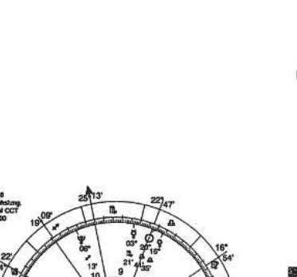

## 天王星在第七宫
婚姻存在不稳定的关系，有分离异的可能。

## 海王星在第七宫
真情的流露，理想参杂着暧昧与困扰，婚姻潜藏的危机。

## 冥王星在第七宫
过分的想据掌控对方，造成双方面部皮累不堪或彻底的改变。

男命多次婚姻（图六）：出生时间一九五五年七月三十一日晚上十点。海王星在第七宫，受到水星、金星、天王星相刑，喜欢追求新鲜刺激的感觉，情感的突然到来，背后却隐藏个人喜好自由，不喜受束缚的强烈需求造成婚姻的混乱，互相不能信任，关系暧昧，饱受感情困扰。

他的感情走向和婚姻经历是这样的：一九七四年，闹难起舞，春光乍现。一九七五年，龙醒于渊，屈得以伸，是年结婚。一九八○年岁末因故辞职离婚，之后竟弄假成真。一九八二年再续良缘，一九八四年又离婚结婚。

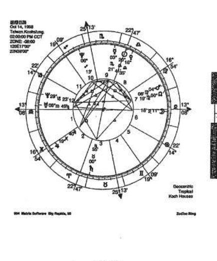

（图五）

## 行星在第八宫的特质

### 太阳在第八宫
关心玄学、死亡、性方面的事，遗产与从事公共财务有关。

### 月亮在第八宫
直觉的感受灵魂现象和神秘世界的关心，容易感性的处理财务。

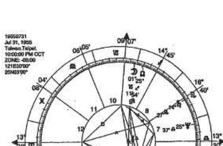

真，一九八二年再续良缘，一九八四年又离婚，一九八五年初，柳暗花明又一春，二度结婚。

### 太阳在第八宫
关心玄学、死亡、性方面的事，遗产与从事公共财务有关。

### 月亮在第八宫
直觉的感受灵魂现象和神秘世界的关心，容易感性的处理财务。

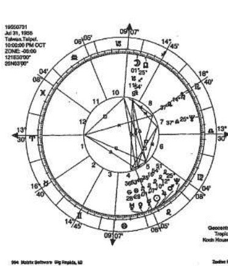

（图六）

### 水星在第八宫
神秘性的心智思维，见解有透视力，生意头脑。

### 金星在第八宫
朋友与合伙财力支援，或婚姻、遗产中受益。

### 火星在第八宫
展现在神秘事务，和开业经营的高度兴趣。

### 木星在第八宫
扩张商业才能并带来利益，继承财产。

### 土星在第八宫
理财必须特别谨慎，投资、借贷容易吃亏。

### 天王星在第八宫
特别的财路，合伙或配偶财务方面的问题。

### 海王星在第八宫
直觉力、想像力提升，商业经营理念比较抽象。

### 冥王星在第八宫
神秘学的感应潜能，善于资金调度运用。

## 行星在第九宫的特质

### 太阳在第九宫
喜好高深学问，着重精神层面，新鲜的事物，异乡情调。

### 月亮在第九宫
善于研究探讨，深入历史或冷门学问，经常漂泊在外。

### 水星在第九宫
喜欢学习、深思、旅行、研究教育、哲学、外国文化。

### 金星在第九宫
接触高级文化层面的事务，异国他乡的恋情。

### 火星在第九宫
冒险、旅游、运动员的好位置，冲动争执与法律诉讼。

### 木星在第九宫
喜好外国语文能力及出外旅游机会，出版与文化界的往来。

### 土星在第九宫
深沉或严肃的思考，长期旅游容易受限。

### 天王星在第九宫
旅游的奇遇或意外，爱好新奇，领悟力强。

### 海王星在第九宫
宗教哲学的领悟或玄秘的感应力，迷恋异国风情。

### 冥王星在第九宫
极端追求真理，观念执着，亦有思想人生观整个崭新的改变。

## 行星在第十宫的特质

### 太阳在第十宫
有领导能力，热衷个人成就与名声，事业开启得早。

### 月亮在第十宫
深层情感的需求结合在事业上，极适于领导者的高级幕僚。

### 水星在第十宫
教育、文化、写作、旅游、新闻、推销等，运用智力及口才。

### 金星在第十宫
金融、艺术和休闲娱乐关联的事业，女人的缘份与财运。

### 火星在第十宫
强烈的事业心，喜占上峰不服输，与上司意见不一，常争执。

### 木星在第十宫
乐观自信，事业比较稳定，多逢贵人。

### 土星在第十宫
来自家庭、事业上的压力，要逐步克服困难，长久经营可获成功。

### 天王星在第十宫
事业理想与发挥创意，家庭、事业突然多变动。

### 海王星在第十宫
艺术与灵性，慈善感性，理想境界，家庭多变动，模糊不定的目标。
一位女星的星图（图七），出生不久，父母就离异，而且父母都不要她，被一对结婚多年膝下仍虚的夫妇所收养。生父母是一对小贫穷，并没有正式的结婚，因此她应该算是私生女。土星、海王星在第十宫近顶点，从小就感受来自家庭上的变动。

### 冥王星在第十宫
权力的追求执着，强力的领导，明显独断的性质，观察入微。

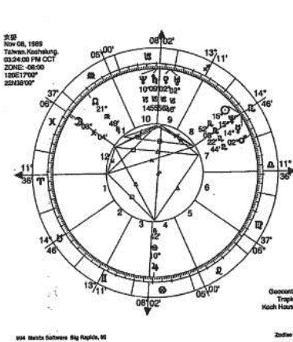

（图七）

## 行星在第十一宫的特质

### 太阳在第十一宫
交游广阔，着重在人际交往、社会关系，带动社团活动。

### 月亮在第十一宫
关心社交活动并成为生活的一部分，可藉由人们的肯定获得安全感。

### 水星在第十一宫
理性与沟通的组合，结识各方不同人士，收集全方位资讯。

### 金星在第十一宫
善交际协调，关系良好，社会资源与群体朋友多。

### 火星在第十一宫
积极的行动力投入团队中，热忱助人，也容易得罪人。

### 木星在第十一宫
人缘极佳，交游广泛，出外远贵。

### 土星在第十一宫
不善于社交场合周旋，朋友少，结交年长者能得助益。

### 天王星在第十一宫
参与特殊性的团体获得乐趣，突然的相识甚欢，也容易失去朋友。

### 海王星在第十一宫
在社会团体中有吸引人的魅力，牺牲奉献，暧昧不明，过分理想化。

### 冥王星在第十一宫
欲求改革，秘密的约定行事，因于利合，于利分。

## 行星在第十二宫的特质

### 太阳在第十二宫
重视心灵感受，呈现隐密的特质，适合医疗或幕后工作。

### 月亮在第十二宫
隐藏性的感情与情绪，宗教、慈善、社会福利工作，心理上需要隐遁。

### 水星在第十二宫
隐密、静态的思考模式，玄学、宗教方面的思绪。

### 金星在第十二宫
发挥柔性的心灵美感，秘密的恋情，隐密的感情问题。

### 火星在第十二宫
探究神秘的兴趣，隐藏的敌人，突发的危险。

### 木星在第十二宫
精神层次提升，神秘主义的吸引，暗中贵人相助。

### 土星在第十二宫
心灵上常觉孤独，潜意识深陷的忧虑、悲观。

### 天王星在第十二宫
潜在隐藏的变动性，发掘别人的秘密，意外灾害。

### 海王星在第十二宫
丰富的感情，灵感、幻想、预知力，模糊不清。

### 冥王星在第十二宫
行动隐密，发挥潜在能力达成目的，感受神秘的境界。

## 天象观测缘起

中国的术数起源很早，天文学萌芽缘起于天象观测。古人认为宇宙事物的变化都是整体性的，任何单一的事件变化都会影响到其他事项的运作改变，自有人类以来，就与自然界有着密不可分的关联，早上太阳从东方升起，带来了大地一片光明，新的一天，在古代是人们开始出外觅食、捕鱼、打猎、采集编织，大地是人类赖以生存的场所，在整个大自然的生态环境里，动植物是人类生存所需的食物来源。早期的人类所面临的自然生态环境是非常恶劣的，一方面自然界广大的力量，使人类得以依赖，另一方面又要饱受大自然的风雨雷电、洪水、猛兽的袭击，经常会带来毁灭性的灾难。

对古人来说，上天是神秘而变化莫测的，四季交替的寒来暑往，风、雨、雷、电，天体中的日蚀、月蚀、月亮的阴晴圆缺，产生的月圆月缺，对大自然无法理解时尤令人引起遐想，自然界的一切现象与人们的社会生活息息相关，人们对自然界神奇的力量存有神秘感，认为一切的现象都有一个主宰者，于是想像着应该就是由于神灵在操纵着这一切。因此产生了对日、月、星辰、风、雨、雷、电等天体、天象的研究。中国天文学是从敬天的宗教信仰中产生的。这是人类对自然界的第一个感觉，也是世界各民族皆普遍存在着对天地、日神、月神的崇拜。

面对变幻莫测而又不可抗拒的自然现象，人们认为是有一股神秘的力量在主宰，这种神秘的力量也就是原始宗教信仰的观念，人们也意识到天象星辰的变化与人类生活密切的关系，在帝尧时已设置专门观察天象和时令的官员。

> 《尚书·尧典》曰：“乃命羲和，钦若昊天，历象日月星辰，敬授人时。”
> 《舜典》：“在璇玑、玉衡，以齐七政。”

尧曾派人到当时认为很远的旸谷、南交、昧谷、幽都观察鸟、火、虚、昴四恒星在黄昏时的天象，用以确定一年三百六十五天和四季的变化。这时是以干支记日，以月亮的朔望周期纪月，四季的太阳变化纪年，并用闰月来调整年月日之间的分配关系。当时已经测定春分、夏至、秋分、冬至，认识到南方热、北方冷、冬天日短、夏天日长的自然现象。

根据草木鸟兽的物候现象，以及天文现象来作为农耕、收割、蚕桑、畜牧等农事活动的依据。古代的生产力不发达，农业生产的成败，主要是取决于季节和天候的变化，以及各种地理因素的影响。因此，在民间的信仰中，对于天地的信仰占有重要的地位。

## 百家争鸣的时期

春秋战国是我国文化大变革时期。在这时期，诸子百家争鸣，宣扬天命论，和反天命论的争执，包括天文学在内的科学技术的发展，产生了深刻影响。中国古代天文学在春秋战国时期，初步建立了自己的独立体系。天文观测资料的积累，人们逐步认识了天体运行的一定规律，产生了对宇宙缘起、结构和变化的推测，出现了关于宇宙的各种理论。各种思想与流派的不同，一方面也反映出不同的政治主张上的差异，另一方面，也给后世宇宙论的发展予以一定的基础。

春秋前半期，以殷正（比冬至正月迟一个月）为岁首，闰月置于岁末。六月和置闰法都没有统一规则，这说明当时还没有固定的历法。春秋中叶（鲁文公、宣公时代）以后，以周正（冬至正月）为岁首。春秋战国时期太阳、月亮及五星的研究，已经相当的深入，二十八宿和天体的测量工作更趋于成熟，有丰富的日月食記事、彗星、流星、陨石等記事。

在《庄子·天运篇》和《楚辞·天问》中，都提出有关天文的问题，如宇宙的构造是怎样的？天体是如何运动的？天地是如何生成的？为了解答这些问题，就产生了整天说和天地起源的思想。

战国晚期，在诸子百家中比较后起的邹衍一派学者，为迎合当时一些统治者的意图，以阴阳五行学说与政治上的争王图霸、改朝换代结合在一起，制造出所谓的“五德终始”学说，每一朝代的天子一定是得到五行中的一德，而上天也会显示出相应的符瑞，这一朝代衰退了，就会有在五行当中另一德的王朝取而代之，而后者的德也一定要胜过前一朝的德，如土克水，火克金之类。例如：土为黄色，得土德的朝代就会有黄龙出现。

《吕氏春秋·应同篇》里所载，各应德帝王的受命之符是：
黄帝（土德），天先见大螾大螾。
夏禹（木德），天先见草木秋冬不杀。
商汤（金德），天先见金刃生于水。
周文王（火德），天先见火，赤鸟衔丹书集于周社。

黄帝应土德而王，所以他的受命之符是大螾大螾；蚯蚓螾姑是土中的动物，这代表着“土气胜”。夏禹应木德而王，所以他的受命之符是草木秋冬不杀；草木于秋冬本应枯死的，而不枯死，这代表着“木气胜”。商汤应金德而王，所以他的受命之符是金刃生于水；水中出金刃，这代表着“金气胜”。周文王应火德而王，所以他的受命之符是赤鸟衔丹书集于周社；赤鸟丹书都是赤色，而火色赤，这代表着“火气胜”。

依五德终始说，新朝代的帝王，于受命即位应事则金：文王，其色尚赤，其事则火，以及代替周的秦，其色尚黑，其事则水。总上所述，受命的帝王不能因袭前代之制，这是一个新的朝代，与前代不同，一方面也是听信邹衍学说的人认为秦得水德而有天下正。此派的学者在宣扬这套理论时，常常透过各种的取代者制造舆论达成政治上的目的，邹衍的学说在中国古代天文观测和研究帝王与方士们的关系上，起了十分有效的推动地认识的发展与传播。西元前二二一年秦始皇并吞六国，结束了诸侯割据的局面，建立起历史上第一个中央集权的专制主义国家。秦始皇灭六国登上皇帝宝座不久，一次就实施：秦废除封建制，建立郡县制，分全国为三十六郡，统一文字和车轨，修筑长城、驰道，统一度量衡，焚书坑儒，造成千古以来受后人的非议。

秦汉时代，阴阳五行之说盛行，许多的方士鼓吹“不死之方”，促成长生之术和神仙术大行其道，皇帝能够达到千秋万世，追求长驻世间，永享帝王极心仪，广求仙药，认为成为神仙才是最高理想。史不绝书。“上有好者，下必有甚者焉”，民间也大肆效尤。

秦始皇灭六国登上皇帝宝座不久，一次就派徐福、卢生、韩终等方士入海寻找仙药，其后又遣使燕人卢生、韩终等方士入海寻找仙药，或去而不返，或为求利之辈，大怒，遂抓在京的儒生方士数百人，不问青红皂白，坑杀之，这就是历史上著名的“焚书坑儒”事件。

继起的汉皇朝神权迷信从汉高祖起，代代相传，到汉武帝时，更发展到了高峰。这是因为在那个朝代制造舆论，更重要的是为了以神权强化皇权。

## 依五德終始說，新朝的帝王，於受命即位之後，便須實行改制。（由《呂氏春秋·應同篇》所述：黃帝其色尚黃，其事則土；禹，其色尚青，其事則木；湯，其色尚白，其事則金；文王，其色尚赤，其事則火。以及代周而起者其色尚黑，其事則水。）

總上所述，則受命的帝王不能因襲前代之制，而必須有所改制，以表示順應天意，這是一個新的朝代，與前代不同，一方面也是為了表彰自己的功業。

鄒衍學說的人認為秦得水德而有天下，服色宜黑，應以十月為歲首，即所謂周正。此派的學者在宣揚這套理論時，常常透過各種法則暗示周德已衰，實際上也是為它的取代者製造輿論達成政治上的目的，鄒衍的學說在當時很流行。

西元前二二一年秦始皇併吞六國，結束了諸侯長期割據分裂的局面，統一中國，建立起歷史上第一個中央集權的專制主義國家。秦始皇當權，在許多方面採取了一系列措施；秦廢除封建制，建立郡縣制，分全國為三十六郡縣，收兵器，進一步統一貨幣和度量衡，統一文字和車軌，修築長城、馳道，發展交通，使經濟和文化的交流暢通全國，也十分有效地推動地理知識的發展與傳播。西元前二一三年，秦始皇採用李斯的建議焚書坑儒，造成千古以來受後人的非議。

秦漢時代，陰陽五行之說盛行，許多的方士遊走於帝王和士大夫之間，販賣其所謂「不死之方」，促成延命之術和神仙術大行其道，有許多的帝王在功成名遂之後，欲求皇權能夠達到千秋萬世，追求長駐世間，永享富貴，優遊於仙山樓閣之中，對於神仙之術極心嚮往，廣求仙藥，認為成為神仙才是人生的最高境界，歷代帝王熱衷於求仙的史不絕書。「上有好者，下必有甚者焉」，民間自此對於神仙的傳說不絕如縷，數說不盡。在中國古代天文觀測和研究常與方士們的一些幻術神仙思想參雜。

秦始皇滅六國登上皇帝寶座不久，一次就遣徐福率童男童女數千人入東海求仙藥，其後又遣使人盧生、韓眾等方士入海尋找仙人和不死仙藥，數年間勞師動眾，屢派大隊人馬廣求仙藥，或去而不返，或為徒利之輩所竊，結果終不可得，始皇失望之餘轉而大怒，遂抓在京的儒生方士數百人，不問青紅皂白「坑」以洩恨，造成歷史上的「坑儒」事件。

繼起的漢皇朝神權迷信從漢高祖起，代代都有發展，漢朝皇帝求仙之心更切，特別到漢武帝時，更發展到了高峰。這是因為在那個時候，宣揚神權的作用已不僅僅是為改朝換代製造輿論，更重要的是為了以神權強化皇權，永保皇權，通過神化皇權加強思想統治。漢武帝聽說昔日黃帝騎龍升天而去，心極嚮往，不僅派大隊船隻入海求取仙藥，還下令在沿海一帶造了許多金碧輝煌的望仙樓，年年親自東巡，宿留海邊，以各式各樣的焚香禱告，企圖招來神仙授予不死仙藥。

## 漢武帝獨崇儒術

早期儒家的只關心人事綱常倫理，雖有助於安定當時的社會秩序，但卻不能滿足統治者為鞏固政權尋找神學為依據的需求。被稱為「漢代孔子」的董仲舒，以儒家的政治倫理思想為基礎與「陰陽五行」的說法相融合，提出一套「天人感應」的理論，論證君權神授與封建統治秩序的永恆性，深受漢武帝的賞識，從而為儒學取得了定於正統思想的地位。因此，漢代統治者的尊儒，與儒生們把儒學神化的活動，都是與神化皇權的政治目的相契合。

漢代的統治者為尋找一種鞏固其政權的思想武器，確是煞費苦心，強調無為，實行黃老政治。道家思想得勢，經過數十年屢敗的政治教訓，儒學超越道家被定於一尊。但當時被定於一尊的儒學，實質上已非先秦的早期儒學，而是與陰陽家結合起來，神學化了的儒學。鄒衍一派的陰陽五行學說，自戰國晚期成為「顯學」後，發展至漢代，其影響更為廣大。

> 《史記·日者列傳》記曰：「孝武帝時，聚會占家問之，某日可取婦乎？五行家曰可，堪輿家曰不可，建除家曰不吉，……」

史記裡的記載還表明漢代時的堪輿家不僅僅占卜建築的吉凶，亦占卜其他的各種活動。但對建築活動的吉凶判斷佔據了堪輿術的很大部分，所以堪輿逐漸也就成為風水的代名詞。

戰國至西漢前期，是方士最活躍的時候，我國古代方士，不管他的所處的地位高下，方術造詣如何，總一定要對天文氣象作觀測和研究，因為當時必須對士大夫階級以至於帝王解釋和作預測，從郡國以至天下所發生的天文氣象代表的是什麼？所轄屬各地的災變、祥瑞占驗必須作預測和說明，尤其極重視日、月蝕的預測，沒有天文氣象方面的知識就不可能勝任這個工作。

方士們強調天人感應思想，他們試圖從天道自然和人間帝王權力、社會現象聯繫起來，尋找當中的規律性，進行觀測天體的變化和自然現象研究，掌握了規律性以便為人類造福，作出某些準確的預測招來顧客，廣收信徒，逐漸的佔據社會思想舞台，影響所及，甚至及於上層社會士大夫階級，常作為統治者所使用的工具，另一方面，他們又在宣揚天人合一，天人感應，把自然現象與社會現象拉扯在一起，天文現象與神權組合同時又帶有濃厚迷信色彩的一個矛盾又科學的體系，自古帝王為了鞏固君權，也樂於和方士們連成一氣。方士促成天文科學的發展，同時也阻礙了科技文明的正常發展。

人類不斷在嘗試著了解世界宇宙的起源以及最後的命運，人與神以及與自然界的關係，生死間的大事。然而，人的內心深處卻永遠蘊藏著永無休止的欲望，人們常認為在無法達成渴求的世間權勢慾望，不能夠所欲為，任運而行，即喪失了自在無為的真實自我。

## 現代命理玄學現象

中國傳統五術命理中，老祖宗所留下的智慧財產，歷經長久歲月的考驗、印證，流傳比較廣的八字、紫微斗數，對人的天賦、個性、長相、特徵，以及個人的心理層面，敘述得淋漓盡致，有人往往認為冥冥之中上天註定的，不可變的，也是人力難以違抗的「命運」。也有人明明知道命運常常捉弄人，卻毫不畏縮的一直與命運相抗衡。

過去學理者，有許多是為了糊一口飯吃，刻意把命理表現出神秘感，經由歷史小說筆記的渲染下，神權統治的政治環境下，命理常與政治、神權、君王神授等類似神話故事相緊密結合，在古代交通不便，資訊不發達，視野受到局限，民智未開的情形下，與迷信密不可分，天機不可洩露，不可言喻的感覺。

在科學文明的今天，人們知識水準提高，民智大開，應該是可以破除迷信，將玄學術數導入正軌，可惜的是，目前宗教界迷信神祕與靈異現象不僅沒有沒落下去，反而有日益蓬勃發展的趨勢，在台灣當前這股靈異的熱潮一波接著一波，從士大夫階級一直到升斗小民，以及許多高級知識份子亦無倖免的趨之若狂。許多民眾根本喪失了認知的原則，各種假借神識法力惑眾的風氣，吸引著無知者去滿足他們內心的渴求與脆弱的一面，人們心靈的空洞無依傍徨，也正好是這些靈異現象乘虛而入的最佳時機。

台灣目前正是邁向文明理性社會的正面發展，威權政治的解體，對舊有的價值體系進行改革與批判，社會秩序還未建立的情況，就如歷史上的南北朝，這是社會轉型的正常規律情況，在轉型的過渡時期，政治文化與社會形態以及種種國家意志不確定的情形下，台灣社會上又缺乏之客觀而公正的價值判斷標準，知識與理性無法落實的統御人心，在這等待重建的時刻，造成人心的浮動，民眾無法預測國家的走向形勢，自身往後的未來走勢，存在朝不保夕的疑慮。

人們心中處處充滿危機意識，心靈的脆弱與不安，對於無法掌握的未來事物只有茫然的，只要社會上有各層面稍微異常的跡象，無不引起人們的好奇和關切，惶恐不安努力去尋求心靈的解脫。

有些不明就裡大眾媒體被有心的投機人士利用，甚至於是在宗教界、五術被稱之為「大師」的，對於靈異現象和纖維之術的炒作時而興，愈是超乎常情的事物，愈能引發民眾的注意力。日益蓬勃發展的結果，造成光怪陸離的社會現象，甚至於陷入怪力亂神的虛無世界，腐化了許多摸索的人心。

社會大眾如果能夠了解生命的本質，以及對於宗教玄學有正確的認知，至少會讓如今社會上掛羊頭賣狗肉的江湖技倆無所遁形，起碼能夠使台灣到處是天尊、神靈降世、活佛客薩滿街走的奇特現象減少一些，甚至於出現有法力超過佛陀，凌駕耶穌，天下各種「至高無上」的美名全往自己身上攬，卻也能夠招攬到大量無知信徒虔誠頂禮膜拜，獻上寶物、財產、土地供養。

當這些現象充斥市面的時候，有智之士遇到此種挑戰常是嗤之以鼻，或是劃清界限，避之唯恐不及，一般社會人士對於宗教迷信的分辨能力就極其有限。天文占星及術數都是人類在尋求了解自身，如何在立體世間達到更美好境界而發展出來的體系，試著在詮釋世界上的一切現象，物質能量的組成，如何運作？生命的現象，是從何開始？從何而去？過去的源流以及未來的流向又是如何？

占星學是一套比較具有普遍的公開化的實際運用法則，其實驗的方式有一定的法則原理，所得到的結果有一定的數據理則可循，因此所產生的知識也比較具有客觀性與普遍性，科學所產生出來的價值，可以很明確的標示出來，比較有公信力。

最近這十幾年來，電腦科技發達之賜，人們可以輕而易舉的從電腦中取得自己的占星命盤。因為取得容易，人們對自己命盤上所呈現的意義產生好奇，也就有了學習的興趣。現代人學習命理許多都不是為了去幫人論命，而是為了多認識自己，了解周遭接觸的人，以及個人的性向、人生命運的規劃。最重要的是藉由占星的推論，使人與人互相了解，建立良好人際關係，使社會更加的和諧。

## 占星流年的初步論斷

在我們的生活領域裡，那些範圍是我們自己能力所及的，而又有那些是被不可思議的力量所支配，是我們的能力範圍所不及，無可奈何的？可以說是自有人類以來一直存在的問題，因為在生活中在某一些層次以內，是可以經由個人的意向或計畫而努力的達成，這是屬於「理性方面的」，至於某一個限度就好像在冥冥之中有一股不可抗拒的力量，將我們的生活引導至另外一方面，在生活的領域裡，這是常會發生的事實，這是屬於「非理性方面的」，在這些現象當中，我們可能需要面對一些無可奈何的事，一般稱之為「命」或「運」，而這一股力量的影響對於個人的生活導向，或者是對整個團體生活的榮枯盛衰都有非常的關係。

歷史先賢用盡各種方法，付出很大的心血代價，想來闡明「命運」的本質，同時希望能夠把「命運」導向於對人類生活中最有利的方向。古往今來這「命運」的問題可以說是以種種不同的形式一直考察下來，有的是著重在探討實際的生活問題；有的是著重在神學上的探討；有的是當作自由意志的問題；有的是當作形而上的解脫境界問題；在從各種不同的社會文化背景，不同觀點不斷探索之下，乃各自提出相應的詮釋方式，於是就各有相對應的解答。

尤其是如祈禱、禁歌、神話、預言、八卦、斗數、八字、奇門、占星、仙術、佛道等，都是不斷的要將「命運」轉向有利的方向所想出來的方法，甚至於想要把「命運」提升到形而上的更高層次，如儒家思想的「天人合一」，道家的「無為」，禪宗的「解脫」，莊子的「逍遙」。

將「命運」這個問題從學術上來研究，當然是極其複雜而多歧，在問題的性質上研究起來會有許多的爭議性，乃至於最後的結論也很難有一致的認同，常常是導致各說各話，從另一層面來看，命運的特質可以說不能非常明確的判明其主體，自古而今歷經多樣化的各種詮釋，仍然沒有辦法能夠真正完全的解決，命運上的問題，要得到根本上的解決是幾乎不可能的事。可是，不管其困難程度如何，這個問題在學術上的研究，以及在面臨人生實際生活大方針的鑑定，任誰都有必要來了解一番，在生活中，有一些一定要受到環境命運的支配；而我們能夠支配自己命運的範圍也不少，所以關於此事，至少也要加以深思。

任何人一旦出生，誰也不能再去改變他的出生時間和出生地點，也就是中國人所說的生辰八字，而出生的時間就決定了一個人的基本命運和個性，在人生過程中，有的出生即大富大貴；有的生於太平盛世，一生無憂無慮；有的生於飢荒戰亂，顛沛流離；有的先貧後發；有的先富後貧；有勞苦一生，一事無成，終老林泉；有健康長壽；有英年早逝；有貧而長壽，勞苦一生，最後成功，光宗耀祖；有富貴雙全，吉凶禍福常因生長之「時」與「地」所局限，很難更改。

生辰是影響人類重要的因素之一，在古代先賢發現到凡一切蠢動含靈，草木飛走，有情、無情，亦皆有其命，在唐玄宗開元年間，李燈與畢老先生有一段的問答，摘錄如下：

> 「先生坐大覺寺，或指金剛令試之，以塑日為生，先生不視，御之，忽爐中風量火星墜地，先生起而言曰：『此寺不久人間，既旬灰於變火。』」
>
> 燈曰：「先生因金剛令知之乎？」
>
> 曰：「否，適火星自爐中下，若以此生辰之於人命，亦可見有些許不同，神像是靜態的，人是動態的，動態的變數不同，此人是懂得趨避之道，或許可以說事件有可能隨著時空的改變產生一些不同的變化。」

畢老先生從火星墜地觸機，或者經由金剛神像何時當毀於火，若以此生辰之於人命，亦可見有些許不同，神像是靜態的，人是動態的，動態的變數不同，此人是懂得趨避之道，或許可以說事件有可能隨著時空的改變產生一些不同的變化。

所以在有關人命的推斷，我們只能說可能會發生，而不是絕對的會發生，發生事件有可能隨著時空的改變產生一些不同的變化，如果一切都作宿命論來解釋，那命理也沒有什麼研究的價值了。

## 趨吉避凶之道

在既定的因緣下，如何使吉者增吉、凶者減凶，甚至能使凶的能轉化為吉的境界，怎樣才能趨吉避凶呢？這是一個非常重要的關鍵。例如：甫出生即於鳳凰之家，鳳凰為百鳥之王，又稱朱鳥，神靈之精，非梧桐不棲，非竹籽不食，非醴泉不飲，飛則群鳥從之，出則王政平，國有道，出生於此可謂善矣！鳳凰畢竟是稀有動物，少之又少，畢竟非人人都能幸運的生即為鳳凰。

若不幸生而為鼠，李斯曾說：「人之賢不肖，譬如鼠矣，在所自處矣！」「過街老鼠，人人喊打！」在街邊流浪的老鼠吃的是殘羹剩飯，住的是地下污水道，見到人就驚慌得四處竄逃，不得安寧；而在米倉裡的老鼠吃米多的吃不完，要多少就有多少，生活安逸，無憂無慮，所以擇吉而居是何等重要。

《孫子兵法》：「知己知彼，百戰百勝；不知己不知彼，每戰必殆。」瞬息萬變的社會，人生的戰場上只有真正的「知己」，瞭解自己專長的方向；「知彼」，再去瞭解別人，知人善用，將知己知彼，學非所用，懷才不遇，遇人不淑，人生再的錯失，埋沒一生以致處境淒涼，這也就是傳統的命理的推斷方式比較著重在事件發生免費，重點常在因果上尋求答案，往往直接接著時間來驗證。占卜特別著重在個性的分析，相對應的事件發生，從因果上來分析事情的發生。

回顧看自己或周遭認識的人在過去的歲月化與對環境事物的認知程度決定了命運的走向。孫多忤逆，自語刻薄的人漸漸的六親疏遠；斷的人錯失機會，性格偏激、陽怪的人德，當行則行，當止則止，謹守行事原則，才時常吸收新知識，探討自己性格上掌握機先，知道如何去適應環境，明辨凶之道。

許多人真心的願意幫助。

## 易武书屋

安逸，无忧无虑，所以择吉而居是何等重要。生而为凤凰者，如王者之风，既富而且贵矣！若不幸生为过街之鼠、茅厕之鼠，如何选择一条通往米仓的道路，变为米仓之鼠，终于找出一条进阶之路。

《孙子兵法》：“知己知彼，百战百胜；不知己不知彼，胜负各半；不知己不知彼，每战必殆。”瞬息万变的社会，生存竞争，适者生存，不适者败亡，在人生的战场上只有真正的“知己”，了解自己专长所在，人生方向焦点在哪里？走对了方向，“知彼”，再去了解别人，知人善用，量才取用，方可人尽其才。若是不知己不知彼，学非所用，怀才不遇，遇人不淑，人生的道路既受困又难行，浪费人生机会一再的错失，埋没一生以致处境凄凉，这也是不明时事，不了解自己。

传统的命理的推断方式比较着重在事件发生的结果，许多是标榜“铁口直断，不免费”，重点在果地上寻求答案，往往直接的论断结果会如何如何，推断之后就等时间来验证。占星特别着重在个性的分析，因为什么样的个性，所以容易产生什么样相对应的事件发生，从因地上来分析事情发生的可能原因。

回头看看自己或周遭认识的人在过去岁月所留下的轨迹，不难发现每个人个性的变化与对环境事物的认知程度决定了一生命运趋势的大半，损人利己的人到结果害了自己，见孙多忤逆。言语刻薄的人渐渐的六亲疏远又损寿，言语反复没有好友可以依靠，优柔寡断的人错失机会，性情激动、刚愎自用的人易遭奇祸。只有平常能尊重别人，行善积德，当行则行，当止则止，谨守行事原则，才能增加自己的福气，即使发生困难也会有许多贵人真心的愿意帮助。

时常吸收新知识，探讨自己性格上优缺所在，进而了解对方以及社会环境的变迁，掌握机先，知道如何去适应环境，明得失，知进退，促成绵延的好运，是为君子趋吉避凶之道。

## 占星流年推断

占星推流年的方法有许多种，本篇所用的是「Transit」，是推算当时天上实际的行星与本命盘行星所形成的相位关系来作为判断依据，为占星术中常用、准确度相当高的一种方法。初学者若没有尝试做过解说占星流年推测，可以从每年每月每日的过运法开始。行星过运法是需要正确的出生时间，在中国人的习惯，计时常用二小时一个单位，子、丑、寅、卯、辰……等十二个时辰计时，如果你的出生时间不太确定，就先需要作出出生时间的校正。如果只知道你的出生时辰，可以暂取其中，当然的取其时辰之中推论的准确度会有些许出入，如ASC与MC就必须待出生时间校正好之后再进行推论。

由于行星运行的速度不一，所以必须对于各行星的运行速度作一个了解。

### 各行星一天所行的速度如下：

- 太阳——一日行一度。
- 月亮——一日行十三度。
- 金星——一日行一度。
- 水星——一日行一度。
- 火星——一日行○.五度。
- 木星——一日行○.二度。
- 土星——一日行○.一度。

### 各行星每行一度所需的时间如下：

- 太阳——行一度大约一日；三十日行一宫。
- 月亮——行一度大约二小时；二.五日行一宫。
- 金星——行一度大约一日；三十日行一宫。
- 水星——行一度大约一日；三十日行一宫。
- 火星——行一度大约二日；六十日行一宫。
- 木星——行一度大约十二日；三百六十日行一宫。
- 土星——行一度大约二十七日；二年三个月行一宫。
- 天王星——一年大约行四度；七年行一宫。
- 海王星——一年大约行二度；十五年行一宫。
- 冥王星——一年大约行一.五度；二十年行一宫。

在运用流年推断时，根据星历表算出当时行星的位置，求出各行星位置之后，就将这些行星的位置记入出生图的外圈，计算精确的相位关系和流年行星所经过的宫位，以及它所影响的层面。

行星运行的快慢不一，所影响的时效自然不同，例如：
太阳、金星、水星行一度大约一日，可以作为「流月」「流日」「流时」吉凶的推断。
月亮行一度大约一个时辰，可以作为「流日」「流时」吉凶的推断。

木星行一度大约十二日，一年行一宫；土星行一度大约二十七日，二年三个月行一宫，木星和土星可以作为「流年」吉凶的推断。
另外三王星运行的速度更慢，形成相位时所产生的影响力会更久，可以作大运的推断。

乍看起来似乎是很复杂，其实只要经过几次的演练很快的就能够熟，例如太阳行一度大约一日，三十日行黄道十二宫的一个宫位，等于就是一个月走一宫，一月二十一日左右从宝瓶座零度开始，二月二十一日到双鱼座，三月二十一日到牡羊座。木星大约一年行一个宫位，常与地支六合有关，如子年，子丑合，木星大致是在丑宫（摩羯座），如丑年，子丑合，木星大致是在子宫（宝瓶座），寅年，寅亥合，木星大致是在亥宫（双鱼座）。这些只是大致上的行星位置，实际上的精确度数还是要查星历表准确。

## 【流年相位分析】

所谓的「相位」，就是行星与行星之间所形成的角度，如0度、60度、90度、120度、150度、180度等。其实星与星之间不一定要形成过度巧妙的角度数才会发生感应，而是接近于这些角度可以有容许的宽减度，主相位的宽减度在八度左右，次相位的宽减度在二至四度左右，只要接近这些角度之内，就会有某种影响的作用发生。

例如：行星与行星之间只要其互相的角度在八度以内，就会当成合相（0度）；行星互相的角度在一七二至一八八度以内就当成对相（一八0度）；0度的相位称为合相。六0度、一二0度的相位为吉相位。四五度、九0度、一五0度、一八0度的相位称为凶相。0度、六0度、一二0度的宽减度为八度。九0度的宽减度为四五度，一五0度的宽减度为二度。

在本命盘里行星、星座、宫位以及相位之间的相互影响下，表现出人事上各种的可能状况，初步的推断要注意本命盘里面刑冲最多的行星宫位，如果遇到流年行星凶相位的引动，比较容易出问题的地方，要特别注意检查本命盘配合流年行星木星、土星之间的相互关系。

石门水库在满水位，大量泄洪之时，如果有人想站立在正前方做「中流砥柱」的话，即使选择再好的流年，结果一定是抵不住的。诸葛孔明在於五丈原，有一世的英才，却无力回天，如果在水势稍为缓和之时，时节因缘适合的时候，用四两拨千斤的方法轻轻一拨就能扭转乾坤，这也就是善於运用个人本命上自具有的，使其能量发挥到淋漓尽致。而流年位置的变化就是选择时节因缘最好的参考资料。

以开创事业来说，需要财力、物力、精力和许多条件的组合，如果在各方面的条件都很欠缺，个人本命盘的分析又不适合这类的行业，并不是光是靠一个优良的流年盘就能扭转乾坤。因此，不论是创业或者是流年上的一些事项，本命盘的考量是很重要的，如果本命盘产生刑冲很严重的现象，而流年盘也是存在着许多不利的变数，这种潜藏的危机，是很难去克服的，当然的，审明时势，急流勇退，等待再一次的时机，谨慎而后再动，也可以令人先立於不败之地。

命运的变数受到许多条件的限制，本命盘以及流年等等的推演，至於国家、社会、政治各层面的许多动向仍需作为行事的参考依据，判断个人的气势只能在流年盘的考量上尽量取其吉，其作用能使本命盘上的凶兆能有所缓和，吉兆能增加。

适当的选择运用流年与流月盘以及流日的各种变化参数，对于本命盘上的凶兆以及先天上某些不足的条件是有化解的作用，但是，没有人能够保证能完全化解，并不是一个好的流年运势就能保证事情一定成功，还是有需要在个人的人格特质和处事方针，客观环境作为辅佐，所以，人为因素的考量和流年的时势互相的搭配才能使个人本命所具有的吉兆发挥到最高境界。

大抵人的气势处境，完全显於顺境，一切皆吉者一生难得，多岁月，绝对属於逆境，毫无回环余地者亦几稀。人生总是在吉中藏凶，凶中隐吉，山穷水尽疑无路，柳暗花明又一村，在吉凶参杂之中也就是人类发挥高度智慧去突破万难达到成功圆满的境地。

是故，如果一年主吉，亦非一年全然为吉；一月主吉，亦非一月全然为吉。可以说每月每日都有可能关系到个人气数机运的一个变数，善於运用个人所具有的机运变数，必然能在人生旅途上，人与人之间的关系，处理各种事务，财运，利益得失之间，作一个适当的调整，个人的智慧才能提升到理想的境界。

善用流年的作用使个人随时保持在机动的状态下见机行事，首先就是要让自己能先立於不败之地。虽然生命的长度不是你所能决定的，但是可以控制它的宽度，在你不能左右天气的风雨阴晴，但是可以改变你的心情；不能改变你的容貌，但是可以展现笑容；不能完全的控制他人，但是可以充分的掌握自己，事事尽心尽力，争取胜利的果实。预知明天，利用今天，以静制动，或以动制静，宇宙在手，变化由心。数往知来，趋吉避凶，就在个人心神领悟。

## 流年初步论断实例

列举的第一个例子是经由事业经营不善，投资失败潜逃的案例。

### ※例一（图八）：

一九四九年十一月六日晚上八点出生，一九七六年丙辰流年，经营咖啡厅的生意，倒闭潜逃。在这一年正当流年（Transit）木星行经金牛座（西宫）刑本命的冥王星，冥王星是在本命第三宫的宫头附近，交通广阔，花费不知节制。流年（Transit）的土星进入本命的第二宫，第二宫是掌管财务方面的宫位。土星进入若不知道开源节流，在财务的调度容易产生困难，入少出多，后面又没有财力支持，以致於造成困境，最后倒闭。
结束营业之后不敢面对现实，负债潜逃。在本命盘里，日月是形成对相（一八0度），在人格上就常会产生矛盾的现象，外在的行为与内在的情感是比较难以达到协调，常见的原因是父母感情不好、离异、或有一方因故分开，在亲子间的沟通困难，容易有代沟出现，情绪宣泄的管道受阻。

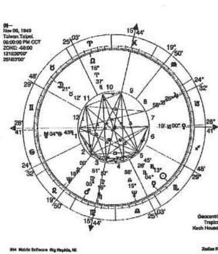

（图八）

命度双子座，充满好奇心的人，聪明灵活的思考，学习能力领悟。消息是非常灵通的，颇能获得人缘，似乎显得年轻和活力。日月与冥王星形成「T-Square」（三刑会冲），在发挥开发才能之外，又一方面喜欢探索人生神秘潜在的一股力量，来平衡在内心中不喜欢向人表露的不安与矛盾。天王在命宫天王星与水星形成三分相位（一二0度），革新和开发的精神，有属于自己的主张，不会随意附和人，也不愿意随波逐流，或者随意的奉承人，别人对自己的奉承也不一定接受，呈现自己独特与众不同的作风。一九七六年，流年的木星、土星相继进入三刑会冲其中的二个顶点，流年行星刺激了本命盘最不协调的地方，此时的财务发生困难，心境极为矛盾丛生，最后他没有选择面对现实，是运用「三十六计」，走上策。

在本命盘上金星落入第七宫，木星落入第八宫，占星的二大吉星分别落入的二个宫位与合夥人或者与配偶有关，可以从事业上的合夥人获得利益，若以配偶的名义开店，或有适当能力的合夥人一起创业比较适合。土星与月亮形成三分相位，房地产、建筑有关的行业是非常适合的。金星与火星的三分相位代表合夥事业上能够获得利益，不过金星与天王星的相位及太阳与冥王星形成的相位，有浪费的倾向，花钱必须加以节制，若能朝着这些比较有利的方向进行，待吉利的流年与合夥人配合运作，成功的机会比较多。

竞争激烈的现实社会里，学会耐心的等待时机，对于任何人，尤其是初创业的年轻人无疑的是非常重要。《易经》：「乾卦九三，君子终日乾乾，夕惕若，厉，无咎。」时机未到，各种客观条件尚未成熟的时候，必须朝乾夕惕，戒惧恐惧，正心诚意，进德修业，「进德」就是日新其德行，「修业」就是求取新知识，所以虽危而无咎。成功固然要等待时机，但更难能可贵的是锲而不舍的进取，充实自己，为自己创造时机，否则即便机会到来也会失之交臂。学会在等待的当中累积经验和知识，培养成成熟稳重的创业风格，对年轻人来说是非常重要的。

在时机的来临时仍然消极无为，这种人是最愚蠢的，机运伴着时间而来，也会随着时间而消逝，如果不牢牢的将它抓住，那它将和时间一起从你的指间巧妙的滑过，留下的只是无限的怅惘和遗憾。

> 《易经》：「乾卦九五：飞龙在天，利见大人。」何谓也？子曰：「同声相应，同气相求，水流湿，火就燥，云从龙，风从虎，圣人作而万物睹，本乎天者亲上，本乎地者亲下，则各从其类也。」

乾之九五说明了在机会来到之时，也是人力、物力、财力、智慧皆备中之时，主动出击，发挥平常进德修业所累积的知识和经验，展露才华，自然水到渠成。以下列举的二个例子是在流年运势中走到人生的幸运时机开始创业而成的案例。

### ※例二（图九）：

一、出生于一九四二年十一月二十三日下午四点。
二、自高中毕业后，一九六六年以前生活清苦。一九六七年，丁未流年，经营成衣，大发利市。
三、土星在第二宫双子座会合天王星、月亮，理财的方式比较保守，钱财的积聚是埋头苦干，一点一滴慢慢累积起来的。点子多，有商业头脑，金星为命主星，家庭环境的品味，赚钱的欲望很浓厚。命度白羊座初度。流年木星回归到本命盘的星及本命盘的木星形成三分相位，这是一个很大的转换点，神思不定的寻寻觅觅，加上大胆的行动，主要的架构已经建立。

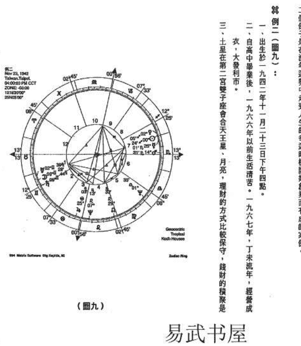

四、一九六七年三月，丁未（流年）木星进入本命盘的第二宫，财务方面有进财的迹象。

### ※例三（图十）：

一、出生于一九二七年七月二十四日下午四点。
二、一九七〇年，岁次庚戌，四十三岁开始创业。
三、立命摩羯座，以土为命主星，第十一宫。

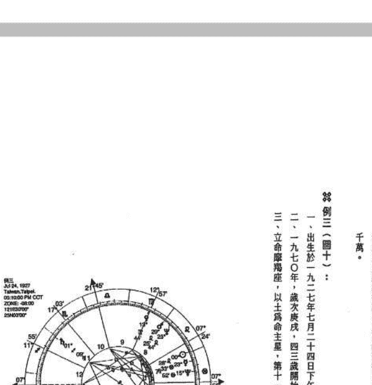

埋頭苦幹，一點一滴慢慢累積起來的，不會想一步登天，走捷徑。很有賺錢的點子多，有商業頭腦。金星為命主星，與木星形成三分相位，重視物質生活，家庭環境的品味，賺錢的慾望很強厚，渴望獲得錢財以改善生活品質。

四、一九六七年三月，Taurus（流年）木星進入巨蟹座二四度，流年土星進入牡羊座初度。流年木星回歸到本命盤的木星，流年土星進入牡羊座初度與流年木星及本命盤的木星形成三分相位，這年吉相位的影響，風雲際會，是人生一個很大的轉捩點。神思不定的尋尋覓覓中，客觀情勢豁然明朗起來，細密的思考加上大膽的行動，主要的架構已經能作初步的掌控，在往後的十年間聚財數千萬。

### ※例三（圖十）：

- 一、出生於一九二七年七月二十四日下午五點。
- 二、一九七〇年，歲次庚戌，四三歲開始發跡。
- 三、立命摩羯座，以土星為命主星，第十一宮土星與第三宮木星、天王星、第七宮太陽成大三角形，大三角是由三組行星互成爲三分相位所構成，具有和諧順暢的影響力，這個相位對於意志堅強、行事穩重的人是好的相位，代表財富與幸福。本命盤有五顆行星落入火象星座，熟練、果斷、冒險犯難的精神，再加上命宮在摩羯座堅毅、沈穩的特質，具備有成功的基本要素。

四、木星、天王星於第三宮，善於處理外交處對方的事務，天王星的變異，結合木星的拓張，開創出自己的一片天地。九大行星裡，木星是其中最大的，天下之間惟大乃能容，木星有寬大的包容力，持續的擴張人脈關係，以及天王星善於分析思維靈變，在社交的場合裡讓人有一種智慧而清新的感覺，社交手腕的靈活，善於控制場面，是邁向事業成功的一個重要環節。

五、一九七○年，歲次庚戌起，流年木星經過本命盤的天頂（第十宮），與北交點形成三分相位；年底，流年土星與本命的土星會合，與本命的木星、太陽、天王星形成三分相位，流年土星與本命第八宮的金星成三分相位，與第七宮內的冥王星成六分相位。事在人爲，奉運的際遇是經驗、智慧與才華漸次的累積經營，並不是它憑空而來，在會聚極佳的人緣，銳氣十足掌握機會，經過理性的評估和正確的思惟規劃，是內心的理想達到實際兌現的時機。

# 易武书屋

# 第二卷

# 時事篇

# 波斯灣危機

> ……波斯灣再起風雲……

一九九一年波斯灣戰爭之後，美國和伊拉克之間的緊張關係時常升級。一九九三年，美國以報復伊拉克策劃暗殺美國前總統布希為由，對伊拉克發動導彈襲擊。一九九八年，美國和英國再次對伊拉克發動軍事行動，名為「沙漠之狐」。一九九八年十一月，聯合國武器核查小組在伊拉克的核查工作受阻，美國和英國威脅對伊拉克發動軍事打擊。一九九八年十二月，美國和英國對伊拉克發動了為期四天的軍事行動，名為「沙漠之狐」。一九九九年，伊拉克拒絕接受聯合國武器核查小組的核查工作，美國和英國再次威脅對伊拉克發動軍事打擊。二零零一年，美國發生九一一恐怖襲擊事件，美國總統布希將伊拉克列為「邪惡軸心」國家之一。二零零三年，美國和英國以伊拉克擁有大規模殺傷性武器為由，對伊拉克發動軍事行動，推翻了薩達姆政權。二零零三年之後，伊拉克陷入長期的動盪和暴力衝突之中。

美國官員在考慮之後表示，伊拉克的舉動是不可接受的。美國國務卿鮑威爾表示：「我們不會容忍伊拉克的挑釁行為。」美國國防部長拉姆斯菲爾德表示：「我們已經做好了應對任何挑戰的準備。」美國總統布希表示：「我們將採取一切必要措施，保護美國和我們盟友的安全。」

伊拉克總統薩達姆表示：「伊拉克不會屈服於美國的壓力。」伊拉克副總統拉馬丹表示：「伊拉克已經做好了應對任何軍事打擊的準備。」伊拉克外交部長薩布里表示：「伊拉克願意與美國進行對話，但不會接受美國的最後通牒。」

聯合國秘書長安南表示：「我呼籲美國和伊拉克通過對話解決分歧，避免軍事衝突。」俄羅斯外交部長伊萬諾夫表示：「俄羅斯反對任何未經聯合國授權的軍事行動。」中國外交部發言人表示：「中國主張通過和平方式解決國際爭端，反對使用武力。」

# 波斯灣危機

## 波斯灣再起風雲

一九九一年波斯灣戰爭之後，美國和伊拉克每隔二、三年就再起風雲，濃濃的火藥味除波斯灣不時瀰漫在波斯灣地區，一九九三年美國以巡弋飛彈攻擊伊拉克情報機構，以報復伊拉克策劃暗殺美國前總統布希；一九九六年美國以戰斧飛彈攻擊巴格達的飛彈基地，制裁伊拉克入侵英國所保護的伊北庫德族；一九九八年初，伊拉克又拒絕聯合國武器安檢人員到海珊的多處住所檢查，波斯灣緊張情勢一度升高。

一九九八年十一月十六日聯合報載：最近伊拉克和美國的戰爭在一個即發之際，伊拉克又在最後一刻同意聯合國小組武器檢查，這似乎是海珊最近常用的伎倆，使美國疲於奔命，美國官員考量之後表示，伊拉克的舉動令人無法接受，因為信函附有書。美國總統柯林頓的國家安全顧問柏格說：「我們仍然做好採取軍事行動的準備。」

美國的戰艦和戰機原訂美東時間一九九八年十一月十四日晚上十點左右（台北時間十四日晚上十點左右）大舉對伊拉克發射飛彈，參與攻擊行動的有數百枚空射和海射巡弋飛彈，以及在美國航艦艾森豪號和駐守沙烏地阿拉伯、科威特、巴林等波斯灣國家的噴射戰鬥機和補給機等，但是在十一月十四日早上八點之前，事情有了轉機，柯林頓接獲消息，伊拉克總統海珊顯然已作出讓步，致函安理會，保證同意恢復武檢，八點三十分左右，柯林頓趕忙為攻擊行動叫停。伊拉克十四日按照美國和英國的要求，提出書面說明，已經攜帶巡弋飛彈升空的美國B五十二轟炸機臨時取消攻擊任務和原訂展開攻擊行動的時間僅相隔一小時。一名美國官員說：「僅是間不容髮。」他證實，轟炸機已經起飛，但及時被召回，好讓華盛頓當局考量伊拉克致聯合國安全理事會的信函。

海珊雖然仍受到一部分反美的阿拉伯人支持，但有不少的阿拉伯人對海珊時常使波斯灣地區瀕臨戰爭邊緣甚感不耐煩，許多人相信海珊打退堂鼓。

# 易武书屋

美國布希總統主政期間，海珊在一九九○年八月二日出兵併吞科威特，美國率領聯軍展開「沙漠風暴」行動，一九九一年二月二十八日停火，海珊在波斯灣戰爭中雖然戰敗，但他在國內的權力地位並未動搖，反而因為抵抗美國而聲望大增，他繼續在國內實行獨裁統治，並積極發展大規模殺傷性武器，包括核子、化學和生物武器，以對抗美國和以色列。

美國一直自認為是龍頭老大，身負維持國際秩序的重任，對於海珊的所作所為，一再的狀況頻出，伊拉克似乎改變以往的特別強硬作風，最近何伊拉克與美國的糾結如世仇般難分解，這壬、六爻卦預測美伊局勢，我們試著從占星的立伊拉克的國家星盤（圖十一），也就是伊拉克的國家星盤，三日上午六時正。伊拉克國旗的第十二宮有四顆的合相，命主星和第十宮的宮主星是水星，水星王星、壽星、生化武器、水星，物資運送，對外克製造具有強烈致命的生化武器，海王星所在也一九九八年一月，大限的月光推進到寶瓶座，幸有驚無險，伊拉克的人逃過一劫，而即刻真會恐怕是微乎其微。

# 伊拉克與美國的國盤

從伊拉克（圖十一）與美國（圖十二）的國和衝突，行星的偶然排列竟演變成一場難以避免

斯灣地區頻臨戰爭邊緣甚感不耐煩，許多人相信，缺乏阿拉伯國家強力的支持，也許迫使海珊打退堂鼓。

美國布希總統主政期間，海珊在一九九○年八月二日，強行入侵科威特，美國以軍事威脅、經濟制裁及外交談判，用盡各種施壓方式仍然無法有效的使伊拉克主動撤離科威特，海珊的強勢作風與美國的立場激烈衝突，一九九一年一月十六日二十八國參與的聯軍展開一連串對伊拉克轟炸，伊拉克損失慘重。一九九八年初以來，聯合國武器檢查小組的工作在伊拉克受阻，美國開始準備對伊拉克實施第二次打擊，柯林頓一再聲稱對伊拉克動武。

美國一直自認為是龍頭老大，負擔維持國際社會秩序與安定和平的使命，偏偏海珊一再的狀況頻出，伊拉克藏起來的生化武器和化學武器聯合國武檢人員根本無法悉數查出，海珊似乎改變以往的特別強硬的作風，最近常和聯合國武檢人員玩捉迷藏遊戲，為何伊拉克與美國的糾結如世仇般難分難解，這幾年間常有兩岸學者運用奇門遁甲、六壬、六爻對預測美伊局勢，我們試著從占星的立場來了解。

伊拉克的國家星盤（圖十一），也就是伊拉克成立的時間是在一九三二年八月二十三日上午六時正。伊拉克國盤的第十二宮有四顆星，火星、海王星的合相，水星、太陽的合相，命主星和第一宮的宮主星是水星，水星也在第十二宮內，火星、爆炸物質、海王星、毒品、生化武器、水星、物資運送、對外的資訊，第十二宮有陰謀的特徵，伊拉克製造具有強烈致命的生化武器，海王星所在的位置也有隱藏、欺瞞的性質，以及宗教狂熱。

一九九八年一月一次限的月亮推進到寶瓶座十三度，形成第二次的波斯灣危機，所幸有驚無險，伊拉克的人民逃過一劫，而即使真正發生戰爭，飛彈要命中海珊本人的機會恐怕是微乎其微。

# 伊拉克與美國的國盤衝突

從伊拉克（圖十一）與美國（圖十二）的國盤比較，可以發現明顯存在著許多矛盾和衝突，行星的偶然排列演變成一幕幕難以避免的對峙形態。

（一图）

（二图）

# 易武书屋

伊拉克獅子座十二度二八的火星與英國的分不穩定的關係，容易造成火爆的場面。

伊拉克牡羊座十九度○三的月亮與英國天受到土星的沖有被受制設限的感覺。

伊拉克的天王星與英國的天王星相刑，不只的能刑，都想改變對方順從自己。

伊拉克第一宮內的木星與英國第三宮內的較弱，透過邦交盟國居中協調應該可以找出化處。

波斯灣的情勢一直以來都十分複雜，歷史上的存有許多顧忌，泰半到整個中東地區的發展觀光事業，誰都不希望戰事再起，尤其受傷害可能蒙受傷亡的程度嚴重一直是英國當局擬定的

主要考量因素，五角大廈的高級官員甚至不願

根據傳言，伊拉克已經大量製造VX神經毒

言屬實，毒刑員的被使用則將會是一場浩劫，總統萊爾辛甚至語出驚人的說，如果美伊真的始！海珊若於藏匿，戰事再起他可以隱密在地底的和平及伊拉克人民的身家性命代價實在太

接著再看海珊的本命盤與美國國盤產生什麼

年四月二十八日上午八點十八分，兩者星盤產生

著自行解析。許多事件的發生往往不是單純的

客觀及多樣的層面，要進一步詳細分析，還有

星盤研究，柯林頓的命度在天秤座五度三○，

沖，怪不得海珊一直是柯林頓政府最感頭痛的

伊拉克獅子座十二度三八的火星與美國的天頂（MC）寶瓶座十三度二八對沖，十分不穩定的關係，容易造成火爆的場面。伊拉克牡羊座十九度○三的月亮與美國天秤座十四度四七的土星對沖，伊拉克月亮受到土星的沖有被受制設限的感覺。伊拉克的天王星與美國的天王星相刑，不易達成共識的相位，雙方都想突顯自己的能耐，都想改變對方順從自己。

伊拉克第一宮內的木星與美國第三宮內的水星形成六分相位，這個相位的力量是比較弱，透過邦交盟國居中協調應該可以找出化解的方式。波斯灣的情勢一直以來都十分複雜，歷史上許多冤仇，各國之間也各存有許多顧忌，牽涉到整個中東地區的發展，中東地區近來比較穩定，各國積極推動觀光事業，誰都不希望戰事再起，尤其受傷害最嚴重的是伊拉克無辜的百姓，平民百姓可能蒙受傷亡的程度嚴重，一直是美國當局擬定對伊拉克採取軍事攻擊行動計劃中的一個主要考慮因素，五角大廈的高級官員甚至不顧列出可能造成平民慘重傷亡的攻擊點。

根據傳言，伊拉克已經大量製造VX神經毒劑原料及炭疽桿菌的生化武器，如果傳言屬實，毒劑真的被使用則將會是一場浩劫，美國也傳出保留使用核武的權力，俄羅斯總統葉爾辛甚至語出驚人的說，如果美伊真的發生戰爭，恐怕會是第三次世界大戰的開始！海珊善於藏匿，戰事再起他可以隱蔽在地下室大致不會有危險，不過關係中東地區的和平及伊拉克人民的身家性命，代價實在太大了。

接著再看海珊的本命盤與美國國盤產生什麼樣的對應，海珊的出生時間是一九三七年四月二十八日上午八點十八分，兩者星圖形成的相位如下，由讀者參照以下的資料試著自行解析。許多事件的發生往往不是單純的幾樣因素就形成，占星論斷要兼顧主觀、客觀及多樣的層面，要進一步詳細分析，還有許多方式，例如可以從美國總統柯林頓的星盤研究，柯林頓的命度在天秤座五度三○，與火星、海王星合相，與海珊的土星對沖，怪不得海珊一直是柯林頓政府最感頭痛的人物。

# 易武书屋

| 美國 | 海珊 | 相位 |
|---|---|---|
| ASC | 月亮 | 冲 |
| 天王星 | 火星 | 冲 |
| 金星 | 土星 | 刑 |
| 木星 | 土星 | 刑 |

# 【行星在政治占星學上】

太陽：國家元首、地區領袖、總督、行政首長。
月亮：一般民眾、婦女、農業。
水星：文化、新聞、通訊、政治演講、出版、教育。
金星：慶典、婚姻、藝術、娛樂、和平、外交。
火星：軍隊、戰爭、火災、暴力。
木星：慈善事業、福利機構、司法界、宗教、教育、外貿、法律、道德。
土星：農民、農牧、老人、房地產、礦山、建築、工業、基礎建設。
天王星：電力、核能、航空、汽車、電器、科學、改革、革命、政變、團體、組織。
海王星：醫院、慈善機構、海軍、酒店、化學、石油、電影、藝術、宗教、秘密組織、黑社會。
冥王星：礦藏及探勘、秘密組織、黑社會、犯罪、警察、監獄、稅務、死亡、重生、變革。

# 【十二宮在政治占星學上】

第一宮：屬人民宮。代表整個國家、民族、國格、國家形象、國家體制、國家政策、國家目標、國家聲譽、國家體質、國家健康、國家環境、國家氣候、國家災難、國家意外、國家戰爭、國家和平、國家外交、國家貿易、國家經濟、國家財政、國家金融、國家股市、國家房地產、國家工業、國家農業、國家礦業、國家漁業、國家畜牧業、國家林業、國家水利、國家電力、國家核能、國家航空、國家航海、國家鐵路、國家公路、國家橋樑、國家隧道、國家運輸、國家交通、國家郵政、國家電信、國家廣播、國家電視、國家報紙、國家雜誌、國家出版、國家教育、國家文化、國家藝術、國家體育、國家娛樂、國家宗教、國家哲學、國家科學、國家醫藥、國家衛生、國家環保、國家社會福利、國家社會保險、國家社會救助、國家社會服務、國家社會運動、國家社會改革、國家社會革命、國家社會變遷、國家社會發展、國家社會進步、國家社會繁榮、國家社會和諧、國家社會安定、國家社會安全、國家社會秩序、國家社會正義、國家社會公理、國家社會道德、國家社會倫理、國家社會文明、國家社會文化、國家社會歷史、國家社會傳統、國家社會習俗、國家社會風氣、國家社會時尚、國家社會潮流、國家社會趨勢、國家社會未來、國家社會希望、國家社會夢想、國家社會理想、國家社會目標、國家社會願景、國家社會使命、國家社會責任、國家社會義務、國家社會權利、國家社會利益、國家社會福利、國家社會幸福、國家社會快樂、國家社會滿足、國家社會和諧、國家社會和平、國家社會安寧、國家社會安詳、國家社會安穩、國家社會安定、國家社會安全、國家社會保障、國家社會保護、國家社會防護、國家社會防衛、國家社會防禦、國家社會防災、國家社會防變、國家社會防亂、國家社會防禍、國家社會防患、國家社會防備、國家社會防護、國家社會防衛、國家社會防禦、國家社會防災、國家社會防變、國家社會防亂、國家社會防禍、國家社會防患、國家社會防備。

# 行星在政治占星學上的代表意義

| 美國海珊相位 | ASC | 天王星 | 金星 | 木星 |
| :--- | :--- | :--- | :--- | :--- |
| 月亮 | 火星 | 土星 | 土星 | 土星 |
| 沖 | 刑 | 刑 | 刑 | 刑 |

太陽：國家元首，地區領袖，總督，行政機構內掌握權力者。
月亮：一般民眾，婦女，農業。
水星：文化、新聞、通訊、政治演講、出版、教育。
金星：慶典、婚姻、藝術、藝術、娛樂、音樂。

火星：軍隊、戰爭、火災、暴力。
木星：慈善事業，福利機構，司法界，法官，律師，宗教、教育。
土星：農民、畜牧、老人、房地產、礦山。
天王星：電力、核能、航空、汽車、電車、鐵路、反對黨、社會運動。
海王星：醫院、慈善機構、海軍、酒店、化學藥品、麻醉劑、欺詐、犯罪醜聞。
冥王星：礦藏及探採、秘密組織、黑社會、獄政。

# 十二宮在政治占星學上的代表意義

第一宮：屬人民宮。代表整個國家、民眾、社會。
第二宮：屬經濟宮。代表經濟、財富、銀行、證券珠寶、貨幣。
第三宮：屬新聞宮。代表報業、交通、運輸、鐵路、一般通訊、無線電。

# 一九九八年國內外绯聞事件

一九九八年新春佳節比往年更熱鬧非凡，紅色對聯，「天增歲月人增壽，春滿乾坤福滿門」，香重重，滿園金紫，江南江北盡是春意盎然。波瓊斯案正在調查，又爆發白宮實習生陸文斯基所有的媒體熱鬧滾滾，也使得柯林頓的總統寶座搖搖欲墜。當全世界都在關注美國柯林頓究竟會如何處理這場風波，柯林頓症候群飄洋過海到台灣，在今年開春，

第四宮：屬地產宮。代表土地、住屋、礦山、農業、國內事務、反對黨、社會運動。
第五宮：屬娛樂宮。代表娛樂、運動、兒童、教育、文化、藝術、戲劇、賭博、投機、股票市場。
第六宮：屬勞動宮。代表軍隊、勞工階級、疾病、健康、衛生、公共衛生、環境保護、動物、僕人、下屬、公務員。
第七宮：屬國際宮。代表外交事務、訂立合約、貿易、公開的敵人、戰爭、和平、結盟、國際關係。
第八宮：屬遺產宮。代表稅務、保險、死亡、重生、性、神秘學、黑社會、犯罪、醜聞、秘密組織、間諜、核能、石油、天然氣、礦藏、遺產、繼承、配偶的財產、合夥生意、投資、信貸、債務、抵押、稅收、保險、社會福利、慈善事業、宗教、哲學、高等教育、法律、司法、國際貿易、外交、政府、政治、軍事、警察、消防、急救、醫療、衛生、環保、能源、交通、通訊、科技、工業、農業、商業、金融、服務業、文化、教育、藝術、娛樂、體育、旅遊、餐飲、酒店、房地產、建築、工程、製造、採礦、石油、天然氣、電力、水力、核能、太陽能、風能、生物能、地熱能、潮汐能、波浪能、海流能、溫差能、鹽差能、氫能、燃料電池、電池、儲能、節能、減碳、碳捕捉、碳封存、碳交易、碳稅、碳費、碳中和、淨零排放、氣候變遷、永續發展、聯合國永續發展目標、環境、社會、治理、ESG、企業社會責任、社會企業、公益、慈善、志工、非政府組織、非營利組織、國際組織、政府間組織、跨國公司、中小企業、微型企業、個人、家庭、社區、城市、鄉村、國家、區域、全球、宇宙、自然、生態、生物多樣性、物種、基因、細胞、分子、原子、量子、時空、能量、物質、資訊、意識、靈魂、神、佛、菩薩、天使、魔鬼、精靈、妖怪、鬼魂、外星人、UFO、飛碟、太空船、星際旅行、時間旅行、平行宇宙、多重宇宙、黑洞、白洞、蟲洞、暗物質、暗能量、宇宙大爆炸、宇宙膨脹、宇宙微波背景輻射、宇宙射線、太陽風、磁層、電離層、大氣層、水圈、岩石圈、生物圈、智慧圈、蓋亞、地球、月球、太陽、水星、金星、火星、木星、土星、天王星、海王星、冥王星、小行星、彗星、流星、隕石、星雲、星系、星系團、超星系團、宇宙網、宇宙微波背景輻射、宇宙射線、太陽風、磁層、電離層、大氣層、水圈、岩石圈、生物圈、智慧圈、蓋亞、地球、月球、太陽、水星、金星、火星、木星、土星、天王星、海王星、冥王星、小行星、彗星、流星、隕石、星雲、星系、星系團、超星系團、宇宙網。

## 一九九八年國內外緋聞風波

一九九八年新春佳節比往年更熱鬧非凡，一年度的開場，看到許多充滿春節氣氛的紅色對聯，「天增歲月人增壽，春滿乾坤福滿堂」，國內外歡聲滾滾春意，山前山後花香重重，滿園金紫，江南江北盡是春意盎然，跟往年有大大的不同！美國柯林頓緋聞風波瓊斯案正在調查，又爆發白宮實習生文斯基緋聞案，一時之間，不只讓白宮和美國所有的媒體熱鬧滾滾，也使得柯林頓的總統寶座岌岌可危，有拱手讓人的疑慮。

當全世界都在關注美國柯林頓緋聞案發展景象時，台灣方面似乎不甘寂寞也有了回應，柯林頓緋聞群飄洋過海到台灣，在今年開春後的第一次省政記者會也推出一場可能

## 黃義交緋聞事件

- 第四宮：屬地產宮。代表土地、住屋、農業、石油、礦產。
- 第五宮：屬娛樂宮。代表娛樂、運動、兒童、股票、戲劇、音樂、電影。
- 第六宮：屬勞動宮。代表軍隊、勞工階級、員工利益。
- 第七宮：屬國際宮。代表外交事務、訂立條約、外貿。
- 第八宮：屬遺產宮。代表稅務、保險、死亡、重大災難、公眾安全。
- 第九宮：屬船務宮。代表旅遊、航空、船務、法律、宗教、哲學、科學。
- 第十宮：屬官祿宮。代表國家元首、政府、國家聲望。
- 第十一宮：屬議會宮。代表議會、選舉、民意、立法。
- 第十二宮：屬救濟宮。代表救濟、慈善、秘密社團、修道院、宗教團體、老人院、醫院。

## 易武書屋

是台灣有史以來最受注目的緋聞，黃義交、周玉蔻和何麗玲三位主角，是妙的題目，民眾有茶餘飯後閒談的資料及網路上最大八卦新聞。

事實的緣由大致是這樣：三位登場的主角，與周玉蔻密切交往有一段時間，之後又愛上何麗玲，常見的三角戀愛並無兩樣，只是三位都是名人，有人質疑緋聞案背後究竟有沒有牽扯到政治陰謀。

黃義交和周玉蔻傾深的交情是許多政壇和新聞界，黃義交位列省府新聞處處長兼發言人，為新聞工作者，先前是強烈擁護李登輝而後轉為批李，人物，不過涉及男女情事實在不好多作評論，的本命盤有一個很相似的特點，水星都在白羊角點也就是第一、四、七、十宮的頂點，角點的

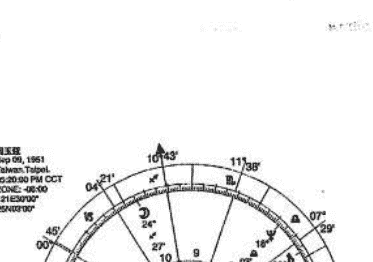

是台灣有史以來最受矚目的緋聞，黃義交、周玉蔻和何麗玲的緋聞案出爐了，媒體有了炒作的題目，民眾有茶餘飯後閒談的資料及網路上激起熱烈的迴響，被稱為本會計年度最大八卦新聞。

事實的線由大致是這樣：三位登場的主角分別是政治、媒體、商界名人，黃義交在與周玉蔻密切交往有一段時間，之後又愛上何麗玲，再加上同居、墮胎的內幕，與一般常見的三角戀愛並無兩樣，只是三位都是名人，製造出來的新聞當然的比較有賣點，又有人質疑緋聞案背後究竟有沒有牽扯到政治陰謀？台北的新聞界和政壇一時引起強烈質疑。

黃義交和周玉蔻頗深的交情是許多政壇和新聞界都是早已知曉，部份媒體也早有耳聞，黃義交位列省府新聞處處長兼發言人，為宋楚瑜的愛將之一，在目前都是政治圈內高知名度的敏感人物，不過涉及男女情事旁人實在不好多作評斷。周玉蔻（圖十三）和黃義交（圖十四）的本命星圖有一個很相似的特點，水星都在占星的四個重要角點之，占星的四個重要角點也就是第一、四、七、十宮的頂點，角點的行星對人生有舉足輕重的影響。

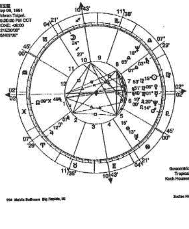

（圖十三）

## 易武书屋

黃義交的水星在牡羊座第十宮頂點，火星、海王星無礙，為省府發言人。周玉蔻的水星是在第七座，命度是在雙魚座，追求完美，自視甚高，感情的方式以及運作言語的神奇力量，占星家認為適合在新聞界、教學、演說、旅遊、秘書方面的工作也正好與水星所主的性質相符。

周玉蔻和黃義交雙方在工作上想必定是有良好常接觸，焦點高層，對政治形勢和政治生態是相當而黃義交是宋身邊的政治新秀，兩人接觸機會非然令她產生好感，隨著日益頻繁的接觸，火花燃

內圈：黃義交本命星圖
外圈：黃義交一九九八年二月次限星圖

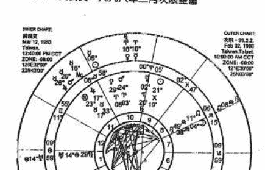

## 内圈：黄义交本命星图
外圈：黄义交一九九八年二月次限星图

黄义交的水星在牡羊座第十宫顶点，火星、金星也在牡羊座第十宫内，相貌堂堂，辩才无碍，为省府发言人。周玉蔻的水星在第七宫顶点，太阳、金星、水星在室女座，命度在双鱼座，追求完美，自视甚高，感情是挑剔的作风，待理不饶人。水星主思考的方式以及运作言语的神奇力量，占星家认为水星在命盘上占有强烈影响地位的人，适合在新闻界、教学、演说、旅游、秘书方面的工作，两人相同之处在于水星的交角，所从事的工作也正好与水星的性质相关。

周玉蔻和黄义交双方在工作上想必是有良好的配合度。周玉蔻长期在媒体工作，经常接触党政高层，对政治形势和政治生态是相当了解的资深媒体工作者，周玉蔻独来，而黄义交是宋身边的政坛新秀，两人接触机会非常多，黄义交风度翩翩，文采风流，自然地产生好感，随着愈来频繁的接触，火花燃起，男女的关系也就渐渐得出。

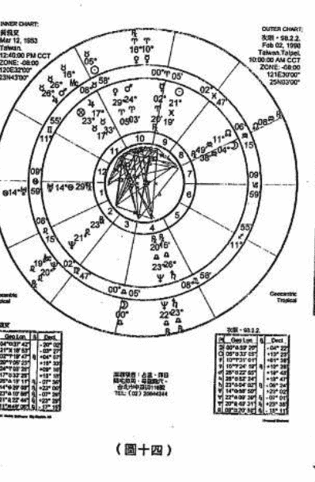

## 易武书屋

## TVBS周刊列出事件时间表：

| 年代 | 日期 | 事件 |
|---|---|---|
| 一九九四年 | 年中 | 黄义交任省新闻处长 |
| 一九九五年 | 年初 | 黄义交、周玉蔻 |
| 一九九六年 | 八月四日 | 持续往来。 |
| 一九九七年 | 八月二十九日 | 黄义交透过高许 |
| 一九九七年 | 九月 | 发展热烈。 |
| 一九九七年 | 十月八日 | 周玉蔻前往堕胎 |
| 一九九七年 | 十月十六日 | 据传何嘉玲亦曾 |
| 一九九八年 | 一月六日 | 周玉蔻接获何嘉 |
| 一九九八年 | 一月十一日 | 何嘉玲、周玉蔻 |
| 一九九八年 | 一月十三日 | 周玉蔻决定告知 |
| 一九九八年 | 一月十五日 | 黄义交写信与宋 |
| 一九九八年 | 一月二十二日 | 周玉蔻写信与宋 |
| 一九九八年 | 二月二日 | 事件曝光媒体 |
| 一九九八年 | 一月二十二日 | 周玉蔻写信与宋 |

黄义交火星与金星在第十宫会合，美好的形成热情和魅力，与海王星对冲，主浪漫。一九九五年是会合处，接着的月亮相位是与火星形成三分相星是会合处，接着的月亮相位是与火星形成三分相与浪漫充分的激发，与周玉蔻密切交往。

流年土星与第一宫的天王星九十度，天王星是迷惑，难分难解的感情。一九九八年一月六日，黄义交在命宫内行星相刑的情况面对两女

## TVBS周刊列出事件時間表：

| 年代 | 日期 | 事件 |
|---|---|---|
| 一九九四年 | 年中 | 黃義交任省新聞處副處長的周玉蔻讀者會新聞。 |
| 一九九五年 | 年初 | 黃義交、周玉蔻密切交往。 |
| 一九九六年 | 八月四日 | 持續往來。 |
| 一九九六年 | 八月二十九日 | 發展熾烈。 |
| 一九九七年 | 九月 | 周玉蔻發現懷孕，黃義交表明不再到周宅過夜。 |
| 一九九七年 | 十月八日 | 周玉蔻前往墮胎。 |
| 一九九七年 | 十月十六日 | 據傳何麗玲亦前往墮胎。 |
| 一九九八年 | 一月六日 | 周玉蔻接獲何麗玲來電，質問兩人關係。 |
| 一九九八年 | 一月十一日 | 何麗玲、周玉蔻相約在白冰冰家會面，瞭解三連關係。 |
| 一九九八年 | 一月十三日 | 周玉蔻決定告知宋楚瑜此事，與何麗玲共約省府台北辦事處見面，告知黃義交周旋於兩女間的事實，並尋求媒體支持，出面主持正義。 |
| 一九九八年 | 一月十五日 | 黃義交質問周玉蔻動機何在？ |
| 一九九八年 | 一月二十二日 | 周玉蔻寫信與宋楚瑜揭發事件。 |
| 一九九八年 | 二月二日 | 事件曝光媒體大幅報導。 |

黃義交火星與金星在第十宮會合，美好的形象，很有女人緣，在牡羊座尤其能激起熱情和魅力，與海王星對沖，主浪漫。一九九五年初，這時黃義交次限的月亮在與冥王星會合處，接著的月亮亮相位是與火星形成三分相位，其次再與金星形成三分相位，熱情與浪漫充分的激發，與周玉蔻密切交往。

流年土星與第一宮的天王星九○度，天王星主決裂，海王星與金星九○度，混亂與迷惑，難分難解的感情。一九九八年一月六日，周玉蔻接獲何麗玲來電，質問兩人關係。黃義交在命宮內行星相刑的情況面對兩女，顯然已經亂了方寸，相關人士居中協調，黃義交並沒有給周玉蔻一個滿意的答案。

二月二日，次限月亮與本命的水星與MC成本命第一一宮內的天王星，事件曝光媒體大幅報導，都在第一一宮所管轄的範圍，尤其其次限月亮與水星對於黃義交而言，鬧得滿城風雨的绯聞來竟然外，與美國總統並無關聯，真是始料未及，「已經義交結果是如此說，黃義交對愛情的付出似乎家？誰是輸家？各人經歷感受不同，有人認為何狀，有人不太同意周玉蔻的作法，但還是認為她「如果不是我隨時給黃義交參謀建議，黃義交的太陽與黃義交交第十一宮的木星三合，周玉蔻在事業上幫黃義交的忙，周玉蔻的土星對沖黃義交能覆舟，當感情生變的時候，昔日的甜言蜜語變作針一般的陣陣刺入心扉，一旦愛化成恨，土星

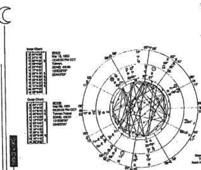

調，黃義交並沒有給周玉蔻一個滿意的答案。

二月二日，次限月亮與本命的水星與MC成八○度，流年的月亮與土星合相，刑本命第一宮內的天王星，事件曝光樂儺大驚嚇。第七宮也掌管事業，刑沖的行星多數都在第十宮所管轄的範圍，尤其次限月亮與水星、MC對沖，黃義交結果烏紗帽不保。

對於黃義交而言，鬧得滿城風雨的緋聞案竟然上了美國新聞周刊成了國際新聞揚名海外，與美國總統並駕齊驅，真是始料未及。「已經發生的事情，有什麼好後悔的。」黃義交結果是如此說，黃義交對愛情的付出似乎是無怨無悔，是癡情？是真情？誰是贏家？誰是輸家？各人經歷感受不同，有人認為何麗玲相當厲害，臨陣脫逃，又故作好人狀，有人不太同意周玉蔻的作法，但還是認為她受害最大。

「如果不是我隨時給黃義交參謀建議，黃義交那有今天！」周玉蔻曾如此說。周玉蔻的太陽與黃義交第十一宮的木星三合，周玉蔻的木星進入黃義交的第十宮頂點和水星，水能載舟，亦能覆舟，當感情生變的時候，昔日的甜言蜜語頓時如雲消霧散，飄得無影無蹤，如今化作針一般的陣陣刺入心肺，一旦愛化成恨，土星的力量呈現出來。周玉蔻頻頻出招，招

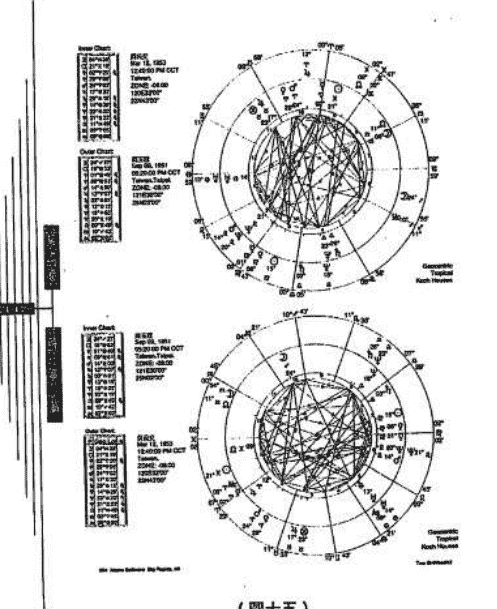

（圖十五）

## 易武書屋

招逼人，竟使得出道不久的黃義交招架不住，大義交中箭落馬，不過只是輕傷，沒有生命危險，快的又可以在錄光燈前繼續推進。（圖十五）

## 柯林頓緋聞風波

柯林頓從政以來二十餘年始終與緋聞脫不了跟，孤單如影隨形、難分難解，顯然柯林頓聲望與內心的寂寞。柯林頓即使一言一行都受到人群包，奇者每次東窗事發都能輕鬆過關，有人稱他為美，曾失手，這回真的鬧大了，不知能否如往常一樣，瓊斯案扯出了陸文斯基，也抖出白宮義工凱

性頻繁，甚至大家快要遺忘的珍妮佛、富勞爾也，統有性關係或不當關係的女人有多少？經過媒體包，以來算起，柯林頓二十多年來的記錄總共有七個，統個人的私德而已，這個案件還涉及小柯是否教，瓊斯案尚在調查，又爆發陸文斯基的緋聞案，的調查，一九九八年一月二十一日，柯林頓只得，係，也沒有不當的性關係，或任何不當的關係，頓：「我從前並沒有跟那個女人有性關係。」，據已往的慣例柯林頓面對質疑時差不多都持，點的說不記得有這件事，甚至於乾脆說不記得有，重要的國家大事等著處理，並有許多攸關世界大，況且平常又不便詳加記錄，時過境遷往往來多又又，清靜養性不能恢復記性。不過經由獨立檢察官史，得不作出必要的回應。

招過人，竟使得出道不久的黃義交招架不住，大概是功力還沒有練到爐火純青，雖然黃義交中箭落馬，不過只是輕傷，沒有生命危險，遇一些時候療傷止痛，元氣恢復以後很快的又可以在綠光燈前繼續推進。（圖十五）

## 柯林頓緋聞風波

柯林頓從政以來二十餘年始終與緋聞脫不了關係，許多心理學家都認為他的好色跟孤單如影隨形，難分難解，顯然柯林頓藉著與女人不斷發生「不當關係」來暫時忘卻內心的寂寞。柯林頓即使一言一行受到人群包圍，仍然有辦法連續演出風流韻事，最奇者每次東窗事發都能夠安然脫身，有人稱他為美國有史以來最滑溜的總統，數十年來未曾失手，這回真的鬧大了，不知能否如往常一樣全身而退。

瓊斯案扯出了陸文斯基，也抖出白宮女義工凱薩琳。衛理曾在一九九三年受到柯林頓性騷擾，甚至大家快要遺忘的珍妮佛。富勞爾也再度被抬出來聲援，到底與柯林頓總有性關係或不當關係的女人有多少？經過媒體追蹤調查，從一九七七年與希拉蕊結婚以來算起，柯林頓二十多年來的記錄總共有七個女人，另有一版本說是十二個女人。

瓊斯案尚在調查，又爆發陸文斯基的緋聞案。但是，整個偵察最大的重點卻不是總統個人的私德而已，這個案件還涉及小柯是否教唆偽證。經過獨立檢查官史塔扇年累月的調查，一九九八年一月二十一日，柯林頓只得對緋聞案公開發言：「現在並沒有性關係，也沒有不當的性關係，或任何不當的關係都沒有。」一月二十六日記者會，柯林頓：「我從前並沒有跟那個女人有性關係。」

據已往的慣例柯林頓面對質疑差不多都持否定的態度，或直接否認，或者委婉一點的說不記得有這件事，甚至於乾脆說不記得有這個人。柯林頓總統日理萬機，有重要的國家大事等著處理，並有許多攸關世界大事，忘記一些日常事務也是稀鬆平常，況且平常又不便詳加記錄，時遇境遷佳麗眾多又如何能一一回憶，可能需要一段時間的冷靜看能不能恢復記憶，不過經由獨立檢查官史塔窮追猛打，輿論力量不可輕忽，他不得不作出必要的回應。

內圈：柯林頓本命星圖
外圈：柯林頓 1998 年 1 月 21 日次限星圖

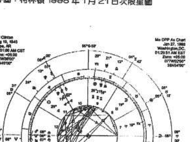

柯林頓的本命星圖（圖十六）ASC 與火星、金星與海王星對沖，組合非常類似，柯林頓火星較大，火星主活力、精力的來源，積極進取、競爭力，金星主財富、幸運、愛情，又有海王星的柔美，所以一直保持緋聞不斷，柯林頓與異性的合謀謂福不淺，但是時間的考驗，以及柯林頓經過證最難消受美人恩，柯林頓權力所及幾乎可以說，必須付出很大的代價，總統寶座引起激烈的競爭，牡羊座五度一七，與 ASC、火星、海王星沖，八月十七日，柯林頓向大陪審團作證前已經知道陸文斯基已經和獨立檢查官達成協議，以斯文斯基的一件洋裝可能沾有他的精液，這充分的證據有數億人都相當關注，想知道小柯到底作了沒？

## 內圖：柯林頓本命星圖
外圖：柯林頓1998年1月21日次限星圖

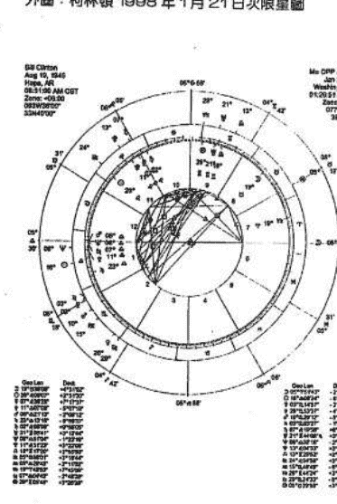

柯林頓的本命星圖（圖十六）ASC與火星、金星、海王星合相，與冥王交火星、金星與海王星對沖，組合非常類似，柯林頓火、金、海與ASC合相，合相的力量會比較大，火星主活力、精力的來源，積極進取，轉換到感情面的話就是情慾的衝動、性能力，金星主財富、幸運、愛情，又有海王星的參與與對愛情時常的充滿幻想。

柯林頓長相英俊，舉止溫文大方，擁有金錢與最高權力，兼具有桃花的各項有利因素，所以一直保持緋聞不斷，柯林頓與異性的合作中一直進行許多浪漫微妙的情愫，可謂豔福不淺，但是時間的考驗，以及柯林頓經過長期咳而不捨實際體驗的結果，事後都證明最難消受美人恩，柯林頓權力所及幾乎可以號令全世界，這些女人們即使灰頭土臉，必須付出很大的代價，總統寶座引起激烈的震盪，一月二十一日，次限月亮推進到牡羊座五度一七，與ASC、火星、海王星沖，對排聞案公開發言。

八月十七日，柯林頓向大陪審團作證前已經大致明白他即將面臨廣泛的搜證，他不知道陸文斯基已經和獨立檢查官達成協議，以她據實作證換取免起訴的條件，陸文斯基的伴侶可能佔有他的精液，這充分的證據使他不得不重新評估，同時全球大約有數億人都相當關注，想知道小柯到底作丁沒？看他如何說？午間十二時五十九分，

柯林頓端坐在白宮底層的地圖室發言：「我確實當的。事實上，那是錯誤的。我過去誤導美國群眾。」

柯林頓的本命星圖代表幸運的木星在第一宮物的相位，對大環境有敏感的嗅覺，應變能力特好學深思，有創造、發明能力，木星接近天頂高位，可能是經過指點，他特別選擇在八月十七日實上經過他的自白，美國民眾大多認為此為私事著望望不墜。次限的月亮將與第九宮的天王星形成用時機，緊接著數次出國訪問，中國大陸、俄羅斯高的趨勢，指責他本來應該以白水案為調查重點的調查，柯林頓反客為主。十一月九日，史小時候十六分的證詞，概述彈劾柯林頓總統的罪狀

不是轉台即是關機，十六分鐘後陸續有節目中斷塔、陸文斯基這此人。

美國人對於陸文斯基案已經不感興趣，因為雖然柯林頓的聲望未受影響反而日漸升高，但是的鬧劇，究竟會有何發展呢？以柯林頓次限來推度已經是出相位緯間高潮時間已過，柯林頓只要致於下台。

柯林頓坐在白宮底層的地圖室發言：「我確實和陸文斯基小姐有關係，而且那是不適當的，事實上，那是錯誤的。我過去誤導美國群眾，甚至包括我的妻子，對此我深感抱歉。」

柯林頓的本命星盤代表幸運的木星在第一宮，木星與天王星成三合，最適合領導人物的相位，對大環境有敏感的嗅覺，應變能力特佳。更巧的是天王星接近Capella，主財富、權力、名望，故能居於高位，可能是經過指點，他特別選擇在八月十七日對他有利的日子向大陪審團作證，事實上經過多日的自白，美國國民大多認為此為私事，個人私生活與治國無關，他一直保持蒼白空不堅，次限的月亮將與第九宮的天王星形成六分相位，出外有利，柯林頓善於運用時機，緊接著數次出國訪問，中國大陸、俄羅斯、日本。

十一月三日中期選舉結束，柯林頓的聲望又看漲，外界對史塔的批評聲浪有逐漸升高的趨勢，指責他本來應該以白水案為調查重點，竟模糊焦點擴大對陸文斯基不當性關係的調查，柯林頓反而為主。十一月十九日，史塔在華盛頓時間上午十時五十分展開兩小時十六分的證詞，概述彈劾柯林頓總統的罪狀，原有九家電視台作實況報導，但觀察

不是轉台即是關機，十六分鐘後陸續有節目中斷轉播，還有些人表示他們實在受夠了史塔、陸文斯基這些人。

美國人對於陸文斯基案已經不感興趣，因為在英國已婚者有婚外情是司空見慣的，雖然柯林頓的聲望未受影響反而日漸升高，但是史塔的調查還在繼續中，這場全球矚目的鬧劇，究竟會有何發展呢？以柯林頓次限來推，月亮與火星、金星、海王星對沖的角度已經是出相位避開高潮時間已過，柯林頓只要妥善的處理不要激怒那些人今年應該不致於下台。

## 易武書屋

## 選舉暴力

選戰期間街頭巷尾可見五顏六色的競選旗幟飄揚，公車的車身也繪製各樣選舉廣告，電視媒體導，在餐廳、辦公室、郵局時都少不了選舉話題，時常因支持不同候選人，各人為自己支持的子粗，從早上到夜晚都籠罩在選戰氣氛中，入夜有的還比候選人熱情，當選戰如火如荼的展開時，候選人的出生時間是一九四六年十一月二十上第十一、十二宮的頂點依次亮六顆主要行星環拱，適合在政界發展。一九八九年十一月六日到底發生何事？如

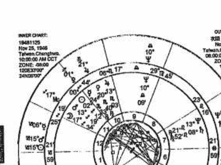

## 選舉暴力

選戰期間街頭巷尾可見五顏六色的競選旗幟、看板，宣傳車到處穿梭，造勢花招百出，公車的車身也繪製各式選舉廣告，電視媒體每天的新聞幾乎都是有關選舉的報導，在辦公室、聊天時都少不了選舉的話題，支持那一個候選人？那一個黨派？時常因支持不同候選人，各人為自己支持的候選人拉票，無論選情，常爭得臉紅脖子粗，從早上到夜晚都籠罩在選戰氣氛中，入夜後許多競選總部依然可見支持者守候，有的還比候選人熱情，當選戰如火如荼的展開時，響起令人驚心的槍聲。

候選人的出生時間是一九四六年十一月二十五日上午十點，彰化（圖十七）。星盤上第十、十一宮行星最多，從第十宮的頂點依次是木星、金星、水星、太陽、火星、月亮六顆主要行星環繞，適合在政界發展。

一九八九年十一月六日到底發生何事？如何推測？當然以下的推測是事件發生過後，事前能作這種預言的恐怕不是很容。

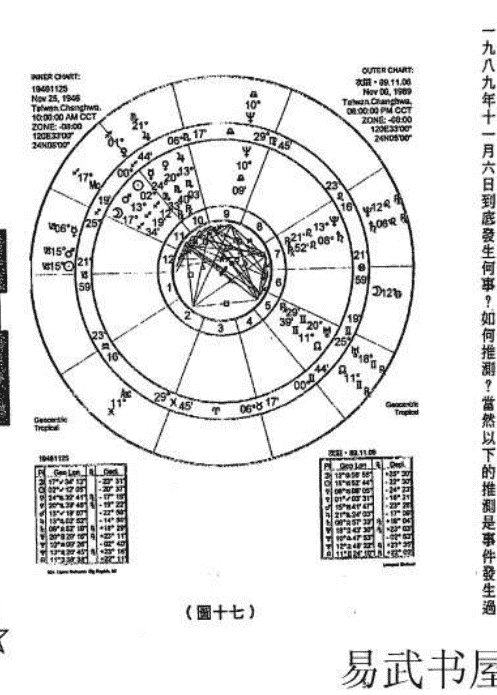

易武書屋

一般從次限法來預測事件是偏向於重大事件，因為次限法的太陽、金星、水星一年約十三度，一個月推進一度多，事件的發生一度或過後一度應驗，所以在流日的運用上，次限法與過運（Transits）或者中點合併，如此預測事件是有其極限，同樣的行星組合，不同，發生的事件的性質會與行星的特質有關，有的是對應在身體疾病上，所以預測未來是要有精確度才可能盡量提高。尤其台灣的出生時間常以C重要的相位就比較難以運用，不能作其他更精困難。

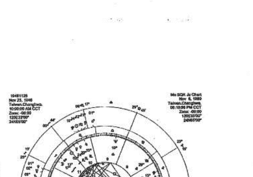

後，事前能作這種預言的恐怕不是很不容易。（圖十八）

一般從次限法來預測事件是傾向於重大事件的約略時間，要單憑次限法來猜發生何事是有些困難，因為次限法的太陽、金星、水星一年推進一度左右，速度最快的月亮一年約十三度，一個月推進一度多，事件的發生有時不一定是剛好在正相位，或許會提前一度或過後一度應驗，所以在流日的運用上，必須再配合其他流年推論，最常用的就是次限法與過運（Transits），或者與中點合併，如此則預測發生事件的時間可以縮小範圍。

預測事件是有其極限，同樣的行星組合，由於所處的客觀環境及時間與空間的變化不同，發生的事件的性質會與行星的特質有關，而發生的事件有時不完全雷同，或有的是對應在身體疾病上，所以預測未來是要有許多既有的已知客觀條件來互相搭配準確度才可能盡量提高。尤其台灣的出生時間常以時辰為計時單位，次限法的ASC與MC重要的相位就比較難以運用，不能作其他更精密的計算方法，如此更增加許多預測的困難。

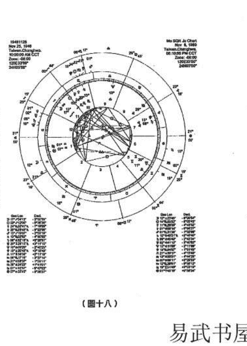

（圖十八）

易武書屋

從次限法先來分析：

| 日期 | 次限 | 本命 |
|---|---|---|
| 一九八九年七月十八日 | 月 | 土星 |
| 一九八九年七月二十六日 | 水星 | 月 |
| 一九八九年八月三日 | 月 | 水星 |
| 一九八九年八月十七日 | 月 | 海王星 |
| 一九八九年十一月一日 | 月 | 木星 |
| 一九八九年十一月二日 | 月 | 火星 |
| 一九八九年十一月二十六日 | 月 | 冥王星 |
| 一九八九年一月二十六日 | 月 | 月 |

一九八九年十一月六日當日的過運分析：

| 過運 | 本命 | 相位 | 角度 |
|---|---|---|---|
| 月 | 太陽 | 六○度/準確 | |
| 太陽 | 冥王星 | 九○度/準確/凶 | |
| 土星 | 海王星 | 九○度/準確/凶 | |
| 海王星 | 海王星 | 九○度/準確/凶 | |
| 月 | MC | 九○度/準確/凶 | |
| 月 | 木星 | 九○度/準確/凶 | |
| 月 | 火星 | 六○度/準確/凶 | |
| 月 | 冥王星 | 一八○度/準確/凶 | |
| 木星 | ASC | 一二○度/吉 | |
| 太陽 | 木星 | 合相/吉 | |

從次限法先來分析：

| 日期 | 次限 | 本命 | 相位 | 角度 |
|---|---|---|---|---|
| 一九八九年七月十八日 | 月亮 | 土星 | | 三〇度 |
| 一九八九年七月二十六日 | 水星 | 月亮 | | 四五度／言語上的衝突 |
| 一九八九年八月三日 | 月亮 | 水星 | | 一三五度／言語上的衝突 |
| 一九八九年八月十七日 | 月亮 | 海王星 | | 九〇度／文宣或接觸面的情緒化 |
| 一九八九年十月二十六日 | 月亮 | 木星 | | 一二〇度／獲得有力人士的支持贊助 |
| 一九八九年十一月一日 | 月亮 | 火星 | | 一五〇度／情緒化的激動 |
| 一九八九年十一月二日 | 月亮 | 冥王星 | | 三〇度／激動、暴力 |
| 一九八九年十一月二十六日 | 月亮 | 月亮 | | 一五〇度／需要改革、再重新調適 |

一九八九年十一月六日當日的過運分析：

| 過運 | 本命 | 相位 | 角度 |
|---|---|---|---|
| 月亮 | 太陽 | | 六〇度／準確 |
| 太陽 | 冥王星 | | 九〇度／準確／凶 |
| 土星 | 海王星 | | 九〇度／準確／凶 |
| 月亮 | MC | | 九〇度／準確／凶 |
| 月亮 | 海王星 | | 一二〇度／準確 |
| 月亮 | 木星 | | 九〇度／準確／凶 |
| 月亮 | 火星 | | 六〇度／準確 |
| 月亮 | 冥王星 | | 一八〇度／準確／凶 |
| 木星 | ASC | | 一二〇度／吉 |
| 太陽 | 木星 | | 合相／吉 |

易武書屋

最近「鐵達尼號」的上映，掀起了一陣強烈的旋風，在最短的時間裡就能衝破全世界票房紀錄，成為電影史上的票房巨船。二十世紀福斯公司宣布：「鐵達尼號」的賣座在一九九八年一月二十三日晚間超越了九三年的「侏羅紀公園」，成為歷來全球賣座最高的電影。好萊塢業者估計全球票房將可能達到十二億美元。

與「鐵達尼號」有關的週邊產品在剛上市時搶購一空，有的是嚴重缺貨，各項媒體爭相報導，許多朋友見面時都會問：「有沒有去過「鐵達尼號」？」「我還會再去看，情節非常動人！」你去了幾次？」「鐵達尼號」成為近來人們招呼的第一個話題！有些影迷看「鐵達尼號」電影以爲招待；男生一次收費一千元，女生免費，根據每位客人介紹最適合的異性同伴。三百六十行之外又增添一門新的行業。「鐵達尼號」的熱潮一直居高不下。

## 鐵達尼號的回憶

慢速的過運行星木星巨蟹座一○度三○，土星摩羯座九度四四，海王星摩羯座一○度二六，與本命的海王星天秤座一○度○九，幾乎是準確形成九○度。過運的冥王星天蠍座二五度○一，與本命的冥王星獅子座一三度二○，形成九○度。

由上述次限法與過運行星的相位，火星、冥王星形成九○度，一八○度，主猛烈的暴力，又有牽涉到與本命海王星嚴重的刑剋，從許多過去歷史上的政治事件，海王星最重的刑剋與陰謀，謀殺最有關聯。

從本命的個性解釋，命度在摩羯座，土星與冥王星合相，固定星座所呈現的固執堅持，不與人輕易的妥協，從本命星盤代表社團、交際層面的第十一宮，宮內的火星、月亮，與天王星、北交點成對相，容易因得罪人而引起選舉思想，人馬座的火星加天王星有引起火爆場面的可能。

事實結果是這位先生是參加立委選舉的候選人之一，在一九八九年十一月六日黃昏左右，當到處都非常活躍的在進行競選活動，忽然槍聲響起，受到歹徒槍擊成重傷，子彈從頭部穿入到第四節頸椎之間，所幸過運的行星與命主星、第八宮主星受剋沒有很嚴重。二十日以後，他很微弱的會講一些話，生起一線生機，十二月二日高票當選立委。

「鐵達尼號」建造於九十年前，經歷了英國「白星輪船公司」的一艘豪華客輪，當時英國先進的科學技術發展已經取得輝煌的成果，尤其在國防武器方面也憑藉先進的科技裝備起來，是中國人所形容為「船堅炮利」的時代，英國也就是憑著「船堅炮利」的絕對優勢向中國發動侵略戰爭。

一八四〇年以及一八六〇年，二次的鴉片戰爭，一九〇〇年八國聯軍入侵北京，正當「鐵達尼號」出爐時，英國國勢正如日中天，造船工業已達到了登峰造極，「鐵達尼號」排水量達六萬六千噸，五萬五千匹馬力，船長八八二．五英呎，最大寬度九二．五英呎，約有十一層樓的高度，船身結構用材之堅固，防水週密，水密艙之多，在當時是世界第一大輪，號稱為「上帝都沉不了的船」，船內的設備與豪華裝潢有如皇宮，據造船家說即使進水，至少也能在水面上浮兩三天。因此在船難剛發生時，絕大多數的乘客一點也不緊張，大家都還笑說：「鐵達尼號是不沉的客輪喔！」

一九一二年四月十一日下午二點，這座「海上皇宮」首航，滿載乘客由昆士頓港駛往英國紐約港新船作處女航，從船員到乘客，人人都有百分之百的安全感。然而，人算不如天算，當鐵達尼號航行在大西洋上的第四夜，遭遇了一座高達三十公尺的冰山，當時航海還沒有雷達，全靠船上最高處瞭望斗中的瞭望員完全以肉眼觀察，也沒有配備望遠鏡。雖然瞭望員在發現冰山馬上發出警告，但是以每小時廿二節（四十公里）高速航行的鐵達尼號急速的閃避了一下，仍沿著冰山上的邊緣擦過。

一般擦身而過的擦撞對於精心打造的豪華巨輪在安全上應無大礙，雖然「鐵達尼號」這次擦撞並沒有撞出破洞，然而事實上造成的影響卻是非同小可，成了不可挽救的災難。撞擊處不是水線以上的船身，而是在船頭水下方舷的脆弱部分幾塊鈑板中凹，板端鉚釘崩脫而向外張開，形成了長達百公尺的一道口子，佔全船長三分之一，涵蓋了六艙，前五艙都有水密艙，而第六艙偏偏沒有水密門，一旦又一艙滿，鏡你有五萬匹馬力的海上巨無霸，也隨著海水湧入而下沉，大量海水灌入而下沉，它只在海面上支持了兩小時又四十分鐘，十一點四十分擦撞，凌晨兩點二十分全船沉沒，它只在海面上支持了兩小時又四十分鐘。

「鐵達尼號」共載乘二、二〇七人，其中乘客一、三一六人，船員八九一人，之中有大西洋兩岸豪富華貴，披金戴玉的豪門、巨富、仕紳名流，頃刻間消失在這個春天的寒夜，葬身大西洋海底。消息傳出，英美人士起初都不敢置信，其後證實沉沒，更造成了莫大的震撼，成為二十世紀中最慘重的災難之一。

「鐵達尼號」的沈沒究竟有多少人葬身海底？各方的統計不一，有消息來源說一、六三五人；美國調查庭說一、五一七人；英國貿易局說一、四九○人；在這其中以英國貿易局的調查數字似乎最爲可信而有據。

在《星象大觀》一書中有對於「鐵達尼號」船架下水之時，從占星擇日的角度來對於鐵達尼號事件作一番的論述。圖十九的占星盤是「鐵達尼號」從船塢下水的時間。

鐵達尼號郵輪屬於白星輪船公司，是有史以來最大一艘郵輪，而且號稱永不沈沒的一艘船。但是卻在它的首航之旅，即一九一二年四月十五日撞上冰山而沈入海底，便一五一三人喪失性命。它在占星史可說是一片愁雲慘霧。它離開船架下水之時，火星與上升星座正成對相（表示實際的危險），而水星也與土星成合相。當它在四月十日出航時，上升星座（代表船本身）正和天王星（大劫）及月亮（旅行者）成對相，大海統治者的海王星在第十二宮（不幸），太陽成四分相位（危險的相位）。在鐵達尼號船長的出生圖上，海王星正在死亡之宮，天王星（大劫）在第九宮（此宮表示長途旅行）。沈船之日，天王星與船長出生時的月亮位置成標準的對相，也正好位於當時太陽所在的位置。史密斯船長的出生相位是天王星與月亮成對相，天王星又和太陽成合相。任何一個占星家都會認為這種結合是危險之至的。

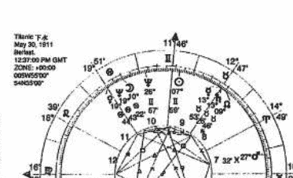

Titanic 下水
May 30, 1911
Belfast
12:37:00 PM GMT
ZONE: +00:00
54°N35'00"
006°W15'00"

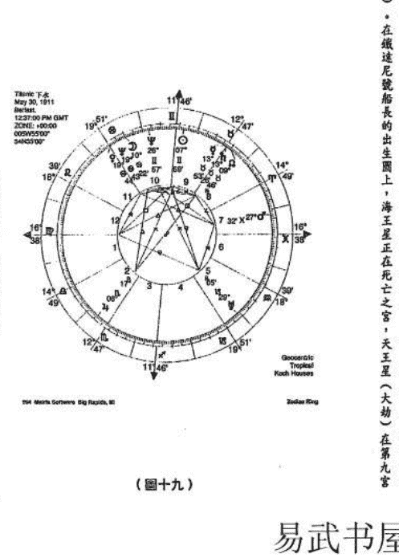

（圖十九）

易武書屋

一九一一年五月三十一日，這艘「鐵達尼號」，在英國伯爾發斯特市的哈朗吳爾孚公司船塢下水，之後的十個月便耗在裝修上。一九一二年四月一日，它完成了各次試航，而在四月三日駛抵南安普敦市，一個星期後往美國紐約。下列為它這次處女航中重作的航海日誌：

### 一九一二年四月十日

中午十二點：離開南安普敦港碼頭，開不容緩，與與美國客輪「紐約號」相撞。

晚七點：停靠法國瑟堡市上客。

晚九點：船離瑟堡市，駛往昆士鎮港。

### 一九一二年四月十一日

中午十二點三十分：在昆士鎮港停泊，上客及載郵件，船員一人潛逃。

下午兩點：離開昆士鎮港駛往紐約，共計乘客一千三百一十六人，船員八百九十一人。

下午七點三十分：「加州號」報告冰蹤，在西經四十九度九分，北緯四十二度三十分。

下午九點四十分：「多沙巴號」報告冰蹤，在西經四十九度至五十度三十分，北緯四十二度至四十一度五十分。

下午十點：氣溫攝氏零點五度。

下午十一點三十分：海上氣溫降為攝氏零下半度。

下午十一點：「加州號」警告冰蹤，但在報出位置前即中斷。

下午十一點四十分：在西經五十度四十分，北緯四十一度四十六分與冰山相撞。

### 一九一二年四月十四日

上午九時：「卡羅來的號」報告冰蹤，位置在西經四十九度至五十一度，北緯四十度。

下午一點四十二分：「波羅的海號」報告冰蹤，位置在西經四十九度至五十一度，北緯四十一度五十一分。

下午七點：氣溫攝氏六點一度。

下午七點三十分：氣溫攝氏三點九度。

下午九點：「美洲號」報告冰蹤。

下午九點四十分：「加州號」報告冰蹤。

下午十點：氣溫攝氏零點五度。

下午十一點三十分：海上氣溫降為攝氏零下半度。

下午十一點：「加州號」警告冰蹤，但在報出位置前即中斷。

下午十一點四十分：在西經五十度四十分，北緯四十一度四十六分與冰山相撞。

### 一九一二年四月十五日

凌晨十二點四十五分：第一枚火箭發射。

凌晨十二點四十五分：第七號救生艇最先放下。

凌晨一點四十分：發射最後一枚火箭。

凌晨兩點零五分：四號可摺小艇放下應船。

凌晨兩點十分：全船沉沒。

凌晨兩點十八分：燈光熄滅。

凌晨三點三十分：「喀爾巴阡號」發現最後一則無線電報。

凌晨四點十分：「喀爾巴阡號」發射火箭。

上午八點三十分：救起最後一艘的十二號救生艇。

上午八點五十分：「喀爾巴阡號」搭載救起的倖存者，駛往紐約。

這些都是基本記錄資料，或許沒有一種事情間量相比擬。鐵達尼號在經過專家研究之後發現下，建造如此大的客輪，尤其又是在接近零度的撞上冰山之後，造成無可挽回的災難。

The request was rejected because it was considered high risk

The request was rejected because it was considered high risk

## 三度圍剿

一九二六年北伐迅速成功，是國民黨的武力與共產黨的民眾運動合作的成果。但中共領導人給勝利沖昏了頭，主題人物是毛澤東，匆匆將共產主義之下激進社會改革的一套拿出來在湖南湖北兩省試用，對富戶抄家分地，侵犯了社會中上階層的經濟利益，引致國民黨全面反共。

在二十年代末，中共乘國民黨多次內訌，在各省交界的偏僻地區成立根據地。一九三〇至三一年蔣對江西紅軍進行三次圍剿，都無功而返。有論者記為蔣「挾匪自重」，未盡全力，先對共軍略為放鬆，以便向恐懼共黨暴動、抄家的金融工商界榨取「開拔費」。一九三一年七月第三次剿共互有勝負，卻因九一八事變提早結束。

## 中共建立紅都及長征

一九三〇年夏，中共已在全中國十多個省、一百多個縣建立革命基地，發展成為十萬人的軍隊。蔣介石也從一九三〇年十一月起發動七次的「圍剿」行動。

第一次由魯滌平率四個師（十萬人）進攻中共中央革命根據地。一九三一年一月三日，蔣軍損失二個師。一九三一年四月，蔣介石又派軍政部長何應欽代行總司令，第二次圍剿中央蘇區，結果又損失三萬餘人。

六月，蔣介石親臨南昌坐鎮，七月調集三十萬人（二十三個師又三個旅），由陳誠、羅卓英、趙觀濤、衛立煌、蔣鼎文等五個嫡系師節節進攻中央蘇區。結果，首先是陳銘樞麾下的第五軍戰敗，孫連仲的第二十六軍參謀長趙博生率二萬人向紅軍投降。蔣介石的第三次剿共又告失敗。中共則乘勢把乘勢把贛南、閩西及周圍的二十一個縣、二百五十萬人口納入形成中央蘇區。

一九三三年七月，蔣介石調集五十萬兵力，第四次「圍剿」，中共，鄂豫皖紅四方面軍加上第一、第五兩軍團合力殲滅國府的三個師。

## 第五次圍剿勝利

一九三三年九月，蔣介石調集一百萬兵力「圍剿」，其中五十萬兵力分四路進攻中央蘇區，並中央蘇區，最後再與紅軍主力決戰。當時中共紅軍武裝力量。但是，毛澤東採取靈活戰術，卻被來迎接國府軍。主持軍務的周恩來與國際派派來的軍事顧問。

九月二十八日，在共產國際派來的軍事顧問外，口號「下今紅軍奪回黎川，進攻黎川以北的包圍。

十一月二十日，第十九路軍蔡廷鍇、陳銘樞、人民政府。蔣介石抽調九個師兵力入閩鎮壓，對江，又不能及時援助十九路軍，反而進攻永豐地來進攻紅軍。此後歷經一年多的苦戰。

國府軍於一九三四年十月開始長征，至一九三五年紅軍一九三四年十月開始長征，至一九三五年丹為首的陝北紅軍會師，才結束二萬五千里長年時間。二萬五千里長跑，毛澤東稱之為長征。

從一九三四年十月到一九三五年十月九

## 第五次围剿胜利

军加上第一、第五两军围合力轰灭国府的三个师。

一九三三年九月，蒋介石调集一百万兵力、二百架飞机，对中共进行第五次“围剿”，其中五十万兵力分四路进攻中央苏区，并采取持久战和堡垒战术，企图逐步压缩中央苏区，最后再与红军主力决战。当时中共红军已经发展出八万兵力。加上五万群众武装力量。但是，毛泽东据采取灵活战术，却被中共中央指为“退却逃跑的右倾机会主义”，对于毛泽东大加批斗，亲自苏联派的王明否定毛泽东的游击战和运动战，而以阵地战来迎击国军。主持军务的周恩来与国际派力主出击，结果是红军大败。

九月二十八日，在共产国际派来的军事顾问李德的指导下，提出“御敌于国门之外”口号，下令红军夺回黎川，进攻黎川以北的硝石、资溪桥，结果红军陷入国府军的包围。

十一月二十日，第十九路军蔡廷锴、陈铭枢、蒋光鼐与李济深发动闽变，成立福建人民政府，蒋介石抽调九个师兵力入闽镇压。红军丧失大好良机，未能乘虚突破到江北，又不能及时援助十九路军，反而进攻永丰地区，导致蒋介石镇压闽变之后，调过头来进攻红军。此后经历一年多的苦战。

国府军于一九三四年十月攻克兴国、宁都、石城，中共中央下令中央领导机关及红军主力撤出根据地。自一九二七年起在华中、华南各省边区的红军根据地大致都肃清，此时国民政府的威信大增。

红军一九三四年十月开始长征，至一九三五年十月十九日抵达陕北吴起镇，与刘志丹为首的陕北红军会师，才结束二万五千里长征。其实红军所谓的长征，亦即是大逃亡。

从一九三四年十月到一九三五年十月十九日，红军完成战略大转移，整整经历了一年时间。二万五千里长征，毛泽东称之为长征。

## 易武书屋

国民党党史有提到：

> “赤匪自称这次流窜为长征。遵义会议后的激烈的战斗也不断发生，经过无数的困难，穿过中险，经历了广漠的草原，倍受冷冽、炎热、风雨、霜雪，从这段文字中，亦可看出毛泽东的红军长征艰苦。毛泽东有首诗：”

> 《七律·长征》

> “红军不怕远征难，万水千山只等闲。五岭逶迤腾细浪，乌蒙磅礴走泥丸。金沙水拍云崖暖，大渡桥横铁索寒。更喜岷山千里雪，三军过后尽开颜。”

其实，毛泽东本人在登上六盘山时已“开颜”：

> “天高云淡，望断南飞雁。不到长城非好汉，屈指行程二万。六盘山上高峰，红旗漫卷西风。今日长缨在手，何时缚住苍龙。”

毛泽东提到长征，竟亦极为自豪。他说：“天地，三皇五帝到于今，历史上曾经有过我们这样的长征吗？十二个月光阴中间，天上每日几十架飞机侦察轰炸，地下几十万大军围追堵截，我们却开动了每个人的两只脚，长驱二万余里，纵横十一个省。请问历史上曾有过我们这样的长征吗？没有，从来没有的。”

这段话时间可以算是毛泽东最困难的时候，不过冷静地说：“红军在一个方面（保持原有阵地的方面）说来是失败了。”

自一九三四年十月到一九三五年十月十九日，红军完成战略大转移，整整经历了一年时间。二万五千里长征，毛泽东称之为长征。

一九三四年十月时毛泽东的星相组合如下：流年木星准确会合MC，流年天王星同时合相……

國民黨史書提到：
「赤匪自稱這次流竄為長征。遵義會議後的四個月中，軍隊差不多經常在移動，激烈的戰鬥也不斷發生，經過無數的困難，穿越中國最長最深的河流，跨越最高最險的山隘，經歷了廣漠的草原，備受冷流、炙熱、風霜、暴雨，終至抵達陝北。」

從這段文字中，亦可看出毛澤東的紅軍長跑時，是如何苦心其志，勞其筋骨，餓其體膚。毛澤東有首詩：

> 《七律·長征》
「紅軍不怕遠征難，萬水千山只等閒。五嶺逶迤騰細浪，烏蒙磅礴走泥丸。金沙水拍雲崖暖，大渡橋橫鐵索寒。更喜岷山千里雪，三軍過後盡開顏。」

其實，毛澤東本人在登上六盤山時已「開顏」。他有首詞《清平樂·六盤山》：
「天高雲淡，望斷南飛雁。不到長城非好漢，屈指行程二萬。六盤山上高峰，紅旗漫捲西風。今日長纓在手，何時縛住蒼龍。」

毛澤東提到長征，竟亦極為自豪。他說：「長征是歷史上的第一次……自從盤古開天地，三皇五帝到於今，歷史上曾經有過我們這樣的長征麼？十二個月光陰中間，天上每日幾十架飛機偵察轟炸，地下幾十萬大軍圍追堵截，路上遇著了說不盡的艱難險阻，我們卻開動了每個人的兩隻腳，長驅二萬餘里，縱橫十一個省。請問歷史上曾有過我們這樣的長征麼？沒有，從來沒有的！」

這段時間可以說是毛最為困頓的時候，不過毛除了賦詩填詞、豪言壯語之外，毛也冷靜地說：「紅軍在一方面（保持原有陣地的地方）說來是失敗了，在另一方面（完成長征計劃的方面）說來是勝利了。」

自一九三四年十月到一九三五年十月十九日，正當毛澤東四十一至四十二實歲。二萬五千里跑路，毛澤東稱之為長征。

一九三四年十月時毛澤東的星相組合如下（圖二十八）：
流年木星準確會合MC，流年天王星同時期準確會合IC。住所多變動。

## 易武書屋

我們再來研究在紅軍長征這一段時期，國民

## 紅軍長征時期蔣中正

流年火星在獅子座二六刑天秤座火星二五度
流年冥王星在巨蟹座二六刑第九遷移宮天秤
次限太陽在寶瓶座十六刑第十宮內的天王星
次限水星在寶瓶座二○度四○，刑第四宮的
次限火星在人馬座二十三度四九，與第四宮
次限MC在人馬座八度四二與冥王星沖。事
一九三五年十月之後，次限月亮在寶瓶座十
九遷移宮內的土星準確成三合方才結束前後一年

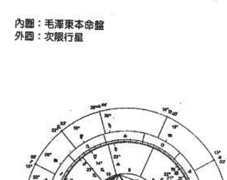

內圈：毛澤東本命盤
外圈：次限行星

流年火星在獅子座二六刑天蠍座火星二五度五三。征戰。
流年冥王星在巨蟹座一六刑第九遷宮天秤座土星二三度五二。遭遇難纏的人物。
次限太陽在寶瓶座一六刑第十宮內的天王星。事業不利的衝擊變化。
次限水星在寶瓶座二〇度四〇。刑第四宮的木星。變動旅行。
次限火星在人馬座二三度四九。與第四宮木星成一五〇度。需要重新整軍。
次限MC在人馬座八度四二與冥王星沖。事業上的難關。
一九三五年十一月之後，次限月亮在寶瓶座十六，離開相刑天王星，次限ASC與第九遷宮內的土星準確成三合方才結束前後一年歷盡艱辛的長征。

## 紅軍長征時期蔣中正的流年星相

我們再來研究在紅軍長征這一段時期，國民黨領導者蔣中正的流年星相，相互之間

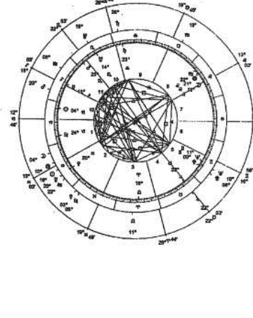

易武書屋

內圈：毛澤東本命盤
外圈：次限行星

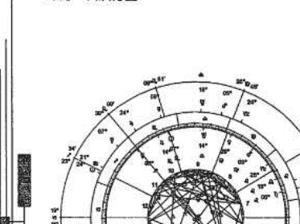

一九三四年十月時蔣中正的星相組合（圖二
次限摩羯座月亮二四度四五，二二〇度金星。
次限人馬座水星〇七度二四，二二〇度土星。
次限人馬座太陽二四度五二，九〇度金星。
次限天蠍座金星〇八度四五，會合太陽。九
次限ASC與木星一二木星一二〇度，鴻運當頭。

毛澤東早在一九三一年「九一八」事變時就
中，他卻未抗過一個日本鬼子。原因主要有二：
顧及。如今在陝北，不能不履行「北上抗日」
一九三六年初，毛澤東為首的「中央工農民

作一個比較。自一九三四年十月到一九三五年
寶藏。

內圈：毛澤東本命盤
外圈：次限行星

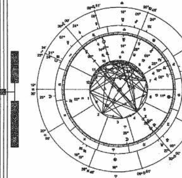

圖二十九：1934 年 10 月—紅軍長征時期蔣中正
次限星圖

## 易武書屋

作一個比較。自一九三四年十月到一九三五年十月十九日，正常時蔣中正四十七至四十八
實歲。

一九三四年十月時蔣中正的星相組合（圖二十九）：
次限摩羯座月亮二四度四五，一二○度金星。資源充足。
次限人馬座水星○七度二四，一二○度土星。增強支援。
次限人馬座太陽二四度五二，九○度金星。軍費支出龐大。
次限天蠍座金星○八度四五，會合太陽。九○度土星。聲勢正隆，仍有阻礙。
次限ASC與木星一二○度，鴻運當頭。

毛澤東早在一九三一年「九一八」事變時就表示要抗日，但是，在五年漫長的歲月中，他卻未抗過一個日本鬼子。原因主要有二：先是在江西鞭長莫及；後是長跑逃命無暇顧及。如今在陝北，不能不履行「北上抗日」的承諾。

一九三六年年初，毛澤東為首的「中央工農民主政府」和「中國抗日紅軍革命軍事委員會」，特組織「中國人民抗日先鋒軍」，由彭德懷任總參謀長，全軍約一萬二千人。一月十日，下達《紅軍東進抗日及討伐賣國賊閻錫山的命令》。二月十七日，發表《東征宣言》，宣稱紅軍渡河東征的目的是為實現抗日。

二月二十日夜，紅軍在南起河口、北到溝口約一百華里的地段，分兩路強渡黃河，一舉突破了閻錫山在黃河由碉堡、工事組成的黃河防線，進入山西。閻錫山一面急電蔣介石求援，一面把晉綏軍七個師兵力集中，阻止紅軍東征。中共做事一向先造輿論，這次也不例外，毛澤東的本命星圖水星在人馬座，與第二宮內的北交點以及第八宮內的月亮形成準確一二○度，造成一個等腰三角形，可以分析出毛能言善道，善於運用宣傳，掌握群眾。

一九三三年日人在東北長春成立滿洲國，自此至一九三五年，蔣大部分精力對付江西及各地紅軍，又要應付各省此起彼落的軍閥亂事，對日本人的侵略，則多方容忍。後來借追擊江西紅軍之便，將中央政府的勢力，伸展入西南各省。

一九三五年一月六日至八日中共中央召開政治局擴大會議，彭德懷首先發難，攻擊紅軍為保衛黨中央要員及後勤部隊（約七千多人）而犧牲在三分之一以上（由八萬多人只剩三萬多人）。接著，毛澤東起來指責圍剿戰略戰術的失敗，引起共鳴，歷經八度激烈的爭辯，加上周恩來肯定毛，中央重新改組，流年火星與冥王星三合，與格子裡最有關係的火星與冥王星都形成吉相位，木星與第十宮的天王星合相，毛澤東取代周恩來成為軍委會主席，毛從此就掌握槍桿子。

## 西安事變

一九三六年十二月十二日清晨，流年天王星會合在蔣中正本命盤（圖三十）第四宮宮首與太陽，MC對沖，張學良、楊虎城發動「西安事變」，挾持蔣介石要求抗日，此時宋美齡在上海，The request was rejected because it was considered high risk

於中共的攻城掠地，老蔣龍顏震怒，但畢竟他是老大，盟軍也賣他的帳，儘管朱德向英、美、蘇三國抗議，嚴正聲明「中國人民抗日武裝力量，在延安總部指揮下，有權接受被我軍包圍之日偽軍隊的投降」，但是誰也沒理他。

中共中央下令各解放區的部隊奪取土地，於是，晉綏部隊佔據左雲、文水、新堂等八個縣，晉察冀部隊攻佔張家口、永清、遵化、曲陽等三十多座縣城；總之，共軍從八月十二日至九月二日，共佔領一百四十六座以上的縣城。此外，中共中央又從晉察冀區抽調大批幹部，化裝進入東北的蘇聯紅軍佔領區，九月十五日建立中央東北局（彭真為書記）。到十一月底，中共在東北的部隊約二十多萬人，黨政幹部二萬多人（中委及候補中委有二十人）。

一九四五年後，統一東北部隊成立「東北民主聯軍」，由林彪、呂正操為正副司令員，政委彭真。東北民主聯軍從蘇聯老大哥手上得到關東軍繳出的武器，包括飛機一百五十架、戰車一百五十五輛、裝甲車一百八十六輛、各式大砲七百九十七門，還有一百萬部隊十年份的燃料、彈藥，使林彪的部隊成為共軍裡最精銳的一支。

## 平津、遼藩、淮海三大會戰

一九四八年，戊子，（蔣六十歲），國共進行平津、遼藩、淮海三大會戰，而敗局於前一年已成。

平津戰役從一九四八年十一月至一九四九年一月歷時六十四天，共軍傷亡三萬九千人，動員一百五十萬民工支援，並有三十四萬輛大車，三億斤糧食運至前線。是役國軍損失三個兵團、十三個軍部、五十個師、共五十二萬餘人。

東北伐軍從九月十二日至十一月二日進行的秋季攻勢，部隊連續行動，作戰五十二天，共殲敵正規軍四個兵團、十一個軍部、三十二個整編師、三個騎兵旅、四個守備總隊，其他……共四十萬人以上，我軍傷亡總計為六萬人。俘虜官兵已收容的總數計三十萬左右，另有四萬餘起義。

淮海戰役從一九四八年十一月六日至一九四九年一月十日下午四時結束，歷經六十六天，共軍傷亡十三萬四千人，殲滅國府軍五個兵團，二十二個軍部，五十六個師，加上其他一共五十五萬五千餘人。至於夾在國共兩軍中間的老百姓，死傷多少，無法估計，反正註定倒楣。

蔣的本命盤中火星與海王星、冥王星成一八○度，而且土星在第七宮，有很強烈而難以擺平的對手。第五宮也可以表示親自訓練或提拔的子弟兵，而第五宮內行星與火星、水星嚴重刑剋，可見蔣的下屬無力，調兵遣將困難的程度可想而知，忠貞而殉職的將領寥寥無幾。

蔣經國在《我的父親》書上寫著：「自從東北戰事失利後，高級將領頹喪消沉、臨危變節，而投匪者，比比皆是，真正忠貞多國而殉職的將領，寥若星辰。」

一九四九年一月二十一日，蔣三度宣布下野，黯然神傷的離開南京，歸返溪口老家。由李宗仁代理總統。蔣引退後，並未放棄他的部者，收拾殘兵，重新整編，仍然積極的以經營台灣，整頓東南，控制西南作為最後的一搏，侍從系統人員紛紛被派到閩、台兩地去。

我們可以從李宗仁對蔣的一段話，瞭解箇中虛實。「國家已到這步田地了，我今天非楊所欲言不可！」李宗仁激動的說：「你蓄意已是第三次引退了，當時你是怎麼對張治中、居正、閻錫山說的？」

蔣介石當然記得，自己說過五年內不問政治，讓李宗仁放手去幹。

李宗仁又說：「在我主政後，你卻處處躲在幕後，不僅在漢口架設七座無線電台，擅自動指揮軍隊，而且密令湯恩伯親自建捕浙江省主席陳儀。你到台灣後，又擅派湯恩伯到福建挾持省主席朱紹良離閩，由湯恩伯代理。」李宗仁愈說愈氣。

蔣介石倒是十分耐心，「德鄰兄，關於撤換朱紹良一事，是我的錯，手續上不夠完善，請你原諒！」

李宗仁對蔣的低頭認錯給嚇壞了，「這並不是蔣介石的一貫作風，只得故作寬容的安慰他：「事情已經過去了，不必再去記憶吧！」不過等送走李宗仁之後，蔣介石又開始在整算如何分化李和他的親信白崇禧。

在 一九四五年八月十五日正午，日本宣布投降，八月二十八日，毛澤東由延安飛到重慶與蔣介石進行和平談判，高呼「三民主義萬歲，蔣主席萬歲。」

## 易武書屋

一九四八年四月十九日蔣在戰亂中當選為第一任總統，十二月，兵敗如山倒。毛澤東乘著勝利的餘威宣佈：國民政府高官自蔣以下四十三人為戰犯，三年前的「蔣主席萬歲」竟一變為「頭號戰犯」，世事變遷如此。

從一九四五年九月至一九四九年九月，歷經四年的內戰，中共估計殲滅國民黨軍八百零七萬人，在其中生俘四百五十八萬人，斃傷一百七十一萬人，投誠六十三萬人，起義一百一十四萬人，共軍自己也損失一百五十二萬人，死二十六萬人，傷一百零四萬人，失蹤The request was rejected because it was considered high risk

## 第四卷

## 应用篇

比较地不流动，才能争取最后的稳定。

苍鹰叫“运动战”毛泽东作了最通俗的解释：“打得赢就打，打不赢就走。”

毛泽东有非常精彩的话：“天下没有只承认打不承认走的军事家，不过不如我们走得这么厉害罢了。对于我们，走路的时间通常多于作战的时间，平均每月打得一个大仗就算是好的。”

一切的走都是为着打，我们的一切战略战役方针都是建立在打的一个基本点上。然而在我们面前有几种不好打的情形：第一是当面的敌人多了不好打；第二是当面敌人虽不多，但它和邻近敌人十分密接，也有时不好打；第三，一般地说来，凡不孤立而占有十分巩固阵地之敌人都不好打；第四是打而不能解决战斗时，不好再继续打。以上这些时候，都是准备走的时候，不必计较敌人和别人怎样说的，君子报仇，十年不晚，只有逃之夭夭，才能最后灼灼其华。

一九三七年七月，抗日战争爆发，毛泽东就制定了抗战的军事战略，战略统一下的独立自主的游击战争，基本上是游击战，但不放松有利条件下的运动战。

运动战实行方面，毛泽东列出了很多问题，包括侦察、判断、决心、战斗部署、荫蔽、集中、开进、展开、攻击、追击、袭击、阵地攻击、阵地防御、遭遇战、退却、特种战斗、避强打弱、围城打援、佯攻、防空、处在几个敌人之间、超越敌人作战、无后方作战、养精蓄锐之必要等。毛泽东曾自豪地说：“我们三年来从斗争中所得的战术，真是和古今中外的战术都不同。”其实毛的战术实际上也离不开古代兵法，他能不拘一格、出奇制胜，充分灵活的运用各种兵法。

参考书目：
- 士林官邸三十年。陈宗璋。一九九六年。本田出版股份有限公司。
- 毛泽东东与江青。郑炳南。一九八八年。弼察出版社。
- 毛泽东东兵法。刘济昆。海风出版社有限公司。
- 毛泽东大决战。杨默夫。一九九三年。克宁出版社。
- 中国近代大事年表。经义明。一九九五年。武陵出版社有限公司。
- 紫微斗数话唐毛。潘国森。一九九五年。时报文化出版企业有限公司。
- 中华人民共和国简史。金春明。一九九二年。香港九龙。开明书店。

## 经营成功

出生于一九五五年五月十六日，凌晨○时二十分左右，取自于吴俊霖命理笔记的命例（图三十二），星盘的主人是在台南县路竹出生，本命盘金星与天王星、木星九○度，金星同时与海王星一八○度，年轻时代就很有异性缘，常有女孩子追求。

一九七七年结婚，次限法的月亮推进到与本命的金星三合，与本命的月亮六○度，并与第七宫的内宫星冥王星三合，从次限法的金星、月亮、第七宫内的行星都是形成结婚条件组合，所以在这一年结婚的机率特别高，冥王星合相在第七宫的顶点，冥王星与太阳九○度，妻的醋劲很大，时常因故与他争吵，冥王星有火星的特质。

代表配偶的第七宫宫主星太阳与代表事业第十宫宫主星木星与第一宫宫主星天王星成六○度，妻子在工作上任务任怨，对他的事业帮助大。一九七九年，次限法金星会合太阳，次限法的月亮又与太阳三合，经营批发业，非常忙碌，从此逐渐发迹，这是一个开发事业初步成功的例子。

（图三十二）

## 经营不善

男命（图三十三、三十四）出生于一九五三年八月十四日下午三点十分左右。从事生产事业、银行方面关系良好，立命人马座，木星与土星、海王星一二○度，视野远大，土星对于现实状况的考量，木星着眼在未来的发展，海王星就要提防过于盲目的乐观幻想，夸大。土星、海王星在第十宫，尤其要经过一段长期奋斗才能看到成果。

有四颗行星在狮子座，水星、火星、太阳、冥王星，狮子座的个性特别强，他的言谈举止喜欢头头傲然是大企业家的风格，气派、豪华、大方，思考总是大格局，大方向，雄心壮志，充满信心，水星会合火星，非常善于辞令，其实明白人都能意识到，华而不实的一付模样。

金星、天王星与第十宫内月亮、土星、海王星的刑克，事业上可能产生剧变，特别是第十宫内土星、海王星受到刑冲的流年，必须避免再扩大投资。在一九九三年，过运（Transits）天王星在摩羯座二十二度，七宫的天王星一八○度，第七宫可以延伸诠释为合伙人的宫位，第十宫事业宫及合伙的第七宫受到严重刑克。星相上明显的提示不宜扩张，借满济的他在一九九三年与朋友往大陆投资设厂，一直苦撑到一九九五年，于六月十八日潜逃，倒闭。

星盘上行星集中在第七宫及第八宫，最适宜投资，或能力所及小本经营，太大的投资则变数太大，在刑冲严重的流年也许尚能自保。

内圈：本命星图
外圈：流年星图

（图三十四）

## 大哥的女人

一位道上的大哥，生于一九四九年七月二十八日，大约早上六点（图三十五），在过去娶了不少，一九九二至一九九四年流年不利财损殆尽，一九九五年以后到大陆投资，至一九九八年数年间又赚了不少。他有三、四个老婆，离婚二次，随时身边都保持有许多女人，其中有一位女友是他最梦寐以求，特别钟爱，追了她十多年还没有到手，在众多的女人们也惟有她能对这位大哥予取予求，又吊尽他的胃口。

女友的出生时间是一九六四年十二月二十六日晚上十点四十五分（图三十六）。她有何独特魅力为何能在众多姊妹中独领风骚，历久而不衰，令男方如痴如醉的拜倒石榴裙下，我们从占星的合盘角度来研究。两者命度都与冥王星合相，她的任性使他觉得好像是自己的影子。

女方的太阳、水星进入男方的第五宫。

（图三十五）

他在与她恋爱时特别感觉甜蜜。恋爱中常是女方作主导。女方的木星进入男方的第十宫。她能增加他事业上的信心，又似乎他高不可攀。女方的金星与男方的太阳、水星一二○度。情感协调，心智沟通良好。女方的金星与男方的土星九○度。女方会感觉情感不能得到满足。女方的月亮与男方的ASC冥王星六○度。内心的互映。女方的月亮与男方的海王星合相。心灵上互相有极强的感应力，神秘的一股力量吸引着。女方的太阳与男方的金星、月亮一二○度，与火星一八○度。她的女性魅力特别能使男方的脾气发不起来。她常使一些小脾气，使他又能觉得她可爱的一面。

（图三十六）

## 火星主宰发炎

女命（图三十七）：出生于一九七五年七月三日凌晨一点（台北时间）。一九七五年八月二十五日自述腹部疼痛异常，检查是肾脏发炎非常严重，有医师认为需要马上开刀，由于是突然发作，患者不知所措，经由建议先以方剂治疗，结果当日下午起用药煎剂一至二小时服用一次，在傍晚时分竟然愈其大半。

本命盘天秤座的天王星与火星对冲，天秤座的冥王星与ASC成一五○度，冥王星与太阳九○度。天秤座主肾、腰，宫内星受到刑冲，火星、天王星在占星的注释为突然的冲动、意外、突发性的疾病。

一九七七年八月二十五日，过运的土星在牡羊座二○度与土星九○度，过运的海王星在双鱼座二七度四二，与天秤座内二八度三的天王星九○度，过运的火星六度五二与ASC成一八○度，严重发炎，月亮与海王星成一八○度。

现代医学认为急性肾炎是细菌感染所引发的疾病，身体的某部位发炎而使毒素入侵体内，在此时体内会产生抗体，当抗体与毒素发生反应时，有可能引起肾炎，一般中西治疗都要配合用利尿剂。患者说疾病是在突然间发作，我的认为是肾炎的发作至少早期会有一些征兆，肾脏排泄不良或累积毒素应该不是一天造成的，从过运的火星往前推，在九天前（八月十六日），当火星在天蝎座一度○五与本命的火星金牛座一度○六维系成一八○度时，应该就有发炎的初期征兆，地方才回忆说，在八月十六日腹部似有胀满，有隐隐作痛的感觉，当时并不太在意。从占星上许多的经验，医药占星的领域里火星与发炎症状有密切关联。

## 骨癌病例

出生于一九七○年八月十九日，早上八点（图三十八）。一九八四年发现骨癌第一次开刀，一九八五年及一九八六年又再开刀二次，年纪轻轻的就多灾多难经过三次开刀，一九八七年初病魔还是不放过他，不幸又发现骨癌的病菌扩散，左大腿截肢。

初期的健康状况太阳、月亮的关系最重要，在星盘中太阳非常接近南交点，与土星、海王星相刑，太阳主一个人精力和活力的泉源，太阳受到土、海王星最重的刑克，能量补给失调，精力容易消耗，免疫力退失，很容易受到病魔感染。土星、海王星的相位也可以代表精力衰竭，身体的抵抗力明显下降。

月亮在第六宫双鱼座，与火星一五○度，月亮与水星、冥王星一八○度，情感不协调因为内心不满精神上折磨而留下阴影。

一九八二年十二月，次限火星与本命海王星准确九○度，这个相位会一直持续多年，本命盘海王星是与太阳、土星形成三刑会冲，在医药占星学上的许多印证，行运的星再次的与三刑会冲的行星形成凶相位，就要留意可能是健康上的问题，脏腑开始产生不协调。

推测可能是身体组织、血液的排泄功能受阻。大限金星天秤座二十三度，与本命盘月亮、土星形成两组一五○度，肾脏排泄机能的问题。极有可能疾病是在这段时间逐渐累积，一九八四年次限月亮与本命的月亮对冲，发现骨癌第一次开刀。

本命盘天王星、冥王星与命度合相，一九八七年初，过运（Transit）的天王星与本命的冥王星九○度，过运的海王星与本命的天王星九○度，对于已经是极为虚弱的情况下，无疑是雪上加霜，病情明显的又恶化。

（图三十八）

## 预知死亡

是一个预知可能死亡的例子，出生于一九九一年十月二十八日台北时间中午十二时四十五分，聪明而非常灵巧的小孩，出生的家庭环境不是很好，父母时常为了钱而争吵，比较特殊的是在发生车祸的前一星期左右，他突然对他的阿姨说：“一等到我不在的时候我家就会有钱，他们就不会吵架了！”不久他因被卡车撞到，谈判的结果对方赔偿二百一十万，家人才想起他一星期前似乎是有预知。

意外发生的时间是一九九八年十月二日下午四点左右，实际的年龄接近七岁，不足二十六天，本命盘（图三十九）ASC 宝瓶座七度二六，与木星、月亮形成一五○度，第三宫宫主星火星与 ASC 成九○度，火星飞入第九宫，火星与第九宫的宫主星金星成四五度，土星接近 Albigo 代表不幸、暴力。

“一年度推运法”，从出生一九九一年到一九九八年差二十六天七足岁，所以“一年度推运法”每颗行星向前推进约七度，土星经过七年推进到宝瓶座七度三四，与 ASC 成合相，并且与本命第九宫内的火星九○度（第三宫的宫主星），危险的讯号，月亮推进到巨蟹座十三度三三一与海王星、北交点成一八○度，第三宫与第九宫的刑冲一般最容易与交通意外关联，而月亮与海王星一八○度尤其能使下意识知觉浮现。

此时的过运：
- 过运的天王星会合ASC，九○度第九宫火星，
- 过运的水星九○度第十二宫海王星，
- 过运的月亮九○度MC，
- 过运的土星九○度第十二宫土星，一三五度第八宫的金星，

不幸于十月二日下午四点五十八分医生宣布急救无效。

## 占星与八字论疾病

日常生活中由于饮食、环境、习惯、情绪各是每一个家庭都会遇到的，中医在为人治病，西医气功都在为人治病，只要有能力使病人恢复健康，仅仅有单一的医疗方式并无法治疗普天下所有有所短，大致上也都有存在的价值。

在台湾医疗方式多不胜数，程度参差不齐，友们方满天飞，或有佛传得治“二者，多半是难者在向来习就已经造成药物伤害。更奇的是正作不必要的开刀，动辄洗肾，救赋无知的妇女剖当的医疗变成恶性病，不当的医疗药物一而再的

The request was rejected because it was considered high risk

## 苦命雙胞胎

骨，兩人受傷的時間完全相同。由於他們的揮霍無度，他們兩人同時宣告破產。愛德華七世和德國的威廉二世也都有平民的時間雙生子兄弟。威廉二世得知此事後，曾以重金賜給他的「副本」，不用說他們的遭遇幾乎完全相同。

網路上的檔案，她提供的資料如下：我是出生於澳大利亞的雙胞胎姊妹。（一九五〇年二月三日，早上十點十七分，151E07，33S43 東十區），註：ASC 牡羊座一五度一〇。
我妹妹比我晚生十八分（早上十點三十五分），註：ASC 牡羊座一五度一〇。
上面還有一個哥哥（一九四七年七月九日生）。
我的父母很相愛，但父親不幸於我們六歲時去世（一九五六年五月十七日）。

我記得八歲時有次隨媽媽出外購物，看到一個男人背影以為是爸爸，竟然不知不覺地尾隨一段路而差點迷失。
一九六〇年十二月十六日我們搬遷到 Chatswood (151E12, 33S48)。
有一天早上（一九六二年三月十二日）母親突然病倒在床上，
到中午抽搐又吐血，送醫不治死亡。
我們搬去與未婚的阿姨同住，妹妹與阿姨不合，時常爭吵打架，
我們姐妹日子過得很苦。
一九六七年二月四日，我離開她們到墨爾本寄宿求學 (144E59, 37S49)，
妹妹竟然於同年六月（一九六七年六月十六日）憂鬱過度與失戀而喝農藥自殺了。
唉！可憐的妹妹一生都得不到人的眷顧，
我的離家出走可能使她更孤立無援。
一九六八年七月二十日，我到美國波士頓學護理兩年後返國。
一九七〇年十一月二十八日，我結婚了，現在育有四子。

從姐妹命度的中點：
姐姐（以下稱A，圖四十三）：ASC 二不穩定，活力的缺乏，為生活而前進，會讓其他妹妹（以下稱B，圖四十四）：ASC 九自其他人的影響力，被剝削、欺騙或傷害的情形
處於同樣的環境下，兩者比較起來姐姐比較去設法謀求解決困境。月亮（第四宮的宮主星）面的因素引起的憂鬱，一九六七年二月四日，A 37S49)，離開家庭之後當然在第四宮所屬的影響
現。
第九宮的宮主星水星與太陽、金星合相，出受險惡之氣，出外轉換成第九宮宮人馬座與木星
逝，心情開朗了許多，A 選擇出外遊學無形中接

從姐妹命度的中點：

姐姐（以下稱A，圖四十三）：ASC，一三五火／海，中點的解釋是：虛弱和不穩定，活力的缺乏，為生活而前進，會讓其他的人，了解傷心和悲傷的事。

妹妹（以下稱B，圖四十四）：ASC，九○＝水星／海王星，中點的解釋是：來自其他人的影響力，被剝削、欺騙或傷害的情形。

處於同樣的環境下，兩者比較起來姐姐比較會設法讓他人更了解自己，為了生活下去能設法謀求解決困境。月亮（第四宮的宮主星）與冥王星合相在第四宮，因為家庭方面的因素引起的憂鬱，一九六七年二月四日，A離開她們到曼爾玻寄宿求學（14158，3759），離開家庭之後當然在第四宮所屬的影響力就會比較弱，而第九遷移宮的力量呈現。

第九宮的宮主星木星與太陽、金星合相，出外比在家有利，在家庭中動輒得咎，感受陰霾之氣，出外轉換成第九宮人馬座與木星，魚躍於淵，可屈可伸，片片烏雲隨風而逝，心情開朗了許多，A選擇出外遊學無形中極望見日，轉變了命運，B與阿姨不合，

尚有一項值得研究的是，人們會因為居住所對於搬家、移民、旅遊離開出生地以外的地區所種方式來註釋，稱之為換置命盤（Relocation Chart）及出生時行星與整個地球的對應，利用電腦占星有時候會意識到住在某些地方會有某方面的常陷入困境，占星學能透過換置命盤來解釋這些

## 換置命盤

時常爭吵打架，接著同甘共苦的姐姐又離她而去，徬徨無奈，不幸星漏偏逢連夜雨，她唯一可以訴說此一筆勾銷，一切又回歸於大地。

時常爭吵打架，接著同甘共苦的姐姐又離她而去，孤苦的心境如同雪上加霜，越顯得徬徨無奈，不幸星偏偏連夜雨，她惟一可以訴說衷情的男友也背她而去，千愁萬恨，就此一筆勾銷，一切又回歸於大地。

## 換置命盤

尚有一項值得研究的是，人們會因為居住所在地的不同而影響到運勢的變化，占星對於搬家、移民、旅遊離開出生地以外的地區所形成對個人生命現象發展的對應，有一種方式來詮釋，稱之為換置命盤（Relocation Chart），製作的方法是根據出生地時間以及出生時行星與整個地球的對應，利用電腦占星軟體繪製成Relocation Chart。

有時候會意識到住在某些地方會有某方面的事物特別幸運，在某些地方又覺得作事常陷入困境，占星能透過換置命盤來詮釋這些現象，也可以依此選擇最適當的地點作

實際生活上的運用，遷移到第十宮最強的地方能與命度或天頂形成吉相的交角常會遇到貴人相助，上顯示交角的地區尤其又是在相同緯度時，這一的影響力，比較可能遭遇災難、挫折的地方，或情的地方。換置命盤（Relocation Chart）能將

換置命盤的詮釋是以所處的位置和行星的關上的人可能會有很強的自信心、樂觀、寬大開明較積極、衝動，這兩位姐妹出生的海王星位於西生活選擇現實或婚姻問題。處於不利情況時，A370(9)，遠離海王星刑沖的區域，命運得到轉圓足，後天失調，生命中的苦難如潮水般緊緊跟隨有無限問蒼天。

實際生活上的運用，遷移到第十宮最強的地方能有利於事業方面的成功，遷移到與木星度數或天頂形成吉相的交角時會遇到貴人相助，當從占星地圖（圖四十五、四十六）上顯示交角的地區尤其又是在相同經度時，這一定緯度相關的地區對於生命現象有特別的影響力，比較可能遭遇災難、挫折的地方，或可能是事業成功的地方，或真正找到愛情的地方。換置命盤（Relocation Chart）能將時間與空間的不同轉換作最精密的計算。

換置命盤的詮釋是以所處的位置和行星的圖釋互相結合的，出生的木星在東地平線上的人可能會有很強的自信心，樂觀，寬大開朗。出生的火星在東地平線上的人可能比較積極、衝動。這兩位姐妹出生的海王星位於西地平線上，易受人欺騙、誹謗，可能發生選現婚姻問題。處於不利情況時，A離開出生地選擇到墨爾玻求學（144E58，37S49），遠離海王星刑沖的區域，命運得到轉圜的餘地。B一直在出生地附近，先天不足，後天失調，生命中的苦難如潮水般緊緊跟隨，一波波無情的衝擊她脆弱的心靈，只有無語問蒼天。

A 至墨爾玻求學（144E58，37S49），逆行的海王星與 ASC 刑沖的角度遠離。

A至墨爾玻求學（144E58，37S49），逆行的海王星與ASC刑沖的角度遙離。

圖四十七：A至墨爾玻求學的換置命盤

（圖四十六）

## 陽宅修造日課

案例中的女主人六十多歲，坐北朝南的房屋，在一次的內部裝修時，將後陽台砌磚完全封死，只留一個小窗子，二樓僅留廚房瓦斯爐地區一小窗，在小窗前養了數隻魚，上有假山以及三方種植花草、樹木，在大門口的二樓延伸到二樓整個前面覆蓋住，女主人每天晚歸時常藥不離口，到處求神、求醫，又常看到陰靈鬼怪之物，也會埋怨家人都不聽她的話，其中有神明壇告訴她，說是陽宅出的問題，用，國曆一九九六年六月二十八日，下午二點四柱：丙子、甲午、丙申、癸未。

宅立：子山午向
主事：壬申
維時於下午二點十五分，在坤方動工修造。
天星選擇取太陽、金星、水星，火星到方。
並取太陽在巨蟹座七度二分，與命主天盤吉曜所照之處，主諸煞潛藏，泰然獲吉。

改造的方法是：
- 一、在一、二樓舊有的小窗子裝設二台抽風機。
- 二、床位作適當的調整，換一間合於她本人
- 三、將水池上的一些假山、石頭拆除，另外
- 四、大門旁邊穿過到二樓的爬藤類樹木去除
- 五、六月二十八日下午二點十五分，準時於
得比較安穩。約一星期左右就不會再看

## 陽宅修造日課

案例中的女主人六十多歲，坐北朝南的房子，一、二樓合併，原建築前後都有陽台，在一次的內部裝修時，將後陽台砌磚完全封閉起來，在一樓只留二十乘八十公分的小窗子，二樓僅留廚房瓦斯爐地區一小窗，在一樓的坤卦（西南方）作有一坪大的水池養魚，上有假山以及三方種植花草、樹木，在大門旁邊特別種二顆爬藤類的樹木，從一樓延伸到二樓整個前面覆蓋住，女主人每天晚上都很難入眠，時常說有人下符咒要害她，又常常看到陰靈鬼怪之物，也會埋怨家人都不相信她看到的情形。（圖四十八）
時常驚嚇不離口，到處求神、求醫，在大門口等幾處地方也貼了符似乎都產生不了作用，其中有神明告訴她，說是陽宅出的問題，需要請人鑑定。
國曆：一九九六年六月二十八日，下午二點十五分，台北。

四柱：丙子、甲午、丙申、癸未。

宅立：子山午向
主事：壬申
準時於下午二點十五分，在坤方動工修造。
天星選擇取太陽、金星、水星、火星到方。
並取太陽在巨蟹座七度三十三分，與命主天蠍座 七度三十三分，準確三合照，與太陽吉曜所照之處，主諸煞潛藏，泰然獲吉。

改造的方法是：
- 一、在一、二樓僅有的小窗子裝設二台抽風機，使空氣能暢通、對流。
- 二、床位作適當的調整，換一間合於她本人的房間。
- 三、將水池上的一些假山、石頭拆除，另外種植比較能賞心悅目的植物。
- 四、大門旁邊穿透到二樓的爬藤類樹木去除。
- 五、六月二十八日下午二點十五分，準時於西南方動工，很不可思議的，晚上就睡得比較安穩。約一星期左右就不會再看到那些陰靈鬼怪之物。

## 張九儀先生擇日實例

清初堪輿名家張九儀，名鳳藻，浙江富春人，地學傳》內，載有大六壬擇日的運用實例。張九儀《穿山透地真傳》張九儀舉一個實例（圖四十九）
相傳此法為賴布衣所傳，所用的擇日是以大六壬為主。

六立：甲山庚向
四柱：丙申、丙申、丙申、丙申
永曆十年（明永曆十年，清順治十三年
西元一六五六年八月九日申時。
坐山同宅墳，山頂是長龍，橫下是甲龍入穴
秀嫩如活蛇寶入窩中，有證有氣，明白顯見。此

## 張九儀先生擇日實例

清初堪輿名家張九儀，名鳳藻，浙江富春人，晚年遊居江蘇無錫，所著的《穿山透地真傳》內，載有大六壬擇日的運用實例，張九儀精於用二十八星宿的五行作為消砂，相傳此法為賴布衣所傳。所用的擇日是以大六壬擇日法以及天星擇日法。

《穿山透地真傳》張九儀舉一個實例（圖四十九）：

六立：甲山庚向

四柱：丙申、丙申、丙申、丙申

永曆十年（明永明王永曆十年，清順治十三年）六月十九日申時。

西元一六五六年八月九日申時。

坐山同宅墳，山頂是長龍，橫下是甲龍入穴，穴場開一平坦淺窩，穴後一條甲脈，秀嫩如活蛇竄入窩中，有脈有氣，明白顯見。此地七、八年後即發科甲，後又發教科

甲、互富。

張九儀的看法是：

「乾砂遙半里，多應在十年應，乃止八、九得力也。甲龍，扦甲山庚向，貴人在丑時，太陽丑生命，又四個丙申便有四個丑貴，力旺不虛。所以不必到十年後發也。六壬大數能奪砂運，力祭主本命，發在初傳，太歲來填動，而一傳亥，登天門，又是六壬英課格也。」

張九儀以天星選擇理論解說：

「四丙申課非止「斗首」、「六壬」合發，皆合發。午將加，則未加酉庚向上，金作商賈，同作向，為朝元，何利如之！木作天祿，土作天

## 甲、巨富。

張九儀的看法是：
「乾砂遶半里，多應在十年應，乃止八、九年發者，固以脈氣盛旺，而尤以六壬得力也。甲龍，扦甲山庚向，貴人在丑時，太陽午將加申，丑貴輪到甲卯山，探花又丁丑生命；又四個丙申便有四個丑貴，力既不重，所以癸卯太歲填動，甲辰又太歲填動，所以不必到十年後發也。六壬大數能發砂運，力固重也。其發在丑，為山貴，到山即為祭主本命，發在初傳，太歲來填動，而三傳又作日貴，帶朱雀文星入丑命也。貴人登天門，又是六壬課格也。」

張九儀以天星選擇理論解說：
「四丙申課非止「斗首」、「六壬」合發，並天星祿馬貴人法，並天官五星法，亦皆合發。午將加，則未加酉庚向上，金作祿貴，水作巳祿，羅作天官，火作天貴，四吉同作向，為朝元，何利如之！木作天祿，土作天福，在三方拱甲卯山，惟計化曜是壬水

七殺，作天刑為忌耳。」
天星祿馬貴人取法：子丑土、寅亥木、卯戌
火、辰酉金、巳申水。假如丙子年，祿在巳，水作祿元，馬在寅，
星作貴元。用法加甲卯山，金星、水星在酉，作
垣：朝元力重於守垣。
天官五行化曜：甲火、乙孛、丙木、丁金
曜。甲為主，故火為天祿，戊為偏財，故土為天祿，己為
官，故金為天耗，戊為偏財，故土為天祿，己為
天刑。辛為正官，故水為天印，壬為偏印，故計
五星盤中，最喜正官、天印，名天官，喜作
官，同度，或天官在限度上行，遇之俱主發科甲
若得相會過，主要科甲；天耗、傷官乃天官之七

按：張九儀以大六壬合天星選擇，據記載其
1.六壬擇日法是取祿馬貴人到坐山，向上
峰遶朝，可取祿馬貴人祿砂，雖山水之氣
2.貴人登天門，又本命的祿馬貴人發傳。子丑土
午日、未月。假如丙子年，祿在巳，巳
寅亥合木，木作馬元，丙丁籍難位，丙年
以金星、木星作貴元。
3.天星祿馬貴人取法乎果老星宗：子丑土
4.十干化曜，甲為主，故火為天祿，乙為劫
福，丁為傷官，故金為天耗，戊為偏財，
5.在《穿山透地真傳》兩個實例當中，都可
前一則實例為太陽到坐山，水星、月亮夾
到向上。
6.張九儀先生原文中所述，擇日的方式是結

七殺，作天刑為忌耳。」

天星祿馬貴人取法：子丑土、寅亥木、卯戌火、巳申水、午日、未月。

假如丙子年，祿在巳，水作祿元，馬在寅，木作馬元，貴人在酉，金星、水星在酉，作祿貴朝元，木星在卯，作卯，作貴守垣，朝元力重於守垣。

天官五行化曜：甲火、乙孛、丙木、丁金、戊土、己月、庚水、辛炁、壬計、癸羅。

甲為主，故火為天祿，乙為劫財，故土為天祿，己為正財，故月為天貴，庚為七殺，故水為天刑，辛為正官，故炁為天印，壬為梟印，故計為天囚，癸為傷官，故羅為天權。

五星盤中，最喜正官、天印、名天官，喜作命主，或與命主、度度主同宮、同度，或天官在限度上行，遇之俱主發科甲，最怕天耗、天刑制天官，謂之傷官見官，最宜天祿、天貴，財星與天官同度，三方照、對宮照，為財旺生官也，行限、流年若得相會過，主發科甲，天耗、傷官乃天官之七殺，故怕與天官相遇。」

按：張九儀以大六壬合天星選擇，據記載其驗如神，用法上可歸納如下：

- 1. 大六壬擇日法是取祿馬貴人到坐山，向上，如果有秀麗山峰，而合於理氣，或秀峰遙朝，可取祿馬貴人臨砂，雖山龍之氣運未至，亦能發福。
- 2. 喜貴人登天門，又本命的祿馬貴人發傳。
- 3. 天星祿馬貴人取法本乎老星宗，子丑土、寅亥木、卯戌火、辰酉金、巳申水、午日、未月。假如丙子年，祿在巳，已申合水，水作祿元；申子辰年馬在寅，寅亥合木，木作馬元；丙丁年祿在酉，亥、辰酉合金，寅亥合木，以金星、木星作貴元。
- 4. 十干化曜：甲為主，故火為天祿，乙為劫財，故土為天祿，丙為食神，故木為天福，丁為傷官，故金為天耗，戊為偏財，故水為天刑，己為正財，故月為天貴，庚為七殺，故水為天刑，辛為正官，故炁為天印，壬為梟印，故計為天囚，癸為傷官，故羅為天權。
- 5. 在《穿山透地真傳》兩個實例當中，都可以明顯看出，非常著重在太陽的方位，前一則實例為太陽到坐山，水星、月亮夾輔，第二例取太陽、金星、水星、火星到向上。
- 6. 張九儀先生原文中所述，擇日的方式是結合有斗首、六壬、天星祿馬貴人、并天

官五星法。

當今日課、地師所用的日課，有些僅以通俗破、日破、空亡、六沖、回頭貢煞等，尤其三殺、六沖等項眾多，有許多的法則是與通俗的三殺、六沖等項勸，而在實際應用的結果往往六沖的日課不備凶應，這是值得少部分抱殘守缺，固執不化的擇日

## 第五卷

## 命盤校正篇

官五星法。
當今命師、地師所用的日課，有些僅以通俗的干支擇日法，只講求避開三殺、月破、日破、空亡、六沖、回頭貢煞等，尤其三殺與六沖，避之如蛇蠍。其實選擇的流派眾多，有許多的法則是與通俗的三殺、六沖等原則有很大的差異性，甚至是背道而馳，而在實際應用的結果往往在六沖的日課不僅沒有引起不安，反而有些得到許多的吉應。這是值得少部分抱殘守缺、固執不化的擇日師所需深切探討。

## 命盤校正

命度代表生命的開始，出生之後人格的養成環境，幼年的體質狀況、行為模式，命度所在，命度所在的星座是一個人與生俱來的本性，出生東方地平方位的依憑，生命自母體離開的剎那象徵春分時節，草木開始萌芽的景象，不假造作的表象，社會大眾耳熟能詳的太陽星座論斷，多半是從命度的表象世間的態度，生命的現象，一切都是從命度的表象，四射，於太陽星座代表外在的形象，以及在未紀比較小的人，太陽星座是有相當的影響力。隨同，命度、宮位與流運逐漸增強，太陽星座的特座的影響力一直持續者，如出生於卯時，而且太有比較多的行星分布，有強力的相位；命主運占星的推運法，起點多半都由命度作為基準初期的行運，在各種推運法，行運的排法有順行如何排列，幾乎有共同的看法，以第一宮作開始的星座是首要考慮的因素之一。以下列出太陽所的特質，可以作為初步的運用。

- ※ 太陽坐命宮
太陽是一個發光體，在行星中是最亮的，所

- …… 太陽入十二宮的對應

## 命盤校正

命度代表生命的開始，出生之後人格的養成，幼年時期的成長過程，氣質、長相、成長環境，幼年的體質狀況，行為模式，命度所在星座的影響力有時並不亞於太陽星座，命度所在的星座是一個人與生俱來的本性，胎兒出生時第一次哭喊的時刻，代表日出東方地平方位的依據，生命自母體離開的那一刻，新生命開始自己運轉活動，象徵春分時節，草木開始萌芽的景象，不假造作所顯示出來的真情，對於人生的期許，處世的態度，生命的現象，一切都是從命度的表現漸次的往後一直延續。

社會大眾熟諳的太陽星座論斷，多少會有些準確性，太陽是最亮的行星，光芒四射，於太陽星座代表外在的形象，以及在未深入交往之前的第一印象，對於年紀比較小的人，太陽星座是有相當的影響力。隨著年齡的增長，個人的修為，閱歷不同，度量、宮位與流運逐漸增強，太陽星座的特徵有時會不太明顯。又有此情形太陽星座的影響力一直持續著，如出生於卯時，而且太陽與命度是同一星座；或者太陽星座裡有比較多的行星分布，有強力的相位；命主星進入太陽星座，尤其又產生主要相位。

占星的推運法，起點多半由命度作為基準，循著每一個宮位延伸，第一宮所代表初期的行運，在各種推運法，行運的排法有順行的、逆行的、等宮制、不等宮制，不管如何排列，幾乎有共同的看法，以第一宮作開始，印證出生時間是否精準，命度所落入的星座是首要考慮的因素之一。以下列出太陽所落入十二宮以及命度落入十二星座所顯示的特質，可以作為初步的運用。

## 太陽入十二宮的對應

太陽是一個發光體，在行星中是最亮的，所以有光芒四射、引起人注意的特質，常

### 太陽坐命宮

在社交的場合中散發出人生的光彩，與自我意識能成為公眾人物，至少在四周總會常常在人群圍繞，開朗是比較容易的，所以在於事業的開創，也有能力，自尊心非常強，很愛面子，由於太陽是精力、能力，有權威者的象徵，都有點固執己見，一般我本位主義濃厚，喜歡指揮別人，自己掌管實權，合夥共事。除非雙方達成許多共識，否則與人合

### 太陽落入第二宮

非常關心於經濟、財務和金錢有關的情況，實質上的擁有和賺錢的本事是很重要的，被具有更不安全感，比其他的人更怕還遇到貧窮。財務總是喜歡由自己來支配，不喜歡經由他人，一定要在自己認為能夠安全的控制範圍裡從事

安。如果太陽有呈現凶相位太多的時候，更會很強烈的緣故。

### 太陽落入第三宮

在言語的表達上散發出光芒，活躍在言詞上出的溝通能力，熱衷於社團的交流活動與人際合人表現的極為親切感，喜歡紛紛意見溝通上的主對於自己的看法會比較執著，他人所提出反對意

### 太陽落入第四宮

可能成為家族中的主要人物，經驗上有許多在具有大家族色彩的家庭中，或者是在家庭中掌評會相當注重，而且對於與家庭有關的事務，以能力，善於照顧家庭中的成員。

在社交的場合中散發出人生的光彩，與自我意識的形象與外在的名聲有關，也意味著可能成為公眾人物，至少在四周總會常有人群圍繞，大抵太陽坐命宮的人在人際關係的開創是比較容易的，所以在於事業的開創，也有可能是在年輕時期就能有一些成就。自尊心非常強，很愛面子，由於太陽是精力、權力與活力的結合，表現的是威權與能力，有權威者的象徵，都有點固執己見，一般的情況下不會輕易的向人低頭服輸。我本位主義濃厚，喜歡指揮別人，自己掌控實權而不喜歡聽命於人，因此比較不願意與人合夥共事。除非雙方達成許多共識，否則與人合夥多不長久。

### 太陽落入第二宮

非常關心於經濟、財務和金錢有關的情況，常都在想著如何的再增加收入，認為物質上的擁有和賺錢的本事是很重要的，被具有更多財富的慾望所支配刺激著，有深沉的不安全感，比其他的人更怕遭遇倒貧窮。財務總是喜歡由自己來支配，不喜歡經由他人來管，即使是不得已經由別人掌管，也一定要在自己認為能夠安全的控制範圍裡從事，看得到，摸得著，否則會一直呈現不安。如果太陽有呈現凶相位太多的時候，更會很拼命的去賺錢，這也可能就是佔有慾比較強的緣故。

### 太陽落入第三宮

在言語的表達上散發出光芒，活躍在言詞上，有強烈表達出意念的慾望，表示著突出的溝通能力，熱衷於社團的交流活動與人際合作之事，以及對於兄弟姊妹與親友、鄰人表現出的極為親切感，喜歡扮演意見溝通上的主宰者，如果太陽有許多的凶相位，可能對於自己的看法會比較執著，他人所提出反對意見很難以一下子接受。

### 太陽落入第四宮

可能成為家族中的主要人物，經驗上有許多長子太陽在第四宮，而且很可能會出生在具有大家族色彩的家庭中，或者是在家庭中需要負擔重責，同時對於家庭和家族的風評相當注重，而且對於與家庭有關的事務，以及出生背景的探索具有高度的興趣與能力，善於照顧家庭中的成員。

太陽為凶相位時，相當在意家庭生活的一切和相互之間的溝通有阻礙，使得情緒上不是很穩定，內心缺乏安全感，以致不時存在著防衛之心。

### 太陽落入第五宮

充分享受人生的樂趣，強烈的生命力，喜歡有氣的味道。同時，也可能有高度的才華，發揮在藝術作品充滿信心，有冒險的傾向，與其在從事為偶像演，這樣會比較容易受到歡迎，並且一展所長，向上，有些人是傾向於藝術方面，而有些則是偏向夠直接接觸的層面。

### 太陽落入第六宮

太陽在此有可能對工作是抱持著非常狂熱的態度，本分職責與工作名譽，所以很有敬業精神擔任領導者，可以從事例行公事性質的工作，有時過度同事的嫉妒，無形中顯現的專橫態度也容易造成成果常忽略了自己的健康。

### 太陽落入第七宮

比較重視人際間的互動關係，一方面是因為際的關係作為後盾以加強自己的信心，所以時常喜歡與朋友分享成果或互相合作事業。常著和能夠彼此互補，各取所長，在合作上能獲得利益。在太陽的影響力之下將會尋求生活裡情緒的會倚靠來自他人的關係，而且會比較有興趣去們的觀念，形成關係和聯想。

太阳为凶相位时，相当在意家庭生活的一切，在家庭中经历了许多难以抗拒的遽变和相互之间的沟通有阻碍，使得情绪上不是很稳定，思路受影响（如水星亦入第四），内心缺乏安全感，以致不时存在着警戒之心。

## 太阳落入五宫

充分享受人生的乐趣，强烈的生命力，喜欢有关与小孩子的事务，也多少带有孩子气的味道。同时，也可能有高度的才华，发挥在艺术、运动、创作中。并且对于自己的作品充满信心，有冒险的倾向，与其在实际面对机面上工作业表现，这样会比较容易受到欢迎，并且一展所长。创作的才能可能会呈现在各种不同的方向上，有些人是倾向于艺术方面，而有些则是倾向于娱乐与投机的游戏中，与群众的能够直接接触的层面。

## 太阳落入第六宫

太阳在此有可能对工作是抱持着非常狂热的态度，很能表现在工作上的才华，重视本分职责与工作名誉，所以很有敬业精神能担任重要的职务，在工作的领域中通合作为领导者。可以从例行公事性质的工作，有时过于强悍的表现容易锋芒太露，容易遭到同事的嫉妒，无形中显现的工作态度也容易造成同事之间相处不利，一心顾著事业上的成果常忽略了自己的健康。

## 太阳落入第七宫

比较重视人际间的互动关系，一方面是因为不喜欢孤独孤单的感觉，另一方面有人际的关系作为后盾以加强自己的信心，所以时常的在机会来临就采取合夥的方式，总是喜欢与朋友分享成果或互相结合合作事业，常常喜欢和能力或地位比自己高的人结合关系，彼此互补，各取所长，在合作上能获得利益。
在太阳的影响力之下会寻求生活里情绪的平衡点，和朋友会面而容易被影响，将会暴露在来自他人的关系，而且会比较有兴趣去解读他人的心声，从中获取资讯采用他们的观念，形成关系和联想。

## 太阳落入第八宫

通常对于神秘学、玄学、宗教和心理学有关的问题和人生玄秘的一面，会一直深入的了解，有时候会把精力转向于追求金钱与权力，成为商业往来或事业的经营，多半是采取合夥的性质，或产生吉相位时可能继承遗产、意外之财、或

## 太阳落入第九宫

可能从小就在家待不住，喜欢往外跑，往往连系，喜欢享受出外奔彼的乐趣，对于旅游於外厚兴趣，很可能短期的旅游国外或长期的在国外进一步的深造，必然有特殊的发现，也有的倾向於向宗教信仰。

## 太阳落入第十宫

出生的太阳在天顶，日丽中天，对于世俗业上的成就，喜欢站於极面上受许多人的喝彩成为求社会上的地位、名誉和财富。极需要的是获得面的才华，有充分的信心和能力来经营掌控事业充满期望，专注于事业，企图心太强，在求无意间流露出专断而难以接受不同的意见则会失可能一直心向事业因此忽略了家庭生活。

## 太阳落入第十一宫

交友的运势不错，喜欢在人多的地方，熟衷光临聊天、泡茶，在家就会待不住，好像无头的苍蝇，参加各种性质的聚会，并且透过各种形形色色的社交活动，大部分的时间都是在社会和

## 太阳落入第八宫

通常对于神秘学、玄学、宗教和心理学有关的事物容易发生兴趣，对于死亡、来生的问题和人生玄秘的方面，会一直想深入的了解探索。如果缺少这些层面的接触，有些时候会把精力转向于追求金钱与权力，成为商人或从事政治有关事务。

产生吉相位时可能继承遗产、意外之财，或因结婚、合伙而获得钱财。金钱方面的往来或事业的经营，多半是采取合伙的性质，或者是透过配偶的帮助而成功。

## 太阳落入第九宫

可能从小就待不住，喜欢往外跑，向往异国的风俗事物，并有着强力的接受与连系，喜欢享受出外奔波的乐趣。对于旅游于外国他方，或学习外国的语言及文化有浓厚兴趣，很可能短期的旅游国外或长期的在国外生活。天生具有强烈的求知欲，若能进一步的深造，必然有特殊的表现。也有的倾向于精神层次的修为，追求哲学思想，或走向宗教信仰。

## 太阳落入第十宫

出生的太阳在天顶，日丽中天，对于世俗上积极面比较有野心，一直是执着于事业上的成就，喜欢站在台面上受许多人的瞩目成为大众瞩目的焦点。精力整个投注于追求社会上的地位、名誉和财富。极需要的是获得社会大众的肯定，事业的经营有独当一面的才华，有充分的信心和能力来经营掌管事业。

充满期望，专注于事业，企图心太强，在求好心切而且想快速的获得成果，时而在无意间流露出专断而难以接受不同的意见则会失去人和，让人也很难以认同、谅解。也可能一心向事业因此忽略了家庭生活。

## 太阳落入第十一宫

交友的运势不错，喜欢在人多的地方，热衷于社交生活，如果在家里没有许多朋友光临聊天、泡茶，在家就会待不住，好像外头的朋友才是生活的重心。喜欢投入于大团体当中，参加各种性质的聚会，并且透过各种不同的管道与不同样的人相处，寻求多彩多姿的社交乐趣，大部分的时间都是在社会和群聚的活动当中。所接触的却常常只是泛泛之交而已，建立较亲密的关系到底还是有困难。

## 太阳落入第十二宫

太阳在这一宫则会呈现隐密性质，会想脱离群众，常会呈现远离世俗的想法，在隐退当中享受。喜欢从事于幕后工作，工作常在研究室或在家里。喜欢从事于社会福利、慈善方面的工作。也有可能会对神秘学、宗教、心理学有关的事物容易发生兴趣。

## 命度入十二星座的对应

### 命度白羊座

充满的活力，积极、勇敢、冒险，喜欢尝试所想要完成的事物，个性上比较占上风，狂热中带有任性与傲气，常常只顾着往前冲，常忽略其后面细节的地方，所以比较容易忽略他往的行事作风。

### 命度金牛座

温文儒雅的风度，勤俭、可靠，有耐力，会的去冒险，常有固执及墨守成规的习惯，抱持「一作作风会倾向于稳扎稳打，也因此呈现出务实的思

泛泛之交而已，建立较亲密的关系到底还是有限。

## 太阳落入第十二宫

太阳在这一宫则会呈现隐密性质，会想脱离世俗的压迫安享自己私人的空间，心意中常会呈现远离世俗的想法，在隐退当中享受闲情逸致，体验宁静中悠闲的自我，也喜欢从事于幕后工作，工作常在研究室或在家中，有牺牲奉献的精神，或从事心灵活动、社会福利、慈善方面的工作，也有可能会对于神秘主义、心理学或宗教玄秘学等产生兴趣。

## 命度入十二星座的对应

### 命度白羊座

充沛的活力，积极、勇敢、冒险，喜欢尝试各种新鲜经验，会以实际上的行动去从事所想要完成的任务，个性上比较好占上峰，处事冲动，具有好奇心，直性子和有点急、狂热中带有有点任性与傲气，常常只顾着往前冲，常以行动力来证明自己的能力，时常忽略其后细部的地方，所以比较容易忽略他人的想法和感受，甚至容易造成独来独往的行事作风。

### 命度金牛座

温文儒雅的风度，勤俭、可靠、有耐力，会以比较实际的态度面对生活，不会轻易的去冒险，常有固执及墨守成规的习惯，抱持「一分耕耘，就有一分收获。」所以行事作风会倾向于稳扎稳打，也因此呈现出务实的态度，会比较偏向于现实层面的评估，同时也比较着重生活品味。

## 命度双子座

弹性和变通的生活态度，学习能力颇佳，事物的吸引，任何事都会有兴趣去尝试，不断认识，丰富的常识和才艺，容易因为一心多用而满形，很难令人全心全服。

### 命度巨蟹座

丰富的情感以及想像力，寻求相当的安全感的家庭观念时常使情感的界限超越了理智，内在所感伤和感伤，内心世界常存有家庭的本位主义，分野显得太过於明显。

## 命度狮子座

性情开朗、光明正大，有强烈的荣誉心，现，主动争取，很能获得众人的拥护，具有领导个人风华，总想要在群众面前获得大众的肯定。现夸奖的言行常给人感觉华而不实。

## 命度处女座

处事态度是比较谦虚和内敛，性格稳健，忍处理微细、精巧的事务，也乐於协助他人，在接触所意见，并且有倾向於理想化，使得前进减慢和对环境中日常事物可能有某些特别的苛求，总是事物内定它是必须是要如何达到个人所设定的标准，生活所架构出来的是快乐和充满组织，期望发展。

時也比較著重生活品味。

### 命度雙子座

彈性和變通的生活態度，學習能力頗佳，充滿著高度好奇心，特別容易受到新奇事物的吸引，任何事都會有興趣去嘗試。不斷打聽新鮮的消息，追求新事物，學習新知識，豐富的常識和才藝，容易因為一心多用而造成博而不精，多重想法或前後不一的情形，很難令人完全心服。

### 命度巨蟹座

豐富的情感以及想像力，需求相當的安全感，所以家族觀念非常強烈，明顯而濃厚的家庭觀念時常使情感的界限超越了理智。內在的事情常深深的埋在心裡，比較容易有所感傷和感觸，內心世界裡常存有家庭的本位主義，對於人際關係的衡量，親疏之間的分野釐定得太過於明顯。

### 命度獅子座

性情開朗、光明正大，有強烈的榮譽心，心中的榮耀感和自我期許，勇於自我表現，主動爭取，很能獲得眾人的擁護，具有領導能力，創意的表現與靈活的應對，展露個人風華，總想要在群眾面前獲得大眾的肯定，負面的特質是過於自信，愛出風頭，表現誇張的言辭常給人感覺華而不實。

### 命度處女座

處事態度是比較謙虛和內斂，性格穩健，忍耐力很強，細心謹慎，細膩的心思善於處理微細、精巧的事務，也樂於協助他人，在接觸的層面表現是服務至上，於細節上多所留意，並且趨向於理想化，使得前進緩慢和困難，由於過於追求事物的完美性，所以對環境中的日常事物可能有某些特別的苛求，總記得某些是可能造成不安的分野，許多事物常內定它是必須是要如何達到個人所認定的分際，而往往認為他人無法達到這個標準。生活所架構出來的是快樂和充滿組織，期望自己可以控制所有的主要變數和向外伸展。

### 命度天秤座

相當理性的人，可以從不同的角度來評估事情，人的意見，不喜歡與人正面產生爭執，很自然能夠總是樂意聽取他人改變或整合不同的觀點，即使類似的地方和對方協議，認為協議的方式勝過於強烈的爭執與遷就，考慮太周到，極端。惟過分的尊重與遷就，考慮太周到，則容易產生玉石俱焚的極端心態。

### 命度天蠍座

善於運用敏銳的洞察力面對問題核心，對於不斷提升神秘的潛能，要完成目標即使往往在很大層的感情力量，敏銳的情緒反應，不懼任何挫折，下似乎沒有可能的事。當權力在手時，有時會

### 命度射手座

活潑與樂觀的天性，喜歡嘗試冒險和變化，行動敏捷而有決斷力，生性喜好自由，好動而

### 命度摩羯座

以實際的態度來面對生活，一貫的處事方針，核，按步就班，逐步推展，一直到達成功。不太肯付出比較多的努力來實現理想，能夠獲得成功，付出與努力，經歷一段時間才能顯示出成果。在中，卻常忽略周遭環境新的變化，開創與變通的

### 命度天秤座

相常理性的人，可以從不同的角度來評估事情的利弊得失，而且也能虛心的傾聽他人的意見，不喜歡與人正面產生爭執，很自然能勝任人際有關的事務。合理、寬容的態度總是樂意聽取他人改變或整合不同的觀點。即使強烈的與人不一致，將會試著去發現類似的地方和對方協議，認為協議的方式勝過於強帶觀點不同。時常避免在任何事上走入極端。惟過分的尊重與遷就，考慮太周到，則容易猶豫不決，難以作最後的決斷。

### 命度天蠍座

善於運用敏銳的洞察力面對問題核心，勇於挑戰困難，強韌的耐力、堅決的意志，不斷提升神秘的潛能，要完成目標即使犧牲很大也在所不惜，外表是恬靜的，潛藏著深層的感情力量，敏銳的情緒反應，不懼任何挫折，不達成既定目標決不輕言放棄。天底下似乎沒有不可能的事。當權力在手時，有時會顯得有些驕傲和獨斷，若非失敗時容易產生玉石俱焚的極端心態。

### 命度射手座

活潑與樂觀的天性，喜歡喜嘗試和變化，探究人生智慧。處事認真，坦白直率，行動敏捷而有決斷力。生性喜好自由，好動而喜歡旅行，強調的是輕鬆愉快、自由自在，不喜歡受人約束，一旦被管束太多就會很快的心浮氣躁起來，趕快想要逃離是非之地，常隨著自己的興致任運而為。

### 命度摩羯座

以實際的態度來面對生活，一貫的處事方針是謹慎和穩重，訂定計劃，有條理的審核，按步就班，逐步推展，一直到達成功。不太喜歡採取比較大膽、冒險的投機行為。肯付出比較多的努力來實現理想，能夠獲得成功不在於投機方面，而是因為透過不斷的付出與努力，經歷一段時間才能顯示出成果，強烈的事業心和責任驅使，埋首於工作中，卻常忽略周遭環境新的變化，開創與變通的能力可能會比較慢。

### 命度寶瓶座

表現聰明，頭腦清晰，在獨特的行為表現下，能會關心得有點過度，可是動機卻是善良的。有於時代潮流或特殊的想法，獨立性和頑固性，往往有自由的活動空間和堅持，個人作風常令人覺得，同時也不輕易附合人，甚至於很難改變對一

### 命度雙魚座

在生活中抱持隨緣自在，不喜與人發生衝突，滿足。可以敏銳的知曉他人內心世界，能夠體諒欠缺體諒的精力，似乎是比較被動些。理想與現實很容易產生逃避的傾向，好的方面來說意味著本質，或許也可以解釋為不很適應在競爭激烈

## 次限法 (Secondary Progressions)

上述太陽所在的後天十二宮位以及命度所在來判斷人生的趨勢，以及個性上的一些特質，大致上的輪廓已經出現，至少要有一些初步的出生時間，只可以考慮時辰可能是正確的，落入的宮位最多會有10度的誤差，命度所落入至少能使校正範圍作初步的評估。

常遇到有些命盤出生只有日期清楚，時辰就是明天的子時則顯然不詳，由於時間觀念的模糊，晨零時三十分，有的會說成是一月十一日晚上十二點半，又有說法一月十一日子時，或有一月十

### 命度寶瓶座

表現聰明，頭腦清晰，在獨特的行為表現下潛藏著關懷他人的心思；雖然有時候可能會關心得有點過度，可是動機卻是善良的。有可能是為朋友眼中的援手，能提供合於時潮或特殊的看法，獨立性和頑固性，往往會在婚姻生活和人際關係的來往中保有自由的活動空間和堅持，個人作風常常令人覺得比較古怪與超越現實面，不願意相信人，同時也不輕易附合人，甚至於很難改變對一個人的既定印象。

### 命度雙魚座

在生活中抱持隨緣自在，不喜與人發生衝突。特別著重精神層面的感受及心靈上的滿足，可以敏銳的知曉他人內心世界，能夠體諒人，善解人意。有滿腹理想，卻又比較欠缺衝刺的精力，似乎是比較被動些。理想與現實之間無法達到平衡而產生衝突之時，很容易產生逃避的傾向，好的方面來說意味著看破世間人情的險惡，透徹瞭解人性的本質，或許也可以解釋為不很適應在競爭激烈的社會中。

## 次限法 (Secondary Progressions) 作命盤校正

上述太陽所在的後天十二宮位以及命度所在的星座，再加上行星的相位組合，初步來判斷人生的趨勢，以及個性上的一些特質，六親、事業、財富等十二宮的配置關係，大致上的輪廓已經出現，至少要有一些初步的概略吻合，當然，不能就此認定為確實的出生時間，只可以考慮時辰可能是正確的，這種方式仍然存在著一些落差，太陽所落入的宮位最多會有三○度的誤差，命度所落入的星座最大也會有三○度的誤差。不過至少能使校正範圍作初步的評估。

常遇到有些命盤出生只有日期清楚，是明天的子時則顯得不詳，由於時間觀念的模糊，例如正確的出生時間是一月十二日凌晨零時三十分，有的會說成是一月十一日晚上十二點半，有的會說是一月十二日晚上十二點半，又有說法一月十一日子時，或有一月十二日子時的說法。

若以紫微斗數來作命盤校正，就有可能要排出許多範圍，將不只是一四命盤可以解決的，出現經過命度及太陽入十二宮的宮位初步確認以後，就牽涉到本命盤的診斷基礎，接下來的可以用次限的事實提出來作驗證。

地盤每日二十四小時繞行周天三六○度，東下中天，這四個要點也隨著轉動。平均每四分鐘就是一般所說的四分鐘就形成一個命度。因此出生時多方法，在流年事件發生的許多情形，常與這四個、七、十宮的宮首。

以太陽為例，一年三百六十五天，繞行天盤很快，變動不大，月亮約二十八天繞行天盤三六○度，能算準出生月亮的度數，則生時就相差不多了。

遇到雙胞胎時間非常接近，月亮以外，其他的宮位不同。最重要是東昇點、西沈點、上中天（ASC）與上中天（MC）影響最大。

次限法之推遷系統是以上天一日，就是人間一個單位，就有相同的基本特質，一天、一星期可以用來驗證它們之間循環相繼不已所經過的特質，段時期的移動代表人的一小段歷程，同時，增加時間生命特質的呈現，依據這個理論基礎所衍生許多「一日等於一年」、「一月等於一年」等。

常用的推遷系統，出生時間一日之間的行星變化，出生的第二日就等於生命過程中第二年的變化，出生的第四日就等於生命過程中第四年的變化。

若以紫微斗數來作命盤校正，就有可能要排出四張命盤對照，若出生時期又曆日光節約時間，到底當初有沒有扣除一小時，一般的回答大多是「不知道」，如此將會須大許多範圍，將不只是四張命盤可以解決的，出現如此多的版本更增加命盤校正的難度。經過度及太陽入十二宮的宮位初步確認以後，再詳細審核命盤行星的組合、格局，這就涉及到本命盤的診斷基礎，接下來的可以用次限法作進一步的修正，對於過去所發生的事件提出來作驗證。

地盤每日二十四小時繞行周天三六○度，東昇點（ASC）、西沈點、上中天、下中天，這四個要點也隨著轉動。平均每四分鐘這最敏感的軸線便逆時針走一度，也就是一般所說的四分鐘就形成一個度。因此出生時不準確者必須作校正。生時須正有許多方法，在流年事件發生的許多情形，常與這四個交角有關。這四個交點也就是第一、四、七、十宮的宮首。

以太陽為例，一年三百六十五天，繞行天盤三六○度，平均日行一度，速度不是很快，變動不大，月亮約二十八天繞行天盤三六○度，平均日行十三度，大約二小時一度，能算準出生月亮的度數，則生時就相差不多了。

遇到雙胞胎時間非常接近，月亮以外，其他的行星度數幾乎相同，命運會有許多雷同的事件，卻又有某些事件的發生有年限上的差異，他們命盤最大的不同之處就在十二宮的宮位不同，最重要是東昇點，西沈點，上中天，下中天這四個要點。其中又以東昇點（ASC）與上中天（MC）影響最大。

次限法之推運系統是以天上一日，就是人間一年的理論，古代的人相信任何時間的一個單位，就有相同的基本特質，一天、星期、一個月、一年等時間的單位，全部都可以用來詮釋它們之間須環相扣不已經過的特質，它們無止盡一直循環移動，每一段時期的移動代表人生的一小段歷程，同時，增加它一定的倍數它也能象徵著一段更長時間生命特質的呈現。依據這個理論基礎所衍生許多的推運系統如：「一日等於一年」、「一星期等於一年」、「一月等於一年」等。

「一日等於一年」，這就是最常用的次限法（Secondary Progressions），為占星家常用的推運系統，出生時間一日之間的行星變化，出生的第二日就等於生命過程中第二年的變化，出生的第三日就等於生命過程中第三年的變化，出生的第四日就等於生命過程中第四年的變化，以此類推。

根據出生之後行星一日的變化代表一年的運勢，等於是一年的運勢。月亮日行十三度，月亮行星是因為有逆行現象，推運時就需要查閱星曆表，次限法（Secondary Progressions）作命盤校正，一度等於一年，以流年事件發生的年份作修正，對照上下，可以算是滿接近的了。

## 一年一度推運法作命盤

一年一度推運法是以出生時間每一行星位置年度變化，基本原理是來自太陽每日約運行一度，再從這些推運行星與本命行星所形成的相關次限法有許多非類似，兩者都是以一年一度推運，有時會有行星逆行狀況，一年一度推運法不處行星逆行，次限法是以行星實際運行的度數推算，就可以推算，次限法以星體實際運行度數推算，就有一些差異。

## 一年一度推運法作命盤校正

根據出生之後行星一日的變化代表一年的運勢，以此類推的話，太陽一日行一度就等於是一年的運勢，月亮一日行十三度，月亮行一度就等於是一個月的運勢。金星和水星因為有逆行現象，推運時就需要查閱星曆表，或者是用電腦程式推算更能達到效率。

次限法 (Secondary Progressions) 作命盤校正，次限法 ASC 與 MC 每年行一度，一度等於一年，以流年事件發生的年份作修正，則修正出來的出生時間誤差可能在四分鐘上下，可以算是滿接近的了。

一年一度推運法是以出生時間每一行星位置作基準，同步移動一度即代表一年的流年變化，基本原理是來自太陽每日約運行一度，其他的行星也比照太陽的速度一年推進一度，再從這些推運行星與本命行星所形成的相位作為推斷的依據。一年一度推運法與次限法有許多非常類似，兩者都是以一年一度為依據，所以基本上太陽、ASC、MC、金星、水星的推運結果是非常接近。

有時會有行星逆行狀況，一年一度推運法不完全是行星的實際運行速度，所以不考慮行星逆行，次限法是以行星實際運行的度數推算，金星、水星時常有逆行的現象，兩者就有一些差異。

一年一度推運法是所有行星都是以同樣的速度作推運，它的好處是不需要查星曆表就可以推算。次限法以星體實際運行度數推算，最大的不同是月走一度大約等於一個月的運勢變化，在某些細微的事件變化更精準，重要的事件時，通常會發現行星正好符合特殊的時候，有一度左右的容許度，並沒有像本命盤上度。兩種推運法很適合作為命盤校正。

## 命盤校正例一

B先生，目前由於公司運作方面不太順利，自從五年前工廠遷移之後工廠內部員工方面的問題就接二連三的不順利，經過鑑定的結果工廠剛好是坐於空亡線上，內部人事問題層出不窮，導致林立，工廠和辦公室都想遷移。

工廠遷址，內部格局規劃及動工、開幕等的擇日都有需要負責人本命盤，一般性的擇日多數只是以出生年作為考慮因素，占星的精密擇日最好是有正確的出生年月日時作為合盤，則擇日主要的需求和要強調的效果會比較容易呈現，擇日上所顯現的吉兆如果能與本命盤強力連結，這樣擇日所訴求的效果會更為順暢圓滿。

若擇日盤與本命盤相互之間缺乏之有力的關會，則擇日所想要達成的效果就可能會有些許折扣，在這種情形下有需要花一些時間從事命盤修正工作。更重要的是命盤校正之後能對未來的事務作比較精準的預測，能作為往後企業發展行事方針的參考。

B先生僅憑童年有過數次過生日的經驗，出生日期有幾種版本，以及陽曆、陰曆相互交錯混淆，經過萬年曆詳查，及經由占星透過個性、人生主要歷程的驗證，初步評估之後最可能是在一九四六年三月二十三日（圖五十）或二月二十三日（圖五十），時間是下午七點，他強調時辰是準確的，在命盤校正上確認省略了許多步驟，校正日期的手續比較校正出生時辰容易多了。

B先生認為二月二十三日的可能性最大，從二月二十三日晚上七點（圖五十）及三月二十三日晚上七點（圖五十一）來作進一步的校正，二月二十三日的星盤看起來在人生旅程是比較順暢，太陽在第六宮，木星在第二宮形成三分相位，基本上事業、財運的起伏不會很大。而他所陳述在事業上經歷許多大的變動，員工方面常有許多問題似乎不太吻合。三月二十三日似乎是比較有可能，再詳細以流年發生的事件來比對。

### 二月二十三日的星盤

MC 是巨蟹座十四度十六分

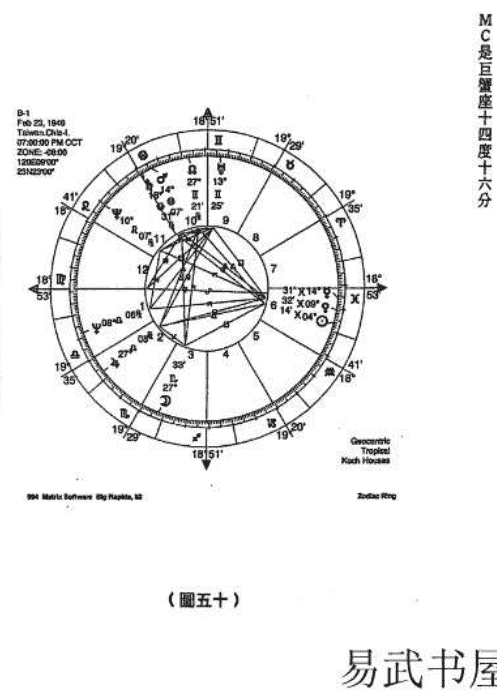

（圖五十）

### 三月二十三日的星盤

火星巨蟹座十八度四四。
土星巨蟹座十七度五七。
木星天秤座二四度五九。

- 一、立命天秤座二四度，以金星為命主星，基本上太太的相貌應該不會太差，能得到人的好感。
- 二、第七宮的宮主星是火星，火星與土星準確相刑，夫妻之間理念不同時比較難以溝通現象，女方會比較堅持，事後應該是男方讓步。
- 三、木星在第二宮，並與北交點形成三分相位，一生中遭遇到重大困難時，都會在事業極有利於與國外有關的事務，特別機遇。
- 四、天王星、北交點在第九宮，天王星在九宮頂點，金星與天王星六○度。

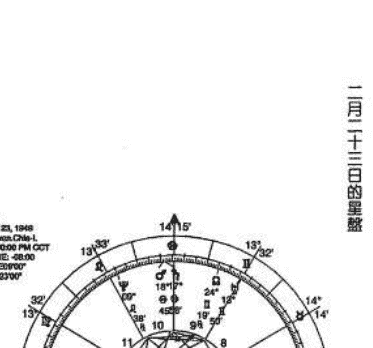

### 二月二十三日的星盤

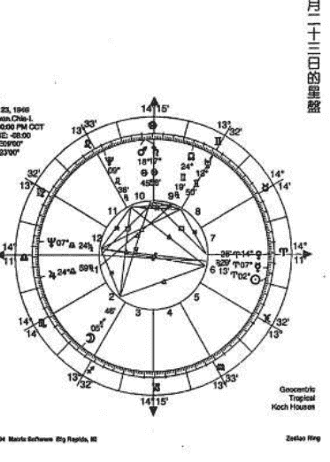

火星巨蟹座十八度四四。
土星巨蟹座十七度五七。
木星天秤座二四度五九。

- 一、立命天秤座十四度，以金星為命主星，金星與第七宮的頂點合相。基本上太太的相貌應該不會太差，屬於比較有亮麗的外形，第一印象就能得到人的好感。
- 二、第七宮的宮主是火星，火星與土星準確會合，與金星九○度。夫妻之間理念不同比較難以溝通，妻子的脾氣會不好，雙方常有爭吵的現象，女方比較堅持，婚後應該是男方退讓的機會率多。
- 三、木星在第一宮，並與北交點形成三分相位。金星在第七宮。一生中遇到重大困難時，都會在緊要關頭時得到貴人相助。
- 四、天王星、北交點在第九宮，天王星在九宮頂點，金星與天王星六○度。事業極有利於與國外有關的事務，商業貿易方面的發展，常有意想不到的特別機遇。

（圖五十一）

## 易武書屋

- 五、水星、金星、太陽在第六宮。水星與海王星形成準確對相。金星與天王星六○度。公司會有一些非常得力的員工，尤其女性職員助力特別大。男性職員可能會有優秀的業務高手，比較起來女性職員會強些。當推運的行星與海王星形成凶相位時，可能員工會出一些問題，業務上、傳真、接洽等，有點混亂的傾向。
- 六、火星會合土星在第十宮。火星會合土星與木星、海王星形成四分相位。

上面的推斷B先生說這些現象基本上都準確，公司女職員是特別優秀，辦事能力強，在公司待就接近十年的，表現很好，對於公司非常忠誠，惟男性職員以往所經歷的約有十多位屬於高級職員，比較多出狀況的情形。

事業並不是平穩的成長，容易大起大落，壓力沈重，需要付出許多的精力。

或許太陽與海王星的相位，以及太陽與月亮的相比擬，太陽與海王星形成對相是入相位，太陽與月亮是出相位，應該要論太陽與海王星所形成的凶相比擬較強，海王星又是第六宮的宮主星，雖然有吉相位化解，不過受剋還是最重，應該是要論男性員工出的纰漏多，女性員工出的纰漏比較少。

隨後又問及兒女如何，第一個小孩頭腦聰明，略有叛逆性。B不置可否，可能這回沒有猜對？占星對於六親的論斷是比較難，第五宮沒有星，僅憑第五宮的宮主星飛到的宮位及相位分析可能的誤差極大，或許需要用其他論斷方式輔助。

## 從太陽以及命度的條文顯示：

太陽落入第六宮：太陽在此有可能對於工作是抱持著非常狂熱的態度，很能表現出工作的才幹，重視職責與工作名聲，有敬業精神能擔任重要的職務，在工作的領域中適合作為領導者，擔任主管。可以從事例行公事性質的工作，有時過於強悍的表現易因鋒芒太露，容易遭到同事的嫉妒無形中顯現的專橫態度也容易造成和同事之間相互不利，一心只顧著事業上的成果卻忽略了自己的健康。

命度在天秤座：相當理性的人，可以從不同的角度來評估事情的利弊得失，而且也能夠虛心的傾聽別人的意見，不喜歡與人正面的產生爭執，很自然能夠勝任於人際有關的事務，合理、寬容的態度樂意聽取他人良好的建議或整合不同的觀點。即使強烈的與人不一致，也會試著去發掘類似的地方和對方協議，會認為協議的方式勝過於強勢觀點。常常避免在任何事上走入極端。不過，過分的靠重與遷就設想太過於周到，考慮的層面太多很容易導致猶疑不決，難以做下最後的決斷。

以上二則大致上合乎B的個性。由於命度在天秤座，比較會用理性來評估事情的利弊，其中「強悍的表現易鋒芒太露」、「無形中顯現的專橫態度」，天秤座應該會修正這些缺失。事實上B的個性算是健談和開朗。

命盤校正要再精確些，要對過去發生的事件再作印證。以「次限法」及「一年一度推運法」詳細的推斷流年。在星盤上最明顯的是火星與土星的合相，非常接近MC，MC巨蟹座二十四度，火星、土星是在十八度左右，一年一度推算，MC一年前進一度，在四歲時，MC會與火星、土星會合，在這一年家庭會有事件發生，父母做生意失敗或者本人感染疾病非常嚴重，可能會持續比較久。

## 印證比對如下：

B：「家族早期務農，當時本人還小，對於家中事務不太清楚，只知道從小身體一直不好，常吃藥。」

「是什麼時候開始，是三、四歲才開始身體變差，還是出生後就不好？」

B：「應該是出生沒多久，印象中時候體質一直很差。」

「如果時間再往前面調八分，體質的優劣改變應該在九歲？這一年推運的ASC與木星合相，體質可以獲得改善。」

B：「應該沒錯，記得約九歲以後，身體好了許多，感覺就很少一直在吃藥。」

「若時間調整在晚上十七點○八分，可能在出生一歲左右時常發燒，持續二年病情好了又犯，反反覆覆。」

B：「有這個現象，能不能看出兄弟姐妹有幾個？」

「占星在這方面很難判斷，目前沒有在這方面作深入研究。」

B：「十八歲如何？」

「十七、十歲算是比較嚴重的事件，可能家中有重大變故，財產變賣、倒閉或家中人員折損。（月亮會合南交點，並與其王星三五度。）」

B：「家中務農，家人倒是沒有發生事故，我在十七歲那一年膽結石非常嚴重，前後醫治了一年多，家裡也因此賣了一些土地。」

「從事業務方面切入如何？」

B：「在上班，還算是順利。二十九歲的運氣？」

B：「二十四歲起有五年左右的好運。」

「財運不吉，可能被倒帳。」

B：「二十九歲被倒閉一千多萬。」

「三十歲情況還是不利。三十一開始就比較好。到三十三歲時人脈關係、財利都非常順利，信心十足。可能在三十四歲會出一些狀況，事業不利，心情一下落入低潮。三十六得到很意外的機會，大有轉機。進財不少。三十七又破財。四十八至五十一業務尚可。」

B：「最後一項從四十八至五十一雖然景氣不佳，但是工廠訂單非常多，不受景氣低迷的影響，到今年（一九九八年）五十二歲為止，自從買下工廠，張家以後員工在業務上常出一些不應該犯的狀況，頻頻出問題。以往也沒有像這樣接連不斷的發生，訂單是很多，單價方面都不錯，就是不敢接太多。」

這幾年的推論依據是，次限法的金星持權在本命盤第九宮，一九九四年（四十八歲）與第九宮內的天王星會合，一九九五年（四十九歲），又與本命盤的金星成六○度。一九九八年（五十二歲），同時又與次限法的木星形成三分相位，這連串的相位組合都是有利於事業的發展，又有發現應該注意次限一直在逆行的木星，本命盤的火星是巨蟹座十八度四四，土星是巨蟹座十七度五七。木星逆行在一九九四年已經愈來愈接近與本命盤的火星、土星形成四分相位，聲勢節節下降，大不如前。

- 一九九四年一月次限法木星天秤座十九度十六。
- 一九九五年一月次限法木星天秤座十九度一○。
- 一九九六年一月次限法木星天秤座十九度○五。
- 一九九七年一月次限法木星天秤座十八度五九。
- 一九九八年一月次限法木星天秤座十八度五四。
- 一九九九年一月次限法木星天秤座十八度四九。

## 易武書屋

二○○○年一月次限法木星在天秤座十八度四三。校正後的命盤如（圖五十二），準確度如何需要再經過一段時間來驗證。

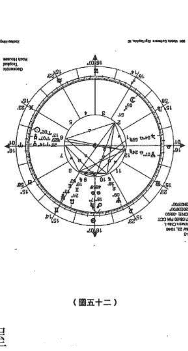

（圖五十二）

## 易武書屋

## 命盤校正例二

伊拉克軍事強人海珊 (Saddam Hussein) 出生於一九三七年四月二十八日上午八點十八分，BGT，Tehrit，伊拉克，43E42，34N26，這是經過占星學家校正的時間。

海珊從小沒有得到母親的關懷，生父不詳，繼父教他作小偷的壞話，（第四宮逆行的海王星），很早離開家，強烈的太陽、天王星會合表示著異國風情，自我野心，巨蟹座冥王星和在人馬座裡的火星、月亮，這是非常凡的行星組合結構。

本命盤木星與冥王星在第二宮與第八宮，形成十分敏感的相位，極富有潛在能力，在權力、信仰的追逐，強調獨立自主，並會以非常的手段來面對一切困難險阻，控制和處理事務，潛意識中帶有頑強的傾向。這個充滿力量的一八○度相位，與在牡羊座逆行的金星形成九○度，刑沖的頂點在第十一宮，造成與國外環境的對抗，他顯然的不顧世界各國的反應。

從占星術最為有力的印證是有兩個事件：

- 一、他在十一歲的時候，懷著一股敵意的心情離開家。
- 二、他在一九七九年七月十六日執掌伊拉克。

占星家作如此校正的理由是：在一九四八年，當他是十一歲的時候，在夏季這段期間，過運（Transits）的天王星與命度結合。（圖五十三）

一九七九年四月，一年一度推運法木星準確的與他本命盤MC會合，並與本命盤的太陽成六○度。同時冥王星推進到他的第四宮頂點，相互形成一八○度。他在七月十六日執掌伊拉克。（圖五十四）

由事件的發生來校正海珊的出生時間，占星學家又從海珊等獲取科威特的星相提出看法：

一九九○年六月，一年一度推運法的月亮一八○度海珊本命盤的冥王星。月亮、冥

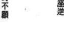

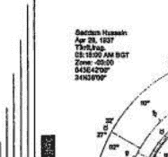

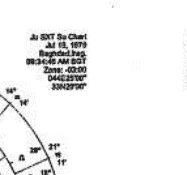

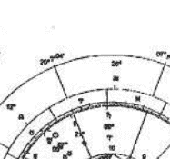

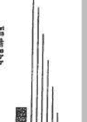

The request was rejected because it was considered high risk