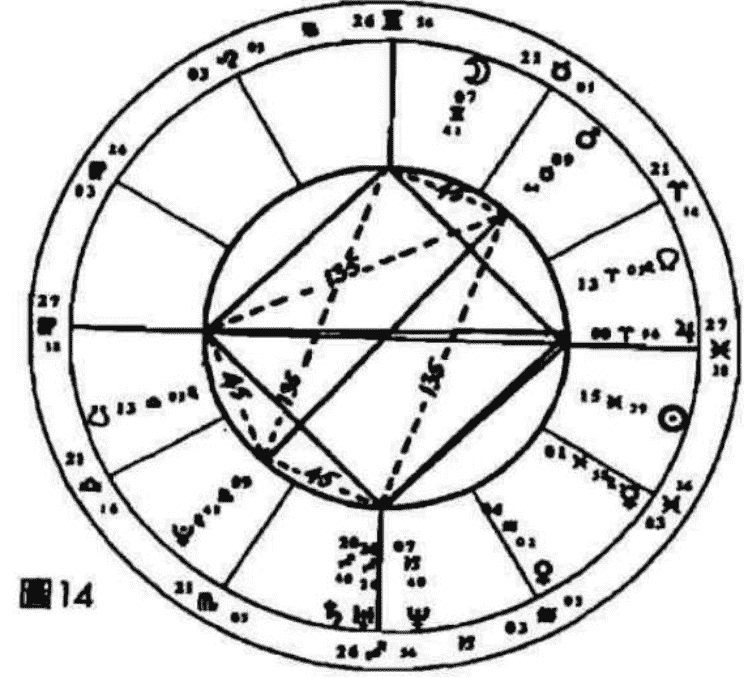
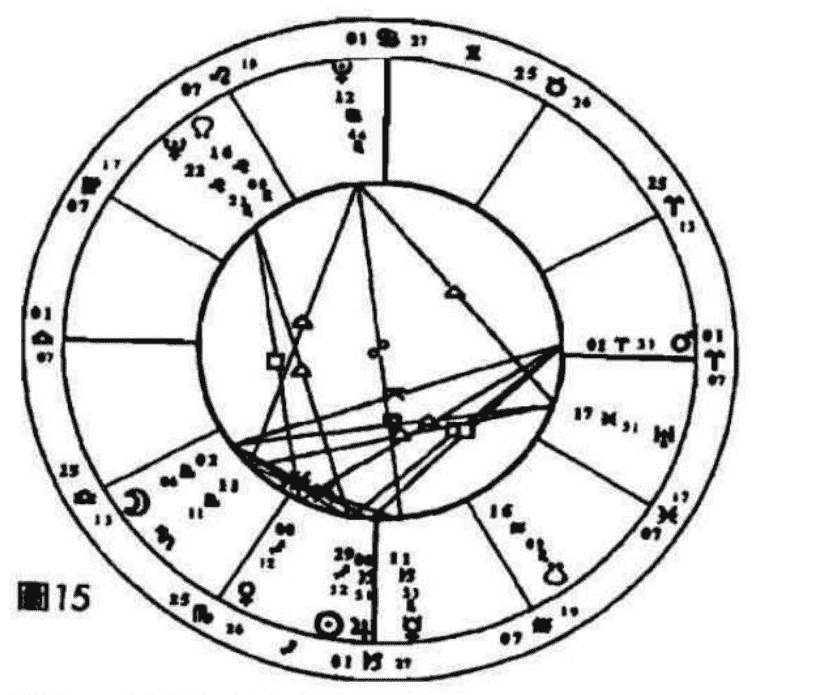

# 目次

作者序

译者序

# 第一部 占星相位导论

第一章 行星

太阳 月亮 水星 金星 火星 木星 土星 天王星 海王星 冥王星

第二章 相位的计算与星盘的划分

第三章 相位的意义

合相 对分相 三分相 四分相 五分相系列 六分相 半四分相和八分之三相 十二分之五相 半六分相

第四章 谘商时的相位诠释

第五章 相位的元素与星座特质

# 第二部 相位的组合

第六章 太阳的相位

太阳——月亮 太阳——水星 太阳——金星 太阳——火星 太阳——木星 太阳——土星 太阳——天王星 太阳——海王星 太阳——冥王星

第七章 月亮的相位

月亮——水星 月亮——金星 月亮——火星 月亮——木星 月亮——土星 月亮——天王星 月亮——海王星 月亮——冥王星

第八章 水星的相位

水星——金星 水星——火星 水星——木星 水星——土星 水星——天王星

第九章 金星的相位

金星——火星 金星——木星 金星——土星 金星——天王星 金星——海王星 金星——冥王星

第十章 火星的相位

火星——木星 火星——土星 火星——天王星 火星——海王星 火星——冥王星

第十一章 木星的相位

木星——土星 木星——天王星 木星——海王星 木星——冥王星

第十二章 土星的相位

土星——天王星 土星——海王星 土星——冥王星

第十三章 外行星之间的相位

# 第三部 星盘上的四交点

第十四章 上升点和天顶的复合面向

上升点和下降点的对分性 天顶与天底的对分性 父母和天顶、天底的关系

第十五章 行星与四交点

太阳与四交点 月亮与四交点 水星与四交点 金星与四交点 火星与四交点
木星与四交点 土星与四交点 天王星与四交点 海王星与四交点 冥王星与四交点

星盘附录资料

参考书目

# 作者序

用相位诠释星盘上的能量互动

我在 1970 年左右开始学占星学，就像大部分的学生一样，一旦发现了这门学问，便开始无法自拔地迷上了它。不过当时我并没有想把它当成一项职业来发展；我只是对他着迷，而不急着拿它来做什么，所以我的学习过程非常缓慢冗长。后来当我有了深入的研究，而且已经取得了这方面的资格，才开始为个案咨询。我越来越清楚星盘里最重要的部分，也是急需要被了解和诠释的部分，就是行星的相位，可是我几乎找不到这方面的现代化资料。

即使如此，市面上仍然有一些关于相位方面的卓越著作，譬如史蒂芬·阿若由（Stephen Arroyo）对外行星的解说、丽兹·格林对土星的崭新诠释，或是卡特的经典作品《占星相位》（Charles Carter “Astrological Aspects”）。可惜的是，《占星相位》已经有些过时，而且没有把冥王星纳入讨论。此外，比尔·提尔尼的《相位分析》（Bill Tierney “Dynamics of Aspect Analysis”）虽然对相位的图型研究作出了无价的贡献，却也没有进一步提出深入的看法。

由于我自己需要在这方面有更深的认识，而且教学之后发现学生们也很渴望更深入地学习，于是这本《占星相位研究》便因此而诞生了。我是以非常低调的经验式研究方法来观察相位的涵义，本书内容就是我研究的成果。

占星学的诠释技艺就在于如何把各种象征符号，整合成一个综合性的结论，这也是诠释占星学要达到的目的。举例来说，当一位占星师在考量水星落入射手座和四宫的涵义时，必须先充分了解上述行星、星座及四宫所代表的意义，以及由水星主宰宫位里的情况。一般的占星学子都有能力把不同的元素拼凑起来，然而一旦意识到水星并不是一个孤立的元素，它会跟其他的行星或交点形成各式各样的关系——也就是「相位」，便开始有点无所适从了。发生这种情况是很自然的事，因为诠释相位是非常复杂和困难的功夫，即使是有经验的占星家，也可能面临一些问题。

尽管如此，我们还是应该努力发展出对相位的诠释功力，因为相位就是一张星盘的能量所在。这些能量能够把天宫图从毫无生气的一张纸，变成能够象征人类生命力与活力、冲突与喜悦的符号。星盘里的相位就是一个人建构人生的原料，而且星盘不只是局限在对人性或人生的研究，它同时还能代表时间发生的时刻，问题提出的时刻等。

相位描述的是情节本身，星盘描述的则是实际发生的事情。在个人层面上，行星相位代表的是心理学所谓的「情意结」（complex），然而就像荣格所言，与其说是一个人怀有情意结，不如说是情意结占有了一个人，要来得更贴切一些。换句话说，相位在描述命运上面扮演着重要的角色，同时也代表我们必须面对和转化的部分。

星盘的本质是非常独特的，必须加以整体性的观察。像本书这样的工具书永远有它的局限性，因为我们只是从整张星盘的内容中撷取一部分来加以诠释。不过无论如何，我们仍然得从某个地方着手才行。我衷心期盼本书能为研习占星学的读者带来一些实际的帮助。

# 译者序

从占星相位看因果业力

藉由翻译阿若由和汤普金的占星力作，以及近十多年来的亲身经验和观察，我已经越来越被说服：占星学的确是一门精确无比的因果业力科学。

所谓的「因果业力」，按西方科学的解释，就是一种宇宙性的先决条件，也可以说是人和太阳系之间保持微妙平衡性的电磁场——中国道家的修练者称其为「玄空造化场」。东西方的科学及玄学，均主张人类的神经系统会被宇宙行星强烈的影响，而且行星在人类的各种事物中，也扮演着超乎想象的重要角色。

如果说一张星盘里的行星代表的是经验的面向，星座代表的经验的特性，宫位代表的是让行星和星座的能量运作的领域，那么相位代表的就是各种经验面向的统合运作方式。由此可知，相位显然是本命盘里最重要的部分，而且在生命周期循环或是所谓的流年推运上面，推进的行星和星盘里相位形成的角度，更是生命发生重大事件和内心产生转化及蜕变的关键所在。

从几个主要的相位，譬如 90 度角、180 度角、合相、120 度角、60 度角或是 150 度角等，我们可以很清楚地看出，所谓的「困难相位」的确会带来过度的敏感、缺乏自信、需要证实自己的能力和强大的成长意愿，而「柔和相位」则会带来不假思索、运用自如、轻松懒散和顺利的特质。因此，相位不但能决定一个人将会在此生奋力达成某种具体成就，或是选择以放松的方式享受人生，同时也能决定重要关系的互动是否会遭遇显著的挑战和考验。

举个例子，一位女士的星盘里有水星与火星 120 度角，代表她的言语和意志力间有高度的协调性，也代表她的表达和反应相当敏捷，而且不假思索的倾向；此外她的水星与冥王星成 90 度角，代表在沟通表达上有种强迫性的不信赖感，以及想要侦测他人真实动机的渴望。但是她的先生却有水星与土星的 180 度角，水星与海王星的 90 度角，水星与木星的 120 度角，以及水星与凯龙星的 150 度角；这意味着先生的思想及表达方式受到土星的影响，有强烈的需要被尊重、被认真看待的渴望，但心底深处很怕自己的言语不够周详、无法说服别人，而海王星却常常令他语焉不详、无法清晰地解释内心细微的想法；落在 3 宫的凯龙星则代表他在手足关系和求学时期，曾遭遇过智力方面的内心创伤；水木的 120 度角则有好为人师、善于表达宏观理念，却容易忽视日常现实的倾向。他的这些倾向自然会投射到亲密关系和下一代的身上，使他渴望在沟通时被家人视为权威和有理的一方，不幸的是家人却觉得他的语言不切实际，容易带给人压力，而他当不成权威也往往会立即光火。

占星谘商师在辅导这对夫妻时，不但要支持这些水星相位带来的沟通障碍，以及背后的心理症结点，还要替案主设想一些可能的改善方式，譬如建议先生透过研究某种学问或技艺（水土相位的潜能），或者教导他人某种文化现象背后的真理与意义（水木相位的才华），甚至发展出写诗或创作的能力（水海相位的内在驱力），来治疗智力上的深层创伤（水凯相位的内在意涵）。在妻子这方面，则要建议她信任自己的直觉，但同时要发展出三思而后言的客观意识，以及尊重先生意见的包容性，同时要减低言语的攻击性和怀疑他人动机的倾向。

当然，这个实例之中还有许多其他的重要相位必须考量，并且要观察两人星盘对比之中的数十个行星互动的关系，以及流年大运的相位所代表的人格及心理转化意涵，方能全盘地让个案理解生命遭遇背后的秩序和意义，以及宇宙大电脑的因果业力程式背后的善意。

诚如作者苏·汤普金所期许的，本书的确突破了西方占星学相位著作的不足与局限，而成为当代的一本相位经典之作。但愿已经有些基础的占星学子能从中获得更清晰的洞见，切实地转化自己的执着习性，改善重要关系的互动品质，往意识更高的层次发展及成长。

胡茵梦于台北·2010

# 第一部 占星相位导论

# 第一章 行星

本位的诠释乃是要改善和突显与行星相关的基本心理议题

## 太阳

我们对自己的身份认同。我们认为重要和光荣的事。我们最热衷的事物。生命力。重要性。自尊。启蒙。我们的意志。目的和未来的目标。我们获得的赏识。

对我而言，精确地诠释太阳的意义是很困难的事，有时它会被描述成代表自我的象征符号。或许我们必须先弄清楚所谓的「自我」是什么，我个人会从荣格的角度来诠释它：自我代表的是人格的整体，包括意识和无意识的所有部分在内。

这么一来，自我很可能会超越天宫图诠释的范围，或者至少包含了整张星盘的内容。总之，太阳似乎是星盘里最重要的部分，就像乐团里的指挥一样。它的确能代表我们的人格核心，如同原子之中的原子核一般，但这不表示这个核心部分很难被充分了解，你只是很难从最深的角度去定义它。

我认为太阳的确象征着我们的自我，也就是我们认为或认同的自己，因此和太阳形成相位的行星，也会影响我们认同自己的方式。譬如我们对自己有没有好感，还是自我形象很差，或者根本没有任何形象可言？太阳的相位会在这些问题上面带来一些启发。与太阳形成相位的行星若不是能调和，就是会否定我们太阳星座的特质，譬如木星与太阳形成紧张相位，便可能夸大太阳星座的特质；土星则会压抑或阻碍太阳的特质，或是会驱使我们为这些特质下精确的定义。

就像天空的太阳提供光与热一样，星盘里被太阳触及的任何一个部分，也会立即变得光明和温暖。太阳触及任何一个行星，这就会照到那个行星上面，为其带来力量和权利。但是困难行星或是与太阳形成困难相位的行星，也会损害太阳的能量或力量，就像在晴天里戴着墨镜一样。如果上升点及其主宰行星代表的是我们的人生旅程、交通工具，以及我们必须走的路，那么太阳代表的就是我们的目的地及面临的挑战。太阳带有一种强烈的未来性，能描绘出我们将发展的方向，月亮则能描绘出我们的来处。

太阳的另一个关键词是『意志力』。其实火星与太阳都能描绘出我们的意志力、性格倾向、对未来的期望或欲望，也就是我们渴望成为的自己、想要形成的性格特质，以及想在人生中成就的事情。简而言之，太阳似乎能道出我们人生目的、渴望达成的任务，以及如何带着觉知去活出那个目的。太阳落入的星座和宫位当然是我们所重视的，甚至可能是我们最重视的生命领域。被太阳触及的行星也格外受到我们的重视；这个行星也能道出我们想要被看待的方式，以及在达成此目的的过程中可能面临的困难。

举例来说，太阳与土星形成四分相往往代表着有权威议题。有这个相位的人很渴望被人看成某个领域里的权威，却很难接受别人的权威性，也可能在成为权威的过程中面临一些困难。

太阳会让我们说出：『这就是我的人生目的、我的方向和意图。』我们也会在太阳代表的领域中道出：『我要在这里展现出一股不可忽略的力量，我要在这里做我自己，变成一个独特的人，而且要本着我自己的方式。』如果太阳描述的是我们的倾向和做事的方式，那么和太阳形成相位，就会像是指出我们的阻碍或阻力是什么。

太阳的确是自我核心的部分，与太阳形成的相位，则能道出以自我为中心的形式方式会不会遇到困难，在接纳自己和认同自己的过程里是轻松还是辛苦的。
太阳落入的位置是我们寻求自我认同和发光发亮的生命领域；得到了别人的赏识，我们才会更认同自己。如果得不到别人的赞赏，我们就会不断地寻求别人的注意。这些从太阳的相位和落入的宫位都可以看出一些端倪，我们可以举几个简单的例子来说明：太阳与火星的相位代表：『注意我，我是强壮的。』太阳与海王星的相位则意味着：『注意我，我是别人的救赎者。』或者『我是个受害者，你能不能拯救我？你不为我感到难过吗？』太阳与天王星的相位则代表：『注意我，我和你是不一样的。』太阳与土星的相位道出的是：『请注意我，因为别人很少留意到我的存在。』太阳触及到的行星都会让我们为其所代表的面向感到光荣。

如同任何一本展现工具书的诠释，太阳描述的是我们的活力、意志力，以及固有创造性的自我表现。我向来觉得『富有创造性的自我表现』是一种相当含糊的说法。但是不管怎样，与太阳形成相位的行星，的确能帮我们找到或表现出我们的独特性。太阳落入的星座和形成的相位，当然会影响到我们的生命力与活力、它跟火星一样也能帮助我们对抗疾病，以及注定会面临的命运。荣格用『个体化』这个字来描述英雄之旅的过程。根据《牛津英文字典》的解释，个体化的意思是『形成一个独特的人或存有，为一个人带来具体的形式。让一个人和其他人产生区别。』这就是太阳真正的使命。在这场英雄之旅的过程里，使我们变成一个独特的人的能量，就埋藏在我们内心深处。如同丽兹·格林所说的，橡实可能长成一颗橡树，但是每颗橡树都是独特的，使它具有这份独特性的东西，就埋藏在橡实里面。所以太阳几乎能代表一个人寻找身份认同的整个过程。与太阳形成相位的行星，不但能帮我们定义这位英雄的模样，还能描绘出这个人将会面临的挑战，它所有的内在特质都会造成这个整个过程的障碍或是助益。

太阳也是盘里象征父亲的符号之一，这里指的是生身父亲，促使我们诞生出来的那个男人，也是提供孩子身份认同的典范。

## 月亮

感觉。反应。母亲。家。偏好的食物。家居生活习惯及一般的习惯。适应性。提供我们安全感的地方。让我们退隐的地方。滋养及被滋养的方式。

月亮代表的是我们渴望滋养和被滋养的需求，也代表照料和被保护的需要。即使是成年之后，我们的内在仍然有一个充满这需求、渴望、依赖、想要被保护的婴儿。从月亮的相位能够看出我们在滋养别人或是得到安全感上面，会不会遭遇困难。

月亮落入的星座往往能描绘出什么东西能抚慰我们；月亮的相位则代表获得抚慰的过程会有什么助力或障碍。

月亮、天底、及其主宰行星都能广泛地描绘出我们的背景：我们情感的背景、家族根源和历史。月亮也代表我们的行为模式，特别是童年时在家庭环境里惯有的情绪反应；这种反应往往会延续到成年。月亮及其相位都代表我们会自动产生的反应。假如月亮与火星形成相位，我们的反应往往是快速的，好像随时准备要行动似的，也可能带着一股怒气；月亮和土星的相位，则会让一个人以谨慎小心的方式控制自己的反应。

月亮的相位也代表我们在表达感觉时是否轻松，或者那些感觉的本质是什么。我们的感觉与眼前的情况和周围的情绪基调有关；虽然我们有时无法充分意识到这些情绪基调，但往往已经吸收进来了。

月亮也代表我们的家，以及我们在家居生活中的偏好。家是便利我们生活的地方，因此月亮也能描绘出我们的适应力，包括对人和各种的生活情境的适应力。理想的情况是我们应该有能力适应各种不同的人和经验，而每一种新的情况都会带来一些改变，造成不同的情绪和行为上的反应。

月亮同时也象征着供我们退隐的家或地方，在这里我们会感觉很安全；我们可以穿着拖鞋到处走来走去，不必在意外界的看法，月亮同时也会影响到我们对自己的感觉，而这又会进一步地影响我们和他人的互动，以及他人会产生的反应。当然月亮也能描绘出我们的源头，或者小时候是否有安全感，譬如月亮如果和天王星、土星或冥王星形成困难相位，就会令我们觉得世界不太有安全感。同时月亮也能道出我们的生活习惯，譬如边喝咖啡边抽烟久了，就会觉得喝咖啡如果不抽烟，感觉不怎么对劲。

同时月亮的相位也能描绘出我们是不是一个容易相处的人，或者与别人相处是不是一件容易的事。当然这仍旧与我们的适应力和情绪上的安全感有关。如果我们觉得做自己是很安全的事，态度就会自然，也比较能适应别人的生活方式和习惯等等。

月亮也是代表母亲的重要象征符号。我们每个人都有生身母亲，我们的月亮代表的就是我们所经验的她；同时月亮也能道出影响我们至深的其他照料者。即使一个孩子被许多家庭领养或是从小在孤儿院里长大，我们仍然可以从他星盘里的月亮，看出所有的照料者和生身母亲的情况。月亮代表的是：「无论如何我都接纳你。我会保护你。我会提供一个安全的地方，让你自在地探索自己和表达感觉。而且，不论你的感觉是恐惧、焦虑或是愤怒，我都能包容。」

如果童年生活很理想，就能得到上述的滋养。不管怎样，第一个与我们产生紧密连结的人就是母亲，毕竟我们在她的肚子里吸收了她所有的情绪和感觉，就像吸收食物里的营养一样。她是第一个与我们连结的人，也是第一个给我们无条件的爱的人。

月亮似乎的确代表我们的母亲，不过也有可能代表父亲或是其他的照料者。我们通常可以从月亮落入的宫位及次宫位的主宰行星或其他元素，看出母亲之外的照料者的情况。

不论如何，月亮落入的星座、宫位和相位，都能描绘出我们童年时的感觉，特别是跟安全感有关的情绪。我们母亲有多大程度的安全感。我们如何保护和照料别人，或者照料别人的时候有没有困难，这一切都受月亮的影响。

## 水星

思想。语言。书写。沟通交流。理性思维。意见。与人连结。手足。
学校。学习方式。

星盘里的水星代表的是一切形式的沟通交流，它的相位代表的则是我们表达自己的方式，至少能代表非感性的言语沟通。被水星触及的行星或交点，会让我们产生强烈的书写、交谈和思考的欲望。水星是一张星盘里负责串联的要素，它扮演的角色有点像是中介，因此这个行星在意识的提升上有举足轻重的作用。如果水星和土星形成相位，可能会让一个人更有机会思考和表达内心的恐惧；而水星形成这种相位，也会让一个人更能意识到土星代表的意义。即使水星与其他行星形成困难相位，也能带来一些成长，因为水星会让我们从不同的面相，去检视和思考自己的心理状态。

提升意识当然有许多途径，水星提供的途径或许只是其中之一，但往往是比较容易领会到的。水星有一种命名的作用，或是扩大它的意义，也可能和别人谈论它。水星的相位也能显示出我们在认识自己的过程中遭遇的障碍，当然也包括学习的情况在内。譬如水星与土星形成相位的话，那么在自我认识和受教育的过程里，很可能有许多恐惧。如果水星与火星形成相位，那么在发展自知之明的过程里，往往会有许多愤怒和冲动。

当然我们的脑子里最常想到的东西，不能只从水星落入的星座或宫位来观察；譬如一个人的七宫里如果有强烈的能量，或是天秤座被强化的话，显然会把焦点集中在关系上面，不论水星是否落在七宫或是天秤座。总而言之，水星落入的星座、宫位和相位，都会影响我们思考、说话和沟通的方式。更重要的是，水星能描绘出我们将如何表达心中最重视的事情。如同本命盘里的任何一个行星一样，水星也不能以单一的方式来观察，它永远会受到星座、宫位以及其他要素的影响。譬如我们从单一的方向来看水星的话，它代表的比较是客观的理性思维；这样的思维方式不但没有偏见，也没有任何道德意识。因为水星根本不关切对错的问题，所有的原则、伦理、道德和意义的问题，都是由木星管辖的，而木星管辖的星座与水星管辖的星座，刚好是对立的。水星可以说是神的使者而不是神本身，而有权力作出论断和提供意义的只有神。水星只关切眼前的资讯，它并不关心获得的资讯是否有用，甚至不在乎它是否真实。

水星同时也跟我们的意见有关，我们很难对任何一个主题有全盘性的认识，所有我们作出的论断永远是建立在不周全的意见上面，而我们的意见则反映出我们对一件事的信念和认知方式。我们都承认所谓的客观知识根本不存在，因此水星落入的星座和形成的相位，都会影响我们趋近客观性的能力。我们必须有客观性和理性，才能避免往偏见发展，但这种品质是跟我们的感觉对立的，而我们通常会过度重视感觉。世界如果缺少了感觉和价值观，不但会变成一个无法想象的地方，而且可能会变得相当怪诞。因此，水星的相位和能量的高低，都可以让我们看出一个人重不重视理性思考。

如果水星形成的是困难相位，代表这个人的意见经常遭到挑战、试探和他人的反对。或者他们会期待遭到挑战；成柔和相位则会呈现相反的情况。一个人之所以会跟别人意见不合，经常是因为他们表达意见和想法的方式有问题。水星成柔和相位的人比较不会惧怕不同的意见威胁，所以比较能自在地表达自己。他们不会对水星落入的生命领域过度敏感，所以也不在乎别人是否赞同自己，他们甚至喜欢听到不同意见。水星的柔和相位也意味着此人的意见容易得到他人的支持，或是得到自己人格其他面向的支持，故而会沿着特定的轨道思考。话说回来，任何意见总是奠基在不完整的证据和理解上面的，所以意见遭到挑战也不是什么坏事，反而会拓宽我们的想法，增强我们的思维能力。水星的柔和相位，特别是三分相，也可能令一个人过于自满，困难相位却会促使一个人成长。

人在一生中到底能改变到什么程度是很难确定的事，但是我们的态度和想法的确可以改变，促成这种改变的就是我们的水星。我们的态度必须先产生变化，行为和生活方式才会跟着变——能量永远会随着思想而改变。如果从这个观点来看，我们可以说水星握有使我们成长的那把钥匙。

水星最关切的就是与人连结，「智力」则是很难被定义的东西。智力测验能够显示出一个人在智力测试上面的能力，但不能代表含意模糊的「智力」。如果智力测验能够揭露某些事实的话，那么它揭露的一定是受测试者的快速联想能力——这种能力是可以被教导的，而且显然是水星的特质之一。学校的象征符号也是水星，我们在学校里学习的就是如何串连事物，同时学校也教导我们如何收集资讯、消化它们以及将它表达出来，换言之，我们在学校里学习的就是阅读、书写、沟通和各个层次的语言表达。水星落入的星座以及相位，可以显示出我们在学习上面是否会碰到障碍，还是能得到支持。

水星同时象征着运输，而运输代表的就是把某个人或某个东西从一个地方运到另一个地方。水星同时也象征着兄弟姐妹。我们会很惊讶地发现水星加上三宫里的情况，往往能精准地描绘出我们与手足的关系。孩子可以从兄弟姐妹上学到许多事情，因为兄弟姐妹扮演的是彼此之间以及和父母之间的媒介角色。

## 金星

合作、给予、分享、妥协。美。爱。价值。比较。艺术。品味。交换的方式。金钱。让自己和他人快乐的方式。

金星象征的是分享与合作、给予和追求和谐的欲望，同时也象征着爱与被爱。金星的相位能道出我们有多么重视人缘，有没有适应别人的能力，在达成合作与和谐性上面是否会得到支持。譬如金星与天王星成四分相的人，往往会觉得自己既想保持自己的独立性和独特性，又想追求人际的和谐互动；或者我们可以说，这个四分相会制造一种紧迫的需求而导致紧张，最后这类人会发现有关系比没有关系更自由。

我们都有一些关系上的问题，这也涉及到金星的给予和火星的获取之间的矛盾性。与金星及火星形成的相位，可以描绘出这些问题的本质，也能促使我们找到解决和治疗这些问题的方法。如果金星是一张星盘的焦点所在，而且此人不惜牺牲火星的特质来达成金星的目的，譬如过度顺服或强调合作，那么金星的原则就会被丢出窗外，以牺牲自己的做法来满足别人的需求。行星与金星形成相位可能有一种过度妥协或是不肯妥协的倾向，通常是这两种情况都有。金星的法则就是维持和谐，如果受到其他行星的影响，便可能不惜一切地追求和平。金星也总是从最美好的角度看事情，相信事情都有最好的结果。如同卡特（C.E.O Carter 英国占星家、首任占星研究学院院长）所说的：『金星容易聚焦在人与人共通的兴趣及共通点上面，而刻意去忽略和别人的差异。』

表面上看来金星好像是给予的一方，火星好像是获取的一方，因此金星似乎代表好人，火星则代表坏人。然而事情并没有那么简单；金星的给予通常是想得到一些回报——爱、受人欢迎或是金钱；火星的法则虽然是获取，但至少它在这方面是诚实的，况且也还是有回报能力。譬如我们给了人一件礼物，他收了这件礼物之后觉得非常开心，我们就会因此而觉得快乐和满足，所以他取得的同时也在给予。

金星的心声是：『我要你想要的东西。』火星的心声则是：『我要我想要的东西。』因为这两个行星的法则是对立的，所以应该把它们看作是一对行星，不该是单独地去观察其中的一个。由于金星不带有竞争性，所以特别关切和平的议题。

如果说月亮象征的是母亲，那么金星代表的就是年轻的女人（火星代表的则是年轻的男人）。如果我们从内在的女性角色来观察金星，以及观察这个内在角色和星盘里其他角色的对话，将会是很有帮助的事。

金星注重的是关系议题，例如给予和接受感情方面的能力，以及能带来浪漫爱情或是性关系的社交情况。我们的金星能道出我们以何种方式吸引人，譬如金天有相位的人往往以不寻常的方式吸引人。在别人的眼里金天型的人特别有魅力，充满着令人惊奇的特质。我们吸引人的方式以及我们看重别人的部分，反过来也会影响我们自己的穿着打扮和行为。金天型的人可能会把自己打扮成与众不同的样子，金土型的人在打扮上面则有许多恐惧，他们会穿得比较低调。但是重点并不在如何打扮，而是衣着代表的心态是什么。我们可以从与金星形成相位的行星，看出一个人如何以及为何有那些心态。

金星不但注视外表和各方面的品味，而且特别关注价值问题：我们如何看待自己和别人的价值？我们最重视的是什么？理由是什么？这个行星也代表我们的美感和审美能力，同时也象征金钱；金钱本是换取我们重视的东西的一种工具。最重要的是，金星关注的是各个层次的交换方式。某些占星家把木星和金钱连结在一起，但是我从不认为这是个正确的看法，虽然木星也象征着广义的财富，但木星比较不像金星那么关注物质上的价值。

由于金星重视的是令我们愉悦、能带来美感的事物，所以也象征着艺术和音乐。艺术往往与享乐有关，而享乐就是金星的另一个关注焦点。事实上我们的金星完全能描绘出我们是如何追求美和享乐的。基于此理，所以，金星也能道出我们是否允许自己享受人生。我们的金星落入的星座、宫位和相位，决定了什么东西能使我们重视、感激和爱他们。金星的相位则能道出我们是否有能力令自己和别人感觉快乐、被爱和受到重视。

另外还有一个重点，当金星触及一个行星时往往会「软化」对方。不管那个行星代表什么，金星都会使它变得柔软，比较有伸缩性。同时金星也会帮助另一个行星得到慰藉和享受，带来温柔甜美的特质，感觉比较轻松自在，但是也可能带来障碍。

## 火星

生存。应变能力和勇气。耐力和战斗力。自我确立。大胆。竞争。行动。

传统认为火星有害的程度比某些行星要少一些。我个人不喜欢采用有害或有利之类的形容词，因为所有的能量都会带来一些助益，而且是必要的。同时它们也可能变成负向的运作方式，如果我们不以妥当的态度来运用它们的话。

我们的确想要火星的能量，因为它最主要的作用是在各个层面上帮助我们生存下去。对某些人来说，最好地运用火星的能量可以为我们带来勇气和耐力，但是勇气并不是意味着承认自己的脆弱和恐惧。火星的能量可以使我们「吃苦耐劳」，在事情变得棘手时站稳双脚，我们需要火星的能量来面对压力，以免紧张的生活下折损自己。火星落入的星座、宫位、和相位，能描绘出我们护卫自己时采取的工具，以及我们在运用这些工具时的感觉。困难的火星相位代表我们很难护卫自己，譬如火星与土星形成相位，意味着在护卫自己的时候会有恐惧。某些火星的相位也可能使人太急于保护自己，即使外界没有任何威胁，也仍然有这种倾向。火星也关切自我确立的问题。自我确立就是宣示自己的兴趣所在，坚守自己的立场，以积极的态度保持自己的独立性，特别是在面对压力时。当然这不代表去欺凌别人，或是以粗鲁的态度对待别人——这是经常会见到的误用火星能量的状态，同时也解释了为什么这个行星的名誉不佳。由于自我确立也意味着有伸缩性，能够以健康的态度面对别人的需求，所以也必须用到金星的法则。如果星盘里有金火的相位，就会发现确立自己是件很难的事，因为当我们想确立自己的时候，也很渴望受人欢迎，而且觉得两者无法兼具。另外我们也可能缺乏信心、恐惧、觉得自己无能（水火相位），或者认为选择轻松的方式会比较讨人喜欢（金火相位）等。

火星不但能帮我们对抗外界的压力，也能帮我们面对内在冲突，以免被送进精神病院。但是压力太大的时候，我们也可能因为火星的反应模式不当，而被送进精神病院。同时，这个行星也跟我们对抗疾病的能力有关，最重要的，火星描述的是我们的欲望和生存的意志力。为生存奋斗意味着渴望活下去，因此火星加上金星的能量，带来的是享受人生的能力。

火星也跟一切形式的「竞争」有关。在运动和锻炼时，我们可以和自己或别人做良性竞争。研究显示，经常运动的人的自我形象和自我感觉，都比不运动的人要好，而且也比较有效率，不容易将错误归咎于人——运动的确能使我们的身心都健康。

火星的相位则代表我们对竞争的整体感受。譬如我们和金星的相应程度超过火星，就不会有明显的竞争倾向，但是生存反而会变成一个心理议题。另外我们也可能带有强烈的竞争性，因此容易投入与人竞争的情况。反之，我们也可能完全避开竞争的情况，因为无法拔尖领先太令人难受了。

火星的能量是比较自私的，因为它只关注自己想要的东西。火星的相位则代表小时候大人如何教导我们面对自私这件事情。有些父母会告诉孩子自私是不对的事（也许火土有相位），因此孩子长大之后很难要求什么或是去争取什么，还有的人是在充满着竞争性的环境里长大的（譬如太火有相位，或者与上升点有相位），因此从小学到的就是人必须积极地争取一切，才能生存下去。这类人长大之后很难让事情自然地发展，总觉得必须不断地积极前进。火星的相位以及落入的星座也代表我们表达愤怒的方式、对事物的热切程度，以及在完成事情上面会不会遭到困难。

火星带来的行动也可能导致意外。意外往往是源自于错置的能量，也可能是未表达出来的愤怒所导致的——挫败感会找到一个释放的管道。火星同时也跟发烧有关，而且的确掌控着我们的热能和性能量。

火星也代表我们做事情方面的胆量。当我们大胆地决定去做某件事的时候，其实会变得相当脆弱，因为我们也可能失败或是失去一些东西，因此火星也能显示我们会以何种方式来展现勇气和胆量。纯粹的火星能量是非常脆弱的，因为它会驱使我们大胆地向外获取某些东西，而当我们展示这种胆量的时候，手上的牌是完全地摊在桌面的。

火星和金星也都象征着我们的性爱活动，其中的金星和性行为中的和谐性及享受有关；火星则与性上面的驱力有关，包括追求、征服和插入。当然这也会导致脆弱的感受；你只要想象一下男性的生殖器裸露在外的情况，就会了解为什么了。

火星也会为它触及的行星带来加快速度的特质。那个行星的速度不但会加快，而且会让人在展现其他能量时缺乏耐心，也可能在相关的生命领域展现出一股力量。火星的法则很容易转换成行动，因此被火星触及的那个行星也会寻求行动上面的表现。火星与太阳也都跟意志力有关，《牛津英文字典》就将意志力诠释成「导向有意识的行动的作用力。」

由于火星的法则是诚实追求自己想要的东西，因此星盘里如果有明显的火星能量，往往会带来勇敢的精神，虽然误用它也会使人显现出一种强迫性。

## 木星

扩张。膨胀。夸大。智慧。意义。信念。愿景。信心。贪婪。

某种程度上木星的相位是比较容易诠释的，因为它最主要的特质就是带来扩张的能量。被木星触及的行星能量都会扩大，要留意的是，大并不一定就好，因为如果那个行星已形成困难相位的话，木星反而会使它的困难加剧。
在意外事件和灾难的星盘里，木星一向有着显著的影响力，特别是与火星、天王星或冥王星这些代表暴力及意外事件的行星形成困难相位时。木星之所以与这类问题有关，可能有好几个理由，其中一个是这类灾难往往涉及道德、宗教和哲学信念方面的问题——我们应该还记得宙斯曾经在奥林匹斯山顶投下霹雳闪电这件事。简而言之，被木星触及任何一个元素都可能被夸大。
木星的星座、宫位及相位，往往能道出一个人如何成长、扩张以及找到生命的意义。它会使我们渴望做「大事」，而且渴望在它落入的生命领域里拥有自由探索的空间。但最重要的，木星代表的是生命的意义，它令我们超越眼前的事实和情况，看见背后更深刻的意义和目的。无论在宗教、哲学、政治或其他面向，它都会促使我们追求生命的意义，而每一次当我们试图看见事件背后的意义和目的时，我们都是在行使木星或九宫的法则。当木星和其他行星形成相位时，我们就会把另外那个行星哲学化；我们会思索那个行星的法则代表什么，而且会在那个行星代表的领域里展开双翼，尽可能地翱翔。
木星的相位同时道出了我们信仰的本质和态度，譬如与火星形成相位会带来攻击性，与土星形成相位会带来谨慎的特质。木星加上火星会让我们为自己的信仰出征，木土的相位则代表必须很努力才能发展出信仰。火木的相位也意味着渴望获胜、竞争性强、喜欢率先行动。火土的相位则意味着重视责任、相信形式和物质。
因此木星的相位道出了我们在信仰上的态度，以及我们相信的是什么。寻找生命的意义和目的，是我们不可或缺的一种需求；如果我们相信自己受苦有更高的意义和目的，就能以更佳的态度来面对人生的困厄。世上最主要的信念系统就是宗教，而木星的相位往往能道出我们和神的关系，不论我们认为的[神]是什么。木星同时也代表其他的信念系统，譬如让我们以宗教狂热式的激情去追求的政治。
圣经告诉我们上帝以他自己的形象创造了人类，因此我们的木星相位也能说明我们在生活中[扮演上帝]的方式。如果我们认为自己的信念系统是唯一正确的，那么我们不但自大，而且是在扮演上帝。这当然是把木星的法则扭曲了，因为我们都知道上帝是包容一切的，包括宗教上的一切表现形式和仪式，以及我们所抱持的不同世界观。木星的相位、九宫里面的行星，以及宫头星座的主宰行星，都能说明木星的法则是如何被扭曲的。木星的柔和相位代表的则是能够以轻松的方式辨识出生命的意义，但有可能会满足于自己的信仰。柔和相位比较不会在信仰上遭到别人的挑战；这种能量不会让我们觉得不舒服而去过度表现，所以能够以比较轻松的态度面对信仰问题。困难相位则代表我们对自己的信仰不清楚也不确定，因此容易遭到挑战，不过最终这些挑战都会让我们在信仰上面变得更圆融。木星的困难相位与合相，也可能意味着必须付出努力才能找到人生的意义，而且会使我们过度想证实自己的信仰是正确的。

木星代表广义的人生信念，所以也象征我们内在的信心和活力。如果木星形成的是柔和相位，我们就会在它触及的那个行星上面，展现出乐观与温和的扩张能量。如果呈现的是困难相位，则会在那个行星的领域里展现过度乐观的态度。总之我们会被迫在那个领域里[试试]自己的运气。

木星也跟智慧有关。变得有智慧必须先拥有一些知识和资讯，同时也得有能力从整体面来了解这些知识。木星代表一种宏观的作用力，因此会促使我们做出比较智慧的判断。木星的相位则代表在发展宏观能力的过程中会不会遭受阻碍。同时，木星也跟拓宽视野、理解力及博学有关，所以掌管高等教育和远程旅行，因为这两者都能拓宽我们的视野。木星的相位、九宫里的行星以及宫头星座的主宰行星，则能说明我们有多渴望旅行、接触高等教育和其中的经验。

此外，木星也会带来贪婪的倾向。木星触及任何一个行星，都会使我们渴望在那个领域里有足够的收获，通常那个领域的确会让我们收获丰富，因此木星也跟财富有关。富有代表我们和有价值的东西产生了连结。木星的相位能够阐明我们在财富的获取、运用和认同上有没有困难；它们落入的星座、宫位、则能道出财富的本质是什么。

## 土星

恐惧。控制和否定。权威性。纪律。时间。以辛苦的方式学习。责任义务。

土星最能代表的应该是[恐惧]。这个行星所带来的各式各样的困难和问题，其实都是源自于恐惧。土星触及任何一个行星，都会让我们害怕在那个行星的领域里展现出它应有的特质。我们甚至会觉得无法将其表现出来，因为我们会有一种尴尬、笨拙和严重受阻的感觉，很显然我们不会愿意让人看到自己尴尬和笨拙的一面，因为我们不认为别人会接纳这些面向。但即使他们能接纳，又有什么意义呢？毕竟我们对自己的观点才是最重要的。难怪土星会跟荣格所说的[心理阴影层]有关——我们不但想把这个面向隐藏起来，而且往往能很成功地办到这一点。

我们会以社会愿意接纳的方式，或者以假装适应这个令我们尴尬的生命领域，来掩盖土星带来的问题，所以土星虽然代表我们的[阿契里斯脚踝]，但我们还是有办法把这个面向隐藏起来。在考量土星的相位时必须注意上述观点，因为乍看之下个案不会在那个生命领域显现出明显的问题，甚至会在其中展现出一种老练的应对能力。当然老练不代表错误，因为带给我们最大的困难的领域，也会使我们发展出最大的适应力——这就是炼金师所谓的把铅变成黄金的能力。不过我们仍然得付出长时间的努力，才能面对内心的恐惧和各种形式的失望。透过经验来辛苦地学习，最后会使我们变成那个领域里的权威或专家，而这似乎就是土星坚持要我们达成的状态——彻底地熟悉一些问题。土星不像木星那样可以让我们轻松过关。因此土星触及另一个行星，会让我们在年长后对那个行星代表的事物有充分的了解，反之，我们则只能假装自己已经了解。我们怎样分辨这两者的不同呢？如果是假装自己已经活出了土星的法则，就可能以一种形式化和刻板的方式将其表现出来。我们会以自认为应该有的或是社会所期待的方式将其表现出来，因此里面缺少一种自发性，而且会有一种无法避免的乏味和欠缺真诚的成分，就好像一个孩子用很公式化的方式写圣诞卡一样。

发现土星代表的问题是一个漫长和痛苦的过程，但是痛苦似乎总有其意义和目的，因为痛苦往往能告诉我们内在到底出了什么问题，有什么创伤需要我们特别留意。恐惧也有它的意义和目的；让兔子僵住不动，让羚羊拔腿逃命的就是恐惧。僵住不动或是拔腿逃命都是一种防卫机制，这种机制能够保护我们，就像冷天里穿上厚衣物保暖一样。土星的相位能够道出我们在哪个生命面向里，会过度防卫或过度不防卫。童年时期是建构这类防卫机制的重要阶段，长大之后这些防卫机制很可能变得不再恰当，甚至会勒死我们。如果我们的眼睛第一个看到的总是一道道厚厚的墙，那么就永远也看不到地平线了。被土星触及的那个行星，会让我们在其周围筑起一道砖墙。许多有土星困难相位的人而言，他们的成年生活可能有一大半的时间是在一砖一瓦地拆掉这堵墙，因为阴影层的问题必须以谨慎和尊重的态度，慢慢地消解掉。

如果我们过度保护自己，外面的围墙推得太厚了，就可能掩盖住自己的潜力，因为我们在那个领域里会太害怕冒险，此即土星之所以和痛苦有关的原因。使我们痛苦的往往是执着的倾向，而土星的相位会让我们在那个领域里害怕放下，我们会认为一向能带来保护作用的防卫倾向是不能轻易放掉的。另一个土星的法则就是掌控，而这仍旧与恐惧有关，因为我们害怕的时候，就会试图掌控眼前的情况，同时我们也渴望下清楚的定义。被土星触及的那个行星代表的领域，会让我们在其中寻求明确的定义。譬如金土的相位代表的是害怕不被爱，所以会驱使自己的伴侣去定义他们的感觉。这类人会不断地问伴侣你爱我吗？你有多爱我？我们的关系能持久吗？这些问题通常无法带来期待中的答案，因为感觉是无法以这种方式来定义的，况且对方也可能不想被迫做出回答。因此典型的金土人会孤独地坐在屋子里，面对另一个孤独的夜晚，感伤自己得不到别人的关怀。

土星的问题都可以回溯到童年的心理议题。童年时我们容易在土星触及的那个行星代表的事物上遭到否定。由于我们觉得那方面被否定了，所以会特别想得到更多，甚至会以之当作存在的理由。或许我们遭到否定并不是任何人的错，也许只是命运被扭曲了，但是只要我们能跨出第一步，就会逐渐对这种无情的命运感恩。

虽然我们童年时的遭遇不该为成年时的问题负责，但是探索童年的心理议题仍然有必要，因为这样才能与过往的历史和解，让未来变得更丰富。无论如何，童年的这些意象都有助于我们了解土星，因为被土星触及的那个行星代表的面向，会让我们像小孩一样害怕权威人物的严厉态度。举个例子，水土有相位的人会觉得面对学习的情况，就像是遭到试炼或是在考试似的，即使他们在求学阶段里并没有太多严格的考试。总之，这样的意象可以帮助我们了解自己，而且可以和它形成一些对话。

感觉自己被否定或是渴望拥有某些东西，我认为都能帮助我们了解自己，因为土星触及的那个行星，会让我们渴望得到相关领域里的东西。譬如土星与太阳形成相位，我们就会渴望得到赞美与认同；如果跟月亮形成相位，则会渴望有个好的家庭以及得到滋养；如果与金星形成相位，就会渴望爱和温情；如果与木星形成相位，往往会渴望拥有信仰。

土星涉及的宫位、相位和星座，代表的是我们缺乏信心的生命领域或面向，在其中我们会觉得必须变得更好。土星触及的领域会让我们有歉疚感，而歉疚感不但会让我们展现出懊悔的情绪，也可能令我们觉得自己不够好。有时我们也可能因此而合理化自己的过失，变得特别防卫自己。

如同许多占星家所说的，土星涉及的领域会让我们像个老师一样，不断地要求自己变得更好、做得更好、更加努力等等。土星会带来否定、拖延、限制，让事情变得缓慢，甚至使人裹足不前。这种否定和制约背后的目的，是在测试我们做的事情或渴望事物的有效性。木星会使我们有信心，找到生命的意义，带来美好的感觉；土星代表的则是我们最不舒服、最恐惧、最尴尬和最脆弱的面向及领域。

我们可以用铅的性质来理解土星的特质。铅是非常沉重的，且表面没有光泽，可是却很持久——它不容易被腐蚀，所以坚持用在屋顶的建造和水管的制造上面。如同铅一样，土星触及的行星和宫位，也带有一种缺乏活力和固定不变的特质。土星会让它触及的行星的速度减缓，也会确保那个领域有彻底的发展，而且是没有捷径可循的。土星的能力虽然显得迟钝，但是会带来持久力、它坚持一切都需要时间，而且非常关切法则和规范、责任和义务，以及自我的纪律。法则或规范是为了保护社会及个人而设计出来的，父母给孩子的规范也是为了保护孩子，让孩子学会在生活里负责和自制，如果规矩太严格，孩子及会惧怕内在和外在的权威，而无法表现出个人的特质。

传统上土星与父亲有关，有时也代表母亲。虽然土星是跟内化的父亲形象有关，它往往也代表父亲本人。不管是双亲之一或者是任何一个权威人物，都是带给我们规范的人，所以才会跟土星有关。规范其实不应该是负向的，因此土星也代表队危险的认识。困难的土星相位意味着心理上有权威议题；此人必须接纳别人的权威性，也需要发展自己的权威性。

土星会让我们越老越能接受它所触及的生命面向，而这代表必须在真实的生活里面对恐惧带来的制约和局限，而且我们会负向大部分是自己加诸给自己的。土星同时也很关切年资及责任义务的议题，它落入的宫位和相位往往能道出我们是如何面对责任义务的。

## 天王星

想要获得自由与独立性的冲动。想要反叛和震撼别人的冲动。解放。顿悟。自由地追寻真相。剧烈的改变。革命。脱离常轨。

如同其他外行星一样，天王星也会在心理状态、经济和外貌改变上，带来巨大的影响。天王星在一个星座停留的时间大约是 7 年，它被视为高阶的水星能量，它的确象征集体观念的改变。那些有天王星与个人行星形成相位的人，往往有意无意地成为一个社会的新观念创始者。也常会被那些有土星倾向的主流人士，视为是反传统或者无法无天的人。

天王星促成了最先进、最原创的发明，以及最新式的科技，尤其是那些让人以更快的速度来传递想法的科技，譬如电子和电脑方面的发明。它带来的集体性改变似乎突然就冒出来了，而且一夜之间就改变了我们的生活方式。天王星如同许多新发明一样，能够穿透时间和传统，当然，同时也会制造出抵抗力，因为它带来的改变太突然、太激烈、也太前卫。天王星的行事方式一向是一不作二不休，也没什么合作的意愿，更不会考量传统或是别人的感觉。如同所有的外行星一样，天王星的行动也带有一种非个人性。

天王星的法则就是要挑战土星所代表的一切，也就是传统、主流及保守的作风——这个行星一向喜欢对抗权威和老成的态度。它会挑战那些已经变得僵固、受到压制或是已经失败的事物。当天王星触及一个行星时，它会促使那个行星以最违背自己的方式表现自己。由于主流社会比较倾向于土星的特质，所以[违背]这个字可以诠释成[不正经]，不过这个字的真正的意思是[另类途径]。

天王星的法则的确会促使一个人的不同途径，它象征的就是叛逆的渴望，当它触及星盘里的某个行星时，往往会创造出一种情况，让此人渴望在那个行星代表的事物上面展现出叛逆特质。由于这类人挑战的是社会现象，素养很容易被孤立，但是也可能成为带来不可避免的媒介。举个例子，譬如天王星和月亮形成相位的人，很可能会挑战传统的母亲角色；天王星与金星或火星形成的相位的人，则会挑战传统所认为的男女结合就该结婚的观念。跟天王星有关的事物大多带有英文字母-UN（不活非得意思）的特质，譬如不传统、不寻常、不可能、非主流、非情绪性等。

与天王星形成的相位，特别是跟太阳或月亮形成的可能相位，通常会为上面带来阶段性最激烈的改变，这种改变之所以会发生，多半源自于无法在日常生活的层次上做出细致的调整，因此会累积出想要变动的巨大冲动。这类人好像会被外境逼迫做出极端的改变，他们本身也可能回应内在召唤来推翻现状。上述两种情况都势必会遭遇从别人那里带来的压力，或是自己内在产生的压力。无论天王星走到哪里，都会为自己或别人带来缺乏伸缩性、极端及很难合作的倾向。

被天王星触及的行星会渴望自由、独立和刺激，因此月天的相位显然意味着情绪上的独立性及家庭生活的自由空间，而金天的相位则渴望社交生活的刺激和关系之中的自由。只要是跟天王星形成困难相位的行星，都会逼迫一个人去整合自己。这类人一方面渴望情感的交流、安全感和保护（月亮），一方面又非常需要独立、自由和刺激（天王星）。

由于天王星的法则似乎也会引起土星的一面，所以也可能冻结发展的驱力。那些有强烈天王星能量的人，一方面觉得改变很刺激，一方面又很怕改变，而这就是他们一旦改变，往往会发展的很极端的原因。天王星的柔和相位则意味着能够享受改变、自由和外来的刺激，所以行为反而不会变得太极端，但是困难相位却会让一个人想要与众不同、脱离常轨、叛逆、追求刺激等。

天王星触及的行星，则会让一个人很早就展现出那个领域里的天王倾向，譬如很难被预料或者很难安下心来。这类人容易遭遇突发的事件或惊吓，如果呈现的是柔和相位，就会让他们觉得突发的事件很令人兴奋，但是也困难带来很深的不安定感，通常是两种情况都有。总而言之，有天王星相位的人（大部分的人多少都有这类相位）往往会在成年之后暗自期待、甚至习惯性地引发一些剧变。

天王星也跟震撼有关。任何一种震撼都可能干扰或者让我们觉醒，而为我们带来生命力或是活力。天王星一向是停滞状态的敌人，而且会驱使我们不接受法律或防卫机制的限制，无论这些限制是外来的还是自己制造的。

天王星的冲动背后的目的就是要带来觉醒和解放，同时这个行星也关切真相是什么，并且与突然产生的顿悟有关，因为它能穿透一切的虚假。天王星的确能穿透它所触及的行星代表的法则和表现方式，它虽然能带来解放和刺激，但是也可能做得太过火。在最佳情况下，我们顺利的改变，发展出自己的思想和行为上的独立性；最糟糕的情况则是忘了自己仍然需要某种规范、安全保障，以及生命的可预测性——因为这些东西可以带给我们稳定性和力量，使我们有足够的基础来做出改变。

天王星的关键词也许就是[激进]，因为这个行星不但关注自由观念的拓展，而且会以最叛逆、最激进的方式来行动。（译注：有些占星家认为它带来了[禅]的精神特质）

## 海王星

精致化。净化。欺骗。牺牲。渗透。转化或逃避。理想。梦想与幻想。着迷。

海王星会让它所触及的行星精致化。它寻求的是最净化和精致化，它渴望去除不完美或是有缺陷的部分。被海王星触及的行星既可能变得更精纯，也可能跟难以掌握。海王星会去除低俗或粗糙的特质，为那个行星带来更细致、更纯净以及更精微的特质。

海王星最大的才能就是对精微事物的欣赏能力和辨识力，因此有强烈海王星能量的人往往有创造力或是艺术倾向，正如无论是美术、音乐或是戏剧领域里的艺术工作者，大部分都对形式、色彩或声音又高度的觉知。

但是海王星的精致化倾向也不尽然会带来好消息，一个愈是精致的东西，距离原来的状态就愈远。我们可以想象一下精致的糖或面粉，虽然尝起来味道很好，但是已经太人工化了。从这一点我们就知道海王星为什么有不诚实、自欺和虚假的名声。把经验提升和强化的同时，海王星也让我们脱离了那个经验本身，当我们脱离了现实之后，就无法再看清楚它，也无法再掌握它了。如同所有的教科书告诉我们的，海王星最主要代表的是转化心灵和逃避现实的倾向。被海王星触及的部分都会使我们渴望超越琐碎的现实，突破日常生活带来的局限和疆界。

海王星也会使我们超越世俗的考量，它最佳的作用力就是启发我们将自己提升得更高，变得更卓越，这就是为什么海王星一向和理想主义有关的原因。被海王星触及的行星，会让我们在那个行星的表现上带有理想主义倾向，我们会渴望展现出最高和最精纯的境界，但这么一来，也会使梦想和现实之间的距离变得越来越大。

此外，海王星也会使我们变成烈士或烈女式的牺牲者，所以才会跟损失有关。我们会把被海王星触及的行星代表的东西送走，这么一来我们就变成那方面的受害者或烈士了。受害者或烈士都会牺牲自己，但是烈士牺牲自己是为了得到某种荣耀，因为牺牲的背后带有一种精神上的意义。

被海王星触及的什么面向或领域，往往不受疆界带来的限制，就好像在达成期望、梦想和欲望的过程里不会遇到任何阻碍似地。这一点对理想的实现很有帮助，因为我们若经常意识到物质世界的局限，就不会有任何理想了。不接受任何限制是有用的，因为这能发展各种可能性，让我们接触到神奇的未知。这种倾向也会导致混乱、无政府与随波逐流的状态，如果我们没有什么疆界或限制，就会对各种经验抱持开放，因此很容易被引诱，也可能会去引诱别人。没有界限的特质使得海王星发挥了引诱的功能，方式是藉由渗透性来达成。

我们可以想象一幢房子有明显的内外之分，它有墙、天花板、窗户和门。假设某间屋子里的瓦斯漏气，那么无论这幢房子封闭得有多好，瓦斯都能渗透到其他房间里，这似乎就是海王星的运作方式了。海王星也象征着泄漏，包括泄漏丑闻和密码之类隐藏在深处的事情，没有任何东西可以阻挡这股渗透力，或许只有土星象征的围墙和疆界能够带来一些阻力把。

被海王星触及的行星所代表的事物，都可能有泄漏密码的危险，譬如水海有相位的人很容易泄漏别人的秘辛：他们绝不是你倾吐秘密的最佳对象；有太海相位的人则容易把自他的界限消融掉，于是自己和别人就会彼此渗透。

海王星不但会提升它所触及的行星，而且会渴望拥有更多由哪个行星代表的经验。海王星象征的是各种形式的水，所以它所触及的行星带有一种渴求的特质。我们不会愿意接受事情本来的面貌，而这会使我们觉得不满足或者不愿意接受事物的原装。举个例子，太海相位会让人害怕变得平凡或世俗，而且渴望变成一个特殊的、拥有更高境界的人。金海相位会使人渴望爱，得到完美和理想的关系，这类人要不是理想化或美化一个人，就是完全逃避关系，追寻像神一样的理想对象。

海王星喜欢魅力，因此我们会渴望被它触及的行星的特质，能够以最有魅力的方式表现出来。魅力意味着童话世界里的国王、皇后、王子、公主，或是仙女之类的人物。童话、想象的世界、电视、电影、音乐，这些事情都能使我们远离恐怖的现实，因此海王星象征的就是逃避的途径。但是我们都很清楚，想象出来的世界比提供逃避的途径，显然更能带来启发性。布鲁诺·贝特汉（Bruno Bettelheim）在其著作《魔法的作用》（“The Uses Of Enchantment”）中解释了童话故事为儿童带来的益处：孩子需要了解自己的意识里面发生了什么事，这样他才能处理无意识底端的问题。他无法藉由理解力来了解和处理无意识的内容。他只能藉着做白日梦——反？、重组和幻想出一些适合的故事元素，来对抗无意识里的压力。

我怀疑布鲁诺·贝特汉描述的不只是孩子和童话，也包括成人及他们对电视影片和皇室的需求。就像童话一样，这些媒介也能帮助我们了解什么是善恶对错，而且这些媒介很神秘地为我们的人生带来了意义。我们的梦想令我们和自己的无意识产生了连结，继而为人生带来了意义。也许它们以某种方式净化了我们。

代表媒体的象征符号当然是海王星。我们自己的皇室也是藉着媒体而成了家喻户晓的国王与皇后。长久以来我一直在研究所谓的八卦小报为何如此受欢迎，我认为小报里的新闻给了我们高剂量的海王能量；由于它们提供给我们的故事距离真实生活是如此地遥远，而且大部分是虚假的，所以才会有这么高的销路。海王星藉由去除零零角角而令事物变得人工化。八卦小报的故事也许是假的，然而它们就像我们的梦想一样，是奠基在扭曲的事实上面。我们的白日梦、电视节目、和八卦小报全都是提供了逃避的途径，它们以漫画的方式讽刺我们的真实生活，并且把故事膨胀到完全失真的地步。我们梦想往往是以非黑即白的方式来表现的，所以能够使我们立即领会其重点。

海王星除了象征我们每个人的梦想之外，同时也代表集体的渴望。那些星盘里有强烈海王星能量的人，特别是跟个人行星形成紧密相位的人，往往能成为集体意象和幻想的表达管道，而且通常会以艺术的形式表现出来。艺术家透过他们的工具和媒介道出了我们心中的渴望，特别是那些星盘里有同样海王星位置的世代，尤其容易被打动。

海王星的使命就是为我们指出现实的另一面。或许现实本身也是虚假的，而且每有任何事与表面看上去的一样，所以观察海王星特质的时候，也要考量魅力带来的利益。

## 冥王星

死亡。转化。再生。禁忌。生存驱力。致密倾向。冲动。危机。强暴。偏执狂。

> 当你选择死亡的同时，也选择了埋藏在它底端的另一方面。除非我们选择死亡，否则不可能选择生命。除非我们对生命说[不]，否则不可能对它说[是]，而且只会被它的集体驱力牵着走。
——詹姆斯·赫尔曼《自杀于灵魂》

当冥王星和某个行星或四交点形成相位时，似乎会深化和强化与其相关的事物。如果呈现的是困难相位，那么冥王星的表现方式，就会跟那个行星的表现方式起冲突。冥王星似乎会埋掉或许干掉另一个行星，因此月冥有相位的人往往会埋掉他们的感觉，或者与自己的感觉隔绝，而且持续很长一段时间。

在神话里，海地斯从冥府冒出来，诱拐并强暴了天真无邪的波西凤。而波西凤似乎命中注定要跟海地斯居住在冥府里，但是一年之中可以有几段时间和母亲狄米特相聚。如同哈登·保罗在他的《火凤凰的跃升》这本书中提到的，[虽然海地斯好像代表邪恶与腐败的力量，但是也象征着推动内在转化的一股力量。]他继续说道：对波西凤而言，成为女人的时刻已经来临了。虽然她是被迫脱离原来的现实，去经验一个崭新的世界，并且做出了重大的改变。从她诞生的那一刻起，就已经注定要面临这样的蜕变过程；冥王星在这里扮演了她的启蒙者，也是她生命的计时员。冥王星带来的经验对成长是不可或缺的，其中包含着一种方程式，暗示着我们必须被无意识里的某种东西穿透，才能得到启蒙和洞见，带来完整的自我揭露与整合。波西凤从被强暴这件事的阴影里面走出来，变成了一个更成熟更有觉知的女性。她原先天真无邪的特质已经不见了，象征她是从再生与整合的层次去迎接她的母亲。当她再度回到冥王的国度时，她的成长仍然会继续下去，因为真正的启蒙是无止境的；它有一个明显的开端，却没有结束的时刻。

当某个行星触及我们的冥王星时，我们会觉得那个行星代表的事物与某种肮脏丑陋的感觉有关，而且真的可能遭到侵犯、强暴或是亵渎的命运；这种事也可能会在未来发生。我们会在冥王星触及的行星所代表的领域里产生一种被迫害的感觉，至少合相或困难相位会造成这一类的经验。举个例子，月冥有相位的人会觉得他们的情感遭到了侵犯、亵渎或践踏，因此非常害怕这种情况会再出现；太冥有相位的人则会觉得自己的身份曾经被夺走，或是将来肯被夺走；金冥相位或是火冥有相位的人则可能有过被强奸或是被暴力侵犯的经验。

被冥王星触及的行星所代表的领域，往往令我们无法以轻松的态度面对。藉由和冥王星的连结，我们才能瞥见冥府的真实情况，也就是集体无意识或个人无意识低端的丑陋面向。瞥见这样的状态当然不会太愉快，但却能转化或是深化我们对生命的了解。冥王星触及的行星会带来一种被剥削的感觉，而且会被埋藏得很深，直到某些行星推进时才会再度浮现出来。强烈的冲动，想要把与这个行星相关的事物排除于外。某种程度上我们似乎知道自己会被强暴，而且隐约地记得曾经发生过这类事，所以竭力不让它在未来发生。无论冥王星落在哪个位置，都会另我们紧闭门窗。

海地斯在神话里代表的是一股看不见的力量，使它有这种隐形能力的就是他头上的钢盔。冥王星的字源带有[财富]的意思，也代表埋藏起来的宝物。或许被冥王星触及的行星代表的宝藏，就是对事物的深刻了解。我们很容易把冥府想象成一个黑暗的地方，因为看不见的东西自然会令我们害怕。埋在地底下的东西往往隐藏着最大的力量，因此无法被意识到的人格面向，的确可能是最危险的，不过这里面也埋藏着一些珍宝，而这就是进入冥王的领域所能得到的报赏。在神话里，冥府并不是一个很糟糕的地方，起码海地斯很享受那里的生活，而且只会偶尔出来一下。在其他的神话里，冥府则是一个退隐的地方而非地狱。同时它也代表执行正义法则的场所，因为那里的每一个灵魂都得接受因果的报应。

被冥王星触及的行星有一段时间会在[过渡地带]活动（过渡地带指的是天堂与地狱之间的中间地带，尤其是那些没有受洗过的灵魂）。冥王星被发现也有一段过渡期：伯瑟夫·罗威尔及其他学者都认为 1915 年冥王星就被发现了，但是 15 年之后的 1930 年，它才被正式定义和确认，而且是由不同的人发现的（克劳德·汤博）。星盘里的冥王星也是以这种方式在运作着：某些秘密被隐藏多年之后才浮出表面。

冥王星不但象征着隐藏的事物和秘密，同时也跟揭露和浮出表面有关。地鼠总会找个时间冒出头来透气，而冥王星象征的心理议题也会逐渐被我们看到。他们被埋得越深，被看见的时间就越晚；我们越是努力掩盖这些问题，他们带来的摧毁力量就越大，但是自我转化的潜力也越大。冥王星的关键词就是转化、死亡与再生。像我这样的占星师运用这类字眼，就像是早餐吃麦片那么稀松平常。这些字都非常的准确，但是因为被用的太泛滥了，所以已经丧失了原意。其实关键词并不能帮助我们深刻地了解冥王星的意义，因为这个行星必须透过亲身体验才能彻底地认识。冥王星象征的心理议题的广度和深度是无法言喻的。

以我的经验来看，肉体的死亡仍然与土星有关，但是当我们的亲人死亡的时候，冥王星的能量通常一定相当活跃，因为死者能够为生者带来深切的转化。死亡当然不仅只是肉体的毁坏，任何一个重大的蜕变和转化经验，也会带来心理上的死亡。把一些不恰当的价值观、态度和观念扫荡掉，让我们从某种状态转化到另一种，才是冥王星真正关注的死亡形式。

史蒂芬·阿若优把冥王星和[禁忌]连结在一起。禁忌这个概念是由已故的占星家查理·埃德曼所提出的，我发现从禁忌的概念来了解冥王星时最容易和最有效地方式。禁忌的定义如下：

-   ——把某个东西分隔出来，只用在特定的目的上；自能被神、国王或神职人员使用的东西，一般人美有资格接触。
- ——暂时或是永远禁止与特定的行为、食物或人接触。
- ——让某个东西变成一种禁忌：把某个东西置于一个神圣的地方，或是让它变成有特殊用途的东西，然后不准将其用在平常的用途上。

因此冥王星带着一种强烈的[禁果]特质。禁忌这个字保有一种神圣性，是很有趣的一件事，因为冥王星带来的议题不可能随便地在橱窗里看到。冥王星的某个部分之所以很难被了解，是因为人们鲜少谈及和冥王星有关的议题。本命盘显示出来的冥王议题，必须经过长时间的心理治疗才会浮上台面，所以不是一次占星咨询就能解决的，虽然人们还是经常把冥王星推进时造成的问题，拿来和占星咨询师探讨。人生中的重大转化经验都有其神圣的一面：我们只会拿它和自己真正信赖的人分享。

被某个文化或某段历史视为神圣或禁忌的议题，不一定是另一个文化时段里的禁忌。基于此，我们不妨把冥王星和集体阴影层联想在一起，这类问题不是我们自己的文化所独有的。被冥王星触及的行星会迫使我们认清其禁忌本质，而这些禁忌不但是个人性的，也往往是整个文化都排斥的东西——透过与冥王星形成相位的行星，我们会发现这个事实。有时候意味着我们会被整个社会排挤，或者我们自认为如此，而这就是为何需要掩盖冥王议题的原因。

被冥王星触及的部分也带有守迷的意思，譬如有太冥相位的人会守住自我的秘密；有金冥相位的人可能会有秘密恋情，或是藏在某处的金钱；有火冥相位的人则有性方面的秘密。秘密指的是自己才知道的事；含藏秘密成分的事物，通常比没有秘密的更具有力量——任何一个被隐藏起来、看不见、未知或是无法知道的事情，无可避免地都比公开的事物要有力量。那些无法探测到秘密领域里的人会害怕里面的东西，但是守密并不是未来伤害别人，通常是为了自保和生存下去。

因此，冥王星一向关注生存议题。如果我们有行星和冥王星连结在一起，会非常渴望那个行星代表的事物能够存留下来（至少得存留一些能干掉自己的精力），而且我们会认为别人很想夺走这个部分，因为冥王星带有一种偏执倾向。被冥王星触及的行星会带给我们极大力量，也可能带来非常强烈的无力感，至于我们会怎样去运用那股力量，则因人而异。这股力量可以用在最具有摧毁性的目的上面，也可以用在有益的事情上。象征让我们再回到禁忌的议题。在我们的文化里，盛怒、暴力，以及任何一种本能的、原始的或是不文明的感觉，都带有禁忌的成分；死亡和性也是如此。强暴或是被暴力所胁迫，也都是禁忌式的经验。冥王星显然不会以客气的方式对待任何人。由于冥王星关注的是生死攸关的议题和危机，所以也不应该太客气。

我最喜欢的有关冥王星的著作，与占星没有丝毫关系，那就是前文提到过的詹姆斯·赫尔曼的《自杀于灵魂》。这本书谈论的是死亡、自杀于灵魂的蜕变。赫尔曼在他的书中推测，自杀的冲动其实是渴望急速的蜕变，他说：[自杀并不像医学所说的，是一种提早出现的死亡；其实是把应该转化的时间延迟所产生的反应。]被冥王星触及的行星会让我们有一种感觉，好像那个行星代表的面向企图自杀似的，也好像在以某种急速的转变方式来暗中攻击自己。就像海地斯父亲克罗诺斯一样，冥王星也会造成反应上面的延迟和无法抵挡的蜕变。

如同赫尔曼所说的，蜕变通常会在绝望的那一刻发生。当冥王星推进与星盘里的某些行星形成相位时，就会启动内在的这种转变。只有当我们跌落到谷底，失去一切相位的时候，转变才会发生，也就是所谓的死亡和再生。被冥王星触及的行星带有一种倾向，它们会阶段性地堕落到最底层，而且会阶段性地处在过渡期的状态。

冥王星的相位可能是最难以了解的，但若是深入探索，往往会有丰富的发现。如同赫尔曼所言：“死亡经验可以帮助我们脱离集体意识的洪流，去发现属于自己的特质。”

# 第二章 相位的计算与星盘的划分

（新手可以采用的方式）

根据《牛津英文字典》的解释，“相位”意指：“一种观察或思考事物的方式。一个面向。”

“相位”这个字首先被启用似乎就是在占星学上。占星家通常用相位来代表行星之间的角度关系，方式是计算黄道上行星之间的经度。由于我们是从地球的角度来观察行星的，所以太阳和月亮之间也会形成相位。

从技术上来看，星盘里所有的行星和交点彼此之间都有相位关系，这就像是有一打以上的人坐在一张椭圆形的大桌子周围，里面的每个人都可以看到其他的人，而且每个人的角度都不一样。然而行星或是星盘里其他被关注的焦点，并不像这些坐在桌子旁边的人，因为他们是可以移动的，所以形成的角度一直在改变。换句话说，随着行星的移动，相位不断地在形成，也不断地在消失，因此星盘只是一张把某个时辰凝结的生命地图。

有一个重点我们必须记住，那就是每个行星与其他的行星其实都形成了一些角度，但整个情况就像有一群人聚在一起吃晚餐，坐在某些位置的人似乎比较容易彼此交谈（譬如面对面坐着的人），因此身为占星师的我们已经习惯于重视这类相位，譬如合相、对分相、四分相、三分相以及六分相。直到近年来大家才比较清楚，其实半四分相和八分之三相也同样很重要。

约翰·艾迪（John Addey 英国占星学家）和大卫·汉布林（David Hamblin）及其他的占星学者，都曾主张把星盘的圆图割分成五、七、九甚至更高数字的等分，也可能带来相当重要的资讯。除了与五分相有关的相位之外，本书在相位上的讨论，比较集中在大家经常谈到的几个，尤其是跟二或三个等分相关的相位。

在过往一些艰辛的时代里，相位的本质往往被描述成好或坏、有利或有害。但是从现代化的观点来看，这样的诠释方式似乎太简化，甚至是完全荒谬的，更不用说那些被割分成对分相、四分相、半四分相和八分之三相的相位，也就是所谓的困难或挑战相位，相较于其他通常被描述成柔和或轻松相位的三分相和六分相位，在谘商时其实带来了更有用的讯息。此外还有合相，这或许是最重要的相位了。合相指的是两个行星落在相似的位置上，而且非常接近。

合相（The Conjunction）：
合相如同左图所显示的，太阳和月亮都落在黄道上的相同位置：2度的金牛座。

困难相位——对分相（图2）、四分相（图3）、半四分相（图4）及八分之三相（图5）

对分相（The Opposition）：
对分相指的是相互对立的两个行星，就像图中的太阳是落在2度的金牛座，月亮是落在2度的天蝎座。这个圆圈被划分成两个部分，因此太阳和月亮的距离是六个星座或180度。

四分相（The Square）：
图中的太阳是落在摩羯座0度，与落在牡羊座0度的月亮形成90度角，或者距离三个星座之远，亦即这整个圆圈被划分成四个等分。

半四分相（The Semi-Square）：
图中的太阳是落在摩羯座0度，与落在宝瓶座15度的月亮距离45度，也就是90度角或四分相的一半，亦即成半四分相。

八分之三相（The Sesquiquadrate）：
图中的太阳是落在摩羯座0度，与落在金牛座15度的月亮，距离135度。我们可以把这个相位看成是四分相（90度）加上半四分相（45度）所形成的八分之三相（135度）。因此半四分相和八分之三相都是把圆圈划分成八个等分。

柔和相位——三分相（图6）和六分相（图7）

三分相（The Trine）：
图中的太阳是落在牡羊座0度，和落在狮子座0度的月亮成120度角，也就是把圆圈划分为三个等分，距离四个星座，形成一个正三角形的三分相。

六分相（The Sextile）：
图中的太阳和月亮距离两个星座或60度之远，把圆圈划分成六个等分，形成了六分相。

其他相位——十二分之五相及半六分相（图8）五分相系列（图9）

十二分之五相及半六分相（The Quincunx and Semi-Sextile）：
图中金星与火星的距离是150度，正好是五个星座之远，因此形成了十二分之五相。此外，当太阳和月亮刚好距离一个星座或30度时，形成的就是半六分相。

五分相系列（The Quintile Series）：
五分相就是把圆圈划分成五等分。图中的金星是落在射手座0度，与落在宝瓶座12度的火星距离72度，形成了一个正五分相。如果太阳和月亮距离144度，就形成了双重五分相。此外，36度角（72度角的一半）也应该纳入五分相的系列。

## 找出相位

算出行星之间距离的度数，是找出相位最保险也是最辛苦的方式。通常学生得彻底了解以下诠释后，才有能力做到这点：

- 黄道上有十二个星座。
- 每一个星座的经度都是30度。
- 每一度有60分。
- 相位指的是行星与行星之间较短的距离。

所谓的“容许度”（orb）指的是在多少度之内才算是正相位；也就是我们可以称之为相位的影响范围。举个例子，某个行星落在双子座14度，距离落在处女座18度的另一个行星，有94度之远。虽然我们都知道正四分相的距离是90度，但是这里的94度，仍然应该当成四分相来看。

我们在别处会谈到容许度的问题，为了便于说明，先将下面的相位容许度列出来：

| 相位 | 容许度 |
|---|---|
| 合相—0度 | 8度 |
| 对分相—180度 | 8度 |
| 四分相—90度 | 8度 |
| 三分相—120度 | 8度 |
| 六分相—60度 | 4度 |
| 其他相位 | 2度 |

## 重要相位表

| 代表符号 | 相位 | 角度 | 相隔星座数 | 容许范围角度 |
|---|---|---|---|---|
| ☉ | 合相 | 0 | 0 | 8 |
| ✶ | 半六分相 | 30 | 1 | 28~32 |
| ☽ | 半四分相 | 45 | | 43~45 |
| ✱ | 六分相 | 60 | 2 | 56~64 |
| ☊ | 五分相 | 72 | | 70~72 |
| □ | 四分相 | 90 | 3 | 82~98 |
| △ | 三分相 | 120 | 4 | 112~128 |
| ☍ | 八分之三相 | 135 | | 133~137 |
| ☋ | 双重五分相 | 144 | | 142~146 |
| ✱ | 十二分之五相 | 150 | 5 | 148~152 |
| ☌ | 对分相 | 180 | 6 | 172~188 |

在简·奥斯汀的星盘里，太阳是落在射手座25度（我们可以将24度57分视为25度），月亮是落在天秤座15度，因此这两个行星的距离是70度。从上页的“重要相位表”我们可以看出太阳和月亮形成的是五分相。此外，太阳和月亮的距离是19度，所以他们之间没有任何相位。我们可以用同样的方式，来观察图12的行星互动。

珍·奥斯汀（Jane Austen）星盘资料：
1775年12月16日，晚上11:45 LMT,
Steventon, England, 51N05 1W20

当我们熟悉了元素和模式的内容之后，就会更容易找出相位，也就是要彻底认识哪些星座的模式是基本的、固定的或是变动的，以及它们是属于火、土、风、水的哪一个元素。要记住基本星座之间形成的是四分相与对分相；固定星座之间形成的是四分相与对分相；变动星座也是同样的情况。此外，火元素与水元素及土元素形成的是四分相，但是与风元素形成的则是对分相；水元素与火元素及风元素形成的是四分相，但是与土元素的相位是对分相。另外火元素与风元素的相位是六分相，土元素与水元素也是六分相。属于同样元素的星座彼此都是形成三分相。

| | 火元素 | 土元素 | 风元素 | 水元素 |
|---|---|---|---|---|
| 创始星座 | 牡羊座 | 摩羯座 | 天秤座 | 巨蟹座 |
| 固定星座 | 狮子座 | 金牛座 | 宝瓶座 | 天蝎座 |
| 变动星座 | 射手座 | 处女座 | 双子座 | 双鱼座 |

因此，落在不同基本星座上的两个行星形成的通常是四分相或是对分相；落在不同的风象星座上面的行星则通常会形成三分相。我用“通常”这两个字是因为仍然有例外，所谓的例外多半指的是无关性相位，而无关性相位往往与原先的模式或元素的准则有出入。举个例子“狮子座27度和摩羯座1度形成的相位，星座之间的距离是124度，所以仍然算是形成了三分相，但是火元素与土元素通常不会形成三分相，因此性质并不相称。同样地，我们也可以举出一个四分相的无关连性相位，例如天秤座27度和宝瓶座2度的相位；虽然它们都是风象星座，距离却是95度。

无关连性相位只可能发生在行星、四交点或其他星体落在星座的开端或尾端的情况，譬如下图中土星和天王星的相位。在找出相位时请不要忽略无关联性相位，而进行诠释时，我们可以说无关连性的四分相比一般的四分相要轻松一些，无关连性的三分相则比一般三分相有动力一些。任何一种无关联性相位都需要小心仔细地加以诠释。

# 第三章 相位的意义

## 合相（0度）

过去的占星家认为两个行星只有落在同样的星座上面，才能算是合相。今日的占星家把容许度放大到8到10度，因此合相可能会“跨”两个星座。这是因为某些占星家认为合相的影响力太大，所以应该把容许度放大。

约翰·艾迪和查理士·哈威都建议，相位的意义有某部分是来自于星盘被割分的等分数字——换句话说，三百六十度的圆图必须被割分成某些等分，才可能形成某些相位。以合相来看，圆周并没有被割分成任何等分，因此这个相位和“一”这个数字有关，也就是带有“合一”的概念。我们可以说“一”就是合相的核心意义，因为这两股行星的能量是融合在一起的。如同所有的相位一样，越是接近正相位的合相，其影响力越强。正相位就像是两个铃铛同时被敲响，你很难区分它们发出的声音，同样的，成合相的行星也很难看见彼此。如果两个行星形成的是正合相，那么有此相位的人会觉得这两个行星同是一个；别人或许还能分辨出两者有不同的特质，但个案本身却觉得它们是同一股能量。举个例子，如果某人的太阳与水星成合相，就会强烈地认同所谓的“理性”。它们会完全认同自己的观念、意见以及说出来的话。一个没有这类相位的人，很容易发现自己的观念、思想和意见并不是他这个人本身；亦即他的思想和话语只是整体人格的一部分，并不必然能代表他这个人。

因此合相带有一种相当主观的特质，拥有这个相位的人往往无法意识到它势不可挡的力量。有时这个相位的特质无法被看清楚，是因为你会假设每个人都是以同样的方式建构成的，所以你不带有自己的个人特质。尤其是太月合相的人，很容易受到这种主观能量的影响，因为涉及到太阳的合相一向会影响一个人的身份认同。一般而言，合相就是脸上长了胎记，只有在照镜子的时候才会看见它（特别是涉及到太阳和月亮的合相）。我们虽然可以感觉脸上有胎记，但是因为无法直接看到它，所以很难描述它，因此我们需要一面镜子来看见自己的真相。只要一开始想到镜子或是其他人，我们就会跨出自我中心、谈论到其他的人，也就是谈论关系、他者或是分相位。

当太阳与月亮合相的时候，亦即所谓的新月时分，你其实是无法看到月亮的；这已经说明了合相带有一种“盲点”的意思。那些星盘里有许多合相的人，往往有一种自动自发和自主的特质，他们不会向外寻找自我的定义，或是靠着外界来确认自己的身份，因此比较没有自我怀疑的倾向。这就好像他们不必藉由镜子来看自己似地。显然这也代表他们很难透过与别人的互动来认清自己。你可以想象如果一位画家在画自画像的时候，从未照过镜子或是看过自己的照片，会是什么情况。我想这种画家画出来的自己，一定跟真实的状态不大一样。简而言之，合相会带来非常主观的倾向，而镜子或照片都能使它变得客观一些。

我发现新月人很少寻求占星师或心理治疗师的协助。他们对自己的方向或目标十分清楚，但是也可能认知不够周全，因为只有透过与他人互动，我们才能完整地认识自己，变成一个更圆融的人，也更能意识自己和整个社会的复杂面向。

合相很容易找出来，由于能量都集中在一个小小的区域里，所以它一向是观察星盘的重点，特别是涉及到个人行星的话。合相就像一幢房子里的壁炉一样，会立即成为注意力的焦点。

合相不带有好或坏、轻松或困难的成分；它就只是在那里罢了。至于这两个行星相处的情况如何，就要看他们是否能融合在一起了。譬如月亮和金星合相，就不容易改变原先的柔顺特质。月亮如果合相土星，感觉上当然不会很舒服，因为此人的滋养能力和自发的情绪反应（月亮），会被谨慎、自制、恐惧、责任、义务和掌控的能量影响（土星）。

由于能量融合带来的效应，所以合相的行星，特别是有好几个合相的情况，会变得很难诠释，必须做仔细的综合性研判。通常外行星对内行星的影响是比较强烈的。由于合相大部分都会连结到星盘的其他行星或交点，所以必须仔细地考量。

如果有三或三个以上的行星形成合相，而且是在8度之内，便是所谓的“星群”了。星群当然会强化合相代表的特质，因此星群显然是一张星盘里非常重要或是应该关注的焦点，但由于星群的能量是连结在一起的，所以诠释会变得相当困难。有个说法是，星群可能会变成个案的盲点：他会很难意识到自己在相位领域里的态度有多么偏颇。由于我们必须找到诠释星群的方式，所以不妨将其中最强势或最显著的行星先独立出来。

以前面提到的伊诺克·鲍威尔（英国政治家）的星盘为例，我们可以先把水星和冥王星独立出来，因为他们是这组星群里面的关键点：水星是这一组行星所落入双子座的主宰行星，而水星又落在它自己的星座上，而冥王星之所以重要，是因为它的能量是最沉重的。这组星群代表鲍威尔是一位强势的沟通者，很喜欢谈论一些禁忌议题，更是集体阴影层的代言人。此人认同（太阳）的是理性逻辑（落在双子座，水星被极度强化），非常重视知识，而且热爱（金星）语言，可能把语言看成是美好的东西；但是他可能执迷于（冥王星）概念（水星），习惯以强势的态度来沟通。我们可以像这样一直诠释下去，希望读者从其中能得到一些概念。

在这个例子里，星群是落在五宫里；但是其主宰行星影响了整张星盘——至少会影响到由太阳、水星、金星或冥王星主宰的宫位。心理学家可能会把这种情况描述成“情意结”（complex）。如果我们把这些宫位里的任何一个行星及其相位也纳入考量的话，就可以把这组星群视为鲍威尔整个生命的关键所在。

伊诺克·鲍威尔是一位英国著名的议员，他的一些带有种族歧视色彩的激烈言论，老一辈的人都很熟悉，他的意见都是以非常强势的方式表达出来的。他可以说是一位知识分子，但是有点过度强调理想思维，而且学术味浓厚的言论显得枯燥。他能够说八种语言，包括一些早已消失（冥王星）的语言，例如希腊文和拉丁文。战争期间他曾经在情报单位服务过，这也反映出了水冥相位对秘密资讯的掌握能力。从某次的公开访谈中我们得知，他最舒服的示爱方式就是写诗。他喜欢的是瓦格纳之类有力量的音乐（金冥相位）。

伊诺克·鲍威尔（Enoch Powell）的星盘资料：
1912年6月16日，晚上9:50 GMT,
Stetchford, England, 52N29 1W54

## 对分相（180度）

对分相就是把圆图分成两个等分。当我们开始思考“二”这个数字时，立即进入了二元对立的领域。这种哲学观点不但是占星学的基础，也是所有的哲学、心理学和玄学的基石。我们存在就是奠基于二元对立的法则，譬如我与非我、阴与阳、光明与黑暗、男人与女人、意识与无意识、内与外、上与下等。有趣的是，所有对立的事物其实都很相似。

英国的小孩都知道杰克·史布莱特不吃肥肉，而他的太太不吃瘦肉（此为一首著名英国童谣歌词）。如同这对夫妇一样，星盘里的对分相渴望的也是反向的东西，但反向的东西与正向的东西其实是息息相关的。我们所经验到的对分相，就像我们的内在既有杰克又有他的太太似地，这两者所渴望的好像都是对方拥有的东西。

另外有一个比较贴切的比喻是：当我们正站在屋子的中央，而前门和后门的铃声同时响起，那么我们到底应该去开哪一边的门呢？显然我们不可能同时出现在两个地方。处理对分相的秘诀就在于觉知及善用两个面向。重点是，虽然我们无法同时照顾到前面及后门，但仍然可以按顺序来回应它们，否则我们就会让那位陌生人站在紧闭的门外，而丧失了一次重要的会面。就算这个陌生人是我们的敌人好了，但是忽略敌人也无法使他离开，反倒会强化他进入屋内的决心。

我们只有意识到对立的一面时，才能觉知到自己的这一面，而对立的那一面可能会有一段时间被阻挡在密闭的门外。所以能符合自我形象的那个行星，是我们比较乐意接纳的，被我们排斥的那个行星，则往往是比较“沉重”的，或是社会不太能接纳的面向。当然这并不是一成不变的法则，因为情况会随着一个人的性别和文化背景而产生不同的变化。生活在西方世界的人比较能接受月亮和金星的特质，而不太愿意承认火星或是土星的特质。

或许我们会排斥某一股市能量，但是我们的灵魂要求的是完整性，因此会让那个被排斥的行星能量以某种方式侵扰我们的生活，它侵扰的程度就像我们排斥它的程度一样。如此一来，我们就会与这股看似陌生的能量相遇，而且是透过某个人、团体或事物看到的。我们会成为这股能量的“受害者”。此即所谓的“投射作用”。

每一回当我们在外面遇见自己所排斥的行星能量时，我们就被赋予了认识它和拥有它的机会。我们会一再与它相遇，直到我们发出对它的觉知为止。这种情况并不是不公平或是很糟糕，因为我们必须活出什么本质的所有面向，才能变得完整。如果只活出其中的一面，就等于只用了一半的能量。

显然不是只有成对分相的行星才会遭到我们排斥，而且我们也不需要把它们看成是负向的。正如在谈恋爱的时候，我们其实不可避免地会跟爱人星盘里的某个相位的能量相遇。同样地，当爱情幻灭时，代表我们已经把投射出去的那股行星能量拾回来了。

让我们再回到刚才说过的，**对分相的星座特质虽然是对立的，但是也有互补的作用**，就像政治上的反对党彼此监督，不让对方发展得太过分。更有趣的是，反对党往往会促使另外一个党走得更极端，因此右翼会变得更右倾，左翼会变得更左倾。如果我们认为每一个党都能够把对立的党，看成是平衡自己的另外一方，那我们就太天真了。虽然如此，当两个党势均力敌的时候，仍然会在做决定时考量到对方的状态。

从东方哲学的观点来看，光明可以诠释成黑暗的消失，而黑暗则可以诠释成缺少亮光。如果从这个角度来看对分相，也许能带来比较正向的态度。在我们的文化里，对立的一面通常会被看成敌人，而且必须竭尽所能地压制。有一些嘲讽主义的观察家发现，冲突越极端，双方的相似度越高！这就像是朝着东面的方向去旅行，最终我们会发现自己又回到了原地，也就是西面的起点。

**对分相的元素通常是相称的，他们彼此可以相处。譬如风象星座与火象星座是对立的**，但风是唯一不能灭火的元素。事实上，缺少了风，根本无法生火。尽管如此，当我们考量“相称”这个字的意义时，也必须想象一下风如何使一根火柴的火变成了森林大火，这样我们就会很清楚**对分相为何素有极端主义的声名了**。风元素虽然与火元素相称，但这是只站在火元素的立场诠释的结果！

同样的，**土元素也跟水元素是对立的，他们不但可以快乐地合作，而且非常需要对方**。土需要水来变得肥沃；但是太多的水却会淹没土，太少的水则会使它荒芜。对立的星座需要彼此来达成最高的功效，不过首先得学会妥协、适应以及施与受的艺术……这也是让关系持久的条件。所以对分相与其他的困难相位最大的不同，就在于对分相通常会显现在关系的领域里。如果一个人的星盘布满了对分相，很容易形成摆荡到两端的极端行为，也可能很难下决定，而变得凡事都想要与人商量，无法自己采取行动。

对分相会促进觉知；他们的存在就是为了让我们透过关系来发展觉知力。可是太敏锐地觉知到对立的两面，也可能使我们变成网球赛中的观众，不停地来回观察着。一直留意到事情的两面，会使我们完全朝着一个特定的方向发展，但是也可能制止我们走得太极端，或者导致我们不采取任何立场；我们可能会一直站在中间的位置。有时这会是最能觉知整个情况的位置，然而一直坐在围篱上观望，也是很辛苦很不舒服的状态。

基本上，我们必须以整合的方式来运用对立相的能量。某种程度的左右摆荡或许是无法避免的，而且也不是很糟糕的事，因为这样我们才能看到自己的另外一面，变成一个更圆融，更有洞见和深度的人。在最佳的情况下，对分相不但能使我们透过自己的矛盾性来发展更完整的觉知，同时也能透过人生所有遭遇之中的矛盾性，来发展出完整的欣赏和接纳的能力。相位的目的就是要增强觉知和注意力，一旦拥有了完整的觉知，我们就可以与人分享自己的洞见。**对分相是特别重视关系的相位**，这不但为其带来了制造问题的战场，也带来了获得最大成长的舞台。

## 三分相（120 度）

两个行星如果成 120 度角，把 360 度的圆图划分成三个等分，就形成了三分相。传统认为三分相这个最主要的柔和相位，是星盘里最轻松有利的要素。这里所谓的轻松有利，指的是行星或交点之间的相处很容易，能量互补得很和谐。通常这两个行星都是落在相同的元素上面，它们的发展方向也许不同，却不会彼此阻扰；它们会相互支持。因此三分相涉及的行星，能够道出我们在何种事物上会显现**流畅自在的特质**，就好像做这类事是**与生俱来的能力**，而且有一种**享受**的感觉。因此在某种程度上，三分相代表的是天生俱足的才华，使我们感觉愉悦和享受的事物，也有一种精神上的提振效果。

因此我们可以说三分相代表的是我们的动机，它会使我们追求享受和快乐，也带着一种“存在”而非“作为”的特质。当我们还年轻的时候，很自然会渴望过轻松舒服的日子，也许上半生应该努力完成一些事情，这样下半生就能过得舒服一点。随着年纪的增长，我们会发现自己越来越不在乎轻松与否的问题，反而会倾向于存在、反思、安住，甚至会渴望与“神”连结（不论你认为神代表什么）；心理学家也许会将其诠释成渴望与内在的核心本质连结。最后的这种说法，会使我们联想到三分相是把圆图划分成三个等分，在基督教的传统里，“三”这个数字象征的就是圣父、圣子与圣灵的三位一体本质。

当我们谈到四分相的时候，才会明白紧张的能量是成长和存在最重要也最有价值的驱力。当然太紧张的能量也会造成压力，损害到我们身心灵各个层面的福祉。因此星盘里的三分相所带来的轻松感觉是有治疗功效的。困难相位带来的压力则会剥夺我们的能源，耗掉我们电池的能量。三分相使我们藉由做自己喜欢的事来充电，所以它可以说是阻力最少的相位。人们会透过各式各样的活动来放松自己，学习放下执着，这些活动就是由三分相所代表的。

困难相位则使我们觉得没有任何事是够好的，所以会造成挫败感以及快要被压垮的感觉，我藉着去看骨科医师而了解三分相的治疗本质。我因为背痛而去看了好几位整脊医师，我却无法产生长远的疗效。后来我发现了一位颅骨整治专家，他的手法细腻到我几乎无法感觉什么。总之，他把我的背治疗好了。重点是，这种治疗方法只是让我们的背脊自然地回归到它原来的位置。这位大夫运用的就是三分相的能量，而以往的那些整脊医师都是用的强迫的手法在治疗。

大部分的心理治疗师采用的也是三分相的治疗方式，有时也会选择用挑战或驱迫的方式来治疗病人（在这种时刻他们就是在使用四分相的能量）。理想上，治疗师应该创造出一种温暖的气氛来促进疗效，藉着治疗师的支持、包容以及最重要的接纳，个案就能逐渐接纳自己，也比较能处理内在的冲突，面对困难相位带来的议题时也显得比较成熟圆融。因此三分相会促成接纳和轻松的态度，但不一定能带来与和谐相位有关的幸运、利益，或是其他的正向状态。轻松和快乐的能量固然能治疗我们，但未必能带来成长。反之，四分相或是困难相位也未必带来坏消息。好或坏都是观察者主观感受，并且得视情况而定。

行星的元素能量若是能自然地融合在一起，就能产生每个人都羡慕的性格特质，但是行星本身不一定融合得很好，这就是三分相比较难诠释的部分。我认识的一位女士有一个水象星座的大三角图形，涉及的行星是土星、金星和冥王星。我们可以说这位女士有一种才能，可以让一份强烈而深刻（冥王星）的亲密关系（金星）持续下去，通过世界的考验（土星）。我们应该还记得水元素容易使人产生情感的依赖性，而大三角图形尤其带有一种强迫性，所以这位女士能够让婚姻持续下去，并不是令人惊讶的事。在她的观点里，爱是跟恐惧、损失及权利有关的，但是因为这三个行星形成的是三分相，所以她没有去质疑这些心态和经验。她对丈夫很凶，对小孩也很严格，她总是以“为他们好”或是“爱他们”来合理化自己的作风。因此她的孩子继承了金土困难相位特质，也是不足为奇的事。他们觉得自己不被爱，无法产生自我价值感，而且基本上也无法接纳他人。三分相和其他的要素造成这种行为模式，可以写好几页也谈不完，我要说的重点其实是，这位女士受了三分相的影响，变得很难觉知眼前的情况，也很难改变自己。因此，有困难相位的人反而容易看到自己的心理活动，因为这种相位会让人产生自我怀疑，也比较不能接受眼前的经验。三分相令我们有接纳的能力，但是不会去质疑与这个相位有关的事物。当然这种特质是很有帮助的，因为任何一个人都需要有某种程度的接纳力，但是我们也需要困难相位带来的质疑和不确定性，才能有更多的成长。如果我们从不质疑自己和自己的作为，就会变得非常自满，无法有任何改善。

三分相是非常被动的相位，虽然它也能提供某种程度的动力，可是却无法像困难相位那样驱使我们去做一些事情。当事情变得很困难的时候，三分相会让我们被动地接受那种情况，因此三分相加上困难相位，可以把一些压力和紧张感减轻，所以才会具有治疗功能。有时不利的情况也会发生（特别是当三分相的容许度很小，而困难相位的容许度较宽的时候），因为三分相也可能使一个人太容易接受困难的情境，合理化自己的不当处理方式。

一张星盘里如果有太多的三分相，代表这个人永远会拣容易的路走，也很容易“脱逃”。这类人可以说是很幸运的；好运似乎会自然降临到他们身上，令人不知道该说什么才对。而且这类人也往往认不出三分相带来的才华。当别人指出他们在三分相那方面的才华时，他们可能会耸耸肩，认为每个人都能轻易发展出这种才华。很奇怪的是，他们可能花一辈子去做一些自己并不擅长的事（由困难相位代表的事物），或许想象一下克服困难之后的满足感，就能明白为什么会有这种倾向了——我们通常会比较重视必须付出努力的事情。总之，我们经常以不在乎的态度，来面对三分相带来的才华和报赏。

## 四分相（90 度）

四分相就是把整个圆图划分成四个等分，它跟对分相有好几个不同之处。首先，四分相不像对分相那样，它是由不相称的元素构成的角度，因此这个相位里已经带有某种程度的紧张了。或许我们应该先思考一下“紧张”（tense）和“紧张”（tension）是什么意思。《牛津英文字典》对这两个字的定义如下：
把某个东西拉长或是伸展之后的状态。
情绪上的张力：把兴奋感强压下去；把强烈的感觉压抑下来，让外在显现出平静的样子，但是很可能会突然瓦解，或者爆发成愤怒及某种暴力行为。

因此四分相比对分相更容易带来紧张和压力。这种感觉很不舒服，但也是非常有利的条件。譬如在生理的层次上，如果我们不紧绷身体的肌肉，甚至连坐、站或其他的动作都做不出来了。反之，经常活在紧张的状态里，也会耗损我们的能量，令我们提早老化，甚至伤害到我们的健康，而无法再做任何事情。到了这个地步，我们就是四分相的受害者了。不过从正向的一面来看，紧张的感觉往往会促使我们行动，令我们成长，变得更卓越。

如果说对分相描述的是“上与下”、“左与右”的对立，那么四分相描述的就是“上与左”的冲突。因此形成四分相的行星不但渴望不同的东西，而且会彼此干扰。

**四分相能够让我们意识到两个矛盾的面向，但是这两股能量常会阻碍彼此的运作。** 由于这两股行星的能量干扰了彼此，所以我们会面临一种紧张的情况，继而产生一种不确定感，怀疑自己是否有能力面对未知。四分相如同土星一样会制造强烈的恐惧，但是这种恐惧和不确定感，也会促使我们寻求不同的解决办法。首先，为了让自己有能力处理四分相带来的问题，我们或许会以极端的方式，来强行解决相位生命领域里的问题，因而造成各式各样的挫败和外在世界带给我们的阻扰。我们会有一种用头去撞墙的感觉，但是这种不断向现实证实的驱力，也会增强我们的力量，促使我们做出伟大的事情。

四分相是很有用的，因为它可以使我们的态度和想法更圆融周全，内在变得更有力量。因此处理四分相的议题就像处理土星的能量一样，越老越有能力面对。努力解决四分相带来的问题，就是成长和成熟的重要经验。星盘里缺少四分相的人通常成熟得比较晚，因此早期的生命经验没有带给他们足够的挑战，所以长大之后面临挑战时会觉得很难产生力量，这类人容易走捷径，选择阻力比较小的路去走。

理查士·哈威认为“四”这个数字与四分相有关联，它代表的是物质与具化。四分相迫使我们努力地解决它所带来的问题，而且会藉着外在事件和我们的行为举止，将这股能量具体地显现出来。我认为四分相之所以会具体地显化出来，是因为它带有过多的能量而倾向于过度兴奋。

四分相的英文是 square，在日常用语上也时常出现。譬如当我们不再欠彼此任何东西的时候，我们会说：“我俩的帐已经结清了”（We are all square）；当我们想要和解时，我们则会说“让我们口径一致”（Let’s square something）。基本上，四分相的确与和解有关，因为这个相位带有一种冲突的意味。对分相会使我们从一端摆荡到另一端，但是面对四分相时却无法这么去做，因为把重量放在四方形的任何一边，结果都会变成长方形！我们不可能把四方形变成长方形，所以唯一的办法就是尽可能带着觉知去努力生活。

**四分相最负面的展现方式是无能做任何事，因为我们找不到方法让两个行星达成和解。** 如果呈现的是这种状态，我们的能量就会因为受阻而停滞不前，尤其是落在固定星座上面或是触及到冥王星。这将会是很危险的状况，因为四分相的本质就是要“做”，不做就代表这个四分相会反过来操弄我们。四分相以及所有的困难相位最主要的问题，就是会带来过多的能量（手拉着手一定不会比拳头相向的能量来得高）。总之，四分相一定得在物质世界找到能量的出口，否则它就会破坏我们或是去损伤别人。

如果能以建设性的方式运用四分相的能量，我们甚至可以达成不可能的任务。四分相会创造出强大的意志力和力量来迫使我们成长。

## 五分相系列（72 度和 144 度）

五分相是 72 度的相位，双重五分相是 144 度的相位。按照泛音盘（Harmonic）的理论，我们可以把五分相一直延伸下去，方式是把整个圆图继续按“五”这个数字的倍数延伸下去，而发展出 18 度角、36 度角和 108 度角的相位。但是这些相位的容许度都很小，甚至不应该超过几分的度数。

我强烈推荐读者去阅读约翰·艾迪、查理士·哈威和大卫·汉布林的著作，他们在五分相系列和“五”这个数字的本质上面，带来了许多的洞见。

汉布林在五分相的诠释中一直提倡“风格”的概念，他认为五分相不但能道出一个人的风格，而且能描绘此人在创作上的风格。在五这个数字上面，汉布林引用了蓝诺·波司南（Leonard Bosnan）曾经说过的一句话：

根据“五”这个字的字根来看，它代表的是“收成”（harvesting），有点像把农作物捆成束状，使得一种东西的能量变成具体地物质产品……因此五这个数字代表的是把物质分类组合，像收成的农产品那样供人们使用。

这种描述的方式，令我觉得与五有关的事物带有一种处女座的特质。处女座是由水星所主宰的，在数字学家的眼里，这个行星一向与五有关，因此把五分相和水星联想在一起，算是了解这个相位的正确方式。

占星家一向把**五分相与心智连结在一起**，而这也是跟水星有关。约翰·艾迪甚至把这个相位描述成“**把自己的想法加诸在世人身上**”。

如果五分相代表的是风格，或许我们可以说这个相位也代表沟通，把思想透过说、写或双手的运用，变成具体地形式。汉布林同时也主张，星盘里有五分相的人往往很强调做、连结、安排以及让想法成型。

约翰·艾迪在他的《占星学的泛音盘理论》（“Harmonics in Astrology”）这本书里提到，五分相系列描绘的是一个人喜欢的艺术形式。他还认为五分相系列与掌握物质的欲望有关，也代表一起创造活动的前奏，可以说是一种对权力的渴望；知识就是权力，而概念则是创造背后的驱力。艾迪同时也把五分相与婚姻的特质连结。广义的结婚就是一种结合，而五分相最关切的也是把理念和物质形式结合在一起。如同艾迪所说的：

每一位艺术家（雕塑家、都市规划者、厨师、政客、医师等）都有自己的理想和内在的理念，而且都很渴望将其表达出来，所以经常会问自己该如何将这份理想变成现实。

况且，艺术家往往都嫁给了自己的艺术工作。比尔·提尔尼认为五分相似乎代表与生俱来的才华或能力，但是这份能力不一定会发展出来或是被外在的经验所局限。

把圆图划分成五、七、九等分形成的相位，的确带有很特殊的才能，因此这些相位无法以传统工具书的方式来加以诠释。工具书的本质是在处理一般的共通现象，而不是少数人所拥有的特殊才能。读者如果想了解五分相、七分相或九分相，必须参考更细腻更精准的诠释，因此不妨阅读一下大卫·汉布林的精彩著作《泛音盘》（“Harmonics Charts”）。

也许举出一个例子，我们会更了解五分相的意义。首先让我们研究一下太土的五分相。某人的星盘里有这个相位，他显现出来的个人风格是自制、自律、自我保护和严肃认真。这个人的才华涉及到规划和结构，他的头脑喜欢按照系统式的方式来运作。他的心理状态和太土有困难相位的人很像，但是工具书的解释并不适用于这个人。如果说五分相描述的是一个人的父亲，那么此人的父亲带有自制和严肃认真的特质，在规划和结构上面也有一些才能。我就认识一位有这个相位的个案，他父亲的工作是为商店和花园做设计规划，他会先把平面设计图画好，一切都计划周全了，再决定如何下手去做。这位个案本身也喜欢在建筑上发表一些评论。

我自己的木星是落在十宫，与三宫的土星成双重五分相。我的工作涉及到写作及占星学方面的交流，可以说是在宣扬木土所代表的古老哲学。我会把这方面的知识加诸在别人身上，这是十分吸引我的一种艺术形式，也是我经常思考的事情。

简·奥斯汀的星盘里有许多的五分相，包括水星与上升点的五分相。这是符合作家特质的相位，但是因为她的出生时间不准，所以读者对这个相位不需要太在意。不过她的确有水星与海王星的五分相，这是有利于想象力和创造力的相位，更有趣的是她的太阳与月亮、金星与火星都是五分相，而且都跟木星成双重五分相。

如果一个人的金星、火星和木星形成了困难或是柔和相位，我猜想这个人的爱情生活一定很有趣。这些行星的组合代表浪漫爱情和性生活一定很精彩，如果形成的是困难相位，那么此人就可能同时交往好几个对象。这种行为在十八世纪是不太能被社会接受的。简·奥斯汀无疑地是一个非常浪漫的人，而且一直梦想能找到完美的对象，却始终没有结婚。我想我们可以确定地说她从不随便和人上床，这一点很容易从星盘看出来：她的上升点是落在处女座，与海王星合相，与金星成半四分相，而海王星又跟落在射手的太阳成四分相。这些全都代表她是一位浪漫主义者和理想主义者，而这种人是不会随便进入不完美的关系的，因为他们不愿意让自己的梦想破碎。很显然这样的女人也不可能为了经济或生存的理由去嫁人。

简的金星、火星、木星的五分相，很清楚的道出了她的创作才华。她所有的著作描写的都是浪漫爱情，或是年轻女人（金星）与年轻男人（火星）交会的过程。她的父亲是一位教区的牧师（太阳落在射手座与天底合相、与海王星四分相，而木星则是跟天顶合相），向她求婚的人之中也不乏神职人员。

太阳和月亮的五分相则代表有创作才能，而且关切的是阴性法则与阳性法则的结合。约翰·艾迪曾经指出五分相带有一种执迷的特质，我认为这句话的意思是五分相会令人朝着同样的主题去思考。简·奥斯汀的太月与金火都是五分相，我们可以说她执迷的就是关系议题。由于她的关切是源自于五分相，所以并没有在外境里显现成婚姻的形式，比较是把自己的想法加诸在世人身上。

## 六分相（60度）

六分相的诠释与三分相很类似，虽然六分相的特质不像三分相那么轻松和被动。比尔·提尔尼说四分相是一种驱动力，三分相是允许促进的能量，六分相则是诱使的力量（coax）。我认为“诱使”对六分相而言是很贴切的形容。

三分相是由同样的元素连结成的，六分相则是落在不同却相称的元素上面，譬如火象星座与风象星座是六分相，土象星座与水象星座也是六分相。不同的元素结合在一起会提供某种程度的刺激，使得六分相比三分相的被动性要低一些。

“六”这个数字是由二乘三形成的（或是一加五），因此“二”这个数字或许也能为这个相位带来一些动力。一般而言，星盘里的六分相会让我们有能力做出它所代表的事情：我们会有那方面的资质，但是还需要一些努力才行，因此六分相也被形容成“机会”的相位。六分相代表的事情不像三分相来得那么顺利，基于这个理由，我们往往会比较重视六分相的才华。

“六”这个数字通常是跟金星连在一起的，因此六分相也带有金星的特质。六分相是一个象征享受、欢娱和价值的相位，特别是心智上的价值。

六分相也跟韵律和重复的节奏有关，因此象征着舞者或音乐人，这类人通常都带有金星特质。六分相显然是重视和谐性的相位，所以与这个相位有关的行星也会重视合作议题。不过六分相不像三分相有一种手牵着手的感觉；它需要一番努力才能学会合作。

## 半四分相（45 度）和八分之三相（135 度）

我不太清楚这两个相位和四分相有什么不同，但是它们的能量不一定比四分相来得弱，而且也不是小相位。紧密的半四分相或八分之三相，无疑地比宽松的四分相要更重要一些。为了理解起来轻松一点，所以下面的段落将会集中在半四分相的探讨上面，但是也可以将其运用在八分之三相上面。

我从观察意外事件的星盘，发现了四分相与半四分相的差异。这类星盘里通常有许多的四分相和对分相，但是虽然缺少四分相。同时这类星盘里的土元素和土星也往往很弱，最主要的是不乏半四分相和八分之三相。当然还是有例外，但例外多半指的是意外事件尚未变成既定事实，而当事人必须竭力求生、辛苦地挣扎奋斗。

三分相在意外事件的星盘里之所以非常显著，是因为它们会让能量畅然无阻地流动。四分相在这种星盘里比较少见，我认为这是因为它们会阻碍能量的自由流动。因此在代表火灾的星盘里如果有四分相的话，就意外着这场灾难不会太严重，因为它会遭到一些阻力。这也说明了为何四分相不一定会带来坏消息，而三分相不一定会带来好消息。在火灾这个例子里，太多三分相意味着从火灾的角度来看是个好消息，因此这个相位会带来畅然无阻的燃烧。对分相则会助长极端倾向，因此也经常出现在意外事件的星盘里。合相也一样，因为它会增强行星的能量。

根据查理士·哈威的观察，半四分相和八分之三相都能具体地生产出一些东西。我认为这是因为这两个相位不像四分相那么迟疑，带有一种不确定性。这两个相位都有清楚的目标，就好像没有任何东西可以阻挡它们做出具体地事情。它们会以非常外向的方式来完成自我实现。换句话说，这两个相位都会促进事件的形成，但是其能量会遭到一段时间的阻扰，因为我们在整合这两种能量时会遭到一些困难。半四分相则会驱迫这些能量释放出来。

从我的观察来看，半四分相和八分之三相的童年心理议题，和其他的相位有些不同。人们似乎不太能跟这两个相位代表的心理议题连结。也许这类议题根本不存在，或者与别的心理议题有所不同，因为我们比较容易将它埋藏在无意识里面。这些无意识里的问题可能会意外地爆发出来。我们如果能察觉某个问题，它就不会以太戏剧化的方式将其显现出来。能够觉察到内心深处的面向时，就会有较多的人生选择，也比较能掌握自己的生命。我认为半四分相和八分之三相之所以会显现成外在事件，主要是因为不易觉知它们带来的问题。连占星家本身也都刚刚意识到这两个相位的重要性，虽然它们已经存在了好几个世纪了。我们可以用同样的方式来看五分相，因为早在十七世纪克博勒就发现了这个相位，但直到最近这近人们才开始注意它。

总之，在实际观察的时候，我认为半四分相与八分之三相其实和四分相十分类似。如果读者还有对这两个相位的疑问，以下的例子应该可以扫除你们所有的怀疑：我们都知道，行星（月亮除外）每天不会移动太多，因此任何一个特定事件的星盘，应该都会显现出一些涉及到四交点的重大活动，因为上升点和天顶的轴线一向攸关时空里的个人经验。

1987 年[自由企业使者号]沉船事件的星盘，清楚地说明了上述的观点。这张星盘里也有许多的四分相，这可能是因为这个事件涉及了极大地不确定性和挣扎。这个事件的星盘里有紧密的火冥对分相，分别落在二宫和八宫。这些要素都象征着意外死亡，以及为生存竭力挣扎的情况；数百人被困在这艘船里，奋力的想逃出来。这种奋力逃亡的状态，是源自于火冥对分相连接到了天王星；因此我们应该说这种情况与火、天、冥代表的突发暴力有关。火冥对分相也代表生还者的愤怒和无力感，因为他们经验了亲属的死亡而被迫转化自己。同时这个相位也牵涉到保险公司的巨额理赔的挣扎过程。但这个意外事件为什么会在泽布吕赫港的某个特定的时间发生？答案之一是，拥有这艘船的公司的推运星盘，还有英国的推运星盘，以及泽布吕赫港本身的星盘，都跟这个意外事件的星盘一样。

图14

自由企業使者號出航時間：
1987年3月6日，晚上6:38 GMT,51N19 3E12

## 湯森·索羅生公司(Townsend Thoresen)星盤資料：
1924年12月22日，凌晨 GMT,51N07 1E19

基于研究的兴趣，我把汤森·索罗生公司的星盘也纳入观察。这张星盘的行运河四交点的情况的确和出航星盘有相似之处，如果再以沉船的时间绘出一张星盘，而且是加上了半四分相和八分之三相，你就会发现这张星盘的确够惊人的了。这张公司盘里的火星与上升点成对分相，冥王星与天顶很接近，而出航的天王星也跟火冥对分相产生相位，而且是落在天底与木星成90度角。这些要素都很符合突发暴力事件的本质。

举出这两个星盘的目的，主要是在阐明困难相位的意义，尤其是涉及到半四分相和八分之三相，不过其他的象征符号显然也很重要。星座和宫位里的情况清楚地描绘出一个事件产生的舞台，而月亮和海王星的正十二分之五相，在描绘这个戏剧性的事件上面也有一些贡献。从这艘名字叫[自由企业使者号]的船，也可以看出背后的哲学意义。此外，汤森·索罗生这家公司坐落在一幢名叫[企业大楼]的建筑物里面，它的许多其他船支也被冠上了[企业]有关的名称。自由企业的概念不但突显出汤森·索罗生的星盘之精神，同时也能代表当时英国的政治潮流。我暂时把这部分留给读者自己去思考。很显然的，个人问我会遭遇反映出自己无意识面向的事件和人，国家伙公司也一样。

## 十二分之五相（150 度）

这个行为的星座不会像对分相那样挑战对立的一面，也不会像四分相那样彼此阻扰；它们是来自于不同的地方，而且发展的方向也不同；它们甚至不会去看对方一眼，就像两架飞机在自己的航线上飞行一样。若想意识到我们的十二分之五相得能量，似乎得付出更多的努力。但是我不认为这个相位的心理议题，比半四分相或八分之三相埋藏得更深，可能是因为比较不重要，所以才被推回到潜意识里面。

四分相或对分相描述的是必须解决的重大冲突，因此会被推出来变成外在的戏剧性事件，十二分之五相则代表某些额外的干扰和压力。想象一下某人的亲密关系正面临危机，同时又快要失业了；这个人的生命正充满着严重的冲突，但是当他回到家的时候，竟然发现厨房也迫切地需要装修，眼前的情境更加重了他的冲突。我认为十二分之五相的运作方式就像这个厨房一样。此相位背后通常也有一些心理议题，不过这些议题大多是次要的。个案会逼迫面对由困难相位代表的重大议题，然后才会留意到十二分之五相代表的内在冲突。

卡特和其他的一些占星家，将这个相位和疾病、甚至死亡连结在一起，我认为这个是因为六宫、八宫都和上升点成十二分之五相的缘故。以我个人的经验来看，我既不能肯定也不能否定这种说法，不过其中的确有某些逻辑，因为许多的健康问题都是有持续不断的压力造成的，但是不会紧迫到必须立即解决的程度。我怀疑这个行为之所以和健康问题有关，但是又不会带来致命的严重问题，是因为它导致的是潜藏在低端的愤怒和虚弱的体重。

十二分之五相也会导致缺乏韵律感、组织力和笨拙的倾向，或许就是因为这些原因，所以这个相位会带来吹毛求疵和不舒服的感觉。这就像是鞋子里有一小颗石头，如果你调整一下脚的姿势，感觉上就不会那么不舒服了。如同其他的困难相位一样，十二分之五相带来的不舒服感的目的，也是要我们留意和面对它所导致的问题。如同其他的占星家所指出的，这个相位也会促使我们付出一番努力以解决它带来的冲突。事实上，与其说是冲突，不如说是一种不太严重的摩擦。

十二分之五相的星座既不属于同样的模式，也不属于同样的元素，所以乍看之下没有任何相似之处。试想巨蟹座和宝瓶座，金牛座与射手座，双鱼座与狮子座，彼此之间有什么关系？因为金牛座和天秤座的主宰行星都是金星，牡羊座和天蝎座的主宰行星都是火星，所以被视为例外。十二分之五相的行星之间似乎都没有共通之处，所以这个相位既会带来一些能量，也会带来一些摩擦。假设某个星座的能力可以把另一个星座的能力修正得更完整、更不偏颇，那么这两个星座一定和十二分之五相有关。

举个例子，双鱼座由于过度无私，所以需要狮子座的自我中心倾向，反之亦然。此外，宝瓶座可能需要巨蟹座的顾家和体恤的特质，而巨蟹座则能使宝瓶座的抽离倾向减轻一些。十二分之五相落入的星座和半六分相落入的星座，都会使另一个行星的能量变得比较不极端，当然对分相也带有这种功效，方式是将能量拉向对立的那一面。由于十二分之五相的星座能量是来自于完全不同的源头，因此不会像对分相那样带来极端的倾向。

我发现十二分之五相经常出现在星盘对比之中，但不一定会形成真正的相位，反而是星座之间会产生此相位代表的关系。在亲密关系或是伙伴关系的星盘里，十二分之五相和对分相一样常见，而且其中一个人的太阳星座往往和另一个人的太阳或上升点成十二分之五相。这其中的意义时什么我并不清楚，或许仍然会涉及到六宫、八宫与上升点的关系。如果其中一个人的行星时落在伴侣的八宫里面，而且涉及到个人行星和上升点的相位，那么这两个人的关系就是重要的。由于重要关系会神奇地转化我们，而且与最深的情感交流有关，所以有上述的情况是不足为奇的事。这一类的关系经常是由工作的互动开始，其成败会在我们的健康和福祉上带来极大地影响。

由于十二分之五相的星座没有什么共通之处，所以能带给对方许多成长，也许这就是它们会在星盘比对上经常出现的原因。

十二分之五相也会带来洞见和新的资讯，所以会强化星盘里已经具备的特质。我认为这个相位应该被视为次要相位。

## 半六分相（30 度）

卡特主张这个相位可以被忽略，除非涉及到更多的要素，我的看法也是如此。如同十二分之五相一样，半六分相也能为星盘的其他要素带来支持和确定感，尤其在移位法（progression）上特别会发现这种情况。

半六分相有时也扮演串联的角色。举个例子，如果星盘里有两个完全没有关联的相位，但是和半六分相产生了关系，这时就会形成一组复杂的能量，而非两股不相干的能量。也许这两个独立的相位代表的次人格，会透过这个半六分相得到整合。如同卡特所说的[连续的两个星座在本质上应该是和谐的，所以如果星盘强化了连接在一起的两个星座的能量，应该会带有一种本质上的和谐型。这种情况往往会造成特定的事业形式，这和分散在各处的相位时不同的，因为后者暗示着兴趣太广泛，不够专注。]

# 第四章 谘商时的相位诠释

当我们试着去诠释某个相位时，通常会太在意那个相位的本质，这其实是没有必要的。从我的观点来看，与其主要某个相位时对分相、三分相或是四分相，不如把涉及的象征符号综合起来解释。

两个行星组合在一起所引发的议题，不会因为形成什么相位而有不同的显现方式。举个例子，一个火冥相位的人永远都会关切生存、勇气和胜利的议题，不论形成的是三分相、四分相或五分相都不会有什么差异。

因此本书后半部以工具书的形式解析相位的部分，我才会决定不去个别解释每个相位的意义。我认为工具书只能呈现出一种通论，个别地解释反而不利于了解。不过读者仍然得谨记在心，每当你在使用工具书的诠释时，要把三分相和六分相的解释淡化一些，而其他相位的解释也无法完全呈现真实生活里的现实。

最佳诠释相位的方式，或是看待任何一种占星资讯的方式，都应该是透过自己的长期观察和仔细的检视，然后赋予创造性地区运用它们。书籍所能提供的诠释只能为你的思想带来一些滋养。

这些不同的相位诠释方法中，有一种比较传统的[关键词提示法]是我个人比较喜欢的，或许举些例子，可以帮助读者理解这一点。假设我们想要研究的是土星和天王星的相位，这时我们就可以列出所有与土星相关的特质，然后再列出与天王星相关的特质，得到的结果可能如下：

| 土星 | 老旧 | 控制 | 纪律 | 死亡 | 延迟 | 时间 | 传统 | 结构 | 父亲 | 权威 | 责任 | 谨慎 | 恐惧 | 防卫 | 考验 | 否认 | 约束 | 骨骼皮肤 | 刹车 | 铅 |
|---|---|---|---|---|---|---|---|---|---|---|---|---|---|---|---|---|---|---|---|---|
| 天王星 | 新颖 | 叛逆 | 冷硬 | 独立 | 真相 | 觉醒 | 偏离正规 | 急速的改变 | 震撼 | 解放 | 自由 | 革命 | 决裂 | 矫正 | 脱离 | 突然无预警 | 集体理念 | 不屈服 | 不依常规 | 铀 |

虽然这些关键词看似很简单，但如果将两边的字词排列在一起，就会带来令人非常惊讶的启示：

| 谨慎的改革 | 改变的时段 | 与权威决裂 | 无预警地刹车 | 受到控制的改变 | 惧怕改变 / 惧怕真相 / 否认真相 | 反叛权威 / 与权威一起反叛 | 突发的死亡 | 新时代 | 破裂的骨头 | 冰冷的皮肤 | 冻结的铅 | 背离传统 | 打掉围墙 | 责任意识的觉醒 | 解放的义务 | 严峻的义务 | 责任意识的觉醒 | 技术造成的延迟 | 独裁型的激进分子 | 不传统的父亲 |
|---|---|---|---|---|---|---|---|---|---|---|---|---|---|---|---|---|---|---|---|---|

如果莫早诠释相位的时候[卡住了]，上述的关键词是很有用的。这些关键词不但可以运用在相位上面，其实举凡需要把占星符号结合起来运用的时候，都可以借助他们来提醒自己。这些句子虽然看似简单，实际上却颇能带来更深和更广的理解。我们可以利用关键词来联想已经知道的相位来诠释。

神话也同样可以帮助我们深入地了解行星的关系。一个人的生命历史里的某个面向，往往能透过相关的神话故事反映出来，甚至到令你吃惊的地步。

我们可以藉由神话、关键词或其他工具，来达成对占星符号的理解。也许一开始学习的时候，我们只懂得分析某个人的行为模式，但理想上我们还需要探究这个人或是我们自己为何会如此，相位背后的目的是什么，还有没有别的运用相位能量的方式。在谘商时，个案可以和占星师共同探索未来的可能性，这可以从试着去发现个案过往的重要驱力着手。

我们都认为自己又某种程度的自由意志可以运用，实际上我们是被各种潜藏的影响力所驱动，而且是不太可能意识到的。毫无疑问地，这些影响力都跟童年的家庭背景有关，因此接下来有关行星相位的章节大部分都在探讨童年经验背后究竟蕴藏着什么。未来永远是奠基于过去，成年生活的基础都是在早年打下来的，虽然早期的生活很难再回想起来，但追从早期的历史仍然非常有用。这并不意味童年历史应该为成年的经验负责，如同占星家伊芙·杰克森（Eve Jackson）所说的，童年历史和成年后的经验[都受到更早之前由星盘象征的因果律的影响。]

换句话说，在我们投生到世界之前，我们已经被预先设定将会以某种方式反应，并因此而招来特定的生命经验；所以童年发生了什么并没有那么重要，重要的是我们如何去经验它们和消化它们。早期的经验之所以重要，是因为那时我们仍然是个脆弱的小婴儿，就像泰德·曼（Tad Mann）所说的：[当我们才两天大的时候，一天的经验就足以代表我们的半生]。等我们到了五十五岁的时候，一天里不论发生了什么事，都只会像大海里的一滴水珠那么微不足道。

不论这类情况背后的哲学是什么，很少有心理学家会认为早期的创伤不会延续到后半生。观察本命盘会使我们更清楚早期的心理创伤是什么，背后的原因为何，对目前有什么影响，以及为何我们会做出特定的选择。这些认识会使我们在未来更有选择的自由。

因此我们星盘里的相位就像其他的要素一样，既可以带着觉知去认清它们，也可能无意识地循着其中的能量去运作。既然我们注定得整合行星或四交点的能量，不妨试着以各种方法来达成这一点。

## 斟酌轻重

在诠释相位时最困难的一点，就是要把星盘里的每个要素与个案的生命经验连结在一起，加以深入的检视与理解。由于行星和四交点的重要性各不相同，因此占星师必须斟酌哪个元素是最重要的，哪个是次要的。譬如容许度比较大的行为在诠释时就不该过度强调，但是它也可能令那些比较受重视的部分变得更明确，或者得到修正和改善。简而言之，我们首先要纳入考量的是最重要的元素，然后再来考量次要的讯息。斟酌时的重点如下：

一、与四交点形成相位的行星。与四交点成紧密合相的行星，通常带有明显的重要性，但是出生时间如果不够精确，这类的合相就必须谨慎地考量，因为他们可能根本不存在！其他与四交点形成的紧密相位也有其重要性，虽然我不认为它们会比合相重要。

二、正相位。正相位及接近正相位的相位，一向是星盘里最重要的元素之一。

三、涉及到太阳、月亮和上升点的相位，或是涉及上升点与太阳的主宰行星的相位（我个人认为上升点的主宰行星与星盘里的太阳一样重要）。

四、落在自己的星座或宫位里的行星，会显现出比较纯粹的特质，所以带来的影响力相对也比较大。

五、[双重撞击] (Double Whammies) 是史蒂芬·阿若优经常采用词汇，它代表的是重复出现被加强的特质。举个例子，玛格丽特公主的水星与火星形成的四分相颇能突显[双重撞击]的特质：她星盘里的火星是落在双子座、三宫 (双子座和三宫都是由水星主宰)，而水星又落在处女座、六宫 (处女座和六宫都是由水星主宰)。由于她的上升星座是牧羊座，其主宰行星火星就是整张星盘的主宰行星，因此水火的能量互动式非常纯粹而明显的。

## 容许度

相位的容许度到底该怎么订定。一向是受争议的话题。我认为这种意见不一致的占星议题主目前是找不到正确答案的。既然每个心理学家都发明了属于自己的一套心理学，而且是根据亲身经验和心理倾向建构出来的，那么占星家当然也有各自的看法，或许这就是容许度或其他的占星议题意见不容易一致的原因。

[占星研究学院]（The faculty of astrological studies）建议大家采用以下的容许度：

| 相位 | 容许度 |
| :--- | :--- |
| 合相 | 8度 |
| 对分相 | 8度 |
| 三分相 | 8度 |
| 四分相 | 8度 |
| 六分相 | 4度 |
| 十二分之五相 | 2度 |
| 五分相 | 2度 |
| 双重五分相 | 2度 |
| 半四分相 | 2度 |
| 八分之三相 | 2度 |
| 半六分相 | 2度 |

如果涉及到太阳和月亮，容许度可以放大到10度。但如果形成的相位距离是22.5度或是36度，容许度通常只有1度。相位的距离如果是18度（五分相的四分之一），则容许度不可超过半度。占星家虽然无法在容许度上面达成一致的意见，但应该都能接受相位的能量是不可能停止运作的，而非正相位的相位能量显然会减轻一些。

约翰·艾迪在《占星学的泛音盘理论》这本书里，就容许度的问题提出了许多恰当的意见。举个其中的例子，假设我们为对分相设下的容许度是10度，那么圆图就会被划分成两个等分，这样我们就应该为四分相设下5度的容许度，因为四分相是把圆周划分成两个等分的两倍，也就是四个等分。这就是约翰·艾迪提醒我们要注意的部分，也就是容许度的设定必须参照圆图被划分的等分数字。

每张星盘的情况都不一样，某些星盘有一打以上的相位时呈现紧密的容许度，有的星盘则大部分是较宽的容许度，还有的甚至没什么相位。也许我们应该按照每个人的特定情况来考量容许度的问题，如果一张星盘里的相位很少，那么此人就会对那些容许度较宽的相位有强烈的感觉。

我认为大部分的情况下都应该采取紧密的容许度，特别是在出相位（separating aspect）上面。容许度紧密的相位一向占有最重要的地位，不论这个相位的本质是什么。**我所谓的紧密，指的是合相及重要的困难相位的容许度是4度、三分相的容许度是3度，六分相的容许度是2度其他的相位则是1度。** 如果容许度放得太大，会让相位的性质全部搅在一起。举个例子，我一向觉得自己可以感受到星盘里的太木三分相。事实上，这个三分相距离正相位差了6度，所以应该说是容许度宽了一点，至于我为什么会意识到这个相位的能量，可能是一场它们其实形成了紧密五分相有关的相位（72度+36度+18度=126度）。

在谘商时，我们会发现个案很难感受到容许度太宽的相位（包括10度或12度容许度的重要相位），除非它们星盘里的相位很少，除非刻意地去觉知它们。这就像在聆听交响乐一样：如果你知道有位乐师正在演奏三角铁这个乐器，你就会在各种乐器之中听到它的声音，但是缺少了对它的认知，它的声音就会被铜管乐器、木管乐器盖过去。

当容许度比较大的行为和其他行星形成正的中点时，我们就会感受到他们的能量。举个例子，柴契尔夫人（Margaret Thatcher）的星盘里有紧密的木冥对分相，而木星、冥王星都跟太阳、火星形成5度容许度的四分相。这张星盘里的太阳和火星距离是10度，形成了较宽的合相，但是它们的中点时天秤座14度，与木冥的对分相刚好形成四分相，因此太火的10度合相就可以看成正合相，与木冥形成了四分相。

一般而言，在决定相位的容许度时，还是要看个人星盘的本质是什么而定。

柴契爾夫人 (Margaret Thatcher) 星盤資料：
1925年10月13日，早上9:00 GMT,
Grantham, England, 52N55 0W59

## 行星的重量

占星学中有一个理论，认为可以按照行星和太阳的相对距离，来决定这个行星的威力。那些比较远的外行星，影响力往往大过于比较近的内行星。举个例子，在金星与土星的相位上，土星通常被诠释成为金星带来了限制、形式和约束，较沉重的外行星某种程度上为内行星带来了无法阻挡的力量。

这个理念无疑是有用的，不过我个人认为这种说法有点夸大。以刚才的金土相位为例，我们其实也可以说金星能软化土星的法则。在谘商时这个相位的意思是个案可能很难去管束别人，因为这会跟有爱心或是受人欢迎的形象抵触；这类人可能很难管束自己，因为这种能力与自我沉溺或是活跃的社交生活相抵触。

因此若想决定是哪个行星为另一个行星带来了无可阻挡的威力，还是得检视当事者的星盘才能做决定。首先我们要考量的是，这张星盘里哪一个行星的能量是最强，是金星还是土星？由土星主宰的摩羯座或者被影响得比较轻微的宝瓶座，在星盘里是不是比金星主宰的星座金牛座或天秤座来得重要？这个金土相位是不是比其他的相位更有能量？同时我们还要看这两个行星落入的星座和宫位是什么？

## 入相位与出相位

当某个行星接近另一个行星还未形成相位时，就是所谓的[入相位](applying aspect)。如果相位已经形成，而其中的一个小小正在逐渐离开时，便是所谓的[出相位](separation aspect)。在这两种情况里，**进行速度比较快的那个行星，才带有入或出的作用**。

如果一个相位时入相位，那么这个行为会在此人诞生之后或者在生命的某个阶段里，形成正相位。如果是出相位的话，那么此人诞生之前已经形成了正相位。或许是因为这个原因，许多占星家，包括我个人在内，都认为**入相位比出相位的能量要强一些**。

测试这个理论最佳的方式，就是去观察人们在行星推进这个相位时会形成什么经验——这样是理解特定相位的好方法。如果推进的冥王星正在于太阳形成入相位，你就会在这个阶段里意识到太冥相位带来的感觉。人们似乎会按照推进行星的本质来经验这个阶段的感觉。譬如土星要离开时的感觉，甚至比它成正相位的时候还有强，这当然是因为土星与[延迟]有关。如果是火星推进的情况，则会有一种过早发生的感觉。当天王星推进的时候，带来的感觉则似乎没有一定的规律。

我不确定这样的说法能不能帮助读者了解入相位和出相位，总之是得看涉及的行星的本质是什么。另外还有一个可能性，那就是**入相位与行动和未来将要发生的经验有关，出相位则代表已经发生过的事情，对目前仍然有一些影响。因此出相位或许代表效应，入相位代表的可能是肇因**。因此自由意志对入相位比较能产生作用。那些入相位比较多的人，也许外在的活动比出相位多的人来得频繁。约翰·艾迪认为入相位和出相位的确有性质上的差异，在《本命盘最新解析》（“Recent Advances in Natal Astrology”）这本书里，约翰阐明了出相位和入相位的区别的的重要性，在心理占星学上面，其重要性可能不亚于柔和相位与困难相位的区别。他把入相位诠释成努力、不安于室和富有出击力，出相位则带有稳定、宁静和不活泼的特质。我个人的确觉得入相位比出相位要更有活跃和努力，同时我也认为出相位的容许度应该比入相位小一些。

## 相位的倾斜度

虽然本书是从经度来计算相位的——从黄道的 0 度牡羊座开始计算行星的度数——但我们也可以从其他的有利地点，来计算任何一个行星、恒星或其他星体的位置。举个例子，从天球赤道的南北两面计算出的行星位置，通常被视为倾斜的位置。

两个行星如果是落在赤道南北两面相同度数的位置上，通常被称为[平行相位]（parallel）。如果一个星体和另一个星体是对立的（譬如太阳时落在 3 度的北面，而月亮是落在 3 度的南面），他们形成的就是[反平行相位]（contra-parallel）。这类情况下容许度都是 1 度。

在诠释时，平行相位与合相很类似，反平行相位则与对分相很类似。讨论这些相位已经超出本书的范围，不过他们的确有其重要性，而且能确定星盘里其他要素的性质。

简·奥斯汀星盘里的太阳、火星和冥王星在相位表里显现的是平行相位，水星和天王星则形成了反平行相位。

# 第五章 相位的元素与星座特质

诠释相位的时候必须理解行星组合起来的特质是什么，同时也得了解相位所涉及的星座、宫位和主宰行星，而这当然不是一件简单的事。另外还有一种思考相位的方式，就是去考量不同的星座互动的情况。本章就是在探讨这方面的细节。

为了整体地诠释一张星盘，占星师必须了解元素和模式是如何运作的。坊间有许多精彩的著作和资料都在探讨元素和模式，所以我不在本书赘述。我想探讨的是创始、固定和变动星座的大十字，以及由相同元素形成的大三角的内容。

## 创始星座大十字

创始星座的对分相和四分相，似乎会在个人和家庭生活领域里，制造出一些涉及到严酷现实的冲突，譬如到底是应该直接追求自己想达成的目标（牡羊座），还是去满足伴侣的需求，以及自己对伴侣关系的需要（天秤座）。首先这类人必须在社会闯出一番事业（摩羯座），同时又得挪出时间来享受家庭生活（巨蟹座），或许还得学习如何与父母相处，或是如何扮演父母的角色。

拥有创始星座困难相位的人，最主要的才华就是用于面对冲突。这类人会在没有足够的计划或设想的情况下，直接地面对眼前的困境和问题。创始型的人具有强大的驱力和活力，随时准备采取行动。那些星盘里有许多创始型的对分相和四分相的人，永远都活在忙碌的状态，他们会在不清楚方向的时候，就立即站起来行动，因此生活里一向充满忙碌的活动，而且不断地开创一些事情，但是不一定能完成（如果星盘里有强烈的土星能量，或是有许多固定的星座的话，就比较能弥补这种情况）。他们对于外界加诸在他们身上的限制，往往是听而不闻、视而不见。

这类人很容易和权威人物起冲突。他们坚持以自己的方式和速度，做自己想做的事。坚持以自己的方式行事，其实是牡羊座的一种特质，因此这些相位如果涉及牡羊座或火星的话，上述的倾向就会更明显。创始型星座也缺少耐性、稳定性和平衡性。

## 创始星座的对分相

### 牡羊座——天秤座

我 VS. 我们。我 VS. 你。我渴望的 VS. 社会常规。自我确立 VS. 妥协。抗争 VS. 合作。独立 VS. 关系。果断 VS. 犹豫不决。

人如何才能独立做自己的事而又能跟另一个人合作？你如何能进入一份关系而不需要牺牲自己的原则？如何能保有自己的个人性、坚持自己的立场，同时又能合作分享，从别人的观点来看事情？星盘里如果这两个星座的能量很强，就代表注定得解决这些问题。

这种人非常在意关系，尤其是一对一的关系。这两个星座都跟战争或争战有关，加在一起当然和这类议题更有关系。通常打仗的责任一定会落在牡羊座跟前，天秤座则因为关切公正、平等的议题，所以也带有为正义而战的意思。天秤座是有金星主宰的，而金星象征的就是金钱与价值，大部分的人都是因为自己的价值而与人起争执，大部分的战争也都是因为金钱或经济的理由而爆发的；这个对分相也会使人在婚姻中为了彼此的差异而起争执。

这两个星座的组合使人强烈地觉知一切事物之中的二元性，包括对人和关系在内。在最佳的情况下，牡羊、天秤型的人很懂得平衡自我的兴趣与合作的需求，而且真的如何不带攻击性地确立自己。这类人要学习的就是聆听、接纳，允许别人拥有不同的欲望和需求，又不至于丧失自己的立场和观点。

### 巨蟹座——摩羯座

流畅 VS. 僵固。家庭 VS. 事业。内在生活 VS. 公众生活。放任 VS. 自制。母亲 VS. 父亲。家庭 VS. 国家。

这两个星座的组合带有保守、负责和自律的特质，因此这类人大部分是家族、社会和现状的维护者，而且对历史和传统都很尊重。巨蟹座是敏感的、负责的及顺从的，摩羯座则能觉知到家族和社会的法律、界线及制约。巨蟹座往往会说[我爱你，因为你是我的。]摩羯座则会说[我爱你，是因为你能遵守规范，懂得分寸。]

如果这两个星座的特质能够调和得很好，或许会使这类人变成相当理想的父母。这两个星座的对分相显然与广义的父母有关；巨蟹座象征着家庭与家族，摩羯座则代表社会和国家。政治关切的是社会对个人的影响，心理学则主张社会是由家庭组合成的。孩子在父母的教育之下有能力适应社会，因此这类人队政治及社会议题十分关切，经常投入这类问题的辩论。

## 创始星座的四分相

### 牡羊座——巨蟹座

卡特将这两个星座的组合形容成[热情的朝圣者]以及[会带来霉运的人]。如果月亮与火星分别落在这两个星座上面，的确很容易变得火爆。这类人在家族受到威胁的时候特别容易恼火，尤其是攸关房子或家的议题。这两个星座之间的矛盾就在于牡羊座的法则是独立、以自我为中心、富有开创精神，巨蟹座则带有强烈的依赖性、以家庭为中心、喜欢待在家里。这类人一方面想独自出击，一方面又被家庭、母亲河家族历史所拖累，这些冲突带来的张力会另这类人感到非常挫败。牡羊座与巨蟹座的组合有利于摆脱过往的历史，或是为传统和历史而战，这类人既可能护卫这些议题，也可能对抗这些议题。这个相位有利于代表广义的家族区打一场圣战，也有利于社区开发的工作。

### 牡羊座——摩羯座

这个相位会带来强大的野心、驱力和开创力，所以有利于一切形式的企业活动。有时这类人会太急于爬到顶峰，因此不在乎自己采取的手段是否正当。这两个有火星及土星主宰的星座带有自私和粗鲁的特质，而且经常忽略他人的感觉和自己的原则。如果星盘里有比较多的水元素和风元素，或是明显的金星能量，这种倾向就会减轻一些。

这种急于成功的倾向如果发展得太极端，就可能不断地产生挫败感，而且会遭到外在世界的制约和阻扰，而这又会促使这类人更奋力地对抗权威。这个星座的组合有利于对抗政府、传统或建制，但是那些竭力想在社会架构里获得崇高地位的人，也往往有这个相位。不过这类人也可能缺乏事业上的野心，但是却为自己设定了很难达成的目标。这两个星座带来的勇气有利于各式各样的情况；那些喜欢登山或攀岩的人星盘里往往有这个相位。

### 巨蟹座——天秤座

这两个星座被强化的人非常关切伴侣、家庭以及家的议题。有时四分相会显现成为了成家而结婚。这类人也可能觉得家、家庭和孩子会阻碍一对一的亲密关系。巨蟹座是一个有明显依赖倾向的星座，因为它非常需要情绪上的安全感。天秤座则渴望有个伴儿来分享和反观一些事情，不过这两个星座如果太被强化，就会使一个人无法独立自主地面对问题。这显然是个非常顺服、犹豫不决和带有伸缩性的星座组合，这类人很容易在心理上产生动摇，尤其是跟他们真正的感觉有关的事。他们的关系之所以会产生冲突，是因为天秤座对平等性的渴望，抵触了巨蟹座渴望滋养和被滋养的需求。这类人经常发现自己无法摆脱不快乐的关系，他们会为了孩子而停留在一份关系里；同时他们也不信赖自己的感觉，特别是攸关眼前的情境是否公平的问题，这也可能是源自于对独自生活的恐惧。

### 天秤座——摩羯座

那些星盘里有这两个星座杯强化的人，通常会给人一种圆滑和不易被扰动的感觉。他们显得非常文明、老练及心平气和，所以很适合成为公众人物，或是扮演不得罪人的角色。

这类人很在意别人的看法，所以对外界的意见很敏感。他们有一种想要被尊重的强烈需求，有时也会为了提高地位而结成伙伴关系。他们容易面临挑战，是一方面想照顾关系，一方面又想兼顾事业。

天秤座追求的是公平、公正、协调与妥协，摩羯座关切的则是权威性和纪律。天秤座容易犹豫不决，摩羯座容易有权威倾向，因此它们的冲突时很明显的；人不可能同时保有大家长的作风和民主的作为。

这两个星座的组合带有[丝绒手套里的铁手腕]的味道。这类人很关切[对与错]的问题，因为这两个星座的确与法律有关：摩羯座掌管社会的法则，天秤座渴望公平。有时这种对法律和秩序的关切，也会显现成对宇宙律法的兴趣，譬如因果律。这类人一生都很渴望得到秩序以及达成秩序的方法，甚至在外貌和家庭环境里都很在乎这类事情。

## 固定星座的大十字

那些星盘里有许多固定星座的对分相及四分相的人，通常是**可靠、稳定、果决和抗拒改变的人**。固定星座的特质就是**执着**；金牛座执着于财物和安全感，天蝎座执着于情感、欲望和权力，狮子座执着于自尊和个人特质，宝瓶座执着于理念和法则。

这些固定星座都很难放下执着，但坚持力和可靠的特质，往往能让这类人发展出强大的意志力和力量，但也会使他们缺乏伸缩性和适应力，而变得非常抗拒改变。

有固定星座困难相位的人，**经常会被迫放弃一些东西，如此才能解决某些深层的心理问题**。他们紧抓着拥有物不放的态度往往会面临一些挑战，而当这类人面临挑战时会有两种反应的模式，他们要不是**决心忍耐到底，强迫自己接受眼前的情境**（这类人的忍耐力是变动型和创始型的人所无法了解的），就是**以谨慎、缓慢和过觉得态度，一点一滴地把问题解决**。

有固定星座大十字图形的人，通常有**强大的意志力和源源不断的能量**，但是因为太不喜欢变动，所以会选择保留而非花掉精力。难怪在他们身上改变很难自然地发生，通常以相当剧烈的方式爆发出来。在关系里面这类人也很难改变，他们拒绝被对方驱迫或推动，这种不配合的态度既是一种美德，也是一种缺点。如果他们能觉知什么时候该执着，什么时候该放下，那么固定星座带来的力量，就可能使他们达成不可能的任务。

## 固定星座对分相

### 金牛座——天蝎座

建造者 VS. 秘密破坏者。平稳 VS. 情绪风暴。安全 VS. 诱惑。性 VS. 禁忌。维持现状 VS. 面临危险。

这两个星座都关切欲望的满足，特别是金钱、性、权利上的满足。这类人碰到此种议题，而产生嫉妒或愤怒等情绪。如果星盘里有一个以上的这种对分相，情况就会更明显。佛洛依德的上升点是落在天蝎座，太阳时落在金牛座，他的心理学理论强调的就是性，或是口腔期、肛门期的性心理状态等，天蝎座关切的是如何与人或自己的灵魂达到深切的交融；金牛座则比较扎根在物质、安全保障、食物及财物的累积。金牛座在性上面注重的是感官的享受。

### 狮子座——宝瓶座

个人 VS. 团体。个人特质 VS. 大众通性。专制 VS. 民主。艺术家 VS. 科学家。占有 VS. 自由。

宝瓶座渴望的是成为一个民主团体里的成员，狮子座则渴望君临天下。狮子座会觉得没有观众（宝瓶座）是无法活下去的，因此这两个星座组合，会另一个人产生骄傲、固执和不依寻常规律的特质，或者至少会因为独特性而出众。他们解决专制与民主之间的矛盾性的方式，往往是爬到一个重要的位置之后，再去宣扬民主、自由和机会平等的理念。他们也可能以自己的原则性和怪异的特质而成名。这两个星座的组合也会令人关切爱和友情。玩乐（狮子座）往往是发展友情和团体关系（宝瓶座）的第一步。狮子座会说：[我爱你，我以你为荣，你是我的。] 宝瓶座则会说[因为我爱你，所以我要你自由。]

## 固定星座的四分相

### 金牛座——狮子座

这类人既稳定又可靠，但是会有顽固和欠缺伸缩性的倾向。自尊心很强也是他们的特质之一。由于这两个星座都渴望过美好的生活（美酒与美食！）所以非常想拥有稳定的基础。如果星盘里这两个星座呈现的四分相，上述的倾向会加倍。这类人不但在食物上的胃口很大，在生活的各个层面也都要求舒适。他们可能因长期摄取过度浓重的事物，或者因为没有投入于自己真正喜欢的工作，而形成健康问题。如果他们缺乏和谐的情感及性关系，往往会在物质上面过度沉溺。

这类人很适合经商或是在金融业工作，因为他们重视金钱带来的力量与安全感，而且渴望拥有昂贵的好东西。这两个星座的组合之所以会在金融业力成功，是因为除了金牛座带来的稳定性和谨慎的特质之外，同时还具有投机冒险的能力。狮子座对游戏特别感兴趣、喜欢赌博和冒险，而获得大笔的金钱通常都涉及某种程度的冒险。这两个星座的组合也会带来贪婪的倾向，不过当然星盘里的其他要素也得仔细地考量。这类人不会太在行行为背后的准则和造成的反弹。

这两个组合非常有创造力的，而且不限于商业领域，因为金牛座永远想要生产出一些具体地东西。

### 金牛座——宝瓶座

金牛座关切的是保存、传统、建构物质基础。宝瓶座则是完全抽离和不依循传统的，并极为关切友情和团体生活，因此这两个星座的矛盾性事很明显的。不过这类人也会努力整合金牛座的踏实性和宝瓶座的理想主义。他们十分关切社会在物质层面上的问题，也希望每个人都能得到自由。

卡特曾经说过，这两个星座的组合会带来[落实的理想主义]倾向。这类人很适合从事带有激进特质的企业，例如为物质世界带来革命的电脑行业。但是这类人也可能寻求简单和接近大自然的生活，或者建构出像公社的生活方式；他们会以稳固的方式推动一种反传统的生活，所以嬉皮士的星盘里常有这类相位。这两个星座也会呈现[地球之友]之类的推广和平运动的形式。星盘里如果有天王星落在金牛座的显著能量，也会有相同的倾向。

这类人有一种了解土地的本能，而且十分有发明能力。从事有机农业的栽培者、渴望改良大众食品的人，也往往有这类相位。他们喜欢为朋友或所属的俱乐部准备外烩餐饮事物。

### 狮子座——天蝎座

这两个星座的组合会形成成熟热情和温暖的特质，但是也可能制造出骄傲、嫉妒和顽固的倾向。这两个星座都喜欢权力，渴望维持现状。由于八宫就是天蝎座的宫位，而这个星座一向和他人的钱财有关，所以这两个星座的组合有利于银行业或大型金融业。

这个组合带来的矛盾是狮子座这方面想要被赞美、被注意，天蝎座这方面却渴望保有隐私。不论怎样，这两个星座被强化的人通常都喜欢戏剧化的生活，因此很少过着平静的日子。他们对戏剧或多姿多彩生活的渴望，有利于在娱乐业或艺术创作上找到出口。

虽然这两个星座带来了深切的情感，但是也容易冻结情感，而且当事情出问题时不太容易驱散心中的烦扰。这些特质再加上强大的自尊（尤其是性上面的自尊），很容易带来报复和尖酸刻薄的倾向。若想免除报复的后果，这类人最好能找到创造的出口。这个组合非常有利于黑社会的地下活动，戏剧也是释放这类能量的理想途径。如果星盘里有许多风象星座，就可以帮助这类人从眼前的情况抽离出来，以更宏观的角度看待事情。

### 天蝎座——宝瓶座

同样卡特所指出的，这两个星座产生的矛盾是源自于天蝎座渴望拥有隐私，喜欢过孤独隐秘的生活，宝瓶座却喜欢朋友、渴望群居生活，而且很在乎诚实与否的问题。有时这类人会接着反传统的生活形式，来解决内在的这份冲突。他们会在日常生活的层面保有隐私，同时又拥有忙碌的事业活动。他们也会在天蝎座的议题上——性、玄学或死亡——展现非常反传统的观点。他们既想与人分享这类观点，又害怕被大众接受，所以可能投入由相同想法的人所组成的小团体。

卡特说这类人也可能会排斥人性。宝瓶座与天蝎座的组合会使人不信赖别人的动机，只对少数人展现热情。这两个星座都对心理学有兴趣，但着眼的角度不太一样。如果一张星盘里这两个星座被强化的话，就可能会投入心理学的研究，加入心理治疗团体。

这两个固定星座会制造强烈的意见和情绪以及最深的信念，但是也可能一会儿热情地投入于某件事情，下一刻又变得毫不在乎了。这类人有冷淡无情和强烈地想改造别人的倾向。天蝎座和宝瓶座的人通常不会退缩，因为他们不在乎是否受欢迎，而且有强烈的反社会倾向，但是仍然要看金星的能量如何。在最佳的情况下，天蝎座的洞见和深刻的理解力，加上宝瓶座的理想主义和人道主义精神，往往可以制造出一个具有高度改革能力的人。

## 变动星座大十字

当这类人面临困难的时候，最典型的反应就是逃避。他们会为了逃避挑战而不惜做出任何牺牲。

双子座、射手座、处女座和双鱼座，全部跟理念、知识的搜集或是理想有关。如果形成的是对分相和四分相，会容易导致内外交战的情况，特别是理想、理念和信念上面的挣扎。

变动星座比较不在乎权力，所以是三种模式之中最不危险的一种，但是星盘里如果有许多双子座和射手座的话，可能会造成明显的交通事故。

变动星座最有利的部分就是伸缩性和适应力都超强，但是不断地渴望改变和不安于室的特征，也会使这类人很难获得稳定的保障和安全感。不过他们在这方面并不怎么担忧，因为他们更渴望拥有探索和追寻的自由。被变动星座掌控的人，大部分的时候都不知道自己要什么，因此也会出现强烈的不满足感。

变动星座最能适应的就是要求伸缩性的情况——譬如教育和沟通（双子座和射手座）及服务他人（处女座和双鱼座）的工作。只要工作涉及到改变和伸缩性，都会令他们觉得很舒服。

这类人不是目标导向的人，所以比创始型和固定型的人更能适应每个当下的活动。由变动星座形成的 T 型相位和大十字图形，最严重的问题就是缺乏一贯性，而且太容易妥协。这类人最糟的状态可能是漫无目标及摇摆不定。变动星座需要学习的就是集中精力在某件事情上，思想和行动不集中令这类人很难清晰地看待事情，因此会有一种担忧的倾向。他们也容易神经紧张，不断地变动。如果火星落入的星座和宫位能带来明确的方向，就可以减轻上述的倾向。

## 变动星座的对分相

### 双子座——射手座

琐碎的讯息 VS. 完整的画面。理性 VS. 直觉。知识 VS. 智慧。一般学校 VS. 大学。短途旅行 VS. 长途旅行。无道德 VS. 道德。

这两个行星关切的是教育和旅行的各种面向，同时也关切资讯的搜集、连结和传播，以及长途和短途的旅行。这类人什么事都感兴趣，十分健谈，急于知道各式各样的讯息。双子座就像个学生一样，什么都想知道；射手座则像个什么都知道的老师。双子座代表的天真、无道德感的年轻孩子，喜欢不断地提出[为什么]之类的问题——有点像塔罗牌里的愚人。

射手座关切的则是智慧、道德和判断。它们组合可能代表[永远的年轻人]，也就是卡特所谓的[小飞侠]和荣格所谓的[孩子气的人]——他们很难摆脱稚气。

### 处女座——双鱼座

割分 VS. 合一。秩序 VS. 混乱。批判 VS. 慈悲。完美 VS. 完整。

有这个对分相的人性格十分柔顺，而且善于服务。处女座的辨认和批判能力，加上双鱼座的谦卑、仁慈和同情心，会让一个人变得有用、喜欢给予。处女座寻求的是实际的服务，双鱼座则倾向于奉献、牺牲，这两个星座组合起来会形成谦卑和仁慈的特质，所以也有明显的自我牺牲倾向。星盘里这两个星座被强化的人，往往会扮演受害者、烈士或是救赎者的角色。救赎者与被救赎者是这类人在关系之中的常态。

这两个星座造成的冲突，是源自于处女座对纯粹性和秩序的渴望，以及双鱼座的混乱倾向。处女座会认为如果检视一个议题够长的时间，就可以把不必要的东西排除掉，把剩下来的整合在一起，然后就能得到正确的答案。双鱼座却不关切答案正确与否的问题；它认同的是相对性的价值。处女座渴望的是改善自己、他人和社会；双鱼座则会臣服于某个人或情况，有随波逐流的倾向。

## 变动星座的四分相

### 双子座——处女座

这两个星座的本质是冲突的，但是也有许多相似之处。处女座虽然是土象星座，却显然带有风象的特质，与双子座结合在一起就更带有风象的特质。简而言之，这两个星座都是由水星主宰的，因此占星师会很快地搜索出水星落入的星座、宫位和相位，来决定这个四分相将会如何运作。

这个四分相带有特别明显的变动性。星盘里如果有这个相位的显著能量，往往很难下决定。卡特说变动星座最大的弱点就是[缺乏动机]，很难找到自己认为有价值的目标。这的确是非常贴切的观察。这种倾向也容易带来不满足感。双子座和处女座的四分相最糟的表现是喜欢批评、易怒以及永远在找茬；卡特称之为[吹毛求疵的态度]。此外，水星如果特别被强化，也可能带来语言和文学方面的兴趣及才华。这类人的兴趣十分广泛，相当有知识，但经常因为搜集过多的资讯，而无法充分消化吸收。双子座与处女座的结合会让一个人的兴趣容易感觉乏味无趣，觉得任何事都没什么价值。星盘里如果有明显的火象星座或是带有爆发性的行星，就比较会有明确的方向、热情和信心。

这类人一旦有了清楚的方向，往往会努力地进行各种形式的研究。这两个星座的组合也很有利于资讯的搜集、分类和细部的研究。如果工作很有趣，他们也能适应官僚体制里面的资料搜集和校对的工作。但这并不意味着他们特别有秩序——除非土星或摩羯座的能量很强；他们只是很善于处理资料罢了。双子座加处女座，会形成实际、理性、现实和枯燥无味的特质，但是也可能相当机智，有能力搜集奇闻轶事，所以利于各种形式的写作。

### 双子座——双鱼座

这两个星座的组合就像所有变动星座的四分相一样，会带来不安于室的特质。双子座是一个理性的星座，它关切的是概念、事实和知识，双鱼座关切的则是理想而非概念，相对性的价值和内在经验而非事实。这类人可能会在客观现实和内在真相之间不断地挣扎，他们的人生目标就是要整合这两个面向。如果星盘里的水星坐落的位置很好，那么这两个星座就会带来对非理性议题的研究才能。这两个相位有利于诗词和富想象力的写作形式。

卡特将这个相位与恐惧、孤独连结在一起；这类人也很怕自己会精神失常，他们之中有些人的的确确会被头脑里的想法和意象淹没。他们也可能过度理性地分析自己的感觉，和那些自己不了解的事物。他们很渴望广泛地了解各种事情，也有一种想要让事实吻合自己想法的需求，如果不能吻合，他们往往会感到焦虑，因此容易有心智上的困惑。如同卡特所说的，交谈会是这类人最佳的解药，透过某种艺术形式与人沟通，也是很好的治疗方式。

### 处女座——射手座

有水星和木星主宰的这一组星座，经常显现出多话和不安于室的特质。处女座关切的是日常生活的细节，这种倾向会令渴望冒险的射手座感到被局限。当这两个星座形成四分相的时候，往往带有[小题大做和吹毛求疵]的倾向。

这类人时常批判别人的信念，对自己的信念也有自大倾向。不过这两个星座的组合，的确有利于研究和分析各种的意识形态及信仰，也善于研究和健康有关的治疗哲学。这个相位也很适合提供建议给别人。这类人往往会把他们的人生哲学和服务精神结合在一起，所以很适合在慈善组织里担任义工。

### 射手座——双鱼座

这类人会追求某种理想，容易变成做大梦的人。他们若不是真的旅行到异国，就是在心里想象远游异国的情景。如果星盘里还有天王星的强烈能量，就很适合写科幻小说。这两个星座都不喜欢被局限；他们渴望敞开大门，让奇妙的事情能够发生。这类人有不安于室、不容易满足的倾向，因此往往成为浪迹天涯的人。

双鱼座能够让射手座的活力变得比较细致，射手座则能为双鱼座带来热情。他们组合起来会形成一种天真的渴望和洞察力，而且会对其他人很感兴趣，想要深入地了解别人。星盘里有这两个星座的人，往往带有天真和无法轻信与人的矛盾特质。

这个四分相也有夸张和粗心大意的倾向。这两个星座都关切信念问题，如果形成四分相容易在政治和宗教方面带来冲突。这类人的信念和意识形态经常会对立，而且很难以理性的态度坚守自己的信念，如果水星的能量很强这种倾向就会减轻。他们经常发现自己的宗教或政治上的信念，与眼前的环境相抵触，所以必须做出一些调整。

## 火象星座的三分相

火象星座大三角会增强一个人的热情，带来享受生命的能力，为直觉和自我中心倾向提供一些支持。这类人关切的是未来的动向，而且能够直觉地嗅到未来的可能性，但若是缺乏四分相的话，就很难让这些可能性成为现实。

这类人喜欢冒险，也很容易涉入需要冒险的情况。由于他们根本意识不到恐惧，所以并不觉得自己很勇敢。他们追求的大多是能够令他们兴奋的活动，他们喜欢热切地投入于某些事情，保持一种活力充沛的状态，而且不相信有任何糟糕的事会发生。至少他们很有信心自己会受到保护，而这份信心也往往使他们不至于受伤害。这类人比较享受别人带给他们的娱乐，但并不会真的去演戏或是做出戏剧化的举动。

## 土象星座的三分相

土象星座的三分相会强调物质层面的保障，对金钱议题通常很在意。星盘里有土象星座大三角的人，比较不必担忧没有饭吃之类的贫穷问题，这是因为他们最关切的就是如何在经济上独立，在物质上获得安全感。这个相位会带来实际、可靠、现实和社会化的特质，而且会渴望在物质世界生产出一些具体的东西。这类人对自己的身体和现实世界都很能掌握，他们知道什么时候该吃东西，该如何照料自己和他人。

## 风象星座的三分相

我永远记得第一次教授占星课的情况。班上有一位学生每周都来上课，而且总是坐在前排。她的脸上虽然显现出兴趣浓厚的表情，但从不做任何笔记，也似乎没什么进展。她买了许多这方面的书，但似乎都是浅尝辄止。由于她是个非常聪明而讨喜的人，当时我又没什么经验，所以我怀疑自己是不是出了什么问题？我的课是不是令她觉得很乏味？她是不是真的明白我在说些什么？如果她真的明白了，又为什么会一直来上课呢？后来我才发现她懂得星盘里有风象星座的大三角，而她已经上遍坊间所有的占星课，但是没什么进展。她上课是因为她很享受各种的学习情况，她追求的就是心智上的刺激。

我想指出的重点是，风象星座并不代表博学、智力或用功，它们也不一定主宰思维能力或智力，如同水象星座不一定主宰感觉次元一样。其实风象星座或是它的三分相，代表的是一个人消化资讯和概念的能力。风象星座的三分相会增强一个人的沟通能力，还有对各种社交情况的适应力，但不一定能增强智力；它带来的比较是与兴趣和好奇心。除非星盘里有其他的要素，否则风象星座的三分相，特别是大三角，反而会造成肤浅的认知和理解。这类人很满足于自己在心智上的才能，所以不觉得有必要进一步地发展。不过如果行星落在三宫和九宫里面，或者水星形成了许多困难相位，上述的情况就会被消解掉。

## 水象星座的三分相

这类人会有强烈的依赖性，如果形成了水象星座的大三角，那么需求很容易被满足，所以就不需要去面对依赖性的问题了。

水象星座的三分相带来了支持和保护他人的能力。这类人最主要的动机就是追求安全感。他们对自己的感受有一种敏锐的觉知。不管他们喜不喜欢自己的感觉，在判断上面都不容易受应该如何的标准影响。基本上我们可以说水象星座的三分相会增加对本能反应的觉知，比较能体会他人的感觉。不过我们必须认清[感受]和[了解]并不是同一回事，因此水象星座的三分相并不代表一定能了解自己的感受，也不一定能与人分享自己的感受。这类人的才华是立即能意识到自己对某个东西的感觉，但是不一定比其他人有更好的感觉，比较是能够快速地消化它们。

举个例子，如果一个缺少水象星座的人和一个有许多水象星座的人起争执的话，那么缺少水象星座的人比较容易生气、流泪或担忧，而那些水象星座较多的人则容易消化自己的情绪，甚至不会像缺少水元素的人那么担忧争执可能损伤两个人的关系。由于他们在这方面的灵活度比较高，所以不会被各种感觉弄得手忙脚乱，或者即使是如此也不会被困扰。这类人不会阶段性地为某个人着迷；他们能够接纳和维持住一份关系。水象星座的三分相使人容易知足，显得比较被动。

## 【第二部】相位的组合

# 第六章 太阳的相位

### 太阳——月亮

渴望/需求。未来/过去。父亲/母亲。性格/人格。显意识/潜意识。

#### 合相

如同在别处曾经说过的，星盘里的太阳和月亮通常是格外重要的部分，因此这两个行星形成的合相、困难相位及柔和相位，都必须加以清楚的识别。

诚如丹恩·鲁伊尔（Dane Rudhyar，法国作家及占星学家）和他人所建议的，假设这两个行星呈现的是[入相位]（注释：运行速度较快的月亮正在接近速度较慢的太阳），其意义应该有别于[出相位]（注释：正相位已经形成，而月亮正在脱离太阳），虽然我个人并不清楚这两者有何区别。从技术上来看，当月亮是落在太阳之后，便是所谓的[香脂月]或[消散月相](Balsamic Moon)，为了方便起见，我将采用[新月]这个名词来代表太阳与月亮的合相。

太阳与月亮的合相显然会强化它们坐落的宫位、元素和星座，而形成星盘里的重要焦点。如同其他所有的合相一样，和新月形成的相位的确需要仔细检视。太阳代表的是我们的未来，以及我们努力达成的目标，月亮代表的则是我们的过去，以及能够带来舒适感和满足感的事物。当这两个星体形成合相时，一个人的需求和目标通常是一致的，也就是具有统一的焦点、方向和目的。我们可以说这个人将所有的鸡蛋都放在一个箩筐里面；而此合相落入的星座与宫位，则可以描绘出这个箩筐的模样。

新月人往往来自父母角色单一的家庭背景，甚至可能从小就寄宿在学校或孤儿院里，而其中的某个人或整个组织，同时扮演着母亲和父亲的角色。更常见的情况是父母的态度及人生目标很相似，他们总是以相似的方式回应孩子。这种现象的影响是孩子无法听到其他的权威之见，所以长大之后也很难从别人那里寻求建言或是向别人学习。这类人渴望自己是最高权威，似乎无法借由别人的协助来界定自己的目标或身份。基于上述的理由，新月人很少会出现在占星师或治疗师的咨询室里。当新月人变成父母时，也不太愿意和另一半分享交流，而径自扮演起双亲角色。

新月人是非常主观的，他们认同的是自己以及自己的完整性；他们不太容易认同别人，也不容易察觉别人的需求，因此这个相位与偏狭的信行有关。由于此相位在星盘里会呈现出阴阳两面的融合，所以这类人也可能有雌雄同体的倾向，或是对自己的性别感到困惑，特别是在年轻的时候。新月型的男孩童年时经常有许多女人环绕在周围，而且会被自己的女性倾向所困扰；女孩则会显现出阳性特质，或者家里有许多男性，而且同样会感到困扰。但是这类情况不一定是一个问题，它之所以会造成困扰，显然是源自于社会抱持的阴阳两极看法，更危险的是将它和男女的角色混淆在一起，要求每个人都必须臣服于特定的角色。

有这个合相的男性经常有一张月圆似的脸孔，通常对母亲的认同会大于父亲。我认为女人之中有这个合相的并不多，所以不太有资格说些什么，其中的一个可能性是她们比较认同父亲。新月人通常十分敏感，相当重视需求上的施与受以及滋养的议题，但是由于他们的偏狭倾向，所以对别人的需求感受得很慢。这跟月圆人永远能清晰地察觉别人的需求很不一样，后者对周围的人每一个微小的反应都很敏感。

太月有相位的人与家庭的关系十分紧密，呈合相的人尤其很难[离开原来的窝]，甚至可能到四十五岁都很难脱离家庭！不过其他的情况也可能发生，譬如完全摆脱掉家族的历史、观念和态度。月亮代表的是我们的历史，当它被太阳强化的时候，童年历史的影响力就会变得极为明显，因此往往有深埋在潜意识里的一些惯性。

新月指的是一个月份里最暗的夜晚，而这可以被视作一种象征，意指新月人完全被内心和社会无意识底端的运作模式所操纵。从定义上来看，无意识指的是无法被觉知到的部分，而新月人的确很难接受无意识这个概念，当他们觉察到无意识里的活动时，通常会感到相当困惑。

这类人的人生目标仍是借由专注于过去来影响未来；他们必须意识到过往的历史，认清童年曾经发生过什么事。新月人专注的特质可以从马克思身上清楚地发现，他的太月合相在金牛座、落在二宫里。他对拥有权以及缺乏拥有权的关注，完全反映出上述的相位和宫位的特质；对他而言，人的划分方式只有两种，一是拥有生产工具的人，另一半则是无法拥有的人。马克思是以非黑即白的观点在观察这个现象，而且始终坚信不疑。

如同马克思一样，典型的新月人也从不妥协，只是一味地勇往直前，至于是以积极果决的方式，还是以较为被动的方式展现这种特质，就要看涉及的星座是什么了。基于上述的理由，新月人似乎带着牧羊人的特质，具有一种打前锋的拓荒精神。太月合相的人若非发起人，也会乐于参与事业的草创期。这类人可能说[什么事我都能做，因为我永远是我自己。]不过这个合相落入的星座显然会影响此合相的特质，但即使是内心型的人，也可能显现出缺乏伸缩性的强烈性格。果决、聚焦、强势、目标清晰，是这类人的通性。

#### 对分相

太月对分相即是所谓的[月圆人]。月圆人与新月人有显著的差异，他们不太能集中焦点，也比较不果决。由于他们对关系有强烈的需求，再加上内心有不安全感，经常从外界的人或事物上寻求满足。你可以在占星师和心理治疗师的谘商室里，发现许多这类月圆型的人。

关系就是这类人存在的理由，他们深知如何借由一对一的关系，来进一步地界定自己和理清目标。这种倾向能够为月圆人带来客观性和觉知力；他们既能觉知自己也能觉知别人，而且能意识到各式各样的可能性，也颇能欣赏内心和人生的暧昧性和各种悖论。虽然这令他们显得比较周全，但是在达成目标上却有困难，因为人若是一直意识到凡事还有其他可能性，或不同看待事物的方式，势必很难果决地推动任何事情。试着想象一下，假如马克思的想法是：[事情可能是这样的，但或许也有别的可能性……你认为呢？]会是什么结果。我们可以说马克思的太月若呈现的是对分相而非合相，那么马克思主义很可能不会产生。

月圆人也经常来自于一个和新月人完全不同的家庭，因为他们眼中的父母扮演的是截然不同的角色；也许其中的一位极为内向，另一位则极为外向，或者一位老师待在家里做家务，另一位则永远在外面忙碌。这个议题可能以任何一种方式呈现出来，关键就在于父母双方在人生态度和面对孩子的反应上面，有着截然不同的差异性。

有时这类人的父母也可能选择分居或离异；对大部分的孩子来说，这种情况并不一定会造成极大的困难，但是对月圆型的孩子来说，却会因为渴望留在双亲身边，而对父母分居两地的情况感到相当难过，继而发展成极大的不安全感。这类人的父母经常争执，因此他们很难确定南辕北辙的父母，是否真能提供角色上的典范。不管真实的情况如何，这类孩子时常觉得自己像个夹心饼一般，长大之后也很难把这类人格面向统合到一块儿。月圆型的孩子和月圆型的成年人一样，都显得极为敏感、容易发脾气；我们可以把他们的脾气看成是一种需要被人关注和不安全的表现。和四分相一样，呈对分相的人的双亲或父母之一，很可能没有把自己最真实的感觉表达出来，于是孩子就替他们发泄了出来。

#### 四分相

四分相和对分相的议题很类似，但是我认为它更容易带来焦虑不安。这类人必须下许多苦工才能获得情绪上的安全感，认清自己究竟是谁。他们在适应环境和发挥创造力上面，往往会觉得冲突矛盾。我们可以说太月所有的困难相位，都会显现成渴望（太阳）和需求（月亮）之间的分裂性，因此这类人的目标就是要统合这两种心理要素。可是当他们找到自己的人生目标时，似乎又会出现某些现实层面的障碍，有时困难是源自于他们自己的惯性模式。

譬如我认识的一位男士本来很想成为有机产品的杂货商，但最后还是作罢，因为他无法在清晨起床去市场办货。他一向起得很晚，而他无法也不愿打破这个习惯。有时这类人的家庭或家庭情况也会阻碍他们达成目标，摆脱过往的束缚。譬如某个年轻人正准备上大学，但是家里的亲人突然生病，急需他的照顾。这类人似乎很难弄清楚自己渴望的究竟是什么，也很难将其表达出来，如果我们允许这种现象存在，那么家族和过往的历史就会不断地干扰未来的人生目标。

呈四分相的人似乎真的需要达成某些成就，让家人为他们感到骄傲。孩童时期的他们可能会觉得父母并不以他们为傲，这份欠缺感会促使他们不断地成长和发展，但也可能是阻碍他们发展的理由之一。尽管如此，太月四分相的人还是能逐渐认清父母对他们的评价并不重要；他们来到这个世界已经被设定好必须接受某种暗示，变成一个和过去截然不同的人。

四分相的人比对分相的人童年更困难一些，因为他们的父母会不断地产生冲突，彼此阻扰。这些孩子对父母也有同样的感觉，有时甚至觉得自己就是家庭起冲突的原因所在，因而变得羞于表现自己；他们以为说任何话都可能令情况变得更糟。这种压抑自我的倾向可能也涉及到土星的能量。四分相经常会带来家庭的分裂；父母之一可能意外地或是被设定好不再扮演双亲之一的角色，或者如对分相的情况一样，孩子会卡在父母之间变成夹心饼。

四分相的孩子通常不愿意和双亲保持紧密的关系，或者父母之一会阻碍他们和另一方建立紧密的关系。有时他们也可能不断地跟着父母搬家，但是这种一直有事故发生的情况，也可能令他们觉得很兴奋，或者因此而缺乏内在的安全感。他们比其他人更能体会人必须借由父母的关系来转化自我，或者必须重复父母的模式，然后学会将其转化成更富有创造性的运作方式。

如同所有的太月困难相位一样，四分相带来的调整也是要整合个人目标上面的矛盾需求，并且要整合家族和家庭的过去、现在、未来。

#### 三分相与六分相

太月呈柔和相位的人，似乎对自己和自己的人生感到相当舒服。他们不觉得自己人格里的显意识和潜意识是分裂的，也不觉得过去、现在和未来有什么冲突。这类人的双亲通常有稳定的关系，早期的家庭生活也能带来一种安全感，而这并不意味他们的家庭生活或父母的关系是快乐或不快乐的，而是比较不会去破坏父母的安排。

有柔和相位的人比较能自在地表达自己，特别是自己的感觉。从负面来看，这些三分相的人容易感到自满，因为他们不像呈困难相位的人那样，时常质疑自己或是自己的人生。当然三分相也会带来一些问题，因为一个人人格太接纳自己，势必很难转化星盘里的其他缺点。从另一方面来说，柔和相位也代表对自己有足够的好感，所以比较有能力应付人生中的困境。

## 太阳——水星

**自我认知。独立思考者。强烈的意见。知识的重要性。**

由于太阳和水星的距离不会超过28度以上，所以本命盘里出现的唯一太水相位，很显然就是合相。

传统的阿拉伯占星学主张，某个行星如果和太阳的距离在5度以内，往往会被太阳[燃烧掉]。如果是在30分钟之内，就算是一种[极度燃烧]（casimi）的现象。某些占星权威认为极度燃烧的水星代表的是卓越的智力，而燃烧程度较轻的水星则是智力的偏弱。以我的观察来看，我既不能否定也不能肯定极度燃烧的说法，或许我们应该说水星和太阳如此接近的相位并不多见，所以很难证实哪种说法是正确的。我所认识的水星极度燃烧的人，在脑力上面和其他人几乎没什么不同。太阳和水星合相不但不会把水星的能量燃烧掉，反而会带来力量。

基本上，太水合相的人会借由他们的意见伸张自我；他们强烈地认同所谓的[理性]思考。这类人十分认同自己的想法、概念以及说出来的话，并且渴望自己的话受到重视，被人看成：[我就是我说出来的话，我就是我的思想。]

对太水合相的人而言，知识是值得骄傲和极为重要的东西，也是展现力量、权威和信心的方式，他们的人生目标就是成为某个领域里真正的权威。如果这两个行星的组合是落在有利的星座上面，而且和其他行星形成有利的相位，那么这类人就会信心满满、热情十足地表达他们的意见。这个合相代表的是有机会成为真正独立思考者，或是拥有独立想法的人。

这个相位最大的问题就在于无法接纳别人的意见。虽然大部分的人都有主观的倾向，但太水合相的人特别难意识到自己的这种倾向，而且永远无法明白别人的看法也是有效的，或者别人的确会有截然不同的看法。约翰·艾迪在《自选集》（“Selected Writings”）里说过一段话，应该算是对上述特质的最佳诠释：

卡特先生在他的《占星相位》那本书里曾经指出，太水合相的人似乎有思想过于固执的倾向，他们最糟的一面就是冥顽不灵、坚持己见、傲慢自大，又意识不到自己的骄傲和主观特质。占星学子们可以从这些倾向去思考这类人的水星受到了何种影响，包括他们的观察力、记忆力、视野、说话方式以及适应力……

我们可以借由希腊神话的伊卡若斯（Icarus）来比喻这个相位的特征：他天真的父亲为他打造了一对由蜡制成的双翼，当他飞到高空接近太阳时，蜡翼被太阳的高热融化，以至于坠海而死。此外，神话里的贝勒洛丰（Bellerophon）也带有这个相位的特质。他骑着飞马佩加索斯（Pegasus）上天，但因自己的放肆自大而丧失了众神的恩宠，最后落得眼瞎腿瘸地在世上游荡。

由于天空里的太阳和水星是如此接近，所以我们可以说人人皆是凡人。我们拥有的知识都是主观的，全是一些奠基在不完整的资讯而形成的意见，因此根本无法从完整的角度来观察任何一种情境。

很显然有关水星过度燃烧的传统观念，乃是源自于太水合相之人的观点的确有盲点。从最佳的角度来看，他们是真正的独立思考者；从最糟的角度来看，他们过度主观的倾向令他们的观点变得极为狭隘。当人们不赞同他们的看法时，他们往往会把对方的意见当成是对自己的人身攻击。

这个合相落入的星座和相位显然十分重要。如果这个合相和土星形成四分相，就会造成对自己的想法不确定，对自己的沟通能力缺乏信心。如果是这种情况，那么这个合相代表的就是：此人极度渴望自己的想法和说出来的话受到重视。如果这个合相落入的是固定星座，便可能展现出坚持己见和顽固的特质，但如果是落在水象星座和风象星座，则比较没有这种倾向；属于固定星座的宝瓶座却是个例外。

太水合相的人通常会重视兄弟姐妹的情谊，以及眼前环境里的其他人。除非这个合相与土星或冥王星形成相位，否则通常是来自于大家庭，而且里面的人总是进进出出的，很喜欢交谈。有时这类人的父亲也很健谈。来自于大家庭的背景，说明了这类人为何擅长与人谈天说地。他们十分好奇，对什么主题都感兴趣，他们本身也十分有趣、擅长学习。

如果这个合相的距离很近，而且是落在有利的星座上面，就会像太阳落在双子座的人一样善于表达、充满着好奇心、喜欢说话，而且不时地会用手去碰触他们的听众，以确保这些人继续听下去。甚至可能当你一走进门来，他们就对你提出了好几十个问题。这类人通常很勇于谈论自己及自己的人生目标。

这个合相有利于所有和水星本质有关的行业及活动：一切形式的沟通交流、教育工作、中介工作、运输业，以及涉及到人、地方和概念的任何一种活动。

## 太阳——金星

重视关系。性格柔顺。自爱。有爱心。父亲有爱心。追求心灵的宁静。在意自己是否受欢迎。

由于太阳和金星永远不会超过48度的距离，因此本命盘里的这两个行星只可能形成合相、半六分相及半四分相。在以下的论述里，我主要想谈的是合相，因为我们的确很难对半六分相的影响作出任何解释。

太金合相的人最渴望的就是爱与被爱。不论属实与否，他们都自认为是有爱心和温暖的人，同时也很渴望被看成是受欢迎、心地仁慈和亲切的人。这类人由于渴望受人欢迎，而且懂得取悦别人，所以人缘通常很好，尤其受女性青睐。对他们而言，成为一个有爱心的人或是被别人视为如此，乃是世上最重要的一件事，但显然星盘里的其他要素也必须仔细检视。由于他们渴望受欢迎的需求太强烈，所以很难面对不愉快的议题，也很难展示自己令人不愉悦的一面。他们会发现难以坚持己见，因为这会掀起波澜，他们宁愿不去冒这种险。

他们愿意相信眼前的情况是美好的，其中的人也是美好的，即便自己或他人其实并不完美。这种倾向会使他们变得短视，只看见自己想看到的一面。但是从正相角度来看，这类人的确很能接纳别人，懂得给别人[留余地]。这个相位一向和真正的爱心有关。由于这类人喜欢从同情的观点看事物，所以能够接纳旁人无法接纳的情况。他们连打死一只苍蝇都下不了手，何况是别人的自我呢？

太金合相的人一向愿意妥协和提供协助。由于他们非常强调关系的和谐性，同时有逃避痛苦和渴望受欢迎的倾向，所以在别人的压力之下会显得懦弱，容易被人制服。如同天秤座的人一样，这种不计一切要维持和谐性的倾向的确是个问题。这两个行星的组合显然不利于领导者的工作，因为性格太过于柔顺，很难坚持自己的原则，固守自己的立场。

不足为奇地，太金合相的人最重视的就是关系；从这两个行星的落入星座和宫位，可以看出他们关系的类型。太金呈紧密合相的人通常会从他们重视和爱恋的对象来反观自己，换句话说，他们似乎只能透过人际关系来看清楚自己的真相。

这类人的父亲或者父亲的某个面向也可能带有这种倾向。在这类人的眼里，父亲是个有艺术细胞、不喜欢粗野作风的细致之人；他可能真的是个有爱心的男人。他也可能经常逃避眼前的挑战，或者无法有效地扮演父亲的角色，甚至会对受欢迎这件事上瘾，或是坚持要让婚姻维持下去，尽可能地保持讨人喜欢的作风。总之，有此相位的孩子往往会觉得他们是爸爸的好女儿或是好儿子。

太金合相的关键词之一就是自爱。而且要发展出对这个概念的理解、形成一种对话。如果这个合相与其他的行星呈困难相位，那么达成真正的自爱就不是一个简单的任务了。这个合相如果和其他行星（譬如木星）形成柔和相位或困难相位，则可以诠释成虚荣心。太阳一向代表我们努力想达成的状态，而非我们已经形成的状态，因此这两个行星的组合，意味着人生的英雄之旅涉及的是发展出自爱的能力。事实上除非我们懂得爱自己、与自己和平相处，否则永远无法真的爱任何人。

但太金合相的人似乎很难与自己和平相处，意味他们对自己的某些面向总是感到不满，因此他们的长程目标就是追求内心的平安，得到内在与外在的宁静。这类人通常有艺术鉴赏力和细致的品味，也可能有这些方面的才华。他们只消看一眼美丽的脸孔、优美的风景或是欣赏和谐的音乐，精神就会为之一振。他们也可能为自己的艺术才华感到自豪。这两个行星形成的任何相位都格外喜欢音乐。半四分相和半六分相经常出现在歌手的星盘里，但我认为和谐却不常见。

有此相位的男女两性都特别重视阴性法则。整体看来，不论是合相或其他两种相位，都显得较为被动或懒散。这类人的性情愉悦和顺，喜欢过轻松的生活，逃避各种粗糙的状态。如同月亮和金星的相位一样，这两个行星的组合也爱甜食和味道浓重的食物。太金合相的人具有奢华倾向，喜欢过舒适日子。金钱对他们来说是十分重要的，因为他们总想逃避辛苦的工作，沉溺于感官享受之中。这类人因为太被动、太随性，也太喜欢社交活动，所以不愿投入竞争激烈的商业领域，不过仍然要看星盘里的其他相关要素是什么。

这两个行星落入的元素也非常重要，如果是落在风象星座上面，往往会有特别理想和公平的倾向；如果是落在水象星座上面，则会显现出关怀和慈悲的倾向；如果是落在土象星座上面，则会格外乐于助人，有自我沉溺的倾向，也可能有生意头脑；落在火象星座上面，则特别温暖和富有爱心。

## 太阳——火星

与自己作对。与父亲对抗。从胜利中获得荣耀感。重视勇气和胆识。

这两个行星形成的强烈能量，通常会带来显著的人格特质。这类人是真正的个人主义者，他们喜欢当领袖和参与者，而非追随者或旁观者。除非星盘里有相反的元素，否则他们通常是充满着精力的，而且很渴望积极地做些事情，不喜欢被动地等待事情发生；因为这种人生观，所以许多事情自然会发生在他们身上。

那些有太火相位的人是非常专注的：他们知道自己要的是什么，并且会以最快的速度得到它。当他们渴望某样东西时，态度会非常急切，立即就想得到。有时这会让一个人涉入不法的活动，而且很容易被逮到！借由蛮力获得某样东西是最快的方式。

这类人通常有极大的野心、富竞争性，如同牧羊人一样，他们也急于争先。他们认为成就和作为是非常重要的事，而且为自己的勇气、胆识和追求成功的能力感到自豪。除非星盘里有强烈的土星能量，否则太火型的人并不如自己渴望的那么容易获得成功，因为这两个行星的组合会带来冲动和鲁莽的特质，可能会不假思索地栽进某种情况里，犯下非常严重的错误。太阳加上火星的鲁莽性格，通常会被星盘里的其他元素冲淡，也会因为时间、年纪和经验而逐渐减轻。

不管怎样，这类人的确有强烈的战斗力，特别是困难相位的人；他们充满内在的驱力和领导潜力。他们一味地想赢！赢！赢！而且一旦获胜，又会渴望征服新的领域。他们不怕为自己所渴望的事情奋斗，因此善用这股能量的最佳方式，就是为那些力量较弱的人抗争。

在平等心、稳定性和平衡性上，这类人通常缺乏良好的记录。他们永远是准备好要行动的人，因此不善于平静地解决问题，除非星盘里有明显的天秤座和金星倾向。

不过这类人的确善于发现和修理故障，也很适合发动事情。他们在利己的倾向上，通常抱持健康和诚实的态度，虽然有时也可能完全忽略别人的需求，而呈现出这两个行星组合之下的负面倾向。这类人的性情很少是温和的，而且容易践踏那些过度软弱的人。他们也可能假设每个人都是从相同的利己立场在运作。

基本上，太火的相位就像月火的相位一样，最好是找到可以奋斗的目标，以便将自己的勇气、行动力和热情展现出来，并善加利用自己的行动力和快速决定能力。这些人是天生的斗士，如果找不到表现的管道，很可能会惹是生非。

如同上升点与火星的相位一样，太火相位也可能使人碰壁、撞上电线杆、涉入危险的暴力场面，或者经常有刀伤、碰伤或擦伤，特别是在头部。这两个行星的组合很利于当军人，或是表现发展战斗力的工作。侠盗罗宾汉很可能有太火相位，许多为不公不义现象抗争的人也可能有这类相位。这两个行星的组合也有利于富竞争性的运动，譬如网球、拳击、壁球，或是和自己、过往的历史或他人竞争的活动。那些星盘里有太火相位或是强烈火星能量的人，也可能把后果设想得很糟而选择不去竞争，其实内心仍然有强烈的竞争性。

我们可以说太火型的人经常和自己为敌，或是早期和父亲对立。这种对父亲的愤怒很可能促使他们达成各式各样的成就，但也可能令他们一辈子都和男人为敌，同时又暗自认同阳性特质。他们的父亲本身也可能是好战分子，孩子从小到大都为了自卫而和他对立。他们的父亲也可能有自己意识不到的强烈性欲，导致孩子不明所以地感觉受到威胁。有时父亲和孩子之间也会出现竞争性，或者父亲的工作领域带有火星特质，譬如经常会用到金属工具的军人、外科大夫和屠夫，亦即他的手时常会染上血迹，或者其职业会让他运用到太火的能量。

这类人的父亲在人生的某个阶段可能会遭遇勇气方面的挑战，譬如必须上战场打仗，或者他们本身必须挺身为父亲抗争。我认识的两位有太火合相的人，他们的父亲不但不是战士，反倒成了拒绝服兵役的人。其中一位的父亲坚持留在家里务农和养猪；他展现出来的还是太火相位的行为模式，因为他人就是为了自己的信念而与体制为敌——在战争时期选择不参战的人，比参战的人更需要勇气。这位父亲的女儿就是有太火的相位，以及经常在学校里遭到其他同学的攻讦；结果很可能是一场血战！

那些有太火四分相的人很难确定自己是否有勇气，他们很怕自己是懦夫或者被视为如此，因此经常会制造一些情况，使他们展现出无惧的精神以证实自己是勇敢的。那些有对分相的人更容易陷入一对一的战争中，特别是年轻的时候，因为他们很容易把别人看成带有攻击性或好辩之人。那些有太火合相的人则比较会认同自己的火星面向——勇敢、大胆、热情，而且不知道自己果决倾向该展现到什么程度。我认为太火相位的关键词应该是[勇气]，虽然我们经常把这个字和骁勇善战或大胆冒失连在一起。[勇气]这个字真正的意思是[用心投入]，这个字的字根cor-原来的意思是[爱心]。

许多占星家包括卡特和艾伯丁（Ebertin）在内，都认为太火的行为代表罹患心脏病的可能性。有这类相位的读者在开始担忧自己可能得心脏病之前，我必须进一步地指出，其实和太阳有关的一切相位都可能造成心脏方面的问题；太金的行为可能造成心跳缓慢，太木的相位会造成心室肥大，太土和太天的相位则可能造成心律不整或心肌梗塞。无数有这类相位的人，包括有太火相位的人在内，虽然并没有心脏方面的问题，但是从推进法和移位法来看，上述的现象仍然是成立的，尤其是呈对分相的情况。太火相位之所以会造成心脏方面的问题，主要是因为这类人一向过度忙碌，很难停下来休息，除非被迫如此，所以他们的心脏及精神都可能消耗过度。这类人容易用心过度，因此必须学会让事情自然发生，不要一味强求，应该学会[存在]而非不停地[作为]。然而反过来看，有太火相位的人更可能因为手上没有事情可做，而出现健康问题。缺少可以展现自己才能的管道，会令他们相当恼火和挫败，这对身体是非常不利的，特别是中年之后。但是这股愤怒不需要以负面方式来诠释，因为它也可能促使这类人采取行动，改善令他们感到恼火的情况。

从约克公爵夫人（Duchess of York）的星盘可以看出太火合相的特质。以她的身份地位来看，她显得相当大胆而率性。她一向勇于做自己，似乎很难适应媒体加诸在她身上的王妃形象。由于她非常敢于做自己，所以仍然十分受欢迎；甚至她还带有另外一个太火合相的特质——红头发。

由于太阳和火星都是代表阳性的元素，所以女人有这两个行星的组合，很可能被展现出火星特质的男人吸引，譬如军人、打前锋的人或是勇于冒险的人。

## 太阳——木星

探险家或远征之人。机会主义者。梦想家。志向远大。自我扩张。对上帝的认同。

不论这两个行星的行为是什么，似乎都带有乐观主义和充满信心的倾向。如果呈现的是柔和相位，就会显现出乐天知命的温和心性；困难相位则会带来过度的自信心和比较显著的活力；合相则可能在不同的时段里展现出这两种特质，或是其中的一种。这类人也往往是非常慷慨的，而且不仅只于外在层面。大体而言，太木型的人多半有善良的动机，也容易从同情的角度去诠释别人的动机。

这类人也会有自大的特质，最糟的情况是同情心变成了纡尊降贵、施恩于人的高姿态。他们可能无法从平等的角度去看自己的同胞，反而将其视为低于自己的人，所以才需要以宽容的态度相待。太木型的人也可能很傲慢地假设信仰上帝是绝对必要的事，因此他们的行为有时会被视为高高在上，带有大家长式的作风。他人的这种反应会令人感到泄气，不解为何自己的慷慨大方和慈悲心，竟然被如此无礼地看待。

他们的确很容易泄气，不过为时很短。在体型上木星就像个大气球一样，显得又大又轻，而这会激起人们的一种冲动——用针去泄掉它的气。木星会夸大太阳的自尊倾向，所以这类人很可能相当骄傲，就像孔雀展翅一般，这也令我们联想起古老的格言：骄兵必败。

太木困难相位最糟的一面就是自我膨胀和浮夸——一种缺乏现实基础的自大倾向。他们的自我虽然看似很大，实则非常脆弱。他们认为自己就像上帝一样无所不能，而且坏事都不会发生在自己身上。他们对生命以及对自己的信心使然。这类人骨子里是个赌徒，很喜欢冒险犯难，而且很少觉知到失败的可能性或是危险。他们深信自己的计划是受到神的庇佑的，所以不会有任何灾难发生。他们对冒险的热爱以及对自己所做的事的信心，再加上深信未来一定会成功，所以颇能带给别人信心。

这两个行星的组合带来了高超的领导能力，而且对于权威以及成为权威都抱持正向态度！柴契尔夫人就有这两个行星的四分相（同时与火星及冥王星呈四分相），可以说是很显著的一个例证。

这类人深信成长和自由的重要性，理想上也会重视每个人的成长及自由，而这会形成对政治的兴趣，虽然这并不是一个特别具有民主精神的行星组合，因为这类人喜欢按照自己的方式做事，对民主进程中必要的谦虚和自我收敛特质并不是十分热衷。

如果星盘里的其他元素也都能配合的话，太木相位就会促使一个人成功，在自己的领域里变得愈来愈显赫。此刻读者可能会以为这类人受到了麦德斯的加持（注释：Midas 是希腊神话里的点石成金之神），但是我必须指出一点，那就是呈困难相位的人仍然可能遭遇困难，而且是相当严重的困难。不过太木的组合最气人的一点，就是不必负太多责任便能过关。太木受欢迎的程度只会因此而下滑一点，甚至还能从不幸中看到更伟大的命运安排。没有任何类型的人能够像太木一样，毫不在乎地又重新开始。

呈困难相位的人由于粗心大意、误以为自己一向受神的庇佑，所以很容易发生意外，特别是火星和天王星也牵涉进来的话。那些有柔和相位的人通常比较幸运，而且不像呈困难相位及合相的人那么果断扩张自己，或是过度粗心大意。因此呈困难相位的人必须碰碰运气，看看自己是否能通过考验。

这类人是天生的探险家和远征者，太木只想不断地成长，拥有更大的空间。太木也喜欢积极地拓宽视野，拥有更多的经验，而且不太可能依循成规，或是以琐碎刻薄的方式行事。太木的视野极为宏大，不喜欢被小事干扰，除非碰上最严重的阻碍。这类人通常是肉体和精神层面的伟大探险家，就像射手型的人一样。太木对法律、宗教及教育都很感兴趣，也非常关切人生的意义和人类的未来，因为这些领域通常能提供进一步的探险空间。

这两个行星的组合也利于谘商行业，因为这类人可以在其中扮演上帝的角色。太木也适合在舞台上表演，因为戏剧让他们有机会用夸张、讽刺和宣扬自我的方式来表现自己。虽然太木相位（特别是合相和困难相位）会呈现出过度膨胀的人格，但这两个行星的组合也可能出现在较为内向的人的星盘里；这类人比较无法忍受聚光灯下的生活。不论是内心或外向型的人，基本上都渴望不断地拓展自己的视野。

太木呈困难相位的人（特别是落在变动星座时），很容易因为失望而感到痛苦；他们总觉得别处的草比自己脚下的草要绿，而这种不满足感往往会促使他们做出重大改变。反过来看，当他们面临困境时也懂得以最佳方式自处，并且能激起别人的希望和乐观心态。有时这种乐观倾向也会令这类人拒绝落实下来，面对严酷的现实。太木型的人的确像个被神庇佑的大孩子，让这些孩子落实下来就等于把他们变成了凡人。

有这类相位的人并不一定会隶属于正统教会，但通常有强烈的信仰。困难相位一向与[信仰上的困难]有关。这类人的父亲也可能有信仰上的问题，特别是父亲的信念和道德观容易会阻碍孩子的发展。这类人本身也容易遭到信念系统和人生目标统合上面的困难。道德意识过强也可能是他们的问题之一，他们的父亲也经常被视为道德观很强的人。这类人的父亲通常是喜欢旅行的人，他们需要很大的空间和自由，拒绝别人约束；这意味着父亲可能经常不在家，留给孩子一种探险家的印象。有时孩子也会把父亲看成是神一样的人物，或者很难接触到远在天边的父亲。如果呈现的是柔和相位，父亲就比较带有哲学家倾向，而且慷慨大方。无论如何，这类人往往会把父亲的信念内化在心里，因此必须将其和自己的信念整合在一起，仔细地审视和消化一番。

## 太阳——土星

自我否定。自律。自制。自我防卫。权威的重要性。认清恐惧。时间的重要性。

当星盘里的某个行星被土星触及时，就会让人特别渴望被触及的那个行星所代表的事物，这是因为此类人会对那个相关的领域产生缺憾感。由于太阳的关键词是[重要性]，因此有太土相位的人十分渴望变成重要人物，因为他们认为或者害怕自己是微不足道的，而且这种感觉从小就有了。

每个小孩子都有权认为自己是世界上最重要的人，也鲜少有父母不认为自己的孩子是最重要的，但是有太土相位的小孩对自己的重要性却没有强烈的感觉，也不觉得世界是绕着自己在转的。基于某种理由，这些孩子的独特性和个人性并没有被父母接受、认可和强化；孩子童年时与自我重要感有关的出风头倾向、或是一些能展现出自我重要性的行为，往往都遭到了打压。另外一个可能性是，父母并没有从孩子的角度去看事情，只把孩子当成了自己的附属品。这类人的父母或照料者小时候也可能没有被父母肯定，因此转而在下一代身上寻求自己的价值。基于此理，有太土相位的人的身份认同经常是受到严重压制的。

这类人小时候很可能被父亲忽略，他们感觉父亲的时间似乎不够用，只能挤出一点时间来滋养和发现孩子独特的价值。父亲似乎无法扮演强而有力的至亲角色，但是错又不完全在他身上，因为在这种情况下母亲往往会扮演起土星代表的规范者角色，她会保持强烈的看法，去模塑孩子的性格发展；孩子的独特性非但没有被认可，还时常被母亲紧密地监督着。这类人的照料者通常意见强烈，认为孩子应该发展出特定的性格，所以一直严密地掌控和监督孩子，以确保其发展能符合这些设定。因此这类孩子很早就接受到一些信息，认为自己必须成为某种类型的人，于是真实的自己就被否定了。

不论原因是什么，有太土相位的人主要的问题多半出在身份认同上。我们的确可以说太土相位（特别是合相与困难相位），就是要一个人建构出真正属于自己的身份，而且要透过非常辛苦的方式才能了解、接纳和构建自己。早期遭到父母忽略的感觉（有时太阳落在十二宫的人也有类似的感觉），会让这些人无意识地渴望被关注、发现和认同，或是渴望自己是很重要的人。有太土相位的人很想成名，同时又有一点羞于出风头。他们一方面渴求名望、荣耀以及被认可，而且短期需要这些外在的支持，另一方面则由于小时候父母不准他们强化自己的独特性，所以很难认清这份需求，故而无法自在地成为众人的焦点。这有点像老师问课堂上的学生有谁想把自己的照片挂在墙上，其中至少会有一个小孩子半举着手带点迟疑地表达这份渴望，因为这个孩子某种程度上认为自己的照片不够好看，或者还不足以成为别人瞩目的焦点。更重要的是，有太土相位的人或许认为自己的照片很好看，但并不想让别人看出心里的这种念头——典型的[自卑情结]。

有太土困难相位的人小时候经常对权威人物失望，所以也很难让自己成为权威，虽然心中暗自渴望这个位置。他们会给人一种印象，好像他们深信自己才是最佳的权威，但只有不再害怕自己的无限潜能时，才可能让自己成为权威。这种矛盾性的另外一面也必须加以面对，那就是他们很怕自己是微不足道的人。这类人最重要的任务就是在内心发现自己真正的权威性。他们到了中老年之后，往往除了自己之外别的权威都不相信。他们学到的一切都是经过千辛万苦才领悟到的，所以自然会变成只信赖自己而不仰仗任何人。

他们渴望成为权威者或负起重大责任的人，以肯定自己的价值。他们要不是倾全力达成这个目的，就是半推半就地希望别人将他们推上这个位置。这类人很怕自己的表现遭到别人批评（其实是他们在批判自己），所以会试图在世上做出一些有意义的事。他们希望自己是值得自豪的人，因此必须创造出一些具体的成就（请记住土星一向关切具体的事物），或是对人类做出一些特殊的贡献，而且是经得起时间考验的。换句话说，有太土相位的人渴望的是成为真正的英雄。

这类人不论成就什么丰功伟业，仍然不认为自己是够好的，所以会不断地努力下去。从许多层面来看，这种倾向的确比太木型的人要强得多，因为后者很容易对自己的成果自满。太阳和土星的组合会让一个人不停地努力下去，最好变成人人欣羡的卓越人士，即使他们没有达成自己的愿望也会不打紧，因为他们的确有了真实的成长。每通过一次考验，他们就会获得进一步的信心和自知之明，通常他们的努力多半能获得认可，这种正向的支持颇能帮助他们疗愈自己的创伤。反过来看，这类人内心深处缺乏信心的倾向，也可能使他们无法有任何建树，因为他们无法承受自己创造出来的东西被视为二流货。如果他们不能认清自己对失败的恐惧，那么他们的恐惧很可能会变成事实。如果一个人太仰仗别人的抚慰或是外在的支持，就会强化自己的弱点，继而被别人的赞赏所掌控。这种情况一旦发生，他们的完整性就不见了；这才真的是对自我的否定呢！

太阳一向会促使我们认清它所触及的部分，因此有太土相位的人必须认清自己的恐惧。意识到这个心理议题一向是自我治疗的第一步。如果这类人无法察觉内心的真相，就会出现严重的后果，因为强烈的不妥当感会促使他们掌控其他人或情况，以确保无人能胜过他们。通常他们掌控得最厉害的对象，不可避免地就是自己的孩子，如此一来我们就强化了我们父亲的罪恶。另外还有一种恶性循环倾向，就是过度果决和依赖自己，永远不让别人穿透到内心深处，而导致别人无法真的重视和珍惜我们。这类人的自保机制通常非常强烈，或许他们年轻时的确需要保护自己，但成年之后这种倾向如果仍旧发展得过于极端，反倒会让自己变得孤立无援。

他们往往是认真严肃的人，而且很容易把周遭发生的事看成和自己息息相关，特别是在身份认同必须靠外在环境反映出来的童年阶段。不过他们通常能随着年龄的增长而找到真实的身份，获得十足的自信心。这类人的自信心不像太木型的人那么脆弱浮夸，因为是从对自己的真实评价和局限中产生的。他们的确会限制自己，以非常谨慎的态度建立自己的目标，这些目标一旦通过考验并且达成了，他们就会有真正的信心。土星带来的自我否定一向会随着时间而消失。

虽然太土有相位的人总是认真严肃的，但是这类相位却经常出现在谐星的星盘里，因为他们必须有良好的节奏感，譬如[我爱露西]中的露西·鲍尔和艾瑞克·莫克姆。我发现太土的合相经常出现在丑角的星盘里，因为小丑喜欢戴上面具来保护自己。就大部分的人来说，皮肤都是身体最重要的防护罩，也是我们和外在世界的藩篱，而小丑的面具就是一种双重防护罩和藩篱。小丑比其他的谐星更受欢迎[嘲笑我]这件事，这里面有一种带有着挖苦意味的反讽，其中的信息是：[不要太认真地看待我]，然而说这句话的人往往是以最认真的态度在看待自己。有太土相位的人常常藏身在面具之后以保护自己，因为他们很怕面对彻底裸露真相的后果。

有太土相位以及月土相位的人都很难活出真实的年龄，他们要不是很小就得满足父母的要求，就是在晚年时才会展现童稚的一面，也许这些倾向都是源自于童年遭到过否定。童年是成年的见习阶段；对太土有相位的人而言，这个见习阶段并未完成，所以很难真的成熟。我认为大部分有太土相位的人，其生命会随着年龄的增长而变得越来越轻松，越来越舒服，因为那时他们的内在孩童才会被允许充分展露出来。

## 太阳——天王星

改革者。无政府主义者。创新者。激进份子和革命家。坚持保有自由和独立性。重视真相。以自己的独特性和原创性为荣。改变和抗拒改变。

太天呈合相及困难相位的人，通常会展现出强烈的想要与众不同的渴望。另外一个常见的特质就是明显的独立性。不过这类人有时也会一方面想要与众不同，一方面又渴望符合常规。这两个行星形成的困难相位，尤其会令人觉得自己是古怪的、与众不同的局外人，因此最渴望的就是被别人接纳。与众不同的特质也可能使他们得到家族成员的关注，但又觉得自己是个局外人。卡特曾经谈及这类人也可能完全误解别人的话。我怀疑这种焦躁倾向是源自于怕被人嘲笑，或是被视为怪异的人。

他们不论早年的历史是什么，似乎都有一种强烈的欲望，想要摆脱过往的一切，向家族的传统或价值观宣战。他们不想和年轻时候遇到过的权威人物或体制有任何关联，这种叛逆倾向其实是在对抗早期的父亲形象，或是对抗所属的国家及政治氛围，也可能是其他的集体影响力。星盘里太天成柔和相位的人，这种叛逆和求异不求同的倾向当然会减轻一些；他们对自己的独特性感到很满意，所以不急于向世界证明这一点。

呈困难相位的人最主要的问题，就在于总是以坚持己见的方式行事，有时总是因为他们曾试图这么去做，但是遭遇过强大的阻力。这类人非常难与人合作，不过星盘里如果有强烈的金星能量，这种倾向就会减轻一些。如果你想和他们达成协议的话，最好以彻底诚实的态度相持（他们最受不了的就是被人操弄），而且要给他们许多空间和自由。知道这类人如何做事，或者告诉他们什么事最佳方式，通常不会有什么好结果；即使他们的意见和你相同，也会选择相反的做事方式。他们在合作方面之所以有困难，是因为他们很怕自己的灵魂被抹煞；他们认为如果妥协的话，就会丧失自己的个性。

这也意味他们可能会变成局外人或独行侠，一个被异化和冷落的人。有时这种被异化的现象，也可能源自于他们表达的观点太过于超越时代或太前卫，所以他们的观点经常会遭到他人的排斥。不过这种现象之所以会产生，也可能源自于这类人的态度而非观点；由于他们一直在预期自己会遭到排斥，所以经常以强烈的方式表达意见，但星盘里如果有水星和金星的能量，就可能缓和这种倾向。太天合相或呈困难相位的人，很可能是非常乖僻、难以预料、顽固及任性的人，而这也经常会引发别人的强烈反弹。

比较极端的太天型人也可能非常缺乏持续力，他们也许在某一天展现出坚定的支持态度，十分热衷地追求特定的目标，但几天之后又去鼓吹其他的理想了。更令人感到挫败的是，他们似乎很难观察自己的善变倾向。太天型人的观点通常是非常极端的，而且会以最不妥协的方式表达出来。不过这种诠释方式也可能偏颇了一点，因为只有当星盘里有强烈的宝瓶座特质，或者太天呈困难相位时，才会出现极端的行为和革命倾向。这类人也时常会发现自己处在不该或无法妥协的情况里，譬如我就认识好几位激烈的反种族隔离政策的南非白人，他们的星盘里都有太天的相位。他们的强烈意见不单是针对种族隔离政策，也是在强调自己有别于所属的体制。他们的主张背后里藏着一种恐惧：很怕自己被视为一丘之貉，可是他们的白人背景的确使他们成为与众不同的人。

基本上，这些有太天困难相位的人很难真的[改变]，虽然他们看似在促成各式各样的改革，其实内心里非常害怕变动。在日常的层次上，这类人是很难往前进展的——如果缺乏风象星座或变动星座的话，这种倾向就会更明显。但这么一来变动却会突然发生，而且是来自外在世界，不是由这类人主动选择的，那些戏剧化和急剧的改变，可以看成是他们内心的改革和求变所需而导致的结果。

在任何一个层次上，改变都会造成他们内心的抗拒。同时他们也可能顽强地拒绝改变他们的人生，或者可能遭到现实及社会层面的阻力。不但他们的内心对改变有恐惧，而且环境似乎也不允许他们改变；他们也怕别人会试图改变他们。人毕竟得先有坚强的自我，才能伸缩自如地应变，因此太天型的人必须花很长的时间，才能发展出坚定的自我形象和人格。我认识的好几位盲人都有太天的四分相，对他们而言，即使是环境里出现最微小的变动，都意味着会带来行动上的不便，或者必须非常谨慎地行动。

太天型的人一向喜欢和主流唱反调，或者喜欢破坏既定的计划，但这并不需要从负面的角度来评论，因为这两个行星的组合就是要为这类人带来此种特质。这两个行星的组合就是要促成改变。这类人非常善于为眼前的情境注入新气象，因为这些情况已经变得无效、矛盾或是被视为理所当然。许多在电脑及高科技领域的人都有强势的太天相位，因为这类科技会不断地为既有的建树带来挑战——电脑挑战的是土星的结构，而它就像其他的发明一样能够节省时间。太天的任务不但是要挑战落伍的传统，还要帮助人发现自己的独特性，以及在真相之中找到自己的尊严。太天型的人往往是进步的代言人和拓荒者，而这两种身份正是他们最佳的功能；他们虽然缺乏伸缩性且顽固，但是这些人格特质的确能促成改变。

太天型的人可以成为极佳的改革者，他们鲜少尊崇权威，所以也不会被权威束缚，所以在超越传统和保守主义上相当有才能。他们不会因为既定的常规而接受事情的运作方式，也不会轻易认同某些权威人物在未来做法上的主张。

不过即便他们有这些优点，仍然可能在促成改革上面变得过于极端。这类人可能会采取非常激进的手段，将过往的一切连根拔起，而这也许不见得是恰当的。因此，极端型的太天人经常遭到别人的阻抗，因为那些人会被连根拔起的震荡所影响。

有时这种行为是来自对抗家族根源的反抗，特别是父亲这方面的亲人。我们不难发现这类人的父亲带有权威倾向，或是喜欢欺凌弱小，因此他们很渴望有别于父亲或其他的父权人物。讽刺的是，他们执意要脱离常轨的做法，恰好展现出那些父权人物的法西斯作风。这类人的父亲也可能不在扮演父亲的角色，或是以疏离冷淡的态度对待孩子，因为他发现自己很难一面渴望空间和自由，一面又负起做父亲的责任。他也可能抛家弃子，或者孩子根本无法确定自己能否见到父亲，也无法预料父亲会有何种举动。基于某种理由，这类人的父亲和其他人的父亲往往有极大的不同，而这可能令孩子感到兴奋，但也会造成某种深埋在内心的不安全感。

作为一名激进份子，很可能变成一个团体的局外人，不过太天型的人并不担忧这种情况。或许他们根本不想加入任何一个俱乐部，因为他们鄙视他人，甚至会以退席的方式来显示自己是更有价值的。选择不按家族或社会其他人的方式行事，能够让他们活得无拘无束，当然有时也会被孤立。

虽然慈悲心并不是这类人的特质之一，但是他们也经常为不幸的人争取权益。那些不幸的人通常也是被社会放逐的人，而太天型的人最容易认同的就是被异化的族群；由于他们坚持拥有个人自由，所以也会支持他人争取权利和自由。

那些有柔和相位的人比较不像困难相位及合相的人，展现出极端的顽固、乖张和一意孤行的特质。柔和相位则不会带给人改变世界的潜力，他们会让人展现出比较温和的反传统倾向；这类人会觉得自己与众不同，而且对这种状态很满意。但那些有四分相的人反倒对自己的特殊性不太确定，也不太确定自己是否渴望与众不同。合相与四分相都会使人变得紧张，必须以不寻常或是最戏剧化的方式展现自己。他们会觉得自己就像小提琴的琴弦上得太紧似地。他们可能介于天才和歇斯底里症之间。

佛洛依德早期的研究对象就是歇斯底里症的病患，他的那些富有革命性的观点一直历久不衰，而他本身就有太天合相的相位。精神病学家莱恩（R. D. Laing）的星盘里也有紧密的四分相，他以精神病领域的激进疗法驰名，经常提到[异化]这个概念。凡妮莎·瑞格雷夫（Vanessa Redgrave）的太阳则是落在宝瓶座，与天王星成四分相，而且与天顶合相，她在政治上的激进理念比她在舞台上的精彩演出更为人所熟知。另外一位激进人士哲明·格瑞尔（Germaine Greer）也有太天的四分相。

## 太阳——海王星

自欺。自我美化。父亲是受害者。逃避自我。媒介体。自认是受害者或救赎者。对愿景的重视。以拥有慈悲心为荣。

不论相位是什么，太海型的人都会渴望活出理想的人生，譬如渴望成为独特的人、以某种方式和神性连结。这两个行星呈紧密相位的人往往带有一种伤感的特质。卡特用了下面这段话完美地描述了这种倾向：[一种与平庸、具体及确凿的事物保持距离的纤细特质。]

海王星一向会提升它所触及的元素。我们的经验如果被海王星所提升，就会使我们更脱离现实情况。当太阳被海王星触及时，就会使有这类相位的人渴望提升和美化自己的经验，随之而至的则是一种对自己的失望、失落或困惑感。

渴望成为特殊人物的问题，就在于很难接受自己和人生平凡的一面，因此这两个行星的组合与自我怀疑及不满有关，乃是不足为奇的事。这类人会一直渴望变得更好，拥有更多的经验，也可能在自己和自己的动机上面编织许多幻想。有太海相位的人一向以自欺自稱，不是没有理由的，他们最极端的倾向就是对自己和自己的动机编织许多妄想，最糟的是他们可能扭曲事实，紧紧抓住自己的幻觉不放，包括身份认同和眼前的情况在内。

每个人都需要有强壮和稳定的自我，才能照亮自己的其他部分。有太海相位的人童年时往往没有发展出一个强壮的自我，所以一直在寻找灵性上的救赎，其实是在寻找自己。

这类人的双亲之一，特别是父亲，很可能在他们童年时就消失了，或是很少在他们身边。如果四宫里没有其他元素，那么父亲通常是在身边的，却无法参与孩子的自我发展。虽然如此，太海型的人仍然会把父亲理想化（特别是呈困难相位的人），而且要花很长时间才能意识到父亲一向难以被接触到，而当这类人意识到这种情况时，往往会把自己看成是父亲的受害者。他们早期对父亲抱持的形象通常和真实的情况不太相同，他们可能把父亲的形象扭曲成自己喜欢或不喜欢的模样，不论理由是什么，这个形象对此人的发展似乎是必要的。想象出的父亲形象取代了父亲本人——或许这么做是必要的。

更精确地说，太海型的人很难描述父亲的真实状态，也很难以切实的方式来了解他。同样的，这类人也必须花很长的时间来了解自己。他们的父亲可能在海上工作，或者跟孩子有一海之隔的距离。他也可能是行善之人，譬如当传教士或是别人的救赎者，因此经常不在家。他可能是艺术家或神秘学家，也可能是商人、清洁工或酒鬼。孩子会把他看成追求梦想或理想的人，或逃避现实或超越现实生活的人。孩子可能会在父亲身上编织许多浪漫的幻想，甚至根本不知道他是谁、身处何处；也可能觉得父亲的梦想或逃往的对象比自己重要得多，或者把父亲看成是追求灵性经验的人。不论情况是什么，这种设计都是要这类人把父亲当成追求海王式生活的典范，以便超越平庸的现实，去达成自己的梦想。不过父亲也可能被视为一名受害者，譬如他也许很有艺术才华和潜力，却被现实生活捆绑，必须负起沉重的责任及重担。他也可能对精神层面的事物上瘾，或是对酒精、药物上瘾。

这两个行星的组合有各种的可能性，我发现最常见的发展就是童年时缺乏教育上的界线或原则，也缺乏权威人物的引领（如果星盘里有土星，这种情况就会改变）。这说明了有此类行为的人，特别是困难相位，似乎没什么正确、正常或可能性的概念。他们对人生很早就感到幻灭了，主要是因为他们不知道该保持什么样的期待，对自己对任何一方面都是如此。他们也很难决定自己的工作、家庭和关系究竟是可以接纳的，还是真的糟透了。他们似乎很难对现实做出任何论断和衡量。这种缺乏衡量准则的倾向也许非常有利，但也可能使人丧失方向。如果我们不知道什么事实正常的或是可以接受的，那么很显然任何事都可能发生；我们不需要接受他人设定的标准。反过来看如果对自己对人生设定的标准太高，那么眼前的情境就不可能是够好的。

困难相位最主要的问题就在于无法如实接纳事物的状态，但是也由于有这种倾向，所以会产生一股想要改变和改善的驱力，因此可能相位也会带来利益。太海型的人对自己和世界都抱持非常高的理想，他们渴望超越平庸的现实，但挑战就在于得设法让这种状态发生而非一直逃避，或者误以为不该被接受的事实是可以接受的。有太海相位的人就像太阳落在双鱼座一样，通常都非常敏感、能够察觉物质世界的痛苦和粗糙性，所以经常想逃离。

那些有困难相位或合相的人对命运时常感到不满，他们很难决定该朝哪个方向发展，该跟什么样的人合作，或者该选什么类型的工作。他们要不是期望过高，就是觉得选了某个方向会丧失其他的可能性。接纳现实会令这类人觉得出卖了自己，无法完成内心的远大抱负。其实他们得透过接纳某种情况或是与人合作，才能使自己的梦想成真。在我看来，这些困难大多和自我接纳的议题有关，因为他们不接纳自己，困境才会以各种方式显现出来。有时太海型的人也可能太快接纳某种情况，而且容易变得太被动。同时他们也不太能接受眼前的现况；或许表面上接受了，但内心并没有真的接受。

太阳和自我概念有关，当海王星触及太阳时，会让一个人的身份认同和疆界感变得模糊。太海型的人或海王星能量很强的人，几乎可以变成任何一种人。他们的自我和别人几乎没什么界线，就像变色龙一样，可以变成眼前的任何一种情境，或是任何一个人的颜色。这种疆界模糊的情况，也会让这类人产生自我怀疑和挫败感，他们不但在身份认同上容易产生困惑，而且从小就觉得很难决定将来该成为什么样的人。他们最渴望变成特殊有魅力的人，但那会是什么模样呢？

由于他们太渴望拥有某种身份，又意识不到什么疆界，因此往往会变换成他人的身份，借由他人来活出自己。由于我和非我之间的界线很薄弱，所以有这类相位的人才能轻易地渗透其他人和情况。就因为对身份认同十分渴望，所以太海会试图去接近自己所崇拜的人，但并不是源自于喜爱而是很想变成对方，正如门徒一向渴望变成他们的上师。基本上，太海型的人既渴望与人合一，也渴望跟宇宙及上主合一。当然太海型的人也会把自己开放给别人，所以很容易受到引诱。

这种缺乏疆界感的倾向，也有利于将理想变成现实。那些不容易受物质现象束缚或是不易察觉现实性的人，可能也不会有深埋远大的志向，但是太海型的人即使发现自己的理想不易实现，仍然会有远大的抱负。他们的无疆界感以及忽视规范的倾向，往往是非常有利的一种特质，因为这会使他们接触到神奇、非凡或是无形的次元。不过缺乏疆界感也可能导致混乱和失序，认同卡特曾经说过的，[太海型的人对眼前的障碍和事实的局限经常视若无睹]。

他们缺乏疆界感以及渗透的能力，在关系里面会展现得更清楚。他们能悄悄地贴近任何人，而且不论设定了什么尺度，都能自在地和眼前的对象交谈。他们和解放上的牧师、流行歌手或是小提琴家都能自在地交流。他们也可能把某个人理想化，当成父亲一样来崇拜，并且形成紧密的关系。有时他们也不一定会跟别人形成这样的关系，而是会把对方看成神一样的形象来崇拜。他们年轻时候经常寻求上师救赎，中年之后也可能扮演别人的救赎者之类的角色。

有时太海型的人也会跟公众人物成为朋友，因为这类人十分有魅力和吸引力，足以成为他们的榜样。和那些比较特别的人交往，会使太海型的人发现对方何处是恰当或不恰当的，所以也很容易感到幻灭。他们会把某些人和事理想化，然后又发现对方其实都很平凡，也都有低下的一面。每当他们对自己尊崇的人或是梦想到幻灭时，都会有强烈的失落和失望感。由于他们经常把别人的人生看成比自己的更重要、更特别、更美好或是更有魅力，所以这种幻灭感恰好就是他们需要的经验——只有幻灭才能迫使他们如实接纳事情的真相。不幸的是，典型的太海人似乎非常需要别人的拯救，所以也很难让他们从幻灭之中清醒过来。他们必须亲自去发现自己就是自己梦想的受害者，才有能力扮演他人的救赎者。

这类人既可能认同受害者，也可能认同救赎者。他们必须发现这两种角色其实是一体的两面，否则很难发展出属于自己的身份认同。与其活出别人的梦想，或换成别人的角色来生活，太海型的人必须追求自己的理想。他们的确有[救世主情结]，有时这种情结会透过他们选择的行业表现出来，特别是此类相位如果涉及到六宫或十宫，或是它们的宫头星座主宰行星。这类人也可能和那些被视为救赎者的人形成关系。他们很喜欢领养小孩，尤其是涉及到五宫的话。他们很清楚迷失和随波逐流的滋味是什么，属于格外善于治疗这一类的创伤。

持平而论，这类人是极为友善、敏感和慈悲的，虽然他们自我牺牲的动机并非永远出自利他的想法。不论如何，太海型的人都很能理解慈悲心的重要性，而且会以此为荣。卡特对他们的描述是：[富同情心，友善，爱护动物，而且几乎都是（善类）。]

由于他们缺乏界线感，善于命中似乎注定要活出海王星的法制，譬如扮演救世主、牺牲者或烈士的角色，但也可能以其他方式展现出来。他们也经常成为他人的思想、感觉或身份认同的媒介。他们之中有些人真的具备灵媒的天分，有的则是借由艺术或创作工作来成为媒介，譬如将情感投入角色之中的演员工作，或是从事把我们的感觉描绘出了的艺术家或音乐家等。

太海型的神秘主义倾向即是一种才能，也是问题的源头。他们无形次元之间的管道是通畅的，而且很容易洞察到非理性的存在面向。他们不像其他人那么执着于现实世界或是自我。他们既想逃离自我，又想深入地探索自己，同时又想超越一般的生活经验。这可能会带来一些问题，或许只有透过某种能摆脱掉自我的工作，或是献身于他们认为方程重要的事情，才能真的发现属于自己的身份。

因此，投入某种形式的艺术表现，对他们是非常有利的，这样他们才能保有客观性，一方面探索世界的真相，一方面又能逃离粗糙的现实。这类人和创造领域、戏剧、音乐、写作及美术，都有密切的关系。在戏剧和写作方面，他们拥有罕见的才华，能够深入于角色的内心世界，精华而深刻地表达角色的复杂心态。伊丽莎白·泰勒（太阳、水星及火星都落在双鱼座，与海王星成对分相），艾伦·班尼施(Allan Bennett 太海成三分相)，简·奥斯汀（太海成四分相），莫扎特（太海成对分相）都是著名的例子。卡特将太海的相位和占星师连在一块儿，因为占星学或心理学的某个部分，就是要渗透到另一个人的心中，成为对方的媒介。

占星学当然也可以被视为一种神秘学。或许最能代表太海相位的人就是荣格了，因为他把占星学纳入了他的心理研究工作之中。他的精神分析非常重视人的[个体化过程]（清醒地意识到自己独特的心理现实），而且在分析的过程中比较不按牌理出牌，甚至把梦境、童话和艺术也当成探索心理问题的工具——这些都是太海相位的特质。荣格强调，[情意结]和内心的冲突矛盾不但可以被接纳的现象，而且是人类创造力的源泉。荣格本身后来也变成某种程度的[上师]，一个被理想化的父权人物，而他也有一段时间把佛洛依德当成父亲来看待。此外，精神分析师爷像演员一样，某种程度上是在代人受罪。太海型的人会借由对个案的同情一记承受他们的痛苦，来找到自己的生命表现方式。

## 太阳——冥王星

重视自我。重视权力。认清禁忌。强而有力的父亲。转化骄慢。执迷于自我。

太阳与冥王星的希望组合，特别是合相与四分相，代表的是竭尽所能地隐藏自我的倾向，但这种倾向并不是出自显意识的决定。总之，太冥型的人很可能使你觉得认识他们多年，还是无法深入他们内在的心理动力活动。这不意味你和他们没有亲近的感觉——反而感觉往往使很强烈的——而且是无法真正了解他们在童年时究竟方式过什么事，或者曾经有过什么样的感受。太冥型的人自我保护倾向严重到甚至会让太土型的人自我防卫倾向，看起来像是儿戏一般。

这类人通常给人强而有力的感觉，而且会散发超凡的魅力，却很难被看透。他们能够以自己的方式展现强大的力量，但似乎察觉不到自己的力量，或是已经被这股力量压倒了。他们从小就发现自己很难拥有力量，而且很难直截了当将其行使出来。他们有强烈的自我意识，似乎很难摆脱掉自我，也很难客观地看待自己；同时他们会假设别人也像太木一样容易意识到自己，而形成了一种多疑和偏执的倾向。除此之外，他们还有一种想要逃避自己的渴望。这一类相位极可能在极外向的人的星盘里发现，也可能出现在较为内向、防卫心强、无法展现光芒的人的星盘里。他们似乎为自己挖了一个洞，而且已经钻了进去。即使是那些外向和强而有力的人，也仍然会费尽心机隐藏真实的自我。有这类相位的人似乎觉得自己无处可藏，所以必须费力地创造出一个藏身之处。如同月冥型的人一样，太冥型的人也想要自己的私密空间，而且很怕被人侵犯。他们非常害怕自己的身份遭到威胁，这可能是因为童年有过某种遭遇，而导致他们形成了这种人生观。

某些有这两个行星呈困难相位的人，曾经有过反常的家庭背景，里面发生过一下社会人物应该隐藏起来的是，这些历史可能包括冥王星代表的禁忌话题在内：性侵害、家庭暴力、犯罪活动或是精神失常。这些孩子被带进了冥府，很小就接触到人生的阴暗一面。这不代表一定发生过什么事，也可能意味着父母掩盖了许多阴暗的事实，导致孩子放不掉心中的那些阴影。太冥型人的父亲可能有强大的掌控欲，虽然他很少被如此描述，但他的确会被孩子视为掌控性极高的人。太冥型的人比较不像太土和太海型的人那样，他们童年时父亲经常在身边陪伴着；而且会觉得在父亲面前好像无处可调似的。父亲往往被经验成一个多疑的人，或是像警察一样的监管者（我见过几位有太冥相位的人，父亲真的警察）。因此对太冥型的孩子而言，父亲似乎无所不知，孩子的任何一个微小的不端行为都知道，甚至当孩子兴起某种想要的犯规企图时，都会被父亲觉察。有时父亲的工作也带有冥王星的特质，譬如他接触的斗士社会和人性的阴暗面，或是社会的一些禁忌行为，譬如暴力、虐待、精神失常或是死亡之类被社会排斥、忽略或隐藏起来的面向。这类人的父亲可能从事的行业如下：警察、殡葬业、心理学家、清洁工、铅管工人、污水处理者，他们的工作警察涉及到社会辛秘，或是物质及心理层面不为人接受的事情。

总之，这类人往往会被父亲严密地掌控。父亲的死亡通常也会带来巨大的影响，他们很难忘掉父亲，仍然会把他放在心中的一个神圣的角落里。他们在早期可能会跟父亲形成强烈的对立，但是从正向的一面来看，这也会形成非常真实而深刻的父子关系，继而来很正的自我转化。太冥型的人不论男女都缺乏和男性的关系，在他们的无意识底端，父亲似乎留下了过于强烈的印象，所以没有太大的空间可以容纳其他强而有力的男人了。

他们的父亲通常也能意识到自己和人性的阴暗面，所以会像超人似地保护他的孩子，让孩子避开他曾经犯下的错误，或是家族曾经遭遇过的伤害。这类人心中的沉重感似乎是源自于父亲的罪疚感；他们因为政府罪疚感而接触到人生的丑陋面，而且被暗示那些事情有多糟。基本上，这类孩子并没有被允许去认识自己和父亲的阴暗面，更何况是接纳了。在这种情况下，孩子不知道该如何处置自己的丑陋念头和冲动，所以不是把他们深埋在无意识底端，就是完全被它们淹没。如果是后面一种情况，他们就会觉得自己既然和这些阴暗面分不开，那么只好认同它们了，于是便形成了把自己看成是魔鬼、反基督或是沉默兽性的人的倾向。从某个层面来看，太冥型的人似乎注定要为社会负起这一类的心理重担，而且可能得承受许多年的时间。事实上他们根本无须为世界的摧毁力量负责，开始接触这些被集体意识排拒的事物或人，似乎就是他们的道途，因为通常才能产生真正的转化，彻底揭露内心深处的问题。

许多呈对立相得人会努力排除冥王星的特质，而且经常以夸张的方式来面对这股能量，譬如成为它的受害者，和掌控性极强甚至带有暴力倾向的人形成关系，或者因为身体残障而饱受痛苦。那些有太冥相位的人往往是意志力超强的人，也可能经常被迫面对一些情况来发展出这股力量。

太冥刑的人会把心理的阴影面隐藏起来，视其为一种禁忌，直到自我已经坚强到足以将这些东西统合进来为止。这类型的人的挑战，就是必须接纳自己的光明和黑暗两个面向，不被其中任何一面压倒，也不去排斥任何一面。除非太冥发展出了真正的力量，否则其自我形象往往是很差的；他们年轻时可能会把自己看成某种类型的毁灭者，或是残缺不全的[畸形人]，因此呈困难相位的人经常有自杀倾向是不足为奇的事。他们会把所有的愤怒、嫉妒、暴力和灭绝的行动全都内化，变成一股对自己的破坏力。这听起来像是比较极端的例子，但是他们自杀企图实在不该被看成一种戏剧化的表现，因为他们的确会以自我破坏的方式展现内在的暴力。

太冥型的人如果没找到一个行使权力的安全地位，也可能不自觉地去破坏那些掌权的人；他们的自我太过于脆弱，所有无法面对有权有势的人的威胁。反之，他们也会被权势吸引，但是觉知力较脆弱的人却会试图毁掉有权力的人的地位，他们可能会设计一种情况来揭露对方的丑闻。这类相位的力量是以非常隐微的方式在运作的，所有也可能以相反的方式呈现出来，譬如当太冥型的人正要成功、已经成为众人的焦点或是拥有了权力时，突然会遭到某件事或某个人的打击。我怀疑他们可能无法真的面对成功，因为这会招惹到内心的那个善妒的父亲，即使父亲已经死亡或不在身边了。他们可能很小就接受了一些有力的信息和警告，令他们无法拥有野心，以免挫慑了父亲的权力和权威性。或许某种程度上他们意识到父亲宁愿他们死掉，也不愿意看见他们成功，世人表面上孩子的成功就是父亲最大的胜利。这类人的父亲似乎无意识地想让孩子留在冥府里，所有企图篡夺父亲的权力的心理禁忌，就会投射到其他的权威人物身上。

这种不自觉地想要破坏自我的倾向，也可能源自于别的议题。当太阳和任何一个外行星形成相位时，都会使人期待不凡的事情发生在自己身上。或许有太冥相位的人之所以不自觉地破坏既定计划，仍是为了达成某种破纪录的成就。他们真正想要的事成为最杰出的人物（特别是呈困难相位的人），但是这份渴望可能会把力量严重地削弱，或是令他们精疲力竭。

在前文谈到冥王星的时候，我曾引用詹姆斯·希尔曼（James Hillman，美国占星学家）说过的一句话，他认为太冥型人的自杀倾向代表的事[快速改变的渴望]。这类人的确想干掉自己或是自己努力的成果。在某种程度上，这是从内化的父权形象之中产生的反应，也可能像希尔曼所说的，是一种想要快速改变的无意识反应。太冥型的人会把极大的力量花在外在事件上面，所有必须有某种东西驱使他们将觉知转向内在，而对自己进行不自觉的破坏，往往可以确保这种情况能够发生。基本上，太冥型的人或许就是应该花一段时间在冥府里面。

和冥王星形成相位的行星都会呈现出**不耐烦的倾向**。有太冥相位的人会渴望一夜之间就变成超人或超女，或者一下子就把坏人都杀光，让自己得到净化或是拯救全世界。使人他们的确需要干掉或埋掉自己的某个面向，才能发现内在的创造潜力和属于自己的特质，但其实真正应该消除且不断会在人生里遭到挑战的，却是他们的[自尊]。这类人必须允许自己失败一下，做个不完美的人。与其一直想干掉自己太不理想的一面，不如试着接纳自己的不完美，培养某种程度的谦虚精神。这类人一方面自我形象很低，一方面又自视甚高，以为自己应该对所有的事负责，而且应该拥有足够的权力和工具去操纵一切，让不如都服膺于自己的想法。他们必须花很长的时间才能发现自己不过是集体力量的管道，并不是拥有者。

这类人的确拥有强大的操控力。[操控]这个字眼似乎带有藐视的意味，也代表以不太光明的手段使人或情况屈服于自己的意志之下，其实它真正的意思是[以机巧的方式诱使他人臣服]，所有不一定是负向的。或许操控他人的能量恰好是某种情况想要的才干，虽然如此，这类人的操控力还是可能令人不知不觉。他们有能力引君入瓮，连逃都逃不了。

有这类相位的人天秤会对心理学感兴趣，从最佳的一面来看，他们会积极地发展自知之明，深刻地认识自己的真相。这两个行星的组合有利于任何形式的探索，也利用协助他人转化自我。还有的人会帮组那些肉体或心智有残疾的人，或者成为心理学家和心理治疗师。这两个行星的组合可以是人带着觉知，有效地行使权力来帮助他人转化自己的生命。

冥王星一向拒绝以轻松的方式看待生命，当太阳和冥王星结合在一起的时候，会令人无法以肤浅的方式对待自己和人生。如果这类人落到了肤浅的层次，某些危机就会出现，猛力地将他们撞回到冥府里。太冥型的人很小就被迫去除天真无邪的本质，而且似乎没有恢复的可能性了。太冥组合在一起的目的，就是要人认清那些隐藏起来的东西，然后将它们暴露在阳光下，重新被人们认清并赋予价值。换句话说，他们必须把聚光灯照到社会禁忌的议题上面，然后转化集体意识对待这些议题的态度。

有太冥相位的人如下：伊莉莎白·库伯勒·罗丝（瑞士著名的生死学家）和米克·杰格（滚石合唱团的主唱），这两位都是太冥呈合相；阿德勒，其心理学理论特别关注权力议题，他的太冥呈的四分相；荣格的太冥呈现的则是五分相。

# 第七章 月亮的相位

### 月亮——水星

常识丰富。同情的回应。用理性处理情感。善于变通的心智。变化无常的意见。喜欢写日记。

月亮和水星的组合与常识有关。《牛津英文词典》将【常识】定义为：【良好、健全和实际的辨别力；以机敏和老练的方式应付日常事务，富有睿智。】或许也可以将其描述成精明伶俐。从最佳的一面来看，这种组合意味着水星的冷静、抽离的沟通技巧和推理能力，被月亮的保护、关怀和同情的特征所转化，而营造出T恤和反应流畅的倾向，而且有能力融汇贯通不同的观点和意见。从各方面来看，这的确是非常通情达理的行星组合，因为水星关切的事实事，当它和月亮凑在一起时，让人有能力结合事实和有效的解决方法，将过往的经验和目前的感受融汇在一起——这当然可以使人变得通情达理。无论是柔和相位或是合相及困难相位，都具有这种才能，不过合相和困难相位必须下一番功夫，才能变得融通。

这两个行星的组合最糟糕的表现是感觉过多，情绪反应偏颇，总是考量到自家人的利益，甚至连莫德阿姨在1923年发生的事都记得（Auntie Maud 是著名童书“Eddie Dickens”三部曲中疯狂的女主角）。这会令观察眼前情景的能力遭到扭曲，也可能使人无法以最理性的方式解决问题。聆听是月水型人的重大课题，他们之中有些特别具有聆听的能力，有些则似乎完全不懂得聆听。不停地讲话的习惯，会阻碍其中的某些人发展出听别人说话的能力。月水型的人可能会倒出一连串的家族史和生活琐事，而且是跟眼前讨论的话题毫不相干的。基本上，你很难和这类人探讨怎样下决定或是解决眼前的问题，因为他们的心不容易专注，尤其是呈困难相位的以及落在变得星座上的人。这种无法专注的特质，也可能导致学习上的障碍，因此月水型的学生往往无法再课本上找出重点，最后变成做了一大堆比较却不得要领。更极端的情况是无法选择性地听；他们会把所有的信息都吸收进去，最后变成咨询消化不良的情况。缺乏专注力也可能导致沟通时思绪紊乱、说话没重点。于是听者只能等待、等待、在等待，最后仍旧听不出什么重点！或许我这样的说话，对这个友善、敏感、富有同情心的行星组合是不够友善的。

月水组合的相位对沟通非常有利，特别是那些不需要强调任何观点的情况。这类人很善于谈论些典故轶闻，其中没有任何戏剧化的内容或危机，也没有清楚的开场、中段或结尾，只是对每日的琐事做出一些机敏的观察罢了。这种善于观察日常琐事的能力，特别是人与人之间的感觉，我认为是月水型的人最大的潜力所在。他们叙事的方式相当风趣搞笑，而且完全是从真实的生活里面截取谈话的资料。他们的言语之中充满着奇想，许多谐星都有明显的月亮和水星的能量，即使这两个行星没有相位也一样。他们大部分的笑料都是源自于对日常事务的观察。人们也经常把月水相位与公开演讲的能力连在一块儿，因为月水型的人既能透过演讲沟通或写作来表达自己的感觉和经验，又能与观众建立真正的情感交流；如果聆听的能力也发展得很好，就可能有模仿才华。典型的月水人很喜欢也善于聊天，但是这种倾向也可能会花掉大笔的电话费。他们很想要把日常的试炼和考验带来的感觉表达出来，包括家庭成员的心情起伏，或是左邻右舍发生的事。这类人的姊妹似乎多于兄弟，而且经常得扮演兄弟姊妹的母亲角色；他们往往是付出同情心的一方。他们也会在自己的社区里扮演照料者或代理人的角色。

此外，月水型的人有时会过于随和，乃至于感觉、观点和意见都时常改变，随着新资讯或新的感受而见风使舵。这类人的情绪和意见都变得很快，他们很少是强硬、粗糙或刻板的。在最佳的情况下，月水型的人很能觉知自己的感受，而且能轻易地将一直在改变的感觉表达出来；但是从另一方面来看，这类人也可能以情绪化的方式执着于自己的意见，以至于将纯理性的观点变成了源自不安全感的意见；他们的观点会随着情绪改变。这意味着月水型的人对你的感觉会随着时间而产生巨大的变化。那些有困难相位的人很难将内心真实的感觉和理性思考调和一致。

月水的组合显现的方式，主要取决于哪个行星的能量比较强一些。如果月亮的能量比较强，特别是困难相位，那么此人就很难以客观理性的方式表达自己。如果水星的能量比较强，则可能以过度理性的方式来诠释自己的感觉。同样的一个人也可能在不同的时段里，以其中的任何一种方式表达自己。

不论如何，一个人的星盘里如果有着显著的月水能量，往往能以敏感的方式表达自己的意见和概念。虽然这类人在表达时欠缺清晰度或锋利性，但是他们特别能圆融地理解事物，而且能以和缓的方式与人沟通。这类人也很善于写日记，把每天的事件、感觉及反应纪录下来。本世纪最著名的一位日记作家就是安妮·法兰克（Anne Frank），她星盘里的水星落在双子座，与合相月亮及海王星呈五分相，而且水星也跟上升点成四分相。电视剧【加冕街】(coronation street, 英国家喻户晓的知名肥皂剧)的星盘里也有月亮和水星的相位。这张星盘的主宰行星是月亮，分别和火星及水星成四分相。还有什么相位比月亮、水星和火星的组合更能代表八卦消息呢？而如果没有八卦消息，又怎么会有【加冕街】呢？

## 月亮——金星

热爱和平的人。善于合作。很在意公平性。母亲有爱心。美丽的家居。尊重女性。

这两个行星的本质都很温和顺从，组合在一起会令人乐意与人合作。由于这种温顺的本质，善于当其他的行星和月金形成相位时，就必须仔细地衡量其影响力了。

假设星盘里没有其他的复杂因素，那么这两个行星的组合可能会带来高度的适应性。月亮和金星的合相及困难相位，的确会令一个人过于适应他人。不论是合相或困难相位都会使人变得过度敏感、容易受伤，或者经常觉得自己遭到排斥。他们很怕伤害到别人，也会尽量躲开困难的情境和挑战。这类人也很难接受批评或批评他人，如果星盘里有其他要素，就可能不计一切地取悦别人。我发现某些有月金相位的孩子（以及成年的学生）在交出家庭作业时，似乎只听得到老师的负面评语；老师可能对学生做出了一堆的赞美，只提出了一点小小的建言，但这类学生听到的通常只有批评而没有赞美。他们会力求完美，而且似乎很容易受伤。

他们大多是坚定的和平主义者，不过也可能以粗鲁的外表来掩饰内在的这份敏感性，特别是有火星与土星涉及进来的话。对公平与否过度敏感，会令他们以自我矛盾的方式与人起冲突；若是和火星形成困难相位，就可能采取一些行动。

这两个行星的组合会有善于照料人的父母，特别是母亲。她可能很受欢迎，也很有魅力和风度，但是又被动和屈服于压力的倾向。因此月金型的人会从母亲那里学到如何获得自己想要的东西，长大之后也懂得运用外交手腕来达成自己的目的。他们永远和蔼可亲，很难以直截了当的方式说出心里真正的渴望。

有这类相位的人已经被设定好有一位懂得无条件付出的母亲，他们从母亲那里遗传了这种自我形象——很少有凡人能达成的形象。总之，月金型的人会试图活出那个形象，或是期待他人能将其活出来。

基于某种理由，星盘里呈困难相位的人时常觉得自己不被爱，或是童年遭遇过被抛弃的经验。然而如果星盘里没有其他强而有力的行星，这种被抛弃、被排拒的情况通常很少会发生。困难相位也会让一个人缺乏身体上的温暖感，不过仍旧得看涉及的星座是什么。呈困难相位的人也可能有【惧内】倾向，或者害怕两个人的关系出差错。

这类人的母亲或家族成员，往往带有金星象征的创造力或艺术才华。除非土星或外行星也涉及进来，否则他们的母亲应该很善于满足孩子的需求——或许太善于此道了。

这类人对排拒和批评过于敏感，可能是因为以往从未面对过这种情况。有时他们的母亲本身也需要爱或是会跟孩子讨爱，以至于很难放手让孩子离去。还有的人会觉得母亲放弃了社交、浪漫爱情及性生活，为了专注于人母的角色。也有人把母亲体认成过于重视性需求或创造活动的人，而且母亲会因此而有罪疚感。

最典型的情况是父亲无法负起滋养的责任，故而强化女人就等于母亲的概念。由于这类人的家庭背景通常很传统，所以很难把女人看成母亲之外的任何角色，至少她得是一个懂得关怀、保护或滋养的人，而这也许会也许不会制造出问题，关键仍然在于星盘里的其他需求和情况是什么。

那些主张女人不该只扮演妻子和母亲的角色的人，星盘里也往往有这两个行星的组合。认为女人只能扮演母亲的角色，这种想法不但源自于童年经验，而且会投射到外界。有这类相位的女人总觉得扮演传统妇女的角色是一种束缚。星盘里的其他要素，特别是土星和天王星的能量，将会道出她们对这种压力的感觉，包括扮演这种角色是否觉得恰当、面对的态度是什么等等。有这类相位的女孩可能被教育成在头上绑丝带、穿漂亮衣裳、学芭蕾舞的标准女孩；男孩则会被警告行为不可以粗鲁。这样的教育方式也可能跟孩子的期待很吻合，但也可能完全不对盘，端看星盘里的整个情况而定。这里面的可能性当然很多，但无论男女都可能被教育成重视阴性法则的人，特别是那些诞生于 1940 和 1950 年之间的人，因为这类人的母亲多半认同传统女性角色。对那些诞生的比较晚一点的人来说，尊重女性则意味着不以传统的角色画地自限，不过就大部分人而言，尊重女性意味着必须重新定义女性气质和女人的身份。

这类人无论家庭背景是什么，在物质层面经常是被宠溺的，特别是在饮食方面。这可能是源自于母亲有罪疚感，所以想拿食物来弥补孩子。在现实层面，这类人也许缺乏或不缺乏被爱的经验，比较常见的情况是母亲本身希望自己是最好的妈妈，而且会对没有活出这份理想感到罪疚。因此有月金呈困难相位的孩子容易觉得母亲给的不够多，还有的情况是母亲照料的越周到，孩子越觉得饥渴，因为他接收了母亲的罪疚感。有的男人则会觉得他们的母亲本来很想生女孩，结果却生了男孩。不论怎样，这类小孩童年总是有许多玩具，还有许多甜食可以吃。这或许能解释为什么月金型的人不论家庭经济情况如何，似乎都很期待或习惯于舒适的物质生活。那些呈困难相位的人则会开销过多，甚至令自己陷入极大的经济困境。如果星盘里有强烈的土星能量，这种倾向就会改变。如同太金型的人一样，这类人也往往是慷慨大方和自我沉溺型的人。偶尔这两个行星的组合也会带来犯罪动机，因为很渴望生活里没有挑战，活得平静、舒适和轻松。

在关系方面，呈困难相位的人会以矛盾的心情看待妻子和爱人的角色，而且很渴望统合这两种角色。就异性恋男子而言，这类相位意味着他们可能会跟典型的女人形成关系；他们要不是非常具有母性，就是非常妩媚。当这类人拥有了其中的一种女性之后，又会想要另一种类型的。当然他们的功课就是要统合内在的这两种典型，深入地去了解内心的这两个面向。

月金的相位组合经常出现在同性恋者的星盘里，因为这类人不但会被内在的阴性面向淹没，而且很难面对和异性之间的差异性。

这两个行星的相位，很有利于滋养和照料性质的活动或行业，也适合从事园艺、室内设计或宴席服务的工作，如果星盘里还有其他元素，则这两个行星的组合就会使人变成卓越的大厨。不论形成的相位为何，这类人通常喜爱美食，而且很在意食物的呈现方式，也特别爱吃甜食，经常抱着饼干桶寻找慰藉。这类相位也可能反映出过度甜美或过度热心的人格特质。这类人十分浪漫、善感。他们很珍惜过往的一切，而且热爱历史，经常凝视着照片簿里的留影。

不论相位是什么，这两个行星的组合都会使人渴望保护、关爱、照料及保有；他们自己也渴望被滋养。如果星盘里还有其他的相关元素，那么这类人天生就带有温暖、友善、慷慨及好客的特质，而且非常有同情心、外交手腕和易感。他们对美尤其敏感，也渴望创造出一个舒适的家。他们特别欣赏花艺、音乐及舞蹈。

这类人也很适合从事室内设计的工作。他们特别在意品味，尤其是跟家有关的布置。他们对居家环境的和谐性非常重视，也很注重家庭气氛。如果星盘里这两个行星的组合被强化，就会努力培养【火星】的特质，以直接和诚实的方式确立自己，或者在压力之下仍然保有自己的立场。由于他们过度被动、容易逃避困难，所以也很容易在外面遇上火星型的能量。人们会对他们的懦弱、被动以及不计一切想维持和平的倾向而光火。月金型的人经常和火星特质强的人形成紧密关系。

月金型的名人包括甘地（呈四分相，同时和木星及火星成分相）。和英国著名女演员凡妮莎·瑞格雷夫（Vanessa Redgrave，土星合相，与月亮呈对分相）。凡妮莎的星盘里还有许多天王星相位，而且火星也有相位，她在反种族隔离政策上的投入，清楚地显示出她对不公不义现象的关切。她饰演的角色也反映了月金对分相的特质。

## 月亮——火星

强烈的保护欲望。快速的滋养反应。对不和谐的敏感性。情绪中带有一股愤怒。冲突矛盾的情绪。敏感地觉知性爱过程。

月火呈困难相位的人认同太火型的人一样，非常渴望行动、做事情、卷起袖子把手上的计划书付诸实践。他们在家里经常有许多活动在进行，而他们的家也不是可以退隐充电的地方，反倒是消耗体力的处所。典型的月火型人总是匆匆忙忙地吃饭，冲进冲出地忙碌着。这种情况究竟会令这类人觉得振奋或是消耗能量，就要看整张星盘及四宫的状况而定了。

通常这类人的生命里会有许多情感活动，也有许多情绪上的冲突矛盾。他们会觉得很难统合情感需求和其他会形成矛盾的需求。举个例子，他们一面渴望拥有安全感，过着舒适熟悉的家庭生活，另一方面又渴望独立，在性上面得到更大的刺激。他们也可能和伴侣产生争执，譬如摔杯子、砸盘子之类的激烈冲突。他们的原生家庭也往往带有这样的气氛，而且很难避免重复此模式。所有的月火相位都会使人对冲突或任何一种危险过度敏感。

虽然这类人的行为模式带有易怒特质，而且很容易失控，但是这类人，特别是呈困难相位的人，也往往很难表达自己的愤怒。这会导致他们尽所能地表明自己的立场，或者因害怕面对结果而无法表达自己的愤怒。这两个行星如果是落在固定星座上面，特别容易压抑怒气，通常只能偶尔释放一点；如果是落在变动星座上面，则会借由暴躁和吹毛求疵的行为来展现他们的愤怒。

某些月火型的人谈到早期的家庭生活时（特别是对分相），往往会提及家庭成员【从不争论】，却经常对彼此恼火。月火型的孩子会接收这些表达出来的愤怒，就像海绵一样将其全部吸收进来。

卡特把这类人描述成友善、富于同情心、愿意助人的人。这类人也可以说一向善于保护别人。基本上，他们必须统合自我确立与追求安全感的需求。整体看来，月火型的人是可以陪伴在你身旁的好朋友，因为他们喜欢照料别人，若是呈困难相位，就会展现出急于保护人的母性特质。但困难相位的问题就在于行为过度极端，所以月火的困难相位也会使一个人太快采取保护措施。

这类人的情绪多半很容易被挑起，因为他们已经习惯生活在缺乏安全感的状态里。他们很容易嗅到危机，而且会以极快的速度产生反应——这种反应有时甚至能拯救性命。月火型的人如同太火型的人一样，也可能是勇敢无畏的进取者。对他们而言感觉就是行动，但问题是他们的反应可能出自一种惯性模式；这种模式里面带有一种对冲突的预期心态。呈困难相位的人必须花很长的时间，才能明白他们及他们所爱的人并不是一直活在威胁之下，所以没有必要认为第三次世界大战随时会爆发，或者只要反应错误就会有灾难发生。由于这类人太害怕冲突，所以很容易产生防御反应，结果反倒变成第一个开火的人。

月火所有的相位都会使人渴望保护自己和家人，以及和自己有情感牵连的人。

童年时他们的家人可能遭受过威胁，这些威胁也许是从外面来的，也许是家人之间的愤怒或暴力使然。有这些相位的人可能来自很不稳定的家庭，而且母亲随时会发脾气。有位男士的星盘里有月火的对分相，他告诉我说只要他看到非常果决的女性，就会觉得受威胁。他觉得母亲的脾气非常暴躁，父亲则显得被动，无法以直截了当的方式表达愤怒。他的母亲经常是那种很容易在餐厅里表达不悦情绪的人，也很容易到学校去跟老师理论。这位男士把自己描述成一个对不和谐状态极度敏感的人，而且不知道该如何打破负面气氛。这两个行星组合起来的关键词可能是【强烈的保护欲望】，或者很容易用夸张讽刺的方式来描述他们的母亲。我知道有某些个案的母亲竟然夸张到觉得孩子随时会遭逢危险，所以到哪里都紧跟在孩子身边。有时这类母亲也会跟孩子竞争，或者潜意识里渴望不幸的事将会发生在孩子身上（月火型的人也可能幻想自己用枪射杀母亲！）。

回到我们刚才谈到的状态，其实我真的认识一个有这类相位的人，他的母亲竟然跟着他去度蜜月。这一点实在有趣，因为这类人和母亲的确有强烈的性上面的连结。这类人的母亲也往往会跟孩子竞争（一般的或性上面的竞争）。有时月火型的人本身也有强烈的竞争性，或者很怕展现这种特质。

我发现月火的相位和堕胎、小产及早产有关，特别是落在五宫里面，或者五宫的宫头星座是由月火主宰的。这意味着这类人的滋养驱力太过急切，甚至无法充分完成怀孕的过程。这种快速而缩短的滋养过程，往往是月火型的人小时候经验到的状态，就好像他们嘴里的奶瓶随时会被夺走似的，难怪这类人的行为有时就像个哭着要喝奶的婴儿。有关事务和喂养的议题经常是激发他们愤怒的主因，呈困难相位的人可能有消化不良和胃溃疡方面的问题，这类人的母亲早期在喂养他们的时候也经常带着愤怒的心情，或者母亲永远在忙其他的事；她也可能在婚外发展别的性关系，所以孩子觉得必须和第三者竞争，才能赢得她的关注。

有时这类人的母亲也可能很早就结婚生子，或者母亲的性能量很强，而月火型的女人本身生产的速度也很快。他们要不是对母亲恼火（几乎是不可避免的），就是觉得母亲是个满怀愤怒，也比较能意识到自己对母亲恼火，呈对分相的人则会有很长的时间一直误以为是别人在生气，而且会认为别人必须为关系的不和谐负责。月火型的人的愤怒就像他们的性能量一样，往往是令人透不过气来又郁闷的。他们很像童话里的火龙；其实这种龙极有同情心，但是总是爱从鼻孔喷气。

月火型的人经常为自己的家族抗争，或者努力想挣脱家族根源。他们也可能在离婚后和伴侣争夺房产。这类人会为了自己的安全保障而与人抗争，和伴侣争房产只是其中一个例子罢了。命运的安排似乎不让他们在物质层面获得安全感，以迫使他们发现真正的安全保障是什么，或者情绪层面缺乏安全感的原因是什么。这类人通常很早就结婚生子，他们会觉得再老一点似乎就没时间做这些事，也可能找不到任何伴侣了。基本上，这类人总是很急着成家。

月火呈困难相位的人有时会饮食过量，或者有酗酒倾向，也可能体重超重，特别是这两个行星如果落在与肥胖有关的星座上面。他们在孩童时期可能没有被妥善地喂养，包括情绪和肉体层面在内，也可能过早断奶。他们也可能和兄弟姐妹争夺母亲的注意力，或者必须争夺食物。总之，有明显月火议题的人都可能把吃东西当成一种竞赛，就好像食物随时被夺走似的。体重超重也可能是一种保护自己的方式，因为他们经常觉得自己缺乏保护——脆弱易感的人往往会借由厚厚的脂肪层来保护自己。月火型的人不但在吃方面展现出冲动特质，而且在所有形式的滋养上面（对自己及对他人），都有冲动倾向。我认为月火呈困难相位的人时常会基于【酒后之勇】(Dutch courage 意指必须借着酒意来装出神勇的行为）的需求而大吃大喝。

月火型的人最大的美德，就是能够以诚实直接的方式表达自己的感觉（呈困难相位的人也可能太过于直接）。他们渴望清楚地表达自己的感觉，不喜欢情绪上的暧昧性，所以这两个行星的组合一向和勇于表达真实情感有关。这类人对性上面的反应也很敏感，在性的议题上显得十分直接了当。有这类相位的男人有时会在性上面展现出情绪化、容易嫌恶和令人透不过气来的压抑特质，同时带有一种天真的表情。马龙·白兰度可能是最明显的例子了，他的星盘里有太阳、月亮、火星、冥王星的四分相，而且月亮与火星分别落在巨蟹座和牡羊座上面。月火型的人不但有一张娃娃脸，行为也像婴儿一样充满着需求，我认为这都跟母亲把性需求投射到孩子身上有关。

这两个行星的组合有利于木工、室内设计师或是布置之类的 DIY 活动。我会建议那些有月火相位的人可以进行一些家中的体力活动，譬如刷油漆或是把墙壁敲掉之类的重建活动。同时这类人也很适合做外烩餐饮方面的工作，或者任何一种涉及到积极滋养的工作；激进的政治活动或是传教活动也很适合，因为这样可以把愤怒情绪宣泄出来。

## 月亮——木星

夸大感觉。夸张的行为举止。信仰的需求。渴望保护别人。重视教会组织。

不论月木的相位是什么，都带有善良的本质、夸大的情绪和关怀他人的特质。这类人的同情心很强，往往以慷慨大方的方式回应别人。呈困难相位的人则可能会反应过度或是容易轻诺，因为他们认为应该展现慷慨大方的态度。这类人会表现出【超级母亲】的关怀特质，但是他们想要无微不至地照料所有人的倾向，也可能使他们连一个人都照顾不好。

当木星涉及任何一个内行星时，都可能使人有【扮演上帝】的需求。他们通常有强烈传教和布道的需求；要不是向人解说自己的信念，就是炫耀自己的知识。这两个行星的组合的确非常利于教室和布道坛的工作，这类人也会把自己奉献给促进【成长】的工作，而且能意识到知识带来的自由。除非星盘里有其他要素（譬如和土星或天王星形成相位），否则月木型的人通常拥有与生俱来的信仰，能够在人生的考验及试炼上面找到意义。基本上，这类人既乐观又有哲学倾向；他们强烈地需要某种信念系统，包括宗教、政治或哲学上的理念。这样的信念系统不但能增加安全感，也能成为这类人行为举止的依据。他们在政治和信仰上面，比较会跟教条主义或是带有局限性的想法对立。不过月木的相位并不会带来旗帜鲜明的对立性，因为这类人关切的是某个议题内含的精神，而非细部观点。对这类人来说，理想的教会应该展现出一切的母性精神，而且能够为所有的文化和信仰体系里的人带来安全感和庇佑。这类人在政治和其他信仰层面，也比较倾向于慷慨的态度和自由思想。

月木型的人经常是来自于母亲很戏剧化的家庭背景，而且母亲的行为多半出自于直觉式的宏观理念。这两个行星的组合也可能带来贪婪倾向，不过贪求的多半是能够滋养和维生的东西。如果我们把贪婪体认成过度饥渴的反应，那么贪婪就会变成能够被接受的人性弱点。有时候这份贪婪是源自于母亲小时候也没有在正确的时间断奶，所以不论是身体或情绪上面，仍然渴望被滋养——

# # 中华古籍库

1000000 册 高清影印古籍
珍版刻印 / 海外流传 / 家传手抄 / 民间失传

古籍善本、经史子集、史料笔记、古人文集、
民间收藏、传世家谱、各地方志、中医典籍、
四库全书、古禁毁书、内阁文库、图书集成、
丛书集成、四部丛刊、万有文库、四部备要、
二十四史、三国六朝文、明清和民国古籍史料
……