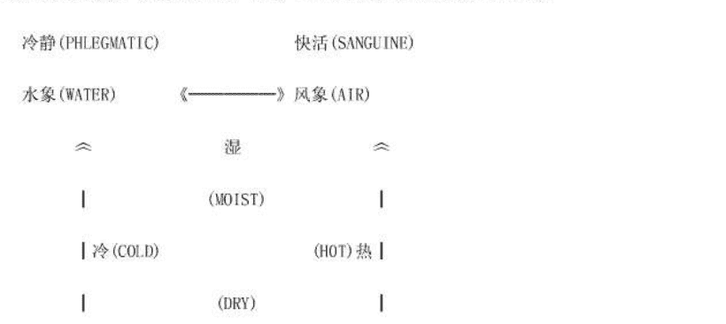

洪能平/著
版权所有 观音山出版社

## 序

在推展现代占星学的过程中，我们认为目前最迫切需要去作的一项工作，就是必须把我们所累积的论断经验提供给有心研究占星学的读者们作参考，以便缩短学习的摸索过程，同时也有助于读者针对我们所提出的看法和论法，进行验证和批判。如此一来，才能够带动整个现代占星学的研究风气，也才能够针对传统命理研究所存在的缺失进行反思。

于是，能平君的这套《现代占星学进阶》，可以说是出版的正是时候，可以让已经阅读过《现代占星学基础》的读者们，知道如何去应用占星学上的基本概念来进行论断。同时，我们也更期待能平君能够早日完成《现代占星学高阶》，好让有心研究占星学的读者们，能够对于现代占星学有一个全盘性的概念和了解。

最后，我们想要再次强调的是，现代占星学不但是需要被验证，而且也需要被应用。因此，我们希望读者们能够针对书中所作的论断提示多加验证，并且提出自己的见解，同时也把它活用在我们的日常生活当中，如此才能够发挥占星学的预防作用。如果读者能够因本书而获得某些助益的话，那将是我们最大的快乐，也是我们之所以推展现代占星学的目的所在。

“天星论命工作群”指导顾问
吕阳明、彭喜豪写于台北市
一九九六年四月卅日

## 自序

自从我出版占星学书籍，以及推出占星学电脑软体以来，就一直接到不少读者和听众的来函和来电，询问各种有关占星学的问题。而当我面对这种情况之时，可说是一则以喜、一则以忧：喜的是竟然有如此多的读者和听众热爱占星学，想要知道更多有关占星学的内容；而忧的是我无法在短期内将更多的占星学知识介绍给读者和听众们。这一来是因为占星学所涉及到的内容实在太广了，二来是因为目前从事专业占星学写作的人实在太少了，所以只好让读者多等待些时候了。不过，我可以保证的是：我会一直写下去的！

本套书（分成三册）的探讨范围，主要是在于针对本命盘的论断进行诠释，这也就是有关生活领域方面的论断。在此，就本书所涉及到的内容略作说明。

首先，由于本套书乃是属于综合类型的书籍，所以无法针对每一单项生活领域的内容作很详细的解说；也因此，有关单项生活领域论断所涉及到的专业技巧，先省略而不谈，留待以后再来作专题式的探讨。换言之，本套书的重点乃是在于提供本命盘论断的宏观概念，以及整体的论断流程，以便让读者先建立起有关本命盘论断的整体概念。

其次，每一个本命盘都可以说是充满着各种变化的可能性；也因此，每一单项的论断，都可能会有许多的征象产生。而本套书所谈及的内容，则是偏重在一般所常见到的征象显示，以致于某些比较特殊的征象，则有赖于读者自行多加体会了。此外，读者也必须培养进行整体性思考的能力，否则很容易造成“见树不见林”的论断情况，以致于判断错误。

其三，本套书所谈及的某些内容，在占星学上仍然存在着争议，而除非是有必要多作说明，否则我就先省略不谈。同时，我所参考的论断技巧，比较偏重于美国、英国和德国的讲法，至于其他欧洲国家（意大利、法国、荷兰、西班牙、北欧）的不同论点，碍于语言阅读上的困难，无法多作介绍。

其四，由于我们与西方的社会文化背景差异很大，所以可能会有许多的征象是会在西方的社会环境中发生，但却不一定就会在中国的社会环境中产生，或者是影响的程度有高低之别。因此，希望读者能够多多考量到社会文化背景的差异问题。

其五，本套书并没有详谈流年盘与合盘的论断技巧，这一部份留待《现代占星学高阶》再来作说明。因此，如果论断的主题有涉及到两造的话，则请千万不要草率地妄下断言，以免判断错误。

其六，本套书所提示的几种论断流程，希望读者能够多加自行变化，而我在往后的书籍写作中，也将会陆续地再介绍其他的论断流程。

最后，再次感谢各位读者和听众的爱护，也感谢“天星论命工作群”和“凯龙星工作室”各位伙伴对我的支持和协助，并感谢欧美方面诸位占星学家们的支援。而读者若有关于占星学资讯方面的问题的话（包括书籍和电脑），可以直接与出版社连系，我将会尽量地提供各种协助或解答。

“天星论命工作群”．总策划
洪能平　写于阳明山
一九九六年四月卅日

## 第一章 导论

一般来说，在学习现代占星学的过程中，对于星座、行星、宫位和相位等进行基础性的了解，只能说是进入占星学研究领域的一种“打桩功夫”而已，还很难谈得上是已经进入实际应用的层次。而所谓的占星学之实际应用，指的是可以把占星学应用在我们的日常生活之中，来观察或预测我们可能会发生什么样的事情，以便事先做好预防措施。而且，占星学的实际应用不只是可以为我们自己解答某些问题，更是可以拿来协助家人、朋友和亲戚等解决某些难题。因此，我认为学习占星学绝对不是专业占星学家的专利品，只要是对于占星学有兴趣的人都可以进行研究和应用，透过占星学来让我们了解自己和别人，并且体会于宇宙天体对于人类所产生的影响。

同时，只要你对于本命盘的论断已经相当熟悉了，那么你就可以应用相同的基本论断技巧，来研究流年盘的论断，以及其他占星学上之专业领域的论断。换言之，由于占星学之论断的判断要素，无非是行星、星座和宫位彼此之间的互动与变化，所以只要你已经相当熟悉于本命占星学的论断的话，那么就表示你对于行星、星座和宫位彼此之间的互动变化已经可以运用得很纯熟了。于是，当你在针对流年盘或其他的专业领域（如政治占星学）来作论断的时候，只要稍微修改论断要素的代表征象，或者是加入某些比较精细的论断要素（如恒星、中点）和特别的论断技巧（如泛音盘），也就可以了。

因此，本命盘的论断是所有占星学论断的基础，是所有要进入实用占星学的人必须下功夫去学习的课题。而在进入学习本命盘的论断之前，我们有必要先了解占星学家是如何建立起本命盘论断的整体构架，进而形成一种宏观的思考模式，这是本章所要进行说明的主题。

### 壹、本命盘论断的基本原则

往往一位惯战命盘的占星学家，都会感慨于：占星学上的基本要素皆有着一定的征象意涵，而在论断上也有着基本的规则和诠释方式；然而，为何有很多的人会觉得学习占星学很难？或者是不知道如何去进行论断呢？这个问题可以从两个方面来说。

首先，占星学上的基本判断要素，确实是具有一定的征象意涵；可是，难题的所在就在于你到底对于这“一定的征象意涵”了解多少、多深？甚至于是否有误解的情况产生而不自知？例如，你可能已经知道宝瓶座的个性是如何如何，可是你很可能不知道你所知道的内容是有所错误的；而且，你也许也不知道单一星座所包含的全部征象之间，是有着一定的串连关系的，以致于你只能算是“死记”代表征象而已，还谈不上消化征象意涵，进而导致于在实际论断的时候，无法针对单一星座所代表的征象进行变化，处处有显得难以运用的感觉。

其次，占星学上的论断过程，确实是具有基本的规则和诠释方式；可是，难题的所在就在于你到底对于这“基本的规则和诠释”了解多少、多深？甚至于是否有误导的情况产生而不自知？例如，你可能已经知道第七宫可以用来论断婚姻关系，可是当你真的要论断婚姻关系的时候，你能只针对第七宫来作分析吗？也许你已经知道不应该只考虑到第七宫而已；可是，一旦你又将其他的征象要素引进来的话（如第四宫、第五宫），你要如何进行统合式的分析？如何安排论断的步骤？如何区别征象要素之影响力的轻重？如果你无法厘清整个论断的思考方向和步骤的话，那么你就无法进行统合式的命盘解读，以致于当你看到一个本命盘的时候，脑袋就充满着“满天星”，不知从何下手。

于是，我们可以说，学习占星学的首要步骤，就是先彻底地了解占星学之论断要素所代表的征象意涵，而且要很清楚单一要素所代表之全部征象意涵彼此之间的连系关系，如此才能奠定举一反三的基本变化原则。再来，就是要彻底地掌握住本命盘之论断的统合式分析；也就是说，要把本命盘上所呈现出来的全部论断要素进行融会贯通，掌握住本命盘的主体心理气韵之所在，然后以此主体心理气韵再配上自己所熟悉的论断步骤，来针对各个生活领域进行诠释，其间的变化之妙、运用之神，就完全看占星学家个人如何去作发挥了。

由上可知，本命盘的基本论断，可以分成两个部份：一是心理层面的分析，这是本命盘统合的主轴所在；二是生活领域的说明，这是单项生活状况的主题所在，但却必须扣紧心理层面的分析，来作更进一步的统合式论断。当然，由于占星学相当讲求实际论断经验的累积，所以如果你的论断经验越丰富的话，就越能够熟练整个论断的过程。在本书中，我只能尽量地以个人的实际经验来作解说，读者之体会的多寡，恐怕是会因人而异的。

同时，我希望读者记住：占星学论断的最困难之处，乃是在于占星学家自己本身之内在体会的提升，以及摸索出适合自己运用的一套论断程序，并且在这套自创的论断程序中进行论断上的变化；而唯有在自己对于本命盘的论断体会，已经提升到某一个境界的时候，才能够真正地感受到论断要素的征象本质，也才能够开创出属于自己的论断特色，进而才能够针对问题的关键来作解说，达到一种以出神入化的论断技巧，来完成一场完美的艺术性论断演出。

此外，在进行本命盘的论断之前，读者还必须永远记住以下的四个占星学论断的基本原则：

第一，任何一个人的命运呈现是整体性的，是不能进行单独切割来作论断的，亦即本命盘永远是“牵一发而动全身”的，绝对不能单凭某一颗行星落入某一个星座或宫位，或者是那两颗行星之间有凶相位产生，就认为是“必定”会发生什么样的事件，而是要先从考量到本命盘的整体状况来着手，然后才能够针对个别的事件征象来作可能性之评估。

第二，任何一个人的命运呈现，永远是充满着无限可能性的；同时，占星学家也绝对不能否认人类的意志力，以及进行自我反思的能力。因此，占星学家的论断重点，绝对不是在于突显自己对于事件发生之预测的“神通”，而是在于本着上天有好生之德，尽量地为别人找寻问题的关键和造因所在，并且尽量地为别人解开问题之结，宁可让别人认为占星学家算得不准，也千万不要去加重别人的心理负担。占星学家如果把自己的论断准确度，奠立在别人心理上之雪上加霜的话，我认为那是一种罪过。如果你问我如何才能算得上是一种成功和完美的论断的话，我会告诉你：当别人满脸愁云密布地来找你，而离开的时候却是心中有所释怀，满脸笑嘻嘻的，那么你的论断就是成功的、完美的。

第三，占星学的论断具有浓厚的逻辑思考特质，而且更是强调以心理诠释来作为论断的主轴。因此，占星学家反对不奠基于心理意涵上的任何改变命运的手段，亦即占星学家所认同的唯一改变命运的方法，就是自己进行心理上的调适，自己进行自我个性上的改变和修正。所以，占星学家绝对不借助于任何外物来改变命运（如改名字、刻印章等），否则岂不自打嘴巴！同时，占星学家必须在占星学与宗教之间划清界线，占星学家可以吸收宗教所诠释的生命哲学，但却不能把占星学与宗教混同起来，否则岂不让占星学所诉求的科学道路，越走越偏！

第四，占星学家绝对不是上帝的代言人，所以占星学家千万不能把自己当成是别人命运的判定者或主宰者，因为所谓的占星学论断，重点并不在于可以很准确地指出别人到底会发生什么事情，而是在于解释之所以可能会发生什么事情的原因，并且让别人能够更进一步地认知到自己的一切。因此，占星学家在论断的过程中，并不是命运判断的唯一主动者，而应该只是占星学家与对方之间的“双向式沟通”的主动者之一而已，亦即在整个论断的过程中，占星学家与对方皆是主动者，对方主动地抛出问题的所在，占星学家主动地探索于问题发生的根源。而最后之问题的解决，则是有赖于占星学家与对方彼此之间的互相沟通，找出最佳的解决方法，而最后之问题的解决才是论断的诉求所在。所以，如果只是论断得很准确，但却没有把问题解决的话，这种占星学论断可以说是彻底失败的，因为这是把“手段”误解为“目的”了。

### 贰、本命盘论断的互动关系说明

以下就行星、星座和宫位等三大论断要素，用一种平面式的解构方式来说明它们彼此之间的互动关系，藉以强调行星在整个论断过程中所扮演的重要和串连的角色。

从（图一）之中，我们可以看出在进行实际论断的时候，一定会涉及到某些固定的基本内容。而任何一个本命盘的基本论断要件，也就是要把这些彼此互相形成互动关系的基本要素，先进行融会贯通；说得更明白一点，也就是说当你看到某一颗行星的时候，你必须自然而然地连想到它的互动关系。如此一来，你才不会从单一颗行星的角度，来进行单项征象的判断，而能够具有比较周延性的思考面向。现在就针对（图一）的内容来略作解释如下：

一、行星与其本身所主宰之星座的关系——这除了要先清楚地知道行星与星座所代表的全部征象以外，还要区别行星与它所主宰的星座，彼此之间在特征上的异同。

二、行星与其本身所落入之星座的关系——这就是要把行星与星座彼此所代表的征象，以庙旺陷弱和气质融合等状况的观察，来进行一种行星与星座彼此之间的互动关系说明。

三、行星与其本身所主宰之宫位的关系——这就是占星学上的飞星论断体系之所在，是以飞星体系来说明某一个后天宫位所可能具有的更进一步的论断线索。

四、行星与其本身所落入之宫位的关系——这代表着行星如何赋予后天宫位活动力，可以用来论断后天生活领域之可能的心理动机、行为趋向和事件发生等，是一种行星与宫位之间的互动关系说明。

五、先后天宫的合盘关系——这是以后天宫位宫头所在的星座位置，来论断某一后天生活领域所具有的基本态度、心理反应、力量之强弱，以及可能的发展方向等。

六、行星所主宰之宫位与其本身所落入之星座的互动关系——这是以飞星论断体系为基础，来进一步地探索于行星所代表的后天生活领域意涵，是如何地与它本身所落入的星座产生互动。

七、行星所主宰之宫位与其本身所落入之宫位的互动关系——这是以飞星论断体系为基础，来进一步地探索于行星所代表的后天生活领域意涵，是如何地与它本身所落入的宫位产生互动。

八、行星与行星之间的相位互动关系——这是把以上单一颗行星所涉及到的各种论断要素透过行星彼此之间所形成的相位关系，来把两组力量串连起来，用以呈现出这两组力量的互动状况，同时也藉以透视出单一颗行星在受到它颗行星影响之后，是如何地变化了它原本所具有的特性，如此才能够更详细地得知后天生活领域的真实面貌。

现在，我们可以简单地用（图二）来略作提示说明，（图二）所举之太阳和月亮的相位，乃是从本书第二章中我个人之本命盘所取出来的。而当你看到我本命盘中的太阳和月亮形成90度相位的时候，你就必须联想到以下的各种关系：

一、月亮主宰着巨蟹座——两者分别代表着那些征象，以及两者有何异同。

二、月亮落入白羊座——庙旺陷弱的状况如何，以及月亮与白羊座之间如何产生互动。

三、月亮主宰着命宫——当月亮是命主星的时候，有何征象上的意义。

四、月亮落入第十宫——月亮如何对第十宫产生影响，而第十宫所代表的生活领域如何去规范月亮。

五、第十宫宫头落在白羊座——白羊座如何对第十宫所代表的生活领域产生影响。

六、月亮所代表的命主星落入白羊座——白羊座对命主星有何影响。

七、月亮所代表的命主星落入第十宫——命主星如何对第十宫产生影响。

八、月亮和太阳形成90度——月亮和太阳如何产生互动，以及月亮和太阳这两组力量如何产生互动。

读者可以先按照以上所提出的八点要项，来思考行星与行星彼此之间的互动关系，以训练自己的连想能力以及统合能力。只要多作练习，自然就可以慢慢地培养出在瞬间内考量到所有的相关要素，进而延伸出许多的论断征象，而不致于有思路阻塞的情况发生。

### 叁、本命盘的论断主题

从占星学的论断主题来看，它包含了所有人生旅程中的全部生活领域事项；亦即所谓的占星学论断，无非就是在针对人生在世的各种日常生活事项，进行某种趋势上的说明。于是，凡是我们所可能会遭遇到的各种日常生活情况，都可以说是占星学的论断主题，都可以被包含在占星学的应用范围之内。

因此，个性的特质、钱财的多寡、健康的状况、爱情的波折、婚姻的美满、工作的顺利、职业的才能、人际关系的变化、个人的才华、娱乐的性质、家庭的生活、教育的程度和出外旅游的遭遇等，甚至于生命的终结，都可以说是占星学的论断主题。因为这些主题都与人生旅程有关，也都是我们在日常生活当中所关心到的主题。

同时，由于在本命盘的论断上，这些生活主题所涉及到的相关论断要素有所差异（主要是由各种不同的宫位所主宰），因此它们必须分别依据不同的宫位、星座、行星和相位等来作分析，以便能够确实地得知这些生活主题的征象呈现。然而，不管这些生活主题的内容是什么，它们在占星学的论断上，都可以用所谓的五个“W”的问题来作概括。换言之，在一个完整的占星学论断过程中，占星学家必须针对以下的五个“W”的问题来作回答；而所谓的占星学之实际论断的应用，也就是在为我们个人处理和解决这五个疑问。

一、“What”（什么）：你所进行论断的生活主题是什么？该生活主题受到那些论断要素的影响？

二、“How”（如何）：你对于某一生活主题的心理反应是如何？该生活主题所呈现出来的吉凶状况如何？

三、“Why”（为何）：你的某一生活主题为何会发生某些特殊状况？你为何对不同样的人采取不同的态度？

四、“Where”（何地）：当你置身在不同生活环境之中的时候将会有何变化？何种生活环境对你最为有利？

五、“When”（何时）：你的某一生活主题会在何时产生比较大的变化？何时是你最有利的时机？

### 肆、论断要素之互动的基本思考

以下我拟用立体结构的角度，以及藉用系统论的研究法，来针对本命盘之论断要素的互动关系进行解说，以便提供读者建立起一个论断的宏观思考方向。

首先，在（图三）当中，所呈现出来的乃是一个金字塔形的结构。同时，在这个金字塔之中，又有一个四角柱；而在金字塔的外围，又有一个圆形。

其次，在（图四）当中，所呈现出来的乃是一个系统论的基本架构，它包含了环境因素、输入项、输出项和心理系统等。

于是，我们现在就可以把（图三）和（图四）结合起来，用以建构起本命盘的立体论断模式。以下先说明（图三）和（图四）所代表的单项因素意涵，然后再来配合（图五），以说明从输入项到输出项的论断过程。

第一，（图三）当中的中央四角柱，其四边分别代表着星座、行星、宫位和相位等，这是本命盘上的基本论断要素。而从这四项基本论断要素当中，我们可以建构起所谓的“心理之轴”——也可称之为是主要心理结构——也就是（图四）之中的“心理系统”。

一般来说，在本命盘的论断上，主要是依据于行星落入星座所呈现出来的四正宫和三方宫的分布情况，来决定一个本命盘的主要心理结构（亦即“心理系统”本身）。因此，在心理之轴的建立上，是与星座和行星比较有关；然而，命度（第一宫宫头）所在的星座位置，也相当具有影响力；同时，如果本命盘有呈现出特殊相位格局的话，其对于心理之轴的建立，也是相当具有影响力的。

此外，四角柱之四边所代表的星座、行星、宫位和相位等，同时也是（图四）之心理系统的“边缘”，它位居于输入项和心理系统本身，以及输出项和心理系统本身之间。换言之，当我们要论断某一项生活课题的时候，我们可以把与该项生活课题有关的星座、行星、宫位和相位等抽离出来，然后输入心理之轴，观察我们所要论断的生活课题与心理之轴如何产生互动。进而，这种互动的结果，又透过星座、行星、宫位和相位等的征象意涵的解释，而呈现在情绪、思维、行动和事件的表现上，这也就是论断的输出项。

第二，在（图三）的心理之轴当中，我们又可以把它分成意识层面和潜意识层面，以及超脱命运的部份。而一般来说，在本命盘的论断上，意识层面和潜意识层面的区隔，可以依据于黄道十二宫之影响力的轻重来作划分。换言之，我们可以很简单地把凡是有行星落入的星座，都当成是一种意识层面的显现，而把凡是没有行星落入的星座，都当成是一种潜意识的指示。然后，再来依据感官（土象）、思维（风象）、直觉（火象）和情感（水象）等四大心理功能来作层次上的划分。如此一来，在意识层面和潜意识层面，都可以分别依据土象、风象、火象和水象等四大元素来作说明，而且又可以依据每一个星座的个别特质来作更细部的说明。

例如，以第二章中的我的本命盘来看，则意识层面包括了：摩羯座、宝瓶座、白羊座、巨蟹座、狮子座、处女座、天蝎座等，而且其中是以摩羯座、宝瓶座、白羊座和巨蟹座的影响力比较重。因此，从意识层面来看，我的感官功能主要是呈现出摩羯座的特质，并且也略具处女座的特质；在思维功能上，主要是呈现出宝瓶座的特质；在直觉功能上，主要是呈现出白羊座的特质，并且也略具狮子座的特质；在情感功能上，主要是呈现出巨蟹座的特质，并且也略具天蝎座的特质。而潜意识层面则包括了：双鱼座、金牛座、双子座、天秤座、射手座等，所以从潜意识层面来看，我的感官功能主要是呈现出金牛座的特质；在思维功能上，主要是呈现出天秤座和双子座的特质；在直觉功能上，主要是呈现出射手座的特质；在情感功能上，主要是呈现出双鱼座的特质。

同时，在意识层面上，四正宫是以基本宫的力量最强，固定宫次之，变动宫的力量最弱；而三方宫则是四大元素的力量差不多。在潜意识层面上，四正宫是以变动宫的力量最强，固定宫次之，基本宫的力量最弱；而三方宫则是风象的特质比较强。如此一来，也就可以建构起我的本命盘的心理之轴了。

当然，在此我们也不可以完全否认有某些已经超脱，而不受心理之轴所影响的人。这些人根本就不在乎命运，或者是已经可以顺应天命了，所以我特别以心理之轴的顶端来形容，用以表达其超脱的特质，只是这种人实在太少了，因为滚滚红尘，何人能无所恋呢？

第三，在（图三）中之金字塔的外围四边，分别代表着①情绪→②思维→③行动→④事件。这是在说明输出项时，所必须应用到的诠释过程，亦即不管你所论断的生活主题是什么，你都必须涉及到当事人对于该项生活主题的情绪反应和思考方式，然后再来推论当事人对于该项生活主题所可能会采取的行为反应，以及所可能会发生的事件结果。

例如，当你要论断钱财事务的时候，你必须考量到当事人对于钱财的情绪反应，以及理财的观念，然后再来推论到他可能会采取的实际行动（如拼命赚钱或浪费钱财等），进而可能会造成了那些结果（如可以积累财富或总是在缺钱用等）。

当然，在论断的依据上，任何一项生活主题的论断，都是依据于涉及到该生活主题有关的星座、行星、宫位和相位等，与心理之轴之间的互动关系来作决定的。只是占星学家往往为了解说上的方便，所以才把解释的过程简化为这四个步骤。因此，读者千万不要简单地认为占星学家对于单项生活主题的论断，只是单纯地依据于与涉及到该生活主题有关的论断要素来作判断而已；其实，占星学家也同样的会考量到心理之轴的作用，这在实际论断上，是一个相当重要的关键观念。

例如，如果有两张本命盘，其第二宫同样都是有火星落入，此时你如何断定到底是拼命赚钱，或者是拼命花钱？其间的关键因素，就在于心理之轴。如果心理之轴的意识层面呈现出节俭的特质，那么就是拼命地赚钱；而如果心理之轴的意识层面是呈现出挥霍的特质，那么就是拼命地花费。这种论断方法，也就是现代占星学之所以不同于古代占星学之处。同时，这也指出了当我们在研究占星学的时候，有必要突破古代占星学的解盘技巧，厘清古代占星学在论断方法上所存在的误解和弊端，如此才能称之为是现代占星学的论断。

于是，在此当我们借用系统论来说明论断过程的时候，可以把（图四）中的“决定”和“行动”，理解为是本命盘所呈现出来之个人的人格特质，以及个人对于各种生活领域所可能会采取的行为表现，也就是论断的输出项。

第四，在（图四）中的输入项，也就是各种论断要素的考量。在此当我们借用系统论来说明论断过程的时候，必须分成“需求面”和“支持面”来作理解。所谓的“支持面”，可以把它当成是支持整个心理之轴之所以维持运作的功能。换言之，任何一个人之所以会在这个人世间生存下去，他必须在心理功能上具有一定的自我调整性，比如说，在悲伤的时候，可以透过哭泣来作发泄，或者是在遭遇挫折的时候，可以承受失败的打击。如果这种支持心理系统进行运作的力量失去功能的话，也就是一个人心理崩溃的来临。而在实际论断上，有关“支持面”的输入项，其实也就是决定心理之轴之结构的各种论断要素，它同样地是涉及到星座、行星、宫位和相位等。

此外，所谓的“需求面”，可以把它当成是个人对于各种生活领域的心理欲求（或者是心理反应）。换言之，由于每一个人之本命盘上的宫位征象皆有所不同，所以每一个人对于各种生活领域的心理反应皆有所差别，这可以说是每一个人的命运之所以有所差异的最基本原因。于是，我们可以透过本命盘上所呈现出来的各种征象，来判断每一个人对于各种生活领域到底作何心理反应，或者是有何心理欲求，并且将这种心理欲求与他本身的心理系统进行统合，来论断他实际上所可能会达成的机会有多少。而在实际论断上，有关“需求面”的输入项，它同样地是涉及到星座、行星、宫位和相位等。

第五，在（图四）中，在输出项和输入项之间存在着“回馈”的作用。在此，当我们借用系统论来作为论断说明的时候，可以把“回馈”当成是事件的发生之对于个人所产生的影响。换言之，作为输出项的各种生活领域之事件的形成和结果，无疑地都会对于个人的心理系统造成影响，进而影响到个人对于各种生活领域之事件的心理反应，以及行为方式，这也可以说就是人类的经验学习。因此，当我们在论断各种生活领域事项的时候，“未发生”和“已发生”是一个很重要的区别，亦即如果我们要进行论断的某项生活课题的可能情况，是“未发生”的话，那么此时的论断，乃是一种预测和预防的作用；而如果我们所要进行论断的某项生活课题的可能情况，是“已发生”的话，那么此时的论断就会显得比较复杂，至少也必须考量到心理系统对于“已发生”之事件的心理反应，然后才能够进一步地论断该“已发生”之事件，是否有可能会再度地发生；甚至于在占星学的征象指示上，“已发生”之事件的论断，其征象指示可能会是呈现在不同的宫位上，比如说，第五宫乃是指示着第一个孩子，而第七宫则是指示着第二个孩子。

例如，以离婚的现象来说，当某一个人具有离婚之征象显示的时候，对于离婚事件的论断，乃是一种预测和预防。而如果当事人已经离婚了的话，则此时对于婚姻状况的说明，就应该稍微有所不同了，特别是如果要针对是否再婚来作论断的话，至少也必须考量到两项因素：一是离婚对于此人的影响到底是如何；二是第二个配偶的征象显示有何特征（以第九宫为主）。

第六，在（图四）中，有所谓的“环境”因素，这也就是在（图三）中的金字塔与圆形之间的空间。该环境因素可以说是与整个本命盘的论断无关，然而却会影响到本命盘的论断。在此，我把环境因素划分成“外环境”和“内环境”两项，分别说明如下。

首先，“外环境”包括了社会环境和家庭环境两项。而所谓的“社会环境”，指的是当事人所处之社会的整个行为模式，这会透过种族遗传基因，以及整体的社会结构力量，来影响到个人的文化倾向、价值观念和行为模式等。同时，在征象的显示上，由于不同的社会结构都有其本身的行为模式和价值观念，所以甚至有必要在征象的显示上，基于不同的社会形态而略作修改。

例如，当西方占星学家在进行离婚之可能性的论断时，其离婚的征象条件，一定会比中国人的离婚征象条件来得更多，亦即以同样的具有轻微离婚征象的两张本命盘来说，在基本于西方社会是比较具有开放的婚姻观念来看，则西方占星学家可能就会因此而论断为离婚，但以中国人的社会形态来看，则却未必会离婚，而可能只是大吵大闹而已。因此，如果是仅从本命盘的论断来说，则社会环境乃是一种外在因素，它是属于地志占星学和种族占星学的研究范围。

所谓的家庭环境，指的是当事人的成长过程，这包括了家庭的教育环境、父母的影响，以及幼年的生活情况等。当然，有关这一部份的征象显示，多少也是可以从本命盘上来作论断，然而这些征象显示毕竟太少了，以致于占星学家还是有必要透过与顾客之间的沟通，来获得更多的讯息，然后才能够作比较正确的论断。例如，一个人在家中的排行老儿，很难从本命盘上来作论断；但是，一个人在家中的排行老儿，却可能会影响到本命盘上某些征象的显示。也许有人会说，中国传统命理可以把一个人的过去论断的相当准确，是否真的如此，这是另外的一个问题，而仅从现代占星学的论断来看，它是有所局限的。

其次，“内环境”主要是指占星学家本身的条件，也就是占星学家本身的解盘技巧。在此，我将其归纳为六项：(1)学术内涵，指的是占星学家本身的知识水平；(2)道德素养，指的是占星学家本身的品行修为；(3)社会经验，指的是占星学家本身对于社会现象的认知；(4)诠释能力，指的是占星学家本身的表达能力；(5)人格倾向，指的是占星学家本身的人格特质；(6)思想倾向，指的是占星学家本身的价值观和意识形态。这六项条件，我认为都会影响到占星学家的论断说明，亦即任何一项本命盘的论断过程，都绝对不是相当客观的，它都会被渗透入占星学家本身的各种条件，因为是占星学家在作本命盘的解释，同时占星学家也是一个人，也有他基本的心理系统。

第七，在（图五）中，我针对心理系统本身的内涵，列出十二项主题，这些主题乃是占星学家在针对心理系统作解释的时候，所必然要谈论到的，分别说明如下：

- 1. 精神、理智：指的是个人的精神意志力，以及理性的克制力。
- 2. 思想、信仰：指的是个人的想法和价值观，以及意识形态倾向。
- 3. 感情、情绪：指的是个人的情绪表现方式，以及对于感情的需求和体会。
- 4. 幻想、艺术：指的是个人的想像空间，以及艺术的创作才能。
- 5. 开创、兴趣：指的是个人的开创动机，以及兴趣和好奇的特性。
- 6. 决断、顽固：指的是个人的自私性和独断性，以及不愿意作改变的可能性。
- 7. 性、伴侣、浪漫：指的是个人的性冲动和性能力，以及对于伴侣的需求性和浪漫性。
- 8. 关怀、奉献：指的是个人的牺牲奉献精神，以及关怀和服务于别人的意愿。
- 9. 脾气、冲动：指的是个人的突然状况的频率，以及与别人发生争执的可能性。
- 10. 精力、冒险：指的是个人的竞争性和战斗力，以及克服困难的勇气和企图心。
- 11. 幽默、悲观：指的是个人乐观和自信的特征，以及悲观和忧郁的特征。
- 12. 努力、耐性：指的是个人的坚持度和韧性，以及付出劳力的意愿。

最后，我把（图五）中的整个论断系统，以婚姻主题的论断来作举例说明（假设只考量到第七宫的情况），并且绘制成（图六）的解析流程。于是，在输入项方面，包括了两大项：一是心理之轴的分析（透过黄道十二宫的整体情况来作决定），这是本命盘论断的心理基础所在；二是与第七宫有关的各种征象，包括了第七宫内的行星及其相位关系、第七宫宫头所在的星座位置、太阳或月亮的位置及其相位关系，以及第七宫宫主星所飞入的位置及其相位关系等。这两大项因素的整合，构成了论断的基本依据，进而可以依序地来进行论断，也就是输出项的说明。

在此，就情绪方面来说，可以包括了对于感情的需求和付出、性意识的内涵、对于爱情的感觉和期待，以及配偶的特征等项目来作说明。就思维方面来说，则可以从对于婚姻所抱持的观念、对于家庭所抱持的观念、择偶的要求条件，以及夫妻双方的沟通情况等项目来作说明。进而，在行为的表现方面，可以简单地分成负面影响和正面影响来作说明，亦即有那些征象是可以促进夫妻双方的和谐性，而又有那些征象是会导致于夫妻双方失和与争吵。而最后，则是同样地可以用负面影响和正面影响，来对于婚姻主题中所可能会发生的各种事情作说明，诸如早婚、晚婚、单身、同居、离婚、分居、打架或恩爱等。

### 伍、走出中国传统占星学的局限

自从我出版占星学书籍以来，有不少的读者和好友请我对于以下两个问题的看法：一是如何才能够学好现代占星学；二是如何进行中西命理研究的整合。对于这两个问题，我总是以“见仁见智”来作回答，因为我认为每一个人的天赋才能，以及对于命理研究的看法都有所差异，所以很难说有一个固定的学习和研究模式，来学好现代占星学，或者是作好中西命理的整合性研究。

因此，我总是希望读者能够配合自己的特长，摸索出属于自己的一套论断方式，而不一定要受限于那一种论断方式。同时，我更希望读者能够确立自己的占星学专业研究方向，而不要企图成为一位占星学研究的通才，因为现代占星学的研究领域相当广泛，只要选择自己比较感到兴趣的研究课题，也就够你搞上一辈子了。

然而，话说回头，我也发现了许多人在学习现代占星学的过程中，有着某种“观念僵硬”的情况发生，这特别比较容易发生在研究中国传统命理者的身上。而之所以会造成如此的现象，倒不是说这些人的观念早就已经僵化了，而应该说是中西方的命理研究，在本质上本来就已经存在着相当多的差异了。所以，如果我们无法暂时地从中国的传统命理当中走出来，无法暂时地摆脱某种先入为主的观念的话，那么往往就会比较难以真正地走入现代占星学的核心，进而当我们在作中西方命理之整合的时候，也就比较难以透视出两者的基本差异，以及两者之间在那么脉络上可以进行整合。

于是，以下我仅就个人的看法，提出三点意见，希望有助于热衷研究中西命理之整合的人，在研究现代占星学的时候，能够暂时地抛开传统命理的束缚，而以另一种全新的角度来看待现代占星学。

首先，务必要先抛开“缠足”心结，勇于对传统命理采取批判的态度。如果我们把推展现代占星学，看成是中国命理研究发展史上的“五四运动”的话，那么无疑地我们必须先进行胡适先生所谓的打开缠足的改革动作。换言之，在我们还没有对于现代占星学的研究现况，有着最基础的了解以前，没有必要先抱着“自尊自大”的心态，来充分地肯定中国传统命理的论断有多大的准确度，甚至于大言不惭地说紫微斗数将来一定可以扬名西方，而是应该本着学习于命理研究之新发展的心态，来对于西方的研究成果进行知识上的吸收。

同时，更应该本着现代人的知识是远胜于古代人的知识的基本观念，来摆脱那些陈旧的、伪造的和托古的命理古书，如此才能领略于现代占星学的新观念和新的论断方法。再者，也应该以现代的文字解释来作命理上的诠释，没有必要刻意地引用命理古书上的文字来作印证，而如果要引用命理古书上的说明的话，也不要只引用符合论断现象的部份，而省略了错误论断或不合时宜的部份，以免让人感觉命理古书好像都是对的。

此外，我特别反对把中国传统占星学上的论断方式套用在现代占星学上，因为这样很容易造成“挂羊头卖狗肉”的情况，让人误以为西方占星学家的论断方式和中国传统占星学没什么两样，进而造成了论断方式上的僵化。更严重的是，会让有心研究现代占星学的人，所学到的却是中国传统占星学，进而搞不懂西方占星学家到底是如何进行论断的。更可怕的是，会让有心研究现代占星学的人，不知道中国传统占星学有那些内容，是已经被西方的占星学家所淘汰了，进而花下时间和功夫所学到的，竟是落了伍的旧东西。

其次，千万不要只见树，而不见林，否则很容易流于以纯技术为主导，而深陷于“以命解命”的狭隘视野之中。这是特别针对那些命理研究的狂热份子来说的，也因为特别地狂热，所以会不自觉地想要论断得很准，也因此而特别热衷于所谓的“论断秘诀”，或者是相当细致和复杂的论断技巧。这样的研究精神是值得称赞的，但是这样的研究方法我却难以赞同。

现代占星学在论断方法上的最大突破，就是已经藉由心理研究法，而确立了论断上的基本宏观思考方向，然后再从宏观的角度，来透视于微观的细节变化。然而，中国传统占星学基于时代的局限，所以只有微观的论断思考方向，以致于研究中国传统占星学的人，时常会只想要从西方占星学家的研究成果当中，去吸收各种微观的论断技巧，而忽略了论断上的宏观整合过程。其所造成的最明显结果，就是“以命解命”——单纯地把占星学的论断焦点局限在细微的命理征象上，而忽略了个人生命的整体性，也缺乏了论断研究方法的确立，以及缺乏了占星学与其他各种知识的融和作用。更严重的是，会让人误以为所谓的占星学论断，只是在于透过各种精密的论断技巧，来预测某一个人将会在某一个时间，一定会发生某事，掉入了悲观的宿命论而不自知。更可怕的是，会让人误以为占星学上的符号征象，乃是固定而僵化的，进而使得占星学上的符号失去了它的心灵作用，掉入了被当作硬性解释的泥沼之中。

最后，要尽可能地吸收各种自然科学和社会科学的专业知识，并且将其与占星学作整合，促使占星学的解释有着一定程度的科学性和理论性基础。

以目前所出版的西方占星学书籍来看，其作者的平均学历，大部份都是硕士和博士以上，也有不少的占星学家是拥有两个博士的学历。而且，他们的研究方向，总是试图以自己所学的专业知识，来对于现代占星学进行新的解释，并且力求使得占星学尽可能地摆脱玄秘的色彩，而具有科学论证的解释基础，这可以说是未来现代占星学研究的发展趋势。说得更明白一点，要成为一位专业占星学家的条件，可以说是越来越严格了，越来越难混了。

有人告诉我说，在台湾算命根本就不需要具备什么专业知识，也不需要高学历，而只要脸皮厚和敢掰。在此，我认为没有必要对此多作解释或反驳，因为每一个人的看法不同，而我也没有必要去得罪任何人。也许是我的白羊座、摩羯座和宝瓶座的特质比较重吧，所以我比较强调研究性、理论性和科学性，同时我更在意对于任何一门学问的研究，都必须具有国际性的视野，而不是局限在台湾的小格局之中。所以，我建议具有研究企图心的读者们，应该把目标放在与西方占星学家进行竞争，而不是在台湾的小命理界称雄。同时，我相信一个人只要肯下功夫的话，其专业知识的水平是可以提升的，怕就怕你只肯读占星学书籍，而忽略了与占星学专业研究领域相关的专业知识，终于掉入了“以命解命”的深坑，而难以自拔！

## 第二章 个性

我在《现代占星学基础》书中所提到的基本概念，就是要用来作为本书的论断内容。因此，我想再次强调的是，如果你对于基本概念还无法相当熟悉，或者是根本就没有阅读过的话，那么本书对你而言，可能会有点难以进入状况的感觉，因为我曾经一再地强调：所谓的“现代占星学”绝对不同于传统的占星学，它不只是论断方法上的不同，就连看待命理的基本概念也差异颇大。

因此，如果你还一直停留在传统论法上的强调“事件占星学”的话，那么本书对你的帮助将相当有限，因为本书只是提供论断的某些分析方法，而不是提供论断上的某种确定的答案，亦即我只是在于提示你应该如何去进行某种生活领域的观察与分析，而不是在于提供你“一定会发生何种事件”的秘诀。所以，希望你不要以传统命理书籍当中所记载的那颗行星落入那一个星座或宫位，就一定会发生什么事件的态度来看待本书的分析，如此一来，你才能逐渐领悟于命运的多变！

总之，在进入本书往后各章的说明之前，我必须提出三点声明，以作为贯穿本书解说的基本学习态度，此有助于避免阅读时的捉不着重点。

第一，在任何占星学的实际论断过程中，一定是以基本人格特质的分析作为开始。于是，你必须相当熟悉于如何透过本命盘的人格特质分析，来掌握住个人的整体心理特质，并且在论断的过程中，随时掌握住这个总体特质。也因此，千万不要草率地因为看到某一种征象，就直接地断言一定会发生该征象所意涵的事件，因为有时候这种征象可能会仅停留在思维层次之中，而不容易从外在行为上来看出，也有可能会反应在相类似的其他事件上，或者是有其他方面的心理调和征象来作化解。所以，现代占星学的一个永远不变的论断法则，就是：唯有透过人格特质的分析，才足以论断任何事件的发生机率。当然，如果你的基本概念之基础越足够的话，自行推演的能力也就会越强。

第二，占星学是讲求实用和实证的，因此，你必须透过自己的本命盘，或者是你的家人、朋友的本命盘，来作实际论断上的练习，以此打下解读命盘的感觉基础。换言之，你最直接的练习方法就是透过你所最了解、最清楚的自己或别人，以毫无自私、毫无隐瞒的坦白态度，来面对个人本命盘的分析，以实际的命例加上书本的说明，来逐渐领悟于何谓命运的呈现。同时，最重要的是要懂得如何去“疑”，千万不要把我的书当成是完全没有错误的，因为毕竟占星学的研究还有许多需要改进的地方。而“疑”的思考重点有三：一是我为何要作如此的论断和预测；二是你手上的本命盘是否与我的论断相符合，符合的原因为何？不符合的原因又为何？三是我所谈论的内容，你是否认同，认同的原因为何？不认同的原因又为何？你又能自行作多少推演？

第三，在命理的实际论断过程中，感觉是一回事，口头表达又是另一回事。换言之，虽然必须先具有前者的感觉层次，然后才有后者的论断层次。然而，本书所强调的是前者，而后者则有待你自己去摸索；亦即，你的任何命例的论断，都必须透过你的语言表达来完成，而你到底应该如何去说出口，才能够让对方认知到你的意思，这是本书所无法达成的目标，有赖于你自行去发挥你的语言能力。最佳的学习途径是：当你在感觉自己的本命盘的时候，最好能够配合语言的表达，把自己的感觉用话说出来，再回过头来感觉自己所讲的话，看是否足以描述出你所有的感觉。

只要掌握住以上的基本学习方法，我相信不用多久，你就可以逐渐懂得如何进行现代占星学的命理论断了。

### 壹、个性分析的涉及因素

在个人的生命历程之中，任何事件的发生乃是与个人的生命整体结合为一的。因此，当我们在应用占星学来作命运论断的时候，其最重要的主题就是个人的生命形态，而这往往是透过本命盘上所呈现出来的人格特质来作显示。然而，我们不可忘记生命形态的复杂性，它是生理、心理和心灵的三位一体，所以仍然有许多的生命征象是无法从本命盘上来获得答案的。也因此，占星学的论断并非是万能的，它会受到许多客观条件的限制。

于是，当我们在进行个性分析以前，有必要先了解到以下的客观条件限制。

第一，男人和女人的基本生理与心理状态是有所差别的，所以在个性分析的解说上，其说词也必然要有所修饰。比如说，同样在狮子座和射手座的影响下，女人的夸大其词的现象，是会比男人来得较为缓和。又比如说，同样在摩羯座的影响下，女人的成就感和严肃性，也会比男人来得较为缓和。

第二，个人所处年龄阶段的不同，也会影响到心境的不同反应。比如说，同样在摩羯座和白羊座的影响下，年轻小伙子的开创力、斗志和雄心，往往会是比老年人来得比较有干劲的。一般来说，占星学家是把顾客的年龄阶层以每隔卅岁的方式来作区隔，形成了卅岁以下、卅岁到六十岁、六十岁到九十岁等三种不同的年龄阶层，然后针对这三种不同年龄阶层的基本心理反应，配合本命盘上的征象，来作个性上的分析。同时，由于顾客的年龄阶层大部份都是集中在廿五岁到四十五岁之间，所以占星学家必须特别注意这段期间的心理状况、所关心的生活重点，以及大运状况等。

第三，个人的某些生理缺陷，也会影响到个性上的变化。比如说，一位身体机能有所残缺，或者是天生带有某种疾病的人，其心理状况往往会是有些异于常态的，于是在进行个性分析的时候，在说词上就必须更多加谨慎了。

第四，个人的早年家庭生活环境，也会影响到个性上的变化。比如说，单亲家庭或早年丧父或丧母，或者是早年家庭的经济环境比较困苦的人，在对于家庭的心态上，以及对于物质需求的反应上，有其特殊之处，在进行个性分析的时候必须多加小心。

第五，个人的某些不幸的遭遇，也会影响到个性上的变化。比如说，婚姻或爱情的失败，以及事业上的破产等，是很可能会让一个人改变以前的某些看法。

然而，不管客观条件的限制是如何，身为一位专业的占星学家，必须自我要求于心态上的健全，要以乐观和积极进取的心态来面对个性分析，如此才能够让顾客产生信心，勇于面对人生的挑战和际遇。同时，如果个性上的某种缺陷或偏向，实在是令占星学家难言开口的话，必须尽量地想出一些比较缓和的说词，或者是点到为止，或者是旁敲侧击，或者是干脆避而不谈，这一切必须视对方当时的反应来作决定。

在衡量过个性分析的客观条件以后，接下来就是针对本命盘上所呈现出来的征象来作论断。而以下所谈及的内容，并非是我个人所独创的意见，是许多西方占星学家的经验与研究的心得，我只能算是一位占星学知识的传播者。

一般而言，占星学家在进行个性分析的时候，会特别地注意到命度星座、太阳星座和月亮星座所代表的个性特征，然后配合上命主星所在的星座，以及计都所在的星座等，来掌握住一个人的主要个性特征。至于其他行星所落入的星座位置所代表的个性特征，往往是属于比较次要的，但是却会影响到主要个性特征的变化。

例如，木星落入狮子座会增强一个人的自信和乐观，然而如果一个人的命度、太阳、月亮、命主星或计都等其中之一，也落入狮子座的话，那么自信和乐观的特质就会更加地强烈。

此外，如果行星是落入命宫之中的话，那么该行星对于个性的影响力也会增强。比如说，如果木星是正好落入命宫的话，那么也会增强一个人的自信和乐观的特质，这是因为木星的缘故；同样地，如果以木星所代表的幸运特质来看的话，则木星落入命宫所象征的幸运特质，会比木星落入其他宫位来得较为强而有力。

当然，行星落入星座的庙旺陷弱，也会影响到个性特质的呈现。比如说，如果太阳是落入狮子座，或射手座、白羊座的话，那么火象星座的个性特质会更为强烈；同理，如果月亮是落入巨蟹座，或天蝎座、双鱼座的话，那么水象星座的个性特质会更为强烈。

以目前占星学家所最常应用到的人格特质的分析手法来说，主要是依据于四正宫和三方宫的统合来作判断的。此正如廿世纪著名占星学家 Alan Leo 所言：“三方宫和四正宫似乎是一种最佳的提示方法，可以把整个命盘的一般化形态，在刹那间进行认知；行星所在的土象、水象、火象和风象星座的数量，可以呈现出整个命盘上的那一个三方宫的力量最强；而行星所在的基本宫、固定宫和变动宫的数量，可以呈现出整个命盘上的那一个四正宫最为有力；最后，依据三方宫和四正宫的统合，就可以确立整个命盘的形态。”以下就先针对四正宫和三方宫的特质来作说明，然后再来解说个性的分析技巧。

#### 一、四正宫的特质

占星学家在进行个性分析的第一个步骤，往往是必须先整理出行星落入四正宫的分布情况，以此来作为个性分析的切入点。

##### （一）基本宫的基本特质

由于基本宫所象征的乃是一种引导、开创和前进的特质，所以当本命盘上的基本宫特质被强化时，也就表示了个性上的倾向于具有野心，并且具有强烈的竞争意识和活跃的精力。也因此，基本宫是一种争取机会的象征，可以为个人带来懂得开创新领域的人格特质。

Alan Leo 曾说：“当主要的行星是落入基本宫的话，则可以呈现出活跃的特质。它可能是四正宫的三种组合之中，最具有决断、激烈和尖锐的特质，也代表着精力、活力、变换、热烈和消耗——是对一种生活活泼化之自我意识的认知。拥有此特质的人，比较容易采取行动，不管是基于环境力量的促使，或者是基于他们自己的自然本性；而他们通常在面对世界的时候，宁可表现得更为突显一点，因为他们倾向于喜欢一种活跃的人生。”同时又说：“他们可以产生一种重整或开拓的精神，并且对于围绕着他们的世界，有着准备要去进行改变的责任意识。”

然而，如果本命盘上的其他征象，是呈现出缺乏秩序感和规则性的话，则基本宫特质的强化，会导致于不安定、杂乱、激动和无智的消耗精力等现象，使得人生历程中的目标和理想，被草率、鲁莽和缺乏步骤所破坏，其结果不但可能会是一事无成，而且恐怕会有许多突然的变数。当然，在应用基本宫的特质来作个性分析的时候，还是必须考量到基本宫之不同星座彼此之间的差异。

如果是白羊座的特质被强化的话，则会呈现出急躁、冲动和激动，具有一种往前直冲的动力，并且会显得比较自私、独断和倔强，同时也比较具有专注地投入的特性，于是强烈的竞争性和对抗性会有所凸显。

如果是巨蟹座的特质被强化的话，则会呈现出沉默、安静和隐藏企图心，同时精力也会被储藏起来，而等待情绪来临时再作发泄，并且会特别注重感情，意图成为感情的主宰者，强烈的预感力和不安全感也会有所凸显。

如果是天秤座的特质被强化的话，则会呈现出规划、安排和理智，具有一种与别人合作的企图，并且会显得比较圆滑、体谅和有风度，同时也比较具有艺术气息，强烈地专注于观念化和理念化的特质也会有所凸显。

如果是摩羯座的特质被强化的话，则会呈现出实际、冷凝和谨慎，具有一种追求于名望和地位的企图，并且会显得比较自我主义、坚持和有毅力，同时也比较具有为众人服务的特性，是一个参与政治的星座，强烈的野心是很容易让别人感受得到的。

##### （二）固定宫的基本特质

由于固定宫所象征的乃是一种固执、深化和不变的特质，所以当本命盘上的固定宫特质被强化时，也就表示了个性上的倾向于具有韧性，并且具有强烈的贯彻意识和刚硬的特性。

虽然固定宫的特质可以带来勤勉、努力、忠诚、建构及完成计划、坚强的意志力等优点，并且也可以展现出自我训练和自我控制的特性。然而，固定宫同时也具有墨守成规、刚愎自负、顽固、怠惰和骄傲的特性。因此，往往在判断本命盘上之固定宫的特质偏向时，必须考量到本命盘上所呈现出来的道德和责任意识，以及理性和知识的程度，如此一来，才能够明确地知道固定宫的特质走向。如果道德和责任意识比较强烈的话，则可以展现出固定宫的稳定、累积和有所建树的特质；而如果理性和知识的程度比较高的话，则可以展现出固定宫的耐心、深厚和贯彻的精神。同时，固定宫虽然具有迟缓的特性，然而它的决断力还是颇为有力的，只是它往往比较注重于大的决定，这会导致它呈现出独断的形象。

如果是金牛座的特质被强化的话，则会呈现出固执、倔强、谨慎和自傲，是固定宫特质最明显的星座，而且精力的韧性也是一流的，并且会特别注重豪华的气氛，强烈的艺术气息和动作缓慢的特质也会有所凸显。

如果是狮子座的特质被强化的话，则会呈现出权威、高傲、坚决和独断，喜欢享受高高在上的感觉，并且会显得比较厚脸皮，敢于争取和表现，同时也时常徘徊在严厉和亲切之间，强烈地追寻于名气的特质也会有所凸显。

如果是天蝎座的特质被强化的话，则会呈现出顽强、深情、独裁和冷静，具有一种怨恨和报复的潜在意识，是最难以释怀的星座，并且会显得比较霸道和不讲理，强烈的意志力和对爱的独占意识是很容易让别人感受得到的。

如果是宝瓶座的特质被强化的话，则会呈现出前卫、奇特、革新和煽动，具有强烈的反对意识，并且会显得比较喜欢交际和宣传自己的观念，即使不受欢迎也无所谓，强烈的改革意识和特立独行的特质会有所凸显。

##### （三）变动宫的基本特质

由于变动宫所象征的乃是一种适应、改变和调和的特质，所以当本命盘上的变动宫特质被强化时，也就表示了个性上的倾向于具有融通性，并且具有强烈的中和意识和活泼的精神。同时，变动宫是四正宫的三个组合之中，最具有理性特质的，也比较具有弹性的特质。

本命盘上之变动宫的特质偏向，往往是必须依据于变动宫内的行星特质来作决定，亦即变动宫可能会呈现出狡猾、肤浅、不定性和不诚实，但是也可能会呈现出多才多艺、学识广博和高度的理解力。而灵巧、机敏和聪明等，则是变动宫的基本特质；同时，也由于精神层面的作用被强化了，所以比较容易有神经质的倾向。此外，在变动的作用之下，除非本命盘上的其他特质可以提供安定的力量，否则很容易导致于个性上的倾向于缺乏定见、游移不定，以及欠缺责任感。因此，我们总是把变动宫当成是一种调和及适应的象征，它的基本特质的走向，是有赖于本命盘上之基本宫和固定宫的强弱对比来作决定的。

如果是双子座的特质被强化的话，则会呈现出机敏、焦虑和心不在焉，具有一种可以很快速地做到面面俱到的特质，并且会特别凸显弹性的特质，所以比较缺乏集中力。而双子座与处女座在才能展现上的差异，乃是在于双子座比较偏向于文学性和哲学性，处女座则是比较偏向于科学性。同时，在确立双子座和处女座的特质展现时，也必须考量到水星的所在位置，看水星的所在位置是否可以强化集中力，以及是与那一个星座的特质比较有所契合。

如果是处女座的特质被强化的话，则会呈现出担心、忧郁和讲求细致，具有一种进行微观分析的才能，然而如果本命盘上的情绪化特质被强化的话，则很可能会造成无理取乱式的批判，破坏了处女座的科学性。同时，处女座的变动宫特质往往是透过以提供援助的方式来作展现的，而不是被动式的骑墙派。

如果是射手座的特质被强化的话，则会呈现出开朗、大胆和大方向着眼，比较能够展现出表面上的开放性，并且会显得比较热情和坦率。然而，如果本命盘上的其他特质无法调和射手座的狂热本性的话，则很可能会造成鲁莽、草率和不遵守法律，所以时常是必须配合本命盘上之火星的位置来作考量。而射手座和双鱼座在特质展现上的差异，乃是在于射手座比较偏向于正统性和哲学性，双鱼座则是比较偏向于神秘性和灵修性。

如果是双鱼座的特质被强化的话，则会呈现出和平、同情和自我牺牲，比较能够展现出表面上的融通性，并且会显得比较有礼貌，以及比较具有艺术的才能。然而，由于双鱼座会特别强调心灵的感受，以及不轻易展露自己的意图，所以是比较难以被人了解的星座。

总之，基本宫指示着动力的促使、行动的开始；固定宫指示着动力的支援、行动的持续；变动宫指示着动力的缓冲、行动的转向。我们可以透过行星在四正宫的分布情况，来获得个性分析的基本线索。

#### 二、三方宫的特质

占星学家在进行个性分析时的必要步骤，就是必须依据于行星落入三方宫的分布情况，来作为判断心理功能之结构的基本线索。而如果行星在本命盘上的分布情况是愈平均的话，则就表示人格特质的调和性愈高；然而，人的个性往往总是有所偏颇的，因为行星的分布情况总是会呈现出不平均的现象，而这也就是为何每一个人的个性和基本才能有所差异的原因。

##### （一）火象星座的基本特质

白羊座、狮子座和射手座等三个星座，都是阳性星座，它们都具有精力、热力、自信、独断、自我、行动、领导、掌控和高傲等特质，同时它们也都象征着生命的创造力，以前进、侵略和攻击来展现生命的存在意义，所以本命盘上之火象星座特质被强化的人，往往是希望人生充满着多采多姿，并且是轰轰烈烈的，如此才不致于人生太过于空白。而在心理结构的功能上，火象星座主宰着直觉。

##### （二）土象星座的基本特质

金牛座、处女座和摩羯座等三个星座，都是阴性星座，它们都具有实际、物质、稳定、忠诚、依循、强调经验、缓慢、持续和遵守原则等特质，同时它们也都象征着生命的执行力，以毅力、努力和耐力来展现生命的存在意义，所以本命盘上之土象星座特质被强化的人，往往是希望别人能够给予它们更多的肯定与赞赏，并且能够有可以依循的法则，如此才不致于欠缺人生的发展方向。而在心理结构的功能上，土象星座主宰着感官。

##### （三）风象星座的基本特质

双子座、天秤座和宝瓶座等三个星座，都是阳性星座，它们都具有理智、知性、理念、社交、飘动、精巧、敏捷、多元和连系等特质，同时它们也都象征着生命的精神力，以观念、技巧和评估来展现生命的存在意义，所以本命盘上之风象星座特质被强化的人，往往是希望人生可以被逐步地作改善，并且是可以透过理念的沟通来化解冲突的，如此才能够展现出人生的和谐性。而在心理结构的功能上，风象星座主宰着思维。

##### （四）水象星座的基本特质

巨蟹座、天蝎座和双鱼座等三个星座，都是阴性星座，它们都具有感情、洞察、敏感、感触、预感、隐藏、感性、想像和沉溺等特质，同时它们也都象征着生命的心灵力，以付出、关怀和情性来展现生命的存在意义，所以本命盘上之水象星座特质被强化的人，往往是希望人生充满着温情与祥和，并且不要太过于物欲化，如此才能够展现出人类的感情力量。而在心理结构的功能上，水象星座主宰着情绪。

总之，火象星座指示着直觉的发挥；土象星座指示着感官的作用；风象星座指示着思维的运作；水象星座指示着情绪的反应。我们可以透过行星在三方宫的分布情况，来获得个性分析的明确线索。

#### 三、四正宫与三方宫的统合

以下乃是透过四正宫和三方宫的简单组合（只考量到两个因素彼此之间的互动），来提示如何掌握住个性分析的基本主轴。至于更复杂的组合，则有待读者自行练习了。

##### （一）基本宫－火象星座

这种组合可以呈现出冲刺的精力，而且往往是具有独自行动的特质，同时也具有快速的反应能力，可以很直接地领悟到事物的本质和重点，所以时常会省略了中间的步骤。此外，由于比较专注和直接，所以在正直、坦诚和前进的表现下，潜藏着斗争和冲突的危险。这种组合有利于专业性和知识性，可以成为一位相当不错的导师。

##### （二）基本宫－土象星座

这种组合可以呈现出高度的雄心，而且往往是偏重在物质层面的成就上，同时也行事比较谨慎，不轻易地采取冒险的举动，所以时常会先作好预防的措施，甚至会具有高度的忧患意识。此外，由于比较实际和自私，所以在坚忍、固执和奋战不懈的表现下，也潜藏着疑心和诡诈的特质。这种组合有利于进行长期地追寻于某一个目标，可以成为一位赤手空拳打天下的豪杰。

##### （三）基本宫－风象星座

这种组合可以呈现出快速的思路，而且时常会具有调停与统合的动机，同时也比较冷静和沈着，可以用和平的外表来掩饰内心的企图，并且会以帮助别人的方式来争取同盟关系的建立。然而，在展望未来理想的时候，却会特别地支持某种理念，或者是支持某个组织，而轻忽了个人的生活空间。这种组合有利于获得别人的协助，所以往往可以逐渐地改善不佳的生活环境。

##### （四）基本宫－水象星座

这种组合可以呈现出高度的敏感，而且往往是带有同情怜悯和情绪化的特质，同时也具有要掌握一定地位的企图，可以很直接地感觉到人事物的潜在变化，所以时常会有多虑的倾向。此外，由于比较注重情感，所以在多情和浪漫促动下，会特别地对于别人的情感有所需求，并且加以保护，然而却也比较容易走入不切实际的想像之中。这种组合有利于争取别人的感激，只是在内心中往往会有骄傲的潜在意识。

##### （五）固定宫－火象星座

这种组合可以呈现出充沛的战斗力，而且往往是可以成为一方之霸，同时也具有强烈的野心和坚强的意志，可以很坚决而顽固地追求于自己的目标，因此时常可以成为一位领导者，发挥管理和指导的才能。此外，由于比较光明正大和眼界较高，所以在值得别人信赖以及具有群众魅力的表象下，总是比较容易成为别人嫉妒和争论的对象。这种组合可以调和精神性和物质性，是一种成功的象征。

##### （六）固定宫－土象星座

这种组合可以强化坚持的韧性，而且往往是带有现实、僵化和自傲的特质，甚至于会顽固到缺乏基本的弹性。然而，内心的自负和注重实际，却可以深化自我训练、行事谨慎和辛勤工作的特质，所以时常总是会有所收获的。此外，由于比较倾向于唯物主义，所以会担心和猜疑于别人的竞争。这种组合是属于比较麻烦的个性，所以特别需要有基本宫－火象的组合来作调和。

##### （七）固定宫－风象星座

这种组合可以强化对于理念的坚持，而且往往是具有诉求于尊严和行事认真的特质，同时也具有精巧的手腕和可值得信赖的作风，然而时常是除非观念上有所突破，否则总是会僵化在既定的想法之中，呈现出顽固不灵的保守特质。此外，由于对自我的期许比较高，所以在展现社交才能之际，容易留给别人有所做作的印象。这种组合虽然可以带来稳定，但是内心之在进取与守旧之间的徘徊，是需要一段时间来作调和的。

##### （八）固定宫－水象星座

这种组合可以展现出强烈的情绪，而且往往是具有爱恨两极化的特质，同时也具有敏锐的感知能力，可以很直接地洞察到人事物的深层内在，也比较偏好于神秘性事物，并且容易留给别人比较难以了解的印象。此外，由于比较疑神疑鬼和敌我分明，所以很容易在自己感觉到情感受到伤害之时，转而采取完全不同的态度。这种组合虽然可以带来相当不错的想像力，然而随着感情占有欲的深化，很可能会把想像力转化为嫉妒心。

##### （九）变动宫－火象星座

这种组合可以呈现出坦率的活力，而且往往是具有直言不讳的特质，同时也具有敏捷的学习能力，可以很有技巧地捕捉到事物的重点和有趣的一面，所以时常会是一位欢乐的散播者。此外，由于对感觉的表达比较直接，所以在坦诚和慷慨的表象之下，也潜藏着对于遭受刺激时的直接反弹力。这种组合有利于精神层次的提升，同时也会比较神经质。

##### （十）变动宫－土象星座

这种组合会呈现出表里不一的情况，因此外表上的快速反应能力，并不足以代表内心的坚持和拘束，于是会导致于行为上的缺乏明确立场，以及缺乏强硬态度，是与观念上的坚持己见，以及内心的期求稳定，是相互冲突的。然而，这种组合却可以带来分析的才能，并且可以适应于单调的步骤，只是主动地争取机会的欲望有待加强。

##### （十一）变动宫—风象星座

这种组合可以展现出活跃的心智，而且往往是具有科学的精神，同时也具有追寻知识的欲望，可以很广泛地去接触到各种事物，并且探究于各种知识领域，将其转化为自己所用。此外，由于比较讲求快速地发展，所以往往会耐不住性子，想要一步登天。这种组合可以带来聪明的脑袋，同时也有着扮演说客的煽动口才。

##### （十二）变动宫—水象星座

这种组合可以呈现出阴柔的魅力，而且往往是具有消极、被动和感伤的特质，所以比较适合于女性；如果男人具有这种组合的特性，则可能会依赖心比较重，甚至于太过于柔弱。此外，由于比较注重感情和感性，所以虽然可以很敏锐地察觉到环境的变化，并且在表面行为上作适应，然而内心的情绪波动却是难以静止的，忧虑与暗自悲叹似乎总是会如影随形。这种组合特别需要强化坚强的意志力。

以上的每一组合，都是仅作相当简略的说明而已，同时在进行实际论断的时候，总是必须考量到更复杂的组合情况，因为每一个人的本命盘上之组合情况，绝对不会是只有两种因素所构成的，所以读者必须花费更多的时间去作多重组合的演练。此外，在个性特质的论断上，占星学家往往会特别讲求各种因素之间的平衡性，以此来透视人格特质上的偏向，并且掌握住一个人的基本潜能，如此占星学家才能够提出有意义的建言。

### 贰、个性分析的论断技巧

针对任何一个本命盘来作论断时，个性的分析都是最基本而且是最重要的关键所在。因为个性的精密分析，可以决定一个人的生活态度，进而透视一个人的日常生活情况，以及对于各种人事物所采取的基本反应，而这在占星学的论断上，也就是所谓的“命运”。因此，在占星学家们的眼中，不管是否把“命运”界定为具有神秘性，“命运”是无法与一个人的个性相脱节的。以下我综合了多位著名占星学家的个性论断技巧，将其论断过程归纳为五个步骤，希望能够提供给读者一个比较清晰的个性论断流程。先列出这五个个性论断步骤，然后再来作逐项的解说，并且以我个人的本命盘来作论断上的举例。

#### 一、个性之论断步骤的安排

步骤一，依据行星落入星座的位置，来确立半球、四正宫和三方宫之力量的强弱，以便建构起个性的心理之轴。

步骤二，依据行星落入宫位的位置，来更进一步地明确化意识层面的心理结构。

步骤三，特别强调命度星座、太阳星座、月亮星座、命宫内之行星、命主星座和计都星座等所呈现出来的个性特征。

步骤四，依据单颗行星所主宰的心理特征来作说明，并且配合于相位，以及后天宫位所代表的生活领域来作诠释。

步骤五，解说潜意识的心理特征。

##### （一）半球、四正宫和三方宫

这里所谓的“半球”（Hemispheres），指的是依据于后天十二宫位的切割于本命盘，而可以将本命盘分成为北半球和南半球，以及东半球和西半球。如（图十）所示，北半球的范围包含了从第一宫宫头到第七宫宫头为止（类比于从白羊座到处女座）；南半球的范围包含了从第七宫宫头到第一宫宫头为止（类比于从天秤座到双鱼座）；东半球的范围包含了从第十宫宫头到第四宫宫头为止（类比于从摩羯座到双子座）；西半球的范围包含了从第四宫宫头到第十宫宫头为止（类比于从巨蟹座到处女座）。

如果一个本命盘上的行星，大部份是落置在东半球的话，则其特质会呈现出主动地去掌控自己的行动，亦即会比较具有独立和自主的倾向，自己的问题和困扰会自己去解决，所以比较不会求助于别人。因此，我们可以说这种类型的人，会比较能够掌握住自己的命运走向，因为在个性的偏向上有着开创和自决的特质。

如果一个本命盘上的行星，大部份是落置在西半球的话，则其特质会呈现出被动地去适应环境的变化，亦即会比较具有依赖和从属的倾向，自己的难题和困扰会让自己不知所措，所以比较会于询问于别人的看法。因此，我们可以说这种类型的人，比较不能够掌握住自己的命运走向，因为在个性的偏向上有着期待于别人来作指引的特质。

如果一个本命盘上的行星，大部份是落置在北半球的话，则其特质会呈现出主观意识比较强烈，亦即会把生活重心放在与自己私人有关的事务上，所以会比较具有自我本位主义的色彩，生活领域的活动空间相对地也会是比较狭窄的。因此，我们可以说这种类型的人，是倾向于以主观的态度来面对命运，同时在个性的偏向上有着自私化和内省化的特质。

如果一个本命盘上的行星，大部份是落置在南半球的话，则其特质会呈现出客观意识比较强烈，亦即会把生活重心放在与社会脉动有关的事务上，所以会比较具有服务和利他主义的色彩，生活领域的活动空间相对地也会是比较广阔的。因此，我们可以说这种类型的人，是倾向于以客观的态度来面对命运，同时在个性的偏向上有着公众化和现实化的特质。

与行星之半球配置情况相类似的概念，是阴阳性和对宫性。从阴阳性来说，如果大部份的行星是落置在阳性星座的话，则其个性特质会偏向于阳刚之性；而如果大部份的行星是落置在阴性星座的话，则其个性特质会偏向于阴柔之性（有关星座之阴阳性的解说，请参见我所著之《占星学家谈星座》）。从对宫性来说，如果在六组的对宫组合之中，有某一组的单方面特质比较强烈的话，则该单方面的特质会是属于外显的，而其对宫星座的特质会是居于内敛的。例如，以白羊座和天秤座的这一组对宫来说，如果白羊座的特质是比较强烈的，则白羊座的个性特征会是外显的，而天秤座的个性特征会是居于内敛的。（有关星座之对宫的解说，请参见我所著之《占星学家谈星座》）

此外，我们还可以将后天十二宫分成四个阶段，每一个阶段分别代表着不同的个性特质。第一阶段的范围包含了第一宫、第二宫和第三宫（类比于白羊座、金牛座和双子座）；第二阶段的范围包含了第四宫、第五宫和第六宫（类比于巨蟹座、狮子座和处女座）；第三阶段的范围包含了第七宫、第八宫和第九宫（类比于天秤座、天蝎座和射手座）；第四阶段的范围包含了第十宫、第十一宫和第十二宫（类比于摩羯座、宝瓶座和双鱼座）。（请参见图七）

如果一个本命盘上的行星，大部份是落置在第一阶段的话，则其特质会呈现出偏向于知性，或者是偏向于展现个人式的行动，亦即这一阶段相当具有自我探索的意涵。因此，这一阶段具有单纯和天真的行为动机，比较会直率地作自我表达。同时，由于太阳的落置在这一阶段时，正好是春天，所以这一阶段也象征着有所突破的潜力，具有待势而发，以及展望如何在未来有所收获的特质。

如果一个本命盘上的行星，大部份是落置在第二阶段的话，则其特质会呈现出偏向于母性，或者是偏向于展现个人式的感情，亦即这一阶段相当具有自我感受的意涵。因此，这一阶段具有情绪化和关心他人反应的特质，也比较会重视自己的承诺。同时，由于太阳的落置在这一阶段时，正好是夏天，所以这一阶段也象征着物质茂盛的态势，具有以照顾他人来确立交情，进而掌握住人际关系的特质。

如果一个本命盘上的行星，大部份是落置在第三阶段的话，则其特质会呈现出偏向于韧性，或者是偏向于展现个人式的内心洗练，亦即这一阶段相当具有重新出发的意涵。因此，这一阶段具有被激发和等待转机的特质，也比较具有先行引退来作观察的倾向。同时，由于太阳的落置在这一阶段时，正好是秋天，所以这一阶段也象征着现阶段之成果的结算，具有评估现况而重新规划如何争取将来能够有更好之收获的特质。

如果一个本命盘上的行星，大部份是落置在第四阶段的话，则其特质会呈现出偏向于慢性（缓慢地或不动声色地掌握住局势），或者是偏向于展现在非个人性的事务上，亦即这一阶段相当具有关心团体和他人的意涵。因此，这一阶段具有服务和牺牲的行为动机，也比较具有扩展社会视野的特质。同时，由于太阳的落置在这一阶段时，正好是冬天，所以这一阶段也象征着面对压力时的承受力，具有以亲力行而感动他人或成为他人之表率的特质。

最后，而且是最重要的步骤，就是整合本命盘上之全部行星落置在四正宫和三方宫上的情况。这在前面的章节中已经谈论过基本的判断原则了（某些相关内容，请参阅《占星学家谈星座》），所以在此直接从如何进行论断的角度来作说明。

任何一个本命盘之四正宫和三方宫的整合，主要是应用三方宫的行星配置情况来观察心理结构，以及应用四正宫的行星配置情况来透视心理结构之背后的运作力量。其整合性的论断过程，大致上可以分成以下的三个阶段。

第一，先区别四正宫的强弱情况，亦即必须先判断出行星落置在四正宫之中的强弱情况。以我个人的本命盘来说（参见图九），显然地是基本宫的力量最强，其次是固定宫，最弱的是变动宫。因此，推动我的心理结构进行运作的趋势是：开创力和竞争力最强，持续力和深化力比较弱，最缺乏的是变动力和适应力。

第二，再来是区别三方宫的强弱情况，亦即必须判断出行星落置在三方宫之中的强弱情况。以我个人的本命盘来说，显然是地四大元素的分配情况颇为平均，影响力较大的星座分别展现在四大元素上——月亮（命主星）落在火象星座、太阳落在土象星座、计都（行星丛聚）落在风象星座、命度落在水象星座。这种平均化的情况并不多见，大部份本命盘上之行星的三方宫配置情况，是会有所偏向的，亦即大部份人的心理结构功能，总是会有某一项比较弱化的。

第三，整合四正宫和三方宫，此时也就是确立整个心理之轴的大概情况，亦即我们可以藉由四正宫和三方宫的整合，来区分本命盘上的意识层面和潜意识层面（请参阅第一章的说明），看其分别如何受到四大元素的影响，然后再来针对意识层面和潜意识层面各作解说。而在解说的技巧上，可以依据情绪、思维和行动等三项来作说明。（图十二）乃是一张简单的特质整合表格，可以用来掌握住四正宫和三方宫之整合后的基本特质。

图中之内容的右上方文字，指的是四正宫的基本特质；而图中之内容的左下方文字，指的是三方宫的基本特质。因此，假设有一个本命盘上的四正宫和三方宫之整合特质，主要是由基本宫和固定宫，以及由土象、风象和水象等所组合而成，则我们就可以先简单地得知其基本的个性特征如下：

以情绪方面来说，呈现出情绪比较容易受到身体触觉的影响而自动引发，并且对于事物的喜欢和不喜欢颇为明显（基本宫＋固定宫＋土象）。同时，灵感的产生往往是依据于心情的高低起伏来作带动，并且颇为肯定自己的想法（基本宫＋固定宫＋风象）。此外，会比较在意别人的情绪反应，并且愿意为感情而付出，感情的忠贞程度也比较高。

以思维方面来说，会呈现出主动地去思索某些现实的问题，然而在看法上却颇为坚持自己的意见（基本宫＋固定宫＋土象）。同时，也颇具有分析和评估的能力，只是推理的过程比较容易呈现出固定的模式（基本宫＋固定宫＋风象）。此外，也有着相当不错的想像力，但是却有着明显的疑心倾向（基本宫＋固定宫＋水象）。

以行动方面来说，呈现出具有采取实际行动的能耐，会为了获取自己所想要得到的事物而相当努力（基本宫＋固定宫＋土象）。同时，也会试图去开创某些新的领域，然而在开创的过程中往往会采取比较稳健的作风（基本宫＋固定宫＋风象）。此外，一时的情绪激动往往也可能会导致冒险性的作法，而且敌友分明的态度表现也比较容易被别人所看得出来（基本宫＋固定宫＋水象）。

总体而言，在本例中，由于基本宫和固定宫乃是两种完全不同的力量展现，所以在缺乏变动宫来作调和的情况下，内心的冲突、挣扎和犹豫往往也会是比较突显的。同时，由于火象星座的特质比较薄弱，所以在积极性和主动性上也会有所弱化，并且决断的特性也比较难以展现出来。当然，在实际论断的时候，还是有必要先区别基本宫和固定宫两者之力量的强弱，以及区别土象、风象和水象彼此之间的强弱对比，如此才能够得到一个比较完整的四正宫和三方宫之整合的综合意象。

以上所谈及的论断内容是相当粗浅的，只能说是一种大概而已。其更精细的论断，则是必须再配合以下的几个步骤来作观察，如此才能够更明确地掌握住一个人的基本个性。

##### （二）行星落入宫位

一般来说，大部份的占星学家在针对个性来进行论断的时候，是比较少应用到宫位的，因为个性的分析是与星座的特质呈现比较有关。换言之，如果在论断个性特征时，并没有应用到行星落入宫位的配置情况的话，也是可以的。只是有些占星学家为了讲求更精细的分析，所以会把行星落入宫位的情况列入考量的范围。因此，有关依据行星落入宫位的配置情况，来更进一步地明确化意识层面的心理结构，是可以视情况来作调整的。对初学者而言，刚开始学习论断的时候，可以先暂时省略此一步骤，等待已经具备某些体会，或者是已经颇能够熟悉于星座的四正和三方之整合以后，再来加上这一个步骤的考量，以免在刚开始学习占星学的时候，就掉入太过于复杂的迷惘之中。

在应用行星落入宫位的配置情况，来作为个性分析的考量因素时，其基本的判断原则如下：

第一，先将宫位依照星座的排列次序来作类比，所以第一宫的个性特质类比于白羊座、第二宫的个性特质类比于金牛座、第三宫的个性特质类比于双子座....，以此类推。

第二，将行星落入宫位的配置情况，依照行星落入星座的配置情况来作分配；也就是说，如果行星是落入第四宫的话，则等同于是行星落入巨蟹座。然而，如果行星是正好落在该宫位的最后面，而且又正好是落在下一个宫位之宫头位置的三度以内的话，则必须划归于下一个宫位。例如，如果火星正好是落在第三宫的最后面，而且是已经在第四宫宫头所在位置的三度范围以内的话，则此时的火星被视为是落入巨蟹座，而不是落入双子座。

第三，同样地是依照星座之四正宫和三方宫的配置情况来作区分，以得出行星落入宫位所代表的四正宫和三方宫的整合情形。

第四，行星落入宫位所呈现出来的意识层面特征，往往会比行星落入星座所呈现出来的意识层面特征略显强烈，因为宫位所代表的生活领域是外显的，是个人所会展现出来的行为表现，甚至于可以说是个人的生活态度。而这也意味着，当我们在应用行星落入宫位来分析个性的时候，只能限定在意识层面的分析，与潜意识无关。

第五，我们可以将行星落入星座所呈现出来的基本特质，来与行星落入宫位所呈现出来的基本特质作结合，如此一来，也就可以得到更精细的心理之轴的整体结构了。然后，再来依据第一章中所提到的十二项有关心理系统的描述主题，来作个性上的解说。如果在个性的分析上，只应用到行星落入星座的话，则可以直接依据行星落入星座的配置情况，来作心理系统之十二项主题的解说。

从（图十三）中，我们可以得知行星落入宫位之四正宫和三方宫的配置情况，是以基本宫和固定宫的力量较强，而变动宫的力量较弱；同时，是以风象星座和土象星座的力量较强，而水象星座和火象星座的力量较弱。

（图十四）是把行星落入星座和宫位的配置情况来作结合，其中显示了基本宫的力量最强，固定宫的力量次之，而变动宫的力量最弱。同时，风象星座的力量最强，土象星座次之，水象星座再次之，而火象星座最弱。如果将（图十四）与（图九）来作比较，则很明显地在（图九）中所难以区隔的四大元素之力量的强弱对比，可以在（图十四）中获得比较明确的区别。于是，我们就可以从风象星座和土象星座的结合，来得出某些个性论断上的大方向线索，其比较明显的特征有二：一是想法和观念上的倾向于实际性，时常会考量到生活中的各种现实问题，并且思考的运作方式相当具有结构性和组织性，然而容易把问题看得比较严重；二是在执行任何事务以前，总是会先行规划，以按步就班的方式来完成自己的目标，并且比较不喜欢浪费时间在没有意义的玩乐、空想或交际上。在此，我们还是有必要记住的是，风象星座的力量是大于土象星座的力量，所以思考的能力会强于执行的能力。（有关四大元素的组合情况，请参阅《现代占星学基础》）

由上可知，当我们在分析一个人的个性的时候，如果行星落入星座所呈现出的配置情况，太过于有所偏向的话，则其是否可以取得调和与平衡的判断来源之一，就是从行星落入宫位的配置情况来获悉。例如，如果某一个人的基本宫和固定宫的力量较强，而变动宫的力量较弱，则也许从行星落入宫位来看，可以藉由果宫（第三、六、九、十二宫）之力量的强化来作平衡，以此来取得人格特质上的基本平衡性。又例如，如果某一个人的土象星座、风象星座和水象星座的力量较强，而火象星座的力量弱化了，则也许从行星落入宫位来看，可以藉由火宫（第一、五、九宫）之力量的强化来作平衡，以此来取得人格特质上的基本平衡性。

最后，我们就可以将以上的二项基本线索结合在一起（①基本宫>固定宫>变动宫+②风象>土象>水象>火象），并且用来判断（图五）中之十二项主题的基本状况，简单说明如下（只是略作提示而已）：

- 1. 精神、理智：由于基本宫和风象的力量最强，所以这一方面的特质相当凸显。
- 2. 思想、信仰：由于火象和水象的力量较弱，所以思想性有余，但崇拜性和信仰性不够。
- 3. 感情、情绪：由于火象和水象的力量较弱，所以热情不足，偏向短暂的热心（基本宫）。
- 4. 幻想、艺术：想像力会受到理智的克制，并且偏向于实用艺术，而非纯艺术。
- 5. 开创、兴趣：开创的欲望很浓厚（基本宫），点子也很多，兴趣相当广泛（风象）。
- 6. 决断、顽固：行为上的决断力不够（火象较弱），但内心却颇为固执（土象+风象）。
- 7. 性、伴侣、浪漫：缺乏浪漫情调，但却不能没有朋友（火象较弱，风象太强）。
- 8. 关怀、奉献：在同情和爱心的背后，更强调自助人助的重要性和现实性。
- 9. 脾气、冲动：脾气发作频率较低（水象和火象较弱），短期的冲劲力不错（基本宫）。
- 10. 精力、冒险：战斗力和韧性较强（基本宫+固定宫），但是冒险性不够（火象较弱）。
- 11. 幽默、悲观：悲观色彩比乐观色彩较强烈（土象和水象较强，而火象较弱）。
- 12. 努力、耐性：耐力足，有工作狂热（基本宫、固定宫和土象较强）。

##### （三）重要的星座特质

在掌握住基本的心理特征之后，接下来就是必须针对四大元素来作更进一步地细分，并且有必要针对重要星座的个性特征来作描述，如此才能够使得心理之轴的现象更为明朗化。

首先，我们必须先从行星落入星座和宫位的配置情况，来找出四大元素的内部区别，亦即找出每一元素所呈现出来的特质，到底是以那一个星座来作为主力。在此，行星落入星座所呈现出来的特质，乃是一种个人之基本潜能的显示，比较具有隐藏性；而行星落入宫位所呈现出来的特质，乃是一种个人之行为表现的显示，比较具有外露性。而在进行实际论断的时候，往往是把重点放在主力星座上；除非是在同一个元素中，有两个星座的力量几乎不相上下时，才有必要将此两个星座同时列为主力星座。

现在如果直接以我个人的本命盘来作分析，则四大元素的内部区别情况如下：

- (1)土象：以摩羯座的力量最强，所以摩羯座乃是土象的主导力量。
- (2)风象：以宝瓶座的力量最强，所以宝瓶座乃是风象的主导力量。然而，如果以行星落入宫位来看，则第七宫(类比于天秤座) 的力量也很强，所以天秤座的特质也会展现在外在行为上，因此天秤座也是风象的主导力量。
- (3)火象：以白羊座的力量最强，所以白羊座乃是火象的主导力量。
- (4)水象：以巨蟹座的力量最强，所以巨蟹座乃是水象的主导力量。

由上可知，当我们要更进一步地细分心理之轴时，可以应用四大元素的主力星座来作分析。于是，我们就可以获悉十二项主题中的细部特征，简单说明如下：

- 1. 精神，理智：主要是由宝瓶座和天秤座所主宰，并且受到摩羯座的强烈影响。
- 2. 思想，信仰：主要是由宝瓶座和天秤座所主宰，并且受到白羊座的影响。
- 3. 感情，情绪：主要是由巨蟹座所主宰，并且受到天蝎座的影响。
- 4. 幻想，艺术：主要是由巨蟹座所主宰，并且受到摩羯座的强烈影响。
- 5. 开创，兴趣：主要是由白羊座所主宰，并且受到宝瓶座的强烈影响。
- 6. 决断，顽固：主要是由摩羯座所主宰，并且受到宝瓶座的强烈影响。
- 7. 性，伴侣，浪漫：主要是由巨蟹座所主宰，并且受到宝瓶座和天秤座的影响，同时也受到天蝎座的影响。
- 8. 关怀，奉献：主要是由巨蟹座所主宰，并且受到宝瓶座的强烈影响。

##### （四）行星及相位的特质

当我们已经明确化星座和宫位的整合情况之后，接着就是针对行星来作个别的说明。这涉及到三项主题：一是行星本身所代表的心理意涵，以及行星如何与星座产生互动；二是行星彼此之间的相位关系，会导致于行星本身所代表的心理特质产生变化，特别是如果本命盘上的行星相位有形成比较特殊之相位格局时，其对于个性的影响会是颇为强烈的；三是行星所落入的宫位，也会对于个性产生影响。以下就分别针对这三项来作简要说明。

首先，在分析行星本身所代表的心理意涵，以及行星是如何与星座产生互动时，可以从四个面向来作观察：一是从行星本身的阴阳性来看；二是从对于情绪和感情所造成的影响来看；三是从对于精神和思维所造成的影响来看；四是从对于行动和企图所造成的影响来看。分别说明如下：

第一，（图十一）乃是行星的阴阳性配置表，正好是形成相互配对的情况（有许多的占星学家是没有把小行星群列入，而直接将水星当成是中性，同时超冥王星所代表的特质，还有待研究）。阳性行星具有主动、外显、积极、侵略、攻击、强烈、独断和企图的特性，而阴性行星具有被动、内敛、消极、承受、忍让、柔和、妥协和散漫的特性。

在个性的分析上，行星的阴阳性必须与星座的阴阳性结合起来作判断。简单地说，如果阴性行星是落在阴性星座的话，则其阴柔特质的展现会是比较平稳的；同理，如果阳性行星是落在阳性星座的话，则其阳刚特质的展现会是比较顺畅的。而如果阴性行星是落在阳性星座的话，则其阴柔特质将会有所混乱，使得阴性行星的波动性增强；同理，如果阳性行星是落在阴性星座的话，则其阳刚特质将会有所混杂，使得阳性行星的攻击性减弱。例如，如果火星是落入射手座的话，则火星的企图心和竞争力将会有比较顺畅的发泄；而如果火星是落入双鱼座的话，则火星的攻击性很可能会被眼泪所取代，以哭泣的方式来作发泄。

第二，从对情绪和感情所造成的影响来看，主要是与月亮和金星比较有关。其实，严格地说，每一颗行星都具有它本身所代表的情绪和感情意涵——太阳是父亲的感情，以及对男人的感觉；月亮是母亲的感情，以及对女人的感觉；水星是兄弟般的感情，以及对沟通的感觉；金星是爱情，以及放松的感觉；火星是激情，以及冲动的感觉；木星是热情，以及亲切的感觉；土星是期待之情，以及酷的感觉；天王星是友情（或无情），以及自由的感觉；海王星是情的泛滥，以及沉迷的感觉；冥王星是深情，以及极端化的感觉。只是在一般的论断上，还是以月亮和金星来作为最主要的考量重点。

如果月亮是落在巨蟹座、金牛座和双鱼座的话，则其情绪和感情的反应可以得到比较顺畅的发泄；而如果金星是落在金牛座、天秤座和双鱼座的话，则其情绪和感情的反应可以得到比较顺畅的发泄。以下乃是月亮和金星落入黄道十二宫的情绪和感情之反应倾向。

- 1. 月亮落入白羊座：具有冲动、急躁和激情的倾向。
- 2. 月亮落入金牛座：具有稳定、任性和忠贞的倾向。
- 3. 月亮落入双子座：具有多变、浮躁和恭维的倾向。
- 4. 月亮落入巨蟹座：具有感伤、防卫和嫉妒的倾向。
- 5. 月亮落入狮子座：具有虚荣、浪漫和热情的倾向。
- 6. 月亮落入处女座：具有空虚、纤细和纯情的倾向。
- 7. 月亮落入天秤座：具有温和、泰然和依恋的倾向。
- 8. 月亮落入天蝎座：具有独占、极端和深情的倾向。
- 9. 月亮落入射手座：具有爽朗、放纵和狂情的倾向。
- 10. 月亮落入摩羯座：具有冷凝、忧愁和压抑的倾向。
- 11. 月亮落入宝瓶座：具有乖张、愤慨和友情的倾向。
- 12. 月亮落入双鱼座：具有陶醉、消沈和多情的倾向。

- 1. 金星落入白羊座：具有一见钟情的倾向。
- 2. 金星落入金牛座：具有顺其自然的倾向。
- 3. 金星落入双子座：具有甜言蜜语的倾向。
- 4. 金星落入巨蟹座：具有愈久愈醇的倾向。
- 5. 金星落入狮子座：具有大胆表态的倾向。
- 6. 金星落入处女座：具有既爱又怕受伤害的倾向。
- 7. 金星落入天秤座：具有平起平坐的倾向。
- 8. 金星落入天蝎座：具有致命吸引力的倾向。
- 9. 金星落入射手座：具有潇洒恋情的倾向。
- 10. 金星落入摩羯座：具有爱情加面包的倾向。
- 11. 金星落入宝瓶座：具有说分手就分手的倾向。
- 12. 金星落入双鱼座：具有牺牲情怀的倾向。

第三，从对精神和思维所造成的影响来看，主要是与水星比较有关。如果水星是落在双子座、处女座、天秤座和宝瓶座的话，则其思维运作的能力可以得到比较好的发挥；而其精神上的压力程度，则是必须配合着水星的相位来作决定。以下乃是水星落入黄道十二宫的思维倾向。

- 1. 水星落入白羊座：具有开创、探索和专注的倾向。
- 2. 水星落入金牛座：具有坚持、僵化和规律的倾向。
- 3. 水星落入双子座：具有聪明、变通和肤浅的倾向。
- 4. 水星落入巨蟹座：具有同情、想像和多虑的倾向。
- 5. 水星落入狮子座：具有权威、顽固和决断的倾向。
- 6. 水星落入处女座：具有批判、科学和精细的倾向。
- 7. 水星落入天秤座：具有公正、权衡和犹豫的倾向。
- 8. 水星落入天蝎座：具有追究、猜测和神秘的倾向。
- 9. 水星落入射手座：具有夸大、乐观和预言的倾向。
- 10. 水星落入摩羯座：具有实际、结构和严谨的倾向。
- 11. 水星落入宝瓶座：具有创意、前卫和玄学的倾向。
- 12. 水星落入双鱼座：具有混杂、领悟和迷糊的倾向。

第四，从对行动和企图所造成的影响来看，主要是与火星比较有关。如果火星是落在白羊座、狮子座、天蝎座和射手座的话，则其行动力和企图心的特质将会有所强化。其实，严格地说，比较具有强烈意识的行星，都应该说是与行动力和企图心有关——太阳是自我意识、领导和权威的象征；火星是精力的发泄和战斗力；木星是期待的目标和理想的追寻；土星是潜伏的野心和克制力；天王星是自由行动和反叛性；冥王星是重新再造和执着力。同时，当这些行星如果是与命度或天顶形成合相的话，则其行动力和企图心将会有所增强。只是在一般的论断上，还是以火星来作为最主要的考量。以下乃是火星落入黄道十二宫的行动倾向。

- 1. 火星落入白羊座：具有冲刺、草率和好强的倾向。
- 2. 火星落入金牛座：具有踏实、缓慢和抗拒的倾向。
- 3. 火星落入双子座：具有圆滑、轻浮和游移的倾向。
- 4. 火星落入巨蟹座：具有体恤、防卫和关照的倾向。
- 5. 火星落入狮子座：具有独断、爱现和指挥的倾向。
- 6. 火星落入处女座：具有辛勤、尽责和服从的倾向。
- 7. 火星落入天秤座：具有随和、合作和亲切的倾向。
- 8. 火星落入天蝎座：具有缠斗、掌控和执拗的倾向。
- 9. 火星落入射手座：具有坦率、放肆和冒险的倾向。
- 10. 火星落入摩羯座：具有自律、管理和奋战的倾向。
- 11. 火星落入宝瓶座：具有前卫、改革和任性的倾向。
- 12. 火星落入双鱼座：具有逃避、周旋和包容的倾向。

其次，在分析行星彼此之间的相位关系，对于个性所造成的影响的时候，可以简单地分成二种情况：一是有形成特殊的相位格局；二是没有形成特殊的相位格局。

当本命盘上的行星分布情况，如果是有形成特殊相位格局的话，则该格局所涉及到的行星，彼此之间会形成一股特殊的组合力量，进而对于个性产生比较有力的影响。例如，如果本命盘上有形成“大三角型”之相位格局的话，则此“大三角型”中之三个角落的行星所形成的组合，将会对于个性有着比较强烈的影响，甚至于主宰了个人的特殊才能。又例如，如果本命盘上有形成“三刑会冲”之相位格局的话，则此“三刑会冲”中之三个角落的行星所形成的组合，将会对于个性有着比较强烈的影响，特别是顶点所在的行星，往往会成为是个人之特别专长的所在。

特殊相位格局对于个性所造成的影响，乃是以相位本身的吉凶特性来作为判断的基准，亦即吉相位可以带来放松和顺畅的特质，而凶相位则是可以带来紧张和压力的特质。因此，“大三角型”的相位格局是一种心理调和的象征，而“三刑会冲”的相位格局则是一种心理压力的象征。至于其他吉凶参半的特殊相位格局，基本上也是一种心理调和的象征。此外，凡是本命盘上有形成合相的行星，其影响力也会有所增强，所以也值得特别注意。

当本命盘上的行星分布情况，如果是没有形成特殊相位格局的话，则可以分别依照情绪、思维和行动等三个方面来作说明。

第一，从对情绪和感情所造成的影响来看，主要是与月亮和金星比较有关。月亮是一颗敏感和波动之星，而金星则是一颗美感和磁性之星。因此，如果月亮和金星是形成吉相位的话，则指示着情绪和感情的反应，会是比较平顺的；而如果月亮和金星是形成凶相位的话，则指示着情绪和感情的反应，会是比较激荡的。如果月亮和金星彼此形成凶相位的话，则指示着爱情之路恐将会有所波折。

此外，由于金星和水星都与太阳的距离相当接近，而且又分别主宰着感情和思维这两种不同的特质。因此，我们有必要依据于它们与太阳之间的度数距离，以及它们的位于太阳的前面或后面，来判断这两颗行星对于个性所产生的影响力之大小。也就是说，如果金星是比较接近太阳的话，则感情的特质会比较强烈；同理，如果水星是比较接近太阳的话，则思维的特质会比较强烈。而如果太阳正好是位在金星和水星之中间的话，则当金星是位在太阳前面时，感情的特质被强化；同理，当水星是位在太阳前面时，思维的特质被强化。再者，金星和月亮如果是与木星或太阳形成相位的话，则指示着情绪和感情的特质将会有所提升。

第二，从对精神和思维所造成的影响来看，主要是与水星比较有关。如果水星是形成吉相位的话，则指示着精神上的比较放松，以及思维运作上的比较顺畅；而如果水星是形成凶相位的话，则指示着精神上的比较紧张，以及思维运作上的执着，或者是缺乏秩序感。

此外，由于水星本身的抵抗力比较弱，所以它很容易受到与它形成相位关系的行星所影响，也因此，在论断水星的时候，一定要特别注意到它的相位关系。再者，水星也很容易与太阳形成合相，而一旦水星与太阳形成合相的话，则基本上是代表着思维运作能力的强化，然而观察的重点，往往是在于太阳所落入的星座位置。比如说，假设太阳和水星是形成合相，而当太阳落在宝瓶座，与太阳落在双鱼座，两者所展现出来的思维倾向会是有很大差异的。

第三，从对行动和企图所造成的影响来看，主要是与火星比较有关。如果火星是形成吉相位的话，则指示着精力的发泄会是比较顺畅的，所以行动时的心理动机也会是显得比较轻松的，不会有被压迫或者是不得不去做的感觉；而如果火星是形成凶相位的话，则指示着精力的发泄会是比较爆发的，所以行动时的心理动机也会是显得比较冲动的，会有被逼迫或者是不去做就觉得有点受不了的感觉。

最后，在分析行星落入宫位对于个性所造成的影响的时候，同样地可以依照情绪和感情、精神和思维、行动和企图等三方面来作观察。但是，请特别注意：行星落入宫位对于个性所造成的影响力，是比不上行星落入星座的（第一宫除外）。分别说明如下：

第一，从对情绪和感情所造成的影响来看，主要是与月亮和金星比较有关。如果月亮是落在第一宫、第四宫、第七宫和第十宫的话，则其敏感度将会有所提升。而金星如果是落在第一宫、第四宫、第五宫、第七宫和第十宫的话，则其情感性将会有所提升。

第二，从对精神和思维所造成的影响来看，主要是与水星比较有关。如果水星是落在第三宫、第六宫、第七宫和第十一宫的话，则其思维运作的能力可以得到比较好的发挥。在第三宫时，偏向于常识的吸收和沟通，特别是与口才的表达能力比较有关；在第六宫时，偏向于研究性和科学性，特别是与数字的统计能力比较有关；在第七宫时，偏向于评估性和周延性，特别是与利弊得失的权衡能力比较有关；在第十一宫时，偏向于兴趣性和奇特性，特别是与团体组织的精神诉求比较有关。而当水星如果是落在第一宫的话，则个人的整体思维运作能力会有所强化，这特别会展现在人际关系的沟通才能上。

此外，如果水星是落在第五宫、第八宫和第十二宫的话，则其思维运作的能力将会有所弱化。同时，所谓的精神上的缺陷，或者是思维运作方式上的异常，往往并不只是单独一颗水星的问题，也有可能是由月亮、第三宫宫主星、命度或月亮交点所造成的。所以，我们只能说当水星或第三宫宫主星，如果是与月亮、火星、土星、天王星、海王星、冥王星、命度或月亮交点形成凶相的话（特别的90度），则精神上有所缺陷，或者是思维运作方式上有所异常的机率会比较高。当然，更精确的判断是必须从整个本命盘的结构来作思索的。

第三，从对行动和企图所造成的影响来看，主要是与火星比较有关。如果火星是落在第一宫、第三宫、第五宫、第九宫、第十宫和第十一宫的话，则其行动力将会比较明显。

由上可知，如果一个本命盘上所呈现出来之四正宫和三方宫的整合特质有所偏向的话，则可以从行星的运作情况来作调和，这是取得基本心理结构之均衡性的判断来源之一。比如说，如果基本宫的特质比较弱化的话，则可以藉由火星的顺畅运作来作补强。又比如说，如果风象星座的特质比较弱化的话，则可以藉由水星的强力运作来作补强。

##### （五）潜意识的结构

一般来说，在实际论断的过程中，除非顾客有所要求，否则占星学家是很少针对潜意识来作特别解说的。这一来是因为潜意识并不容易解释，而且也不太容易被当事者所感受得到；二来是因为每一次的论断时间，往往是相当有限的，以至于占星学家时常是只能针对比较重要的生活事项来作说明。因此，我认为与其花太多的时间去解释潜意识，倒不如简单地说明当事者的梦境，亦即当事者可能会作怎样的梦？或者是作梦的频率有多高？这可以从水星、月亮、海王星和冥王星来作判断，特别是水象星座特质比较强烈的人，其作梦的频率会比较高；同时，作梦与幻想是有所差别的，幻想乃是一种有意识的想像（受到风象星座的影响），而作梦则是一种无意识的影像（比较偏重于纯潜意识的影响），然而两者的关系却是颇为密切的，也都受到潜意识的影响。

虽然潜意识的解说在实际论断的过程中，并不是占据着重要的地位。然而，作为一位现代占星学的研究者，是绝对有必要对于潜意识的论断有所认知，并且多加磨练的。因为这一来除了可以训练自己加强探索于人类内心的感受力以外，也有助于在无形中增强自己的论断功力；二来则是可以把事件发生的根源，作一种更为精细的分析。在此，请读者务必记住的是：天文学所研究的乃是星象的实体，而占星学所研究的则是星象的灵魂；如果无法探索于人类的潜意识，则就无法探索于人类的深层心灵，如此一来，也就会难以掌握住星象的符号心灵，其结果则是无法与星象的符号心灵结合为一，以致于在论断功力的精进上将会有所阻碍。

在占星学的实际论断上，有关潜意识的分析，最时常应用到的判断原则，主要有以下五种：

第一，依据水象与风象、土象与火象这两组的力量对比来作分析。也就是说，如果水象力量大于风象力量的话，则水象特质乃是居于意识层面，而风象特质会被迫居于潜意识层面。同理，如果风象力量大于水象力量的话，则风象特质乃是居于意识层面，而水象特质会被迫居于潜意识层面。土象与火象的力量对比情况，也是同样地作如此的判定。

这种区隔意识层面和潜意识层面的理论依据，乃是因为水象所代表的情绪反应，是与风象所代表的理性思维，居于相互冲突的态势；而土象所代表的感官触觉，是与火象所代表的直觉反应，居于相互冲突的态势。同时，在应用这个判断原则来分析潜意识的时候，可以与荣格所提出的八种心理类型来作结合（请参阅《占星学家谈星座》），以获悉本命盘的潜意识基本特征。

例如，以我个人的本命盘来说，由于风象和土象是居于强力态势，因此我是属于所谓“内倾思维型”的人。我的潜意识主要是由水象和火象所主宰，以致于过度的情绪压抑和积累（水象），会让我的思维趋于僵化，更明显的特征是，如果我讨厌某一个人的话，则恐怕这一辈子都很难改变这种讨厌的印象。同时，火象的直觉爆发力会在积淀一段时日之后，突然地破土而出，以致于平时保守和谨慎的作风，短暂地被狂热和冒险所取代。

第二，依据现代行星的所在位置，来判断一个人的潜意识。由于现代行星（天王星、海王星和冥王星）在占星学的征象意涵上，指示着同世代人之间的集体潜意识特质，所以一个人的本命盘上之现代行星所在的星座位置，可以用来代表着此人的某些潜意识，而这些潜意识特质会由于宫位的差异，导致于每一个人将这些潜意识特质表现在不同的生活层面上。

例如，以我个人的本命盘来说，天王星落在狮子座、海王星落在天蝎座、冥王星落在处女座，所以我的潜意识会受到这三个星座的影响，而且天王星落在狮子座和冥王星落在处女座所代表的潜意识特质，主要是会透过第二宫来作展现；而海王星落在天蝎座所代表的潜意识特质，主要是会透过第五宫来作展现。

然而，如果现代行星所落入的星座位置，由于有其他重要行星的落入于相同的星座，以致于使得该星座的特质提升到意识层面的话，则往往现代行星所代表的潜意识特质，是会被削弱的。例如，假设天王星与太阳是同样落在处女座的话，则此时处女座的特质会由于太阳的作用，而浮现在意识层面。因此，现代行星所代表的潜意识特质，是当现代行星单独地落入于某一个星座的时候，才会比较有所凸显；而如果是有两颗现代行星落在相同星座的话，则同样是具有潜意识的特质，并且该潜意识特质被强化了。当然，现代行星本身所具有的心理特质，也是必须列入考量的，它代表着潜意识的运作方式。

第三，依据水象星座的强弱程度，来判断潜意识的波动和积淀情况。由于水象星座对于无形的感受力、情绪的积淀、恐惧的阴影，以及潜在欲望的遂行等，具有相当大的影响力。因此，当一个本命盘上的水象星座特质被强化的时候，代表着此人之潜意识的波动会是比较频繁的；而如果水象星座的特质被弱化的话，则代表着潜意识的活跃程度会是比较薄弱的。

第四，依据计都所在的星座位置，来判断一个人的潜意识。由于计都在占星学上具有轮回的特性，是个人前世之习性的遗留，所以也具备了潜意识的象征。因此，计都所落入的星座（大约每隔十九年运行黄道十二宫一周），与现代行星同样地象征着同世代之间的潜意识特质；而计都所落入的宫位，则象征着个人所拥有之前世习性的潜意识，它的奇特之处，乃是在于会随着年龄的逐渐增长，慢慢地浮现在意识层面上，进而影响了个人的特殊才能。

第五，依据隐藏星座（没有行星或重要点所落入的星座）的特质，来判断一个人的潜意识。由于形成空宫现象的星座，其基本特质并没有消失，所以占星学家往往将其划归于潜意识层面。而如果配合着宫位所在的星座位置来看的话（亦即宫位宫头所在的星座），则这种空宫星座所代表的潜意识特质，虽然在平时是居于潜意识之中，然而一旦面临与该宫位有关之事项时，此潜意识就会提升到意识层面。

例如，以我个人的本命盘来说，第十一宫的宫头位置是落在金牛座上，而金牛座是空宫星座。于是，金牛座的特质对我来说，乃是居于潜意识之中；可是，当我面对与第十一宫（如朋友、团体等）有关之事项的时候，金牛座的特质会提升到意识层面，并且与我心理之轴的意识层面结构产生共鸣，进而决定了我对于第十一宫之生活领域的基本态度，以及行为反应。

最后，依据弗洛依德所提出之个人的孩童生活情况，会影响到成年之后的潜意识来说，则用以判断一个人之幼年生活的各种征象，往往也是判断潜意识之状况的重要线索。因此，第一宫、第四宫和月亮等，也是应该值得注意的重点；也因此，潜意识的论断往往是与当事者的年龄有关，如果当事者已经超过卅五岁的话，则对于潜意识的感受力会比较强烈，对于占星学家所作的潜意识说明也会比较能够有所体会。

#### 二、本命盘的举例说明

以下乃是依据我个人之本命盘来作简单的个性论断提示。

步骤一，依据行星落入星座的位置，来确立半球、四正宫和三方宫之力量的强弱，以便建构起个性的心理之轴。其整合后之情况如下：

1.  以西半球和南半球的力量较强；行星落在阳性星座和阴性星座的比例颇为平均。
2.  巨蟹座和摩羯座的对宫组合较为凸显；第三阶段和第四阶段的特质也比较凸显。
3.  四正宫的情况是：基本宫最强、固定次之、变动宫最弱。
4.  三方宫的情况是：风象最强、土象次之、水象再次之、火象最弱。
5.  四正宫和三方宫之整合后的最明显特征是：情绪方面是激起，创生—灵感，冥想；思维方面是活跃，引导—逻辑，理智；行动方面是前进，开拓—探索，机敏。

步骤二，依据行星落入宫位的位置，来更进一步地明确化意识层面的心理结构。其情况如下：

1.  火星、金星、太阳和土星的落入于第七宫，强化了基本宫和风象的特质；月亮的落入于第十宫，强化了基本宫和土象的特质；水星和木星的落入于第八宫，强化了固定宫和水象的特质。
2.  月亮的落入于第十宫，其敏感性有所增强。
3.  金星的落入于第七宫，其情感性有所增强。
4.  水星的落入于第八宫，其思维性有所减弱。
5.  火星的落入于第七宫，其行动性有所减弱。

步骤三，特别强调命度星座、太阳星座、月亮星座、命宫内之行星、命主星星座和计都星座等所呈现出来的个性特征。其情况如下：

1.  命度星座是巨蟹座，并且主宰着水象特质的展现。
2.  太阳星座和行星丛聚星座是摩羯座，并且主宰着土象特质的展现。
3.  月亮星座和命主星星座是白羊座，并且主宰着火象特质的展现。
4.  计都星座和行星丛聚星座是宝瓶座，并且主宰着风象特质的展现。

步骤四，依据单颗行星所主宰的心理特征来作说明，并且配合于相位，以及后天宫位所代表的生活领域来作诠释。其情况如下：

1.  有二个“等腰三角型”，其顶点分别为海王星和冥王星。
2.  情绪和感情方面主要是展现出白羊座和摩羯座，并且月亮受到太阳和土星的强烈影响，而金星则是受到太阳和火星的强烈影响，同时月亮与金星相互刑克。此外，月亮的情绪波动会特别容易透过第十宫来作展现，金星的感情诉求会特别容易透过第七宫来作展现。
3.  精神和思维方面主要是展现出宝瓶座，并且水星受到木星、土星和海王星的强烈影响，同时冥王星落入第三宫也产生强烈的影响。此外，水星的思维运作会特别容易透过第八宫来作展现。
4.  行动和企图方面主要是展现出摩羯座，并且受到金星和太阳的强烈影响，而且火星的行动力会特别容易透过第七宫来作展现。
5.  命度受到火星和金星的强烈影响。

步骤五，解说潜意识的心理特征。其情况如下：

1.  潜意识主要是由水象和火象所主宰。
2.  潜意识受到狮子座、处女座和天蝎座的影响。
3.  由于水象特质较为薄弱，所以潜意识的激荡程度并不强烈。
4.  由于计都落在宝瓶座和第八宫，所以潜意识具有强烈的改革欲望。
5.  空宫星座有：金牛座、双子座、天秤座、射手座、双鱼座等。
6.  由于第四宫有幸运点落入，而且月亮受到金星、太阳和土星所刑克，所以幼年生活的受宠，以及幼年时父母感情的不融洽，还有幼年时经济环境的不佳等，都会影响到潜意识。

## 第三章 钱财

从实际的论断经验来看，一般人所比较关心的话题，总是脱离不了钱财、工作、职业、健康、爱情、婚姻等；也因此，往往在相当有限的时间内来进行论断时，这些主题总是被列为是首先要进行分析的单元。而本章的内容，就是在于解说如何透过本命盘，来判断一个人之财运的佳与不佳。

然而，在说明之前，我们必须先知道的是，每一个人对于钱财多寡的界定是差异颇大的。比如说，有些人认为至少必须拥有上亿元的财富，才能够算是拥有最基本的经济基础；而有些人则是比较保守，认为只要是有上千万元的财富，也就足够了。因此，占星学家很难去界定某一个人是否有钱，因为到底需要有多少钱，才能够算是“有钱人”，恐怕连占星学家都拿不出一个底数。所以每当有人问我：“我将来会不会有钱？”我总是回答：“会”。因为我的野心并不大，然后我就会将主题转移至三个方面：一是个人对于钱财的处理态度是如何？二是个人的财运是否顺畅？三是个人的钱财有可能是从那里来的？这三个问题，往往是在进行钱财论断的时候，所必须进行解答的，以下就先简要地针对这三个问题来作论断上的提示。

首先，决定一个人是否能够拥有一定的财富，主要是与他处理钱财的态度有关。比如说，有些人是赚钱比别人多，但是花钱也很凶，结果是负债累累；而有些人则虽然是赚钱比较别人少，可是却颇能够省吃俭用，结果是依靠着一点一滴的累积，而脱离贫困。因此，当我们在论断钱财的时候，必须先掌握住一个人的基本个性，看他是比较偏向于浪费、出手阔绰，或者是比较偏向于节俭、开销前先衡量一番。

这可以从基本的个性特征来作判断：土象星座强烈的人，比较懂得如何去掌握住钱财，而且在进行投资的时候，也会是比较小心谨慎的；风象星座强烈的人，虽然颇具有理财的观念，但是却往往守不住钱财，总是想要再作更进一步的投资；火象星座强烈的人，则时常是花钱相当爽快的人，比较会有浪费的倾向；水象星座强烈的人，有两种极端的现象，一是对于钱财缺乏概念，不知道未雨绸缪，另一则是颇为吝啬，这两种类型的人可以从外表上来作判断，前者会是比较具有浪漫和艺术气息的，而后者则是显得比较朴素。

其次，有关一个人的财运是否顺畅的问题，涉及到赚钱的容易与否、赚钱机会的多寡、财务上是否会有突发状况，以及有没有不劳而获的运气等相关问题。这往往也就是一般人所比较关心的钱财话题。

在实际论断上，占星学家往往是先简单地把以上的问题划分成两类：一是有关正财的问题、二是有关偏财的问题。而所谓的“正财”，指的是凭着自己所付出的劳力与智慧而获得的钱财，以及可以积存下来的“财库”；亦即如果涉及到“正财”的征象，是呈现出吉象比较多的话，那么就表示在透过自己的努力以获取钱财的过程中，往往会是比较顺利的，同时也可以将财富累积而储存下来。而如果涉及到“正财”的征象，是呈现出凶象比较多的话，那么就表示在透过自己的努力以获取钱财的过程中，往往会是比较困难而辛苦的，同时也比较难以将钱财积蓄下来。而有关“正财”的征象显示，主要是以第二宫来作为判断的主轴。

此外，所谓的“偏财”，指的是只需要付出少许的辛劳，就可以获得较多的收获，亦即报酬率大于一般的比率。如果涉及到“偏财”的征象，是呈现出吉象比较多的话，那么就表示意外的赚钱机会将可能会是比较多的，或者是可以有不劳而获的好运气（比如说，继承遗产、娶个有钱的老婆、嫁个有钱的老公等）。而如果涉及到“偏财”的征象，是呈现出凶象比较多的话，那么就表示意外的破财可能性将会提高，或者是缺乏不劳而获的运气，只能依靠辛勤地工作来累积财富。而有关“偏财”的征象显示，主要是以第八宫来作为判断的主轴。

其三，有关一个人的钱财最主要是来自于何方的问题，这涉及到职业与工作的考量，所以在论断上会是比较复杂的。一般来说，占星学家除了会考量到本命盘上所呈现出来的正财和偏财的征象以外（这是纯粹从钱财的角度来作观察），也会考量到本命盘上所呈现出来的主要吉象趋向（这是从本命盘的整体结构来作观察）。

换句话说，有关钱财来源的论断，至少可以从三个基本面向来作思考：一是与职业和工作有关，这往往是个人钱财的最主要来源；二是与正财和偏财的征象有关，这往往是用来论断钱财本身的波动和运气；三是与本命盘上的主要吉象有关，这是用来找寻出个人人生的最佳走向，同时也往往是与个人的钱财收入息息相关。

由上可知，有关钱财方面的论断，与其他生活领域一样，都是必须从整个本命盘上的结构来作综合性判断，而绝对不能只依据于单一征象或因素，就冒然地肯定一个人是否会成为亿万富翁，或者是断然地肯定一个人将会破产。而在考量本命盘上之整体结构与钱财关系时，有必要特别注意到以下的两种情况。

第一，本命盘上所呈现出来的个性特征，是否可以凸显此人强烈的赚钱欲望。因为在目前的社会型态中，钱财的获得往往也意味着高度的竞争，所以如果没有强烈的赚钱欲望和企图心，是难以发挥争取赚钱的机会，也难以勇于面对挑战，更难以在任何的竞争市场中取得一席之地。

于是，唯有在具备了强烈的赚钱企图心之下，才能够对于赚钱的机会有着高度的敏感性，进而懂得掌握住时机来获取比较高的利润，以加快财富的累积速度。也因此，个性上所呈现出来的企图心之强弱，以及对于如何展开赚钱行动的规划力和执行力，往往是论断钱财状况的前提。

第二，本命盘上所呈现出来的各种征象，是否对于钱财的取得有所阻碍，亦即当我们在进行钱财的论断时，有必要先观察整体钱财气势的强弱，特别是必须注意到赚钱的困难点。如果财务的困难点越少，也就表示赚钱的竞争力提高，赚钱的阻碍和挫折降低，如此一来，则哪怕是个人的出生家庭环境并不富裕，也能够靠着自己的付出而有所获得。相对地，如果本命盘上所呈现出来的财务困难点很多，则哪怕是个人的出生家庭环境相当富裕，也很可能会因为突发事故或其他因素，而造成财务上的巨大损失。以下简单地列出几项可能会造成财务困难的征象，提供论断时参考之用。

一是，如果第二宫内的行星，或者是第二宫的宫主星，是被火星、土星或天王星所刑克到的话，则指示着财务上的困难。第二宫内的行星之刑克现象所造成的困难性，是会比第二宫宫主星之刑克现象所造成的困难性来得较高。

二是，如果第二宫内的行星有太多的逆行，或者是有太多的入弱或入陷的话，则指示着财务上的困难。同时，如果第二宫宫主星是逆行，或者是入弱或入陷的话，则也指示着财务上有所困难。

三是，如果火星、土星或天王星是落在四个基本宫内（白羊座、巨蟹座、天秤座和摩羯座），而且这四个基本宫又正好是本命盘上的始宫宫头位置的话，则指示着财务上有所困难，特别是如果这三颗行星有凶相位的话，则其财务的困难度会加深。

四是，如果木星和金星是逆行，并且是落入第六宫之中，而且其中有一颗是第二宫的宫主星的话，则指示着财务上有所困难。

五是，如果计都（月亮的南交点）是落入第二宫之中，而且被土星所刑克到的话，则指示着财务上有所困难。一般而言，计都和罗喉是两种正好相反的特性：计都主凶，罗喉主吉。

六是，如果本命盘上有太多的行星是逆行的话，则指示着财务上有所困难，或者是对于自己的财务状况感到相当的失望。

七是，如果本命盘上的大部份行星是落入第一宫到第六宫之中，亦即落在第七宫到第十二宫之中的行星很少，而且落在第一宫到第六宫之中的行星，受克颇为严重，特别是如果金星和第二宫宫主星也落在此处，并且也受克颇为严重的话，则指示着财务上有所困难。

八是，如果火星、土星、天王星、海王星或冥王星是落入第二宫之中，而且受克颇为严重，特别是如果与太阳和月亮相互刑克的话，则指示着财务上有所困难。

以上所提示的各种情况，如果呈现出来的比率越高的话，则指示着财务的困难性越高，于是恐怕有必要采取比较保守的钱财处理态度。而相对地，一般来说，如果太阳、月亮、金星、火星和木星等是落入第二宫之中，并且具有很好的吉相位；或者是第二宫宫主星落入第二宫之中，并且具有很好的吉相位的话，则指示着财运状况将会是比较好的，特别是如果这些行星又同时是入庙或入垣的话，则其财运的吉象将会更增强。

### 壹、行星与星座的论断提示

#### 一、行星的钱财征象

以下所提示的，乃是行星本身所具有的钱财特质，而如果这些行星是落入第二宫之中的话，则该行星所具有的钱财特质将会是更为凸显的。

##### 〈太阳〉

太阳代表着发光和热力，所以太阳本身所具有的钱财特质，乃是与地位和荣耀结合在一起的，同时也比较具有挥霍和慷慨的特性。

##### 〈月亮〉

月亮代表着群众，所以月亮本身所代表的钱财特质，乃是与处理公众事务结合在一起的，同时也比较具有懂得储蓄的特性。

##### 〈水星〉

水星本身比较缺乏钱财的特质，所以必须透过水星的相位关系来作间接性的判断，亦即必须透过观察水星所代表的思维运作方式之展现，来判断到底能否发挥正确的判断力以处理钱财。而如果水星是与金星、火星、土星、木星或海王星形成凶相位的话，则往往指示着将会是比较缺乏判断力的，或者是对于钱财的事项有不诚实的可能。

##### 〈金星〉

金星代表着合伙与社交，所以金星本身所代表的钱财特质，乃是与合作、朋友或配偶结合在一起的，同时也比较具有可以得到别人钱财支援的特性。而如果金星是落在四个始宫的宫头位置上，或者是有着相当不错的吉相位的话，则其财运的吉象将会有所增强。

##### 〈火星〉

火星代表着企图和征服，所以火星本身所代表的钱财特质，乃是与强烈的野心结合在一起的，企图去争取更多的钱财，同时也比较具有临时性的挥霍特性，甚至于是指示着钱财的来得快，去得也快。

##### 〈木星〉

木星代表着成长和扩张，所以木星本身所代表的钱财特质，乃是与乐观和自信结合在一起的，同时也比较具有幸运的特性，特别是如果木星落在四个始宫的宫头位置上，或者是有着相当不错的吉相位的话，则其财运的吉象将会有所增强；甚至于哪怕木星是受克的话，也同样地会带来钱财的运气，因为木星乃是第一吉星，而它的受克往往指示着自己的不知道珍惜钱财的运气，并不是意味着钱财运气的不曾降临。

##### 〈土星〉

土星代表着阻碍和延迟，所以土星本身所代表的钱财特质，乃是与节俭结合在一起的，甚至于可能会是颇为吝啬的，同时也比较具有慢性储蓄的特性，主要是依靠自己的耐心和自我要求来达成财富的累积。而由于土星乃是第一凶星，所以如果土星受克颇为严重的话，则往往指示着赚钱的过程将会是相当辛苦的，必须一直奋斗到中年以后才能有所积蓄，而且还要特别小心破财。

##### 〈天王星〉

天王星本身比较缺乏钱财的特质，然而由于天王星具有突然变化的特性，所以它具有两极化的倾向：如果不是突然地破财的话，就是突然地进帐。因此，天王星的相位关系是一个很重要的判断因素，特别是如果天王星落入第二宫之中，而且与太阳或月亮形成吉相位的话，则往往指示着钱财上的好运气，有意外之财的征兆。

##### 〈海王星〉

海王星本身比较缺乏钱财的特质，然而由于海王星具有受骗和缺乏决断力的特性，所以如果海王星受克颇为严重的话，则往往指示着钱财的损失，甚至于可能会导致破产。这可能是因为受骗，或者是因为不懂得如何去拒绝别人的借钱（亦即因为可怜别人而伸出援手，但结果却往往是白白地损失了钱财），或者是因为自己不懂得如何理财（亦即对于钱财的损益缺乏具体的数字概念）。

##### 〈冥王星〉

冥王星代表着绝对占有和彻底改变，所以冥王星本身所代表的钱财特质，乃是与权力欲望结合在一起的，特别具有想要完全掌控钱财的特性，同时也比较具有进行秘密交易的可能，甚至于可能会采取暗中挂勾或贪污等不光明的手段来获得钱财。而如果冥王星是具有相当不错的吉相位的话，则往往指示着财运上将可能会有死里逢生的征兆。

此外，以行星的相位关系来看，则如果木星和金星，或者是木星和月亮，是形成三合（120度）或六合（60度）的话，乃指示着钱财上的幸运；而如果土星和金星，或者是土星和月亮，是形成三合或六合的话，乃指示着透过节俭而累积财富。同时，如果太阳与木星、月亮、金星或土星形成吉相位的话，则也指示着钱财上的好运；然而，太阳与木星、月亮或金星所形成的吉相位，却具有浪费钱财的倾向。再者，木星与天王星所形成的吉相位，将会比木星与金星所形成的吉相位，更有利于钱财的累积，因为后者往往比较具有感情用事的特性。

#### 二、星座的钱财征象

以下所提示的内容，只是针对第二宫宫头所在的星座位置的影响来作说明，所以当第二宫内如果是有行星落入的话，则其更精确的论断，乃是必须依据于第二宫内的行星来作为论断的主轴。

##### 〈第二宫宫头落在白羊座〉

此意味着个人之钱财的取得，很可能是透过自己的才能、工作或机智。同时，个人对于财务的处理态度，往往会是比较独断的，并且很可能时常会有突然性的开销。

如果土星在此落入，并且具有吉相位的话，则指示着比较有吝啬和贪财的倾向，以及可以安享经济稳定的晚年生活。如果木星在此落入的话，则指示着将可能会有国外的投资。如果火星在此落入的话，则指示着将可以快速地累积财富，但是却也必须尽量节省不必要的开支。如果金星在此落入的话，则指示着有可能从女人或母亲方面取得财务支援。

##### 〈第二宫宫头落在金牛座〉

此意味着个人之钱财的取得，很可能是透过投资或婚姻的关系。同时，个人对于财务的处理态度，往往会是比较有经济概念的，所以会对于钱财事务表现得特别敏感。

如果土星在此落入的话，则指示着透过辛勤的工作来慢慢地累积财富。如果木星在此落入的话，则指示着将可能会有金钱投机的倾向。如果火星在此落入的话，则指示着对于钱财的拥有充满野心，企图成为亿万富翁。如果金星在此落入的话，则指示着透过自己的专长或金融才干来获得钱财。

##### 〈第二宫宫头落在双子座〉

此意味着个人之钱财的取得，很可能是透过多种管道的，亦即时常会有两种以上的收入来源。同时，个人对于财务的处理态度，往往会是比较随机性的，所以比较容易呈现出财务波动的情况。

如果土星在此落入的话，则指示着比较容易有财务上的危机。如果木星在此落入的话，则指示着可以透过多元化的投资来增加财源。如果火星在此落入的话，则指示着很可能会因为欠缺详细的思考，而导致于钱财上的损失。如果金星在此落入的话，则指示着有可能从亲戚或亲近的朋友方面得到财务上的帮助。

##### 〈第二宫宫头落在巨蟹座〉

此意味着个人之钱财的取得，很可能是透过家庭或与水有关的行业。同时，个人对于财务的处理态度，往往会是比较节俭和谨慎的，并且也比较懂得如何去存钱。

如果土星在此落入的话，则指示着钱财的累积往往会是比较迟缓的。如果木星在此落入的话，则指示着相当有利于不动产的投资。如果火星在此落入的话，则指示着可以透过服务性的工作来取得钱财。如果金星在此落入的话，则指示着可以透过娱乐、休闲事业或艺术性工作来取得钱财。

##### 〈第二宫宫头落在狮子座〉

此意味着个人之钱财的取得，很可能是透过与公众有所接触的工作，或者是受雇于政府，并且很可能会受到某位重要人士的支持。同时，个人对于财务的处理态度，往往会是比较率性的，依照自己的兴致来作处理。

如果土星在此落入的话，则指示着有可能是受雇于政府单位，然而升迁往往会是比较慢的。如果木星在此落入的话，则指示着有利于透过土地或矿产来取得钱财。如果火星在此落入的话，则指示着具有卓越的管理才能，可以透过担任主管职务来取得钱财。如果金星在此落入的话，则指示着很有可能会得到遗产。

##### 〈第二宫宫头落在处女座〉

此意味着个人之钱财的取得，很可能是与国外事物有关，或者是透过自己的小心处理财务细节。同时，个人对于财务的处理态度，往往会是比较有条理的，并且时常是事先就已经作好财务规划了。

如果土星在此落入的话，则指示着钱财的来源很可能是与年长者有关。如果木星在此落入的话，则指示着可以透过法律或宗教，或者是凭着自己的小心处理财务来取得钱财。如果火星在此落入的话，则指示着钱财上的得失变化颇快，特别是比较容易在不知不觉间因零星的开销而耗损钱财。如果金星在此落入的话，则指示着很有可能会因为配偶的关系而损失钱财。

##### 〈第二宫宫头落在天秤座〉

此意味着个人之钱财的取得，很可能是透过合作、婚姻或合伙的关系。同时，个人对于财务的处理态度，往往会是比较优柔寡断的，并且特别注重财务上的平衡。

如果土星在此落入的话，则指示着赚钱将可能会是比较辛苦的，也比较容易有财务上的危机。如果木星在此落入的话，则指示着可以透过下属或年轻人的关系而取得钱财。如果火星在此落入的话，则指示着可能会因为下属或年轻人的关系，而导致于钱财上的损失。如果金星在此落入的话，则指示着可以透过婚姻关系而取得钱财。

## 《第二宫宫头落在天蝎座》

此意味着个人之钱财的取得，很可能是透过生意上的关系，或者是透过投机，而且往往是会很快就成交了的，甚至于很可能是会造成别人财务上的损失。同时，个人对于财务的处理态度，往往会是比较隐密性的，不愿意告诉别人自己的财务状况。

如果土星在此落入的话，则指示着可以透过与保险有关的事物而取得钱财。如果木星在此落入的话，则指示着时常会有少数的额外开销，这特别可能是会与要摆平某件事有关。如果火星在此落入的话，则指示着很有机会透过婚姻而取得钱财。如果金星在此落入的话，则指示着很可能是透过秘密或危险的交易而取得钱财。

## 《第二宫宫头落在射手座》

此意味着个人之钱财的取得，很可能是透过投资或继承遗产。同时，个人对于财务的处理态度，往往会是比较慷慨的，所以花钱请客或赞助别人的次数会比较多。

如果土星在此落入的话，则指示着透过自己的努力将可以逐渐累积财富。如果木星在此落入的话，则指示着钱财往往会是来得快，去得也快，有不懂得珍惜钱财的可能。如果火星在此落入的话，则指示着可以透过投资而致富。如果金星在此落入的话，则指示着可以透过娱乐、休闲事业，或者是与女人有关的事物而取得钱财。

## 《第二宫宫头落在摩羯座》

此意味着个人之钱财的取得，很可能是透过事业上的关系，或者是依靠着权力而取得钱财。同时，个人对于财务的处理态度，往往会是比较谨慎的，所以可能会有贪婪和吝啬的倾向，但是却相当有逐渐地累积财富的才能。

如果土星在此落入的话，则指示着会显得有点贪心，并且很可能会因为贪心而受骗。如果木星在此落入的话，则指示着可以透过相当不错的生意头脑而致富。如果火星在此落入的话，则指示着可以透过稳密性的交易，或者是透过非法或诉讼，而取得钱财。如果金星在此落入的话，则指示着有可能会因财而结婚。

## 《第二宫宫头落在宝瓶座》

此意味着个人之钱财的取得，很可能是透过合作的关系，或者是与运输有关的事物，或者是由于自己的发明，或者是由于冒险性的投资，而取得钱财。同时，个人对于财务的处理态度，往往会是比较奇特的，所以时常会有异于常人的理财观念。

如果土星在此落入的话，则指示着可以因为坚持自己之不同于别人的理财方法，而取得钱财。如果木星在此落入的话，则指示着时常会有突然降临的财运。如果火星在此落入的话，则指示着时常会有突然降临的破财。如果金星在此落入的话，则指示着可以透过比较高级的商品销售而取得钱财。

## （第二宫宫头落在双鱼座）

此意味着个人之钱财的取得，很可能是透过别人的帮助，比较缺乏钱财的开拓能力。同时，个人对于财务的处理态度，往往会是比较迷糊的，所以比较缺乏经济概念。

如果土星在此落入的话，则指示着不善于理财，并且很可能时常会有钱财上的吃亏现象。如果木星在此落入的话，则指示着时常可以得到别人的钱财支援。如果火星在此落入的话，则指示着钱财的取得方式，有可能会是比较不光明正大的。如果金星在此落入的话，则指示着可以透过别人的提携或协助而取得钱财。

### 贰、宫位与宫主星的论断提示

#### 一、钱财的相关宫位

与钱财有关的宫位，包括了第二宫、第四宫、第五宫、第六宫、第八宫、第十宫和第十二宫等，其中又以第二宫和第八宫比较重要。由此可知，偶数宫位往往是与钱财比较有关，因为偶数宫位比奇数宫位更具有韧性、接受和积淀的特性，可以把钱财积存下来；而奇数宫位所具有的冲劲、企图和攻击等特性，虽然可以带来钱财上的开拓力，但是却也往往意味着比较容易花费，比较不容易守得住钱财。以下就分别针对这些宫位所代表的钱财征象来作说明。

##### （第二宫）

第二宫乃是钱财的正宫，它代表着透过自己的努力来获得钱财，同时也与个人处理钱财的基本态度最有关。于是，当我们在论断钱财的时候，第二宫是首先必须观察的宫位，亦即第二宫宫头所在的星座位置、第二宫内的行星及其相位关系、第二宫宫主星所落入的位置及其相位关系等，是判断财务状况的必要考量因素。特别是如果要判断一个人将来是否可以拥有大量的财富，或者是否时常会有钱财上的损失时，第二宫的吉凶征兆乃是最主要的影响因素。

##### （第四宫）

第四宫乃是资产的象征，特别是与土地和房屋等不动产有关。此外，由于第四宫也与个人的老年生活有关，所以第四宫所呈现出来的征象，可以用来论断一个人在年老之时，是否能够拥有安定的经济生活以安享老年。而在进行论断的时候，往往是必须配合着土星的吉凶来作判断，因为土星也同样地是代表着不动产。而且，如果出生时间是相当精准的话，则第四宫宫头的相位关系，也是一个颇为重要的判断因素。

##### （第五宫）

第五宫乃是投资的象征，特别是与投机性或赌博性的金钱游戏有关，而且这往往是属于短期性的金钱冒险。于是，透过第五宫所呈现出来的征象，可以用来论断一个人的赌运。此外，有时候第五宫也具有透过个人的才华展现来获取钱财的意思。

##### （第六宫）

第六宫指的是透过工作的关系以获得钱财，亦即是一种基于雇用人或受雇于人而获得钱财上的收入。在进行论断的时候，必须先区别此人到底是老板或者是员工，然后再来判断其雇用关系的吉凶征兆，进而推论是否能够透过雇用关系的顺利以获得钱财。然而一般来说，第六宫所代表的钱财特质，往往是间接性的，仅被列为是次要的钱财考量因素。

##### （第八宫）

第八宫指的是偏财，它的钱财来源包括了遗产、配偶的钱财、生意上的高利润，以及透过契约或某种秘密的约定等所获得的额外进帐。而由于第八宫正好是第二宫的对宫，所以往往在论断钱财的时候，必须将第二宫和第八宫一起合看，特别是如果要论断生意上之高利润的话，则一定要结合第二宫和第八宫；而如果是要论断配偶的钱财的话，则一定要结合第七宫和第八宫；而如果是要论断遗产的话，则一定要结合第四宫和第八宫。

##### （第十宫）

第十宫指的是透过职业或专长的关系以获得钱财，或者是透过社会地位或荣誉的关系以获得钱财，于是第十宫所具有的钱财特质乃是间接性的，它主要是依附在个人的事业成功或社会名望之下。然而，如果第十宫的征象颇为强势，但是本命盘上所呈现出来的钱财征象居于弱势的话，则很可能是意味着“有名而无财”；而如果第十宫的征象颇为弱势，但是本命盘上所呈现出来的钱财征象居于强势的话，则很可能是意味着“有财而无名”。

##### （第十二宫）

第十二宫所指示的钱财征象往往乃是负面的，所以第十二宫主要是与钱财损失或破产等有关，于是如果第十二宫呈现出凶兆的话，则时常是指示着钱财上的破损。

此外，第一宫和第十一宫则是具有次要的钱财影响力。第一宫所指示的乃是个人的基本人格特质，会对于个人的钱财处理态度有所影响；而第十一宫所指示的乃是来自于朋友的帮助，这除了可以用来论断与朋友之间的金钱借贷关系之外，也可以用来论断是否能够透过朋友的协助，比如说推荐、鼓励或劝告等，来改善财务状况。

#### 二、第二宫宫主星所落入的宫位

在论断与钱财有关之事项时，就宫位而言，至少是必须考量到第二宫、第五宫、第六宫、第八宫和第十宫等，而其中乃是以第二宫最为重要，因此以下仅就第二宫宫主星所落入的宫位来作说明。

##### （第一宫）

当第二宫宫主星落入第一宫时，指示着钱财的来源主要是依靠于自己的才华展现，或者是依靠于自己有着拼命赚钱的精力。

##### （第二宫）

当第二宫宫主星落入第二宫时，指示着具有相当不错的财运，特别是如果第二宫宫主星具有很好的吉相位的话，则钱财上的好运将会更为凸显；又如果是与命主星（第一宫宫主星）形成吉相位的话，则钱财上的好运将会更加明显。

##### （第三宫）

当第二宫宫主星落入第三宫时，指示着钱财上的获得或损失，将可能会是与亲戚、旅游、运输、讲话或写作等比较有关。

##### （第四宫）

当第二宫宫主星落入第四宫时，指示着钱财上的获得或损失，将可能会是与家庭比较有关。同时，是否能够拥有充分的经济基础以安享晚年，或者是到年老之时还会遭遇到经济困境，则是必须依据第二宫宫主星的相位关系，以及第四宫的吉凶征兆等来作决定。

##### （第五宫）

当第二宫宫主星落入第五宫时，指示着钱财上的获得或损失，将可能会是与投资、赌博、孩子或异性朋友等比较有关。一般来说，第二宫宫主星在此多少可以增加钱财上的好运。

##### （第六宫）

当第二宫宫主星落入第六宫时，指示着钱财上的获得或损失，将可能会是与下属、工作或健康等比较有关。特别是如果第二宫宫主星在此受克严重的话，则在雇用下属之时，必须多加小心财务上的交待事项。

##### （第七宫）

当第二宫宫主星落入第七宫时，指示着钱财上的获得或损失，将可能会是与婚姻、配偶或合作事项等有关。特别是如果第二宫宫主星在此受克，而且又正好是落在白羊座、天蝎座或摩羯座的话，则必须多加小心因为合作或配偶关系而损失钱财（必须配合第八宫的情况来作判断）。

##### （第八宫）

当第二宫宫主星落入第八宫时，指示着钱财上的获得或损失，将可能会是与遗产、生意或婚姻等比较有关。一般来说，第二宫宫主星在此多少可以增加钱财上的好运。

##### （第九宫）

当第二宫宫主星落入第九宫时，指示着钱财上的获得或损失，将可能会是与旅游、法律、宗教或航行等比较有关。一般来说，第二宫宫主星在此可以增加在国外赚取钱财的好运。

##### （第十宫）

当第二宫宫主星落入第十宫时，指示着钱财上的获得或损失，将可能会是与自己的专长有关，或者是与有权、有钱或有名的人士相互合作有关。

##### （第十一宫）

当第二宫宫主星落入第十一宫时，指示着钱财上的获得或损失，将可能会是与朋友或某一个团体组织有关。特别是如果第二宫宫主星在此受克严重的话，则必须小心与朋友之间的借贷关系。

##### （第十二宫）

当第二宫宫主星落入第十二宫时，指示着钱财上的获得或损失，将可能会是与慈善活动或服务性工作有关。特别是如果第二宫宫主星在此受克的话，则往往指示着财运上的不佳，甚至于还有可能会因为财务关系而有牢狱之灾。

## 第四章 健康

在占星学的论断上，所谓的“健康论断”也可以说就是疾病的论断。换言之，健康的论断是在于说明个人在先天体质上，可能会在那些身体机能方面比较弱化，以致于可能会由于这些身体部位的缺乏抵抗力，而导致于引发疾病；或者是由于某些身体部位的机能使用过度，而导致于引发疾病。因此，在健康的论断上，我们必须特别注意身体机能有所弱化的部位，以及身体机能有所使用过度的部位。

同时，由于健康的涵义不只是包含了生理机能方面，而且也包含了心理功能方面。所以，当我们在论断健康的时候，是应该从心理和生理两方面来同时进行，如此才能够得到一个比较完整的论断结果。此外，由于健康是每一个人都相当关心的生活主题，所以任何一个本命盘的论断，都必须把健康的论断列为是重要的内容，甚至于可以说占星学的论断，就是在于论断个人将可能有那些方面的疾病（包括心理和生理的），以及应该如何进行预防和化解。

当然，由于大部份的占星学家本身并不是医科出身，所以在论断健康和疾病的时候，我们应该特别注意和谨记在心的是：占星学家也许可以看出本命盘上所呈现出来的健康状态和疾病现象，然而占星学家却不能完全扮演着医生的角色，除非占星学家本身对于某一项疾病有所专长。因此，我甚至反对把占星学家等同于是心理医生的角色，因为以西方的专业心理医生之标准来看，则心理医生除了必须具备丰富的医学素养以外，更必须拥有丰富的临床经验，如此才能够针对病人的症状进行确实的治疗，而占星学家则无法做到这一点。所以，占星学家往往只是能说出一般性的健康状况，以及需要特别注意的身体问题而已，并不具有等同于专业医生的治疗能耐。

如果说台湾的算命师也能够具有心理治疗之功能的话，那往往可能是因为算命师扮演着顾客的倾诉对象，让顾客把心中所可能不敢对家人诉说的内心情绪表达出来而已。同时，台湾的算命师所采取的疏解顾客内心情绪的方式，往往是倾向于宗教式的言辞内容，或者更严格地说，只是把顾客的某些不幸遭遇归罪于造化弄人而已。因此，我认为凡是藉由宗教言辞或内容，来进行顾客某种心理压力上之化解的话，其出发点固然可以说是善意的，但是绝对不能因此而将算命师比拟为是心理医生，以免否定了作为一位心理医生所需要的专业知识和经验。

可是，往往在实际论断的过程中，占星学家所作的健康和疾病状况的说明，也时常会被顾客连带地询问到应该如何去进行解决。换言之，顾客很可能会把占星学家当成是一位似乎是万能的人，不但是可以看出病因，而且还应该能够提出解决病因的方法。也因此，我只能说凡是想要在台湾当一位专业的占星学家的话，都应该在医学知识方面下点功夫。同时，如果真的是遇上自己所不可能解决的问题时，只好请顾客自行去请教其他专家了，占星学家没有必要把自己搞成是一位全能者。

在针对本命盘上所呈现出来的健康征兆进行解说时，必须注意到以下的几个大方向：

第一，先从整个本命盘上的基本结构，来看出“体质”的大概情况。此时，必须特别注意到的是：(1)命度所在的星座；(2)太阳所在的星座；(3)第六宫宫头所在的星座；(4)月亮所在的星座；(5)命宫内的行星；(6)命主星等。在此有必要说明的是，所谓的体质指的是身体的结构状况，其涵义是与疾病有所不同的。体质方面的论断，主要是用来判断一个人之抵抗力的强弱(或者说是生命力的强弱)，以及先天上身体机能比较弱化的部位；而疾病方面的论断，则主要是用来判断一个人所可能会发生的疾病，以及发生疾病的部位所在。当然，这两者之间是有着密切的关系，所以必须同时进行判断。

第二，再来是观察是否有特别凸显的机能弱化现象，或者是否有特别耗损过度的现象。此时，必须特别注意到的是：(1)太阳所在的星座及其相位情况；(2)第六宫内的行星及其相位情况；(3)命度的相位情况；(4)本命盘上行星过度发挥其影响力的情况；(5)本命盘上的特殊相位格局，特别是“三刑会冲”之相位格局的顶点行星；(6)第六宫宫主星的情况等。

第三，厘清“冲突”与“调和”的发展状况，亦即当我们已经从以上的二点观察原则，来看出某些健康上的缺失之后，接着就是必须判断这些缺失是否有救，也可以说就是判断这些缺失的轻重程度。此时必须特别注意到的是：这些健康缺失的所在位置，是否有吉相位来作化解，或者完全是凶相位来作缺失上的强化。简单地说，凶相位是具有恶化健康情况的力量，而吉相位则是具有缓和恶化的力量。

第四，说明反应在生理方面的是什么样的状况，亦即直接应用以上的观察结果，来作生理机能方面的解说。特别是针对疾病的可能病因和部位，以及应该如何注意身体的健康，还有应该特别预防那一方面的疾病发生。

第五，说明反应在心理方面的是什么样的状况，这同样地是应用以上的观察结果，来作心理功能方面的解说。特别是针对如何应用心理方面的调适，来缓和或化解生理方面的病症，以免因为心理因素而加重生理上的病况。

此外，以下所列出的几个观察要点，往往也就是在进行健康论断时，所必须特别注意到的基本原则。

一是，凡是有形成凶相位的行星，都是值得注意观察的重点。特别是如果与命度、太阳、月亮、火星、土星和海王星等形成凶相位的话。而如果某一颗行星的凶相位太多的话，则往往指示着该颗行星所代表的身体部位，会是比较容易产生疾病的。

二是，如果行星是入陷或入弱的话，那么其抵抗力将会有所减弱，以致于当形成凶相位的时候，其疾病发生的可能性会增强许多。相对地，如果行星是入垣或入庙的话，则其抵抗力有所增强，以致于当形成凶相位的时候，其疾病的严重性将会有所减缓。

三是，如果行星与太阳形成合相，而且合相的度数在三度以内，以致于造成燃烧现象的话，则该颗与太阳形成合相之行星所代表的身体部位，往往是需要被妥善照顾的。

四是，第四宫、第六宫、第八宫和第十二宫等宫位是与健康比较有关。所以，这些宫位内的行星及其相位之吉凶，以及这些宫位的宫主星之吉凶相位，往往是与疾病比较有关的，值得作特别地注意。

五是，次凶相位的150度又称之为“疾厄相位”，所以当我们在进行健康论断时，必须特别注意150度的相位关系，尤其是如果命度、太阳、月亮、火星、土星和海王星等有形成150度的话，更是值得特别注意。

六是，虽然在论断的分析上，星座乃是往往指示着疾病的发作部位，而行星则往往指示着病症的原因。然而，行星和宫位也都可能会是指示着疾病的发作部位，所以在疾病发作之身体部位的判断上，往往是需要依据于实际论断经验的累积，才能够得到更精确的判断。于是更明确地说，在身体疾病部位的判断上，至少必须考量到严重受克之行星本身所代表的身体部位、严重受克之行星所落入之星座所代表的身体部位，以及严重受克之行星所落入之宫位所代表的身体部位等三项因素，然后才能够下判断。

总而言之，有关健康方面的论断，绝对不是单一因素所可以决定的，而是必须从整个本命盘上的基本结构来作考量（虽然有些考量因素会特别重要），然后才能够得到一个比较明确的征象显示。而以下本章所谈及的内容，可以说是相当简短而且狭窄的，因此有很多的内容只好留待写作《医药占星学》时，再来作比较详细的介绍，特别是有关中医在医药占星学上的应用，有多位读者曾向我提及，目前只好先让这些读者失望了。

### 壹、星座和宫位的论断提示

#### 一、三方宫和四正宫的健康征象

当我们在进行个性分析时（请参阅第二章的说明），也就可以先从本命盘上所呈现出来的四正宫和三方宫情况，来简要地得知某些基本的健康讯息。

##### （一）四正宫的健康征象

如果在基本宫受克的话，则指示着激烈、急性和突发性的疾病，是来得快去得也快的类型。如果在固定宫受克的话，则指示着与生俱来的、遗传性的，或者是慢性的疾病，往往是比较难以根治的。如果在变动宫受克的话，则指示着病情可能会有所改变的，亦即如果不是被根治的话，就是可能会变成为慢性疾病。

一般来说，四正宫在健康的论断上，其重要性并不高。而以上所谈及之受克，特别指的是太阳、月亮、命主星和第六宫内的行星，其中以太阳和月亮最为明显。

##### （二）三方宫的健康征象

土象星座主要是与身体的骨格、腱、韧带、无机物和矿物质等有关，所以如果本命盘上土象星座特质比较强化的话，则指示着这些身体机能的运作状况将会是比较活络的，同时也指示着有使用过度的倾向。

风象星座主要是与身体的动脉、静脉、毛细管、神经组织和气体运行等有关，所以如果本命盘上风象星座特质比较强化的话，则指示着这些身体机能的运作状况将会是比较活络的，同时也指示着有使用过度的倾向。

火象星座主要是与身体的肌肉、营养系统、意志力和直觉力等有关，所以如果本命盘上火象星座特质比较强化的话，则指示着这些身体机能的运作状况将会是比较活络的，同时也指示着有使用过度的倾向。

水象星座主要是与身体的流质（巨蟹座是主宰着唾液和胃液；天蝎座是主宰着尿液、汗液和血经；双鱼座是主宰着血清和内分泌）、消化系统和淋巴腺系统等有关，所以如果本命盘上水象星座特质比较强化的话，则指示着这些身体机能的运作状况将会是比较活络的，同时也指示着有使用过度的倾向。

##### （三）四种气性的健康征象

四种气性主要是配合着四大元素来作论断的，所以与三方宫有关。而所谓的四种气性，指的是冷、热、干、湿等。在占星学的论断上，四种气性不但是可以被用来作为心理特征方面的论断，也可以被用来作为生理特征方面的论断。换言之，占星学家可以透过本命盘上所呈现出来的气性特征，来分析个人的生理和心理之基本结构。

以下的图表乃是气性的配置图，而每一种气性都是与两种元素产生互动。

忧郁(MELANCHOLIC) 《————》 愤怒(CHOLERIC)

土象(EARTH) 火象(FIRE)

※资料来源：Nicholas Campion, THE PRACTICAL ASTROLOGER(London:Hamlyn Publis, 1987), p. 150.

从图中可以得知，水象加上土象会产生冷气；土象加火象会产生干气；火象加风象会产生热气；风象加水象会产生湿气。也就是说，冷气代表着冷静和忧郁的组合；干气代表着愤怒和忧郁的组合；热气代表着快活和愤怒的组合；湿气代表着快活和冷静的组合。此外，从四大元素的角度来看，则水象乃是冷湿之气的组合；土象乃是干冷之气的组合；火象乃是干热之气的组合；风象乃是热湿之气的组合。

从疾病的角度来看，则冷气所代表的心理症兆有两种类型：一种是因为太过于敏感，另一种是因为太过于忧郁；而冷气所代表的生理疾病也有两种类型：一种是冷颤性或冷汗性的疾病，另一种则是慢性和沉痼性的疾病。干气所代表的心理症兆有两种类型：一种是因为太过于忧郁，另一种是因为太过于愤怒；而干气所代表的生理疾病也有两种类型：一种是慢性和沉痼性的疾病，另一种则是消耗性和发烧性的疾病。热气所代表的心理症兆有两种类型：一种是因为太过于激愤，另一种是因为太过于活跃；而热气所代表的生理疾病也有两种类型：一种是消耗性和发烧性的疾病，另一种则是神经性和挥发性的疾病。湿气所代表的心理症兆有两种类型：一种是因为太过于活跃，另一种是因为太过于敏感；而湿气所代表的生理疾病也有两种类型：一种是神经性和挥发性的疾病，另一种则是冷颤性和冷汗性的疾病。

一般来说，当我们应用气性来判断疾病症兆时，至少必须考量到两种气性的组合，亦即至少必须涉及到四大元素中的三种元素。于是，我们可以将其简单地归纳为四种情况。

第一种是干冷的组合，此涉及到水象、土象和火象等，这特别是针对本命盘上的土象特质突显者而言。这种组合的心理病因，往往是与个人的忧郁心情特别有关；而呈现在体质方面的症兆，则可能会是气脉不顺畅，有僵硬的现象。当然，更仔细的分析，还必须依据火象和水象的力量对比来作决定。同时，这种组合比较容易导致厚重的体形。

第二种是干热的组合，此涉及到土象、火象和风象等，这特别是针对本命盘上的火象特质突显者而言。这种组合的心理病因，往往是与个人的激愤心情特别有关；而呈现在体质方面的症兆，则可能会是比较缺乏水份，有干枯的现象。当然，更仔细的分析，还必须依据土象和风象的力量对比来作决定。同时，这种组合比较容易导致苗条的体形。

第三种是湿热的组合，此涉及到水象、风象和火象等，这特别是针对本命盘上的风象特质突显者而言。这种组合的心理病因，往往是与个人的神经质特别有关；而呈现在体质方面的症兆，则可能会是流质循环不稳定，有浮躁的现象。当然，更仔细的分析，还必须依据水象和火象的力量对比来作决定。同时，这种组合比较容易导致均衡的体形。

第四种是冷湿的组合，此涉及到风象、水象和土象等，这特别是针对本命盘上的水象特质突显者而言。这种组合的心理病因，往往是与个人的敏感心情特别有关；而呈现在体质方面的症兆，则可能会是手脚冰冷，有积淀的现象。当然，更仔细的分析，还必须依据风象和土象的力量对比来作决定。同时，这种组合比较容易导致丰满的体形。

此外，在医药占星学上，还将四大元素类比于四种质素：火象星座称之为胆汁质 (Billious Temperament)，有时也称之为“Choleric Temperament”，与肌肉性的活动比较有关，而且有助于营养吸收系统的活络；土象星座称之为多血质 (Sanguine Temperament)，与官感性的活动比较有关，而且有助于强化体质的韧性；风象星座称之为神经质 (Nervous Temperament)，与神经组织系统的活动比较有关，而且有助于强化血脉的循环；水象星座称之为淋巴质 (Lymphatic Temperament)，有时也称之为“Phelgmatic Temperament”，与流质性的活动比较有关，而且有助于强化纤细的敏感度。

#### 二、宫位的健康征象

一般来说，有关健康和疾病的征象显示，往往是与星座和行星比较有关。然而，最近的研究却显示，如果某一个宫位的凶兆颇为凸显的话，则该宫位所代表的身体部位，也很可能会受到影响。因此，当我们在进行健康论断的时候，也必须注意到宫位的状况。

宫位所代表的身体部位以及疾病征象，可以依照与星座来作类比，而取得其主宰征象。比如说，第一宫所代表的身体部位和疾病征兆，乃是与白羊座相类似；第二宫所代表的身体部位和疾病征兆，乃是与金牛座相类似；第三宫所代表的身体部位和疾病征兆，乃是与双子座相类似，以此类推。

此外，有关疾病的论断，乃是特别与第六宫有关，所以第六宫又被称之为“疾厄宫”，其论断内容请参阅后面有关第六宫的说明。而第一宫也是与疾病论断比较有关，因为第一宫特别会对于个人的体质方面有所影响。

#### 三、星座所主宰的身体部位

##### 〈白羊座〉

白羊座所主宰的身体部位是：头部、头皮、头盖骨、大脑、脑部、脑半球、脸部、脸颊、眼睛、眼球虹、视神经、眼网膜、眼球的结膜、肾上腺素、副肾、脑脊髓的神经系统、耳朵、前额、上颚、牙床上半部、上唇、嘴、鼻。

##### 〈金牛座〉

金牛座所主宰的身体部位是：小脑、颈部、颈部上半部的脊骨、耳朵、喉咙、咽头、喉头、耳咽管、耳下腺、气管、舌头、小舌、扁桃线、食道上半部、下颚、下唇、嘴、甲状腺、声带、发音器官、嗓门、胡须、牙床下半部、唾液、眼球虹、头盖骨的基部。

##### 〈双子座〉

双子座所主宰的身体部位是：手、手臂、手指、指甲、肩部、肺部、肺的循环、肺的上半叶、气管、支气管、嗓门、神经纤维、神经系统、背上半部的神经、肋骨、胸腺、胳骨的上半部、毛细管、顶骨。

##### 〈巨蟹座〉

巨蟹座所主宰的身体部位是：胃部、胃气、胃液、胃液素、胃肠蠕动、消化管、消化系统、唾液素、食道、胳肢窝、乳糜管、胸腔、胸部、胸管、肋膜、肋骨下半部、乳房、奶头、太阳神经丛、胰脏、腹部上半部、横隔膜、肺的下半叶、子宫、便尿膀胱、血液的血清、血液的水份、血浆膜、胆囊、牙齿。

##### 〈狮子座〉

狮子座所主宰的身体部位是：心脏、脊柱、脊髓、身体的背部、背部的上半部和侧面、骨脊神经和纤维、背部的腱、背部的中央神经、身体的侧面、胆汁、前胃、神经鞘、脾脏、手腕、腕关节。

##### 〈处女座〉

处女座所主宰的身体部位是：肠、肠气、十二指肠、盲肠、回肠、空肠、肠系膜、消化管、胃管、胃的薄膜、太阳神经丛、腹部、身体的横隔膜、肚脐、脾脏、胰脏、手指、指甲、头发、背的下半部神经、交感神经系统、身体的油脂、子宫、脚趾甲。

##### 〈天秤座〉

天秤座所主宰的身体部位是：肾脏、肾上腺、副肾、肾脏上半部、盲肠、输尿管、经肾脏而排出的尿、腰部、腰部脊柱、下腹部、内分泌系统、无管的腺体、血管舒缩系统、皮肤、输卵管、卵巢、内生殖器、臀部、静脉。

##### 〈天蝎座〉

天蝎座所主宰的身体部位是：生殖器官、排泄器官、泌尿生殖系统、性器官、尿道、尿管、膀胱、胆囊、胆汁、耻骨、腰部脊柱下半部、内分泌腺、前列腺、汗、睾丸、精囊组织、月经、卵巢、子宫、阴道、阳物、阴户、骨盘、肾骨盘、结肠的弯曲部份、虫肠的后部、直肠、盲肠、肠的蠕动、肾上腺、肾的下半部、肛门、血液中的红血球和血色素、阴蒂、阴核、会阴、阴囊、鼻、鼻骨、身体的侧腹、身体的肠骨区、胸腺、甲状腺、扁桃腺。

##### 〈射手座〉

射手座所主宰的身体部位是：臀部、肝脏系统、尾骨部的脊柱、荐骨、骨盘、坐骨神经、背骨脊柱、血液、腿的上半部。

##### 〈摩羯座〉

摩羯座所主宰的身体部位是：骨关节、骨头、膝盖、膝盖骨、头发、皮肤、胆囊、周围神经。

##### 〈宝瓶座〉

宝瓶座所主宰的身体部位是：腿的下半部、小腿、脚踝、胫骨、牙齿、血液、血液循环、血液中的水份、眼睛、视力、身体的流体分布、淋巴腺系统。

##### 〈双鱼座〉

双鱼座所主宰的身体部位是：脚、脚趾、血液纤维素、肠的黏液、腹膜液、肋膜液、淋巴腺系统、关节滑液、身体的组织。

#### 四、星座所主宰的疾病

##### 〈白羊座〉

白羊座所主宰的疾病是：脑疾、脑溢血、脑充血、脑炎、秃头、头痛、皮肤的伤、刀伤、痉挛、抽筋、中风、昏睡、癫痫、偏头痛、眼结构的毛病、脸部的疾病或发疹、粉刺、齿龈溃疡、兔唇、炎症性疾病、热疾、麻疹、头部和脸部的神经痛、面疱、鼻出血、神经错乱、金钱癣、不眠症、语言障碍、牙痛、眩晕。

##### 〈金牛座〉

金牛座所主宰的疾病是：脓肿、白喉、甲状腺肿或瘤、颈部腺肿胀、喉头炎、咽头炎、义膜性喉炎、扁桃腺炎、支气管炎、咳嗽、嘶哑、语言障碍、肥胖、静脉循环的弱化、中风、凝血块、感冒、牙痛。

##### 〈双子座〉

双子座所主宰的疾病是：支气管炎、气喘、肺病、肺炎、呼吸系统的毛病、气肿、神经系统疾病、肋膜炎、肩部受伤或毛病、手部受伤或毛病、慢性痼疾、贫血症、血液不洁、知觉意识受损、语言障碍、结核病、肺结核、百日咳。

##### 〈巨蟹座〉

巨蟹座所主宰的疾病是：消化的毛病、浮肿、水肿、脓肿、肿疡、气喘、打嗝、咳嗽、支气管炎、癌症、卵巢的毛病、子宫的毛病、硬化症、胃肠气胀、胃炎、胃溃疡、体质纤弱、萎黄病、忧郁症、血浆的疾病。

##### 〈狮子座〉

狮子座所主宰的疾病是：心脏的疾病、狭心症、心悸亢进、心痛、心律不整、血液循环弱化、贫血、动脉瘤、血液的疾病、败血症、热疾、脊柱的髓膜炎、脊骨的疾病和弯曲、运动失调、中暑、结膜炎、痉挛、流行性疾病。

##### 〈处女座〉

处女座所主宰的疾病是：肠的毛病、消化管和消化系统的毛病、乳糜的吸收障碍、胃弱、疝气、腹痛、腹膜炎、大肠炎、霍乱、营养失调、伤寒、盲肠炎、痢疾、肠内的蛔虫、肠的蠕动衰竭、脾脏和胰脏的疾病、糖尿病、湿疹、老年时的瘫痪、臆想病、子宫的毛病。

##### 〈天秤座〉

天秤座所主宰的疾病是：肾脏的疾病、肾炎、肾结石、腰部脊柱的毛病、腰痛、糖尿病、尿毒症、湿疹。

##### 〈天蝎座〉

天蝎座所主宰的疾病是：脓肿、腺状肿、淋巴腺肿、鼻黏膜炎、霍乱、疝气、生殖系统的疾病、性病、淋病、梅毒、精囊组织的毛病、溃疡、胃溃疡、有毒的疾病、血毒症、前列腺狭窄、尿道狭窄或阻塞、痔疾、肾脏的毛病、肾结石、妇科疾病、白带、子宫的毛病、子宫发炎或下垂、盲肠炎、白喉、扁桃腺炎、爆发性的疾病、癫痫、受虐狂、鼻疾、坏血病、脾脏的疾病。

##### 〈射手座〉

射手座所主宰的疾病是：肝脏的疾病、风湿症、股关节痛、臀部的毛病和关节脱臼、腰痛、手脚发炎所引起的痛风、麻痹、坐骨神经痛、骨刺、背骨脊柱的毛病、运动失调、伤寒、热疾、发烧、凝血块、突发性疾病、咳嗽。

##### 〈摩羯座〉

摩羯座所主宰的疾病是：关节僵硬、关节膜炎、关节风湿症、风湿症、痛风、凝血块、癫痫、痉挛、小儿麻痹、骨的疾病和残废、骨的脱臼、骨的破折、牙痛、皮肤的疾病和失调、皮肤干燥、皮肤癌、皮肤发疹、湿疹、风疹、干癣、疥癣、冻疮、瘀伤、小脓疱疹、感冒、丹毒、胆结石、忧郁症、歇斯底里症、硬化症、扭伤。

##### 〈宝瓶座〉

宝瓶座所主宰的疾病是：小腿和脚踝的受伤或折碎、脚踝肿大、痉挛、浮肿、水肿、贫血症、心脏衰弱、心律不整、心脏浮肿、血液失调、血液中毒、突发性疾病、神经质的疾病、静脉肿瘤、淋巴腺系统的疾病、过敏、皮肤的过敏、神经失调或神经过敏。

##### 〈双鱼座〉

双鱼座所主宰的疾病是：脚和脚趾的畸形或残废、脚的疾病、脚气病、感冒、分泌液的失调、淋巴腺系统的疾病、水肿、浮肿、脓肿、肿疡、瘤、腺状肿、大趾内侧的炎肿、脚趾上的水泡、中毒、酒精中毒、沉溺于药物、痛风、某种程度的性病、心脏的毛病、肠和内脏的毛病、大肠炎、冻疮、疥癣、精神颓废、自我伤害、神经过敏、梦游症。

### 贰、行星的论断提示

#### 一、太阳和月亮

在有关健康的论断上，最具有影响力的是命度、太阳和月亮。太阳对于男人来说，则是特别具有健康的象征；而月亮对于女人来说，则是特别具有健康的象征。所以，古代的占星学论断有一种说法：如果男人是在月亮完全被蚀掉的新月出生的话，则他将会有夭折的可能；而如果女人是在月亮完全被蚀掉的满月出生的话，则她将会有夭折的可能。当然，以现代医学科技的发达情况来说，这种论断原则可以说是已经失去了可靠性；然而，这种说法还是可以用来判断一个人的先天体质之优劣。同时，如果配合上命度的相位，以及命宫内的行星相位情况的话，则可以得到更明确的体质论断。

如果太阳所落入的星座位置，是呈现出入垣或入庙的话，则对男人来说乃是指示着生命力的强韧；或者太阳是与火星或木星形成吉相位的话，则对男人来说也是指示着生命力的旺盛。同理，如果月亮所落入的星座位置，是呈现出入垣或入庙的话，则对女人来说乃是指示着生命力的强韧；或者月亮与火星或木星形成吉相位的话，则对女人来说也是指示着生命力的旺盛。

如果太阳所落入的星座位置，是呈现出入弱或入陷，并且是落入第六宫或第十二宫的话，则对男人来说乃是指示着生命力的脆弱；或者太阳是被火星、土星、天王星、海王星或冥王星所刑克的话，则对男人来说也是指示着生命力的虚弱，甚至于会从小就体弱多病。同理，如果月亮所落入的星座位置，是呈现出入弱或入陷，并且是落入第六宫或第十二宫的话，则对女人来说乃是指示着生命力的脆弱；或者月亮是被火星、土星、天王星、海王星或冥王星所刑克的话，则对女人来说也是指示着生命力的虚弱。

单就太阳来说，太阳象征着生命的存在力量，是活力和能量的补给来源，所以它与生命的成长之优劣特别有关。而在疾病症兆的显示上，太阳是属于发热、发烧性的疾病，因为太阳的气性乃是热和干的组合。同时，由于太阳往往乃是过度消耗的象征，所以必须特别注意太阳所落入的星座位置。比如说，如果太阳是落入金牛座的话，则必须特别注意有关喉咙方面的问题；而如果太阳是落入狮子座的话，则必须特别注意背部脊柱方面的问题。

单就月亮来说，月亮主要是与身体的内分泌，以及水份和流质的循环有关，所以月亮具有营养补给的象征。而在疾病症兆的显示上，月亮是属于内分泌失调或水份失调的问题，因为月亮的气性乃是冷和湿的组合。同时，由于月亮特别与情绪反应有关，所以月亮的病因时常是与情绪的变化有着密切的关系。

此外，在有关命度的论断方面，必须先观察命度所在的星座位置，看其是属于强韧特性的星座，或者是属于虚弱特性的星座。再者，看命度是否有与其他的行星形成合相，因为合相的影响力量比较强：如果是木星或金星与命度形成合相，并且具有吉相位的话，则指示着良好的健康情况；如果是土星、天王星或海王星与命度形成合相的话，则指示着体质上的虚弱，如果又是具有凶相位的话，则更是显示着生命力的脆弱；如果是火星与命度形成合相的话，则火星的吉相位可指示着体质的强壮，而火星的凶相位则指示着发炎或发热的疾病。最后，则是看命度本身所具有的相位关系，此时必须特别注意 90 度、150 度和 180 度等凶相位，以及看形成凶相位的行星之吉凶，如果是火星、土星、天王星、海王星或冥王星等，与命度形成凶相位的话，都是指示着会对于健康情况产生影响。

#### 二、其他行星

##### 〈水星〉

水星主要是与神经系统有关，而且水星特别容易受到其他行星的影响，因此水星所呈现出来之有关于神经系统失调的问题，主要是由其他行星所造成的，也因此水星的气性乃是随着相位的关系来作决定的。同时，由于水星主宰着思考，所以水星的病因时常是与心智的受到刺激有关。如果水星受克严重的话，则容易引发头痛、失忆或歇斯底里等问题。

##### 〈金星〉

金星主要是与身体的肾脏、水份的保留、排泄系统和性病等有关，而且金星是自我放纵的象征，因此时常指示着因为不懂得节制而导致的疾病。此外，金星的气性乃是暖与湿的组合，所以金星的病因多少也是与情绪的反应有关。

##### 〈火星〉

火星主要是主宰着热疾、发烧、炎症性疾病、出血性疾病、高血压、发疹和传染性疾病等，而且也与烧伤、烫伤、昆虫叮咬和意外伤害等有关，因此火星所指示的疾病症兆往往是内热性的、急性的、突发性的，或者是由于工作过度所导致的，因为火星的气性乃是热和干的组合。此外，由于火星特别与外科手术有关，所以火星也主宰着需要开刀的疾病。

##### 〈木星〉

木星主要是与肝脏和身体内部器官的肿胀有关，同时木星也具有多血症和血球过多的象征。而在疾病症兆的显示上，木星是属于肿瘤、过胖和饮食过度的问题，因为木星的气性乃是热和湿的组合。同时，由于木星特别具有扩张、促进的象征，所以木星的病因时常也与循环功能的快速有关。

##### 〈土星〉

土星主要是与身体的皮肤和骨骼有关，而且又具有减缓和降低身体机能的作用，所以土星具有发育不良、妨碍成长的象征。而在疾病症兆的显示上，土星是属于慢性和痼疾性疾病的问题，因为土星的气性乃是冷和干的组合。同时，由于土星特别与身体的基本架构和组织有关，所以土星的病因时常是与身体的架构失调有着密切的关系。

##### 〈天王星〉

天王星主要是与突发性和戏剧性的疾病变化有关（可能是突然地发生或戏剧性的治愈），也与神经系统的疾病有关，所以天王星具有不可预期的象征。而在疾病症兆的显示上，天王星是属于身体机能的不规律和痉挛的问题，因为天王星的气性乃是冷和干的组合（有些占星学家则认为应该是热和干的组合）。同时，由于天王星特别与决裂有关，所以天王星的病因时常是与强烈的断裂或快速的震撼有着密切的关系。

##### 〈海王星〉

海王星主要是与身体机能的逐渐退化和耗损有关，所以海王星具有缺乏抵抗力的象征。而在疾病症兆的显示上，海王星是属于身体机能的弱化和昏睡的问题，也与酒精或药物中毒有关，因为海王星的气性乃是暖和湿的组合。同时，由于海王星特别与沉溺而难以自拔有关，所以海王星的病因时常是与缺乏自制力有着密切的关系。

##### 〈冥王星〉

冥王星主要是与生殖器官和排泄系统有关（金星所主宰的排泄系统主要是与肾脏有关），也与先天性、长期性或突发性的疾病有关，所以冥王星具有病情之深沉改变的象征。也因此在疾病症兆的显示上，冥王星是属于死里逢生或可能会致命的问题，因为冥王星的气性乃是热和湿的组合。同时，由于冥王星特别与深沉有关，所以冥王星的病因时常是与长期潜伏的疾病有着密切的关系，而且往往会是一发不可收拾的。

由上可知，太阳、火星、木星、天王星和冥王星等行星所代表的疾病征象，往往是属于比较强烈性的，也是比较难以根治的。而月亮、金星、土星和海王星等行星所代表的疾病征象，往往是属于比较缓和性的，也是比较不容易被立刻发现的，而会逐渐磨耗身体机能的。至于水星，则是必须依据于相位情况来作决定。此外，还必须注意到的是，行星的气性属性是与星座的气性属性有所不同。

以下，先针对行星所显示的健康征象之论断，提出几点注意事项，然后再以火星和土星的落入星座为例，来作简要的说明。

第一，身体的健康显示乃是与人格特质的健全相配合的，所以生理方面的问题，往往也是指示着心理方面的难题，反之亦然。而在进行健康情况的论断之前，必须先掌握住太阳、月亮、第一宫和第六宫的基本征象，其基本的征象显示如下：

太阳：指示着身体方面的一般弱点所在。

| 第一宫：体质 | ↑ | 第六宫：机能 |
| :--- | :---: | :--- |
| 精神 ←—— 本 命 盘 ——→ | | 肉体 |
| (必须考量到第一宫宫主星) | ↓ | (必须考量到第六宫宫主星) |

##### （一）火星落入星座的健康指示

白羊座：必须特别注意有关头痛、脑溢血、失眠、天花、精神紧张和热疾等问题。

金牛座：必须特别注意有关喉头炎、扁桃腺炎、腺状肿、白喉和支气管炎（如果是落在最后度数上的话）等问题。

双子座：必须特别注意有关支气管炎、肺炎、锁骨的损伤、手臂的损伤和神经系统失调等问题。

巨蟹座：必须特别注意有关胃出血、胃溃疡、胃炎、反胃、咳嗽、胸部发炎和消化不良等问题。

狮子座：必须特别注意有关心脏病、狭心症、中暑、泡疹、神经痛和动脉瘤等问题。

处女座：必须特别注意有关霍乱、肠部发炎、盲肠炎、疝气、脱肠和伤寒等问题。

天秤座：必须特别注意有关肾脏发炎、肾盂炎（肾脏盘骨的发炎）、腰部的酸痛和突发性的盲肠炎等问题（盲肠炎也与处女座、狮子座和天蝎座等有关）。

天蝎座：必须特别注意有关膀胱炎、疝气、脱肠、生殖器的发炎、尿道炎、月经的血过多、猩红热、前列腺炎和淋病等问题。

射手座：必须特别注意有关坐骨神经痛、臀部和大腿的溃疡、肠部的伤寒和痔疮（也与天蝎座有关）等问题。

摩羯座：必须特别注意有关风湿性热疾（这是一种滤过性病毒，不同于风湿症）、天花、风疹（皮肤的发炎）、痛风（手脚的发炎）和各种皮肤病（如发疹、疮疱）等问题。

宝瓶座：必须特别注意有关间歇热、血毒、丹毒（皮肤和皮下组织的发炎）和血过热等问题。

双鱼座：必须特别注意有关脚趾内侧的发炎、脚趾的长茧或长鸡眼或起水泡、脚趾流汗过多、痛风（也与摩羯座有关）和因为慢性酒精中毒所导致的精神失调等问题。

##### （二）土星落入星座的健康指示

白羊座：必须特别注意有关鼻黏膜炎、耳聋、牙痛、打颤、脑贫血、感觉退化、中风、麻痹和瘫痪等问题。

金牛座：必须特别注意有关喉咙损伤、咳嗽、鼻炎、寒冷、失声症和颈部的受伤等问题。

双子座：必须特别注意有关结核病、肺部组织的退化、呼吸不顺畅、黄疸（与肝有关）、手臂和肩膀的风湿等问题。

巨蟹座：必须特别注意有关气喘、虐疾、胃弱、消化不良、慢性胃炎、乳癌、胳肢窝癌、打噎和胆汁分泌异常等问题。

狮子座：必须特别注意有关心脏衰弱、心脏瓣膜无力、心肌梗塞、背部的无力和运动失调等问题。

处女座：必须特别注意有关营养失调、驼背、肝脏功能退化、肠的蠕动缓慢、慢性盲肠炎、腹部的结核病和便秘等问题。

天秤座：必须特别注意有关白菜特氏症（肾脏炎的一种）、肾脏的疝气痛、不孕症、闭尿症和因为肾脏功能衰退所导致的血液不洁等问题。

天蝎座：必须特别注意有关闭尿症、肾结石和月经不足等问题。

射手座：必须特别注意有关慢性痛风、臀部的结核病、站立时骨盘的疼痛等问题。

摩羯座：必须特别注意有关慢性关节炎、风湿症、关节膜炎和皮肤的疾病等问题。

宝瓶座：必须特别注意有关背骨和脊柱的弯曲、背骨的溃疡、贫血症、痉挛、脚踝的脆弱和扭伤、动脉硬化症和静脉瘤等问题。

双鱼座：必须特别注意有关脚部的溃疡和冻疮、脚痛和头痛的结合等问题。

#### 三、行星所主宰的身体部位

##### （太阳）

太阳所主宰的身体部位是：肾上腺素、身体的背部（特别是指上半部和侧部）、血液的循环和氧化、头脑、眼睛（特别是指男人的右眼和女人的左眼）、眼网膜、视力、一般的腺体系统、心脏、心囊、身体的复原力、身体的右侧、脊柱、脊髓、脊髓神经、脾脏、右边的睾丸、胸腺、甲状腺。

##### （月亮）

月亮所主宰的身体部位是：腹部、消化器官、膀胱、血液中的血清、身体的循环、身体中的废物、胃、胃液、肠、头脑、小脑、胸部、胸腔、胸膜、肋膜、胸腺、乳房、乳腺、奶头、女性分娩器官、女性生殖器官、卵巢（特别是指左边的卵巢）、子宫、乳糜、眼睛（特别是指男人的左眼和女人的右眼）、泪管、食道、身体的一般机能、一般的腺体系统、女人的心脏、月经、神经系统、神经鞘、鼻子、唾液素、唾液、体液（如淋巴液、精液等）、身体内部的再生系统、身体的知觉、潜意识的作用、共鸣感、左边的睾丸、尿。

##### （水星）

水星所主宰的身体部位是：腹部、听觉、胆汁、肠、呼吸器官、支气管、头脑、大脑、肺部及其循环作用、颈骨、眼睛、感觉意识、脚、指头、指甲、头发、手臂、智商、喉头、嘴、神经系统、视神经、视觉、视力、感官神经、脑脊髓的神经系统、胸腺、甲状腺、副甲状腺、反射作用、唾液、肩膀、嗅觉、触觉、说话器官、运动神经的脊髓节、喉咙、声带、发声器官。

##### （金星）

金星所主宰的身体部位是：耳管、耳咽管、背部的下半部、静脉的血液、静脉、静脉的循环、骨髓、脊髓、胸部、胸腺、乳房、审美意识、脸颊、感觉意识、肉欲、生殖系统、生殖腺、泌尿器官、右心室、肾脏、肾脏的上半部、腰部、唇、嘴、肚脐、脐带、颈部、奶头、口部的腺管、卵子、卵巢、甲状腺素、副甲状腺、上颚、味觉、知觉力、妊娠素、精液、精液的小囊、精虫、女性生殖器官、子宫、阴道、皮肤、喉咙、触觉。

##### （火星）

火星所主宰的身体部位是：肾上腺素、外皮层的肾上腺、肾上腺皮质浸液、肛门、胆汁、胆囊、膀胱的尿、血液纤维素、血液中的铁质、红血球、血色素、血脉管、筋肉、结肠、性欲、一般的内分泌腺、内分泌系统、左耳、气力、排泄器官、生殖腺、生殖力、外部生殖器官、一般的导管腺、脸部、牙齿、痰管、前额、头部、肾脏的下半部、肝脏、运动神经、运动组织、嘴、一般的肌肉组织、指甲、鼻子、嗅觉、阳具、胃液素、心囊、直肠、睾丸及其排泄导管。

##### （木星）

木星所主宰的身体部位是：脂肪组织、肾上腺、副肾、尿液中的蛋白或糖份、手臂、前肢、胆汁、一般的血液、动脉的血液、动脉、静脉、血液纤维素、血液循环、红血球、血色素组织、呼吸系统、纤维素、右耳、前额的上半部、臀部、左心室、肝脏系统、胰岛素、脚的上半部、骨髓、精神力、鼻子、运动组织、胰脏、脑下垂体腺、肋膜、胸膜、腿、大腿、腿骨、精液、精虫、嗅觉、头部太阳穴、共鸣感、味觉、内脏、脾脏。

##### （土星）

土星所主宰的身体部位是：肾上腺素、听觉器官、胡须、胆汁、胆囊、血浆、一般的骨格、骨头、骨关节、软骨、膝盖骨、腓骨、身体的结缔组织、皮肤、表皮、皮肤的绉纹、牙齿、左耳、右耳、通过肾脏的排尿、通过皮肤的排汗、身体的腺状系统、生殖腺、分泌系统、头发、头盖骨、脚的下半部（包括小腿和脚踝）、韧带、肝脏、身体内的无机矿物、交感神经、迷走神经、脾脏、尿素、尿酸。

##### （天王星）

天王星所主宰的身体部位是：脚踝、身体的流质分配、骨格的成长、硬脑膜、身体内的醚、眼睛（指的是醚视觉的作用）、心瓣、心瓣膜、免疫力、灵感、运动神经、神经系统、反射作用、复原力、坐骨神经、胫骨、血管舒缩神经的波动。

##### （海王星）

海王星所主宰的身体部位是：审美感、胆汁、预知力、感知力、知觉力、眼管腺、眼睛、身体内的流质、神经纤维、血管舒缩神经、排汗作用、脑下垂体、身体的细胞组织。

##### （冥王星）

冥王星所主宰的身体部位是：肛门、膀胱、身体的再生力、潜意识作用、身体内酸和碱的抗争作用、阴核、阴蒂、自觉意识、肾上腺皮质浸液、排泄器官、感知力、生殖器官、生殖系统、生殖腺、生殖力、肾脏的下半部、身体的新陈代谢作用、性器官、外部生殖器官、阳具、睾丸、阴部的骨、阴部、阴道、阴户、胰脏、副甲状腺、松果腺、毛细孔、直肠、肉欲、性欲、脐带、尿。

#### 四、行星所主宰的疾病

##### （太阳）

太阳所主宰的疾病是：脑疾、呼吸不正常、炎症性疾病、男人身体左侧的疾病、女人身体右侧的疾病、头昏眼花、眼疾或弱视、青光眼、热疾、心脏病、心脏衰竭、心律不整、遗传自父亲的疾病、歇斯底里症、记忆力衰退、心囊发炎、面疱、脊柱弯曲、背部的疾病、脾脏的疾病、中暑、身体细胞组织的破坏。

##### （月亮）

月亮所主宰的疾病是：脓肿、肿瘤、过敏症、气喘、瞎眼、眼疾、肠疾、胃黏膜炎、癌症、萎黄病（贫血症的一种）、感冒、受寒、腹痛、疝气、腐烂、忧郁症、痢疾、消化器官的疾病、消化不良、沈酒症、分泌液的排泄问题、女人身体左侧的疾病、男人身体右侧的疾病、周期性和循环性的疾病、水肿、浮肿、胃弱、情绪低落、情绪压抑、癫痫症、女人病、无气力、身体的流质失调、身体机能的失调、痛风、凝血块、打噎、远视、近视、老花眼、臆想症、歇斯底里症、精神异状、失眠症、黄疸、麻疹、失忆症、神经过敏、梦魇、中风、麻痹、错觉、痰多、风湿症、坐骨神经痛、血浆的疾病、子宫的疾病、眩昏、肠内有蛔虫。

##### （水星）

水星所主宰的疾病是：精神恍惚、精神错乱、神经病、健忘症、焦虑、神经质、神经衰弱、神经症、神经过敏、失语症、气喘、呼吸不顺畅、干的咳嗽、肠部的疾病、头脑的疾病、头痛、失眠症、支气管炎、呼吸系统的疾病、妄想症、眩晕、失忆症、耳聋、脚的疾病或畸形、肿瘤、手臂的疾病或折伤、兔唇、声音嘶哑、喉咙的疾病、过敏症、白痴、低能、愚钝、消化不良、喉头炎、口齿不清、运动失调、肺炎、肺的疾病、肋膜炎、胸膜炎、肩膀的疾病、打喷嚏、打鼾、自言自语、语言障碍、口吃、百日咳。

##### （金星）

金星所主宰的疾病是：冻疮、传染病、流行性感冒、疫疾、脓疱、肿胀、糖尿病、白喉、生殖系统的疾病、泌尿器官的疾病、性病、贪食症、肿瘤、嫉妒、阳萎、纵欲、沉迷、肾脏的疾病、肾结石、白带、麻疹、颈部的疾病、颈部腺状肿、肥胖、卵巢的疾病、扁桃腺炎、金钱癣、疥癣、天花、梅毒、鹅口疮、喉咙的疾病、斑疹、子宫的疾病。

##### （火星）

火星所主宰的疾病是：粉刺、发脾气、盲肠炎、流产、灼伤、皮肤的损伤、水泡、血液中毒、血液失调、高血压、血管破裂、意外灾害、左脑溢血、水痘、霍乱、结膜炎、传染病、疫疾、刀伤、爆痘、骨痛热、糖尿病、痢疾、发疹性疾病、热疾、突发性疾病、炎症性疾病、剧烈性疾病、脑炎、异常兴奋、腐蚀、暴饮暴食、脸部的疾病或发疹、骨头折伤、雀斑、胃炎、生殖器官的疾病、泌尿系统失调、头部的疾病、头痛、偏头痛、出血、痔疾、疝气、脱肠、皮肤的荨麻疹、昆虫叮伤、肾结石、肾炎、肝脏的疾病、性虐待、性变态、麻疹、风疹、月经流量过多、肌肉系统失调、心囊发炎、疡疫、横膈膜炎、面疱、多血症、红血球过多、干癣、扁桃腺炎、风湿性热疾、金钱癣、烫伤、猩红热、天花、中暑、伤寒、斑疹、溃疡（特别是指胃）、贪心、咳嗽、黄热病。

##### （木星）

木星所主宰的疾病是：脓肿、脓疮、肿瘤、中风、血液失调、血液中毒、高血压、低血压、充血、郁血、支气管炎、肥胖、牙齿的疾病、糖尿病、消化系统的疾病、因过量所导致的疾病、狂热、贪食、好赌、痛风、心脏病、出血、多血症、黄疸、肝脏的疾病、肌肉退化、肋膜炎、胸膜炎、肺炎、腿部受伤、腿部的疾病、大腿骨的疾病、自负、放纵、甜食症、静脉瘤。

##### （土星）

土星所主宰的疾病是：体力衰弱、疟疾、慢性疾病、痼疾、贫血症、关节僵硬、关节炎、胃肠蠕动退化、忧郁症、愤恨症、沮丧症、冷感症、动脉硬化、硬化症、机能萎缩、发育不良、贪心、嫉妒、反应迟钝、昏昏、皮肤的损伤、凝血块、痛风、风湿症、骨头的疾病、骨脱臼、骨头破折、骨头畸形、支气管炎、瘀伤、癌症、皮肤癌、鼻黏膜炎、脱皮、脱毛、意外灾害、冻疮、身体流质的运行阻碍、感冒、伤风、充血、郁血、便秘、腐蚀、坏疽、抽筋、皮肤的失调、皮肤干燥、干癣、耳聋、病情恶化、牙齿的疾病、牙痛、急性疾病、心理病态、疑心病、水肿、浮肿、低能、湿疹、癫痫、容易疲劳、胆结石、肾结石、疝气、脱肠、胃酸过多症、恐水症、狂犬病、驼背、臆想症、脓疱疹、小儿麻痹症、脚的下半部的疾病（包括小腿和脚踝）、麻疯症、昏睡、白血球过多症、肝脏的疾病、腰痛、身体伤残、营养失调、失忆症、神经质、头部或脸部的神经痛、梦魇、麻痹、中风、面疱、疥癣、肺炎、狐癖、猩红热、坐骨神经痛、自怜、老化、脾脏的疾病、筋骨扭伤、身体内的结石、身体组织系统的破坏、血毒症、有毒的疾病、结核病、斑疹、伤寒、小肿瘤。

##### （天王星）

天王星所主宰的疾病是：身体畸形、流产、突发性疾病、意外灾害、精神病、怪癖、运动失调、破坏狂、腹泻、痉挛、小儿惊风、肠部抽筋、无法挽救的疾病、气肿、癫痫、狂热、骨的破折、幻觉、头痛、打哈、同性恋、歇斯底里症、免疫系统的破坏、流行性感冒、营养失调、神经异常、神经质、中风、麻痹、小兔麻痹症、副甲状腺、梦游症、自杀、破伤风、颤抖、流浪癖。

##### （海王星）

海王星所主宰的疾病是：行为变态、恍惚、心不在焉、沉溺、贫血症、欺骗、白日梦、身体残废、病情恶化、身体机能衰退、沈酒症、善感症、精神衰竭、神经病、癫痫、传染病、流行性感冒、脚的畸形或疾病、身体内流质的过量或失调、腺状系统的不平衡、腺状系统的肿胀、双性恋、脑水肿、狂犬病、过敏症、忧郁症、歇斯底里症、昏睡、昏迷、梦魇、小儿麻痹症、脓胞、难以查出病因的疾病、驼背、烫伤、自怜、梦游症、自杀、血毒症、中毒的疾病、身体的弱点。

##### （冥王星）

冥王星所主宰的疾病是：身体的畸形或缺陷、残废、粉刺、健忘症、失语症、关节炎、血液失调或中毒、意外灾害、癌症、腹泻、发狂、致命的疾病、身体机能的衰竭、颓废、衰老、病情恶化、精神错乱、精神异常、腐蚀、坏疽、中邪、残暴、沈酒症、传染性疾病、气力虚弱、过激、犯罪、生殖器官的疾病、生殖系统的失调、淋病、痔疾、驼背、狂犬病、白痴、低能、麻痹、梅毒性麻痹、暴饮暴食、失去感觉、疟疾、被疟待狂、疟待狂、变态、脱皮、脱毛、梦魇、梦游症、昏睡、痨疫、面疱、痘疮、脓胞、脓血症、天花、自杀、梅毒、病毒感染、血毒症、中毒、溃疡（特别是指胃）、难以查出病因的疾病、难以治愈的疾病。

### 参、第六宫的论断提示

在后天十二宫之中，有关身体健康的论断主要是由第六宫所主宰，所以第六宫宫头所在的星座位置、第六宫内的行星及其相位关系，以及第六宫宫主星等，都可以被用来作为健康论断的提示。

一般来说，第六宫宫头所在的星座位置，时常是指示着身体的弱点和比较容易发生病变的部位；第六宫内的行星，则时常指示着身体健康发生问题的原因，比如说，水星表示乃是因为精神紧张所导致的问题，木星表示乃是因为自我放纵所导致的问题，土星表示乃是因为忧郁和悲观所导致的问题；而第六宫宫主星，则可以提供更进一步的论断线索，比如说，如果第六宫宫主星与火星形成90度的话，则可能是指示着健康的发生问题，是由于意外事故所导致的，或者是由于自己不小心照顾所造成的。

以下仅就第六宫宫头所在的星座位置，以及第六宫宫主星所在的宫位位置，来提供某些有关健康的论断讯息。

#### 一、第六宫宫头所在的星座

（白羊座）

在此意味着短期性的健康问题，可能是因为缺乏氨基酸或其他酸、副肾素、维他命B-12、维他命F、钴、铁质、磷酸等。此外，也意味着长期性的健康问题，可能是因为缺乏维他命E、维他命P、铜质、铬等，或者是因为糖质和淀粉质太多。

（金牛座）

在此意味着短期性的健康问题，可能是因为缺乏维他命E、烟碱酸、烟碱酸胺、铜质和铬等，或者是因为糖质和淀粉质太多。此外，也意味着长期性的健康问题，可能是因为缺乏氨基酸、铁质、磷酸、钴、维他命B-12、维他命F等。

（双子座）

在此意味着短期性的健康问题，可能是因为缺乏维他命B或维他命B失调。此外，也意味着长期性的健康问题，可能是因为缺乏维他命B-6、维他命K、choline(维他命B的复合体之一)、纤维糖（维他命B的复合体之一）、蛋黄素（含于神经细胞、卵黄中的似脂肪化合物）、维生素H（维他命复合体中的卵白毒素抗体）、硒等，或者是因为饮食缺乏节制所导致的脂肪太多。

（巨蟹座）

在此意味着短期性的健康问题，可能是因为缺乏维他命B-2、氟、钾等，或者是因为身体流质的分泌阻塞或过量。此外，也意味着长期性的健康问题，可能是因为缺乏蛋白质、二氧化碳、维他命C、维他命K、叶酸（与贫血有关），或者是因为钙质的分泌缺乏。

（狮子座）

在此意味着短期性的健康问题，可能是因为缺乏身体内的氧化作用、维他命A、维他命D、镁等，或者是因为运动量太少。此外，也意味着长期性的健康问题，可能是因为神经系统的过度耗损。

（处女座）

在此意味着短期性的健康问题，可能是因为缺乏维他命B的复合体，或者是因为饮食方面吃太少具有纤维素的食物。此外，也意味着长期性的健康问题，可能是因为缺乏泛酸（维他命B的复合体之一），或者是因为身体出现有毒物质（如生物碱、金属质、水银、铅、镉、铝等）。

（天秤座）

在此意味着短期性的健康问题，可能是因为缺乏维他命E、维他命P、烟碱酸、铜质、铬等，或者是因为糖质和淀粉质太多。此外，也意味着长期性的健康问题，可能是因为缺乏氨基酸、维他命B-12、盐酸（氯化氢酸）、副肾素、维他命F、钴、铁质、磷酸等。

（天蝎座）

在此意味着短期性的健康问题，可能是因为缺乏消化酵素、维他命B-13。此外，也意味着长期性的健康问题，可能是因为缺乏维他命E、维他命P、烟碱酸、铜质、铬等，或者是因为糖质和淀粉质太多。

（射手座）

在此意味着短期性的健康问题，可能是因为缺乏维他命B-6、维他命K、choline(维他命B的复合体之一)、纤维糖（维他命B的复合体之一）、蛋黄素，或者是因为饮食缺乏节制所导致的脂肪太多。此外，也意味着长期性的健康问题，可能是因为缺乏维他命复合体，进而影响了神经系统和呼吸器官的正常功能。

（摩羯座）

在此意味着短期性的健康问题，可能是因为缺乏维他命C、维他命K、蛋白质、叶酸、钙质等。此外，也意味着长期性的健康问题，可能是因为缺乏维他命B-2、氟、钾等，或者是因为身体分泌液的失调。

（宝瓶座）

在此意味着短期性的健康问题，可能是因为缺乏维他命B的复合体，或者是因为神经系统的过度耗损，或者是因为精神压力太大。此外，也意味着长期性的健康问题，可能是因为缺乏维他命A、维他命D、镁等，或者是因为身体内的氧化作用不够。

（双鱼座）

在此意味着短期性的健康问题，可能是因为缺乏泛酸(维他命B的复合体之一)，或者是因为身体出现有毒物质(如生物碱、金属质、水银、铅、镉、铝等)。此外，也意味着长期性的健康问题，可能是因为缺乏维他命复合体。

#### 二、第六宫宫主星所落入的宫位

第一宫：在此指示着疾病的发生，可能是与自己本身的先天体质和机能缺陷有关。

第二宫：在此指示着疾病的发生，可能会让自己花费蛮多钱财的。

第三宫：在此指示着比较容易会在旅行途中生病。

第四宫：在此指示着疾病的病因，可能是与家族性的遗传性疾病有关。

第五宫：在此指示着疾病的病因，可能是与自己本身的过度放纵有关。

第六宫：在此指示着疾病的发生，可能是与自己本身的职业和工作过度有关。

第七宫：在此指示着疾病的发生，可能是透过婚姻或女人所感染到的，或者是由于没有打预防针所导致的传染性疾病。

第八宫：在此指示着疾病的发生，可能是与自己本身的先天体质衰弱或缺乏抵抗力有关。

第九宫：在此指示着比较容易在国外发生疾病。

第十宫：在此指示着疾病的发生，可能是与自己本身的事业繁忙或工作过度有关。

第十一宫：在此指示着疾病的发生，可能是与自己本身的失望和忧虑有关。

第十二宫：在此指示着疾病的发生，可能会导致于自己必须住院。

> 这里所谈及之有关第六宫的论断提示，主要是转引自 Vivian Robson 的 "A Student's Textbook of Astrology"。

### 肆、其他的相关课题

#### 一、疾运盘 (The Decumbiture Chart)

所谓的“疾运盘”，就是如果疾病的发生时间相当明确的话，则可以应用该疾病的开始发作之时间来绘制一个本命盘，此本命盘也就是疾运盘，进而我们可以应用该疾运盘来判断病情的发展趋势。当然，在进行疾运盘之论断的时候，最好是能够结合着个人的本命盘和流年盘，如此才能够得到一个比较明确的病情论断结果。

有关疾运盘产生的基本原理，与婚姻盘一样，都是奠基在择日占星学和卜卦占星学的原理上。简单地说，都是刹那间行星配置情况对于个人命运的影响，而占星学家也就是藉由掌握住刹那间的行星配置情况，来预测单一事项的发展趋势。所以，疾运盘乃是该单项疾病的本命盘，而婚姻盘就是单项婚姻生活的本命盘。

在有关疾运盘的实际论断方面，其基本原则乃是与本命盘的疾病论断相类似。然而，却有必要特别注意两点：一是疾运盘乃是以疾病的发作时间，来作为命盘绘制的基础，所以该疾运盘上所呈现出来的疾病征兆，必须符合于该疾病的征象显示（这与卜卦占星学的应用原理是一样的：凡是所卜卦出来的命盘，必须与所要卜问之事项的征象有着基本的相符性，如此才能够算是一个有效的卜卦盘）；二是疾运盘所强调的论断功能，乃是在于确定疾病的病因，进而寻找可行的治疗方法，或者是预测疾病未来的恶化情况，或者是判断是否能够治愈得好。

此外，也与卜卦占星学的论断一样，月亮的重要性是被特别凸显的。一般来说，月亮在疾运盘上的运行所呈现出来的吉相位，被视为是治疗、开刀或下药的最幸运时间。

#### 二、治疗方法的提示

##### （一）行星的病因化解

在医药占星学上所使用的治疗方法，是与中医的治疗原理比较相类似的，主要是应用调候的原则，可以藉由透过平衡性的取得来化解疾病的问题。比如说，如果疾病的病因主要是由于金星所导致的，那么就可以应用火星来作为平衡的途径，这类似于中医上的调和原则。

另外，也可以应用补或泄的原则来作处理，比如说，如果疾病的病因主要是由于木星所导致的，那么就可以针对木星来作为疾病的处理依据，此时可以采用中医上的补或泄的原则。泄的方法可能被应用在木星的过旺，可以藉由透过妥善地发挥木星所呈现出来的强烈特质，而让木星的过旺得以有所宣泄。补的方法则可能被应用在木星的过虚，可以藉由透过妥善地增强木星的特质，而让木星的虚弱情况可以获得改善。

当然，任何一种疾病的病因都可能会是相当复杂的，而并非只由单一因素所造成，所以如果真的是要对症下药的话，则必须具备更多的医学知识和临床经验。

##### （二）生活习性的改变

任何一种疾病的发生，很可能是因为长期性所造成的，而并非是临时性发生的，所以我们日常生活的习性，时常是与疾病的产生息息相关的。也因此，在医药占星学上，特别强调改变生活习性的重要性，以此来缓和或化解疾病对于身体的损害。

换句话说，我们可以透过生活习性的改变，来活络我们的生理机能，或者是改变我们的心境，促使我们的身心得到基本的健全状况。比如说，金星或木星都有可能会导致于放纵、沉溺和懒散的心理，进而使得生理机能受到损害；在此，病因可能并不是单纯肉体方面的问题，反而大部份可能是由于个性和生活习性所造成的。于是，我们可以透过强迫式的劳动或运动，或者是强迫自己去过着比较有规律的生活形态，来化解金星和木星所导致的病因。

由此可知，藉由生活习性的改变以达到保健的目标，同样地也是一种“平衡”和“调候”的概念，强调透过基本心理状态的健全，来获得肉体方面的基本健康；而改变生活习性的目的，就是在于取得基本的心理健全，这也就是所谓的健全的人格特质，也就是让整个本命盘上所呈现出来的压力和松力获得平衡，同样地可以应用补或泄的原则来作处理。

##### （三）护身符的作用

在古代的时候，由于宗教迷信色彩比较浓厚，所以有藉由护身符来预防或避免疾病和灾害发生的观念，这可以说是一种信仰的治疗作用，可以让人获得心安。而由于占星学具有古老文明的象征，所以与护身符的应用有着密切的关连性。其中，有一种护身符乃是应用行星来制作的，主要是依据于行星所主宰的小时或日期，来制造某些小物件，然后这些小物件也就具备了某一颗行星的特质，进而可以发挥出护身的功能。

比如说，如果一个人的本命盘上的火星呈现出凶兆，那么为了避开或减缓火星所导致的热疾、头痛或流血等危险，则可以配带象征着金星的护身符，以该金星护身符来化解火星所可能带来的灾害。而此金星护身符的制作，必须是在星期五（金星所主宰的日期），并且是在金星所主宰的小时时间内，使用铜币来制造，如此才能够使得该铜币具有强烈的金星特质。

当然，这种护身符的信仰观念，随着人类知识的逐渐累积，已经失去往日的作用了。特别是在占星学的研究领域上，由于强调科学性、实验性和人类意志力的可贵，所以行星护身符的改运方法，不再被现代占星学家所采用，反而被当成是一种迷信的象征。然而，如果不把这些护身符当成是具有防灾的作用，而仅当成是一种装饰品的话，则也未尝不可。

##### （四）草药的应用

在传统的医药占星学上，是将每一种草药依据其药性的属性，而分别划归于七颗传统行星来主宰。如此一来，就可以针对疾病的属性，而应用草药来作治疗。比如说，甘菊具有暖和湿的属性，所以将其划归于金星所主宰；于是，甘菊被当成是可以用来治疗偏头痛的草药，因为偏头痛乃是由火星所主宰的，而火星是属于干和热的属性，所以当我们应用甘菊来减缓偏头痛时，也就意味着是藉由透过金星的暖湿之气，来化解火星的干热之气。这种草药的治疗方法，可以被视为是一种“中和”作用，也相当符合于中医的治疗原理。

此外，在医药占星学上还有一种“同种治疗法”的治疗观点（Homeopathy），不同于“中和”作用的治疗原则。同种治疗法所采用的观点，乃是一种“共鸣”或“同感”的作用，是针对某一颗行星所主宰的疾病，应用同样由该颗行星所主宰的草药来作治疗。比如说，骨头的容易破折，主要是由于土星所造成的，因此可以藉由土星所主宰的紫草科植物来作治疗，以增强骨头的硬质或复原力。这种草药的治疗方法，类似于中医的补的原则。

在同种治疗法的观点下，医药占星学上也有不少关于如何进补的说法。其中，有一种乃是应用十二星座所主宰的草药来作为进补的依据，亦即由于每一个星座也都各自主宰着某些草药，所以我们就可以应用本命盘上所呈现出来的星座征象，来找出进补的药方。一般来说，乃是选出命度、太阳和月亮所在的星座位置，所代表的草药来作为进补的依据，因为它们所在的星座位置，时常是指示着身体上的弱点，所以有必要加以强化。

##### （五）花卉的功能

近些年来，在西方流行着三种颇为有趣的占星学课题：一是数字占星学、二是轮回占星学、三是花卉占星学。这三种占星学研究课题，虽然并不是新的发现，但是近年来却有更深入的探讨，而且还将其与治疗结合在一起，形成新的研究趋向。

以花卉占星学来说，是属于园艺占星学的研究范围，同时也与医药占星学上的草药研究有关。占星学家 Edward Bach 曾对此作过研究，并且提出了所谓的花卉治疗法。他所应用的治疗原理，乃是结合了生理学、心理学和草药医学，只是他把草药的研究范围缩小，专门研究花卉的治愈功能。比如说，橄榄花可以被用来治疗精神衰弱，因为橄榄是由木星所主宰的，它可以用来增强精神力量；所以，如果本命盘上的处女座或双鱼座，是呈现出过度消耗的话，则就可以使用橄榄花来作为治疗的辅助。

这种花卉的治疗法，同样地也是属于同种治疗法的一种。而根据我最近所收集到的资料显示，花卉治疗法已经有了更多的新发现，不只是用来作为治疗身体上的弱点而已，并且还与整个生活环境结合在一起，形成花卉、占星学和环境科学的整合性研究。同时，在有关花卉主宰关系的划分上，也逐渐取得比较一致性的看法。

##### （六）针灸

针灸虽然是中医治疗的专利品，可是在近十几年来的医药占星学研究上，西方的专业医药占星学家对此投入了庞大的人力和物力来进行研究，而且在大陆方面早就有不少的中医专业人才，致力于整合精神分析心理学与中医，并且已经取得了可观的研究成果。而西方占星学家就是时常透过大陆方面的研究成果，试图将占星学、中医和心理学结合为一，开发出一套新的医药占星学研究方向，而针灸则是其中的研究重点之一。

在此，我仅提供三个思考重点：一是，现代占星学的论断基础，已经与精神分析心理学有着密切的关系，所以当我们在思考有关中医治疗方法的时候，往往必须先处理好中医的气性理论（主要是阴阳五行和节气的概念），与占星学上之心理分析的整合关系，然后再透过心理分析来论断生理结构和体质问题，这是研究针灸与占星学之整合的理论基础；二是，针灸涉及到气脉运行的问题，所以必须依据气脉运行与腑脏的关系，来建立起行星和星座对于气脉的主宰关系，亦即将气脉的运行机制与占星学上的征象结合在一起，比如说，任督二脉的运行与太阳和月亮有着相当密切的关系；三是，针灸的治疗还涉及到下针的时间，也涉及到气脉的运行时刻，这可以与行星对于时间的主宰关系来作结合，比如说，如果要治疗由金星所主宰的疾病，并且是采用补的治疗原则的话，则可以选择金星所主宰的时间和时刻，来针对金星所主宰的气脉和穴位下针，以增强治疗的功效，如果能够同时配合上草药的应用的话，则其治疗功效应该是会更好的。

#### 三、宇宙的影响力量

##### （一）太阳和月亮的影响

自古以来，就已经流传着一种说法：如果是在月亮逐渐变为满月的时候（即上弦月）来剪头发的话，则头发在成长后会变得比较粗糙；而如果是在月亮逐渐变为月亏的时候（即下弦月）来剪头发的话，则头发在成长后会变得比较细长。同时，统计资料的显示也告诉我们，精神病患在满月的时候，是比较容易发病的；而出血性的溃疡和心痛，也时常是在满月的时候发生；更明显的是，肺结核病的致死，时常是与月亮的运行周期有着密切的关连性；更奇妙的是，自杀的发生时间，也是以满月的时候达到最高的比例。这一切的事实显示，乃是在于告诉我们，星体确实会对于我们人类的生理和心理产生影响，所以应用占星学来进行健康和疾病的诊断，是有其事实依据的，而并不是凭空想像出来的，只是到目前为止，尚未发展出一套比较具有周延性的治疗理论而已。

再以太阳的影响力来说，研究的结果也已经证实了出生时间的年份和月份，与少数的重要疾病有着密切的关连性，这包括了小儿麻痹症和癌症等。如此的证据，正可以用来说明太阳对于个人健康的重大影响。同时，与太阳有关的太阳黑子之运行周期，被视为是与重要的传染病有关；甚至于太阳的每日周期性，也被证实是与人类身体的变化有着一致性，比如说，血液组织的运行在黎明以前，是比较迅速而且激烈的。这一切的资料显示，证明了在宇宙之间，确实是存在着一股无形的影响力，在我们出生的那一时刻，决定了我们的基本健康状况，甚至于也决定了我们可能会死于何种疾病。

依据近年来对于基因的研究成果来看，显示着在精子和卵子结合的那一刹那，似乎就已经为我们的健康情况绘下了结构图，并且还将我们未来成长后所可能会发生的疾病，一一显示出来。如此的研究成果，岂不又正好印证了占星学的可靠性，只是在医学研究上所采用的乃是基因结构组织的分析，而在占星学研究上则是采用命盘结构的分析，两者应该可以说是殊途而同归的。

##### （二）彗星的影响

也许有不少人，曾经产生过如此的一个疑问：为什么在古代的时候，并没有艾滋病？而偏偏艾滋病却在现在成为致命的杀手，让绝顶聪明的科学家们和医学家们有着束手无策的感觉？其实，这个疑问对于占星学家来说，并不是一个很新颖的研究课题。因为回顾人类的发展历史，早就已经发生过许多次的致命传染性疾病了，有些传染病甚至于导致了大量的人口死亡，最有名的就是黑死病。

不管是黑死病，或者是艾滋病，其病因都是与致命的病毒有关。在医药占星学的研究上，病毒性的传染病是与彗星有着密切的关系，正如古代罗马人和希腊人所认为的：彗星乃是一位死亡英雄的灵魂，它带来了死亡和天灾，以此来显示它在银河中的英雄本色。而何以彗星会与病毒有关？在占星学上的解释是，当彗星扫过地球之后，它的尾巴会留下微生物，而这些微生物也就是病毒的根源，并且特别是与新流行的传染病有关。

目前让占星学家特别感到兴趣的彗星，除了哈雷彗星以外，还有一颗被称之为“Enke”的彗星特别引人注意，因为有不少的占星学家认为它与每隔四年所发生的流行性疾病有关。当然，有关彗星与病毒传染之间的关系，尚存在着许多的争议，而还没有取得一致性的看法，有待将来作更深入的研究和取得更有力的证据，来揭彗星的谜底。

##### （三）有关怀孕的实验

中国人向来对于血统继承的问题相当重视，更希望自己的孩子将来能够成龙或成凤。于是，在传统命理的论断上，充斥着许多有关如何论断子孙的说法，这往往是老外所欠缺的研究领域，不妨可以说是我们中国人的论命特色。而在这“不孝有三，无后为大”，以及“望子成龙，望女成凤”的强大传统社会影响力之下，促成了现代所谓的“择辰做爱以求一举得男”，以及“帝王剖腹术”的盛行。在此，我无意对此多作批判，而仅就占星学上一个相当有名的实验报告来作介绍。我的目的乃是在于证实占星学的可信度，以及强调科学实验的重要性，而不是在于提供如何一举得男的秘方，更不是在于宣传“帝王剖腹术”——我对于择日剖腹相当排斥，因为它与占星学的基本原理和哲学思想背道而驰！

在一九六八年，捷克的 Eugen Jonas 博士进行了一项相当著名的占星学实验（此时的捷克还是共产国家，所以进行这种实验比较方便）。他在一年之内，针对 1252 位女性进行有关如何控制怀孕的实验，其实验的理论依据乃是占星学。而实验的结果显示，该项实验对于控制怀孕的成功率达到了 98%，只有 28 位失败。

Jonas 博士所设定的实验参数，乃是：当太阳和月亮的相位距离，如果是与女性本命盘上之太阳和月亮的相位距离相同的话，则此时是怀孕的危险期；因此，女人最容易受精的时间，应该是发生在当太阳和月亮正好是回到与本命盘上之太阳和月亮相同相位距离之前的十二小时以内（一年之中大约有十三次）。举例来说，如果某一位女性的本命盘上，太阳和月亮的相位距离是 60 度，那么在一年之中，当太阳和月亮正好是形成 60 度的时候（可直接应用星历或电脑来查出），也就是女性最可能怀孕的时间。

于是，Jonas 博士依据实验的结果，认为有 85% 的妇女是在这一小段时间内怀孕的，进而确立了一种新的避孕方法：也就是避开太阳和月亮正好是回到与本命盘上相同相位距离的时间，这大约是有四天。

依据以上的实验报告，可以让我们联想到两个相当重要的问题：一是，如果女性的月经周期，无法与太阳和月亮的相位距离周期相配合的话，是否有可能就会难以怀孕？二是，既然怀孕的时刻可以从太阳和月亮的相位距离来得知，甚至于连做爱的时刻都不难取得，那么有关受孕盘（精子和卵子的结合时间）的讯息，应该也是可以取得一个大概性的时间范围。

如此一来，占星学家就应该算是有两张本命盘了：一张是出生时间的本命盘；另一张则是受孕盘（在详细时间的推断上，仍然是有着高度的困难性，必须藉由其他的论断技巧来克服）。依据占星学的基本原理来说，受孕盘的重要性应该是大于出生盘，只是由于受孕盘往往是难以取得，所以占星学家才权宜性地以出生盘来作为论断的依据。

其实，在很早以前，占星学家就已经针对如何取得受孕盘来作研究了。目前有一种说法（称之为“Trutine of Hermes”），是认为出生时的本命盘上的月亮所在位置，正好是受孕时的命度所在位置；而出生时的本命盘上的命度所在位置，正好是受孕时的月亮所在位置。而采用这种方法所取得的受孕盘，被称之为“前本命盘”（pre-natal epoch），这个“前本命盘”虽然并不是真正的受孕盘，然而在占星学上却将它等同于受孕盘，同样地具有重要的参考价值，是大约以出生前的九个月来作为命盘的确定时间。同时，该命盘上的月亮所在星座位置，往往也可以透露出生男或生女的讯息。

这里所谈及的内容，主要是转引自 Nicholas Campion 的“The Practical Astrology”。最后，由于医药占星学乃是属于相当专业性的研究领域，而我本人又并不是这一方面的专家，所以仅能就自己所能而提供某些论断参考资料，希望有助于引起医科专业人才的兴趣（特别是中医），进而带动专业医药占星学的研究，这是我衷心的期盼。

## 第五章 爱情

在现代占星学的论断上，爱情与婚姻是有所不同的两回事。爱情可以实际的，但也可以是空幻；然而，婚姻却绝对是现实的。简单地说，爱情不必然一定要有必须去履行的义务（海誓山盟只能算是口头上的承诺），也不具有法律上的契约性责任（恋爱分手没有赡养费的问题）；而婚姻则是黑纸白字的法律问题，也是通奸的必要前提。因此，你或你可能会与一位婚姻关系以外的人产生爱情（通奸或外遇），但却不必要有形式上的责任或义务；而如果你或你要离婚的话，却必须双方到律师那里签字同意，更有必要将双方的财产分配厘清，甚至还必须得到双方父母的同意。

当然，以目前的社会形态来说，男女双方的爱情基础，乃是进一步走入红毯的前提；如果男女双方能够因为两情相悦，或者是爱到水深火热、爱到你依我依、爱到愿生生世世结为夫妻，而建立起婚姻的约束关系的话，这是一件相当可喜的事。毕竟人生几何，能与自己所深爱的人结为夫妻，是可遇而不可求的。

于是，我们可以知道，如果暂时抛开婚姻关系的话，则所谓的爱情，不只是男女双方的爱慕，或者是感情付出而已，也包括了婚前性生活和同性恋等主题。而一般来说，有关爱情的论断说明，往往是只针对男女双方的交往情况来说的。也因此，以占星学来论断爱情主题的话，则往往涉及到以下的几个重点。

第一，你或你对于爱情的基本态度如何？这也涉及到恋爱次数的多寡。一位具有性开放观念的人，其恋爱的机会将会比较保守的人来得多。

第二，你或你可能会比较喜欢那一种类型的人，亦即你或你可能会与那一种类型的人谈恋爱？或者是你或你会与具有何种特征的人来电？

第三，在恋爱的过程中，你或你会比较注重那些事项，也可以说是你或你对于爱情有何期待？或者是你或你希望对方作出什么样的付出或承诺？

第四，在恋爱的过程中，你或你可能会发生何种难题或阻碍？亦即是否会有第三者介入，或者是否会遭到对方父母的反对？

第五，恋爱的结果到底是如何？是顺利地步入红毯，或者是同居一段时日后就分手了，或者是原本就只是一场露水鸳鸯而已？

此外，爱情论断也涉及到某些占星学以外的问题。其中，最重要的有两项：一是，有关个人年龄的问题，因为人们对于感情的体会，以及对于爱情的看法，往往是会随着人生经验的累积和岁月的成长，而有着不同的感触或想法，比如说，年轻人可能会比较难以理解何谓精神之恋，而把肉欲或性欲等同于爱情；二是，有关社会环境的问题，因为我们目前的许多行为和观念，是早就被社会环境或家庭环境，打下了深深的烙印而不自知，这导致于我们的爱情观，可能是社会的爱情观，或者是父母的爱情观。也因此，在进行爱情论断的时候，有必要考量到当事者的年龄，以及一般的社会生活形态。

再者，爱情是有深浅之分的。在占星学的论断上，简单地将其划分成三个层次：一是肉欲的层次，指的是性冲动，这是构成爱情的最基本因素，比如说，美女人人喜欢，因为美女可以引起性欲，进而才有展开追求的动机；二是感情的层次，此时就已经开始进入了无形的约束，有付出、也有获得，有照顾、也有依恋；三是心灵的层次，此时就已经进入了高度默契化的阶段，只有付出和照顾，而不求任何的回报。

因此，当我们在论断爱情的时候，可以依据于第五宫、第十一宫、第三宫和第九宫的顺序来作说明。因为第五宫是娱乐休闲之宫、男女游戏之宫，与肉欲的激发和敢于追求目标比较有关（第八宫的性欲往往是比较讲求感情基础的，也比较需要有感觉的）。第十一宫是朋友宫，是与交往过程比较有关，亦即先透过基本的友谊关系，然后再来发展更深入的感情。第三宫是沟通宫，此时进入了无所不谈的阶段，也开始密切注意对方的行踪。第九宫是精神宫，此时进入了心灵契合的阶段，为爱而奉献牺牲，为爱而无怨无悔。

如果是以行星来看的话，则金星是最重要的，必须被列为第一考量因素；所以，如果金星的凶相位太多的话，则往往指示着爱情的不顺利。再来则是火星和月亮，火星是性冲动的主宰星，所以当火星落入第五宫、第十一宫、第三宫和第九宫时，比较容易采取主动的追求，脸皮也比较厚，所以机会比较多；月亮则是感情付出和依恋的主宰星，况且月亮又具有想像和回忆的特质，所以月亮和金星构成了论断感情生活的主要因素。同时，月亮对于男人来说，乃是指示着对于女人的感应力；而相对地，太阳对于女人来说，乃是指示着对于男人的感应力。

当然，有关爱情的论断，也同样地是与整个本命盘的结构相互扣紧的，而不能仅以单独的宫位或行星来作论断。比如说，金星虽然在爱情的论断上相当重要，但是谈恋爱是否会有结果，则往往是月亮的问题（特别是对男人来说）；这也就是说，你或你所喜欢的人，未必就一定是将来的结婚对象。又比如说，第五宫虽然在爱情的论断上相当重要，可是两个人交往久了以后的感觉，则往往是第七宫的问题（特别是在发生过性关系或吵过架之后）；这也就是说，当男女双方逐渐退去伪装的面具以后，所要考量的论断因素会更多。

如果结合三方宫和四正宫来看的话，则假设有两个人的月亮，同样地都是落在第五宫内，其中有一个人的水象特质比较强烈，而另一个人则是风象特质比较强烈。如此一来，这两个人的爱情状况将会是有所不同的，前者比较容易被爱情冲昏了头，而后者则是在谈恋爱的过程中，掺杂着对于现实生活问题的考量。又例如，假设有两个人都是土象星座和变动宫特性相当凸显的人，其中有一个人是月亮落入第五宫，而另一个人则是金星落入第五宫。如此一来，这两个人的爱情状况也会有些微的差异，前者的用情会是比较深的，也会是比较难以得手的，而后者则是比较容易得手的。当然，以上所谈到的简单说明，还必须考量到第五宫宫头所在的星座位置、月亮的星座位置和金星的星座位置等，才能够作到更精细的论断。

最后，在进入本章的正式说明之前，先提供以下的几点基本概念和原则，希望有助于读者厘清爱情论断的过程（在此也将某些婚姻论断的考量因素先列入）。

首先，任何生活领域的基本态度，都无法脱离重要人格特质的影响范围而单独成立，所以在针对爱情或婚姻来作论断的时候，一定要配合着重要人格特质来作观察。

其次，爱情与婚姻彼此之间的差异，乃在于婚姻增添了三项压力：一是对于爱情具有独占的欲望，或者是强烈地需求于建立起更亲密的关系；二是现实物质生活的压力，这是经济安全的需求；三是社会环境和家庭生活的压力。一般来说，后两者会随着年龄的成长而增强其重要性；而最后一项，在西方社会比较缺乏压力，但是在中国社会中还是存在着蛮大的压力，因为中国人的婚姻关系往往并不是单纯两造的问题，通常很可能是两个家族的问题。

其三，在爱情和正式婚姻关系（指的是已经完成注册）之间，还存在着同居的关系（也包括同性恋者的同居关系）。在占星学的论断上，不是以男女双方是否已经上床为划分标准，而是以是否共同居住在同一个家庭内来作为界线的划分。换言之，如果只是偶而上一次床，则基本上应该算是爱情关系，还不能算是同居关系。同时，同居关系乃是等同于婚姻关系，是以第七宫来作为主要的考量因素，而不是第五宫。

其四，早婚或晚婚、早谈恋爱或晚谈恋爱，在占星学的论断上，是并不考虑个人的早熟与否，而仅针对恋爱和结婚事件之发生时间的早晚来作论断，这往往是必须配合着流年盘来作考量。

其五，婚姻的离异和恋爱的分手，是不能等同而论的两码子事。一般来说，中国人的离婚判断要件比较严苛，必须参考更多的因素，诸如婚姻盘、孩子的本命盘等。而两造的合盘分析，则是论断爱情或婚姻都必须应用到的。

其六，外遇和私通是属于一种隐藏性的行为，所以也必须考量到第八宫和第十二宫。而如果是金屋藏娇的话，则特别是与第十二宫有关。一般来说，只要是外遇的情况已经发生了，则更进一步的论断重点有二：一是何时断绝外遇关系；二是是否可能会造成离婚。相对地，爱情关系往往是属于比较公开性的，不必太过于考虑到第八宫和第十二宫的问题。

其七，社会文化的背景因素考量，对于婚姻的论断比较有影响，这是因为婚姻关系涉及到两个家庭或家族的互动（有时再加上孩子的问题），所以当事者所受到的环境制约比较多。而爱情则往往只是两个人之间的事情，所以当事者所受到的环境制约比较少。也因此，在实际的论断上，婚姻的论断必须考量到传统社会的环境因素，而爱情的论断则必须考量到社会风气或流行趋势的影响。

其八，除非是藉由相亲而结婚，否则爱情与婚姻之间存在着相互贯串的论断过程。换言之，可以先从爱情来作为论断的起点，然后说明对方的特质和交往的过程，最后以婚姻生活的论断来作结束。

其九，任何的论断都无法脱离年龄因素的考量，所以必须配合着年龄来作征象上的区别。比如说，如果是已婚者，而且又在流年盘上呈现出恋爱的征象显示，则对年轻小伙子来说，很可能就会另结新欢；但是，对一位老头子来说，乃是心有余而力不足，此时的爱情征象显示必须另作其他方面的解释。

其十，在占星学的论断上，有些征象的显示是男女有别的，所以必须有所区别。比如说，男人本命盘上的火星和金星，其征象意涵是与女人本命盘上的火星和金星略有不同的。又比如说，男人本命盘上的配偶征象，乃是由月亮所主宰；而女人本命盘上的配偶征象，乃是由太阳所主宰，两者之间的差别绝对不可以混淆。

以下本章的说明内容，并没有涉及到合盘的论断技巧，也没有涉及到流年盘或婚姻盘的论断技巧，所以只能说是本命盘上的征象显示，而且是单方面的。至于有关婚姻方面的论断说明，请参阅下一章的介绍。

### 壹、行星与宫主星的论断提示

#### 一、行星的论断提示

（太阳）

太阳是一颗热力四射的星体，所以它会导致于爱情上的热情和浪漫，然而却也会具有强烈的感情支配欲，喜欢发号施令，这很可能会引发冲突。同时，由于太阳是生命之星，所以它所在的宫位和星座，多少都会对于爱情发生影响。而如果女人本命盘上的太阳是落在固定的话，则时常是指示着具有稳定发展的爱情。

（月亮）

月亮是一颗回味感情的星体，所以它会导致于爱情上的依恋和想像，然而却也会具有强烈的情绪波动性，会不动声色地去印证爱情的忠实性，并且也颇能够为爱情而付出。同时，由于月亮是母性之星，所以它所在的宫位和星座，多少都会对于爱情发生影响，特别是如果月亮与金星有形成相位，或者是月亮与火星有形成相位的话，则其对于爱情的影响力会更强。而如果男人本命盘上的月亮是落在固定的话，则时常是指示着具有稳定发展的爱情。

（水星）

水星是一颗随风飘动的星体，所以它对于爱情的影响程度，往往是依据于相位关系来作判断的。然而，由于水星主要是主宰着思维作用，所以它对于爱情的影响，很可能会是偏重在理性的抉择上，决定是否要接受这份爱情。同时，由于水星是多元化之星，所以它也会对于造成多元化的爱情有所影响。而水星所在的宫位和星座，多少都会对于爱情的发展过程有所影响，特别是如果水星与金星、月亮或火星有形成相位的话，则其影响力会增强，也会增加爱情的变动可能性。

（金星）

金星是一颗高尚优雅的星体，所以它会导致于爱情上的和谐与愉悦，有助于缓和彼此之间的冲突。而且，由于金星乃是爱情的主宰行星，所以它往往也指示着个人对于爱情的期待。同时，由于金星是社交和懒散之星，所以当它落入风象星座的时候，时常是指示着爱情机会的增加；如果金星是落入水象星座的话，则时常是指示着对于爱情充满高度的期盼，甚至是幻想；如果金星是落入土象星座的话，则时常是指示着爱情上的比较被动，或者是希望爱情能够与面包相结合；如果金星是落入火象星座的话，则时常是指示着爱情上的比较主动，或者是忽冷忽热的态度。

（火星）

火星是一颗精力旺盛的星体，所以它会导致于爱情上的激情和性欲，然而却也可能会具有强烈的攻击性，讨厌对方说不，这很可能会引发冲突。同时，由于火星是征服和挑战之星，所以它的相位关系显得特别重要，如果火星具有吉相位的话，则可以带来爱情竞争上的胜利，以及可以发挥出感情的忠诚性；而如果火星具有凶相位的话，则可能会带来吵架和分手，甚至于大打出手。

（木星）

木星是一颗乐观自信的星体，所以它会导致于爱情上的夸张和浪费，敢于说出比较肉麻的话，也肯不惜巨资购买礼物，然而却会比较难以承认自己的缺失，或者是不利的爱情竞争条件。同时，由于木星是流浪和宗教之星，所以它所在的宫位和星座，如果同样地呈现出太多非世俗之征象的话，则很可能会导致于过着一段蛮长的独身生活。

（土星）

土星是一颗反应迟缓的星体，所以它会导致于爱情上的冷淡和阻碍，然而却也可能会具有高度的忠贞性，并且强调爱情的责任感。同时，由于土星是疑心和压抑之星，所以它的相位关系显得特别重要，如果土星具有吉相位的话，特别是在土星和金星之间，则可以带来爱情上的稳定发展，以及减少恋爱过程的波折；而如果土星具有凶相位的话，特别是在土星和金星之间，则可能会带来无趣的恋情，甚至于是要依靠相亲而结婚。

（天王星）

天王星是一颗独立自主的星体，所以它会导致于对爱情具有自己的一番见解，而且不喜欢别人多所干涉。然而，由于天王星也具有突然改变的特性，所以总是隐藏着突然分手的危机，特别是在吵架之后。同时，由于天王星是奇特之星，所以它很可能会具有与一般人不同的恋爱过程，比如说，一见钟情或私奔（当天王星落入第十二宫时会比较有可能）。此外，如果天王星与金星或月亮形成凶相位的话，则对男人来说，往往是指示着分手的征象；而如果天王星与金星或太阳形成凶相位的话，则对女人来说，往往是指示着分手的征象。

（海王星）

海王星是一颗软弱无力的星体，所以它很容易导致于爱情结果的两极化，如果不是相当的美好，就是相当的悲伤。然而，不管是美好或悲伤，海王星总是扮演着牺牲者的角色，往往是付出比较多的一方。同时，由于海王星是心灵和梦幻之星，所以它对于爱情总是有着高度的期待，甚至于会形成不切实际的幻想，以为别人对他或她有意思。此外，如果海王星的凶相位太多的话，而且又与火星形成凶相位的话，则可能会造成爱情泛滥；而如果海王星的凶相位太多，而且又与木星形成凶相位的话，则可能会造成性冷感，或者是过着夜夜抱枕头而单眠的独身生活。

（冥王星）

冥王星是一颗独占欲相当强烈的星体，所以它会导致于爱情上的激情，以及特别注重感官性欲。同时，由于冥王星也具有残暴和绝断的特性，所以往往比较容易造成两极化的现象，会在爱到死去活来与恨到死去活来之间挣扎。此外，由于冥王星是暗藏之星，所以它的爱情表达方式往往会是先透过打听对方的一切，然后再来采取行动。此外，如果冥王星与金星或月亮形成凶相位的话，则对男人来说，往往是指示着分手的征象；而如果冥王星与金星或太阳形成凶相位的话，则对女人来说，往往是指示着分手的征象。

#### 二、宫主星的论断提示

以下简单地说明第五宫宫主星落入后天十二宫时，所呈现出来的可能征象。

（第一宫）

第五宫宫主星落入第一宫时，指示着爱的高度自私性，比较缺乏体谅对方之心，对于爱情也比较有所苛求。

（第二宫）

第五宫宫主星落入第二宫时，指示着可能会因为基于钱财的考量而发生恋情，或者是爱情的发展过程颇为顺利而缺少刺激性。

（第三宫）

第五宫宫主星落入第三宫时，指示着特别注重双方的相互沟通，或者是谈恋爱的对象与兄弟姐妹有关。

（第四宫）

第五宫宫主星落入第四宫时，指示着时常是抱着要结婚的心态来谈恋爱的，或者是谈恋爱的对象与父母有关。

（第五宫）

第五宫宫主星落入第五宫时，指示着爱情的火花可能会是时常在燃烧的，而且懂得如何去享受爱情的滋润。

（第六宫）

第五宫宫主星落入第六宫时，指示着爱情并不是生活的重心，或者是与一位下属或老板谈恋爱。

（第七宫）

第五宫宫主星落入第七宫时，指示着比较能够体谅对方，而且在步入红毯的过程中也比较少有挫折。

（第八宫）

第五宫宫主星落入第八宫时，指示着可能会太过于强调性生活的重要性，或者是将爱投入于玄学或神秘主义之中。

（第九宫）

第五宫宫主星落入第九宫时，指示着对于爱情可能会有着过高的理想，或者是喜欢享受单身生活。

（第十宫）

第五宫宫主星落入第十宫时，指示着爱情并不是生活的重心，或者是谈恋爱的对方与自己的事业有关。

（第十一宫）

第五宫宫主星落入第十一宫时，指示着爱情的火花可能会在社交场合中爆发出来，或者是谈恋爱的对方与同事、同学或同道有关。

（第十二宫）

第五宫宫主星落入第十二宫时，指示着有可能与已婚者、鳏夫或寡妇发生秘密的恋情，或者是对于爱情有着不切实际的幻想。

### 贰、第五宫的论断提示

##### （第五宫宫头落在白羊座）

在此意味着会对于爱情采取热烈、激情的反应，然而不愿意妥协和喜欢主导对方的态度，可能会给爱情带来分手的危机。

- 1. 太阳在此：火辣辣的爱情攻势，勇于表达自己的爱意，内心中认为自己最适合对方，应该尽量减少让对方有受不了的感觉。
- 2. 月亮在此：自己编织一幅爱情的构想图，然而却又不愿意采取低声下气的攻势，所以总是在失败之后，认为对方有眼不识泰山。
- 3. 水星在此：爱情的展开总是隐藏在友谊的背后，以表现出自己是一位理性而且蛮好沟通的人，来作为搏取对方好感的第一步骤。
- 4. 金星在此：软硬兼施的爱情高手，软者乃是可以百般顺从，硬者乃是隐约地告诉对方：“我可能会作另外的选择”。
- 5. 火星在此：由爱慕转变为爱情，所以对方总是有着某些与众不同的才华。这种情况，特别容易发生在女人的本命盘上。
- 6. 木星在此：比较不会对爱情感到困扰，因为乐观、自信和敢爱敢恨的心境，可以搏得对方的赞赏，也可以抛开失败的烦恼。
- 7. 土星在此：在爱情的过程中，将可能会遭遇到比较多的波折，而且也比较容易担心恋爱会失败，应该尽量减少猜疑之心。
- 8. 天王星在此：可能会被闪电般的爱情之箭突然射中，并且可以为爱而不惜一切；然而，这很可能会只是短暂的昙花一现而已。
- 9. 海王星在此：是很可能会为爱情而奉献牺牲的，而且似乎总是在顺从着对方的指挥，比较缺乏自己的爱情主见。
- 10. 冥王星在此：本世纪不在这个星座内。

##### （第五宫宫头落在金牛座）

在此意味着会对于爱情采取稳定、忠诚的反应，然而强烈的肉欲感官需求，可能会带来过度的享乐和浪费，进而因爱而破费太多。

- 1. 太阳在此：在爱情的表态上，显得有点骄傲和自负，而且可能会是比较喜欢年轻者。同时，对于对方的要求，大致上是可以顺从的。
- 2. 月亮在此：比较难以承受对方的殷勤恳求，特别是钱财攻势，所以有可能会发生婚外情，更懂得享受爱情的浪漫气氛。
- 3. 水星在此：对于爱情和色情文学颇感兴趣，所以喜欢阅读有关这一方面书籍或杂志，有时还甚至会无聊到去讨论书中的情节。
- 4. 金星在此：爱情的力量来自于无形的魅力，举手投足之间总是散发着诱人的讯息，以逸待劳地等待着对方的行动或暗示。
- 5. 火星在此：是一位爱情的早熟者，幼稚的心灵很早就对于爱情发生兴趣；然而，在激情过后，很可能会不自觉地转移目标。
- 6. 木星在此：讲求灵肉合一的爱情境界，所以不愿意轻易地进行爱情的尝试；然而，这却反而有助于爱情的稳定性发展。
- 7. 土星在此：爱情的感觉和乐趣，似乎会是比较晚降临的。同时，有可能会因为钱财的缘故，而与一位年长许多者建立起爱情关系。
- 8. 天王星在此：奇特的恋情，似乎在告诉别人：“只要我喜欢，有什么不可以！”至于到底是如何奇特，只有当事者想得出来。
- 9. 海王星在此：在性感和肉感的交织下，不用任何语言就足以吸引异性，所以我只能建议一句话：“要懂得如何去拒绝！”
- 10. 冥王星在此：本世纪不在这个星座内。

##### （第五宫宫头落在双子座）

在此意味着会对于爱情采取随机应变、投其所好的反应，然而却总是会在不小心之中，泄露了自己的爱情秘密，最后可能会导致于摊牌的来临。

- 1. 太阳在此：与其说是恋栈于虚荣式的或浮华式的爱情，倒不如说是还难以体会爱情的真谛，所以总是停留在似爱非爱之间。在一个女人的本命盘上，则可能会是指示着同时拥有两位或两位以上的男友。
- 2. 月亮在此：爱情路上的多变，很可能是因为自己认为这段恋情已经失去往日的浪漫情怀了，所以决定另辟一个浪漫的情场。在一个男人的本命盘上，则可能会是指示着同时拥有多位女友。
- 3. 水星在此：“心动不如马上行动！”是最好的建议。因为如果总是停留在爱情的臆想中，空幻式地编织着如何与对方你依我依，是难圆爱情之梦的。
- 4. 金星在此：爱神似乎对你特别照顾，总是一而再地对你射箭。而你的幸运之处，乃是你大部份是扮演着被爱者的角色，所以准备好好地作选择吧。
- 5. 火星在此：每当对方的外表足以吸引你去注意的时候，似乎也同时引发了你的性趣，所以你可能会在爱情的路上比别人更为忙碌。
- 6. 木星在此：如果说在交往的过程中，因为想要留给对方好印象，而不得不作某些举止上的虚饰的话，那么你可能会是这一方面的高手。然而，这一切装出来的表象，将会在深入交往之后自行原形毕露。
- 7. 土星在此：你的心扉是比较难以被打开的，因为你总是会先仔细地斟酌对方的一切。同时，你可能会比较喜欢具有成熟魅力的人，也可能会拥有一段秘密的恋情。
- 8. 天王星在此：当决定分手的那一时刻，你会是无怨无悔的，因为你的理性在此时击败了感性。然而，你又很可能会随时掉入另一个恋情之中。
- 9. 海王星在此：你是最能够体会到“爱情是盲目的”这一句话，因为爱情让你产生迷惘，也搅乱了你的生活秩序。
- 10. 冥王星在此：虽然情欲与性欲是合一的，可是你似乎总是在以性欲来印证情欲。而且，你是一位冷战的高手，阻碍了心灵的交会。

##### （第五宫宫头落在巨蟹座）

在此意味着会对于爱情采取全心投入、全意照顾对方的反应，然而如果感情的忠贞所换来的是变心的话，那么心灵的创伤将可能会是永志不忘的。

- 1. 太阳在此：在爱情渐入佳境的时候，关怀与监视是并肩而行的，透过关心和照顾来掌握对方的行踪。此外，母亲可能会有所意见。
- 2. 月亮在此：伴随着爱情之甜蜜而来的，可能会是感伤与忧虑，这也许是因为已经敏感到此段恋情将会没有结果，也可能是因为把对方的烦恼加在自己的脑袋上。
- 3. 水星在此：“他或她今天去了那里？”“他或她有没有可能另结新欢？”“他或她会不会旧爱复燃？”诸如此类的猜疑，总是浮现在脑海中，真是一位爱情庸人自扰之辈。
- 4. 金星在此：可以在爱情的表现上，收放自如，在爱人与被爱之间左右摆动，所以是一位能够掌握住恋爱秘诀的高手。于是，不到最后关头，绝不愿意被贴上“死会”的标记。
- 5. 火星在此：烈火燃烧般的眼神，不但是专心地注视着对方，更可以激起对方的共鸣，于是你的天雷一时勾动了对方的地火，化主动为被动，等待着对方的表态。在一个女人的本命盘上，有太过于感情用事的倾向。
- 6. 木星在此：你有被爱神乱箭穿心的可能，因为你的言谈举止透露着吸引异性的语调，而且你又不好意思直接了当地拒绝对方。好在你有着感情的忠贞性，在“死会”状况逐渐明朗化之后，骚扰会少了许多。
- 7. 土星在此：爱情之路可以说是走得颇辛苦的，为爱烦恼、为爱忧伤，然而却又有点心甘情愿的味道。所以不管结局如何，至少事后回想起来，可以记得曾经有过这么一段往事。
- 8. 天王星在此：爱情成为是观念和幻想的组合，可以大谈爱情经，但却未必能够体会到情感的真谛，然而却又能享受爱情的乐趣。
- 9. 海王星在此：可以说是爱情的迷惘之羊，伴随着柔弱和细嫩的感情而来的，是付出和牺牲，还有感伤，然而却又难以摆脱这种困扰。
- 10. 冥王星在此：敏锐的心灵随时在探知对方的感情动向，这不只是为了深入地了解对方而已，也是为了巩固自己的爱情堡垒。

##### （第五宫宫头落在狮子座）

在此意味着会对于爱情采取自我主义和蛮热情的反应，然而有时候又让人有点摸不清楚其真正的意向，好像他或她的交往对象不只我一个。

- 1. 太阳在此：可以坦率地表达自己的爱意，不管对方是否爱理不理，先来个大胆的表态，让对方知道自己的热情已经开始燃烧了。
- 2. 月亮在此：关心有点过火，或者是一切还未定局，就开始有所要求对方了，将对方当成是笼中之鸟，是以后的结婚对象。
- 3. 水星在此：好像对于爱情没有什么概念和主见，时常受到别人看法的影响，或者是把爱情当成是生活中的附产品，可有也可无。
- 4. 金星在此：冥冥之中好像有一种感觉：“这位大概就是我未来的伴侣”。于是，透过小动作的暗示，或者是刻意的关怀，来吸引对方。
- 5. 火星在此：满腔炽热的爱情火把直向对方烧去，简直让人有点受不了，然而在付出的同时，却也隐藏着高度的约束力，一旦对方变心的话，燃烧的火把可能会变成是报复的火把，而且还可能会再多加一些油上去。
- 6. 木星在此：对于爱情内涵的渴求，不只是情欲或性欲而已，更强调心灵的交会，以及责任感的履行，所以比较容易忽略甜蜜的滋味。
- 7. 土星在此：内心炽热的爱情火花，似乎不知道应该如何去作表达，所以在木讷的表情之下，潜藏着一颗渴望爱情来滋润的心。
- 8. 天王星在此：似乎将对方看成是情人与朋友的混合物，所以有点爱得不够深入的感觉，也因此总是在分分合合的争吵中渡过。
- 9. 海王星在此：混淆了同情与爱情的界线，而且总是会为对方的错误自寻原谅的藉口。此外，也有可能因爱而承担名誉损害的风险。
- 10. 冥王星在此：如果不是爱得很自私，时时刻刻在关注对方行踪的话，就是爱得很自由，我行我素，不喜欢对方的啰嗦。

##### （第五宫宫头落在处女座）

在此意味着会对于爱情采取既期待又怕受伤害的反应，同时实事求是，注重生活现实的考量，往往会减弱了内心情感的表达，也因此而甜蜜的味道少了一些。

- 1. 太阳在此：也许是比较害羞，也许是太过于注重日常生活中的琐碎事务，所以似乎有点忘记了亲密的关怀，然而却又希望对方以热切的关爱来表示感情的高度忠贞。
- 2. 月亮在此：纤细的神经敏锐地感触于对方的态度，不管是否是自作多情，感情的纯度是蛮高的，只是有点不知道如何把爱说出口。
- 3. 水星在此：打从稍微知道爱情是什么的那一刻起，在睡梦中就有时会浮现自行编织的浪漫情节，醒来之后，转而注意到其他事项了。
- 4. 金星在此：看到她的楚楚可怜，或者是见到他的笨拙样子，心中激起一丝同情和关怀的涟漪，终于就这样搭起双方的小手。
- 5. 火星在此：并不在意对方爱我有多少，反正我自己知道我爱对方就可以了。听起来好像有

##### （第五宫宫头落在天秤座）

在此意味着会对于爱情采取平起平坐、共同承担责任的反应，然而却也随时在注意着对方的一切，尤其是那一套知道还假装不知道的高明手法，正是在慢慢累积着有朝一日可以派上用场的筹码。

1. 太阳在此：“我要是没有了你或你，我就简直活不下去了！”这不但是口号，而且也是行动，所以是相当地依赖于对方的。
2. 月亮在此：我是真的很爱对方，可是为何好像也蛮爱另外一个人？这绝对不能说是滥情，那么是情变吗？困惑来自于感情需要一再地被刺激。
3. 水星在此：对于爱情的评价是以理性来作衡量的，虽然不能说是完全无动于衷，但是好像总是少了点感性的气氛。
4. 金星在此：懂得如何去体谅对方，也知道如何制造浪漫的情调，所以是一位能够了解和享受爱情真谛的人。
5. 火星在此：有点像花蝴蝶在四处飞舞一样，总是在寻找爱情的目标，而且敢厚着脸皮说些肉麻话。可是，当对方提到结婚时，心中却是怕怕。
6. 木星在此：如果不是想要和他或她结婚的话，千万不要去对此人献殷勤，以免投资报酬率不但是等于零，甚至于还可能会被臭骂一顿。
7. 土星在此：比较容易担心对方会变心，所以恋情是与猜疑心一同成长的，即使是在结婚之后，也难免有时候会疑神疑鬼。
8. 天王星在此：短暂的甜蜜之后，总是会面临着分手的考验。这往往不是因为甜蜜已经不再了，而是因为又想要去享受单身的乐趣。
9. 海王星在此：可以说是一位天生的多情种，渴望能够永浴爱河。对女人来说，应该多多学习着如何去拒绝，否则困扰和受骗是难免的。
10. 冥王星在此：也许是老天爷的刻意作弄，爱情的红线似乎来得相当突然，或者是因为环境的逼迫，而不得不去谈点恋爱。

##### （第五宫宫头落在天蝎座）

在此意味着会对于爱情采取灵肉合一、强调感情忠贞的反应，固然很懂得如何享受鱼水之欢，但是却也绝对不容许对方有任何丝毫的隐瞒，可能随时会有一些小测试。

1. 太阳在此：爱到完全的占有，爱到密不透风，爱到让人有点受不了。最好是两个人能够气味相投，否则对方迟早要完全听令于他或她。
2. 月亮在此：这是一种闷骚式的恋情，是欲迎还拒，或者是自作多情，或者是怀疑别人好像有意思，全看自己怎么去想。
3. 水星在此：如果依照佛家的标准来看，则可能会是一位淫荡之徒；如果依照儒家的标准来看，则虽然是满脑袋在想把对方给作了，可是只要还没有真正实行，是无罪的。
4. 金星在此：就像蜜蜂在采花蜜一样，朵朵去品尝。当然，这与品味的高低无关，而是与所谓的道德感高低比较有关，况且有时候还可以制造出高级的蜂王乳。
5. 火星在此：情欲往往必须先经过性欲的考验，而且爱到激情处，时常会丧失理性的判断，此时也就难以体会对方的感受了，好在感情的忠诚程度往往可以换来对方的见谅。
6. 木星在此：如果不是倾向于太过感情化，进而导致泛情主义，轻言“我爱你或你”的话，就可能会对于爱情抱持着独特的见解，甚至于还有可能会长期过着单身的生活。
7. 土星在此：也许是不敢勇于表达自己的爱意，或者是拙于陈述自己内心的爱慕之情；但也有可能是擅长于隐藏恋情，有不愿意为人所知的苦衷。
8. 天王星在此：比较重视对方的谈吐和内涵，而不太在意对方的外表相貌，所以会比较重视双方精神上的沟通性。此外，萍水相逢式的恋情似乎总是有随时发生的可能。
9. 海王星在此：对于异性的恳求似乎比较缺乏拒绝的本能，所以爱情的发生可能会是以同情作开始。此外，过度地幻想着爱情的美梦，可能会增加自己将来的失望感。
10. 冥王星在此：爱情的激化和性欲的热望，将让人分不清楚我所爱的，到底是你或你的心，还是你或你的身体。

##### （第五宫宫头落在射手座）

在此意味着会对于爱情采取坦率、热情的反应，以致于时常会让人有点怀疑其真心和诚意；而在草率地表达其爱意的背后，却也存在着要求对方条件的高标准。

1. 太阳在此：即使是身上穷得一文不值，也会想办法去借钱购买看起来很体面的礼物，来赠送给心爱的情人，以表达自己的爱慕。
2. 月亮在此：可能会是写情书的高手，也可能会是吹捧大王，总是可以让对方感受到被爱的高度幸福感。此外，有脚踏两只船的倾向。
3. 水星在此：谈情说爱的时候，总是不会忘记介绍自己将来的理想，好让对方对自己深具信心。此外，颇为注重对方的学识内涵。
4. 金星在此：如果能够与对方相邀去国外旅游的话，则有助于爱情的增长。然而，似乎总是会在有意和无意之间，同时拥有两位情人。
5. 火星在此：瞬间爆发的爱情火花，足以让人沉醉在一见钟情的迷惘中，至少也会让人情不自禁地说出对方的迷人和可爱之处。
6. 木星在此：也许会是直言无讳地说出自己的爱意，并且展开实际的热情攻势；也许会是透过心灵交会来传达爱意，双方在祈祷中互相祝福对方。
7. 土星在此：爱情的困扰来自于付出得并不多，却想要回收得更多，甚至于会是难以体会真情为何物，所以往往会缺乏情爱深深的感觉。
8. 天王星在此：虽然不会爱得死去活来，但却可能会是一再地爱下去，甚至于是同时爱上好几位。这不能说是滥情，而是想要去捕捉爱情的真实性。
9. 海王星在此：当甜言蜜语迎面而来的时候，似乎忘记了如何去作思考，所以比较容易错估对方，轻信于对方的一切表态。
10. 冥王星在此：对于爱情的接受与拒绝，似乎是突然而来的决定，态度的转变也有点让对方感到惊讶，真是一位难以捉摸的情人。

##### （第五宫宫头落在摩羯座）

在此意味着会对于爱情采取谨慎和忠诚的反应，虽然可能会比较缺乏甜言蜜语，留给对方一种冷漠的感觉，然而其感情往往会是比较真实的，是有结婚的打算的。

1. 太阳在此：现实的生活压力往往会让此人以相当实际的态度来面对爱情，所以除非是对方的财务状况不错，否则会选择比较实际的恋爱对象。
2. 月亮在此：对于对方的要求可能会是比较严苛的，特别是会注重对方的赚钱能力。同时，由于感情的亲密度不够火热，所以有爱情发生变化的可能。
3. 水星在此：在向对方展开爱情攻势，或者是接受对方的爱情追求之前，总是会经过仔细的衡量，所以爱情长跑的可能性比较大。
4. 金星在此：真心地付出未必可以有所回报，于是失望或失恋的可能性会比较高。也因此，在爱情的路上，可能需要花费比较长的时间。
5. 火星在此：可以说是比较不注重爱情的事务，于是似乎总是由对方在掌控着爱情的起伏。然而，对于爱情的忠诚度却会是蛮高的。
6. 木星在此：期待着爱情能够与面包结合为一，也希望对方能够具有不错的知识内涵，所以并不是很容易地就接纳对方的感情。
7. 土星在此：爱得越深，猜疑得越重。这也许不是在怀疑对方的忠贞，而是在于确保自己的免于受到伤害，然而伤害却总是会时常降临。
8. 天王星在此：可以说是一匹失去控制的爱情野马，依据自己临时的爱憎反应来面对感情事务，所以对方可能会比较累。
9. 海王星在此：既希望对方是一位浪漫情人，又希望对方能够具备足够的经济基础。这也许只能说是幻想，但幻想却会带来失望。
10. 冥王星在此：本世纪不在这个星座内。

##### （第五宫宫头落在宝瓶座）

在此意味着可能会对于爱情采取理想化的期待，或者是以理性的态度来面对感情事务。也许就是因为理想化的期待带来失望，所以必须以理智来作收尾。

1. 太阳在此：似乎在内心中存在着一种感叹：“情人真是难寻！”因为要求情人不只是要情投意合而已，还要彼此的价值观有所契合。
2. 月亮在此：幼年的生活环境培养出对于感情的渴望，所以能够享受于爱情的情趣。然而，似乎交往得越久，挑剔就越来越多了。
3. 水星在此：广泛地结交异性朋友，虽然可以让自己呈现出左右逢源的表象，然而难免由于浪费太多的时间在爱情事务上，而忽略了其他的重要事务。
4. 金星在此：明明知道在这世上根本没有完美的情人，然而却总是在找寻一位尽可能完美的情人，所以分手很可能是因为对方不够完美。
5. 火星在此：有被爱情冲昏头的可能，所以时常无法看清楚对方的真正个性，甚至于还会愿意为对方有所牺牲。这不能说是傻，只能说是太过于草率了。
6. 木星在此：谁说一见钟情一定是要被对方的外表所迷住了呢？难道不能说是因为佩服于对方的智慧和知识内涵而一见钟情吗？此人很可能是属于后者的类型。
7. 土星在此：也许在恋爱的过程中会比较无聊，总是谈些比较刻板或硬性的话题，然而却是相当有心的，爱情的忠贞程度也蛮高的。
8. 天王星在此：在情欲和理智之间挣扎，于是不知道是应该为爱而有所抛弃，或者是应该为理想而舍弃部份的爱情。
9. 海王星在此：本世纪不在这个星座内。
10. 冥王星在此：本世纪不在这个星座内。

##### （第五宫宫头落在双鱼座）

在此意味着会对于爱情采取柔弱的反应。对于女人来说，如胶似漆才能够算得上是爱情，也比较容易引发感伤情怀；对男人来说，似乎时常在扮演着受伤的绵羊。

1. 太阳在此：擅长于穿着千变万化的爱情外衣，你可以说他或她是情圣，可是私底下也许时常会为爱而哭泣，只是我们看不到而已。
2. 月亮在此：似乎总是掩掩遮遮的，让人难以捉摸他或她的真正心意。然而，内心的性欲却是很坦白的，只是在等待发泄而已。
3. 水星在此：时常独自一人站在爱情的十字路口上彷徨，思考应该作何选择；即使已经是第二次或第三次面临着相同的抉择了，也还是彷徨，增添了爱情的变数。
4. 金星在此：只要有爱，似乎可以不用吃饭了。亲亲我我、你依我依，多么浪漫的情调，多么真挚的情意，这才是生命的意义所在。
5. 火星在此：两颗心的碰撞，激起了足以燎原的爱火，也足以爱到令人有点喘不过气来。然而，爱的方式，可能会挟杂着粗野的动作。
6. 木星在此：可能会是一位期待着心灵交会的纯情派，甚至于宁可保持单身贵族的生活；也可能会是一位没有爱情就活不下去的泛情派，终身依恋在爱的呵护下。
7. 土星在此：爱情似乎总是带来烦恼和忧伤，被爱情的悲剧性故事所感动，因为自己很可能就是剧中的人物。请擦干眼泪，面对现实吧！
8. 天王星在此：突然降临的爱情，很可能也是以突然的分手来作结束。这到底是上帝的恩赐，还是造物主的有心考验感情呢？
9. 海王星在此：本世纪不在这个星座内。
10. 冥王星在此：本世纪不在这个星座内。

## 第六章 婚姻

在一般人的观念中，时常会将爱情与婚姻混为一谈。然而，事实上婚姻是比爱情来得更为复杂，因为只是有爱情，却不一定可以结为夫妻。况且，爱情并不意味着一定要有所承诺，或者是一定要承担某些义务和责任，分手时可以只是拍拍屁股，一走了之。可是，婚姻却是黑纸白字的法定关系，有承诺、有义务、有责任，离婚时需要双方签字，有孩子归属权的问题，也有赡养费的问题。当然，有时候两个人也可以拥有婚姻关系的事实，而却不一定要有感情的事实，所以才会有同床异梦或假结婚的花样。

于是，我们可以知道有关婚姻的论断，是比爱情的论断涉及到更多的因素。换言之，爱情的论断可以归属在婚姻的论断范围内，可是婚姻的论断却不能归属在爱情的论断范围内。在占星学的实际论断上，有关婚姻的论断主要是涉及到以下的几个重点。

第一，你或你对于婚姻的基本态度如何？这也涉及到婚姻关系的是否和谐，以及婚姻关系在心目中所处的重要性是如何的问题。

第二，你或你的配偶可能会是那一种类型的人，亦即你或你可能会与那一种类型的人结婚？或者说你们两个人之所以会结婚，可能是因为那些共同的特征所导致的。

第三，在婚姻生活中，你或你比较会注重那些事项，也可以说是你或你对于婚姻有何期待？或者是你或你比较重视对方在那些方面的努力？

第四，在婚姻生活中，你或你可能会发生何种难题或争吵？亦即在两个人之间，存在着那些比较大的冲突？或者说对方的那些行为表现，会让你或你感到不高兴？

第五，这段婚姻是否能够持续下去？亦即是否能够白头偕老、永浴爱河？如果是不得不走上离婚的结局的话，那么造成离婚的原因为何？能否有转寰的余地？

当然，在进行婚姻的论断之前，同样地都是必须以个人的基本个性分析，来作为说明的基础；然后，再依据婚姻的相关论断要素来作细节上的解析。在此，读者可以把基本个性分析和婚姻的论断关系，简单地划分成两种类型：一是感性主义的类型，亦即如果在本命盘上呈现出水象星座和火象星座的特质比较重的话，那么对于婚姻关系的考量，往往是奠基在生命的激情和感情的投入上；二是理性主义的类型，亦即如果在本命盘上呈现出土象星座和风象星座的特质比较重的话，那么对于婚姻关系的考量，往往是奠基在现实的社会环境和物质生活因素上。同时，随着年龄的增长，第二种类型的考量会逐渐增强；而第一种类型，时常是属于年轻小伙子或年轻小姐的心境。

此外，还有必要说明的是，在一般的太阳星座书籍当中认为：如果配偶的太阳所在的星座位置，是落在自己的太阳所在星座位置的三方宫的话（比如说，男方的太阳星座是白羊座，而女方的太阳星座是白羊座、狮子座或射手座的话），那么会是比较好的，或者说这种情况可以凸显两个人的相处适合度。这种说法，在专业占星学家的眼中，只能说是具有低参考价值而已。因为婚姻的论断是颇为复杂的，绝对不能只以太阳所在的星座位置来作决定，而是必须以涉及到婚姻关系的宫位，以及太阳和月亮的相位关系等来作为判断的要素。这可以从实际的论断事实来作印证。

而由于现代的社会形态不同于古代，所以在婚姻关系的论断上，往往比较偏重在现实问题的处理，比如说，两个人之间的冲突可能性；而忽略了先验式的论断，比如说，配偶可能是与自己因为何种关系而认识。最明显的情况是，古代的媒妁之缘已经失去其作用了，取而代之的是自由恋爱，即使是透过媒人的介绍，往往也必须先交往一阵子，才会谈及婚嫁。也因此，在自由恋爱的基础下，男女双方的吸引力所在，往往成为论断的重点之一；亦即双方之所以会结合为夫妻，到底是因为肉体的吸引、钱财的吸引、才干的吸引或智慧的吸引等，何种原因所导致的。更明确地说，这些足以构成相互吸引的因素或条件，往往也就是感情关系的建立基础，然后随着相处日久，感情因素才逐渐取得主宰者的地位。

在实际论断婚姻关系的时候，以下的几项因素往往是必须被考量到的。

首先，在男人的本命盘上，月亮是太太的代表者，所以月亮所在的星座和宫位位置，以及月亮的相位关系等，是论断男人婚姻关系的基本要素。而在女人的本命盘上，太阳是先生的代表者，所以太阳所在的星座和宫位位置，以及太阳的相位关系等，是论断女人婚姻关系的基本要素。此外，太阳和月亮所在的星座位置的阴阳性，也是一个值得注意的论断细节。

其二，金星和火星是两颗论断婚姻关系的重要行星。金星代表着喜欢和爱情，她在男人的本命盘上，特别会对于婚姻关系有所影响，因为她代表着男人所喜欢的女人特质。火星代表着冲动和企图，他在女人的本命盘上，特别会对于婚姻关系有所影响，因为他代表着女人所崇拜的男人特质。当然，金星在女人的本命盘上，同样地也会对于婚姻有所影响，因为金星具有感情的作用。而火星在男人的本命盘上，同样地也会对于婚姻有所影响，因为火星具有性冲动的象征。

其三，第七宫所代表的合伙关系，是论断婚姻关系的最主要宫位。所以，第七宫宫头所在的星座位置、第七宫内的行星及其相位关系、第七宫宫主星所在的星座和宫位位置及其相位关系等，都是值得参考的因素。

其四，第一宫所代表的个人自己，同时也是第七宫的对宫，是论断婚姻关系的重要线索。特别是当第一宫内的行星，与降度（Des，第七宫宫头位置）形成对冲相位的时候，往往会对婚姻关系产生冲突的影响。

其五，第五宫所代表的男女游戏和孩子，也是与婚姻生活有着相当密切的关系。特别是第五宫内的行星，会影响到个人对于异性所采取的态度，同时也会影响到个人与孩子的相处情况。因此，可以把第五宫所涉及到的各种征象，列为是论断婚姻关系的次要考量因素。

其六，第十宫所代表的个人成就，往往也会透过间接的方式，而影响到配偶对于自己的评价；或者说自己在社会地位和成就上的成败，多少也会影响到个人的婚姻生活，所以同样地也可以被列为是次要的考量因素。

其七，第四宫所代表的家庭生活，在个人未婚以前，主要是指个人与父母共同居住在一起的家庭生活；而当个人结婚之后，则主要是指个人与配偶共同居住在一起的家庭生活。因此，可以把第四宫所涉及到的各种征象，列为是论断婚姻关系的次要考量因素。

其八，第三宫和第十一宫所代表的沟通性和社交性，往往也会影响到夫妻彼此之间的协调性，以及夫妻彼此之间的社交生活差异，所以同样地也可以被列为是次要的考量因素。

其九，第二宫所代表的财务情况，是家庭生活的经济基础，有可能会成为是夫妻彼此之间的意见争执点，所以多少也应该稍微注意一下。

其十，天蝎座和第八宫所代表的性生活，是影响婚姻生活美满与否的重要因素，所以也应该给予高度的注意。

以下即针对有关婚姻论断的各种事项来作简要说明，至于细节部份尚待读者透过实际的论断来作补充。

### 壹、婚姻论断的重要主题

#### 一、早婚和晚婚的论断

一般来说，所谓的早婚或晚婚，通常是以廿八岁来作为分界线。以“次要推运”（Second Progression）来说，廿八岁（足岁）差不多是月亮绕行黄道十二宫一周，代表着个人对于家庭生活（月亮是家庭的象征）的另一个起点。因此，尽管占星学家并不会去评估早婚和晚婚的利弊，可是占星学家却认为：婚姻关系的稳定性，或者说个人对于自己所建立的新的家庭关系，时常是要在廿八岁以后，才能够凸显适应的能力。

换言之，如果是在廿八岁以前结婚的话，则代表着月亮在走完她的第一个黄道周期之前，就已经发生新的变化了；而如果是在廿八岁以后结婚的话，则代表着月亮已经走完她的黄道周期，此象征着她已经经过了十二星座的历练，比较能够适应于各种心境变化的考验，有助于婚姻关系的稳定与和谐。

当然，如果是要作更仔细的区隔的话，则所谓的早婚，应该算是在廿五岁半（足岁）以前，因为此时月亮的次要推运，很可能还没有进入本命盘上月亮所在星座位置的最后一个星座（比如说，如果月亮是落在金牛座的话，那么在廿五岁半以前，月亮的次要推运很可能还没有进入白羊座内）。而古时候的人们，由于生命期比较短，所以女人是以十四岁来作为早晚婚的分界线，这等于是把廿八岁的周期性减半，以月亮的至少绕行过六个星座来作为生命历程的象征。

其实，以现代的社会形态和价值观念来看，早晚婚的论断已经失去其应有的参考价值了。因为婚姻生活的重点，乃是在于夫妻双方的相互协调与合作，而这可以说是与早晚婚无关。不管是早婚或晚婚，如果在婚姻生活中无法取得基本的协调性和互助性，则都会潜藏着离婚的可能性。况且，现代占星学的论断相当讲求个人的自主性，所以如果你或你认为对方是一位很不错的结婚伴侣的话，则占星学家会鼓励你去主动把握住机会，因为这毕竟是你自己的选择，而没有必要去探讨是否命中注定你俩将会结为夫妻的问题。于是，以下所谈及的有关早晚婚的征象显示，比较适合于古代社会（或者说是廿世纪以前的社会），而我所采用的判断原则，也是偏向于传统的说法。

##### （一）早婚的征象

在传统的论法上，如果男人的本命盘上有以下的征象显示的话，则代表着他会有早婚的可能。

- 第一，如果他是在月盈（从新月到满月）的时段内出生，而且月亮又正好是落在第四宫、第五宫、第六宫、第十宫、第十一宫或第十二宫内的话。
- 第二，如果大部份的行星，是落在东半球上的话。
- 第三，如果月亮或金星是落在金牛座、巨蟹座、天蝎座或双鱼座内，并且与其他的行星形成两个以上的主吉相，而且又正好是落在始宫内的话。
- 第四，如果月亮或金星是落在第五宫或第七宫内的话。这代表着对于爱情和婚姻关系有着比较早的认知与需求。
- 第五，如果第五宫或第七宫的宫头位置，是落在金牛座、巨蟹座、天蝎座或双鱼座的话。
- 第六，如果金星和火星同时是入垣或入庙，并且具有两个以上的主吉相的话。
- 第七，如果金星或木星是落入第七宫内，并且具有两个以上的主吉相的话。

以上各种征象的条件显示，如果呈现得越多的话，就表示早婚的可能性越高。

在传统的论法上，如果女人的本命盘上有以下的征象显示的话，则代表着她会有早婚的可能。

- 第一，如果她是在月盈（从新月到满月）的时段内出生，而且太阳又正好是落在第四宫、第五宫、第六宫、第十宫、第十一宫或第十二宫内的话。
- 第二，如果大部份的行星，是落在东半球上的话。
- 第三，如果太阳或金星是落在金牛座、巨蟹座、天蝎座或双鱼座内，并且与其他的行星形成两个以上的主吉相的话。
- 第四，如果太阳、金星或火星是落在第五宫或第七宫内，并且具有两个以上的主吉相的话。这代表着对于爱情和婚姻关系有着比较早的认知与需求。
- 第五，如果第五宫或第七宫的宫头位置，是落在金牛座、巨蟹座、天蝎座或双鱼座的话。
- 第六，如果太阳、金星和火星同时是入垣或入庙，并且具有两个以上的主吉相的话。
- 第七，如果金星或木星是落入第七宫内，并且具有两个以上的主吉相的话。

以上各种征象的条件显示，如果呈现得越多的话，就表示早婚的可能性越高。

##### （二）晚婚的征象

在有关晚婚的论断上，可以依循两条线索来作思考：一是，如果本命盘上所呈现出来的爱情和婚姻征象，有阻碍、困难和延迟的现象的话，则表示可能会因为恋爱或结婚过程的有所波折，而导致于晚婚；二是，如果本命盘上所呈现出来的整体征象，诉说着在人生的旅程中，婚姻关系并不是生活的重心，则表示可能会因为并不在意何时结婚，而导致于晚婚，或者是根本不想结婚。此外，个人的理想主义倾向（亦即对于配偶条件的要求水平比较高），以及早年的生活情况，也都会对于晚婚产生影响。

在传统的论法上，如果男人的本命盘上有以下的征象显示的话，则代表着他会有晚婚的可能。

- 第一，如果他是在月亏（从满月到新月）的时段内出生，而且月亮又正好是落在第一宫、第二宫、第三宫、第七宫、第八宫或第九宫内的话。
- 第二，如果月亮或金星被火星、土星、天王星、海王星或冥王星所刑克到，特别是如果这些行星又正好是落在第五宫或第七宫内的话。
- 第三，如果火星、土星、天王星、海王星或冥王星是落入第五宫或第七宫内，并且具有凶相位的话。
- 第四，如果月亮或金星，与木星形成主凶相的话，则时常会因为恋爱过程的比较不顺利，而造成婚姻延迟的现象。
- 第五，如果第五宫或第七宫宫主星是落在白羊座、双子座、狮子座、处女座或摩羯座内，而且又具有凶相位的话。
- 第六，如果第五宫或第七宫的宫头位置，是落在白羊座、狮子座、处女座或摩羯座的话。
- 第七，如果土星是落入天蝎座，或者是月亮落入天蝎座，而与土星形成平行相位、合相或主凶相的话，则时常会因为缺乏性激情（或者说是异性相吸力），而造成婚姻延迟，甚至于是不结婚的现象。
- 第八，如果月亮或金星是落入摩羯座，而且被刑克到，特别是如果被土星所刑克到的话，则时常也会具有延迟婚姻的现象。
- 第九，如果月亮与太阳形成主凶相，而且月亮又正好是落在第一宫、第二宫、第三宫、第七宫、第八宫或第九宫内的话，则时常会因为缺乏决断力，而导致于婚姻有所延迟。
- 第十，如果月亮正好是落在星座的最后度数上（28度～30度），并且又缺乏相位关系的话，则时常会因为缺乏异性吸引力，而导致于婚姻有所延迟。

以上各种征象的条件显示，如果呈现得越多的话，就表示晚婚的可能性越高。

在传统的论法上，如果女人的本命盘上有以下的征象显示的话，则代表着她会有晚婚的可能。

- 第一，如果她是在月亏（从满月到新月）的时段内出生，而且太阳又正好是落在第一宫、第二宫、第三宫、第七宫、第八宫或第九宫内的话。
- 第二，如果太阳或金星被火星、土星、天王星、海王星或冥王星所刑克到，特别是如果这些行星又正好是落在第五宫或第七宫内的话。
- 第三，如果火星、土星、天王星、海王星或冥王星是落入第五宫或第七宫内，并且具有凶相位的话。
- 第四，如果月亮与金星，或者月亮与木星，形成主凶相的话，则时常会因为恋爱过程的比较不顺利，而造成婚姻延迟的现象。
- 第五，如果月亮与金星或天王星，形成平行相位、合相或主凶相的话，则时常也会具有延迟婚姻的现象。
- 第六，如果第五宫或第七宫宫主星是落在白羊座、双子座、狮子座、处女座或摩羯座内，而且又具有凶相位的话。
- 第七，如果第五宫或第七宫的宫头位置，是落在白羊座、狮子座、处女座或摩羯座的话。
- 第八，如果土星是落入天蝎座，或者是太阳落入天蝎座，而与土星形成平行相位、合相或主凶相的话，则时常会因为缺乏性激情（或者说是异性相吸力），而造成婚姻延迟，甚至于是不结婚的现象。
- 第九，如果太阳或金星是落入摩羯座，而且被刑克到，特别是如果被土星所刑克到的话，则时常也会具有延迟婚姻的现象。
- 第十，如果月亮与太阳形成主凶相，而且太阳又正好是落在第一宫、第二宫、第三宫、第七宫、第八宫或第九宫内的话，则时常会因为缺乏决断力，而导致于婚姻有所延迟。
- 第十一，如果太阳在离开它所落入的星座以前，缺乏与其他的行星形成相位关系的话，则时常会因为缺乏异性吸引力，而导致于婚姻有所延迟。

以上各种征象的条件显示，如果呈现得越多的话，就表示晚婚的可能性越高。

此外，有必要特别说明的是，土星除了具有延迟的征象以外，也具有老的意思。所以，当土星落入第七宫内，除非是入弱或入陷，或者是具有凶相位（特别是与第一宫宫主星或第七宫宫主星形成凶相位），否则未必就是一定会晚婚。于是，如果土星虽然是落入第七宫内，但是却具有不错的吉相位的话，则可能会是与一位较年长者结婚（即对男人来说，是太太的年龄大于先生；对女人来说，先生的年龄大于太太八岁以上），或者是与一位再婚者、学术研究者或个性较隐退的人结婚。

#### 二、离婚的论断

有关离婚之可能性的论断重点，乃是在于解说可能会造成离婚的原因为何，而不是在于说明是否会离婚。换言之，离婚绝对不是上天所注定的，而是人为因素所使然的。也因此，占星学上的离婚论断，主要是在于透过本命盘上的征象显示，来了解个人之所以会离婚，可能是因为那些个性因素所造成的，以此来作个性上的自我调整，减少走上离婚结局的可能，或者是在离婚之后能够了解到离婚的真正原因，而不再重蹈覆辙。

于是，以下所提示的各种有关离婚的征象显示，只能说是会影响离婚的个性因素，而不是先验式的、注定式的离婚要件。

- 第一，如果第一宫或第七宫的宫头位置，是落在双子座或射手座的话。其中，宫头落在双子座上，乃表示对于婚姻观念比较淡薄，或者是因为彼此认识不深，就贸然地结婚，然后因了解而分开；宫头落在射手座上，乃表示对于婚姻关系有着过多的期待或太过于理想化，或者是因为难以忍受婚姻的束缚而决定分手。
- 第二，如果第七宫内有两颗以上的凶星落入，并且太阳或月亮是落入双子座、巨蟹座、天蝎座、射手座或双鱼座的话。这种情况的离婚原因，可能是因为对于配偶的要求太高，以致于引发对方的不满情绪；或者是因为对方让自己感觉到承受着太大的压力，而引发自己的不满情绪。
- 第三，如果第七宫内有两颗以上的凶星落入，其中有一颗是土星，而且第七宫的宫头位置并不是落在固定宫上的话。这种情况的离婚原因，与第二项类似。
- 第四，如果在女人的本命盘上，太阳与天王星或冥王星形成主凶相的话；如果在男人的本命盘上，月亮与天王星或冥王星形成主凶相的话。其中，90度比180度来得更为严重。这种情况的离婚原因，比较具有神秘性的感应因素，可分别从天王星和冥王星来看：如果是太阳或月亮与天王星形成主凶相的话，乃表示偏偏会与一位不愿意受婚姻生活所束缚的配偶结婚；如果是太阳或月亮与冥王星形成主凶相的话，乃表示偏偏会与一位喜欢掌控自己的配偶结婚。两者之间的差异乃是在于：天王星会主动地诉求分开，而冥王星则是会因为感受到被压迫而离婚。
- 第五，如果太阳或月亮，与落在双子座、射手座或双鱼座内的行星形成凶相位，特别是如果此时的双子座、射手座或双鱼座是第七宫宫头所在位置的话。这种情况的离婚原因，往往是因为婚前对于彼此的认识不深，而且自己本身又比较少受到传统道德因素的制约，不会将离婚看成是一件很严重的事情。
- 第六，如果第七宫内的某一颗行星有超过两个以上的主凶相，特别是此颗行星又正好是木星、天王星或冥王星的话。这种情况的离婚原因，要视该颗具有主凶相之行星的特性来作判断，然而多少会有第三者介入的可能。
- 第七，如果第七宫宫主星有两个以上的主凶相，特别是第七宫宫主星又正好是落入双子座、射手座或双鱼座的话。这种情况的离婚原因，有可能是因为第三者的介入，或者是因为配偶发生意外而不得不分开。
- 第八，如果第一宫宫主星落入第七宫，并且又正好是落在双子座、射手座或双鱼座内的话。这种情况的离婚原因，有可能是因为自己发现所嫁或所娶之人并不适合自己，觉得很难白头偕老，所以决定另寻伴侣。

以上各种征象的条件显示，如果呈现得越多的话，就表示离婚的可能性越高。

#### 三、同居的论断

有关同居关系的论断重点，乃是在于判断同居关系的后续演变。于是，我们可以简单地将同居关系分成三种类型：一是，先同居再结婚，此时的同居关系已经是几乎等同于婚姻关系了，这当然也包括了试婚的关系；二是，先同居然后分手，此时的同居关系是只有开花而没有结果，也就是所谓的“有缘无份”；三是，婚外的同居关系，这指的是金屋藏娇或红杏出墙，然而外遇或所谓的“偷吃”，并不能被包括在内，因为婚外的同居关系至少必须持续一年以上，而且要有一定的同居场所（宾馆不算）。前两者并没有涉及到违法的问题，而后者则可能会引发法律纠纷或家庭风波。

首先，以第一种类型来说，在论断上应该是以第七宫为主，而以第五宫为辅。如果本命盘上之第七宫所呈现出来的征象显示，并没有太多的离婚征兆（请参见前面所提之有关离婚的征象说明），而且第五宫内的行星又没有太多的凶相位的话，则一般来说是可以有所结局的。

其次，以第二种类型来说，在论断上应该是以第五宫为主，而以第七宫为辅。如果第五宫内有太多的凶星落入，或者是第五宫内的行星有太多的凶相位，而且第七宫的征象显示又具有离婚的可能性，则一般来说分手的可能性蛮高的。

其三，以第三种类型来说，在论断上应该是以第十二宫为主，而以第七宫和第五宫为辅。如果本命盘上的月亮、金星、第四宫宫主星或第五宫宫主星，是落入第十二宫之中，而且第七宫有离婚的征象显示，或者是第五宫有太多的桃花显示，则一般来说是比较容易具有隐密的婚外关系。

#### 四、结婚年龄的论断

由于占星学上的流年论断系统相当多，所以往往会产生一种情况：以某一种流年系统来看，流年盘上有呈现出结婚的征象；然而，如果以另一种流年系统来看，则却又没有呈现出明显的结婚征象。因此，如果想要比较精确地观察出结婚的可能年龄的话，则最好是能够以两种流年论断系统来合看，其中又以“流运盘”（Solar return）和“次要推运盘”（Secondary Progressions）最为重要。而如果是想要直接从本命盘上来看出某些结婚年龄的征象的话，则可以采用简便的“一度等于一年”的推运方法来作观察。

一般来说，如果流运盘和次要推运盘上的征象，有呈现出以下的情况的话，则该年结婚的可能性会比较高。

- 第一，如果月亮、金星、第五宫宫主星或第七宫宫主星等，是落在第四宫、第五宫、第七宫内，或者是落在巨蟹座、天蝎座或双鱼座内，而且又没有与土星、天王星或海王星形成凶相位的话。这些情况如果越多的话，则表示结婚的可能性越高。
- 第二，如果第一宫和第七宫的宫头位置是落在巨蟹座或双鱼座的位置上，而且第一宫和第七宫内的行星没有凶相位；特别是如果第一宫宫主星或第七宫宫主星，或者是第一宫的宫头 (Asc) 或第七宫的宫头 (Des) 也没有凶相位的话，则结婚的可能性会增加。
- 第三，如果火星、金星和木星彼此之间有形成主相位关系的话，则往往也指示着结婚的可能，而且凶相位的结婚可能性大于吉相位。

以上所列的三项原则，只能说是基本的观察指标，或者说是判断结婚的基本要件，还不能说是用来决定结婚与否的全部涉及因素。因为每一种流年系统，都各有其优缺点，所以当我们在应用流年系统来论断婚姻的时候，必须考量到流年系统本身在婚姻论断上的局限性，如此才能够得到比较精确的论断。有关流年系统的论断说明，留待以后专门探讨流年系统时，再来作详细的解说。

#### 五、配偶的类型

有关配偶之个性特质的论断，一般是以太阳和月亮来作为判断的主轴。以男人来说，本命盘上之月亮所在的星座位置，往往可以呈现出太太的某些个性特征；而以女人来说，本命盘上之太阳所在的星座位置，往往可以呈现出先生的某些个性特征。于是由此可知，太阳星座所谈及的以太阳来作为判断结婚对象之适合度的讲法，简直就是男女不分。

此外，从比较专业性的角度来说，以太阳星座和月亮星座来作为判断配偶特征的指标，还只能算是相当粗浅的。一般而言，占星学家还时常藉由太阳和月亮的推运，来更详细地论断结婚配偶的特征。以男人来说，在个人出生之后的推运上，与月亮形成第一个“正相位”的行星（不管该相位是吉相位或凶相位，然而以主相位为主），相当具有配偶之特征的显现；亦即该颗行星所落入的星座位置，以及与该颗行星形成相位关系的行星所代表的个性特质，时常可以呈现出吸引此男人的女人特质，以及他们俩人的某些共同特质；同时，该颗行星所落入的宫位位置，也时常可以呈现出他们俩人的相识途径或环境。

例如，以我的本命盘来看，月亮落在白羊座 24 度，第一个推运的正相位，乃是落在狮子座的天王星（29 度），此时的月亮与天王星是形成 120 度。于是，如果要判断我的配偶的个性特征，则可以应用以下的线索：一是白羊座，这是月亮所在的星座位置；二是天王星，与月亮最具有亲密关系的行星；三是狮子座，这是天王星所落入的星座位置；四是土星，与天王星形成次凶相（150 度，影响力较弱）。由此可知，我太太的基本个性乃是：以火象星座为主，具有白羊座的冲动特性，也具有狮子座的虚华与高贵特质，同时更具有喜欢独来独往，不愿意受束缚的个性，还有相当顽固并略带反叛的特性（天王星加上土星）。此时，如果再配合上我的第七宫和第五宫来看（这代表着我对待配偶和异性的基本态度），则很不幸的是土星落入第七宫（惧内），海王星落入第五宫（缺乏反抗力），所以我太太的基本气势比我强，有点“男主内，女主外”的味道。再者，由于天王星是落入第二宫，所以我与我太太的结识过程，很可能是会与钱财事物有关，或者是与合作关系有关（第七宫宫主星落入第七宫）。

以女人来说，在个人出生之后的推运上，与太阳形成第一个“正相位”的行星（不管该相位是吉相位或凶相位，然而是以主相位为主），相当具有配偶之特征的显现；亦即该颗行星所落入的星座位置，以及与该颗行星形成相位关系的行星所代表的个性特质，时常可以呈现出吸引此女人的男人特质，以及她们俩人的某些共同特质；同时，该颗行星所落入的宫位位置，也时常可以呈现出她们俩人的相识途径或环境。

然而，有必要作特别说明的是，如果该颗与太阳或月亮形成第一个推运之正相位的行星，是逆行（天王星、海王星和冥王星的逆行不算），或入弱或入陷的话，则该颗行星的吸引力会减弱，甚至于会减弱到不足以构成结婚配偶的程度，而只能说是蛮喜欢这种个性特质的异性而已。此时的论断线索，应该转而是以太阳或月亮所在的星座位置，以及太阳和月亮的相位关系，还有第七宫的情况等来作判断。

#### 六、婚姻生活的甘与苦

由于太阳和月亮，分别代表着女人的先生与男人的太太，所以在论断婚姻生活情况的时候，可以先从太阳和月亮的相位关系来着手。而且，这种基于太阳和月亮之相位关系所导致的婚姻生活之和谐与否，是与自己在幼儿时期的父母相处情况，以及父母对待自己的态度等，有着相当密切的关系；亦即，自己在幼儿时期（特别是指六岁以前）的父母相处情况，往往会呈现在自己的本命盘上，进而影响到自己在结婚之后与配偶的相处情况。

例如，如果本命盘上的太阳与月亮形成主凶相的话，则往往指示着幼儿时期的父母相处情况并不十分融洽，可能时常有所争吵，进而影响到结婚之后，可能会因为与配偶在个性上差异较大，以致于时常会有意见相左的情况发生。又例如，如果女人本命盘上的太阳与木星形成180度的话，则时常指示着在幼儿时期可能会是受到父亲的宠爱，以致于在结婚之后，同样地会对于先生多所要求，小时候藉撒娇来索求某些东西的习性被保留下来，只是对象从老爸转变成老公。由此可知，儿女婚姻生活的谐调与否，为人父母者是应该承担某些责任的。

于是，如果太阳与月亮彼此形成吉相位，或者是与金星或木星形成吉相位的话，则时常是代表着比较愉快、美满与谐调的婚姻生活，特别是当这些行星是落入第七宫内的话，则更可以显现婚姻生活的和谐情趣。相对地，如果在女人本命盘上的太阳，是被火星、土星、天王星、海王星或冥王星所刑克到的话（90度比180度更为严重），则往往是指示着婚姻生活的比较有所争执，特别是当这些行星是落入第七宫内的话，则更容易显现婚姻生活上的困扰与麻烦；而在男人本命盘上的月亮，如果是被火星、土星、天王星、海王星或冥王星所刑克到的话，同样地也是指示着婚姻生活上的争执、困扰与麻烦。当然，在判断婚姻生活状况的时候，仍然必须配合着第七宫、第四宫和第五宫等各种因素，才能够得到更为明确的指示。

此外，有不少的占星学家在论断婚姻生活的时候，喜欢参考“婚姻盘”——这是一种卜卦占星学的概念，在西方是以声称：“你或你是我的先生或太太”，并戴上结婚戒指的时间，来作为婚姻盘的诞生时间，而婚姻盘的诞生地点，即是举行婚礼的地点（有关婚姻盘之确立的某些争议，可参考我所著作的《择日占星学》）。

以目前占星学的发展情况来说，婚姻盘的重要性正在逐渐地加强，特别是婚姻盘除了可以用来论断婚姻生活情况以外，也可以用来预测孩子的诞生时间，同时对于离婚的判断也相当具有参考价值。尤其是目前的占星学电脑软体，可以将男人的本命盘、女人的本命盘和婚姻盘等三种盘组合在一起，形成一种三轮型的组合盘（一般是将婚姻盘放在中间），然后再藉由次要推运和过运的论断技巧，来预测整个结婚之后的家庭生活情况。而在婚姻盘的论断上，第一宫是代表着先生，第七宫是代表着太太（有关婚姻盘的论断技巧，我将会在《占星学看爱情与婚姻》一书中来作介绍）。

### 贰、第七宫的论断提示

#### 一、第七宫宫头所在的星座位置

（第七宫宫头落在白羊座）

- 1. 太阳在此：愿意为婚姻关系的和谐而多所付出，同时配偶可能会是一位精力相当充沛的人。对于女人来说，则有可能是指示着一位具有权威感的先生。
- 2. 月亮在此：在面对配偶时，希望能够得到配偶的高度尊重，然而自己却又总是会隐藏某些事情，只是自己又时常会说溜了嘴。
- 3. 水星在此：相当关切配偶的一举一动，这虽然还不至于造成疑心病，但是多余的焦虑是很可能的，同时也可能会有早点结婚的想法。
- 4. 金星在此：结婚的机会可能会比较早降临，因为对于感情的认知会是比较早熟的。同时，也敢于向伴侣坦承自己的爱慕之情。
- 5. 火星在此：致命的吸引力牵动着情欲，也引发了性欲，所以时常是在婚前就已经到床上你侬我侬了，具有对感情作自我表白的勇气。
- 6. 木星在此：对于配偶的崇拜和恋慕，让你们俩结合在一起；然而，当实际生活在一起的时候，自己的粗心和夸张很可能会受到指责。
- 7. 土星在此：以谨慎的心情来面对婚姻，这可以说是比较容易担心感情受到伤害，也可以说是比较容易拥有传统和保守的婚姻观念。
- 8. 天王星在此：在婚姻生活中潜藏着双方分开的征象，这有可能是因为工作的关系，但也有可能是离婚的前兆。
- 9. 海王星在此：在婚姻生活中交织着对于配偶有着太多的依恋、期待，以及忧虑和困惑，所以总是默默地承受着婚姻生活中的各种压力。
- 10. 冥王星在此：本世纪不在这个星座内。

##### （第七宫宫头落在金牛座）

1. 太阳在此：虽然还不能说是冷战的高手，可是爱理不理的静默态度，往往能够让对方最后决定顺从自己的意思。
2. 月亮在此：上天所赐予的感情魅力，在此得到了丰富的发酵，所以如果配偶无法满足其感情需求的话，则可能会有婚外情的机缘。
3. 水星在此：从青少年时期开始，小小的心灵就已经对异性充满着高度的好奇心，于是可能会比别人更能够接受婚前同居的观念。
4. 金星在此：虽然还不能说是一种刻骨铭心的感情交流，但至少具备了水乳交融的情愫；只是夫妻俩其中之一，有比较浪费的倾向。
5. 火星在此：总是会感受到对方之莫名其妙的冷淡态度，或者是强硬心态，所以往往必须有一方居于被支配者的角色，否则婚姻有危机。
6. 木星在此：夫妻俩人可以共同面对现实生活中的各种难题，也可以进行意见交换，所以白头偕老和永浴爱河的祝福从天而降。
7. 土星在此：伴随着婚姻关系而来的，可能会是财务上的纠葛；于是，心力可能会交瘁于情感与钱财考量之间，除非是已经家财万贯了。
8. 天王星在此：感情的破裂所导致的婚姻离异，可能是来自于配偶的傲慢与不讲理，以及自己的不愿意承受对方的任何束缚。
9. 海王星在此：时常会被对方的谎言所欺骗，甚至于连结婚也可能是一种误解的结果，所以只能建议多多擦亮眼睛。
10. 冥王星在此：本世纪不在这个星座内。

##### （第七宫宫头落在双子座）

1. 太阳在此：在结婚前，可能会觉得对方的口才相当流利，可以无所不谈；在结婚后，可能会觉得对方简直是碎嘴子，太过于唠叨了。
2. 月亮在此：对方表面上看起来是一位蛮好沟通的人，可是内心却潜藏着善变的动机；同时有可能会基于好奇心的驱使，而先上床再说。
3. 水星在此：以年轻人的活泼心境来面对婚姻，同时也比较缺乏安定性，所以对方往往必须看紧一点，否则外遇时常会从天而降。
4. 金星在此：喜欢对方的多才多艺，同时自己也往往是三心二意的；于是，最好是俩个人拥有共同的兴趣，否则连兴趣都可能引发争吵。
5. 火星在此：吵架似乎是颇为平常的事，而且还可能会相互对骂揭疮疤，所以最好是能够有一方时常居于弱势，以减少离婚的可能。
6. 木星在此：夫唱妇随，而且双方可以进行理性的沟通。只是当俩人同时走在街上的时候，女方总是在注意男方的眼睛是飘向那个女人。
7. 土星在此：婚姻关系的稳定，乃是来自于对方的勤劳、保守和成熟，或者对方是一位较年长者，同时夫妻生活可能会比较缺乏乐趣。
8. 天王星在此：对于独身主义并不排除，所以即使是在结婚之后，也时常是独来独往，于是夫妻的亲密关系比较弱，或者时常各分两地。
9. 海王星在此：婚姻生活可能就是梦中的期盼，于是对于伴侣的依恋会比较强。有点疑神疑鬼，或者是喜欢猜想对方在做什么。
10. 冥王星在此：离婚的危机时常存在着，而且其原因可能是与外遇有关，所以自己必须懂得克制欲望，减少引诱别人或被别人所引诱。

##### （第七宫宫头落在巨蟹座）

1. 太阳在此：凡是有看不惯对方的地方，最好是能够早日表达自己的讨厌之意，千万不要等到日积月累再来发泄，以避免因交恶而离婚。
2. 月亮在此：往往会比别人早想到有关婚姻的事，因为渴望拥有知心伴侣的心情早已燃烧。同时，自己也蛮懂得如何去照顾对方。
3. 水星在此：之所以会掉入婚姻的陷阱，时常是因为自己经不起对方的口头赞美，或者是欣赏自己的眼神，于是因感怀而步入红毯。
4. 金星在此：在浓情蜜意的表象底下，似乎正透露出自己的有点花心，所以总是会引起对方的疑心，最好是能够经常显露自己的忠贞。
5. 火星在此：夜晚的激情是难以让人忘怀的，仿佛月亮照映在静静的河流上，表白自己的关怀心迹，同时也依恋在对方的怀抱里。
6. 木星在此：上天特别派遣一位得力的伴侣来降临在你或你的身旁，于是在结婚之后，似乎生活的情趣和社交范围扩大了不少。
7. 土星在此：在结婚之后的某一天，如果回想起自己为何会看上对方的话，也许同情心和慈爱心的引动，可以对此作出回答。
8. 天王星在此：匆匆一瞥，双方的内心有了一股心电的交流感应，所以总是会在别人意想不到的快速发展下，步入了礼堂。
9. 海王星在此：虽然对对方有点不满意，但是还可以接受，而且也时常肯多作让步，所以婚姻关系可以在略点抱怨中维持下去。
10. 冥王星在此：短暂的浓情蜜意过后，接下来就是感情的独占和行为的掌控的开始，于是早期的激情也许不减，但伴侣可能变成是对手。

##### （第七宫宫头落在狮子座）

1. 太阳在此：眼界似乎高了一点，所以不会轻易地委身下嫁或引汝入门，于是对方最好是能够具备门当户对的基本条件。
2. 月亮在此：俩个人的日常生活消遣，可能会是相互“赌气”，希望对方能够先行让步，所以双方是以某种程度的互不干涉而相处下去。
3. 水星在此：记得与你或你相识的那一天，我沉醉于明朗而开怀的表情，也迷恋那积极而进取的观念，然而婚后我好像总是被欺负。
4. 金星在此：在那一句“亲爱的，我爱您！”的背后，似乎正在诉说着期待对方的有所付出，以及警告对方最好不要感情不忠。
5. 火星在此：“床头吵、床尾合”的标准写照，好像凡事都必须征询对方的意见，以免遭到对方的事后反对，婚姻生活可说是相当热络。
6. 木星在此：有可能因为结婚而带来名望与社会地位的提升，或者是配偶的财力状况不错，也有可能配偶就是自己家人的朋友。
7. 土星在此：在欣赏对方的辛勤付出或努力工作之时，也总是可以感受到对方有所嫉妒的口吻，注重婚姻生活中的物质环境。
8. 天王星在此：在同枕共眠的夜晚里，脑海中似乎浮现出一个问号：“我的配偶到底是怎样的一个人？”实在是有点独裁和怪异。
9. 海王星在此：“因为误解而结合，因为了解而分开”这一句话在此要略作修改：“因为了解而结合，因为似有似无的理由而分手”。
10. 冥王星在此：结婚证书在此就好像是一张卖身契，同时也是一张买身契。从签字的那一天起，将双方的肉体和心灵紧紧地绑在一起。

##### （第七宫宫头落在处女座）

1. 太阳在此：时时惦记着对方的日常生活，担心对方的健康和工作情况，以默默无言而关怀的眼神，来表达自己对婚姻生活的责任。
2. 月亮在此：有点禁不住地在口头上显露出自己的唠叨，这是在暗示对方说：“自己是一位对于婚姻生活很有责任的人。”
3. 水星在此：尽管甜言蜜语如雪片般地飘落下来，仍然掩盖不住对于婚姻生活所抱持的现实感，所以感情未必是决定结婚的第一要素。
4. 金星在此：婚姻生活中的最大乐趣，也许就是在闺房之中细说悄悄话，包括了谈论别人的隐私。此外，有可能配偶的社会地位较高。
5. 火星在此：有句俗话是说：“娶某、娶虎、娶烦”，正好可以在此套用。配偶总是会给自己带来某些麻烦、苦恼和约束。
6. 木星在此：伴侣的乐观和自信，感染了整个的婚姻生活，使得双方就好像是沐浴在快活林之中，笑声总是弥漫在耳边。
7. 土星在此：十分欣赏对方的成熟、稳重和踏实，也许就是因为如此而让你们俩平稳地走向婚姻的坦途，忠实有余而娱乐不足。
8. 天王星在此：月下老人有时候是很喜欢开玩笑的，他牵给你一位伴侣，同时也赐给你一些麻烦，以免婚姻生活太过于单调。
9. 海王星在此：有些人会是迷迷糊糊地结婚，而有些人则是早婚；然而其结果，可能会是感到有点后悔或失望，觉得婚姻生活不够浪漫。
10. 冥王星在此：如果说婚姻生活也具有牺牲色彩的话，那么你的牺牲就是总在为对方服务，并且期待对方能够以相同的牺牲来作回馈。

##### （第七宫宫头落在天秤座）

1. 太阳在此：在互诉情意的过程中，你暗示了平起平坐的重要性，希望对方能够充分地尊重你的意见，并且为你分担某些恼忧。
2. 月亮在此：如果对方是一位具有独断色彩的人，那么你时常会感到自己是委屈求全的一方；而如果对方比较随和的话，你就是主导者。
3. 水星在此：在尚未结婚之前，双方就已经在脑海中默默地评估着婚后的情况，希望以理性的态度来决定婚后个人的权限范围。
4. 金星在此：婚姻生活有点像是民主政治生活，凡事总是不能以单方意见为主，而必须经过协商，甚至于还会征询孩子的看法。
5. 火星在此：热情如烈火般地燃烧着，这已经不是单纯的感情交会而已，而是肉欲的契合，性生活展现了双方的天衣无缝的默契。
6. 木星在此：好像是有点无心插柳，柳却成荫的征兆，而且配偶总是会带来某些助益，同时双方也颇能够体谅对方的心境。
7. 土星在此：双方表面上的相互沟通，好像是合情合理的，没有太大的争执；然而，讲归讲，对方最后总是会坚持自己的既定立场。
8. 天王星在此：有时候觉得自己好像被爱神的箭，射得有点莫名其妙，不但是可能会因此而结婚，而且还可能会因此而外遇。
9. 海王星在此：请尽量降低你对于配偶的期待吧！他或她也许不擅长把爱挂在嘴边，也缺乏为生活而付出劳力的能耐，但却是真心的。
10. 冥王星在此：可以说是“不是冤家不相会”，双方都晓得沟通的重要性，可是双方却都蛮坚持自己的意见，结果是坚持力较强者获胜。

##### （第七宫宫头落在天蝎座）

1. 太阳在此：夫妻之间的争吵，时常会是因为彼此不愿意多作让步，或者是彼此缺乏信任感，总是怀疑对方有所隐瞒。
2. 月亮在此：婚姻生活的气氛显得有点沉闷，缺乏欢乐的气息，双方总是在两眼相瞪的情况下而感到无聊，最好还是去找点共同兴趣吧！
3. 水星在此：也许是不吵则已，一吵就是互揭疮疤；或者是采用高度的冷战技巧，默默无言，看对方有何反应，是一对互探心事的伴侣。
4. 金星在此：在相识的那一天，好像就可以感受到伴侣注视的眼神，以及异性相吸的魅力，而不在乎对方是否已婚，或者是寡妇或鳏夫。
5. 火星在此：“相敬如宾”在此有可能变成是“相敬如兵”，配偶的独断色彩发挥在婚姻生活上，看来只好以柔情来作化解了。
6. 木星在此：对方在提供支援的时候，往往是有附带条件的，他或她也许不会讲得很明白，可是会让你自己晓得很多事要由对方来作主。
7. 土星在此：天底下的怨偶可能并不多，然而你们俩却可能就是其中的一对，唯一的解决办法，也许就是坦诚相对，或者是好聚好散。
8. 天王星在此：在婚姻生活中充满着太多的变数，也许是因为工作的关系而两地分离，也许是因为双方的感到彼此不适合对方而分手。
9. 海王星在此：怜爱和缺乏拒绝的力量，可能会让你一步一步地陷入迷惘之中，结果时常是在“不满意，但可以接受”的情况成为定局。
10. 冥王星在此：爱情的火花可以在初相见的时刻被点燃，然而却也会在婚后成为火烧身的根源，所以还是多多发挥理智的态度吧！

##### （第七宫宫头落在射手座）

1. 太阳在此：你在配偶的面前就好像是一个透明的人，这倒不是因为你的配偶是一位很懂得洞察心机的人，而是因为你凡事会告诉对方。
2. 月亮在此：不管是婚前那多采多姿的恋情也好，或者是婚后的仍然散发着吸引异性的魅力也好，你总是经不起异性的恳求和赞美。
3. 水星在此：如果是早婚的话，那么结婚的最大原因，可能会是被对方那赞赏的眼神而冲昏了脑袋，同时配偶可能会相当讲求文化素养。
4. 金星在此：请尽量避免在经济条件不稳固的情况下，以及年龄还很轻的情况下结婚，不然短暂的热情必须面对无情现实的重大考验。
5. 火星在此：夫妻之间的争吵可能会是因你而起，所以多多学习忍让吧！把你那发脾气的精力，用在开对方的小玩笑上吧！
6. 木星在此：和谐的婚姻生活是可以被预期的，俩人在朋友的眼中乃是一对佳偶，同时配偶可以在物质生活上提供许多的支援。
7. 土星在此：如果有一天你们俩因为大吵一架而分手，那么原因可能在你，因为你显然比较欠缺体谅之心，比较不顾及到对方的心情。
8. 天王星在此：常言道：“嫁鸡随鸡，嫁狗随狗”在此是蛮适用的，因为你总是随着伴侣的指挥而起舞，他或她是主角，而你则是配角。
9. 海王星在此：你俩曾经有过太多的海誓山盟，也曾经携手走过浪漫的岁月，钟爱一生足以让世人羡慕，是两颗多情的心结合在一起。
10. 冥王星在此：静默而关注的眼神，远胜过千言万语，双方可以不用多言而了然于心，即便是有一方感情不忠的话，也难逃对方的洞悉。

##### （第七宫宫头落在摩羯座）

1. 太阳在此：在传统婚姻观念的影响下，对于婚姻生活比较具有责任感，这也许还不足以说是大男人或大女人主义，但却是婚姻主导者。
2. 月亮在此：在婚姻生活中似乎显得有点冷漠和寂静，因为好像有不少的事情，双方并没有进行沟通，以致于时常在无形中忽略了对方。
3. 水星在此：虽然对于婚姻生活有着高度的期许，然而却并不热切于快点结婚，同时也认为婚姻是一项人生的重大责任。
4. 金星在此：你或你的伴侣虽然可能潜藏着艺术的心灵，敏感于对方的情绪反应，然而表现在外的却时常是冷漠的，但也是忠实的。
5. 火星在此：口中也许说不出或不愿意说出对于婚姻有何苛求，然而心中却有点期待可以透过婚姻而对自己有某些助益。
6. 木星在此：在那夜深人静的半夜里，回首端看对方，禁不住要产生一种疑惑：“我当初到底是看上对方的物质条件，还是深情款款？”
7. 土星在此：当面包与爱情同时摆在眼前等待选择时，最好是能够两样皆备，至少也不能不考虑到面包的问题。
8. 天王星在此：也许是老天喜欢作弄佳偶吧！自从结婚的那一天起，双方就好像总是会因为某事而聚少离多，惦念只好留存在心中。
9. 海王星在此：虽然总是在为对方辛苦、为对方忙，然而所得到的回馈，却可能会是有点失望的，因为对方不擅长表达自己的激情。
10. 冥王星在此：本世纪不在这个星座内。

##### （第七宫宫头落在宝瓶座）

1. 太阳在此：姻缘可能会突然地降临，而带来早婚的征兆。可是，双方的相互依赖感似乎会是比较缺乏的，有各自为政的现象。
2. 月亮在此：在家里待不住的个性，好像并没有因为结婚而有所改变，所以夫妻俩时常一起出外散心，或者是独自一人去享受浪漫情调。
3. 水星在此：虽然不喜欢伴侣反对自己的想法，但却也不会刻意去排斥双方的沟通，所以如果将来会分手的话，也是好聚好散的。
4. 金星在此：个性上的喜欢独来独往、享受那自由自在的气氛，时常会导致婚姻的延迟，然而婚姻生活却是相当愉快的，彼此开玩笑。
5. 火星在此：心中很想要有个伴，但是却又讨厌对方对于自己的行为有所限制，于是有可能会去找一个两全其美的办法—结合而不结婚。
6. 木星在此：以纯洁的心灵来面对婚姻，所以比较具有理想化的倾向，希望伴侣能够提供精神上的安慰，更希望对方能够尊重其想法。
7. 土星在此：对于婚姻生活有着相当完美的设想—既希望对方能够发挥浪漫的情调，又希望对方能够拥有不错的物质条件。
8. 天王星在此：有些配偶是亲密得很，就好像是两块口香糖黏在一起；而有些配偶则是貌合神离，就好像是两件硬摆在一起的布偶。
9. 海王星在此：本世纪不在这个星座内（1998年后）。
10. 冥王星在此：本世纪不在这个星座内。

##### （第七宫宫头落在双鱼座）

1. 太阳在此：感慨于人生的不够完美，虽然在婚姻生活上比较不用为物质条件的贫乏而烦忧，但却为了双方默契的缺乏而愁怅。
2. 月亮在此：情绪的激荡笼罩在俩人之间，需要相互的怜惜和关照，更期待对方的让步，不然可能会借酒浇愁，或暗自神伤。
3. 水星在此：未婚前的睡梦中，曾经幻想白马王子和白雪公主会从天而降；结婚后，只好勉为其难地面对着伴侣的各种缺点。
4. 金星在此：依恋于对方的怀抱，感触于对方的深情；但是这好像无助于双方的同心协力以共创未来，反而让俩人沉溺在同心圆之中。
5. 火星在此：在那亲密的背后，各自拥有自己的小秘密，这不能说是无法坦然相对，而是不希望这些小秘密影响俩人的婚姻生活。
6. 木星在此：就从结婚的那一天起，你好像是掉进了一个陷阱，配偶以借力使力的方法，与家人和亲戚站在同一阵线，让你孤立无援。
7. 土星在此：在朦胧和忧郁之美的吸引下，你选择了他或她；婚后也确实是朦胧和忧郁的，因为对方会带来一些不知如何处理的小麻烦。
8. 天王星在此：结婚手续对你们俩人来说，也许只是一种形式而已，双方并不会刻意地去注重，所以离婚手续办起来也同样地是形式化。
9. 海王星在此：本世纪不在这个星座内。
10. 冥王星在此：本世纪不在这个星座内。

#### 二、第七宫宫主星所落入的宫位

（第一宫）

你比较会刻意去注意配偶的一举一动，因为你特别注重一对一的人际关系。此外，你希望配偶能够肯定你的成就，而你对于自我的认知，很可能是透过配偶来作提示。

（第二宫）

你希望你的配偶能够在钱财的处理上相当成功，甚至于为你存钱。此外，在你的婚姻生活中，钱财是双方共同注目的焦点。

（第三宫）

在你的婚姻生活中，双方的沟通、邻居、兄弟姐妹、短程旅行等，是化解争执的关键所在。同时，你的配偶有可能是透过邻居或兄弟姐妹的介绍而认识的。

（第四宫）

你的结婚过程可能会具有被延迟的征象，然而你的婚姻生活会是颇为和谐的，因为你对于家庭的责任感比较重。此外，你的父亲可能会对于你的婚姻有很大的影响。

（第五宫）

你渴望夫妻之间能够保持着高度的浪漫气氛，而且在你结婚之前，你会先经历过火热的恋情。此外，你对于孩子往往会付出更多的关怀和照顾。

（第六宫）

你可能会是因为工作的关系而结识你的配偶，而且你会热心地协助你的配偶处理工作上的问题。此外，你总是喜欢与你的配偶开点小玩笑。

（第七宫）

在婚姻生活中，你可能有很多的事情有赖于你的配偶帮你处理，所以你对于你配偶的依赖感会是比较重的。此外，你们两个人的默契往往会是相当高的。

（第八宫）

你也许可以从你的配偶那里获得钱财上的支援，但是却也可能是你的配偶擅长藏私房钱，或者是私底下透支了一些生活费用。此外，你们的性生活会是比较和谐的。

（第九宫）

你的姻缘可能会是“千里一线牵”的，所以你不妨把爱情的箭射得远一点，将目标放在那些与你在社会地位、家庭环境或宗教信仰上差异颇大的异性身上。

（第十宫）

你的婚姻可能会与你的事业有着相当密切的关系，或者是你可以透过结婚而提升你的社会地位。此外，你希望你的配偶能够对于你的事业有所助益。

（第十一宫）

你可能会把你的配偶当成是朋友一样，所以你会从那些与你谈得来的异性朋友当中找寻伴侣，也因此比较缺乏浓情蜜意的感觉。此外，你可能会未结婚而先有孩子。

（第十二宫）

你可能会与一位深具同情心，或想像力丰富的人结成连理，所以你的配偶可能会是你心灵安慰的泉源。此外，你的配偶可能会比较不喜欢与你一起抛头露面。

## 第七章工作

本章所谈论的“工作”和“职业”那一章，乃是属于相同的论断范畴。在此，之所以将这两章区别开来，主要是因为“工作”和“职业”（较恰当的说法应该是“事业”）还是略有差异的。当然，如果读者想要学习到如何精准地去论断某一个人所可能从事的工作或职业的话，则必须对于工作和职业的论断征象有所了解，并且加上实际的论断经验，如此才能够进行比较精确的判断。

在占星学的征象显示上，所谓的“工作”，主要是指由第六宫所呈现出来的征象；而所谓的“职业”或“事业”，主要是指由第十宫所呈现出来的征象。第六宫和第十宫所代表的意涵，具有以下的三点差异性。

第一，第六宫是属于被雇用的性质，而第十宫则是属于雇用别人的性质。换言之，第十宫比较具有掌权的特性，是属于老板的性质；而第六宫则比较具有授权的特性，是属于员工的性质。

第二，第六宫对一位老板来说，是属于用人运（即雇用员工的运气）；而第六宫对一位员工来说，是属于工作的机会和运气。相对地，第十宫对一位老板来说，是属于事业运，也与个人的社会地位和名声等有关；而第十宫对一位员工来说，是属于专业技术的运气，也与个人的任职于大型公司或公家机关的运气有关。

第三，第六宫是属于劳力的性质，而第十宫则是属于劳心的性质。换言之，第六宫往往是必须身体力行的，而第十宫则往往是必须具有指挥能耐的，并且要花更多的脑筋。

由上可知，第十宫的重要性是大于第六宫的，所以当我们在进行工作与职业之论断的时候，往往是必须先看第十宫，然后再来看第六宫。当然，有关职业与工作的论断，并非单纯地仅从第十宫和第六宫所呈现出来的征象，就可以贸然地下决断，而是必须从整个本命盘所呈现出来的整体气韵来作评估，然后才能够得到比较明显的征象指示。

本章和“职业”那一章在内容的说明上，是作如此的规划：本章除了针对工作与职业的论断作介绍之外，也包含了行星和星座所代表的工作和职业征象，同时也提示了某些与第六宫有关的论断征象；而“职业”那一章则是除了针对工作与职业的如何进行论断来作介绍之外，也说明了某些与第十宫有关的论断征象。希望这样的章节安排，能够让读者对于工作与职业的论断，有着比较明确的理解。

此外，针对工作与职业的论断，我想提醒读者注意下列的事项。

第一，中国人是一个成就感很重的民族，所以往往有很多人是宁为鸡首，而不想当牛尾（特别是男人）；也因此，想要当老板和董事长的人特别多，所以中小型企业特别发达。于是，当我们从个人的本命盘上来看出第十宫或摩羯座，或其他的相位格局气势不够强力时，大可规劝对方不要太过于勉强自己一定要当老板，当个尽职的上班族也不错。

第二，有关工作和职业的论断，主要是依据于个人的天赋才能来作判断的。因此，如果本命盘上所呈现出来的个性特征有所偏向，甚至于如果是呈现出极端化的倾向，则此人往往在人生的历程上，对于自己未来的职业选择是比较具有自决性的，甚至于很早就决定或开始从事于某一行业，而终生未改其志。

由此可知，在工作和职业的征象显示上，特质的“专精度”是一个很重要的影响因素。特质专精度越高的人，比较容易凸显出某一方面的特殊才能，所以职业倾向也比较明显，比较能够早日在自己的工作领域上冒出头，同时也比较容易有脾气古怪的可能。而相对地，如果专精度比较薄弱的话，则不太容易呈现出明确的职业倾向，或者说是是可以从事许多不同的行业，比较缺乏明显的特殊才能，同时在个性上也比较不会有极端化的倾向。

第三，以目前社会上的各行各业来看，有很多人是老板兼工友的，或者是只雇用一两位职员而已。于是，当我们在论断所谓的老板格局的时候，还必须注意到其格局的大小。换言之，老板有很多种，一人公司也是老板，雇用上千位员工的公司也是老板，其差别不可谓不大。因此，第十宫和第十一宫时常是结合起来作论断的，第十一宫不但可以呈现出人和的征象，具有获得群众拥护的魅力，也能够对于事业的发展赋予高度的理想和期待。所以一般来说，往往必须第十宫和第十一宫都呈现出强力的征象，才能够堪称是大老板的格局，否则只是小老板而已。

第四，事业经营的成败与否，除了与第十宫有关以外，也与第八宫有着相当密切的关系。特别是生意的经营失败或破产，时常会呈现在第八宫的征象显示上。因此，当我们在论断事业经营的发展成果时，千万不可忽略了第八宫，特别是如果该行业与挂钩或地下经济有关的话。

第五，由于钱财主要是由第二宫所主宰，所以当我们在论断工作和事业之结果，看其是否可以累积财富的时候，第二宫是相当重要的影响因素。换言之，如果第十宫相当强势，并且呈现出有力的吉兆，然而第二宫却是满布凶相的话，则此时很可能是事业经营得相当风光，但其结果却是一文不存，这种人还真不少。也因此，虽然有了强势吉相的第十宫，其第二宫往往也不能太差，以免白忙一场，左手进右手出，甚至还负债累累呢？

第六，如果事业的经营是属于合伙方式的话，则第七宫是一个相当重要的论断要素。而一般来说，会采取以合伙的方式来开创事业的话，则其第七宫和天秤座往往会呈现出比较强烈的特性；此时，在合伙的关系中是否能够掌握住决定权，则可以从第十宫来作判断。换言之，我们可以从第七宫所呈现出来的征象显示，来判断是否愿意与别人合伙，以及是否适合与别人合伙，然后再来透过第十宫，看对于事业之主导权的控制。

于是，合伙经营的事业型态，如果想要达到一定的开拓成果的话，往往是比较不容易的，因为这不但是涉及到第十宫，而且也涉及到第七宫，两者的同时呈现出吉兆的情况并不多。也因此，合伙的事业最好是能够有一方愿居于配角的地位，或者是两者的沟通协调性皆强。不过，一般来说，如果第一宫和第十宫呈现出强势的话，则往往不适合合伙，而比较喜欢自己搞。

第七，目前有不少的行业是属于所谓的“自由业”，比如说，占星学家的帮人论命就是其中的一种。这种具有个人工作室之性质的行业，既不是受雇于人，也还不足以称之为是老板（只能勉强说是老板），所以其职业征象未必可以从第六宫或第十宫之中来获得指示。依据我的论断经验来看，这些从事自由业的人，其本命盘上往往具有某种特殊的相位格局，或者是其行星的配置情况颇具特色，促使他们得以依赖少数几颗行星的密切互动，而形成自己的专业才能，进而成为一位专业的自由业者。

此外，还有某些人是身兼两份工作以上的。而之所以会发生这种情况的本命盘，大概会呈现出两种比较明显的征象：一是，精力旺盛，至少不能太差，并且具有多元化的倾向；二是，第六宫和第十宫皆有行星落入，并且两者的力量对比差不多。第一项对于身兼两位工作的影响力比较大，而第二项则可能会发生先从事于第六宫的工作，然后再转行改从事于第十宫的工作。这里所谓的两份工作，指的是这两份工作的性质有着蛮大的差异。

第八，在有关事业的论断上，女人当老板的条件往往会比男人来得较为严刻，所以同样的本命盘，对男人来说也许就是当老板的格局，而对女人来说则可能未必。于是，当我们在判断一位女人是否能够当老板时，往往必须具备二项基本条件：一是火象星座的特质颇为凸显，而且最好是能够具备特殊的相位格局；二是第十宫或第一宫内，最好是能够有太阳、木星、火星或命主星进入。对于这种讲法，也许有人会质疑我的重男轻女；然而，事实却是一位女人如果要把事业经营得相当不错的话，她所必须具备的条件就是一定要更加强阳刚之气，因为事业的经营是特别需要决断力的。

第九，除了第六宫和第十宫之外，第一宫（命宫）内的行星往往也与工作和职业有着相当密切的关系，这是因为命宫内的行星往往可以凸显一个人的特殊才能，也因此与个人的职业倾向有关。于是，如果第十宫或第六宫内有行星落入，而且第一宫内又有行星落入的话，则更可以加强工作和事业的竞争力。也因此，当我们将命宫内的行星列入工作和职业的论断考量时，要区别下列的基本差异：

一是，如果第十宫内无行星落入，但是第六宫内却有强力的行星落入，而且第一宫内有强力的行星落入的话，则还是有当老板的可能。

二是，如果第十宫内有弱力的行星落入（不管第六宫内有无行星落入），而且第一宫内有强力的行星落入的话，则可以说是基本上具备了当老板的格局。

三是，如果第十宫内有强力的行星落入（不管第六宫内有无行星落入），而且第一宫内也有强力的行星落入的话，则可以说是具备了当老板的有力格局。

四是，如果第十宫内无行星落入，而且第一宫内也无强力的行星落入的话（不管第六宫内有无行星落入），则可以说是缺乏当老板的基本格局。

五是，如果第十宫和第六宫内无行星落入，但是第一宫内却有强力的行星落入的话，则除非落入命宫内的行星是太阳或木星，否则可以说是缺乏当老板的基本格局。

六是，如果第十宫内无行星落入，但是第六宫内有弱力的行星落入的话，则同样地除非命宫内的行星是太阳或木星，否则可以说是缺乏当老板的基本格局。

第十，本命盘往往只能看出个人的职业倾向，以及事业的竞争力，而难以评断个人的成就程度，也难以论断个人求职的机会比率。在有关事业成就的评断上，除了涉及到个人的意志力和执行力之外，也涉及到价值观的问题，比如说，有些人会是比较注重钱财的累积，而有些人则会是比较注重名望的提升，因此很难下一个肯定的答覆。而在有关谋职机会的问题上，往往除了涉及到经济景气的大环境以外，也涉及到与别人在运势上的力量对比（强势的本命盘固然可以增加谋职的机率，但是也许别人的本命盘气势比你更强）；于是，占星学家时常是必须配合着流年盘和卜卦盘来作论断，然后才能够比较精确地推断在某一时间内谋求某一工作的成功机率（有关流年盘和卜卦盘的论断，以后会出专书来作介绍）。

### 壹、行星与星座的论断提示

#### 一、行星的论断提示

##### （太阳）

太阳代表着与行政、权威和炫耀有关的工作。太阳所主宰的职业和工作有：行政官员、政治家、运动家、管理者、教育家、心脏专家、军人、演员、娱乐业、礼品业、银行家、金融业、投机业、赌博业、金匠、珠宝商、毛皮商、个体户。

##### （月亮）

月亮代表着与不动产、公众事务和日常用品（特别是饮食类）有关的工作。月亮所主宰的职业和工作有：照顾小孩者、管家、守卫、面包业、厨师、养鸡业、养鱼业、陶瓷业、清洁业、收集业、农场经营、厨具业、护士、妇科医师、酒馆业、咖啡馆业、餐饮业、旅馆业、营养专家、旅游业、洗衣业、空中小姐、女侍、算命业、灵媒、园艺业、码头工人、船员、气象专家、眼科医师、光学仪器商、与群众接触的工作、铅工业、探矿业、宗教家、测量员、零售业、与水有关的工作。

##### （水星）

水星代表着与计算、写作和推销有关的工作。水星所主宰的职业和工作有：广告撰写、广告业、作家、文学家、代理业、推销员、制图业、旅行业、出纳员、书店业、广播业、汽车业、门房、保险精算师、查帐员、听觉专家、土木工程师、手艺业、科学家、教育家、老师、笔迹专家、零售业、杂货业、研究调查者、律师、运输业、电讯业、数学专家、统计家、按摩师、女仆、协调者、医药专家、商品经理业、会计、簿记员、登录员、办事员、邮政人员、司机、设计业、打字员、语言专家、新闻采访和评论、杂志业、出版业、印刷业、精神专家、眼科医师、哲学家。

##### （金星）

金星代表着与艺术、协调和钱财有关的工作。金星所主宰的职业和工作有：仲裁业、协调者、司法人员、银行业、金融业、出纳员、戏剧业、陶艺业、漆匠、制伞业、照相业、裁缝师、建筑师、设计师、画家、漫画家、雕刻师、饮食业、旅馆业、室内装潢、园艺业、植物专家、装饰品业、艺术家、艺术品代理业、糖果业、礼品业、花艺业、毛皮商、宝石业、牛奶业、电影业、美术馆业、音乐家、声乐家、钢琴家、歌手、演员、诗人、作家、剧作家、评论员、女帽业、服饰业、色情业、娱乐业、眼耳鼻喉专家、葡萄酒业者。

##### （火星）

火星代表着与机械、运动和战争有关的工作。火星所主宰的职业和工作有：收款员、矿业工程师、机械工程师、飞弹工程师、铁匠、钢铁业、烧窑业、与烧火有关的工作、焊接工、建筑工、肉贩、木匠、饲牛业、公墓业、面包业、理发师、棒球员、危险工作、保险业、酒精业、政治运动专家、运动家、运动用品业、机械师、金属业、警察、守卫、军人、军火商、军需用品业、拳击家、足球员、消防员、外科医师、牙科医师、与处理酸有关的工作、化学家、与切割有关的工作、雕刻师、特技表演者、药剂师、药材商、政府官员、妇科医师、伐木工人。

##### （木星）

木星代表着与宗教、国外和教育有关的工作。木星所主宰的职业和工作有：广告撰写、广播业、外交人员、律师、法律专家、司法人员、鉴定业、经纪人、政治家、电信人员、审核员、政府行政、顾问、民意代表、哲学家、教育家、老师、宗教家、牧师、运动员、出版业、保全业、手足科医师、精神专家、银行业、银行出纳员、金融业、贸易业、评论家、关税人员、娱乐业、旅游业、毛皮商、骑师、保险业、新闻杂志业、出版业、理论专家、冶金工程师、内科医师、预言家。

##### （土星）

土星代表着与土地、构造和组织有关的工作。土星所主宰的职业和工作有：农业专家、养畜业、建筑业、殡仪业、制陶业、窑业、煤矿业、裁缝师、卡车司机、顾问、行政管理、牙科专家、制图业、不动产业、汽车修理、家具业、金属业、会计师、估价专家、记帐员、编辑、皮革业、石泥业、钟表业、骨科专家、皮肤专家、专业研究员、无机化学专家、物理化学家、经济学家、土木工程师、工业工程师、矿业工程师、历史学家、数学家、理论专家、矿冶专家、铅工业、动物专家、印刷排版业、守卫、苦力业、僧侣、废物处理业。

##### （天王星）

天王星代表着与科学、发明和自动化有关的工作。天王星所主宰的职业和工作有：航空业、广播员、广播技术业、电影技术业、电机业、电气专家、电子业、无线电业、电信专家、政治运动专家、民意代表、漫画家、民族学专家、神经专家、摄影专家、工程顾问、军火制造业、玄学家、与气体有关的工作、心理专家、占星学家、天文学家、X光线专家、放射线业、脊柱指压治疗专家、考古专家、古生物专家、细菌专家、化学专家、汽车业、机车业、石油业、作家、立法专家、魔术师、物理学家、动物专家。

##### （海王星）

海王星代表着与流体、想像和慈善有关的工作。海王星所主宰的职业和工作有：渔业、文艺家、诗人、演员、艺术家、照相业、摄影师、电影业、舞者、音乐家、蒸馏业、酒精业、煤气业、与水有关的工作、医院、船员、监狱看守、政治家、石油业、照顾小孩和老人的工作、精神专家、护士、医药专家、占星学家、天文学家、心灵专家、占卜家、灵媒、玄学家、神话专家、寓言专家、飞行员、细菌专家、化学专家、慈善工作者、社会工作者、海军军人、鸟类专家。

##### （冥王星）

冥王星代表着与侦查、神秘和死亡有关的工作。冥王星所主宰的职业和工作有：殡仪业、废物处理业、屠宰业、色情业、无线电业、放射线技术业、鞋业、钢铁业、社会工作者、冶金业、矿工、铅管工、侦探、刑警、探勘业、挖凿业、地质专家、心理专家、心灵专家、占卜家、魔术师、催眠师、海底专家、古物销售业、考古学家、细菌学家、昆虫专家、电子技术业、化学专家、核子物理专家、外科医师。

#### 二、星座的论断提示

##### （白羊座）

白羊座代表着需要付出较多活动力的工作。白羊座所主宰的职业和工作有：军人、士兵、与军事有关的职业、冒险家、外科医生、焊接工、制造业、专业技术人员、使用切割工具的职业、消防员、自由业者、与火有关的职业、开拓性的行业等。

##### （金牛座）

金牛座代表着与经纪和钱财有所关连的工作。金牛座所主宰的职业和工作有：音乐家、艺术家、演员、歌手、服装的设计和销售、珠宝业者、雕刻家、皮革业者、从事农业者、从事金融业者、庭园设计、糖果业者、保险业者、商业艺术业者等。

##### （双子座）

双子座代表着以沟通和传达理念为主的工作。双子座所主宰的职业和工作有：秘书、作家、教师、书法家、邮差、图书馆员、播音员、广告业者、司机业者、杂志业者、新闻业者、书商、翻译员、印刷业者、演说家、推销员、零售商、代理商等。

##### （巨蟹座）

巨蟹座代表着与日常用品、照顾和水有所关连的工作。巨蟹座所主宰的职业和工作有：家庭主妇、餐饮业者、护士、与水有关的职业、酒吧业者、造船业者、杂货店、面包业者、罐头业者、洗衣业者、旅馆业者、看护业者、妇产科医生、历史学家、古董搜集者、垃圾处理业等。

##### （狮子座）

狮子座代表着与才华展现、投资和政治有所关连的工作。狮子座所主宰的职业和工作有：政府行政官员、珠宝业者、证券业者、经纪人、掮客、演员、运动员、休闲娱乐业者、领班、政治家、民意代表、戏院经营者、金匠、金钱放贷者、电影业者、与赌有关的行业等。

##### （处女座）

处女座代表着与分析、服务和协助有所关连的工作。处女座所主宰的职业和工作有：办事员、公务员、秘书、会计、纺织业者、图书业者、与卫生健康有关的行业、数学家、统计学家、教师、编辑人员、工人、餐馆业者、营养学家、食品杂货业者、精神病学家、科学家等。

##### （天秤座）

天秤座代表着与裁判、协调和企划有所关连的工作。天秤座所主宰的职业和工作有：律师、检查官、外交官、诗人、艺术家、幕僚人员、服饰业者、美容业者、花卉业者、室内设计、演员、毛皮商、制帽业者、珠宝商、陶艺家、发饰品业者、调解者、仲介业者等。

##### （天蝎座）

天蝎座代表着与死亡、探勘和水有所关连的工作。天蝎座所主宰的职业和工作有：调查业者、化学家、殡仪业者、验尸官、牙医、内科医生、中医师、魔术师、预言家、税务调查员、间谍、药材商、医业器材商、病理学家、屠夫、妇产科医生、灵媒等。

##### （射手座）

射手座代表着与精神、国外和传布有所关连的工作。射手座所主宰的职业和工作有：律师、法官、外交官、宗教家、教师、广告业者、广播业者、旅行业者、运动员、与宗教有关的职业、从事国际贸易者、从事运输业者、空中小姐、哲学家、思想家等。

##### （摩羯座）

摩羯座代表着与结构、土地和顾问有所关连的工作。摩羯座所主宰的职业和工作有：企业家、经济学家、政治家、建筑业者、政府行政官员、矿工、守卫、专业技师、从事农业者、不动产业者、守夜者、木匠、雕刻家、钟表业者、矿业工程师、陶艺师、制图业者等。

##### （宝瓶座）

宝瓶座代表着与科学、首创和群众有所关连的工作。宝瓶座所主宰的职业和工作有：立法委员、飞行员、天文学家、占星学家、心理学家、电影业者、科学家、发明家、与电有关的职业、一般仪器的制造和销售、与电话有关的职业、从事现代科技业者、改革论者等。

##### （双鱼座）

双鱼座代表着与慈善、神秘和水有所关连的工作。双鱼座所主宰的职业和工作有：鞋的制造和销售、慈善家、社工人员、灵媒、预言家、酒精业者、化学工程师、医院工作者、药品的制造和销售、诗人、间谍、与石油有关的职业、与水有关的职业、社会救济工作者等。

### 贰、第六宫的论断提示

#### 一、第六宫宫头所在的星座位置

##### （第六宫宫头落在白羊座）

对于工作的基本态度是自我和独断的，所以比较适合于单独研究或开创性的行业。同时，会对于工作投入相当大的精力，并且在工作领域上展现出强烈的竞争性，比较不适合例行性或刻板性的工作。

##### （第六宫宫头落在金牛座）

对于工作的基本态度是规律和确实的，所以比较适合于例行性或手巧性的工作。同时，可以在工作上表现出安定性，比较耐得住长期性的反复动作，也比较懂得如何调适工作上的枯燥，不适合变动性太大的工作。

##### （第六宫宫头落在双子座）

对于工作的基本态度是机巧和多变的，所以比较适合于宣传性或旅行性的工作。同时，也有能力在同一时间内，应付两项工作以上，只是时常会表现出有头无尾的征兆，所以最好是能够从事于短期内可以获得解决的工作。

##### （第六宫宫头落在巨蟹座）

对于工作的基本态度是照顾和怀旧的，所以比较适合于家政性或看护性的工作。同时，在工作过程中，最好是能够发挥某种程度的想像力，或者是具有某种程度的变化性，而最重要的是收入一定要能够按时得到。

##### （第六宫宫头落在狮子座）

对于工作的基本态度是热切和傲慢的，所以比较适合于指导性或创作性的工作。同时，在工作的性质上，最好是能够可以得到权威的感觉，至少也必须给予可以从工作中获得高度尊重的感觉，比较适合单独作业的工作。

##### （第六宫宫头落在处女座）

对于工作的基本态度是服务和卖力的，所以比较适合于劳动性或卫生性的工作。同时，对于工作成果的要求标准比较高，也比较讲求实用性，与同事的配合情况还不错，往往会把对工作的不满压抑起来。

##### （第六宫宫头落在天秤座）

对于工作的基本态度是和平和高尚的，所以比较适合于交涉性或时尚性的工作。同时，喜欢享受在工作时与别人进行协调的那种气氛，也比较喜欢与别人一起工作，一起承担风险，所以比较不适合单独作业的工作。

##### （第六宫宫头落在天蝎座）

对于工作的基本态度是探查和专制的，所以比较适合于调查性或斗争性的工作。同时，对于工作有着一股顽强的执着力，所以比较适合需要追根究底的工作，只是时常会因为敬业精神太强，而不惜得罪同事。

##### （第六宫宫头落在射手座）

对于工作的基本态度是乐观和理想的，所以比较适合于国外性或思想性的工作。同时，在工作的性质上，最好是能够因此而得到别人的赞赏和肯定，或者是可以在工作中将自己的想法付诸实现，比较适合有自由气息的工作。

##### （第六宫宫头落在摩羯座）

对于工作的基本态度是效率和官僚的，所以比较适合于领导性或政府性的工作。同时，比较讲求工作效率，或者是要求工作过程一定要按照既定的程序来进行，可以适合于需要承担较高责任的工作。

##### （第六宫宫头落在宝瓶座）

对于工作的基本态度是改革和人道的，所以比较适合于群众性或科技性的工作。同时，最好是能够给予比较自由的工作空间，或者是赋予需要有所创新的工作气氛，否则很可能会一不高兴，就挂冠而去。

##### （第六宫宫头落在双鱼座）

对于工作的基本态度是同情和秘密的，所以比较适合于慈善性或机密性的工作。同时，在工作过程中，最好是能够发挥某种程度的想像力，或者是具有某种程度的变化性，而最重要的是收入一定要能够按时得到。

#### 二、行星落入第六宫

（太阳）

太阳在此，可以展现出高度的工作狂劲，有能力将自己份内的工作处理得相当好，所以时常是一位工作领域上的领导者。同时，对于工作充满着高度的荣誉感，希望别人能够完全听从他的看法和作法。所以，虽然可以凭着自己的工作才干而得到别人的尊重，但是却也因为独断色彩较为浓厚，而不容易与同事打成一片。

（月亮）

月亮在此，可以说是一位相当努力的工作者，具有长期工作的能耐，只是由于心情比较容易浮躁，所以时常会每隔一段时间，就产生出工作倦怠感。也因此，工作的性质，最好是能够具有较多的变化性。同时，必须在工作之余，尽量地找寻出疏解烦闷心绪的方法，不然可能会时常换工作，然而却可以在工作中，与同事相处得相当不错。

（水星）

水星在此，比较容易对工作产生神经紧张的现象，亦即会比较容易担心工作没有作好，而一再地反覆进行检查。所以，比较适合用脑型的工作，特别是需要作迅速和敏捷反应的工作，很适合发挥水星的特质。同时，似乎不可避免地会具有较多换工作的可能；而少数人，则可能会只是坐而谈，缺乏起而行的动机，甚至时常说同事的是非。

（金星）

金星在此，可以说是缺乏劳动力的能耐，所以往往比较适合从事于较轻松或较细致的工作。同时，在工作的过程中，难以展现出决断力，总是会想要去询问别人的意见。也因此，可以从事的工作项目比较有所限制；然而，只要是能够找到一份工作气氛不错，而且又可以与别人相互合作完成的工作的话，则其工作的稳定性是很高的。

（火星）

火星在此，会对于工作付出相当多的精力，亦即比较具有打拼的精神。然而，也因为太过于专注于工作，并且竞争性和攻击性太强，所以往往比较会得罪同行和同事。同时，也比较喜欢凡事皆由自己动手，因为考虑到如果是由别人代为处理的话，则可能会在速度上有所减缓。因此，最好是能够从事于单打独斗的行业。

（木星）

木星在此，表示此人的工作机运是颇为幸运的，所以在应征工作上被录用的机会是蛮大的。同时，在工作的过程中，往往可以得到同事的协助，因为自己本身也蛮热心协助同事的，所以与同事之间的相处情况颇为不错，这将有助于获得上级的提拔。此外，工作的变动可能性比较低，然而心中却总是想要换另外一种工作来作尝试。

（土星）

土星在此，虽然工作的机运并不是很好，而且在工作的过程中，总是要面对比较多的阻碍和刁难，然而却可以凭着付出更多的努力去克服困难的挑战，而完成自己的工作目标。因此，我们可以说此人是一位辛勤的工作者，并且对于工作的要求标准也比较高，比较会看不惯别人的偷懒，同时总是会事先为工作的成果作最坏的打算。

（天王星）

天王星在此，是一位标准的自由业工作者，即使是受雇于公司，也总是比较喜欢任职于自由活动空间较大的职务；而如果公司没有给予充分的自由活动空间的话，则离职是随时可能会发生的。同时，在工作的过程中，往往比较喜欢采取我行我素的行事作风，不喜欢受任何固定程序或规矩的束缚，所以比较适合从事于开创性的工作。

（海王星）

海王星在此，对于工作有着比较高的期待和理想，然而往往可能会因为执行力的不足，或者是因为缺乏实际层面的考量，而没有办法达成既定的工作目标。同时，在工作的过程中，往往会因为比较缺乏程序感，所以时常会是想到那做到那，随着手边拿到什么样的工作项目，就去做该项工作，然而却是很愿意为同事分劳，所以人缘不错。

（冥王星）

冥王星在此，可以说是一位默默的工作者，并且耐得住长期的操劳，具有坚持达成工作目标的高度意志力。然而，在工作的过程中，不太喜欢或不擅长与别人进行沟通和协调，并且又由于太过于坚持自己的看法，甚至由于让同事感受到强烈的职位竞争意图，而导致于比较缺乏人缘。此外，此人潜藏着临时提出辞职的可能。

## 序

在推展现代占星学的过程中，我们认为目前最迫切需要去作的一项工作，就是必须把我们所累积的论断经验提供给有心研究占星学的读者们作参考，以便缩短学习的摸索过程，同时也有助于读者针对我们所提出的看法和论法，进行验证和批判。如此一来，才能够带动整个现代占星学的研究风气，也才能够针对传统命理研究所存在的缺失进行反思。

于是，能平君的这套《现代占星学进阶》，可以说是出版的正是时候，可以让已经阅读过《现代占星学基础》的读者们，知道如何去应用占星学上的基本概念来进行论断。同时，我们也更期待能平君能够早日完成《现代占星学高阶》，好让有心研究占星学的读者们，能够对于现代占星学有一个全盘性的概念和了解。

最后，我们想要再次强调的是，现代占星学不但是需要被验证，而且也需要被应用。因此，我们希望读者们能够针对书中所作的论断提示多加验证，并且提出自己的见解，同时也把它活用在我们的日常生活当中，如此才能够发挥占星学的预防作用。如果读者能够因本书而获得某些助益的话，那将是我们最大的快乐，也是我们之所以推展现代占星学的目的所在。

“天星论命工作群”指导顾问
吕阳明、彭喜豪写于台北市
一九九六年四月卅日

## 自序

自从我出版占星学书籍，以及推出占星学电脑软体以来，就一直接到不少读者和听众的来函和来电，询问各种有关占星学的问题。而当我面对这种情况之时，可说是一则以喜、一则以忧：喜的是竟然有如此多的读者和听众热爱占星学，想要知道更多有关占星学的内容；而忧的是我无法在短期内将更多的占星学知识介绍给读者和听众们。这一来是因为占星学所涉及到的内容实在太广了，二来是因为目前从事专业占星学写作的人实在太少了，所以只好让读者多等待些时候了。不过，我可以保证的是：我会一直写下去的！

本套书（分成三册）的探讨范围，主要是在于针对本命盘的论断进行诠释，这也就是有关生活领域方面的论断。在此，就本书所涉及到的内容略作说明。

首先，由于本套书乃是属于综合类型的书籍，所以无法针对每一单项生活领域的内容作很详细的解说；也因此，有关单项生活领域论断所涉及到的专业技巧，先省略而不谈，留待以后再来作专题式的探讨。换言之，本套书的重点乃是在于提供本命盘论断的宏观概念，以及整体的论断流程，以便让读者先建立起有关本命盘论断的整体概念。

其次，每一个本命盘都可以说是充满着各种变化的可能性；也因此，每一单项的论断，都可能会有许多的征象产生。而本套书所谈及的内容，则是偏重在一般所常见到的征象显示，以致于某些比较特殊的征象，则有赖于读者自行多加体会了。此外，读者也必须培养进行整体性思考的能力，否则很容易造成“见树不见林”的论断情况，以致于判断错误。

其三，本套书所谈及的某些内容，在占星学上仍然存在着争议，而除非是有必要多作说明，否则我就先省略不谈。同时，我所参考的论断技巧，比较偏重于美国、英国和德国的讲法，至于其他欧洲国家（意大利、法国、荷兰、西班牙、北欧）的不同论点，碍于语言阅读上的困难，无法多作介绍。

其四，由于我们与西方的社会文化背景差异很大，所以可能会有许多的征象是会在西方的社会环境中发生，但却不一定就会在中国的社会环境中产生，或者是影响的程度有高低之别。因此，希望读者能够多多考量到社会文化背景的差异问题。

其五，本套书并没有详谈流年盘与合盘的论断技巧，这一部份留待《现代占星学高阶》再来作说明。因此，如果论断的主题有涉及到两造的话，则请千万不要草率地妄下断言，以免判断错误。

其六，本套书所提示的几种论断流程，希望读者能够多加自行变化，而我在往后的书籍写作中，也将会陆续地再介绍其他的论断流程。

最后，再次感谢各位读者和听众的爱护，也感谢“天星论命工作群”和“凯龙星工作室”各位伙伴对我的支持和协助，并感谢欧美方面诸位占星学家们的支援。而读者若有关于占星学资讯方面的问题的话（包括书籍和电脑），可以直接与出版社连系，我将会尽量地提供各种协助或解答。

“天星论命工作群”，总策划
洪能平 写于阳明山
一九九六年四月卅日

## 第一章 职业

在有关职业的论断上，时常是必须先判断个人的人格特质，然后才能够比较清楚地了解到个人的职业倾向。换言之，所谓的职业论断，无非就是藉由透视个人的特殊才能，来掌握住个人的职业发展趋向。于是，如果本命盘上所呈现出来的个性特征，有着相当明显的特殊性的话，那么此人的职业征象就会比较明显；反之，如果本命盘上所呈现出来的个性特征，并没有特别凸显之处的话，那么此人的职业征象就会显得比较模糊，或者说是比较缺乏从事某一种行业所需的特殊才能。

因此，占星学家在针对职业来作论断的时候，往往必须把握住两项基本原则：一是，如果个人的特殊才能颇为明显的话，那么就可以直接地告知其比较适合从事的行业，至于一旦去从事该项行业，是否可以稳赚到钱，这是另外一回事，与个人的特殊才能无关；二是，如果个人的特殊才能并不明显，甚至不晓得自己应该去从事何种行业的话，那么占星学家最好是能够先听取其意见，然后再来说明是否适合从事该项行业，并且尽可能地建议其多多培养自己的特殊才能。

从实际的论断经验来说，有两种人是比较难以论断其职业倾向的：一种是八面玲珑的人，这种人可以说是十八般武艺样样精通，学习能力很强，简直可以从事各种不同的行业；另一种是眼高手低的人，这种人拥有开拓事业的企图心，也不甘于屈居人下，可是偏偏才能拙劣，或者是施展不出来，时常认为自己是怀才不遇或时运不济。当占星学家面对第一种人的时候，倒也不必太刻意地论断其未来的职业走向，因为他自然会自己走出一条路来。而当占星学家面对第二种人的时候，往往会是比较头痛的，因为向他提供建议未必有用，也不能抹灭他的自信心，此时只好由主动转为被动，聆听他对于职业的抱怨，然后鼓励他多多改善自己的人际关系，因为这种人的人缘往往会比较差，无法得到别人的协助，而阻碍了自己的发展。

此外，几乎所有的家长都希望自己的孩子将来能够成龙成凤，不但学历高，而且可以出人头地，于是从小就进行刻意式的栽培，学习音乐、舞蹈、美术、外语等课程。如果把这些课程当成是培养孩子的正当兴趣的话，倒是一件很不错的事；可是，如果想要孩子将来去从事这些行业的话，那么父母最好是能够先进行自我衡量，看看自己有没有这方面的才能，如果没有的话，最好还是不要太过于勉强。因为从占星学上来看，每一个人都有每一个人的特殊才能，而且这些特殊才能往往是与父母的遗传有关。换言之，如果为人父母根本缺乏艺术细胞的话，那么十之七八，孩子也会欠缺艺术天份，很难吃艺术这口饭。于是，我认为占星学家在面对父母来询问自己的孩子将来适合做什么的时候，最好是能够请父母多多注意自己孩子的兴趣，行行都可以出状元，没有必要给孩子太大的压力，并请多多尊重孩子自己的选择。

自从帮人论命以来，令我感到遗憾的事情之一，是我们的高级教育难以与个人的职业倾向相配合，浪费了不少的教育资源，而培养出许多所学非所用的人，甚至有不少人只是为了文凭或为了父母而读书，等到步入社会谋职之后，一切又必须从头学起，甚至于连干什么行业都缺乏主见。高学历未必可以给人带来铁饭碗，这是社会的事实，而占星学家在感慨之余，也只好反问一句：“你认为你自己适合从事那一种行业？”希望这一章有助于提供读者某些答案。

### 壹、职业论断的重要主题

#### 一、四正宫和三方宫的征象指示

由于四正宫和三方宫的组合搭配，对于一个人的基本才能有着相当大的影响，所以在论断职业倾向的时候，往往可以先依据四正宫和三方宫的组合情况，来看出某些大方向的基本趋势。

如果本命盘上的大部份行星，是落在基本宫上的话（即白羊座、巨蟹座、天秤座和摩羯座），乃表示此人具备了独立、开创、领导、活力和企图等基本特质，所以适合从事于具有管理、开拓、指导、冒险和研究等性质的工作。

如果本命盘上的大部份行星，是落在固定宫上的话（即金牛座、狮子座、天蝎座和宝瓶座），乃表示此人具备了坚持、耐性、勤勉、规律和谨慎等基本特质，所以适合从事于具有持久、稳定、制造、对抗和生产等性质的工作。

如果本命盘上的大部份行星，是落在变动宫上的话（即双子座、处女座、射手座和双鱼座），乃表示此人具备了适应、弹性、沟通、多变和机敏等基本特质，所以适合从事于具有说服、服务、协调、应变和快速等性质的工作。

一般来说，在职业的论断上，四正宫所呈现出来的特质倾向，其重要性还比不上三方宫，因为三方宫所呈现出来的人格特质是更为明显的。

如果本命盘上的大部份行星，是落在火象星座上的话（即白羊座、狮子座和射手座），乃表示此人具备了自信、乐观、精力、领导和攻击等基本特质，所以适合从事于具有消耗、动力、支配、危险和侵略等性质的工作，诸如军人、外科手术、机械业、工程师、与金属有关的行业、与火有关的行业等。

如果本命盘上的大部份行星，是落在土象星座上的话（即金牛座、处女座和摩羯座），乃表示此人具备了耐力、安定、保守、操劳和实际等基本特质，所以适合从事于具有劳动、单调、结构、稳定和谨慎等性质的工作，诸如农业、矿业、木材业、土地业、建筑业、劳动业、实业家、制造业、公务人员等。

如果本命盘上的大部份行星，是落在风象星座上的话（即双子座、天秤座和宝瓶座），乃表示此人具备了构思、社交、机敏、沟通和多变等基本特质，所以适合从事于具有思考、说话、写作、分析和协调等性质的工作，诸如旅行业、记帐员、统计员、作家、推销员、科学家、与注重心智活动有关的行业等。

如果本命盘上的大部份行星，是落在水象星座上的话（即巨蟹座、天蝎座和双鱼座），乃表示此人具备了敏感、幻想、同情、秘密和照顾等基本特质，所以适合从事于具有艺术、爱心、流动、隐藏和想像等性质的工作，诸如画家、油漆业、酒业、饮料业、船员、制船业、纺织业、渔业、化学业等。

有不少的人在一生当中，可能会从事过许多种各不相同的行业，亦即大部份的人在步入社会之后，很可能都面临过更换行业的情况。当占星学家在思考有关行业之更换问题的时候，往往是必须结合着流年盘来作分析。换句话说，固然本命盘上所呈现出来的基本特质，已经可以掌握住了，可是这也未必就能肯定此人将会以某项特定行业来作为终身职业；也因此，从四正宫和三方宫的角度来分析职业倾向，只能看出一个大概，至于更详细的分析，则必须配合其他的条件来作判断，而职业的更换则是必须依据流年盘来作判断。

可是，既然一个人的基本特质已经颇为明确了，那么此人的职业倾向也应该算是有个基本方向了。因此，不管流年盘所呈现出来的职业变动方向是如何，或者说不管此人是更换那一种行业，往往在新旧两行业之间，是具有某些共同特质的。比如说，由月亮所主宰的行业很多，当更换职业时，很可能只是从月亮所主宰的其中的某一项行业，更换为同样是由月亮所主宰的另一项行业，而这新旧两项行业，都是与四正宫和三方宫的特质有着密切的关连性，可以说都脱离不了四正宫和三方宫所赋予个人的基本人格特质。

#### 二、太阳的征象指示

由于太阳乃是精力、能力和权力的象征，特别是太阳往往可以凸显出个人的基本才能，以及个人的学习方向，所以太阳在职业的论断上，是一个相当重要的指标。其中，必然要考量到的方向有四：一是太阳所在的星座位置；二是太阳所在的宫位位置；三是与太阳形成合相的行星；四是太阳的相位关系等，分别说明如下。

第一，太阳所在的星座位置，往往指示着个人在先天上所具有的特殊才能，而且这个才能是可以发挥出来的。因此，太阳星座时常是职业论断的基本要素，尽管个人并不一定是从事于太阳星座所指示的职业，然而却同样地可以发挥出太阳星座的能力。于是，太阳星座可以说是一种职业的才能背景指示，而且这个才能背景会透过宫位来作展现。

例如，如果太阳是落入双子座的话，那么指示着此人会具有机敏、应变和多元化的才能，并且擅长于沟通。于是，尽管此人未必是从事于双子座所主宰的行业，但是双子座所赋予的才能，却可以展现在职业上。

第二，太阳所在的宫位位置，往往指示着个人在后天上之所以会有成就，或者是之所以会成名的所在，而且这些成就和成名，是可以让周遭的人看得到的，甚至于也会是一个人绰号的来源。于是，尽管个人并不一定是从事于太阳宫位所主宰的行业，然而却可以让人感受到或看到此人在太阳宫位上的权威性。

例如，如果太阳是落入第二宫内的话，那么指示着此人最足以引人注目的是他的钱财，尽管他未必就一定是一位大财主，可是他却喜欢谈钱，或者是擅长于运用钱财置产，或者是花钱相当光明和慷慨，以致于他留给别人的印象常常会与钱财有关，甚至于会得到一个“钱爷”或“钱嫂”的称呼，展现此人在钱财运用上的独到见解。

第三，由于太阳具有中性的特质，所以不会刻意地去作特殊性的表现，于是太阳的精力和能力，只好透过太阳星座或与太阳形成合相的行星来作为发泄的管道，并以此来确立太阳的特殊性表现。换言之，太阳是一颗遍照的热力之星，它的强大能量除了会展现在星座上，也会展现在与它形成合相的行星上，进而使得此人具备了太阳星座的特殊才能，或者是具备了与太阳形成合相之行星所具有的特殊才能。所以，如果有某颗行星与太阳形成合相，特别如果又是在太阳的前面的度数的话，那么此人会具有该颗行星的特殊才能，甚至于可能会从事于与该颗行星有关的行业。可是，由于太阳与水星、金星形成合相的机会比较多，所以当太阳是与水星或金星形成合相时，从事于水星或金星所主宰之行业的可能性将会比较低，这同时还必须配合着星座和宫位来作判断，如此才能够得到比较明确的指示。

例如，我的太阳（摩羯座 22 度）正好与金星形成合相，而且金星（摩羯座 19 度）又是在太阳的前面度数，同时正好是落入摩羯座，所以我具备了金星所赋予的才能，拥有绘画、设计方面的天赋，虽然我并没有去从事这一方面的工作，可是我却可以在工作中展现出金星的艺术特质。

第四，太阳所代表的权威性，除了象征着出名以外，也与地位的争取有着相当大的关连。因此，在职业的开创或谋取的过程中，太阳的相位是一个相当重要的判断因素。如果太阳与木星形成吉相位的话，特别是 120 度，常常是一种幸运的指标，比较不用担心在求职上有何重大的困难，这同时也可能是指示着有父执辈的帮助。而如太阳与月亮或火星形成吉相位的话，特别是 120 度，常常也是指示着在职业地位的谋求上，将会是比较顺利的。相对地，如果太阳是与月亮、火星或木星形成凶相位的话，特别是 90 度，则往往是指示着在职业地位的争取上，将会是比较辛苦的，或者是对于职业有着高度的不满。

#### 三、命主星的征象指示

所谓的“命主星”，指的是第一宫的宫主星。在占星学的论断上，由于命主星具有人生发展方向的指引作用，所以在论断职业倾向的时候，命主星时常也是一颗需要参考的行星。换言之，命主星所在的星座和宫位位置所指示的生活态度和生活领域，时常会是个人在卅岁以后，比较会去注意或开拓的方向。

例如，我的命主星是月亮（第一宫是巨蟹座），落入白羊座和第十宫。这指示着我在卅岁过后，将会逐渐强化职业的开拓力，比较注重专业性和研究性（白羊座的缘故），也比较重视个人的事业成就和社会地位（第十宫的缘故）。然而，从职业的论断角度来看，如果命主星并不是落入第六宫、第七宫（命主星落入这两个宫位，是指示着强化工作的指引力）、第十宫或第十一宫（命主星落入这两个宫位，是指示着强化事业的指引力）的话，那么对于职业的影响力会是较弱的。

此外，还必须注意到所谓的“盘主星”，它指的是在整个本命盘上特别凸显的一颗行星，它对于职业倾向也会有所影响。至于凸显的原因，可能是因为相位格局的关系，也可能是因

#### 四、月亮和水星的征象指示

月亮在职业的论断上之所以会具有其重要性，主要是因为它对于人格特质有着相当重要的影响力，并且也会影响到个人与群众，以及个人与陌生人之间的相处情况，所以月亮也同样地具有影响知名度的力量。因此，如果月亮具有吉相位的话，特别是120度，对于在职业上获得别人的肯定与支持，可以说是相当有利的。

此外，与月亮形成吉相位的行星，特别是120度，又特别是指“入相位”而言，时常是指示着运用该颗行星所代表的特质，可以带来职业上的助益。例如，我的月亮是位在白羊座24度，与落在狮子座29度的天王星是形成120度（在月亮离开白羊座之前就已经形成相位了），这指示着如果我善用天王星的特质的话，则有助于职业上的发展。

水星在职业的论断上之所以会具有其重要性，主要是因为它属于中性行星，而且很可能会与太阳形成合相。因此，水星的相位相当重要，这往往可以决定水星的吉凶特质，然后再透过与太阳的形成合相，进而影响了太阳的吉凶呈现。

此外，水星主宰着人际关系和语言沟通，这在现代社会中，可以说是影响职业成功与否的关键因素。因此，水星如果呈现出吉兆的话，往往是指示着可以得到人和，可以得到别人的协助，可以发挥说服的才能，对于业务的开拓有相当大的助益。相对地，如果水星呈现出凶兆的话，往往是指示着言语上的得罪别人，或者是说服力不够，或者是容易引起别人的误解，对于业务的开拓比较无法得心应手。

#### 五、重要行星的征象指示

这里所谓的“重要行星”，指的是第一宫内的行星、第六宫内的行星和第十宫内的行星，三者皆会对于个人的职业倾向产生影响。在此，第一宫内的行星主要是透过个人的特殊才能之显现，来影响个人的职业倾向；第六宫内的行星则主要是指示着个人的服务特质，是属于比较次级的职业位阶；而第十宫内的行星则主要是指示着个人的指挥特质，是属于比较高级的职业位阶。

其中，又以第十宫内的行星对于职业的影响力最强（如果没有重要的特殊相位格局的话），所以第十宫内的行星时常是职业的最重要判断要素，同时也必须配合着第十宫内的行星的相位关系，以及其所代表的宫位（即飞星）、第十宫宫主星所落入的星座和宫位，以及其相位关系等来作判断。

此外，如果第六宫和第十宫内皆有行星落入的话，则不管此人是自己当老板，或者是服务于某单位或某公司，其职业判断时常是以第十宫内的行星为主。所以，有些人可能会是先从事于第六宫内的行星所代表的行业，然后再转行于第十宫内的行星所代表的行业。

#### 六、相位格局的征象指示

由于特殊相位格局时常就是整个本命盘的支撑力量，也可以说就是整个本命盘的灵魂之窗。因此，在论断职业的时候，相位格局是一个相当重要的考量因素，只要是本命盘上有形成特殊相位格局的话，则构成特殊相位格局的行星彼此之间的力量整合，往往就是指示着个人的职业发展方向，因为这是个人的特殊才能之指示。然而，由于相位格局的类型差异颇大，所以其考量的重点也略有不同。一般来说，除了必须考量到构成相位格局的行星是哪儿颗行星以外，也必须考量到整个相位格局的重心所在，或者是考量到活络整个相位格局的带动力来源。有关何谓特殊相位格局，在此不再多作解释，读者可参阅我所著之《现代占星学基础》。

“三刑会冲型”的相位格局，其重心的所在就是三刑会冲之顶点的行星。所以，如果本命盘上有形成三刑会冲的话，那么顶点的行星所代表的职业，以及顶点的行星所落入的星座或宫位所代表的职业，往往就是指示着个人的职业发展方向。

由于三刑会冲的力量相当强大，所以不管本命盘上是否还存在着其他的特殊相位格局，也不管三刑会冲之顶点或其他两点的行星是否有吉相位来作援助，其顶点行星所在的位置所展现出来的特质和才能，可以说是与个人的职业相伴随着，亦即个人往往必须仰赖此点的力量和特质，来展现人生趋向。

“大十字型”的相位格局，如果分别拆开来看，就是四个“三刑会冲型”的组合。也由于四个顶点的行星，分别就是三刑会冲的顶点行星，所以将三刑会冲的力量分散了，缺乏了集中度，可是却增强了四角的支撑力，形成了一种稳固的力量。

大十字的相位格局在职业论断上，往往比较缺乏明显的征象指示。一般来说，有两个基本的思考方向：一是如果本命盘上还存在着其他的特殊相位格局的话，特别是指“大三角型”和“风筝型”，则职业考量的重点往往是必须移向“大三角型”和“风筝型”；二是如果本命盘上没有其他的特殊相位格局的话，那么职业考量的重点，往往是集中在四个顶点的行星，特别指的是缺乏吉相位来作援助的行星。

例如，假设某一个本命盘上有大十字型的相位格局，而缺乏其他的特殊相位格局。同时，该大十字型的相位格局的四颗顶点的行星，有三颗的行星皆具有吉相位，唯独其中的一颗行星缺少吉相位。此时，该颗缺少吉相位的行星所代表的职业，以及该颗缺少吉相位的行星所落入的星座或宫位所代表的职业，往往就是指示着个人的职业发展方向。然而，如果这四个顶点的行星，其中有两颗是缺少吉相位的话，那么在判断上就必须考量到这两颗行星的力量对比，一般来说，是以凶相位居多的那一颗行星，来作为职业的主要征象显示。

“大三角型”的相位格局，其顶点的三颗行星的力量组合，往往就是职业的基本才能所在，同时也指示着个人在谋职的过程中，往往也会是比较顺利的，因为大三角型是三个120度主吉相位的组合。然而，也由于是主相位的组合，所以比较缺乏开创力，亦即大三角型固然可以给人带来某些特殊的才能，可是其开发往往会是比较慢的（除非第一宫或第十二宫内有太阳、木星或命主星落入），或者说是个人对于自己的大三角型所具有的特殊才能，是比较晚认知到的。

于是，当我们在应用大三角型的相位格局，来作为职业论断的参考因素时，必须先确定顶点的三颗行星所具有的共同特征，同时往往也必须把这三颗行星所代表的后天宫位（即飞星）列入考量之中，然后才能够透过共同特征的征象显示，来掌握住基本的职业才能。比如说，如果大三角型的三颗行星，分别是月亮、木星和海王星，则这三颗行星所具有的共同特征是想像、敏感和理想等，所以其职业才能可能会是作家、诗人、艺术家或宗教家等。

此外，如果大三角型的三颗顶点的行星，其中有一颗的凶相位较多，破坏了大三角型的基本均衡性，而将力量集中在该颗凶相位较多的行星上时，该颗行星所代表的职业，以及该颗行星所落入的星座或宫位所代表的职业，往往对于一个人的职业选择有着比较大的影响。

“风筝型”的相位格局，是除了具有大三角型的基本格局以外，再加上另外一个顶点，所以风筝型有四个重要的顶点行星。在职业特质的论断上，除了与大三角型同样地必须考量到形成大三角的三颗行星之外，还必须特别注意到风筝头的顶点行星，因为风筝头的顶点行星时常就是大三角型三颗行星之力组合后的引导方向所在。

换句话说，在风筝型中的大三角型，仍然保持着基本才能的显现，而风筝头的顶点行星则是具有开发、引导这个基本才能的作用。于是，风筝头顶点的行星所代表的职业征象，以及风筝头顶点的行星所落入的星座或宫位所代表的职业征象，是一个人可以前往开创的职业领域。

然而，如果在风筝型的大三角型格局中，有某一颗行星的凶相位较多的话，那么风筝头的顶点行星的力量，很可能会比不上大三角型中凶相位较多的那一颗行星。此时，虽然风筝头的顶点行星的基本引导作用未变，可是却已经被减弱了，所以可能会转而往凶相位较多的那一颗行星所代表的职业征象去作发展。

“夹额型”的相位格局，完全是吉相位的组合，而且又是具有四颗的顶点行星，所以在职业征象的显现上比较不明显。它有点类似于大十字型，同样地具有支撑、稳定本命盘的作用，可是由于是吉相位的组合，所以在力量的展现上略逊于大十字型。也因此，在职业特质的论断上，往往必须先考量到在本命盘上，是否还有其他的特殊相位格局存在。如果有的话，那么应该以别的特殊相位格局为主，然后再配合夹额型来作判断。如果没有的话，则应该以四颗顶点行星所形成的共同特征，来作为判断的基本要件，因为这四颗行星所形成的共同特征，往往就是此人的主要特殊才能所在，然后再配合上在四颗顶点行星之中凶相位较多的那一颗行星，来得到比较明确的线索。

#### 七、木星的征象指示

由于木星具有顺利、幸运、机会和扩张等特质，所以当我们在论断职业的时候，最好是能够把木星列为考量因素之一，因为木星往往可以给谋职的过程，或者事业开创的过程带来好运。特别是如果木星与职业有关的征象星或点，诸如第十宫内的行星、第十宫宫主星、第六宫内的行星、第六宫宫主星、天顶等，形成合相或120度的话，将会对于职业的发展有着相当不错的助益。

#### 八、计都的征象指示

由于计都具有天赋才能的象征意义，所以多少也会对于职业有所影响。特别是如果有某一颗行星与计都形成合相的话（容许度缩小为三度），那么该颗行星所代表的职业征象，以及该颗行星所落入的星座或宫位所代表的职业征象，都很可能会引导个人往这一方面去作发展。

从以上所提的各项论断重点来看，可以知道职业的论断是涉及到相当多的因素考量。因此，当我们在拿到一张本命盘，而准备预测某一个人所曾经从事过的行业，或者是目前正在从事何种行业的时候，必须记住一个最重要的基本原则：依据以上所提的各项重点，找出其中的共同特征，或者是找出其中影响力最强的所在点。如此一来，才能够进行比较准确的论断。换言之，千万不要仅凭着第六宫或第十宫内有何行星，或者是第六宫或第十宫的飞星是飞向何处，然后就冒然地进行预测；而是应该具备一种综合性判断的分析能力，透过本命盘来找出个人最主要的才能显示，或者是找出个人最主要的个性特征，然后再来配合细小的职业征象来作分析，这才是最稳当的论断步骤。

### 贰、第十宫的论断提示

#### 一、第十宫宫头所在的星座位置

（第十宫宫头落在白羊座）

对于事业经营的基本态度是开创和冒险的，希望能够凭着自己的才能而打开一片新天地。此外，在职业之权威地位的取得上，时常必须与别人开展面对面的争战。

（第十宫宫头落在金牛座）

对于事业经营的基本态度是实际和沉着的，认为事业是必须建立在脚踏实地的基础上。此外，擅长理财和待人和悦的态度，时常可以给事业的经营带来助益。

（第十宫宫头落在双子座）

对于事业经营的基本态度是多元和机智的，比较偏好于多角化经营，有可能同时从事于两项职业。此外，卓越的反应能力，可以很快地适应于各种行业。

（第十宫宫头落在巨蟹座）

对于事业经营的基本态度是保守和防卫的，不自觉地强调于如何维持既定的经营模式。此外，事业的成就往往会是来得比较慢，同时也比较热心提携和照顾别人。

（第十宫宫头落在狮子座）

对于事业经营的基本态度是气魄和专断的，特别注重气派和名声。此外，高度的自信心和向往高位的企图心，以及创作的才能等，将有助于事业目标的达成。

（第十宫宫头落在处女座）

对于事业经营的基本态度是勤劳和仔细的，会为事业而日夜操劳，并且事必躬亲。此外，特别强调钱财的妥善运用，比较不会去从事金额相当庞大的投资。

（第十宫宫头落在天秤座）

对于事业经营的基本态度是权衡和配合的，以合作或共享利润的态度来面对事业的经营。此外，擅于协调和企划的才能，以及待人的公正态度，将有助于事业的发展。

（第十宫宫头落在天蝎座）

对于事业经营的基本态度是坚决和坚韧的，会以不屈不挠的奋战不懈之精神来发展自己的事业。此外，对于具有未知、难解或风险等性质的行业，比较容易感到兴趣。

（第十宫宫头落在射手座）

对于事业经营的基本态度是扩展和乐观的，所以特别具有不断地扩展事业的雄心。此外，似乎总是相当忙碌，热心于与顾客聊天，而且喜欢出差去洽谈业务。

（第十宫宫头落在摩羯座）

对于事业经营的基本态度是坚毅和孤独的，以严格自我要求的态度来建立属于自己的事业。此外，特别容易感受到事业上的困境和阻碍，强烈的成就感是成功的动力。

（第十宫宫头落在宝瓶座）

对于事业经营的基本态度是独创和革命的，喜欢以不同于传统的经营手法来开创自己的事业。此外，对于新兴的行业比较感兴趣，特别注重个人兴趣与事业的结合。

（第十宫宫头落在双鱼座）

对于事业经营的基本态度是理想和仁慈的，所以会对于事业的经营寄予高度的希望。此外，比较容易在钱财方面吃亏，并且更换事业的频率可能会是比较高的。

#### 二、行星落入第十宫

（太阳）

太阳在此，具有自己当老板的才干，或者是可以胜任主管的职务。同时，对于自己所管辖范围内的一切业务，喜欢自作主张，比较难以接受别人的批评和赐教。

（月亮）

月亮在此，也是具有自己当老板的才干，或者是可以胜任与公众事务有关的行业。同时，对于竞争对手保持着高度的敏感性，善于进行长期的市场竞争。

（水星）

水星在此，特别注重市场讯息的掌握，或者是依靠口才和敏捷的反应来扩展事业。同时，相当不错的企划能力，有助于进行细部的考量，以及事先征询他人的意见。

（金星）

金星在此，可以将社交才能展现在事业上，甚至于有可能会得到某位女性的支援。同时，比较注重金钱的处理和运用，喜欢以钱滚钱的经营手法。

（火星）

火星在此，具有工作狂热的倾向，高度期盼自己能够在该行业中有突出的表现。同时，比较适合从事个人担负全责的行业，以免时常因为与别人意见不合而起冲突。

（木星）

木星在此，也是具有自己当老板的才干，而且比较容易以过度乐观的态度来评价自己所要开创的事业。同时，在事业的经营上，没有必要的额外开销往往会比较多。

（土星）

土星在此，虽然时常是指示着大器晚成，而且在事业的经营上，可能要面对较多的困难和阻碍。然而，其成就往往会是比较丰富的，并且懂得珍惜自己努力的成果。

（天王星）

天王星在此，特别强调职业所具有的创作力，这可能会表现在以创新的手法来作销售，或者是表现在对于新兴的行业深感兴趣。此外，事业有突然面临解散的可能。

（海王星）

海王星在此，时常是指示着自己所辛苦努力的付出，却未必可以得到相对的报酬。同时，在事业的经营上，往往要面临着较多的欺骗和陷害。

（冥王星）

冥王星在此，指示着在事业的经营上，可以展现出高度的意志力和掌权欲，所以有独裁的倾向，也因此而比较容易树敌。此外，事业有突然面临转行的可能。

## 第二章 旅游

在占星学的实际论断上，有关旅游方面的征象显示，主要是依据于第三宫和第九宫来作判断的。其中，第三宫是主宰着短程旅游和国内旅游，而第九宫则是主宰着长程旅游和国外旅游。而如果将所谓的“旅游”，更广泛地包含了精神之旅在内的话，则旅游同时也意味着对于知识和资讯的吸引，以及思想和心灵的经历。因此，第三宫所象征的旅游意涵，也包括了知识、资讯和资料的吸收与整理（广播也包括在内），以及实际的思维运作，还有精神意识的创作等（如发明或点子）；而第九宫所象征的旅游意涵，则也包括了扩展文化视野，以及思想上的真理诉求，还有信仰上的精神体悟等。

换句话说，第三宫所指的乃是当事者之出生地的文化领域，而第九宫所指的则是当事者之出生地以外的文化领域。所以，第三宫是国内范围以内的各种事物，包括了语言、文化和习俗等，同时也与短距离的沟通有关，包括了兄弟姐妹（血缘关系）、亲近的朋友（聊天关系）和国内旅游（本土关系）等。而第九宫则是国内范围以外的各种事物，包括了异国风味、异国文化和国外领土与事物等，同时也与长距离的沟通有关，包括了教友（信仰关系）、外交和国外贸易（国际关系）、国外朋友和国外旅游（非本土关系）等。

在进行有关旅游之论断的时候，主要是观察以下的三项因素：一是，看第三宫和第九宫宫头所在的星座位置；二是，看第三宫和第九宫宫内的行星及其相位关系；三是，看第三宫和第九宫的宫主星（即飞星）所落入的星座和宫位位置，以及其相位关系。以下本章所谈及的内容，并没有涉及到相位关系的论断。

此外，一般来说，有关旅游方面的论断，主要是会谈到以下的几项重点：

第一，个人在一生当中，其旅游的频率到底是高或低，亦即论断个人之旅游次数的多寡。

第二，去旅游的大部份原因是什么？是纯观光和休闲，或者是为了学习，或者是为了生意，或者是为了亲人？

第三，在旅游的过程当中，可能会有怎样的际遇？是可以结交到好朋友，或者是会有钱财上的损失，或者是会惹上法律问题，或者是会有其他的麻烦？这一方面的论断，同时也是在于提醒进行旅游时，个人所应该特别注意的事项。这种论断还必须配合流年盘和出国地点来作判断。

第四，在旅游的过程当中，你或你的心理反应将会有何变化？同时，如果是要到国外去旅游的话，则不同样的国家和地方，可以给你或你带来怎样的不同感受。这种论断还必须配合流年盘和换置命盘来作判断。

第五，个人是否有可能会在国外居住，如果有的话，那么是短期性的呢？还是长期性的呢？

有关旅游方面的论断，与其他生活领域的论断一样，都是必须从整个本命盘上的结构来作综合性判断，而绝对不能只依据于单一因素就断然地下判断。而在考量本命盘上之整体结构与旅游关系时，有必要特别注意到以下的两种现象。

一是，本命盘上所呈现出来的“根”的感觉，是否颇为强烈，这主要是可以依据于第三宫和第四宫、第九宫和第十宫的强弱对比来作判断。如果第三宫和第四宫的宫主星，是比第九宫和第十宫的宫主星更显得强而有力，或者是第三宫和第四宫内的行星力量，是比第九宫和第十宫内的行星力量更显得强而有力的话，则表示着此人的“根”的感觉颇为强烈，于是此人很可能会是很少离开其出生地太远；而相对地，如果第九宫和第十宫的宫主星，是比第三宫和第四宫的宫主星更显得强而有力，或者是第九宫和第十宫内的行星力量，是比第三宫和第四宫内的行星力量更显得强而有力的话，则表示着此人的“根”的感觉颇为薄弱，于是此人很可能会时常远离其出生地，甚至是到国外去居住。

二是，本命盘上所呈现出来的精神力度是否颇为强烈。如果精神力度颇为强烈的话，则可能会往精神层次去作发展，而不是往肉体层次的身体旅游去作发展。

### 壹、第三宫的论断提示

#### 一、第三宫宫头所在的星座位置

如果第三宫的宫头是落在基本宫的话，则指示着国内旅游的机会将可能会是比较多的；如果第三宫的宫头是落在变动宫的话，则指示着国内旅游的机会将可能会是比较少的；如果第三宫的宫头是落在固定宫的话，则指示着国内旅游的机会将可能会是很少的。

此外，如果第三宫的宫主星是落入基本宫，或者是落入始宫内的话，特别是如果相当接近于四个始宫的基本点时（即第一宫、第四宫、第七宫和第十宫的宫头位置，其中以第一宫的影响力最强），则指示着国内旅游的机会将可能会是较多的。同时，在国内旅游原因的判断上，主要是依据于第三宫宫主星所在的宫位位置，以及其相位关系，还有与第三宫宫主星形成相位关系的行星所代表的宫位（即飞星与飞星的关系）等来作判断。

（第三宫宫头落在白羊座）

此意味着你喜欢透过以自己开车的方式，来享受短程的旅行，而且你总是抱着探索于新环境的新鲜心情来旅游。然而，你必须特别注意避免意外事件的发生，因为你在开车时会比较急躁。

（第三宫宫头落在金牛座）

此意味着你并不是一位喜欢旅游的人，然而如果真的是要去旅行的话，你往往会在事前作好各种准备工作，并且希望在旅程中能够像在家里一样地感到舒适。同时，你会比较偏好于享受大自然气息的旅行。

（第三宫宫头落在双子座）

此意味着你的国内旅游的次数颇多，因为你本人蛮喜欢东跑西跑的，并且你可能会因为想要造访某位友人，而不惜从远处跑去看他。同时，你也喜欢从旅游当中去观看各种新奇的事物，或者是吸收各种新鲜的见闻。

（第三宫宫头落在巨蟹座）

此意味着你的旅行往往是有目的，亦即如果不是为了生意的关系，则可能会是为了其他的事务，所以你很少是单纯地为旅游而旅游。同时，你希望在旅游之前能够作到周全的准备，而且你的随身行李可能会比别人来得多。

##### 《第三宫宫头落在狮子座》

此意味着你喜欢旅行能够带给你享受观看风景的乐趣，所以你会比较偏好于山丘和山谷的景观。虽然你在旅程中可以展现出你的玩的乐劲，而且也颇能享受开车兜风的乐趣，然而你的旅游的机会似乎并不太多。

##### 《第三宫宫头落在处女座》

此意味着你固然是可以享受旅游的乐趣，但是由于你太过于注重旅程中的服务品质，所以往往总是无法享受到充分的旅游乐趣。再者，由于你比较难以适应其他地方的饮食习惯，所以必须特别注意胃肠方面的问题。

##### 《第三宫宫头落在天秤座》

此意味着你的旅游时常不是单独一个人而已，因为你总是喜欢在旅程中有别人作伴。同时，在旅行的过程中，你似乎总是在四处地走一走，而你的许多旅游可能会是基于生意或散心的原故。

##### 《第三宫宫头落在天蝎座》

此意味着你喜欢享受与海洋有关的旅游，你喜欢聆听于海水的浪淘声。同时，你在旅程中的开销会比较多，因为你特别喜欢享受奢侈豪华的感觉，所以你所投宿的地方也往往会是比较高级的。

##### 《第三宫宫头落在射手座》

此意味着你的旅游距离会是比较远的，甚至于你可能会有很多的时间是花费在旅游之上。同时，由于你比较偏好于到各种不同的地方去旅游，以增长你的经历，所以你似乎比别人有着更多的旅游机会。

##### 《第三宫宫头落在摩羯座》

此意味着你的旅游很可能是因为生意的关系，或者是为了建立起你的社会关系。因此，你的旅程很可能是搭乘大型的交通工具，其次才是自己开车，而你的旅行心境往往会是比较严肃的。

##### 《第三宫宫头落在宝瓶座》

此意味着你的旅游往往会是心血来潮式的，亦即你随时都有可能会突然兴起旅游的心情，特别是每当周末来临之时，你很可能会突然想到要去那里旅游。同时，你总是抱着探查的心情去作旅游，希望能够获得一些新鲜启示。

##### 《第三宫宫头落在双鱼座》

此意味着你似乎总是在等待着旅游的来临，因为你希望透过旅游来变化日常生活当中的单调气氛，所以你颇能够享受各种旅游所带来的乐趣，特别是当旅程中如果有湖光月色的话，你的心情会更显得愉快。

#### 二、行星落入第三宫

如果第三宫内的行星，是属于比较具有波动和变化特性的话，则指示着国内旅游的机会将可能会是比较多的，诸如月亮、金星、火星、天王星、海王星和冥王星等；如果第九宫内的行星，是属于比较具有持续和坚持特性的话，则指示着国内旅游的机会将可能会是比较少的，诸如太阳、木星和土星等。而如果是水星落入第三宫的话，则必须依据于水星的相位关系来作判断。

此外，如果本命盘上的某一个星座有四颗以上的行星落入，而且该星座是基本宫的话，则指示着国内旅游的机会将可能会是比较多的；如果本命盘上的某一个星座有四颗以上的行星落入，而且该星座是变动宫的话，则指示着国内旅游的机会将可能会是比较少的；如果本命盘上的某一个星座有四颗以上的行星落入，而且该星座是固定宫的话，则指示着国内旅游的机会将可能会是很少的。同时，如果是凶星落入第三宫，或者是第三宫内的行星有不少的凶相位，或者是第三宫宫主星有不少的凶相位的话，则必须在进行国内旅游时多加小心，以确保安全。

##### 〈太阳〉

当太阳落入第三宫时，指示着虽然是喜欢跑来跑去，但是旅游的范围性并不会太大，所以只能算是四处走一走而已，或者是因为工作的关系而不得不四处跑。

##### 〈月亮〉

当月亮落入第三宫时，指示着虽然国内旅游的机会蛮多的，可是有时候反而会不想要去旅游，而宁可待在家里与朋友聊天，这必须依据月亮的过运情况来作判断。

##### 〈水星〉

当水星落入第三宫时，指示着必须特别注意旅游时的精神状况，因为水星在此比较容易引发精神紧张，而如果水星有不错的吉相位的话，则旅游可以疏解精神紧张。

##### 〈金星〉

当金星落入第三宫时，指示着可以享受于旅游所带来的愉快和轻松，而且此人也蛮喜欢四处旅游的，所以国内旅游的机会不少，同时也能够透过旅游而结交到朋友。

##### 〈火星〉

当火星落入第三宫时，指示着在进行国内旅游的时候，必须特别注意意外事故的发生，尤其是应该避免开快车，而如果火星与天王星形成凶相位的话，则要加倍注意。

##### 〈木星〉

当木星落入第三宫时，指示着国内旅游的运气往往会是比国外旅游的运气来得好，同时往往也可以透过国内旅游而得到别人的某些帮助。

##### 〈土星〉

当土星落入第三宫时，指示着对于国内旅游的兴趣并不高，或者是进行国内旅游的机会并不多，同时在旅游的时候必须特别注意身体的健康，因为比较容易在旅途中生病。

##### 〈天王星〉

当天王星落入第三宫时，指示着可能会突然地进行国内旅游，亦即出差往往会是临时性的，同时也必须特别注意意外事故的发生，尤其如果是坐飞机的话。

##### 〈海王星〉

当海王星落入第三宫时，指示着将可能会是比较喜欢待在家里的，然而在家里时却又并不安闲，可能会总是忙于接待朋友，或者是热衷于与朋友聊天。

##### 〈冥王星〉

当冥王星落入第三宫时，指示着将可能会有基于秘密的理由而进行的国内旅游，或者是在进行国内旅游的时候比较容易有奇特的际遇，比如说，认识了颇为怪异的人。

#### 三、第三宫宫主星所落入的宫位

##### 〈第一宫〉

当第三宫宫主星落入第一宫时，指示着进行国内旅游的原因，很可能是因为兄弟姐妹的关系。

##### 〈第二宫〉

当第三宫宫主星落入第二宫时，指示着进行国内旅游的原因，很可能是直接与钱财有关。

##### 〈第三宫〉

当第三宫宫主星落入第三宫时，指示着进行国内旅游的原因，很可能是与教育或讨论有关，或者是因为工作的关系，比如说新闻采访。

##### 〈第四宫〉

当第三宫宫主星落入第四宫时，指示着进行国内旅游的原因，很可能是与家产或家庭有关，或者是会时常与家人通过电话联系。

##### 〈第五宫〉

当第三宫宫主星落入第五宫时，指示着进行国内旅游的原因，很可能是利用星期假日来作纯粹的休闲渡假。

##### 〈第六宫〉

当第三宫宫主星落入第六宫时，指示着进行国内旅游的原因，很可能是与家人一起去露营，或者是因为工作的关系。

##### 〈第七宫〉

当第三宫宫主星落入第七宫时，指示着进行国内旅游的原因，很可能是基于配偶的关系。

##### 〈第八宫〉

当第三宫宫主星落入第八宫时，指示着进行国内旅游的原因，很可能是基于生意上的关系，或者是去参加葬礼，或者是因为配偶的钱财问题。

##### 〈第九宫〉

当第三宫宫主星落入第九宫时，指示着进行国内旅游的原因，很可能是去拜访已经居住在国外的亲戚。

##### 〈第十宫〉

当第三宫宫主星落入第十宫时，指示着进行国内旅游的原因，很可能是基于事业上的关系，或者是因为要去拜访名人。

##### 〈第十一宫〉

当第三宫宫主星落入第十一宫时，指示着进行国内旅游的原因，很可能是与开会有关，或者是为了公司而出差。

##### 〈第十二宫〉

当第三宫宫主星落入第十二宫时，指示着进行国内旅游的原因，很可能是与健康事务有关，或者是为了暂时放松自己的心情。

### 贰、第九宫的论断提示

#### 一、第九宫宫头所在的星座位置

如果第九宫的宫头是落在基本宫的话，则指示着国外旅游的机会将可能会是比较多的；如果第九宫的宫头是落在变动宫的话，则指示着国外旅游的机会将可能会是比较少的；如果第九宫的宫头是落在固定宫的话，则指示着国外旅游的机会将可能会是很少的。

此外，如果第九宫的宫主星是落入基本宫，或者是落入始宫内的话，特别是如果相当接近于四个始宫的基本点时（即第一宫、第四宫、第七宫和第十宫的宫头位置，其中以第一宫的影响力最强），则指示着国外旅游的机会将可能会是较多的。同时，在国外旅游原因的判断上，主要是依据于第九宫宫主星所在的宫位位置，以及其相位关系，还有与第九宫宫主星形成相位关系的行星所代表的宫位（即飞星与飞星的关系）等来作判断。

##### 〈第九宫宫头落在白羊座〉

此意味着你对于国外旅游具有浓厚的兴趣，会主动地去参与国外旅游，并且希望能够透过旅游来满足你的冒险欲望。然而，你可能必须多准备一些费用，因为你在旅程中往往会有购买东西的冲动。

##### 〈第九宫宫头落在金牛座〉

此意味着你是以逍遥和享受舒适的心境，来完成你的长程旅行。因此，你不但会在事前考量到各种不方便的事项，而且往往也会比别人多带一些钱，以便在旅程中能够有充分的高级享受。

##### 〈第九宫宫头落在双子座〉

此意味着你将可能会在国外的旅程中，结交到外国朋友，或者你是因为要去拜访住在国外的朋友，所以才决定作国外旅游。虽然你对于国外旅游的兴致颇高，但是机会和次数却比不上你的国内旅游。

##### 〈第九宫宫头落在巨蟹座〉

此意味着你如果前往国外旅游的话，将会比较容易造成水土不服或睡不好的现象，或者是身在国外，但却是心系国内和家庭，所以一般来说，你的长程旅行的机会和次数并不多，而且比较喜欢与家人一起去旅行。

##### 〈第九宫宫头落在狮子座〉

此意味着由于你是一位颇能够享受玩乐的人，所以即使你是因为生意的关系而必须作国外旅行，但你却可以把生意和旅游乐趣结合为一。然而，由于你比较容易在国外有挥霍和奢侈的心情产生，所以可能必须多准备些钱。

##### 〈第九宫宫头落在处女座〉

此意味着你总是必须在金钱准备相当充分的情况，才有进行国外旅游的可能，而且你在国外所表现出来的言行举止，似乎会是比较谨慎和害羞的。此外，你也很可能是采取自助旅行的方式，来完成你的长程旅游。

##### 〈第九宫宫头落在天秤座〉

此意味着虽然你是蛮喜欢国外旅游的，但是往往却由于某些事务的原故，而使得原本的旅行计划受到阻碍，或者是你的国外旅游将会把你的某些预定的计划给延迟了。因此，你很可能会在长程旅程中，仍然在拟定某些计划。

##### 〈第九宫宫头落在天蝎座〉

此意味着国外旅游似乎总是可以提供你一个进行彻底反思的机会，因为你很可能会在接触到不同的异国情调之后，忽然地改变了你的人生观。因此，你将会特别地注重于国外旅游所带给你的各种不同的感受。

##### 〈第九宫宫头落在射手座〉

此意味着你会是一位相当热衷于国外旅游的人，因为你具有向往于异国情调的心情，所以当你一到国外之后，似乎总是显得特别地有活力，就好像是生龙活虎一样。一般来说，你的国外旅游的机会和次数，将会是颇多的。

##### 〈第九宫宫头落在摩羯座〉

此意味着你的国外旅游往往是具有目的性质的，亦即如果不是因为事业的关系而去作长程旅行的话，则可能也会是基于与自己的名声和社会关系的原故而去作长程旅行。因此，你的国外旅行往往也就不是那么地轻松了。

##### 〈第九宫宫头落在宝瓶座〉

此意味着你对于搭乘飞机充满着高度的兴趣，所以只要你的资金许可的话，你将随时都会有进行长程旅行的可能，而且你的旅游行李会是比较简单的。同时，你似乎总是特别喜欢到比较奇特的地方去旅游。

##### 〈第九宫宫头落在双鱼座〉

此意味着你希望透过国外旅游来提升你的生活情趣，所以你很能够享受于长程旅游所带来的乐趣，而且你会特别喜欢选择具有浪漫情调的地方去作旅游。然而，你却必须特别注意旅程中的受骗事项。

#### 二、行星落入第九宫

如果第九宫内的行星，是属于比较具有波动和变化特性的话，则指示着国外旅游的机会将可能会是比较多的，诸如月亮、金星、火星、天王星、海王星和冥王星等；如果第九宫内的行星，是属于比较具有持续和坚持特性的话，则指示着国外旅游的机会将可能会是比较少的，诸如太阳、木星和土星等。而如果是水星落入第三宫的话，则必须依据于水星的相位关系来作判断。

此外，如果本命盘上的某一个星座有四颗以上的行星落入，而且该星座是基本宫的话，则指示着国外旅游的机会将可能会是比较多的；如果本命盘上的某一个星座有四颗以上的行星落入，而且该星座是变动宫的话，则指示着国外旅游的机会将可能会是比较少的；如果本命盘上的某一个星座有四颗以上的行星落入，而且该星座是固定宫的话，则指示着国外旅游的机会将可能会是很少的。同时，如果是凶星落入第九宫，或者是第九宫内的行星有不少的凶相位，或者是第九宫宫主星有不少的凶相位的话，则必须在进行国外旅游时多加小心，以确保安全。

##### 〈太阳〉

当太阳落入第九宫时，指示着个人对于国外事物的认识，将可能会是颇有自己的一套见解，而且可能会是从事于与国外有关的工作，甚至于因为工作的关系而不得不到国外去旅游。

##### 〈月亮〉

当月亮落入第九宫时，指示着蛮喜欢进行国外旅游的，也比较容易会想像各种国外的景象，甚至于会到国外去居住，有不少在国外出生的华侨，其月亮是落入第九宫。

##### 〈水星〉

当水星落入第九宫时，指示着必须特别注意旅游时的精神状况，因为水星在此比较容易引发精神紧张，而如果水星有不错的吉相位的话，则旅游可以疏解精神紧张，也可以吸收不少的精神体验。

##### 〈金星〉

当金星落入第九宫时，指示着可以享受于旅游所带来的欢乐和愉快，而且此人也蛮喜欢四处旅游的，所以其国外旅游往往会是纯观光性质的，同时也能够透过旅游而结交到朋友。

##### 〈火星〉

当火星落入第九宫时，指示着在进行国外旅游的时候，必须特别注意意外事故的发生，尤其是应该避免坐船或短距离的飞行，而如果火星与天王星形成凶相位的话，则要加倍注意。

##### 〈木星〉

当木星落入第九宫时，指示着国外旅游的运气往往会是比国内旅游的运气来得好，并且有居住于国外的可能，同时往往也可以透过国外旅游而得到别人的某些帮助。

##### 〈土星〉

当土星落入第九宫时，指示着虽然对于国外旅游的兴趣蛮高的，可是却时常因为某种原因而无法实现，或者是在老年的时候才前往国外去旅游，同时在旅游的时候必须特别注意身体的健康，因为比较容易在旅途中生病。

##### 〈天王星〉

当天王星落入第九宫时，指示着可能会突然地进行国外旅游，而且旅游的目的地往往会是比较奇特的地方，或者是为了新鲜、好奇或进行探查等原因而旅游，同时也必须特别注意意外事故的发生，尤其如果是坐飞机的话。

##### 〈海王星〉

当海王星落入第九宫时，指示着国外旅游往往会是与海比较有关的，可能会是到国外的海岸去游玩，或者是有一段时间是停留在船上。

##### 〈冥王星〉

当冥王星落入第九宫时，指示着将可能会有基于秘密的理由而进行的国外旅游，或者是在危险时刻前往国外旅游（如战争期间或破产之际），而且必须特别注意在国外时所可能会发生的突发事件。

#### 三、第九宫宫主星所落入的宫位

##### 〈第一宫〉

当第九宫宫主星落入第一宫时，指示着进行国外旅游的原因，很可能是因为自己对于国外的好奇心所使然。

##### 〈第二宫〉

当第九宫宫主星落入第二宫时，指示着进行国外旅游的原因，很可能是受雇于国外的船务公司，或者是与钱财有关，比如说从事于国际性投资。

##### 〈第三宫〉

当第九宫宫主星落入第三宫时，指示着进行国外旅游的原因，很可能是与写作或探访有关，或者是因为要去证明某件事情。

##### 〈第四宫〉

当第九宫宫主星落入第四宫时，指示着进行国外旅游的原因，很可能是与房地产有关，或者是为了回到故乡，比如说，在小孩子的时候就已经到国外居住了，而等到年纪大了以后却又回到自己的出生地居住。

##### 〈第五宫〉

当第九宫宫主星落入第五宫时，指示着进行国外旅游的原因，很可能是利用假期来作纯粹的休闲渡假，或者是代表政府单位到国外去办事。

##### 〈第六宫〉

当第九宫宫主星落入第六宫时，指示着进行国外旅游的原因，很可能是因为从事于出口业务，或者是与健康或食品等事务有关。

##### 〈第七宫〉

当第九宫宫主星落入第七宫时，指示着进行国外旅游的原因，很可能是去拜访配偶的亲戚。

##### 〈第八宫〉

当第九宫宫主星落入第八宫时，指示着进行国外旅游的原因，很可能是基于遗产上的问题，或者是为了逃避某些事情。

##### 〈第九宫〉

当第九宫宫主星落入第九宫时，指示着进行国外旅游的原因，很可能是去进行考查，或者是为了提升自己的程度，比如说完成更高等的教育。

##### 〈第十宫〉

当第九宫宫主星落入第十宫时，指示着进行国外旅游的原因，很可能是基于事业上的关系，或者是因为荣誉的问题。

##### 〈第十一宫〉

当第九宫宫主星落入第十一宫时，指示着进行国外旅游的原因，很可能是与友谊有关，或者是为了探访已经居住在国外的家人。

##### 〈第十二宫〉

当第九宫宫主星落入第十二宫时，指示着进行国外旅游的原因，很可能是基于想要有所隐退的心态。

以上所谈的内容，只能说是一种大概的趋势而已。因为在占星学的论断上，对于一个人的旅程运势的预测，是必须综合多种因素来作考量，才能够得到比较准确的预测。

## 第三章 死亡

生命乃是一切存在之基础。当占星学家们藉由星体之运行来预测人世间之悲欢离合、潮起潮落之时，在应用占星学来诠释个体生命本质之时，何能避开生命之存在的问题呢？于是，有许多不怕死，也不忌讳死亡的占星学家们，花费了毕生的时间和精力去探索生命的开始，以及生命的结束；甚至于有许多敢于挑战占星学，或者是为了印证占星学有它的可信度的占星学家们，在生前就先行预测了自己的死亡日期，以及死亡的原因，然后等待着这一死亡时刻的来临。结果，当自己所先行预测的日期，与自己真的终结生命的时刻，差异不大之时，占星学家临终之时是会含笑九泉的，惊讶于自己印证了占星学的真实性、感叹于人类身处宇宙之中的渺小、肯定了自己在占星学上的论断功力——哈哈哈，真是不枉此生！

然而，一般来说，占星学家都只是在默默地预测着自己的死亡，而不愿意在为别人进行占星论断的时候来预测别人的死期。因为这不只是涉及到论断功力的问题，而且也涉及到职业道德的问题。于是，本章以下所谈之内容，仅作为参考之用，希望读者在研习之后，可以拿自己的本命盘和流年盘，或者是拿已经过逝者的本命盘和流年盘来作印证，千万不要轻言预测别人的死亡，切记！切记！

此外，以下本章所谈及的内容，与其说是预测死亡到底是会在何时降临，倒不如说是去判断对于个人生命可能会构成威胁的因素有那些，进而让我们知道如何去避免，以降低死亡的机率，使得我们的有生之年能够尽量地延长，以得到更具有丰富内涵的今生。

### 壹、生命区的论断提示

不管是在中国传统命理的论断上，或者是在现代占星学的论断上，有关生命之终结的预测，主要是有以下的三大主题：

第一，婴儿的夭折。这可以分为两种情况：一是未满周岁就夭折了；二是未满十五岁就死亡了。严格地说，这两种情况都可以算是夭折。

第二，意外的死亡。这也可以分为两种情况：一是天灾；二是人祸。前者往往是难以避开的，而且时常是死亡人数相当多的，比如说，强烈地震灾害所导致的死亡，或者是瘟疫所导致的死亡。而后者则往往是个人自己所自找的，比如说，酒醉驾车而发生意外死亡，或者是不懂得照顾和珍惜自己的身体而病发身亡，或者是承受不了压力和刺激而自杀。一般来说，本命盘的死亡预测是与后者比较有关，而前者则是属于灾异占星学（世俗占星学的范围）的研究课题。

第三，寿终正寝。这是比较常见到的死亡预测，必须应用较为精细的流年、流月和流日来作论断。

在预测死亡之前，占星学家必须先进行三方面的判断：一是本命盘上所呈现出来的生命力，到底是强力或弱力，这特别与婴儿的夭折有关；二是本命盘上所呈现出来的体质情况，到底指示着何种疾病比较容易产生，以及该疾病的严重程度如何；三是本命盘上所呈现出来的严重刑克情况，到底有没有可能会导致于意外死亡的发生。以下先就第一项来作说明，此涉及到生命区的问题，而后再解说第二项，此涉及到第八宫的问题。至于第三项则暂时省略不谈，因为此涉及到流年、流月和流日的问题。所谓的“生命区”（“Hylegiacal Place”，这是在阿拉伯占星学上所使用的专业术语）指的是在黄道十二宫之上的以下区域：

1. 第一宫的上半部（命度）；
2. 第十一宫的上半部；
3. 第七宫的全部；
4. 第九宫的全部；
5. 第十宫的全部。

在知道了生命区所在的区域之后，接下来就是决定何者为“生命主”。所谓的“生命主”（Hyleg）指的是，如果太阳或月亮是落在生命区内的话，则此太阳或月亮即是为生命主；而如果太阳或月亮并没有落在生命区内的话，则命度本身就是生命主。换言之，影响一个人之生命的最重要因素，乃是命度、太阳和月亮。如果太阳或月亮是落在生命区内的话，则指示着生命力的强韧性，这有助于强化命度的力量（命度乃是个人生命的最主要象征）；而如果太阳或月亮不是落在生命区内的话，则指示着生命力的薄弱性，这会弱化命度的力量。

此外，如果太阳或月亮并没有落在生命区内，而是有一颗强力的行星落在生命区内的话（所谓的强力行星，指的是在本命盘上该行星的力量被特别地强化了），则也可以将该颗行星视为是生命主，只是这种情况并不多见。同时，该颗强力行星本身所具有的吉凶特性，乃是必须被考量到的前提，亦即如果该颗行星是吉星的话，则将有助于增强生命力，而如果该颗行星是凶星的话，则将有害于生命力。在此，太阳、月亮、木星和金星具有活络生命的作用，火星、土星和海王星则是具有破坏生命的作用，而水星则是属于中性的，它对于生命到底是造成活络或破坏，乃是依据于对水星产生影响的行星（主要是透过相位关系）来作决定。

如果生命主是处于入庙或入旺的情况，或者是其他的行星与生命主形成吉相位的话，则在占星学上的专业名词称此为“Apheta”（提供者的意思），会对于生命有所活络。如果生命主是处于入陷或入弱的情况，或者是其他的行星与生命主形成凶相位的话，则在占星学上的专业名词称此为“Anareta”（破坏者的意思），会对于生命有所威胁。同时，由上可知，即使是有一颗行星与生命主形成吉相位，但是如果该颗行星本身乃是凶星的话，则同样地也会对于生命造成破坏；而如果是凶星落入生命区内的话，则也视为是一种破坏的情形。

当我们在已经确立了生命主之后，接着就是依据该生命主所在的位置，以及它的相位关系，来判断生命力的强弱。于是，命度所在的位置，以及与命度形成相位关系的行星；太阳作为生命主时所在的位置（星座、三方和四正），以及与太阳形成相位关系的行星；月亮作为生命主时所在的位置（星座、三方和四正），以及与月亮形成相位关系的行星；强力行星作为生命主时所在的位置（星座、三方和四正），以及与强力行星形成相位关系的行星等，都是重要的判断因素。而在进行论断的时候，必须特别注意到以下的事项：

首先，如果生命主是太阳或命度，并且与月亮形成吉相位；或者是生命主是月亮或命度，并且与太阳形成吉相位；或者是生命主与木星或金星形成吉相位；或者是木星或金星，与太阳、月亮、命度或命主星（第一宫宫主星）形成吉相位的话，只要是有以上的情形之一，则就指示着婴儿的夭折可能性将会降低。当然，在判断的时候也必须注意到生命主的庙旺陷弱情况，以此来决定生命主本身所具有之吉相位的强弱。

其次，在男人的本命盘上，必须注意到太阳与火星之间的相位关系；而在女人的本命盘上，则是必须注意到月亮与火星之间的相位关系。如果是形成凶相位的话，则必须特别注意急性疾病和意外事故。同时，如果男人本命盘上的太阳，以及女人本命盘上的月亮，是与土星或天王星形成凶相位的话，则也指示着意外事故的发生。

此外，由于土星乃是一颗年老之星，所以当土星与生命主形成吉相位时，对于卅岁以前的生命力影响并不大，它必须在卅岁以后，才会发挥比较大的作用。然而，如果土星是与生命主形成凶相位的话，则会对于周岁以前的生命力有所影响，因为土星具有生命老化和衰弱的象征；可是，一旦过了周岁之后，土星对于生命力所造成的威胁，将会在中年以后才显现出来，而且时常是指示着慢性疾病，因为土星具有缓慢和延迟的象征。

其三，水星和海王星也是值得注意的。因为水星与交通事故有关，而且水星本身比较缺乏抵抗力，所以水星如果是形成凶相位的话，则必须特别注意交通事故的发生。海王星则是与身体机能的衰退有关，而且海王星本身也比较缺乏抵抗力，所以海王星如果是形成凶相位的话，则必须特别注意机能的弱化，以及意外中毒。同时，水星对于个人的早年生命比较有所影响，而海王星则是对于个人的晚年生活比较有所影响，然而如果海王星是落在第六宫、第八宫或第十二宫的话，则会对于早年生命产生影响。

其四，天王星和冥王星也是值得注意的。因为天王星与突发状况有关，而冥王星与彻底消灭有关。所以，当天王星被严重刑克的话，必须特别注意突发事故以及空难；当冥王星被严重刑克的话，必须特别注意天灾。

其五，如果本命盘上有形成“三刑会冲”之相位格局的话，则必须特别注意与顶点之行星有关的事故或疾病。同时，如果该顶点行星是太阳、冥王星或第八宫宫主星的话，则必须在十五岁过后，才算是脱离天折的阴影。

其六，如果月亮并不是生命主，但是却与生命主形成凶相位的话，则往往是指示着疾病的发生，还不足以影响到生命力；然而，如果月亮是落入第四宫或第八宫的话，则也有可能会对于生命力造成威胁，这种情况对女人来说会比较严重。

其七，如果以黄道十二宫的个别特性来作划分的话，则其生命力的象征如下：(1)活力星座：包括了白羊座、狮子座、天秤座和射手座，具有活络的作用；(2)持久星座：包括了双子座和处女座，具有持续的作用；(3)前进星座：包括了摩羯座、金牛座和天蝎座，在十五岁以前这些星座的力量会比较薄弱，而后随着生命的成长会逐渐增强其生命力；(4)懦弱星座：指的是宝瓶座，坚毅力不足；(5)衰弱星座：包括了巨蟹座和双鱼座，具有弱化的作用。我们可以依据命度、太阳和月亮所在的星座位置，来判断一个人基本生命力的强弱。

其八，第六宫、第八宫和第十二宫之宫头所在的星座位置，也会影响到生命力，特别是如果这三个宫位的宫头位置是落在白羊座、金牛座和双子座的话，则必须注意到这些星座内的行星的相位关系，如果是有凶象(凶星落入)或凶相位形成的话，则也是一种破坏生命力的显示。

其实，在占星学的实际论断上，对于死亡的预测并不是一件容易之事，因为必须考量到许多的综合特征之后，才能够取得一个大概的生命趋势。而如果想要预测何年何月何日的话，那就需要更多的论断技巧，以及更精细的论断方法来作交差分析了。因此，千万不要只依据生命主的凶相位，或者是本命盘上有特别凸显的凶象等，就断然地进行死亡的预测。

此外，占星学家比较经常进行生命论断的情况有二：一是针对刚出生的婴儿，来论断其生命力的强弱；二是针对已经病发者，来论断其是否能够脱离险境。而如果是针对出生婴儿来作论断的话，则大部份的占星学们认为下列的情况，可能会对于婴儿的生命构成比较严重的威胁。

第一，如果命度、太阳、月亮和命主星等（生命的四大元素），在本命盘上被刑克得相当严重，而且又缺乏与木星或金星所形成的吉相位来作化解的话，则指示着可能会夭折。

第二，如果太阳、月亮和命主星等，是全部落入第六宫、第八宫或第十二宫（生命危险宫位）之中的话，则指示着婴儿的生命危机。

第三，如果太阳、月亮和命主星等，是全部落入第一宫内，而且第一宫又是属于比较弱力的星座的话，则也指示着婴儿的生命危机。

第四，如果命主星是落入第八宫，而第八宫是属于弱力星座，并且命主星受克严重的话，则会影响到婴儿的生命。

第五，如果太阳、命主星或第八宫宫主星是“三刑会冲”之相位格局的顶点，而且该“三刑会冲”又缺乏有力的吉相位来作化解的话，则会影响到婴儿的生命。

第六，如果太阳和月亮彼此是处于对冲的相位（满月），而且是与两颗以上的凶星所形成的合相，彼此形成凶相位的话，则指示着婴儿的死产（生下来就已经死亡了）。

第七，如果太阳和月亮是形成蚀象（Eclipse），并且有凶星与该蚀象形成相位的话，则会影响到婴儿的生命。

第八，如果土星是生命主，而且与命度形成凶相位的话，则会影响到婴儿的生命。

最后，如果土星是正好与命度形成合相的话，则未必是指示着婴儿的死亡，所以只能说是在出生时就面临着困难（可能是难产，或呼吸困难，或其他阻碍）。再者，如果火星是落在第一宫、第四宫、第七宫或第十宫的宫头位置上的话，或者是太阳落在这些宫位的宫头位置上，并且与火星形成主相位的话，则时常是一种剖腹生产的指示；而如果是海王星落在这些宫位的宫头位置上的话，则指示着比较异常的出生环境，可能是私生子，或者是出生后被遗弃。当然，如果要论断得更为精细的话，则可以配合着父母的本命盘和流年盘来作综合性判断。

### 贰、第八宫的论断提示

在占星学的征象显示上，死亡主要是与第八宫有关。因此，透过观察本命盘上与第八宫有关的论断要素，我们可以获悉某些与死亡有关的征象。此外，由于老年生活是与第四宫有关，所以第四宫也具有生命终结的象征意涵。于是，当我们在判断个人因年老体衰而即将入土时，应该是以第八宫为主，而以第四宫为辅，亦即是以这两个宫位所在的宫头位置，以及宫内的行星及其相位关系，还有这两个宫位的飞星等，来作为论断的依据。

再者，如果是应用流年盘(不管是流运、推运或过运)来作为论断的依据的话，也还是必须考虑到本命盘上所呈现出来的死亡征象，如此才能够获得比较明确的线索。换言之，本命盘上所呈现出来的死亡征象，往往乃是指示着死亡的原因，或者可以说是个人的死亡特征；而流年盘上所呈现出来的死亡征象，则是在于显示本命盘上之死亡特征的发生时间。因此，如果流年盘上所呈现出来的死亡征象，正好是可以符合于本命盘上所呈现出来之死亡征象的话，则死亡的机率会增高许多。

例如，假设本命盘上所呈现出来的死亡征象，乃是指示着将会死于糖尿病的话；当流年盘上所呈现出来的严重凶象，乃是指示着糖尿病的发作，而且这个严重凶象又涉及到冥王星、第八宫、太阳或第四宫等的话，则死亡的可能性将会是颇高的。

然而，有些人即使是凶象坏生，可是却照样可以脱过死劫；而有些人则只是流年盘上呈现出某些凶象，就一命呜呼了。因此，死亡的预测可以说是有其基本的线索可寻，但是却缺乏一定的准则，完全要依据于占星学家本身的论断功力来作决定。也因此，以下所谈及的内容，可以被视为是一种基本线索，而不是绝对的准则。同时，在解说的方式上，是比较偏向于原因的说明，特别是与疾病有关，而不是被注定了的事实。

#### 一、第八宫宫头所在的星座位置

**〈白羊座〉**

由于白羊座具有冲动、冒险和战斗的特质，所以当第八宫宫头落在白羊座时，指示着死亡的原因可能会是因为自己的不小心所导致的结果，特别是可能会与意外事故有关。

**〈金牛座〉**

由于金牛座具有稳定、缓慢和执着的特质，所以当第八宫宫头落在金牛座时，指示着死亡的原因可能会是因为长期忽略所导致的结果，特别是可能会与慢性疾病有关，而且可能会是需要开刀的。

**〈双子座〉**

由于双子座具有变化、飘动和不定的特质，所以当第八宫宫头落在双子座时，除了指示着可能会与呼吸器官有关以外，也可能是由许多小毛病所综合而成的复杂病因；同时，有些占星学家认为，可能会与某位亲戚有着相同的病因。

**〈巨蟹座〉**

由于巨蟹座具有敏感、情绪化和忧虑的特质，所以当第八宫宫头落在巨蟹座时，指示着由于情绪化所导致的机能衰退，而且在病发之前往往是自己可以感觉出来的，同时也可能是与溺毙有关。

**〈狮子座〉**

由于狮子座具有燃烧、活跃和浪费精力的特质，所以当第八宫宫头落在狮子座时，指示着突发性的疾病，或者是自然死亡，特别是可能会与心脏病或高血压有关。

**〈处女座〉**

由于处女座具有神经质和比较劳碌的特质，所以当第八宫宫头落在处女座时，指示着工作上的慢性危险，或者是肠和腹部方面的疾病，同时死亡的过程往往会是比较没有痛苦的。

**〈天秤座〉**

由于天秤座具有评估、顾虑和多虑的特质，所以当第八宫宫头落在天秤座时，指示着可能会是因为精神承受太多的压力而导致于危险，或者是与肾脏和排泄系统有关。

**〈天蝎座〉**

由于天蝎座具有神秘、彻底和缠斗的特质，所以当第八宫宫头落在天蝎座时，指示着突然爆裂的危险，或者是难以检查出病因的疾病，或者是与生殖系统有关。

**〈射手座〉**

由于射手座具有乐观、自信和慷慨的特质，所以当第八宫宫头落在射手座时，指示着死神的降临往往也是在充满欢乐与和平的气氛当中，或者是与肝脏有关。

**〈摩羯座〉**

由于摩羯座具有压抑、严谨和缓慢的特质，所以当第八宫宫头落在摩羯座时，指示着可能会是因为许多复杂的慢性病因所导致的，或者是在忧郁、消沉和有所放心不下的情境中去世。

**〈宝瓶座〉**

由于宝瓶座具有奇特、异常和突变的特质，所以当第八宫宫头落在宝瓶座时，指示着突发性的意外死亡，或者是与得到相当厉害的传染病有关，或者是与受到精神上的严重打击有关。

**〈双鱼座〉**

由于双鱼座具有隐藏、麻痹和混乱的特质，所以当第八宫宫头落在双鱼座时，指示着难以诊断出病因的疾病，或者是已经长期潜伏的疾病，或者是在沉睡中去世，也有可能是因中毒而身亡。

#### 二、行星落入第八宫

**（太阳）**

太阳是与遗传性疾病有关，特别是与父亲的死亡病因有关，所以当太阳落入第八宫之中，而且是形成吉相位的话，则可能会是因为遗传性疾病而去世，或者是因为心脏的问题而过世，也有可能会是在死后成为英雄，得到应有的赞赏，也有可能会是在众人围绕之中去世，或者是死于公众场合；而如果太阳是形成凶相位的话，则指示着可能会是在中年之时，突然而急速地去世，这特别可能会是与心脏病有关。

**（月亮）**

当月亮落入第八宫之中，而且是形成吉相位的话，指示着因为身体的规律性机能失调所导致的疾病，或者是死于公众场合，也有可能会是死于医院或陌生的环境中。而如果月亮是形成凶相位的话，则有可能是指示着悲剧性死亡的降临，比如说溺毙，或者是死于公众场合。

**（水星）**

当水星落入第八宫之中，而且是形成吉相位的话，指示着因为精神或神经方面的疾病，或者是许多小毛病所累积的复杂病因，并且自己往往可以意识到死神的即将降临。而如果水星是形成凶相位的话，则往往是指示着在死亡时，会面临死亡之恐惧所导致的精神恍惚或精神错乱，而有些人则是在死亡之前，会有精神异常的现象。

**（金星）**

当金星落入第八宫之中，而且是形成吉相位的话，指示着死亡的过程将会是相当祥和与安稳的，甚至于会是没有任何痛苦的。而如果金星是形成凶相位的话，则指示着死亡的造因可能会是基于过度地挥霍身体的某部份机能（依据金星所在的星座位置来作判断），而缺乏保健所导致的。

**（火星）**

当火星落入第八宫之中，而且是形成吉相位的话，指示着死神的降临将可能会是相当突然的，并且可能也会是相当猛烈而来不及挽救的，或者是造因于过度地挥霍身体的某部份机能所导致的（依据火星所在的星座位置来作判断）。而如果火星是形成凶相位的话，则几乎是指示着爆发性和猛烈性的疾病，或者是突发性的意外事故。

**（木星）**

当木星落入第八宫之中，而且是形成吉相位的话，指示着安祥和自然的死亡，并且在临死之前具有信仰的支持，或者是在临死之前可以得到很好的医疗照顾。而如果木星是形成凶相位的话，则指示着肿胀性或慢性的疾病所导致的死亡，并且可能会是比较欠缺医疗照顾的。

**（土星）**

当土星落入第八宫之中，而且是形成吉相位的话，指示着慢性疾病所导致的死亡，并且身体机能是相当具有韧性的，可以延长寿命。而如果土星是形成凶相位的话，则指示着死亡将会是与痛苦相结合的，甚至于可能会是久病不愈的。

**（天王星）**

当天王星落入第八宫之中，而且是形成吉相位的话，指示着突发性的意外事故，并且往往是具有奇特性的意味，比如说，意外的爆炸、被闪电打到、被高压电电死、被高楼掉下来的东西打死或火山爆发等。而如果天王星是形成凶相位的话，则指示着在死亡之前可能会先瘫痪或残废，或者是在死亡之前身体某部位会有异常痛苦的现象。

**（海王星）**

当海王星落入第八宫之中，而且是形成吉相位的话，指示着神秘的病因，并且往往是难以根治的疾病，或者是一种比较奇特的死亡方式。而如果海王星是形成凶相位的话，则指示着沉溺于烟酒或药物所导致的死亡，或者是误服药物，或者是中毒，并且还时常指示着在死亡之前会先行昏迷或昏睡，甚至于也与活埋或闷毙有关。

**（冥王星）**

当冥王星落入第八宫之中，而且是形成吉相位的话，指示着此人很可能必须在一生当中经历一次生死悠关的困境，而在死亡的原因上，可能会是与中风、瘫痪、矿灾、英雄式的牺牲等有关，甚至于在死后可能会面临验尸或器官捐赠。而如果冥王星是形成凶相位的话，则指示着检查不出病因的疾病，或者是血液中毒，或者是突发性的罹难。

以上所提示的内容都是相当片面的，其精确性的论断尚必须从本命盘上的整体结构来作分析，因为人类的个体生命是无法进行切割的，所以本命盘的任何论断也是不能只依据于单项因素来作决定的。

例如，假设第八宫宫头是落在白羊座，这指示着一种由于自己的不小心，或者是由于自己的决定性行动所导致的死亡；当本命盘上的命主星（第一宫宫主星）是落入命宫内，而且木星的力量颇为凸显，并且与火星或冥王星形成凶相，同时木星是落入第八宫之中，则我们可以依据以上的各种线索来作推测：此人的死亡原因，有可能是因为自己的勇于救人而导致于英雄式的牺牲。

最后，有待补充说明的有二点：一是随着时代的演进，死亡的原因也在逐渐地增加，有许多古代所没有的死亡类型，在现代世界中被陆续地产生了，比如说，被电死或爱滋病等，同样地也有许多古代的死亡原因，在现代世界中被陆续地减少了，比如说，饿死或瘟疫等，因此当我们在研究死亡类型的时候，必须扣紧现代世界的生活型态，来作死亡征象意涵上的修正，并且进行严格地检证；二是由于我所引用的论断内容乃是西方占星学家的见解，这些看法是否能够适用在中国人的身上，恐怕还是有待作更进一步的评估和考验，这将是中国现代占星学家的研究课题之一。

## 中华古籍库

1000000 册 高清影印古籍
珍版刻印 / 海外流传 / 家传手抄 / 民间失传

古籍善本、经史子集、史料笔记、古人文集、
民间收藏、传世家谱、各地方志、中医典籍、
四库全书、古禁毁书、内阁文库、图书集成、
丛书集成、四部丛刊、万有文库、四部备要、
二十四史、三国六朝文、明清和民国古籍史料
……