# 安居金鏡

錢塘周梅堂手輯
仁和王司直參閱
壽南堂藏板

## 序

今之人好言秘書，每得一種，輒深自寶藏，以為獨得之奇，雖密友亦求一見而不可得。余甚薄而笑之。天下好書必盛行而不秘，其秘而不盛行者，必古人所廢棄，或鄙俚不堪寓目，無識者以為神而私相授受，吁可怪也！且夫日月常行之正道，昭昭如日月之在天地間，又何秘之云有？試觀吾儒之書，其盛行者聖經賢傳也；其不盛行之書，有妙於聖經賢傳者乎？釋氏之書，其盛行者楞嚴法華也；其不盛行之書，有妙於楞嚴法華者乎？道家之書，其盛行者道德南華也；其不盛行之書，有妙於道德南華者乎？妙者不秘，秘者不妙，信不誣也。余集《安居金鏡》一書，為居家趨避之要，明如指掌，朗若列眉，有志斯道者咸可覽卷而得。第術家之書不一，珍毒雜陳，吉凶互異，不審夫理之所在，而遽冒昧妄行，其先未嘗不自欺，而其後卒因以欺世。迨至久而自負之心愈固，若不妨鑿一己之私智，顛倒禍福，鼓惑庸愚，其獎殆不可窮詰，此真可為太息而長嘆者也。更有好事者，不知避之不暇，而喜其說之動聽，猶重而守之，且復矜自炫異，一則曰秘書，再則曰秘授，相宅之道日流於僻而不歸於正矣。余素性不善讀書，而苟有所得，雅欲公之同好。是編亦不過易卦陰陽之盛衰，五行氣化之生剋，據理直書，無他謬巧。後弁附論圖象取用之故，令人曉然其由。如或於規矩準繩之中，而能以規求圓，以矩求方，以準求平，以繩求直，此則在乎神而明之者，又何有道之不可見哉！

乾隆四十五年歲次庚子夏日，錢唐周南梅堂氏書於壽南堂中。

# 安居金鏡 卷一

安居金鏡。黃帝曰：夫宅者，乃陰陽之樞紐，人倫之軌模，非夫博物明賢，無能悟斯道也。就其五種，其最要者，惟有宅法而真秘。凡人所居，無不在宅，雖只大小不等，陰陽有殊，縱然客居一室之中，亦有善惡。大者大說，小者小論。犯者有災，鎮而禍止，猶藥病之效也。況宅者人之本，人以宅為家，若居安即家代昌吉，若不安即門族衰微。墳墓川岡，並同茲說。上之軍國，次及州郡縣邑，下之村署棚，及至山居，但入所處，皆其例焉。目見耳聞，古制產一吉凶，歲月不啻燥若指掌，而為卜居者之司南哉。

乾隆歲次甲子秋八月中浣，仙根書於玉峯思半書齋。

# 安居金鏡卷一

吳永年巽嶼甫鑒定
周 南梅堂甫
呂 臨蔚若甫 全輯
王惟謙司直甫參閱
薛 儔理齋甫
陸 煜極甫甫 全校

## 相宅全書

### 宅龍

先王建國，必依山川，舊都歷歷可考。為四垣入座，眾水交纏，龍樓峙後，鳳閣當前，向明而治，據地承天，惟民所止，福澤綿延。風有南北，俗有泰燕晉楚稱富，齊魯多賢，殊音尚異，地勢使然。是以鄉市須得龍止，聚而不散，居之方美。辨其龍星，雌伏雄起，或作火木，或土金水。高山頂風垂帶曜，堆浪起泡亦作水傳，孕靈秀蒼勢蟬聯。尖聳為火，淨正不顧焰，或三分賀祿必發，喜作祖宗，極貴無禍。金如鐘釜，或斷或連，主富生武，須看變穿。變穿土木，文武兼權。文星為木，身聳腰織，高昴特立，秀重力尊，或三或兩，或正或偏，斷其科第，定其後先。土方而平，稜角須明，或如廚櫃，或如几屏，致富最厚。

### 龍息

龍之低昂，必有所結。峯之鑿之，能與妖孽。木傷不榮，火傷炳滅，土傷則頑，金傷缺折。惟水雖傷斷而復殺。土為火子，金之所母，子母相隨，多吉少咎。木雖尅土，亦賴土厚；水雖潰土，非土孰受。惟木最秀，所遇多疾，遇火必焚，遇金則仆。水實潤之，多亦為寇；土雖培之，壓亦不茂。次惟水貴，水且多畏，土塞則壅，火煎則沸，煞火汨陵，惟金不辭。火最易發而亦易歇，昔則隆陰，沒則汨汨。奪其變穿，吉凶難越。

### 沙應

左右前沙，禍福攸係。尖秀端固，應科第卓筆；異玉堂華制，堆甲屯軍，千城世濟。頭項斜，益賊作戾；孤曜前橫，僧道出世。燥火催魁，瘟疫相繼；更生卯破，回祿連歲。若逢擒蕩，切莫相向，爭訟日興，枷鎖不放。男子遨遊，女人無狀。惟彼天罡，發側而昂，投軍作賊，刀兵死傷。擬其形容，定其方向，在子子應，在午午當。或從三合，推類消詳。建橋立塔，築鑿城隍，俱有方位，慎毋胡裝。一橋關鎖，力敵重岡；樹以崇屋，富貴無量。一塔獻秀，氣凌蒼翩，翩翩士子，名播文揚。

### 水口

維茲水口，衆水所受，貴於周密，交牙鎖紐，橫截中流，不放水走。如彼關隘，將官把守，執銳披肩，昂頭交肘。稜崖峭壁，奇沙怪石，低為禽星，高為獸格。獸之所像，雷豹犀象，尾拖下流，頭逆向上。禽星雜何？為雁為鶴，如鳴停渚，如鳧泛波，如龜如魚，印笏舟車，劍戟幕帳，左右交加，十重百重，氣勢益雄。生耳生角，凌霄卓空，神童會狀，將相侯公，咸于此此出，立德立功。又有難星，火羅之精，火星龍度，此星乃生。尖圓方扁，得其正形，或石或土，石者更勁，力敵萬山，鎮塞羅城。邊田邊水，骨脈分明，大忌水破。及夫額笏，非獨官退，舉亦無名。載觀覷圖，州郡京都，各有羅星，四面水紆，天河砥柱。江西小姑灘，預川口焦金，在吳姑禽，橫海為浙之樞，中流截氣，財賦名區。又有沙洲，首逆上流，一洲巨富，三洲更優。忽然見出，水口最吉，士子登崇，官人進秩。其洲若低，名塌水犀，只屯商賈，永無貴期。

### 水應

氣爲水母，水爲氣子，子母相隨，環聚斯美。九曲腰圍，紆金衣紫，洋洋江潮，列土千里。若聚天心，富貴無比。下砂如手，過水入口，或纏背後，福祿悠久。疊水田跨，坵連畝，勝于海潮，富貴稱首。洋洋悠悠，顧我欲留，滯而後洩，居之最優。響如鳴珂，貴亦巍夷；聽之妻切，其應奔波。聲若潺湲，喪禍連綿；漏槽衝背，常退牛田。射脅穿臂，刑禍頻連；當面直去，外死不旋。反主陵替，斜則迍邅。水凶宅吉，金盤之格；金盤若傷，還可從革。水吉宅凶，猶如玉盤；玉盤一破，無復再完。蛟潭龍窟，切勿近宅，陰盛陽衰，貧寒窘迫。

### 相址

神前佛後，古戰場祭壇廢址，鍛冶碓房，油坊壞冢，斷壠重岡，衡水剖交道，闌隘民居，勿趣犯着，與殃。前低後高，代出英豪；前高後低，愚蠢兒曹。左下右卯，家有賢郎；陽宅則吉，陰宅不祥。左高右下，陰宅不怕；陽宅不宜，逃亡衰謝。宅地平坦爲梁土，居之大吉；後高前下爲脊土，居亦大吉，多牛馬。西高東下爲魯土，居之富貴，更出賢人。前高後下爲楚土，居之凶，出盲聾。四而高中央下爲衛土，居之先富後貧。

### 宅木

四圍樹木，最喜陰濃，向宅則吉，背宅則凶。刊其背，可無憂。蒼松翠竹，森森繞屋，人旺財豐。著紵著綠，陽茂男昌，陰茂女良。北枯女喪，南枯男當。大樹當門，牛馬多瘟；枝斜向內，哭泣常存。獨樹枯朽，翁招寡母；若藤纏，自縊其首。屋頂枯樹，鬼祟團聚；尋母孤兒，乞墦爲移。成方樹大，主遭大害；根若穿門，蛇傷兒輩。門樹兩般，異姓同餐，家多孤寡，六畜凋殘。樹腫其本，盲聾頓蹇，惡怪來家，偷雞弄犬。樹腫腰頭，淫不知羞，犬雞作怪，癆療不瘳。大樹空心，爲噎爲病，婦多常病，服藥呻吟。樹蹉而蹕，見于文曲，死住人涕泣。樹頭向外，人遭徙配；瞎眼駝腰，家私冷退。樹頭垂倒，溺水難保，更起瘟瘡，頭倒煩煩惱。樹叢極杈，如牙如牙，婦姑相訝，其爺。兩樹夾屋，瘟瘡反復，更主奸淫，是非不睦。宅東種柳，益馬及向西則不宜；入種枷紐。宅西種棗，牛服水草；桃栽其方，淫邪顛倒。宅後有榆，鬼不敢逾；芭蕉勿樹，常爲鬼區。宅前有槐，富貴大來；椿生聾啞，椒惹非災。冬青如斗，家財漸走；溝澗有桑，男女弄醜。果樹成茂，披屋左右，疾病相磨。書符持咒，桃忌東園，柳忌垂門，杏不東樹，李不北蕃。

### 牆籬

門前土牆，狀如彎弓，其家必富，財穀無窮。一重一峰，兩重兩峰，橫如一字，多黍多種。繞繞而低，疾病相隱；藤蘿交結，災禍常罹。牆無遮蓋，家須冷退；形類棺材，外死不貧。若沖其門，常破人論，婦罵翁姑，不分卑尊。忽然崩陷，官訟頻繁；牆籬斜倒，財物如擻。夾路交加，徒配枯橈；生茨生荻，虎傷其首。修之除之，為居之福。

### 池塘

塘居屋左，長子形禍，中子換妻，財物如鐵。屋右有媳，災生幼房，更招寡婦，缺衣欠糧。屋後有池，必主妻刑，頻年目疾，惹禍招危。門前三塘，孤寡難當，時開哭泣，溺水身亡。屋後屋前，兩口塘穿，人多天折，填起方鑑。形如豬肚，沽酒賣做；若似豬腰，女多妖嬢。

### 天井

天井宜深二尺七寸，大旺庄田，百事如願。砌磚完茸，須十五級，淺則為凶，財錢不聚。若傾而倒，休誇屋好，天折貧窮，田園不保。如逼而窄，前後閉塞，孕出兇頑，慳貪吝嗇。如局而狹，左右挨拶，懸濁心胸，艱難度活。者反而背，家業日退，拘子逆妻，不受訓誨。若堂而塞，石堆頭黑，孕婦傷胎，子嗣艱難。得如有土阜，或左或右，抱養他生，且多胎漏。如其不淨，破碎坑穿，或突或尖，飛禍短命。如其傾陡，賣盡田畝，縱有良基，發福在後。如有泉涯，其聲滴滴，滲漏家財，氣填胸臆。大忌直長，喪禍相繼。若栽花卉，有女偷香，水無所適，父頑子逆。貼橋以行，婦有私客，狀如牛軛，偷人財帛，天折人丁，更遭瘟疫。狀如半月，開庫不歇，左缺男傷，右缺女沒。井必成雙，大發眼光；塔簷若倒，官事須防。

### 宅道

西南大路，其家必裕；曲曲來朝，富貴之寓。斜倚而曲，離鄉不復；川字之形，官訟相逐。三路齊衝，家無老翁；其直如箭，三子皆凶。門臨四路，孤寡難度；兩路夾之，人財不聚。道衝宅東，邪萃財空；衝有兵死，惡病磨礱。衝南損目，衝北冷風；道交西北，空乏窘迫。交于西南，女遭狐惑；東南交道，家以訟振。東北交之，鬼病請禱。

### 基徵

岡生野慈，下有銀叢；若生野韭，金據其中。野姜生處，厥土多銅；中埋玉石，草木不萃。黃草白芳，下有金守；黃莠白莖，銀之所有。大樹忽死，或偏而枯，隨枝所指，寶藏之區。草莖著赤，短短而燥，掘下十尺，瓦石與俱。草枯而巢，下通泉脈；若無鉛銅，焦萎無澤。基之所藏，何物乃祥？珠玉為上，生物亦強。魚龍之骨，九卿之鄉；生庖下守，公侯之藏。古印劍器，五品官方；如其他物，不如無良。

### 壤驗

辨土下基，古有成憲。掘地方深一尺二寸，粉土羅之，還復原圈，勿按抑之。來早看命，凶則土凹，吉則土噴。或用寶斗量土平口，秤其重輕，驗其薄厚。七斤為下，十勛為首；如其中平，厥勛惟九。或取土四方一寸，平秤之，重三兩者凶，五兩七兩居之自如，九兩已上大吉。

### 宅氣

人之氣色，由中而流，潤澤者樂，枯槁則憂。惟彼居宅，理亦相侔。占氣之法，常于春秋雨後初霽，日未出頭，去三百步，于以凝眸。鬱鬱金光，公侯之鄉；黃潤而美，寵渥龍章。光而澤者，下有金藏；或從病德，昇天而揚。或從地引，布滿屋牆，拜官進爵，其居大昌。鬱鬱青青，子孫孫，門填車馬，代有簪纓。青而無澤，其兆變驚；變黃貧下，變白主刑，變赤則吉，變黑為頑。白氣主武職，掌殺生，連綿不斷，下有戈兵。色峻而潔，白金之英；變為黃黑，印綬相授。刑則變赤，貧則變青。若夫黑氣，其應典吏，亦主文章，兼有智術。色澤而光，鉛鐵下置；黑而色枯，伏屁在地。變黃主刑，變赤貧至；惟變白青，官祿之瑞。赤為武弁，持節樹幟；黃則加封，黑則刑乘。凡氣枯燥，凶禍之報；青則憂庚，黑為被盜，赤主火災，黃者病到，自應刑喪。濁應淫耗，凶氣之來，迴湧交淚，拂鬱不舒矣，禍不細。薄而且輕，離而不繼，或散而疎，災亦可制。吉氣之來，翩翩相逐，動而土浮，其應在速。為氣為氣，垂結而伏，其應較遲，久而乃福。一云森森如林，下有金寶；地多霧氣，起如霜雪，下有珠玉。陽宅以陰月望且候之，陰宅以陽月朔且候之。或于甲乙丙丁庚辛卯日未出時，去二三里許望之；或于雨初晴日，令人着新淨彩衣裝，然後遠望，色轉鮮明者吉，黃色暗鈍者凶。氣變而相生者吉，相剋凶。從吉入吉，大吉；從凶入凶，大凶；從凶入吉，先凶後吉；從吉入凶，先吉後凶。

### 屋忌

人間造屋，須求良木。木若曲彎，家不和睦；蟲蛀木空，聾耳瞽目。柱若空懸，家主命促；梁欹棟斜，是非反覆，妨傷瘡痍。柱梨鼓腹，有廳無堂，孤寡覺獨。接棟接桁，三年一哭。屋低前後，中屋高搆，四水不歸，錢財日漏。屋後小屋，三五相逐，殺子殺孫，更多孤獨。屋或坐西，或坐東南，家生逆子，心有二三。屋脊衝左，長子遭禍；衝右小當，雙衝矣可。屋脊肘後，暗疾為疾，橫事日等，家公壽短。破屋當前，停喪中邊，官非財耗，瘟疫相纏。棟摧瓦散，貧寒無伴；倒木須防，令人顛窺。

### 屋宜

梁柱之上，布椽莫放，須倚兩邊，大小成樣。斗若加星，小與大抗，升在斗高，婦隨夫唱。開架成隻，豐衣足食，八風不吹，何須藥石。私居要華，潔淨為家，夫妻和順，子孝其命。寢則東首，生氣方受；向則須南，明開窗牖。屋毋太高，高則陽盛；亦無太卑，卑則陰勝。陽盛魂傷，陰勝魄病；高下適中，明暗相稱。君子居之，無疾有慶。

### 四獸

青龍垂頭，長子多憂，男女凋謝，奴婢逃人，常疾病，兼損馬牛。若有空星三五齊，蟲出入遊蕩，屢發不復，兄弟相爭，法場遭戮。白虎偏枯，小子憂虞，男女短折，妻子淚祙，家多鬼魅，室止魑魅。若有空房三五成行，頭昂而踞，官訟相望，退田退地，離別家鄉。朱雀垂翅，非家之利，口舌交爭，文書疊至，父子不諧，回祿難避。元武拽尾，盜賊時起，災害不休，六畜多死，女人不孝，男亦如此。凡曰垂頭、偏枯、垂翅、拽尾，皆是兩頭垂下的小廈是也。

### 宅病

屋不苦蓋，名曰撩戶，禍延六畜，疾病相隨。祿不祿頭，名曰露骨，財散人災，哭泣時發。舊椽接新，名為焦尾，人口多災，火光煌煌。四角不齊，名為露肘，小口陰人，災患常有。折屋酉半，名為癱瘓，陽屋男傷，陰屋女患。舊屋不蓋，名為露星，血光公訟，兼損人丁。堂只一座，名為孤陽，錢財退盡，人口亦妨。東西有屋，復蓋中心，名為工字，人口參商。屋無其東，長子貧窮；若缺其北，殃及家翁；缺南畜死，缺西女凶。新宅兩頭，如接小屋，官事相爭，災禍逼促。

### 造序

造屋先內，次第莫背。若先造門，屋猶未逮，屋務無成，或拆或廢。婦以青春，先失其配。未造中堂，先造兩傍，兒孫爭闘，兄弟分張。堂柱用九，廳以七艮；門柱用五，俱不從雙。量柱以尺數，亦從隻；高狹潤低，雙數不易。枋莫壓梁，作事不場，見多天死，婦守空房。梁下方爭，須出其頭；壽星不出，天折須憂。

### 屋水

屋水交射，家人爭罵；視射堂中，腹病不罷。暗視衝身，權莫假借；悍僕豪奴，獄逆不怕。

### 碓磨

來龍在後，碓宜居前；龍若前來，碓居後邊。龍水自左，居右方可；自右來時，居左無禍。碓頭向外，人從後踏，向宅財空，更遭打磕。在虎訟起，小兒多死；龍主是非，講謗交指。茶磨若裝，左腹無傷；右動自虎，攪痛裹腸。

### 放水

乾宅三門，水宜放丙；坤宅丁方，艮放庚；兌宅放乙；坎宅放丁；離從癸放；震放辛行；巽放壬吉。水得其情，放支水漏，放干水滯。夫開門放水，禍福之應，捷于桴鼓，立宅者慎焉。楊公云：放從天上去。諸家水法多本于此，故于此後復綴以二十四向開放定式，而穿井畜欄吉方，與宅外諸吉峰巒併附其下，俾觀者考之。

# 安居金鏡卷一

## 壬山丙向

東四宅

| 吉門 | 丙 | 甲 | 庚 | 乙 | 巳 | 穿井 | 亥 |
|---|---|---|---|---|---|---|---|
| 放水 | 丁 | 庚 | 辛 | 白虎 | 亥 | 黃泉 | 巽 |

俱忌放出

| 六畜 | 辰戌馬 | 子午雞 | 丑未豬 |
|---|---|---|---|
| 吉山方 | 太陽 | 亥 | 乙辛羊 |
| 貴人 | 卯巳 | 祿星 | 亥 |
| 驛馬 | 午 | 毅將 | 巽 |
| 四神 | 乾坤 | 坎離 | 八將 | 子午 | 卯酉 | 辰戌 | 亥 |

以上峯巒高起，主大富貴。

## 子山午向

東四宅

| 吉門 | 午 | 卯 | 酉 | 辰 | 丙 | 穿井 | 申 |
|---|---|---|---|---|---|---|---|
| 放水 | 丁 | 甲 | 庚 | 殺曜 | 辰 | 忌朝入 |

白虎 丁未忌放出

| 六畜 | 辰戌馬 | 子午雞 | 丑未豬 |
|---|---|---|---|
| 吉山方 | 太陽 | 亥 | 乙辛羊 |
| 貴人 | 卯巳 | 祿星 | 亥 |
| 驛馬 | 午 | 毅將 | 巽 |
| 四神 | 乾坤 | 坎離 | 八將 | 子午 | 卯酉 | 辰戌 | 亥 |

以上星峯高起，主大富貴。

## 癸山丁向

東四宅

| 吉門 | 丁 | 乙 | 辛 | 巽 | 丙 | 穿井 | 申 |
|---|---|---|---|---|---|---|---|
| 放水 | 庚 | 丁 | 乙 | 白虎 | 丁未 | 黃泉 | 坤 |

俱忌放

| 六畜 | 辰戌馬 | 子午雞 | 丑未豬 |
|---|---|---|---|
| 吉山方 | 太陽 | 辰 | 乙辛羊 |
| 貴人 | 卯 | 祿星 | 酉 |
| 驛馬 | 乾 | 毅將 | 坤 |
| 四神 | 巽坤 | 卯酉 | 八將 | 未 | 寅申 | 巳亥 | 子午 | 丑 |

以上峯高起，主大富貴。

## 丑山未向

西四宅

| 吉門 | 未 | 辰 | 戌 | 巳 | 穿井 | 巳 | 酉 |
|---|---|---|---|---|---|---|---|
| 放水 | 乾 | 庚 | 白虎 | 乙辰 | 忌放 |

| 六畜 | 丑未馬 | 卯酉雞 | 辰戌豬 |
|---|---|---|---|
| 吉山方 | 太陽 | 丑 | 癸丁羊 |
| 貴人 | 丙丁 | 祿星 | 巽 |
| 驛馬 | 乾 | 毅將 | 坤 |
| 四神 | 子酉 | 艮坤 | 八將 | 戌 | 寅申 | 巳亥 | 卯酉 | 辰 |

以上星峯高起，主大富貴。

## 艮山坤向

西四宅

| 吉門 | 坤 | 巽 | 乾 | 丙 | 庚 | 穿井 | 申 |
|---|---|---|---|---|---|---|---|
| 放水 | 甲 | 丙 | 坤 | 殺曜 | 黃忌朝 |

白虎 午 黃泉 庚丁

| 六畜 | 辰戌馬 | 子午雞 | 丑未豬 |
|---|---|---|---|
| 吉山方 | 太陽 | 申 | 騰雲 | 寅 | 火星 | 午辰亥 |
| 貴人 | 坤丙 | 祿星 | 甲庚 | 驛馬 | 甲 | 毅將 | 坤 |
| 四神 | 子午 | 艮巽 | 八將 | 子午 | 丑未 | 寅申 | 卯 |

以上峯鑄高起，大富貴。

## 寅山申向

西四宅

| 吉門 | 甲 | 巳 | 亥 | 午 | 酉 | 穿井 | 寅 | 巳 |
|---|---|---|---|---|---|---|---|---|
| 放水 | 乙 | 乾 | 庚 | 白虎 | 亥 | 忌放 |

| 六畜 | 辰戌馬 | 子午雞 | 丑未豬 |
|---|---|---|---|
| 吉山方 | 太陽 | 亥 | 騰雲 | 巳 | 火星 | 癸辰丙 |
| 貴人 | 乾 | 祿星 | 坤 | 驛馬 | 申 | 毅將 | 坤 |
| 四神 | 乾巽 | 午酉 | 八將 | 子午 | 卯酉 | 辰戌 | 巳 |

以上峯鑄高起，大富貴。

## 甲山庚向

西四宅

| 吉門 | 庚 | 丙 | 壬 | 丁 | 丑 | 穿井 | 巳 | 酉 |
|---|---|---|---|---|---|---|---|---|
| 放水 | 丁 | 辛 | 庚 | 白虎 | 丁未 | 黃泉 | 坤 | 忌放 |

| 六畜 | 辰戌馬 | 子午雞 | 丑未豬 |
|---|---|---|---|
| 吉山方 | 太陽 | 辰 | 騰雲 | 戌 | 火星 | 辰戌巽 |
| 貴人 | 坤 | 祿星 | 寅 | 驛馬 | 巽 | 毅將 | 坤 |
| 四將 | 卯酉 | 乾艮 | 八將 | 寅申 | 巳亥 | 子午 | 丑 |

以上星峯高起，主大富貴。

## 卯山西向

西四宅

| 吉門 | 酉 | 午 | 子 | 未 | 戌 | 穿井 | 寅 |
|---|---|---|---|---|---|---|---|
| 放水 | 丁 | 辛 | 白虎 | 乙辰 | 忌放 | 殺曜 | 申 | 忌朝 |

| 六畜 | 丑未馬 | 卯酉雞 | 辰戌豬 |
|---|---|---|---|
| 吉山方 | 太陽 | 辰 | 騰雲 | 戌 | 火星 | 子戌坤 |
| 貴人 | 丙 | 祿星 | 乾 | 驛馬 | 巳 | 毅將 | 乾 |
| 四神 | 坤艮 | 卯午 | 八將 | 子午 | 卯酉 | 寅申 | 丑 |

## 乙山辛向

西四宅

| 吉門 | 庚 | 辛 | 丁 | 癸 | 穿井 | 申 |
|---|---|---|---|---|---|---|
| 放水 | 丙 | 庚 | 乾 | 白虎 | 丑 | 黃泉 | 乾 |

| 六畜 | 丑未馬 | 卯酉雞 | 乾巽豬 |
|---|---|---|---|
| 吉山方 | 太陽 | 卯 | 騰雲 | 酉 | 火星 | 乙丑巽 |
| 貴人 | 巽 | 祿星 | 卯 | 驛馬 | 申 | 毅將 | 乾 |
| 四神 | 子午 | 坤乾 | 八將 | 辰戌 | 丑未 | 卯酉 | 寅 |

以上星峯高起，大富貴。

## 辰山戌向

西四宅

| 吉門 | 戌 | 未 | 丑 | 申 | 亥 | 穿井 | 申 |
|---|---|---|---|---|---|---|---|
| 放水 | 辛 | 亥 | 白虎 | 丁未 | 忌放 |

| 六畜 | 辰戌馬 | 子午雞 | 丑未豬 |
|---|---|---|---|
| 吉山方 | 太陽 | 午 | 騰雲 | 子 | 火星 | 酉巳乾 |
| 貴人 | 甲 | 祿星 | 乾 | 驛馬 | 寅 | 毅將 | 乾 |
| 四神 | 子午 | 乾巽 | 八將 | 寅申 | 巳亥 | 子午 | 丑 |

以上星峯高起，大富貴。

## 巽山乾向

西四宅

| 吉門 | 乾 | 坤 | 艮 | 庚 | 壬 | 穿井 | 卯 |
|---|---|---|---|---|---|---|---|
| 放水 | 癸 | 庚 | 白虎 | 子 | 黃泉 | 辛壬 | 癸曜 | 酉 | 忌朝 |

| 六畜 | 丑未馬 | 卯酉雞 | 辰戌豬 |
|---|---|---|---|
| 吉山方 | 太陽 | 酉 | 騰雲 | 卯 | 火星 | 乾戌巳 |
| 貴人 | 乾 | 祿星 | 壬 | 驛馬 | 辛 | 毅將 | 乾 |
| 四神 | 卯酉 | 坤巽 | 八將 | 寅申 | 巳亥 | 辰戌 | 卯 |

以上星峯高起，大富貴。

## 巳山亥向

西四宅

| 吉門 | 亥 | 申 | 乾 | 兌 | 寅 | 穿井 | 巳 | 酉 |
|---|---|---|---|---|---|---|---|---|
| 放水 | 辛 | 癸 | 艮 |

| 六畜 | 丑未馬 | 卯酉雞 | 辰戌豬 |
|---|---|---|---|
| 吉山方 | 太陽 | 卯 | 騰雲 | 未 | 火星 | 丁戌辰 |
| 貴人 | 丁庚 | 祿星 | 艮 | 驛馬 | 亥 | 毅將 | 乾 |
| 四神 | 子酉 | 艮坤 | 八將 | 寅申 | 巳亥 | 卯酉 | 辰 |

以上星峯高起，大富貴。

## 丙山壬向

東四宅

| 吉門 | 壬 | 甲 | 庚 | 辛 | 癸 |
|---|---|---|---|---|---|
| 放水 | 癸 | 庚 |

白虎 午 黃泉 乾 俱忌放

| 六畜 | 辰戌馬 | 子午雞 | 丑未豬 |
|---|---|---|---|
| 吉山方 | 太陽 | 申 | 騰雲 | 寅 | 火星 | 子乙丑 |
| 貴人 | 坤 | 祿星 | 巳 | 驛馬 | 艮 | 毅將 | 乾 |
| 四神 | 子午 | 艮巽 | 八將 | 子午 | 卯酉 | 寅申 | 丑 |

以上峯巒高起，大富貴。

## 午山子向

東四宅

| 吉門 | 丑 | 卯 | 戌 | 丑 |
|---|---|---|---|---|
| 放水 | 壬 | 甲 | 乾 |

白虎 亥 忌放

| 六畜 | 辰戌馬 | 子午雞 | 丑未豬 |
|---|---|---|---|
| 吉山方 | 太陽 | 亥 | 騰雲 | 巳 | 火星 | 子甲未 |
| 貴人 | 甲乙 | 祿星 | 乾 | 驛馬 | 申 | 毅將 | 艮 |
| 四神 | 乾巽 | 午酉 | 八將 | 子午 | 卯酉 | 辰戌 | 巳 |

以上峯巒高起，大富貴。

## 丁山癸向

東四宅

| 吉門 | 癸 | 乙 | 辛 | 乾 | 艮 |
|---|---|---|---|---|---|
| 放水 | 壬 | 乾 |

白虎 乙壬 黃泉 艮 俱忌放

| 六畜 | 丑未馬 | 卯酉雞 | 辰戌豬 |
|---|---|---|---|
| 吉山方 | 太陽 | 丑 | 騰雲 | 未 | 火星 | 酉巽巳 |
| 貴人 | 辛 | 祿星 | 子 | 驛馬 | 亥 | 毅將 | 艮 |
| 四神 | 卯酉 | 乾艮 | 八將 | 寅申 | 巳亥 | 辰戌 | 卯 |

以上峯巒高起，大富貴。

## 未山丑向

西四宅

| 吉門 | 丑 | 戌 | 辰 | 亥 | 巳 |
|---|---|---|---|---|---|
| 放水 | 艮 | 丙 |

白虎 申 忌放去

| 六畜 | 丑未馬 | 卯酉雞 | 辰戌豬 |
|---|---|---|---|
| 吉山方 | 太陽 | 午 | 騰雲 | 子 | 火星 | 艮申辰癸 |
| 貴人 | 庚 | 祿星 | 巽 | 驛馬 | 巳 | 毅將 | 艮 |
| 四神 | 坤艮 | 卯午 | 八將 | 子午 | 卯酉 | 寅申 | 巳 |

以上峯巒高起，大富貴。

## 坤山艮向 西四宅

| 吉门 | 艮 乾 巽 壬 甲 | 穿井寅 申 |
|---|---|---|
| 放水 | 艮 庚 | 白虎丑 黄泉甲癸 俱忌放 |
| 六畜 | 丑未马 乾巽牛 卯酉鸡 辰戌猪 | |
| 吉山方 | 太阳卯 | 腾云酉 火星亥巳艮 |
| 贵人 | 巽 禄星申 | 驿马艮 毅将艮 |
| 四神 | 子午乾坤 | 八将辰戌丑未寅申酉 |
| 以上峯峦高起大富贵 | | |

## 申山寅向 西四宅

| 吉门 | 寅 亥 巳 子 卯 | 穿井申 |
|---|---|---|
| 放水 | 甲 乙 | 白虎丁未忌放去 |
| 六畜 | 坤艮马 子午鸡 丑未猪 | |
| 吉山方 | 太阳午 | 腾云子 火星酉戌艮 |
| 贵人 | 寅午 禄星乾 | 驿马寅 毅将艮 |
| 四神 | 乾巽子卯 | 八将寅申巳亥子午丑 |
| 以上星峯高起主富贵 | | |

## 庚山甲向 东四宅

| 吉门 | 甲 壬 丙 癸 乙 | 穿井甲 癸 |
|---|---|---|
| 放水 | 甲 癸 | 白虎申 黄泉艮 俱忌放 |
| 六畜 | 丑未马 乾巽牛 卯酉鸡 辰戌猪 | |
| 吉山方 | 太阳辰 | 腾云戌 火星辰戌巳 |
| 贵人 | 丑 禄星坤申 | 驿马巳 毅将艮 |
| 四神 | 坤巽卯酉 | 八将子午卯酉寅申丑 |
| 以上星峯高起大富贵 | | |

## 酉山卯向 东四宅

| 吉门 | 卯 子 午 丑 未 | 穿井巳 |
|---|---|---|
| 放水 | 艮 丙 | 杀曜巳忌朝入白虎乙辰忌放 |
| 六畜 | 丑未马 乾巽牛 卯酉鸡 辰戌猪 | |
| 吉山方 | 太阳壬 | 腾云未 火星巽坎艮 |
| 贵人 | 巽 禄星乾 | 驿马亥 毅将巽 |
| 四神 | 艮坤子酉 | 八将寅申巳亥酉卯艮 |
| 以上峯峦高起主富贵 | | |

## 辛山乙向 东四宅

| 吉门 | 放水 | 六畜 | 吉山方 | 贵人 | 四神 |
|---|---|---|---|---|---|
| 乙 癸 丁 艮 坤 | 丙 乙 癸 | 丑未马 卯酉鸡 辰戌猪 | 乾巽牛 癸丁羊 | 丙 禄星 酉 | 艮巽子午 |
| 穿井 卯 | 白虎子 黄泉巽 | | 腾云卯 火星酉辰艮 | 驿马艮 毅将巽 | 八将寅申巳亥辰戌卯 |

俱忌放

以上峯峦高起大富贵

## 戊山辰向 东四宅

| 吉门 | 放水 | 六畜 | 吉山方 | 贵人 | 四神 |
|---|---|---|---|---|---|
| 辰 丑 未 寅 巳 | 甲 庚 | 坤艮马 子午鸡 丑未猪 | 辰戌牛 乙辛羊 | 艮 禄星 寅 | 午酉巽乾 |
| 穿井寅 巳 | 白虎 亥忌放 | | 腾云丑 火星子午乾 | 驿马申 毅将巽 | 八将子午卯酉戌辰亥 |

以上星峯高起大富贵

## 乾山巽向 东四宅

| 吉门 | 放水 | 六畜 | 吉山方 | 贵人 | 四神 |
|---|---|---|---|---|---|
| 巽 艮 坤 甲 丙 | 丁 庚 辛 | 辰戌马 子午鸡 丑未猪 | 坤艮牛 乙辛羊 | 艮 禄星 辰 | 乾艮卯酉 |
| 穿井 巳 | 白虎丁未 黄泉乙丙俱忌放 | | 腾云戌 火星丑辛乾 | 驿马艮 毅将巽 | 八将寅申巳亥子午丑 |

以上星峯高起大富贵

## 亥山巳向 东四宅

| 吉门 | 放水 | 六畜 | 吉山方 | 贵人 | 四神 |
|---|---|---|---|---|---|
| 巳 寅 申 酉 子 | 庚 丁 巽 | 丑未马 卯酉鸡 辰戌猪 | 乾巽牛 癸丁羊 | 辛 禄星 巳 | 卯午艮坤 |
| 穿井 寅 | 白虎申 忌放 | | 腾云戌 火星辛艮乾 | 驿马巳 毅将巽 | 八将子午卯酉寅申丑 |

以上星峯高起主富贵

## 都天煞方位歌

壬子位太阳土宿癸丑方贪狼艮寅上甲卯禄存
乡巨门乙辰地破军巽巳当武曲临丙丁午未文
曲场左辅坤申立廉贞庚酉厢右弼处辛戌罗喉
乾亥藏经盘二十四定局此中详六煞应须避免
敕起祸殃

此是都天煞位定局除太阳贪狼巨门武曲
左辅右弼为吉星

其土宿禄存破军文曲廉贞罗喉即是六煞
其方堆木料主木命人灾起牛猪栏主眼疾
官事有厕屋损牛羊有灰仓损小口有空房
主停丧堆砖石主隔食患眼有池塘损人丁
此方树有藤缠主自吊溺水安又主心气疼
病依罗经方位审而避之大吉大富贵

## 元髓经

大哉居乎民生攸系门户乃必由之路来路名气
口之枢八卦统分廿四向元神分属四正隅宅依
五行而立星番九曜而推元神定而恩仇体用以
彰来路设而吉凶祸福始见岑高立体气口为用
生比为恩克制为仇体有吉凶而化凶头为役使
者机定于恩星用无定在而拨生旺于休囚者权
归于气口宅元不可损伤用神最宜健旺门宅相
生相比而又有恩光拱照是为进气之宅门宅相
克或泄而复遇仇难当权乃名退气之宅绝处逢
生吉凶相半旺处逢绝吉少凶多是以元神宜补
以恩星仇难当和以吉曜宅有化气小人道消宅
有死气君子道穷逢息不发盖缘恩落仇宫遇难
无伤因有恩星秉纶一贯当权讵凶尽失木入坎
宫凤池身贵之徵金居艮位乌府名高之应金取
水培木宜火相水泄金枯坎癸无恩于西兑火炎
土燥长坤何乐于南离此东西所以分而西四各
自以为偶也然四宅之成交固取相济而相比乃
八卦之配合亦自有真而有假是以天地定位此
老阴之土生纯阳之金也若坤配兑女则庶妾难

## 安居金镜 卷一

投寡母之欢心山泽通气此少男之精结少女之胎也若艮配乾金则余君岂有发生之机括坤艮适相比之情乾兑亦假临之偶若夫风雷相搏双木取成林之象水火不射坎离成既济之功夫水木相生则水为木气之主木火通明则木为火神之根巽木生离南之火其散也成风终一发而即衰震阳发南离之谈其震也成雷必声闻而不已坎与震而暂交巽与离为假合艮之元神无忌星用兑金为傍城借主而玉蕴山辉坎之主气无忌地用巽木为借体荣基而风恬水静真合者宅元之

正体假合者作用之权宜总之宅相不外阴阳阳宜补而阴宜泄八卦之宅各分爻象阳宜闭而阴宜开八宅之门各取支干前门后户妆成卦宜克出而回生换象抽爻立宅元在补恩而孕秀故移门改户不过一时之权补泄抽添始尽阴阳之秘及失藏神合朔又当究于年月日时营造修方亦不外于生克制化尽选择之精既合于抽添之法度则进福之神又奚忝于燮理之神功哉相宅真筌总归斯旨而贤智者得之宜大有补于斯世矣

此经不足千文而一字一句无一剩语错综

## 安居金镜 卷一

五行颠倒阴阳故其配合之妙抽撤之法隐然言意之表看来尽是易经一部大头脑仙家修养大工夫而一阴一阳之谓道七字又包括尽矣第其归至理而标奇奥开天窍而启神局真所谓元之又元入髓而为髓者也若非太上真人宁有此仙语耶逐句口诀并其所以然配合之法腹藏久矣意欲作三元元髓经注以遗后人又值友人相拉有武夷之游未果成此书惟以心印之物笔其精要者付老妻待吾儿大川弱冠之后若是此中人物观其可受则授之不然遗仙籍于凡间随至道于不肖谁之过欤得易钱启彭议

六三七

## 安居金镜卷二

周 南梅堂甫 全辑
陆 煌檀甫甫
王惟谏司直甫参阅
吕 臻蔚若甫
薛 傅理斋甫 全较

吴永年巽屿甫鉴定

## 黄帝授宅经

二十四路者随宅大小中院分四面作二十四路

十干十二支乾坤艮巽共为二十四路是也乾将三男震坎艮悉属于阳位坤将三女巽离兑悉属阴之位是以阳不独旺以阴为得修阳宅为宜阴不独旺以阳为得修阴宅为宜亦如冬以温暖为德夏以凉冷为德男以女为德女以男为德之义易诀云阴得阳如暑得凉五姓咸和百事俱昌所以德位高壮蔼密即吉重阴重阳则凶阳宅更招东方北方阴宅更招西方南方为重也是东面为辰巳南面为戌亥西面为戌亥北面为子丑之位凡阳宅即有阳气抱阴阴宅即有阴气抱阳阳宅者即龙也阳宅龙头在亥尾在巳阴宅龙头在巳尾在亥各有命座凡从巽向

在巳阴宅龙头在巳尾在亥各有命座凡从巽向乾从午向子从坤向艮从酉向卯从戌向辰移上计转及上官所住不从乾向巽从子向午从艮向坤从卯向酉从辰向戌移巳上移转及上故福德之方勤依天道天德月德生气到其位即修令清洁润厚即一家获安荣华富贵再入阴入阳是各无气三度重入阴阳谓之无魂四入谓之无魄魄既无即家破逃散子孙绝后也若一阴阳往来即合天道自然吉昌之象也设要重往即须逐道住四十五日七十五日往之无咎仍宜生气福德

之方始吉更犯五鬼绝命刑祸者尤不到诀云行不得度不如复故斯之谓也又云其宅乃穷急避故官宜拆刑祸力合却益福德方也又云丑平墙可谓销殃夫辨宅者皆取移来方位不以街北街东为阳街南街西为阴凡移来方位不拘远近一里百千里十步百步同此三宅修造惟看天道天德月德生气到即修之不避将军太岁豹尾黄幡黑方及音姓宜忌顺阴阳二气为正此诸神杀及五姓六十甲子皆从二气而生列在方隅直一年公事故不为灾

# 安居金镜 卷二

又云刑祸之方缺复荒祸德之方连接长吉也
又云刑祸之方拓复拓子子孙孙受荣乐
又云宅有五虚令人贫耗宅有五实令人富贵宅
大人少一虚宅门大内小二虚墙院不完三虚井
灶不处四虚宅地多屋少庭院广五虚宅小人多
一实宅大门小二实墙院完全三实宅小六畜多
四实宅水沟东南流五实
又云宅乃渐昌勿弃官堂不丧莫移故为受殃舍
居就广未尝有欢计曰半造必得寿考
又曰其田虽良嬲锄乃芳其宅虽善修移乃昌宅
统之宅墓以象荣华之源得利者所作遂心失利
者妄生反心墓凶宅吉子孙官禄墓吉宅凶子孙
衣食不足墓宅俱吉子孙荣华墓宅俱凶子孙移
乡绝种先灵谴责地祸常并七世亡魂悲忧受苦
子孙不立零落他乡流转如蓬客死河岸

青乌子宅经
其宅得墓二神渐护子孙禄位乃固得地得墓龙
骧虎步物业滋川财集仓库子孙忠孝天神佑助

六三九

## 子夏宅经

墓有四奇商角二姓丙壬乙辛宫羽徵三姓甲庚丁癸得地得官刺史王公朱衣紫绶世贵名雄得地失宫有始无终先人受苦子孙当凶失地得官子孙不穷虽无基业衣食过充失地失宫绝嗣无踪行求衣食客死蒿蓬

又云人因宅而立宅因人而存人宅相扶感通天地故不可独信命也

又云先修刑祸后修福德即吉先修福德后修刑祸即凶阴宅从巳起工顺转阳宅从亥起工顺转

刑祸方用一百工福德方用二百工历之即吉汤

宅多修于外阴宅多修于内

又云宅以形势为体以泉水为血脉以土地为皮肉以草木为毛发以舍屋为衣服以门户为冠带若得如斯是事俨雅乃为上吉

## 三元宅经

经云地善即苗茂宅吉则人荣

又云人之福者喻如美貌之人宅之吉者如丑陋之人得好衣裳神彩尤添一半若命薄宅恶即如丑人更衣敝衣如何堪也故人之居大须慎择

# 安居金镜 卷二

天门首阳宜平稳实不宜绝高壮犯之损家长大病头项等灾五月丁壬日修吉北方不用壬子亥为朱雀龙头父命座犯者害命坐人三月丁壬为大祸母命犯之害命坐人有飞灾口舌亥同子为死丧龙右手长子妇命座犯之害命坐人失魂伤目水灾口舌修与壬同癸为爵狱勾陈次子妇命座犯之害命坐人口舌斗讼七月丁壬日修三月亦通宫姓不宜三丑为县狱少子命座犯之鬼魅盗贼火光怪异等灾修巳癸同

鬼门宅壅气缺薄主荒吉犯之偏枯淋肿等灾八月甲巳日修吉东方不用甲子巳日寅为天刑龙背元武庶养子妇长女命座犯之伤胎系狱被盗亡败等灾六月甲巳日修角姓六甲为宅次女孙男等命座犯之害命坐人家长病头项诸伤折等灾修与寅同卯龙右胁刑狱少女孙命座犯之害命坐人妖性死丧日气满胸伤失魂修与寅同乙胁蛇讼狱客座命犯之害命坐人火光舌十月巳日修吉惟宜

辰为白虎龙右足主讼狱奴婢六畜命座犯之惊伤跛蹇筋急等灾亦主惊恐修与乙同地户宜平缺亦名祸首向荣二宅五姓八宅并不宜高壮壅塞亦名阳极阴吉浦方不用丙子辛巳日

巳天福宅屋亦名宅极经曰欲得职治宅极宜壮实修改吉九月丙辛修丙明堂宅福安门牛仓等舍经曰治明堂加官益禄大吉祥合家快活不可当修与巳同午吉昌之地龙左足经云治吉昌奴婢成行六畜

## 安居金镜卷二

艮宜平实忌高及龟头厅 修与巳同

丁天仓经云财耗亡治天仓宜仓库六畜壮厚高
拓吉 正月丙辛日修

未天府高楼大舍牛羊奴婢居之大孳息仓厕利
修与下同

入门龙肠宜置牛马厩其位欲开拓坚厚亦名福
囊重而兼实大吉 二月乙庚日修

申玉堂置牛马屋主宝贝金玉之事壮实开拓吉
经曰治玉堂钱财横来六畜肥强

庚宅德安门宜置车屋鸡栖碓磑吉宜开拓连接
壮润洁净吉 修与申同

西大德龙左胁客舍吉经云治大德富贵资财成
万亿亦名宅德宜宅主 修与申同

辛金匮天井宜置门及高楼大屋经曰治金匮大
富贵宜财百事吉 四月乙庚日修大吉

地府戊青龙左手主三元宜子孙恒令清洁吉经
曰青龙壮高富贵雄豪

外异之位宜作园池竹簞设有仓屋宜平而薄
外天德及玉堂之位宜开拓重修令壮实大吉经
曰福德之方拓复拓子子孙孙受荣乐唯不得

高楼重舍

外天仓与天府之位不厌高壮楼舍安门仓库牛
舍及奴婢车屋并大吉

外龙腹之位与内院并同安牛马牢厩亦名福囊
宜广厚实吉

外坤宜置马厩吉安重滞之物及高楼等并大吉
外玉堂之院宜作崇堂及郎君孙幼等院吉客厅
即有公客来若高壮开拓及有大树重屋等招
金玉宝帛主印绶喜

外大德宅位宜开拓勤修泥令新净吉及作音乐
饮食宴会之事吉宜子孙妇女等院出贵人增
财富贵德望遐举

外金匮青龙两位宜作库藏仓窖吉高楼大舍宜
财帛又宜子孙出象贵婚连帝戚常令清净连
接莱林花木荟密

# 安居金镜 卷二

## 安居金镜卷二

坐壬向丙 东四宅 阳龙阴向 水宜左倒右

放丁方吉

水宅宜洗而忌露 水宜浅而不宜生旺旺则

出游荡人亦主他乡死

阳宅开门 放水宜丁乙方 忌辰巽坤方 阴地牙水左到右

吉右到左凶

丙盘丙壬兼巳亥 外盘巳亥兼壬丙 分金辛巳

丁巳向 分界七亥三壬度坐室向壁

丙盘壬丙兼子午 外盘壬丙兼亥巳 分金辛巳

辛巳向 分界三亥七壬度坐危向张

## 安居金镜卷二

六四三

## 安居金镜卷二

坐子向午 东四宅 阳龙阴向 水宜右到左
放丁甲庚方吉 水宅宜沈而忌露
阳宅开门放水宜丁甲辛方 阴地右水到左吉
左水到右凶

内盘子午兼丙壬 外盘丙壬兼子午 分金丙坐
子向 分界五壬五午 度坐危向张
丙午 分界正子度坐虚向星

内盘子午兼丁癸 外盘子午兼壬丙 分金庚坐
庚子向 分界正子度坐虚向星

| 龙 | 足左龙 | 腹龙 |
|---|---|---|
| 尾 | 午 | 未 |
| 福 | 丁 | 天仓 |
| 里 | 吉昌 | 天府 |
| 地 | 金 | 坤 |
| 户 | | 人门 |
| 龙 | | 玉堂 |
| 白 | | 庚 |
| 虎 | | 宅德 |
| 辰 | | 龙 |
| | | 左 |
| | | 大 |
| | | 庆 |
| 乙 | | 膝 |
| 膝 | | 西 |
| 蛇 | | 神 |
| 龙 | | 辛 |
| 右 | | 金 |
| 龙 | | 面 |
| 神 | | 龙 |
| 狱 | | 左 |
| 卯 | | 手 |
| | | 戌 |
| 甲 | | 乾 |
| 宅 | | 天 |
| 刑 | | 门 |
| 背 | | 龙 |
| 龙 | | 头 |
| 寅 | | 亥 |
| 天 | | 未 |
| 刑 | | 首 |
| 艮 | | 玄 |
| 鬼 | | 武 |
| 门 | | 大 |
| 丑 | | 病 |
| 官 | | 死 |
| 狱 | | 丧 |
| 癸 | | 子 |
| | | 太 |
| | | 庙 |
| | | 王 |
| | | 大 |
| | | 病 |
| | | 亥 |
| | | 未 |
| | | 首 |

坐癸向丁 东四宅 阳龙阴向 水宜右到左
放庚丁乙方吉 水宅宜沈而忌露
阳宅开门放水宜丁甲方 阴地右水到左吉
水到右凶

内盘丁癸兼子午 外盘子午兼丁癸 分金丙坐
子向 分界七子三癸 度坐女向柳
丙午 分界三子七癸 度坐女向柳

内盘丁癸兼丑未 外盘丁癸兼子午 分金庚坐
庚子向 分界三子七癸 度坐女向柳

| 龙 | 足左龙 | 腹龙 |
|---|---|---|
| 尾 | 午 | 未 |
| 福 | 丁 | 天仓 |
| 里 | 吉昌 | 天府 |
| 地 | 金 | 坤 |
| 户 | | 人门 |
| 龙 | | 玉堂 |
| 白 | | 庚 |
| 虎 | | 宅德 |
| 辰 | | 龙 |
| | | 左 |
| | | 大 |
| | | 庆 |
| 乙 | | 膝 |
| 膝 | | 西 |
| 蛇 | | 神 |
| 龙 | | 辛 |
| 右 | | 金 |
| 龙 | | 面 |
| 神 | | 龙 |
| 狱 | | 左 |
| 卯 | | 手 |
| | | 戌 |
| 甲 | | 乾 |
| 宅 | | 天 |
| 刑 | | 门 |
| 背 | | 龙 |
| 龙 | | 头 |
| 寅 | | 亥 |
| 天 | | 未 |
| 刑 | | 首 |
| 艮 | | 玄 |
| 鬼 | | 武 |
| 门 | | 大 |
| 丑 | | 病 |
| 官 | | 死 |
| 狱 | | 丧 |
| 癸 | | 子 |
| | | 太 |
| | | 庙 |
| | | 王 |
| | | 大 |
| | | 病 |
| | | 亥 |
| | | 未 |
| | | 首 |

# 安居金镜 卷二

坐丑向未 西四宅 阳龙阴向 水宜左到右
放庚丙方吉 土宅宜厚而忌窄 土宜旺而
不宜克克则土崩不惟退财而男女主淫黄肿
黄泉煞在坤不宜开门
阳宅开门放水宜庚丙方 阴地去水吉来水凶
内盘丑未兼丁癸 外盘丁癸兼丑未 分金丁坐
丁丑向 分界五癸五丑 度坐牛向井
内盘丑未兼艮坤 外盘丑未兼艮坤 分金辛坐
辛未向 分界正丑 度坐斗向井

## 六四五

坐艮向坤 西四宅 阳龙阴向 水宜右到左
放丙坤方吉 土宅宜厚而忌窄
阳宅开门放水宜庚丙方 阴地来水右到左吉
左水到右凶
内盘艮坤兼丑未 外盘丑未兼艮坤 分金丁坐
丁丑向 分界七丑三艮 度坐斗向井
内盘艮坤兼寅申 外盘艮坤兼丑未 分金辛坐
辛未向 分界三丑七艮 度坐斗向井

## 安居金镜卷二

坐寅向申 西四宅 阳龙阴向 水宜右到左
放庚方吉 土宅宜厚而忌窄
阳宅开门放水宜乾丁方 忌坤坤坤西方 阴地宜右水到左
吉左水到右凶
丙寅向
丙盘寅申兼艮坤 外盘艮坤兼寅申 分金丙坐
丙申向 分界五艮五寅 度坐箕向参
丙盘寅申兼甲庚 外盘寅申兼艮坤 分金庚坐
庚申向 分界正寅 度坐尾向箕

坐亥向巳 东四宅 阳龙阴向 水宜右到左
放丁巽方吉 金宅宜微明而不宜太明
阳宅开门放水宜甲丁方 忌坤坤坤方 阴地右水到左吉左到右凶
丁巳向
丙盘亥巳兼乾巽 外盘乾巽兼巳亥 分金丁坐
丁亥向 分界五乾五亥 度坐室向壁
丙盘亥巳兼壬丙 外盘亥巳兼乾巽 分金辛坐
辛亥向 分界正亥 度坐室向壁

## 安居金鏡 卷二

坐乾向巽 東四宅 陽龍陰向 水宜右到左 放甲方水吉 金宅宜微明而不宜太明 陰地來水

陽宅開門放水宜艮坤門丁甲水吉 忌巽方

右到左吉左到右凶

內盤乾巽兼辰戌 外盤辰戌兼乾巽 分金坐丙辰向戌

分界七戊三乾度坐壁向軫

內盤乾巽兼亥巳 外盤乾巽兼戌辰 分金坐庚辰向戌

分界三戊七乾度坐壁向軫

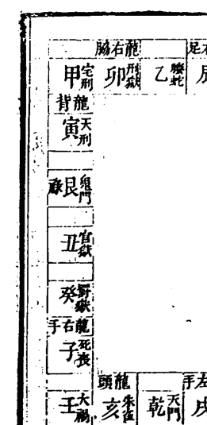

## 六四七

坐戌向辰 東四宅 陽龍陰向 水宜右到左 放乙方水吉 金宅宜微明而不宜太明 金

宜生而不宜剋剋則主輕而田地退散

陽宅開門放水宜癸甲乙方 忌辰巽方 陰地去水吉來水凶

內盤辰戌兼乙辛 外盤乙辛兼辰戌 分金坐丙辰向戌

分界五辛五戊度坐奎向角

內盤辰戌兼乾巽 外盤辰戌兼乙辛 分金坐庚辰向戌

分界五辛五戊度坐奎向角

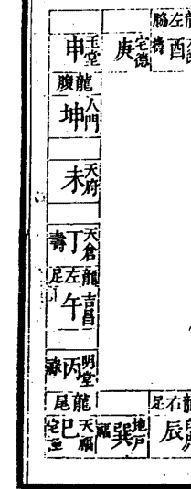

坐乙向辛 西四宅 陽龍陰向 水宜右到左

放庚辛方 木宅宜深而忌淺 木宜生而不

宜洩洩則木折不惟退財而男女主癆瘵少亡

陽宅開門放水宜丁辛方 陰地右水到左吉左

水到右凶

內盤乙辛兼卯酉 外盤卯酉兼乙辛 分金坐

丁卯向 分界七卯三乙度坐氏向胃

內盤乙辛兼辰戌 外盤乙辛兼卯酉 分金坐

辛卯向 分界三卯七乙度坐亢向氐

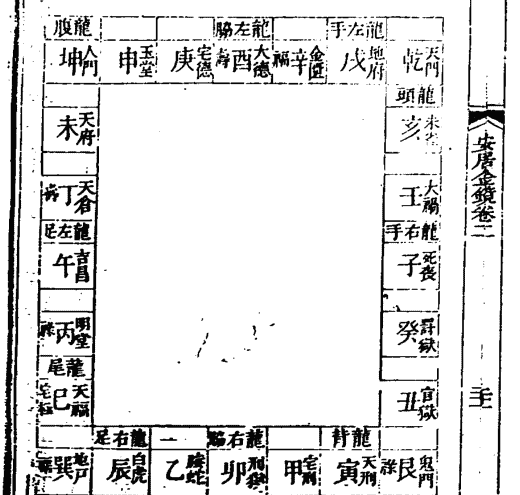

坐卯向酉 西四宅 陽龍陰向 水宜左到右

放辛方水吉 木宅宜深而忌淺

陽宅開門放水宜辛丙方 陰地左水倒右吉右

水到左凶

內盤卯酉兼甲庚 外盤甲庚兼卯酉 分金坐

丁卯向 分界五甲五卯度坐房向昴

內盤卯酉兼乙辛 外盤卯酉兼甲庚 分金坐

辛卯向 分界正卯度坐氏向胃

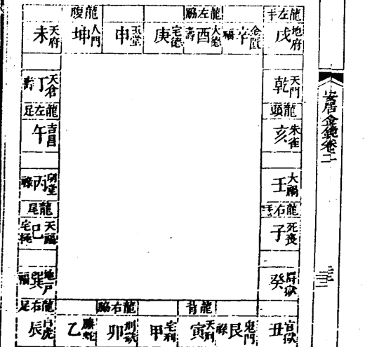

## 安居金鏡 卷二

坐甲向庚 西四宅 陽龍陰向 水宜左到右

放庚方水吉 木宅宜深而忌淺

陽宅開門放水 宜庚丁方 忌坤申西方 陰地左水到右吉

右水到左凶

| 內盤甲庚兼寅申 | 外盤寅申兼甲庚 | 分金庚寅坐 |
|---|---|---|
| 內盤甲庚兼卯酉 | 外盤甲庚兼寅申 | 分金丙寅坐 |
| 庚寅向 | 分界三寅七申度坐心向畢 | |

## 安居金鏡卷二

乾天門陰極陽首亦名背枯向榮其位舍屋連接

長遠高壯潤實吉 五月丁壬日修吉北方不用

亥為天福龍尾宜置豬欄亦名宅極經云欲得職

治宅極宜開拓吉 姓冬三月丁壬日修吉官孫

壬宅福明堂宜置高樓大舍常令清淨及集學經

史亦名印綬官宜財祿修與亥同

子吉昌龍左足宜置牛屋經曰奴婢成行六畜良

平實吉修與亥同

癸天倉立門戶客舍尊廁吉經云財耗亡治天倉

安六畜開拓高厚七月丁壬日修吉

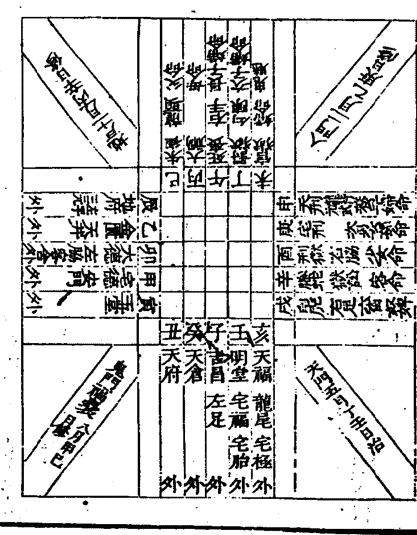

六四九

丑天府高樓大舍牛羊奴婢居之大孽息倉廁並吉修與癸同

艮鬼門龍腹福襲宜厚實重吉缺薄即貧窮入月日修吉東方不用甲子日

寅玉堂宜置車牛屋主寶貝金玉之事宜開拓經日治玉堂錢財橫至六畜肥強大吉六月甲巳日修吉

甲宅德安門宜置碓磑開拓連接壯觀吉清淨災殃自消修與寅同

卯大德龍左脇客舍經曰治大德富貴資財成萬億亦名宅主主有德望修與寅同

乙金匱天井宜置高樓大舍常令清淨勤修泥尤增喜慶卯與南十月修

辰地府青龍左手三元宜子孫當宜清淨經曰青龍壯高富貴雄豪修與乙同

巽風地戶宜平穩不宜壅塞亦名陽極陰前背榮向枯宜空缺通疎大吉十一月丙辛日修吉南

丙朱雀龍頭父命座不宜置井犯害命坐人口舌飛禍吐血顛狂蛇作怪已丙九月丙辛日修

大禍母命不宜置門犯之害命坐人飛禍口舌修與巳同

午為死喪長子婦命座犯之害命座人失魂傷目心痛火光口舌龍右手筋惡修與巳同

丁罰獄勾陳次子婦命座犯之害命坐人口舌闘訟瘡病等灾午日不用正月丙辛日修吉

未為縣獄少子婦命座犯之害命坐人鬼魅火瘡癘歷盜賊刀兵流血六畜傷死家破逃散修與丁同

坤人門女命座不宜置馬廄犯之偏枯淋腫等災此地宜荒缺低薄吉二月乙庚日修

申天刑龍背庶子婦長女命座犯之失魂病脅刑傷牢獄氣滿火怪申北十二月乙庚修至酉吉

庚宅刑次女長孫命座不宜置門犯之害命坐人病右脅口舌傷殘損墜修與申同

西刑獄龍右脅少女孫命座犯者害命坐人失魂刑獄氣滿火怪修與申同

辛為騰蛇訟獄客命犯之害命坐人口舌妖怪死喪災起西北至戊四月乙庚日修

戌白虎獄訟龍右足奴婢六畜命座犯之足蹷跛蹇偏枯筋急修與辛同

外乾院與同院修造開拓令壯實高岡陵大樹並吉宜家長延壽子孫榮祿不絕光映門族乾地

## 廣潤

外玄天福與宅極之鄉宜置大舍位次重疊深遠

濃厚吉與宅福明堂相連接壯子孫聰明昌盛

科名印綬大富貴

外天倉宜高樓重舍倉廩庫藏双婢六畜等舍大

孳息宜財帛五谷其位高潔開拓吉

外天府宜潤壯子孫婦女居之大吉亦名富貴飽

溢之地選職喜萬般悉有矣絕上

外龍腹福之位宜座實如山吉遠近連接大樹長

岡不厭開拓吉若低缺無屋舍即貧薄不安

外玉堂宜子婦即富貴榮華子孫典達其位雄壯

即官職異騰位至臺省寶帛金玉不少若陷缺

荒殘即受貧薄流徙他地

外宅德宜作學習道藝功巧立成亦得名聞千里

四方來慕亦為師貌子孫居之有信僕才抱義

壯勇無雙

外天德金匱青龍此三神並宜濃厚實大舍高樓

或有客廳卿相遊宴過往一家富貴豪盛須賴

三神尤宜開拓若冷薄缺敗陷即貧窮也外

青龍不厭清潔焚香設座延迓賓朋高道奇人

安居金鏡 卷二

自然而至安井及水濱甚吉

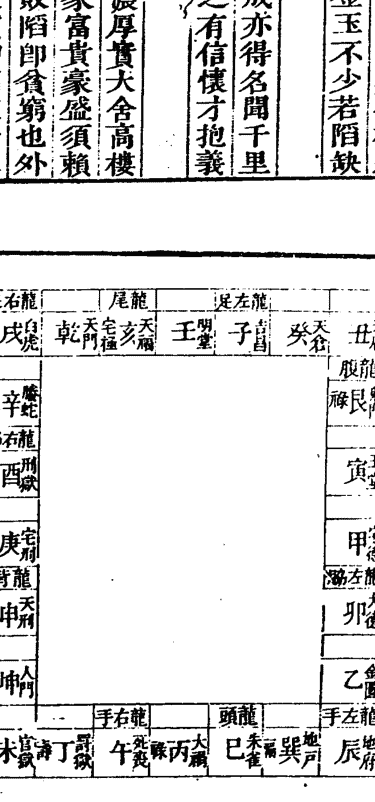

六五一

坐丙向壬　東四宅　陰龍陽向　水宜左到右

故辛方水吉　火宅宜寅而忌虛　火宜洩而

不宜生旺旺則主寅午戌年傷人官非必驗

陽宅開門放水宜丁辛方　陰地來水左到右

吉右到左凶

| 內盤丙壬兼巳亥 | 外盤巳亥兼丙壬 | 分金丁坐 |
|---|---|---|
| 丁亥向 | 分界七巳三丙度坐巽向室 | |
| 內盤丙壬兼子午 | 外盤丙壬兼巳亥 | 分金辛坐 |
| 辛亥向 | 分界三巳七丙度坐張向危 | |

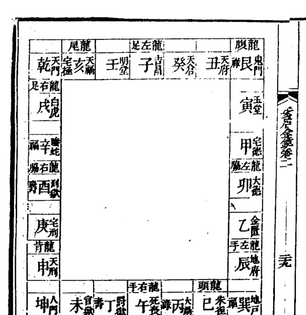

坐午向子　東四宅　陰龍陽向　水宜左到右

故癸方水吉　火宅宜寅而忌虛

陽宅開門放水宜癸方　陰地來水左到右吉

右到左凶

| 內盤子午兼丙壬 | 外盤丙壬兼子午 | 分金丙坐 |
|---|---|---|
| 丙子向 | 分界五午五丙度坐張向危 | |
| 內盤子午兼丁癸 | 外盤子午兼壬丙 | 分金庚坐 |
| 庚子向 | 分界正午度坐星向虛 | |

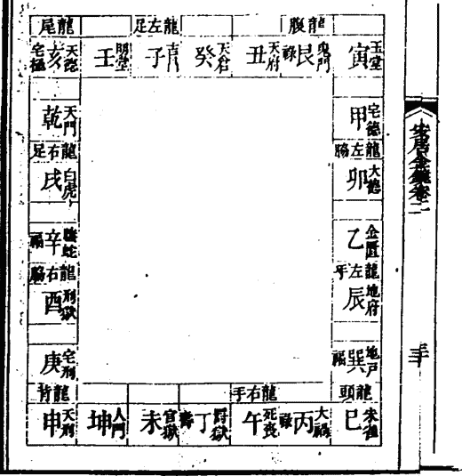

## 安居金鏡 卷二

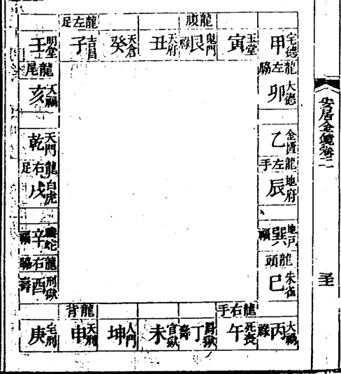

坐丁向癸 東四宅 陰龍陽向 水宜右到左

放壬癸方吉 火宅宜實而忌虛

陽宅開門放水宜丁癸方 陰地右水到左吉左水到右凶

內盤丁癸兼子午 外盤子午兼丁癸 分金丙坐庚子向

丙子 分界七午三丁 度坐柳向女

內盤丁癸兼丑未 外盤丁癸兼子午 分金庚坐丙子向

庚午 分界三午七丁 度坐柳向女

## 安居金鏡 卷二

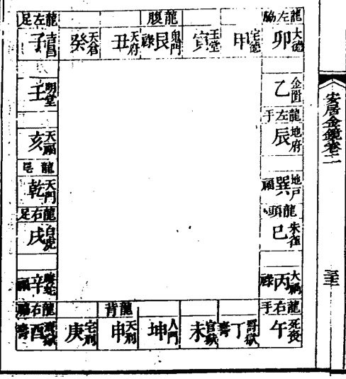

坐未向丑 西四宅 陰龍陽向 水宜左到右

放甲方水 土宅宜厚而忌薄

陽宅開門放水宜辛丙乙方 陰地去水吉來水凶

內盤丑未兼丁癸 外盤丑未兼丁癸 分金丁坐辛丑向

丁丑 分界五丁五未 度坐井向斗

內盤丑未兼艮坤 外盤丑未兼丁癸 分金辛坐丁丑向

辛未 分界正未 度坐井向斗

六五三

## 坐坤向艮 西四宅 陰龍陽向 水宜右到左

放艮方水吉 土宅宜厚而忌窄

陽宅開門放水宜艮申丙方 陰地右水到左吉

左到右凶

內盤艮坤兼丑未 外盤丑未兼艮坤 分金丁坐

丁丑向 分界七未三坤 度坐井向斗

內盤坤艮兼寅申 外盤坤艮兼丑未 分金辛坐

辛丑向 分界三未七坤 度坐井向斗

| 金匱 | 天德 | 天府 | 天倉 | 天廄 | 天官 | 天福 | 天祿 | 天刑 | 天門 |
|---|---|---|---|---|---|---|---|---|---|
| 乙 | 卯 | 甲 | 寅 | 丑 | 子 | 癸 | 壬 | 亥 | 乾 |
| 龍 | 龍 | 龍 | 龍 | 龍 | 龍 | 龍 | 龍 | 龍 | 龍 |
| 左 | 左 | 左 | 左 | 左 | 左 | 左 | 左 | 左 | 左 |
| 腦 | 腦 | 腦 | 腦 | 腦 | 腦 | 腦 | 腦 | 腦 | 腦 |
| 辰 | 巳 | 午 | 未 | 申 | 酉 | 戌 | 亥 | 子 | 丑 |

## 坐申向寅 西四宅 陰龍陽向 水宜右到左

放甲方水吉 土宅宜厚而忌窄

陽宅開門放水宜甲癸方 陰地右水到左吉左

水到右凶

內盤申寅兼坤艮 外盤坤艮兼寅申 分金丙坐

丙寅向 分界五坤五申 度坐參向箕

內盤申寅兼庚甲 外盤申寅兼坤艮 分金庚坐

庚申向 分界正申 度坐背向尾

| 金匱 | 天德 | 天府 | 天倉 | 天廄 | 天官 | 天福 | 天祿 | 天刑 | 天門 |
|---|---|---|---|---|---|---|---|---|---|
| 乙 | 卯 | 甲 | 寅 | 丑 | 子 | 癸 | 壬 | 亥 | 乾 |
| 龍 | 龍 | 龍 | 龍 | 龍 | 龍 | 龍 | 龍 | 龍 | 龍 |
| 左 | 左 | 左 | 左 | 左 | 左 | 左 | 左 | 左 | 左 |
| 腦 | 腦 | 腦 | 腦 | 腦 | 腦 | 腦 | 腦 | 腦 | 腦 |
| 辰 | 巳 | 午 | 未 | 申 | 酉 | 戌 | 亥 | 子 | 丑 |

## 安居金鏡 卷二

坐庚向甲 東四宅 陰龍陽向 水宜左到右

放甲方水吉 金宅宜微明而不宜太明

陽宅開門放水宜甲方 陰地左水到右吉

右水到左凶

| 內盤甲庚兼寅申 | 外盤寅申兼甲庚 | 分金庚寅 |
|---|---|---|
| 丙寅向 | 分界七申三庚度 | 坐畢向尾 |
| 內盤甲庚兼卯酉 | 外盤甲庚兼寅申 | 分金庚申 |
| 庚寅向 | 分界七庚三申度 | 坐畢向心 |

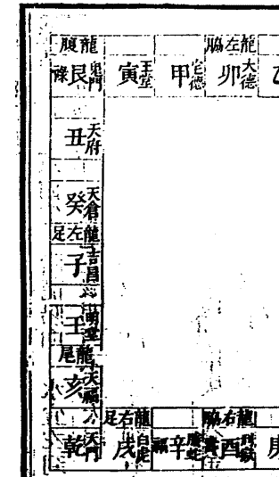

## 安居金鏡 卷二

坐酉向卯 東四宅 陰龍陽向 水宜左到右

放乙方水吉 金宅宜微明而不宜太明

陽宅開門放水宜乙方 陰地左水到右吉

右水到左凶

| 內盤酉卯兼甲庚 | 外盤甲庚兼卯酉 | 分金丁卯 |
|---|---|---|
| 丁酉向 | 分界五庚五酉度 | 坐昴向房 |
| 內盤卯酉兼乙辛 | 外盤卯酉兼甲庚 | 分金辛卯 |
| 辛酉向 | 分界正酉度 | 坐胃向氐 |

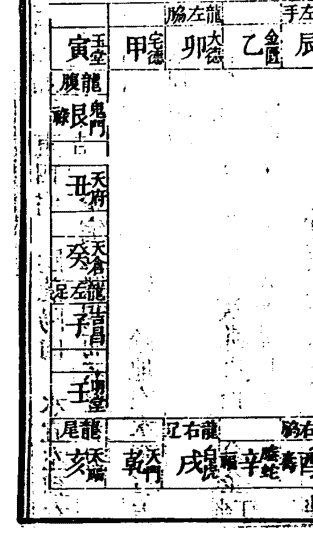

六五五

## 坐辛向乙 東四宅 陰龍陽向 水宜右到左

放乙方水吉 金宅宜微明而不宜太明

陽宅開門放水宜癸丙乙方 陰地右水到左吉

左水到右凶

內盤乙辛兼酉卯 外盤卯酉兼乙辛 分金坐丁卯向

丁卯向 分界七酉三辛度坐胃向氐

內盤乙辛兼辰戌 外盤乙辛兼卯酉 分金坐辛卯向

辛卯向 分界三酉七辛度坐婁向亢

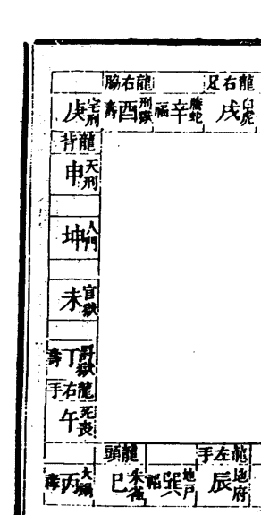

## 坐辰向戌 西四宅 陰龍陽向 水宜右到左

放辛方水吉 木宅宜深而忌淺

陽宅開門放水宜丁辛方 陰地去水吉來水凶

內盤辰戌兼乙辛 外盤乙辛兼辰戌 分金坐丙辰向

丙辰向 分界五乙五辰度坐角向奎

內盤辰戌兼巽乾 外盤辰戌兼乙辛 分金坐庚辰向

庚辰向 分界五乙五辰度坐角向奎

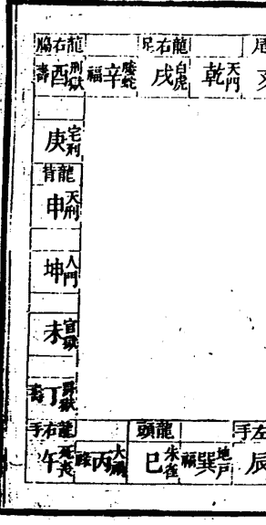

## 安居金鏡 卷二

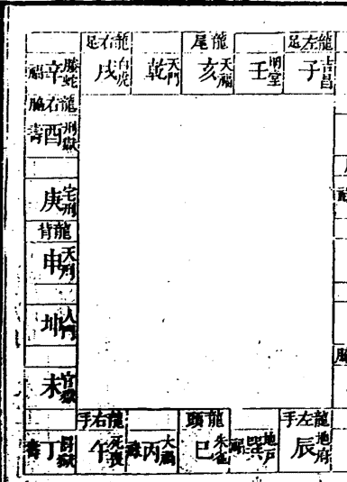

坐巽向乾 西四宅 陰龍陽向 水宜右到左

放癸方 木宅宜深而忌淺

陽宅開門放水宜庚癸方 陰地右水到左吉左水到右凶

內盤巽乾兼辰戌 外盤辰戌兼巽乾 分金丙坐庚戌向

內盤巽乾兼巳亥 外盤巽乾兼辰戌 分金庚坐辰戌向

分界三辰七巽 度坐彫向壁

## 安居金鏡 卷二

坐巳向亥 西四宅 陰龍陽向 宜右水到左

放癸方水 木宅宜深而忌淺

陽宅開門放水宜癸庚辛方 陰地右水到左吉左水到右凶

內盤巳亥兼巽乾 外盤巽乾兼巳亥 分金丁坐丁亥向

內盤巳亥兼丙壬 外盤巳亥兼巽乾 分金辛坐辛亥向

分界正巳 度坐巽向室

六五七

# 安居金鏡卷三

周 範南梅堂甫

呂 臨蔚若甫 全輯

薛 傅理齋甫

陸 煌檀甫甫 全校

吳永年巽嶼甫鑒定

王惟諫司直甫參閱

## 搜源鑑

## 二十四向起數法

乾戌申宮向土行未丁卯位一同壬若識子癸巽

巳丙左邊起數法分明以上一十二向並從左

午位相同庚酉辛丑向又兼甲乙辰亥寅坤艮皆

從右紫白相加法甚明以上一十二向並從右

河圖數

一水二火三木四金五土六水七火八木九金十土

洛書數

一白水二黑土三碧木四綠木五黃土六白金

七赤金八白土九紫火

子爽曰天地間原只有這個數百物之生息皆

逃不出是數之外當夫萬緣俱息一物不有廓

然無朕之時何有乎數然而生生之機實默運

于个中故有太極即有陰陽成兩儀生四象以

盡入卦也陽生之數一起于層一起于間未作

宅時五行無所依據數固無從而起惟詳觀形

勢全憑天地自然之造化以俟知者之裁成既

作宅時則層即于此立間即于此分而數即隨

之起是費彈力推以求合知而不得漫然矣

第層數之起自外而內一定不移起間之數法

當先明陰陽順逆古人以納甲分二十四山陰

陽說亦祖于洛書之數乾居正南數九為陽甲

千從之坤居正北數一為陽乙于從之坎居正

西數七為陽而納癸申辰離居正東數三為陽

而納壬寅戌長居西北數六為陰丙干從之巽

居西南數二為陰辛于從之震居東北數八為

丑皆取數奇為陽數偶為陰而因名為淨陰淨

陽也陽宅間數之起本于淨陰淨陽而更變化

于淨陰淨陽之中蓋攻壞為亡魂所守法取靜

靜居址為生人所棲法取動直故扦墓止論淨

陰淨陽之穴而營宅更論分陰分陽以定向

## 安居金鏡 卷三

也分陰分陽者以寅申為界限自寅至坤十二位為陽自申至艮十二位為陰凡十二陽位之中而更遇淨陽謂之獨陽不生數從右起逆行十二陰位之中而更遇淨陰謂之孤陰不長數從左起順行若遇淨陰則陰陽相配而數左起順行若遇淨陽則陰陽相應而數從左起逆行然其陰陽順逆皆從向定不依坐山取用何也陽宅本主變動而向為出入之所靈動之機受氣之首也以寅申分陰陽者取人生乎寅之義也宅建于地為人棲止以受天氣者也故從人生之候以分之也河圖之數始于一而終于十數之盈也洛書之數始于一而終于九陽之極也數盈則復陽極則變天地之運一變一復而化成明乎此則豈止知宅兆之吉凶而已哉

## 八宅佈星論六事法

| 宅名 | 佈星 | 六事 |
|---|---|---|
| 坎宅 | 一白入中宮二黑到坤三碧到震四綠到巽五黃到中宮六白到乾七赤到兌八白到艮九紫到離 | 生氣貪狼木星在兌延年武曲金星在坤天醫巨門土星在震伏位左輔木星在坎絕命破軍金星在巽五鬼廉貞火星在艮六煞文曲水星在乾禍害祿存土星在離 |
| 坤宅 | 二黑入中宮三碧到震四綠到巽五黃到中宮六白到乾七赤到兌八白到艮九紫到離一白到坎 | 生氣貪狼木星在艮延年武曲金星在坎天醫巨門土星在巽伏位左輔木星在坤絕命破軍金星在震五鬼廉貞火星在乾六煞文曲水星在離禍害祿存土星在兌 |
| 震宅 | 三碧入中宮四綠到巽五黃到中宮六白到乾七赤到兌八白到艮九紫到離一白到坎二黑到坤 | 生氣貪狼木星在離延年武曲金星在巽天醫巨門土星在坎伏位左輔木星在震絕命破軍金星在坤五鬼廉貞火星在兌六煞文曲水星在艮禍害祿存土星在乾 |
| 巽宅 | 四綠入中宮五黃到中宮六白到乾七赤到兌八白到艮九紫到離一白到坎二黑到坤三碧到震 | 生氣貪狼木星在坎延年武曲金星在震天醫巨門土星在離伏位左輔木星在巽絕命破軍金星在乾五鬼廉貞火星在坤六煞文曲水星在兌禍害祿存土星在艮 |
| 乾宅 | 六白入中宮七赤到兌八白到艮九紫到離一白到坎二黑到坤三碧到震四綠到巽五黃到中宮 | 生氣貪狼木星在坤延年武曲金星在艮天醫巨門土星在兌伏位左輔木星在乾絕命破軍金星在離五鬼廉貞火星在震六煞文曲水星在巽禍害祿存土星在坎 |
| 兌宅 | 七赤入中宮八白到艮九紫到離一白到坎二黑到坤三碧到震四綠到巽五黃到中宮六白到乾 | 生氣貪狼木星在震延年武曲金星在乾天醫巨門土星在艮伏位左輔木星在兌絕命破軍金星在坎五鬼廉貞火星在巽六煞文曲水星在坤禍害祿存土星在離 |
| 艮宅 | 八白到艮九紫到離一白到坎二黑到坤三碧到震四綠到巽五黃到中宮六白到乾七赤到兌 | 生氣貪狼木星在乾延年武曲金星在坤天醫巨門土星在震伏位左輔木星在艮絕命破軍金星在巽五鬼廉貞火星在坎六煞文曲水星在離禍害祿存土星在兌 |
| 離宅 | 九紫到離一白到坎二黑到坤三碧到震四綠到巽五黃到中宮六白到乾七赤到兌八白到艮 | 生氣貪狼木星在巽延年武曲金星在坎天醫巨門土星在坤伏位左輔木星在離絕命破軍金星在震五鬼廉貞火星在乾六煞文曲水星在艮禍害祿存土星在兌 |

已上八宅凡關殺方有六事動用者損孕婦產死或少年天亡或出孤寡或出癆疾各以類斷生方有六事動用者財退又當詳九星之吉凶

以定之如三白星本為上吉逢生旺吉中又吉遇財退亦不失為吉皆可動用如剋煞必主人財兩敗多致絕滅三碧九紫星為次吉生旺獲福死退生剋若遇殺氣取不旋踵二黑七赤生旺聊施福澤死退亦降災殃剋殺敗亡立至五黃所在不論生剋俱為大凶不可動用犯之立至瘟黃災禍死亡絕滅

安居金鏡卷三

堪輿篇

五

子英氏曰此單論宅而不論局也宅者向離即坎向震即兌之謂局者取山峙水界之方以審受氣之即外之山巒秀河海朝迎則輕宅而重局內之六事合宜動靜如法則輕局而重宅一宅之中生旺喜動剋煞喜靜故作房不妨就煞而六事必居生旺六事者門路井灶豬牛欄坑廁等項是也其中門路又為第一緊要固宜居九星生旺之方尤喜合本山長生之位如坎宅七赤臨坤為生氣申上乃坎山長生之位故坎宅喜開申門行申路離宅三碧臨艮為生氣寅乃離山長生之地故離宅喜艮門路然九星與長生相合者惟四正之宅為然至四維之宅則當專以九星為主參之以十二長生之位使不犯死絕之方乃可耳井灶等項固喜生旺尤貴立于天干之位忌犯地支恐太歲填實生災也

## 層數間數法

河圖數

第一層第一間皆屬水第二層第二間皆屬

火第三層間皆屬木四皆屬金五皆屬土第

六層第六間復皆屬水第七層第七間復皆

屬火依次数去層數自外而內間數依二十

四向數法陰陽順逆起間一斷即止

餘間再起一水復行如七間一斷另接間棟

數至二火即止餘屋復起一水依次而行

## 洛書數

第一層第一間皆一白入中宮第二層二間

二黑入中宮第三層三間三碧入中宮第四

層四間四綠入中宮第五層五間五黃入中

宮第六層六間六白入中宮第七層七間七

赤入中宮第八層八間八白入中宮第九層

九紫入中宮第十層第十間復以一白入中

層數自外而內間數依陰陽順逆而起以所

得之星入中順飛九宮視其生殺死退

又凡屋造一間者屬水二間者屬火三間者

屬木四間者屬金五間者屬土六間者屬水

七間者屬火依此推之

漢傑氏曰立宅當先論層數間數與宅之宜忌

合否何如即可推其宅之盛衰興替如坎宅一

白入中正屋造三間為水木相生人財大旺四

間金水相生亦發財丁九星四綠文昌所屬主

發文秀人亦好淫五間土來剋水必主孤絕二

間水火相殘天亡孤寡復多血疾此論間法也

論層則以本山與飛臨所得之星為主以觀生

剋如坎宅一白入中六白臨坎若一層兩層則以坎山剋兩層之火，而兩層之火復剋坎上六白之金，主出少亡、橫死、孤寡、敗絕。三層受山之生，受星之剋，吉凶相半。四層于山受生于星，和旺財祿，固優人丁亦盛。五層受星而剋宅，吉少而凶多。六層受星生而宅比和，人共財而咸亨。再合間數而取之，則吉凶燎然矣。如坎宅四層三間，或四間，或六間正屋者，必然大發財丁。四五間、五間二層、五間二層、五間五間、五層三間、五間者，殺氣縱橫，敗無噍類。三層三間、四間、三層六間者，是非相半，興廢不常，得進即興，失時即敗，或有財無丁，或有丁無財，此其大略也。其餘則例此推之。然又有為局之所喜，宅之所忌，或宅之所喜，局之所忌者，則當抽遷之美惡，以定禍福。如震局兌宅，而造三間兩層，則為局所喜而宅所忌，逢和必司退而怨興，過金土當擲而輟廢，自然之數也。至于欲知何層之可住與否，則先觀其局與宅之為生為殺，而後復詳其本層生旺剋死退之方，六事沖射以決之。如坎局第一層屬水為旺，坎坤二位復有門路井灶等件，乾震兩方並無屋脊橋道等項，則必大發財丁。第二層既為局剋殺，而乾兌艮方復有六事動用，外有道路沖射，則必損人天敗也。

## 從屋宜忌法

前層為朱雀，左側為青龍，右側為白虎，後層為元武。

漢鍾氏曰：從屋者，正堂前後左右之廂房也。宜與正堂相生，忌與正堂尅戰。假如正堂三間屬木，左右兩廂、前後兩層造六間為水木相生，八間為比和旺相。忌造四間、九間及五間、十間，兩相刑戰。然又不可使之生旺太過，反生災禍。幕講僧曰：五行生尅以中和為貴，過則損人，不及傷財，妙在通變，不可執一。又曰：有生無尅，財不與；有尅無生，人不旺；生尅兩和，人財兩旺。此言正為從屋設也。假如正堂三間屬木，前廳三間亦屬木，後層六間屬水生木，則正堂之木旺矣。若左右兩側或前進臺門復造三間、八間木屋，或造六間水屋，則木盛太過，雖發人丁，必少財祿，又主出虛花不實，男女好淫。益水木性主浮泛，過則即生災禍也。如造五間、十間土屋，則木得土財，入財兩旺。七間火屋，則木火通明，不止旺則焚，主生血疾，並忌火災。水旺則出人游蕩，男女多淫；金旺則頑剛狠不仁，官災孤寡；土旺則滯瘟癘惡疾，厭服黃癭。以上單就五行生尅而論，至于屋形亦當兼取。前層、側廂皆宜低於正堂，後層元武則宜高於正堂。前層若高，名客勝主，出入昏迷；側廂若高，名奴欺主，孤寡常招；後層若低，元武受風，作事多迍。兩廂及前層之簷，喜與正堂之簷平等，名四合金星，最吉。蓋正屋架數多而從屋架數少，則左右及前之屋自低於正堂，而簷則自與正堂齊也。又正堂為腹，前層為首，左右廂為手足，前層之後、兩廂之首為頸，正堂之傍、兩廂之中為腰。頸上不宜缺陷低小，若廂房之首另造一二間小屋，如向房之向者，主投河自縊，有路亦然。空缺則為斷頭，主外亡橫死。如廂房之首有小屋橫造，如前層向者，名仰屍，主路死他鄉。腰上不宜有路，常招鬼怪盜賊，亦主自縊。前層後層不宜與正堂各向，若自外而入者，主異姓同居或招贅婿；自內而出者，遠出外亡。自外而入者，從外數至內也。如前層坐丑向未，正堂坐癸向丁，則前層左邊向外，右邊向內，數從左起，則自外而入矣。自內而出者，從內數向外也。如前層坐寅向申，後層坐丑向未，則前層左邊向內，右邊向外，數從左起，則自內而出了矣。青龍主長房，主男子，帶殺披刑破碎缺陷，長房受災，男子受禍。白虎主小房，主女人，帶殺披刑破碎缺陷，小房受災，女人受禍。明堂主中房，帶殺披刑破碎尖長，禍應中房。明堂在正堂之前為前明堂，正堂之後為後明堂。前明堂喜方而稍闊，最忌直長，猶嫌偏窄。後明堂不宜太寬，則內氣不聚，財源耗散；亦不宜太狹，與前簷相交，主出瞽目。左右及前後簷交者，禍亦如之。左右廂房最忌造於正堂前後之內，名曰箭鏃。蓋基地不寬，即於前後明堂之內造兩廂房，正堂左右之廂房披前沖後射明堂，勢必緊狹蔽塞天光，多致口舌官災，損傷小口，或多少男，或竟無生育，職此之故，不可不慎。又當視其所簷幾間，以言災禍。如一間所沖之房內，主投河；二間，吐血產厄；三間，癲狂；四間，自縊；五間，瘟瘧。此皆最關宅中利害者，故述於此。至若正堂前後有小屋或斜沖，及左右歪斜、龍虎帶箭攆尾諸凶，詳屋形篇中。

## 截路分房法

一層屋正堂之中為中宮。二層屋明堂為中宮。三層屋中層為中宮。四層屋中明堂為中宮。五層屋第三層為中宮。六層屋第三層之後、四層之前為中宮。七層屋第四層為中宮。

漢濮氏曰：凡宅之中宮，當視前後左右所占之多寡而定。一層屋前後並無明堂，則以正堂棟柱下為中宮。若左右兩廂直出正堂前面，架橋橫柵內有明堂，則當以正堂之簷前為中宮矣。要之宅不拘方圓曲直、橫闊直長、前後大小，皆要視其所占之地，均排八方。如二層屋坐坎向離，正堂九間，前簷九間，左右兩廂止三間，此係橫闊屋形，則正堂中五間屬坎，右二間及右側近北一間屬乾，左二間及左側近北一間屬艮，前簷中五間屬離，左二間及左側近南一間屬坤，左側中間屬兌。若正堂三間，前簷三間，左右皆九間，此係直長屋形，則正堂中間及左右各半間屬坎，左半間及左側北首二間屬艮，右半間及右側二間屬乾，前簷中一間及左右各半屬離，左半及左側近南二間屬巽，右半及右側近南二間屬坤，左側中五間屬震，右側中五間屬兌。若前層三間，正堂及左右廂皆九間，此係後潤屋形，正堂中五間及左右中五間屬坎、屬震、屬兌，正堂左二間及左側近北二間屬艮，正堂右二間及右側近北二間屬乾，前層中間及左半之半屬離，左半及左側二間屬巽，右半及右側二間屬坤。其餘前潤後狹或左右長短者，皆依此而定。大約分方定位，四正每多四維之半，蓋四正從本層本側而取，四維則合正側兩座。座向定名雖多，而實未嘗多也。方位既辨，然後佈以九星，觀其方上所得間數，以定五行，以較生剋。如坎宅乾位二黑飛臨，若造三間木屋，則木土相戰，必主敗亡；造四間、五間及七間，生旺為吉。如間數多而占兩三方者，則不必以此論矣。至于房間吉凶，則以九星合河圖數論生旺為吉。如坎宅乾方二黑加之一水三木之問為殺，第二間及第四間屬火、屬金為生，是也。然作住房惟水木金三者，其性沖和，若遇生旺得運，大發；火運平安。火性燥烈，易興易廢，運將來而頓興，運未去而先退。土性遲滯，位在中宮，運逢生旺，不過小康；一遇剋殺，禍不旋踵。乃若九星五行互相剋戰，則禍發各有其類。水火相殘，屋屬水剋妻勞怯，屋屬火吐血產亡、血崩墜胎，以陽剋陰而火象血也。火金相剋，多主橫死、癆怯、損少傷丁。金木相形，多主出孤，以木破金則無枝葉故也，亦主自縊。土木相傷，多主無子。水土相戰，常出天亡，亦名寡屋。至于九星首取三白，若逢生旺，大發財丁。若一白相刑，主剋妻；六白相刑，主無子；八白相刑，剋小兒。二黑生旺利宅母，相剋婦人災，非產亡墮胎，則血崩癆瘵。三碧相生則旺丁，相剋妻損人。四祿生旺產人文秀，刑剋男女多淫。五黃不論生剋，皆為凶兆，若作住房，瘟黃敗絕。七赤生旺平安，剋殺子孫奸盜。九紫相生發財發丁，相剋孤寡損人。此其大略也，神而明之，存乎其人。

## 開門安床法

河圖蘊奧是陰陽，星卦排來禍福藏。殺氣不宜確灶向，生方切莫去安床。生旺自宜安六事，殺星反喜作居房。退飛須知憂絕嗣，開門切忌殺星方。惟有五黃凶更速，世人避此免刑傷。

漢僕氏曰：陽宅凡事皆取生旺，而獨於安床則曰殺位安床反主吉康，又曰殺星反喜作居房。何也？以生旺喜動而剋殺喜靜也。生旺惟動，然從吉祥之氣施生；剋殺惟靜，然後垂戾之氣不作。不特一宅為然，即臥房一室亦若是也。故曰生方切莫去安床。一宅之中，六事為動，臥房為靜；一房之內，臥床為靜，房門為動。床安殺方，門開生位，謂之向生；床安生旺，門開殺方，謂之就死。然擇房不拘本宅生旺剋殺之位，惟以河洛九星五行泰取本間生旺，而臥房安床則必以向生為主，故曰殺位安床反主吉康。所言生殺有秘機在，不可誤認。蓋以沖生之位為殺，而非指九星之關殺為殺。如寅申相沖，以申為生者，即以寅為殺，床坐寅而向申，乃名坐煞；已亥相沖，以亥為生者，即以巳為殺，床坐已而向亥，乃名向生。所言坐向，亦非如宅舍墳塋之坐向，謂床頭頂處即名為坐，而門開對沖即名為向也。然五行生殺之起法，非止一例，又宜細辨。一以坐山起者，一以河圖五行起者，一以洛書九星起者，一以分方九星起者。一以坐山為主，如坐坎申上起長生，不拘何間，宜開申門，再以河洛五行九星泰之。艮巽乾坤四維之宅，以五行九星為主。如第一間屬水，生申旺子，一白入中，六白七赤臨坎坤為生照，宜開坤申坎子二門，復以坐山九星泰之。城之中獨間獨進，一宅之內另有餘，坎或側屋高於正屋，或後層脫于前層，或止一二間而他向，或有左右廂而遠離，不為正屋所制，不為上下牽連，則止以坐山九星論之，復泰以坐山生旺。如坐坎二白入中，坎坤為生；坐艮八白入中，乾上為生。不必復以一水二火及一白二黑等法數間論也。至于分方九星，亦可論門，論床亦可論沖論射。前法吉少凶多，則以分方論之，亦能致禍。如坎宅西南隅坤位，即以二黑入中，震上為生；右廂兌位，即以七赤入中，乾上為生，是也。然坐殺向生之法，在四正之宅則為奇妙，若四維之宅則不宜執此而論。蓋四正之四隅，乃寅申巳亥四生之地，用以開門，則為向生；若四維之四隅，乃子午卯酉四旺之氣，用以開門，則為抵旺。生方可對，而旺方不宜相沖。故四維之宅當用三合聯珠之法以安床，真至妙至神、奪天改命之秘法也。假如艮宅第一間屬水，一白入中，門開坎位，申上安床，合成申子辰水局，床坐一水之生，門迎一水之旺，而九星六白臨門，七赤臨床，皆為生氣，以之開門安床，吉莫如之。大抵其法惟以河圖五行為主，局生問與旺則宜，局剋問與洩則忌。刻如屬水之問，喜合金水二局，忌逢木土洩傷。開門參以九星，若遇三白飛臨，不特取夫生旺，即遇死退亦所不棄。此開門安床之要訣也。

## 關殺沖射法

石橘、石路、確、磨，已上屬金。木橋、樓梯、門、倉庫，已上屬木。小屋、丘阜、路、高堆、街市、牆，已上屬土。高塔、油車、灶、爐廠、銅鐵店、缸瓦窯，已上屬火。河港、溪澗、井、坑廁，已上屬水。

六事五行有以形取者：失者屬火，高塔尖砂屋影之類是也；圓者屬金，圓側池塘堆阜之類是也；方為土，小屋坑廁之類是也；直為木，直路枯井長屋旗竿之類是也；曲為水，灣路灣港橋道是也。失而斜者，人命官司、飛災橫死；圓而小者，墮胎患眼；方而空者，停喪牢獄，又名埋兒；直而射者，盜賊離鄉；曲而繞者，自縊吊亡，亦主落水。有以質取者：瓦石屬金，木造者屬木，土築者屬土，有火者屬火，有水者屬水。屬火者，血疾怯；屬水者，痢疾惡瘡；屬木者，天亡牢獄；屬土者，瘟癆膨脹；屬金者，橫事官災。有以色取者：紅者屬火，白者屬金，黑者屬水，青者屬木，黃者屬土。紅主血光，白主孝服，黑主災悔，青主吉祥，黃主瘟癆。然六事有內外不同，災祥有房局各殊，禍福有星方異類。何為內外不同？橋梁、道路、水路、山岡、河港、溪溝、高堆、尖跡、街市、牌樓、窰廠、坑塹、廟宇、神壇之類為外；門路、灶廁、豬欄、牛羊、倉庫之類為內。何為房局各殊？外六事先論局而後論宅，內六事先論宅而後論房。外之山水道路等項，宜在本局生旺之所，忌居關殺；而坐山之外關殺之方，尤不宜沖射諸凶。門路井灶等件，宜在坐山生旺之方，忌居關殺；而臥房之外關殺之方，亦不宜六事動用。何為星方異類？九星與二十四方災禍之來，各有其類也。一白刑麥睏眠，黑瘟癘家母，三碧出孤癘病癘剋妾，四祿淫佚瘋啞自縊暗啞，五黃孤寡黃腫孕婦損傷小口刑害，六白剋妻孤寡刑傷子息，七赤盜賊刀傷投河自縊，八白小口損傷。壬方山水吉，主驟發極能救貧，血財與旺，龍真局美，文武全才，卿相顯貴，次則納粟監生，貢舉富厚；凶主離鄉逃竄，游蕩敗亡，黃腫落水。子癸二方山水吉，主雙生發富，龍盤局換，砂秀水迎，必產奇才；凶主桃花淫亂，兄弟屠戮，毒藥少亡，人生六指，多病肚脹，圓墩墮胎，水沖落水。丑方山水吉，主旺產多田，牛羊財帛，出入信崇佛老；凶主鰥寡僧道，橫逆天亡，若山如臥屍，路死遠方，尖砂如刀劍，殺戮屠刑。艮方山水吉，主富堪敵國，龍真局美，甲第顯榮，親聯國戚，食享天祿；凶則陰退絕嗣。寅方山吉，主大旺財丁，離鄉發達；凶主瘋盲虎傷，有墩師巫持名，若圓長博奕國手。甲方山水吉，則富厚龍合局真，少年科第名魁。方山水吉，主文兼武貴，出入有操持膽略，龍局雙美，將相英雄；凶主淫亂偷盜，殺戮屠刑。乙方山水吉，主利名顯達，但多生女；凶主手殘足疾，蟪蛤招婿。辰方山水吉，主大旺財產；凶主落水癲顛喑啞癘疾。異方山水吉，主少年魁甲，文章冠世，小考首選，有水特朝，因女致富，因妻得官，或有亂山，室女淫佚。巳方山水吉，主大旺人財；凶主吐血癆瘵，少年天亡，蛇傷殺戮，有砂閉塞，婦人不生，有墩圓小，婦人墮胎。丙方山水吉，主富壽，丙為赦文，家無凶禍，龍貴局真，公卿富貴；凶主火災。午方山水吉，主驟發，但多離鄉，龍確局壯，世出魁元；凶主火災淫亂，出賊外亡，有墩警目。丁方山水吉，主男女多壽，家無凶禍，龍局全美，射策金門；凶主腹疼敗亡。未方山水吉，主血財興旺；凶主僧尼寡婦，天折貧窮，有尾山路死。坤方山水吉，主富豪多產，寡母起家，龍局雙全，三甲科第；凶主婦女孀亂，山嬌母淫亂發達；凶則虛勞損少。庚方山水吉，則巨富龍真，鉢孟山出尼姑。申方山水吉，主大旺財丁，少年局大多主武職，出入有胸襟膽略，名顯華夷，尖峯為判筆為官，片言折獄；凶主盜賊殺傷，發林英傑。西方山水吉，主出人文雅，龍真局美，科甲顯榮；凶主淫亂遭刑，此方缺陷為官陣亡。辛方山水吉，主文章秀麗，年少登科，官居翰苑，風流俊雅，更多金寶；凶主乞丐無嗣。戌方山水吉，主富而且貴，龍真局的，驟起家內，主回祿剋妻，瞻聾暗啞，更多悖逆不忠之輩。乾方山水吉，主富豪貴顯，龍局重厚，宰輔狀元；凶主跛聾駝矮，頭痛吐血，鰥寡絕嗣，繼贅剋妻，勞瘵天亡。亥方山水吉，主大旺財丁，人家長善；凶主虛勞吐血，少年天亡，家業退敗。此以宅外山水取沖射明吉凶也。宅內六事災禍亦其類：門路盜賊天亡，牢獄遭刑；井臨金自縊，臨水投河，出啞出淫，子孫愚魯，瞽目痢疾，小兒驚風，賭博飄蕩；灶主婦女損傷，小口刑害，目疾聾瞽，啞主官災橫禍，墮胎損孕，小口喪亡，亦主淫啞；坑主淫溢耳聾，黃腫喪亡；廁主小口損傷，男女淫亂，痢疾嚴服；豬牛羊欄，小兒驚風痘疹，喪亡腳爛生瘡。至于臥房，則以生剋論之。如一白間有屬土六事，小屋、牆頭、丘阜等項沖射，必主孤絕勞怯；二黑間有屬木六事，倉庫、樓梯、木橋等項沖射，必主婦女刑害，其間有灶，必主產亡；三碧間有屬金六事沖射，必出寡母，僅生一子；四綠間有屬金六事，必主淫佚絕嗣；五黃間有屬木六事相沖，孤寡瘟瘡；六白間有屬火六事相沖，財丁兩敗，官司破家；七赤間有屬火六事相沖，財丁兩敗，官司破家；八白間有屬木六事，主小口刑傷；九紫間有屬水六事相沖，瘟瘡脹脹。與本間關殺之方相併者，禍重；與本間生旺之方同臨者，禍輕。三白間相生六事沖射，大旺財丁；若在生方，吉中又吉；如遇關殺，禍重禍輕。又四祿之間若有井灶，主得橫財。此以宅內六事論臥房取沖射斷吉凶也。合內外之刑沖，詳局宅之宜忌，分房間之禍福，陽宅之能事畢矣。

安居金鏡卷三 搜源編 三

## 大小二運法

大運：上元一白主運，中元四綠主運，下元七赤主運。

又上元：
甲子 二十年 一白主運
甲戌 二十年 二黑主運
甲申 二十年 三碧主運
甲午 二十年 四綠主運
甲辰 二十年 五黃主運
甲寅 二十年 六白主運

中元：
甲子 二十年 四綠主運
甲戌 二十年 五黃主運
甲申 二十年 六白主運
甲午 二十年 七赤主運
甲辰 二十年 八白主運
甲寅 二十年 九紫主運

下元：
甲子 二十年 七赤主運
甲戌 二十年 八白主運
甲申 二十年 九紫主運
甲午 二十年 一白主運
甲辰 二十年 二黑主運
甲寅 二十年 三碧主運

安居金鏡卷三 搜源編 三

小運：
第一元甲子十二年水運
第二元丙子十二年火運
第三元戊子十二年木運
第四元庚子十二年金運
第五元壬子十二年土運

漢傑氏曰：八山建造，運逢生旺，龍神有氣，易于發越；如遇剋殺，即得美局，亦主平平。局宅失宜，禍不旋踵。如坎龍上元甲子，一白元龍主事；下元七赤生氣主事，大利營建修造。上元甲申後八十年，下元甲申後四十年，運逢剋退，不宜動作營為。欲知八宅興廢之年，則以坐山及層數間數推之。如坎山四層三間正屋，上元一白主管二十年內，及中元甲子二十年，三碧四綠主管三十年內，及下元甲子二十年內得旺運。甲辰二十年，及下元甲子二十年內得旺運。甲辰二十年，及下元甲子二十年內得旺運。甲辰二十年，及下元甲子二十年內得旺運。甲辰二十年，及下元甲子二十年內得旺運。甲辰二十年，及下元甲子二十年內得旺運。甲辰二十年，及下元甲子二十年內得旺運。甲辰二十年，及下元甲子二十年內得旺運。甲辰二十年，及下元甲子二十年內得旺運。甲辰二十年，及下元甲子二十年內得旺運。甲辰二十年，及下元甲子二十年內得旺運。甲辰二十年，及下元甲子二十年內得旺運。甲辰二十年，及下元甲子二十年內得旺運。甲辰二十年，及下元甲子二十年內得旺運。甲辰二十年，及下元甲子二十年內得旺運。甲辰二十年，及下元甲子二十年內得旺運。甲辰二十年，及下元甲子二十年內得旺運。甲辰二十年，及下元甲子二十年內得旺運。甲辰二十年，及下元甲子二十年內得旺運。甲辰二十年，及下元甲子二十年內得旺運。甲辰二十年，及下元甲子二十年內得旺運。甲辰二十年，及下元甲子二十年內得旺運。甲辰二十年，及下元甲子二十年內得旺運。甲辰二十年，及下元甲子二十年內得旺運。甲辰二十年，及下元甲子二十年內得旺運。甲辰二十年，及下元甲子二十年內得旺運。甲辰二十年，及下元甲子二十年內得旺運。甲辰二十年，及下元甲子二十年內得旺運。甲辰二十年，及下元甲子二十年內得旺運。甲辰二十年，及下元甲子二十年內得旺運。甲辰二十年，及下元甲子二十年內得旺運。甲辰二十年，及下元甲子二十年內得旺運。甲辰二十年，及下元甲子二十年內得旺運。甲辰二十年，及下元甲子二十年內得旺運。甲辰二十年，及下元甲子二十年內得旺運。甲辰二十年，及下元甲子二十年內得旺運。甲辰二十年，及下元甲子二十年內得旺運。甲辰二十年，及下元甲子二十年內得旺運。甲辰二十年，及下元甲子二十年內得旺運。甲辰二十年，及下元甲子二十年內得旺運。甲辰二十年，及下元甲子二十年內得旺運。甲辰二十年，及下元甲子二十年內得旺運。甲辰二十年，及下元甲子二十年內得旺運。甲辰二十年，及下元甲子二十年內得旺運。甲辰二十年，及下元甲子二十年內得旺運。甲辰二十年，及下元甲子二十年內得旺運。甲辰二十年，及下元甲子二十年內得旺運。甲辰二十年，及下元甲子二十年內得旺運。甲辰二十年，及下元甲子二十年內得旺運。甲辰二十年，及下元甲子二十年內得旺運。甲辰二十年，及下元甲子二十年內得旺運。甲辰二十年，及下元甲子二十年內得旺運。甲辰二十年，及下元甲子二十年內得旺運。甲辰二十年，及下元甲子二十年內得旺運。甲辰二十年，及下元甲子二十年內得旺運。甲辰二十年，及下元甲子二十年內得旺運。甲辰二十年，及下元甲子二十年內得旺運。甲辰二十年，及下元甲子二十年內得旺運。甲辰二十年，及下元甲子二十年內得旺運。甲辰二十年，及下元甲子二十年內得旺運。甲辰二十年，及下元甲子二十年內得旺運。甲辰二十年，及下元甲子二十年內得旺運。甲辰二十年，及下元甲子二十年內得旺運。甲辰二十年，及下元甲子二十年內得旺運。甲辰二十年，及下元甲子二十年內得旺運。甲辰二十年，及下元甲子二十年內得旺運。甲辰二十年，及下元甲子二十年內得旺運。甲辰二十年，及下元甲子二十年內得旺運。甲辰二十年，及下元甲子二十年內得旺運。甲辰二十年，及下元甲子二十年內得旺運。甲辰二十年，及下元甲子二十年內得旺運。甲辰二十年，及下元甲子二十年內得旺運。甲辰二十年，及下元甲子二十年內得旺運。甲辰二十年，及下元甲子二十年內得旺運。甲辰二十年，及下元甲子二十年內得旺運。甲辰二十年，及下元甲子二十年內得旺運。甲辰二十年，及下元甲子二十年內得旺運。甲辰二十年，及下元甲子二十年內得旺運。甲辰二十年，及下元甲子二十年內得旺運。甲辰二十年，及下元甲子二十年內得旺運。甲辰二十年，及下元甲子二十年內得旺運。甲辰二十年，及下元甲子二十年內得旺運。甲辰二十年，及下元甲子二十年內得旺運。甲辰二十年，及下元甲子二十年內得旺運。甲辰二十年，及下元甲子二十年內得旺運。甲辰二十年，及下元甲子二十年內得旺運。甲辰二十年，及下元甲子二十年內得旺運。甲辰二十年，及下元甲子二十年內得旺運。甲辰二十年，及下元甲子二十年內得旺運。甲辰二十年，及下元甲子二十年內得旺運。甲辰二十年，及下元甲子二十年內得旺運。甲辰二十年，及下元甲子二十年內得旺運。甲辰二十年，及下元甲子二十年內得旺運。甲辰二十年，及下元甲子二十年內得旺運。甲辰二十年，及下元甲子二十年內得旺運。甲辰二十年，及下元甲子二十年內得旺運。甲辰二十年，及下元甲子二十年內得旺運。甲辰二十年，及下元甲子二十年內得旺運。甲辰二十年，及下元甲子二十年內得旺運。甲辰二十年，及下元甲子二十年內得旺運。甲辰二十年，及下元甲子二十年內得旺運。甲辰二十年，及下元甲子二十年內得旺運。甲辰二十年，及下元甲子二十年內得旺運。甲辰二十年，及下元甲子二十年內得旺運。甲辰二十年，及下元甲子二十年內得旺運。甲辰二十年，及下元甲子二十年內得旺運。甲辰二十年，及下元甲子二十年內得旺運。甲辰二十年，及下元甲子二十年內得旺運。甲辰二十年，及下元甲子二十年內得旺運。甲辰二十年，及下元甲子二十年內得旺運。甲辰二十年，及下元甲子二十年內得旺運。甲辰二十年，及下元甲子二十年內得旺運。甲辰二十年，及下元甲子二十年內得旺運。甲辰二十年，及下元甲子二十年內得旺運。甲辰二十年，及下元甲子二十年內得旺運。甲辰二十年，及下元甲子二十年內得旺運。甲辰二十年，及下元甲子二十年內得旺運。甲辰二十年，及下元甲子二十年內得旺運。甲辰二十年，及下元甲子二十年內得旺運。甲辰二十年，及下元甲子二十年內得旺運。甲辰二十年，及下元甲子二十年內得旺運。甲辰二十年，及下元甲子二十年內得旺運。甲辰二十年，及下元甲子二十年內得旺運。甲辰二十年，及下元甲子二十年內得旺運。甲辰二十年，及下元甲子二十年內得旺運。甲辰二十年，及下元甲子二十年內得旺運。甲辰二十年，及下元甲子二十年內得旺運。甲辰二十年，及下元甲子二十年內得旺運。甲辰二十年，及下元甲子二十年內得旺運。甲辰二十年，及下元甲子二十年內得旺運。甲辰二十年，及下元甲子二十年內得旺運。甲辰二十年，及下元甲子二十年內得旺運。甲辰二十年，及下元甲子二十年內得旺運。甲辰二十年，及下元甲子二十年內得旺運。甲辰二十年，及下元甲子二十年內得旺運。甲辰二十年，及下元甲子二十年內得旺運。甲辰二十年，及下元甲子二十年內得旺運。甲辰二十年，及下元甲子二十年內得旺運。甲辰二十年，及下元甲子二十年內得旺運。甲辰二十年，及下元甲子二十年內得旺運。甲辰二十年，及下元甲子二十年內得旺運。甲辰二十年，及下元甲子二十年內得旺運。甲辰二十年，及下元甲子二十年內得旺運。甲辰二十年，及下元甲子二十年內得旺運。甲辰二十年，及下元甲子二十年內得旺運。甲辰二十年，及下元甲子二十年內得旺運。甲辰二十年，及下元甲子二十年內得旺運。甲辰二十年，及下元甲子二十年內得旺運。甲辰二十年，及下元甲子二十年內得旺運。甲辰二十年，及下元甲子二十年內得旺運。甲辰二十年，及下元甲子二十年內得旺運。甲辰二十年，及下元甲子二十年內得旺運。甲辰二十年，及下元甲子二十年內得旺運。甲辰二十年，及下元甲子二十年內得旺運。甲辰二十年，及下元甲子二十年內得旺運。甲辰二十年，及下元甲子二十年內得旺運。甲辰二十年，及下元甲子二十年內得旺運。甲辰二十年，及下元甲子二十年內得旺運。甲辰二十年，及下元甲子二十年內得旺運。甲辰二十年，及下元甲子二十年內得旺運。甲辰二十年，及下元甲子二十年內得旺運。甲辰二十年，及下元甲子二十年內得旺運。甲辰二十年，及下元甲子二十年內得旺運。甲辰二十年，及下元甲子二十年內得旺運。甲辰二十年，及下元甲子二十年內得旺運。甲辰二十年，及下元甲子二十年內得旺運。甲辰二十年，及下元甲子二十年內得旺運。甲辰二十年，及下元甲子二十年內得旺運。甲辰二十年，及下元甲子二十年內得旺運。甲辰二十年，及下元甲子二十年內得旺運。甲辰二十年，及下元甲子二十年內得旺運。甲辰二十年，及下元甲子二十年內得旺運。甲辰二十年，及下元甲子二十年內得旺運。甲辰二十年，及下元甲子二十年內得旺運。甲辰二十年，及下元甲子二十年內得旺運。甲辰二十年，及下元甲子二十年內得旺運。甲辰二十年，及下元甲子二十年內得旺運。甲辰二十年，及下元甲子二十年內得旺運。甲辰二十年，及下元甲子二十年內得旺運。甲辰二十年，及下元甲子二十年內得旺運。甲辰二十年，及下元甲子二十年內得旺運。甲辰二十年，及下元甲子二十年內得旺運。甲辰二十年，及下元甲子二十年內得旺運。甲辰二十年，及下元甲子二十年內得旺運。甲辰二十年，及下元甲子二十年內得旺運。甲辰二十年，及下元甲子二十年內得旺運。甲辰二十年，及下元甲子二十年內得旺運。甲辰二十年，及下元甲子二十年內得旺運。甲辰二十年，及下元甲子二十年內得旺運。甲辰二十年，及下元甲子二十年內得旺運。甲辰二十年，及下元甲子二十年內得旺運。甲辰二十年，及下元甲子二十年內得旺運。甲辰二十年，及下元甲子二十年內得旺運。甲辰二十年，及下元甲子二十年內得旺運。甲辰二十年，及下元甲子二十年內得旺運。甲辰二十年，及下元甲子二十年內得旺運。甲辰二十年，及下元甲子二十年內得旺運。甲辰二十年，及下元甲子二十年內得旺運。甲辰二十年，及下元甲子二十年內得旺運。甲辰二十年，及下元甲子二十年內得旺運。甲辰二十年，及下元甲子二十年內得旺運。甲辰二十年，及下元甲子二十年內得旺運。甲辰二十年，及下元甲子二十年內得旺運。甲辰二十年，及下元甲子二十年內得旺運。甲辰二十年，及下元甲子二十年內得旺運。甲辰二十年，及下元甲子二十年內得旺運。甲辰二十年，及下元甲子二十年內得旺運。甲辰二十年，及下元甲子二十年內得旺運。甲辰二十年，及下元甲子二十年內得旺運。甲辰二十年，及下元甲子二十年內得旺運。甲辰二十年，及下元甲子二十年內得旺運。甲辰二十年，及下元甲子二十年內得旺運。甲辰二十年，及下元甲子二十年內得旺運。甲辰二十年，及下元甲子二十年內得旺運。甲辰二十年，及下元甲子二十年內得旺運。甲辰二十年，及下元甲子二十年內得旺運。甲辰二十年，及下元甲子二十年內得旺運。甲辰二十年，及下元甲子二十年內得旺運。甲辰二十年，及下元甲子二十年內得旺運。甲辰二十年，及下元甲子二十年內得旺運。甲辰二十年，及下元甲子二十年內得旺運。甲辰二十年，及下元甲子二十年內得旺運。甲辰二十年，及下元甲子二十年內得旺運。甲辰二十年，及下元甲子二十年內得旺運。甲辰二十年，及下元甲子二十年內得旺運。甲辰二十年，及下元甲子二十年內得旺運。甲辰二十年，及下元甲子二十年內得旺運。甲辰二十年，及下元甲子二十年內得旺運。甲辰二十年，及下元甲子二十年內得旺運。甲辰二十年，及下元甲子二十年內得旺運。甲辰二十年，及下元甲子二十年內得旺運。甲辰二十年，及下元甲子二十年內得旺運。甲辰二十年，及下元甲子二十年內得旺運。甲辰二十年，及下元甲子二十年內得旺運。甲辰二十年，及下元甲子二十年內得旺運。甲辰二十年，及下元甲子二十年內得旺運。甲辰二十年，及下元甲子二十年內得旺運。甲辰二十年，及下元甲子二十年內得旺運。甲辰二十年，及下元甲子二十年內得旺運。甲辰二十年，及下元甲子二十年內得旺運。甲辰二十年，及下元甲子二十年內得旺運。甲辰二十年，及下元甲子二十年內得旺運。甲辰二十年，及下元甲子二十年內得旺運。甲辰二十年，及下元甲子二十年內得旺運。甲辰二十年，及下元甲子二十年內得旺運。甲辰二十年，及下元甲子二十年內得旺運。甲辰二十年，及下元甲子二十年內得旺運。甲辰二十年，及下元甲子二十年內得旺運。甲辰二十年，及下元甲子二十年內得旺運。甲辰二十年，及下元甲子二十年內得旺運。甲辰二十年，及下元甲子二十年內得旺運。甲辰二十年，及下元甲子二十年內得旺運。甲辰二十年，及下元甲子二十年內得旺運。甲辰二十年，及下元甲子二十年內得旺運。甲辰二十年，及下元甲子二十年內得旺運。甲辰二十年，及下元甲子二十年內得旺運。甲辰二十年，及下元甲子二十年內得旺運。甲辰二十年，及下元甲子二十年內得旺運。甲辰二十年，及下元甲子二十年內得旺運。甲辰二十年，及下元甲子二十年內得旺運。甲辰二十年，及下元甲子二十年內得旺運。甲辰二十年，及下元甲子二十年內得旺運。甲辰二十年，及下元甲子二十年內得旺運。甲辰二十年，及下元甲子二十年內得旺運。甲辰二十年，及下元甲子二十年內得旺運。甲辰二十年，及下元甲子二十年內得旺運。甲辰二十年，及下元甲子二十年內得旺運。甲辰二十年，及下元甲子二十年內得旺運。甲辰二十年，及下元甲子二十年內得旺運。甲辰二十年，及下元甲子二十年內得旺運。甲辰二十年，及下元甲子二十年內得旺運。甲辰二十年，及下元甲子二十年內得旺運。甲辰二十年，及下元甲子二十年內得旺運。甲辰二十年，及下元甲子二十年內得旺運。甲辰二十年，及下元甲子二十年內得旺運。甲辰二十年，及下元甲子二十年內得旺運。甲辰二十年，及下元甲子二十年內得旺運。甲辰二十年，及下元甲子二十年內得旺運。甲辰二十年，及下元甲子二十年內得旺運。甲辰二十年，及下元甲子二十年內得旺運。甲辰二十年，及下元甲子二十年內得旺運。甲辰二十年，及下元甲子二十年內得旺運。甲辰二十年，及下元甲子二十年內得旺運。甲辰二十年，及下元甲子二十年內得旺運。甲辰二十年，及下元甲子二十年內得旺運。甲辰二十年，及下元甲子二十年內得旺運。甲辰二十年，及下元甲子二十年內得旺運。甲辰二十年，及下元甲子二十年內得旺運。甲辰二十年，及下元甲子二十年內得旺運。甲辰二十年，及下元甲子二十年內得旺運。甲辰二十年，及下元甲子二十年內得旺運。甲辰二十年，及下元甲子二十年內得旺運。甲辰二十年，及下元甲子二十年內得旺運。甲辰二十年，及下元甲子二十年內得旺運。甲辰二十年，及下元甲子二十年內得旺運。甲辰二十年，及下元甲子二十年內得旺運。甲辰二十年，及下元甲子二十年內得旺運。甲辰二十年，及下元甲子二十年內得旺運。甲辰二十年，及下元甲子二十年內得旺運。甲辰二十年，及下元甲子二十年內得旺運。甲辰二十年，及下元甲子二十年內得旺運。甲辰二十年，及下元甲子二十年內得旺運。甲辰二十年，及下元甲子二十年內得旺運。甲辰二十年，及下元甲子二十年內得旺運。甲辰二十年，及下元甲子二十年內得旺運。甲辰二十年，及下元甲子二十年內得旺運。甲辰二十年，及下元甲子二十年內得旺運。甲辰二十年，及下元甲子二十年內得旺運。甲辰二十年，及下元甲子二十年內得旺運。甲辰二十年，及下元甲子二十年內得旺運。甲辰二十年，及下元甲子二十年內得旺運。甲辰二十年，及下元甲子二十年內得旺運。甲辰二十年，及下元甲子二十年內得旺運。甲辰二十年，及下元甲子二十年內得旺運。甲辰二十年，及下元甲子二十年內得旺運。甲辰二十年，及下元甲子二十年內得旺運。甲辰二十年，及下元甲子二十年內得旺運。甲辰二十年，及下元甲子二十年內得旺運。甲辰二十年，及下元甲子二十年內得旺運。甲辰二十年，及下元甲子二十年內得旺運。甲辰二十年，及下元甲子二十年內得旺運。甲辰二十年，及下元甲子二十年內得旺運。甲辰二十年，及下元甲子二十年內得旺運。甲辰二十年，及下元甲子二十年內得旺運。甲辰二十年，及下元甲子二十年內得旺運。甲辰二十年，及下元甲子二十年內得旺運。甲辰二十年，及下元甲子二十年內得旺運。甲辰二十年，及下元甲子二十年內得旺運。甲辰二十年，及下元甲子二十年內得旺運。甲辰二十年，及下元甲子二十年內得旺運。甲辰二十年，及下元甲子二十年內得旺運。甲辰二十年，及下元甲子二十年內得旺運。甲辰二十年，及下元甲子二十年內得旺運。甲辰二十年，及下元甲子二十年內得旺運。甲辰二十年，及下元甲子二十年內得旺運。甲辰二十年，及下元甲子二十年內得旺運。甲辰二十年，及下元甲子二十年內得旺運。甲辰二十年，及下元甲子二十年內得旺運。甲辰二十年，及下元甲子二十年內得旺運。甲辰二十年，及下元甲子二十年內得旺運。甲辰二十年，及下元甲子二十年內得旺運。甲辰二十年，及下元甲子二十年內得旺運。甲辰二十年，及下元甲子二十年內得旺運。甲辰二十年，及下元甲子二十年內得旺運。甲辰二十年，及下元甲子二十年內得旺運。甲辰二十年，及下元甲子二十年內得旺運。甲辰二十年，及下元甲子二十年內得旺運。甲辰二十年，及下元甲子二十年內得旺運。甲辰二十年，及下元甲子二十年內得旺運。甲辰二十年，及下元甲子二十年內得旺運。甲辰二十年，及下元甲子二十年內得旺運。甲辰二十年，及下元甲子二十年內得旺運。甲辰二十年，及下元甲子二十年內得旺運。甲辰二十年，及下元甲子二十年內得旺運。甲辰二十年，及下元甲子二十年內得旺運。甲辰二十年，及下元甲子二十年內得旺運。甲辰二十年，及下元甲子二十年內得旺運。甲辰二十年，及下元甲子二十年內得旺運。甲辰二十年，及下元甲子二十年內得旺運。甲辰二十年，及下元甲子二十年內得旺運。甲辰二十年，及下元甲子二十年內得旺運。甲辰二十年，及下元甲子二十年內得旺運。甲辰二十年，及下元甲子二十年內得旺運。甲辰二十年，及下元甲子二十年內得旺運。甲辰二十年，及下元甲子二十年內得旺運。甲辰二十年，及下元甲子二十年內得旺運。甲辰二十年，及下元甲子二十年內得旺運。甲辰二十年，及下元甲子二十年內得旺運。甲辰二十年，及下元甲子二十年內得旺運。甲辰二十年，及下元甲子二十年內得旺運。甲辰二十年，及下元甲子二十年內得旺運。甲辰二十年，及下元甲子二十年內得旺運。甲辰二十年，及下元甲子二十年內得旺運。甲辰二十年，及下元甲子二十年內得旺運。甲辰二十年，及下元甲子二十年內得旺運。甲辰二十年，及下元甲子二十年內得旺運。甲辰二十年，及下元甲子二十年內得旺運。甲辰二十年，及下元甲子二十年內得旺運。甲辰二十年，及下元甲子二十年內得旺運。甲辰二十年，及下元甲子二十年內得旺運。甲辰二十年，及下元甲子二十年內得旺運。甲辰二十年，及下元甲子二十年內得旺運。甲辰二十年，及下元甲子二十年內得旺運。甲辰二十年，及下元甲子二十年內得旺運。甲辰二十年，及下元甲子二十年內得旺運。甲辰二十年，及下元甲子二十年內得旺運。甲辰二十年，及下元甲子二十年內得旺運。甲辰二十年，及下元甲子二十年內得旺運。甲辰二十年，及下元甲子二十年內得旺運。甲辰二十年，及下元甲子二十年內得旺運。甲辰二十年，及下元甲子二十年內得旺運。甲辰二十年，及下元甲子二十年內得旺運。甲辰二十年，及下元甲子二十年內得旺運。甲辰二十年，及下元甲子二十年內得旺運。甲辰二十年，及下元甲子二十年內得旺運。甲辰二十年，及下元甲子二十年內得旺運。甲辰二十年，及下元甲子二十年內得旺運。甲辰二十年，及下元甲子二十年內得旺運。甲辰二十年，及下元甲子二十年內得旺運。甲辰二十年，及下元甲子二十年內得旺運。甲辰二十年，及下元甲子二十年內得旺運。甲辰二十年，及下元甲子二十年內得旺運。甲辰二十年，及下元甲子二十年內得旺運。甲辰二十年，及下元甲子二十年內得旺運。甲辰二十年，及下元甲子二十年內得旺運。甲辰二十年，及下元甲子二十年內得旺運。甲辰二十年，及下元甲子二十年內得旺運。甲辰二十年，及下元甲子二十年內得旺運。甲辰二十年，及下元甲子二十年內得旺運。甲辰二十年，及下元甲子二十年內得旺運。甲辰二十年，及下元甲子二十年內得旺運。甲辰二十年，及下元甲子二十年內得旺運。甲辰二十年，及下元甲子二十年內得旺運。甲辰二十年，及下元甲子二十年內得旺運。甲辰二十年，及下元甲子二十年內得旺運。甲辰二十年，及下元甲子二十年內得旺運。甲辰二十年，及下元甲子二十年內得旺運。甲辰二十年，及下元甲子二十年內得旺運。甲辰二十年，及下元甲子二十年內得旺運。甲辰二十年，及下元甲子二十年內得旺運。甲辰二十年，及下元甲子二十年內得旺運。甲辰二十年，及下元甲子二十年內得旺運。甲辰二十年，及下元甲子二十年內得旺運。甲辰二十年，及下元甲子二十年內得旺運。甲辰二十年，及下元甲子二十年內得旺運。甲辰二十年，及下元甲子二十年內得旺運。甲辰二十年，及下元甲子二十年內得旺運。甲辰二十年，及下元甲子二十年內得旺運。甲辰二十年，及下元甲子二十年內得旺運。甲辰二十年，及下元甲子二十年內得旺運。甲辰二十年，及下元甲子二十年內得旺運。甲辰二十年，及下元甲子二十年內得旺運。甲辰二十年，及下元甲子二十年內得旺運。甲辰二十年，及下元甲子二十年內得旺運。甲辰二十年，及下元甲子二十年內得旺運。甲辰二十年，及下元甲子二十年內得旺運。甲辰二十年，及下元甲子二十年內得旺運。甲辰二十年，及下元甲子二十年內得旺運。甲辰二十年，及下元甲子二十年內得旺運。甲辰二十年，及下元甲子二十年內得旺運。甲辰二十年，及下元甲子二十年內得旺運。甲辰二十年，及下元甲子二十年內得旺運。甲辰二十年，及下元甲子二十年內得旺運。甲辰二十年，及下元甲子二十年內得旺運。甲辰二十年，及下元甲子二十年內得旺運。甲辰二十年，及下元甲子二十年內得旺運。甲辰二十年，及下元甲子二十年內得旺運。甲辰二十年，及下元甲子二十年內得旺運。甲辰二十年，及下元甲子二十年內得旺運。甲辰二十年，及下元甲子二十年內得旺運。甲辰二十年，及下元甲子二十年內得旺運。甲辰二十年，及下元甲子二十年內得旺運。甲辰二十年，及下元甲子二十年內得旺運。甲辰二十年，及下元甲子二十年內得旺運。甲辰二十年，及下元甲子二十年內得旺運。甲辰二十年，及下元甲子二十年內得旺運。甲辰二十年，及下元甲子二十年內得旺運。甲辰二十年，及下元甲子二十年內得旺運。甲辰二十年，及下元甲子二十年內得旺運。甲辰二十年，及下元甲子二十年內得旺運。甲辰二十年，及下元甲子二十年內得旺運。甲辰二十年，及下元甲子二十年內得旺運。甲辰二十年，及下元甲子二十年內得旺運。甲辰二十年，及下元甲子二十年內得旺運。甲辰二十年，及下元甲子二十年內得旺運。甲辰二十年，及下元甲子二十年內得旺運。甲辰二十年，及下元甲子二十年內得旺運。甲辰二十年，及下元甲子二十年內得旺運。甲辰二十年，及下元甲子二十年內得旺運。甲辰二十年，及下元甲子二十年內得旺運。甲辰二十年，及下元甲子二十年內得旺運。甲辰二十年，及下元甲子二十年內得旺運。甲辰二十年，及下元甲子二十年內得旺運。甲辰二十年，及下元甲子二十年內得旺運。甲辰二十年，及下元甲子二十年內得旺運。甲辰二十年，及下元甲子二十年內得旺運。甲辰二十年，及下元甲子二十年內得旺運。甲辰二十年，及下元甲子二十年內得旺運。甲辰二十年，及下元甲子二十年內得旺運。甲辰二十年，及下元甲子二十年內得旺運。甲辰二十年，及下元甲子二十年內得旺運。甲辰二十年，及下元甲子二十年內得旺運。甲辰二十年，及下元甲子二十年內得旺運。甲辰二十年，及下元甲子二十年內得旺運。甲辰二十年，及下元甲子二十年內得旺運。甲辰二十年，及下元甲子二十年內得旺運。甲辰二十年，及下元甲子二十年內得旺運。甲辰二十年，及下元甲子二十年內得旺運。甲辰二十年，及下元甲子二十年內得旺運。甲辰二十年，及下元甲子二十年內得旺運。甲辰二十年，及下元甲子二十年內得旺運。甲辰二十年，及下元甲子二十年內得旺運。甲辰二十年，及下元甲子二十年內得旺運。甲辰二十年，及下元甲子二十年內得旺運。甲辰二十年，及下元甲子二十年內得旺運。甲辰二十年，及下元甲子二十年內得旺運。甲辰二十年，及下元甲子二十年內得旺運。甲辰二十年，及下元甲子二十年內得旺運。甲辰二十年，及下元甲子二十年內得旺運。甲辰二十年，及下元甲子二十年內得旺運。甲辰二十年，及下元甲子二十年內得旺運。甲辰二十年，及下元甲子二十年內得旺運。甲辰二十年，及下元甲子二十年內得旺運。甲辰二十年，及下元甲子二十年內得旺運。甲辰二十年，及下元甲子二十年內得旺運。甲辰二十年，及下元甲子二十年內得旺運。甲辰二十年，及下元甲子二十年內得旺運。甲辰二十年，及下元甲子二十年內得旺運。甲辰二十年，及下元甲子二十年內得旺運。甲辰二十年，及下元甲子二十年內得旺運。甲辰二十年，及下元甲子二十年內得旺運。甲辰二十年，及下元甲子二十年內得旺運。甲辰二十年，及下元甲子二十年內得旺運。甲辰二十年，及下元甲子二十年內得旺運。甲辰二十年，及下元甲子二十年內得旺運。甲辰二十年，及下元甲子二十年內得旺運。甲辰二十年，及下元甲子二十年內得旺運。甲辰二十年，及下元甲子二十年內得旺運。甲辰二十年，及下元甲子二十年內得旺運。甲辰二十年，及下元甲子二十年內得旺運。甲辰二十年，及下元甲子二十年內得旺運。甲辰二十年，及下元甲子二十年內得旺運。甲辰二十年，及下元甲子二十年內得旺運。甲辰二十年，及下元甲子二十年內得旺運。甲辰二十年，及下元甲子二十年內得旺運。甲辰二十年，及下元甲子二十年內得旺運。甲辰二十年，及下元甲子二十年內得旺運。甲辰二十年，及下元甲子二十年內得旺運。甲辰二十年，及下元甲子二十年內得旺運。甲辰二十年，及下元甲子二十年內得旺運。甲辰二十年，及下元甲子二十年內得旺運。甲辰二十年，及下元甲子二十年內得旺運。甲辰二十年，及下元甲子二十年內得旺運。甲辰二十年，及下元甲子二十年內得旺運。甲辰二十年，及下元甲子二十年內得旺運。甲辰二十年，及下元甲子二十年內得旺運。甲辰二十年，及下元甲子二十年內得旺運。甲辰二十年，及下元甲子二十年內得旺運。甲辰二十年，及下元甲子二十年內得旺運。甲辰二十年，及下元甲子二十年內得旺運。甲辰二十年，及下元甲子二十年內得旺運。甲辰二十年，及下元甲子二十年內得旺運。甲辰二十年，及下元甲子二十年內得旺運。甲辰二十年，及下元甲子二十年內得旺運。甲辰二十年，及下元甲子二十年內得旺運。甲辰二十年，及下元甲子二十年內得旺運。甲辰二十年，及下元甲子二十年內得旺運。甲辰二十年，及下元甲子二十年內得旺運。甲辰二十年，及下元甲子二十年內得旺運。甲辰二十年，及下元甲子二十年內得旺運。甲辰二十年，及下元甲子二十年內得旺運。甲辰二十年，及下元甲子二十年內得旺運。甲辰二十年，及下元甲子二十年內得旺運。甲辰二十年，及下元甲子二十年內得旺運。甲辰二十年，及下元甲子二十年內得旺運。甲辰二十年，及下元甲子二十年內得旺運。甲辰二十年，及下元甲子二十年內得旺運。甲辰二十年，及下元甲子二十年內得旺運。甲辰二十年，及下元甲子二十年內得旺運。甲辰二十年，及下元甲子二十年內得旺運。甲辰二十年，及下元甲子二十年內得旺運。甲辰二十年，及下元甲子二十年內得旺運。甲辰二十年，及下元甲子二十年內得旺運。甲辰二十年，及下元甲子二十年內得旺運。甲辰二十年，及下元甲子二十年內得旺運。甲辰二十年，及下元甲子二十年內得旺運。甲辰二十年，及下元甲子二十年內得旺運。甲辰二十年，及下元甲子二十年內得旺運。甲辰二十年，及下元甲子二十年內得旺運。甲辰二十年，及下元甲子二十年內得旺運。甲辰二十年，及下元甲子二十年內得旺運。甲辰二十年，及下元甲子二十年內得旺運。甲辰二十年，及下元甲子二十年內得旺運。甲辰二十年，及下元甲子二十年內得旺運。甲辰二十年，及下元甲子二十年內得旺運。甲辰二十年，及下元甲子二十年內得旺運。甲辰二十年，及下元甲子二十年內得旺運。甲辰二十年，及下元甲子二十年內得旺運。甲辰二十年，及下元甲子二十年內得旺運。甲辰二十年，及下元甲子二十年內得旺運。甲辰二十年，及下元甲子二十年內得旺運。甲辰二十年，及下元甲子二十年內得旺運。甲辰二十年，及下元甲子二十年內得旺運。甲辰二十年，及下元甲子二十年內得旺運。甲辰二十年，及下元甲子二十年內得旺運。甲辰二十年，及下元甲子二十年內得旺運。甲辰二十年，及下元甲子二十年內得旺運。甲辰二十年，及下元甲子二十年內得旺運。甲辰二十年，及下元甲子二十年內得旺運。甲辰二十年，及下元甲子二十年內得旺運。甲辰二十年，及下元甲子二十年內得旺運。甲辰二十年，及下元甲子二十年內得旺運。甲辰二十年，及下元甲子二十年內得旺運。甲辰二十年，及下元甲子二十年內得旺運。甲辰二十年，及下元甲子二十年內得旺運。甲辰二十年，及下元甲子二十年內得旺運。甲辰二十年，及下元甲子二十年內得旺運。甲辰二十年，及下元甲子二十年內得旺運。甲辰二十年，及下元甲子二十年內得旺運。甲辰二十年，及下元甲子二十年內得旺運。甲辰二十年，及下元甲子二十年內得旺運。甲辰二十年，及下元甲子二十年內得旺運。甲辰二十年，及下元甲子二十年內得旺運。甲辰二十年，及下元甲子二十年內得旺運。甲辰二十年，及下元甲子二十年內得旺運。甲辰二十年，及下元甲子二十年內得旺運。甲辰二十年，及下元甲子二十年內得旺運。甲辰二十年，及下元甲子二十年內得旺運。甲辰二十年，及下元甲子二十年內得旺運。甲辰二十年，及下元甲子二十年內得旺運。甲辰二十年，及下元甲子二十年內得旺運。甲辰二十年，及下元甲子二十年內得旺運。甲辰二十年，及下元甲子二十年內得旺運。甲辰二十年，及下元甲子二十年內得旺運。甲辰二十年，及下元甲子二十年內得旺運。甲辰二十年，及下元甲子二十年內得旺運。甲辰二十年，及下元甲子二十年內得旺運。甲辰二十年，及下元甲子二十年內得旺運。甲辰二十年，及下元甲子二十年內得旺運。甲辰二十年，及下元甲子二十年內得旺運。甲辰二十年，及下元甲子二十年內得旺運。甲辰二十年，及下元甲子二十年內得旺運。甲辰二十年，及下元甲子二十年內得旺運。甲辰二十年，及下元甲子二十年內得旺運。甲辰二十年，及下元甲子二十年內得旺運。甲辰二十年，及下元甲子二十年內得旺運。甲辰二十年，及下元甲子二十年內得旺運。甲辰二十年，及下元甲子二十年內得旺運。甲辰二十年，及下元甲子二十年內得旺運。甲辰二十年，及下元甲子二十年內得旺運。甲辰二十年，及下元甲子二十年內得旺運。甲辰二十年，及下元甲子二十年內得旺運。甲辰二十年，及下元甲子二十年內得旺運。甲辰二十年，及下元甲子二十年內得旺運。甲辰二十年，及下元甲子二十年內得旺運。甲辰二十年，及下元甲子二十年內得旺運。甲辰二十年，及下元甲子二十年內得旺運。甲辰二十年，及下元甲子二十年內得旺運。甲辰二十年，及下元甲子二十年內得旺運。甲辰二十年，及下元甲子二十年內得旺運。甲辰二十年，及下元甲子二十年內得旺運。甲辰二十年，及下元甲子二十年內得旺運。甲辰二十年，及下元甲子二十年內得旺運。甲辰二十年，及下元甲子二十年內得旺運。甲辰二十年，及下元甲子二十年內得旺運。甲辰二十年，及下元甲子二十年內得旺運。甲辰二十年，及下元甲子二十年內得旺運。甲辰二十年，及下元甲子二十年內得旺運。甲辰二十年，及下元甲子二十年內得旺運。甲辰二十年，及下元甲子二十年內得旺運。甲辰二十年，及下元甲子二十年內得旺運。甲辰二十年，及下元甲子二十年內得旺運。甲辰二十年，及下元甲子二十年內得旺運。甲辰二十年，及下元甲子二十年內得旺運。甲辰二十年，及下元甲子二十年內得旺運。甲辰二十年，及下元甲子二十年內得旺運。甲辰二十年，及下元甲子二十年內得旺運。甲辰二十年，及下元甲子二十年內得旺運。甲辰二十年，及下元甲子二十年內得旺運。甲辰二十年，及下元甲子二十年內得旺運。甲辰二十年，及下元甲子二十年內得旺運。甲辰二十年，及下元甲子二十年內得旺運。甲辰二十年，及下元甲子二十年內得旺運。甲辰二十年，及下元甲子二十年內得旺運。甲辰二十年，及下元甲子二十年內得旺運。甲辰二十年，及下元甲子二十年內得旺運。甲辰二十年，及下元甲子二十年內得旺運。甲辰二十年，及下元甲子二十年內得旺運。甲辰二十年，及下元甲子二十年內得旺運。甲辰二十年，及下元甲子二十年內得旺運。甲辰二十年，及下元甲子二十年內得旺運。甲辰二十年，及下元甲子二十年內得旺運。甲辰二十年，及下元甲子二十年內得旺運。甲辰二十年，及下元甲子二十年內得旺運。甲辰二十年，及下元甲子二十年內得旺運。甲辰二十年，及下元甲子二十年內得旺運。甲辰二十年，及下元甲子二十年內得旺運。甲辰二十年，及下元甲子二十年內得旺運。甲辰二十年，及下元甲子二十年內得旺運。甲辰二十年，及下元甲子二十年內得旺運。甲辰二十年，及下元甲子二十年內得旺運。甲辰二十年，及下元甲子二十年內得旺運。甲辰二十年，及下元甲子二十年內得旺運。甲辰二十年，及下元甲子二十年內得旺運。甲辰二十年，及下元甲子二十年內得旺運。甲辰二十年，及下元甲子二十年內得旺運。甲辰二十年，及下元甲子二十年內得旺運。甲辰二十年，及下元甲子二十年內得旺運。甲辰二十年，及下元甲子二十年內得旺運。甲辰二十年，及下元甲子二十年內得旺運。甲辰二十年，及下元甲子二十年內得旺運。甲辰二十年，及下元甲子二十年內得旺運。甲辰二十年，及下元甲子二十年內得旺運。甲辰二十年，及下元甲子二十年內得旺運。甲辰二十年，及下元甲子二十年內得旺運。甲辰二十年，及下元甲子二十年內得旺運。甲辰二十年，及下元甲子二十年內得旺運。甲辰二十年，及下元甲子二十年內得旺運。甲辰二十年，及下元甲子二十年內得旺運。甲辰二十年，及下元甲子二十年內得旺運。甲辰二十年，及下元甲子二十年內得旺運。甲辰二十年，及下元甲子二十年內得旺運。甲辰二十年，及下元甲子二十年內得旺運。甲辰二十年，及下元甲子二十年內得旺運。甲辰二十年，及下元甲子二十年內得旺運。甲辰二十年，及下元甲子二十年內得旺運。甲辰二十年，及下元甲子二十年內得旺運。甲辰二十年，及下元甲子二十年內得旺運。甲辰二十年，及下元甲子二十年內得旺運。甲辰二十年，及下元甲子二十年內得旺運。甲辰二十年，及下元甲子二十年內得旺運。甲辰二十年，及下元甲子二十年內得旺運。甲辰二十年，及下元甲子二十年內得旺運。甲辰二十年，及下元甲子二十年內得旺運。甲辰二十年，及下元甲子二十年內得旺運。甲辰二十年，及下元甲子二十年內得旺運。甲辰二十年，及下元甲子二十年內得旺運。甲辰二十年，及下元甲子二十年內得旺運。甲辰二十年，及下元甲子二十年內得旺運。甲辰二十年，及下元甲子二十年內得旺運。甲辰二十年，及下元甲子二十年內得旺運。甲辰二十年，及下元甲子二十年內得旺運。甲辰二十年，及下元甲子二十年內得旺運。甲辰二十年，及下元甲子二十年內得旺運。甲辰二十年，及下元甲子二十年內得旺運。甲辰二十年，及下元甲子二十年內得旺運。甲辰二十年，及下元甲子二十年內得旺運。甲辰二十年，及下元甲子二十年內得旺運。甲辰二十年，及下元甲子二十年內得旺運。甲辰二十年，及下元甲子二十年內得旺運。甲辰二十年，及下元甲子二十年內得旺運。甲辰二十年，及下元甲子二十年內得旺運。甲辰二十年，及下元甲子二十年內得旺運。甲辰二十年，及下元甲子二十年內得旺運。甲辰二十年，及下元甲子二十年內得旺運。甲辰二十年，及下元甲子二十年內得旺運。甲辰二十年，及下元甲子二十年內得旺運。甲辰二十年，及下元甲子二十年內得旺運。甲辰二十年，及下元甲子二十年內得旺運。甲辰二十年，及下元甲子二十年內得旺運。甲辰二十年，及下元甲子二十年內得旺運。甲辰二十年，及下元甲子二十年內得旺運。甲辰二十年，及下元甲子二十年內得旺運。甲辰二十年，及下元甲子二十年內得旺運。甲辰二十年，及下元甲子二十年內得旺運。甲辰二十年，及下元甲子二十年內得旺運。甲辰二十年，及下元甲子二十年內得旺運。甲辰二十年，及下元甲子二十年內得旺運。甲辰二十年，及下元甲子二十年內得旺運。甲辰二十年，及下元甲子二十年內得旺運。甲辰二十年，及下元甲子二十年內得旺運。甲辰二十年，及下元甲子二十年內得旺運。甲辰二十年，及下元甲子二十年內得旺運。甲辰二十年，及下元甲子二十年內得旺運。甲辰二十年，及下元甲子二十年內得旺運。甲辰二十年，及下元甲子二十年內得旺運。甲辰二十年，及下元甲子二十年內得旺運。甲辰二十年，及下元甲子二十年內得旺運。甲辰二十年，及下元甲子二十年內得旺運。甲辰二十年，及下元甲子二十年內得旺運。甲辰二十年，及下元甲子二十年內得旺運。甲辰二十年，及下元甲子二十年內得旺運。甲辰二十年，及下元甲子二十年內得旺運。甲辰二十年，及下元甲子二十年內得旺運。甲辰二十年，及下元甲子二十年內得旺運。甲辰二十年，及下元甲子二十年內得旺運。甲辰二十年，及下元甲子二十年內得旺運。甲辰二十年，及下元甲子二十年內得旺運。甲辰二十年，及下元甲子二十年內得旺運。甲辰二十年，及下元甲子二十年內得旺運。甲辰二十年，及下元甲子二十年內得旺運。甲辰二十年，及下元甲子二十年內得旺運。甲辰二十年，及下元甲子二十年內得旺運。甲辰二十年，及下元甲子二十年內得旺運。甲辰二十年，及下元甲子二十年內得旺運。甲辰二十年，及下元甲子二十年內得旺運。甲辰二十年，及下元甲子二十年內得旺運。甲辰二十年，及下元甲子二十年內得旺運。甲辰二十年，及下元甲子二十年內得旺運。甲辰二十年，及下元甲子二十年內得旺運。甲辰二十年，及下元甲子二十年內得旺運。甲辰二十年，及下元甲子二十年內得旺運。甲辰二十年，及下元甲子二十年內得旺運。甲辰二十年，及下元甲子二十年內得旺運。甲辰二十年，及下元甲子二十年內得旺運。甲辰二十年，及下元甲子二十年內得旺運。甲辰二十年，及下元甲子二十年內得旺運。甲辰二十年，及下元甲子二十年內得旺運。甲辰二十年，及下元甲子二十年內得旺運。甲辰二十年，及下元甲子二十年內得旺運。甲辰二十年，及下元甲子二十年內得旺運。甲辰二十年，及下元甲子二十年內得旺運。甲辰二十年，及下元甲子二十年內得旺運。甲辰二十年，及下元甲子二十年內得旺運。甲辰二十年，及下元甲子二十年內得旺運。甲辰二十年，及下元甲子二十年內得旺運。甲辰二十年，及下元甲子二十年內得旺運。甲辰二十年，及下元甲子二十年內得旺運。甲辰二十年，及下元甲子二十年內得旺運。甲辰二十年，及下元甲子二十年內得旺運。甲辰二十年，及下元甲子二十年內得旺運。甲辰二十年，及下元甲子二十年內得旺運。甲辰二十年，及下元甲子二十年內得旺運。甲辰二十年，及下元甲子二十年內得旺運。甲辰二十年，及下元甲子二十年內得旺運。甲辰二十年，及下元甲子二十年內得旺運。甲辰二十年，及下元甲子二十年內得旺運。甲辰二十年，及下元甲子二十年內得旺運。甲辰二十年，及下元甲子二十年內得旺運。甲辰二十年，及下元甲子二十年內得旺運。甲辰二十年，及下元甲子二十年內得旺運。甲辰二十年，及下元甲子二十年內得旺運。甲辰二十年，及下元甲子二十年內得旺運。甲辰二十年，及下元甲子二十年內得旺運。甲辰二十年，及下元甲子二十年內得旺運。甲辰二十年，及下元甲子二十年內得旺運。甲辰二十年，及下元甲子二十年內得旺運。甲辰二十年，及下元甲子二十年內得旺運。甲辰二十年，及下元甲子二十年內得旺運。甲辰二十年，及下元甲子二十年內得旺運。甲辰二十年，及下元甲子二十年內得旺運。甲辰二十年，及下元甲子二十年內得旺運。甲辰二十年，及下元甲子二十年內得旺運。甲辰二十年，及下元甲子二十年內得旺運。甲辰二十年，及下元甲子二十年內得旺運。甲辰二十年，及下元甲子二十年內得旺運。甲辰二十年，及下元甲子二十年內得旺運。甲辰二十年，及下元甲子二十年內得旺運。甲辰二十年，及下元甲子二十年內得旺運。甲辰二十年，及下元甲子二十年內得旺運。甲辰二十年，及下元甲子二十年內得旺運。甲辰二十年，及下元甲子二十年內得旺運。甲辰二十年，及下元甲子二十年內得旺運。甲辰二十年，及下元甲子二十年內得旺運。甲辰二十年，及下元甲子二十年內得旺運。甲辰二十年，及下元甲子二十年內得旺運。甲辰二十年，及下元甲子二十年內得旺運。甲辰二十年，及下元甲子二十年內得旺運。甲辰二十年，及下元甲子二十年內得旺運。甲辰二十年，及下元甲子二十年內得旺運。甲辰二十年，及下元甲子二十年內得旺運。甲辰二十年，及下元甲子二十年內得旺運。甲辰二十年，及下元甲子二十年內得旺運。甲辰二十年，及下元甲子二十年內得旺運。甲辰二十年，及下元甲子二十年內得旺運。甲辰二十年，及下元甲子二十年內得旺運。甲辰二十年，及下元甲子二十年內得旺運。甲辰二十年，及下元甲子二十年內得旺運。甲辰二十年，及下元甲子二十年內得旺運。甲辰二十年，及下元甲子二十年內得旺運。甲辰二十年，及下元甲子二十年內得旺運。甲辰二十年，及下元甲子二十年內得旺運。甲辰二十年，及下元甲子二十年內得旺運。甲辰二十年，及下元甲子二十年內得旺運。甲辰二十年，及下元甲子二十年內得旺運。甲辰二十年，及下元甲子二十年內得旺運。甲辰二十年，及下元甲子二十年內得旺運。甲辰二十年，及下元甲子二十年內得旺運。甲辰二十年，及下元甲子二十年內得旺運。甲辰二十年，及下元甲子二十年內得旺運。甲辰二十年，及下元甲子二十年內得旺運。甲辰二十年，及下元甲子二十年內得旺運。甲辰二十年，及下元甲子二十年內得旺運。甲辰二十年，及下元甲子二十年內得旺運。甲辰二十年，及下元甲子二十年內得旺運。甲辰二十年，及下元甲子二十年內得旺運。甲辰二十年，及下元甲子二十年內得旺運。甲辰二十年，及下元甲子二十年內得旺運。甲辰二十年，及下元甲子二十年內得旺運。甲辰二十年，及下元甲子二十年內得旺運。甲辰二十年，及下元甲子二十年內得旺運。甲辰二十年，及下元甲子二十年內得旺運。甲辰二十年，及下元甲子二十年內得旺運。甲辰二十年，及下元甲子二十年內得旺運。甲辰二十年，及下元甲子二十年內得旺運。甲辰二十年，及下元甲子二十年內得旺運。甲辰二十年，及下元甲子二十年內得旺運。甲辰二十年，及下元甲子二十年內得旺運。甲辰二十年，及下元甲子二十年內得旺運。甲辰二十年，及下元甲子二十年內得旺運。甲辰二十年，及下元甲子二十年內得旺運。甲辰二十年，及下元甲子二十年內得旺運。甲辰二十年，及下元甲子二十年內得旺運。甲辰二十年，及下元甲子二十年內得旺運。甲辰二十年，及下元甲子二十年內得旺運。甲辰二十年，及下元甲子二十年內得旺運。甲辰二十年，及下元甲子二十年內得旺運。甲辰二十年，及下元甲子二十年內得旺運。甲辰二十年，及下元甲子二十年內得旺運。甲辰二十年，及下元甲子二十年內得旺運。甲辰二十年，及下元甲子二十年內得旺運。甲辰二十年，及下元甲子二十年內得旺運。甲辰二十年，及下元甲子二十年內得旺運。甲辰二十年，及下元甲子二十年內得旺運。甲辰二十年，及下元甲子二十年內得旺運。甲辰二十年，及下元甲子二十年內得旺運。甲辰二十年，及下元甲子二十年內得旺運。甲辰二十年，及下元甲子二十年內得旺運。甲辰二十年，及下元甲子二十年內得旺運。甲辰二十年，及下元甲子二十年內得旺運。甲辰二十年，及下元甲子二十年內得旺運。甲辰二十年，及下元甲子二十年內得旺運。甲辰二十年，及下元甲子二十年內得旺運。甲辰二十年，及下元甲子二十年內得旺運。甲辰二十年，及下元甲子二十年內得旺運。甲辰二十年，及下元甲子二十年內得旺運。甲辰二十年，及下元甲子二十年內得旺運。甲辰二十年，及下元甲子二十年內得旺運。甲辰二十年，及下元甲子二十年內得旺運。甲辰二十年，及下元甲子二十年內得旺運。甲辰二十年，及下元甲子二十年內得旺運。甲辰二十年，及下元甲子二十年內得旺運。甲辰二十年，及下元甲子二十年內得旺運。甲辰二十年，及下元甲子二十年內得旺運。甲辰二十年，及下元甲子二十年內得旺運。甲辰二十年，及下元甲子二十年內得旺運。甲辰二十年，及下元甲子二十年內得旺運。甲辰二十年，及下元甲子二十年內得旺運。甲辰二十年，及下元甲子二十年內得旺運。甲辰二十年，及下元甲子二十年內得旺運。甲辰二十年，及下元甲子二十年內得旺運。甲辰二十年，及下元甲子二十年內得旺運。甲辰二十年，及下元甲子二十年內得旺運。甲辰二十年，及下元甲子二十年內得旺運。甲辰二十年，及下元甲子二十年內得旺運。甲辰二十年，及下元甲子二十年內得旺運。甲辰二十年，及下元甲子二十年內得旺運。甲辰二十年，及下元甲子二十年內得旺運。甲辰二十年，及下元甲子二十年內得旺運。甲辰二十年，及下元甲子二十年內得旺運。甲辰二十年，及下元甲子二十年內得旺運。甲辰二十年，及下元甲子二十年內得旺運。甲辰二十年，及下元甲子二十年內得旺運。甲辰二十年，及下元甲子二十年內得旺運。甲辰二十年，及下元甲子二十年內得旺運。甲辰二十年，及下元甲子二十年內得旺運。甲辰二十年，及下元甲子二十年內得旺運。甲辰二十年，及下元甲子二十年內得旺運。甲辰二十年，及下元甲子二十年內得旺運。甲辰二十年，及下元甲子二十年內得旺運。甲辰二十年，及下元甲子二十年內得旺運。甲辰二十年，及下元甲子二十年內得旺運。甲辰二十年，及下元甲子二十年內得旺運。甲辰二十年，及下元甲子二十年內得旺運。甲辰二十年，及下元甲子二十年內得旺運。甲辰二十年，及下元甲子二十年內得旺運。甲辰二十年，及下元甲子二十年內得旺運。甲辰二十年，及下元甲子二十年內得旺運。甲辰二十年，及下元甲子二十年內得旺運。甲辰二十年，及下元甲子二十年內得旺運。甲辰二十年，及下元甲子二十年內得旺運。甲辰二十年，及下元甲子二十年內得旺運。甲辰二十年，及下元甲子二十年內得旺運。甲辰二十年，及下元甲子二十年內得旺運。甲辰二十年，及下元甲子二十年內得旺運。甲辰二十年，及下元甲子二十年內得旺運。甲辰二十年，及下元甲子二十年內得旺運。甲辰二十年，及下元甲子二十年內得旺運。甲辰二十年，及下元甲子二十年內得旺運。甲辰二十年，及下元甲子二十年內得旺運。甲辰二十年，及下元甲子二十年內得旺運。甲辰二十年，及下元甲子二十年內得旺運。甲辰二十年，及下元甲子二十年內得旺運。甲辰二十年，及下元甲子二十年內得旺運。甲辰二十年，及下元甲子二十年內得旺運。甲辰二十年，及下元甲子二十年內得旺運。甲辰二十年，及下元甲子二十年內得旺運。甲辰二十年，及下元甲子二十年內得旺運。甲辰二十年，及下元甲子二十年內得旺運。甲辰二十年，及下元甲子二十年內得旺運。甲辰二十年，及下元甲子二十年內得旺運。甲辰二十年，及下元甲子二十年內得旺運。甲辰二十年，及下元甲子二十年內得旺運。甲辰二十年，及下元甲子二十年內得旺運。甲辰二十年，及下元甲子二十年內得旺運。甲辰二十年，及下元甲子二十年內得旺運。甲辰二十年，及下元甲子二十年內得旺運。甲辰二十年，及下元甲子二十年內得旺運。甲辰二十年，及下元甲子二十年內得旺運。甲辰二十年，及下元甲子二十年內得旺運。甲辰二十年，及下元甲子二十年內得旺運。甲辰二十年，及下元甲子二十年內得旺運。甲辰二十年，及下元甲子二十年內得旺運。甲辰二十年，及下元甲子二十年內得旺運。甲辰二十年，及下元甲子二十年內得旺運。甲辰二十年，及下元甲子二十年內得旺運。甲辰二十年，及下元甲子二十年內得旺運。甲辰二十年，及下元甲子二十年內得旺運。甲辰二十年，及下元甲子二十年內得旺運。甲辰二十年，及下元甲子二十年內得旺運。甲辰二十年，及下元甲子二十年內得旺運。甲辰二十年，及下元甲子二十年內得旺運。甲辰二十年，及下元甲子二十年內得旺運。甲辰二十年，及下元甲子二十年內得旺運。甲辰二十年，及下元甲子二十年內得旺運。甲辰二十年，及下元甲子二十年內得旺運。甲辰二十年，及下元甲子二十年內得旺運。甲辰二十年，及下元甲子二十年內得旺運。甲辰二十年，及下元甲子二十年內得旺運。甲辰二十年，及下元甲子二十年內得旺運。甲辰二十年，及下元甲子二十年內得旺運。甲辰二十年，及下元甲子二十年內得旺運。甲辰二十年，及下元甲子二十年內得旺運。甲辰二十年，及下元甲子二十年內得旺運。甲辰二十年，及下元甲子二十年內得旺運。甲辰二十年，及下元甲子二十年內得旺運。甲辰二十年，及下元甲子二十年內得旺運。甲辰二十年，及下元甲子二十年內得旺運。甲辰二十年，及下元甲子二十年內得旺運。甲辰二十年，及下元甲子二十年內得旺運。甲辰二十年，及下元甲子二十年內得旺運。甲辰二十年，及下元甲子二十年內得旺運。甲辰二十年，及下元甲子二十年內得旺運。甲辰二十年，及下元甲子二十年內得旺運。甲辰二十年，及下元甲子二十年內得旺運。甲辰二十年，及下元甲子二十年內得旺運。甲辰二十年，及下元甲子二十年內得旺運。甲辰二十年，及下元甲子二十年內得旺運。甲辰二十年，及下元甲子二十年內得旺運。甲辰二十年，及下元甲子二十年內得旺運。甲辰二十年，及下元甲子二十年內得旺運。甲辰二十年，及下元甲子二十年內得旺運。甲辰二十年，及下元甲子二十年內得旺運。甲辰二十年，及下元甲子二十年內得旺運。甲辰二十年，及下元甲子二十年內得旺運。甲辰二十年，及下元甲子二十年內得旺運。甲辰二十年，及下元甲子二十年內得旺運。甲辰二十年，及下元甲子二十年內得旺運。甲辰二十年，及下元甲子二十年內得旺運。甲辰二十年，及下元甲子二十年內得旺運。甲辰二十年，及下元甲子二十年內得旺運。甲辰二十年，及下元甲子二十年內得旺運。甲辰二十年，及下元甲子二十年內得旺運。甲辰二十年，及下元甲子二十年內得旺運。甲辰二十年，及下元甲子二十年內得旺運。甲辰二十年，及下元甲子二十年內得旺運。甲辰二十年，及下元甲子二十年內得旺運。甲辰二十年，及下元甲子二十年內得旺運。甲辰二十年，及下元甲子二十年內得旺運。甲辰二十年，及下元甲子二十年內得旺運。甲辰二十年，及下元甲子二十年內得旺運。甲辰二十年，及下元甲子二十年內得旺運。甲辰二十年，及下元甲子二十年內得旺運。甲辰二十年，及下元甲子二十年內得旺運。甲辰二十年，及下元甲子二十年內得旺運。甲辰二十年，及下元甲子二十年內得旺運。甲辰二十年，及下元甲子二十年內得旺運。甲辰二十年，及下元甲子二十年內得旺運。甲辰二十年，及下元甲子二十年內得旺運。甲辰二十年，及下元甲子二十年內得旺運。甲辰二十年，及下元甲子二十年內得旺運。甲辰二十年，及下元甲子二十年內得旺運。甲辰二十年，及下元甲子二十年內得旺運。甲辰二十年，及下元甲子二十年內得旺運。甲辰二十年，及下元甲子二十年內得旺運。甲辰二十年，及下元甲子二十年內得旺運。甲辰二十年，及下元甲子二十年內得旺運。甲辰二十年，及下元甲子二十年內得旺運。甲辰二十年，及下元甲子二十年內得旺運。甲辰二十年，及下元甲子二十年內得旺運。甲辰二十年，及下元甲子二十年內得旺運。甲辰二十年，及下元甲子二十年內得旺運。甲辰二十年，及下元甲子二十年內得旺運。甲辰二十年，及下元甲子二十年內得旺運。甲辰二十年，及下元甲子二十年內得旺運。甲辰二十年，及下元甲子二十年內得旺運。甲辰二十年，及下元甲子二十年內得旺運。甲辰二十年，及下元甲子二十年內得旺運。甲辰二十年，及下元甲子二十年內得旺運。甲辰二十年，及下元甲子二十年內得旺運。甲辰二十年，及下元甲子二十年內得旺運。甲辰二十年，及下元甲子二十年內得旺運。甲辰二十年，及下元甲子二十年內得旺運。甲辰二十年，及下元甲子二十年內得旺運。甲辰二十年，及下元甲子二十年內得旺運。甲辰二十年，及下元甲子二十年內得旺運。甲辰二十年，及下元甲子二十年內得旺運。甲辰二十年，及下元甲子二十年內得旺運。甲辰二十年，及下元甲子二十年內得旺運。甲辰二十年，及下元甲子二十年內得旺運。甲辰二十年，及下元甲子二十年內得旺運。甲辰二十年，及下元甲子二十年內得旺運。甲辰二十年，及下元甲子二十年內得旺運。甲辰二十年，及下元甲子二十年內得旺運。甲辰二十年，及下元甲子二十年內得旺運。甲辰二十年，及下元甲子二十年內得旺運。甲辰二十年，及下元甲子二十年內得旺運。甲辰二十年，及下元甲子二十年內得旺運。甲辰二十年，及下元甲子二十年內得旺運。甲辰二十年，及下元甲子二十年內得旺運。甲辰二十年，及下元甲子二十年內得旺運。甲辰二十年，及下元甲子二十年內得旺運。甲辰二十年，及下元甲子二十年內得旺運。甲辰二十年，及下元甲子二十年內得旺運。甲辰二十年，及下元甲子二十年內得旺運。甲辰二十年，及下元甲子二十年內得旺運。甲辰二十年，及下元甲子二十年內得旺運。甲辰二十年，及下元甲子二十年內得旺運。甲辰二十年，及下元甲子二十年內得旺運。甲辰二十年，及下元甲子二十年內得旺運。甲辰二十年，及下元甲子二十年內得旺運。甲辰二十年，及下元甲子二十年內得旺運。甲辰二十年，及下元甲子二十年內得旺運。甲辰二十年，及下元甲子二十年內得旺運。甲辰二十年，及下元甲子二十年內得旺運。甲辰二十年，及下元甲子二十年內得旺運。甲辰二十年，及下元甲子二十年內得旺運。甲辰二十年，及下元甲子二十年內得旺運。甲辰二十年，及下元甲子二十年內得旺運。甲辰二十年，及下元甲子二十年內得旺運。甲辰二十年，及下元甲子二十年內得旺運。甲辰二十年，及下元甲子二十年內得旺運。甲辰二十年，及下元甲子二十年內得旺運。甲辰二十年，及下元甲子二十年內得旺運。甲辰二十年，及下元甲子二十年內得旺運。甲辰二十年，及下元甲子二十年內得旺運。甲辰二十年，及下元甲子二十年內得旺運。甲辰二十年，及下元甲子二十年內得旺運。甲辰二十年，及下元甲子二十年內得旺運。甲辰二十年，及下元甲子二十年內得旺運。甲辰二十年，及下元甲子二十年內得旺運。甲辰二十年，及下元甲子二十年內得旺運。甲辰二十年，及下元甲子二十年內得旺運。甲辰二十年，及下元甲子二十年內得旺運。甲辰二十年，及下元甲子二十年內得旺運。甲辰二十年，及下元甲子二十年內得旺運。甲辰二十年，及下元甲子二十年內得旺運。甲辰二十年，及下元甲子二十年內得旺運。甲辰二十年，及下元甲子二十年內得旺運。甲辰二十年，及下元甲子二十年內得旺運。甲辰二十年，及下元甲子二十年內得旺運。甲辰二十年，及下元甲子二十年內得旺運。甲辰二十年，及下元甲子二十年內得旺運。甲辰二十年，及下元甲子二十年內得旺運。甲辰二十年，及下元甲子二十年內得旺運。甲辰二十年，及下元甲子二十年內得旺運。甲辰二十年，及下元甲子二十年內得旺運。甲辰二十年，及下元甲子二十年內得旺運。甲辰二十年，及下元甲子二十年內得旺運。甲辰二十年，及下元甲子二十年內得旺運。甲辰二十年，及下元甲子二十年內得旺運。甲辰二十年，及下元甲子二十年內得旺運。甲辰二十年，及下元甲子二十年內得旺運。甲辰二十年，及下元甲子二十年內得旺運。甲辰二十年，及下元甲子二十年內得旺運。甲辰二十年，及下元甲子二十年內得旺運。甲辰二十年，及下元甲子二十年內得旺運。甲辰二十年，及下元甲子二十年內得旺運。甲辰二十年，及下元甲子二十年內得旺運。甲辰二十年，及下元甲子二十年內得旺運。甲辰二十年，及下元甲子二十年內得旺運。甲辰二十年，及下元甲子二十年內得旺運。甲辰二十年，及下元甲子二十年內得旺運。甲辰二十年，及下元甲子二十年內得旺運。甲辰二十年，及下元甲子二十年內得旺運。甲辰二十年，及下元甲子二十年內得旺運。甲辰二十年，及下元甲子二十年內得旺運。甲辰二十年，及下元甲子二十年內得旺運。甲辰二十年，及下元甲子二十年內得旺運。甲辰二十年，及下元甲子二十年內得旺運。甲辰二十年，及下元甲子二十年內得旺運。甲辰二十年，及下元甲子二十年內得旺運。甲辰二十年，及下元甲子二十年內得旺運。甲辰二十年，及下元甲子二十年內得旺運。甲辰二十年，及下元甲子二十年內得旺運。甲辰二十年，及下元甲子二十年內得旺運。甲辰二十年，及下元甲子二十年內得旺運。甲辰二十年，及下元甲子二十年內得旺運。甲辰二十年，及下元甲子二十年內得旺運。甲辰二十年，及下元甲子二十年內得旺運。甲辰二十年，及下元甲子二十年內得旺運。甲辰二十年，及下元甲子二十年內得旺運。甲辰二十年，及下元甲子二十年內得旺運。甲辰二十年，及下元甲子二十年內得旺運。甲辰二十年，及下元甲子二十年內得旺運。甲辰二十年，及下元甲子二十年內得旺運。甲辰二十年，及下元甲子二十年內得旺運。甲辰二十年，及下元甲子二十年內得旺運。甲辰二十年，及下元甲子二十年內得旺運。甲辰二十年，及下元甲子二十年內得旺運。甲辰二十年，及下元甲子二十年內得旺運。甲辰二十年，及下元甲子二十年內得旺運。甲辰二十年，及下元甲子二十年內得旺運。甲辰二十年，及下元甲子二十年內得旺運。甲辰二十年，及下元甲子二十年內得旺運。甲辰二十年，及下元甲子二十年內得旺運。甲辰二十年，及下元甲子二十年內得旺運。甲辰二十年，及下元甲子二十年內得旺運。甲辰二十年，及下元甲子二十年內得旺運。甲辰二十年，及下元甲子二十年內得旺運。甲辰二十年，及下元甲子二十年內得旺運。甲辰二十年，及下元甲子二十年內得旺運。甲辰二十年，及下元甲子二十年內得旺運。甲辰二十年，及下元甲子二十年內得旺運。甲辰二十年，及下元甲子二十年內得旺運。甲辰二十年，及下元甲子二十年內得旺運。甲辰二十年，及下元甲子二十年內得旺運。甲辰二十年，及下元甲子二十年內得旺運。甲辰二十年，及下元甲子二十年內得旺運。甲辰二十年，及下元甲子二十年內得旺運。甲辰二十年，及下元甲子二十年內得旺運。甲辰二十年，及下元甲子二十年內得旺運。甲辰二十年，及下元甲子二十年內得旺運。甲辰二十年，及下元甲子二十年內得旺運。甲辰二十年，及下元甲子二十年內得旺運。甲辰二十年，及下元甲子二十年內得旺運。甲辰二十年，及下元甲子二十年內得旺運。甲辰二十年，及下元甲子二十年內得旺運。甲辰二十年，及下元甲子二十年內得旺運。甲辰二十年，及下元甲子二十年內得旺運。甲辰二十年，及下元甲子二十年內得旺運。甲辰二十年，及下元甲子二十年內得旺運。甲辰二十年，及下元甲子二十年內得旺運。甲辰二十年，及下元甲子二十年內得旺運。甲辰二十年，及下元甲子二十年內得旺運。甲辰二十年，及下元甲子二十年內得旺運。甲辰二十年，及下元甲子二十年內得旺運。甲辰二十年，及下元甲子二十年內得旺運。甲辰二十年，及下元甲子二十年內得旺運。甲辰二十年，及下元甲子二十年內得旺運。甲辰二十年，及下元甲子二十年內得旺運。甲辰二十年，及下元甲子二十年內得旺運。甲辰二十年，及下元甲子二十年內得旺運。甲辰二十年，及下元甲子二十年內得旺運。甲辰二十年，及下元甲子二十年內得旺運。甲辰二十年，及下元甲子二十年內得旺運。甲辰二十年，及下元甲子二十年內得旺運。甲辰二十年，及下元甲子二十年內得旺運。甲辰二十年，及下元甲子二十年內得旺運。甲辰二十年，及下元甲子二十年內得旺運。甲辰二十年，及下元甲子二十年內得旺運。甲辰二十年，及下元甲子二十年內得旺運。甲辰二十年，及下元甲子二十年內得旺運。甲辰二十年，及下元甲子二十年內得旺運。甲辰二十年，及下元甲子二十年內得旺運。甲辰二十年，及下元甲子二十年內得旺運。甲辰二十年，及下元甲子二十年內得旺運。甲辰二十年，及下元甲子二十年內得旺運。甲辰二十年，及下元甲子二十年內得旺運。甲辰二十年，及下元甲子二十年內得旺運。甲辰二十年，及下元甲子二十年內得旺運。甲辰二十年，及下元甲子二十年內得旺運。甲辰二十年，及下元甲子二十年內得旺運。甲辰二十年，及下元甲子二十年內得旺運。甲辰二十年，及下元甲子二十年內得旺運。甲辰二十年，及下元甲子二十年內得旺運。甲辰二十年，及下元甲子二十年內得旺運。甲辰二十年，及下元甲子二十年內得旺運。甲辰二十年，及下元甲子二十年內得旺運。甲辰二十年，及下元甲子二十年內得旺運。甲辰二十年，及下元甲子二十年內得旺運。甲辰二十年，及下元甲子二十年內得旺運。甲辰二十年，及下元甲子二十年內得旺運。甲辰二十年，及下元甲子二十年內得旺運。甲辰二十年，及下元甲子二十年內得旺運。甲辰二十年，及下元甲子二十年內得旺運。甲辰二十年，及下元甲子二十年內得旺運。甲辰二十年，及下元甲子二十年內得旺運。甲辰二十年，及下元甲子二十年內得旺運。甲辰二十年，及下元甲子二十年內得旺運。甲辰二十年，及下元甲子二十年內得旺運。甲辰二十年，及下元甲子二十年內得旺運。甲辰二十年，及下元甲子二十年內得旺運。甲辰二十年，及下元甲子二十年內得旺運。甲辰二十年，及下元甲子二十年內得旺運。甲辰二十年，及下元甲子二十年內得旺運。甲辰二十年，及下元甲子二十年內得旺運。甲辰二十年，及下元甲子二十年內得旺運。甲辰二十年，及下元甲子二十年內得旺運。甲辰二十年，及下元甲子二十年內得旺運。甲辰二十年，及下元甲子二十年內得旺運。甲辰二十年，及下元甲子二十年內得旺運。甲辰二十年，及下元甲子二十年內得旺運。甲辰二十年，及下元甲子二十年內得旺運。甲辰二十年，及下元甲子二十年內得旺運。甲辰二十年，及下元甲子二十年內得旺運。甲辰二十年，及下元甲子二十年內得旺運。甲辰二十年，及下元甲子二十年內得旺運。甲辰二十年，及下元甲子二十年內得旺運。甲辰二十年，及下元甲子二十年內得旺運。甲辰二十年，及下元甲子二十年內得旺運。甲辰二十年，及下元甲子二十年內得旺運。甲辰二十年，及下元甲子二十年內得旺運。甲辰二十年，及下元甲子二十年內得旺運。甲辰二十年，及下元甲子二十年內得旺運。甲辰二十年，及下元甲子二十年內得旺運。甲辰二十年，及下元甲子二十年內得旺運。甲辰二十年，及下元甲子二十年內得旺運。甲辰二十年，及下元甲子二十年內得旺運。甲辰二十年，及下元甲子二十年內得旺運。甲辰二十年，及下元甲子二十年內得旺運。甲辰二十年，及下元甲子二十年內得旺運。甲辰二十年，及下元甲子二十年內得旺運。甲辰二十年，及下元甲子二十年內得旺運。甲辰二十年，及下元甲子二十年內得旺運。甲辰二十年，及下元甲子二十年內得旺運。甲辰二十年，及下元甲子二十年內得旺運。甲辰二十年，及下元甲子二十年內得旺運。甲辰二十年，及下元甲子二十年內得旺運。甲辰二十年，及下元甲子二十年內得旺運。甲辰二十年，及下元甲子二十年內得旺運。甲辰二十年，及下元甲子二十年內得旺運。甲辰二十年，及下元甲子二十年內得旺運。甲辰二十年，及下元甲子二十年內得旺運。甲辰二十年，及下元甲子二十年內得旺運。甲辰二十年，及下元甲子二十年內得旺運。甲辰二十年，及下元甲子二十年內得旺運。甲辰二十年，及下元甲子二十年內得旺運。甲辰二十年，及下元甲子二十年內得旺運。甲辰二十年，及下元甲子二十年內得旺運。甲辰二十年，及下元甲子二十年內得旺運。甲辰二十年，及下元甲子二十年內得旺運。甲辰二十年，及下元甲子二十年內得旺運。甲辰二十年，及下元甲子二十年內得旺運。甲辰二十年，及下元甲子二十年內得旺運。甲辰二十年，及下元甲子二十年內得旺運。甲辰二十年，及下元甲子二十年內得旺運。甲辰二十年，及下元甲子二十年內得旺運。甲辰二十年，及下元甲子二十年內得旺運。甲辰二十年，及下元甲子二十年內得旺運。甲辰二十年，及下元甲子二十年內得旺運。甲辰二十年，及下元甲子二十年內得旺運。甲辰二十年，及下元甲子二十年內得旺運。甲辰二十年，及下元甲子二十年內得旺運。甲辰二十年，及下元甲子二十年內得旺運。甲辰二十年，及下元甲子二十年內得旺運。甲辰二十年，及下元甲子二十年內得旺運。甲辰二十年，及下元甲子二十年內得旺運。甲辰二十年，及下元甲子二十年內得旺運。甲辰二十年，及下元甲子二十年內得旺運。甲辰二十年，及下元甲子二十年內得旺運。甲辰二十年，及下元甲子二十年內得旺運。甲辰二十年，及下元甲子二十年內得旺運。甲辰二十年，及下元甲子二十年內得旺運。甲辰二十年，及下元甲子二十年內得旺運。甲辰二十年，及下元甲子二十年內得旺運。甲辰二十年，及下元甲子二十年內得旺運。甲辰二十年，及下元甲子二十年內得旺運。甲辰二十年，及下元甲子二十年內得旺運。甲辰二十年，及下元甲子二十年內得旺運。甲辰二十年，及下元甲子二十年內得旺運。甲辰二十年，及下元甲子二十年內得旺運。甲辰二十年，及下元甲子二十年內得旺運。甲辰二十年，及下元甲子二十年內得旺運。甲辰二十年，及下元甲子二十年內得旺運。甲辰二十年，及下元甲子二十年內得旺運。甲辰二十年，及下元甲子二十年內得旺運。甲辰二十年，及下元甲子二十年內得旺運。甲辰二十年，及下元甲子二十年內得旺運。甲辰二十年，及下元甲子二十年內得旺運。甲辰二十年，及下元甲子二十年內得旺運。甲辰二十年，及下元甲子二十年內得旺運。甲辰二十年，及下元甲子二十年內得旺運。甲辰二十年，及下元甲子二十年內得旺運。甲辰二十年，及下元甲子二十年內得旺運。甲辰二十年，及下元甲子二十年內得旺運。甲辰二十年，及下元甲子二十年內得旺運。甲辰二十年，及下元甲子二十年內得旺運。甲辰二十年，及下元甲子二十年內得旺運。甲辰二十年，及下元甲子二十年內得旺運。甲辰二十年，及下元甲子二十年內得旺運。甲辰二十年，及下元甲子二十年內得旺運。甲辰二十年，及下元甲子二十年內得旺運。甲辰二十年，及下元甲子二十年內得旺運。甲辰二十年，及下元甲子二十年內得旺運。甲辰二十年，及下元甲子二十年內得旺運。甲辰二十年，及下元甲子二十年內得旺運。甲辰二十年，及下元甲子二十年內得旺運。甲辰二十年，及下元甲子二十年內得旺運。甲辰二十年，及下元甲子二十年內得旺運。甲辰二十年，及下元甲子二十年內得旺運。甲辰二十年，及下元甲子二十年內得旺運。甲辰二十年，及下元甲子二十年內得旺運。甲辰二十年，及下元甲子二十年內得旺運。甲辰二十年，及下元甲子二十年內得旺運。甲辰二十年，及下元甲子二十年內得旺運。甲辰二十年，及下元甲子二十年內得旺運。甲辰二十年，及下元甲子二十年內得旺運。甲辰二十年，及下元甲子二十年內得旺運。甲辰二十年，及下元甲子二十年內得旺運。甲辰二十年，及下元甲子二十年內得旺運。甲辰二十年，及下元甲子二十年內得旺運。甲辰二十年，及下元甲子二十年內得旺運。甲辰二十年，及下元甲子二十年內得旺運。甲辰二十年，及下元甲子二十年內得旺運。甲辰二十年，及下元甲子二十年內得旺運。甲辰二十年，及下元甲子二十年內得旺運。甲辰二十年，及下元甲子二十年內得旺運。甲辰二十年，及下元甲子二十年內得旺運。甲辰二十年，及下元甲子二十年內得旺運。甲辰二十年，及下元甲子二十年內得旺運。甲辰二十年，及下元甲子二十年內得旺運。甲辰二十年，及下元甲子二十年內得旺運。甲辰二十年，及下元甲子二十年內得旺運。甲辰二十年，及下元甲子二十年內得旺運。甲辰二十年，及下元甲子二十年內得旺運。甲辰二十年，及下元甲子二十年內得旺運。甲辰二十年，及下元甲子二十年內得旺運。甲辰二十年，及下元甲子二十年內得旺運。甲辰二十年，及下元甲子二十年內得旺運。甲辰二十年，及下元甲子二十年內得旺運。甲辰二十年，及下元甲子二十年內得旺運。甲辰二十年，及下元甲子二十年內得旺運。甲辰二十年，及下元甲子二十年內得旺運。甲辰二十年，及下元甲子二十年內得旺運。甲辰二十年，及下元甲子二十年內得旺運。甲辰二十年，及下元甲子二十年內得旺運。甲辰二十年，及下元甲子二十年內得旺運。甲辰二十年，及下元甲子二十年內得旺運。甲辰二十年，及下元甲子二十年內得旺運。甲辰二十年，及下元甲子二十年內得旺運。甲辰二十年，及下元甲子二十年內得旺運。甲辰二十年，及下元甲子二十年內得旺運。甲辰二十年，及下元甲子二十年內得旺運。甲辰二十年，及下元甲子二十年內得旺運。甲辰二十年，及下元甲子二十年內得旺運。甲辰二十年，及下元甲子二十年內得旺運。甲辰二十年，及下元甲子二十年內得旺運。甲辰二十年，及下元甲子二十年內得旺運。甲辰二十年，及下元甲子二十年內得旺運。甲辰二十年，及下元甲子二十年內得旺運。甲辰二十年，及下元甲子二十年內得旺運。甲辰二十年，及下元甲子二十年內得旺運。甲辰二十年，及下元甲子二十年內得旺運。甲辰二十年，及下元甲子二十年內得旺運。甲辰二十年，及下元甲子二十年內得旺運。甲辰二十年，及下元甲子二十年內得旺運。甲辰二十年，及下元甲子二十年內得旺運。甲辰二十年，及下元甲子二十年內得旺運。甲辰二十年，及下元甲子二十年內得旺運。甲辰二十年，及下元甲子二十年內得旺運。甲辰二十年，及下元甲子二十年內得旺運。甲辰二十年，及下元甲子二十年內得旺運。甲辰二十年，及下元甲子二十年內得旺運。甲辰二十年，及下元甲子二十年內得旺運。甲辰二十年，及下元甲子二十年內得旺運。甲辰二十年，及下元甲子二十年內得旺運。甲辰二十年，及下元甲子二十年內得旺運。甲辰二十年，及下元甲子二十年內得旺運。甲辰二十年，及下元甲子二十年內得旺運。甲辰二十年，及下元甲子二十年內得旺運。甲辰二十年，及下元甲子二十年內得旺運。甲辰二十年，及下元甲子二十年內得旺運。甲辰二十年，及下元甲子二十年內得旺運。甲辰二十年，及下元甲子二十年內得旺運。甲辰二十年，及下元甲子二十年內得旺運。甲辰二十年，及下元甲子二十年內得旺運。甲辰二十年，及下元甲子二十年內得旺運。甲辰二十年，及下元甲子二十年內得旺運。甲辰二十年，及下元甲子二十年內得旺運。甲辰二十年，及下元甲子二十年內得旺運。甲辰二十年，及下元甲子二十年內得旺運。甲辰二十年，及下元甲子二十年內得旺運。甲辰二十年，及下元甲子二十年內得旺運。甲辰二十年，及下元甲子二十年內得旺運。甲辰二十年，及下元甲子二十年內得旺運。甲辰二十年，及下元甲子二十年內得旺運。甲辰二十年，及下元甲子二十年內得旺運。甲辰二十年，及下元甲子二十年內得旺運。甲辰二十年，及下元甲子二十年內得旺運。甲辰二十年，及下元甲子二十年內得旺運。甲辰二十年，及下元甲子二十年內得旺運。甲辰二十年，及下元甲子二十年內得旺運。甲辰二十年，及下元甲子二十年內得旺運。甲辰二十年，及下元甲子二十年內得旺運。甲辰二十年，及下元甲子二十年內得旺運。甲辰二十年，及下元甲子二十年內得旺運。甲辰二十年，及下元甲子二十年內得旺運。甲辰二十年，及下元甲子二十年內得旺運。甲辰二十年，及下元甲子二十年內得旺運。甲辰二十年，及下元甲子二十年內得旺運。甲辰二十年，及下元甲子二十年內得旺運。甲辰二十年，及下元甲子二十年內得旺運。甲辰二十年，及下元甲子二十年內得旺運。甲辰二十年，及下元甲子二十年內得旺運。甲辰二十年，及下元甲子二十年內得旺運。甲辰二十年，及下元甲子二十年內得旺運。甲辰二十年，及下元甲子二十年內得旺運。甲辰二十年，及下元甲子二十年內得旺運。甲辰二十年，及下元甲子二十年內得旺運。甲辰二十年，及下元甲子二十年內得旺運。甲辰二十年，及下元甲子二十年內得旺運。甲辰二十年，及下元甲子二十年內得旺運。甲辰二十年，及下元甲子二十年內得旺運。甲辰二十年，及下元甲子二十年內得旺運。甲辰二十年，及下元甲子二十年內得旺運。甲辰二十年，及下元甲子二十年內得旺運。甲辰二十年，及下元甲子二十年內得旺運。甲辰二十年，及下元甲子二十年內得旺運。甲辰二十年，及下元甲子二十年內得旺運。甲辰二十年，及下元甲子二十年內得旺運。甲辰二十年，及下元甲子二十年內得旺運。甲辰二十年，及下元甲子二十年內得旺運。甲辰二十年，及下元甲子二十年內得旺運。甲辰二十年，及下元甲子二十年內得旺運。甲辰二十年，及下元甲子二十年內得旺運。甲辰二十年，及下元甲子二十年內得旺運。甲辰二十年，及下元甲子二十年內得旺運。甲辰二十年，及下元甲子二十年內得旺運。甲辰二十年，及下元甲子二十年內得旺運。甲辰二十年，及下元甲子二十年內得旺運。甲辰二十年，及下元甲子二十年內得旺運。甲辰二十年，及下元甲子二十年內得旺運。甲辰二十年，及下元甲子二十年內得旺運。甲辰二十年，及下元甲子二十年內得旺運。甲辰二十年，及下元甲子二十年內得旺運。甲辰二十年，及下元甲子二十年內得旺運。甲辰二十年，及下元甲子二十年內得旺運。甲辰二十年，及下元甲子二十年內得旺運。甲辰二十年，及下元甲子二十年內得旺運。甲辰二十年，及下元甲子二十年內得旺運。甲辰二十年，及下元甲子二十年內得旺運。甲辰二十年，及下元甲子二十年內得旺運。甲辰二十年，及下元甲子二十年內得旺運。甲辰二十年，及下元甲子二十年內得旺運。甲辰二十年，及下元甲子二十年內得旺運。甲辰二十年，及下元甲子二十年內得旺運。甲辰二十年，及下元甲子二十年內得旺運。甲辰二十年，及下元甲子二十年內得旺運。甲辰二十年，及下元甲子二十年內得旺運。甲辰二十年，及下元甲子二十年內得旺運。甲辰二十年，及下元甲子二十年內得旺運。甲辰二十年，及下元甲子二十年內得旺運。甲辰二十年，及下元甲子二十年內得旺運。甲辰二十年，及下元甲子二十年內得旺運。甲辰二十年，及下元甲子二十年內得旺運。甲辰二十年，及下元甲子二十年內得旺運。甲辰二十年，及下元甲子二十年內得旺運。甲辰二十年，及下元甲子二十年內得旺運。甲辰二十年，及下元甲子二十年內得旺運。甲辰二十年，及下元甲子二十年內得旺運。甲辰二十年，及下元甲子二十年內得旺運。甲辰二十年，及下元甲子二十年內得旺運。甲辰二十年，及下元甲子二十年內得旺運。甲辰二十年，及下元甲子二十年內得旺運。甲辰二十年，及下元甲子二十年內得旺運。甲辰二十年，及下元甲子二十年內得旺運。甲辰二十年，及下元甲子二十年內得旺運。甲辰二十年，及下元甲子二十年內得旺運。甲辰二十年，及下元甲子二十年內得旺運。甲辰二十年，及下元甲子二十年內得旺運。甲辰二十年，及下元甲子二十年內得旺運。甲辰二十年，及下元甲子二十年內得旺運。甲辰二十年，及下元甲子二十年內得旺運。甲辰二十年，及下元甲子二十年內得旺運。甲辰二十年，及下元甲子二十年內得旺運。甲辰二十年，及下元甲子二十年內得旺運。甲辰二十年，及下元甲子二十年內得旺運。甲辰二十年，及下元甲子二十年內得旺運。甲辰二十年，及下元甲子二十年內得旺運。甲辰二十年，及下元甲子二十年內得旺運。甲辰二十年，及下元甲子二十年內得旺運。甲辰二十年，及下元甲子二十年內得旺運。甲辰二十年，及下元甲子二十年內得旺運。甲辰二十年，及下元甲子二十年內得旺運。甲辰二十年，及下元甲子二十年內得旺運。甲辰二十年，及下元甲子二十年內得旺運。甲辰二十年，及下元甲子二十年內得旺運。甲辰二十年，及下元甲子二十年內得旺運。甲辰二十年，及下元甲子二十年內得旺運。甲辰二十年，及下元甲子二十年內得旺運。甲辰二十年，及下元甲子二十年內得旺運。甲辰二十年，及下元甲子二十年內得旺運。甲辰二十年，及下元甲子二十年內得旺運。甲辰二十年，及下元甲子二十年內得旺運。甲辰二十年，及下元甲子二十年內得旺運。甲辰二十年，及下元甲子二十年內得旺運。甲辰二十年，及下元甲子二十年內得旺運。甲辰二十年，及下元甲子二十年內得旺運。甲辰二十年，及下元甲子二十年內得旺運。甲辰二十年，及下元甲子二十年內得旺運。甲辰二十年，及下元甲子二十年內得旺運。甲辰二十年，及下元甲子二十年內得旺運。甲辰二十年，及下元甲子二十年內得旺運。甲辰二十年，及下元甲子二十年內得旺運。甲辰二十年，及下元甲子二十年內得旺運。甲辰二十年，及下元甲子二十年內得旺運。甲辰二十年，及下元甲子二十年內得旺運。甲辰二十年，及下元甲子二十年內得旺運。甲辰二十年，及下元甲子二十年內得旺運。甲辰二十年，及下元甲子二十年內得旺運。甲辰二十年，及下元甲子二十年內得旺運。甲辰二十年，及下元甲子二十年內得旺運。甲辰二十年，及下元甲子二十年內得旺運。甲辰二十年，及下元甲子二十年內得旺運。甲辰二十年，及下元甲子二十年內得旺運。甲辰二十年，及下元甲子二十年內得旺運。甲辰二十年，及下元甲子二十年內得旺運。甲辰二十年，及下元甲子二十年內得旺運。甲辰二十年，及下元甲子二十年內得旺運。甲辰二十年，及下元甲子二十年內得旺運。甲辰二十年，及下元甲子二十年內得旺運。甲辰二十年，及下元甲子二十年內得旺運。甲辰二十年，及下元甲子二十年內得旺運。甲辰二十年，及下元甲子二十年內得旺運。甲辰二十年，及下元甲子二十年內得旺運。甲辰二十年，及下元甲子二十年內得旺運。甲辰二十年，及下元甲子二十年內得旺運。甲辰二十年，及下元甲子二十年內得旺運。甲辰二十年，及下元甲子二十年內得旺運。甲辰二十年，及下元甲子二十年內得旺運。甲辰二十年，及下元甲子二十年內得旺運。甲辰二十年，及下元甲子二十年內得旺運。甲辰二十年，及下元甲子二十年內得旺運。甲辰二十年，及下元甲子二十年內得旺運。甲辰二十年，及下元甲子二十年內得旺運。甲辰二十年，及下元甲子二十年內得旺運。甲辰二十年，及下元甲子二十年內得旺運。甲辰二十年，及下元甲子二十年內得旺運。甲辰二十年，及下元甲子二十年內得旺運。甲辰二十年，及下元甲子二十年內得旺運。甲辰二十年，及下元甲子二十年內得旺運。甲辰二十年，及下元甲子二十年內得旺運。甲辰二十年，及下元甲子二十年內得旺運。甲辰二十年，及下元甲子二十年內得旺運。甲辰二十年，及下元甲子二十年內得旺運。甲辰二十年，及下元甲子二十年內得旺運。甲辰二十年，及下元甲子二十年內得旺運。甲辰二十年，及下元甲子二十年內得旺運。甲辰二十年，及下元甲子二十年內得旺運。甲辰二十年，及下元甲子二十年內得旺運。甲辰二十年，及下元甲子二十年內得旺運。甲辰二十年，及下元甲子二十年內得旺運。甲辰二十年，及下元甲子二十年內得旺運。甲辰二十年，及下元甲子二十年內得旺運。甲辰二十年，及下元甲子二十年內得旺運。甲辰二十年，及下元甲子二十年內得旺運。甲辰二十年，及下元甲子二十年內得旺運。甲辰二十年，及下元甲子二十年內得旺運。甲辰二十年，及下元甲子二十年內得旺運。甲辰二十年，及下元甲子二十年內得旺運。甲辰二十年，及下元甲子二十年內得旺運。甲辰二十年，及下元甲子二十年內得旺運。甲辰二十年，及下元甲子二十年內得旺運。甲辰二十年，及下元甲子二十年內得旺運。甲辰二十年，及下元甲子二十年內得旺運。甲辰二十年，及下元甲子二十年內得旺運。甲辰二十年，及下元甲子二十年內得旺運。甲辰二十年，及下元甲子二十年內得旺運。甲辰二十年，及下元甲子二十年內得旺運。甲辰二十年，及下元甲子二十年內得旺運。甲辰二十年，及下元甲子二十年內得旺運。甲辰二十年，及下元甲子二十年內得旺運。甲辰二十年，及下元甲子二十年內得旺運。甲辰二十年，及下元甲子二十年內得旺運。甲辰二十年，及下元甲子二十年內得旺運。甲辰二十年，及下元甲子二十年內得旺運。甲辰二十年，及下元甲子二十年內得旺運。甲辰二十年，及下元甲子二十年內得旺運。甲辰二十年，及下元甲子二十年內得旺運。甲辰二十年，及下元甲子二十年內得旺運。甲辰二十年，及下元甲子二十年內得旺運。甲辰二十年，及下元甲子二十年內得旺運。甲辰二十年，及下元甲子二十年內得旺運。甲辰二十年，及下元甲子二十年內得旺運。甲辰二十年，及下元甲子二十年內得旺運。甲辰二十年，及下元甲子二十年內得旺運。甲辰二十年，及下元甲子二十年內得旺運。甲辰二十年，及下元甲子二十年內得旺運。甲辰二十年，及下元甲子二十年內得旺運。甲辰二十年，及下元甲子二十年內得旺運。甲辰二十年，及下元甲子二十年內得旺運。甲辰二十年，及下元甲子二十年內得旺運。甲辰二十年，及下元甲子二十年內得旺運。甲辰二十年，及下元甲子二十年內得旺運。甲辰二十年，及下元甲子二十年內得旺運。甲辰二十年，及下元甲子二十年內得旺運。甲辰二十年，及下元甲子二十年內得旺運。甲辰二十年，及下元甲子二十年內得旺運。甲辰二十年，及下元甲子二十年內得旺運。甲辰二十年，及下元甲子二十年內得旺運。甲辰二十年，及下元甲子二十年內得旺運。甲辰二十年，及下元甲子二十年內得旺運。甲辰二十年，及下元甲子二十年內得旺運。甲辰二十年，及下元甲子二十年內得旺運。甲辰二十年，及下元甲子二十年內得旺運。甲辰二十年，及下元甲子二十年內得旺運。甲辰二十年，及下元甲子二十年內得旺運。甲辰二十年，及下元甲子二十年內得旺運。甲辰二十年，及下元甲子二十年內得旺運。甲辰二十年，及下元甲子二十年內得旺運。甲辰二十年，及下元甲子二十年內得旺運。甲辰二十年，及下元甲子二十年內得旺運。甲辰二十年，及下元甲子二十年內得旺運。甲辰二十年，及下元甲子二十年內得旺運。甲辰二十年，及下元甲子二十年內得旺運。甲辰二十年，及下元甲子二十年內得旺運。甲辰二十年，及下元甲子二十年內得旺運。甲辰二十年，及下元甲子二十年內得旺運。甲辰二十年，及下元甲子二十年內得旺運。甲辰二十年，及下元甲子二十年內得旺運。甲辰二十年，及下元甲子二十年內得旺運。甲辰二十年，及下元甲子二十年內得旺運。甲辰二十年，及下元甲子二十年內得旺運。甲辰二十年，及下元甲子二十年內得旺運。甲辰二十年，及下元甲子二十年內得旺運。甲辰二十年，及下元甲子二十年內得旺運。甲辰二十年，及下元甲子二十年內得旺運。甲辰二十年，及下元甲子二十年內得旺運。甲辰二十年，及下元甲子二十年內得旺運。甲辰二十年，及下元甲子二十年內得旺運。甲辰二十年，及下元甲子二十年內得旺運。甲辰二十年，及下元甲子二十年內得旺運。甲辰二十年，及下元甲子二十年內得旺運。甲辰二十年，及下元甲子二十年內得旺運。甲辰二十年，及下元甲子二十年內得旺運。甲辰二十年，及下元甲子二十年內得旺運。甲辰二十年，及下元甲子二十年內得旺運。甲辰二十年，及下元甲子二十年內得旺運。甲辰二十年，及下元甲子二十年內得旺運。甲辰二十年，及下元甲子二十年內得旺運。甲辰二十年，及下元甲子二十年內得旺運。甲辰二十年，及下元甲子二十年內得旺運。甲辰二十年，及下元甲子二十年內得旺運。甲辰二十年，及下元甲子二十年內得旺運。甲辰二十年，及下元甲子二十年內得旺運。甲辰二十年，及下元甲子二十年內得旺運。甲辰二十年，及下元甲子二十年內得旺運。甲辰二十年，及下元甲子二十年內得旺運。甲辰二十年，及下元甲子二十年內得旺運。甲辰二十年，及下元甲子二十年內得旺運。甲辰二十年，及下元甲子二十年內得旺運。甲辰二十年，及下元甲子二十年內得旺運。甲辰二十年，及下元甲子二十年內得旺運。甲辰二十年，及下元甲子二十年內得旺運。甲辰二十年，及下元甲子二十年內得旺運。甲辰二十年，及下元甲子二十年內得旺運。甲辰二十年，及下元甲子二十年內得旺運。甲辰二十年，及下元甲子二十年內得旺運。甲辰二十年，及下元甲子二十年內得旺運。甲辰二十年，及下元甲子二十年內得旺運。甲辰二十年，及下元甲子二十年內得旺運。甲辰二十年，及下元甲子二十年內得旺運。甲辰二十年，及下元甲子二十年內得旺運。甲辰二十年，及下元甲子二十年內得旺運。甲辰二十年，及下元甲子二十年內得旺運。甲辰二十年，及下元甲子二十年內得旺運。甲辰二十年，及下元甲子二十年內得旺運。甲辰二十年，及下元甲子二十年內得旺運。甲辰二十年，及下元甲子二十年內得旺運。甲辰二十年，及下元甲子二十年內得旺運。甲辰二十年，及下元甲子二十年內得旺運。甲辰二十年，及下元甲子二十年內得旺運。甲辰二十年，及下元甲子二十年內得旺運。甲辰二十年，及下元甲子二十年內得旺運。甲辰二十年，及下元甲子二十年內得旺運。甲辰二十年，及下元甲子二十年內得旺運。甲辰二十年，及下元甲子二十年內得旺運。甲辰二十年，及下元甲子二十年內得旺運。甲辰二十年，及下元甲子二十年內得旺運。甲辰二十年，及下元甲子二十年內得旺運。甲辰二十年，及下元甲子二十年內得旺運。甲辰二十年，及下元甲子二十年內得旺運。甲辰二十年，及下元甲子二十年內得旺運。甲辰二十年，及下元甲子二十年內得旺運。甲辰二十年，及下元甲子二十年內得旺運。甲辰二十年，及下元甲子二十年內得旺運。甲辰二十年，及下元甲子二十年內得旺運。甲辰二十年，及下元甲子二十年內得旺運。甲辰二十年，及下元甲子二十年內得旺運。甲辰二十年，及下元甲子二十年內得旺運。甲辰二十年，及下元甲子二十年內得旺運。甲辰二十年，及下元甲子二十年內得旺運。甲辰二十年，及下元甲子二十年內得旺運。甲辰二十年，及下元甲子二十年內得旺運。甲辰二十年，及下元甲子二十年內得旺運。甲辰二十年，及下元甲子二十年內得旺運。甲辰二十年，及下元甲子二十年內得旺運。甲辰二十年，及下元甲子二十年內得旺運。甲辰二十年，及下元甲子二十年內得旺運。甲辰二十年，及下元甲子二十年內得旺運。甲辰二十年，及下元甲子二十年內得旺運。甲辰二十年，及下元甲子二十年內得旺運。甲辰二十年，及下元甲子二十年內得旺運。甲辰二十年，及下元甲子二十年內得旺運。甲辰二十年，及下元甲子二十年內得旺運。甲辰二十年，及下元甲子二十年內得旺運。甲辰二十年，及下元甲子二十年內得旺運。甲辰二十年，及下元甲子二十年內得旺運。甲辰二十年，及下元甲子二十年內得旺運。甲辰二十年，及下元甲子二十年內得旺運。甲辰二十年，及下元甲子二十年內得旺運。甲辰二十年，及下元甲子二十年內得旺運。甲辰二十年，及下元甲子二十年內得旺運。甲辰二十年，及下元甲子二十年內得旺運。甲辰二十年，及下元甲子二十年內得旺運。甲辰二十年，及下元甲子二十年內得旺運。甲辰二十年，及下元甲子二十年內得旺運。甲辰二十年，及下元甲子二十年內得旺運。甲辰二十年，及下元甲子二十年內得旺運。甲辰二十年，及下元甲子二十年內得旺運。甲辰二十年，及下元甲子二十年內得旺運。甲辰二十年，及下元甲子二十年內得旺運。甲辰二十年，及下元甲子二十年內得旺運。甲辰二十年，及下元甲子二十年內得旺運。甲辰二十年，及下元甲子二十年內得旺運。甲辰二十年，及下元甲子二十年內得旺運。甲辰二十年，及下元甲子二十年內得旺運。甲辰二十年，及下元甲子二十年內得旺運。甲辰二十年，及下元甲子二十年內得旺運。甲辰二十年，及下元甲子二十年內得旺運。甲辰二十年，及下元甲子二十年內得旺運。甲辰二十年，及下元甲子二十年內得旺運。甲辰二十年，及下元甲子二十年內得旺運。甲辰二十年，及下元甲子二十年內得旺運。甲辰二十年，及下元甲子二十年內得旺運。甲辰二十年，及下元甲子二十年內得旺運。甲辰二十年，及下元甲子二十年內得旺運。甲辰二十年，及下元甲子二十年內得旺運。甲辰二十年，及下元甲子二十年內得旺運。甲辰二十年，及下元甲子二十年內得旺運。甲辰二十年，及下元甲子二十年內得旺運。甲辰二十年，及下元甲子二十年內得旺運。甲辰二十年，及下元甲子二十年內得旺運。甲辰二十年，及下元甲子二十年內得旺運。甲辰二十年，及下元甲子二十年內得旺運。甲辰二十年，及下元甲子二十年內得旺運。甲辰二十年，及下元甲子二十年內得旺運。甲辰二十年，及下元甲子二十年內得旺運。甲辰二十年，及下元甲子二十年內得旺運。甲辰二十年，及下元甲子二十年內得旺運。甲辰二十年，及下元甲子二十年內得旺運。甲辰二十年，及下元甲子二十年內得旺運。甲辰二十年，及下元甲子二十年內得旺運。甲辰二十年，及下元甲子二十年內得旺運。甲辰二十年，及下元甲子二十年內得旺運。甲辰二十年，及下元甲子二十年內得旺運。甲辰二十年，及下元甲子二十年內得旺運。甲辰二十年，及下元甲子二十年內得旺運。甲辰二十年，及下元甲子二十年內得旺運。甲辰二十年，及下元甲子二十年內得旺運。甲辰二十年，及下元甲子二十年內得旺運。甲辰二十年，及下元甲子二十年內得旺運。甲辰二十年，及下元甲子二十年內得旺運。甲辰二十年，及下元甲子二十年內得旺運。甲辰二十年，及下元甲子二十年內得旺運。甲辰二十年，及下元甲子二十年內得旺運。甲辰二十年，及下元甲子二十年內得旺運。甲辰二十年，及下元甲子二十年內得旺運。甲辰二十年，及下元甲子二十年內得旺運。甲辰二十年，及下元甲子二十年內得旺運。甲辰二十年，及下元甲子二十年內得旺運。甲辰二十年，及下元甲子二十年內得旺運。甲辰二十年，及下元甲子二十年內得旺運。甲辰二十年，及下元甲子二十年內得旺運。甲辰二十年，及下元甲子二十年內得旺運。甲辰二十年，及下元甲子二十年內得旺運。甲辰二十年，及下元甲子二十年內得旺運。甲辰二十年，及下元甲子二十年內得旺運。甲辰二十年，及下元甲子二十年內得旺運。甲辰二十年，及下元甲子二十年內得旺運。甲辰二十年，及下元甲子二十年內得旺運。甲辰二十年，及下元甲子二十年內得旺運。甲辰二十年，及下元甲子二十年內得旺運。甲辰二十年，及下元甲子二十年內得旺運。甲辰二十年，及下元甲子二十年內得旺運。甲辰二十年，及下元甲子二十年內得旺運。甲辰二十年，及下元甲子二十年內得旺運。甲辰二十年，及下元甲子二十年內得旺運。甲辰二十年，及下元甲子二十年內得旺運。甲辰二十年，及下元甲子二十年內得旺運。甲辰二十年，及下元甲子二十年內得旺運。甲辰二十年，及下元甲子二十年內得旺運。甲辰二十年，及下元甲子二十年內得旺運。甲辰二十年，及下元甲子二十年內得旺運。甲辰二十年，及下元甲子二十年內得旺運。甲辰二十年，及下元甲子二十年內得旺運。甲辰二十年，及下元甲子二十年內得旺運。甲辰二十年，及下元甲子二十年內得旺運。甲辰二十年，及下元甲子二十年內得旺運。甲辰二十年，及下元甲子二十年內得旺運。甲辰二十年，及下元甲子二十年內得旺運。甲辰二十年，及下元甲子二十年內得旺運。甲辰二十年，及下元甲子二十年內得旺運。甲辰二十年，及下元甲子二十年內得旺運。甲辰二十年，及下元甲子二十年內得旺運。甲辰二十年，及下元甲子二十年內得旺運。甲辰二十年，及下元甲子二十年內得旺運。甲辰二十年，及下元甲子二十年內得旺運。甲辰二十年，及下元甲子二十年內得旺運。甲辰二十年，及下元甲子二十年內得旺運。甲辰二十年，及下元甲子二十年內得旺運。甲辰二十年，及下元甲子二十年內得旺運。甲辰二十年，及下元甲子二十年內得旺運。甲辰二十年，及下元甲子二十年內得旺運。甲辰二十年，及下元甲子二十年內得旺運。甲辰二十年，及下元甲子二十年內得旺運。甲辰二十年，及下元甲子二十年內得旺運。甲辰二十年，及下元甲子二十年內得旺運。甲辰二十年，及下元甲子二十年內得旺運。甲辰二十年，及下元甲子二十年內得旺運。甲辰二十年，及下元甲子二十年內得旺運。甲辰二十年，及下元甲子二十年內得旺運。甲辰二十年，及下元甲子二十年內得旺運。甲辰二十年，及下元甲子二十年內得旺運。甲辰二十年，及下元甲子二十年內得旺運。甲辰二十年，及下元甲子二十年內得旺運。甲辰二十年，及下元甲子二十年內得旺運。甲辰二十年，及下元甲子二十年內得旺運。甲辰二十年，及下元甲子二十年內得旺運。甲辰二十年，及下元甲子二十年內得旺運。甲辰二十年，及下元甲子二十年內得旺運。甲辰二十年，及下元甲子二十年內得旺運。甲辰二十年，及下元甲子二十年內得

## 轉移禍福法

世代傳居已有年，並不裝修門路，遇八卦由來生旺氣，各分限數不同。乾金旺氣四十載，坎水二十九年，艮土三十三年，震木三十一年，延巽木三十五載，發離火三十四年，遇坤土年逢二十九，兌金三十六年。施此年此氣如旺盡轉吉生凶，不似前立應陰陽分興廢，勸君仔細好推研。

子英氏曰：大凡陽宅住久發越已過，則氣衰力微，若不用人工以扶持之，多致冷退。是以古人有三十年一小修，六十年一大修之說。經曰：其數各以本卦六爻分陰陽而取，陽爻得數六年，陰爻得數四年，再加一水二火三木四金五土之數，即得。如乾宅六爻皆陽，共得三十六數，再加乾金四，共成四十數。坎宅六爻二陽得十二數，四陰得數十六，共得二十八數，再加水數一，共成二十九數。是也。入山九局氣盛則吉，氣盡則凶，於此而欲轉移禍福，全在智者之圖維然。

田雖艮動搗乃芳，其宅雖善移修乃昌。蓋八宅旺氣各有限，惟于限終之時，選擇吉期用工修之，則生氣再積發福如前矣。其八宅年限之數，各以本卦六爻分陰陽而取，陽爻得數六年，陰爻得數四年，再加一水二火三木四金五土之數，即得。如乾宅六爻皆陽，共得三十六數，再加乾金四，共成四十數。坎宅六爻二陽得十二數，四陰得數十六，共得二十八數，再加水數一，共成二十九數。是也。入山九局氣盛則吉，氣盡則凶，於此而欲轉移禍福，全在智者之圖維然。

此特言宅之合式而氣衰，乃有前後披簷左右拖長，過窄尖斜者，皆宜折毀整齊，除斜作方，毀削為明，使明堂寬廣，左右勻停，四圍圓淨，是為得之。又有層數犯殺不宜，則于正堂之前前層之後，或正堂之後後層之前，橫築一牆，居中作門，分明堂為兩，則牆亦作一層。如艮宅起造三層，于山為殺，則于正當前後築牆，改作四層，反凶成吉。若干簷下築牆，明堂不分為兩，居中不作門戶，則牆又不得謂之一層矣。又有屋宅各進面前形勢不善，或八方飛星剋殺不拘正側，皆于面前築牆打斷中無門路，另作一宅自取生旺。此皆趨吉避凶之活法也。至于房間，則以正堂間數起長生，遇長生官旺之方，可作住房。如正堂三間，亥上起長生，丑為冠帶，寅卯為官旺，然必合河洛之數，方可久居。河洛之數者，以本山九星飛臨加一水二火等法，以為生剋是也。然往往有間數方隅兩相剋害，而限于地位，必欲作房勢不得已，則有移凶易吉，以一折兩之法在益。以一間分作兩間，前後對棟打斷，前半作本位，而後半作第二間，取五行佈九星如

坎宅乾上第一間土來剋水不吉，對沖折斷，前半作第一間，後半作第二間，屬火，火土相生，九星二黑入中，反凶為吉。但此乃借法，非正作也。故第二間原作屬火，不作屬木。若第二間折開，則後半為第三間，屬木，三碧入中。其第三間原是屬木，不相改易。其開門安床，後半一以第二間五行為主，以論生剋。床及開窗即宜向後，但忌棟下開門，須通前半，亦忌腰胯開門外通別室。外有九星弔替論房一法，并附于後，以俟考驗。

法以本府所得之星入中，視本間位上所得何星，以論生剋。如第一層第三間，即以一白入中，八白到震，震乃第三間木位也，木土相剋，名宮剋星。第三層第七間，即以二黑入中，四綠到兌，金來剋木，亦名宮剋星。第三層第十二間，即以三碧入中，一白到間，水來生木，名星生宮，生則吉而剋則凶。餘做此例推之。

## 年星神殺法

上元甲子起一白，中元甲子起四綠，下元甲子起七赤，逆尋太歲所住之宮為值年星，順飛九方，視五黃所在與諸殺併臨，必主損人災禍。

## 年星臨層弔替法

以值年星加第一層順數，遇星層相剋，即主災凶。如五黃值年，即以五黃加第一層，六白加第二層，七赤加第三層，依次輪加。第一層五黃所到，復剋本層，第三層亦星剋層，主凶。又以值年星入中順飛，尋本層位上所得之星，加本層第一間輪佈，視本間所得何星，以論生剋，以定吉凶。如五黃值年，即以五黃入中順飛，一白臨坎，坎乃第一層本位，即以一白加第一層第一間，二黑加第一層第二間，輪佈。二黑臨坤，坤乃第二層本位，即以二黑加第二層第一間，三碧加第二層第二間，輪佈。遇生則吉，逢剋則凶。

## 年星臨間弔替法

以值年星加第一間順數，遇星間相剋，即生災禍。如五黃值年，即以五黃加第一間，六白加第二間，七赤加第三間，依次數去。第一間與第二間星剋間，主凶。又以隔間之星入中順飛，尋本間位上所得之星，以論生剋，以定吉凶。如五黃加第一間，即以五黃入中，坎乃第一間本位，一白飛臨，為弔凶替吉。六白加第二間，即以六白入中，坤乃第二間本位，三碧飛臨，為弔吉替凶。七赤加第三間，即以七赤入中，震乃第三間本位，五黃飛臨，為弔凶替凶。餘做此。

## 年星臨門弔替法

以值年星入中飛輪，視宅大門上所得何星，則知一宅何間吉凶。以值年星入中飛輪，視本間門上所得何星，即以門上之星入中順飛九宮，視其本間所得何星，則知本間當年吉凶。如五黃值年，門開坤位，以五黃入中，二黑到門，復二黑入中順飛，七赤臨坎第一間本位，八白臨坤第二間本位之例是也。

以上數例，大忌五黃臨方、臨層、臨門，二三相併，謂之堆黃，必主損人。逢剋必主兩三人。二黑七赤加臨逢剋，亦主損人。餘星逢剋，不過小災。又若年星不吉，而復門路沖射等項加臨，都天神殺立見生災，殺人大敗。

## 神殺

### 戊己都天

每年五虎遁至戊己兩干所占之地是也。大忌與五黃及諸殺相併，所臨之地若有沖射門路等件，必主損人。

### 三殺

- 申子辰年在巳午未
- 亥卯未年在申酉戌
- 寅午戌年在亥子丑
- 巳酉丑年在寅卯辰

### 十二赶杀

- 一太歲損宅
- 二太陽生子
- 三喪門孝服
- 四太陰生女
- 五官符爭訟
- 六死符主退
- 七歲破損宅
- 八龍德吉慶
- 九白虎生病
- 十福德吉慶
- 十一弔客孝服
- 十二病符生病

- 一驛馬吉凶迅速
- 二六害
- 三黃旛
- 四劫殺即三殺
- 五災殺卯三殺
- 六的殺卯三殺
- 七怨殺
- 八仇殺
- 九豹尾
- 十天官符爭訟
- 十一大殺
- 十二扳鞍吉慶

- 申子辰年寅上起驛馬
- 巳酉丑年亥上起驛馬
- 寅午戌年申上起驛馬
- 亥卯未年巳上起驛馬

### 天喜

- 子年酉上起，逆行十二位
- 丑年申上起，逆行十二位
- 寅年未上起，逆行十二位
- 卯年午上起，逆行十二位
- 辰年巳上起，逆行十二位
- 巳年辰上起，逆行十二位
- 午年卯上起，逆行十二位
- 未年寅上起，逆行十二位
- 申年丑上起，逆行十二位
- 酉年子上起，逆行十二位
- 戌年亥上起，逆行十二位
- 亥年戌上起，逆行十二位

### 紅鷲

- 子年戌上起，逆行十二位
- 丑年酉上起，逆行十二位
- 寅年申上起，逆行十二位
- 卯年未上起，逆行十二位
- 辰年午上起，逆行十二位
- 巳年巳上起，逆行十二位
- 午年辰上起，逆行十二位
- 未年卯上起，逆行十二位
- 申年寅上起，逆行十二位
- 酉年丑上起，逆行十二位
- 戌年子上起，逆行十二位
- 亥年亥上起，逆行十二位

漢傑氏曰：五黃戊己二黃者，皆屬土，位在中宮。五黃以戊己為用，戊己依五黃為體，二者併臨，立主喪亡災禍。所臨之方高壓沖射，關殺動用，必主損人。若造作動土，其禍尤烈。經云：都天無架，則禍不速；不動，則禍不烈。架者，謂加併太歲三殺等凶也。動者，謂關殺之方外有橋道牌坊高壓等凶，內有井灶門路六事等件也。大抵五黃戊己忌與太歲三殺歲破諸凶相併，災如所主。若不併臨，災禍常輕。太陽天喜所臨得子，太陰紅鷲所到得女。其法皆以三方弔合取用。若太陽天喜臨山臨向及臨本宅大門之上，無不坐喜添丁。其方所，則以三合及對沖而取。如太陽天喜臨申，則申子辰及寅方應得有喜是也。太陰紅鷲所臨生女，亦如前法。然天喜紅鷲多取坐，而太陽太陰多取照。故天喜到床到門，必主生子；太陽照床照門，亦必生子。紅鷲到床到門，必主生女；太陰照床照門，亦必生女。天喜臨方到山，必主生子；而太陰所照之方，亦必生女。六陽年天喜與太陽同弔，紅鷲與太陰同弔。六陰年天喜與太陽同弔，太陽與紅鷲同弔。六陽年取天喜太陽所弔之方生子，如子年巳酉丑三方是也。六陰年取天喜所到之方與太陽所照之方生子，如丑年取申方是也。太陰紅鸞生女同前例推。

又戊己都天雖為凶殺，如臨方明淨精潔，反主得喜生兒。訣云：天喜到，太陽照，都天到處皆為妙。臨方明潔產嬰孩，房中暗黑生女光。蓋天喜太陽所臨，雖主生男，若房內暗黑蔽塞陽光，又主多得女，喜久防絕嗣，不可不審也。若無子之家，欲移房生子，則視本年太陽吊照之方，天喜所臨之位，擇房一間，面前並不蔽塞，並無沖射，開生旺之門，安向生之床，而復本年太陽天喜各臨照門床，移後即能坐喜生兒，無不獲驗。欲知坐喜之月，以戊加寅數至當年太歲上，起一太歲，二太陽，視所臨之太陽，以孟仲季月法取之。如子年以戊加寅上數至辰上，得當年太歲，太陽在巳，應寅申巳亥四孟月坐喜。欲知生產之月，則視月星五黃或臨門或臨床或臨間之月定之。如子年第一間申門艮床，則主正七月及八月生產是也。

月星法：四仲年八白起正月，四孟年二黑起正月，四季年五黃起正月。

## 辨局立向法

乙丙交而趨戌，辛壬會而聚辰，斗牛納庚丁之氣，金羊收甲癸之靈。

漢傑氏曰：此四大局法，認水口，詳流神左右倒，以辨陰陽順逆，起生旺衰墓，以定向首，消納水神，趨吉避凶，轉禍為福之妙法也。與九山紫白局法名同而實異。九山紫白局法，取水界之方，以定來龍入首，名之曰局，喜與坐山生旺，或魁星入宅。若逢殺氣到山，必主敗絕。如坎局二黑到乾，六白到坎，造乾坎二山為生氣入宅；八白臨震，造震宅為魁星入宅；四綠臨艮，造艮宅為殺氣入宅。蓋以坐山為忌，局上飛來九星刑剋本山，立主凶敗絕滅。此相局立宅之要法也。至于四大局法，則以水口為主，觀水神之去來順逆，以定陰陽。水自左倒，從子丑寅卯之方，歷辰巳午未，以至戌亥，為順，為陽。水自右倒，從亥戌酉申之方，歷未午巳辰，以至丑子，為逆，為陰。水歸辰庫，局之順者為陽金局，之逆者為陰金。水歸丑庫，局之順者為陽木局，之逆者為陰木。水歸未庫，局之順者為陽火局，之逆者為陰火。水歸戌庫，局之順者為陽土局，之逆者為陰土。此四大局法，天地生成一定而不可移者。至于立向，則陽金立陰火之向，陽水立陰金之向，陰金立陽火之向，陰水立陽金之向，陰火立陽水之向，陰土立陽木之向。此立向之法也。

## 安居金鏡 卷三

火之向之例名爲生旺互用元竅同歸天玉經謂之地卦又謂之自庫主發福綿遠卽所云自庫樂長春者是也陽木之局而立陰木之向陽火之局而立陰火之向陰金之局而立陽金之向陰水之局而立陽水之向之例名爲陰陽配合夫婦同憐天玉謂之天卦又謂之借庫主速發而易退卽所云借庫先富後貧是也至若流神向首各相反悖則成殺人黃泉如水流未庫陽木陰水局也若立陽金陰火之向則未乃向首冠帶之方逢水流破必殺少丁卽庚丁坤上是黃泉之位也又若四庫之地有水到堂合得向首胎養冠帶入局名救人黃泉立發財祿不可不知也大抵黃泉立法與四大局抑鬱表裏如庚丁陽金陰火之局水神歸丑則生旺聚靈而發福若水神不歸丑庫而反歸對沖未坤之地則成殺人黃泉未上冠帶水宜來也丑上墓庫水宜去也反此卽成殺人黃泉舉一可反三隅要之來水從局內向首墓地者名殺人黃泉去水從局內向首墓位者名救人黃泉從本局向首冠帶者名殺人黃泉救人黃泉四大局內冠帶養水朝堂流歸墓庫也殺人黃泉四大局內墓水朝堂反沖冠帶也世人不知其說求黃泉于八千四維之中臆說矣

## 安居金鏡卷三 搜源堂

六七九

# 安居金鏡卷四

周 南梅堂甫
胡作棟青圃甫
金應鶴運蒼甫
薛 儁理齋甫
陸 煌檀甫甫
全較

吳永年巽嶼甫鑒定

## 八卦九宮探原窮本論

## 太極圖

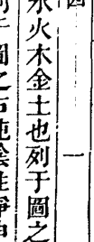

此圖陰陽合而生水火木金土也列于圖之左純陽性動乾道成男列于圖之右純陰性靜坤道成女分陰分陽而實互為其根由是一變生水而六化成之二化生火而七變成之三變生木而八化成之四化生金而九變成之五變生土而十化成之五氣順布四時行焉合而言之統體一太極也分而言之各具一太極也能參動靜之機八宅思過半矣

## 五行相生情應

金匱經曰二氣交會立五行焉其位水北火南木東金西土中循環無端故金化而水生水流而木榮木動而火明火炎而土平土積而金成此五行相生之情遞相受也如金生水其吉必應于申酉年月水生木其吉應于亥子年月木生火其吉應于寅卯年月火生土其吉應于巳午年月土生金其吉應于辰戌丑未年月也

## 五行相剋情應

金匱經曰五行各有相惡故金入火而銷烊火入水而滅亡水遇土而不行土得木而瘡癰木逢金而折傷此五行相剋之情遞相惡也如金剋木其凶應于申酉年月木剋土其凶應于寅卯年月土剋水其凶應于辰戌丑未年月水剋火其凶應于亥子年月火剋金其凶應于巳午年月也

## 安居金鏡 卷四

## 五行相生圖

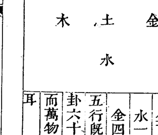

水北 火南 木東
金西 土中
水一 火二 木三
金四 土五
五行既位由是四時八卦六十四卦變化無窮而萬物備入宅特小數耳

## 河圖

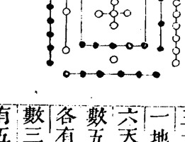

河圖方位一六居下二七居上三八居左四九居右五十居中其繫辭曰天一地二天三地四天五地六天七地八天九地十天數五地數五五位相得而各有合天數二十有五地數三十凡天地之數五十有五此所以成變化而行鬼神也

## 伏羲八卦方位

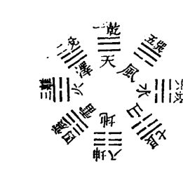

乾南坤北離東坎西震東北兌東南巽西南艮西北此伏羲八卦方位所謂先天之學也傳曰天地定位山澤通氣雷風相薄水火不相射八卦相錯自乾至震從左數所謂數往者順自巽至坤從右數所謂知來者逆也

## 洛書

洛書方位戴九履一左三右七二四為肩六八為足此圖一水居下九火居上三木居左七金居右二土居西南四木居東南六金居西北八土居東北實文王後天作易之本原而後世陰陽家講九星皆宗洛書蓋八卦之五土寄於坤艮而九星兼數五黃故土之數有三也

六八一

## 文王八卦方位

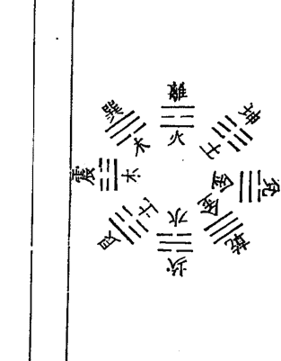

離南坎北震東兌西巽東南艮東北坤西南乾西北此文王八卦方位所謂後天之學也傳曰帝出乎震齊乎巽相見乎離致役乎坤悅言乎兌戰乎乾勞乎坎成言乎艮此圖水火各一卦金木土各二卦五行相生義主流彼此相尅義兼反對而八卦九星若相符合實萬世不易之常道也

## 文王八卦方位論

邵子曰至哉文王之作易也其得天地之用乎故乾坤交而為泰坎離交而為既濟也乾生於子坤生於午坎終於寅離終於申以應天之時也置乾於西北退坤於西南長子用事而長女代母坎離得位兌艮為耦以應地之方也

按八宅宗文王八卦九宮宗洛書方位而文王八卦實本洛書與河圖相為表裏蓋伏羲先天八卦以對待言文王後天八卦以流行言亦相為表裏先天以應天之時後天以應地之方此論實盡天地之秘與後世講陽宅講陰基之星命卜筮之說俱本諸此

## 伏羲八卦次序圖

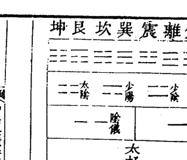

太陽生乾兌二卦少陰生離震二卦少陽生巽坎二卦太陰生艮坤二卦先為一畫以分陰陽太極生兩儀次為二畫以分太少兩儀生四象次為三畫而三才始備八卦相交成六十四卦

## 文王八卦次序圖

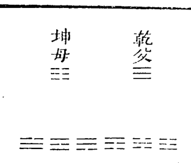

震為長男得乾初爻坎為中男得乾中爻艮為少男得乾上爻巽為長女得坤初爻離為中女得坤中爻兌為少女得坤上爻

七

## 安居金鏡 卷四

八卦中坎離震巽為東四宅少陰少陽之所生也中長配合而成家之義也乾坤艮兌為西四宅太陰太陽之所生也老少配合而成家之義也男女命一九三四宮即東四命宜居東四宅男女命六二八七宮即西四命宜居西四宅

## 東西宅訣

震巽坎離是一家
西四宅爻莫犯他
若還一氣修成象
子孫興盛定榮華

## 西四宅訣

乾坤艮兌四宅同
東四卦爻不可逢
誤將他卦裝一屋
人口傷亡禍必重

# 安居金鏡卷四

八

六八三

## 辰南戌北斜分一界之圖

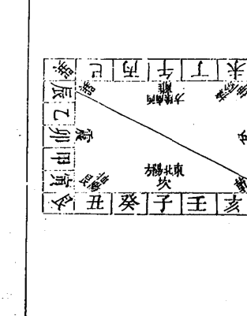

此陰陽東西乃二十四位之東西分陰陽也陰陽卦即兩儀所生之陰陽卦也非遊年東西之謂

## 先天六十四卦配二十四氣圖

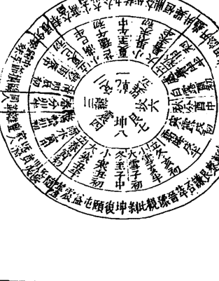

先天六十四卦配二十四節氣圖說

伏羲由八卦而成六十四卦因取大橫圖規而圓之其次序則由乾而夬而大有陽從左旋而移于復由坤而剝而比亦左旋而終于姤此陽順而陰逆也由坤生復自復至乾由乾生姤自姤至坤則右轉是陰順而陽逆也以所值天時從邵子之子半推之復為冬至子之半則頤屯益為小寒丑初至乾交夏至午之半焉此三十二卦為陽儀所生皆進而得夫乾兌離震已生之卦也於位為東南于時為春夏故多陽多剛多動多吉而月則復臨泰大壯夬其序亦不易焉姤爲夏至午之半則大過鼎恒爲小暑未初至坤交冬至子之半焉此三十二卦爲陰儀所生皆退而得夫巽坎艮坤未生之卦也于位爲西北于時爲秋冬故多陰多柔多靜多凶而月則姤遯否觀剝其序亦不易焉此伏羲之畫爲天地自然之象宅之禍福由此八卦互相變動雜揉莫測故凡立八宅者布卦分爻東西往來南北移徙須審氣候陰陽順逆非至精至神孰能盡其蘊奧圖中分至四立各統二卦餘氣各統三卦合爲六十四卦此卦配四時之氣五行之序也火庵之說實本諸此火庵即太極也

## 後天六十四卦配合六律八呂圖

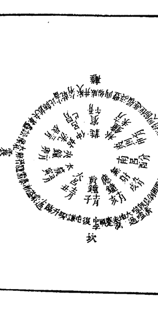

後天六十四卦配律呂圖說

後天立卦本受諸先天之圖也一卦有伏有參如乾姤遯否觀剝晉大有而復變乾則天之氣盡矣如坎節屯既濟革豐明夷師而復變坎則水之氣盡矣如艮賁大畜損睽履中孚漸而復變艮則山之氣盡矣如震豫解恒升井大過隨而復變震則雷之氣盡矣如巽小畜家人益无妄噬嗑頤蠱而復變巽則風之氣盡矣如離旅鼎未濟蒙渙訟同人而復變離則火之氣盡矣如坤復臨泰大壯夬需比而復變坤則地之氣盡矣如兌困萃咸蹇謙小過歸妹而復變兌則澤之氣盡矣八卦八變則天地風雷水火山澤之氣皆無餘蘊矣而宅之成敗亦存乎五行相變之氣如乾宅五行屬金四陽六宮之位其氣止有四十年坎宅五行屬水一宮三陽之位其氣止有二十九年艮宅五行屬土八宮五陽之位其氣止有三十三年震宅五行屬木三宮二陽之位其氣止有三十一年巽宅五行屬木四宮四陰之位其氣止有三十五年離宅五行屬火九宮三陰之位其氣止有三十四年坤宅五行屬土二宮五陰之位其氣止有二十九年兌宅五行屬金七宮二陰之位其氣止有三十六年皆是五行順布數出自然非牽合附會之說也故其氣盡則其宅凶其氣餘則其宅吉故曰無形之中而具有形之實有形之實而體無形之妙智者於此當有權拆造化之術改奪天地之機轉禍為福誰曰妄言而不加之意乎生旺休囚全主乎氣苟知氣象之源是為宅之宗旨自四象而合八卦則宅之方位已定自八卦而配九星則行是有定位莫知陰陽不有生剋莫知禍福聖人復起不易吾言

## 安宅金鏡卷四

## 陽宅九宮圖

| 紫九 | 黃五 | 赤七 |
|---|---|---|
| 白八 | 白一 | 碧三 |
| 綠四 | 白六 | 黑二 |

野馬跳澗法
中宮飛出乾
坤震巽宮連
此圖一白入中宮
餘圖做此類推

一白水
二黑土
三碧木
四綠木
五黃土
六白金
七赤金
八白土
九紫火

## 五行長生掌訣

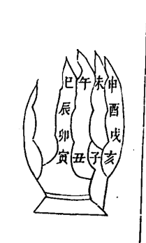

一定數法陽順陰逆

長生 沐浴 冠帶 臨官
帝旺 衰 病 死
墓 絕 胎 養

甲木長生在亥 乙木長生在午
丙火長生在寅 丁火長生在酉
庚金長生在巳 辛金長生在子
壬水長生在申 癸水長生在卯

唯庚午辛未庚子辛丑之土長生於申
丙戊丁亥丙辰丁巳之土長生於丑
戊寅己卯戊申己酉之土長生於寅
俱順行

## 羅盤二十四山圖

八卦四正四隅 一卦管三山

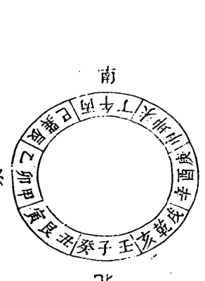

## 羅盤背面八卦方圖

| 卦 | 本卦 | 生氣 | 天醫 | 延年 | 伏位 | 絕命 | 五鬼 | 禍害 | 六煞 |
|---|---|---|---|---|---|---|---|---|---|
| 乾 | 乾 | 兌 | 艮 | 坤 | 乾 | 離 | 巽 | 坎 | 震 |
| 兌 | 兌 | 乾 | 坤 | 艮 | 兌 | 震 | 坎 | 巽 | 離 |
| 離 | 離 | 震 | 巽 | 坎 | 離 | 乾 | 兌 | 坤 | 艮 |
| 震 | 震 | 離 | 坎 | 巽 | 震 | 兌 | 乾 | 艮 | 坤 |
| 巽 | 巽 | 坎 | 震 | 離 | 巽 | 坤 | 艮 | 乾 | 兌 |
| 坎 | 坎 | 巽 | 離 | 震 | 坎 | 艮 | 坤 | 兌 | 乾 |
| 艮 | 艮 | 坤 | 兌 | 乾 | 艮 | 坎 | 震 | 離 | 巽 |
| 坤 | 坤 | 艮 | 乾 | 兌 | 坤 | 巽 | 離 | 震 | 坎 |

八卦坐山是伏位從左順數伏位之後如乾宮次六煞次天醫次五鬼次禍害次絕命次延年次生氣餘宮倣此此即所謂游年歌也

## 第一變 凡卦變自上而下七變而止

生炁圖
貪狼震木
巽五 坎六 艮七
乾一 變上 坤八
兌二 離三 震四

變上一爻為生炁生比自然最吉乾變兌兌變乾離變震震變離之類皆生炁也皆生比也皆自然也乾兌離震數往者順巽坎艮坤知來者逆而一二三四五六七八皆自然之數也帝出乎震生炁貪始其星純吉無凶臨在坎離震巽為得位吉在乾兌為內剋凶在坤艮為外戰減吉生炁吉應亥卯未年月求財求子宜作生炁吉

## 第二變

## 五鬼圖

廉貞離火

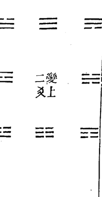

二變上爻

爻變上一為五鬼五鬼最毒位位相剋 隨位發 昂頭印應五鬼之神西四乾金剋東四震木東四巽木剋西四坤土西四艮土剋東四坎水東四離火剋西四兌金四道祇梧相刃相靡由二煞所致也

五鬼凶應在寅午戌年月官訟口舌因作五鬼灶

## 第三變

## 延年圖

武曲乾金

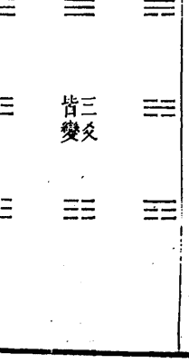

三爻皆變

三爻皆變為延年未必皆生吉又次之乾變坤坤變乾艮變兌兌變艮皆延年也相生也若坎離互變則水火相剋雖是夫婦終有損故云未必皆生

此圖天地定位山澤通氣雷風相薄水火不相射乾坤配坤母三男配三女三女配三男此延年者陰陽相配未若天醫純是相生之義故其吉又次之臨在乾兌艮坤為得位在離為內剋凶在震巽為外戰減吉

延年吉應在巳酉丑年月却病增壽宜作延年灶

## 第四變

## 六煞圖

## 文曲坎水

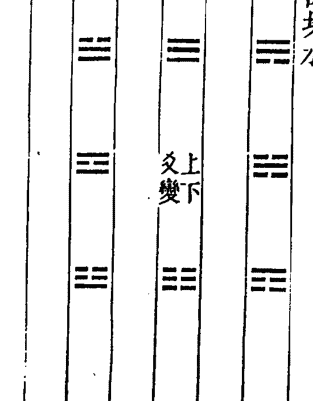

上下皆變文曲六煞生剋相消晏笑戈甲乾坎離坤六煞相生巽兌艮震六煞相剋故曰相消六煞相剋雖與禍害相等而卦不同乃西兌金剋東巽木東震木剋西艮土東離火生西坤土西乾金生東坎水益生理不順反來盜敗遂至禍生讒佞故次凶

六煞凶應在申子辰年月 耗散盜脫因作六煞灶

## 第五變

## 禍害圖

## 祿存坤土

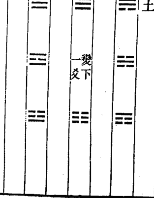

變下一爻為禍害有生有剋是為次凶乾巽震坤剋也坎兌離艮生也 禍害有生有剋剋者固凶生者亦凶何也如震剋坤乾剋巽東西相剋其理易見至離生艮兌生坎其理難知故曰火生於木禍發必速由恩生於害害生於恩 禍害凶應在申子辰年月爭鬭仇讐因作禍害灶

## 第六變

天醫圖
巨門艮土

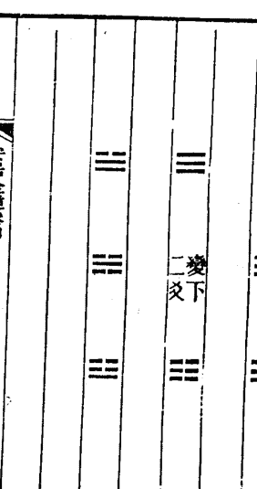

變下二爻為天醫未必自然吉故次之乾變艮艮變乾兌變坤坤變兌皆天醫也生比也然乾一與艮七為天醫非若乾一即變兌二之自然故曰未必自然吉 天醫雖五行有相生之義不若生炁渾淪而無迹故為次吉之星陽在乾兌艮坤離為得位吉在震巽為內剋凶在坎為外戰滅吉天醫吉應在申子辰年月禳病除災作天醫灶

## 第七變

絕命圖
破軍兌金

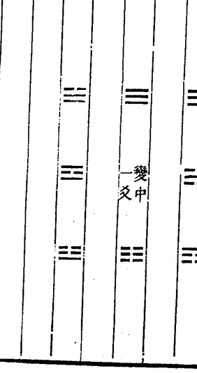

爻變中 為絕命東西上下合著皆傷
絕命者至凶之神亦是先天剋制而生東四離火剋西四乾金西四兌金剋東四震木西四坤土剋東四坎水東四巽木剋西四艮土仇讐相剋不絕不休 絕命凶應在巳酉丑月分年分上 疾病死亡因作絕命灶

## 第八變

## 伏位圖

## 輔弼巽木

三爻不變為伏位安靜無為可進可退乾遇乾坤遇坤卦卦比和所為如意

伏位吉應在亥卯未年月求為如意宜作伏位灶

## 考變說

老陰老陽所以變者無他到極處了無去處便只得變九上更去不得只得變回來做八六下便是五生數了也去不得所以卻做七

上元中元下元

上元甲子自康熙二十三年甲子起至乾隆八年癸亥止

中元甲子自乾隆九年甲子起至乾隆六十八年癸亥止

下元甲子自乾隆六十九年甲子起至乾隆一百二十八年癸亥止

## 八卦三元九宫九星圖

| 二黑土 | 七赤金 | 六白金 |
|---|---|---|
| 上坤 | 上兌 | 上乾 |
| 祿存星 | 破軍星 | 武曲星 |
| 宅 | 絕 | 年 |
| 延 | 命 | 延 |
| 下離 | 中央 | 上坎 |
| 五黃 | 一白水 | 六白金 |
| 鬼 | 煞 | 煞 |
| 元 | 文曲星 | 巨門星 |
| 三碧木 | 八白土 | 天醫 |
| 生 | 貪狼星 | 延 |
| 元震 | 元艮 | 元乾 |
| 伏 | 伏 | 伏 |
| 廉貞星 | 四綠木 | 九紫火 |
| 朝弼星 | 伏 | 中央 |
| 位 | 位 | 位 |

此圖以洛書九宮為序坎一坤二震三巽四中五乾六兌七艮八離九二三為上元四五五六為中元七八九為下元此三元之序也坎為一白坤為二黑震為三碧巽為四綠中為五黃乾為六白兌為七赤艮為八白離為九紫此紫白之序也坎為六煞文曲水坤為禍害祿存土震為生氣貪狼木巽為伏位輔弼木五中黃無星乾為延年武曲金兌為絕命破軍金艮為天醫巨門土離為五鬼廉貞火此撥頭五星五行本宮之定位也其變爻相配另具圖於後

## 三元命卦配灶訣

如天啟四年甲子係下元男起兌宮為兌命逆行乙丑生屬乾命丙寅屬中寄宮是坤命丁卯巽戊辰震己巳坤庚午坎辛未離壬申艮癸酉又屬兌以九宮逆行六十年女命順輪九宮今康熙二十三年甲子又為上元如上元甲子生男起坎一宮坎命逆行乙丑生離命丙寅是艮命中元甲子生男起巽四宮巽命乙丑生震命丙寅生是坤命下元甲子生男起兌七宮兌命乙丑生是乾命丙寅生是中五寄坤二為坤命上元甲子生女起中五如上元甲子生女起中五寄八為艮命順行乙丑生乾命丙寅生兌命中元甲子生女起坤二宮坤命乙丑生震命丙寅生巽命下元甲子生女起艮宮是艮命乙丑生離命丙寅生坎命餘做此上元男命入中宮寄坤宮

- 壬申 辛巳 庚寅 己亥 戊申 丁巳
- 癸亥 戊寅 丁亥 丙申 乙巳 甲寅
- 己巳 戊寅 丁亥 丙申 乙巳 甲寅
- 中元男命入中宮寄坤宮

安居金鏡 卷四

六九三

下元男命入中宫寄坤宫
丙寅 乙亥 甲申 癸巳 壬寅 辛亥
庚申
上元女命入中宫寄艮宫
甲子 癸酉 壬午 辛卯 庚子 己酉
戊午
中元女命入中宫寄艮宫
丁卯 丙子 乙酉 甲午 癸卯 壬子
辛酉
下元女命入中宫寄艮宫

庚午 己卯 戊子 丁酉 丙午 乙卯
假如上元丁卯生女即艮宫生人以艮命起大游
年艮即伏位次六煞绝命祸害生炁延年天医五
鬼此西四命看灶口即火门也向西四吉若向东
四凶

乾坤艮兑为西四命坎离震巽为东四命以大游
年摇鞭赋断吉凶灶坐方位宜压本命之绝六祸
五方然亦不宜犯其宅其年之都天五黄故催财
宜向生炁而坤艮二命五黄在坤艮生炁亦在坤
艮因五黄同在坤艮不宜向则有灾催丁则灶
口宜向伏位俟其年天乙贵人到命必生子极验
天乙贵人即坤也如上元甲子逆轮庚辰男年三
碧值即以三碧入中四乾五兑六艮七离八坎九
坤一震若巽命人伏位灶即天乙坤到命宫也余
仿此作灶日用紫白遁得生炁到火门催财亦验
六十日应

安居金鏡 卷四

## 九宮命宅三元排掌之圖

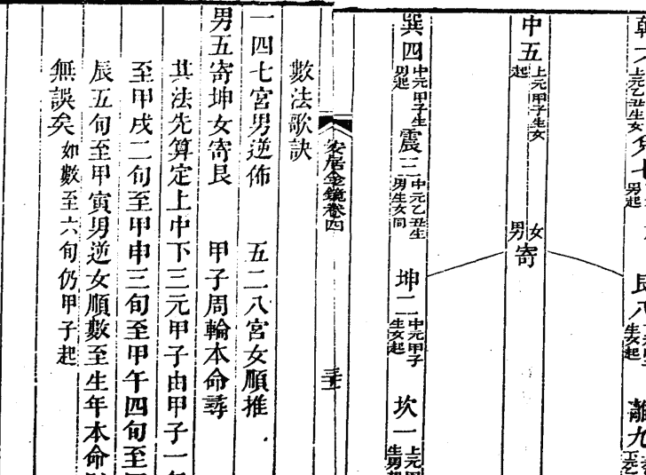

數法歌訣
一四七宮男逆佈
五二八宮女順推
男五寄坤女寄艮
甲子周輪本命尋
其法先算定上中下三元甲子由甲子一旬至甲戌二旬至甲申三旬至甲午四旬至甲辰五旬至甲寅男逆女順數至生年本命則無誤矣如數至六旬仍甲子起

安居金鏡卷四

## 九星分屬

坎宮 一白一宮貪狼天尊星正北方屬水舊曲
坤宮 二黑二宮巨門地福星西南方屬土舊祿
震宮 三碧三宮祿存天罡星正東方屬木舊貪
巽宮 四綠四宮文曲地計星東南方屬木舊輔
中宮 五黃五宮巡羅五鬼廉貞星居中央舊五
乾宮 六白六宮武曲地尊星西北方屬金舊武
兌宮 七赤七宮破軍天計星正西方屬金舊弼
艮宮 八白八宮左輔明龍星東北方屬土舊門
離宮 九紫九宮右弼應龍星正南方屬火舊貞

六九五

據寶海云此星卦照洛書後天方位一定不移者第因各山飛動變遷吉凶不一故取弔白鈞元窮山川之變態耳非有所添設也嘗墳造宅各具圖于後

| 坤 | 離 | 巽 |
|---|---|---|
| 二黑巨門 | 九紫右弼 | 四祿文曲 |
| 兌 | 中 | 震 |
| 七赤破軍 | 五黃廉貞 | 三碧祿存 |
| 乾 | 坎 | 艮 |
| 六白武曲 | 一白貪狼 | 八白左輔 |

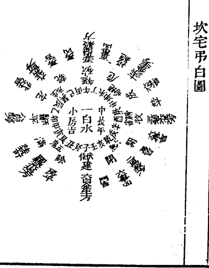

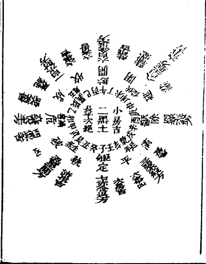

## 震宅弔白圖

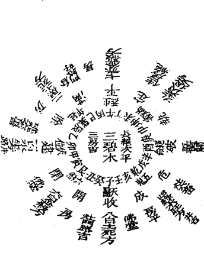

## 巽宅弔白圖

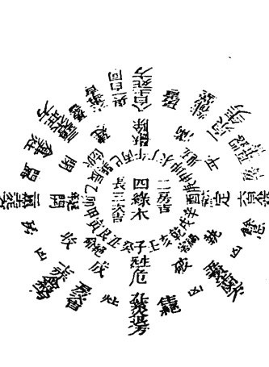

## 中宮弔白圖

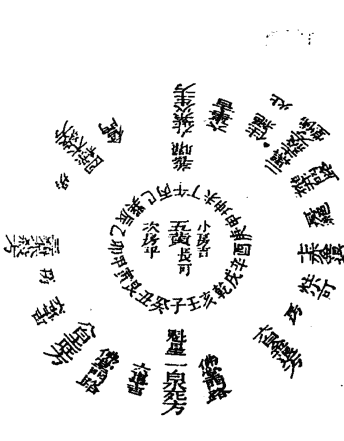

## 乾宅弔白圖

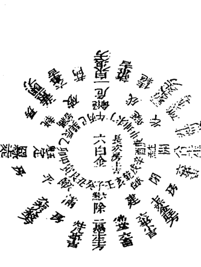

## 兌宅弔白圖

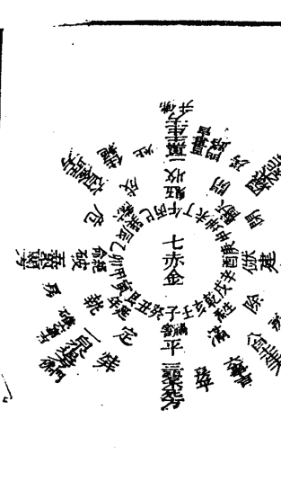

## 艮宅弔白圖

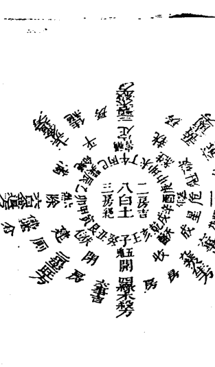

## 離宅弔白圖

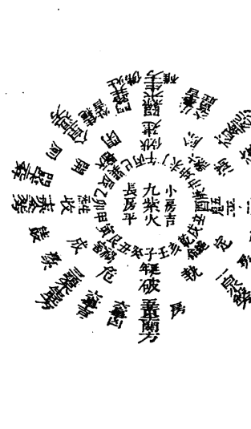

## 安居金镜 卷四

| 坎山 | 坤 | 离 | 巽 | 坤山 | 坤 | 离 | 巽 |
|---|---|---|---|---|---|---|---|
| | 七赤金生方 | 五黄土杀方 | 九紫火死气方 | | 八白土旺方 | 六白金退方 | 一白水死方 |
| | 兑 | 中 | 震 | | 兑 | 中 | 震 |
| | 三碧木退方 | 一白水入中宫 | 八白土杀方 | | 四绿木杀方 | 二黑土入中宫 | 九紫火生方 |
| | 乾 | 坎 | 艮 | | 乾 | 坎 | 艮 |
| | 二黑土杀方 | 六白金生方 | 四绿木退方 | | 三碧木杀方 | 七赤金退方 | 五黄土杀方 |

## 震山

| 震山 | 坤 | 离 | 巽 | 巽山 | 坤 | 离 | 巽 |
|---|---|---|---|---|---|---|---|
| | 九紫火退方 | 七赤金杀方 | 二黑土死方 | | 一白水生方 | 八白土死方 | 三碧木旺方 |
| | 兑 | 中 | 震 | | 兑 | 中 | 震 |
| | 五黄土死方 | 三碧入中宫 | 一白水生方 | | 六白金杀方 | 四绿木入中宫 | 二黑土死方 |
| | 乾 | 坎 | 艮 | | 乾 | 坎 | 艮 |
| | 四绿木旺方 | 八白土死方 | 六白金杀方 | | 五黄土杀方 | 九紫火退方 | 七赤金杀方 |

六九九

| 中宫 | 坤 | 离 | 巽 | 乾 | 坤 | 离 | 巽 | 乾 |
|---|---|---|---|---|---|---|---|---|
| | 二黑土旺方 | 九紫火生方 | 四绿木杀方 | 一白水退方 | 二黑土旺方 | 九紫火生方 | 四绿木杀方 | 一白水退方 |
| | 兑 | 中 | 震 | 坎 | 兑 | 中 | 震 | 坎 |
| | 七赤金退方 | 五黄土入中宫 | 三碧木杀方 | 八白土旺方 | 七赤金退方 | 五黄土入中宫 | 三碧木杀方 | 八白土旺方 |
| | 乾 | 坎 | 艮 | | 乾 | 坎 | 艮 | |
| | 六白金退方 | 一白水死方 | 八白土旺方 | | 六白金退方 | 一白水死方 | 八白土旺方 | |

| 兑山 | 坤 | 离 | 巽 | 乾 | 坤 | 离 | 巽 | 乾 |
|---|---|---|---|---|---|---|---|---|
| | 四绿木死方 | 二黑土生方 | 六白金旺方 | 三碧木死方 | 四绿木死方 | 二黑土生方 | 六白金旺方 | 三碧木死方 |
| | 兑 | 中 | 震 | 坎 | 兑 | 中 | 震 | 坎 |
| | 九紫火杀方 | 七赤金入中宫 | 五黄土凶方 | 一白水退方 | 九紫火杀方 | 七赤金入中宫 | 五黄土凶方 | 一白水退方 |
| | 乾 | 坎 | 艮 | | 乾 | 坎 | 艮 | |
| | 八白土生方 | 三碧木死方 | 一白水退方 | | 八白土生方 | 三碧木死方 | 一白水退方 | |

## 離山

| 坤 | 兌 | 乾 |
|---|---|---|
| 六白金死方 | 二黑土退方 | 一白水殺方 |
| 宗高爵祿 | 宗長女 | 宗寡殃 |

| 離 | 中 | 坎 |
|---|---|---|
| 四綠木生方 | 九紫火入中宮 | 五黃土關方 |
| 宗高爵祿 | 宗長女 | 宗寡殃 |

| 巽 | 震 | 艮 |
|---|---|---|
| 八白土退方 | 七赤金死方 | 三碧木生方 |
| 宗長男 | 宗長女 | 宗長男 |

## 乾宅

火巷丙受氣壬為泰之初爻

地天泰卦

乾宅宜開坤門取地天配成泰卦但老父老母鮮能生育須于兌上開一便門取老陽配少陰則成生育之功矣九星武曲主事巨門穿宮土金相生主富貴旺人丁大利便門開艮方亦吉

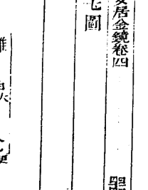

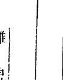

## 坤宅

火巷癸受氣丁屬否之初爻

天地否卦

坤宅宜乾門取天地配成否卦無嫌否之名也主夫婦百年便門宜坤九星武曲金星穿宮土金相生財帛豐盛大吉

未坤中宅圖

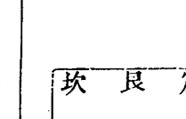

## 艮宅

火巷乙受氣辛為咸之初爻

澤山咸卦

艮宅宜大門在兌方艮少男兌少女夫婦配合之正也坤門純土乾門純陽少生育便門宜艮九星巨門主事武曲穿宮內外宮星金土相生入財官貴俱旺為全吉之宅

丑艮寅宅圖

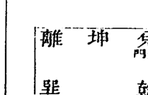

## 安居金鏡 卷四

## 兌宅

火巷庚受氣甲為損之初爻

山澤損卦

兌宅宜開艮門取男正位乎外女正位乎內有家之大義也便門宜坤土生金也但純陰不若便門開在乾位得乾生氣陰陽比和為全吉九星巨門穿宮武曲主事金土相生比助大發富貴矣

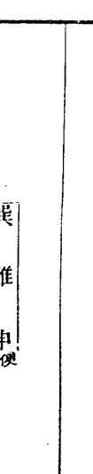

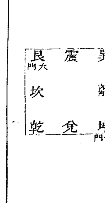

## 坎宅

火巷甲受氣庚為渙之初爻

風水渙卦

坎宅宜開巽門即風行水上之義也水能生木星宮相生便門開在坎方九星貪狼木星穿宮極發富貴如巽不可開門開離天醫但內剋外水剋火不利陰人須開震巽便門渙水之氣生火之勢亦得康寧矣

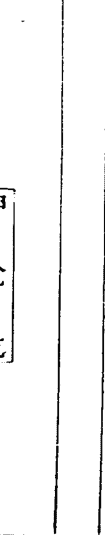

七〇三

## 離宅

火巷辛受氣乙為豐之初爻

雷火豐卦

離宅宜開震門故其象為豐便門宜仍在離九星貪狼木星主事穿宮為星生宮門生坐大吉或不能開震門而開坎延年門則宮剋星不利陰人小口或起高樓尊星房洩坎氣生離火而開震巽便門則富貴康寧矣

丙午丁宅圖

## 震宅

火巷庚受氣甲為噬嗑之初爻

火雷噬嗑卦

震宅宜開離門取木火相生之義故其象為噬嗑便門宜震則木氣主事星宮比和門又制向旺人丁財畜富貴皆至矣若坎巽便門互相得失酌而用之

甲卯乙宅圖

## 巽宅

火巷丙受氣丁為井之初爻

水風井卦

巽宅宜開坎門故取象為井便門宜在巽九星貪狼木主事文曲穿宮水木相生比旺大吉無不利

## 坐宮分房論

夫坐宮分房者以本宅所坐主宮推各房方位也

凡宅是單間即以中間為本坐如雙間則坐向在界縫之中矣假如坎宅三間中一間是本位坎坐左一間屬震右一間屬兌如五間東一間屬艮東二間屬震西一間屬乾西二間屬兌而坎坐亦居中矣若是雙間兩分左一間屬震右一間屬兌而坎在界縫之中矣如雙間四分則東一間屬艮東二間屬震西一間屬乾西二間屬兌而坎離亦在界縫之中矣凡本宮坐界縫則一宅無主禍福往往不驗如不得已而用四間惟坎宅三間之外另附一部則四屬金金生水亦可餘類推

## 動靜變化圖說

易分陰陽宅分動靜靜宅少有動宅多生動則變變則化自然之理也如宅正一層名靜宅有三四五層者名動宅有六層七層者名變宅有八九層者名化宅靜宅唯以主星飛到大門不用穿宮之法大門通便以斷吉凶動宅如坐坎開離門用本宅大遊年歌順至離上是延年至正門對向而止頭層是武曲金二層文曲水三層貪狼木四層廉貞火五層祿存土此宅宜第三層木星高大主事則吉變宅如乾宅巽門用大遊年歌至正門對向而止頭層即祿存土二層破軍金三層文曲水四層貪狼木五層廉貞火六層巨門土七層武曲金此五行生盡則變是以廉貞火亦生巨門土巨門土亦生破軍金文曲水亦生左輔木故名變宅此宅宜六層七層高大則吉化宅用二土二金二木疊進雖水火單進再加右弼共成九曜以全星卦之用如坎宅巽門係九層房屋由傍門而入用大遊年歌順飛過正門而止頭層是天醫巨門土二層祿存土三層破軍金四層武曲金五層文曲水六層貪狼木七層左輔木八層廉貞火九層右弼星右弼無專屬遇土化土遇木化木遇金化金隨類而化故曰化宅其疊進之先後當以到門遊星為主如延年先到五黃無星則先坎宮之武曲兌命先到則先破軍土木亦然餘以類推

## 安居金鏡 卷四

## 坐坎開巽門靜宅圖

## 坐坎開離門五層動宅圖

## 坐乾開巽門變宅圖

## 坐坎開巽門化宅

七〇七

## 九星相生法

夫九星相生之法巨土生武金武金生文水文水生贪木贪木生廉火廉火生禄土禄土生破金破金生文水文水生贪木周而复始生生不息若巨门则不生破金廉火则不生巨门文曲则不生辅弼殇无生此穿宫之常法也

夫动宅自一至五而尽用五行生进变宅自一至七而止用七曜重进化宅自一至九而终用九星叠进此竹节贯井法也七曜不用五黄辅弼以五黄无星而辅弼无专星也至用九星则以左辅为木石弼为土合成九曜然庶民至五行而止公卿七曜全矣

## 火巷图说

火巷即太极也八宅阴阳卦象皆从此出凡修造不立火巷是无根冷气之宅居则凶多吉少火巷之远近即易之四象老阴老阳配耦所积之数也阳主进从少至多则七为少而九为老矣阴主退从多至少则八为少而六为老矣少阳七数得二十八策少阴八数得三十二策合为六十也老阳九数得三十六策老阴六数得二十四策合为六十也总计一百二十乃尽其数阳以七减至四步尽矣阴以八减至四步尽矣八宅配卦之法初爻是火巷二爻是首合如修造不合本宅吉路只折去首合或阴改阳阳改阴自然合法外象不合亦同

乾卦抽换

## 乾卦抽爻換象圖

| 元泰卦 | 變益卦 | 變節卦 |
|---|---|---|
| 金 金 | 木 木 | 金 金 |
| 土 土 | 水 水 | 水 水 |
| 火 火 | 金 金 | 土 土 |
| 木 木 | 土 土 | 火 火 |
| 水 水 | 火 火 | 木 木 |
| 火 火 | 木 木 | 火 火 |

## 抽爻換象圖說

夫抽爻換象皆本於一卦故曰八卦分列象在其中矣因而重之爻在其中矣所謂爻者效天下之動者也每觀宅凶而修凶位常有吉兆有宅吉而修吉位反遭凶殃蓋因不明抽換變化比和以致災禍乖戾無所適從今立此圖庶幾一目了然八卦初爻是火巷二爻是首舍如乾宅內外火路修布成坤上乾下地天泰卦大吉之宅若先造北舍東舍又重抽換修成巽上震下風雷益卦雖內外爻象比和却與祖乾不比乃不利之宅又先造北舍西舍重修抽換成坎上兌下是水澤節卦不唯內外不比亦與祖乾不比乃大凶之宅餘皆做此

## 分房移徙圖

## 分房移徙圖說

分房移徙是變其本宅各隨方位以定宅也如辰入戌巽入乾已入亥是四陽得四陰之氣也丙入壬午入子丁入癸是三陽得三陰之氣也未入丑申入寅坤入艮是五陽得五陰之氣也庚入甲酉入卯辛入乙是二陽得二陰之氣也如戊入辰乾入巽亥入已是四陰得四陽之氣也壬入丙子入午癸入丁是三陰得三陽之氣也丑入未寅入甲艮入坤是五陰得五陽之氣也甲入庚卯入酉乙入辛是二陰得二陽之氣也乃名從陽入陰從陰入陽為陰陽和合主百事亨通若乃從陽入陽從陰入陰為陰陽乖錯百事不利五行要知生剋遷移當審來路方施之有用應之如響也

## 宫宿总图

## 二十八宿临宫图说

分房之法前图悉载此係星极之数东西亦有坎离南北亦有震兑四面八方皆可迁修凭经理元难以测识今举其节要以明之自巽宫起角逆行二十四位其四维各管二宿支干止管一周于四面乃为七政若修宅迁移竟以方宿直入中宫阳顺阴逆数至本宅详看生剋则其吉凶可知也假如离宅分得辛字将胃星直入中宫顺飞到离见参宿参属水离属火是水水相剋不利如乾宅子年修造将虚星直入中宫顺飞到乾是危宿危属水乾属金为金水相生大吉如丑年修造用牛宿入中宫逆飞到乾见胃星胃属土乾属金为金土相生大利余仿此推

## 安居金镜 卷四

## 七二一

八卦變宅即得四吉四凶方道

凡修造移徙迎婚送葬上官經營并行兵擒賊依此行之吉凶極驗

生氣頻修動官職漸加昌舊官身未滿新職又平章子孫皆和睦歲歲足牛羊家無殃禍擾富貴樂高堂

五鬼連心痛牛羊又損傷失財無度數盜賊鬼侵將官事相逢併時時有火光生烝不修禍陰人小口亡

居宅修延年富貴日榮遷子孫多昌盛福祿又安然終年無橫事男女命長延婚姻聯貴族家道日當歡

六煞女先死連年有禍亡六畜頻傷損時時有火光田財多不遂官事是乖張萬事災殃起家中又不祥

禍害妨人口妻女主橫傷投河并落井疾病不離牀風狂又聾啞官事見分張急修伏位上家業得安康

天醫宜修造家中百事宜君子遷官職小人福祿隨牛羊遍山野財帛喜慶知都緣福德上吉慶定無疑

絕命多傷害年年有死亡暗風千般發爭訟理不長田蠶皆不遂財破鬼偷將舊官須進退新職又難當

凡宅修伏位能消萬禍休君子加官祿小人足田牛倉庫等常有富貴樂千秋若能依此法終世永無憂

## 三吉六秀

三吉六秀主富貴之樞機而陰陽品配為作用之元奧

三吉古云以貪巨武為是然九星貪巨武有天定卦取用者有長生帝旺取配者有三匝取用者有生方取用者取用無一定之見故此言三吉者非九星貪巨武之謂也蓋言亥與震艮三龍為三吉矣要得陰陽相配乃可貴如艮見丙兌見丁巽見辛之類如陰陽相見經曰陰陽相見福祿永禎陰陽相乖禍咎踵門益以此也

精靈聚于六秀之方英粹誕于天門之上

艮丙巽辛兌丁為六秀之位以天市垣在艮太微垣天貴星在丙主天下之祿天乙在辛太乙在巽主天下之壽福祿壽三者洪範為五福之最洪範之數上應天星故其方之氣清貴純美而龍體秀麗故其方為六秀但巽辛艮為文章之府兌丙丁為司籍之地故六秀方多出文章之士而艮丙則富貴雙全也又不如巽辛為清貴樞要卯庚則出人有謀略威權至于亥為紫微之垣天鼻之帝座其貴尤尊故曰粹誕于天門

安居金鏡卷四

七一三

# 安居金鏡卷五

周
丁宗濂靜波甫
王惟諫司直甫參閱
薛 儁理齋甫
陸 煜檀甫 全較
吳永年巽巖甫鑒定

天機相宅秘奧
論宅外形

人之居處宜以大地山河為主其來脈氣勢關人禍福最為要切若大形不善總內形得法終不全吉故論宅外形第一

凡宅左有流水謂之青龍右有長道謂之白虎前有汗池謂之朱雀後有丘陵謂之元武為最貴地

凡宅東下西高富貴英豪前高後下絕無門戶後高前下多足牛馬

凡宅不居當衝口處不居寺廟不近祠社窯冶官衙不居草木不生處不居故軍營戰地不居正當水流處不居山脊衝處不居大城門口處不居獄門處不居百川口處

凡宅東有流水達江海吉東有大路貧北有大路凶南有大路富貴

凡宅樹木皆欲向宅背宅凶

凡宅地形卯酉不足居之自如子午不足居之大凶子丑不足居之口舌南北長東西狹吉東西長南北狹初凶後吉

凡宅居滋潤光澤陽氣者吉乾燥無潤澤者凶

凡宅前低後高世出英豪前高後低長幼昏迷左下右昂男子榮昌陽宅則吉陰宅不強右下左高險宅豐豪陽宅非吉主必奔逃兩新夾故死須不住兩夾新光顯宗親新故俱半陳粟朽貫

凡宅或水路橋梁四面交衝使子孫怯弱主不吉

凡宅門前不許開新塘主絕無子謂之血盆照鏡門稍遠可開月塘

凡宅門前不許人家壘箭來射主出子孫忤逆不孝

凡宅門前不許見二三四尺紅白赤石主凶

凡宅屋後見拍腳山出淫婦通僧道

凡宅門前有探頭山四時防盜若在屋出軍賊之

凡宅屋後或有峻嶺道路或前衝後射主出軍賊之人

凡宅屋後不要絕尖尾地主絕人丁門前屋後方圓大吉

凡宅門前不要朝垂飛水反背者是也主出淫亂之婦

凡宅門前見水聲悲吟主退財

凡宅門前忌有雙池為之哭字西頭有池為白虎開口皆忌之

凡宅門前屋後見流淚水主眼疾

凡宅門前朝平圓山主吉

凡宅門前屋後溝渠水不可分八字及前後水出主絕嗣敗財

凡宅井不可當大門主官訟

凡造屋切忌先築牆圍并外門主難成

凡大門門扇及兩畔牆壁須要大小一般左大主換妻右大主孤寡大門拾柱小門六柱皆要着地則吉門扇高於牆壁多主哭泣門口水坑家破伶仃大樹當門主招天瘟牆頭衝門常被人

論交路夾門人口不存眾路相衝家無老翁門被水射家散人啞神社對門常病時瘟門下水出財物不聚門著井水家招邪鬼糞屋對門癰常存水路衝門忤逆子孫倉口向門家退遭瘟搗石門居宅出隸書門前直屋家無餘穀門前垂楊非是吉祥異方開門及隙穴開窗之類並有災害東北開門多招怪異重重宅戶三門莫相對必主門戶退

七一五

## 福元論

福元者何即福德宮是也古人隱秘此訣謂之伏位蓋厥初太極生兩儀兩儀生四象四象生八卦故生人分東位西位乃兩儀之說分東四位西四位乃四象之說分乾坎艮震巽離坤兌乃八卦之說是皆天地大道造化自然之理若福元一錯則東四修西西四修東吉星反變為凶星雖外形內形俱吉皆無用矣關係最大

## 福元說

天地間不過一陰陽五行律法以一百八十年為一大周天第一甲子六十年為上元第二甲子六十年為中元第三甲子六十年為下元此之謂三元配以洛書九宮八卦一屬一宮洛書九戴履一左三右七二四為肩六八為足五獨居中配合流年一歲屬坎二歲屬坤三歲屬震四歲屬巽五歲屬中六歲屬乾七歲屬兌八歲屬艮九歲屬離男中五則寄艮宮女中五則寄坤宮此之謂八卦匪惟宅元起例在此其婚元起例塋元起例皆不外此八卦九宮是入卦之名實在人生天福德不在居宅蓋宅但可謂之八方不可謂之八卦若將宅名八卦則止有正南正北正東正西坎離震兌四卦乃四隅宅則世豈所常有而可名為乾坤艮巽矣宅哉近世宅術無驗誤認宅為八卦之病居多惟識生年福德為入卦則震巽坎離福德為東四位生人乾坤艮兌福德為西四位生人東四位則修震巽坎離西四位則修乾坤艮兌而禍福永無差謬矣

## 三元甲子福德宫定局

康熙二十三年上元甲子男起一白坎女起中五寄艮

| 甲子 | 乙丑 | 丙寅 | 丁卯 | 戊辰 | 己巳 | 庚午 | 辛未 | 壬申 | 癸酉 |
|---|---|---|---|---|---|---|---|---|---|
| 男坎寄艮 | 男离女乾 | 男艮女兑 | 男兑女艮 | 男乾女坤 | 男中寄坤 | 男巽女离 | 男震女坎 | 男坤女中 | 男坎寄艮 |

| 甲戌 | 乙亥 | 丙子 | 丁丑 | 戊寅 | 己卯 | 庚辰 | 辛巳 | 壬午 | 癸未 |
|---|---|---|---|---|---|---|---|---|---|
| 男离女乾 | 男艮女兑 | 男兑女艮 | 男乾女坤 | 男中寄坤 | 男巽女离 | 男震女坎 | 男坤女中 | 男坎寄艮 | 男离女乾 |

| 甲申 | 乙酉 | 丙戌 | 丁亥 | 戊子 | 己丑 | 庚寅 | 辛卯 | 壬辰 | 癸巳 |
|---|---|---|---|---|---|---|---|---|---|
| 男艮女兑 | 男兑女艮 | 男乾女坤 | 男中寄坤 | 男巽女离 | 男震女坎 | 男坤女中 | 男坎寄艮 | 男离女乾 | 男艮女兑 |

| 甲午 | 乙未 | 丙申 | 丁酉 | 戊戌 | 己亥 | 庚子 | 辛丑 | 壬寅 | 癸卯 |
|---|---|---|---|---|---|---|---|---|---|
| 男兑女艮 | 男乾女坤 | 男中寄坤 | 男巽女离 | 男震女坎 | 男坤女中 | 男坎寄艮 | 男离女乾 | 男艮女兑 | 男兑女艮 |

| 甲辰 | 乙巳 | 丙午 | 丁未 | 戊申 | 己酉 | 庚戌 | 辛亥 | 壬子 | 癸丑 |
|---|---|---|---|---|---|---|---|---|---|
| 男乾女坤 | 男中寄坤 | 男巽女离 | 男震女坎 | 男坤女中 | 男坎寄艮 | 男离女乾 | 男艮女兑 | 男兑女艮 | 男乾女坤 |

| 甲寅 | 乙卯 | 丙辰 | 丁巳 | 戊午 | 己未 | 庚申 | 辛酉 | 壬戌 | 癸亥 |
|---|---|---|---|---|---|---|---|---|---|
| 男中寄坤 | 男巽女离 | 男震女坎 | 男坤女中 | 男坎寄艮 | 男离女乾 | 男艮女兑 | 男兑女艮 | 男乾女坤 | 男中寄坤 |

安居金镜 卷五

七一七

## 乾隆九年中元甲子男起四绿巽女起二黑坤

| 甲子男巽女坤 | 丙寅男坤女巽 | 戊辰男离女乾 | 庚午男兑女艮 | 壬申男坎女中 | 甲戌男震女震 | 丙子男坎女中 | 戊寅男艮女兑 | 庚辰男乾女离 | 壬午男巽女坤 | 甲申男坤女巽 | 丙戌男离女乾 | 戊子男兑女艮 | 庚寅男坎女中 | 壬辰男震女震 | 甲午男坎女中 | 丙申男艮女兑 | 戊戌男乾女离 | 庚子男巽女坤 |
| --- | --- | --- | --- | --- | --- | --- | --- | --- | --- | --- | --- | --- | --- | --- | --- | --- | --- | --- |
| 乙丑男震女震 | 丁卯男坎女中 | 己巳男艮女兑 | 辛未男乾女离 | 癸酉男巽女坤 | 乙亥男坤女巽 | 丁丑男离女乾 | 己卯男兑女艮 | 辛巳男坎女中 | 癸未男震女震 | 乙酉男坎女中 | 丁亥男艮女兑 | 己丑男乾女离 | 辛卯男巽女坤 | 癸巳男坤女巽 | 乙未男离女乾 | 丁酉男兑女艮 | 己亥男坎女中 | 辛丑男震女震 |

## 安厝金镜卷五

| 壬寅男坤女巽 | 甲辰男离女乾 | 丙午男兑女艮 | 戊申男坎女中 | 庚戌男震女震 | 壬子男坎女中 | 甲寅男艮女兑 | 丙辰男乾女离 | 戊午男巽女坤 | 庚申男坤女巽 | 壬戌男离女乾 |
| --- | --- | --- | --- | --- | --- | --- | --- | --- | --- | --- |
| 癸卯男坎女中 | 乙巳男艮女兑 | 丁未男乾女离 | 己酉男巽女坤 | 辛亥男坤女巽 | 癸丑男离女乾 | 乙卯男兑女艮 | 丁巳男坎女中 | 己未男震女震 | 辛酉男坎女中 | 癸亥男艮女兑 |

## 安居金镜 卷五

乾隆六十九年下元甲子
女起七赤兑
男起八白艮

| 甲子男兑女艮 | 丙寅男中女坎 | 戊辰男震女震 | 庚午男坎女中 | 壬申男艮女兑 | 甲戌男乾女离 | 丙子男巽女坤 | 戊寅男坤女巽 | 庚辰男离女乾 | 壬午男兑女艮 | 甲申男中女坎 | 丙戌男震女震 | 戊子男坎女中 | 庚寅男艮女兑 | 壬辰男乾女离 | 甲午男巽女坤 | 丙申男坤女巽 | 戊戌男离女乾 | 庚子男兑女艮 |
| --- | --- | --- | --- | --- | --- | --- | --- | --- | --- | --- | --- | --- | --- | --- | --- | --- | --- | --- |
| 乙丑男乾女离 | 丁卯男巽女坤 | 己巳男坤女震 | 辛未男离女乾 | 癸酉男中女坎 | 乙亥男艮女兑 | 丁丑男震女震 | 己卯男坎女中 | 辛巳男艮女兑 | 癸未男乾女离 | 乙酉男巽女坤 | 丁亥男坤女巽 | 己丑男离女乾 | 辛卯男兑女艮 | 癸巳男中女坎 | 乙未男震女震 | 丁酉男坎女中 | 己亥男艮女兑 | 辛丑男乾女离 |

《安居金镜卷五》
十一

壬寅男中女坎
癸卯男巽女坤
甲辰男震女震
乙巳男坤女巽
丙午男坎女中
丁未男离女乾
戊申男艮女兑
己酉男乾女离
庚戌男巽女坤
辛亥男坤女巽
壬子男震女震
癸丑男坎女中
甲寅男艮女兑
乙卯男乾女离
丙辰男巽女坤
丁巳男坤女巽
戊午男离女乾
己未男兑女艮
庚申男中女坎
辛酉男震女震
壬戌男坎女中
癸亥男艮女兑

《安居金镜卷五》
十一

以上三元甲子一百八十年而周周而复始
自此千百万世宅元福德起例皆做此后
婚元起例载在今宪书
其诀云
上元男七女五宫
中元男一女二宫
下元男四女五宫
男逆女顺见真宗
五位男坤女艮宫

## 东四位宅图说

福元在震巽坎离宫为东四位生人其吉理俱在
震巽坎离之方门所宜开路所宜行房楼所宜高
大主人所宜居若误用乾坤艮兑俱属凶星是谓
东四修西多不吉故著东四位宅图

假如夫东四位生命而妻则西四位非如爻子
兄弟可分各院居也其居法当何如若住北房
则夫居中间而妻居西间或东间乾艮皆宜若
住南房则夫居东间中间而妻居西间坤其所
宜若住东房则夫居南间中间而妻居北间艮
其所宜大抵夫妇福德不同则当以夫为主耳

## 东四位坎宫生人

坎一宫为正福德宫一切门房井灶等项皆从坎
起　法曰　坎五天生延绝祸六
北房中间亦吉

- 一定福元宜居南房东间上上吉东房南间上吉
- 一定宅宜住坐北向南上上吉坐南向北宅上吉
坐西向东宅亦吉惟坐东向西宅不宜居不便
修盖以乾坤俱不宜开门故也若用截路分
房法亦可居
- 一定门宜走东南巽方巳字辰字生气门上上吉
正北坎方福德门上吉正南离方延年门亦吉
- 一定宅中所行路宜由东方上吉
- 一定井宜在东南辰巳方长生位大吉
- 一定厨灶宜在东北甲寅字五鬼方大吉
- 一定碾磨宜在东北五鬼方正西祸害方大吉
- 一定牛马栏宜在东南生气方大吉
- 一定放水宜在甲乙巨门方　巨门水去来皆吉

## 坎宫克应

坎命得巽方生气来路灶向有五子得离延年有四子得震天医有三子得坎方福德只有女犯绝命坤伤长子后绝嗣犯五鬼艮伤季子后有二子犯六煞乾伤长子后有一子犯兑祸害伤季子女而无子若改生方则又有子矣娶兑命妻主不和犯廉存土星虽无子而有寿婚姻宜配巽妻灶口宜向巽求婚宜灶口向离及安床于父母身床之离方分房来路修方同若配巽命妻有五子又和睦助夫成家

子息 得巽方来路灶口又与巽命妻相同皆得生气则有五子又富贵也

- 一坎命初年无子后添造东南方屋而生子五人又见坎命人得巽命妻果得五子后老误改灶口向坤食之十年而子皆死
- 又见坎命妇配巽命夫生五子后年老夫已误改灶口向坤食八年子亦皆死
- 坎命人问师曰我坎命误娶兑命妻犯祸害禄存土又命犯孤当无子何法挽之师曰将大灶火门改朝汝坎命之东南巽向得生气当有五子虽命犯孤亦当有子又将小灶或风炉易以口朝乾向使妻得食乃妻命伤生吉向亦当有子其人从之后果生五子可见阳宅之灶口方向能挽回造化神验如此

疾病 一坎命妻犯脾泄而夫开饭店师过之夜问病声师曰以小灶改向震天医方与药饮食自愈店主曰老妻脾泄卧床半年数日不愈食将危难救师曰新灶试煮汤灌之及饮半杯病妇曰香甜好药也旬余而痊盖其灶口向坤绝命故患脾泄师以新灶改向震方天医也

灾祸 一坎命人犯坤方老母不慈妻妾不和又妻妾得痢伤母妻子女老婢绝嗣若犯兑方必自生恼怒吊缢刀伤夫妾毒疮而见三光火光血光泪光伤妻及婢女又和西方圆面女人唆讼破财如无必有癫狂痨瘓噎膈病

- 一坎命妇食向兑祸害灶口三年上吊十余次幸来路吉故屡得救后改灶口向东南巽则永不幸若夫命不利巽方者又不可耳故夫妻二命各东西者宜以夫命定灶口吉向而外以床房厕各爻救妻可也人问师曰有东命妻病接丈母来家看妻不知分房之方而其病反凶师曰命改父母房在西方而妻在丈母之东方尺地或丈甚便得分房之吉矣其人从之又添吉向灶口与妻食果痊坎命犯乾六煞受灾兄责辱又爻老大子不孝老仆不仁刀伤自缢伤长子妻女皆痨死
- 一次坎命修造乾方大门周年后果有过路老人死此门下而败是以误修六煞者皆有人命讼事若坎命妇人犯此常被翁夫责詈坎命犯艮方先伤季子继伤小仆妻妾失财失败五次奴仆逃走而有火灾也

## 东四位离宫生人

离九宫为正福德宫一切门房井灶等项皆从离
起　法曰　离六五绝延祸生天
- 一定福元宜居南房东间东房南间俱上上吉北
房中间亦吉
- 一定宅宜住坐北向南宅上上吉坐南向北宅上
吉坐西向东宅亦吉惟坐东向西宅不宜居
- 一定门宜走东南巽方巳字天乙门上上吉正北
坎方壬字延年门上吉东方甲卯乙字生气门
大吉
- 一定宅中所行路宜由东方上吉
- 一定井宜在正东卯字方长生位大吉
- 一定厨灶宜在东北甲寅字祸害方大吉
- 一定碾磨宜在正西五鬼方东方祸害方大吉
- 一定牛马房宜在正东生气方大吉
- 一定放水避忌险水只宜在乾破军方

## 离宫克应

离命得震来路灶口有五子得坎延年有四子得巽天医有三子

犯乾绝命长子病噎绝嗣犯艮祸害先伤季子女后有二子犯坤六煞伤长子女后有一子犯绝命方灶口来路虽子在千里外亦应伤子绝嗣而自身亦不寿

婚姻 离命宜配震命妻巽坎次吉求婚宜安床坎方易成

子息 离命灶口向震有五子向乾绝嗣向坎四子向巽三子

疾病 离命犯乾伤肺咳嗽吐血犯坤痈疡痈肿犯兑肺伤咳嗽痰火心痛损目犯艮小肠鱼口杨梅漏烂痈疡对口俱依前法除病

灾祸 离命犯乾天绝命又西北争打破头流血来路吉者不死伤父及长子大仆若妇命犯受翁打骂痨天犯坤主母炒闹夫妻不和西南黄肥老妇唆讼破家伤母妻大子女媳若凶卦多而灶口又向坤爻必自中毒药妇犯之受翁责骂或有脚肿痛疾犯兑伤母妻妾季子女又妻窃财小婢仆盗财逃走失贼又火灾犯艮有东北黄童争讼破财又伤小女子婢仆

## 东四位震宫生人

震三宫为正福德宫一切门房井灶等项皆从震起

诀曰 震延生祸绝五天六

- 一定福元宜住东房南间南房东间俱上吉北房中间亦吉
- 一定宅宜住坐北向南巽方辰字门宅亦吉惟坐东向西宅不宜居
- 一定门宜走东南巽方延年门正北坎方天乙巨门俱上吉正南离门亦吉
- 一定宅中所行路宜由东方上吉
- 一定碾磨宜在西南祸害方西北五鬼方入吉
- 一定井宜在南生方大吉
- 一定厨灶宜在西方庚字上大吉
- 一定牛马栏宜在南丙字长生位大吉
- 一定放水宜在西方辛字庚字上大吉

## 震宫克应

震命得南方生方来路灶口有五子巽延年有四坎天医有三子震方福德只有女犯正西绝命先伤季子女麻痘癘而绝犯艮六煞伤季子后有一子犯乾五鬼伤长子后有二子犯坤祸害先伤长子女而后绝嗣

婚姻 震命宜配离命妻巽坎次吉求婚宜安床巽方则易成配兑妻或灶口向西主妻釐子息 震命灶口向离必有五子若年老不能生者得向亦有奴仆五人或雇工五人僧道得向亦有徒弟五人并可大得财又可唤子归家曾见一老人问师曰一子久客不归有何法令其归否师为之以灶座粪厕压其人绝命方又灶口朝生方以招子归家食之旬余其子在外梦见释袍元冠灶神语曰汝灾唤急何不早回验也师曾为人唤逃仆而以灶口朝主人生方又以灶座压主人五鬼方其仆即来盖压五鬼方则仆不逃向生方则仆自来也

- 一震命人年老无子抱一周岁巽命螟蛉取名历子至三岁时神附邻巫语曰莫名历子宜更名庆寿好其后老至百岁尚健坎震命即异延年有子而有寿也人问师曰孩疮瘦夜哭何也师曰此分房灶口之误也将此东命子于父母身床之异方尺基去卧则除分房之凶而反得吉又添一小灶以灶口向异使乳母食之以除旧灶之凶其孩果安世之为父者不知此法而误子以吐泻惊疳诸症悲哉若西命孩则宜于父母身床之西方去卧则吉而东则凶也灶口亦宜向西而令乳母食之吉予常劝友人医士习此法以治小儿痘疹之类十孩九活百无一失售此术者体上帝好生之德广人世嗣续之美在吾掌握间耳积阴德于冥冥俾昌后而增纪取利禄云乎哉

疾病 震命灶口犯兑向则咳嗽吐血伤肺膨膈诸症犯艮则杨梅漏毒脾胃疮痢又生对口犯乾伤肺咳嗽吐血犯坤疮痢泻血

灾祸 震命犯兑方季子不孝先伤季子女后伤长子末女小婢绝嗣又怨自缢若女犯此主痨天恩滋而有来路吉者有救犯艮有东北黄矮人千连人命官非伤季子小仆犯乾方先伤老父继伤长子老仆又思自缢失贼又火灾仆逃犯坤方有西南方黄矮人唆讼破财又妻不和老母不安宁兼伤母妻大女老婢

## 东四位巽宫生人

巽四宫为正福德宫 一切门房井灶等项皆从巽起 法曰 巽天五六祸生绝延

- 一定福元宜住东房南间南房东间俱上吉北方中间亦吉
- 一定宅宜住坐北向南巽门宅上上吉坐南向北坎门宅上吉坐西向东巽门宅亦吉惟坐东向西宅不宜居盖因开大门不便者用截路分房法亦可居
- 一定门宜走东南巽方巳字辰字福德门正北坎门生气门俱上吉正南离方天乙门亦吉
- 一定宅中所行路宜由东方上吉
- 一定碾磨宜在西南五鬼方西北祸害方大吉
- 一定井宜在北方长生位大吉
- 一定厨灶宜在西方庚字上大吉
- 一定牛马房宜在正北生气方上吉
- 一定放水宜在西方辛字庚字俱上吉南方丁字亦可

## 巽宫克应

巽命得正北生气来路灶向有五子得坎分房修坎方亦向得震延年有四子得离天医门床香火灶向有三子若得东南福德宫只有女

犯艮主痈疮伤季子绝嗣犯兑主痨麻痘伤季子女而有一子犯坤伤长子女而有二子犯乾伤长子而终无子

婚姻 巽命人宜配坎命妻离震次吉求婚宜安床震方易成乾命妻自缢

子息 巽命灶口向坎有五子向巽只有女犯艮伤季子小仆

疾病 巽命犯艮灶口生对口疮小便疮毒犯兑肺嗽瘳噎怒欲自缢犯乾肺嗽

灾祸 巽命犯艮先伤季子后自病天绝犯兑人命官非伤季子女犯乾伤老父继伤长子仆大子不孝母妻痨死受灾责辱又西北方圆面大头咽喉人唆讼得胜伤财犯坤母妻窃财又母闹吵夫妻不和伤母妻及大子女媳老婢又失贼婢仆逃去及灾

## 安居金镜 卷五

## 坎宅离门穿宫贯井配卦布星全图

右全图坐北朝南壬子癸三宅丙午丁三向俱装离卦开离门谓之离宅卦为一宅之体中包七子卦晋屋七层领附卦之七星合门外卦伏位内卦共屋九屋为全离宅伏位辅居一旅卦祸居二鼎卦医居三未济延居四晋卦文居五噬嗑食居六睽卦廉居七大有绝居八外门卦弼居九中门层次高下得宜不犯黄泉放水合吉宅旺一百二十年

## 离宅坎门穿宫贯井配卦布星全图

右全图坐南朝北壬子癸三向皆装坎卦开坎门即坎宅以坎卦为一宅之体中生七子卦管屋七层领附卦之七星合门与伏位配左辅右弼共成九星入卦为全局巧翻则坎内卦伏位辅一节卦祸二屯卦医三既济延四需卦文五井卦食六蹇卦廉七比卦绝入坎大门外门弼九全为坎宅内外高下得宜四无冲压放水门路不犯黄泉大旺百余年

七二七

## 震宅兑门穿宫贯井配卦布星全图

右全图坐东朝西庚酉辛三向皆装兑卦开兑门即兑宅以兑卦为一宅之体中包七子卦晋屋七层领附卦之七星合门外兑卦伏位内兑卦共屋九层为全宅伏位左辅木居一困卦祸居二萃卦医居三咸卦延居四大过爻居五夬卦贪居六革卦廉居七随卦绝居八右弼居九中问层数高低得宜门户放水合法八方如式四无冲射谓之吉宅旺一百二十年

## 巽宅乾门穿宫贯井配卦布星全图

右全图坐东南朝西北戌乾亥三向乾门装乾卦为一宅之体中生七子卦管屋七进以附卦之星穿贯于七进屋内错综分高下由内而外名曰贯井即巧翻八卦之义也乾内卦伏位辅居一变内卦初爻为姤祸居二变中爻为遁卦医居三变上爻为否卦延居四再变中爻为讼卦文居五再变初爻为履卦贪居六再变中爻为同人卦绝居为无妄卦廉居七再复变上爻为乾外卦弱居九此八卦九星合局之义备矣内外高下得宜四无冲压不犯黄泉气旺一百

五 六 十 年
若欲少层数从绝处减起可减至五四三层止
年久屋运衰而歇若重修新屋运谓之宅老接
气仍可复旺矣

安居金镜卷五

坐西向东宅门巽东截路分房要紧

坐东向西宅东四位正大乾兑坤门俱不宜本杂修盖楼台造法如左

七二九

## 坐南向北坎门宅

## 坐北向南巽门宅

## 坐西向东震门宅

## 坐北向南离门宅

## 西四位宅图说

祸元在乾坤艮兑宫为西四位生人其吉星俱在
乾坤艮兑之方门所宜开路所宜行房楼所宜高
大主人所宜居若误用震巽坎离俱属凶星是谓
西四修东必不祥故著西四位宅图

假如夫西四位生命而妻命东四位其房法当何如若居北房夫住两边间而妻居中间坎其所宜若住南房则夫居西间而妻居中间东间离巽皆宜若住东房则夫居北间而妻居中间南间震巽皆宜若住西屋则夫居中间而妻居北间南间其安床大端首向东南为可宜

## 西四位乾宫生人

乾六宫为正福德宫一切门房井灶等项皆从乾起 法曰 乾六天五祸绝延生

- 一定福元宜居西房西楼上上吉次居北房西间福德吉北房东间天乙吉南房西间延年亦可居但房之中间未善耳北房中一间六煞文曲南房中一间绝命破军
- 一定宅宜住坐北向南坤门宅坐南向北乾门宅俱上吉坐东向西乾坤兑门俱上吉坐南向北宅艮方丑字门亦吉坐西向东宅艮方寅字门亦吉但不可正当艮字别法谓之鬼门也
- 一定门宜走西北乾方亥字戌字福德门西南坤方未字申字延年门俱上吉正西辛字生气门
- 一定井宜在正西方生气大吉
- 一定厨灶宜在南方丙字上大吉
- 一定碓磨宜在正东五鬼方东南祸害方大吉
- 一定牛马房宜在正西生气方上吉

## 一定放水宜在東方甲字乙字北方壬字癸字俱吉

安宅金鑑卷五

## 乾宮剋應

乾命犯東五鬼如灶向與來路犯之頭子難招後有二子犯北六煞方傷仲子而有一子犯巽禍害傷長子女而終無子若改生炁方又當五子矣

婚姻 一乾命人問楊公曰求婚難就何法可速公為之改灶口向延年坤方又於父母身床之坤方安床又合延年坤方分房果半載得妻

子息 乾命人難得子公為之改灶口向生炁兌方後生五子如移灶口向延年坤有四子向天

安宅金鑑卷五

矯艮有三子予見公為乾命人移往艮方生三子後改灶口朝兌向又生五子共有八子總得生炁方向專發子孫最驗者然用羅經須仔細若灶口宜向誤用甲則犯五鬼用丑向誤用癸則犯六煞乾命人大凶予見乾命人移西北乾方來路灶口向離犯絕命主傷子或不生子而自天病此絕命凶星主病天絕嗣也曾見乾命人于南方修大屋三間而次年絕孫傷嗣又次年自即痔病死有乾命客往南方後不能生還總之乾命若犯離方絕命作灶口移居來路出行修造行嫁必大凶

一乾命女嫁往生炁方生五子後改兌方灶口朝南先傷仲子疾噎立亡期月即見三年五子盡傷又乾命女嫁往南方離灶口向兌而生五子後皆傷天以犯來路之絕命也若能改灶口向生炁則無傷而有子矣分房修方來路同驗

又須門房床灶皆壓凶方向吉方斯為盡善半月即見效生炁兌方

疾病 乾命男誤用灶口向離而傷乾金心火盛剋肺金先心痛痰火後咳嗽勞喘吐血肺爛頭痛腦漏鼻常流水楊公令其莫食朝南舊灶新添一小灶或風爐口朝東北天醫艮方爐壓本屋內之絕命離方以除離卦之凶食月餘而病痊並除根不發蓋天醫乃專主除病之吉神也

有一乾命人犯震巽二方之來路灶口有肝怒目疾跌傷手足麻瘋瘡毒癱瘓諸症又一乾命女犯坎位而赤白帶阻經小產虛勞之症若將來路灶口等改向艮方天醫即除病向坤方延年且有壽矣天醫艮方

災禍 一乾命人犯灶口向離即有官非口舌火災仲媳忤逆傷妻女又絕嗣又一乾命灶與大門俱朝離其妻女皆淫亂子師令其改灶口向兌而灶坐烟通壓大門後丙午丁方以除離卦後果不淫又乾命犯坎方來路灶口有人命干連風流之事犯震方則奴婢竊取逃走失賊火災兼傷長子犯巽方有東南婦人咬致訟又傷母妻及長子女也俱照疾病門內解除之法用之大吉

七三三

## 西四位坤宫生人

坤二宫為正福德宮一切門房井灶等項皆從坤起 法曰 坤天延絕生禍五六

一定福元宜居西房西樓南間北間俱上吉北房東間西間南房西間並吉但房之中間未善耳北房中一間謂之六煞

一定宅宜住坐北向南坤門宅坐南向北乾門宅俱上吉坐南向北艮方丑字門坐東向西坤兌乾門坐西向東艮方寅字門並吉

一定門宜走西北乾方亥字戊字延年門西南坤方未字申字福德門上吉東北艮方丑字寅字門俱吉但不宜正當艮字別法謂之鬼門也

一定宅中所行路宜由西亦大吉

一定井宜在東北方長生位大吉

一定廚灶宜在北方癸字大吉

一定碾磨宜在正東禍害方東南五鬼方大吉

一定牛馬欄宜在東北生氣方大吉

一定放水宜在東方甲字乙字北方壬字癸字俱上吉

## 坤宮剋應

坤命得艮生氣有五子乾四子兌三子坤只有女

犯坎絕嗣有一坤命人客往坎方一年而家內傷子皆傷寒慢驚癇痘以坎屬腎也又有一寡婦坤命灶口向坎三年內二孫溺水死犯離傷仲子女而有二子犯震傷長子而後絕犯巽傷長子女而有二子

婚姻 坤命宜配艮命妻乾兌次吉求婚宜安床向乾易成

子息 坤命男灶口向艮有五子向兌三子向乾四子

疾病 坤命男女犯難有心痛痰火吐血等症用兌方天醫來路除之犯震巽有瘧痢瘡毒等症犯坎絕命男則傷寒瘧疾虛弱無妻女則閉經血崩勞噎除病可用天醫兌向五日見效十一日起床兩月除根用延年乾向二十五日見效起床雖有三分殘疾而延年有壽也灶向天醫則用來路延年之方如來路天醫則灶向延年

災禍 坤命入犯坎方有投河風浪溺死等災又餘做此

虛損傷仲子繼傷長子絕嗣小孩則慢驚風天也犯離則有人命官非又妻淫傷妻妾仲子女婢又痰火心痛仲媳忤逆若有母則為仲女以一家年歲長幼分仲季也犯震有得勝之官非退財長子不孝大僕不仁傷長子老僕也有一壯年坤命人添造震方房一間子師阻之曰修後一年父母告汝忤逆其人曰父愛我而惡弟安有此事期年父果告之破財其人又問曰北方大屋我欲進居師曰此方雖美而汝坤命犯坎方絕命須先于坤方或艮方去租屋居數月方進此屋不但無災反有福壽其人不聽遂居之年餘而死又一坤命女修震方房被夫責辱不已師令折之而安若坤命男犯巽方老母妻媳竊財婢僕逃走失賊又火災又傷母妻及大子大妻大媳老婢也

## 西四位艮宮生人

艮八宮為正福德宮一切門房井灶等項皆從艮起 法曰 艮六絕禍生延天五

一定福元宜居西房西樓俱上上吉北房西間東間亦吉南房西間亦可居但房之中間未善耳北房中一間謂之五鬼南房中一間謂之六煞

一定宅宜住坐北向南坤門宅坐南向北乾門宅坐南向北艮方丑字門宅坐東向西坤兌乾門宅坐東向西艮方寅字門宅俱吉

一定門宜走西北乾方亥字戌字天乙門西南坤方未字中字生氣門俱上吉東北艮方丑字寅字門亦吉但不宜正當艮字別法謂之鬼門也

一定宅中所行路宜由西方大吉

一定井宜在西南艮申位大吉

一定廚灶宜在東方乙字上大吉

一定碾磨宜在正南禍害方正北五鬼方大吉

一定牛馬欄宜在西南生氣方大吉

一定放水宜在南方丙字丁字俱上吉

## 艮宮剋應

艮命得坤方生炁灶口有五子得兌方延年有四子得乾方天醫有三子若艮福德只有女犯巽方絶命先傷長女後傷長子而絶皆脾洩驚癇瘡癩瘋疾或不生子而絶也震傷長子而有一子犯坎傷仲子而有二子犯離傷仲子而終無子以禍害祿存主絶也

婚姻 艮命配坤命妻有五子配兌有四子和睦配乾有三子灶口宜向生炁坤方求婚宜向延年兌方

子息 艮命犯巽方絶命方灶口後果絶嗣

疾病 一艮命寡婦無子食巽向灶口一年有癆斅之女癆癆危篤師曰若添乾向天醫灶口與女獨食雖能減病未必能保壽必須不食舊灶口改坤向生炁方灶口食之則不傷女矣從之而女果得痊夫母能傷女女獨不傷父母乎智者可類推矣故醫病人宜先治其父母方向又添改病人方向則遠驗矣其主症則艮命男女犯離方向主傷風眩嗽痰火瘡癰癘毒吐血跌傷手足中風癱瘓至三年後大麻癲死若小兒犯巽灶口或分房異方則肺瘋慢驚犯坎則傷寒腎虛遺濁等症婦人則經閉血崩小產皆用乾方天醫向除病或用兌方延年之來路與分房方位則吉

災禍 艮命犯震方有東方啞喉長身木形人唆訟破財大子不孝傷父母又自跌傷手足若父告忤逆則免入命訟矣犯巽傷母妻子女至絶嗣又自傷手足而天受父母責告夫妻不睦長子忤逆犯離主妻淫聲遠播或經官持權欺夫擾亂家務夫怒成病即水經云艮離陰人攪家風也人常有得勝之小官非破財常自哭泣又有三光等災

有一艮命富翁大壯有七鍋而口俱朝南共傷七妻妾艮命犯坎方失賊五次又火災妻妾竊財與父母奴僕逃走傷仲子水災又傷寒腎虛遺濁虛弱貧窮也

## 西四位兌宮生人

兌七宮為正福德宮 一切門房井灶等項皆從兌起

法曰 兌生禍延絕六五天

一定福元宜居西房西樓上吉次居北房西間生氣貪狼南房西間天乙巨門北房東間延年武曲亦吉但房之中間未善耳北房中間禍害南房中間五鬼

一定宅宜住坐北向南坤門宅坐南向北乾門宅俱上吉坐南向北艮方丑字門宅坐東向西坤門兌門宅坐西向東艮方寅字門亦上吉

一定門宜走西北乾方亥字戌字生氣門西南方未字申字天乙門上吉次定宜走東北艮方丑字寅字門延年亦吉但不宜正當艮字別法謂之鬼門也

一定宅中所行路宜由西方上吉

一定井宜在西北長生位大吉

一定廚灶宜在北方癸字大吉

一定碾磨宜在正東方絕命破軍正南方五鬼廉貞大吉

一定牛馬房宜在西北生氣貪狼大吉

一定放水宜在南方丙字丁字上吉

## 兌宮剋應

兌命得乾來路灶向有五子艮四子坤三子兌只有女

犯震絕命則子癆病驚疳癘絕嗣犯巽傷長子女而有一子犯離傷仲子女而有二子犯坎傷仲子女而無子則我不食之或家中有合命者食之否則另添一小灶或風爐亦可只論灶口向三吉方爲驗

婚嫁 兌命配乾命妻五子艮坤次吉求婿宜安床艮方易成

子息 兌命灶口向乾五子艮四子坤三子

疾病 兌命犯離痰火血光等症犯震損目癆痢跌傷腰背手足犯巽肝怒損目傷于足等犯坎傷寒痰弱等症婦則經閉小產諸症皆宜用天醫延年以除解之則吉

災禍 兌命犯震傷長子僕跌傷手足腰背必絕有一兌命富翁添造震方大屋數間三年後二孫皆死絕嗣自身亦死犯巽有東南長身啞婦咳訟或母炒鬧或子女淫傷母妻又傷大子女損目跌傷手足等犯離主失賊火災妻妾竊財婢僕逃走妻吵鬧淫亂傷母妻仲女婢犯坎常有得勝官非破財水災傷仲子女僕若仲子命合宅吉方則傷季子曾見一兌命婦犯坎方則有血筋疾仲子溺死

## 安居金鏡 卷五

## 乾宅巽門穿宮貫井配卦布星全圖

右全圖坐西北朝東南戌乾亥三山辰巽巳三向皆裝巽卦巽門氣口返於初即巽宅以巽卦為一宅之體中生七子卦包于內外卦之中管屋七進領附卦之七星穿貫于七進屋內錯綜以分高下由內而外謂之貫井即巧翻八卦也伏位輔木居一小畜禍害土居二家人卦天醫土居三益卦延年居四中孚爻曲水居五渙卦貪狠木居六觀卦廉貞居七漸卦絕命金居八弼星居九乃門也八卦九星全局備矣內外高下得宜四無沖射逼壓放水合法不犯黃泉旺

## 坤宅艮門穿宮貫井配卦布星全圖

右全圖坐西南朝東北丑艮寅三向皆裝艮卦開艮門即艮宅以艮為一宅之體中生七子卦于內外卦之中管屋七進領附卦之七星穿貫于七進屋內錯綜高下由內而外謂之貫井即巧翻八卦伏卦輔一黃卦禍二大畜醫三損卦延四頭卦文五剝卦食六蒙卦廉七盡卦絕八外卦弼九乃門也八卦九星備矣內外高低得宜四無沖逼放水如法不犯黃泉可旺一百五十餘年

七三九

## 艮宅坤門穿宮貫井配卦布星全圖

右全圖坐東北朝西南未坤申三向皆裝坤卦坤門即坤宅以坤卦為一宅之體中包七子卦管內七層以領附卦之七星合門與伏位共九層為全宅伏位左輔居一復卦禍居二臨卦醫居三泰卦延居四明夷爻居五謙卦貪居六升卦廉居七師卦絕居八右弼門居九九層之內高下得宜門路合法八方如式四無沖壓謂之吉宅旺一百五十年

## 兌宅震門穿宮貫井配卦布星全圖

右全圖坐西朝東甲卯乙三向開震門即震宅裝震卦為一宅之體中生七子卦包於內外卦中管屋七層領附卦之七星穿貫於七進屋內錯綜以分高下由內而外謂之貫井即巧翻八卦也伏位輔居一豫卦禍二解卦醫三恒卦延四大壯廉五豐卦貪六小過文七歸妹絕八外卦弼九門也八卦九星全局備矣內外高下合法放水得宜四無沖壓旺一百八十年

## 安居金镜 卷五

## 坐南向北乾北宅门

命绝南
有乾门
上吉
亦可开
延年府
第五层
只经灭星
房中只经灭星
等宜命方在金廷五

小矮宜
高门乙层第
大宜巨天四
矮星真鬼层第
小宜凶廉五三
楼或高星禄存层第
起大宜吉贪生二
小矮宜星凶煞六层第一

大高宜
大高宜
大高宜

## 坐北向南坤南宅门

煞六南
坤芳
矮星煞层第
小宜凶六一

小矮宜
高煞星禄存层第
大宜吉贪生二
矮星真鬼层第
小宜凶廉五三
起高星门乙层第
楼大宜吉巨天四
房中只凶破军星层第
弱宜星军带吉延五

高煞宜
高煞宜
高煞宜

## 坐东向西坤西宅门截路分房

申坤字方
乙天西
门楼中大宜
等起高凶
方到吉巨天
兑星门乙

小矮宜
天厨存帝门
高宜禄
起高宫
楼大宜凶
高宜禄门
大厨存
楼大起
小宜门
房矮

吉武延
星南午
到吉天分
中星乙房
玄到延分
破中年破
宜吉天乙
高星门
小宜门
房矮

## 坐东向西乾西宅门截路分房

乘生西
成乾字方
高宜房係方兑在
大厨只前义凶
门吉贪生
星狠武

小宜门凶五
房矮星鬼
西大宜禄分
楼起高凶
小宜门凶五
房矮星鬼
楼西大高
小宜门凶五
房矮星鬼

七四一

## 坐西向东艮门宅路分房

## 坐南向北艮门宅路分房

以上所辑东西四位生人用例并图既极详悉又甚简明即令未徵宅理者执例与图而用斯过半矣千百世之下有人安居而物无札瘥虽冒泄天之罪宁甘之幸勿妄授

## 福元入掌紋起例說

八卦井中五惟九宮掌紋支位則有十二故去亥子丑三位不用只用寅至戌九位

## 起男女上中下元訣

上元甲子一宮連 中元起巽下兌間
上五中二下八女 男逆女順起根源
康熙二十三年甲子上元
乾隆九年甲子中元
男上元甲子起一位即坎即寅
中元甲子起巳位即巽
下元甲子起兌位即申
以上逆數 男五寄坤宮
女上元甲子起五位即午即中
中元甲子起二位即卯即坤
下元甲子起八位即酉即艮
以上順數 女五寄艮宮
先分上中下元以跳澗訣數至何宮生人即於此
宮起遊年八卦數至吉星得地處宜居開門
凶星宜碾磨豬屑之類

且如上元甲子宅主甲寅年生一宫寅上起甲子逆数跳入离宫戊上起甲戌艮宫酉上起甲申兑宫申上起甲午乾宫未上起甲辰中宫午上起甲寅是谓中宫生人中宫寄坤以中宫生人主之游年起坤天延绝生祸五六祸元门路拨图固定之则吉

且如上元甲子宅母甲寅年生五中宫午上起甲子顺数乾宫未上起甲戌兑宫申上起甲申艮宫酉上起甲午离宫戊上起甲辰坎宫寅上起甲寅是谓坎宫生人主之游年起坎五天生延绝祸六祸元门路按图定之吉

且如中元甲子宅主乙丑年生就将中元甲子起巽宫逆数乙丑到震是谓震宅生人主之游年起震延生祸绝五天六祸元门路按图定之则吉

且如中元甲子宅母丙寅年生就将中元甲子起坤顺数丙寅至巽是谓巽宅生人游年起巽天五六祸生绝延祸元两路按图定之则吉

客有诘予者曰子之以祸元定东西四位宅图也信以人之生年为主不以宅向为主矣若父年东四位生人而子年则西四位兄年西四位生入西弟年又东四位则父宅子何以居而兄宅弟何以居乎曰此自有截路分房法在也凡宅大约但取游年一法应以家长为主然大门非能尽主一宅之兆由大门入凡有一墙一门隔蔽皆当从所开门起且如至仪门处便从仪门算起仪门外一层房已不在数内况居各院开各门自是各随生年定居此一宅分各院之法即有一爻四子八孙亦惟各修其福德所宜震巽坎离生人则修东四位一院乾坤艮兑生人则修西四位一院各修各居何相悖之有客曰唯唯足解世说之惑

天上九星为地之九宫司人间祸福其应如响然吉星惟三凶星乃六若吉星不得地处亦皆反凶益见求福之难免祸之不易若不精术慎造焉得平吉故论大游年云

乾六天五祸绝延生
坎五天生延绝祸六
艮六绝祸生延天五
震延生祸绝五天六
巽天五六祸生绝延
离六五绝延祸生天
坤天延绝生祸五六
兑生祸延绝六五天

## 吉星三

生者 生氣貪狼星也 一木吉
延者 延年武曲星也 六金吉
天者 天乙巨門星也 二土吉

## 凶星五

禍者 禍害祿存星也 二土
六者 六煞文曲星也 一水
絕者 絕命破軍星也 七金
五者 五鬼廉貞星也 九火
伏者 伏吟輔弼水星也 八木

## 與廢年

生氣輔弼亥卯未
天乙祿存四土宮
六煞應在申子辰
延年絕命巳酉丑
五鬼凶年寅午戌

## 九星禍福訣

伏吟天乙無禍殃
五鬼廉貞凶要見
六煞文曲壬癸水
絕命定損人口苦
生氣延年見吉祥
定損人口見災殃
見傷六畜在宅中
禍害見定不爲祥

## 宅運年限革故之訣

凡宅舍先吉後不吉者未知撥氣也假如宅得木局三月受氣三年氣足三十年氣衰若得水星來生便可一百三十年必須二十八九年修理更新則木氣不喪可保常吉土金各照年限定數修理庶免衰敗之兆

## 九星宮位興旺訣

貪興長子巨興中武曲小房定興隆文敗中房祿敗少破廉長子受貧窮水一火二木三數金四土五各相從

## 九星旺子孫訣

貪生五子巨三郎武曲金星四子強獨火廉貞見二個輔弼只有半兒郎文曲水星多一子破軍絕敗守孤孀祿存土宿人延壽生旺休囚仔細詳

# 安居金鏡卷六

程國禎維周甫
呂 陳蔚若甫 全輯
吳永年巽嶼甫鑒定
王惟諫司直甫參閱
薛 儔理齋甫
陸 燿檀甫甫 全較

## 相宅形圖說

## 住基歌

陽宅來龍原無異居處須用寬平勢明堂須當容萬馬廳堂門廡先立位東廂西塾及庖廚庭院樓臺圍園地或從山居或平原前後有水環抱貴左右有路亦如然但遇返跳必須忌水木金土四星龍此作住基終吉利惟有火星甚不宜只可剪裁作險地倘有卓筆及牙旗聳在外陽方無忌更須水口收拾緊不宜大剋成小器星辰近案明堂寬案近明堂非窄勢此言住基大局面別有奇特分等第

## 八方坑坎歌

丑低挨军号阵中 艮低师巫残患人
寅低狠伤并虎咬 他乡外死甲上坑
卯地有湾伤眼目 乙辰有水患秃风
巽地坑池官司败 阳短阴山出暗风
午丙有坑火炎显 未丁坑下痨嗽人
酉方坑上家贫窘 戊亥驼腰鬼贼侵
壬子有湾绝后嗣 祸福如同在掌中

## 宅忌架桥歌

一橘高架宅廳前 左右相同終亦然
不出三年并五載 家私蕩盡賣田園
此法屢驗故特標為一訣

## 何知經

何知人家貧了貧 山斜水返身何知人家富
了富員峯磊落皆朝護何知人家貴了貴文筆秀
峯當案起何知人家出富豪 一山高了一山高何
知人家破敗時 一山低了一山低何知人家出孤
寡琵琶扇扇孤峯耶何知人家少年亡 前也塘兮
後也塘何知人家弔頸死 龍虎頭上有你路何知
人家少子孫 前後兩邊高過墳何知人家二姓居
一邊山有一邊無 何知人家主離鄉 一山主竄過
明堂何知人家出做軍 鑰山坐在面前伸何知人
家被賊偷 一山走出一山鉤何知人家忤逆有龍
虎山鬭或開口何知人家被火燒 四邊山腳似芭
蕉何知人家女淫亂 門對坑竄水有返何知人家
常發哭 面前有個鬼神屋何知人家不旺財 只少
源頭活水來何知人家不久年 有一邊兮無一邊
何知人家受孤栖 水走明堂似簸箕何知人家修
善果 面前有個手爐山何知人家會做師 排符山
頭有手爐何知人家出跏跛 前後金星齊帶火何
知人家致死來 停屍山在面前排何知人家有殘
疾 只因水帶黃泉入何知人家宅少人 後頭來龍

無氣脈仔細相山并相水斷山禍福靈如見千形萬象在其中不過此經靜泰閱

安居金鏡卷六

四

安居金鏡卷六

五

辰巳不足却為良居之家豪大吉昌若是安莊終有利子孫興旺足牛羊

寅空缺聚錢財家豪富貴常保守不遇仙人怎得知

右短左長不堪居生財不旺人口凶住宅必定子孫愚先有田財後也無

此宅左短右邊長君子居之大吉昌家內錢財豐勝富只因次後少見郎

## 安居金鏡 卷六

吉宅
仰月之地出賢人庶
人居之又不貧子孫
印授封官職光顯門
庭共九卿

吉宅
中央高大號圓邱修
宅安墳在上頭入口
資財多富貴三千食
祿任公侯

先吉後凶
坎兌兩邊道路橫定
主先吉後有凶人印
資財初一勝不過十
年一時空

凶宅
此宅修在渾水頭主
定其地不堪修牛羊
盡死人逃去造宅修
營見禍由

前狹宅吉
前狹後寬居之穩富
貴平安旺子孫資財
廣積人口吉金珠聚
寶滿家門

前寬凶宅
前寬後狹似棺形住
宅當時不安寧資財
破盡人口死悲啼呻
吟有嘆聲

吉宅
西南坤地有坵墳此
宅居之漸漸榮若是
安莊并造屋兒孫華
貴主興隆

凶宅
此宅卯地有坵墳後
來居之定滅門懸師
不辨吉凶理年久墳
前缺子孫

七四九

## 沙

此宅前後有高沙居之依師不為差田財廣有人多喜處處謀揚道富家

## 吉宅

坵

此宅乾地有坵陵修宅安莊漸漸與女子入官為妃后見孫日後定公卿

# 安居金鏡卷八

## 半吉宅

坵

前後有坵不喜歡安莊修造數餘年此宅常招凶與吉得時富貴失時嫌

## 吉宅

坵

此房正北有坵墳明師發莊定有名君子居之出官祿庶人居之家道榮

## 塘

## 吉宅

平

此宅方圓四面平地理觀此好興工不論宮商角徵羽家豪富貴旺人丁

## 吉宅

西高東下向北陽正好修工興基莊後代資財石崇富滿宅牛羊六畜強

# 安居金鏡卷八

## 吉宅

水

前後高山兩相宜左右兩邊有沙池家豪富貴多年代壽命延年彭祖齊

## 吉宅

此宅觀靈取這強邦因辰已有池塘見孫旺相家資盛與小敗長有官防

此宅左右水長渠久後兒孫福祿齊米麥錢財常富貴見孫聰俊勝祖基

左邊水來射午宮先初富貴後貧窮明師斷盡吉凶事左邊大富右貧窮

此屋西邊有水池入若居之最不宜羊牛不旺人不吉先富後貧少人知

水池西北乾宮有水池安身甚是不相宜若逢喜事多悲泣先雖富時終殘疾

## 安居金鏡 卷六

後邊有山可安莊家財盛茂人最強若居此地人丁旺子孫萬石有餘糧

前有大山不足論不可安莊立墳塋試問明師凶與吉若居此地定滅門

此宅後邊有高崗南下居之第一強子孫興旺田蠶勝歲歲年山岡年有陳糧

桑此宅四角有林桑禍起之時不可當若遇明師重改造免教後桑董受栖惶

吉宅

吉宅

凶宅

凶宅

林墳林

林墳林

墳

此宅前後有墳林凡事未通不稱心家財破敗終無吉常有非災後必侵

左邊孤墳莫施工此地安莊甚是凶疾病纏身不終吉家中常被賊鬼侵

此宅右短左邊長假令左短有何妨後邊齊整方圓吉庶人居之出賢良

東北丘墳在艮方成家立計有何妨修造安莊終迪吉富貴榮華世世昌

主

高

吉宅

高

高

高

凶宅

山

山

凶宅

山

吉宅

左短右長卻安然後面夾稍前面寬此地修造人口吉子孫興旺勝田庄

此宅東邊有欠山又孤又寡又貧寒頻遭口舌多遭難百事先成後來難

此地觀之有何如前山後山不堪居家貧孤寡出賊子六畜死盡禍有餘

中央正面四面高修蓋中宅福有餘牛羊六畜多興旺家道富貴出英豪

主

## 安居金鏡 卷六

此宅東北斜道行宅西大道主亨通雖然置下家財產破敗一時就滅傾

兩邊白虎生災殃百事難成有死傷敗人偷盜錢財破又兼多訟被官防

此地只因道左邊久住先富後平安貴重之人移徙吉若逢賤者離家園

四面交道主凶殃禍起人家不可當若不損財災禍死投河自縊井中亡

此宅安居正可求西南水向東北流雖然重妻別無事三公九相近王侯

宅前有水後有丘十人遇此九人憂家財初有終耗散牛羊倒死禍無休

朱元龍虎四神全男人富貴女人賢官祿不求而自至後代見孫福遠年

宅東流水勢無窮宅西大道主亨通因何富貴一齊至右有自虎左青龍

## 七五三

## 池

後高有陵前近池西北仰仰頭高危天賜富貴倉廩足豐饒兒孫着紫衣

## 河水

西來有水向東流東顯長河九曲溝後高綿遠兒孫勝禾穀田豐歲歲收

## 陵 坻

前有坁陵後有崗西邊穩抱水朝陽東行慢下過一里此宅安居甚是強

## 林 林

宅前林木在兩傍乾有坁阜艮有崗若居此地家豪富後代兒孫貴顯揚

## 道

南來大路正沖門速避直行過路人急取大石宜改鎮免教後人哭聲頻

## 池

住宅西南有水池西北坁勢更相宜良地有崗多貴富子孫天錫有羅衣

## 陵 坻

前邊左右有坁陵後面東道遠平平異地開門家富貴不宜兇路子孫沖

## 長波

西有長波匯遠崗東有河水鵝鴨昌若居此地多吉慶代代兒孫福祿強

## 安居金鏡 卷六

道 道

凶宅

東西有道直沖懷定主風病疾傷災從東多用醫不可見子孫難免哭聲來

高峯

道

吉宅

道

道

前有高壩後有尚東有流水西道長子孫世世居官位紫袍金帶拜君王

平 尚

吉宅

高 高 高

乾坤艮坎土尚高前平地勢有相饒立宅居之人口旺見孫出眾又英豪

高 平

吉宅

平 高

西北仰高數里強東南巽地有重岡坤艮若乎家富貴幾財萬倍足牛羊

## 七五五

尚 河 橫

吉宅

南北長河尺寬平東嶺西尚三兩層左右宅前來相顧見孫定出武官人

尖

凶宅

寬

寬

東西寬大兩頭尖做上安墳不足看此地若無前後勢家中男女眾人嫌

凶宅

林 坻

艮地孤墳一墓安莫交百步內中間久後癰癘並喑啞令人有病治難痊

道

吉宅

山

右邊白虎北聯山左有青龍絲水潺若居此地出公相不入文班入武班

道 道

吉 宅

凶 宅

河 坻

吉 宅

林 林

凶 宅

道

河 坻 坡

林 林

林中不得去安居田宅莫把作坟填田垂岁岁多耗散宅内惊忧鬼成精

宅东南北有长河坤乾坟墓近大坡此地若居大富贵更兼後代子孙兴

北有大道正冲怀多招盗贼破钱财男人有病常常害贫穷不和閤有乖

东西有道在门前莫把行人断遮拦宅内更有车马过子孙富贵的安然

庙 坻

凶 宅

吉 宅

水

凶 宅

低下 低下

凶 宅

寺

林

林溝

高

寺廟坵墳切要知不分南北共東西離宅未有一百步已後傷人殺子孫

庚辛壬癸有墳林可取千株鬱鬱林正對宅舍六十步見孫換改舊家門

乾地林木婦人淫溝河重見死佳人坤地水流妨老母子孫後代受孤貧

兩邊低下後邊高婦人守寡受勤勞多招接脚并義子年深猶自出貧消

## 安居金鏡 卷六

若見明堂似廉貞斷定眼疾少光明家生氣疾虛勞死將來致死滿門庭

白虎若見二山隨定教婦女被人迷二姓之家來合活忤逆人家媳罵姑

青龍若有二山隨其家養女被人迷招郎義子其家破不出軍時有匠賊出人狡猾順水為吉此處人狡猾逆水為凶換姓過活

此個明堂出寡娘少年眼障胎亡癆瘵氣疾人丁有流水見孫實可傷

此樹門前人不知家招寡母哭聲悲二姓同居招女婿血財損盡又瘟迍

門前若有玉帶水高官必定容易起出人代代讀書聲榮顯富貴耀門閭

文曲明堂在面前男女風聲此處生男少女多真不吉招郎納婿過浮生

明堂形似破軍星不出軍兮出匠真損屋外死家退落孤寡臨門二姓人

七五七

逆水廉贞为谷将顺水廉贞是退神又名唤作词讼笔出入狡猾不堪云

门前三塘及二塘必啼孤子寡母娘断出其家真祸祸小儿落水泪汪汪

面前凶砂若有此左火尖来兄必死右火冲身弟必亡当面尖射中此是

门前若有两等树断定二姓同居住大富之家招二妻孤翁寡母泪沾衣

若见明堂三角形眼儿孙因此哭单传人口多少亡气痛其家常不脱

明堂三尖并四尖断他致死祸淹淹定出气泪及患眼更兼瘴疾甚难痊

若见鹭鸶头鸭头前淫乱风声处处传孤寡少年不出屋男跏女跛不堪言

明堂若见似芒槌少年枉死此中是吐血伤人凶恶死少年孤母纷纷起

## 安居金鏡 卷六

面前一山如人舞家中定出風癩子時常妖怪入家門手足之災定不虛

面前退神插明堂代代見孫主少亡順水田園都賣盡家中雜好也徒然

# 安居金鏡卷六

獨樹孤峯如頂笠僧道尼姑從此出更出瘟疾眼無光忤逆爭聞事不一

明堂返轉似裙頭家中淫亂不知羞孤寡少亡端的有瘟癆癩痘染時流

拖屍之山如此樣勒君仔細看形相巒頭之山白路行時師法術要消詳

若見明堂似牛軛定斷其家會做賊瘟癆疾病不離門少死人丁哭不絕

# 安居金鏡卷六

若見明堂似祿存三年兩度定遭瘟蛇傷牛鬥風傷事曲背跎腰聾啞人

此個山頭在面前風癱人出退田園獻花淫慾多端事老子將來把火燃

## 七五九

独树生来无破相必定换妻孤寡真孤辰冥宿定分明无儿无女妙通神

独树两枝冲上天幸连官事苦忧煎断他年月无移改坐向宫主细推言

竹木倒垂在水边小儿落水不堪言猢狲添置犹防可更有瘟灾发酒颠

若见明堂似蜈蚣黄肿随身出云游懒惰儿孙带脚疾儿孙产难尽遭尤

小屋孤峰三两交迭重重寡婆招堕胎暗眼此中出说与时师仔细消

塘

黄泉破军若有塘必主小儿落水亡禄存有庙及空屋必主阴人自缢当

黄泉破军有藤树断定干连官事至攀扯相争入法场只为轰情盗贼赴

禄存重树在门前二房暗哑不能言又主出入瘸跛疾招瘟动火主忧煎

## 安居金鏡 卷六

鬼怪之樹癰腫前盲聾啞啞癘病癰婦人惹性常來宅偷雞弄犬使人頭

離鄉之樹頭向外定知落水遭徒配曲背跪腰暗眼人小鬼入家驚作害

# 安居金鏡卷六

此樹人家忤逆真其家兄弟打相論子罵父兮天道滅媳欺姑媽失人倫

停喪破屋在面前其家官事起連連常招怪物門庭入血財盡死又瘟癆

妖怪之樹人不識交曲之方真不吉男食淫慾女食花破壞風聲情似蜜

空心大樹在門前婦人癆病叫皇天萬般吃藥皆無效除了之時禍斷根

# 安居金鏡卷六

怪樹腫頭又腫腰姦邪淫亂小鬼妖貓鼠豬雞并作怪疾疾病療不曾饒

猛頭之樹藤纏上要在祿存方上見婦人口舌攪親隣遭瘟動火入黃泉

## 七六一

門前若見此尖砂，軍做賊夜行家出入，眼疾忤逆有兄弟分，居餓死爺。

門前水路捲向前家，中淫亂不堪言孤寡，少亡傷敗事家中動，火又瘟纏。

面前若見生土堆壟，胎患眼也難開寡婦，少亡不出屋盲聾啞，啞又生災。

腫頭之樹人難辨破，軍方位不可見生離，外死不思歸冥母淚，濕香腮面。

大城左右不朝墳鐮，鉤返生樣為凶孤寡，徒流傷敗事家中又，見遭時瘟。

明堂此塘在面前三，四寡婦鬧喧天時師，不識其中病此煞便，為喪禍源。

若有此塘當面前代，代癆疾不堪言一塘，便斷一人喪何籠不，與外人傳。

門前水分八字圖貴，盡田園離鄉土淫亂，其家不用媒定出長，小離房祖。

# 安居金镜 卷六

若见此路在门前，自缢吊顿事干连。欲吊不吊是此路，术者只要细推玩。

当面若行元字路，其家财谷多无数。面前恰似蚯蚓行，定出痨瘵病多苦。

门前有路川字行，破财年年官事典。若然直射见明堂，三箭三男死却身。

离乡迢迢是此路，儿孙出外皆发富。若然直去不回还，定出离乡不归屋。

门前有路是火字，两边有塘年少死。断就其家连溪哭，岁煞加归灾祸至。

前面水路及返飞，定主退妻又离妻。癞跛孤儿随母嫁，顺水淫乱主生离。

门前若有此寒林，年年瘟疾事相临。又主怪物入门戸，断他年细推论。

若见田塍如此样，断定自缢吊高梁。必然外死损尸转，号知因此死他乡。

路 衡
路·直

此屋若有大路冲，定主家中无老公。残疾之人真是有，名为暗箭射人凶。

塘
塘

此屋门前两口塘，为人哭泣此明堂。更主人家常疾病，灾瘟动火事干连。

安居金鉴卷六

堆
胎 堕 疾 眼

此屋门前有大堆，住此房内主堕胎。更兼眼疾年年有，火杀加临更惹灾。

塘
塘

前有塘兮后有塘，儿孙代代少年亡。后塘急用泥填地，免得其后受祸殃。

此个人家品字样，读书作馆起家庄。人财大旺添田地，贵子声名达帝畿。

石
大石小石当门
石

此石当门多罪落，其家说鬼时时着。小口惊吓不须言，气绝声哑入难觉。

安居金鉴卷六

此屋若在大树下，孤寡人丁断不差。招郎乞子家中有，瘟疮惟物定交加。

来合
屋

门前若见有小屋，官事隔门来得速。便见何年凶祸生，岁煞加临灾更毒。

# 安居金镜 卷六

此宅名为过头屋，前高后低，孤寡少年，姓氏二族，火年损少，太屋宜前低后高，压正堂者亦不宜。

凡左右要行，左有不空，正堂者吉，可各宜高。

横屋宜出，作虎车直，退财无屋，又如作掩悲，心或折更，墙亦吉。

四合论，四合头房，作气埋见，煞并眼疾，产金及天，属木如金，有此厄方，正者佳。

# 安居金镜卷六

此屋名为孤寡星，定出寡母二三人，犯之火尤瘟。

凡左右要行，左有不空，正堂者吉，可各宜高。

此房中高前后低，主有孤寡，内中居亦主钱财多耗散，名曰四水不回归，似横火字山字屋大凶。

若中间高是楼，出二姓同居，技艺工巧之人也。

屋作昂头白虎砂，官灾口舌事如麻，必主小房衣食缺，非灾横祸败人家。

左长右主刀灾，连厄皆然，龙虎高者长幼房如此之患也。

# 七六五

# 安居金镜卷七

吴永年巽屿甫鉴定
王惟谦司直甫参阅
周
吕 临兰田甫
薛 儁理斋甫
陆 煌檀甫甫
全较

## 阳宅本旨

坐宫分房配门诀
一宅分为数房，各房立有门户，大门来往悉同途。吉凶如何分处？双间坐居界缝，单间中是坐主。但将房坐起星排，推倒大门且住。游年飞转各房宫，祸福掌中轮布。

## 乾宅双间分房配门图解

戊乾亥宅中分为二，各有门户，共一大门在震。当以总大门配坐方论吉凶。凡双间房坐向在界缝之中，则左一间属坎，得天乙到震，便是巨门穿宅，虽发财帛，而星宫俱受乾伐，大不利于中子。右一间属兑，得绝命金星，则震为木入金乡，不利于长子，主人丁稀少。然破军金穿宅与兑相比，亦主财富，但不免寡母持家，多生疾病，人口不宁。此以各房分得宫分作坐宫，以配大门而分吉凶，非以共坐之中宫论也。设若一宅分为三间，即以中间为乾宅，而用乾之游年，是五鬼到震，便是五鬼穿宅，乃为火见天门，损老爹必矣。其左右二间一如上论。

# 安居金镜 卷七

## 坎宅三间分房配门图解

王子癸宅分为三间，各立门户，共一大门在巽。中一间是贪狼木星，艮宅为木入坎宫，凤池身贵，主先发长子，人财两盛。左一间是艮，破军穿宅，主小长妇多灾，人财离散。右一间是乾，禄存穿宅，主阴小损伤，然土生乾金，亦能发财旺畜。

# 安居金镜卷七 阳宅本旨 三

## 七六七

## 巽宅双间分房配门图解

辰巽巳宅中分为二，各有门户，共一大门在坎。当以总大门配坐方论吉凶。凡双间房坐向在界缝之中，左一间属离，飞得延年到坎，为金水相生，主外获财宝。然武曲穿宫为官，克星向又克坐，主不利阴人而多产厄，且主奴婢窃财，家多破耗。右一间属震，为门外生内坐，主人财两旺。然巨门土穿宫受宫克，又向克宫坐，主长子财帛耗散，阴人多灾少利。如分为三间，则中一间为巽宅，即以巽宅游年飞得生气到坎，为贪狼穿宅，水木相生比旺，主人大旺财帛丰盈，长房先贵而仲叔均昌，为全吉之宅也。

# 安居金镜卷七 阳宅本旨 四

## 震宅四间分房配门图解

甲卯乙宅一并四间，共一大门在兑。当以总大门配坐方论吉凶。此亦为双间坐向在界缝之中，左二间属巽离，得文曲水穿宅，为金水水相生，极发财谷，但不免淫乱耳。且巽兑不比，又外克内，阴盛阳衰，人丁稀少，不利老母阴人，兼主火盗颠狂之灾。有二间属艮，为武曲金星穿宫，金土相生，而艮兑又比，主富贵荣寿，人财两旺，先发小男，次及各子也。

如一宅分作五间，则以正中一间为震。分作七间，以正中三间为震，飞得绝命金到兑，为破军星贯宅，为向克坐，星克宫，主先伤长子，而后破家败绝也。

## 艮宅五间分房配门图解

艮宅一并五间，共一大门在坤。中一间属艮，即以本宅游年飞得贪狼本星穿宅，坤艮比和，本主富贵，但星来克宫克向，又主不利小子老母，人丁稀少。左一间属震，是禄存土星贯宅，宫克门，宫克星，主不利老母小子，贫财耗散。右二间属坎，飞得绝命金星到坤，为破军穿宅，向克宫，主不利中子，小口多灾。然门生星，星生宫，财帛六畜颇丰盈也。

## 离宅六间分房配门图解

丙午丁宅一并六间，各立门户，前有巷道，共一大门在乾。凡双间房屋半向在界缝之中，则左三间属坤，即用坤宅游年飞得延年到乾，是武曲金穿宅，为官星生星，官生门，又乾坤相比，夫妇配合，主家门孝义，人财昌炽，富贵康宁，贞吉宅也。右三间属巽，飞得祸害到乾，为禄存土穿宅，乃门克宫，宫克星，主阴人损伤，资财耗散，人口多灾，不吉之宅。如分得七间，则以中三间为离宅，而以本宅游年飞得绝命到乾，为破军金穿宅，乃向克坐，坐克门星，主老翁损伤，人不旺，寡汉撑家，劳嗽相连，绕绕家资破败，不吉之宅也。其左一二四仍属坤论，右三四仍属巽论也。

## 坤宅七间分房配门图解

未坤申宅一并七间，前通巷道，共一大门在震。中三间属坤，即以本宅游年飞得祸害到震，为禄存星穿宅，虽星宫比和，然震坤不比，外克内，又不利宅母，有堕胎痨瘵之灾，淫乱破耗之患。左二间属兑，系破军星入宅，为星宫比和，亦发财帛，然内克外，又主长子少女多灾，人口不宁，更招官非盗贼，不吉。右二间属离，系贪狼星入宅，为门星俱生宫，又震离相比，主人财两旺，富贵双全。但贪震生离，泄了阳气，主女多男少，长房出女贵，招女婿，外甥荣显之应。如兑见坤，巽见坎，亦同此应。

## 兑宅一宅分为二院配门图解

兑宅一宅分为二院配门图解

## 安居金鏡 卷七

## 坐宮分房訣

房分入卦皆由本坐推排宮列五星當看遊年佈置故氣口爲禍福之元關主星乃諸宮之司宰七煞穿宮剋生宜審五行運化補洩須知吉曜有凶定是臨宮相剋凶星帶吉多緣到位生比惡煞侵宮莫言有咎主星照位反禍成祥吉曜加臨未可據爲喜慶尊凶壓我必然變作憂危最喜恩星助吉加比補發福無量若值惡曜填凶遇生扶招災莫測凶生吉洩煞無刑吉照凶禍災勿咎後吉前凶移界截則吉多凶少宮凶星惡更門戶則禍去福來八卦縱橫元通造化五行變化巧奪神工故宅主六分七分則乾艮移於正南而巽坤遷北截分十一十四斯震兌居於界縫而四維環宮方位變於界分吉凶易於反掌經曰動則變變則化其元矣哉

| 分裁四宅巽 | 分三宅巽 | 分裁六宅乾 | 分二宅乾 |
| :---: | :---: | :---: | :---: |
| 界 | | | 巽 |
| 震 離 | 艮 巽 坤 | 震 離 | 艮 坤 |
| 坎 兌 | | 坎 兌 | |
| 艮 | | 艮 | |
| 離 | | 離 | |
| 分裁八宅巽 | 分五宅巽 | 分裁十宅乾 | 分四宅乾 |
| 界 | | | 巽 |
| 震 離 | 艮 震 巽 離 | 震 離 | 艮 震 巽 離 |
| 坎 兌 | 坤 | 坎 兌 | 坤 |
| 艮 | | 艮 | |
| 離 | | 離 | |
| 分裁十二宅巽 | 分七宅巽 | 分裁十四宅乾 | 分六宅乾 |
| 界 | | | 巽 |
| 震 離 | 艮 震 巽 離 | 震 離 | 艮 震 巽 離 |
| 坎 兌 | 坤 | 坎 兌 | 坤 |
| 艮 | | 艮 | |
| 離 | | 離 | |

七七一

| 分截四宅兌 | 分三宅兌 | 分截六宅震 | 分二宅震 |
| :--- | :--- | :--- | :--- |
| 界 離 坤 乾 兌 艮 坎 震 | 離 兌 坎 | 維 坤 兌 乾 巽 離 艮 震 | 坎 離 |

| 分截十宅兌 | 分四宅兌 | 分截八宅震 | 分五宅震 |
| :--- | :--- | :--- | :--- |
| 維 坤 坤 兌 乾 乾 巽 離 艮 艮 震 | 離 坤 乾 坎 | 維 坤 坤 乾 乾 巽 離 艮 艮 震 | 坎 離 艮 艮 震 |

| 分截二十宅兌 | 分七宅兌 | 分截四十宅震 | 分六宅震 |
| :--- | :--- | :--- | :--- |
| 維 坤 坤 兌 乾 乾 巽 離 艮 艮 震 | 離 坤 兌 艮 乾 坎 | 維 坤 坤 兌 兌 乾 乾 巽 離 艮 艮 震 | 坎 離 艮 艮 震 |

| 分截四宅坤 | 分三宅坤 | 分截六宅艮 | 分二宅艮 |
| :--- | :--- | :--- | :--- |
| 界 離 兌 乾 巽 離 艮 震 | 巽 坤 乾 | 界 離 坤 兌 巽 離 艮 震 | 坤 坎 離 |

| 分截八宅坤 | 分五宅坤 | 分截十宅艮 | 分四宅艮 |
| :--- | :--- | :--- | :--- |
| 界 離 兌 乾 巽 離 艮 | 巽 離 坤 兌 乾 | 維 坤 坤 兌 乾 乾 巽 離 艮 艮 震 | 坤 坎 離 艮 艮 震 |

## 坐宮分房解

夫坐宮分房者以本宅所坐主宮推各房方位也凡宅是單間即以中間為本坐如雙間則坐在界縫之中矣假令坎宅三間中一間是本位坎坐左一間屬震右一間屬兌如房是五間則東一間屬艮東二間屬震西一間屬兌西二間屬坎坐亦居中矣若是雙間兩分則坎坐在界縫之中左一間屬震右一間屬兌如房是五間則東一間屬艮東二間屬震西一間屬兌西二間屬坎離亦坐界縫之中矣若將雙分二間裁作四房則左一間前為巽後為艮右一間前是坤後是乾如前四間分作八分則後截四間左艮右乾前截四間左巽右坤而坎離兌俱在界縫之中矣至若三間分為六截五間分為十截惟中一間後坎前離東皆艮巽西皆乾坤矣若雙分為六間東一間飛得巽東二間屬艮東三間屬震西一間飛得坤西二間屬乾西三間屬兌如截分作十二房中二間是坎離東二間分為艮巽西二間分為乾坤震兌亦在界縫之中矣如單分為七間中一間是坎左三間為巽艮震右三間為坤乾兌若截分為十四房中三間作坎離東二間為艮巽西二間為乾坤而震兌亦在界縫之中矣餘推

安居金鏡卷七 陽宅本旨

| 分二作隅北西 | 分一隅南西 | 分一北二南 | 分字井北南 |
| :--- | :--- | :--- | :--- |
| 巽 | 坤 | 巽 | 坤 |
| | 艮 | 坤 | 離 |
| 坎乾 | | 坎 | 中 兌 |
| | | 艮 | 坎 乾 |

| 分三作隅北西 | 分二作隅南東 | 分四北三南 | 分三北二南 |
| :--- | :--- | :--- | :--- |
| | 巽 離 | 巽 | 離 坤 |
| 坎 坎 乾 | | 艮 艮 乾 乾 | 艮 坎 乾 |

| 分三東一西 | 分三作隅南東 | 分一東二西 | 分三北四南 |
| :--- | :--- | :--- | :--- |
| 巽 | 巽 離 離 | | 坤 巽 巽 坤 坤 |
| 震 | | 震 | 乾 艮 坎 乾 |
| 兌 | | | |
| 艮 | 乾 | | |

| 圖另分四宅離 | 圖另分五宅震 | 分隅兩面北 | 分二作隅北西 |
|---|---|---|---|
| 震 | 巽 | 天禽寄坤 | 巽 |
| 離 | 坤 | | |
| 坤 | 應 | 艮 | 乾 |
| 乾 | 艮 | | 坎 乾 |

| 圖另分六宅兌 | 圖另分七宅震 | 分隅兩面南 | 分三作隅北西 |
|---|---|---|---|
| 巽 | 坤 | 巽 | 坤 |
| | | 天禽寄坤 | 東西做此 |
| 艮 | 坎 | 乾 | 坎 坎 乾 |

| 圖另分七宅離 | 圖另分八宅坎 | 圖另分五宅離 | 分三東一西 |
|---|---|---|---|
| 巽 | 坤 | 巽 | 巽 |
| 震 | 離 | | 震 |
| 艮 | 兌 | 離 鑿兌 | 艮 |
| 乾 | 坎 | 乾 | 兌 |

| 圖另分五宅坎 | 圖另分四宅坎 |
|---|---|
| 離 | 離 |
| 震 | 震 |
| 寄 坤 兌 | 兌 |
| 坎 | 坎 |

七七五

## 房位飛坐九星吉凶總解

夫欲辨房位之吉凶必先審本坐排來之九曜次看遊年飛到之七煞如本房原值吉星司宮而遊年又飛得吉宿加臨謂之吉星反照最妙者再得宮星相生比和主發達極速而福祉深遠倘宮星相剋斯吉中藏悔而美處萌災若得他宮吉神洩煞生助則災消福長而無咎矣如本宮原值凶星而遇遊年吉宿飛臨謂之吉曜壓凶亦吉但發達遲緩淺薄耳又當察吉凶二星相生相剋何如苟凶星受剋而吉曜逢生則凶消吉長若吉星受剋而凶曜受扶則悔見貞藏及如本房原排值凶星司宮而遊年又飛得凶星加臨謂之凶星填煞大忌倘星宮交相剋戰則煞愈緊而禍彌深若星宮相生比和悔中亦有小亨更得主坐吉曜照宮其災可息大抵一宅之中不能全然無凶惟智者通乎變化明于截移使界截一更將凶方變為吉位氣口一易斯煞曜化為福星易曰吉凶悔吝生乎動者也動則變變則化其元妙莫測者乎

## 兩宅一門圖

東西兩宅一門出入以返照則東邊是五鬼絕命西邊是天依生氣西吉東凶明矣以門上起星穿東邊是坤門之星西四宅不合東四宅西邊是巽門星卦相合而吉主財丁並旺居之發福東邊主人財不旺居之大敗

## 龍虎擎拳屋形

破軍禍害兩擎拳
凶壓吉星勢不良
歲久年深主敗絕
子孫游蕩不還鄉
此宅貫井如法其禍稍遲貫井不如法禍來非速宅母長子先不利

## 埋兒煞形

此宅縱然高下合式廳堂之後俱造軒亭謂之埋兒煞主單傳三四代而絕小口難養亦多生災禍折去獨軒可以轉凶為吉倘高下失宜屋不合法則為收煞尤速

## 宅基長短濶狹吉凶之圖

## 宅缺吉凶之圖

## 安居金鏡 卷七

## 七七九

## 飲乳屋形

勸君莫造飲乳屋 財散人離來得速
生下姪娃命不長 墮胎產死鬧啼哭

## 無賴屋形

門前橫造一小屋 無賴官司來得速
又主墮胎女不良 錢財耗散無餘粟

## 正曲尺屋形

曲尺之稍指右邊 稍頭南指卻無愆
隨時溫飽平安過 水若右來寡婦煎

## 反曲尺屋形

曲尺之稍指艮方 年年疾病不離床
犧牲不旺財源耗 折去屋稍便吉昌

## 搖船屋形

屋似船形兩櫓搖 搖來搖去使人焦
家資蕩盡難收拾 生子生孫好賭嫖

## 風車屋形

屋造風車一樣形 內邊搖出主家貧
風癆殘疾陰人帶 少年癆傷絕後人

## 抬轎屋形

前後四廂抬轎形 抬來抬去主伶仃
家中財寶難安穩 是是非非那得寧

## 亡字屋形

星如亡字缺生方 後矮前高那得昌
殘疾瘋狂傷少婦 無妻寡漢住空亡

## 川字屋形

屋如川字插胸前 衰衰何曾有利錢
小口傷亡胎又墜 男孤女寡好熬煎

## 工字屋形

人家蓋造工字屋 九歲三番鬧啼哭
更有一般堪笑處 年豐尤自無餘粟

## 寒肩屋形

造屋前教肩上寒 肩寒歲歲禍災推
錢財漸漸湯澆雪 後代兒孫那得安

## 牽手屋形

三間小屋兩邊排牽手之形歪殘疾及跏跛
不然風疾災招轉向南邊兩進便奇哉家中
少災病還許足錢財

## 丁字屋形

屋後川堂似丁字 九年三度催人死
背上生癰人血癆 陰小傷亡只為此

## 推車屋形

屋似推車住不牢 錢財推盡沒分毫
年年欠債何時了 拋盡妻兒往外逃

## 凹字屋形

蓋造凹字屋 家中常不足急急打前牆
開門正中出救得不生災
漸漸積財谷

## 停喪屋形

門前小屋沖在心 喚作停喪殺最真
太歲加臨催哭泣 舊喪未去又重臨

凡宅有八卦卦有九星星有三吉而門因之昔人云寧為人立十墳毋為人安一門人生大壞此身全在氣中一居房室未免隔別而門通出入是氣口坎離震巽為東四宅欲修坎宅宜從震巽離三方開門修離宅宜從坎震巽開門修震宅宜從坎離巽開門修巽宅宜從震離坎開門乃合東四裝西四宅欲修乾宅宜從坤艮兌三方開門修坤宅宜從乾艮兌三方開門修艮宅宜從乾坤艮三方開門修兌宅宜從乾坤艮三方開門乃合西四裝西卦如誤用東四之門則非吉宅矣東西不犯分經又要用地支七分以門從地下行且合旺相分經如坎離震兌四正屬地支用地支七分者坎之庚子丙子離之丙午庚午震之丁卯辛卯兌之丁酉辛酉乃旺相分經方也乾坤艮巽四隅屬天干用地支七分者乾之亥丁亥分經乾之戊庚戌分經坤之未辛未分經坤之申丙申分經艮之丑辛丑分經艮之寅丙寅分經巽之辰庚辰分經巽之巳丁巳分經乃旺相分經方也又如乾之亥用丁亥加七分亥三分乾亦是地支七分又如坎之庚子七分子三分癸亦是地支七分其餘可例推矣分經既合而尺寸之間不合度亦未盡善

乾兌二門闊四尺六寸高八尺八寸取金生水水生木之義
坤艮二門闊五尺高九尺取火生土之義
震巽二門闊三尺九寸高八尺九寸取木生火之義
坎離二門闊四尺二寸高八尺七寸取金木水火相生之義
尺式長九尺以合九宮八寸以合八卦五分以合五行左奇右耦以合陰陽按法用之吉無不利

# 安居金鏡卷八

薛 儒理齋甫 全輯
周 南梅堂甫
吳永年巽巖甫鑒定 王惟謙司直甫參閱
陸 煜檀甫甫
金應鶴運蒼甫 全校

## 陽宅真訣

### 星宮生剋論

星宮生剋論出周書秘奧即天地人三元也
宮生宮人口昌
宮剋宮人口成
宮生星田財進
剋星田財亡
星生宮六畜旺
星剋宮六畜傷
剋外凶猶可
外剋內因莫當
外生內發福速
內生外家亦康
陽剋陰女受禍
陰剋陽男遭殃
不論宮星相生吉相剋凶

### 論屋塔數所屬五行

十數土
十一土水
十二土火
十三土木
十四土金
十五土土
十六土水
十七土火
十八土木
十九土火
二十土土

一塔水
二塔火
三塔木
四塔金
五塔土
六塔水
七塔火
八塔木
九塔金
十塔土

凡十一塔或十二塔則除一二不算如零三四以起者方算作數屬其五行也
假如屋內絕一間則為屬水若分作二間屬火三屬木餘以類推

大凡論間架則正堂亦作一間算其餘前後左右或幾間也若論房數則正堂不算或有未裝隔及人行破者俱不算縱有間架而未成裝者亦不算也

| 五 | 四間 | 六 |
| 二間 | 一間 | 三間 |
| 間未裝不 | 扣 | 井天 |

此 前 一 廟 雖 有 間 架 但 未 成 裝 不 數 凡 過 導 及 人 行 破 作 路 或 正 堂 之 房 作 宅 者 皆 不 拘 凡 生 我 者 吉 我 生 者 亦 吉 克 我 者 凶 我 克 者 亦 次 凶 也

陽宅真訣 王

凡 一 間 屬 水 二 間 火 三 間 木 與 塔 數 一 班 依 前 五 行 推 之

假 如 子 山 午 向 子 屬 水 屋 作 二 間 此 之 水 一 火 二 乃 水 火 既 濟 初 年 還 好 若 二 火 三 火 乃 火 太 旺 遇 子 年 沖 午 其 房 必 有 橫 禍 又 如 二 水 三 火 水 克 火 名 曰 水 火 戰 爭 不 吉 又 如 午 山 火 也 四 合 形 屬 金 房 裝 四 數 亦 屬 金 門 開 兌 上 又 屬 金 此 之 金 多 火 散 不 能 克 金 也 故 主 無 害 又 如 卯 山 西 向 堂 作 三 間 木 也 房 裝 八 間 木 也 門 開 震 門 或 異 門 亦 木 也 此 之 木 盛 自 弱 多 主 男 人 不 壽 須 開 金 門 以 克 之 火 門 以 淺 其 氣 而 房 裝 水 數 則 吉 無 不 利 又 如 艮 向 堂 作 五 間 房 十 此 之 土 重 則 滯 又 怕 陽 交 戰 易 姓 房 也 須 門 開 木 位 上 吉 故 作 屋 之 法 要 五 行 適 均 陰 陽 生 成 斯 為 上 乘 如 癸 山 之 宅 或 堂 作 三 塔 水 木 相 生 也 房 裝 十 四 或 七 數 金 水 相 生 門 開 南 離 水 火 不 相 射 也 如 此 之 宅 乃 大 富 貴 旺 人 丁 也 其 餘 依 此 推 之 如 艮 山 宜 作 四 重 四 重 偶 數 不 如 作 九 重 更 佳 也 房 數 如 之 要 之 屋 作 一 橫 者 不 若 一 塔

陽宅真訣 四

## 安居金鏡 卷八

二塔三塔者為深遠故古人之宅周官之制有前廳後堂後寢之設固所以別內外遠嫌疑而實宮室之規也今之俗人焉足以語此

凡所屬五行只艮震屬木巳亥屬木餘與正五行同

### 五行相形

未入門時先看形看形相勢要分明五行認差生剋錯其冊禍福均詳宮若剋形人不利形若剋宮財不生時師辨形無差錯便是人間聖術人

此乃是宅未裝成而言之是望門斷法也如形者宅之人形也勢如土體金體之屬也宮者以坐山而言也如艮宅坤宅是也凡屋以騎人宮是為財如形剋宮全無財若間架剋宮是屋管事財則反旺也

安居金鏡卷八 陽宅真訣 五

金形乃武曲金形家道自然富貴如金星掩金形火宅不堪當陰人殘疾更少亡此宮金水聰明家富貴因親置買外田莊金木相形雙目瞽更防田土退他鄉剋宮兩金比和為形宅家內陰人富怎量金土相生人大旺更兼財富子文章

夫金形宅者旁有兩廂房曰金庫不論其蒼之高低均平也若倚牆而裝以兩廂樣子而內實無房者不可金形土體也如倚牆而裝而牆似廂屋突出者此又不可以土論矣如捲翅者後兩廂高過正堂也但廂低於正堂者為美荷前有兩廂而後亦有兩廂者曰四金相照人財大吉亦看其明堂之淺深正堂之明暗門路之方隅然後可斷其休咎也不可例以四廂言之或前是有廂一邊無廂者亦曰曲尺金形又曰金形半邊枯大不利左則左禍右則右殃也其前兩廂直而長者過正堂曰推車主冷退外死西廂高過正堂者主異姓同居如後有兩廂前無廂高過正堂者主招盜賊如前有兩廂而後無者不為凶也

安居金鏡卷八 陽宅真訣 六

七八七

### 木形金宅

木形金宅不堪言，此宮陽人多死在中年。木火相生人大旺，雖然發秀少許錢。木入土宮須防厄，兄弟爭傷廢田宅。木見水宮人丁盛，只恐出入多浮謊。兩木比和田土穩，女色如花口舌頻。夫木形宅者，屋宇高前無兩廊，如一字或堂深狹而長，或橫擺而長直者，皆是垂頭如頭巾樣，乃無屋脊而半邊直披向前者，俗謂之水燈屋。大凶，如震向三四，亦謂之木形也。

### 水形金宅

水形金宅最堪誇，富貴榮華第一家。形也水入火宮須入旺，其家必定喪妻多。水見土宮損少丁，此形錢財須有不為榮。水不相生則一進中年發跡，冠城邦兩水比和為形宅。陽衰陰盛，仔細評。夫水形宅者，低平無樓，低小正堂淺濁或堂止一間無輔，而牆低高如水浪者，皆以形也。或濁空未發者，亦曰水掃蕩。水者水山或宅一間，或曰大不收拾者也。

### 火形金宅

火形金宅不堪當，損財又損少年郎。宮也火見土時家富足，又兼男女壽年多。火入木宮人不旺，乃氣少不發也。俗云火水未濟，財不聚。此宮形生人必定損雙眸。兩火比和為形宅，陽盛陰衰，仔細看。夫火形宅者，曰山字火字，中間正堂高而兩傍低，或前重低，中間正堂獨高而後重又低者，皆火也。拖尾者，前面屋濁後面尖斜，然傍邊斜側披灑如尾之樣也。主人凶屋之前面，為朱雀火。若有披灑者，有樣如牙齒露出者，招火光口舌癰瘡之患也。

### 土形金宅

土形金宅甚堪誇，富貴榮華春似花。土入水宮人不盛，田宅堪堪亂似麻。土入火宮生好女，嫁增巨商冠京華。土形木剋最難當，貴盡田園損女煩。兩土比和男女少，縱然富貴不久長。只有土金相生，好人財富足永無疆。夫土形宅者，正堂均整四簷不欹，而四合者是也。如傍有直廊而無櫥庫者，亦曰土形。若上簷均平，而下又有簷四方均平，皆土形。或簷低高。

The request was rejected because it was considered high risk