# 安居金鏡

錢塘周梅堂手輯
仁和王司直參閱

壽南堂藏板

## 序

今之人好言秘書，每得一種，輒深自寶藏，以為獨得之奇，雖密友亦求一見而不可得。余甚薄而笑之。天下好書必盛行而不秘，其秘而不盛行者，必古人所廢棄，或鄙俚不堪寓目，無識者以為神而私相授受，吁可怪也！且夫日月常行之正道，昭昭如日月之在天地間，又何秘之云有？試觀吾儒之書，其盛行者聖經賢傳也，其不盛行之書，有妙於聖經賢傳者乎？釋氏之書，其盛行者楞嚴法華也，其不盛行之書，有妙於楞嚴法華者乎？道家之書，其盛行者道德南華也，其不盛行之書，有妙於道德南華者乎？妙者不秘，秘者不妙，信不誣也。余集《安居金鏡》一書，為居家趨避之要，明如指掌，朗若列眉，有志斯道者咸可覽卷而得。第術家之書不一，珍毒雜陳，吉凶互異，不審夫理之所在而遽冒昧妄行，其先未嘗不自欺，而其後卒因以欺世。迨至久而自負之心愈固，若不妨鑿一己之私智，顛倒禍福，鼓惑庸愚，其獎殆不可窮詰，此真可為太息而長嘆者也。更有好事者，不知避之不暇，而喜其說之動聽，猶重而守之，且復矜自炫異，一則曰秘書，再則曰秘授，相宅之道日流於僻而不歸於正矣。余素性不善讀書，而苟有所得，雅欲公之同好。是編亦不過易卦陰陽之盛衰，五行氣化之生剋，據理直書，無他謬巧。後弁附論圖象取用之故，令人曉然其由。如或於規矩準繩之中，而能以規求圓，以矩求方，以準求平，以繩求直，此則在乎神而明之者，又何有道之不可見哉？

乾隆四十五年歲次庚子夏日，錢唐周南梅堂氏書於壽南堂中。

# 安居金鏡 卷一

安居金鏡

黃帝曰：夫宅者，乃陰陽之樞紐，人倫之軌模，非夫博物明賢，無能悟斯道也。就其五種，其最要者，惟有宅法而真秘。凡人所居，無不在宅，雖只大小不等，陰陽有殊，縱然客居一室之中，亦有善惡。大者大說，小者小論。犯者有災，鎮而禍止，猶藥病之效也。況宅者人之本，人以宅為家，若居安即家代昌吉，若不安即門族衰微。墳墓川岡，並同茲說。上之軍國，次及州郡縣邑，下之村署棚，及至山居，但入所處，皆其例焉。目見耳聞，古制蓋一吉凶歲月，不啻燥若指掌，而為卜居者之司南哉。

乾隆歲次甲子秋八月中浣，仙根書於玉峯思半書齋。

# 安居金鏡卷一

吳永年巽嶼甫鑒定
周 南梅堂甫
呂 臨蔚若甫 全輯
王惟謙司直甫參閱
薛 儔理齋甫
陸 煜極甫甫 全校

## 相宅全書

### 宅龍

先王建國，必依山川，舊都歷歷可考。為四垣入座，眾水交纏，龍樓峙後，鳳閣當前，向明而治，據地承天，惟民所止，福澤綿延。風有南北，俗有秦燕晉楚稱富，齊魯多賢，殊音尚異，地勢使然。是以鄉市須得龍止，聚而不散，居之方美。辨其龍星，雌伏雄起，或作火木，或土金水。高山頂風垂帶曜，堆浪起泡，亦作水傳，孕靈育秀，蒼鬱蟬聯。尖聳為火，淨正不顧焰，或三分賀祿必驟喜，作祖宗極貴無禍。金如鐘釜，或斷或連，主富生武，須看變穿。變穿土木，文武兼權。文星為木，身聳腰織，高昴特立，秀重力尊，或三或兩，或正或偏，斷其科第，定其後先。土方而平，稜角須明，或如廚櫃，或如几屏，致富最厚。

### 龍忌

龍之低昂，必有所結。峯之蹙之，能與妖孽。木傷不榮，火傷焰滅，土傷則頑，金傷缺折。惟水雖傷斷而復殺。土為火子，金之所母，子母相隨，多吉少咎。木雖尅土，亦賴土厚。水雖潰土，非土孰受。惟木最秀，所遇多疾，遇火必焚，遇金則仆。水實潤之，多亦為寇。土雖培之，壓亦不茂。次惟水貴，水且多畏，土塞則壅，火煎則沸，煞火汨陵，惟金不辭。火最易發，而亦易歇，昔則隆隆，沒則汨汨。察其變穿，吉凶難越。

### 沙應

左右前沙，禍福攸係。尖秀端固，其應科第。卓筆異玉堂華制，堆甲屯軍，千城世濟。頭項斜，益賊作戾。孤曜前橫，僧道出世。燥火旌旗，瘟疫相繼。更生卯破，回祿連歲。若逢插蕩，切莫相向，爭訟日興，枷鎖不放。男子遠遊，女人無狀。惟彼天罡，發側而子應在午，午當或從三合推類消詳。建橋立塔，築盤城隍，俱有方位，慎毋胡裝。一橋關鎖，力敵重岡。樹以崇屋，富貴無量。一塔獻秀，氣凌蒼翩。翩翩士子，名播文揚。

### 水口

維茲水口，衆水所受，貴於周密，交牙鎖紐，橫截中流，不放水走。如彼關隘，將官把守，執銳披肩，昂頭交肘。棱崖峭壁，奇沙怪石，低爲禽星，高爲獸格。獸之所像，雷豹犀象，尾拖下流，頭逆向上。禽星雜何？爲雁爲鶴，如鶴停渚，如鳧泛波，如龜如魚，印笏舟車，劍戟幕帳，左右交加，十重百重，氣勢益雄。生耳生角，凌霄卓空，神童會狀，將相侯公，咸于此出，立德立功。又有難星，火羅之精，火星龍度，此星乃生。尖圓方扁，得其正形，或石或土，石者更勁，力敵萬山，鎮塞羅城。邊田邊水，骨脈分明，大忌水破，及夫額崩，非獨官退，舉亦無名。載觀興圖，州郡京都，各有羅星，四面水紆，天河砥柱。江西小姑灘，預川口焦金在吳，赭禽橫海，爲浙之樞，中流截氣，財賦名區。又有沙洲，首逆上流，一洲巨富，三洲更優。忽然見出，水口最吉，士子登崇，官人進秩。其洲若低，名塌水犀，只屯商賈，永無貴期。

### 水應

氣爲水母，水爲氣子，子母相隨，環聚斯美。九曲腰圍，紆金衣紫，洋洋江潮，列土千里。若聚天心，富貴無比。下砂如手，過水入口，或纏背後，福祿悠久。疊水田跨坵連畝，勝于海潮，富貴稱首。洋洋悠悠，顧我欲留，滯而後洩，居之最優。響如鳴珂，貴亦巍夷。聽之妻切，其應奔波。聲若潺湲，喪禍連綿。漏槽衝背，常退牛田。射脅穿臂，刑禍頻連。當面直去，外死不旋。反主陵替，斜則迍邅。水凶宅吉，金盤之格。金盤若傷，還可從革。水吉宅凶，猶如玉盤。玉盤一破，無復再完。蛟潭龍窟，切勿近宅，陰盛陽衰，貧寒窘迫。

### 相址

神前佛後，古獄戰場，祭壇廢址，鑛冶碓磨，油坊壞冢，斷壠重岡，衡水剖交道，闌隘民居，勿趣犯着，與殃。前低後高，代出英豪。前高後低，愚蠢兒曹。左下右卯，家有賢郎。陽宅則吉，陰宅不祥。左高右下，陰宅不怕，陽宅不宜，逃亡衰謝。宅地平坦爲梁土，居之大吉。後高前下爲脊土，居亦大吉，多牛馬。西高東下爲魯土，居之富貴，更出賢人。前高後下爲楚土，居之凶，出盲聾。四面高中央下爲衛土，居之先富後貧。

### 宅木

四圍樹木，最喜陰濃，向宅則吉，背宅則凶。刊其背，可無憂。蒼松翠竹，森森繞屋，人旺財豐。著紵著綵，陽茂男昌，陰茂女良。北枯女喪，南枯男當。大樹當門，牛馬多瘟。枝斜向內，哭泣常存。獨樹枯朽，翁招寡母。若有藤纏，自縊其首。屋頂枯樹，鬼祟團聚。尋母孤兒，乞墦爲務。成方樹大，主遭大害。根若穿門，蛇傷兒輩。門樹兩般，異姓同餐。家多孤寡，六畜凋殘。樹腫其本，盲聾頓蹇，惹怪來家，偷雞弄犬。樹腫腰頭，淫不知羞，犬雞作怪，癆療不瘳。大樹空心，爲噎爲癘，婦多常病，服藥呻吟。樹蹉而蹷，見于文曲，死住人涕泣。樹頭向外，人遭徙配，瞎眼駝腰，家私冷退。樹頭垂倒，溺水難保，更起瘟瘡，頭倒煩惱。樹叢極杈，如牙如鋸，婦姑相訝，罵其翁。兩樹夾屋，瘟瘡反復，更主奸淫，是非不睦。宅東種柳，益馬及向西則不宜。入種枷紐。宅西種棗，牛服水草。桃栽其方，淫邪顛倒。宅後有榆，鬼不敢逾。芭蕉勿樹，常爲鬼區。宅前有槐，富貴大來。椿生聾啞，椒惹非災。冬青如斗，家財漸走。溝澗有桑，男女弄醜。果樹成茂，披屋左右，疾病相磨。書符持咒，桃忌東園，柳忌垂門，杏不東樹，李不北蕃。

### 牆籬

門前土牆，狀如彎弓，其家必富，財穀無窮。一重一峰，兩重兩峰，橫如一字，多黍多種。繞繞而低，疾病相隱。藤蘿交結，災禍常罹。牆無遮蓋，家須冷退。形類棺材，外死不貧。若沖其門，常破人論，婦罵翁姑，不分卑尊。忽然崩陷，官訟頻繁。牆籬斜倒，財物如攘。夾路交加，徒配枯橈。生茨生荻，虎傷其宜。修之除之，為居之福。

### 池塘

塘居屋左，長子形禍，中子換妻，財物如鐵。屋右有媳，災生幼房，更招寡婦，缺衣欠糧。屋後有池，必主妻刑，頻年目疾，惹禍招危。門前三塘，孤寡難當，時開哭泣，溺水身亡。屋後屋前，兩口塘穿，人多天折，填起方鑑。形如豬肚，沾酒貪歡。若似豬腰，女多妖嬢。

### 天井

天井宜深二尺七寸，大旺庄田，百事如願。砌磚完茸，須十五級，淺則為凶，財錢不聚。若傾而倒，休誇屋好，天折貧窮，田園不保。如逼而窄，前後閉塞，孕出兇頑，慳貪吝嗇。如局而狹，左右挨拶，懸濁心胸，艱难度活者，反而背家業日退，拘子逆妻，不受訓誨。若堂而塞，石堆頭黑，孕婦傷胎，子嗣艱難。得如有土阜，或左或右，抱養他生，且多胎漏。如其不淨，破碎坑穿，或突或尖，飛禍短命。如其傾陡，賣盡田畝，縱有良基，發福在後。如有泉涯，其聲滴滴滲漏，家財氣填胸臆。大忌直長，喪禍相連。若栽花卉，有女偷香，水無所適，父頑子逆。貼橋以行，婦有私客。狀如牛軛，偷人財帛，天折人丁，更遭瘟疫。狀如半月，開庫不歇，左缺男傷，右缺女沒。井必成雙，大發眼光。塔簷若倒，官事須防。

### 宅道

西南大路，其家必裕，曲曲來朝，富貴之寓。斜倚而曲，離鄉不復。川字之形，官訟相逐。三路齊衝，家無老翁。其直如箭，三子皆凶。門臨四路，孤寡難度。兩路夾之，人財不聚。道衝宅東，邪萃財空，衡有兵死，惡病磨礱。衝南損目，衡北冷風。道交西北，空乏窘迫。交于西南，女遭狐惑。東南交道，家以訟振。東北交之，鬼病請禱。

### 基徵

岡生野慈，下有銀叢。若生野韭，金據其中。野姜生處，厥土多銅。中埋玉石，草木不養。黃草白芳，下有金守。黃莖白莖，銀之所有。大樹忽死，或偏而枯，隨枝所指，寶藏之區。草莖赤短，短而燥，掘下十尺，瓦石與俱。草枯而巢，下通泉脈。若無銅焦，麥無澤。基之所藏，何物乃祥？珠玉為上，生物亦強。魚龍之骨，九卿之鄉。生庖下守，公侯之藏。古印劍器，五品官方。如其他物，不如無良。

### 壤鑒

辨土下基，古有成憲。掘地方深一尺二寸，粉土羅之，還復原圈，勿按抑之。來早看命，凶則土凹，吉則土噴。或用寶斗量土平口，秤其重輕，驗其薄厚。七斤為下，十勛為首。如其中平，厥勛惟九。或取土四方一寸，平秤之，重三兩者凶，五兩七兩居之自如，九兩已上大吉。

### 宅氣

人之氣色，由中而流，潤澤者樂，枯槁則憂。惟彼居宅，理亦相侔。占氣之法，常于春秋雨後初霽，日未出頭，去三百步，于以凝眸。鬱鬱金光，公侯之鄉，黃潤而美，寵渥龍章。光而澤者，下有金藏。或從病德昇天而揚，或從地引，布滿屋牆。拜官進爵，其居大昌。鬱鬱青青，子孫孫，門填車馬，代有簪纓。青而無澤，其兆變驚。變黃貧下，變白主刑，變赤則吉，變黑為頑。白氣主武職，掌殺生，連綿不斷，下有戈兵。色峻而潔，白金之英。變為黃黑，印綬相授。刑則變赤，貧則變青。若夫黑氣，其應典吏，亦主文章，兼有智術。色澤而光，鉛鐵下置。黑而色枯，伏屁在地。變黃主刑，變赤貧至。惟變白青，官祿之瑞。赤為武弁，持節樹幟。黃則加封，黑則刑乘。凡氣枯燥，凶禍之報。青則憂庚，黑為被盜，赤主火災，黃者病到，自應刑喪。濁應淫耗，凶氣之來，迺湧交淚，拂鬱不舒矣，禍不細。薄而且輕，離而不繼，或散而疎，災亦可制。吉氣之來，翩翩相逐，動而土浮，其應在速。為氣為氤，垂結而伏，其應較遲，久而乃福。一云森森如林，下有金寶。地多霧氣，起如霜雪，下有珠玉。陽宅以陰月望旦候之，陰宅以陽月朔旦候之。或于甲乙丙丁庚辛卯日未出時，去二里許望之。或于雨初晴日，令人着新淨彩衣裝，然後遠望，色轉鮮明者吉。黃色暗鈍者凶。氣變而相生者吉，相克者凶。從吉入吉，大吉。從凶入凶，大凶。從凶入吉，先凶后吉。從吉入凶，先吉后凶。

### 屋忌

人開造屋，須求良木。木若曲彎，家不和睦。蠱蛀木空，聾耳瞽目。柱若空懸，家主命促。梁欹棟斜，是非反復。枋檐瘡痍，柱梨鼓腹。有廳無堂，孤寡覺獨。接棟接桁，三年一哭。屋低後中，屋高攜四水不歸，錢財日漏。屋後小屋，三五相逐，殺子殺孫，更多孤獨。屋或坐西，或坐東南，家生逆子，心有二三。屋脊沖左，長子遭禍。沖右，小當雙沖矣。可屋脊肘後，暗疾為疾，橫事日等。家公壽短，破屋當前，停喪中邊，官非財耗，瘟疫相纏。棟摧瓦散，貧寒無伴，倒木須防，令人顛窺。

### 屋宜

梁柱之上布椽，莫放須倚兩邊。大小成樣，斗若加星，小與大抗，升在斗高。婦隨夫唱，開架成雙，豐衣足食。八風不吹，何須藥石。私居要華潔，淨為家。夫妻和順，子孝其親。寢則東首，生氣方受。向則須南，明開窗牖。屋毋太高，高則陽盛，亦無太卑，卑則陰勝。陽盛魂傷，陰勝魄病。高下適中，明暗相稱，君子居之，無疾有慶。

### 四獸

青龍垂頭，長子多憂。男女凋謝，奴婢逃流。人常疾病，兼損馬牛。若有空屋，三五齊矗。出入游蕩，屢屢不復。兄弟相爭，法場遭戮。白虎偏枯，小子憂慮。女短折，妻子淚珠。家多鬼魅，室止魑魅。若有空房，三五成行。頭昂而踞，官訟相望。退田退地，離別家鄉。朱雀垂翅，非家之利。口舌交爭，文書疊至。父子不諧，回祿難避。元武拖尾，盜賊時起。災害不休，六畜多死。女人不孝，男亦如此。凡曰垂頭、偏枯、垂翅、拖尾，皆是兩頭垂下的小廈是也。

### 宅病

屋不苦蓋，名曰撩戶。禍延六畜，疾病相隨。椽不截頭，名曰露骨。財散人災，哭泣時發。舊椽接新，名曰焦尾。人口多災，火光煌煌。四角不齊，名曰露肘。小口陰人，災患常有。折屋酉半，名曰癱瘓。陽屋男傷，陰屋女患。舊屋不蓋，名曰露星。血光公訟，兼損人丁。堂只一座，名曰孤陽。錢財退盡，人口亦妨。東西有屋，復蓋中心，名曰工字。人口參商。屋無其東，長子貧窮。若缺其北，殃及家翁。缺南畜死，缺西女凶。新宅兩頭如接小屋，官事相爭，災禍逼促。

### 造序

造屋先內，次第莫背。若先造門，屋猶未逮，屋終無成，或拆或廢。婦以青春，先失其配。未造中堂，先造兩傍，兒孫爭闘，兄弟分張。堂柱用九，廳以七長。門柱用五，俱不從雙。量柱以尺數，亦從隻。高狹潤低，雙數不易。枋莫壓梁，作事不場。見多天死，婦守空房。梁下方爭，須出其頭。壽星不出，天折須憂。

### 屋水

屋水交射，家人爭罵。視射堂中，腹病不罷。暗視衝身，權莫假借。悍僕豪奴，叛逆不怕。

### 碓磨

來龍在後，碓宜居前。龍若前來，碓居後邊。龍水自左，居右方可。自右來時，居左無禍。碓頭向外，人從後踏，向宅財空，更遭打磕。在虎訟起，小兒多死。龍主是非，講訟交指。茶磨若裝左，腹無傷。右動自虎，攪痛裹腸。

### 放水

乾宅三門，水宜放丙。坤宅丁方，艮放庚。兌宅放乙。坎宅放丁，離從癸放。震放辛行，巽放壬吉。水得其情，放支水漏，放干水滯。

夫開門放水，禍福之應，捷于桴鼓，立宅者慎焉。

楊公云：放從天上去。諸家水法多本于此，故于此後復綴以二十四向開放定式，而穿井畜欄吉方，與宅外諸吉峰巒併附其下，俾觀者考之。

## 安居金鏡卷一 相宅

### 壬山丙向

東四宅

| 項目 | 內容 |
| :--- | :--- |
| 吉門 | 丙 甲 庚 乙 巳 |
| 放水 | 丁 庚 辛 白虎亥 黃泉巽 |
| 穿井 | 申 |
| 六畜 | 辰戌馬 子午雞 丑未豬 |
| 吉山方 | 坤艮牛 乙辛羊 |
| 貴人 | 卯巳 祿星亥 |
| 驛馬 | 午 |
| 火星 | 艮丙寅 |
| 四神 | 乾坤坎離 |
| 八將 | 子午卯酉辰戌亥 |
| 俱忌放出 | |
| 以上峰巒高起主大富貴 | |

### 子山午向

東四宅

| 項目 | 內容 |
| :--- | :--- |
| 吉門 | 午 卯 酉 辰 丙 |
| 放水 | 丁 甲 庚 |
| 穿井 | 申 |
| 六畜 | 辰戌馬 子午雞 丑未豬 |
| 吉山方 | 坤艮牛 乙辛羊 |
| 貴人 | 卯巳 祿星亥 |
| 驛馬 | 午 |
| 火星 | 艮丙寅 |
| 四神 | 乾坤坎離 |
| 八將 | 子午卯酉辰戌亥 |
| 俱忌放出 | |
| 以上峰巒高起主大富貴 | |

### 癸山丁向

東四宅

| 項目 | 內容 |
| :--- | :--- |
| 吉門 | 丁 乙 辛 巽 丙 |
| 放水 | 庚 丁 乙 |
| 穿井 | 申 |
| 六畜 | 辰戌馬 子午雞 丑未豬 |
| 吉山方 | 坤艮牛 乙辛羊 |
| 貴人 | 卯巳 祿星亥 |
| 驛馬 | 午 |
| 火星 | 艮丙寅 |
| 四神 | 乾坤坎離 |
| 八將 | 子午卯酉辰戌亥 |
| 俱忌放出 | |
| 以上峰巒高起主大富貴 | |

### 丑山未向

西四宅

| 項目 | 內容 |
| :--- | :--- |
| 吉門 | 未 辰 戊 巳 |
| 放水 | 乾 庚 |
| 穿井 | 巳 酉 |
| 六畜 | 丑未馬 卯酉雞 辰戌豬 |
| 吉山方 | 乾巽牛 癸丁羊 |
| 貴人 | 丙丁 祿星巽 |
| 驛馬 | 亥 |
| 火星 | 丙艮巳 |
| 四神 | 子酉艮坤 |
| 八將 | 寅申巳亥卯酉辰戌 |
| 俱忌放出 | |
| 以上峰巒高起主大富貴 | |

### 艮山坤向

西四宅

| 項目 | 內容 |
| :--- | :--- |
| 吉門 | 坤 巽 乾 丙 庚 |
| 穿井 | 申 |
| 放水 | 甲 丙 坤 殺曜黃忌朝 |
| 白虎 | 午 |
| 黃泉 | 庚丁 |
| 六畜 | 辰戌馬 子午雞 丑未豬 |
| 吉山方 | 太陽申 騰雲黃 火星午辰亥 |
| 貴人 | 坤丙 祿星甲庚 |
| 驛馬 | 甲 |
| 毅將 | 坤 |
| 四神 | 子午艮巽 |
| 八將 | 子午丑未寅申卯 |
| 以上峰巒高起大富貴 | |

### 寅山申向

西四宅

| 項目 | 內容 |
| :--- | :--- |
| 吉門 | 甲 巳 亥 午 酉 |
| 穿井 | 黃 巳 |
| 放水 | 乙 乾 庚 白虎亥 忌放 |
| 六畜 | 辰戌馬 子午雞 丑未豬 |
| 吉山方 | 太陽亥 騰雲巳 火星癸辰丙 |
| 貴人 | 乾 祿星坤 |
| 驛馬 | 申 |
| 毅將 | 坤 |
| 四神 | 乾巽午酉 |
| 八將 | 子午卯酉辰戌巳 |
| 以上峰巒高起大富貴 | |

### 甲山庚向

西四宅

| 項目 | 內容 |
| :--- | :--- |
| 吉門 | 庚 丙 壬 丁 丑 |
| 穿井 | 巳 酉 |
| 放水 | 丁 辛 庚 白虎丁未 黃泉坤 忌放 |
| 六畜 | 辰戌馬 子午雞 丑未豬 |
| 吉山方 | 太陽辰 騰雲戌 火星辰戌巽 |
| 貴人 | 坤 祿星寅 |
| 驛馬 | 巽 |
| 毅將 | 坤 |
| 四將 | 卯酉乾艮 |
| 八將 | 寅申巳亥子午丑 |
| 以上峰巒高起主大富貴 | |

### 卯山酉向

西四宅

| 項目 | 內容 |
| :--- | :--- |
| 吉門 | 酉 午 子 未 戌 |
| 穿井 | 寅 |
| 放水 | 丁 辛 白虎乙辰忌放殺曜申忌朝 |
| 六畜 | 丑未馬 卯酉雞 辰戌豬 |
| 吉山方 | 太陽辰 騰雲戌 火星子戌坤 |
| 貴人 | 丙 祿星乾 |
| 驛馬 | 巳 |
| 毅將 | 乾 |
| 四神 | 坤艮卯午 |
| 八將 | 未子午卯酉寅申丑 |
| 以上峰巒高起大富貴 | |

### 乙山辛向

西四宅

| 項目 | 內容 |
| :--- | :--- |
| 吉門 | 庚 辛 丁 癸 |
| 穿井 | 申 |
| 放水 | 丙 庚 乾 白虎 丑 黃泉 乾 |
| 六畜 | 丑未馬 卯酉雞 乾巽豬 |
| 吉山方 | 太陽卯 騰雲酉 火星乙丑巽 |
| 貴人 | 巽 祿星卯 |
| 驛馬 | 申 |
| 毅將 | 乾 |
| 四神 | 子午坤乾 |
| 八將 | 辰戌丑未卯酉寅 |
| 以上星峰高起大富貴 | |

### 辰山戌向

西四宅

| 項目 | 內容 |
| :--- | :--- |
| 吉門 | 戊 未 丑 申 亥 |
| 穿井 | 申 |
| 放水 | 辛 亥 白虎丁未忌放 |
| 六畜 | 辰戌馬 坤艮牛 子午雞 丑未豬 |
| 吉山方 | 太陽午 騰雲子 火星酉巳乾 |
| 貴人 | 甲 祿星乾 |
| 驛馬 | 寅 |
| 毅將 | 乾 |
| 四神 | 子午乾巽 |
| 八將 | 寅申巳亥子午丑 |
| 以上星峰高起大富貴 | |

### 巽山乾向

西四宅

| 項目 | 內容 |
| :--- | :--- |
| 吉門 | 乾 坤 艮 庚 壬 |
| 穿井 | 卯 |
| 放水 | 癸 庚 白虎子 黃泉辛壬忌放殺曜 酉忌朝 |
| 六畜 | 丑未馬 卯酉雞 辰戌豬 |
| 吉山方 | 太陽酉 騰雲卯 火星乾戌巳 |
| 貴人 | 乾 祿星壬 |
| 驛馬 | 辛 |
| 毅將 | 乾 |
| 四神 | 卯酉坤巽 |
| 八將 | 寅申巳亥辰戌卯 |
| 以上星峰高起大富貴 | |

### 巳山亥向

西四宅

| 項目 | 內容 |
| :--- | :--- |
| 吉門 | 亥 申 乾 兌 寅 |
| 穿井 | 巳 酉 |
| 放水 | 辛 癸 艮 |
| 六畜 | 丑未馬 乾巽牛 卯酉雞 辰戌豬 |
| 吉山方 | 太陽卯 騰雲未 火星丁戌辰 |
| 貴人 | 丁 庚 祿星艮 |
| 驛馬 | 亥 |
| 毅將 | 乾 |
| 四神 | 子酉艮坤 |
| 八將 | 寅申巳亥卯酉辰 |
| 以上星峰高起大富貴 | |

### 丙山壬向

東四宅

| 項目 | 內容 |
| :--- | :--- |
| 吉門 | 壬 甲 庚 辛 癸 |
| 穿井 | 申 |
| 放水 | 癸 庚 白虎 午 黃泉 乾 俱忌放 |
| 六畜 | 辰戌馬 子午雞 丑未豬 |
| 吉山方 | 坤艮牛 乙辛羊 |
| 貴人 | 坤 祿星 巳 |
| 驛馬 | 艮 |
| 毅將 | 乾 |
| 四神 | 子午艮巽 |
| 八將 | 子午卯酉寅申丑 |
| 以上峰巒高起大富貴 | |

### 午山子向

東四宅

| 項目 | 內容 |
| :--- | :--- |
| 吉門 | 丁 西 卯 戌 丑 |
| 穿井 | 申 |
| 放水 | 壬 甲 乾 殺曜 亥 艮 朝 入 |
| 六畜 | 辰戌馬 子午雞 丑未豬 |
| 吉山方 | 坤艮牛 乙辛羊 |
| 貴人 | 坤 祿星 巳 |
| 驛馬 | 艮 |
| 毅將 | 乾 |
| 四神 | 子午艮巽 |
| 八將 | 子午卯酉寅申丑 |
| 以上峰巒高起大富貴 | |

### 丁山癸向

東四宅

| 項目 | 內容 |
| :--- | :--- |
| 吉門 | 癸 乙 辛 乾 艮 |
| 穿井 | 申 |
| 放水 | 壬 乾 白虎 乙 壬 黃泉 艮 俱忌放 |
| 六畜 | 丑未馬 卯酉雞 辰戌豬 |
| 吉山方 | 乾艮牛 癸丁羊 |
| 貴人 | 辛 祿星 子 |
| 驛馬 | 亥 |
| 毅將 | 艮 |
| 四神 | 卯酉乾艮 |
| 八將 | 寅申巳亥辰戌卯 |
| 以上峰巒高起大富貴 | |

### 未山丑向

西四宅

| 項目 | 內容 |
| :--- | :--- |
| 吉門 | 丑 戌 辰 亥 巳 |
| 穿井 | 卯 |
| 放水 | 艮 丙 白虎 申 忌放去 |
| 六畜 | 丑未馬 卯酉雞 辰戌豬 |
| 吉山方 | 乾艮牛 癸丁羊 |
| 貴人 | 庚 祿星 巽 |
| 驛馬 | 巳 |
| 毅將 | 艮 |
| 四神 | 坤艮卯午 |
| 八將 | 子午卯酉寅申丑 |
| 以上峰巒高起大富貴 | |

### 坤山艮向 西四宅

| 吉門 | 艮 乾 巽 壬 甲 | 穿井寅 申 |
| --- | --- | --- |
| 放水 | 艮 庚 | 白虎丑 黄泉甲癸 俱忌放 |
| 六畜 | 丑未馬 乾巽牛 卯酉雞 癸丁羊 辰戌豬 |
| 吉山方 | 太陽卯 | 騰雲酉 火星亥巳 |
| 貴人 | 巽 祿星申 | 驛馬艮 毅將艮 |
| 四神 | 子午乾坤 | 八將辰戌丑未寅申酉 |
| 以上峯巒高起大富貴 | | |

### 申山寅向 西四宅

| 吉門 | 寅 亥 巳 子 卯 | 穿井申 |
| --- | --- | --- |
| 放水 | 甲 乙 | 白虎丁未忌放去 |
| 六畜 | 坤辰戌馬 艮子午雞 乙辛牛 丑未豬 |
| 吉山方 | 太陽午 | 騰雲子 火星酉戌艮 |
| 貴人 | 寅午 祿星乾 | 驛馬寅 毅將艮 |
| 四神 | 乾巽子卯 | 八將寅申巳亥子午丑 |
| 以上星峯高起主富貴 | | |

### 庚山甲向 東四宅

| 吉門 | 甲 壬 丙 癸 乙 | 穿井甲 癸 |
| --- | --- | --- |
| 放水 | 甲 癸 | 白虎申 黄泉艮 俱忌放 |
| 六畜 | 丑未馬 乾巽牛 卯酉雞 癸丁羊 辰戌豬 |
| 吉山方 | 太陽辰 | 騰雲戌 火星辰戌巳 |
| 貴人 | 丑 祿星坤申 | 驛馬巳 毅將艮 |
| 四神 | 坤巽卯酉 | 八將子午卯酉寅申丑 |
| 以上星峯高起大富貴 | | |

### 酉山卯向 東四宅

| 吉門 | 卯 子 午 丑 未 | 穿井巳 |
| --- | --- | --- |
| 放水 | 艮 丙 | 殺曜巳忌朝入白虎乙辰忌放 |
| 六畜 | 丑未馬 乾巽牛 卯酉雞 癸丁羊 辰戌豬 |
| 吉山方 | 太陽壬 | 騰雲未 火星巽坎艮 |
| 貴人 | 巽 祿星乾 | 驛馬亥 毅將巽 |
| 四神 | 艮坤子酉 | 八將寅申巳亥酉卯辰 |
| 以上峯巒高起主富貴 | | |

### 辛山乙向 東四宅

| 吉門 | 乙 癸 丁 艮 坤 | 穿井卯 |
| --- | --- | --- |
| 放水 | 丙 乙 癸 | 白虎子 黃泉巽 |
| 六畜 | 丑未馬 卯酉雞 辰戌豬 癸丁羊 |
| 吉山方 | 太陽酉 | 騰雲卯 火星酉辰艮 |
| 貴人 | 丙 祿星酉 | 驛馬艮 殺將巽 |
| 四神 | 艮巽子午 | 八將寅申巳亥辰戌卯 |
| 以上峯巒高起大富貴 | | |

### 戌山辰向 東四宅

| 吉門 | 辰 丑 未 寅 巳 | 穿井寅 巳 |
| --- | --- | --- |
| 放水 | 甲 庚 | 白虎亥忌放 |
| 六畜 | 辰戌馬 坤艮牛 子午雞 乙辛羊 丑未豬 |
| 吉山方 | 太陽未 | 騰雲丑 火星子午乾 |
| 貴人 | 艮 祿星寅 | 驛馬申 殺將巽 |
| 四神 | 午酉巽乾 | 八將子午卯酉戌辰亥 |
| 以上星峯高起大富貴 | | |

### 乾山巽向 東四宅

| 吉門 | 巽 艮 坤 甲 丙 | 穿井巳 |
| --- | --- | --- |
| 放水 | 丁 庚 辛 | 殺曜午忌放 |
| 六畜 | 辰戌馬 坤艮牛 子午雞 乙辛羊 丑未豬 |
| 吉山方 | 太陽辰 | 騰雲戌 火星丑辛乾 |
| 貴人 | 艮 祿星辰 | 驛馬艮 殺將巽 |
| 四神 | 乾艮卯酉 | 八將寅申巳亥子午丑 |
| 以上星峯高起大富貴 | | |

### 亥山巳向 東四宅

| 吉門 | 巳 寅 申 酉 子 | 穿井寅 |
| --- | --- | --- |
| 放水 | 庚 丁 巽 | 白虎申 忌放 |
| 六畜 | 丑未馬 乾巽牛 卯酉雞 辰戌豬 |
| 吉山方 | 太陽辰 | 騰雲戌 火星辛艮乾 |
| 貴人 | 辛 祿星巳 | 驛馬巳 殺將巽 |
| 四神 | 卯午艮坤 | 八將子午卯酉寅申丑 |
| 以上星峯高起主富貴 | | |

### 都天煞方位歌

壬子位太陽土宿癸丑方貪狼艮寅上甲卯祿存
鄉巨門乙辰地破軍巽巳當武曲臨丙丁午未文
曲場左輔坤申立廉貞庚酉廂右弼處辛戌羅喉
乾亥藏經盤二十四定局此中詳六煞應須避免
敕起禍殃

此是都天煞位定局除太陽貪狼巨門武曲
左輔右弼為吉星

其土宿祿存破軍文曲廉貞羅喉即是六煞
其方堆木料主木命人災起牛豬欄主眼疾
官事有廁屋損牛羊有灰倉損小口有空房
主停喪堆磚石主隔食患眼有池塘損人丁
此方樹有藤纏主自弔溺水安又主心氣疼
痛依維經方位審而避之大吉大富貴

### 元髓經

大哉居乎民生攸係門戶乃必由之路來路名氣
口之樞八卦統分廿四向元神分屬四正隅宅依
五行而立星番九曜而推元神定而恩仇體用以
彰來路設而吉凶禍福始見岑高立體氣口為用
生比為恩剋制為仇體有吉凶而化凶頭為役使
者機定于恩星用無定在而撥生旺于休囚者權
歸於氣口宅元不可損傷用神最宜健旺門宅相
生相比而又有恩光拱照是為進氣之宅門宅相
剋或洩而復遇仇難當權乃名退氣之宅絕處逢
生吉凶相半旺處逢絕吉少凶多是以元神宜補
以恩星仇難當和以吉曜宅有化氣小人道消宅
有死氣君子道窮息不發蓋緣恩落仇官遇難
無傷因有恩星秉綸一貫當權詎凶盡失木入坎
宮鳳池身貴之徵金居艮位烏府名高之應金取
水培木宜火相水洩金枯坎癸無恩於西兌火炎
土燥長坤何樂於南離此東西所以分而西四各
自以為偶也然四宅之成交固取相濟而相比乃
八卦之配合亦自有真而有假是以天地定位此
老陰之土生純陽之金也若坤配兌女則庶妾難

# 安居金鏡 卷一

投寡母之歡心山澤通氣此少男之精結少女之胎也若艮配乾金則餘君豈有發生之機括坤艮適相比之情乾兌亦假臨之偶若夫風雷相搏雙木取成林之象水火不射坎離成既濟之功夫水木相生則水為木氣之主木火通明則木為火神之根巽木生離南之火其散也成風終一發而即衰震陽發南離之鍥其震也成雷必聲聞而不已坎與震而暫交巽與離為假合艮之元神無忌星用兌金為傍城借主而玉蘊山輝坎之主氣無生育地用巽木為借體榮基而風恬水靜真合者宅元之

正體假合者作用之權宜總之宅相不外陰陽陽宜補而陰宜洩八卦之宅各分爻象陽宜閉而陰宜開八宅之門各取支干前門後戶妝成卦宜剋出而回生換象抽爻立宅元在補恩而孕秀故移門改戶不過一時之權補洩抽添始盡陰陽之秘及失藏神合朔又當究於年月日時營造修方亦不外於生剋制化盡選擇之精既合於抽添之法度則進福之神又奚忝於燮理之神功哉相宅真筌總歸斯旨而賢智者得之宜大有補於斯世矣

此經不足千文而一字一句無一剩語錯綜

## 安居金鏡卷一

五行顛倒陰陽故其配合之妙抽撤之法隱然言意之表看來盡是易經一部大頭腦仙家修養大工夫而一陰一陽之謂道七字又包括盡矣第其歸至理而標奇奧開天竅而啟神局真所謂元之又元入髓而為髓者也若非太上真人寧有此仙語耶遂句口訣弁其所以然配合之法腹藏久矣意欲作三元元髓經註以遺後人又值友人相拉有武夷之遊未果成此書惟以心印之物筆其精要者付老妻待吾兒大川弱冠之後若是此中人物觀其可受則授之不然遺仙籍於凡間隨至道於不肖誰之過歟得易錢啟彭議

六三七

## 安居金鏡卷二

周 南梅堂甫 全輯
陸 煜檀甫
王惟諫司直甫參閱
呂 臨蔚若甫
薛 傅理齎甫 全較

## 黃帝授宅經

二十四路者隨宅大小中院分四面作二十四路
三男震坎艮恐屬於陽位坤將三女巽離兌悉屬
陰之位是以陽不獨旺以陰為得修陽宅為宜陰不
獨旺以陽為得修陰宅為宜亦如冬以溫煖為德夏
以涼冷為德男以女為德女以男為德之義易訣
云陰得陽如暑得涼五姓咸和百事俱昌所以德
位高壯藹密即吉重陰重陽則凶陽宅更招東方
北方陰宅更招西方南方為重也是東面為辰
為陰陽之界凡閣陽宅即有陽氣抱陰陰宅即有
陰氣抱陽陰陽之宅者即龍也陽宅龍頭在亥尾
在巳陰宅龍頭在巳尾在亥各有命座凡從巽向
乾從午向子從坤向艮從酉向卯從戌向辰移上
計轉及上官所住不從乾向巽從子向午從艮向
坤從卯向酉從辰向戌移已上移轉及上故福德
之方勤依天道天德月德生氣到其位即修令清
潔潤厚即一家獲安榮華富貴再入陰入陽是各
無氣三度重入陰陽謂之無魂四入謂之無魄魄
魄既無即家破逃散子孫絕後也若一陰陽往來
即合天道自然吉昌之象也設要重往即須逐道
住四十五日七十五日往之無咎仍宜生氣福德
之方始吉更犯五鬼絕命刑禍者尤不到訣云行
不得度不如復故斯之謂也又云其宅乃窮急避
故官宜拆刑禍力合却益福德方也又云醜宅平
牆可謂銷殃夫辨宅者皆取移來方位不以街北
街東為陽街南街西為陰凡移來方位不拘遠近
一里百千里十步百步同此三宅修造惟看天
道天德月德生氣到即修之不避將軍太歲豹尾
黃幡黑方及音姓宜忌順陰陽二氣為正此諸神
殺及五姓六十甲子皆從二氣而生列在方隅直
一年公事故不為災

又云刑禍之方缺復荒禍德之方連接長吉也
又云刑禍之方拓復拓子子孫孫受榮樂
又云宅有五虛令人貧耗宅有五實令人富貴宅
大人少一虛宅門大內小二虛牆院不完三虛井
竈不處四虛宅地多屋少庭院廣五虛宅小人多
一實宅大門小二實牆院完全三實宅小六畜多
四實宅水溝東南流五實
又云宅乃漸昌勿棄官堂不衰莫移故為受殃舍
居就廣未嘗有歡計曰半造必得壽考
又曰其田雖良鋤鋤乃芳其宅雖善修移乃昌宅
統之宅墓以象榮華之源得利者所作遂心失利
者妄生反心墓凶宅吉子孫官祿墓吉宅凶子孫
衣食不足墓宅俱吉子孫榮華墓宅俱凶子孫移
鄉絕種先靈譴責地禍常併七世亡魂悲憂受苦
子孫不立零落他鄉流轉如蓬客死河岸

## 青烏子宅經

其宅得墓二神漸護子孫祿位乃固得地得墓龍
驤虎步物業滋川財集倉庫子孫忠孝天神祐助

## 子夏宅經

墓有四奇商角二姓丙壬乙辛宮羽徵三姓甲庚丁癸得地得官刺史王公朱衣紫綬世貴名雄得地失宮有始無終先人受苦子孫當凶失地得官子孫不窮雖無基業衣食過充失地失宮絕嗣無蹤行求衣食客死蒿蓬

又云人因宅而立宅因人而存人宅相扶感通天地故不可獨信命也

又云先修刑禍後修福德即吉先修福德後修刑禍即凶陰宅從巳起工順轉陽宅從亥起工順轉

刑禍方用一百工福德方用二百工歷之即吉湯

宅多修於外陰宅多修於內

又云宅以形勢為體以泉水為血脈以土地為皮肉以草木為毛髮以舍屋為衣服以門戶為冠帶若得如斯是事儼雅乃為上吉

## 三元宅經

經云地善即苗茂宅吉則人榮

又云人之福者喻如美貌之人宅之吉者如醜陋之人得好衣裳神彩尤添一半若命薄宅惡即如醜人更衣敝衣如何堪也故人之居大須慎擇

# 安居金鏡 卷二

天門首陽宜平穩實不宜絕高壯犯之損家長大
病頭項等災五月丁壬日修吉扎方不用壬子
亥爲朱雀龍頭父命座犯者害命坐人三月丁壬
壬爲大禍母命犯之害命坐人有飛災口舌修與
子爲死喪龍右手長子婦命座犯之害命坐人失
魂傷目水災口舌修與壬同
癸爲爵獄勾陳次子婦命座犯之害命坐人口舌
闘訟七月丁壬日修三月亦通宮姓不宜三
丑爲縣獄少子命座犯之鬼魅盜賊火光怪異等
災修巳癸同

鬼門宅壅氣缺薄主荒吉犯之偏枯淋腫等災
八月甲巳日修吉東方不用甲子巳日
寅爲天刑龍背元武庶養子婦長女命座犯之傷
胎繫獄被盜亡敗等災六月甲巳日修角姓六
甲爲宅次女孫男等命座犯之害命坐人家長
病頭項諸傷折等災修與寅同
卯龍右脅刑獄少女孫命座犯之害命坐人火光
氣滿訟獄客座命犯之害命坐人妖怪死喪口
舌十月巳日修吉惟宜
辰爲白虎龍右足主訟獄奴婢六畜命座犯之驚
傷跛蹇筋急等災亦主驚恐修與乙同
地戶宜平缺亦名禍首向榮二宅五姓八宅並
不宜高壯壅塞亦名陽極陰吉浦方不用丙子
辛巳日
巳天福宅屋亦名宅極經曰欲得職治宅極宜壯
實修改吉九月丙辛修
丙明堂宅福安門牛倉等舍經曰治明堂加官益
祿大吉祥合家快活不可當修與巳同
午吉昌之地龍左足經云治吉昌奴婢成行六畜

## 安居金鏡卷二

艮宜平實忌高及龜頭廳 修與巳同

丁天倉經云財耗亡治天倉宜倉庫六畜壯厚高
拓吉 正月丙辛日修

未天府高樓大舍牛羊奴婢居之大孳息倉廁利
修與下同

入門龍腸宜置牛馬廄其位欲開拓堅厚亦名福
囊重而兼實大吉 二月乙庚日修

申玉堂置牛馬屋主寶貝金玉之事壯實開拓吉
經曰治玉堂錢財橫來六畜肥強

庚宅德安門宜置車屋雞栖碓磑吉宜開拓連接
壯潤淨潔吉 修與申同

西大德龍左脅客舍吉經云治大德富貴資財成
萬億亦名宅德宜宅主 修與申同

辛金匱天井宜置門及高樓大屋經曰治金匱大
富貴宜財百事吉 四月乙庚日修大吉

地府戊青龍左手主三元宜子孫恆令清潔吉經
曰青龍壯高富貴雄豪

外異之位宜作園池竹簞設有倉屋宜平而薄

外天德及玉堂之位宜開拓重修令壯實大吉經
曰福德之方拓復拓子子孫孫受榮樂唯不得

高樓重舍

外天倉與天府之位不厭高壯樓舍安門倉庫牛
舍及奴婢車屋並大吉

外龍腹之位與內院並同安牛馬牢廄亦名福囊
宜廣厚實吉

外坤宜置馬廄吉安重滯之物及高樓等並大吉

外玉堂之院宜作崇堂及郎君孫幼等院吉客廳
即有公客來若高壯開拓及有大樹重屋等招
金玉寶帛主印綬喜

外大德宅位宜開拓勤修泥令新淨吉及作音樂
飲食會宴之事吉宜子孫婦女等院出貴人增
財富貴德望遐舉

外金匱青龍兩位宜作庫藏倉窖吉高樓大舍宜
財帛又宜子孫出象貴婚連帝戚常令清淨連
接萊林花木藹密

# 安居金鏡 卷二

坐壬向丙 東四宅 陽龍陰向 水宜左倒右
放丁方吉
水宅宜洗而忌露 水宜淺而不宜生旺旺則
出遊蕩人亦主他鄉死
陽宅開門 放水宜丁乙方 忌辰巽坤方 陰地牙水左到右
吉右到左凶
丙盤丙壬兼巳亥 外盤巳亥兼壬丙 分金辛
丁巳向 分界七亥三壬度坐室向壁
丙盤壬丙兼子午 外盤壬丙兼亥巳 分金辛
亥向 分界三亥七壬度坐危向張
辛巳

## 坐子向午 東四宅 陽龍陰向 水宜右到左

放丁甲庚方吉 水宅宜沈而忌露
陽宅開門放水宜丁甲辛方 陰地右水到左吉
左水到右凶

內盤子午兼丙壬 外盤丙壬兼子午 分金丙坐
子向 分界五壬五午 度坐危向張
丙午 分界正子度坐虛向星

內盤子午兼丁癸 外盤子午兼壬丙 分金庚坐
庚子向 分界正子度坐虛向星

坐癸向丁 東四宅 陽龍陰向 水宜右到左
放庚丁乙方吉 水宅宜沈而忌露
陽宅開門放水宜丁甲方 陰地右水到左吉左
水到右凶

內盤丁癸兼子午 外盤子午兼丁癸 分金丙坐
丙子向 分界七子三癸 度坐女向柳
庚子向 分界三子七癸 度坐女向柳

內盤丁癸兼丑未 外盤丁癸兼子午 分金庚坐

坐丑向未 西四宅 陽龍陰向 水宜左到右
放庚丙方吉 土宅宜厚而忌窄 土宜旺而
不宜剋剋則土崩不惟退財而男女生淫慝
黃泉煞在坤不宜開門
陽宅開門放水宜坤丙方 陰地去水吉來水凶
內盤丑未兼丁癸 外盤丁癸兼丑未 分金丁坐
丁未向 分界五癸五丑 度坐牛向井
內盤丑未兼艮坤 外盤丑未兼丁癸 分金辛坐
辛未向 分界正丑 度坐斗向井

坐艮向坤 西四宅 陽龍陰向 水宜右到左
放丙坤方吉 土宅宜厚而忌窄
左水到右凶
陽宅開門放水宜坤丙方 陰地來水右到左吉
內盤艮坤兼丑未 外盤丑未兼艮坤 分金丁坐
丁未向 分界七丑三艮 度坐斗向井
內盤艮坤兼寅申 外盤艮坤兼丑未 分金辛坐
辛未向 分界三丑七艮 度坐斗向井

## 坐寅向申 西四宅 陽龍陰向 水宜右到左

放庚方吉 土宅宜厚而忌峯
陽宅開門放水宜乾丁方 惡坤坤坤西方 陰地宜右水到左
吉左水到右凶
丙寅向
丙盤寅申兼艮坤 外盤艮坤兼寅申 分金丙坐
丙申向 分界五艮五寅 度坐箕向參
丙盤寅申兼甲庚 外盤寅申兼艮坤 分金庚坐
庚申向 分界正寅 度坐尾向觜

## 坐亥向巳 東四宅 陽龍陰向 水宜右到左

放丁巽方吉 金宅宜微明而不宜太明
陽宅開門放水宜甲丁方 惡坤坤坤方 陰地右水到左吉左到右凶
丁巳向
丙盤亥巳兼乾巽 外盤乾巽兼巳亥 分金丁坐
丁亥向 分界五乾五亥 度坐室向壁
丙盤巳亥兼壬丙 外盤亥巳兼乾巽 分金辛坐
辛亥向 分界正亥 度坐室向壁

## 坐乾向巽 東四宅 陽龍陰向 水宜右到左

放甲方水吉 金宅宜微明而不宜太明
陽宅開門放水宜艮坤門丁甲水吉 陰地來水
右到左吉左到右凶
內盤乾巽兼辰戌 外盤辰戌兼乾巽 分金坐
丙辰向戌向 分界七戌三乾度坐壁向參
內盤乾巽兼亥巳 外盤乾巽兼戌辰 分金坐
庚辰向戌向 分界三戌七乾度坐壁向參

## 坐戌向辰 東四宅 陽龍陰向 水宜右到左

放乙方水吉 金宅宜微明而不宜太明 金
宜生而不宜剋剋則主輕而田地退散
陽宅開門放水宜癸甲方 陰地去水吉來水
凶
內盤辰戌兼乙辛 外盤乙辛兼辰戌 分金坐
丙辰向戌向 分界五辛五戌度坐奎向角
內盤辰戌兼乾巽 外盤辰戌兼乙辛 分金坐
庚辰向戌向 分界五辛五戌度坐奎向角

## 坐乙向辛 西四宅 陽龍陰向 水宜右到左

放庚辛方 木宅宜深而忌淺 木宜生而不
宜洩洩則木折不惟退財而男女主瘧疾少亡
陽宅開門放水宜丁辛方 一陰地右水到左吉左
水到右凶

內盤乙辛兼卯酉 外盤卯酉兼乙辛 分金坐
丁卯向 分界七卯三乙度坐氏向胃
內盤乙辛兼辰戌 外盤乙辛兼卯酉 分金坐
辛卯向 分界三卯七乙度坐亢向裹

## 坐卯向酉 西四宅 陽龍陰向 水宜左到右

放辛方水吉 木宅宜深而忌淺
陽宅開門放水宜辛丙方 陰地左水倒右吉右
水到左凶

內盤卯酉兼甲庚 外盤甲庚兼卯酉 分金坐
丁卯向 分界五甲五卯度坐房向卯
內盤卯酉兼乙辛 外盤卯酉兼甲庚 分金坐
辛卯向 分界正卯度坐氏向胃

## 坐甲向庚 西四宅 陽龍陰向 水宜左到右

放庚方水吉 木宅宜深而忌淺
陽宅開門放水 宜庚丁方 忌坤申酉方 陰地左水到右吉
右水到左凶

| 內盤甲庚兼寅申 | 外盤寅申兼甲庚 | 分金庚寅坐庚申 |
| --- | --- | --- |
| 內盤甲庚兼卯酉 | 外盤甲庚兼寅申 | 分金丙寅坐庚申 |
| 分界七寅三申 | 度坐向畢 | |
| 分界三寅七申 | 度坐心向畢 | |

## 安居金鏡卷二

乾天門陰極陽首亦名背枯向榮其位舍屋連接
長遠高壯潤實吉 五月丁壬日修吉北方不用
亥為天福龍尾宜置豬欄亦名宅極經云欲得職
治宅極宜開拓吉 姓冬三月丁壬日修吉官祿
壬宅福明堂宜置高樓大舍常令清潔及集學經
史亦名印綬官宜財祿修與亥同
子吉昌龍左足宜置牛屋經曰奴婢成行六畜良
平實吉修與亥同
癸天倉立門戶客舍尊廁吉經云財耗亡治天倉
安六畜開拓高厚七月丁壬日修吉

## 安居金镜 卷二

丑天府高楼大舍牛羊奴婢居之大孽息仓厕并吉修与癸同

艮鬼门龙腹福袭宜厚实重吉缺薄即贫穷入月日修吉东方不用甲子日

寅玉堂宜置车牛屋主宝贝金玉之事宜开拓经曰治玉堂钱财横至六畜肥强大吉日修吉六月甲巳

甲宅德安门宜置碓磑开拓连接壮观吉清净灾殃自消修与寅同

卯大德龙左胁客舍经曰治大德富贵资财成万亿亦名宅主主有德望修与寅同

乙金匮天井宜置高楼大舍常令清净勤修泥尤增喜庆卯与南十月修

辰地府青龙左手三元宜子孙当宜清净经曰青龙壮高富贵雄豪修与乙同

巽风地户宜平稳不宜壅塞亦名阳极阴前背荣

向枯宜空缺通疏大吉方不用丙子日修吉南

巳朱雀龙头父命座不宜置井犯害命坐人口舌飞祸吐血颠狂蛇作怪已丙九月丙辛日修

丙大祸母命不宜置门犯之害命坐人飞祸口舌修与巳同

午为死丧长子妇命座犯之害命座人失魂伤目心痛火光口舌龙右手筋恶修与巳同

丁罚狱勾陈次子妇命座犯之害命坐人口舌斗讼疮病等灾午日不用正月丙辛日修吉

未为县狱少子妇命座犯之害命坐人鬼魅火疮疠历盗贼刀兵流血六畜伤死家破逃散修与丁同

坤人门女命座不宜置马厩犯之偏枯淋肿等灾此地宜荒缺低薄吉二月乙庚日修

申天刑龙背庶子妇长女命座犯之失魂病胁刑伤牢狱气满火怪申北十二月乙庚修至酉吉

庚宅刑次女长孙命座不宜置门犯之害命坐人病右胁口舌伤残损坠修与申同

西刑狱龙右胁少女孙命座犯者害命坐人失魂刑狱气满火怪修与申同

辛为腾蛇讼狱客命犯之害命坐人口舌妖怪死丧灾起西北至戊四月乙庚日修

戌白虎狱讼龙右足奴婢六畜命座犯之足蹷跛蹇偏枯筋急修与辛同

外乾院与同院修造开拓令壮实高冈陵大树并吉宜家长延寿子孙荣禄不绝光映门族乾地

外玄天福与宅极之乡宜置大舍位次重叠深远浓厚吉与宅福明堂相连接壮子孙聪明昌盛科名印绶大富贵

外天仓宜高楼重舍仓廪库藏奴婢六畜等舍大孳息宜财帛五谷其位高洁开拓吉

外天府宜润壮子孙妇女居之大吉亦名富贵饱溢之地迁职喜万般悉有矣绝上

外龙腹福之位宜塞实如山吉远近连接大树长冈不厌开拓吉若低缺无屋舍即贫薄不安

外玉堂宜子妇即富贵荣华子孙典达其位雄壮即官职异腾位至台省宝帛金玉不少若陷缺荒残即受贫薄流徙他地

外宅德宜作学习道艺功巧立成亦得名闻千里四方来慕亦为师貌子孙居之有信仆才抱义壮勇无双

外天德金匮青龙此三神并宜浓厚实大舍高楼或有客厅卿相游宴过往一家富贵豪盛须赖三神尤宜开拓若冷薄缺败陷即贫穷也外青龙不厌清洁焚香设座延迓宾朋高道奇人自然而至安井及水滨甚吉

坐丙向壬　东四宅　阴龙阳向　水宜左到右
故辛方水吉　火宅宜寅而忌虚　火宜泄而
不宜生旺旺则主寅午戌年伤人官非必验
阳宅开门放水宜丁辛方　阴地来水左到右
吉右到左凶

| 丙盘丙壬兼巳亥 | 外盘巳亥兼丙壬 | 分金丁坐 |
| 丁亥向 | 分界七巳三丙度坐巽向室 | |
| 丙盘丙壬兼子午 | 外盘丙壬兼巳亥 | 分金辛坐 |
| 辛亥向 | 分界三巳七丙度坐张向危 | |

坐午向子　东四宅　阴龙阳向　水宜左到右
故癸方水吉　火宅宜寅而忌虚
阳宅开门放水宜癸方　阴地来水左到右吉
右到左凶

| 丙盘子午兼丙壬 | 外盘丙壬兼子午 | 分金丙坐 |
| 丙子向 | 分界五午五丙度坐张向危 | |
| 丙盘子午兼丁癸 | 外盘子午兼壬丙 | 分金庚坐 |
| 庚子向 | 分界正午度坐星向虚 | |

坐丁向癸 东四宅 阴龙阳向 水宜右到左
放癸方吉 火宅宜寅而忌虚
阳宅开门放水宜丁癸方 阴地右水到左吉左
水到右凶
内盘丁癸兼子午 外盘子午兼丁癸 分金丙坐
丙子向 分界七午三丁度坐柳向女
内盘丁癸兼丑未 外盘丁癸兼子午 分金庚坐
庚午向 分界三午七丁度坐柳向女

坐未向丑 西四宅 阴龙阳向 水宜左到右
放甲方水 土宅宜厚而忌轻
阳宅开门放水宜辛丙乙方 阴地去水吉来
水凶
内盘未丑兼丁癸 外盘丁癸兼丑未 分金丁坐
丁丑向 分界五丁五未度坐井向斗
内盘丑未兼艮坤 外盘丑未兼丁癸 分金辛坐
辛未向 分界正未度坐井向斗

六五三

## 坐坤向艮 西四宅 阴龙阳向 水宜右到左

放艮方水吉 土宅宜厚而忌窄

阳宅开门放水宜艮申丙方 阴地右水到左吉

左到右凶

内盘艮坤兼丑未 外盘丑未兼艮坤 分金丁坐

丁丑向 分界七未三坤 度坐井向斗

内盘坤艮兼寅申 外盘坤艮兼丑未 分金辛坐

辛丑向 分界三未七坤 度坐井向斗

| 乙 | 卯 | 甲 | 寅 | 丑 | 子 | 亥 | 戌 | 酉 | 申 | 未 | 午 | 巳 | 辰 |

## 坐申向寅 西四宅 阴龙阳向 水宜右到左

放甲方水吉 土宅宜厚而忌窄

阳宅开门放水宜甲癸方 阴地右水到左吉左

水到右凶

内盘申寅兼坤艮 外盘坤艮兼寅申 分金丙坐

丙寅向 分界五坤五申 度坐参向箕

内盘申寅兼庚甲 外盘申寅兼坤艮 分金庚坐

庚寅向 分界正申 度坐背向尾

| 乙 | 卯 | 甲 | 寅 | 丑 | 子 | 亥 | 戌 | 酉 | 申 | 未 | 午 | 巳 | 辰 |

## 安居金镜 卷二

坐庚向甲 东四宅 阴龙阳向 水宜左到右
放甲方水吉 金宅宜微明而不宜太明
阳宅开门放水宜甲方 阴地左水到右吉
右水到左凶

| 内盘甲庚兼寅申 | 外盘寅申兼甲庚 | 分金丙坐庚寅 |
| 丙寅向 | 分界七申三庚度 | 坐毕向尾 |
| 内盘甲庚兼卯酉 | 外盘甲庚兼寅申 | 分金庚坐庚申 |
| 庚寅向 | 分界七庚三申度 | 坐毕向心 |

六五五

坐酉向卯 东四宅 阴龙阳向 水宜左到右
放乙方水吉 金宅宜微明而不宜太明
阳宅开门放水宜乙方 阴地左水到右吉
右水到左凶

| 内盘酉卯兼甲庚 | 外盘甲庚兼卯酉 | 分金丁坐辛酉 |
| 丁卯向 | 分界五庚五酉度 | 坐昴向房 |
| 内盘卯酉兼乙辛 | 外盘卯酉兼甲庚 | 分金辛坐辛卯 |
| 辛酉向 | 分界正酉度 | 坐胃向氐 |

## 坐辛向乙 东四宅 阴龙阳向 水宜右到左

放乙方水吉 金宅宜微明而不宜太明

阳宅开门放水宜癸丙乙方 阴地右水到左吉

左水到右凶

内盘乙辛兼酉卯 外盘卯酉兼乙辛 分金坐丁卯向

丁卯向 分界七酉三辛度坐胃向氐

内盘乙辛兼辰戌 外盘乙辛兼卯酉 分金坐辛卯向

辛卯向 分界三酉七辛度坐娄向亢

## 坐辰向戌 西四宅 阴龙阳向 水宜右到左

放辛方水吉 木宅宜深而忌浅

阳宅开门放水宜丁辛方 阴地去水吉来水凶

内盘辰戌兼乙辛 外盘乙辛兼辰戌 分金坐丙辰向

丙辰向 分界五乙五辰度坐角向奎

内盘辰戌兼巽乾 外盘辰戌兼乙辛 分金坐庚辰向

庚辰向 分界五乙五辰度坐角向奎

## 安居金镜 卷二

坐巽向乾 西四宅 阴龙阳向 水宜右到左
放癸方 木宅宜深而忌浅
阳宅开门放水宜庚癸方 阴地右水到左吉左水到右凶
丙盘巽乾兼辰戌 外盘辰戌兼巽乾 分金丙坐庚戌向
丙盘巽乾兼巳亥 外盘巽乾兼辰戌 分金庚坐辰戌向
分界三辰七巽 度坐彫向壁

## 安居金镜 卷二

坐巳向亥 西四宅 阴龙阳向 宜右水到左
放癸方水 木宅宜深而忌浅
阳宅开门放水宜癸庚辛方 阴地右水到左吉左水到右凶
丙盘巳亥兼巽乾 外盘巽乾兼巳亥 分金丁坐丁亥向
丙盘巳亥兼丙壬 外盘巳亥兼巽乾 分金辛坐辛亥向
分界正巳 度坐巽向室

六五七

## 安居金镜卷三

周 范南梅堂甫
吕 临蔚若甫 全辑
薛 傅理斋甫
陆 煌檀甫甫 全校

吴永年巽岩甫鉴定
王惟谏司直甫参阅

## 搜源鉴

## 二十四向起数法

乾戌申宫向土行未丁卯位一同壬若识子癸巽
巳丙左边起数法分明以上一十二向并从左
午位相同庚酉辛丑向又兼甲乙辰亥寅坤艮皆
从右紫白相加法甚明以上一十二向并从右
河图数
一水二火三木四金五土六水七火八木九金十土

洛书数
一白水二黑土三碧木四绿木五黄土六白金
七赤金八白土九紫火

子癸曰天地间原只有这个数百物之生息皆
逃不出是数之外当夫万缘俱息一物不有廓

然无朕之时何有乎数然而生生之机实默运
于个中故有太极即有阴阳成两仪生四象以
尽八卦也阳生之数一起于层一起于间未作
宅时五层无所依据数固无从而起惟详观形
势全凭天地自然之造化以俟知者之裁成既
作宅时则层即于此立间即于此分而数即随
之起是费弹力推以求合短而不得漫然矣
第层数之起自外而内一定不移起间之数法
当先明阴阳顺逆古人以纳甲分二十四山阴
阳说亦祖于洛书之数乾居正南数九为阳甲

千从之坤居正北数一为阳乙干从之坎居正
西数七为阳而纳癸申辰离居正东数三为阳
而纳壬寅戌长居西北数六为阴丙干从之巽
居西南数二为阴辛干从之震居东北数八为
丑皆取数奇为阳数偶为阴而因名为阴阳阴
阳也阳宅问数之起本于净阴净阳而更变化
于净阴净阳之中盖攻坏为亡魂所守法取静
静居址为生人所栖法取动直故扦墓止论净
阴净阳以立穴而营宅更论分阴分阳以定向

## 安居金镜 卷三

也分阴分阳者以寅申为界限自寅至坤十二位为阳自申至艮十二位为阴凡十二阳位之中而更遇净阳谓之独阳不生数从右起逆行十二阴位之中而更遇净阴谓之孤阴不长数从左起顺行若遇净阴则阴阳相配而数左起顺行若遇净阳则阴阳相应而数从左起逆行然其阴阳顺逆皆从向定不依坐山取用何也阳宅本主变动而向为出入之所灵动之机受气之首也以寅申分阴阳者取人生乎寅之义也宅建于地为人栖止以受天气者也故从人生之候以分之也河图之数始于一而终于十数之盈也洛书之数始于一而终于九阳之极也数盈则复阳极则变天地之道一变一复而化成明乎此则岂止知宅兆之吉凶而已哉

## 八宅布星论六事法

| 坎宅 | 坤宅 | 震宅 | 巽宅 | 乾宅 | 兑宅 | 艮宅 | 离宅 |
|---|---|---|---|---|---|---|---|
| 一白入中宫 | 二黑入中宫 | 三碧入中宫 | 四绿入中宫 | 六白入中宫 | 七赤入中宫 | 八白入中宫 | 九紫入中宫 |
| 一白到乾 | 二黑到乾 | 三碧到乾 | 四绿到乾 | 六白到乾 | 七赤到乾 | 八白到乾 | 九紫到乾 |
| 二黑到兑 | 三碧到兑 | 四绿到兑 | 五黄到兑 | 七赤到兑 | 八白到兑 | 九紫到兑 | 一白到兑 |
| 三碧到艮 | 四绿到艮 | 五黄到艮 | 六白到艮 | 八白到艮 | 九紫到艮 | 一白到艮 | 二黑到艮 |
| 四绿到离 | 五黄到离 | 六白到离 | 七赤到离 | 九紫到离 | 一白到离 | 二黑到离 | 三碧到离 |
| 五黄到坎 | 六白到坎 | 七赤到坎 | 八白到坎 | 一白到坎 | 二黑到坎 | 三碧到坎 | 四绿到坎 |
| 六白到坤 | 七赤到坤 | 八白到坤 | 九紫到坤 | 二黑到坤 | 三碧到坤 | 四绿到坤 | 五黄到坤 |
| 七赤到震 | 八白到震 | 九紫到震 | 一白到震 | 三碧到震 | 四绿到震 | 五黄到震 | 六白到震 |
| 八白到巽 | 九紫到巽 | 一白到巽 | 二黑到巽 | 四绿到巽 | 五黄到巽 | 六白到巽 | 七赤到巽 |

生方有六事动用者财退又当详九星之吉凶

死或少年天亡或出孤寡或出残疾各以类断

已上八宅凡关杀方有六事动用者损孕妇产

六五九

以定之如三白星本为上吉逢生旺吉中又吉遇财退亦不失为吉皆可动用如克煞必主人财两败多致绝灭三碧九紫星为次吉生旺获福死退生克若遇杀气取不旋踵二黑七赤生旺聊施福泽死退亦降灾殃克杀败亡立至五黄所在不论生克俱为大凶不可动用犯之立至瘟黄灾祸死亡绝灭

安居金镜卷三
堪舆篇
五

子英氏曰此单论宅而不论局也宅者向离即坎向震即兑之谓局者取山峙水界之方以审受气之即外之山峦秀河海朝迎则轻宅而重局内之六事合宜动静如法则轻局而重宅一宅之中生旺喜动克煞喜静故作房不妨就煞而六事必居生旺六事者门路井灶猪牛栏坑厕等项是也其中门路尤为第一紧要固宜居九星生旺之方尤喜合本山长生之位如坎宅七赤临坤为生气申上乃坎山长生之位故坎宅喜开申门行申路离宅三碧临艮为生气寅乃离山长生之地故离宅喜艮门路然九星与长生相合者惟四正之宅为然至四维之宅则当专以九星为主参之以十二长生之位使不犯死绝之方乃可耳井灶等项固喜生旺尤贵立于天干之位忌犯地支恐太岁填实生灾也

## 层数间数法

## 河图数

第一层第一间皆属水第二层第二间皆属火第三层间皆属木四皆属金五皆属土第六层第六间复皆属水第七层第七间复皆属火依次数去层数自外而内间数依二十四向数法阴阳顺逆起间一断即止余间再起一水复行如七间一断另接间栋数至二火即止余屋复起一水依次而行

## 洛书数

第一层第一间皆一白入中宫第二层二间二黑入中宫第三层三间三碧入中宫第四层四间四绿入中宫第五层五间五黄入中宫第六层六间六白入中宫第七层七间七赤入中宫第八层八间八白入中宫第九层九间九紫入中宫第十层第十间复以一白入中层数自外而内间数依阴阳顺逆而起以所得之星入中顺飞九宫视其生杀死退

又凡屋造一间者属水二间者属火三间者属木四间者属金五间者属土六间者属水七间者属火依此推之

汉杰氏曰立宅当先论层数间数与宅之宜忌合否何如即可推其宅之盛衰兴替如坎宅一白入中正屋造三间为水木相生人财大旺四间金水相生亦发财丁九星四绿文昌所属主发文秀人亦好淫五间土来克水必主孤绝二间水火相残天亡孤寡复多血疾此论间法也

论层则以本山与飞临所得之星为主以观生克如坎宅一白入中六白临坎若一层两层则

## 安居金镜 卷三

以坎山克两层之火而两层之火复克坎上六白之金主出少亡横死孤寡败绝三层受山之生受星之克吉凶相半四层于山受生于星和旺财禄固优人丁亦盛五层受星而克宅吉少而凶多六层受星生而宅比和人共财而咸亨再合间数而取之则吉凶燎然矣如坎宅四层三间或四间或六间正屋者必然大发财丁四五间二层五间二层二间五层五间五层二间三层五间者杀气纵横败无噍类三层三间五层四间三间六间者是非相半兴废不常得

进即兴失时即败或有财无丁或有丁无财此其大略也其余则例此推之然又有为局之所喜宅之所忌或宅之所喜局之所忌者则当抽迁之美恶以定祸福如震局兑宅而造三间两层则为局所喜而宅所忌逢和必司退而怨与过金土当掷而辍废自然之数也至于欲知何层之可住与否则先观其局与宅之为生为杀而后复详其本层生旺克死退之方六事冲射以决之如坎局第一层属水为旺坎坤二位

复有门路井灶等件乾震两方并无屋脊桥道等项则必大发财丁第二层既为局克杀而乾兑艮方复有六事动用外有道路冲射则必损人天败也

## 从屋宜忌法

前层为朱雀 左侧为青龙
右侧为白虎 后层为元武

汉钟氏曰从屋者正堂前后左右之厢房也宜
与正堂相生忌与正堂克战假如正堂三间属
木左右两厢前后两层造六间为水木相生入
间为比和旺相忌造四间九间及五间十间两
相刑战然又不可使之生旺太过反生灾祸幕
讲僧曰五行生克以中和为贵过则损人不及
伤财妙在通变不可执一又曰有生无克财不

与有克无生人不旺生克两和人财两旺此言
正为从屋设也假如正堂三间属木前厅三间
亦属木后层六间属水生木则正堂之木旺矣
若左右两侧或前进台门复造三间八间木屋
或造六间水屋则木盛太过虽发人丁必少财
禄又主出虚花不实男女好淫益水木性主浮
泛过则即生灾祸也如造五间十间土屋则木
得土财人财两旺七间火屋则木火通明不止
旺则焚主生血疾并忌火炎水旺则出人游荡

男女多淫金旺则顽刚狠不仁官灾孤寡土旺
则滞瘟疠恶疾厌服黄瘿以上单就五行生克
而论至于屋形亦当兼取前层侧厢皆宜低于
正堂后层元武则宜高于正堂前层若高名客
胜主出入昏迷侧厢若高名奴欺主孤寡常招
后层若低元武受风作事多迍两厢及前层之
檐喜与正堂之檐平等名四合金星最吉盖正
屋架数多而从屋架数少则左右及前之屋自
低于正堂而檐则自与正堂齐也又正堂为腹
前层为首左右厢为手足前层之后两厢之首
为颈正堂之傍两厢之中为腰颈上不宜缺陷
低小若厢房之首另造一二间小屋如向房之
向者主投河自缢有路亦然空缺则为断颈主
外亡横死如厢房之首有小屋横造如前层向
者名仰尸主路死他乡腰上不宜有路常招鬼
怪盗贼亦主自缢前层后层不宜与正堂各向
若自外而人者主异姓同居或招赘婿自内而
出者远出外亡自外而入者从外数至内也如
前层坐丑向未正堂坐癸向丁则前层左边向
外右边向内数从左起则自外而入矣自内而

安居金镜 卷三

六六三

出者从内数向外也如前层坐寅向申后层坐丑向未则前层左边向内右边向外数从左起则自内而出了矣青龙主长房主男子带杀披刑破碎缺陷长房受灾男子受祸白虎主小房主女人带杀披刑破碎缺陷小房受灾女人受祸明堂主中房带杀披刑破碎尖长祸应中房明堂在正堂之前为前明堂正堂之后为后明堂前明堂喜方而稍阔最忌直长犹嫌偏窄后明堂不宜太宽则内气不聚财源耗散亦不宜太狭与前檐相交主出瞽目左右及前后檐交者

祸亦如之左右厢房最忌造于正堂前后之内名曰箭镞盖基地不宽即于前后明堂之内造两厢房正堂左右之厢房披前冲后射明堂势必紧狭蔽塞天光多致口舌官灾损伤小口或多少男或竟无生育职此之故不可不慎又当视其所檐几间以言灾祸如一间所冲之房内主投河二间吐血产厄三间癫狂四间自缢五间瘟疟此皆最关宅中利害者故述于此至若正堂前后有小屋或斜冲及左右歪斜龙虎带箭撵尾诸凶详屋形篇中

## 截路分房法

一层屋正堂之中为中宫 二层屋明堂为中宫 三层屋中层为中宫 四层屋中明堂为中宫 五层屋第三层为中宫 六层屋第三层之后四层之前为中宫 七层屋第四层为中宫

汉濮氏曰凡宅之中宫当视前后左右所占之多寡而定一层屋前后并无明堂则以正堂栋柱下为中宫若左右两厢直出正堂前面架横栏内有明堂则当以正堂之檐前为中宫矣要之宅不拘方圆曲直横阔直长前后大小皆

## 安居金镜 卷三

要视其所占之地均排八方如二层屋坐坎向离正堂九间前层九间左右两厢止三间此系横阔屋形则正堂中五间属坎右二间及右侧近北一间属乾左二间及左侧近北一间属艮前层中五间属离左二间及左侧近南一间属坤右二间及右侧近南一间属兑震右侧中间属兑若正堂三间前层三间左右皆九间此系直长屋形则正堂中间及左右各半间属坎左半间及左侧北首二间属艮右半间及右侧二间属乾前层中一间及左右各半

属离左半及左侧近南二间属巽右半及右侧近南二间属坤左侧中五间属震右侧中五间属兑若前层三间正堂及左右厢皆九间此系后润屋形正堂中五间及左右中五间属坎属震属兑正堂左二间及左侧近北二间属艮正堂右二间及右侧近北二间属乾前层中间及左右之半属离左半及左侧二间属巽右半及右侧二间属坤其余前润后狭或左右长短者皆依此而定大约分方定位四正每多四维之半盖四正从本层本侧而取四维则合正侧两

座座向定名虽多而质未尝多也方位既辨然后布以九星观其方上所得间数以定五行以较生克如坎宅乾位二黑飞临若造三间木屋则木土相战必主败亡造四间五间及七间生旺为吉如间数多而占两三方者则不必以此论矣至于房间吉凶则以九星合河图数论生旺为吉如坎宅乾方二黑加之一水三木之问为杀第二间及第四间属火属金为生是也然作住房惟水木金三者其性冲和若遇生旺得运大发火运平安火性燥烈易兴易废运将

## 安居金镜卷三 搜源鉴

来而顿与运未去而先退土性迟滞位在中宫运逢生旺不过小康一遇克杀祸不旋踵乃若九星五行互相克战则祸发各有其类水火相残屋属水克妻劳怯屋属火吐血产亡血崩坠胎以阳克阴而火象血也火金相克多主横死痨怯损少伤丁金木相形多主出孤以木破金则无枝叶故也亦主自缢土木相伤多主无子水土相战常出天亡亦名寡屋至于九星首取三白若逢生旺大发财丁若一白相刑主克妻六白相刑主无子八白相刑克小儿二黑生

旺利宅母相克妇人灾非产亡堕胎则血崩痨瘵三碧相生则旺丁相克妻损人四禄生旺产人文秀刑克男女多淫五黄不论生克皆为凶兆若作住房瘟黄败绝七赤生旺平安克杀子孙奸盗九紫相生发财发丁相克孤寡损人此其大界也神而明之存乎其人

## 六六五

## 開門安床法

河圖蘊奧是陰陽星卦排來禍福藏殺氣不宜確灶向生方切莫去安床生旺自宜安六事殺星反喜作居房退飛須知憂絕嗣開門切忌殺星方惟有五黃凶更速世人避此免刑傷

漢僕氏曰陽宅凡事皆取生旺而獨於安床則曰殺位安床反主吉康又曰殺星反喜作居房何也以生旺喜動而剋殺喜靜也生旺惟動然從吉祥之氣施生剋殺惟靜然後垂戾之氣不作不特一宅為然即臥房一室亦若是也故曰

生方切莫去安床一宅之中六事為動臥房為靜一房之內臥床為靜房門為動床安殺方門開生位謂之向生床安生旺門開殺方謂之就死然擇房不拘本宅生旺剋殺之位惟以河洛九星五行泰取本間生旺而臥房安床則必以向生為主故曰殺位安床反主吉康所言生殺有秘機在不可誤認蓋以沖生之位為殺而非指九星之關殺為殺如寅申相沖以申為生者即以寅為殺床坐寅而向申乃名坐煞已亥相沖以亥為生者即以巳為殺床坐巳而向亥乃

名向生所言坐向亦非如宅舍墳塋之坐向謂床頭頂處即名為坐而門開對沖即名為向也然五行生殺之起法非止一例又宜細辨一以

坐山起者一以河圖五行起者一以洛書九星起者一以坐山九星起者一以分方九星起者一以坐山為主如坐坎申上坎離震兌四正之宅以坐山為主如坐坎申上起長生不拘何間宜開申門再以河洛五行九星泰之艮巽乾坤四維之宅以五行九星為主如第一間屬水生申旺子一白入中六白七赤臨坎坤為生氣宜開坤申坎子二門復以坐山

九星泰之城之中獨間獨進一宅之內另有餘坎或側屋高於正屋或後層脫于前層或止一間而他向或有左右廂而遠離不為正屋所制不為上下牽連則止以坐山九星論之復泰

以坐山生旺如坐坎二白入中坎坤為生坐艮八白入中乾上為生不必復以一水二火及一白二黑等法數問論也至于分方九星亦可論門論床亦可論沖論射前法吉少凶多則以分方論之亦能致禍如坎宅西南隅坤位即以二黑入中震上為生右廂兌位即以七赤入中乾

上為生是也然坐殺向生之法在四正之宅則為奇妙若四維之宅則不宜執此而論蓋四正之四隅乃寅申巳亥四生之地用以開門則為向生若四維之四隅乃子午卯酉四旺之氣用以開門則為抵旺生方可對而旺方不宜相沖故四維之宅當用三合聯珠之法以安床真至妙至神奪天改命之秘法也假如艮宅第一間屬水一白入中門開坎位申上安床合成就子辰水局床坐一水之生門迎一水之旺而九星六白臨門七赤臨床皆為生氣以之開門安床吉莫如之大抵其法惟以河圖五行為主局生問與旺則宜局剋問與洩則忌刻如屬水之問喜合金水二局忌逢木土洩傷開門參以九星若遇三白飛臨不特取夫生旺即遇死退亦所不棄此開門安床之要訣也

## 關殺沖射法

- 石橘 石路 確 磨 已上屬金
- 木橋 樓梯 門 倉庫 已上屬木
- 小屋 丘阜 路 高堆 街市 牆 已上屬土
- 高塔 油車 灶 爐廠 銅鐵店 缸瓦窯 已上屬火
- 河港 溪澗 井 坑廁 已上屬水

六事五行有以形取者失者屬火高塔尖砂屋影之類是也圓者屬金圓側池塘堆阜之類是也直為木直路枯井長屋旗竿之類是也曲為水灣路灣港橋道是也尖而斜者人命官司飛災橫死圓而小者墮胎患眼方而空者停喪牢獄又名埋兒直而射者盜賊離鄉曲而繞者自縊吊亡亦主落水有以質取者瓦石屬金木造者屬木土築者屬土有火者屬火有水者屬水屬火者血疾怯屬水者痢疾惡瘡屬木者天亡牢獄屬土者瘟癆脹脹屬金者橫事官災有以色取者紅者屬火白者屬金黑者屬水青者屬木黃者屬土紅主血光白主孝服黑主災悔青主吉祥黃主瘟癆然六事有內外不同災祥有房局各殊禍福

有星方異類何為內外不同橋梁道路水路山岡河港溪溝高堆尖跡街市牌樓窰廠坑塹廟宇神壇之類為外門路灶廁豬欄牛羊倉庫之類為內何為房局各殊外六事先論局而後論宅內六事先論宅而後論房外之山水道路等項宜在本局生旺之所忌居關殺而坐山之外關殺之方尤不宜沖射諸凶門路井灶等件宜在坐山生旺之方忌居關殺而臥房之外關殺之方亦不宜六事動用何為星方異類九星與二十四方災禍之來各有其類也一白刑

麥睏眠 黑瘟癘家母三碧出孤癘病癘剋 妾四絲淫佚瘋啞自縊暗啞五黃孤寡刑傷子息七 赤盜賊刀傷投河自縊八白小口損傷壬方山 水吉主驟發極能救貧血財與旺龍真局美文 武全才卿相顯貴次則納粟監生貢舉富厚凶 主離鄉逃竄游蕩敗亡黃腫落水子癸二方山 水吉主雙生發富龍盤局換砂秀水迎必產奇 才凶主桃花淫亂兄弟屠戮毒藥少亡人生六 指多病肚脹圓墩墮胎水沖落水丑方山水吉

主旺產多田牛羊財帛出入信崇佛老凶主鰥 寡僧道橫逆天亡若山如臥屍路死遠方尖砂 如刀劍殺戮屠刑艮方山水吉主富堪敵國龍 真局美甲第顯榮親聯國戚食享天祿凶則陰 退絕嗣寅方山吉主大旺財丁離鄉發達凶 主瘋盲虎傷有墩師巫持名若圓長博奕國手 甲方山水吉則富厚龍合局真少年科第名魁 方山水吉主文兼武貴出入有操持膽略龍局 雙美將相英雄凶主淫亂偷盜殺戮屠刑乙方

山水吉主利名顯達但多生女凶主手殘足疾 蟾蜍招婿辰方山水吉主大旺財產凶主落水 癲顛啞啞癘疾異方山水吉主少年魁甲文章 冠世小考首選有水特朝因女致富因妻得官 或有亂山室女淫佚巳方山水吉主大旺人財 凶主吐血癆瘵少年天亡蛇傷殺戮有砂閉塞 婦人不生有墩圓小婦人墮胎丙方山水吉主 富壽丙為赦文家無凶禍龍貴局與公卿富貴 凶主火災午方山水吉主驟發但多離鄉龍確

局壯世出魁元凶主火災淫亂出賊外亡有墩
警目丁方山水吉主男女多壽家無凶禍龍局
全美射策金門凶主腹疾敗亡未方山水吉主
血財興旺凶主僧尼寡婦天折貧窮有尾山路
死坤方山水吉主富豪多產寡母起家龍局雙
全三甲科第凶主婦女孀亂山嬌母淫亂
發達凶則虛勞損少庚方山水吉則巨富龍真
鉢孟山出尼姑申方山水吉主大旺財丁少年
局大多主武職出入有胸襟膽略名顯華夷尖
峯為判筆為官片言折獄凶主盜賊殺傷發林
英傑西方山水吉主出人文雅龍真局美科甲
顯榮凶主淫亂遭刑此方缺陷為官陣亡辛方
山水吉主文章秀麗年少登科官居翰苑風流
俊雅更多金寶凶主乞丐無嗣戌方山水吉主
富而且貴龍真局的驟起家內主回祿剋妻
瞻聾暗啞更多悖逆不忠之輩乾方山水吉主
富豪貴顯龍局重厚宰輔狀元凶主跛聾駝矮
頭痛吐血鰥寡絕嗣繼贅剋妻勞瘵天亡亥方
山水吉主大旺財丁人家長善凶主虛勞吐血
少年天亡家業退敗此以宅外山水取沖射明

# 安居金鏡 卷三

吉凶也宅內六事災禍亦其類門路盜賊天亡
牢獄遭刑井臨金自縊臨水投河出啞出淫子
孫愚魯瞽目痢疾小兒驚風賭博飄蕩灶主婦
女損傷小口刑害目疾聾瞽啞主官災橫禍墮
胎損孕小口喪亡亦主淫啞坑主淫溢耳聾黃
腫喪亡廁主小口損傷男女淫亂痢疾嚴服豬
牛羊欄小兒驚風痘疹喪亡腳爛生瘡至于臥
房則以生剋論之如一白間有屬土六事小屋
墻頭丘阜等項沖射必主孤絕勞怯二黑間有
屬木六事倉庫樓梯木橋等項沖射必主婦女
刑害其間有灶必主產亡三碧間有屬金六事
沖射必出寡母僅生一子四綠間有屬金六事
必主淫佚絕嗣五黃間有屬木六事相沖孤寡
瘟瘡六白間有屬火六事相沖財丁兩敗官司法
七赤間有屬火六事相沖財丁兩敗官司法
八白間有屬木六事主小口刑傷九紫間有屬
水六事相沖瘟瘡脹脹與本間關殺之方相併
者禍重與本間生旺之方同臨者禍輕三白間
相生六事沖射大旺財丁若在生方吉中又吉
如遇關殺禍重禍輕又四祿之間若有井灶主

得橫財此以宅內六事論臥房取沖射斷吉凶
也合內外之刑沖詳局宅之宜忌分房間之禍
福陽宅之能事畢矣

安居金鏡卷三
搜源編
三

## 大小二運法

大運 上元一白主運 中元四綠主運
下元七赤主運

又上元
甲子 二十年一白主運
甲戌 二十年二黑主運
甲申 二十年三碧主運
甲午 二十年四綠主運
甲辰 二十年五黃主運
甲寅 二十年六白主運

中元
甲子 二十年四綠主運
甲戌 二十年五黃主運
甲申 二十年六白主運
甲午 二十年七赤主運
甲辰 二十年八白主運
甲寅 二十年九紫主運

下元
甲子 二十年七赤主運
甲戌 二十年八白主運
甲申 二十年九紫主運
甲午 二十年一白主運
甲辰 二十年二黑主運
甲寅 二十年三碧主運

安居金鏡卷三
搜源編
三

小運
第一元甲子十二年水運 第二元丙子
十二年火運 第三元戊子十二年木運
第四元庚子十二年金運 第五元壬
子十二年土運

漢傑氏曰八山建造運逢生旺龍神有氣易于
發越如遇剋殺即得美局亦主平平局宅失宜
禍不旋踵如坎龍上元甲子一白元龍主事下
元七赤生氣主事大利營建修造上元甲申後

八十年下元甲申後四十年運逢剋退不宜動作營為欲知八宅興廢之年則以坐山及層數間數推之如坎山四層三間正屋上元一白主管二十年內及中元甲子二十年三碧四綠主管三間得旺運甲辰二十年及下元甲子二十年內六白七赤主管層得旺運山得生氣皆主發越上元甲申後二十年二黑主運中元甲申後二三十年五黃主事下元甲申後二十年八白主事皆為本山殺氣但本宅層數間數合宜亦主平不致敗絕欲知八方興廢之年則以本方所得之九星與三元甲子所得之九星較其生剋生旺則興剋殺則廢如坎宅乾方二黑飛臨上元甲申後二十年二黑主運中元甲申後二十年五黃主運下元甲申後二十年九紫主運為生主興旺下元甲辰後二十年三碧主運中元甲子後二十年四綠主運為殺主敗是也欲知間數興廢之年則以本間所得之五行與五子元運所得之五行較其生剋生旺則興剋殺則廢如一水間

值甲子十二年水運為旺丙子十二年火運為財戊子十二年木運為退庚子十二年金運為生壬子十二年土運為殺是也大約九星行運起造論龍而四圍之山岡水路亦在檢點之中統宅論山而一宅之層間正從亦在取用之列是以申水朝堂坤峯高峙巨門得令而必興三層並建塔必三間文曲當權而必發至於趨吉避凶全在方臨生旺移房迎吉豈可問遇休囚其間衰旺廢興全在目力之巧心思之靈以消息之雖當執法而不可泥于法也

## 轉移禍福法

世代傳居已有年，並不裝修門路，遇八卦由來生旺氣，各分限數不同。乾金旺氣四十載，坎水二十九年，艮土三十三年，震木三十一年，延巽木三十五載，發離火三十四年，遇坤土年逢二十九兌金三十六年。施此年此氣如旺盡轉吉生凶，不似前立應陰陽分興廢，勸君仔細好推研。

子英氏曰：大凡陽宅住久發越已過，則氣衰力微，若不用人工以扶持之，多致冷退。是以古人有三十年一小修，六十年一大修之說。經曰：其數各以本卦六爻分陰陽而取陽爻得數六年，陰爻得數四年，再加一水二火三木四金五土之數，即得如乾宅六爻皆陽，共得三十六數，再加乾金四，共成四十數。坎宅六爻二陽得十二數，四陰得數十六，共得二十八數，再加水數一，共成二十九數。是也。入山九局氣盛則吉，氣盡則凶，於此而欲轉移禍福，全在智者之圖維然。

田雖艮動，搗乃芳其宅，雖善移修乃昌。蓋八宅旺氣各有限，惟于限終之時，選擇吉期用工修之，則生氣再積發福如前矣。其八宅年限之數，各以本卦六爻分陰陽而取陽爻得數六年，陰爻得數四年，再加一水二火三木四金五土之數，即得如乾宅六爻皆陽，共得三十六數，再加乾金四，共成四十數。坎宅六爻二陽得十二數，四陰得數十六，共得二十八數，再加水數一，共成二十九數。是也。入山九局氣盛則吉，氣盡則凶，於此而欲轉移禍福，全在智者之圖維然。

此特言宅之合式而氣衰，乃有前後披簷左右拖長，過窄尖斜者，皆宜折毀整齊，除斜作方，毀削為明，使明堂寬廣，左右勻停，四圍圓淨，是為得之。又有層數犯殺不宜，則于正堂之前前層之後，或正堂之後後層之前，橫築一牆，居中作門，分明堂為兩，則牆亦作一層。如艮宅起造三層，于山為殺，則于正當前後築牆，改作四層，反凶成吉。若干簷下築牆，明堂不分為兩，居中不作門戶，則牆又不得謂之一層矣。又有屋宅各進面前形勢不善，或八方飛星剋殺不拘正側，皆于面前築牆打斷中無門路，另作一宅自取生旺。此皆趨吉避凶之活法也。至于房間，則以正堂間數起長生，遇長生官旺之方，可作住房。如正堂三間，亥上起長生，丑為冠帶，寅卯為官旺，然必合河洛之數，方可久居。河洛之數者，以本山九星飛臨加一水二火等法，以為生剋是也。然往往有間數方隅兩相剋害，而限于地位，必欲作房勢不得已，則有移凶易吉，以一折兩之法在益。以一間分作兩間，前後對棟打斷，前半作本位，而後半作第二間，取五行佈九星如

此特言宅之合式而氣衰，乃有前後披簷左右拖長，過窄尖斜者，皆宜折毀整齊，除斜作方，毀削為明，使明堂寬廣，左右勻停，四圍圓淨，是為得之。又有層數犯殺不宜，則于正堂之前前層之後，或正堂之後後層之前，橫築一牆，居中作門，分明堂為兩，則牆亦作一層。如艮宅起造三層，于山為殺，則于正當前後築牆，改作四層，反凶成吉。若干簷下築牆，明堂不分為兩，居中不作門戶，則牆又不得謂之一層矣。又有屋宅各進面前形勢不善，或八方飛星剋殺不拘正側，皆于面前築牆打斷中無門路，另作一宅自取生旺。此皆趨吉避凶之活法也。至于房間，則以正堂間數起長生，遇長生官旺之方，可作住房。如正堂三間，亥上起長生，丑為冠帶，寅卯為官旺，然必合河洛之數，方可久居。河洛之數者，以本山九星飛臨加一水二火等法，以為生剋是也。然往往有間數方隅兩相剋害，而限于地位，必欲作房勢不得已，則有移凶易吉，以一折兩之法在益。以一間分作兩間，前後對棟打斷，前半作本位，而後半作第二間，取五行佈九星如

坎宅乾上第一間土來剋水不吉對沖折斷前半作第一間後半作第二間屬火火土相生九星二黑入中反凶為吉但此乃借法非正作也故第二間原作屬火不作屬木若第二間折開則後半為第三間屬木三碧入中其第三間原是屬木不相改易其開門安床後半一以第二間五行為主以論生剋床及開窗即宜向後但忌棟下開門須通前半亦忌腰胯開門外通別室外有九星弔替論房一法并附于後以俟考驗

法以本府所得之星入中視本間位上所得何星以論生剋如第一層第三間即以一白入中八白到震震乃第三間木位也木土相剋名宮剋星第三層第七間即以二黑入中四緣到兌金來剋木亦名宮剋星第三層第十二間即以三碧入中一白到間水來生木名星生宮生則吉而剋則凶餘做此例推之

## 年星神殺法

上元甲子起一白中元甲子起四緣下元甲子起七赤逆尋太歲所住之宮為值年星順飛九方視五黃所在與諸殺併臨必主損人災禍

## 年星臨層弔替法

以值年星加第一層順數遇星層相剋即主災凶
如五黃值年即以五黃加第一層六白加第二層
七赤加第三層依次輪加第一層五黃所到復剋
本層第三層亦星剋層主凶又以值年星入中順
飛尋本層位上所得之星加本層第一間輪佈視
本間所得何星以論生剋以定吉凶如五黃值年
即以五黃入中順飛一白臨坎坎乃第一層本位
即以一白加第一層第一間二黑加第一層第二
間輪佈二黑臨坤坤乃第二層本位即以二黑加
第二層第一間三碧加第二層第二間輪佈遇生
則吉逢剋則凶

## 年星臨間弔替法

以值年星加第一間順數遇星間相剋即生災禍
如五黃值年即以五黃加第一間六白加第二間
七赤加第三間依次數去第一間與第二間星剋
間主凶又以隔間之星入中順飛尋本間位上所
得之星以論生剋以定吉凶如五黃加第一間即
以五黃入中坎乃第一間本位一白飛臨為弔凶
替吉六白加第二間即以六白入中坤乃第二間
本位三碧飛臨為弔吉替凶七赤加第三間即以
七赤入中震乃第三間本位五黃飛臨為弔凶替
凶餘倣此

## 年星臨門吊替法

以值年星入中飛輪視宅大門上所得何星則知一宅何間吉凶以值年星入中飛輪視本間門上所得何星即以門上之星入中順飛九宮視其本間所得何星則知本間當年吉凶如五黃值年門開坤位以五黃入中二黑到門復二黑入中順飛七赤臨坎第一間本位八白臨坤第二間本位之例是也

以上數例大忌五黃臨方臨層臨門二三相併謂之堆黃必主損人逢剋必主兩三人二黑七赤加臨逢剋亦主損人餘星逢剋不過小災又若年星不吉而復門路沖射等項加臨都天神殺立見生災殺人大敗

## 神殺

## 戊己都天

每年五虎遁至戊己兩干所占之地是也大忌與五黃及諸殺相併所臨之地若有沖射門路等件必主損人

## 三殺

申子辰年在巳午未
亥卯未年在申酉戌
寅午戌年在亥子丑
巳酉丑年在寅卯辰

## 十二赶殺

一太歲 二太陽 三喪門 四太陰
五官符 六死符 七歲破 八龍德
九白虎 十福德 十一弔客 十二病符

一驛馬吉凶迅速 二六害 三黃旛 四劫殺
五災殺 六的殺 七怨殺 八仇殺 九
豹尾十天官符爭訟 十一大殺 十二扳鞍吉慶

申子辰年寅上起驛馬 巳酉丑年亥上起驛
馬 寅午戌年申上起驛馬 亥卯未年巳上
起驛馬

天喜
子年酉上起 逆行十二位
丑年申上起 逆行十二位
寅年未上起 逆行十二位
卯年午上起 逆行十二位
辰年巳上起 逆行十二位
巳年辰上起 逆行十二位
午年卯上起 逆行十二位
未年寅上起 逆行十二位
申年丑上起 逆行十二位
酉年子上起 逆行十二位
戌年亥上起 逆行十二位
亥年戌上起 逆行十二位

紅鸞
子年卯上起 逆行十二位
丑年寅上起 逆行十二位
寅年丑上起 逆行十二位
卯年子上起 逆行十二位
辰年亥上起 逆行十二位
巳年戌上起 逆行十二位
午年酉上起 逆行十二位
未年申上起 逆行十二位
申年未上起 逆行十二位
酉年午上起 逆行十二位
戌年巳上起 逆行十二位
亥年辰上起 逆行十二位

漢傑氏曰五黃戊己二者皆屬土位在中宮五
黃以戊己為用戊己依五黃為體二者併臨立
主喪亡災禍所臨之方高壓沖射關殺動用必
主損人若造作動土其禍尤烈經云都天無架

則禍不速不動則禍不烈架者謂加併太歲三
殺等凶也動者謂關殺之方外有橋道牌坊高
壓等凶內有井灶門路六事等件也大抵五黃
戊己忌與太歲三殺歲破諸凶相併災如所主
若不併臨災禍常輕太陽天喜所臨得子太陰
紅鸞所到得女其法皆以三方弔合取用若太
陽天喜臨山臨向及臨本宅大門之上無不坐
喜添丁其方所則以三合及對沖而取如太陽
天喜臨申則申子辰及寅方應得有喜是也太
陰紅鸞所臨生女亦如前法然天喜紅鸞多取
坐而太陽太陰多取照故天喜到床到門必主
生子太陽照床照門亦必生子紅鸞到床到門
必主生女太陰照床照門亦必生女天喜臨方
到山必主生子而太陽所弔之方及所照之方
亦必生子紅鸞到方臨山必主生女而太陰所
弔之方及所照之方亦必生女六陽年天喜與
太陽同弔太陽與紅鸞同弔六陰年天喜與太
陰同弔太陽與紅鸞同弔六陽年取天喜太陽
所弔之方生子如子年巳酉丑三方是也六陰
年取天喜所到之方與太陽所照之方生子如

丑年取申方是也太陰紅鸞生女同前例推又
戊己都天雖為凶殺如臨方明淨精潔反主得
喜生兒訣云天喜到太陽照都天到處皆為妙
臨方明潔產嬰孩房中暗黑生女兆蓋天喜太
陽所臨雖主生男者房內暗黑蔽塞陽光又主
多得女喜久防絕嗣不可不審也若無子之家
欲移房生子則視本年太陽吊照之方天喜所
臨之位擇房一間面前並不蔽塞並無沖射開
生旺之門安向生之床而復本年太陽天喜各
臨照門床移後即能坐喜生兒無不獲驗欲

知坐喜之月以戊加寅數至當年太歲上起一
太歲二太陽視所臨之太陽以孟仲季月法取
之如子年以戊加寅上數至辰上得當年太歲
太陽在巳應寅申巳亥四孟月生喜欲知生產
之月則視月星五黃或臨門或臨床或臨間之
月定之如子年第一間申門艮床則主正七月
及八月生產是也

月星法四仲年八白起正月四孟年二黑起正
月四季年五黃起正

# 安居金鏡 卷三

辨局立向法
乙丙交而趨戌辛壬會而聚辰斗牛納庚丁之氣
金羊收甲癸之靈
漢傑氏曰此四大局法認水口詳流神左右倒
以辨陰陽順逆起生旺衰墓以定向首消納水
神趨吉避凶轉禍為福之妙法也與九山紫白
局法名同而實異九山紫白局法取水界之方
以定來龍入首名之曰局喜與坐山生旺或魁
星入宅若逢殺氣到山必主敗絕如坎局二黑
到乾六白到坎造乾坎二山為生氣入宅八白

臨震造震宅為魁星入宅四綠臨艮造艮宅為
殺氣入宅益以坐山為忌局上飛來九星刑剋
本山立主凶敗絕滅此相局立宅之要法也至
于四大局法則以水口為主觀水神之去來順
逆以定陰陽水自左倒從子丑寅卯之方歷辰
巳午未以至戌亥為順為陽水自右倒從亥戌
酉申之方歷未午巳辰以至丑子為逆為陰水
歸辰庫局之順者為陽金局之逆者為陰金水
歸丑庫局之順者為陽木局之逆者為陰木水
歸未庫局之順者為陽水局之逆者為陰水歸成庫局之順者爲陽，火局之逆者爲陰。木此四大局法，天地生成一定而不可移者。至于立向，則陽金立陰火之向，陽水立陰金之向，陰金立陽火之向，陽木立陰水之向，陰水立陽金之向，陽火立陰木之向，陰木立陽水之向，陽水立陰金之向，陰金立陽火之向，陽木立陰水之向，陰水立陽金之向，陽火立陰木之向，陰木立陽水之向，陽水立陰金之向，陰金立陽火之向，陽木立陰水之向，陰水立陽金之向，陽火立陰木之向，陰木立陽水之向，陽水立陰金之向，陰金立陽火之向，陽木立陰水之向，陰水立陽金之向，陽火立陰木之向，陰木立陽水之向，陽水立陰金之向，陰金立陽火之向，陽木立陰水之向，陰水立陽金之向，陽火立陰木之向，陰木立陽水之向，陽水立陰金之向，陰金立陽火之向，陽木立陰水之向，陰水立陽金之向，陽火立陰木之向，陰木立陽水之向，陽水立陰金之向，陰金立陽火之向，陽木立陰水之向，陰水立陽金之向，陽火立陰木之向，陰木立陽水之向，陽水立陰金之向，陰金立陽火之向，陽木立陰水之向，陰水立陽金之向，陽火立陰木之向，陰木立陽水之向，陽水立陰金之向，陰金立陽火之向，陽木立陰水之向，陰水立陽金之向，陽火立陰木之向，陰木立陽水之向，陽水立陰金之向，陰金立陽火之向，陽木立陰水之向，陰水立陽金之向，陽火立陰木之向，陰木立陽水之向，陽水立陰金之向，陰金立陽火之向，陽木立陰水之向，陰水立陽金之向，陽火立陰木之向，陰木立陽水之向，陽水立陰金之向，陰金立陽火之向，陽木立陰水之向，陰水立陽金之向，陽火立陰木之向，陰木立陽水之向，陽水立陰金之向，陰金立陽火之向，陽木立陰水之向，陰水立陽金之向，陽火立陰木之向，陰木立陽水之向，陽水立陰金之向，陰金立陽火之向，陽木立陰水之向，陰水立陽金之向，陽火立陰木之向，陰木立陽水之向，陽水立陰金之向，陰金立陽火之向，陽木立陰水之向，陰水立陽金之向，陽火立陰木之向，陰木立陽水之向，陽水立陰金之向，陰金立陽火之向，陽木立陰水之向，陰水立陽金之向，陽火立陰木之向，陰木立陽水之向，陽水立陰金之向，陰金立陽火之向，陽木立陰水之向，陰水立陽金之向，陽火立陰木之向，陰木立陽水之向，陽水立陰金之向，陰金立陽火之向，陽木立陰水之向，陰水立陽金之向，陽火立陰木之向，陰木立陽水之向，陽水立陰金之向，陰金立陽火之向，陽木立陰水之向，陰水立陽金之向，陽火立陰木之向，陰木立陽水之向，陽水立陰金之向，陰金立陽火之向，陽木立陰水之向，陰水立陽金之向，陽火立陰木之向，陰木立陽水之向，陽水立陰金之向，陰金立陽火之向，陽木立陰水之向，陰水立陽金之向，陽火立陰木之向，陰木立陽水之向，陽水立陰金之向，陰金立陽火之向，陽木立陰水之向，陰水立陽金之向，陽火立陰木之向，陰木立陽水之向，陽水立陰金之向，陰金立陽火之向，陽木立陰水之向，陰水立陽金之向，陽火立陰木之向，陰木立陽水之向，陽水立陰金之向，陰金立陽火之向，陽木立陰水之向，陰水立陽金之向，陽火立陰木之向，陰木立陽水之向，陽水立陰金之向，陰金立陽火之向，陽木立陰水之向，陰水立陽金之向，陽火立陰木之向，陰木立陽水之向，陽水立陰金之向，陰金立陽火之向，陽木立陰水之向，陰水立陽金之向，陽火立陰木之向，陰木立陽水之向，陽水立陰金之向，陰金立陽火之向，陽木立陰水之向，陰水立陽金之向，陽火立陰木之向，陰木立陽水之向，陽水立陰金之向，陰金立陽火之向，陽木立陰水之向，陰水立陽金之向，陽火立陰木之向，陰木立陽水之向，陽水立陰金之向，陰金立陽火之向，陽木立陰水之向，陰水立陽金之向，陽火立陰木之向，陰木立陽水之向，陽水立陰金之向，陰金立陽火之向，陽木立陰水之向，陰水立陽金之向，陽火立陰木之向，陰木立陽水之向，陽水立陰金之向，陰金立陽火之向，陽木立陰水之向，陰水立陽金之向，陽火立陰木之向，陰木立陽水之向，陽水立陰金之向，陰金立陽火之向，陽木立陰水之向，陰水立陽金之向，陽火立陰木之向，陰木立陽水之向，陽水立陰金之向，陰金立陽火之向，陽木立陰水之向，陰水立陽金之向，陽火立陰木之向，陰木立陽水之向，陽水立陰金之向，陰金立陽火之向，陽木立陰水之向，陰水立陽金之向，陽火立陰木之向，陰木立陽水之向，陽水立陰金之向，陰金立陽火之向，陽木立陰水之向，陰水立陽金之向，陽火立陰木之向，陰木立陽水之向，陽水立陰金之向，陰金立陽火之向，陽木立陰水之向，陰水立陽金之向，陽火立陰木之向，陰木立陽水之向，陽水立陰金之向，陰金立陽火之向，陽木立陰水之向，陰水立陽金之向，陽火立陰木之向，陰木立陽水之向，陽水立陰金之向，陰金立陽火之向，陽木立陰水之向，陰水立陽金之向，陽火立陰木之向，陰木立陽水之向，陽水立陰金之向，陰金立陽火之向，陽木立陰水之向，陰水立陽金之向，陽火立陰木之向，陰木立陽水之向，陽水立陰金之向，陰金立陽火之向，陽木立陰水之向，陰水立陽金之向，陽火立陰木之向，陰木立陽水之向，陽水立陰金之向，陰金立陽火之向，陽木立陰水之向，陰水立陽金之向，陽火立陰木之向，陰木立陽水之向，陽水立陰金之向，陰金立陽火之向，陽木立陰水之向，陰水立陽金之向，陽火立陰木之向，陰木立陽水之向，陽水立陰金之向，陰金立陽火之向，陽木立陰水之向，陰水立陽金之向，陽火立陰木之向，陰木立陽水之向，陽水立陰金之向，陰金立陽火之向，陽木立陰水之向，陰水立陽金之向，陽火立陰木之向，陰木立陽水之向，陽水立陰金之向，陰金立陽火之向，陽木立陰水之向，陰水立陽金之向，陽火立陰木之向，陰木立陽水之向，陽水立陰金之向，陰金立陽火之向，陽木立陰水之向，陰水立陽金之向，陽火立陰木之向，陰木立陽水之向，陽水立陰金之向，陰金立陽火之向，陽木立陰水之向，陰水立陽金之向，陽火立陰木之向，陰木立陽水之向，陽水立陰金之向，陰金立陽火之向，陽木立陰水之向，陰水立陽金之向，陽火立陰木之向，陰木立陽水之向，陽水立陰金之向，陰金立陽火之向，陽木立陰水之向，陰水立陽金之向，陽火立陰木之向，陰木立陽水之向，陽水立陰金之向，陰金立陽火之向，陽木立陰水之向，陰水立陽金之向，陽火立陰木之向，陰木立陽水之向，陽水立陰金之向，陰金立陽火之向，陽木立陰水之向，陰水立陽金之向，陽火立陰木之向，陰木立陽水之向，陽水立陰金之向，陰金立陽火之向，陽木立陰水之向，陰水立陽金之向，陽火立陰木之向，陰木立陽水之向，陽水立陰金之向，陰金立陽火之向，陽木立陰水之向，陰水立陽金之向，陽火立陰木之向，陰木立陽水之向，陽水立陰金之向，陰金立陽火之向，陽木立陰水之向，陰水立陽金之向，陽火立陰木之向，陰木立陽水之向，陽水立陰金之向，陰金立陽火之向，陽木立陰水之向，陰水立陽金之向，陽火立陰木之向，陰木立陽水之向，陽水立陰金之向，陰金立陽火之向，陽木立陰水之向，陰水立陽金之向，陽火立陰木之向，陰木立陽水之向，陽水立陰金之向，陰金立陽火之向，陽木立陰水之向，陰水立陽金之向，陽火立陰木之向，陰木立陽水之向，陽水立陰金之向，陰金立陽火之向，陽木立陰水之向，陰水立陽金之向，陽火立陰木之向，陰木立陽水之向，陽水立陰金之向，陰金立陽火之向，陽木立陰水之向，陰水立陽金之向，陽火立陰木之向，陰木立陽水之向，陽水立陰金之向，陰金立陽火之向，陽木立陰水之向，陰水立陽金之向，陽火立陰木之向，陰木立陽水之向，陽水立陰金之向，陰金立陽火之向，陽木立陰水之向，陰水立陽金之向，陽火立陰木之向，陰木立陽水之向，陽水立陰金之向，陰金立陽火之向，陽木立陰水之向，陰水立陽金之向，陽火立陰木之向，陰木立陽水之向，陽水立陰金之向，陰金立陽火之向，陽木立陰水之向，陰水立陽金之向，陽火立陰木之向，陰木立陽水之向，陽水立陰金之向，陰金立陽火之向，陽木立陰水之向，陰水立陽金之向，陽火立陰木之向，陰木立陽水之向，陽水立陰金之向，陰金立陽火之向，陽木立陰水之向，陰水立陽金之向，陽火立陰木之向，陰木立陽水之向，陽水立陰金之向，陰金立陽火之向，陽木立陰水之向，陰水立陽金之向，陽火立陰木之向，陰木立陽水之向，陽水立陰金之向，陰金立陽火之向，陽木立陰水之向，陰水立陽金之向，陽火立陰木之向，陰木立陽水之向，陽水立陰金之向，陰金立陽火之向，陽木立陰水之向，陰水立陽金之向，陽火立陰木之向，陰木立陽水之向，陽水立陰金之向，陰金立陽火之向，陽木立陰水之向，陰水立陽金之向，陽火立陰木之向，陰木立陽水之向，陽水立陰金之向，陰金立陽火之向，陽木立陰水之向，陰水立陽金之向，陽火立陰木之向，陰木立陽水之向，陽水立陰金之向，陰金立陽火之向，陽木立陰水之向，陰水立陽金之向，陽火立陰木之向，陰木立陽水之向，陽水立陰金之向，陰金立陽火之向，陽木立陰水之向，陰水立陽金之向，陽火立陰木之向，陰木立陽水之向，陽水立陰金之向，陰金立陽火之向，陽木立陰水之向，陰水立陽金之向，陽火立陰木之向，陰木立陽水之向，陽水立陰金之向，陰金立陽火之向，陽木立陰水之向，陰水立陽金之向，陽火立陰木之向，陰木立陽水之向，陽水立陰金之向，陰金立陽火之向，陽木立陰水之向，陰水立陽金之向，陽火立陰木之向，陰木立陽水之向，陽水立陰金之向，陰金立陽火之向，陽木立陰水之向，陰水立陽金之向，陽火立陰木之向，陰木立陽水之向，陽水立陰金之向，陰金立陽火之向，陽木立陰水之向，陰水立陽金之向，陽火立陰木之向，陰木立陽水之向，陽水立陰金之向，陰金立陽火之向，陽木立陰水之向，陰水立陽金之向，陽火立陰木之向，陰木立陽水之向，陽水立陰金之向，陰金立陽火之向，陽木立陰水之向，陰水立陽金之向，陽火立陰木之向，陰木立陽水之向，陽水立陰金之向，陰金立陽火之向，陽木立陰水之向，陰水立陽金之向，陽火立陰木之向，陰木立陽水之向，陽水立陰金之向，陰金立陽火之向，陽木立陰水之向，陰水立陽金之向，陽火立陰木之向，陰木立陽水之向，陽水立陰金之向，陰金立陽火之向，陽木立陰水之向，陰水立陽金之向，陽火立陰木之向，陰木立陽水之向，陽水立陰金之向，陰金立陽火之向，陽木立陰水之向，陰水立陽金之向，陽火立陰木之向，陰木立陽水之向，陽水立陰金之向，陰金立陽火之向，陽木立陰水之向，陰水立陽金之向，陽火立陰木之向，陰木立陽水之向，陽水立陰金之向，陰金立陽火之向，陽木立陰水之向，陰水立陽金之向，陽火立陰木之向，陰木立陽水之向，陽水立陰金之向，陰金立陽火之向，陽木立陰水之向，陰水立陽金之向，陽火立陰木之向，陰木立陽水之向，陽水立陰金之向，陰金立陽火之向，陽木立陰水之向，陰水立陽金之向，陽火立陰木之向，陰木立陽水之向，陽水立陰金之向，陰金立陽火之向，陽木立陰水之向，陰水立陽金之向，陽火立陰木之向，陰木立陽水之向，陽水立陰金之向，陰金立陽火之向，陽木立陰水之向，陰水立陽金之向，陽火立陰木之向，陰木立陽水之向，陽水立陰金之向，陰金立陽火之向，陽木立陰水之向，陰水立陽金之向，陽火立陰木之向，陰木立陽水之向，陽水立陰金之向，陰金立陽火之向，陽木立陰水之向，陰水立陽金之向，陽火立陰木之向，陰木立陽水之向，陽水立陰金之向，陰金立陽火之向，陽木立陰水之向，陰水立陽金之向，陽火立陰木之向，陰木立陽水之向，陽水立陰金之向，陰金立陽火之向，陽木立陰水之向，陰水立陽金之向，陽火立陰木之向，陰木立陽水之向，陽水立陰金之向，陰金立陽火之向，陽木立陰水之向，陰水立陽金之向，陽火立陰木之向，陰木立陽水之向，陽水立陰金之向，陰金立陽火之向，陽木立陰水之向，陰水立陽金之向，陽火立陰木之向，陰木立陽水之向，陽水立陰金之向，陰金立陽火之向，陽木立陰水之向，陰水立陽金之向，陽火立陰木之向，陰木立陽水之向，陽水立陰金之向，陰金立陽火之向，陽木立陰水之向，陰水立陽金之向，陽火立陰木之向，陰木立陽水之向，陽水立陰金之向，陰金立陽火之向，陽木立陰水之向，陰水立陽金之向，陽火立陰木之向，陰木立陽水之向，陽水立陰金之向，陰金立陽火之向，陽木立陰水之向，陰水立陽金之向，陽火立陰木之向，陰木立陽水之向，陽水立陰金之向，陰金立陽火之向，陽木立陰水之向，陰水立陽金之向，陽火立陰木之向，陰木立陽水之向，陽水立陰金之向，陰金立陽火之向，陽木立陰水之向，陰水立陽金之向，陽火立陰木之向，陰木立陽水之向，陽水立陰金之向，陰金立陽火之向，陽木立陰水之向，陰水立陽金之向，陽火立陰木之向，陰木立陽水之向，陽水立陰金之向，陰金立陽火之向，陽木立陰水之向，陰水立陽金之向，陽火立陰木之向，陰木立陽水之向，陽水立陰金之向，陰金立陽火之向，陽木立陰水之向，陰水立陽金之向，陽火立陰木之向，陰木立陽水之向，陽水立陰金之向，陰金立陽火之向，陽木立陰水之向，陰水立陽金之向，陽火立陰木之向，陰木立陽水之向，陽水立陰金之向，陰金立陽火之向，陽木立陰水之向，陰水立陽金之向，陽火立陰木之向，陰木立陽水之向，陽水立陰金之向，陰金立陽火之向，陽木立陰水之向，陰水立陽金之向，陽火立陰木之向，陰木立陽水之向，陽水立陰金之向，陰金立陽火之向，陽木立陰水之向，陰水立陽金之向，陽火立陰木之向，陰木立陽水之向，陽水立陰金之向，陰金立陽火之向，陽木立陰水之向，陰水立陽金之向，陽火立陰木之向，陰木立陽水之向，陽水立陰金之向，陰金立陽火之向，陽木立陰水之向，陰水立陽金之向，陽火立陰木之向，陰木立陽水之向，陽水立陰金之向，陰金立陽火之向，陽木立陰水之向，陰水立陽金之向，陽火立陰木之向，陰木立陽水之向，陽水立陰金之向，陰金立陽火之向，陽木立陰水之向，陰水立陽金之向，陽火立陰木之向，陰木立陽水之向，陽水立陰金之向，陰金立陽火之向，陽木立陰水之向，陰水立陽金之向，陽火立陰木之向，陰木立陽水之向，陽水立陰金之向，陰金立陽火之向，陽木立陰水之向，陰水立陽金之向，陽火立陰木之向，陰木立陽水之向，陽水立陰金之向，陰金立陽火之向，陽木立陰水之向，陰水立陽金之向，陽火立陰木之向，陰木立陽水之向，陽水立陰金之向，陰金立陽火之向，陽木立陰水之向，陰水立陽金之向，陽火立陰木之向，陰木立陽水之向，陽水立陰金之向，陰金立陽火之向，陽木立陰水之向，陰水立陽金之向，陽火立陰木之向，陰木立陽水之向，陽水立陰金之向，陰金立陽火之向，陽木立陰水之向，陰水立陽金之向，陽火立陰木之向，陰木立陽水之向，陽水立陰金之向，陰金立陽火之向，陽木立陰水之向，陰水立陽金之向，陽火立陰木之向，陰木立陽水之向，陽水立陰金之向，陰金立陽火之向，陽木立陰水之向，陰水立陽金之向，陽火立陰木之向，陰木立陽水之向，陽水立陰金之向，陰金立陽火之向，陽木立陰水之向，陰水立陽金之向，陽火立陰木之向，陰木立陽水之向，陽水立陰金之向，陰金立陽火之向，陽木立陰水之向，陰水立陽金之向，陽火立陰木之向，陰木立陽水之向，陽水立陰金之向，陰金立陽火之向，陽木立陰水之向，陰水立陽金之向，陽火立陰木之向，陰木立陽水之向，陽水立陰金之向，陰金立陽火之向，陽木立陰水之向，陰水立陽金之向，陽火立陰木之向，陰木立陽水之向，陽水立陰金之向，陰金立陽火之向，陽木立陰水之向，陰水立陽金之向，陽火立陰木之向，陰木立陽水之向，陽水立陰金之向，陰金立陽火之向，陽木立陰水之向，陰水立陽金之向，陽火立陰木之向，陰木立陽水之向，陽水立陰金之向，陰金立陽火之向，陽木立陰水之向，陰水立陽金之向，陽火立陰木之向，陰木立陽水之向，陽水立陰金之向，陰金立陽火之向，陽木立陰水之向，陰水立陽金之向，陽火立陰木之向，陰木立陽水之向，陽水立陰金之向，陰金立陽火之向，陽木立陰水之向，陰水立陽金之向，陽火立陰木之向，陰木立陽水之向，陽水立陰金之向，陰金立陽火之向，陽木立陰水之向，陰水立陽金之向，陽火立陰木之向，陰木立陽水之向，陽水立陰金之向，陰金立陽火之向，陽木立陰水之向，陰水立陽金之向，陽火立陰木之向，陰木立陽水之向，陽水立陰金之向，陰金立陽火之向，陽木立陰水之向，陰水立陽金之向，陽火立陰木之向，陰木立陽水之向，陽水立陰金之向，陰金立陽火之向，陽木立陰水之向，陰水立陽金之向，陽火立陰木之向，陰木立陽水之向，陽水立陰金之向，陰金立陽火之向，陽木立陰水之向，陰水立陽金之向，陽火立陰木之向，陰木立陽水之向，陽水立陰金之向，陰金立陽火之向，陽木立陰水之向，陰水立陽金之向，陽火立陰木之向，陰木立陽水之向，陽水立陰金之向，陰金立陽火之向，陽木立陰水之向，陰水立陽金之向，陽火立陰木之向，陰木立陽水之向，陽水立陰金之向，陰金立陽火之向，陽木立陰水之向，陰水立陽金之向，陽火立陰木之向，陰木立陽水之向，陽水立陰金之向，陰金立陽火之向，陽木立陰水之向，陰水立陽金之向，陽火立陰木之向，陰木立陽水之向，陽水立陰金之向，陰金立陽火之向，陽木立陰水之向，陰水立陽金之向，陽火立陰木之向，陰木立陽水之向，陽水立陰金之向，陰金立陽火之向，陽木立陰水之向，陰水立陽金之向，陽火立陰木之向，陰木立陽水之向，陽水立陰金之向，陰金立陽火之向，陽木立陰水之向，陰水立陽金之向，陽火立陰木之向，陰木立陽水之向，陽水立陰金之向，陰金立陽火之向，陽木立陰水之向，陰水立陽金之向，陽火立陰木之向，陰木立陽水之向，陽水立陰金之向，陰金立陽火之向，陽木立陰水之向，陰水立陽金之向，陽火立陰木之向，陰木立陽水之向，陽水立陰金之向，陰金立陽火之向，陽木立陰水之向，陰水立陽金之向，陽火立陰木之向，陰木立陽水之向，陽水立陰金之向，陰金立陽火之向，陽木立陰水之向，陰水立陽金之向，陽火立陰木之向，陰木立陽水之向，陽水立陰金之向，陰金立陽火之向，陽木立陰水之向，陰水立陽金之向，陽火立陰木之向，陰木立陽水之向，陽水立陰金之向，陰金立陽火之向，陽木立陰水之向，陰水立陽金之向，陽火立陰木之向，陰木立陽水之向，陽水立陰金之向，陰金立陽火之向，陽木立陰水之向，陰水立陽金之向，陽火立陰木之向，陰木立陽水之向，陽水立陰金之向，陰金立陽火之向，陽木立陰水之向，陰水立陽金之向，陽火立陰木之向，陰木立陽水之向，陽水立陰金之向，陰金立陽火之向，陽木立陰水之向，陰水立陽金之向，陽火立陰木之向，陰木立陽水之向，陽水立陰金之向，陰金立陽火之向，陽木立陰水之向，陰水立陽金之向，陽火立陰木之向，陰木立陽水之向，陽水立陰金之向，陰金立陽火之向，陽木立陰水之向，陰水立陽金之向，陽火立陰木之向，陰木立陽水之向，陽水立陰金之向，陰金立陽火之向，陽木立陰水之向，陰水立陽金之向，陽火立陰木之向，陰木立陽水之向，陽水立陰金之向，陰金立陽火之向，陽木立陰水之向，陰水立陽金之向，陽火立陰木之向，陰木立陽水之向，陽水立陰金之向，陰金立陽火之向，陽木立陰水之向，陰水立陽金之向，陽火立陰木之向，陰木立陽水之向，陽水立陰金之向，陰金立陽火之向，陽木立陰水之向，陰水立陽金之向，陽火立陰木之向，陰木立陽水之向，陽水立陰金之向，陰金立陽火之向，陽木立陰水之向，陰水立陽金之向，陽火立陰木之向，陰木立陽水之向，陽水立陰金之向，陰金立陽火之向，陽木立陰水之向，陰水立陽金之向，陽火立陰木之向，陰木立陽水之向，陽水立陰金之向，陰金立陽火之向，陽木立陰水之向，陰水立陽金之向，陽火立陰木之向，陰木立陽水之向，陽水立陰金之向，陰金立陽火之向，陽木立陰水之向，陰水立陽金之向，陽火立陰木之向，陰木立陽水之向，陽水立陰金之向，陰金立陽火之向，陽木立陰水之向，陰水立陽金之向，陽火立陰木之向，陰木立陽水之向，陽水立陰金之向，陰金立陽火之向，陽木立陰水之向，陰水立陽金之向，陽火立陰木之向，陰木立陽水之向，陽水立陰金之向，陰金立陽火之向，陽木立陰水之向，陰水立陽金之向，陽火立陰木之向，陰木立陽水之向，陽水立陰金之向，陰金立陽火之向，陽木立陰水之向，陰水立陽金之向，陽火立陰木之向，陰木立陽水之向，陽水立陰金之向，陰金立陽火之向，陽木立陰水之向，陰水立陽金之向，陽火立陰木之向，陰木立陽水之向，陽水立陰金之向，陰金立陽火之向，陽木立陰水之向，陰水立陽金之向，陽火立陰木之向，陰木立陽水之向，陽水立陰金之向，陰金立陽火之向，陽木立陰水之向，陰水立陽金之向，陽火立陰木之向，陰木立陽水之向，陽水立陰金之向，陰金立陽火之向，陽木立陰水之向，陰水立陽金之向，陽火立陰木之向，陰木立陽水之向，陽水立陰金之向，陰金立陽火之向，陽木立陰水之向，陰水立陽金之向，陽火立陰木之向，陰木立陽水之向，陽水立陰金之向，陰金立陽火之向，陽木立陰水之向，陰水立陽金之向，陽火立陰木之向，陰木立陽水之向，陽水立陰金之向，陰金立陽火之向，陽木立陰水之向，陰水立陽金之向，陽火立陰木之向，陰木立陽水之向，陽水立陰金之向，陰金立陽火之向，陽木立陰水之向，陰水立陽金之向，陽火立陰木之向，陰木立陽水之向，陽水立陰金之向，陰金立陽火之向，陽木立陰水之向，陰水立陽金之向，陽火立陰木之向，陰木立陽水之向，陽水立陰金之向，陰金立陽火之向，陽木立陰水之向，陰水立陽金之向，陽火立陰木之向，陰木立陽水之向，陽水立陰金之向，陰金立陽火之向，陽木立陰水之向，陰水立陽金之向，陽火立陰木之向，陰木立陽水之向，陽水立陰金之向，陰金立陽火之向，陽木立陰水之向，陰水立陽金之向，陽火立陰木之向，陰木立陽水之向，陽水立陰金之向，陰金立陽火之向，陽木立陰水之向，陰水立陽金之向，陽火立陰木之向，陰木立陽水之向，陽水立陰金之向，陰金立陽火之向，陽木立陰水之向，陰水立陽金之向，陽火立陰木之向，陰木立陽水之向，陽水立陰金之向，陰金立陽火之向，陽木立陰水之向，陰水立陽金之向，陽火立陰木之向，陰木立陽水之向，陽水立陰金之向，陰金立陽火之向，陽木立陰水之向，陰水立陽金之向，陽火立陰木之向，陰木立陽水之向，陽水立陰金之向，陰金立陽火之向，陽木立陰水之向，陰水立陽金之向，陽火立陰木之向，陰木立陽水之向，陽水立陰金之向，陰金立陽火之向，陽木立陰水之向，陰水立陽金之向，陽火立陰木之向，陰木立陽水之向，陽水立陰金之向，陰金立陽火之向，陽木立陰水之向，陰水立陽金之向，陽火立陰木之向，陰木立陽水之向，陽水立陰金之向，陰金立陽火之向，陽木立陰水之向，陰水立陽金之向，陽火立陰木之向，陰木立陽水之向，陽水立陰金之向，陰金立陽火之向，陽木立陰水之向，陰水立陽金之向，陽火立陰木之向，陰木立陽水之向，陽水立陰金之向，陰金立陽火之向，陽木立陰水之向，陰水立陽金之向，陽火立陰木之向，陰木立陽水之向，陽水立陰金之向，陰金立陽火之向，陽木立陰水之向，陰水立陽金之向，陽火立陰木之向，陰木立陽水之向，陽水立陰金之向，陰金立陽火之向，陽木立陰水之向，陰水立陽金之向，陽火立陰木之向，陰木立陽水之向，陽水立陰金之向，陰金立陽火之向，陽木立陰水之向，陰水立陽金之向，陽火立陰木之向，陰木立陽水之向，陽水立陰金之向，陰金立陽火之向，陽木立陰水之向，陰水立陽金之向，陽火立陰木之向，陰木立陽水之向，陽水立陰金之向，陰金立陽火之向，陽木立陰水之向，陰水立陽金之向，陽火立陰木之向，陰木立陽水之向，陽水立陰金之向，陰金立陽火之向，陽木立陰水之向，陰水立陽金之向，陽火立陰木之向，陰木立陽水之向，陽水立陰金之向，陰金立陽火之向，陽木立陰水之向，陰水立陽金之向，陽火立陰木之向，陰木立陽水之向，陽水立陰金之向，陰金立陽火之向，陽木立陰水之向，陰水立陽金之向，陽火立陰木之向，陰木立陽水之向，陽水立陰金之向，陰金立陽火之向，陽木立陰水之向，陰水立陽金之向，陽火立陰木之向，陰木立陽水之向，陽水立陰金之向，陰金立陽火之向，陽木立陰水之向，陰水立陽金之向，陽火立陰木之向，陰木立陽水之向，陽水立陰金之向，陰金立陽火之向，陽木立陰水之向，陰水立陽金之向，陽火立陰木之向，陰木立陽水之向，陽水立陰金之向，陰金立陽火之向，陽木立陰水之向，陰水立陽金之向，陽火立陰木之向，陰木立陽水之向，陽水立陰金之向，陰金立陽火之向，陽木立陰水之向，陰水立陽金之向，陽火立陰木之向，陰木立陽水之向，陽水立陰金之向，陰金立陽火之向，陽木立陰水之向，陰水立陽金之向，陽火立陰木之向，陰木立陽水之向，陽水立陰金之向，陰金立陽火之向，陽木立陰水之向，陰水立陽金之向，陽火立陰木之向，陰木立陽水之向，陽水立陰金之向，陰金立陽火之向，陽木立陰水之向，陰水立陽金之向，陽火立陰木之向，陰木立陽水之向，陽水立陰金之向，陰金立陽火之向，陽木立陰水之向，陰水立陽金之向，陽火立陰木之向，陰木立陽水之向，陽水立陰金之向，陰金立陽火之向，陽木立陰水之向，陰水立陽金之向，陽火立陰木之向，陰木立陽水之向，陽水立陰金之向，陰金立陽火之向，陽木立陰水之向，陰水立陽金之向，陽火立陰木之向，陰木立陽水之向，陽水立陰金之向，陰金立陽火之向，陽木立陰水之向，陰水立陽金之向，陽火立陰木之向，陰木立陽水之向，陽水立陰金之向，陰金立陽火之向，陽木立陰水之向，陰水立陽金之向，陽火立陰木之向，陰木立陽水之向，陽水立陰金之向，陰金立陽火之向，陽木立陰水之向，陰水立陽金之向，陽火立陰木之向，陰木立陽水之向，陽水立陰金之向，陰金立陽火之向，陽木立陰水之向，陰水立陽金之向，陽火立陰木之向，陰木立陽水之向，陽水立陰金之向，陰金立陽火之向，陽木立陰水之向，陰水立陽金之向，陽火立陰木之向，陰木立陽水之向，陽水立陰金之向，陰金立陽火之向，陽木立陰水之向，陰水立陽金之向，陽火立陰木之向，陰木立陽水之向，陽水立陰金之向，陰金立陽火之向，陽木立陰水之向，陰水立陽金之向，陽火立陰木之向，陰木立陽水之向，陽水立陰金之向，陰金立陽火之向，陽木立陰水之向，陰水立陽金之向，陽火立陰木之向，陰木立陽水之向，陽水立陰金之向，陰金立陽火之向，陽木立陰水之向，陰水立陽金之向，陽火立陰木之向，陰木立陽水之向，陽水立陰金之向，陰金立陽火之向，陽木立陰水之向，陰水立陽金之向，陽火立陰木之向，陰木立陽水之向，陽水立陰金之向，陰金立陽火之向，陽木立陰水之向，陰水立陽金之向，陽火立陰木之向，陰木立陽水之向，陽水立陰金之向，陰金立陽火之向，陽木立陰水之向，陰水立陽金之向，陽火立陰木之向，陰木立陽水之向，陽水立陰金之向，陰金立陽火之向，陽木立陰水之向，陰水立陽金之向，陽火立陰木之向，陰木立陽水之向，陽水立陰金之向，陰金立陽火之向，陽木立陰水之向，陰水立陽金之向，陽火立陰木之向，陰木立陽水之向，陽水立陰金之向，陰金立陽火之向，陽木立陰水之向，陰水立陽金之向，陽火立陰木之向，陰木立陽水之向，陽水立陰金之向，陰金立陽火之向，陽木立陰水之向，陰水立陽金之向，陽火立陰木之向，陰木立陽水之向，陽水立陰金之向，陰金立陽火之向，陽木立陰水之向，陰水立陽金之向，陽火立陰木之向，陰木立陽水之向，陽水立陰金之向，陰金立陽火之向，陽木立陰水之向，陰水立陽金之向，陽火立陰木之向，陰木立陽水之向，陽水立陰金之向，陰金立陽火之向，陽木立陰水之向，陰水立陽金之向，陽火立陰木之向，陰木立陽水之向，陽水立陰金之向，陰金立陽火之向，陽木立陰水之向，陰水立陽金之向，陽火立陰木之向，陰木立陽水之向，陽水立陰金之向，陰金立陽火之向，陽木立陰水之向，陰水立陽金之向，陽火立陰木之向，陰木立陽水之向，陽水立陰金之向，陰金立陽火之向，陽木立陰水之向，陰水立陽金之向，陽火立陰木之向，陰木立陽水之向，陽水立陰金之向，陰金立陽火之向，陽木立陰水之向，陰水立陽金之向，陽火立陰木之向，陰木立陽水之向，陽水立陰金之向，陰金立陽火之向，陽木立陰水之向，陰水立陽金之向，陽火立陰木之向，陰木立陽水之向，陽水立陰金之向，陰金立陽火之向，陽木立陰水之向，陰水立陽金之向，陽火立陰木之向，陰木立陽水之向，陽水立陰金之向，陰金立陽火之向，陽木立陰水之向，陰水立陽金之向，陽火立陰木之向，陰木立陽水之向，陽水立陰金之向，陰金立陽火之向，陽木立陰水之向，陰水立陽金之向，陽火立陰木之向，陰木立陽水之向，陽水立陰金之向，陰金立陽火之向，陽木立陰水之向，陰水立陽金之向，陽火立陰木之向，陰木立陽水之向，陽水立陰金之向，陰金立陽火之向，陽木立陰水之向，陰水立陽金之向，陽火立陰木之向，陰木立陽水之向，陽水立陰金之向，陰金立陽火之向，陽木立陰水之向，陰水立陽金之向，陽火立陰木之向，陰木立陽水之向，陽水立陰金之向，陰金立陽火之向，陽木立陰水之向，陰水立陽金之向，陽火立陰木之向，陰木立陽水之向，陽水立陰金之向，陰金立陽火之向，陽木立陰水之向，陰水立陽金之向，陽火立陰木之向，陰木立陽水之向，陽水立陰金之向，陰金立陽火之向，陽木立陰水之向，陰水立陽金之向，陽火立陰木之向，陰木立陽水之向，陽水立陰金之向，陰金立陽火之向，陽木立陰水之向，陰水立陽金之向，陽火立陰木之向，陰木立陽水之向，陽水立陰金之向，陰金立陽火之向，陽木立陰水之向，陰水立陽金之向，陽火立陰木之向，陰木立陽水之向，陽水立陰金之向，陰金立陽火之向，陽木立陰水之向，陰水立陽金之向，陽火立陰木之向，陰木立陽水之向，陽水立陰金之向，陰金立陽火之向，陽木立陰水之向，陰水立陽金之向，陽火立陰木之向，陰木立陽水之向，陽水立陰金之向，陰金立陽火之向，陽木立陰水之向，陰水立陽金之向，陽火立陰木之向，陰木立陽水之向，陽水立陰金之向，陰金立陽火之向，陽木立陰水之向，陰水立陽金之向，陽火立陰木之向，陰木立陽水之向，陽水立陰金之向，陰金立陽火之向，陽木立陰水之向，陰水立陽金之向，陽火立陰木之向，陰木立陽水之向，陽水立陰金之向，陰金立陽火之向，陽木立陰水之向，陰水立陽金之向，陽火立陰木之向，陰木立陽水之向，陽水立陰金之向，陰金立陽火之向，陽木立陰水之向，陰水立陽金之向，陽火立陰木之向，陰木立陽水之向，陽水立陰金之向，陰金立陽火之向，陽木立陰水之向，陰水立陽金之向，陽火立陰木之向，陰木立陽水之向，陽水立陰金之向，陰金立陽火之向，陽木立陰水之向，陰水立陽金之向，陽火立陰木之向，陰木立陽水之向，陽水立陰金之向，陰金立陽火之向，陽木立陰水之向，陰水立陽金之向，陽火立陰木之向，陰木立陽水之向，陽水立陰金之向，陰金立陽火之向，陽木立陰水之向，陰水立陽金之向，陽火立陰木之向，陰木立陽水之向，陽水立陰金之向，陰金立陽火之向，陽木立陰水之向，陰水立陽金之向，陽火立陰木之向，陰木立陽水之向，陽水立陰金之向，陰金立陽火之向，陽木立陰水之向，陰水立陽金之向，陽火立陰木之向，陰木立陽水之向，陽水立陰金之向，陰金立陽火之向，陽木立陰水之向，陰水立陽金之向，陽火立陰木之向，陰木立陽水之向，陽水立陰金之向，陰金立陽火之向，陽木立陰水之向，陰水立陽金之向，陽火立陰木之向，陰木立陽水之向，陽水立陰金之向，陰金立陽火之向，陽木立陰水之向，陰水立陽金之向，陽火立陰木之向，陰木立陽水之向，陽水立陰金之向，陰金立陽火之向，陽木立陰水之向，陰水立陽金之向，陽火立陰木之向，陰木立陽水之向，陽水立陰金之向，陰金立陽火之向，陽木立陰水之向，陰水立陽金之向，陽火立陰木之向，陰木立陽水之向，陽水立陰金之向，陰金立陽火之向，陽木立陰水之向，陰水立陽金之向，陽火立陰木之向，陰木立陽水之向，陽水立陰金之向，陰金立陽火之向，陽木立陰水之向，陰水立陽金之向，陽火立陰木之向，陰木立陽水之向，陽水立陰金之向，陰金立陽火之向，陽木立陰水之向，陰水立陽金之向，陽火立陰木之向，陰木立陽水之向，陽水立陰金之向，陰金立陽火之向，陽木立陰水之向，陰水立陽金之向，陽火立陰木之向，陰木立陽水之向，陽水立陰金之向，陰金立陽火之向，陽木立陰水之向，陰水立陽金之向，陽火立陰木之向，陰木立陽水之向，陽水立陰金之向，陰金立陽火之向，陽木立陰水之向，陰水立陽金之向，陽火立陰木之向，陰木立陽水之向，陽水立陰金之向，陰金立陽火之向，陽木立陰水之向，陰水立陽金之向，陽火立陰木之向，陰木立陽水之向，陽水立陰金之向，陰金立陽火之向，陽木立陰水之向，陰水立陽金之向，陽火立陰木之向，陰木立陽水之向，陽水立陰金之向，陰金立陽火之向，陽木立陰水之向，陰水立陽金之向，陽火立陰木之向，陰木立陽水之向，陽水立陰金之向，陰金立陽火之向，陽木立陰水之向，陰水立陽金之向，陽火立陰木之向，陰木立陽水之向，陽水立陰金之向，陰金立陽火之向，陽木立陰水之向，陰水立陽金之向，陽火立陰木之向，陰木立陽水之向，陽水立陰金之向，陰金立陽火之向，陽木立陰水之向，陰水立陽金之向，陽火立陰木之向，陰木立陽水之向，陽水立陰金之向，陰金立陽火之向，陽木立陰水之向，陰水立陽金之向，陽火立陰木之向，陰木立陽水之向，陽水立陰金之向，陰金立陽火之向，陽木立陰水之向，陰水立陽金之向，陽火立陰木之向，陰木立陽水之向，陽水立陰金之向，陰金立陽火之向，陽木立陰水之向，陰水立陽金之向，陽火立陰木之向，陰木立陽水之向，陽水立陰金之向，陰金立陽火之向，陽木立陰水之向，陰水立陽金之向，陽火立陰木之向，陰木立陽水之向，陽水立陰金之向，陰金立陽火之向，陽木立陰水之向，陰水立陽金之向，陽火立陰木之向，陰木立陽水之向，陽水立陰金之向，陰金立陽火之向，陽木立陰水之向，陰水立陽金之向，陽火立陰木之向，陰木立陽水之向，陽水立陰金之向，陰金立陽火之向，陽木立陰水之向，陰水立陽金之向，陽火立陰木之向，陰木立陽水之向，陽水立陰金之向，陰金立陽火之向，陽木立陰水之向，陰水立陽金之向，陽火立陰木之向，陰木立陽水之向，陽水立陰金之向，陰金立陽火之向，陽木立陰水之向，陰水立陽金之向，陽火立陰木之向，陰木立陽水之向，陽水立陰金之向，陰金立陽火之向，陽木立陰水之向，陰水立陽金之向，陽火立陰木之向，陰木立陽水之向，陽水立陰金之向，陰金立陽火之向，陽木立陰水之向，陰水立陽金之向，陽火立陰木之向，陰木立陽水之向，陽水立陰金之向，陰金立陽火之向，陽木立陰水之向，陰水立陽金之向，陽火立陰木之向，陰木立陽水之向，陽水立陰金之向，陰金立陽火之向，陽木立陰水之向，陰水立陽金之向，陽火立陰木之向，陰木立陽水之向，陽水立陰金之向，陰金立陽火之向，陽木立陰水之向，陰水立陽金之向，陽火立陰木之向，陰木立陽水之向，陽水立陰金之向，陰金立陽火之向，陽木立陰水之向，陰水立陽金之向，陽火立陰木之向，陰木立陽水之向，陽水立陰金之向，陰金立陽火之向，陽木立陰水之向，陰水立陽金之向，陽火立陰木之向，陰木立陽水之向，陽水立陰金之向，陰金立陽火之向，陽木立陰水之向，陰水立陽金之向，陽火立陰木之向，陰木立陽水之向，陽水立陰金之向，陰金立陽火之向，陽木立陰水之向，陰水立陽金之向，陽火立陰木之向，陰木立陽水之向，陽水立陰金之向，陰金立陽火之向，陽木立陰水之向，陰水立陽金之向，陽火立陰木之向，陰木立陽水之向，陽水立陰金之向，陰金立陽火之向，陽木立陰水之向，陰水立陽金之向，陽火立陰木之向，陰木立陽水之向，陽水立陰金之向，陰金立陽火之向，陽木立陰水之向，陰水立陽金之向，陽火立陰木之向，陰木立陽水之向，陽水立陰金之向，陰金立陽火之向，陽木立陰水之向，陰水立陽金之向，陽火立陰木之向，陰木立陽水之向，陽水立陰金之向，陰金立陽火之向，陽木立陰水之向，陰水立陽金之向，陽火立陰木之向，陰木立陽水之向，陽水立陰金之向，陰金立陽火之向，陽木立陰水之向，陰水立陽金之向，陽火立陰木之向，陰木立陽水之向，陽水立陰金之向，陰金立陽火之向，陽木立陰水之向，陰水立陽金之向，陽火立陰木之向，陰木立陽水之向，陽水立陰金之向，陰金立陽火之向，陽木立陰水之向，陰水立陽金之向，陽火立陰木之向，陰木立陽水之向，陽水立陰金之向，陰金立陽火之向，陽木立陰水之向，陰水立陽金之向，陽火立陰木之向，陰木立陽水之向，陽水立陰金之向，陰金立陽火之向，陽木立陰水之向，陰水立陽金之向，陽火立陰木之向，陰木立陽水之向，陽水立陰金之向，陰金立陽火之向，陽木立陰水之向，陰水立陽金之向，陽火立陰木之向，陰木立陽水之向，陽水立陰金之向，陰金立陽火之向，陽木立陰水之向，陰水立陽金之向，陽火立陰木之向，陰木立陽水之向，陽水立陰金之向，陰金立陽火之向，陽木立陰水之向，陰水立陽金之向，陽火立陰木之向，陰木立陽水之向，陽水立陰金之向，陰金立陽火之向，陽木立陰水之向，陰水立陽金之向，陽火立陰木之向，陰木立陽水之向，陽水立陰金之向，陰金立陽火之向，陽木立陰水之向，陰水立陽金之向，陽火立陰木之向，陰木立陽水之向，陽水立陰金之向，陰金立陽火之向，陽木立陰水之向，陰水立陽金之向，陽火立陰木之向，陰木立陽水之向，陽水立陰金之向，陰金立陽火之向，陽木立陰水之向，陰水立陽金之向，陽火立陰木之向，陰木立陽水之向，陽水立陰金之向，陰金立陽火之向，陽木立陰水之向，陰水立陽金之向，陽火立陰木之向，陰木立陽水之向，陽水立陰金之向，陰金立陽火之向，陽木立陰水之向，陰水立陽金之向，陽火立陰木之向，陰木立陽水之向，陽水立陰金之向，陰金立陽火之向，陽木立陰水之向，陰水立陽金之向，陽火立陰木之向，陰木立陽水之向，陽水立陰金之向，陰金立陽火之向，陽木立陰水之向，陰水立陽金之向，陽火立陰木之向，陰木立陽水之向，陽水立陰金之向，陰金立陽火之向，陽木立陰水之向，陰水立陽金之向，陽火立陰木之向，陰木立陽水之向，陽水立陰金之向，陰金立陽火之向，陽木立陰水之向，陰水立陽金之向，陽火立陰木之向，陰木立陽水之向，陽水立陰金之向，陰金立陽火之向，陽木立陰水之向，陰水立陽金之向，陽火立陰木之向，陰木立陽水之向，陽水立陰金之向，陰金立陽火之向，陽木立陰水之向，陰水立陽金之向，陽火立陰木之向，陰木立陽水之向，陽水立陰金之向，陰金立陽火之向，陽木立陰水之向，陰水立陽金之向，陽火立陰木之向，陰木立陽水之向，陽水立陰金之向，陰金立陽火之向，陽木立陰水之向，陰水立陽金之向，陽火立陰木之向，陰木立陽水之向，陽水立陰金之向，陰金立陽火之向，陽木立陰水之向，陰水立陽金之向，陽火立陰木之向，陰木立陽水之向，陽水立陰金之向，陰金立陽火之向，陽木立陰水之向，陰水立陽金之向，陽火立陰木之向，陰木立陽水之向，陽水立陰金之向，陰金立陽火之向，陽木立陰水之向，陰水立陽金之向，陽火立陰木之向，陰木立陽水之向，陽水立陰金之向，陰金立陽火之向，陽木立陰水之向，陰水立陽金之向，陽火立陰木之向，陰木立陽水之向，陽水立陰金之向，陰金立陽火之向，陽木立陰水之向，陰水立陽金之向，陽火立陰木之向，陰木立陽水之向，陽水立陰金之向，陰金立陽火之向，陽木立陰水之向，陰水立陽金之向，陽火立陰木之向，陰木立陽水之向，陽水立陰金之向，陰金立陽火之向，陽木立陰水之向，陰水立陽金之向，陽火立陰木之向，陰木立陽水之向，陽水立陰金之向，陰金立陽火之向，陽木立陰水之向，陰水立陽金之向，陽火立陰木之向，陰木立陽水之向，陽水立陰金之向，陰金立陽火之向，陽木立陰水之向，陰水立陽金之向，陽火立陰木之向，陰木立陽水之向，陽水立陰金之向，陰金立陽火之向，陽木立陰水之向，陰水立陽金之向，陽火立陰木之向，陰木立陽水之向，陽水立陰金之向，陰金立陽火之向，陽木立陰水之向，陰水立陽金之向，陽火立陰木之向，陰木立陽水之向，陽水立陰金之向，陰金立陽火之向，陽木立陰水之向，陰水立陽金之向，陽火立陰木之向，陰木立陽水之向，陽水立陰金之向，陰金立陽火之向，陽木立陰水之向，陰水立陽金之向，陽火立陰木之向，陰木立陽水之向，陽水立陰金之向，陰金立陽火之向，陽木立陰水之向，陰水立陽金之向，陽火立陰木之向，陰木立陽水之向，陽水立陰金之向，陰金立陽火之向，陽木立陰水之向，陰水立陽金之向，陽火立陰木之向，陰木立陽水之向，陽水立陰金之向，陰金立陽火之向，陽木立陰水之向，陰水立陽金之向，陽火立陰木之向，陰木立陽水之向，陽水立陰金之向，陰金立陽火之向，陽木立陰水之向，陰水立陽金之向，陽火立陰木之向，陰木立陽水之向，陽水立陰金之向，陰金立陽火之向，陽木立陰水之向，陰水立陽金之向，陽火立陰木之向，陰木立陽水之向，陽水立陰金之向，陰金立陽火之向，陽木立陰水之向，陰水立陽金之向，陽火立陰木之向，陰木立陽水之向，陽水立陰金之向，陰金立陽火之向，陽木立陰水之向，陰水立陽金之向，陽火立陰木之向，陰木立陽水之向，陽水立陰金之向，陰金立陽火之向，陽木立陰水之向，陰水立陽金之向，陽火立陰木之向，陰木立陽水之向，陽水立陰金之向，陰金立陽火之向，陽木立陰水之向，陰水立陽金之向，陽火立陰木之向，陰木立陽水之向，陽水立陰金之向，陰金立陽火之向，陽木立陰水之向，陰水立陽金之向，陽火立陰木之向，陰木立陽水之向，陽水立陰金之向，陰金立陽火之向，陽木立陰水之向，陰水立陽金之向，陽火立陰木之向，陰木立陽水之向，陽水立陰金之向，陰金立陽火之向，陽木立陰水之向，陰水立陽金之向，陽火立陰木之向，陰木立陽水之向，陽水立陰金之向，陰金立陽火之向，陽木立陰水之向，陰水立陽金之向，陽火立陰木之向，陰木立陽水之向，陽水立陰金之向，陰金立陽火之向，陽木立陰水之向，陰水立陽金之向，陽火立陰木之向，陰木立陽水之向，陽水立陰金之向，陰金立陽火之向，陽木立陰水之向，陰水立陽金之向，陽火立陰木之向，陰木立陽水之向，陽水立陰金之向，陰金立陽火之向，陽木立陰水之向，陰水立陽金之向，陽火立陰木之向，陰木立陽水之向，陽水立陰金之向，陰金立陽火之向，陽木立陰水之向，陰水立陽金之向，陽火立陰木之向，陰木立陽水之向，陽水立陰金之向，陰金立陽火之向，陽木立陰水之向，陰水立陽金之向，陽火立陰木之向，陰木立陽水之向，陽水立陰金之向，陰金立陽火之向，陽木立陰水之向，陰水立陽金之向，陽火立陰木之向，陰木立陽水之向，陽水立陰金之向，陰金立陽火之向，陽木立陰水之向，陰水立陽金之向，陽火立陰木之向，陰木立陽水之向，陽水立陰金之向，陰金立陽火之向，陽木立陰水之向，陰水立陽金之向，陽火立陰木之向，陰木立陽水之向，陽水立陰金之向，陰金立陽火之向，陽木立陰水之向，陰水立陽金之向，陽火立陰木之向，陰木立陽水之向，陽水立陰金之向，陰金立陽火之向，陽木立陰水之向，陰水立陽金之向，陽火立陰木之向，陰木立陽水之向，陽水立陰金之向，陰金立陽火之向，陽木立陰水之向，陰水立陽金之向，陽火立陰木之向，陰木立陽水之向，陽水立陰金之向，陰金立陽火之向，陽木立陰水之向，陰水立陽金之向，陽火立陰木之向，陰木立陽水之向，陽水立陰金之向，陰金立陽火之向，陽木立陰水之向，陰水立陽金之向，陽火立陰木之向，陰木立陽水之向，陽水立陰金之向，陰金立陽火之向，陽木立陰水之向，陰水立陽金之向，陽火立陰木之向，陰木立陽水之向，陽水立陰金之向，陰金立陽火之向，陽木立陰水之向，陰水立陽金之向，陽火立陰木之向，陰木立陽水之向，陽水立陰金之向，陰金立陽火之向，陽木立陰水之向，陰水立陽金之向，陽火立陰木之向，陰木立陽水之向，陽水立陰金之向，陰金立陽火之向，陽木立陰水之向，陰水立陽金之向，陽火立陰木之向，陰木立陽水之向，陽水立陰金之向，陰金立陽火之向，陽木立陰水之向，陰水立陽金之向，陽火立陰木之向，陰木立陽水之向，陽水立陰金之向，陰金立陽火之向，陽木立陰水之向，陰水立陽金之向，陽火立陰木之向，陰木立陽水之向，陽水立陰金之向，陰金立陽火之向，陽木立陰水之向，陰水立陽金之向，陽火立陰木之向，陰木立陽水之向，陽水立陰金之向，陰金立陽火之向，陽木立陰水之向，陰水立陽金之向，陽火立陰木之向，陰木立陽水之向，陽水立陰金之向，陰金立陽火之向，陽木立陰水之向，陰水立陽金之向，陽火立陰木之向，陰木立陽水之向，陽水立陰金之向，陰金立陽火之向，陽木立陰水之向，陰水立陽金之向，陽火立陰木之向，陰木立陽水之向，陽水立陰金之向，陰金立陽火之向，陽木立陰水之向，陰水立陽金之向，陽火立陰木之向，陰木立陽水之向，陽水立陰金之向，陰金立陽火之向，陽木立陰水之向，陰水立陽金之向，陽火立陰木之向，陰木立陽水之向，陽水立陰金之向，陰金立陽火之向，陽木立陰水之向，陰水立陽金之向，陽火立陰木之向，陰木立陽水之向，陽水立陰金之向，陰金立陽火之向，陽木立陰水之向，陰水立陽金之向，陽火立陰木之向，陰木立陽水之向，陽水立陰金之向，陰金立陽火之向，陽木立陰水之向，陰水立陽金之向，陽火立陰木之向，陰木立陽水之向，陽水立陰金之向，陰金立陽火之向，陽木立陰水之向，陰水立陽金之向，陽火立陰木之向，陰木立陽水之向，陽水立陰金之向，陰金立陽火之向，陽木立陰水之向，陰水立陽金之向，陽火立陰木之向，陰木立陽水之向，陽水立陰金之向，陰金立陽火之向，陽木立陰水之向，陰水立陽金之向，陽火立陰木之向，陰木立陽水之向，陽水立陰金之向，陰金立陽火之向，陽木立陰水之向，陰水立陽金之向，陽火立陰木之向，陰木立陽水之向，陽水立陰金之向，陰金立陽火之向，陽木立陰水之向，陰水立陽金之向，陽火立陰木之向，陰木立陽水之向，陽水立陰金之向，陰金立陽火之向，陽木立陰水之向，陰水立陽金之向，陽火立陰木之向，陰木立陽水之向，陽水立陰金之向，陰金立陽火之向，陽木立陰水之向，陰水立陽金之向，陽火立陰木之向，陰木立陽水之向，陽水立陰金之向，陰金立陽火之向，陽木立陰水之向，陰水立陽金之向，陽火立陰木之向，陰木立陽水之向，陽水立陰金之向，陰金立陽火之向，陽木立陰水之向，陰水立陽金之向，陽火立陰木之向，陰木立陽水之向，陽水立陰金之向，陰金立陽火之向，陽木立陰水之向，陰水立陽金之向，陽火立陰木之向，陰木立陽水之向，陽水立陰金之向，陰金立陽火之向，陽木立陰水之向，陰水立陽金之向，陽火立陰木之向，陰木立陽水之向，陽水立陰金之向，陰金立陽火之向，陽木立陰水之向，陰水立陽金之向，陽火立陰木之向，陰木立陽水之向，陽水立陰金之向，陰金立陽火之向，陽木立陰水之向，陰水立陽金之向，陽火立陰木之向，陰木立陽水之向，陽水立陰金之向，陰金立陽火之向，陽木立陰水之向，陰水立陽金之向，陽火立陰木之向，陰木立陽水之向，陽水立陰金之向，陰金立陽火之向，陽木立陰水之向，陰水立陽金之向，陽火立陰木之向，陰木立陽水之向，陽水立陰金之向，陰金立陽火之向，陽木立陰水之向，陰水立陽金之向，陽火立陰木之向，陰木立陽水之向，陽水立陰金之向，陰金立陽火之向，陽木立陰水之向，陰水立陽金之向，陽火立陰木之向，陰木立陽水之向，陽水立陰金之向，陰金立陽火之向，陽木立陰水之向，陰水立陽金之向，陽火立陰木之向，陰木立陽水之向，陽水立陰金之向，陰金立陽火之向，陽木立陰水之向，陰水立陽金之向，陽火立陰木之向，陰木立陽水之向，陽水立陰金之向，陰金立陽火之向，陽木立陰水之向，陰水立陽金之向，陽火立陰木之向，陰木立陽水之向，陽水立陰金之向，陰金立陽火之向，陽木立陰水之向，陰水立陽金之向，陽火立陰木之向，陰木立陽水之向，陽水立陰金之向，陰金立陽火之向，陽木立陰水之向，陰水立陽金之向，陽火立陰木之向，陰木立陽水之向，陽水立陰金之向，陰金立陽火之向，陽木立陰水之向，陰水立陽金之向，陽火立陰木之向，陰木立陽水之向，陽水立陰金之向，陰金立陽火之向，陽木立陰水之向，陰水立陽金之向，陽火立陰木之向，陰木立陽水之向，陽水立陰金之向，陰金立陽火之向，陽木立陰水之向，陰水立陽金之向，陽火立陰木之向，陰木立陽水之向，陽水立陰金之向，陰金立陽火之向，陽木立陰水之向，陰水立陽金之向，陽火立陰木之向，陰木立陽水之向，陽水立陰金之向，陰金立陽火之向，陽木立陰水之向，陰水立陽金之向，陽火立陰木之向，陰木立陽水之向，陽水立陰金之向，陰金立陽火之向，陽木立陰水之向，陰水立陽金之向，陽火立陰木之向，陰木立陽水之向，陽水立陰金之向，陰金立陽火之向，陽木立陰水之向，陰水立陽金之向，陽火立陰木之向，陰木立陽水之向，陽水立陰金之向，陰金立陽火之向，陽木立陰水之向，陰水立陽金之向，陽火立陰木之向，陰木立陽水之向，陽水立陰金之向，陰金立陽火之向，陽木立陰水之向，陰水立陽金之向，陽火立陰木之向，陰木立陽水之向，陽水立陰金之向，陰金立陽火之向，陽木立陰水之向，陰水立陽金之向，陽火立陰木之向，陰木立陽水之向，陽水立陰金之向，陰金立陽火之向，陽木立陰水之向，陰水立陽金之向，陽火立陰木之向，陰木立陽水之向，陽水立陰金之向，陰金立陽火之向，陽木立陰水之向，陰水立陽金之向，陽火立陰木之向，陰木立陽水之向，陽水立陰金之向，陰金立陽火之向，陽木立陰水之向，陰水立陽金之向，陽火立陰木之向，陰木立陽水之向，陽水立陰金之向，陰金立陽火之向，陽木立陰水之向，陰水立陽金之向，陽火立陰木之向，陰木立陽水之向，陽水立陰金之向，陰金立陽火之向，陽木立陰水之向，陰水立陽金之向，陽火立陰木之向，陰木立陽水之向，陽水立陰金之向，陰金立陽火之向，陽木立陰水之向，陰水立陽金之向，陽火立陰木之向，陰木立陽水之向，陽水立陰金之向，陰金立陽火之向，陽木立陰水之向，陰水立陽金之向，陽火立陰木之向，陰木立陽水之向，陽水立陰金之向，陰金立陽火之向，陽木立陰水之向，陰水立陽金之向，陽火立陰木之向，陰木立陽水之向，陽水立陰金之向，陰金立陽火之向，陽木立陰水之向，陰水立陽金之向，陽火立陰木之向，陰木立陽水之向，陽水立陰金之向，陰金立陽火之向，陽木立陰水之向，陰水立陽金之向，陽火立陰木之向，陰木立陽水之向，陽水立陰金之向，陰金立陽火之向，陽木立陰水之向，陰水立陽金之向，陽火立陰木之向，陰木立陽水之向，陽水立陰金之向，陰金立陽火之向，陽木立陰水之向，陰水立陽金之向，陽火立陰木之向，陰木立陽水之向，陽水立陰金之向，陰金立陽火之向，陽木立陰水之向，陰水立陽金之向，陽火立陰木之向，陰木立陽水之向，陽水立陰金之向，陰金立陽火之向，陽木立陰水之向，陰水立陽金之向，陽火立陰木之向，陰木立陽水之向，陽水立陰金之向，陰金立陽火之向，陽木立陰水之向，陰水立陽金之向，陽火立陰木之向，陰木立陽水之向，陽水立陰金之向，陰金立陽火之向，陽木立陰水之向，陰水立陽金之向，陽火立陰木之向，陰木立陽水之向，陽水立陰金之向，陰金立陽火之向，陽木立陰水之向，陰水立陽金之向，陽火立陰木之向，陰木立陽水之向，陽水立陰金之向，陰金立陽火之向，陽木立陰水之向，陰水立陽金之向，陽火立陰木之向，陰木立陽水之向，陽水立陰金之向，陰金立陽火之向，陽木立陰水之向，陰水立陽金之向，陽火立陰木之向，陰木立陽水之向，陽水立陰金之向，陰金立陽火之向，陽木立陰水之向，陰水立陽金之向，陽火立陰木之向，陰木立陽水之向，陽水立陰金之向，陰金立陽火之向，陽木立陰水之向，陰水立陽金之向，陽火立陰木之向，陰木立陽水之向，陽水立陰金之向，陰金立陽火之向，陽木立陰水之向，陰水立陽金之向，陽火立陰木之向，陰木立陽水之向，陽水立陰金之向，陰金立陽火之向，陽木立陰水之向，陰水立陽金之向，陽火立陰木之向，陰木立陽水之向，陽水立陰金之向，陰金立陽火之向，陽木立陰水之向，陰水立陽金之向，陽火立陰木之向，陰木立陽水之向，陽水立陰金之向，陰金立陽火之向，陽木立陰水之向，陰水立陽金之向，陽火立陰木之向，陰木立陽水之向，陽水立陰金之向，陰金立陽火之向，陽木立陰水之向，陰水立陽金之向，陽火立陰木之向，陰木立陽水之向，陽水立陰金之向，陰金立陽火之向，陽木立陰水之向，陰水立陽金之向，陽火立陰木之向，陰木立陽水之向，陽水立陰金之向，陰金立陽火之向，陽木立陰水之向，陰水立陽金之向，陽火立陰木之向，陰木立陽水之向，陽水立陰金之向，陰金立陽火之向，陽木立陰水之向，陰水立陽金之向，陽火立陰木之向，陰木立陽水之向，陽水立陰金之向，陰金立陽火之向，陽木立陰水之向，陰水立陽金之向，陽火立陰木之向，陰木立陽水之向，陽水立陰金之向，陰金立陽火之向，陽木立陰水之向，陰水立陽金之向，陽火立陰木之向，陰木立陽水之向，陽水立陰金之向，陰金立陽火之向，陽木立陰水之向，陰水立陽金之向，陽火立陰木之向，陰木立陽水之向，陽水立陰金之向，陰金立陽火之向，陽木立陰水之向，陰水立陽金之向，陽火立陰木之向，陰木立陽水之向，陽水立陰金之向，陰金立陽火之向，陽木立陰水之向，陰水立陽金之向，陽火立陰木之向，陰木立陽水之向，陽水立陰金之向，陰金立陽火之向，陽木立陰水之向，陰水立陽金之向，陽火立陰木之向，陰木立陽水之向，陽水立陰金之向，陰金立陽火之向，陽木立陰水之向，陰水立陽金之向，陽火立陰木之向，陰木立陽水之向，陽水立陰金之向，陰金立陽火之向，陽木立陰水之向，陰水立陽金之向，陽火立陰木之向，陰木立陽水之向，陽水立陰金之向，陰金立陽火之向，陽木立陰水之向，陰水立陽金之向，陽火立陰木之向，陰木立陽水之向，陽水立陰金之向，陰金立陽火之向，陽木立陰水之向，陰水立陽金之向，陽火立陰木之向，陰木立陽水之向，陽水立陰金之向，陰金立陽火之向，陽木立陰水之向，陰水立陽金之向，陽火立陰木之向，陰木立陽水之向，陽水立陰金之向，陰金立陽火之向，陽木立陰水之向，陰水立陽金之向，陽火立陰木之向，陰木立陽水之向，陽水立陰金之向，陰金立陽火之向，陽木立陰水之向，陰水立陽金之向，陽火立陰木之向，陰木立陽水之向，陽水立陰金之向，陰金立陽火之向，陽木立陰水之向，陰水立陽金之向，陽火立陰木之向，陰木立陽水之向，陽水立陰金之向，陰金立陽火之向，陽木立陰水之向，陰水立陽金之向，陽火立陰木之向，陰木立陽水之向，陽水立陰金之向，陰金立陽火之向，陽木立陰水之向，陰水立陽金之向，陽火立陰木之向，陰木立陽水之向，陽水立陰金之向，陰金立陽火之向，陽木立陰水之向，陰水立陽金之向，陽火立陰木之向，陰木立陽水之向，陽水立陰金之向，陰金立陽火之向，陽木立陰水之向，陰水立陽金之向，陽火立陰木之向，陰木立陽水之向，陽水立陰金之向，陰金立陽火之向，陽木立陰水之向，陰水立陽金之向，陽火立陰木之向，陰木立陽水之向，陽水立陰金之向，陰金立陽火之向，陽木立陰水之向，陰水立陽金之向，陽火立陰木之向，陰木立陽水之向，陽水立陰金之向，陰金立陽火之向，陽木立陰水之向，陰水立陽金之向，陽火立陰木之向，陰木立陽水之向，陽水立陰金之向，陰金立陽火之向，陽木立陰水之向，陰水立陽金之向，陽火立陰木之向，陰木立陽水之向，陽水立陰金之向，陰金立陽火之向，陽木立陰水之向，陰水立陽金之向，陽火立陰木之向，陰木立陽水之向，陽水立陰金之向，陰金立陽火之向，陽木立陰水之向，陰水立陽金之向，陽火立陰木之向，陰木立陽水之向，陽水立陰金之向，陰金立陽火之向，陽木立陰水之向，陰水立陽金之向，陽火立陰木之向，陰木立陽水之向，陽水立陰金之向，陰金立陽火之向，陽木立陰水之向，陰水立陽金之向，陽火立陰木之向，陰木立陽水之向，陽水立陰金之向，陰金立陽火之向，陽木立陰水之向，陰水立陽金之向，陽火立陰木之向，陰木立陽水之向，陽水立陰金之向，陰金立陽火之向，陽木立陰水之向，陰水立陽金之向，陽火立陰木之向，陰木立陽水之向，陽水立陰金之向，陰金立陽火之向，陽木立陰水之向，陰水立陽金之向，陽火立陰木之向，陰木立陽水之向，陽水立陰金之向，陰金立陽火之向，陽木立陰水之向，陰水立陽金之向，陽火立陰木之向，陰木立陽水之向，陽水立陰金之向，陰金立陽火之向，陽木立陰水之向，陰水立陽金之向，陽火立陰木之向，陰木立陽水之向，陽水立陰金之向，陰金立陽火之向，陽木立陰水之向，陰水立陽金之向，陽火立陰木之向，陰木立陽水之向，陽水立陰金之向，陰金立陽火之向，陽木立陰水之向，陰水立陽金之向，陽火立陰木之向，陰木立陽水之向，陽水立陰金之向，陰金立陽火之向，陽木立陰水之向，陰水立陽金之向，陽火立陰木之向，陰木立陽水之向，陽水立陰金之向，陰金立陽火之向，陽木立陰水之向，陰水立陽金之向，陽火立陰木之向，陰木立陽水之向，陽水立陰金之向，陰金立陽火之向，陽木立陰水之向，陰水立陽金之向，陽火立陰木之向，陰木立陽水之向，陽水立陰金之向，陰金立陽火之向，陽木立陰水之向，陰水立陽金之向，陽火立陰木之向，陰木立陽水之向，陽水立陰金之向，陰金立陽火之向，陽木立陰水之向，陰水立陽金之向，陽火立陰木之向，陰木立陽水之向，陽水立陰金之向，陰金立陽火之向，陽木立陰水之向，陰水立陽金之向，陽火立陰木之向，陰木立陽水之向，陽水立陰金之向，陰金立陽火之向，陽木立陰水之向，陰水立陽金之向，陽火立陰木之向，陰木立陽水之向，陽水立陰金之向，陰金立陽火之向，陽木立陰水之向，陰水立陽金之向，陽火立陰木之向，陰木立陽水之向，陽水立陰金之向，陰金立陽火之向，陽木立陰水之向，陰水立陽金之向，陽火立陰木之向，陰木立陽水之向，陽水立陰金之向，陰金立陽火之向，陽木立陰水之向，陰水立陽金之向，陽火立陰木之向，陰木立陽水之向，陽水立陰金之向，陰金立陽火之向，陽木立陰水之向，陰水立陽金之向，陽火立陰木之向，陰木立陽水之向，陽水立陰金之向，陰金立陽火之向，陽木立陰水之向，陰水立陽金之向，陽火立陰木之向，陰木立陽水之向，陽水立陰金之向，陰金立陽火之向，陽木立陰水之向，陰水立陽金之向，陽火立陰木之向，陰木立陽水之向，陽水立陰金之向，陰金立陽火之向，陽木立陰水之向，陰水立陽金之向，陽火立陰木之向，陰木立陽水之向，陽水立陰金之向，陰金立陽火之向，陽木立陰水之向，陰水立陽金之向，陽火立陰木之向，陰木立陽水之向，陽水立陰金之向，陰金立陽火之向，陽木立陰水之向，陰水立陽金之向，陽火立陰木之向，陰木立陽水之向，陽水立陰金之向，陰金立陽火之向，陽木立陰水之向，陰水立陽金之向，陽火立陰木之向，陰木立陽水之向，陽水立陰金之向，陰金立陽火之向，陽木立陰水之向，陰水立陽金之向，陽火立陰木之向，陰木立陽水之向，陽水立陰金之向，陰金立陽火之向，陽木立陰水之向，陰水立陽金之向，陽火立陰木之向，陰木立陽水之向，陽水立陰金之向，陰金立陽火之向，陽木立陰水之向，陰水立陽金之向，陽火立陰木之向，陰木立陽水之向，陽水立陰金之向，陰金立陽火之向，陽木立陰水之向，陰水立陽金之向，陽火立陰木之向，陰木立陽水之向，陽水立陰金之向，陰金立陽火之向，陽木立陰水之向，陰水立陽金之向，陽火立陰木之向，陰木立陽水之向，陽水立陰金之向，陰金立陽火之向，陽木立陰水之向，陰水立陽金之向，陽火立陰木之向，陰木立陽水之向，陽水立陰金之向，陰金立陽火之向，陽木立陰水之向，陰水立陽金之向，陽火立陰木之向，陰木立陽水之向，陽水立陰金之向，陰金立陽火之向，陽木立陰水之向，陰水立陽金之向，陽火立陰木之向，陰木立陽水之向，陽水立陰金之向，陰金立陽火之向，陽木立陰水之向，陰水立陽金之向，陽火立陰木之向，陰木立陽水之向，陽水立陰金之向，陰金立陽火之向，陽木立陰水之向，陰水立陽金之向，陽火立陰木之向，陰木立陽水之向，陽水立陰金之向，陰金立陽火之向，陽木立陰水之向，陰水立陽金之向，陽火立陰木之向，陰木立陽水之向，陽水立陰金之向，陰金立陽火之向，陽木立陰水之向，陰水立陽金之向，陽火立陰木之向，陰木立陽水之向，陽水立陰金之向，陰金立陽火之向，陽木立陰水之向，陰水立陽金之向，陽火立陰木之向，陰木立陽水之向，陽水立陰金之向，陰金立陽火之向，陽木立陰水之向，陰水立陽金之向，陽火立陰木之向，陰木立陽水之向，陽水立陰金之向，陰金立陽火之向，陽木立陰水之向，陰水立陽金之向，陽火立陰木之向，陰木立陽水之向，陽水立陰金之向，陰金立陽火之向，陽木立陰水之向，陰水立陽金之向，陽火立陰木之向，陰木立陽水之向，陽水立陰金之向，陰金立陽火之向，陽木立陰水之向，陰水立陽金之向，陽火立陰木之向，陰木立陽水之向，陽水立陰金之向，陰金立陽火之向，陽木立陰水之向，陰水立陽金之向，陽火立陰木之向，陰木立陽水之向，陽水立陰金之向，陰金立陽火之向，陽木立陰水之向，陰水立陽金之向，陽火立陰木之向，陰木立陽水之向，陽水立陰金之向，陰金立陽火之向，陽木立陰水之向，陰水立陽金之向，陽火立陰木之向，陰木立陽水之向，陽水立陰金之向，陰金立陽火之向，陽木立陰水之向，陰水立陽金之向，陽火立陰木之向，陰木立陽水之向，陽水立陰金之向，陰金立陽火之向，陽木立陰水之向，陰水立陽金之向，陽火立陰木之向，陰木立陽水之向，陽水立陰金之向，陰金立陽火之向，陽木立陰水之向，陰水立陽金之向，陽火立陰木之向，陰木立陽水之向，陽水立陰金之向，陰金立陽火之向，陽木立陰水之向，陰水立陽金之向，陽火立陰木之向，陰木立陽水之向，陽水立陰金之向，陰金立陽火之向，陽木立陰水之向，陰水立陽金之向，陽火立陰木之向，陰木立陽水之向，陽水立陰金之向，陰金立陽火之向，陽木立陰水之向，陰水立陽金之向，陽火立陰木之向，陰木立陽水之向，陽水立陰金之向，陰金立陽火之向，陽木立陰水之向，陰水立陽金之向，陽火立陰木之向，陰木立陽水之向，陽水立陰金之向，陰金立陽火之向，陽木立陰水之向，陰水立陽金之向，陽火立陰木之向，陰木立陽水之向，陽水立陰金之向，陰金立陽火之向，陽木立陰水之向，陰水立陽金之向，陽火立陰木之向，陰木立陽水之向，陽水立陰金之向，陰金立陽火之向，陽木立陰水之向，陰水立陽金之向，陽火立陰木之向，陰木立陽水之向，陽水立陰金之向，陰金立陽火之向，陽木立陰水之向，陰水立陽金之向，陽火立陰木之向，陰木立陽水之向，陽水立陰金之向，陰金立陽火之向，陽木立陰水之向，陰水立陽金之向，陽火立陰木之向，陰木立陽水之向，陽水立陰金之向，陰金立陽火之向，陽木立陰水之向，陰水立陽金之向，陽火立陰木之向，陰木立陽水之向，陽水立陰金之向，陰金立陽火之向，陽木立陰水之向，陰水立陽金之向，陽火立陰木之向，陰木立陽水之向，陽水立陰金之向，陰金立陽火之向，陽木立陰水之向，陰水立陽金之向，陽火立陰木之向，陰木立陽水之向，陽水立陰金之向，陰金立陽火之向，陽木立陰水之向，陰水立陽金之向，陽火立陰木之向，陰木立陽水之向，陽水立陰金之向，陰金立陽火之向，陽木立陰水之向，陰水立陽金之向，陽火立陰木之向，陰木立陽水之向，陽水立陰金之向，陰金立陽火之向，陽木立陰水之向，陰水立陽金之向，陽火立陰木之向，陰木立陽水之向，陽水立陰金之向，陰金立陽火之向，陽木立陰水之向，陰水立陽金之向，陽火立陰木之向，陰木立陽水之向，陽水立陰金之向，陰金立陽火之向，陽木立陰水之向，陰水立陽金之向，陽火立陰木之向，陰木立陽水之向，陽水立陰金之向，陰金立陽火之向，陽木立陰水之向，陰水立陽金之向，陽火立陰木之向，陰木立陽水之向，陽水立陰金之向，陰金立陽火之向，陽木立陰水之向，陰水立陽金之向，陽火立陰木之向，陰木立陽水之向，陽水立陰金之向，陰金立陽火之向，陽木立陰水之向，陰水立陽金之向，陽火立陰木之向，陰木立陽水之向，陽水立陰金之向，陰金立陽火之向，陽木立陰水之向，陰水立陽金之向，陽火立陰木之向，陰木立陽水之向，陽水立陰金之向，陰金立陽火之向，陽木立陰水之向，陰水立陽金之向，陽火立陰木之向，陰木立陽水之向，陽水立陰金之向，陰金立陽火之向，陽木立陰水之向，陰水立陽金之向，陽火立陰木之向，陰木立陽水之向，陽水立陰金之向，陰金立陽火之向，陽木立陰水之向，陰水立陽金之向，陽火立陰木之向，陰木立陽水之向，陽水立陰金之向，陰金立陽火之向，陽木立陰水之向，陰水立陽金之向，陽火立陰木之向，陰木立陽水之向，陽水立陰金之向，陰金立陽火之向，陽木立陰水之向，陰水立陽金之向，陽火立陰木之向，陰木立陽水之向，陽水立陰金之向，陰金立陽火之向，陽木立陰水之向，陰水立陽金之向，陽火立陰木之向，陰木立陽水之向，陽水立陰金之向，陰金立陽火之向，陽木立陰水之向，陰水立陽金之向，陽火立陰木之向，陰木立陽水之向，陽水立陰金之向，陰金立陽火之向，陽木立陰水之向，陰水立陽金之向，陽火立陰木之向，陰木立陽水之向，陽水立陰金之向，陰金立陽火之向，陽木立陰水之向，陰水立陽金之向，陽火立陰木之向，陰木立陽水之向，陽水立陰金之向，陰金立陽火之向，陽木立陰水之向，陰水立陽金之向，陽火立陰木之向，陰木立陽水之向，陽水立陰金之向，陰金立陽火之向，陽木立陰水之向，陰水立陽金之向，陽火立陰木之向，陰木立陽水之向，陽水立陰金之向，陰金立陽火之向，陽木立陰水之向，陰水立陽金之向，陽火立陰木之向，陰木立陽水之向，陽水立陰金之向，陰金立陽火之向，陽木立陰水之向，陰水立陽金之向，陽火立陰木之向，陰木立陽水之向，陽水立陰金之向，陰金立陽火之向，陽木立陰水之向，陰水立陽金之向，陽火立陰木之向，陰木立陽水之向，陽水立陰金之向，陰金立陽火之向，陽木立陰水之向，陰水立陽金之向，陽火立陰木之向，陰木立陽水之向，陽水立陰金之向，陰金立陽火之向，陽木立陰水之向，陰水立陽金之向，陽火立陰木之向，陰木立陽水之向，陽水立陰金之向，陰金立陽火之向，陽木立陰水之向，陰水立陽金之向，陽火立陰木之向，陰木立陽水之向，陽水立陰金之向，陰金立陽火之向，陽木立陰水之向，陰水立陽金之向，陽火立陰木之向，陰木立陽水之向，陽水立陰金之向，陰金立陽火之向，陽木立陰水之向，陰水立陽金之向，陽火立陰木之向，陰木立陽水之向，陽水立陰金之向，陰金立陽火之向，陽木立陰水之向，陰水立陽金之向，陽火立陰木之向，陰木立陽水之向，陽水立陰金之向，陰金立陽火之向，陽木立陰水之向，陰水立陽金之向，陽火立陰木之向，陰木立陽水之向，陽水立陰金之向，陰金立陽火之向，陽木立陰水之向，陰水立陽金之向，陽火立陰木之向，陰木立陽水之向，陽水立陰金之向，陰金立陽火之向，陽木立陰水之向，陰水立陽金之向，陽火立陰木之向，陰木立陽水之向，陽水立陰金之向，陰金立陽火之向，陽木立陰水之向，陰水立陽金之向，陽火立陰木之向，陰木立陽水之向，陽水立陰金之向，陰金立陽火之向，陽木立陰水之向，陰水立陽金之向，陽火立陰木之向，陰木立陽水之向，陽水立陰金之向，陰金立陽火之向，陽木立陰水之向，陰水立陽金之向，陽火立陰木之向，陰木立陽水之向，陽水立陰金之向，陰金立陽火之向，陽木立陰水之向，陰水立陽金之向，陽火立陰木之向，陰木立陽水之向，陽水立陰金之向，陰金立陽火之向，陽木立陰水之向，陰水立陽金之向，陽火立陰木之向，陰木立陽水之向，陽水立陰金之向，陰金立陽火之向，陽木立陰水之向，陰水立陽金之向，陽火立陰木之向，陰木立陽水之向，陽水立陰金之向，陰金立陽火之向，陽木立陰水之向，陰水立陽金之向，陽火立陰木之向，陰木立陽水之向，陽水立陰金之向，陰金立陽火之向，陽木立陰水之向，陰水立陽金之向，陽火立陰木之向，陰木立陽水之向，陽水立陰金之向，陰金立陽火之向，陽木立陰水之向，陰水立陽金之向，陽火立陰木之向，陰木立陽水之向，陽水立陰金之向，陰金立陽火之向，陽木立陰水之向，陰水立陽金之向，陽火立陰木之向，陰木立陽水之向，陽水立陰金之向，陰金立陽火之向，陽木立陰水之向，陰水立陽金之向，陽火立陰木之向，陰木立陽水之向，陽水立陰金之向，陰金立陽火之向，陽木立陰水之向，陰水立陽金之向，陽火立陰木之向，陰木立陽水之向，陽水立陰金之向，陰金立陽火之向，陽木立陰水之向，陰水立陽金之向，陽火立陰木之向，陰木立陽水之向，陽水立陰金之向，陰金立陽火之向，陽木立陰水之向，陰水立陽金之向，陽火立陰木之向，陰木立陽水之向，陽水立陰金之向，陰金立陽火之向，陽木立陰水之向，陰水立陽金之向，陽火立陰木之向，陰木立陽水之向，陽水立陰金之向，陰金立陽火之向，陽木立陰水之向，陰水立陽金之向，陽火立陰木之向，陰木立陽水之向，陽水立陰金之向，陰金立陽火之向，陽木立陰水之向，陰水立陽金之向，陽火立陰木之向，陰木立陽水之向，陽水立陰金之向，陰金立陽火之向，陽木立陰水之向，陰水立陽金之向，陽火立陰木之向，陰木立陽水之向，陽水立陰金之向，陰金立陽火之向，陽木立陰水之向，陰水立陽金之向，陽火立陰木之向，陰木立陽水之向，陽水立陰金之向，陰金立陽火之向，陽木立陰水之向，陰水立陽金之向，陽火立陰木之向，陰木立陽水之向，陽水立陰金之向，陰金立陽火之向，陽木立陰水之向，陰水立陽金之向，陽火立陰木之向，陰木立陽水之向，陽水立陰金之向，陰金立陽火之向，陽木立陰水之向，陰水立陽金之向，陽火立陰木之向，陰木立陽水之向，陽水立陰金之向，陰金立陽火之向，陽木立陰水之向，陰水立陽金之向，陽火立陰木之向，陰木立陽水之向，陽水立陰金之向，陰金立陽火之向，陽木立陰水之向，陰水立陽金之向，陽火立陰木之向，陰木立陽水之向，陽水立陰金之向，陰金立陽火之向，陽木立陰水之向，陰水立陽金之向，陽火立陰木之向，陰木立陽水之向，陽水立陰金之向，陰金立陽火之向，陽木立陰水之向，陰水立陽金之向，陽火立陰木之向，陰木立陽水之向，陽水立陰金之向，陰金立陽火之向，陽木立陰水之向，陰水立陽金之向，陽火立陰木之向，陰木立陽水之向，陽水立陰金之向，陰金立陽火之向，陽木立陰水之向，陰水立陽金之向，陽火立陰木之向，陰木立陽水之向，陽水立陰金之向，陰金立陽火之向，陽木立陰水之向，陰水立陽金之向，陽火立陰木之向，陰木立陽水之向，陽水立陰金之向，陰金立陽火之向，陽木立陰水之向，陰水立陽金之向，陽火立陰木之向，陰木立陽水之向，陽水立陰金之向，陰金立陽火之向，陽木立陰水之向，陰水立陽金之向，陽火立陰木之向，陰木立陽水之向，陽水立陰金之向，陰金立陽火之向，陽木立陰水之向，陰水立陽金之向，陽火立陰木之向，陰木立陽水之向，陽水立陰金之向，陰金立陽火之向，陽木立陰水之向，陰水立陽金之向，陽火立陰木之向，陰木立陽水之向，陽水立陰金之向，陰金立陽火之向，陽木立陰水之向，陰水立陽金之向，陽火立陰木之向，陰木立陽水之向，陽水立陰金之向，陰金立陽火之向，陽木立陰水之向，陰水立陽金之向，陽火立陰木之向，陰木立陽水之向，陽水立陰金之向，陰金立陽火之向，陽木立陰水之向，陰水立陽金之向，陽火立陰木之向，陰木立陽水之向，陽水立陰金之向，陰金立陽火之向，陽木立陰水之向，陰水立陽金之向，陽火立陰木之向，陰木立陽水之向，陽水立陰金之向，陰金立陽火之向，陽木立陰水之向，陰水立陽金之向，陽火立陰木之向，陰木立陽水之向，陽水立陰金之向，陰金立陽火之向，陽木立陰水之向，陰水立陽金之向，陽火立陰木之向，陰木立陽水之向，陽水立陰金之向，陰金立陽火之向，陽木立陰水之向，陰水立陽金之向，陽火立陰木之向，陰木立陽水之向，陽水立陰金之向，陰金立陽火之向，陽木立陰水之向，陰水立陽金之向，陽火立陰木之向，陰木立陽水之向，陽水立陰金之向，陰金立陽火之向，陽木立陰水之向，陰水立陽金之向，陽火立陰木之向，陰木立陽水之向，陽水立陰金之向，陰金立陽火之向，陽木立陰水之向，陰水立陽金之向，陽火立陰木之向，陰木立陽水之向，陽水立陰金之向，陰金立陽火之向，陽木立陰水之向，陰水立陽金之向，陽火立陰木之向，陰木立陽水之向，陽水立陰金之向，陰金立陽火之向，陽木立陰水之向，陰水立陽金之向，陽火立陰木之向，陰木立陽水之向，陽水立陰金之向，陰金立陽火之向，陽木立陰水之向，陰水立陽金之向，陽火立陰木之向，陰木立陽水之向，陽水立陰金之向，陰金立陽火之向，陽木立陰水之向，陰水立陽金之向，陽火立陰木之向，陰木立陽水之向，陽水立陰金之向，陰金立陽火之向，陽木立陰水之向，陰水立陽金之向，陽火立陰木之向，陰木立陽水之向，陽水立陰金之向，陰金立陽火之向，陽木立陰水之向，陰水立陽金之向，陽火立陰木之向，陰木立陽水之向，陽水立陰金之向，陰金立陽火之向，陽木立陰水之向，陰水立陽金之向，陽火立陰木之向，陰木立陽水之向，陽水立陰金之向，陰金立陽火之向，陽木立陰水之向，陰水立陽金之向，陽火立陰木之向，陰木立陽水之向，陽水立陰金之向，陰金立陽火之向，陽木立陰水之向，陰水立陽金之向，陽火立陰木之向，陰木立陽水之向，陽水立陰金之向，陰金立陽火之向，陽木立陰水之向，陰水立陽金之向，陽火立陰木之向，陰木立陽水之向，陽水立陰金之向，陰金立陽火之向，陽木立陰水之向，陰水立陽金之向，陽火立陰木之向，陰木立陽水之向，陽水立陰金之向，陰金立陽火之向，陽木立陰水之向，陰水立陽金之向，陽火立陰木之向，陰木立陽水之向，陽水立陰金之向，陰金立陽火之向，陽木立陰水之向，陰水立陽金之向，陽火立陰木之向，陰木立陽水之向，陽水立陰金之向，陰金立陽火之向，陽木立陰水之向，陰水立陽金之向，陽火立陰木之向，陰木立陽水之向，陽水立陰金之向，陰金立陽火之向，陽木立陰水之向，陰水立陽金之向，陽火立陰木之向，陰木立陽水之向，陽水立陰金之向，陰金立陽火之向，陽木立陰水之向，陰水立陽金之向，陽火立陰木之向，陰木立陽水之向，陽水立陰金之向，陰金立陽火之向，陽木立陰水之向，陰水立陽金之向，陽火立陰木之向，陰木立陽水之向，陽水立陰金之向，陰金立陽火之向，陽木立陰水之向，陰水立陽金之向，陽火立陰木之向，陰木立陽水之向，陽水立陰金之向，陰金立陽火之向，陽木立陰水之向，陰水立陽金之向，陽火立陰木之向，陰木立陽水之向，陽水立陰金之向，陰金立陽火之向，陽木立陰水之向，陰水立陽金之向，陽火立陰木之向，陰木立陽水之向，陽水立陰金之向，陰金立陽火之向，陽木立陰水之向，陰水立陽金之向，陽火立陰木之向，陰木立陽水之向，陽水立陰金之向，陰金立陽火之向，陽木立陰水之向，陰水立陽金之向，陽火立陰木之向，陰木立陽水之向，陽水立陰金之向，陰金立陽火之向，陽木立陰水之向，陰水立陽金之向，陽火立陰木之向，陰木立陽水之向，陽水立陰金之向，陰金立陽火之向，陽木立陰水之向，陰水立陽金之向，陽火立陰木之向，陰木立陽水之向，陽水立陰金之向，陰金立陽火之向，陽木立陰水之向，陰水立陽金之向，陽火立陰木之向，陰木立陽水之向，陽水立陰金之向，陰金立陽火之向，陽木立陰水之向，陰水立陽金之向，陽火立陰木之向，陰木立陽水之向，陽水立陰金之向，陰金立陽火之向，陽木立陰水之向，陰水立陽金之向，陽火立陰木之向，陰木立陽水之向，陽水立陰金之向，陰金立陽火之向，陽木立陰水之向，陰水立陽金之向，陽火立陰木之向，陰木立陽水之向，陽水立陰金之向，陰金立陽火之向，陽木立陰水之向，陰水立陽金之向，陽火立陰木之向，陰木立陽水之向，陽水立陰金之向，陰金立陽火之向，陽木立陰水之向，陰水立陽金之向，陽火立陰木之向，陰木立陽水之向，陽水立陰金之向，陰金立陽火之向，陽木立陰水之向，陰水立陽金之向，陽火立陰木之向，陰木立陽水之向，陽水立陰金之向，陰金立陽火之向，陽木立陰水之向，陰水立陽金之向，陽火立陰木之向，陰木立陽水之向，陽水立陰金之向，陰金立陽火之向，陽木立陰水之向，陰水立陽金之向，陽火立陰木之向，陰木立陽水之向，陽水立陰金之向，陰金立陽火之向，陽木立陰水之向，陰水立陽金之向，陽火立陰木之向，陰木立陽水之向，陽水立陰金之向，陰金立陽火之向，陽木立陰水之向，陰水立陽金之向，陽火立陰木之向，陰木立陽水之向，陽水立陰金之向，陰金立陽火之向，陽木立陰水之向，陰水立陽金之向，陽火立陰木之向，陰木立陽水之向，陽水立陰金之向，陰金立陽火之向，陽木立陰水之向，陰水立陽金之向，陽火立陰木之向，陰木立陽水之向，陽水立陰金之向，陰金立陽火之向，陽木立陰水之向，陰水立陽金之向，陽火立陰木之向，陰木立陽水之向，陽水立陰金之向，陰金立陽火之向，陽木立陰水之向，陰水立陽金之向，陽火立陰木之向，陰木立陽水之向，陽水立陰金之向，陰金立陽火之向，陽木立陰水之向，陰水立陽金之向，陽火立陰木之向，陰木立陽水之向，陽水立陰金之向，陰金立陽火之向，陽木立陰水之向，陰水立陽金之向，陽火立陰木之向，陰木立陽水之向，陽水立陰金之向，陰金立陽火之向，陽木立陰水之向，陰水立陽金之向，陽火立陰木之向，陰木立陽水之向，陽水立陰金之向，陰金立陽火之向，陽木立陰水之向，陰水立陽金之向，陽火立陰木之向，陰木立陽水之向，陽水立陰金之向，陰金立陽火之向，陽木立陰水之向，陰水立陽金之向，陽火立陰木之向，陰木立陽水之向，陽水立陰金之向，陰金立陽火之向，陽木立陰水之向，陰水立陽金之向，陽火立陰木之向，陰木立陽水之向，陽水立陰金之向，陰金立陽火之向，陽木立陰水之向，陰水立陽金之向，陽火立陰木之向，陰木立陽水之向，陽水立陰金之向，陰金立陽火之向，陽木立陰水之向，陰水立陽金之向，陽火立陰木之向，陰木立陽水之向，陽水立陰金之向，陰金立陽火之向，陽木立陰水之向，陰水立陽金之向，陽火立陰木之向，陰木立陽水之向，陽水立陰金之向，陰金立陽火之向，陽木立陰水之向，陰水立陽金之向，陽火立陰木之向，陰木立陽水之向，陽水立陰金之向，陰金立陽火之向，陽木立陰水之向，陰水立陽金之向，陽火立陰木之向，陰木立陽水之向，陽水立陰金之向，陰金立陽火之向，陽木立陰水之向，陰水立陽金之向，陽火立陰木之向，陰木立陽水之向，陽水立陰金之向，陰金立陽火之向，陽木立陰水之向，陰水立陽金之向，陽火立陰木之向，陰木立陽水之向，陽水立陰金之向，陰金立陽火之向，陽木立陰水之向，陰水立陽金之向，陽火立陰木之向，陰木立陽水之向，陽水立陰金之向，陰金立陽火之向，陽木立陰水之向，陰水立陽金之向，陽火立陰木之向，陰木立陽水之向，陽水立陰金之向，陰金立陽火之向，陽木立陰水之向，陰水立陽金之向，陽火立陰木之向，陰木立陽水之向，陽水立陰金之向，陰金立陽火之向，陽木立陰水之向，陰水立陽金之向，陽火立陰木之向，陰木立陽水之向，陽水立陰金之向，陰金立陽火之向，陽木立陰水之向，陰水立陽金之向，陽火立陰木之向，陰木立陽水之向，陽水立陰金之向，陰金立陽火之向，陽木立陰水之向，陰水立陽金之向，陽火立陰木之向，陰木立陽水之向，陽水立陰金之向，陰金立陽火之向，陽木立陰水之向，陰水立陽金之向，陽火立陰木之向，陰木立陽水之向，陽水立陰金之向，陰金立陽火之向，陽木立陰水之向，陰水立陽金之向，陽火立陰木之向，陰木立陽水之向，陽水立陰金之向，陰金立陽火之向，陽木立陰水之向，陰水立陽金之向，陽火立陰木之向，陰木立陽水之向，陽水立陰金之向，陰金立陽火之向，陽木立陰水之向，陰水立陽金之向，陽火立陰木之向，陰木立陽水之向，陽水立陰金之向，陰金立陽火之向，陽木立陰水之向，陰水立陽金之向，陽火立陰木之向，陰木立陽水之向，陽水立陰金之向，陰金立陽火之向，陽木立陰水之向，陰水立陽金之向，陽火立陰木之向，陰木立陽水之向，陽水立陰金之向，陰金立陽火之向，陽木立陰水之向，陰水立陽金之向，陽火立陰木之向，陰木立陽水之向，陽水立陰金之向，陰金立陽火之向，陽木立陰水之向，陰水立陽金之向，陽火立陰木之向，陰木立陽水之向，陽水立陰金之向，陰金立陽火之向，陽木立陰水之向，陰水立陽金之向，陽火立陰木之向，陰木立陽水之向，陽水立陰金之向，陰金立陽火之向，陽木立陰水之向，陰水立陽金之向，陽火立陰木之向，陰木立陽水之向，陽水立陰金之向，陰金立陽火之向，陽木立陰水之向，陰水立陽金之向，陽火立陰木之向，陰木立陽水之向，陽水立陰金之向，陰金立陽火之向，陽木立陰水之向，陰水立陽金之向，陽火立陰木之向，陰木立陽水之向，陽水立陰金之向，陰金立陽火之向，陽木立陰水之向，陰水立陽金之向，陽火立陰木之向，陰木立陽水之向，陽水立陰金之向，陰金立陽火之向，陽木立陰水之向，陰水立陽金之向，陽火立陰木之向，陰木立陽水之向，陽水立陰金之向，陰金立陽火之向，陽木立陰水之向，陰水立陽金之向，陽火立陰木之向，陰木立陽水之向，陽水立陰金之向，陰金立陽火之向，陽木立陰水之向，陰水立陽金之向，陽火立陰木之向，陰木立陽水之向，陽水立陰金之向，陰金立陽火之向，陽木立陰水之向，陰水立陽金之向，陽火立陰木之向，陰木立陽水之向，陽水立陰金之向，陰金立陽火之向，陽木立陰水之向，陰水立陽金之向，陽火立陰木之向，陰木立陽水之向，陽水立陰金之向，陰金立陽火之向，陽木立陰水之向，陰水立陽金之向，陽火立陰木之向，陰木立陽水之向，陽水立陰金之向，陰金立陽火之向，陽木立陰水之向，陰水立陽金之向，陽火立陰木之向，陰木立陽水之向，陽水立陰金之向，陰金立陽火之向，陽木立陰水之向，陰水立陽金之向，陽火立陰木之向，陰木立陽水之向，陽水立陰金之向，陰金立陽火之向，陽木立陰水之向，陰水立陽金之向，陽火立陰木之向，陰木立陽水之向，陽水立陰金之向，陰金立陽火之向，陽木立陰水之向，陰水立陽金之向，陽火立陰木之向，陰木立陽水之向，陽水立陰金之向，陰金立陽火之向，陽木立陰水之向，陰水立陽金之向，陽火立陰木之向，陰木立陽水之向，陽水立陰金之向，陰金立陽火之向，陽木立陰水之向，陰水立陽金之向，陽火立陰木之向，陰木立陽水之向，陽水立陰金之向，陰金立陽火之向，陽木立陰水之向，陰水立陽金之向，陽火立陰木之向，陰木立陽水之向，陽水立陰金之向，陰金立陽火之向，陽木立陰水之向，陰水立陽金之向，陽火立陰木之向，陰木立陽水之向，陽水立陰金之向，陰金立陽火之向，陽木立陰水之向，陰水立陽金之向，陽火立陰木之向，陰木立陽水之向，陽水立陰金之向，陰金立陽火之向，陽木立陰水之向，陰水立陽金之向，陽火立陰木之向，陰木立陽水之向，陽水立陰金之向，陰金立陽火之向，陽木立陰水之向，陰水立陽金之向，陽火立陰木之向，陰木立陽水之向，陽水立陰金之向，陰金立陽火之向，陽木立陰水之向，陰水立陽金之向，陽火立陰木之向，陰木立陽水之向，陽水立陰金之向，陰金立陽火之向，陽木立陰水之向，陰水立陽金之向，陽火立陰木之向，陰木立陽水之向，陽水立陰金之向，陰金立陽火之向，陽木立陰水之向，陰水立陽金之向，陽火立陰木之向，陰木立陽水之向，陽水立陰金之向，陰金立陽火之向，陽木立陰水之向，陰水立陽金之向，陽火立陰木之向，陰木立陽水之向，陽水立陰金之向，陰金立陽火之向，陽木立陰水之向，陰水立陽金之向，陽火立陰木之向，陰木立陽水之向，陽水立陰金之向，陰金立陽火之向，陽木立陰水之向，陰水立陽金之向，陽火立陰木之向，陰木立陽水之向，陽水立陰金之向，陰金立陽火之向，陽木立陰水之向，陰水立陽金之向，陽火立陰木之向，陰木立陽水之向，陽水立陰金之向，陰金立陽火之向，陽木立陰水之向，陰水立陽金之向，陽火立陰木之向，陰木立陽水之向，陽水立陰金之向，陰金立陽火之向，陽木立陰水之向，陰水立陽金之向，陽火立陰木之向，陰木立陽水之向，陽水立陰金之向，陰金立陽火之向，陽木立陰水之向，陰水立陽金之向，陽火立陰木之向，陰木立陽水之向，陽水立陰金之向，陰金立陽火之向，陽木立陰水之向，陰水立陽金之向，陽火立陰木之向，陰木立陽水之向，陽水立陰金之向，陰金立陽火之向，陽木立陰水之向，陰水立陽金之向，陽火立陰木之向，陰木立陽水之向，陽水立陰金之向，陰金立陽火之向，陽木立陰水之向，陰水立陽金之向，陽火立陰木之向，陰木立陽水之向，陽水立陰金之向，陰金立陽火之向，陽木立陰水之向，陰水立陽金之向，陽火立陰木之向，陰木立陽水之向，陽水立陰金之向，陰金立陽火之向，陽木立陰水之向，陰水立陽金之向，陽火立陰木之向，陰木立陽水之向，陽水立陰金之向，陰金立陽火之向，陽木立陰水之向，陰水立陽金之向，陽火立陰木之向，陰木立陽水之向，陽水立陰金之向，陰金立陽火之向，陽木立陰水之向，陰水立陽金之向，陽火立陰木之向，陰木立陽水之向，陽水立陰金之向，陰金立陽火之向，陽木立陰水之向，陰水立陽金之向，陽火立陰木之向，陰木立陽水之向，陽水立陰金之向，陰金立陽火之向，陽木立陰水之向，陰水立陽金之向，陽火立陰木之向，陰木立陽水之向，陽水立陰金之向，陰金立陽火之向，陽木立陰水之向，陰水立陽金之向，陽火立陰木之向，陰木立陽水之向，陽水立陰金之向，陰金立陽火之向，陽木立陰水之向，陰水立陽金之向，陽火立陰木之向，陰木立陽水之向，陽水立陰金之向，陰金立陽火之向，陽木立陰水之向，陰水立陽金之向，陽火立陰木之向，陰木立陽水之向，陽水立陰金之向，陰金立陽火之向，陽木立陰水之向，陰水立陽金之向，陽火立陰木之向，陰木立陽水之向，陽水立陰金之向，陰金立陽火之向，陽木立陰水之向，陰水立陽金之向，陽火立陰木之向，陰木立陽水之向，陽水立陰金之向，陰金立陽火之向，陽木立陰水之向，陰水立陽金之向，陽火立陰木之向，陰木立陽水之向，陽水立陰金之向，陰金立陽火之向，陽木立陰水之向，陰水立陽金之向，陽火立陰木之向，陰木立陽水之向，陽水立陰金之向，陰金立陽火之向，陽木立陰水之向，陰水立陽金之向，陽火立陰木之向，陰木立陽水之向，陽水立陰金之向，陰金立陽火之向，陽木立陰水之向，陰水立陽金之向，陽火立陰木之向，陰木立陽水之向，陽水立陰金之向，陰金立陽火之向，陽木立陰水之向，陰水立陽金之向，陽火立陰木之向，陰木立陽水之向，陽水立陰金之向，陰金立陽火之向，陽木立陰水之向，陰水立陽金之向，陽火立陰木之向，陰木立陽水之向，陽水立陰金之向，陰金立陽火之向，陽木立陰水之向，陰水立陽金之向，陽火立陰木之向，陰木立陽水之向，陽水立陰金之向，陰金立陽火之向，陽木立陰水之向，陰水立陽金之向，陽火立陰木之向，陰木立陽水之向，陽水立陰金之向，陰金立陽火之向，陽木立陰水之向，陰水立陽金之向，陽火立陰木之向，陰木立陽水之向，陽水立陰金之向，陰金立陽火之向，陽木立陰水之向，陰水立陽金之向，陽火立陰木之向，陰木立陽水之向，陽水立陰金之向，陰金立陽火之向，陽木立陰水之向，陰水立陽金之向，陽火立陰木之向，陰木立陽水之向，陽水立陰金之向，陰金立陽火之向，陽木立陰水之向，陰水立陽金之向，陽火立陰木之向，陰木立陽水之向，陽水立陰金之向，陰金立陽火之向，陽木立陰水之向，陰水立陽金之向，陽火立陰木之向，陰木立陽水之向，陽水立陰金之向，陰金立陽火之向，陽木立陰水之向，陰水立陽金之向，陽火立陰木之向，陰木立陽水之向，陽水立陰金之向，陰金立陽火之向，陽木立陰水之向，陰水立陽金之向，陽火立陰木之向，陰木立陽水之向，陽水立陰金之向，陰金立陽火之向，陽木立陰水之向，陰水立陽金之向，陽火立陰木之向，陰木立陽水之向，陽水立陰金之向，陰金立陽火之向，陽木立陰水之向，陰水立陽金之向，陽火立陰木之向，陰木立陽水之向，陽水立陰金之向，陰金立陽火之向，陽木立陰水之向，陰水立陽金之向，陽火立陰木之向，陰木立陽水之向，陽水立陰金之向，陰金立陽火之向，陽木立陰水之向，陰水立陽金之向，陽火立陰木之向，陰木立陽水之向，陽水立陰金之向，陰金立陽火之向，陽木立陰水之向，陰水立陽金之向，陽火立陰木之向，陰木立陽水之向，陽水立陰金之向，陰金立陽火之向，陽木立陰水之向，陰水立陽金之向，陽火立陰木之向，陰木立陽水之向，陽水立陰金之向，陰金立陽火之向，陽木立陰水之向，陰水立陽金之向，陽火立陰木之向，陰木立陽水之向，陽水立陰金之向，陰金立陽火之向，陽木立陰水之向，陰水立陽金之向，陽火立陰木之向，陰木立陽水之向，陽水立陰金之向，陰金立陽火之向，陽木立陰水之向，陰水立陽金之向，陽火立陰木之向，陰木立陽水之向，陽水立陰金之向，陰金立陽火之向，陽木立陰水之向，陰水立陽金之向，陽火立陰木之向，陰木立陽水之向，陽水立陰金之向，陰金立陽火之向，陽木立陰水之向，陰水立陽金之向，陽火立陰木之向，陰木立陽水之向，陽水立陰金之向，陰金立

# 安居金鏡 卷三

火之向之例名爲生旺互用元竅同歸天玉經謂之地卦又謂之自庫主發福綿遠卽所云自庫樂長春者是也陽木之局而立陰木之向陽火之局而立陰火之向陰金之局而立陽金之向陰水之局而立陽水之向之例名爲陰陽配合夫婦同憐天玉謂之天卦又謂之借庫主速發而易退卽所云借庫先富後貧是也至若流神向首各相反悖則成殺人黃泉如水流未庫陽木陰水局也若立陽金陰火之向則未乃向首冠帶之方逢水流破必殺少丁卽庚丁坤上是黃泉之位也又若四庫之地有水到堂合得向首胎養冠帶入局名殺人黃泉立發財祿不可不知也大抵黃泉立法與四大局抑鬱表裏如庚丁陽金陰火之局水神歸丑則生旺聚靈而發福若水神不歸丑庫而反歸對沖未坤之地則成殺人黃泉未上冠帶水宜來也丑上墓庫水宜去也反此卽成殺人黃泉舉一可反三隅要之來水從局內向首墓地者名殺人黃泉去水從局內向首墓位者名救人黃泉從本局向首冠帶者名殺人黃泉救人黃泉四大局內冠帶養水朝堂流歸墓庫也殺人黃泉四大局內墓水朝堂反沖冠帶也世人不知其說求黃泉于八千四維之中臆說矣

六七九

## 安居金鏡卷四

周 南梅堂甫
胡作棟青圃甫
金應鶴運蒼甫
薛 儔理齋甫
陸 煌檀甫甫
全輯
吳永年巽嶼甫鑒定

## 八卦九宮探原窮本論

## 太極圖

此圖陰陽合而生水火木金土也列于圖之左純陽性動乾道成男列于圖之右純陰性靜坤道成女分陰分陽而實互為其根由是一變生水而六化成之二化生火而七變成之三變生木而八化成之四化生金而九變成之五變生土而十化成之五氣順布四時行焉合而言之統體一太極也分而言之各具一太極也能參動靜之機八宅思過半矣

## 五行相生情應

金匱經曰二氣交會立五行焉其位水北火南木東金西土中循環無端故金化而水生水流而木榮木動而火明火炎而土平土積而金成此五行相生之情遞相受也如金生水其吉必應于申酉年月水生木其吉應于亥子年月木生火其吉應于寅卯年月火生土其吉應于巳午年月土生金其吉應于辰戌丑未年月也

## 五行相剋情應

金匱經曰五行各有相惡故金入火而銷烊火入水而滅亡水遇土而不行土得木而瘡癰木逢金而折傷此五行相剋之情遞相惡也如金剋木其凶應于申酉年月木剋土其凶應于寅卯年月土剋水其凶應于辰戌丑未年月水剋火其凶應于亥子年月火剋金其凶應于巳午年月也

# 安居金鏡 卷四

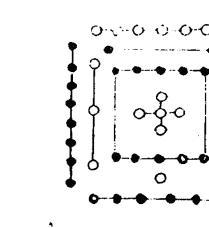

## 河圖

河圖方位一六居下二七居上三八居左四九居右五十居中其繫辭曰天一地二天三地四天五地六天七地八天九地十天數五地數五五位相得而各有合天數二十有五地數三十凡天地之數五十有五此所以成變化而行鬼神也

## 五行相生圖

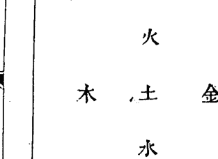

水北火南木東金西土中水一火二木三金四土五五行既位由是四時八卦六十四卦變化無窮而萬物備入宅特小數耳

## 伏羲八卦方位

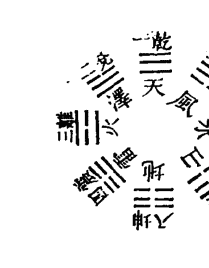

乾南坤北離東坎西震東北兌東南巽西南艮西北此伏羲八卦方位所謂先天之學也傳曰天地定位山澤通氣雷風相薄水火不相射八卦相錯自乾至震從左數所謂數往者順自巽至坤從右數所謂知來者逆也

## 洛書

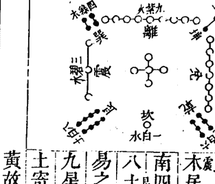

洛書方位戴九履一左三右七二四為肩六八為足此圖一水居下九火居上三木居左七金居右二土居西南四木居東南六金居西北八土居東北實文王後天作易之本原而後世陰陽家講九星皆宗洛書蓋八卦之五土寄於坤艮而九星兼數五黃故土之數有三也

六八一

## 文王八卦方位

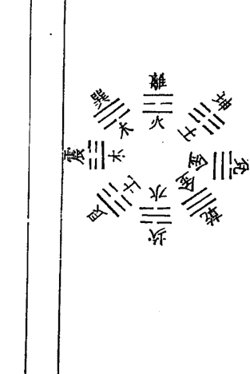

離南坎北震東兌西巽東南艮東北坤西南乾西北此文王八卦方位所謂後天之學也傳曰帝出乎震齊乎巽相見乎離致役乎坤悅言乎兌戰乎乾勞乎坎成言乎艮此圖水火各一卦金木土各二卦五行相生義主流彼此相尅義兼反對而八卦九星若相符合實萬世不易之常道也

## 文王八卦方位論

邵子曰至哉文王之作易也其得天地之用乎故乾坤交而為泰坎離交而為既濟也乾生於子坤生於午坎終於寅離終於申以應天之時也置乾於西北退坤於西南長子用事而長女代母坎離得位兌艮為耦以應地之方也

按八宅宗文王八卦九宮宗洛書方位而文王八卦實本洛書與河圖相為表裏蓋伏羲先天八卦以對待言文王後天八卦以流行言亦相為表裏先天以應天之時後天以應地之方此論實盡天地之秘與後世講陽宅講陰基之星命卜筮之說俱本諸此

## 伏羲八卦次序圖

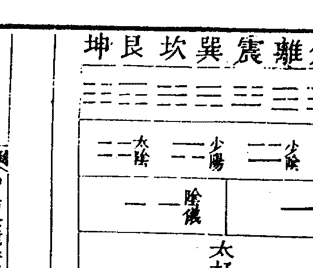

太陽生乾兌二卦少陰生離震二卦少陽生巽坎二卦太陰生艮坤二卦先為一畫以分陰陽太極生兩儀次為二畫以分太少兩儀生四象次為三畫而三才始備八卦相交成六十四卦

## 文王八卦次序圖

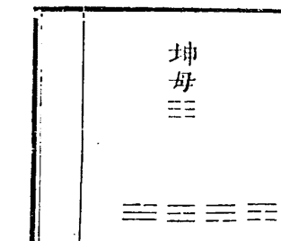

震為長男得乾初爻坎為中男得乾中爻艮為少男得乾上爻巽為長女得坤初爻離為中女得坤中爻兌為少女得坤上爻

八卦中坎離震巽為東四宅少陰少陽之所生也中長配合而成家之義也乾坤艮兌為西四宅太陰太陽之所生也老少配合而成家之義也男女命一九三四宮即東四命宜居東四宅男女命六二八七宮即西四命宜居西四宅

## 東西宅訣

震巽坎離是一家
西四宅爻莫犯他
若還一氣修成象
子孫興盛定榮華

## 西四宅訣

乾坤艮兌四宅同
東四卦爻不可逢
誤將他卦裝一屋
人口傷亡禍必重

## 辰南戌北斜分一界之圖

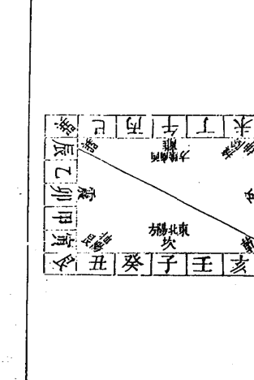

此陰陽東西乃二十四位之東西分陰陽也陰陽卦即兩儀卦生之陰陽卦也非遊年東西之謂

## 先天六十四卦配二十四氣圖

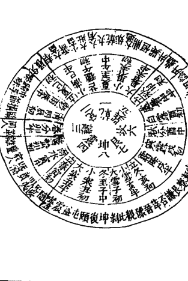

先天六十四卦配二十四節氣圖說
伏羲由八卦而成六十四卦因取大橫圖規而圖之其次序則由乾而夬而大有陽從左旋而移于復由坤而剝而比亦左旋而終于姤此陽順而陰逆也由坤生復自復至乾由乾生姤自姤至地則右轉是陰順而陽逆也以所值天時從邵子之子半推之復為冬至子之半則頤屯益為小寒丑初至乾交夏至午之半焉此三十二卦為陽儀所生皆進而得夫乾兌離震已生之卦也於位為東南于時為春夏故多陽多剛多動多吉而月則復臨泰大壯夬其序亦不易焉姤為夏至午之半則大過鼎恒為小暑未初至坤交冬至子之半焉此三十二卦為陰儀所生皆退而得夫巽坎艮坤未生之卦也于位為西北于時為秋冬故多陰多柔多靜多凶而月則姤遯否觀剝其序亦不易焉此伏羲之畫為天地自然之象宅之禍福由此八卦互相變動雜揉莫測故凡立八宅者布卦分爻東西往來南北移徙須審氣候陰陽順逆非至精至神孰能盡其蘊奧圖中分至四立各統二卦餘氣各統三卦合為六十四卦此卦配四時之氣五行之序也火庵之說實本諸此火庵即太極也

## 後天六十四卦配合六律八呂圖

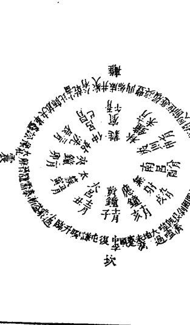

後天六十四卦配律呂圖說

後氏立卦本受諸先天之圖也一卦有伏有參如乾姤遯否觀剝晉大有而復變乾則天之氣盡矣如坎節屯既濟革豐明夷師而復變坎則水之氣盡矣如艮賁大畜損睽履中孚漸而復變艮則山之氣盡矣如震豫解恒升井大過隨而復變震則雷之氣盡矣如巽小畜家人益无妄噬嗑頤蠱而復變巽則風之氣盡矣如離旅鼎未濟蒙渙訟同人而復變離則火之氣盡矣如坤復臨泰大壯夬需比而復變坤則地之氣盡矣如兌困萃咸蹇謙小過歸妹而復變兌則澤之氣盡矣八卦八變則天地風雷水火山澤之氣皆無餘蘊矣而宅之成敗亦存乎五行相變之氣如乾宅五行屬金四陽六宮之位其氣止有四十年坎宅五行屬水一宮三陽之位其氣止有二十九年艮宅五行屬土八宮五陽之位其氣止有三十三年震宅五行屬木三宮二陽之位其氣止有三十一年巽宅五行屬木四宮四陰之位其氣止有三十五年離宅五行屬火九宮三陰之位其氣止有三十四年坤宅五行屬土二宮五陰之位其氣止有二十九年兌宅五行屬金七宮二陰之位其氣止有三十六年皆是五行順布數出自然非牽合附會之說也故其氣盡則其宅凶其氣餘則其宅吉故曰無形之中而具有形之實有形之實而體無形之妙智者於此當有權拆造化之術改奪天地之機轉禍為福誰曰妄言而不加之意乎生旺休囚全主乎氣苟知氣象之源是為宅之宗旨自四象而合八卦則宅之方位已定自八卦而配九星則行是有定位莫知陰陽不有生剋莫知禍福聖人復起不易吾言

## 安宅金鏡卷四

## 陽宅九宮圖

| 九 | 五 | 七 |
|---|---|---|
| 八 | 一 | 三 |
| 四 | 六 | 二 |

紫
白
綠
黃
白
白
赤
碧
黑

野馬跳澗法
中宮飛出乾
坤震巽宮逆
此圖一白入中宮
餘圖做此類推

一白水
二黑土
三碧木
四綠木
五黃土
六白金
七赤金
八白土
九紫火

## 五行長生掌訣

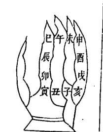

一定數法陽順陰逆
長生 沐浴 冠帶 臨官
帝旺 衰 病 死
墓 絕 胎 養

甲木長生在亥 乙木長生在午
丙火長生在寅 丁火長生在酉
庚金長生在巳 辛金長生在子
壬水長生在申 癸水長生在卯

唯庚午辛未庚子辛丑之土長生於申
丙戊丁亥丙辰丁巳之土長生於丑
戊寅己卯戊申己酉之土長生於寅
俱順行

## 羅盤二十四山圖

八卦四正四隅 一卦管三山

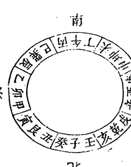

## 羅盤背面八卦方圖

| 卦 | 本卦 | 生 | 禍 | 延 | 絕 | 天 | 五 | 六 |
|---|---|---|---|---|---|---|---|---|
| 乾 | 乾 | 六 | 坎 | 天 | 艮 | 五 | 震 | 禍 |
| 坎 | 坎 | 五 | 艮 | 天 | 震 | 生 | 異 | 延 |
| 艮 | 艮 | 六 | 異 | 絕 | 禍 | 離 | 生 | 坤 |
| 震 | 震 | 延 | 異 | 生 | 離 | 禍 | 坤 | 絕 |
| 異 | 異 | 天 | 離 | 五 | 坤 | 六 | 兌 | 禍 |
| 離 | 離 | 六 | 坤 | 五 | 兌 | 絕 | 乾 | 坎 |
| 坤 | 坤 | 天 | 兌 | 延 | 乾 | 絕 | 坎 | 生 |
| 兌 | 兌 | 生 | 乾 | 禍 | 坎 | 延 | 艮 | 絕 |

八卦坐山是伏位從左順數伏位之後如乾宮次六煞次天醫次五鬼次禍害次絕命次延年次生氣餘宮倣此此即所謂游年歌也

## 第一變 凡卦變自上而下七變而止

## 生炁圖

貪狼震木

| 卦 | 變 |
|---|---|
| 異五 | 坎六 |
| 乾一 | 坤八 |
| 兌二 | 離三 |
| 震四 | 艮七 |

變上一爻為生炁生比自然最吉乾變兌兌變乾離變震震變離之類皆生炁也皆生比也皆自然也乾兌離震數往者順巽坎艮坤知來者逆而一二三四五六七八皆自然之數也帝出乎震生炁貪始其星純吉無凶臨在坎離震巽為得位吉在乾兌為內剋凶在坤艮為外戰減吉生炁吉應亥卯未年月求財求子宜作生炁吉

## 第二變

## 五鬼圖

廉貞離火

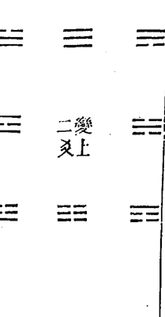

二變上爻

爻變上一為五鬼五鬼最毒位位相剋 隨位發 昂頭印應五鬼之神西四乾金剋東四震木東四巽木剋西四坤土西四艮土剋東四坎水東四離火剋西四兌金四道祇梧相刃相靡由二煞所致也

五鬼凶應在寅午戌年月官訟口舌因作五鬼灶

## 第三變

## 延年圖

武曲乾金

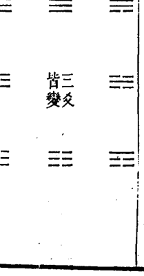

三爻皆變

三爻皆變為延年未必皆生吉又次之乾變坤坤變乾艮變兌兌變艮皆延年也相生也若坎離互變則水火相剋雖是夫婦終有損故云未必皆生

此圖天地定位山澤通氣雷風相薄水火不相射乾坤配坤母三男配三女三女配三男此延年者陰陽相配未若天醫純是相生之義故其吉又次之臨在乾兌艮坤為得位在離為內剋凶在震巽為外戰減吉

延年吉應在巳酉丑年月卻病增壽宜作延年灶

## 第四變

## 六煞圖

文曲坎水

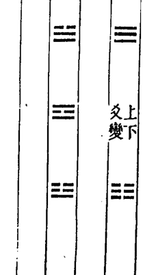

上下皆變文曲六煞生剋相消晏笑戈甲乾坎離坤六煞相生巽兌艮震六煞相剋故曰相消六煞相剋雖與禍害相等而卦不同乃西兌金剋東巽木東震木剋西艮土東離火生西坤土西乾金生東坎水益生理不順反來盜敗遂至禍生讒佞故次凶

六煞凶應在申子辰年月 耗散盜脫因作六煞灶

## 第五變

## 禍害圖

祿存坤土

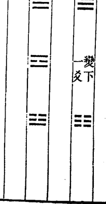

變下一爻為禍害有生有剋是為次凶乾巽震坤剋也坎兌離艮生也 禍害有生有剋剋者固凶生者亦凶何也如震剋坤乾剋巽東西相剋其理易見至離生艮兌生坎其理難知故曰火生於木禍發必速由恩生於害害生於恩 禍害凶應在申子辰年月爭鬭仇讐因作禍害灶

## 第六變

## 天醫圖

巨門艮土

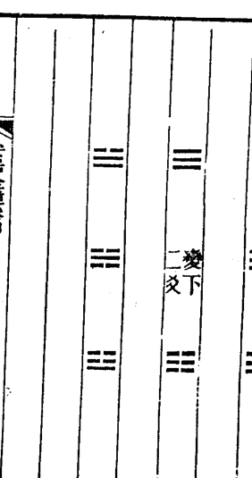

變下二爻

# 安居金鏡 卷四

變下二爻為天醫未必自然吉故次之乾變艮艮變乾兌變坤坤變兌皆天醫也生比也然乾一與艮七為天醫非若乾一即變兌二之自然故曰未必自然吉 天醫雖五行有相生之義不若生炁渾淪而無迹故為次吉之星降在乾兌艮坤離為得位吉在震巽為內剋凶在坎為外戰滅吉天醫吉應在申子辰年月禳病除災作天醫灶

## 第七變

## 絕命圖

破軍兌金

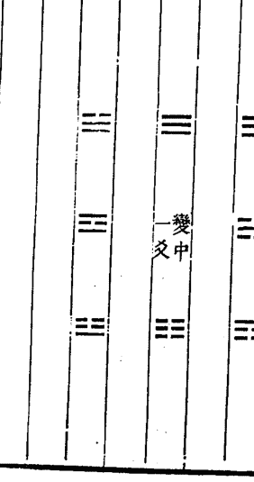

變中一爻

# 安居金鏡 卷四

爻變中一爻為絕命東西上下合著皆傷
絕命者至凶之神亦是先天剋制而生東四離火剋西四乾金西四兌金剋東四震木西四坤土剋東四坎水東四巽木剋西四艮土仇讐相剋不絕不休 絕命凶應在巳酉丑月分年分上 疾病死亡因作絕命灶

六九一

## 第八變

## 伏位圖

## 輔弼巽木

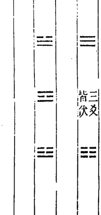

三爻不變為伏位安靜無為可進可退乾遇乾坤遇坤卦卦比和所為如意

伏位吉應在亥卯未年月求為如意宜作伏位灶

## 考變說

老陰老陽所以變者無他到極處了無去處便只得變九上更去不得只得變回來做入六下便是五生數了也去不得所以卻做七

上元中元下元

上元甲子自康熙二十三年甲子起至乾隆八年癸亥止

中元甲子自乾隆九年甲子起至乾隆六十八年癸亥止

下元甲子自乾隆六十九年甲子起至乾隆一百二十八年癸亥止

## 八卦三元九宫九星圖

| 九紫火 | 一白水 | 六白金 | 二黑土 | 七赤金 | 三碧木 | 四綠木 | 五黃土 | 八白土 |
|---|---|---|---|---|---|---|---|---|
| 離 | 坎 | 乾 | 坤 | 兌 | 震 | 巽 | 中 | 艮 |
| 廉貞星 | 文曲星 | 武曲星 | 祿存星 | 破軍星 | 貪狼星 | 巨門星 | - | 左輔星 |

此圖以洛書九宮為序坎一坤二震三巽四中五乾六兌七艮八離九三三為上元四五六為中元七八九為下元此三元之序也坎為一白坤為二黑震為三碧巽為四綠中為五黃乾為六白兌為七赤艮為八白離為九紫此紫白之序也坎為六煞文曲水坤為禍害祿存土震為生氣貪狼木巽為伏位輔弼木五中黃無星乾為延年武曲金兌為絕命破軍金艮為天醫巨門土離為五鬼廉貞火此撥頭五星五行本宮之定位也其變爻相配另具圖於後

## 三元命卦配灶訣

如天啟四年甲子係下元男起兌宮為兌命逆行乙丑生屬乾命丙寅屬中寄宮是坤命丁卯巽戊辰震己巳坤庚午坎辛未離壬申艮癸酉又屬兌以九宮逆行六十年女命順輪九宮今康熙二十三年甲子又為上元如上元甲子生男起坎一宮坎命逆行乙丑生離命丙寅是艮命中元甲子生男起巽四宮巽命乙丑生震命丙寅生是坤命下元甲子生男起兌七宮兌命乙丑生是乾命丙寅生是中五寄坤二為坤命上元甲子生女起中五如上元甲子生女起中五寄八為艮命順行乙丑生乾命丙寅生兌命中元甲子生女起坤二宮坤命乙丑生震命丙寅生巽命下元甲子生女起艮宮是艮命乙丑生離命丙寅生坎命餘做此

上元男命入中宮寄坤宮

中元男命入中宮寄坤宮

壬申 辛巳 庚寅 己亥 戊申 丁巳

癸亥 己巳 戊寅 丁亥 丙申 乙巳 甲寅

下元男命入中宫寄坤宫
丙寅 乙亥 甲申 癸巳 壬寅 辛亥
庚申
上元女命入中宫寄艮宫
甲子 癸酉 壬午 辛卯 庚子 己酉
戊午
中元女命入中宫寄艮宫
丁卯 丙子 乙酉 甲午 癸卯 壬子
辛酉
下元女命入中宫寄艮宫

庚午 己卯 戊子 丁酉 丙午 乙卯
假如上元丁卯生女即艮宫生人以艮命起大游
年艮即伏位次六煞绝命祸害生炁延年天医五
鬼此西四命看灶口即火门也向西四吉若向东
四凶
乾坤艮兑为西四命坎离震巽为东四命以大游
年摇鞭赋断吉凶灶坐方位宜压本命之绝六祸
五方然亦不宜犯其宅其年之都天五黄故催财
宜向生炁而坤艮二命五黄在坤艮生炁亦在坤
艮因五黄同在坤艮不宜向则有灾催丁则灶
口宜向伏位俟其年天乙贵人到命必生子极验
天乙贵人即坤也如上元甲子逆轮庚辰男年三
碧值即以三碧入中四乾五兑六艮七离八坎九
坤一震若巽命人伏位灶即天乙坤到命宫也余
仿此作灶日用紫白遁得生炁到火门催财亦验
六十日应

## 九宫命宅三元排掌之圖

乾六
下元甲子
男起
女起

中五
上元甲子
男起
女起

巽四
中元甲子
男起
女起

震三
中元甲子
男起
女起

坤二
中元甲子
男起
女起

坎一
上元甲子
男起
女起

艮八
下元甲子
男起
女起

離九
下元甲子
男起
女起

數法歌訣
一四七宮男逆佈
五二八宮女順推

其法先算定上中下三元甲子由甲子一旬
至甲戌二旬至甲申三旬至甲午四旬至甲
辰五旬至甲寅男逆女順數至生年本命則
無誤矣如數至六旬仍甲子起

# 安居金鏡 卷四

## 九星分屬

坎宮
一白一宮貪狼天尊星正北方屬水

坤宮
二黑二宮巨門地福星西南方屬土

震宮
三碧三宮祿存天罡星正東方屬木

巽宮
四綠四宮文曲地計星東南方屬木

中宮
五黃五宮巡羅五鬼廉貞星居中央

乾宮
六白六宮武曲地尊星西北方屬金

兌宮
七赤七宮破軍天計星正西方屬金

艮宮
八白八宮左輔明龍星東北方屬土

離宮
九紫九宮右弼應龍星正南方屬火

# 安居金鏡 卷四

六九五

據寶海云此星卦照洛書後天方位一定不移者第因各山飛動變遷吉凶不一故取弔白鈞元窮山川之變態耳非有所添設也嘗填造宅各具圖于後

| 坤 | 離 | 巽 |
|---|---|---|
| 二黑土巨門 | 九紫火右弼 | 四綠木文曲 |
| 兌 | 中 | 震 |
| 七赤金破軍 | 五黃土廉貞 | 三碧木祿存 |
| 乾 | 坎 | 艮 |
| 六白金武曲 | 一白水貪狼 | 八白土左輔 |

## 震宅弔白圖

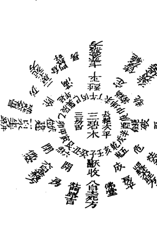

## 巽宅弔白圖

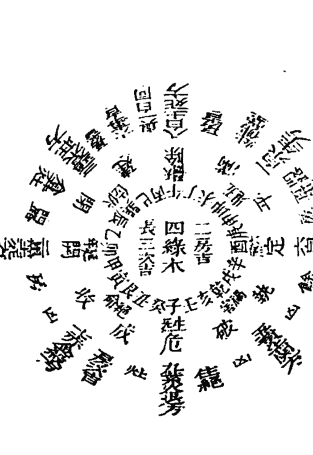

## 中宮弔白圖

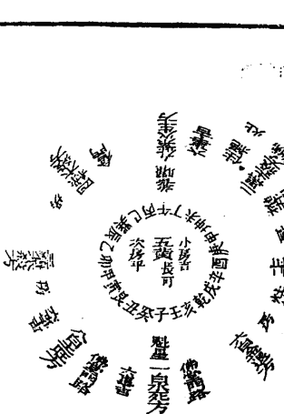

## 乾宅弔白圖

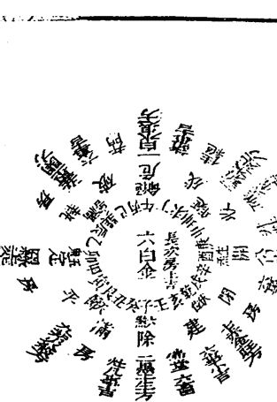

## 兌宅弔白圖

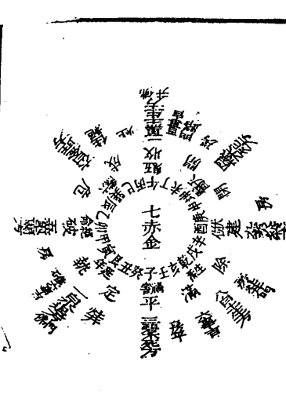

## 艮宅弔白圖

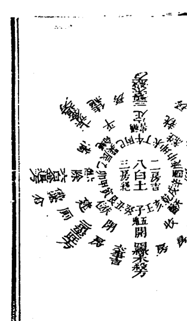

## 離宅弔白圖

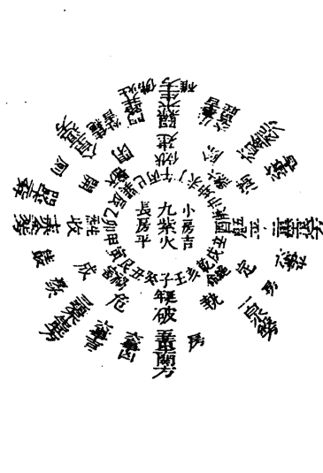

## 安居金镜 卷四

| 坎山 | 坤 | 离 | 巽 | 坤山 | 坤 | 离 | 巽 |
|---|---|---|---|---|---|---|---|
| | 七赤金生方 | 五黄土杀方 | 九紫火死气方 | | 八白土旺方 | 六白金退方 | 一白水死方 |
| | 兑 | 中 | 震 | | 兑 | 中 | 震 |
| | 三碧木退方 | 一白水入中宫 | 八白土杀方 | | 四绿木杀方 | 二黑土入中宫 | 九紫火生方 |
| | 乾 | 坎 | 艮 | | 乾 | 坎 | 艮 |
| | 二黑土杀方 | 六白金生方 | 四绿木退方 | | 三碧木杀方 | 七赤金退方 | 五黄土杀方 |
| | 壬 | 子 | 癸 | | 未 | 坤 | 申 |

## 安居金镜卷四

## 六九九

| 震山 | 坤 | 离 | 巽 | 巽山 | 坤 | 离 | 巽 |
|---|---|---|---|---|---|---|---|
| | 九紫火退方 | 七赤金杀方 | 二黑土死方 | | 一白水生方 | 八白土死方 | 三碧木旺方 |
| | 兑 | 中 | 震 | | 兑 | 中 | 震 |
| | 五黄土死方 | 三碧入中宫 | 一白水生方 | | 六白金杀方 | 四绿木入中宫 | 二黑土死方 |
| | 乾 | 坎 | 艮 | | 乾 | 坎 | 艮 |
| | 四绿木旺方 | 八白土死方 | 六白金杀方 | | 五黄土杀方 | 九紫火退方 | 七赤金杀方 |
| | 甲 | 卯 | 乙 | | 辰 | 巽 | 巳 |

## 安居金镜卷四

| 中宫 | 坤 | 离 | 巽 | 乾 | 坤 | 离 | 巽 |
|---|---|---|---|---|---|---|---|
| 宗朝磬 | 二黑土旺方 | 九紫火生方 | 四绿木杀方 | 乾山 | 三碧木死方 | 一白水退方 | 五黄土凶方 |
| 山水冲煞 | 兑 | 中 | 震 | 安府金鑑卷四 | 兑 | 中 | 震 |
| 宗朝磬 | 七赤金退方 | 五黄土入中宫 | 三碧木杀方 | 壁 | 八白土生方 | 六白金入中宫 | 四绿木死方 |
| 岳峰朝磬 | 乾 | 坎 | 艮 | | 乾 | 坎 | 艮 |
| 宗朝磬 | 六白金退方 | 一白水死方 | 八白土旺方 | | 七赤金旺方 | 二黑土生方 | 九紫火杀方 |
| 宗朝磬 | | | | | | | |
| 元维朝磬 | | | | | | | |
| 宝维朝磬 | | | | | | | |
| | 亥 | 戌 | | | | | |

| 兑山 | 坤 | 离 | 巽 | 艮山 | 坤 | 离 | 巽 |
|---|---|---|---|---|---|---|---|
| 山水元吉 | 四绿木死方 | 二黑土生方 | 六白金旺方 | 安府金鑑卷四 | 五黄土凶方 | 三碧木杀方 | 七赤金退方 |
| 山水半伏 | 兑 | 中 | 震 | 壁 | 兑 | 中 | 震 |
| 山水高朝磬 | 九紫火杀方 | 七赤金入中宫 | 五黄土凶方 | | 一白水死方 | 八白土入中宫 | 六白金退方 |
| | 乾 | 坎 | 艮 | | 乾 | 坎 | 艮 |
| | 八白土生方 | 三碧木死方 | 一白水退方 | | 九紫火生方 | 四绿木杀方 | 二黑土旺方 |
| | 庚 | 酉 | 辛 | | 丑 | 寅 | |

## 離山

| 坤 | 兌 | 乾 |
|---|---|---|
| 六白金死方 | 二黑土退方 | 一白水殺方 |
| 水高財敗 | 水高財敗 | 水高財敗 |

| 離 | 中 | 坎 |
|---|---|---|
| 四綠木生方 | 九紫火入中宮 | 五黃土關方 |
| 水高官譽 | 水高官譽 | 水高官譽 |

| 巽 | 震 | 艮 |
|---|---|---|
| 八白土退方 | 七赤金死方 | 三碧木生方 |
| 水高旺財 | 水高旺財 | 水高旺財 |

安居金鏡 卷四

## 乾宅

火巷丙受氣壬為泰之初爻

| 地天泰卦 |
|---|
| 金 |
| 土 |
| 火 |
| 木 |
| 水 |
| 火 |
| 木 |
| 水 |
| 火 |

乾宅宜開坤門取地天配成泰卦但老父老母鮮能生育須于兌上開一便門取老陽配少陰則成生育之功矣九星武曲主事巨門穿宮土金相生主富貴旺人丁大利便門開艮方亦吉

戊乾亥宅圖

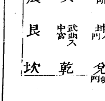

安居金鏡 卷四

## 坤宅

火巷癸受氣丁屬否之初爻

天地否卦

坤宅宜乾門取天地配成否卦無嫌否之名也主夫婦百年便門宜坤九星武曲金星穿宮土金相生財帛豐盛大吉

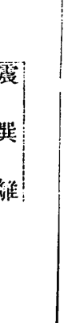

## 艮宅

火巷乙受氣辛為咸之初爻

澤山咸卦

艮宅宜大門在兌方艮少男兌少女夫婦配合之正也坤門純土乾門純陽少生育便門宜艮九星巨門主事武曲穿宮內外宮星金土相生入財官貴俱旺為全吉之宅

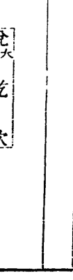

# 安居金鏡 卷四

## 兌宅

火巷庚受氣甲為損之初爻

山澤損卦

兌宅宜開艮門取男正位乎外女正位乎內有家之大義也便門宜坤土生金也但純陰不若便門開在乾位得乾生氣陰陽比和為全吉九星巨門穿宮武曲主事金土相生比助大發富貴矣

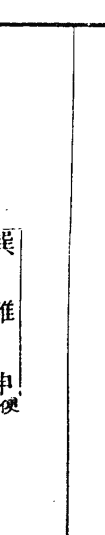

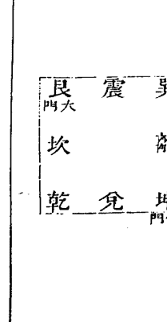

## 坎宅

火巷甲受氣庚為渙之初爻

風水渙卦

坎宅宜開巽門即風行水上之義也水能生木星宮相生便門開在坎方九星貪狼木星穿宮極發富貴如巽不可開門開離天醫但內剋外水剋火不利陰人須開震巽便門渙水之氣生火之勢亦得康寧矣

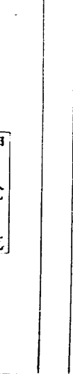

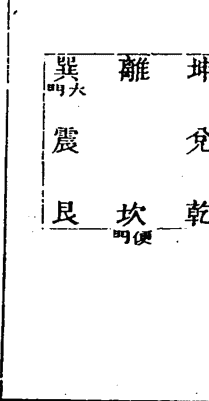

七〇三

## 離宅

火巷辛受氣乙為豐之初爻

雷火豐卦

離宅宜開震門故其象為豐便門宜仍在離九星貪狼木星主事穿宮為星生宮門生坐大吉或不能開震門而開坎延年門則宮剋星不利陰人小口或起高樓尊星房洩坎氣生離火而開震巽便門則富貴康寧矣

丙午丁宅圖

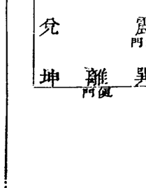

## 震宅

火巷庚受氣甲為噬嗑之初爻

火雷噬嗑卦

震宅宜開離門取木火相生之義故其象為噬嗑便門宜震則木氣主事星宮比和門又制向旺人丁財畜富貴皆至矣若坎巽便門互相得失酌而用之

甲卯乙宅圖

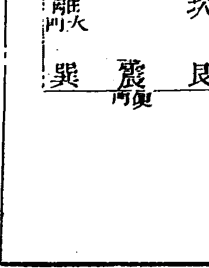

## 巽宅

火巷丙受氣丁為井之初爻

水風井卦

巽宅宜開坎門故取象為井便門宜在巽九星貪狼木主事文曲穿宮水木相生比旺大吉無不利

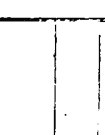

安居金鏡 卷四

## 坐宮分房論

夫坐宮分房者以本宅所坐主宮推各房方位也

凡宅是單間即以中間為本坐如雙間則坐向在界縫之中矣假如坎宅三間中一間是本位坎坐左一間屬震右一間屬兌如五間東一間屬艮東二間屬震西一間屬乾西二間屬兌而坎坐亦居中矣若是雙間兩分左一間屬震右一間屬兌而坎在界縫之中矣如雙間四分則東一間屬艮東二間屬震西一間屬乾西二間屬兌而坎離亦在界縫之中矣凡本宮坐界縫則一宅無主禍福往往不驗如不得已而用四間惟坎宅三間之外另附一部則四屬金金生水亦可餘類推

七〇五

## 動靜變化圖說

易分陰陽宅分動靜靜宅少有動宅多生動則變變即化自然之理也如宅正一層名靜宅有三四五層者名動宅有六層七層者名變宅有八九層者名化宅靜宅唯以主星飛到大門不用穿宮之法大門通便以斷吉凶動宅如坐坎開離門用本宅大遊年歌順至離上是延年至正門對向而止頭層是武曲金二層文曲水三層貪狼木四層廉貞火五層祿存土此宅宜第三層木星高大主事則吉變宅如乾宅巽門用大遊年歌至正門對向而止頭層即祿存土二層破軍金三層文曲水四層貪狼木五層廉貞火六層巨門土七層武曲金此五行生盡則變是以廉貞火亦生巨門土巨門土亦生破軍金文曲水亦生左輔木故名變宅此宅宜六層七層高大則吉化宅用二土二金二木疊進雖水火單進再加右弼共成九曜以全星卦之用如坎宅巽門係九層房屋由傍門而入用大遊年歌順飛過正門而止頭層是天醫巨門土二層祿存土三層破軍金四層武曲金五層文曲水六層貪狼木七層左輔木八層廉貞火九層右弼星右弼無專屬遇土化土遇木化木遇金化金隨類而化故曰化宅其疊進之先後當以到門遊星為主如延年先到五黃無星則先坎宮之武曲兌命先到則先破軍土木亦然餘以類推

# 安居金鏡 卷四

## 坐坎開巽門靜宅圖

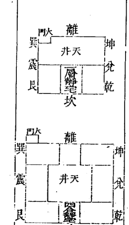

## 坐坎開離門五層動宅圖

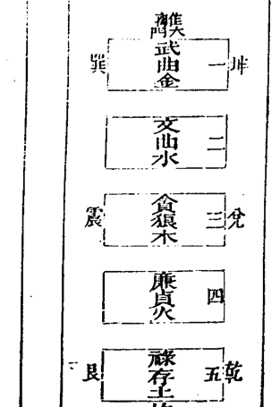

## 坐乾開巽門變宅圖

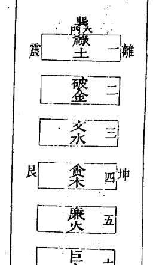

## 坐坎開巽門化宅

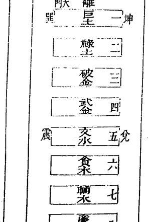

七〇七

## 九星相生法

夫九星相生之法巨土生武金武金生文水文水生贪木贪木生廉火廉火生禄土禄土生破金破金生文水文水生贪木周而复始生生不息若巨门则不生破金廉火则不生巨门文曲则不生辅弼殇无生此穿宫之常法也

夫动宅自一至五而尽用五行生进变宅自一至七而止用七曜重进化宅自一至九而终用九星叠进此竹节贯井法也七曜不用五黄辅弼以五黄无星而辅弼无专星也至用九星则以左辅为木石弼为土合成九曜然庶民至五行而止公卿七曜全矣

## 火巷图说

火巷即太极也八宅阴阳卦象皆从此出凡修造不立火巷是无根冷气之宅居则凶多吉少火巷之远近即易之四象老阴老阳配耦所积之数也阳主进从少至多则七为少而九为老矣阴主退从多至少则八为少而六为老矣少阳七数得二十八策少阴八数得三十二策合为六十也老阳九数得三十六策老阴六数得二十四策合为六十也总计一百二十乃尽其数阳以七减至四步尽矣阴以八减至四步尽矣八宅配卦之法初爻是火巷一爻是首合如修造不合本宅吉路只折去首合或阴改阳阳改阴自然合法外象不合亦同

乾卦抽换

## 乾卦抽爻換象圖

| 元泰卦 | 變益卦 | 變節卦 |
|---|---|---|
| 金 金 | 木 木 | 金 金 |
| 土 土 | 水 水 | 水 水 |
| 火 火 | 金 金 | 土 土 |
| 木 木 | 土 土 | 火 火 |
| 水 水 | 火 火 | 木 木 |
| 火 火 | 木 木 | 火 火 |

## 抽爻換象圖說

夫抽爻換象皆本於一卦故曰八卦分列象在其中矣因而重之爻在其中矣所謂爻者效天下之動者也每觀宅凶而修凶位常有吉兆有宅吉而修吉位反遭殃蓋因不明抽換變化比和以致災禍乖戾無所適從今立此圖庶幾一目了然八卦初爻是火巷二爻是首舍如乾宅內外火路修布成坤上乾下地天泰卦大吉之宅若先造北舍東舍又重抽換修成巽上震下風雷益卦雖內外爻象比和却與祖乾不比乃不利之宅又先造北舍西舍重修抽換成坎上兌下是水澤節卦不唯內外不比亦與祖乾不比乃大凶之宅餘皆做此

## 分房移徙圖

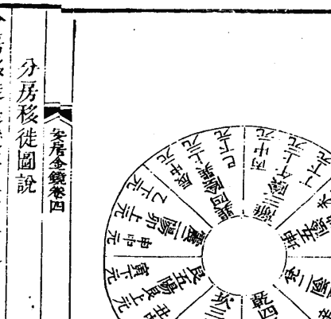

## 分房移徙圖說

分房移徙是變其本宅各隨方位以定宅也如辰入戌巽入乾已入亥是四陽得四陰之氣也丙入壬午入子丁入癸是三陽得三陰之氣也未入丑申入寅坤入艮是五陽得五陰之氣也庚入甲酉入卯辛入乙是二陽得二陰之氣也如戊入辰乾入巽亥入已是四陰得四陽之氣也壬入丙子入午癸入丁是三陰得三陽之氣也丑入未寅入甲艮入坤是五陰得五陽之氣也甲入庚卯入酉乙入辛是二陰得二陽之氣也乃名從陽入陰從陰入陽為陰陽和合主百事亨通若乃從陽入陽從陰入陰為陰陽乖錯百事不利五行要知生剋遷移當審來路方施之有用應之如響也

## 宫宿总图

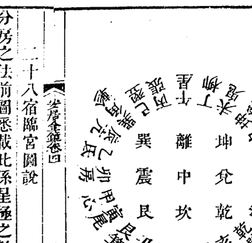

## 二十八宿临宫图说

分房之法前图悉载此係星极之数东西亦有坎离南北亦有震兑四面八方皆可迁修凭经理元难以测识今举其节要以明之自巽宫起角逆行二十四位其四维各管二宿支干止管一周于四面乃为七政若迁宅迁移竟以方宿直入中宫阳顺阴逆数至本宅详看生剋则其吉凶可知也假如离宅分得辛字将胃星直入中宫顺飞到离见参宿参属水离属火是水水相剋不利如乾宅子年修造将虚星直入中宫顺飞到乾是危宿危属水乾属金为金水相生大吉如丑年修造用牛宿入中宫逆飞到乾见胃星胃属土乾属金为金土相生大利余仿此推

## 安居金镜 卷四

## 七二一

八卦變宅即得四吉四凶方道

凡修造移徙迎婚送葬上官經營并行兵擒賊依此行之吉凶極驗

生氣頻修動官職漸加昌舊官身未滿新職又平章子孫皆和睦歲歲足牛羊家無殃禍擾富貴樂高堂

五鬼連心痛牛羊又損傷失財無度數盜賊鬼侵將官事相逢併時時有火光生烝不修禍陰人小口亡

居宅修延年富貴日榮遷子孫多昌盛福祿又安然終年無橫事男女命長延婚姻聯貴族家道日當歡

六煞女先死連年有禍亡六畜頻傷損時時有火光田財多不遂官事是乖張萬事災殃起家中又不祥

禍害妨人口妻女主橫傷投河并落井疾病不離牀風狂又聾啞官事見分張急修伏位上家業得安康

天醫宜修造家中百事宜君子遷官職小人福祿隨牛羊遍山野財帛喜慶知都緣福德上吉慶定無疑

絕命多傷害年年有死亡暗風千般發爭訟不長田蠶皆不遂財破鬼偷將舊官須進退新職又難當

凡宅修伏位能消萬禍休君子加官祿小人足田牛倉庫等常有富貴樂千秋若能依此法終世永無憂

## 三吉六秀

三吉六秀主富貴之樞機而陰陽品配為作用之元奧

三吉古云以貪巨武為是然九星貪巨武有天定卦取用者有長生帝旺取配者有三匝取用者有生方取用者取用無一定之見故此言三吉者非九星貪巨武之謂也蓋言亥與震艮三方為三吉矣要得陰陽相配乃可貴如艮見丙兌見丁巽見辛之類如陰陽相見經曰陰陽相見福祿永禎陰陽相乖禍咎踵門益以此也

精靈聚于六秀之方英粹誕于天門之上

艮丙巽辛兌丁為六秀之位以天市垣在艮太微垣天貴星在丙主天下之祿天乙在辛太乙在巽主天下之壽福祿壽三者洪範為五福之最洪範之數上應天星故其方之氣清貴純美而龍體秀麗故其方為六秀但巽辛艮為文章之府兌丙丁為司籍之地故六秀方多出文章之士而艮丙則富貴雙全也又不如巽辛為清貴樞要卯庚則出人有謀略威權至于亥為紫微之垣天鼻之帝座其貴尤尊故曰粹誕于天門

安居金鏡 卷四

七一三

## 安居金鏡卷五

周
丁宗濂靜波甫
王惟諫司直甫參閱
薛 儁理齋甫
陸 煜檀甫 全較
吳永年巽巖甫鑒定

天機相宅秘奧
論宅外形
人之居處宜以大地山河為主其來脈氣勢關人禍福最為要切若大形不善總內形得法終不全吉故論宅外形第一

凡宅左有流水謂之青龍右有長道謂之白虎前有汗池謂之朱雀後有丘陵謂之元武為最貴地

凡宅東下西高富貴英豪前高後下絕無門戶後高前下多足牛馬

凡宅不居當衝口處不居寺廟不近祠社窯冶官衙不居草木不生處不居故軍營戰地不居正當水流處不居山脊衝處不居大城門口處不居獄門處不居百川口處

凡宅東有流水達江海吉東有大路貧北有大路凶南有大路富貴

凡宅樹木皆欲向宅背宅凶

凡宅地形卯酉不足居之自如子午不足居之大凶子丑不足居之口舌南北長東西狹吉東西長南北狹初凶後吉

凡宅居滋潤光澤陽氣者吉乾燥無潤澤者凶

凡宅前低後高世出英豪前高後低長幼昏迷左下右昂男子榮昌陽宅則吉陰宅不強右下左高陰宅豐豪陽宅非吉主必奔逃兩新夾故死須不住兩夾新光顯宗親新故俱半陳粟朽貫

凡宅或水路橋梁四面交衝使子孫怯弱主不吉

凡宅門前不許開新塘主絕無子謂之血盆照鏡門稍遠可開月塘

凡宅門前不許人家壘箭來射主出子孫忤逆不孝

凡宅門前不許見二三四尺紅白赤石主凶

凡宅屋後見拍腳山出淫婦通僧道

凡宅門前有探頭山四時防盜若在屋出軍賊之人

凡宅屋後或有峻嶺道路或前衝後射主出軍賊之人

凡宅屋後不要絕尖尾地主絕人丁門前屋後方圓大吉

凡宅門前不要朝垂飛水反背者是也主出淫亂之婦

凡宅門前見水聲悲吟主退財

凡宅門前忌有雙池為之哭字西頭有池為白虎開口皆忌之

凡宅門前屋後見流淚水主眼疾

凡宅門前朝平圓山主吉

凡宅門前屋後溝渠水不可分八字及前後水出主絕嗣敗財

凡宅井不可當大門主官訟

凡造屋切忌先築牆圍并外門主難成

凡大門門扇及兩畔牆壁須要大小一般左大主換妻右大主孤寡大門拾柱小門六柱皆要着地則吉門扇高於牆壁多主哭泣門口水坑家破伶仃大樹當門主招天瘟牆頭衝門常被人

論交路夾門人口不存眾路相衝家無老翁門被水射家散人啞神社對門常病時瘟門下水出財物不聚門著井水家招邪鬼糞屋對門癰常存水路衝門忤逆子孫倉口向門家退遭瘟搗石門居宅出隸書門前直屋家無餘穀門前垂楊非是吉祥異方開門及隙穴開窗之類並有災害東北開門多招怪異重重宅戶三門莫相對必主門戶退

安居金鏡 卷五

七一五

## 福元論

福元者何即福德宮是也古人隱秘此訣謂之伏位蓋厥初太極生兩儀兩儀生四象四象生八卦故生人分東位西位乃兩儀之說分東四位西四位乃四象之說分乾坎艮震巽離坤兌乃八卦之說是皆天地大道造化自然之理若福元一錯則東四修西西四修東吉星反變為凶星雖外形內形俱吉皆無用矣關係最大

## 福元說

天地間不過一陰陽五行律法以一百八十年為一大周天第一甲子六十年為上元第二甲子六十年為中元第三甲子六十年為下元此之謂三元配以洛書九宮八卦一屬一宮洛書九戴履一左三右七二四為肩六八為足五獨居中配合流年一歲屬坎二歲屬坤三歲屬震四歲屬巽五歲屬中六歲屬乾七歲屬兌八歲屬艮九歲屬離十歲又屬坎週而復始男中五則寄艮宮女中五則寄坤宮此之謂八卦匪惟宅元起例在此其婚元起例塋元起例皆不外此八卦九宮是入卦之名實在人生天福德不在居宅蓋宅但可謂之八方不可謂之八卦若將宅名八卦則止有正南正北正東正西坎離震兌四卦乃四隅宅則世豈所常有而可名為乾坤艮巽矣宅哉近世宅術無驗誤認宅為八卦之病居多惟識生年福德為入卦則震巽坎離福德為東四位生人乾坤艮兌福德為西四位生人東四位則修震巽坎離西四位則修乾坤艮兌而禍福永無差謬矣

## 三元甲子福德宫定局

康熙二十三年上元甲子男起一白坎女起中五寄艮

| 甲子男坎寄艮 | 乙丑男离女乾 | 丙寅男艮女兑 | 丁卯男兑女艮 | 戊辰男乾女离 | 己巳男中女坎 | 庚午男巽女坤 | 辛未男震女震 | 壬申男坤女巽 | 癸酉男坎寄艮 | 甲戌男离女乾 | 乙亥男艮女兑 | 丙子男兑女艮 | 丁丑男乾女离 | 戊寅男中女坎 | 己卯男巽女坤 | 庚辰男震女震 | 辛巳男坤女巽 | 壬午男坎寄艮 | 癸未男离女乾 | 甲申男艮女兑 | 乙酉男兑女艮 | 丙戌男乾女离 | 丁亥男中女坎 | 戊子男巽女坤 | 己丑男震女震 | 庚寅男坤女巽 | 辛卯男坎寄艮 | 壬辰男离女乾 | 癸巳男艮女兑 | 甲午男兑女艮 | 乙未男乾女离 | 丙申男中女坎 | 丁酉男巽女坤 | 戊戌男震女震 | 己亥男坤女巽 |

## 安居金镜 卷五

| 庚子男坎寄艮 | 辛丑男离女乾 | 壬寅男艮女兑 | 癸卯男兑女艮 | 甲辰男乾女离 | 乙巳男中女坎 | 丙午男巽女坤 | 丁未男震女震 | 戊申男坤女巽 | 己酉男坎寄艮 | 庚戌男离女乾 | 辛亥男艮女兑 | 壬子男兑女艮 | 癸丑男乾女离 | 甲寅男中女坎 | 乙卯男巽女坤 | 丙辰男震女震 | 丁巳男坤女巽 | 戊午男坎寄艮 | 己未男离女乾 | 庚申男艮女兑 | 辛酉男兑女艮 | 壬戌男乾女离 | 癸亥男中女坎 |

七一七

## 乾隆九年中元甲子男起四绿巽女起二黑坤

| 甲子男巽女坤 | 丙寅男坤女巽 | 戊辰男离女乾 | 庚午男兑女艮 | 壬申男坎女中 | 甲戌男震女震 | 丙子男坎女中 | 戊寅男艮女兑 | 庚辰男乾女离 | 壬午男巽女坤 | 甲申男坤女巽 | 丙戌男离女乾 | 戊子男兑女艮 | 庚寅男坎女中 | 壬辰男震女震 | 甲午男坎女中 | 丙申男艮女兑 | 戊戌男乾女离 | 庚子男巽女坤 |
| --- | --- | --- | --- | --- | --- | --- | --- | --- | --- | --- | --- | --- | --- | --- | --- | --- | --- | --- |
| 乙丑男震女震 | 丁卯男坎女中 | 己巳男艮女兑 | 辛未男乾女离 | 癸酉男巽女坤 | 乙亥男坤女巽 | 丁丑男离女乾 | 己卯男兑女艮 | 辛巳男坎女中 | 癸未男震女震 | 乙酉男坎女中 | 丁亥男艮女兑 | 己丑男乾女离 | 辛卯男巽女坤 | 癸巳男坤女巽 | 乙未男离女乾 | 丁酉男兑女艮 | 己亥男坎女中 | 辛丑男震女震 |

## 安厝金镜卷五

| 壬寅男坤女巽 | 甲辰男离女乾 | 丙午男兑女艮 | 戊申男坎女中 | 庚戌男震女震 | 壬子男坎女中 | 甲寅男艮女兑 | 丙辰男乾女离 | 戊午男巽女坤 | 庚申男坤女巽 | 壬戌男离女乾 |
| --- | --- | --- | --- | --- | --- | --- | --- | --- | --- | --- |
| 癸卯男坎女中 | 乙巳男艮女兑 | 丁未男乾女离 | 己酉男巽女坤 | 辛亥男坤女巽 | 癸丑男离女乾 | 乙卯男兑女艮 | 丁巳男坎女中 | 己未男震女震 | 辛酉男坎女中 | 癸亥男艮女兑 |

## 安居金镜 卷五

乾隆六十九年下元甲子
女起七赤兑
男起一白艮

甲子男兑女艮
乙丑男乾女离
丙寅男中女坎
丁卯男巽女坤
戊辰男震女震
己巳男坤女艮
庚午男坎女中
辛未男离女乾
壬申男艮女兑
癸酉男中女坎
甲戌男乾女离
乙亥男巽女坤
丙子男震女震
丁丑男坤女艮
戊寅男坎女中
己卯男离女乾
庚辰男艮女兑
辛巳男中女坎
壬午男乾女离
癸未男巽女坤
甲申男震女震
乙酉男坤女艮
丙戌男坎女中
丁亥男离女乾
戊子男艮女兑
己丑男中女坎
庚寅男乾女离
辛卯男巽女坤
壬辰男震女震
癸巳男坤女艮
甲午男坎女中
乙未男离女乾
丙申男艮女兑
丁酉男中女坎
戊戌男乾女离
己亥男巽女坤
庚子男震女震
辛丑男坤女艮

五位男坤女艮宫
下元男四女五宫
上元男七女五宫
其诀云
婚元起例载在今宪书
自此千百万世宅元福德起例皆做此后
以上三元甲子一百八十年而周周而复始

壬寅男中女坎
癸卯男巽女坤
甲辰男震女震
乙巳男坤女艮
丙午男坎女中
丁未男离女乾
戊申男艮女兑
己酉男中女坎
庚戌男乾女离
辛亥男巽女坤
壬子男震女震
癸丑男坤女艮
甲寅男坎女中
乙卯男离女乾
丙辰男艮女兑
丁巳男中女坎
戊午男乾女离
己未男巽女坤
庚申男震女震
辛酉男坤女艮
壬戌男坎女中
癸亥男离女乾

七一九

## 东四位宅图说

福元在震巽坎离宫为东四位生人其吉理俱在
震巽坎离之方门所宜开路所宜行房楼所宜高
大主人所宜居若误用乾坤艮兑俱属凶星是谓
东四修西多不吉故著东四位宅图

假如夫东四位生命而妻则西四位非如爻子
兄弟可分各院居也其居法当何如若住北房
则夫居中间而妻居西间或东间乾艮皆宜若
住南房则夫居东间中间而妻居西间坤其所
宜若住东房则夫居南间中间而妻居北间艮
其所宜大抵夫妇福德不同则当以夫为主耳

## 东四位坎宫生人

坎一宫为正福德宫一切门房井灶等项皆从坎
起
法曰
坎五天生延绝祸六
北房中间亦吉

- 一定福元宜居南房东间上上吉东房南间上吉
- 一定宅宜住坐北向南上上吉坐南向北宅上吉
坐西向东宅亦吉惟坐东向西宅不宜居不便
修盖以乾坤艮兑俱不宜开门故也若用截路分
房法亦可居

- 一定门宜走东南巽方巳字辰字生气门上上吉
正北坎方福德门上吉正南离方延年门亦吉
- 一定宅中所行路宜由东方上吉
- 一定井宜在东南辰巳方长生位大吉
- 一定厨灶宜在东北甲寅字五鬼方大吉
- 一定碾磨宜在东北五鬼方正西祸害方大吉
- 一定牛马栏宜在东南生气方大吉
- 一定放水宜在甲乙巨门方
巨门水去来皆吉

## 坎宫克应

坎命得巽方生气来路灶向有五子得离延年有四子得震天医有三子得坎方福德只有女犯绝命坤伤长子后绝嗣犯五鬼艮伤季子后有二子犯六煞乾伤长子后有一子犯兑祸害伤季子女而无子若改生巽方则又有子矣娶兑命妻主不和犯廉存土星虽无子而有寿婚姻宜配巽妻灶口宜向巽求婚宜灶口向离及安床于父母身床之离方分房来路修方同若配巽命妻有五子又和睦助夫成家

子息得巽方来路灶口又与巽命妻相同皆得生气则有五子又富贵也

- 一坎命初年无子后添造东南方屋而生子五人又见坎命人得巽命妻果得五子后老误改灶口向坤食之十年而子皆死
- 又见坎命妇配巽命夫生五子后年老夫已误改灶口向坤食八年子亦皆死

坎命人问师曰我坎命误娶兑命妻犯祸害禄存土又命犯孤当无子何法挽之师曰将大灶火门改朝汝坎命之东南巽向得生气当有五子虽命犯孤亦当有子又将小灶或风炉易以口朝乾向使妻得食乃妻命伤生气吉向亦当有子其人从之后果生五子可见阳宅之灶口方向能挽回造化神验如此

疾病一坎命妻犯脾泄而夫开饭店师过之夜问病声师曰以小灶改向震天医方与药饮食自愈店主曰老妻脾泄卧床半年数日不愈食将危难救师曰新灶试煮汤灌之及饮半杯病妇曰香甜好药也旬余而痊盖其灶口向坤绝命故患脾泄师以新灶改向震方天医也

灾祸一坎命人犯坤方老母不慈妻妾不和又妻妾得痢伤母妻子女老婢绝嗣若犯兑方必自生恼怒吊缢刀伤夫妾暴亡而见三光火光血光泪光伤妻及婢女又和西方圆面女人唆讼破财如无必有癫狂痨瘓噎膈病

- 一坎命妇食向兑祸害灶口三年上吊十余次幸来路吉故屡得救后改灶口向东南巽则永不然若夫命不利巽方者又不可耳故夫妻二命各东西者宜以夫命定灶口吉向而外以床房厕各爻救妻可也人问师曰有东命妻病接

七二一

丈母来家看妻不知分房之方而其病反凶师
曰命改父母房在西方而妻在丈母之东方尺
地或丈甚便得分房之吉矣其人从之又添吉
向灶口与妻食果痊坎命犯乾六煞受灾兄责
辱又爻老大子不孝老仆不仁刀伤自缢伤长
子妻女皆痨死

- 一次坎命修造乾方大门周年后果有过路老人
死此门下而败是以误修六煞者皆有人命讼
事若坎命妇人犯此常被翁夫责詈坎命犯艮
方先伤季子继伤小仆妻妾失财失败五次奴
仆逃走而有火灾也

## 东四位离宫生人

离九宫为正福德宫一切门房井灶等项皆从离
起　法曰　离六五绝延祸生天
- 一定福元宜居南房东间东房南间俱上上吉北
房中间亦吉
- 一定宅宜住坐北向南宅上上吉坐南向北宅上
吉坐西向东宅亦吉惟坐东向西宅不宜居
- 一定门宜走东南巽方巳字天乙门上上吉正北
坎方壬字延年门上吉东方甲卯乙字生气门
大吉

- 一定宅中所行路宜由东方上吉
- 一定井宜在正东卯字方长生位大吉
- 一定厨灶宜在东北甲寅字祸害方大吉
- 一定碾磨宜在正西五鬼方东方祸害方大吉
- 一定牛马房宜在正东生气方大吉
- 一定放水避忌险水只宜在乾破军方

## 离宫克应

离命得震来路灶口有五子得坎延年有四子得巽天医有三子

犯乾绝命长子病噎绝嗣犯艮祸害先伤季子女后有二子犯坤六煞伤长子女后有一子犯绝命方灶口来路虽子在千里外亦应伤子绝嗣而自身亦不寿

婚姻 离命宜配震命妻巽坎次吉求婚宜安床坎方易成

子息 离命灶口向震有五子向乾绝嗣向坎四子向巽三子

疾病 离命犯乾伤肺咳嗽吐血犯坤痈癘痈肿犯兑肺伤咳嗽痰火心痛损目犯艮小肠鱼口杨梅漏烂痈癘对口俱依前法除病

灾祸 离命犯乾天绝命又西北争打破头流血来路吉者不死伤父及长子大仆若妇命犯受翁打骂痨天犯坤主母炒闹夫妻不和西南黄肥老妇唉讼破家伤母妻大子女媳若凶卦多而灶口又向坤爻必自中毒药妇犯之受翁责骂或有脚肿痛疾犯兑伤母妻妾季子女又妻

窃财小婢仆盗财逃走失贼又火灾犯艮有东北黄童争讼破财又伤小女子婢仆

## 东四位震宫生人

震三宫为正福德宫一切门房井灶等项皆从震起
法曰 震延生祸绝五天六

- 一定福元宜住东房南间南房东间俱上吉北房中间亦吉
- 一定宅宜住坐北向南巽方辰字门宅亦吉惟坐东向西宅不宜居
- 一定门宜走东南巽方延年门正北坎方天乙巨门俱上吉正南离门亦吉
- 一定宅中所行路宜由东方上吉
- 一定碾磨宜在西南祸害方西北五鬼方入吉
- 一定井宜在南生方大吉
- 一定厨灶宜在西方庚字上大吉
- 一定牛马栏宜在南丙字长生位大吉
- 一定放水宜在西方辛字庚字上大吉

## 震宫克应

震命得南方生方来路灶口有五子巽延年有四坎天医有三子震方福德只有女犯正西绝命先伤季子女麻痘癘而绝犯艮六煞伤季子后有一子犯乾五鬼伤长子后有二子犯坤祸害先伤长子女而后绝嗣
婚姻 震命宜配离命妻巽坎次吉求婚宜安床巽方则易成配兑妻或灶口向西主妻整子息 震命灶口向离必有五子若年老不能生者得向亦有奴仆五人或雇工五人僧道得向

亦有徒弟五人并可大得财又可唤子归家
曾见一老人问师曰一子久客不归有何法令其归否师为之以灶座粪厕压其人绝命方又灶口朝生方以招子归家食之旬余其子在外梦见释袍元冠灶神语曰汝灾唤急何不早回验也师曾为人唤逃仆而以灶口朝主人生方又以灶座压主人五鬼方其仆即来盖压五鬼方则仆不逃向生方则仆自来也
一震命人年老无子抱一周岁巽命螟蛉取名

## 安居金镜 卷五

历子至三岁时神附邻巫语曰莫名历子宜更名庆寿好其后老至百岁尚健坎震命即异延年有子而有寿也人问师曰孩疮瘦夜哭何也师曰此分房灶口之误也可将此东命子于父母身床之异方尺基去卧则除分房之凶而反得吉又添一小灶以灶口向异使乳母食之以除旧灶之凶其孩果安世之为父者不知此法而误子以吐泻惊疳诸症悲哉若西命孩则宜于父母身床之西方去卧则吉而东则凶也灶口亦宜向西而令乳母食之吉予常劝友人医士习此法以治小儿痘疹之类十孩九活百无一失售此术者体

上帝好生之德广人世嗣续之美在吾掌握间耳积阴德于冥冥俾昌后而增纪取利禄云乎哉

疾病 震命灶口犯兑向则咳嗽吐血伤肺膈诸症犯艮则杨梅漏毒脾胃疮痢又生对口犯乾伤肺咳嗽吐血犯坤疮痢泻血

灾祸 震命犯兑方季子不孝先伤季子女后伤长子末女小婢绝嗣又怨自缢若女犯此主痨

天恩滋而有来路吉者有救犯艮有东北黄矮人千连人命官非伤季子小仆犯乾方先伤老父继伤长子老仆又思自缢失贼又火灾仆逃犯坤方有西南方黄矮人唆讼破财又妻不和老母不安宁兼伤母妻大女老婢

## 东四位巽宫生人

巽四宫为正福德宫 一切门房井灶等项皆从巽起 法曰 巽天五六祸生绝延

- 一定福元宜住东房南间南房东间俱上吉北方中间亦吉

- 一定宅宜住坐北向南巽门宅上上吉坐南向北坎门宅上吉坐西向东巽门宅亦吉惟坐东向西宅不宜居盖因开大门不便者用截路分房法亦可居

- 一定门宜走东南巽方巳字辰字福德门正北坎门生气门俱上吉正南离方天乙门亦吉

- 一定宅中所行路宜由东方上吉

- 一定碾磨宜在西南五鬼方西北祸害方大吉

- 一定井宜在北方长生位大吉

- 一定厨灶宜在西方庚字上大吉

- 一定牛马房宜在正北生气方上吉

- 一定放水宜在西方辛字庚字俱上吉南方丁字亦可

## 巽宫克应

巽命得正北生气来路灶向有五子得坎分房修坎方亦向得震延年有四子得离天医门床香火灶向有三子若得东南福德宫只有女

犯艮主疮毒伤季子绝嗣犯兑主痨麻痘疮季子女而有一子犯坤伤长子女而有二子犯乾伤长子而终无子

婚姻 巽命人宜配坎命妻离震次吉求婚宜安床震方易成乾命妻自缢

子息 巽命灶口向坎有五子向巽只有女犯艮伤季子小仆

疾病 巽命犯艮灶口生对口疮小便疮毒犯兑肺嗽瘳噎怒欲自缢犯乾肺嗽

灾祸 巽命犯艮先伤季子后自病天绝犯兑人命官非伤季子女犯乾伤老父继伤长子仆大子不孝母妻痨死受灾责辱又西北方圆面大头响喉人唆讼得胜伤财犯坤母妻窃财又母闹吵夫妻不和伤母妻及大子女媳老婢又失贼婢仆逃去及灾

## 安居金镜 卷五

右全图坐北朝南壬子癸三宅丙午丁三向俱装离卦开离门谓之离宅卦为一宅之中包七子卦晋屋七层领附卦之七星合门外卦伏位内卦共屋九屋为全离宅伏位辅居一旅卦祸居二鼎卦医居三未济延居四晋卦文居五噬嗑食居六睽卦廉居七大有绝居八外门卦弼居九中门层次高下得宜不犯黄泉放水合法无冲射逼压谓之吉宅旺一百二十年

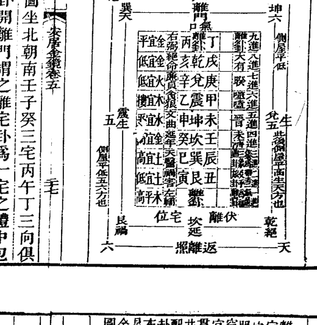

## 安居金镜 卷五

右全图坐南朝北壬子癸三向皆装坎卦开坎开即坎宅以坎卦为一宅之体中生七子卦管屋七层领附卦之七星合门与伏位配左辅右弼共成九星入卦为全局巧翻则坎内卦伏位辅一节卦祸二屯卦医三既济延四需卦文五井卦食六蹇卦廉七比卦绝入坎大门外门弼九全为坎宅内外高下得宜四无冲压放水门路不犯黄泉大旺百余年

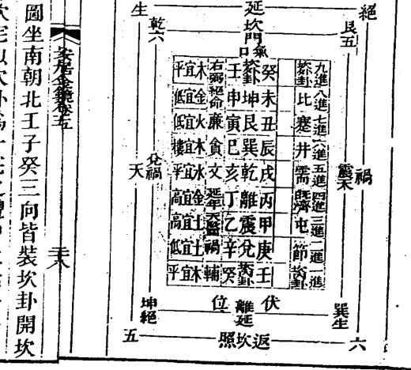

## 震宅兑门穿宫贯井配卦布星全图

右全图坐东朝西庚酉辛三向皆装兑卦开兑门即兑宅以兑卦为一宅之体中包七子卦晋屋七层领附卦之七星合门外兑卦伏位内兑卦共屋九层为全宅伏位左辅木居一困卦祸居二萃卦医居三咸卦延居四大过爻居五夬卦贪居六革卦廉居七随卦绝居八右弼居九中间层数高低得宜门户放水合法八方如式四无冲射谓之吉宅旺一百二十年

## 巽宅乾门穿宫贯井配卦布星全图

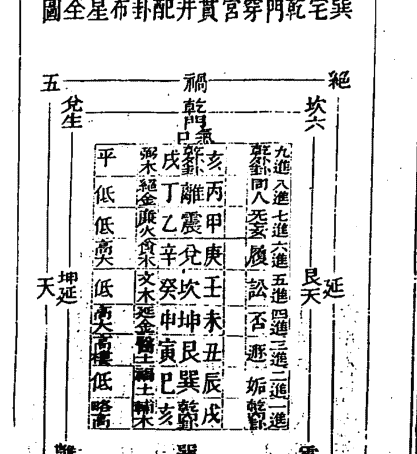

右全图坐东南朝西北戌乾亥三向乾门装乾卦为一宅之体中生七子卦管屋七进以附卦之星穿贯于七进屋内错综分高下由内而外名曰贯井即巧翻八卦之义也乾内卦伏位辅居一变内卦初爻为姤祸居二变中爻为遯卦医居三变上爻为否卦延居四再变中爻为讼卦文居五再变初爻为履卦食居六再变上爻为同人卦绝居为无妄卦廉居七再复变上爻为同入卦九星合局之义备矣入乾外卦弱居九此八卦九星合局之义备矣内外高下得宜四无冲压不犯黄泉气旺一百

## 安居金镜 卷五

五 六 十 年
若欲少层数从绝弃减起可减至五四三层止
年久屋运衰而歇若重修新屋运谓之宅老接
气仍可复旺矣

安居金镜卷五

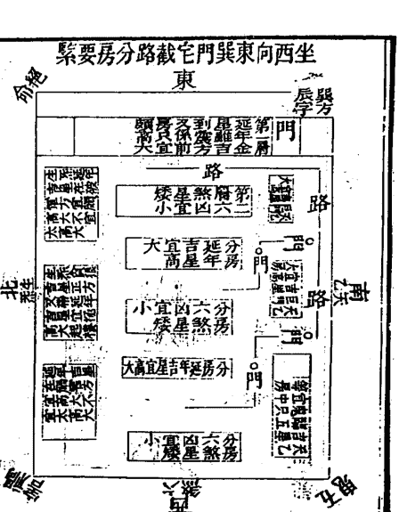

坐东向西宅东四位正大乾兑坤门俱不宜本杂修盖楼台造法如左

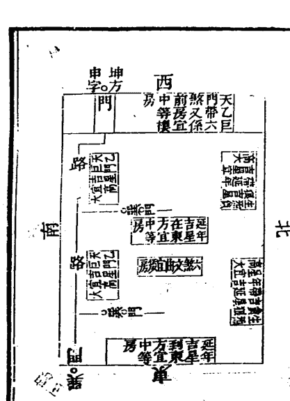

七二九

## 坐南向北坎门宅

## 坐北向南巽门宅

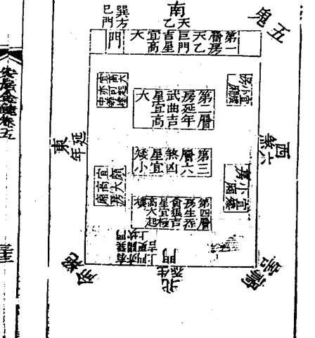

## 坐西向东震门宅

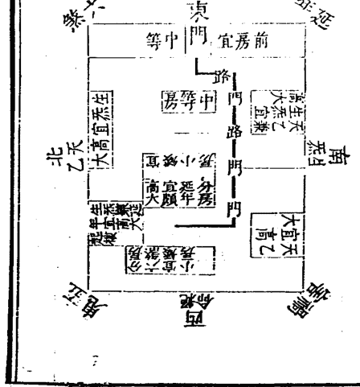

## 坐北向南离门宅

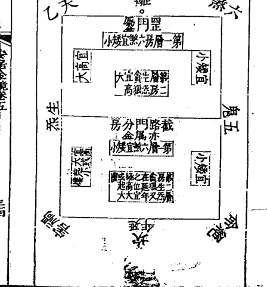

## 西四位宅图说

福元在乾坤艮兑宫为西四位生人其吉星俱在
乾坤艮兑之方门所宜开路所宜行房楼所宜高
大主人所宜居若误用震巽坎离俱属凶星是谓
西四修东必不祥故著西四位宅图

假如夫西四位生命而妻命东四位其房法当何如若居北房夫住两边间而妻居中间坎其所宜若住南房则夫居西间而妻居中间东间离巽皆宜若住东房则夫居北间而妻居中间南间震巽皆宜若住西屋则夫居中间而妻居北间南间其安床大端首向东南为可宜

## 西四位乾宫生人

乾六宫为正福德宫一切门房井灶等项皆从乾起 法曰 乾六天五祸绝延生

- 一定福元宜居西房西楼上上吉次居北房西间福德吉北房东间天乙吉南房西间延年亦可居但房之中间未善耳北房中一间六煞文曲南房中一间绝命破军
- 一定宅宜住坐北向南坤门宅坐南向北乾门宅俱上吉坐东向西乾坤兑门俱上吉坐南向北宅艮方丑字门亦吉坐西向东宅艮方寅字门亦吉但不可正当艮字别法谓之鬼门也
- 一定门宜走西北乾方亥字戌字福德门西南坤方未字申字延年门俱上吉正西辛字生气门东北艮方丑字寅字门亦吉
- 一定宅所行路宜由西方上吉
- 一定井宜在西方生气上大吉
- 一定厨灶宜在南方丙字上大吉
- 一定碾磨宜在正东五鬼方东南祸害方大吉
- 一定牛马房宜在正西生气方上吉

## 一定放水宜在东方甲字乙字北方壬字癸字俱吉

安宅金鉴卷五

## 乾宫克应

乾命犯东五鬼如灶向与来路犯之头子难招后有二子犯北六煞方伤仲子而有一子犯巽祸害伤长子女而终无子若改生气方又当五子矣

婚姻 一乾命人问杨公曰求婚难就何法可速公为之改灶口向延年坤方又于父母身床之坤方安床又合延年坤方分房果半载得妻

子息 乾命人难得子公为之改灶口向生气兑方后生五子如移灶口向延年坤有四子向天

安宅金鉴卷五

矫艮有三子予见公为乾命人移往艮方生三子后改灶口朝兑向又生五子共有八子总得生气方向专发子孙最验者然用罗经须仔细若灶口宜向误用甲则犯五鬼用丑向误用癸则犯六煞乾命人大凶予见乾命人移西北乾方来路灶口向离犯绝命主伤子或不生子而自天病此绝命凶星专主病天绝嗣也曾见乾命人于南方修大屋三间而次年绝孙伤嗣又次年自即痔病死有乾命客往南方后不能

## 安居金镜 卷五

生还总之乾命若犯离方绝命作灶口移居来路出行修造行嫁必大凶

- 一乾命女嫁往生气方生五子后改兑方灶口朝南先伤仲子疾噎立亡期月即见三年五子尽伤又乾命女嫁往南方离灶口向兑而生五子后皆伤天以犯来路之绝命也若能改灶口向生气则无伤而有子矣分房修方来路同验又须门房床灶皆压凶方向吉方斯为尽善半月即见效生气兑方

疾病 乾命男误用灶口向离而伤乾金心火盛克肺金先心痛痰火后咳嗽劳喘吐血肺烂头痛脑漏鼻常流水杨公令其莫食朝南旧灶新添一小灶或风炉口朝东北天医艮方炉压本屋内之绝命离方以除离卦之凶食月余而病痊并除根不发盖天医乃专主除病之吉神也

有一乾命人犯震巽二方之来路灶口有肝怒目疾跌伤手足麻疯疮毒瘫痪诸症又一乾命女犯坎位而赤白带阻经小产虚劳之症若将来路灶口等改向艮方天医即除病向

坤方延年且有寿矣天医艮方

灾祸 一乾命人犯灶口向离即有官非口舌火灾仲媳忤逆伤妻女又绝嗣又一乾命灶与大门俱朝离其妻女皆淫乱子师令其改灶口向兑而灶坐烟通压大门后丙午丁方以除离卦后果不淫又乾命犯坎方来路灶口有人命干连风流之事犯震方则奴婢窃取逃走失贼火灾兼伤长子犯巽方有东南妇人咬致讼又伤母妻及长子女也俱照疾病门内解除之法用之大吉

七三三

## 西四位坤宫生人

坤二宫为正福德宫，一切门房井灶等项皆从坤起。法曰：坤天延绝生祸五六。

一定福元宜居西房西楼，南间北间俱上上吉，北房东间西间、南房西间并吉，但房之中间未善耳。北房中一间谓之六煞。

一定宅宜住坐北向南坤门宅，坐南向北乾门宅俱上上吉。坐南向北艮方丑字门，坐东向西坤兑乾门，坐西向东艮方寅字门并吉。

一定门宜走西北乾方亥字戊字延年门，西南坤方未字申字福德门上吉。东北艮方丑字寅字门俱吉，但不宜正当艮字，别法谓之鬼门也。

一定宅中所行路宜由西，亦大吉。

一定井宜在东北方长生位，大吉。

一定厨灶宜在北方癸字，大吉。

一定碾磨宜在正东祸害方、东南五鬼方，大吉。

一定牛马栏宜在东北生气方，大吉。

一定放水宜在东方甲字乙字、北方壬字癸字，俱上吉。

## 坤宫克应

坤命得艮生气，有五子，乾四子，兑三子，坤只有女。

犯坎绝嗣。有一坤命人客往坎方，一年而家内伤子，皆伤寒慢惊痫痘，以坎属肾也。又有一寡妇坤命，灶口向坎，三年内二孙溺水死。犯离伤仲子女而有二子，犯震伤长子而后绝，犯巽伤长子女而有二子。

婚姻：坤命宜配艮命妻，乾兑次吉。求婚宜安床向乾，易成。

子息：坤命男灶口向艮有五子，向兑三子，向乾四子。

疾病：坤命男女犯难，有心痛痰火吐血等症，用兑方天医来路除之。犯震巽有疟痢疮毒等症。犯坎绝命，男则伤寒疟疾虚弱无妻，女则闭经血崩劳噎。除病可用天医兑向，五日见效，十一日起床，两月除根。用延年乾向，二十五日见效起床，虽有三分残疾，而延年有寿也。灶向天医则用来路延年之方，如来路天医则灶向延年。

灾祸：坤命入犯坎方，有投河风浪溺死等灾，又余做此。

## 安居金镜 卷五

虚损伤仲子，继伤长子绝嗣，小孩则慢惊风天也。犯离则有人命官非，又妻淫伤妻妾仲子女婢，又痰火心痛仲媳忤逆。若有母则为仲女，以一家年岁长幼分仲季也。犯震有得胜之官非，退财长子不孝，大仆不仁，伤长子老仆也。有一壮年坤命人添造震方房一间，子师阻之曰：“修后一年父母告汝忤逆。”其人曰：“父爱我而恶弟，安有此事？”期年父果告之，破财。其人又问曰：“北方大屋我欲进居。”师曰：“此方虽美，而汝坤命犯坎方绝命，须先于坤方或艮方去租屋居数月，方进此屋，不但无灾，反有福寿。”其人不听，遂居之，年余而死。又一坤命女修震方房，被夫责辱不已，师令折之而安。若坤命男犯巽方，老母妻媳窃财，婢仆逃走失贼，又火灾，又伤母妻及大子大妻大媳老婢也。

## 西四位艮宫生人

艮八宫为正福德宫，一切门房井灶等项皆从艮起。法曰：艮六绝祸生延天五。

一定福元宜居西房西楼俱上上吉，北房西间东间亦吉，南房西间亦可居，但房之中间未善耳。北房中一间谓之五鬼，南房中一间谓之六煞。

一定宅宜住坐北向南坤门宅，坐南向北乾门宅，坐南向北艮方丑字门宅，坐东向西坤兑乾门宅，坐东向西艮方寅字门宅俱吉。

一定门宜走西北乾方亥字戊字天乙门，西南坤方未字中字生气门俱上吉。东北艮方丑字寅字门亦吉，但不宜正当艮字，别法谓之鬼门也。

一定宅中所行路宜由西方，大吉。

一定井宜在西南艮申位，大吉。

一定厨灶宜在东方乙字上，大吉。

一定碓磨宜在正南祸害方、正北五鬼方，大吉。

一定牛马栏宜在西南生气方，大吉。

一定放水宜在南方丙字丁字，俱上吉。

## 艮宫克应

艮命得坤方生气灶口，有五子；得兑方延年，有四子；得乾方天医，有三子。若艮福德，只有女。犯巽方绝命，先伤长女，后伤长子而绝，皆脾泄惊痫疮癞疯疾，或不生子而绝也。震伤长子而有一子，犯坎伤仲子而有二子，犯离伤仲子而终无子，以祸害禄存主绝也。

婚姻：艮命配坤命妻有五子，配兑有四子和睦，配乾有三子。灶口宜向生气坤方，求婚宜向延年兑方。

子息：艮命犯巽方绝命方灶口，后果绝嗣。

疾病：一艮命寡妇无子，食巽向灶口，一年有痨笄之女，痨痨危笃。师曰：“若添乾向天医灶口与女独食，虽能减病，未必能保寿，必须不食旧灶口，改坤向生气方灶口食之，则不伤女矣。”从之，而女果得痊。夫母能伤女，女独不伤父母乎？智者可类推矣。故医病人宜先治其父母方向，或先治其子女丈夫方向，又添改病人方向，则远验矣。其主症则艮命男女犯离方向，主伤风眩嗽痰火痈疮疠毒吐血跌伤手足中风瘫痪，至三年后大麻癞死。若小儿犯巽灶口或分房异方，则肺痨慢惊；犯坎则伤寒肾虚遗浊等症，妇人则经闭血崩小产。皆用乾方天医向除病，或用兑方延年之来路与分房方位则吉。

灾祸：艮命犯震方，有东方哑喉长身木形人唆讼破财，大子不孝伤父母，又自跌伤手足。若父告忤逆，则免入命讼矣。犯巽伤母妻子女至绝嗣，又自伤手足而夭，受父母责告，夫妻不睦，长子忤逆。犯离主妻淫声远播，或经官持权欺夫扰乱家务，夫怒成病，即水经云“艮离阴人搅家风”也。人常有得胜之小官非破财，常自哭泣，又有三光等灾。有一艮命富翁大壮，有七锅而口俱朝南，共伤七妻妾。艮命犯坎方失贼五次，又火灾，妻妾窃财与父母奴仆逃走，伤仲子，水灾，又伤寒肾虚遗浊，虚弱贫穷也。

## 西四位兑宫生人

兑七宫为正福德宫，一切门房井灶等项皆从兑起。法曰：兑生祸延绝六五天。

一定福元宜居西房西楼上吉，次居北房西间生气贪狼，南房西间天乙巨门，北房东间延年武曲亦吉，但房之中间未善耳。北房中间祸害，南房中间五鬼。

一定宅宜住坐北向南坤门宅，坐南向北乾门宅俱上上吉。坐南向北艮方丑字门宅，坐东向西坤门兑门宅，坐西向东艮方寅字门宅亦上吉。

一定门宜走西北乾方亥字戊字生气门，西南方未字申字天乙门上吉。次定宜走东北艮方丑字寅字门延年亦吉，但不宜正当艮字，别法谓之鬼门也。

一定宅中所行路宜由西方，上吉。

一定井宜在西北长生位，大吉。

一定厨灶宜在北方癸字，大吉。

一定碾磨宜在正东方绝命破军、正南方五鬼廉贞，大吉。

一定牛马房宜在西北生气贪狼，大吉。

一定放水宜在南方丙字丁字，上吉。

## 兑宫克应

兑命得乾来路灶向，有五子，艮四子，坤三子，兑只有女。

犯震绝命，则子痨病惊疳绝嗣。犯巽伤长子女而有一子，犯离伤仲子女而有二子，犯坎伤仲子女而无子，则我不食之，或家中有合命者食之，否则另添一小灶或风炉亦可，只论灶口向三吉方为验。

婚姻：兑命配乾命妻五子，艮坤次吉。求婿宜安床艮方，易成。

子息：兑命灶口向乾五子，艮四子，坤三子。

疾病：兑命犯离痰火血光等症，犯震损目痨痢跌伤腰背手足，犯巽肝怒损目伤于足等，犯坎伤寒痰弱等症，妇则经闭小产诸症。皆宜用天医延年以除解之，则吉。

灾祸：兑命犯震伤长子仆，跌伤手足腰背，必绝。有一兑命富翁添造震方大屋数间，三年后二孙皆死绝嗣，自身亦死。犯巽有东南长身哑妇咳讼，或母炒闹，或子女淫伤母妻，又伤大子女，损目跌伤手足等。犯离主失贼火灾，妻妾窃财婢仆逃走，妻吵闹淫乱，伤母妻仲女婢。犯坎常有得胜官非破财水灾，伤仲子女仆。若仲子命合宅吉方，则伤季子。曾见一兑命妇犯坎方，则有血筋疾，仲子溺死。

## 安居金镜 卷五

## 乾宅巽门穿宫贯井配卦布星全图

右全图坐西北朝东南，戌乾亥三山，辰巽巳三向，皆装巽卦。巽门气口返于初，即巽宅以巽卦为一宅之体，中生七子卦包于内外卦之中，管屋七进，领附卦之七星穿贯于七进屋内，错综以分高下，由内而外谓之贯井，即巧翻八卦也。伏位辅木居一，小畜祸害土居二，家人卦天医土居三，益卦延年居四，中孚爻曲水居五，涣卦贪狼木居六，观卦廉贞居七，渐卦绝命金居八，弼星居九乃门也。八卦九星全局备矣。内外高下得宜，四无冲射逼压，放水合法，不犯黄泉，可旺一百二十年。

## 坤宅艮门穿宫贯井配卦布星全图

右全图坐西南朝东北，丑艮寅三向，皆装艮卦。开艮门即艮宅，以艮为一宅之体，中生七子卦于内外卦之中，管屋七进，领附卦之七星穿贯于七进屋内，错综高下，由内而外谓之贯井，即巧翻八卦。伏位辅一黄卦，祸二大畜，医三损卦，延四头卦，文五剥卦，食六蒙卦，廉七尽卦，绝八外卦，弼九乃门也。八卦九星备矣。内外高低得宜，四无冲逼，放水如法，不犯黄泉，可旺一百五十余年。

## 艮宅坤门穿宫贯井配卦布星全图

右全图坐东北朝西南，未坤申三向，皆装坤卦。坤门即坤宅，以坤卦为一宅之体，中包七子卦，管内七层，以领附卦之七星，合门与伏位共九层为全宅。伏位左辅居一复卦，祸居二临卦，医居三泰卦，延居四明夷爻，居五谦卦，贪居六升卦，廉居七师卦，绝居八右弼，门居九。九层之内高下得宜，门路合法，八方如式，四无冲压，谓之吉宅，旺一百五十年。

## 兑宅震门穿宫贯井配卦布星全图

右全图坐西朝东，甲卯乙三向，开震门即震宅，装震卦为一宅之体，中生七子卦包于内外卦中，管屋七层，领附卦之七星穿贯于七进屋内，错综以分高下，由内而外谓之贯井，即巧翻八卦也。伏位辅居一豫卦，祸二解卦，医三恒卦，延四大壮，廉五丰卦，贪六小过，文七归妹，绝八外卦，弼九门也。八卦九星全局备矣。内外高下合法，放水得宜，四无冲压，旺一百八十年。

## 安居金镜 卷五

## 坐南向北乾门宅

## 坐北向南坤门宅

命绝南，有门亦可开，上吉。坤门吉，房中只经火离星年府第五等宜命帝方在奎延五。煞六南，季坤方，矮星煞层第五，小宜凶六一。小矮宜。高门乙层第，大宜巨天四。矮星贞鬼层第，小宜凶廉五三。楼或高星狼贪层第，起大宜吉贪生二。小矮宜星凶煞六层第一。小矮宜。高煞星狼层第，大宜生吉贪二。矮星贞鬼层第，小宜凶廉五三。起高星门乙层第，楼大宜吉巨天四。房中只凶破军星年层第，弱宜星军带吉延五。大高宜。矮星贞鬼层第，小宜凶廉五三。大高宜。大高宜。矮星贞鬼层第，小宜凶廉五三。大高宜。生西。大高宜。生西。大高宜。小矮宜。大高宜。小矮宜。大高宜。小矮宜。大高宜。小矮宜。大高宜。小矮宜。大高宜。小矮宜。大高宜。小矮宜。大高宜。小矮宜。大高宜。东，鬼五。西，生天。东，乙天。北，煞六。命绝。北，煞六。命绝。

## 坐东向西坤门宅分路房

## 坐东向西乾门宅分路房

申坤字方。门楼中大宜等起高凶。天乙，方到吉巨天兑星门乙。生西。高宜房系方兑在大顾只前又凶。吉贪生门星狼武。小矮宜。天禄存帝门高宜禄。起高宫楼大宜凶。高立禄门大顾存。楼大起凶。小宜门房矮。小宜门凶五房矮星鬼。西大宜楼起高凶。小宜门凶五房矮星鬼。楼西大高。小宜门房矮。路，门，路，门，路，门，路，门，路，门，路，门，路，门，路，门。小矮宜。大高宜。小矮宜。大高宜。小矮宜。大高宜。小矮宜。大高宜。东，鬼五。西，生天。东，乙天。北，煞六。命绝。北，煞六。命绝。

## 坐西向东艮门宅路分房

## 坐南向北艮门宅路分房

以上所辑东西四位生人用例并图，既极详悉，又甚简明。即令未征宅理者，执例与图而用，斯过半矣。千百世之下，有人安居而物无札瘥，虽冒泄天之罪，宁甘之。幸勿妄授。

## 福元入掌纹起例说

八卦井中五惟九宫，掌纹支位则有十二，故去亥子丑三位不用，只用寅至戌九位。

## 起男女上中下元诀

上元甲子一宫连，中元起巽下兑间。上五中二下八女，男逆女顺起根源。

康熙二十三年甲子上元，乾隆九年甲子中元。

男上元甲子起一位，即坎即寅。中元甲子起巳位，即巽。下元甲子起兑位，即申。以上逆数，男五寄坤宫。

女上元甲子起五位，即午即中。中元甲子起二位，即卯即坤。下元甲子起八位，即酉即艮。以上顺数，女五寄艮宫。

先分上中下元，以跳涧诀数至何宫生人，即于此宫起游年八卦，数至吉星得地处宜居开门，凶星宜碾磨猪厕之类。

且如上元甲子宅主甲寅年生，一宫寅上起甲子，逆数跳入离宫戊上起甲戊，艮宫酉上起甲申，兑宫申上起甲午，乾宫未上起甲辰，中宫午上起甲寅，是谓中宫生人。中宫寄坤，以中宫生人主之，游年起坤天延绝生祸五六，祸元门路按图定之则吉。

且如上元甲子宅母甲寅年生，五中宫午上起甲子，顺数乾宫未上起甲戊，兑宫申上起甲申，艮宫酉上起甲午，离宫戊上起甲辰，坎宫寅上起甲寅，是谓坎宫生人。主之游年起坎五天生延绝祸六，祸元门路按图定之吉。

且如中元甲子宅主乙丑年生，就将中元甲子起巽宫，逆数乙丑到震，是谓震宅生人。主之游年起震延生祸绝五天六，祸元门路按图定之则吉。

且如中元甲子宅母丙寅年生，就将中元甲子起坤，顺数丙寅至巽，是谓巽宅生人。游年起巽天五六祸生绝延，祸元门路按图定之则吉。

客有诘予者曰：“子之以祸元定东西四位宅图也，信以人之生年为主，不以宅向为主矣。若父年东四位生人，而子年则西四位，兄年西四位生人，弟年又东四位，则父宅子何以居，而兄宅弟何以居乎？”曰：“此自有截路分房法在也。凡宅大约但取游年一法，应以家长为主。然大门非能尽主一宅之兆，由大门入，凡有一墙一门隔蔽，皆当从所开门起。且如至仪门处，便从仪门算起，仪门外一层房已不在数内。况居各院开各门，自是各随生年定居。此一宅分各院之法，即有一爻四子八孙，亦惟各修其福德所宜处。巽坎离生人则修东四位一院，乾坤艮兑生人则修西四位一院，各修各居，何相悖之有？”客曰：“唯唯，足解世说之惑。”

天上九星为地之九宫，司人间祸福，其应如响。然吉星惟三，凶星乃六。若吉星不得地处，亦皆反凶。益见求福之难，免祸之不易。若不精术慎造，焉得平吉？故论大游年云：

乾六天五祸绝延生，巽天五六祸生绝延，坎五天生延绝祸六，离六五绝延祸生天，艮六绝祸生延天五，坤天延绝生祸五六，震延生祸绝五天六，兑生祸延绝六五天。

## 吉星三

生者，生气贪狼星也，一木吉。延者，延年武曲星也，六金吉。天者，天乙巨门星也，二土吉。

## 凶星五

祸者，祸害禄存星也，二土。六者，六煞文曲星也，一水。绝者，绝命破军星也，二金。五者，五鬼廉贞星也，二火。伏者，伏吟辅弼水星也，二木。

## 与废年

生气辅弼亥卯未，天乙禄存四土宫，六煞应在申子辰，延年绝命巳酉丑，五鬼凶年寅午戌。

## 九星祸福诀

伏吟天乙无祸殃，五鬼廉贞凶要见，六煞文曲壬癸水，绝命定损人口苦，生气延年见吉祥，定损人口见灾殃，见伤六畜在宅中，祸害见定不为祥。

## 宅运年限革故之诀

凡宅舍先吉后不吉者，未知拨气也。假如宅得木局，三月受气，三年气足，三十年气衰。若得水星来生，便可一百三十年。必须二十八九年修理更新，则木气不丧，可保常吉。土金各照年限定数修理，庶免衰败之兆。

## 九星宫位兴旺诀

贪兴长子巨兴中，武曲小房定兴隆。文败中房禄败少，破廉长子受贫穷。水一火二木三数，金四土五各相从。

## 九星旺子孙诀

贪生五子巨三郎，武曲金星四子强。独火廉贞见二个，辅弼只有半儿郎。文曲水星多一子，破军绝败守孤孀。禄存土宿人延寿，生克休囚仔细详。

## 安居金镜卷六

程国祯维周甫，吕陈蔚若甫全辑，吴永年巽屿甫鉴定，王惟谏司直甫参阅，薛俦理斋甫，陆燿檀甫甫全较。

## 相宅形图说

## 住基歌

阳宅来龙原无异，居处须用宽平势。明堂须当容万马，厅堂门庑先立位。东厢西塾及庖厨，庭院楼台围园地。或从山居或平原，前后有水环抱贵。左右有路亦如然，但遇返跳必须忌。水木金土四星龙，此作住基终吉利。惟有火星甚不宜，只可剪裁作阴地。倘有卓笔及牙旗，耸在外阳方无忌。更须水口收拾紧，不宜大克成小器。星辰近案明堂宽，案近明堂非窄势。此言住基大局面，别有奇特分等第。

## 八方坑坎歌

丑低挨军号阵中，艮低师巫残患人。寅低狼伤并虎咬，他乡外死甲上坑。卯地有湾伤眼目，乙辰有水患秃风。巽地坑池官司败，阳短阴山出暗风。午丙有坑火炎显，未丁坑下痨嗽人。酉方坑上家贫窘，戊亥驼腰鬼贼侵。壬子有湾绝后嗣，祸福如同在掌中。

## 宅忌架桥歌

一桥高架宅厅前，左右相同终亦然。不出三年并五载，家私荡尽卖田园。此法屡验，故特标为一诀。

## 何知经

何知人家贫了贫，山走山斜水返身。何知人家富了富，峰峦磊落皆朝护。何知人家贵了贵，文笔秀峰当案起。何知人家出富豪，一山高了一山高。何知人家破败时，一山低了一山低。何知人家出孤寡，琵琶扇扇孤峰耶。何知人家少年亡，前也塘兮后也塘。何知人家吊颈死，龙虎颈上有条路。何知人家二姓居，一边山有一边无。何知人家主离乡，一山主窜过明堂。何知人家出做军，龙山坐在面前伸。何知人家被贼偷，一山走出一山钩。何知人家忤逆有，虎山或开口。何知人家被火烧，四边山脚似芭蕉。何知人家女淫乱，门对坑窿水有返。何知人家常发哭，前面有个鬼神屋。何知人家不旺财，只少源头活水来。何知人家不久年，有一边兮无一边。何知人家受孤栖，水走明堂似簸箕。何知人家修善果，前面有个手炉山。何知人家会做师，排符山头有手炉。何知人家出跏跛，前后金星齐带火。何知人家致死来，停尸山在面前排。何知人家有残疾，只因水带黄泉入。何知人家宅少人，后头来龙无气脉。

无气脉，仔细相山并相水，断山祸福灵如见。千形万象在其中，不过此经静泰阅。

安居金镜卷六

四

辰巳不足却为良，居之家豪大吉昌。若是安庄终有利，子孙兴旺足牛羊。

昔日周公相此居，丑寅空缺聚钱财。家豪富贵常保守，不遇仙人怎得知。

安居金镜卷六

五

右短左长不堪居，生财不旺人口凶。住宅必定子孙愚，先有田财后也无。

此宅左短右边长，君居之大吉昌。家内钱财丰胜富，只因次后少儿郎。

## 安居金镜 卷六

仰月之地出贤人，庶人居之又不贫。子孙印授封官职，光显门庭共九卿。

中央高大号圆邱，修宅安坟在上头。入口资财多富贵，三千食禄任公侯。

坎兑两边道路横，定主先吉后有凶。人印资财初一胜，不过十年一时空。

此宅修在浑水头，主定其地不堪修。牛羊尽死人逃去，造宅修营见祸由。

前狭后宽居之稳，富贵平安旺子孙。资财广积人口吉，金珠聚宝满家门。

前宽后狭似棺形，住宅当时不安宁。资财破尽人口死，悲啼呻吟有叹声。

西南坤地有丘坟，此宅居之渐渐荣。若是安庄并造屋，儿孙华贵主兴隆。

此宅卯地有丘坟，后来居之定灭门。悬师不辨吉凶理，年久坟前缺子孙。

| 沙 | 吉宅 | 沙 | 址 | 吉宅 | 址 | 址 | 半吉宅 | 址 | 吉宅 | 址 |
|---|---|---|---|---|---|---|---|---|---|---|
| 扬道富家 | 此宅前后有高沙，居之依师不为差。田财广有人多喜，处处议 | | | 宅安庄渐渐与，女子入官为妃后。见孙日后定公卿 | | | 前后有址不喜欢，安庄修造数余年。此宅常招凶与吉，得时富贵失时嫌 | | | 此房正北有址坟，明师发庄定有名。君子居之出官禄，庶人居之家道荣 |

| 平 | 吉宅 | 平 | 下 | 吉宅 | 高 | 水 | 吉宅 | 水 | 塘 | 吉宅 |
|---|---|---|---|---|---|---|---|---|---|---|
| 贵旺人丁 | 此宅方圆四面平，地理观此好兴工。不论宫商角徵羽，家豪富 | | | 西高东下向北阳，正好修工兴基庄。后代资财石崇富，满宅牛羊六畜强 | | | 前后高山两相宜，左右两边有沙池。家豪富贵多年代，寿命延年彭祖齐 | | | 此宅观灵取这强，邦因辰已有池塘。见孙旺相家资盛，与小败长有官防 |

# 安居金鏡 卷六

此宅左右水長渠久，後兒孫福祿齊來。麥錢財常富貴，見孫聰俊勝祖基。

左邊水來射午宮，先初富貴後貧窮。明師斷盡吉凶事，左邊大富右貧窮。

此屋西邊有水池，入若居之最不宜。羊牛不旺人不吉，先富後貧少人知。

水池西北乾宮有水池，安身甚是不相宜。若逢喜事多悲泣，先雖富時終殘疾。

後邊有山可安莊，家財盛茂人最強。若居此地人丁旺，子孫萬石有餘糧。

前有大山不足論，不可安莊立墳塋。試問明師凶與吉，若居此地定滅門。

此宅後邊有高崗，南下居之第一強。子孫興旺田蠶勝，歲歲年山岡年有陳糧。

桑此宅四角有林桑，禍起之時不可當。若遇明師重改造，免教後桑董受栖惶。

七五一

林墳林

凶宅

林墳林

此宅前後有墳林，凡事未通不稱心。家財破敗終無吉，常有非災後必侵。

墳

凶宅

左邊孤墳莫施工，此地安莊甚是凶。疾病纏身不終吉，家中常被賊鬼侵。

吉宅

此宅右短左邊長，假令左短有何妨。後邊齊整方圓吉，庶人居之出賢良。

吉宅

東北丘墳在艮方，成家立計有何妨。修造安莊終迪吉，富貴榮華世世昌。

高

吉宅

高

中央正面四面高，修蓋中宅福有餘。牛羊六畜多興旺，家道富貴出英豪。

山

凶宅

山

此地觀之有何如，前山後山不堪居。家貧孤寡出賊子，六畜死盡禍有餘。

山

凶宅

此宅東邊有尖山，又孤又寡又貧寒。頻遭口舌多遭難，百事先成後來難。

吉宅

左短右長却安然，後面夾稍前面寬。此地修造人口吉，子孫興旺勝田庄。

此宅東北斜道行，宅西大道主亨通。雖然置下家財座，破敗一時就滅傾。

兩邊白虎生災殃，百事難成有死傷。敗人偷盜錢財破，又兼多訟被官防。

此地只因道左邊，久住先富後平安。貴重之人移徙吉，若逢賤者離家園。

四面交道主凶殃，禍起人家不可當。若不損財災禍死，投河自縊井中亡。

此宅安居正可求，西南水向東北流。雖然重妻別無事，三公九相近王侯。

宅前有水後有丘，十人遇此九人憂。家財初有終耗散，牛羊倒死禍無休。

朱元龍虎四神全，男人富貴女人賢。官祿不求而自至，後代見孫福遠年。

宅東流水勢無窮，宅西大道主亨通。因何富貴一齊至，右有白虎左青龍。

## 七五三

後高有陵前近池，西北仰仰頭高危。天賜富貴倉廩足，豐饒兒孫着紫衣。

西來有水向東流，東顯長河九曲溝。後高綿遠兒孫勝，禾穀田豐歲歲收。

前有址陵後有崗，西邊穩抱水朝陽。東行慢下過一里，此宅安居甚是強。

宅前林木在兩傍，乾有址阜長有崗。若居此地家豪富，後代兒孫貴顯揚。

南來大路正沖門，速避直行過路人。急取大石宜改鎮，免教後人哭聲頻。

住宅西南有水池，西北址勢更相宜。良地有崗多貴富，子孫天錫有羅衣。

前邊左右有址陵，後面東道遠平平。異地開門家富貴，不宜兇路子孫沖。

西有長波匯遠崗，東有河水鵝鴨昌。若居此地多吉慶，代代兒孫福祿強。

道 道

凶宅

東西有道直沖懷，定主風病疾傷災。從東多用醫不可，見子孫難免哭聲來。

高 畢

道 道

吉宅

道 道

前有高埠後有尚，東有流水西道長。子孫世世居官位，紫袍金帶拜君王。

平 尚

吉宅

高 高 高

乾坤艮坎土尚高，前平地勢有相饒。立宅居之人口旺，見子孫眾又英豪。

高 平

吉宅

平 高

西北仰高數里強，東南巽地有重岡。坤艮若乎家富貴，幾財萬倍足牛羊。

## 七五五

尚 河 橫

吉宅

南北長河尺寬平，東嶺西尚三兩層。左右宅前來相顧，見子孫定出武官人。

尖

凶宅

寬 寬

東西寬大兩頭尖，做上安墳不足看。此地若無前後勢，家中男女眾人嫌。

凶宅

林 坻

艮地孤墳一墓安，莫交百步內中間。久後癲聾並喑啞，令人有病治難痊。

道

吉宅

山

右邊白虎北聯山，左有青龍絲水潺。若居此地出公相，不入文班入武班。

| 道 | 道 | 凶宅 | 河 | 圻 | 吉宅 | 林 | 林 | 凶宅 |
|---|---|---|---|---|---|---|---|---|
| 貴的安然 | 更有車馬過子孫富 | 把行人斷遮攔宅內 | 東西有道在門前莫 | 和鬧有乖 | 有病常常害貧窮不 | 招盜賊破錢財男人 | 北有大道正沖懷多 | 代子孫興 |
| | | | | | 若居大富貴更兼後 | 乾坵墓近大坡此地 | 宅東南北有長河坤 | 憂鬼成精 |
| | | | | | | | | 歲歲多耗散宅內驚 |
| | | | | | | | | 宅莫把作坵填田垂 |
| | | | | | | | | 林中不得去安居田 |

| 廟 | 圻 | 凶宅 | 墳 | 吉宅 | 林 | 水 | 凶宅 | 林溝 | 低下 | 凶宅 | 低下 |
|---|---|---|---|---|---|---|---|---|---|---|---|
| 人殺子孫 | 未有一百步已後傷 | 分南北共東西離宅 | 寺廟坵墳切要知不 | 改舊家門 | 宅含六十步見孫換 | 取千株鬱鬱林正對 | 庚辛壬癸有墳林可 | 代受孤貧 | 水流妨老母子孫後 | 河重見死佳人坤地 | 乾地林木婦人淫溝 |
| | | | | | | | | | | | 自出貧消 |
| | | | | | | | | | | | 接腳并義子年深猶 |
| | | | | | | | | | | | 人守寡受勤勞多招 |
| | | | | | | | | | | | 兩邊低下後邊高婦 |

若見明堂似廉貞，斷定眼疾少光明。家生氣疾虛勞死，將來致死滿門庭。

白虎若見二山隨，定教婦女被人迷。二姓之家來合活，忤逆人家媳罵姑。

青龍若有二山隨，其家養女被人迷。招郎義子其家破，不出軍時有匠賊。出人狡猾順水為吉，凶換姓過活。

此個明堂出寡娘，少年眼障胎亡。癆瘵氣疾人丁有，流水兒孫實可傷。

此樹門前人不知，家招寡母哭聲悲。二姓同居招女婿，血財損盡又瘟迍。

門前若有玉帶水，高官必定容易起。出人代代讀書聲，榮顯富貴耀門閭。

文曲明堂在面前，男女風聲此處生。男少女多真不吉，招郎納婿過浮生。

明堂形似破軍星，不出軍兮出匠真。損屋外死家退落，孤寡臨門二姓人。

七五七

逆水廉贞为谷将，顺水廉贞是退神。又名唤作词讼笔，出入狡猾不堪云。

门前三塘及二塘，必啼孤子寡母娘。断出其家真祸祸，小儿落水泪汪汪。

面前凶砂若有此，左火尖来兄必死。右火冲身弟必亡，当面尖射中此是。

门前若有两等树，断定二姓同居住。大富之家招二妻，孤翁寡母泪沾衣。

若见明堂三角形，眼儿孙因此哭。单传人口多少亡，气痛其家常不脱。

明堂三尖并四尖，断他致死祸淹淹。定出气泪及患眼，更兼瘴疾甚难痊。

若见鹭鸶头鸭头，前淫乱风声处处传。孤寡少年不出屋，男跏女跛不堪言。

明堂若见似芒槌，少年枉死此中是。吐血伤人凶恶死，少年孤母纷纷起。

面前一山如人舞，家中定出风癩子。时常妖怪入家门，手足之灾定不虚。

面前退神插明堂，代代见孙主少亡。顺水田园都卖尽，家中杂好也徒然。

独树孤峯如顶笠，僧道尼姑从此出。更出瘟疾眼无光，忤逆争闹事不一。

明堂返转似裙头，家中淫乱不知羞。孤寡少亡端的有，瘟癆癩痘染时流。

拖屍之山如此样，勒君仔细看形相。蚕头之山白路行，时师法术要消详。

若见明堂似牛軛，定断其家会做贼。瘟癆疾病不离门，少死人丁哭不绝。

若见明堂似祿存，三年两度定遭瘟。蛇伤牛闘风伤事，曲背跎腰聾啞人。

此个山头在面前，风癱人出退田园。献花淫慾多端事，老子将来把火燃。

七五九

独树生来无破相，必定换妻孤寡真。孤辰冥宿定分明，无儿无女妙通神。

独树两枝冲上天，率连官事苦忧煎。断他年月无移改，坐向宫主细推言。

竹木倒垂在水边，小儿落水不堪言。猢狲添置犹防可，更有瘟灾发酒颠。

若见明堂似蜈蚣，黄肿随身出云游。懒惰儿孙带脚疾，儿孙产难尽遭尤。

小屋孤峰三两交，送迭重重寡婆招。堕胎瞎眼此中出，说与时师仔细消。

塘

黄泉破军若有塘，必主小儿落水亡。禄存有庙及空屋，必主阴人自缢当。

黄泉破军有藤树，断定干连官事至。攀扯相争入法场，只为盗情盗贼赴。

禄存重树在门前，二房暗哑不能言。又主出入瘸跛疾，招瘟动火主忧煎。

鬼怪之樹癰腫前，盲聾啞啞癘病癰。婦人惹性常來宅，偷雞弄犬使人頭。

離鄉之樹頭向外，定知落水遭徒配。曲背跪腰暗眼人，小鬼入家驚作害。

此樹人家忤逆真，其家兄弟打相論。子罵父兮天道滅，媳欺姑媽失人倫。

停喪破屋在面前，其家官事起連連。常招怪物門庭入，血財盡死又瘟癘。

妖怪之樹人不識，文曲之方真不吉。男食淫慾女食花，破壞風聲情似蜜。

空心大樹在門前，婦人癆病叫皇天。萬般吃藥皆無效，除了之時禍斷根。

怪樹腫頭又。

怪樹腫頭又腫腰，姦邪淫亂小鬼妖。貓鼠豬雞并作怪，疾疾病療不曾饒。

猛頭之樹藤纏上，要在祿存方上見。婦人口舌攪親鄰，遭瘟動火入黃泉。

七六一

門前若見此尖砂，軍做賊夜行家出入。眼疾忤逆有兄弟，分居餓死爺。

門前水路捲向前，家中淫亂不堪言。孤寡少亡傷敗事，家中動火又瘟纏。

面前若見生土堆，壟胎患眼也難開。寡婦少亡不出屋，盲聾啞啞又生災。

腫頭之樹人難辨，破軍方位不可見。生離外死不思歸，冥母淚溫香腮面。

大城左右不朝墳，鑌鉤返生樣為凶。孤寡徒流傷敗事，家中又見遭時瘟。

明堂此塘在面前，三四寡婦鬧喧天。時師不識其中病，此煞便為喪禍源。

若有此塘當面前，代代癆疾不堪言。一塘便斷一人喪，何龍不與外人傳。

門前水分八字圖，貴盡田園離鄉土。淫亂其家不用媒，定出長小離房祖。

若見此路在門前，自絰弔頭事干連。欲弔不弔是此路，術者只要細推玩。

當面若行元字路，其家財穀多無數。面前恰似蚯蚓行，定出癆療病多苦。

門前有路川字行，破財年年官事典。若然直射見明堂，三箭三男死却身。

離鄉迢迢是此路，見孫出外皆發富。若然直去不回還，定出離鄉不歸屋。

若見田塍如此樣，斷定自縊弔高梁。必然外死損屍轉，號知因此死他鄉。

門前若有此寒林，年年瘟疾事相臨。又主怪物入門戶，斷他年細推論。

前面水路及返飛，定主退妻又離妻。癩跛孤兒隨母嫁，順水淫亂主生離。

門前有路是火字，兩邊有塘年少死。斷就其家連溪哭，歲煞加歸災禍至。

若見田塍如此樣，斷定自縊弔高梁。必然外死損屍轉，號知因此死他鄉。

路·直
路衝

此屋若有大路沖定
主家中無老公殘疾
之人真是有名爲暗
箭射人凶

塘
塘

此屋門前兩口塘爲
人哭泣此明堂更主
人家常疾病災瘟動
火事干連

堆
堆

此屋門前有大堆住
此房內主墮胎更兼
眼疾年年有火殺加
臨更惹災

塘
塘

前有塘兮後有塘兒
孫代代少年亡後塘
急用泥填地免得其
後受禍殃

此個人家品宇樣讀
書作館起家莊人財
大旺添田地貴子聲
名達帝畿

石
石
大石小石當門

此石當門多罪落其
家說鬼時時着小口
驚嚇不須言氣絕聲
啞入難覺

此屋若在大樹下孤
寡人丁斷不差招郎
乞子家中有瘟瘡惟
物定交加

來合
屋

門前若見有小屋官
事隔門來得速便見
何年凶禍生歲煞加
臨災更毒

# 安居金鏡 卷六

此宅名為過頭屋，前高後低，孤寡損少，二姓並生，火年哭聲，太屋宜前低後高，壓正堂者，亦不吉。

凡俯仰四方均平，左有右不空，左不空，右不空，正堂者，吉。可各宜高。

橫屋宜出無龍虎，筆直齊財，又如屋簷，亡并悲哭，或折更牆，吉間前作掩心，去一少。

四合論四房，合頭長更出，氣埋見煞，井眼疾，又兼妨，如天瘟，金井凡水，屬金及天，屬土克水，有此厄方正者佳。

## 安居金鏡卷六

此屋名為孤寡星，定出寡母二三人，犯之火尤瘟。

此房中高前後低，主有孤寡，內中居亦主錢財多耗散，名曰四水不回歸，似橫火字山字屋，大凶。若中間高是樓，出二姓同居，技藝工巧之人也。屋作昂頭白虎砂，官災口舌事如麻，必主小房衣食缺，非災橫禍敗人家。左長右主幼災迍厄皆然，龍虎高者長幼房如此之患也。

## 七六五

## 安居金鏡卷七

吳永年巽嶼甫鑑定
王惟謙司直甫參閱
周
呂 臨蘭田甫
薛 儁理齋甫
陸 煌檀甫甫
全較

## 陽宅本旨

坐宮分房配門訣
一宅分為數房各房立有門戶大門來往悉同途
吉凶如何分處雙間坐居界縫單間中是坐主但
將房坐起星排推倒大門且住遊年飛轉各房宮
禍福掌中輪佈

## 乾宅雙間分房配門圖解

戊乾亥宅中分為二各有門戶共一大門在震當以總
大門配坐方論吉凶凡雙間房坐向在界縫之中則左
一間屬坎得天乙到震便是巨門穿宅雖發財帛而星
宮俱受乾伐大不利于中子右一間屬兌得絕命金星
則震為木入金鄉不利于長子主人丁稀少然破軍金
穿宅與兌相比亦主財富但不免寡母持家多生疾病
人口不寧此以各房分得宮分作坐宮以配大門而分
吉凶非以共坐之中宮論也設若一宅分為三間即以
中間為乾宅而用乾之遊年是五鬼到震便是五鬼穿
宅乃為火見天門損老爹必矣其左右二間一如上論

# 安居金鏡 卷七

## 坎宅三間分房配門圖解

王子癸宅分為三間各立門戶共一大門在巽中一間是貪狼木星艮宅為木入坎宮鳳池身貴主先發長子人財兩盛左一間是艮破軍穿宅主小長婦多災人財離散右一間是乾祿存穿宅主陰小損傷然土生乾金亦能發財旺畜

## 安居金鏡卷七 陽宅本旨 三

## 巽宅雙間分房配門圖解

辰巽巳宅中分為二各有門戶共一大門在坎當以總大門配坐方論吉凶凡雙間房坐向在界縫之中左一間屬離飛得延年到坎為金水相生主外獲財寶然武曲穿宮為官剋星向又剋坐主不利陰人而多產厄且主奴婢竊財家多破耗右一間屬震為門外生內坐主人財兩旺然巨門土穿宮受宮剋又向剋宮坐主長子財帛耗散陰人多災少利如分為三間則中一間為巽宅即以巽宅游年飛得生氣到坎為貪狼穿宅水木相生比旺主人大旺財帛豐盈長房先貴而仲叔均昌為全吉之宅也

## 安居金鏡卷七 陽宅本旨 四

## 七六七

## 震宅四間分房配門圖解

甲卯乙宅一並四間共一大門在兌當以總大門配坐方論吉凶此亦為雙間坐向在界縫之中左二間屬巽離得文曲水穿宅為金水水相生極發財谷但不免淫亂耳且巽兌不比又外剋內陰盛陽衰人丁稀少不利老母陰人兼主火盜顛狂之災有二間屬艮為武曲金星穿宮金土相生而艮兌又比主富貴榮壽人財兩旺先發小男次及各子也

如一宅分作五間則以正中一間為震分作七間以正中三間為震飛得絕命金到兌為破軍星貫宅為向剋坐星剋宮主先傷長子而後破家敗絕也

## 艮宅五間分房配門圖解

艮宅一並五間共一大門在坤中一間屬艮即以本宅游年飛得貪狼本星穿宅坤艮比和本主富貴但星來剋宮剋向又主不利小於老母人丁稀少左一間屬震是祿存土星貫宅宮剋門宮剋星主不利老母小於貧財耗散右二間屬坎飛得絕命金星到坤為破軍穿宅向剋宮主不利中子小口多災然門生星星生宮財帛六畜頗豐盈也

## 離宅六間分房配門圖解

丙午丁宅一並六間各立門戶前有巷道共一大門在乾
凡雙間房屋半向在界縫之中則左三間屬坤即用坤宅遊
年飛得延年到乾是武曲金穿宅為官星宮生門又乾
坤相比夫婦配合主家門孝義人財昌熾富貴康寧貞吉
宅也右三間屬巽飛得禍害到乾為祿存土穿宅乃門剋
宮宮剋星主陰人損傷資財耗散人口多災不吉之宅如
分得七間則以中三間為離宅而以本宅遊年飛得絕命
到乾為破軍金穿宅乃向剋坐坐剋門星主老翁損傷
人不旺寡漢撐家勞嗽相連繞繞家資破敗不吉之宅也
其左一二四仍屬坤論右三四仍屬巽論也

## 坤宅七間分房配門圖解

未坤申宅一並七間前通巷道共一大門在震中
三間屬坤即以本宅遊年飛得禍害到震為祿存
星穿宅雖星宮比和然震坤不比外剋內又不利
宅母有墮胎癆瘵之災淫亂破耗之患左二間屬
兌係破軍星入宅為星宮比和亦發財帛然內剋
外又主長子少女多災人口不寧更招官非盜賊
不吉右二間屬離係貪狼星入宅為門星俱生宮
又震離相比主人財兩旺富貴雙全但貪震生離
洩了陽氣主女多男少長房出女貴招女婿外甥
榮顯之應如兌見坤巽見坎亦同此應

## 兌宅一宅分為二院配門圖解

舊是兌宅震向兌震不比絕金主事星宮比和亦發財帛但內剋外爻不利長子主寡母持家人口多疾後改分為二宅其走原日大門左一宅坐兌向震則大門在巽是文曲穿宅為金水相生亦發財帛然陰盛陽衰人丁不振內剋外爻陰人不利主寡母持家風聲醜惡右一宅亦坐兌向震則大門在艮飛得延年到艮是武曲金貫宅主事為艮吉之宅也此以本宅主宮配大門論吉凶非一宅分房各所坐之宮論也已上坐宮配門不能無吉

凶之異但明轉移之法則化凶為吉展滿為福惟在智士心目巧机耳然轉變之法多端而大要有三改內門以配外卦一也界本房以截凶取吉二也移床帳以趨吉避凶三也三法精備宅斯化矣

# 安居金鏡 卷七

## 坐宮分房訣

房分入卦皆由本坐推排宮列五星當看遊年佈
置故氣口爲禍福之元關主星乃諸宮之司宰七
煞穿宮剋生宜審五行運化補洩須知吉曜有凶
定是臨宮相剋凶星帶吉多緣到位生比惡煞侵
宮莫言有咎主星照位反禍成祥吉曜加臨未可
據爲喜慶尊凶壓我必然變作憂危最喜恩星助
吉加比補發福無量若值惡曜填凶遇生扶招災
莫測凶生吉洩煞無刑吉照凶禍災勿咎後吉前
凶移界截則吉多凶少宮凶星惡更門戶則禍去

福來八卦縱橫元通造化五行變化巧奪神工故
宅主六分七分則乾艮移於正南而巽坤遷北截
分十一十四斯震兌居於界縫而四維環宮方位
變於界分吉凶易於反掌經曰動則變變則化其
元矣哉

| 乾宅二分 | 乾宅六分截界 | 巽宅三分 | 巽宅四分截界 |
| :---: | :---: | :---: | :---: |
| 坤 | 坤 | 坤 | 坤 |
| 艮 | 艮 | 艮 | 艮 |
| 離 | 離 | 離 | 離 |
| 兌 | 兌 | 兌 | 兌 |
| 乾 | 乾 | 乾 | 乾 |
| 坎 | 坎 | 坎 | 坎 |
| 震 | 震 | 震 | 震 |
| 巽 | 巽 | 巽 | 巽 |

| 乾宅四分 | 乾宅十分截界 | 巽宅五分 | 巽宅八分截界 |
| :---: | :---: | :---: | :---: |
| 坤 | 坤 | 坤 | 坤 |
| 艮 | 艮 | 艮 | 艮 |
| 離 | 離 | 離 | 離 |
| 兌 | 兌 | 兌 | 兌 |
| 乾 | 乾 | 乾 | 乾 |
| 坎 | 坎 | 坎 | 坎 |
| 震 | 震 | 震 | 震 |
| 巽 | 巽 | 巽 | 巽 |

| 乾宅六分 | 乾宅十四分截界 | 巽宅七分 | 巽宅十二分截界 |
| :---: | :---: | :---: | :---: |
| 坤 | 坤 | 坤 | 坤 |
| 艮 | 艮 | 艮 | 艮 |
| 離 | 離 | 離 | 離 |
| 兌 | 兌 | 兌 | 兌 |
| 乾 | 乾 | 乾 | 乾 |
| 坎 | 坎 | 坎 | 坎 |
| 震 | 震 | 震 | 震 |
| 巽 | 巽 | 巽 | 巽 |

| 分截四宅兑 | 分三宅兑 | 分截六宅震 | 分二宅震 |
| :--- | :--- | :--- | :--- |
| 界 離 坤 乾 巽 | 離 兌 坎 | 繼 坤 兌 乾 巽 | 坎 離 |
| 分截十宅兑 | 分四宅兑 | 分截八宅震 | 分五宅震 |
| 繼 坤 坤 兌 乾 乾 巽 巽 巽 巽 巽 | 離 坤 乾 坎 | 繼 坤 坤 乾 乾 巽 巽 巽 巽 | 坎 坎 坎 坎 離 離 離 離 |
| 分截二十宅兑 | 分七宅兑 | 分截四十宅震 | 分六宅震 |
| 繼 坤 坤 坤 兌 乾 乾 乾 巽 巽 巽 巽 巽 巽 巽 | 離 坤 坤 兌 乾 坎 | 繼 坤 坤 坤 兌 兌 乾 乾 乾 巽 巽 巽 巽 巽 巽 巽 巽 | 坎 坎 坎 坎 坎 坎 離 離 離 離 離 離 |

| 分截四宅坤 | 分三宅坤 | 分截六宅艮 | 分二宅艮 |
| :--- | :--- | :--- | :--- |
| 界 離 兌 坎 巽 | 巽 坤 乾 | 繼 離 坤 兌 巽 | 坤 坎 坤 |
| 分截八宅坤 | 分五宅坤 | 分截十宅艮 | 分四宅艮 |
| 界 離 離 兌 兌 巽 巽 巽 巽 | 巽 離 坤 兌 乾 | 繼 離 離 坤 坤 兌 兌 巽 巽 巽 巽 巽 巽 | 坤 坤 坎 坎 坤 坤 |
| 分截二十宅坤 | 分七宅坤 | 分截四十宅艮 | 分六宅艮 |
| 繼 離 離 離 坤 坤 坤 兌 兌 巽 巽 巽 巽 巽 巽 巽 巽 | 巽 離 離 坤 坤 坎 坎 乾 | 繼 離 離 離 坤 坤 坤 兌 兌 兌 巽 巽 巽 巽 巽 巽 巽 巽 巽 | 坤 坤 坤 坎 坎 坎 坤 坤 坤 |

# 安居金鏡 卷七

## 坐宮分房解

夫坐宮分房者以本宅所坐主宮推各房方位也。凡宅是單間即以中間為本坐如雙間則坐向在界縫之中矣假令坎宅三間中一間是本位坎坐左一間屬震右一間屬兌如房是五間則東一間屬艮東二間屬震西一間屬兌西二間屬兌而坎坐亦居中矣若是雙間兩分則坎坐在界縫之中左一間屬震右一間屬兌如雙開四分則東一間屬艮東二間屬震西一間屬兌西二間屬兌而坎離亦坐界縫之中矣若將雙分二間裁作四房則左一間前為巽後為艮右一間前是坤後是乾如前四間分作八分則後截四間左艮右乾前截四間左巽右坤而坎離震兌俱在界縫之中矣至若三間分為六截五間分為十截惟中一間後坎前離東皆艮巽西皆乾坤矣若雙分為六間東一間飛得巽東二間屬艮東三間屬震西一間飛得坤西二間屬乾西三間屬兌如截分作十二房中二間是坎離東二間分為艮巽西二間為乾坤震兌亦在界縫之中矣如單分為七間中一間是坎左三間為巽艮震右三間為坤乾兌若截分為十

七七三

四房中三間作坎離東二間為艮巽西二間為乾坤而震兌亦在界縫之中矣餘推

安居金鏡卷七
陽宅本旨

| 分二作隅北西 | 分一隅南西 | 分一北二南 | 分字井北南 |
|---|---|---|---|
| 巽 | 坤 | 巽 | 坤 |
| | 艮 | 坤 | 離 |
| 坎乾 | | 坎 | 震中兌 |
| | | | 艮坎乾 |

安居金鏡卷七
陽宅本旨

| 分三作隅北西 | 分二作隅南東 | 分四北三南 | 分三北二南 |
|---|---|---|---|
| 巽離 | | 巽 | 坤 |
| | | 離 | 坤 |
| 坎坎乾 | 乾 | 艮艮乾乾 | 艮坎乾 |

| 分三東一西 | 分三作隅南東 | 分一東二西 | 分三北四南 |
|---|---|---|---|
| 巽 | 巽離離 | | 坤 |
| 震 | | 坤 | 巽巽坤坤 |
| 艮 | | 乾 | 艮坎乾 |

安居金鏡 卷七

| 圖另分四宅離 | 圖另分五宅震 | 分隅兩面北 | 分二作隅北西 |
|---|---|---|---|
| 震 | 巽 | 天禽寄坤 | 巽 |
| 離 | 坤 | | |
| 坤 | 應 | 艮 | 乾 |
| 乾 | 艮 | | 坎 乾 |
| 圖另分六宅兌 | 圖另分七宅震 | 分隅兩面南 | 分三作隅北西 |
| 巽 | 坤 | 巽 | 坤 |
| | 離 | | 東西做此 |
| 艮 | 坎 | 天禽寄坤 | 坎 坎 乾 |
| 圖另分七宅離 | 圖另分八宅坎 | 圖另分五宅離 | 分三東一西 |
| 巽 | 坤 | 巽 | 巽 |
| 震 | 離 | | 震 |
| 艮 | 兌 | 離 蓋此 | 艮 |
| 乾 | 艮 | 坎 | 乾 |

安居金鏡卷七 陽宅本旨

七七五

| 圖另分五宅坎 | |
|---|---|
| 離 | |
| 震 | 寄 坤 | 兌 |
| 坎 | |
| 圖另分四宅坎 | |
| 離 | |
| 震 | 兌 |
| 坎 | |

## 房位飛坐九星吉凶總解

夫欲辨房位之吉凶必先審本坐排來之九曜次看遊年飛到之七煞如本房原值吉星司宮而遊年又飛得吉宿加臨謂之吉星反照最妙者再得宮星相生和主發達極速而福祉深遠倘宮星相剋斯吉中藏悔而美處萌災若得他宮吉神洩煞生助則災消福長而無咎矣如本宮原值凶星而遇遊年吉宿飛臨謂之吉曜壓凶亦吉但發達遲緩淺薄耳又當察吉凶二星相生相剋何如苟凶星受剋而吉曜逢生則凶消吉長若吉星受剋

而凶曜受扶則悔見貞藏及如本房原排值凶星司宮而遊年又飛得凶星加臨謂之凶星填煞大忌倘星宮交相剋戰則煞愈緊而禍彌深若星宮相生比和悔中亦有小亨更得主坐吉曜照宮其災可息大抵一宅之中不能全然無凶惟智者通乎變化明于截移使界截一更將凶方變為吉位氣口一易斯煞曜化為福星易曰吉凶悔吝生乎動者也動則變變則化其元妙莫測者乎

## 兩宅一門圖

東西兩宅一門出入以返照則東邊是五鬼絕命西邊是天依生氣西吉東凶明矣以門上起星穿東邊是坤門之星西四宅不合東四宅西邊是巽門星卦相合而吉主財丁並旺居之發福東邊主人財不旺居之大敗

## 龍虎擎拳屋形

破軍禍害兩擎拳
凶壓吉星勢不良
歲久年深主敗絕
子孫游蕩不還鄉
此宅貫井如法其禍稍遲貫井不如法禍來
非速宅母長子先不利

## 埋兒煞形

此宅縱然高下合式廳堂之後俱造軒亭謂之理
見煞主單傳三四代而絕小口難養亦多生災禍
折去獨軒可以轉凶為吉倘高下失宜屋不合法
則為收煞尤速

The request was rejected because it was considered high risk

## 少亡癆病格

廉貞火星形
凡前濁後尖屋已亡矣而右邊又開一天井主初代男子癆厄二代陰人自縊急將此前堂屋牆隔之而後又作一塔各立門戶可免

## 八命破財格

廉貞火星形
凡造屋地不整者當削去尖以作餘屋即吉不然不吉破家之患又主家長中風而亡二三代之後化為鬼房矣

## 埋兒煞格

凡宅形如氣字乃上格也名曰四金相照乃富貴宅但天井內不宜做小屋坎蔽天心主小兒難育人多外亡急拆去之將行道上平低四寸上堂階石高些使心胸廣闊主大吉大利也

## 工字埋兒格

凡工字屋形以行道上作小屋直射正堂之後心主初代略平財亦不旺至後有人命破財人丁少此後即俗謂之直舍也惟衙門公堂可以作此式但住宅不可作也

## 孤陽格式

經云
有東無西
家無老妻

房
一
廚
廁

自西無東
家無長公

廁
廚
房

## 敗絕格

廚
廚
廚
房
房
房

凡三間之宅乃木也木生於東在東上住者仍生
一子斷然無財在西邊居者人財兩空中間住
生女損妻殘疾之患

## 更多资料

↓↓↓

## 【中华古籍库】

↓ 点击链接 ↓

https://www.fozhu920.com/list/

珍版刻印 / 海外流传 / 家传手抄 / 民间失传

【易】【医】【道】【武】【文】【奇】【画】【书】

1000000+高清古书籍

## 打包下载

微信：mbook86

## # 中华古籍库

1000000 册 高清影印古籍
珍版刻印 / 海外流传 / 家传手抄 / 民间失传

古籍善本、经史子集、史料笔记、古人文集、
民间收藏、传世家谱、各地方志、中医典籍、
四库全书、古禁毁书、内阁文库、图书集成、
丛书集成、四部丛刊、万有文库、四部备要、
二十四史、三国六朝文、明清和民国古籍史料
……