# 安徽古相法秘笈

易学手抄本

绝密资料

内容资料 切勿外传

# 安徽古相法目录

- 第一章：安徽相法整体判断思路
- 第二章：安徽相法秘传过父母关
- 第三章：安徽相法秘传过兄弟关
- 第四章：安徽相法秘传过子女关
- 第五章：安徽相法断六亲
- 第六章：观走相听声音破译人生密码
- 第七章：安徽相法秘传断来意
- 第八章：安徽相法断财运
- 第九章：安徽相法断婚姻
- 第十章：安徽相法断财运
- 第十一章：安徽相法断疾病
- 第十二章：安徽相法秘传学历文凭断法
- 第十三章：安徽相法秘传官非牢狱断法
- 第十四章：安徽相法断阴阳宅风水
- 第十五章：安徽相法秘传五官断法
- 第十六章：安徽相法秘传各种意外伤害断法
- 第十七章：安徽相法秘传气色断法
- 第十八章：行走江湖经验分享

目录已完毕，下面我们开始正式讲解

## 第一章、安徽相法整体判断思路

安徽相法传承有序，不可乱宗。有缘得此秘本者，明哲自保身，切勿外传，否则将欺师灭祖，有辱师门，祸及自身。安徽相法断人断事，快速准确，其它相法不可与其比拟。用眼瞄人一眼，就可断验如神。父母存亡，弟兄几个，子女几个自不在话下，人生事件，历历在目。其应验水平，超乎众人想象。

那么她究竟是如何判断的呢，有什么秘诀呢？这值得我们每一个易学爱好者去研究，去学习。真传一句话，假传万卷书。我们会把安徽相法的每个秘诀知识点毫不保留的公布出来，相信经过我们的指点，再加上您不懈的努力，用不了多少时间，一定会攻克安徽相法，你同样也可以做为相术高手，名扬四方！

下面我们把安徽相法的判断思路给各位学员。

大家请注意，第一章只是对整套秘传资料的概括，并没有做全面的讲述。从第二章开始，才有细致入微地讲解。我们会把每个知识点都传授给有缘人，希望大家能够珍惜。

我们先讲一下安徽相法过父母关：

**过父母关**，就是某人父母是否健在或者去世。如果父母去世的，还要看出其父母的死亡时间。

我们安徽相法有很多种方法来做判断。以往大家所熟悉的就是看日月角，太阳太阳，法令纹。但是仅凭这几项，确实难以定准，我们安徽相法有一套行之有效的断验方法，这个问题自然可以很容易地解决，不会让大家再去犯难。

下面我们给大家介绍几种方法，每个方法都特别珍贵，您在其它地方不可能学到的！

**第一种方法：**

先给大家介绍几种概念。男子天中，山根部位为父；天庭，年寿部位为母。如果天中，山根有恶痣，恶纹冲破，或者发青暗气色，表示父已去世。如果天庭，年寿部位，有恶痣，恶纹冲破，或者发青暗气色，表示母已去世。如果是女的，要反看。

**第二种方法：** 无论男女，印堂部位如果有隆起的现象，比如，有肉瘤突出于皮肤，或者有高于皮肤表面的痣子出现，或者其它原因造成印堂部位肿胀，说明父已入土；如果下巴水星部位有洼陷部位出现，则说明母已入土。

**第三种方法：** 看双眉的小眉毛眉尾部位。首先要分清，哪个眉尾代表父亲，哪个眉尾代表母亲。男的左眉尾代表父亲，右眉尾代表母亲，女要反看。

如果一个男的左眉毛眉尾向下耷拉，则其父亲一定去世无疑，绝对没错；如果其右眉毛向下耷拉，其母亲一定去世，百分之百正确。

**第四种方法：** 以男的来看，右太阳穴代表母亲，右腮部位代表父亲。如果右太阳穴部位出现洼陷现象或者青暗气色，则可表示其母亲已经去世，并且可断家中主妇有泌尿生殖系统疾病。如：子宫疾病，膀胱疾病，肾脏疾病等。如果右腮部位有隆起的地方，如：瘤子，肿胀，肉包等，则可断其父亲已经去世。如果是女的，右太阳穴代表母亲，左腮代表父亲。同样的方法可断出父母亲状况。

**第五种方法：** 就是我们平常所见到的方法：看日月角，太阴太阳，法令纹。前四种方法比较准确，也可参看第五种方法进行验证。

过父母关这几种方法先介绍这些。我们在后边会有详细论述。

大家注意：我们所讲的方法是其它地方所见不到的。市面上卖的书籍以及一些大师的培训课程不可能有我们这些东西的，请大家要珍惜，并且尽可能把每个知识点都记在心中，对您的以后会大有帮助的。学了我们这套相法，你会觉得很充实，并有一种如虎添翼的感觉。

下面我们再讲一下过兄弟关：

过兄弟关，主要看这几个部位：眉毛，眉色，眉骨，颧骨，太阳穴，鼻子，牙齿，额纹，额形，耳朵，整体脸型。

眉毛为兄弟宫。过兄弟关，首先要参看一下眉毛。看眉毛要根据眉毛的形状和颜色来判断兄弟姐妹个数和排行。眉毛的形状有很多种，每一种都会代表一定的兄弟姐妹个数，以及排行特性，在后面我们会一一进行介绍的。眉色为三种：浓黑，浅淡，黄红色。根据眉毛的颜色也可以定兄弟姐妹个数以及排行次序。大家切记，相不独论。过兄弟关，最重要的一点就是要把各种因素综合来分析，从而得出最终结论。

眉毛，眉色，眉骨，颧骨，太阳穴，鼻子，牙齿，额纹，耳朵，脸型。这几种因素综合来判断，才可万无一失。我们在后边第三章会给大家做详细论述。并且，我们准备了大量的图示，供大家参考学习。

### 下面，我们再讲一下过子女关

首先看看头胎生男生女的判断方法。与传统方法截然不同，第一点看印堂，印堂如果洼陷，头胎必生女；印堂如果饱满又高起，头胎必生儿。再有就是看三阴三阳。三阳如果高起，说明头胎必生儿，三阴如果凹陷头胎必生女。三阴三阳如果同时隆起，头胎必生儿。三阴三阳同时洼陷，头胎必生女。还有就是看颧骨，以男的来看，左颧突出，先生男；右颧突出，先生女。百灵百验！

判断子女个数，子女排行，要看：印堂，眉骨，子女宫，人中，水星，颧骨，脸型。根据这几种因素综合来判断，才能够得出满意的结果。由于此三关知识极其珍贵，我们在这里不做过多的赘述。后面第四章，我们再做详细的解析。

### 安徽相法断六亲：

用我们的方法可断出某人六亲的情况，以及他们的吉凶祸福。比如，可以断出一个人父亲兄弟几个排行老几，以及叔伯家的情况和吉凶祸福。母亲兄弟姐妹几个，排行老几，以及舅舅和姨的情况以及吉凶祸福。还有可以断出配偶家的情况，配偶的兄弟姐妹情况等。在第五章中，我们将做非常细致地讲解。

### 观走相听声音破译人生密码：

通过一个人的走相和声音就可以过三关并且可以断出此人一生的命运和吉凶祸福。在后面第六章中，我会将会详细地讲解。

~~面相断婚姻简单讲解~~
~~所看部位：夫妻座，山根，鱼尾，年寿，眉毛，~~
~~脸型。~~

### 安徽相法秘传断来意：

我们有一套特有的技能。一个人来求测，他不用说话，我们就知道他为何事而来，可以从面相以及他的一举一动之间看出他身上发生过什么事。我们在后边第七章中将做详细解析。

### 安徽相法断财运：

所看部位：鼻子，额头，眉毛，两颧，嘴唇，地阁，耳朵，嘴角，印堂，法令纹，气色，脸型。通过我们的方法，可以看出某人何时进财，何时破财，适合合作什么行业，以及此人现在正在做什么职业等，在哪个领域有发展，给人家说得非常详细，让人心服口服。第八章中，有详细论述。

### 安徽相法看婚姻简单讲解：

所看部位：夫妻座，山根，鱼尾，年寿，眉毛，脸型，气色。看婚姻，是安徽相法的一个大项，我们的方法很直观，可以轻松看出某人是否结过婚，是否发生过性关系；还有可以看出对象的年龄，长相等。在第九章中，我们会做详细地阐述。

### 面相看官运简单讲解：

看官运，所看的部位是——天庭，地阁，头形，鼻子，口形，眉毛，嘴角，颧骨，印堂，眼睛，脸型，气色等。通过这些部位，可以看出一个人有没有官运，何时升官，或者是否能降职等信息来。

### 面相断学历简单讲解：

所看部位：天庭，印堂，眼睛，颧骨，脸型，气色。可以看出某人当前的文化程度，以及以后会有什么发展，最高学历可以达到什么程度等。

### 面相断意外伤害简单讲解：

所看部位：印堂，山根，鼻子，眉毛，流年气色，驿马宫位，颧头，脸型，气色等。通过这些部位可以看出某人会有什么意外伤灾，如何破解等。

### 面相断疾病生死简单讲解：

所看部位：年寿，准头，两耳，印堂，眼睛，嘴唇，卧蚕，面皮，眉毛，嘴角，地阁，脸型，气色。从这些部位可以看出某人有什么病症，病情发展情况等。学好本门相法，敢把生死量。可以断人的生死大关。可以推断人的死期。

### 面相断阴阳宅风水：

通过面相，可以看出阴阳宅的周边环境以及坐山朝向。可以断出阴阳宅风水的吉凶以及对家人的影响。

第一章内容到此结束！从第二章开始，我们将细致入微地讲解。结合大量的图示，把每个知识点都完美无缺地展现给读者。并且在讲面相的同时，也讲了大量的手相知识。手相面相的内容都是非常绝密的知识。请大家千万不要外传。如果有人泄露知识给外人，我们将按师门规矩，对其进行重罚！请自重！

大家请认准正版资料——
网址：www.peiyue99.com
手机：13785852587
QQ：2385858036

## 第二章、安徽相法秘传过父母关

安徽相法过父母关秘诀：

看父母，哪里瞧，日月角上看好了。
日为父来月为母，男左女右须分晓。
左太阳，右太阴，太阳太阴管爹娘。
左面塌陷父先死，右边塌陷母先亡。
日月角上若光明，父母双全寿命长。
日月角上若暗陷，父母有病不安宁。
轻者吃药要破财，重者要上手术台。

天中有痣妨父亲，天庭有痣妨母亲。
不平破损发斑侵，父母早丧幼运艰。
抬头纹中论生死，上纹为天表父亲。
中纹表寿下纹母，中断短浅定不全。
父母宫中喜黄明，父母在世有喜庆。
白主刑伤黑主病，青暗有灾赤有刑。
左眼头上若青暗，主防父一月内丧。
右眼头上若青暗，主防母一月内亡。
印堂上下若枯白，父母刑伤主孝哀。
年寿赤黑或枯白，定主父母孝服来。

左法令短先伤父，右法令短先伤母。
法令纹中痣子恶，左边父死而无觉。
右边母丧理亦然，万个之中无一错。
法令可断灾亡年，十字断裂分叉看，
黑痣坑点三角同，男女同断看流年。
法令纹中若有痣，父母逝世不在前。

【解析】：一个人的法令纹到嘴的平行线为60岁。从上往下，中分为30岁。法令纹中有十字纹，分叉，断裂，痣点，长短不一，是父母死亡年龄的流年的具体时间。男子看左法令纹断父亲，女子看右法令纹为父亲。

对日角角说法不一，实际日月角在眉头上方，上至天庭两旁，下至两眼及眼之两角。男子左为日角为父，右为月角为母；女子反看，右为日角为父，左为月角为母。早年主看天庭两旁日月角，晚年除了看天庭两旁的日月角外，还要看眼内角上的日月角（即太阳太阳）。日月角上若光明，整齐，高隆，没有低陷，斜纹，黑痣冲破，两角一样，则父母双全高寿。

[真诀]：如果眉头带锥尖，定克父母有危险。左带锥尖克生父，右带锥尖克亲娘。若有一宫向左偏，男克生父女克母。倘若偏右理相同，女克其父男克娘。

[解析]：如果眉头带锥间，天庭窄小，克父母应在少年；若天庭比较饱满，广阔，克父母应在20岁左右。五官若有一宫向左偏，男克父，父克母。如：头，鼻，口，眼，人中，余类推。

[真诀]：最要记明眉目间，纹痕穿过父母亡。额头偏窄见伤克，发若压眉俱不全。倘若头尖父先亡，地阁窄小母亡前。额塌眉交父母抛，一高一低见分晓。左眉高，右眉低，父在母先归。右眉上，左眉下，父死母再嫁。天中主父天庭母，丰满高朗父母全。

### 两样眉毛

> [真诀]：继父继母怎样，两样眉毛不一般。男左女右要分清，眉毛顺逆方向辨。生有双重法令纹，多是异父异母人。或是出继给他人，或是破祖离宗人。

### 双重法令纹

[解析]：两样眉毛是指双眉眉毛长的顺逆方向不一样，有一部分眉毛顺长，有一部分眉毛逆生；有一部分眉毛向上长，有一部分向下长。双重法令纹，是指法令纹一边一条，而另一边两条。这样的人多是给人顶门，或过继他人，或招亲，改姓离祖之人。

> [真诀]：还有一法看天庭，若有凹者中线详。偏左父亲先去世，偏右母亲当先亡。日月角上有痕痕，父母伤残可谓真。横的疤痕道路灾，竖的疤痕血光灾。疤痕弯曲若偏左，主别父亲随母过。

从眉尾下来一条纹，左边父遗弃，右为母遗弃。左伤父，右伤母。

日月角为父母宫。主父母之健康否泰。气色黄明红润，主父母身心两健，喜庆吉利。青色主父母忧虑，彼此有口舌之争。黑色主父母有病，或有灾或死亡。额之左右，眉之上下，眼之周围，五官之偏斜，法令之流年，再结合我们第一章所讲的过父母关的方法，准确无误。

手相方面知识：

> [真诀]：无天纹不知父是谁，无人纹头脑有问题。天纹短，父先死。地纹短，母先亡。天纹断，理亦然。纹冲或恶痣皆有难。乾为天，为父亲，此位浓眉贵子孙。坤为地为母亲，乱纹低陷多克母。有天养老送终儿，震宫之中得细认。震宫横纹表子女，纹线清晰能养老。

[解析]：手相中天纹（感情线）长，父长寿，短父早亡；地纹（生命线）长母长寿，短母先亡。乾宫主父，微红近来有财喜。忌燥红，忌青暗，青色金克木，有争斗之事，有惊险之有刑克父母之事，也有破产，破财之事。坤宫主母，红色为佳，进财添人。忌青色，青为木，坤为土，木克土，母亲妻子，小孩有病，或要产厄。

## 第三章，安徽相法秘传过兄弟关

[真诀]：看兄弟哪里找？分水岭上看好了。眉为兄弟姐妹宫。浓淡长短须分清。男子左主女右主，头心尾部细辨明。男子浓眉为兄弟，淡的部分为姐妹。女的浓眉为姐妹，淡的部分是弟兄。

[解析]：眉为兄弟（姐妹）宫，看兄弟姐妹多少及排行老几，主要看眉毛。眉毛由浓淡两部构成。重的浓的，男性是兄弟，女性是姐妹。如眉头淡，男性是姐姐，女性是哥哥。男以左眉为主，女以右眉为主。以眼珠为准，可把尾划成若干等分，哪等分浓即为兄弟，淡即为姐妹。根据浓淡长短，可断兄弟姐妹多少。

[真诀]：眉毛过关，兄弟二三；眉毛过目，兄弟四五；眉与眼同，兄弟一双；眉断又连，兄弟分散。

[解析]：过关，是指超过内眼角，浓眉不超过眼珠，兄弟姐妹二人，超过眼珠为三个。

兄弟二个

兄弟三个

过目，是指浓眉超过外眼角。与外眼角齐，兄弟姐妹四个。超过外眼角，兄弟姐妹五个。

兄弟三个

兄弟四个

眉与眼同，实际指与眼珠大度相同，或略同。浓眉短于眼珠，兄弟只言一，略长于眼珠，兄弟是二个。

眉毛断又连，兄弟二个在外边。在一起不和，即间断眉主分散。

> [真诀]：鹿眉善，虎眉恶，扫帚眉毛兄弟多（七八个）。眉毛若飞花，弟兄十个不差。眉如新月圆不缺，兄弟六七不用说。一字眉少兄弟，一般兄弟是单一。为人怕长谷根根，谷根眉毛出独根。为人怕长塌山眉，塌山眉毛出独棵。世人单怕眉太短，太短必定是独苗。短眉家无兄弟真，淡薄疏散孤伶仃。

> [解析]：扫帚眉兄弟七八个，超过外眼角一麦粒七个，超二麦粒八个。眉尾分叉同论。

飞花眉，眉如飞花，兄弟十个不差。

一字眉，状如“一”字，兄弟一个。

谷根眉，状如谷子根。其特点浓长，但生的方向不一样，眉头眉毛向上。其余眉毛向另一方向。现在独生子女多属此眉。

塌山眉，眉毛短，眼皮上也有短毛，孤单一人。

新月眉，男性前缺伤兄姐，后缺伤弟妹，女性反看。左高兄弟六个，右高兄弟七个。

上述情况，只指新月眉而言，不是指其它类型之眉。

[真诀]：眉头上面有竖纹，左伤兄弟右姐妹。有坑突然死亡去，方块死亡或牢狱。青黑之色水淹死，哪个部位是哪个。

[解析]：凡眉毛上面有坑，有竖纹，或青黑色，皆为兄弟姐妹死亡之状。

[真诀]：兄弟多少有妙法，眉尾下纹不会差。几纹就有几兄弟，男左女右莫弄差。还有一法与上同，只是部位眉头下，几纹就有几兄弟，男左女右看竖纹。

[解析]：看兄弟姐妹多少，不只从眉毛浓淡长短看，更有巧妙的方法是从眉尾横纹看，几道纹即几个兄弟（姐妹），很准。

### 更多资料

↓↓↓

### 【中华古籍库】

↓ 点击链接 ↓

https://www.fozhu920.com/list/

珍版刻印 / 海外流传 / 家传手抄 / 民间失传

【易】【医】【道】【武】【文】【奇】【画】【书】

1000000+高清古书籍

### 打包下载

微信：mbook86

[真诀]：看罢兄弟看排行，眉毛首尾鼻头详。

### 一 老大相

[真诀]：眉略弯，眉头圆，眉尾分叉是长男，如下图：

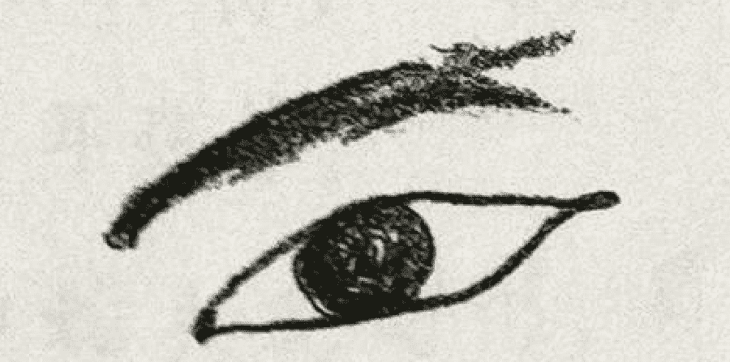

眉头圆，眉尾挑，与眼梯形是老大，如下图：

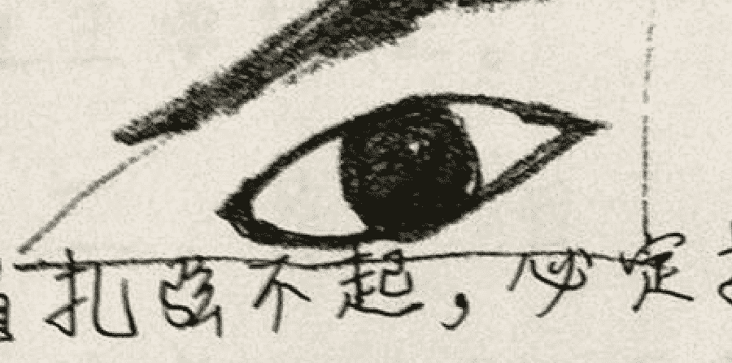

准垂眉扎起不起，必定排行占第一。
眉毛若有毫毛孔，此人必定是老大。如下图

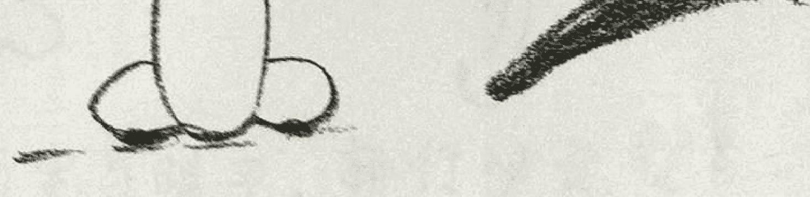

看君左眼虽然小，我却知君是长男。
金水一条线，有兄也难见。（指一字眉，必是老大）
额宽印堂宽，额方为老大。
天纹多不好，半截或短曲。
人纹却很好，地纹呈雁形。

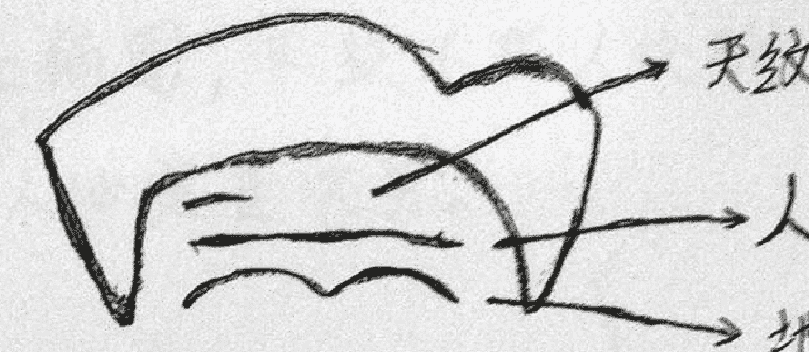

〔解析〕：兄弟姐妹排行，主要是眉毛和鼻头，其次参照额部，耳弦等。
老大眉头如蛇头或圆形，眉尾分叉或往上挑，额方，鼻大，准尖而齐，不露孔灶，耳弦不起，此为老大之主要特征。

### 二、老二相

〔真诀〕：鼻低翼窄如刀削，耳弦若起是老二，

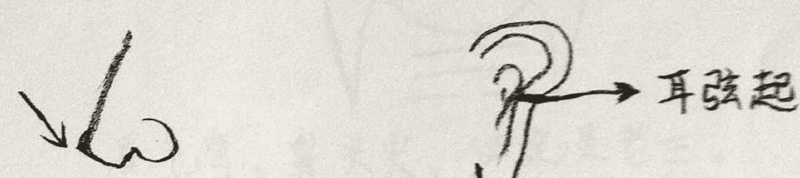

眉毛直宽与眼平，排行必定老二相。

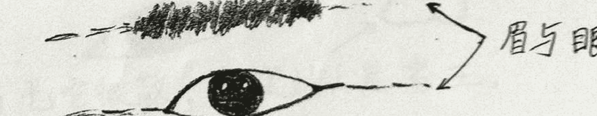

眉毛略直鼻准低，不是老二你是谁。

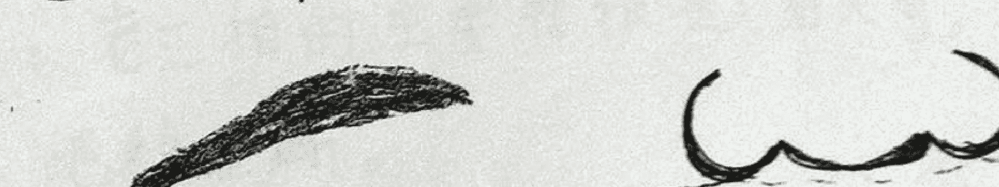

额部稍宽上稍圆，天纹不断人纹断。地纹稍曲略向上，此人必定是次男。

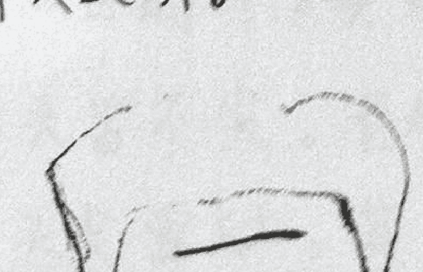

〔解析〕：老二眉毛平直宽，鼻准略低或状如刀削，额稍圆，人纹中断，耳弦若起，耳弦若起是老二之相的主要特征。

### 三、老三相

〔真诀〕：额为M形，地纹中断是老三。

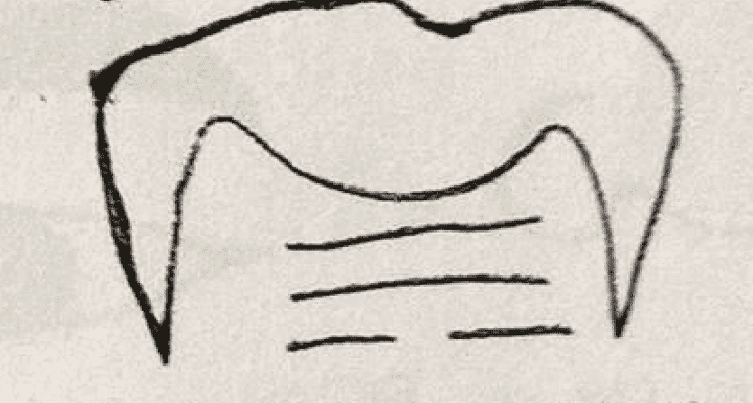

眉毛弯，鼻头尖，必定是老三。

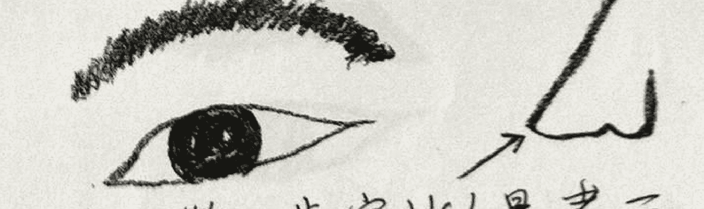

看上眉毛它很散，肯定此人是老三。
前凸后凸寿星头，知是此人排老三。

〔解析〕：老三相的主要特征是：眉头弯，鼻头尖，耳弦起来地纹中断。

老大老三皆鼻头尖，眉毛弯，何以区别？其实兄弟姐妹，凡单数鼻头皆尖，凡双数鼻头皆不尖。老大鼻头尖，准头垂肉，不露灶；老三鼻头尖露灶。其区别就在露灶不露灶。老大眉毛弯度小，老三眉毛弯度大。

### 四、老四相

〔真诀〕：眉尾上浮有小眉，形如蝌蚪是老四。

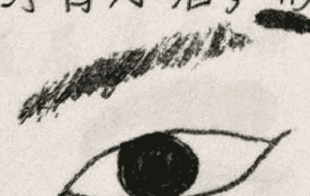

小眉如蝌蚪，或黑或淡，是老四

眉毛弯，两头尖，鼻准平，鼻孔大，老四没有差

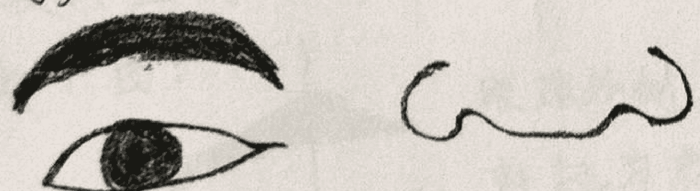

眉平眉尾拉，不是老四你是谁。

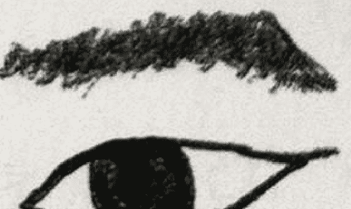

老四额窄额亦方，三才纹清晰都未断。

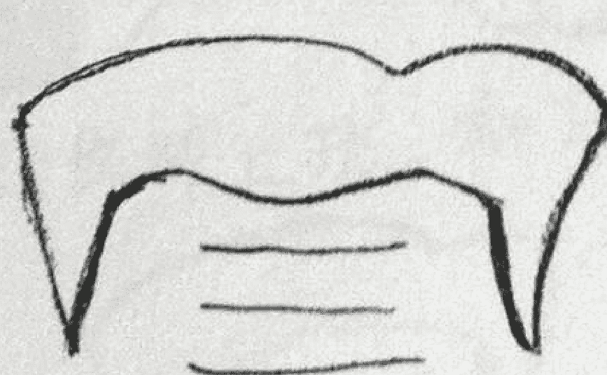

〔解析〕：老四眉平尾部弯，眉毛首尾略带尖，准头略窄鼻孔大，额纹三才生的全。有的眉尾有小眉形如蝌蚪是老四。
眉毛浓的部分可称为大眉，断兄弟姐妹多少眉尾另一层为小眉，有的浓，有的淡，可断排行是老

### 老五相

[真诀]：老五眉像蚕蛹，如下图：

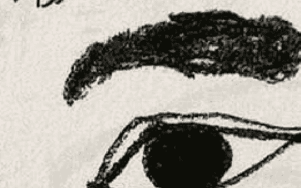

眼外上侧一鼓，此人必为老五。

如下图：

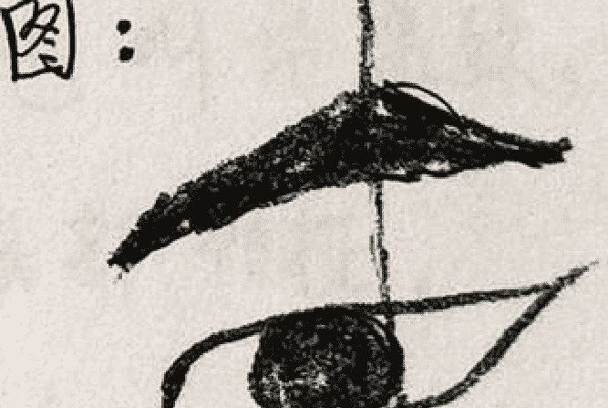

眼珠外侧上方鼓起为老五

小眉黑且长，排行为老五。

鼻头若发凸，必定是老五。如下图A、

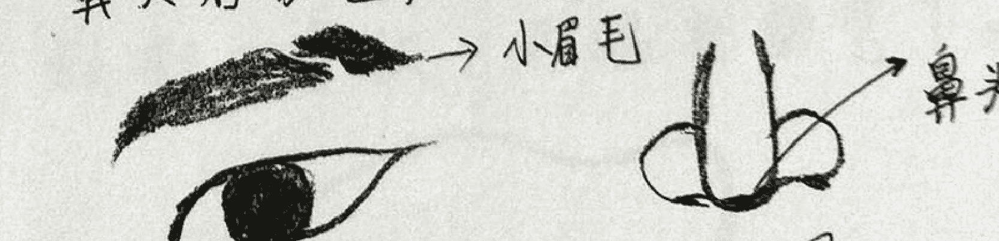

老五额纹都上挑，如下图：

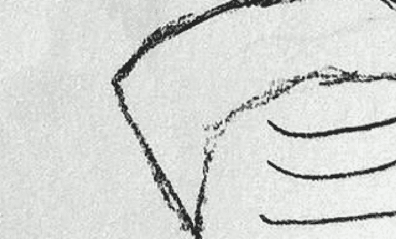

〔解析〕：以上为老五之主要特征。有上述各图之特征皆为老五。

### 六，老六相

[真诀]：小眉不超角，此人是老六。如下图

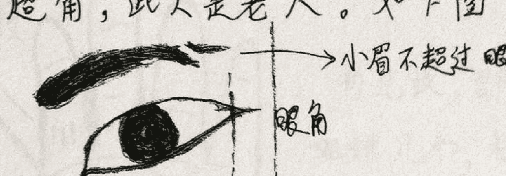

老六额部三才纹，上下左右有难纹。如下图

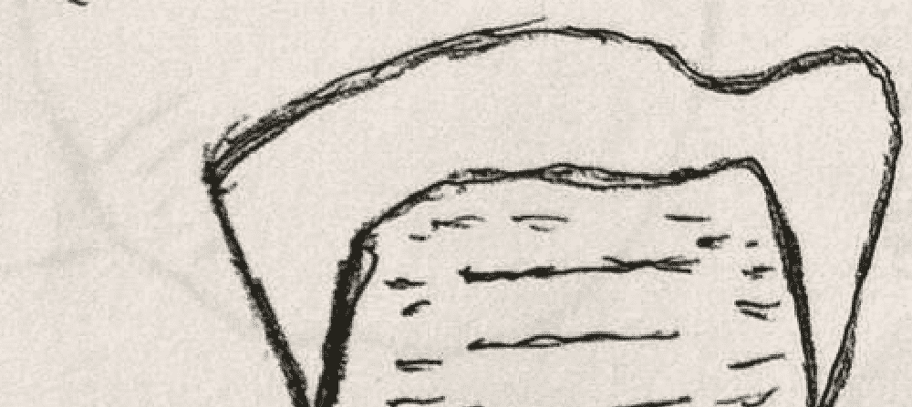

〔解析〕：难纹，也叫华盖纹，即短纹或曲纹坑点，为老六额部特征。

### 七，老七相

[真诀]：眉毛尾部弯度大，眉尾过角尾分叉。额部三才纹，两端都弯下。如下图：

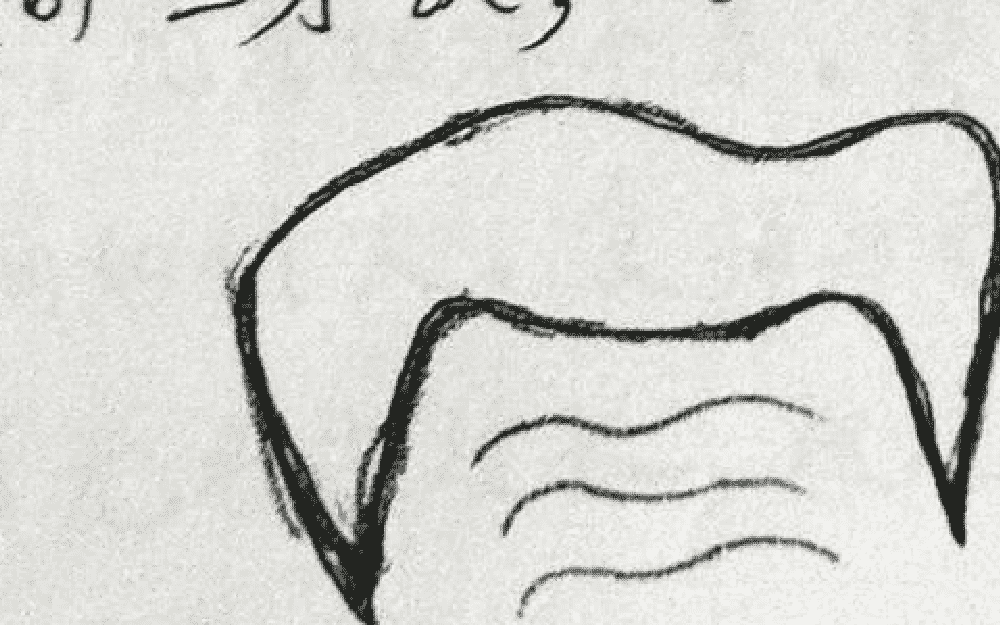

如今，国家实行计划生育，兄弟姐妹都不是很多。我们就举这些例子吧，多举也没有大用处。下面，我们再看几个手相的例子。

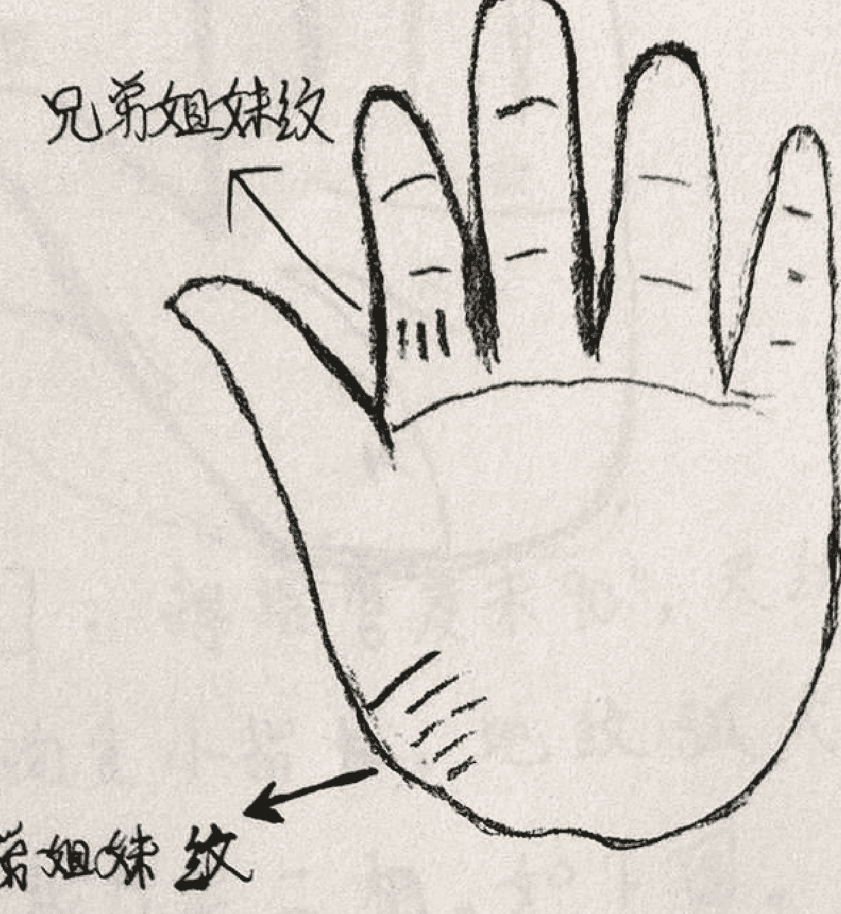

有几纹，即有兄弟姐妹几个，粗纹为男，细纹为女，浅或斜纹为天折的。上有十字线同论。

〔解析〕：手上兄弟姐妹数，食指看竖纹，从外往里数；粗纹为兄弟，细纹为姐妹。艮宫看竖纹，从下往上数排行，左手为兄弟，右手为姐妹。女性反看。
从手指上还可以看出兄弟姐妹关系：无名指与食指不相称，兄弟姐妹不亲。弯曲偏伤，兄弟姐妹有如仇人。食指与无名指相称，则兄弟姐妹和睦。若无名指过长，超过食指，则兄弟贪夺祖业，兄弟不和

[真诀]：拇指弯度达90°，天纹线长震纹清，中指直小指长，掌曲方甲长方形。此为手上老大相。

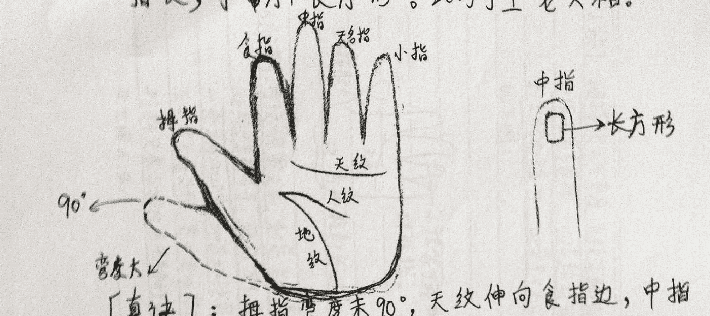

[真诀]：拇指弯度未90°，天纹伸向食指边，中指向食小指长，地纹弧大，拇指椭圆形。此为老二相。如下图。

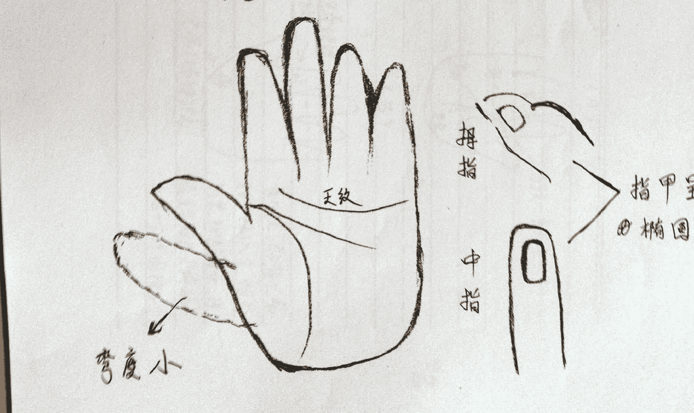

口诀：拇指肥大少弯度，天纹末端有分叉，中指无名多靠拢，小指起标或过半，乾宫肥大坎宫凹，此是手上老三相。如下图：

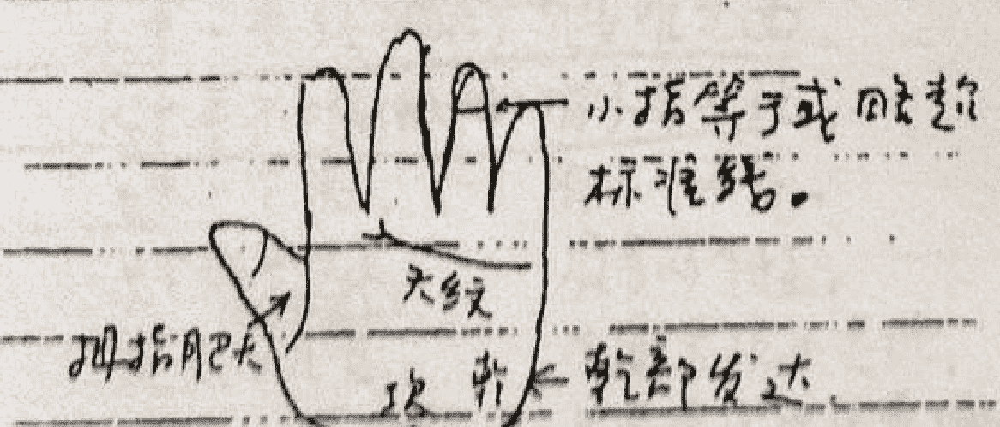

口诀：寿纹一条宽又长，如果是老大寿且康。此纹只是看左手，若看右手是若错。一条五线向坎宫，地纹地纹老三相。五指有三寿纹线，老三老四老五命。判断兄弟与排行，方法神妙须记熟。见下图A、B！

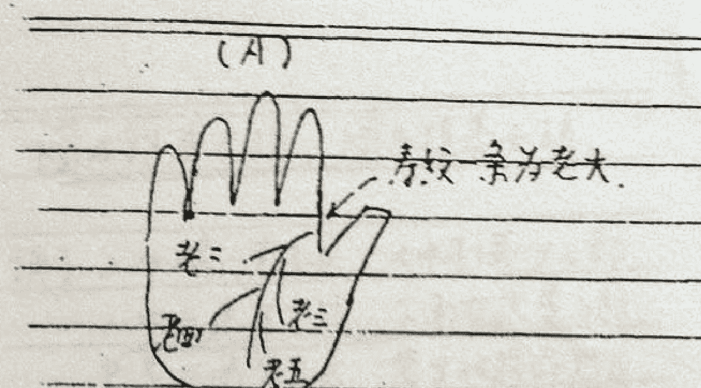

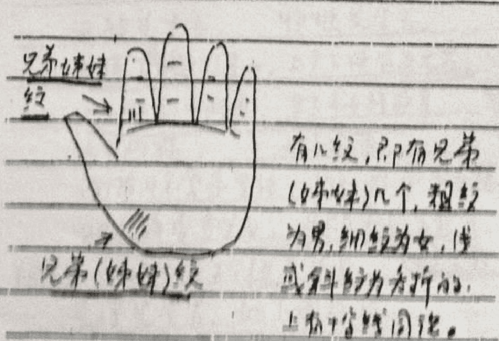

## 第四章 安徽相法秘传过三关

（诀）看子女，哪里找？人中里面看好了。
人中深又长，儿女站满堂。
人中一条线（指中细来像线），儿女难见面。
人中平不塌（指中成），有子非亲娃。
人中一个窝，有子也不多。
人中如豆大（指中很小），顶多两个娃。
先见女儿吉，先男后女不送终。
人中一横线，老来有子也孤单（指横纹已断去）。
人中从左至右纹，必抱他人之子；
人中从右至左纹，必抱他人之女。
人中一个包（指人中中间有凸起的肉块），只生女孩不生男。

〔解〕：人中有斜线，必养他人儿女。
如图A、B：

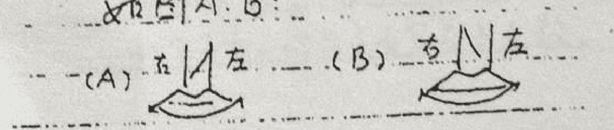

图A抱养男孩，图B抱养女孩。

〔诀〕：人中偏，克子女，人中平满少儿郎。
人中上宽生男孩，下面有痣是女郎。
若是中间生有痣，惠生双胎命恐伤。
女人面上黄，怀孕得平康。
人中若发紫，怀孕必生双。
无坡先生女，收坡先生男。
上狭下阔少生女，上广下狭有女无男。
上下狭而中间阔，生下子女残疾多。
人中凸露，无子命苦。
面黄怀男是男孩，面红如粉是女婴。
双眉尾重多生女，两眼尖长生贵男。

〔解〕：开坡下圆松弛先生女，收坡下尖紧涩先生男，如下图A、B：

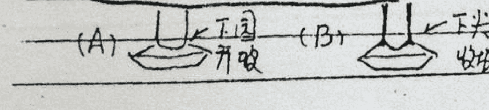

[诀]: 看罢人中看眼下，眼下本为子女宫。
横纹一条一子女，二条子女是一双。
男左男孩右女孩，女性反看要弄清。
眼下罗网纹，三水少子孙。
眼下竖纹重泪纹，无儿宜养义儿女。
眼下枯暗陷，肾弱无子息。
耳朵枯草色，身弱无子女。
见下图：

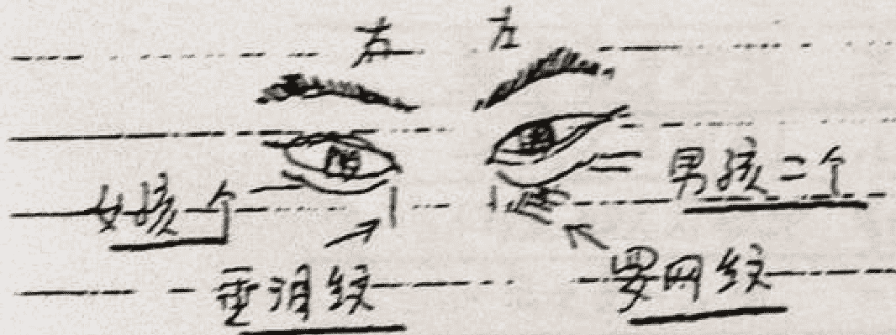

[解]: 子女宫在眼下，左为太阳、中阳、少阳；右为太阴、中阴、少阴。横纹为子女纹，一条纹一个子女，二条纹两个子女，此为子女宫看子女数。

[诀]: 命宫里面看子女，竖纹几条几子女；
中间竖纹不能算，男左女右要分清。
见下图：

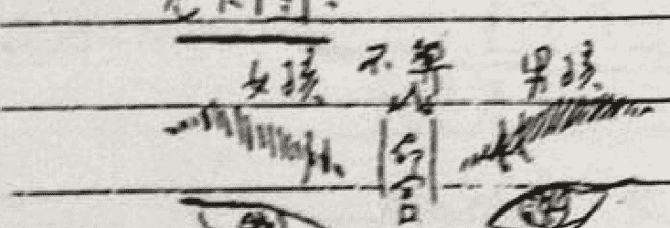

[诀]: 额纹上面看子女，从上往下数排行。
通过中心是男孩，未过中心是女儿。
见下图：

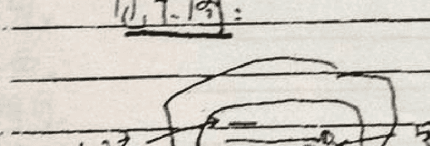

[诀]: 嘴唇上面看子女，入口竖纹才算数。
见下图：

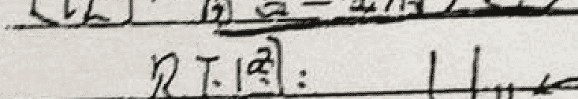

【诀】：年上直纹养子纹，必养他人之子孙。
妇人睛赤见子刑夫，男子睛黄刑妻克子。
卧蚕血润主妻生子，鱼尾色青克子在妻。

人中上窄下宽，子结有二三。
人中浅又小，子孙迟又少。
人中若破烂，子女多养生。

狮子鼻：山根年寿略低平，准上丰大称兰廷
若生狮子鼻，子生三四个。
卧蚕旺丰满，子生五六个。

颧高紧贴眼尾，必无子的后代。
女人眼周黑，无子只生女。
男人眼周红，色子厄运将来临。

鼻歪常遭挫折，亲生子女不亲切。
头线不正刑妻子，小便不正挂东西。
倘若妇人若如此，乳房大小不相同。
一方大来一方有，一方小来无踪影。

（本人）头大耳朵小，有爹管不了。
印堂打一斜，一子顶半娃（指好不成器或不孝）。
（本人）鼻子歪不塌，小娃是受气包。

人中有竖纹，不养小孩认干亲（指认干儿）。
人中若太窄，到死男孩缺。
人中平无肉，女孩多无男孩。
人中向左歪好色，人中右歪好吃喝。

眼尾纹向上是儿，向下是女儿。
几纹几子女，眉头竖纹亦可看。

见下图：

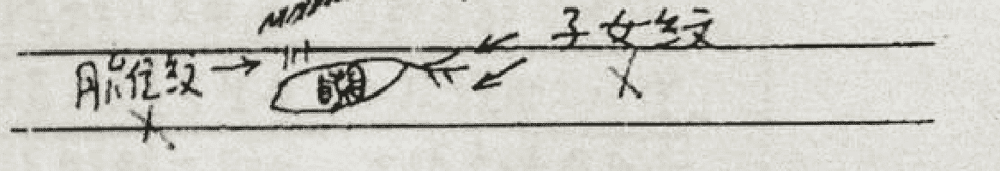

【诀】：子女多少排行几，具体部位看手相。
小指根部婚姻线，上面竖纹子息纹。
端正清晰为成人，歪曲细斜残大者。
纹中粗纹表男孩，细长之纹为女儿。
几条竖纹几子女，从外往里数排行。
小指三节子息纹，从外往里竖纹真。
还有震部看子息，横纹几条几子女。
粗纹为男细为女，断纹多纹天折的。
见下图：

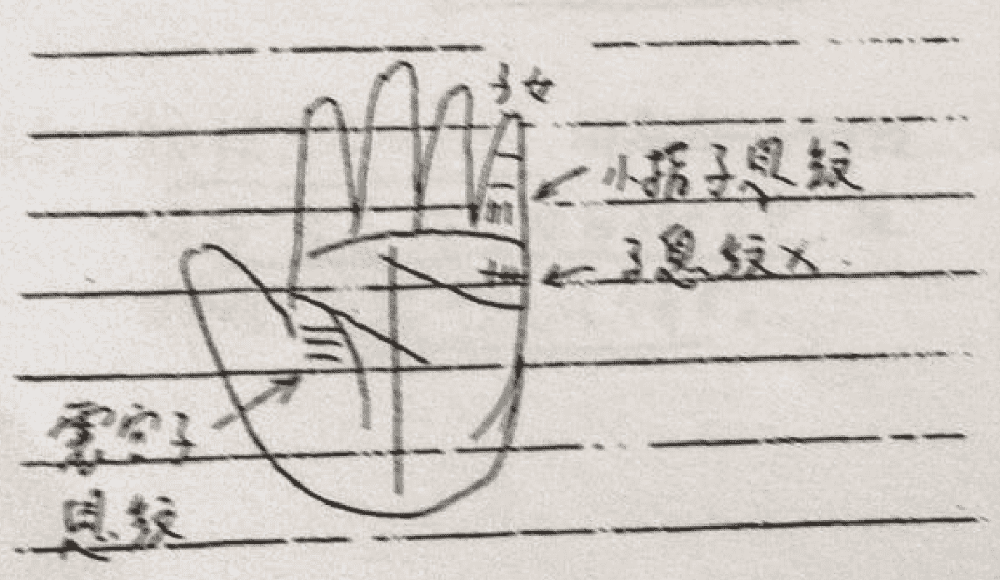

【解】：手上以看婚姻线上竖纹为主，
无竖纹无子或暂无子，有Y纹为
双胞胎，长粗者为男孩，细者为
女孩，一轻一重为龙凤胎。子女纹
斜者为假子，很准。
小指流产了

【诀】：小指端正长又长，子有出息老有靠，
小指短小又歪曲，子息无能老无依。
小指太短多生女，小指短曲亦同理。
小指特短不能生，生殖系统有疾病。
小指无名不靠儿，子太弱到外地。
小指向无名指，长大仍靠父母家。
小指长者多子女，计划生育不能忘。

腕线深明胎位成，头胎生子纹于，
三纹深长寿命长，腕纹空处不生症，
见下图A、B：

### (A)

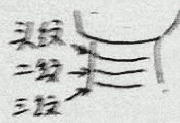

头纹是生产顺利，
二纹是有男孩，有财；
三纹是寿命长，八十以上。

### (B)

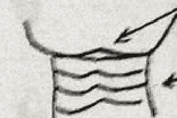

此部位陷少子女
腕纹是弯形，弯向锋
女性定患不孕症

〔解〕：腕纹只有一道纹，旧名为“玉创纹”，
实为“手铐纹”，有牢狱之灾，但
能化解，可戴手表化解之。

## 第五章、安徽相法断六亲

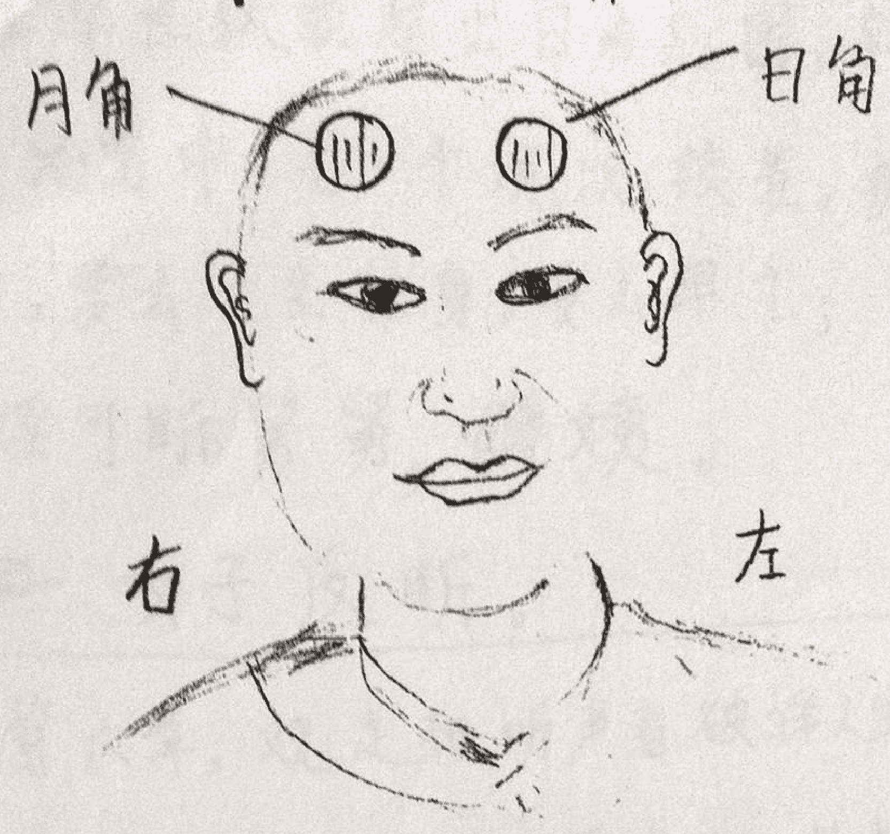

> [真诀]：
叔叔大爷姑舅姨，日月角上看仔细
内亲都在日角看，姥姥门的月角真
纹理粗细定男女，破乱短浅没成人
若有一纹独树起，不是早亡就孤身。

[解析]：日角处竖的纹理是父亲的兄弟姐妹。粗的长的是男性，代表叔叔，大爷；浅的短的是姑姑，几条纹路就是兄弟姐妹几人。断裂的，分叉的，或被细小横纹冲断的，表示没能成人。有一条特殊符号，即若有

一条明显深长纹线越出日角范围，就说明在父亲的兄弟中，有一个境况较差，多灾多难孤苦无助，要么一生独身，要么早亡；月角同理可断舅舅，姨。

女子反断。

## 第六章，观走相听声音破译人生密码

面相手相大家都不陌生，而声相，坐相，走相，站相多不为重视，走路轻飘飘，站不能如松，坐不能如钟，处事不稳，为人虚伪，声音方面，或男相女音，或女相男声，说话嘶哑，破裂，预示着健康方面的欠缺。

走相很重要，是相法的第一环节，看相是由远即近地进行的，看到来人的第一眼就是走相。

一般以轻飘摆晃为忌，如风摆杨柳定是浅薄无根基，坎坷飘荡。

走路摇摆不定的人，兄弟姐妹众多，最少有三个。自己排行大多数占老二。

走路比较急的人，站如一棵松，走路一阵风，大多数排行占老大。

走路探头索脑，头向前伸，或者有点驼背的，占老三。

鹅行鸭步，为人极富。鹅形之人身体略晃，但脚下有根，有些类似武术中的闪，展，腾，挪。这种人心思缜密，危而不险。

鹅行之人身体略晃，但脚下有根。

轻无声、声如鼓两种走相促而苦。观察一下猛兽的步伐就知道了。

贵人脚步轻，只能从步态来看。血型决定着一切，血型在身体的特定部位有标志。

一声步重如奔马。头先过步，先富后穷。这个相在现实中每有应验。头先，能察先机，见事在先，但行动端后。年轻时还好，所以能抓住机会，先富乐。上了年纪，眼看着好事在前，腿脚

却赶不上，一着急，摔了跟头。
结果之前积攒的钱花在医药费用上了，穷了。
凡相形，须行十步，即唤回头。须看左转，必有
官职。右转无官职，又无衣食。
动作龟行，必主聪明。动作鹿行，马行，必主辛苦。
行不低昂，富贵之相。行步两踵相，衣食早衰。
其实亲生父子，母女之间，即便相貌有着很大的
差异，两者之间走相、声音都会有很大程度的
共同点，不相识的人一眼就可以看出相同相似。

下面我们开始讲五音断法：

声音相人的相法，也就是五音相人法。五音是，
宫、商、角、徵、羽。宫为土，商为金，角为木，
徵为火，羽为水。

声音的五行特征是：“金声和润木声高，水声圆急
火声焦，土声如居深瓮里，韵出丹田富贵饶。”

声音相人有一个重要的五声诀：金声意韵深长
响亮处可听到，金声圆润者贵，如果声破则主贫贱
火声清烈，声调和畅不阻，火声圆润缓慢为富贵
如果声音急逼，则贫贱。

木声韵律条达，初音全，而后涣散。木音沉重为贵，如果轻浮则贫贱。

水声韵清，声音细小而洪亮，音促且长，水细微为富贵，如果轻浮则贫贱。

- [木韵]：起韵直，落韵短。
- [火韵]：起韵尖高，落韵破。
- [土韵]：起韵闷憨，落韵纯平。
- [金韵]：起韵响亮，落韵悠扬。
- [水韵]：起韵低漫，落运长低。

声有善恶之分，音有吉凶之别。

正音为：木声远突鸣亮，火声焦散，土声深沉，金远妙，水声清净。

破音为：木声焦破，火声飘远，土声响亮，金声破败，水声微焦涩。

五音相人，察听声音必须结合五行理论来分析，听到的五音是相生则吉，相克则凶。

声小亮高，贫富之极；语声细嫩，必主贫寒，兼须危困。女人雄声，终身不荣；良人早须，虚有夫；男子雌声，妨妇多儿；女声急切，妨夫一绝。

## 第七章，安徽相法必传断来意

何知君子多灾迍，春夏额上带昏昏。何知君子百事昌，准头印上有黄光。
何知人家渐渐荣，颧如朱色眼如星。何知人家渐渐贫，面如水洗耳生尘。
何知白衣换绿袍，天仓丰满福堂高。何知为官不食禄，坐时伸起颈头缩。
何知人家不生儿，三阳暗发如黑煤。何知人家怪常来，朦朦黑色遶唇腮。
何知兄弟成双吉，山根高耸眉如一。何知兄弟成双凶，山根断折眉不丰。
何知人家鬼打屋，天庭数点黑如粟。何知其人不及第，眼中赤脉如丝曳。
何知人主早发解，福堂丰满精神快。何知人家频换妻，眉头带杀下位欹。
何知人家妻妾淫，奸门暗黑眉如金。何知人生不聚财，但看法令破兰台。
何知人家被火伤，眉头数点赤脉长。何知人家弟杀兄，山根常黑不分明。
何知人家常被贼，但看双岳如烟黑。何知生女不生儿，眉间但看两头垂。
何知小儿常被惊，山根年寿色常青。何知人家妻受邪，奸门黑漆不光华。
何知人家儿受灾，三阳暗色如烟煤。何知人家竹林旺，山根气色遶周黄。
何知人家贮积财，甲匮紫色常堆堆。何知为官多灾难，坐时眉攒口常叹。
何知为官一举超，未发言词语含笑。何知突睛杀人恶，但看当门两齿落。
何知人家杀头妻，必是山根年寿低。何知人家杀头夫，左颈肥大右颈枯。
何知官员克举主，鼻曲印破多纹缕。何知僧道有高名，必是古貌与神清。
何知人家孝服生，眼下丧门白粉痕。何知寿年九十六，天庭高耸精神足。
何知寿年八十二，两边法令低垂是。何知其人四十五，看他面皮如绷鼓。
何知人家有贵人，水土二星肥且明。何知爱弓与刀枪，面上露睛赤脉长。
何知妻子两度换，眉毛下垂且入眼。何知肚中有文章，但看牙细口唇方。
何知其人命不长，看他声音女人样。何知其人多杀人，眼内赤脉贯睛是。
何知两度再嫁人，女人声作丈夫音。何知富贵又昌隆，头圆鼻直而面方。
何知人家常病苦，年寿金木生黑子。何知父母早不全，但看黄毛额角旋。
何知九十寿且随，其翁晚景下显肥。何知其人定生财，看看五岳分明来。
何知其人无兄弟，眉短眉交皆不利。何知破家不整齐，面皮光滑薄如纸。
何知其人常作寇，月孛鼻头尖且小。何知为官不超升，坐时神暗眉常蹙。
何知一世不生儿，三阳陷了色如脂。何知人家被劫夺，两眉起纹生过目。
何知人生服毒药，土上损破黑子恶。何知人生卒暴死，唇青年上生黑子。
何知人生命带凶，长脚蜂腰总一同。何知其人心偏曲，豹牙缺齿黄面目。
何知其人主饿死，纵纹入口乃如此。何知其人主水厄，看他眉间双黑子。
何知父母早不全，其人上唇若天 。 何知女人定克夫，眼大眉高颧骨粗。
何知破败且伶仃，看他两脚如杖形。何知其人主大殃，耳焦眼赤祸难当。
何知男子定孤刑，项喉恰似鹭鸶形。何知兄弟各相抛，眉毛戚起常相交。
何知幼小灾厄故，但看鼻头井灶露。何知破祖又离乡，三尖三露为之殃。
何知女人定抛夫，额角入鬓更何如。何知作事伦序无，看他眉睫长而疏。
何知父母兄弟异，耳眼大小高低是。何知刑克事招嫌，口下生髭直到颧。
何知末年主多灾，但看其人无下显。何知女人是婆姨，看他一双好蛮蹄。
何知刑妻并克子，鱼尾偏枯颧骨露。何知破祖闲事侵，额尖头尖项后深。
何知官贵显文章，眉秀目清好印堂。何知人妻产孕易，阴阳位上安儿女。
何知临产阎王觅，看他眼下气色赤。何知人主他乡死，看他眉上生纵理。
何知狱厄有灾迍，但看眉间有斜纹。一纹一度入狱内，二纹二度入牢危。
何知其人两三婚，但看奸门有多纹。一纹必定克一妻，二纹两度重婚娶。
何知不久克妻儿，但看气色白生眉。若看眼下白色起，右克妻兮左克子。
何知其人克父娘，但看眉粗又更黄。何知妻子值千金，但看眼下泪堂深。
何知破祖克妻子，面似桃花眼如水。何知女儿孤且淫，听他一片鸡公声。
何知末年败郎当，看他决定无承浆。何知主有美貌妻，看他两眼长而细。
何知病患来不饶，看他眼下黑而焦。何知不读书与经，看他恰似青蝇声。
何知人常招口舌，看他面形多火色。何知其人损头妻，面皮光滑粉如脂。
何知一生衣禄荣，印堂宽正且无纹。何知平生多破财，土孛仓库皆陷害。
何知处世多丰荣，其人天庭有福星。何知其人主路死，满面白色恰如泥。

## 第八章 安徽相法断财运

[诀] 看财运，哪里找？ 财帛宫里看好了。
鼻头丰又正， 财运必定旺。
鼻头偏又斜， 贫穷受煎熬。
准头圆又亮， 进财源人丁。
准头兰台红， 破财走西东。
左库若破陷， 财物多耗散。
右库若低陷， 横财走无踪。
鼻直如截筒， 衣食必丰盈。
鼻歪准头大， 必为外衣食。
鼻直贯天庭， 四海扬名声。

X 看财运有歌诀， 但看主妻方。
逢已终富贵， 逢亥必贫穷。
鼻曲定孤独， 鼻尖定贫穷。
鼻露表外乡， 鼻尖定贫穷。
鼻孔肥大有福， 山根连额主繁荣。

天仓地库立兰台，眉清目秀栋梁材。
举动端庄身又稳，知君富贵豪华人。
声若洪钟眼如鹰，忠心报国姓名扬。
龙眉虎眉眼有神，知君不是等闲人。
五官就有三官强，一生交运大不同。
鹤行鸭步背屏风，精神磊落家肥。
眼昏嘴撮带忧容，鼻露声干必贫穷。
发如乱麻忌破家，口角双垂必伤财。
面细身粗穷而孤，愁眉印破日日难。
鼻梁偏左爱赌博，耳小悬荡无财帛。

眼尾朝天，福禄绵全。
唇红色光，不求自丰。
六府饱满，财丁兴旺。

[解]：有无财运看鼻子，鼻为财帛宫。鼻端直贯印堂，准头丰隆，兰台廷尉对称相应，定然一生财运亨通。鼻短而露骨，准头尖小，孔仰，眉粗眼小，定然一生贫困潦倒。
山根至发际，能容五指，18-28岁，就能开始发财。
眉毛太浓或太淡，31-34岁要破财。眉毛向下侵眼皮，准头尖小，压中年运，41-50岁要破财。
两颧低陷，46-47岁要破财。
嘴唇单薄偏斜，人中平满，法令纹短浅，51-60岁要破财。
地阁尖薄无腮骨，61-70岁要破财。

哪年进财，哪年破财，要结合流年部位形色参看（见十一流年部位图）。部位丰满光彩为佳，缺陷暗晦不美。

鼻子歪曲收入不稳定，鼻子向左歪，老年穷的说不来；鼻子向右歪，必定散妻财。鼻子左右歪，即使有好多收入，也会立刻化为乌有，收支变化大。

鼻子圆的人，无忧无虑，是个小富翁。如“蒜头鼻”，一生金钱运很好，不重视外表，是个实用主义者。

没有鼻翼的人，缺乏金钱运。即便有一点收入，也会很快花掉。此种人适合工薪阶层，切勿抱有野心。诀曰：“福弱带妻福运”，福弱而鼻翼柔软膨胀为“福鼻”，福鼻者拥有工地房产，金钱运亦佳。如果左右鼻翼一大一小，一高一低，没有金钱运，多数出生时难产。

上述口诀与解说详见下图：

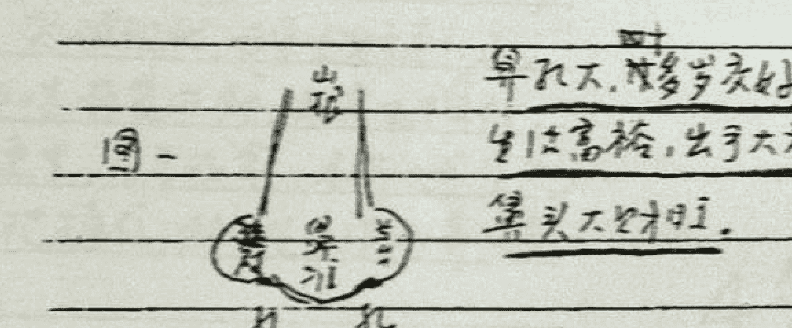

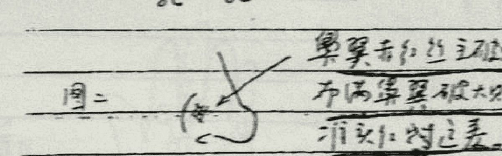

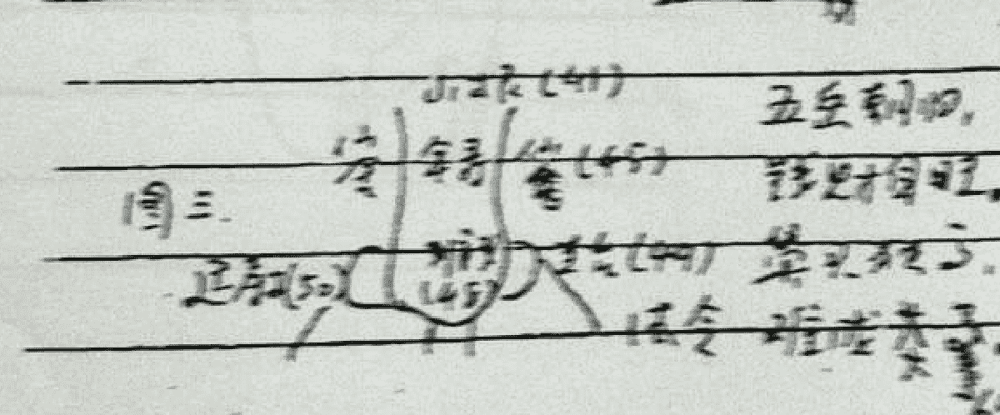

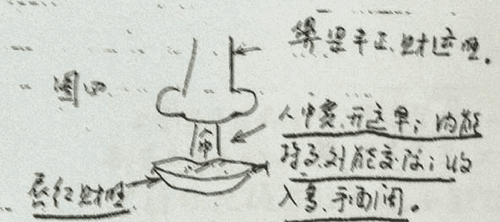

鼻梁平正，财运通。
人中长，开运早；内脏
好，对能安位；以
入多，手面闲。

[诀]：相面不相手，未经典传授。
手分八卦十二宫，万事都在一掌中。
男子看八卦，女子看九宫。
三条大线深又长，一生命运大不同。
你要交上三步运，一步可以上天堂。
如下图：

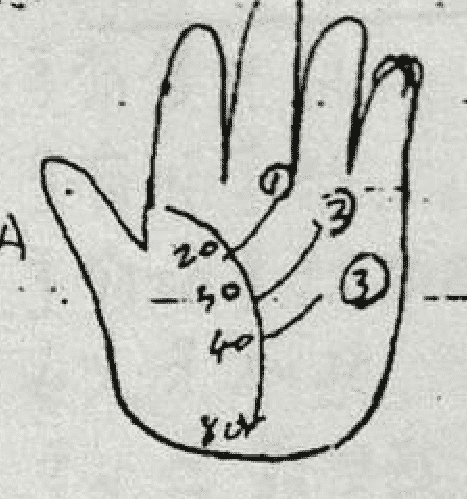

[解]：上图五为生命线（地纹）三步运势图。如图所示，这线向上皆吉，宜把握住。如有横线冲破不去，这线向下不去，易破财或财来也受阻。第一步这25岁，努力不懈可成就，第二步这32岁，突破现状，升官发财走好运。第三步40岁有贵人助，或家有祖助，或自力更生，白手成家，亦可一步登天。如不能把握住，则一生平淡无奇，碌碌一生。

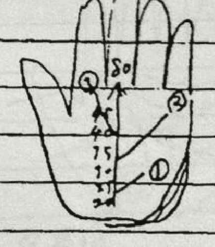

上图五B为命运线三步运图。人生都有三步运的机遇，只是迟早、大小、把握住把握不住而已。如能把握住，做生意、炒股等，就可能一步登天，成为大财东。第一步25岁左右，奋发向上，可获大财。第二步32岁左右，努力不懈，升官发财。第三步40多岁，有贵人相助，或自力更生，也可平步青云。

> 【诀】：倘若指露掌心平，定是不聚钱财人。
手有金井纹，必为有钱人。
手有川字纹，大可大发展。
手有切子纹（即断掌纹）是有财运真；
女人若如此，必为派头人。
手心厚兼白纹，手背厚靠祖光。
掌背掌心厚，家财定丰足。

明堂如喷血，定主财帛丰。
八卦明如紫，定是大财主。
掌上三奇纹黄，对镜喜来红。
掌指光润色鲜明，这好又名成。
又掌上八字纹，办了不求人。
男子手掌纹佛佛，一生不缺财和钱；
女子手掌如手掌，一年四季能发财。
见下图六AB：

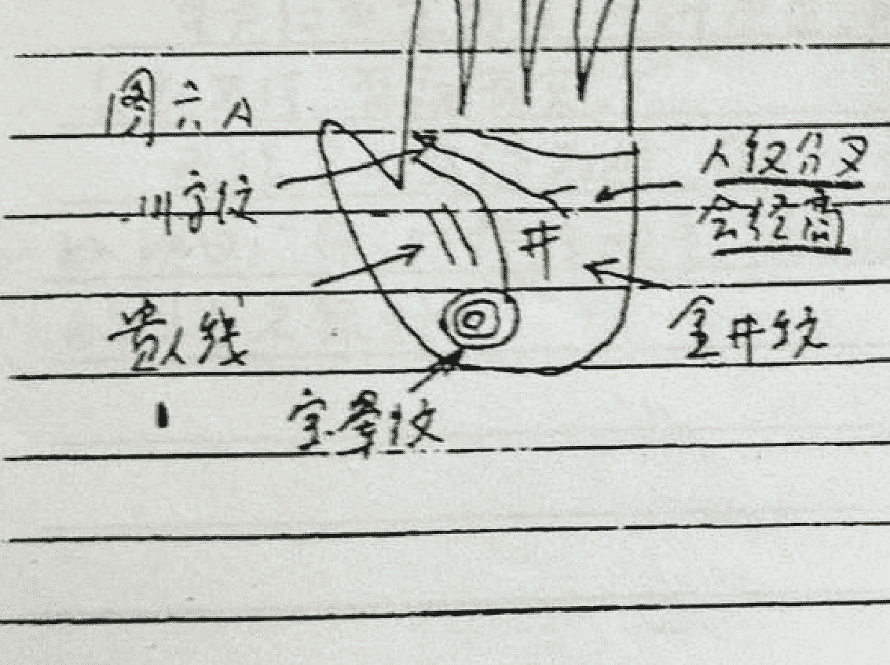

### 图六 B:

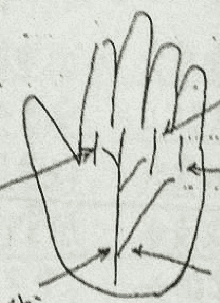

成功线
(太阳线)
财星线
希望线
命运线
命运线有5线
向成功线 27星
线有大的成功

[解]：手中有字皆好，如“井”字纹，五眼纹大财主，如“女”字纹，可养女性发财，或得女财。
“川”字纹，即天纹、人纹、地纹不连，此纹有大的成功，也易有大的失败，宜防失败。有此纹者，有独到见解，婚姻多不顺，离婚的多。
——切手纹（断掌纹），男主直才，女子可成就学业，商人可发财，女人多守寡，困执。
手心厚财产自创，手背厚祖上有遗产。
有“宝器纹”，有财能存住，财运好。
竖纹为佳，如命运线，希望线，成功线，财星纹等，以及向上的纹线也好。横纹不佳，如灾厄纹等，直黑痣，黑点也不好。
气色红黄紫为佳，进财进益，暗陷纹色不佳，有病有灾。
五指宜不露缝为好，存财，否则如诀曰：“有一双挣钱的手，没有存钱的斗”，不聚财。

## 第九章：安徽相法断婚姻

[诀]：看婚姻哪里找？夫妻座上看好了。
山根左右夫妻座，山根不断夫妻和。
山根平满气色好，夫妻快乐翁姑笑。
山根折断印堂低，女克丈夫男克妻。
男的要克二三个，女的要穿两家衣。
山根最怕起横纹，刑妻克子有隔角。
山根低陷也相同，纹痕克破生死别。

男人山根左边痣，定是邪心勾人妇；
男人山根右边痣，别家妇女来勾魂。
女人山根左边痣，孤身须防被奸淫；
女人山根右边痣，闺室之中藏奸夫。
鼻头一痣主虽小，准头艳闻败名声。

鼻梁丰起山根齐，此人必定得贤妻。
鼻梁丰起山根通，此人必得如意郎。

鼻如截筒直又丰，美满夫妻旺家庭。
鼻子无梁性欲旺，伤克对方见阎王。

[解]：山根两边为夫妻座，位在鼻子顶端，两眼之间。男子右边为妻座，也为母座；女子左边为夫座，也为父座。山根左右不宜有痣，纹痕克破。鼻上横纹克夫妻，纵纹克子女。山根折断低陷有悬针纹克六亲。上克父母，中克夫妻，兄弟，下克子女。

见下图：

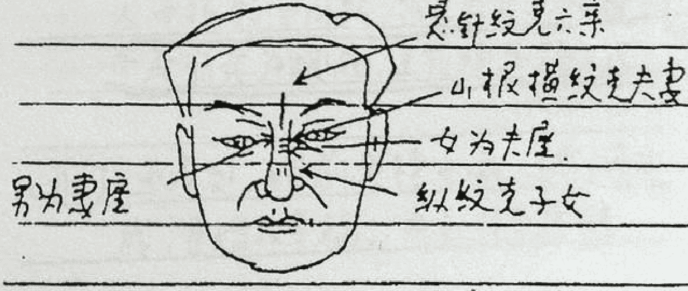

> [诀]: 看罢山根看鱼尾，鱼尾本是夫妻宫。
鱼尾深陷且下弯，结婚较迟且不顺。
鱼尾纹多克配偶，几度婚事几度愁。
鱼尾几纹几次婚，纹向眼里才尊数。
上为情人或外遇，下面才是再婚数。
见下图：

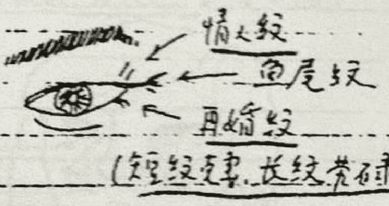

> [解]: 鱼尾为夫妻宫，古称妻妾宫，男以左边主己，右边主妻，女性反看。左边丰满，对妻真情；若缺陷有纹痕，不免离婚，或拈花惹草。若右边丰满，其妻必贤；若纹痕冲破或缺陷，则妻为淫荡之妇。

> [诀]: 鱼尾奸门气色恶，定知夫妻夜不和。
最忌十字妻自缢，眼目发黄有和情。
倘若眼角纹穿过，配偶一定与人通。
更有耳鼓弦上痕，中年犯奸宜早防。
上眼皮厚且肿胀，性欲冲天乱人伦。
鱼尾叉字纹出现，皆主男女再婚相。
奸门黄红紫气色，夫妻恩爱情意浓。
奸门鱼尾皆明润，少男少女婚可成。
鱼尾奸门暗且暗，到老无妻老恨汉。
悬针破印刑妻子，眼内发青丈夫死。
眼下有纹冲双颧，家庭不和心病连。
夫妻座有黑线连，必有不正关系现。
人中横纹也同断，皆主夫妻不和看。
鱼尾有痣为桃花，主有艳遇福不浅。

> [解]: 鱼尾处，婚前色艳如花，婚姻可成，且婚后幸福。反之，气色昏暗，婚姻难成，是成后不和，或双方另有外遇。

额纹中人纹不清晰，表婚姻不是早年错过，就是晚婚，或婚后分居或离婚。

破颧纹主家庭不和。左破颧，子女不听话，叔伯不满；右破颧，兄弟不睦，夫妻不和，自己易患高血压、心脏病。有黑痣有艳遇。见下图：

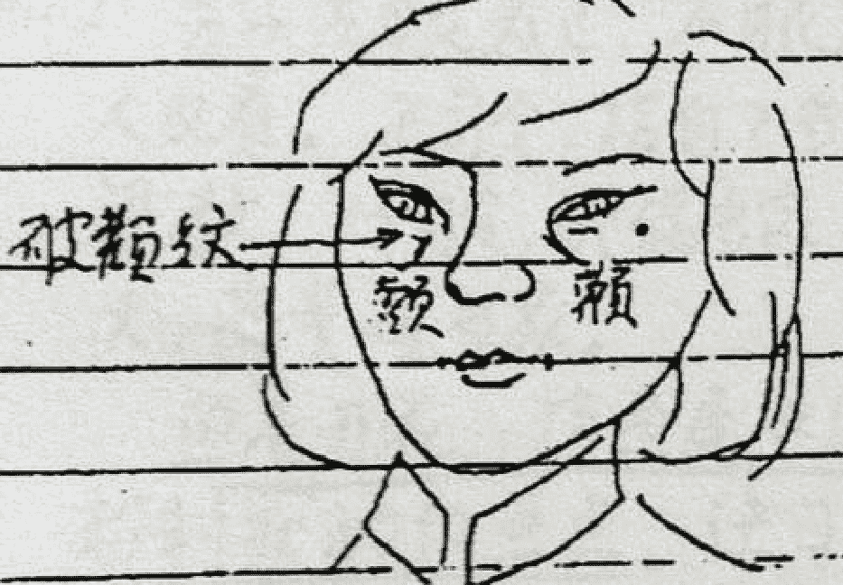

破颧纹

颧

颧

〔诀〕旺夫之相背厚圆，克夫之相颧与鼻。准小梁低嫁必破败，肉白滑软一生贱。山根痣暗延两边，必与异性有通奸。

男子左眼大是正司令，右眼大是付司令；女子左眼大是付司令，右眼大是正司令。

男子左嘴角下垂，难有好友或好妻；若是右嘴角下垂，难有好爱情。女子左嘴角下垂，内心多存坏恨；若是右嘴角下垂，易交狼心坏朋友。

男子颧骨高，必定成英豪；女子颧骨高，杀夫不用刀。女子颧露骨，必定嫁三夫。颧心倾天，祖上不显，女的克夫，男子孤单。

眉头有痣主富贵，男以左主女右主，
女主克夫克六亲，婚前必定失过身。
鱼尾开花最不宜，恩爱夫妻两分离。
男的要娶几家女，女的要穿几家衣，
妇人眼下常无肉，不杀三夫杀二夫。
见人掩口笑不断，爱随异性夜私奔。
妇女额上三横纹，妨夫害子贫大人。

〔解〕：男子左眼为己，右眼为爱人，女人反看。正司令，指自己当家，说话算数；付司令，配偶当家。两眼一样大，商量两当家。
鱼尾开花，指鱼尾生出许多象粉刺状的红点点。诀曰：鱼尾开花，夫妻俩仨。

〔诀〕：若问婚方哪里去？相冲相克不相宜。
水命勿南火勿西，金命勿东土勿北。
木命不宜本村的，相生比和最为宜。

若问婚姻哪方好？月建起日日为上，
落在何方定方位，子午卯酉为四正，
寅申巳亥为四隅，辰戌丑未中宫记。

〔解〕：如，一水命人，生于二月十四日。二月建卯，从卯上起初一，初二辰，十四落在辰上，辰为东南，即婚方为东南西北方向。婚后和和美美，白头偕老。见下图：

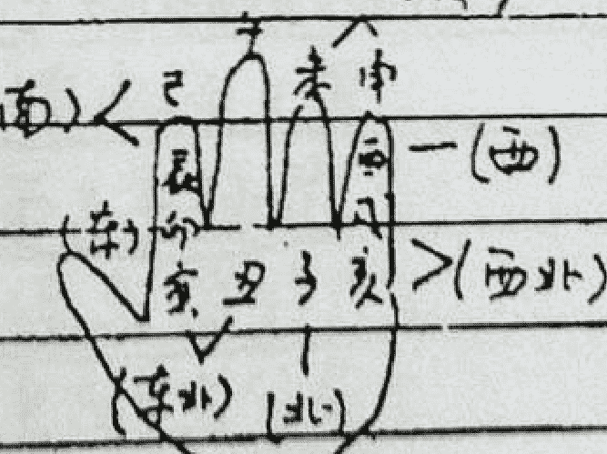

同法，落在“丑、午、辰、酉”为婚姻不顺。如上例落在辰上，即婚不顺。

〔诀〕：看罢面相看手相，手相主看婚姻线，
婚姻线宜深长，细小线无感情。
命运生命感情线，亦看婚姻与恋情。
一条婚线到白头，二条等线二次婚，
三条以上情人多，上弯下弯易分离，
分叉离婚十字已，断续离而又复婚。
波浪夫妻常口舌，岛形反目或分居。
绳状婚姻多美满，箭头婚恋有曲情。
小指根部至天纹，结婚流年50整。
中分25男女差，从下往上早晚婚。
如下图：……

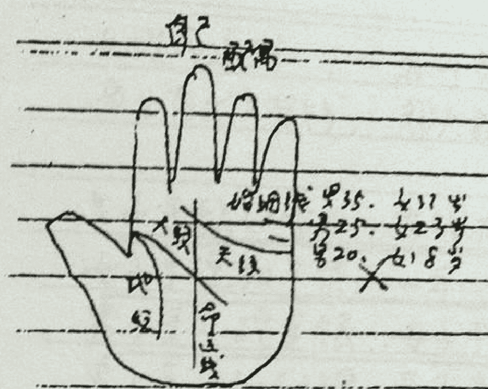

- ～ 上弯婚姻艰难；
- ～ 下弯生离死别；
- + 十字突然死去；
- × 易又离婚之兆；
- 〈 婚姻有阻；
- ～ 断续离而又复；
- → 有第三者插足；
- 〈突断〉 二 再婚或婚外恋；
- ～ 夫妻反目或分居；
- ∞∞∞∞ 绳状婚姻美满；
- ～～～ 波浪夫妻常口舌；

- 与财星连女嫁富翁；
- 男娶名门之秀。
- 若冲破财星面临破产；
- 星纹因结婚得到财产；
- 上下多点，性欲过度或骗婚；
- 扫帚状多失恋；
- 恋爱婚姻皆有曲折。

〔诀〕：中指为自己，无名指为配偶。
两指正正无逢，夫妻和谐都能干。
两指弯曲向对方，互得好处有感情。
一指弯曲向对方，要靠对方聪明。
两指靠不拢，分居或去远方。
上为外下为家，仔细观看自然明。

天纹地纹命运线，向上分支婚恋成。
向下分支难成功，具体情况流年定。

女性命运线，名利帮夫线。
事业有成又有钱，帮夫教子婚圆满。

男子手软如喷血，有钱有位不用说。
女子手硬如干柴，一年四季能发财。
男子手大挖金银，女子手大挖铺尘。
男子手尖如似锥，声名远震四方飞。
女子手尖如似锥，心灵手巧爱文艺。
此是男女婚姻诀，手面结合准无疑。

## 第十章：安徽相法断官运

【诀】：男子相面看五官，女子相面看流年。
又看天庭，论地阁，天庭地阁分文武。
天庭饱满吃官饭，地阁方圆掌大权。
头圆眼大双眉浓，伏犀骨插天庭中。
天庭饱满如立壁，两耳贴肉高鼻上。
山根直上印堂起，口要方正如朱红。
更看眉毛指天仓，眉清目秀最为良。
口角向上法令长，颧骨丰满五岳容。
鼻直口方无偏斜，国字面相有官运。
见图一

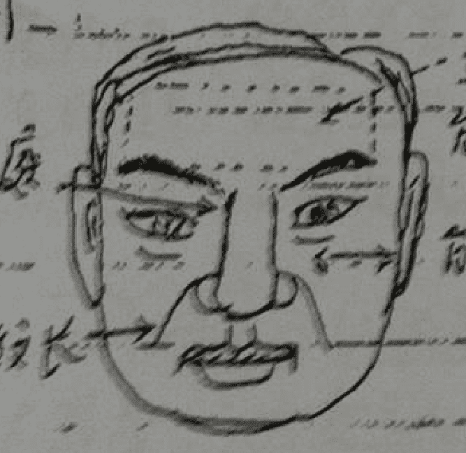

【解释】：以上是大贵之相，常人很难具备。
占其一项则有小官，多项则有大官。
一官贵有十年官运，官运和财运关系密切。
何时升官，何时有官灾，要结合流年看。

何时升官：
天庭好，25-30岁仕途有功名；
眼睛好，31-40岁官场有荣擢；
鼻子好，41-50岁政界能发达；
口好，50-60岁官运亨通。

何时有官灾：
关键部位有缺陷，破败，气色青暗、枯白，定有官灾。比如鼻头不好，天庭良好，25-30岁官场显荣，41岁-50岁定见官灾。
具体何年升迁，要结合流年部位纹痕气色通看，便一目了然，余类推。

〔诀〕：

#### 问贵在眼（眼为官学堂）

- 黑白分明，富贵之人，
- 黑主权势，富贵聪明。
- 目长一寸，大贵之人，
- 目若光润，了了顺心。

#### 问官在印（印堂为官印）

- 印堂宽隆，有官之人，
- 有官无印，终受贫穷。
- 算至印起，富贵无比，
- 肤与印同，了了顺风。

#### 问禄在口（口为信学堂）

- 口大容拳，大贵之人，
- 口小方正，亦享荣华。
- 唇红相称，高贵之人；
- 口角向上，福寿康宁。

#### 问名在耳（耳为开明学堂）

- 两耳贴肉，衣食丰足。
- 耳高于眉，富贵之人，
- 两耳红润，少年得官；
- 耳若苍白，大名于贵。

#### 问权在颧（颧为执势宫）

- 男子颧高，必定逞英豪。
- 女子颧高，杀夫不用刀。

〔解〕外士子求官求名，须依额、印堂、眼、鼻、口、问，面有黄气者，入选；若命门、印堂、明堂年寿上，有一部暗色或赤色，一年不中。

诀曰：“无角不可求官”，“角”指日月角，龙虎角。总之，官运要从五官综合通看，有无官运，官职大小，何时升官，何时降职，罢官，结合流年气色，即可一目了然，准确不差。

> [诀]：离为官禄宜高耸，破陷荣华不久长，烧起文官如禄存，仕者为官入朝堂。手有通天纹，家有作官人。三峰纹起，官运亨通。

> [解]：离在中指下，主官禄。此处高明有官禄，此处黑暗失职，破财。青暗主母病，妻病或产厄，病亡。有红点，官运亨通。枯黄、干焦，官位不稳，有小人，有惊险之灾。

通天纹即玉柱线，又名冲天纹，从坎宫或乾宫直通过天纹，甚至达到中指者有官职，若偏斜有副职。

三峰纹指财、官、禄。财在巽宫，官在离宫，禄在坤宫。宜高起者有财有官，低陷者无官。

见下图：

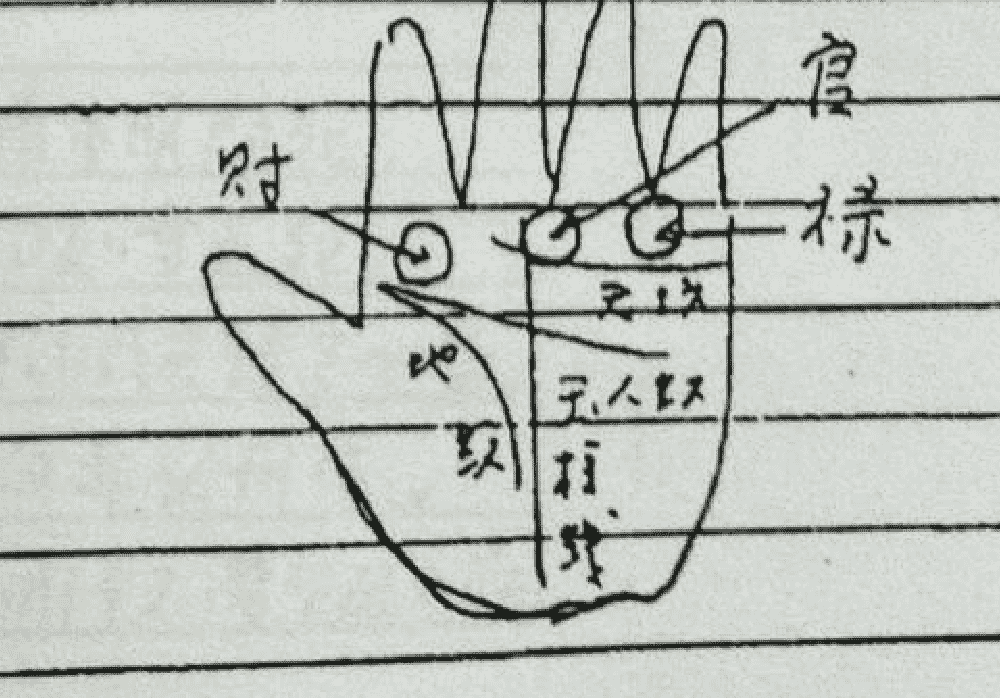

## 第十一章：安徽相法断疾病

疾病与意外伤害不同，意外伤害是指刀伤、枪伤、天灾伤、车祸、水厄、火厄、尸厄、兽伤、跌伤、毒伤等。疾病是指五脏六腑、骨肉、血脉等，因先天不足，或因后天失调，或脏腑老化所引起的各种急慢性疾病，或因传染病所致，均属疾病生死范围。

#### 父母病：

> [诀]：父母病看日月角，暗重明即死，暗轻明即愈。白如雪之死，黑若烟蒙损，红润实轻吉。角暗父母病重，白赤必刑伤。红轻紫重父母安，润泽不滞父母无病。

年寿黑气，家人有病。

#### 兄弟病

[诀]：眉内青色或白米，必刑于兄不用疑。
准头一点白出现，必有兄弟孝服来。

#### 妻妾病

[诀]：奸门青，主妻病。
奸门暗，主产厄。
山根白色现，不伤妻子伤手足。
年上有黑痣，此人犯桃花。
因色而闯祸，自身患疮病。

#### 子女病

[诀]：先看山根和年寿，再看命门山根上。
俱青俱黄三五死，人中若黑休再生。
眼若散彩及老青，即刻死亡难救命。

嘴似人中白，印堂黄，口角向日边生。
山根年寿纹红黄，眼神不衰必长生。
（此法今纹深0411位，定主关折一命终。
小儿推手论生死，男伸生女伸死；
男屈死，女屈生，此法万发万中。
见下图A.B：

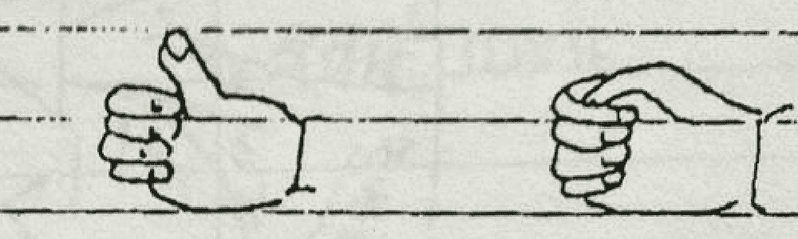

(A) 伸者 (B) 屈者

#### 本身病

[诀]：年寿高准头上，数处青色主大病。
青色腹内赤脓血，准头血主主肺病。
印堂明，年寿暗，下元小腹生疾病。
两眉烟生是肾病，年上青色心脏病。
眼眶青黄是肝病，色开必须要记清。

[诀] 学会麻衣相，敢把生死量。
口唇青紫发黑，十病就有九个死。
两耳若青黑，病无道路上。
山根若青黑，病连无完了。
命宫若青黑，神仙也难医。
准头若青黑，朝病暮死去。
卧蚕若青黑，速死命归急。
面如蒙似鼓，难走三十五。
肩之骨低，命在四十七。
肩起地阁起，五十二岁亡。
上唇薄又短，难过五十三。
口角若双垂，五十九为期。
地阁若缺陷，七十一大关。
下巴若过口，七十三岁走。
腕有二道纹，七十五下论。
腕有三道纹，八十以上论。
此为生死诀，勿与庸人说。

#### 手相看疾病部位图

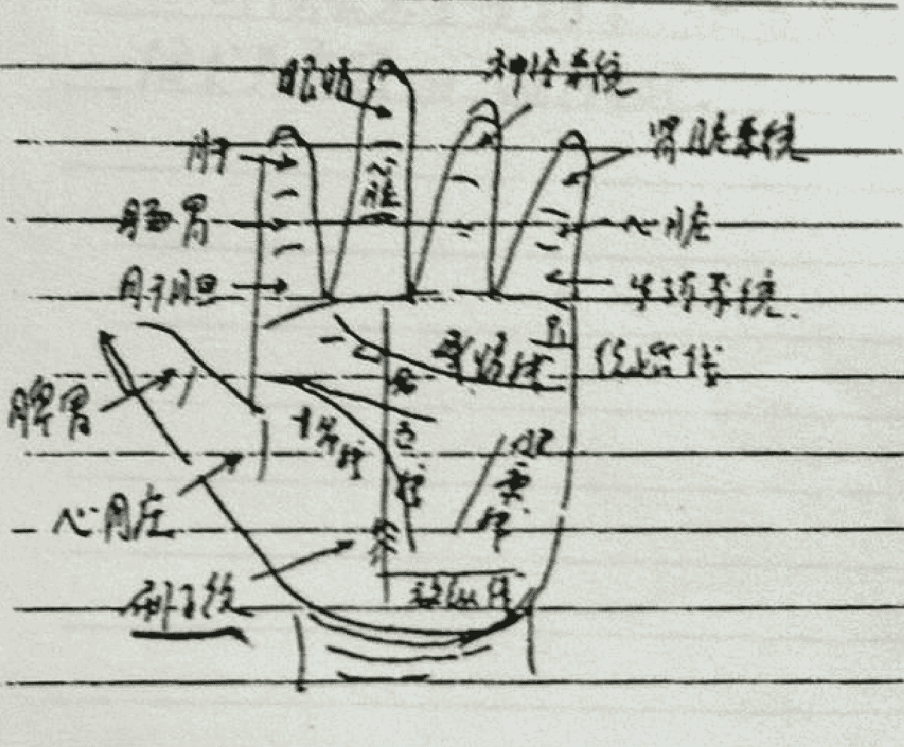

[解] 天纹短者父先死，地纹短者母先亡；
人纹短者命有难，三纹断者同论。
如婚姻线者通天纹，配偶死伤便见。
天纹分叉或方块，因情失败而自杀。
子女线上有岛纹，体弱多病难养儿。
如无此纹或乱纹，不能成形死己儿。

命运线下倒手纹，父母早亡信息在。
健康线波浪消化病，继续出现慢性病。
健康线有岛纹为心脏病，十字纹点肝胆眼病。
双似线为酒色过度。

余数为偶数，不可救，并查瞳孔，
脉象为弦，很准。
此法虽不全是相术，但与生死
相术关系密切，故附此。

附：予卜生死法：
公式：病人年令加月加日乘3除以9。
设余数为有效，余数是奇数痊愈有
望；余数为偶数无望，死亡。
可用手电照手指，桃红色有效，
不见血色，病入膏肓，无效，死亡。
瞳孔不动，死；脉无规律，死。
及将死，不可画符化解或调治，
相家切记。

举例：一7岁小儿，5月14日病。
7+5+14=26，26×3÷9=8...6

## 第十二章、安徽相法秘传学历文凭断法

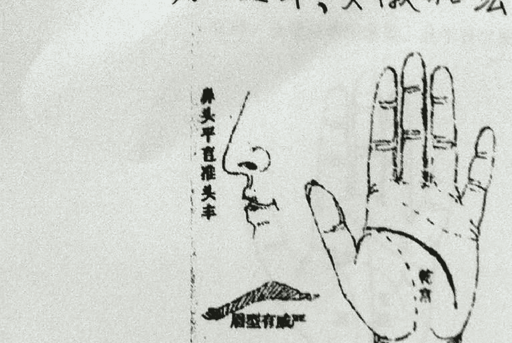

断你爱文科：人纹挺进入乾宫，鼻头平直准头丰，两眉有威文科强，挥毫立就文章成。

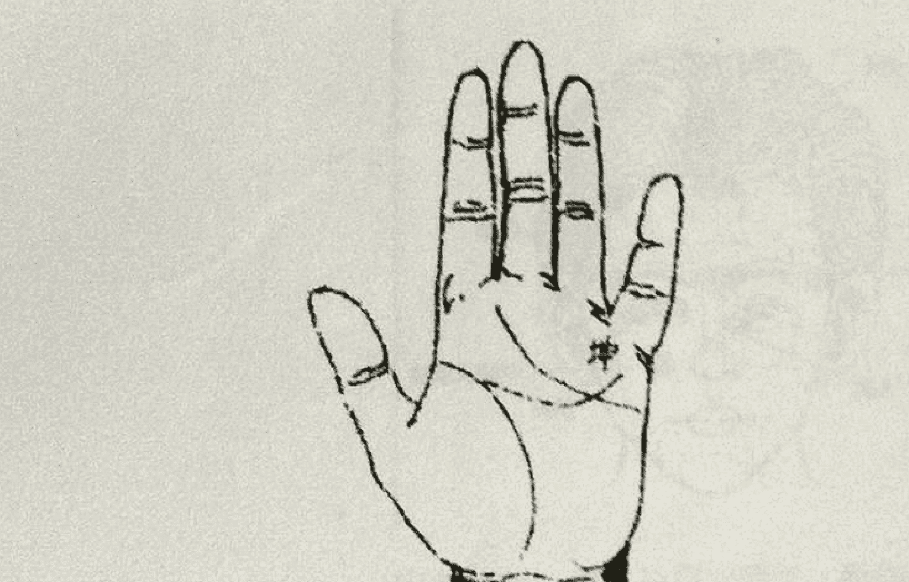

断你爱理科：人纹入坤秀且长，眉目秀丽毫生光。君爱理科何问，科研行当效国当。

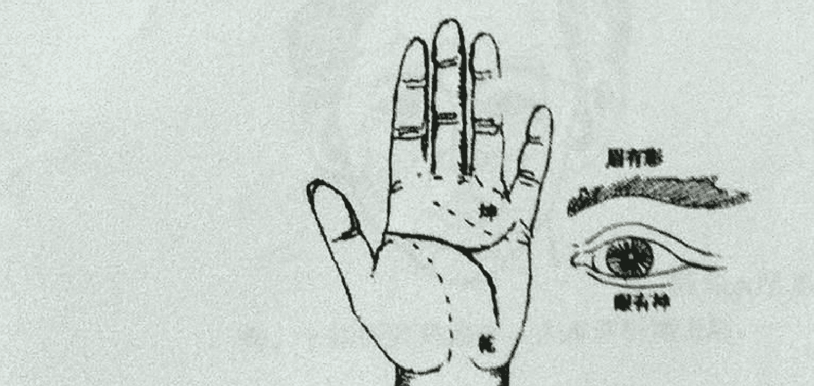

断你文理双成：人纹开叉入乾坤，鼻秀眉彩眼有神，文理双雄国栋梁，品学兼优报国人

断你大学本科文凭：玉柱过天纹，人本拿的准。

不信自己看，掌心玉柱纹。

断你金榜题名：印信额头满微黄，惟独天中紫气光。龙头凤尾皆瑞气，断你必中状元郎

断你大学本科以上学历：学堂丰满光泽透，眉目光彩又清秀。十指春笋掌绵厚，大本读研博士后。

## 第十三章、安徽相法秘传官非牢狱断法

断你官司胜诉：纷纷争讼我先知，额青天中带赤脂。微微青黄官事败，红黄映照得胜利。

#### 眉如赤烟焰

断你亲兄弟为争家产打官司：两眉赤焰青起颧，兄弟手足自相残。地阁青赤田宅乌。只为家产起讼端。

断你为车辆交通打官司：地阁车舟起赤青，通衢青路（道路）恶气生。驿马准头起赤色，车辆交通起争讼。

断你为房产土地打官司：田宅地阁青黑气，眉头学堂准赤恶。青起印堂连山根，房产土地把理说。

断你为离婚打官司：
山根奸门青赤连，断你离婚起讼端。天纹（手相）断裂必分离，天纹不断夫妻欢。

断你为电力通讯打官司：离宫烟焰起青赤，电力通讯官司起。

断你因打架斗殴打官司：武库位上起焦红，颧印山根连起青。准头法令青兼黑，斗殴打架官司生。

#### 眉部赤纹

断你入牢狱：刑狱赤形似鹰嘴，食仓青气刑狱黑。眉部赤纹烟去起，准头青黑皆狱贼。

满面赤红

面赤且又

眼下青

注：面赤指满面赤红也为焦红色者。三日之内官非讼。下狱且受杖击苦。只怪命中该受刑。千人万相同一理，万相千人形与气。官非讼狱看仔细，细细研究多练习。

## 第十四章，安徽相法断阴阳宅风水

【诀】看面上阳宅哪里看？此为绝招不外传。
双眉之间为大门，上有竖纹当老树，
方块三角为石头，横纹深重为房屋，
黑点为井凹为坑，横纹若断小巷看。
鼻为梁柱看高低，眼目上下客厅断，
鼻翼两端为库房，嘴巴能吃为饭厅，
人中黑点下水道，地阁左为屋基硬。
各宫竖纹房院数，一道一院二两处。

见图一：

【解】：从眉至口为院内，余为院外，额为天花板，为大门外，眉间为大门，竖纹为树，眉上在门外，眉下黑点在院内，黑点为水井，长方块为旧磨盘，深横纹为房，浅为路，横纹断者有小巷，断者为低或凹或沟。
鼻为梁柱，鼻子高低看院子高低，院子凹，人中有时，易患心脏病，鼻边法令纹为库房，可有家中粮多少，人中为下水道，有黑点下水道不通或破裂。
眉间看筋，屋少或天花板漏雨，人际关系不好，前额焦黑，天花板漏电，脸上有一块为青暗色为厕所。
眉间竖纹为宅基数目，一道竖纹一处宅基，两道竖纹二层院子，纹黑者院内已建房，纹浅者只有宅地尚未建房。

【诀】看阳宅，怎样看？门主灶为主重点。
先看大门明堂，次看主房大门。
X11主调门高为主，调光为出明心处。
X通厨灶饮食之所，51151主生为主。
阳宅八卦数百年，东公东而公西。
男走天运延年去，五鬼天延化病为。
宫生宫人口昌，宫克宫人口亡。
男走宫六畜旺，女走宫六畜亡。
内克外我自可，外克内凶要当。
外生内发福速，内生外家不强。
阳克阴女受份，阴克阳男遭殃。
X1.2.3.4要不均，6.7.8.9要水。
X先天八卦有病，后天八卦有命。
详之图二。

【解】：八卦分先天八卦，即乾兑离震
巽坎艮坤。后天八卦，即乾兑
艮震巽离坤。
图中1.2.3.4.5.6.7.8.9为九宫。
(1)(2)(3)(4)(5)(6)(7)(8)为先天八卦。
①②③④⑤⑥⑦⑧为后天八卦。
后天八卦有方位。
乾为西北，坎为北，艮为东北，震为东，巽为东南，离为南，坤为西南，兑为西。

震为长男，正东，属木。巽为长女，东南，属木。
坎为中男，正北，属水。离为中女，正南，属火。
艮为少男，东北，属土。兑为少女，正西，属金。

> 【诀】大游年歌：
乾六天五祸绝延生；
坎五天生延绝祸六；
艮六绝祸生延天五；
震延生祸绝五天六；
巽天五六祸生绝延；
离六五绝延祸生天；
坤天延绝生祸五六；
兑生祸延绝六五天。

- ※ 年轻人宜住生气方，子多而又强；
- ※ 老年人宜住延年方，延年寿如松；
- ※ 有病人宜住天医方，病消人康宁。

> 【解】：看阳宅从大门顺数游年，以坐子门为例：

| 福(内) | 生(吉) | 绝(凶) |
| :---: | :---: | :---: |
| 元(凶) | 西 院 东 | 延(吉) |
| 五(凶) | 天(吉) | 女(吉) |

X 东四命人宜配东四命人，西四命人宜配西四命人为吉，住亦吉，婚姻易成，夫妻和美，财丁两旺，福寿双全，即乾配乾，坤配坤，坎配离，离配坎，震配巽，巽配震，艮配兑，兑配艮。
老西儿和小西儿是西四命人，余为东四命人。请注意：东四命，西四命，不同于纳音命，何以知自己属哪四命人，现有两种方法介绍诸君如下。

XV①男命：(100-生年尾两位数)÷9，求余数。例：1936年生，代入公式：
得：100-36=64÷9=9…1 余数为1
1为坎属东四命。

XV②女命：(生年尾两位数-4)÷9，求余数。例：1963年生，代入公式：
得：63-4=59 59÷9=6…5
余数为5，凡余数为5者，男归2，女归8。8为艮，属西四命。
余仿此。

见下图（九宫后天八卦图）：

> 【诀】厕所不宜在门，厨房临门祸及长。
X五鬼入乾宫，小儿必遭殃。
重重伤五口，家宅不安宁。
X五鬼入水宫，次子必遭殃。
长子小口死，累累多病伤。
X五鬼入巽宫，每岁盗贼连。
人口俱失散，男女受熬煎。
X五鬼到火宫，初年二房荣。
长子专权柄，财散祸又生。
X五鬼入坤宫，六畜患难存。
西南损五口，东北伤三人。

> 【解】：五鬼，即五鬼廉贞火，为凶星中最大凶星。次为六煞文曲水，绝命破军金，祸害禄存土。三吉星为生气贪狼木，天医巨门土，延年武曲金，伏位辅弼。

[诀]：左青龙，右白虎，南朱雀，北玄武，四灵要相应，阳宅主吉祥。坐北向南东南缺，长门不利先吃苦。只因折了青龙角，女多男少受挫折。东北若缺子的绝，西北若缺钱财散。前宽后窄住常贫，前窄后宽住生财。有水绕门六畜旺，水归东分富贵兴。一宅二水两分流，多主夫妻不到头。灶前不明小口损，人亡家败像此由。大路不宜冲宅院，土箭射杀主人凶。阳宅冲门有大桑，有损小口泪汪汪。大树不宜对着门，大树对门主病瘟。宅后栽树主高抬，此树虽邪主不侵。阳宅周围莫要坑，若有坑凹家必倾。堂屋东头接小房，宅中小口频遭殃。三年祸事有二次，人口六畜有损伤。北房两头接小房，定主三年哭两场。

若主家，福地若明，后花园内有实缺。前高后低出贤愚，前低后高出英豪。卯面不足居闲好，子午不足居大凶。东高家中出人才，西高家中少儿郎。见图解：

[解]：青龙指河坑，白虎指大路，朱雀指池塘，玄武指小丘。从面上看，左边主父亲，右边主母亲。法令纹长短宽窄主家族大小，住宅除看三阳三阴外，还要看中堂两边。

补满华美，去向专列，缺阴无祖宅，有疾弃祖宅，若有红丝纹，则今者向无祖宅。阳宅好不好，看屋布依凭也很难。

另外，可从院子从东南西北向划一直线，可是阴阳是协调，艮方为阳，坤方为阴，看何方房屋多寡高低，门开在何方。如下图：

[解]：如只有北房、东房，叫阳盛阴衰，男子能干，女人多病或早亡；反之，若西而门，有西房，有北房，则

阴盛阳衰，女人当家，男人寿命不长，多病或早亡。以前办法是阴阳协调，子午方不可无房，卯西方方所适宜。

### 阴宅

【诀】看阴宅，哪里看？山龙水龙必须会，山脉水脉必须对。山管人丁水管财，阴阳两字都要在。看阴宅，看龙脉，龙脉就是看山脉。山脉来得真，后代出贵人。山脉来得假，后代出傻瓜。山脉来得远，后代福气长。山脉来得近，后代福气短。山脉来得高，后代出头高。山脉来得低，后代出头低。山脉来得肥，后代出富贵。山脉来得瘦，后代出贫穷。山脉来得直，后代出忠良。山脉来得曲，后代出奸邪。山脉来得长，后代出长寿。山脉来得短，后代出短命。山脉来得大，后代出大官。山脉来得小，后代出小官。山脉来得急，后代出急躁。山脉来得缓，后代出慢性。山脉来得重，后代出重臣。山脉来得轻，后代出轻浮。山脉来得厚，后代出厚道。山脉来得薄，后代出薄情。山脉来得深，后代出深沉。山脉来得浅，后代出浅薄。山脉来得明，后代出聪明。山脉来得暗，后代出愚笨。山脉来得清，后代出清廉。山脉来得浊，后代出贪官。山脉来得正，后代出正直。山脉来得邪，后代出邪恶。山脉来得善，后代出善良。山脉来得恶，后代出恶人。山脉来得美，后代出美人。山脉来得丑，后代出丑人。山脉来得雄，后代出英雄。山脉来得雌，后代出懦夫。山脉来得刚，后代出刚强。山脉来得柔，后代出柔弱。山脉来得动，后代出活动。山脉来得静，后代出安静。山脉来得生，后代出活泼。山脉来得死，后代出死板。山脉来得旺，后代出兴旺。山脉来得衰，后代出衰败。山脉来得兴，后代出兴盛。山脉来得亡，后代出灭亡。山脉来得吉，后代出吉祥。山脉来得凶，后代出凶险。山脉来得福，后代出福气。山脉来得祸，后代出祸害。山脉来得禄，后代出俸禄。山脉来得寿，后代出长寿。山脉来得喜，后代出喜庆。山脉来得悲，后代出悲伤。山脉来得乐，后代出快乐。山脉来得苦，后代出苦难。山脉来得荣，后代出荣耀。山脉来得辱，后代出耻辱。山脉来得贵，后代出贵人。山脉来得贱，后代出贱人。山脉来得富，后代出富人。山脉来得贫，后代出穷人。山脉来得强，后代出强人。山脉来得弱，后代出弱者。山脉来得智，后代出智者。山脉来得愚，后代出愚者。山脉来得勇，后代出勇者。山脉来得怯，后代出怯者。山脉来得仁，后代出仁者。山脉来得义，后代出义者。山脉来得礼，后代出礼者。山脉来得智，后代出智者。山脉来得信，后代出信者。山脉来得忠，后代出忠者。山脉来得孝，后代出孝者。山脉来得节，后代出节者。山脉来得廉，后代出廉者。山脉来得耻，后代出耻者。山脉来得勇，后代出勇者。山脉来得刚，后代出刚者。山脉来得柔，后代出柔者。山脉来得动，后代出动者。山脉来得静，后代出静者。山脉来得生，后代出生者。山脉来得死，后代出死者。山脉来得旺，后代出旺者。山脉来得衰，后代出衰者。山脉来得兴，后代出兴者。山脉来得亡，后代出亡者。山脉来得吉，后代出吉者。山脉来得凶，后代出凶者。山脉来得福，后代出福者。山脉来得祸，后代出祸者。山脉来得禄，后代出禄者。山脉来得寿，后代出寿者。山脉来得喜，后代出喜者。山脉来得悲，后代出悲者。山脉来得乐，后代出乐者。山脉来得苦，后代出苦者。山脉来得荣，后代出荣者。山脉来得辱，后代出辱者。山脉来得贵，后代出贵者。山脉来得贱，后代出贱者。山脉来得富，后代出富者。山脉来得贫，后代出贫者。山脉来得强，后代出强者。山脉来得弱，后代出弱者。山脉来得智，后代出智者。山脉来得愚，后代出愚者。山脉来得勇，后代出勇者。山脉来得怯，后代出怯者。山脉来得仁，后代出仁者。山脉来得义，后代出义者。山脉来得礼，后代出礼者。山脉来得智，后代出智者。山脉来得信，后代出信者。山脉来得忠，后代出忠者。山脉来得孝，后代出孝者。山脉来得节，后代出节者。山脉来得廉，后代出廉者。山脉来得耻，后代出耻者。山脉来得勇，后代出勇者。山脉来得刚，后代出刚者。山脉来得柔，后代出柔者。山脉来得动，后代出动者。山脉来得静，后代出静者。山脉来得生，后代出生者。山脉来得死，后代出死者。山脉来得旺，后代出旺者。山脉来得衰，后代出衰者。山脉来得兴，后代出兴者。山脉来得亡，后代出亡者。山脉来得吉，后代出吉者。山脉来得凶，后代出凶者。山脉来得福，后代出福者。山脉来得祸，后代出祸者。山脉来得禄，后代出禄者。山脉来得寿，后代出寿者。山脉来得喜，后代出喜者。山脉来得悲，后代出悲者。山脉来得乐，后代出乐者。山脉来得苦，后代出苦者。山脉来得荣，后代出荣者。山脉来得辱，后代出辱者。山脉来得贵，后代出贵者。山脉来得贱，后代出贱者。山脉来得富，后代出富者。山脉来得贫，后代出贫者。山脉来得强，后代出强者。山脉来得弱，后代出弱者。山脉来得智，后代出智者。山脉来得愚，后代出愚者。山脉来得勇，后代出勇者。山脉来得怯，后代出怯者。山脉来得仁，后代出仁者。山脉来得义，后代出义者。山脉来得礼，后代出礼者。山脉来得智，后代出智者。山脉来得信，后代出信者。山脉来得忠，后代出忠者。山脉来得孝，后代出孝者。山脉来得节，后代出节者。山脉来得廉，后代出廉者。山脉来得耻，后代出耻者。山脉来得勇，后代出勇者。山脉来得刚，后代出刚者。山脉来得柔，后代出柔者。山脉来得动，后代出动者。山脉来得静，后代出静者。山脉来得生，后代出生者。山脉来得死，后代出死者。山脉来得旺，后代出旺者。山脉来得衰，后代出衰者。山脉来得兴，后代出兴者。山脉来得亡，后代出亡者。山脉来得吉，后代出吉者。山脉来得凶，后代出凶者。山脉来得福，后代出福者。山脉来得祸，后代出祸者。山脉来得禄，后代出禄者。山脉来得寿，后代出寿者。山脉来得喜，后代出喜者。山脉来得悲，后代出悲者。山脉来得乐，后代出乐者。山脉来得苦，后代出苦者。山脉来得荣，后代出荣者。山脉来得辱，后代出辱者。山脉来得贵，后代出贵者。山脉来得贱，后代出贱者。山脉来得富，后代出富者。山脉来得贫，后代出贫者。山脉来得强，后代出强者。山脉来得弱，后代出弱者。山脉来得智，后代出智者。山脉来得愚，后代出愚者。山脉来得勇，后代出勇者。山脉来得怯，后代出怯者。山脉来得仁，后代出仁者。山脉来得义，后代出义者。山脉来得礼，后代出礼者。山脉来得智，后代出智者。山脉来得信，后代出信者。山脉来得忠，后代出忠者。山脉来得孝，后代出孝者。山脉来得节，后代出节者。山脉来得廉，后代出廉者。山脉来得耻，后代出耻者。山脉来得勇，后代出勇者。山脉来得刚，后代出刚者。山脉来得柔，后代出柔者。山脉来得动，后代出动者。山脉来得静，后代出静者。山脉来得生，后代出生者。山脉来得死，后代出死者。山脉来得旺，后代出旺者。山脉来得衰，后代出衰者。山脉来得兴，后代出兴者。山脉来得亡，后代出亡者。山脉来得吉，后代出吉者。山脉来得凶，后代出凶者。山脉来得福，后代出福者。山脉来得祸，后代出祸者。山脉来得禄，后代出禄者。山脉来得寿，后代出寿者。山脉来得喜，后代出喜者。山脉来得悲，后代出悲者。山脉来得乐，后代出乐者。山脉来得苦，后代出苦者。山脉来得荣，后代出荣者。山脉来得辱，后代出辱者。山脉来得贵，后代出贵者。山脉来得贱，后代出贱者。山脉来得富，后代出富者。山脉来得贫，后代出贫者。山脉来得强，后代出强者。山脉来得弱，后代出弱者。山脉来得智，后代出智者。山脉来得愚，后代出愚者。山脉来得勇，后代出勇者。山脉来得怯，后代出怯者。山脉来得仁，后代出仁者。山脉来得义，后代出义者。山脉来得礼，后代出礼者。山脉来得智，后代出智者。山脉来得信，后代出信者。山脉来得忠，后代出忠者。山脉来得孝，后代出孝者。山脉来得节，后代出节者。山脉来得廉，后代出廉者。山脉来得耻，后代出耻者。山脉来得勇，后代出勇者。山脉来得刚，后代出刚者。山脉来得柔，后代出柔者。山脉来得动，后代出动者。山脉来得静，后代出静者。山脉来得生，后代出生者。山脉来得死，后代出死者。山脉来得旺，后代出旺者。山脉来得衰，后代出衰者。山脉来得兴，后代出兴者。山脉来得亡，后代出亡者。山脉来得吉，后代出吉者。山脉来得凶，后代出凶者。山脉来得福，后代出福者。山脉来得祸，后代出祸者。山脉来得禄，后代出禄者。山脉来得寿，后代出寿者。山脉来得喜，后代出喜者。山脉来得悲，后代出悲者。山脉来得乐，后代出乐者。山脉来得苦，后代出苦者。山脉来得荣，后代出荣者。山脉来得辱，后代出辱者。山脉来得贵，后代出贵者。山脉来得贱，后代出贱者。山脉来得富，后代出富者。山脉来得贫，后代出贫者。山脉来得强，后代出强者。山脉来得弱，后代出弱者。山脉来得智，后代出智者。山脉来得愚，后代出愚者。山脉来得勇，后代出勇者。山脉来得怯，后代出怯者。山脉来得仁，后代出仁者。山脉来得义，后代出义者。山脉来得礼，后代出礼者。山脉来得智，后代出智者。山脉来得信，后代出信者。山脉来得忠，后代出忠者。山脉来得孝，后代出孝者。山脉来得节，后代出节者。山脉来得廉，后代出廉者。山脉来得耻，后代出耻者。山脉来得勇，后代出勇者。山脉来得刚，后代出刚者。山脉来得柔，后代出柔者。山脉来得动，后代出动者。山脉来得静，后代出静者。山脉来得生，后代出生者。山脉来得死，后代出死者。山脉来得旺，后代出旺者。山脉来得衰，后代出衰者。山脉来得兴，后代出兴者。山脉来得亡，后代出亡者。山脉来得吉，后代出吉者。山脉来得凶，后代出凶者。山脉来得福，后代出福者。山脉来得祸，后代出祸者。山脉来得禄，后代出禄者。山脉来得寿，后代出寿者。山脉来得喜，后代出喜者。山脉来得悲，后代出悲者。山脉来得乐，后代出乐者。山脉来得苦，后代出苦者。山脉来得荣，后代出荣者。山脉来得辱，后代出辱者。山脉来得贵，后代出贵者。山脉来得贱，后代出贱者。山脉来得富，后代出富者。山脉来得贫，后代出贫者。山脉来得强，后代出强者。山脉来得弱，后代出弱者。山脉来得智，后代出智者。山脉来得愚，后代出愚者。山脉来得勇，后代出勇者。山脉来得怯，后代出怯者。山脉来得仁，后代出仁者。山脉来得义，后代出义者。山脉来得礼，后代出礼者。山脉来得智，后代出智者。山脉来得信，后代出信者。山脉来得忠，后代出忠者。山脉来得孝，后代出孝者。山脉来得节，后代出节者。山脉来得廉，后代出廉者。山脉来得耻，后代出耻者。山脉来得勇，后代出勇者。山脉来得刚，后代出刚者。山脉来得柔，后代出柔者。山脉来得动，后代出动者。山脉来得静，后代出静者。山脉来得生，后代出生者。山脉来得死，后代出死者。山脉来得旺，后代出旺者。山脉来得衰，后代出衰者。山脉来得兴，后代出兴者。山脉来得亡，后代出亡者。山脉来得吉，后代出吉者。山脉来得凶，后代出凶者。山脉来得福，后代出福者。山脉来得祸，后代出祸者。山脉来得禄，后代出禄者。山脉来得寿，后代出寿者。山脉来得喜，后代出喜者。山脉来得悲，后代出悲者。山脉来得乐，后代出乐者。山脉来得苦，后代出苦者。山脉来得荣，后代出荣者。山脉来得辱，后代出辱者。山脉来得贵，后代出贵者。山脉来得贱，后代出贱者。山脉来得富，后代出富者。山脉来得贫，后代出贫者。山脉来得强，后代出强者。山脉来得弱，后代出弱者。山脉来得智，后代出智者。山脉来得愚，后代出愚者。山脉来得勇，后代出勇者。山脉来得怯，后代出怯者。山脉来得仁，后代出仁者。山脉来得义，后代出义者。山脉来得礼，后代出礼者。山脉来得智，后代出智者。山脉来得信，后代出信者。山脉来得忠，后代出忠者。山脉来得孝，后代出孝者。山脉来得节，后代出节者。山脉来得廉，后代出廉者。山脉来得耻，后代出耻者。山脉来得勇，后代出勇者。山脉来得刚，后代出刚者。山脉来得柔，后代出柔者。山脉来得动，后代出动者。山脉来得静，后代出静者。山脉来得生，后代出生者。山脉来得死，后代出死者。山脉来得旺，后代出旺者。山脉来得衰，后代出衰者。山脉来得兴，后代出兴者。山脉来得亡，后代出亡者。山脉来得吉，后代出吉者。山脉来得凶，后代出凶者。山脉来得福，后代出福者。山脉来得祸，后代出祸者。山脉来得禄，后代出禄者。山脉来得寿，后代出寿者。山脉来得喜，后代出喜者。山脉来得悲，后代出悲者。山脉来得乐，后代出乐者。山脉来得苦，后代出苦者。山脉来得荣，后代出荣者。山脉来得辱，后代出辱者。山脉来得贵，后代出贵者。山脉来得贱，后代出贱者。山脉来得富，后代出富者。山脉来得贫，后代出贫者。山脉来得强，后代出强者。山脉来得弱，后代出弱者。山脉来得智，后代出智者。山脉来得愚，后代出愚者。山脉来得勇，后代出勇者。山脉来得怯，后代出怯者。山脉来得仁，后代出仁者。山脉来得义，后代出义者。山脉来得礼，后代出礼者。山脉来得智，后代出智者。山脉来得信，后代出信者。山脉来得忠，后代出忠者。山脉来得孝，后代出孝者。山脉来得节，后代出节者。山脉来得廉，后代出廉者。山脉来得耻，后代出耻者。山脉来得勇，后代出勇者。山脉来得刚，后代出刚者。山脉来得柔，后代出柔者。山脉来得动，后代出动者。山脉来得静，后代出静者。山脉来得生，后代出生者。山脉来得死，后代出死者。山脉来得旺，后代出旺者。山脉来得衰，后代出衰者。山脉来得兴，后代出兴者。山脉来得亡，后代出亡者。山脉来得吉，后代出吉者。山脉来得凶，后代出凶者。山脉来得福，后代出福者。山脉来得祸，后代出祸者。山脉来得禄，后代出禄者。山脉来得寿，后代出寿者。山脉来得喜，后代出喜者。山脉来得悲，后代出悲者。山脉来得乐，后代出乐者。山脉来得苦，后代出苦者。山脉来得荣，后代出荣者。山脉来得辱，后代出辱者。山脉来得贵，后代出贵者。山脉来得贱，后代出贱者。山脉来得富，后代出富者。山脉来得贫，后代出贫者。山脉来得强，后代出强者。山脉来得弱，后代出弱者。山脉来得智，后代出智者。山脉来得愚，后代出愚者。山脉来得勇，后代出勇者。山脉来得怯，后代出怯者。山脉来得仁，后代出仁者。山脉来得义，后代出义者。山脉来得礼，后代出礼者。山脉来得智，后代出智者。山脉来得信，后代出信者。山脉来得忠，后代出忠者。山脉来得孝，后代出孝者。山脉来得节，后代出节者。山脉来得廉，后代出廉者。山脉来得耻，后代出耻者。山脉来得勇，后代出勇者。山脉来得刚，后代出刚者。山脉来得柔，后代出柔者。山脉来得动，后代出动者。山脉来得静，后代出静者。山脉来得生，后代出生者。山脉来得死，后代出死者。山脉来得旺，后代出旺者。山脉来得衰，后代出衰者。山脉来得兴，后代出兴者。山脉来得亡，后代出亡者。山脉来得吉，后代出吉者。山脉来得凶，后代出凶者。山脉来得福，后代出福者。山脉来得祸，后代出祸者。山脉来得禄，后代出禄者。山脉来得寿，后代出寿者。山脉来得喜，后代出喜者。山脉来得悲，后代出悲者。山脉来得乐，后代出乐者。山脉来得苦，后代出苦者。山脉来得荣，后代出荣者。山脉来得辱，后代出辱者。山脉来得贵，后代出贵者。山脉来得贱，后代出贱者。山脉来得富，后代出富者。山脉来得贫，后代出贫者。山脉来得强，后代出强者。山脉来得弱，后代出弱者。山脉来得智，后代出智者。山脉来得愚，后代出愚者。山脉来得勇，后代出勇者。山脉来得怯，后代出怯者。山脉来得仁，后代出仁者。山脉来得义，后代出义者。山脉来得礼，后代出礼者。山脉来得智，后代出智者。山脉来得信，后代出信者。山脉来得忠，后代出忠者。山脉来得孝，后代出孝者。山脉来得节，后代出节者。山脉来得廉，后代出廉者。山脉来得耻，后代出耻者。山脉来得勇，后代出勇者。山脉来得刚，后代出刚者。山脉来得柔，后代出柔者。山脉来得动，后代出动者。山脉来得静，后代出静者。山脉来得生，后代出生者。山脉来得死，后代出死者。山脉来得旺，后代出旺者。山脉来得衰，后代出衰者。山脉来得兴，后代出兴者。山脉来得亡，后代出亡者。山脉来得吉，后代出吉者。山脉来得凶，后代出凶者。山脉来得福，后代出福者。山脉来得祸，后代出祸者。山脉来得禄，后代出禄者。山脉来得寿，后代出寿者。山脉来得喜，后代出喜者。山脉来得悲，后代出悲者。山脉来得乐，后代出乐者。山脉来得苦，后代出苦者。山脉来得荣，后代出荣者。山脉来得辱，后代出辱者。山脉来得贵，后代出贵者。山脉来得贱，后代出贱者。山脉来得富，后代出富者。山脉来得贫，后代出贫者。山脉来得强，后代出强者。山脉来得弱，后代出弱者。山脉来得智，后代出智者。山脉来得愚，后代出愚者。山脉来得勇，后代出勇者。山脉来得怯，后代出怯者。山脉来得仁，后代出仁者。山脉来得义，后代出义者。山脉来得礼，后代出礼者。山脉来得智，后代出智者。山脉来得信，后代出信者。山脉来得忠，后代出忠者。山脉来得孝，后代出孝者。山脉来得节，后代出节者。山脉来得廉，后代出廉者。山脉来得耻，后代出耻者。山脉来得勇，后代出勇者。山脉来得刚，后代出刚者。山脉来得柔，后代出柔者。山脉来得动，后代出动者。山脉来得静，后代出静者。山脉来得生，后代出生者。山脉来得死，后代出死者。山脉来得旺，后代出旺者。山脉来得衰，后代出衰者。山脉来得兴，后代出兴者。山脉来得亡，后代出亡者。山脉来得吉，后代出吉者。山脉来得凶，后代出凶者。山脉来得福，后代出福者。山脉来得祸，后代出祸者。山脉来得禄，后代出禄者。山脉来得寿，后代出寿者。山脉来得喜，后代出喜者。山脉来得悲，后代出悲者。山脉来得乐，后代出乐者。山脉来得苦，后代出苦者。山脉来得荣，后代出荣者。山脉来得辱，后代出辱者。山脉来得贵，后代出贵者。山脉来得贱，后代出贱者。山脉来得富，后代出富者。山脉来得贫，后代出贫者。山脉来得强，后代出强者。山脉来得弱，后代出弱者。山脉来得智，后代出智者。山脉来得愚，后代出愚者。山脉来得勇，后代出勇者。山脉来得怯，后代出怯者。山脉来得仁，后代出仁者。山脉来得义，后代出义者。山脉来得礼，后代出礼者。山脉来得智，后代出智者。山脉来得信，后代出信者。山脉来得忠，后代出忠者。山脉来得孝，后代出孝者。山脉来得节，后代出节者。山脉来得廉，后代出廉者。山脉来得耻，后代出耻者。山脉来得勇，后代出勇者。山脉来得刚，后代出刚者。山脉来得柔，后代出柔者。山脉来得动，后代出动者。山脉来得静，后代出静者。山脉来得生，后代出生者。山脉来得死，后代出死者。山脉来得旺，后代出旺者。山脉来得衰，后代出衰者。山脉来得兴，后代出兴者。山脉来得亡，后代出亡者。山脉来得吉，后代出吉者。山脉来得凶，后代出凶者。山脉来得福，后代出福者。山脉来得祸，后代出祸者。山脉来得禄，后代出禄者。山脉来得寿，后代出寿者。山脉来得喜，后代出喜者。山脉来得悲，后代出悲者。山脉来得乐，后代出乐者。山脉来得苦，后代出苦者。山脉来得荣，后代出荣者。山脉来得辱，后代出辱者。山脉来得贵，后代出贵者。山脉来得贱，后代出贱者。山脉来得富，后代出富者。山脉来得贫，后代出贫者。山脉来得强，后代出强者。山脉来得弱，后代出弱者。山脉来得智，后代出智者。山脉来得愚，后代出愚者。山脉来得勇，后代出勇者。山脉来得怯，后代出怯者。山脉来得仁，后代出仁者。山脉来得义，后代出义者。山脉来得礼，后代出礼者。山脉来得智，后代出智者。山脉来得信，后代出信者。山脉来得忠，后代出忠者。山脉来得孝，后代出孝者。山脉来得节，后代出节者。山脉来得廉，后代出廉者。山脉来得耻，后代出耻者。山脉来得勇，后代出勇者。山脉来得刚，后代出刚者。山脉来得柔，后代出柔者。山脉来得动，后代出动者。山脉来得静，后代出静者。山脉来得生，后代出生者。山脉来得死，后代出死者。山脉来得旺，后代出旺者。山脉来得衰，后代出衰者。山脉来得兴，后代出兴者。山脉来得亡，后代出亡者。山脉来得吉，后代出吉者。山脉来得凶，后代出凶者。山脉来得福，后代出福者。山脉来得祸，后代出祸者。山脉来得禄，后代出禄者。山脉来得寿，后代出寿者。山脉来得喜，后代出喜者。山脉来得悲，后代出悲者。山脉来得乐，后代出乐者。山脉来得苦，后代出苦者。山脉来得荣，后代出荣者。山脉来得辱，后代出辱者。山脉来得贵，后代出贵者。山脉来得贱，后代出贱者。山脉来得富，后代出富者。山脉来得贫，后代出贫者。山脉来得强，后代出强者。山脉来得弱，后代出弱者。山脉来得智，后代出智者。山脉来得愚，后代出愚者。山脉来得勇，后代出勇者。山脉来得怯，后代出怯者。山脉来得仁，后代出仁者。山脉来得义，后代出义者。山脉来得礼，后代出礼者。山脉来得智，后代出智者。山脉来得信，后代出信者。山脉来得忠，后代出忠者。山脉来得孝，后代出孝者。山脉来得节，后代出节者。山脉来得廉，后代出廉者。山脉来得耻，后代出耻者。山脉来得勇，后代出勇者。山脉来得刚，后代出刚者。山脉来得柔，后代出柔者。山脉来得动，后代出动者。山脉来得静，后代出静者。山脉来得生，后代出生者。山脉来得死，后代出死者。山脉来得旺，后代出旺者。山脉来得衰，后代出衰者。山脉来得兴，后代出兴者。山脉来得亡，后代出亡者。山脉来得吉，后代出吉者。山脉来得凶，后代出凶者。山脉来得福，后代出福者。山脉来得祸，后代出祸者。山脉来得禄，后代出禄者。山脉来得寿，后代出寿者。山脉来得喜，后代出喜者。山脉来得悲，后代出悲者。山脉来得乐，后代出乐者。山脉来得苦，后代出苦者。山脉来得荣，后代出荣者。山脉来得辱，后代出辱者。山脉来得贵，后代出贵者。山脉来得贱，后代出贱者。山脉来得富，后代出富者。山脉来得贫，后代出贫者。山脉来得强，后代出强者。山脉来得弱，后代出弱者。山脉来得智，后代出智者。山脉来得愚，后代出愚者。山脉来得勇，后代出勇者。山脉来得怯，后代出怯者。山脉来得仁，后代出仁者。山脉来得义，后代出义者。山脉来得礼，后代出礼者。山脉来得智，后代出智者。山脉来得信，后代出信者。山脉来得忠，后代出忠者。山脉来得孝，后代出孝者。山脉来得节，后代出节者。山脉来得廉，后代出廉者。山脉来得耻，后代出耻者。山脉来得勇，后代出勇者。山脉来得刚，后代出刚者。山脉来得柔，后代出柔者。山脉来得动，后代出动者。山脉来得静，后代出静者。山脉来得生，后代出生者。山脉来得死，后代出死者。山脉来得旺，后代出旺者。山脉来得衰，后代出衰者。山脉来得兴，后代出兴者。山脉来得亡，后代出亡者。山脉来得吉，后代出吉者。山脉来得凶，后代出凶者。山脉来得福，后代出福者。山脉来得祸，后代出祸者。山脉来得禄，后代出禄者。山脉来得寿，后代出寿者。山脉来得喜，后代出喜者。山脉来得悲，后代出悲者。山脉来得乐，后代出乐者。山脉来得苦，后代出苦者。山脉来得荣，后代出荣者。山脉来得辱，后代出辱者。山脉来得贵，后代出贵者。山脉来得贱，后代出贱者。山脉来得富，后代出富者。山脉来得贫，后代出贫者。山脉来得强，后代出强者。山脉来得弱，后代出弱者。山脉来得智，后代出智者。山脉来得愚，后代出愚者。山脉来得勇，后代出勇者。山脉来得怯，后代出怯者。山脉来得仁，后代出仁者。山脉来得义，后代出义者。山脉来得礼，后代出礼者。山脉来得智，后代出智者。山脉来得信，后代出信者。山脉来得忠，后代出忠者。山脉来得孝，后代出孝者。山脉来得节，后代出节者。山脉来得廉，后代出廉者。山脉来得耻，后代出耻者。山脉来得勇，后代出勇者。山脉来得刚，后代出刚者。山脉来得柔，后代出柔者。山脉来得动，后代出动者。山脉来得静，后代出静者。山脉来得生，后代出生者。山脉来得死，后代出死者。山脉来得旺，后代出旺者。山脉来得衰，后代出衰者。山脉来得兴，后代出兴者。山脉来得亡，后代出亡者。山脉来得吉，后代出吉者。山脉来得凶，后代出凶者。山脉来得福，后代出福者。山脉来得祸，后代出祸者。山脉来得禄，后代出禄者。山脉来得寿，后代出寿者。山脉来得喜，后代出喜者。山脉来得悲，后代出悲者。山脉来得乐，后代出乐者。山脉来得苦，后代出苦者。山脉来得荣，后代出荣者。山脉来得辱，后代出辱者。山脉来得贵，后代出贵者。山脉来得贱，后代出贱者。山脉来得富，后代出富者。山脉来得贫，后代出贫者。山脉来得强，后代出强者。山脉来得弱，后代出弱者。山脉来得智，后代出智者。山脉来得愚，后代出愚者。山脉来得勇，后代出勇者。山脉来得怯，后代出怯者。山脉来得仁，后代出仁者。山脉来得义，后代出义者。山脉来得礼，后代出礼者。山脉来得智，后代出智者。山脉来得信，后代出信者。山脉来得忠，后代出忠者。山脉来得孝，后代出孝者。山脉来得节，后代出节者。山脉来得廉，后代出廉者。山脉来得耻，后代出耻者。山脉来得勇，后代出勇者。山脉来得刚，后代出刚者。山脉来得柔，后代出柔者。山脉来得动，后代出动者。山脉来得静，后代出静者。山脉来得生，后代出生者。山脉来得死，后代出死者。山脉来得旺，后代出旺者。山脉来得衰，后代出衰者。山脉来得兴，后代出兴者。山脉来得亡，后代出亡者。山脉来得吉，后代出吉者。山脉来得凶，后代出凶者。山脉来得福，后代出福者。山脉来得祸，后代出祸者。山脉来得禄，后代出禄者。山脉来得寿，后代出寿者。山脉来得喜，后代出喜者。山脉来得悲，后代出悲者。山脉来得乐，后代出乐者。山脉来得苦，后代出苦者。山脉来得荣，后代出荣者。山脉来得辱，后代出辱者。山脉来得贵，后代出贵者。山脉来得贱，后代出贱者。山脉来得富，后代出富者。山脉来得贫，后代出贫者。山脉来得强，后代出强者。山脉来得弱，后代出弱者。山脉来得智，后代出智者。山脉来得愚，后代出愚者。山脉来得勇，后代出勇者。山脉来得怯，后代出怯者。山脉来得仁，后代出仁者。山脉来得义，后代出义者。山脉来得礼，后代出礼者。山脉来得智，后代出智者。山脉来得信，后代出信者。山脉来得忠，后代出忠者。山脉来得孝，后代出孝者。山脉来得节，后代出节者。山脉来得廉，后代出廉者。山脉来得耻，后代出耻者。山脉来得勇，后代出勇者。山脉来得刚，后代出刚者。山脉来得柔，后代出柔者。山脉来得动，后代出动者。山脉来得静，后代出静者。山脉来得生，后代出生者。山脉来得死，后代出死者。山脉来得旺，后代出旺者。山脉来得衰，后代出衰者。山脉来得兴，后代出兴者。山脉来得亡，后代出亡者。山脉来得吉，后代出吉者。山脉来得凶，后代出凶者。山脉来得福，后代出福者。山脉来得祸，后代出祸者。山脉来得禄，后代出禄者。山脉来得寿，后代出寿者。山脉来得喜，后代出喜者。山脉来得悲，后代出悲者。山脉来得乐，后代出乐者。山脉来得苦，后代出苦者。山脉来得荣，后代出荣者。山脉来得辱，后代出辱者。山脉来得贵，后代出贵者。山脉来得贱，后代出贱者。山脉来得富，后代出富者。山脉来得贫，后代出贫者。山脉来得强，后代出强者。山脉来得弱，后代出弱者。山脉来得智，后代出智者。山脉来得愚，后代出愚者。山脉来得勇，后代出勇者。山脉来得怯，后代出怯者。山脉来得仁，后代出仁者。山脉来得义，后代出义者。山脉来得礼，后代出礼者。山脉来得智，后代出智者。山脉来得信，后代出信者。山脉来得忠，后代出忠者。山脉来得孝，后代出孝者。山脉来得节，后代出节者。山脉来得廉，后代出廉者。山脉来得耻，后代出耻者。山脉来得勇，后代出勇者。山脉来得刚，后代出刚者。山脉来得柔，后代出柔者。山脉来得动，后代出动者。山脉来得静，后代出静者。山脉来得生，后代出生者。山脉来得死，后代出死者。山脉来得旺，后代出旺者。山脉来得衰，后代出衰者。山脉来得兴，后代出兴者。山脉来得亡，后代出亡者。山脉来得吉，后代出吉者。山脉来得凶，后代出凶者。山脉来得福，后代出福者。山脉来得祸，后代出祸者。山脉来得禄，后代出禄者。山脉来得寿，后代出寿者。山脉来得喜，后代出喜者。山脉来得悲，后代出悲者。山脉来得乐，后代出乐者。山脉来得苦，后代出苦者。山脉来得荣，后代出荣者。山脉来得辱，后代出辱者。山脉来得贵，后代出贵者。山脉来得贱，后代出贱者。山脉来得富，后代出富者。山脉来得贫，后代出贫者。山脉来得强，后代出强者。山脉来得弱，后代出弱者。山脉来得智，后代出智者。山脉来得愚，后代出愚者。山脉来得勇，后代出勇者。山脉来得怯，后代出怯者。山脉来得仁，后代出仁者。山脉来得义，后代出义者。山脉来得礼，后代出礼者。山脉来得智，后代出智者。山脉来得信，后代出信者。山脉来得忠，后代出忠者。山脉来得孝，后代出孝者。山脉来得节，后代出节者。山脉来得廉，后代出廉者。山脉来得耻，后代出耻者。山脉来得勇，后代出勇者。山脉来得刚，后代出刚者。山脉来得柔，后代出柔者。山脉来得动，后代出动者。山脉来得静，后代出静者。山脉来得生，后代出生者。山脉来得死，后代出死者。山脉来得旺，后代出旺者。山脉来得衰，后代出衰者。山脉来得兴，后代出兴者。山脉来得亡，后代出亡者。山脉来得吉，后代出吉者。山脉来得凶，后代出凶者。山脉来得福，后代出福者。山脉来得祸，后代出祸者。山脉来得禄，后代出禄者。山脉来得寿，后代出寿者。山脉来得喜，后代出喜者。山脉来得悲，后代出悲者。山脉来得乐，后代出乐者。山脉来得苦，后代出苦者。山脉来得荣，后代出荣者。山脉来得辱，后代出辱者。山脉来得贵，后代出贵者。山脉来得贱，后代出贱者。山脉来得富，后代出富者。山脉来得贫，后代出贫者。山脉来得强，后代出强者。山脉来得弱，后代出弱者。山脉来得智，后代出智者。山脉来得愚，后代出愚者。山脉来得勇，后代出勇者。山脉来得怯，后代出怯者。山脉来得仁，后代出仁者。山脉来得义，后代出义者。山脉来得礼，后代出礼者。山脉来得智，后代出智者。山脉来得信，后代出信者。山脉来得忠，后代出忠者。山脉来得孝，后代出孝者。山脉来得节，后代出节者。山脉来得廉，后代出廉者。山脉来得耻，后代出耻者。山脉来得勇，后代出勇者。山脉来得刚，后代出刚者。山脉来得柔，后代出柔者。山脉来得动，后代出动者。山脉来得静，后代出静者。山脉来得生，后代出生者。山脉来得死，后代出死者。山脉来得旺，后代出旺者。山脉来得衰，后代出衰者。山脉来得兴，后代出兴者。山脉来得亡，后代出亡者。山脉来得吉，后代出吉者。山脉来得凶，后代出凶者。山脉来得福，后代出福者。山脉来得祸，后代出祸者。山脉来得禄，后代出禄者。山脉来得寿，后代出寿者。山脉来得喜，后代出喜者。山脉来得悲，后代出悲者。山脉来得乐，后代出乐者。山脉来得苦，后代出苦者。山脉来得荣，后代出荣者。山脉来得辱，后代出辱者。山脉来得贵，后代出贵者。山脉来得贱，后代出贱者。山脉来得富，后代出富者。山脉来得贫，后代出贫者。山脉来得强，后代出强者。山脉来得弱，后代出弱者。山脉来得智，后代出智者。山脉来得愚，后代出愚者。山脉来得勇，后代出勇者。山脉来得怯，后代出怯者。山脉来得仁，后代出仁者。山脉来得义，后代出义者。山脉来得礼，后代出礼者。山脉来得智，后代出智者。山脉来得信，后代出信者。山脉来得忠，后代出忠者。山脉来得孝，后代出孝者。山脉来得节，后代出节者。山脉来得廉，后代出廉者。山脉来得耻，后代出耻者。山脉来得勇，后代出勇者。山脉来得刚，后代出刚者。山脉来得柔，后代出柔者。山脉来得动，后代出动者。山脉来得静，后代出静者。山脉来得生，后代出生者。山脉来得死，后代出死者。山脉来得旺，后代出旺者。山脉来得衰，后代出衰者。山脉来得兴，后代出兴者。山脉来得亡，后代出亡者。山脉来得吉，后代出吉者。山脉来得凶，后代出凶者。山脉来得福，后代出福者。山脉来得祸，后代出祸者。山脉来得禄，后代出禄者。山脉来得寿，后代出寿者。山脉来得喜，后代出喜者。山脉来得悲，后代出悲者。山脉来得乐，后代出乐者。山脉来得苦，后代出苦者。山脉来得荣，后代出荣者。山脉来得辱，后代出辱者。山脉来得贵，后代出贵者。山脉来得贱，后代出贱者。山脉来得富，后代出富者。山脉来得贫，后代出贫者。山脉来得强，后代出强者。山脉来得弱，后代出弱者。山脉来得智，后代出智者。山脉来得愚，后代出愚者。山脉来得勇，后代出勇者。山脉来得怯，后代出怯者。山脉来得仁，后代出仁者。山脉来得义，后代出义者。山脉来得礼，后代出礼者。山脉来得智，后代出智者。山脉来得信，后代出信者。山脉来得忠，后代出忠者。山脉来得孝，后代出孝者。山脉来得节，后代出节者。山脉来得廉，后代出廉者。山脉来得耻，后代出耻者。山脉来得勇，后代出勇者。山脉来得刚，后代出刚者。山脉来得柔，后代出柔者。山脉来得动，后代出动者。山脉来得静，后代出静者。山脉来得生，后代出生者。山脉来得死，后代出死者。山脉来得旺，后代出旺者。山脉来得衰，后代出衰者。山脉来得兴，后代出兴者。山脉来得亡，后代出亡者。山脉来得吉，后代出吉者。山脉来得凶，后代出凶者。山脉来得福，后代出福者。山脉来得祸，后代出祸者。山脉来得禄，后代出禄者。山脉来得寿，后代出寿者。山脉来得喜，后代出喜者。山脉来得悲，后代出悲者。山脉来得乐，后代出乐者。山脉来得苦，后代出苦者。山脉来得荣，后代出荣者。山脉来得辱，后代出辱者。山脉来得贵，后代出贵者。山脉来得贱，后代出贱者。山脉来得富，后代出富者。山脉来得贫，后代出贫者。山脉来得强，后代出强者。山脉来得弱，后代出弱者。山脉来得智，后代出智者。山脉来得愚，后代出愚者。山脉来得勇，后代出勇者。山脉来得怯，后代出怯者。山脉来得仁，后代出仁者。山脉来得义，后代出义者。山脉来得礼，后代出礼者。山脉来得智，后代出智者。山脉来得信，后代出信者。山脉来得忠，后代出忠者。山脉来得孝，后代出孝者。山脉来得节，后代出节者。山脉来得廉，后代出廉者。山脉来得耻，后代出耻者。山脉来得勇，后代出勇者。山脉来得刚，后代出刚者。山脉来得柔，后代出柔者。山脉来得动，后代出动者。山脉来得静，后代出静者。山脉来得生，后代出生者。山脉来得死，后代出死者。山脉来得旺，后代出旺者。山脉来得衰，后代出衰者。山脉来得兴，后代出兴者。山脉来得亡，后代出亡者。山脉来得吉，后代出吉者。山脉来得凶，后代出凶者。山脉来得福，后代出福者。山脉来得祸，后代出祸者。山脉来得禄，后代出禄者。山脉来得寿，后代出寿者。山脉来得喜，后代出喜者。山脉来得悲，后代出悲者。山脉来得乐，后代出乐者。山脉来得苦，后代出苦者。山脉来得荣，后代出荣者。山脉来得辱，后代出辱者。山脉来得贵，后代出贵者。山脉来得贱，后代出贱者。山脉来得富，后代出富者。山脉来得贫，后代出贫者。山脉来得强，后代出强者。山脉来得弱，后代出弱者。山脉来得智，后代出智者。山脉来得愚，后代出愚者。山脉来得勇，后代出勇者。山脉来得怯，后代出怯者。山脉来得仁，后代出仁者。山脉来得义，后代出义者。山脉来得礼，后代出礼者。山脉来得智，后代出智者。山脉来得信，后代出信者。山脉来得忠，后代出忠者。山脉来得孝，后代出孝者。山脉来得节，后代出节者。山脉来得廉，后代出廉者。山脉来得耻，后代出耻者。山脉来得勇，后代出勇者。山脉来得刚，后代出刚者。山脉来得柔，后代出柔者。山脉来得动，后代出动者。山脉来得静，后代出静者。山脉来得生，后代出生者。山脉来得死，后代出死者。山脉来得旺，后代出旺者。山脉来得衰，后代出衰者。山脉来得兴，后代出兴者。山脉来得亡，后代出亡者。山脉来得吉，后代出吉者。山脉来得凶，后代出凶者。山脉来得福，后代出福者。山脉来得祸，后代出祸者。山脉来得禄，后代出禄者。山脉来得寿，后代出寿者。山脉来得喜，后代出喜者。山脉来得悲，后代出悲者。山脉来得乐，后代出乐者。山脉来得苦，后代出苦者。山脉来得荣，后代出荣者。山脉来得辱，后代出辱者。山脉来得贵，后代出贵者。山脉来得贱，后代出贱者。山脉来得富，后代出富者。山脉来得贫，后代出贫者。山脉来得强，后代出强者。山脉来得弱，后代出弱者。山脉来得智，后代出智者。山脉来得愚，后代出愚者。山脉来得勇，后代出勇者。山脉来得怯，后代出怯者。山脉来得仁，后代出仁者。山脉来得义，后代出义者。山脉来得礼，后代出礼者。山脉来得智，后代出智者。山脉来得信，后代出信者。山脉来得忠，后代出忠者。山脉来得孝，后代出孝者。山脉来得节，后代出节者。山脉来得廉，后代出廉者。山脉来得耻，后代出耻者。山脉来得勇，后代出勇者。山脉来得刚，后代出刚者。山脉来得柔，后代出柔者。山脉来得动，后代出动者。山脉来得静，后代出静者。山脉来得生，后代出生者。山脉来得死，后代出死者。山脉来得旺，后代出旺者。山脉来得衰，后代出衰者。山脉来得兴，后代出兴者。山脉来得亡，后代出亡者。山脉来得吉，后代出吉者。山脉来得凶，后代出凶者。山脉来得福，后代出福者。山脉来得祸，后代出祸者。山脉来得禄，后代出禄者。山脉来得寿，后代出寿者。山脉来得喜，后代出喜者。山脉来得悲，后代出悲者。山脉来得乐，后代出乐者。山脉来得苦，后代出苦者。山脉来得荣，后代出荣者。山脉来得辱，后代出辱者。山脉来得贵，后代出贵者。山脉来得贱，后代出贱者。山脉来得富，后代出富者。山脉来得贫，后代出贫者。山脉来得强，后代出强者。山脉来得弱，后代出弱者。山脉来得智，后代出智者。山脉来得愚，后代出愚者。山脉来得勇，后代出勇者。山脉来得怯，后代出怯者。山脉来得仁，后代出仁者。山脉来得义，后代出义者。山脉来得礼，后代出礼者。山脉来得智，后代出智者。山脉来得信，后代出信者。山脉来得忠，后代出忠者。山脉来得孝，后代出孝者。山脉来得节，后代出节者。山脉来得廉，后代出廉者。山脉来得耻，后代出耻者。山脉来得勇，后代出勇者。山脉来得刚，后代出刚者。山脉来得柔，后代出柔者。山脉来得动，后代出动者。山脉来得静，后代出静者。山脉来得生，后代出生者。山脉来得死，后代出死者。山脉来得旺，后代出旺者。山脉来得衰，后代出衰者。山脉来得兴，后代出兴者。山脉来得亡，后代出亡者。山脉来得吉，后代出吉者。山脉来得凶，后代出凶者。山脉来得福，后代出福者。山脉来得祸，后代出祸者。山脉来得禄，后代出禄者。山脉来得寿，后代出寿者。山脉来得喜，后代出喜者。山脉来得悲，后代出悲者。山脉来得乐，后代出乐者。山脉来得苦，后代出苦者。山脉来得荣，后代出荣者。山脉来得辱，后代出辱者。山脉来得贵，后代出贵者。山脉来得贱，后代出贱者。山脉来得富，后代出富者。山脉来得贫，后代出贫者。山脉来得强，后代出强者。山脉来得弱，后代出弱者。山脉来得智，后代出智者。山脉来得愚，后代出愚者。山脉来得勇，后代出勇者。山脉来得怯，后代出怯者。山脉来得仁，后代出仁者。山脉来得义，后代出义者。山脉来得礼，后代出礼者。山脉来得智，后代出智者。山脉来得信，后代出信者。山脉来得忠，后代出忠者。山脉来得孝，后代出孝者。山脉来得节，后代出节者。山脉来得廉，后代出廉者。山脉来得耻，后代出耻者。山脉来得勇，后代出勇者。山脉来得刚，后代出刚者。山脉来得柔，后代出柔者。山脉来得动，后代出动者。山脉来得静，后代出静者。山脉来得生，后代出生者。山脉来得死，后代出死者。山脉来得旺，后代出旺者。山脉来得衰，后代出衰者。山脉来得兴，后代出兴者。山脉来得亡，后代出亡者。山脉来得吉，后代出吉者。山脉来得凶，后代出凶者。山脉来得福，后代出福者。山脉来得祸，后代出祸者。山脉来得禄，后代出禄者。山脉来得寿，后代出寿者。山脉来得喜，后代出喜者。山脉来得悲，后代出悲者。山脉来得乐，后代出乐者。山脉来得苦，后代出苦者。山脉来得荣，后代出荣者。山脉来得辱，后代出辱者。山脉来得贵，后代出贵者。山脉来得贱，后代出贱者。山脉来得富，后代出富者。山脉来得贫，后代出贫者。山脉来得强，后代出强者。山脉来得弱，后代出弱者。山脉来得智，后代出智者。山脉来得愚，后代出愚者。山脉来得勇，后代出勇者。山脉来得怯，后代出怯者。山脉来得仁，后代出仁者。山脉来得义，后代出义者。山脉来得礼，后代出礼者。山脉来得智，后代出智者。山脉来得信，后代出信者。山脉来得忠，后代出忠者。山脉来得孝，后代出孝者。山脉来得节，后代出节者。山脉来得廉，后代出廉者。山脉来得耻，后代出耻者。山脉来得勇，后代出勇者。山脉来得刚，后代出刚者。山脉来得柔，后代出柔者。山脉来得动，后代出动者。山脉来得静，后代出静者。山脉来得生，后代出生者。山脉来得死，后代出死者。山脉来得旺，后代出旺者。山脉来得衰，后代出衰者。山脉来得兴，后代出兴者。山脉来得亡，后代出亡者。山脉来得吉，后代出吉者。山脉来得凶，后代出凶者。山脉来得福，后代出福者。山脉来得祸，后代出祸者。山脉来得禄，后代出禄者。山脉来得寿，后代出寿者。山脉来得喜，后代出喜者。山脉来得悲，后代出悲者。山脉来得乐，后代出乐者。山脉来得苦，后代出苦者。山脉来得荣，后代出荣者。山脉来得辱，后代出辱者。山脉来得贵，后代出贵者。山脉来得贱，后代出贱者。山脉来得富，后代出富者。山脉来得贫，后代出贫者。山脉来得强，后代出强者。山脉来得弱，后代出弱者。山脉来得智，后代出智者。山脉来得愚，后代出愚者。山脉来得勇，后代出勇者。山脉来得怯，后代出怯者。山脉来得仁，后代出仁者。山脉来得义，后代出义者。山脉来得礼，后代出礼者。山脉来得智，后代出智者。山脉来得信，后代出信者。山脉来得忠，后代出忠者。山脉来得孝，后代出孝者。山脉来得节，后代出节者。山脉来得廉，后代出廉者。山脉来得耻，后代出耻者。山脉来得勇，后代出勇者。山脉来得刚，后代出刚者。山脉来得柔，后代出柔者。山脉来得动，后代出动者。山脉来得静，后代出静者。山脉来得生，后代出生者。山脉来得死，后代出死者。山脉来得旺，后代出旺者。山脉来得衰，后代出衰者。山脉来得兴，后代出兴者。山脉来得亡，后代出亡者。山脉来得吉，后代出吉者。山脉来得凶，后代出凶者。山脉来得福，后代出福者。山脉来得祸，后代出祸者。山脉来得禄，后代出禄者。山脉来得寿，后代出寿者。山脉来得喜，后代出喜者。山脉来得悲，后代出悲者。山脉来得乐，后代出乐者。山脉来得苦，后代出苦者。山脉来得荣，后代出荣者。山脉来得辱，后代出辱者。山脉来得贵，后代出贵者。山脉来得贱，后代出贱者。山脉来得富，后代出富者。山脉来得贫，后代出贫者。山脉来得强，后代出强者。山脉来得弱，后代出弱者。山脉来得智，后代出智者。山脉来得愚，后代出愚者。山脉来得勇，后代出勇者。山脉来得怯，后代出怯者。山脉来得仁，后代出仁者。山脉来得义，后代出义者。山脉来得礼，后代出礼者。山脉来得智，后代出智者。山脉来得信，后代出信者。山脉来得忠，后代出忠者。山脉来得孝，后代出孝者。山脉来得节，后代出节者。山脉来得廉，后代出廉者。山脉来得耻，后代出耻者。山脉来得勇，后代出勇者。山脉来得刚，后代出刚者。山脉来得柔，后代出柔者。山脉来得动，后代出动者。山脉来得静，后代出静者。山脉来得生，后代出生者。山脉来得死，后代出死者。山脉来得旺，后代出旺者。山脉来得衰，后代出衰者。山脉来得兴，后代出兴者。山脉来得亡，后代出亡者。山脉来得吉，后代出吉者。山脉来得凶，后代出凶者。山脉来得福，后代出福者。山脉来得祸，后代出祸者。山脉来得禄，后代出禄者。山脉来得寿，后代出寿者。山脉来得喜，后代出喜者。山脉来得悲，后代出悲者。山脉来得乐，后代出乐者。山脉来得苦，后代出苦者。山脉来得荣，后代出荣者。山脉来得辱，后代出辱者。山脉来得贵，后代出贵者。山脉来得贱，后代出贱者。山脉来得富，后代出富者。山脉来得贫，后代出贫者。山脉来得强，后代出强者。山脉来得弱，后代出弱者。山脉来得智，后代出智者。山脉来得愚，后代出愚者。山脉来得勇，后代出勇者。山脉来得怯，后代出怯者。山脉来得仁，后代出仁者。山脉来得义，后代出义者。山脉来得礼，后代出礼者。山脉来得智，后代出智者。山脉来得信，后代出信者。山脉来得忠，后代出忠者。山脉来得孝，后代出孝者。山脉来得节，后代出节者。山脉来得廉，后代出廉者。山脉来得耻，后代出耻者。山脉来得勇，后代出勇者。山脉来得刚，后代出刚者。山脉来得柔，后代出柔者。山脉来得动，后代出动者。山脉来得静，后代出静者。山脉来得生，后代出生者。山脉来得死，后代出死者。山脉来得旺，后代出旺者。山脉来得衰，后代出衰者。山脉来得兴，后代出兴者。山脉来得亡，后代出亡者。山脉来得吉，后代出吉者。山脉来得凶，后代出凶者。山脉来得福，后代出福者。山脉来得祸，后代出祸者。山脉来得禄，后代出禄者。山脉来得寿，后代出寿者。山脉来得喜，后代出喜者。山脉来得悲，后代出悲者。山脉来得乐，后代出乐者。山脉来得苦，后代出苦者。山脉来得荣，后代出荣者。山脉来得辱，后代出辱者。山脉来得贵，后代出贵者。山脉来得贱，后代出贱者。山脉来得富，后代出富者。山脉来得贫，后代出贫者。山脉来得强，后代出强者。山脉来得弱，后代出弱者。山脉来得智，后代出智者。山脉来得愚，后代出愚者。山脉来得勇，后代出勇者。山脉来得怯，后代出怯者。山脉来得仁，后代出仁者。山脉来得义，后代出义者。山脉来得礼，后代出礼者。山脉来得智，后代出智者。山脉来得信，后代出信者。山脉来得忠，后代出忠者。山脉来得孝，后代出孝者。山脉来得节，后代出节者。山脉来得廉，后代出廉者。山脉来得耻，后代出耻者。山脉来得勇，后代出勇者。山脉来得刚，后代出刚者。山脉来得柔，后代出柔者。山脉来得动，后代出动者。山脉来得静，后代出静者。山脉来得生，后代出生者。山脉来得死，后代出死者。山脉来得旺，后代出旺者。山脉来得衰，后代出衰者。山脉来得兴，后代出兴者。山脉来得亡，后代出亡者。山脉来得吉，后代出吉者。山脉来得凶，后代出凶者。山脉来得福，后代出福者。山脉来得祸，后代出祸者。山脉来得禄，后代出禄者。山脉来得寿，后代出寿者。山脉来得喜，后代出喜者。山脉来得悲，后代出悲者。山脉来得乐，后代出乐者。山脉来得苦，后代出苦者。山脉来得荣，后代出荣者。山脉来得辱，后代出辱者。山脉来得贵，后代出贵者。山脉来得贱，后代出贱者。山脉来得富，后代出富者。山脉来得贫，后代出贫者。山脉来得强，后代出强者。山脉来得弱，后代出弱者。山脉来得智，后代出智者。山脉来得愚，后代出愚者。山脉来得勇，后代出勇者。山脉来得怯，后代出怯者。山脉来得仁，后代出仁者。山脉来得义，后代出义者。山脉来得礼，后代出礼者。山脉来得智，后代出智者。山脉来得信，后代出信者。山脉来得忠，后代出忠者。山脉来得孝，后代出孝者。山脉来得节，后代出节者。山脉来得廉，后代出廉者。山脉来得耻，后代出耻者。山脉来得勇，后代出勇者。山脉来得刚，后代出刚者。山脉来得柔，后代出柔者。山脉来得动，后代出动者。山脉来得静，后代出静者。山脉来得生，后代出生者。山脉来得死，后代出死者。山脉来得旺，后代出旺者。山脉来得衰，后代出衰者。山脉来得兴，后代出兴者。山脉来得亡，后代出亡者。山脉来得吉，后代出吉者。山脉来得凶，后代出凶者。山脉来得福，后代出福者。山脉来得祸，后代出祸者。山脉来得禄，后代出禄者。山脉来得寿，后代出寿者。山脉来得喜，后代出喜者。山脉来得悲，后代出悲者。山脉来得乐，后代出乐者。山脉来得苦，后代出苦者。山脉来得荣，后代出荣者。山脉来得辱，后代出辱者。山脉来得贵，后代出贵者。山脉来得贱，后代出贱者。山脉来得富，后代出富者。山脉来得贫，后代出贫者。山脉来得强，后代出强者。山脉来得弱，后代出弱者。山脉来得智，后代出智者。山脉来得愚，后代出愚者。山脉来得勇，后代出勇者。山脉来得怯，后代出怯者。山脉来得仁，后代出仁者。山脉来得义，后代出义者。山脉来得礼，后代出礼者。山脉来得智，后代出智者。山脉来得信，后代出信者。山脉来得忠，后代出忠者。山脉来得孝，后代出孝者。山脉来得节，后代出节者。山脉来得廉，后代出廉者。山脉来得耻，后代出耻者。山脉来得勇，后代出勇者。山脉来得刚，后代出刚者。山脉来得柔，后代出柔者。山脉来得动，后代出动者。山脉来得静，后代出静者。山脉来得生，后代出生者。山脉来得死，后代出死者。山脉来得旺，后代出旺者。山脉来得衰，后代出衰者。山脉来得兴，后代出兴者。山脉来得亡，后代出亡者。山脉来得吉，后代出吉者。山脉来得凶，后代出凶者。山脉来得福，后代出福者。山脉来得祸，后代出祸者。山脉来得禄，后代出禄者。山脉来得寿，后代出寿者。山脉来得喜，后代出喜者。山脉来得悲，后代出悲者。山脉来得乐，后代出乐者。山脉来得苦，后代出苦者。山脉来得荣，后代出荣者。山脉来得辱，后代出辱者。山脉来得贵，后代出贵者。山脉来得贱，后代出贱者。山脉来得富，后代出富者。山脉来得贫，后代出贫者。山脉来得强，后代出强者。山脉来得弱，后代出弱者。山脉来得智，后代出智者。山脉来得愚，后代出愚者。山脉来得勇，后代出勇者。山脉来得怯，后代出怯者。山脉来得仁，后代出仁者。山脉来得义，后代出义者。山脉来得礼，后代出礼者。山脉来得智，后代出智者。山脉来得信，后代出信者。山脉来得忠，后代出忠者。山脉来得孝，后代出孝者。山脉来得节，后代出节者。山脉来得廉，后代出廉者。山脉来得耻，后代出耻者。山脉来得勇，后代出勇者。山脉来得刚，后代出刚者。山脉来得柔，后代出柔者。山脉来得动，后代出动者。山脉来得静，后代出静者。山脉来得生，后代出生者。山脉来得死，后代出死者。山脉来得旺，后代出旺者。山脉来得衰，后代出衰者。山脉来得兴，后代出兴者。山脉来得亡，后代出亡者。山脉来得吉，后代出吉者。山脉来得凶，后代出凶者。山脉来得福，后代出福者。山脉来得祸，后代出祸者。山脉来得禄，后代出禄者。山脉来得寿，后代出寿者。山脉来得喜，后代出喜者。山脉来得悲，后代出悲者。山脉来得乐，后代出乐者。山脉来得苦，后代出苦者。山脉来得荣，后代出荣者。山脉来得辱，后代出辱者。山脉来得贵，后代出贵者。山脉来得贱，后代出贱者。山脉来得富，后代出富者。山脉来得贫，后代出贫者。山脉来得强，后代出强者。山脉来得弱，后代出弱者。山脉来得智，后代出智者。山脉来得愚，后代出愚者。山脉来得勇，后代出勇者。山脉来得怯，后代出怯者。山脉来得仁，后代出仁者。山脉来得义，后代出义者。山脉来得礼，后代出礼者。山脉来得智，后代出智者。山脉来得信，后代出信者。山脉来得忠，后代出忠者。山脉来得孝，后代出孝者。山脉来得节，后代出节者。山脉来得廉，后代出廉者。山脉来得耻，后代出耻者。山脉来得勇，后代出勇者。山脉来得刚，后代出刚者。山脉来得柔，后代出柔者。山脉来得动，后代出动者。山脉来得静，后代出静者。山脉来得生，后代出生者。山脉来得死，后代出死者。山脉来得旺，后代出旺者。山脉来得衰，后代出衰者。山脉来得兴，后代出兴者。山脉来得亡，后代出亡者。山脉来得吉，后代出吉者。山脉来得凶，后代出凶者。山脉来得福，后代出福者。山脉来得祸，后代出祸者。山脉来得禄，后代出禄者。山脉来得寿，后代出寿者。山脉来得喜，后代出喜者。山脉来得悲，后代出悲者。山脉来得乐，后代出乐者。山脉来得苦，后代出苦者。山脉来得荣，后代出荣者。山脉来得辱，后代出辱者。山脉来得贵，后代出贵者。山脉来得贱，后代出贱者。山脉来得富，后代出富者。山脉来得贫，后代出贫者。山脉来得强，后代出强者。山脉来得弱，后代出弱者。山脉来得智，后代出智者。山脉来得愚，后代出愚者。山脉来得勇，后代出勇者。山脉来得怯，后代出怯者。山脉来得仁，后代出仁者。山脉来得义，后代出义者。山脉来得礼，后代出礼者。山脉来得智，后代出智者。山脉来得信，后代出信者。山脉来得忠，后代出忠者。山脉来得孝，后代出孝者。山脉来得节，后代出节者。山脉来得廉，后代出廉者。山脉来得耻，后代出耻者。山脉来得勇，后代出勇者。山脉来得刚，后代出刚者。山脉来得柔，后代出柔者。山脉来得动，后代出动者。山脉来得静，后代出静者。山脉来得生，后代出生者。山脉来得死，后代出死者。山脉来得旺，后代出旺者。山脉来得衰，后代出衰者。山脉来得兴，后代出兴者。山脉来得亡，后代出亡者。山脉来得吉，后代出吉者。山脉来得凶，后代出凶者。山脉来得福，后代出福者。山脉来得祸，后代出祸者。山脉来得禄，后代出禄者。山脉来得寿，后代出寿者。山脉来得喜，后代出喜者。山脉来得悲，后代出悲者。山脉来得乐，后代出乐者。山脉来得苦，后代出苦者。山脉来得荣，后代出荣者。山脉来得辱，后代出辱者。山脉来得贵，后代出贵者。山脉来得贱，后代出贱者。山脉来得富，后代出富者。山脉来得贫，后代出贫者。山脉来得强，后代出强者。山脉来得弱，后代出弱者。山脉来得智，后代出智者。山脉来得愚，后代出愚者。山脉来得勇，后代出勇者。山脉来得怯，后代出怯者。山脉来得仁，后代出仁者。山脉来得义，后代出义者。山脉来得礼，后代出礼者。山脉来得智，后代出智者。山脉来得信，后代出信者。山脉来得忠，后代出忠者。山脉来得孝，后代出孝者。山脉来得节，后代出节者。山脉来得廉，后代出廉者。山脉来得耻，后代出耻者。山脉来得勇，后代出勇者。山脉来得刚，后代出刚者。山脉来得柔，后代出柔者。山脉来得动，后代出动者。山脉来得静，后代出静者。山脉来得生，后代出生者。山脉来得死，后代出死者。山脉来得旺，后代出旺者。山脉来得衰，后代出衰者。山脉来得兴，后代出兴者。山脉来得亡，后代出亡者。山脉来得吉，后代出吉者。山脉来得凶，后代出凶者。山脉来得福，后代出福者。山脉来得祸，后代出祸者。山脉来得禄，后代出禄者。山脉来得寿，后代出寿者。山脉来得喜，后代出喜者。山脉来得悲，后代出悲者。山脉来得乐，后代出乐者。山脉来得苦，后代出苦者。山脉来得荣，后代出荣者。山脉来得辱，后代出辱者。山脉来得贵，后代出贵者。山脉来得贱，后代出贱者。山脉来得富，后代出富者。山脉来得贫，后代出贫者。山脉来得强，后代出强者。山脉来得弱，后代出弱者。山脉来得智，后代出智者。山脉来得愚，后代出愚者。山脉来得勇，后代出勇者。山脉来得怯，后代出怯者。山脉来得仁，后代出仁者。山脉来得义，后代出义者。山脉来得礼，后代出礼者。山脉来得智，后代出智者。山脉来得信，后代出信者。山脉来得忠，后代出忠者。山脉来得孝，后代出孝者。山脉来得节，后代出节者。山脉来得廉，后代出廉者。山脉来得耻，后代出耻者。山脉来得勇，后代出勇者。山脉来得刚，后代出刚者。山脉来得柔，后代出柔者。山脉来得动，后代出动者。山脉来得静，后代出静者。山脉来得生，后代出生者。山脉来得死，后代出死者。山脉来得旺，后代出旺者。山脉来得衰，后代出衰者。山脉来得兴，后代出兴者。山脉来得亡，后代出亡者。山脉来得吉，后代出吉者。山脉来得凶，后代出凶者。山脉来得福，后代出福者。山脉来得祸，后代出祸者。山脉来得禄，后代出禄者。山脉来得寿，后代出寿者。山脉来得喜，后代出喜者。山脉来得悲，后代出悲者。山脉来得乐，后代出乐者。山脉来得苦，后代出苦者。山脉来得荣，后代出荣者。山脉来得辱，后代出辱者。山脉来得贵，后代出贵者。山脉来得贱，后代出贱者。山脉来得富，后代出富者。山脉来得贫，后代出贫者。山脉来得强，后代出强者。山脉来得弱，后代出弱者。山脉来得智，后代出智者。山脉来得愚，后代出愚者。山脉来得勇，后代出勇者。山脉来得怯，后代出怯者。山脉来得仁，后代出仁者。山脉来得义，后代出义者。山脉来得礼，后代出礼者。山脉来得智，后代出智者。山脉来得信，后代出信者。山脉来得忠，后代出忠者。山脉来得孝，后代出孝者。山脉来得节，后代出节者。山脉来得廉，后代出廉者。山脉来得耻，后代出耻者。山脉来得勇，后代出勇者。山脉来得刚，后代出刚者。山脉来得柔，后代出柔者。山脉来得动，后代出动者。山脉来得静，后代出静者。山脉来得生，后代出生者。山脉来得死，后代出死者。山脉来得旺，后代出旺者。山脉来得衰，后代出衰者。山脉来得兴，后代出兴者。山脉来得亡，后代出亡者。山脉来得吉，后代出吉者。山脉来得凶，后代出凶者。山脉来得福，后代出福者。山脉来得祸，后代出祸者。山脉来得禄，后代出禄者。山脉来得寿，后代出寿者。山脉来得喜，后代出喜者。山脉来得悲，后代出悲者。山脉来得乐，后代出乐者。山脉来得苦，后代出苦者。山脉来得荣，后代出荣者。山脉来得辱，后代出辱者。山脉来得贵，后代出贵者。山脉来得贱，后代出贱者。山脉来得富，后代出富者。山脉来得贫，后代出贫者。山脉来得强，后代出强者。山脉来得弱，后代出弱者。山脉来得智，后代出智者。山脉来得愚，后代出愚者。山脉来得勇，后代出勇者。山脉来得怯，后代出怯者。山脉来得仁，后代出仁者。山脉来得义，后代出义者。山脉来得礼，后代出礼者。山脉来得智，后代出智者。山脉来得信，后代出信者。山脉来得忠，后代出忠者。山脉来得孝，后代出孝者。山脉来得节，后代出节者。山脉来得廉，后代出廉者。山脉来得耻，后代出耻者。山脉来得勇，后代出勇者。山脉来得刚，后代出刚者。山脉来得柔，后代出柔者。山脉来得动，后代出动者。山脉来得静，后代出静者。山脉来得生，后代出生者。山脉来得死，后代出死者。山脉来得旺，后代出旺者。山脉来得衰，后代出衰者。山脉来得兴，后代出兴者。山脉来得亡，后代出亡者。山脉来得吉，后代出吉者。山脉来得凶，后代出凶者。山脉来得福，后代出福者。山脉来得祸，后代出祸者。山脉来得禄，后代出禄者。山脉来得寿，后代出寿者。山脉来得喜，后代出喜者。山脉来得悲，后代出悲者。山脉来得乐，后代出乐者。山脉来得苦，后代出苦者。山脉来得荣，后代出荣者。山脉来得辱，后代出辱者。山脉来得贵，后代出贵者。山脉来得贱，后代出贱者。山脉来得富，后代出富者。山脉来得贫，后代出贫者。山脉来得强，后代出强者。山脉来得弱，后代出弱者。山脉来得智，后代出智者。山脉来得愚，后代出愚者。山脉来得勇，后代出勇者。山脉来得怯，后代出怯者。山脉来得仁，后代出仁者。山脉来得义，后代出义者。山脉来得礼，后代出礼者。山脉来得智，后代出智者。山脉来得信，后代出信者。山脉来得忠，后代出忠者。山脉来得孝，后代出孝者。山脉来得节，后代出节者。山脉来得廉，后代出廉者。山脉来得耻，后代出耻者。山脉来得勇，后代出勇者。山脉来得刚，后代出刚者。山脉来得柔，后代出柔者。山脉来得动，后代出动者。山脉来得静，后代出静者。山脉来得生，后代出生者。山脉来得死，后代出死者。山脉来得旺，后代出旺者。山脉来得衰，后代出衰者。山脉来得兴，后代出兴者。山脉来得亡，后代出亡者。山脉来得吉，后代出吉者。山脉来得凶，后代出凶者。山脉来得福，后代出福者。山脉来得祸，后代出祸者。山脉来得禄，后代出禄者。山脉来得寿，后代出寿者。山脉来得喜，后代出喜者。山脉来得悲，后代出悲者。山脉来得乐，后代出乐者。山脉来得苦，后代出苦者。山脉来得荣，后代出荣者。山脉来得辱，后代出辱者。山脉来得贵，后代出贵者。山脉来得贱，后代出贱者。山脉来得富，后代出富者。山脉来得贫，后代出贫者。山脉来得强，后代出强者。山脉来得弱，后代出弱者。山脉来得智，后代出智者。山脉来得愚，后代出愚者。山脉来得勇，后代出勇者。山脉来得怯，后代出怯者。山脉来得仁，后代出仁者。山脉来得义，后代出义者。山脉来得礼，后代出礼者。山脉来得智，后代出智者。山脉来得信，后代出信者。山脉来得忠，后代出忠者。山脉来得孝，后代出孝者。山脉来得节，后代出节者。山脉来得廉，后代出廉者。山脉来得耻，后代出耻者。山脉来得勇，后代出勇者。山脉来得刚，后代出刚者。山脉来得柔，后代出柔者。山脉来得动，后代出动者。山脉来得静，后代出静者。山脉来得生，后代出生者。山脉来得死，后代出死者。山脉来得旺，后代出旺者。山脉来得衰，后代出衰者。山脉来得兴，后代出兴者。山脉来得亡，后代出亡者。山脉来得吉，后代出吉者。山脉来得凶，后代出凶者。山脉来得福，后代出福者。山脉来得祸，后代出祸者。山脉来得禄，后代出禄者。山脉来得寿，后代出寿者。山脉来得喜，后代出喜者。山脉来得悲，后代出悲者。山脉来得乐，后代出乐者。山脉来得苦，后代出苦者。山脉来得荣，后代出荣者。山脉来得辱，后代出辱者。山脉来得贵，后代出贵者。山脉来得贱，后代出贱者。山脉来得富，后代出富者。山脉来得贫，后代出贫者。山脉来得强，后代出强者。山脉来得弱，后代出弱者。山脉来得智，后代出智者。山脉来得愚，后代出愚者。山脉来得勇，后代出勇者。山脉来得怯，后代出怯者。山脉来得仁，后代出仁者。山脉来得义，后代出义者。山脉来得礼，后代出礼者。山脉来得智，后代出智者。山脉来得信，后代出信者。山脉来得忠，后代出忠者。山脉来得孝，后代出孝者。山脉来得节，后代出节者。山脉来得廉，后代出廉者。山脉来得耻，后代出耻者。山脉来得勇，后代出勇者。山脉来得刚，后代出刚者。山脉来得柔，后代出柔者。山脉来得动，后代出动者。山脉来得静，后代出静者。山脉来得生，后代出生者。山脉来得死，后代出死者。山脉来得旺，后代出旺者。山脉来得衰，后代出衰者。山脉来得兴，后代出兴者。山脉来得亡，后代出亡者。山脉来得吉，后代出吉者。山脉来得凶，后代出凶者。山脉来得福，后代出福者。山脉来得祸，后代出祸者。山脉来得禄，后代出禄者。山脉来得寿，后代出寿者。山脉来得喜，后代出喜者。山脉来得悲，后代出悲者。山脉来得乐，后代出乐者。山脉来得苦，后代出苦者。山脉来得荣，后代出荣者。山脉来得辱，后代出辱者。山脉来得贵，后代出贵者。山脉来得贱，后代出贱者。山脉来得富，后代出富者。山脉来得贫，后代出贫者。山脉来得强，后代出强者。山脉来得弱，后代出弱者。山脉来得智，后代出智者。山脉来得愚，后代出愚者。山脉来得勇，后代出勇者。山脉来得怯，后代出怯者。山脉来得仁，后代出仁者。山脉来得义，后代出义者。山脉来得礼，后代出礼者。山脉来得智，后代出智者。山脉来得信，后代出信者。山脉来得忠，后代出忠者。山脉来得孝，后代出孝者。山脉来得节，后代出节者。山脉来得廉，后代出廉者。山脉来得耻，后代出耻者。山脉来得勇，后代出勇者。山脉来得刚，后代出刚者。山脉来得柔，后代出柔者。山脉来得动，后代出动者。山脉来得静，后代出静者。山脉来得生，后代出生者。山脉来得死，后代出死者。山脉来得旺，后代出旺者。山脉来得衰，后代出衰者。山脉来得兴，后代出兴者。山脉来得亡，后代出亡者。山脉来得吉，后代出吉者。山脉来得凶，后代出凶者。山脉来得福，后代出福者。山脉来得祸，后代出祸者。山脉来得禄，后代出禄者。山脉来得寿，后代出寿者。山脉来得喜，后代出喜者。山脉来得悲，后代出悲者。山脉来得乐，后代出乐者。山脉来得苦，后代出苦者。山脉来得荣，后代出荣者。山脉来得辱，后代出辱者。山脉来得贵，后代出贵者。山脉来得贱，后代出贱者。山脉来得富，后代出富者。山脉来得贫，后代出贫者。山脉来得强，后代出强者。山脉来得弱，后代出弱者。山脉来得智，后代出智者。山脉来得愚，后代出愚者。山脉来得勇，后代出勇者。山脉来得怯，后代出怯者。山脉来得仁，后代出仁者。山脉来得义，后代出义者。山脉来得礼，后代出礼者。山脉来得智，后代出智者。山脉来得信，后代出信者。山脉来得忠，后代出忠者。山脉来得孝，后代出孝者。山脉来得节，后代出节者。山脉来得廉，后代出廉者。山脉来得耻，后代出耻者。山脉来得勇，后代出勇者。山脉来得刚，后代出刚者。山脉来得柔，后代出柔者。山脉来得动，后代出动者。山脉来得静，后代出静者。山脉来得生，后代出生者。山脉来得死，后代出死者。山脉来得旺，后代出旺者。山脉来得衰，后代出衰者。山脉来得兴，后代出兴者。山脉来得亡，后代出亡者。山脉来得吉，后代出吉者。山脉来得凶，后代出凶者。山脉来得福，后代出福者。山脉来得祸，后代出祸者。山脉来得禄，后代出禄者。山脉来得寿，后代出寿者。山脉来得喜，后代出喜者。山脉来得悲，后代出悲者。山脉来得乐，后代出乐者。山脉来得苦，后代出苦者。山脉来得荣，后代出荣者。山脉来得辱，后代出辱者。山脉来得贵，后代出贵者。山脉来得贱，后代出贱者。山脉来得富，后代出富者。山脉来得贫，后代出贫者。山脉来得强，后代出强者。山脉来得弱，后代出弱者。山脉来得智，后代出智者。山脉来得愚，后代出愚者。山脉来得勇，后代出勇者。山脉来得怯，后代出怯者。山脉来得仁，后代出仁者。山脉来得义，后代出义者。山脉来得礼，后代出礼者。山脉来得智，后代出智者。山脉来得信，后代出信者。山脉来得忠，后代出忠者。山脉来得孝，后代出孝者。山脉来得节，后代出节者。山脉来得廉，后代出廉者。山脉来得耻，后代出耻者。山脉来得勇，后代出勇者。山脉来得刚，后代出刚者。山脉来得柔，后代出柔者。山脉来得动，后代出动者。山脉来得静，后代出静者。山脉来得生，后代出生者。山脉来得死，后代出死者。山脉来得旺，后代出旺者。山脉来得衰，后代出衰者。山脉来得兴，后代出兴者。山脉来得亡，后代出亡者。山脉来得吉，后代出吉者。山脉来得凶，后代出凶者。山脉来得福，后代出福者。山脉来得祸，后代出祸者。山脉来得禄，后代出禄者。山脉来得寿，后代出寿者。山脉来得喜，后代出喜者。山脉来得悲，后代出悲者。山脉来得乐，后代出乐者。山脉来得苦，后代出苦者。山脉来得荣，后代出荣者。山脉来得辱，后代出辱者。山脉来得贵，后代出贵者。山脉来得贱，后代出贱者。山脉来得富，后代出富者。山脉来得贫，后代出贫者。山脉来得强，后代出强者。山脉来得弱，后代出弱者。山脉来得智，后代出智者。山脉来得愚，后代出愚者。山脉来得勇，后代出勇者。山脉来得怯，后代出怯者。山脉来得仁，后代出仁者。山脉来得义，后代出义者。山脉来得礼，后代出礼者。山脉来得智，后代出智者。山脉来得信，后代出信者。山脉来得忠，后代出忠者。山脉来得孝，后代出孝者。山脉来得节，后代出节者。山脉来得廉，后代出廉者。山脉来得耻，后代出耻者。山脉来得勇，后代出勇者。山脉来得刚，后代出刚者。山脉来得柔，后代出柔者。山脉来得动，后代出动者。山脉来得静，后代出静者。山脉来得生，后代出生者。山脉来得死，后代出死者。山脉来得旺，后代出旺者。山脉来得衰，后代出衰者。山脉来得兴，后代出兴者。山脉来得亡，后代出亡者。山脉来得吉，后代出吉者。山脉来得凶，后代出凶者。山脉来得福，后代出福者。山脉来得祸，后代出祸者。山脉来得禄，后代出禄者。山脉来得寿，后代出寿者。山脉来得喜，后代出喜者。山脉来得悲，后代出悲者。山脉来得乐，后代出乐者。山脉来得苦，后代出苦者。山脉来得荣，后代出荣者。山脉来得辱，后代出辱者。山脉来得贵，后代出贵者。山脉来得贱，后代出贱者。山脉来得富，后代出富者。山脉来得贫，后代出贫者。山脉来得强，后代出强者。山脉来得弱，后代出弱者。山脉来得智，后代出智者。山脉来得愚，后代出愚者。山脉来得勇，后代出勇者。山脉来得怯，后代出怯者。山脉来得仁，后代出仁者。山脉来得义，后代出义者。山脉来得礼，后代出礼者。山脉来得智，后代出智者。山脉来得信，后代出信者。山脉来得忠，后代出忠者。山脉来得孝，后代出孝者。山脉来得节，后代出节者。山脉来得廉，后代出廉者。山脉来得耻，后代出耻者。山脉来得勇，后代出勇者。山脉来得刚，后代出刚者。山脉来得柔，后代出柔者。山脉来得动，后代出动者。山脉来得静，后代出静者。山脉来得生，后代出生者。山脉来得死，后代出死者。山脉来得旺，后代出旺者。山脉来得衰，后代出衰者。山脉来得兴，后代出兴者。山脉来得亡，后代出亡者。山脉来得吉，后代出吉者。山脉来得凶，后代出凶者。山脉来得福，后代出福者。山脉来得祸，后代出祸者。山脉来得禄，后代出禄者。山脉来得寿，后代出寿者。山脉来得喜，后代出喜者。山脉来得悲，后代出悲者。山脉来得乐，后代出乐者。山脉来得苦，后代出苦者。山脉来得荣，后代出荣者。山脉来得辱，后代出辱者。山脉来得贵，后代出贵者。山脉来得贱，后代出贱者。山脉来得富，后代出富者。山脉来得贫，后代出贫者。山脉来得强，后代出强者。山脉来得弱，后代出弱者。山脉来得智，后代出智者。山脉来得愚，后代出愚者。山脉来得勇，后代出勇者。山脉来得怯，后代出怯者。山脉来得仁，后代出仁者。山脉来得义，后代出义者。山脉来得礼，后代出礼者。山脉来得智，后代出智者。山脉来得信，后代出信者。山脉来得忠，后代出忠者。山脉来得孝，后代出孝者。山脉来得节，后代出节者。山脉来得廉，后代出廉者。山脉来得耻，后代出耻者。山脉来得勇，后代出勇者。山脉来得刚，后代出刚者。山脉来得柔，后代出柔者。山脉来得动，后代出动者。山脉来得静，后代出静者。山脉来得生，后代出生者。山脉来得死，后代出死者。山脉来得旺，后代出旺者。山脉来得衰，后代出衰者。山脉来得兴，后代出兴者。山脉来得亡，后代出亡者。山脉来得吉，后代出吉者。山脉来得凶，后代出凶者。山脉来得福，后代出福者。山脉来得祸，后代出祸者。山脉来得禄，后代出禄者。山脉来得寿，后代出寿者。山脉来得喜，后代出喜者。山脉来得悲，后代出悲者。山脉来得乐，后代出乐者。山脉来得苦，后代出苦者。山脉来得荣，后代出荣者。山脉来得辱，后代出辱者。山脉来得贵，后代出贵者。山脉来得贱，后代出贱者。山脉来得富，后代出富者。山脉来得贫，后代出贫者。山脉来得强，后代出强者。山脉来得弱，后代出弱者。山脉来得智，后代出智者。山脉来得愚，后代出愚者。山脉来得勇，后代出勇者。山脉来得怯，后代出怯者。山脉来得仁，后代出仁者。山脉来得义，后代出义者。山脉来得礼，后代出礼者。山脉来得智，后代出智者。山脉来得信，后代出信者。山脉来得忠，后代出忠者。山脉来得孝，后代出孝者。山脉来得节，后代出节者。山脉来得廉，后代出廉者。山脉来得耻，后代出耻者。山脉来得勇，后代出勇者。山脉来得刚，后代出刚者。山脉来得柔，后代出柔者。山脉来得动，后代出动者。山脉来得静，后代出静者。山脉来得生，后代出生者。山脉来得死，后代出死者。山脉来得旺，后代出旺者。山脉来得衰，后代出衰者。山脉来得兴，后代出兴者。山脉来得亡，后代出亡者。山脉来得吉，后代出吉者。山脉来得凶，后代出凶者。山脉来得福，后代出福者。山脉来得祸，后代出祸者。山脉来得禄，后代出禄者。山脉来得寿，后代出寿者。山脉来得喜，后代出喜者。山脉来得悲，后代出悲者。山脉来得乐，后代出乐者。山脉来得苦，后代出苦者。山脉来得荣，后代出荣者。山脉来得辱，后代出辱者。山脉来得贵，后代出贵者。山脉来得贱，后代出贱者。山脉来得富，后代出富者。山脉来得贫，后代出贫者。山脉来得强，后代出强者。山脉来得弱，后代出弱者。山脉来得智，后代出智者。山脉来得愚，后代出愚者。山脉来得勇，后代出勇者。山脉来得怯，后代出怯者。山脉来得仁，后代出仁者。山脉来得义，后代出义者。山脉来得礼，后代出礼者。山脉来得智，后代出智者。山脉来得信，后代出信者。山脉来得忠，后代出忠者。山脉来得孝，后代出孝者。山脉来得节，后代出节者。山脉来得廉，后代出廉者。山脉来得耻，后代出耻者。山脉来得勇，后代出勇者。山脉来得刚，后代出刚者。山脉来得柔，后代出柔者。山脉来得动，后代出动者。山脉来得静，后代出静者。山脉来得生，后代出生者。山脉来得死，后代出死者。山脉来得旺，后代出旺者。山脉来得衰，后代出衰者。山脉来得兴，后代出兴者。山脉来得亡，后代出亡者。山脉来得吉，后代出吉者。山脉来得凶，后代出凶者。山脉来得福，后代出福者。山脉来得祸，后代出祸者。山脉来得禄，后代出禄者。山脉来得寿，后代出寿者。山脉来得喜，后代出喜者。山脉来得悲，后代出悲者。山脉来得乐，后代出乐者。山脉来得苦，后代出苦者。山脉来得荣，后代出荣者。山脉来得辱，后代出辱者。山脉来得贵，后代出贵者。山脉来得贱，后代出贱者。山脉来得富，后代出富者。山脉来得贫，后代出贫者。山脉来得强，后代出强者。山脉来得弱，后代出弱者。山脉来得智，后代出智者。山脉来得愚，后代出愚者。山脉来得勇，后代出勇者。山脉来得怯，后代出怯者。山脉来得仁，后代出仁者。山脉来得义，后代出义者。山脉来得礼，后代出礼者。山脉来得智，后代出智者。山脉来得信，后代出信者。山脉来得忠，后代出忠者。山脉来得孝，后代出孝者。山脉来得节，后代出节者。山脉来得廉，后代出廉者。山脉来得耻，后代出耻者。山脉来得勇，后代出勇者。山脉来得刚，后代出刚者。山脉来得柔，后代出柔者。山脉来得动，后代出动者。山脉来得静，后代出静者。山脉来得生，后代出生者。山脉来得死，后代出死者。山脉来得旺，后代出旺者。山脉来得衰，后代出衰者。山脉来得兴，后代出兴者。山脉来得亡，后代出亡者。山脉来得吉，后代出吉者。山脉来得凶，后代出凶者。山脉来得福，后代出福者。山脉来得祸，后代出祸者。山脉来得禄，后代出禄者。山脉来得寿，后代出寿者。山脉来得喜，后代出喜者。山脉来得悲，后代出悲者。山脉来得乐，后代出乐者。山脉来得苦，后代出苦者。山脉来得荣，后代出荣者。山脉来得辱，后代出辱者。山脉来得贵，后代出贵者。山脉来得贱，后代出贱者。山脉来得富，后代出富者。山脉来得贫，后代出贫者。山脉来得强，后代出强者。山脉来得弱，后代出弱者。山脉来得智，后代出智者。山脉来得愚，后代出愚者。山脉来得勇，后代出勇者。山脉来得怯，后代出怯者。山脉来得仁，后代出仁者。山脉来得义，后代出义者。山脉来得礼，后代出礼者。山脉来得智，后代出智者。山脉来得信，后代出信者。山脉来得忠，后代出忠者。山脉来得孝，后代出孝者。山脉来得节，后代出节者。山脉来得廉，后代出廉者。山脉来得耻，后代出耻者。山脉来得勇，后代出勇者。山脉来得刚，后代出刚者。山脉来得柔，后代出柔者。山脉来得动，后代出动者。山脉来得静，后代出静者。山脉来得生，后代出生者。山脉来得死，后代出死者。山脉来得旺，后代出旺者。山脉来得衰，后代出衰者。山脉来得兴，后代出兴者。山脉来得亡，后代出亡者。山脉来得吉，后代出吉者。山脉来得凶，后代出凶者。山脉来得福，后代出福者。山脉来得祸，后代出祸者。山脉来得禄，后代出禄者。山脉来得寿，后代出寿者。山脉来得喜，后代出喜者。山脉来得悲，后代出悲者。山脉来得乐，后代出乐者。山脉来得苦，后代出苦者。山脉来得荣，后代出荣者。山脉来得辱，后代出辱者。山脉来得贵，后代出贵者。山脉来得贱，后代出贱者。山脉来得富，后代出富者。山脉来得贫，后代出贫者。山脉来得强，后代出强者。山脉来得弱，后代出弱者。山脉来得智，后代出智者。山脉来得愚，后代出愚者。山脉来得勇，后代出勇者。山脉来得怯，后代出怯者。山脉来得仁，后代出仁者。山脉来得义，后代出义者。山脉来得礼，后代出礼者。山脉来得智，后代出智者。山脉来得信，后代出信者。山脉来得忠，后代出忠者。山脉来得孝，后代出孝者。山脉来得节，后代出节者。山脉来得廉，后代出廉者。山脉来得耻，后代出耻者。山脉来得勇，后代出勇者。山脉来得刚，后代出刚者。山脉来得柔，后代出柔者。山脉来得动，后代出动者。山脉来得静，后代出静者。山脉来得生，后代出生者。山脉来得死，后代出死者。山脉来得旺，后代出旺者。山脉来得衰，后代出衰者。山脉来得兴，后代出兴者。山脉来得亡，后代出亡者。山脉来得吉，后代出吉者。山脉来得凶，后代出凶者。山脉来得福，后代出福者。山脉来得祸，后代出祸者。山脉来得禄，后代出禄者。山脉来得寿，后代出寿者。山脉来得喜，后代出喜者。山脉来得悲，后代出悲者。山脉来得乐，后代出乐者。山脉来得苦，后代出苦者。山脉来得荣，后代出荣者。山脉来得辱，后代出辱者。山脉来得贵，后代出贵者。山脉来得贱，后代出贱者。山脉来得富，后代出富者。山脉来得贫，后代出贫者。山脉来得强，后代出强者。山脉来得弱，后代出弱者。山脉来得智，后代出智者。山脉来得愚，后代出愚者。山脉来得勇，后代出勇者。山脉来得怯，后代出怯者。山脉来得仁，后代出仁者。山脉来得义，后代出义者。山脉来得礼，后代出礼者。山脉来得智，后代出智者。山脉来得信，后代出信者。山脉来得忠，后代出忠者。山脉来得孝，后代出孝者。山脉来得节，后代出节者。山脉来得廉，后代出廉者。山脉来得耻，后代出耻者。山脉来得勇，后代出勇者。山脉来得刚，后代出刚者。山脉来得柔，后代出柔者。山脉来得动，后代出动者。山脉来得静，后代出静者。山脉来得生，后代出生者。山脉来得死，后代出死者。山脉来得旺，后代出旺者。山脉来得衰，后代出衰者。山脉来得兴，后代出兴者。山脉来得亡，后代出亡者。山脉来得吉，后代出吉者。山脉来得凶，后代出凶者。山脉来得福，后代出福者。山脉来得祸，后代出祸者。山脉来得禄，后代出禄者。山脉来得寿，后代出寿者。山脉来得喜，后代出喜者。山脉来得悲，后代出悲者。山脉来得乐，后代出乐者。山脉来得苦，后代出苦者。山脉来得荣，后代出荣者。山脉来得辱，后代出辱者。山脉来得贵，后代出贵者。山脉来得贱，后代出贱者。山脉来得富，后代出富者。山脉来得贫，后代出贫者。山脉来得强，后代出强者。山脉来得弱，后代出弱者。山脉来得智，后代出智者。山脉来得愚，后代出愚者。山脉来得勇，后代出勇者。山脉来得怯，后代出怯者。山脉来得仁，后代出仁者。山脉来得义，后代出义者。山脉来得礼，后代出礼者。山脉来得智，后代出智者。山脉来得信，后代出信者。山脉来得忠，后代出忠者。山脉来得孝，后代出孝者。山脉来得节，后代出节者。山脉来得廉，后代出廉者。山脉来得耻，后代出耻者。山脉来得勇，后代出勇者。山脉来得刚，后代出刚者。山脉来得柔，后代出柔者。山脉来得动，后代出动者。山脉来得静，后代出静者。山脉来得生，后代出生者。山脉来得死，后代出死者。山脉来得旺，后代出旺者。山脉来得衰，后代出衰者。山脉来得兴，后代出兴者。山脉来得亡，后代出亡者。山脉来得吉，后代出吉者。山脉来得凶，后代出凶者。山脉来得福，后代出福者。山脉来得祸，后代出祸者。山脉来得禄，后代出禄者。山脉来得寿，后代出寿者。山脉来得喜，后代出喜者。山脉来得悲，后代出悲者。山脉来得乐，后代出乐者。山脉来得苦，后代出苦者。山脉来得荣，后代出荣者。山脉来得辱，后代出辱者。山脉来得贵，后代出贵者。山脉来得贱，后代出贱者。山脉来得富，后代出富者。山脉来得贫，后代出贫者。山脉来得强，后代出强者。山脉来得弱，后代出弱者。山脉来得智，后代出智者。山脉来得愚，后代出愚者。山脉来得勇，后代出勇者。山脉来得怯，后代出怯者。山脉来得仁，后代出仁者。山脉来得义，后代出义者。山脉来得礼，后代出礼者。山脉来得智，后代出智者。山脉来得信，后代出信者。山脉来得忠，后代出忠者。山脉来得孝，后代出孝者。山脉来得节，后代出节者。山脉来得廉，后代出廉者。山脉来得耻，后代出耻者。山脉来得勇，后代出勇者。山脉来得刚，后代出刚者。山脉来得柔，后代出柔者。山脉来得动，后代出动者。山脉来得静，后代出静者。山脉来得生，后代出生者。山脉来得死，后代出死者。山脉来得旺，后代出旺者。山脉来得衰，后代出衰者。山脉来得兴，后代出兴者。山脉来得亡，后代出亡者。山脉来得吉，后代出吉者。山脉来得凶，后代出凶者。山脉来得福，后代出福者。山脉来得祸，后代出祸者。山脉来得禄，后代出禄者。山脉来得寿，后代出寿者。山脉来得喜，后代出喜者。山脉来得悲，后代出悲者。山脉来得乐，后代出乐者。山脉来得苦，后代出苦者。山脉来得荣，后代出荣者。山脉来得辱，后代出辱者。山脉来得贵，后代出贵者。山脉来得贱，后代出贱者。山脉来得富，后代出富者。山脉来得贫，后代出贫者。山脉来得强，后代出强者。山脉来得弱，后代出弱者。山脉来得智，后代出智者。山脉来得愚，后代出愚者。山脉来得勇，后代出勇者。山脉来得怯，后代出怯者。山脉来得仁，后代出仁者。山脉来得义，后代出义者。山脉来得礼，后代出礼者。山脉来得智，后代出智者。山脉来得信，后代出信者。山脉来得忠，后代出忠者。山脉来得孝，后代出孝者。山脉来得节，后代出节者。山脉来得廉，后代出廉者。山脉来得耻，后代出耻者。山脉来得勇，后代出勇者。山脉来得刚，后代出刚者。山脉来得柔，后代出柔者。山脉来得动，后代出动者。山脉来得静，后代出静者。山脉来得生，后代出生者。山脉来得死，后代出死者。山脉来得旺，后代出旺者。山脉来得衰，后代出衰者。山脉来得兴，后代出兴者。山脉来得亡，后代出亡者。山脉来得吉，后代出吉者。山脉来得凶，后代出凶者。山脉来得福，后代出福者。山脉来得祸，后代出祸者。山脉来得禄，后代出禄者。山脉来得寿，后代出寿者。山脉来得喜，后代出喜者。山脉来得悲，后代出悲者。山脉来得乐，后代出乐者。山脉来得苦，后代出苦者。山脉来得荣，后代出荣者。山脉来得辱，后代出辱者。山脉来得贵，后代出贵者。山脉来得贱，后代出贱者。山脉来得富，后代出富者。山脉来得贫，后代出贫者。山脉来得强，后代出强者。山脉来得弱，后代出弱者。山脉来得智，后代出智者。山脉来得愚，后代出愚者。山脉来得勇，后代出勇者。山脉来得怯，后代出怯者。山脉来得仁，后代出仁者。山脉来得义，后代出义者。山脉来得礼，后代出礼者。山脉来得智，后代出智者。山脉来得信，后代出信者。山脉来得忠，后代出忠者。山脉来得孝，后代出孝者。山脉来得节，后代出节者。山脉来得廉，后代出廉者。山脉来得耻，后代出耻者。山脉来得勇，后代出勇者。山脉来得刚，后代出刚者。山脉来得柔，后代出柔者。山脉来得动，后代出动者。山脉来得静，后代出静者。山脉来得生，后代出生者。山脉来得死，后代出死者。山脉来得旺，后代出旺者。山脉来得衰，后代出衰者。山脉来得兴，后代出兴者。山脉来得亡，后代出亡者。山脉来得吉，后代出吉者。山脉来得凶，后代出凶者。山脉来得福，后代出福者。山脉来得祸，后代出祸者。山脉来得禄，后代出禄者。山脉来得寿，后代出寿者。山脉来得喜，后代出喜者。山脉来得悲，后代出悲者。山脉来得乐，后代出乐者。山脉来得苦，后代出苦者。山脉来得荣，后代出荣者。山脉来得辱，后代出辱者。山脉来得贵，后代出贵者。山脉来得贱，后代出贱者。山脉来得富，后代出富者。山脉来得贫，后代出贫者。山脉来得强，后代出强者。山脉来得弱，后代出弱者。山脉来得智，后代出智者。山脉来得愚，后代出愚者。山脉来得勇，后代出勇者。山脉来得怯，后代出怯者。山脉来得仁，后代出仁者。山脉来得义，后代出义者。山脉来得礼，后代出礼者。山脉来得智，后代出智者。山脉来得信，后代出信者。山脉来得忠，后代出忠者。山脉来得孝，后代出孝者。山脉来得节，后代出节者。山脉来得廉，后代出廉者。山脉来得耻，后代出耻者。山脉来得勇，后代出勇者。山脉来得刚，后代出刚者。山脉来得柔，后代出柔者。山脉来得动，后代出动者。山脉来得静，后代出静者。山脉来得生，后代出生者。山脉来得死，后代出死者。山脉来得旺，后代出旺者。山脉来得衰，后代出衰者。山脉来得兴，后代出兴者。山脉来得亡，后代出亡者。山脉来得吉，后代出吉者。山脉来得凶，后代出凶者。山脉来得福，后代出福者。山脉来得祸，后代出祸者。山脉来得禄，后代出禄者。山脉来得寿，后代出寿者。山脉来得喜，后代出喜者。山脉来得悲，后代出悲者。山脉来得乐，后代出乐者。山脉来得苦，后代出苦者。山脉来得荣，后代出荣者。山脉来得辱，后代出辱者。山脉来得贵，后代出贵者。山脉来得贱，后代出贱者。山脉来得富，后代出富者。山脉来得贫，后代出贫者。山脉来得强，后代出强者。山脉来得弱，后代出弱者。山脉来得智，后代出智者。山脉来得愚，后代出愚者。山脉来得勇，后代出勇者。山脉来得怯，后代出怯者。山脉来得仁，后代出仁者。山脉来得义，后代出义者。山脉来得礼，后代出礼者。山脉来得智，后代出智者。山脉来得信，后代出信者。山脉来得忠，后代出忠者。山脉来得孝，后代出孝者。山脉来得节，后代出节者。山脉来得廉，后代出廉者。山脉来得耻，后代出耻者。山脉来得勇，后代出勇者。山脉来得刚，后代出刚者。山脉来得柔，后代出柔者。山脉来得动，后代出动者。山脉来得静，后代出静者。山脉来得生，后代出生者。山脉来得死，后代出死者。山脉来得旺，后代出旺者。山脉来得衰，后代出衰者。山脉来得兴，后代出兴者。山脉来得亡，后代出亡者。山脉来得吉，后代出吉者。山脉来得凶，后代出凶者。山脉来得福，后代出福者。山脉来得祸，后代出祸者。山脉来得禄，后代出禄者。山脉来得寿，后代出寿者。山脉来得喜，后代出喜者。山脉来得悲，后代出悲者。山脉来得乐，后代出乐者。山脉来得苦，后代出苦者。山脉来得荣，后代出荣者。山脉来得辱，后代出辱者。山脉来得贵，后代出贵者。山脉来得贱，后代出贱者。山脉来得富，后代出富者。山脉来得贫，后代出贫者。山脉来得强，后代出强者。山脉来得弱，后代出弱者。山脉来得智，后代出智者。山脉来得愚，后代出愚者。山脉来得勇，后代出勇者。山脉来得怯，后代出怯者。山脉来得仁，后代出仁者。山脉来得义，后代出义者。山脉来得礼，后代出礼者。山脉来得智，后代出智者。山脉来得信，后代出信者。山脉来得忠，后代出忠者。山脉来得孝，后代出孝者。山脉来得节，后代出节者。山脉来得廉，后代出廉者。山脉来得耻，后代出耻者。山脉来得勇，后代出勇者。山脉来得刚，后代出刚者。山脉来得柔，后代出柔者。山脉来得动，后代出动者。山脉来得静，后代出静者。山脉来得生，后代出生者。山脉来得死，后代出死者。山脉来得旺，后代出旺者。山脉来得衰，后代出衰者。山脉来得兴，后代出兴者。山脉来得亡，后代出亡者。山脉来得吉，后代出吉者。山脉来得凶，后代出凶者。山脉来得福，后代出福者。山脉来得祸，后代出祸者。山脉来得禄，后代出禄者。山脉来得寿，后代出寿者。山脉来得喜，后代出喜者。山脉来得悲，后代出悲者。山脉来得乐，后代出乐者。山脉来得苦，后代出苦者。山脉来得荣，后代出荣者。山脉来得辱，后代出辱者。山脉来得贵，后代出贵者。山脉来得贱，后代出贱者。山脉来得富，后代出富者。山脉来得贫，后代出贫者。山脉来得强，后代出强者。山脉来得弱，后代出弱者。山脉来得智，后代出智者。山脉来得愚，后代出愚者。山脉来得勇，后代出勇者。山脉来得怯，后代出怯者。山脉来得仁，后代出仁者。山脉来得义，后代出义者。山脉来得礼，后代出礼者。山脉来得智，后代出智者。山脉来得信，后代出信者。山脉来得忠，后代出忠者。山脉来得孝，后代出孝者。山脉来得节，后代出节者。山脉来得廉，后代出廉者。山脉来得耻，后代出耻者。山脉来得勇，后代出勇者。山脉来得刚，后代出刚者。山脉来得柔，后代出柔者。山脉来得动，后代出动者。山脉来得静，后代出静者。山脉来得生，后代出生者。山脉来得死，后代出死者。山脉来得旺，后代出旺者。山脉来得衰，后代出衰者。山脉来得兴，后代出兴者。山脉来得亡，后代出亡者。山脉来得吉，后代出吉者。山脉来得凶，后代出凶者。山脉来得福，后代出福者。山脉来得祸，后代出祸者。山脉来得禄，后代出禄者。山脉来得寿，后代出寿者。山脉来得喜，后代出喜者。山脉来得悲，后代出悲者。山脉来得乐，后代出乐者。山脉来得苦，后代出苦者。山脉来得荣，后代出荣者。山脉来得辱，后代出辱者。山脉来得贵，后代出贵者。山脉来得贱，后代出贱者。山脉来得富，后代出富者。山脉来得贫，后代出贫者。山脉来得强，后代出强者。山脉来得弱，后代出弱者。山脉来得智，后代出智者。山脉来得愚，后代出愚者。山脉来得勇，后代出勇者。山脉来得怯，后代出怯者。山脉来得仁，后代出仁者。山脉来得义，后代出义者。山脉来得礼，后代出礼者。山脉来得智，后代出智者。山脉来得信，后代出信者。山脉来得忠，后代出忠者。山脉来得孝，后代出孝者。山脉来得节，后代出节者。山脉来得廉，后代出廉者。山脉来得耻，后代出耻者。山脉来得勇，后代出勇者。山脉来得刚，后代出刚者。山脉来得柔，后代出柔者。山脉来得动，后代出动者。山脉来得静，后代出静者。山脉来得生，后代出生者。山脉来得死，后代出死者。山脉来得旺，后代出旺者。山脉来得衰，后代出衰者。山脉来得兴，后代出兴者。山脉来得亡，后代出亡者。山脉来得吉，后代出吉者。山脉来得凶，后代出凶者。山脉来得福，后代出福者。山脉来得祸，后代出祸者。山脉来得禄，后代出禄者。山脉来得寿，后代出寿者。山脉来得喜，后代出喜者。山脉来得悲，后代出悲者。山脉来得乐，后代出乐者。山脉来得苦，后代出苦者。山脉来得荣，后代出荣者。山脉来得辱，后代出辱者。山脉来得贵，后代出贵者。山脉来得贱，后代出贱者。山脉来得富，后代出富者。山脉来得贫，后代出贫者。山脉来得强，后代出强者。山脉来得弱，后代出弱者。山脉来得智，后代出智者。山脉来得愚，后代出愚者。山脉来得勇，后代出勇者。山脉来得怯，后代出怯者。山脉来得仁，后代出仁者。山脉来得义，后代出义者。山脉来得礼，后代出礼者。山脉来得智，后代出智者。山脉来得信，后代出信者。山脉来得忠，后代出忠者。山脉来得孝，后代出孝者。山脉来得节，后代出节者。山脉来得廉，后代出廉者。山脉来得耻，后代出耻者。山脉来得勇，后代出勇者。山脉来得刚，后代出刚者。山脉来得柔，后代出柔者。山脉来得动，后代出动者。山脉来得静，后代出静者。山脉来得生，后代出生者。山脉来得死，后代出死者。山脉来得旺，后代出旺者。山脉来得衰，后代出衰者。山脉来得兴，后代出兴者。山脉来得亡，后代出亡者。山脉来得吉，后代出吉者。山脉来得凶，后代出凶者。山脉来得福，后代出福者。山脉来得祸，后代出祸者。山脉来得禄，后代出禄者。山脉来得寿，后代出寿者。山脉来得喜，后代出喜者。山脉来得悲，后代出悲者。山脉来得乐，后代出乐者。山脉来得苦，后代出苦者。山脉来得荣，后代出荣者。山脉来得辱，后代出辱者。山脉来得贵，后代出贵者。山脉来得贱，后代出贱者。山脉来得富，后代出富者。山脉来得贫，后代出贫者。山脉来得强，后代出强者。山脉来得弱，后代出弱者。山脉来得智，后代出智者。山脉来得愚，后代出愚者。山脉来得勇，后代出勇者。山脉来得怯，后代出怯者。山脉来得仁，后代出仁者。山脉来得义，后代出义者。山脉来得礼，后代出礼者。山脉来得智，后代出智者。山脉来得信，后代出信者。山脉来得忠，后代出忠者。山脉来得孝，后代出孝者。山脉来得节，后代出节者。山脉来得廉，后代出廉者。山脉来得耻，后代出耻者。山脉来得勇，后代出勇者。山脉来得刚，后代出刚者。山脉来得柔，后代出柔者。山脉来得动，后代出动者。山脉来得静，后代出静者。山脉来得生，后代出生者。山脉来得死，后代出死者。山脉来得旺，后代出旺者。山脉来得衰，后代出衰者。山脉来得兴，后代出兴者。山脉来得亡，后代出亡者。山脉来得吉，后代出吉者。山脉来得凶，后代出凶者。山脉来得福，后代出福者。山脉来得祸，后代出祸者。山脉来得禄，后代出禄者。山脉来得寿，后代出寿者。山脉来得喜，后代出喜者。山脉来得悲，后代出悲者。山脉来得乐，后代出乐者。山脉来得苦，后代出苦者。山脉来得荣，后代出荣者。山脉来得辱，后代出辱者。山脉来得贵，后代出贵者。山脉来得贱，后代出贱者。山脉来得富，后代出富者。山脉来得贫，后代出贫者。山脉来得强，后代出强者。山脉来得弱，后代出弱者。山脉来得智，后代出智者。山脉来得愚，后代出愚者。山脉来得勇，后代出勇者。山脉来得怯，后代出怯者。山脉来得仁，后代出仁者。山脉来得义，后代出义者。山脉来得礼，后代出礼者。山脉来得智，后代出智者。山脉来得信，后代出信者。山脉来得忠，后代出忠者。山脉来得孝，后代出孝者。山脉来得节，后代出节者。山脉来得廉，后代出廉者。山脉来得耻，后代出耻者。山脉来得勇，后代出勇者。山脉来得刚，后代出刚者。山脉来得柔，后代出柔者。山脉来得动，后代出动者。山脉来得静，后代出静者。山脉来得生，后代出生者。山脉来得死，后代出死者。山脉来得旺，后代出旺者。山脉来得衰，后代出衰者。山脉来得兴，后代出兴者。山脉来得亡，后代出亡者。山脉来得吉，后代出吉者。山脉来得凶，后代出凶者。山脉来得福，后代出福者。山脉来得祸，后代出祸者。山脉来得禄，后代出禄者。山脉来得寿，后代出寿者。山脉来得喜，后代出喜者。山脉来得悲，后代出悲者。山脉来得乐，后代出乐者。山脉来得苦，后代出苦者。山脉来得荣，后代出荣者。山脉来得辱，后代出辱者。山脉来得贵，后代出贵者。山脉来得贱，后代出贱者。山脉来得富，后代出富者。山脉来得贫，后代出贫者。山脉来得强，后代出强者。山脉来得弱，后代出弱者。山脉来得智，后代出智者。山脉来得愚，后代出愚者。山脉来得勇，后代出勇者。山脉来得怯，后代出怯者。山脉来得仁，后代出仁者。山脉来得义，后代出义者。山脉来得礼，后代出礼者。山脉来得智，后代出智者。山脉来得信，后代出信者。山脉来得忠，后代出忠者。山脉来得孝，后代出孝者。山脉来得节，后代出节者。山脉来得廉，后代出廉者。山脉来得耻，后代出耻者。山脉来得勇，后代出勇者。山脉来得刚，后代出刚者。山脉来得柔，后代出柔者。山脉来得动，后代出动者。山脉来得静，后代出静者。山脉来得生，后代出生者。山脉来得死，后代出死者。山脉来得旺，后代出旺者。山脉来得衰，后代出衰者。山脉来得兴，后代出兴者。山脉来得亡，后代出亡者。山脉来得吉，后代出吉者。山脉来得凶，后代出凶者。山脉来得福，后代出福者。山脉来得祸，后代出祸者。山脉来得禄，后代出禄者。山脉来得寿，后代出寿者。山脉来得喜，后代出喜者。山脉来得悲，后代出悲者。山脉来得乐，后代出乐者。山脉来得苦，后代出苦者。山脉来得荣，后代出荣者。山脉来得辱，后代出辱者。山脉来得贵，后代出贵者。山脉来得贱，后代出贱者。山脉来得富，后代出富者。山脉来得贫，后代出贫者。山脉来得强，后代出强者。山脉来得弱，后代出弱者。山脉来得智，后代出智者。山脉来得愚，后代出愚者。山脉来得勇，后代出勇者。山脉来得怯，后代出怯者。山脉来得仁，后代出仁者。山脉来得义，后代出义者。山脉来得礼，后代出礼者。山脉来得智，后代出智者。山脉来得信，后代出信者。山脉来得忠，后代出忠者。山脉来得孝，后代出孝者。山脉来得节，后代出节者。山脉来得廉，后代出廉者。山脉来得耻，后代出耻者。山脉来得勇，后代出勇者。山脉来得刚，后代出刚者。山脉来得柔，后代出柔者。山脉来得动，后代出动者。山脉来得静，后代出静者。山脉来得生，后代出生者。山脉来得死，后代出死者。山脉来得旺，后代出旺者。山脉来得衰，后代出衰者。山脉来得兴，后代出兴者。山脉来得亡，后代出亡者。山脉来得吉，后代出吉者。山脉来得凶，后代出凶者。山脉来得福，后代出福者。山脉来得祸，后代出祸者。山脉来得禄，后代出禄者。山脉来得寿，后代出寿者。山脉来得喜，后代出喜者。山脉来得悲，后代出悲者。山脉来得乐，后代出乐者。山脉来得苦，后代出苦者。山脉来得荣，后代出荣者。山脉来得辱，后代出辱者。山脉来得贵，后代出贵者。山脉来得贱，后代出贱者。山脉来得富，后代出富者。山脉来得贫，后代出贫者。山脉来得强，后代出强者。山脉来得弱，后代出弱者。山脉来得智，后代出智者。山脉来得愚，后代出愚者。山脉来得勇，后代出勇者。山脉来得怯，后代出怯者。山脉来得仁，后代出仁者。山脉来得义，后代出义者。山脉来得礼，后代出礼者。山脉来得智，后代出智者。山脉来得信，后代出信者。山脉来得忠，后代出忠者。山脉来得孝，后代出孝者。山脉来得节，后代出节者。山脉来得廉，后代出廉者。山脉来得耻，后代出耻者。山脉来得勇，后代出勇者。山脉来得刚，后代出刚者。山脉来得柔，后代出柔者。山脉来得动，后代出动者。山脉来得静，后代出静者。山脉来得生，后代出生者。山脉来得死，后代出死者。山脉来得旺，后代出旺者。山脉来得衰，后代出衰者。山脉来得兴，后代出兴者。山脉来得亡，后代出亡者。山脉来得吉，后代出吉者。山脉来得凶，后代出凶者。山脉来得福，后代出福者。山脉来得祸，后代出祸者。山脉来得禄，后代出禄者。山脉来得寿，后代出寿者。山脉来得喜，后代出喜者。山脉来得悲，后代出悲者。山脉来得乐，后代出乐者。山脉来得苦，后代出苦者。山脉来得荣，后代出荣者。山脉来得辱，后代出辱者。山脉来得贵，后代出贵者。山脉来得贱，后代出贱者。山脉来得富，后代出富者。山脉来得贫，后代出贫者。山脉来得强，后代出强者。山脉来得弱，后代出弱者。山脉来得智，后代出智者。山脉来得愚，后代出愚者。山脉来得勇，后代出勇者。山脉来得怯，后代出怯者。山脉来得仁，后代出仁者。山脉来得义，后代出义者。山脉来得礼，后代出礼者。山脉来得智，后代出智者。山脉来得信，后代出信者。山脉来得忠，后代出忠者。山脉来得孝，后代出孝者。山脉来得节，后代出节者。山脉来得廉，后代出廉者。山脉来得耻，后代出耻者。山脉来得勇，后代出勇者。山脉来得刚，后代出刚者。山脉来得柔，后代出柔者。山脉来得动，后代出动者。山脉来得静，后代出静者。山脉来得生，后代出生者。山脉来得死，后代出死者。山脉来得旺，后代出旺者。山脉来得衰，后代出衰者。山脉来得兴，后代出兴者。山脉来得亡，后代出亡者。山脉来得吉，后代出吉者。山脉来得凶，后代出凶者。山脉来得福，后代出福者。山脉来得祸，后代出祸者。山脉来得禄，后代出禄者。山脉来得寿，后代出寿者。山脉来得喜，后代出喜者。山脉来得悲，后代出悲者。山脉来得乐，后代出乐者。山脉来得苦，后代出苦者。山脉来得荣，后代出荣者。山脉来得辱，后代出辱者。山脉来得贵，后代出贵者。山脉来得贱，后代出贱者。山脉来得富，后代出富者。山脉来得贫，后代出贫者。山脉来得强，后代出强者。山脉来得弱，后代出弱者。山脉来得智，后代出智者。山脉来得愚，后代出愚者。山脉来得勇，后代出勇者。山脉来得怯，后代出怯者。山脉来得仁，后代出仁者。山脉来得义，后代出义者。山脉来得礼，后代出礼者。山脉来得智，后代出智者。山脉来得信，后代出信者。山脉来得忠，后代出忠者。山脉来得孝，后代出孝者。山脉来得节，后代出节者。山脉来得廉，后代出廉者。山脉来得耻，后代出耻者。山脉来得勇，后代出勇者。山脉来得刚，后代出刚者。山脉来得柔，后代出柔者。山脉来得动，后代出动者。山脉来得静，后代出静者。山脉来得生，后代出生者。山脉来得死，后代出死者。山脉来得旺，后代出旺者。山脉来得衰，后代出衰者。山脉来得兴，后代出兴者。山脉来得亡，后代出亡者。山脉来得吉，后代出吉者。山脉来得凶，后代出凶者。山脉来得福，后代出福者。山脉来得祸，后代出祸

### 阴宅部分

[诀]：看阴宅，哪里看？
白色光亮风水好，青筋暗滞有破败。
得天地之气则旺，得风水之气则发。
新旧风水看破败，坟损家衰不昌隆。
看气色要远看，近看反而不准。
得气骨肉起，塌陷失风水。
有气发不休，无气发终败。
日月角有气圆又圆，无气嘴陷父母难。
眉若有气伏而秀，无气坦反兄弟疏。
人中有气则深长，无气子子的难。
新旧风水上下看，额鼻人中地阁参。
得人之气后代旺，色恶暗滞代代衰。
故先葬地占气力，额准暗滞苦煎熬。
命宫堂位为坟数，人中方向为坟向。
鼻头气色为土质，三停一线仔细详。

将客父骨之左为端，与日月角一线靠在发际外

见下图：后边南

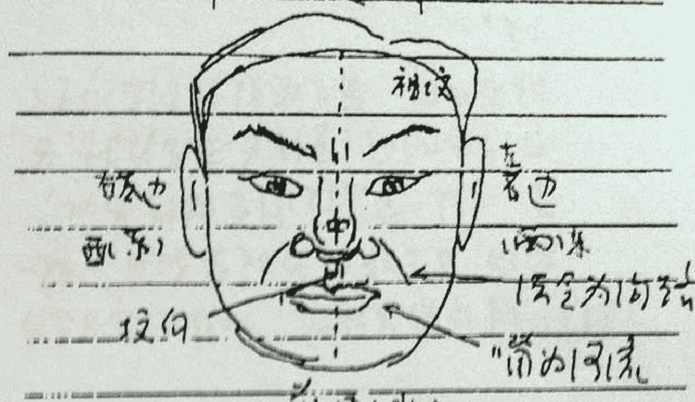

[解]：鼻为坟在左边，鼻色枯黄，坟土燥，气枯土质湿，有贫有财。
人中偏左，坟东南西北向；
人中偏右，坟东北西南向。
坟全被黑为向，坟浅为路。
“嘴大为河，“嘴小为下嘴。

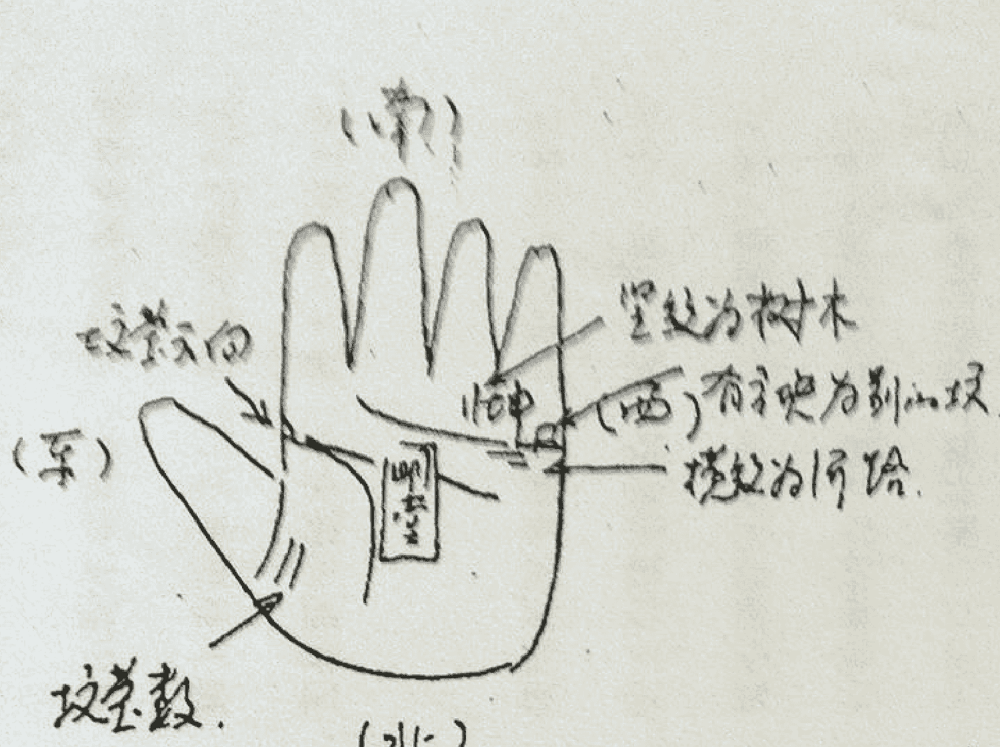

坟墓数。

[解]：坤部最多处坟，地纹开端分支为坟向。艮宫横纹为坟墓数目，一纹一墓，二纹二墓。坟周有曲线为水，有坑为凹风，直线发亮者为路，发暗者为沟，有方块纹为别家少亡之坟。

【诀】1. 天纹为母坟，好色善变心。父不善终已暗现，左烧西贵风水差。
2. 断掌纹个个刚，白手成家好拼命。六亲成靠朝山拱，左右龙虎护卫强。
3. 地纹断续续，直断定无生还。山小岩裂遭毁坏，寿命受损在眼前。

### 一、发：

- 1、头发稀软黑如绵，少年家中有粮钱，性情品质多高尚，聪明得志父母全。
- 2、头发粗硬密又多，个性急燥话不多，父母不全少年苦，一生劳碌受折磨。
- 3、头发高上天庭平，父母必定有才能，自己聪明早得志，个性温和万事成。
- 4、青头皮发生富贵，黄头皮发穷又忙，额上有旋多辛苦，脑后多旋富贵人。
- 5、头发连眉缺爹娘，鬓毛不长少钱粮，苦是额窄低不平，此人一生穷又忙。

### 二、头相：

- 1、头有四角必富贵，园头顶高富寿长，顶低顶缺多薄命，就怕无寿白来忙。
- 2、仰头露面怕遭凶，低头走路万事空，摇头身摆无好命，缩头手舞一生穷。
- 3、额高宽平福禄人，脑后连山晚运成，最怕额缺无好命，尖头瘦腰一世贫。
- 4、额宽五寸高三寸，少年必定有功名，只怕地阁尖削短，先富后贫可怜人。
- 5、天庭中正宽又平，青少之年富贵来，只怕日月偏斜损，就是富贵也多灾。
- 6、额高平满光无纹，此人富贵又聪明，若是耳鼻长又厚，一生富禄财神临。
- 7、额纹深多必劳心，没有额纹无子孙；纹多却又多性燥，纹少女贵如金。
- 8、额生七痣大贵人，额边生痣克双亲，额中生痣无官运，也防父母无感情。
- 9、额起青黑招祸行，不损家人必损财，若是两样都不现，自己当防灾祸临。
- 10、额起黄光或紫红，此人好运事必成，若是求财就到手，要是求官官必临。

### 三、眉毛：

- 1、眉毛青黑疏又长，兄弟姐妹个个强；若是枯黄浓又乱，姊妹必定多灾祸。
- 2、眉不遮肉八字硬，兄弟姐妹无好命，一怕贫穷二怕死，有了也是可怜人。
- 3、眉交浓厚乱纷纷，兄弟姐妹不同心，十个就有九个坏，也许个把好命在。
- 4、眉连印堂寿不长，从小就会克爹娘，兄弟不和六亲断，小气多心婚姻乱。
- 5、眉毛遮眼眼又凹，一生命运不可靠，劳碌奔波防官非，到头好比一阵烟。
- 6、眉浓反生个性强，此人灾难从天降，姊妹早死多磨难，克婚损子受遭殃。
- 7、眉清目秀田宅广，一到中年有福享；眉毛短促兄弟少，就算有了命不好。
- 8、眉毛下垂老实人，初月眉毛有才能，交乱眉毛心事重，就是大才也小用。
- 9、眉内生痣看大小，大的没有小的好，小的聪明又得志，大的姊妹死的早。

> [眉内、眉边生痣，自己或姊妹防水火或水死]

- 10、眉毛一横又贴肉，兄弟一个必单独，若是女人生此相，命无兄弟定孤独。
- 11、眉毛距离眼角高，兄弟个把不糟糕，若是女人生此眉，兄弟一个早年抛。
- 12、眉毛大扫帚，姊妹有八九，中帚有五六，小帚三四有。
- 13、眉到眼角根根起，兄弟五六定合理，两边眉毛都吊角，兄弟姐妹有一桌。
- 14、眉细疏长且又青，一生富贵姐妹亲，更有高寿财源广，兄弟姐妹是精英。
- 15、眉内波纹眉打勾，兄弟姐妹死前头，从小爹娘防早去，前面发财后面丢。
- 16、眉毛上扬志气高，此人参军是英豪，从事文学是才子，骄傲自满最糟糕。
- 17、扬眉扬眼上进强，行行事业比人强，其他部位生得好，必在朝中作栋梁。
- 18、眉毛透剑主高寿，年青透剑有灾祸，老来透剑带好运，他人得喜己惹祸。

### 四、印堂：

- 1、印堂光明主聪明，宽广平满定太平，低陷狭窄无好运，早婚早子不安宁，父母也防早年去，三十以前无福临。
- 2、印堂生痣重色情，早子早女受灾星，婚姻分裂财运败，加上悬针得神精。

> [印堂上有7字纹、反7字纹、*纹、悬针纹、黑痣、倒八字纹、半弧纹，防孤、防病、防灾]

- 3、印堂凸起来，儿女有天才，且得子宫平又满，子女有宝贵财产。
- 4、印堂山根低又青，此人即刻有灾星，两处生得低又窄，父母婚子都防缺。
- 5、女人印堂有悬针，头婚无子不能登，男人防父亦防母，一生自力又更生。
- 6、印堂发黄或发红，此人喜事必重重，发白必定是带孝，发青自己灾病重。

> [印有痣，心窝有；山根有，肝脐有；眉有痣，两膀有；日月有痣，两胸两背有；眼下嘴边有痣，下阴有。]

## 中国传统面相术常识

### 第一条 总则

1.1 先观八格，次看三庭。眼横五配，口约三匀。

1.2 天庭饱满、地阁方圆、两耳垂肩、浓眉大眼、鼻直口方。

### 第二条 发论尊贵

2.1 “贵人不顶重发”、“十个秃子九个富”等都是人们通过一个人的头发来判断此人的贫富尊贵的总结。

2.2《相理衡真》谓：“发疏光润具天聪，秉性仁慈亦浑融。若得眉清兼目秀，何愁身不到穹宫。光如黑漆细如丝，便是人间富贵姿。发广长垂尤迈俗，南形北相更矜奇。头小发长性倔强，发长额窄命难长。发生到耳贫顽子，发卷如螺带克伤”

2.3 头发宜软、宜黑、宜疏。发软如丝者，则夫妻和睦；发稀而细，有名有利；发疏而润泽，此人聪颖。如加上眉目清秀，功名有望。

2.4 头发忌黄、忌粗、忌硬。相术认为，头发粗硬，夫妻不会和睦，男女相克；发黄焦枯，贫贱；在孩啼的时候头发密的话，该孩童多顽皮，发脚低则运气多滞，落发早，则有伤财之患；发卷，恐怕有刑伤；发粗如麻，则穷苦多劳；发长额窄，命不长矣。

### 第三条 额定前程

3.1 “天庭饱满，地阁方圆”。天庭指的是上额，地阁指的是下额。古人看相，就是人的面部分为三部分，上部为天，中部为人，下部为地。人、天、地各有象征，天部（上额）主要是表徵早年的运气，以及天赐的丰厚。

3.2《神相全篇》谓：“头小而窄，到老孤厄。额大面方，到老吉昌。额角高耸，职位崇重。天中丰隆，侯宦有功。额阔面头，贵居人上。额方峻起，吉伙不欣。额莹天瑕，一世荣华。”

3.3 额头最好是发际上、宽、隆起、油亮，无抬头纹。上额宽阔、方峻，而且明净，天赐丰盈，早年发达，功名早就；顶平头圆额又方，定主富贵早功名；额阔面广，贵居人之；额莹无瑕，一世荣华。

3.4 上额尖狭，肩削，而且灰黯皱巴，天削者刑伤，头扁额削难言寿。

### 第四条 眉相

4.1 一看浓淡，二看清杂，三看眉形。

4.2 眉毛宜长、宜秀、宜清、形宜弯。长则寿高、秀则福禄，清则聪颖，弯则善洁。相理认为，下列之眉相多为善：

眉梢长垂高寿之相；眉长过目忠直福禄；眉如弯弓性善富足；眉清高长身名远扬；眉秀神和享清福；眉如新月善和贞洁；眉角入鬓才高聪俊。

4.3 眉忌短、忌散、忌杂。短则贫寒、散则孤苦、杂则粗俗。相理认为下列眉相非善：

眉短于目性情孤僻；眉骨棱高多有磨难；眉散浓低一生孤贫；眉毛中断兄弟离散；眉毛逆生兄弟不和；眉不善眼孤单财败；眉交不分年岁难久；短促不足漂流孤独。

颐。此眉人家世丰厚，手足众多，名声远场。

柳叶眉：眉粗似叶浊中清，骨肉情疏子晚成。信友忠臣多义士，终须发达播贤声。眉体似叶，功名早就，但兄弟不和。

八字眉：八字眉头主克伤，奸门受压数妻亡。平生碌碌财恒足，恐抱螟蛉叫父娘。左右眉毛往下撇开。生性命硬克妻碍子。

罗汉眉：眉如罗汉大非宜，妻晚受磨子亦迟。兄弟刑伤难得力，晚年一子杖头随。这是妻室兄弟有难，晚年得子之相。

### 第五条 眼相

5.1《麻衣相法》谓：“眼如日月要分明，凤目龙睛切要清。最怕黄睛兼赤脉，一生凶害活无成。浮大羊睛必主凶，身孤无著货财空。细深多是无心腹，眼视之人不可逢。”意思是，眼睛应该清澈明亮，又黄又赤、浮突如羊眼、细深斜视都是不善的眼相，睛黄目赤的人命短；突眼的人容易倾家荡产；眼形细深的人冷酷多疑；目光斜视，在男人则狡黠，在女人则淫荡，这两种人都不可与之交往。

5.2《麻衣相法》谓下列是善眼：目秀而长贵比君王。目长如寸可辅佐圣主。目如凤鸾必做高官。龙睛凤目必享重禄。目光威烈众人归顺。目尾上翘福禄不断。目大而光收成丰登。目短眉长田粮厚丰。目光如电贵不可言。眼似虎盼神圣不可冒犯。黑白分明人必聪慧。眼睛黑而眼眶阔灵性活而知识博。

5.3眼形宜长、宜秀，这种眼仕途坦荡，高官厚禄。眼光宜明、宜亮，这种眼禀性聪慧，正直善良，眼神宜严、宜威的人众人依附，威不可犯。

5.4不善的眼如下列：目头破缺家产枯竭。目露面白沙场不测。眼如鸡目其人性急狠毒。形如三角恶劣之辈。目如卧弓其人必是奸雄。眼窝深凹其人诡诈好妒。红眼金睛不认六亲。目细深长执拗不良。

5.5眼形怪黠，其人必奸：眼细深长，脾性执拗，禀性邪狭；双眼暴赤，生格焦躁，无情寡义。

#### 5.6举例

鸳鸯眼：眼秀睛红润有砂，睛圆微露似桃花。夫妻伉俪同偕者，闲逸贪淫富贵家。目秀睛圆，灿若桃花。这是安闲富足享乐之相。

龙眼：龙眼黑睛吐彩光，波长眼大显忠良。巍巍宰辅流芳远，福态儿孙百世昌。黑睛吐光，眼大波长，这是位列君侧，忠贞流芳，福延后世之相。

桃花眼：男女桃花眼不宜，逢人微笑动春思。眼皮如湿贪淫极，媚骨贫穷贱莫疑。湿眼媚态，暗波撩人。下贱之相。

### 第六条 鼻相

6.1鼻脊至两眼中间处，叫山根；鼻的下端叫鼻准（或叫准头），鼻准与山根之间的中点叫年寿。准头的左右两翼，右为兰台，右为廷尉（合简称兰廷）。

6.2《麻衣相法》谓：“鼻如悬胆身须贵，土曜当上得地来。鼻头尖小人贫贱，孔仰家无隔宿钱。又怕苗如鹰嘴样，一生奸计不堪言。”意思是说鼻若悬胆将，财运亨通，山根饱满贯额，官至三台以上；而准头尖子，鼻孔朝天，是家无隔夜粮的穷相，年寿（鼻梁中间部）高曲准（鼻尖）勾如鹰嘴，则是奸险之人。

6.3以下几种是善的鼻：鼻如悬胆、鼻准圆红者家财丰厚。鼻耸天庭穴（两眉间印堂穴上面）者名声远播。鼻体丰隆，准头圆润，且略带前凸，叫鹿鼻者多情多义，贤人达贵。鼻高昂直者高官尊贵。鼻直而厚者位列诸侯。山根、年寿平直，兰廷丰盈者家财丰厚，中晚年得志显贵。准头圆润则财足，鼻势高直则尊贵，鼻体匀厚则家兴。

6.4不善的鼻的有以下几种：鼻梁不正者中年遇困。鼻梁无骨者恐遭夭折。

鼻体露骨，兰廷小准头尖者多疑且心狠。露脊准头是鹰嘴鼻者十恶不赦之人。两孔外露叫露孔鼻者家坏祖业之人。山根塌陷，鼻体扁薄，鼻梁不正，准头尖勾，鼻孔外露，年寿粗凸，都是不好的鼻相。鼻平扁多贫寒。准头尖勾多阴险，鼻脊不正或粗凸多遭难。

### 第七条 耳相

7.1 一看轮廓，二看厚薄，三看高低，四看耳色。

7.2《麻衣相法》说：“轮廓分明有坠珠，一生仁义最相宜。木星得地招文学，自有声名达帝都。耳反无轮最不堪，又如箭羽少资粮。命门窄小人无寿，青黑皮粗走异乡。”大意是轮廓分明，润软垂珠则善，耳轮翻卷粗黑，则非善。

7.3 耳宜高、宜大、宜坚、宜厚、宜亮。高则福寿，大则英豪，坚则有威，厚则富足，亮则智聪。两耳垂肩、耳带垂珠、耳门垂厚者皆命当富贵；耳白过面者声名远播；耳生毫毛者富贵寿长；耳大、贴脑、坚厚者豪门贵族之相。

7.4 耳是忌翻、忌卷、忌小、忌薄、忌裂、忌暗。翻多劳碌，卷多低贱，小多贫寒，薄多病弱，裂多败落，暗多愚鲁。轮翻廓反、垂珠低反、上大下卷者低贱劳碌之相；耳薄如纸者命易夭折；耳薄向前、两耳招风者败家之流；耳门窄小、耳巧细微者贫寒之人；耳轮拼裂、状若开花者败落漂泊之相；粗黑焦黄者愚莽颓之相。

### 第八条 口相

8.1 口相的审美观与潮流有着密切的关系，古代视女人樱桃小嘴为美，薄唇者口齿伶俐，厚唇者愚笨。现代则视厚唇大嘴为性感美。但潮流所兴的嘴与古代以嘴相命则没有多大关系。

8.2《麻衣相法》谓好的口相：口大容拳、口形方阔者位列高官。口赤如丹者富享荣华。口不见唇者仪态威严。口角上弯者意志刚强。两唇上下平齐叫龙口，此人仪态威严之人，终将位列朝班。两唇厚丰则舌长齿白叫牛口，此人衣食充隆。口大可容拳者尊贵之相。口小如抹胭脂，叫樱桃口，此人若女人则灵巧窈窕；在男人则不值称赏。

8.3《麻衣相法》谓不好的口相：口角不张、口撮紧缩者贫寒破败之相。口角下垂者财彩拮据。口如吹口形、口唇纹乱者皆孤苦之人。两唇不合皱纹侵乱，叫皱纹口，此人心狠运差。

8.4《相理衡真》谓：口如砂，食如荣华。口如抹丹，不受饥寒。口如红朱，富贵相宜。口如中唇，必是贤人，非特口德，又且性纯。口如角弓，位至三公。口紫而方，广置田庄。口角不张，缺乏储粮。口不见唇，主有兵权。口大容拳，位至公侯。口垂两角，衣食消缩。口角高低，奸诈便宜。口尖如菱，与乞为邻。口如缩囊，饥饿无粮，纵然有子，必主别房。口如缩螺，常乐独欢。口边紫色，贪财妨害。口如撮紧，破产飘蓬。口不见齿，老亦成立。口唇乱纹，一世孤单。口如吹火，至老独坐。口上生纹，有约无成。轻薄口唇，惯说他人。口阔又长，食禄万钟。口角向上弯，终身不怕难。

### 十二宫

##### 一、命宫

命宫者，居两眉之间，山根之上。光明如镜，学问皆通。山根平满，乃主福寿。土星耸直，扶拱财星。眼若分明，财帛丰盈。额如川字，命逢驿马，官星果若如斯，必保双全富贵。凹沉必定贫寒，眉接交相成下贱；乱里离乡，又克妻。额窄眉枯，破财混沌。

诗曰：
眉眼中央是命宫，光明莹净学须通。
若还纹理多迍滞，破尽家财及祖宗。

命宫论曰：印堂要明润，主寿长久。眉交者，身命早倾。悬针主破，克妻害子。印堂不宜昏暗，有川字纹者，为将相。平正明润身常吉，得贵人之力。气色青黄虚惊，赤主刑伤，白主丧服悲哀，黑主身亡，红黄主寿安，终身吉兆。

##### 二、财帛宫

鼻乃财星，位居土宿。截筒悬胆，千仓万箱。耸直丰隆，一生财旺富贵。中正不偏，须知永远滔滔。鹰嘴尖峰。破财贫寒。莫教孔仰、主无隔宿之粮。厨灶若空，必是家无所积。

诗曰：
鼻主财星莹若隆，两边厨灶莫教空。
仰露家无财与粟，地阁相朝甲柜丰。

财帛宫论曰：天仓、地库、金甲柜、井、灶，总曰财帛官。须要丰满明润，财帛有余，忽然枯削，财帛消乏。有天无地，先富后贫。天薄地丰、始贫终富。天高地厚，富贵满足，荫及子孙。额尖狭窄、一生贫寒。井灶破露，厨无宿食。金甲柜丰，富贵不穷。气色昏黑。主破失财禄，红黄色现，主进财禄。青黄贯鼻、主得横财。二柜丰厚，明润消和，居官而受赏赐。赤主口舌。

##### 三、兄弟宫

兄弟位居两眉，属罗计。眉长过目，三四兄弟无刑。眉秀而疏。枝干自然端正，有如新月和同、永远超群。若是短粗、同气连枝见别。眉环塞眼、雁行必疏，两样眉毛，定须异母。交连黄薄，自丧他乡。旋结回毛。兄弟蛇鼠。

诗曰：
眉为兄弟软径长、兄弟生成四五强。
两角不齐须异母，交连黄簿送他乡。

兄弟宫论曰：兄弟罗计，须要丰盈，不宜亏陷。长秀则兄弟和睦，短促不足，则有分离孤独。眉有旋毛，兄弟众多狼件不常。眉毛散者、钱财不聚。眉毛逆生。仇兄贼弟。互相妒害，或是异姓同居。眉清有彩，孤腾清高之士。眉毛过目，兄弟和睦。眉毛中断，兄弟分散。浓淡丰盈、义友弟兄。气色青主兄弟斗争。口舌黑白，兄弟伤文。红黄之气。荣贵喜庆。

##### 四、田宅

田宅者，立居两眼、最怕赤脉侵睛。初年破尽家园，到老无粮作蘸（zhan 蘸水）。眼如点漆、终身产业荣荣。凤目高眉、置税三州五县。阴阳枯涩、莫保田园。火眼水轮，家财倾尽。

诗曰：
眼为田宅主其宫，清秀分明一样同。
若是阴阳枯更露、父母家财总是空。

田宅宫论曰：十星为田宅，主地阁要朝。天庭丰满明润，主田宅进益。低塌昏暗倾欣。主破田宅。若飞走不朝、田宅居无气色，青主官非田宅无成。黑主杖责。白主丁忧。红主成，田宅喜重重、黄明吉昌，谋元不遂，君子加官，即日得升，小人得宠，利见贵人，武职或领兵马、杀气旺者，即行师，主管财赋，或八运司等处，五品至三品，三品至二品，如是详看六品以下，另作别论。

##### 五、男女

男女者。位居两眼之下。名曰泪堂。三阳平满，儿孙福禄荣昌。隐隐卧蚕，子息还须清贵。泪堂深陷，定为男女无缘。黑痣斜纹，到老儿孙有克。口如吹火，独坐兰房。若是平满人中，难得儿孙送老。

诗曰：
男女三阳起卧蚕，莹然光彩好儿郎。
悬针理乱来侵位，宿债平中不可当。

男女宫论曰：三阴三阳、位亦丰厚、不宜枯陷。左三阳枯，克损男。右三阴枯，克损女。左眼下有卧蚕纹，生贵子。凡男女眼下无肉者，妨害男女。卧蚕陷者，阴骘少；当绝嗣也。乱纹侵者，主假子及招义女。鱼尾及龙宫黄色环绕，主为阴骘纹见曾怀阴德济于人，必有果报。又云：精寒血竭不华色，男不旺，女不育。若明阳调和，精血顺畅，男女交合，故生成之道不绝。宜推于形象外，当以理言，玄妙自见也。气色青，主产厄。黑白主男女悲哀。红黄主喜至。三阳位红生儿。三阴位青生女。

##### 六、奴仆

奴仆者，位居地阁，重接水星。颏（ke）圆丰满，侍立成群。辅弼星朝、一呼百诺。口如四字，主呼聚喝散之权。地阁尖斜，受恩深而反成怨恨。纹成败陷，奴仆不周。墙壁低倾，恩成仇隙。

诗曰：
奴仆还须地阁丰，水星两角不兼容。
若言三处都无应，倾陷纹痕总不同。

奴仆宫论曰：悬壁无亏，奴仆不少。如是枯陷，仆马俱无。气色青主奴马损伤。白黑主仆马坠堕，不宜远行。赤主仆马口舌，损马失财.黄色胜，牛马奴仆自旺，左门右户，排立成行。

##### 七、妻妾宫

妻妾者，位居鱼尾，号曰奸门。光润无纹，必保妻全。四德丰隆平满，娶妻财帛满箱。颧骨侵天，因妻得禄。奸门深陷，长作新郎。鱼尾纹多，妻防恶死。奸门暗惨，自号生离。黑痣斜纹，外情好而心多淫欲。

诗曰：
奸门光泽保妻宫，财帛盈箱见始终。
若是奸门生暗惨、斜纹黑痣荡淫奔。

妻妾宫论曰：鱼尾须要平满，不宜缺陷。丰满则夫贵妻荣，奴仆成行。妇女鱼尾奸门明润、得贵人为夫。女人鼻如悬胆，则主富贵。缺陷则主防夫，淫乱败家、放荡不旺夫。妇人面如满月，下颏丰满，至国母之贵。气色青，则主妻妾忧愁思虑。赤主夫妻口舌。黑白主夫妻男女之悲。红黄色见、主夫妻男女和谐之喜。如有暗昧，主夫妻分离，不然断角少情。

##### 八、疾厄宫

疾厄者，印堂之下，位居山根。隆若丰满，福禄无穷。连接伏犀，定主文章。莹然光彩，五福惧全，年寿高平，和鸣相守。纹痕低陷，连年宿疾沉疴，枯骨尖斜，未免终身受苦。气如烟雾，灾厄缠身。

诗曰：
山根疾厄起平平，一世无灾祸不生。
若值纹痕并枯骨、平生辛苦却难成。

疾厄宫论曰：年寿明润康泰，昏暗疾病至。气色青主惊忧。赤防重灾。白主妻子之悲。黑主身死。红黄紫主喜气之兆也。

##### 九、迁移宫

迁移者，位居眉角，号曰天仓。丰盈隆满，华彩无忧。鱼尾位平，到老得人钦羡，腾腾驿马，须贵游宦四方。额角低陷，到老住场难见。眉连交接，此人破祖离家。天地偏斜（是说：天庭与地阁不正），十居九变。生相如此，不在移门，必当改墓。

诗曰：
迁移宫分在天仓，低陷平生少住场。
鱼尾末年不相应，定因游宦却寻常。

迁移宫论曰：边地驿马，山林发际，乃为出入之所在，宜明润洁净，利远行，若此暗缺陷，及有黑子，不宜出入，被虎狼惊。气色青，远行主惊失财。色白主马仆有失，色黑主道路身亡。红黄紫宜获财喜。

##### 十、官禄宫

官禄者，位居中正，上合离宫，伏犀贯顶。一生不到公庭，驿马朝归，官司退扰。光明莹净，显达超群。额角堂堂，犯着官司贵解。宫痕纹破，常招横事。眼如赤鲤，决死徒刑。

诗曰：
官禄荣宫仔细详，山根仓库要相当。
忽然莹净无痕点，定主官荣贵久长。

官禄宫论曰：两眼神光如曙星，龙目凤睛主贵。印堂明润，两耳色白过面，声闻天下，福禄荣显。如陷缺飞走，而无名誉。气色青，主忧疑。赤主口舌是非。白主孝服至。红黄上下有诏书加官进职之喜。

##### 十一、福德宫

福德者，位居天仓，牵连地阁。五星朝拱，平生福禄滔滔。天地相朝，德行须全五福。颏圆额窄，须知苦在初年。额阔颐（yi 颊 jia 腮）尖。苦还从晚景。眉高耳耸，尤且平平。眉压耳掀，休言福德。

诗曰：
福德天仓地阁圆，五星光照福绵绵。
若还缺陷并尖削、衣食平平更不全。

福德宫论曰：天仓地库为福德宫，须要丰满明润，相朝招重重祖荫、福德永恒。若陷缺不利，浅窄昏暗、灾厄常见，人亡家破，大概因心术损了阴骘，始终勉强，神明不保佑。作事行悔，满面春风，一团和气。气色青主忧疑。赤主酒肉，主口舌。白主灾疾。红黄吉兆。

##### 十二、相貌宫

相貌者，先观五岳，次辨三停。盈满，此人富贵多荣。三停俱等，永保平生显达。五岳朝耸，官禄荣升，行坐威严，为人尊重。额管初运。鼻管中年。地阁水星，是管末运。若有克陷，断为凶恶。

诗曰：
相貌须称上下停，三停平等更相生。
若还一处无均等，好恶中间有更改。

相貌宫论曰：骨法精神，骨肉相称气相和，精神清秀，如桂林一枝、昆仑山片玉，如珠藏渊，如玉隐石，贵显名流，翰院吉士。暗惨而薄者凶。气色满面红黄明润，大吉之兆。

### 十二宫秘诀

父母宫论曰：日月角须要高，明净则父母长寿康宁。低塌则幼失双亲。暗昧主父母有疾。左日角偏，妨父。右月角偏，妨母。或同父异母，或随母嫁父，出祖成家、重重灾难、只宜假养（过继）。方免刑伤。又云：重罗迭汁、父母重拜，或父乱母淫，与外奸通、又主妨父害母。头偏额窄，多是庶出，或因奸而得。又云：左眉高，右眉低，父在母先归。左眉上、右眉下，父亡母再嫁。额削眉交者，主父母早抛，是为隔角反面无情。两角入顶，父母双荣，更受祖荫，父母闻命。气色青主父母忧疑，又有口舌相伤。黑白主父母丧亡。红黄主双亲喜庆。

## 五官总论

五官者，一曰耳为采听官，二曰眉为保寿官，三曰眼为监察官，四曰鼻为审辨官，五曰口为出纳官。《大统赋》云：一官成，十年之贵显，一府就十载之富丰。但于五官之中，倘得一官成，可享十年之贵也。如得五官俱成，其贵终老。

1、耳为采听官：不论大小，要轮廓分明，喜白过面，水耳、土耳、金耳、牛耳、圆棋耳、贴脑耳、对面不见耳，高眉一寸，轮厚廓坚，红润姿色，内有长毫，孔小不大，此采听官成也，或鼠耳、木耳、火耳、箭羽耳、猪耳、轮飞廓反，不好之耳，或低小软弱，此采听官不成也，不利少年损六亲。

2、眉为保寿官：喜清高疏秀弯长，亦宜高目一寸，尾拂天仓，主聪明富贵，机巧福寿，此保寿官成也；若粗浓黄淡，散乱低压，乃刑伤破败，此一官不成也。

3、眼为监察官：黑白分明，或凤眼、象眼、牛眼、龙虎眼、鹤眼、猴眼、孔雀眼、鸳鸯眼、狮眼、喜鹊眼，神藏不露，黑如漆，白如玉，波长射耳，自然清秀有威，此监察官成也；若蛇、蜂、羊、鼠、鸡、猪、鱼、马、火轮四白等眼，赤白相侵，睛圆黑白混杂，兼神光太露，昏昧不清，此监察官不成也，又且愚顽凶败。此一官不成也。

4、鼻为审辨官：亦宜丰隆耸直有肉，伏犀龙虎鼻，狮牛胡羊鼻，截筒盛囊悬胆鼻，端正不歪不偏，不粗个小，此审辨官成也。若狗鼻、鲫鱼、鹰嘴、剑峰、反吟、复吟、三曲、三弯、露孔、仰灶、扁弱、露脊、露骨、太大孤峰，况又凶恶，贫苦无成，刑恶奸贪，此审辨官不成也。

5、口为出纳官：唇红齿白，两唇齐丰，人中深长，仰月弯弓，四字口方，牛龙虎口，两唇不反不昂，不掀不尖，此出纳官成也。或猪狗羊口，覆船，宴鱼鲥鱼，鼠食羊食，唇短齿露，唇黑唇皱，上唇薄下唇反，须黄焦枯粗浊，此出纳官不成也。书云：一官成者，掌十年之贵禄富丰，不成者，必主十年困苦。

## 五岳

额为衡山（南岳）。颏为恒山（北岳）。鼻为嵩山（中岳）。左颧为泰山（东岳）。右颧为华山（西岳）。

中岳要得高隆，东西岳须耸而朝应、不隆不峻，则无势，为小人，亦无高寿。中岳薄面无势，则四岳无主，即使四岳都好，也不至大贵，无威严重权，寿不甚远。中岳不及且长者，止中寿，如尖薄，晚年见破，到头少称意。南岳倾削，则主见破，不宜兴家。北岳尖陷，末主无成，终亦不贵。东西倾倒无势，则心恶毒无慈爱，五岳须要相朝。

## 四渎

耳为江。目为河。口为淮。鼻为济。四渎要深远成就，而涯岸不走，则财谷有成，财物不耗多蓄积。耳为江渎，窍要阔而深，有重城之副，紧则聪明，家业不破。目为河渎，深为寿，小长则贵，光则聪明，浅则短命，昏浊多滞，圆则多天，不大不小贵。口为淮渎，要方阔而唇吻相覆载，上薄则不覆，下薄则不载，不覆不载则无寿，无晚福。不覆则家必覆。鼻为济渎，要丰隆光圆，不破不露，则其家必富。

额尖初主灾，鼻歪中主逃，欲知晚景事，地阁喜方高。头为寿柱，身为梁柱，足为栋柱。

## 五星六曜说

五星，金、木、水、火、土。六曜者，太阳、太阴、月孛、罗睺、计都、紫气。火星须得方，方者有金章。（额也）紫气须得圆，圆者有高官。（印堂）土星须要厚，厚者得长寿。（鼻也）木星须要朝，五福并相饶。（右耳）金星须要白，官位终须获。（左耳）罗睺须要长，长者食天仓。（左眉）计都须要齐，齐者有妻儿。（右眉）月孛须要直，直者得衣食。（山根）太阴须要黑，黑者有官职。（右眼）太阳须要光，光者福禄强。（左眼）水星须要红，红者作三公。（口也）

### 五星六曜决断诗

1、金木星是耳，贵要轮廓分明，其位红白色不均，大小如门阔，生得端正，不反不尖，不小，一般更是高过眉眼。白色如银样大好。其人当生得金木二星照命，发禄定早。若反侧窄，或大或小，为陷了金木二星，其人损田宅，破财帛，无学识也。诗曰：金木成双廓有轮，风门容指主聪明。端耸直朝罗计上，富贵荣华日日新。金木开花一世贫，轮翻廓反有艰辛。于中若有为官者，终是区区不出尘。（左金耳右木耳）

2、水星是口，名为内学堂，需要唇红四角阔人中深，口齿端正有文章，为官食禄。若唇齿粗，口角垂，黄色主贫贱。诗曰：口含四字似朱红，两角生棱向上官，定是文章聪俊士，少年及第作三公。水星略绰两头垂，尖薄无棱是乞儿。若是偏斜居左右，是非奸诈爱便宜。

3、火星是额如见额广阔发际隆深者，有禄位衣食，及子息四五人，其人有艺学，父母尊贵，当生命宫，得火星之力照命，有田宅，寿九十九。如尖陋有多纹理者，是陷了火星，乃不贵，无子息或一二人，至老不得力，衣食平常，又不得兄弟力，主贫，无大寿，损妻破财。诗曰：火星宫分阔方平，润泽无纹气色新。骨耸三条川字样，少年及第作公卿。火星尖狭是三流（一般）、纹乱纵横主配囚。赤脉两条侵日月，刀兵赴法死他州。

### 鼻土星

土宿端圆似截筒，灶门孔大即三公，兰台庭尉来相应，必主声名达贤聪。土宿歪斜受苦辛，准头尖薄主孤贫，旁观勾曲如鹰嘴，心里奸谋必害人。

### 紫气宫（印堂）

紫气宫中阔又圆，拱朝帝王是英贤，兰台廷尉来相应，末主官荣盛有钱。紫气宫中窄又尖，少短无腮更少鬓，自小为人无实学，衣食萧条没更添。

### 月孛宫（山根）

月孛宜高不宜低，荣然光彩是琉璃，为官必定忠臣相，末主高官有好妻。月孛宫中窄又尖，家财早破事相煎，为官岂得荣官禄，孛位当生困岁年。

### 罗计宫（眉毛）

罗计星君秀宜长，分明贴肉应三阳，不唯此貌居官职，恩义彰明播远方。罗计稀疏骨耸高，为人性急爱凶豪，奸邪状如垂杨柳，兄弟同胞有旋毛。

## 日月宫（左右眼）

日月分明似太阳，精神光彩一般强，为官不拜当朝相，也合高升作侍郎。（左）日月斜窥赤贯瞳，更兼孤露又无神，阴枯阳衰因刀死，莫待长生主恶终。（右）

## 六府

六府者，两辅骨、两颧骨、两颐（腮）骨、欲其充实相辅，不欲支离低露。《灵台秘诀》云：上二府自辅角至天仓，中二府自命门至虎耳，下二府自肩骨至地阁。六府充直无缺陷瘢痕者，主财旺。天仓峻起多财禄，地阁方圆万顷田，缺者不合。

## 三才三停论

三才者，额为天，欲阔而圆，名曰有天者贵。鼻为人，欲旺而齐，名曰有人者寿。颏为地，欲方而阔，名曰有地者富。三停者，自发际至眉为上停，眉至准头为中停，准头至地阁为下停。诀曰：上停长老吉昌，中停长近君王，下停长少吉祥。三停平等，富贵荣显。三停不均，孤夭贫贱。诗曰：面上三停仔细看，额高须得耳门宽。学堂三部无堪是，空有文章恐不官，鼻梁隆起如悬胆，促者中年寿不长。地阁满来田地盛，天廷平阔子孙昌。

## 四学堂

一曰眼为官学堂，眼要长而清，主官职之位。二曰额为禄学堂，额阔而长，主官寿。三曰当门两齿为内学堂，要周正而密，主忠信孝敬。疏缺而小主多狂妄。四曰耳门之前为外学堂，要耳前丰满光润，主聪明。若昏沉愚鲁之人也。

## 八学堂

第一高明部学堂，头圆或有异骨昂。第二高广部学堂，额角明润骨起方。第三光大部学堂，印堂平明无痕伤。第四明秀部学堂，眼光黑多瞳隐藏。第五聪明部学堂，耳有轮廓红白黄。第六忠信部学堂，齿齐周密白如霜。第七广德部学堂，舌长至准红纹长。第八班笋部学堂，横起天中细秀长。（皱纹）八位学堂如有此，人生富贵多吉祥。

## 学堂诗

背负琴书不得名，学堂无位陷三停。人中一位若无应，空将年月在朝臣。欲说无官少保人、盗门青气有罗纹。使于鼻上多红气，可惜虚劳枉苦辛。月学尖儿义损财，初年流落更多灾。官方门舌无人说，只有先贤相出来。

## 人面总论

天庭欲起司空平，中正广阔印堂清，山根不断年寿润，准头齐圆人中深，口如四字承浆阔，地阁朝归仓库应，山林圆满驿马丰，日月高广边地静，阴阳肉多鱼尾长，正面颧开有神光，兰廷圆正法令通，金匮海角微生黄，三阴三阳不枯陷，龙藏虎伏仍相当，五岳四渎无克破，便见人间可相郎，若见欹斜并斜塌，气暗神昏受折磨，面有神光射人目，男贵公侯女贵后。

土星是鼻，须要准头丰厚，两孔不露，年上寿上平满直耸而不偏，其人当不陷土星，人命并满三分，主有福禄寿。如中岳土星不正，准头尖露，更准头高，其人陷了中岳土星，主贫贱少家业，主心性不直。诗曰：土宿端圆似截筒，灶门孔大即三公。兰台廷尉来相应。必主声名达圣聪。土宿歪斜受苦辛，准头尖薄主孤贫，傍观勾曲如鹰嘴，心里奸谋必害人。紫气星下是印堂，分明无直纹圆如珠，主人必贵。白色如银样，主大富贵。黄者有衣食。如窄不平匀，有隐纹者，不吉，子息二三人，不得力，无厚禄，损田宅。诗曰：紫气宫中阔又圆，拱朝帝主是英贤。兰台廷尉来相应，未主官荣盛有钱。紫气宫中窄又尖，小短无腮更少男。自小为人无实学，衣食潇条更没添。太阴太阳是眼，要黑白分明，长细双分人鬓者，黑睛多白睛少，光彩者，其人当生得阴阳二星照命，作事俱顺，骨肉俱贵。如黑少白多黄赤色，其人陷了二星，损父母害妻子，破田宅多灾短命。诗曰：日月分明是太阳，精神光彩一般强。为官不拜当朝相，也合高迁作侍郎。日月斜窥赤贯瞳，更嫌孤露又无神。阴阳枯暗因刀死，莫待长年主恶终。月孛星是山根，从印堂直下分破者，其人当遭月孛照命。陷了山根，主子孙不吉，定多灾危，修读无成，破产刑妻害子息。诗曰：月孛宜高不宜低，莹然光彩似琉璃。为官必定忠臣相，未主高官有好妻。月孛宫中狭又尖，家财早破事相煎。为官岂得荣高禄，孛位当生困岁年。

罗计星是眉，二星粗黑过目人鬓际者，此衣禄之相，子息父母皆贵，亲眷亦贵。此二星入命，如眉相连横赤色更短，主骨肉子息多犯恶死。

## 五行形相

诗曰：木瘦金方水主肥，土形敦厚背如龟。上尖下阔名为火，五样人形仔细推。木色青来火色红，土黄水黑是真容。只有金形是带白，五般颜色不相同。诗曰：青主忧今白主丧，黑主重病及官方。若还进职并添喜，看取所黄满面光。

## 五行相说

夫人之受精于水，禀气于火而为人。精合而后神生，神生而后形全。是知全于外者，有金木水火土之相，有飞禽走兽之相。金不嫌方，木不嫌瘦，水不嫌肥，火不嫌尖，土不嫌浊。似金得金，刚毅深。似木得木，资财足。似水得水，文学贵。似火得火，见机果。似土得土，厚柜库。故丰厚严谨者，不富即贵。浅薄轻燥者，不贫则夭。如子女之气，欲其和媚，相貌欲其严整，若此者不富则贵也。

## 论形

人秉阴阳之气，肖天地之形，受五行之资，为万物之灵者也。故头象天，足象地，眼象日月，声音象雷霆，血脉象江河，骨节象金石，鼻额象山岳，毫发象草木。天欲高远，地欲方厚，日月欲光明，雷霆欲震响，江河欲润，金石欲坚，山岳欲峻，草木欲秀，此皆大概也，然郭林宗有观人八法，是也；

## 论神

夫形以养血，血以养气，气以养神，故形全则血全，血全则气全，气全则神全。是知形能养神，托气而安也。气不安则神暴而不安，能安其神，其惟君子乎。穷则神游于眼，寐则神处于心，是形出处于神而为形之表，犹日月之光外照万物，而其神固在日月之内也。眼明则神清，眼昏则神浊。清则贵，浊则贱。清则卧多而寐少，浊则寐多。能推其寐者，可以知其贵贱也。夫梦之境界，盖神游于心，而其所游之远，亦不出五脏六腑之间，与夫耳目视听之门也。其所游之界，与所见之事，或相盛而成，或遇事而至，亦吾身之所有也。梦中所见之事，乃吾身中，非出吾身之外也。白眼禅师说梦有五境：一曰灵境，二曰宝境，三曰过去境，四曰现在境，五曰未来境。神惨梦生，神静则境灭。夫望其形，或洒然而清，或朗然而明，或凝然而重，然由神发于内而见于表也。神清而和，彻明而秀者，富贵之相也。昏而柔弱浊而结者，贫沟之相也。实而静者其神安，虚而急者其神惨。

## 相主神有七

藏不晦，藏者不露也，晦者无神也。安不愚，安者不摆动也，愚者不变通也。发不露，发者发扬也，露者轻佻也。清不枯，清者神逼人也，枯者神而死也。和不弱，和者可亲也，弱者可呻也。怒不争，怒者正气也，争者泪气也。刚不孤。刚者可敬也，孤者可恶也。诗曰：神居形内不可见，气以养神为命根。气壮血和则安固，血枯气散神光奔。英标清秀心神爽，气血和调神不昏。神之情状为形表，能定贵贱就此论。

## 论形有余

形之有余者，头顶圆厚，腹背丰隆，额阔四方，唇红齿白，耳圆成轮，鼻直如胆，眼分黑白，眉秀疏长，肩圆脐厚，胸前平广，腹圆垂下，行坐端正，五岳朝起，三停相称，肉腻骨细，手长足方，望之巍巍然而来，视之怡怡而去，此皆谓形有余也。形有余者，令人长寿无病，富贵之荣矣。

## 论神有余

神之有余者，眼光清莹，顾盼不斜，眉秀而长，精神耸动，容色澄彻，举止大方。恢然远视，若秋日之照霜天；巍然近瞩，似和风之动春花。临事刚毅，如猛兽之步深山；出泉迢遥，似丹凤而翔云路。其坐也如界石不动，其卧也如栖鸦不摇，其行也洋洋然如平水之流，其立也昂昂然如孤峰之耸。言不妄发，性不妄躁，喜怒不动其心，荣辱不易其操，万态纷错于前，而心常一，则可谓神有余也。神有余者，皆为上贵之人，凶灾难入其身，天禄永其终矣。

## 论形不足

形不足者，头顶尖薄，肩膊狭斜，腰肋疏细，肘节短促，掌薄指疏，唇掀额瘪，鼻仰耳反，腰低胸陷，一眉曲一眉直，一眼仰一眼低，一睛大一睛小，一颧高一颧低，一手有纹，一手无纹，睡中眼开，言作女音。齿黄而露，口臭而尖。秃顶无众发，眼深不见睛。行步奇侧，颜色萎怯。头小而身大，上短而下长，此之谓形不足也。形不足者，多疾而短命，福薄而贫贱矣。

## 论神不足

神不足者，似醉不醉，常如醉酒；不愁似愁，常如忧戚。不睡似睡，绕睡便觉；不哭似哭，常如惊怖。不嗔似嗔，不喜似喜，不惊似惊，不痴似痴，不畏似畏，容止昏乱，色浊似染。癫痫神色凄怆，常如大失；恍忽张惶，常如恐怖。言语瑟缩似羞隐藏，貌儿低摧如遭凌辱。色初鲜而后暗，语初快而后慢，此皆谓神不足也。神不足者，多招牢狱之厄，官亦主失位矣。

## 论声

夫人之有声，如钟鼓之响。器大则声宏，器小则声短。神清则气和，气和则声润，深而圆畅也。神浊则气促，气促则声焦急而轻嘶也。故贵人之声，多出于丹田之中，与声气相通，混然而外达丹田者，声之根也。舌端者，声之表也。夫根深则表重，根浅则表轻，是如声发于根而见于表也。若夫清而圆，坚而亮，缓而烈，急而和，长而有力，勇而有节，大如洪钟腾韵龟鼓振音，小如玉水流鸣翠征奏曲。见其色则粹然而后动，与其言久而后应，皆贵人之相也。小人之言皆发舌端之上，促急而不达，何则急而嘶，缓而涩，深而滞，浅而躁。大则散，散则破，或轻重不均，嘹亮无节，或睚眦而暴，繁乱而浮，或如破锣之响，败鼓之鸣，又如寒鸦哺雏，鹅雁嘶咽，或如病猿求侣，孤雁失群，细如蚯蚓发吟，狂如青龟夜惨，有如犬之吠，如羊之鸣，皆贱薄之相也。男有女声单贫贱，女有男声亦妨害。然身大而声小者凶，或干湿而不齐，谓之罗网声。大小不均，谓之雌雄声。或先迟而后急，或先急而后迟，或声未止而气先绝，或心未举而色先变，皆贱之相也。夫神定于内，气和于外，然后可以接物，非难言有先后之叙，而色亦不变也。苟神不安而意不和，则其言失先后之叙，辞色挠矣，此小人之相也。夫人禀五行之形，则气声亦配五行之象也。故土声深厚，木声高唱，火声焦烈，水声缓急，金声和润。又曰：声轻者断事无能，声破者作事无成，声浊者谋运不发，声低者卤钝无文。清吟如涧中流水者，极贵。发声溜亮自觉如瓮中之响者，主五福全备之人也。

## 听声篇

声小亮高，贤贵之极；语声细嫩，必主贫寒，兼须危困。女人雄声，终身不荣，良人早强，虚有夫名。男子雄声，妨须多儿女，声急切妨夫一绝。

诗曰：木声高唱火声焦，和润金声最富饶。土语却如深瓮里，水声圆急又飘飘。贵人音韵出丹田，气实喉宽响又坚。贫贱不离唇舌上，一生奔走不堪言。声大无形，托气而发，贱者浮浊，贵者清趣。太柔则怯，太刚则折。隔山相闻，圆

## 第十六章，安徽相法秘传各种意外伤害断法。

[诀]意外伤害哪里有？流年气色纹痕见。相面之前看山根，山根最怕起横纹。头道横纹离祖宗，二道横纹离六亲。印堂若有悬针纹，刑妻克子伤自身。印堂若有八字纹，四十以前有灾临。印堂若有川字纹，中年多灾易实死。印堂有自身灾，若无孝服损钱财。印堂白孝服来，家中无了六亲来。印堂黑见凶灾，近有凶灾危生命。印堂与肤同，近期无伤害。印堂黄喜事来，若无嫁娶定进财。若有斜纹侵命宫，此纹名叫伤害纹。左侵命宫妨害人，右侵命宫被人伤。见下图：

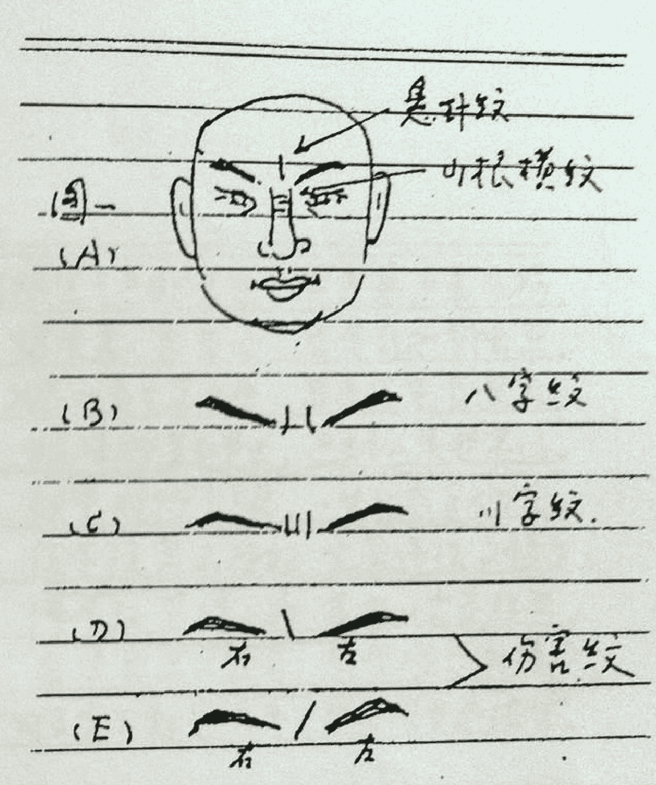

[解]：印堂位在两眉之间，为命宫。悬针纹上克父母，中克兄弟及妻子，主夫妻不睦，下克子女，若下有横纹截断伤害可减轻。

山根有横纹，一道横纹一次灾，如大病，伤残等，见图A。

印堂有二道竖纹名“双雀纹”，不好。或“八字纹”也不好，主妨夫，四十岁前多灾。见图B

印堂有“川字纹”，白手成家，夫妻不和，中年多灾，易突然死亡。性刚，夫妻不能常在一起。见图C

看伤害当以印堂为主，山根、年寿为疾厄宫，也主重看。有纹侵入印宫，向左侵入，自己脾气不好，伤害别人？如打架斗殴而伤害人；向右侵入，是被人伤害。

气色也很重要，可看何时伤害。当然也要结合流年定夺。

> （诀）睛里之色眼下过，突然暴死或车祸。若是常人要当心，若是司机别出车。眼中黑气家不宁，赤色官灾主丧夫。眼珠内呈红色点，近期必走进牢门。印堂刑狱有黑痣，一生必有牢狱灾。法令纹若不对称，必有违法事情生。法令纹暗小疵，定有口舌是非生。会遭莫名人打击，有苦难言倒楣顶。对法令下部呈暗色，违法控告违法生。

悬针曲纹破黑痣，危险惊恐五次临；二十、二九、三十八、四七、五十要当心。

见下图：

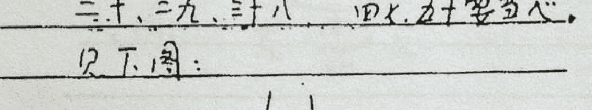

[诀]: 鼻现斜纹或青筋，纹细锐利色如血，主有血光受大伤，实为生死关头纹。如图三：

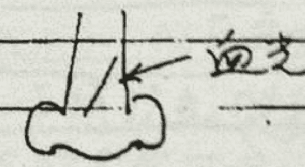

[诀]义命宫赤色有公难，天庭落黑意外灾。如图四：

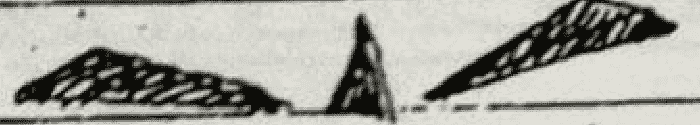

[诀]义眉上落黑落青色，即有大损大破财。如图五：

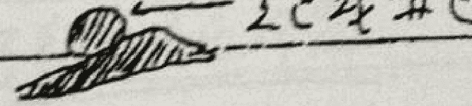

[诀]: 眉毛无故变杂乱，并无手捋拔弄它，是没信号眉中断，意外纷争去咬生。如图六：

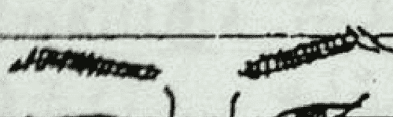

[解]: 此眉预示近期有不幸的事将发生。

[诀]: 地阁黑气家有难，此灾何来以下详。眼下有青茫，父母妻儿必见丧。天中一条黑气来，犹似蚯蚓下命宫，特有突起灾祸来，所做事情难成功。[解]: 见图七便知灾从何方来：

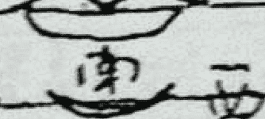

图七：东 南 西 北

【诀】：人中要长，两旁无纹破水池。若太短小，纵有妻儿亦不实。更有一纹横过口，最怕无纹直贯破。低陷无棱真可叹，低陷无棱真可叹，低陷无棱真可叹，低陷无棱真可叹，低陷无棱真可叹，低陷无棱真可叹，低陷无棱真可叹，低陷无棱真可叹，低陷无棱真可叹，低陷无棱真可叹，低陷无棱真可叹，低陷无棱真可叹，低陷无棱真可叹，低陷无棱真可叹，低陷无棱真可叹，低陷无棱真可叹，低陷无棱真可叹，低陷无棱真可叹，低陷无棱真可叹，低陷无棱真可叹，低陷无棱真可叹，低陷无棱真可叹，低陷无棱真可叹，低陷无棱真可叹，低陷无棱真可叹，低陷无棱真可叹，低陷无棱真可叹，低陷无棱真可叹，低陷无棱真可叹，低陷无棱真可叹，低陷无棱真可叹，低陷无棱真可叹，低陷无棱真可叹，低陷无棱真可叹，低陷无棱真可叹，低陷无棱真可叹，低陷无棱真可叹，低陷无棱真可叹，低陷无棱真可叹，低陷无棱真可叹，低陷无棱真可叹，低陷无棱真可叹，低陷无棱真可叹，低陷无棱真可叹，低陷无棱真可叹，低陷无棱真可叹，低陷无棱真可叹，低陷无棱真可叹，低陷无棱真可叹，低陷无棱真可叹，低陷无棱真可叹，低陷无棱真可叹，低陷无棱真可叹，低陷无棱真可叹，低陷无棱真可叹，低陷无棱真可叹，低陷无棱真可叹，低陷无棱真可叹，低陷无棱真可叹，低陷无棱真可叹，低陷无棱真可叹，低陷无棱真可叹，低陷无棱真可叹，低陷无棱真可叹，低陷无棱真可叹，低陷无棱真可叹，低陷无棱真可叹，低陷无棱真可叹，低陷无棱真可叹，低陷无棱真可叹，低陷无棱真可叹，低陷无棱真可叹，低陷无棱真可叹，低陷无棱真可叹，低陷无棱真可叹，低陷无棱真可叹，低陷无棱真可叹，低陷无棱真可叹，低陷无棱真可叹，低陷无棱真可叹，低陷无棱真可叹，低陷无棱真可叹，低陷无棱真可叹，低陷无棱真可叹，低陷无棱真可叹，低陷无棱真可叹，低陷无棱真可叹，低陷无棱真可叹，低陷无棱真可叹，低陷无棱真可叹，低陷无棱真可叹，低陷无棱真可叹，低陷无棱真可叹，低陷无棱真可叹，低陷无棱真可叹，低陷无棱真可叹，低陷无棱真可叹，低陷无棱真可叹，低陷无棱真可叹，低陷无棱真可叹，低陷无棱真可叹，低陷无棱真可叹，低陷无棱真可叹，低陷无棱真可叹，低陷无棱真可叹，低陷无棱真可叹，低陷无棱真可叹，低陷无棱真可叹，低陷无棱真可叹，低陷无棱真可叹，低陷无棱真可叹，低陷无棱真可叹，低陷无棱真可叹，低陷无棱真可叹，低陷无棱真可叹，低陷无棱真可叹，低陷无棱真可叹，低陷无棱真可叹，低陷无棱真可叹，低陷无棱真可叹，低陷无棱真可叹，低陷无棱真可叹，低陷无棱真可叹，低陷无棱真可叹，低陷无棱真可叹，低陷无棱真可叹，低陷无棱真可叹，低陷无棱真可叹，低陷无棱真可叹，低陷无棱真可叹，低陷无棱真可叹，低陷无棱真可叹，低陷无棱真可叹，低陷无棱真可叹，低陷无棱真可叹，低陷无棱真可叹，低陷无棱真可叹，低陷无棱真可叹，低陷无棱真可叹，低陷无棱真可叹，低陷无棱真可叹，低陷无棱真可叹，低陷无棱真可叹，低陷无棱真可叹，低陷无棱真可叹，低陷无棱真可叹，低陷无棱真可叹，低陷无棱真可叹，低陷无棱真可叹，低陷无棱真可叹，低陷无棱真可叹，低陷无棱真可叹，低陷无棱真可叹，低陷无棱真可叹，低陷无棱真可叹，低陷无棱真可叹，低陷无棱真可叹，低陷无棱真可叹，低陷无棱真可叹，低陷无棱真可叹，低陷无棱真可叹，低陷无棱真可叹，低陷无棱真可叹，低陷无棱真可叹，低陷无棱真可叹，低陷无棱真可叹，低陷无棱真可叹，低陷无棱真可叹，低陷无棱真可叹，低陷无棱真可叹，低陷无棱真可叹，低陷无棱真可叹，低陷无棱真可叹，低陷无棱真可叹，低陷无棱真可叹，低陷无棱真可叹，低陷无棱真可叹，低陷无棱真可叹，低陷无棱真可叹，低陷无棱真可叹，低陷无棱真可叹，低陷无棱真可叹，低陷无棱真可叹，低陷无棱真可叹，低陷无棱真可叹，低陷无棱真可叹，低陷无棱真可叹，低陷无棱真可叹，低陷无棱真可叹，低陷无棱真可叹，低陷无棱真可叹，低陷无棱真可叹，低陷无棱真可叹，低陷无棱真可叹，低陷无棱真可叹，低陷无棱真可叹，低陷无棱真可叹，低陷无棱真可叹，低陷无棱真可叹，低陷无棱真可叹，低陷无棱真可叹，低陷无棱真可叹，低陷无棱真可叹，低陷无棱真可叹，低陷无棱真可叹，低陷无棱真可叹，低陷无棱真可叹，低陷无棱真可叹，低陷无棱真可叹，低陷无棱真可叹，低陷无棱真可叹，低陷无棱真可叹，低陷无棱真可叹，低陷无棱真可叹，低陷无棱真可叹，低陷无棱真可叹，低陷无棱真可叹，低陷无棱真可叹，低陷无棱真可叹，低陷无棱真可叹，低陷无棱真可叹，低陷无棱真可叹，低陷无棱真可叹，低陷无棱真可叹，低陷无棱真可叹，低陷无棱真可叹，低陷无棱真可叹，低陷无棱真可叹，低陷无棱真可叹，低陷无棱真可叹，低陷无棱真可叹，低陷无棱真可叹，低陷无棱真可叹，低陷无棱真可叹，低陷无棱真可叹，低陷无棱真可叹，低陷无棱真可叹，低陷无棱真可叹，低陷无棱真可叹，低陷无棱真可叹，低陷无棱真可叹，低陷无棱真可叹，低陷无棱真可叹，低陷无棱真可叹，低陷无棱真可叹，低陷无棱真可叹，低陷无棱真可叹，低陷无棱真可叹，低陷无棱真可叹，低陷无棱真可叹，低陷无棱真可叹，低陷无棱真可叹，低陷无棱真可叹，低陷无棱真可叹，低陷无棱真可叹，低陷无棱真可叹，低陷无棱真可叹，低陷无棱真可叹，低陷无棱真可叹，低陷无棱真可叹，低陷无棱真可叹，低陷无棱真可叹，低陷无棱真可叹，低陷无棱真可叹，低陷无棱真可叹，低陷无棱真可叹，低陷无棱真可叹，低陷无棱真可叹，低陷无棱真可叹，低陷无棱真可叹，低陷无棱真可叹，低陷无棱真可叹，低陷无棱真可叹，低陷无棱真可叹，低陷无棱真可叹，低陷无棱真可叹，低陷无棱真可叹，低陷无棱真可叹，低陷无棱真可叹，低陷无棱真可叹，低陷无棱真可叹，低陷无棱真可叹，低陷无棱真可叹，低陷无棱真可叹，低陷无棱真可叹，低陷无棱真可叹，低陷无棱真可叹，低陷无棱真可叹，低陷无棱真可叹，低陷无棱真可叹，低陷无棱真可叹，低陷无棱真可叹，低陷无棱真可叹，低陷无棱真可叹，低陷无棱真可叹，低陷无棱真可叹，低陷无棱真可叹，低陷无棱真可叹，低陷无棱真可叹，低陷无棱真可叹，低陷无棱真可叹，低陷无棱真可叹，低陷无棱真可叹，低陷无棱真可叹，低陷无棱真可叹，低陷无棱真可叹，低陷无棱真可叹，低陷无棱真可叹，低陷无棱真可叹，低陷无棱真可叹，低陷无棱真可叹，低陷无棱真可叹，低陷无棱真可叹，低陷无棱真可叹，低陷无棱真可叹，低陷无棱真可叹，低陷无棱真可叹，低陷无棱真可叹，低陷无棱真可叹，低陷无棱真可叹，低陷无棱真可叹，低陷无棱真可叹，低陷无棱真可叹，低陷无棱真可叹，低陷无棱真可叹，低陷无棱真可叹，低陷无棱真可叹，低陷无棱真可叹，低陷无棱真可叹，低陷无棱真可叹，低陷无棱真可叹，低陷无棱真可叹，低陷无棱真可叹，低陷无棱真可叹，低陷无棱真可叹，低陷无棱真可叹，低陷无棱真可叹，低陷无棱真可叹，低陷无棱真可叹，低陷无棱真可叹，低陷无棱真可叹，低陷无棱真可叹，低陷无棱真可叹，低陷无棱真可叹，低陷无棱真可叹，低陷无棱真可叹，低陷无棱真可叹，低陷无棱真可叹，低陷无棱真可叹，低陷无棱真可叹，低陷无棱真可叹，低陷无棱真可叹，低陷无棱真可叹，低陷无棱真可叹，低陷无棱真可叹，低陷无棱真可叹，低陷无棱真可叹，低陷无棱真可叹，低陷无棱真可叹，低陷无棱真可叹，低陷无棱真可叹，低陷无棱真可叹，低陷无棱真可叹，低陷无棱真可叹，低陷无棱真可叹，低陷无棱真可叹，低陷无棱真可叹，低陷无棱真可叹，低陷无棱真可叹，低陷无棱真可叹，低陷无棱真可叹，低陷无棱真可叹，低陷无棱真可叹，低陷无棱真可叹，低陷无棱真可叹，低陷无棱真可叹，低陷无棱真可叹，低陷无棱真可叹，低陷无棱真可叹，低陷无棱真可叹，低陷无棱真可叹，低陷无棱真可叹，低陷无棱真可叹，低陷无棱真可叹，低陷无棱真可叹，低陷无棱真可叹，低陷无棱真可叹，低陷无棱真可叹，低陷无棱真可叹，低陷无棱真可叹，低陷无棱真可叹，低陷无棱真可叹，低陷无棱真可叹，低陷无棱真可叹，低陷无棱真可叹，低陷无棱真可叹，低陷无棱真可叹，低陷无棱真可叹，低陷无棱真可叹，低陷无棱真可叹，低陷无棱真可叹，低陷无棱真可叹，低陷无棱真可叹，低陷无棱真可叹，低陷无棱真可叹，低陷无棱真可叹，低陷无棱真可叹，低陷无棱真可叹，低陷无棱真可叹，低陷无棱真可叹，低陷无棱真可叹，低陷无棱真可叹，低陷无棱真可叹，低陷无棱真可叹，低陷无棱真可叹，低陷无棱真可叹，低陷无棱真可叹，低陷无棱真可叹，低陷无棱真可叹，低陷无棱真可叹，低陷无棱真可叹，低陷无棱真可叹，低陷无棱真可叹，低陷无棱真可叹，低陷无棱真可叹，低陷无棱真可叹，低陷无棱真可叹，低陷无棱真可叹，低陷无棱真可叹，低陷无棱真可叹，低陷无棱真可叹，低陷无棱真可叹，低陷无棱真可叹，低陷无棱真可叹，低陷无棱真可叹，低陷无棱真可叹，低陷无棱真可叹，低陷无棱真可叹，低陷无棱真可叹，低陷无棱真可叹，低陷无棱真可叹，低陷无棱真可叹，低陷无棱真可叹，低陷无棱真可叹，低陷无棱真可叹，低陷无棱真可叹，低陷无棱真可叹，低陷无棱真可叹，低陷无棱真可叹，低陷无棱真可叹，低陷无棱真可叹，低陷无棱真可叹，低陷无棱真可叹，低陷无棱真可叹，低陷无棱真可叹，低陷无棱真可叹，低陷无棱真可叹，低陷无棱真可叹，低陷无棱真可叹，低陷无棱真可叹，低陷无棱真可叹，低陷无棱真可叹，低陷无棱真可叹，低陷无棱真可叹，低陷无棱真可叹，低陷无棱真可叹，低陷无棱真可叹，低陷无棱真可叹，低陷无棱真可叹，低陷无棱真可叹，低陷无棱真可叹，低陷无棱真可叹，低陷无棱真可叹，低陷无棱真可叹，低陷无棱真可叹，低陷无棱真可叹，低陷无棱真可叹，低陷无棱真可叹，低陷无棱真可叹，低陷无棱真可叹，低陷无棱真可叹，低陷无棱真可叹，低陷无棱真可叹，低陷无棱真可叹，低陷无棱真可叹，低陷无棱真可叹，低陷无棱真可叹，低陷无棱真可叹，低陷无棱真可叹，低陷无棱真可叹，低陷无棱真可叹，低陷无棱真可叹，低陷无棱真可叹，低陷无棱真可叹，低陷无棱真可叹，低陷无棱真可叹，低陷无棱真可叹，低陷无棱真可叹，低陷无棱真可叹，低陷无棱真可叹，低陷无棱真可叹，低陷无棱真可叹，低陷无棱真可叹，低陷无棱真可叹，低陷无棱真可叹，低陷无棱真可叹，低陷无棱真可叹，低陷无棱真可叹，低陷无棱真可叹，低陷无棱真可叹，低陷无棱真可叹，低陷无棱真可叹，低陷无棱真可叹，低陷无棱真可叹，低陷无棱真可叹，低陷无棱真可叹，低陷无棱真可叹，低陷无棱真可叹，低陷无棱真可叹，低陷无棱真可叹，低陷无棱真可叹，低陷无棱真可叹，低陷无棱真可叹，低陷无棱真可叹，低陷无棱真可叹，低陷无棱真可叹，低陷无棱真可叹，低陷无棱真可叹，低陷无棱真可叹，低陷无棱真可叹，低陷无棱真可叹，低陷无棱真可叹，低陷无棱真可叹，低陷无棱真可叹，低陷无棱真可叹，低陷无棱真可叹，低陷无棱真可叹，低陷无棱真可叹，低陷无棱真可叹，低陷无棱真可叹，低陷无棱真可叹，低陷无棱真可叹，低陷无棱真可叹，低陷无棱真可叹，低陷无棱真可叹，低陷无棱真可叹，低陷无棱真可叹，低陷无棱真可叹，低陷无棱真可叹，低陷无棱真可叹，低陷无棱真可叹，低陷无棱真可叹，低陷无棱真可叹，低陷无棱真可叹，低陷无棱真可叹，低陷无棱真可叹，低陷无棱真可叹，低陷无棱真可叹，低陷无棱真可叹，低陷无棱真可叹，低陷无棱真可叹，低陷无棱真可叹，低陷无棱真可叹，低陷无棱真可叹，低陷无棱真可叹，低陷无棱真可叹，低陷无棱真可叹，低陷无棱真可叹，低陷无棱真可叹，低陷无棱真可叹，低陷无棱真可叹，低陷无棱真可叹，低陷无棱真可叹，低陷无棱真可叹，低陷无棱真可叹，低陷无棱真可叹，低陷无棱真可叹，低陷无棱真可叹，低陷无棱真可叹，低陷无棱真可叹，低陷无棱真可叹，低陷无棱真可叹，低陷无棱真可叹，低陷无棱真可叹，低陷无棱真可叹，低陷无棱真可叹，低陷无棱真可叹，低陷无棱真可叹，低陷无棱真可叹，低陷无棱真可叹，低陷无棱真可叹，低陷无棱真可叹，低陷无棱真可叹，低陷无棱真可叹，低陷无棱真可叹，低陷无棱真可叹，低陷无棱真可叹，低陷无棱真可叹，低陷无棱真可叹，低陷无棱真可叹，低陷无棱真可叹，低陷无棱真可叹，低陷无棱真可叹，低陷无棱真可叹，低陷无棱真可叹，低陷无棱真可叹，低陷无棱真可叹，低陷无棱真可叹，低陷无棱真可叹，低陷无棱真可叹，低陷无棱真可叹，低陷无棱真可叹，低陷无棱真可叹，低陷无棱真可叹，低陷无棱真可叹，低陷无棱真可叹，低陷无棱真可叹，低陷无棱真可叹，低陷无棱真可叹，低陷无棱真可叹，低陷无棱真可叹，低陷无棱真可叹，低陷无棱真可叹，低陷无棱真可叹，低陷无棱真可叹，低陷无棱真可叹，低陷无棱真可叹，低陷无棱真可叹，低陷无棱真可叹，低陷无棱真可叹，低陷无棱真可叹，低陷无棱真可叹，低陷无棱真可叹，低陷无棱真可叹，低陷无棱真可叹，低陷无棱真可叹，低陷无棱真可叹，低陷无棱真可叹，低陷无棱真可叹，低陷无棱真可叹，低陷无棱真可叹，低陷无棱真可叹，低陷无棱真可叹，低陷无棱真可叹，低陷无棱真可叹，低陷无棱真可叹，低陷无棱真可叹，低陷无棱真可叹，低陷无棱真可叹，低陷无棱真可叹，低陷无棱真可叹，低陷无棱真可叹，低陷无棱真可叹，低陷无棱真可叹，低陷无棱真可叹，低陷无棱真可叹，低陷无棱真可叹，低陷无棱真可叹，低陷无棱真可叹，低陷无棱真可叹，低陷无棱真可叹，低陷无棱真可叹，低陷无棱真可叹，低陷无棱真可叹，低陷无棱真可叹，低陷无棱真可叹，低陷无棱真可叹，低陷无棱真可叹，低陷无棱真可叹，低陷无棱真可叹，低陷无棱真可叹，低陷无棱真可叹，低陷无棱真可叹，低陷无棱真可叹，低陷无棱真可叹，低陷无棱真可叹，低陷无棱真可叹，低陷无棱真可叹，低陷无棱真可叹，低陷无棱真可叹，低陷无棱真可叹，低陷无棱真可叹，低陷无棱真可叹，低陷无棱真可叹，低陷无棱真可叹，低陷无棱真可叹，低陷无棱真可叹，低陷无棱真可叹，低陷无棱真可叹，低陷无棱真可叹，低陷无棱真可叹，低陷无棱真可叹，低陷无棱真可叹，低陷无棱真可叹，低陷无棱真可叹，低陷无棱真可叹，低陷无棱真可叹，低陷无棱真可叹，低陷无棱真可叹，低陷无棱真可叹，低陷无棱真可叹，低陷无棱真可叹，低陷无棱真可叹，低陷无棱真可叹，低陷无棱真可叹，低陷无棱真可叹，低陷无棱真可叹，低陷无棱真可叹，低陷无棱真可叹，低陷无棱真可叹，低陷无棱真可叹，低陷无棱真可叹，低陷无棱真可叹，低陷无棱真可叹，低陷无棱真可叹，低陷无棱真可叹，低陷无棱真可叹，低陷无棱真可叹，低陷无棱真可叹，低陷无棱真可叹，低陷无棱真可叹，低陷无棱真可叹，低陷无棱真可叹，低陷无棱真可叹，低陷无棱真可叹，低陷无棱真可叹，低陷无棱真可叹，低陷无棱真可叹，低陷无棱真可叹，低陷无棱真可叹，低陷无棱真可叹，低陷无棱真可叹，低陷无棱真可叹，低陷无棱真可叹，低陷无棱真可叹，低陷无棱真可叹，低陷无棱真可叹，低陷无棱真可叹，低陷无棱真可叹，低陷无棱真可叹，低陷无棱真可叹，低陷无棱真可叹，低陷无棱真可叹，低陷无棱真可叹，低陷无棱真可叹，低陷无棱真可叹，低陷无棱真可叹，低陷无棱真可叹，低陷无棱真可叹，低陷无棱真可叹，低陷无棱真可叹，低陷无棱真可叹，低陷无棱真可叹，低陷无棱真可叹，低陷无棱真可叹，低陷无棱真可叹，低陷无棱真可叹，低陷无棱真可叹，低陷无棱真可叹，低陷无棱真可叹，低陷无棱真可叹，低陷无棱真可叹，低陷无棱真可叹，低陷无棱真可叹，低陷无棱真可叹，低陷无棱真可叹，低陷无棱真可叹，低陷无棱真可叹，低陷无棱真可叹，低陷无棱真可叹，低陷无棱真可叹，低陷无棱真可叹，低陷无棱真可叹，低陷无棱真可叹，低陷无棱真可叹，低陷无棱真可叹，低陷无棱真可叹，低陷无棱真可叹，低陷无棱真可叹，低陷无棱真可叹，低陷无棱真可叹，低陷无棱真可叹，低陷无棱真可叹，低陷无棱真可叹，低陷无棱真可叹，低陷无棱真可叹，低陷无棱真可叹，低陷无棱真可叹，低陷无棱真可叹，低陷无棱真可叹，低陷无棱真可叹，低陷无棱真可叹，低陷无棱真可叹，低陷无棱真可叹，低陷无棱真可叹，低陷无棱真可叹，低陷无棱真可叹，低陷无棱真可叹，低陷无棱真可叹，低陷无棱真可叹，低陷无棱真可叹，低陷无棱真可叹，低陷无棱真可叹，低陷无棱真可叹，低陷无棱真可叹，低陷无棱真可叹，低陷无棱真可叹，低陷无棱真可叹，低陷无棱真可叹，低陷无棱真可叹，低陷无棱真可叹，低陷无棱真可叹，低陷无棱真可叹，低陷无棱真可叹，低陷无棱真可叹，低陷无棱真可叹，低陷无棱真可叹，低陷无棱真可叹，低陷无棱真可叹，低陷无棱真可叹，低陷无棱真可叹，低陷无棱真可叹，低陷无棱真可叹，低陷无棱真可叹，低陷无棱真可叹，低陷无棱真可叹，低陷无棱真可叹，低陷无棱真可叹，低陷无棱真可叹，低陷无棱真可叹，低陷无棱真可叹，低陷无棱真可叹，低陷无棱真可叹，低陷无棱真可叹，低陷无棱真可叹，低陷无棱真可叹，低陷无棱真可叹，低陷无棱真可叹，低陷无棱真可叹，低陷无棱真可叹，低陷无棱真可叹，低陷无棱真可叹，低陷无棱真可叹，低陷无棱真可叹，低陷无棱真可叹，低陷无棱真可叹，低陷无棱真可叹，低陷无棱真可叹，低陷无棱真可叹，低陷无棱真可叹，低陷无棱真可叹，低陷无棱真可叹，低陷无棱真可叹，低陷无棱真可叹，低陷无棱真可叹，低陷无棱真可叹，低陷无棱真可叹，低陷无棱真可叹，低陷无棱真可叹，低陷无棱真可叹，低陷无棱真可叹，低陷无棱真可叹，低陷无棱真可叹，低陷无棱真可叹，低陷无棱真可叹，低陷无棱真可叹，低陷无棱真可叹，低陷无棱真可叹，低陷无棱真可叹，低陷无棱真可叹，低陷无棱真可叹，低陷无棱真可叹，低陷无棱真可叹，低陷无棱真可叹，低陷无棱真可叹，低陷无棱真可叹，低陷无棱真可叹，低陷无棱真可叹，低陷无棱真可叹，低陷无棱真可叹，低陷无棱真可叹，低陷无棱真可叹，低陷无棱真可叹，低陷无棱真可叹，低陷无棱真可叹，低陷无棱真可叹，低陷无棱真可叹，低陷无棱真可叹，低陷无棱真可叹，低陷无棱真可叹，低陷无棱真可叹，低陷无棱真可叹，低陷无棱真可叹，低陷无棱真可叹，低陷无棱真可叹，低陷无棱真可叹，低陷无棱真可叹，低陷无棱真可叹，低陷无棱真可叹，低陷无棱真可叹，低陷无棱真可叹，低陷无棱真可叹，低陷无棱真可叹，低陷无棱真可叹，低陷无棱真可叹，低陷无棱真可叹，低陷无棱真可叹，低陷无棱真可叹，低陷无棱真可叹，低陷无棱真可叹，低陷无棱真可叹，低陷无棱真可叹，低陷无棱真可叹，低陷无棱真可叹，低陷无棱真可叹，低陷无棱真可叹，低陷无棱真可叹，低陷无棱真可叹，低陷无棱真可叹，低陷无棱真可叹，低陷无棱真可叹，低陷无棱真可叹，低陷无棱真可叹，低陷无棱真可叹，低陷无棱真可叹，低陷无棱真可叹，低陷无棱真可叹，低陷无棱真可叹，低陷无棱真可叹，低陷无棱真可叹，低陷无棱真可叹，低陷无棱真可叹，低陷无棱真可叹，低陷无棱真可叹，低陷无棱真可叹，低陷无棱真可叹，低陷无棱真可叹，低陷无棱真可叹，低陷无棱真可叹，低陷无棱真可叹，低陷无棱真可叹，低陷无棱真可叹，低陷无棱真可叹，低陷无棱真可叹，低陷无棱真可叹，低陷无棱真可叹，低陷无棱真可叹，低陷无棱真可叹，低陷无棱真可叹，低陷无棱真可叹，低陷无棱真可叹，低陷无棱真可叹，低陷无棱真可叹，低陷无棱真可叹，低陷无棱真可叹，低陷无棱真可叹，低陷无棱真可叹，低陷无棱真可叹，低陷无棱真可叹，低陷无棱真可叹，低陷无棱真可叹，低陷无棱真可叹，低陷无棱真可叹，低陷无棱真可叹，低陷无棱真可叹，低陷无棱真可叹，低陷无棱真可叹，低陷无棱真可叹，低陷无棱真可叹，低陷无棱真可叹，低陷无棱真可叹，低陷无棱真可叹，低陷无棱真可叹，低陷无棱真可叹，低陷无棱真可叹，低陷无棱真可叹，低陷无棱真可叹，低陷无棱真可叹，低陷无棱真可叹，低陷无棱真可叹，低陷无棱真可叹，低陷无棱真可叹，低陷无棱真可叹，低陷无棱真可叹，低陷无棱真可叹，低陷无棱真可叹，低陷无棱真可叹，低陷无棱真可叹，低陷无棱真可叹，低陷无棱真可叹，低陷无棱真可叹，低陷无棱真可叹，低陷无棱真可叹，低陷无棱真可叹，低陷无棱真可叹，低陷无棱真可叹，低陷无棱真可叹，低陷无棱真可叹，低陷无棱真可叹，低陷无棱真可叹，低陷无棱真可叹，低陷无棱真可叹，低陷无棱真可叹，低陷无棱真可叹，低陷无棱真可叹，低陷无棱真可叹，低陷无棱真可叹，低陷无棱真可叹，低陷无棱真可叹，低陷无棱真可叹，低陷无棱真可叹，低陷无棱真可叹，低陷无棱真可叹，低陷无棱真可叹，低陷无棱真可叹，低陷无棱真可叹，低陷无棱真可叹，低陷无棱真可叹，低陷无棱真可叹，低陷无棱真可叹，低陷无棱真可叹，低陷无棱真可叹，低陷无棱真可叹，低陷无棱真可叹，低陷无棱真可叹，低陷无棱真可叹，低陷无棱真可叹，低陷无棱真可叹，低陷无棱真可叹，低陷无棱真可叹，低陷无棱真可叹，低陷无棱真可叹，低陷无棱真可叹，低陷无棱真可叹，低陷无棱真可叹，低陷无棱真可叹，低陷无棱真可叹，低陷无棱真可叹，低陷无棱真可叹，低陷无棱真可叹，低陷无棱真可叹，低陷无棱真可叹，低陷无棱真可叹，低陷无棱真可叹，低陷无棱真可叹，低陷无棱真可叹，低陷无棱真可叹，低陷无棱真可叹，低陷无棱真可叹，低陷无棱真可叹，低陷无棱真可叹，低陷无棱真可叹，低陷无棱真可叹，低陷无棱真可叹，低陷无棱真可叹，低陷无棱真可叹，低陷无棱真可叹，低陷无棱真可叹，低陷无棱真可叹，低陷无棱真可叹，低陷无棱真可叹，低陷无棱真可叹，低陷无棱真可叹，低陷无棱真可叹，低陷无棱真可叹，低陷无棱真可叹，低陷无棱真可叹，低陷无棱真可叹，低陷无棱真可叹，低陷无棱真可叹，低陷无棱真可叹，低陷无棱真可叹，低陷无棱真可叹，低陷无棱真可叹，低陷无棱真可叹，低陷无棱真可叹，低陷无棱真可叹，低陷无棱真可叹，低陷无棱真可叹，低陷无棱真可叹，低陷无棱真可叹，低陷无棱真可叹，低陷无棱真可叹，低陷无棱真可叹，低陷无棱真可叹，低陷无棱真可叹，低陷无棱真可叹，低陷无棱真可叹，低陷无棱真可叹，低陷无棱真可叹，低陷无棱真可叹，低陷无棱真可叹，低陷无棱真可叹，低陷无棱真可叹，低陷无棱真可叹，低陷无棱真可叹，低陷无棱真可叹，低陷无棱真可叹，低陷无棱真可叹，低陷无棱真可叹，低陷无棱真可叹，低陷无棱真可叹，低陷无棱真可叹，低陷无棱真可叹，低陷无棱真可叹，低陷无棱真可叹，低陷无棱真可叹，低陷无棱真可叹，低陷无棱真可叹，低陷无棱真可叹，低陷无棱真可叹，低陷无棱真可叹，低陷无棱真可叹，低陷无棱真可叹，低陷无棱真可叹，低陷无棱真可叹，低陷无棱真可叹，低陷无棱真可叹，低陷无棱真可叹，低陷无棱真可叹，低陷无棱真可叹，低陷无棱真可叹，低陷无棱真可叹，低陷无棱真可叹，低陷无棱真可叹，低陷无棱真可叹，低陷无棱真可叹，低陷无棱真可叹，低陷无棱真可叹，低陷无棱真可叹，低陷无棱真可叹，低陷无棱真可叹，低陷无棱真可叹，低陷无棱真可叹，低陷无棱真可叹，低陷无棱真可叹，低陷无棱真可叹，低陷无棱真可叹，低陷无棱真可叹，低陷无棱真可叹，低陷无棱真可叹，低陷无棱真可叹，低陷无棱真可叹，低陷无棱真可叹，低陷无棱真可叹，低陷无棱真可叹，低陷无棱真可叹，低陷无棱真可叹，低陷无棱真可叹，低陷无棱真可叹，低陷无棱真可叹，低陷无棱真可叹，低陷无棱真可叹，低陷无棱真可叹，低陷无棱真可叹，低陷无棱真可叹，低陷无棱真可叹，低陷无棱真可叹，低陷无棱真可叹，低陷无棱真可叹，低陷无棱真可叹，低陷无棱真可叹，低陷无棱真可叹，低陷无棱真可叹，低陷无棱真可叹，低陷无棱真可叹，低陷无棱真可叹，低陷无棱真可叹，低陷无棱真可叹，低陷无棱真可叹，低陷无棱真可叹，低陷无棱真可叹，低陷无棱真可叹，低陷无棱真可叹，低陷无棱真可叹，低陷无棱真可叹，低陷无棱真可叹，低陷无棱真可叹，低陷无棱真可叹，低陷无棱真可叹，低陷无棱真可叹，低陷无棱真可叹，低陷无棱真可叹，低陷无棱真可叹，低陷无棱真可叹，低陷无棱真可叹，低陷无棱真可叹，低陷无棱真可叹，低陷无棱真可叹，低陷无棱真可叹，低陷无棱真可叹，低陷无棱真可叹，低陷无棱真可叹，低陷无棱真可叹，低陷无棱真可叹，低陷无棱真可叹，低陷无棱真可叹，低陷无棱真可叹，低陷无棱真可叹，低陷无棱真可叹，低陷无棱真可叹，低陷无棱真可叹，低陷无棱真可叹，低陷无棱真可叹，低陷无棱真可叹，低陷无棱真可叹，低陷无棱真可叹，低陷无棱真可叹，低陷无棱真可叹，低陷无棱真可叹，低陷无棱真可叹，低陷无棱真可叹，低陷无棱真可叹，低陷无棱真可叹，低陷无棱真可叹，低陷无棱真可叹，低陷无棱真可叹，低陷无棱真可叹，低陷无棱真可叹，低陷无棱真可叹，低陷无棱真可叹，低陷无棱真可叹，低陷无棱真可叹，低陷无棱真可叹，低陷无棱真可叹，低陷无棱真可叹，低陷无棱真可叹，低陷无棱真可叹，低陷无棱真可叹，低陷无棱真可叹，低陷无棱真可叹，低陷无棱真可叹，低陷无棱真可叹，低陷无棱真可叹，低陷无棱真可叹，低陷无棱真可叹，低陷无棱真可叹，低陷无棱真可叹，低陷无棱真可叹，低陷无棱真可叹，低陷无棱真可叹，低陷无棱真可叹，低陷无棱真可叹，低陷无棱真可叹，低陷无棱真可叹，低陷无棱真可叹，低陷无棱真可叹，低陷无棱真可叹，低陷无棱真可叹，低陷无棱真可叹，低陷无棱真可叹，低陷无棱真可叹，低陷无棱真可叹，低陷无棱真可叹，低陷无棱真可叹，低陷无棱真可叹，低陷无棱真可叹，低陷无棱真可叹，低陷无棱真可叹，低陷无棱真可叹，低陷无棱真可叹，低陷无棱真可叹，低陷无棱真可叹，低陷无棱真可叹，低陷无棱真可叹，低陷无棱真可叹，低陷无棱真可叹，低陷无棱真可叹，低陷无棱真可叹，低陷无棱真可叹，低陷无棱真可叹，低陷无棱真可叹，低陷无棱真可叹，低陷无棱真可叹，低陷无棱真可叹，低陷无棱真可叹，低陷无棱真可叹，低陷无棱真可叹，低陷无棱真可叹，低陷无棱真可叹，低陷无棱真可叹，低陷无棱真可叹，低陷无棱真可叹，低陷无棱真可叹，低陷无棱真可叹，低陷无棱真可叹，低陷无棱真可叹，低陷无棱真可叹，低陷无棱真可叹，低陷无棱真可叹，低陷无棱真可叹，低陷无棱真可叹，低陷无棱真可叹，低陷无棱真可叹，低陷无棱真可叹，低陷无棱真可叹，低陷无棱真可叹，低陷无棱真可叹，低陷无棱真可叹，低陷无棱真可叹，低陷无棱真可叹，低陷无棱真可叹，低陷无棱真可叹，低陷无棱真可叹，低陷无棱真可叹，低陷无棱真可叹，低陷无棱真可叹，低陷无棱真可叹，低陷无棱真可叹，低陷无棱真可叹，低陷无棱真可叹，低陷无棱真可叹，低陷无棱真可叹，低陷无棱真可叹，低陷无棱真可叹，低陷无棱真可叹，低陷无棱真可叹，低陷无棱真可叹，低陷无棱真可叹，低陷无棱真可叹，低陷无棱真可叹，低陷无棱真可叹，低陷无棱真可叹，低陷无棱真可叹，低陷无棱真可叹，低陷无棱真可叹，低陷无棱真可叹，低陷无棱真可叹，低陷无棱真可叹，低陷无棱真可叹，低陷无棱真可叹，低陷无棱真可叹，低陷无棱真可叹，低陷无棱真可叹，低陷无棱真可叹，低陷无棱真可叹，低陷无棱真可叹，低陷无棱真可叹，低陷无棱真可叹，低陷无棱真可叹，低陷无棱真可叹，低陷无棱真可叹，低陷无棱真可叹，低陷无棱真可叹，低陷无棱真可叹，低陷无棱真可叹，低陷无棱真可叹，低陷无棱真可叹，低陷无棱真可叹，低陷无棱真可叹，低陷无棱真可叹，低陷无棱真可叹，低陷无棱真可叹，低陷无棱真可叹，低陷无棱真可叹，低陷无棱真可叹，低陷无棱真可叹，低陷无棱真可叹，低陷无棱真可叹，低陷无棱真可叹，低陷无棱真可叹，低陷无棱真可叹，低陷无棱真可叹，低陷无棱真可叹，低陷无棱真可叹，低陷无棱真可叹，低陷无棱真可叹，低陷无棱真可叹，低陷无棱真可叹，低陷无棱真可叹，低陷无棱真可叹，低陷无棱真可叹，低陷无棱真可叹，低陷无棱真可叹，低陷无棱真可叹，低陷无棱真可叹，低陷无棱真可叹，低陷无棱真可叹，低陷无棱真可叹，低陷无棱真可叹，低陷无棱真可叹，低陷无棱真可叹，低陷无棱真可叹，低陷无棱真可叹，低陷无棱真可叹，低陷无棱真可叹，低陷无棱真可叹，低陷无棱真可叹，低陷无棱真可叹，低陷无棱真可叹，低陷无棱真可叹，低陷无棱真可叹，低陷无棱真可叹，低陷无棱真可叹，低陷无棱真可叹，低陷无棱真可叹，低陷无棱真可叹，低陷无棱真可叹，低陷无棱真可叹，低陷无棱真可叹，低陷无棱真可叹，低陷无棱真可叹，低陷无棱真可叹，低陷无棱真可叹，低陷无棱真可叹，低陷无棱真可叹，低陷无棱真可叹，低陷无棱真可叹，低陷无棱真可叹，低陷无棱真可叹，低陷无棱真可叹，低陷无棱真可叹，低陷无棱真可叹，低陷无棱真可叹，低陷无棱真可叹，低陷无棱真可叹，低陷无棱真可叹，低陷无棱真可叹，低陷无棱真可叹，低陷无棱真可叹，低陷无棱真可叹，低陷无棱真可叹，低陷无棱真可叹，低陷无棱真可叹，低陷无棱真可叹，低陷无棱真可叹，低陷无棱真可叹，低陷无棱真可叹，低陷无棱真可叹，低陷无棱真可叹，低陷无棱真可叹，低陷无棱真可叹，低陷无棱真可叹，低陷无棱真可叹，低陷无棱真可叹，低陷无棱真可叹，低陷无棱真可叹，低陷无棱真可叹，低陷无棱真可叹，低陷无棱真可叹，低陷无棱真可叹，低陷无棱真可叹，低陷无棱真可叹，低陷无棱真可叹，低陷无棱真可叹，低陷无棱真可叹，低陷无棱真可叹，低陷无棱真可叹，低陷无棱真可叹，低陷无棱真可叹，低陷无棱真可叹，低陷无棱真可叹，低陷无棱真可叹，低陷无棱真可叹，低陷无棱真可叹，低陷无棱真可叹，低陷无棱真可叹，低陷无棱真可叹，低陷无棱真可叹，低陷无棱真可叹，低陷无棱真可叹，低陷无棱真可叹，低陷无棱真可叹，低陷无棱真可叹，低陷无棱真可叹，低陷无棱真可叹，低陷无棱真可叹，低陷无棱真可叹，低陷无棱真可叹，低陷无棱真可叹，低陷无棱真可叹，低陷无棱真可叹，低陷无棱真可叹，低陷无棱真可叹，低陷无棱真可叹，低陷无棱真可叹，低陷无棱真可叹，低陷无棱真可叹，低陷无棱真可叹，低陷无棱真可叹，低陷无棱真可叹，低陷无棱真可叹，低陷无棱真可叹，低陷无棱真可叹，低陷无棱真可叹，低陷无棱真可叹，低陷无棱真可叹，低陷无棱真可叹，低陷无棱真可叹，低陷无棱真可叹，低陷无棱真可叹，低陷无棱真可叹，低陷无棱真可叹，低陷无棱真可叹，低陷无棱真可叹，低陷无棱真可叹，低陷无棱真可叹，低陷无棱真可叹，低陷无棱真可叹，低陷无棱真可叹，低陷无棱真可叹，低陷无棱真可叹，低陷无棱真可叹，低陷无棱真可叹，低陷无棱真可叹，低陷无棱真可叹，低陷无棱真可叹，低陷无棱真可叹，低陷无棱真可叹，低陷无棱真可叹，低陷无棱真可叹，低陷无棱真可叹，低陷无棱真可叹，低陷无棱真可叹，低陷无棱真可叹，低陷无棱真可叹，低陷无棱真可叹，低陷无棱真可叹，低陷无棱真可叹，低陷无棱真可叹，低陷无棱真可叹，低陷无棱真可叹，低陷无棱真可叹，低陷无棱真可叹，低陷无棱真可叹，低陷无棱真可叹，低陷无棱真可叹，低陷无棱真可叹，低陷无棱真可叹，低陷无棱真可叹，低陷无棱真可叹，低陷无棱真可叹，低陷无棱真可叹，低陷无棱真可叹，低陷无棱真可叹，低陷无棱真可叹，低陷无棱真可叹，低陷无棱真可叹，低陷无棱真可叹，低陷无棱真可叹，低陷无棱真可叹，低陷无棱真可叹，低陷无棱真可叹，低陷无棱真可叹，低陷无棱真可叹，低陷无棱真可叹，低陷无棱真可叹，低陷无棱真可叹，低陷无棱真可叹，低陷无棱真可叹，低陷无棱真可叹，低陷无棱真可叹，低陷无棱真可叹，低陷无棱真可叹，低陷无棱真可叹，低陷无棱真可叹，低陷无棱真可叹，低陷无棱真可叹，低陷无棱真可叹，低陷无棱真可叹，低陷无棱真可叹，低陷无棱真可叹，低陷无棱真可叹，低陷无棱真可叹，低陷无棱真可叹，低陷无棱真可叹，低陷无棱真可叹，低陷无棱真可叹，低陷无棱真可叹，低陷无棱真可叹，低陷无棱真可叹，低陷无棱真可叹，低陷无棱真可叹，低陷无棱真可叹，低陷无棱真可叹，低陷无棱真可叹，低陷无棱真可叹，低陷无棱真可叹，低陷无棱真可叹，低陷无棱真可叹，低陷无棱真可叹，低陷无棱真可叹，低陷无棱真可叹，低陷无棱真可叹，低陷无棱真可叹，低陷无棱真可叹，低陷无棱真可叹，低陷无棱真可叹，低陷无棱真可叹，低陷无棱真可叹，低陷无棱真可叹，低陷无棱真可叹，低陷无棱真可叹，低陷无棱真可叹，低陷无棱真可叹，低陷无棱真可叹，低陷无棱真可叹，低陷无棱真可叹，低陷无棱真可叹，低陷无棱真可叹，低陷无棱真可叹，低陷无棱真可叹，低陷无棱真可叹，低陷无棱真可叹，低陷无棱真可叹，低陷无棱真可叹，低陷无棱真可叹，低陷无棱真可叹，低陷无棱真可叹，低陷无棱真可叹，低陷无棱真可叹，低陷无棱真可叹，低陷无棱真可叹，低陷无棱真可叹，低陷无棱真可叹，低陷无棱真可叹，低陷无棱真可叹，低陷无棱真可叹，低陷无棱真可叹，低陷无棱真可叹，低陷无棱真可叹，低陷无棱真可叹，低陷无棱真可叹，低陷无棱真可叹，低陷无棱真可叹，低陷无棱真可叹，低陷无棱真可叹，低陷无棱真可叹，低陷无棱真可叹，低陷无棱真可叹，低陷无棱真可叹，低陷无棱真可叹，低陷无棱真可叹，低陷无棱真可叹，低陷无棱真可叹，低陷无棱真可叹，低陷无棱真可叹，低陷无棱真可叹，低陷无棱真可叹，低陷无棱真可叹，低陷无棱真可叹，低陷无棱真可叹，低陷无棱真可叹，低陷无棱真可叹，低陷无棱真可叹，低陷无棱真可叹，低陷无棱真可叹，低陷无棱真可叹，低陷无棱真可叹，低陷无棱真可叹，低陷无棱真可叹，低陷无棱真可叹，低陷无棱真可叹，低陷无棱真可叹，低陷无棱真可叹，低陷无棱真可叹，低陷无棱真可叹，低陷无棱真可叹，低陷无棱真可叹，低陷无棱真可叹，低陷无棱真可叹，低陷无棱真可叹，低陷无棱真可叹，低陷无棱真可叹，低陷无棱真可叹，低陷无棱真可叹，低陷无棱真可叹，低陷无棱真可叹，低陷无棱真可叹，低陷无棱真可叹，低陷无棱真可叹，低陷无棱真可叹，低陷无棱真可叹，低陷无棱真可叹，低陷无棱真可叹，低陷无棱真可叹，低陷无棱真可叹，低陷无棱真可叹，低陷无棱真可叹，低陷无棱真可叹，低陷无棱真可叹，低陷无棱真可叹，低陷无棱真可叹，低陷无棱真可叹，低陷无棱真可叹，低陷无棱真可叹，低陷无棱真可叹，低陷无棱真可叹，低陷无棱真可叹，低陷无棱真可叹，低陷无棱真可叹，低陷无棱真可叹，低陷无棱真可叹，低陷无棱真可叹，低陷无棱真可叹，低陷无棱真可叹，低陷无棱真可叹，低陷无棱真可叹，低陷无棱真可叹，低陷无棱真可叹，低陷无棱真可叹，低陷无棱真可叹，低陷无棱真可叹，低陷无棱真可叹，低陷无棱真可叹，低陷无棱真可叹，低陷无棱真可叹，低陷无棱真可叹，低陷无棱真可叹，低陷无棱真可叹，低陷无棱真可叹，低陷无棱真可叹，低陷无棱真可叹，低陷无棱真可叹，低陷无棱真可叹，低陷无棱真可叹，低陷无棱真可叹，低陷无棱真可叹，低陷无棱真可叹，低陷无棱真可叹，低陷无棱真可叹，低陷无棱真可叹，低陷无棱真可叹，低陷无棱真可叹，低陷无棱真可叹，低陷无棱真可叹，低陷无棱真可叹，低陷无棱真可叹，低陷无棱真可叹，低陷无棱真可叹，低陷无棱真可叹，低陷无棱真可叹，低陷无棱真可叹，低陷无棱真可叹，低陷无棱真可叹，低陷无棱真可叹，低陷无棱真可叹，低陷无棱真可叹，低陷无棱真可叹，低陷无棱真可叹，低陷无棱真可叹，低陷无棱真可叹，低陷无棱真可叹，低陷无棱真可叹，低陷无棱真可叹，低陷无棱真可叹，低陷无棱真可叹，低陷无棱真可叹，低陷无棱真可叹，低陷无棱真可叹，低陷无棱真可叹，低陷无棱真可叹，低陷无棱真可叹，低陷无棱真可叹，低陷无棱真可叹，低陷无棱真可叹，低陷无棱真可叹，低陷无棱真可叹，低陷无棱真可叹，低陷无棱真可叹，低陷无棱真可叹，低陷无棱真可叹，低陷无棱真可叹，低陷无棱真可叹，低陷无棱真可叹，低陷无棱真可叹，低陷无棱真可叹，低陷无棱真可叹，低陷无棱真可叹，低陷无棱真可叹，低陷无棱真可叹，低陷无棱真可叹，低陷无棱真可叹，低陷无棱真可叹，低陷无棱真可叹，低陷无棱真可叹，低陷无棱真可叹，低陷无棱真可叹，低陷无棱真可叹，低陷无棱真可叹，低陷无棱真可叹，低陷无棱真可叹，低陷无棱真可叹，低陷无棱真可叹，低陷无棱真可叹，低陷无棱真可叹，低陷无棱真可叹，低陷无棱真可叹，低陷无棱真可叹，低陷无棱真可叹，低陷无棱真可叹，低陷无棱真可叹，低陷无棱真可叹，低陷无棱真可叹，低陷无棱真可叹，低陷无棱真可叹，低陷无棱真可叹，低陷无棱真可叹，低陷无棱真可叹，低陷无棱真可叹，低陷无棱真可叹，低陷无棱真可叹，低陷无棱真可叹，低陷无棱真可叹，低陷无棱真可叹，低陷无棱真可叹，低陷无棱真可叹，低陷无棱真可叹，低陷无棱真可叹，低陷无棱真可叹，低陷无棱真可叹，低陷无棱真可叹，低陷无棱真可叹，低陷无棱真可叹，低陷无棱真可叹，低陷无棱真可叹，低陷无棱真可叹，低陷无棱真可叹，低陷无棱真可叹，低陷无棱真可叹，低陷无棱真可叹，低陷无棱真可叹，低陷无棱真可叹，低陷无棱真可叹，低陷无棱真可叹，低陷无棱真可叹，低陷无棱真可叹，低陷无棱真可叹，低陷无棱真可叹，低陷无棱真可叹，低陷无棱真可叹，低陷无棱真可叹，低陷无棱真可叹，低陷无棱真可叹，低陷无棱真可叹，低陷无棱真可叹，低陷无棱真可叹，低陷无棱真可叹，低陷无棱真可叹，低陷无棱真可叹，低陷无棱真可叹，低陷无棱真可叹，低陷无棱真可叹，低陷无棱真可叹，低陷无棱真可叹，低陷无棱真可叹，低陷无棱真可叹，低陷无棱真可叹，低陷无棱真可叹，低陷无棱真可叹，低陷无棱真可叹，低陷无棱真可叹，低陷无棱真可叹，低陷无棱真可叹，低陷无棱真可叹，低陷无棱真可叹，低陷无棱真可叹，低陷无棱真可叹，低陷无棱真可叹，低陷无棱真可叹，低陷无棱真可叹，低陷无棱真可叹，低陷无棱真可叹，低陷无棱真可叹，低陷无棱真可叹，低陷无棱真可叹，低陷无棱真可叹，低陷无棱真可叹，低陷无棱真可叹，低陷无棱真可叹，低陷无棱真可叹，低陷无棱真可叹，低陷无棱真可叹，低陷无棱真可叹，低陷无棱真可叹，低陷无棱真可叹，低陷无棱真可叹，低陷无棱真可叹，低陷无棱真可叹，低陷无棱真可叹，低陷无棱真可叹，低陷无棱真可叹，低陷无棱真可叹，低陷无棱真可叹，低陷无棱真可叹，低陷无棱真可叹，低陷无棱真可叹，低陷无棱真可叹，低陷无棱真可叹，低陷无棱真可叹，低陷无棱真可叹，低陷无棱真可叹，低陷无棱真可叹，低陷无棱真可叹，低陷无棱真可叹，低陷无棱真可叹，低陷无棱真可叹，低陷无棱真可叹，低陷无棱真可叹，低陷无棱真可叹，低陷无棱真可叹，低陷无棱真可叹，低陷无棱真可叹，低陷无棱真可叹，低陷无棱真可叹，低陷无棱真可叹，低陷无棱真可叹，低陷无棱真可叹，低陷无棱真可叹，低陷无棱真可叹，低陷无棱真可叹，低陷无棱真可叹，低陷无棱真可叹，低陷无棱真可叹，低陷无棱真可叹，低陷无棱真可叹，低陷无棱真可叹，低陷无棱真可叹，低陷无棱真可叹，低陷无棱真可叹，低陷无棱真可叹，低陷无棱真可叹，低陷无棱真可叹，低陷无棱真可叹，低陷无棱真可叹，低陷无棱真可叹，低陷无棱真可叹，低陷无棱真可叹，低陷无棱真可叹，低陷无棱真可叹，低陷无棱真可叹，低陷无棱真可叹，低陷无棱真可叹，低陷无棱真可叹，低陷无棱真可叹，低陷无棱真可叹，低陷无棱真可叹，低陷无棱真可叹，低陷无棱真可叹，低陷无棱真可叹，低陷无棱真可叹，低陷无棱真可叹，低陷无棱真可叹，低陷无棱真可叹，低陷无棱真可叹，低陷无棱真可叹，低陷无棱真可叹，低陷无棱真可叹，低陷无棱真可叹，低陷无棱真可叹，低陷无棱真可叹，低陷无棱真可叹，低陷无棱真可叹，低陷无棱真可叹，低陷无棱真可叹，低陷无棱真可叹，低陷无棱真可叹，低陷无棱真可叹，低陷无棱真可叹，低陷无棱真可叹，低陷无棱真可叹，低陷无棱真可叹，低陷无棱真可叹，低陷无棱真可叹，低陷无棱真可叹，低陷无棱真可叹，低陷无棱真可叹，低陷无棱真可叹，低陷无棱真可叹，低陷无棱真可叹，低陷无棱真可叹，低陷无棱真可叹，低陷无棱真可叹，低陷无棱真可叹，低陷无棱真可叹，低陷无棱真可叹，低陷无棱真可叹，低陷无棱真可叹，低陷无棱真可叹，低陷无棱真可叹，低陷无棱真可叹，低陷无棱真可叹，低陷无棱真可叹，低陷无棱真可叹，低陷无棱真可叹，低陷无棱真可叹，低陷无棱真可叹，低陷无棱真可叹，低陷无棱真可叹，低陷无棱真可叹，低陷无棱真可叹，低陷无棱真可叹，低陷无棱真可叹，低陷无棱真可叹，低陷无棱真可叹，低陷无棱真可叹，低陷无棱真可叹，低陷无棱真可叹，低陷无棱真可叹，低陷无棱真可叹，低陷无棱真可叹，低陷无棱真可叹，低陷无棱真可叹，低陷无棱真可叹，低陷无棱真可叹，低陷无棱真可叹，低陷无棱真可叹，低陷无棱真可叹，低陷无棱真可叹，低陷无棱真可叹，低陷无棱真可叹，低陷无棱真可叹，低陷无棱真可叹，低陷无棱真可叹，低陷无棱真可叹，低陷无棱真可叹，低陷无棱真可叹，低陷无棱真可叹，低陷无棱真可叹，低陷无棱真可叹，低陷无棱真可叹，低陷无棱真可叹，低陷无棱真可叹，低陷无棱真可叹，低陷无棱真可叹，低陷无棱真可叹，低陷无棱真可叹，低陷无棱真可叹，低陷无棱真可叹，低陷无棱真可叹，低陷无棱真可叹，低陷无棱真可叹，低陷无棱真可叹，低陷无棱真可叹，低陷无棱真可叹，低陷无棱真可叹，低陷无棱真可叹，低陷无棱真可叹，低陷无棱真可叹，低陷无棱真可叹，低陷无棱真可叹，低陷无棱真可叹，低陷无棱真可叹，低陷无棱真可叹，低陷无棱真可叹，低陷无棱真可叹，低陷无棱真可叹，低陷无棱真可叹，低陷无棱真可叹，低陷无棱真可叹，低陷无棱真可叹，低陷无棱真可叹，低陷无棱真可叹，低陷无棱真可叹，低陷无棱真可叹，低陷无棱真可叹，低陷无棱真可叹，低陷无棱真可叹，低陷无棱真可叹，低陷无棱真可叹，低陷无棱真可叹，低陷无棱真可叹，低陷无棱真可叹，低陷无棱真可叹，低陷无棱真可叹，低陷无棱真可叹，低陷无棱真可叹，低陷无棱真可叹，低陷无棱真可叹，低陷无棱真可叹，低陷无棱真可叹，低陷无棱真可叹，低陷无棱真可叹，低陷无棱真可叹，低陷无棱真可叹，低陷无棱真可叹，低陷无棱真可叹，低陷无棱真可叹，低陷无棱真可叹，低陷无棱真可叹，低陷无棱真可叹，低陷无棱真可叹，低陷无棱真可叹，低陷无棱真可叹，低陷无棱真可叹，低陷无棱真可叹，低陷无棱真可叹，低陷无棱真可叹，低陷无棱真可叹，低陷无棱真可叹，低陷无棱真可叹，低陷无棱真可叹，低陷无棱真可叹，低陷无棱真可叹，低陷无棱真可叹，低陷无棱真可叹，低陷无棱真可叹，低陷无棱真可叹，低陷无棱真可叹，低陷无棱真可叹，低陷无棱真可叹，低陷无棱真可叹，低陷无棱真可叹，低陷无棱真可叹，低陷无棱真可叹，低陷无棱真可叹，低陷无棱真可叹，低陷无棱真可叹，低陷无棱真可叹，低陷无棱真可叹，低陷无棱真可叹，低陷无棱真可叹，低陷无棱真可叹，低陷无棱真可叹，低陷无棱真可叹，低陷无棱真可叹，低陷无棱真可叹，低陷无棱真可叹，低陷无棱真可叹，低陷无棱真可叹，低陷无棱真可叹，低陷无棱真可叹，低陷无棱真可叹，低陷无棱真可叹，低陷无棱真可叹，低陷无棱真可叹，低陷无棱真可叹，低陷无棱真可叹，低陷无棱真可叹，低陷无棱真可叹，低陷无棱真可叹，低陷无棱真可叹，低陷无棱真可叹，低陷无棱真可叹，低陷无棱真可叹，低陷无棱真可叹，低陷无棱真可叹，低陷无棱真可叹，低陷无棱真可叹，低陷无棱真可叹，低陷无棱真可叹，低陷无棱真可叹，低陷无棱真可叹，低陷无棱真可叹，低陷无棱真可叹，低陷无棱真可叹，低陷无棱真可叹，低陷无棱真可叹，低陷无棱真可叹，低陷无棱真可叹，低陷无棱真可叹，低陷无棱真可叹，低陷无棱真可叹，低陷无棱真可叹，低陷无棱真可叹，低陷无棱真可叹，低陷无棱真可叹，低陷无棱真可叹，低陷无棱真可叹，低陷无棱真可叹，低陷无棱真可叹，低陷无棱真可叹，低陷无棱真可叹，低陷无棱真可叹，低陷无棱真可叹，低陷无棱真可叹，低陷无棱真可叹，低陷无棱真可叹，低陷无棱真可叹，低陷无棱真可叹，低陷无棱真可叹，低陷无棱真可叹，低陷无棱真可叹，低陷无棱真可叹，低陷无棱真可叹，低陷无棱真可叹，低陷无棱真可叹，低陷无棱真可叹，低陷无棱真可叹，低陷无棱真可叹，低陷无棱真可叹，低陷无棱真可叹，低陷无棱真可叹，低陷无棱真可叹，低陷无棱真可叹，低陷无棱真可叹，低陷无棱真可叹，低陷无棱真可叹，低陷无棱真可叹，低陷无棱真可叹，低陷无棱真可叹，低陷无棱真可叹，低陷无棱真可叹，低陷无棱真可叹，低陷无棱真可叹，低陷无棱真可叹，低陷无棱真可叹，低陷无棱真可叹，低陷无棱真可叹，低陷无棱真可叹，低陷无棱真可叹，低陷无棱真可叹，低陷无棱真可叹，低陷无棱真可叹，低陷无棱真可叹，低陷无棱真可叹，低陷无棱真可叹，低陷无棱真可叹，低陷无棱真可叹，低陷无棱真可叹，低陷无棱真可叹，低陷无棱真可叹，低陷无棱真可叹，低陷无棱真可叹，低陷无棱真可叹，低陷无棱真可叹，低陷无棱真可叹，低陷无棱真可叹，低陷无棱真可叹，低陷无棱真可叹，低陷无棱真可叹，低陷无棱真可叹，低陷无棱真可叹，低陷无棱真可叹，低陷无棱真可叹，低陷无棱真可叹，低陷无棱真可叹，低陷无棱真可叹，低陷无棱真可叹，低陷无棱真可叹，低陷无棱真可叹，低陷无棱真可叹，低陷无棱真可叹，低陷无棱真可叹，低陷无棱真可叹，低陷无棱真可叹，低陷无棱真可叹，低陷无棱真可叹，低陷无棱真可叹，低陷无棱真可叹，低陷无棱真可叹，低陷无棱真可叹，低陷无棱真可叹，低陷无棱真可叹，低陷无棱真可叹，低陷无棱真可叹，低陷无棱真可叹，低陷无棱真可叹，低陷无棱真可叹，低陷无棱真可叹，低陷无棱真可叹，低陷无棱真可叹，低陷无棱真可叹，低陷无棱真可叹，低陷无棱真可叹，低陷无棱真可叹，低陷无棱真可叹，低陷无棱真可叹，低陷无棱真可叹，低陷无棱真可叹，低陷无棱真可叹，低陷无棱真可叹，低陷无棱真可叹，低陷无棱真可叹，低陷无棱真可叹，低陷无棱真可叹，低陷无棱真可叹，低陷无棱真可叹，低陷无棱真可叹，低陷无棱真可叹，低陷无棱真可叹，低陷无棱真可叹，低陷无棱真可叹，低陷无棱真可叹，低陷无棱真可叹，低陷无棱真可叹，低陷无棱真可叹，低陷无棱真可叹，低陷无棱真可叹，低陷无棱真可叹，低陷无棱真可叹，低陷无棱真可叹，低陷无棱真可叹，低陷无棱真可叹，低陷无棱真可叹，低陷无棱真可叹，低陷无棱真可叹，低陷无棱真可叹，低陷无棱真可叹，低陷无棱真可叹，低陷无棱真可叹，低陷无棱真可叹，低陷无棱真可叹，低陷无棱真可叹，低陷无棱真可叹，低陷无棱真可叹，低陷无棱真可叹，低陷无棱真可叹，低陷无棱真可叹，低陷无棱真可叹，低陷无棱真可叹，低陷无棱真可叹，低陷无棱真可叹，低陷无棱真可叹，低陷无棱真可叹，低陷无棱真可叹，低陷无棱真可叹，低陷无棱真可叹，低陷无棱真可叹，低陷无棱真可叹，低陷无棱真可叹，低陷无棱真可叹，低陷无棱真可叹，低陷无棱真可叹，低陷无棱真可叹，低陷无棱真可叹，低陷无棱真可叹，低陷无棱真可叹，低陷无棱真可叹，低陷无棱真可叹，低陷无棱真可叹，低陷无棱真可叹，低陷无棱真可叹，低陷无棱真可叹，低陷无棱真可叹，低陷无棱真可叹，低陷无棱真可叹，低陷无棱真可叹，低陷无棱真可叹，低陷无棱真可叹，低陷无棱真可叹，低陷无棱真可叹，低陷无棱真可叹，低陷无棱真可叹，低陷无棱真可叹，低陷无棱真可叹，低陷无棱真可叹，低陷无棱真可叹，低陷无棱真可叹，低陷无棱真可叹，低陷无棱真可叹，低陷无棱真可叹，低陷无棱真可叹，低陷无棱真可叹，低陷无棱真可叹，低陷无棱真可叹，低陷无棱真可叹，低陷无棱真可叹，低陷无棱真可叹，低陷无棱真可叹，低陷无棱真可叹，低陷无棱真可叹，低陷无棱真可叹，低陷无棱真可叹，低陷无棱真可叹，低陷无棱真可叹，低陷无棱真可叹，低陷无棱真可叹，低陷无棱真可叹，低陷无棱真可叹，低陷无棱真可叹，低陷无棱真可叹，低陷无棱真可叹，低陷无棱真可叹，低陷无棱真可叹，低陷无棱真可叹，低陷无棱真可叹，低陷无棱真可叹，低陷无棱真可叹，低陷无棱真可叹，低陷无棱真可叹，低陷无棱真可叹，低陷无棱真可叹，低陷无棱真可叹，低陷无棱真可叹，低陷无棱真可叹，低陷无棱真可叹，低陷无棱真可叹，低陷无棱真可叹，低陷无棱真可叹，低陷无棱真可叹，低陷无棱真可叹，低陷无棱真可叹，低陷无棱真可叹，低陷无棱真可叹，低陷无棱真可叹，低陷无棱真可叹，低陷无棱真可叹，低陷无棱真可叹，低陷无棱真可叹，低陷无棱真可叹，低陷无棱真可叹，低陷无棱真可叹，低陷无棱真可叹，低陷无棱真可叹，低陷无棱真可叹，低陷无棱真可叹，低陷无棱真可叹，低陷无棱真可叹，低陷无棱真可叹，低陷无棱真可叹，低陷无棱真可叹，低陷无棱真可叹，低陷无棱真可叹，低陷无棱真可叹，低陷无棱真可叹，低陷无棱真可叹，低陷无棱真可叹，低陷无棱真可叹，低陷无棱真可叹，低陷无棱真可叹，低陷无棱真可叹，低陷无棱真可叹，低陷无棱真可叹，低陷无棱真可叹，低陷无棱真可叹，低陷无棱真可叹，低陷无棱真可叹，低陷无棱真可叹，低陷无棱真可叹，低陷无棱真可叹，低陷无棱真可叹，低陷无棱真可叹，低陷无棱真可叹，低陷无棱真可叹，低陷无棱真可叹，低陷无棱真可叹，低陷无棱真可叹，低陷无棱真可叹，低陷无棱真可叹，低陷无棱真可叹，低陷无棱真可叹，低陷无棱真可叹，低陷无棱真可叹，低陷无棱真可叹，低陷无棱真可叹，低陷无棱真可叹，低陷无棱真可叹，低陷无棱真可叹，低陷无棱真可叹，低陷无棱真可叹，低陷无棱真可叹，低陷无棱真可叹，低陷无棱真可叹，低陷无棱真可叹，低陷无棱真可叹，低陷无棱真可叹，低陷无棱真可叹，低陷无棱真可叹，低陷无棱真可叹，低陷无棱真可叹，低陷无棱真可叹，低陷无棱真可叹，低陷无棱真可叹，低陷无棱真可叹，低陷无棱真可叹，低陷无棱真可叹，低陷无棱真可叹，低陷无棱真可叹，低陷无棱真可叹，低陷无棱真可叹，低陷无棱真可叹，低陷无棱真可叹，低陷无棱真可叹，低陷无棱真可叹，低陷无棱真可叹，低陷无棱真可叹，低陷无棱真可叹，低陷无棱真可叹，低陷无棱真可叹，低陷无棱真可叹，低陷无棱真可叹，低陷无棱真可叹，低陷无棱真可叹，低陷无棱真可叹，低陷无棱真可叹，低陷无棱真可叹，低陷无棱真可叹，低陷无棱真可叹，低陷无棱真可叹，低陷无棱真可叹，低陷无棱真可叹，低陷无棱真可叹，低陷无棱真可叹，低陷无棱真可叹，低陷无棱真可叹，低陷无棱真可叹，低陷无棱真可叹，低陷无棱真可叹，低陷无棱真可叹，低陷无棱真可叹，低陷无棱真可叹，低陷无棱真可叹，低陷无棱真可叹，低陷无棱真可叹，低陷无棱真可叹，低陷无棱真可叹，低陷无棱真可叹，低陷无棱真可叹，低陷无棱真可叹，低陷无棱真可叹，低陷无棱真可叹，低陷无棱真可叹，低陷无棱真可叹，低陷无棱真可叹，低陷无棱真可叹，低陷无棱真可叹，低陷无棱真可叹，低陷无棱真可叹，低陷无棱真可叹，低陷无棱真可叹，低陷无棱真可叹，低陷无棱真可叹，低陷无棱真可叹，低陷无棱真可叹，低陷无棱真可叹，低陷无棱真可叹，低陷无棱真可叹，低陷无棱真可叹，低陷无棱真可叹，低陷无棱真可叹，低陷无棱真可叹，低陷无棱真可叹，低陷无棱真可叹，低陷无棱真可叹，低陷无棱真可叹，低陷无棱真可叹，低陷无棱真可叹，低陷无棱真可叹，低陷无棱真可叹，低陷无棱真可叹，低陷无棱真可叹，低陷无棱真可叹，低陷无棱真可叹，低陷无棱真可叹，低陷无棱真可叹，低陷无棱真可叹，低陷无棱真可叹，低陷无棱真可叹，低陷无棱真可叹，低陷无棱真可叹，低陷无棱真可叹，低陷无棱真可叹，低陷无棱真可叹，低陷无棱真可叹，低陷无棱真可叹，低陷无棱真可叹，低陷无棱真可叹，低陷无棱真可叹，低陷无棱真可叹，低陷无棱真可叹，低陷无棱真可叹，低陷无棱真可叹，低陷无棱真可叹，低陷无棱真可叹，低陷无棱真可叹，低陷无棱真可叹，低陷无棱真可叹，低陷无棱真可叹，低陷无棱真可叹，低陷无棱真可叹，低陷无棱真可叹，低陷无棱真可叹，低陷无棱真可叹，低陷无棱真可叹，低陷无棱真可叹，低陷无棱真可叹，低陷无棱真可叹，低陷无棱真可叹，低陷无棱真可叹，低陷无棱真可叹，低陷无棱真可叹，低陷无棱真可叹，低陷无棱真可叹，低陷无棱真可叹，低陷无棱真可叹，低陷无棱真可叹，低陷无棱真可叹，低陷无棱真可叹，低陷无棱真可叹，低陷无棱真可叹，低陷无棱真可叹，低陷无棱真可叹，低陷无棱真可叹，低陷无棱真可叹，低陷无棱真可叹，低陷无棱真可叹，低陷无棱真可叹，低陷无棱真可叹，低陷无棱真可叹，低陷无棱真可叹，低陷无棱真可叹，低陷无棱真可叹，低陷无棱真可叹，低陷无棱真可叹，低陷无棱真可叹，低陷无棱真可叹，低陷无棱真可叹，低陷无棱真可叹，低陷无棱真可叹，低陷无棱真可叹，低陷无棱真可叹，低陷无棱真可叹，低陷无棱真可叹，低陷无棱真可叹，低陷无棱真可叹，低陷无棱真可叹，低陷无棱真可叹，低陷无棱真可叹，低陷无棱真可叹，低陷无棱真可叹，低陷无棱真可叹，低陷无棱真可叹，低陷无棱真可叹，低陷无棱真可叹，低陷无棱真可叹，低陷无棱真可叹，低陷无棱真可叹，低陷无棱真可叹，低陷无棱真可叹，低陷无棱真可叹，低陷无棱真可叹，低陷无棱真可叹，低陷无棱真可叹，低陷无棱真可叹，低陷无棱真可叹，低陷无棱真可叹，低陷无棱真可叹，低陷无棱真可叹，低陷无棱真可叹，低陷无棱真可叹，低陷无棱真可叹，低陷无棱真可叹，低陷无棱真可叹，低陷无棱真可叹，低陷无棱真可叹，低陷无棱真可叹，低陷无棱真可叹，低陷无棱真可叹，低陷无棱真可叹，低陷无棱真可叹，低陷无棱真可叹，低陷无棱真可叹，低陷无棱真可叹，低陷无棱真可叹，低陷无棱真可叹，低陷无棱真可叹，低陷无棱真可叹，低陷无棱真可叹，低陷无棱真可叹，低陷无棱真可叹，低陷无棱真可叹，低陷无棱真可叹，低陷无棱真可叹，低陷无棱真可叹，低陷无棱真可叹，低陷无棱真可叹，低陷无棱真可叹，低陷无棱真可叹，低陷无棱真可叹，低陷无棱真可叹，低陷无棱真可叹，低陷无棱真可叹，低陷无棱真可叹，低陷无棱真可叹，低陷无棱真可叹，低陷无棱真可叹，低陷无棱真可叹，低陷无棱真可叹，低陷无棱真可叹，低陷无棱真可叹，低陷无棱真可叹，低陷无棱真可叹，低陷无棱真可叹，低陷无棱真可叹，低陷无棱真可叹，低陷无棱真可叹，低陷无棱真可叹，低陷无棱真可叹，低陷无棱真可叹，低陷无棱真可叹，低陷无棱真可叹，低陷无棱真可叹，低陷无棱真可叹，低陷无棱真可叹，低陷无棱真可叹，低陷无棱真可叹，低陷无棱真可叹，低陷无棱真可叹，低陷无棱真可叹，低陷无棱真可叹，低陷无棱真可叹，低陷无棱真可叹，低陷无棱真可叹，低陷无棱真可叹，低陷无棱真可叹，低陷无棱真可叹，低陷无棱真可叹，低陷无棱真可叹，低陷无棱真可叹，低陷无棱真可叹，低陷无棱真可叹，低陷无棱真可叹，低陷无棱真可叹，低陷无棱真可叹，低陷无棱真可叹，低陷无棱真可叹，低陷无棱真可叹，低陷无棱真可叹，低陷无棱真可叹，低陷无棱真可叹，低陷无棱真可叹，低陷无棱真可叹，低陷无棱真可叹，低陷无棱真可叹，低陷无棱真可叹，低陷无棱真可叹，低陷无棱真可叹，低陷无棱真可叹，低陷无棱真可叹，低陷无棱真可叹，低陷无棱真可叹，低陷无棱真可叹，低陷无棱真可叹，低陷无棱真可叹，低陷无棱真可叹，低陷无棱真可叹，低陷无棱真可叹，低陷无棱真可叹，低陷无棱真可叹，低陷无棱真可叹，低陷无棱真可叹，低陷无棱真可叹，低陷无棱真可叹，低陷无棱真可叹，低陷无棱真可叹，低陷无棱真可叹，低陷无棱真可叹，低陷无棱真可叹，低陷无棱真可叹，低陷无棱真可叹，低陷无棱真可叹，低陷无棱真可叹，低陷无棱真可叹，低陷无棱真可叹，低陷无棱真可叹，低陷无棱真可叹，低陷无棱真可叹，低陷无棱真可叹，低陷无棱真可叹，低陷无棱真可叹，低陷无棱真可叹，低陷无棱真可叹，低陷无棱真可叹，低陷无棱真可叹，低陷无棱真可叹，低陷无棱真可叹，低陷无棱真可叹，低陷无棱真可叹，低陷无棱真可叹，低陷无棱真可叹，低陷无棱真可叹，低陷无棱真可叹，低陷无棱真可叹，低陷无棱真可叹，低陷无棱真可叹，低陷无棱真可叹，低陷无棱真可叹，低陷无棱真可叹，低陷无棱真可叹，低陷无棱真可叹，低陷无棱真可叹，低陷无棱真可叹，低陷无棱真可叹，低陷无棱真可叹，低陷无棱真可叹，低陷无棱真可叹，低陷无棱真可叹，低陷无棱真可叹，低陷无棱真可叹，低陷无棱真可叹，低陷无棱真可叹，低陷无棱真可叹，低陷无棱真可叹，低陷无棱真可叹，低陷无棱真可叹，低陷无棱真可叹，低陷无棱真可叹，低陷无棱真可叹，低陷无棱真可叹，低陷无棱真可叹，低陷无棱真可叹，低陷无棱真可叹，低陷无棱真可叹，低陷无棱真可叹，低陷无棱真可叹，低陷无棱真可叹，低陷无棱真可叹，低陷无棱真可叹，低陷无棱真可叹，低陷无棱真可叹，低陷无棱真可叹，低陷无棱真可叹，低陷无棱真可叹，低陷无棱真可叹，低陷无棱真可叹，低陷无棱真可叹，低陷无棱真可叹，低陷无棱真可叹，低陷无棱真可叹，低陷无棱真可叹，低陷无棱真可叹，低陷无棱真可叹，低陷无棱真可叹，低陷无棱真可叹，低陷无棱真可叹，低陷无棱真可叹，低陷无棱真可叹，低陷无棱真可叹，低陷无棱真可叹，低陷无棱真可叹，低陷无棱真可叹，低陷无棱真可叹，低陷无棱真可叹，低陷无棱真可叹，低陷无棱真可叹，低陷无棱真可叹，低陷无棱真可叹，低陷无棱真可叹，低陷无棱真可叹，低陷无棱真可叹，低陷无棱真可叹，低陷无棱真可叹，低陷无棱真可叹，低陷无棱真可叹，低陷无棱真可叹，低陷无棱真可叹，低陷无棱真可叹，低陷无棱真可叹，低陷无棱真可叹，低陷无棱真可叹，低陷无棱真可叹，低陷无棱真可叹，低陷无棱真可叹，低陷无棱真可叹，低陷无棱真可叹，低陷无棱真可叹，低陷无棱真可叹，低陷无棱真可叹，低陷无棱真可叹，低陷无棱真可叹，低陷无棱真可叹，低陷无棱真可叹，低陷无棱真可叹，低陷无棱真可叹，低陷无棱真可叹，低陷无棱真可叹，低陷无棱真可叹，低陷无棱真可叹，低陷无棱真可叹，低陷无棱真可叹，低陷无棱真可叹，低陷无棱真可叹，低陷无棱真可叹，低陷无棱真可叹，低陷无棱真可叹，低陷无棱真可叹，低陷无棱真可叹，低陷无棱真可叹，低陷无棱真可叹，低陷无棱真可叹，低陷无棱真可叹，低陷无棱真可叹，低陷无棱真可叹，低陷无棱真可叹，低陷无棱真可叹，低陷无棱真可叹，低陷无棱真可叹，低陷无棱真可叹，低陷无棱真可叹，低陷无棱真可叹，低陷无棱真可叹，低陷无棱真可叹，低陷无棱真可叹，低陷无棱真可叹，低陷无棱真可叹，低陷无棱真可叹，低陷无棱真可叹，低陷无棱真可叹，低陷无棱真可叹，低陷无棱真可叹，低陷无棱真可叹，低陷无棱真可叹，低陷无棱真可叹，低陷无棱真可叹，低陷无棱真可叹，低陷无棱真可叹，低陷无棱真可叹，低陷无棱真可叹，低陷无棱真可叹，低陷无棱真可叹，低陷无棱真可叹，低陷无棱真可叹，低陷无棱真可叹，低陷无棱真可叹，低陷无棱真可叹，低陷无棱真可叹，低陷无棱真可叹，低陷无棱真可叹，低陷无棱真可叹，低陷无棱真可叹，低陷无棱真可叹，低陷无棱真可叹，低陷无棱真可叹，低陷无棱真可叹，低陷无棱真可叹，低陷无棱真可叹，低陷无棱真可叹，低陷无棱真可叹，低陷无棱真可叹，低陷无棱真可叹，低陷无棱真可叹，低陷无棱真可叹，低陷无棱真可叹，低陷无棱真可叹，低陷无棱真可叹，低陷无棱真可叹，低陷无棱真可叹，低陷无棱真可叹，低陷无棱真可叹，低陷无棱真可叹，低陷无棱真可叹，低陷无棱真可叹，低陷无棱真可叹，低陷无棱真可叹，低陷无棱真可叹，低陷无棱真可叹，低陷无棱真可叹，低陷无棱真可叹，低陷无棱真可叹，低陷无棱真可叹，低陷无棱真可叹，低陷无棱真可叹，低陷无棱真可叹，低陷无棱真可叹，低陷无棱真可叹，低陷无棱真可叹，低陷无棱真可叹，低陷无棱真可叹，低陷无棱真可叹，低陷无棱真可叹，低陷无棱真可叹，低陷无棱真可叹，低陷无棱真可叹，低陷无棱真可叹，低陷无棱真可叹，低陷无棱真可叹，低陷无棱真可叹，低陷无棱真可叹，低陷无棱真可叹，低陷无棱真可叹，低陷无棱真可叹，低陷无棱真可叹，低陷无棱真可叹，低陷无棱真可叹，低陷无棱真可叹，低陷无棱真可叹，低陷无棱真可叹，低陷无棱真可叹，低陷无棱真可叹，低陷无棱真可叹，低陷无棱真可叹，低陷无棱真可叹，低陷无棱真可叹，低陷无棱真可叹，低陷无棱真可叹，低陷无棱真可叹，低陷无棱真可叹，低陷无棱真可叹，低陷无棱真可叹，低陷无棱真可叹，低陷无棱真可叹，低陷无棱真可叹，低陷无棱真可叹，低陷无棱真可叹，低陷无棱真可叹，低陷无棱真可叹，低陷无棱真可叹，低陷无棱真可叹，低陷无棱真可叹，低陷无棱真可叹，低陷无棱真可叹，低陷无棱真可叹，低陷无棱真可叹，低陷无棱真可叹，低陷无棱真可叹，低陷无棱真可叹，低陷无棱真可叹，低陷无棱真可叹，低陷无棱真可叹，低陷无棱真可叹，低陷无棱真可叹，低陷无棱真可叹，低陷无棱真可叹，低陷无棱真可叹，低陷无棱真可叹，低陷无棱真可叹，低陷无棱真可叹，低陷无棱真可叹，低陷无棱真可叹，低陷无棱真可叹，低陷无棱真可叹，低陷无棱真可叹，低陷无棱真可叹，低陷无棱真可叹，低陷无棱真可叹，低陷无棱真可叹，低陷无棱真可叹，低陷无棱真可叹，低陷无棱真可叹，低陷无棱真可叹，低陷无棱真可叹，低陷无棱真可叹，低陷无棱真可叹，低陷无棱真可叹，低陷无棱真可叹，低陷无棱真可叹，低陷无棱真可叹，低陷无棱真可叹，低陷无棱真可叹，低陷无棱真可叹，低陷无棱真可叹，低陷无棱真可叹，低陷无棱真可叹，低陷无棱真可叹，低陷无棱真可叹，低陷无棱真可叹，低陷无棱真可叹，低陷无棱真可叹，低陷无棱真可叹，低陷无棱真可叹，低陷无棱真可叹，低陷无棱真可叹，低陷无棱真可叹，低陷无棱真可叹，低陷无棱真可叹，低陷无棱真可叹，低陷无棱真可叹，低陷无棱真可叹，低陷无棱真可叹，低陷无棱真可叹，低陷无棱真可叹，低陷无棱真可叹，低陷无棱真可叹，低陷无棱真可叹，低陷无棱真可叹，低陷无棱真可叹，低陷无棱真可叹，低陷无棱真可叹，低陷无棱真可叹，低陷无棱真可叹，低陷无棱真可叹，低陷无棱真可叹，低陷无棱真可叹，低陷无棱真可叹，低陷无棱真可叹，低陷无棱真可叹，低陷无棱真可叹，低陷无棱真可叹，低陷无棱真可叹，低陷无棱真可叹，低陷无棱真可叹，低陷无棱真可叹，低陷无棱真可叹，低陷无棱真可叹，低陷无棱真可叹，低陷无棱真可叹，低陷无棱真可叹，低陷无棱真可叹，低陷无棱真可叹，低陷无棱真可叹，低陷无棱真可叹，低陷无棱真可叹，低陷无棱真可叹，低陷无棱真可叹，低陷无棱真可叹，低陷无棱真可叹，低陷无棱真可叹，低陷无棱真可叹，低陷无棱真可叹，低陷无棱真可叹，低陷无棱真可叹，低陷无棱真可叹，低陷无棱真可叹，低陷无棱真可叹，低陷无棱真可叹，低陷无棱真可叹，低陷无棱真可叹，低陷无棱真可叹，低陷无棱真可叹，低陷无棱真可叹，低陷无棱真可叹，低陷无棱真可叹，低陷无棱真可叹，低陷无棱真可叹，低陷无棱真可叹，低陷无棱真可叹，低陷无棱真可叹，低陷无棱真可叹，低陷无棱真可叹，低陷无棱真可叹，低陷无棱真可叹，低陷无棱真可叹，低陷无棱真可叹，低陷无棱真可叹，低陷无棱真可叹，低陷无棱真可叹，低陷无棱真可叹，低陷无棱真可叹，低陷无棱真可叹，低陷无棱真可叹，低陷无棱真可叹，低陷无棱真可叹，低陷无棱真可叹，低陷无棱真可叹，低陷无棱真可叹，低陷无棱真可叹，低陷无棱真可叹，低陷无棱真可叹，低陷无棱真可叹，低陷无棱真可叹，低陷无棱真可叹，低陷无棱真可叹，低陷无棱真可叹，低陷无棱真可叹，低陷无棱真可叹，低陷无棱真可叹，低陷无棱真可叹，低陷无棱真可叹，低陷无棱真可叹，低陷无棱真可叹，低陷无棱真可叹，低陷无棱真可叹，低陷无棱真可叹，低陷无棱真可叹，低陷无棱真可叹，低陷无棱真可叹，低陷无棱真可叹，低陷无棱真可叹，低陷无棱真可叹，低陷无棱真可叹，低陷无棱真可叹，低陷无棱真可叹，低陷无棱真可叹，低陷无棱真可叹，低陷无棱真可叹，低陷无棱真可叹，低陷无棱真可叹，低陷无棱真可叹，低陷无棱真可叹，低陷无棱真可叹，低陷无棱真可叹，低陷无棱真可叹，低陷无棱真可叹，低陷无棱真可叹，低陷无棱真可叹，低陷无棱真可叹，低陷无棱真可叹，低陷无棱真可叹，低陷无棱真可叹，低陷无棱真可叹，低陷无棱真可叹，低陷无棱真可叹，低陷无棱真可叹，低陷无棱真可叹，低陷无棱真可叹，低陷无棱真可叹，低陷无棱真可叹，低陷无棱真可叹，低陷无棱真可叹，低陷无棱真可叹，低陷无棱真可叹，低陷无棱真可叹，低陷无棱真可叹，低陷无棱真可叹，低陷无棱真可叹，低陷无棱真可叹，低陷无棱真可叹，低陷无棱真可叹，低陷无棱真可叹，低陷无棱真可叹，低陷无棱真可叹，低陷无棱真可叹，低陷无棱真可叹，低陷无棱真可叹，低陷无棱真可叹，低陷无棱真可叹，低陷无棱真可叹，低陷无棱真可叹，低陷无棱真可叹，低陷无棱真可叹，低陷无棱真可叹，低陷无棱真可叹，低陷无棱真可叹，低陷无棱真可叹，低陷无棱真可叹，低陷无棱真可叹，低陷无棱真可叹，低陷无棱真可叹，低陷无棱真可叹，低陷无棱真可叹，低陷无棱真可叹，低陷无棱真可叹，低陷无棱真可叹，低陷无棱真可叹，低陷无棱真可叹，低陷无棱真可叹，低陷无棱真可叹，低陷无棱真可叹，低陷无棱真可叹，低陷无棱真可叹，低陷无棱真可叹，低陷无棱真可叹，低陷无棱真可叹，低陷无棱真可叹，低陷无棱真可叹，低陷无棱真可叹，低陷无棱真可叹，低陷无棱真可叹，低陷无棱真可叹，低陷无棱真可叹，低陷无棱真可叹，低陷无棱真可叹，低陷无棱真可叹，低陷无棱真可叹，低陷无棱真可叹，低陷无棱真可叹，低陷无棱真可叹，低陷无棱真可叹，低陷无棱真可叹，低陷无棱真可叹，低陷无棱真可叹，低陷无棱真可叹，低陷无棱真可叹，低陷无棱真可叹，低陷无棱真可叹，低陷无棱真可叹，低陷无棱真可叹，低陷无棱真可叹，低陷无棱真可叹，低陷无棱真可叹，低陷无棱真可叹，低陷无棱真可叹，低陷无棱真可叹，低陷无棱真可叹，低陷无棱真可叹，低陷无棱真可叹，低陷无棱真可叹，低陷无棱真可叹，低陷无棱真可叹，低陷无棱真可叹，低陷无棱真可叹，低陷无棱真可叹，低陷无棱真可叹，低陷无棱真可叹，低陷无棱真可叹，低陷无棱真可叹，低陷无棱真可叹，低陷无棱真可叹，低陷无棱真可叹，低陷无棱真可叹，低陷无棱真可叹，低陷无棱真可叹，低陷无棱真可叹，低陷无棱真可叹，低陷无棱真可叹，低陷无棱真可叹，低陷无棱真可叹，低陷无棱真可叹，低陷无棱真可叹，低陷无棱真可叹，低陷无棱真可叹，低陷无棱真可叹，低陷无棱真可叹，低陷无棱真可叹，低陷无棱真可叹，低陷无棱真可叹，低陷无棱真可叹，低陷无棱真可叹，低陷无棱真可叹，低陷无棱真可叹，低陷无棱真可叹，低陷无棱真可叹，低陷无棱真可叹，低陷无棱真可叹，低陷无棱真可叹，低陷无棱真可叹，低陷无棱真可叹，低陷无棱真可叹，低陷无棱真可叹，低陷无棱真可叹，低陷无棱真可叹，低陷无棱真可叹，低陷无棱真可叹，低陷无棱真可叹，低陷无棱真可叹，低陷无棱真可叹，低陷无棱真可叹，低陷无棱真可叹，低陷无棱真可叹，低陷无棱真可叹，低陷无棱真可叹，低陷无棱真可叹，低陷无棱真可叹，低陷无棱真可叹，低陷无棱真可叹，低陷无棱真可叹，低陷无棱真可叹，低陷无棱真可叹，低陷无棱真可叹，低陷无棱真可叹，低陷无棱真可叹，低陷无棱真可叹，低陷无棱真可叹，低陷无棱真可叹，低陷无棱真可叹，低陷无棱真可叹，低陷无棱真可叹，低陷无棱真可叹，低陷无棱真可叹，低陷无棱真可叹，低陷无棱真可叹，低陷无棱真可叹，低陷无棱真可叹，低陷无棱真可叹，低陷无棱真可叹，低陷无棱真可叹，低陷无棱真可叹，低陷无棱真可叹，低陷无棱真可叹，低陷无棱真可叹，低陷无棱真可叹，低陷无棱真可叹，低陷无棱真可叹，低陷无棱真可叹，低陷无棱真可叹，低陷无棱真可叹，低陷无棱真可叹，低陷无棱真可叹，低陷无棱真可叹，低陷无棱真可叹，低陷无棱真可叹，低陷无棱真可叹，低陷无棱真可叹，低陷无棱真可叹，低陷无棱真可叹，低陷无棱真可叹，低陷无棱真可叹，低陷无棱真可叹，低陷无棱真可叹，低陷无棱真可叹，低陷无棱真可叹，低陷无棱真可叹，低陷无棱真可叹，低陷无棱真可叹，低陷无棱真可叹，低陷无棱真可叹，低陷无棱真可叹，低陷无棱真可叹，低陷无棱真可叹，低陷无棱真可叹，低陷无棱真可叹，低陷无棱真可叹，低陷无棱真可叹，低陷无棱真可叹，低陷无棱真可叹，低陷无棱真可叹，低陷无棱真可叹，低陷无棱真可叹，低陷无棱真可叹，低陷无棱真可叹，低陷无棱真可叹，低陷无棱真可叹，低陷无棱真可叹，低陷无棱真可叹，低陷无棱真可叹，低陷无棱真可叹，低陷无棱真可叹，低陷无棱真可叹，低陷无棱真可叹，低陷无棱真可叹，低陷无棱真可叹，低陷无棱真可叹，低陷无棱真可叹，低陷无棱真可叹，低陷无棱真可叹，低陷无棱真可叹，低陷无棱真可叹，低陷无棱真可叹，低陷无棱真可叹，低陷无棱真可叹，低陷无棱真可叹，低陷无棱真可叹，低陷无棱真可叹，低陷无棱真可叹，低陷无棱真可叹，低陷无棱真可叹，低陷无棱真可叹，低陷无棱真可叹，低陷无棱真可叹，低陷无棱真可叹，低陷无棱真可叹，低陷无棱真可叹，低陷无棱真可叹，低陷无棱真可叹，低陷无棱真可叹，低陷无棱真可叹，低陷无棱真可叹，低陷无棱真可叹，低陷无棱真可叹，低陷无棱真可叹，低陷无棱真可叹，低陷无棱真可叹，低陷无棱真可叹，低陷无棱真可叹，低陷无棱真可叹，低陷无棱真可叹，低陷无棱真可叹，低陷无棱真可叹，低陷无棱真可叹，低陷无棱真可叹，低陷无棱真可叹，低陷无棱真可叹，低陷无棱真可叹，低陷无棱真可叹，低陷无棱真可叹，低陷无棱真可叹，低陷无棱真可叹，低陷无棱真可叹，低陷无棱真可叹，低陷无棱真可叹，低陷无棱真可叹，低陷无棱真可叹，低陷无棱真可叹，低陷无棱真可叹，低陷无棱真可叹，低陷无棱真可叹，低陷无棱真可叹，低陷无棱真可叹，低陷无棱真可叹，低陷无棱真可叹，低陷无棱真可叹，低陷无棱真可叹，低陷无棱真可叹，低陷无棱真可叹，低陷无棱真可叹，低陷无棱真可叹，低陷无棱真可叹，低陷无棱真可叹，低陷无棱真可叹，低陷无棱真可叹，低陷无棱真可叹，低陷无棱真可叹，低陷无棱真可叹，低陷无棱真可叹，低陷无棱真可叹，低陷无棱真可叹，低陷无棱真可叹，低陷无棱真可叹，低陷无棱真可叹，低陷无棱真可叹，低陷无棱真可叹，低陷无棱真可叹，低陷无棱真可叹，低陷无棱真可叹，低陷无棱真可叹，低陷无棱真可叹，低陷无棱真可叹，低陷无棱真可叹，低陷无棱真可叹，低陷无棱真可叹，低陷无棱真可叹，低陷无棱真可叹，低陷无棱真可叹，低陷无棱真可叹，低陷无棱真可叹，低陷无棱真可叹，低陷无棱真可叹，低陷无棱真可叹，低陷无棱真可叹，低陷无棱真可叹，低陷无棱真可叹，低陷无棱真可叹，低陷无棱真可叹，低陷无棱真可叹，低陷无棱真可叹，低陷无棱真可叹穿破小指子女安，五指伤残苦如煎。
见图九：

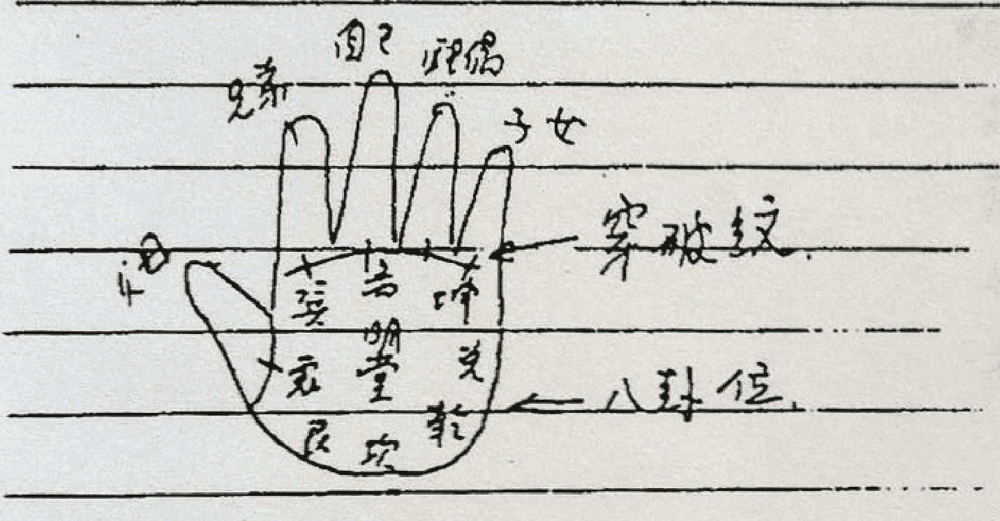

[诀]掌心明堂黑气现，还有危命祸了生。
震宫青暗必刑劫，巽宫青暗大破财。
离宫青暗防盗灾，坤宫青暗主死之。
兑宫青暗主大惊，乾宫青暗不吉祥。
（见图九）

乾宫有纹上离宫，父寿由来主贵命。
乾宫有纹上巽宫，主没退被财损。
有纹上震宫，主父母遭雷击。

有纹上坤宫，主刑克妻子。
乾宫有纹过艮宫，主破财有水厄。
乾宫有纹过坎宫，弃业走他乡。

手有川字纹，主意外死亡。
地纹方块纹，牢狱之灾人。
玉柱方块纹，也为牢中人。
十字纹起横满，横纹有阻难进财。
竖纹是年有份害，十个之中无一个。
见图十：

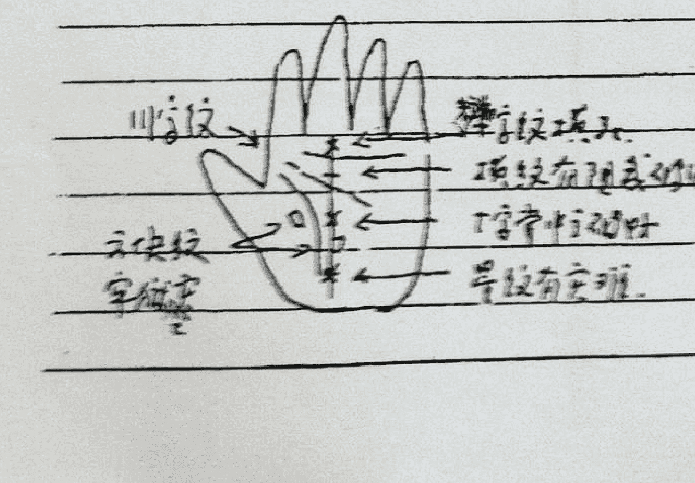

【解】：横纹、十字纹、星纹、方块纹、三角纹等，多为伤害纹，主有灾祸。横纹有阻不顺或破财。十字纹有病或伤害，方块纹主牢狱之灾。具体哪年有什么灾祸，要根据流年定夺。

86

# 第十七章：安徽相法秘传气色断法

相气色不须忙，但看年寿与印堂。
印堂青，早有灾，若无孝服损钱财。
印堂黄，喜事来，若无婚嫁定进财。
印堂紫，官运至，不升官来生贵子。
印堂白，孝服来，家中无了又来来。
印堂黑，见凶灾，作福祈保可免灾。
印堂与肤同，办事到顺风。
印堂五色如钱样，亦主破印有官讼。
失安失意须预防，失败之灾在其中。
五色连年寿，恐有械斗死。
在印为械斗，在准为争讼。
在山根为破财，在年寿为失色。
在目在天庭，必有牢狱灾。
春青定三阳取，夏红还向印内求。
秋白冬现年寿上，冬至地阁仔细详。
已官好看，气色难辨。

青主忧忧再官非，而主孝服是之病。
盖主远庆在临门，太有时向说记清。

（解）：有别看，气色难辨，如何看气色有几个重要部位为主看。

-   ① 前先看印堂，要分五色绿。巴之才候了，看颜色小疾或小破财。忧愁不善，苏红色主危险，牢狱，受惊，犯法，案有失和，白色则无人了，百事不顺，是暗色主主危险，死亡，破败，牢狱灾祸。

-   ② 日月角为父母部位，与官禄相连，先看父母健康，官禄也益，看颜色，主父母忧，疾病，官禄停滞。白色主父母大疾，灾过，红苏色，孝服，家庭大损，是暗色主父母惊险，死亡以及带多孤独失官禄。

-   ③ 两眉为兄弟部位以及口舌文书，若学有成倍，看颜色主口舌，苏红色主非口舌，是暗色，主失位，损失，灾祸至。

-   ④ 妻门为夫妻部位，若要主要会看法，如主要候夫位孝服，苏主妻病厄，红苏色，主妻惊险，疾病，白色沉公，主妻连初或患性病。

-   ⑤ 人中，苏红主生女收成，苏主病在红苏色主生女有灾厄，是暗色主生女惊险以及破财之灾发也。

另外，苏主正、五、九月应在戌日，苏主二、六、十月，亥卯未日，是主三、七、十一月，申子辰日，白色主四、八、十二月，巳酉丑月，苏主正、五、九月，辰戌丑未月，色淡了不忌，色沉了要一灾。

# 第十八章，行走江湖经验分享

看面相要讲一定的步骤。有了步骤方可从容面对，才能言之有物。以下看面相的步骤是我多年的经验积累。

-   一，面形。分为金木水火土。及十种脸形。即圆字，田字，目字，同字，申字，用字，风字，壬字，由字，甲字脸。

-   二，眼神。分笑脸和哭脸。眼：神藏，露，静，急，威，和，惊，醉，脱。

-   三，气色，先看耳，次看准头，印堂。再就是十二宫。看各种颜色（黄，红，赤，白，青，紫）。重点看痘。

-   四，品性，气量大小（看五官大小），温柔或凶狠（权骨，眉骨突出否，准头，嘴唇）奸忠（准头，嘴唇）人情味（嘴唇，下巴）

-   五，三停，上，中，下。大概看出此人何时好或者差。

-   六，流年。有三停流年，二主流年。百位流年，九执流年，地支流年。综合起来判断此人具体哪一年好与差。

-   七，具体观十二宫。（大小，长短，向上向下，凸起凹下，弯直或断，颜色，痣痘疤，）

-   八，奇法，小人形法，八卦法。

-   九，其它。头发（粗细，硬软，厚薄）。颈（结喉大小，长短粗细）肩（缩肩，左右高低）。手（掌指比例，露骨，指甲）。脚足有肉否。

-   十，过十关。1，父母关（日月角，法令，脸左右对比）2，兄弟关（眉毛，准头）3，子女关（泪堂，嘴唇竖纹）4，婚姻关（奸门，山根，印堂纹）5，财运关（鼻子，权骨，天仓地库，骨露必贫穷）6，官运关（额头，权骨，地库，眼神）7，病灾关（山根，脸上的各种纹，筋露病必攻）8，阳宅关（看脸上的痣痘疤，左右高低）9，阴宅关（鱼尾纹可定出坐向。参考人中）10，痣（应痣歌）疤，纹，斑的详细看法。

首先了解和掌握基本知识,然后再不断积累和提高.最后才学习听声音和观察气色等比较高难度的内容.

看相其实指的是观察一个人的全身,从头到脚指包括毛,发和皮肤.就整个身材而言分为三庭,从头到肩为上庭,从肩到腰为中庭,下肢为下庭;三庭长短比例不同代表着各人的相的好坏差异.整个人的形态又分为金,木,水,火,土五行;五行之中又分为富贵贫贱寿夭格局;中国传统讲究阴阳调和,骨为阳肉为阴一定要均衡匀称才能称为上相.根据人的身材特征,又分为五长格,五短格,五大格,五小格;符合这四种格的都属于好相,有一种比较特殊的相叫五露，只适宜做军官。五个条件有一个不符合就不是正格,相就差一些。有一种是人的行为特征反映出来的相格叫‘五慢格’也属于一种好的相格。《月波洞中记》还提到人的行为也能改变本身相的好坏：‘有心无相,相随心生;有相无心,相随心灭’；就是告诫人们要多做好事。

普通的相师帮人看相一般是看面相和手相;看面相首先要掌握面部流年运气歌诀,指的是面部从额头到下巴分为一百个部位(采用十三行分左右排列)代表一个人从一至一百岁的观察位置.面部也分三庭(发际至眉毛是上庭,眉毛至鼻的准头是中庭,准头至下巴是下庭);分别表示少年,中年和晚年的运程.五官也是看相的重要部分,眼为监察官,耳为采听官,眉为保寿官,鼻为审辨官,口为出纳官;这五官的每一官好坏又分为很多的种类;古代相术也有将每一官形状与动物的器官来相比照的.还有一种方法是把面部分为十二宫,指官禄宫,父母宫,兄弟宫,迁移宫,田宅宫,男女宫(就是子女宫),疾厄宫,财帛宫,妻妾宫,奴仆宫和命宫.这十二宫根据各宫的部位和称谓很容易理解所代表的含义.古代根据面部形状(肥,瘦,厚,重)又分为面部金,木,水,火,土五行;五行之中也分为富贵贫贱寿夭格局.还有就是将人的面部用十二地支(子、丑、寅、卯、辰、巳、午、未、申、酉、戌、亥)划分为十二等分,分别代表一年十二个月的运程。另外有根据人的脸形与中文字的形状相对比的,例如:国字脸、同字脸、甲字脸、由字脸、申字脸等;也有根据人的头部形状,跟动物来类比的,如虎形,狮子形,猴子形,等有很多种。

除了手相和面相及身体的形状之外,还有就是头发,汗毛,乳房,阴部和阴毛(阴毛分六种类型,跟人的命运也有很大关系,传说汉高祖的吕皇后的阴毛长及膝盖,不知道古代相师是如何观察出来的,现代人绝对没有开放到可以让相师观看私处的程度),肚脐,口舌,谷道,指甲,脚底,身体各处的痣斑,声音,外表气色和身体散发出来的气味都是很重要的看相部分.骨相学则又是另一种很重要相学.还有就是西洋相法跟中国相法有很多不同的地方.

# 中华古籍库

1000000 册 高清影印古籍
珍版刻印 / 海外流传 / 家传手抄 / 民间失传

古籍善本、经史子集、史料笔记、古人文集、
民间收藏、传世家谱、各地方志、中医典籍、
四库全书、古禁毁书、内阁文库、图书集成、
丛书集成、四部丛刊、万有文库、四部备要、
二十四史、三国六朝文、明清和民国古籍史料
……

