# 安徽相法彩图实例解析
## （一）

中华安徽相法研究院

主营资料：

- 《安徽相法高级实战教程(黑版)》，12张光盘，价格：900元
- 《安徽相法彩图实例解析》，总共166页，价格：900元
- 《安徽相法初级视频教程(蓝版)》，12张光盘，价格：500元
- 《安徽古相法秘笈(手抄本)》，103页，价格：500元
- 《安徽相法风水阳宅》，12张光盘，价格：500元
- 《安徽相法风水阴宅》，12张光盘，价格：500元

内部资料 切勿外传

# 安徽相法彩图实例解析
## （二）

内部资料 切勿外传

古籍库 www.fozhu920.com

# 安徽相法彩图实例解析
## （一）

中华安徽相法研究院

主营资料：

- 《安徽相法高级实战教程(黑版)》，12张光盘，价格：900元
- 《安徽相法彩图实例解析》，总共166页，价格：900元
- 《安徽相法初级视频教程(蓝版)》，12张光盘，价格：500元
- 《安徽相法高级实战秘笈(手抄本)》，103页，价格：500元
- 《安徽相法风水阳宅》，12张光盘，价格：500元
- 《安徽相法风水阴宅》，12张光盘，价格：500元

内部资料 切勿外传

安徽相法是安徽民间自古流传下来的一门极其灵验的相法绝学。在前面，我们学习了安徽相法的一些秘诀知识点。通过反复学习资料教程，即可以掌握本门相术的秘诀和方法。但是，相法术数之类的学问，是一门实际运用的学问。实践是检验真理正确与否的唯一标准。只有实际运用相法知识，才能让各位易友掌握真正的技艺，不再纸上谈兵。

为了满足各位易友的求知欲望，我们特地出版了这套《安徽相法实战图解资料》。这套资料，耗费了笔者三年的时间，游遍了大江南北，采集了数以万计的面相手相案例。最后，通过筛选，找出了最具有代表性的例子，做为教案，向各位易友讲述笔者的看相经验和被相者的真实反馈情况。我们通过对数百张彩色照片大图的精细讲解，来学习安徽相法的精髓知识。

本套资料，所选用的案例，都具有一定的代表性。并且，我们对被相者面相手相的各个角度进行拍照然后再进行精密分析。

只要您把这些例子能够理解透彻，融会贯通，就一定能够在相术领域有重大突破。

学习相法，最重要的在于实践，但并不代表要去盲目的去给别人相面，那样只能是事倍功半。古人云：“读万卷书，不如行万里路；行万里路，不如阅人无数；阅人无数，不如名师指路”。众所周知，一些安徽老相师，看相都非常的准，过三关，断六亲，无不应验。就是因为他们先前有名师的指导再加上长年累月的实践，看相的技艺才达到炉火纯青的地步。大家不用羡慕，他们的技术高超。因为我们有着，比那些老相师，更快，更捷径的学习方法。我们直接把江湖经验，整理成册，利用真人照片来让各位易友提前掌握那些老相师几十年的经验所得。他们几十年的总结出来的经验，我们几天就能全部学会。

《安徽相法彩图实例解析》，凝结了众多老相师多年的心血。他们把毕生的经验，都穿插在了这些案例当中。希望各位易友能够细心揣摩，并且要烂熟于心。只要你能够把这些代表性的例子理解了，把其中的关键知识点记住了，那么世间一切的相法问题都不在话下，不会被任何人所为难，足以成名于天下，并且也把我们的传统文化发扬光大。

《安徽相法彩图实例解析》，分为面相和手相两大部位。每一个案例，都运用了大量的篇幅进行细致的讲解。由于时间比较仓促，难免在书面表达层面上存在一定的欠缺，如有任何不懂的地方，或者有任何疑问，可以随时来电来函进行咨询。

下面，我们正式进入彩图案例解析章节。本套资料，第一部位为面相部分，第二部位为手相部分。下面开始进行第一部分。

在进入面相部分之前，我们先掌握安徽相法的流年判断方法：

一、百岁流年法，

也就是我们最熟悉的，百岁流年歌诀。我们在前面的课程里面，已经讲了很多，这里不再多说。如果不懂的再看一下前面的课程就可以了。

二、九执流年法：

九执流年法亦为相学秘法之一种。此法以五官分为九年，每九年重複一次。如鼻代表两岁，则九年后为十一岁，再九年为二十岁，再九年为二十九岁，再九年为三十八岁，再九年为四十七岁等…，鼻梁显示婚姻之吉凶，如鼻梁有纹疮缺陷则不单在四十五岁至四十九岁算运岁数的时候才会产生问题，在以上之年岁亦会产生问题，但不一定是凶象，只代表夫妻感情有变化，争吵不和。但发生在二十九岁时则极可能是结婚年。

所以在九执流年法之用法是，当你看见某人面相上已出现疵痕疙瘦，便可用九执流年法去推断会发生问题的年岁，相反如某人面上因意外受伤，亦可从受相之部位去还原受伤的年岁。

九执流年法各部位代表的年岁细述如下配对：

左眉 1 岁、10 岁、19 岁、28 岁、37 岁、46 岁

鼻 2 岁、11 岁、20 岁、29 岁、38 岁、47 岁
口 3 岁、12 岁、21 岁、30 岁、39 岁、48 岁
左耳 4 岁、13 岁、22 岁、31 岁、40 岁、49 岁
左眼 5 岁、14 岁、23 岁、32 岁、41 岁、50 岁
额 6 岁、15 岁、24 岁、33 岁、42 岁、51 岁
右眉 7 岁、16 岁、25 岁、34 岁、43 岁、52 岁
右眼 8 岁、17 岁、26 岁、35 岁、44 岁、53 岁
右耳 9 岁、18 岁、27 岁、36 岁、45 岁、54 岁

九执流年法还有一个重要秘诀：每个人走会有一个最好的部位，这个部位的流年是最好的，就会在 2 岁开始出现，20 岁、29 岁、38 岁、47 岁，运气非常好，就可以在这些年放手去做自己想做的事情（注，一定要自己亲身经历过，才行，不然也没用，如你 20 岁时，真的好好，那你 29 岁时就可以放手去做事了。）

三、象形流年法

就是根据面部某个部位的特征，来定流年。比如说，一个男人左眉头部位有伤疤，按照我们通常所说的话，就是说，此人父亲在本人十岁左右时去世。另外，伤疤本身有一定的形状。

根据伤疤的形状，来判断数字。如果伤疤酷似“3”，明此人父亲在本人13岁时去世。

面部上，某个部位都代表着自己的含义。大家根本具体部位所代表的含义，以及，伤疤，纹痕，黑痣的特征，来具体判断，应事的具体年月日时。此种方法需要灵活运用，需要掌握火候。经过多年的锻炼，同样可以达到非常精准的程度。

另外，我们再说一下，看父亲兄弟几个的方法：

一般额头上可以看父亲兄弟多少。天官高广，父亲兄弟必定多，否则为兄弟少。另外，还要参看耳朵与颧骨，眼睛的相对位置来判断。这也是一个经验问题。看的多了，反馈的多了，自然就会掌握真正的答案。

另外，一个人，肩膀如果比较平直，肩头不低下（也就是我们平常所说的，肩比较斗），就说明，父亲兄弟不多，或者就一个。如果一个人，肩膀比较不平直，肩头拉下来（也就是我们平常所说的，肩比较削），就说明，父亲兄弟比较多。斗的越严重，兄弟姐妹越多。左肩代表本人的叔叔和大伯，右肩代表本人的姑姑。左右参看，定出最后结论。这些也需要大量的锻炼。

在我们这套资料里面，我们选取了最有代表性的案例来和大家分享。大家一定要记住案例当中的一些规律，然后到实际之中去运用，方可万无一失！

# 面相案例彩图实例精解

案例一、浙江的一位工厂老板，让我为其看相，看完之后，经本人允许，我对其进行拍照，以备教学之用，非常感谢此老板！

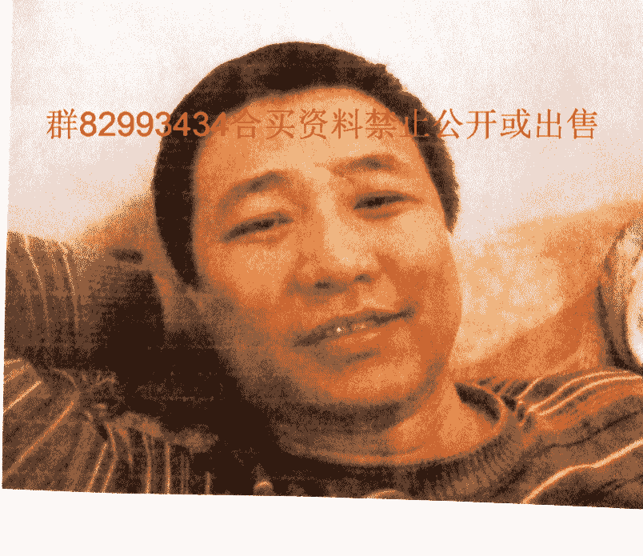

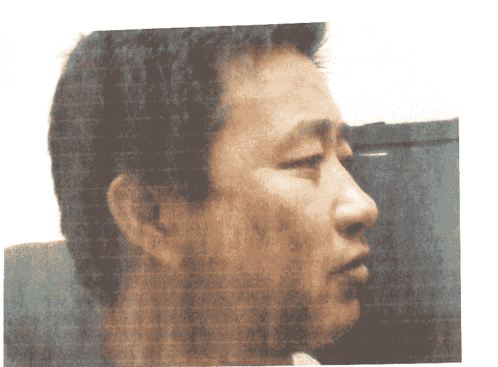

群82993434合买资料禁止公开或出售

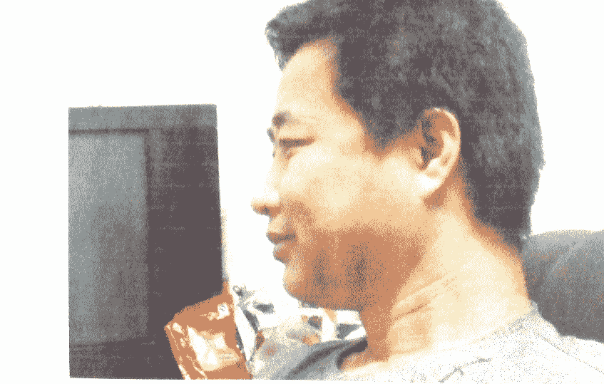

第一关父母关：

父母宫太阴、太阳，日月角，双眉，双耳、天宫，天庭，法令，年上，寿上。

太阳位（即左眼头）凹陷，并有伤疤，露骨，气色晦暗。太阴位气色比较暗。左眉头有疤痕入眉头，左眉尾也有一道伤疤。并且，左眉尾下垂，额头中间发际发尖，直冲天宫部位。此为丧父之非常明显之信息。因为，左眉有伤疤，信息较其它部位明显，所以丧父时间应在左眉之所在流年。因为左眉尾为父亲命门所在位，此处有伤疤，伤及父亲命门，所以丧父时间非常早，基本不超过十岁，根据九执流年法（后面的章节，我们专门讲解九执流年法），左眉代表1岁、10岁，由于眉尾特别明显，故可断丧父时间应在1岁。综合断言：此人1岁【天宫位】克父亲必应。母亲身体健康虽然不良，但是并没有性命之忧，目前尚健在。

最后看此照片的颧骨与双眼的位置，以及颧骨与耳朵的位置，双肩的抖削情况，断定：父亲兄弟应该四个，会有刚出生不久就夭折的，其父亲应该排行老三。老大是女（也就是本相的姑姑），老二是男（也就是本相的大伯）。由于本相眉头被伤疤截断，眉头发淡，故大姑家无子女。

天高为父，地厚为母。观地阁，牙齿，可断其母亲兄弟五人，兄弟三个，姐妹二人，其母亲排行占老二。

接下来看面相第二关。

第二关兄弟关：

眉平尾下拉，兄弟四人定不差。眉头，眉尾皆发淡，上面有一个姐姐，下边一个妹妹。双颧略起，太阳穴丰满，故此人有兄弟二人。又鼻头圆，耳弦不起，可断此人排行为老大。

下面断第三关，儿女关：

三阴三阳起卧蚕，人中比较短，左眉头乃至印堂有伤痕，头胎一子活不成。命中无儿子。二女撑家门。三阴部位有阴骘纹，故两个女儿都特别有出息，将来都是大学生。

最后对此相进行综合论断：

此相额头饱满，两耳贴墙，富贵之命也。鼻高又大，两颧相护，准头圆齐，心善。2，燕颔稍起，颧骨，日月角，六阁分明，食禄之人。3，法令不好，看不清楚。4，眼犯桃花，要注意身体。5，卧蚕横纹，非良善之辈。

右眼眉部位露骨，为阴漏骨，说明妻子母亲幼年早亡。右眉头发淡发炸，妻子娘家出绝门。其妻子有姐妹二人，本人排行占老二。

双眼下起卧蚕，又为双眼皮，眼中微带泪水，此乃真桃花眼。一生桃色事件不断。

1，准头圆齐，心善。2，燕颔稍起，颧骨，日月角，六阁分明，食禄之人。3，法令不好，看不清楚。4，眼犯桃花，要注意身体。5，卧蚕横纹，非良善之辈。

老父先上路，兄弟一排行，眉生狮虎样，兄弟二人强，身上有一姐，身下有一妹。眉头淡红妆。女儿双全占，先儿后姑娘，长子活不成。兰台廷尉破，破财运限伤，年时官运走，时过又从商。

此相额上两边角毛发生的高，再加上方形额，其祖上必是富有之家，后因灾而破败，此型人智力超群，非常聪明，若五官生的好，对医术，文化，科技等方面必有所成就。

其智慧较高，对音乐，文艺，戏剧方面独有天赋，必能成名，但其生理不足，婚姻爱情不顺，有女无子的居多。

此相为蒜头鼻，山根与鼻梁不宽，下鼻准处丰满像蒜头状，无论男女，财运必佳，即使早运无成，后半生一定财谷丰盈，善理钱财，最起码是小康水平。

两颧代表权力的象征，又主事业，财气，婚姻感情，子女亲情及父母吉凶，又与人的交往，性情，寿命长短，有直接关系。两颧似香瓜状，女人多见，从两耳前方凸起，双颧相连，两颧肉多骨藏凸胀。

男女生此颧相主命太硬，男人克子。

正格同字脸：四轮丰满，三停均称，主金型正格，五官端正，法令深广，为大贵相，寿必高。面相断风水：

阴宅方面：此相人中微向右偏，眼尾稍下垂（说明坟向朝阴），可断其祖坟坐东北朝西南。坟南边有大沟（由疤痕可断出）。坟的财路坎截断，一生定有破财之大灾难。

阳宅方面：先前有两座房基，后来一房基被破坏。额头不平，可知南边坑洼不平，地势较低。把脸分为左右两部位，右边有伤疤，左边没有伤疤，而且特别圆润，颧骨高耸。可断西边邻居受贫穷。东边邻居富满园。话不在多少，句句落实赛神仙！

群82993434合买资料禁止公开或出售

案例二、山东潍坊一名农家兄弟

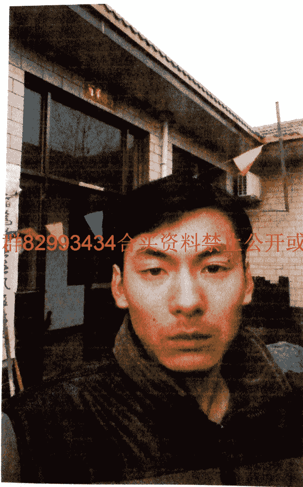

看相，首先要过三关：

第一关父母关：

父母宫太阴、太阳，日月角，双眉，双耳、天宫，天庭，法令，年上，寿上。

太阴太阳虽无肉但并不露骨，两眉微乱，左眉尾下有一黑痣。给据此一条，父亲身体不好，

额形后仰，与父无缘，少年克父

印堂低，眉头低压眼，八至二十五岁之间克父母

山根印堂狭窄，主二十岁左右克父亲。

年上寿上，又主父母，男子以寿上为母，年上为父。女子以年上为母，寿上为父。

年上部位，比较狭窄，

寿上部位，光滑圆润，气色比较鲜亮，故母亲身体非常健康，并且脾气性格比较和蔼。

综合断之，此人父亲，在本人二十四岁时去世。母亲健在。

接下来看面相第二关。

第二关兄弟关：

兄弟姐妹宫位要看太阳穴、眉骨、颧骨、鼻子。

破缺后仰耳，整个耳朵向后倾斜，代表有兄弟四五人。

照片中的眼眉上仰，眉尾分岔。左眉头比较淡，可断定兄弟两个，两眉不过骨，形状呈剑眉，初步断定兄弟两个。右眉高，左眉低。另根据大眉毛与眼珠的参照，可断定此人姐妹二个。由于左眉头比较淡，故此人上面一姐，下面有一妹妹。另外，此人额头呈方形，两耳起弦，鼻头微微仰露。故可以断定，此人总共兄弟姐妹四人。此人兄弟之中排老二。

上面一姐姐，下面一妹妹。

第三关，子女关：

儿女宫在鱼尾，参考部位有：人中、水星、准头、眼眉、三阴三阳、印堂。

印堂窄一指，必定有一子。印堂洼陷，故可以断命中有二女。此人长得是箭眉，与子息缘份淡薄。

嘴巴长得有棱有角，故可以生一女。但由于此相，鱼尾奸门没有开花，故目前尚未成婚。

最后对本相进行综合论断：

此相属破格的甲字面，如两耳反廓，额头狭窄，低陷，主少年时代辛苦，祖业不存，学业不成，自立成家，六亲无靠，创业艰辛。

若印堂低，或者眉低压眼，再有山根细狭低陷，必妻迟子晚，好运也晚。

山根印堂狭窄，主二十岁左右克父亲。

天中左右有陷缝，暗破，疮痕，主八至三十一岁官司口舌临身。

印堂狭窄，眉毛再浑浊不清，三十岁时必有意外血光伤灾发生。再有眼堂浮泡，或耳珠尖削，主青少年间必为富屋穷人。

嘴型小，十二岁之必离祖移居他乡。

破缺后仰耳，整个耳朵向后倾斜，主父母，自己背井离乡，求生创业，兄弟四五人，文化不高或无文化，宜从事手工技艺工作。

严重后仰的额形

祖业破败：财产皆无，与父无缘，少年克父，多背祖离乡创业。

聪明绝顶，骄傲自居，目中无人，平生桃花运多多，双妻之命，又主与自己年龄大的女人鬼混，宜与人招婿之命。

一生中官灾难免，尤其到五十岁上下即不是官灾，也是其他凶灾必现，甚至天亡。

箭眉，眉头低垂，眉尾上后扬起，性格刚强，有胆识，有威慑杀气，与子息无缘。

鸟嘴型眼，善于琢磨人心，算计人，随机应变，手段巧妙，谋事有成。

窄型鼻：指山根细窄，男人多主晚婚，而山根细耸如一根直线者，必克多妻。

两颧突起横直广，下脸即下停消瘦，无情无义，翻脸不认人。

面上不生肉，一生交不透，叛逆心强，不可重用。

两耳不规整，不成样，幼年必定家境窘迫，一贫如洗耳。天中部位洼下去，很早就出来做事。两眼坚定有神，印堂比较窄，代表为了比较执着，会遇到很多麻烦事，自己容易想不开。天仓部位还算比较饱满，到 29，30 岁，事业会比较顺心，财运开始转好。两眉部位长得比较整齐，规整，秀丽，故 31，32，事业如鱼得水，有很大的发展空间。两眉尾发淡，比较散，所以 33，34 岁，会破财，可能以前所得到的，会一下子全部失去，而后从头开始。双眼坚定有神，所 35，36，37，38，39，40 岁，这几年，会有所收获，但是眼睛里面带黄红丝，所以也会有经历很多的磨难。山根比较低窄，做事业比较吃力，好像爬楼梯一样，虽在不断进步，但是事倍功半。42，43 岁事业财运不利，会比较平淡无奇。44—54 岁，是他一生之是事业发展的黄金时期。以后，会出现调零，所以我建议其本人在 55 岁之前多努力，多积累，这样到老才不会受孤苦贫寒。

此相额头不是太饱满，所以适合走异路功名，适合走偏财运比较好。

鱼尾奸门还算比较饱满，气色也不错，所以婚姻运气最后会比较好。

案例三、山西长治的一名公司职员

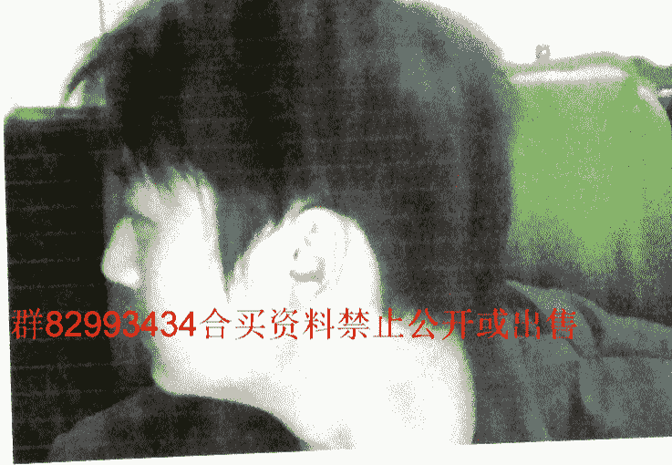

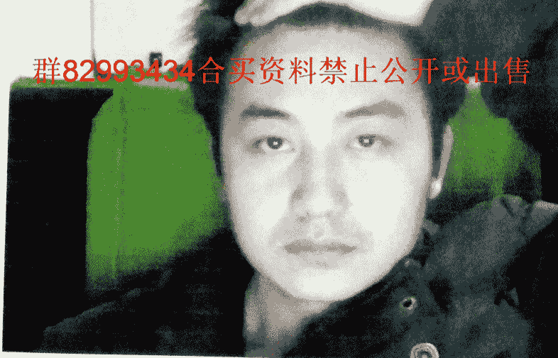

群82993434合买资料禁止公开或出售

-19-

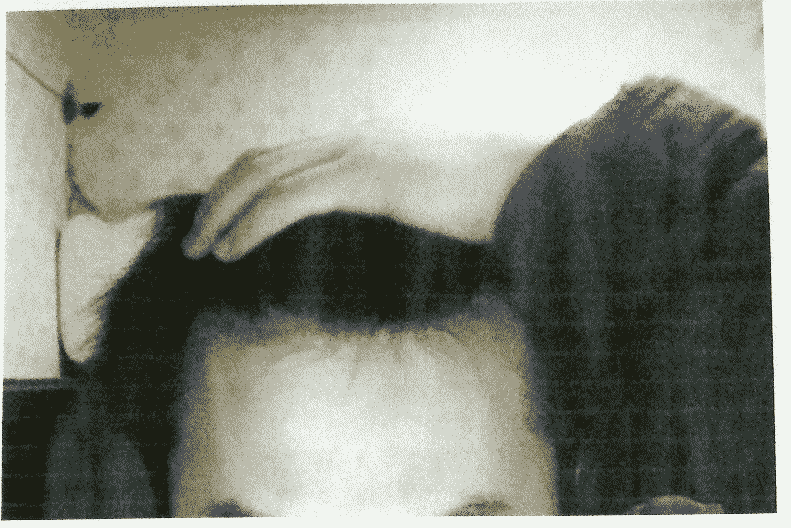

看相，首先要过三关：

群82993434合买资料禁止公开或出售

第一关父母关：

父母宫太阴、太阳，日月角，双眉，双耳、天宫，天庭，法令，年上，寿上。

两耳不遮垂珠，耳珠过小，主心性敞亮，善于交际，父母感情比较好。

太阴太阴没有缺陷，故父母较为健康。

年上寿上，又主父母，男子以寿上为母，年上为父。女子以年上为母，寿上为父，

此人年上，寿上都不错，故可以断父亲身体较好，没有目前没有病灾。

接下来看面相第二关。

第二关兄弟关：

兄弟姐妹宫位要看太阳穴、眉骨、颧骨、鼻子。

眉形上仰，兄弟二人。眉头，眉尾皆比较淡，故上面有一姐姐，下面一个妹妹。

准头低下，不露孔灶，耳弦不起，故可断此人排行为老大。

第三关，子女关：

儿女宫在鱼尾，参考部位有：人中、水星、准头、眼眉、三阴三阳、印堂。

印堂平满，三阳起，东岳也比较高，头胎必见儿。

印堂窄，三阳不起，头胎必见女。

嘴相有偏斜，有子无女之命。

最后对此相进行综合论断：

此相，双耳靠墙，出身富裕之家。小时候，不缺吃来不缺喝。额头不平，印堂窄，此人学历并不是很高，最多是个初中生。官禄宫虽宽广，但是不平，也不饱满，所以并不适合为官，适合走异路功名。印堂窄，气色也不是太好。天仓不是太饱满，故三十岁前是没有好运气的。眉毛长得还可以，属于剑眉，所以，从三十一岁开始，开始走上坡路。眼睛长得不太好。睛弱无神，而且还是下三白眼。所以在其 35—40 岁，事业低弥，会破大财。并且身体健康也会出现问题，有会一些刑伤，比较做手术之类的。面大鼻小，中年 46 岁这财运不佳。颧骨 46，47 这两个会有很大的发展空间。婚姻方面，右眼鱼尾后边，从眉上面垂下一条纹，截断鱼尾，所以必定离婚再娶。眼袋重，作息时间没规律，心事多，右眉头有痣，克母亲，母亲身体不好，事业上难得家人的帮助。眼睛突露，两眼浮光，性格急躁，太察多疑，要注意修身养性，近君子远小人，否则 28-39 岁不利，奸门泛青，夫妻关系不好或有婚外情。耳珠与腮分离不靠的人，其祖父母，外祖母都是吃斋念佛的人，父亲为有道德修养之人。母亲财源通过父亲。

若日月角骨露或有上下虎牙者，父母必生离死别。

额形后仰：

祖业破败：财产皆无，与父无缘，多背祖离乡创业
聪明绝顶，骄傲自居，目中无人，平生桃花运多多，双妻之命。一生中官灾难免，尤其到五十岁上下即不是官灾，也是其他凶灾必现，甚至天亡。浓眉，毛黑不乱，顺伏倾斜后向上仰，主人聪明好学，勤奋，工作事业顺遂。

鼻子较小，自我意识不强，两颧低下，缺少自我主张，无有

## 案例四、湖北武汉的一名学生

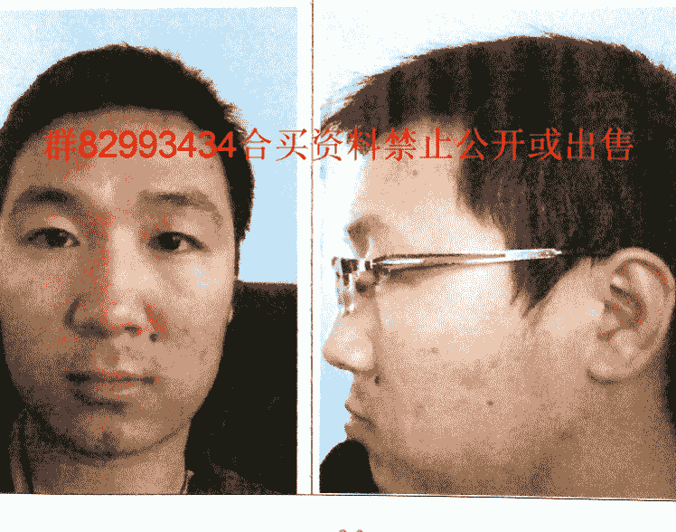

## 更多资料

↓↓↓

--------------------------------------------------

### 【中华古籍库】

↓ 点击链接 ↓

https://www.fozhu920.com/list/

珍版刻印 / 海外流传 / 家传手抄 / 民间失传

【易】【医】【道】【武】【文】【奇】【画】【书】

1000000+高清古书籍

### 打包下载

微信：mbook86

## 看相，首先要过三关：

### 第一关父母关：

父母宫太阴、太阳，日月角，双眉，双耳、天宫，天庭，法令，年上，寿上。

第一关父母：父母宫太阴、太阳，参考宫：双耳、天宫、日月角，法令。

金木二星不对称。右耳低左耳高，母在父先归。

太阴太阳带杀，两眉带杀。

年上寿上，又主父母，男子以寿上为母，年上为父。女子以年上为母，寿上为父，此照片年上低并且有伤疤痣破，寿上完好，故可断父亲身体不健康。

另外，左法令内有一特别显眼的黑痣，并且在法令纹的根部，代表此人青年丧父。

日月角下部低平，上不凸起露骨，主父母寿数不足。具体是谁要参照其他宫位。

天宫洼陷，男子克父亲，女子克母亲。发际不齐，太阳位露骨。男子不利父亲，女的不利母亲。

最后看此相的颧骨与双眼的位置，综合断言：此人28岁【印堂位】克父亲必应，三纹二断一支连。两颧靠上（用）字脸，双眉略下弯。父亲定是兄弟第二，同母异父二姓参。

接下来看面相第二关。

### 第二关兄弟关：

兄弟姐妹宫位要看太阳穴、眉骨、颧骨、鼻子。

眉头起，眉尾垂，兄弟一名定不差。

大眉平，颧不起，兄弟独自一。

### 第三关，子女关：

儿女宫在鱼尾，参考部位有：人中、水星、准头、眼眉、三阴三阳、印堂。

印堂洼陷，头胎女儿。人中下边一个窝，有子也不多。

命中只有一子。

### 最后对此相进行综合论断：

此相双耳贴面。对面不见耳，谁家富贵子。可见幼年家庭不错。并且耳白于面，闻名四方。

额头偏斜，印堂陷，定知此人无学业。虽然此人戴着眼镜，像个文化人，但是大家绝对不能让一个人的表面现象给迷惑了。一定要相信自己的眼力和知识的正确性。

眉头聚眉毛散，一生财散不间断。鼻头一痣志虽高，中年常闻艳名财名声。中年财运不错，只是注意理财。恐怕到手钱，还得花光。婚姻方面，但见右奸门发暗，并且下嘴唇长，上嘴唇短，利阴害阳，可以断定其妻子定有外遇。

额头不平，有低陷，代表祖上不强，家庭一般，父母平头百姓。母亲身体稍弱，本人身体也不强。眼睛含水，说明肾气充足，属于多情的一种。不过在感情上还是比较认真的，对老婆不错。现在异地谋生，不过从面相来看，不太适合他乡工作。印堂形状不太好，所以遇事多不顺。财运现在不强，不聚财。

天庭饱满上稍圆，三纹二断一支连。两颧靠上（用）字脸，双眉略下弯。父亲定是兄弟二，同母异父二姓参。本人单传不相混，兄弟之间无血缘。头胎生儿健康仔，夫妻和睦过百年。

群82993434合买资料禁止公开或出售

圆形耳轮厚包廓，耳珠圆厚，主水型耳，若生在金型人或水型人者，能生富贵。主人聪明，和善，祖辈及父母为诚实善良之人。适合工商企业投资之命，防三，六，十二，十三岁之间有疾病伤灾发生。圆耳珠向上兜朝脸的方向时，名为遇继耳，若不过继也要认干爹干妈。此相双颧很高，但肉厚满包住颧不露骨，两颊腮骨肉满不削瘦，耳前双颧肉骨丰起，上插天仓。男人生此相，必娶富家之女，一生发官发财，妻贤子孝，女人生此相，必嫁富贵之家，旺夫益子。

-26-

三停狭长主目字面，初年运佳，二十岁前先富后贫，此类型人志向不高尚，难成富贵，一生平庸无大成就。

## 案例五、山西吕梁的一名工人

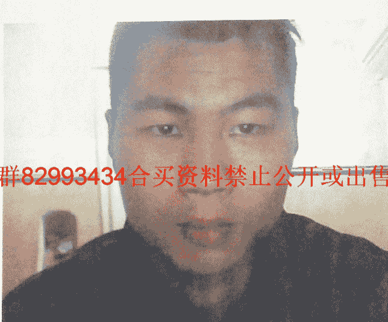

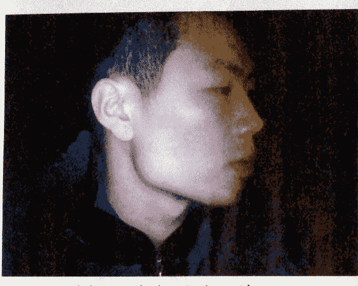

群82934341 看相首先要过关：公开或出售

### 第一关父母关：

父母宫太阴、太阳，日月角，双眉，双耳、天宫，天庭，法令，年上，寿上。

第一关父母：父母宫太阴、太阳，参考宫：双耳、天宫、日月角，法令。

头偏额窄眼角斜，此人早已哭爹爷

左有旋毛先丧父

最后看此相的颧骨与双眼的位置，双耳与颧骨的位置，双肩的斗削情况。综合断言，父亲兄弟应该兄弟一个。

接下来看面相第二关。

### 第二关兄弟关：

兄弟姐妹宫位要看太阳穴、眉骨、颧骨、鼻子。

眉毛上仰，双颧高起，额头 M 形。本人兄弟二人，排行为老大。

### 第三关，子女关：

儿女宫在鱼尾，参考部位有：人中、水星、准头、眼眉、三阴三阳、印堂。

看印堂有两个男孩子，两个女孩子，但其家阴宅存单不存双。只能断有一儿。这孩子眼跟前会留下伤疤。这一条希望以后反馈。

### 最后对此相进行综合论断：

对面不见耳，双珠护口，富贵之命。额头虽然饱满高耸，但是抬头纹居多，纹路冲破官禄宫，一生不善于在官场工作。额头呈 M 形，为人进取心特别强，做事雷厉风行，从不拖泥带水。眉头浓，眉毛散，代表 31，32 岁聚钱财，33，34 岁破财不小。两眼呈内三角眼，35，36 岁两年容易上当受骗，由于眉毛散，容易因兄弟或者合作伙伴散财。注意，在与人合作做事的时候要注意合作伙伴的举动，以免带来不必要的损失。鼻如截筒，悬胆鼻子发中年，再加上两颗有力，41---47岁必定发财钱百万。

婚姻方面有暗斑，24岁结婚缘，婚后和合百年。

此相靠不了父母，父母能力有限。三十一二起运，时运会好转。之后三十七八基本稳定向前了。

耳珠厚且大，代表其人祖上父母信仰佛教，讲品德，有大慈大悲之心，自己也有宗教信仰，若两耳低者，对神秘事物尤其感兴趣，有同情心，适合从事慈善事业及服务性行业。

额上两边角毛发生的高，不论方形或者圆形，其祖上必是富有之家。此类型的人为祖上非常聪明，有智慧，五官生的好，对医术，文化，科技等方面必有所成就，如手相纹清不乱，手掌柔软。必是教育界，文艺界及军政，工商，税务企业专家的名人。

尤其两边额角为形五官手相俱佳的人，其智慧高尚，对音乐，文艺，戏剧方面独有天赋，必能成名，但其生理不足，婚姻爱情不顺，有女无子的居多。

如果男人再眉浓低压眼，眼圆又陷低者，则为孤独之命，若指节如扁桃形者，必是入佛门出家之人。

直筒鼻相：从山根至鼻身皆高耸凸，似竹节筒状，上下直顺无曲线，鼻身及鼻翼似空悬之感，主人虽能发财，也能败财，财来财去，到头来两手空空。

此相颧凸，有闯劲，敢想敢干，颧骨横凸者防备心强，不愿与人担保，害怕自己吃亏上当，女人主克夫，养子无能力。

颧高骨相必须高，鼻相如果低，两颧则要平伏，两厢要相配，若鼻高而颧低，称孤峰眉，主克子，无子，或有妻无子，有子无妻相。

鼻小颧大，鼻低颧高也是妻财子禄不全。

上下停尖削，中停宽阔，如橄榄形，主与父母缘薄，初年晚岁坎坷不景气，一生无大财，有劳碌奔波之命。

群82993434合买资料禁止公开或出售

## 案例六、山西太原的一名物业工人

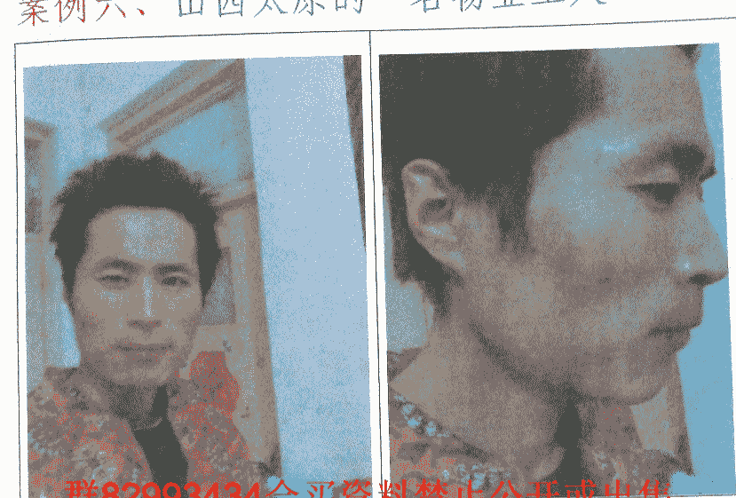

看相，首先要过三关：

### 第一关父母关：

父母宫太阴、太阳，日月角，双眉，双耳、天宫，天庭，法令，年上，寿上。

第一关父母：父母宫太阴、太阳，参考宫：双耳、天宫、日月角，法令。

依此照片为例，耳弦挺起无耳珠，定知父母寿不全。日角洼陷，太阳位带杀。右眉尾有破损，而且右眉高，左眉低，定知父亲入黄泉。太阴太阳带杀，两眉带杀，给据此一条，心中要有一种参照：父母有一体弱多病，有一脾气暴躁，难以交往处事。具体是谁，要继续看其他宫位。

年上寿上，又主父母，男子以寿上为母，年上为父。女子以年上为母，寿上为父，此照片年上低陷，气色暗，两眉锁紧，印堂狭窄。可断父亲健康出现了重大问题。

左法令外飞且折断，可断父亲在 20 岁左右去世。

最后看此相的颧骨与双眼的位置，双耳与颧骨的位置，双肩的斗削情况。综合断言，父亲兄弟应该二个，其父亲排行占老大。

接下来看面相第二关。

### 第二关兄弟关：

兄弟姐妹宫位要看太阳穴、眉骨、颧骨、鼻子。

眉散乱而压眼，颧高起，凸天中，兄弟三人行。

耳弦起，鼻准垂，定知此人排老三。

### 第三关，子女关：

儿女宫在鱼尾，参考部位有：人中、水星、准头、眼眉、三阴三阳、印堂。

三阴三阳起卧蚕，命中一女。

### 最后对此相进行综合论断：

两耳有红斑，红点，青少年，家庭受灾，内忧外患。父母受苦不少。天仓，天中部位低陷，在本人三十岁之前，家中状况一直没有多大的改变，生活比较的拮据，另外眉低压眼，鼻子虽然气色不好，但是形势还是比较丰隆，所以只有到鼻运的时候，此人才可以有所进展。由于满面赤红之气色，所以一生充满了官司口舌是非。

两颧赤红，有红点，还说明，他自己本身的肝脏不是太好，有炎症。

婚姻方面：比较晚婚，主要是因为房子问题没有解决好。因为田宅宫比较窄的。要到三十五岁才能动婚。

此相为扇形额：上额宽阔，下额狭窄以扇形的额头，祖上原是富裕家庭，破败后贫穷之相，少年辛苦操劳。

此相不宜早婚，早婚必离，妻迟子晚，若眉低山根细，或眉骨高，天仑狭窄，男子克妻，女子克夫。

多从事技术工作，或自由职业，自力更生，白手起家创业，小康或中等富裕。

婚姻宜三十岁上下找一个二婚的为佳。

此相为小鼻子，自我意识不强，若两颧低下，缺少自我主张，无有决断之权，遇事犹豫不决，听从他人及老婆的指挥使唤。所以小鼻子的人难以担任领导职务。一生财运欠佳，宜娶大龄女为妻为宜。

两颧代表权力的象征，又主事业，财气，婚姻感情，子女亲情及父母吉凶，又与人的交往，性情，寿命长短，有直接关系。

两颧似香瓜状，女人多见，从两耳前方凸起，双颧相连，两腮颐肉削，两颧肉多骨藏凸胀。

男女生此颧相主命太硬，男人克子，女人克丈夫，脾气急躁，女人妻夺夫权，做小妾，情人的较多。

三停狭长主目字面，初年运佳，二十岁前先富后贫，此类型人志向不高尚，难成富贵，一生平庸无大成就。

## 案例七、山东济南一名酒店大堂经理

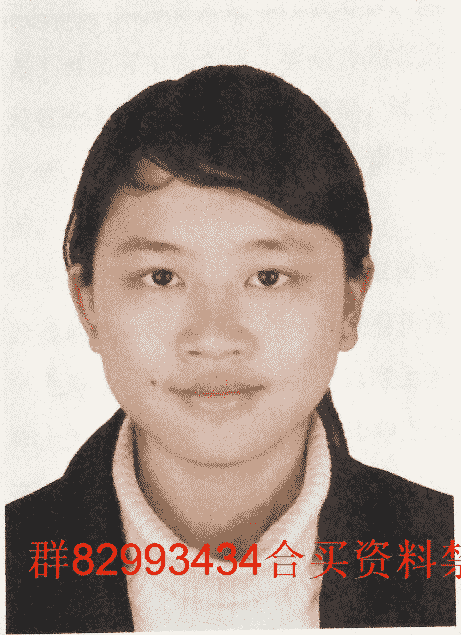

群82993434合买资料禁止公开或出售

看相，首先要过三关：

### 第一关父母关：

父母宫太阴、太阳，日月角，双眉，双耳、天宫，天庭，法令，年上，寿上。

第一关父母：父母宫太阴、太阳，参考宫：双耳、天宫、日月角，法令。

太阴太阳位长得比较圆满漂亮，没有明显缺陷。左耳明显变形扭曲。因为女人左耳代表母亲，所以可断其母身体欠佳。至于有没有生命之忧，要结合其它官位来断。

天宫没有缺陷，月角没有缺陷，法令纹没有缺陷。所以综合来断，母亲虽然健康一般，但并无生命之忧。父亲也健康平安。

由于右边法令纹上有一黑痣，故可断父亲腿脚出过问题。幸黑亮的痣不算恶痣，故腿并没有折断。

年上寿上，又主父母，男子以寿上为母，年上为父。女子以年上为母，寿上为父，此照片寿上气色不好，并且有一些暗斑，看到此处心中要有一种参照，母亲体格差，患有慢性疾病。

最后看此相的颧骨与双眼的位置，双耳与颧骨的位置，双肩的斗削情况。综合断言，父亲兄弟应该三个，其父亲排行占老大。

### 第二关，兄弟关：

兄弟姐妹宫位要看太阳穴、眉骨、颧骨、鼻子。

过兄弟关，女人要看右眉毛，而左眉毛代表配偶。观此相右眉，大眉毛，小眉毛看得清清楚楚。根据大眉毛与眼珠，眼眶的相互参照，可断此人姐妹就一个，下边就一个弟弟。

左眉可看其丈夫。可断丈夫也是哥一个，但是上边有姐姐，下边有妹妹。

### 第三关，子女关：

儿女宫在鱼尾，参考部位有：人中、水星、准头、眼眉、三阴三阳、印堂。

三阴三阳平满，印堂高隆，头胎儿子定当先。

印堂并不是特别开阔，只能容下一指，可断命中就一子。

三阴上面微微红润，气色较为优良，且三阴比较宽广，命中二女撑家门。

### 最后对此相进行综合论断：

此相两耳较大，幼年体质较好。天仓位低下不饱满，说明三十岁前经济状况不是很好。因为天仓，代表早年财帛宫。眉断又连，兄弟姐妹之间会有生离死别。两眼略带三白眼，35---40 岁会有一定的不好的运气缠身。鼻若悬胆，中年财运事业会特别的好。

婚姻方面：夫妻宫，夫妻座，气色都比较好，代表夫妻和合过百年。

面无善痣，说白了脸上的都可以点了去。事业和财运都还可以，会有人帮，有点福气，不过为人处事还不够谨慎。缺点内心多孤独，朋友不多，可能会影响你发展。体质差了点，要多锻炼。

尖狭额，出身贫困家庭，经济拮据，学业不成，六亲无靠，难享父母之福。若山根低陷，细狭，又眉低压眼，主八至十三岁之间先丧父，生活艰苦，必离祖创业。

三节眉，眉头毛竖起，中断横伏，眉尾下垂，两段三节形状，男人左眉如此相有三个父亲，兄弟一人，右眉有则有三个母亲，无有姐妹，女人左右反看，其父母多犯凶死。

宽鼻子：山根至年上，寿上，印堂宽阔而平宽，女人主婚姻十有九难，男人必娶贤妻。女人性傲，永不服输，女强人，交际广，不爱处理家务，自私，只赢不输，泼辣。

此相双颧很高，但肉厚满包住颧不露骨，两颊腮骨肉满不削瘦，耳前双颧肉骨丰起，上插天仓。

男人生此相，必娶富家之女，一生发官发财，妻贤子孝，女人生此相，必嫁富贵之家，旺夫益子。

凡脸圆，眼圆，耳圆，眉发齐浓，属水型人相局，男人不利父母，五至三岁间克父，女人克母亲，又与公婆，小姑缘薄，男女夫妻情缘不牢，一子之命，男性若身体长，主三十一岁有伤灾横祸临身，女主人面圆，鼻丰，肩背，臀具圆丰满，脸色白或黑或紫红色，男女必成富翁，印堂再宽平，旺夫益子。如面短圆如苹果，只恐寿天命短。

尤白色主金生水，名利双收，若色带青黄，肉浮骨粗，主穷。

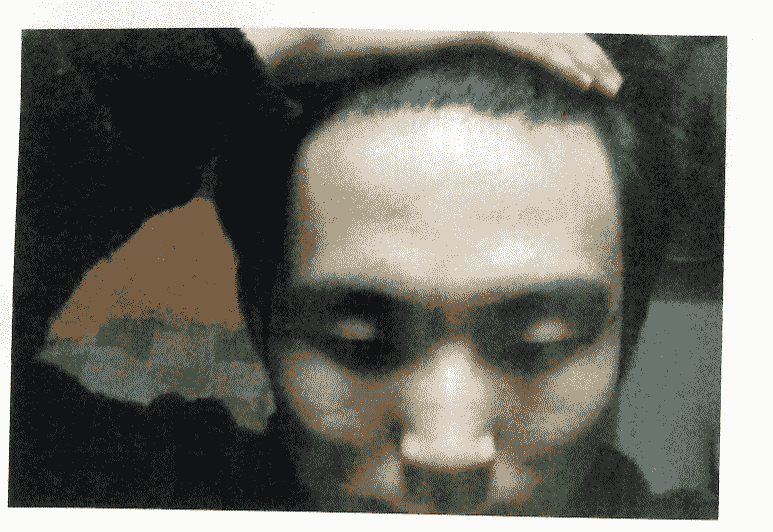

## 看相，首先要过三关：

群82993434合买资料禁止公开或出售

### 第一关父母关：

父母宫太阴、太阳，日月角，双眉，双耳、天宫，天庭，法令，年上，寿上。

第一关父母：父母宫太阴、太阳，参考宫：双耳、天宫、日月角，法令。

太阴太阳位露骨，可看出父母之中，有一个身体不佳，具体是谁，要结合其它宫位来看。

天宫凹下，可知父亲身体不好。并且在左眉毛眉尾下边有一痣。此痣为隆起，大家可知，在人的脸上，隆起的痣为恶痣。左眉的眉尾又为父亲的命门所在位，是要命的地方。故可断，在此人16岁时，也就是天中的位置所在的流年，克父亲必应。

母亲由于积劳成疾，目前身体也不太好，但总体并无大碍。

年上寿上，又主父母，男子以寿上为母，年上为父。女子以年上为母，寿上为父，此人年上部位有明显的伤痕，可知父亲入黄泉。寿上部位比较光整，可知母亲较为健康。

日角部位有有显示的伤痕隆起，可知父亲身体以及精神状态有明显缺陷。

最后看此相的颧骨与双眼的位置，综合断言：此人16岁【天宫位】克父亲必应，父母不和，隔角反目。父亲兄弟应该四个，会有刚出生不久就夭折的，某父亲应该排行第二，真老三假老二。

接下来看面相第二关。

### 第二关，兄弟关：

兄弟姐妹宫位要看太阳穴、眉骨、颧骨、鼻子。

眉毛见了弯，兄弟必有三。三阴三阳有截路纹，可知，此人是其父母最后的孩子。从鼻相以及耳相可以看出，此人排行占老三。

### 第三关，儿女：

两颧之下，两嘴角外侧，即两腮的内侧，中间由下向上陷凹，呈沟槽状，男人全生女，女人全生男。

### 最后对本相进行综合论断：

两耳比较小，先天身体素质较差。额头不平，青年运气比较差，没有上太多的学，早出来工作。因为天仓部位还算比较饱满，所以在三十岁之前就能够有一定的积累。但是到33，34岁的时候，由于眉尾比较散，所以会在这两年坐破财，以前所得到的，恐怕要在这两年失去大半。不过，此人颧骨高隆，必定在中年大发。晚运不是太好，注意在中年多加积累。

婚姻方面：夫妻宫，鱼尾奸门，有红疙瘩，代表夫妻双方会因为平常的小事，出现很多的口舌是非，一生都在吵吵闹闹中度过。

此人很要面子，要自尊，性格偏内向。感情上容易受伤，感情路上波折不断。印堂不起，气色不佳，眉尾散，目前没什么积蓄，聚财难。而且看平时露鼻孔，主不会理财，进多少出多少。三停比例还算匀称，说明人生没有大的波澜，还是平淡平稳的。头脑反应灵活，观察事物比较深刻，正因如此朋友不是很多。心细又过于操心，导致睡眠时难以入睡。

在事业方面破折不大，若想更大发展只有依靠个人的努力，毕竟真心帮助此人的贵人不多。

圆形耳轮厚包廓，耳珠圆厚，主水型耳，若生在金型人或水型人者，能生富贵。主人聪明，和善，祖辈及父母为诚实善良之人。适合工商企业投资之命，防三，六，十二，十三岁之间有疾病伤灾发生。

圆耳珠向上兜朝脸的方向，名为遇继耳，若不过继也要认干爹干妈，兄弟很多，有四五个，但必有出继送人的。不然会刑克或有残疾，女人则无兄弟。

严重后仰的额形

祖业破败：财产皆无，与父无缘，大约六岁之内克父，也有周岁内克父的，多背祖离乡创业。

聪明绝顶，骄傲自大，目中无人，平生桃花运多多，双妻之命，又主与自己年龄大的女人鬼混，宜与人招婿之命。

一生中官灾难免，尤其到五十岁上下即不是官灾，也是其他凶灾必现，甚至天亡。

小鼻子的男人，自我意识不强，若两颧低下，缺少自我主张，无有决断之权，遇事犹豫不决，听从他人及老婆的指挥使唤。所以小鼻子的人难以担任领导职务。一生财运欠佳，宜娶大龄女为妻为宜。

两颧之下，两嘴角外侧，即两腮的内侧，中间由下向上陷凹，呈沟槽状，男人全生女，女人全生男。

田字脸：脸形呈方正，三停不长匀称，四仑平满，指天仓地库，属土型人，若面带浊而青黄，一生徒劳空忙。事业无成，妨子息。如手掌呈方正，则为精练的实干家，如手掌生得厚实，为工商企业家，若手掌生得细软，宜在军政界就职，如手粗硬为机械手工技术工作者。

如面色青黑，人又矮小，克妻三四。

若法令纹开阔，天庭饱满，男主多为官贵之人。

## 案例九、河北承德的一位法院公务员

群82993434合买资料禁止公开或出售

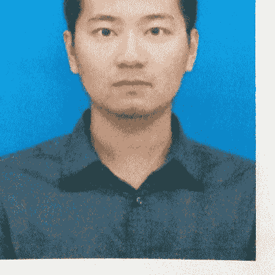

## 看相，首先要过三关：

### 第一关父母关：

父母宫太阴、太阳，日月角，双眉，双耳、天宫，天庭，法令，年上，寿上。

此相双耳反廓，必刑父母，具体是谁，要看其它宫位。太阳部位气色正常，而太阴部位气色发暗，定知母亲有暗疾在身。

年上寿上，又主父母，男子以寿上为母，年上为父。女子以年上为母，寿上为父。

此相寿上部位明显暗气，故可断母亲身体有暗疾，长年吃药。

月角部位微微下陷，但并不明显。

两耳与颧平，颧微微凸起，可断父亲兄弟有两人，其父排行

为老大。

接下来看面相第二关。

### 第二关兄弟关：

兄弟姐妹宫位要看太阳穴、眉骨、颧骨、鼻子。

男相看自己兄弟几个，要看左眉，眉黑清秀而平直（前段）

毛部上坐小眉为老五。兄弟五人。

鼻如截筒刀削，耳弦挺起，眉头平齐，断排行为老二。

### 第三关，子女关：

印堂凹陷，三阴三阳起卧蚕，头胎女儿定当先。人中深广，

三阳见光晶，必有二子。

### 最后对本相进行综合论断：

两耳比较大，代表身强力壮，有魄力，做事雷厉风行。天庭还算比较饱满，适合在官面工作。不过天仓太洼，三十岁之前财运不佳，经常破财。两眉杂乱无章，31---34岁之间，兄弟朋友容易起纷争。两眼有神，眼珠黑白分明。35---40岁之间，事业发展比较顺利。

鼻如截筒，两颧相护，再加上两颧秀丽，41---48岁必定一路顺风。

中正洼陷，25岁婚姻定，眉尾垂下纹，切断夫妻宫，34岁必定离婚再娶。

此相耳朵：上轮大于下轮者，耳珠不必大或厚，主木形耳。此种耳型主人聪明，知识渊博。宜从事文化教育，文化艺术方面的职业工作，不宜从事工商，投资求财等。耳珠厚大，耳型呈长方形，属土型耳，上代人为有产业家族。

此相为扇形额：上额宽阔，下额狭窄以扇形的额头，祖上原是富裕家庭，破败后贫穷之相，少年辛苦操劳。

此相不宜早婚，早婚必离，妻迟子晚。宜从事技术工作，或自由职业，自力更生，

白手起家创业，小康或中等富裕。

蒜头鼻子，山根与鼻梁不宽，下鼻准处丰满像蒜头状，财运必佳，即使早运无成，后半生一定财谷丰盈，善理钱财，小康水平。

本相为田字脸：脸形呈方正，三停不长匀称，属土型人，五官生得较好，并且面红黄，必为为贵命。

群82993434合买资料禁止公开或出售

## 案例十、山东威海的一名音乐老师

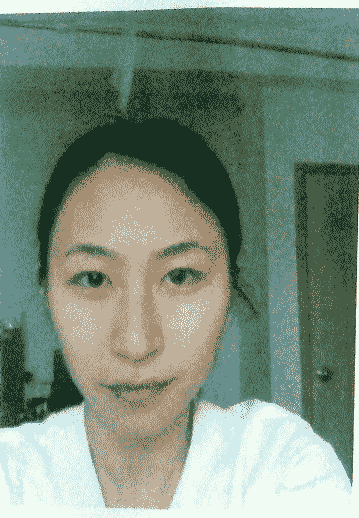

群82993434合买资料禁止公开或出售

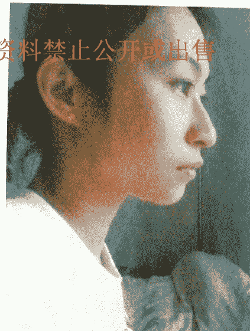

## 案例十一、在北京遇到的一位大学生

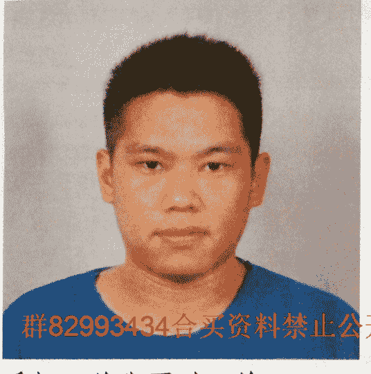

群82993434合买资料禁止公开或出售

看相，首先要过三关：

**第一关父母关：**

父母宫太阴、太阳，日月角，双眉，双耳、天宫，天庭，法令，年上，寿上。

太阳位有明显暗斑，气色发黑气。两耳反廓，轮飞廓反必相刑，刑克父母。再加上鼻子，口向左歪，必克父亲无疑。

年上寿上，又主父母，男子以寿上为母，年上为父。女子以年上为母，寿上为父，

此人年上低窄，表父亲健康危命久矣

日角部位，有明显的痣破伤，暗斑。

综合断言：根据九执流年法，此人 17 岁【日角位】克父亲必应。

最后看此相的颧骨与双眼的位置，双耳与颧的位置，以及双肩的斗削情况，可判断父亲兄弟应该一个。

接下来看面相第二关。

### 第二关兄弟关：

此人左眉，大眉毛上仰不过目，代表兄弟独自个，再加上双耳相刑，必兄弟数目不多。眉毛发淡，身下有一妹妹。

### 第三关，子女关：

印堂，三阴三阳全部凹下来，代表头胎先生女。三阳部位气色较好，没有纹路冲破，东岳大，则说明命中再有两个儿。

### 最后，对本相进行综合论断：

此相两耳招风，败家的祖宗。天仓不饱满，青少年生活并不太如意，吃过很多苦。两眉毛比较散乱，代表兄弟之间不和睦。两眼有神，黑白分明，35—40 岁之间会有大的做为。鼻头歪斜，家中祖坟出凶死之人。两耳反廓必相刑，不服管教。鼻头歪，48 岁定破财无疑。

命硬之耳相，主六至十二岁之间若不克父母，父母必离异，

凡是耳珠厚大，嘴唇厚大的人，体能开始瘦弱，到后来会变成肥胖之人，若耳轮耳珠窄瘦，嘴不大，身体开始肥胖，后来会变成瘦小之人。

低额，偏额，头发粗硬浓直，山根低陷，细窄者，必主贫家子。如果额低矮，但额相平滑无难纹，山根高走，眉不低压眼，眼不陷，也浮眼泡者，小时候家境较富裕，多半主父亲壮晚，母亲年轻，两个年龄相差悬殊，性情不投合，所以生子有此额相。

额矮低而左右额角偏有高低不一，满有陷削，不是私生子就为随母改嫁。

眉毛前清晰，后瞳仁中线淡而散乱，呈倒八字梯形，脸型上宽下窄。

矮鼻子从山根至准头，鼻深不塌不高平直矮鼻，男人主胆小无夫权，做事犹豫不决，缺乏男子汉气质。

平低颧：男人一生无权可掌，做事犹豫不决，拖泥带水，唯唯诺诺，男权被妻夺，被妻子欺凌受气，一生辛苦无功。

本相地阁偏左，即五官偏斜不正，主用字脸或月字脸。男女有此相不宜，主父母不全，子女有妨，事业上多成多败。并且兄弟刑伤，又主五十二岁后有疾病伤灾发生。

## 案例十二、河南洛阳的一位工厂职工

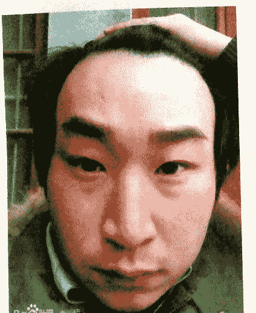

群82993434合买资料禁止公开或出售

看相，首先要过三关：

### 第一关父母关：

父母宫太阴、太阳，日月角，双眉，双耳、天宫，天庭，法令，年上，寿上。

太阳位正常，太阴位露骨凹陷,说明母亲身体健康较差。左眉尾部位下发赤红，母亲心脏病无疑。母亲生命倒无大碍，但是心脏问题经常复发，心态不稳，容易着急上火。

年上寿上，又主父母，男子以寿上为母，年上为父。女子以

年上为母，寿上为父，

此人寿上部位，右侧，发赤红，也是母亲发病的信息所在。

最后看此相的颧骨与双眼的位置，父亲兄弟应该五个，另外

有两个姑姑。其父亲排行占老三。

接下来看面相第二关。

### 第二关，兄弟关：

左眉直平，眉毛比较浓，必定兄弟一，上面一姐姐。

### 第三关，子女关：

印堂有竖纹，类似悬针纹，另外，有痣破，所以第一胎定流

产。三阴平满东岳高，第二胎还是儿子。三阴出现截路纹，

不会再有女儿了。

### 最后，对本相进行综合论断：

额有美人尖。金鸡啄印堂，少年走茫茫。三十一岁前一事无

成，只能靠父母养活。脸面赤色显著，一生常遇官非口舌。

眉尾散淡，处事易狠；

鼻不挺直且有露孔，中庭稍短，中年运势不长，辛苦蓄财；

下庭长而圆， 晚景不错。

左眉有颗黑痣

发际不齐，需学习，处事不够老练；

眉心皱起， 近期事有不顺；

中庭较长，中年运势够长，财气较足；

下庭较短，晚景一般。

综上观之，中年积蓄，不可乱用，留待晚享。

前额骨往前凸出的人脾气暴躁，行事爽快，聪明自私。

男人克子，此相子息较晚。

男人若有此额，无有天运，事业上难有大的成就，一生灾厄

命运坎坷不顺。

悬胆鼻子，山根细狭窄，鼻身宽大，下鼻似胆束状，男性主

能花钱，不聚财，贪色无财运，财来财去，第一婚姻定离异，

一生多喜欢有夫之妇为情人。

上下停尖削，中停宽阔，如橄榄形，主与父母缘薄，初

年晚岁坎坷不景气，一生无大财，有劳碌奔波之命。

五十二岁后运转下坡路，晚景不佳，即使有才华，也只能庸

碌一生。

三停狭长主目字面，初年运佳，二十岁前先富后贫，此类型

人志向不高尚，难成富贵，一生平庸无大成就。

## 案例十三、河北邢台的一名物业领班

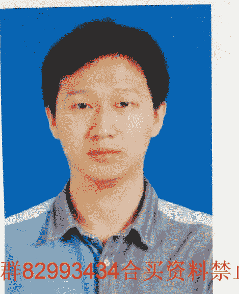

群82993434合买资料禁止公开或出售

看相，首先要过三关：

### 第一关父母关：

父母宫太阴、太阳，日月角，双眉，双耳、天宫，天庭，法令，年上，寿上。

此相，太阳部位正常，而太阴部位气色暗淡，可知母亲身体不好。再加上右眉尾垂下，鼻子向右歪，头发压右额。定知母亲入黄泉。

年上寿上，又主父母，男子以寿上为母，年上为父。女子以

年上为母，寿上为父，

但见寿上部位黑气生，母亲定亡魂。

月角洼陷，母亲寿终

天宫洼陷，男子克父亲，女子克母亲。发际不齐，太阳位露骨。男子不利父亲，女的不利母亲。

此相天庭部位洼陷，必克母亲。

综合断言：此人11岁【右耳位】克母亲必应。

最后看此相的颧骨与双眼的位置，双耳与颧的位置，再有双肩的斗削情况。父亲兄弟应该三个。其父亲排行占老二。

接下来看面相第二关。

### 第二关，兄弟关：

眉毛过骨，兄弟六人。眉中断续又连接，定有失散的兄弟。

本人为老三。

### 下面断第三关，子女关：

印堂凹陷，三阴三阳平满。头胎女儿，第二胎儿女，第三胎也是儿子。

### 最后对本相进行综合论断：

眉淡并发散，兄弟之间不常见面。左眼小，右眼大，爱好玄学信仰多。下巴尖尖，晚运不是太好。

额相不丰，出身及父母能力平凡，不过观其眼神还可以，说明其自身后天的修为和历练有功，面相上说“问贵在眼”而在这里确实占了一分优势，这使得一生的运势和成就得以添光增彩。

额头广阔，地阁尖窄，有天无地阁，属木型人，身体，四肢秀长。眉清目秀，发鬓细轻，神清声亮，手掌软，纹线清晰，合木型格局，必出贵格，在政治，文化界上定有成就名望。双耳不反，山根高直，眉不压眼，主二十岁前必行好运，祖业有得享，受长辈阴护。

五官生的好，不论文才仕途必成名显达。

耳朵方面，上轮大于下轮者，耳珠不必大或厚，主木形耳，此种耳型主人聪明，知识渊博。宜从事文化教育，文化艺术方面的职业工作，不宜从事工商，投资求财等，耳珠厚大者，耳型呈长方形，属土型耳，上代人为有产业务家族，最忌眼圆眉浓的人，又矮小，为土克水的主凶，既然发财也随之付与东流。

尖狭额，出身贫困家庭，经济拮据，学业不成，六亲无靠，难享父母之福。

三十四岁之间难行好运，晚年尚可，晚婚。

此相鼻子较矮。从山根至准头，鼻深不塌不高平直矮鼻，男人主胆小无夫权，做事犹豫不决，缺乏男子汉气质。

额头广阔，地阁尖窄，有天无地阁，属木型人。若身体，四肢秀长。眉清目秀，发鬓细轻，神清声亮，手掌软，纹线清晰，合木型格局，必出贵格，在政治，文化界上定有成就名望。双耳不反，山根高直，眉不压眼，主二十岁前必行好运，祖业有得享，中年必得志，不论文才仕途必成名显达。

## 案例十四、河南商丘的一名商场员工

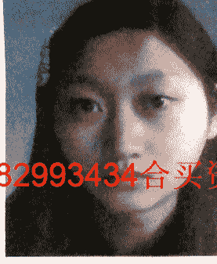

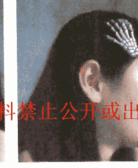

群82993434合买资料禁止公开或出售

## 看相，首先要过三关：

### 第一关父母关：

父母宫太阴、太阳，日月角，双眉，双耳、天宫，天庭，法令，年上，寿上。

太阳部位有暗气，太阳正常。发际压右额，代表克父。但是所以的信号都不能表示父亲去世。故父母都安好。只能说明，

父亲先去世。

年上寿上，又主父母，男子以寿上为母，年上为父。女子以年上为母，寿上为父，

此相寿上有暗斑，代表父亲健康状况不佳。

日角下陷，代表父亲身体不好。

综合断言：此人父母都健在，只是父亲长年有病。

最后看此相的颧骨与双眼的位置，以及双耳与颧相比较，父亲兄弟应该二个，父亲排行老二。

接下来看面相第二关。

### 第二关，兄弟关：

右眉见了弯，姐妹必有三。三个姐妹之中排老大，下面又有两个妹妹。

### 下面断第三关，子女关：

印堂平起，头胎必生儿。三阴发淡红，命中有二女。印堂容一指，命中有一子。

凡脸圆，眼圆，耳圆，眉发齐浓，属水型人相局，女人克母亲，又与公婆，小姑缘薄，男女夫妻情缘不牢，一子之命

### 最后对本相进行综合论断：

双耳比较大，有耳垂，一生平稳。额头比较小，而且上尖，

祖业不丰，做事只能靠自己，得不到长辈之力。眉毛似有若无，兄弟朋友缘份较淡薄。眼珠较大，心里善良，容易相信他人，很容易上当受骗。

立球耳，主克兄弟，或兄弟孤独，若眉毛长也没用，必主孤独。

尖狭额，出身贫困家庭，经济拮据，学业不成，六亲无靠，难享父母之福。

山根低陷，细狭，又眉低压眼，主生活艰苦，必离祖创业。

此相双颧很高，但肉厚满包住颧不露骨，两颊腮骨肉满不削瘦，耳前双颧肉骨丰起，上插天仓。

女见此相，必嫁富贵之家，旺夫益子。

## 案例十五、河南郑州的一位包工头

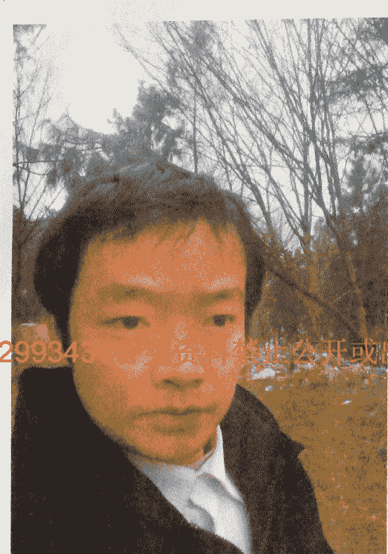

群82993434合买资料禁止公开或出售

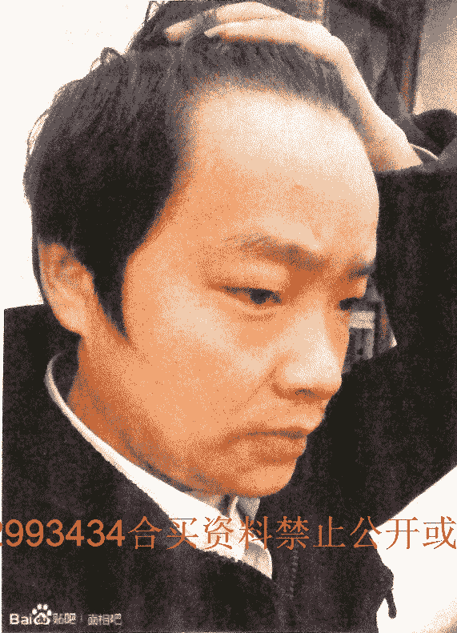

群82993434合买资料禁止公开或出售

## 看相，首先要过三关：

### 第一关父母关：

父母宫太阴、太阳，日月角，双眉，双耳、天宫，天庭，法令，年上，寿上。发际压右额，必克母亲。月角有红疙瘩，母亲心脏病。右眉头有陷纹，克母亲无疑。太阴部位气色乌黑，也是克母之特征。

年上寿上，又主父母，男子以寿上为母，年上为父。女子以年上为母，寿上为父，

此人年上部位有暗黑之气截断山根，故母亲大灾。

综合断言：此人 32 岁【右眉头】克母亲必应，最后看此照片的颧骨与双眼的位置，以及双耳与颧骨的位置，双肩的斗削情况，可知，其父亲有兄弟一人，有一个姐姐。

接下来看面相第二关。

### 第二关，兄弟关：

左眉毛过骨，眉后生小眉，故可断，此人有兄弟五人。鼻翼上提如吹鼓，出口断他是老五。

### 下面断第三关，子女关：

印堂有竖纹克长子，头胎儿女不成人。第二胎又是儿子。三阴起卧蚕，第三胎是女儿。

瘦耳珠，耳珠呈尖状，主其人上一代是富贵之家，因受灾败落，白手起家，多成多败，事业不顺，每逢 1 就破财，如 21，31，41，51，若 25 岁不破财，也要防婚灾，又主人不善良，与父母生离列别之患。

直筒鼻相：从山根至鼻身皆高耸凸，似竹节筒状，上下直顺无曲线，鼻身及鼻翼似空悬之感，主人虽能发财，也能败财，财来财去，到头来两手空空。

## 案例十六、安徽滁州的一位商场店员

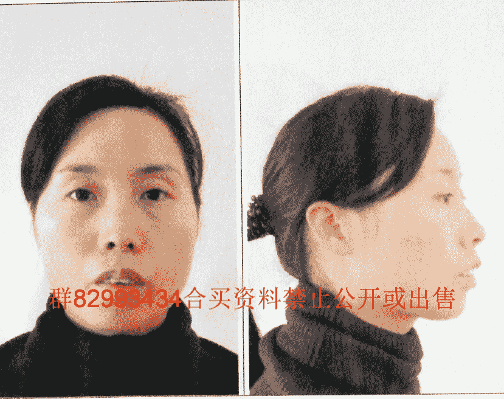

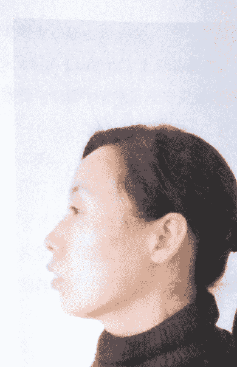

群82993434合买资料禁止公开或出售

## 看相，首先要过三关：

### 第一关父母关：

父母宫太阴、太阳，日月角，双眉，双耳、天宫，天庭，法令，年上，寿上。

右眉高左眉低，右鼻翼高，左鼻翼低。右嘴角高，左嘴角低。故必克母亲。年上寿上，又主父母，男子以寿上为母，年上为父。女子以年上为母，寿上为父，

年上发赤红，母亲有心脑血管疾病。

综合断言：此人 49 岁【廷尉位】克母亲必应。

最后看此相的颧骨与双眼的位置。父亲兄弟应该三个，其父亲排行老二。

接下来看面相第二关。

### 第二关兄弟关：

兄弟姐妹宫位要看太阳穴、眉骨、颧骨、鼻子。

右眉看自己，眉头发淡，身上有一哥哥，通过大眉毛与眼珠相比较，应该有姐妹二个。眉弯鼻尖起耳弦，本人必定为老三

### 下面断第三关，子女关：

印堂平满无纹破，子女必有，而且聪明，但子女宫有纹破，主生一女。

### 最后对本相进行综合论断：

额头上稍圆，对婚姻要求较完美，以致于招致对方反感而离婚。门牙外突，说话尖刻，又不容易保守秘密。相貌克父母。父母出过意外事故或脑子精神方面有疾病。所以家境不好，小时候过的比较辛苦。丈夫蛮不错，有个儿子，不过中年有婚姻危机。牙齿破相破的好厉害。

一生感情悠游寡断，常恋上不该爱上的对象。

难享夫福，要硬配，即嫁同年、年纪比自己少、大十年、离婚、或外国男人。收入来源不稳定，与父母缘分薄。

与夫缘分薄，早出社会。一生不善处理感情;35-39 岁容易因朋友破财或受骗;工作好很努力才能挣钱;中晚年运气会好转

心直口快 说话易得罪人 易与人发生争执 性子比较急 易冲动 固执不大听劝 遇事易放不下 有点爱计较 能干 不聚财， 有钱就会有事， 父母性格不合。

眉弯鼻尖起耳弦，本人必定为老三，额凸颧尖鼻又尖，嘴大下巴又朝前，一生必是三婚嫁，女儿双全受艰辛，上圆下巴尖，母亲走在先。

此相人缺额，出身贫田家庭，经济拮据，学业不成，六亲无靠，难享父母之福。

山根低陷，细狭，主八至十三岁之间，生活艰苦，必离祖创业。

三十四岁之间难行好运，晚年尚可，晚婚，应该找个二婚的，否则孤独之命，适合打工，干体力活。

准圆上仰，鼻孔开露，称露孔灶，其人心性坦率，心地善良，热心好帮助人，但不聚财。

此相双颧很高，但肉厚满包住颧不露骨，两颊腮骨肉满

不削瘦，耳前双颧肉骨丰起，上插天仓。上下停尖削，中停宽阔，如橄榄形，主与父母缘薄，初年晚岁坎坷不景气，一生无大财，有劳碌奔波之命。

## 案例十七、吉林长春的一名货车司机

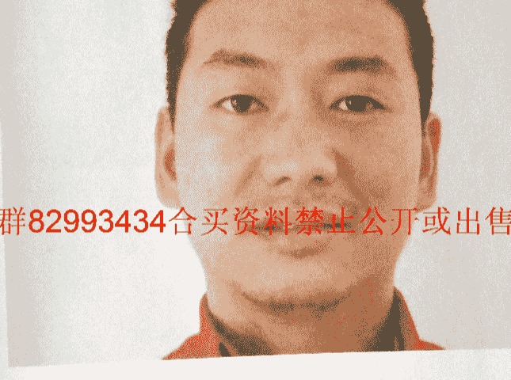

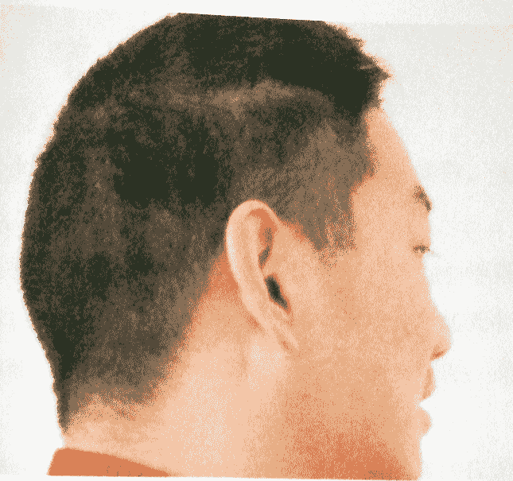

群82993434合买资料禁止公开或出售

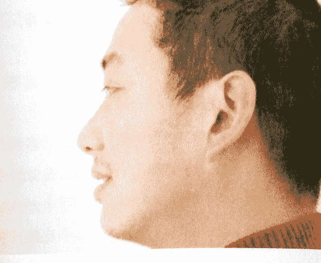

## 看相，首先要过三关：

### 第一关父母关：

父母宫太阴、太阳，日月角，双眉，双耳、天宫，天庭，法令，年上，寿上。

耳珠为长形，主幼年克父，耳珠长外倾，多为少年克父，若十五岁前不克父，父亲必会出现其它灾难。尤其天中上下左右有陷坑，伤疤，主十三岁时，父亲受小人陷害，及犯牢狱之灾。

最后看此相的颧骨与双眼的位置，双耳与颧骨的位置，双肩的斗削情况。

可断其父亲兄弟必有五，其父亲排行占老二，下边有两个妹妹。

接下来看面相第二关。

### 第二关兄弟关：

兄弟姐妹宫位要看太阳穴、眉骨、颧骨、鼻子。

左眉毛代表自己的兄弟。左眉中断，两眉主低不一，形状各异。左右法令不一，代表因父母离异，导致兄弟分散。现身边只有兄弟自个。

### 下面断第三关，子女关：

印堂，三阳都凹陷，头胎儿子定当先。三阴平满高广，第二

胎生女儿

### 最后对本相进行综合论断：

额头不平印堂窄，定知此人无学业。司空黄气暗，24 岁结婚缘。左眼小，右眼大，爱好玄学信仰多。法令左边长，右边短，定知父亲性格激进，克板保守。

总体面相还行， 40 以后有不错的财运。按他的气色，近期有倒运和破财之事。要是过去就算了，要是没有过去，多加注意。

瘦珠耳主耳珠为长形，主幼年克父，若耳珠长外倾者，多为六岁时克父，以上两种耳相，若十五岁前不克父，父亲必会出现其它灾难。尤其天中上下左右有陷坑，墩或伤疤，黑痣，发尖冲印者，主十三岁时，父亲受小人陷害，及犯牢狱之灾。

腰鼓鼻子主鼻梁中部横张广大，山根与鼻准部位狭窄，另一种主年上寿上之间左右鼻梁有骨横广张凸，形成十字状。

男人主一生难有大财可发，多成多败，财来财去，伤妻克子，多数先生女儿，夫妻不和，离婚较多，又主三十三岁至四十三岁之间有妻无财，有财则无妻，女性有此鼻相，事业与财的欲望要求高，嫁的丈夫不得力，自劳辛苦，要夫则财不足，要财夫无能，定生离死别。

平低颧：男人一生无权可掌，做事犹豫不决，拖泥带水，唯唯诺诺，男权被妻夺，被妻子欺凌受气，一生辛苦无功。

唯诺诺，男权被妻夺，女权被夫夺，被丈夫欺凌受气，一生辛苦无功。

由字脸型额尖为阴相，男人不宜，适合女人。男人前半生辛苦，难入仕途，由字脸主地旺天弱，若女人得此相为顺，即使不成名人，也是家庭中贤妻良母。

由字形脸的男人，主辛苦创业，但事有望，容易发富，不能为官。

## 案例十八、山东大同的一位煤矿工作人员

群82993434合买资料禁止公开或出售

## 看相，首先要过三关：

### 第一关父母关：

父母宫太阴、太阳，日月角，双眉，双耳、天宫，天庭，法令，年上，寿上。

脸圆，眼圆，耳圆，眉发齐浓，属水型人相局，男人不利父母，三至五岁间克父。克父不一定直接克死，只是父亲身体会不适。父亲兄弟应该两个，其父亲排行占老大。

接下来看面相第二关。

### 第二关兄弟关：

兄弟姐妹宫位要看太阳穴、眉骨、颧骨、鼻子。

左眉见了弯，兄弟必有三，根据鼻准以及眉头的形状，再加上额头上稍圆，可知此人排行为老二。

### 下面断第三关，子女关：

三阴三阳起卧蚕，头胎女儿定当先。印堂容二指，必定有二子。

### 最后，对本相进行综合论断：

额头饱满，三十岁之前运气较好，虽学历不高，但是事业一帆风顺。右眉尾散，淡。34岁要破财。

耳廓有二、三跌棱凸，小时灾难临身，法令纹外侧再有两个小酒窝者，四至五岁时必有从高处跌下受血光之灾，死里逃生。

小鼻子的男人，自我意识不强，若两颧低下，缺少自我主张，无有决断之权，遇事犹豫不决，听从他人及老婆的指挥使唤。所以小鼻子的人难以担任领导职务。一生财运欠佳，宜娶大龄女为妻为宜。

男人生此相，必娶富家之女，一生发官发财，妻贤子孝，女人生此相，必嫁富贵之家，旺夫益子。

凡脸圆，眼圆，耳圆，眉发齐浓，属水型人相局，男人不利父母，五至三岁间克父。男女夫妻情缘不牢，一子之命，男性若身体长，主三十一岁有伤灾横祸临身，女主面圆，鼻丰，肩背，臀具圆丰满，脸色白或黑或紫红色，男女必成富翁，印堂再宽平，旺夫益子。如面短圆如苹果，只恐寿天命短。尤白色主金生水，名利双收，若色带青黄，肉浮骨粗，主穷困贫贱之命，或孤独无子。

群82993434合买资料禁止公开或出售

## 案例十九、山东荷泽的一位美容顾问

群82993434合买资料禁止公开或出售

## 看相，首先要过三关：

### 第一关父母关：

父母宫太阴、太阳，日月角，双眉，双耳、天宫，天庭，法令，年上，寿上。

太阴太阳都不塌，其它各个父母宫位没有明显缺陷，即可断定，此人父母无健康问题。

最后看此相的颧骨与双眼的位置，双耳与颧骨的位置，两肩的斗削情况，综合来断，父亲兄弟应该六个，二兄弟三姐妹。

父亲兄弟之中排老二。

接下来看面相第二关。

### 第二关，兄弟关：

兄弟姐妹宫位要看太阳穴、眉骨、颧骨、鼻子。

右眉毛看自己，右眉上仰，兄弟姐妹二个。眉头发淡，上面有一哥哥。

### 下面断第三关，子女关：

印堂平满三阳平，头胎儿子定当先。印堂容二指，命中有二子。三阴截路纹，没有女儿。

### 最后对本相进行综合论断：

额头圆圆微前凸，命中克夫定不饶，一生定穿两家衣。

眼神太弱了，唯额头生的光亮，鼻子不挺无势，口棱角不够分明，天仓不饱满，好在也无破败之处，此生不会太差。平平淡淡吧！少波折。

前额骨往前凸出的人脾气暴躁，行事爽快，聪明自私。女性男性在事业上有所成就。

男人克子，女人克夫，女人额凸阳刚主阳气太盛，必定克夫。

凡上额日月角以上的额骨偏削后倾仰的女性，天中，天庭主父母之位，又主夫君之地，多在十六岁至二十岁之间，父母有生离死别之应，父短寿，母亲皆寿命长，达八十岁上下。男人若有此额，无有天运，事业上难有大的成就，主先生女儿，一生灾厄命运坎坷不顺。女人则相反，聪明能干，事业有成，为女强人，但一生婚姻多不顺，不离即克。

宽鼻子：山根至年上，寿上，印堂宽阔而平宽，女人主婚姻十有九难，男人必娶贤妻。女人性傲，永不服输，女强人，交际广，不爱处理家务，自私，只赢不输，泼辣。

三停狭长主目字面，初年运佳，二十岁前先富后贫，此类型人志向不高尚，难成富贵，一生平庸无大成就。

女性生此面相，平生辛苦，命中克夫，寿命长，晚年孤独。

群82993434合买资料禁止公开或出售

## 案例二十、山东潍坊一位销售人员

群82993434合买资料禁止公开或出售

看相，首先要过三关：

### 第一关父母关：

父母宫太阴、太阳，日月角，双眉，双耳、天宫，天庭，法令，年上，寿上。

两耳形状不成样，必刑父母。鼻头，嘴都向左偏，定克父亲无疑。脸上乾宫缺陷，也是克父之标志。另外，天宫部位有头发压制，对父也不利。日角凹下来，父亲入黄泉。

日月角下部低平，上不凸起露骨，主父母寿数不足。

综合断言：此人 15 岁【额头，九执流年法】克父亲必应。

最后看此相的颧骨与双眼的位置，双耳与颧骨的位置，双肩的斗削情况。综合断言，父亲兄弟应该二个，其父亲排行占老大。

接下来看面相第二关。

### 第二关，兄弟关：

兄弟姐妹宫位要看太阳穴、眉骨、颧骨、鼻子。

男相，左眉看自己。大眉毛平直，必有兄弟一。眉毛发淡，眉毛下垂，身下有两个妹妹。

下面断第三关，子女关：

印堂平满三阳丰，头胎儿子定当先。印堂窄小，命中就一子。

此相，额头宽广印堂平，命中大本拿得准。两眉尾，两眼尾都垂下，命中婚姻定不顺。三十九，四十把婚离。

耳珠反弓，代表克兄弟或兄弟孤独，若眉毛长也没有，必主孤独。

扇形额：上额宽阔，下额狭窄以扇形的额头，祖上原是富裕家庭，破败后贫穷之相，少年辛苦操劳。

此相不宜早婚，早婚必离，妻迟子晚，若眉低山根细，或眉骨高，天仑狭窄，男子克妻，女子克夫。

多从事技术工作，或自由职业，自力更生，白手起家创业，小康或中等富裕。

婚姻宜三十岁上下找一个二婚的为佳。

小鼻子的男人，自我意识不强，两颧低下，缺少自我主张，无有决断之权，遇事犹豫不决，听从他人及老婆的指挥使唤。所以小鼻子的人难以担任领导职务。一生财运欠佳，宜娶大龄女为妻为宜。

平低颧：男人一生无权可掌，做事犹豫不决，拖泥带水，唯唯诺诺，男权被妻夺，女权被夫夺，被丈夫欺凌受气，一生辛苦无功。

王字脸，四库狭陷，额一颧，眼具露骨，主像王字，平生奔波，劳碌，多为手工技术劳动者，或商贩邮差之职，宜背井离乡远居之人，难成富贵，寿命虽可，妨妻克子。

若女人主此相阳盛阴衰，伤夫克子，孤寡之相。

五十四至六十岁重疾缠身，寿命难保。

## 案例二十一、江苏南通的一位初中老师

群82993434合买资料禁止公开或出售

## 看相，首先要过三关：

### 第一关父母关：

父母宫太阴、太阳，日月角，双眉，双耳、天宫，天庭，法令，年上，寿上。

左边月角处，有多处伤疤疙瘩。左眉头暗气相连。再加上鼻梁向左歪。地阁部位有许多斑痕，地阁代表母亲。鼻头发暗斑，定克母亲无疑，病在脾胃。

综合断言：此人29岁【鼻子位，九执流年法】克父亲必应。最后看此相的颧骨与双眼的位置，双耳与颧骨的位置，双肩的斗削情况。综合断言，父亲兄弟应该一个。

接下来看面相第二关。

### 第二关，兄弟关：

兄弟姐妹宫位要看太阳穴、眉骨、颧骨、鼻子。

右眉看自己，眉毛见了弯，必有兄弟姐妹三人，眉头发淡，身上有一哥哥。额头发圆，鼻露灶，定知此人排老二。

### 下面断第三关，子女关：

印堂丰隆光亮，三阳平满，头胎必生儿。印堂容二指，必定有二子。

### 最后对本相进行综合论断：

眼斜眼运不顺定科举排上35-40岁可是佳不断。

两眉中间是命宫，光明莹净学业通。若遇纹乱破陷多，破尽家财及祖宗。两耳廓反母多病，命中二婚至今空。门牙整齐说话直。头胎生女自己带，丈夫离婚房为空。父亲一人独自个，三代单传少人丁。

三停狭长主目字面，初年运佳，二十岁前先富后贫，此类型人志向不高尚，难成富贵，一生平庸无大成就。

女性生此面相，平生辛苦，命中克夫，寿命长，晚年孤独。

## 案例二十二、陕西的一位公务员

看相，首先要过三关：

### 第一关父母关：

父母宫太阴、太阳，日月角，双眉，双耳、天宫，天庭，法令，年上，寿上。

鼻子向左歪，嘴也向左嘴，命中先克父。双耳反廓，必刑克父母无疑。额头发际冲射天宫部位。左眉部露骨，故在幼年克父，最多不超过十岁。

母亲健康没有问题。

最后看此相的颧骨与双眼的位置，双耳与颧骨的位置，双肩的斗削情况。综合断言，父亲兄弟应该五个，其父亲排行占老二。

接下来看面相第二关。

### 第二关，兄弟关：

兄弟姐妹宫位要看太阳穴、眉骨、颧骨、鼻子。

此相左眉平直，兄弟独自个，有一个妹妹。

下面断第三关，子女关：

印堂不满，但是颧不起，头胎女儿是当生。二三所见及暗黑气色，一生就一女。

### 最后对本相进行综合论断：

此相，额头正中间有美人尖，可谓，金鸡啄印堂，少年走茫茫。眼无神，而且带有下三白，做事不够坚定。面大鼻子小，一生财运受阻。但是腮骨有力，此人能在极其恶劣的环境中挣扎生存。瘦耳珠，耳珠呈尖状，主其人上一代是富贵之家，因受灾败落，白手起家，多成多败，事业不顺。腰鼓鼻子主鼻梁中部横张广大，山根与鼻准部位狭窄，另一种主年上寿上之间左右鼻梁有骨横广张凸，形成十字状。

男人主一生难有大财可发，多成多败，财来财去，伤妻克子，多数先生女儿，夫妻不和，离婚较多，又主三十三岁至四十三岁之间有妻无财，有财则无妻。

适合手工技能型职业，若投资搞事业定赔本，十字型鼻，男女同犯孤寡之命，一生男不娶，女不嫁，有婚姻不克必离异。

平低颧：男人一生无权可掌，做事犹豫不决，拖泥带水，唯唯诺诺，男权被妻夺。

三停狭长主目字面，初年运佳，二十岁前先富后贫，此类型人志向不高尚，难成富贵，一生平庸无大成就。

群82993434合买资料禁止公开或出售

## 案例二十三、山西长治的一名公务员

群82993434合买资料禁止公开或出售

看相，首先要过三关：

### 第一关父母关：

父母宫太阴、太阳，日月角，双眉，双耳、天宫，天庭，法令，年上，寿上。

此相人中向左偏，左法令纹折断，代表克母，母亲在中年伤腿断折。其它方面正常。

最后看此相的颧骨与双眼的位置，双耳与颧骨的位置，双肩的斗削情况。综合断言，父亲兄弟应该二个，其父亲排行占老大。

接下来看面相第二关。

### 第二关，兄弟关：

兄弟姐妹宫位要看太阳穴、眉骨、颧骨、鼻子。

右眉见了弯，兄弟必有三，额头圆，鼻准齐，必定排行占第二。

印堂凹陷，三阴三阳起卧蚕。头胎女儿定当先。印堂容二指，必定有二子。

### 最后对本相进行综合论断：

耳相为鸡嘴耳，喜欢刨根问底，打破砂锅问到底。额头饱满，幼年家庭生活较好。

白眼珠多，黑眼珠少，爱开玩笑，喜欢捉弄别人。不露孔灶，能守住财。

瘦耳珠，耳珠呈尖状，主其人上一代是富贵之家，因受灾败落，白手起家，多成多败，事业不顺，每逢 1 就破财，如 21，31，41，51，若 25 岁不破财，也要防婚灾，又主人不善良，与父母生离死别之患。

仰月额，此额无角骨，额向上，后倾斜而上仰，主在出生之前，祖上或父母原是富有人家，后因受灾而破产，主少年克父，25 岁之前必克，初年辛苦，定必远居它乡谋业为宜，白手兴家，智商超群，事业有成。

但性格傲慢自强，35 岁--40 岁--50 岁之间防灾厄。

蒜头鼻子，山根与鼻梁不宽，下鼻准处丰满像蒜头状，无论男女，财运必佳，即使早运无成，后半生一定财谷丰盈，善理钱财，小康水平。

此相双颧很高，但肉厚满包住颧不露骨，两颧腮骨肉满不削瘦，耳前双颧肉骨丰起，上插天仓。

三停狭长主目字面，初年运佳，二十岁前先富后贫，此类型人志向不高尚，难成富贵，一生平庸无大成就。

女性生此面相，平生辛苦，命中克夫，寿命长，晚年孤独。

若手相生的细软纹清，可以企业公司，金融事业单位任职，可享小康，中层之福禄。

## 案例二十四、江苏南京的一名市场管理员

群82993434合买资料禁止公开或出售

## 看相，首先要过三关：

### 第一关父母关：

父母宫太阴、太阳，日月角，双眉，双耳、天宫，天庭，法令，年上，寿上。

各个代表父母的宫位都没有异常，故父亲健康和合。

最后看此相的颧骨与双眼的位置，双耳与颧骨的位置，双肩的斗削情况。综合断言，父亲兄弟应该三个，其父亲排行占老二。

接下来看面相第二关。

### 第二关兄弟关：

兄弟姐妹宫位要看太阳穴、眉骨、颧骨、鼻子。

右眉见了弯，兄弟必有三。额方，鼻准低，不露灶，为老大之标志。

### 下面断第三关，子女关：

印堂平满三阳平，头胎儿子定当先。三阴凹陷，第二胎女儿。印堂容一指，命中就一子。

### 最后，对本相进行综合论断：

低额，偏额，头发粗硬浓直，山根低陷，细窄者，必主贫家子。额低矮，但额相平滑无难纹，山根高走，眉不低压眼，眼不陷，也浮眼泡者，多半主父亲壮晚，母亲年轻，两人年龄相差悬殊，性情不投合，所以生子有此额相。

额矮而左右额角偏有高低不一，有满有陷削，不是私生子就为随母改嫁。

女性新月眉，女性虽不多，性情风流，贪情，适合从事风尘场上的职业。

笑眼主眼睛下眩的卧蚕部位半满耸起。眼神不笑含笑，乐观之相，女人主旺夫益子，家庭幸福和睦，妻贤子孝，人际关系融洽，工作顺利。

卧蚕中部向上凸起，看上去像笑，珠转动情，勾引的眼神，眼内又含泪，此为真桃花眼，这种女人命运不佳，婚姻坎坷。

耳珠破，主与祖父母时期的命运就坎坷不顺，破败贫穷，若小指再短者，祖父必早亡。出生未见到祖父，其父辈也清贫穷苦，学业无成。十三至十四岁时辍学，难成大器，宜打工。

耳廓反，主父母命运劳苦艰辛，祖业荡尽，又主智商不足，脾气古怪，养子不得力。

尖狭额，出身贫困家庭，经济拮据，学业不成，六亲无靠，难享父母之福。

女人小鼻子宜嫁大龄之夫为宜，需大五至七岁之间，其丈夫必是辛勤劳碌之人。若雇用人则选择小鼻子的人比大鼻子的人可靠。大鼻子的有反逆心理，不可靠。

不论男女，颧凸者有闯劲，敢想敢干，颧骨横凸者防备心强，不愿与人担保，害怕自己吃亏上当，女人主克夫，养子无能力。

## 案例二十五、天津郊区的一位大学生

群82993434合买资料禁止公开或出售

## 看相，首先要过三关：

### 第一关父母关：

父母宫太阴、太阳，日月角，双眉，双耳、天宫，天庭，法令，年上，寿上。

下唇长，上唇短，利阴害阳，利母不利父。

最后看此相的颧骨与双眼的位置，双耳与颧骨的位置，双肩的斗削情况。综合断言，父亲兄弟应该四个，其父亲排行占老二。

接下来看面相第二关。

### 第二关，兄弟关：

兄弟姐妹宫位要看太阳穴、眉骨、颧骨、鼻子。

下唇长，上唇短，利阴害阳。右眉比较浓，眉头起，眉尾垂，家中没有兄弟，只有姐妹。总共姐妹三人，本人排行为老大。

### 下面断第三关，子女关：

印堂，三阳凹陷,头胎必生女。印堂容二指，必定有二子。

### 最后，对本相进行综合论断：

仰月额，此额无角骨，额向上，后倾斜而上仰。主在出生之前，祖上或父母原是富有人家，后因受灾而破产，主少年克父，25岁之前必克，初年辛苦，定必远居它乡谋业为宜，白手兴家，智商超群，事业有成。

但性格傲慢自强，35岁---40岁---50岁之间防灾厄。

瘦耳珠，耳珠呈尖状，主其人上一代是富贵之家，因受灾败落，白手起家，多成多败，事业不顺，也要防婚灾。

直筒鼻相：从山根至鼻身皆高耸凸，似竹节筒状，上下直顺无曲线，鼻身及鼻翼似空悬之感，主人虽能发财，也能败财，财来财去，到头来两手空空。

此相双颧很高，但肉厚满包住颧不露骨，两颊腮骨肉满不削瘦，耳前双颧肉骨丰起，上插天仓。

女人生此相，必嫁富贵之家，旺夫益子。

额头广阔，地阁尖窄，有天无地阁，属木型人。身体，四肢秀长。眉清目秀，发鬓细轻，神清声亮，手掌软，纹线清晰，合木型格局，必出贵格，在政治，文化界上定有成就名望。

双耳不反，山根高直，眉不压眼，主二十岁前必行好运，祖业有得享，中年必得志，不论文才仕途必成名显达。

群82993434合买资料禁止公开或出售

## 案例二十六、广东东莞的一位石材老板

群82993434合买资料禁止公开或出售

## 看相，首先要过三关：

### 第一关父母关：

父母宫太阴、太阳，日月角，双眉，双耳、天宫，天庭，法令，年上，寿上。

右眉高左眉低父亲先去世。天宫洼陷，太阳位带杀，露骨凹陷，父在本人51岁时去世（九执流年法）。

最后看此相的颧骨与双眼的位置，双耳与颧骨的位置，双肩的斗削情况。综合断言，父亲兄弟三人，为老大。

接下来看面相第二关。

### 第二关，兄弟关：

兄弟姐妹宫位要看太阳穴、眉骨、颧骨、鼻子。

看左眉兄弟三人，本人为老二，身上有两个姐姐，兄弟姐妹五人。

### 下面断第三关，子女关：

三阴三阳起卧蚕，头胎女儿定当先。印堂容一指，命中有一子。

爷爷先去世，哥两个。

由字脸额尖圆为阴相，男人不宜。男人前半生辛苦，难入仕途。

由字形脸的男人，主辛苦创业，但事有望，容易发富，不能为官。

瘦耳珠，耳珠呈尖状，主其人上一代是富贵之家，因受灾败落，白手起家，多成多败，事业不顺，每逢1就破财，如21，31，41，51，若25岁不破财，也要防婚灾，又主人不善良，与父母生离死别之患。

圆额水克火之相，整个脸呈半月圆，水火相战，父母不全，白手成家，六亲难靠，一生事业无成，小康之家。

腰鼓鼻子主鼻梁中部横张广大，山根与鼻准部位狭窄，另一种主年上寿上之间左右鼻梁有骨横广张凸，形成十字状。

男人主一生难有大财可发，多成多败，财来财去，伤妻克子，多数先生女儿，夫妻不和，离婚较多，又主三十三岁至四十三岁之间有妻无财，有财则无妻，女性有此鼻相，事业与财的欲望要求高，嫁的丈夫不得力，自劳辛苦，要夫则财不足，要财则夫无能，定生离死别。

两颧有纹，痕，痣，破，若有流年到此必应事。颧上有破颧纹，一生官灾必现。主左克妻，右克子。当官的丢官，无官职应天灾人祸，又克妻儿。

## 案例二十七、山东潍坊的一名售票员

看相，首先要过三关：

第一关父母关：

父母宫太阴、太阳，日月角，双眉，双耳、天宫，天庭，法令，年上，寿上。

太阴太阳带杀气，两耳反廓，必刑克父母无疑。天庭低下，寿上暗气横生，故克死父亲。应期在天庭之所在流年（19岁）。

最后看此相的颧骨与双眼的位置，双耳与颧骨的位置，双肩的斗削情况。综合断言，父亲兄弟应该四个，其父亲排行占老三。

接下来看面相第二关。

### 第二关兄弟关：

兄弟姐妹宫位要看太阳穴、眉骨、颧骨、鼻子。

右眉上仰，必有姐妹二人。双颧见起，太阳穴饱满，必有一兄弟。

### 下面断第三关，子女关：

印堂平满三阳平，头胎儿子定当先。三阴又饱满，第二胎，第三胎均为女孩。

### 最后，对本相进行综合论断：

尖狭额，出身贫困家庭，经济拮据，学业不成，六亲无靠，难享父母之福。

34岁之前难行好动，晚年尚可，晚婚，应该找个二婚的。

耳廓反，主父母命运劳苦艰辛，祖业荡尽，又主智商不足，脾气古怪，养子不得力。

山根低陷，细狭，主八至二十岁之间先丧父，生活艰苦，必离祖创业。准圆上仰，鼻孔开露，称露孔灶，其人心性坦率，心地善良，热心好帮助人，但不聚财，上眼皮田宅浮凸，助人帮倒忙，吃亏上当难免，老公为势力眼的人。

平低颧：女权被夫夺，被丈夫欺凌受气，一生辛苦无功。

## 案例二十八、温州的一工厂职工

看相，首先要过三关：

### 第一关父母关：

父母宫太阴、太阳，日月角，双眉，双耳、天宫，天庭，法令，年上，寿上。

父母的各个宫位均完好无损，故父母平安。

但是你右耳反廓，右眉上有斑疱痣点，代表其岳母早亡。同时早年也刑克自己的母亲。

最后看此相的颧骨与双眼的位置，双耳与颧骨的位置，双肩的斗削情况。综合断言，父亲兄弟应该四个，其父亲排行占老二。

### 第二关，兄弟关：

兄弟姐妹宫位要看太阳穴、眉骨、颧骨、鼻子。

左眉毛代表自己，眉毛比较乱，又是重眉，左右两样眉毛，代表有异父母兄弟，以及没有血缘关系的兄弟。眉毛过了骨，眉后生小眉，总共有兄弟姐妹五人。

下面断第三关，子女关：

儿女宫在鱼尾，参考部位有：人中、水星、准头、眼眉、三阴三阳、印堂。印堂凹陷，三阳枯暗，命中无儿。三阴平满，命中一女撑家门。

### 最后对本相进行综合论断：

低额，偏额，头发粗硬浓直，山根低陷，细窄者，必主贫家子。额低矮，但额相平滑无难纹，山根高走，眉不低压眼，眼不陷，也浮眼泡者，小时候家境较富裕，多半主父亲壮晚，母亲年轻，两人年龄相差悬殊，性情不投合，所以生子有此额相。

若额矮而左右额角偏有高低不一，有满有陷削者，不是私生子就为随母改嫁。

此相鼻子较小，自我意识不强，两颧不低，有自我主张，决断之权，但是遇事犹豫不决，听从他人及老婆的指挥使唤。难以担任领导职务。一生财运欠佳，宜娶大龄女为妻为宜。

不论男女，颧向左右凸者有闯劲，敢想敢干，颧骨横凸者防备心强，不愿与人担保，害怕自己吃亏上当，女人主克夫，养子无能力。

本相鼻小颧大，鼻低颧高也是妻财子禄不全。

上下停尖削，中停宽阔，如橄榄形，主与父母缘薄，初年晚岁坎坷不景气，一生无大财，有劳碌奔波之命。

此相穴削，额、鼻、阁具尖，为孤独无子之命，少年克父母，家业败落，穷苦劳碌，要在27岁后才能转运，中年运行好。

五十二岁后运转下坡路，晚景不佳，即使有才华，也只能庸碌一生。手相生得比较好，也可以在机关企业中任职员，中平之福禄，否则与富无缘。

## 案例二十九、广西的一位舞蹈老师

看相，首先要过三关：

### 第一关父母关：

父母宫太阴、太阳，日月角，双眉，双耳、天宫，天庭，法令，年上，寿上。

天宫洼陷，年上低窄，两耳反廓相刑。故克母无疑，应期在16岁（天中位）。

最后看此相的颧骨与双眼的位置，双耳与颧骨的位置，双肩的斗削情况。综合断言，父亲兄弟应该三个，其父亲排行占老二。

### 第二关，兄弟关：

兄弟姐妹宫位要看太阳穴、眉骨、颧骨、鼻子。

右眉上仰，必有兄弟二。眉尾发淡，身下有一妹妹。

### 下面断第三关，子女关：

印堂凹陷三阴陷，头胎女儿定当先。三阳平满，二胎生儿子。

### 最后，对本相进行综合论断：

方面为虎狮面，阳刚之相，女人生此相，刑夫克子，二婚，多婚之相。若面颊多皱纹，与夫与子无缘，主孤寡之命，婚姻上坎坷失败，并且双耳廓反，定主二婚之命，头胎生女儿，又克父母。

蒜头鼻子，山根与鼻梁不宽，下鼻准处丰满像蒜头状，无论男女，财运必佳，即使早运无成，后半生一定财谷丰盈，善理钱财，小康水平。

平低颧：女权被夫夺，被丈夫欺凌受气，一生辛苦无功。

## 案例三十、西安的一位毛衣厂的员工

看相，首先要过三关：

**第一关父母关：**

父母宫太阴、太阳，日月角，双眉，双耳、天宫，天庭，法令，年上，寿上。

父母宫无异常，故父母健康平安。

最后看此相的颧骨与双眼的位置，双耳与颧骨的位置，双肩的斗削情况。综合断言，父亲兄弟应该五个，其父亲排行占老四。

接下来看面相第二关。

### 第二关兄弟关：

兄弟姐妹宫位要看太阳穴、眉骨、颧骨、鼻子。

右眉代表自己，眉浓并与眼平直，就姐一个。两颧挺起，有一兄弟。眉毛与眼梯形是老大。

### 下面断第三关，子女关：

印堂平满三阳起，头胎儿子定当先。三阴陷来，定有一女。

人中深长，子位多。印堂容二指，必定有二子。

### 最后，对本相进行综合论断：

天庭饱满，双颧并起于峰峦，印堂平正唇如含珠。

聪明稳重，心思缜密，有容量，将来有职权，能管到人。眼有些凸，有怪脾气。家境好，眼前遇犹豫事，难抉择。19、20、21有感情上的萌动，有些伤感情。23后运气逐步转旺，有偏财，婚姻平顺，中年运气好，正财也会有财库。人中过细，注意妇科。

地阁形状尖细，主晚年运气差，无依无靠，子女不孝，夫亡，早去。

最怕下停地阁尖小，短促，六十岁后一落千丈。

地阁必须要适当起朝，肉要丰满圆润，不能骨露才算贵相，最怕地阁偏削或后缩，如果地阁下陷而后倾斜者，男女晚年运气必差，53—63岁，十年间运气极坏，官司口舌，伤病，灾，破财，子女不孝等坏事接连不断，甚者命丧。

此相为尖狭额，出身贫困家庭，经济拮据，学业不成，六亲无靠，难享父母之福。

山根低陷，细狭，又眉低压眼，主生活艰苦，必离祖创业。

此相为直筒鼻相：从山根至鼻身皆高耸凸，似竹节筒状，上下直顺无曲线，鼻身及鼻翼似空悬之感，主人虽能发财，也能败财，财来财去，到头来两手空空。

不论男女，颧口者有闯劲，敢想敢干，颧口横凸者防小人。

不愿与人担保，害怕自己吃亏上当，女人主克夫，养子无能力。

颧高骨相必须高，鼻相如果低，两颧则要平伏，两厢要相配，若鼻高而颧低，称孤峰眉，主克子，无子，或有妻无子，有子无妻相。

如果鼻小颧大，鼻低颧高也是妻财子禄不全。

此相上下停尖削，中停宽阔，如橄榄形，主与父母缘薄，初年晚岁坎坷不景气，一生无大财，有劳碌奔波之命。

此相太阳穴削，额、鼻、耳、阁具尖，为孤独之命，少年克父母，家业败落，穷苦劳碌，要在27岁后才能转运，中年运行好。

五十二岁后运转下坡路，晚景不佳，即使有才华，也只能庸碌一生。

## 案例三十一、山东潍坊一位公司职员

看相，首先要过三关：

### 第一关父母关：

父母宫太阴、太阳，日月角，双眉，双耳、天宫，天庭，法令，年上，寿上。

各父母宫都无异常，故父亲健康平安。

最后看此相的颧骨与双眼的位置，双耳与颧骨的位置，双肩的斗削情况。综合断言，天宫高广父辈还算比较兴旺。父亲有兄弟三人，其父排行占老二。

接下来看面相第二关。

### 第二关，兄弟关：

有眉82993434含买资料禁止公开或出售，上面有哥哥，下面有弟弟。

### 下面断第三关，子女关：

人中深长子位多，命中四子不虚说。印堂平满三阳起，头胎儿子定当先。印堂容二子，必定。

### 最后，对本相进行综合论断：

瘦耳珠，耳珠呈尖状，主其人上一代是富贵之家，因受灾败落，白手起家，多成多败，事业不顺，每逢1就破财，如21，31，41，51，若25岁不破财，也要防婚灾，又主人不善良，与父母生离列别之患。

圆额水克火之相，整个脸呈半月圆，水火相战，父母不全，白手成家，六亲难靠，一生事业无成，小康之家。

准圆上仰，鼻孔开露，称露孔灶，其人心性坦率，心地善良，热心好帮助人，但不聚财，如果为男人上眼皮田宅浮凸，助人帮倒忙，吃亏上当难免，老婆为势力眼的妇人。

此相双颧很高，但肉厚满包住颧不露骨，两颊腮骨肉满不削瘦，耳前双颧肉骨丰起，上插天仓。女人生此相，必嫁富贵之家，旺夫益子。

三停狭长主目字面，初年运佳，二十岁前先富后贫，此类型人性格不高尚，难成富贵，平庸无大成就。

女性生此面相，平生辛苦，命中克夫，寿命长，晚年孤独。

手相生的细软纹清，可以企业公司，金融事业单位任职，可享小康，中层之福禄。

## 案例三十二、北京大兴区的一位汽车司机

看相，首先要过三关：

### 第一关父母关：

父母宫太阴、太阳，日月角，双眉，双耳、天宫，天庭，法令，年上，寿上。

左眉有黑痣破眉。天宫洼陷，年上低窄，气色阴沉。综合断言，在本人19岁（九执流年法，左眉所在位置）时父亲去世。母亲尚健在。

最后看此相的颧骨与双眼的位置，双耳与颧骨的位置，双肩的斗削情况。综合断言，父亲兄弟就一人。

接下来看面相第二关。

### 第二关，兄弟关：

兄弟姐妹宫位要看太阳穴、眉骨、颧骨、鼻子。

眉头淡，眉毛中间浓，上面有姐，下面有妹，就自己兄弟一个。

### 下面断第三关，子女关：

印堂凹陷，三阳平，人中平平，三阴陷。一生只生女儿不生男，命中三女顶家门。

### 最后，对本相进行综合论断：

额上两边角毛发生的高，不论方形或者圆形，其祖上必是富有之家，后因灾而破败，此型人智力超群，非常聪明，对医术，文化，科学等方面必有所成就。

两边额角为形五官的相俱佳的人，其智慧高尚，对音乐，文艺，戏剧方面独有天赋，必能成名，但其生理不足，婚姻爱情不顺，有女无子的居多。

此相眉浓低压眼，眼圆又陷低者，为孤独之命，若指节如扁桃形者，有入佛出家的想法。

此相为宽鼻子：山根至年上，寿上，印堂宽阔而平宽，女人主婚姻十有九难，男人必娶贤妻。女人性傲，永不服输，女强人，交际广，不爱处理家务，自私，只赢不输，泼辣。

左眉毛上有许多黑痣，可知此人有一定的水险，一定要特别注意。另外，从风水上要知，你家大门右侧有许多树木，还有水坑。

## 案例三十三、山东潍坊一名农家兄弟

看相，首先要过三关：

**第一关父母关：**

父母宫太阴、太阳，日月角，双眉，双耳、天宫，天庭，法令，年上，寿上。

头向右偏，右眉尾拉下，右半边脸有许多斑痣，红点。两耳反廓必相刑，定知克母在少年。在本人9岁（九执流年法，右耳流年位置所在）克母亲必应。

最后看此相的颧骨与双眼的位置，双耳与颧骨的位置，双肩的斗削情况。综合断言，父亲兄弟应该二个，其父亲排行占老二。

### 第二关，兄弟关：

兄弟姐妹宫位要看太阳穴、眉骨、颧骨、鼻子。

左耳小扫帚眉，兄弟四人定不差。眉头发稀，老二无疑。

### 下面断第三关，子女关：

印堂平满三阳平，头胎儿子定当先。三阴凹下来，命中一女儿。

### 最后，对本相进行综合论断：

双耳晒谷，并不兜风。之主少年体质不好，12前运气易见灾病。看水星，可能是水关。

狮子眉、鸣凤眼、鼻子圆梁贯印，鼻直口方，明事理，讲礼仪，甲字脸型，底阁还算丰厚，中晚年有好的财运，只是一生常遇破财、耗材的事。应在奴仆类，也就是自己的下属人、物。

瘦耳珠，耳珠呈尖状，主其人上一代是富贵之家，因受灾败落，白手起家，多成多败，事业不顺，每逢1就破财，如21，31，41，51，若25岁不破财，也要防婚灾，又主人不善良，与父母生离列别之患。

男性生此额，法令纹深广开广如钟，必是大贵之相。智力发达，记忆力强，谋略超群。即使不从政，也是文化教育，艺术，戏剧，音乐，歌唱家特技等，必能成名。

鼻子较小，自我意识不强，两颧低下，缺少自我主张，无有决断之权，遇事犹豫不决，听从他人及老婆的指挥使唤。所以难以担任领导职务。一生财运欠佳，宜娶大龄女为妻为宜。平低颧：男人一生无权可掌，做事犹豫不决，拖泥带水，唯唯诺诺，男权被妻夺，女权被夫夺，被丈夫欺凌受气，一生辛苦无功。

额共/高，地阁天官，有天元地阁，属木型人。若身体，四肢秀长。眉清目秀，发鬓细轻，神清声亮，手掌软，纹线清晰，合木型格局，必出贵格，在政治，文化界上定有成就名望。

只要双耳不反，山根高直，眉不压眼，主二十岁前必行好运，祖业有得享，中年必得志，不论文才仕途必成名显达。

## 案例三十四、山东潍坊一名农家兄弟

看相，首先要过三关：

### 第一关父母关：

父母宫太阴、太阳，日月角，双眉，双耳、天宫，天庭，法令，年上，寿上。

天庭附近有疱点，右眉头有洼坑，月角附近有疤痕，定知克父无疑。在本相，15岁（九执流年法，额头流年所在位置），克父亲必应。

最后看此相的颧骨与双眼的位置，双耳与颧骨的位置，双肩的斗削情况。综合断言，父亲兄弟应该四个，其父亲排行占老二。

接下来看面相第二关。

### 第二关，兄弟关：

右眉头看自己，大扫帚眉过眼长，兄弟五人定靠上。两眉毛都带杀，兄弟之中应该有站不住的，父母头胎没成人。老二是女又没成人。本人是老三，下边还有两个妹妹。

### 下面断第三关，子女关：

印堂平满，三阴陷，人中略深，子位多。头胎儿子定当先。第二胎生女儿。

### 最后，对本相进行综合论断：

额阔地阁尖。额为天，地阁为地，为有天无地之阁，宜男性，不宜女性，女性属阴。

女人生有甲字脸，一生辛苦操劳，婚姻感情失败，必二婚之相。若额太前突凸，两颧突出，嘴大者三夫不了。

如果日角月角相距较远，其父母的婚姻也坎坷分离，父母分居住可免，如额骨有暴露者必克夫无疑。

命硬之耳相，主六至十二岁之间若不克父母，父母必离异，凡是耳珠厚大，嘴唇厚大的人，体能开始瘦弱，到后来会变成肥胖之人，若耳轮耳珠窄瘦，嘴不大，身体开始肥胖，后来会变成瘦小之人。仰月额，此额无角骨，额向上，后倾斜而上仰，以男性居多，主在出生之前，祖上或父母原是富有人家，后因受灾而破产，主少年克父，25岁之前必克，初年辛苦，定必远居它乡谋业为宜，白手兴家，智商超群，事业有成。但性格傲慢自强，35岁--40岁--50岁之间防灾厄。

直筒鼻相：从山根至鼻身皆高耸凸，似竹节筒状，上下直顺无曲线，鼻身及鼻翼似空悬之感，主人虽能发财，也能败财，财来财去，到头来两手空空。平低颧：男人一生无权可掌，做事犹豫不决，拖泥带水，唯唯诺诺，男权被妻夺，女权被夫夺，被丈夫欺凌受气，一生辛苦无功。

左右颧大小，高低不同，主克害父母，或主父母难全，又克兄弟姐妹，子女的寿夭。额头广阔，地阁尖窄，有天无地阁，属木型人。若身体，四肢秀长。眉清目秀，发鬓细轻，神清声亮，手掌软，纹线清晰，合木型格局，必出贵格，在政治，文化界上定有成就名望。只要双耳不反，山根高直，眉不压眼，主二十岁前必行好运，祖业有得享，中年必得志，不论文才仕途必成名显达。

## 案例三十五、山东潍坊一名农家兄弟

看相，首先要过三关：

### 第一关父母关：

父母宫太阴、太阳，日月角，双眉，双耳、天宫，天庭，法令，年上，寿上。

日角露骨，额头扭曲不平，右眉头代表父亲，有黑气相连。嘴向右歪，定克父亲。脸型稍狭窄，近似目字型，又不是同字型，主此人多半六岁克父无疑。

最后看此相的颧骨与双眼的位置，双耳与颧骨的位置，双肩的斗削情况。综合断言，父亲兄弟应该三个，其父亲排行占老大。

接下来看面相第二关。

### 第二关，兄弟关：

女相看右眉，眉毛稀淡，颧不起，兄弟姐妹共两名，此是姐姐定无疑，下面还有一妹妹。

### 下面断第三关，子女关：

印堂凹陷，三阴三阳起卧蚕，头胎女儿定当先。印堂容二指，按常理，应该有二子，但是此相人中平平，东岳不起，故断此人无子，只有一女。

### 最后，对本相进行综合论断：

此相三停长广，四轮丰满，为同字面，主金型人格局。若五官丰，法令深长广阔，为大贵之相，寿命必高。

脸型稍狭窄，近似目字型，又不是同字型，主此人多半六岁克父，少年辛苦，20 岁后白手成家创业，至 48 岁之间，家业小康，或为中富，48 岁后天灾人祸，家产败落，多主子息犯孤，抱养他人之子。

男相同字脸，五官，手相，声音皆好，法令开阔，嘴角下出龙须双纹，必是领导大贵之相，同字脸贵相，最忌无胡须，晚年事业败落，子息有损。

此相上轮大于下轮者，耳珠不必大或厚，主木形耳，适合在瘦长的木型人，火型人也可以。此种耳型主人聪明，知识渊博。宜从事文化教育，文化艺术方面的职业工作，不宜从事工商，投资求财等，若耳珠厚大者，耳型呈长方形，属土型耳，上代人为有产业务家族，最忌眼圆眉浓的人，又矮小，为土克水的主凶，既然发财也随之付与东流。

三停狭长主目字面，二十岁前先富后贫，此类型人志向不高尚，难成富贵，一生平庸无大成就。

女性生此面相，平生辛苦，命中克夫，寿命长，晚年孤独。若手相生的细软纹清，可以企业公司，金融事业单位任职，可享小康，中层之福禄。

# 手相案例彩图实例精解

案例一、男，1972年出生

此人的手形，是金型掌。务实，勤俭。守秩序。个性有棱有角。不够圆通。适合的职业有：律师，技术员，建筑师，工程师，外科医生。公务员。。。等等。选择这些职业，能使其免于劳碌命。还倾向于稳定的收入。

同时，手背肌肤较白，微细嫩。工作会比较体面，轻松，可偷闲。身体上，容易患心肾不交。需常常注意滋阴补肾。手心看，质地温润，白嫩，微微泛红。紫色，估计血脂偏高或心脏有不适的时候。

素质不凡。意味着：为人处世十分细心，体贴入微。能注意到极细微的地方，很多被人忽略的细节。胆大心细。有时大处落墨，不拘小节。挣钱有心机，心计，心术。财运至此，可打70分。

掌丘（五指底端的肉）看，各个丘都微有所涨。但涨得不太明显。意味着：此人在名誉，地位，人缘，财富，商运，官运等诸多方面，起步不低。略有优势。且心态平衡，没有太出格的性情特点。不偏执。不极端。不出头。中庸。财运加1分。71分。中产阶级。百万吧。60分为十万。

掌纹。感情线看，情感细腻，微妙，细切。容易陷入爱河。多愁善感，有时喜新厌旧。异性缘不错。26-33岁是多桃花的季节。27 有可能是婚期。有破镜重圆的情况。

婚姻线末端有杂文。爱情不顺。

智慧线，左手，有断纹。意味着：或脑伤，或脑病，或容易情绪失控，或受过打击，而终身难忘。形象思维强，文科生。能办事，也有谋略。爱动手，也爱动脑。尤其比较多思虑伤脑子清静。

生命线：21 岁前，体弱多病。之后，有疲劳纹。注意休息。调养。事业线看，35 岁前，到 21 岁，频频遇贵人，事业有所成长。贵人运分别在：31 岁，30, 27, 25, 23, 21，等。可能

## 案例二、男，1990年出生

此掌形，可以断为金型掌。是个务实派。不喜虚华。意志坚定，能勤俭持家。就是为人处世不够圆滑。容易肾虚阴虚，心肾不交。以及内分泌功能薄弱。擅长的职业有：技术员，公务员，律师，工程师，教师，等等。

手背看，皮肤还是有点细腻，白。缓冲了手形上的不足。还可能有点艺术倾向或爱好。能旺夫旺子。财运不坏。暂打 67 分。

看手心。。。手心的质地，不枯干，也不十分润泽。偏向于中庸。既不十分心细，也不太马虎。财运上，也就显得比较普通。不贫穷，也不太富贵。比下有余，比上不足。手心的气色血色，也表现得比较一般。意味着目前的运势，稳定有余，上升不足。还是中庸。至此，财运加 1 分。68 分。

看掌丘（五指底端的肉）。两个丘涨。金星丘（拇指下）涨，意味着：非常自我中心。自我意识强烈。有爱心，有同情心。但欲望太盛。也有相当的支配欲。喜欢引领他人。因此，此处有些官运。另，水星丘涨，则很有生意人的头脑。有说服力，机智。财运加 2 分。70 分。

看掌纹。感情线看，35 岁前，多桃花。之后，则比较专情，顾家。感情的热点，集中在：19 岁，20，23，26，28，32。其中，婚期，很可能在 26 岁。

从智慧线看，倾向于形象思维，也不乏逻辑思维的能力。可文可理。是典型的办事型。做的多，想的说的少。善于执行，而略输谋略。计划，创意，等动脑方面，显得不够。心机不深。

生命线方面，在 57 岁左右，有中断。但是衔接性中断。断口很大。会有不小的病或灾。能不能迈过这一坎，意味着能否长寿。

事业线方面，在 35 岁之前，有事业线。意味着：a. 有商运。b. 有一定的地位。c. 财富及人缘较好。但，35 岁之后，则没有了事业线。估计几种可能：或无业。或无固定职业。或做贤内助。或靠家产投资理财度日。如果要经商的话，一定要留神。不要投资太大，尽量减低风险。

手腕纹多于三条，微有肾虚。生殖功能要注意。

## 案例三、男，1989年出生

此人的手，很小啊。。。意味着，反应灵敏，应变力好。靠直觉行事，少有计划。能很迅速地抓住机遇，而获得成功。就是比较性急。感情用事。手背的皮肤，细腻。代表行动积极，人缘好，有艺术倾向。旺家旺友。财运不错。此处可暂打 72 分。

从手心看，可能会有心脑血管方面的疾患。拇指下，有青筋。很可能血脂偏高。心脏功能也要注意。掌心，金星丘（拇指下）涨，而其他丘，没有明显的隆起。意味着，心态比较平稳。或平衡。没有太突出的，或太偏颇的性格表现。

功名利禄，有点基础，但此处没有太大的财运优势。掌丘，浮起得不够。不加分不减分。

手心的气色血色较好。血液循环良好。运势处于上升中。比较心想事成。

掌纹很奇特。两条感情线，两条智慧线，两条事业线。说明此为人，个性丰富多彩，而不是简简单单的人。拥有矛盾的性格。感情线几乎双重，意味着，情感方面非常大气，多情，拥有很多异性朋友。有些滥情的倾向。

从 18、19 岁开始，便有恋爱了。30-35 岁，是多桃花的季节。30 岁为较佳婚期。智慧线两条，意味着多才多艺，精明能干。但左手有很大的岛纹。意味着心脏及脑神经方面的隐患。37 左右开始，到 47、48 岁，事态很严峻。宜多排察。形象思维发达，有艺术细胞。

事业线看，事业上起步很早，或很早就小有名气。27 岁之前，有双职业，或兼职。早成型。但可能非国企或国家单位。也有可能经商，但运势多波折。每两三年，便有一个障碍线。

右手，生命线短，但，第二生命线（火星线）则给它衔接住了。主遇上较大的疾病或灾。但化险为夷。时间在 45-50 左右。又是一个双线。一生运势坎坷啊。手上障碍线多。财运 70 分之后，便突破了百万之关。

## 案例四、女，1985 出生

手掌，肉墩墩的。比较厚实。此相，意味着：为别人考虑得不够，比较自我为是。但，财运，却跟这里的肌肉，息息相关。

掌心的颜色，白里透红，气色血色，还行。目前应该比较顺。希望满满。充满了种种渴望与憧憬。掌丘（拇指底端的肉）看，好几个丘涨。比如，金星丘发达，有爱心，有同情心。但比较任性，霸道。自我中心。还有管理人群及驾驭他人的能力。有点官运。

月丘涨，则为想象力丰富。直觉力好。有情趣。但多愁善感，情绪善变，无常。文学艺术方面，有倾向。水星丘涨，则善于经商。有商人的睿智与细心，乃至狡猾。其他丘，也不同程度地浮起。在地位，名声，人缘，商运，官运等诸多方面，起步稍好。比手薄的人，容易走向富贵。

以上，财运可打 70 分。此处，进入了百万的行列。再看此人的掌纹。左手是假断掌。意味着：自我意识很强。为人理智。考虑别人远远少于考虑自己。做事坚韧不拔，不折不挠。但过于固执，有些自私。对亲友有一定的刑克作用。虽然比断掌轻些。

三大线，起点都在一条线上。性格比较纠结。爱情比较盲目。会盲目地投入自己的情感，而难以自拔。一生桃花不多（不排除异性主动上门）。婚姻估计是适龄结婚。26 左右（婚姻线模糊不清）。健康，高寿。

总之，商业上的运势，比较突出。可官可商。前途光明。就是要留神对六亲，少些刑克。多些关心与换位思考。身体上注意心脏及脑血管方面的调养。宜降火，滋阴。

## 案例五、女，1987年出生

此手形，属于金型掌。一般比较务实。意志坚定，能勤俭致富。容易患肾虚阴虚。心肾不交。以及内分泌失调等。掌背，骨节露，分析问题的能力很强，善于逻辑推理。精神上的追求，比较多。

不太善于灵感思维，挣钱能力上，此处显得比较一般。直觉力也平平。需要多些感性的体验与判断，使自己做出正确的选择，而不仅仅是逻辑推理。

掌心看。质地润泽，细腻，白里微微透红。这相，与掌背，截然不同。显示第二天性，比较细心，周到，无微不至。尤其能细处精明，财富也是积少成多，理财上比较有耐性，有心机，人缘也不错（与掌背不同）。表明先天及后天的组合，慢慢地趋向于事有所成。财运至此，暂打 69 分。

掌丘（五指底端的肉）看，有三个丘，较涨。金星丘涨，则精力充沛，生命力挺旺的。但欲望太多，太强烈。有驾驭他人的某些性格。至少，有影响别人的力量。但太过于自我中心了。容易一意孤行。

月丘涨，则生性浪漫，懒。但想到的事，或计划，会很快地付之于行动。（这与手形是一致的）情绪多变，无常。想象力丰富。水星丘涨，则善于经商，有生意人的头脑。财运至此，加 1.5 分。70.5 分。

## 案例六、男，1976 年出生

掌心看，您的手掌心不够润泽。偏干。这意味着：挣钱，心机。为人处世，不够精明。大处清楚，小处糊涂。小聪明不够。财运暂打 68 分。掌心的气色血色，不够明丽。目前的运势，比较呆滞。

五指不直，漏财。易生女孩。看掌丘（五指底端的肉），左手的金星丘比较涨。比较有爱心，有同情心。就是比较自我中心。精力充沛，欲望盛。追求自我。月丘涨，则生性比较浪漫，陷入爱河，常常难以自拔。还懒。善变，无常。

水星丘涨，则有生意人的头脑。但以上的种种端倪，不支持经商。财运至此，加 1 分。69 分。再看掌纹。感情线看，细腻，多情，经历不少男女友情。27、28 岁，有可能走上婚姻的红地毯。婚后，还可能保持另一段爱情，心中常惦念。

感情上，非常执着，甚至到了迷恋的地步。会为爱人牺牲自己的类型。左手智慧线，大分叉。相当于双重智慧线。意味着，高智商。工作能力强。能从事两种以上截然不同的职业。性格也双重性。比如，大胆而热情，但温顺而敏感，等等。智慧线长，理智，也太多思虑。

有双重事业线。意味着双职业，或兼职。一直持续到晚年。财运加 0.5 分。69.5 分。生命线正常。19 岁左右，有远行线。

到此为止，本套资料结束，请您认真阅读，相信一定会改变你的易学相法思维，给您一个质的飞跃！

## 百岁流年图

困贫贱之命，或孤独无子。

## 案例八、江西宜春的一位退伍军人

# 安徽相法彩图实例解析（二）

内部资料 切勿外传

# 安徽相法彩图实例解析（一）

中华安徽相法研究院

主营资料：

- 《安徽相法高级实战教程（黑版）》，12张光盘，价格：900元
- 《安徽相法彩图实例解析》，总共166页，价格：900元
- 《安徽相法初级视频教程（蓝版）》，12张光盘，价格：500元
- 《安徽相法高级实战秘笈（手抄本）》，103页，价格：500元
- 《安徽相法风水阳宅》，12张光盘，价格：500元
- 《安徽相法风水阴宅》，12张光盘，价格：500元

联系方式：

手机：13785852587

QQ：2385858036

网址：www.peiyue99.com（站点一）

www.ahxf99.com（站点二）

内部资料 切勿外传

# 安徽相法彩图实例解析（二）

内部资料　　切勿外传

# 中华古籍库

1000000 册 高清影印古籍

珍版刻印 / 海外流传 / 家传手抄 / 民间失传

古籍善本、经史子集、史料笔记、古人文集、
民间收藏、传世家谱、各地方志、中医典籍、
四库全书、古禁毁书、内阁文库、图书集成、
丛书集成、四部丛刊、万有文库、四部备要、
二十四史、三国六朝文、明清和民国古籍史料
……