# 安徽相法神仙断

## 刘勇晖老师简介

刘勇晖，字明远，当代著名易学研究大师，相法、风水研究大师。祖居安徽亳州，其父十五岁时迁居河南鹤壁市定居。其祖父也是风水名家，为了完善自家祖传风水，祖父刘俭让其拜在安徽相神李敬堂老师门下，学习李家祖传相学风水。李老师祖上是明代洪武官宦大族，后来隐居安徽。

刘老师跟随李敬堂老师学艺四载，终得李老师真传。又受河南民间风水大师靳成老恩师指点，在风水研习方面更上一层楼，后又拜访一位易学顶尖高手学习邵子神数。在相学风水研究上独树一帜，技艺炉火纯青，其弟子遍及国内外，为易学界培养了无数顶尖人才。刘老师先后出著《刘伯温古相法过三关》、《祖传相法风水揭秘》、《安徽相法风水揭秘》、《古奇门精断》几部著作，在易学界广为流传。

## 论古今风水之利弊

宏观上看古今风水流派甚多，有八宅、玄空、理气、形式等，让后学者眼花缭乱，有老虎吃天——不知从何下手的感觉。而且现代社会发展一日千里，有很多冒牌大师著书立传，以讹传讹，也形成了一犬吠形百犬吠声的局面，致使后学者不知从何下手，岂不知抛去阴阳五行八卦元运形式，乃是谬论。

在现今社会有很多学者，学习金锁玉关风水，但金锁玉关风水是不是真的准确只有应验过才知道？我收过很多学习金锁玉关的风水弟子，但是画出图纸让其断风水时，想了半天说不出话，更不要提断出精确的事物。二零零七年春天我带着广东的风水弟子张志贤到我的家乡安徽涡阳看风水时，到坟地跟客户看风水我就讲到，志贤你先帮人家看看此地风水如何，志贤看了一会儿说此阴宅很好，坎宫高大震宫隆起，乾兑稍低坤宫有秀砂，艮宫聚水，应门门都发，交入零四年八运应吉。当时我一看使用的是金锁玉关风水断法，怕客户不满就接着说此阴宅为水打白虎脑，家无白发老，艮宫塌陷必绝子孙，人丁难以兴旺。两千零六年要出凶或者白血病，此坟地上代人丁兴旺能见到三个或四个，下代长房无子小房人丁绝败，来龙不正坟地不出官贵之人，除了当兵的还能出来个人才。当时客户就说刘老师您看的不错，我们弟兄三人，听我妈讲好像有一个兄弟小时候伤了，我大哥三个姑娘三弟没有娶妻，无子。我是在部队上当兵才出来的，比他哥俩我稍强些，我一个姑娘一儿子，零七年夏天我儿子出车祸把一条腿都撞断了，我随时接到应该是右腿，客户说很对，连这都能看出来太神了，您说怎么办，我后来帮这家人挪了坟地。

研易的学者们金锁玉关不讲向口、不讲来龙、不讲青龙白虎不讲形势吉凶，乃是风水学中一粒粟而以，断不出人丁兴旺还是绝败，更不要讲细致的事情。断阳宅也不讲门向宅式，五行生克都不用，我相信易友们的眼光是雪亮的，定能分辨出真伪。

还有学玄空的易友，玄空学讲的是风水灵魂，如果没有肉体形式来支撑，那也是妄传。我再次讲一句违犯门规的话，真正的玄空诀，是不会在市面上流通的，您信也好不信也罢，真经不在纸上传，如果玄空诀掌握，可以在不同的场合随时断风水可以说断事如神，细致入微。二零一一年到武汉给一位副司令看完风水，一位搞装饰公司的董事长说刘老师请您看看我的企业，我当时断到您上半年没有生意，就这个七月才接了两单生意，老板说您真神，我就这两月才接的两单生意。玄空风水必须结合形势，祖父曾言玄空流年应吉凶，形式风水出官贵。风水学没有绝对的吉凶，在一个高水平的风水师眼里任何事都没有绝对的，再好的元运没有形式也是像灵魂一样不能运用自如，且还会应凶。

举个很简单的例子，比如说现今社会在党中央的领导下和谐发展，政策开放，也就是元运流年很好，但是你的自身条件不行缺点很多，没有高的学历和踏实做人做事的理念，你的形式不足，再好的政策对你也是无济于事。

也就是说玄空讲元运不讲宅式和外形，也是谬论。比如说我在河北省看风水，有人此地乃是什么旺山旺向，怎么合元运，我讲到您说的这么好怎么每代都是单传呢？对方瞪着眼睛无言以对。学玄空不讲来龙死绝旺相，天地相朝，八卦相辅，九星妙用，水法之有情无情，穴星是不是正穴，绝地生地不明，与人建造工厂企业，立宅安坟，可谓害人害己。

二零零八年在南阳和一个当地张姓风水师偶遇同看风水，此风水大师拿着罗经到坟地上来回看。当时有一位姓曹的老板也行在场，我跟曹老板讲此阴宅小房无子，曹老板就说不要看了刘大师已经看完了。说到这里意思就是讲真正的风水学不是说有很复杂的操作程序，搞得很神秘，让外行不懂的人一看很不理解觉得就是真正的风水大师，真正的绝学往往都是一句话就可以道破天机，可以让后学者彻底的掌握风水的真谛，这才是硬道理。

话又说过来，现在易学界鱼龙混杂，看了两本书就开始自创理论，骗取钱财，常以自己是何门派掌门，什么真正传人，自己独创的什么派别，说什么天下第一，岂不笑掉大牙？没有经过师傅口传心授，刚有小成就开始攻击每位易友，谁的都不行就自己的是正确的，或许你是哪个门派的亲传弟子，岂不知天下之大高人很多，每个门派能流传下来都有它的道理，绝对不是妄传，不要看到别人的弊端看不到自己的缺陷。

想当年民国时期中华武术也是鱼龙混杂，每个门派都争自己是正宗，相互争斗，霍赵两家每年比武，但是被独臂老人把两位掌门人轻松击败，但是后来被年轻的霍元甲打败这是为何？不要再争谁是天下第一，现在社会改革开放，一定要消除门派之争，取长补短。力争把中华国宝《周易》发扬光大才是正理。

有很多学生易友问到，刘老师您的是哪一派风水学，我很伤心，不要再讨论哪一派风水学，只要你能给国家带来福气好运，给每个企业或者家庭带来平安，给每个人带来吉祥这就是好的风水学。我再次对大家讲，我的风水学是历代的老师实战下来的精髓，有很多门派，其中有八宅、地运诀、和金口形式断等等。

大家都知道咱们中国功夫巨星李小龙，他开始师承咏春拳法，后来自己又学了西洋拳、巴西柔术拳击，把咱们的中华武术带到了世界的每一个角落，一个成功者应该抛弃门户之见，扬长避短、相互学习才能促进技术提升。我不管你学的什么派别风水，只有一个目的就是趋吉避凶造福社会，我再次呼吁广大易友抛弃门户之见，同心携力把中华易学推向世界。

## 师训

真经自古口口传，五行八卦阴阳见。
世人若晓阴阳理，造福一方富贵真。
技艺若是传非人，后代子孙福缘进。
千两黄金万两银，绝技不可泄小人。

注（现在有很多伪易学学者，打着跟刘老师是朋友的旗号说什么和刘老师交流过等等吹嘘自己的话也在办班教学。我再声明真正的刘氏真诀您想一下可能吗？刘老师从不在任何地方虚设公司地址，如有缘分请直接和刘老师本人联系）

## 如何辨别真假易学大师

纵观易界，研易之士甚多，可谓是多若牛毛，但有真识者甚少。古书曾言医卜星相同出一家，但学医者有庸医，学易者有骗子，自古至今都有滥竽充数者。我自研易以来，第一任师父便是祖父刘俭，第二任授艺恩师靳成、再者恩师李敬堂，还有很多对勇晖有过指点的老师不一一介绍，可以说在数位老恩师的精心教育下，我才有了今天，在此深鞠一躬，感谢恩师授艺之恩。每位恩师人品可以说是厚德载物，德艺双馨，我恩师靳成为人看风水不图厚报，为人宽厚大度、广种善缘，在家乡人人敬仰。有了各位师傅的教导使勇晖有了对易学的深刻认识，自学易以来见过无数冒牌大师用一些骗人的方法骗取钱财，但是后来弄得老来孤独，子孙运凶、一生贫苦。

如果哪个风水大师标榜自己给哪个企业看了风水一年挣了几千万，您就要考虑下了，他要是真有这个水平早把自己变成亿万富翁了，还给你看风水呀？风水学只能帮人趋吉避凶，调理化解人的灾难，风水学是可以改变量但绝对改变不了质。举例来讲如果人得了食道癌，通过化疗或许可以延续生命，但绝不可能一下子把病症去得无影无踪，风水也是这样，通过精心的调理布局，可以改变您的运程，提高您的事业腾飞，让您一家平安子孝孙贤。例如如果小孩子的卧室位置不对，他就无心学习，成绩一路下降，这个可以把他的命卦找出，再找到对他有利的空间做卧室或者书房，环境舒心了学习就有所提高，这就是环境风水学学的真谛。环境决定心态，心态决定思维，思维决定行动，行动决定成败，所以讲风水学就是住宅环境学，什么样的环境必定会孕育出什么样的人，古语讲“近墨者黑，近朱者赤”就是这个道理，所以请大家要对风水学有一个全新的认识，不要把风水学搞得很神秘。学易者应有一颗善良的心，用真正的风水技术和预测术兴国安邦，造福一方，万万不可用风水术害人，否则终会害人害己。

佛家有言：世人不知有因果，因果何曾绕过谁？再次跟大家讲一个实例，安徽阜阳王天祥（化名）在广东给人看相是一千个人一千个准，从没有失过手，因为他用了“花架子”骗人，当时八九年在阜阳已经是个小富翁了，但是一生无子，三个姑娘，让老姑娘招女婿在家养老，老姑娘后来离婚，女儿精神出了问题，老王到处给姑娘看病，把所有积蓄全部花完，很明显遭到了因果之报。

各位能看到我的这本书也是缘分，望你们对易经的看法转变一下，周易是预测绝对不是决策。世界上没有百分之百的预测术，也没有百分之百的事情，一个高手预测一件事情达到百分之八十，那绝对是高手里的老师，周易就像天气预报有时很准有时不准一样，有一定的天地运转规律可循，但绝对不可能百分之百。

若是有人跟你看相算卦，预测大师是一个人而且是直接讲出你的以前的事情，这个大师绝对有真技术，能看出以前，他也可以给你预测未来。但是看相者是带着三四个学生给你看相，那你就不用看了绝对是骗子，他们有专门的隐语你是听不出来的，这就是江湖上传的“贴怀花”。

相学流传了几千年有一定的规律可循，对一个不认识的人，看出祖父母谁先去世，父亲能旺几门人，或者兄弟几个一生的富贵贫贱还是可以的，但是达不到百分之百，百分之百绝对是骗人的。

若是请风水先生看风水，首先得看风水先生本人的情况，有的风水先生一生自己都没有儿子，而且穷困潦倒。自己的风水格局自己都没有看好还给你看风水，你敢用吗？这样的人给你看风水，千万不能用、此人定是今生作孽甚多才会无子，老天自会让他孤苦一生。尤其是看阴宅风水格局，绝子之人不可先入坟地，不然此地定被他沾污，大不吉也，更不要说给你看风水了。你可以把建房图纸拿给他看，有水平的大师可以根据你的阳宅图纸，就可以直接判断出吉凶了，你可以听其办法作出调整，他会帮你带来好运。

风水学阴宅是孕育好的命造、好的八字、出官出贵的，风水师首先自己的风水格局要做好，祖坟本命改不了就是说出官贵之人不出，财运人身平安，子孙福贵自己也要调好，不然像医生一样，自己都有病你怎么给别人看病？

一般来讲，风水师到家里五分钟都不开口说话，这是风水师在想办法忽悠你的风水格局，就要注意别让他把你骗了。我在这里给大家讲风水学不但能断出吉凶，还能断出和凶事，应和吉事，准确地讲出那一年那一月应凶，这必定是真正的风水大师。

善恶有报，如影随身，不可不知；祸福无门，唯人自招，不得不慎。希望易友们精研周易走正道做善事，广种善因必得善果。必回复荫子孙。诫之慎之。

> 行善入春园之草不见其长但日有所增
> 作恶如磨刀之石不见其小但日有所消

辛卯年金秋刘勇晖书与世界名胜武当山

## 韩 序

易学体系庞大而精深，在整个易学的发展史上，由于历史上不同时期的重大变故如“焚书坑儒”等的影响，致使很多的绝技已经失传。有些高手，又多隐藏于民间，又受“传子不传女”、“宁可失传、不可误传一人”等种种规矩的影响，使得很多学易者难以见冰山一角，空剩悲叹而已！

本人学易、研易、用易近三十载，虽然在金口诀预测、教学方面小有成就，但也常为没有得到一位真正的明师指点，而深感惋惜。

除了金口诀外，本人对相法、风水尤感兴趣。但凡市面上的有关风水、相法方面的书籍，本人应有尽有，但凭心而论，多是泛泛的东西！花费数万元收藏了众多的易学书籍并参加了某位大师的风水函授，但在相法、风水方面仍无进境。

一个偶然的机会，一位易友送我一部著作，书名为《祖传风水相法揭秘》，作者署名“刘勇晖”，粗粗阅读之后，感觉相法水平确实非同凡响。而风水更令人震撼，更加令本人高兴的是，其风水理论的基本框架与本人所学同出一家。这样，学习起来就更加方便了。

于是，本人通过手机给刘老师发了短信，要求在第二年暑期到河南当面向刘老师学习风水、相法。

此事后过了两个多月，时间到了2010年的元旦前期某日，本人收到一个人的电话，说是要到沧州来与本人见面，想学习一下金口诀测风水的技巧（当时，本人并不知道打电话的是刘勇晖老师）。

当晚九点多，本人在沧州火车站附近的一家餐馆见到了刘老师，二人叙谈甚欢。用餐期间，刘老师随口断了本人弟兄人数、兄弟排行、父母谁先去世、父母弟兄几人、哪门旺……判断速度非常之快，准确度又非常之高。本人断定，这是真传的安徽相法，并非江湖上的东西，是实实在在的相法绝技。

后来本人才获知，对面所坐的正是安徽相法、风水传人刘勇晖老师。第二天，刘老师还让远在河南的妻子，把其最新著作《安徽祖传风水相法揭秘》送到了本人手中。

二人由相识到相知，几天过后，我们成了非常要好的朋友。

春节前，本人又到浚县小驻数日，学习了一些相法、风水方面的东西。临分别前，我们在神坛前盟誓，结为异姓兄弟。

今年暑期带徒班，本人诚邀贤弟来沧捧场，贤弟欣然接受。课程结束后，本人又随同贤弟一同去了浚县，并在那边学习了几天风水、相法，获益颇丰。

在学习、运用贤弟的风水、相法过程中，本人深深地感觉到，贤弟的东西，确实是民间绝学、真材实料。望更多的想学风水、相法的易友，少走弯路，学到真正的民间绝技。

河北省沧州市
韩萬明
2011年7月

## 孟 序

弃浊扬清，弘扬家传风水术。

我原本与刘勇晖先生素不相识，2010年5月赵克吉在清华大学召开国际风水研讨会，通过我的朋友范炳檀老师第一次相见，以前我听范老师说过他徒弟小刘，对风水实践特别过关，有过路阴阳本领，无论阴宅阳宅说一个准一个，基本百分之九十往上。可我一见此人并没有看得出来，因我对风水三元玄空阴阳地理学钻研有多年，也有一定的的经验，对坐在我面前的三十刚出头的人，他有多大的本领没有瞧得上眼。

当我随便说出一个阴宅的山水情况时，当时刘老师铁口直断，这家哥几个，祖上哥几个，现在是什么情况，都基本不差，使我非常佩服，接着又说了几个阴宅和阳宅，也说的比较准。我是香港国际建筑风水文化研究会会长，我马上聘请他为我会的常务副会长，香港易经研究院的主讲师，高级风水策划师，应我的请求把刘氏祖传风水简捷与公开。

搞易学风水研究的人数不少，至今仍沿袭旧社会的保守性，稍有心得也不肯把精华公开，著书立说，云山雾罩，繁琐堆砌，一到关键之处藏藏掖掖，生怕别人学会，刘勇晖老师能把祖传风水著书公开于众，这是易学界一大幸事，因此我在百忙中特此作序。

2010年6月9号
哈尔滨市香港国际建筑风水文化研究会会长
孟政燚

## 李 序

纵观古今风水书籍，琳琅满目，各家风水名著亦纷纷争春。但是有很多地理绝招并没有在这些风水名著中，因为风水学是从古代传下来的，古时候人的思想特别保守，他们都是师徒父子之间传授，对外从不轻传。古代风水师常说宁舍千串钱，不传一句言，想一想就知道他们把绝招看的比金子还珍贵，绝不轻易传授。

二零零二年春我跟刘勇晖老师在网上认识，当知道他精通风水后，就给他发过去一个企业风水图纸，刘老师随口就断出此厂九六年发生过火灾工人受伤，九七年老板出车祸打官司此厂必破产，我一看太对了，后又听了刘老师的理论，当时就很钦佩。

刘老师为人耿直，说话爽快，讲课从不保守，是一位很难得的良师益友。李某有幸拜读了刘老师的《祖传相法风水揭秘》一书，大为震惊。书中所述一针见血，一学就灵，真乃一部风水学相学奇书。此书问世后会让我们的风水学有一步铁云梯的感觉，是我们学风水的一大幸事，我在此代表我和我的家人恭祝刘老师风水通神、易学鸿飞、一生幸福。

台北市泰和堂
李清源

## 尹 序

经年寒窗灯融雪，数载勤修蛹化蝶。我和勇晖贤弟是在北京的一个易学高峰论坛上相识的，当时他用传统的安徽古相法现场为很多人预测其祖上、父母、本人的吉凶祸福，十分精准，令人叹服！后来，在和其交流过程中得知，他不光相法高深，风水的造诣也已达到了相当高的水平。由于他所使用的风水是传统的八宅风水，而我也是研究八宅风水的，我们发现，我们之间竟有同宗同源之象，于是就显得更加亲近起来。交流中我了解到，勇晖贤弟的相法来自安徽民间一老先生的真传，而其所使用的风水术则来自其爷爷的家传。勇晖老弟的风水术十分厉害，别人画一图形放在他面前，即能断出此处的吉凶祸福。这在国内是不多见的。交流中我们发现，我们俩都有一个共同的愿望，都希望用自己所学的真传为八宅风水正名。勇晖贤弟生长在农村，家境不是太好，但自幼聪慧，八岁起就随其爷爷四处为人勘察风水，耳濡目染，竟得真传。十几岁时即独自为人勘察风水，经过多年的现场实战和自己的不断努力，现在在国内外已有很高的知名度。

中国文化博大精深，源远流长，手面相和风水学无疑是其中的两枝奇葩。能同时掌握这两门绝技而又能在实战中百叫百准的人为数是不多的，勇晖贤弟即是其中的佼佼者。前段时间勇晖贤弟和著名的相术奇门八字大师范炳檀老师合著了一本叫《祖传相法风水揭密》专著，书中向外界首次揭示了大量的相法和风水的实战绝迹，看后令人十分叹服。最近，勇晖贤弟又写了这本《安徽相法风水揭秘密》，这本书以传统八宅风水理论为基础，在长期实战实践中探究天人合一的宇宙奥秘，以指导世人顺应自然规律，创造美好生活。

风水学，是一门集地质地理学、生态学、景观学、建筑学、伦理学、美学等于一体的综合性、系统性的学问。虽然风水学的许多内容尚未被现代科学解释，但在实际中却指导着中国百姓的日常生活。如今，风水学在全球的影响越来越大。英文中有个词组“geomantic omen”是对汉语“风水”一词的意译，但现代英语翻译“风水”一词时常用汉语拼音“fengshui”，这个音译词在英文中是外来词，更具备东方文化的神秘色彩。

中国风水术起源很早，《尚书》中有：“成王在丰，欲宅邑，使召公先相宅。”的记载。汉朝司马迁的《史记》中也有“孝武帝时聚会占家问之，某日可取乎？……堪舆家曰不可”的记载。到明朝时，著名军事家、堪舆家、《郁离子子》的作者刘基，在一次南游中行至大屿山一带，曾发感言：“奇哉大屿山，日后定可富甲天下！”大屿山，是香港第二大岛，而今事实证明了他的推断。

风水又叫“堪舆”，《淮南子》中有：“堪，天道也；舆，地道也。”堪即天，舆即地，堪舆学即天地之学。它以河图洛书为基础，结合八卦九星和阴阳五行的生克制化，把天道运行和地气流转以及人在其中，完整地结合在一起，形成一套特殊的理论体系，从而推断或改变人的吉凶祸福，寿夭穷通，因此堪舆（风水）与人之命运休戚相关。

而从“风水”这两个字又可以看出风和水在整个堪舆界学术理论中的重要性。其实，研究风和水的根本目的，是为了研究“气”。《黄帝内经》曰：“气者，人之根本；宅者，阴阳之枢纽，人伦之轨模，顺之则亨，逆之则否。”《易经》曰：“星宿带动天气，山川带动地气，天气为阳，地气为阴，阴阳交泰，天地氤氲，万物滋生。”因此，可以看出气对人的重要性。

气与风水有着千丝万缕的密切联系。古籍载：“气乘风则散，界水而止。古人聚之使不散，行之使有止，故谓之风水”。又说：“无水则风到而气散，有水则气止而风无，故风水二字为地学之最”。而其中以得水之地为上等，以藏风之地为次等。《水龙经》也有“水飞走则生气散，水融注则内气聚”，“未看山时先看水，有山无水休寻地”等等，都说明了风和水的重要性。在现实生活中，从宏观上讲，靠水的地方就比不靠水的地方要发展的快。

据说八宅派由唐代著名僧人一行所创，他精通历法和天文，著有《大衍历》。其理论核心是以八卦套九星配八宅为基础，结合九宫飞星的流年运转，把人分为东四和西四两命，纳入整个风水体系当中，真正实现了天（九星）地（八卦）人（九宫）三者合一的完美境界，是河图洛书最直接的体现。理论深合易理，源于河洛，其内容博大精深、奥妙无穷。在经过了一千三百多年的日益完善，至今发展成为风水界的一个重要派别。流行甚广的《阳宅三要》、《八宅周书》、《八宅明镜》等古代风水著作，均以此为立论根据。

一般认为，真传的阳宅风水，应分三层：

第一层：东西四宅分配；第二层：三元卦分配；第三层：零正交构分配。一层比一层精确，到第三层时，可说是断事如神，能轻易为主人解灾催福。事实上，第一层原则，前辈老师们普遍认为可以公开传授，因此称为风水师都会的理论。但第二与第三层属于不公开的秘诀，属于师徒间的秘密传授，少为人知，通常是经师父严格考察后合格的弟子，才会被传授。

作者的八宅风水用得非常好。几千年来，我国不同的风水流派各展其说，各自为用，有时同一处风水，导致不同的结论，形成似是而非的混乱局面。针对这一情况，勇晖贤弟打破以往的旧框框，以独到的思维，抓住人这个主体，以八宅理论为基础，结合大运流年，充分考虑“天地人”综合因素，使风水预测学的准确率及调整改造风水的功效大为提高。

时代的召唤，人类的需求，需要周易研究和应用必须紧跟时代的步伐，在这国泰民安、百花齐放的时代，易学也得到了很好的发展！勇晖贤弟勇于改革创新，敢于开拓进取，把很多绝学公诸于众，为我们树立了一个很好的榜样。在此，我也衷心希望勇晖贤弟不断写出更多更好的东西，同时，让周易这门古老的民族文化在新的历史时期重新焕发新的光彩，是我们每位易学工作者共同的愿望！

在勇晖贤弟新书出版之际，应贤弟之约写点东西，以此拙文是为序。

尹汉苍

附：尹汉苍先生是中华易学研究院副院长、首届蒙山论易高峰论坛现场实测风水擂台赛冠军获得者、《俏梅花外应预测术》创始人邓海一先生的亲传弟子、八宅风水蒙山派传人

## 宋 序

自古至今，民间有很多传言，有一些奇人异士在民间逢人便相。父母吉凶、兄弟吉凶、兄弟几人、流年运气、六亲吉凶、何年打花官司、破财、伤灾、六亲吉凶……如亲眼看到一样奇准无比，这就是安徽相法。

安徽相法风水，自古至今都是传男不传女，传子不传婿。相法风水秘诀，都是师徒父子口口相传，每个孩子、徒弟都立下重誓，决不外传，遵守“宁可失去万贯钱，不对通行讲一言”的规则。有时候老师不想传给那一个徒弟，宁可把客户的相、六亲断错，也不愿把千年秘法讲出来，因为老师若是看的准，徒弟便会问个不停，老师知他心术不正，怕将来技艺在身做了坏事，有辱师门故不传。

刘勇晖老师自幼跟随被安徽民间称为相神的李敬堂老师，走遍全国各地学看风水相学，阅人无数。因李老师先天左腿残疾，刘老师对恩师毕恭毕敬，长达四年之久终得李敬堂老师真传。

刘老师自幼天资聪慧，过目不忘，不负恩师。经过数年之久风水相法，已达出神入化之境界。刘老师为人和蔼，为人正直，讲话爽快，是一个难得的良师益友，颇有大师风范。刘老师不想让千年风水相术失去本来面目，看不惯社会上相学大师虚假理论，故把千年风水相法揭秘，为相学风水正本正源。

刘老师办班教学主要目地，是想把相学风水正清环宇，看不惯一些相学大师虚假理论。现举一例某大师书中讲到判断头胎子女性别，说人中下面有尖头胎是男，无尖头胎女，判断兄弟姐妹要从眉上取等等，全是假话，我深信不移。易友们用了这些大师的理论判断，谁也断不准三关吉凶，更不要讲六亲吉凶了，这些大师自己都看不准，还怎么教学？我真的替这些大师脸红。

真正的祖传相法，从走相上就能判断六亲吉凶、兄弟几人等，我本人跟随国内多位大师学过相学风水，花了几万元都无所获。01年在山东临沂见到了刘勇晖老师，当时我回国探亲，刘老师的相学风水让我见到了庐山真面目，我当场拜了老师，才有了对相学风水的真正认识。

刘老师能把千年相学风水讲出来，可见刘老师的心胸多么伟大，真不愧为一代风水相学大师之典范。也是我们后代学易的福气，让我们见到了真正的相学风水大师，学生在此祝愿师身体健康、全家幸福、事事如意、心想事成早日完成心愿。

西雅图中国古文化研究会
美籍华人 宋志杰

## 安徽相法八宫六亲神断秘传

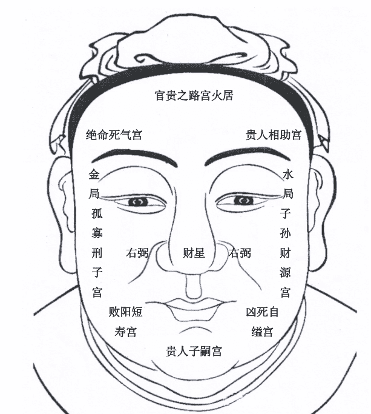

## 安徽相法八宫六亲神断秘

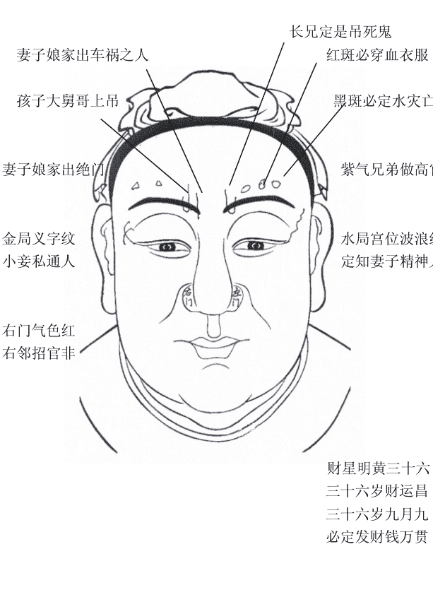

妻子娘家出车祸之人

长兄定是吊死鬼

红斑必穿血衣服

黑斑必定水灾亡

孩子大舅哥上吊

妻子娘家出绝门

紫气兄弟做高官

金局义字纹
小妾私通人

水局宫位波浪纹
定知妻子精神人

右门气色红
右邻招官非

财星明黄三十六
三十六岁财运昌
三十六岁九月九
必定发财钱万贯

## 安徽秘传古相法六亲定位图

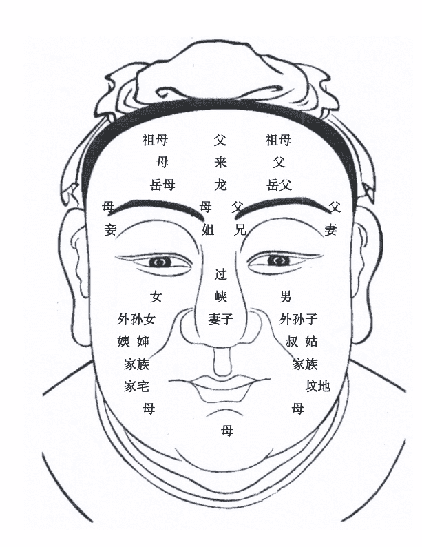

## 安徽面相风水秘诀

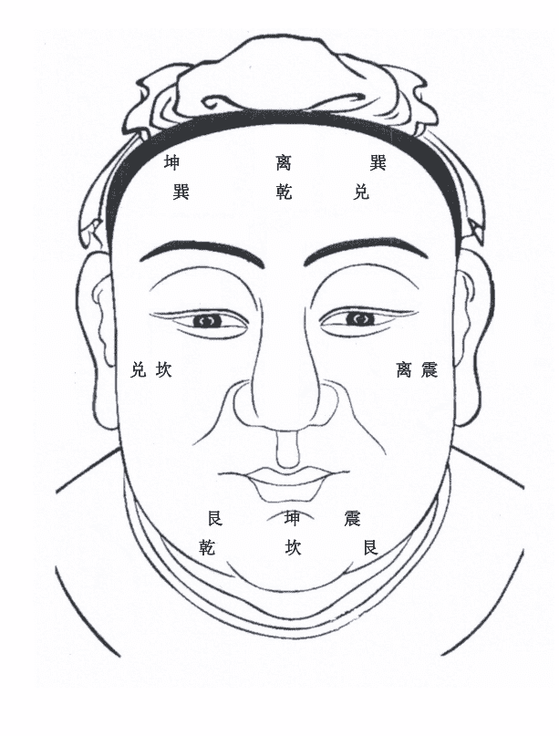

安徽相法与麻衣相，柳庄相、相理衡真等书籍不同之处，就是真传一句话。易友们都知道真传一句话，你们知道吗？真传一句话，这句话是祖师爷观无数人，总结下来宝贵的经验。它奇准无比，所以来之不易。历代都是口口相传，决不轻传，如传匪人，所传之人易必损阴德，祖师爷会留下千古骂名。

如有缘的易友得到此术，望细心研读。我相信会让你耳目一新，在相领域必定会提高一个飞跃。有很多易友看麻衣相、柳庄相等书籍不下百遍。但在看相之时还只能讲出皮毛，在断人生运程之时看父母全否，兄弟姐妹几人；子女多少，气色之吉凶时还是测不准。为什么？我在此回答你们：你们所见到的书籍属于理论性的，真正的实际知识，自古以来很少人不会写在书上。不管你学什么，大的方向不能错，最起码宫位不能错，如果宫位都看不准，你绝对测不准。

如你给人测事，见一老者理应起乾卦，但是你起的是艮卦，卦都没起对，一开始就错了，是结对测不准的，差之毫厘，失之千里。绝无测准之理。

安徽相法八宫六亲神断秘诀图，必须熟记于心。此乃六亲定位的坐标。

## 【六亲神断解析】

论官贵之路宫，居额头火星。饱满隆起有黄明之气，直到发际、无有斜纹，光明如镜；必是官贵之格局。在得贵人相辅，宫相照定是一代贤臣，官贵之宫如有纹多疤痣、气暗，定是与官贵无缘且青年灾运连连，大凶。如官贵格局被疙瘩气暗冲，一生必有官司临身，大祸临头，多应寅年戌年年月。

官贵之宫居火星  饱满盈净定贵命
恶纹疙瘩额纹乱  官司口舌青年生

官贵之宫居额头，火星如果饱满但无有黄明之气，贵人辅助宫又不相护，此相有者必有领导才能，于现在来讲也能成名一方，切记、此人记忆超强。一般人难以相比，如你将此相之人作为左膀右臂，定会在事业上助你一臂之力；可让你的事业腾飞，乃一代贤臣之相。

论自缢凶死宫，于面上八卦宫位。艮位为五鬼之位：五鬼本是恶神主邪祟怪事，伤人之事又主坟地之吉凶。坟地之多少，是否出官贵之人。然五鬼为凶神若能所用，五鬼进财必然大富。五鬼入相，主坟地出凶死短寿之人。或雷击、或车祸，命犯五行而死。五鬼之位饱满，一生定是富人。

若是自缢宫有腾蛇纹，或格子纹定出遭雷击之人，孤寡之人，或绝大房。气色发暗，定知阳宅离坟地不过八尺，大凶之相，老来五鬼败财，定然一生艰辛奔波到老，丑寅年月应大凶之事。

论贵人子嗣宫，解析贵人子嗣宫。闻名思意，代表的是贵人贵子晚运之吉凶。

贵人子嗣宫居水星，下方代表人一生能有儿子。是否绝子绝嗣，能否生贵子，贵人子嗣宫饱满，气色红润必生贵子。一生定处处逢贵人，子嗣宫朝天者，命中三子，子嗣宫朝喉者，命中必无子。

> 【注释：】人中定子女千万不可为准，只能做个参考。有很多易友都拿人中断子孙，宫位不对，是绝对测不准的。人中为子孙路，在阴宅中为坟向，人中短只能断见子迟。

论子嗣财源宫，解析子孙财源宫。子孙财源宫位居双耳之上，两耳有轮有廓有珠，气色红润，下代子孙非富即贵。双耳高者，就是高于眉，下代子孙可贵；双耳看下者，下代子孙可富；两耳垂珠、肥厚此相者，本人中年事业腾飞，财源广进，而且子孙贤孝，老来福寿双全。

贵人子嗣饱丰隆　定有聪明子孙生
若是朝喉一来下　绝了子孙无根芽

论绝命死气宫，死气宫位居面上八卦坤位。右眉之上，主要观家中是否出神经病之人。一般来讲绝命死气宫，若是明黄润主大吉，主上代人丁兴旺，麻衣出凶死之人。若绝命死气宫气色灰暗，祖上祖坟迁移或者说已经葬乱，坟地必出短寿之人或绝门，总之绝命死气宫饱满光亮定是吉相。凹陷坑塌定主不吉，切记如果当被测者是绝命死气宫、气色明显发生变化时，相师才能告之被测者，你家祖坟风水已经破坏，须要移坟地，定要出凶死之人。气色若隐若显，家中老女人、或者长媳、长女会有羊角疯或者精神病，此诀百发百中，不可轻传。

绝命死气居坤宫　饱满盈净祖坟兴
若然凹陷黑气出　定出邪病在家中

论孤寡刑子宫，刑子宫位居男人右颧（女人左颧）。若是气色明黄，颧骨饱满定生贵子，子孙非富即贵；若有伤疤纹痕大的黑疤，下代子孙定然有凶灾；或是下代子孙有伤疤，坑大者必无子，生头三胎全是姑娘。百发百中用之无不灵验。

孤寡刑子居兑宫 白虎位上定吉凶
若是伤痣纹痕陷 克孙克子定孤刑

论败阳短寿宫，短寿宫位居面上乾宫。此宫位为阳宅之宅基，阴宅之向。如是短寿宫凹陷，叉纹斜穿，阴阳定是向口方向，出现大的建筑物，或者是说因为建设阳宅，把阴宅相口挡住，也可以说阳宅为但是之宅。西北方向有一家男人早亡，多数凶死。

败阳宫位饱满，则阳宅西北低，近处有丘陵，或者高大建筑物。且男人寿命都在花甲之上且能寿终正寝，而且下代子孙聪明俊秀。看眼力而定西北邻家男人有兄弟几人，望易友应多实战，此诀只可意悟不可言传。

败阳短寿居乾宫 斜纹冲克损寿命
饱满明镜寿命长 下代人丁必丰隆

论财星宫（麻衣相书称申辩宫）财星宫位居面上中央戊己土，本门先师常言，财星可生宫万福定可攀。意思讲无鼻不可求官，鼻子五行属土，土生育万物。财星宫与女人来讲为丈夫之宫位，为丈夫的先天命位，男人财星宫为妻子的先天命位，若是出现竹节大的疱川字纹坑，气色再发黑暗定配偶伤亡。

若是财星宫，饱满高隆，明黄发亮主配偶运程必佳，且必有能力，男相女相若财星宫偏小中年必会克父，且中年运程必互艰辛劳禄，若丰隆高起，中年事业腾飞，财运定然大发，但男相三十四岁，要防破暗财，应铭记在心。

> 财星丰隆主财宫 中年运旺龙腾空
若是伤疤气色暗 克妻克夫中年凶

## 百岁流年运气部位歌

欲识流年运气行 男左女右各分形
天轮一二初年运 三四周流至天城
天廓垂珠五六七 八九天轮之上停
人轮十岁及十一 轮飞廓反必相刑
十二十三并十四 地轮朝口寿康宁
十五火星居正额 十六天中骨格成
十七十八日月角 远逢十九应天庭
辅角二十二廿一 二十二岁至司空
二十三四边城地 二十五岁逢中正
二十六上主丘陵 二十七年看冢墓
二十八遇印堂平 二九三十山林部
三十一岁凌云程 人命若逢三十二
额右黄光紫气生 三十三行繁霞上
三十四有彩霞明 三十五岁太阳位
三十六上会太阴 中阳正当三十七
中阴三十八主亨 少阳年当三十九
少阴四十少弟兄 山根路远四十一

四十二造精舍宫　四十三岁登光殿
四旬有四年上增　寿上又逢四十五
四十六七两颧宫　准头喜居四十八
四十九入兰台中　庭尉相逢正五十
人中五十一人惊　五十二三居仙库
五旬有四食仓盈　五五得请禄仓米
五十六七法令明　五十八九遇虎耳
耳顺之年遇水星　承浆正居六十一
地库六十二三逢　六十四居陂池内
六十五处鹅鸭鸣　六十六七穿金缕
归来六十八九程　逾矩之年逢颂公
地阁频添七十一　七十二三多奴仆
腮骨七十四五同　七旬六七寻子位
七十八九丑牛耕　太公之年添一岁
更临寅虎相偏灵　八十二三卯兔宫
八十四五五辰龙行　八旬六七巳蛇中
八十八九午马轻　九旬九一未羊明
九十二三猴结果　九十四五听鸡声
九十六七犬吠月　九十八九买猪吞

若问人生过百岁 颐数朝上保长生
周而复始轮于面 纹痕缺陷祸非轻
限运并冲明暗九 更逢破败属幽冥
又兼气色相刑克 骨肉破败自伶仃
倘若运逢部位好 顺时气色见光晶
五岳四渎相朝把 扶摇万里任飞腾
谁识神仙真妙诀 相逢谈笑世人惊

## 安徽相法秘诀（父母兄弟子女过三关歌诀）

## 安徽相法兄弟关秘诀（小段）

相学兄弟如何观，必定参看走相断，摇头晃脑兄弟多。
步法不乱弟兄罕，摇头晃脑八九个，长子车祸性命险，
长子走路肩膀正，老二走路肩膀偏。老三必是来头探。
安徽相法赛神仙。额上六亲法位真，不可传给不义人。
六亲宫位仔细参，高低起伏在此间。天宫凹陷出绝门，
地宫有缺母寿短。天宫可观坟来龙，山根过峡仔细观。
鼻子偏斜兄弟多，最多不过弟兄三。鼻子不正左右偏，
坟地凶死实可惨。左颧为姑也为叔，右颧观婶姨位间。
两颧可定子和孙，岳父父母眉上参。口角下垂向水反，
祖坟必出双妻男。喝药上吊定凶死，气色牙齿来相参。
发硬好像头长针，少年丧父莫猜嫌。行走左捌先亡父。
右捌断母丧在先。罗圈腿人兄弟多，兄弟五人只剩三。
天宫宫位有起伏，祖父祖母占此间。中宫定是父亲位。
岳父岳母仔细观。右眉之位妻娘家，左眉父亲细推原。

一宫一代向下观，六亲吉凶亲眼见，如是世人知此意。
定是相术一神仙。歌中妙诀细推究，切莫传于门外汉。

（面授班上真人解释讲解，包教包会）

## 安徽相法 父母关秘诀

左太阴来右太阳，太阴太阳管爹娘。太阴太阳都不动，
父母必定在高堂。若是阴阳有凹陷，宫位之中仔细详。
阳位漏骨父先死，阴位漏骨母先亡。阴阳俱漏少年孤，
辅弼凹陷中年伤。左辅高大父先死，右弼高大母必亡。
水星晚年来主运，诸多玄妙内中藏。左角低垂父先走，
倘若右低母先丧。更把三停用心推，发硬额削父早亡。
地阁尖削甲字面，母亲先亡没商量。
面授班上真人解释讲解包教包会

## 安徽相法观子女关秘诀

子女情况面上观，参看左颧和右颧。三阴三阳和印堂，
综合判断赛神仙。三阳下隐赤红色，有子生灾祸难免。

三阴之位青紫黑，女子吊死入鬼关。三阳三阴色明黄，后代子孙定贵显。三阳平满东岳高，长子英豪世人羡。
三阳凹陷东岳平，头胎女儿可准验。三阴三阳发暗枯，儿孙之路被截断。若是阴阳上吊纹，后代子孙断香烟。
东岳高大子必贵，不是博士是高官。西岳高大色明黄，有女必做贵人眷。印堂若能容一指，命中一子撑家园。
印堂若有二指宽，命中二子站堂前。三阳平满东岳高，三位贵子作英贤。三阴三阳印堂平，必生五子行成雁。
长阳丰隆长子瘦，次阳丰隆发次男。少阳凹陷小子损，更把气色来相参。子孙断法贵万金，莫非有缘莫轻传。

## 安徽相法秘传过三关

祖训曾言：宁舍万贯钱，不讲一句言。意思很直接——对绝技从不轻传，纵然是在巨大的诱惑和利益面前。技艺择人而授，没找到合适的人选时宁可带入棺材，也不愿让不肖子弟去贻祸于人。
对于一门绝技——换言之叫绝招吧，无一不是几代人心血的凝聚，不仅关系到一个门派、一个家族的努力成果和声誉，更关系到别人的生死，这样说是毫不夸张的，例如一种武功里的绝招，若是传给了无德之人，便会被拿去耀武扬威、作威作福了，也必会有人遭难，于人于己都是祸患。对于秘传风水，道理也是一样，虽然不像武功一样可以直接影响别人的生死，但造成的后果却更严重，一处地没选好或者故意给你做点小动作，影响的就是一门人甚至几代人的兴旺。所以老祖先宁愿绝学失传也不愿传于非人。

现代社会，对利益的追逐已经渐渐变得白热化，在利益的驱使下，许多人弃道义于不顾，仅仅在易学领域就是鱼龙混杂，不一而足。很多所谓的“易学大师”挂着风水的旗号在想方设法牟取暴利，如东北李某某出很多书，全是抄别人的，还骗全国的易友搞出一个“阴阳枕”。就是看风水的时候放在地上有马叫、狗叫，其实就是一个发声器，骗局被揭破后，全国的易友对其骂声一片，最后晚景凄凉，受千夫所指，暴病而死。还有个姓苏的还说自己也是安徽相法，出的书还和我恩师的书名一样，但安徽相法和相师全是面相，就没有手相，这些伎俩不攻自破。

阅千书读万经，真识不在纸上传。我相信有很多易友对麻衣相法、柳庄相谱、相理衡真等书籍看了无数遍，但是三关还是过不去，就不要在说断六亲了。对麻衣神相等相书，还有一些相学大师都说：“眉毛过目，兄弟四五”。此言不对。很多相学爱好者在经过实际检验后，都会发现根本不准。大家会发现很多人的眉毛过目，但就兄弟一人，有的人眉毛特短，反而兄弟五六个我在这里给讲出来，希望给相学界贡献出一点微薄的力量吧。望广大易友结合后面所举实例慢慢参详，学成后造福于人。

## 安徽相法兄弟关秘诀

眉为兄弟软清长，不论长短与衡量。
观眉应以寸为准，若是过骨细参详。
眉头为兄父亲宫，伤疤斜纹定红伤。
车祸凶死在路东，若在路西定阴阳。
眉尾过骨分高低，弟弟妹妹论排行。
发重木形定老三，稀发挺胸是长郎。
老三铁定寿星头，山根双眉凹陷详。
此是神仙真秘诀，相逢淡笑把人量。

## 安徽相法兄弟关

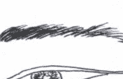

一字眉，兄弟一人

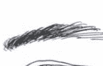

上扬眉，兄弟一双

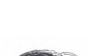

弯弓眉，兄弟三个

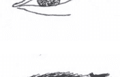

四字眉，兄弟四人

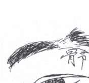

## 过骨眉，兄弟五六

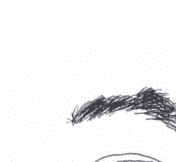

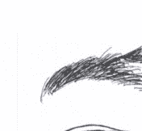

小扫帚眉，弟兄两人。大扫帚眉，弟兄六七。
姐妹四人，但眉后尾眉毛须淡。

（注）易友们一定要记住，不要让相书或那个大师的理论给误导。如：盛××、陈××说眉毛过目兄弟多，易友们都见过眉毛过目的面相，但兄弟却一人，为何？在判断兄弟的多少的时候，一定要把眉毛一根、一根的长短看清楚，绝不是看整个眉毛，如眉毛有力、长在骨节上方，兄弟必不能低于四到五人，如图一、叫短不及目，弟兄孤独。意思是讲：“眉短的捏不住，就是弟兄一人”百发百中。如图二、眉毛长骨节上一根就是弟兄四人，尾部眉长就是弟兄六七人。

（注：结合脸形、走相，断兄弟关在面授班上讲，只传给入室弟子，怕让那些虚假相学讲师盗去。）

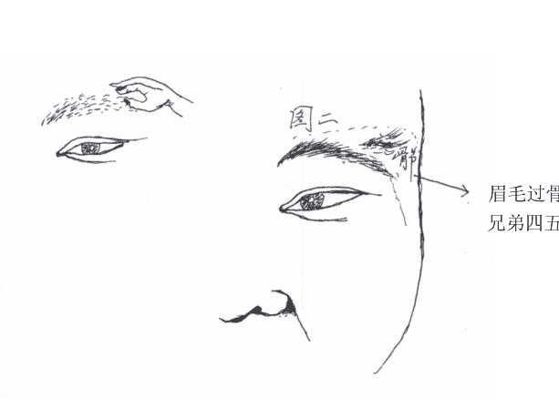

刘老师联系方法 18016396788
刘老师联系方法 18016396788

## 安徽相法秘传过三关
兄弟关

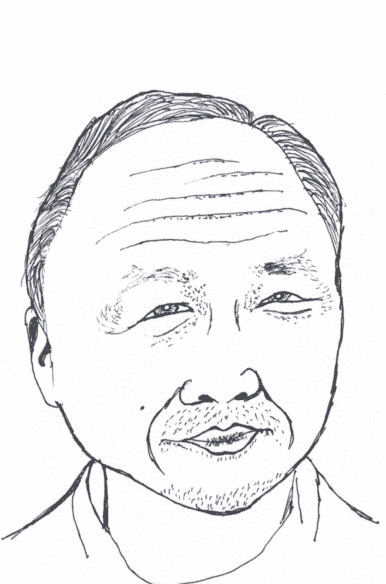

兄弟关：半截眉毛主孤独，兄弟命中一人数。

父母关：额头广阔地格窄，右肩偏低，母先亡。

子女关：印堂平满、三阳起，命中头胎必见子。

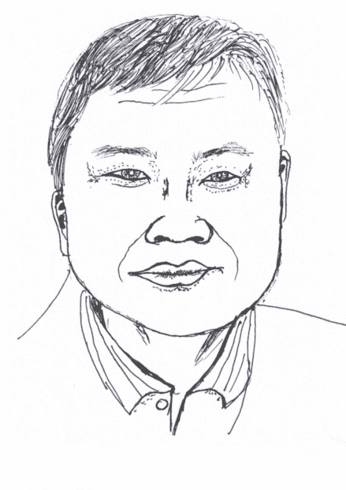

父母关：天庭饱满无纹痕，双眉盖骨父母全。
兄弟关：双眉上扬，兄弟俩。
子女关：三阳平满印堂宽，命中男孩头胎见。

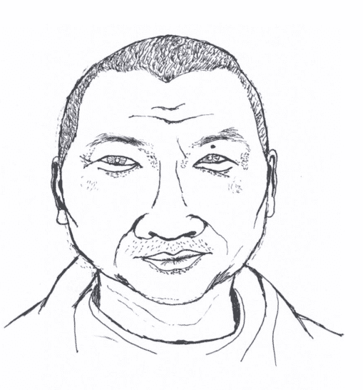

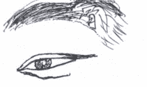

父母关：鼻子偏右、月角陷，右眉漏骨，母先亡。
兄弟关：大弯弓眉、双颧出，兄弟三人命中数。
子女关：三阴三阳高、印堂平，头胎儿子命中定。

## 安徽相法秘传子女关

古往今来有很多古书上讲道，看子女必须以三阴、三阳为主，但现来很多相师，却把三阴三阳下方的纹路讲为子女纹。我和老师研究相学数年，对此不敢苟同。我相信易友们也都见过，敬老院里的那些孤寡老人都有纹路，但一生都没有子女，那是为什么？所以那些虚假大师的理论就不攻自破了。判断无子必须结合社会发展过程来进行分析被测者的子女多少，比如80后的人就算命中子女有五、六个，但他们不会生，因为他们都知道生一个孩子得买房、上学等等，开销很大，所以你只能测头胎是男孩、女孩，命中有没有子女就可以了。

头胎男孩、女孩必须以三阴三阳为主，不能看人中。如那些虚假大师说，人中上窄下宽、下边有尖头胎男孩，人中下边不带尖是女孩，我相信易友们绝对测不准。看头胎男孩、女孩，必须以三阴阳为主，结合印堂、子庭、走相判断，绝无失手。

## 子女关

印堂平满无凹陷
头胎男儿定当先
三阳平满无暗枯
头胎男儿必定富

印堂平满
命中儿子多
三阴三阳
平满无女儿

## 绝子相

印堂若有小眉生
头胎男儿定不成
三阳三阴暗枯肿
命中无子度残生

田宅奸门暗毛生
命中无子残先终
面带虎纹食子妻

## 安徽相法秘传断来意

### 断你打花官司

双颧气暗两眼红，你为官司断输赢。
若是两眼血丝现，打输官司定赔钱。

### 断你有婚姻财喜

二十六七眉有彩，山根年寿黄明白。
婚姻喜庆进财喜，五十日后进财源。

### 断你工作调动

驿马宫位气明黄，财星发亮天庭光。
二十三日巳时到，职位上升红运高。

### 断你和邻居分房基

两眼发红天庭青，土星发黄两颧红。
必为邻居争地基，气色断你定有理。

### 断你父亲在医院

天门宫位细相参，暗气一到父有灾。
若是左颧黄白现，父亲必定在医院。

### 断你和妻子吵架

奸门发暗眉发干，夫妻生气在此间。
财星发暗婚必离，财星发明必团圆。

### 断你母亲何病何时归西

地宫发黄艮位黑，母亲必定遭阴邪。
前日必定向南去，后日卯时必归西。

## 安徽（秘传）五形人辩

水形人头圆、面圆、肥大、色黑为真水。书云：眉粗兼大城廓更圆圆，此相名真水，平生福禄双全，性格宽厚、胸怀磊落、度量包容、福泽自厚；脸色发白，色为金，书云：金水相生主富贵，背厚如山必高寿，水形人最忌上尖、色赤必见孤刑；兼木者色青主天亡，出外惊险。

凡水形忌色黄，为浊流之水，人性重、灾滞多，属贫贱之格局，凡水形不肥不发。凡水形口眉眼阔，眉眼大、圆略长、圆，腹垂，步快性宽。带微土者肩横步迟，腮横阔亦作有源之水，根基更厚，做事稳重，富贵双全。

木形人头面长瘦、色青带黑。书云：棱棱形瘦骨，凛凛更修长，凡木形人入格自是有名扬。书云：木瘦有神终必贵，木若无神定孤寒。凡木形最宜神足，方有兴创。

木形忌寒，寒则难发；忌偏斜，必不成器；忌尖露，亦主孤刑；若身面长大，为甲木，短小为乙木。若脸色毛发发黄，犹如树木之落叶，必至贫贱，必是寒儒农夫，岂能免于艰辛劳碌？天下之人木形者十居七，带火者上尖下阔，色红必发。耳高者，早年发达之格，因木火通明，其智有余，情性好动而刚燥，但恐早年见刑伤之灾。兼金者，面长瘦而方正，色白者为贵；木得金削成大器，乃栋梁之材也；金过重，则必寿不足；凡木形，鼻多起节，因木形可取以木竖多节。其余金、水、土形，有鼻节者大孤刑矣。木形多五露，但眼露宜有神、鼻露宜有肉、耳反宜珠垂、齿露不见牙、肉喉高近上生。五露俱全，福禄绵绵，大富大贵，木形不忌喉高。其余金、水、土、火形人，有喉高者主死在外乡。木形须、眉、发不宜粗浓，主运滞，木宜疏通也，须眉焦黄主刑克。甲木不忌秃顶，木形发落，主破败死亡，木宜直、不宜曲。若背曲，则一生不顺，必不成器；亦有五长、五短之别，头长、面长、身长、手长、脚长，俱要相称，五短亦然。木形满面发清润色，主大喜，若焦枯，则退败矣。

火形人上尖下阔，色红润为正，主早年发而孤刑。若色黄、腮横、上尖，则火兼土，可言寿考，先贫后富。兼木者面长，色青黑、骨瘦精神，亦能创业成。若脸色黄，则为下格火。耳尖，幼主刑克，高提，亦近贵人。凡火形宜色润，忌赤燥为退败，以紫红色者为贵也。

土形人背厚、肩横、身短、头腮阔、步稳、语迟，坐立如山，敦厚深重福寿胜人。得鼻佳者为土局，永无贫困，色黄为正色，黑为润土，乃主富贵。头略圆色黑是土形带微水，滋生万物，多主巨富。带微火者上额微尖，亦主小富，先苦后甘，若面色赤燥，孤刑老矣。色青主木克土，主破败无成，以木色克土，艰苦终老也。兼金者面带方棱、色白，是上格土，土腹藏金，福则更厚，须忌赤燥，辅须忌长，主运气晦滞，土形得火生如五恺石崇之富，必终贵到老。

金形人面方正、色白亮、肩背平、性刚断，男得此相多为将相，女得此相虎面刑伤。兼水者，色黑而肥、器宇轩昂；兼土者肩横、背厚、色黄、步迟、敦厚、寿而富；兼木者，肩横、露背、面皮抖鼓，主天亡、凶死；顶尖色红，火炼真金，终成大器。金形忌赤燥，主官灾退败；色如粉白，亦主孤寒；色如银亮，主大富贵；金形最忌声破、声嘶，以破金不成器也，声响而清者贵，有余韵。

凡金形有威权而方面，五官得配，必主牧民。书言：朝廷中多方面大臣也，鼻小不配必艰辛，金形色黑为铁面，若是剑鼻兵权万里。

## 五形人口诀

木瘦金方水主肥，土形背厚恍如龟。
上尖下阔名为火，五样人形仔细推。

## 五形气色诀

木色青兮火色红，土黄水黑是真容。
唯有金星原带白，五般颜色不相同。

## 安徽秘传面相五行相克歌

耳大唇薄土克水，衣食贫寒空有智。
唇大耳薄亦如前，此相之人必贫贱。
鼻大眼小土克水，一世贫寒主孤独。
眼大耳小学难成，虽有金钱短寿命。
舌小口大水克火，急性孤单是人我。

## 五形相生歌

两耳轮珠鼻为梁，金水相生主吉祥。
眼明耳白多神气，若不为官富第一。
唇红眼黑木生火，为人志气足财粮。
舌上唇正火生土，此人有福在中年。
眼长眉短是风流，身挂金章朝廷位。

## 安徽秘传识限歌

八岁十八二十八，下至山根上至发。
************，三十以前必破家。
三二四十五十二，山根以下准头止。

若有*********，不破大财定死人。
五三六三七十三，下停来定你晚年。
************，少儿克妻必孤单。
天地三才定富贵，五岳四仓定一生。
先师传下神仙诀，留与子孙把业兴。

## 面授班中讲

> 【注：】带“*”内容是秘传绝技，非在此故意不讲，因有人抄窃加以篡改影响我师门清誉，故此部分有德之人当于面传！

## 安徽相法秘传碎金赋

天地三才定五行，吉凶变化妙无穷。
世人若识碎金赋，万事定在相中生。
若论祖父相中分，左右双肩高低评。
左肩高者祖辈旺，右肩偏陷绝门庭。
喝药上吊青年死，定有孤坟大道中。
发柔发硬细相参，柔母硬父必发凶。
天宫饱满父辈旺，额头方正父辈兴。
兄弟七八定五六，七八当中定有刑。
天宫凹陷出绝门，少年灾多运不通。
天宫突窄阴婚凶，龙凤短削婚不成。
若是早婚定主离，不是喝药便死凶。
阳相方正面色金，一生不做文人公。
若是财宫来相配，军权在握保边廷。
勇字当头成大事，皇榜帝授富贵翁。
天宫饱满地宫陷，不识之人定贫穷。
龙凤宫中细轻长，富贵之宫透光明。
昔日春晖定得第，一朝拜相保朝廷。
离卦之相富可夸，刘邦沈万天下名。
早时虽然不成事，纵无文章也富翁。
生气贵宫细相断，寒毛炸起不周全。
阳宅周边坟庙侵，不出傻子也出残。
贵宫之下父亲位，阴贵宫中母定全。
若是斜纹并枯暗，父亲亡时丧河边。
午时离宫来占断，结合白色有冲天。
定是官非有口舌，事情上下在西边。
未时震宫必有红，若是发暗妻送命。
未时从南又向北，走时回家吊死鬼。
天宫五骨来朝天，富贵双全已时占。
申相坟地在高山，或路或沟在桥边。
若是站在坤位上，两处坟地相上观。
巳时艮宫寻子位，上下必是在北边。
片言泄尽世间事，仔细相寻相中分。
有缘有义来承继，无义之人莫相传。
若传无义之人凶，必定下代无子宗。
行善积德福泽远，胜似烧香拜佛人。

## 安徽刘氏面相五官秘法

### 第一论 监察官（眼睛）相法

- 1. 眼睛突出的女人二婚之命、淫荡，男人贫穷小气，六亲无力。
- 2. 大眼睛的人性格开朗无坏心，小眼睛的人虚伪。
- 3. 三角眼的人心狠手辣、记仇、心眼小，男人克妻、女人克夫。
- 4. 三白眼主开刀，四白眼短命鬼。白眼珠多黑眼珠少，此人性格刚强，六亲不认，女人杀夫、男人杀妻。
- 5. 眼大无神的人，一生奔波劳碌、贫穷，学业无成。
- 6. 黑眼珠多，白眼珠少，静观此人双目内含闪闪灼灼的光芒，大富大贵之相。
- 7. 桃花眼，眼睛含水又圆，上下眼皮都双者，男女淫乱，女人必多婚。
- 8. 眼睛白眼珠多者，终身贫穷。
- 9. 眼睛细长者，则贵，细则秀，秀则神。
- 10. 眼睛又圆又小又短，必为贫贱之命。
- 11. 黄眼睛的人性燥，六亲无力，不可深交。
- 12. 眼睛凹陷下去的人，头胎女儿，多女少儿。
- 13. 两眼有神，黑眼珠发亮不敢让人仰视，必为官相。
- 14. 眼睛的白眼珠不可有红色血丝和黄紫色血丝，主横灾、破大财（印堂再暗）。
- 15. 左右两眼的高低不一样，婚后中年左高，夫当家、右高妻当家（男女反断）。
- 16. 左眼小无神，父先亡，右眼无神母先亡。（综合断之）
- 17. 两眼距离近者，此种人目光短浅，心胸狭窄，嫉妒心重，女人容易失身。
- 18. 眼睛大的人思想灵活，领悟性强，眼大的男人对于爱情不持久。
- 19. 小眼睛的人思想灵活，心眼反应快，应变能力强，自私。
- 20. 凸眼睛的人观察能力强，敏锐、能说，口才好。
- 21. 男人眼睛小的人，对任何事都不容易抓住好机会，而且好色。
- 22. 男人眼睛大，富有，精力旺盛，干劲胆识也大，容易成功。
- 23. 无论男女眼尾开花，必有婚外情，必犯桃花。
- 24. 无论男女眼角向上的人，脾气好，能屈能伸。
- 25. 无论男女眼角向下的人，脾气不好。
- 26. 眼神经常转来转去游移不定的人，是个淫荡贪婪，手脚不干净，小偷之人。
- 27. 眼睛歪斜的人，小人也，心术不正。
- 28. 眼睛布满红色的人，将有病或有大灾。
- 29. 女性羊眼必淫荡，白多黑少主杀夫。眼珠发黄侵血丝，女子必定哭丈夫。

### 第二论 安徽刘氏相法相口秘法

- 1. 嘴唇薄的人能说会道，应变能力强。
- 2. 一笑露牙龈的人，风流，未婚先同居又不保守秘密。
- 3. 口如吹火者孤苦，女人克夫头胎女孩。
- 4. 女人嘴唇有痣的人不愁吃穿，但她的阴道部位一定也有痣。
- 5. 嘴唇黑紫的人，心地是非。
- 18. 女人嘴小性格内向，爱情浪漫，爱美，温柔多情。
- 19. 下唇突出者，男子有此口型者克妻，妻子多病，什么事都精打细算。
- 20. 上下唇张得不协调的，上下不一样，也没好运，主贫寒。
- 21. 唇厚但嘴小的女人，一般经不起男人的诱惑，这种人很容易说服和男人发生关系。
- 22. 嘴唇发白的人贫穷，不顺利有阻隔，身体有疾病。
- 23. 口如吹火的男人喜欢狡辩，自我夸张，做事虎头蛇尾，没有意志力，难成大器；女人有此嘴形说话不考虑，说东道西长舌妇。
- 24. 女性嘴大而且嘴角又向下弯曲，此人是男人性格。
- 25. 上唇遮掩下唇，叫鹰嘴，此人意志坚定，有决断力，此人性格不稳定。
- 26. 嘴唇干燥的人，他的适应能力特别强，但就是情绪化。
- 27. 说话时口张开不露牙齿，一定是富贵发达之命。
- 28. 口角发黄此人要得病，嘴角有赤色出现，有凶灾。
- 29. 嘴大的女性能养小白脸，大胆开放；嘴唇大的女人，性欲高。

### 第三论 安徽刘氏相法相眉秘法

眉喜长来又喜弯 双眉锦绣福可攀
两眉交加多愁苦 两眉压眼主艰难
昔日云长卧蚕眉 独马提刀过五关

- 1. 女人短眉，必定克夫无疑定二婚，若是双颧高起，中年必定死丈夫。
- 2. 若眉中间有痣，为眉中藏珠，手臂一定有痣。
- 3. 眉毛有山者，也就是眉毛的头部眉毛竖起，必是当官之人或大老板。
- 4. 女性浓眉、眉毛上扬，也称竖眉，此女必犯桃花，脾气不好克夫命。
- 5. 左右眉毛高低不同，一定有同父异母的兄弟。
- 6. 眉中有二三根特别长的眉毛、而且有光泽称为彩，为大富大贵之相。
- 7. 眉粗浓而不见眉骨，此人身体健康，好色之人。
- 8. 眉毛乱者兄弟不和，不整齐好色。
- 9. 不论男女，如果哪方有第三者插足，必定对方眉毛会油光发亮。
- 10. 眉毛盖不住眉楞骨，如是女人必克夫，为白虎眉。
- 11. 眉毛短眉毛逆生，个性刚强脾气暴躁，兄弟不和睦。
- 12. 男人长个女性的眉毛，一生走桃花，感情烦恼，适合被女人包养。
- 13. 眉心太窄，此人做事斤斤计较，心胸狭窄固执败多成少。
- 14. 眉毛下垂此人懦弱性格内向。
- 15. 眉毛长而清秀，发达扬名长寿。
- 16. 粗而浓的眉毛中间连在一起，此人个性钢直，性格特强，女人婚姻不顺，是个工作狂。
- 17. 粗乱浓厚之眉，此为偷盗之人。
- 18. 短眉的人财运无多，贫穷之相。
- 19. 左眉右眉断折有疤，胳膊腿必定骨折过。

易友们都知道兄弟关是最难掌握的一关，为什么有的人眉毛特长，就兄弟一人，有的眉毛特短，兄弟反而多了呢？

安徽相师从脸型上判断出来的，易友们如果把脸型定准，兄弟关便可迎刃而解，百发百中。在面授班上用真人实战，一步到位，在一个小时之内掌握兄弟关，可让你笑傲江湖，成为一代有名相师。

### 第四论 安徽刘氏相法鼻子（财星官）秘诀

- 1. 鼻子喜大又喜圆，悬胆鼻子发中年。悬胆鼻子必须两颧相护，一生财运亨通富贵有余。
- 2. 鼻子的形状如悬胆和截筒者，此人富贵，幸福有财，男人妻子貌美，女人丈夫有能力、财运好。
- 3. 鼻子为妻星、夫星，若有疤、纹、痣者，一生财运差，妻子、丈夫运也凶。
- 4. 鼻子露灶者，一生财来财去，贫穷体弱。
- 5. 鼻如鹰嘴者，此人必狠手毒，心术不正，经常算计人。
- 6. 鼻子短的人明朗开放，少自信，轻率，和蔼可亲。
- 7. 鼻子低的人，消极自卑，容易受他人影响，虚荣心强。
- 8. 鼻子高的人，冷静，自尊心强，追求名誉和地位。
- 9. 鼻子上有两处塌陷的人，注定骨肉要分离。
- 10. 鼻子不正的人，向左或向右歪斜的人聚不住财，财来财去、大起大落。
- 11. 鼻梁无骨者，此人寿命短，身体不好。
- 12. 鼻子有三道弯的人，一生贫困孤独。
- 13. 鼻梁不直歪斜的人，必心眼坏。
- 14. 鼻子上有青气主妻子有病灾，女主丈夫运凶，必破财不顺，百发百中。
- 15. 鼻子狭窄若刀剑一般，此人必劳苦，老谋深算之性格。
- 16. 鼻子准头垂肉下垂，其人必好色。
- 17. 鼻孔小的人心眼小，吝啬、节约、多疑，而且小气。
- 18. 鼻子无肉的人，性格顽固，沉迷酒色，财气少。
- 19. 小鼻的相法很重要。小鼻代表人的财力、精力、体力运势。小鼻薄而无肉者，命苦，财运不佳。
- 20. 断鼻的女人，也是鼻子中央部位凸起，这种人性格倔强，独断专行，女人二婚。
- 21. 女性鼻子向左或向右弯，性交姿势多变。
- 22. 鼻子发黑，近期要破财。
- 23. 鼻子左偏先亡父，右偏母先归，配合太阴、太阳，百发百中（女人反断）。
- 24. 鼻子发黑有痣，有灾破财，妻子有病。鼻子准头色泽黄白色，主财运好，事事通，黄明者发大财、发白发暗者，常破财。

### 第五论 安徽刘氏相法相耳秘法

> 诗曰：耳为采听要靠墙，双耳垂肩富贵相，若是弯弓不成样，祖宗田宅一扫光。

- 1. 耳白过面，必定名扬天下。
- 2. 双耳贴脑，此人富贵发达，老板企业家。
- 3. 耳朵红润，做官之相，耳朵发黑，财运不旺。
- 4. 耳有垂珠，财源广进（耳重大）。
- 5. 耳朵垂的形状如夜明珠，此人必发大财。
- 6. 耳朵内生长毫，必定长寿。
- 7. 耳垂上有痣，小时容易水灾，中年以后发大财。
- 8. 耳垂上有横纹，此人定有心脑血管或糖尿病。
- 9. 大耳的人诚实肯干，小耳的人机灵聪明。
- 10. 两耳发尖像兔子、老鼠的耳朵，一生是定然受穷。
- 11. 耳朵太薄的人，而且没骨，此人身体必多疾病。
- 12. 红耳朵的女性风流好色；女人耳朵突然发红，是月经期。
- 13. 右耳为母，左耳为父。男右耳比左耳小，母必先亡父后丧，女人反断。
- 14. 两耳高过眉，一生富贵不受贫。
- 15. 两耳发青、发黑、皮肤又粗糙，漂泊无财。
- 16. 从对面看双耳向前照的人，贫穷无财。
- 17. 大耳特征又大又圆，色泽红润，两耳有垂，棱角分明，大吉相。
- 18. 金耳主富贵，可以做高官、显贵。（耳主五行）
- 19. 水耳也主富贵，做生意之人。
- 20. 木耳贫穷。女人耳朵长者，旺夫相。
- 21. 火耳孤寿。凡女性如其长子耳廓突出，一定不是长子。
- 22. 土耳主富贵。外耳窝及内耳窝圆相称，中年发大财。
- 23. 虎耳主奸，耳下垂前倾，财产耗尽，万年贫困。

## 刘老师面相实例

此相为我的一位易友，性格开朗，风趣幽默。第一次见到我时让我为她看相，我当时断到她“两眉过骨又带彩，兄弟姐妹六人命中排；眉头发淡眉尾重，身上有哥命中定；三停五岳命中排，富贵贫贱命安排；虽说你是女人命，但能把丈夫帮起来；两颧护鼻旺夫星，丈夫财旺子不行。”“你二十六岁下半年生了一子你没见（天折了），三阴三阳凹下来，命中无子天安排，只因前生救一女，今生一女报恩来，三阴之下发紫红，女儿必是大学生。”

讲完了在场的人哈哈大笑，我笑着说让你女儿好好上大学，将来必有所成。旁边人都问刘老师看看得准不准，她说刘老师不是人，停了一下又说道：“他是神，能不准吗？”所有人又笑了起来。

在二零一一年到南阳游玩，在旅途中一位看相的老者把我叫住，非要给我看相。我心想人外有人、天外有天，那就看吧，不过我对他出了条件：必须看出我的兄弟几人、父母那个先去世、我父亲兄弟几人，老者一听急了：“我走江湖一辈子了，也没有见过能有人看出父亲兄弟几人的……”我说有人可以办到，老者就说如果真有他愿拿重金拜师学之，我就告诉他我曾在庙中遇一老者传了我几招，要不我给您看看？老者一听欣然同意。于是我断道：“你爷爷寿命长，奶奶先走了，对吗？”老者说对，“你父亲兄弟三人绝了一门，没儿子对吧？”“你头胎姑娘命中一子对吧？你本人兄弟五人对吧！而且你爱人已经去世了。”我刚说完，老者激动地说：“真神了！您贵姓呀？”于是我笑着把我学艺的经历简要跟他说了，刚说完老者就迫不及待的要拜师，后来成为了我的一位弟子。

零一年相于开封，此女蛇眼必凶狠。定是杀夫恶女人，双眉发淡、眉头带尖，娘家人不旺，没儿子了。右眉下有一黑痣，右法令内有小痣，三叔的儿子过继给他父亲。此相零一年相于开封，此女蛇眼，必凶狠，定是杀夫恶女，双眉发淡、眉头带尖，娘家人不旺，没有男丁；右眉下有一黑痣，右法令内有小痣，三叔的儿子过继给他父亲。

此女两耳反廓，左耳小、右耳大，父亲有残疾，一到十五岁前时间，家庭拮据，一贫如洗；观左耳，七岁、八岁开始上学念书，从小学到初中，学习路上不太理想，最多是个初中生（小学毕业）；22、23岁婚姻成，但头胎一子定不成；25岁喜临门，家中添了一千金；28岁夫凶死，31岁又嫁人；出生之地家贫穷，只有房屋没院墙；大门开在坎位，母亲必定要出轨。

此相零一年相于驻马店。三停光长，两耳靠墙，财星中正丰隆，两颧相护，双眉有彩。从三十一岁开始添财上百万，从31岁到46岁，身价已逾千万。

天庭有乾卦纹，一生遍地遇贵人；天庭饱满，南边贵人多，双颧相护，一生有东西方向的兄弟朋友相帮；双眉过骨向上仰，兄弟六名你最强，二哥定是庄稼汉，大哥还是庄家郎；东岳高大西岳平，头胎男孩你真行；印堂宽广容三指，命中定然有四子；上眼皮中藏小纹，金屋藏娇俩情人；两耳低沉双颧平，父亲兄弟有两名；坤宫高广阔，母亲姐妹八九个；出生地你最清，东北高大西边坑；南边三家出学生，左边邻居受贫穷。

此相相于01年春，此人姓黄，是慕名求测。观此相：天庭广阔四仓丰，地阁方圆，鼻直丰隆，两耳有轮有廓，但走相身形摇摆，故不是官贵之人。两耳明润为金形耳，故父亲是吃皇粮之人；两耳轮廓分明，天庭高广印堂宽，双目有神祖业丰，学业为大学；眉头发淡一公分，身上有一姐；本人兄弟之中为老大，下有两个兄弟；姐妹四人，父母高寿；三十四岁眉尾断折，破财，是因为一个年龄大的老妇人，出了一次车祸，伤了左腿，在西南方向；父亲兄弟三人，父亲为老大。妻子有妇科病。

此相相于安徽。来人姓宋，也是慕名求测。观此相：双眉不过骨，姐弟四名数；三阴三阳印堂起，命中头胎定见儿。

此相观于北京02年秋。双眉浓的人，人生困难多：左眉过骨带小尖，兄弟四名占；左眉头发淡，兄弟四人之中有绝门；眉头发淡，身上必有姐，兄弟姐妹共五人；天庭广阔地阁尖，断他母亡之时五十三；两耳反廓，学业不成；年寿起节，妻子42岁—43岁之间动过手术，因而破财。三阳来凹陷，命中一子占；三阳发暗青，孩子流浪命（一事无成）。观脸形，参看内外八卦：祖坟94年、95年移过，移过以后凶气不退，伤了三叔，还有三叔的二孩子；老家的门口也动过，先是正南门，后来改为东南门。

此相相于二零一零年春天。我到安阳易经研究院找一位朋友，在闲谈时让我为其看相。我断到：“观你面相，天宫往后朝，爷爷那一代都不富；你这一代双眉带彩又飞舞，兄弟八名数；三阳印堂宽，命中四子见……”话说到这里，这位朋友说道：“刘老师您的相法可比八字来的快多了，还真准啊！我日后定向您请教面相！”

此相相于河南，是我的一名地理风水弟子，家住山东临沂，来河南拜师学艺。在课堂上讲到兄弟关的时候，他问自己的面相能有兄弟几人，我当时断到：双眉过骨向上仰，兄弟五名个个强；三阳三阴来凹陷，命中一子见；额头宽广又明亮，父亲兄弟定八名。听其声、问其命，三处阳宅、两处坟；三十三岁六月三，父亲必定入黄泉；四十二岁五月初，母亲走时七十五。结果使他更加笃定学习面相之心。

此相03年金秋相于河北省，姓赵。双眉过骨有小尖，兄弟四名占；左耳低陷又反廓，父先亡；左耳占中庭父亲丧时六十三，死在七月；额头窄又小，父辈兄弟稀，兄弟一人；观此相阳宅三处，坟地两处，有一处离路或桥近；太阳之位寒毛生，一生养子度残生；观走相，肩高低不一，爷辈兄弟六人占。以上断语全灵验。

此相01年相于石家庄，是某局局长。此相天庭容四指广阔，印堂能容二指，双眉飞彩，双目炯炯有神，山根不断直接印堂，东岳、西岳辅弼财星宫，财星宫不偏不斜，准头低垂，为人正直，爱民如子。五官五岳五架山，五官喜正不喜偏。一官长成十年富，一官长斜十年寒。天庭地阁相应，两耳靠墙，必为官相。二十七岁升大学，31岁被提升，33岁又晋升，35岁一年连升两级。

奸门发紫红，妻子31岁心脏病，因妻破财；眉头发炸，兄弟之中占老大（有一根眉毛奔向印堂都算）；双眉上仰颧不显，兄弟两名占；在眉毛次位发赤红，二弟犯官司口舌，只因在外有情人，情人是西北方位的；右眉不过骨，妻子姐弟有三个，孩子的二舅二十六出了车祸。

零三年相于山东，姓刘。该女士两耳大小不一且右耳残缺，母亲有精神病；女相最忌两耳残缺，一生婚姻不顺，必犯二婚。女人眉短，额窄无有眉毛，一生只能为妾相，此女为三眼皮，必有婚外情。二十八岁、二十六岁伤父；19岁丧母，东边邻家没儿子；西南有大坑；三阴三阳凹陷，头胎女儿定当先；一生有一子。眉尾后面有小尖，兄弟姐妹有四人。

二〇〇五年春到南阳看风水，席间遇一行说要交流一下。观其座相，左腿走路重，当时断到其祖父寿命短，已经辞世。被测说：“很对，你接着说。”“面圆颧不现，兄弟二名占，眉头淡身上必有姐，观其三阳并三阴，命中头胎必女身”。被测者说刘老师您断的都对，还问我是从哪里判断的，其实意思很明白，想偷学，我当时笑了笑，讲到艺不可轻传，有缘者咱以后看缘分好吧，有缘艺自成，说完了朋友全乐了。

此相于一零年相于河南郑州，是一位姓王的先生。王先生天庭饱满但龙虎角无，不可为官；自己经营一家公司（注，凡天庭饱满者，虽不可为官，但可以自己管理企业、开公司，天庭为先天乾位，故有领导才能）。王先生从28岁开始下海经商，印堂饱满平润，故财运好。双眉有彩，眉管31岁—34岁之间流年运程，故31岁—34岁靠兄弟朋友发了大财，自己开了公司；三十五上太阳位，三十六上太阴位，三十五、三十六因为子孙破了大财，因太阳、太阴位破损，太阳、太阴为子女宫，故因为子女之事破财。脸形饱满的人包容力强，山根、年寿隆起的人，毅力坚强，两耳耳垂圆满、明润，故一生财运佳。

此面相相于天津。见印堂无光，年寿发青，定知财运不通。此女姓张，生于七零年，05年36岁，正好逢于年寿之上，今年不但本人运气不佳，其丈夫这二年运程也不太好，诸事不顺。因为女人的鼻子代表丈夫，年寿代表丈夫，年寿发青，丈夫运气不顺通。

此女右眉过骨，兄弟姐妹五人，左眉平平，丈夫兄弟一名，双眉清秀，兄弟姐妹和睦；额头窄、右耳低，父亲去世六十一；前三天和丈夫吵架了，准头之上有红丝，定知两口吵架、生气。

此相观于东北哈尔滨，此人姓孙是山东聊城人。此相左眉上仰，兄弟一双；天宫上尖父辈稀，父亲命中兄弟一；天宫塌窄地阁丰，命中无官命，若是做官，必乃贪官；官贵宫中邪光闪，定知此人必淫乱。此人当时把家中祖坟画出，我断到财阴宅，长门必无子，二房必克妻或二婚。且此阴宅长房有一姑娘必有羊癫疯，从07年到10年此阴宅必伤三人。

此相小眼睛，虚伪贪婪。阴险狡诈，必是一小人；小眼睛、放斜光，不敬父母、无朋无友之辈。背后伤人之小人之相。

此相相于二零零三年夏。在往上昆明的火车上见一位老者，当时他正在和别人攀谈，跟人说及面相时，由于职业敏感于是我有意旁听了一下。他给旁边的人断的都很准，比如说某人家哪个方向有电视机、哪个方向有厨房、厕所，本人患有什么病，说的都很准。于是我试探性的让他给我也看了一下，说的也大致不差，经过一番交谈，我告诉他我也学过面相，对此也略懂一二，老先生疑惑的看了我一会儿又让我给他看看，我断出他父亲兄弟四人，他兄弟姐妹五人，其中兄弟三人，他排行第二还有个姐姐。他有两个孩子，而且他爱人不在了。老先生觉得有点不可思议，便相询所用方法。于是我们相互交流了判断方法，都觉收获良多，我和他也结成了好朋友，经常在一起交流探讨，互有进步。后来我也不禁感慨：真是处处有奇人啊！

此相观于二零零二年冬，时在广东看风水，一位姓王的老板在席间请看相。易友请看此图：双眉上扬，兄弟一双；两颧不显，兄弟两名；三阴三阳塌，命中两姑娘。说完这些之后王老板又让我为其看看八字如何。我用老师传我的断命诀，两分钟后告诉王老板，他是一个富命，从一出生到现在有两次大灾，三十二岁那年因为爱人家人帮忙，又发了大财；三十九岁时出了一场车祸，双腿都断了。王老板说太神了，断的全对，对我也愈加谦恭。

二零一一年五月份，王会长到我那里交流经验，顺便游山玩水，稍事放松。有一天我们去浚县观景，当我们躺在宾馆休息的时候，手机响了。是河南周口的一位易经爱好者打来的，他自我介绍说是一位七十多岁的老先生，姓李，想学面相。我当时跟他说：“听你声音后高前低，有颤音，你家应有两处坟地，其中有一处是人死在外乡，坟地已经被平了，你本人应有兄弟三人。”当时这位老易友就激动地说：“太神奇了！，光听声音就能断出来事情，我活了半辈子也没有见过，真是不可思议。刘老师，我一定要跟您学易！”后来，我在湖北办易学面相学习班他就来了，还带来了一位小伙子读者朋友可以看看这位老易友的面相，如果平常的易学的看相理论来看，应有兄弟第五人，但是用我师传的理论断来，此人父辈人丁兴旺，于是，在课堂上我就跟他说到：“你父亲兄弟有四到五个，但是必出绝门，你的月阴宫有斜纹，说明你祖上必有二婚；三阳平满印堂平，命中儿子定，看你双眉太浓天宫高广命中必有官命；鼻至丰隆中年大顺，鼻子乃财星也主寿，鼻至丰隆寿高如松，双眉广长子孙兴旺，有鼻无颧，双眉太浓一生不会溜须拍马才不会做大官，但是一生有官命；耳珠立飞，一生必须在外地发展，在家小人多，在外贵人多，在外地发展必有万里前程。三停广长一生财运亨通。

此相就是周口老李带来的小伙子，此相双眉太浓，一生事业充满挫折，右眉有横纹，妻子娘家必有横祸（实际上是孩子的大舅哥凶死）结合六亲定位图；此相双眉太浓，兄弟二人；眉头发淡，上必有一姐姐；鼻子偏左，父子不和；鼻子乃财进宫五行属土，有青气发暗今年必破财；印堂有汗毛，命中头胎男孩占不牢，三阴三阳平满，命中二子占。

此相乃是我这次在湖北武当上招的山东弟子孙某。在课堂上给他断到的情形为：双眉过骨兄弟四五，印堂凹陷头胎女孩，命中一子双耳靠墙，子孙富贵双全；火星人天庭窄一生不可为贵；天宫偏斜兄弟中有绝门，四兄弟乃抱养他人之子；此人鼻准低垂忠厚诚实。两耳靠墙火星外泄；三十岁前奔波劳碌，且无有祖业。

此相乃是我河北唐山收的弟子，早在二〇〇一年就跟我跟学过一段时间相法，后来知道我在湖北讲风水，又不远千里跑来找我学风水，令我很感动。他以前还跟开封的潘长军老师学过传统八宅，这次在我这里学习安徽风水金口断，可以说是更上一层楼。在课堂上以他为例，给他看了一下相：天宫窄坑父辈人丁不旺，最多二人，本人弯弓眉毛，兄弟三人到四人，如果是四个会绝一房；三阴三阳凹陷，头胎必见姑娘，命中一子。他当时就激动的说：“说道老师真是太准了，您传的口诀‘三阴三阳起卧蚕，命中缺少好儿男，若是三阳来塌陷，头胎女孩定当先’，我的儿子就不是很有出息，呵呵 太准了。”

此相乃河北省高某某，在课堂给其看相龙凤摆尾姐妹六到七人，眉毛上扬兄弟一双。东岳过露头父先亡。两耳反廓无有祖业，奸门发暗克妻克子。此相胡子生的的乱入草操心操到老。双眉无尾，六亲无靠，自身立业。天宫偏斜少年运程不佳，土星不正中年辛劳禄。

此相零三年相于太原。试观此相：男人两耳反廓额头偏斜，少年父母必不全，或者离婚；双耳代表十五岁以前运气，两耳反廓，十五岁以前家庭经济拮据，家贫如洗；三阴三阳凹陷，头胎必见女孩；三阴又凹陷，二胎女孩必定验；印堂容一指，命中必一子；观此面相，住宅北方地势高，房前有大树三到五颗；有西房没有东房，北边邻居必出哑巴；坟地为艮山坤向，有个坟中没有骨头，是一假坟：祖父娶双妻。

在面相中看似简单，但妙言不过三五句，无人指点枉徒劳。望广大易友相互研讨，使此绝学发扬光大！

## 安徽祖传风水金口断

### 【基础知识八卦定位与起源】

易经八卦起源于伏羲神农黄帝，成熟于周文王，经孔子加上了道德伦理。伏羲时，龙马负图，出于河中。其位一六居下，二七居上，三八居左，四九居右，五十居中。伏羲逐其则其文，以画八卦，即乾一、兑二、离三、震四、巽五、坎六、艮七、坤八，此八卦在文王之前，故称为先天八卦代表宇宙的八种自然现象。乾为天、坤为地、离为日为火、坎为月、为水，震为雷、巽为风、艮为山、兑为泽，宇宙间这八种现象、相互对立，变化出不能穷尽的种种状况来。

后文王拘而演周易，大禹治水时，神龟献书，出于洛水，负文字列于背，戴九履一，左三右七，二四为肩，六八为足，文王因之以画八卦，即乾坎艮震巽离坤兑，称之为后天八卦，其中一白居正北，五行属为水，故坎卦居正北，二黑居西南，五行属土，故坤卦居之，三碧居正东，五行属水，故震卦居之，四绿居东南属木，故巽卦居之，五黄居中宫属土，故黄级位居中央，六白居西北属金，故乾卦居之，七赤居正西属金，故兑卦居之，八白居东北，五行属土，故艮卦居之，九紫居正南属火，离卦居之，其数始于一终于九，以明九宫配八卦。

太极八卦与万物万事有密切的联系，《易》有无极生太极，太极生两仪，两仪生四象，四象生八卦，八卦定吉凶，吉凶成大业。变化首先从太极开始，太极在变化中产生天地两仪，太极在变化中产生春夏秋冬四季，四季变化中产生八卦，八卦在变化可以变出六十四卦，及三百八十四爻，这六十四卦与三百八十四爻中包含着吉凶的信息。人们根据八卦的变化，可以得出趋吉避凶的规律，可以成就伟大的事业，所以自古以来的君王，周围都有精通八卦的军师，如汉代张良、三国诸葛亮，明代刘伯温等等，精研八卦的智者，才能成就他们的千古霸业，精通八卦的智者，他们了解了天地万物的吉凶定律，可随时给人指点江山，让你的事业腾飞，家庭幸福，国运昌盛。生为华夏子孙，理应把国宝周易文化发扬光大，让每个人都应了解应用它，为国家、企业、家庭带来幸福平安。所以现在有很多的大企业、大老板每年都聘请专业的风水命理顾问。随时为他们指点江山，加以趋吉避凶用周易之术帮他们企业壮大人生幸福。

### 河图

一六水二七火，三八木四九金，五十土，一得九，而成十二得八而成十。

### 洛书

载九履一，左三右七，二四为肩，六八为足。

无极 太极 两仪

### 后天八卦方位图

| 乾三连 | 坤六断 | 震仰盂 | 艮覆碗 |
| :---: | :---: | :---: | :---: |
| ☰ | ☷ | ☳ | ☶ |
| (父) | (母) | (长男) | (少男) |
| 离中虚 | 坎中满 | 兑上缺 | 巽下断 |
| ☲ | ☵ | ☱ | ☴ |

（中女） （中男） （少女） （长女）

乾居西北属阳金，坤为老母，居西南属阴土；艮为少男，居东北属阳土；兑为少女，居正西属阴金；坎为中男，居正北属水；离为中女，居正南为阳火；震为长男，居正东属阳木；巽为长女，居东南属阴木。

五行乃宇宙中五种物质的缩写，是一种物质观，哲学、中医学和占卜方面，占有着重要地位。

五行即金木水火土，五行学说，认为宇宙万物，都有金木水火土，五种基本物质的变化和运动所构成。即宇宙中所有的金属，五行都属金，如铁塔、钢板、枪、刀剑等等。所有的木质物体都属木，阳光、太阳为火、河流、江河湖海为水，大地五行属土。

五行相互关系：五行相生，即金生水、水生木、木生火、火生土、土生金。

五行的特征：木曰曲直，意思说木具有生辰的特征，代表生长、开发，舒畅的功能。在风水学中的青龙，为财官、人丁等，在人体为肝胆。

金曰从革，意思是金具有萧杀、变革的特性，代表沉降，萧杀、收敛等性质。风水学中为白虎，白虎为凶神，所主的都是血光、丧服、病灾、伤亡等凶事，在人体为肺为骨骼。

水曰润下，意思是讲具水有滋润向下的特性。代表了滋润、寒凉、闭藏的性质，生化万物的特性。代表了生化承载等性质，在风水中代表玄武，所主的都是小人、被盗、上当受骗，水火之灾等，水在人体为肾血液。

火曰炎上，意思是火具有发热向上的特性，代表了温暖、热能、向上等性质，在风水学中为朱雀，主文化、文凭、大学生，失令时为口舌，血光、车灾等，人体为心脏、眼睛。

古人认为宇宙是由金木水火土，这五种最基本的物质构成宇宙中各种事物和现象的发展，都是这五种物质运动和交互作用的结果。

古人通过长期的接触和观察，认识到五行中的每一行都有不同的属性和性能，古人对应这种认识，把宇宙各种事物分别归于五行。因此在理念上，不是金木水火土五行本身，而是一大类在特性上可相比拟的各种事物、现象所共有的抽象性能。

## 天干地支

十天干为：甲、乙、丙、丁、戊、己、庚、辛、壬、癸。其中甲丙戊庚壬属阳，乙辛丁癸己属阴。甲是拆的意思，即指万物剖腹而去；乙是轧的意思，指万物初生的样子；丙乃炳燃之意，即万物炳燃著见；丁是强的意思，指万物丁壮；戊为茂盛之意；己是纪的意思，指万物有形可见纪识；庚为坚实之意，指万物收敛有实；辛是新的意思，指万物初新皆收成；壬即任，指阳气任养万物于下；癸是揆的意思，指万物可揆度。

## 天干配五行四时与方位

甲乙东方木，丙丁南方火，戊己中央土，庚辛西方金，壬癸北方水。

## 天干与脏腑的配属关系

甲为胆，乙为肝，丙为小肠，丁为心，戊为胃，己为脾，庚为大肠，辛为肺，壬为膀胱，癸为肾。其阳为腑，阴为脏。

## 天干与六神的吉凶关系

甲乙青龙木，居中东震卦；长子位，代表财官、进喜、人丁大旺。

丙丁朱雀火，居正南离卦，五行属火，主口舌、是非、血光、车伤、女人旺，而男损寿。

戊为勾陈，己为螣蛇。主牢狱之灾，虚惊怪事，戊己居正中五行属土。

庚辛为白虎，居西方五行属金。主血光、红伤、口舌官司，破败伤人大凶。

壬癸为玄武，居北方五行属水。主上当、受骗、破暗财、男人短寿、水光之灾，家丑不可外扬之事。

## 天干相合

甲与己合，在地理上为宽厚文人，可五行有杀气，好怒任性。男女高寿得气与合，文官贵，后代也同样有名；男寿高女寿短，大多旺男，不旺女，可也不绝。

乙庚合，为仁义合。因乙为阴木庚原为阳金，坚硬不屈，合后文武百出，刚柔相济。为仁义合，男女寿高，以女为主，男寿少底，后化功高，大多旺女，男女不绝。如杜绝有杀，受气，体貌不扬，是非之人，有绝残之人，官司口舌与血光之灾。

丙与辛合，为威志合。丙阳火炽烈，辛为阴金，为柔而刃，弱中有刚，才为威制之合，在地理上必灾，而烈，败合，丙与辛合，人人威风畏惧，好赌、毒、爱桃花、孤寡、忘恩负义、无情之人，五行死绝，绝中无生。少亡、中女、口舌、血光、大失财物，难一看守，绝亡大杀凶事。血压不稳，长病，吉少凶多。

丁与壬合，为淫逆之合。壬为阳水，丁为阴藏火，自昧不明，才叫淫逆之合，眼明神娇，多情好动，不是高洁，或无大志，耽欢逆色，有污家风，亲厚的小人，慢慢的君子，女人的逢丁壬合，都为年幼配老夫，或年高婚不遇，先情而色，先良善后贱。

戊与癸合，为无情之合。戊阳土老丑之夫，燥干之地，癸为阴水性阴弱，婆婆好人类，为阳少合为无情之合。主人好或丑，不是娇神美，男宜娶少妇，女人嫁美夫，或娶老妻；夫人嫁老夫，婚事，又矛盾，父母等各事具不利。

## 天干相合化

甲与己合化土，乙与庚合化金，丙与辛合化水，丁与壬合化木，戊与癸合化火。

## 第一部 论解十干合化也在地理之中

甲与己合化土，指甲己之年丙作首，丙寅是甲年己的正月，丙之是火，火生土，才叫甲己化土。

乙与庚合化金，是乙庚之年戊为头，是戊寅乙年，庚年的正月，戊为土，土生金，才叫乙庚合化金的之意。

丙与辛合化水，是丙辛之年。寻庚上交寅是丙年，辛年的正月，庚为金，金为水，才丙与辛合化水。

丁与壬合化木，是丁壬壬寅顺水流。壬寅是丁年，壬年的正月壬为水，水生木，才叫丁与壬合化木。

戊与癸合化火，是戊癸之年。甲寅之上好追求，甲寅是戊土年，癸年的正月，甲为木，木生火，才叫戊与癸合化火。

第二部，也就是从地理周易学中，一阴一阳中能看出家中人财的吉凶与人的心地好坏，等受好坏的吉凶祸福，或男女老少、夫妻、后代之道的运行，地理也同样有兴败。阴阳之分的吉凶祸福的好坏、地理对人的吉凶也同会明确的表现出来。

## 十二地支

子、丑、寅、卯、辰、巳、午、未、申、酉、戌、亥。十二地支中子、寅、辰、午、申、戌为阳支，丑、卯、巳、未、酉、亥为阴支。

## 十二地支配五行四时与方位

寅卯东方木、巳午南方火、申酉西方金、亥子北方水、辰戌丑未为四季土。少阳见于寅，壮于卯，衰于辰，寅卯辰属木，司春其位为东方；太阳见于巳，壮于午，衰于未，巳午未属火，司夏为南方火；少阴见于申，壮于酉，衰于戌，申酉戌属金为西方；太阳见于亥，壮于子，衰于丑，亥子丑属水，司冬为北方；寅卯辰为春季，巳午未为夏季，亥子丑为冬季，申酉金为秋季。其中最后一个月，因土旺于四季，所以称为四季土。其四时方位之理，于十天干的方位相同。

## 十二地支于月建配属关系

正月建寅，二月建卯，三月建辰，四月建巳，五月建午，六月建未，七月建申，八月建酉，九月建戌，十月建亥，十一月建子，十二月建丑。

正月建寅，是因为此时，北斗星斗柄指向寅位，余月依此类推，正月建寅，即寅木当令，不过此处的正月，是指立春到惊蛰这个月，在这段时间，寅木行驶生杀大权，依此类推，其月份的二十四节气为准。

## 十二地支与现代时辰

| 时辰 | 子 | 丑 | 寅 | 卯 | 辰 | 巳 |
| :--- | :--- | :--- | :--- | :--- | :--- | :--- |
| 时间 | 23-1 | 1-3 | 3-5 | 5-7 | 7-9 | 9-11 |
| 时辰 | 午 | 未 | 申 | 酉 | 戌 | 亥 |
| 时间 | 11-13 | 13-15 | 15-17 | 17-19 | 19-21 | 21-23 |

## 十二地支与十二生肖的关系

| 子 | 丑 | 寅 | 卯 | 辰 | 巳 | 午 | 未 | 申 | 酉 | 戌 | 亥 |
| :--- | :--- | :--- | :--- | :--- | :--- | :--- | :--- | :--- | :--- | :--- | :--- |
| 鼠 | 牛 | 虎 | 兔 | 龙 | 蛇 | 马 | 羊 | 猴 | 鸡 | 狗 | 猪 |
| 1 | 2 | 3 | 4 | 5 | 6 | 7 | 8 | 9 | 10 | 11 | 12 |

## 地支与人体的配属关系

子为耳、丑为肚、寅为手、卯为指、辰为肩胸，巳为面咽喉，午为眼、未为脊梁、申为经络、酉为精血、戌为命门腿足，亥为头。

## 地支与脏腑的配属关系

寅为胆、卯为肝、巳为心、午为小肠、辰为胃、丑未为脾、申为大肠、酉为肺、亥为肾、子为膀胱三焦。

## 五行相生

木生火、火生土、土生金、金生水、水生木。

【注】在地理上，五行相生能前后左右的测出前代几代的吉凶祸福。后代的吉凶祸福，是不可少的，本身生我者为父母，只要父母能生你，你就要报答养育之恩。

我生则为子孙后代，要养育他们等吉凶，看你能不能养动、养育他们到成人等，在地理上是藏有很多绝易和绝学的，吉凶祸福在其中，以上的用四季与流年。

## 五行相克

木克土、土克水、水克火、火克金、金克木。

【注】克我则为官鬼，为自己和其他人受克来临的灾难，无论男女老少的吉凶祸福，都在其中，不论各事在地理上也是一样的。

我克者则为妻财，等于是克为管教，听从商量的也都为妻子，合得来，就不会离散、散人、散财、叫妻财。

比肩者为兄弟姐妹，也为身份地位，同辈的男女，上上下下之人。

如：同伙、同伴、同辈、在吉凶祸福上，按地理上都是绝不可少的。
看各增加的能力大小以地来看，以上的用四季与流年，都在其中。

## 地支相冲

子午相冲、丑未相冲、寅申相冲、卯酉相冲、辰戌相冲、巳亥相冲、
流年四季在其中。

在地理上也叫地理相冲，就等于每个分房中的吉凶祸福。是必不可少的，我把他分为以下几种：

- 1. 是活冲，也叫真冲，也叫动冲，原冲，可是，他们的灾难、分、轻、重、残、死，是多方面造成的对立，如：口舌、官司、散财等吉凶，还有以下
- 2. 假冲：指无事

总而：各事上，上两种都是不可少的，灾、病、婚、妻离子散、残死，有的得福，得贵，比如有了气，或四维八干，为贵子，死的活的。

## 地支相刑

在地理上，也是绝不可少的。

子刑卯、卯刑子、为无礼之刑。

寅刑巳、巳刑申、申刑寅为特势之刑、丑刑未、未刑戌、戌刑丑为无思之刑、辰刑午、酉刑亥为自刑。

细解如上同，不在细解。

## 地支相害

害：在地理上为小人，也同样伤人，子未相害、丑午相害、寅巳相害、卯辰相害、申亥相害、酉戌相害。

子未害：因子与丑合，未来冲散，才叫害，才为小人。

- 丑与子合：午来冲散，才叫丑午害。
- 寅与亥合：巳来冲散，才叫寅巳害。
- 卯与戌合：亥来冲散，才叫卯辰害。
- 辰与酉合：卯来冲散，才叫卯辰害。
- 巳与申合：寅来冲散，才叫寅巳相害。
- 午与未合：丑来冲散，才叫酉与戌害。
- 申与巳合：亥来冲散，才叫申与亥相害。
- 酉与辰合：戌来冲散，才叫酉与戌害。
- 戌与卯合：酉来冲散，才叫戌酉害。
- 寅与亥合：申来冲散，才叫亥与申害。

## 安徽风水活八卦

活卦次序如下：

- 乾：父、主人、后代小门又为副主女人位；
- 坤：母、后代、二五八门、男女位以女为主；
- 震：长男、长门男、一门、主人；
- 坎：中男、主人、长辈与后代、根基、原位、一门六门；
- 艮：少男或最高主人和长门正位；
- 巽：长女、女人位或三门位；
- 离：中女、全门老少男女、四九门；
- 兑：少女、以女为主、全家族二七门指年轻人。

## 五行配脏腑

| 五行 | 木 | 火 | 土 | 金 | 水 |
| :--- | :--- | :--- | :--- | :--- | :--- |
| 天干 | 阳甲 阴乙 | 阳丙 阴丁 | 阳戊 阴己 | 阳庚 阴辛 | 阳壬 阴癸 |
| 地支 | 寅 卯 | 午 | 辰戌 丑未 | 申 酉 | 子 亥 |
| 脏 | 肝 | 心 | 脾 | 肺 | 肾 |
| 腑 | 胆 | 小肠 | 胃 | 大肠 | 膀胱 |

天干论阴阳(1)
甲阳：为胆
乙阴：为肝
丙阳：小肠
丁阳：心
戊阳：胃
己阴：脾
庚阳：大肠
辛阴：肺、膀胱
壬阳：肾足
癸阴：肾

地支分阴阳(2)
子阳：肾、水、血、尿
丑阴：脾
寅阳：肝胆
卯阴：肝
辰阳：胃
巳阴：心
午阳：小肠
未阴：脾
申阳：大肠
酉阴：肺、膀胱
戌阳：胃
亥阴：肾

## 十干配人体

甲：为头　乙：为肩　丙：为额　丁：为舌　戊己：为鼻面
庚：为筋　辛：为胸　壬：为胫　癸：为足

## 在配十二脏腑

甲：为脾　乙：为肝　丙：为小肠　丁：为心　戊：为胃
己：为脾　庚：为大肠　辛：为肺　壬：为膀胱　癸：为肾

## 安徽阴阳风水金口断

## 配六神

甲乙为东方木：为青龙
丙丁为南火：朱雀
戊为勾陈：中土
己中土：螣蛇
庚辛为西金：白虎
壬癸为北：玄武

注解：六神
青龙：主指天文学的星座名称，主喜庆官位等
朱雀：主口舌、官司
勾陈：主寺庙与牢狱
螣蛇：虚惊
白虎：血光、丧服
玄武：主匪盗、暗昧之事

## 八卦九宫五行病论

①乾金则纯阳：五行为金
病主、长辈、主人、二门婚事的吉凶等；

病：头伤、胸病、大肠、肺病、手足、下腹、精液、生殖器、骨瘦、面、腿痛、血光、肾病、泌尿、水泻、腹肿、伤残、主疼痛之病、官员等。

②坎卦中：长门老少、后辈、上辈主人的根源，男人位为主官员。
耳病，肾病腰通血水盗贼失财婚事陷进，狼毒，淫乱、生存长久、血光，水灾绝子，桃花骗子小人。

③艮：五鬼位，少男、长子、主人、以男为主的吉凶，婚主官员，脾胃、手关，节四枝，乳房，血管肿瘤，结石，气血不通，多主疼痛伤残为主，吉凶位。

④震：长子之位，婚事地位的吉凶，贵人，肺心病，肝病，脾气大，暴躁，倔强，左右肋肩位，头病四枝，羊癫疯，神经筋骨病，呜咽，喉，神经衰弱，惊风，孤寡，桃花的吉凶类。

⑤巽：长女三门的吉凶父辈位男女位、寡妇、头痛、四肢必残、头、神经、气管、呼吸、胆病、肠胃、中风伤残、妇科传染病、神经病、抽筋、左肩、淋巴病、经络不通、血管病、疼痛病、风流桃花失财。

⑥离宫：离为火为中女，以女为主，可又代表男主，为财，出文人，花言巧语，虚病，头目之疾血，也为桃花少亡凶残死别之地，吉凶以火为主等。

⑦坤为土：为二五八门，又为五鬼头，病也主腹部，肠胃，四肢，消化，湿疹，腰劳病，慢性病，肿瘤等疼痛之位，男女反多反少，寡孤生旺，吉凶祸福之地。

⑧兑：为金，为诬、口舌、官司、血光又为二七门位，寡地，惊伤，残、早亡、酒色桃花、妇女、婚事之位，男女之事大凶虎地也。凶不可挡，生则武官威起得地之位。

## 安徽风水金口断

## 第一编

第一部：无论看阴阳二宅，全部以本门的活八卦来参看。

在心中：先把分房与穴位，分为八卦，八宫，左青龙，右白虎，南朱雀，北玄武，的吉凶，在定每个宫位每个人的位置。所属八卦五行，行冲克害之事，来分辨。

第二部：在把奇门八门分入八卦九宫中，开门在乾，休门在坎，生门在艮，伤门在震，杜门在巽，景门在离，死门在坤位为五鬼头，为阴土，惊门在兑宫。

第三部：看有无地气，气分五种：如真气好又大，遇大凶之事，一切化解，为贵，都为红福之地，可无福之地，就以五行来看，有气有福之地你不小心就会断错。

第四部：如定位，就一定按相生地，或相合地，或长生，沐浴，等或借贵位，就为真法，可定要阴阳，平衡相等为吉。

第五部：

## 安徽阳宅风水金口断

（万金不可轻传）

屋宇破小房：小口必定伤，灶按在五鬼，绝对有伤亡。

***头冲房口，必定病人口，山头冲房头，家败伤人口。

***开门官司血光进家门，宅乱五行乱，伤人口舌断。

****冲门：辈辈伤人或缺唇，井冲门飞祸乱银。

****冲门，伤人败死绝人。墙冲门树冲门，口舌伤人血光进家门。

路冲门水冲门，长病骨灾必临身。

推车门黄泉门，败败伤产女，一所孤阳孤阴，阳停尸体，千万不可久住。

堂上案不全，各事不安然，满上满下安然，

上房横来冲新房，定有伤人血光和温黄，两大房加小房，定出伤亡，

两边中高为根，安家大发

中高四下底，财上很吃力为之五雷击顶房。

## 安徽风水金口断秘诀

自古阳宅与阴宅也看气色，气色为天，内外五行的地理为地，人者也叫人，合者安床立位，东西宅，西四宅之分也叫合。

古时还有一种，门、主、灶气之分。门为主；实时，气为天，门主灶为地，人还为人，合者：安床立位为合。

## 阳宅论气色诀

1. 阳宅之福祸先看气色，凡房屋虽旧或新，如气色光明精彩其家必定兴发，人财吉庆，财官双全，主兴家；门主灶与地理再凶，气色美，人吉无凶，为青龙木色之气。

2. 如房虽新但气色暗淡灰秃，为土气，其家多病，在用门主灶的断法，外五行外八宫的断法，与土气大大相连，其家必败，肠、胃、开刀、官司、口舌、血光、守寡、等大凶，为克子之地，光用按门主灶论生克断然不对。

3. 如步入厅内无人，而有火烘之气色，好似如多人喧哄，似如兰色如烟，也为木气，为贵龙之气，家人必然大发大旺，后代先得财后得官，主家先苦后喜，而得福，如门主灶，在凶，也逢凶化吉，人财官贵全得为大富大贵地。

4. 若步入厅内看有人，而阴森特重，有人好似无人一般，气色黑暗，叫土气，家人会长期多病，多病如出，被小人欺之事，伤子克妻，总而必绝败，各事退败无吉。

5. 如宅内外，似觉有火焰带气，红光火焰的烟气，为灾气，又为火形之气，主出火灾与血光，雷打，电凶之事，一定先伤主人，后克子媳，子媳指儿媳，在最后母必寡母，到老无福，代代下传。

6. 入宅或内外，如有黄光闪烁，金光之美色，此气为金龙，金色为福气，一般大多主克子，有女无子，也叫旺女，不旺男；男主招血光、口舌，老来犯法，犯牢狱之灾但能出来，老时犯桃花，可，巨富，旺财，有财无人也必发横财，还为得官得财之地。

7. 宅内外，觉看黑气如雾，如黑烟过重又重，为重土龙之气，其家必有横祸、天灾。天要害恶人，违背天理，定死无救。此宅千万千万别救，如地师救后，必伤自身。

8. 宅内外：白气满地或满天，满室，白气如淡烟之色，主水形水中恶龙之气，为水龙之气，其家必有主男人早伤，多数有父无子，有子无父，男主克妻，女主克夫，有女无男或双绝。有德有子能成，逢贵人，有女无男，为有德，为单绝，无德之人，若有子男女必死，或者无儿女，为双绝，或出少亡。一见本色，快到凶事临头，必出少亡。

9. 如有喜气中带黑气，也就是蓝气与红光气，黑气过重，主好运将过，哀祸来到，一切退败。为土形土龙之气，必出秃子。

10. 如白气过重的必有孝服将出，为水龙水局龙之气。

11. 如黑气中微露彩色，祸将退尽，为土龙局龙之气。

12. 如白气中带彩色，主孝服中，或将有喜乐之事，或桃花位水气，富龙之气。

13. 夜中天郎，望见其家屋上内外有紫气红光，必生贵子，发富发贵。

以上的五色中的龙气为真龙气，也为形龙气，
注：门主灶，内外，五行，比如你不会看气，你就看不准出和凶事。也叫气法中的最不好看的《十三绝气》总断法，学会风水金口断，看地赛神仙。

## 安徽风水金口断（夜看三凶）

1. 夜见或白天，如阳宅屋顶上，或阴宅坟顶上：紫气红光必生贵子，发富发贵。

2. 无论夜月星稀或白天，见五彩之气，上空中地上无有或不清，空中明显，庶断差远（指时好时坏）。

3. 无论黑夜白天：坟头的上空，或房的空中，堂房的空中，的起不论五色，向吊起或向起空中有一个大盖者，盖大上尖，出秃子，或发横财，可财急事急，财来财去，叫伪气而不能断福气也。

## 五行病症论：

金则：咳嗽、气喘或脓血、筋骨痛
木则：四支不利风湿，气木、为肝胆、口歪、眼斜
火则：头病、三焦口渴、狂言、阴病、伤寒、心腹、疼痛、恶疮病、眼疮
水则：冷症，遗精、腰肾、淋病、吐血、皮痨、传染病
土则：肝脾胃、胀、肿虚、瘟疫、食气病

注：金木死在癫狂病、水土相犯不和亲、木土定知伤脾胃上则事（火土）与之克，出现病症。

阳宅赤金兑高大大凶，火灾、血光、伤残、男人少亡。

巽宫，犯之伤妻克子，妻离子散，孤独一生。

乾宫抬头：犯之主血光，开刀、车祸，水火之灾。

兑宫过高：过高则早伤父，伤主男，不过高主劫财，一家和合荣华富贵 人财两旺

兑宫高大主筋骨疼痛，出小事故，克女人，女人早丧。

虎头、过高，主盗贼，小人，散财，手足疼痛，女多，儿少，无丁有财、

寿宫、大面积塌陷，主青年人勾绞，主刑伤牢狱之灾多病，失财，一生贫穷。

## 安徽风水金口断阳宅秘法

以上断语乃是隐语面授班揭秘

宅有虎无龙，有龙无虎之意。

宅有西无东，主伤老翁。

宅有东无西，主克儿，克男、寡妇临门。

有财无人，出疼痛之灾，伤残，肝病，主人短寿，40—55 男一般伤身。

凡阴阳宅之后靠不可过高，必须以宅式而定。

阴阳宅背后靠山过高，过大，主出怪人，（伤残、怪胎）家败、贫穷之地。

后山适合者，儿女双全，一切大吉再有青龙、白虎、男女荣华、官贵双全。

阴宅，兑宫有水塘 有财，人荒唐（主出桃花风流之人）。

宅西南有水（沟塘）者，如桥者旺子，主男少亡，如有丁字路或十字路，再有桥为白虎拦子孙，白虎吃妻子，克妻伤子。

乾方有《 》者：主克小房，小儿有水灾。

艮方有《 》者：男主早伤，寡女，贫穷。

坎方有《 》者：有妻无子，有子无妻，男女犯桃花 女为重。

震方有《 》母亲早亡，母亲不亡父亲卧床，肝病天亡。

离方有《》主金盘，（不能过大，人财两旺过大者，人则受损，口舌不清犯牢狱之灾自缢）。

兑方有《》主伤男孩，肾病多出，有刀伤血光之灾。

> 《注》以上空格乃本门秘诀只能传给入室弟子有缘者面授

无论是东四宅、西四宅、门对门，窗对窗、不能一大一小，不能对半相照，青龙门大于白虎门者，为《****》入《***》，定出《****》。

白虎《****》大于青龙《****》，为龙入虎口，主血光、病灾，如对半相照名为错牙宫，主口舌、是非、肝胆必生病。

住房前后排数多，叫交宅，如东四宅第一排开门，在巽宫三五排在中宫。

西四宅，开门在坤宫 2、4 排在兑宫中宫，宅门口前左右不要栽杏、李、桃、梅、石榴树、如有此树为多病犯桃花出二婚之人。

门口两边，有枣颡树，为五鬼把门 多有病痛之灾。

东四宅栽木，栽在门主相生位置在那个宫位，帮助何宫人丁，如相克，在哪宫克哪人，都出现金、木、水、火、土、病论。

西四宅栽树同上。

前不栽桑树，后不栽柳，无论东四宅、西四宅、东四宅栽，在东方主伤男，西四宅栽在西方，主方主伤男，东方主伤女，桑树主伤人，柳树主五鬼多病。

大树对窗眼病定伤、

大树对门长病得很、

大树兑《》保证得伤人、
大树对《》口舌必定凶、
大树在巽宫，女人病必定、病在四肢主疼痛，左侧手脚受伤凶。
大树在离宫，老父在家命先凶、
大树在坤宫，脾胃老母病不轻、
大树在兑宫，红伤口舌是非升、
大树在乾宫，老父主人病先凶、
大树在坎宫，后背疼痛病必凶、
大树在艮宫，主人伤病车祸凶、
大树在震宫，口舌官司必大凶、
主房背后稀三棵，荣华富贵多、
刘老师联系方式：18939232393
主房背后坟多，叫五府三抬、（有人帮）
主人背后有山无坟，人财两旺如金盒、
主房背后有一式三坟，主人常病短命，
白虎如有坟，常招肝胆会伤人、
青龙如有坟，有财必无人，《有人不长久》、
宅前如有坟，先盖房后有坟者，招病灾会伤人，先有坟后建房者荣华富贵万年春、

## 坟不能与门窗相对

照门者出耳痛口鼻病，官司口舌，照窗者必伤四肢与眼病。
离方有0堆，头痛腹胀多是非。
坤方有0堆，老母定要归。

兑方有0土堆，老母女人多是非。
乾方有0堆，老父定要归。
坎方有0堆，恶疮长病多是非，，主人招祸难躲。
艮方有0堆。长子命先归，不伤长子便伤女，临老他会多绝户。
震方有0堆：天天多是非。
巽方有0堆，儿女招是非，婚事不长会遭殃。
东方如有加，家中他又福。
东方如有耕，好人他亏心。
南方如有加，火灾他烧屋。
南方如有耕，主人操断心，男子去做贼，女儿有外心。
西方如有任，家中招邪鬼。
西方如有任，荣华富贵春。
北方如有加：必来万年福。
北方如有耕，破财往外分(败家)。
铁塔 变压器 电线杆 叫白虎凶煞，
主大凶面授班中讲，电话 一八九 三九二三 二三九三 具体应凶。

## （五行病论）

东四宅，西四宅之分，断病为准。
在东方病轻有青龙得救，在西方病凶、叫龙虎相斗。
大路冲门，要出官司病伤人。
大路冲房后，临老会绝后（有子无父，有父无子）。
房子中低：两边高叫小鬼担挑。
也叫搭天桥，文子动刀枪。

开刀伤人很正常，最后必杀小儿郎。
《》《》压东房，还招官司与血光。
两房加一房，内胸好膨胀，三年定两哭（小鬼担挑）。
出门见梁，孩子吃苦长，枣树香春树对门，不断牙痛还瞎人。
《原房改门，或改厂》建好的房，前后门不能动。

注：东房0西房 先死小儿郎
西房0东房 先死大姑娘
南房0北房 恨病有大伤
北房0南房 必招不义郎
（重新改盖为吉）

## （秘传）相宅法

遥遥一个好阳基 山环水聚龙虎宜
屋上青黑人兴旺 屋上白兮孝服随
纯黑定好招口舌 黄为喜气不须疑

红黄财兴人丁旺 紫气应知产贵儿
红黄一半才发福 紫气一半升官职
半边白色主孤寡 半边青色主安宁
墙上白色官非至 门路白色事非轻
这家人若不走了 也有盗贼来相侵
前檐初破主贼盗 後塘若破官事临
檐柱对门招口舌 堤路口舌小儿刑

左边有塘长房亏 右边有塘主换妻
背後有塘克小口 大小塘连孤寡地
须防桃树当门照 不打官事也损妻
前有芭蕉後有店 几番寡妇哭啼啼
门户相对损牛马 墙垣反逼出贼人
门前若有多枝材 淫乱风声崇朝出
门前砂石儿女杀 一向积水宅母危
门前峰秀家必贵 山有峦头父子齐
若见此等当速改 免得傍人说是非
望见门前一双石 瘟疫牛马有灾厄
丁字屋现子杀父 全家不孝传闾里
媳妇亦同公公眠 弟媳常为伯伯妻
两边树儿来相射 口舌官事不得休
心气酸痛难过日 燕子去时家长亏
两路对射儿便哑 至身路反出跛儿
赤土一堆常患眼 白土一堆堕胎儿
天井直方埋儿杀 天井闭塞女黄饥
鬼路开门生儿子 两路冲来人不宜
树上有疱应孝服 左边男子右女辈
外来孝服外边起 内里孝服内边随

## 相屋经

凡到人家先看房 看人住房有主张
门路屋柱厅堂檐 若瓦落时家长亡
屋倒东兮宅长死 屋倒西兮宅母亏

屋檐倒左长男死 倒右小子恐无儿
天井阶檐及厅堂 上有青苔主少亡
屋上若然生白花 人丁伤损实堪嗟
天井中间起土墩 堕胎患眼及儿孙
堆土栽花淫欲事 当门有井起风声
更有痨病此中招 说与时师仔细论
住屋中高两头低 三年两度哭孙儿
左边壁大损妻房 右边壁大长寡当
八方空缺分吉凶 福祸男女长幼推
前大後小人渐贫 左大右小男不才
中大长败中小好 後低又密四平吉
左高家和右女恶 旗地威武带反飞
寺若当门男女淫 时常啼哭小口争
牢若当门常惹瘟 死树当门常受贫
水路当门口舌侵 碾磨当门淫乱情
前後箭射口舌兴 宅地乾燥人灵耗
突然落时真堪悲 断他命倾危
小屋倒破在门前 官事起连连
破屋当门直射冲 人损血财空
水碓忽然打入屋 少死人丁哭
门前左边有池塘 代代换妻房
两边池塘中心路 自缢少年亡
门前一塘似斗圆 世代积闲钱
池塘若是有三角 男女多隔角
三口塘如品字样 富贵人丁旺

三树四树大门边 富贵有声名
树尾后枝尽指门 横事又相连
厅中两壁般般大 男女无损害
人家若造四字屋 骑马食天禄
人家若偷第二柱 次房定难住
上架第三柱作栋 第三房主凶
对门有独树 寡母堂上住
井屋对大门 妇人多内乱
大树当门口 病疾常年有
门前石缕续 祸事临门哭
大门对空屋 男女常啼哭
两家门相对 必有一家退
大门对树林 眼目不光明
篱墙反相外 被贼盗家财
篱墙多破碎 家计年年退
篱墙转湾湾 富贵保长年
若见厅中窟 冷退损六畜
有堂无厅宅 男女多招厄

## 秘传阳宅内形秘法

## 八卦相配

乾坤配，艮兑配，坎离配，震巽配。
乾坤艮兑四宅同　　东四卦爻不可逢
误将他卦装成体　　人口伤亡祸伤重
坎离震巽是一家　　西四宅中莫混它
若是气修成卦象　　子孙兴旺定荣华

## 东四西四八宅吉凶星所属

凡纯阴纯阳相克为五鬼　　凡纯阴纯阳相生为生气
凡纯阴纯阳相生为生气　　凡是夫妇正配俱是延年
凡纯阴纯阳俱属为天乙　　凡有阴有阳俱属为生气

## 东四西四八宅不许相混论

东四宅门主灶，东四宅俱是水木相生、木火通明。尽合游年吉星 生气、天乙、延年三吉星。

西四宅不混，西四宅俱是土生金比和，宫星相生。试观富贵之家 没有不和三吉，而能发福者发贵。

若东西西四八宅相混，非木克土即火克金。金克木、火克金、以游年论之，不是六煞、祸害，即是五鬼、绝命。克阴伤女人，克阳伤男人。无一家不凶者，不败即绝。

何为相混，东四宅配西四宅门、主、灶。西四宅配东四宅门、主、灶，即为相混、相混必应大凶。

## 化象歌

纯阴每年多疾病 纯阳财旺无儿孙
内克外爻贼不入 外克内爻伤主身
阴入阳宫先生女 阳入阴宫定生男

先举一例。零五年我看一阳宅，坐北向南开巽门，北房为主。开巽门属阴，离方高大，高于北房。离宫属阴卦、巽门属阴，乃是纯阴卦也，纯阴男人短寿，人丁不旺，头胎必见女孩无疑。零二年此宅宅主五十一岁，患脑溢血死亡。先天乾卦在离位乾为头，火克金，乾为主故应当家人短寿，火克金必得恶病。面授班讲犯二妻宅、绝后宅、癌症宅、电死、烧死宅、出大学生宅、出手艺人宅、哑巴宅、上吊宅、喝药宅、出富翁宅、开刀宅。全是一步到位法，乃是安徽风水金口断秘诀，包教包会。研究玄空风水的是测不出来的，此派安徽风水金口断一边走，就能断出阳宅企业吉凶，百发百中。

刘老师 电话 一八九 三九二三 二三九三
一三五 六九六五 五九七八

## 九星游年定位

- 乾为武曲金星本位
- 坎为六煞文曲水星本位
- 艮为天医巨门土星本位
- 震为贪狼木星本位
- 巽为辅弼木星本位
- 离为廉贞火星本位
- 坤为祸害禄存土星本位
- 兑为绝命破军金星本位
- 诸星得位大吉，失位大凶招祸。

安徽风水金口断、乃三层五鬼三层游年飞星诀，于世面上的阳宅三要十书定流年断吉凶绝对不同、有缘面授。

## 九星相生

巨门生武曲、武曲生文曲、文曲生贪狼、贪狼生廉贞、廉贞生禄存禄存生破军、破军生文曲。

## 九星不生

巨门不生破军、廉贞不生巨门、文曲不生辅弼。

## 九星相克

生气降五鬼　天医欺绝命　延年压六煞　制伏安排定

## 九星吉凶宫位论

1. 生气贪狼木阳星，在坎、离、震、巽为得位。主高寿富贵生五子，甲乙亥卯未年应吉。长房兴隆。要想出学生宅坐贪狼星。（注：在有的书上说贪狼星不利长房，我建议亲自去验证一下，这是截然相反的。）

2. 天医巨门土阳星，在乾、坤、艮、兑为得位，主生三子（第一胎是女孩，男孩占不住）。应戊己辰戌丑未年，发福、发财，中男必应吉。

3. 武曲延年金星，在乾、坤、艮、兑为得位，主发少年，小门应吉。主总督兵校、英雄豪杰，生四子。庚辛巳酉丑年、月发吉。

以上三吉星得地，能催官、催丁、考学、升学、找工作。
若能龙真气壮，不出三年吉发。

4. 五鬼廉贞火星大凶，阴星，主凶伤、恶死、邪崇、官司口舌、失盗、心脑病、癌症。丙丁寅午戌年见祸应凶，长房大凶。

5. 祸害禄存土星，阴星。主耳聋口哑，目瞎孤寡，小房凶，但寿高。

6. 绝命破军金星，阴星。主恶疾、天寿、绝嗣、孤寡、破败、破财官司、口舌、大凶。庚辛巳酉丑年月应凶。

7. 六煞文曲水星，阴星。主邪淫、上吊、破财、生一子。壬癸申子辰年月应凶。

8. 辅弼二木星，其星吉凶无定。主吉彼吉、主凶彼凶。曰辅弼。

## 九星细分二十四山星

生气文昌枢节星（文昌 天枢 天节）
延年天钱开阳从（天钱 开阳 从官）
巨门天田璇子孙（天田 天璇 天孙）
伏位司禄辅贤明（死禄 天辅 进贤）
五鬼贯索衡怪临（贯索 玉衡 死怪）
六煞败阳权威存（败阳 天权 咸池）
祸害卷舌机贼在（卷舌 天机 天贼）
绝命天烽摇尸真（天烽 摇光 尸气）

## 细分二十四山星吉凶

伏位坎：壬，司禄主文富贵、衣禄、食禄、官禄。
子，天辅主才盛、又主得贵人扶助。
癸，进贤主科甲功名、又主进人。
五鬼：丑，贯索主缢死、主牢狱。
艮，玉衡、主伤小口、小产。
寅，死怪、主妖邪怪事。
天医：甲，天田、主田产、福寿。
卯，天璇、主聪明、主有本领调治如意。

乙，天孙、主人丁兴旺。

生气：辰，文曲主科甲、文士、功名。

巽，天枢、主出宰辅神童当家。

巳，天节主出节孝义士。

延年：丙，天钱主发财旺六畜。

午，开阳主英豪多男、出裕达大度之人。

丁，从官主文武又主众人扶持、又主取义子承嗣。

绝命：未，天烽主失火又主刑伤。

坤，摇光主淫乱二妻。

申，尸气、主瘫痪残疾又主病死。

祸害：庚，卷舌主口舌官司。

酉，天机主出盗贼。

辛，天贼主出盗贼。

六煞：戌，败阳主多女、又主乏嗣又主破耗、。

乾，天权主不善，又主淫欲。

亥，咸池、主淫乱又主小产伤小口。

## 阳宅内形大游年歌秘诀

乾西北主：乾六天五祸绝延生
坎正北主：坎五天生延绝祸六
艮东北主：艮六绝祸生延天五
震正东主：震延生祸绝五天六
巽东南主：巽天五六祸生绝延
离正南主：离六五绝延祸生天
坤西南主：坤天延绝生祸六天
兑正西主：兑生祸延绝六五天

乾为老父，属金。阳宅中代表父亲、宅主；企业代表一把手、董事长、总经理。又主贵人、官运、三门人丁。

坎为中男，属水。企业为二把手、经理。代表上当受骗、破暗财、生暗气、水灾、肾病。例如：北方有路冲，房脊冲射，代表上当受骗，破暗财，生暗气，水灾，百发百中，其余仿之，再看是何凶星，断其流年百不失一。

艮为少男，属土。代表子孙，企业代表员工。又主妖魔鬼怪，有凶煞，出自缢、喝药之人。

震为长男，属木。公司代表经理车辆、伤灾、摔伤碰伤、车祸，凶死。

巽为长女，属木。公司中代表财源、财路、贵人。又主中风偏瘫，女人风流，破财，财源本位。

离为中女，属火。为朱雀。主官司口舌。女人当家、女人外遇，外人欺主。

坤为老母，属土。代表车祸，伤老妇，死女人。
兑为少女，属金。代表开刀动手术，官司，车祸。
刘老师电话 一三五 六九六五 五九七八
大游年歌诀，与社会上的所流传的《阳宅爱众》、《阳宅三要》完全不同，在面授班中会具体讲怎么运用。

## （秘传）阳宅入门断

凡至人家，先看其屋宇大小，气色盛衰，家道之兴旺，人丁之否泰，一动一静，务要细加详察，自然决断如见，亦在临时应变，不可执一而论。
凡至人家，闻机声，及书声，乃兴隆之象；闻喧闹，及鸡鸣，犬吠，槛动，及不吉之象，主有讼事牵连及灾悔破财等咎，即断其一年或半年，总觑其气色，便知远近，参断必应矣。
凡断新屋装旧门，旧屋装新门，皆主惊忧口角啾唧之类。
凡至人家，如屋宇低，天井小狭，主艰子嗣，多生女，并人灾财薄。如见蛛网生屋角，主家有缧绁之人，及田上诘讼之事也。
凡厅堂高大，堂屋低小，鹊噪争鸣檐畔，主出寡居及家财有更，事业颠。
凡至人家，有冷气黑气冲人者，主孤寡败家，有疾病之人；有黄气紫气旺相者，主得横财及发贵；门前井旁有桑树主出寡；屋斜屋边有独树，主鳏居，刑长子。如入人室见犬打雄，主出好淫不法之人，及醉子疾颠之辈；如见红衣人，主有祝融之惊；初入门撞见必应，后见不准。屋旁构小阁，主过房并接脚。凡有正屋，几进中开，构一横楼，大凶，主有寡妇二三人，一纪十六年间见遭疾、火烛、贫贱、孤独、伶仃之咎。正屋拆去，止留厢房偏室，作有事荒耕，家无主张，谋为少遂。

凡堂柱冲厅，皆主路死，家财退败。门前有大碓，主胎落，更兼目疾，年年有火煞加临，更惹灾祸，与碓并者，应也，偏者少准。

偶至一家，断其零正，有产惊之恙，母在子亡之故，其家人惊，并断其东南方讼事相争。昔有一士亦精此法，至一家，断其去年有小儿落水亡者，询之，果然，盖因他家门首中心有一人池塘故也。又断一家必出忤逆之子，弟兄不睦，姑嫂相争。问之，果有，盖因他家墙门前种一孤树，生双枝冲天，树根透露，以此决之。

墙门有大树空心，主妇人生劳疾，叫皇天万般，服药无效，除去此树，其病自愈。当门甚准，偏者次之。

初入门，忽听金鼓之声，声中隐藏杀伐之象，必主家中手足不和，日常吵闹，丁口啾唧；初入门，闻管弦之声，如伏凄凉之状，为乐极生悲，将来必见哭泣，耗财离别之应；初进门时，似乎寒气侵人，及观室中空大，四顾萧然，天井狭小，其室必有鬼怪，夜间常有响动，更兼财来财去，不能积聚。

初入门时，旺气腾腾，人声嘈杂，其声中暗伏欢悦之象，主人强、财旺、进益绵延。如见鸡斗犬吠，将来必有欢喜，破财添丁，进人之象。

初进人家，如屋舍紧密，高大居中，明亮太阳照耀，光彩夺目，且闻书声朗朗，及见清贵之物，主发贵，必有科甲之人。

初入人室，如主人相迎，必先观其面上气色，宅中景况，门前物类，然后细细参断，百无一失，务在神而明之，易于通晓。

如入人家，有枯木入墙，固主手足伤残，有瘟疫，少亡之应。活树入墙，主官灾诘讼疾病驳杂之患。

初至人家，偶见喜鹊噪檐前，或墙上，主有人在外求名利，应有远信至也。如有鸦叫，隐有哀鸣之象，主家有忧愁久病之人，且防是非之缠。

墙门前有庙、树当面，断其家中曾有回禄，瘟疫之患；竹树倒垂水边，主有落水之人。

人家正厅面前如有井，主妇人淫乱。经云，穿井对门前，虽富与人眠。厅内房前有井，主少亡；后堂穿井，主淫乱；屋大人少，灾悔不小；蝴蝶上梁，孝服相侵之象。

初至人家门首，忽见乘马人过者，断其家必有习武之人，再将来去之方审之，灵验。

人家屋后植松竹，主财人两旺；秀茂当道，如残落焦黄，主富尽穷来；门前植树，祯祥之兆，主出清贵德行之人，再观树色，衰茂根本，大小细加详断，自必有奇验也。

初到人家，见门前有破屋或厕室，主其家长辈，有悔常生啾唧。偶断一家，必有少年枉死之人，询之，果然，盖因他家门首有二井故耳。

一日偶至乡间，见一大树，下有一人家，其屋甚小，即断曰，若住此屋，将来忌养六畜，非但无利，且有损折，数年必然损过一牛。询之，果验。

又至一家，断其家有目疾眼花之人，且有连年官事之相缠，财物积聚之不能，其家惊服，问其故，师曰，前门对佛塔，以致如此，宜迁居可免。

如至人家，见有雌鸡上门槛，即断其阴旺阳衰，女人当权，且有二婚之妇。

偶至一家，及抵岸断曰，君家必出痴颠之人，其家甚惊。试问其故，师曰，尊府门前有十字水故耳。适有一大族延师至家，及至门前，举目内外一看，师曰，此乃大贵之宅，必出公侯之位，试问其故，师曰，尊府門前路分五曲，故有此貴，橫直皆同。正門之前构船，主官事退財，造後二十餘年見之。

初至人家，有灰塵落面，主家內有怪，或有蛇精之應；水泥落面，此主出賭博之人，賣盡田園之子。

初進門，聞哀泣之聲，有災厄刑耗之事，及口舌損財。

初進門，見雞啼，此主家有客人，並得橫財，歡悅之事；如見雞上簷者，主有舊事復萌，火燭，口角之事，耗財之患。見屋脊中正屋，此主少亡，訟敗逃逸之事。

凡人家，臥房之內，不宜堆石，房中漲塞，主難產育；門上遙根太長，亦有殃。

偶至一家，即斷其瘡癬纏綿之災，其家大服，問師何故，師曰，梁上燕窩，並門柱破爛，糞窖當門之故，至亂石天井中，亦準此斷。又至一家，斷其家中人有犯心痛之病，其家果有之，亟問其故，師曰，大石當門之故耳，去之，即愈，空心大樹亦有此疾。

初至人家，門首宜定神細看，形勢動靜，一目了然，吉凶之機洞悉。昔有一師，亦明此法，偶過一家，見其門首，東有一井，西有一蕩，即斷曰，尊府曾出啞子否？對曰，未有，師又曰，癲狂之人必有，詢之，果然。大凡人家門首，宜植槐樹，屋後種松竹吉泰，定許人財旺相，進益源源，前有青龍路來入門吉，右不利，前如有七字路大利，主每歲添財，丁安泰，事業興隆，諸凡平穩。

## 秘傳八宅總門歌

## 乾宅：乾六天五祸绝延生

戊乾亥三山为乾宅，以延年为上吉，次生气、天医、余全凶。甲、卯、乙伤人破财，辰巽巳方多有灾，壬子癸方伤小口（小产），丙午丁方火盗官司令。乾宅坤门老父、老母之正配，此合地天泰之象，坤土为外在上，乾金为内在下。坤土生乾金夫妇和，但子孙不旺。百事遂心、人物平安，必为上吉之宅。

兑艮便开门，切忌离门修造。宜戊己庚辛干，申酉戌亥支，立冬乾旺，霜降戌旺，小雪亥旺，宜此四十五日内修之。求财修坤未、求子修艮寅，求官修庚酉。地形宜乾方高，丙方放水。西屋、西间为延年，辛酉西方吉。灶宜生气灶，天医灶也可，但人丁不旺。灶门宜向西。五鬼方牛马也宜安厕。并在延年、天医方也可，放水宜在甲子。

乾宅坤门开，加官又进财。门走艮兑上，田财六畜旺。震巽莫开门，破财必生灾。长男及长女，灾害频频见。南方伤家长，小口有伤灾。坎位开门户，漂流男女淫。又曰：乾宅兑门则生气受乾金之克。艮门纯阳不化。切忌离门，必出寡孤。

## 坎宅：坎五天生延绝祸六

壬子癸三山为坎宅，以生气为上吉，次天医延年，余皆凶。坤未申方伤家长，丑艮寅方损儿郎，庚酉辛方多灾害，戌乾亥方是祸殃。坎宅

## 巽门为中男、长女之配，巽木为外而在上，坎水为内爻在下，此风水涣之象，且木入坎宫、生气得位，主男女荣昌，家道兴隆，生五子，先发长男。为上等吉宅。企、业公司若遇风水涣，生意兴隆、财源自来。

开离门不利于妇、开震门纯阳不化必克妻。所忌者更在坤门，修造年月日时宜壬癸旺，求财修壬子，求子修巽巳，以此四十五日择吉修之，求官修甲卯。门宜巽方丙子上吉利。

地势须北高，丁方放水，宅中路宜由东方吉。往南房东间，东四宅灶宜生气，灶门宜向西，向东犯凶煞。牛马在五鬼，厕所在绝命。

坎宅入门总断：坐北向南巽门祥，五谷丰登人兴旺。正南开门走，招财损女娘。

艮门伤小口，兑门惹祸殃。坤是招凶祸，年年破财伤。乾方公伤害、男女多淫狂。震上开门吉，金银珠宝庄。震门纯阳不化，人口不旺。

艮宅：艮六绝祸生延天五

丑艮寅三山为艮宅，以延年为大吉，次生气、天医，余皆凶。歌曰：辰巽巳位伤家长，壬子癸方犯刑伤。丙午丁方灾害至，甲卯乙方哭儿郎。艮宅兑门少男、少女之配合，兑金为外而在上，艮土为内爻而在下，此泽山咸之象，而延年得位吉星高耸，主子孙高贵、田产旺、小房盛。开乾门纯阳不化，最忌木来克本宫之土。修造宜戊己庚辛干，寅戌申酉支，立春艮旺。地势宜艮宫，从庚折离出水，门宜西方大吉，乾坤次吉。

宅中路宜西方大吉，南屋中间六煞，北方中间五鬼，东南祸害，住西屋上吉。

艮宅兑门走，家兴万世昌。坎门小口死，震巽少年亡。暗风百般发，争讼理不长。正南方开门招官伤财，西北及正西开门福禄弘，金银满仓库、喜庆定封锁。艮宅兑门，内土外金又曰：泄气，而延年得地吉，乾门纯阳不化，最忌巽震门克本宫土。

## 震宅：震延生祸绝五天六

甲卯乙三山为震宅，以生气为上吉，次延年、天医，余皆凶。歌曰：庚酉辛方损家长，戌乾亥方祸患来，未坤申方多克妇。寅艮丑方小口伤。震宅离门长男中女之配合，离为火外爻而在上，震为内爻而在下，此火雷噬嗑之象。且处火而内木，星行宫象，生气飞入震宫，双木成林之象，贵显丰富，夫妻和合，但主人短寿。最忌兑金克本宫之木。修造甲乙丙丁壬癸干、子卯辰巳午支。惊蛰甲旺，春分震旺，清明乙旺。此四十五日内择吉修之。震巽修之求财。求子修子癸，求官修丙午。地势宜东高，辛方出水。门宜离方上吉，坎次吉，巽再次吉。宅中路宜由南方往，宜东屋南间，北屋中间。出水宜辛字、庚字。北方壬字也可。

震宅入门总断：坐东向西走，离门必发财，乾艮开门走，人离火盗灾。家中伤六畜，门外口舌乖。门走坤兑方，女凶母遭病、少妇伤家主，定是长男亡。若要福禄来，巽坎把门开，子孙享荣华，家中出秀才。

## 巽宅：巽天五六祸生绝延

辰巽巳三山为巽宅，以生气为上吉，次延年、天医，余凶。歌曰：

丑艮寅方死家长，庚酉辛方退田庄。未坤申方男短寿。戌乾亥方惹祸殃。

巽宅坎门长女、中男相配合，坎水为外而在上，巽木为内爻而在下，此得水风井大吉之象。忌乾兑金克本宅之木。修造宜甲乙丙丁壬癸干、子卯辰巳午支。

谷雨辰旺、立夏巽旺、小满巳旺。此四十五天择吉修之。求财修甲卯、求子修午丁，求官修壬子。地形宜巽高，壬方出水。门以坎上大吉。离、震二方次吉。宅中路宜由东方吉，宜东房南间，南房东间北房中间吉。

坐巽向坎屋，震门多发福。坎门是夫妇，年年进横财。艮上开门走，官司频伤主。乾坤门莫开，招灾大破财。离门必发福，忌乾兑上莫开门，金来克巽宫也。

## 离宅：离六五绝延祸生天

丙午丁三山为离宅，以生气为大吉，次延年、天医，余皆凶。歌曰：未坤申方主淫贼，丑艮寅方小口损。庚酉辛方多伤残，戌乾亥方老翁伤。离宅震门长男、中女之配，震门为外爻在上、离火为内爻在下。此雷火丰之象。而以生气在内以生本宫之火，为外生内也，主家子孙兴旺，出巨贵显，为木火通明。离宅巽门纯阳不化，坎门则水克火。最忌开乾门也。

修造以甲乙丙丁干、卯未巳午支。芒种丙旺、夏至午旺、小暑丁旺。此四十五日内择吉日修之。求财修壬子、求子修巽巳，求官修甲卯。地势宜南高，癸方出水。门宜震方上吉。坎、巽二方次之。宅路宜由东，往东房南间，北房中间大吉。

离宅坎门走，外爻克进来。震门为大吉，巽位伤男人，乾门是绝命，坤方伤小口。艮方烧小口，伤人又损财。兑上阴人死，小口必有灾。凶星吉星知，祸福进皆该。子午相冲，壬为上吉门，离宅巽门纯阴不化，忌乾门。

## 坤宅：坤天延绝生祸五六

未坤申三山为坤宅，以延年为上吉，次生气、天医，余皆凶。歌曰：辰巽巳方风邪缠，甲卯乙方凶祸连。丙午丁方多淫贼，壬子癸方中少残。坤方乾门为老阴、老阳正配。乾金外而在上、坤土为内爻而在下，天地否之象。延年金得地，夫妻宜、子孙旺，富贵久。开艮门生气克艮土、开兑门则纯阴不化，多女少男。忌震巽木来克本宫土。

修造宜戊己庚辛干，未申酉戌亥丑支。立秋坤旺、大暑未旺。此四十五日内择吉日修之。求财修戊乾，求子修庚酉，求官修艮丑。地势宜坤高，甲方出水。门以乾门大吉，兑、艮次吉。宅中路宜由西方大吉。住房以西屋上吉，北屋西间也吉，但北房中房中间绝命凶、南屋中间六煞凶，出水宜癸字上大吉。

坤宅乾门走，家兴有余钱。门在巽位上，老母多病灾。正西东北门，富贵发金银。正南开门走，损妇淫乱生。正东及正北，开门家道穷。坤宅兑门纯阴不化，多女少男。忌震巽门凶。

## 兑宅：兑生祸延绝六五天

庚酉辛三山为兑宅，以延年为上吉，次生气、天医，余皆凶。歌曰：

甲卯乙方伤家长，壬子癸方小口伤。丙午丁方损官禄，辰巽巳方淫盗强。兑宅艮门少男、少女配合，艮土为外为上、兑金为下，合山泽通气之象，外生内金，比和上吉之宅。忌离门火克之凶。

修造宜戊己庚辛干、寅戌丑亥支。白露庚旺、秋分兑旺、寒露辛旺。此四十五日内择吉修之。求财修艮方，求子修坤申，求官修乾戌。地势宜兑高，乙方出水。门开艮方大吉，北屋西间南房西间延年也可。北屋门祸害，南屋五鬼。放水宜出丙丁字大吉。

兑宅艮门走，夫妇成配偶。夫妇两双在，二世出公侯。震巽莫开门，长子多灾逆。门在乾坤上，富贵家业旺。南北西门开，邪魔宅内见，少女病来侵。兑宅切忌离门，五鬼火克宫，主邪魔大凶。

## 秘传阴阳宅风水秘诀

## 望门断

门口前面不可低下，要如同掌心，八方来朝。只留一处微有出水的道路，只见朝水，不见出水为吉。门口前决不可慢低散下，要漫高都往门口相朝为吉。如门前过低，立即修垫为好。例如，某运星内空外满，如六白运必须要六白方向内相朝，即便不是当元运星方，也要向内相朝，此乃为聚阳气精华为主。

阳宅门口八方一周，相近一丈或八尺以内都叫朝宅。其中，只留一个地方为出风、出气。出气地方就是内堂之水，再往外八方。另有圆岭转抱八方，如此以外，再有大岗岭包围，大岭以内或有沟河，明水总汇，水口交于一处，方为阳宅真结之局。

阴宅堂局下唇丰满，内出蝉衣，此外，再有龙虎二砂庇护，前案如卧弓如木梳背一样，如外有河水拦护、绕前而抱，再有大山，大岗岭围抱，大水口紧锁，堂内又有大岭作案，案外另有星峰守护高照，乃真结大局也。

断诀：

- 何知人家家豪富，一山更比一山高。
- 何知他家出英豪，当向左右步步高。
- 何知他家出贵豪，高中一窠四外朝。
- 何知人家多富翁，外边相护不透风。
- 何知他家富贵扬，出水窄隘紧又紧。
- 何知富贵永久长，必定阴阳都吉祥。
- 何知人家聪明人，当窠清纯水口紧。
- 何知人家余粮多，阴阳二宅如堂窠。
- 何知人家生意隆，水口催旺定准行。
- 何知人家富贵名，来山去水合玄空。
- 何知他家小康家，内堂开窠无大砂。
- 何知其庄主败绝，四外出水不内朝。
- 何知其庄人性扭，阳宅半坡不正周。
- 何知他家主绝丁，阳居孤岭阴砂龙。
- 何知他家主桃淫，当向有路水直冲。
- 何知人家多受饥，当前一步一步低。
- 独高孤阴岭，后辈绝人丁。
- 砂头盖房楼，后世无人由。
- 前水两下流，家业不到头。
- 不论阴阳宅，久站不发财。
- 入首去找地，二宅要详细。
- 行龙到头水不交，不必安把心来操。
- 全村水四散，久住断人烟。
- 全村水不交，越住人越少。
- 行龙葬个坟，后辈无有人。
- 当向水四散，家中难吃饭。
- 阴阳二宅占的害，慢慢自后败。
- 目下一时发横财，不是阴宅是阳宅。
- 族众忽发一枝荣，不是阳基是坟茔。
- 龙头点一穴，早晚是一绝。
- 尽岭横水揽，无堂砂也断弦。
- 水如镘头过，没有堂砂不成货。
- 庄村宅水部分流，龙走到头水交流。
- 点看水口都要对，只看小水交大水。
- 再审堂窠美不美，还看交流水。
- 只看青山皆环抑，可审堂穴照一照。
- 只看水口之率出，内中可有老龙居。
- 水口龙虎排着牙，可往向中详细查。

如有一个庄高满，地势有水路，但各水各流各去，谁也与谁不交汇，此庄住人不久长，终是败绝。

阴阳两宅前有水横栏一道，看着水抱有情，但细看内没内唇，沟水以外一平洋，地又没案相朝，此乃不是真结地。例如：坐山之处开有平窠，可算小局小康，如同手背样子，成如鼓盖也不是真地，久则败绝。

细评住宅或阴地，如内中生有明堂前，有唇或有水汇，水汇以外有砂护，前有案弯环相朝，这才是真结局之地，不是此形皆是假局。大岗岭半坡之中有支分龙下来，但是没堂、没案，这也是假地。俗语云：案上一流坡，子孙受贫薄。虽然脑后龙大，前面一蹬又比一蹬低（即阶梯形）下去，葬后败绝。如坐龙高大，当前外案高环有局，但明堂似平，内中左右前边俱平无唇散，这可葬后小康，但不能算真结穴处。

只看大岭都相交，内中比有结穴高。
又看茫茫无凭据，不必细心来看处。
只看开窠甚是大，内中无凭无根芽。
只看案小外边高，一层更比一层好。

## 论阳宅外形

人之居处宜以大地山河为主，其来脉气势最大关系人之祸福最为重要。若大形大地，外八方不善，纵内形得法，终不吉，早晚必应凶也，故论外形第一。

阳宅来龙原无异，居处须用宽平势。
明堂须当容万马，厅堂门户先立位。
或从山居或平原，前后有水环抱贵。
左右有水也亦然，但遇反跳必须忌。
水木金土四星龙，只有火星不堪居。
只宜裁剪做阴地，若有卓笔及牙旗。
耸在外场方无忌，更须水口收拾紧。
不宜大迫成小器，星辰近案明堂宽。
案近明堂非窄势，此言住宅大局面，
别有奇特分等第，地师必须记仔细。

凡宅左有流水乃青龙，右有大路谓白虎，前有水池为朱雀，后有丘陵乃玄武，其最贵地也。

凡宅东下西高，富贵英豪。前高后低，秘传断谁得癌症面授班中讲。后高前低，丰足牛马。

凡看阳宅、阴宅、企业、店铺，先观周围八方，如左青龙、右白虎、前朱雀、后玄武，为最贵地，此言非也。必须看形法定之。如青龙过高，逼压主房，也主大凶。青龙压房应何事秘诀在面授班中讲。白虎压房秘诀在面授班中讲，朱雀压房秘诀在面授班中讲，玄武压房秘诀在面授班中讲。以上四灵压房在面授班中讲。对谁应凶、应何年何月，保证让学员一学就会，一用就灵。

许多风水师学了玄空风水，但是还是测不准。为什么？因为你不会秘传形式吉凶断法。我看风水只要你能画出来，我就能断出事，从来不用什么玄空，我用的全是民间老师传授的风水铁口断。我看楼层风水用的是五行定吉凶分宫法，有很多绝招都没写到书中，有缘者面授班上讲看图铁口断风水秘诀。

（一）

2002年春应朋友之邀到鹤壁市给一位朋友看阳宅，当时没有进他家。到地方一看，见此宅为堂房五间，坐中开巽门。他家房子从巽到艮为四层楼八间超市，朋友家房子乃二层楼平房，震位、艮位、巽位并高。朋友的父亲出来迎接，我说已经看过了，此房子风水存在问题较大，再次跟他简要说明就好了。具体情形如下：

- 1. 大儿子应当过兵或学过体育，但是大儿子不听父母的话，让他上东他偏往西，父子不和；
- 2. 长子胳膊腰腿犯疼痛，为腰间盘突出；
- 3. 此房子不聚财、有钱就出事；
- 4. 此房小儿子、大儿媳妇都应出过车祸，或者摔伤过。

老先生听了连连点头，说太神奇了，断的都对：2001年大儿媳妇回娘家走亲戚让车撞了，小儿子从楼伤摔下腿骨折。大儿子本来在部队干的挺好的，但是不听话，非要回家做生意，生意没做成，都赔光了。然后我就告诉他说别在这住了，但老先生说不住就得买房，问这能不能调理一下。我当时就反对，就跟他讲明白有的能调理、有的不行，他大儿子是属兔的，如果不搬到别的地方去住，到了05年就有大凶事。05年9月老先生说大儿子喝酒喝醉了，出车祸让拉钢筋的车给插死了，让我再去看看。我当时一听就说你们不听话，先生让你吃药你不吃，现在出事了已经晚了，说着老先生泪流满面的说谁知道风水能把人的命给夺走了。我没有办法只好去给他们下了老师传授的乾坤破解大法，但他们一家也只能平平安安两年，07年必须搬走。

震为长子之位、乾为当家人老父亲，震位比坎宫、乾宫高大，故儿子不听老父亲的话。此阳宅，主招车祸，长子当家人必应。摔伤碰伤，如何断大儿子车祸摔伤在面授班再讲。

（二）

壬申年春，一位文化局老局长让我给其看风水。到他家后，发现此宅堂房为主，东房厨房，坤位厕所，但坤位、兑位、乾位都有高房。我看了一眼心里大致有了个底就跟他一起到了客厅，老局长把茶水倒上以后对我说：“刘老师，我本人也懂八宅派风水，我是坎一宫东四命，我的宅子是坎主、巽门、震灶，没有一点毛病，但是……”我还没等他讲完，我就告诉他：“你说的没错，我有我的看法，我给你断四条：“

- 1. 你这房子克长子，第一胎肯定是女孩；
- 2. 这房子必动手术，肝病、肺病，摔断胳膊腿；
- 3. 这院女孩子多、男孩子少，人不旺；
- 4. 这房子盖好五年左右，你家中病人不断，不是这个人吃药、便是那个人受伤。”

我说完以后老局长说：“刘老师您断的太对了，怎样调理呢”？于是我用老师传我的方法给他进行了调理。第二年他便抱上了孙子，把老局长乐的口都合不上了。

（第一胎肯定是女孩男孩占不住、车祸病灾、女人气势旺、主当官人掉官、破财、生病，包括对谁应凶、应何年何月，在面授班中有详细讲解）

（三）

壬申年春，在西安受一位领导邀请看一阳宅风水。此房坎主离门、震灶，宅前方有三米小路，路南边是一高房，比后面主房高四米左右。先天乾卦的位置，也代表口舌不断、女人当家、头晕、头蒙、颈椎病，百发百中。我问了这位领导哪一年出生后，就断他患有心脑血管疾病、头晕、头痛，在工作当中犯口舌，爱人脾气不好，他爱人也有心脏病。领导说：“太对了，你太神了，我爱人脾气不好，爱管我，这你都知道？”我笑了笑：“这都是风水告诉我的。”

## 论阳宅外围形势

古书云：“阳宅必须择地形，背山面水必有情。山有来龙昂秀发，水须围抱作环形。明堂宽大斯为福，水口收藏却满盈。关煞二方无障碍，光明正大旺门庭”。

古云：“基形者、人家建立宅舍，基址之方圆、长短、曲直、凹凸、高低，体式也，其形不一”。总以宽平方圆满为吉，歪斜破碎为凶。须审龙脉局势之生旺休囚而并断，则自然应验。宅基背后要圆高，后拥前平积福豪。四畔俱宜载竹木，绵绵富贵永无休。

诗曰：“宅基左右后前边，须有高墩土岭连，方为仓来圆是库，英雄富贵旺千年。平洋得水最为先，先筑高墙在前边，近水楼台先发福，退居远水不周全”。

宅内屋外吉凶：“必关系一家之祸福，但见人家屋宇很好，而宅体不整砂水无情，门前路反弓以致家道多败。故外形之恶美所关甚重，地师必须切记”。

诗曰：“宅前水抱后有岗，西南发脉流艮强。虽然双妻无别事，身穿紫衣伴君郎”。

诗曰：“朱玄龙虎四灵全，男子富贵女人贤。福禄不求而自至，后辈儿孙福绵绵”。

诗曰：“右临白虎北环山，左有青龙砂湾环。人界地灵出丞相，不入武班入文班”。

诗曰：“两边底下前面高，妇女守寡独辛劳。螟蛉义子继产业，必出绝户男女逃”。

诗曰：“寺庙丘坟应避知，不分南北与东西。离宅未有百米远，久后伤丁出残疾”。

诗曰：“前后有丘家败散，安庄修造数余年。此宅常谈凶与吉，年久必定要伤男”。

诗曰：“北有大道正冲怀，主招盗贼破钱财。男女有灾多凶死，贫穷败家绝子孙”。

诗曰：“南来大道冲正门，速避直行过路人。急修横墙来遮蔽，免叫儿孙哭声啼”。

诗曰：“此宅右短左边长，阳盛阴弱把妻伤。宅要分正归正统，免出继母到家中”。

诗曰：“此宅西南坤地缺，居之老翁重妻妾。财运虽有六畜盛，儿逢继母心不悦”。

诗曰：“此宅右长左边短，阴盛阳衰损夫子。修造之方去尖吉，可免出寡得周全”。

诗曰：“正南缺离名推搡，先贫后绝定无疑。截去两角另修造，宅要方正旺丁资”。

诗曰：“宅缺东北少少男，居者必绝不周全。纵有黄金百万富，膝下无子亦惘然”。

诗曰：“宅缺西北为老乾，家长损寿在此间。虽是家兴财运旺，堂上难免哭皇天”。

诗曰：“家凭长子自古说，此宅长子命早折。截去二角各造用，留北去南亦妥贴”。

诗曰：“前窄后宽居之稳，富贵平安旺子孙。资产广有进人口，金玉珠宝喜盈门”。

诗曰：“正北缺坎燕尾形，乏丁绝嗣过螟蛉。截去西角另修造，靠山整齐旺财丁”。

## 论阳宅八方坑

凡人之阳宅、企业、大型加工厂、县城、村庄，四面八方二十四龙千万不可挑壕，泄了地气、伤了来龙，轻者破财败家，重者必伤人口，官司不断，招祸不轻。乾宫挑坑，主绝户多败人家。

咨询电话：18939232393 13569655978

八方坑在面授班中讲，从一个坑看出六家出何凶事，哪个方向出傻子、瘸子，出喝药死、上吊死、出妓女的坑、出大学生的坑……坑不是都坏的，在面授班中真地形实战，只要易友们、学员们掌握了形势风水铁口断秘法，只要你走进了村庄、企业、县城、阳宅，只管铁口直断，断万家无一家不验。面授的风水铁口直断法，是我跟安徽李老师走街串巷学过来的，现在懂得风水铁口断人很少，因为从来不轻易传人，都是师徒父子口口相传。

## 杨公论庙对八方吉凶

阳宅前后有庙、左右有庙，有损有益。宅在庙前主吉，在庙后亦然，在左右亦然；坤宫有庙大不祥，官司口舌倾家当；坤宫有庙、庙门朝北，曰：“白虎张口主败人家，坤、巽二宫有庙为二虎群羊，主损子孙”。诗曰：“二虎群羊伤子孙，主人贫穷又遭凶。子孙流荡家必败，急移此宅保安宁”。

兑宫有庙，白虎叼尸，主败家绝户。

乾宫有庙，白虎吃福大不祥，主家败出贼子，若远无妨。

艮宫有庙，白虎吃子，主伤小口，招官司，主绝，大凶。前后左右宜远不宜近。

离宫有庙，白虎回头，又名文案压头。

坎宫有庙，主大凶，神箭。主败家、出盗贼、生淫乱。

诗曰：“坎宫有庙主大凶，神箭为名伤老翁。人亡家败不可少，男子做贼女做淫。

巽宫，凡宅巽为旺气青龙头。有庙主大凶，近损主人，女疯病无疑。

## 论阳宅树木吉凶

宅内竹子树一层层，主生孝子且聪明。夫妻双全，人丁旺。

宅外有大桑树冲门，伤小口泪汪汪，苦伤年青人，主翁临死也不见儿。

阳宅冲门有大树，主病。有桑树更甚。

宅内有杨树，小口多病灾。

宅前槐树，主富贵长似锦，运财自来。六十年后贵人出。宅内内外不可少，大吉也。

宅右载桑，主人富贵与蚕娘有益，血财旺、六畜旺。

宅西不可无桑，宅东不可无柳。宅背石榴树，主大富。

阴阳宅有白杨，绝子孙、败家、破财。

阴宅有柳甚是强，唤人活命寿命长。柳树栽下不宜去，有益主人事事昌。

何知人家伤小口，冲门桑树主鬼缠。

何知人家伤长郎，冲门有树必有伤。

何知人家家中贫，只因宅后曾栽椿。
阳宅院内有皂树，小儿死的最不吉。
何知人家伤眼睛，只因枣树正冲门。

## 论阳宅伤小口论

凡人家小口之伤，当以五鬼之玉衡为主，而又参看以祸害方也。例：以坎、离二宅论之，坎之五鬼即离之祸害，离之祸害即坎之五鬼。如坎宅不论艮、兑二方或水路冲射、或山头庙宇高大，房子必伤小口。或二方俱有凶煞，其祸更烈，而其发祸年月，必新旧太岁到方或对冲或三方调动必应。

然又观其加临之凶曜，如太阳、太阴、紫白等吉凶星照，则有福必轻。如：三煞、戊己、五都、旁都等煞加临，其祸必重，或本年新太岁冲动其方，祸不发，去年旧太岁冲动其祸发生或本年即发生，须当以加临之星或吉、或凶论。其发之月。二是本月冲动、提出、调动，或某家该发祸而不发、或某家不该发祸而发，亦以加临之吉、凶星曜，再合本宅内外游年星或高或卑或助吉、或助凶而判定之，方能百不失一焉。

## 论阳宅诸路吉凶秘诀

伤眼官灾路，坎主巽门，离位有大路直冲，主伤老翁眼疾，官非不断。

夜行路在后，匪人多，必定招贼必破家，日久子孙学成贼，丧家败门官司频。

带剑斩子路，斩子剑路在后插。小口有损杀一家，武士贯剑亦留此。

## 安徽阴宅风水金口断

（万金不可轻传）

玄武高下代子孙出英豪，坟后低又低下辈子孙希。

坟后如阳瓦，子孙无根扎，坟后一杆枪，不出土匪出闯王。

后面有水走家中必丢丑，坟后有水往前流，辈辈定出扒灰头。

巽宫地形破了破了，桃花败家出坏祸。
一边厚一边薄，左薄长子落，右薄次子银花多。
左边高了发长子，右边高了发次子。
堂前气地胡炉作，一定哑扒不会说。
虎砂山后立旗杆，定出领兵大元帅。
虎砂立旗杆在得气，必定朝中数第一，可必得会，用气用山水，
定出第一朝中官，代代忠良，有吉无凶。

乾方起高峰：男子寿如松。
坎方起高峰：后代有功明。
艮方起高峰：必然贵人中。
震方起高峰：长子贵人定。
巽方起高峰：女强男无名。
离方起尖子：必定出瞎子。
坤方起高峰：风流不正经。
兑方起高峰：女人美面容。

乾方有路冲：败财出大凶。
坎方路真强：天亡还悲伤。
艮方如有路：一定伤住户。
震方冲一旁：长子命先亡。
巽方逢路冲：长女归阴中。
离方路冲到：血病桃花到。
坤方有路冲：母亲归阴中。
兑方有路冲：少亡短寿到他家。

子午卯酉有刺树：他家少亡必当出。
刺树在乾方：有财也失光。
艮方有刺树：林老要绝户。
震宫刺树有：常病财也走。
巽方有刺树：四枝留不住。
离方有刺树：秃子桃花看不住。
坤方有刺树：母亲恶毒户。
兑方刺树你除不除：男女兽不如。
子午卯酉相剑冲：血病伤身流年中。
子午卯酉水：桃花在倒鬼。
坎方有水冲：主人常病中。
艮方有水冲：女人空房中。
震方有水唐：男子不死女外方。
巽方有水唐：女人残身旁。
离方有水冲：不病桃花中。
坤方有水冲：母病在胃中。
兑宫有水冲：克妻伤子中。
子方如有水：定然桃花鬼。
午方水到堂：桃花四外扬。
卯方冰来冲：桃花他偷情。
酉方水一旁：桃花暗中常。
乾方有尿堂：次子辈伤亡。
坎方有尿堂：无子还外方。
艮方如有测和唐：人人想害日日常。
震宫有尿堂：男子受刑作。
巽宫有尿堂：久病无财郎。
离方有尿堂：男残女嫁郎。
坤方有尿堂：不绝寻二郎。
离方有尿堂：有财后败光。
兑方有尿堂：事非口舌很平常。

## 安徽风水金口断十法绝断

1. 坟宅气来冲堂，疮病常常多病殃。
2. 气在坟贴近兑，气在房兑相，冲上吊空中：出牙痛和耳聋。
3. 堂坟气在堂向口，地崩山裂破；实多耗财久病多杂驳会妻离子散。
4. 气在近贴兑宫，可气血冲天环：主血光官司口舌，丢官职也克妻克子，更出少亡，定会到老寡妇守空房必为孤独之人。
5. 气冲震宫近贴：主出克夫男人早亡，还主长门，多为肝胆病，肝腹水病无治。
6. 气贴与巽宫：定住3门男克死，女儿不嫁，还残手足。
7. 气贴与离宫：定主中女，老少男女，四九门必早亡，丢财，丢官。
8. 气贴与坤宫：以主人母，或二五八门以女为主，断绝子孙，有子不成。不能送宗是必定的，五门以男为主。
9. 乾贴近气，为小门主人与后代，可二门后代男人，每代，单传，独子，也不能送宗。必先克男，丢财官，不能不救。
10. 气贴坎宫，以主人为主，后代全家的主人，丢财官，早亡，守寡，克妻子，多病。急危而亡无治，还出残人定出无救，地师点穴后，必克主人命亡，地师也同命亡，为命犯天机砂无救。

## 一、什么叫入坟断？

入坟断就是地理师到主家坟地一看就能知道主家的一些情况，如财、官、运气、人丁兴旺否及家风如何，是否出过横死之人等等。

## 二、坟地以什么形状为佳？

坟莹要求坟地的明堂要平坦，水流得缓慢，流向与所立的向位要构成一条直线。

例如：癸山丁向要求北边要高耸，南面要平坦，此块地水的流向是离方，归明堂后归向巽巳方。

向前明堂内和它的坟墓的胸口前不能过高，只适合平坦，绝不可过高。如果坟跟前高一寸为平，高二寸为次，高三寸居家不安，高四寸出残缺眼，高五寸出瞎子，高六寸出弱症，高七寸出桃花，高八寸出家参（收养别人儿女），高九寸到一尺是明月花甲绝地（只能活到六十岁），坟前如有高鼓浑圆，距坟3米到10米内，家中出肝癌、肺癌、黄病水鼓病（肝腹水）。

歌曰：坟前漫平儿孙旺，坟后兜水主富家。（兜水指离坟30－50米外有深河流去，但不是大洼池塘）。

## 三、坟地的排行位怎样确定？

坟的左边为1、3、5、7、9。例：
坟的右边为2、4、6、8、10。
青龙为左边主1、3、5、7、9
白虎为右边主2、4、6、8、10

假如：龙砂高出虎砂一至二寸为龙抱虎。

诀曰：龙抱虎出知府。如果是左边不高而右边高出二至三寸，为虎抱龙。诀曰：虎抱龙代代穷。

龙砂要高四、五寸到一尺许，堂上的人丁旺，对1、3、5、7、9好。而2、4、6、8、10房中有绝两门的可能。假如虎砂高过龙砂半尺到一尺许，坟地的继曰：虎抱龙代代穷。

## 论玄武

坟后无来龙，子孙永远穷；坟后无来龙，久后绝人生；
坟后如仰瓦，子孙无根芽；坟后低又低，败财缺子孙；
坟后山反弓，家财年年损；坟后山斜露，阴人做贼偷；
坟后玄武摆，父子各东西；坟后水淋头，小儿不长久；
坟后水卷檐，死人又无钱；坟后有大坑，平常子不兴
坟后水冲坟，子孙断了根；坟后山弓形，富贵出公卿；
坟后龙脉正，富贵最长久；坟后华盖起，青云及第喜；
坟后仓库重，烂钱如谷堆；坟后山峰圆，忠臣孝子生；
龙身带疙瘩，子孙登科甲；梁山高水缠，水绕出英豪；
坟后有高峰，靠山贵龙形；坟后有高峰，淫绝惜声名。
坟后起秀峰，定出做官人；行龙背上坟，败绝要亡人。
龙身坑池庙，代代有眼疾；穴后砂后分，定出吊死人。
坟山被金缠，出武不出文；坟后几块地，出文不出武。
水冲玄武背，其家遭徒配；坟后水太深，定出吊死人。
金星坟带火，眼瞎定驼癞；坟后山探头，必主损人丁。
无顶水淋头，定出扒克灰；坟顶无下唇，寡妇泪常流。
穴后气不正，家中贼子生；穴后不均等，厚旺薄者弱。
坟后慢慢低，辈辈人丁稀；坟后水缠头，男女皆不尚。
两坑一小路，淫妇坐夫出；坟后路冲坟，男女乱人伦。

## 论穴形与明堂

穴形如柳叶，定主败家业；穴形如铧尖，人财两艰难；
穴形如虎头，葬口要吃人；穴形象莲花，花心葬人佳；
凤凰双展翅，葬眼永不差；穴形似藕爪，过峡开帐佳；
金鱼鳝尾形，葬在鱼腹中；结穴似蛇形，眼旁点穴真；
结穴似龟形，头中便是坟；明堂如簸一，子孙穷到底；
蝎子地结穴，后人毒无比；喝形来结穴，葬在生机处。
内堂宜狭窄，外堂宜宽广；明堂是衣领，左纫右纫佳；
山脚与田陇，如此开闻真；水聚是明堂，左右交锁佳。
明堂如掌心，家富斗量金；明堂如锅底，富贵人难比。
内堂如月圆，子孙有余钱；外堂容万马，声明扬天下。
明堂乱设坑，后人眼疾生；明堂石土堆，家人眼不明。
明堂水不存，一人十条心；堂水两边分，多出技艺人。
堂水若直去，官司不停歇；明堂水直长，年年损牛羊。
坟前水两分，官司不断根；前后水射墓，辈辈出绝户。
明堂如蛇行，富贵出公卿；明堂左右宽，子孙做高官。
结穴小人扫，父兄乱人伦；有顶无下唇，无财油滑人。
水出辰戌方，一定完子孙；穴上辰戌龙，定主大麻疯。
下砂雨脚长，公媳一起眠；穴立裹头城，下后绝人丁。
两脚深坑塘，爷睡女儿床；穴下两水夹，出人不同家。
水反冲左胁，长子先亡灭；穴右气脉盛，必定旺人丁。
西北有高峰，男寿晚功名；西南有高峰，女寿富贵荣。
东南有高峰，少年有功名；东北有高峰，文元在家中。
明堂有凹风，子孙辈辈穷；明堂向外高，儿孙称英豪。
明堂路冲坟，伤眼病长存；明堂路冲坟，妇女个个淫。
坟前凹陷崩，遥遥象坠人；车祸血光灾，失足坠楼生。
山巅做一坟，失足车祸生；行龙背立坟，败绝要亡人。

## 论朱雀

坟前水直去，男女淫荡匪。坟前水直去，财稀弟不和。
坟前水不交，男死女必逃。左右水割脚，人财两消磨。
坟前水卷檐，男女不周全。坟前水不聚，子孙无衣食。
坟前水又聚，辈辈衣食足。坟前无余气，世代子孙稀。
坟前有大扇，子孙坐都县。坟前如牛槽，断子又绝苗。
坟前水朝堂，家中万石粮。穴前余气长，发财旺儿郎。
坟前得水富，反弓出凶事。水形如玉带，求官必定快。
得水不得气，财旺缺后嗣。得气不得水，人旺财不旺。
穴前诸山峰，朝案要分清。近小称为案，高远为朝山。
案山何高低，眼眉至心佳。朝山远近也，不宜宾欺主。
穴贵有近案，龙真应有朝。有案须端正，无山要水朝。
伸手摸着案，著书千万卷。真龙无朝山，诸水聚其间。
水口有印砂，世代出官僚。坟前有高峰，印浮水面中。
印在坟前生，定出当官人。有鬼再生曜，富贵出英豪。
印砂居震位，府衙为杂官。印居寅甲位，家中出师巫。
印星在南方，小心眼疾生。艮巽丙午丁，公卿官贵生。
朱雀起高峰，圆净如龟吉。朝案重重现，代代有官人。
案外有官星，家中有贵人。坟前有笔架，知县知州官。
面对笔尖峰，代代文贵生，坟前一字出，九教与杂职。
坟前有泉水，财富辈辈有。坟前气不正，贼子惹灾祸
坟前如枪头，葬后哭交流。坟前野花开，子孙风流鬼
前山鹅鸭头，淫乱风声透。前山鹅鸭爪，女子多技巧
前山似覆锤，媳妇与公通。前后山探头，做贼永无休
前山铙钹样，女子偷和尚。前山关丫口，其家抄估走
明堂内有沟，女人随人走。明堂似葫芦，寡母定随奴
桉山似枯猪，一女共两夫。献花左右边，弟媳与伯眠
献花左右边，叔与嫂相连。穴前水反弓，逃走主人穷
案山似爪长，定主黄肿郎。堂上穿尖石，定主瞎眼疾
朝山高过坟，此坟少子孙。坟前水淋头，黄肿绝根楸
朝山羊蹄形，忤逆乱人伦。坟前塘塘连，寡妇世代传
前后有坑塘，子孙少年亡。坟前深坑现，女淫投外郎
左射长难当，右射二子逃。中射三子绝，盗贼并瘟癀
向前尖射坟 居家迁离乡 向山尖官高 尖峰不宜歪
路叉主痦哑 路弓出驼癞 墩石堕胎瞽 赤黄吐红郎
水沟招咳嗽 天罡剋长房 孤曜中房走 扫荡小离乡
面前水流长 不败也离乡 一见水口旷 无钱多欠账
申酉庚小池 内乱少人知 孙儿公公子 弟媳伯伯妻
远望树木青 此地发人丁 树木枯又枯 败财又死人

## 论龙虎

龙虎生自本身臂，此格推来最为清，弯抱如弓有捍卫，读书却遂冲冲志。

外山龙虎为假合，穴若真兮亦振作，吉凶祸福从中生，还主过房堪会托。

边有边无号单替，谁知相谈公位虚，苟得逆庠收众煞，房房有子贵而奇。

水自左边即是龙，水自右边即是虎，无龙要左水到右，无虎要右水绕左。

堪舆吃紧下关砂，发旺人财总是他，若使下砂无力气，诸山如画亦虚花。

龙砂高来虎砂低，男孩多来女孩少；虎砂高来龙砂低，女孩多来男孩稀。

龙虎古称卫区穴，吉凶祸福最关切，宁叫青龙高一仗，不叫白虎抬起头。

青龙长来白虎短，一三五门要遭殃，白虎长来青龙短，二四六门凶事出。

厚薄长短衣个理，望君一定要记清，高低厚薄和长短，断坟时要综合用。

龙虎比例一失常，残疾牢狱凶事出，龙虎比例一失常，后代一定绝几门。

龙包虎兮出文武，虎包龙兮富不穷，龙虎不包出入贫，龙虎重包出公卿。

龙虎两山如对阵，兄弟不和几条心，龙虎山头反向外，兄弟离乡不返败。

龙虎头上埋一人，死的死来贫的贫，龙虎砂上迁一坟，藏风富来风吹贫。

左边青龙头开叉，媳妇打姑子打妈，右边白虎口开叉 母子姑妇不和家。

水若走了青龙头，小儿必定不长久，水若拍打白虎头，家中老翁一定愁。

左右砂反水斜走，人贫孤穷财有囚，白虎头上起尖峰，家里夫人咒老公。

右边有水为卷檐，一定伤女不伤男。左边犯了水卷檐，此坟伤男不伤女。

一边有水一边无，无水贫兮有水富。左有水缠男富贵，右有水缠女旺兴。

时师莫怪无龙虎，真龙真虎穴中铺，两边龙虎具不分，多出衙役奴仆人。

龙虎身上起秀峰，家里定出做官人，左右两边有高峰，仓库金谷一定盈。

坟左坟右双砂转，后人必被君王选，龙管双数虎管单，断准官出那门人。

龙虎身上修井池，子孙后代眼疾生，立穴左右水射坟，家里年年要死人。

青龙环抱却不高，儿孙代代出英豪，青龙回首若逼堂，子孙也要被龙伤。

白虎青龙一般齐，儿孙代代着锦衣，龙山尖长长离乡，虎山尖长少离乡。

白虎山头似猫儿 回头看穴口衔尸 定主儿孙被虎咬 时师速速报人知

白虎山头高过坟 速迁此坟得安宁 青龙如若遇春风 翻船要死人江河

青龙摇头气左走 白虎摆尾气右行 龙短须龙砂高起 虎短要虎砂昂头

白虎青龙窕窕长 弯弯曲曲向明堂 此中出得人硬直 家产分明播四方

若还龙虎两排衙 富贵一定播京华 印笏若生龙虎生 生出英雄敌万人

坟左天柱高又高 长门命同颜回天 左边高来右边低 此坟必定主克妻

青龙形若鹅眉倒 小郎必定就依嫂 白虎形若似锤钩 女子一定被人偷

地师坟前先识山 看龙看脉看朝山 认水认龙并认穴 隔土三尺有何难

一要来龙结穴真 二要朝山却有情 三要城廓含六秀 四要龙虎摆得匀

四者缺一不成局 说与时师仔细评 仔细看山兼看水 断人祸福灵如神

下关空缺不包坟 此坟人家代代贫 下砂重重来包顾 此坟人家代代富

何知兄弟不和谐，山恶水反砂破碎 何知人家富有名，山高一层又一层。

## 杨公真诀 阴宅三十八怕穴

一怕直来直行穴，二怕臃肿顽单穴。
三怕孤寒穴，四怕恶石当面穴。
五怕坐下仰瓦穴，六怕泪水当面穴。
七怕蹦破当面穴，八怕周围平摊穴。
九怕前后无气穴，十怕四下山欺穴。
十一怕左右空缺穴，十二怕明堂倾斜穴。
十三怕高山峻岭穴，十四怕坐井观天穴。
十五怕枪头鼠尾穴，十六怕鹅头鸭嘴穴。
十七怕水走砂飞穴，十八怕烧窑火欺穴。
十九怕卷廉水观穴，二十怕劫破当面穴。
二十一怕元辰水泄穴，二十二怕凹风吹劫穴。
二十三怕堂气不聚穴，二十四怕箭水直射穴。
二十五怕界水淋头穴，二十六怕牵动土牛穴。
二十七怕明天旷空穴，二十八怕闭塞臃肿穴。
二十九怕路形穿背穴，三十怕八面吹风穴。
三十一怕前箭深坑穴，三十二怕涧沟冲后穴。
三十三怕后山乱麻穴，三十四怕后面仰瓦穴。
三十五怕高山尽处穴，三十六怕直棍死蛇穴。
三十七怕界水反域穴，三十八怕后山高耸穴。
除三十八怕穴外，另外亦十三怕，应熟记在心：
一怕空兮二怕压，三怕水斜四怕乱。
五怕池地六怕牵，七怕明堂水不合。
八怕凹风九怕逼，十怕面前抢水直。
十一怕孤单十二怕严，十三怕气脉短。
此为“杨公真诀”，望习者珍之。

## 秘传入坟断

坟后无来龙，子孙不远行。
坟后若仰瓦，子孙无根芽。
坟后低又低，败财缺子息。
面前水不交，男死女人逃。
面前无余气，后代子孙稀。
面前水不聚，子孙无食衣。
水打青龙头，长子命先休。
水打白虎头，家无白头留。
明堂有坟有石有土堆。代代主眼疾。
青龙有庙有井坑池，代代扒灰头。
左右前后山探头，辈辈出贼寇。
虎砂高来龙砂低，缺男又多女。
左右水射坟，年年要死人。
前后左右水射坟，一定绝后根。
坟前水卷廉，死人又无钱。
若犯左卷廉，寡妇当家缘。
左边高来右边低，辈辈主克妻。
一边有水一边无，无水贫来有水富。
脑后气腾人丁旺，面前水抑发财禄。
得水不得气，富贵缺子媳。
得气不得水，有丁缺食衣。
左边湾环水到堂，富贵人丁旺。
左边砂水反射去，人弱财不足。
坟后水小靠山高，小绕玄武出富豪。
龙身坨塔，子孙科甲。
禽星居水口，家中出贵人。金银日进斗。
面前有官星，代代出公卿。
有鬼再生曜，富贵出英豪。
龙抱虎，出文武，虎抱龙，富贵永无穷。
龙虎不抱，出人多贫焦。
坟前坟后有眠弓，辈辈出公卿。
前后俱无弓，代代出长工。
能教青龙高万丈，代代出财旺。
最忌白虎砂头高，败财男女夭。
行龙背上点一穴，一般逃走一半绝。
龙虎头上点一坟，死的死来贫的贫。
最忌无穴星，葬后人丁凶。
穴下余气歪，合家离散步回来。
龙身穴后星子歪，多出贼子惹灾祸。
龙大穴心小，财帛都损了。
坟前地形如簸箕，代代无食衣。
穴后无来气，人丁最不利。
一边厚来一边薄，气厚人旺气薄弱。
明堂水直冲，官司口舌不安宁。
明堂水向两下分，代代主出手艺人。
穴后破水向后分，多出缢死人。
明堂水不分，一人一条心。
结穴其形如柳叶，必定破家业。
穴形如铧尖，人财两艰难。
穴前余气如枪头，葬后泪交流。
左右水割脚，人财两消磨。
明堂左右宽，子孙多高官。
龙身若带库，子孙代代富。
穴前余气长，发财望男郎。
穴前泥水来上堂，家农万古粮。
前有笔架山，定出知府并知县。
案上一字出，定出教官和武夫。
案前上边带缠金，多出武来不出文。
案山上边带块土，多出文来不出武。
结穴局小水扫坟，父子兄弟乱人伦。
上边无顶水淋头，常出寡妇泪交流。
上边无顶小无唇，败财多出油滑人。
结穴两边不堪分，多出奴仆衙役人。
水将龙冲断，葬后绝人烟。
学会入坟断，断地如神仙。

## （秘传）阴宅入坟断

入山观阴宅，忽闻松涛之音，暗藏杀伐之象，又闻猿啼虎啸之声，似有哀鸣之状，俱非吉兆，应断官司官灾、口舌是非、离别、疾厄之患，当临期参断，无不应验。

观平阳之地，并视墓上形状，椁上之砖瓦，两傍之依靠，或损伤碎玻不整，粉饰华丽，此可察机参断。

昔日有一士精于此法，于卯年冬间被友邀往覆墓，未及到地，在舟中遥望，见坟上松荫稠密，翠色可餐，及抵岸左脚偶踏碎一砖，视之乃破砚也，此坟葬後二年内，长房必发科甲，定乃丁财两旺，富贵绵长，其人惊服。

又观一墓，将登岸，只见二鹊从南方哀鸣，望西方而去，连叫数声，及至地，观松林疏落，树色焦黄，似凋零之状，即断曰，此葬之後，必连遭回禄，伤丁耗财之咎，其人钦服。

有富家邀往观墓及至地，师举目看，只见松影青翠，地势平坦，水秀澄清，日光霭霭，颓子应出次房，正谈论间，只见一人乘青骢马飞奔而来，顷言，发贵者，正应在此人身上，询之此人，已得青云连步，科甲登先。

有一儒邀师看地，未及至墓，即曰：旧岁应得一子，未半月而卒，延者惊服，明岁居家临场应得一榜，众皆不信，後俱如断。

昔有人邀师看墓，因路远，用小舟而往，後至坟上，忽断其橹，舟人无措，主人叫舍橹撑篙，至岸又芦席跌下水中，及至地时，忽见二白兔从穴中出，望西而去，即断曰，行舟断橹，此坟葬後家长有灾，芦席下水，妇人产惊不免，穴前兔走西南而去，家中小口有灾厄，询之，果然。

又看一坟及临地，远望有一塔，相去半里，而塔尖直对穴前，因断曰：此坟葬後，主伤人口及小口，并有火烛之咎。

又至一处，将近穴前，观其树木荫茂，风景萧疏，有一种清雅之气，超凡之象，乃断曰，此坟葬後应出清高技艺，风流高士，好隐之人。

## 发贵论

凡临地覆坟，务要见机应变，触物悟玄，神而明之，易于通晓，地势宜广阔，树木宜稠密苍翠，水色宜清秀洪大，风景宜潇洒，四野无喧斗之声，八方有瑞霭之气，自然发贵绵长。

如木落凋零，地面歪斜，乌鸣兽踏，四顾凄凉，前後缺陷，必产孤寒贫贱之子。

凡登山观地，见高贵珍重，文书坚固，彼喜庆之类，则以吉断。见破碎微贱之物，则以凶断。或瓦石草木，金银刀剑之类，人物鸟兽，山林花卉，纸扎竹砖之类，皆可参详，再将五行生旺，决之必验。

## 发富论

凡临山，或登平阳之地，将第一步上地，再将五行、方向、时、合高低平稳推之，即断其贫富，再无不准，或第一步至平坦之所，见吉祥之物，朝生旺之方，则家业必隆。左为长房富，右为次房发。见五色花街道，虽富定艰于子息。见单鸟单鸦飞，主出残疾孤寡之人。脚踏枯木，富尽穷来，家有疾病之人，并外来之者，同手攀技，富而且贵，左枝发长房，右枝发次房，攀枯枝损丁耗财，长次照前参断，余皆仿此。

## 贫贱论

凡观坟气色，重在松林为上，看形势地，而物类次之，如有树木，即看树木，无则观其动静亦可。松头生黄色气，家道初贫，生焦气家业久贫，生黑气贫而且贱，凄凉色必有丧丁，破财缧绁之人，且有孤寡淫贱之流，必验。

地势有闹热之气，先贫而後富。地荒凉有鸟鸣哀泣之状，贫而无丁。步著残坏休咎之物，家业必贫。步著破碎之物剥削最多，以致家业渐落，事业簸番。步著死兽死蛇，伤财之物必应损人，兼之患难多，五行颜色，旺相并休咎，伤残圆全，断之的确。

## 贤愚论

坟上有祥瑞之气，黄紫之色，家中必有良善之人。松林上生苍翠秀美之色，家内必有贤达之士，且有发科甲有德行之人。如地上平实，水道正直，树木粗顽，气色青黑，家内必生粗俗愚鲁之人。踏著泥块及松堆，主生浮而不实，游乎好闲之辈，粗俗不习上进之人。如踏著近贵坚硬粹美文用之物，必主家有贤达清高近贵之人。再将向方时，候五行合断，百不失一。

## 子息论

凡观子息，须观坟旁之草色、树上之枝叶、脚步之高低、物类之生气、坚破、圆尖、大小、花卉之颜色、草木之本，结果，不结果，有验。

如坟上草色枯残不盛，必定子孙艰辛；树枝零落，早子难招。地局偏歪，必生不肖之子；鸟鸣争斗，立生好讼之徒；踏著菊花，子息应迟，且防乏嗣之叹。踏著破碎不整休咎之物，主残疾坏头破相之子。凡断宜活变，不可执一而论，务在智者，然后能用之，余可依类而推。

## 妻妾论

远眺坟上有黑气贯明堂，及单树拢明堂，主妻宫有灾。鸦鸣结队飞穴前，主刑妻，成双不碍，成单必应。如鸦鸣穿穴，亦主三年前克妻，并破财。船抵岸，脚踏碎碗底，主刑妻，其家必有鳏夫，及碎瓦、相思草，亦验。如见孤鸿横江而来，似有哀鸣之状，亦主伤妻，应长次两房。坟旁生淡竹妨妻，及岸旁对岸垂杨树，初至地举目见之，针有风动其枝，亦有克妻之应，家内必有鳏居之人。经云：风吹杨柳春萧索，雨滴芭蕉夜寂寥，正合此意，所谓见景生情，触机占断。

## 兄弟论

登山看峰峦之辅佐，观地察树木之枯荣。穴之左右有红黄之气，坟旁有林木之助，主家有兄弟棣萼联芳之象，缺左刑兄，缺右妨弟。松木不成对，手足定伤残。松木上生红筋，主少弟兄。蝴蝶上穴，手足无力，难许合居，主有分居之象。八哥鸣松林，棣萼甚纷纭，长房生贵子，次房有儒林。鸟窠举目见其坠，兄弟奔他州。橹声穴前鸣，兄弟有争纷，长兄定有克，次弟得安宁。种树不成林，手足定消倾。登地遥见路上二三人同行，即将此数决家下兄弟，无不灵验。

## 疾病论

凡坟上有荆棘堆，登地见之，主有未了事，缠绵破财之患，并主人眷之灾。登地见右边人来，或白犬吠声，皆主疾病，此皆白虎动，开口煞甚凶，如法断之必应。并见有右旁坟边或有黑衣人来，亦主生灾，再将方向前後步履近远断之，无不应验。远望坟前有黑气，亦主生灾。有砖瓦铜铁之声，亦主家有疾症。如见鸟打雄，主有妇人产後之惊。坟前见干枯为煞，无明堂，有啾唧之灾，如有风动更验。凡登地，初眼见之而断可以准，後见不准此断也。

通玄鬼灵经下卷

## 怪异论

凡登平阳之地，或见蛇行、马嘶、骤雨、暴风，主家中有怪异之事，必要修整阴阳两宅则利，或见出殡、覆舟、乡人厮打跌地、树叶落衣，皆生怪异之事，如法断之，百不失一，或坟前有塘，遥见巨舰扬帆而来，过此者，大主惊忧怪异，并主远信至。如在林间山上，闻虎啸龙吟，涧水之声，并豺狼之疾走跃至穴而见者，皆主惊忧之事，怪异之灾。锣鼓声，主争斗，且防虚惊。双鹊穿林栖树徙穴前，滩上泊舟，居家中必有喜庆事。外有行人一二走归，盖双鹊为喜，栖林上，主家中有喜事。船泊水滩，主有行人在外经商。停歇穴前，主有将归之象。时令早晚，五行生克，决断之。无不立验。

白虎外来白衣客，大祸灭门事必发，必有杀伤图赖人，预防之免遭法。凡至坟上，骤见白虎位上有白衣客来，大凶之象，主见杀伤，图赖人事，必犯官刑之灾。观其老少容貌善恶大小，以断远近，已过未来者甚验。

笛声远来，风动柳槐，牛子走出，破我家财。初至坟上，闻吹笛声，狂风吹折柳槐，更有耕牛过者，断其迥来不利，人破财源。且出音乐，游戏无习之辈。

雪飞扬扬，行意傍徨，嗟其不泰，孝服相当。初至坟上，骤见六出花飞扬，行人奔驰，皆言不吉之象，应见刑克孝服之咎。

乐声频频，持酒过坟，三五成队，欢声而行。初至地上，闻乐声振耳，又见数人提酒而过者，大吉之象，定主其家人丁安泰，进益绵绵，且出风流好雅文墨之士也。

独木亭亭，枝干枯损，风景零落，家道自贫。坟上之树，惟有枯木一枝残叶落，又视其风景萧条，满目凄凉，决然家贫，事业不兴，出败家之子。

青福儒雅，飘然漫行，过我坟旁，芳容欢欣。初临坟墓，见青福之士，欢容而过者，决主家庭和悦，必生俊秀发达之子。喂喂马鸣，满野风生，不见行客，忧心日生。初至坟上，骤听马鸣，又四野风生，不见行客，非吉祥之兆，应断家资未旺，忧虑日生，孤独之人不少。

有女如花，娉婷而行，浑身上下，穿带起群，祝融肆虐，有疾宜慎。凡临地观坟，骤见标致妇人，穿带华丽而过者，须断其小心祝融之灾，且有疾悔缠绵。

三人一马，有妇云寡，络绎而来，欣欣路道，屋广人稀，刑伤几遭。登山临地，如有三人一马，且有寡妇络绎而返者，即断其家屋大人少，且有刑厄之咎，三年前当验。人携孩童，持其书本，匆匆而来，贵秀科甲。初至地，忽见一人，手携孩童，持其书籍而来，过此者，上吉之象，定断其家书香之后，必生科甲之贵，人财两得之地也。南有高枝，数鸟并居，三鸟攸至，一鸟飞去，桂香喷鼻，凉风阵阵，富，见南枝上有鸟栖居，飞鸟往返，再有桂香凉风，主其家人富大贵。

## 阴阳宅断

凡看人家富贵财 皆因吉水入门来
要看人家吉若何 四土庚甲贵路合
金星门路用土开 向木年少便登科
贫人忽然居吉地 不过数年家有利
此是开门真口诀 人丁叠出必英豪
纵不贵兮多主富 龙真依旧有声名
巳丙蛇伤午丁火 未主咳嗽狱讼断
甲庚暴败酉辛艰 戍乾多蚁亥壬贱
阴地有坡是真穴 阳基薄饮不成形
一枝荷叶落平洋 蒂上堪栽任主张
平洋不怕俊龙阔 只要到头终有案
平洋处处有乡村 风吹荷叶乱纷纷
平洋一望势无山 溪河湾湾绕穴前
田埂条条横拦住 儿孙富贵高长年
平洋大地看溪河 下手工夫不用多
水若左来穴居右 高低田埂似抛梭
平洋只要向方真 水口关拦也不轻
向若不真终主绝 时师误了几多人
平洋如何看水口 水若不流势不走
依然富贵旺人丁 此话不明休下手
田埂溪河不相斗 人兴财旺贵无双
孤寡愚顽多有寿 聪明不了梦南柯
客山来不宜朝迎 上三分福禄高
客山过莫开门移 下三分望子孙
横户露骨向坟前 下後哭皇天
若见元辰手脚长 葬後必离乡
四边直射到明堂 定主见灾殃
自缢之山似剪刀 或在房中吊
寡母之山牛耳扇 或在坟前见
牢狱之山似墙垣 低者在中间
瘟癀之山似覆船 头大尾垂尖
忤逆之山似羊蹄 恶子败门闾
嵯峨黄崖生恶石 缢死无踪迹
前山红白多崩破 产难痨疫火
新妇打婆子打父 男女各逞凶
四山围抱圆峰脑 过房须就嫂
寅被虎狼甲少亡 乙育头风眩
水星後头连见木 兄弟食天禄
不是横木不须看 停住便休官
五星十里芦花水 宰相状元地
芦花袅重出身长 只出教书郎
平地芦花三袅龙 断定出三公
涨天水星夜头起 知州知府地
冲天水星後头起 宰相公卿地
帐下无贵乱风生 断能出高僧
寅午戌上见火星 将帅立功勋
左畔来龙右畔扦 此诀是真言
右畔来龙左畔扦 晓得是神仙
文笔贵人在面前 此地出官员
贵人文笔双双起 保主公卿位
案角回抱结穴真 世代有声名
急龙扦缓处 务要明堂聚
缓龙须急扦 明堂最要圆
荷叶须得蒂 平洋认掌心
时师无眼力 只去望山林
玄武落平田 脉气要相连
玄武後头低 下後主孤栖
玄武知反掌 下後人财退
玄武望山坳 活计似冰消
玄武山低软 发富应迟缓
玄武似枪尖 下後绝人烟
玄武落深坑 下後绝人丁
玄武如横笛 安扦无所益
玄武无来脉 孤寡退田宅
玄武如擎拳 孤寡出坐禅
玄武被风吹 家破定无疑

## 何知经

何知人家富了贫 山脚歪斜水翻身
何知人家贫了贫 下砂空旷不朝坟
何知人家富了富 下砂重重来相顾
何知人家贵了贵 文笔尖峰当面起
何知人家久富豪 一重高了一重高
何知人家退败时 一重低了一重低
何知人家吊颈死 龙虎头上一条路
何知人家出孤寡 朝山反背孤峰也
何知人家出少亡 前也塘兮後也塘
何知人家少子孙 前後左右高过身
何知人家两姓居 一边山紧一边无
何知人家不久年 有一边来没一边
何知人家常换姓 龙完不真砂水顺
何知人家被火烧 四边山脚似芭蕉
何知人家女淫乱 塘坳路硬水沟反
何知人家多啼哭 前面有个鬼神屋
何知人家不旺财 只是源头无水来
何知人家主离乡 一山走窜到明堂
何知人家受孤栖 水走明堂似簸箕
何知人家修善缘 分明有个香炉山
何知人家会行师 桃符山现有香炉
何知人家出猥亵 面前必窄不宽舒
何知人家出瘸跛 前面金星齐带火
何知人家眼不明 明堂内面一土墩
何知人家致死来 停尸山在面前排
何知坟中少骨殖 後来龙脉无生气
何知坟中骨颠倒 只因凹缺风来扫
何知见祸在何年 太岁加临凶断然
何如白蚁吃棺材 只为廉贞入水来
何知牲仆俱不旺 前山走了不归向
何知泥水满棺中 文曲迢迢向穴冲
何知人家是非频 朱雀开口路对门
何知人家多病怪 三阳不照阴暗成
何知人圆物不圆 白虎庚辛响器添
何知旗牌不宜竖 水族鱼鳖小器地
何知人家天伤人 戊土恶石正对门
何知人家有官事 白虎圆峰高耸起
何知逆沟病疽淫 艮宅坎上添一坟
何知人家多暗疾 左边一隅上万类

## 九宫水法

### 生养（贪狼星）
第一养生水到堂，贪狼星照显文章。
长位儿孙多富贵，人丁昌盛性忠良。
水曲大朝官职重，水小湾环福寿长。
养生流破终须绝，少年寡妇守空房。

### 沐浴（既文曲）
沐浴水来犯桃花，女子淫乱不由他。
投河自缢随人走，血病官灾破败家。
子午方来田业尽，卯酉流来好赌奢。
若还流破生神位，坠产淫声带锁枷。

### 冠带（即文昌）
冠带水来人聪明，也文风流好赌奢。
七岁儿童能作贼，文章博士万人夸。
水神流去最为凶，少龄儿童死不差。
更损深闺娇态女，此方停蓄乃为佳。

### 临官（即武曲）
临官位下水聚积，禄马朝元喜气新。
少年步入青云路，贤相筹谋佐圣君。
最忌此方水流去，成财之子早回阴。
家中寡妇空啼哭，财谷空虚彻骨贫。

### 帝旺（既武曲）
帝旺朝来聚面前，一堂旺气发庄田。
官高爵重威名显，金谷丰盈有剩钱。
最怕休回来激散，石崇富贵不多年。
旺方流去根基薄，乏食贫寒怨上无。

### 衰（既巨门）
衰方观局巨门星，学堂水到发聪明。
少年及第文章富，长寿星高金谷盈。
出入场后乘驷马，宴游歌舞玉壶春。
旺极总宜来去吉，也须湾曲更留情。

### 病死（既廉贞）
病死二方水莫来，天门巽户不为乖。
更有科名观爵重，水若斜飞起大灾。
换妻毒药刀兵祸，软脚风瘫女坠胎。
必主其家遭此寄，痨瘵蒸损瘦形骸。

### 墓（即破军）
墓库之方水怕临，破军流去反为祯。
阵上扬名文武贵，池湖停蓄富春申。
荡然直去家资薄，欠债终年不了人。
水来充军千里外，三男二女总凋零。

### 绝胎（即禄存）
绝胎水到不生儿，孕死休囚绝后嗣。
纵使有儿难保养，父子分情夫妇离。
水大女人淫乱走，水小私情暗会期。
此方只宜为水口，禄存流尽佩金鱼。

## 秘传阴宅水法秘诀

在看风水时，只要不犯三合与三元之忌，不管有地无地，皆可保眼前之平安。清代赵九峰的《地理五诀》给我们提供了《黄泉水》的启示。那就是书中记载的：

- 乙丙交而趋戌
- 辛壬会而聚辰
- 斗牛纳丁庚之气
- 金羊收癸甲之灵

四句三合四局口诀

“乙丙交而趋戌”。

是三合火局。乙木生于午，旺于寅，墓于戌；丙火生于寅，旺于午，墓于戌。乙木与丙火阴阳相交于戌，合成火局。火局用“乙丙”表示，亦可单用“丙”或单用“乙”表示。

“辛壬会而聚辰”。

是三合水局。辛金生于子，旺于申，墓于辰；壬水生于申，旺于子，墓于辰。辛金与壬水阴阳相交于辰，合成水局。水局用“辛壬”表示，亦可单用“壬”或单用“辛”表示。

“斗牛纳丁庚之气”。

是三合金局。“斗牛”表示“丑”。丁火生于酉，旺于巳，墓于丑；庚金生于巳，旺于酉，墓于丑。丁火与庚金阴阳相交于丑，合成金局。金局用“丁庚”表示，也可单用“庚”或单用“丁”表示。

“金羊收癸甲之灵”。

是三合木局。“金羊”表示“未”。癸水生于卯，旺于亥，墓于未；甲木生于亥，旺于卯，墓于未。癸水与甲木阴阳相交于未，合成木局。木局用“癸甲”表示，也可单用“甲”或单用“癸”表示。

明白了三合四局。就可理解《天玉经·外篇》的“黄泉水”四句了。

“庚丁坤上是黄泉”。

“庚丁”，是指“庚丁”之局，即是金局，而不是指“庚”向和“丁”向。金局坤方去水，坤为金局临官之方，坤方去水，为冲破临官。是为黄泉水。

“乙丙须防巽水先”。

“乙丙”，是指“乙丙”之局，即是火局，而不是指“乙”向和“丙”向。火局巽方去水，巽为火局之临官方，巽方去水，为冲破临官。是为黄泉水。

“癸甲向上忧见艮”。

“甲癸”，是指“甲癸”之局，即是木局，而不是指“甲”向和“癸”向。木局艮方去水，艮为木局之临官方，艮方去水，为冲破临官。是为黄泉水。

“辛壬水路忌当乾”。

“辛壬”，是指“辛壬”之局，即是水局。而不是指“辛”向和“壬”向。水局乾方去水，乾为水局之临官方，乾方去水，为冲破临官。是为黄泉水。

以上四句“黄泉水”，称之为“杀人大黄泉”，四句总结起来，就是临官位上去水，就犯杀人大黄泉。

还有四句“黄泉水”诗句。就是：

“辛入乾宫百万庄，
癸归艮位发文章，
乙向巽流清富贵，
丁坤终是万斯箱。”

“辛入乾宫百万庄”。

“辛”表示辛局，不是表示辛向。辛局，就是辛壬局，也就是水局。

“辛入乾宫”，是倒装句，解作“乾宫入辛”，是水局从乾宫来水，乾是水局的临官位，申子辰水局，乾方临官水到，即能“百万庄”。

“癸归艮位发文章”。

“癸”表示癸局，不是表示癸向。癸局，就是甲癸局，也就是木局。
“癸归艮位”，是倒装句，解作“艮位归癸”，是木局从艮方来水，艮是木局的临官位，亥卯未木局，艮方临官水到，即能“发文章”。

“乙向巽流清富贵”。

“乙”表示乙局之向，不是表示乙向。乙局，就是乙丙局，也就是火局。“乙向巽流”，是倒装句，解作“巽流乙向”，是火局从巽方来水，巽为火局的临官位，寅午戌火局，巽方临官水到，即能“清富贵”。

“丁坤终是万斯箱”。

“丁”表示丁局，不是表示丁向。丁局，就是丁庚局，也就是金局。
“丁坤”，也是倒装句，解作“坤流入丁”，是金局从坤方来水，坤为金局的临官位，巳酉丑金局，坤方临官水到，即能“万斯箱”。

以上四句“黄泉水”，称之为“救贫黄泉”，四句总结起来，就是临官位上来水，就能发富发贵。

以上四句“杀人大黄泉”，和四句“救贫黄泉”，合起来共八句，八句同论四局，论四局的临官去水与临官来水两个方面。

金局巳酉丑含庚金与丁火。庚金生于巳，旺于酉，墓于丑；庚为阳，有阳必有阴，与庚金相配的是丁火，丁火生于酉，旺于巳，墓于丑。

故金局用天干表示则为“丁庚”局，也可简称“庚”局或“丁”局。
为了节省篇幅，其余“木”、“水”、“火”同理，分析就省略了。

总而言之：

- 金局可称作“丁庚”局，也可称作“丁”局或“庚”局；
- 火局可称作“乙丙”局，也可称作“乙”局或“丙”局；
- 木局可称作“癸甲”局，也可称作“癸”局或“甲”局；
- 水局可称作“辛壬”局，也可称作“辛”局或“壬”局。

四局有个重要特点，就是每一局，本局之阳干所在之向包含在本局之内，而本局阴干所在之向则不包含在本局之内。很多书分析“杀人大黄泉”和“救贫黄泉”，往往阳干之向对了，阴干之向却是错的。

## 二十四山黄泉分析

用三合四局三卦来归纳，就会发现：

- 江东卦病方去水为交如不及。不吉。
- 江西卦长生方去水为冲破长生，凶。绝方去水为为情过亢，亦不吉。
- 南北卦临官方去水为冲破临官，为杀人大黄泉，大凶。

双山四生四旺四墓三向便是江东江西南北三卦

江东一卦为：

乾亥，艮寅，巽巳，坤申。共八神。一为阳，故曰：八神四个一。

江西二卦为：

甲卯，丙午，庚酉，壬子。共八神。二为阴，故曰：八神四个二。

南北卦为：

丁未，辛戌，癸丑，乙辰。共八神。“端的应无差”，强调正确无误也。

三卦共二十四神，曰“八神”而不用“八山”者，“神”水神也，向也。

“二十四龙管三卦，莫与时师话。忽然认得便通仙，代代鼓骈阗。”

“二十四神”也可以说“二十四龙”，龙含“山龙”“水龙”也。

“莫与时师话”者，这几句，是《天玉经》的关键所在，岂可轻易泄漏。

《地理五诀》“十二水口断法”，这部分最有价值。是按双山五行二十四山十二向排列，使人找不到要领，分别从山龙和向首解释“乙丙交而趋戌，辛壬会而聚辰，斗牛纳庚丁之气，金羊收癸甲之灵”四句，每一句均为四局中之一局。

定向之法，因向前方位而定：

向前方位是坤申、壬子、乙辰的，是水局，或叫“辛壬”局，或叫“辛”局或“壬”局；

向前方位是乾亥、甲卯、乙辰的，是木局，或叫“甲癸”局，或叫“癸”局或“甲”局；

向前方位是艮寅、丙午、辛戌的，是火局，或叫“乙丙”局，或叫“乙”局或“丙”局；

向前方位是巽巳、庚酉、癸丑的，是金局，或叫“庚丁”局，或叫“丁局”或“庚”局。

根据以上定局原则，我们再分析《地理五诀》的“十二水口吉凶断法”，这“十二水口吉凶断法”，按双山五行二十四山顺序排列，共十二向每向有十二个出水口，十二向总共一百四十四个出水口。

如果我们按三合四局生向、旺向、墓向排列，就会发现水口方位断法几乎是一样的。

我们再把几乎一样的合拼了，三合四局就只剩下三十六个出水口了。只是《地理五诀》出水口的四分之一，易记多了。

我们再把减肥了的双山三合四局四生向、四旺向、四墓向与《天玉经·内传上》的江东、江西、南北三卦比较一下，就会发现：

双山三合四局四生向为乾亥、艮寅、巽巳、坤申，正是《天玉经》的江东卦；

双山三合四局四旺向为甲卯、丙午、庚酉、壬子，正是《天玉经》的江西卦；

双山三合四局四墓向为丁未、辛戌、癸丑、乙辰，正是《天玉经》的南北卦。

再简要地概括一下双山三合四局与《天玉经》江东、江西、南北三卦的关系：

- 四生向是江东卦，
- 四旺向是江西卦，
- 四墓向是南北卦。

至此，可以肯定地说，三合体系来源于《天玉经》，《天玉经》是三合体系的理论基础。

## 二十四山黄泉秘诀

乙丙须防辰水先，丁庚未上是黄泉，癸甲之向忧见丑，辛壬水路怕戌源。

旺向不宜破临官，流破成材丧黄泉，墓向黄泉冲禄位，人丁不利亡幼年。

壬子乾禄甲卯艮，丙午官禄巽上传，庚酉坤禄怕水去，四大黄泉旺向言。

癸丑之向禄在子，乙辰禄位甲卯安，丁未午禄辛戌酉，墓向黄泉鬼门关。

巳丙午向巽上嗔，先伤长男又伤孙，太岁加临灾祸至，乃主寡母泪沾襟。

申庚酉向坤莫逢，流破坤上祸重重，兄连弟伤损幼口，朝夕悲声满堂中。

亥壬子向怕乾宫，代代儿孙不见公，痨病官灾六畜损，男女啼哭常捶胸。

寅甲卯向艮莫逢，水路坑堆井皆凶，产难小口并胎死，痨病少年定吐红。

午丁未向怕坤流，儿孙忤逆兄弟忧，子癸丑向流艮中，贫穷伤幼及长翁。

卯乙辰向忌巽去，损幼痨病守孤穷，太岁加临面事麻，伤丁耗财破败家。

识透二四黄泉水，决断祸福永无差。

## 安徽风水十二水口吉凶论

安徽风水金口断十二水口之秘传，乃恩师靳成所讲，有很多学易之人曾说十二水口吉凶断乃是地理祖师妄传，把祖师所著地理之秘诀推翻。这是由于没有授名师指点或者眼力不到位致使你测不准，这很正常，但绝不能将地理祖师所著之秘诀一下推翻，因为水有水法、龙有龙诀，龙水参准验入神因为你不懂此诀看不准很正常。吾恩师靳成与人下千葬看万穴，出官出贵准验无比所用全是民间老师之技法，古典风水之秘诀。学易之人应知，周易八卦乃祖先阅千年万物之理悟尽天地之造化所著之绝学，如不经实战就说话岂不是误人子弟？说这种话的人只有一个想法，就是把自己的地位太高，讲出更多得谬论，这样会使更多的人走进误区一辈子找不到真正的周易大门。我再次提醒各位易友，学艺学古书比如学八字、学滴天髓、渊海子平、三命通会或者找民间老师求教，必能学到真实的学问。

如当今社会上出来了很多大师和理论，各说各的理论对，从不讲古书有真识，无非是让更多的学易者投靠其名下骗取钱财，请易友们擦亮眼睛找到名师学易，我相信会有你真正掌握易学绝技的一天。我所写的这本安徽相法风水揭秘，精编版乃是全是古书名典和授艺恩师口

## 壬山丙向 子山午向

- (一)左水倒右出辛戌墓方，为正旺向。名“三合联珠贵无价”。合杨公救贫进神水法，生来会旺，玉带缠腰，金城水法；大富大贵，人丁兴旺，忠孝贤良，男女寿高，房房无异，发福绵远。若得旺山肥满，旺水朝聚，富比石崇。若向龙相合丙丁寅午戌年月必应吉。
- (二)左水倒右出丁未方，为自旺向。名“唯有衰方可去来”，发富发贵，寿高丁旺。
- (三)右水倒左，从甲卯沐浴方消水，名“禄存流尽佩金鱼”。富贵双全，人丁兴旺。若犯寅、卯二字，非淫既绝，不可轻用。
- (四)水出巽巳方，为冲破向上临官，犯杀人大黄泉，伤成才之子，立主败绝。并犯软脚，风瘫，恶症，吐血等症。先伤二门，次及别房。逢申子辰年月应凶，多出红伤，死到外边。
- (五)水出乙辰方，流破向上冠带，主伤年幼聪明之子，并损闺中幼妇少女。退败田产，久则败绝。
- (六)水出癸丑方，冲破向上养位，主伤丁，败财，乏嗣。犯退神沐浴不立向。
- (七)水出壬子方，冲破胎神，主坠胎伤人。初年丁财稍利，久则败绝。此名为过宫水，有寿无财。
- (八)水出乾亥方，名过宫水，情过而亢，太公八十遇文王，既此水法。初年有丁有寿无财，水不归库故也。
- (九)水出庚酉方，为交如不及，犯“颜回”天寿水，败产、乏嗣。初年亦有稍利者。先伤三门，有丁无财或有财无丁，有功名即失血天亡，福、禄、寿不齐全，死方消水故也。
- (十)水出坤申方，犯短命寡宿水，男人寿短，必出寡居五六人。败产绝嗣，并犯咳嗽、吐痰、血痨等症，先伤三门，次及别门。凡病、死二方消水发凶相似。
- (十一)水出艮寅方，为旺去冲生，犯虽有财而何为。小儿难养，富而无子，十有九绝，先败长房，次及别房。
- (十二)右水倒左，从向上丙字出去，不犯午字，犹须百步转栏，合水局胎向胎方出水，谓之出煞，不作冲胎论，主大富大贵，人丁兴旺。但内中间有寿短者，出幼妇寡居，若非龙真穴地，葬后不败即绝，不可轻用。
- (辩)若左水倒右出丙午二方，即变为生来破旺，有丁无财，贫如范丹，不可误作胎向胎方去水论。

## 癸山丁向 丑山未向

- (一)右水倒左出巽巳方，为正养向。名“贵人禄马上御街”，丁财两旺，功名显达，发福绵远，忠厚贤良，男女寿高，房房皆发，三门尤盛，并发女秀。是地理中第一吉向。若是向龙相合甲乙亥卯未年月应吉。
- (二)左水倒右出坤方，为木局墓向，书云：“丁坤终是万斯箱。”即此是也。发富发贵，人丁大旺，富贵双全。
- (三)水出丙午方，冲破向上禄位，名冲禄小黄泉。主贫乏天亡，出寡居，予验过无数旧茔，间有寿高者，有五六兄弟者，有乏嗣者，亦有为乞丐者。总之，贫困者多，发福者少。若未字上再有枪刀恶石，出人横暴，争斗好勇。
- (四)水出乙辰方，犯退神，初年发丁不发财，也无大凶。久则寿短乏嗣，退败田产。
- (五)水出甲卯方，初年间有发丁财平者，久则寿短绝嗣，退败田产。
- (六)水出艮寅方，主退财。小儿难养，男女天亡，乏嗣。先败长房，次及别房。
- (七)水出癸丑方，犯退神，冠带不立向，主天亡败绝。
- (八)水出乾亥方，丁财日衰，甚者绝嗣。
- (九)水出辛戌方，犯衰不立向，丁财不发。
- (十)水出庚酉方，为情过而亢，予验旧茔，初年有发富发贵者，亦有不发者，或寿高、或寿短，吉凶相半。久则不利，有丁无财。
- (十一)若右水倒左，从向上正丁字流去，名“绝水倒冲墓库”，或当面直去，不能百步转栏，名为“牵动土牛”，立主败绝。书云：“庚丁坤上是黄泉”，即此是也。
- (十二)丁水来朝，左水倒右，从穴后壬字天干而去，不犯子字，名“禄存流尽佩金鱼”，发富发贵，福寿双全。但此向此水，平洋多发，山地多败。何也？平洋要坐空朝满，水出壬字，则穴后必是低陷。合“平洋穴后一尺低，个个儿孙会读书。”若丁水来朝，则穴前必是高大，合“平洋明堂高又高，金银归库米陈粮。”山地要坐满朝空，穴后最忌仰瓦，若是丁水朝堂，转壬字而出，必是前高后低，合“臂风吹透子孙稀。”故平洋多发，山地多败。凡乙、辛、丁、癸四局向，水出甲、庚、丙、壬者同推。
- (辩)若左水倒右水出丁，不犯未字，百步转栏，间有发富发贵者，少差即绝。犯大黄泉水法。

## 艮山坤向 寅山申向

- (一)右水倒左出乙辰方，合“三合吊照正生向”，旺去迎生，玉带缠腰金城水法。书云：“十四进神家业兴”。主妻贤子孝，五福临门，富贵双全，若是向龙相合壬癸申子辰年月应大发。
- (二)右水倒左，出丁未方，为借库消水，自生向。合杨公救贫进神水法，不作冲破养位论，主富贵寿高，人丁大旺，先发小房。
- (三)左水倒右出庚酉方，合文库消水，杨公救贫进神水法。书云：“禄存流尽佩金鱼”。主发富贵，福寿双全；稍差即绝，不可轻用。龙真穴的无妨。
- (四)水出丙午方，为冲破胎神，初年间有发丁旺财，寿高者，久则坠胎乏嗣，家道穷苦不利。
- (五)水出巽巳方，名过宫水，情过而亢。故主初年有丁有寿，卒不发，贫苦清廉，多是此坟。
- (六)水出甲卯方，为交如不及，主短寿败财，不发。
- (七)水出艮寅方，亦为交如不及，主多病，败绝，不发。
- (八)水出癸丑方，犯退神临官不立向。非败即绝。
- (九)水出壬子方，犯生来破旺，家贫如洗，初年发丁，久则天寿，不吉。
- (十)水出辛戌方，犯病不立向，退神水法。以向论，又犯冲破冠带，必伤年幼聪明之子，败绝，不吉。
- (十一)水出乾亥方，冲破向上临官，伤成才之子。乏嗣、天寿、败财、失血、痨疾，大凶。
- (十二)右水长大倒左，出坤，不犯申字，百步转栏，大富大贵，人丁兴旺。若龙穴稍差，即犯败绝，不可轻用。
- (辩)若左水长大倒右，当面出坤。即犯墓绝冲生大煞。非败即绝，如出申字更凶。

## 甲山庚向 卯山酉向

- (一)左水倒右出癸丑，为正旺向。名“三合联珠贵无价”。合杨公救贫进神生来会旺水法，玉带缠腰金城水法，大富大贵，人丁大旺，忠孝贤良，男女寿高，房房均一，发福绵远若是向龙相合庚辛巳酉丑年月应吉。
- (二)左水倒右出辛戌，为自旺向。合“唯有衰方可去来”，即杨公救贫进神水法。发富发贵，丁旺寿高，男聪女秀，大吉大利。
- (三)右水倒左，从丙字沐浴方消水，合“禄存流尽佩金鱼”。富贵双全，人丁大旺，虽右边病死，衰水过堂，但至向上，已会合庚酉旺水归库而去，无妨。以水局而论，又有壬子旺水，乾亥临官水，辛戌冠带水上堂，均系合局，故主大发。若稍犯午字、巳字，非淫即绝。不可轻用。
- (四)水出庚申方，为冲破向上临官，犯杀人大黄泉。必伤成才之子，立主败绝，官词卖产，并犯软脚，疯瘫，痨疾，吐血杂症。先伤二门，次及别门。无一不败者。
- (五)水出丁未方，冲破向上冠带，主伤年幼聪明之子，并损闺中幼妇。退败产业，久则绝嗣。
- (六)水出乙辰方，为冲破向上养位。主伤小儿，败产绝嗣，犯退神沐浴不立向。
- (七)水出甲卯方，为冲破胎神，主坠胎伤人，初年间有丁财稍利，寿高者，久则败绝。
- (八)水出艮寅方，名过宫水，情过而亢，初年有丁有寿，无财。水不归库故也。
- (九)水出壬子方，为交如不及，犯颜回短命水，主夭亡，败产绝嗣，吐血痨病，多出寡居。先伤三门。初年有稍利者，然有丁无财，有财无丁，发功名即夭寿，福、禄、寿不能齐全。
- (十)水出乾亥方，犯短命寡宿水，男儿寿短，必出寡妇五六人，败产绝嗣，并犯咳嗽，吐痰，失血，痨疾等。先败三门，次及别门。与死方消水发凶相似。
- (十一)水出巽巳方，犯旺去冲生。虽有财而为，小儿难养，富而无丁，十有九绝。先败长房，次及别房。
- (十二)右水倒左，从向上正庚字出，不犯酉字，百步转栏，又须左水细小，合本局胎向胎方放水，谓之出煞，不作冲胎论。主大富大贵，人丁兴旺。但内中间有寿短者，出幼妇寡居。若非龙真穴的，葬后不败即绝，不可轻用。
- (辩)若左水倒右，出向上正庚字或当面直去，即变为生来破旺。又名“牵动土牛”，不作胎向胎方去水论。有丁无财，贫如范丹，甚属凶险。

## 乙山辛向 辰山戌向

- (一)右水倒左，出坤申方，系正养向。名“贵人禄马上御街”。丁财大旺，功名显达，发福绵远，忠厚贤良，男女寿高，房房皆发。三门尤盛，并发女秀若是向龙相合庚辛巳酉丑年月应吉。
- (二)左水倒右，出乾亥方，为火局墓向。书云：“辛人乾宫百万庄”，即此也。发富发贵，人丁大旺，福寿双全。
- (三)水出庚西方，冲破向上禄位，名“冲禄小黄泉”。主穷乏夭亡，出寡居，予验过无数旧茔，间有寿高者，有五六兄弟者，有乏嗣者，亦有为乞丐者。总之，贫困者多，发福者少。若戌字上再有枪刀恶石，出性暴人，习拳棒，行凶好斗。
- (四)水出丁未方，犯退神。初年稍利，发丁不发财，亦不发凶。
- (五)水出丙午方，初年间有发丁寿高者，久则夭亡绝嗣，退败田产，穷苦不利。
- (六)水出巽巳方，主退财。小儿难养，男女夭亡，乏嗣。先败长房，次及别房。
- (七)水出乙辰方，犯退神，冠带不立向。主夭亡、败绝，不发。
- (八)水出艮寅方，丁财日衰；甚则绝嗣。
- (九)水出癸丑方，犯衰不立向，退神水法，丁财两不旺。
- (十)水出壬子方，为情过而亢。验过旧茔，间有初年发富发贵者，亦有不发者，或寿高，或寿短，或乏嗣。吉凶相半。
- (十一)左水倒右，出向上正辛字，不犯戌字，又须百步转栏，有发大富大贵者。稍差即绝，不可轻用。
- (十二)须有辛水朝堂，左水倒右，从穴后甲字天干而去，不犯卯字，名“禄存流尽佩金鱼”，大富大贵，福寿双全，人丁亦旺。平洋地发者多，山地不可用，多败绝。
- (辩)若右水倒左，即从向上辛字流去，犯倒冲墓库大煞，书云：“辛壬水路怕当乾”，是也。立主败绝。

## 巽山乾向 巳山亥向

- (一)右水倒左，出丁未方，名“三方吊照正生向”，合杨公救贫进神水法，旺去迎生，富贵之期骤至。书云：“十四进神家业兴”。主妻贤子孝，五福满门，富贵双全，房房均发。
- (二)右水倒左，出辛戌方，为借库消水自生向。合杨公救贫进神水法。不作冲破养位论，主富贵寿高，人丁大旺，发福悠久。
- (三)左水倒右，出壬子方，合文库消水，杨公救贫进神水法。书云：“禄存流尽佩金鱼。”主发富贵，福寿双全。
- (四)水出庚酉方，为冲破胎神，初年间有旺丁，寿高，发财者。久则乏嗣，贫苦，有寿必穷，此水不归正库故也。
- (五)水出坤申绝位，为情过而亢。初年发丁，有寿不发财，功名不利，贫而不寿，不绝。
- (六)水出丙午方，为交如不及，短寿败财不发。
- (七)水出巽巳方，名生向交如不及，年久败绝。
- (八)水出乙辰方，犯“十个退神如鬼灵”，临官不立向，非败即绝。
- (九)水出甲卯方，为生来破旺。主贫苦，初年发财，久则败绝不利。
- (十)水出癸丑方，犯病不向，退神水法。又犯冲破冠带。必伤年幼聪明之子，娇态之妇。
- (十一)水出艮寅方，冲破向上临官，犯黄泉大煞。伤成才之子，乏嗣，夭寿，贫苦，大凶。
- (十二)右水长大倒左，出向上正乾字，不犯亥字，百步转栏，大富大贵，人丁亦旺。若龙穴稍差，即见败绝，不可轻用。
- (辩)若左水长大倒右，出乾，即犯墓绝冲生大煞，非败即绝。如出亥字，葬后尤凶。

## 丙山壬向 午山子向

- (一)左水倒右，出乙辰方，为正旺向。名“三合联珠贵无价”，杨公救贫进神生来会旺，玉带缠腰，金城水法。大富大贵，忠厚贤良，男聪女秀，夫妇齐眉，房房相似，发福绵远。“申子辰，坤壬乙，文曲从头出”，即此是也。
- (二)右水倒左，出癸丑方，为自旺向。唯有衰方可去来，合杨公救贫进神水法。发富发贵，寿高丁旺。
- (三)右水倒左，从庚字沐浴方消水，合“禄存流尽佩金鱼”。富贵双全，人丁大旺。若稍犯酉、申二字，即凶，不可轻用。
- (四)水出乾亥方，为冲破向上临官，犯杀人大黄泉。必伤成才之子，立主败绝，官词卖产，并犯软脚、疯瘫、痨疾、吐血等症。先伤二门，次及别门。无一门不败绝者。
- (五)水出辛戌方，犯退神。主伤年幼聪明之子，并损娇态少女，退败产业，久则绝嗣，因冲破向上冠带故也。
- (六)水出丁未方，为冲破向上养位。主伤小口，败产绝嗣，犯退神沐浴不立向。
- (七)水出丙午方，为冲破胎神。主坠胎伤人。初年间有丁财稍利，寿高者，久则败绝。此名过宫水，有寿必穷。
- (八)水出巽巳方，为情过而亢，不利功名。“太公八十遇文王”。初年发丁，有寿不发财。水不归库故也。
- (九)水出甲卯方，为交如不及。犯“颜回”短命水。天亡绝嗣，退败财产，多出寡居。先伤三门，内中亦有稍利者，然有丁无财，有财无丁。发功名即天寿，福禄寿不能相兼，多因吐血、痨疾而死。
- (十)水出艮寅病方，犯孤辰寡水，男儿寿短，必出寡妇五六人，败产乏嗣。并犯咳嗽，吐痰，痨疾等症。先伤三门，次及别门。与死方消水发凶相似。
- (十一)水出坤申方，犯旺去冲生大煞，虽有财而何为，小儿难养，富而无丁，十有九绝。先败长房，次及别房。
- (十二)右水倒左，从向上正壬字流出，不犯子字，百步转栏，又须左水细小，合火局胎向胎方去水，谓之出煞。不作冲胎而论，主大富大贵，人丁兴旺。若非龙真穴的，则不绝即败，不可轻用。
- (辩)若左水倒右，从向上壬字出去，或当面直去，即是生来破旺，又名“牵动土牛”。不作胎向胎方去水论。主有丁无财，家道贫苦。

## 丁山癸向 未山丑向

- (一)右水倒左，出乾亥方，系正养向。名“贵人禄马上御街”。合杨公进神救贫水法。丁财大旺，功名显达，发福绵远，忠厚贤良，男女寿高，房房皆发，三门尤盛，并发女秀。
- (二)左水倒右，出艮寅方，为金局墓向。书云：“癸归艮位发文章”。发富发贵，人丁大旺，福寿双全。唯年久主生疯疾，愈见疯疾愈发。
- (三)水出壬子方，冲破向上禄位，名“冲禄小黄泉”。主穷乏夭亡，出寡居。予验过无数旧茔，间有寿高者，有五六兄弟者，有乏嗣者，亦有为乞丐者。总之，贫困者多，发富者少。若丑字上有枪刀恶石，出性暴刁恶之人，好习拳棒，发丁不发财。
- (四)水出辛戌方，犯退神。初年旺丁不发财，亦不发凶。功名不利，平安有寿。
- (五)水出庚酉方，初年有发财，发丁，寿高者。久则寿短，小产乏嗣，退产败财。
- (六)水出坤申方，主退财不发，小儿难养，男女夭亡、乏嗣。先败长房，次及别房。
- (七)水出丁未方，犯退神冠带不立向。主夭亡、败绝。
- (八)水出巽巳方，丁财日衰，甚则绝嗣。
- (九)水出乙辰方，犯衰不立向。退神水法，财丁俱不旺。
- (十)水出甲卯方，为情过而亢。验过无数旧茔，初年间有发富贵者，亦有不发者，或寿高，或寿短，乏嗣。吉凶相半。
- (十一)左水倒右，出向上正癸字而去，又须百步转栏，有大富大贵者。但有稍差即绝，不可轻用。
- (十二)癸山朝堂，左水倒右，从穴后丙字天干而去，不犯午字，名“禄存流尽佩金鱼”。大富大贵，福寿双全。予验过无数旧茔，平洋地准发。山地败绝，不可轻用。
- (辩)若右水倒左，即从向上正癸字流出，犯倒冲墓库。或当面直去，又为牵动土牛。书云：“甲癸向中忧见艮”是也。立主败绝。

## 坤山艮向 申山寅向

- (一)右水倒左，出辛戌方，为正生向。合旺去迎生救贫水法，玉带缠腰金城水法。书云：“十四进神家业兴”。主妻贤子孝，五福满堂，福寿双全，门门皆发。
- (二)右水倒左，出癸丑方，为借库消水，自生向。合杨公救贫进神水法。不作冲破养位论。主富贵寿高，人丁大旺，先发小房。龙砂好，亦有先发长房者。
- (三)左水倒右出甲方，合文库消水，杨公救贫进神水法。书云：“禄存流尽佩金鱼”，主发富贵，福寿双全。
- (四)水出壬子方，为冲破胎神。初年间有丁旺、发财、寿高者，久则堕胎乏嗣，贫苦，有寿必穷，水不归库故也。
- (五)水出乾亥方，为情过而亢。初年发丁不发财，寿高贫苦，功名不利。
- (六)水出庚酉方，为交如不及，短寿、败财不吉。
- (七)水出坤申方，犯生向交如不及，多主败绝。
- (八)水出丁未方，犯“十个退神如鬼灵”。临官不立向，非败即绝。
- (九)水出丙午方，为生来破旺，主贫乏。初年发丁，久则败绝。
- (十)水出乙辰方，犯病不立向，退神水法。又犯冲破冠带，必伤年幼聪明之子，贞节之妇。
- (十一)水出巽巳方，为冲破向上临官，伤成才之子，天寿乏嗣。
- (十二)右水长大倒左，出艮，不犯寅字，百步转栏，大富大贵，人丁亦旺。若龙穴稍差，即见败绝，不可轻用。
- (辩)若左水长大倒右，出艮方，即犯墓绝冲生大煞。非败即绝。如出寅字，葬后尤凶。

## 庚山甲向 酉山卯向

- (一)左水倒右出丁未方，为正旺向。名“三合联珠贵无价”。合杨公救贫进神生来会旺水法，玉带缠腰金城水法。大富大贵，忠孝贤良，男女寿高，房房相似，发福绵远。书云：“亥卯未，乾甲丁，贪狼一路行。”即此向也。
- (二)左水倒右，出乙辰方，为自旺向。合“唯有衰方可去来”，杨公救贫进神水法。发富发贵，寿高丁旺。若艮水来朝，合三吉六秀水法。
- (三)右水倒左，从壬字沐浴方消水，合“禄存流尽佩金鱼”。富贵双全，人丁大旺。若稍犯子字，亥字大凶，不可乱用。
- (四)水出艮寅方，为冲破向上临官，犯杀人大黄泉。必伤成才之子，立主败绝。官讼卖产，并犯软脚疯瘫、痨疾、吐血等症。先伤三门，次及别房，大凶。
- (五)水出癸丑方，冲破向上冠带，犯退神。主伤年幼聪明之子，并损闺中幼妇少女，退败产业，久则绝嗣。
- (六)水出辛戌方，为冲破向上养位。主伤小口，败产绝嗣。犯退神沐浴不立向。
- (七)水出庚酉方，为冲破胎神，主坠胎伤人。初年间有丁财稍利者，久则败绝。此名过宫水，有寿无财，小房更不利。
- (八)水出坤申方，为情过而亢。功名不利，人多有寿，发丁无财，水不归库故也。
- (九)水出丙午方，为交如不及。犯“颜回”短命水，天亡绝嗣，退败产业，多出寡居。先伤三房，次及别房。此向有丁无财，有财无丁。发功名即夭亡，福、禄、寿不能相兼，年久败绝。
- (十)水出巽巳方，犯短命寡宿水。男人寿短，多出寡妇，败产乏嗣。并犯咳嗽、吐痰、痨疾等症。先伤三门，次及别房。与死方消水发凶相似。
- (十一)水出乾亥方，为旺去冲生，虽有财而何为。小儿难养，富而无丁，十有九绝。先败长房，次及别房。
- (十二)右水长大倒左，从向上正甲字出，不犯卯字流去，百步转栏，合金局胎向胎方去水，谓之出煞。不作冲胎论，大富大贵，人丁兴旺。但内中间有寿短、寡居，若非龙真穴的，不败即绝，不可轻用。
- (辩)若左水倒右出向上正甲字，或当面直去，即变为生来破旺。又名牵动土牛。不作胎向胎方去水论，有丁无财，家道贫苦。

## 辛山乙向 戌山辰向

- (一)右水倒左出艮寅方，系正养向。名“贵人禄马上御街”。丁财大旺，功名显达，发福绵远，忠孝贤良，男女寿高，房房皆发。三门尤盛，并发女秀。
- (二)左水倒右，出巽巳方，为水局墓向。书云：“乙向巽流清富贵”是也。发富发贵，人丁大旺，福寿双全。
- (三)水出甲卯方，冲破向上禄位，名“冲禄小黄泉”。主贫乏天亡，出寡居。予验过无数旧茔，间有寿高者，有五六兄弟者，有乏嗣者，亦有为乞丐者。总之，贫困者多，发富者少。若辰字上有枪刀恶石，出横暴人，好争斗行凶。
- (四)水出癸丑方，犯退神。初年发丁有寿，不发财，亦不发凶。
- (五)水出壬子方，初年间有发丁。久则寿短，小产乏嗣，败产不吉。
- (六)水出乾亥方，主退财不发。小儿难养，男女夭寿乏嗣，先败长房，次及别房。
- (七)水出辛戌方，犯退神，冠带不立向。主夭亡乏嗣。
- (八)水出坤申方，丁财日衰，甚则绝嗣。
- (九)水出丁未方，犯衰不立向，财丁不利。
- (十)水出丙午方，为情过而亢。验过旧茔，间有初年发富，或寿高，

## 乾山巽向 亥山巳向

（一）右水倒左，出癸丑方，为正生向。合旺去迎生救贫水法。玉带缠腰，金城水法。书云：“十四进神家业兴”。主妻贤子孝，五福满堂，富贵双全，门门皆发。

（二）右水倒左，出乙辰方，为借库消水自生向。合杨公救贫进神水法。不作冲破养位论，主富贵寿高，人丁大旺，先发小房。龙砂好，亦有先发长房者。

（三）左水倒右，出丙午方，合文库消水，杨公救贫进神水法。书云：“禄存流尽佩金鱼”。主发富贵，福寿双全。稍差即绝，不可轻用。

（四）水出甲卯方，为冲破胎神。初年间有丁财稍利、寿高者，久则坠胎乏嗣，贫苦。水不归正库也。

（五）水出艮寅方，为情过而亢。初年发丁有寿不发财，功名不利。

（六）水出壬子方，为交如不及，短寿败财。

（七）水出乾亥方，亦为交如不及。多主败绝。

（八）水出辛戌方，犯“十个退神如鬼灵”。临官不立向。非败即绝。

（九）水出庚酉方，为生来破旺，主贫苦。初年发丁。久则败绝。

（十）水出丁未方，犯病不立向，退神水法。又犯冲冠带，必伤年幼聪明之子，并损娇态妇女。

（十一）水出坤申方，为冲破向上临官。伤成才之子，天寿乏嗣，贫苦不利。

（十二）右水长大倒左，出巽，不犯巳字，百步转栏，大富大贵，人丁兴旺，男女寿高。倘若龙穴稍差，即犯败绝，不可轻用。

（辩）若左水倒右。从向上巽巳方出去，即犯墓库冲生大煞，立主败绝。不可误作生向当面水去论。须详辩。

《注》十二水口断应期在面授班中传给有缘弟子。电话：18939232393，13569655978 刘老师

三合进神水法有以水口起局，有以坐山起局，有以分金起局，本门以向起局。地理之道不外乎龙、穴、砂、水、向五者，但以向为尊。先贤赵九峰说：“向龙本一也，而向能使其生、旺、死、绝；穴本一也，而向能使其有气无气；砂本一也，而向能使其得位不得位；水本一也，而向能使其杀人、救贫。是四者有形而无名，必向定而后有名，四者顽钝而无用，必向定而后有用。故曰‘向者，龙、穴、砂、水之大会也’。”古人又曰：“无绝地，有绝水；无绝水，有绝向。”《地理五诀》说：“千言万语说不尽，吉凶只在向中定。”向在风水中的重要性由此可知，“千里江山一向间”，这七个字把“向”解释得入木三分。做风水时，立向一差，害人不浅，慎之慎之。

## 秘传覆坟经

地师看坟先认尸，男女之坟不难知。
男坟草根带白扑，女坟草根只带泥。
男坟草根直到底，女坟才跟曲漂泥。
老死坟头生硬草，少死坟头生嫩枝。
坟生曲藤自缢死，坟上带花多淫欲。
坟中端正是官府，坟树歪斜是贼人。
坟上树遮不生草，此坟定是牢狱人。
树木歪时是枉死，向左便是倒逆坟。
向右便是伤亡鬼，吊死疾病决然真。
坟拽左足是仆人，若拽右足是婢坟。
红黑白棺如何识，教君细看草和泥。
红棺蓬头黑蓬脚，白棺原是遍身稀。
如无棺木当和样，草乱麻丝土黑灰。
棺中亡人生蠹蚁，高坟地水遭魔障。
隔山望见一林坟，逐一从头说与君。
坟上黑的是祖坟，只有此坟旺子孙。
一冢黄坟发大财，白坟先富后头贫。
一冢半黄坟不好，儿孙走了没些形。
一冢半青坟可看，前面平时贵可丰。
一冢白坟是孤独，看是那个有儿孙。
草头向东是男坟，草头向西是坟营。
东草西无男独旺，西草东无女独欢。
坟前竹根水直流，亡人日夜哭愁揪。
定主水根穿透底，儿孙退尽好田牛。
有龙无虎水不湾，定知青苔塞满棺。
须认单提休用意，中子离乡远出去。
有虎无龙总不关，此坟骨上其花斑。
长房定知离乡绝，墓中亡人哭皇天。
当面朝山高过坟，此坟一定少子孙。
葬人好知家中绝，翻棺倒椁水淹深。
朝山若见羊蹄形，断定忤逆乱人伦。
亡人日夜哀声动，忤逆风声处处闻。
坟前若见塘塘连，亡人日夜受煎熬。
骨烂头歪翻棺板，寡妇空房世代传。
前有坑塘后坑塘，亡人在内口难张。
遍身骨骸连泥污，子孙定主少年亡。
坟前深坑最难当，亡人棺内鼠蛇藏。
骨子不全脚颠倒，女人淫乱投外郎。
坟前侧面并探头，白虎担钩水夹洲。
山走云不回头顾，亡人颠倒脚翻头。
做贼无休家中破，日为军贼夜偷牛。
坟前不可水返身，源头无水欠财星。
亡人士泥满棺湿，定主儿孙代代贫。
坟前切忌水淋头，亡人坟内有泥烂。
板烂土崩骨如粉，定知黄肿绝跟揪。
坟前左射长难当，右射二子定离乡。
中间射来三子绝，出门盗贼并瘟疫。
且知遍身根穿透，已成骨粉堆蟑螂。
仙人看坟有其机，罗经照定死人尸。
破军临位被藤缠，缠树定在贴南边。
金局西光水局疫，投河自缢入黄泉。
水至东朝黑蚁聚，南绕必定动瘟疫。
西至穿腰并背膊，北至朽烂作泥团。
文曲之星水至坟，亡人自在湿泥中。
申子辰年中子死，长子长孙俱见凶。
子孙长见绵疾君，驼腰哑子出其中。
前草后无是不发，后草前无后头兴。
坟上青草无不富，草色赤枯有不贫。
坟前拜台不生草，埋了坟时便死人。
不死人时打官事，或损财牲或害病。
坟向天罡克长房，坟向敦石堕胎瞽。
坟向赤黄吐红郎，坟向水沟招咳嗽。
坟向孤曜中房走，坟向扫荡小离乡。
登穴一见水口旷，子孙无钱多欠账。
坟头搭连在外居，坟上黄土病瘟疫。
坟出虫蚁病颠急，坟上牧穿病肿痢。
坟上湿紧没棺材，坟上草死穷到底。
坟头塌消子孙稀，坟上无草绝家资。
坟前若有藤缠绕，家中口舌定可知。
发个馒头粘米撒，此坟定发子孙宜。
坟头凹下知家败，坟叫崩溃子孙悲。
坟如灰堆牛粪色，定知满棺水泡尸。
坟前若见虫推蛋，遍身土涂似入酱。
拔起草根如药臭，棺内蛇虫不忍提。
烂泥滋色君休怪，没眼泥鳅傍水泥。
惟有富贵坟头上，草色端庄秀且齐。
春喜青兮夏爱绿，秋爱草子结成枝。
冬来黄似金子色，此坟定发子孙兴。
春忌黄兮夏忌黑，秋来不嘉见嫩枝。
冬时若见青与绿，家败人亡祸连奇。
地师坟前先识山，看龙看脉看朝山。
认水认龙并认穴，隔土三尺有何难。
一要来龙结穴真，二要潮山欲有情。
三要城廓合六秀，四要龙虎摆得匀。
四者缺一不成局，说与时师仔细评。
青龙环保欲不高，儿孙代代出英豪。
白虎青龙一般齐，儿孙代代著锦衣。
廉贞白蚁入棺材，吃尽亡人之骨骸。
棺中泥水衣裳烂，蛇鼠树根穿满哉。
土好堂聚砂又明，三因外护远来的。
仔细看山兼看水，断人祸福灵如鬼。
千经万卷尽通妙，熟读此经功能到。

## 论二十四山龙公龙母龙子龙孙

乾丙乙子寅辰六山是龙公
坤壬辛午申戌六山是龙母
艮寅丁酉巳丑六山是龙子
巽癸亥卯甲未六山是龙孙

子山午向、寅山申向、辰山戌向、丙山壬向、乙山辛向等是龙公向龙母，子孙满堂，又福禄有余。

卯山酉向、巳山亥向、丑山未向、庚山甲向、丁山癸向等是龙子向龙孙，富贵双全人丁旺。

乾山巽向是龙公向龙孙、艮山坤向是龙子向龙母。坐山龙公向龙母，子孙富贵两双全。

坐山龙母向龙公，过了三代必贫穷。
美女发财人丁少，廉加吉利出英雄。

坐山龙子向龙孙，富贵双全出人丁。
功名伶俐进朝庭。坐山龙孙向龙子，孤单寡妇去扫清。
左山龙子向龙母，先贫后富也荣华。坐山龙孙向龙公，出人伶俐受贫穷。
父子分离各西东，子孙公母一家人。龙行旺相富贵真，龙衰败绝运未通。
乾坤艮巽是公龙，甲庚丙壬是媳妇。子午卯酉是孙同，辰戌丑未是儿宫。
公公不葬媳妇人，媳妇不可下龙公。公公葬了媳妇穴，必主后人绝了家。
媳妇葬了公公穴，儿孙代代定贫穷。杨公留下真口诀，十师知晓有几人。
公葬得婆婆葬公，儿孙媳妇可能同。后代淫乱出丑名。

## 《地有以下十一诀》

地有十一紧要：

1. 一要生开帐，二要两耳插天，三要虾须蟹眼，四要左右盘旋，五要上下三停，六要砂脚悬转，七要明堂开睁，八要水口关兰，九要明堂迎朝，十要九曲回环，十一要真气朦转，得全贵为连结代贵安。

(2) 地要有十一不葬

1. 一不葬粗顽块石，二不葬急水滩头，三不葬沟源绝境，四不葬孤独山头，五不葬神前庙后，六不葬左右休囚，七不葬山岗缭乱，八不葬风水悲愁，九不葬坐下低小，十不葬龙虎尖头、反弓，十一不葬无气，断气与假气。

(3) 地有十一富 为富龙

一富气脉真穴入地，二富明堂高大，三富宾主相迎，四富降龙伏虎，五富朱雀悬钟，六富五山耸秀，七富四水归朝，八富山山转脚，九富岭岭园丰，十富龙高报虎，十一富水口紧闭。

4. 地有十一贵 为贵龙

一贵真气真色，二贵青龙双拥，三贵龙虎高耸，四贵嫦娥清秀，五贵旗鼓园丰，六贵砚前笔架，七贵官印复钟，八贵原生白虎，九贵顿笠青龙，十贵屏风走马，十一贵水口重重。

地有十一贫 为贫龙

一贫真气绝假凶死，二贫水口不锁，三贫水落空亡，四贫城门破漏，五贫水被直流，六贫背后如阳瓦，七贫四水无情，八贫水破天心，九贫漏水笑面，十贫四顾不应，十一贫孤独龙虎。

地有十一贱 为贱龙

一贱山水在好无气实不真，二贱八风吹穴，三贱朱雀消索，四贱青龙飞去，五贱水口分流，六贱摆头翘尾，七贱前后穿风，八贱山飞水走，九贱左右皆空，十贱山崩地裂，十一贱有主无宾。

## 地有二十九要

1. 要真气真龙，2. 要龙生旺合，3. 要起伏，4. 要脉湾细转，5. 要穴藏，6. 要外山真配地气最紧要，7. 要堂明，8. 要平形，9. 要砂、要明，10. 要水山要紧，11. 要山水要环，12. 要水要常活绕，13. 要龙要眼高，14. 要虎要低，15. 要案要近大，16. 要水要静，17. 要前上要官，18. 要背后要鬼，《注生于案山背后者为官，生于主山背后者为鬼》，18. 要必要枕落，19. 两边爽照宝气护身，20. 水要交，21. 要水还要开并，22. 要穴藏真气为主龙真，23. 外山不要气，24. 八国反跳，28. 定位局要周正，29. 外帮忙山真要好，会用后无穷必贵。

## 地有三十五怕

1. 真龙气怕凶假，2. 龙虎怕凶顽，3. 穴怕枯寒，4. 砂怕反背，5. 水怕反跳，6. 穴怕风吹，7. 山土怕干枯，8. 水怕牵牛直冲，9. 怕砂怕水走鼠，10. 水怕反局而倾泻，11. 对山怕挺胸，12. 外保膘怕压穴，13. 堂怕反斜，14. 前怕枯井必会用，15. 后怕仰屋，16. 窝穴怕闷中心，17. 山峰怕八煞《八煞为会用罗盘必阴阳平等》18. 水怕兼八煞，19. 山怕坐泄鬼，20. 水局怕黄泉，21. 泄鬼黄泉，22. 用先天八卦或活八卦来定。23. 必得阴阳平等，24. 龙虎怕断腰，25. 明堂怕野旷，26. 穴前怕坠胎，27. 来脉怕乘煞，28. 高怕伤土牛，29. 低怕脱真气，30. 气脉怕割顶和草树怕枯老花叶和带刺，31. 水怕淋头，32. 罗经上怕双金，齐实得平等生合会用，33. 立穴有气怕火坑位，34. 气怕无眼人，主伤败主家和地师，35. 行龙真气怕不分好坏。

## 《秘传》 阴宅立向诀

经云：登穴看明堂。登穴看内堂水和局环抱，外堂分水俱来照应，正直，不歪不斜、不上不下、开账正中，此真穴也，四局成气。验穴先分阴阳，阳龙阳局，阴龙阴局都朝本龙之生向。

火局：
丙龙结穴、乙水来朝而出戌，点穴宜坐申向寅。丙火长生在寅，合阴火局。乙龙结穴、丙水来朝出戌方，点穴必坐子朝午。乙木长生在午，乙阴火局。逆行为阴火局。

水局：
壬龙结穴、辛水来朝、出辰，点穴立向应坐寅向申。壬水长生在申，阳局顺行，合阳水局。辛龙结穴、壬水来朝，出辰，点穴立向，坐午朝子，辛金长生在子，阴局逆行，会阴水局。

木局：
甲龙结穴、癸水来朝，出未，点穴立向巳朝亥。甲木长生在亥，阳木局顺行，会阳木局。癸龙结穴、甲水来朝，出未，点穴立向必坐酉向卯。癸水长生在卯，阴木局逆行，会阴局。

金局：
庚龙结穴，丁水来朝，出丑，点穴立向，必坐亥向巳，庚金长生在巳，阳局顺行，会阳金局。丁龙结穴、庚水来朝、出丑，点穴立向必坐卯朝酉。丁火长生在酉，阴金局，逆行会阴金局。

总结：
点穴立向不必死记硬背，只要从水口来定什么龙，从龙的长生之方即可立向。龙水分左右朝抱、转折以定吉凶。阳龙结穴必是阴水来朝，右水湾环到左边去。如丙龙结穴，乙水来朝，以会午出戌，此为阴龙逆行、阳水顺行，即为左水到右边。壬龙结穴必辛水来朝以会申出长生，此是阴龙结穴，必然是癸水来朝必会亥出。

未阳龙顺行，阴水逆行，此右水到左边。癸龙结穴必甲水来朝，必会卯出未，此阴龙逆行，阳水顺行，此左水到右也。庚龙结穴，必丁水来朝，必会巳出丑，此阳龙顺行，阴水逆行右水到左也。丁龙结穴，庚水来朝以会酉水出丑，此阴龙逆行，阳水顺行，左水到右也。

歌曰：阳龙阴龙结穴真，左水右水到库进。阴龙须向阴生处，阳龙定是向阳生。要登穴上看左右，右水到左边，左水到右边。阳顺阴逆到相生处为吉。来克我者为凶，我生者泄气也。

## 十二向吉凶断诀

每一龙都有长生诀的十二向，根据十二向排列，穴所朝的只有长生向可用。其余十一向，都是山向不可用。例于后。

从长生诀去看发那一门人，如长生向，高耸秀丽先发长门人。帝旺向，茂盛俊秀发二门人。墓库水口高耸俊秀，发三门人。

- 长生：内外一家无冲克，可用。无冲克出官、出贵。
- 沐浴：主淫乱、败家、自缢、绝门。
- 冠带：出轻飘浮华之人，招官司、口舌、破败之家。
- 临官：好管闲事，招官司、口舌、破财、犯小人。
- 帝旺：阴龙可用，发二门、小门，人才双旺。阳龙大凶。
- 衰向：主出衰、弱无用、无能之人，傻子、伤残人。
- 病向：主出凶死、少亡，恶病缠身之人。
- 死向：主出凶死、车祸，寡妇守空房。
- 绝向：主败绝，人丁渐衰、致绝灭，诸房凶。
- 墓向：主败祖、离祖。墓在能发。
- 养向：主出少年天亡、天折、不成人、绝门先败小房。

## 火局丙阳龙顺行十二局吉凶总断

火局丙阳龙穴向寅长生之地，合成寅午戌火局，主子孙功名、财丁双旺，寅戌年月人命合成必应。

卯向为沐浴向，主二门，在震位，卯为木局之帝旺，火局泄木之气，所以淫乱不正。又主肝、肾经受病，长男受伤，卯酉年月人命必应。

辰向为冠带，主二门，在巽宫。而辰在水局中是墓库，与火局相悖，主出人轻浮、好吃懒做，又主心、胃二经受伤病，长媳、长女受病灾，辰戌年月人命必应。

巳向为临官，在巽宫，主长门。巳为金长生之地，与火局不合，火克金，主好管闲事、官司口舌、心肺二经受伤病，长媳、长女受病灾。巳亥年月必应。

午向为帝旺，主二门，在离宫。而午字原乙木之长生，如是乙木阴龙得寅午戌火局。阴火得旺必发，今乃丙阳火龙，盛极必反，反衰不可用。

未向衰，主三门，在坤。未乃木局之墓地，火局泄木之气，出人无能、庸俗、败落。又心、胃二经受伤，老母不吉，丑未年月人必应。

申向病，长门，在坤宫。申乃壬水之长生水灭火，主老母受伤，心、胃、脾三经受伤，寅申相冲人命必应。

酉向死，主二门，酉向处兑宫，而酉原是金局之帝旺，不相合，火克金多主病死，又主心、肺二经受伤，少媳、少女受伤，主在卯酉相冲命之人应。

戌向墓，主三门，在乾宫。戌，火局之墓库。顺水直流冲破墓库，主筋骨疼痛之祸，老翁先死。主败业离乡，辰戌相冲之人应之。

亥向绝，主长门，在乾宫，乃甲木长生之地，与火局不和，主败绝，心、肾受病，老翁受伤，巳亥年月命生人必应之。

子向胎，主二门，在坎宫，子为壬水之帝旺，与火局不和。水克火，外和内不和，散气败财，心、肾二经受伤，中男受伤，子午相冲之年月人命必应。

丑向养，主三门。在艮宫，丑乃庚金之墓库，与火局不相合，主人多夭亡，有始无终，主心、胃二经受伤，丑未相冲年月之命人必应。

阴阳八龙顺逆行十二向吉凶，不必每龙都排列，十二向吉凶只要掌握几条规律，临场就能做出判断定出吉凶。

1. 所有阳龙或阴龙朝向长生之地，必内外一家无冲、无克，是最佳的朝向，其他十一向都是不吉利的。
2. 八方之龙都要从八卦来定方位，以八卦对人事所属来定谁，先旺谁、发谁，谁先衰败。乾为老父、坤为老母、震为长男、巽为长媳（长女）、坎为中男、离为中媳（中女）、艮为少男、兑为少媳（少女）。

## 秘传《择日法》

《注》现在学风水，周易者甚多，但是择日之法精者甚少，殊不知开工动土，如于地神地气开腹，另建新舍必会给周围环境的磁场相互冲射。如不择吉避开周围神煞磁场，必会应大凶。如人嫁娶，犯了凶日轻则夫妻不和，重则不过一年离异，再重则必妨与父母；如动工建造房舍，或者建造公司企业，风水再吉，吉日择错，动工不起便见血光之灾，或者伤工人，再重者公司企业倒闭，建房者必伤主人。

零二年五月给一家公司看风水布局，当时到场地一看，风水布局很好。老板说是请四川一位风水大师所看，我问其何日动工，老板说出日子以后，我就跟他讲此风水布局很好无有错误，可是你若是在此日动工，你的工人必见血光之灾。“可是连伤三人，是从高空摔下的吧？”我问道。老板当时就说：“对呀，当时工人就在此栋楼上施工，不知怎么回事房梁断了，三个工人从楼顶摔下，两死一伤，我给了人家家属八十一万呀！”我当时就告诉他这已经不算太严重了，虽然破了财但于自身安全无碍，已是万幸了。

易友们现在回头想想，你们可能也出过这样的事情，但不知原因在哪，其实就是日子择错了。就如此例，就算不出凶事但是企业就是不兴旺。我在此奉劝各位一句：技艺不精就给人看风水布局，会害人害己的，因果循环。善恶有报，如影随身，不得不慎。

自古至今，风水相学周易八卦必须以应期为准，也就是我们通常所说的日子。会周易八卦、会风水必须会择日子，不然你的风水布局完美无缺，难保会有大凶发生。

零五年八月我的风水学习班又开班了。浙江的一位叫李新飞的弟子说出自己的结婚日期，我当时问了几点出门迎接新娘、新娘家离他家多远，新飞说离他家不是很远，一个小时就到了，花车出门时是辰时。我当时查了万年历，此日时乃天绝日，日时相冲，和接娘子的方向也冲，我当讲到：“此日结婚必招官司还有血光之灾”。学生们你一言我一语地说开了，都说接个年娘子能有啥血光之灾，犯啥官司……

李新飞说接着说：“老师讲得对，我到了我爱人家里以后，接着爱人出他们村的时候，有几个小孩在路边的土堆上玩耍，当车走到土堆旁边时一个小男孩正好从土堆上方往下滑，正好被放鞭炮的车轧到了，当时就不行了，很惨啊!后来我们岳父找人说情又陪给了人家十三万元，当时车走了。没有想到后来这家反悔，又把我们告上了法庭，最后我们又给了十一万。各位师兄弟你们想想，这一辈子我就结婚一次还破了这么大财，钱倒无所谓，我家还能承受得了，我的心里有多难受你们知道吗?这是我一生中最大的痛苦也是我和我爱人一辈子的阴影。给我们查日子的老先生人很好，为什么老来连儿子都么有，还得了恶病,看来老师讲的很对，给人家做预测技术不行，冲了神煞磁场不但主家的人会大凶，就连择日先生都会有凶祸临门之嫌呀，我现在才知道为什么有那么多的预测风水大师到老不得善终，原来给别人做预测别人吉凶和你有直接联系，师兄弟们咱们一定要学好呀，别人应了大凶自己也跟着连累呀！真是善恶有报……”

我跟随师傅学易数载，恩师常说给别人做风水必须当成给自己做事。一不能违背政策和法规，二不能违背了天地之间的磁场规律，如不然必会大祸临头不得善终，你若骗人天地之间必有回报，来世必做畜生。你给别人做好风水人家财旺人旺一辈子会感激你，如你把人家风水做坏了就算人家不说什么，而必有恶报，必须谨记。若是主人必须破财，你可用尽办法先保主家平安，然后大事化小、小事化无方能平安一生！

我恩师的话虽直白，但这是事实我愿和易友共勉之

辛卯年甲午月演易轩主刘

## 勇晖

《注》为了让社会上有更多的人过的幸福，我把师传的一部分绝艺择日法写出来，望有缘的易友得到后造福社会。现在骗子很多，本门绝技择日法秘诀在面授班上会讲传给一部分有爱心的弟子。另，有一部分学易骗子，你们如不信因果报应，终会伤及自身，望尔等早日洗心革面，造福社会以图福报。

二十八宿：古人用作观测日月五星运行坐标的二十八组恒星或星座，由于他们环列在日月五星的四方，很像日月五星的栖宿场所，因此称二十八宿。古人还把二十八宿分为东、南、西、北四宫，每宫七宿，分别将各宫所属七宿想象为一种动物形象，以为是“天之四灵，以正四方”。

东宫七宿的动物形相为苍龙、北宫七宿的动物形象为玄武（龟蛇），西宫七宿的动物形象为白虎，南宫七宿的动物形象为朱雀。这里的苍龙、朱雀、白虎、玄武，就是所谓的“四象”，这就是《尚书》中所说的“四方皆有七宿，可成一形。东方成龙形，西方成虎形，皆南首而北尾。南方成鸟形，北方成龟形，皆西首而东尾”。“四象”与二十八宿的关系如下：

- 东宫苍龙 辖 角、亢、氐、房、心、尾、箕
- 南宫朱雀 辖 井、鬼、柳、星、张、翼、轸
- 西宫白虎 辖 奎、娄、胃、昴、毕、觜、参
- 北宫玄武 辖 斗、牛、女、虚、危、室、壁

古人认为：二十八宿有的主吉，有的主凶，并拟出二十八首《值日吉凶歌》。古人还认为，天上的星宿与地下的人事是相对应的，上有多少星，下有多少人，大人物是大星宿转世，小人物是小星宿转世，并选择东汉初年刘秀手下的二十八员名将与二十八宿相配合，拟出二十八幅《吉凶星象图》。

## 二十八宿名将名

邓禹（吉）、吴汉（凶）、贾复（凶）、耿弇（吉）、寇恂（凶）、岑彭（吉）、冯异（吉）、朱佑（吉）、祭遵（凶）、景丹（凶）、盖延（凶）、坚镡（凶）、耿纯（吉）、臧宫（吉）、马武（凶）、刘隆（吉）、马成（吉）、王梁（凶）、陈俊（吉）、傅俊（凶）、杜茂（吉）、铫期（吉）、王霸（凶）、任光（凶）、李忠（凶）、万修（吉）、邳全（凶）、刘直（吉）。

## 二十八宿值日吉凶歌

### 一角 木蛟 凶
角星造作主荣昌 外进田财及女郎 嫁娶婚姻生贵子 文人及第见君王
唯有葬埋不可用 三年之后主瘟癫 起工修筑坟墓地 堂前立见主人亡

### 二亢 金龙 凶
亢星造作长房当 十日之中主有殃 田地消磨官失职 投军定是虎狼伤
嫁娶婚姻用此日 儿孙新妇守空房 埋葬若还逢此日 当时灾祸主重丧

### 三氐 土貉 凶
氐星造作主灾凶 费尽田园仓库空 埋葬不可用次日 悬绳吊颈祸重重
若是婚姻离别散 夜招浪子入房中 行船必定遭沉没 更生聋哑子孙穷

### 四房 日兔 吉
房星造作田园进 血财牛马遍山岗 更招外处田庄宅 荣华富贵福寿康
埋葬若然用此日 高官进职拜君王 嫁娶嫦娥归月殿 三年抱子至朝堂

### 五心 月狐 凶
心星造作大为凶 更遭刑讼狱囚中 忤逆官非田宅退 埋葬猝暴死相从
婚姻若是逢此日 子死儿亡泪满胸 三年之内连遭祸 事事教君没始终

### 六尾 火虎 吉
尾星造作得天恩 富贵荣华福寿宁 招财进宝进田地 和合婚姻贵子孙
埋葬若能依此日 男清女正子孙兴 开门放水招田地 代代公侯远播名

### 七箕 水豹 吉
箕星造作主高强 岁岁年年大吉昌 埋葬修坟大吉利 田蚕牛马遍山岗
开门放水招财谷 筐满金银谷满仓 福荫高官加禄位 六亲丰禄足安康

### 八斗 木獬 吉
斗星造作主招财 文武官员位鼎台 田宅财产千万进 坟茔修筑富贵来
开门放水招牛马 旺财男女主和谐 遇此吉星来呵护 时受福庆永无灾

### 九牛 金牛 凶
牛星造作主灾危 九横三灾不可推 家宅不安人口退 田桑不利主人衰
嫁娶婚姻皆自损 金银财谷渐无之 若是开门并放水 牛猪羊马亦伤悲

### 十女 土蝠 凶
女星造作损婆娘 兄弟相嫌似虎狼 埋葬生灾逢鬼怪 癫邪疾病更瘟癀
为事遭官财失散 泻痢留连不可挡 开门放水逢此日 全家散败主离乡

### 十一虚 日鼠 凶
虚星造作主灾殃 男女孤眠不一双 内乱风生无礼节 儿孙媳妇伴人床
开门放水招灾祸 虎咬蛇伤及猝亡 三三五五连年祸 家破人亡不可当

### 十二危 月燕 凶
危星不可造高堂 自吊遭刑见血光 三岁孩儿遭水厄 后生出外不还乡
埋葬若还逢此日 周年百日卧高床 开门放水遭刑杖 三年五载亦悲伤

### 十三室 火猪 吉
室星造作近田牛 儿孙代代近王侯 富贵荣华天上至 寿如彭祖八千秋
开门放水招财帛 和合婚姻生贵儿 埋葬若能依此日 门庭兴旺福无休

### 十四壁 水貐 吉
壁星造作进庄园 丝蚕大熟福滔天 奴婢自来人口进 开门放水出英贤
埋葬招财官品进 家中诸事乐陶然 婚姻吉利生贵子 早播名声着祖鞭

### 十五奎 木狼 凶
奎星造作得祯祥 家下荣和大吉昌 若是埋葬荫猝死 当年定主两三丧
看看军令刑伤到 重重官事主瘟癫 开门放水招祸灾 三年两次损儿郎

### 十六娄 金狗 吉
娄星竖柱起门庭 财旺家和事事兴 外境钱财百日进 一家兄弟播姓名
婚姻进益生贵子 玉帛金银箱满盈 放水开门皆吉利 男荣女贵寿康益

### 十七胃 土雉 吉
胃星造作事如何 富贵荣华喜气多 埋葬金林官禄位 三灾九祸不逢他
婚姻遇此家富贵 夫妇齐眉永保和 从此门庭盛吉庆 儿孙代代拜金坡

### 十八昴 日鸡 凶
昴星造作进田牛 埋葬官灾不得休 重丧二日三人死 卖尽田园不得留
开门放水招祸灾 三岁孩儿白了头 婚姻不可逢此日 死别生离实可愁

### 十九毕 月乌 吉
毕星造作主光前 买得田园有粟钱 埋葬此日添官职 田蚕大熟来丰年
开门放水多吉庆 阖家人口得安然 婚姻若能逢此日 生的孩儿福寿全

### 廿 觜 火猴 凶
觜星造作有徒刑 三年必定主伶仃 埋葬猝死多由此 取定寅年便杀人
三丧不止皆由此 一人药毒二人身 家门田地皆颓败 仓库金银化作尘

### 廿一参 水猿 吉
参星造作旺人家 文星照耀大光华 只因造作田财旺 埋葬招疾丧黄沙
开门放水加官职 房房子孙见田加 婚姻须定遭刑克 男女朝开暮落花

### 廿二井 木犴 吉
井星造作旺桑田 金榜题名第一先 埋葬须防惊猝死 忽癫疯疾入黄泉
开门放水招财帛 牛马猪羊旺莫言 寡妇田塘来入宅 儿孙兴旺有余钱

### 廿三鬼 金羊 凶
鬼星起造葬人亡 堂前不见主人郎 埋葬此日官禄至 儿孙代代见君王
开门放水须伤死 嫁娶夫妻不久长 修土筑墙伤产女 手扶双女泪汪汪

### 廿四柳 土獐 凶
柳星造作主遭官 昼夜偷闲不暂安 埋葬瘟疫多病死 田园退尽守孤寒
开门放水招聋瞎 腰驼背曲似弓弯 更有棒刑宜谨慎 妇人随客走盘桓

### 廿五星 日马 凶
星宿日好造新房 进职加官近君王 不可埋葬并放水 凶星临位女人亡
生离死别无心恋 自要归休别嫁郎 孔子九曲珠难度 放水开沟天命伤

### 廿六张 月鹿 吉
张星日好造龙轩 年年便见进庄园 埋葬不久升官职 代代为官近帝前
开门放水招财帛 婚姻和合福绵绵 田蚕大利仓库满 百般利益自安然

### 廿七翼 火蛇 凶
翼星不利架高堂 三年两载见瘟疫 埋葬若还逢此日 子孙必定走他乡
婚姻此日实不宜 归家定是不相当 开门放水家须破 少女贪花恋外郎

### 廿八轸 水蚓 吉
轸星临水造龙宫 代代为官受敕封 富贵荣华增福寿 库满仓盈自昌隆
埋葬文星来照助 宅舍安宁不见凶 更有为官沾帝宠 婚姻龙子出龙宫

## 六十甲子日吉凶时辰

### 甲子日
甲子（金匮 吉） 乙丑（天德贵人 吉）
丙寅（白虎 凶） 丁卯（玉堂天开吉神 吉）
戊辰（天牢 凶） 己巳（元武黑道 凶）
庚午（司令金星 吉） 辛未（勾陈 凶）
壬申（青龙 吉） 癸酉（明堂 吉）
甲戌（天刑孤辰 凶） 乙亥（朱雀天讼 凶）

### 甲寅日
甲子（青龙 吉） 乙丑（贵人明堂 吉）
丙寅（天刑 凶） 丁卯（元武 凶）
戊辰（金匮 吉） 己巳（天德 吉）
庚午（白虎 凶） 辛未（玉堂 吉）
壬申（空亡 凶） 癸酉（截路 凶）
甲戌（司命贵人 吉） 乙亥（勾陈 凶）

### 甲辰日
甲子（元武天牢 凶） 乙丑（截路空亡 凶）
丙寅（三合黄道 吉） 丁卯（勾陈 凶）
戊辰（青龙 吉） 己巳（黄道明堂 吉）
庚午（天刑五鬼 凶） 辛未（朱雀 凶）
壬申（金匮 吉） 癸酉（天德黄道 吉）
甲戌（白虎 凶） 乙亥（玉堂天开吉神 吉）

### 甲午日
甲子（金匮 吉） 乙丑（天乙贵人 吉）
丙寅（白虎 凶） 丁卯（玉堂 吉）
戊辰（天牢 凶） 己巳（元武 凶）
庚午（司命 吉） 辛未（勾陈 凶）
壬申（青龙 吉） 癸酉（明堂 吉）
甲戌（天刑 凶） 乙亥（朱雀 凶）

### 甲申日
甲子（青龙 吉） 乙丑（明堂 吉）
丙寅（天牢 凶） 丁卯（朱雀 凶）
戊辰（金匮 吉） 己巳（天德 吉）
庚午（白虎 凶） 辛未（玉堂 吉）
壬申（截路 凶） 癸酉（截路 凶）
甲戌（司命 吉） 乙亥（勾陈 凶）

### 甲戌日
甲子（元武天刑 凶） 乙丑（截路空亡 凶）
丙寅（三合黄道 吉） 丁卯（勾陈 凶）
戊辰（青龙 吉） 己巳（黄道明堂 吉）
庚午（天牢五鬼 凶） 辛未（玉堂 吉）
壬申（金匮 吉） 癸酉（天德黄道 吉）
甲戌（白虎 凶） 乙亥（天开玉堂 吉）

### 乙丑日
丙子（天刑 凶） 丁丑（朱雀 凶）
戊寅（金匮 吉） 己卯（天德 吉）
庚辰（白虎 凶） 辛巳（玉堂 吉）
壬午（天牢 凶） 癸未（元武 凶）
甲申（贵人司命 吉） 乙酉（勾陈 凶）
丙戌（青龙 吉） 丁亥（明堂 吉）

### 乙卯日
丙子（司命贵人 吉） 丁丑（勾陈 凶）
戊寅（青龙 吉） 己卯（明堂 吉）
庚辰（天刑 凶） 辛巳（朱雀 凶）
壬午（金匮 吉） 癸未（天德 吉）
甲申（白虎 凶） 乙酉（玉堂 吉）
丙戌（天牢 凶） 丁亥（元武 凶）

### 乙巳日
丙子（白虎 凶） 丁丑（天德 吉）
戊寅（天牢 凶） 己卯（寡宿五鬼 凶）
庚辰（司命黄道 吉） 辛巳（勾陈 凶）
壬午（青龙明堂 吉） 癸未（勾陈 凶）
甲申（朱雀 凶） 乙酉（天刑 凶）
丙戌（金匮 吉） 丁亥（天德 吉）

### 乙未日
丙子（天刑 凶） 丁丑（朱雀 凶）
戊寅（金匮 吉） 己卯（天德 吉）
庚辰（白虎 凶） 辛巳（玉堂 吉）
壬午（截路空亡 凶） 癸未（截路 凶）
甲申（司命 吉） 乙酉（勾陈 凶）
丙戌（青龙 吉） 丁亥（明堂 吉）

### 乙酉日
丙子（天乙贵人 吉） 丁丑（勾陈 凶）
戊寅（青龙 吉） 己卯（明堂 吉）
庚辰（天牢 凶） 辛巳（朱雀 凶）
壬午（天贵黄道 吉） 癸未（天德 吉）
甲申（白虎 凶） 乙酉（玉堂 吉）
丙戌（天牢 凶） 丁亥（元武 凶）

### 乙亥日
丙子（白虎 凶） 丁丑（天德 吉）
戊寅（天牢 凶） 己卯（寡宿五鬼 凶）
庚辰（司命黄道 吉） 辛巳（勾陈 凶）
壬午（青龙明堂 吉） 癸未（勾陈 凶）
甲申（朱雀 凶） 乙酉（天刑 凶）
丙戌（金匮 吉） 丁亥（天德 吉）

### 丙子日
戊子（金匮 吉） 己丑（天德 吉）
庚寅（白虎 凶） 辛卯（玉堂 吉）
壬辰（截路 凶） 癸巳（截路 凶）
甲午（司命 吉） 乙未（勾陈 凶）
丙申（青龙 吉） 丁酉（明堂贵人 吉）
戊戌（天刑 凶） 己亥（朱雀 凶）

### 丙寅日
戊子（青龙 吉） 己丑（明堂 吉）
庚寅（天刑 凶） 辛卯（朱雀 凶）
壬辰（金匮 吉） 癸巳（天德 吉）
甲午（白虎 凶） 乙未（明堂 吉）
丙申（天牢 凶） 丁酉（元武 凶）
戊戌（司命太阴 吉） 己亥（勾陈 凶）

### 丙辰日
戊子（天刑 凶） 己丑（元武 凶）
庚寅（司命 吉） 辛卯（勾陈 凶）
壬辰（青龙 吉） 癸巳（天乙黄道 吉）
甲午（天牢 凶） 乙未（朱雀 凶）
丙申（金匮 吉） 丁酉（天德贵人 吉）
戊戌（白虎 凶） 己亥（玉堂贵人 吉）

### 丙午日
戊子（金匮 吉） 己丑（天德 吉）
庚寅（白虎 凶） 辛卯（玉堂 吉）
壬辰（截路 凶） 癸巳（截路 凶）
甲午（司命 吉） 乙未（勾陈 凶）
丙申（青龙 吉） 丁酉（明堂 凶）
戊戌（天牢 凶） 己亥（朱雀 凶）

### 丙申日
戊子（青龙 吉） 己丑（明堂 吉）
庚寅（天刑 凶） 辛卯（朱雀 凶）
壬辰（金匮 吉） 癸巳（天德 吉）
甲午（白虎 凶） 乙未（玉堂 吉）
丙申（天牢 凶） 丁酉（元武 凶）
戊戌（司命 吉） 己亥（勾陈 凶）

### 丙戌日
戊子（天牢 凶） 己丑（元武 凶）
庚寅（司命 吉） 辛卯（勾陈 凶）
壬辰（天乙贵人 吉） 癸巳（贵人明堂 吉）
甲午（天刑 凶） 乙未（朱雀 凶）
丙申（金匮 吉） 丁酉（天德 吉）
戊戌（白虎 凶） 己亥（玉堂 吉）

### 丁丑日
庚子（天刑 凶） 辛丑（朱雀 凶）
壬寅（金匮 吉） 癸卯（天德 吉）
甲辰（白虎 凶） 乙巳（玉堂 吉）
丙午（天牢 凶） 丁未（元武 凶）
戊申（司命 吉） 己酉（勾陈 凶）
庚戌（青龙 吉） 辛亥（明堂贵人 吉）

### 丁卯日
庚子（司命 吉） 辛丑（勾陈 凶）
壬寅（青龙天贵 吉） 癸卯（明堂 吉）
甲辰（天刑 凶） 乙巳（朱雀 凶）
丙午（金匮 吉） 丁未（天德贵人 吉）
戊申（白虎 凶） 己酉（玉堂贵人 吉）
庚戌（天牢 凶） 辛亥（元武 凶）

### 丁巳日
庚子（白虎 凶） 辛丑（玉堂 吉）
壬寅（截路 凶） 癸卯（截路 凶）
甲辰（司命玉堂 吉） 乙巳（勾陈 凶）
丙午（青龙 吉） 丁未（明堂 吉）
戊申（天刑 凶） 己酉（朱雀 凶）
庚戌（金匮 吉） 辛亥（天德贵人 吉）

### 丁未日
庚子（天刑 凶） 辛丑（朱雀 凶）
壬寅（金匮 吉） 癸卯（天德 吉）
甲辰（白虎 凶） 乙巳（玉堂 吉）
丙午（天牢 凶） 丁未（元武 凶）
戊申（司命 吉） 己酉（勾陈 凶）
庚戌（青龙 吉） 辛亥（明堂贵人 吉）

### 丁酉日
庚子（司命黄道 吉） 辛丑（勾陈 凶）
壬寅（天贵青龙 吉） 癸卯（天乙明堂 吉）
甲辰（天刑 凶） 乙巳（朱雀 凶）
丙午（金匮 吉） 丁未（天德 吉）
戊申（白虎 凶） 己酉（玉堂贵人 吉）
庚戌（天牢 凶） 辛亥（元武 凶）

### 丁亥日
庚子（白虎 凶） 辛丑（玉堂 吉）
壬寅（截路 凶） 癸卯（截路空亡 凶）
甲辰（司命黄道 吉） 乙巳（勾陈 凶）
丙午（青龙 吉） 丁未（明堂 吉）
戊申（天刑 凶） 己酉（朱雀 凶）
庚戌（金匮 吉） 辛亥（天德 吉）

### 戊子日
壬子（金匮 吉）
癸丑（天德 吉）
甲寅（白虎 凶）
乙卯（玉堂 吉）
丙辰（天牢 凶）
丁巳（元武 凶）
戊午（司命 吉）
己未（勾陈 凶）
庚申（青龙 吉）
辛酉（明堂 吉）
壬戌（天刑 凶）
癸亥（朱雀 凶）

### 戊寅日
庚子（青龙 吉）
辛丑（明堂 吉）
壬寅（天刑 凶）
癸卯（朱雀 凶）
甲辰（金匮 吉）
乙巳（天德 吉）
丙午（白虎 凶）
丁未（玉堂 吉）
戊申（天牢 凶）
己酉（朱雀 凶）
庚戌（司命 吉）
辛亥（勾陈 凶）

### 戊辰日
庚子（天牢 凶）
辛丑（元武 凶）
壬寅（司命 吉）
癸卯（勾陈 凶）
甲辰（青龙 吉）
乙巳（明堂 吉）
丙午（天刑 凶）
丁未（朱雀 凶）
戊申（金匮 吉）
己酉（天德六合 吉）
庚戌（白虎 凶）
辛亥（玉堂 吉）

### 戊午日
壬子（金匮 吉）
癸丑（天德 吉）
甲寅（白虎 凶） 乙卯（玉堂 吉）
丙辰（天牢 凶） 丁巳（元武 凶）
戊午（司命 吉） 己未（勾陈 凶）
庚申（青龙 吉） 辛酉（明堂 吉）
壬戌（天刑 凶） 癸亥（朱雀 凶）

### 戊申日
庚子（青龙 吉） 辛丑（天官 吉）
壬寅（天刑 凶） 癸卯（朱雀 凶）
甲辰（金匮 吉） 乙巳（天德 吉）
丙午（天牢 凶） 丁未（天乙贵人 吉）
戊申（天牢 凶） 己酉（勾陈 凶）
庚戌（司命 吉） 辛亥（勾陈 凶）

### 戊戌日
庚子（截路 凶） 辛丑（截路 凶）
壬寅（天乙明堂 吉） 癸卯（勾陈 凶）
甲辰（青龙 吉） 乙巳（明堂 吉）
丙午（截路 凶） 丁未（朱雀 凶）
戊申（金匮 吉） 己酉（天德 吉）
庚戌（白虎 凶） 辛亥（玉堂 吉）

### 己丑日
甲子（天寡孤辰 凶） 乙丑（朱雀 凶）
丙寅（金匮福神 吉） 丁卯（天德 吉）
戊辰（白虎 凶） 己巳（天德 吉）
庚午（空亡 凶） 辛未（元武 凶）
壬申（司命 吉） 癸酉（截路 凶）
甲戌（青龙 吉） 乙亥（勾陈 凶）

### 己卯日
甲子（司命 吉） 乙丑（勾陈 凶）
丙寅（青龙 吉） 丁卯（明堂 吉）
戊辰（天刑 凶） 己巳（朱雀 凶）
庚午（贵人 吉） 辛未（天德 吉）
壬申（截路 凶） 癸酉（玉堂 吉）
甲戌（天牢 凶） 乙亥（元武 凶）

### 己巳日
甲子（白虎 凶） 乙丑（玉堂 吉）
丙寅（天牢 凶） 丁卯（元武 凶）
戊辰（司命 吉） 己巳（勾陈 凶）
庚午（青龙 吉） 辛未（明堂 吉）
壬申（截路 凶） 癸酉（截路空亡 凶）
甲戌（金匮 吉） 乙亥（天德 吉）

### 己未日
甲子（天刑 凶） 乙丑（朱雀 凶）
丙寅（金匮 吉） 丁卯（天德 吉）
戊辰（白虎 凶） 己巳（玉堂 吉）
庚午（天牢 凶） 辛未（元武 凶）
壬申（司命 吉） 癸酉（截路 凶）
甲戌（青龙 吉） 乙亥（明堂 吉）

### 己酉日
甲子（天乙贵人 吉） 乙丑（勾陈 凶）
丙寅（青龙 吉） 丁卯（明堂 吉）
戊辰（天刑 凶） 己巳（朱雀 凶）
庚午（金匮 吉） 辛未（天德 吉）
壬申（截路 凶） 癸酉（司命 吉）
甲戌（天牢 凶） 乙亥（元武 凶）

### 己亥日
甲子（白虎 凶） 乙丑（玉堂 吉）
丙寅（天牢 凶） 丁卯（朱雀 凶）
戊辰（司命 吉） 己巳（勾陈 凶）
庚午（青龙 吉） 辛未（玉堂 吉）
壬申（截路 凶） 癸酉（截路 凶）
甲戌（金匮 吉） 乙亥（天德 吉）

### 庚子日
丙子（金匮 吉） 丁丑（天德贵人 吉）
戊寅（白虎 凶） 己卯（玉堂 吉）
庚辰（天牢 凶） 辛巳（元武 凶）
壬午（司命 吉） 癸未（截路 凶）
甲申（青龙 吉） 乙酉（明堂 吉）
丙戌（天刑 凶） 丁亥（朱雀 凶）

### 庚寅日
丙子（青龙 吉） 丁丑（明堂 吉）
戊寅（天刑 凶） 己卯（朱雀 凶）
庚辰（金匮 吉） 辛巳（天德 吉）
壬午（空亡 凶） 癸未（福德天官 吉）
甲申（天牢 凶） 乙酉（元武 凶）
丙戌（黄道 吉） 丁亥（勾陈 凶）

### 庚辰日
丙子（天牢 凶） 丁丑（元武 凶）
戊寅（司命金匮 吉） 己卯（勾陈 凶）
庚辰（青龙 吉） 辛巳（明堂 吉）
壬午（天刑 凶） 癸未（朱雀 凶）
甲申（天寡 凶） 乙酉（天德 吉）
丙戌（白虎 凶） 丁亥（玉堂 吉）

### 庚午日
丙子（金匮 吉） 丁丑（天德 吉）
戊寅（白虎 凶） 己卯（玉堂 吉）
庚辰（天牢 凶） 辛巳（元武 凶）
壬午（司命 吉） 癸未（截路 凶）
甲申（青龙 吉） 乙酉（明堂 吉）
丙戌（天寡天刑 凶） 丁亥（朱雀 凶）

### 庚申日
丙子（青龙 吉） 丁丑（明堂贵人 吉）
戊寅（天刑 凶） 己卯（朱雀 凶）
庚辰（金匮 吉） 辛巳（天德 吉）
壬午（青龙 吉） 癸未（玉堂金匮 吉）
甲申（天牢 凶） 乙酉（元武 凶）
丙戌（司命 吉） 丁亥（勾陈 凶）

### 庚戌日
丙子（天牢 凶） 丁丑（元武 凶）
戊寅（司命 吉） 己卯（勾陈 凶）
庚辰（青龙 吉） 辛巳（明堂 吉）
壬午（截路 凶） 癸未（截路 凶）
甲申（金匮 吉） 乙酉（天德 吉）
丙戌（白虎 凶） 丁亥（玉堂 吉）

### 辛丑日
戊子（天刑天牢 凶） 己丑（朱雀 凶）
庚寅（金匮 吉） 辛卯（天德三合 吉）
壬辰（截路 凶） 癸巳（天官福星 吉）
甲午（黑煞 凶） 乙未（元武天牢 凶）
丙申（司命喜神 吉） 丁酉（勾陈 凶）
戊戌（青龙 吉） 己亥（明堂三合 吉）

### 辛卯日

戊子（司命 吉） 己丑（勾陈 凶）
庚寅（青龙贵人 吉） 辛卯（明堂 吉）
壬辰（截路空亡 凶） 癸巳（截路 凶）
甲午（金匮 吉） 乙未（天德 吉）
丙申（白虎 凶） 丁酉（玉堂 吉）
戊戌（天牢 凶） 己亥（元武 凶）

### 辛巳日

戊子（白虎 凶） 己丑（玉堂 吉）
庚寅（天牢 凶） 辛卯（元武 凶）
壬辰（贵人黄道 吉） 癸巳（截路 凶）
甲午（天乙贵人 吉） 乙未（明堂 吉）
丙申（天刑 凶） 丁酉（朱雀 凶）
戊戌（金匮 吉） 己亥（朱雀 凶）

### 辛未日

戊子（天刑天牢 凶） 己丑（朱雀 凶）
庚寅（金匮 吉） 辛卯（天德三合 吉）
壬辰（截路 凶） 癸巳（天官贵人 吉）
甲午（黑煞 凶） 乙未（元武 凶）
丙申（司命喜神 吉） 丁酉（勾陈 凶）
戊戌（青龙 吉） 己亥（明堂三合 吉）

### 辛酉日

戊子（司命 吉）
己丑（勾陈 凶）
庚寅（青龙贵人 吉）
辛卯（明堂 吉）
壬辰（截路 凶）
癸巳（截路 凶）
甲午（金匮 吉）
乙未（天德 吉）
丙申（白虎 凶）
丁酉（玉堂 吉）
戊戌（天牢 凶）
己亥（元武 凶）

### 辛亥日

戊子（白虎 凶）
己丑（玉堂 吉）
庚寅（天牢 凶）
辛卯（元武 凶）
壬辰（司命 吉）
癸巳（勾陈 凶）
甲午（青龙 吉）
乙未（勾陈 凶）
丙申（天刑 凶）
丁酉（朱雀 凶）
戊戌（金匮 吉）
己亥（天德 吉）

### 壬子日

庚子（金匮 吉）
辛丑（天德 吉）
壬寅（截路 凶）
癸卯（玉堂 吉）
甲辰（天牢 凶）
乙巳（元武 凶）
丙午（司命 吉）
丁未（勾陈 凶）
戊申（青龙 吉）
己酉（明堂 吉）
庚戌（天刑 凶）
辛亥（朱雀 凶）

### 壬寅日

庚子（青龙 吉）
壬寅（天刑 凶）
甲辰（金匮 吉）
丙午（白虎 凶）
戊申（天牢 凶）
庚戌（司命 吉）

辛丑（明堂 吉）
癸卯（截路 凶）
乙巳（天乙贵人 吉）
丁未（玉堂 吉）
己酉（元武 凶）
辛亥（勾陈 凶）

### 壬辰日

庚子（天牢 凶）
壬寅（司命 吉）
甲辰（青龙 吉）
丙午（天刑 凶）
戊申（金匮 吉）
庚戌（白虎 凶）

辛丑（元武 凶）
癸卯（截路 凶）
乙巳（天乙贵人 吉）
丁未（朱雀 凶）
己酉（天乙贵人 吉）
辛亥（天德 吉）

### 壬午日

庚子（金匮 吉）
壬寅（截路 凶）
甲辰（天牢 凶）
丙午（司命 吉）
戊申（青龙 吉）
庚戌（天牢 凶）

辛丑（天德 吉）
癸卯（贵人 吉）
乙巳（截路 凶）
丁未（勾陈 凶）
己酉（明堂 吉）
辛亥（朱雀 凶）

### 壬申日

庚子（青龙 吉）

辛丑（明堂 吉）

壬寅（天刑 凶） 癸卯（截路 凶）
甲辰（金匮 吉） 乙巳（天乙贵人 吉）
丙午（白虎 凶） 丁未（玉堂 吉）
戊申（天牢 凶） 己酉（元武 凶）
庚戌（司命 吉） 辛亥（勾陈 凶）

### 壬戌日

庚子（天刑 凶） 辛丑（元武 凶）
壬寅（司命 吉） 癸卯（截路 凶）
甲辰（青龙 吉） 乙巳（明堂 吉）
丙午（天牢 凶） 丁未（朱雀 凶）
戊申（金匮 吉） 己酉（天德 吉）
庚戌（白虎 凶） 辛亥（玉堂 吉）

### 癸丑日

壬子（截路 凶） 癸丑（截路 凶）
甲寅（金匮 吉） 乙卯（天德 吉）
丙辰（白虎 凶） 丁巳（玉堂 吉）
戊午（天刑天牢 凶） 己未（元武 凶）
庚申（司命 吉） 辛酉（勾陈 凶）
壬戌（青龙 吉） 癸亥（明堂 吉）

### 癸卯日

壬子（司命 吉） 癸丑（天寡孤辰 凶）
甲寅（青龙 吉） 乙卯（贵人 吉）
丙辰（天刑 凶） 丁巳（朱雀黑道 凶）
戊午（金匮福德 吉） 己未（勾陈 凶）
庚申（白虎 凶） 辛酉（玉堂 吉）
壬戌（天牢 凶） 癸亥（黑道 凶）

### 癸巳日

壬子（截路 凶） 癸丑（天乙玉堂 吉）
甲寅（天牢 凶） 乙卯（元武 凶）
丙辰（司命 吉） 丁巳（勾陈 凶）
戊午（青龙 吉） 己未（明堂 吉）
庚申（天刑 凶） 辛酉（朱雀 凶）
壬戌（金匮 吉） 癸亥（天德 吉）

### 癸未日

壬子（截路 凶） 癸丑（截路 凶）
甲寅（金匮 吉） 乙卯（天德 吉）
丙辰（白虎 凶） 丁巳（玉堂 吉）
戊午（天牢 凶） 己未（元武 凶）
庚申（司命 吉） 辛酉（勾陈 凶）
壬戌（青龙 吉） 癸亥（明堂 吉）

### 癸酉日

壬子（司命 吉） 癸丑（天寡孤辰 凶）
甲寅（青龙 吉） 乙卯（贵人 吉）
丙辰（天刑 凶） 丁巳（朱雀黑道 凶）
戊午（金匮福德 吉） 己未（天德 吉）
庚申（白虎 凶） 辛酉（玉堂 吉）
壬戌（天牢 凶） 癸亥（黑道 凶）

### 癸亥日

壬子（截路 凶） 癸丑（玉堂 吉）
甲寅（天牢 凶） 乙卯（元武 凶）
丙辰（司命 吉） 丁巳（勾陈 凶）
戊午（青龙 吉） 己未（明堂 吉）
庚申（天刑 凶） 辛酉（朱雀 凶）
壬戌（金匮 吉） 癸亥（天德 吉）

損小口少女

乙丑日 犯三殺。
丙寅日 不旺丁孤苦陰府不生男。
丁卯日 吉少凶多。
戊辰日 十惡傷死自縊服毒圖賴人命失盜銀物。
己巳日 犯三殺。
庚午日 元辰散 盜敗家不旺丁危孕日流。
辛未日 人才平安明府單幹不忌。
壬申日 催財了不旺，三四年大發白手成家，發福遠大。
癸酉日 犯三殺。
甲戌日 造橋亭公署上吉造宅安葬官非破財，侵占用地。
乙亥日 疾病損傷衝破元辰生氣。
丙子日 人丁不旺，單傳陰府孤獨。
丁醜日 犯三殺。
戊寅日 造祠擢貴快捷及寺廟社神，人家用損丁。
己卯日 催貴主雀角退小財。
庚辰日 催丁富貴周年生子，元辰催貴入泮科甲。
辛巳日 犯三殺陰府。
壬午日 吉少凶多。
癸未日 若善用聘配者，催貴最快，若不善用者，禍不旋踵。
甲申日 賊盜破敗。
乙酉日 犯三殺。
丙戌日 丁不旺，單傳孤寡陰府。
丁亥日 人財進退不常衝破元辰生氣消滅。
戊子日 主橫禍。
己醜日 犯三殺。
庚寅日 元絕凶。
辛卯日 催丁周年生子陰府。
壬辰日 催富貴其力最大，三五年發大財，白手成家大發富貴。
癸巳日 犯三殺。
甲午日 造衙連升十日內旬中空亡。
乙未日 催丁大旺周年生子大發富貴科甲。
丙申日 催丁富貴周年生子陰府。
丁酉日 犯三殺。
戊戌日 損丁退財大兇橫禍沖山。
己亥日 人口損奴婢走六畜失沖散元辰生氣。
庚子日 元辰死凶。
辛醜日 犯三殺陰府。
壬寅日 吉少凶多。
癸卯日 損丁破財敗退。
甲辰日 造福催貴連登科甲安神主造牌吉。
乙巳日 犯三殺。
丙午日 孤寡單傳不旺危孕陰府。
丁未日 人財進退不常，正消滅。
戊申日 服毒自縊人命跌傷瞎跛疫疾失盜火災失物。
己酉日 犯三殺。
庚戌日 造祠催貴登科甲沖山。
辛亥日 單傳孤寡不旺丁陰府沖元辰生氣。
壬子日 吉少凶多。
癸醜日 犯三殺。
甲寅日 侵占田地官非破財不常地曜。
乙卯日 平平不合全吉天星地曜山方殺。
丙辰日 孤獨單傳不旺丁陰府。
丁巳日 三殺。
戊午日 只可造福催貴不可造葬損小口六畜。
己未日 只可造官衙公署橋亭不可造葬損人口六畜。
庚申日 十全正元祿位催貴科甲富貴旺丁宮居一品。
辛酉日 犯三殺陰府。
壬戌日 吉少凶多地元得直頗吉沖山。
癸亥日 凶多痰癆證，疾病多，沖元辰生氣。

一、黃砂，不宜出行；正四七十逢午日，二五八十一月逢寅日，三六九十二月逢子日。解，如正月，七月，十月逢午日出行必凶，如出門看病，看不好还要加重。如办事是不成。慎之

二、九土鬼日忌出行，造建交易也大凶。

乙酉、癸巳、甲午、辛丑、壬寅、己酉、庚戌、丁巳、戊午。

造：阳年东西屋，甲丙戊庚壬逢阳，子寅辰午甲戊逢阳日干与支。

造阴年造南北屋，乙丁辛癸逢阴，丑卯巳未酉亥逢阴支。

三、《往亡日忌任职嫁娶求谋。》

正月寅 二月巳 三月申 四月亥 五月卯 六月午

七月酉 八月子 九月辰 十辰 十一月酉戌 十二丑辰

1. 《朱雀黑道日：忌入宅开门》

正月卯 二月巳 三月申 四月酉 五月寅 六月午 七月酉 八月申 九月戌 十月子 十一月寅 十二月辰

2. 《玄武黑道日：忌埋葬》

正月酉 二月亥 三月丑 四月卯 五月巳 六月未 七月酉 八月亥 九月丑 十月卯 十一月巳 十二月未

3. 《六杀白虎入中宫日》又叫百事忌日

戊寅 丁丑 丙戌 乙未 甲辰 癸丑 壬戌

4. 《大岁拾方》不宜去。

壬午上天癸未来 庚子辛丑不莫差 戊子巳丑朝天界

掘得黄泉水无实

5. 《天地转杀日最怕动土》
春季，乙卯日、辛卯日；夏季丙戊丙午日；秋季，辛酉；
冬季，壬子丙子。

6. 五鬼出行位月破败日。
甲巳东南乙庚辰，丙辛正北居，千万休问壬申，莫行西北路，戊癸西南要听真。

7. 天贼日搬迁宅别用，忌百事。
正月辰 二月酉 三月寅 四月末 五月子 六月巳
七月戌 八月卯 九月申 十月丑 十一月午 十二月亥

8. 《月大祸日》
正月戌 二月酉 三月申 四未 五月午 六月巳 七月辰
八月卯 九月寅 十月丑 十一月子 十二月亥

9. 受死日；忌百事。
正月戌 二月辰 三月亥 四巳 五月子 六月午 七月丑
八月未 九寅 十月申 十一月卯 十二月酉

10. 冰肖互解日；忌出入办事。
正月巳 二月子 三月丑 四月申 五卯 六月戌 七月亥
八月午 九月辰 十月辰 十一月酉 十二月辰

11. 《勾驳日》忌出行办事
正月亥 二月午 三月丑 四申 五月卯 六月戌 七巳
八月子 九月末 十月寅 十一月酉 十二月辰

12. 《勾陈黑道日》忌各事
正月亥 二月丑 三月卯 四巳 五未 六月酉 七月亥
八月丑 九月卯 十月巳 十一月未 十二月酉

## 解十恶大败日叫百事忌日

甲巳之年：三月戊戌，七月癸亥，十月丙申，十一月丁亥，十二月丁亥，乙庚之年四月壬申之年九月，乙巳之年丙辛之年三月，辛己之年九月，庚辰之年十月，甲辰戊癸之年六月。

## 十大恶日：以日干为主

甲辰乙巳与壬申，丙申丁亥及庚辰，戊戌癸方加辛巳，己丑都来十位神，为十恶日。

## 《大败日：又叫十恶大败日》解如下：

为六甲旬十个值禄人，为空亡日指：甲辰、乙巳、庚辰、辛巳、丙申、戊戌、丁亥、己丑、壬申、癸亥、如对甲辰乙巳为禄，就为凶杀先为百避日。

注解：起屋犯红沙，必定火烧家，嫁要犯红沙，一女嫁三家，得病犯红杀，必定见阎王，出行见红沙，必定不归家。

| 大红沙日 | 小红沙日 |
| :--- | :--- |
| 正四七十逢寅日 | 逢己日 |
| 二五八十一月逢午日 | 逢酉日 |
| 三六九十二逢戌日 | 逢丑日 |

天火日：比红沙更凶

正五九月逢子日　　二六十月逢卯日
三七十一逢午日　　四八十二逢酉日

重伤日

正七连甲庚，二八乙辛同，四十丙壬方，
五十一逢丁癸　三六九十二月　戊己犯重伤。

三娘杀

三娘杀他不依，作事救财定不吉，迎亲婚事无男女，孤儿寡妇不成双，
起屋堂关无人住，架尾没完先架你。

三日重　　七日辛未重

上旬初三与初七，　逢庚午重不逢庚午清伤。
中旬十三与十八，十三戊申重，十八己酉重不逢清。
下旬二十二与二十七，二十二逢丙午重，二十七丁未重。
如不逢天干地支也犯清灾。

五鬼方位

甲乙东南，乙庚辰，丙丁正北居，丁壬莫行西北路，戊癸西南要听真。

赤松子下降杀

千军满地都血流，起屋堂前吉事减，埋葬哭声长不绝，婚姻夫妇早离别，万元本利一齐折。

正月初七与十一，二月初九与十九，三月十五与十六，
四月初九与二十，五月初九与十四，六月十日与二十，
七月八月与二十三，八月一日与十四，十二月一日与三十日。

## 杨公忌日

神仙留下十三日，兴工起建都有损，不召失盗更招凶婚事更招非不得到老终不吉，人生出事是今日，忙忙碌碌得损失；如要安墓逢今日，后代子孙定无食；当官上任逢今日，破财逢贼主革职；能叫口决传善人，子孙荣华盛过人。

正月十三、二月十一、三月初九、四月初七、五月初五、六月初二、七月初一与二十九、八月二十七、九月二十五、十月二十三、十一月二十一、十二月十九日

## 大偷修日，如下

壬子、癸丑、丙辰、丁巳、戊午、巳未、庚申、辛酉、八神动土吉，以上八神也为八方俱白，各事无妨。

## 白虎方不宜去

解：很多高手会阴阳，不知白虎在哪方。
甲在巽乙中宫，丙南丁辰戊西方，壬癸坎坤位，辛日乾已在艮方，出行移徒都要记，婚男嫁女两分张。解如下：
丙南丁震白虎死，壬癸北方病着床，庚南为庚午，吃食食我，方知高手会阴阳。

## 娶亲上桥上车面对喜神方口决如下

甲乙在艮乙庚乾，丙辛坤位神安，丁壬只在离宫坐，戊癸游来在巽间

## 福神方位

甲乙东南是福神，丙丁正东福神安，戊北己南庚辛在坤位，壬在乾方癸在西。

## 财神方位

甲乙东北是财神，丙丁向在西南寻，戊已正北坐方位。
庚辛正东去安身，壬癸辰未正南坐，便是财神方位真。

## 男年禁婚年

子年禁蛇相，丑年禁马相，寅年禁羊相，卯年禁申相。
辰年禁鸡相，申年禁虎相，戌年禁兔相，亥年禁龙相。

## 女命禁婚年

子年禁兔相，丑年禁虎相，寅年禁牛相，
卯年禁马相，辰年禁猪相，巳年禁狗相。
午年禁鸡相，未年禁狗相，申年禁羊相，
酉年禁马相，戌年禁蛇相，亥年禁龙相。

## 女命大利月只有一个

阳前阴后一吉辰 子午寅申辰为六阳，
相前一位数为大利月，丑未卯酉巳亥为六阴，相后一位数为大利月。

口诀如下：

正兔二月鸡，二虎八月猴，三蛇九月猪，
四龙十月狗，六马十二子，五羊十一丑。

分解如下：

子相十二月吉，丑相十一月吉，寅相二月吉，卯相正月吉，辰相四月吉，
巳相三月吉，年相六月吉，未相五月吉，申相八月吉，戌相十月吉，亥
相九月吉，酉相七月吉。

## 禁相配婚

从来白虎怕青牛，羊子相逢一旦休，蛇见猛虎如刀断，
猪与猿猴不到头，龙见兔子云端去，金鸡怕狗泪交流

## 女命定婚妨人如下：

如：女命：十二月是大利月；正月妨媒人；二月妨翁姑，三月妨父母；
四月妨丈夫；五月妨本身。

2. 如女命丑相：十一月是大利月，十月妨媒人，九月妨翁姑，八月妨父
母，七月妨丈夫，六月妨本身。

## 天克地冲月不用

如果女命：甲子相逢庚午日，为冲克日，为天克地冲。

注：主要小心冲年犯克父母，冲月妨兄弟，冲克日为自己和夫妇，冲克
时为少儿女或实。

## 《嫁娶日子不能去太白星方大凶》

初一十一二十一东方，初二十二二十二东南，初三十三二十三正南，
初四十四二十四西南，初五十五二十五西南，初六十六二十六西北方，
初七十七二十七正北方，初八十八二十八正东方，初九十九二十九东北，
初十二十三十在中宫。

## 大黄道日

青龙明堂吉 天刑朱雀凶 金匮天德吉
白虎凶玉吉 天牢玄武凶 司命吉勾陈凶

正七起子 二八寅 三九青龙起在辰
四十午宫寻 子午月居申 丑未戌上轮

## 黄道时

子午青龙起申时 丑未戌上起青龙
寅申日子起青龙 卯酉青龙起寅时
辰戌青龙起辰时 巳亥青龙起午时

看阴阳二宅杀师日

## 每月杀师日：

正月未日 二月申日 三月酉日 四月戌日 五月亥日
六月子日 七月丑日 八月寅日 九月卯日 十月辰日
十一月巳日 十二月午日

## 杀师时：

子日丑午时 丑日巳亥时 寅日寅午时 卯日辰戌时
辰日巳丑时 午日卯申时 未日午辰时 申日戌丑时
酉日子午时 戌日卯午时 亥日辰卯时

## 四季杀师日：

春季乙卯日 夏季丙午日 秋季庚申日 冬季辛酉日

注：戊正日杀丑卯时生人 甲乙日杀申时生人
午申日杀戌时生人 丙丁日杀申时生人

杀师日不宜用真功、或罗经、大凶则千万别去看。

## 择日十二建

正月如下：

逢寅日：各事口舌，六十至一百二十日损小口，一年内见重伤。

除卯日：婚造六十日招官司，三五年内各事退，兄弟与恶人逢，生离死别。

满辰：甲辰气，戊辰杀，人退财，各事凶。

平日：巳为小红沙、官司，女人三年内不利，夫财逢恶人。

定午：各事六十至一百二十日作事发财。

执未：六十至一百二十日去财伤畜，或病，乙未凶。

破申：三五年官司，失财见寡妇，庚申日，正四月凶。

危酉：辛酉凶，丁酉天德，正四凶。

成戌：丙戌、戊戌、庚戌、壬戌长病，兄弟生离死别，杀人主人杀人。

收亥：长害子孙，六十至一百二十日男女多实，天德可解。

开子：甲子自死壬子失财，戊子丙子庚子大吉。

闭丑：失财病凶。

## 二月建如下

适卯日:子孙家长损,哭声不断,官司三五年,败亡。二月适卯为天地转杀日。

除辰：六十至一百二十日官司失财，甲辰、戊辰，杀中宫，三年内亡宅主，怪火盗。

满巳：天空，往亡日，不动土，其它百吉，乾巽方适吉。

平午：宜适；婚、各事、六十至一百二十日官司伤人，六年九年内败财。

定未：各事不利，乙未为白虎在中，损人癸未旺长门，教天子孙吉，余凶。

执申：有天日二德，三六九年内进人，辰申春正四出凶。

破酉：天贱小红沙，六十到一百二十日官司、失财，亲辛酉凶为破月。

危戌：损人失财，丙戌、壬戌中宫凶。

戌亥：六十至一百二十日财进，癸亥次吉。

收子：三年内官司夫财。

开丑：不利火实，丁丑癸丑中宫凶，官非损人受侵。

闲寅：黄沙不利动土，非无大害，不用为妙。

## 三月建如下：

清明节前杀在南，巳杀、午杀、未杀、忌动土。

适辰：三年内家败人亡，甲辰、戊辰，亡、余的生火灾。

除巳：丁巳吉、乙巳次吉，埋人重伤，乙巳十恶。

满午：天富；甲午逢鬼，丙午平常不见吉，戊午逢鬼败亡，犯重伤，庚午十恶，壬午天月二德次吉。

平未：与巳未小红沙，官司、女人、三年内不利，失财逢恶人。

定申：甲申丙申吉，二三年进人无子进财，壬申天月二德大吉，戊申空亡，财亡、庚申正四凶，总而申不吉。

执酉：乙酉癸酉吉，丁酉次吉，己酉逢鬼，正四凶。

破戌：月适不宜各事，丙戌壬戌凶中宫。

危亥：己亥火星女星吉，乙亥次吉，辛亥好，人气
丁亥黑杀，癸亥，六甲天气绝子受死。

成子：王子天月二德，北行凶伤身，冰消日难受。

收丑：小红沙，丁丑癸丑杀中，失财官司余丑防人，
刑害。

开寅：天贝戒吉戊寅壬寅天月二德进子余的损畜不
利小心。

闲卯：各事不利。

## 四月十二建

立夏小满前一日也为四绝日，夏后三杀在东，寅卯
辰方小心动土。

适巳：小红沙主事，病死、不利、破散受死。

除午：黄砂，庚午月德，甲午、壬午、天星照，各
事六十日至一百十日进子，丙午、戊午，天地转杀。

满未：辛未为天富，天贱天月可解，己未火星次吉。

平申：朱雀口舌，甲申庚申，杀中凶，小人迁连，失财，生子有水火之灾。

定酉：四月次吉，动土埋人，各事大凶。

执戌：丙戌、壬戌杀中，甲戌次吉，二十四向杀朝天盗，偷修，婚、墓、开张损人，耗财凶。

破亥：官司、小人、实、病、癸卯、正四凶、亥日各凶。

危子：庚子月德，丙子戊子进人财，甲子自死，壬子沐浴，正四凶月不利。甲子、壬子、破损日。

成丑：官司逢小人，丁丑癸丑杀中，空亡、失财、小人害。

收寅：官司小人害。各不利。

开卯：辛卯天德，癸卯吉，余则次吉。

闭辰：戊辰甲辰杀中，庚辰月德，也有天地转杀。

丙辰、壬辰、火星宜造类，各各开张吉利。

## 五月十二建

芒种前一日为四离日，后的三杀在庚、子、丑方别土刀动土凶。

建午日：甲午转杀次吉，五月逢午为转杀，官司寡妇，病凶日。

除未日：乙未各事不利，余的次吉。

满申：天茵、无福，甲申、丙申、戊申上吉，只有里人击行次吉，

庚申不宜动土，壬申西沉日，五行无气不利。

平酉：小红沙、朱雀，官司损一切百百不利。

## 六月十二建

小暑后杀在酉申，大暑后酉戌方忌修造。

定戊：乙亥丁亥次吉，辛亥、癸亥正四凶。

破子：招官司，失畜财，壬子正四为受死日大凶。

危丑：丁丑癸丑失财，虎咬蛇伤，舍丑不吉，损畜官司。

成寅：黄沙，丙寅天月二德，庚寅、戊寅、甲寅进财，六十至一百二十日失财，壬寅有杀。

收卯：逢小人招官司，六畜伤凶。

开辰：丙辰月德，庚辰、壬辰全吉旺利，戊辰、甲辰杀中宫凶。

闭巳：乙巳辛巳大吉、全吉，余巳不利不吉。

适未：乙未如招官司，伤人财大凶。

除申：甲申天月上吉，丙申不可用，庚申要小心，余申次吉。

满酉：天若天福，乙酉辛酉次吉，巳酉九土鬼日，癸酉为黑煞，丁酉千万小心。

平戌：官司、甲戌为女星，偷修可用，余的大凶。

定亥：乙亥丁亥大吉，辛亥为妇人次吉，癸亥不吉。

执子：黄砂、丙子、庚子、戊子次吉，甲子天月二德可用，自死日，壬子沐浴，正六月大凶。

破丑：小红砂，官司伤人伤畜，丁丑癸丑杀中不吉，杀人不可言语人日不利。

危寅：甲寅一切大吉，余次吉。

成卯：乙卯、辛卯大吉，余次吉。

收辰：甲辰、壬辰、丙辰次吉，利偷修，庚辰、戊辰，凶日也。

开巳：乙巳、癸巳、次吉，余不利。

闭午：甲午受死不全，丙午次吉，埋人吉，壬午庚午次吉，戊午从不信不利用也。

## 七月十二建

立秋四绝杀在巳年未方凶

适申：戊申、天赦、甲申、壬申、比和吉、庚申杀中、丙申五行无气凶

除酉：乙酉次吉、己酉九土鬼、丁酉凶败、癸酉恶凶、金剑金辛酉为天地转杀正四岁凶大。

满戌：丙戌、壬戌、官司、失财、伤人、病全来凶处。

平亥：伤人官司口舌、为凶祸日。

定子：丙子大利、庚子戊子次吉、壬子沐浴、甲子死。

执丑：凶杀失财伤人、丁丑癸丑杀中、杀命之中凶大。

破寅：甲寅正四凶、庚寅戊寅丙寅不吉、官司伤人财、壬寅有月德吉。

危卯：乙卯正四凶，癸卯丁卯次吉。

成辰：壬辰月德日、庚辰丙辰次吉，甲辰戊辰为虎入中宫，三六九年召凶祸。

收巳：小红砂，招官司伤人凶。

开午：黄砂在壬午，月德丙午戊午，三日为六十至一百二十日次吉，庚午大凶余午也大凶。

闭未：癸未火星，天德是己未，火是次吉，辛未丁未次吉，乙未杀中宫，官司伤人，目手足伤血光火灾小人官司宜小心。

## 八月十二建

白露秋分前一日也为四离日，后的杀在寅卯辰小心动土。

建酉：小红沙，官司失财，水火灾，子孙散财。

除戌：庚戌天月二德，戊戌甲戌次吉，丙戌壬戌杀中宫，伤财退败各事不利。

满亥：丁亥己亥主六十至一百二十日内，生子进财进畜，辛亥凶。

平子：招官司损宅长，丙子庚子戊子吉，甲子北方黑气，壬子凶。

定丑：辛、癸、乙、丁、丑次吉，己丑不利，丁丑癸丑犯杀，辛丑秋墓，丁丑己丑宜婚事。丁、己、辛、癸四丑杀凶，己丑恶败亡，只有乙丑上吉。

排寅：黄沙次吉，只有甲寅正四凶。

破卯：癸卯己卯次吉，余卯不利，招官司乙卯画龙点晴四凶。

危辰：壬辰丙辰大吉，戊辰退败，庚辰不吉，甲辰中凶。

成巳：乙巳、己巳大吉利，余巳次吉。

收午：壬午次吉，戊午庚午不吉，丙午次吉犯的损子、招官司失财。

开未：丁、己、辛、癸、未次吉，只宜开山埋人，乙未不利死绝日。

闭申：戊申、天赤庚申、丙申、天月德上吉，甲申壬申次吉。

## 九月十二建

寒露后：杀在北、亥方、霜降；子丑方不宜动土修适。

建戌：丙戌天月二德吉、余戌不吉利。

除亥：乙亥丁亥吉、癸亥凶、辛亥次吉，宜办阳事，己亥吉利。

满子：满沙天富，丙子有天月，六十至一百二十日进财子，壬子沐浴，甲子可用，余子凶多。

定寅：丙寅天月庚寅大吉，受寅受死，可丙戊庚寅大吉，甲寅正四凶。

破辰：小吉占天月也小吉，但也可伤人，招官司、失财、余辰不吉，甲辰杀中宫凶。

危巳：乙巳大吉，余巳次吉，只宜小作，不利婚、各事凶杀败亡。

咸午：天苗天月二得丙午次吉，一切可用。

收未：己未为埋日吉利代凶，辛未、癸未次吉，也不利各事、病事多，乙未白虎，丁未更凶。

开申：戌申天赤甲申埋日、秋埋人不好，五行各事生，各事吉，余申次吉，庚申白虎入中宫杀人凶。

闭酉：为杀人己酉九土鬼，己酉也是文墓日，余酉五行天气各为暴贬杀重日，各事退为大凶日。

## 十月建如下

立冬前日四绝日，小雪后立冬三杀在酉申戌方忌修造。

建亥：官司伤人伤家长，乙亥己亥亦凶逢亥不利。

除子：甲子赤秋冬，交结界转杀凶。

满丑：丁丑癸丑不利，为天贱，也有天富，天成之日，伤人凶，各事不利，余丑不用，埋人丑宫无气，犯天贱凶日各不利。

平寅：甲寅上吉，壬寅庚寅次吉，余寅凶。

定卯：乙卯天得辛卯己卯吉利，余的次吉。

风辰：甲辰天月十月又败，余辰不吉，丙辰可开山埋人次吉，戊辰杀入中宫大凶日。

破巳：小红砂，乙巳天得次吉，丁巳正四凶，犯的之雷败失财大大凶日。

危午：黄沙，甲午月得吉利，次吉丙午，正四凶大。

成未：乙未杀入中，癸未水火星贵上吉，余未次吉。

收申：伤人官司，申申吉，逢贵人，庚申受死，杀官伤人大凶之日。

闭戌：甲戌月德，婚击行开张，入宅吉，不利起修埋人，丙戌戊戌百事不利。

开酉：乙酉天得上吉，己酉九土鬼埋墓不吉，余酉次吉。

## 十一月建如下：

大壬冬至前一日为四离日，后杀在南巳午未方宜不修造。

建子：甲子天赤破月，官司破败，丙子先好后坏，北方凶日。

除丑：天瘟乙丑金墓之乡，各事吉，余丑次吉。

满寅：黄沙天富，不宜动土，一切婚埋出行百事吉，壬寅戊寅上吉，丙寅庚寅次吉，甲寅也次吉。

平卯：天贱辛卯官司失财，斗伤、病凶、乙卯日次吉，余卯父子兄弟斗。不利日也为塞破大空亡日。

定辰：杀中杀人，壬辰宜安埋人，婚入宅余、小心死气，官司不利。

执巳：乙己、癸己、己巳大吉，辛己次吉。

破午：天贱壬午火星、月得、也小心用，余午招病伤畜财，丙午正四凶。

危未：丁未全吉，己未次吉，余未吉，进人进财，辛未癸未不利，乙未杀入中宫大凶。

成申：天若天月二得，甲申戊申五行生气大吉，庚申宜安埋，小修可以，大工当年立见凶、祸伤人家长死，丙申犯五鬼神哭声号日凶大。

收酉：小红沙次吉，官司伤人财不利日。

开戌：小埋次吉，如丙戌壬戌杀入中凶，甲戌但白，二十向，神天元女修偷日可用。

闭亥：乙亥己亥吉利各事二十四向次吉，丁亥次吉，癸亥辛亥一年四季二月亥吉，余亥不吉利也。

## 十二月建如下：

小寒后杀在东南，大寒卯辰方忌动土。

建丑：红沙、乙丑己丑次吉，丁丑不宜鼓乐、喧哗，婚事刑家长、宅田、癸丑可伤人凶。

除寅：庚寅天月二德，甲丙壬寅次吉，戊寅次吉，只有二、十月的逢寅不犯杀。

满卯：逢卯小吉，六畜不成六不合，只有辛卯造建次吉。

平辰：壬辰埋与婚出行入宅次吉，庚辰天月二得，小作次吉，戊辰草木凋零之时实难凶不利。

定巳：天成死气日、吉神解凶、可癸巳次吉、空亡不宜用。丁巳正四出凶、如吉旺凶衰、按命中冲克方位可用。

执午：庚午天月二得也可作庚山向，用纳音、用庚辰时、甲辰时马立不走，壬申生成事、壬午吉利，余午次吉，丙午正四凶。

破未：丁未癸未百事百吉，巳午辛未中凶，乙未不利。

危申：庚申，天月二德，次吉，大工不宜，凶杀入中宫，有天月二得可用，可也伤手是主血光，六十至一百二十日内病生甲申吉，丙申壬申宜埋人，只有一样吉，其它凶。

成酉：乙酉、癸酉、旺，乙酉吉利也。

收戌：庚戌、有天月二得吉，男子先招口舌为吉，甲戌二十四向神朝，无修偷可用，丙戌壬戌杀入中宫，百事忌，戊戌日可不利。

开亥：乙亥、己亥全吉，宜用戊辰时，其它不可用，巳亥主事可用，全吉利也。

闭子：黄沙，庚子天月二德，是天地转杀之时，壬子丙子转杀地，不宜兴工，凶事出，甲子天赤进神大贵，不敢当用，慎之小心用。

## 安灶诀

开灶门例同灶位，宜东大利用开定平收日大吉。

安灶面西子孙良，向南烧火无祸殃，
面东贫穷无吉利，务要推求仔细详。灶在干方是灭门，壬亥二位损儿孙，
甲寅得财辰卯富，艮乙烧火即遭殃，子癸坤方家困苦，丑方损畜家祸频，
巳丙发财庚大富，午方旺位富儿孙，辛酉丁方多疾病，申巽未成宅享通，
作灶切忌用粪土，新砖近水砌安宁。

## 修灶吉凶日：

建破妨家长，除危嫡母亡，满成朱紫贵，执闭损牛羊，平定兴人口，收开窆无殃，逢丙不可用，安灶大不详。

## 移灶吉凶：

建灶移锅家长病，除危移锅母又亡，收满移锅遭官事，平定移锅损客商，执闭移锅损牛马。

## 刘勇晖老师 神断村庄风水实例

### 刘老师神断风水实例 1

2001年春暖花开，应顾客之邀到长垣县看阳宅风水。当开车到了村中之后，我大吃一惊。当时我就与李先生夫妇说：“你们村中经济太一般了，累死了也挣不了大钱，一个村庄百分之八十的人富裕才算可以，但是你们村百分之八十的人都是贫穷”。李先生说：“刘老师您说的太神了！不知道咋回事，村里就是富不起来”。当走到一条小路上，我看此地乃是恩师口传的出傻子地，就说：“这里几代人都出疯子、傻子，多寡妇守空房”。到了李先生家中，看了以后，断道：你本人应兄弟两个，但是老大没儿子，你父亲是享仙福去了。你们家这风水是女儿多、男孩子少、你这一次让来看风水就是想看看为什么没有儿子。李先生说刘老师您看的无一不对。经过调理后，李先生次年就添了个孙子，名字还是我起的。

风水学跟六爻、八字、相学不同之处，就是能造福人类，改善人的运气。六爻、八字你就是测出有什么事，但是没有办法改掉，风水学完全能把人的一生命运改善，这是事实，有很多人事业一落千丈，经过风水调理后，生意如日中天，财源广进、生意兴隆。

### 刘老师神断风水实例 2

有一次在为人看风水时，见其住宅收兑方来路入宅，又从乾方而去。我断道：“你家小女孩嫁给一个年龄差别很大的丈夫，对吗？”家主连连点头称是。为什么？兑为少女，家中小女也，乾为老男，此方路去，即表示少女随老男而去，嫁给他之意。我接着又断：“你老婆的年龄比你小的多。”“对！”为什么？道理一样，兑为少女，此方来路入宅，娶妻之象。若再看各宫位情形，可以细断下去。

这就是秘传九宫八卦风水学，简单易懂，灵验非常。在阳宅风水上，若收三碧来龙，立二黑向，七赤方来水、从九紫方而去，则成风水大局也。因龙三向二合五，生成之数，龙三水七合十，向二水七为二七同道合，河图生成数，坐八水七合十五。坐八龙三为三八为朋，合图数，故为风水大局。

调理方法就简单易行了，那里欠合就改那里嘛！在风水调理上，接洛书图之所示进行有效的九宫八卦风水调理，定能收到满意的效果。正所谓：河图河洛有玄机，一语道破天下知。

### 刘老师神断风水 3

一日，到鹤壁市为一中年妇女看阳宅，乃是楼房。四周楼房周密，唯西北乾宫地势凹陷。我对她说：“你本人婚姻不顺，与丈夫离婚了”。她答道：“对。”我接着告诉她这边是西北方，地势缺陷下去了，故应此事。“刘老师你能具体说吗”？我说可以，“你是去年离的婚，丈夫有外遇引起的，还吵闹了一番，对吧？”“是的。有没有化解的办法”？问题找到了，自然有解决的办法。

为何如此准验，西北乾宫，乾为一把手、一家之主，为男主人，既自家之主了，此宫缺陷，表示丈夫有问题，缺者小也，陷者不顺也，与丈夫离婚而别之象；去年癸未，未纳坤宫，坤方高楼得势，坤为女主人，形成了女尊男卑之象，看来是女主人主动要求离婚的；癸未年，年星六白，六入中宫顺飞则七赤到乾位，七为少女，乾为老男，老男见少女是为外情，又七为破军星为吵闹，故而知之。我又断道：“你家孩子也不听你话吧？”她说：“就是呀，总爱跟我顶嘴，我说的话只当耳旁风，令我操心烦透了！”乾居先天艮，艮为孩子，此宫不利，小孩子也好不到哪去，兑宫高楼逼近乾宫，兑为言语，压迫乾宫，小孩听大人的话才奇怪。

讲到这里，易友们如果还觉得风水只是迷信的东西，或者感到风水太难学了，或者觉的风水没有什么意思，那你们可以弃之而后快了。在这里我提一个普遍存在的问题：夫妻不和，经常吵架，从风水上应该怎么判断？看什么宫位？如何去解决？先天为体，后天为用，灵活参断，其验至神。

### 刘老师神断八宅风水实例 4

一零年应南阳风水大师张士玉之邀到南阳，交流研讨风水学。第二天土玉兄让到他们村中实地勘验。到了他们村中还在路上行走时，土玉兄说刘老师你看这家风水如何，我当时看了一眼：此宅为巽门坎主，艮宫有水路冲射。房子气色已经是秋天落叶般凄凉，我当时断道此房子男人短寿、寡妇守空房，出自缢、上吊、喝药之人。土玉直说此宅父子全是上吊死，后来我们交流了看法。易友们想想，学玄空风水的你能在一分钟看出这么多信息吗？

一些学员学习了很多年的玄空风水，只看坐向、外五行等，但最重要的是把房式给忘了，是测不准的。你的玄空还没有起好人家已经开始说事了。所以说必须要把宅式给弄清，五行生克关系讲明才行。

为什么断此宅出喝药上吊的事？从坎宫起大流年，艮位为五鬼之地，五鬼贯索衡怪临，五鬼入艮坤，六畜并难存，西南损五口，东北伤子孙。艮位有水路冲射，必出喝药、上吊、水灾之人。属牛、属鼠的属相必应。

### 刘老师神断八宅风水实例 5

古人云：风生水起好运来。意即是好的风水、住宅能为人带来贵人福份，再加上后天的努力、积善而成就业。因为人生活在这个空间中，受到地质、气候、雨量、环境、方位等以及日月行星运转所产生磁场的影响。也就是说风水是人们利用自然、顺乎自然所产生的结果。

风水亦即古代的堪舆，现在的地理学、环境学。而地理和风水是最有关系的，地理和房屋也最密切。《诗经·大雅》篇有以下一段描述：“既景万冈，相其阴阳观其流泉；度其显泉，彻田为程，度其夕阳。”意思是说在建造住宅或造葬祖坟时，都需要经过堪舆这个布局。而堪舆在阳宅学上称为“相宅”，阴宅学上就叫做“风水”，两者皆有其科学上的依据，而不是迷信。

2008 年，我去大庆给一位姓马的人看风水。此宅 96 年建造，七运宅兑卦来路，七运当旺。兑为横财巨富，路通财顺，路为水为财，故马先生大发；乾宫主官贵，为权利，必是个老板，手下员工不少，艮卦管人丁，此方稍平宽，收到艮气，艮之先天在乾方，低凹之所，乾方来气不差，故而旺丁；马先生三十岁，生两男一女。

我说：“你老婆一定很胖，有富相之人”。马先生道：“你没有见过我老婆，怎么知道”？从坤为上断，坤方邻居之宅，刚好站满坤卦位，象一个大腹人，坤为腹也，归垣之象，大腹人即为肥婆。该宅 1996 年丙子年建造，太岁在水井坎位，南方离位有高屋，申子辰三煞在离卦，其煞得势，南高北低，流年到位。“造屋当年下半年，生意上破财了，而且惹的麻烦不小。”我说到。“对呀！亏得很惨，但是97年后至这几年，顺利发财了”。我道：“对！流年行艮、震、巽卦位，阴阳平衡，故顺利发财。但2000年有伤灾，但有惊无险，对，还有一次骑摩托车太快，翻车了，人飞了出去，只是轻伤而已。2000年庚辰，巽卦位，其宅开后门，出入频繁，踏动太岁有祸，但不像动土那么严重罢了，故有惊无险。当时身后应带个年轻美丽的小姐吧？”他接下我的话道：“刘先生真行，是的！怎么这也能看出来”。后门开巽卦，巽为风流，为风，快车生风之象，巽居先天兑卦，兑为少女，信息同步。

这时，大家也许会问：2001年辛巳年，巳纳巽宫与辰年同，是否也会出凶祸之灾呢？不会！因巳方为邻居宅，得位，无动路之嫌。

这是我于2001年下半年为马先生相宅的情形。提个问题，2002年壬午年，马先生的宅运如何？另外，在此宅强调一点是，天道顺行，地道逆行，风水上收到逆水局为吉。比如东水向西流，北水向南流，坤水向艮流。马先生宅，水井在北，每日抽水或挑水，由北向南流，是北水向南流的逆水局，故而家财丰厚。从宅之八宫地势气派来看，坎宫最低，表示马先生一定是个聪明能干，能吃苦耐劳的人，坎为陷卦也。又坎卦为盗贼，其家必有财物被盗之事，注意壬午年，因午岁动子，坎卦动了，且坎方水入宅。次年某日得知，晚上有贼入宅，当时马先生的现金、手机均被偷。

易友们，如果好的风水学是完全可以趋吉避凶的，但作为“医生”，首先要先把自己的病治好才会让病人放心。自己的事都摆不平，就跟别人看风水。这是本人的拙见，还望易友们多提建议，以完善我的风水学。

### 刘勇晖老师神断风水实例 6

有了人类，就有了对生命的追求，风水主宰着居住其中的人的命运，只有好的风水才能帮助改善其命运。这就是数千年来先师们总结的经验，也是风水爱好者不断学习，不断深研的原因所在。

但是我发现很多易友一开始学风水就选择了玄空风水，一学就是几年，去给客户看阴阳宅风学用玄空盘，飞来飞去，也费了好大劲却说不出来个子丑寅卯来，让别人不信服，招牌也就砸了。而且看祖坟、选新坟用玄空，给别人看不好，结果害人不浅。

玄空风水固然重要，但不知寻龙点穴，不知那来龙、穴在那里能行吗？杨、曾、廖、赖四先师，早已道明，峦头为体，玄空为用。风学术就跟中国武术是一样，每个门派都有长处和短处，必须要取长补短，才能完善。

奇门遁甲大师么学声曾说过，自己前学过玄空风水，认为此派风水算是独冠群芳，无与争锋了，沾沾自喜。一次，一位安徽风水师到他家要看风水。么老师问他用的什么流派的风水，他说是八宅派八门套九星。

么老师问准吗？他说试试就知道了，后来断的很对，安徽风水师说自己文化水平不高，都是跟其父亲学的，社会上出版的八宅派风水书籍全是皮毛，么老师才体会到“真经不在纸上传”的道理。

02年春，在网上认识了一位台北市风水大师李清源老师，他给我发来的一个企业建筑图纸，坐南向北，为午山子向，大门开在乾位，西楼三层办公，南楼九间七层工人宿舍和车间，我看了以后断到，这个厂为绝命厂，具体表现在以下几处：

- 一．职工抗上，不服从领导；
- 二．05年厂长老板出车祸，招官司；
- 三．此厂发生火灾；
- 四．领导必有心脑血管疾病。

后来到了05年九月李老师告诉我此厂已经破产、厂长不知怎么回事撞了三个人死了一个，二个重伤，正在打官司。

周易风水预测术都离不开五行生克，这是根本。此厂坐离向北门开在乾位，本来就是宫克宫，离宫为厂房工人宿舍。乾位为领导为头、离宫克乾宫，故职工不服从领导安排，离宫为心脏，在此厂从离位查大游年、到乾位为绝命。我恩师安徽李敬堂常说：绝命临宫祸不轻，车灾官司火灾。

此企业相于 03 年冬。坐震向兑开坤门，01 年建造。我到此厂一看就断出此厂 02 年董事长出车祸（02 年开车让撞的头破血流），同年九月招官司，今年六月被盗（今年六月被盗十八万现金）。

还根据此企位置业和风水布局断到他有个儿子左腿受伤，是上东边摔的了。王总说：“刘老师您说的很对，我儿子 02 年正月去他姥姥家走亲戚，在孩子的姥姥家玩要把左腿摔断了，刘老师您太神了！”后来我给王总整理了一套调理方案。

古书有云：门前房后大路冲，定住宅中无老翁，残疾之人还的有，只因箭射有此凶。此企业坐震向兑开坤门，西南方大路直接冲门，在企业中董事长一把手，必招官司出车祸。为什么断02年出车祸招官司、孩子的左腿受过伤，怎么被盗，在面授班中讲。

### 刘勇晖老师神断风水实例 8

## 刘勇晖老师神断风水实例 9

此阳宅于一零年冬相于山东聊城。当时陪同的有山东两个弟子，刘希凯、孙涛，还有其家主人。到地里一看。此阴宅为艮山坤向，西边大道。我从此阴宅祖坟向路边走了几步，当时断道：“你家的阴宅很凶，大门有儿子人旺，三房绝子，若把大房的儿子过继给小房，小房也占不住，不是少亡，便是凶死”。其家主人连连点头称是。其家主人对罗经没拿就看出来了，感到很不可思议，不停的说真是活神仙。

（面授班上讲，风水金口断）

二零一一年三月初六，一位五十多岁的妇女慕名前来相邀去给其看风水。此妇女讲到：“刘老师听我朋友说您风水相法一绝，特来请您到我家看一下风水。车在外面，您有时间吗？”我看此人讲话态度较好就答应下来。到家一看为三室一厅，又看了一下太阳。此妇女问刘老师您带罗经了吗？我回道：“看一个小阳宅不用，您就把家人主人的生肖，告诉我就行了。”

等妇人讲完后，又说住进这房子九年了。我当时断道：“去年庚寅年，你爱人犯小人进牢狱了吧，就在五月左右。”此妇女没什么表示，只是让我接着说。我又讲道：“你有一个儿子吧？”妇女说对，07年孩子结的婚。我接着又讲道：“你儿子在这房里结婚，必不生育。”这时，此妇女才说：“刘老师您断的一点不错，我爱人一零年在工作中出了问题，的确现在犯了牢狱之灾，我儿子结婚四年了，一直没有儿子。医院都看了也没病，也不知道怎么回事，请您来看一下，自然您都看对了，原来是风水学出了问题了，请刘老师好好调理……”经我下过了童子镇以后，五月便怀上孩子。

真是风水定命运，调解定吉凶呀！

某领导邀看风水，到了公墓之后我没有下车，领导说让我下去仔细看看。我说道：“不用看了，你们家财旺、官旺，就是没有后代，如果一怀孕是男孩，不会过了六个月就会流产。”领导的夫人说到：“您真厉害。都没下车看出来了，是太神了。”我判断此阴宅就是用靳老师传的穴位法，穴有穴法，穴若扦错，重则伤人败财，轻则必无后代。

（面授班上讲）

## 刘勇晖老师神断风水实例 11

零一一年春，春光明媚，百花齐放。刘氏祖传风水学习班也又一次开班了，在课堂上一位学员给我画了此宅。我先让学员们用我们本派的风水金口断的口诀断了一下。准确性在百分之八十以上，我又做了详细分析给大家。

当时断道：此宅为小康之家，老宅主有兄弟三人，此宅见一子，此宅必出车祸，且出瘸子。课堂上又是一片掌声，画图的张老师说，老师断的百分之百准。真神了，老宅主是哥三个，命中一个儿子，也的确是小康之家，但后来出车祸腿瘸了，断的全都正确。

## 刘勇晖老师神断风水实例 12

一零年春，山东聊城一位姓孙的学生要到哈尔滨去跟范老师学习相法。范老师告诉他说：“刘老师正好在我这里，你走好运了，刘老师相法和风水都是一绝”。所以孙学生一听就跑到东北来了，见到我就让我帮他看一下风水，我说你可以给我画一下就可以了，孙学生刚画好，我就说：“给你讲四点，你看一下：

1. 此阴宅长房必无子，有一姑娘，姑娘有羊羔疯；
2. 你这个坟代代男人寿短；
3. 从零八年开始到现在必伤三人；
4. 二房必出车祸二婚。”

以上断的完全准确。

二零一零年春，应学生周红运之邀到南阳看风水。到了此图地里一看，此阴宅为乾山巽向，右水倒左，出丁未方为木局，但立亥山巳向，乾山巽向为病不立向。参看砂水来龙断道：此阴宅长房贫穷无子，二房、三房人财双旺之格局，但二房寿短，从零九年开始连伤两人，二房死时必招官司，若不移坟，下代子孙大不吉。当时被看风水的某邻居就讲了：“我父亲零九年去世，不到一年，我二哥得了感冒上医院打针，结果出了意外也去世了，还打了场大官司，您太神了。我二哥和我财官都可以，但我大哥人、财都不行，我大哥无子”，“你大哥的姑娘在零五年左右跟别人跑了” 我又断到。老大也过来了，他说：“您真是活神仙，请刘老师帮忙指点，让我后代子孙平平安安，不讲财官”。

（在面授班上讲安徽风水金口断，断风水不过十分钟，不用下罗经准确性不低于百分之九十。）

此图纸乃是山东临沂弟子孙**的房子，他在宾馆把家中风水格局画出来。想让另外的一个学生看看有什么问题？此学生姓白，给他吹牛说自己是祖传风水断的相当准，谁知道看了半天一句话都没有断出来。

到了课堂上让刘老师看，刘老师上课以后，看了图纸以后断了四条。1 此房子财运还行你自从住进以后开始发财、2 此房子克妻子，你妻子身上犯痛症腰间盘突出颈椎病，头晕目眩。3 此房零七年必因朋友犯官司。4 你家姑娘结过婚是剖腹产，你爱人摔伤碰伤。孙弟子直接说刘老师断的很准，说的这些事已经全部应验。我零七年给朋友担保贷款，朋友没有还上钱，我就犯了官司。我妻子身体，所犯之病全部都对。我学易十几年来，没有见过像刘老师的这样看风水的，我真是大开眼界了，而且断得如此详细。

此公司乃是江苏泰州一个数控车床厂家，二零一一年夏，应弟子丁庆云之邀，来看风水格局，当时到此厂外边一站，观此厂北方为主开兑门，坤宫西方到南头，如图纸所画，一一年庚寅太岁当令，冲坤宫巽卦，巽之后天在兑，当时对老板说，就这五月份你就犯了官司，必破大财。而且此厂因女人破财。老板当时表态刘老师您看的不错，我这个月却是招了场官司，请你帮忙调解。后来对此厂做了风水改动。

此房子图纸是周口老李所画，说这是自己亲侄子家的风水格局。问出什么问题，自己刚画出来就笑了，刘老师我也能看出来为什么没有儿子了。课堂上大伙都乐了。

这时候同学们都说，你不和刘老师学，一辈子也不知道为啥没有儿子。此房子开乾门立艮主坤宫房子到头，先天巽卦在坤宫，巽宫来泄坎宫胎神之气，胎神在兑。故必无子嗣。胎神在坎受巽卦之泄，大卦颠倒，小卦不得位，故此必无子嗣。

二零一一年夏天，应武当山王会长之邀，去十堰给一位老板看风水，到其家中之后，发现其阳宅大凶，今年必有财产损失，还可能引发官司。对其大略说明之后，那位老板没有说什么，只表示要再到厂里看看。到厂里一看格局——此厂为艮门（俗称东北门），办公室开在巽位（东南位），西南有一小房子，就对其说此厂财运良好，从零五年开始发取得发展，但今年三、四月厂长必有牢狱之灾，会出些麻烦。后来老总要求改动风水格局，经过商议后，对其风水格局做出了改动。

后来在和王会长的交流中，又谈到了一些关于那位老总家中的风水布局，到了下榻之处，我还在思索如何做出最佳改动，那位老板也赶过来了，他把他遇到的情况原原本本的跟王会长讲了。原来他因别人欠钱很久未还，忍无可忍之下就采取非常措施把人私自关了起来，后来别人告他绑架，他在四月份被抓起来了，真应了牢狱之灾那句话。后来请我们千万要想办法帮他改善目前状况，并感慨说，仅仅通过风水格局就能看出那么多东西实在太神奇了，在我们化解了他遭遇的不顺后，要重重感谢我们。

二零一一年中秋节前，应十堰澳门花园某位老总看风水。当来到老总家里以后，老总和夫人，接待了我和武当山周易研究会长，老总夫人说刘老师我们家风水格局怎样呀？我随时断到，此别墅风水格局很凶，首先人丁不旺，（其实早就看出是一个绝子宅这样说好听一点）再者你命中现在应见到三个姑娘，而且此房子你居住，有严重的妇科病，头晕目眩，此阳宅必出车祸，但是就不伤人，不是每次都不伤人而是时间不到。而且此房子住进以后麻烦事接二连三，张总夫人回答您说的很对，自从住进以后，琐事很多。我身体也不好，不瞒二位我们到这以后一直都没有怀孕过。我确实已经见了三个姑娘。我们也请了很多风水大师，但是他们都说这房子没有问题。我们自己知道这个房子不是很好。麻烦您想想办法调解一二，后来经过和王会长商议做出了调解方案。

此房胎神在坎宫，胎神受离卦之克，必无子嗣。离宫为先天乾卦，纳气口不对，琐事连连，胎神为坎受克，女性必有妇科病。

此图是济南的一个有名的企业的厂房，二零零四年建厂时，从广东请来了一位赫赫有名的风水大师，他在济南呆了三天设计此厂，老板后来也付给了他十万元的报酬，但是此厂建完后一直出事，直到二零零八年在我的一位弟子介绍下，老板抱着试试的心态把我请到了济南。

到了厂里车还没有停稳，宋总说：“请刘老师下车吧，现在都中午十一点了，咱们先去吃午饭，下午再过来，这看完得一个多小时吧？”我随即告诉他不用了，我已经看完了。“车都没有下就已经看完了？”老总疑惑的问。其实当我们一路走过来时，我就已经开始注意这个厂里的风水布局了，到了厂里时，基本已经了然于胸了，再稍加判断存在的利弊已经很清楚了。我便说道：“宋总，我刘勇晖从不讲空话，你把我请来就是为了解决厂里的官司口舌，来了你也不要瞒我，我就简单的跟您讲一下你看怎样？”“这个厂没有建好时，就摔死或摔伤了一个工人，而且由此引发纠纷，惹上了官司。”“二零零六年五鬼当令，你有牢狱之灾”“从开始建厂到现在，你几乎都是赔钱对吧？”宋总低头想了一会儿说：“先找地方住下再跟您讲吧，一句话也说不清楚……”

到了宾馆住下以后，宋他说：“刘老师，您说的不错，我是零五年开始建厂的，腊月份副厂长说今年不管怎样也得把厂建好，于是加紧施工，就在这时一个工人从房顶摔下来，送到医院门口时，就断气了，后来倒霉的事又接二连三的发生，一直不顺呀！”

“六年四五月份，又因为一些琐事，当地的几个无赖来闹事，我一气之下把人打了，后来被拘留了十五天，你说这事怎么都让我给摊上了呢？晦气死了！后来我听说高徒风水学在当地很有名气，就把他请来了。但他只说不好，也没有表示要改进什么，而且说您在方面很厉害，如果您肯出马，一定可以顺利解决，这不把您请来了嘛，请刘老师务必帮忙，再这样下去我的厂非得倒闭不可呀！”

听了他的一番诉说，我对他说：“你的厂主要是震宫存在问题，请问摔死的那个工人可是在家排行老大？”宋总讲到：“您说的没错，他兄弟四人，零一年他二弟出车祸把腿撞断了，他就是老大，连这都能看出来您真神了！”后来我想了一下跟他说：“我帮您调理可以，但要动些工程，需要把方位不好的房子拆了。”宋总说让我看着办，只要能调好怎样都可以，只要不让他扒车间就行，我笑这跟他说让他放心，绝对不会动他的车间，这个时我会处理得让他很满意，宋总听到这话后，大笑说：“刘老师，今天我见识到您的功夫了，日后我一定会厚谢您……”

从我调理了以后，该厂效益转变良好，而且每年都请我到厂里布局，我和宋总也因此事成了好朋友，他的生意也更加蒸蒸日上。

而且通过过此事，我也看到了一个严肃的问题，在此也诚心告诫众位易友：风水学不必比其他预测术，测八字不准，说别人当不了官无妨，做不了商人也无妨，但在帮别人断风水时，出现差错了害人害己，对谁都不利！一个祖坟葬坏了会害一家人的，一个企业做坏了会毁坏很多家庭的，这都是风水调理之人的功过，万望谨记!世人不知有因果，因果何曾绕过谁呢？

二零一一年春，一位近七十岁的学生来拜师学艺，名字叫康全发。在课堂上画出的此宅，让我帮着看看。我当时断到此宅地形为绝地。为什么断绝地？此乃是风水金口断的绝学，是任何一本书上都没有的。绝地者，做生意破财，若住人，人丁败绝，此阳宅上一代必是绝子。“你老康若住这，能生二子，但是你想见孙子，登天也不行，到你孙子辈必绝，但是经过调解风水必能生子。”我跟他说道。康全发恳请我帮助调理，后话不说。

生地者，人丁兴旺、财运广进；绝地者，无子无孙、财运败绝。看风水罗经都不用下，百发百中。面授班讲.

一零年上山东德州看风水。我学生刘希凯在酒店请我吃饭，为我接风，当时作陪的有他外甥。我见此人印堂、年寿发暗红，就断道：你最近一定注意有牢狱之灾。（验）后话不讲。我学生问：“老师您看此大酒店风水如何？”我当时看了一眼，断到此地为风水为绝地，干生意必破财，如董事长有公职，必犯牢狱之灾。

此企业内部不和，领导孤单无左膀右臂，还犯官司口舌，从一开始到现在财来财去，生意必不行。我学生说：“老师您断的全对。董事长犯了两次牢狱之灾，官司口舌也犯了，怎么回事呀？走马阴阳上说：‘巽位高大财旺’怎么回事？东北艮位低，为有水。八运财旺从05年到现在，运气怎么就是不行？”

我说：“此企业本来坤门乾主西四厂，外土生内金，金银自上门。但巽位有一水塔高于乾，震之位为五鬼抬头，必为大凶，故犯官司口舌，牢狱之灾。”

一零年春，南阳学生周红运来鹤壁看我，在课堂上给我画了此图，让我看其阳宅风水吉凶。当时在场的有我的两个客户，还有奇门遁甲大师范柄檀老师。我当时断道：“此宅 2010 年要出大凶之事，伤主人，应在二月份，此宅主头胎女儿，命中一子。此宅女主人身体不好，经常犯疼痛、头晕耳鸣。”学生周红运是跟我学面相的，不研究风水，当时说：“老师您测的全对，这是我大姐家，今年二月我大姐夫拿菜刀自杀了，原因是得了癌症，痛的没办法、又没有钱，想不开自杀了……”

分析此宅：乾主开巽门为祸害宅。门为宅主房为宾，门转星移定君臣。今乾金被祸害土埋了，乾宫为老父当家人，故当家人必死。

灶为六煞灶，六煞为败阳，也主人丁不旺，男人短寿，故也是同理；

巽宫为大门，有风箭冲射，西边有人家，故断其宅女主人身体不佳；门为女宅主，门也为头，故断女主人被恶风吹过，头晕耳鸣；乾金克巽木，故女主人有病症。

10年二月应凶，头胎女孩命中一子。在面授班上讲。不是老师不讲，而是现在有很多易友不道德，把在我这里学到的真知识在网上全卖了。为了让易友掌握秘法，故在面授班中讲解。

## 刘勇晖老师神断风水实例 17

2003年春应客户之邀请，到长垣县看风水。说是找了很多的风水大师，都不曾看准，中间人说刘老师您看要看准了，主家说多少钱都行。我说钱不重要，我可以试试。当时随行的有我的学生张豪和中间人，还有主家四人。

我当时站在A区，一看三家房子一样高，全是东房，进口两家全是坎主离门，安震灶，都无问题。我当时就断到胡同底这家风水有大问题。我当时还不知那家房子是请我看的顾客家，这时姓李的先生说话了，说刘老师您看这家风水如何出什么事呀？我说我问你一句，这家西边有人家没有？李先生说没有人，家是空地还有树，地势还低。我随口断道：“这家对女人大不利，女人必得精神病，老百姓土话就是疯子，你爱人在娘家为老大，应在01年6月就得了神经病。”

宅主反馈说：“妻子患精神病，医院花了几万元都没看好，还经常说胡话，爬在地上说自己是白衣菩萨，不起身行走。三天两次犯，我都快和她一样了，我请了很多风水大师，没有一个能说准的，您不进家都断准了，我太佩服您了。怎么能治好呀？”

后来我在其大门上下了老师传的七星八卦镇。一年过后，此家妇女慢慢的清楚多了，也能干家务了。

此宅分析：座坎向离开巽门，本是先生贪狼木星宅。坤地安厕压五鬼进财，本应富贵双全，妻贤子孝，人丁兴旺。但巽位有风箭冲射，巽为风，巽方风水有病，风字加病字框就是“疯”字了，而且宅西边为白虎，主女人必得精神病。巽为长女，故断此家女人在娘家排行老大，是属龙之人必应。在01年太岁在东南巽方，故01年长女、长媳属蛇属龙之人，必应凶。

现在有很多风水师，只看内形不重外形。八宅三元九运不会应用，只懂玄空。岂不知玄空是元运形势定吉凶。替人布局，设计风水图纸，害人害己。在此，我奉劝某些易友，风水学术不比其它，因为它和人类息息相关，必须慎之又慎方能造福千家万户，广种福田，多行善事。

## 刘勇晖老师神断风水实例 18

辛卯年正月，我徒弟周红运邀我上南阳看风水，来到一个叫薛岗的村上。他大姑姑家住在这个村上，想看看他姑姑家的风水。到了薛岗村，山势绵绵。周红运还有两个陪同人员问：“刘老师您看这个村子风水环境怎样？”

我当时讲道：

1. 你们这个村子功名位塌陷，几辈了没有出现过一个大学生；
2. 你们村中百分之七十男人寿短，平均在30岁到50岁之间；
3. 出车祸得肝癌，胃癌者多，零九年就有人出车祸了，他在家排行老二；
4. 如果你们村上出了名人也是当兵，部队上转业以后，有了工作岗位全是武职。

两个陪同人员说道：“太神奇了!难道这就是风水告诉您的吗？”我笑了说：“有什么样的环境，必定会出现什么样的人才”。陪同我的人讲，前年也就是二零零九年有人出车祸了，年龄三十多岁，你讲的全部都对，村上出了三个名人全是武职，很多男人都得了癌病，您真是活神仙啊……

## 刘勇晖老师神断风水实例 19

二零零八年在湖南看此阳宅风水。此房是三室一厅，用我们这一派风水术看，此宅为六煞宅。当时同赵总到家一看断道：“你住这房子，不能超过六年，你有外遇，你爱人跟你闹离婚，而且你还出车祸。你爱人在娘家排行老二，上面有一姐姐，她姐也离婚了，赵总你今年破大财。”赵总说：“刘老师您看的很对，我06年犯桃花，07年离的婚。今年破了二百多万元，您看的不差分毫，怎么调理呢？”我说很简单，只要用万年历查出你的天绝日，把卧室环境调好就可以了。调理之后，二零零九年四月份赵总一单生意就挣了三百多万，同年也和爱人复婚了。真是环境吉凶人吉凶，风水调理万事通。（学风水的学员在面授班上讲怎么分析）

## 刘勇晖老师神断风水实例 20

二零零九年夏天，一天晚上8点多的时候，一位朋友来找我说另一位朋友要盖房子让我看一下，我说现在都几点了别去了。他说你去吧，我知道你的水平，晚上白天一样。我们到了地方（如图），当时进院一看，我断道：“此宅上一代人旺，能见哥四个，绝长门；每辈头胎都是女孩，住南房必绝；住南房东头两间可生子；男女高寿，就是眼睛看不清，白内障、耳聋”。宅主反馈：“全对！”我朋友说此宅缺乾位，应先伤老父，怎么80多了，身体还那么好呀？我笑了笑不语。

此宅祸害星高大，祸害土寿高，但人丁不旺。有句古语说：“祸害一千年，祸害宅不利小口，祸害伤眼，看不清。”

震为长子，兑宫高大。兑金克震木，长子必定占不住，有长子必伤。如何断上辈能见哥四个绝长子，住南房必绝等，在面授班中讲解。

学玄空的易友们，八宅派风水是咱们老祖宗传下来的，经过一代代的继承和发展，在风水研究上已经很独到精准了。玄空风水也重要，但不懂宅式，整天弄些数字飞来飞去累死了，也断不准。有很多学玄空的风水师，给人布了阴阳宅风水，伤人口，还不知怎么回事呢！

二零零八年冬，与朋友郑某到一单位寻一朋友办事。等到单位一看，我对这个朋友说到：“你们这个单位风水格局实为不佳，有问题呀。”朋友说领导在这办公五六年了，也没有出现过问题。我说除了属猴的这个生肖才能到八年以后应凶。我朋友说他们领导属鸡的。我想了一下说道：“你领导有腰椎间盘突出。明年你们领导和小领导都有大事”。朋友说他们领导身体是有问题，讲的对。其他的明年在看。

到了零九年七月份，这朋友给我打电话说有人查他们领导，让我看看会有什么事。我当时告诉他八月你们领导就双规了，朋友听了还不太信。话说刚到八月，领导和会计等很多人全进了牢狱了，到了现在也没出来。（在面授班上讲为何应此大凶）

## 风水相学秘传弟子名单

李志贤 山东 张佩然 广东 姜勇志 河南 李泽生 开封
刘希凯 山东 王清河 山西 曹 磊 河南 邓 晓 太原
唐鑫城 吉林 范先金 河南 刘新超 河北 马天成 天津
魏小伟 大连 孟志广 山东 王福有 河南 韩慧丽 河南
韩广斌 太原 武文斌 山东 杜成军 山东 周红运 南阳
张连成 广西 王志鹏 福建 张 瑞 江苏 丁庆云 江苏
石 头 广东 张 岩 河北 李建中 河南 王 鑫 内蒙
吴志飞 河北 魏新华 浙江 郑鹏宇 上海 孙 伟 山西
张志新 商丘 李 京 安阳 程 宇 广东 裴金辉 广东
甄 云 菏泽 邓 松 南京 包伟贤 上海 崔新会 北京
李晶晶 北京 王知慧 山东 贾志华 安徽 龚小磊 云南
巫慧琳 云南 谢 飞 山东 贺 新 郓城 傅太中 巨野
孟祥伟 中牟 彭大伟 嘉祥 云志新 南京 秦 玲 上海
周亚轩 太原 徐静函 湖南 朱家兴 湖南 公羊凌云 大理
南门志信 广东 呼延春景 长春 宋志杰 美籍华人
陈永章 江苏 吕明海 河北 郭 平 江苏 孙 涛 山东

于廉海 辽宁 焦春全 南阳 韩祥明 天津 潘晓燕 大连
赵广杰 山东 康全法 漯河 赵公堂 邯郸 琢兴勇 湖北
孙希霞 鹤壁 程领山 东北 罗祖勇 四川 孙成民 临沂

以上弟子均举行了拜师仪式，我对他们传授了安徽相法断六亲，形相风水金口断，最近有的弟子断了联系，不知道他们学识如何。有无违背师门禁言，是否将他得到的知道宝典转卖他人，但愿所有弟子能谨遵师门刻苦学习，敬业珍识，成为一位有名气的相学风水大师。

## 部分弟子学易心得

### 大道无痕

——武当学易心得

千金易得，良师难求。能得良师真传，更是人生之大幸。

怀着对易学的极度虔敬，我从家乡黑龙江出发开始了武当寻易之行。

巍巍太和，神聚大岳。甫入仙山一隅，我便被其博大深邃的神圣气息所吸引，俗念顿消。道家的“虚空深邃，因应无穷”一展无疑，不由使人产生一种静心膜拜的冲动。

在武当周易研究会“问道堂”前，我有幸邂逅了传自武当一脉的一代易学大师王邈闲先生，与王老师的一番交坛，使我笃定了学易问道之心，后来又在王老师的引荐下，更有幸拜得安徽相法风水正宗传人刘勇晖老师为师。在王老师和刘老师身上，我看到了得道之人的谨慎、严肃、洒脱、融和、淳朴、旷达等足以让世人折服的高贵品质，他们不自以为是，不怨天尤人，不厌其烦地为每一个携惑问道而来的人指点迷津，却又自然平凡地生活着，与世无争，超然物外。

易无形无象，却又能在生活中处处看到它的影子，可谓之“众妙之门”，在《道德经》的开篇也说“道可道，非常道”。诚然，能以语言表达出来的便不是大道，“易”就是如此，处处可以看到它的影子，但要明确的用语言来形容时，却有一种无力感，并非学识不够，而是用什么词汇来形容都觉欠妥，是以谓之“只可意会，不可言传”吧！

在追随刘老师学习易经的这段日子，我既深刻了解到中华易学之博大精深，又为自身的渺小而喟叹不已，更感谢刘老师的倾囊相授。

在老师的指导和帮助下，此次武当之行收获颇丰。在今后的学习和生活中，我立志秉承恩师之传，广种福田，多行善举，努力做到德易双修。他日功成得道，必定解惑于众生，更为参悟易经、弘扬中华文化做出应有的贡献。

黑龙江弟子 田 **

### 武当“探易” 福缘双至

凭着对传统文化的热爱——特别是对《易经》的酷爱，我开始了问道求易之行，遍访名山，终于在武当之巅了了心结。

能有幸结识刘勇晖老师并拜之为师，是我一直引以为傲的事，不仅仅在于满足了我学习《易经》的愿望，更在于刘老师的人格和学识给我心灵的震撼。“大丈夫处其厚，不居其薄，处其实，不居其华，故去彼取此”。在跟随刘老师学习易学的这段日子里，我感触颇多。且不言刘老师的易技高超，品德优秀，单是那种超然物外而又处处透露着如父母般慈爱的言行，都让人觉得：原来良师是为这般啊！这是学员之幸，更是易学之幸。

“安徽相法”博大精深，但在刘老师讲来却是通俗易懂，如在讲到面相手相时，他当堂以学员的面相手相做示范，当场断验，准确如神，全场如雷的掌声是学员对老师技术的肯定——刘老师的“实战技术”使学员心服口服，他博学的形象也深入人心。课后，我们都赞扬刘老师技艺高超，都在感慨他的为人之道如此之高尚，遇到他且拜他为师，是吾辈之幸。

易学庞杂繁深，无论是从《周易》中传承而来的卦爻象和卦爻辞关系的解释、阴阳变异法则的阐发、宇宙人生根本原理的探讨、易学原理的解释和总结，依其对易学原理的深入了解考察社会的治乱、人生的顺逆、为人处事的常规、道德修养的境界、审美的准则，依其所理解的原理考察天文气象、生命和人体的功能、物理和地理等自然学现象变化的规律以及教学中的演算法则等方面来说，那些深奥难懂的道理无一不需要旁征博引，但经刘老师不厌其烦的讲解，变得简易了很多，刘老师还通过生活中一些浅显的道理，赋之以易理，用厚积薄发的方式展示了一代易学大师的风采……

我的心中不由地升腾起一个强烈的愿望，要把易学学好，为改变自己的命运，为他人造福，也为传承中华文化，为中华民族做出贡献。

河北唐山弟子

### 心系相学 缘结武当

学习相法，是我自父执之辈因袭的夙愿。

早在 1996 年，我就开始研究易经，但却一直局限于自我摸索的阶段，虽然有浓厚的兴趣，但因缺乏名师的指导，加以易学深奥难懂，从事易学研究的流派和学说又是五花八门，难以分辨谁更正统一些，从而取得效果一直差强人意。

是以自我研究易经以来，涉猎虽广，但却杂而不精，难成一家之言。

一路坎坷走来，虽稍有成就，但我还是感到无比迷茫，直到 2011 年 8 月 25 日得以拜刘勇晖老师为师，开始接触“安徽相法”，始觉我愿方了。

在今天，易学界鱼龙混杂，能得真传实属福像所至。虽然我追随刘老师学习易学相法才两个多周，但他那渊博的学识，独到的方法，细致的讲解无一不让我深深折服，在被其高尚的人格和高超技艺的感染下，我的研易之心更加坚定，在今后的学习道路上，我会更加用心，结合以前所学，丰富现学的安徽相法，术业专攻，取得成就之时，适福于社会和他人，并为继承和发扬中华传统文化略效绵薄。

同时，学生在此拜谢老师传艺之恩，并谨祝刘老师身体健康，万事如意，在易学的研究上更上一层楼，桃李遍天下。

河北唐山弟子
高 **

### 学艺十载师难求 武当之行终圆梦

我来自于湖南岳阳，自幼爱好易学，只可惜机缘未到，在年少时只学到了一些简略的口诀功夫。后来为了帮助父母减轻家庭负担而中断了学易，走上了打工之路，面对艰辛的打工生活，我萌生了强烈的要改变自己、改变命运的念头，并重新开始研习易学。

十年以来，我遍访了国内不少易学大师，学费也交了不少，但却没有学到什么真正的本领，在一次偶尔的与朋友交谈中得知安徽的刘勇晖大师在易学上造诣颇深，但只闻其名，不知其人。后来又想到自己已无退路，就算死马当作活马医吧！就这样，在和家人商量后决定拜刘勇晖老师为师，重拾儿时旧梦，寻访刘老师并从艺于他。从此，我开始了武当学易之行。

还未到武当山之前曾和刘老师进行了几次沟通，发现他非常耐心、诚实、平易近人。当我刚踏进武当山时，便深深地被武当山的风景所感染，一路上的奔波劳累之感全无。我不禁在心底感慨：真是天下太极出武当啊！后来刘老师还亲自开车接我到宾馆住宿并安顿好一切，稍事休息之后我就迫不及待的拜刘老师为师了，礼成之后就开始上课。

几天下来，刘老师课的方式、风格也让我深深折服，说来不怕大家见笑，我平时很少这么佩服过一个人的。刘老师讲课从来不用讲稿，他把他自己几十年浸淫易学沉淀出来的精华全部毫无保留地传授给我们，而且是真人真学，全部用学员的实例讲解，一针见血，为大家释疑解惑，指点迷津。之前我曾自学过很多相法、风水方面的东西，在课余经刘老师一指点，大有拨云开雾、豁然顿悟之感，可谓是“传授一句话，胜阅万卷书”。

在不知不觉中，在武当易学之旅很快结束了，离开武当山，就象失去了什么似的，但心中又觉欣慰，毕竟学到了受益终身的知识，那种“患得患失”的情愫很难用笔墨来形容，感怀恩师之余我也感到雄心万丈，终于可以凭借自身所学造福一方，同时也改变了自己的命运，今后我一定会将刘老师传授的知识铭记于心并付诸实践，改变自己，帮助他人。

百变相法，百变人生，艺成之日我还希望自己在继承刘老师所传知识基础上能加以发扬并在国内易学领域有所造诣。

湖南岳阳弟子

### 虚怀若谷 大道其成

学习民间手面相是我多年以来的心愿。
在幼小时受父辈影响，对易学兴趣较浓，加之对传统文化的热爱，研习《易经》的愿望尤为强烈，在日常的工作学习之余，虽对其稍有涉猎，但仅仅停留在一知半解的层面上，我曾多方寻访过很多易学大家，也得到了一些收获，但仍然不能满足我对易学的强烈汲取感——直到我遇见安徽相法正宗传人刘勇晖老师。

机缘巧合，我有幸参加了本次刘老师在武当山举办的祖传手面相学习班，通过这段时间的学习，我感触良多。在刘老师的精心指导下，我有一种茅塞顿开的感觉，不仅使我体会到了民间秘传绝学的魅力，而且易学对我的感召在不断增强，大有“求易若渴”之感，对比之前所学，犹水滴较之于大海。不同学派的观点虽不一样，但也可谓殊途同归，在刘老师的指导下，我把以前所掌握的易学知识融汇贯穿到现在学到的相法知识中，相互补充和完善，配合得相得益彰。

后来，刘老师谦虚地说我们也让他获益不少，从我们这得到的知识也丰富了他自己，毕竟学无止境嘛。作为民间秘传相法、风水的传承人，更是国内易界少见的身怀绝技的大师，刘老师这种虚怀若谷的态度，让我们更加钦佩，跟随这样的好老师，何愁学无所成呢？

跟随刘老师学习的时间毕竟是短暂的，《易经》也在经过数千年来的先贤圣者们的精心研究下变得内涵丰厚，且不论精思善辩的东方哲学、政治学、法学、美学，单单是目前我正在学习的养生学、武术学、气功学和有机建筑学（风水学）业已演化成独特系统，在易理和象数方面也是大文化，能得其一加以研讨、附之以德便可德艺双馨。

武当之行幸遇名师，亦受益匪浅，刘老师足可谓德艺双馨之典范，深怀感恩之余，弟子衷心祝愿刘老师能够成为易学界的中流砥柱，并祝刘老师在易学研究领域丰硕成果，桃李满天下，惠及众生！

山东
弟子 孙 **

## 刘勇晖风水奇门相学研究院简介

刘勇晖风水相学研究院，是由香港国际易经研究会、龙翔文化中国命名策划研究院命名策划师、刘伯温古相法，安徽相法风水传人刘勇晖先生 与国内百名易学大师创建的易学传播平台，常年办班教学。主要业务介绍于下：

-   一．手面相班。传授刘氏相法安徽相法根据走相断六亲（祖父、祖母、弟兄、父母、子女、妻子，风水阴阳宅）祖传真诀，破译人生密码，面授五千元，不函授。为什么不函授？因为有很多学生为了挣钱把老师的资料在网上就卖了。再说了学面相必须跟着老师拿真人实战才能学会，比如老师把口诀告诉你了，但是你的眼力不行你还是看不准，你会觉得这钱花冤了，老师没有传你真知识。在课堂上两天的时间学员就能达到百分之八十准确性。记住周易是预测、不是决策，没有百分之百的准确。如果是抱着百分之百的心态，就不要来学了，老师也达不到百分之百，老师准确性也就是百分之九十五以上。这是真理，哪个大师说自己能达到百分之百，那就是骗人。老师绝对保证学完的学生准确性在百分之八十五以上。

-   二．由八字讲师范炳檀大师亲自主讲四柱八字高级班。传授新老派断法及八字绝学，一步到位，铁口直断大运流年、六亲吉凶法，面授八千元。

-   三．六爻八卦班传授从六爻上直断、六亲吉凶、流年吉凶、高级秘法面授三千元，函授一千五百元。

-   四．邵子神术班。传授断六亲生肖、大运流年配偶姓氏一生之祸福造化口传面授，此班不函授。老师要当面选徒，凡心性不良者不传。面授六千元。

-   五．阴阳宅风水班。传授刘伯温祖传风水、安徽风水金口断绝学，入阴宅、阳宅，铁口直断绝子地、招婿地、出车祸地、招官司地、牢狱地、喝药上吊地、看出官出贵、绝那一门人、如何断损人口、出少亡之人、克妻、克夫、先发那一门人、那门人寿命短等。进阳宅传授祖传阳宅风水，从阳宅上诊病、看主人运程高低、是否伤人口、大凶宅、是否不聚财、人丁不兴旺、出哑巴、出聋子、喝药上吊、犯水灾等绝学。

易友们，真正的风水学在看风水时只要不迷方向，不用下罗经便可铁口直断，本派风水学只有在为人作阴宅风水时，才用罗经，此言绝对不虚。面授实地勘验阴阳宅一项五千元，阴阳宅一起学习一万元，包教包会。

有很多学生问我所讲的风水是哪一派，在此回答易友们，你们说李小龙的功夫是哪一派？霍元甲的迷踪拳是哪一派？我的风水学是民间的老师口口相传的风水绝学，就像武术家叶问，一样教出了一个李小龙。李小龙在咏春的基础上加以发挥才有更高的境界，我后来又结合了玄空形势，所以说没有派别，也可以说是博采众家之长，自创的派别。易友们，请记住了：不管是什么派别，只要能断准，能调理好了，就是好的风水学。中国的预测术本来是一家，千万不要有门派之分，我本人最忌有门派之分，这样会阻挡你的易学思路，请各位易友记住。

-   六．奇门遁甲高级预测培训班。传授断六亲吉凶事业，天气预测、人生命运、阴阳宅企业风水、断来意等，保教保会。学费两千六百元。

-   七. 现对社会需要，出现了很多恶人，特对一些志忠忠纯的弟子，传授古代失传已久的阎王针镇法。本镇法操作简单，只需要三根大针、六张黄纸、鬼见愁无根水、一条白绳、恶人的八字，利用年月日时做法，可让恶人在两个月时间必有大灾，百发百中无不奇验。学费面谈，因为老师要当面择徒。

-   八. 对入室弟子传授多年不生子的童子镇，但有前提：必须夫妻双方无有疾病，可让第二年必见男孩，见男孩以后，收费百发百中，学费面谈。

-   九. 驱邪镇乃民间高人所传，试之无不奇准，有的人得了病讲胡话，爬在地上不起来神志不清，民间称为鬼附体，对于此病用驱邪镇，镇到病除，永不再犯，百发百中。学费一万元，不二价。

（注）来学员必须拿身份证，把生辰八字发短信过来，老师方便择徒，若遇心性不良者不传。是为了有很多大师的学员来我处学习，因为有的学员把在课堂上学到的知识都给卖了，本人有办法知道你是不是在其他处学过，在刘老师这里学到的知识只能传给下代孩子不可外传，这是先师祖训，若是不能遵守，你就不要来学习了，对不起。

以上学习科目收费低廉，没有高低班之分，是考虑到学易经之人多数不太富裕，采取优惠办法，保证让学员学到真正的知识。教学中有学习资料，老师都是手把手的教。看相风水班全部真人真地实践，一次入学终生为友，负责解答学员提出的各种问题，对面授学员考试合格者，统一颁发毕业证书后或留校聘用，留校聘用的学生月薪最低一万元，留校聘用的学生会在全国的分会任职或者代替刘老师讲课。

## 刘勇晖风水奇门相学研究院服务内容

为社会各界提供优质服务

-   一．公司、企业、店铺经营策划风水布局指导、化煞解灾 择吉选日、阴阳宅选址、企业风水、勘验等项目布局 一万至十万，出外看风水另计。

-   二．公司、企业、店铺、起名更名、人生命运预测、根据最新汉字姓名学和三才配置、八字用神为您起一个吉祥平安的名字。八百至三千元

-   三. 四柱奇门遁甲六爻手面相您的学业官运、财运婚姻、流年运程、达到对命运事先预知、趋吉避凶的目的。五百至两千元

我们的宗旨是：以技术求生存、以诚信求发展、与社会各界朋友结缘。随缘点化。

上海市宝山区，刘勇晖风水奇门相学研究院

地址：河南省郑州市花园路 安徽亳州市

刘老师联系方法 18016396788

网址：www.liuyonghui.com QQ:760163689

因为刘老师工作太忙请你用短信联系，上午八点到十一点不要联系刘老师在讲课，下午一点到三点不要联系。联系时间为下午五点到晚上八点谢谢合作。

中国建设银行

刘永辉：6227 0025 2701 0140 534

中国工商银行

刘永辉：6222 0217 1000 1293 516

## 更多资料

↓↓↓

--------------------------------------------------

## 【中华古籍库】

↓ 点击链接 ↓

https://www.fozhu920.com/list/

珍版刻印 / 海外流传 / 家传手抄 / 民间失传

【易】【医】【道】【武】【文】【奇】【画】【书】

1000000+高清古书籍

## 打包下载

微信：mbook86

## 中华古籍库

1000000 册 高清影印古籍
珍版刻印 / 海外流传 / 家传手抄 / 民间失传

古籍善本、经史子集、史料笔记、古人文集、
民间收藏、传世家谱、各地方志、中医典籍、
四库全书、古禁毁书、内阁文库、图书集成、
丛书集成、四部丛刊、万有文库、四部备要、
二十四史、三国六朝文、明清和民国古籍史料
……