## 第一章：徽派阳宅风水学基础知识

### 一、风水学定义

历史上最先给风水下定义的是晋代的郭璞，他在《葬书》中说：“葬者，生气也。气乘风则散，界水则止。古人聚之使不散，行之使有止，故谓之风水。”清人范宜宾为《葬书》作注云：“无水则风到而气散，有水则气止而风无，故风水二字为地学之最，而其中以得水之地为上等，以藏风之地为次等。”这就是说，风水是古代的一门有关生气的术数，只有在避风聚水的情况下，才能得到生气。

风水是这样的一门艺术，它通过对事物的安排，从建筑奠基到室内装饰，企图对一定场所内的气势加影响。它有助于人们利用大地的自然力量，利用阴阳之平衡，来获得吉祥之气，从而促进健康，增加活力。

现代风水学的内涵和使命之一就是要将传统风水学朴素的科学认识与现代地球物理学知识相互结合，从而探研出风水学中一些看似神秘、玄奥现象的规律性，使之得出令人信服的科学的解释，并更好地运用物理学与风水学结合的方法和知识，研究各种地球物理现象和各种地球作用力对人类生存、发展的利害关系和影响力，探索人类在充分认识的基础上，利用、改造、顺应这些自然作用力，找出为人类服务的规律与方法，使人与自然的能量信息形成和谐共振的最佳组合，使人类在地球上更好地生存、适应、优化和发展。

气，在古代是一个很抽象的概念。唯物论者认为它是构成世界本原的元素，唯心论者认为它是客观精神的派生物。先哲普遍认为，气无处不存在，气构成万物，气不断运动变化。

### 二、掌握太极、两仪、四象、八卦

请看太极、两仪、四象、八卦演变图

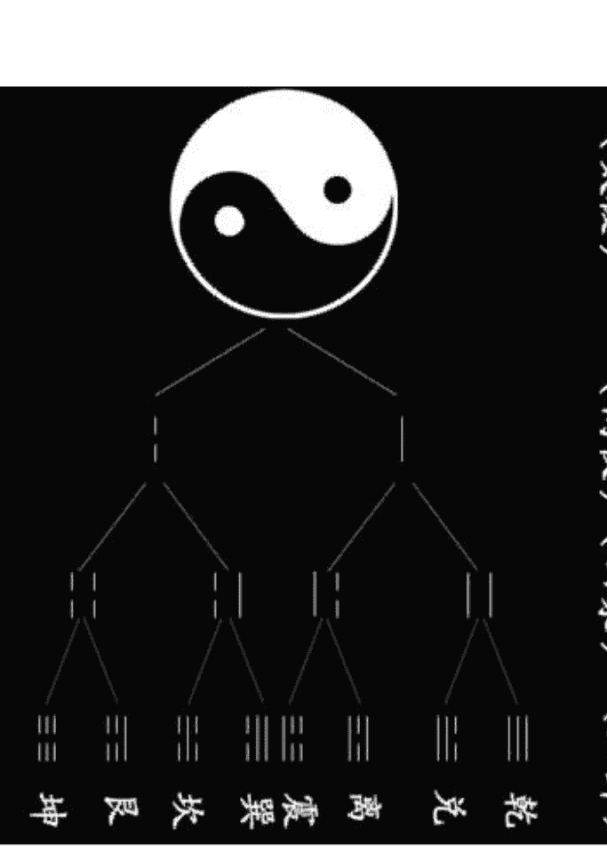

- **太极：**
  - 太极是一种阴阳未分的原始混沌状态，它是世界的开始，万物的根基，物质世界的一切变化都以此为源头。
- **两仪：**
  - 关于两仪，大多数人的看法是指阴阳。
  - “两仪”的符号称爻，其图形为：
    - 阳爻——————
    - 阴爻— —
  - 爻分阳爻（——————）和阴爻（— —）两类，阳爻根据所处的环境不同，可以意味着是加、上、坚定、积极、进取、刚健，是天和男性的象征；阴爻则表示减、下、温和、消极、退守、温柔、隐藏，是地和女性的象征。
- **四象：**
  - 四象在卦形上的体现，就是两仪的一极阳爻上分别再生出一阳一阴，这样就形成老阳（又叫太阳）和少阴，两仪的另一极阴爻上再分别生出一阳一阴，从而形成少阳，老阴（又叫太阴）。
  - “阴中有阳，阳中有阴”，阴阳是互相融合，相互包容的，对于这种情况，用阴与阳的图形来标识，便成为太极图中的阴阳两条鱼，这两条鱼已有了两只明亮的眼睛，喻为阴中有阳，阳中有阴。阴阳不仅是相对的，而且是相互包容的，这便是四象，将其分解开来便如上图，分为老阳、少阴、少阳、老阴，且分别用不同的符号加以标识，在太极图中，许多人都将少阴比拟为阴鱼的尾巴部分，这是不对的，我们知道老阳之时，少阴开始，所以，在太极图中少阴应该是阳鱼的眼睛，而少阳则是阴鱼的眼睛。

八卦都有一定的卦形、卦名、象征物和特定的象征意义。为了帮助人们背诵八卦方便，宋人有一首“八卦取象”歌，其歌诀是：

- 乾连三（乾卦的三个爻画是连接的）
- 坤六断（坤卦的三个爻画是断裂的）
- 震仰盂（震卦的卦形象一个口朝上的盂）
- 艮覆碗（艮卦的形状好像一个倒放的碗）
- 离中虚（离卦的中爻是一根虚线）
- 坎中满（坎卦的中爻是一条实线）
- 兑上缺（兑卦上面的一个爻画有缺口）
- 巽下断（巽卦下面的一个爻画是断开的）

八卦又称八宫，分阳四宫和阴四宫。阳四宫是：乾、坎、艮、震；阴四宫是：巽、离、坤、兑。同时又给八卦配以五行，即乾、兑属金；坤、艮属土；震、巽属木；离属火；坎属水。

请注意：必须背熟八卦，因为它是此派阳宅风水基础的基础。

### 三、熟知父母六子

“父母六子”之说，是以家庭的父母子女关系比拟八卦的内在变化与衍生规律。乾、坤二卦为阴阳之本，万物之始祖，而震、坎、艮和巽、离、兑六卦，乃至六十四卦，均出自乾、坤二卦，就如同家庭一样，有父母然后有子女，有子女然后有子子孙孙，这是时间万物衍生变化规律，子女继承父母的基因，所以具有父母的一些特点。我们常将这种现象称为遗传，这种血缘的遗传现象，在易经里便以父母六子来加以表示，使我们一看便知。

“父母六子”即乾父、坤母、震长男、坎中男、艮少男、巽长女、离中女、兑少女。

对于此父母六子必须记住，因为在此派阳宅风水中必须用。

### 四、心装实用八卦图

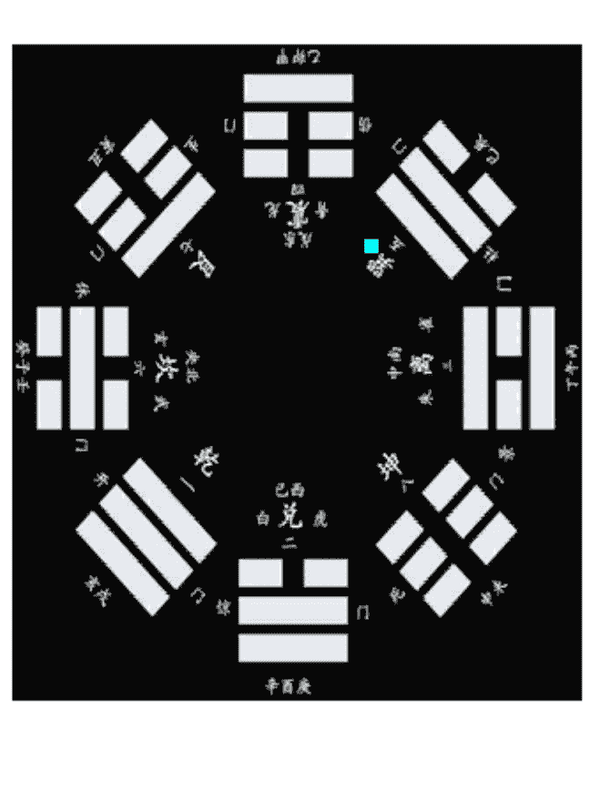

### 五、记住八卦的色泽

八卦的色泽在阳宅的趋吉避凶中经常运用，所以必须牢记。

八卦所代表的色泽是：离为红色；坎为黑色；震为青与绿色；兑为白色；巽为蓝色；艮为棕色；坤为黄色；乾为大赤色。

### 六、感悟卦象的神蕴

所谓八卦之象，又称为卦象，是古人根据八卦的特性比拟万物的特点后所总结出来的。

“圣人立像以尽意，设卦以尽情伪，系辞焉以尽其言，变而通之以尽利，鼓之舞之以尽神。”八卦有象，通过对对象的理解可以推求出其意义所在，可以说，有什么样的象，就有什么样的意，有什么样的本质特性，就会有什么样的形象，我们可以不断提高预测阳宅吉凶的水平，这也是现代哲学上所讲的“透过现象本质”的基本原理。

卦象：

对八卦之象，在《说卦传》中讲得很明白，是战国时代人们对“易象”的整理与介绍，现摘录于下：

- “乾，健也；坤，顺也；震，动也；巽，入也；坎，陷也；离，丽也；艮，止也；兑，说也。”
- “乾为马，坤为牛，震为龙，巽为鸡，坎为豕，离为雉，艮为狗，兑为羊。”
- “乾为首，坤为腹，震为足，巽为股，坎为耳，离为目，艮为手，兑为口。”
- “乾，天也，故称乎父；坤，地也，故称乎母。震一索而得男，故谓之长男；巽一索而得女，故谓之长女；坎再索而得男，故谓之中男；离再索而得女，故谓之中女；艮三索而得男，故谓之少男；兑三索而得女，故谓之少女。”
- “乾为天，为圆，为君，为父，为玉，为金，为寒，为冰，为大赤，为良马，为老马，为瘠马，为驳马，为木果。”
- “震为雷，为龙，为玄黄（黄黑色），为敷（布施，施舍的意思），为大涂（大路），为长子，为决躁，为苍筤竹（小青竹），为萑苇，其于马也，为善鸣，为足（后左腿白色的马），为作足（脚步快速的马），为的颡（白脑门的马）。其于稼也，为反生（指花生、土豆、洋芋等），其究为健，为蕃鲜。
- “巽为木，为风，为长女，为绳直，为工，为白，为长，为高，为进退，为不果，为臭。其于人也，为寡发，为广颡，为多白眼，为近利市三倍，其究为躁卦。”
- “坎为水，为沟渎，为隐伏，为矫輮（车轮的外框），为弓轮。其于人也为加忧，为心病，为耳痛，为血卦，为曳（水摩地而流）。其于舆也为多眚，为通，为月，为盗。其于木也为坚多心。
- “离”为火，为日，为电，为中女，为甲胄，为戈兵。其与人也为大腹，为乾卦，为鳖，为蟹，为蠃，为蚌，为龟。其于人也，为上槁（枝干枯槁的树木）。
- 艮为山，为径路，为小石，为门阙，为果蓏（指瓜类果实），为阍寺，为指，为狗，为鼠，为黔喙之属。其于木也为多节
- “兑为泽，为少女，为巫，为口舌，为毁折，为附决（附在树枝上坠落的果实）。其于地也为刚卤，为妾，为羊。”

八卦卦象在此派阳宅风水中必用，因此将根据多种书所整理出的“实用卦象”附于此：

- **乾卦：**
  - 象意：君尊统治，高傲自慢。向上、老成、活动、积极、迈进、决断、威严、制裁、强制、冷酷、轻视、压抑、专横、独霸。
  - 人物：父亲、祖父、父、家长、君王、圣人、英雄、统治者、独裁者、掌权者、总统、首相、议员、元老、厂长、经理、书记、主席、会长、名人、专家、官吏、军官、律师、一把手等。
  - 人体：首、胸部、大肠、骨、右足、右下腹、精液、男性生殖器等。
  - 病象：头部疾病、胸部疾病、骨病、硬化性疾病、老病、旧病、伤寒之病、变化异常之病、急性暴病、结肠疾病等。
- **坎卦：**
  - 象意：哭泣、漂泊、暗昧、不安、欺诈、狡狯、疑惑、劳碌、失掉、贼盗、算计等。
  - 人物：中年男子、暧昧、偷盗、逃亡者、亡命徒、黑社会、黑帮、黑教、诈骗者、诱惑者、恶人、病人、酒鬼等
  - 人体：肾脏、膀胱、血、耳、腰、背脊骨、肛门、泌尿系统、生殖器等。
  - 病象：肾冷水泄、消渴症、出血症、性病、遗精、心脏病、拉肚子、水肿症、腰背疾病、生殖器疾病等。
- **艮卦：**
  - 象意：贞固、安居、沉着、冷静、慎守、顽固、隐蔽、困苦、阻滞、静止、主观、界限、独立等。
  - 人物：为少男、僧尼、警卫、奴仆、矿工、石匠、守门员、训犬者、狱吏、犯人、偏激者等。
  - 人体：为手、鼻、手背、脚背、脾胃、趾、乳房、颧骨等。
  - 病象：鼻、手、脚、背之病，脾胃之病、虚胀、凸起的炎症、肿瘤、麻木病、关节病、结石症、气血不通等症。
- **震卦：**
  - 象意：霸道、追求、紧迫、攻克、移动、上升、虚惊、性色、冲突、显示、勇敢、兴起、狂乱等。
  - 人物：为长男、警察、军人、法官、飞行员、驾驶员、狂人、说大话吹牛者、舞蹈演员、足球爱好者、神经过敏的人、壮士等。
  - 人体：足、腿、脚、肝胆、左肩臂等。
  - 病象：精神病、狂躁症、羊痫疯、惊吓症、肝火病、腿病、外伤等。
- **巽卦：**
  - 象意：直爽、附和、交涉、捷报、号令、奔波、薄情、悭吝、幻觉、忙碌、忧疑、轻浮、扫荡、烦躁、空虚、多欲等。
  - 人物：为长女、长媳、僧尼、仙道、气功师、商人、教师、指挥官、能工巧匠、传令兵、优柔寡断的人、头发细长而直的人、下肢无力的人、交际人员等。
  - 人体：头发，（细、直、稀少）、神经、气管、血管、呼吸器官、胆、筋、股、左肩、肠道、食道、肝等。
  - 病象：伤风感冒、中风、传染病、坐骨神经痛、抽筋、风瘫、风湿性疾病、喘息、左肩痛、神经炎、胯骨病等。
- **离卦：**
  - 象意：晋升、虚荣、焦躁、文书、文章、影像、明察、排斥、轻浮、显示、自满、抗上、撒谎、华丽、鲜艳、磊落、礼仪等。
  - 人物：中女、美女、贵族、文人、学者、演员、明星、多情者、幻想者、抗上的人、虚伪者、侦查员、战士等。
  - 人体：眼、心脏、乳房、小肠。
  - 病象：眼病、心脏病、火伤、烫伤、乳房疾病、发烧、小便黄、血液病、妇科病、囊中、肥大症等。
  - 离中虚，心不实不可交，火不宜太旺，太旺则有火灾，心肾受损（包括心神、心脑血管）。
- **坤卦：**
  - 象意：正直、勤劳、忍耐、吝啬、沉默、怯弱、依赖、贫贱、虚耗、疑惑、迟缓、优柔寡断等。
  - 人物：祖母、母亲、后母、女主人、寡妇、阴气盛之人、忠厚之人、大腹之人、皇后、妃、臣、大众、顾问、农民、俗人、助手、凡人、泥瓦工等。
  - 人体：腹部、脾、胃、肉、右肩。
  - 病象：腹部疾病（胃肠及消化不良、腹痛）、浮肿、皮肤病、慢性病、中气虚、癌症、晕症等。
- **兑卦：**
  - 象意：雄辩、讲演、告知、魅力、议论、吵闹、趣味、娱乐、叹息、商量、叫卖、音乐、毁谤、淫滥、欢快等。
  - 人物：为少女、巫师、讲师、解说员、牙科医生、娼妓、妾、非处女、耍娇的人、小人、刑官、媒人、破坏者等。
  - 人体：口、舌、牙齿、咽喉、肺、气管、右肋、肛门。
  - 病象：口腔内疾病（口、齿、咽、喉等）、咳嗽、痰喘、胸痞、尿道口、肛门疾病、性病、外伤、气管病等。

### 七、熟背“二十四山向”

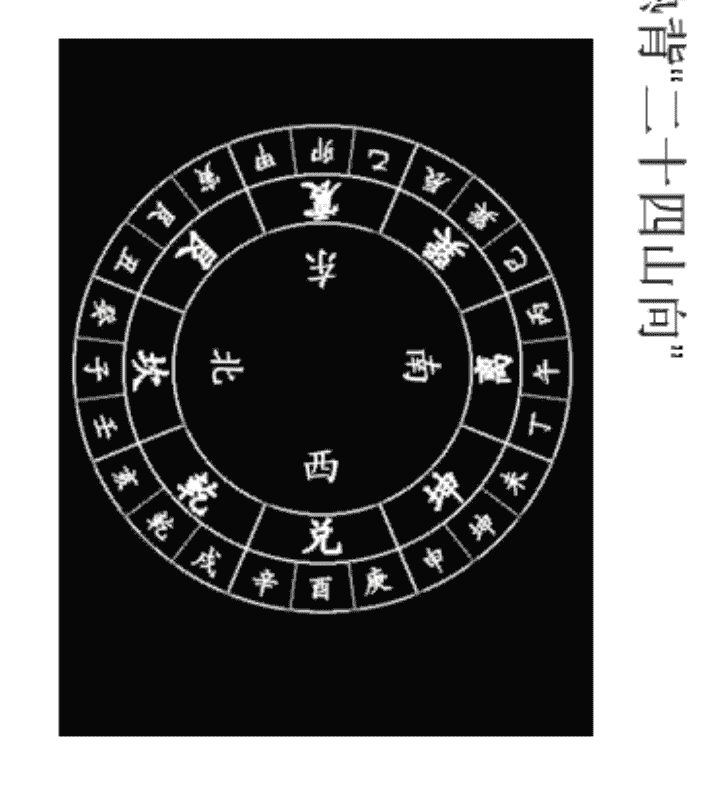

掌握这“二十四山向”很重要，以为在使用罗盘时，立向、收水、消砂、格龙，都离不开这个顺序。

在实际应用中，有经常运用十二山向，称“双山五行”。

天干、地支两个字同处一宫，合为一个名，分别称为双山，所以叫“双山五行”。请看：

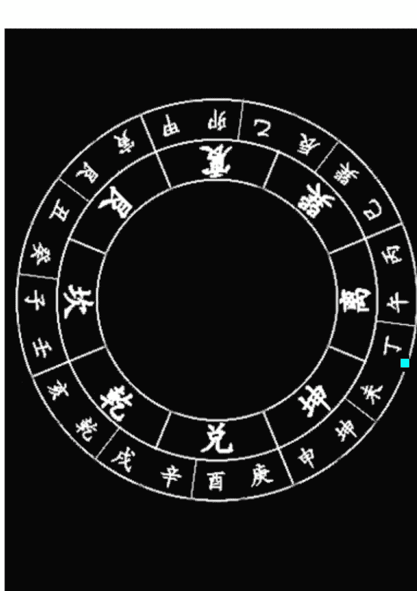

## 第二章、阳宅风水过三关

### 一、父母关

首先找出父母的位置在哪。大家都知道，乾卦代表老父，我们要以屋宅乾卦方位的风水特征做为判断父亲兄弟姐妹个数，排行老几的依据，另外也可以断定父亲是否健在。坤卦代表老母，我们要以屋宅坤卦方位的风水特征做为判断母亲兄弟姐妹个数，排行老几的依据，另外也可以断定母亲是否健在。

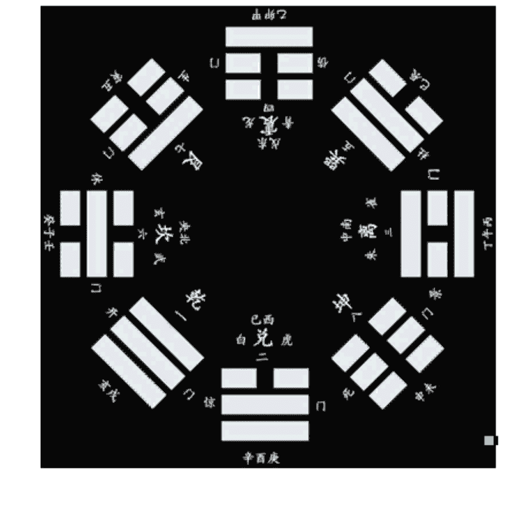

### 二、兄弟关

在风水学中，艮位代表兄弟姐妹。我们要以艮位的风水特征做为判断兄弟姐妹个数，排行老几的标准。

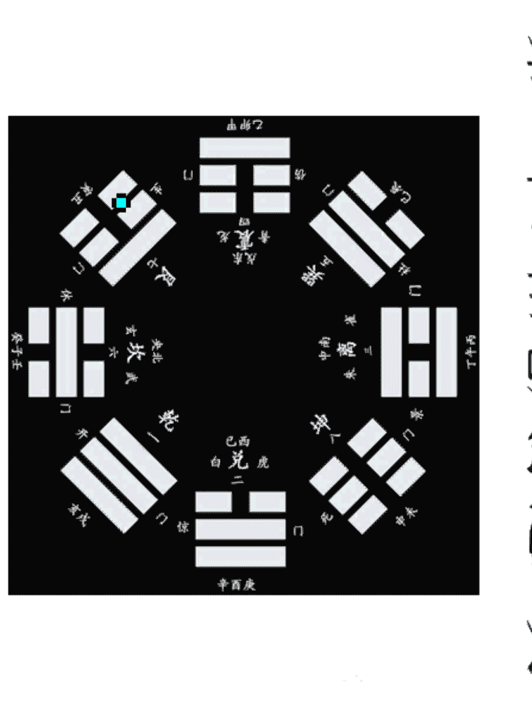

### 三、子女关

在风水学中，震位代表子女。我们要以震位的风水特征做为判断子女个数，是男是女的标准。

## 第三章 熟读吉凶歌诀

关于阳宅的形煞，传统阳宅书籍中编了许多歌诀，我在这里提醒您不可小视，因为这些歌诀是很有使用价值的。如能认真熟读，细细地体悟，久而久之便能随心所欲，凭灵感进行开口直断。

### 一、宅房外形吉凶断诀

《阳宅十书》把“房宅外形吉凶断”编成了歌诀，下面把有实用价值部分整理于下，并加上注释。

- 宅形左短右边长，君子居之大吉昌，
  家内钱财丰盛富，只怕次后少儿郎。
  注：宅外形右长左短，钱财富而子孙少。
- 右短左长不堪居，生财不旺人口稀，
  此宅必定子孙愚，先有田蚕后贫脊，
  注：宅外形右短左长，人财两虚。
- 丑寅空缺聚钱资，此是人间大吉居，
  家豪富贵长保守，子孙荣华得逸居。
  注：丑寅指东北艮位，如果有空缺主聚财。此种讲法只能参用，“八卦象风水”则认为艮方有缺损少男（艮为少男）。
- 巳辰不足却为良，居此家豪大吉昌，
  若是安庄终有利，于孙兴旺足牛羊。
  注：辰巳指东南巽位，如果有空缺则主吉利。此种讲法只能参用，“八卦象数风水”则认为巽方有缺损长女（巽为长女）。
- 仰目之地出贤良，庶人居之富无量，
  子孙印绶封官职，光显门庭第一乡。
  注：仰目指长方形宅地，吉。
- 中央高大号圆丘，修宅安坟在上头，
  人口平安多富贵，住之辈辈出公侯。
  注：在中央高大的元丘上建宅，吉。
- 坎兑两边道路横，定主先吉后有凶，
  人口资财初一胜，不过十年一场空。
  注：坎（北）兑（西）有道路纵横，先吉后凶。
- 住宅修在涯水头，主定其地不堪修，
  牛羊尽死人逃去，造宅安家见祸由。
  注：宅建在水源之上，凶。
- 前狭后宽居之稳，富贵平安旺子孙，
  资财广有人口吉，金珠财宝满家门。
  注：宅地前窄后宽，吉。
- 前宽后狭似棺形，住宅四时不安宁，
  破尽资财人口死，悲啼呻吟有叹声。
  注：宅地前宽后窄，凶
- 西南坤地有丘坟，此宅居之渐渐荣，
  若是安庄并造屋，儿孙辈辈主兴隆。
  注：宅的西南有丘冈，吉。
- 住宅卯地有丘坟，后来居之定灭门，
  愚师不辩吉凶理，年久坟前缺子孙。
  注：住宅的东边有丘坟，凶。
- 西高东下向北扬，正好修工兴盖庄，
  后代资财石崇富，满宅家眷六畜强。
  注：西高东低、北面向山的开阔地，大吉。
- 住宅方圆四面平，地理观此好兴工，
  不论宫商角徵羽，家豪富贵旺人丁。
  注：四面皆平的地方，各种姓氏的人都可以居住，吉。

## 第三章 熟读吉凶歌诀

- 此宅观灵取之强，只因辰已有池塘，
- 儿孙旺相家资盛，兴小败长有官防。

注：东南方位有池塘，小口兴、大人败，且易遭官讼。

- 住房正北有丘坟，明师安庄定有名，
- 君子居之官出禄，庶人居之家道荣。

注：正北有丘坟，吉。

- 左边水来射午宫，先初富贵后贫穷，
- 明师断尽吉凶事，左边大富右边穷。

注：从左边来水冲射离宫，先富后穷。

- 住宅西边有水池，人若居之最不宜，
- 牛羊耗损人不旺，先富后穷师当知。

注：宅西边有水池，凶。

- 西北乾宫有水池，安身甚是不相宜，
- 不逢喜事多悲泣，初虽富财终残疾。
- 后边有山可安庄，家财盛茂人最强，
- 若居此地人丁旺，子孙万代有余粮。

注：宅西北有水池，凶。

注：宅的北面有山，吉。

- 东北丘坟在艮方，成家立计有何妨，
- 修造安庄终归吉，富贵荣华世世昌。

注：东北方有丘冈，吉。

- 住宅东边有大山，又孤又寡又贫寒，
- 频遭口舌多灾难，百事先成后来难。

注：宅的东面有大山，凶。

- 住宅四角有林桑，祸起之时不可挡，
- 若遇明师重改造，免教后辈受凄惶。

注：住宅四角有林桑，凶。

- 左边孤坟莫施工，此地安庄甚是凶，
- 疾病缠身终不吉，家中常被鬼贼侵。

注：宅的左边有坟，凶。

- 四面交道主凶殃，祸起人家不可挡，
- 若不损财灾祸死，投河自缢井中亡。

注：宅的四面皆有道，大凶。

- 宅东流水势无穷，宅西大道主亨通，
- 因何富贵一齐至，右有白虎左青龙。

注：宅东流水，宅西大道，大吉。

- 宅前有水后有丘，十人遇此九不忧，
- 家财渐有积蓄起。牛羊满山福无休。

注：宅前有水，宅后有丘，吉。

- 住宅安居正可求，西南水向东北流，
- 虽然重妻别无事，三公九相近王侯。

注：宅地有水自西南向东北流，吉。

- 宅前林木在两旁，乾有丘埠艮有冈，
- 若居此地家豪富，后代儿孙贵显扬。

注：宅前的林木分为两旁，西北有丘埠，东北有山冈，吉。

- 前有丘陵后有冈，西边稳抱水朝阳，
- 东行漫下过一里，此宅发居甚是强。

注：前有丘陵，后有冈，西边有水向南流，再往东漫下过一里地，吉。

- 西来有水向东流，东显长河九曲沟，
- 后高绵远儿孙胜。禾谷田蚕岁岁收。

注：西面有水向东流，东边又有水九曲转环，后面地势高大，大吉。

- 西有长波汇远冈，东有河水鹅鸭昌，
- 若居此地多吉庆，代代儿孙福禄强。

注：宅的东西两侧有水流过，吉。

- 南来大路正冲门，速避直行过路人，
- 急取大石宜改造，免教后人哭声频。

注：南来的大路正冲门，需避开一直走来的行人，必须用镇石使路口改道。

- 东西有道直冲怀，定主风病疾伤灾，
- 从来多用医不可，儿孙难免哭声来。

注：东西有道冲向院里，凶。

- 南北长河宽又平，东岭西冈三两层，
- 左右宅前来相顾，儿孙定出武官人。

注：南北有宽有平的长河，东岭西冈有两三层，儿孙之中出武官。

- 右边白虎北联山，左有青龙绿水湾，
- 若居此地出公相，不入文班入武班。

注：宅右有山为白虎，宅左有水为青龙，后面联山为后有坐山，大吉。

## 第二章 熟读吉凶歌诀

- 林中不得去安居，田宅莫把作丘坟，
- 田蚕岁岁多耗散，宅内惊忧鬼成精。

注：在森林里安宅如同立丘坟一样，凶。

- 宅东南北有长河，坤乾丘陵近大坡，
- 此地若居大富贵，更兼后代子孙多。

注：宅的东、南、北有长河，西南、西北方有大的丘陵，吉。

- 北有大道正冲怀，多招盗贼破钱财，
- 男人有病常遭害，贫穷不和闹有乖。

注：北面有大道直冲房宅，凶。

- 两边低下后边高，妇人守寡受勤劳，
- 多招接脚并义子，年深犹自出贫消。

注：两边低下属无青龙、无白虎，后边只有高大的坐山，凶。

- 乾地林木妇女淫，沟河重见死佳人，
- 坤地水流妨老母，子孙后代受孤贫。

注：西北有林木主妇女奸淫，西南有水流不但妨老母，还会殃及子孙后代。

- 门前若有玉带水，高官必定容易起，
- 出人代代读书声，荣显富贵耀门庭。

注：宅的前面有玉带水，吉。

- 门前三塘和二塘，必啼孤子寡母娘，
- 断出其家真祸福，小儿落水泪汪汪。

注：宅门前有水塘，必出孤儿寡母，小儿宜落水而亡。

- 面前凶沙若有此，左边砂冲兄必死，
- 右边冲身弟必亡，当面尖射中此是。

注：宅的前面、左边、右边有凶沙，均凶。

- 竹木倒垂在水边，小儿落水不堪言，
- 栏栅添置犹防可，更有瘟灾发酒癫。

注：宅门前有竹木倒垂在水边，凶。

- 独树生来有破相，必定换妻孤寡真，
- 孤辰寡宿定分明，无儿无女妙通神。

注：宅的周围有破相的大树，凶。

- 怪树肿头又肿腰，奸邪淫乱小鬼妖，
- 猫鼠猪鸡并作怪，疾病痨瘵不曾饶。

注：宅周围有肿头肿腰的怪树，表明此地水土不宜人居住，凶。

- 门前若见有尖砂，投军做贼夜行家，
- 出人眼疾忤逆有，兄弟分居饿死爷。

注：宅前有尖砂，凶。

- 面前若见生土堆，堕胎患眼也难开，
- 寡妇少亡不出屋，盲聋暗哑又生灾。

注：宅门前有土堆，凶。

- 门前若见有小屋，官事临门来得速，
- 便见何年凶祸生，岁煞加临灾更毒。

注：宅门前有小屋，遇岁煞，大凶。

## 第三章 熟读吉凶歌诀

- 宅屋若在大树下，孤寡人丁断不差，
- 招郎乞子家中有，瘟疫怪物定交加。

注：屋在大树下，凶。

- 小石当门多磊落，其家说鬼时时着，
- 小口惊赫不须言，气绝聋哑人难觉。

注：宅前有石头当门，凶。

- 住宅人家品字样，读书作官起家庄，
- 人财大旺添田地，贵子声名达帝乡。

注：住房布局成品字样，吉。

- 前有塘兮后有塘，儿孙代代少年亡，
- 后塘急用泥填起，免得其后受祸殃。

注：宅的前后有塘，主儿孙少亡，凶。

- 房屋门前有大堆，住此房内主堕胎，
- 更兼眼疾年年有，火杀加临更惹灾。

注：宅前有大堆，主随胎、眼疾、火灾。

- 住房门前两口塘，为人哭泣此明堂，
- 更主人家常疾病，灾瘟动火事连连。

注：宅前有两口塘，凶。

- 房屋若有大路冲，定主家中无老公，
- 残疾之人真是有，名为暗箭射人凶。

注：宅前大门有大路直射而来为冲，凶。

- 离乡迢迢是曲路，儿孙出外皆发富，
- 若然直去不回还，定出离乡不归屋。
- 门前有路川字行，破财年年官事兴，
- 若然直射见明堂，三箭三男死却身。

注：宅前有三条川字路，正冲大门，凶。

- 当面若行元字路，其家财谷多无数，
- 面前恰似蚯蚓行，定出瘠擦病多苦。

- 龙神抱体足堪夸，富贵达京华。
- 束龙神弯抱过前门，富贵足田园，
- 青龙头水方抱身，家富出高官。
- 带水缠身，家中好积金。
- 屋前屋后有池兜，富贵永无忧。
- 白虎衔尸最不良，儿孙启得长？
- 朱雀之水分两开，灾祸日日来。
- 水城斜走去如飞，儿孙主窜移。

- 家业漂流难保守，人丁渐渐稀。
- 青龙头去反如飞，家破及人离。
- 宅后有水流，凶祸日无休。
- 莫认为吉取，定主伤家母。
- 交加水射而无情，其家抄枯没人丁。
- 前头流水似叉斜，退败定无家。
- 右边池湖如刀枪，儿孙主杀伤。
- 青龙如枪来射身，儿孙遭官刑。

- 屋边二口水通风，子孙终是受贫穷。
- 水如卷舌最堪悲，退败人丁总不宜。
- 丑低投军号阵中，艮低师巫残病人。
- 寅低狼伤并虎咬，他乡外死甲上坑。
- 卯地有水伤眼目，乙辰有水患秃风。
- 巽地坑池官司败，阳短阴长暗藏风。
- 午丙有坑火星显，未丁坑下痨嗽人。
- 西方坑下家贫窘，戊亥蛇腰招贼侵。
- 壬子有湾绝后嗣，祸福外同在掌中。

- 屋后落脉强急，中子绝。前山逼压，一代过了主绝。四向高压，损丁亦绝。
- 青龙高压，长房绝。白虎高压，三房绝。左边杀来长子绝，右边杀来，三子绝。
- 逼压主丁稀，宽阔世昌荣。左右两边无救山，虽然一发也主绝，不绝定离乡。右巷杀冲定招婿，左巷杀冲长换妻。后巷冲来人丁死，前巷冲来动官方，四面冲来人枯死，做贼逃军上法场。左陷男瞎眼，右陷女无光。前陷主缺唇，后陷少主亡。左庙人长病，右庙出花娘。前庙遭牢狱，后庙官乃忙。左池中不利，右池出花娘。前池人发福，后池女奸情。前树人丁少，后树家豪富。

## 何知经

- 何知人家贫了贫，山走山斜水反身。
- 何知人家富了富，圆峰磊落皆朝护。
- 何知人家贵了贵，文笔秀峰当案起。
- 何知人家出富豪，一山高了一山高。
- 何知人家破败时，一山低了一山低。
- 何知人家出孤寡，琵琶侧扇孤峰斜。
- 何知人家少年亡，前也塘兮后也塘。
- 何知人家吊颈死，龙虎颈上有条路。
- 何知人家二姓居，一边山有一边无。
- 何知人家少子孙，前后两旁高过坟。
- 何知人家主离乡，一山主窜过明堂。
- 何知人家出军枪，枪山坐在面前伸。
- 何知人家被贼偷，一山走出一山钩。
- 何知人家忤逆有，龙虎山头或开口。
- 何知人家被火烧，四边山脚似芭蕉。
- 何知人家女淫乱，对门坑窝水有返。
- 何知人家常发哭，面前有个鬼神屋。
- 何知人家不旺财，只少源头活水来。
- 何知人家不久年，有一边兮无一边。
- 何知人家受孤栖，水走明堂似簸箕。
- 何知人家修善果，面前有个香炉山。
- 何知人家会做师，排符山头有香炉。
- 何知人家出跏跛，前后金星齐带火。
- 何知人家致死来，停尸山在面前排。
- 何知人家有残疾，只因水带黄泉入。
- 何知人家宅少人，后头有龙无气脉。
- 仔细相山并相水，推断祸福灵如见。

## 第四章 查形煞断吉凶

在阳宅风水中，除上述推断吉凶的方法外，还有很多直观的推断方法，这些方法不受任何条框所限，只要您掌握这些“形煞”的特点，便可以开口直断，且条条言中。

### 第一节 从宅外看形煞

### 一、从宅基与宅形看形煞

建筑基地的选择有四大原则是必须遵守的：

1. 住在平地近水处者，以得水为上。
2. 住在平地而不近水者。此时应将地图拿来，就平地部分的等高线，以较高处为建地。且要注意不可建在死胡同（死巷或死路）的尽端，否则容易发生火灾及招惹官司。
3. 住在山上，建筑地点的选择上，要注意有无“藏风聚气”。绝不可建在山脊（山的棱线部分）或山谷的出入口，否则居住的人容易罹患各种疾病。
4. 住宅若建在四周均有高山之处不吉，主人丁稀少。若南方有高山，此家必出迂腐的读书人。

- 住在乡下或郊外，后傍山，前临平地，正坐山腰，有山来潮，除了特别注意“藏风聚气”外，正对的山体、水流等，则须仔细评断。
- 在基地的选择上，还要注意“土质松软”“湿气过重”“地下有污水”“年久废墟之地”“庙宇佛寺的遗址”“曾为刑场、古战场遗址”“曾经过生过火灾之地”等，不可选用。

- 评断住宅基地的吉凶以院子围墙为准，无围墙者以住宅平面图为准。
- 住宅基地某部“缺角”属于凶相，一家人在社会上的运势将会减弱。所谓的“缺角”，就是指住宅基地一边长度的三分之二以内有缩进去的现象。下面详谈缺角部位的吉凶。

1. 如果西北方欠缺不足，有损贵气。在宅相上，西北方多被视为父位，在易经上以乾代表老父，以乾为天，为太阳，因此会使居住者失其祖产，事业难以获得成功，并易得呼吸器官方面的疾病。
2. 宅基地东南方（属巽卦，主长女）有缺，会导致业务不振，对生儿育女不利，而且多使女人横遭意外不幸。
3. 宅基地西南方有缺角，在宅相上西南方为主妇之位，故西南方有缺角，将使主妇流于懒散，易流于行为放荡，招人议论，并易得胃肠之病。
4. 宅基地东北（属艮卦，主少男）欠缺，这种宅相，对于少男最为不利，使之诸事不顺利，难以施展抱负，此屋多得不到优秀的继承人，严重者甚至香火难以传承，并且易得消化系统疾病。
5. 住宅基地或屋形南北两方有缺，经常会招惹官司。
6. 住宅基地或屋形独东方部位有凹陷，会有经营不景气、衣食不足的倾向。
7. 住宅基地或屋形独西方部位有缺陷则属大凶。暗示着疾病缠身，难以积聚钱财，多是非争端，千万不能居住。
8. 住宅基地或屋形东西两方有凹陷，必庸庸碌碌过一生。
9. 住宅基地有屋形独南方（属离卦，离中虚）部位有缺陷，会使居住者的虚荣心增强，家庭中经常有争吵事件，不得安宁。
10. 住宅基地有屋形北方（属坎卦，坎为水，为艰、为险、为陷）陷入属大凶，灾祸不断。
11. 住宅基地或屋形四角都欠属于大凶，绝对不能居住。
12. 住宅基地或屋形前宽后窄呈倒梯形，钱财难聚。
13. 住宅基地或屋形前宽后窄呈正梯形，必定富贵。
14. 宅基地前低后高属大吉；反之，前高后低则不吉。
15. 住宅基地或屋形右长左短，其子非孤即贫。
16. 住宅基地或屋形左长右短，损及妻儿。
17. 住宅基地或屋形南北呈长方形大吉，居住的人即富且贵，多子孙，生活愉快。
18. 住宅基地或屋形东西呈长方形则不吉，尤其如南北方再陷入更凶，会导致居住者有气喘的毛病。
19. 住宅基地或屋形呈三角形者，若前尖后宽叫做倒田笔，人财两损，尤其容易引起女人带来的祸害。后尖前宽，叫做火星托尾，属大凶，家人可能有自杀或罹患绝症。
- 三角形土地，不管在哪一方面都会带来最坏的后果。
- 三角形土地的特色，是给予居住者精神及脑部方面的打击，以不能做完善的思考，生意方面也会蒙受打击。
20. 住宅基地或屋形属方形居之吉，有家财万贯的吉兆。
21. 鬼门方向有凸出的土地，将使精神方面受到影响。
- 以住宅风水来说，土地最理想的形状是六对四的长方形。
- 凡事不符合这种规定的土地，多少都会有一些问题。
- 尤其是建地的东北与西南，也就是说，在里鬼门与外鬼门（从建地的中心看）的方位“凸出”的话，将变成凶相。例如，无事面临烦恼，或者因为过分固执而遭受到失败。

### 二、从道路看形煞

1. 住宅前面有路向住宅呈圆弧状环绕，大利此家，富贵长久。
2. 住宅门前道路如呈圆弧状向外弯去（谓反弓路），会导致此家出孤儿寡母（意指父亡夫逝），女淫滥，官司失败，生意失败。
3. 住宅近处有十字路交叉点在西南方，暗导此家妇女性强，喜欢性行为，严重者则淫滥。
4. 住宅近处有十字路相交在东北方，影响此家生育，严重者则没有子嗣。
5. 住宅门右边有十字路直冲，直经门前横路又呈向下弯曲弧形，会导致家人自杀、钱财散失、遭诉讼。
6. 道路直冲大门。这种格局谓“暗箭煞”，古有“暗箭射人凶”的说法。容易造成意外伤残、破财、官讼。有一户人家，门前有道路直冲大门，一天傍晚，一辆汽车（司机喝醉了酒）从对面直冲而来，恰逢男主人站在门外，这辆汽车硬是把男主人从门外撞进屋里，当时便昏死过去，后经抢救及时，才保住了性命。
7. 门前道路或空地成扇形，扇面朝本宅。此种格局将使家中烦恼纠纷，男有风疾女有阴私。
8. 住宅门前若有交叉路，交叉路两旁又各有池塘，此宅大凶，可能引起家内人口减损、人多生疾。
9. 三面受到道路（指公共的道路，并非指私人小路）包围的基地属凶相。一家人会频频发生事故或受伤。例如，骑着脚踏车，却从一旁突然冒出个老人来，为了闪避而使自己摔倒骨折，或者从阶梯上摔下来受伤等等。

### 三、从围墙看形煞

研究阳宅学，墙是很重要的单元，《宅谱大成》对宅墙（包括“照壁”和“看墙”）的吉凶说：

一道墙当一重山。宅四周有围墙，墙多则气厚，亦然有吉凶：墙如弓抱，进田掘窖；墙路抱来，常足钱财；墙似曲尺，朝内发迹；围墙回绕，进宝安然；前墙包围，丁蓄家肥；墙横冲与直冲，出人外遭凶；砖墙剥落，土强疮癞，更加瘟疫；宅壁穿隙，妇人毒螯；墙缺露气，人财渐菲；篱墙冲屋，口舌伤腹；墙头门，常家无主东；墙向外，财散人害；墙路头垂，仆逃人欺；土强冲屋角，被人论；墙头开指，兄弟口舌；墙射右，妇女凶；墙射左，男子空；兵之凶，小射小伤，大射大凶；墙头砖破，事事坎坷；对墙尖角，差来捉；墙角射前，目疾连连；墙缝中来，损伤破财；墙角射后，口疮毒入；墙角射前，目疾连连；墙缝中来，损伤破财；射左损长男，射右损小儿当；门前张手墙，忤逆财物伤；左右横冲，小口婢凶。

1. 围墙上不可开大窗，开大窗名叫朱雀开口，易惹是生非，麻烦无穷。
2. 围墙前面宽后面窄而尖，成三角形者，是大凶宅。可能引起家人自杀或罹患绝症。
3. 围墙前面尖而后面宽长，名叫退田笔。居此者钱财不进，经营生意打败。
4. 若有别人家围墙呈角部分或屋角正对家宅者，叫泥尖煞。若角对左边，则主男人不利；若对右边，则主女人不利，家人的经济与精神生活大受破坏。
5. 围墙上若有古式檐盖，不可过宽。宽量尺者，姨太太当权，宽过四五尺，呈回廊状者，将招惹官司。
6. 四周围墙除门外，要保持完整，不可却崩，尤其在东北方位更不可有缺口，否则将经常上法院、上医院。
7. 四周围墙不可过高（有人防小偷，将围墙筑的很高），否则居住人好似困兽，将导致穷困。
8. 四周围墙不可过低，更不可有缺损。否则家中将有跛足女人。
9. 围墙不可紧逼家屋，否则易有压迫感，抑郁难伸。
10. 若建独栋住宅，千万不要先筑围墙，否则犯“囚”字，不是住人无法兴旺，就是建筑横遭波折，迟迟不能完工。
11. 大门若比住宅屋顶高，则对女主人不利，有官将会被降职。此外，易遭火灾或遭盗贼。
12. 住宅围墙年代久远，不可让它滋长缠藤，否则此家不断吃官司。有人特别喜欢让墙壁缠满藤叶，在视觉上可带有滋润与诗意，殊不知如此一来，屋内充满阴气，精神上更糟阴拢。
13. 两家门墙相对，较低的一家一定衰退。
14. 住宅大门左右两墙不可大小或高低不同，否则左边大则有换妻可能；右边大则主人寿不长。

## 第四章 查形煞断吉凶

### 四、从池塘看形煞

在阳宅学上，对房宅周围开池塘，大都以为不吉。如在房前开池塘，一来因为有水光反射伤害眼睛，二来容易造成儿童意外灾害，凡有此等环境，则称之为“血盆照镜”。但在稍远处开半月塘，且弧形向外，并有照壁遮栏，则不作此论。《阳宅十书》曰：“凡宅前不许开新塘，主绝无子，谓之血盆照镜。门稍远可开半月塘。”

1、喷水池、游泳池或池塘，形状圆满，圆心微微突起，如倒盖的锅子。这种格局据《宅谱大成》上讲，能增加居住者的财运。
2、喷水池、游泳池或池塘，四方水浅，并向建筑物微微倾斜内抱（圆方朝前）。这种格局据《宅谱大成》上讲，是为大吉大利的。如此才能藏风聚气，增加居住者的好运气，又发横财的暗导力。
3、喷水池、游泳池或池塘，形如一条手臂抱住一个水盆。这种格局叫做“抱盆金形”。此格局将使居住者发生眼部疾病，对孕妇亦有不利的影响。
4、渍水池、游泳池或池塘，水深污沟。这种格局称为“汤胸孤曜形”。水深不见底，容易使小孩落水死亡，且水质污浊，易积聚秽气，易患肺痨症。所以古人评断这种格局时都说：“深水痨病，代代少亡，溺水死。”
5、喷水池、游泳池或池塘，呈葫芦形。这种格局风水学上称之为“葫芦明堂”。将为居住者带来不幸的命运，也易对身体健康发生不利的影响。
6、喷水池、游泳池或池塘，如上弦月形，弧形部分正对屋子。这种格局叫做“反张金形”，将造成居住者的家庭关系不够和谐，也使财运减弱变坏。
7、住宅门前若有水塘，池塘外形有尖角，尖角正对家门。这种格局可能导致家人眼睛出毛病。
8、住宅门前排水沟的流水，由左向右流（以人站屋内向外看为准）可大发，由右向左流者将败。排水隐藏地下无法判断时，以雨水的流向为准。

### 五、从庭院看形煞

1、庭院不可设置水池
庭院有水池，会导致实力不佳、烦恼重重、家族不和、疾病缠身等凶事。因为此庭院池中的水会腐败，对人体的健康会有不良的影响。同时有很多不能超生的幽灵，大都偏爱集结于水池旁，随时都会引起灾害。

2、庭石不宜摆放太多
在庭院里适当的点缀着一些庭石，对增进庭院的风雅有很大的帮助。不过，庭石的数量、形状以及石子的因缘，有时会招来凶相。一旦庭石里面混入一些奇异的石头（外形象人或者禽兽），那就会导致灾祸连连。庭石一旦附有游灵，随时会发生凶相。不仅会引起精神异常等症状，甚至会碰到突发事故，或者是莫名其妙地受到伤害。

住宅大门前切忌有长石当道，否则对家中小孩不利，易招惹性命之灾。长石当门偏左，男孩罹难；偏右，女孩遭殃。

若有石头成横卧状态纺织者，此家人会经常患病。若有石头成方形，家犬喜欢咬人惹事。

住宅大门或室内也绝不可有成堆石头，因此可引起家中孕妇流产或反生疾病。

3、庭院不可种树
住宅若前庭院，切莫在中庭种花木，否则不测祸事或不明疾病接踵而至。事实上就有许多富贵人家由庭种植花木，因此一年到头总是住院治疗。比如像石榴树、桃树、梨树、梅树、杏树等，树虽不大，但仍为祸，尤其是遇上宅向的树的方位搭配不当，家人必有人吐血。
门前若有大树，如果树已腐空，将引起家人体内的疾病。
门前若有大树上缠着各种藤，可能潜伏是非、官司、争吵、自杀等危机。
门前千万不要有枯树。若树枝枯烂，将引起家人有四肢的毛病。
门前的大树若是露出根来。不管方位吉凶，都会招来家人严重的健康伤害或是母亲守寡。

4、不可在庭院造凉亭
富豪人多喜欢在广阔庭院造凉亭，此凉亭绝不可建设连家门的回廊，否则居住家庭终年不得安宁。
适在池塘中的水亭，也不能太靠近住宅，否则灾祸接踵而至。
住宅四周若为气派建造各种奇亭，种植厅花异卉，固然美观，但是家人健康将无法保障，钱财也不能固守。

5、不可将溪水引入庭院
将溪水引入庭院太凶。不光是引入庭院不吉，“紧贴屋后亦不吉。有一户农家，本来日子过得很好，夫妻和睦，钱财有余。可是在66年修渠造时，渠水紧贴房后流过，从此夫妻闹离婚，农业也一败如灰。

### 六、从其它方面看形煞

1、建筑物旁大桥切割而来（呈反弓刀形）。这种格局不利住家的安宁与居住者的健康。
2、住宅外面有桥冲来。此家将会散尽家财。
3、住宅前有沟，上伏桥板。此家人精神生活将受到打扰。
4、若有木桥从住宅西北方直冲而来。此屋不可居住，否则家败散，人不长寿。
5、一栋大的四角方位上，恰各有较低建筑所在。这种格局叫做“露足煞”，有乌龟缓缓行动之象，只宜工作性质奔波性较大者居住。
6、一整体建筑群，唯某家比四周高而突出。这种格局风水上称做“露风煞”。易令居住者不安，有压迫感，家道会日渐衰落，难以聚财。
7、一整体建筑群四邻房屋皆高大，唯某家低下而卑小。此种格局被称做“四害煞”，居久自然心胸不能开阔，疾病不断。
8、四邻房屋或树木墙垣皆高，唯某家卑下低小。此种格局称为“牢狱煞”，四方压迫，状如囚狱，使人无法与天道合一，故凶。
9、大楼正厅顶上横过一条大梁柱。此种格局叫做“穿心煞”，使人有强烈的压迫感，久居将抑郁不振。
10、从屋内向外看，正对两栋高楼间的空隙。这种格局称做“天斩煞”。两栋高楼间的空隙有如一刀自天斩下，一遇理气煞到，则祸事连连，徒增困扰。
11、住宅门前有破旧房子无人居住，门窗毁坏无法关妥，此种格局称做“损丁煞”。此家可能发生奇奇怪怪的事件，夜梦鬼惊，罹患不明疾病，影响居住者的生育能力。
12、一整栋大楼，中庭部分再造一间小屋。这种格局叫做“埋儿煞”。会使幼儿身心健康受到伤害，多有心膈胀闷的现象发生。
13、若住宅的四周全是路巷，则属“囚”字形，使人常笼罩在寂寞之中，难以发达。
14、住宅建筑拆除一半，若拆除部位在西、西南，则主家中妇女遇到不幸；若拆除部位在东、东北、西北，则主家中男人遭不幸。
15、绝不可在住宅某边接建小屋，否则，可能带来钱财破耗之事，严重者可能引起家人暗疾或血光之灾。
16、住宅不可楼上起楼，易导至疾病伤残。比如原来为平房住宅，后觉旧屋不够用，再于其上加楼者亦属大凶。
17、住宅呈凸形，叫做“寒脊屋”，暗导火灾、散财。
18、从侧面看，住宅屋呈山字形，即栋梁中高前低者，将导致此家散财、孤独。
19、古老住房屋脊破旧毁损，主梁损坏，务必修妥，否则将导致生疮、钱财耗损、小孩病弱或女主人变寡妇。
20、住宅大门不可在两边做两个小门进出，否则家中大小自相欺凌，严重者鳏寡层出不穷。
21、前面招牌与大门俱高，而屋宅地基又前高后低的建筑物，这种格局叫做“擎头煞”，又叫“朱雀昂头”，是大不吉的宅形。
22、住宅门前有庙宇、神殿，将使家庭不安，对精神生活、生育、经济均不利。门前若有神坛，则家中妇女可能遭受鬼神作祟。
23、大门内外还有如下的讲究：大门应有柱，不架空为吉。门扇高于墙者多主哭泣。门口水坑，家破伶仃。大树当门招疾病，墙头冲门主大凶。交路夹门，人口不存。众路相冲，家无老翁。门被水射，家散口哑。门下水出，财源不聚。门前水井，家遭邪鬼。粪坑对门，疾病常侵。水路冲门，悖逆子孙。桥口向门，退财遭瘟。

## 第六章 速诊宅病

### 三、依宅坐支与宅主属相速诊

1、宅之坐向与建宅当年干支之间，若为刑、冲、克、害、绝中任何一种关系，均属病宅，人住进去会影响运势。
风水师杨筠松曰：“太岁可坐不向，岁破可向不可坐。”比如2002年壬午，假如修造子山午向，就属太岁、岁破一起犯。因为午居离卦为火，为太岁位；子居坎卦为水，子午相冲，子为岁破。午向则为犯太岁，“太岁可坐不可向”嘛！

2、宅主属相与宅之坐支是否有刑、冲、克、害、绝的关系，若有，则人住进去后同样会受制压运。有的病房因不同属相的人住进去反而会好，这是因为建宅年支与坐支及入住主人的属相三者地支之间的关系组合比较好。

### 四、从各房人丁吉凶定位速诊

男：
老大：位在东方（甲卯乙）。从八卦的方位看，震为长男，位居东方。
也要参看东北方的砂和水断吉凶。
老二：位在北方（壬子癸），从八卦的方位看，坎为中男，位居北方。
也要参看明堂及案山的砂和水断吉凶。
老三：位在东北（丑艮寅），从八卦的方位看，艮为少男，位居东北方。
也要参看西北方白虎的砂和水断吉凶。
老四和老七的定向和老大相同，但远近位置不同。
老五和老八的定向和老二相同，但远近位置不同。
老六和老九的定向和老三相同，但远近位置不同。
关于排行第四五六七八九房人的定位，用一句风水行话来说就是吉凶砂水主事。

女：
老大：位在东南。从八卦的方位看，巽为长女，位居东南方。
老二：位在南方。从八卦的方位看，离为中女，位居南方。
老三：位在西方，从八卦的方位看，兑为少女，位居西方。
老四和老七的定向和老大相同，但远近位置不同。
老五和老八的定向和老二相同，但远近位置不同。
老六和老九的定向和老三相同，但远近位置不同。
父亲或爷爷定位在西北（戌乾亥）。从八卦的方位看，乾为父，位居西北。
母亲或奶奶定位在西南（未坤申）。从八卦的方位看，坤为母，位居西南。

### 五、从向与水吉凶速诊

凡冲破向上临官，谓犯杀人大黄泉，丧成才之子，立主败绝，并犯软脚、风瘫、痨病、吐血等症，先伤二房，次及别门。

凡流破向上冠带，主上年幼聪明之子，并闺中幼妇少女，退败田产，久则败绝。

凡冲破向上养位，主伤儿、败财、贬嗣。

凡冲破胎神，主堕胎伤人，有寿无财。

凡水出病方，犯短命寡宿水，男人寿短，必出寡居五六人。小产绝嗣，并犯咳嗽、吐痰、劳疾等症，先败三门，次及别门。

凡水出死方，犯天寿水，败产、乏嗣。先伤三门，有丁无财，有财无丁，有功名即失血天亡，福禄寿不齐全。

凡旺去冲生，犯虽有财而难保，小儿难养，富而无子，十有九绝，先败绝长门，次及别门。

凡生来破旺，有丁无财，贫如范丹。

凡冲破禄存，犯冲禄小黄泉，伤人口，乏嗣。又忌辰戌丑未方刀砂恶石，出人凶恶、强横，若斜水朝或路斜行，出偷盗人，犯寡居、寿短。

凡倒冲墓库，犯杀人黄泉，丧才之子早归阴，家中寡妇常啼哭，财谷空虚彻骨贫，伤人败财官司出。

少主堕胎，凶死人命，刀兵毒药，充军凶恶。二房先受祸，次及长幼两房，相连败绝。

要想掌握以上诸法，必须懂得四局定水（我在《阴宅实用点窍》教材中有详解），不懂四局定水者，够不上一个合格的地师。

### 六、速诊应期

1、首先判断出廿四山各方位上是否有缺陷或砂与水的吉凶。比如艮方有缺陷、有凶砂或凶水，则应其在丑年或寅年；再比如坤方有缺陷、有凶砂或凶水，则应期在未年或申年。

2、吉凶应在代表该山方位的干或支的流年上，也应在该干或支对冲的干或支的流年上。

例如：酉山有凶煞，则血光之灾应在酉年或卯年；庚山有凶煞，则官司斗殴之事应在庚年或甲年，子山有凶煞，则破财或耗财应在子年或午年。

3、距离应骑：以50米为一年。比如在200米处有凶煞，那么在安葬或建宅后的第四个年头则有凶灾。

## 第七章 铁口直断吉凶祸福，人生事件

关于阳宅的吉凶断法，我在前几章里已经详述。为便于您铁口直断，特根据实践验证后精选出一些具体断法：

### 一、直断富贵

- 住宅基地或屋形前窄后宽呈正梯形，必定富贵。
- 住宅基地或屋形南北呈长方形大吉，居住的人即富且贵，多子孙。
- 住宅基地或屋形属方形居之吉，有家财万贯的吉兆。
- 住宅前面有路向住宅呈圆弧状环绕，富贵长久。
- 墙如弓抱，进田掘窖，墙路抱来，常足钱财。
- 前后有高山，左右有沙地，主人富贵长寿。
- 宅乾的林木分为两旁，西北有丘埠，东北有山冈，居此地家豪富，儿孙贵。
- 喷水池、游泳池或池塘，形状圆满，圆心有微微突起，能增加财运。
- 喷水池、游泳池或池塘，向建筑物微微倾斜内抱（圆方朝前），能发横财。
- 宅的左右有水渠，主富贵、子孙聪俊。
- 南北有宽又平的长河，东岭西冈有两三层，儿孙之中出武官。
- 宅东流水，宅西大道，主富贵。
- 宅前有水宅后有丘，牛羊满山福无休。
- 西面有水向东流，东边又有水九曲转环，后面地势高大，儿孙胜，禾谷收。
- 宅的东西两侧有水流过，代代儿孙福禄强。
- 宅右有山为白虎，宅左有水为青龙，后面联山为后有坐山，出官贵。
- 宅的东、南、北有长河，西南、西北有大的丘陵，大富贵，子孙多。
- 宅的前面有玉带水，出高官。
- 房屋布局成品字样，人财大旺、官运亨通。
- 屋前屋后有池兜，富贵永无忧。
- 房子东方及东南方有秀水或秀砂，此家长子、长女、长儿媳妇财运好。
- 房子南方有木类或木柴堆放，此家中女运气好。
- 房子西南方有火炉、灶，此家主妇（母亲）运气好。
- 房子西方有土堆、石头堆放，此家小妇、少女运气吉。
- 房子西北方有土堆石头堆放，此家男主人吉、父亲吉。
- 房子北方有金属类、变压器、无线架，此家中男运气吉。
- 房子东北方有火类，如火炉、灶，此家少男运气好。

### 二、直断损财

- 西北方有缺角，有损贵气，居住者失其祖产，事业难以获得成功，父有损。
- 住宅基地或屋形独有东方部位有凹陷，会有经营不景气、衣食不足的倾向。
- 住宅基地或屋形独西方部位有缺陷则属大凶。疾病缠身，难以积聚钱财，多是非争端。
- 住宅基地或屋形东西两方有凹陷，必庸庸碌碌过一生。
- 住宅基地或屋形前宽后窄呈倒梯形，钱财难聚。
- “看墙”包过座屋，耗财失奴仆；墙缺露气，人财两相害。
- 墙向外，财散人害。
- 围墙前面尖而后面宽长，钱财不进，生意大败。
- 四周围墙过高，居住人好似困兽，将导致穷困。
- 两家门墙相对，较低的一家一定衰退。
- 住宅内卧房在在前、客厅在后，经济状况必定日下。
- 灶被门路直冲，财富多耗。
- 屋后两旁有直屋，主贫穷衰落。
- 宅外形右短左长，人财两虚。
- 住宅东面有大山，又孤又寡又贫寒。
- 在西南（鬼门）方位安门，就会遭到欺诈、蒙骗、失财的凶运。
- 尖形的小山角自左方刺来，容易使长男消极畏缩，不能实现个人的抱负。
- 尖形的小山角正前方迎面刺来，中年女人在事业上迟滞不前、难以突破。

### 四、直断伤病灾

- 西北方位有缺损，宜得呼吸器官方面的疾病。
- 东南方位有缺损，不利生儿育女，而且多使中女横遭意外不幸。
- 西南方位有缺损，将使主妇流于懒散、行为放荡，并易得胃肠之病。
- 住宅基地或屋形北方陷入属大凶，灾祸不断。
- 住宅基地或屋形东西呈长方形、南北两方再陷入，居住者有气喘的毛病。
- 砖墙剥落，土墙疮癞，更加瘟疫。
- 墙角射后，口疮毒入；墙角射前，目疾连连。
- 喷水池、游泳池或池塘，形如一条手臂抱住一个水盆，将使居住者发生眼部疾病，对孕妇亦有不利的影响。
- 住宅门前池塘外形尖角，尖角正对家门，会导致家人眼睛出毛病。
- 庭院有水池，会导致视力不佳、烦恼重重、家族不和、疾病缠身等凶事。
- 住宅大门内或室内有成堆的石头，可引起家中孕妇流产。
- 在住宅中庭种花木，易遭不测祸事或得不明疾病。
- 门前有枯树，将引起家人有四肢的毛病。
- 灶与厕所相对，会病从口入，损害健康。
- 灶与房门相对，会有灾病吐血的情况发生。
- 灶上有横梁压顶，家人多疾病，尤其是对妇女健康有损。
- 灶被斜阳照射，会令家中人的健康受损。
- 灶被尖角冲射，会损害家人健康。
- 睡床正对烟囱，主难产。
- 床头正对厨灶，患心痛脚疾。
- 床头正对镜子，损害健康。
- 床铺底下当储藏室大凶，如摆入破物，有损胎儿。
- 道路直冲大门，容易造成意外伤残、破财、官讼。
- 三面受到道路包围的基地属凶相，会频频发生事故或受伤。
- 墙横冲与直冲，人出外遭凶。
- 土墙冲屋角，刀兵之凶，小射小伤，大射大凶。
- 墙缝射来，损伤破财；射左损长男，射右损小儿；门前张手墙，忤逆财物伤；左右横冲，小口婢凶。
- 若有别人家围墙呈角部分或屋角正对家宅者，叫泥尖煞。若角对左边，则男主人不利；若对右边，则主女人不利，家人的经济与精神生活大受破坏。
- 四周围墙不可过低，更不可有缺损。否则家中将有跛足女人。
- 住宅大门前有长石当道，小儿易招性命之灾。长石当门偏左，男孩罹难；偏右，女孩遭殃。
- 厨房内抽烟机的通气孔正好在住宅正面的正中央，家人常发生不幸事故。
- 宅门前有土堆，主堕胎、眼疾、盲聋暗哑，出寡妇、少亡。
- 住房两头都有房，易得暗风、血风、黄肿、咳嗽、瘟疫。
- 住房西头接小房，易遭官事、病灾。
- 白虎头上开口，伤人口，产妇常得病。
- 碾磨必须居左腹，居右则搅动白虎，主生病疾绞肠痛。
- 宅后有水流，伤家母。
- 鬼门方位安置厕所与浴池，将使房中的主人罹患动脉硬化、肝硬化、胆结石、下痢、胃溃疡、便秘、食物中毒、气血不调等疾病。
- 在房子中心设置厕所，会罹患心脏或头部的疾病。
- 在住宅西南、东北的鬼门线上安水井，容易出现足腰部或脊椎疼痛、麻痹、精神异常等。
- 安置在鬼门方位的车库，会影响血液循环，易患精神方面疾病。
- 青龙遭破坏，主男人有灾；白虎遭破坏，主女人或家人有牢狱血光之灾；案山遭破坏，主有口舌之患；靠山遭破坏，主无人帮扶、自闯家业或长辈有损。
- 宅房前的空地有尖形山脚穿越而过，居住者好逸恶劳，罹患性病。
- 大门前横列两座山脚形如鸭鹅之脖颈一般的小山脉，多使居住者腿部肌肉疼痛，新生儿易患小儿麻痹症。
- 宅前空地（明堂）呈三角形，尖角向内冲射，易使宅中人受伤、破财。
- 房子东方有金属类物，长子易得肝病，神经衰弱等病症。
- 房子东南方有金属类物，长女或长儿媳妇有呼吸气管、胆血管病症。
- 房子东南方有凶水类，中房女人有心脏、眼目之疾。
- 房子西南方有木类，如常堆放木料、树木成群，此家主妇有胃病。
- 房子西方有火炉之类，少女有肺病。
- 房子西北方有火类，此家主人有肺、肠道病。
- 房子北方有土堆、石头堆类，此家中男有血液病。
- 房子东北方有木类，此家少男有胃、胆结石病。

## 第七章：铁口直断吉凶祸福，人生事件

### 五、直断凶死

- 住宅基地或屋形四角都欠缺属大凶，必出凶死之类的横祸。
- 住宅基地或屋形呈三角形者，若前尖后宽，人财两损。后尖前宽，家人可能有自杀或罹患绝症。
- 住宅门右边有十字路直冲，直经门前横路又呈乡下弯曲弧形，会导致家人自杀、钱财散失、遭遇诉讼。
- 围墙前面宽后面窄而尖呈三角形者，属大凶。能引起家人自杀或患绝症。
- 喷水池、游泳池或池塘，水深污沟，主代代少亡，易使小孩溺水死。
- 屋后白虎边有一间横屋，谓投河煞，主投河而亡。
- 宅的四面皆有道，若不损财则祸死，投河自缢井中亡。
- 宅的前面、左边、右边有凶沙，左边砂冲兄必死，右边冲身弟必亡。
- 宅前面有三条川字路正冲大门，破财、官非，三箭射死三男。

### 六、直断死小口

- 住宅近处有十字路相交在东北方，影响此家生育，严重者则没有子嗣。
- 东北方位有缺损，对于少男最为不利，严重者甚至香火难以传承。
- 前正屋后边，不论东、西、南、北、中央，或一间、二间乱起，谓埋儿煞。
- 前后两进，两旁厢房中堂如口字，四檐屋角相对，谓埋儿煞。
- 卧房前不宜堆假山、土山，谓坠胎煞。
- 床横有柱，名悬针煞，主损小口。
- 艮方有缺损少男（艮为少男）。
- 巽方有缺损长女（巽为长女）。
- 南来的大路正冲门，损小口。
- 东西有道冲向院里，主风疾病伤灾，损儿孙。
- 西北有林木主妇女奸淫，西南有水流不但妨老母，还会殃及子孙后代。
- 宅门前有竹木倒垂在水边，有瘟疫、酒癫、小儿落水等凶灾。
- 宅的前后有塘，主儿孙少亡。
- 宅前有树、庙，主官非、少死。
- 前头流水似叉斜，主退败、灾伤。右边池湖如刀枪，伤儿孙。
- 青龙垂头，长子多扰，男子凋谢，奴婢逃流。
- 白虎偏枯，小子多扰，男女短折，妻子消流。

### 七、直断丧夫亡妻

- 住宅基地或屋形左长右短，损及妻儿。
- 住宅门前道路如呈圆弧状向外弯去（谓反弓路），会导致此家出孤儿寡母（意指父亡夫逝），女淫滥，官司失败诉讼，生意失败。
- 住宅大门左右两墙不可大小不同，左边大主换妻；右边大则主人寿不长。
- 门前的大树若是露出根来，会招来家人严重的健康伤害或是母亲守寡。
- 睡床有楼梯压顶，主寡。
- 前高后低谓之过头屋，出孤寡。
- 前后平屋中起高楼，二姓招郎。
- 两边低下属青龙、无白虎，后边只有高大的坐山，妇人守寡受艰苦。
- 宅门前有水塘，必出孤儿寡母，小儿宜落水而亡。
- 宅的周围有破相的，主无儿无女。
- 屋在大树下，出瘟疫、怪物，招郎乞子、换妻孤寡。
- 住宅中门有小房，损小口，出寡妇。

### 八、直断出盗贼

- “看墙”两窗，被贼偷香。
- 牌楼若比住宅屋顶高，易遭火灾或遭盗贼。
- 正堂前方或后方盖小屋者叫补针房，主破财、疾病、火盗。
- 正房背后盖小屋叫暗箭房，主损家长、破钱财、伤六畜、招贼盗等，大凶。
- 住房两头接小房，阴人亲妇病难防，田蚕失散损小口，官灾贼盗主火光。
- 北面有大道直冲房宅，多招盗贼破钱财。
- 门前若见有尖砂，投军作贼夜行家。
- 宅前有尖砂，出眼疾、忤逆、投军做贼。
- 玄武摇尾，火害不休，六畜多死，盗贼时起。

## 第八章 建筑风水学

### 第一节 怎样确定房宅中心点

观察一房宅的地理风水，必须先从该房宅的配值图中，找出测量方位的中心点。而确定房宅中心点的方法，又似其外形的不同而有所不同。大致可分为以下几种：

1. 房宅为正方形或长方形时，从对角线的交叉点取中心点。
2. 房宅有凹处时，扔视为完整的四方形，亦从对角线的交叉点取中心点。
3. 房宅的对角两处，各有一凹一凸时，以互相填补的方式，求出对角线点为房宅中心点。
4. 房宅为平行四边形时，也以对角线的交叉点为中心点。
5. 房宅有凸出部分时，以去掉该凸出部分，求出对角线交叉点为房宅的中心点。

由于房屋形状不同，确定中心点也就不同，下面图说明：

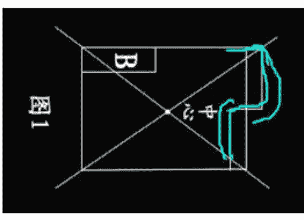

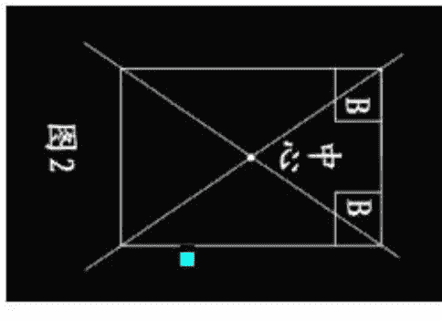

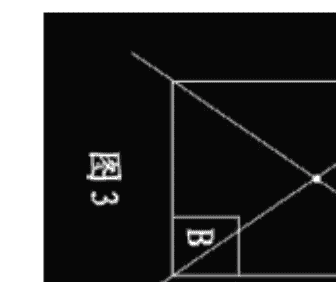

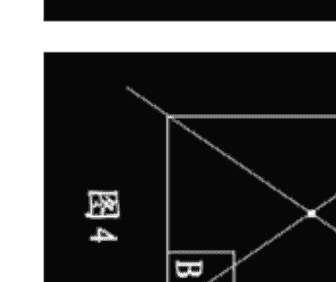

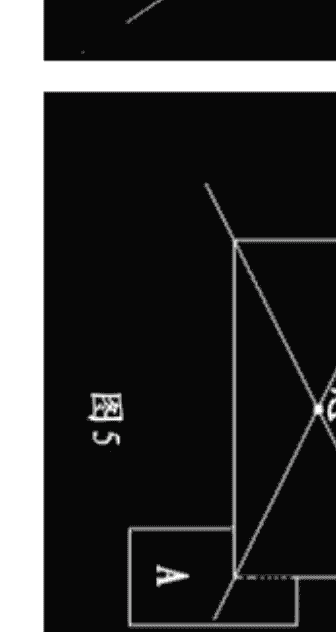

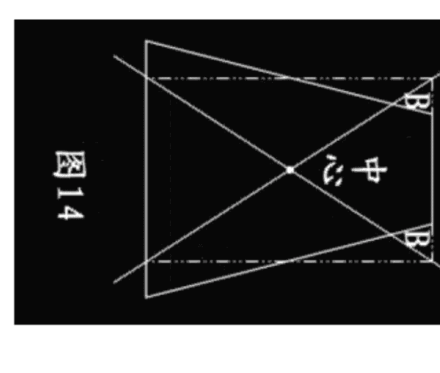

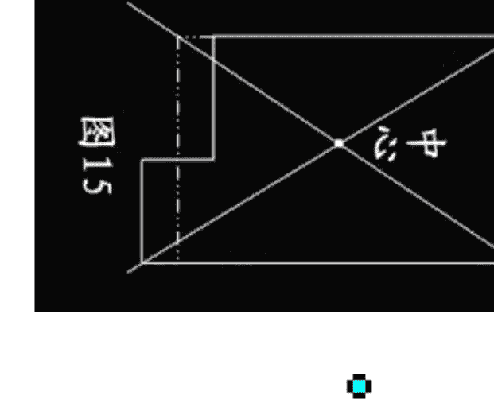

### 第二节 怎样定向

阳宅风水中最重要的就坐向，所谓坐向就是一座房屋的朝向。坐向是判断风水吉凶的重要依据。

定向与风水学有着不能分割的密切关系，因为倘若东南西北这些方向弄不清楚，便难以知道哪些角落是吉方，哪些角落是凶方，以致不知如何趋吉避凶。

一、首先要熟记“二十四山向”：二十四山向在实际操作中经常运用，所以必须掌握。

二、要知道坐山和向山。记住坐山和向山的简便方法是记住地支相冲。比如寅山申向，是寅申相冲。

三、要通晓一卦管三山：如坎宫：壬—子—癸；震宫：甲—卯—乙；离宫：丙—午—丁；兑宫：庚—酉—辛；乾宫：戌—乾—亥；艮宫：丑—艮—寅；巽宫：辰—巽—巳；坤宫：未—坤—申。

### 四、定向

定向有二种含义：

一是代表室外定向，换句话说在未盖成房屋之前，风水师在为主人定好坐向，就是选择一个好的朝向。

二是代表室内定向。室内定向有如下的几点依据：

1. 以阳定向

我国古代多是独立式房屋，由于环境需要，多数是坐北向南，而门开得比较宽，窗则较细小。一则是因为中国土地居北半球，太阳在南方较为多些，为防北面的风沙霜雪的吹袭，窗便开的比较小，而门为采光和纳入更多空气，于是门自然称为风水的坐向标志和纳气点，随着时代的改进，社会结构的不同，居住的条件、建筑的格式也和以往有很大的差异。但有一个共同的特点就是人离不开阳光和空气，换句话说，人来是依靠阳光和空气维持生命。以现代的大厦或单元的建筑物，门的纳气采光便失去作用，因此窗、阳台便肩负采光纳气的任务。这样一来窗和阳台就代表着定向的主要依据。实际上采光纳气是阳的一种象征，因此室内定向第一种是以阳定向。

2. 以动静定向

动者为阳，静者为阴。水为动，故水为阳。山为静，故山为阴。动为向，坐为静。例如某个大厦临街处有一条大道，住在这座高层大厦的人每当打开窗户都能看到大道上的车和人，实际这条大道对这座大厦来说是处在一种动态之中，因此对这座大厦的风水就可以运用动静定向法，这座大厦的坐向，必须选择选择面临大道的一边为向。但以动静定向必须注意二个问题：

（1）大城市中大道却是纵横交错，一座大厦面临着并非是一条大道，甚至是多条大道，这样一来整座大厦四面都是处在动态之中，若以动静定向，确难以定论。逢到这种环境，必须以阳定向。

（2）如一些方形建筑的住宅楼，每个单元的方向几乎不太一致，在同一座楼层的单元房分别有几个方向。虽然大厦的方向可以动静取法，但某些单元定向根本无法和大厦一致。例如某大厦座东朝西，大厦前有一条大道，那么这座大厦可以根据动静定向，以西为向。但这里要指出的是这座方形大厦上一些窗户朝北或朝南根本和大厦不一致，逢到这种情况，就不能以大厦坐向为主，必须选择采光和纳入空气的窗户为向。

3. 以局形定向

所谓局形，实际上指的是房屋与地理形势。如一些房屋或大厦由于受到地形限制，无法随心所欲建筑，只能随地形而建筑或立向。特别在农村，很多房屋都是依山为靠山，风水家把这种局形称之为坐实朝空。在寸土寸金的大城市中也存在这种立局，如高山或比自身楼宇更高大的建筑为靠山，以比自身低的、空旷的地方成为房屋的方向。

4. 用罗盘定向

风水师是用罗盘来定向的。罗盘分为天盘、人盘、地盘，在对阳宅立向使用地盘（我在“罗盘实用点窍”一书中有详解）。在实际操作中，只要是把一间房屋划分成八个方位来研究，看看哪些方位吉利，哪些方位不吉利。这八个方位是：南、北、东、西、东南、东北、西南、西北。

首先把罗盘放在大厅的中心点来测量，然后在每个房间亦可同样选择中心点来测量。

这样一来，全屋每个部分的方位均可测定出来。

后天八卦分二十四山，每卦包括三山，有正向与兼向之分。关于正向与兼向，三合派与玄空派用法不同：三合派的用法是：正向就是罗盘垂直之线压在某字的中心上，没有出现丝毫的偏斜。兼向就是罗盘垂直之线不是压着某字的中心，不是偏左就是偏右，也就是所说的兼向，即兼左或兼右；玄空派的用法是：把罗盘圆周360度分为360爻，每一爻即为1度。

八个方位共有八卦，每一卦管三山，每一山15度，每一半是7.5度。规定每卦正中偏左或偏右在4度之内是正山正向，排卦为下卦；凡偏左或偏右4—6度以内的为兼向，用替卦起星盘；凡偏左或偏右在6—7.5度的为卦线空亡，即在两山之间不知道为何山，卦山空亡以凶断。

立正山正向的目的是取山向纯清之气，不杂其它卦气或字向。不管是正山正向或兼左兼右，都是风水师根据房屋及四周环境而决定的。

### 第三节 怎样开门

衡量住宅的风水好坏，首看大门，为何大门有如此的力量呢？因为以大门为气口。气口为人之口，气之口正，便于顺纳堂气，利于人的出入。

一般的房屋开门为四类：

1. 开南门（朱雀门）
2. 开左门（青龙门）
3. 开右门（白虎门）
4. 开北门（玄武门）

在阳宅风水学上，以门之前方为明堂，如果前方有平地、水池、停车场等，以开中门为吉。左方为青龙，一般风水师以青龙为吉，故赞成开左方门；而右方属白虎，一般风水师以白虎为凶位，故反对在右方开门。但这些，只是初步的理论，门开在何方，应该配合“路的形势”为要。下面进一步讲解门宜开在哪方与门忌开在哪方。《八宅明镜》讲：宅安大门，宜迎来水之吉地以立门。

1. 开朱雀门：前方有一水池或平地，即是有“明堂”，这样，门便适宜开在前方。

2. 开青龙门：前方有街道或走廊，右方路长（来水），左方路短（去水），住房宜开左方门来收载地气，此法称为“青龙门收气”。

3. 开白虎门：前方有街道或走廊，左方路长（来水），右方路短（去水），宜开右方门来收纳地气，此法称为“白虎门收气”。

4. 开玄武门：南方有高山峻岭，北方有水池或平地，门宜开在北方。

为什么门前之路左长右短应开右门？为什么右长左短应开左门？其实是渗透作用，压力作用，这是现代物理学知识。地之灵气亦是这样，地气从高的多的地方向低的地方走去（龙脉便是如此），门便以收聚地气来为吉，送地气走为凶。

开门秘诀：

1. 气聚于前中门接（参开朱雀门）。
2. 气从右来坐门收（参开青龙门）。
3. 气从左来右门收（参开白虎门）。
4. 气从南来北门收（参开玄武门）。

### 第四节 什么样的房宅不宜开门

1. 坎艮二宅互相不宜开门（指坎宅开艮门或艮宅开坎门），因坎为水，艮为土，犯之则水土相克。主伤小口，邪魔缠害，投河自缢，官灾火盗，中子夭亡，寡妇煎熬。
2. 坎坤二宅互相不宜开门，因坎为水，坤为土，犯之则水土相克。主中男不和，小口有灾，妇女堕胎，官非败财，人生蛊病，脾胃之灾，阴盛阳衰，妇人管家。
3. 艮震二宅互相不宜开门，因艮为土，震为木，犯之则木土相克。主官灾火盗，男遭讼害，女被产厄，少男少亡，瘟疫不免。
4. 艮巽二宅互相不宜开门，因艮为土，巽为木，犯之则木土相克。主火盗破财，不利少男，长妇堕胎，生疮风瘫。
5. 震坤二宅互相不宜开门，因坤为土，震为木，犯之则木土相克。主老母先亡，堕胎，痨疾，淫乱，先损财锦后损人丁。
6. 巽坤二宅互相不宜开门，因巽为木，坤为土，犯之则木土相克。主老母多灾，痞肿，火盗伤残，疾病摧年，阴盛阳衰，女人撑权。
7. 巽兑二宅互相不宜开门，因巽为木，兑为金，犯之则金木相克。主长女亡，阴盛阳衰，老母先亡，子孙疯癫，火盗灾害，淫乱风声。
8. 离兑二宅互相不宜开门，因离为火，兑为金，犯之则火金相煎。主阴人受害，火盗相侵邪魔缠忧，血光难产，翁母生离，财散败绝。
9. 乾震二宅互相不宜开门，因乾为金，震为木，犯之则金木相克。主火盗官非，牢狱一患，父子不和。
10. 乾离二宅互相不宜开门，因乾为金，离为木，犯之则金木相煎。主老翁唠叨，少妇灾伤，邪魔缠害，火盗相侵，日久破家，绝嗣。

### 第五节 怎样从方位断吉凶

从方位上断吉凶有三种方法：一是从“正中线与四隅线”断；二是从“四灵”断；三是“依八卦方位”断，下面分别讲解。

### 一、依“正中线与四隅线”断吉凶

我在这里要特别强调二点：

- 一要注意“正中线与四隅线”；所谓的正中线、四隅线，是指通过八个方位中心的线。通过东西南北中心的各线称为正中线，连接东南、西北、东北、西南的中心线叫四隅线。
- 对住宅风水而言，这些方位的中心线是非常重要的。纵然方位是吉相，一旦有中心线通过，立刻会变成凶相。不管是厨房的瓦斯炉、浴室的瓦斯桶、暖房器具等，都必须避开中心线。一旦正中线、四隅线上出现火气的画，就会变成容易发生火警的屋子，甚或受他人之累而发生火灾。
- 二要注意“鬼门”方位的凶煞。阳宅风水规定：东北（丑寅）方位为里鬼门，西南（未申）方位为外鬼门。在鬼门方位安置门、厨房、厕所等都会带来凶灾。

下面详谈：

1. 鬼门方位不可安门

在住宅风水里，前门最能左右一家主人的运气。如果前门开在东北或西南的鬼门方位，就会遭到欺诈、蒙骗、失财的凶运。

2. 鬼门方位不可安置厨房

首先请您注意，住宅风水有五大禁忌：厕所、洗澡间的火气，净化槽、厨房的火气及厨房的梳理台。因为这五项设备无论放到何种方位，都不可能成为吉相风水。但是，一旦把它们放到凶相的方位，则比其他设备更会强烈地发生凶的象意。

- 如果某人迁入新房后，女主人突然生病，或者因芝麻大的小事就动疑，带有歇斯底里的倾向，或者陷入精神不正常的状态，您就要注意是否把厨房设置于北方或者鬼门方位的东北、西南方位（从房子的中心看）。
- 尤其是厨房的炉子、清理台的位置，在这些方位的话，都有放生火灾的危险，或在精神及肉体方面受到伤害。
- 辛巳年冬，一个叫“明子朝族饭店”突然失火，事后起我去查看，此饭店的烟囱设在西南，而厨房却在东北，这就是说，烟囱与厨房均设置在鬼门方位，因此才导致了倾家荡产之患。

3. 鬼门方位不可安置厕所与浴池：

以住宅风水来说，厕所引起的凶象最叫人害怕。尤其是厕所安置在被称之为鬼门关的西南方和东北方，将使房中的主人罹患动脉硬化、肝硬化、胆结石、下痢、胃溃疡、便秘、食物中毒、气血不调等疾病。如果某家主人请您看宅，发现有如上病症，您千万要留心看看此宅的厕所是不是在东北或西南的鬼门方位。

许多风水书籍均提出“厕所开在西南或东北方主凶”，但却说不出所以然，令人莫名其妙。原来厕所浴室重在来水和去水，水气甚重，倘若开在西南或东北这两个土气当旺的方位，便会有“水克土”的毛病，因此不吉。

除厕所外，还要注意浴池。如果浴池安放在鬼门方位（尤其是里鬼门的东北方位），家里必定有常年卧床半身不遂、心肌梗塞、颜面神经痛、耳炎、慢性胃病所苦的人。

4. 厕所不可设置在房子的中心。

- 在房子中心设置厕所，运气会大幅下降，一家人我行我素，甚至会罹患心脏或头部的疾病。
- 对于这种说法，有两点解释：一是根据《洛书》所载，中央属土。倘若厕所浴室开在房屋的中央，则发生“土克水”的毛病。二是房屋的中心正如人的心脏一样，至为重要。倘若厕所开在那里，则有违风水之道。或者楼梯在房子中心部位，此家会遭受一连串不顺事，有车祸伤灾之事发生。

5. 正门的上面不可安置厕所

- 所家居二楼的厕所，如果能避开上述的凶方，照理是不会招致什么凶意的。其实不然，如果厕所位于楼下的神坛、佛坛、前门、饭厅等上面的话，就会变成凶。相最容易罹患高烧、肝脏、肾脏等疾病。
- 另外，厕所在房子北方或东北方，此房主人患有动脉硬化、肝硬化、胆结石、胃溃疡、便秘、食物中毒、气血不调等症。化解：把厕所改在西北、东南或东方可解。

6. 鬼门方位不可以安井

- 在住宅西南、东北的鬼门线上安水井，容易出现骨头方面的毛病，例如：足腰部或者脊椎疼痛、麻痹、精神异常等。这些症状持续一段时间以后，就会出现长期卧床的病人。更为严重的是，易出横祸。
- 磨盘山村有一家姓侯，距房宅10米左右的东北方位（鬼门）有一口水井，其宅很不安定，晚上睡觉经常闹鬼。尤其是二女儿，被折磨得几乎睡不着觉，不幸在88年被汽车轧死。后来此房卖给姓乔的居住，此房虽然重新翻盖，凶象仍不能避免。其男主人住进去的第二年便患有脑血栓病卧床不起。
- 除鬼门线不可安井外，正中线上及四隅线上的水井，都属于凶相。

## 第八章 建筑风水学

- 7、鬼门方位不可安置车库
- 安置在鬼门方位的车库，会给血液循环带来恶劣的影响，尤其是神经质的孩子和超过四十几岁的家人容易蒙害。
- 另外还要注意，不能把建筑物的一角当成车库。在这种情形下，不管在哪一个方位都是凶相。

### 二、依“四灵”断吉凶

- “四灵”就是：左青龙、右白虎、前朱雀、后玄武。宅左有山（城市以房子当山看）叫青龙；宅右有山叫白虎。宅前有山叫朱雀；宅后的坐山叫玄武。
- 掌握了上述这些要领很重要，凡去查看房子的吉凶，你就站在中心点上，前后左右放眼望去，前有案山，后有靠山，左有青龙，右有白虎，且符合吉的要求又不遭破坏者，均属合格的上乘之宅。

对于龙与虎的要求是：龙要高，虎要矮；龙要长，虎要短。假如反过来，白虎高且长，压过了青龙，就谓之“白虎探头”，主虎欺龙，阴欺阳，女欺男，凶。

假若青龙遭破坏，主男人有灾；白虎遭破坏，主女人或家人有牢狱血光之灾；案山遭破坏，主有口舌之灾；靠山遭破坏，主无人帮扶、自闯家业或长辈有损。

古人对四灵（也称四兽）的吉凶有首歌诀：

- 青龙垂头，长子多扰，男子凋谢，奴婢逃流，人常疾病，兼损马牛。
- 白虎偏枯，小子多忧，男女短折，妻子消流。
- 朱雀垂翅，非家之利，口舌相争，文书叠至，父子不和，回禄（即火灾）难避。
- 玄武摇尾，盗贼时起，灾害不休，六畜多死，女人不孝，男人亦此。

有人讲，阳宅的龙、穴、砂、水、向是从阴宅中借鉴过来的，对于“四灵”的要求也不像阴宅那么规范。对于阳宅风水来说，宅前朝拱的山峦（砂）是最关键的，吉凶之应极速。因此，当有人请您去相宅时，那就要先看看那山峦的形状，然后再进屋相宅。

1、两座弧形小山向左右两旁伸展开去
这种格局谓之“龙虎反背”，易使居住者心浮气躁，兄弟姐妹之间闹矛盾。

2、三座小山如镰钩一般横于屋前
这种格局容易使居住者的性格偏于封闭，并使亲子之间不能沟通，且多有不成才的子女败坏家风。

3、两座小山形如牛角般，山角成尖形相对
这种格局容易减低居住者的耐性，人际关系趋于恶劣，有晚年孤独之感。

4、尖形的小山脚自左方刺来
左方（属青龙，震位）象征长男，容易使长男消极退缩，多不能实现个人抱负。

5、一座尖形山脚由右方刺来
右方（属白虎，兑位），右方象征女人（多主少女），对女人身体与情绪均有不良的影响，并易遭骚扰或官讼。

6、尖形的山脚自正前方迎面刺来
前方（属朱雀，离位）象征中女，对家中中年女人的性格大有不吉的影响，在人际关系或从事的职业上，多有迟滞不前、难以突破的现象。

7、房宅前的空地有尖形山脚穿越而过
这种格局将使居住者好逸恶劳，经常出入花街柳巷，或因此罹患性病。

8、大门前横列两座山脚如鸭鹅之脖颈一般的小山脉
这种格局多使居住者腿部肌肉疼痛，新生儿易患小儿麻痹症。

9、大门前的田埂形如反弓冲房宅
这是一种无情的山水，将导致居住者的家运与健康失去安全幸福的保证，或导致事业失败。

## 第九章 家居风水学

### 第一节 怎样选住楼房

随着时代发展，楼房越盖越多，逐渐代替了平房，怎样选住楼房便成了许多人关心的问题。对于选择住楼的吉凶，要注意两点：

一、注重生年太岁的五行与楼层五行相生相克的关系。
- 太岁即是十二地支。子年属水；丑年属土；寅年属木，卯年属木；辰年属土；巳年属火；午年属火；未年属土；申年属金；酉年属金；戌年属土；亥年属水。

所谓生年太岁，就是宅主所生年费的年支。比如命主子年生（子属水），那就要选住喜水的楼层。其他生年太岁选住楼层仿此。

二、参看八字喜用神的五行与楼层五行相生相克的关系。

比如命主八字喜水，那就要选住喜水的楼层。其他按喜用神选住楼层仿此。

楼层与五行的关系是：

- 一层属水；二层属火；三层属木；四层属金；五层属土；
- 六层属水；七层属火；八层属木；九层属金；十层属土；
- 十一层属水；十二层属火；十三层属木；十四层属金；十五层属土。

在河图中，一数及六数属于北方，故第一层及第六层属水。而尾数是一层或六层，亦是属水。如十一层、二十一层、三十一层；十六层、二十六层、三十六层等。

二数及七数属于南方，故第二层及第七层属火。而尾数是二层或七层，亦是属火。如十二层、二十二层、三十二层；十七层、二十七层、三十七层等。

三数及八数属于东方，故第三层及第八层属木。而尾数是三层或八层，亦是属木。如十三层、二十三层、三十三层；十八层、二十八层、三十八层等。

四数及九数属于西方，故第四层及第九层属金。而尾数是四层或九层，亦是属金。如十四层、二十四层、三十四层；十九层、二十九层、三十九层等。

五数及十数属于中央，故第五层及第十层属土。而尾数是五层或十层，亦是属土。如十五层、二十五层、三十层；五层；十层、二十层、三十层等。

这些楼宇层数的五行与居住之人的生年太岁或四柱喜用神有相生、相助作用则吉；反之，有相克、相泄作用则不吉。如果主生年太岁或喜用神为水，用神五行克层数五行，则以中等论。例如生年太岁或喜用神为水，住在一楼或六楼，其属水的楼层可助生年太岁与命主水，以吉论；住在四楼或九楼，其属金的楼层可生生年太岁与命主水，以吉论；住在五楼及十楼，土克生年太岁与命主水，以凶论；居住在三楼及八楼，其木泄生年太岁与命主水，以凶论。居住在二楼及七楼，其火被生年太岁与命主水所克制，以次凶论。

如上所论，生年太岁为水或以水为喜用神的命主当然选用一楼或六楼为佳。

- 生年太岁为火或以火为喜用神的命主当然选用二楼或七楼为佳。
- 生年太岁为木或以木为喜用神的命主当然选用三楼或八楼为佳。
- 生年太岁为金或以金为喜用神的命主当然选用四楼或九楼为佳。
- 生年太岁为土或以土为喜用神的命主当然选用五楼或十楼为佳。

### 第二节 如何确定财位

在风水学中，关于财位的确定不是一两句就能讲清楚的，人们常说的财位，一是指大门的斜对角；二是指房屋内的“三白方”；三是指八宅财；四是指飞星财，五是指命中财。下面分别讲述，以供参考。

1、大门斜对角——财位
我们认为这是民间的说法，大多数人认为“财位”就是大门口斜对角的位置。如果财位这么简单该多好哇。这样一来，每个房间都有一个“财位”，家家有财，世界上还会有穷人吗？

2、房屋内的三白方
- 所谓“三白”，就是坎方一白，乾方六白，艮方八白。

3、八宅派的财位在生气、延年、天医方。

4、飞星派的财位在向上飞星当旺之星方位。

5、命中财（以喜用神为财）

所谓命中财，是一个人在他的四柱中含有财星多少。

例如：

女命 丙午 庚寅 辛酉 戊戌

9岁起运 己丑 戊子 丁亥 丙戌 乙酉 甲申

取用神：辛金日主坐禄，又有土生金助。寅木财星临月建，生扶丙午官星，可以说日主旺、财旺、官旺，景象非常好。寅木正财为用神，丙火官星为喜神，行木火运财官双美。

此造寅木为用神，寅居东方，所以此命“财位”在东方。

生辰八字求财星的法则，如果以财为喜用神，财位便在八字的财方；如果日主弱，财星重，以比劫为喜用神，则财位在八字的“比劫”方（关于如何取用神，请参看我的八字著作）。

确定财位后，又如何去开发它呢？这是人人最想知道的，答案是日课催动。日课是按照居住建筑是否合理，配合房主之命理，选出一吉日时来进行催财工作。有的风水师一不看居住建筑是否合理，二不看宅主的生辰八字，抱着一本《通书》，按其上面所标的吉日吉时来定日课，这是一种不切合实际的选日课的方法，害人不浅。要知道，同在一日一时，有的人的人生，有的人死，有的人发财，有的人退财，有人笑有人哭，每个人的遭遇却是不同。所以选日课第一要看宅的吉凶，第二要看八字宜忌。

日课催动财星，通常采用以下几个方法：

（1）粉饰：如放置地毯、油刷墙壁、悬挂古钱等。
（2）动土：如破土、拆门改造、重新装修等。
（3）水位：如装饰鱼缸、喷水池等。
（4）招财树：在财位放置常绿的阔叶树、盆景等。

关于镇破与催财有师传绝法，遵师嘱只传给入门弟子，这里不便公开。

### 第三节 五行布置法

纵观多种派别的家宅布置法，唯以八字用神布置法为上。看起来不会批八字，尤其不会取用神，则很难成为一个合格的风水师。在家居布置上，可以充分利用四柱中的用神所喜、方位等去布局，这是一个非常全面的趋吉避凶方案。

#### 一、水为用神布置法

如果一个人的八字的喜用神为水，那么北方的坎宫位，其五行属水，此方位即是喜用神的方位。凡是符合喜用神的则是吉祥的方位，以下便是采用这一特定的条件和有利因素对家宅进行布置，以便趋吉避凶。

1、选宅——宜选用向北方位的离宅来吸纳水气。
2、颜色——宅屋内外宜选用黑色（属水）、白色（属金，金能生水）的材料装饰。
3、住房——在住宅内，宜选用北方位的住房，作为自身的作息场所。
4、床位——宜选在住房内的北方位，睡觉时，头部宜向着用神方位。
5、门位——宜开在喜用神的吉方位为气口，吸纳水之气。
6、灶位——灶口宜向着命局中喜用神的吉方位，不可与命主用神相克。
7、服饰——在衣着上，宜穿黑色、白色的服饰。
8、睡位——宜多朝卧于北方位。
9、事业——宜从事与水有关的行业，或到此方位工作。
10、婚姻——宜和命局中水多的人配婚。
11、姓名——取名或改名时，宜选用带水的字体为佳。
12、布置——宜置一金鱼缸，内养六条白色、一条黑色的金鱼，以取金水相生，运转乾坤。
13、家具——摆设家具宜购买黑色的，厅或房内的灯饰宜用白色的。

#### 二、火为用神布置法

如果一个人的八字的喜用神为火，那么北方的离宫位，其五行属火，此方位即是喜用神的方位。凡是符合喜用神的则是吉祥的方位，以下便是采用这一特定的条件和有利因素对家宅进行布置，以便趋吉避凶。

1、选宅——宜选用向南方的坎宅来吸纳水气。
2、颜色——宅屋内外宜选用红色的材料装饰。
3、住房——在住宅内，宜选用南方的住房，作为自身的作息场所。
4、床位——宜选在住房内的南方，睡觉时，头部宜向着用神方位。
5、门位——宜开在喜用神的吉方位为气口，吸纳火之气。
6、灶位——灶口宜向着命局中喜用神的吉方位，不可与命主用神相克。
7、服饰——在衣着上，宜穿红色的服饰。
8、睡位——宜多朝卧于南方，或到此方位工作。
9、事业——宜从事与火有关的行业。
10、婚姻——宜和命局中火多的人配婚。
11、姓名——取名或改名时，宜选用带火的字体为佳。
12、布置——在厅堂的墙体上挂一幅红色的字画为吉。
13、家具——摆设家具宜购买红色的，厅或房内的灯饰宜用有三只灯头的灯饰。

#### 三、木为用神布置法

如果一个人的八字的喜用神为木，那么北方的震宫位，其五行属木，东南方的巽宫位，其五行亦属木，此二方位即是喜用神的方位。凡是符合喜用神的则是吉祥的方位，以下便是采用这一特定的条件和有利因素对家宅进行布置，以便趋吉避凶。

1、选宅——宜选用向东方或东南方位的兑宅、乾宅来吸纳木气。
2、颜色——宅屋内外宜选用绿色或青色（属木）的材料装饰。
3、住房——在住宅内，宜选用东方或东北方位的住房，作为自身的作息场所。
4、床位——宜选在住房内的东方位、东南方位，睡觉时，头部宜向着用神方位。
5、门位——宜开在喜用神的吉方位为气口，吸纳金之气。
6、灶位——灶口宜向着命局中喜用神的吉方位，不可与命主用神相克。
7、服饰——在衣着上，宜穿绿色、青色的服饰。
8、睡位——宜多朝卧于东方及东南方位，或到此方位工作。
9、事业——宜从事与木有关的行业。
10、婚姻——宜和命局中木多的人配婚。
11、姓名——取名或改名时，宜选用带木的字体为佳。
12、布置——宜多种养一些常绿的草木，如万年青、富贵竹、铁树等。
13、家俱——摆设家俱宜购买绿色、青色的，厅或房内的灯饰宜用有四只灯头的灯饰。

#### 四、金为用神布置法

如果一个人的八字的喜用神为金，那么北方的兑宫位，其五行属金，西北方的乾宫位，其五行亦属金，此二方位即是喜用神的方位。凡是符合喜用神的则是吉祥的方位，以下便是采用这一特定的条件和有利因素对家宅进行布置，以便趋吉避凶。

#### 五、土为用神布置法

如果一个人的八字的喜用神为土，那么北方的坤宫位，其五行属土，东北方的艮宫位，其五行亦属土，此二方位即是喜用神的方位。凡是符合喜用神的则是吉祥的方位，以下便是采用这一特定的条件和有利因素对家宅进行布置，以便趋吉避凶。

1、选宅——宜选用向西南方方位的艮宅与东北方位的坤宅来吸纳土气。
2、颜色——宅屋内外宜选用黄色的材料装饰。
3、住房——在住宅内，宜选用西南方方位、东北方位的住房，作为自身的作息场所。
4、床位——宜选在住房内的西南方位、东北方位，睡觉时，头部宜向着用神方位。
5、门位——宜开在喜用神的吉方位为气口，吸纳土之气。
6、灶位——灶口宜向着命局中喜用神的吉方位，不可与命主用神相克。
7、服饰——在衣着上，宜穿黄色的服饰。
8、睡位——宜多朝卧于西南方方位、东北方位，或到此方位工作。
9、事业——宜从事与土有关的行业。
10、婚姻——宜和命局中土多的人配婚。
11、姓名——取名或改名时，宜选用带土的字体为佳。
12、布置——在厅堂的墙体上挂一幅黄色的字画为吉。
13、家俱——摆设家俱宜购买黄色的，厅或房内的灯饰宜用有五只灯头的灯饰。

## 第十章·安神点窍

我在勘测阳宅吉凶的实践中，发现有好多人家因为安神犯忌引起许多麻烦：

1、家宅不宁，是非口舌，人口病痛。
2、如果污秽神灵，可能犯官非、坐牢、怪病。
3、被阴灵霸占，得精神病、自杀、意外而亡。比如溺死、车祸等。
4、生意不前，一落千丈……

因此，我觉得很有必要专题讲一下“怎样安神”。

### 一、神佛有高低之分

1、祖先不可与神佛同位

我的易友王大夫是有名的中医师。一天，一位姓齐的一家三口同时去他的诊所看病，因为三口人一到晚上就心惊肉跳，同时闹心，彻夜难眠。王先生细细地问脉，三口人脉向相同，并且查不出来有什么实病，他感到很奇怪，怀疑是不是家宅出了毛病，于是举荐我去齐家看宅。这是一间坐北向南的三间瓦房，从宅外看与宅内看，均看不出有什么凶相。我问老齐：“家中是不是供奉了神佛？”他说“供了好几位呢。”他打开了壁厨让我看。

2、佛、菩萨、天神位有尊卑

（1）以佛为最尊，菩萨次之，其他天界神祇又次之。至于供奉的位置，若以三尊神祇为例，则正中者为最尊，如：
观世音菩萨 阿弥陀佛 大势至菩萨

（2）如超过一尊佛的话，释迦牟尼本师位于正中，阿弥陀佛在左，弥勒佛在右。

（3）若供奉两尊天界神灵，则以左尊右卑为准。例：
若供奉观世音菩萨，亦供奉观世音菩萨的座前护法韦驮尊者，则观世音菩萨在左，韦驮尊者在右。如下图：
观世音菩萨 韦陀菩萨

（4）如同供奉观世音菩萨，关圣帝君及文昌大帝，则以观音菩萨在中，关圣帝君在左，文昌大帝在右。

### 二、供奉神佛有禁忌

#### 1、佛菩萨天神一同供奉有禁忌

观音、关帝、黄大仙等神灵，在供奉上是有所不同的。

观音是菩萨，凡是佛与菩萨，不论是佛祖释迦牟尼佛、阿弥陀佛、观世音菩萨、大势至菩萨等佛菩萨，都是以慈悲喜舍为主，普渡众生往彼岸菩提，而且佛家忌杀生。用烧肉供奉佛或菩萨，是绝对不应该的。供奉佛与菩萨只可用鲜花水果，绝不可用烧肉、黄酒、鸡、牛等荤菜，否则是侮辱神灵，轻则佛菩萨并不眷顾，重则小惩大戒。

但关帝、黄大仙，他们以前也曾在人间食人间烟火的，之后升为天神，仍可接受酒的供奉。但他们即成天神，纵使只用鲜花素果供奉再早晚一炷香，亦可足够。勿须供奉太多的神祇。

2、供奉天神不可对冲。如：

- 吕祖先师 对冲 华光先师

除非你肯定某一尊天神地位比另一位天神地位较高，则不宜将一尊天神放在另一尊天神的上面。如下图就是个错误的摆设：

- 吕祖先师
- 关圣帝君。

3、神台忌犯门冲
神台的位置，是适宜神像面向大门的。
犯冲是“距离”的问题。如果神台距离门口很远的话，门冲的力量就小；如果离门口很近的话，门冲的力量就大。
神位正对面的视野不可与屋角、柱子、凶煞等物对冲。

4、神案前之日光灯，宜平行悬挂，勿与神位对冲。

5、不宜在污秽之地供奉神灵
如洗手间、厨房、卖鱼、卖肉、偷鸡、杀鸭、烹羊宰牛之地，皆不宜供奉。
忌秽一切不洁之物。

6、不可在窗前安神
神位不可放在窗口位，不可放在窗台上。

7、睡房不可安神
有一户人家家中闹鬼，在大厅供奉关圣帝君，果然再不见穿白袍之人。后来在睡房又安上关圣帝君，只在大厅的关圣帝君像前烧香，那穿白袍之人便又出现。
选择一个“除日”，将睡房中的关圣帝君像除下来，用红纸包着，送到其它佛道庙堂。而在大厅之中，除了供奉关圣帝君神位，再供奉“地藏王菩萨”，一同接受供奉。则家宅平安，逢凶化吉。

8、厨房只可安灶君
有的人家把佛像安在厨房，这是绝对不可以的，厨房只可以安放灶君。厨房与厕所之间称为三煞之地，是污秽结集的地方。如在这中间安神位，便是犯了三煞。

## 第十章·安神点窍

- 9、不可在神像前作不礼貌行为
- 有一户姓牛的男士，结婚时亲友送给他一尊佛，由于他不懂安神的禁忌，便把佛像安放在睡房的墙壁上，佛像直冲睡床。这样一来，就形成了夫妻在佛前过性生活，对佛十分不敬。说来也怪，一年后，其妻生下个畸形男孩。
- 10、安神不宜中西合璧
- 供佛、菩萨、天神，不宜再安上耶稣基督像或十字架，以免太杂。
- 11、横梁压顶的地方不宜安神
- 横梁压顶的地方不但不宜铺设桌椅或睡床，亦不宜供奉神灵，神位上边不可有梁柱压着神案、神像。如有横梁压顶，请挪开或用风水化煞。
- 12、地下有通道的话，上面不宜安放神位，谓之泄气。
- 13、神台宜在静方，不宜在动方
- 比如安在组合柜上。
- 再比如在神台下安放录音机或电视。
- 不宜安在麻将局的地方。
- 不宜放在钢琴上。
- 工厂或店铺，不宜安在车床或打字机旁。
- 楼上是客厅，且有很多人出入，不宜安神。
- 14、不可在神台下放鱼缸
- 神台在上，鱼缸在下，神台属火，鱼缸属水，属火水未济卦。
- 若鱼缸在上，神台在下，虽属水火既济卦，亦不可。水火交战，且易漏水，污秽神灵，对神不敬。
- 还要注意神坛不可与浴池相隔邻。
- 15、神台不宜安在冷气机旁
- 遇有神楼安放在冷气机旁，出现水火交战，火金相克的情况时，家中人就会各怀鬼胎，口舌争执，反目成仇。
- 有人会问：家中条件完全不符合上述情况怎么办？
- 答：遇到不符合上述条件的，不如不安神位，可勤于持咒念佛。
- 16、神位不可安在东北、西南的鬼门方位。
- 17、佛坛与神坛不可在房子的中心相对。
- 18、安神位不可冲太岁
- 有些人喜欢把祖先的照片摆在神坛对面，或者钉在神坛那一面的墙上，位置比神坛高，这也是凶相。
- 住宅内若安置神位，绝不可面对太岁方向，否则灾祸不轻。要安神位必须特别注意，否则认可当年不设神位。
- 子年，安神切忌坐南向北，否则可能引起人命灾祸。
- 丑年，安神切忌坐南、西南，向北、西北，否则病灾立至。
- 寅年，安神切忌坐南、西南，向北、西北，否则病灾立至。
- 卯年，安神切忌坐西向东，否则恐怕家中有丧或失败。
- 辰年，安神切忌坐西、西北，向东南，否则男女俱不佳。
- 巳年，安神切忌坐北、西北，向东南，否则举家不宁。
- 午年，安神切忌坐北向南，否则水火相煎，灾祸立至。
- 未年，安神切忌坐北、西北，向南、向西，否则，灾祸立至。
- 申年，安神切忌坐东向西、西南，否则，将对男性不利。
- 酉年，安神切忌坐东向西，否则，哭泣常挂脸上。
- 戌年，安神切忌坐东、东南，向西、西北，否则，人丁受损。
- 亥年，安神切忌坐南、东南，向北、西北，否则，破财官非。

### 三、怎样安神

#### （一）注意事项

- 1、选择良辰吉日
- 择取吉日、吉时（我在“怎样择日”中有详解）安神位。
- 2、禁忌
- （1）安神位之前必先净室内。
- （2）神桌虎边（神像左边为青龙，右边为白虎）可压迫太甚，否则逼虎必伤人。
- （3）神桌龙边要择吉位，不可逢厕（龙忌臭）。
- （4）神案前不可置剪刀、药品、秽品等不祥之物，以免招灾。
- （5）炉高不可超过神肚脐，低不可矮过神脚，因“脐不见炉难见财”。
- （6）安座当日，不干净者（如月经来潮）及犯煞之人不可靠近，要避开。
- 3、神台的高度：一定要高于人头，不宜低于自己目视的地方。
- 4、神台的大小：
- 要与住宅或店铺的大小成比例。地方大，可以做一张较大的神台，地方小，神台小一些也无妨。
- 5、神台的颜色，一般都用红色为主，切忌黑色。其它杂色也不宜使用。
- 6、择良辰吉日“开光”。
- 对于安神是否需要“开光”，道家与佛家的看法不一样：
- 道家的看法，需要开光，只有开光才能有灵气，可扶持宅中人，群邪慑伏，外魔再不敢侵犯宅内；佛家则不主张开光，只要诚心拜佛，一样得到无尽无边的福报。
- 我这里向您讲一下师传的开光方法：摆香案、焚香（此法在“怎样画符”的函授中已详解），将佛像置于案上，念诵三遍“般若波罗蜜多心经”：
- 观自在菩萨 行深般若波罗蜜多时 照见五蕴皆空 度一切苦厄 舍利子 色不异空 空不异色 色即是空 空即是色 受想行识 亦复如是 舍利子 是诸法空相
- 不生不灭 不垢不净 不增不减 是故空中无色 无受想行识 无眼耳鼻舌身意 无色声香味触法 无眼界 乃至无意识界 无无明 亦无无明尽 乃至无老死 亦无老死尽 无苦集灭道 无智亦无得 以无所得故 菩提萨埵 依般若波罗蜜多故 心无挂碍 无挂碍故 无有恐怖 远离颠倒梦想 究竟涅槃 三世诸佛 依般若波罗蜜多故 得阿耨多罗三藐三菩提 故知般若波罗蜜多 是大神咒 是大明咒 是无上咒 是无等等咒 能除一切苦 真实不虚 故说般若波罗蜜多咒 即说咒曰 揭谛 揭谛 波罗揭谛 波罗僧揭谛 菩提萨婆诃
- 念毕，用朱笔在佛像或神像的眉心点上一红点。

#### （三）安炉法

- 安神之前，必先安炉，首先主祭者燃香十五柱，按安炉时辰，对准香炉内方位，按顺时针走向，如子丑寅卯辰巳午未申酉戌亥，逐一竖入十二支香，再将手上剩余的三炷香平行分开，首先在香炉的正中心竖入一支，次在这支香的左边，最后右边竖入第三炷，然后双手合十拱拜，诚心默念：安炉大吉、神光普照、合家平安。

#### （四）安神佛牌位法

- 主祭或亲人手捧神像或牌位，在刚刚安妥之香炉的香烟上端，顺行巡炉绕三遍，口中喃念：进、进、进、吉日安神，神光普照，镇宅光明。然后将神像或牌位安座定位；主祭与陪祭诚心参拜，由主祭祭疏（附文）或祝祈祷求、敬酒，一、二、三遍，主祭请示神祇，敬“安神文疏”：
- 00省00市（县）00镇00路（村）00号居住善信000诚心领带000人等涓今0年0月0日0时吉日良辰敬备香花果00等恭请00神降来本家受善信000等虔诚奉敬
- 叩求神光普照镇宅光明又祈合家平安事业兴隆财源广进身体健康诸事如意贵人显助
- 神灵显赫家安泰
- 无灾无祸福常来
- 恭此
- 年 月 日 000百叩上疏
- 献纸帛，烧纸帛。事毕，傍晚时再拜地主公（福德正神、地基主），不是入新居者免拜地主公。安神后该香烟不可中断，可用回香代替炷香。

#### （五）安神后拜地主公

- 祭品：菜、饭、酒三杯；香、碗、筷子二份。
- 纸帛：银纸、四方金，朝内而拜。

#### （六）安神佛牌位之次序

- 首称确定高度——净符净洒神位坛案——钉架子或神桌安装→摆妥神灯、烛台——陈列花果祭品——主祭上香（安炉位、香十五柱）——接着捧神佛牌位，绕香炉香烟三遍，安座定位——安神祭疏，先朝外拜天、安神——陪祭虔诚参拜，祝祷——敬酒一、二、三遍——献纸帛送神（安主神，送外神）——主祭与陪祭拱手再拜神祇。

#### （七）安神吉凶方位

- 1、最宜供奉神位之地
- 最宜供奉神位之地是：左右扶持，龙虎得位。
- 最佳的地方是：左青龙右白虎，扶持得位，使神佛望之最具气势。
- 如有三幅墙，神位就安奉在三幅墙的中间之位，神位左边的墙，就叫做左青龙，神位右边的墙就叫右白虎。如果能正对大门，更加显得气势。
- 2、安神的吉凶方位
- 供奉神灵，神位要坐于吉方，不可以随意供奉神灵。
- 3、安神流年，要避忌当年的三煞位
- 三煞位是：
- 申子辰年三煞位在南方；
- 巳酉丑年三煞位在东方；
- 寅午戌年三煞位在北方；
- 亥卯未年三煞位在西方。
- 4、最宜求财之方位
- 有很多人安放神位是想利用神佛来求财，求平安。所以特就神位求财座向之安放法简述一下：
- 安放原则：若马路无明显之双向道，应视马路车辆流程哪一方来车较多，表示财路从哪一方来。若马路有明显的双向道区分，则以店面车辆来路方向视为财路来方。又，若为单向道，两边之楼房住宅其财力来路各有不同（以来车之方为来财方）。这些原则虽较粗，但已概括十之八九。

### 四、怎么改变不吉的神坛摆设

- 关于神坛，自古以来就有种种不同的说法。例如，神坛的深度非有一尺二寸（表示十二个月）不可，宽度必须有三尺六寸五分（表示三百六十五天），而且不能使用扁柏制成。最重要的一点乃是每天清晨起来，能够有一个地方拜拜神佛，以表示敬谢之意，神佛才能够保佑我们，所谓的尺寸大小，只会合辙压韵，根本就没有什么意义，大可不必在意。以下的六种情形，会使神坛变成凶相，必须注意。
- 1、神坛与浴室相隔邻。
- 2、楼上是客厅，且有很多人出入。
- 3、在东北、西南的鬼门方位。
- 4、神坛朝北、朝东北、西南。
- 5、神坛使用陈旧的木材制成。
- 6、神坛随便放置衣橱里或者不净的地方。
- 碰到1、2、3的场合，可以将神坛移到别处。因为神坛占地不大，移动起来并不困难。千万不可在讲求方位的情况下，把神坛安置在厨房或储藏室，与其这样做，不如把神坛放置于东北或西南方位，使它朝向南、东或东南。
- 关于4的神坛朝向，如果是一般家庭的话，座北朝南或者东南最好。如果属于5的情形，必须使用新木材重新制造。至于6，则可以利用新木板铺在衣厨等的上面，再放置神坛。

## 第十一章 凶煞化解法

### 第一节 摆放吉祥物点窍

- 现在有些家庭，有意无意地摆放起吉祥物来，有些企事业单位亦在大门口摆起石狮、石龙、石狗来，但所摆放的吉祥物吉凶如何，很多人是不知道的，下面进行分解。

### 一、公鸡的摆放

- 公鸡属金为酉，公鸡的摆设的作用只是克制形似毛毛虫或蜈蚣的形煞。
- 在大门、阳台或窗口正对外面排水管，每层两边分叉似脚者，形似蜈蚣；有电线杆从下到上都有爬杆似脚者，形似蜈蚣；又如一条小路，似虫直冲住宅，象上述形煞就需用公鸡来化解了。以铁公鸡、玻璃公鸡、瓷公鸡为好。木质、石质或土质的公鸡则没多大作用。
- 注意事项：
- 1、鸡嘴必须正对屋外毛毛虫或蜈蚣的形煞，这样才有效。因公鸡很容易伤人，在摆设时，公鸡的嘴不宜对着睡房大门、床、餐桌、沙发、写字台等家人休息活动或工作的地方，以免伤着自家人。
- 2、用来化煞的公鸡只能放一只，不能放两只或三只，因为公鸡好斗，如果摆放两只或三只，公鸡先斗起来，凶煞乘虚而入，反而更凶。
- 3、生肖属兔或八字用神为木的人，更是不宜摆公鸡，因为公鸡为酉，兔为卯，形成卯酉相冲，不吉利。
- 4、如果水渠或马路象蛇而不象虫，而不宜用公鸡化煞，应用鹅或雕化解。

### 二、龙的摆放

- 在中国这片古老的土地上，是以龙为最好的吉祥物，龙、凤、龟、麟一直占据着中国吉祥物之首。中国历代的皇帝都称自己为“真龙天子”，中国人亦称为“龙的传人”，所以龙是至高无上的象征。
- 龙，除了代表权威之外，还具有富贵吉祥的象征。所以中国人在居室喜欢摆放龙形装饰品，以达到吉祥辟邪的目的。
- 龙虽然吉祥，亦不宜乱摆放，要注意以下几点：
- 1、龙宜与水相配合
- 龙必须与水相配，否则就没有生命力，旱龙则有“龙入浅水遭虾戏”之虞。所以，龙或龙形的装饰品最好置于鱼缸的左右，可收生旺之气。
- 2、龙宜面向海或河
- 如果房屋四周看得见大海或河流者，可以用一对灰色或黑色的石龙，放在窗口或阳台的栏杆上，龙头宜向着大海及河流，最好置上一对龙，叫“双龙出海”，吉祥如意，但河流不洁净，是污水沟则不吉，因为污水会使双龙“蒙污”。
- 3、龙宜摆在北方
- 龙喜水，最宜将龙形装饰品摆设在房屋的北方，其脚下亦要有水或兰色、黑色的衬底才行。
- 4、木命人不宜摆放
- 因为“乾”卦，属金，对于木命人来说，因为金克木，所以不宜摆放。
- 5、龙不宜向睡房
- 龙或龙形的装饰物不宜对着卧房大门，因为龙是威猛动物，对着睡着的人不利，特别是对小孩，具有很大的威胁性。
- 6、龙或龙形装饰品、装饰画最好是单龙或双龙，如果是多龙（如九龙）则要有一首领龙，否则为群龙无首，为乱与凶的征兆，不吉。

### 三、狮子的摆放

- 狮子是百兽之王，在旧中国，有钱家都摆一对石狮子在大门口，用以锁宅驱邪，使门外邪魔妖怪不敢入宅。
- 然而，现代人在狮子的摆设上却太滥了。一般来说，狮子的吉祥物只能用以守门，做为“守门神”之用，不能引入宅内，否则容易伤及主人，特别是体弱多病的小孩。现代人，不但将其引入宅内，而且到处乱放，如摆放在书架上、组合柜上、电视机上、床头柜上、厨房内等。用以摆放的狮子有木狮、石狮、石膏狮、泥狮、瓷狮、铜狮、铁狮、玉狮等各式各样，数不胜数，使人眼花缭乱。这些胡乱摆放，都会带来不吉的。
- 摆设狮子当注意：
- 1、木命人不宜摆狮子
- 狮子亦属乾卦，属金，木狮不宜摆，宜摆设石狮和铜狮。木命人不宜摆狮子。
- 2、狮子必须向屋外
- 狮子是用来守门的，最好摆设在门外，如果怕人偷，最好引入客厅内，头向大门，不能向着家人休息的地方（如沙发、饭桌等），不能头像卧室的门口，更不能将其进入卧室内。
- 3、狮子宜搭配成双
- 摆放狮子一定要成对，一雄一雌为好。倘若有一狮子破裂，只能将一对皆弃之不用，但不能乱丢，要打破后深埋好。
- 4、不能摆设用来盛贮物的狮子
- 例如用来装烟灰的狮形器皿，或种花的狮形花盆。

### 四、龟的摆放

- 龟是中国传统的吉祥物，龟背上有象太极八卦图的形状，所以被认为是避邪的动物，并且因为它任静而长寿，所以是长寿的象征。
- 如大门口被外面煞气冲射，悬挂龟背或龟背形物品，能收到很好的效果。
- 与狮子相反，龟比较温顺，所以最宜将它引入室内，如果在老人的房间内摆设龟形物品，则使老人睡眠充足，安静而气和，达到保健和养老的目的。即使摆设在小孩的卧室内，亦不会产生伤害。龟是灵性动物，护家人以避邪。
- 龟有木龟、石龟、瓷龟、铜龟、玉龟等。木、火命人宜摆放木龟，土命人宜摆放石龟、玉龟、瓷龟，金、水命人宜摆放铜龟。
- 龟形吉祥物不能有任何破裂，如有则弃之不用，择吉地好好埋在地下，不要乱丢，因为在居室内放久了，有灵性，与主人有了感情如果乱丢，则是主人无情，会引来不吉。
- 如果居室中养活龟则更好，一是增加了居室内的生气，如果房子大人少则最好，俗话说：“一命含一阳”，养了吉祥物龟则多了一条生命，多了一份阳气；二是避邪化煞，摆在被外来煞气冲射的方位。活龟，宜用较大的鱼缸养，单只龟不易养，最好成双或群养。

### 五、狗的摆设

- 狗，具有看守门户的作用自古以来就是人们忠实的仆从，对家主忠心耿耿，最适宜用来守家。
- 在古代，富贵人家用狮子守门，一般人家则用狗守门。对于命属贫贱之人来说，用狗守门比用狮子守门要好。因为一则狗对主人最忠心，不会伤害家人，还可以把狗引入屋内；二则狗同样能避邪，一般的妖魔鬼怪见到了狗不敢入屋，起到与摆放狮子同等的化煞作用。
- 狗形吉祥物，一般以瓷狗、玉狗为主，铜狗则很少，因为狗为戌，属土，对于水命人和生肖为龙的人来说，不宜摆设狗形吉祥物。
- 在农村，养活狗守门口亦好，对于土、金人来说则特别适合。

### 六、马的摆设

- 马没有化煞的作用，亦没有避邪的作用，只有生旺的作用，希望收到“捷足先登”“马到成功”的效果。一般摆在客厅“财”位上，达到起动财星的作用，尤其对生意人，摆设马形吉祥物则最好。
- 马属午，为火，对于金命人来说则不宜，对于火、土命人最好。因为子午相冲，对于生肖属鼠的人来说最不宜。
- 马摆在南方或西南方较好，具有生旺的作用，摆在北方则不吉。

### 七、鱼缸的摆设

- 现在很多家庭都设置鱼缸，是为了美化居住环境，增加居室的阳气。但摆设鱼缸亦有宜与不宜之分。
- 1、对于水、木命之人，最宜用鱼缸化煞，因为鱼缸是盛水的，其五行属水。火命人则不宜。如果房屋四周有电磁波（如变压器，X光污染），最好用鱼缸来化煞。
- 2、鱼缸之上或旁边，不能摆放神像，特别是财神、福禄寿三星神，会引起“正神下水”的不吉之兆。
- 3、鱼缸不能正对炉灶，因炉灶属火，形成“水火相克”的格局，不吉。
- 4、鱼缸不能置之太高，尽量放在适合换水的地方。
- 5、鱼缸纯粹用来化解尖角冲射、电磁、X光等煞气的，不能用来养鱼或养其它动物。

### 八、植物的摆设

- 在房子大家人少的情况下，居室中摆设些植物，把自然环境引入室内，美化居室环境，使人心情舒服，自然吃得香，睡得好。在农村，房前屋后种一些经济型果树，更是一举两得。
- 1、木、火命人在居室内摆设植物比较好，如果是土命人，则甚为不吉，不宜引入室内，可以在室外种植。
- 2、在农村，屋前种杨柳树不太好，屋前有奇又怪树、蛇形、弯曲树亦不吉。屋后不宜种芭蕉、木瓜之类大叶如扇的植物。
- 3、居室内旺位可摆设常绿植物，在衰位可摆方带刺（如仙人掌）之类的植物。
- 4、房子小居住的人多，不宜摆放过多的植物。

### 第二节 多种化煞方法点窍

### 一、怎样化解犯太岁

- 太岁即是十二地支。子年在正北，坐坎宫；丑年在丑，坐艮宫；寅年在寅，坐艮宫；卯年在卯，坐正东震宫；辰年在辰，坐东南巽宫；巳年在巳，坐东南巽宫；午年在午，坐正南离宫；未年在未，坐西南坤宫；申年在申，坐西南坤宫；酉年在酉，坐正西兑宫；戌年在戌，坐西北乾宫；亥年在亥，坐西北乾宫。顺转十二支，周而复始。如1999年，即卯年，如修正东震门（正东为卯），为犯太岁。太岁可坐不可向。如急需要在震宫修门，可画道“镇太岁符”化解（在黄裱纸上朱书“镇太岁符”，贴在一块红砖上，将砖埋在犯太岁的地里，符要冲太岁方）。请注意，画符必经师传，如不经师传，擅自抄画，易遭灾祸。符样如下：

### 二、怎样化解岁破

- 岁破即冲太岁方。如子年太岁在子，修午方为修岁破，当年见凶灾，宜避之。其镇破之法同上。

## 第十一章 凶煞化解法

### 三、怎样化解大门形煞

大门见凶险的形煞有五种：

- 1、尖角冲射大门：
通常是指被附近尖锐的墙角或屋檐冲，可用三种方法进行化解：
(1)兽头牌：
兽头牌对正冲射的尖角，然后用钉把它钉挂在门楣之上，便可化解尖角的冲射的煞气。
(2)挂镜：
有的人用平常的小镜子则不可以，因为它起不到化煞的作用。凸镜因为构造特别，所以它能把照到的事物上下左右手全倒转过来，然后反照回去，故此被认为是化解尖角冲射的最好工具。
挂凸镜的方法很简单，只须把凹镜挂在大门的顶上，对正尖角便可。
(3)筑墙作屏障：
大门外或内筑墙，以墙作为屏障，遮挡冲射大门的尖角。

- 3、斜坡冲射大门：
有些房屋是建在斜坡尽头，大门面对斜坡，形势险恶。
在风水学来说，街道是“水”，为财。虽说是水为财，倘若滔滔的流水（抽象无形）沿着斜坡直冲入房屋的大门，势必酿成灾祸。
化解的方法：在大门外加建一级、三级或五级的楼梯，用来缓和湍急的水势。
不过，有一点要记着，楼梯以单数为吉利，双数则不宜。

- 4、门前街道反弓：
所谓“街道反弓”，是指门前有弯曲的街道，而弯曲位直冲大门，风水学则称之为“镰刀割腰”。假如弯角冲之为“镰刀割腰”，家中会发生淫乱之事，或有人口伤亡及失火顽疾等症。
假如弯角向外而环抱大门，则为吉利。
化解的方法有如下三种：
(1)可把“泰山石敢当”埋在门前的泥土中。
(2)悬挂“山海镇”木牌。
(3)悬挂凹镜。

### 5、两门相对的化解方法

两门相对称为“相骂门”，主两家不和或有是非口舌之事发生。

有的人在自己门外悬挂三叉、八卦、白虎镜等物来化解，但却会因此而引起对门的住户感到不安，往往以牙还牙，也挂起这类物品来对峙，弄得邻里失和，互相仇视。

其实，两门相对并不似一般人所想像这么严重，大可不必为此而太担心。

倘若既要消除“两门相对”的心理威胁，又要不令对门的邻居反感，最佳的解决办法是把“天官赐福”四字写在黄裱纸上，贴在门楣上方。

如果能与对门商议，两家均在门楣上贴“天官赐福”，共同得福得财，这便是最为理想的了。

### 四、怎么改造厕所

为了使厕所不至于带来凶相，最好把它设置于西北、东南，或者东的方位（从房子的中心看）。同时，必须避免与男主人人生年年相冲的方位。（如卯年生的人，必须避开卯与酉的方位）。

目前，一般的建筑，往往把厨房设置于太阳射不到的北方或东北方位。换句话说，为了把厨房、客厅等设置于东南方位，而把厕所设置于北侧。

如果厕所在北方或者东北的方位的话，必须排除万难把它移到别的方位去。一提起改良或是移开厕所，很多人都会说“没有空间，实在难以办到”。事实上，厕所占的空间很小，只要有改良的决心，做起来或许比想象中简单得多。

其实这并不是很难的问题，只要避开北的中心十五度（子的范围），东北方面，则只要避开北东十五度（丑的范围），以及东北中心十五度（艮的范围）即可。就算整个厕所都位在北或东北的方位上，只要便器的位置偏离这些十五度的方位就行。

如果便器位在这个范围里面的话，则只要移动便器即可，不须改建厕所。

假如厕所的隔壁是壁厨或者储藏室的话，那就比较好了，充其量，只要把两者对调就可以了。

如果没有壁厨，甚至没有可移动的空间，那也不必烦恼。通常，厕所的隔邻就是浴洗处。浴室因配管繁杂，不便改造，至于浴洗处的设备条件，动起手来就简单多了。不妨把浴洗处的的浴洗台与洗涤空间分开，把一方移到厕所的位置。

遇到这种情形，与浴洗台放置在一起的洗衣机，就必须分开来放置。这样的话，或许会感到不方便。不过，只要家人能够健康，如此做还是值得的。有时因简单的工程根本无法移开厕所，那就不妨照我前面所说的更换一下便器的位置。

以朝北或朝东北的厕所来说，便器的位置，以朝正北十五度，或东北的中心十五度，以及北东北十五度的范围之内，最为凶险。若是占据上述的位置，就必须移动便器，以避开凶意。

若是不移动便器时，不妨每天都放一小碟食盐，再放一小盆植物，藉植物的绿色能源与食盐，来化解厕所的凶相。

除了北、东北方位之外，西南方位的厕所也属于凶相。如果要移动的话，只能从西方移动到西北方。

西方的厕所也不怎么好，不过，只要没有酉年生人或适婚期的女孩居住的画，就用不着担心。为求万全之计，可以把便器、便槽移到西北。

如果厕所在南方位的话，最好移到东、东南、西北的方位上，因为南方是采光的方位，厕所若占据这个方位，就非移走不可。

移动厕所时，绝对不能使它与神坛为邻，否则的话，将变成凶相。

其实，容易被厕所的凶相波及者，乃是一家之男女主人以及老人。只要拿主人夫妇的十二支来检查厕所的位置，然后加以改良就可以了。

### 五、怎么改造厨房

- 如果发现厨房在鬼门的东北或者西南的话，应该尽早移到安全的方位。
- 欲改良厨房的凶相，可以说一点困难也没有。厨房若属凶相，问题都出在瓦斯炉等的火气以及洗理台上，只要把炉灶与洗理台隔开大约六十公分左右的位置即可。

- 最简易可行的办法是：在二楼或者三楼、四楼的平台位置砌起一面墙壁，把楼梯堵死。使之不能从此上楼。在一般情形之下，楼梯的砌底约有二、七公尺，不妨在平台的三尺前(约九十公分)，使楼梯改向左或向右弯曲，由那上楼。此种改良是工程可以做到的。
- 另外的一种方法，就是不动楼梯的空间，把楼梯口设置反侧。也就是说，把楼梯的朝向改变过来。这么一改之后平台的地点就不可能在“中心”了。

### 七、怎么改造窗户

- 人们都说“鬼门方位不宜设置窗户”。不过，天窗、地窗、壁窗并不算在内。如果从天花板到地面有落地门窗，若位于东北或西南的鬼门线上，将易发生被偷窃的凶相。
- 鬼门线上有开口部位的话，应该把它封堵起来。
- 如果是后门、厨房的门，最好又最安全的方法是：把它拆除，再砌一道墙，另开门窗为好。

- 东北方位的落地门窗比较少，但是，西南的鬼门方位却可以经常见到，在鬼门线上的落地门窗部分，应该把它改成墙壁，如果实在难办到的话，也应该把门上的玻璃固定，然后在玻璃外侧种植矮木，如此就更为安全。
- 在鬼门线上的门窗，也可以用木板窗套遮盖起来，不过，看起来极不美观，室内也会变得黑暗，还是不怎么理想。
- 在住宅风水方面，有一种错误的观念，那就是认为开口部都是属于凶邪的位置。事实上并非如此。对于七十平方米以下的住宅来说，为了加强空气的流通和采光，根本就不必把鬼门线堵起来。这种情况，不妨把开口部改成壁窗，如果感到不安全的话，可以改成高窗，以便使“气”的流旺盛。这里所谓的开口部只限于厨房口、前门、落地窗户等。

### 八、怎么改变孩子的房间

从屋子中心看西北方，这是一家之主的位置。在西北方位设置孩子房间的话，会使孩子早熟，不利学业。本来，应该是成年人拥有的东西给了小孩子，当然就会变得早熟了。西北的方位象征权威、厚重等，住在那个方位的孩子固然有某些方面的才能，但是，他将变得太老成，而丧失小孩应有的纯真，喜欢跟别人讲道理，使得周围的大人皱眉头，对他的将来没有半点益处。

如果屋里还有多余的房间，或者能够跟其他人交换的话，那就不要使孩子住西北方的房间。既然西北是孩子的房间，其他的方位一定有父母的房间，那就两者交换房间吧。如此一为，父母将能够更像父母，对孩子来说是很有益处的。

如果能够按照理想更换的话，男孩子最好住于东方位的房间，女孩子最好住于南或东南方位的房间。如果连这个地步也做不到，那么，就叫孩子居住在属于他十二支方位的房间吧。因为这也是吉相。龙年生的孩子住东南方位的房间，子年生的孩子住北方位的房间。

如果空间有限，不能够开孩子房间的话用，那只好用颜色来补救。孩子房间，不妨改成乳酪色、粉红色，或者骆驼色的暖色系统。灰色或蓝色有一种冷森的感觉，不适合孩子的房间。只要如此改变墙壁的颜色，房间的气氛就会改变过来。

对于二楼西北方位的孩子房间，经过了同样的改良以后，不妨在天花板吊一些灯饰以增加亮度。如此一来，效果会更好。

### 九、怎么改变卧室方位

理想的卧室吉相，乃是家庭成员各自拥有适合自己方位的卧室。换句话说，主人夫妇应该居于西北方(从屋子中心看)的房间，长男居于东方，长女居于东南，老人居于西南。至于其他的家族成员，居于那一个方位都不成问题。

由于隔间的关系，家庭没有适合自己方位房间的话，则可采归纳应十二地支的方位。例如:申年生人，居于申方位的西南；戌年生人，居于西北等等。

或许有人会说，卧室只是用来睡觉罢了，还讲究什么方位呢?事实上，这种想法就是错误的。我们把一天的三分之一的时间用在睡眠上，因此，卧室对于人的吉凶作用不可谓不大。卧室是吉相的话，疲劳就能够充分地消除，很轻易地就能够恢复活力。至于凶相的卧室就不行了，不管睡了多久，仍然不能消除疲劳，长久累积疲劳的结果，逐渐地会影响到健康。

- 一旦察觉到卧室是凶相时，必须尽可能以适应各个人的方式，或者凭其十二地支来决定各人的卧室。
- 尤其是主人夫妇的卧房与老人卧房颠倒，或者孩子睡于西北房，主人夫妇睡于东房，情形将更为不妙，可以随时更换。

### 十、怎么改造住宅上大下小

近年来，出现一些楼上比楼下大的建筑。

那是因为空间太小，为了扩大面积，或者为了当成停车场，不得不如此做的缘故。同时，在设计上有时也会使楼上看起来比楼下大。不管哪一种原因，都属于凶相。

撇开风水不谈，若单从外表来看，上大下小总会给人一种倾斜不平衡的感觉。以人的身体做比喻，就像是腰部以下没有力气，头重脚轻，看起来总是很不自然。

住宅风水方面，上大下小的屋子相当于立体方面有缺陷，楼下凹进的部分会聚集污秽的空气，同时也容易住藏阴气。

- 如果生意一向很顺利，突然一蹶不振；本来有升迁的机会，却被其他的人夺走；或者无端被卷入丑闻事件等，而丧失了名誉及声望。如果再加上方位上凶意，很可能被卷入一场大灾难中。公司方面一旦有这种形状的建筑物，往往会赔钱甚至倒闭。
- 如果你的屋子是上大下小的典型，那你得马上改良，以免碰到无妄之灾。可在楼上边凸出的部分往地上打基础桩。
- 最理想的方法，就是在那儿砌一道墙。但是如此做的话，光亮将大打折扣。不过，只要使用金属条做成格子的装饰，问题就可以迎刃而解，房子风水就能得到很好的改善。

### 十一、怎样改造住宅缺角

- 最理想的屋子形状，首推六比四的长方形住宅，尤其是以东西方呈长方形的最好。不过现在的房子，总是免不了某一边凸出，某一边凹入，这凹入的部分，也就是缺角部分，往往会造成凶相。
- 所谓的“缺角”，乃是建筑物的一边短缺三分之二以内，而成凹入的部分。凹入的部分越大，运气也就会越差。
- 如果经商的人突然赔钱或倒闭，上班遭受到降职、失意，以及一连串的失败等等。一向很顺利的运势，突然逆转过来，以至陷入灾难中，这就是屋子缺角凶相现象明显的反应。

- 尤其是西北或东南的缺角对事业家庭都非常不利。
- 只要把缺角填补起来，衰退的运势就会逐渐的恢复。

1、东北与西南的缺角
拆除墙壁增建使之成为方角。增建部分可当成房间或储藏室使用。

2、东方的缺角
最好是盖上屋顶，增建房间。不过，东的方位通常是用来采光，要做到这种地步实在很难。换句话说，东、东南、以及南的方位，通常被划分为饭厅，以及家人的房间，因此，绝对不能够黑暗。这时，可以增建一间日光室，或者在离开建筑物一公尺外，再建筑另外一间房子。最重要的是：新建筑的东西必须和缺角一般大小，甚至比它还大一些才行。

3、东南的缺角
处理的方式与东方位的一样，如果预备另外建筑一栋补充的活，那就在离开母屋一公尺处建立新屋。如果预增建日光室的活，就利用东南凸出的吉相效果，建筑新屋时，最好比缺角大一些，并且使之向外凸出。

4、西方的缺角
最好增建为填补缺角的形式，再把它弄平。这是最好的方法。如果空间比较大的话，不妨在缺角的外侧，兴建仓库之类的建筑物，大小只能占母屋的二分之一以下。

### 5、西北的缺角

此一方位，自古以来就被称为乾位、天位、父位等，兴建另外一栋房子，或使原来的房子凸出都能够显现出巨大的吉相效果。此方位最喜凸出，有缺角的话就不妙了。

如果建地有限，那就把缺角处增建成三角形，藉此减少缺角的分量。

如果空间大，最好将其修改为吉相的凸出状。一个方法是在有缺角外侧另外建立一栋房子。离开母屋一公尺以上的地方，兴建比母屋低，大小三分之二以内的别栋房子。这种增建，可视为凸出的吉相，即使有人住进去，也算是吉相。

如果不能离开母屋一公尺以上的话，那就紧贴着母屋增建，在这种情况下，亦可以建筑得大一些，藉此获得凸出的吉相效果。以上方法如果都无法做到，那就只好在缺角的部分种植树木。这乃是万不得已的最后手段，而且，只能获得轻微的效果。最好还是采取增建补缺角的方式。

### 十二、怎么改造住宅凸出部位

- 与“缺角”完全相反，就运势而言，“凸出”大都会带来正面的效果。所谓的“凸出”，乃是指建筑物一边长度的三分之一以内，向外侧凸出去的现象。
- 我在前面说过，理想的住屋形状为东西长，也就是六对四的长方形。如果东南和西北有合乎标准的凸出的话，运势就能够势如破竹的转好，因为那是吉相很强烈的住宅风水。
- 但是，如果出现在东北与西南的鬼门方位上的话，将变成凶相。
- 房子的凸出，依不同的方位，凸出的大小有其标准。

又根据不同的方位，吉相的程度也有不同。不过，对运势的提升及发展都有帮助。然而，东北与西南方位绝对无利可言。如果错以为凸出都有好处，而轻易的在这个方位使房子凸出来的话，不仅毫无效果可言，反而会使运势一天比一天的衰退。

住宅风水所谓的凸出，不仅指建筑的本身的凸出，就连离建筑物二三公尺以内的仓库放置东西的地方(限于有基础者)，也算进去。

最好的办法是：
(1)把凸出的部分拆除。
(2)为了使凸出的现象消失，不妨再增建。如果是东北凸出，那就从东到东南的方位增加建筑物。若是西南方位凸出的话，可以从北到西北的方位加盖建筑物。采用这两种方法，就可以使之变为吉相。

如果无力改建的话，那么，只好在鬼门凸出的外侧种植常绿树，不过，这种方法只能稍微减轻灾祸而已。

### 十三、怎么改造不好的钢筋混凝土的住宅

比起木造住宅来，钢筋混凝土房子的空气交换率只有三分之一而已。因此，不仅空气的循环不好，在构造方面也不能开很大窗户。最叫人受不了的一点，就是排水管会腐败。近年来，人们为了清除排水管的污垢，都习惯使用药剂。偏偏这种药剂会溶化排水管内层树脂，进而使周围的铁管也腐蚀殆尽，这就是导致漏水的主要原因。

- 本来，排水管里面的树脂，是用来避免铁管氧化的。但是，使用通水管的药剂，就会使这种树脂溶化。
- 最叫人感到头痛的是，内部的腐败通常都看不出来。
- 于是在不知不觉中，不净的灵体就会附着腐败的场所。
- 使用钢筋混凝土建造房子，并不能够简单的改造。为了住起来平安、顺利，窗户最好经常打开，以利空气流通。
- 尤其是希望充满灵气的饭厅、客厅、卧室，不妨多利用植物的灵气。根据不同的场所，摆放的植物也不一样。

- 正门：在鞋柜上面，摆设一些羊齿类的观叶植物。
- 饭厅、卧室：按照室内的大小，摆放大型植物。十个平方米大的房间可以摆两个，八平方米大的房间可以摆一个。二十平方米大的房间，可以摆上三大盆，一小盆。阳台亦可以设置花棚摆放观赏用植物。
- 走廊：在这种地方，几乎都铺有地毯。如果非铺地毯不可的话，一定要铺在板材上面，或者只铺板材就行。通常混凝土上面是不宜铺地毯的。
- 总而言之，不管在什么地方，只要是钢筋混凝土建造的房子，必须特别注意换气。除了要经常打开窗户之外，还必须在二楼设置换气设备。

### 十四、怎么改造不好的庭院水池

- 人们一旦有了钱，几乎都想盖一栋豪华的住宅，再在院子里挖一个鱼池什么的。或许，这是一种显示富有之举吧。
- 然而，很少有人知道，约有百分之八十的居住于此种豪华住宅的家庭，都拥有不足为外人知道的问题。例如，老人或女主人长期的住医院，或时时看医生，或家里有视力不良的人，或者有精神薄弱的孩子，不然就是家庭不和。居住于外表华丽住宅的人，总是烦恼重重。如此各种现象，大都是来自水池的影响。
- 除了极少数的例外。家庭的水池最好填平。

- 今日的人不比往昔的人，极少能拥有广大的私人土地造池泛舟。现在的私人房子所附设的水池，几乎都是密闭式的，也就是说不流通的。此种池子的水会腐败，对人体的健康有不良影响。同时有很多不能超生的幽魂，大都偏爱湿度大、类似水池般的地方。一旦有这种幽魂集结于水池旁，随时都会引起灾害，这也就是造成凶相的最大原因。
- 只要把池塘填平，就可免除凶相。
- 在填平池塘之前，必须先把水抽干，再把池底的泥巴，完全掏净，最好是连池底的混凝土也敲掉，如果是太麻烦的话，就把它留着也无妨，因为它不至于造成灾害。

## 第十一章 凶煞化解法

- 池塘附带的注水管或者污水管之类，必须全部撤掉，土壤里不能留下任何的水管之类。经过如此的处理之后，再使用好的土壤填平。
- 私人住宅所允许的池塘，必须离开房子十八尺以上，在住宅的东南方位上，即使是具备了这样的条件，还是填平比较妥当。
- 同样是池子，如果属于流动性，又是由不特定的多数人的集结的饭店、酒店、工厂、公司的话，那就不至于发生问题。有时，甚至会变成吉相呢。不过，这种池子必须使它成为环流式，周围最好种植一些树木。

### 十五、怎么改造不好的地基

一提起宅相，很多人都认为：惟有房子本身的吉凶最重要，只要方位及隔间安全就行了。但是事情并没有那么简单，例如在盖房子以前，有些建筑地基就有某方面的问题，说明白一点，就是有鬼作祟。尤其该地基有过自杀者，或者曾经是战场的话，就难保平安了。

在这种有问题的土地上盖房子，不管盖出多么吉相的房子，仍然逃不掉土地所带有的不良信息和影响。例如，夜晚做恶梦而惊醒，身边不断发生怪事，纷争四起，叫人的心灵难以安宁，不久，即演变成精神不振、神经衰弱、肉体方面也会蒙受到损害。

- 人们都喜欢说：“幽灵在作祟。”事实上，人死后机体中的80多种化学元素溶化于土地中，在受到地磁微波作用下，就会对人体产生一种特殊的作用力，使人的精神和机体功能产生紊乱，这就是所谓的鬼魂的作用。
- 表面上看住宅风水没有什么问题，但是移入新住宅之后，坏事接连发生的话，那就得怀疑该土地是否有问题。一旦获知土地有问题，最好迁移到地基良好的地方。但是，为了达到这个目的，财力与健康是不可缺少的，如果仍然居住于有问题的房子内，那么，为了家人的健康着想，必须举行“拔除不祥”的仪式。
- 如果是在盖房子以前，那就应该举行奠基仪式，如果是购买现成房屋的话，因为无法知道是否举行过奠基仪式，因此，最好也举行供奉仪式。

- 当然，家里必须设置神坛、佛坛，每天虔诚地敬茶烧香，感谢神韵保佑，并且也别忘了供奉祖先。如此以来，肉眼所看不到的大自然灵气，将加诸你的身上，增强你及家人的魂魄之力，使居者的运气和身体得到加强，也可从心理上得到平衡。
- 无论是购买哪一片土地，都应熟悉当地的历史以及种种原由。最好拜访当地的史学家。或者察看资料，彻底地调查土地的特殊条件。如果连这一点都办不到的话，不妨作如下的自我判断：

- 凡是“阴气”作祟的土地，只要看到那一片土地，头部就会感到眩晕，叫人产生一种不舒服的感觉。或者你要到那以前会发生某事，使你无法顺利到达那儿。这是你自己的灵感预知到的这件事而在通知你，凡是碰到这种现象，不要勉强。
- 又如：凡是有“XX庙”，或者“XX坟”之处，都有调查的必要。
- 在你想购买房子和地皮的附近一带，如果夫妇反目成仇的人家太多，公司倒闭、离婚、夭折的人太多，那就要特别小心。除此之外，像邻居不相往来、关系恶劣的也应注意。

### 十六、怎么改造三角形土地上的住宅

- 三角形土地是住宅风水的一大禁忌，它会给予居住者精神及脑部方面的打击以至不能做完善的思考，生意方面也会蒙受到打击。
- 如果居住的土地呈三角形的话，那就得赶快把它变成吉相的形状。只要土地相当的宽阔，处置起来一点也不困难。例如把三角形锐角部分，弄成围墙、树墙。或者种植一排树木隔断。在生活方面，不要使用这个锐角部分。
- 隔开的部分，可以当花坛，或者菜园，甚至可以种植一些较矮的树木。在生活方面，只要使用长方形的那一部分土地就行了。

- 经过如此改良之后，即可避免三角形土地所带来的灾害。如果没有富裕的空间，则可以把锐角的一边隔开，永久不去使用它。一旦居住于三角形土地，锐角部分必须时时保持绿意(种植乔木、灌木、花草)，这是绝对必要的条件。
- 隔开的锐角部分，也不能当成车库或者仓库使用，必须把它当成“跟你无关的空地”，绝对不要使用它。
- 万一，土地小得实在可怜，隔开锐角部分不用，房间就不够使用的话，那最好另找房子搬走，空下来的土地可当仓库或者停车场使用。因为居住于三角形土地上，绝对没有安全可言。

### 十七、怎么改造三面受到道路包围的住宅

居住于三面被道路包围的建地，一家人将频频发生事故。三面被道路包围的建地，乃是名副其实的凶相。这里所说的道路，是指公共的道路，并非指私人小路。虽然同是三面被道路包围，不过，根据方位的不同，所带来的凶意有强有弱。从凶意的影响大小次序来说，以（1）西、北、东三方位被包围的建地最凶；接下来是（2）北、西、南；（3）南、东、北；（4）南、东、西。

三方面被道路包围的建地，其凶的程度且不及古战场或发生过自杀事件的土地，不过，家族会时常受到外伤或突发事故的危害，而且，凶相就会越来越激烈。

只要建地比较大，此种凶相是可以防止的。下面就针对房子被道路包围的状态，一一加以说明。

（1）西、北、东被道路包围的情形：

- 只要把它弄成二方位道路包围的建地即可。换句话说，把它弄成棱角的建地。如此一来，可以防止从西方位入侵的气流。其方法为：可在西侧的道路边种植杉、赤松、刺柏等针叶树。并且设法使建地无法使用的西侧的道路。在针叶树下植灌木类植物，那就更安全了。
- 如果西侧有门的话，就把它堵起来，可以在东侧设置新门，不过必须以不是主人十二地支的方位为原则。

（2）北、西、南被道路包围的情形：
为了利用西南的棱角地，在北侧的道路种植一排树木。最好种植常绿阔叶树。如果门在北侧的话，最好把它堵死，除非主人的生辰十二地支在南方位，否则不可在南方位造门。

（3）南、东、北被道路包围的情形：
这种情形，可以把它从最恶劣的条件变成条件最好的建地。也就是说，可以把它改变成东南棱角的地形。其方法是，在北侧的道路种植橡树等常绿阔叶树。

同样的，必须避开主人十二地支的方位，可根据职业，在东、南、东南的任何一个方位造门，都可成吉相。如果北侧有门的话，必须把它堵死。改在东方到南方位之间设置吉相的门。

（4）南、东、西被道路包围的情形：
这种情形，亦可能形成最高吉相的东南棱角地，也就是说，在西侧道路种植黑松等针叶树（红叶等）。不过，千万不可种植太大的树。

- 同时，也可以在准备堵住的道路一侧筑一道围墙。
- 如果是三面被道路包围的狭窄建地，因为没有防止的办法，只能尽早地搬走。
- 假如这种凶相的土地，如果有地建筑多数人利用的大楼或公寓的话，那就比较安全。假如土地太狭小，无法预防的话，那就用建筑公寓或旅馆，借众多人气来防止恶现象的发生，这也是一种好方法。

### 十八、怎么改造不好住宅空间

- 多少年以来，中国人深受“天圆地方”的观点影响，所以日用物品多是以圆形或方形为主。举例来说，传统的建筑便是以方形为主，圆形为辅的。
- 中国传统的房屋，无论是外墙或是内部的厅房，大多是方形的。四平八稳，透出堂堂正正，不偏不倚的气势，风水学重视的是这类方正无缺的房屋。
- 在风水学来说，房屋以方正为佳。若是狭长形或不规则形，则被视为不吉。
- 但现在都市里的大厦单位设计是狭长形或是不规则形，一般人因无可选择而购买下来，但心里却始终存有阴影，难以安心居住。到底这些狭长形或是不规则形的厅房是否真的无可救药呢？这是很多人均感关注的问题，现在便谈谈补救之道。

首先谈谈狭长形的厅房。所谓狭长，是指长度超过宽度一倍以上。如长度十米，而宽度只有四米，就为狭长，这样非但有风水方面的不符理想，而且在室内设计方面也很难处理。在这种情况下，最好的解决办法，把客厅用矮柜、梳妆台等家具把它一分为二，把长条切割成为两个方形的空间，这不单符合风水之道，而且亦可改变观感，看起来不再有狭窄的感觉。

- 这样做，有以下几点需要注意：
- 分割的部分应该尽可能靠近中线，因为这样分隔开来的两部分才会呈现方形，否则便会失去原来的意义。
- 应该尽量用较矮的家具来作间隔，例如是三尺以上的矮中梳妆台便更为理想，因为这样才可令分隔起来的两个空间声气相通。倘若用高柜或高的板墙来做间隔，这便大打折扣了。
- 用来作为间隔的家具要尽量避免对正门。如果这样，那便会对房中的人不利，特别是在健康方面。故此应该留意不可让这类矮柜对正小孩的房门。倘若真的避无可避，便只有在矮柜旁摆盆植物来作补救了。

- 狭长形的睡房亦可采用同样方法，把睡房一分为二，如果躺在床上望着这样狭长的睡房，便会有孤清冷落的感觉，那些神经敏感的人便会胡思乱想而产生很多的幻觉。
- 但如若用矮柜把这狭长的睡房分隔为二，一边作为化妆间或书房之用，另一边则作为睡觉之用，若在矮柜上放置电视机，那么躺在床上还可欣赏电视节目。
- 经过如此改动之后，睡房中不再有空洞无物之感，心理上便觉踏实得多了。
- 有一点请注意，有些用镜子来作为睡房的间隔，其实这是并不适宜的。倘若镜子向着化妆间或书房那边尚无大碍；但若是向着睡床那边便犯了风水学的大忌，往往导致疾病发生。

### 十九、怎么改变呈凶相的镜子与玻璃

玻璃与镜子均是家庭常用的装饰材料，倘若运用得当，不但可以增加房屋的深度，在视觉上感到宽阔一些，而且亦可以增加房屋的照明度，感到光线更明亮一些。但是，倘若若运用不当，非但会破坏屋内的格调和气氛，有碍观瞻，而且亦会对家宅风水有所影响。

有鉴于此，现在便谈谈这个问题，以供各位作为家庭装饰布置的参考。

我发觉很多人常把镜子与玻璃混淆一起，分不清楚；其实两者有很大分别。玻璃是透明的，不会反照，所以透过玻璃窗可以看到屋外的景物；而镜子则不透明，会有反照的作用，因此可以在镜中看到自己。玻璃与镜子既然各有特性，所以在风水学以及室内装修方面自有不同的宜忌，不可混淆。

镜子：

- 在风水学方面有很多避忌，故此不宜随便摆放。镜子的摆放，首先要记着一个大前提，那便是镜子不宜对自己，同时也不宜对正吉利方位！
- 为什么会有这种忌讳呢？要知道其中的因由，必须先明白镜子在风水学方面的作用。
- 用在风水方面的镜子有很多种类，例如是凹镜、凸镜、八卦镜、白虎镜等，这些镜子主要是用来照煞的。所谓“照煞”，是指悬挂这类镜子，使它对正直冲而来的凶煞，把煞气反照回去，以免被煞气冲克而受损。
- 既然镜子在风水方面主要是用来照煞的，那自然是不适宜照正自己了。如果镜子照正床头，绝不适宜。因为那会导致睡眠不宁，甚至疾病缠身。
- 在风水学来说，镜子对正床头固然是大忌，若是对正炉灶则更不适宜。所以在安装镜子之前，请先看看是否对正炉灶，以免导致家人不安。
- 此外，镜子对正大门或房门也并不适宜。镜子对正大门主凶，故此可免则免。
- 现在有不少人喜欢采用镜子来美化家居，这类镜子有很多种，有厚的亦有薄的，有净色的亦有面上图案的，这在风水学上并无多大分别。

但有一点需要注意，不论采用哪一种镜子来装饰，最好不要有吊脚的情况出现，这即是镜子下沿不到地则不宜。若以矮柜来承托镜片，那便较为理想。

玻璃：

因为玻璃透明透光，而且厚度有限，所以有不少人喜欢用它来作间隔之用。玻璃既然透明透光，所以用它来作间隔，一来可使视野无阻而令房屋显得宽阔，二来可使光线不受阻而令房屋显得明亮。此外，玻璃因为厚度有限，故此若与其他的间隔材料相比，可以节省多些空间，但玻璃虽然具有以上这么多优点，可惜其本质较为脆弱，容易碎裂，所以对于有小孩的家庭并不适宜。

为了家居安全着想，我认为采用玻璃砖来替代较为适宜。原因是玻璃砖既有透明透光以及节省空间的优点，但却甚为坚固，没有碎裂之虞。

无论是玻璃或是玻璃砖，因为不会反照，所以不必像摆放镜子那样多的顾忌，所以即使对正大门或是自己的床头亦无大碍。

## 第十二章 秘传符咒解灾术

### 第一节 符的制作

在道士和巫师看来，符是沟通人与神的秘密法宝，所以不是随便可以乱画的，故有所谓“画符不知窍，反惹鬼神笑；画符若知窍，惊得鬼神口叫”的说法。画符的方法成百上千，有的要掐诀存想神灵随笔而来，有的要步罡踏斗，念动咒语……就是在铺纸研墨、运笔等方面都有讲究，其程序之复杂，方法之繁琐，足令善男信女们头晕目眩。

（一）、画符仪式的程序
画符有一定程序，决不可以简单了事、顺序颠倒。
从总的方面看，画符都要设坛行祭礼（尤其是道士），有所谓“总坛式”。总坛式里的总符咒写有道士们通常信仰的神祇——土地、城隍、东方青帝、南方赤帝、西方白帝、北方黑帝、朱雀大将、玄武大将、黑杀大将等。如古代敦煌道士画符时所设的总坛式图中的总符咒。
道士们还要造坛，造两块天帝的印把子（图2—2）。这两印是雕在坛上的，前后都要雕。
也有不设“总坛式”或造坛的，如“请仙箕法”等。请仙箕时，用三盘果子，茶、酒各三盏供于正堂屋的神龛上……，或供于临时设在屋外某个方位，相当于供桌的饭桌上即可。

画符前，先要净心——聚精会神，诚心诚意，清除杂念，思想专注，以及要净身、净面、净手、漱口，并要预备好水果、米酒、香烛等祭物，还有笔墨、朱砂、黄纸等。对这些用品，道士先用神咒来敕，以使其具有神威。

(1)笔咒：居收五雷神将电灼光华纳则一身保命上则缚鬼伏邪一切死活灭道我长生急急如律令。
(2)水咒：此水不非凡水北方壬癸水一点在砚中云雨须臾至病者吞之百病消除邪鬼吞吞如粉碎急急如律令。
(3)砚咒：玉帝有敕神砚四方金木水火土雷风雨电神砚轻磨霹雳电光芒急急如律令。
(4)墨咒：玉帝有劫神墨炙炙形如云雾上列九星神墨轻磨霹雳纠纷急急如律令。
(5)朱砂咒：丹石镇凶魔灭鬼崩飞书符灵符三界通行急急如律令。

画符之前，还要上香跪拜，祝告天地神祇，将要祷告主事表达出来。祝告完毕，取出纸墨或朱砂，正襟危坐，存思运气，一鼓作气画出所要画之符，中间不可有任何间断停顿。画符时要吹气于符中，同时还要一边画一边用嘴轻念咒语。

此外，不握笔之左手要作出书符时必用的日君诀、月君诀、天纲诀等手势。日君诀：变曲左手四指指尖，只有第二指平伸，指尖朝上。月君诀：除第四指平伸，指尖朝上外，其余四指微向内弯。天纲诀：第二指平伸，指尖朝上，其余四指微向内弯。用口月君诀的目的，据说是取日、月阴阳真气，引气入符，借神灵助威，驱邪伏鬼，增加符的灵验性。用天纲诀，也在于用此指法，指挥鬼神，画符时借天纲指取纲气引入符内。

画符毕，将笔尖朝上，笔头朝下，以全身之精力贯注于笔头，用笔头撞符纸三次，然后用金刚剑指敕符，敕时手指用力，表现出一种神力已依附到符上的威严感，最后将已画好的符纸，提起绕过炉烟三次，如此这般，画符仪式才算完毕。

（二）、画符材料

画符的材料一般都有规定；画符一定要用墨或朱砂，尤以朱砂居多。之所以多用朱砂，在于古人以为朱砂有镇邪作用。符的载体用桃木板最多，因为古代多以为桃木有极强的驱赶魔邪之神力。其次有柏木板、枣木板、石块、砖和黄纸等。另外，布、绢丝的使用也很普遍。

符的载体不同，使用方法也就不同。木料符一般是挂或钉于某处，或烧成灰和上水吞服；石料和砖料的一般是埋于地下；纸料布料的的佩戴于身，有的烧成灰与水一起吞服，有的纸符或布符还须书写两份，既要吞食，又须张贴。如张天师祛病符(图2-3)，此符是初一一日得病者所用的祛病符。用朱笔黄纸书写，书时叩齿三次，含一口净水向东方喷出。边写边念祛病咒语：赫赫阳阳，日出东方，吾敕此符，普扫不祥。口吐三昧之火，服飞门邑之光，捉怪使天蓬力士破疾用秽迹金刚降伏妖魔鬼怪，化为吉祥。急急如律令敕!符写两份，烧成灰吞食一份，贴在门上一份。

（三）、几种特殊的画符法
如前所述，画符的方法一般是用笔将朱砂水或墨汁画于木板、石块、砖、纸、布或绢丝上。除此之外，还有几种特殊的画符法值得一提。
一是舌尖书符。舌尖书符不同于笔书。笔书是以毛笔书写，舌书则是以舌当笔直接书写。之所以用舌尖书符，是因为舌尖所书之符有很强的“镇”的作用。由于舌代表心，心在五行中为火，书符所用之朱砂也近于火，犹如夜晚在森林中点起篝火，野兽则不敢近前面之理而“避邪”，西北为乾，乾为天，“元始”之“天”气就更有威慑力量了。
二是以手指凭空虚写虚画。止血符(图2-7)的画法就是如此。这种符并不要写画到什么物体上，其关键是画符动作，所以在动作要求上极为复杂严格。这种符篆的目的不是长期的防御性的，而是在紧急情况中要求立即见效，所以符体的重要性远不如画符动作。由于符体没有长期存在的必要，所以只以手指空中比画即可。
这种以手指凭空虚写虚画之符的典型是治鲠符。

骨头等卡在喉咙里，在这种危急情况下，才可能把符写出贴在那里等候治疗，“神力”只能在画符动作中施放出来，动作一经完成，治疗也便结束。这四个符的具体画法是：用半碗净水，左手无名指和小指屈于掌心，托起水碗。右手大拇指压无名指和小指于掌心，只伸直中指和食指，向东南面吸一口气，再吹入碗中，然后用右手中指和食指在碗中水面写符。一边写一边念咒语：此碗水化如东洋大海，喉咙化如万丈深潭，九龙入洞。吾奉：太上老君急急如律令敕。写完后将半碗水一口气喝下。骨鲠等吞下之后，还要用化骨符(图2-9)化骨，用消稻麦芒及消稻麦鲠符消化稻麦芒鲠。化骨符的画法是：左手屈无名指和小指，托水碗，右手拿筷子向碗中水面画此符，然后面对太阳喝下，据说骨头便会消。消稻麦芒鲠符的画法是：右手在地上写“车车”，用左脚踩住，再写“犇”，用右脚踩住。左手屈中指和无名指托水碗，右手向水面写符，边写边念咒语“雷击水”。写完后一口气把水喝下……

三是用铜剑、师刀、令牌凭空写虚画。例如，瑶族相传铜剑为驱鬼邪、除妖魔之宝，所以瑶族在举行某些巫术仪式时，要用铜剑画符水、敕令，以降妖邪。侗族道师在敬祭鬼神时，要以令牌、师刀指水画符，以示镇妖除怪，逐鬼逐魔。

四、画符的时间禁忌端午节是画符、造符水的吉日，画符造符多在这一天举行。画端午驱鬼符更是如此。

每年有四天不可乱画符，如若在这四天画符；不但不灵验，而且还有害。这四天是农历三月初九、六月初二、九月初六、十二月初二。画符最好选择子时或亥时。据说此时是阳消阴长、阴阳交接之时，灵气最重，其次午、卯、酉时亦可。

### 第二节 施用符咒的一般原则

符咒的种类成千上万，施用的方法举不胜举。例如，施用咒语的方法，有默念、轻声念、大声念；有书而或埋或焚，等等。施用符篆的方法就更多了，有佩戴在身，贴于患处；有贴于或放于着怪处；有火化为灰，将灰溶于水中，以符水洗头面，洗全身，或以符水擦拭、喷洒全身；有食符法，食符法又有将表(纸符)直接吃下去的“吞服”，将符焚烧后的纸灰溶于水中而喝下去的“喝符”。“喝符”还有热喝、冷喝等方式。此外，还有埋于地下，投于水中的，等等。尽管施用符咒的方法千差万别，但在施用中都有一些共同的原则必须遵循。

## 第十二章 秘传符咒解灾术

### （一）、与“气”配合

画符需要存思运气，施用符咒同样需要用气配合。胡孚琛先生在《魏晋神仙道教——抱朴子内篇研究》一书中指出：“道士用咒语禁邪往往要和存思、行气等法术配合进行，即是说在念咒时要使自己进入气功功能态，葛洪用以禁虎的三五禁法便是一例。他说：‘三五禁法，当须口传，笔不能委曲矣。一法，直思吾身为朱鸟，令长三丈，而立于虎头上，因即闭气，虎即去。若暮宿山中者，密取头上钗，闭气以刺白虎上’，则亦无所畏。又法，以左手持刀闭气，画地作方，祝曰：‘恒山之阴，太山之阳，盗贼不起，虎狼不行，城郭不完，闭以金关。’因以刀横旬日中白虎上，亦无所畏也。”（《登涉》）白玉蟾在《玄珠歌注》中也谈到，以符咒等法术作法求雨时，以元神运聚自身内五脏之气，即为五雷。按五行相生相克之原则，运自己气海之气，令金水相生，想水遍满天地，便能降雨；运自己内气令金木相克，便能打雷；大怒叱咤双目，击打自己心火，便能打闪电；想自身阳气遍天地，化为大火，烧开气字，便能达到祈晴的目的。像民间秘密宗教一道的修持法则中的“念佛方便法门”就如是：如有极忙的人，或是有病的人……便在早晨或夜间，把手洗干净，向了西方，或拜一拜，或作一个揖，把两手合拢来，诚心念“南无阿弥陀佛”六个字，不要记遍数，并不限遍数，只要不快不慢地尽一口气念下，气长一口气念十几声也好，气短一口气念几声也好，连念十口气……照这个法子做起去，也一样可以修到西方极乐世界去的，因为也是阿弥陀佛四十八个大愿心里的一个愿。

### （二）、与动作配合

符咒术的施行，不像宗教中的求神、求佛，只是顶礼膜拜，或以香火供祭就可，而要凭借一定的手段去积极地影响外界。正因如此，在施用符咒时，往往要采取一定的动作来配合符咒使之作用到被施用了符咒的对象上，这就是所谓的“咒动”。咒动包括禹步、掐诀、吐唾液、摇头晃脑等。

禹步是道士作法时的一种特殊步伐，传说大禹治水时“届南海之滨，见鸟禁咒，能令大石翻动”，此鸟禁咒时，常作是步。禹遂模写其行，令之入术。按胡先生在书中的解释，此句中的“白虎”为道教之“青龙、白虎、朱雀、玄武”类代号，下文中的“白虎”之义同，指方位而言，非真以钗和刀刺虎也。兹以还，未无验证。因禹制作，故曰禹步。末世以来，好道者众，求者蜂起，推最初的禹步并不复杂，如葛洪《抱朴子内篇》记载的禹步步法为：

前举左，右过左，左就右。次举左，右过左，左就右。如此三步，当满一丈一尺，后有九迹。或者是正立，右足在前，左足在后，次复前右足，以左足从右足并，是一步也。次复前右足，次前左足，以右足从左足并，是二步也。次复前右足，以左足从右足并，是三步也。如此，禹步之道毕矣。凡作天下百术，皆宜知禹步。

到了后来，禹步的形式越来越复杂，不仅步伐有种种讲究，而且要不停地念动咒语，存想各种神祇随步而来，或存想自己足踏星斗，面谒神灵，求神禳灾祛祸，保佑平安。《抱朴子内篇》所提到的“三步九迹”的禹步法。是进一步复杂化了的禹步形式。走禹步本身似乎就是在画符施符。

掐诀是施用符咒时应加以配合的一种手势。其作用是可通真制邪。《太清玉册》说：“捏(也即掐——引者)诀者，所以通真制邪，役将治事各不一。罡诀有七百余目，今所用者不多。四维，八方，自四指根逐节数共十二，按十二辰分出：八卦、七星、九宫、三台，各主其所行之事。这就是说，不同的掐诀手势，在不同的符咒术中具有不同的功用。如召神要用紫微印这种手势。其法为以小指从第四指背过，用中指勾住，大指掐第四指第三节，中指掐掌心横纹。它象征着握有紫微大印，据说此印可以“指挥一切鬼神及召三十六将”来降伏恶鬼。又如拘邪指：左手指平伸，然后先拢第四指、小指从四指背入中指，勾掐掌心，大指压中指，曲转大指头压定二指。其作用是拘妖邪至坛前或立狱焚邪，多用于驱邪压煞。与念咒相配合的动作中有一种被称之为“按山源”的非掐诀手势值得一提。这是一种念某些咒语时须配合做的动作之一。方法是以手指压按鼻端下、两鼻孔之间处。古人认为此动作有驱邪镇鬼的作用。《云笈七签》卷四六《秘要诀法·遏邪大祝第九》就谈到：“……又叩齿三通，乃开目。徐去左手按山源则鬼并闭门……皇下山源，是我一身之灵津，真邪之通府。背真者所以生邪气，为真者所以遏万邪，在我运摄之尔，故吉凶兆焉。”

### （三）、与“咒物”配合

施用符咒不仅要与“气”与动作配合，还要配合以一定的物品，使施用的符咒有所凭依。比如汉族和一些少数民族往往在刀剑上刻上或写上咒语，或是面对刀剑念咒烧符画符，认为只有这样刀剑才会具有镇妖避邪的力量。此时的刀剑已相当于符咒本身。

施用符咒时要配合以一定的物品的特点，更突出地体现在诅咒厌胜上。诅咒厌胜的巫术原理是交感巫术（感应律）和模仿巫术（象征律）。交感巫术认为，类似物可以治病，如红色的植物可以治血疾，黄色的植物可以治黄疸病等。又认为人体的任何部分都可以与全身发生感应作用，脱离人体的头发、指甲等，只要巫师施以诅咒术，都可以使人中邪、得病，甚至死亡。模仿巫术认为，只要巫师施以诅咒术，就可以作用于此人。或将一木偶象征某人，用针戳此木偶，就等于杀伤了此人。电影《大红灯笼高高挂》中的那位年轻佣人所用的就是此术，只不过他所用的偶像不是布偶而是木偶。《红楼梦》第二十五回，写马道婆向赵姨娘要了张纸，拿剪子铰了两个纸人儿，递与赵姨娘，教把他二人的年庚写在上面；又找了一张蓝纸铰了五个青面鬼，叫赵姨娘将两个纸人一并五个鬼都掖在他们各人的床上就完了。说她只在家里作法，自有效验。这里所用的偶则是纸偶。

- 诅咒配以咒物之术不仅在汉族中盛行，在一些少数民族中也盛行。例如，佤族过去在发生械斗时，为咒死敌方，要从敌方的房头上偷一把茅草回来进行诅咒。傣族过去为咒死对方，则从对方偷取脚印、头发或衣服碎片并剪一纸人一起进行诅咒后，放在对方竹楼下，或偷对方的指甲并剪纸人用铁钉钉上。彝族过去咒人时用一草人代替，用刀把草人砍碎，便认为是把敌人砍碎。或将一把草和一只鸡捆在一起，巫师把和草捆在一起的鸡拿在手中，口念“咒人经”，诅咒被咒之人像鸡一样死去。念完经后，由家人把鸡打死，煮熟食之。然后由巫师扎一草人用刀砍碎，以示砍死了被咒之人。

### （四）、各种禁忌

施用符咒并非一件简单随便之事，它往往有各种严格的禁忌规定，决不可越雷池一步。若有违犯，符咒必不灵验。

#### （一）斋戒沐浴

施用符咒要靠鬼神相助，而鬼神十分喜好洁净，所以祈请神灵而带着满身尘土，或嘴里手上不干净是万万不行的。因此，比较正规的施用符咒，首先要静心沐浴，洗手漱口，并念“我以月洗身，以日炼真，仙人辅己，玉女佐形，二十八宿，与吾合并，千邪万秽，逐气而清”之类的净身咒。

有的斋戒沐浴只需在施行符咒术之前或之时进行便可，有的则要在施行符咒术的几天前就开始进行。《抱朴子·登涉》就记载了，带升山符前要斋戒七天五法。“在《道藏》的一些经文中，有关施用符咒术前需斋戒沐浴的规定也不少，这些经文中明确规定“不得不洗手漱口便施行符咒”云云。

#### （二）施用符咒的等级

很多符咒的施用有严格的等级规定，什么人佩什么样的符，念什么样的咒都必须认真遵守。比如护身符虽为最常见之符，但各种人所佩戴的护身符却有各不相同。敦煌遗书斯二四九八卷中就记载了不同身份的三种人所佩戴的三种不同的护身符：

#### （三）施用符咒的道德要求

道德修养的好坏对施用符咒是否灵验具有不可忽视的作用。一些道教经典中每每强调施行符咒者要有道德修养，否则，符咒难灵验。反之，符咒难犯无此功德，重用符咒，终无灵验。若想假借符咒行不仁不义之事，符咒不但不灵验，还会招致天人对他的惩罚。《太平广记》和《拍案惊奇》各有一段故事足以说明这些道理。

《太平广记》中的故事讲道：唐贞观中，西域献胡僧，咒术能死生人。太宗令于飞骑中取壮勇者试之，如言而死，如苏而生。帝以告太常少卿傅奕，奕曰：“此邪法也。臣闻邪不犯正，若使咒臣，必不能行。”帝召僧咒奕，奕对之无所见。须臾，胡僧忽然自倒，若为所击者，便不复苏矣。

《拍案惊奇》卷一七“西山观设篆度亡魂，开封府备棺追活命”中讲了这样一件事：符篆这家，时时有人习学，颇有高妙的在内。却有一件作怪：学了这家术法，一些也胡乱做事不得了。尽有奉持不谨，反取其祸的。宋时乾道年间间，福建福州有个太监少卿任文荐的长子叫做任道元。少卿慕道，与个欧阳文彬，传授五雷天心正法，建坛在家持。后来少卿已没，道元袭了父任，出仕在外。欧阳家传法之符篆，任道元随身可用。淳熙十三年正月十五日上元之夜，北城居民相约纠众，在于张道者庵内，启建黄篆大醮一坛，礼请任道元为高功，主持坛事。那日观看的人，何止挨山塞梅。内中有两个女子，双鬟高髻，并肩而立。丰神绰约，宛然并蒂芙蓉。任道元抬头起来看见，惊得目眩心花，魂不附体，那里还顾甚么醮坛不醮坛，斋戒不斋戒，便开口道：“两位小娘子请稳便，到里面来看一看。”两女道：“多谢法师。”正轻移莲步，走进门来，道元目不转睛，看上看下，口里诌道：“小娘子提起了缠脚。”两女各把玉手一抬，笑微微的道：“法师，如何要提缠脚？”道元道：“不是小娘子，如何要提缠脚？”两女道：“法师，如何要提缠脚？”道元道：“不是小娘子，如何要提缠脚？”两女道：“法师，如何要提缠脚？”道元道：“不是小娘子，如何要提缠脚？”两女道：“法师，如何要提缠脚？”道元道：“不是小娘子，如何要提缠脚？”两女道：“法师，如何要提缠脚？”道元道：“不是小娘子，如何要提缠脚？”两女道：“法师，如何要提缠脚？”道元道：“不是小娘子，如何要提缠脚？”两女道：“法师，如何要提缠脚？”道元道：“不是小娘子，如何要提缠脚？”两女道：“法师，如何要提缠脚？”道元道：“不是小娘子，如何要提缠脚？”两女道：“法师，如何要提缠脚？”道元道：“不是小娘子，如何要提缠脚？”两女道：“法师，如何要提缠脚？”道元道：“不是小娘子，如何要提缠脚？”两女道：“法师，如何要提缠脚？”道元道：“不是小娘子，如何要提缠脚？”两女道：“法师，如何要提缠脚？”道元道：“不是小娘子，如何要提缠脚？”两女道：“法师，如何要提缠脚？”道元道：“不是小娘子，如何要提缠脚？”两女道：“法师，如何要提缠脚？”道元道：“不是小娘子，如何要提缠脚？”两女道：“法师，如何要提缠脚？”道元道：“不是小娘子，如何要提缠脚？”两女道：“法师，如何要提缠脚？”道元道：“不是小娘子，如何要提缠脚？”两女道：“法师，如何要提缠脚？”道元道：“不是小娘子，如何要提缠脚？”两女道：“法师，如何要提缠脚？”道元道：“不是小娘子，如何要提缠脚？”两女道：“法师，如何要提缠脚？”道元道：“不是小娘子，如何要提缠脚？”两女道：“法师，如何要提缠脚？”道元道：“不是小娘子，如何要提缠脚？”两女道：“法师，如何要提缠脚？”道元道：“不是小娘子，如何要提缠脚？”两女道：“法师，如何要提缠脚？”道元道：“不是小娘子，如何要提缠脚？”两女道：“法师，如何要提缠脚？”道元道：“不是小娘子，如何要提缠脚？”两女道：“法师，如何要提缠脚？”道元道：“不是小娘子，如何要提缠脚？”两女道：“法师，如何要提缠脚？”道元道：“不是小娘子，如何要提缠脚？”两女道：“法师，如何要提缠脚？”道元道：“不是小娘子，如何要提缠脚？”两女道：“法师，如何要提缠脚？”道元道：“不是小娘子，如何要提缠脚？”两女道：“法师，如何要提缠脚？”道元道：“不是小娘子，如何要提缠脚？”两女道：“法师，如何要提缠脚？”道元道：“不是小娘子，如何要提缠脚？”两女道：“法师，如何要提缠脚？”道元道：“不是小娘子，如何要提缠脚？”两女道：“法师，如何要提缠脚？”道元道：“不是小娘子，如何要提缠脚？”两女道：“法师，如何要提缠脚？”道元道：“不是小娘子，如何要提缠脚？”两女道：“法师，如何要提缠脚？”道元道：“不是小娘子，如何要提缠脚？”两女道：“法师，如何要提缠脚？”道元道：“不是小娘子，如何要提缠脚？”两女道：“法师，如何要提缠脚？”道元道：“不是小娘子，如何要提缠脚？”两女道：“法师，如何要提缠脚？”道元道：“不是小娘子，如何要提缠脚？”两女道：“法师，如何要提缠脚？”道元道：“不是小娘子，如何要提缠脚？”两女道：“法师，如何要提缠脚？”道元道：“不是小娘子，如何要提缠脚？”两女道：“法师，如何要提缠脚？”道元道：“不是小娘子，如何要提缠脚？”两女道：“法师，如何要提缠脚？”道元道：“不是小娘子，如何要提缠脚？”两女道：“法师，如何要提缠脚？”道元道：“不是小娘子，如何要提缠脚？”两女道：“法师，如何要提缠脚？”道元道：“不是小娘子，如何要提缠脚？”两女道：“法师，如何要提缠脚？”道元道：“不是小娘子，如何要提缠脚？”两女道：“法师，如何要提缠脚？”道元道：“不是小娘子，如何要提缠脚？”两女道：“法师，如何要提缠脚？”道元道：“不是小娘子，如何要提缠脚？”两女道：“法师，如何要提缠脚？”道元道：“不是小娘子，如何要提缠脚？”两女道：“法师，如何要提缠脚？”道元道：“不是小娘子，如何要提缠脚？”两女道：“法师，如何要提缠脚？”道元道：“不是小娘子，如何要提缠脚？”两女道：“法师，如何要提缠脚？”道元道：“不是小娘子，如何要提缠脚？”两女道：“法师，如何要提缠脚？”道元道：“不是小娘子，如何要提缠脚？”两女道：“法师，如何要提缠脚？”道元道：“不是小娘子，如何要提缠脚？”两女道：“法师，如何要提缠脚？”道元道：“不是小娘子，如何要提缠脚？”两女道：“法师，如何要提缠脚？”道元道：“不是小娘子，如何要提缠脚？”两女道：“法师，如何要提缠脚？”道元道：“不是小娘子，如何要提缠脚？”两女道：“法师，如何要提缠脚？”道元道：“不是小娘子，如何要提缠脚？”两女道：“法师，如何要提缠脚？”道元道：“不是小娘子，如何要提缠脚？”两女道：“法师，如何要提缠脚？”道元道：“不是小娘子，如何要提缠脚？”两女道：“法师，如何要提缠脚？”道元道：“不是小娘子，如何要提缠脚？”两女道：“法师，如何要提缠脚？”道元道：“不是小娘子，如何要提缠脚？”两女道：“法师，如何要提缠脚？”道元道：“不是小娘子，如何要提缠脚？”两女道：“法师，如何要提缠脚？”道元道：“不是小娘子，如何要提缠脚？”两女道：“法师，如何要提缠脚？”道元道：“不是小娘子，如何要提缠脚？”两女道：“法师，如何要提缠脚？”道元道：“不是小娘子，如何要提缠脚？”两女道：“法师，如何要提缠脚？”道元道：“不是小娘子，如何要提缠脚？”两女道：“法师，如何要提缠脚？”道元道：“不是小娘子，如何要提缠脚？”两女道：“法师，如何要提缠脚？”道元道：“不是小娘子，如何要提缠脚？”两女道：“法师，如何要提缠脚？”道元道：“不是小娘子，如何要提缠脚？”两女道：“法师，如何要提缠脚？”道元道：“不是小娘子，如何要提缠脚？”两女道：“法师，如何要提缠脚？”道元道：“不是小娘子，如何要提缠脚？”两女道：“法师，如何要提缠脚？”道元道：“不是小娘子，如何要提缠脚？”两女道：“法师，如何要提缠脚？”道元道：“不是小娘子，如何要提缠脚？”两女道：“法师，如何要提缠脚？”道元道：“不是小娘子，如何要提缠脚？”两女道：“法师，如何要提缠脚？”道元道：“不是小娘子，如何要提缠脚？”两女道：“法师，如何要提缠脚？”道元道：“不是小娘子，如何要提缠脚？”两女道：“法师，如何要提缠脚？”道元道：“不是小娘子，如何要提缠脚？”两女道：“法师，如何要提缠脚？”道元道：“不是小娘子，如何要提缠脚？”两女道：“法师，如何要提缠脚？”道元道：“不是小娘子，如何要提缠脚？”两女道：“法师，如何要提缠脚？”道元道：“不是小娘子，如何要提缠脚？”两女道：“法师，如何要提缠脚？”道元道：“不是小娘子，如何要提缠脚？”两女道：“法师，如何要提缠脚？”道元道：“不是小娘子，如何要提缠脚？”两女道：“法师，如何要提缠脚？”道元道：“不是小娘子，如何要提缠脚？”两女道：“法师，如何要提缠脚？”道元道：“不是小娘子，如何要提缠脚？”两女道：“法师，如何要提缠脚？”道元道：“不是小娘子，如何要提缠脚？”两女道：“法师，如何要提缠脚？”道元道：“不是小娘子，如何要提缠脚？”两女道：“法师，如何要提缠脚？”道元道：“不是小娘子，如何要提缠脚？”两女道：“法师，如何要提缠脚？”道元道：“不是小娘子，如何要提缠脚？”两女道：“法师，如何要提缠脚？”道元道：“不是小娘子，如何要提缠脚？”两女道：“法师，如何要提缠脚？”道元道：“不是小娘子，如何要提缠脚？”两女道：“法师，如何要提缠脚？”道元道：“不是小娘子，如何要提缠脚？”两女道：“法师，如何要提缠脚？”道元道：“不是小娘子，如何要提缠脚？”两女道：“法师，如何要提缠脚？”道元道：“不是小娘子，如何要提缠脚？”两女道：“法师，如何要提缠脚？”道元道：“不是小娘子，如何要提缠脚？”两女道：“法师，如何要提缠脚？”道元道：“不是小娘子，如何要提缠脚？”两女道：“法师，如何要提缠脚？”道元道：“不是小娘子，如何要提缠脚？”两女道：“法师，如何要提缠脚？”道元道：“不是小娘子，如何要提缠脚？”两女道：“法师，如何要提缠脚？”道元道：“不是小娘子，如何要提缠脚？”两女道：“法师，如何要提缠脚？”道元道：“不是小娘子，如何要提缠脚？”两女道：“法师，如何要提缠脚？”道元道：“不是小娘子，如何要提缠脚？”两女道：“法师，如何要提缠脚？”道元道：“不是小娘子，如何要提缠脚？”两女道：“法师，如何要提缠脚？”道元道：“不是小娘子，如何要提缠脚？”两女道：“法师，如何要提缠脚？”道元道：“不是小娘子，如何要提缠脚？”两女道：“法师，如何要提缠脚？”道元道：“不是小娘子，如何要提缠脚？”两女道：“法师，如何要提缠脚？”道元道：“不是小娘子，如何要提缠脚？”两女道：“法师，如何要提缠脚？”道元道：“不是小娘子，如何要提缠脚？”两女道：“法师，如何要提缠脚？”道元道：“不是小娘子，如何要提缠脚？”两女道：“法师，如何要提缠脚？”道元道：“不是小娘子，如何要提缠脚？”两女道：“法师，如何要提缠脚？”道元道：“不是小娘子，如何要提缠脚？”两女道：“法师，如何要提缠脚？”道元道：“不是小娘子，如何要提缠脚？”两女道：“法师，如何要提缠脚？”道元道：“不是小娘子，如何要提缠脚？”两女道：“法师，如何要提缠脚？”道元道：“不是小娘子，如何要提缠脚？”两女道：“法师，如何要提缠脚？”道元道：“不是小娘子，如何要提缠脚？”两女道：“法师，如何要提缠脚？”道元道：“不是小娘子，如何要提缠脚？”两女道：“法师，如何要提缠脚？”道元道：“不是小娘子，如何要提缠脚？”两女道：“法师，如何要提缠脚？”道元道：“不是小娘子，如何要提缠脚？”两女道：“法师，如何要提缠脚？”道元道：“不是小娘子，如何要提缠脚？”两女道：“法师，如何要提缠脚？”道元道：“不是小娘子，如何要提缠脚？”两女道：“法师，如何要提缠脚？”道元道：“不是小娘子，如何要提缠脚？”两女道：“法师，如何要提缠脚？”道元道：“不是小娘子，如何要提缠脚？”两女道：“法师，如何要提缠脚？”道元道：“不是小娘子，如何要提缠脚？”两女道：“法师，如何要提缠脚？”道元道：“不是小娘子，如何要提缠脚？”两女道：“法师，如何要提缠脚？”道元道：“不是小娘子，如何要提缠脚？”两女道：“法师，如何要提缠脚？”道元道：“不是小娘子，如何要提缠脚？”两女道：“法师，如何要提缠脚？”道元道：“不是小娘子，如何要提缠脚？”两女道：“法师，如何要提缠脚？”道元道：“不是小娘子，如何要提缠脚？”两女道：“法师，如何要提缠脚？”道元道：“不是小娘子，如何要提缠脚？”两女道：“法师，如何要提缠脚？”道元道：“不是小娘子，如何要提缠脚？”两女道：“法师，如何要提缠脚？”道元道：“不是小娘子，如何要提缠脚？”两女道：“法师，如何要提缠脚？”道元道：“不是小娘子，如何要提缠脚？”两女道：“法师，如何要提缠脚？”道元道：“不是小娘子，如何要提缠脚？”两女道：“法师，如何要提缠脚？”道元道：“不是小娘子，如何要提缠脚？”两女道：“法师，如何要提缠脚？”道元道：“不是小娘子，如何要提缠脚？”两女道：“法师，如何要提缠脚？”道元道：“不是小娘子，如何要提缠脚？”两女道：“法师，如何要提缠脚？”道元道：“不是小娘子，如何要提缠脚？”两女道：“法师，如何要提缠脚？”道元道：“不是小娘子，如何要提缠脚？”两女道：“法师，如何要提缠脚？”道元道：“不是小娘子，如何要提缠脚？”两女道：“法师，如何要提缠脚？”道元道：“不是小娘子，如何要提缠脚？”两女道：“法师，如何要提缠脚？”道元道：“不是小娘子，如何要提缠脚？”两女道：“法师，如何要提缠脚？”道元道：“不是小娘子，如何要提缠脚？”两女道：“法师，如何要提缠脚？”道元道：“不是小娘子，如何要提缠脚？”两女道：“法师，如何要提缠脚？”道元道：“不是小娘子，如何要提缠脚？”两女道：“法师，如何要提缠脚？”道元道：“不是小娘子，如何要提缠脚？”两女道：“法师，如何要提缠脚？”道元道：“不是小娘子，如何要提缠脚？”两女道：“法师，如何要提缠脚？”道元道：“不是小娘子，如何要提缠脚？”两女道：“法师，如何要提缠脚？”道元道：“不是小娘子，如何要提缠脚？”两女道：“法师，如何要提缠脚？”道元道：“不是小娘子，如何要提缠脚？”两女道：“法师，如何要提缠脚？”道元道：“不是小娘子，如何要提缠脚？”两女道：“法师，如何要提缠脚？”道元道：“不是小娘子，如何要提缠脚？”两女道：“法师，如何要提缠脚？”道元道：“不是小娘子，如何要提缠脚？”两女道：“法师，如何要提缠脚？”道元道：“不是小娘子，如何要提缠脚？”两女道：“法师，如何要提缠脚？”道元道：“不是小娘子，如何要提缠脚？”两女道：“法师，如何要提缠脚？”道元道：“不是小娘子，如何要提缠脚？”两女道：“法师，如何要提缠脚？”道元道：“不是小娘子，如何要提缠脚？”两女道：“法师，如何要提缠脚？”道元道：“不是小娘子，如何要提缠脚？”两女道：“法师，如何要提缠脚？”道元道：“不是小娘子，如何要提缠脚？”两女道：“法师，如何要提缠脚？”道元道：“不是小娘子，如何要提缠脚？”两女道：“法师，如何要提缠脚？”道元道：“不是小娘子，如何要提缠脚？”两女道：“法师，如何要提缠脚？”道元道：“不是小娘子，如何要提缠脚？”两女道：“法师，如何要提缠脚？”道元道：“不是小娘子，如何要提缠脚？”两女道：“法师，如何要提缠脚？”道元道：“不是小娘子，如何要提缠脚？”两女道：“法师，如何要提缠脚？”道元道：“不是小娘子，如何要提缠脚？”两女道：“法师，如何要提缠脚？”道元道：“不是小娘子，如何要提缠脚？”两女道：“法师，如何要提缠脚？”道元道：“不是小娘子，如何要提缠脚？”两女道：“法师，如何要提缠脚？”道元道：“不是小娘子，如何要提缠脚？”两女道：“法师，如何要提缠脚？”道元道：“不是小娘子，如何要提缠脚？”两女道：“法师，如何要提缠脚？”道元道：“不是小娘子，如何要提缠脚？”两女道：“法师，如何要提缠脚？”道元道：“不是小娘子，如何要提缠脚？”两女道：“法师，如何要提缠脚？”道元道：“不是小娘子，如何要提缠脚？”两女道：“法师，如何要提缠脚？”道元道：“不是小娘子，如何要提缠脚？”两女道：“法师，如何要提缠脚？”道元道：“不是小娘子，如何要提缠脚？”两女道：“法师，如何要提缠脚？”道元道：“不是小娘子，如何要提缠脚？”两女道：“法师，如何要提缠脚？”道元道：“不是小娘子，如何要提缠脚？”两女道：“法师，如何要提缠脚？”道元道：“不是小娘子，如何要提缠脚？”两女道：“法师，如何要提缠脚？”道元道：“不是小娘子，如何要提缠脚？”两女道：“法师，如何要提缠脚？”道元道：“不是小娘子，如何要提缠脚？”两女道：“法师，如何要提缠脚？”道元道：“不是小娘子，如何要提缠脚？”两女道：“法师，如何要提缠脚？”道元道：“不是小娘子，如何要提缠脚？”两女道：“法师，如何要提缠脚？”道元道：“不是小娘子，如何要提缠脚？”两女道：“法师，如何要提缠脚？”道元道：“不是小娘子，如何要提缠脚？”两女道：“法师，如何要提缠脚？”道元道：“不是小娘子，如何要提缠脚？”两女道：“法师，如何要提缠脚？”道元道：“不是小娘子，如何要提缠脚？”两女道：“法师，如何要提缠脚？”道元道：“不是小娘子，如何要提缠脚？”两女道：“法师，如何要提缠脚？”道元道：“不是小娘子，如何要提缠脚？”两女道：“法师，如何要提缠脚？”道元道：“不是小娘子，如何要提缠脚？”两女道：“法师，如何要提缠脚？”道元道：“不是小娘子，如何要提缠脚？”两女道：“法师，如何要提缠脚？”道元道：“不是小娘子，如何要提缠脚？”两女道：“法师，如何要提缠脚？”道元道：“不是小娘子，如何要提缠脚？”两女道：“法师，如何要提缠脚？”道元道：“不是小娘子，如何要提缠脚？”两女道：“法师，如何要提缠脚？”道元道：“不是小娘子，如何要提缠脚？”两女道：“法师，如何要提缠脚？”道元道：“不是小娘子，如何要提缠脚？”两女道：“法师，如何要提缠脚？”道元道：“不是小娘子，如何要提缠脚？”两女道：“法师，如何要提缠脚？”道元道：“不是小娘子，如何要提缠脚？”两女道：“法师，如何要提缠脚？”道元道：“不是小娘子，如何要提缠脚？”两女道：“法师，如何要提缠脚？”道元道：“不是小娘子，如何要提缠脚？”两女道：“法师，如何要提缠脚？”道元道：“不是小娘子，如何要提缠脚？”两女道：“法师，如何要提缠脚？”道元道：“不是小娘子，如何要提缠脚？”两女道：“法师，如何要提缠脚？”道元道：“不是小娘子，如何要提缠脚？”两女道：“法师，如何要提缠脚？”道元道：“不是小娘子，如何要提缠脚？”两女道：“法师，如何要提缠脚？”道元道：“不是小娘子，如何要提缠脚？”两女道：“法师，如何要提缠脚？”道元道：“不是小娘子，如何要提缠脚？”两女道：“法师，如何要提缠脚？”道元道：“不是小娘子，如何要提缠脚？”两女道：“法师，如何要提缠脚？”道元道：“不是小娘子，如何要提缠脚？”两女道：“法师，如何要提缠脚？”道元道：“不是小娘子，如何要提缠脚？”两女道：“法师，如何要提缠脚？”道元道：“不是小娘子，如何要提缠脚？”两女道：“法师，如何要提缠脚？”道元道：“不是小娘子，如何要提缠脚？”两女道：“法师，如何要提缠脚？”道元道：“不是小娘子，如何要提缠脚？”两女道：“法师，如何要提缠脚？”道元道：“不是小娘子，如何要提缠脚？”两女道：“法师，如何要提缠脚？”道元道：“不是小娘子，如何要提缠脚？”两女道：“法师，如何要提缠脚？”道元道：“不是小娘子，如何要提缠脚？”两女道：“法师，如何要提缠脚？”道元道：“不是小娘子，如何要提缠脚？”两女道：“法师，如何要提缠脚？”道元道：“不是小娘子，如何要提缠脚？”两女道：“法师，如何要提缠脚？”道元道：“不是小娘子，如何要提缠脚？”两女道：“法师，如何要提缠脚？”道元道：“不是小娘子，如何要提缠脚？”两女道：“法师，如何要提缠脚？”道元道：“不是小娘子，如何要提缠脚？”两女道：“法师，如何要提缠脚？”道元道：“不是小娘子，如何要提缠脚？”两女道：“法师，如何要提缠脚？”道元道：“不是小娘子，如何要提缠脚？”两女道：“法师，如何要提缠脚？”道元道：“不是小娘子，如何要提缠脚？”两女道：“法师，如何要提缠脚？”道元道：“不是小娘子，如何要提缠脚？”两女道：“法师，如何要提缠脚？”道元道：“不是小娘子，如何要提缠脚？”两女道：“法师，如何要提缠脚？”道元道：“不是小娘子，如何要提缠脚？”两女道：“法师，如何要提缠脚？”道元道：“不是小娘子，如何要提缠脚？”两女道：“法师，如何要提缠脚？”道元道：“不是小娘子，如何要提缠脚？”两女道：“法师，如何要提缠脚？”道元道：“不是小娘子，如何要提缠脚？”两女道：“法师，如何要提缠脚？”道元道：“不是小娘子，如何要提缠脚？”两女道：“法师，如何要提缠脚？”道元道：“不是小娘子，如何要提缠脚？”两女道：“法师，如何要提缠脚？”道元道：“不是小娘子，如何要提缠脚？”两女道：“法师，如何要提缠脚？”道元道：“不是小娘子，如何要提缠脚？”两女道：“法师，如何要提缠脚？”道元道：“不是小娘子，如何要提缠脚？”两女道：“法师，如何要提缠脚？”道元道：“不是小娘子，如何要提缠脚？”两女道：“法师，如何要提缠脚？”道元道：“不是小娘子，如何要提缠脚？”两女道：“法师，如何要提缠脚？”道元道：“不是小娘子，如何要提缠脚？”两女道：“法师，如何要提缠脚？”道元道：“不是小娘子，如何要提缠脚？”两女道：“法师，如何要提缠脚？”道元道：“不是小娘子，如何要提缠脚？”两女道：“法师，如何要提缠脚？”道元道：“不是小娘子，如何要提缠脚？”两女道：“法师，如何要提缠脚？”道元道：“不是小娘子，如何要提缠脚？”两女道：“法师，如何要提缠脚？”道元道：“不是小娘子，如何要提缠脚？”两女道：“法师，如何要提缠脚？”道元道：“不是小娘子，如何要提缠脚？”两女道：“法师，如何要提缠脚？”道元道：“不是小娘子，如何要提缠脚？”两女道：“法师，如何要提缠脚？”道元道：“不是小娘子，如何要提缠脚？”两女道：“法师，如何要提缠脚？”道元道：“不是小娘子，如何要提缠脚？”两女道：“法师，如何要提缠脚？”道元道：“不是小娘子，如何要提缠脚？”两女道：“法师，如何要提缠脚？”道元道：“不是小娘子，如何要提缠脚？”两女道：“法师，如何要提缠脚？”道元道：“不是小娘子，如何要提缠脚？”两女道：“法师，如何要提缠脚？”道元道：“不是小娘子，如何要提缠脚？”两女道：“法师，如何要提缠脚？”道元道：“不是小娘子，如何要提缠脚？”两女道：“法师，如何要提缠脚？”道元道：“不是小娘子，如何要提缠脚？”两女道：“法师，如何要提缠脚？”道元道：“不是小娘子，如何要提缠脚？”两女道：“法师，如何要提缠脚？”道元道：“不是小娘子，如何要提缠脚？”两女道：“法师，如何要提缠脚？”道元道：“不是小娘子，如何要提缠脚？”两女道：“法师，如何要提缠脚？”道元道：“不是小娘子，如何要提缠脚？”两女道：“法师，如何要提缠脚？”道元道：“不是小娘子，如何要提缠脚？”两女道：“法师，如何要提缠脚？”道元道：“不是小娘子，如何要提缠脚？”两女道：“法师，如何要提缠脚？”道元道：“不是小娘子，如何要提缠脚？”两女道：“法师，如何要提缠脚？”道元道：“不是小娘子，如何要提缠脚？”两女道：“法师，如何要提缠脚？”道元道：“不是小娘子，如何要提缠脚？”两女道：“法师，如何要提缠脚？”道元道：“不是小娘子，如何要提缠脚？”两女道：“法师，如何要提缠脚？”道元道：“不是小娘子，如何要提缠脚？”两女道：“法师，如何要提缠脚？”道元道：“不是小娘子，如何要提缠脚？”两女道：“法师，如何要提缠脚？”道元道：“不是小娘子，如何要提缠脚？”两女道：“法师，如何要提缠脚？”道元道：“不是小娘子，如何要提缠脚？”两女道：“法师，如何要提缠脚？”道元道：“不是小娘子，如何要提缠脚？”两女道：“法师，如何要提缠脚？”道元道：“不是小娘子，如何要提缠脚？”两女道：“法师，如何要提缠脚？”道元道：“不是小娘子，如何要提缠脚？”两女道：“法师，如何要提缠脚？”道元道：“不是小娘子，如何要提缠脚？”两女道：“法师，如何要提缠脚？”道元道：“不是小娘子，如何要提缠脚？”两女道：“法师，如何要提缠脚？”道元道：“不是小娘子，如何要提缠脚？”两女道：“法师，如何要提缠脚？”道元道：“不是小娘子，如何要提缠脚？”两女道：“法师，如何要提缠脚？”道元道：“不是小娘子，如何要提缠脚？”两女道：“法师，如何要提缠脚？”道元道：“不是小娘子，如何要提缠脚？”两女道：“法师，如何要提缠脚？”道元道：“不是小娘子，如何要提缠脚？”两女道：“法师，如何要提缠脚？”道元道：“不是小娘子，如何要提缠脚？”两女道：“法师，如何要提缠脚？”道元道：“不是小娘子，如何要提缠脚？”两女道：“法师，如何要提缠脚？”道元道：“不是小娘子，如何要提缠脚？”两女道：“法师，如何要提缠脚？”道元道：“不是小娘子，如何要提缠脚？”两女道：“法师，如何要提缠脚？”道元道：“不是小娘子，如何要提缠脚？”两女道：“法师，如何要提缠脚？”道元道：“不是小娘子，如何要提缠脚？”两女道：“法师，如何要提缠脚？”道元道：“不是小娘子，如何要提缠脚？”两女道：“法师，如何要提缠脚？”道元道：“不是小娘子，如何要提缠脚？”两女道：“法师，如何要提缠脚？”道元道：“不是小娘子，如何要提缠脚？”两女道：“法师，如何要提缠脚？”道元道：“不是小娘子，如何要提缠脚？”两女道：“法师，如何要提缠脚？”道元道：“不是小娘子，如何要提缠脚？”两女道：“法师，如何要提缠脚？”道元道：“不是小娘子，如何要提缠脚？”两女道：“法师，如何要提缠脚？”道元道：“不是小娘子，如何要提缠脚？”两女道：“法师，如何要提缠脚？”道元道：“不是小娘子，如何要提缠脚？”两女道：“法师，如何要提缠脚？”道元道：“不是小娘子，如何要提缠脚？”两女道：“法师，如何要提缠脚？”道元道：“不是小娘子，如何要提缠脚？”两女道：“法师，如何要提缠脚？”道元道：“不是小娘子，如何要提缠脚？”两女道：“法师，如何要提缠脚？”道元道：“不是小娘子，如何要提缠脚？”两女道：“法师，如何要提缠脚？”道元道：“不是小娘子，如何要提缠脚？”两女道：“法师，如何要提缠脚？”道元道：“不是小娘子，如何要提缠脚？”两女道：“法师，如何要提缠脚？”道元道：“不是小娘子，如何要提缠脚？”两女道：“法师，如何要提缠脚？”道元道：“不是小娘子，如何要提缠脚？”两女道：“法师，如何要提缠脚？”道元道：“不是小娘子，如何要提缠脚？”两女道：“法师，如何要提缠脚？”道元道：“不是小娘子，如何要提缠脚？”两女道：“法师，如何要提缠脚？”道元道：“不是小娘子，如何要提缠脚？”两女道：“法师，如何要提缠脚？”道元道：“不是小娘子，如何要提缠脚？”两女道：“法师，如何要提缠脚？”道元道：“不是小娘子，如何要提缠脚？”两女道：“法师，如何要提缠脚？”道元道：“不是小娘子，如何要提缠脚？”两女道：“法师，如何要提缠脚？”道元道：“不是小娘子，如何要提缠脚？”两女道：“法师，如何要提缠脚？”道元道：“不是小娘子，如何要提缠脚？”两女道：“法师，如何要提缠脚？”道元道：“不是小娘子，如何要提缠脚？”两女道：“法师，如何要提缠脚？”道元道：“不是小娘子，如何要提缠脚？”两女道：“法师，如何要提缠脚？”道元道：“不是小娘子，如何要提缠脚？”两女道：“法师，如何要提缠脚？”道元道：“不是小娘子，如何要提缠脚？”两女道：“法师，如何要提缠脚？”道元道：“不是小娘子，如何要提缠脚？”两女道：“法师，如何要提缠脚？”道元道：“不是小娘子，如何要提缠脚？”两女道：“法师，如何要提缠脚？”道元道：“不是小娘子，如何要提缠脚？”两女道：“法师，如何要提缠脚？”道元道：“不是小娘子，如何要提缠脚？”两女道：“法师，如何要提缠脚？”道元道：“不是小娘子，如何要提缠脚？”两女道：“法师，如何要提缠脚？”道元道：“不是小娘子，如何要提缠脚？”两女道：“法师，如何要提缠脚？”道元道：“不是小娘子，如何要提缠脚？”两女道：“法师，如何要提缠脚？”道元道：“不是小娘子，如何要提缠脚？”两女道：“法师，如何要提缠脚？”道元道：“不是小娘子，如何要提缠脚？”两女道：“法师，如何要提缠脚？”道元道：“不是小娘子，如何要提缠脚？”两女道：“法师，如何要提缠脚？”道元道：“不是小娘子，如何要提缠脚？”两女道：“法师，如何要提缠脚？”道元道：“不是小娘子，如何要提缠脚？”两女道：“法师，如何要提缠脚？”道元道：“不是小娘子，如何要提缠脚？”两女道：“法师，如何要提缠脚？”道元道：“不是小娘子，如何要提缠脚？”两女道：“法师，如何要提缠脚？”道元道：“不是小娘子，如何要提缠脚？”两女道：“法师，如何要提缠脚？”道元道：“不是小娘子，如何要提缠脚？”两女道：“法师，如何要提缠脚？”道元道：“不是小娘子，如何要提缠脚？”两女道：“法师，如何要提缠脚？”道元道：“不是小娘子，如何要提缠脚？”两女道：“法师，如何要提缠脚？”道元道：“不是小娘子，如何要提缠脚？”两女道：“法师，如何要提缠脚？”道元道：“不是小娘子，如何要提缠脚？”两女道：“法师，如何要提缠脚？”道元道：“不是小娘子，如何要提缠脚？”两女道：“法师，如何要提缠脚？”道元道：“不是小娘子，如何要提缠脚？”两女道：“法师，如何要提缠脚？”道元道：“不是小娘子，如何要提缠脚？”两女道：“法师，如何要提缠脚？”道元道：“不是小娘子，如何要提缠脚？”两女道：“法师，如何要提缠脚？”道元道：“不是小娘子，如何要提缠脚？”两女道：“法师，如何要提缠脚？”道元道：“不是小娘子，如何要提缠脚？”两女道：“法师，如何要提缠脚？”道元道：“不是小娘子，如何要提缠脚？”两女道：“法师，如何要提缠脚？”道元道：“不是小娘子，如何要提缠脚？”两女道：“法师，如何要提缠脚？”道元道：“不是小娘子，如何要提缠脚？”两女道：“法师，如何要提缠脚？”道元道：“不是小娘子，如何要提缠脚？”两女道：“法师，如何要提缠脚？”道元道：“不是小娘子，如何要提缠脚？”两女道：“法师，如何要提缠脚？”道元道：“不是小娘子，如何要提缠脚？”两女道：“法师，如何要提缠脚？”道元道：“不是小娘子，如何要提缠脚？”两女道：“法师，如何要提缠脚？”道元道：“不是小娘子，如何要提缠脚？”两女道：“法师，如何要提缠脚？”道元道：“不是小娘子，如何要提缠脚？”两女道：“法师，如何要提缠脚？”道元道：“不是小娘子，如何要提缠脚？”两女道：“法师，如何要提缠脚？”道元道：“不是小娘子，如何要提缠脚？”两女道：“法师，如何要提缠脚？”道元道：“不是小娘子，如何要提缠脚？”两女道：“法师，如何要提缠脚？”道元道：“不是小娘子，如何要提缠脚？”两女道：“法师，如何要提缠脚？”道元道：“不是小娘子，如何要提缠脚？”两女道：“法师，如何要提缠脚？”道元道：“不是小娘子，如何要提缠脚？”两女道：“法师，如何要提缠脚？”道元道：“不是小娘子，如何要提缠脚？”两女道：“法师，如何要提缠脚？”道元道：“不是小娘子，如何要提缠脚？”两女道：“法师，如何要提缠脚？”道元道：“不是小娘子，如何要提缠脚？”两女道：“法师，如何要提缠脚？”道元道：“不是小娘子，如何要提缠脚？”两女道：“法师，如何要提缠脚？”道元道：“不是小娘子，如何要提缠脚？”两女道：“法师，如何要提缠脚？”道元道：“不是小娘子，如何要提缠脚？”两女道：“法师，如何要提缠脚？”道元道：“不是小娘子，如何要提缠脚？”两女道：“法师，如何要提缠脚？”道元道：“不是小娘子，如何要提缠脚？”两女道：“法师，如何要提缠脚？”道元道：“不是小娘子，如何要提缠脚？”两女道：“法师，如何要提缠脚？”道元道：“不是小娘子，如何要提缠脚？”两女道：“法师，如何要提缠脚？”道元道：“不是小娘子，如何要提缠脚？”两女道：“法师，如何要提缠脚？”道元道：“不是小娘子，如何要提缠脚？”两女道：“法师，如何要提缠脚？”道元道：“不是小娘子，如何要提缠脚？”两女道：“法师，如何要提缠脚？”道元道：“不是小娘子，如何要提缠脚？”两女道：“法师，如何要提缠脚？”道元道：“不是小娘子，如何要提缠脚？”两女道：“法师，如何要提缠脚？”道元道：“不是小娘子，如何要提缠脚？”两女道：“法师，如何要提缠脚？”道元道：“不是小娘子，如何要提缠脚？”两女道：“法师，如何要提缠脚？”道元道：“不是小娘子，如何要提缠脚？”两女道：“法师，如何要提缠脚？”道元道：“不是小娘子，如何要提缠脚？”两女道：“法师，如何要提缠脚？”道元道：“不是小娘子，如何要提缠脚？”两女道：“法师，如何要提缠脚？”道元道：“不是小娘子，如何要提缠脚？”两女道：“法师，如何要提缠脚？”道元道：“不是小娘子，如何要提缠脚？”两女道：“法师，如何要提缠脚？”道元道：“不是小娘子，如何要提缠脚？”两女道：“法师，如何要提缠脚？”道元道：“不是小娘子，如何要提缠脚？”两女道：“法师，如何要提缠脚？”道元道：“不是小娘子，如何要提缠脚？”两女道：“法师，如何要提缠脚？”道元道：“不是小娘子，如何要提缠脚？”两女道：“法师，如何要提缠脚？”道元道：“不是小娘子，如何要提缠脚？”两女道：“法师，如何要提缠脚？”道元道：“不是小娘子，如何要提缠脚？”两女道：“法师，如何要提缠脚？”道元道：“不是小娘子，如何要提缠脚？”两女道：“法师，如何要提缠脚？”道元道：“不是小娘子，如何要提缠脚？”两女道：“法师，如何要提缠脚？”道元道：“不是小娘子，如何要提缠脚？”两女道：“法师，如何要提缠脚？”道元道：“不是小娘子，如何要提缠脚？”两女道：“法师，如何要提缠脚？”道元道：“不是小娘子，如何要提缠脚？”两女道：“法师，如何要提缠脚？”道元道：“不是小娘子，如何要提缠脚？”两女道：“法师，如何要提缠脚？”道元道：“不是小娘子，如何要提缠脚？”两女道：“法师，如何要提缠脚？”道元道：“不是小娘子，如何要提缠脚？”两女道：“法师，如何要提缠脚？”道元道：“不是小娘子，如何要提缠脚？”两女道：“法师，如何要提缠脚？”道元道：“不是小娘子，如何要提缠脚？”两女道：“法师，如何要提缠脚？”道元道：“不是小娘子，如何要提缠脚？”两女道：“法师，如何要提缠脚？”道元道：“不是小娘子，如何要提缠脚？”两女道：“法师，如何要提缠脚？”道元道：“不是小娘子，如何要提缠脚？”两女道：“法师，如何要提缠脚？”道元道：“不是小娘子，如何要提缠脚？”两女道：“法师，如何要提缠脚？”道元道：“不是小娘子，如何要提缠脚？”两女道：“法师，如何要提缠脚？”道元道：“不是小娘子，如何要提缠脚？”两女道：“法师，如何要提缠脚？”道元道：“不是小娘子，如何要提缠脚？”两女道：“法师，如何要提缠脚？”道元道：“不是小娘子，如何要提缠脚？”两女道：“法师，如何要提缠脚？”道元道：“不是小娘子，如何要提缠脚？”两女道：“法师，如何要提缠脚？”道元道：“不是小娘子，如何要提缠脚？”两女道：“法师，如何要提缠脚？”道元道：“不是小娘子，如何要提缠脚？”两女道：“法师，如何要提缠脚？”道元道：“不是小娘子，如何要提缠脚？”两女道：“法师，如何要提缠脚？”道元道：“不是小娘子，如何要提缠脚？”两女道：“法师，如何要提缠脚？”道元道：“不是小娘子，如何要提缠脚？”两女道：“法师，如何要提缠脚？”道元道：“不是小娘子，如何要提缠脚？”两女道：“法师，如何要提缠脚？”道元道：“不是小娘子，如何要提缠脚？”两女道：“法师，如何要提缠脚？”道元道：“不是小娘子，如何要提缠脚？”两女道：“法师，如何要提缠脚？”道元道：“不是小娘子，如何要提缠脚？”两女道：“法师，如何要提缠脚？”道元道：“不是小娘子，如何要提缠脚？”两女道：“法师，如何要提缠脚？”道元道：“不是小娘子，如何要提缠脚？”两女道：“法师，如何要提缠脚？”道元道：“不是小娘子，如何要提缠脚？”两女道：“法师，如何要提缠脚？”道元道：“不是小娘子，如何要提缠脚？”两女道：“法师，如何要提缠脚？”道元道：“不是小娘子，如何要提缠脚？”两女道：“法师，如何要提缠脚？”道元道：“不是小娘子，如何要提缠脚？”两女道：“法师，如何要提缠脚？”道元道：“不是小娘子，如何要提缠脚？”两女道：“法师，如何要提缠脚？”道元道：“不是小娘子，如何要提缠脚？”两女道：“法师，如何要提缠脚？”道元道：“不是小娘子，如何要提缠脚？”两女道：“法师，如何要提缠脚？”道元道：“不是小娘子，如何要提缠脚？”两女道：“法师，如何要提缠脚？”道元道：“不是小娘子，如何要提缠脚？”两女道：“法师，如何要提缠脚？”道元道：“不是小娘子，如何要提缠脚？”两女道：“法师，如何要提缠脚？”道元道：“不是小娘子，如何要提缠脚？”两女道：“法师，如何要提缠脚？”道元道：“不是小娘子，如何要提缠脚？”两女道：“法师，如何要提缠脚？”道元道：“不是小娘子，如何要提缠脚？”两女道：“法师，如何要提缠脚？”道元道：“不是小娘子，如何要提缠脚？”两女道：“法师，如何要提缠脚？”道元道：“不是小娘子，如何要提缠脚？”两女道：“法师，如何要提缠脚？”道元道：“不是小娘子，如何要提缠脚？”两女道：“法师，如何要提缠脚？”道元道：“不是小娘子，如何要提缠脚？”两女道：“法师，如何要提缠脚？”道元道：“不是小娘子，如何要提缠脚？”两女道：“法师，如何要提缠脚？”道元道：“不是小娘子，如何要提缠脚？”两女道：“法师，如何要提缠脚？”道元道：“不是小娘子，如何要提缠脚？”两女道：“法师，如何要提缠脚？”道元道：“不是小娘子，如何要提缠脚？”两女道：“法师，如何要提缠脚？”道元道：“不是小娘子，如何要提缠脚？”两女道：“法师，如何要提缠脚？”道元道：“不是小娘子，如何要提缠脚？”两女道：“法师，如何要提缠脚？”道元道：“不是小娘子，如何要提缠脚？”两女道：“法师，如何要提缠脚？”道元道：“不是小娘子，如何要提缠脚？”两女道：“法师，如何要提缠脚？”道元道：“不是小娘子，如何要提缠脚？”两女道：“法师，如何要提缠脚？”道元道：“不是小娘子，如何要提缠脚？”两女道：“法师，如何要提缠脚？”道元道：“不是小娘子，如何要提缠脚？”两女道：“法师，如何要提缠脚？”道元道：“不是小娘子，如何要提缠脚？”两女道：“法师，如何要提缠脚？”道元道：“不是小娘子，如何要提缠脚？”两女道：“法师，如何要提缠脚？”道元道：“不是小娘子，如何要提缠脚？”两女道：“法师，如何要提缠脚？”道元道：“不是小娘子，如何要提缠脚？”两女道：“法师，如何要提缠脚？”道元道：“不是小娘子，如何要提缠脚？”两女道：“法师，如何要提缠脚？”道元道：“不是小娘子，如何要提缠脚？”两女道：“法师，如何要提缠脚？”道元道：“不是小娘子，如何要提缠脚？”两女道：“法师，如何要提缠脚？”道元道：“不是小娘子，如何要提缠脚？”两女道：“法师，如何要提缠脚？”道元道：“不是小娘子，如何要提缠脚？”两女道：“法师，如何要提缠脚？”道元道：“不是小娘子，如何要提缠脚？”两女道：“法师，如何要提缠脚？”道元道：“不是小娘子，如何要提缠脚？”两女道：“法师，如何要提缠脚？”道元道：“不是小娘子，如何要提缠脚？”两女道：“法师，如何要提缠脚？”道元道：“不是小娘子，如何要提缠脚？”两女道：“法师，如何要提缠脚？”道元道：“不是小娘子，如何要提缠脚？”两女道：“法师，如何要提缠脚？”道元道：“不是小娘子，如何要提缠脚？”两女道：“法师，如何要提缠脚？”道元道：“不是小娘子，如何要提缠脚？”两女道：“法师，如何要提缠脚？”道元道：“不是小娘子，如何要提缠脚？”两女道：“法师，如何要提缠脚？”道元道：“不是小娘子，如何要提缠脚？”两女道：“法师，如何要提缠脚？”道元道：“不是小娘子，如何要提缠脚？”两女道：“法师，如何要提缠脚？”道元道：“不是小娘子，如何要提缠脚？”两女道：“法师，如何要提缠脚？”道元道：“不是小娘子，如何要提缠脚？”两女道：“法师，如何要提缠脚？”道元道：“不是小娘子，如何要提缠脚？”两女道：“法师，如何要提缠脚？”道元道：“不是小娘子，如何要提缠脚？”两女道：“法师，如何要提缠脚？”道元道：“不是小娘子，如何要提缠脚？”两女道：“法师，如何要提缠脚？”道元道：“不是小娘子，如何要提缠脚？”两女道：“法师，如何要提缠脚？”道元道：“不是小娘子，如何要提缠脚？”两女道：“法师，如何要提缠脚？”道元道：“不是小娘子，如何要提缠脚？”两女道：“法师，如何要提缠脚？”道元道：“不是小娘子，如何要提缠脚？”两女道：“法师，如何要提缠脚？”道元道：“不是小娘子，如何要提缠脚？”两女道：“法师，如何要提缠脚？”道元道：“不是小娘子，如何要提缠脚？”两女道：“法师，如何要提缠脚？”道元道：“不是小娘子，如何要提缠脚？”两女道：“法师，如何要提缠脚？”道元道：“不是小娘子，如何要提缠脚？”两女道：“法师，如何要提缠脚？”道元道：“不是小娘子，如何要提缠脚？”两女道：“法师，如何要提缠脚？”道元道：“不是小娘子，如何要提缠脚？”两女道：“法师，如何要提缠脚？”道元道：“不是小娘子，如何要提缠脚？”两女道：“法师，如何要提缠脚？”道元道：“不是小娘子，如何要提缠脚？”两女道：“法师，如何要提缠脚？”道元道：“不是小娘子，如何要提缠脚？”两女道：“法师，如何要提缠脚？”道元道：“不是小娘子，如何要提缠脚？”两女道：“法师，如何要提缠脚？”道元道：“不是小娘子，如何要提缠脚？”两女道：“法师，如何要提缠脚？”道元道：“不是小娘子，如何要提缠脚？”两女道：“法师，如何要提缠脚？”道元道：“不是小娘子，如何要提缠脚？”两女道：“法师，如何要提缠脚？”道元道：“不是小娘子，如何要提缠脚？”两女道：“法师，如何要提缠脚？”道元道：“不是小娘子，如何要提缠脚？”两女道：“法师，如何要提缠脚？”道元道：“不是小娘子，如何要提缠脚？”两女道：“法师，如何要提缠脚？”道元道：“不是小娘子，如何要提缠脚？”两女道：“法师，如何要提缠脚？”道元道：“不是小娘子，如何要提缠脚？”两女道：“法师，如何要提缠脚？”道元道：“不是小娘子，如何要提缠脚？”两女道：“法师，如何要提缠脚？”道元道：“不是小娘子，如何要提缠脚？”两女道：“法师，如何要提缠脚？”道元道：“不是小娘子，如何要提缠脚？”两女道：“法师，如何要提缠脚？”道元道：“不是小娘子，如何要提缠脚？”两女道：“法师，如何要提缠脚？”道元道：“不是小娘子，如何要提缠脚？”两女道：“法师，如何要提缠脚？”道元道：“不是小娘子，如何要提缠脚？”两女道：“法师，如何要提缠脚？”道元道：“不是小娘子，如何要提缠脚？”两女道：“法师，如何要提缠脚？”道元道：“不是小娘子，如何要提缠脚？”两女道：“法师，如何要提缠脚？”道元道：“不是小娘子，如何要提缠脚？”两女道：“法师，如何要提缠脚？”道元道：“不是小娘子，如何要提缠脚？”两女道：“法师，如何要提缠脚？”道元道：“不是小娘子，如何要提缠脚？”两女道：“法师，如何要提缠脚？”道元道：“不是小娘子，如何要提缠脚？”两女道：“法师，如何要提缠脚？”道元道：“不是小娘子，如何要提缠脚？”两女道：“法师，如何要提缠脚？”道元道：“不是小娘子，如何要提缠脚？”两女道：“法师，如何要提缠脚？”道元道：“不是小娘子，如何要提缠脚？”两女道：“法师，如何要提缠脚？”道元道：“不是小娘子，如何要提缠脚？”两女道：“法师，如何要提缠脚？”道元道：“不是小娘子，如何要提缠脚？”两女道：“法师，如何要提缠脚？”道元道：“不是小娘子，如何要提缠脚？”两女道：“法师，如何要提缠脚？”道元道：“不是小娘子，如何要提缠脚？”两女道：“法师，如何要提缠脚？”道元道：“不是小娘子，如何要提缠脚？”两女道：“法师，如何要提缠脚？”道元道：“不是小娘子，如何要提缠脚？”两女道：“法师，如何要提缠脚？”道元道：“不是小娘子，如何要提缠脚？”两女道：“法师，如何要提缠脚？”道元道：“不是小娘子，如何要提缠脚？”两女道：“法师，如何要提缠脚？”道元道：“不是小娘子，如何要提缠脚？”两女道：“法师，如何要提缠脚？”道元道：“不是小娘子，如何要提缠脚？”两女道：“法师，如何要提缠脚？”道元道：“不是小娘子，如何要提缠脚？”两女道：“法师，如何要提缠脚？”道元道：“不是小娘子，如何要提缠脚？”两女道：“法师，如何要提缠脚？”道元道：“不是小娘子，如何要提缠脚？”两女道：“法师，如何要提缠脚？”道元道：“不是小娘子，如何要提缠脚？”两女道：“法师，如何要提缠脚？”道元道：“不是小娘子，如何要提缠脚？”两女道：“法师，如何要提缠脚？”道元道：“不是小娘子，如何要提缠脚？”两女道：“法师，如何要提缠脚？”道元道：“不是小娘子，如何要提缠脚？”两女道：“法师，如何要提缠脚？”道元道：“不是小娘子，如何要提缠脚？”两女道：“法师，如何要提缠脚？”道元道：“不是小娘子，如何要提缠脚？”两女道：“法师，如何要提缠脚？”道元道：“不是小娘子，如何要提缠脚？”两女道：“法师，如何要提缠脚？”道元道：“不是小娘子，如何要提缠脚？”两女道：“法师，如何要提缠脚？”道元道：“不是小娘子，如何要提缠脚？”两女道：“法师，如何要提缠脚？”道元道：“不是小娘子，如何要提缠脚？”两女道：“法师，如何要提缠脚？”道元道：“不是小娘子，如何要提缠脚？”两女道：“法师，如何要提缠脚？”道元道：“不是小娘子，如何要提缠脚？”两女道：“法师，如何要提缠脚？”道元道：“不是小娘子，如何要提缠脚？”两女道：“法师，如何要提缠脚？”道元道：“不是小娘子，如何要提缠脚？”两女道：“法师，如何要提缠脚？”道元道：“不是小娘子，如何要提缠脚？”两女道：“法师，如何要提缠脚？”道元道：“不是小娘子，如何要提缠脚？”两女道：“法师，如何要提缠脚？”道元道：“不是小娘子，如何要提缠脚？”两女道：“法师，如何要提缠脚？”道元道：“不是小娘子，如何要提缠脚？”两女道：“法师，如何要提缠脚？”道元道：“不是小娘子，如何要提缠脚？”两女道：“法师，如何要提缠脚？”道元道：“不是小娘子，如何要提缠脚？”两女道：“法师，如何要提缠脚？”道元道：“不是小娘子，如何要提缠脚？”两女道：“法师，如何要提缠脚？”道元道：“不是小娘子，如何要提缠脚？”两女道：“法师，如何要提缠脚？”道元道：“不是小娘子，如何要提缠脚？”两女道：“法师，如何要提缠脚？”道元道：“不是小娘子，如何要提缠脚？”两女道：“法师，如何要提缠脚？”道元道：“不是小娘子，如何要提缠脚？”两女道：“法师，如何要提缠脚？”道元道：“不是小娘子，如何要提缠脚？”两女道：“法师，如何要提缠脚？”道元道：“不是小娘子，如何要提缠脚？”两女道：“法师，如何要提缠脚？”道元道：“不是小娘子，如何要提缠脚？”两女道：“法师，如何要提缠脚？”道元道：“不是小娘子，如何要提缠脚？”两女道：“法师，如何要提缠脚？”道元道：“不是小娘子，如何要提缠脚？”两女道：“法师，如何要提缠脚？”道元道：“不是小娘子，如何要提缠脚？”两女道：“法师，如何要提缠脚？”道元道：“不是小娘子，如何要提缠脚？”两女道：“法师，如何要提缠脚？”道元道：“不是小娘子，如何要提缠脚？”两女道：“法师，如何要提缠脚？”道元道：“不是小娘子，如何要提缠脚？”两女道：“法师，如何要提缠脚？”道元道：“不是小娘子，如何要提缠脚？”两女道：“法师，如何要提缠脚？”道元道：“不是小娘子，如何要提缠脚？”两女道：“法师，如何要提缠脚？”道元道：“不是小娘子，如何要提缠脚？”两女道：“法师，如何要提缠脚？”道元道：“不是小娘子，如何要提缠脚？”两女道：“法师，如何要提缠脚？”道元道：“不是小娘子，如何要提缠脚？”两女道：“法师，如何要提缠脚？”道元道：“不是小娘子，如何要提缠脚？”两女道：“法师，如何要提缠脚？”道元道：“不是小娘子，如何要提缠脚？”两女道：“法师，如何要提缠脚？”道元道：“不是小娘子，如何要提缠脚？”两女道：“法师，如何要提缠脚？”道元道：“不是小娘子，如何要提缠脚？”两女道：“法师，如何要提缠脚？”道元道：“不是小娘子，如何要提缠脚？”两女道：“法师，如何要提缠脚？”道元道：“不是小娘子，如何要提缠脚？”两女道：“法师，如何要提缠脚？”道元道：“不是小娘子，如何要提缠脚？”两女道：“法师，如何要提缠脚？”道元道：“不是小娘子，如何要提缠脚？”两女道：“法师，如何要提缠脚？”道元道：“不是小娘子，如何要提缠脚？”两女道：“法师，如何要提缠脚？”道元道：“不是小娘子，如何要提缠脚？”两女道：“法师，如何要提缠脚？”道元道：“不是小娘子，如何要提缠脚？”两女道：“法师，如何要提缠脚？”道元道：“不是小娘子，如何要提缠脚？”两女道：“法师，如何要提缠脚？”道元道：“不是小娘子，如何要提缠脚？”两女道：“法师，如何要提缠脚？”道元道：“不是小娘子，如何要提缠脚？”两女道：“法师，如何要提缠脚？”道元道：“不是小娘子，如何要提缠脚？”两女道：“法师，如何要提缠脚？”道元道：“不是小娘子，如何要提缠脚？”两女道：“法师，如何要提缠脚？”道元道：“不是小娘子，如何要提缠脚？”两女道：“法师，如何要提缠脚？”道元道：“不是小娘子，如何要提缠脚？”两女道：“法师，如何要提缠脚？”道元道：“不是小娘子，如何要提缠脚？”两女道：“法师，如何要提缠脚？”道元道：“不是小娘子，如何要提缠脚？”两女道：“法师，如何要提缠脚？”道元道：“不是小娘子，如何要提缠脚？”两女道：“法师，如何要提缠脚？”道元道：“不是小娘子，如何要提缠脚？”两女道：“法师，如何要提缠脚？”道元道：“不是小娘子，如何要提缠脚？”两女道：“法师，如何要提缠脚？”道元道：“不是小娘子，如何要提缠脚？”两女道：“法师，如何要提缠脚？”道元道：“不是小娘子，如何要提缠脚？”两女道：“法师，如何要提缠脚？”道元道：“不是小娘子，如何要提缠脚？”两女道：“法师，如何要提缠脚？”道元道：“不是小娘子，如何要提缠脚？”两女道：“法师，如何要提缠脚？”道元道：“不是小娘子，如何要提缠脚？”两女道：“法师，如何要提缠脚？”道元道：“不是小娘子，如何要提缠脚？”两女道：“法师，如何要提缠脚？”道元道：“不是小娘子，如何要提缠脚？”两女道：“法师，如何要提缠脚？”道元道：“不是小娘子，如何要提缠脚？”两女道：“法师，如何要提缠脚？”道元道：“不是小娘子，如何要提缠脚？”两女道：“法师，如何要提缠脚？”道元道：“不是小娘子，如何要提缠脚？”两女道：“法师，如何要提缠脚？”道元道：“不是小娘子，如何要提缠脚？”两女道：“法师，如何要提缠脚？”道元道：“不是小娘子，如何要提缠脚？”两女道：“法师，如何要提缠脚？”道元道：“不是小娘子，如何要提缠脚？”两女道：“法师，如何要提缠脚？”道元道：“不是小娘子，如何要提缠脚？”两女道：“法师，如何要提缠脚？”道元道：“不是小娘子，如何要提缠脚？”两女道：“法师，如何要提缠脚？”道元道：“不是小娘子，如何要提缠脚？”两女道：“法师，如何要提缠脚？”道元道：“不是小娘子，如何要提缠脚？”两女道：“法师，如何要提缠脚？”道元道：“不是小娘子，如何要提缠脚？”两女道：“法师，如何要提缠脚？”道元道：“不是小娘子，如何要提缠脚？”两女道：“法师，如何要提缠脚？”道元道：“不是小娘子，如何要提缠脚？”两女道：“法师，如何要提缠脚？”道元道：“不是小娘子，如何要提缠脚？”两女道：“法师，如何要提缠脚？”道元道：“不是小娘子，如何要提缠脚？”两女道：“法师，如何要提缠脚？”道元道：“不是小娘子，如何要提缠脚？”两女道：“法师，如何要提缠脚？”道元道：“不是小娘子，如何要提缠脚？”两女道：“法师，如何要提缠脚？”道元道：“不是小娘子，如何要提缠脚？”两女道：“法师，如何要提缠脚？”道元道：“不是小娘子，如何要提缠脚？”两女道：“法师，如何要提缠脚？”道元道：“不是小娘子，如何要提缠脚？”两女道：“法师，如何要提缠脚？”道元道：“不是小娘子，如何要提缠脚？”两女道：“法师，如何要提缠脚？”道元道：“不是小娘子，如何要提缠脚？”两女道：“法师，如何要提缠脚？”道元道：“不是小娘子，如何要提缠脚？”两女道：“法师，如何要提缠脚？”道元道：“不是小娘子，如何要提缠脚？”两女道：“法师，如何要提缠脚？”道元道：“不是小娘子，如何要提缠脚？”两女道：“法师，如何要提缠脚？”道元道：“不是小娘子，如何要提缠脚？”两女道：“法师，如何要提缠脚？”道元道：“不是小娘子，如何要提缠脚？”两女道：“法师，如何要提缠脚？”道元道：“不是小娘子，如何要提缠脚？”两女道：“法师，如何要提缠脚？”道元道：“不是小娘子，如何要提缠脚？”两女道：“法师，如何要提缠脚？”道元道：“不是小娘子，如何要提缠脚？”两女道：“法师，如何要提缠脚？”道元道：“不是小娘子，如何要提缠脚？”两女道：“法师，如何要提缠脚？”道元道：“不是小娘子，如何要提缠脚？”两女道：“法师，如何要提缠脚？”道元道：“不是小娘子，如何要提缠脚？”两女道：“法师，如何要提缠脚？”道元道：“不是小娘子，如何要提缠脚？”两女道：“法师，如何要提缠脚？”道元道：“不是小娘子，如何要提缠脚？”两女道：“法师，如何要提缠脚？”道元道：“不是小娘子，如何要提缠脚？”两女道：“法师，如何要提缠脚？”道元道：“不是小娘子，如何要提缠脚？”两女道：“法师，如何要提缠脚？”道元道：“不是小娘子，如何要提缠脚？”两女道：“法师，如何要提缠脚？”道元道：“不是小娘子，如何要提缠脚？”两女道：“法师，如何要提缠脚？”道元道：“不是小娘子，如何要提缠脚？”两女道：“法师，如何要提缠脚？”道元道：“不是小娘子，如何要提缠脚？”两女道：“法师，如何要提缠脚？”道元道：“不是小娘子，如何要提缠脚？”两女道：“法师，如何要提缠脚？”道元道：“不是小娘子，如何要提缠脚？”两女道：“法师，如何要提缠脚？”道元道：“不是小娘子，如何要提缠脚？”两女道：“法师，如何要提缠脚？”道元道：“不是小娘子，如何要提缠脚？”两女道：“法师，如何要提缠脚？”道元道：“不是小娘子，如何要提缠脚？”两女道：“法师，如何要提缠脚？”道元道：“不是小娘子，如何要提缠脚？”两女道：“法师，如何要提缠脚？”道元道：“不是小娘子，如何要提缠脚？”两女道：“法师，如何要提缠脚？”道元道：“不是小娘子，如何要提缠脚？”两女道：“法师，如何要提缠脚？”道元道：“不是小娘子，如何要提缠脚？”两女道：“法师，如何要提缠脚？”道元道：“不是小娘子，如何要提缠脚？”两女道：“法师，如何要提缠脚？”道元道：“不是小娘子，如何要提缠脚？”两女道：“法师，如何要提缠脚？”道元道：“不是小娘子，如何要提缠脚？”两女道：“法师，如何要提缠脚？”道元道：“不是小娘子，如何要提缠脚？”两女道：“法师，如何要提缠脚？”道元道：“不是小娘子，如何要提缠脚？”两女道：“法师，如何要提缠脚？”道元道：“不是小娘子，如何要提缠脚？”两女道：“法师，如何要提缠脚？”道元道：“不是小娘子，如何要提缠脚？”两女道：“法师，如何要提缠脚？”道元道：“不是小娘子，如何要提缠脚？”两女道：“法师，如何要提缠脚？”道元道：“不是小娘子，如何要提缠脚？”两女道：“法师，如何要提缠脚？”道元道：“不是小娘子，如何要提缠脚？”两女道：“法师，如何要提缠脚？”道元道：“不是小娘子，如何要提缠脚？”两女道：“法师，如何要提缠脚？”道元道：“不是小娘子，如何要提缠脚？”两女道：“法师，如何要提缠脚？”道元道：“不是小娘子，如何要提缠脚？”两女道：“法师，如何要提缠脚？”道元道：“不是小娘子，如何要提缠脚？”两女道：“法师，如何要提缠脚？”道元道：“不是小娘子，如何要提缠脚？”两女道：“法师，如何要提缠脚？”道元道：“不是小娘子，如何要提缠脚？”两女道：“法师，如何要提缠脚？”道元道：“不是小娘子，如何要提缠脚？”两女道：“法师，如何要提缠脚？”道元道：“不是小娘子，如何要提缠脚？”两女道：“法师，如何要提缠脚？”道元道：“不是小娘子，如何要提缠脚？”两女道：“法师，如何要提缠脚？”道元道：“不是小娘子，如何要提缠脚？”两女道：“法师，如何要提缠脚？”道元道：“不是小娘子，如何要提缠脚？”两女道：“法师，如何要提缠脚？”道元道：“不是小娘子，如何要提缠脚？”两女道：“法师，如何要提缠脚？”道元道：“不是小娘子，如何要提缠脚？”两女道：“法师，如何要提缠脚？”道元道：“不是小娘子，如何要提缠脚？”两女道：“法师，如何要提缠脚？”道元道：“不是小娘子，如何要提缠脚？”两女道：“法师，如何要提缠脚？”道元道：“不是小娘子，如何要提缠脚？”两女道：“法师，如何要提缠脚？”道元道：“不是小娘子，如何要提缠脚？”两女道：“法师，如何要提缠脚？”道元道：“不是小娘子，如何要提缠脚？”两女道：“法师，如何要提缠脚？”道元道：“不是小娘子，如何要提缠脚？”两女道：“法师，如何要提缠脚？”道元道：“不是小娘子，如何要提缠脚？”两女道：“法师，如何要提缠脚？”道元道：“不是小娘子，如何要提缠脚？”两女道：“法师，如何要提缠脚？”道元道：“不是小娘子，如何要提缠脚？”两女道：“法师，如何要提缠脚？”道元道：“不是小娘子，如何要提缠脚？”两女道：“法师，如何要提缠脚？”道元道：“不是小娘子，如何要提缠脚？”两女道：“法师，如何要提缠脚？”道元道：“不是小娘子，如何要提缠脚？”两女道：“法师，如何要提缠脚？”道元道：“不是小娘子，如何要提缠脚？”两女道：“法师，如何要提缠脚？”道元道：“不是小娘子，如何要提缠脚？”两女道：“法师，如何要提缠脚？”道元道：“不是小娘子，如何要提缠脚？”两女道：“法师，如何要提缠脚？”道元道：“不是小娘子，如何要提缠脚？”两女道：“法师，如何要提缠脚？”道元道：“不是小娘子，如何要提缠脚？”两女道：“法师，如何要提缠脚？”道元道：“不是小娘子，如何要提缠脚？”两女道：“法师，如何要提缠脚？”道元道：“不是小娘子，如何要提缠脚？”两女道：“法师，如何要提缠脚？”道元道：“不是小娘子，如何要提缠脚？”两女道：“法师，如何要提缠脚？”道元道：“不是小娘子，如何要提缠脚？”两女道：“法师，如何要提缠脚？”道元道：“不是小娘子，如何要提缠脚？”两女道：“法师，如何要提缠脚？”道元道：“不是小娘子，如何要提缠脚？”两女道：“法师，如何要提缠脚？”道元道：“不是小娘子，如何要提缠脚？”两女道：“法师，如何要提缠脚？”道元道：“不是小娘子，如何要提缠脚？”两女道：“法师，如何要提缠脚？”道元道：“不是小娘子，如何要提缠脚？”两女道：“法师，如何要提缠脚？”道元道：“不是小娘子，如何要提缠脚？”两女道：“法师，如何要提缠脚？”道元道：“不是小娘子，如何要提缠脚？”两女道：“法师，如何要提缠脚？”道元道：“不是小娘子，如何要提缠脚？”两女道：“法师，如何要提缠脚？”道元道：“不是小娘子，如何要提缠脚？”两女道：“法师，如何要提缠脚？”道元道：“不是小娘子，如何要提缠脚？”两女道：“法师，如何要提缠脚？”道元道：“不是小娘子，如何要提缠脚？”两女道：“法师，如何要提缠脚？”道元道：“不是小娘子，如何要提缠脚？”两女道：“法师，如何要提缠脚？”道元道：“不是小娘子，如何要提缠脚？”两女道：“法师，如何要提缠脚？”道元道：“不是小娘子，如何要提缠脚？”两女道：“法师，如何要提缠脚？”道元道：“不是小娘子，如何要提缠脚？”两女道：“法师，如何要提缠脚？”道元道：“不是小娘子，如何要提缠脚？”两女道：“法师，如何要提缠脚？”道元道：“不是小娘子，如何要提缠脚？”两女道：“法师，如何要提缠脚？”道元道：“不是小娘子，如何要提缠脚？”两女道：“法师，如何要提缠脚？”道元道：“不是小娘子，如何要提缠脚？”两女道：“法师，如何要提缠脚？”道元道：“不是小娘子，如何要提缠脚？”两女道：“法师，如何要提缠脚？”道元道：“不是小娘子，如何要提缠脚？”两女道：“法师，如何要提缠脚？”道元道：“不是小娘子，如何要提缠脚？”两女道：“法师，如何要提缠脚？”道元道：“不是小娘子，如何要提缠脚？”两女道：“法师，如何要提缠脚？”道元道：“不是小娘子，如何要提缠脚？”两女道：“法师，如何要提缠脚？”道元道：“不是小娘子，如何要提缠脚？”两女道：“法师，如何要提缠脚？”道元道：“不是小娘子，如何要提缠脚？”两女道：“法师，如何要提缠脚？”道元道：“不是小娘子，如何要提缠脚？”两女道：“法师，如何要提缠脚？”道元道：“不是小娘子，如何要提缠脚？”两女道：“法师，如何要提缠脚？”道元道：“不是小娘子，如何要提缠脚？”两女道：“法师，如何要提缠脚？”道元道：“不是小娘子，如何要提缠脚？”两女道：“法师，如何要提缠脚？”道元道：“不是小娘子，如何要提缠脚？”两女道：“法师，如何要提缠脚？”道元道：“不是小娘子，如何要提缠脚？”两女道：“法师，如何要提缠脚？”道元道：“不是小娘子，如何要提缠脚？”两女道：“法师，如何要提缠脚？”道元道：“不是小娘子，如何要提缠脚？”两女道：“法师，如何要提缠脚？”道元道：“不是小娘子，如何要提缠脚？”两女道：“法师，如何要提缠脚？”道元道：“不是小娘子，如何要提缠脚？”两女道：“法师，如何要提缠脚？”道元道：“不是小娘子，如何要提缠脚？”两女道：“法师，如何要提缠脚？”道元道：“不是小娘子，如何要提缠脚？”两女道：“法师，如何要提缠脚？”道元道：“不是小娘子，如何要提缠脚？”两女道：“法师，如何要提缠脚？”道元道：“不是小娘子，如何要提缠脚？”两女道：“法师，如何要提缠脚？”道元道：“不是小娘子，如何要提缠脚？”两女道：“法师，如何要提缠脚？”道元道：“不是小娘子，如何要提缠脚？”两女道：“法师，如何要提缠脚？”道元道：“不是小娘子，如何要提缠脚？”两女道：“法师，如何要提缠脚？”道元道：“不是小娘子，如何要提缠脚？”两女道：“法师，如何要提缠脚？”道元道：“不是小娘子，如何要提缠脚？”两女道：“法师，如何要提缠脚？”道元道：“不是小娘子，如何要提缠脚？”两女道：“法师，如何要提缠脚？”道元道：“不是小娘子，如何要提缠脚？”两女道：“法师，如何要提缠脚？”道元道：“不是小娘子，如何要提缠脚？”两女道：“法师，如何要提缠脚？”道元道：“不是小娘子，如何要提缠脚？”两女道：“法师，如何要提缠脚？”道元道：“不是小娘子，如何要提缠脚？”两女道：“法师，如何要提缠脚？”道元道：“不是小娘子，如何要提缠脚？”两女道：“法师，如何要提缠脚？”道元道：“不是小娘子，如何要提缠脚？”两女道：“法师，如何要提缠脚？”道元道：“不是小娘子，如何要提缠脚？”两女道：“法师，如何要提缠脚？”道元道：“不是小娘子，如何要提缠脚？”两女道：“法师，如何要提缠脚？”道元道：“不是小娘子，如何要提缠脚？”两女道：“法师，如何要提缠脚？”道元道：“不是小娘子，如何要提缠脚？”两女道：“法师，如何要提缠脚？”道元道：“不是小娘子，如何要提缠脚？”两女道：“法师，如何要提缠脚？”道元道：“不是小娘子，如何要提缠脚？”两女道：“法师，如何要提缠脚？”道元道：“不是小娘子，如何要提缠脚？”两女道：“法师，如何要提缠脚？”道元道：“不是小娘子，如何要提缠脚？”两女道：“法师，如何要提缠脚？”道元道：“不是小娘子，如何要提缠脚？”两女道：“法师，如何要提缠脚？”道元道：“不是小娘子，如何要提缠脚？”两女道：“法师，如何要提缠脚？”道元道：“不是小娘子，如何要提缠脚？”两女道：“法师，如何要提缠脚？”道元道：“不是小娘子，如何要提缠脚？”两女道：“法师，如何要提缠脚？”道元道：“不是小娘子，如何要提缠脚？”两女道：“法师，如何要提缠脚？”道元道：“不是小娘子，如何要提缠脚？”两女道：“法师，如何要提缠脚？”道元道：“不是小娘子，如何要提缠脚？”两女道：“法师，如何要提缠脚？”道元道：“不是小娘子，如何要提缠脚？”两女道：“法师，如何要提缠脚？”道元道：“不是小娘子，如何要提缠脚？”两女道：“法师，如何要提缠脚？”道元道：“不是小娘子，如何要提缠脚？”两女道：“法师，如何要提缠脚？”道元道：“不是小娘子，如何要提缠脚？”两女道：“法师，如何要提缠脚？”道元道：“不是小娘子，如何要提缠脚？”两女道：“法师，如何要提缠脚？”道元道：“不是小娘子，如何要提缠脚？”两女道：“法师，如何要提缠脚？”道元道：“不是小娘子，如何要提缠脚？”两女道：“法师，如何要提缠脚？”道元道：“不是小娘子，如何要提缠脚？”两女道：“法师，如何要提缠脚？”道元道：“不是小娘子，如何要提缠脚？”两女道：“法师，如何要提缠脚？”道元道：“不是小娘子，如何要提缠脚？”两女道：“法师，如何要提缠脚？”道元道：“不是小娘子，如何要提缠脚？”两女道：“法师，如何要提缠脚？”道元道：“不是小娘子，如何要提缠脚？”两女道：“法师，如何要提缠脚？”道元道：“不是小娘子，如何要提缠脚？”两女道：“法师，如何要提缠脚？”道元道：“不是小娘子，如何要提缠脚？”两女道：“法师，如何要提缠脚？”道元道：“不是小娘子，如何要提缠脚？”两女道：“法师，如何要提缠脚？”道元道：“不是小娘子，如何要提缠脚？”两女道：“法师，如何要提缠脚？”道元道：“不是小娘子，如何要提缠脚？”两女道：“法师，如何要提缠脚？”道元道：“不是小娘子，如何要提缠脚？”两女道：“法师，如何要提缠脚？”道元道：“不是小娘子，如何要提缠脚？”两女道：“法师，如何要提缠脚？”道元道：“不是小娘子，如何要提缠脚？”两女道：“法师，如何要提缠脚？”道元道：“不是小娘子，如何要提缠脚？”两女道：“法师，如何要提缠脚？”道元道：“不是小娘子，如何要提缠脚？”两女道：“法师，如何要提缠脚？”道元道：“不是小娘子，如何要提缠脚？”两女道：“法师，如何要提缠脚？”道元道：“不是小娘子，如何要提缠脚？”两女道：“法师，如何要提缠脚？”道元道：“不是小娘子，如何要提缠脚？”两女道：“法师，如何要提缠脚？”道元道：“不是小娘子，如何要提缠脚？”两女道：“法师，如何要提缠脚？”道元道：“不是小娘子，如何要提缠脚？”两女道：“法师，如何要提缠脚？”道元道：“不是小娘子，如何要提缠脚？”两女道：“法师，如何要提缠脚？”道元道：“不是小娘子，如何要提缠脚？”两女道：“法师，如何要提缠脚？”道元道：“不是小娘子，如何要提缠脚？”两女道：“法师，如何要提缠脚？”道元道：“不是小娘子，如何要提缠脚？”两女道：“法师，如何要提缠脚？”道元道：“不是小娘子，如何要提缠脚？”两女道：“法师，如何要提缠脚？”道元道：“不是小娘子，如何要提缠脚？”两女道：“法师，如何要提缠脚？”道元道：“不是小娘子，如何要提缠脚？”两女道：“法师，如何要提缠脚？”道元道：“不是小娘子，如何要提缠脚？”两女道：“法师，如何要提缠脚？”道元道：“不是小娘子，如何要提缠脚？”两女道：“法师，如何要提缠脚？”道元道：“不是小娘子，如何要提缠脚？”两女道：“法师，如何要提缠脚？”道元道：“不是小娘子，如何要提缠脚？”两女道：“法师，如何要提缠脚？”道元道：“不是小娘子，如何要提缠脚？”两女道：“法师，如何要提缠脚？”道元道：“不是小娘子，如何要提缠脚？”两女道：“法师，如何要提缠脚？”道元道：“不是小娘子，如何要提缠脚？”两女道：“法师，如何要提缠脚？”道元道：“不是小娘子，如何要提缠脚？”两女道：“法师，如何要提缠脚？”道元道：“不是小娘子，如何要提缠脚？”两女道：“法师，如何要提缠脚？”道元道：“不是小娘子，如何要提缠脚？”两女道：“法师，如何要提缠脚？”道元道：“不是小娘子，如何要提缠脚？”两女道：“法师，如何要提缠脚？”道元道：“不是小娘子，如何要提缠脚？”两女道：“法师，如何要提缠脚？”道元道：“不是小娘子，如何要提缠脚？”两女道：“法师，如何要提缠脚？”道元道：“不是小娘子，如何要提缠脚？”两女道：“法师，如何要提缠脚？”道元道：“不是小娘子，如何要提缠脚？”两女道：“法师，如何要提缠脚？”道元道：“不是小娘子，如何要提缠脚？”两女道：“法师，如何要提缠脚？”道元道：“不是小娘子，如何要提缠脚？”两女道：“法师，如何要提缠脚？”道元道：“不是小娘子，如何要提缠脚？”两女道：“法师，如何要提缠脚？”道元道：“不是小娘子，如何要提缠脚？”两女道：“法师，如何要提缠脚？”道元道：“不是小娘子，如何要提缠脚？”两女道：“法师，如何要提缠脚？”道元道：“不是小娘子，如何要提缠脚？”两女道：“法师，如何要提缠脚？”道元道：“不是小娘子，如何要提缠脚？”两女道：“法师，如何要提缠脚？”道元道：“不是小娘子，如何要提缠脚？”两女道：“法师，如何要提缠脚？”道元道：“不是小娘子，如何要提缠脚？”两女道：“法师，如何要提缠脚？”道元道：“不是小娘子，如何要提缠脚？”两女道：“法师，如何要提缠脚？”道元道：“不是小娘子，如何要提缠脚？”两女道：“法师，如何要提缠脚？”道元道：“不是小娘子，如何要提缠脚？”两女道：“法师，如何要提缠脚？”道元道：“不是小娘子，如何要提缠脚？”两女道：“法师，如何要提缠脚？”道元道：“不是小娘子，如何要提缠脚？”两女道：“法师，如何要提缠脚？”道元道：“不是小娘子，如何要提缠脚？”两女道：“法师，如何要提缠脚？”道元道：“不是小娘子，如何要提缠脚？”两女道：“法师，如何要提缠脚？”道元道：“不是小娘子，如何要提缠脚？”两女道：“法师，如何要提缠脚？”道元道：“不是小娘子，如何要提缠脚？”两女道：“法师，如何要提缠脚？”道元道：“不是小娘子，如何要提缠脚？”两女道：“法师，如何要提缠脚？”道元道：“不是小娘子，如何要提缠脚？”两女道：“法师，如何要提缠脚？”道元道：“不是小娘子，如何要提缠脚？”两女道：“法师，如何要提缠脚？”道元道：“不是小娘子，如何要提缠脚？”两女道：“法师，如何要提缠脚？”道元道：“不是小娘子，如何要提缠脚？”两女道：“法师，如何要提缠脚？”道元道：“不是小娘子，如何要提缠脚？”两女道：“法师，如何要提缠脚？”道元道：“不是小娘子，如何要提缠脚？”两女道：“法师，如何要提缠脚？”道元道：“不是小娘子，如何要提缠脚？”两女道：“法师，如何要提缠脚？”道元道：“不是小娘子，如何要提缠脚？”两女道：“法师，如何要提缠脚？”道元道：“不是小娘子，如何要提缠脚？”两女道：“法师，如何要提缠脚？”道元道：“不是小娘子，如何要提缠脚？”两女道：“法师，如何要提缠脚？”道元道：“不是小娘子，如何要提缠脚？”两女道：“法师，如何要提缠脚？”道元道：“不是小娘子，如何要提缠脚？”两女道：“法师，如何要提缠脚？”道元道：“不是小娘子，如何要提缠脚？”两女道：“法师，如何要提缠脚？”道元道：“不是小娘子，如何要提缠脚？”两女道：“法师，如何要提缠脚？”道元道：“不是小娘子，如何要提缠脚？”两女道：“法师，如何要提缠脚？”道元道：“不是小娘子，如何要提缠脚？”两女道：“法师，如何要提缠脚？”道元道：“不是小娘子，如何要提缠脚？”两女道：“法师，如何要提缠脚？”道元道：“不是小娘子，如何要提缠脚？”两女道：“法师，如何要提缠脚？”道元道：“不是小娘子，如何要提缠脚？”两女道：“法师，如何要提缠脚？”道元道：“不是小娘子，如何要提缠脚？”两女道：“法师，如何要提缠脚？”道元道：“不是小娘子，如何要提缠脚？”两女道：“法师，如何要提缠脚？”道元道：“不是小娘子，如何要提缠脚？”两女道：“法师，如何要提缠脚？”道元道：“不是小娘子，如何要提缠脚？”两女道：“法师，如何要提缠脚？”道元道：“不是小娘子，如何要提缠脚？”两女道：“法师，如何要提缠脚？”道元道：“不是小娘子，如何要提缠脚？”两女道：“法师，如何要提缠脚？”道元道：“不是小娘子，如何要提缠脚？”两女道：“法师，如何要提缠脚？”道元道：“不是小娘子，如何要提缠脚？”两女道：“法师，如何要提缠脚？”道元道：“不是小娘子，如何要提缠脚？”两女道：“法师，如何要提缠脚？”道元道：“不是小娘子，如何要提缠脚？”两女道：“法师，如何要提缠脚？”道元道：“不是小娘子，如何要提缠脚？”两女道：“法师，如何要提缠脚？”道元道：“不是小娘子，如何要提缠脚？”两女道：“法师，如何要提缠脚？”道元道：“不是小娘子，如何要提缠脚？”两女道：“法师，如何要提缠脚？”道元道：“不是小娘子，如何要提缠脚？”两女道：“法师，如何要提缠脚？”道元道：“不是小娘子，如何要提缠脚？”两女道：“法师，如何要提缠脚？”道元道：“不是小娘子，如何要提缠脚？”两女道：“法师，如何要提缠脚？”道元道：“不是小娘子，如何要提缠脚？”两女道：“法师，如何要提缠脚？”道元道：“不是小娘子，如何要提缠脚？”两女道：“法师，如何要提缠脚？”道元道：“不是小娘子，如何要提缠脚？”两女道：“法师，如何要提缠脚？”道元道：“不是小娘子，如何要提缠脚？”两女道：“法师，如何要提缠脚？”道元道：“不是小娘子，如何要提缠脚？”两女道：“法师，如何要提缠脚？”道元道：“不是小娘子，如何要提缠脚？”两女道：“法师，如何要提缠脚？”道元道：“不是小娘子，如何要提缠脚？”两女道：“法师，如何要提缠脚？”道元道：“不是小娘子，如何要提缠脚？”两女道：“法师，如何要提缠脚？”道元道：“不是小娘子，如何要提缠脚？”两女道：“法师，如何要提缠脚？”道元道：“不是小娘子，如何要提缠脚？”两女道：“法师，如何要提缠脚？”道元道：“不是小娘子，如何要提缠脚？”两女道：“法师，如何要提缠脚？”道元道：“不是小娘子，如何要提缠脚？”两女道：“法师，如何要提缠脚？”道元道：“不是小娘子，如何要提缠脚？”两女道：“法师，如何要提缠脚？”道元道：“不是小娘子，如何要提缠脚？”两女道：“法师，如何要提缠脚？”道元道：“不是小娘子，如何要提缠脚？”两女道：“法师，如何要提缠脚？”道元道：“不是小娘子，如何要提缠脚？”两女道：“法师，如何要提缠脚？”道元道：“不是小娘子，如何要提缠脚？”两女道：“法师，如何要提缠脚？”道元道：“不是小娘子，如何要提缠脚？”两女道：“法师，如何要提缠脚？”道元道：“不是小娘子，如何要提缠脚？”两女道：“法师，如何要提缠脚？”道元道：“不是小娘子，如何要提缠脚？”两女道：“法师，如何要提缠脚？”道元道：“不是小娘子，如何要提缠脚？”两女道：“法师，如何要提缠脚？”道元道：“不是小娘子，如何要提缠脚？”两女道：“法师，如何要提缠脚？”道元道：“不是小娘子，如何要提缠脚？”两女道：“法师，如何要提缠脚？”道元道：“不是小娘子，如何要提缠脚？”两女道：“法师，如何要提缠脚？”道元道：“不是小娘子，如何要提缠脚？”两女道：“法师，如何要提缠脚？”道元道：“不是小娘子，如何要提缠脚？”两女道：“法师，如何要提缠脚？”道元道：“不是小娘子，如何要提缠脚？”两女道：“法师，如何要提缠脚？”道元道：“不是小娘子，如何要提缠脚？”两女道：“法师，如何要提缠脚？”道元道：“不是小娘子，如何要提缠脚？”两女道：“法师，如何要提缠脚？”道元道：“不是小娘子，如何要提缠脚？”两女道：“法师，如何要提缠脚？”道元道：“不是小娘子，如何要提缠脚？”两女道：“法师，如何要提缠脚？”道元道：“不是小娘子，如何要提缠脚？”两女道：“法师，如何要提缠脚？”道元道：“不是小娘子，如何要提缠脚？”两女道：“法师，如何要提缠脚？”道元道：“不是小娘子，如何要提缠脚？”两女道：“法师，如何要提缠脚？”道元道：“不是小娘子，如何要提缠脚？”两女道：“法师，如何要提缠脚？”道元道：“不是小娘子，如何要提缠脚？”两女道：“法师，如何要提缠脚？”道元道：“不是小娘子，如何要提缠脚？”两女道：“法师，如何要提缠脚？”道元道：“不是小娘子，如何要提缠脚？”两女道：“法师，如何要提缠脚？”道元道：“不是小娘子，如何要提缠脚？”两女道：“法师，如何要提缠脚？”道元道：“不是小娘子，如何要提缠脚？”两女道：“法师，如何要提缠脚？”道元道：“不是小娘子，如何要提缠脚？”两女道：“法师，如何要提缠脚？”道元道：“不是小娘子，如何要提缠脚？”两女道：“法师，如何要提缠脚？”道元道：“不是小娘子，如何要提缠脚？”两女道：“法师，如何要提缠脚？”道元道：“不是小娘子，如何要提缠脚？”两女道：“法师，如何要提缠脚？”道元道：“不是小娘子，如何要提缠脚？”两女道：“法师，如何要提缠脚？”道元道：“不是小娘子，如何要提缠脚？”两女道：“法师，如何要提缠脚？”道元道：“不是小娘子，如何要提缠脚？”两女道：“法师，如何要提缠脚？”道元道：“不是小娘子，如何要提缠脚？”两女道：“法师，如何要提缠脚？”道元道：“不是小娘子，如何要提缠脚？”两女道：“法师，如何要提缠脚？”道元道：“不是小娘子，如何要提缠脚？”两女道：“法师，如何要提缠脚？”道元道：“不是小娘子，如何要提缠脚？”两女道：“法师，如何要提缠脚？”道元道：“不是小娘子，如何要提缠脚？”两女道：“法师，如何要提缠脚？”道元道：“不是小娘子，如何要提缠脚？”两女道：“法师，如何要提缠脚？”道元道：“不是小娘子，如何要提缠脚？”两女道：“法师，如何要提缠脚？”道元道：“不是小娘子，如何要提缠脚？”两女道：“法师，如何要提缠脚？”道元道：“不是小娘子，如何要提缠脚？”两女道：“法师，如何要提缠脚？”道元道：“不是小娘子，如何要提缠脚？”两女道：“法师，如何要提缠脚？”道元道：“不是小娘子，如何要提缠脚？”两女道：“法师，如何要提缠脚？”道元道：“不是小娘子，如何要提缠脚？”两女道：“法师，如何要提缠脚？”道元道：“不是小娘子，如何要提缠脚？”两女道：“法师，如何要提缠脚？”道元道：“不是小娘子，如何要提缠脚？”两女道：“法师，如何要提缠脚？”道元道：“不是小娘子，如何要提缠脚？”两女道：“法师，如何要提缠脚？”道元道：“不是小娘子，如何要提缠脚？”两女道：“法师，如何要提缠脚？”道元道：“不是小娘子，如何要提缠脚？”两女道：“法师，如何要提缠脚？”道元道：“不是小娘子，如何要提缠脚？”两女道：“法师，如何要提缠脚？”道元道：“不是小娘子，如何要提缠脚？”两女道：“法师，如何要提缠脚？”道元道：“不是小娘子，如何要提缠脚？”两女道：“法师，如何要提缠脚？”道元道：“不是小娘子，如何要提缠脚？”两女道：“法师，如何要提缠脚？”道元道：“不是小娘子，如何要提缠脚？”两女道：“法师，如何要提缠脚？”道元道：“不是小娘子，如何要提缠脚？”两女道：“法师，如何要提缠脚？”道元道：“不是小娘子，如何要提缠脚？”两女道：“法师，如何要提缠脚？”道元道：“不是小娘子，如何要提缠脚？”两女道：“法师，如何要提缠脚？”道元道：“不是小娘子，如何要提缠脚？”两女道：“法师，如何要提缠脚？”道元道：“不是小娘子，如何要提缠脚？”两女道：“法师，如何要提缠脚？”道元道：“不是小娘子，如何要提缠脚？”两女道：“法师，如何要提缠脚？”道元道：“不是小娘子，如何要提缠脚？”两女道：“法师，如何要提缠脚？”道元道：“不是小娘子，如何要提缠脚？”两女道：“法师，如何要提缠脚？”道元道：“不是小娘子，如何要提缠脚？”两女道：“法师，如何要提缠脚？”道元道：“不是小娘子，如何要提缠脚？”两女道：“法师，如何要提缠脚？”道元道：“不是小娘子，如何要提缠脚？”两女道：“法师，如何要提缠脚？”道元道：“不是小娘子，如何要提缠脚？”两女道：“法师，如何要提缠脚？”道元道：“不是小娘子，如何要提缠脚？”两女道：“法师，如何要提缠脚？”道元道：“不是小娘子，如何要提缠脚？”两女道：“法师，如何要提缠脚？”道元道：“不是小娘子，如何要提缠脚？”两女道：“法师，如何要提缠脚？”道元道：“不是小娘子，如何要提缠脚？”两女道：“法师，如何要提缠脚？”道元道：“不是小娘子，如何要提缠脚？”两女道：“法师，如何要提缠脚？”道元道：“不是小娘子，如何要提缠脚？”两女道：“法师，如何要提缠脚？”道元道：“不是小娘子，如何要提缠脚？”两女道：“法师，如何要提缠脚？”道元道：“不是小娘子，如何要提缠脚？”两女道：“法师，如何要提缠脚？”道元道：“不是小娘子，如何要提缠脚？”两女道：“法师，如何要提缠脚？”道元道：“不是小娘子，如何要提缠脚？”两女道：“法师，如何要提缠脚？”道元道：“不是小娘子，如何要提缠脚？”两女道：“法师，如何要提缠脚？”道元道：“不是小娘子，如何要提缠脚？”两女道：“法师，如何要提缠脚？”道元道：“不是小娘子，如何要提缠脚？”两女道：“法师，如何要提缠脚？”道元道：“不是小娘子，如何要提缠脚？”两女道：“法师，如何要提缠脚？”道元道：“不是小娘子，如何要提缠脚？”两女道：“法师，如何要提缠脚？”道元道：“不是小娘子，如何要提缠脚？”两女道：“法师，如何要提缠脚？”道元道：“不是小娘子，如何要提缠脚？”两女道：“法师，如何要提缠脚？”道元道：“不是小娘子，如何要提缠脚？”两女道：“法师，如何要提缠脚？”道元道：“不是小娘子，如何要提缠脚？”两女道：“法师，如何要提缠脚？”道元道：“不是小娘子，如何要提缠脚？”两女道：“法师，如何要提缠脚？”道元道：“不是小娘子，如何要提缠脚？”两女道：“法师，如何要提缠脚？”道元道：“不是小娘子，如何要提缠脚？”两女道：“法师，如何要提缠脚？”道元道：“不是小娘子，如何要提缠脚？”两女道：“法师，如何要提缠脚？”道元道：“不是小娘子，如何要提缠脚？”两女道：“法师，如何要提缠脚？”道元道：“不是小娘子，如何要提缠脚？”两女道：“法师，如何要提缠脚？”道元道：“不是小娘子，如何要提缠脚？”两女道：“法师，如何要提缠脚？”道元道：“不是小娘子，如何要提缠脚？”两女道：“法师，如何要提缠脚？”道元道：“不是小娘子，如何要提缠脚？”两女道：“法师，如何要提缠脚？”道元道：“不是小娘子，如何要提缠脚？”两女道：“法师，如何要提缠脚？”道元道：“不是小娘子，如何要提缠脚？”两女道：“法师，如何要提缠脚？”道元道：“不是小娘子，如何要提缠脚？”两女道：“法师，如何要提缠脚？”道元道：“不是小娘子，如何要提缠脚？”两女道：“法师，如何要提缠脚？”道元道：“不是小娘子，如何要提缠脚？”两女道：“法师，如何要提缠脚？”道元道：“不是小娘子，如何要提缠脚？”两女道：“法师，如何要提缠脚？”道元道：“不是小娘子，如何要提缠脚？”两女道：“法师，如何要提缠脚？”道元道：“不是小娘子，如何要提缠脚？”两女道：“法师，如何要提缠脚？”道元道：“不是小娘子，如何要提缠脚？”两女道：“法师，如何要提缠脚？”道元道：“不是小娘子，如何要提缠脚？”两女道：“法师，如何要提缠脚？”道元道：“不是小娘子，如何要提缠脚？”两女道：“法师，如何要提缠脚？”道元道：“不是小娘子，如何要提缠脚？”两女道：“法师，如何要提缠脚？”道元道：“不是小娘子，如何要提缠脚？”两女道：“法师，如何要提缠脚？”道元道：“不是小娘子，如何要提缠脚？”两女道：“法师，如何要提缠脚？”道元道：“不是小娘子，如何要提缠脚？”两女道：“法师，如何要提缠脚？”道元道：“不是小娘子，如何要提缠脚？”两女道：“法师，如何要提缠脚？”道元道：“不是小娘子，如何要提缠脚？”两女道：“法师，如何要提缠脚？”道元道：“不是小娘子，如何要提缠脚？”两女道：“法师，如何要提缠脚？”道元道：“不是小娘子，如何要提缠脚？”两女道：“法师，如何要提缠脚？”道元道：“不是小娘子，如何要提缠脚？”两女道：“法师，如何要提缠脚？”道元道：“不是小娘子，如何要提缠脚？”两女道：“法师，如何要提缠脚？”道元道：“不是小娘子，如何要提缠脚？”两女道：“法师，如何要提缠脚？”道元道：“不是小娘子，如何要提缠脚？”两女道：“法师，如何要提缠脚？”道元道：“不是小娘子，如何要提缠脚？”两女道：“法师，如何要提缠脚？”道元道：“不是小娘子，如何要提缠脚？”两女道：“法师，如何要提缠脚？”道元道：“不是小娘子，如何要提缠脚？”两女道：“法师，如何要提缠脚？”道元道：“不是小娘子，如何要提缠脚？”两女道：“法师，如何要提缠脚？”道元道：“不是小娘子，如何要提缠脚？”两女道：“法师，如何要提缠脚？”道元道：“不是小娘子，如何要提缠脚？”两女道：“法师，如何要提缠脚？”道元道：“不是小娘子，如何要提缠脚？”两女道：“法师，如何要提缠脚？”道元道：“不是小娘子，如何要提缠脚？”两女道：“法师，如何要提缠脚？”道元道：“不是小娘子，如何要提缠脚？”两女道：“法师，如何要提缠脚？”道元道：“不是小娘子，如何要提缠脚？”两女道：“法师，如何要提缠脚？”道元道：“不是小娘子，如何要提缠脚？”两女道：“法师，如何要提缠脚？”道元道：“不是小娘子，如何要提缠脚？”两女道：“法师，如何要提缠脚？”道元道：“不是小娘子，如何要提缠脚？”两女道：“法师，如何要提缠脚？”道元道：“不是小娘子，如何要提缠脚？”两女道：“法师，如何要提缠脚？”道元道：“不是小娘子，如何要提缠脚？”两女道：“法师，如何要提缠脚？”道元道：“不是小娘子，如何要提缠脚？”两女道：“法师，如何要提缠脚？”道元道：“不是小娘子，如何要提缠脚？”两女道：“法师，如何要提缠脚？”道元道：“不是小娘子，如何要提缠脚？”两女道：“法师，如何要提缠脚？”道元道：“不是小娘子，如何要提缠脚？”两女道：“法师，如何要提缠脚？”道元道：“不是小娘子，如何要提缠脚？”两女道：“法师，如何要提缠脚？”道元道：“不是小娘子，如何要提缠脚？”两女道：“法师，如何要提缠脚？”道元道：“不是小娘子，如何要提缠脚？”两女道：“法师，如何要提缠脚？”道元道：“不是小娘子，如何要提缠脚？”两女道：“法师，如何要提缠脚？”道元道：“不是小娘子，如何要提缠脚？”两女道：“法师，如何要提缠脚？”道元道：“不是小娘子，如何要提缠脚？”两女道：“法师，如何要提缠脚？”道元道：“不是小娘子，如何要提缠脚？”两女道：“法师，如何要提缠脚？”道元道：“不是小娘子，如何要提缠脚？”两女道：“法师，如何要提缠脚？”道元道：“不是小娘子，如何要提缠脚？”两女道：“法师，如何要提缠脚？”道元道：“不是小娘子，如何要提缠脚？”两女道：“法师，如何要提缠脚？”道元道：“不是小娘子，如何要提缠脚？”两女道：“法师，如何要提缠脚？”道元道：“不是小娘子，如何要提缠脚？”两女道：“法师，如何要提缠脚？”道元道：“不是小娘子，如何要提缠脚？”两女道：“法师，如何要提缠脚？”道元道：“不是小娘子，如何要提缠脚？”两女道：“法师，如何要提缠脚？”道元道：“不是小娘子，如何要提缠脚？”两女道：“法师，如何要提缠脚？”道元道：“不是小娘子，如何要提缠脚？”两女道：“法师，如何要提缠脚？”道元道：“不是小娘子，如何要提缠脚？”两女道：“法师，如何要提缠脚？”道元道：“不是小娘子，如何要提缠脚？”两女道：“法师，如何要提缠脚？”道元道：“不是小娘子，如何要提缠脚？”两女道：“法师，如何要提缠脚？”道元道：“不是小娘子，如何要提缠脚？”两女道：“法师，如何要提缠脚？”道元道：“不是小娘子，如何要提缠脚？”两女道：“法师，如何要提缠脚？”道元道：“不是小娘子，如何要提缠脚？”两女道：“法师，如何要提缠脚？”道元道：“不是小娘子，如何要提缠脚？”两女道：“法师，如何要提缠脚？”道元道：“不是小娘子，如何要提缠脚？”两女道：“法师，如何要提缠脚？”道元道：“不是小娘子，如何要提缠脚？”两女道：“法师，如何要提缠脚？”道元道：“不是小娘子，如何要提缠脚？”两女道：“法师，如何要提缠脚？”道元道：“不是小娘子，如何要提缠脚？”两女道：“法师，如何要提缠脚？”道元道：“不是小娘子，如何要提缠脚？”两女道：“法师，如何要提缠脚？”道元道：“不是小娘子，如何要提缠脚？”两女道：“法师，如何要提缠脚？”道元道：“不是小娘子，如何要提缠脚？”两女道：“法师，如何要提缠脚？”道元道：“不是小娘子，如何要提缠脚？”两女道：“法师，如何要提缠脚？”道元道：“不是小娘子，如何要提缠脚？”两女道：“法师，如何要提缠脚？”道元道：“不是小娘子，如何要提缠脚？”两女道：“法师，如何要提缠脚？”道元道：“不是小娘子，如何要提缠脚？”两女道：“法师，如何要提缠脚？”道元道：“不是小娘子，如何要提缠脚？”两女道：“法师，如何要提缠脚？”道元道：“不是小娘子，如何要提缠脚？”两女道：“法师，如何要提缠脚？”道元道：“不是小娘子，如何要提缠脚？”两女道：“法师，如何要提缠脚？”道元道：“不是小娘子，如何要提缠脚？”两女道：“法师，如何要提缠脚？”道元道：“不是小娘子，如何要提缠脚？”两女道：“法师，如何要提缠脚？”道元道：“不是小娘子，如何要提缠脚？”两女道：“法师，如何要提缠脚？”道元道：“不是小娘子，如何要提缠脚？”两女道：“法师，如何要提缠脚？”道元道：“不是小娘子，如何要提缠脚？”两女道：“法师，如何要提缠脚？”道元道：“不是小娘子，如何要提缠脚？”两女道：“法师，如何要提缠脚？”道元道：“不是小娘子，如何要提缠脚？”两女道：“法师，如何要提缠脚？”道元道：“不是小娘子，如何要提缠脚？”两女道：“法师，如何要提缠脚？”道元道：“不是小娘子，如何要提缠脚？”两女道：“法师，如何要提缠脚？”道元道：“不是小娘子，如何要提缠脚？”两女道：“法师，如何要提缠脚？”道元道：“不是小娘子，如何要提缠脚？”两女道：“法师，如何要提缠脚？”道元道：“不是小娘子，如何要提缠脚？”两女道：“法师，如何要提缠脚？”道元道：“不是小娘子，如何要提缠脚？”两女道：“法师，如何要提缠脚？”道元道：“不是小娘子，如何要提缠脚？”两女道：“法师，如何要提缠脚？”道元道：“不是小娘子，如何要提缠脚？”两女道：“法师，如何要提缠脚？”道元道：“不是小娘子，如何要提缠脚？”两女道：“法师，如何要提缠脚？”道元道：“不是小娘子，如何要提缠脚？”两女道：“法师，如何要提缠脚？”道元道：“不是小娘子，如何要提缠脚？”两女道：“法师，如何要提缠脚？”道元道：“不是小娘子，如何要提缠脚？”两女道：“法师，如何要提缠脚？”道元道：“不是小娘子，如何要提缠脚？”两女道：“法师，如何要提缠脚？”道元道：“不是小娘子，如何要提缠脚？”两女道：“法师，如何要提缠脚？”道元道：“不是小娘子，如何要提缠脚？”两女道：“法师，如何要提缠脚？”道元道：“不是小娘子，如何要提缠脚？”两女道：“法师，如何要提缠脚？”道元道：“不是小娘子，如何要提缠脚？”两女道：“法师，如何要提缠脚？”道元道：“不是小娘子，如何要提缠脚？”两女道：“法师，如何要提缠脚？”道元道：“不是小娘子，如何要提缠脚？”两女道：“法师，如何要提缠脚？”道元道：“不是小娘子，如何要提缠脚？”两女道：“法师，如何要提缠脚？”道元道：“不是小娘子，如何要提缠脚？”两女道：“法师，如何要提缠脚？”道元道：“不是小娘子，如何要提缠脚？”两女道：“法师，如何要提缠脚？”道元道：“不是小娘子，如何要提缠脚？”两女道：“法师，如何要提缠脚？”道元道：“不是小娘子，如何要提缠脚？”两女道：“法师，如何要提缠脚？”道元道：“不是小娘子，如何要提缠脚？”两女道：“法师，如何要提缠脚？”道元道：“不是小娘子，如何要提缠脚？”两女道：“法师，如何要提缠脚？”道元道：“不是小娘子，如何要提缠脚？”两女道：“法师，如何要提缠脚？”道元道：“不是小娘子，如何要提缠脚？”两女道：“法师，如何要提缠脚？”道元道：“不是小娘子，如何要提缠脚？”两女道：“法师，如何要提缠脚？”道元道：“不是小娘子，如何要提缠脚？”两女道：“法师，如何要提缠脚？”道元道：“不是小娘子，如何要提缠脚？”两女道：“法师，如何要提缠脚？”道元道：“不是小娘子，如何要提缠脚？”两女道：“法师，如何要提缠脚？”道元道：“不是小娘子，如何要提缠脚？”两女道：“法师，如何要提缠脚？”道元道：“不是小娘子，如何要提缠脚？”两女道：“法师，如何要提缠脚？”道元道：“不是小娘子，如何要提缠脚？”两女道：“法师，如何要提缠脚？”道元道：“不是小娘子，如何要提缠脚？”两女道：“法师，如何要提缠脚？”道元道：“不是小娘子，如何要提缠脚？”两女道：“法师，如何要提缠脚？”道元道：“不是小娘子，如何要提缠脚？”两女道：“法师，如何要提缠脚？”道元道：“不是小娘子，如何要提缠脚？”两女道：“法师，如何要提缠脚？”道元道：“不是小娘子，如何要提缠脚？”两女道：“法师，如何要提缠脚？”道元道：“不是小娘子，如何要提缠脚？”两女道：“法师，如何要提缠脚？”道元道：“不是小娘子，如何要提缠脚？”两女道：“法师，如何要提缠脚？”道元道：“不是小娘子，如何要提缠脚？”两女道：“法师，如何要提缠脚？”道元道：“不是小娘子，如何要提缠脚？”两女道：“法师，如何要提缠脚？”道元道：“不是小娘子，如何要提缠脚？”两女道：“法师，如何要提缠脚？”道元道：“不是小娘子，如何要提缠脚？”两女道：“法师，如何要提缠脚？”道元道：“不是小娘子，如何要提缠脚？”两女道：“法师，如何要提缠脚？”道元道：“不是小娘子，如何要提缠脚？”两女道：“法师，如何要提缠脚？”道元道：“不是小娘子，如何要提缠脚？”两女道：“法师，如何要提缠脚？”道元道：“不是小娘子，如何要提缠脚？”两女道：“法师，如何要提缠脚？”道元道：“不是小娘子，如何要提缠脚？”两女道：“法师，如何要提缠脚？”道元道：“不是小娘子，如何要提缠脚？”两女道：“法师，如何要提缠脚？”道元道：“不是小娘子，如何要提缠脚？”两女道：“法师，如何要提缠脚？”道元道：“不是小娘子，如何要提缠脚？”两女道：“法师，如何要提缠脚？”道元道：“不是小娘子，如何要提缠脚？”两女道：“法师，如何要提缠脚？”道元道：“不是小娘子，如何要提缠脚？”两女道：“法师，如何要提缠脚？”道元道：“不是小娘子，如何要提缠脚？”两女道：“法师，如何要提缠脚？”道元道：“不是小娘子，如何要提缠脚？”两女道：“法师，如何要提缠脚？”道元道：“不是小娘子，如何要提缠脚？”两女道：“法师，如何要提缠脚？”道元道：“不是小娘子，如何要提缠脚？”两女道：“法师，如何要提缠脚？”道元道：“不是小娘子，如何要提缠脚？”两女道：“法师，如何要提缠脚？”道元道：“不是小娘子，如何要提缠脚？”两女道：“法师，如何要提缠脚？”道元道：“不是小娘子，如何要提缠脚？”两女道：“法师，如何要提缠脚？”道元道：“不是小娘子，如何要提缠脚？”两女道：“法师，如何要提缠脚？”道元道：“不是小娘子，如何要提缠脚？”两女道：“法师，如何要提缠脚？”道元道：“不是小娘子，如何要提缠脚？”两女道：“法师，如何要提缠脚？”道元道：“不是小娘子，如何要提缠脚？”两女道：“法师，如何要提缠脚？”道元道：“不是小娘子，如何要提缠脚？”两女道：“法师，如何要提缠脚？”道元道：“不是小娘子，如何要提缠脚？”两女道：“法师，如何要提缠脚？”道元道：“不是小娘子，如何要提缠脚？”两女道：“法师，如何要提缠脚？”道元道：“不是小娘子，如何要提缠脚？”两女道：“法师，如何要提缠脚？”道元道：“不是小娘子，如何要提缠脚？”两女道：“法师，如何要提缠脚？”道元道：“不是小娘子，如何要提缠脚？”两女道：“法师，如何要提缠脚？”道元道：“不是小娘子，如何要提缠脚？”两女道：“法师，如何要提缠脚？”道元道：“不是小娘子，如何要提缠脚？”两女道：“法师，如何要提缠脚？”道元道：“不是小娘子，如何要提缠脚？”两女道：“法师，如何要提缠脚？”道元道：“不是小娘子，如何要提缠脚？”两女道：“法师，如何要提缠脚？”道元道：“不是小娘子，如何要提缠脚？”两女道：“法师，如何要提缠脚？”道元道：“不是小娘子，如何要提缠脚？”两女道：“法师，如何要提缠脚？”道元道：“不是小娘子，如何要提缠脚？”两女道：“法师，如何要提缠脚？”道元道：“不是小娘子，如何要提缠脚？”两女道：“法师，如何要提缠脚？”道元道：“不是小娘子，如何要提缠脚？”两女道：“法师，如何要提缠脚？”道元道：“不是小娘子，如何要提缠脚？”两女道：“法师，如何要提缠脚？”道元道：“不是小娘子，如何要提缠脚？”两女道：“法师，如何要提缠脚？”道元道：“不是小娘子，如何要提缠脚？”两女道：“法师，如何要提缠脚？”道元道：“不是小娘子，如何要提缠脚？”两女道：“法师，如何要提缠脚？”道元道：“不是小娘子，如何要提缠脚？”两女道：“法师，如何要提缠脚？”道元道：“不是小娘子，如何要提缠脚？”两女道：“法师，如何要提缠脚？”道元道：“不是小娘子，如何要提缠脚？”两女道：“法师，如何要提缠脚？”道元道：“不是小娘子，如何要提缠脚？”两女道：“法师，如何要提缠脚？”道元道：“不是小娘子，如何要提缠脚？”两女道：“法师，如何要提缠脚？”道元道：“不是小娘子，如何要提缠脚？”两女道：“法师，如何要提缠脚？”道元道：“不是小娘子，如何要提缠脚？”两女道：“法师，如何要提缠脚？”道元道：“不是小娘子，如何要提缠脚？”两女道：“法师，如何要提缠脚？”道元道：“不是小娘子，如何要提缠脚？”两女道：“法师，如何要提缠脚？”道元道：“不是小娘子，如何要提缠脚？”两女道：“法师，如何要提缠脚？”道元道：“不是小娘子，如何要提缠脚？”两女道：“法师，如何要提缠脚？”道元道：“不是小娘子，如何要提缠脚？”两女道：“法师，如何要提缠脚？”道元道：“不是小娘子，如何要提缠脚？”两女道：“法师，如何要提缠脚？”道元道：“不是小娘子，如何要提缠脚？”两女道：“法师，如何要提缠脚？”道元道：“不是小娘子，如何要提缠脚？”两女道：“法师，如何要提缠脚？”道元道：“不是小娘子，如何要提缠脚？”两女道：“法师，如何要提缠脚？”道元道：“不是小娘子，如何要提缠脚？”两女道：“法师，如何要提缠脚？”道元道：“不是小娘子，如何要提缠脚？”两女道：“法师，如何要提缠脚？”道元道：“不是小娘子，如何要提缠脚？”两女道：“法师，如何要提缠脚？”道元道：“不是小娘子，如何要提缠脚？”两女道：“法师，如何要提缠脚？”道元道：“不是小娘子，如何要提缠脚？”两女道：“法师，如何要提缠脚？”道元道：“不是小娘子，如何要提缠脚？”两女道：“法师，如何要提缠脚？”道元道：“不是小娘子，如何要提缠脚？”两女道：“法师，如何要提缠脚？”道元道：“不是小娘子，如何要提缠脚？”两女道：“法师，如何要提缠脚？”道元道：“不是小娘子，如何要提缠脚？”两女道：“法师，如何要提缠脚？”道元道：“不是小娘子，如何要提缠脚？”两女道：“法师，如何要提缠脚？”道元道：“不是小娘子，如何要提缠脚？”两女道：“法师，如何要提缠脚？”道元道：“不是小娘子，如何要提缠脚？”两女道：“法师，如何要提缠脚？”道元道：“不是小娘子，如何要提缠脚？”两女道：“法师，如何要提缠脚？”道元道：“不是小娘子，如何要提缠脚？”两女道：“法师，如何要提缠脚？”道元道：“不是小娘子，如何要提缠脚？”两女道：“法师，如何要提缠脚？”道元道：“不是小娘子，如何要提缠脚？”两女道：“法师，如何要提缠脚？”道元道：“不是小娘子，如何要提缠脚？”两女道：“法师，如何要提缠脚？”道元道：“不是小娘子，如何要提缠脚？”两女道：“法师，如何要提缠脚？”道元道：“不是小娘子，如何要提缠脚？”两女道：“法师，如何要提缠脚？”道元道：“不是小娘子，如何要提缠脚？”两女道：“法师，如何要提缠脚？”道元道：“不是小娘子，如何要提缠脚？”两女道：“法师，如何要提缠脚？”道元道：“不是小娘子，如何要提缠脚？”两女道：“法师，如何要提缠脚？”道元道：“不是小娘子，如何要提缠脚？”两女道：“法师，如何要提缠脚？”道元道：“不是小娘子，如何要提缠脚？”两女道：“法师，如何要提缠脚？”道元道：“不是小娘子，如何要提缠脚？”两女道：“法师，如何要提缠脚？”道元道：“不是小娘子，如何要提缠脚？”两女道：“法师，如何要提缠脚？”道元道：“不是小娘子，如何要提缠脚？”两女道：“法师，如何要提缠脚？”道元道：“不是小娘子，如何要提缠脚？”两女道：“法师，如何要提缠脚？”道元道：“不是小娘子，如何要提缠脚？”两女道：“法师，如何要提缠脚？”道元道：“不是小娘子，如何要提缠脚？”两女道：“法师，如何要提缠脚？”道元道：“不是小娘子，如何要提缠脚？”两女道：“法师，如何要提缠脚？”道元道：“不是小娘子，如何要提缠脚？”两女道：“法师，如何要提缠脚？”道元道：“不是小娘子，如何要提缠脚？”两女道：“法师，如何要提缠脚？”道元道：“不是小娘子，如何要提缠脚？”两女道：“法师，如何要提缠脚？”道元道：“不是小娘子，如何要提缠脚？”两女道：“法师，如何要提缠脚？”道元道：“不是小娘子，如何要提缠脚？”两女道：“法师，如何要提缠脚？”道元道：“不是小娘子，如何要提缠脚？”两女道：“法师，如何要提缠脚？”道元道：“不是小娘子，如何要提缠脚？”两女道：“法师，如何要提缠脚？”道元道：“不是小娘子，如何要提缠脚？”两女道：“法师，如何要提缠脚？”道元道：“不是小娘子，如何要提缠脚？”两女道：“法师，如何要提缠脚？”道元道：“不是小娘子，如何要提缠脚？”两女道：“法师，如何要提缠脚？”道元道：“不是小娘子，如何要提缠脚？”两女道：“法师，如何要提缠脚？”道元道：“不是小娘子，如何要提缠脚？”两女道：“法师，如何要提缠脚？”道元道：“不是小娘子，如何要提缠脚？”两女道：“法师，如何要提缠脚？”道元道：“不是小娘子，如何要提缠脚？”两女道：“法师，如何要提缠脚？”道元道：“不是小娘子，如何要提缠脚？”两女道：“法师，如何要提缠脚？”道元道：“不是小娘子，如何要提缠脚？”两女道：“法师，如何要提缠脚？”道元道：“不是小娘子，如何要提缠脚？”两女道：“法师，如何要提缠脚？”道元道：“不是小娘子，如何要提缠脚？”两女道：“法师，如何要提缠脚？”道元道：“不是小娘子，如何要提缠脚？”两女道：“法师，如何要提缠脚？”道元道：“不是小娘子，如何要提缠脚？”两女道：“法师，如何要提缠脚？”道元道：“不是小娘子，如何要提缠

## 第十二章 秘传符咒解灾术

次日归家，情绪不乐。隔数日……道元是夜梦见神将手持铁鞭来追逐，道元惊惶奔走，神将赶来，环绕所居九仙山下一匝，被他赶着，一鞭打在脑后，猛然惊觉。自此疮越加大了，头胀如栲栳。每夜二鼓叫呼，宛若被鞭之状。得到二十日将满，梁鲲(道元妻侄——引者注)在家，梦见神将对他道：“汝到五更初，急到任家，看吾扑道元。”鲲惊起，忙到任家来。道元一见哭道：“相见只有此一会了。”披衣要下床来，忽然跌倒。七八个家人共扶起来，暗中恰像一只大手拽出，扑在地上。仔细看看，已此无气了……这则故事，虽带有明显的因果报应思想，但从中也足以看出施用符咒术与道德修养的重要关系。

### (四)念咒不可有丝毫差错

念诵咒语必须心诚，熟练。由于咒语具有一种神秘的、威力无比的力量，所以对它不能有丝毫的玩笑意图。我国古书中对念咒常有“心要诚，念要熟”，“宜正心诚意，一气呵成”等语。假如念咒语念错了一个字乃至几个字，或是把有的前后顺序念颠倒了，那么，在很多场合，咒语就会完全失灵，有时甚至会适得其反，给自己招来横祸。《拍案惊奇》卷三一中的“侯道士因术成奸”对此便下了很好的注解：一个姓侯名元的樵夫因上山砍柴而遇异人授予符咒，把异人所传符咒尽行习熟。不上一月，其术已成。变化百物，役召鬼魅，遇着草木土石，念念有词，便多是步骑甲兵。神通既以广大，传将出去，便自有人扶从。于是收好些乡里少年勇悍的为将卒，欲举事。申君告诫，举事失败，却是先前相从这些党羽，不知缘故，聚着不散，推他为主。自恃其众，是秋率领了人，在并州大谷地方抢劫。侯元急了，施符念咒，一毫不灵，被斩于阵，党与遂散。侯元的施符念咒不灵，虽有神灵惩罚之原因，然他对所学符咒的“渐渐遗忘”，也是不可忽视的重要因素。

### (五)用符有时间禁忌

画符有时间禁忌，用符同样有时间禁忌。有的符要配合自己的星命进行使用，不得违犯，若有违犯，不但不验，还会遭受灾厄诸事。比如逢太岁星君之年(不论男女之人的1、13、25、37、49、61、73、85等岁)，皆属太岁星君之年的人，必须安奉值年太岁星君，可保平安无事。安时用红纸书写太岁符，择于正月中吉日吉时安之于家中。若此年错用逢天空星之年的天空不但吉星不会高照，反会造成凶星入宫，造成破财、家庭风波、与人不合之害。敦煌遗书伯二八五六《发病书》中的《推初得病日鬼法》之符则是按农历的日期用之。如初一日病者，东南路上得之，是神使客死鬼作祟。头疼作寒热，起坐无力，吃食无味。用黄纸五张，东南方四十步送之，即愈。画符，吞一道，门上贴一道，吉。此外，施用符咒还有祭品、法器、食物等方面的禁忌。由于祭品和法器是在举行施用符咒这样的神事时需要的，因而它们就具有了神圣的性质。对它们不能随便触摸，否则就会影响符咒的灵验。食物方面的禁忌指的是施用符咒者不能食用某些东西。比如羌族等民族就明确规定念咒者不能食狗肉，不然咒语不仅无效，还会加害于念咒者本身。

### 三、清明节祭拜祖先与祭奠已亡亲人的方法

我们在清明节祭拜祖先与祭奠已亡亲人不外乎以下几个方面：

- 1：土坟安葬
- 2：灵园安葬
- 3：骨灰存放
- 4：网络祭拜

以上四种在祭拜的时候多数采用的是上香烧各类冥纸，摆放纸制的生活用品及鲜花等方式进行。那么大家在操作这些传统方式的时候，不妨采用一个比较即专业又简单的方式来达到祭拜祖先的目的，有两种方法：

### 第一种方法：

- 1：在亡人的坟前或骨灰盒前先上香三柱，将祭拜表文用火柴点燃后烧掉。
- 2：将超度三界香符也按同样方烧掉，同时念咒三次：香超三界，遍满虚空，径达御前，浮结供养。
- 3：祈请必通，急急如律令。
- 4：再将传符筒香符烧于灵堂前，同时念咒：元始符命，祖先庇佑，金龙驿传，不得留停。
- 5：全部烧完后，在坟前或骨灰盒前拜三拜，上酒及水果即可。

### 第二种方法：

- 1：将祭拜表文在坟前或骨灰盒前念过三次后烧掉。
- 2：如果是灵园安葬的则将玉神洞篆之灵玉牌埋在坟前即可。
- 3：如果是骨灰盒存放的则将玉神洞篆之灵玉牌放于骨灰盒左侧即可。

说明：以上两种方法可以同时进行，也可以单独进行，效果都不错。

### 四、禳解咒屡试屡灵验的禳解咒语用途

### 道教制屋内闹鬼咒语

闹鬼原因：人死为鬼，精神离体，各归其真，鬼有所归乃不为厉。觉性者落阴阳轮回，升而为神；迷性者，无依归之，所以堕而为厉鬼。人与鬼神原本殊途，互不侵犯，鬼为厉而害人者，必有气以引之、环境以凑合之。凡闹鬼皆无外乎阴盛阳衰：

- 1、坐向在两字之中线者，曰「骑线」、「合卦」，飞星赋云：「岂无骑线游魂，鬼神入室。更有空亡合卦，梦寐牵情。」意即在种情况下多有失运时多闹鬼。
- 2、坐成乾亥、壬子癸、丑艮寅、未坤申山者，若采光不足，主闹鬼。
- 3、挨星值二、五、七、九方，又有阴暗邪秽之物以应之，定闹鬼。
- 4、挨星三六，山颠水倒，失运，幽暗，乃「二六乾坤，鬼神不安」之应，阳应神，阴应鬼。
- 5、一八、八一失运亦应因八白是艮，艮为鬼门，一白坎为心，为幽冥。

解决方法：提倡化解之法，不提倡镇压之法。

- 1、培养人之正气，心正者神之常明，邪自不能胜正，常读文山正气歌，皈依正神，体内自然充沛正气。
- 2、锻炼体魄，身体健康，元充足，百邪不侵。

### 禳解咒语功效

魔者，必须有解，如不施解，轻者妻离子散，重者家破人亡。那魔什麼叫魔呢，所谓魔，实际也是咒的一种，即好事之徒或土木工师，在你的宅旁，坟地，房屋之内，使用邪术所造成的不良后果。那魔什麼样的情况下才能知道你的居住的宅基是不是有魔？如居旧宅，或购新宅，或者家中累见凶事，病人接而连三，或犯重丧，或口舌官司缠身不断，或家人经常做恶梦，梦中遇神鬼出现伤人，或生意突变，经营每况愈下，火发频频，盗贼连连及败家丧命之类，那魔就要考虑使用此禳解之法了。这里所传授的禳解之法，乃灵驱解法洞明真言秘书所载，句句真言，字字妙诀，使用此法，凡有一切动作，起造完日解禳之后，则土木之魔，一切就没有一点作用了。此禳解之法，可使一切魔咒转祸为福，百难不侵，永远安泰。

### 禳解咒语口诀

五行五土，相剋相生，木能克土，土速遁形，丁出山林，秀金克神，木精急退，免得天嗔，工师假木，即化微尘，一切魔鬼，快出户庭，扫尽妖氛，五雷发声，柳枝一洒，火盗清宁，一切魔物，不得翻身，工师哩语，贬八入冥，吾本天令，永保家庭，急如老君律令。

### 道士独宿山林庙宇咒

凡道士独宿山林庙宇，有魔精恶鬼，当先叩齿三十六通，闭气微咒曰：太帝阳元，四罗幽关，千妖万毒敢当吾前，巨兽重吻，刳腹屠肝，神公使者，守卫营蕃，黄衣帅兵，斩伐妖魂，馘灭千魔，摧落凶蠹，绝种灭类，取令袅残，玉帝上命，清荡三元。咒毕又叩齿三十六通，常能诵之则神兵护卫，万鬼受束，千妖死伏。

### 收惊收魂咒

#### 收魂咒

荡荡游魂何处留存、虚惊异怪坟墓山林、今请山神五道路将军、当方土地家宅灶君、查落真魂。收回附体、筑起精神。天门开、地门开千里童子送魂来。吾奉太上老君急急敕令。

#### 失魂人

用黄纸黑墨写两张。晚上一张在大门口烧，一张在房间门口烧。无论大人小孩受惊吓整日昏昏沉沉的，百试百灵。

### 考召与驱邪

道教常将疾病、灾祸的根源看成是邪鬼、妖怪作祟，因而便设计出不少对付这类邪鬼、妖怪的法术。汉末早期道教即有召劾鬼神之法。召是召致、役使它们去完成各种指令。劾，是审决讼案、揭发罪状，指对鬼神的审讯、处分，将那些干了坏事的鬼神「或杀或遣」（《神仙传·葛玄》）。这类法术中比较有特点的是捉妖和考召。

考召指行法「拘捕」为害鬼神精邪并加刑询拷问，逼其「招供」：《正一考召仪》说：「考召者，是考鬼召神也。」考是考校，有查验和评定其功过的意思；召是召役遣发的意思。古人凡有患病、家遭灾祸而情形不明，常归委於鬼神妖精作怪，便要请法师来禁治。而禁治的前提，是查清来历，考召就是「面对」鬼神的一种刑询法事。考召之法在早期正一派中就被视作大法，正一法篆有一种专门的《太上三五盟威考召篆》，得受此篆之后才有行法的资格。道教文献认为考召之法有很大功德，所以素被重秘。除正一之外，上清、灵宝、北极天心、神宵诸派，都行过考召之法。《道藏》中的考召科仪有多种，仅《道法会元》中以考召为正式名称的就有《酆都考召大法》、《雷府朱元帅考邪大法》等好几种。

考召中每要使用附体法

妖邪鬼神本无影踪，何能招供？因之在实际行法中，须得先使鬼神附于人体。考召中这种「鬼神附体」的方法是迷魂法，即用符、咒、罡、诀等使人进入催眠状态，暂时失去自我意识，道士认为这样的人系魂灵被迷或被摄走。此术通常在法坛中进行，各派所用符、咒、罡、诀不一，但基本步骤相近。法师先在法坛上步罡画一井字，吸黑炁一口入井，想象井深万丈，黑炁蒙蒙。复噀水于井上，使有黑炁如烟。附体者（常用男童）自艮方（西南方，古人视作鬼路）入，立井字上，足跟相靠拢，仰面闭目，伸两手于香烟上。法师再存想黑炁自下而上，蒙罩童子，冲入童子全身毛孔。继念《净天地咒》三遍，以水洒童子，吸北炁吹之，存想冰冻童子，满坛寒惨。这时再念《迷魂咒》，或称《蒙童咒》，其咒语各派不同，但大抵以催人昏眠为内容。如《道法会元》卷二一七念咒时须闻《蒙童咒》：「乾角威风，独角虬龙，眼入六丁，鼻入烟蒙，蒙魂神将，威震凌空，闻吾用法，急急垂下，立便昏蒙。」（《道法会元》卷二一七）念咒时须掐诀，并想象自己将黑炁吸入水中，并向童子噀水。行若干次后，法师手掐诀指向童子顶门，存想开顶门摄三小儿出，即代表童子三魂，然后遭将将之摄入「魂袋」或琉璃瓶中，加印封存。如果儿童此时意识完全丧失，则称迷魂成功。儿童在迷魂状态下，由于自我意识被抑制，极易受法师意念暗示的摆布，法师随即念《附体咒》使鬼神「附」于儿童身上，从小孩嘴中套问鬼神「来历」，并且列举罪状使其「招供」。待考召完成，要依鬼律行法对鬼魅处置或押起地狱，或表示悔过后责令离开被害之家。法事结束时要使被附体儿童「醒魂」。还要将用以「立狱」的灰、竹竿、符幡抛入流水，同时焚钱、纸马，犒劳酬谢所召神将。

捉妖又称收妖、降妖是捕捉鬼物的法术，与驱鬼一起总称为收邪、驱邪；妖怪则指各种自然物化成的精魅。干宝《搜神记》假托孔子说：「夫六畜之物及龟、蛇、鱼、鳖、草、木之属，久者神皆凭依，能为妖怪，故谓之五酉。五酉者，五行之方，皆有其物。酉者，老也。物老则为怪，杀之则已，夫物之老者，其精为人，亦能为妖怪，故谓之五酉。」

## 第十二章 秘传符咒解灾术

### 道士日常所念咒语

睡醒时咒：当愿众生以迷入觉一旦豁然。

闻钟声咒：太音希声能悟证真。

下床时咒：化恶反善上书三光使我长生乘景驾云。

栉发咒：泥丸之上玄花宝精左为隐日右为月根六合精炼百神受恩。

洗手面咒：除垢神延凝真不散。

漱口咒：太阳和气开春发柳折取一枝能净身口学道修真愿度三有。

梳冠咒：当愿众生头容常正首出万类。

著衣咒：检束威仪服膺善法。

穿袜履咒：当愿众生践履真实行不离道。

上香时咒：常焚心香得大清净。

上灯烛咒：破除重暗同照十方。

朝诵三宝咒：太上(雨+漸)(雨+漸)(雨+漸)(明)护我形神。

受人礼拜咒：至道冲和永出生缘。

饮水咒：神水入腹五脏清明。

空体受食咒：大虚无尽真一生神。

出生咒：一粒嘉谷不忽自生施与幽魂享我供者皆赖道恩唯道唯灵觉性常存。

供养咒：五星之气六甲之精三真天仓清云常应盈黄父赤子守中五倾。

结斋咒：百谷之实与神合气填补血液尸邪亡坠长生大地飞登玉阙役使六丁灵童奉卫。

洗钵咒：涤除外味正气长存。

收钵咒：混元一气钟洪。

受衬咒：七宝光林来映丹台。

出堂咒：四方无碍入众妙门。

受人衣物咒：万物之精护道气真。

托钵咒：唵敕身中三部八景三十九神一万六千护身之神唵耶叶耶朗三波袜缚日罗斛。

执净瓶咒：太上敕令万物先争。

洒净咒：洗除秽垢用灰为首移去不祥双童守护七灵安房云津炼濯万气混康内外利贞保兹黄裳。

沐浴咒：天地开朗四大为常玄水解秽除秽不祥双童守护七灵安房云津炼濯万气混康内外利贞保兹黄裳。

临卧时咒：太真玉女侍真卫魂三宫金童来守生门。

梦寐咒：太真玉女侍真卫魂三宫金童来守生门。

看病咒：慧照万灵真性无为。

日忌：早不言梦寐，午不言杀伐，晚不言鬼神。

### 灵符大全

### 防盗、镇盗符咒

之一：屏盗贼咒语，羁旅露宿，颇可预防。咒云：七七四十九，盗贼满走，伽蓝把住门，处处不着手，童七重七奈若何。于清晨日出时向东方默念十九遍，勿令鸡犬妇人见之。（《归田琐记》）

之二：对着贼留下的脚印或其他痕迹，反复诅咒：天杀你，地杀你，一钉子钉死你！

之三：镇盗贼符。

用法：贴于门上。

### 令誓愿如愿以偿咒

《云笈七签》卷四六《秘要诀法·大帝隐祝第十五》：“凡道士入室烧香，有所修愿，皆先啄齿三通，乃微咒曰：‘玉华散景，九气含烟。香云密罗，经冲九天。侍香玉女，上闻帝前。令我长生，世为神仙。’所向所愿，莫不如言。”

用法：佩戴于身，可镇妖驱邪。

### 求聪明咒

唵摩罗摩罗，三摩罗因他利醯，尾秌利耶，尾秌拖耶，唵摩罗摩罗室哩耶，娑婆诃。

用法：每念此咒先焚香，叩拜观音下天堂，将我愚鲁变智慧，情愿伺候不嫌忙。

### 五岳镇宅符和五岳真形图的不同

#### 五岳镇宅符

五岳镇宅符乃道教最高符箓之一。符以桃木为板，上用朱砂书五岳神符，用以压伏宅中妖邪。

此符最可保家安宅，驱凶神邪鬼作怪，凡人家中有五岳镇宅符，镇之大吉。

或夜行时身带五岳镇宅符，诸邪不敢近。

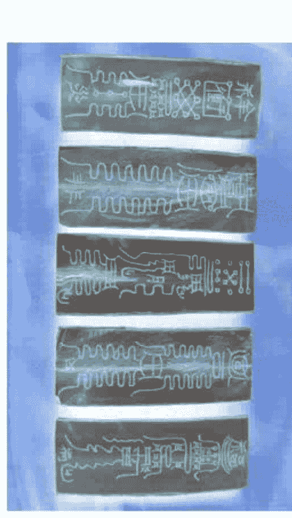

### 五岳真形图镇

五岳真形图出现于西汉武帝时，距今已有二千年的历史。传说此图若按比例放大与五岳真实的山脉、地形、走势基本相符。

五岳真形图是道教最重要的符箓，出自三清之一的太上道君。《太平广记》中记载西王母将此图授与汉武帝时说“此五岳真形图也，诸仙佩之，皆如传章，道士执之，经行山川，百神群灵尊奉亲近。”

五岳真形图乃是道教符书中最高级者，能摧一切妖鬼祸害，并能得长生之道。民间亦将此科奉为至宝，竟为使用。现今一些流传下来的古典家具上的图案、纹饰皆有此图。人们在供奉此图的同时历朝历代的饱学之士皆对此图进行多方面的研究，其形状泰山如坐、华山如立、恒山如行、衡山如飞、嵩山如卧，中国传统的五行说以金、木、水、火、土表示方位，并以此五形揭示世间万物，生生不息的自然规律，并通过其具象表现图腾膜拜，免灾致福。

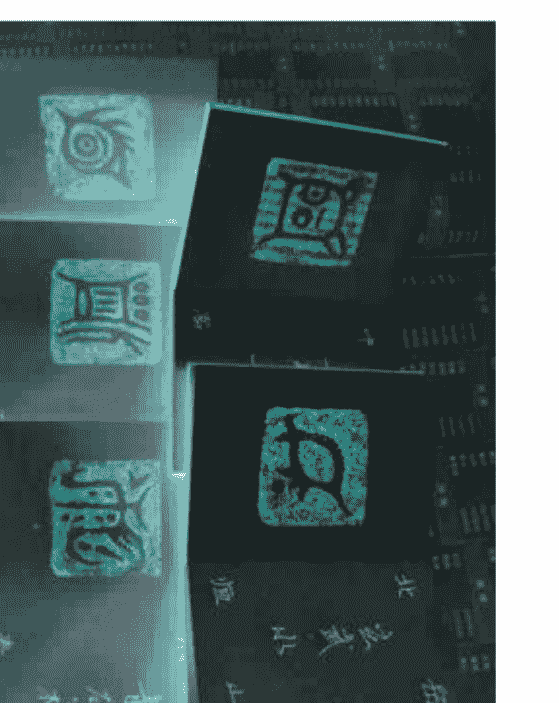

- 星辰牌位以及北斗大咒

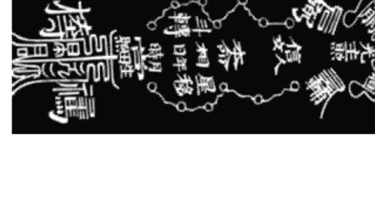

- 五岳镇宅符001

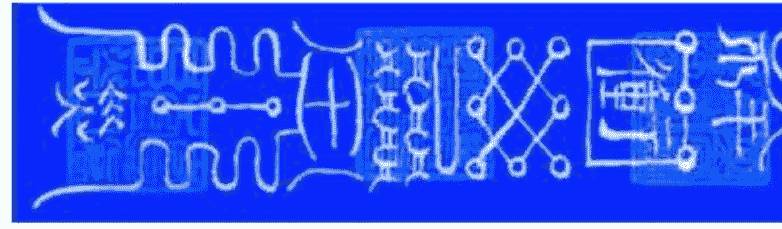

- 五岳镇宅符002

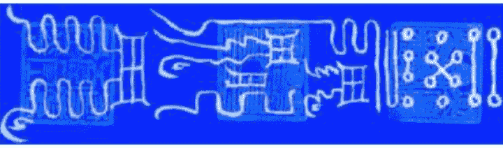

- 增加运气符002

- 增加运气符003

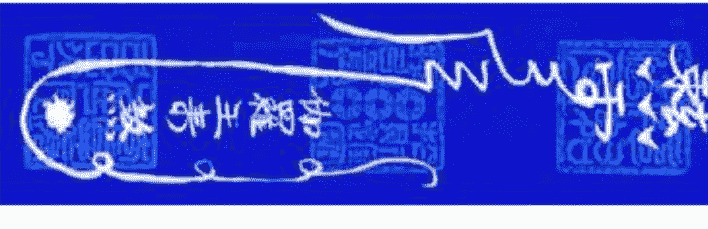

- 驱除自身邪术邪魔符

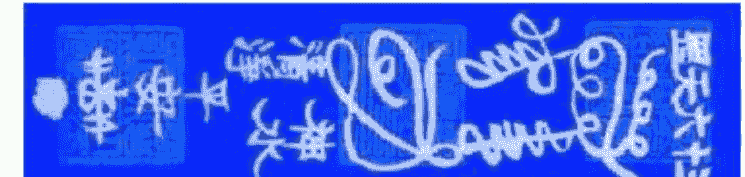

- 六丁六甲镇宅符003

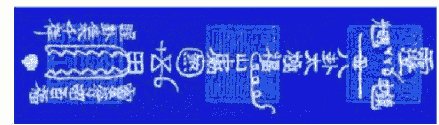

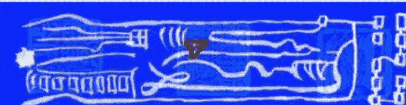

- 吉祥如意符

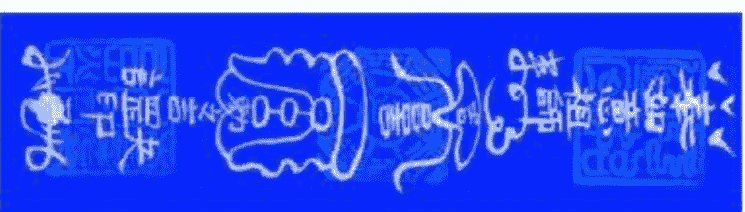

- 读书用功符

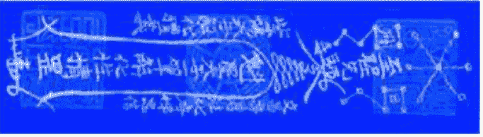

- 保命护身符

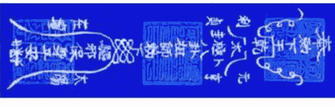

- 除怪急救符

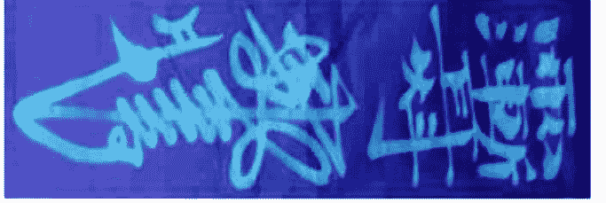

- 北斗解厄符

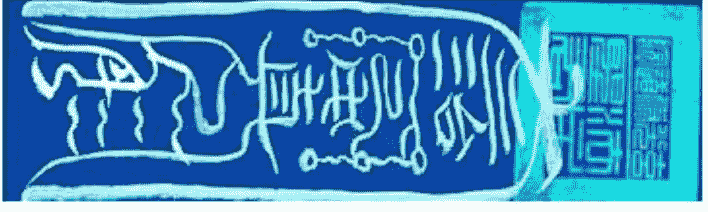

- 止血符

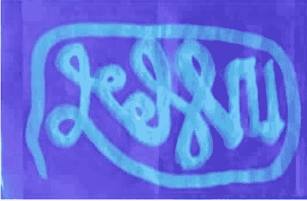

- 开得好职业符

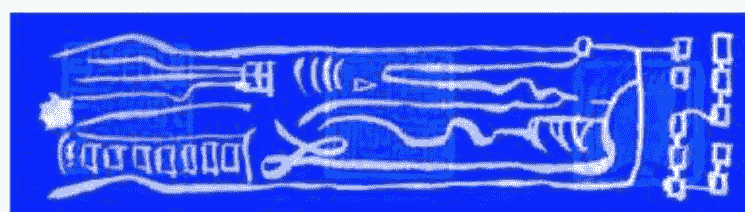

- 升官提职符002

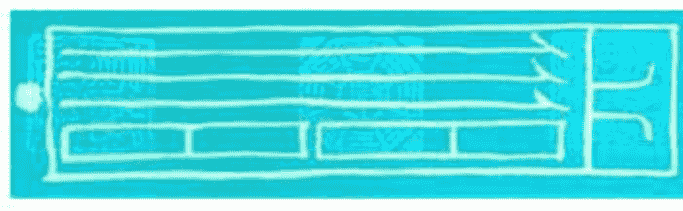

- 车辆出行平安符

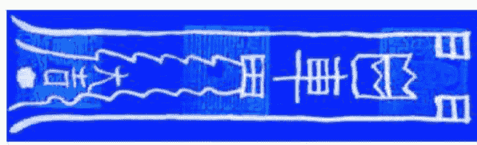

- 灵祖护身符

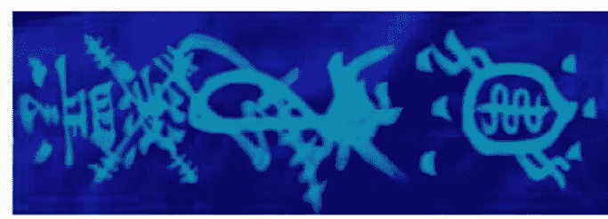

## 第十三章 秘传风水择吉术

- 择日（择吉）的目的就是趋吉避凶、祈福禳祸。而目前大量的日（月）历、通书等充斥市场，质量参差不齐、内容短缺、吉凶神未完全注明、宜忌错漏等。浅而易见的事实就是不同版本的通书有时内容不同，宜忌的注解、吉凶甚至相反，使人疑惑不解。所以使用错误通书择日（择吉）便是择日的一大误区。

- 灵祖护身符

- 择日（择吉）的目的就是趋吉避凶、祈福禳祸。而目前大量的日（月）历、通书等充斥市场，质量参差不齐、内容短缺、吉凶神未完全注明、宜忌错漏等。浅而易见的事实就是不同版本的通书有时内容不同，宜忌的注解、吉凶甚至相反，使人疑惑不解。所以使用错误通书择日（择吉）便是择日的一大误区。

择日的另一大误区是使用正确通书择日，但以为只要是黄道吉日等吉日，就可以做各项民事活动。殊不知，即使是相同的民事活动，同一个吉日，对于不同人来说，对其中一部分人来说是吉的，但对另外一部分人来说却是凶的。即使是相同的民事活动，相同人，也应视具体情况而定。如修阴宅风水这项活动，假设人事方面相同，也应分为生基、凶丧、迁移等情况，因为上面这三种情况的择日条件、方式等不同，选择的吉日也不同。

正确的择日（择吉）方法应该是以事件（指各项民事活动）为准，结合当事人，根据择日（择吉）规则，选择吉日吉时来进行活动才是正确的择日方法。如嫁娶，首先以新娘的出生日期为条件，选取新娘的出嫁大利月份，再从出嫁大利月份中选出适合出嫁的吉日，从适合出嫁的吉日中，结合其他当事人的出生日期，选取大家都适合的吉日，并以该吉日为准，选择吉时，嫁娶择日（择吉）至此完备。其他各项民事择日（择吉）依此类推！

### 择日的重要性及其影响

择日的目的是趋吉避凶，所以在涉及诸如婚姻嫁娶、修造动土，等等，重大事项时必须选择吉日吉时，否则必会造成不良后果，本堂虽未敢断定所有的不良后果均由此产生，因为有部分则好也碰上了吉日良时，但肯定由此产生的不良后果却不少。诸如：

### 婚姻嫁娶的择日

- 婚姻嫁娶的择日

婚姻嫁娶的择日原则是以新娘方的出生日期为主的，并参考男方及其他人的出生日期，俗话说：“子靠出生时，女靠行嫁年”。所以若是把此原则颠倒或不顾，将会导致婚后的婚姻出现问题，甚至离婚，反之，若是按此原则办事，则大吉利是，特别强调的是嫁娶择日最好选择女方的行婚大利月，但同时，其他人（特别是公、婆、新郎）也应是重视的，这关系到家庭的和睦与否。如此择日，关乎一生的幸福、快乐、和睦，何不为之呢？

### 修造动土的择日

修造动土的择日是涉及到较大的事项，首先必须弄清楚该山向是否适宜动土？是吉是凶？是吉的方可动之，是凶的，则应坚决不动！如为阳宅修造，除了考虑座向分金是吉外，因为涉及动土，还必须考虑家中有没有身怀六甲之人，曰之胎神及月之胎神所占之处，等等。

- 择日生子

若是到了预产期甚至超过了预产期的孕妇，择日生子未曾不可？因为大部分超过了预产期的孕妇，都是因为这样或那样的原因，最终难以顺利生产的。若果如此，选择一个好的日子，首先能趋吉避凶，使手术更加顺利，母子更安康，另外，选择吉日吉时，可以预知四柱八字的搭配，选择好的日时，便为你的孩子选择了较好的四柱八字，预示着孩子的未来更加健康发展、兴旺发达，为其未来事业奠定了较好的基础。

- 当然，我们追求提倡的仍是顺其自然，但在条件许可的情况下，趋吉避凶也是我们必须选择的。以上数例，足以说明择吉是重要的，同时也是我们追求的，必需的，其他的事项或大或小与此相似，此处不再论述！

择日之乘凶葬法

- 择曰之安葬从权法

择大寒节五日后，立春节之前，乃新旧岁官交承之时，先择曰破土，又择吉曰安葬，如开山立向，不忌年月曰时克山家，更不忌太岁月家诸凶神杀，就立春前谢墓，或于来年寒食节后清明节内，用人大夫工匠，尽一曰之内，加土谢墓，则无禁忌。

设从权之法：如遇贫乏之家，或死于四、五或六月、七月，炎蒸酷热之天，衣食尚且不足，棺木自然薄削，臭秽莫堪，岂可久停，必致败害，故不得已，从权葬之，术士宜谅。丧家稍有力者，则抬出阴幽之所，掘土压之，使伏土气，免致败害，另择吉日埋葬，使生人致福，死者得安，乃术士仁人之心，亦丧家子孙之幸也。

- 合寿木作生坟择日

作生坟合寿木宜择生合六甲旬空月日，正四废日、傍四废日、通天窍日，忌生命建破魁罡年，又宜择木命纳音生旺有气日，忌入墓日。合寿木宜天德、月德、月空方、忌三煞方。

子午卯酉生人忌子午卯酉年，寅申巳亥生人忌寅申巳亥年，辰戌丑未生人忌辰戌丑未年。水土命宜巳申亥子戌月日，忌辰月辰日。金命宜巳午未申酉月日，忌丑月丑日。木命宜亥子丑寅卯月日，忌未月未日。火命宜寅卯辰巳午月日，忌戌月戌日。寅午戌命忌寅卯辰方，申子辰命忌申酉戌方，巳酉丑命忌巳午未方，亥卯未年忌亥子丑方。

- 择日课之彭祖百忌曰

甲不开仓，财物耗完；乙不栽植，千株不良。丙不修灶，必见火殃；丁不剃头，头主生疮。戊不受田，田主不详；己不破券，二主并亡。庚不经络，织机虚张；辛不合酱，主人不尝。壬不决水，难更堤防；癸不词讼，理弱敌强。

- 子不问卜，自惹灾殃；丑不冠带，主不还乡。寅不祭祀，鬼神不尝；卯不穿井，泉水不香。辰不哭泣，必主重丧；巳不远行，财物伏藏。午不苫盖，室主更张；未不服药，毒气入肠。申不安床，鬼祟入房；酉不会客，宾主有伤。戌不吃犬，作怪上床；亥不嫁娶，必主分张。建宜出行，不可开仓；

- 除可服药，针灸亦良。满可肆市，服药遭殃；平可涂泥，安机吉昌。定宜进畜，入学名扬；执可捕捉，盗贼难藏。破宜治病，必主安康；危可捕鱼，不利行船。成可入学，争讼不强；收宜纳财，却忌安葬。开可求治，针灸不详；闭不竖造，只许安康。

- 择日课之殡葬日忌

殡葬日忌二十八宿中七星：角、元、奎、娄、鬼、牛、星。忌天火日，忌红沙日，忌小红沙日，忌天冲地克日，忌岁破日，忌冲亡人命，忌冲孝子命。假如亡人、孝子是子相，葬用午日为冲命。若是亡人、孝子是寅相，葬用申日为冲命，不可用。余仿此。

择日之重日、复日

重日、复日忌破土、安葬、启葬。按旧本重复日忌为凶事，利为吉事，故忌破土、安葬、启葬，然其义亦泛矣。夫葬乘生气，经有明文，今选择家亦以无禄四废为凶日，若复日则皆令星，孟仲月又皆建禄，其吉自无可疑。巳亥为阴阳尽日，亦大率云然。而推以十二月，参以三候，此二日无皆凶之理。

乃惟此之忌而不避刑厌三煞之凶，且所宜又止于鸣吠曰而舍德赦==之吉，而不知用是与嫁娶之仅取下将而不取德合，惟忌章光无翘而忌刑冲破害等也。婚葬为人事之始终，而俗论拘忌若此，故遇鸣吠则忌，遇德德赦==则不忌，识者自能辨之。

- 择日的几种造葬权变法

《通书》云：凡修造，一定要修主年命、方向和年月均利，才能获吉。如果（方向）不利又不得不造，可用迁居之法，从所迁之地视为所作之方为吉就行了。如年命利作兑不利作震，则当迁居而东，既居于东，则自其居视所作之方，昔为震者，今为兑矣。自此作之，则无不可。

关于作方，凡所作只在一宫，选择比较容易，如果跨连数宫，有吉有凶，于吉宫起工，由此连及不利之宫，并无妨害。如果修造年月日吉利而准备作未停当，可以略加起造以应吉时，以后再接触修造，也行。但在竣工之后，要归福德之方。

论取土方道，凡远隔百步之外，目所不见，可不问方道神煞。太岁三煞官符大小月建等方，忌取土。

论清明前后修墓法，凡已葬墓堂的加土、种树、砌祭台、修整等于清明寒食之间起工修作，可不论山向及年月日时。

- 论竖造宅舍，大寒五日后择日拆屋修选，赶在立春节前择日完工，可以不忌开山立向年月克山家和凶神。这叫做岁官交承。如已过立春后，年月凶神方位已定，不可修作。如方位无凶神，修作无妨。

论安葬，在大寒五日后至立春前之间，先择曰破土，再择曰安葬，可不忌开山立向及年月各凶煞。但一定要在立春前谢墓，或在次年清明节加土谢墓。

- 论凶葬法，凡人初死，在三日之内或一旬之内，择日破土安葬，不问开山立向及年月神煞。

### 嫁娶择日要论

嫁娶之法，玉历碎金赋详矣，兹陈数言以备选择：

选日宜二造吉禄贵拱亲，夫星当令，天嗣通根，配合三奇、互贵、合格成局则吉也。宜岁德、天月德、合不将，季分、益后、四相、续世吉期，三合、五、二、麒麟、凤凰等吉日。忌月厌、往亡、四离绝、刑、冲、破、害、周堂值夫妇等凶日。下至俗杀如红沙、披麻、受死、流霞等之类，能尽避更吉。

### 择曰之女命行嫁大利月

正七迎鸡兔，二八虎合猴，三九蛇共猪，四十龙合狗，牛羊五十一，鼠马六十二。阳前阴后一吉辰，正七首子及媒人，二八月妨翁与姑，三九女之父母身，四十乃妨夫主身，五十一月妨自身，子午寅申辰戌顺，丑未卯酉巳亥逆。首句“阳前阴后一吉辰”，如女命子年，生子乃阳，年前是丑，丑乃十二月，当用十二月为的，此乃古理。如十二月诸多妨碍，无上吉曰，只可从权便择六月吉曰用。

### 择曰之男命禁婚年

不宜娶亲，如男命用子年娶亲，忌本身属蛇。子年禁蛇相，丑年禁马相，寅年禁羊相，卯年禁猴相，辰年禁鸡相，巳年禁狗相，午年禁猪相，未年禁鼠相，申年禁牛相，酉年禁虎相，戌年禁兔相，亥年禁龙相。

男娶婚所忌者，当年太岁前五相是也。

不宜出闺。如女命用子年行嫁，忌本身属兔。子年忌兔相，丑年忌虎相，寅年忌牛相，卯年忌鼠相，辰年忌猪相，巳年忌狗相，午年忌鸡相，未年忌猴相，申年忌羊相，酉年忌马相，戌年忌蛇相，亥年忌龙相。起法：每从卯上起子，逆数到本年太岁止，遇何属相，即是忌婚，不宜出闺。

### 择日之女命行嫁忌日

女命嫁曰，犯当梁、勾绞星。假令女命子相，即从子上起建，顺数到卯位，是平，为当梁，数到酉位，是收，为勾绞，忌卯酉二日，不可用。丑相忌辰戌二日，寅相忌巳亥二日，卯相忌子午二日，辰相忌丑未二日，巳相忌寅申二日，午相忌卯酉二日，未相忌辰戌二日，申相忌巳亥二日，酉相忌子午二日，戌相忌丑未二日，亥相忌寅申二日，以上为女命行嫁忌日，择日宜慎记之。

## 第十三章 秘传风水择吉术

择曰之娶送女客忌三相
申子辰年蛇鸡牛，巳酉丑年虎马狗，寅午戌年猪兔羊，亥卯未年龙鼠猴。如女命属龙，即辰年，生辰前一数巳，五数酉，九数丑，所以忌蛇、鸡、牛。《通书》云：太岁门前一五九，未解明曰×××。凡择曰多有用本年娶亲，太岁论岂不错误，原是女命本生年，太岁一五九方是。

嫁娶择曰之上下车轿方
寅卯辰女面向西，巳午未女面向北。申酉戌女面向东，亥子丑女面向南。宜背本年。如遇五鬼、死门、在北方，或迎喜神亦可。

嫁娶择曰之安床帐方
寅卯辰女，北房西间，南房东间，坐丙向壬。巳午未女，东房北间，西房南间，坐庚向甲。申酉戌女，南房东间，北房西间，坐壬向丙。亥子丑女，东房北间，西房南间，坐甲向庚。

择日之诸日起吉时歌
寅申须加子，卯酉却居寅，辰戌龙位上，巳亥午上存，子午临申地，丑未戌相寻。青龙明堂与天刑，朱雀金匮天德神，白虎玉堂天牢黑，玄武司命共勾陈。如寅申日，子是青龙，丑是明堂，寅是天刑，卯是朱雀，辰是金匮，数至亥是勾陈，余可仿此。青龙、明堂、金匮、天德、玉堂、司命，皆吉时，其余皆凶时，不可用。

择日事类总集（节选）
《通书》曰：年贵人冬至后用阳贵，夏至后用阴贵。时贵人昼用阳贵，夜用阴贵。一说子至巳用阳贵，午到亥用阴贵。

凡修造，用家主名姓昭告。若家主行年不利，即以子弟行年利者作修造主昭告神祇，俟修造完毕入宅，然后安谢。

凡新立宅舍，或尽行拆除旧宅倒堂竖造，修主人眷既已出火避宅，其起工只就坐上架马。若修主不出火避宅，或坐宫，或移宫，但就所修之方择吉方起工架马，若别择吉方架马亦利。若修作在住近空屋，或在一百步之外起工架马，并不问吉凶方道。

凡原有旧宅净尽拆去另造，谓之倒堂竖造，与新立宅舍同，择吉方出火避宅，俟工作完备，别择吉年月日入宅归火。

凡修造桥梁、僧尼院宇、庵观神庙，开山立向修方并与民俗年月同。

凡新立宅舍，尚未归火入宅，即于宅内新造牛栏马枋羊栈猪牢等屋，并不问年月方道。如在百二十步之外，则须看年月方道无凶煞占方，宜起工修作。

凡方通有三，曰阳方道，曰交接方道。阴方道者，即中宫滴水门也。阳方道者，地基不与旧宅交接也。交接方道者，或前后左右屋宇与旧宅相连也。如屋上起楼及架天井，就檐滴水，归里该属中宫，名曰阴方，只职中宫无煞得吉会为大利。如建亭台造轩阁，不进中宫，名曰阳方，只取外方向为利。如就屋比连接架增谱、添桁补廊，名曰交接方，要内外具有吉会方为大利。

凡作宅，据方隅而作，而方隅则当用作方法。若开新基立栋宇，或净尽拆除旧屋而创新居，则当用作山法。然造作之事，以人居处为本宫，所居在所作百步外，则新创者始可专用作山法，若所居住在所作百步之内，则虽新创亦当以作方法论之。如所居虽在所作百步之外，但屋宇旧房门廊俱在，则其宅已定，不过补东而去西，除旧而换新，尚当用作方法。但不在百步之内，祸福轻耳。故凡造作，用作方法者多，用作山法者少。

论方道远近神煞，京城府州县寸金之地，所作之方但隔街路，作之不妨。如小修葺，并不问吉凶之方，但要择吉日，余即不畏。若是乡村之地修方道，或隔大溪水，人不得渡，四时常流，亦不问凶煞。若隔小溪涧，常流不绝，小煞不妨。若居城市，隔一街巷三五尺非自地者，亦不犯方隅神煞。如欲屋近作楼台厅馆，虽是修方，亦取方道，有吉神无凶煞，作之不妨。

论入宅法，山向中宫并无凶煞，惟大门微有凶神，却用关闭正门，从左右作小门出入，或开横门出入，或奉祖先福神香火暂驻吉方，俟凶神过后，正向得利，别择吉月吉日，或岁除正彻，或立春交接，移入祖先福神香火奉祀，遂开正门无妨。

论归火与竖造同曰，惟推吉时。家主先移祖先福神香火入宅，俗谓先进香火，俟毕工后，再择吉曰，同家眷从吉方入宅。如竖造之曰不先移香火入宅，必待山向年月得利，方可入宅归火。若竖造之曰虽吉，或犯归忌九丑，又须别择。

凡人家修造内堂完备，已归火入宅，向后续厅廊，或久住宅舍又欲修作、安门、开渠、修筑等事，只用修方法择年月，其山家墓运、阴府太岁并不必忌，惟浮天空亡、巡山罗猴及月家飞官方道紧煞忌之。

凡造葬，先看山家墓运，要正阴府太岁不克山头，若浮天空亡、天官符占舍位，并忌开山立向，巡山罗猴只忌立向。次论月家飞宫天地官符，忌开山立向。又论月家飞宫天地官符，忌开山立向。又论山家墓运正正阴府太岁月日时忌克山。如山家官符、穿山罗猴、天禁、朱雀、山家困龙，并忌开山。吉星到则能制。但用通天窍、走马六壬、星马贵人为主。克择利宜年月兼求，三奇紫白、禄马贵人、诸家銮驾帝星，若有一吉神同到，盖照山向以佐其吉。修造则择竖造吉日，安葬则择破土吉日，大吉。

凡吉星到山为盖，到方向为照，并照中宫，竖造安葬大利。如修方，对宫上起吉星，名曰吉星照方，修作大利。凡方道遭火，尽七日之内择日起工，半月内择日竖造，并不问吉凶方道。

凡合寿木，宜择木建日。正月庚寅、二月辛卯、三月戊辰、四月己巳、五月丙午、六月癸未、七月庚申、八月辛酉、九月戊戌、十月己亥、十一月壬子、十二月癸丑，及四废日、本命纳音生旺日、忌本命日、本命对冲日、建日、破日、重日、日辰纳音克本命纳音日。

凡砌生坟，也如葬身，选择年月要开山立向不犯年月山家凶煞，更得吉神盖照山向，即可用事。若作印堂土堆，惟择吉日，不问山向吉凶。开圹砌金井，宜择四废日、旬中空亡月日、及本命纳音有气月日。凡金井下砖日，择日与葬日同。

凡嫁娶吉日，宜不将、天德、月德、天德合、月德合、母仓、黄道、上吉。次吉，月恩、益后、续世、戊寅己卯人民合日，又曰辰合吉，虽无不将亦可用，不必拘也。

凡月忌曰不忌嫁娶，辛亥年十一月初五日辛卯，壬子年十二月初五乙卯，嫁娶用之也多。略举此事，以祛俗忌。

凡嫁娶周堂值翁姑，新人入门时俗有从权外出少避，候新人坐床，翁姑方可回家。

凡封拜施恩，事出于上，百无忌，惟择吉时。

凡上官、嫁娶、出行、入宅、修造、安葬、修方，一切动用，宜四大吉时兼黄道吉星时。得吉星到时可胜诸凶。所有九丑、路空、旬空俱不忌。

或合通天窍、走马六壬、天罡取用吉时，吉神到山到向为吉。

神像开光(塑绘)的择日
春秋二季用心危毕张四宿值日属太阴吉，夏冬二季用房虚昴星四宿值日属太阳吉，又宜天德、月德、天恩、福生、黄道、建、除、满、开、成日。忌择伏断、天贼、正四废、天地空亡、六壬空亡、又忌旬中空亡、截路空亡时。

逐月塑绘神像吉日：正月丁酉、外：癸酉，二月癸未、乙亥、辛亥、外：甲申、丁未、己未，...

公司（商店）开张的择日
公司（商店）开张的择日宜根据主人（股东）的四柱八字或属相利方，选择吉方位，择天愿、民日、满日、成日、开日、五富。宜择甲子、乙丑、丙寅、己巳、庚午、辛未、甲戌、乙亥、丙子、乙卯、壬午、癸未、甲申、庚寅、辛卯、乙未、己亥、庚子、癸卯、丙午、壬子、甲寅、乙卯、己未、庚申、辛酉日。

忌：月破、大耗、平日、收日、闭日、劫煞、灾煞、月煞、月刑、月害、月厌、大时、天吏、小耗、四废、四耗、四穷、五墓、九空。

兴造动土装修装饰的择日宜根据阳宅座向分金，选择大利方，主人等家人的四柱八字或属相利方，选择天德、月德、天德合、月德合、天赦、天愿、月恩、四相、时德、三合、开日。宜己巳、辛未、甲戌、乙亥、乙酉、己酉、壬子、乙卯、己未、庚申日。

忌：月建、土府、月破、平日、收日、闭日、劫煞、劫煞、灾煞、月煞、月刑、月厌、大时、天吏、四废、五墓、归忌、往亡。

进宅（入宅搬迁）的择日宜根据阳宅座向分金，选择大利方，主人等家人的四柱八字或属相利方，选择天德、月德、天德合、月德合、天赦、天愿、月恩、四相、时德、民日、驿马、天马、成日、开日。宜甲子、乙丑、丙寅、戊辰、庚午、丁丑、戊寅、乙酉、庚寅、壬辰、癸巳、乙未、壬寅、癸卯、甲辰、丙午、辛亥、癸丑、丙辰、丁巳、壬戌。

忌：月破、平日、收日、闭日、劫煞、劫煞、灾煞、月煞、月刑、月厌、大时、天吏、四废、五墓、归忌、往亡。

正五行择日法
正五行日课，根据五行的属性，对日课的生克制化、刑、冲、害进行论述。与八字预测有点相同，不同点就是八字是生下来就是固定的，而正五行日课是由人选出来的。要用正五行选课，首先要了解天干地支及二十四山的五行属性：
一、天干五行：甲乙属木、丙丁属火、戊己属土、庚辛属金、壬癸属水。
二、地支五行：寅卯属木、巳午属火、申酉属金、亥子属水、辰戌丑未属土。
三、二十四山五行：二十四山由八干四维和十二地支组成，寄于后天八卦，每个卦管三个山，组成二十四山，用于阴阳宅用事选课，地理风水学用于格龙立向、消砂、纳水均离不开二十四山。其五行为：寅甲卯乙巽属木，巳丙午丁属火，申庚酉辛乾属金，亥壬子癸属水，辰戌丑未坤艮属土。

四、懂得了天干、地支五行以后，接下来就要选四柱，起四柱是选日课的关键，不管是那一门派择日都要排四柱，四柱就由年、月、日、时的天干、地支组成，排四柱最简单的方法就是查万年历，学者可参看一些算命或预测书即可。

五、择日步骤：
要看年月的山家是否吉利，所谓吉利，就是坐山不能犯年三杀、或犯三杀月。

年三杀就是：
申子辰年三杀在：巳、丙、午、丁、未山；
寅午戌年三杀在：寅、壬、子、癸、丑山；
亥卯未年三杀在：申、庚、酉、辛、戌山；
巳酉丑年三杀在：寅、甲、卯、乙、辰山。

三杀月就是：
申子辰月三杀在：巳、丙、午、丁、未山；
寅午戌月三杀在：寅、壬、子、癸、丑山；
亥卯未月三杀在：申、庚、酉、辛、戌山；
巳酉丑月三杀在：寅、甲、卯、乙、辰山。

日时的三杀就较轻，选择日只要看年和月的课即可，年月日时的三杀都是看地支，比如今年为甲申年，犯三杀的山有：巳、丙、午、丁、未五个山，现在是丁卯月犯三杀的有申、庚、酉、辛、戌五个山。选择好年月不犯三杀的山之后，还要看太岁和七煞（岁破），所谓太岁就是本命年。比如：甲申年，甲申就是太岁，太岁忌修造、动土，七煞就是太岁对冲之年，比如：甲申年，七煞就在寅山，忌修造、动土、安葬等；除此之外，正五行择日还要忌：大月建、小月建、正阴符、傍阴符、大地官符等一堆的神杀。择好年月之后，关键是选日了，选日方法很多，现在很多择日师都是以通书上刊登的吉日为依据进行选拔，日子要配合山家和年命，日子一般不能冲克山家和年命，冲者即凶，择时是最后一步了，俗话说年好不如月好，月好不如日好，日好不如时好，所以择时极为重要，弄不好会兵败如山倒。择时一般用==时，如果选不到==用三合亦可，只是==的力量大于三合的力量。地支有了==或三合，远要看时干和日干的关系，时天干不能克日天干，若时干克日干叫五行不遇时，亦不能用。还有空亡时也不能用，所谓空就是不到位的意思。

正五行择日要成格局，所谓成格就是天地同流如子山用：癸亥年、癸亥月、癸亥日、癸亥时；天元一气如甲山用：辛卯年、辛丑月、辛未日、辛卯时；地支一气如寅山用：壬申年、戊申月、壬申日、戊申时；天干三朋如癸山用：辛丑年、癸巳月、癸酉日、癸丑时；地支一气如丁山用：乙酉年、乙酉月、乙酉日、乙酉时；还有地支三朋，蝴蝶双飞天干三奇等等，成局就是要有三合局、二局、三会局，还要有禄马贵人，三奇贵人；天月二德贵人等。

各用事之如何择吉日

一 嫁娶类专用阴阳不将日

- 正月：丙子 己卯 辛卯 庚子 丙寅 壬午 癸卯 戊子 丙午 辛未 乙未 乙卯
- 二月：乙丑 丙子 丁丑 丙戌 丙寅 戊子 己丑 庚子 庚寅 乙未
- 三月：甲子 戊寅 壬寅 甲寅 丁卯 乙卯 己卯 庚午 丙午
- 四月：甲子 丙子 戊子 丙戌 甲戌 丁卯 己卯 辛卯 癸卯 乙卯
- 五月：甲子 丙子 戊子 丙戌 甲戌 丁卯 己卯 辛卯 癸卯 乙卯
- 六月：甲子 乙未 甲戌 癸未 戊戌 五卯日 戊寅 庚寅
- 七月：乙巳 乙未 甲午 戊辰 癸未 壬午 丙子 壬子 丙辰 戊午
- 八月：甲辰 甲午 戊辰 戊午 癸巳 壬辰 壬午 乙丑 丁丑 戊戌 己丑
- 九月：甲子 庚午 壬午 戊午 癸巳 辛巳 辛未 癸未 辛卯 己卯 丙午 乙卯
- 十月：庚午 壬午 己卯 癸卯 辛卯 庚寅 壬寅 庚辰 壬辰 戊辰 辛未 丁未 戊寅
- 十一月：庚寅 壬寅 丁丑 己丑 辛丑 庚辰 壬辰 戊辰 甲辰 丙辰
- 十二月：丙寅 辛丑 辛卯 庚子 戊子 庚辰 戊寅 丁卯 己卯 癸卯 乙卯 丙辰 甲寅 戊辰 己巳 癸巳

> (注：申，酉，亥日与各月红沙杀日，这些日虽为阴阳不将日，其结婚理论与他书相矛盾，为保持人的心里平衡，故本书删去不用。)

二：各月实用出远行吉日

- 正月：丁卯 庚午 辛未 乙亥 丙子 己卯 壬午 丁亥 辛卯 壬辰 甲午 丁酉 己亥 癸卯 丙午 丁未 辛亥 壬子 乙卯 丙辰 戊午
- 二月：乙丑 丁卯 辛未 甲戌 乙亥 丁丑 庚辰 辛巳 癸未 丁亥 己丑 辛卯 壬辰 己亥 辛丑 癸卯 甲辰 丁未 辛亥 癸丑 乙卯 丙辰 己未
- 三月：甲子 丙寅 丙子 丁丑 戊寅 壬午 乙酉 戊子 庚寅 丁酉 庚子 壬寅 壬子 甲寅
- 四月：乙丑 丙寅 庚午 癸酉 丙子 丁丑 壬午 乙酉 己丑 庚寅 辛卯 甲午 丙申 丁酉 戊戌 庚子 辛丑 己酉 癸卯 乙卯 庚申 辛酉
- 五月：丙寅 戊辰 辛未 壬申 甲戌 戊寅 庚辰 癸未 甲申 丙戌 庚寅 壬辰 乙未 丙申 戊戌 壬寅 甲辰 丁未 戊申 庚戌 甲寅 丙辰 己未 庚申
- 六月：甲子 丁卯 辛未 戊寅 己卯 癸未 庚寅 辛卯 乙未 己亥 壬寅 癸卯 甲辰 丁未 己酉 辛亥 乙酉 己未
- 七月：甲子 丁卯 壬申 丙子 丁丑 壬午 丁亥 戊子 壬辰 戊戌 庚子 癸卯 戊申 壬子 癸丑 戊午 庚申 壬戌
- 八月：乙丑 辛未 乙亥 丁丑 庚辰 癸未 丙戌 丁亥 己丑 乙未 戊戌 己亥 丁未 戊申 庚戌 辛亥 癸丑 己未 庚申 壬戌
- 九月：庚午 壬申 丙子 戊寅 己卯 壬午 甲申 丙戌 辛卯 甲午 丙申 癸卯 丙午 戊申 庚戌 辛亥 戊午 庚申 壬戌
- 十月：甲子 丙寅 丁卯 庚午 丙子 戊寅 甲申 乙酉 庚寅 辛卯 甲午 庚子 壬寅 癸卯 甲寅 乙卯 庚申
- 十一月：乙丑 丙寅 戊辰 壬申 甲戌 丁丑 戊寅 庚辰 甲申 己丑 庚寅 壬辰 丙申 辛丑 壬寅 甲辰 戊申 癸丑 甲寅 丙辰 庚申
- 十二月：庚午 壬申 癸申 甲申 乙酉 庚寅 丙申 丁酉 戊申 己酉 乙卯 庚申 辛酉

> (附注：凡出远行，特别从未出过远行者，首次出远行，均要选出行日课为佳，一可以保持心里平衡，二可以达到逢凶化吉。其日课均以五行生克制化，五行流通为原则。)

三：各月实用竖造，修建动土吉日

- 正月：丁卯 庚午 辛亥 丁亥 戊寅 己卯 壬午 丙戌 乙亥 辛卯 甲午 辛亥 壬子 丙辰 戊午 丙午 壬辰 壬戌 丁未
- 二月：乙丑 辛亥 乙亥 丁亥 辛亥 己未 甲辰 丁未 癸未 己亥 辛丑 丙辰 癸丑
- 三月：丙子 丁丑 戊寅 壬午 乙酉 丁亥 戊子 戊寅 庚子 壬寅 壬子 甲寅 丁巳
- 四月：乙丑 癸酉 丙子 甲午 丁丑 乙酉 己丑 辛卯 丙申 丁酉 戊戌 庚子 辛丑 癸丑 乙卯 庚申 辛酉
- 五月：丙寅 辛未 甲戌 戊寅 庚辰 丙戌 壬辰 庚寅 丙申 戊戌 壬寅 丁未 戊申 庚戌 甲寅 丙辰 己未
- 六月：丁卯 乙亥 戊寅 己卯 甲申 辛卯 己亥 癸卯 甲辰 辛亥 甲寅 乙卯 己未 丁亥
- 七月：甲子 己巳 丙子 丁丑 壬午 丁亥 戊子 壬辰 癸巳 丁酉 戊戌 庚子 戊申 壬子 癸丑
- 八月：乙丑 己巳 乙亥 丁丑 辛巳 戊申 己丑 癸巳 乙巳 庚戌 癸丑 丁巳
- 九月：庚午 壬申 丙子 戊寅 壬午 甲申 辛卯 癸巳 甲午 丙申 癸卯 丙午 戊申 戊午 庚申
- 十月：丙寅 丁卯 庚午 辛未 己卯 庚辰 癸未 甲申 乙酉 庚寅 辛卯 甲午 乙未 庚子 壬寅 癸卯 丁未 甲寅 乙卯 己未 庚申
- 十一月：乙丑 丙寅 戊辰 壬申 庚辰 丁丑 戊寅 甲申 己丑 庚寅 壬辰 丙申 辛丑 壬寅 甲辰 戊申 癸丑 甲寅 丙辰
- 十二月：丙寅 己巳 癸酉 乙亥 辛巳 甲申 乙酉 庚寅 癸巳 丁酉 乙巳 己酉 甲寅 壬寅 乙卯 戊寅 庚申 辛酉

四：各月实用安葬吉日（也可用各月大葬和鸣吠日）

- 正月：庚午 辛未 丙子 丙寅 戊寅 壬午 丙戌 辛卯 丁酉 壬子 丙辰 戊午 丙午 壬寅 壬辰 壬戌 丁未
- 二月：丁卯 甲戌 戊寅 甲辰 甲寅 乙未 丙寅 庚寅 壬寅
- 三月：丙寅 丙子 丁丑 戊寅 壬午 乙酉 庚寅 丁酉 己酉 庚子 壬寅 壬子 甲寅
- 四月：乙丑 丙寅 癸酉 甲午 壬午 乙酉 庚寅 辛卯 丙申 丁酉 庚子 辛丑 己酉 庚戌 戊癸丑 乙卯 庚申 辛酉
- 五月：丙寅 辛未 壬申 戊寅 癸未 甲申 丙戌 庚寅 丙申 壬寅 己未 乙未 庚申 壬寅 甲寅
- 六月：丁卯 甲申 庚寅 辛卯 壬寅 癸卯 甲辰 庚午 丙寅 壬午 甲午 甲寅 乙卯 壬申 庚申
- 七月：丁卯 戊辰 壬申 丙子 丁丑 乙酉 戊子 壬辰 丁酉 戊戌 癸卯 戊申 壬子 癸丑 壬戌 辛酉
- 八月：乙丑 壬申 庚寅 甲申 丙戌 戊申 庚戌 庚申 丙申 丁丑 癸丑 丙辰
- 九月：庚午 壬申 丙子 戊寅 己卯 壬午 甲申 丙戌 辛卯 甲午 丙申 癸卯 丙午 戊申
- 十月：丙寅 庚午 辛未 丙子 戊寅 己卯 庚辰 甲申 庚寅 辛卯 甲午 乙未 庚子 壬寅 癸卯 甲辰 甲寅 乙卯 己未 庚申
- 十一月：乙丑 丙寅 壬申 丁丑 甲申 己丑 丙申 辛丑 壬寅 癸丑 甲寅 庚申
- 十二月：甲子 乙丑 丙寅 壬申 癸酉 丙子 甲申 乙酉 庚寅 丙申 丁酉 庚子 甲寅 乙卯 壬寅 庚申 辛酉

五：各月实用嫁娶吉日（也可用各月阴阳不将日）

- 正月：庚午 辛未 丙子 壬午 辛卯 甲午 壬子 丙辰 戊午 丙午 壬辰
- 二月：乙丑 辛未 戊寅 己丑 甲辰 丁丑 癸未
- 三月：丙子 丁丑 戊寅 壬午 乙酉 戊子 丁酉 庚子 壬寅 壬子 丁巳
- 四月：乙丑 丙寅 甲午 丁丑 辛巳 庚寅 辛卯 戊戌 庚子 辛丑 乙巳 庚戌 乙卯
- 五月：丙寅 戊辰 辛未 甲戌 戊寅 癸未 庚辰 丙戌 壬辰 庚寅 戊戌 壬寅 丁未 庚戌 丙辰 乙未 壬戌
- 六月：丙寅 辛未 戊寅 己卯 庚寅 壬寅 甲辰 甲寅 乙卯
- 七月：甲子 丁卯 己巳 丙子 丁丑 壬午 戊子 癸巳 戊戌 乙巳 癸卯 壬子 戊午 壬戌 丁巳
- 八月：乙丑 己巳 辛未 丁丑 辛巳 癸未 丙戌 己丑 癸巳 乙未 甲辰 乙巳 庚戌 丁巳
- 九月：庚午 丙子 戊寅 己卯 辛巳 壬午 丙戌 辛卯 癸巳 甲午 癸卯 丙午 戊午
- 十月：丙寅 丁卯 庚午 戊寅 己卯 庚辰 庚寅 辛卯 甲午 庚子 壬寅 癸卯 甲辰 乙卯
- 十一月：乙丑 戊辰 甲戌 庚辰 丁丑 己丑 庚寅 壬辰 辛丑 壬寅 甲辰 癸丑 丙辰
- 十二月：丙寅 己巳 庚寅 乙巳 甲寅 乙卯 庚辰 戊寅

## 第十三章：秘传风水择吉术

### 六、各月实用移徙、入宅吉日

正月：庚午 辛未 丁亥 己卯 壬午 辛卯 甲午 辛亥 壬子 丙辰 戊午 丙午 壬辰 丁未

二月：乙丑 辛未 丁亥 辛亥 己未 甲辰 丁未 丁丑 己亥 丁卯 辛丑 甲辰 癸丑

三月：丙子 丁丑 戊寅 壬午 乙酉 丁亥 戊子 庚寅 庚子 壬子 甲寅 丁巳

> （注：三月民间有些地方亦忌移、入宅，嫁娶。理由是三月为扫墓祭祖之月，阴气重，不宜办喜庆之事）

四月：乙丑 癸酉 丙子 甲午 乙酉 庚寅 辛卯 丙申 丁酉 戊戌 庚子 乙巳 己酉 庚戌 乙卯 庚申 辛酉

五月：丙寅 戊辰 辛未 庚辰 甲申 丙戌 壬辰 庚寅 丙申 戊戌 壬寅 甲辰 丁未 戊申 丙辰 己未 庚申

六月：丁卯 辛未 戊寅 己卯 甲申 辛卯 己亥 癸卯 甲辰 甲寅 乙卯 己未

七月：甲子 丁卯 己巳 壬申 丙子 壬午 丁亥 戊子 癸巳 戊戌 庚子 癸卯 戊申 壬子 戊午 丁巳

八月：乙丑 己巳 辛未 乙亥 辛巳 癸未 丁亥 癸巳 乙未 己亥 乙巳 庚戌 辛亥 癸丑 丁巳 己未

九月：庚午 壬申 戊寅 辛巳 壬午 甲申 丙戌 辛卯 癸巳 甲午 丙申 癸卯 丙午 戊申 庚戌 辛亥 戊午 庚申 壬戌

十月：丙寅 丁卯 庚午 丙子 戊寅 己卯 庚辰 甲申 乙酉 庚寅 辛卯 甲午 庚子 壬寅 癸卯 甲辰 甲寅 乙卯 庚申

十一月：乙丑 壬申 庚辰 丁丑 甲申 己丑 壬辰 丙申 甲辰 戊申 癸丑 庚申

十二月：丙寅 己巳 癸酉 辛巳 甲申 乙酉 庚寅 丁酉 乙巳 己酉 甲寅 乙卯 壬寅 戊寅 庚申 辛酉

### 七、各月开业求财吉日

正月：庚午 辛未 乙亥 丙子 壬午 丙戌 丁亥 辛卯 壬辰 甲午 丁酉 丙午 丁未 辛亥 丙辰 戊午 壬戌

二月：丙寅 己巳 辛未 甲戌 癸未 丁亥 己丑 癸巳 乙未 己亥 乙巳 甲辰 丁未 辛亥 甲寅 丁巳 己未

三月：甲子 丙寅 丙子 丁丑 戊寅 壬午 乙酉 丁亥 戊子 庚寅 庚子 壬寅 壬子 癸丑 甲寅 丁巳

四月：乙丑 丙寅 庚午 癸酉 丙子 丁丑 乙酉 己丑 庚寅 辛卯 甲午 丙申 丁酉 戊戌 庚子 辛丑 己酉 庚戌 癸丑 乙卯 庚申 辛酉

五月：丙寅 辛未 壬申 甲戌 戊寅 癸未 甲申 丙戌 庚寅 乙未 丙申 戊戌 壬寅 丁未 戊申 庚戌 甲寅 丙辰 己未 庚申 壬戌

六月：丙寅 丁卯 辛未 乙亥 戊寅 己卯 甲申 庚寅 己亥 壬寅 癸卯 己酉 辛亥 甲寅 乙卯 己未

七月：甲子 丁卯 戊辰 己巳 壬申 癸酉 丙子 丁丑 壬午 戊子 壬辰 癸巳 戊戌 庚子 癸卯 乙巳 戊申 壬子 丁巳 戊午 壬戌

八月：乙丑 己巳 壬申 乙亥 丁丑 辛巳 甲申 丙戌 丁亥 己丑 癸巳 乙未 己亥 乙巳 戊申 庚戌 癸丑 丁巳

九月：庚午 壬申 丙子 戊寅 壬午 甲申 辛卯 甲午 丙申 丙午 戊申 戊午 庚申 壬戌

十月：甲子 丙寅 丁卯 庚午 辛未 戊寅 己卯 癸未 乙酉 庚寅 甲午 乙未 壬寅 丁未 甲寅 乙卯 己未 庚申

十一月：乙丑 丙寅 戊辰 壬申 甲戌 丁丑 戊寅 庚辰 甲申 己丑 庚寅 壬辰 丙申 辛丑 壬寅 甲辰 戊申 癸丑 丙辰 甲寅 庚申 壬戌

十二月：己巳 乙丑 壬申 癸酉 乙亥 辛巳 甲申 乙酉 庚寅 癸巳 丙申 丁酉 辛丑 乙巳 戊申 己酉 乙卯 庚申 辛酉

### 八、其他用事吉日和宜忌

1. 神在日：宜祭祀，许福，造寺庙，开光等。
甲子 乙丑 丁卯 戊辰 辛未 壬申 癸酉 甲戌 丁丑 己卯 庚辰 壬午 甲申 乙酉 丙戌 丁亥 己丑 辛卯 甲午 乙未 丙申 丁酉 丙午 丁未 戊申 己酉 庚戌 乙卯 丙辰 丁巳 戊午 己未 辛酉 癸亥

2. 修厨吉日（除此还可以用于修造，录《协纪》书）
正月：戊寅
二月：乙亥 丙寅 癸丑 戊寅 甲申 甲寅 己未
三月：己巳 甲申 丙子 甲子 庚子 壬子
四月：癸丑 乙卯 庚申
五月：丙寅 己巳 辛未 戊寅 甲寅 庚寅 壬辰 癸未 己未 乙卯
六月：丙寅 戊寅 甲寅 辛亥 甲申 庚申
七月：壬子 丙辰 庚申
八月：丙寅 庚寅 戊寅 壬子 庚申 乙亥
九月：己未 丙午 辛卯
十月：辛未 乙未 庚子 丁未 壬子
十一月：丙寅 戊寅 甲寅 庚寅 甲申 戊申 庚申
十二月：丙寅 戊寅 甲寅 己巳 甲寅 庚申

注：修厨造灶，以修方论也可。

3. 六畜肥日：宜修建畜舍。
春：申子辰日；夏：亥卯未日；秋：寅午戌日；冬：巳酉丑日。
注：建修造畜舍忌净栏煞即方位煞。即春煞巽，夏煞坤，秋煞乾，冬煞艮。

4. 安门，修门宜忌
（1）忌庚寅日，此为大夫死日，不宜安门；
（2）春不作东门，夏不作南门，秋不作西门，冬不作北门；
（3）甲己日为六甲日，胎神占门，如家有孕妇或怀孕之六畜，均不能修造；
（4）塞门：忌丙寅 己巳 庚午 丁亥四日；
（5）九良凶星占门忌修造；
（6）丘公杀占月忌修造
甲己年九月占，乙庚年十一月占，丁壬年三月占，戊癸年五月占；
（7）债木星占方忌修造门
戊癸年占坤，甲己年占辰，乙庚年占坎，丙辛年占午，丁壬年占乾；
（8）债木星占日不宜安门，修门
大月初三，十一，十九，二十七；小月初二，初十，十八，二十六。
（9）门光星吉日定局，宜安门，修门。

5. 真太岁入中宫月，忌动土修造中宫
壬寅年正月 辛卯年二月 庚辰年三月 戊午年五月 丁未年六月 丙申年七月 甲戌年九月 癸亥年十月

6. 雷霆白虎入中宫日，忌动土修建中宫
甲己月：丁卯 丙子 甲午 癸卯 壬子 辛酉 乙酉
乙庚月：戊辰 丁丑 丙子 乙未 甲辰 癸丑 壬戌
丙辛月：辛未 庚辰 己丑 戊戌 丁未 丙辰
丁壬月：乙丑 甲戌 癸未 壬辰 辛丑 庚戌 己未

注：凡修中宫忌戊己日，若辰戌丑未月，尤忌戊己日。

7. 造葬权法简录

“凡修造，一定要修主年命，方向和年月均利，才能获吉。如果方位不利又不得不造。可用迁居之法，从所迁之方视所作之方为吉就行了。

关于作方，凡所作只在一宫，选择比较容易，如果跨越数宫，有吉有凶，于吉宫起工，由此连及不利之宫，并无妨碍。如果修造年月日吉利而准备工作未停当，可以略加起造以应吉时（笔者注：即先进脚墓基），以后再接续修造亦行。但在竣工后，要归福德之方。

论承土方道：凡远隔百步之外，目所不见，可不问方道坤煞。

论清明前后修墓法。凡已葬墓堂的加土，种树，砌祭台，修整等，于清明寒食（寒食：即清明前二日）之间起工修作，可不论山向及年月日时。

论整造宅舍：大寒五日后择日拆屋修造，赶在立春前择日完工，可不忌开山立向年月克山家和各凶神，这叫作岁官交承（暂不管人间之事）。

论安葬：在大寒五日后至立春之间，先择日破土，再择日安葬，可不忌开山立向及年月各凶煞。但一定要在立春前按时谢墓，或在次年清明节加土谢墓。

论凶葬法：凡人初死，在三日之内或一旬之内，择日破土埋葬，不论开山立向和年月神煞。但按习俗，埋葬之日忌重丧和三丧日也。

## 第十四章 安徽相法风水操作规范

学习和应用任何一种知识或学科，最忌讳的是死搬硬套某些教条。我们在安徽相法风水的知识时，也同样存在着这样的问题。有的人将罗盘一放，从砂水来说，砂水不对路，便大喊家里出什么事，象这样的风水师，十有八九是看错了。有人问，如果看错了，是不是错在此风水理论上？非也。“安徽相法风水”历经几千年的坎坷雨路，无数仁人志士的验证，其理论经实践的检验是百发百中，其错在以下几个方面之浅悟或不慎，现扼要提示，聊供参考。

### 一、放置罗盘的方法

- 罗盘是看风水吉凶的重要工具，其放置位置是有严格要求的，正确放置位置是两个地方，一个是看阳宅，首先要分析此阳宅住家直径五里路八个方位的吉凶范围，只有将罗盘放置在此住宅院子中间位置，才可以从直径五里路范围里，看八个方位范围内的砂水情况的吉凶判断，这仅是一个方面。在这个方面，切勿轻言吉凶，仅做一个参考的环节。
- 第二个步骤是从院子进入住宅，在住宅的堂屋，或称会客厅里的中间位置，再放置一下罗盘，看看此住宅以罗盘为中心的其他八卦方位的砂水吉凶，并将此砂水吉凶情况，与在院子中间位置所看到五里路直径范围的八卦方位砂水吉凶情况，均不要随意言吉凶，仅是从纸上予以记录下来。
- 在这里，还要强调的是，放置罗盘的地面，一定要平整，切勿靠近钢铁之类的金属地面，以防磁线干扰。严格地说，在罗盘下面应垫一升细砂（干燥），或米麦之类的粮食也

### 二、请风水的步骤

有了以上两个方面的素材后，先不要急于发表吉凶的看法，还应将宅住当家人（掌握经济大权的人）的准确的生辰八字要过来。从其八字中，一是要分析全家人的，一切有关的信息，六亲情况；二是此宅主的大运情况，小运情况。砂水吉凶有这样的一个原则，一个行好运的人，即使不请风水先生，自己闭着眼睛去找，也不会找到一间凶屋；反之，一个正行着坏运的人，即使自己懂的风水，千方百计支找吉利的房屋，也往往无法找得到，不是迟了一步，就是早了一步，即使命会找到好房子，择好吉日良辰，也往往会发生一些无法估计也无法控制的原因，未能准时入住。如果人正行着好运，一看半载之后，就转入坏运，此时往往会找到一些风水极奇差的房子，坏运一到就会变成凶上加凶。

阳宅砂水吉凶，在什么情况下显示其吉凶？首先是宅主命局也存在着某些灾祸的信息标志，这些灾祸是从大运，岁运中显示出来的。并在阳宅砂水吉凶中得到验证。对一个高级地师来说，不但精通阴阳宅风水地理知识，而且还应精通，阴阳八卦和四柱命理知识。换句话说，阴阳宅主人任何灾祸，必须在其四柱命理、大运太岁、阴阳宅砂水吉凶三者同时出现，才能大胆言其吉凶而这种预测的判断，也就是百分之一百的准确，这三个环节是一环套一环，不可分离，三者同等重要，不可偏废哪一个。

希望大家在这里记住这样的原则合理的吉凶与阴阳宅吉凶是相互对照的。要想提高断事的准确率，必定要将二者结合起来灵活应用，才能万无一失。

### 1、对克父的判断：（父早死的信息标志）

A、父早死的信息标志：

命理分析，男性阳干生人，其命局中以偏财为父亲，若见劫财定有伤。凡行大运，岁运若为劫财主事，便判断其宅主之父有凶灾。

在阴阳宅理论上，一乾位上有问题，可主宅主之父寿短。老父早亡，故有“乾砂老父伤，小子泪汪汪”之说。乾的位置一西北角，不应有高大的山石或建筑物这类的东西。否则便会影响到阴阳宅主的寿命中来。只有发现阴阳宅西北角高大者。宅主的命局上，又是劫财林立，偏财受伤（男性阳干生人以正财为父。比劫多者伤父）。又走的是劫财大运，这样就可断其父去世的时间。九上离宫若见高大山群、也主父早亡的信息标志（父的先天卦没有了，父亲也就没有命了）。

B、母早死的信息标志：

- 命理分析：以正印为母亲，凡命局见财星重叠林立，岁运又逢财，财多坏印，母必受伤（亡故）
- 阴阳宅风水分析：凡见到阴阳宅主的坎宫位，有水便主老母寿不长，另外还要参考西南坤宫，若见北方坎位与西南坤位有水，阴阳宅生命局又是财星重叠，又行财星的大运和流年，如此便可断其母早亡在某一运某一年上。

总结：

（1）父母宝贵：
命局中，父母宝贵，财富正印在月上，为日主之喜用神，父母不富亦贵，印为用神而坐禄，如年干为甲为印，年支寅，如此父母，使富贵荣华。凡喜用神聚在月柱上，多沾父母之光。

在阴阳宅风水：
凡见到六乾位与九离位，有长流弯曲水，或见坤二位有山，高大建筑，必主此家人父亲荣昌且高寿。

（2）父母寿之长短：
从命局信息标志上看，造命局上，凡财多印少，为父强母弱；印旺财衰，必是母强父弱。凡命局印比林立，财轻劫重，幼年丧父。财星被动或不见而幼运不济者，必先丧父。财星被冲重者，损父。财星太弱在干而坐死绝者（如月干为两财，月支为酉，酉为丙之死地），必损父。

## 第十四章 安徽相法风水操作规范

（2）父母寿之长短：

从命局信息标志上看，命造命局上，凡财多印少，为父强母弱；印旺财衰，必是母强父弱。凡命局印比林立，财轻劫重，幼年丧父。财星被动或不见而幼运不济者，必先丧父。财星被冲重者，损父。财星太弱在干而坐死绝者（如月干为两财，月支为酉，酉为丙之死地），必损父。

母寿长：印星扶抑合宜，则母寿长；印坐长生，母寿长；四柱印藏官透，官印取用，或印透取印为用神，或杀重身轻用印，则母必寿高而贤。

母寿短：正印为母。印衰财旺必伤母；印星被冲重者损母；印星太弱，而坐死绝者，母不寿；用神印被破者（冲破），为母贤而早丧。

凡见到六乾位，九离位有水，坤二位有砂者的阴阳宅地，宅主的父母均健康长寿而有宝贵。

若见乾、离宫位有砂，而坤二位有水者，便知其父母寿短。具体说乾位高大父寿短，坤位有水母早亡。这样的风水断法，必须结合四柱命理，并且以四柱合理为主，而风水为副，这里请读者，不要搞颠倒了，始终要记牢，“一命二运三风水，四积阴功五读书”的道理。

2、兄弟多少的判断：

A、从命局上分析兄弟多少，主要看，日通日气，比肩神旺，多至兄弟成行。兄弟星（比肩）若生得进得令，坐长生。禄旺（如月干甲木比肩，寅支为坐禄地），则兄弟成群，若杀重身轻，无制无化，必损伤兄弟。

一个人凡比劫为喜用神的，其生必得兄弟之力的帮助。反者，凡以比劫为忌神者，兄弟亦不得力，兄弟们靠不住。凡比劫破坏用神者，多受兄弟之累（为受兄弟之害）。

B、从阴阳宅风水上断：凡坎宫有砂，高大建筑物，艮八宫有水，便是兄弟众多，也应将三上震砂重视起来。

换句话说：坎宫，震宫高大位者，艮上有水的地型的风水。其它主必定兄弟众多（这里不考虑计划生育的问题），但为了国之富强，公民们还是要优生优育，计划生育利国利民。

3、夫妻断法：

从命局上分析：命造命局凡身强财（正偏财）旺者：大多是富丽多妻妾。若日坐财，官而得用神者，必因妻而致富贵。日坐财，财为喜用神者，必得妻财，妻之力。

命局以财为喜用神者，伤食助之者，则其妻美而贤淑。日支坐正官而为用神者妻妾必敦厚，温柔。财星坐禄而为喜用者，妻妾身体端庄，性情贤淑，兼得财得力。

风水学上分析：夫妻家庭是一个等边三条形，家庭一个三角形，这三边分别是：钱，性，爱；钱，性，爱的三条边才能组成三角形，缺一边都不成三角形。

一个家庭，没有钱，不能养家。财是养命之源，作为婚姻家庭，没有财政支持是不行的。性是男女相爱的本能，没有性的家庭也是不完美的，爱是婚姻家庭的重要支柱。人类的婚姻家庭，都是由钱，性，爱三条边组成的。缺一不可。

从风水上考虑：家庭无财，不能娶妻生子，故应该九离宫有水，七兑宫有水，这样就保证家庭财源不断。

性爱的问题，必须男女双方身体要健康，这就必有震位的高大，坎宫的高大，这样才能保证住宅男性身强力壮的问题。保障女性的身体，必须在巽四宫，坤二宫位置上高大有砂，如此才能男欢女爱，夫妻恩爱，白头偕老，后代是孝子贤孙。

4、风水断财官运：

财与官运是每个公民时刻向往的境界，俗话说“千里支做官为的吃和穿”我们用风水为人判断有无财运富运时，应小心行事，谨慎处之。一般地说首先看其命局，有无大富大贵的信息标志，岁运上何时出现这一标志，等将这些弄清楚以后。就可以大胆为其调整“阴阳宅风水，最起码的是要在九离宫，七兑宫要有水，在院子内外若没有真水的情况下，可往地下深挖一空地，这样下雨也就成水坑了。若为了防蝇蚊，可在水坑里养些红鲤鱼。种植几株莲花等观赏植物，这样就可增加水的力量了。

室内无法挖空，但也可以在以上两个部位放置养金鱼的鱼缸，鱼缸水要常换，这就是人工增加水的力量了，而在其对宫，应放置高大的家具和电器用品。

如果某人命局及大运，岁运上没有财富的信息标志，这如何处理，因为这里面有个逆天行事的问题，处理不好，要伤风水师自己。在这种情况下，就要采取一些补救措施，一是告诉此人以后要多积福行善，积福多了才有财富而言。二是从其阴阳宅同时入手，用以上所介绍的方法，变通一下，经过这样的调整后，此人以后才会有财富运的到来。

## 第十五章 阳宅勘察案例分析

### 例1：文昌地

某人妻于1984年因病去世，葬在坟C处，如图所示，此地，六乾上有水，书云：大白全是水，在天如奎照，在地为文昌，文昌是什么意思，用现在的话说，文昌是文人秀才，是现代大学生。因此某人之妻葬后，家里的三个小孩，陆续考上大学。

### 例2：损丁损财地

从图1看到，此阳宅家，九为灶，灶为砂，一上面对公路为水，这样一九凶。二为空地区性，空为水，四八上有建筑物，八二对它比较八上有砂，筑为砂，四为它比较六四对它比较，六为砂为凶，三七由平。

分析：尤为财之地，有水为吉，今无水反有砂，故此它地财路将会受损。一上有砂为吉，今反而为水，故凶。一上八士凶，说明此家不会多子多孙的，且又不贵。书云六白一体砂，上中成败家，老交心无主，行事乱如麻。

此宅地结果是：此家开了家面馆生意，因临街道人烟稠密，生意还算可以，但到了1984年子年，其子突然死亡，刺激此宅主无心经营此后（老父心无主，行事乱如麻）人后一买进赌场上，寻求刺激忘却失子之痛；因九上有砂，也就财运不佳。天天赌，天天输，输掉了本钱，无以为生，最后混迹于市井之中，与乞丐为伍，到处惹人嫌。

### 例3：匪地

某青年的住宅西厢房南头也就是西南角的未坤申厨房位置所占，在此地容易发生与匪徒打交道而受牢狱之苦。在“金锁玉关”的理论中，厨灶均为砂。在二上因有采砂，书云“未砂能发财，行为不正来，军贼与土匪，名臭通六街”，此中的“朱砂能发财，行为不正来不正来便是从事匪盗，抢劫等犯罪行为。此青年果真与他人合伙盗窃他人财物，事发后，被判四年。受牢狱之苦。此人若厨房向西移四米，便没有此牢狱之灾了。

### 例4：贱地

如图所示：某单位的职工，因工龄长，资格老，又是大学生，后单位新住宅楼建好后，此人有优先权，便选择了朝东的房子，此君搬进去住了一段时间，自感各方面不顺，首先单位内定的副局长，也被人取而代之。

我们以风水的理论来分析：此住宅的东部是一片空地，应为水了，东为震三宫有砂为吉，为贵，若无砂有水，则由贵地而成贱地，贱者，就是不为官而成一般民众，办事也就不顺了，其他的不吉之事，这里也不谈了。

如果在三方有水的住宅住得久了，将会有以下事情的发生：

- 子孙不旺相，女多男少，或无子。
- 除过工资势作收入外，没有外财收入，为此也就不富裕。
- 不贵，不出官贵之人。
- 已有官职之人，住此地时间一久，升迁将会比登天还难。
- 住宅之男女，易犯桃花事件，婚姻也不顺。
- 有官非口舌之事，易受牢狱之苦。
- 家庭不和睦，常有口舌之事发生。
- 身体易患疾病，如血液病，肝胆病，肺病，足部易受外伤，眼病，视力减退。

以上凶事均应期在卯年、酉年、属兔、属鸡的火灾最生。家庭中的老大，中女以少女均有灾。

分析第一住宅：此户一九为中平，二八为中平，因三要砂，七要水，实际此家三为水，七为砂，故三七为凶，而对四六来说，四要砂，六要水，实际上此家四为水，六为砂（以第二户家为第一户人家的六上砂）

以上述条件和现实因素来看，第一户人家一九、二八为中平，三七、四六均为凶，具体分析如下：

- 此家经济上不富裕（一九平）
- 此家不出官贵之人（三七为凶）
- 老大命运最差，老二、老三命运一般。
- 此家大儿媳非淫即亡。此家少女也是非淫即亡。原因是四、七上凶之故。或者少女能说会道。
- 此家老父心内无主张，行事乱如麻，管理不了家庭，且寿短（因六上有砂之故）
- 另外家庭有人患血液病，肝胆病，肾脏病，腰疼，下肢病。老父有高血压。

分析第二户住宅：
此家，一九为平，三七为中平，二八好（以上以第三户人家为砂），四六好（四上以厨房为砂），三七为中平。

因素分析：一九为平，原因是一上有河水之故，因此家经济并不富裕，子女多而经济困难，为什么分析子女鑫呢：因八好四六好，八与公公或星，说明此家父身体好，性机能正常，妻再上去（老母身健），夫妻俩身体均好，再加过去年代社会没有提倡计划生育，故有八、六好子女多是特殊标志。

另外只要太，八好的家住，老三特别聪明，弟兄们很容易上大学，此家有可能是老三考上大学，原因是三七为中平（三为老大）七上有凶（老二非残即亡）。

此家因一上有水为凶，此家人会患胃病，肾病，耳聋及有邪气之事的出现。

分析第三户住宅的吉凶：
从图上可以看出，第三户人家；三上好，因三是以第一户人家的厨为砂。一九中平，二八凶（八上以第二户人家为砂，二上为空地为水），四六中平。

因素分析：
此家老大命运较好，老二较差，老三最凶，非残即古。少女还聪明，在此宅住久了就会出现，腿、足、手病，神经系统有病。

### 例6：分析三户住宅的吉凶

如图所示：第一户住宅：一九吉，一上有第三院墙为砂，九上空地，故为一九好。此时财运不错。三七凶，二八中平，四六中平。

综合分析：此家人若在此家住的时间久了，便可发生或出现以下几件事：1、老大无子（三上有水），老二一子，老三二子。2、此家无人缘，三个凶由贵变贱，故无人缘。具有三破：无子无后为家破；身遭车祸，或手术开刀为体破，耗财为财破。3、巽上有砂（厨房），再与匪来往。财源虽好，但来路不正，故有“名臭也不顾”之说。4、三具有水，出贱，加上巽砂，故此家出现淫乱之画。

分析第三户人家：
如图所示：此家一九平，二八吉，三七凶，四六中平。
综合分析：
一九平，说明此家经济困难，中子（老二）不兴旺。
三七凶，说明此家人无人缘，不贵即贱，故六亲无靠。老大不兴旺，且易犯桃花。

## 安徽相法风水阳宅讲解纲要

- 第一章：徽派阳宅风水学基础知识
- 第二章：阳宅风水过三关
- 第三章：熟读吉凶歌诀
- 第四章：查形煞断吉凶
- 第五章：依八卦断吉凶
- 第六章：秘传速诊宅病
- 第七章：铁口直断吉凶祸福，人生事件
- 第八章：秘传建筑风水学
- 第九章：秘传家居风水学
- 第十章：秘传安神点窍
- 第十一章：秘传凶煞化解法
- 第十二章：秘传符咒解灾术
- 第十三章：秘传风水择吉术
- 第十四章：安徽相法风水操作规范
- 第十五章：阳宅勘察案例分析

## 中华古籍库

1000000 册 高清影印古籍
珍版刻印 / 海外流传 / 家传手抄 / 民间失传

古籍善本、经史子集、史料笔记、古人文集、
民间收藏、传世家谱、各地方志、中医典籍、
四库全书、古禁毁书、内阁文库、图书集成、
丛书集成、四部丛刊、万有文库、四部备要、
二十四史、三国六朝文、明清和民国古籍史料
……