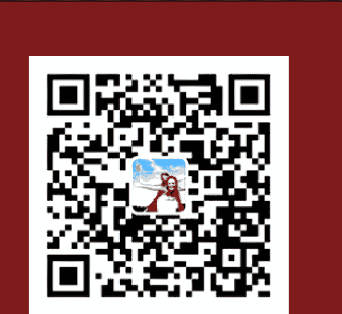

# 甲午马年运程

安海铭著

易安堂出品

2013.12

# 自序

时间总是过得很快，农历甲午年已经悄然来临，大家总会对新年充满期望，同时也会伴随着稍许迷茫，说到底人们是希望可以了解命运的规律从而改善自己、改善生活，但命运又好像琢磨不定、不易掌握。周易是中华文明的瑰宝，利用周易进行决策和改运可有助于人们了解和把握命运，笔者多年来专攻风水、命理、解灾等改运学，虽然每年都会为相当数量的客人进行批命、改运，但毕竟不如书籍易于普及风水命理知识，故为了推广周易文化，宣传风水、命理知识写作此《马年运程》，希望可以通过拙作帮助更多的人改善运气。

本书分为马年运势总论、十二生肖运程、安太岁、马年风水运程、马年择吉等五个章节，内容涉及民俗、历法、爻卦、择吉、八字命理、玄空风水等专业周易知识，大家阅读本书可以大到对马年的总走势，中国各地与周边国家气运，小到对每家每户的风水情况，每个人（不同属相）的全年运程，吉日吉时的挑选有全面而清晰的了解。

希望本书可以拉近我与您的距离，为您的工作、生活带来便利。
祝您马年大吉！

安海铭
癸巳年冬

# 作者简介

安海铭，天津人，知名风水命理师，运程学家，三元广东派玄空风水传承人，中国周易协会理事，堪舆研究会秘书长，天津易安堂创始人。著有《广东派玄空风水》、《易卦风水》、《命理入门》等专著，每年写作的运程书均获得读者好评。现为京津多家单位及个人顾问，从业多年进行过数十场风水讲座，为数百间建筑调理风水实效显著。风水之外，老师在八字、六爻、起名等方面亦有相当建树。为满足大家的需求老师马年将继续为大家进行风水、命理等活动，由于客户的要求纷繁未尽事宜您可以通过下列方法联系我们，老师必将尽力帮助你。联系电话：13212260009 QQ：909763074，电子邮件：masteranhm@163.com。

# 目录

# 第一章 马年运势总论
- 一、马年立春八字分析/3
- 二、马年值年卦运/5
- 三、马年流年天星计算地运、人事运/6
- 四、马年经济、股市、行业分析/9

## 第二章 十二生肖运程
- 一、十二生肖综述/10
- 二、十二生肖分述/11
  - 1. 生肖属马/11
  - 2. 生肖属羊/17
  - 3. 生肖属猴/21
  - 4. 生肖属鸡/26
  - 5. 生肖属狗/32
  - 6. 生肖属猪/37
  - 7. 生肖属鼠/42
  - 8. 生肖属牛/47
  - 9. 生肖属虎/52
  - 10. 生肖属兔/56
  - 11. 生肖属龙/60
  - 12. 生肖属蛇/65

## 第三章 安太岁
- 一、2014犯太岁的生肖/69
- 二、化解方法/70
- 三、拜太岁吉时/71

## 第四章 马年风水运程
- 一、马年风水综述/71
- 二、不同门向房屋每月风水运程/74

## 第五章 马年择吉
- 一、开市吉时/81
- 二、嫁娶吉时/82
- 三、开业搬迁吉时/86

后记/91

# 第一章 马年运势总论

## 一、马年立春八字分析

甲午马年是由公历2014年2月4日上午6时3分立春开始至2015年2月4日11时58分为止。

### 2014年甲午立春之八字

年柱：甲午

月柱：丙寅

日柱：丙午

时柱：辛卯

流月：

- 农历正月 丙寅（2月4日——3月5日）
- 农历二月 丁卯（3月6日——4月4日）
- 农历三月 戊辰（4月5日——5月4日）
- 农历四月 己巳（5月5日——6月5日）
- 农历五月 庚午（6月6日——7月6日）
- 农历六月 辛未（7月7日——8月6日）
- 农历七月 壬申（8月7日——9月7日）
- 农历八月 癸酉（9月8日——10月7日）
- 农历九月 甲戌（10月8日——11月6日）
- 农历十月 乙亥（11月7日——12月6日）
- 农历十一月 丙子（12月7日——1月5日）
- 农历十二月 丁丑（1月6日——2月3日）

注：括弧内均为公历日期，幅度为2014-2015。

在分析马年立春八字之前，先说说民间关于生肖转换的一个误区，很多人都认为，大年三十零时之后生肖就转换了，其实这在命理界看来是错误的，正确的看法是：从立春的时间来划分新的一年，比

如马年的正月初一是2014年1月31日，立春日为2014年2月4日（正月初五），也就是说，从大年初一到初五卯时之前出生的小朋友仍然属蛇，2月4日上午6时3分之后出生的小朋友才是属马，这一点请读者朋友一定要搞清楚，如果您的生日在农历立春日（2月4日左右）前后，请您一定要核实一下您的生肖，以免出错。

理清了这一点后，我们开始分析马年的立春八字了，这个八字的特点是，五行失调，火木过重，比劫重重，无官星辅助，财星赢弱，四柱之内见两重“羊刃”。

具体说来，马年将会出现经济疲软，人事失和，社会秩序相对混乱，易产生冲突暴力事件，发生重大交通事故，大型空难的可能性也较高，火灾、水灾、泥石流灾害亦是很难避免。电子业、汽车业、房地产业、农林业将会有所发展，中国内地的房屋价格将会稳中上升。如果您有置业的打算，请早做计划，否则将会发现理想的房源早已售罄。此外，马年的农林业很发达，大家有机会品尝到以前没有见过的农作物，贵重的木材原料价格将会继续攀升。汽车业也会有新的机遇，购买车辆的人士也会持续增多。健康方面，心脑血管疾病高发，头部疾病也较严重、失眠者急剧上升。

## 二、马年值年卦运

马年的值年卦为“屯卦”卦象如下：

屯卦象曰：这个卦是异卦（下震上坎）相叠，震为雷，喻动；坎为雨，喻险。雷雨交加，险象丛生，环境恶劣。“屯”原指植物萌生大地。万物始生，充满艰难险阻，然而顺时应运，必欣欣向荣。

屯卦事业：起初多不利，必知难而进，小心翼翼，勇往直前，灵活机动，可望获得大的成功，时机到来时一定要抓住，却也不得操之太急，且仍有困难，务必有他人相助，故平时应多施恩惠。

屯卦经商：创业初期步履艰难，多有挫折。坚定信念最重要，不要为表面现象所迷惑，应积极进取，行动果断，打开出路。若仍无法摆脱困境，则应退守保全，等待机会，再展宏图。

屯卦求名：积极争取，主动追求，可以成功。

屯卦婚恋：好事多磨，忠贞纯洁，大胆追求，能够成功，婚姻美满。

屯卦决策：初始困难，但若具有坚忍不拔的毅力和锲而不舍的奋斗精神，前途不可估量，但往往不为他人理解而陷于孤独苦闷，事业会因此处于困难状态，需要得到贤德之人的帮助才能摆脱。如能以乐观主义精神处世，能取得成就。

从上述内容可以看出马年必是先苦后甜的一年。

## 三、马年流年天星计算地运、人事运

### 2014甲午流年天星图

| 三碧禄存星（东南方） | 八白左辅星（南方） | 一白贪狼星（西南方） |
|---|---|---|
| 二黑巨门星（东方） | 四绿文曲星（中宫） | 六白武曲星（西方） |
| 七赤破军星（东北方） | 九紫右弼星（北方） | 五黄廉贞星（西北方） |

#### 1、马年地运

正东：流年为二黑，疾病星，说明此方位易产生疾病天灾，地震与火山爆发亦有可能，正东包括我国东部，台湾，日本等地。台湾与日本应灾的可能性最高。

东南：流年三碧，运星七赤，相遇为“穿心煞”，口舌是非贼盗之事猖獗，我国东南地区与东南亚国家是非必多。

正南：流年为八白财星，运星为三碧。虽然经济可得到良好发展，但也会伴随着是非官非。正南为我国南方地区，包括香港，澳门等地。澳门的博彩业今年会比较红火较惹人注目，香港则容易引发群体性事件。

西南：流年一白，运星五黄，为病灾，我国西南地区可能发生水土之患（泥石流）。

正西：流年六白，运星一白，主吉，旅游业将得到发展，国人去欧洲旅行机会会增多。

西北：流年五黄，运星九紫，火被土塞，主冥顽不灵，天灾人祸恐不可避免。

正北：流年九紫，运星四绿，木火通明，有利于文化事业，经济发展，唯一需要注意的是火灾，北京天津亦属正北。

东北：流年七赤，运星二黑，病星被泄，主东北地区局势缓和。朝鲜与韩国均会行运，彼此的关系变得比较微妙。

中宫：流年四绿，运星八白，土木交战，但八白正运，中原地区运势良好且有提升文化之举。

#### 2、马年人事运

四绿代表“文昌星”为文学艺术，2014年四绿飞临中宫，代表文昌星入囚，说明马年的文学艺术创作，大型文艺节目，选秀节目，会受到进一步的限制。文艺界会爆发丑闻。

五黄代表大病灾难，2014年飞临西北，西北为乾宫，代表领袖，首脑，长者，名人由于五黄飞临，将导致领袖出现凶险，政界出现极大变数，此外，也需要注意家中男性长者的健康。

六白代表驿马变动，偏财运，2014年飞临正西，正西为兑宫，代表演艺界，律师界，主持界等以口才为主的行业，亦代表少女，上述人士如欲在马年行运，则需要动中求财，一成不变将难有作为。

七赤代表盗贼，破财。2014年飞临东北艮宫，艮宫代表手工业房地产业，这些行业为八运（2004——2023）的当旺行业，今年虽有流弊，但问题不大。

八白代表正财，2014年飞临正南，离宫，代表我国南方经济会更稳定，当地的旅游业也会有所发展，家中排行第二的女性也会行运。

九紫代表喜庆，2014年飞临正北坎宫，代表北方可以行运，会有很多喜庆的事情。

一白代表桃花，2014年飞临西南坤宫，以母亲为代表，说明年长女性在马年人际关系比较顺利，亦代表宗教界在马年会有所作为。

二黑代表疾病，2014年飞临正东震宫，震为雷，数字三，构成“斗牛煞”，说明今年东部地区必会出现极端天气，甚至存在传染病的可能。

三碧代表是非官非，2014年飞临东南巽宫，巽为风，故今年东南地区台风严重，且天灾中伴随人祸，是非较多。

综上，今年女性总体运势较好，大利女性掌权尤其是年长女性，社会生活亦有所发展，男性需要多注意身体健康，尤其是男性长辈，避免疾病与意外。年轻男性亦不行运，万事不可强出头也许在马年比较适合男性退居二线，女性出面解决问题。

## 四、马年经济、股市、行业分析

### 1、马年经济

从马年立春八字我们已经看出今年的经济形势不容乐观，任何投机活动都应避免，普通民众应当将资金投入到较为稳健的理财产品中去，多观望、少冒险可避免无谓的损失。今年南方与北方有财，国内来讲北京和广东较好，国际来说俄罗斯与澳大利亚亦有商机，但美国的运势只是平平而已。

### 2、马年股市

马年股市走势恐为先升后跌之势，投资比重不宜过高，上半年即使上涨也不要盲目乐观，不可贪念过重，以短线为主，适时抽身，以免套牢。大家宜购买较为稳健的股票，但亦有爆冷门的股票出现。

### 3、马年行业

金：属金的行业今年发展受限，金融业，机械业，均难有作为，黄金价格在秋季之前会有小幅下降。

木：属木的行业在马年属于行运的行业，中药，名贵木材价格将会上涨，政府应当预防个别商家对农作物的投机行为。

水：属水的行业在马年最为失运，如物流业，水产业，会遇到瓶颈，快递业也将面临极大挑战，可能会发生一些负面事件。

火：属火的行业将主导马年的经济，电子业，能源业，汽车业等均会有良好的前景。但影视业的发展机会较小。

土：属土的行业表现中规中矩，稳中有升，房地产业，农业，古董与艺术品业皆有发展的机会。

总之，马年的投资宜以稳健为主，房地产，贵重木材，艺术品可做重点投资。

# 第二章 十二生肖马年运程

## 一、马年十二生肖综述

### 1、马年运气最好的生肖：鸡、狗

鸡肖在马年有“天德”、“福德”两大贵人星驾临，“福德”可增加德财，鸡肖在马年可以说事业顺利，财运广进。

狗肖命宫则出现“将星”、“金匮”“地解”等吉星拱照，将有机会在事业上上一个台阶，有机会掌权，财运亦算不错，且“午戌相合”主运势顺遂。但“地解”星主搬迁，肖狗者在马年搬家的可能性很高。

### 2、马年爱情运最好的生肖：鸡、兔

鸡肖在马年命宫同时出现“红鸾”、“咸池”主短暂的情缘，所以肖鸡者在马年极有机会结婚，也有机会遇到情人，如何选择就要看您的想法了。

兔肖则有“天喜”驾临，“天喜”亦主正桃花，肖兔者在马年遇上理想对象或者喜结连理的可能性很大。另外，蛇肖，牛肖在马年亦有“咸池”主有短暂恋情。

### 3、马年运气最糟的生肖：鼠、马

鼠肖今年冲太岁，主事业，感情易发生重大变化，且命宫中全无吉星，凶星确有“大耗”，“阑干”。“大耗”主破财，“阑干”主助力。可以说问题很多，特别要注意手，后背的损伤，注意交通意外，减少开车。

马肖今年值太岁，刑太岁，主生活变化多，心情不佳，口舌是非，人事不和。命宫中虽有“将星”但恐会产生因福招嫉的情况，凡事宜低调处理，凶星方面见“剑锋”“伏尸”等凶星，主刑伤，意外不断，尤其要注意农历五月及十一月，避免在这两个月内从事危险活动，可以献血，放生来化解凶灾。

此外，今年牛肖害太岁主犯小人，兔肖破太岁主与人反目，但都不算严重。

## 二、十二生肖分述

### 1、生肖属马

马肖今年为值太岁与刑太岁，主心情不定，口舌是非，人事不和，人缘运气皆属下滑，故事事均宜小心处理，忍让为先，犯太岁之年变化必多，工作，感情都包括在内，如在今年进行人生三大喜事：结婚、添丁、置业等，可以“一喜挡三灾”，将危害减至最低。

#### 财运与事业运

马人今年为“正财年”指需要付出辛苦才能获得钱财，凡事需亲力亲为方可获得回报。且不宜作大金额的投资，保险可以考虑购买。专业人士如医生，会计师，律师，保险代理人等肖马者来讲，可能付出很多责任多了，工资确未必提高，但必定印证了你的能力，为下一年做好铺垫。

#### 感情运

本命年的马人在今年感情生活会出现重大变化，如果您本就准备在今年结婚或者添丁是再好不过了，否则本有对象的马人在今年有分手的风险，马人应多多注意与恋人交流，减少误会，避免因一些小事，而吵架。没有恋人的马人在太岁的影下倒是有可能开始新恋情，不过要小心过于投入或遇人不淑而受轻伤。

#### 健康运

今年马人的健康问题不容乐观，易出现刑伤意外，在风水上流年五黄、二黑必须化解，自己也要做一些比如献血，放生等善举，小心谨慎可保平安。

#### 历年肖马者运程

1918年 戊午 虚岁97岁

年事已高的长者今年首重健康问题，需注意心血管疾病和消化道疾病，防止跌伤，不吃生冷食物，多与家人亲友聚会保持心情愉悦。

1930年 庚午 虚岁85岁

出生年天干庚受到流年天干甲的冲击代表您今年头与牙齿会出现问题，要注意预防失眠，头痛，牙齿疾病，另外今年家中晚辈添丁是您的辈分提升。

1942年 壬午 虚岁73岁

首先应当清楚，肾脏，膀胱等泌尿系统疾病，其次今年会有小财不过口舌是非亦比较严重，建议多学习多运动，保持好心情。

1954年 甲午 虚岁61岁

由于出生年与流年“伏吟”，54年的马人受太岁影响较大，化太岁的方法要做足，最好做全身体检了解身体情况，家中宜安排喜事如嫁娶，添丁，做寿之类，财运方面则有破财可能，投资应慎重。

1966年 丙午 虚岁49岁

今年心情有急躁倾向，人际关系疲软，但好在有贵人相助，贵人是比您更年长的人。婚姻关系有可能出现变化，有婚变风险，可去北方旅游以便改运。

1978年 戊午 虚岁37岁

易出现官非，今年最好不要与他人合作，否则容易被骗，注意交通安全，不要借钱给别人。

1990年 庚午 虚岁25岁

有恋人的容易分手，没有恋人的有利于遇到心仪对象，能结婚也是一个不错选择，财运方面则起伏不定，可能会有突然的开支，建议应当存款有备无患。

2002年 壬午 虚岁13岁

学业有稳定进步，但今年容易发展个人兴趣爱好，防止因爱好耽误学业，健康方面则容易小病小痛，最好注意饮食，少吃快餐食品。

#### 每月运势

##### 正月 丙寅 公历2月4日至3月5日

本月会有些辛苦，但好在是“寅午”相合月，人际关系还算不错，也会有属虎的贵人相助，但财运就马马虎虎没什么好转，情感方面本月大吉，可享受甜蜜，1942年与1966年出生的马人更需要注意身体健康，注意皮肤与呼吸器官问题。

##### 二月 丁卯 公历3月6日至4月4日

本月马人有多位贵人相助运气不错，但同时口舌是非也比较严重。本月亦是马人的桃花月，单身的马人容易发展恋情，有伴的马人需特别注意异性关系，小心出现三角恋情，上班一族则人缘颇佳，易获得上司赏识，但本月并不宜投资，身体方面要注意保暖。否则易遭流感困扰，1990年出生的马人需提防陷入官非诉讼。

##### 三月 戊辰 公历4月5日至5月4日

本月命宫中出现“天解”星，主以前总是解决不掉的事情可在本月内彻底解决。同时本月亦容易发生凶险需加倍注意。马人在本月要注意，家人长者的身体健康，如有疾病不要拖延治疗。本月财运仍然不佳，不宜冒险投资。

##### 四月 己巳 公历5月5日至6月5日

四月马人最重要的任务是预防疾病。以心脏，眼睛为主，情绪不宜暴喜暴怒，注意用眼卫生，多休息，不熬夜。可适时全家出游调整身心健康，本月财运虽较上月有所增长，但支出亦大属过路财神。1954年的肖马人则可能因琐事与家人发生争执，应注意自己的情绪。

##### 五月 庚午 公历6月6日至7月6日

本月为全年中太岁影响最为严重的一个月，悲观情绪更为明显，诸事阻滞不前。本月不宜做任何重大决定，但财运尚可，多劳多得。1990年出生的马人最易产生情感挫折。

##### 六月 辛未 公历7月7日至8月6日

本月太岁相合，运势上升，本月适宜小规模投资，与人合伙亦可。感情上与另一半相处的不错，比较平稳的一个月，正好可以迎接下个月的出行。

##### 七月 壬申 公历8月7日至9月7日

本月马人有“驿马”，有机会去远方工作，学习或旅行。事业运强劲，上班族可晋升，从商者可拓展事业。1966年出生的马人可能发生与人反目的事件，凡事最好忍让。本月家中长者的健康状况仍需留意。

##### 八月 癸酉 公历9月8日至10月7日

本月马人有很大可能会步入婚姻殿堂，可喜可贺。即使没有结婚打算本月亦会非常甜蜜。但本月健康运较差，容易受到意外伤害，尤其需要小心交通意外，本月财产尚可，不必担心无钱进账。

##### 九月 甲戌 公历10月8日至11月6日

马人本月会变得比较懒散，无心工作，财运上难有突破，虽有贵人相助但在工作上成效不大，好在本月感情稳定，也算少了很多后顾之忧。身体上皮肤，呼吸道问题卷土重来要注意饮食起居符合健康生活习惯。

##### 十月 乙亥 公历11月7日至12月6日

本月虽有贵人助运，但破财在所难免，可能是遇到事情虽有人帮助但要支付谢礼。好在本月财运不错，有些支出，亦无大碍。本月女性马人遇到心仪对象的机会较大，不妨把握一下。

##### 十一月 丙子 公历12月7日至1月5日

本月破财与阻碍同时到来，马人最好早作心理准备。健康方面亦是马虎不得。最好去洗牙以应损伤。感情上亦非常辛苦，是全年中最容易分手离婚的月份。

##### 十二月 丁丑 公历1月6日至2月3日

如果十一月遇到的问题能够顺利解决，在马年的最后一个农历月份，马人终于时来运转，本月贵人多多，财运亦佳。健康方面也没有什么大问题，放松心情准备迎接农历羊年吧。

#### 马肖开运妙招

### 2、生肖属羊

羊肖今年与太岁“六合”，一般来说与太岁相合代表运气相对稳定，人缘也会比上一年佳，易得朋友，平辈贵人相助，做起事情会顺利很多。但今年的羊肖命宫缺少主要吉星，凶星方面则有一颗“病符“星，说明肖羊者今年要格外注意自己的健康，最好在正月前做全身体检，有备无患。

#### 财运与事业运

羊人今年得长辈、上司赏识帮助，事业可得顺利发展，但羊人今年亦有偷懒的现象。所以，全年的财运平平，很难有大的突破，但好在也并不破财。

#### 感情运

单身的羊人有机会再出差或游行中结识异性，否则只有靠别人介绍方可开展恋情。有伴的羊人则感情平稳，有同居或结婚的势头，除了男女感情外，羊人今年整体人缘很好，自我心情也不错。

#### 健康运

羊人今年需要注意自己与家中长辈的健康，避免因应酬过多导致的慢性疾病。其次需注意皮肤与呼吸道疾病，饮食方面宜清淡为主，可减少生病几率。

#### 历年肖羊者运程

1919年 己未 虚岁96岁
出生年干支与流年干支相合，健康方面需特别留神，身体如有不适需马上就医，需要特别小心扭伤摔伤。

1931年 辛未 虚岁84岁
今年总体比较顺遂，与家人关系很好，心情愉悦，但要注意旧病的困扰，减少外出，适当运动有助于身体健康。

1943年 癸未 虚岁72岁
口舌是非严重的一年，人际关系比较紧张，应尽量控制自我情绪避免与他人争执。健康方面则需要注意咽喉肿痛和牙齿健康。

1955年 乙未 虚岁60岁
乙未年出生的羊人今年有破财的风险，请勿借钱给别人或重大投资。健康方面与其他羊人一样均需注意呼吸系统与肺部的问题。

1967年 丁未 虚岁48岁
今年事业运佳有望有重大突破，财运亦算不错，但需注意饮食规律防止体重突然大量增长，多做运动是行运的好习惯。

1979年 己未 虚岁36岁
与1919年出生的羊人一样1979年出生的羊人亦是与流年干支相合的人群，36岁的羊人适宜在今年举行人生重大喜事如添丁、置业可有利于运势。除这些之外需注意口舌是非与官非，所有法律文件的签署需更为谨慎。不宜参加各种危险活动。

1991年 辛未 虚岁 24 岁
事业运佳有望获得理想工作。感情方面则是分分合合不乐观。健康方面留意感冒之类的小病。

2003年 癸未 虚岁 12 岁
财运上升的一年不过考虑到年龄应该只是父母多给了一些零用钱。学业上稳步提高，与同学的关系也算不错。健康方面最需注意的是肠胃疾病。

#### 每月运势

正月 丙寅 公历 2 月 4 日至 3 月 5 日
本月贵人运足，工作方面可得老板赏识，经商的朋友更是有所突破，但需注意本月羊人亦有破财的可能。1931 年出生的羊人最需注意喉咙问题。

二月 丁卯 公历 3 月 6 日至 4 月 4 日
本月羊人财运上佳，长时间未能解决的问题在本月亦可一并解决。但本月羊人需多注意身体健康与交通安全，尤其需要注意的人事 1967 年出生的羊人。

三月 戊辰 公历 4 月 5 日至 5 月 4 日
本月未婚的羊人有望可以找到理想的另一半，有伴的则有利于两人感情。工作中虽然比较顺利，但很容易招惹口舌是非。身体方面留意肠胃功能尤其是 2003 年出生的小朋友。

四月 己巳 公历5月5日至6月5日
羊人在农历四月终于有机会通过出差或旅行到远方走走，但心情确未必如旅途一样舒畅。另外，本月羊人一定要注意家中老人的健康。1979年出生的羊人需防足部受伤。

五月 庚午 公历6月6日至7月6日
本月肖羊的相合月，不论男女感情或者是朋友，同事间的相处都比较愉快。财运方面则表现平平，不要有太大奢望。1955年的羊人本月有与宗教结缘的倾向，但需注意防止失眠。

六月 辛未 公历7月7日至8月6日
本月的健康问题又回到首位，各年龄的羊人本月均需小心谨慎，防止疾病与意外。其中1943年出生的羊人风险最高，除此之外本月财运感情运均属中上。

七月 壬申 公历8月7日至9月7日
本月是羊人的桃花月，力量比农历三月还要强，最近几年都不是羊人的桃花年，桃花月就更值得重视了，想结识异性的羊人本月应多参加社会活动以增大几率。本月财运与健康亦无大问题，值得注意的是自己的一些计划在本月可能会落空。

八月 癸酉 公历9月8日至10月7日
本月适宜通过学习进修来提高自己的能力，财运则依然不错，买几张彩票试试手气也无妨。感情方面则回归平稳再结识新异性的机会不大。1919年的羊人多注意脾胃，1967年的羊人则要留意心脏问题。

九月 甲戌 公历10月8日至11月6日
月支月自己相刑的月份，注意饮食防止肠胃之患，人际关系倒退，应避免与朋友同事争吵，1955 年出生人士受“劫财”影响，不宜投资或借贷，1979 年羊人本月则有发胖风险且家宅运不稳，提防无事生非。

十月 乙亥 公历 11 月 7 日至 12 月 6 日
本月羊人在事业上有望有重大突破。但接踵而来的则是各种流言蜚语，保持低调是当务之急。否则，严重起来甚至染上官非诉讼。1955 年的羊人本月不宜投资，签约，担保否则破财就在眼前。

十一月 丙子 公历 12 月 7 日至 1 月 5 日
本月羊人有贵人助运，工作状态良好，但需要花钱的地方也增多。且在月中有令人心动的异性出现，已婚者需把持好自己以免不必要的麻烦。1931 年的羊人请注意自己的肺部健康，如有不适需尽快就医为妥。

十二月 丁丑 公历 1 月 6 日至 2 月 3 日
来到了“丑未”相刑冲的月份，工作越到很多阻碍，止步不前，但所需的支出比上个月更多，让羊人十分苦恼，并且马上要来到自己的本命年，羊人应该做做身体检查，保持心情平静。众羊人之中 1967 年出生者本月最易破财请小心。

#### 羊肖开运妙招

适合使用猪形玩偶或饰物，床头房一只铜葫芦可防止失眠，家中宜多半喜事，装修家居亦是不错的选择，化解流年三碧以防口舌是非。

### 3、生肖属猴

今年猴肖命宫之中亦无主要吉星，运势只主一般。但今年肖猴者动中求变、动中求财的运势。凶星中有“天狗”及“吊客”。天狗出现，交友、合作要格外小心，以防被陷害、受伤。“吊客”主远房白事，影响不大。

#### 财运与事业运

猴肖马年财运以动中求财为主，上班族如有跳槽意向不妨在今年落实。从商者则可在今年开拓外地市场，多劳多得的一年。投资方面则要谨守见好就收的原则，不宜大规模的投资。

#### 感情运

单身的猴肖有望在出差或旅行中结识心仪的异性，否则仍需别人的介绍开展恋情。有伴的则需要与对方多交流以防感情变淡。总体上女性猴人的感情运要比男性猴人的感情运强出不少。

#### 健康运

马年猴人的健康运表现平稳，但仍需注意在出行中遇到的各种意外。同时不宜进行各种危险性高的活动，如潜水、跳伞、蹦极等。身体方面必须注意不吃生冷食物以免产生肠胃病及皮肤过敏。

#### 历年肖猴者运程

1920年 庚申 虚岁 95 岁
贵人运强的一年但考虑到年龄问题，应该指 95 岁的猴人与家里人相处融洽。健康方面，由于出生年与流年天干相冲，易患头痛、失眠、肝胆问题也需要注意。

1932 年 壬申 虚岁 83 岁
83 岁的您今年首要任务是注意自己的健康，外出活动也要尽量减少，注意交通安全，预防摔伤。

1944 年 甲申 虚岁 71 岁
学习运强的一年，尤其会对宗教，术数产生兴趣，注意劳逸结合。财运方面则必须留心，不宜冒险投资，也不要参与接待担保，否则破财难免。

1956 年 丙申 虚岁 59 岁
全年首要问题是预防意外伤害，在家中应妥善收藏刀、剪之类的尖锐之物，外出则需多多注意交通安全，禁止一切危险的活动如爬山、游泳等。另外今年偏财运不错可以适当投资股票证券必有回报。

1968 年 戊申 虚岁 47 岁
戊申猴人今年有“天厨贵人”加持，如您身为公职人员则有望升职、加薪，即使是普通百姓亦可增加食禄，但同时需要小心各种意外伤害。

1980 年 庚申 虚岁 35 岁
庚申猴人今年的事业运为历年猴人之最，今年有望大展拳脚，贵人运重，一般的凶事亦可化解。财运顺遂之年，经济状况得到明显改善。健康方面则需注意头部或手脚受伤。

1992 年 壬申 虚岁 23 岁
学习运不错但需避免贪多求全导致一无所获，人际关系尚佳，各种聚会频繁，注意饮食健康，不要饮酒，避免因琐事与家人争执，谨记家和万事兴。

2004 年 甲申 虚岁 11 岁
学习成绩有明显提高，但跟同学易发生小摩擦，父母应及时进行引导。健康运方面注意流行疾病，少去人多又不通风的地方。

#### 每月运势

正月 丙寅 公历 2 月 4 日至 3 月 5 日
正月对于猴人来所过的并不轻松，破财、阻力、意外伤害接踵而来，而且猴人在本月比较动荡，处于奔波劳碌之中。不过好在很多事情本月亦可得到彻底解决。

二月 丁卯 公历 3 月 6 日至 4 月 4 日
经过对猴人来所并不愉快的正月，二月猴人的运气明显有所改善。本月有贵人相助使得很多事情都顺利许多，但破财问题本月依然存在。1944 与 2004 年出生的猴子本月需预防意外伤害。

三月 戊辰 公历 4 月 5 日至 5 月 4 日
属于思想起伏不定的一个月，做事情也难有热情，好在除了 1968 年出生的猴人外，其余猴人本月财运还算不错。感情方面亦是稳定的一个月，但似乎有缺乏新意的问题。

四月 己巳 公历 5 月 5 日至 6 月 5 日
本月为猴人的幸运月，除了有一些口舌是非外，其余的运气均不错。尤其本月贵人多多，对工作学习大有帮助。2004 年出生的猴童运气最好，学业进步明显，但猴童应注意本月不可暴饮暴食否则有发胖的可能。

五月 庚午 公历6月6日至7月6日
本月为辛苦得财月，个体工作这，从商者本月运势都不错，但想转变成现金则还需要一个过程。感情方面则依旧平稳，除非配偶犯太岁否则变化不大。1944 年的猴人受月干冲击的影响需留意身体健康，重点在肝脏。

六月 辛未 公历7月7日至8月6日
没伴的猴人请注意，本月是你们的桃花月，与心仪异性相识的几率很高，请好好把握。但本月猴人们也同时需要留意自己的健康，虽然是盛夏也不要吃太多生冷食品。否则肠胃可是会抗议的。1980 年的猴人本月请留意各种合同或投资稍有不慎破财难免。

七月 壬申 公历8月7日至9月7日
又是猴人非常辛苦的一个月，口舌、血光都有可能发生，唯有小心谨慎，避免与人争吵方为上策，感情方面亦是变化较多，另一半的心情难以揣测。1932 年的长者健康运最差，尤其需注意泌尿系统问题。

八月 癸酉 公历9月8日至10月7日
事业运好转，但变化难测。感情方面则会遇到一定困扰，请好好对待自己的另一半。1920、1944、1968 三个年份的猴人请密切关注自己的健康，不要被病魔打到。

九月 甲戌 公历10月8日至11月6日
本月易有远方贵人相助，利于从事接触外地业务的猴人。感情运本月也不错，利于开展新恋情。身体方面受秋燥影响，鼻咽需要收到特殊照顾。

十月 乙亥 公历11月7日至12月6日
适宜学习的一个月，可把握以下提升自己。感情运财运皆是平平，容易与人发生口角，有事还是好好沟通为好。1944年的猴人本月则可能有破财风险。

十一月 丙子 公历12月7日至1月5日
本月猴人的事业运与财运均达到本年的巅峰，应该可以挣个盆满钵满。但本月亦要注意不要惹上是非、官非。1992的猴人容易与家人争吵，应当避免。

十二月 丁丑 公历1月6日至2月3日
来到马年的最后一个月，猴人的运气可以说依然旺盛，事业、财运都不必担心。但要留意本月的支出情况，1932年的长者本月请您密切注意自己的健康情况。

#### 猴肖开运妙招

猴肖开运请多出行或出差工作，适当读书学习亦有利于运程，可投资一些理财产品，黄水晶饰品，是您的开运宝石。

### 4、生肖属鸡

鸡肖在马年属于运气最好的生肖，吉星方面有“福星”、“天德”、“福德”。“天德”为众福星之首，最为尊贵可化解不良凶煞。“福德”主增加福报与道德。“福星”主增寿。三大贵人出现，鸡人在马年可谓鸿运当头。凶星方面则有“卷舌”、“飞刃”、“流霞”。“卷舌”主口舌是非，“飞刃”主意外伤害，“流霞”主不正桃花，但鸡肖今年贵人众多自可遇难呈祥，化解于无形。

#### 财运与事业运

马年鸡人获得众吉星帮扶财运与事业自可达到一个新的高度。鸡人在今年最易获得女性贵人的帮助。这个女性贵人可能是你的上司、长辈，甚至是自己的太太。另一方面投资可获回报，但此回报属于缓慢的增长，操之过急是今年鸡人的投资大忌。

#### 感情运

马年注定是鸡人感情变化最多的一年，“红鸾”，“咸池”，“流霞”三颗星耀进入流年命宫，主正歪桃花同时出现，所以请鸡人在今年特别注意男女之间的关系。否则，轻则产生是非，重则破坏已有感情。当然如果您还没有找到另一半，今年的机会难得，请勿错失良机。

#### 健康运

受“飞刃”的影响，鸡人在今年的健康运还是需要释放留意的。尤其是突发病症和意外伤害。今年呼吸道、肠道是最为脆弱的地方，请保护好它们。家中尽量减少金属尖锐之物以免意外发生。

#### 历年肖鸡者运程

1921年 辛酉 虚岁 94 岁
健康运不错，身体无大碍，但关节旧患本年则有复发或严重的可能。财运本年亦有提升，不过考虑到您的年纪，应是儿女子孙比较孝顺，您也可以感受到齐家合乐的心情。

1933年 癸酉 虚岁 82 岁
口舌是非较多的一年，家里的事还是多与家人商量再做处理为好，健康方面除了男性长者需注意泌尿系统外问题不大。

1945年 乙酉 虚岁 70 岁
适合老有所学，老有所乐的一年，生活愉快，与家人朋友相处的非常开心。但本年有破财，隐忧需要注意，请不要借钱给他人或为人作担保。健康方面腿脚问题突出，注意休息或预防。

1957年 丁酉 虚岁 58 岁
对于快要退休的您来所，今年的事业运和财运不错。有望赶在退休前再上一个台阶。健康方面提防与心脏有关的疾病，如有问题及早治疗。

1969年 己酉 虚岁 46 岁
财运尚佳的一年，工作上阻碍不多，以您的能力相信完全可以应付。感情本年到时需要注意，今年可能会面对诱惑。健康方面皮肤问题可能比较让人困扰。

1981 年 辛酉 虚岁 34 岁
事业方面进展顺利，自己的努力，贵人的帮助使 34 岁的您事业发展一帆风顺。感情方面则比较平稳，没伴的今年有望找到自己钟情的伴侣。健康方面则需注意手脚扭伤，避免高危运动。

1993 年 癸酉 虚岁 22 岁
如您已经选择步入社会，今年将会是人生有重大发展的一年，事业上应该有一番新天地。如果您仍在求学，则您仍需继续努力，今年的学业运只是一般。感情方面则需小心多角恋情的发生，小心遇人不淑。年纪尚轻的你不妨将一定的精力放在工作学习上。

2005 乙酉 虚岁 10 岁
10 岁的小朋友今年学习成绩出色，但跟同学相处需要一定调整，家长应多指导其接人待物，养成良好习惯。健康方面则慎防感冒或其他流行疾病，避免孩子在流行病高发期去人多的地方。

#### 每月运势

正月 丙寅 公历 2 月 4 日至 3 月 5 日
本月财运令人满意，有贵人相助工作进展顺利。唯 1957 年出生的鸡人有破财风险。1981 年的鸡人应注意呼吸系统疾病。感情方面则为平常而已。

二月 丁卯 公历 3 月 6 日至 4 月 4 日
本月对鸡人来说并不顺利，破财，阻力会使您身心俱疲。健康方面则需注意四肢受伤，不要进行危险运动。此外，鸡人在本月有可能会遗失物品。请保护好您的财务。1969 年出生的鸡人本月感情面对生变的危险。

三月 戊辰 公历4月5日至5月4日
本月鸡人的财运非常好，可将上个月的损失全部弥补。工作成绩优秀有望升职，但亦有落空的可能。1933年的鸡人健康运较差，最好多加注意。

四月 己巳 公历5月5日至6月5日
口舌是非严重的一个月，鸡人在本月应多做少说为妙，也不要参与别人的纠纷。受“白虎”星影响，本月鸡人有轻度的血光之灾。献血，洗牙，放生可化解。1969年的鸡人本月万万不要投资否则极易亏本。

五月 庚午 公历6月6日至7月6日
本月鸡人的各方面运气均非常不错，生活工作事事顺利唯独口舌是非有继续的倾向，好在本月有贵人相助，但可顺利过关。1981年的鸡人本月勿借款或为人作保。

六月 辛未 公历7月7日至8月6日
本月运气平平，但好在也没有什么坏运气。远方亲属可能会传来一些家族长辈生病之类的信息。感情方面本月亦有机会解释异性请留意。2005年的小朋友本月不要参加剧烈运动，以免受伤。

七月 壬申 公历8月7日至9月7日
会闹点小病的一个月，注意不要吃太多生冷食物，老人要注意不要吹太多空调。1993年的青年如果已经参加工作，本月需多加努力，否则，难以获得上司赏识。1957年的鸡人本月受失眠困扰，请注意多休息。

八月 癸酉 公历9月8日至10月7日
本月虽然是鸡肖的犯太岁月，但今年鸡肖总体运势良好所以并无大碍。财运本月颇为良好，可买张彩票试试手气。健康方面则需开始注意呼吸道及肺部的问题，应开始注意保暖。

九月 甲戌 公历10月8日至11月6日
工作虽然非常努力但是计划总是月结果有一定差距，鸡人不妨本月把工作目标定的稍微低一点，这样可以避免犯眼高手低的问题。有条件的朋友可以出游来改善一下自己的运气，本月不宜做任何重大决定。

十月 乙亥 公历11月7日至12月6日
如果您上个月没机会出行，本月时机应该成熟多了，夏天出生者亦向北方出行，冬天出生者则可以考虑去南方玩玩。感情方面这几个月均是变化不大。1981年的鸡人需要注意感冒，伤风等小病。

十一月 丙子 公历12月7日至1月5日
本月感情运经过一段低迷后终于反弹，有伴的鸡人与爱人相处融洽，没伴的鸡人本月可以向目标发动攻势，机会就在眼前。除此之外，本月鸡人亦有贵人助运，工作表现也是可圈可点。1921年的长者本月注意身体表现，如有不适应及时就医。

十二月 丁丑 公历1月6日至2月3日
马年的最后一个月，鸡人可谓喜忧参半。一方面工作表现受到领导认可，升职加薪就在眼前。另一方面，口舌是非严重，令鸡人烦恼不已。其实只要做好自己很多问题可以顺利解决。1981 年的鸡人需特别注意文件合约否则易生官非之事。1993 年的鸡人则需注意肠胃问题。

#### 鸡肖开运妙招

首先因存在小小健康隐患，体检是必修课。其次，鸡肖在本年中最好不要月他人有金钱纠葛以防破财。马年命带红鸾，未婚者可催旺流年九紫星来增强运势。书籍是鸡肖今年的吉祥物，多看书可以为鸡人助运。

### 5、生肖属狗

狗肖在马年的运气也非常不错，命宫中流年吉星有“金匮”、“将星”、“地解”、“国印”。“金匮”主财源广进，“将星”主事业可顺利发展，“地解”主搬迁，“国印”主指掌握大权的印章，代表可升职加薪。对从事文职管理及创作工作非常有利。

凶星方面主要有“白虎”，“白虎”为是非星，无风起浪，制造干扰，女性肖狗者今年入怀孕要特别重视安胎。“白虎”也会造成桃色风波，严重者有血光之灾。综合来看狗肖今年吉星较多，只要注意避免“白虎”的影响，将会一切顺利！

#### 财运与事业运

狗肖在马年的财运可谓顺风顺水，“金匮”、“将星”、“国印”三大吉星可保狗肖在马年一路长虹，只要狗肖在马年没有桃色纠纷就不会破财。

#### 感情运

狗肖在马年的情感还是比较稳定的，但开展新恋情的机会也并不太多。除此之外受“白虎”影响，狗肖应多多注意与异性交往的分寸，避免产生无谓的是非。

#### 健康运

在马年狗肖还是比较忙碌的，也有搬家的可能。所以狗肖们合理安排工作与休息时间，预防慢性疾病和负面情绪。全年应减少探病活动，多参加体育锻炼，对身体健康将大有帮助。

#### 历年肖狗者运程

1922年 壬戌 虚岁 93 岁
健康运不佳的一年，全年需时时注意防止意外的发生，雨雪等恶劣天气请不要出门，即使在家中也要谨防滑倒。留意肠胃的健康，不吃生冷食品。

1934年 甲戌 虚岁 81 岁
老有所学的一年，今年您有机会接触到自己感兴趣的事物，老有所学，老有所乐。健康状况五大碍。但感冒等小毛病却持续不断，吸烟者请戒烟。

1946年 丙戌 虚岁 69 岁
情绪变化较大，稍有悲观情绪。其实并没有什么大问题会发生，您不妨可以旅游，会友，做点开心的事情放松一下。糖尿病，高血压等慢性病开始增加，请注意保健。

1958年 戊戌 虚岁 57 岁
工作运气比去年明显有所好转，但财运却时好时坏。所有重大决定请提前咨询专业人士以免后患。今年您并不适合进行剧烈运动，否则手足容易意外受伤。

1970年 庚戌 虚岁 45 岁
庚戌年出生的您今年可以用大吉大利形容，更人多多，遇上问题也可以迎刃而解。但今年必须注意偏头痛和失眠的问题，不要让小病影响了健康。

1982年 壬戌 虚岁 33 岁
事业发展目标明确，但人际关系疲软，注意避免与上司或同事发生口角。已婚者易与伴侣争吵，这并不是好的沟通方式，请注意体谅别人，财运方面可保小康，不妨加强理财学习。

1994年 甲戌 虚岁 21 岁
如您仍在上学，本年学习运良好，有望升学或获得好的学习成绩。如您已参加工作，则工作方向仍在摸索之中，事物发展均有过程，不要操之过急。处理情感问题是本年的必修课之一，人的成长往往需要经历一些并不满意的事情。

2006年 丙戌 虚岁 9 岁
读书运良好的一年，但预防近视眼同样很重要，家长不妨注意一下孩子的用眼习惯，丙戌年出生的小朋友近视的可能性可是很高的。

#### 每月运势

正月 丙寅 公历2月4日至3月5日
本月财运与事业运都很好，但容易受到误解，容易惹上各种是非，所以本月狗人应当多做事少说话。1946年的出生者受劫财运影响，不宜从事投资活动。1982年的出生者，家宅运不稳，应避免与家人争吵。

二月 丁卯 公历3月6日至4月4日
本月事业发展存在波折，但亦有新的机遇，有机会与新搭档合作。感情运良好，有机会结识新异性。1922年的出生者本月健康运别人担忧，多注意身体健康。1970年出生者本月易犯官非，各种法律事务应先咨询专业人士以备后患。

三月 戊辰 公历4月5日至5月4日
上班族工作上会遇到一定阻力，自己做老板的人士需防止错误的投资或项目否则容易破财。如有时间不放出行以化解衰运。秋冬出生者应到南方游玩，春夏出生者则可北上。1958年的狗人，此月为破财月，不适宜任何投资活动。

四月 己巳 公历5月5日至6月5日
本月运气转为顺遂，但工作压力仍然存在，整个人也有些焦虑，其实不必过于担心。本月贵人运还是比较强的，有问题时多找人商讨即可。1954年的出生者提防身体受伤，避免一切剧烈运动，减少外出为好。

五月 庚午 公历6月6日至7月6日
贵人运良好，尤其以肖虎者提供的帮助最大。对于各种法律文件应提前咨询专业人士以免陷入官非诉讼。人际关系稍弱，注意与朋友和同事间的关系。1943年的狗人口舌是非较多。1970年的狗人本月为破财月应减少投资。

六月 辛未 公历7月7日至8月6日
肖狗者本月除了稍有口舌之灾以外运气良好，贵人继续助运会使您的事业运，财运，健康运均处于上升状态。另外本月有出行的机会，公事的可能性比较多。1970年的出生者本月为破财月请注意一切财物活动均需谨慎处理。

七月 壬申 公历8月7日至9月7日
学习运较好，适合进修学习。本月财运则比较一般，可能会有亲友向您借钱，请量力而为。1946年出生的人士，本月不宜进行任何有危险的活动。

八月 癸酉 公历9月8日至10月7日
本月会有新的合作机遇，如比较合理，不妨一试。健康方面留意肠胃引起的疾病。本月波折较多，需谨慎处事。1982年的出生者则财运不济，应减少经济活动。

九月 甲戌 公历10月至11月6日
人际关系问题较多，避免与人发生争执。本月宜外出走动，可“动中生财”。感情运与健康运均为平平。1970年的出生者，谨防手部受伤，不要参加危险活动。

十月 乙亥 公历11月7日至12月6日
本月对肖狗者来所是在各种运气之中最好的是感情运，放入锅是新开展的恋情则有落空的危险。小有偏财运，买几张彩票试试手气也无伤大雅。1970年出生的人士本月易失眠，1994年的人士则较易破财。

十一月 丙子 公历12月7日至1月5日
贵人运强，事业发展顺利，有意换工作的人士，本月是落实的好时机。感情方面有利于男性肖狗者的姻缘。1982年的狗人本月需注意被风吹到头部，因为本月您特别容易被头痛困扰。

十二月 丁丑 公历1月6日至2月3日
运势好转，人际关系也比较顺遂，但焦虑的事情会比较多，不妨抽时间多做做运动调解一下心情。1922年的长者，本月易患病请做好预防工作。1994年的狗人财运有回升的趋势，可多进行理财活动。

#### 狗肖开运妙招

请肖狗者多参加喜庆场合，可提升正能量，如能主动搬迁或装修家居可利于家宅运稳定。口舌较多应化解流年三碧星。印章是狗肖今年开运的宝物。

### 6、生肖属猪

猪肖在马年流年吉星有“紫薇”、“龙德”、“地解”、“词馆”、“暗禄舆”。紫薇、龙德均是一级吉星，主贵人临门，逢凶化吉，有机会掌握大权。地解星主搬迁或家中装修，词馆主发文秀，聪明智巧，文采出众，暗禄舆主暗中得财，源源不绝。

凶星方面则有“暴败”与“天厄”，主天灾人祸，应注意健康状况，小心旧病复发，应减少一切危险活动。

#### 财运与事业运

肖猪人士在马年可以获得新机遇，经商者与从事销售工作的朋友不但客源稳定，亦可有所拓展，上班族则中规中矩稳步提升，农历四月与十月有变换工作的机会。受暗禄舆的影响可增加偏财，但注意应适可而止。

#### 感情运

肖猪者今年的感情运平平，有伴侣者与另一半的关系比较平淡，缺乏新意。没有恋人的如想开展恋情最好请长辈或朋友帮忙介绍，不要奢望姻缘可以立竿见影，不妨考虑现增加彼此的了解，有助于日后感情的稳定。

#### 健康运

受到凶星“暴败”、“天厄”的影响，猪肖今年必须多注意身体健康，合理膳食，避免参加危险活动，家中各种家具摆放要注意避免尖锐物品导致伤害，可多参加喜庆活动，减少探病问丧，以提高健康运。

#### 历年肖猪者运程

1923年 癸亥 虚岁 92 岁
人际关系良好，与家人相处和谐，但由于年份出现“水火相冲”应注意心脏与血压，以及眼睛的疾病，如已患有上述疾病，请密切注意，以防复发。

1935年 乙亥 虚岁 80 岁
有些破财的一年，亲属朋友可能会找您借钱，应仔细考虑后再做决定。出行时需要将贵重物品妥善保管好，以防遗失。健康方面注意关节炎与扭伤。

1947年 丁亥 虚岁 68 岁
财运、健康等运势均有所提升，有偏财运但仍应避免高风险的投机活动。口舌是非较多，提防因说话得罪别人，健康方面泌尿系统问题比较突出。

1959年 己亥 虚岁 56 岁
容易患有头痛等病症，手也容易受伤，请注意居家安全。对于各种法律文件必须提前咨询专业人士，否则有陷入官司诉讼的风险。好在偏财运尚可，可以进行小规模投资。

1971年 辛亥 虚岁 44 岁
喉咙、呼吸器官易出问题，注意预防感冒和过敏症。人际关系和财运今年比较顺利，付出与收入能成正比，但各种经济活动不是尽量控制成本总额，减少不必要的开支为好。

1983年 癸亥 虚岁 32 岁
得贵人扶持，运势较往年顺遂，但财运平平，不适合进行大型投资活动。马年适合学习进修，对未来事业的发展较为有利，已婚者有添丁之喜，但容易因子女问题导致夫妻失和。

1995年 乙亥 虚岁20岁
学习运稳定，人际关系也不错。但与家人的关系较为紧张会因为琐事而争吵。感情方面虽有适合对象但关系发展缓慢。

2007年 丁亥 虚岁8岁
学习能力明显增强，适合从多个方面开发智力。健康方面皮肤病与肠胃病属于高发疾病应多注意。饮食患蛀牙的可能性也比较高，应及时治疗。

#### 每月运程

正月 丙寅 公历2月4日至3月5日
口舌是非较多的一个月，与人合作时应格外注意。注意化解“三碧”星，否则会有人找你借钱，并一借不还。虽有新的投资机会，但还是三思而后行为好。1959年的猪人心情莫名低落，多与家人交流为好。1971年的猪人肺部则容易出毛病。

二月 丁卯 公历3月6日至4月4日
肖羊者是本月的贵人，多与属羊的人合作接触可保本月顺利。本月应酬较多体重有提高的风险。1947年的猪人有破财之祸。1983年的猪人则要主要有关眼睛的一切疾病。

三月 戊辰 公历4月5日至5月4日
事业运良好，个人的努力可获成果，但工作压力亦有变大的倾向。适当进行健身活动可以平衡这种压力。1959年的猪人本月易破财。1983年的猪人工作压力过大，受失眠困扰，可多吃一些安神食物，比如桂圆、牛奶。

四月 己巳 公历5月5日至6月5日
是非再次增多的月份，与所有人的关系都应当注意，避免意气用事。工作方面应采用少做少错来处理，不可强出头。1959年的猪人仍受破财运的影响，所有经济活动能免则免。

五月 庚午 公历6月6日至7月6日
本月有偏财运，可在股市里打打短线，但仍要“见好就收”。健康当面肠胃病是第一“杀手”。1971年的猪人不要为他人还债或作担保。1995年的猪人与家人关系则比较紧张，多沟通为好。

六月 辛未 公历7月7日至8月6日
本月工作上有晋升机会，但所有法律文件需要谨慎处理，免遭官非。本月亦是驾车的危险月，请小心驾驶。1935年的猪人本月易受伤请多加小心。

七月 壬申 公历8月7日至9月7日
健康方面首先要注意肝脏问题，多休息，不熬夜，适当运动为宜，工作方面则较为顺利。1947年的猪人本月易失眠。1995年的猪人运气最好可得贵人相助。

八月 癸酉 公历9月8日至10月7日
本月可将早前遗留下来的问题彻底解决。但家中争吵较多，尤其是子女的教育问题争议较大。1947年的猪人易患眼病。1983年的猪人有破财危机。

九月 甲戌 公历10月8日至11月6日
本月最为利好的消息是工作运顺遂，可谓“上下一心，共创佳绩”，有望升职。感情方面则需避免与另一半争吵。1959年的猪人本月易受伤，请多留意。

十月 乙亥 公历11月7日至12月6日
本月适宜出游，夏天出生者可去北方游玩。冬天出生者较适合南方。感冒有不请自来的可能，请多多注意。1971年的猪人不宜参加危险活动否则有受伤的可能。1995年的猪人与家人的争吵有越发严重之势。

十一月 丙子 公历12月7日至1月5日
本月运势反复，适合稳中求胜。本月亦有桃花运，单身人士有开展恋情的机会。吸烟的猪人本月需要注意肺部与呼吸道问题。1995年的猪人请不要参加过于剧烈的运动。

十二月 丁丑 公历1月6日至2月3日
肖鼠者是猪人们本月的贵人，与之合作可事半功倍。本月应留意家中长辈们的健康，可参加体检，减少风险。1947年的猪人有破财问题。

#### 猪肖开运妙招

猪肖应多参加喜庆活动，减少探病问丧，多与肖羊的朋友来往。有利的方位是正南、正北，西北方则较为不利。龙形工艺品是猪人催婚的利器。

### 7、生肖属鼠

鼠肖今年欠缺吉星相助，但有一颗“太极贵人”星，意味着鼠人就算穷途末路，亦有贵人相助可以转危为安，柳暗花明。

至于凶星方面则有导致阻力的“栏干”、“灾煞”，引发破财的“大耗”，亦有会产生官非，卷入诉讼的“囚狱”，导致鼠人身心不宁。

#### 财运与事业运

处于“太岁相冲”的年份，“动中生财”为工作的原则，适合拓展外地业务。但农历三月，十一月变化较多，冲击最大需要小心防范，投资方面则应当以中长线为主，不适合过于冒险的行为。为避免口舌是非对工作的影响，诸事应以和为贵不要与他人发生冲突。受“栏干”影响，工作上困难较多，需要多努力才能把问题顺利解决。如有跳槽打算应尽量放到下半年为妥。

#### 感情运

今年鼠人有一定的不正桃花，易产生多角恋或婚外情，应多自律避免婚变之忧，如已有恋人并在今年结婚的话则有助于鼠人一喜化三灾。农历五月及十一月可安排与另一半出游，有助于彼此的感情。

#### 健康运

太岁逢冲，且“羊刃”，“飞刃”之命，应格外小心意外及横祸。本年亦有手术开刀的风险，请及时体检，抽血可化解血光之灾。此外鼠人开车则需特别留意交通安全，特别是农历7月。夏天出生的鼠人多留意心血管疾病。冬天出生的鼠人则需多注意泌尿系统及肾脏疾病。

#### 历年肖鼠者运程

1924年 甲子 虚岁 91 岁
健康方面需要特别留意，马年有受伤的意象。家宅运不稳，可适当更换家具。人际关系无妨，与家人相处融洽。

1936年 丙子 虚岁 79 岁
情绪容易出现低落，可与家人朋友倾诉谈心，适当进行户外活动，放松心情，健康方面容易失眠，不要在五黄、二黑位休息。

1948年 戊子 虚岁 67 岁
减少经济活动可避免破财，留意居家安全，家中不要摆放尖锐器物。由于出生年天干被流年天干相克，务必留意各种肠胃疾病。

1960年 庚子 虚岁 55 岁
由于出生年柱与流年干支天克地冲，受冲太岁的影响较大，家宅运不稳，适合装修以应太岁带来的变化。头部有受伤之险。请留意化解西北方的流年灾祸星。

1972年 壬子 虚岁 43 岁
口舌是非较为严重注意化解东南方流年的“三碧”星，与自己无关的事情尽量少参与意见以防人事失和。适合出一段时间的差，有利于转运，多留意身体健康，定期体检。

1984年 甲子 虚岁 31 岁
受太岁相冲的影响，如可在今年结婚或添丁可化解太岁导致的变动否则对于交往多年的恋人将面临“不结婚即分手”的局面。工作方面亦有很大变动，变换工作的可能性很高。

1996年 丙子 虚岁 19 岁
与家长相处的不是很愉快，自己认为自己已经长大，但家长仍要事事干涉让你很不开心，建议多与父母交流，他们会尊重你的选择。感情方面破折重重，不适合开展恋爱。

2008年 戊子 虚岁 7 岁
易对特殊事物产生兴趣，父母请多关注孩子的兴趣是否有利身心。此外 08 年出生的小朋友请保护好视力，否则有近视的风险。

#### 每月运程

正月 丙寅 公历2月4日至3月5日
工作较为繁重，人际关系变数较多，情绪不佳适合到外地旅行来减缓压力。1936年的鼠人有破财的倾向。1972年的鼠人口舌是非较多，诸事以忍让为好。

二月 丁卯 公历3月6日至4月4日
人际关系紧张，与同事相处应格外留意分寸，与自己无关的事情还是少给意见为妥。不宜与别人合作投资，否则是非难免。1960年的鼠人有官非之险。1972年的鼠人则精神欠佳，容易失眠。

三月 戊辰 公历4月5日至5月4日
应酬较多，易发胆固醇与“三高”方面的疾病，所以饮食要注意清淡适宜。本月亦有机会与旧时友人重聚。2008年的鼠人本月手足易受伤，请家长多留意。

四月 己巳 公历5月5日至6月5日
事业运上升，所有重大问题有望在本月决定。工作压力虽然较大，但信心饱满。1948年的鼠人虽易本月破财，1984年的鼠人则口舌是非较多。

五月 庚午 公历6月6日至7月6日
本月不宜作任何重大决定，尤其是关于工作转换或重大投资问题，口舌是非较多，凡事少说为妙。1960年的鼠人本月破财。1948年的鼠人则容易与别人发生冲突。

六月 辛未 公历7月7日至8月6日
运势仍旧不佳，适合外出工作，肠胃问题较多。1996年的鼠人易患呼吸系统疾病。

七月 壬申 公历8月7日至9月7日
本月的运气终于回转，可将前两个月产生的负面问题解决，本月不宜出借钱财。1948年的鼠人可以尝试短期投资。1996年出生者则凡事忍让为先。

八月 癸酉 公历9月8日至10月7日
本月桃花运旺，适合单身人士发展恋情，但切勿发展过快。否则会发展为来去皆快式的感情。1984年出生者本月有贵人帮助。2008年出生的小朋友则小病较多。

九月 甲戌 公历10月8日至11月6日
本月情绪不佳，压力较多，可多与别人商量或寻求长辈帮助。1960年出生者人际关系不佳。1984年的鼠人则有破财之忧。

十月 乙亥 公历11月7日至12月6日
日常开支增加，与朋友应酬较多，肠胃负担较大，手脚本月容易受伤。1960年出生者有失眠问题。1984年的出生者则不适合短线的投资。

十一月 丙子 公历12月7日至1月5日
本月运势反复，时好时坏，阻碍较多，不妨适当休息，保持良好的精神状态。1936年的长者本月需特别注意身体健康。1972年的鼠人本月则犯口舌是非。

十二月 丁丑 公历1月6日至2月3日
本月运势平稳，但个人情绪则仍然低沉，多与人交流，同时适合去大自然中放松心情。本月胃口不佳，少吃生冷食品。1972年的鼠人多留意自己同家人的健康。

#### 鼠肖开运妙招

宜佩戴龙形及猴形饰品，多运动多出行有利运气。日常避免接触金属锐器。保险箱是最佳守财开运的物品。

### 8、生肖属牛

牛肖流年害太岁，表明牛肖容易受到伤害，但好在牛肖本年吉星较多，只要牛肖自己多警觉，可以逢凶化吉。

吉星方面有“月德”、“天乙贵人”、“禄神”，月德为一级吉星可化凶灾。天乙贵人则代表牛肖工作运顺利，有贵人相助，禄神的出现表明牛人今年财富有很大提高，收入理想。

凶星方面则主要有“死符”、“小耗”，前者主意外伤害或丧考之事，后者主支出大增破财严重，但综合吉星与凶星的平衡，牛肖的灾祸可以得到化解。

#### 财运与事业运

贵人较多，有较好的正财运但在小耗的影响下，会有财来财去所谓“三更穷、五更富”的现象，偏财运则比较一般，受“害太岁”的影响，不宜进行重大投资。

事业方面贵人多助，不论从商者还是上班族皆能有所发展，但不宜眼高手低的措施机会或者频繁跳槽。

#### 爱情运

牛人今年“咸池”入命，感情世界较为丰富，有助于未婚人士的恋爱，但已婚者应当小心不正桃花对家庭造成的不利影响。

#### 健康运

今年牛人易招破损刑伤，注意心情平稳。一定要安太岁，农历七月对牛人最为不利要留心，1973年出生的牛人也需要加强注意自己的健康。

#### 历年肖牛者运程

1952年 乙丑 虚岁90岁

##### 1937年 丁丑 虚岁 78 岁

人际关系良好，与家人相处愉快，财运也比较顺遂。但家中易有漏水的问题，肾脏与泌尿系统问题也容易出毛病。

##### 1949年 己丑 虚岁 66 岁

头部或手部容易受伤，有偏头痛问题。官非亦有抬头之势，与法律相关的事务请慎重处理，最好提前咨询专业人士。

##### 1961年 辛丑 虚岁 54 岁

运势平稳，收入也有提升，偏财运亦佳可以小额投资，但人际关系有所退步，注意不要与伴侣或者合作伙伴发生纠纷。健康方面呼吸道疾病最为值得重视。

##### 1979年 癸丑 虚岁 42 岁

人际关系较差，易受小人陷害。诸事阻滞不前，好在亦有贵人相助可以平安过关。财运不佳，不适合投资，肠胃疾病问题较多。

##### 1985年 乙丑 虚岁 30 岁

工作压力较大，竞争较为激烈，这也代表发展的机会也多。适合学习提高，也适合在马年或羊年结婚，可减低“害太岁”的影响。

##### 1997年 丁丑 虚岁 18 岁

精神不佳，想入非非，好在学习运不错。本年并不适合恋爱，还是把精力集中在学习上，为今年做准备更为有利。

##### 2009年 己丑 虚岁 6 岁

年纪小，但学习运不俗，父母应多注意孩子人际交往的问题，伤风、感冒问题较多，值得注意。

#### 每月运程

##### 正月 丙寅 公历2月4日至3月5日

事业运好，贵人多助，有突破性发展，有机会升职。1937年的老人本月不宜投资。1961年的牛人则受呼吸系统疾病困扰。

##### 二月 丁卯 公历3月6日至4月4日

官非较多，法律文件请谨慎处之。学习考试运良好，适合参加国家级考试。1973年的牛人本月眼睛不适。1997年的牛人与家人关系不睦，应当控制情绪。

##### 三月 戊辰 公历4月5日至5月4日

本月牛人有破财的可能，应减少一切财务活动。如有人来借钱，有借无还的可能性也较高。1949年的牛人本月邻里关系不佳。

##### 四月 己巳 公历5月5日至6月5日

人际关系退步，口舌是非较多，身体容易受伤，不要参加危险活动。1973年的出生者，有头痛失眠的问题。

##### 五月 庚午 公历6月6日至7月6日

事业发展阻碍较多，宜尽快处理，否则会节外生枝，不要期望过高。1961年的牛人有破财危险。1985年的牛人应克制自己的脾气，减少与人冲突。

##### 六月 辛未 公历7月7日至8月6日

本月适合外出旅行，可借助地运来提高自己的运气。1925年的老人健康易有不妥。1973年的牛人有贵人相助。

##### 七月 壬申 公历8月7日至9月7日

口舌是非再度加重，千万减少与人争执，多做事，少说话为妙。1973年的牛人，本月不宜投资。1997年的牛人与家人关系不睦。

##### 八月 癸酉 公历9月8日至10月7日

肖蛇者是您本月的贵人，遇之可逢凶化吉。1937年的牛人眼睛易生病。1985年的牛人本月财运尚佳。

##### 九月 甲戌 公历10月8日至11月6日

事情波折较多，停滞不前，有突发事件，自己应多做打算，方可立于不败之地。1949年的牛人手部易受伤。1973年的牛人本月易与别人发生争吵。

##### 十月 乙亥 公历11月7日至12月6日

本月事业运与财运双双上扬，一扫前几个月的霉运。各种误会也得到化解。1961年的牛人易受意外伤害。1985年的牛人本月不宜投资。

##### 十一月 丙子 公历12月7日至1月5日

本月有新机遇，适合事业的发展，但不应大规模的投资。1961年的牛人有呼吸系统的困扰。1997年的牛人破财运严重。

##### 十二月 丁丑 公历1月6日至2月3日

来到马年最后一个月，心情算不上良好，应多自我调节。多留意家中长辈的健康情况。1973年的牛人，有官非的问题，请谨慎处理。

#### 牛肖开运妙招

适合佩戴鸡形或蛇形饰物。宜作实物投资，手中不适合持有大量现金。白玉葫芦是牛肖开运吉物。

### 9、生肖属虎

进入马年，虎马三合，虎人桃花人缘大旺，又有三颗吉星拱照，分别是“金匮”主财运旺盛，“将星”主事业可获良好发展，“三台”则有助虎肖提升地位。除此之外命宫亦有“福星贵人”主虎肖在马年贵人多多，可大展拳脚。

凶星方面有“五鬼”、“官符”、“飞符”等这些凶星均主虎人在今年易被小人暗算有官非是非，故虎人必须奉公守法，少与人起争执，以免招来祸端。

#### 财运与事业运

虎人的财运以正财为主，即“多劳多得”必须经过一番辛苦的努力才可获得进账。如想做投资应把握不熟不做的原则。不可凭小道消息来做投资决定。此外避免官非亦很重要，否则如惹上官司破财难免。事业方面，虎人有机会大展宏图。但必须找人合作，单打独斗难成大业好在今年虎人有贵人相助，只要花精力全情投入，必定是一个事业飞跃年。

#### 感情运

感情方面，虎马三合有利于姻缘桃花，适合恋爱嫁娶，但虎男今年应当避免婚外感情，否则贻害很多。

#### 健康运

虎人对健康不能掉以轻心，尤其要注意交通安全。皮肤、血液疾病是虎人的大敌，春季尤甚，可多用金水调理。

#### 历年肖虎者运程

##### 1926年 丙寅 虚岁 89 岁

情绪不佳，与家人相处较差，建议多听少说，减少冲突。健康方面有开刀之象，最好提前体检。

##### 1938年 戊寅 虚岁 77 岁

人际关系有转暖迹象，与家人朋友相处融洽，可获后辈关怀。

##### 1950年 庚寅 虚岁 65 岁

人际关系不佳，脾气急躁，财运则一般而已，减少大型投资为佳，注意手部与头部的健康。

##### 1962年 壬寅 虚岁 53 岁

事业遇到瓶颈，下半年才会相对顺利。感情方面要有与伴侣发生争执的可能。提防肾脏，膀胱疾病。

##### 1974年 甲寅 虚岁 41 岁

事业运好，可获职位晋升，但要小心因此产生的口舌是非。感情方面桃花大旺，已婚者应多克制。小心肠胃不适。

##### 1986年 丙寅 虚岁 29 岁

事业具有突破性发展，可继续努力。已婚人士本年容易发生婚变。本年也是学习运佳的一年，最后请小心驾驶。

##### 1998年 戊寅 虚岁 17 岁

学业有进步，与同学相处融洽。与家长关系应值得注意，多交流为好。健康方面手脚容易受伤。

##### 2010年 庚寅 虚岁 5 岁

家长可多多培养孩子的兴趣爱好，利于今后的发展。健康方面有小心伤风感冒等呼吸系统疾病。

#### 每月运程

##### 正月 丙寅 公历2月4日至3月5日

事业发展顺利，可获认同及赞赏。健康方面，容易旧病复发，手脚损伤。1962年的虎人口舌较多。1986年的虎人家宅不安，人际关系不顺。

##### 二月 丁卯 公历3月6日至4月4日

变动较多，运势反复，与伴侣因琐事争吵较多。1962年的虎人失眠比较严重，精神不佳。

##### 三月 戊辰 公历4月5日至5月4日

破财月份，不要进行重大投资。亦不要借钱给别人。1950年的虎人情绪低落。1974年的虎人，破财困扰最为严重。

##### 四月 己巳 公历5月5日至6月5日

本月意外损伤较多，驾车应格外小心。口舌是非较多，除非必要，不要与别人发生争执。1962年的虎人本月有官非。1974年的虎人手部易受伤。

##### 五月 庚午 公历6月6日至7月6日

工作较为忙碌，各种应酬较多，有机会遇到新的合作伙伴。1950年的虎人受破财困扰。1986年的虎人财运则较为顺利。

##### 六月 辛未 公历7月7日至8月6日

偏财顺利，可做投资的重要实践月，但在实际选择中还是稳妥为主。1986年的虎人有呼吸道疾病问题。2010年的虎童则容易有碰撞伤害。

##### 七月 壬申 公历8月7日至9月7日

本月适宜外出，可动中生财。感情方面已婚者因琐事争吵不休，凡事应当多忍让为好。1962年的虎人有破财风险。1986年的虎人多注意长辈的健康。

##### 八月 癸酉 公历9月8日至10月7日

本月事业发展有新的机遇，如本已考虑另谋发展，不妨在本月实行计划。1962年的虎人本月破财。1998年的虎人，心情不佳，压力较大。

##### 九月 甲戌 公历10月8日至11月6日

财运较好，本月有投资收益。1950年的虎人口舌较多。1974年的虎人本月财运不佳，多小心为上。

##### 十月 乙亥 公历11月7日至12月6日

情感受到冲击的月份，与伴侣吵架难免。请提前冷静思考避免因头脑发热做出冲动之事。2010年的虎童健康运不佳，小毛病较多。

##### 十一月 丙子 公历12月7日至1月5日

贵人运强劲，可助发展事业，前时未能解决的问题本月可突破性解决。1926年虎人格外留意健康，有问题及时就医。

##### 十二月 丁丑 公历1月6日至2月3日

学习运好，有利进修。与家人关系紧张，多作沟通。1962年的虎人有失眠问题。1986年的虎人有破财迹象。

#### 虎肖开运妙招

官非较多，请化解流年三碧星。减少与动物接触，与人合作需格外谨慎。可佩戴狗肖的生肖牌来开运。

### 10、生肖属兔

今年兔人有“太阴”、“天喜”两大吉星助阵。“太阴”可帮助爱情姻缘，文昌科甲，事业发展。“天喜”亦可招桃花人缘，可见今年兔肖的人缘格外好，人气极旺。

不过今年兔肖为“破太岁”，意味着兔人容易被人连累，破财失运。凶星方面有“贯索”、“勾神”，均指突发性意外，所以兔人要懂得明哲保身，可确保全年无咎。

#### 财运与事业运

财运比较顺遂，但因受“破太岁”的影响，有吉中藏凶的意象，提防不良客户的欺骗，切勿让不熟识的客户拖延付款。偏财方面，股票投资可获小额回报。

事业方面，职场人士有望升职，但加薪力度不大。销售业及服务业人士较为有利，有跳槽或转职的可能。

#### 爱情运

本年为大桃花年，有利于土人的嫁娶。已婚者要适当化泄桃花，不要为自己增添烦恼。

#### 健康运

比较突出的问题是子宫，性器官及肾脏问题。请定期体检以保障自己的健康。

#### 历年肖兔者运程

##### 1927年 丁卯 虚岁 88 岁

负面情绪抬头，爱胡思乱想，孤独感较强。建议身为子女者多与老人交流，心脏与血压问题也要注意。

##### 1939年 己卯 虚岁 76 岁

家中易生水患，可考虑适当对家装用具进行修缮。有陷入官非的可能，对待一切法律事项请三思而行。

##### 1951年 辛卯 虚岁 64 岁

财运较好，各种投资活动可以获利。但应掌握分寸，不可盲目冒进。对呼吸系统疾病比如气管，肺病请注意预防。

##### 1963年 癸卯 虚岁 52 岁

口舌是非较多，与自己无关的事情，尽量少参与意见。不可为别人作调停人否则会受到牵连。请预防泌尿系统的疾病。

##### 1975年 乙卯 虚岁 40 岁

财运平平，不宜参与投机活动，也不宜借钱给别人。宜多留意家中长辈的健康情况。自己的健康方面请多留意关节有关的病症。

##### 1987年 丁卯 虚岁 28 岁

事业发展可获贵人相助，有转换工作的可能。感情方面，有伴的争吵不断。没伴的可获得恋爱机会。

##### 1999年 己卯 虚岁 16 岁

考试运顺遂，学业有突破性进步，但个人情绪不稳，需多加耐性处理人际关系。不要参加任何危险运动。

##### 2011年 辛卯 虚岁 4 岁

家长要多多注意孩子的健康，特别是呼吸系统的问题，家中要注意空气的清洁，少去人多的地方。

#### 每月运程

##### 正月 丙寅 公历2月4日至3月5日

有意外的变动，会导致波折不断，需要您增加耐性来面对。人际关系不佳，凡事以和为贵。1951年的兔人有呼吸系统问题。1987年的兔人本月破财严重。

##### 二月 丁卯 公历3月6日至4月4日

破财月份，不宜进行经济活动，日常开支也有所增加，需谨慎理财。1963年的兔人受眼疾困扰。1975年的兔人口舌是非较多。

##### 三月 戊辰 公历4月5日至5月4日

财运有所好转，正、偏财均有所上升。家宅运不稳，留意家中长辈的健康。1939年的兔人有破财之扰。1963年的兔人有失眠问题。

##### 四月 己巳 公历5月5日至6月5日

本月财运依然良好，可作适当的投资。但应当凡事早作考虑，多做几种准备，以免发生意外时，无所适从。1951年的兔人事业顺利有贵人帮助。1975年的兔人则财源滚滚。

##### 五月 庚午 公历6月6日至7月6日

桃花运强劲，有望遇到心仪的对象。人际关系良好，应酬较多，请注意健康饮食。1975年的兔人有偏头痛的问题。

##### 六月 辛未 公历7月7日至8月6日

本月运势起伏较大，处理事务应多留后手，以应万全。下半月的运气会渐渐好转。1951年的兔人本月有破财风险。1975年的兔人与家人相处易发生不愉快。

##### 七月 壬申 公历8月7日至9月7日

事业发展顺利，但要小心心情烦躁，不要与子女或同事发生争执。1927年的兔人健康运下降。1963年的兔人本月有破财之象。

##### 八月 癸酉 公历9月8日至10月7日

本月宜动中生财，适合出行，旅游、出差工作对事业发展也有很大帮助。1987年的兔人本月应重视眼睛健康，有问题及时就医。

##### 九月 甲戌 公历10月8日至11月6日

口舌是非较多，事业发展受阻。但有贵人相助，困难可以顺利度过。1963年的兔人，口舌最为严重，注意控制情绪。

##### 十月 乙亥 公历11月7日至12月6日

财运转好，工作可获老板认同。但投资活动还是谨慎处理为好，不要为他人借款担保。1951年的兔人手脚易受伤，不要从事危险活动。

##### 十一月 丙子 公历12月7日至1月5日

人际关系倒退，诸事阻滞不断。工作压力较大，影响作息。不要与异性有金钱纠纷，以免破财。1951年的兔人有呼吸系统问题，请预防。

##### 十二月 丁丑 公历1月6日至2月3日

事业有突破，有机会升职，财运顺遂，有偏财运，投资可获益，但应适当为好。1963年的兔人有头痛问题。

#### 兔肖开运妙招

兔肖本年害太岁适合佩戴狗肖吉祥物。家中家具重新布局可以稳定宅运，山水画是兔肖提升运气的开运道具。

### 11、生肖属龙

今年吉星主要有“八座”、“天解”、“八座”主功名事业，龙人今年在事业上可出人头地，有机会掌管重要职位。“天解”为贵人吉星，可助逢凶化吉，转危为安。龙人今年有贵人相助，即使遇到阻力也会有人帮忙解决可顺利过关。

凶星方面有“浮沉”、“灾煞”，这两颗凶星会使龙人举棋不定，出现反复，障碍发展。此外亦有“丧门”、“血刃”，主有坏消息传来以及自身有血光之灾。出行或驾驶需特别小心。

#### 财运与事业运

马年龙人没有重大财运吉星拱照，所以财运存在反复，动荡，最好多做事先准备，以用于应急。投资方面受到“浮沉”带来的影响，不宜做高风险投资，否则易有损失。

事业方面则相对比较顺利，并且由贵人相助，但需注意解约或合约变动问题，总体上属于动中有升的格局。

#### 感情运

今年没有重大桃花运，好在没有凶星破坏，爱情发展平顺。低调处理恋情是明智之举，过于高调会带来不必要的冲击，切记注意。

#### 健康运

龙人今年特别要注意意外事件，驾驶安全，手脚损伤，最好提前体检抽血应劫。农历九月为最危险的月份。每月的晚上7点至9点也需要留意。

#### 历年肖龙者运程

##### 1916年 丙辰 虚岁 96 岁

心情低落，家人应多关心老人的心理健康。身体方面留意不要扭伤，摔伤，家中注意防滑。肠胃疾病也要注意。

##### 1928年 戊辰 虚岁 87 岁

思维清晰，乐观积极，精神状态不错，可多与家人沟通交流。健康方面多注意饮食否则易有消化系统问题。

##### 1940年 庚辰 虚岁 75 岁

头部与手部容易受伤，提防旧患复发。家中的锐器一定要妥善收藏，有口舌是非不要与别人进行无谓的争吵。

##### 1952年 壬辰 虚岁 63 岁

人际关系不佳，容易与同事发生口角，更要留意员工办事不利影响工作。应酬较多，小心肾脏、膀胱疾病。

##### 1964年 甲辰 虚岁 51 岁

受破财运影响，不宜做大额投资活动，适当储蓄有利于化解破财。家宅运方面与家人有一定争吵，健康方面受到感冒，咳嗽等问题困扰。

##### 1976年 丙辰 虚岁 39 岁

事业运上升，特别是从事艺术或设计的人士，但同时精神压力也比较大，建议多去大自然放松身心。此外，请留意道路安全，小心驾驶。

##### 1988年 戊辰 虚岁 27 岁

贵人运不俗，有升职机遇，但压力也同时增大，需要留意健康情况。各种法律文件务必谨慎签署。肺部及皮肤易出问题。

##### 2000年 庚辰 虚岁 15 岁

学业运不错，考试可出成绩。但人际关系易出问题，情绪变化也较多，家长应多与孩子交流，以防隔阂加深。

##### 2012年 壬辰 虚岁 3 岁

注意孩子的肠胃，不要吃生冷食物，海产品也少吃。不要带孩子去人流过于密集的地方，避免流感影响健康。

#### 每月运程

##### 正月 丙寅 公历2月4日至3月5日

官非严重的一个月。任何与法律或行政有关的事物必须引起足够的重视，必要时咨询专业人士。1976年出生者本月破财，不宜投资。

##### 二月 丁卯 公历3月6日至4月4日

人际关系紧张，口舌是非不断，不要主动参与别人的纠纷，也不可强出头，卷入他人的纠纷。1952年的龙人失眠头痛。1988年的龙人则有贵人助运。

##### 三月 戊辰 公历4月5日至5月4日

本月有财运，但开销也比较大，财来财去，要留意家中是非有漏水等风水问题。健康方面留意肠胃疾病。1940年出生的龙人注意官非。

##### 四月 己巳 公历5月5日至6月5日

本月终于转运，前几个月的麻烦本月有望一并解决。应酬较多，注意休息。提防手部受伤。2000年的龙人与家人争吵较多。

##### 五月 庚午 公历6月6日至7月6日

工作压力较大，情绪不佳，有失业风险，可适当出游转换运气。考试运较好，适合进修学习。1964年的龙人口舌是非较多。

##### 六月 辛未 公历7月7日至8月6日

受破财运的影响，本月不宜参与重大投资，也不适合借钱给别人，否则可能有借无还。1976年的龙人留意呼吸道疾病。

##### 七月 壬申 公历8月7日至9月7日

本月有新的机遇，有机会遇到新的合作伙伴，可适当尝试。健康方面肠胃负担较重，有发胖风险。2012年的小朋友本月容易受伤，请家长留意。

##### 八月 癸酉 公历9月8日至10月7日

运气为先难后易，虽有波折，但终可顺利解决。家宅运不稳，家中有家宅破坏之事。1988年的龙人不宜投资，易破财。

##### 九月 甲戌 公历10月8日至11月6日

事业发展稳步提高，有明确的方向但离成功还需一定努力。本月亦有跳槽或转职的迹象。1964年的龙人日常开支大增，谨慎理财。

##### 十月 乙亥 公历11月7日至12月6日

留意因与人合作出现的困扰，宜事前多交流，避免误会。本月要特别注意交通安全，小心驾驶。1988年的龙人小心官非口舌。

##### 十一月 丙子 公历12月7日至1月5日

财运顺利，正偏财均为上升势头，适合投资盈利。但日常开销也有抬头之势，需谨慎理财，以免财来财去，入不敷出。2012年的小朋友本月情绪不稳，家长请多加留意。

##### 十二月 丁丑 公历1月6日至2月3日

各种运气都较为顺利，但情绪上稍有波动。实际上是运气稳定的一个月，建议丰富业余生活，劳逸结合。1952年的龙人有失眠困扰。

#### 龙肖开运妙招

### 12、生肖属蛇

今年蛇肖有“太阳”、“文昌”、“天厨”等吉星入命，可增旺姻缘，学业及事业，人际交往顺利，有口福。从事文化艺术及餐饮业的蛇人今年有重大突破。

但蛇人必须注意今年亦有“咸池”、“天空”等负面星宿入命。前者导致蛇人易生桃花劫尤其是针对已婚人士，后者使蛇人的运气反复无常，吉凶难辨，无所适从。蛇人必须看准形势，胆大心细，才能在马年一切顺利。

#### 财运与事业运

蛇人在马年可发“机灵财”、“智慧财”，凡与创造、创新、创意有关的蛇人均可顺风顺水。如欲进行投资理财，一定要通过自己的理性分析方可成功。

事业方面，从事管理或文职工作的蛇人可在马年大展拳脚，从事餐饮业者也比较有利。同时本年亦适合进修学习，可取得良好的成绩。

#### 感情运

今年为桃花年，大利未婚者的恋爱嫁娶，但对于已婚者来说可能需要冷静，理性，自我调整。

#### 健康运

心血管疾病及血液疾病是蛇人今年需要预防的重点内容。农历的二、六、十、十二月为比较危险的月份。女性长者请注意妇科的问题。

#### 历年肖蛇者运程

1917年 丁巳 虚岁 98 岁
精神不佳，情绪悲观，实际上是运气较为顺遂，建议放松心情。肾脏、膀胱需多多注意。

1929年 己巳 虚岁 86 岁
受到家居维修或邻居装修的噪音困扰。头部手部容易受伤，防止被家中锐器伤害。

1941年 辛巳 虚岁 74 岁
人际关系顺利，与家人相处的不错，财运也有好转的势头，健康方面提防关节疾病。

1953年 癸巳 虚岁 62 岁
各方面运势比较稳定，但人际关系并不乐观，有口舌是非。留意肠胃有关的病症与肝脏有关的疾病。

1965年 乙巳 虚岁 50 岁
精神不佳，睡眠质量下降，建议适当做做运动。财运一般不适合投资。健康方面留意皮肤方面的问题。

1977年 丁巳 虚岁 38 岁
事业有发展机遇，但应注意不要过分惹人注目，否则易招无谓的是非。自身健康无大问题，但需留意长辈的健康情况。

1989年 己巳 虚岁26岁
工作压力稍大，多向领导或同事请教，有利于解决问题，有利于未来的发展。感情存在一定的危机，有分手的可能。健康方面留意肠胃问题。

2001年 辛巳 虚岁14岁
学习运不俗，学习成绩有望取得一定进步。个人情绪不稳定，人际关系易出现问题，请家长及时引导。

2013年 癸巳 虚岁2岁
马年要特别留意呼吸系统及皮肤的问题，家长请特别留意家中的环境及空气质量，预防过敏病症。

#### 每月运程

##### 正月 丙寅 公历2月4日至3月5日
正月里的蛇人情绪低落，无心工作，不如适当出行会友，减轻压力。1977年的蛇人本月破财，不宜投资。

##### 二月 丁卯 公历3月6日至4月4日
事业运上升，工作压力亦同时增大，但此时正是提升自己的良好时机，财运顺遂可适当投资。1953年的蛇人眼部易出问题，请及时就医。

##### 三月 戊辰 公历4月5日至5月4日
本月工作变数较多，请打起十二分的警惕，小心应对。感情方面，有机会找到心仪的对象。1977年的蛇本月有口舌是非。

##### 四月 己巳 公历5月5日至6月5日
本月较为清闲，不过请注意各种法律文件带来的问题，请及时咨询专业人士处理。1965年的蛇人有头痛问题，睡眠不佳。

##### 五月 庚午 公历6月6日至7月6日
事业顺利，思路清晰，有利各种创意工作，可得肖羊贵人相助。1941年的蛇人本月破财，不宜投资。

##### 六月 辛未 公历7月7日至8月6日
贵人运强，人际关系良好，本月有一定新机遇，应酬也较多，多注意身体。1965年的蛇人注意提防手部受伤。2001年的蛇人注意避免破财。

##### 七月 壬申 公历8月7日至9月7日
困难较多的月份，事情可能节外生枝。家宅运较弱，留意长辈们的健康。1977年的蛇人财政压力较大，不宜借钱给人或投资。

##### 八月 癸酉 公历9月8日至10月7日
工作顺利，可获上司表扬，正、偏财均比较顺利，适合做一定程度的投资。1953年的蛇人本月破财。1977年的蛇人预防眼部疾病。

##### 九月 甲戌 公历10月8日至11月6日
学习运顺利，有利读书或考试，九月考试较多，蛇肖请把握好本次机会。1989年的蛇人，工作压力较大，可放松心情，出外旅行。

##### 十月 乙亥 公历11月7日至12月6日
本月月令与自己生肖相冲，适宜出外走动，主动寻求变化。健康方面脚部易受伤。1965年的蛇人本月破财。

##### 十一月 丙子 公历12月7日至1月5日
事业运恢复平静，工作中可获得晋升的机遇，本月亦适合转换工作。1953年的蛇人偏财运好。2001年的蛇人呼吸系统易出毛病。

##### 十二月 丁丑 公历1月6日至2月3日
肖蛇者适合与肖鸡者合作。有一定口舌是非，减少公开发表意见的机会。多注意家人的健康情况。1977年的蛇人本月破财，不宜投资。

#### 蛇肖开运妙招
年初应做体检，有助健康运。本年有利于学习、事业、可催旺文昌星。水晶球是蛇肖提升事业运的吉祥物。

## 第三章 安太岁

### 一、2014犯太岁的生肖

#### 1、马肖犯本命年太岁与刑太岁
犯太岁主生活会出现较多变化，情绪起落较大。另外，健康运也会受到一定影响。

刑太岁主人际关系不佳，是非较多，健康运低下。

#### 2、鼠肖冲太岁
冲太岁之年变化最多，涉及各种人生大事如工作，置业，搬迁，结婚或分离等，感情问题最为明显。

#### 3、兔肖破太岁
破太岁代表一些固有关系容易受到破坏或与人反目，但不算严重。

#### 4、牛肖害太岁
害太岁代表今年容易有小人作祟，是非较多，但同样不足为忌，少与人发生争执即可。

### 二、犯太岁的化解方法

#### 1、冲喜
古人说“太岁当头坐，无喜恐有祸”，又说：“一喜挡三灾”。犯太岁的人如能在同一年办喜事，可将坏影响减到最低。喜事包括：结婚，添丁，置业。此外多参加喜庆活动对运势亦有帮助，但探病问丧能免则免。

#### 2、佩戴生肖贵人饰物
- 马：宜佩戴羊形饰物
- 鼠：宜佩戴猴形或龙形饰物
- 兔：宜佩戴狗形饰物
- 牛：宜佩戴蛇形或鸡形饰物

以上饰物以玉石材质最佳。

#### 3、参拜太岁
在天津的读者可前往位于古文化街的天后宫参拜太岁，外地读者可在当地庙宇参拜。

参拜流程：
- 参拜值年太岁（2014 甲午太岁为章词）。
- 参拜自己出生年所属的太岁。
- 有条件的地区可在太岁炉中化太岁衣。

参拜过程请遵守各地庙宇的管理规定。

### 三、拜太岁吉日吉时

**首选**

农历正月初八（2月7日）
- 吉时：辰时（早上七时至九时）
- 巳时（早上九时至十一时）
- 未时（下午一时至三时）

**次选**

农历正月初六（2月5日）
- 吉时：巳时（早上九时至十一时）
- 午时（早上十一时至下午一时）
- 未时（下午一时至三时）

农历正月十四（2月13日）
- 吉时：卯时（早上五时至七时）
- 未时（下午一时至三时）

最后，拜太岁后要记得在冬至前即12月22日至12月23日左右，去“还太岁”以感谢太岁一年以来的保佑。

## 第四章 马年风水运程

### 一、马年风水综述

2014年九宫飞星图，本图应用期间为2014年2月4日6时至2105年2月4日12时。

**正东：二黑（疾病星）**
二黑疾病星五行属土，影响人的健康运尤其是肠胃病与妇科病，今年飞临正东所以家中正东方位不可放置五行属土或者属火的物品。如家中长期不用的废物，电视机，亦不可在家中正东给手机充电，或摆放鱼缸。且避免在此处长期坐卧。要化解二黑的病气可在正东处摆放铜葫芦或者六帝钱。

**东南：三碧（是非星）**
三碧星五行属木，产生是非、诉讼、争斗、贼盗。今年三碧星飞临东南，方位忌木与水，所以家中东南位不可见旧书，植物，亦不可养鱼，避免放置“三数”之物。可在东南方放置红地毯，红灯，或者各种电器化解流年三碧星。

**正南：八白（财星）**
八白星是目前当旺得令的一级财星，五行属土影响事业与财运。今年八白星位置在正南，故家中正南方应多用属火的红色以及属土的黄色进行催旺。此处应少见金属物品以免影响八白星的力量。

注意，今年正南亦为流年太岁位，太岁位不可动土，尤其是地基，否则会引起人口不和，产生疾病。

**西南：一白（桃花星）**
一白星五行属水，主人缘，桃花，远行。如想增强桃花或改善人缘，今年可在西南放水生植物或养育或放鲜艳的花卉。如您已结婚不希望桃花过重，可在西南方放置一只木公鸡即可。

**正西：六白（武曲星）**
六白星五行属金，影响财运，武职，驿马，仪表技术性，外出性工作。除文职工作以外的事业均要靠六白星主导。

家中如有成员从事军、警、技术人员，运动员等工作者，可催旺六白星。方法是在家中正西方放置黄色，金色物品，放置瓷器亦有帮助。忌见红色，紫色物品，亦不可放电器。

**西北：五黄（灾祸星）**
五黄星代表灾祸，疾病，危害比二黑更大。化解方法与化解二黑相同。今年五黄星飞临西北，所以今年全屋的西北方忌见红黄两色，忌火忌土，避免动土、养鱼、长期坐卧。

化解五黄必需使用大量金属物品，六帝钱，金属摆件均可化解。另外铜风铃，铜锣，八音盒所发出的声音，亦可化解五黄。

**正北：九紫（喜庆星）**
九紫星代表一切喜庆事宜，如嫁娶及添丁。再者，现在正是八运，九紫星属火。今年可在家中的正北放大型植物，九只玫瑰花，或长期点亮一盏红灯。此方不宜放置黑色，蓝色。鱼缸等物，以免减弱九紫星。

注意，今年正北为三煞位，该方位切忌动土，及各种装修事宜。否则有损家宅运气。

**东北：七赤（破军星）**
七赤星五行属金，主破财，损丁，盗贼，在八运中七赤宜泄不宜扶。所以今年在家中东北方可放置一杯水（不可养鱼）化解七赤星，另外七赤飞临之位置宜静不宜动。

**中宫：四绿（文昌星）**
四绿文昌星五行属木，主考试，升学，文职工作。由于今年四绿星入中宫，有入囚之象故要催旺文昌星。除在房屋中间之外更应配合流年一白星，如书桌无法放在房屋中间亦可放在面向西南之方位。可用四支富贵竹或文昌塔来进行催旺。

### 二、不同门向房屋每月风水运程

每一住宅的门向均十分重要。阳宅的大门决定了纳气的吉凶，从而影响了家宅的运气。如纳气吉自是喜气临门，如纳气为流年凶星也不要过于惊慌，合理化解也可确保平安，住宅的门向是需要通过下罗盘测量的，如您不懂测量也可以请专业的风水老师帮忙。本文月份均指农历，农历与公历月份的转化请看本书第4页。

#### 1、大门向正东
二黑疾病年星临门，全家人要特别注意健康问题，尤其是肠胃病，妇科病。大门不可放红色或黄色地毯，地毯下可放置六枚铜钱化解病气。

- 正月：本月进田壮之喜，有望买楼置业，财运亨通，但对钱财易产生吝啬之心，应避免。
- 二月：本月为大凶之月，所谓“二五交加必损主”。门口应增加金属物品，家人应时刻注意健康。
- 三月：本月中如婆媳同住，婆媳之间容易产生矛盾，纠纷，应高度注意。
- 四月：本月为“斗牛煞”母子之间易发生争吵、口舌、是非较多。
- 五月：本月易患肠胃病，应注意饮食。
- 六月：男性的肠胃病仍是主要问题，注意预防即可。
- 七月：本月此房屋内的桃花加重，家中亦有添丁可能。
- 八月：本月应注意孩子的健康情况，孕妇应特别注意安胎问题。
- 九月：本月应小心“不正桃花”，小心因桃花而破财。
- 十月：本月财运有所上升，健康问题也有所好转。
- 十一月：本月又为大病月，化五黄二黑的功夫宜做足。
- 十二月：本年的最后一个月，除婆媳问题外其他无大碍。

#### 2、大门向东南
三碧是非年星临门，这会导致家中争吵比较多，家人也容易招惹是非、官非。为避免这种情况发生可在门口使用红色的地毯或在门口点一盏灯。

- 正月：是非、破财严重的一个月，注意防盗，家人易患呼吸系统疾病。
- 二月：家中的老年人本月应特别注意滑倒，跌伤等意外发生。
- 三月：不吉，小心因财招祸，健康方面则容易产生伤风感冒。
- 四月：家中的年轻男性本月桃花较多，青年女性则容易生病。
- 五月：是非又再度增多的一个月，注意减少与别人发生纠纷。
- 六月：母子之间本月易吵架，健康方面则需注意肠胃疾病。
- 七月：本月家人中有出行可能，出行中应小心防盗，运输工具有晚点可能。
- 八月：本月对家中从事文职工作者有利，如本月添丁，则一定是聪明之子。
- 九月：本月需注意家中儿童的健康，防止出现意外，怀孕者需注意安胎。
- 十月：易产生肺部疾病，不适者请尽快就医，避免本月签署重要合同。
- 十一月：家中应妥善放置尖锐物品，以防家人手脚受伤。
- 十二月：出行需注意保暖，否则易发生风疹等疾病。

#### 3、大门向正南
八白正财星临门，家中成员工作运、财运俱佳。大门可放红色地毯，或陶瓷物品催旺八白吉星。另由于今年太岁位亦在正南，所以家中大门不可修造，以免导致健康受损。

- 正月：较为不利的一个月，应注意儿童健康与夫妻感情问题。
- 二月：财运良好的一个月，可能有购置房地产的计划，运气不好者有出家之象。
- 三月：家中青年男子本月可能不喜欢回家过年，注意膀胱病与耳病。
- 四月：大吉，旺丁旺财的一个月，家中成员有望本月升职加薪。
- 五月：运气依然良好，考试运也不错，适合考虑投资问题。
- 六月：家中桃花增长，注意子女是非有早恋问题，其余无大碍。
- 七月：本月家中成员有升学或参军之象，同时也主有艺术发展倾向。
- 八月：五黄会太岁的一个月，本月大门不能使用红色地毯以防催旺五黄，大门口不可装修。
- 九月：流月不利，注意儿童健康，防止腰背疾病与肝胆病。
- 十月：与上个月运势相同，本月亦不适合谈婚论嫁。
- 十一月：预防肠胃疾病，不吃生冷食品，女性应注意妇科问题。
- 十二月：土克水之月，天寒地冻，防止肾脏疾病与耳鸣问题。

#### 4、大门向西南
一白桃花年星临门，今年有利出差及远行，单身者可发展恋情，有伴或已婚者则需要注意人际交往尺度，以免发生桃花劫。如要催旺一白星可用白色地毯，要削弱可放绿色地毯或在门口摆放木鸡摆件。

- 正月：土克水之象，家中青年男性要多注意健康情况。
- 二月：本月大利学生或者文职工作者进修、升学、升职均可如愿。
- 三月：本月出行运明显，应小心出行中产生的各种纠纷。
- 四月：健康问题仍是重点，天气仍然比较冷，不可多吃生冷食品，防止腹疾。
- 五月：本月桃花较重，亦有犯贼盗之险，应为注意。
- 六月：一九合十本主吉利，但现在为下元八运所以需要预防眼病与皮肤病。
- 七月：水被土克，虽无碍财运，但应留意肾脏与耳病。
- 八月：本月利于出门远行，出差者运气良好，本月桃花也比较多。
- 九月：有利于从事军警职业的工作者，亦是桃花旺月。
- 十月：灾星临门之月，应密切留意家人的健康，泌尿系统尤甚。
- 十一月：文昌运良好的月份，学习与文职工作均可得到提升。
- 十二月：马年最后一个月份，建议全家出游，可有助运势。

#### 5、大门向正西
六白武曲星临门，虽在八运武曲星早已退气，但仍属吉星拱照，虽不会有大财入屋，但也不至于发凶。

- 正月：金生水，桃花旺，事业运也不错。
- 二月：火烧天门，需预防牙痛、牙出血、头痛等问题。
- 三月：吉，进财，有利于购置房产。
- 四月：本月凶，需注意预防手脚受伤，家中男女不和，如有此问题可在门口放醋水化解。
- 五月：吉。利财的月份，可有一定收益。
- 六月：五黄临门但好在有所耗泄，家中身体不适者预防病情加重。
- 七月：年星与月星合十，但先合后散，不利女性健康。
- 八月：注意手脚受伤和肝脏问题。
- 九月：多注意肠胃疾病和妇科问题。
- 十月：有利于学业事业，桃花较旺。
- 十一月：有出行之象，需留意肺病。
- 十二月：有利于非文职工作者，财运尚佳的一个月。

#### 6、大门向西北
五黄灾祸星临门，今年整体健康运不佳，防止旧病复发，大门口不可动土及放红黄两色地毯，适合使用灰色地毯，并可在地毯下放置6枚铜钱化解。

- 正月：紫黄毒药的月份，家人精神不佳，家有孕妇者严防流产。
- 二月：八白吉星可减年星之凶，但仍应注意手足，后背鼻子方面的问题。
- 三月：本月必须注意饮食，否则易发食物中毒。
- 四月：财运有所好转，注意家中男性长辈的健康问题。
- 五月：非常凶险的一个月，大门应加放金属物品，孕妇尤其需要注意。
- 六月：破财的月份，恐因不动产问题而引发。
- 七月：五黄被克，破财、伤身难免，且有是非。
- 八月：二五交加必损主，与五月同为凶月，注意化解五黄二黑。
- 九月：注意肾脏，耳朵，妇科问题。
- 十月：不吉，注意预防火灾与健康问题。

#### 7、大门向正北
九紫喜庆年星临门。今年家中喜庆事很多，人缘尚佳，有利嫁娶和添丁，可放红色地毯催旺。大门可加一盏门灯。另由于正北为流年三煞位，故大门不应装修或动土。

- 正月：财运平平的月份，但有利学业。
- 二月：口舌是非较多，需要留意。
- 三月：二黑病星临门又受九紫星生扶，应预防肠胃及妇科疾病。
- 四月：家中易现“河东狮吼”，注意眼疾。
- 五月：家中喜庆事情变多，但家中如有眼疾者本月仍需留意。
- 六月：财运大旺的月份，喜庆事宜较多。
- 七月：回禄之灾之月，家中应注意防火。可用四方碟盛水放入八粒石子化解。
- 八月：家中如有男性长辈则需预防肺或头方面的疾病。防止父子争吵。
- 九月：五黄大煞破局，必须在大门口加金器化解，以防病灾。
- 十月：有利于公职工作者与学生的考试运。
- 十一月：有口舌是非，减少法律文件的签署。
- 十二月：家中成员精神状态不佳，应多注意体育锻炼。

#### 8、大门向东北
七赤破军年星临门，家宅运较弱。需留意防盗，官非，也要小心家人受到金属利器所伤。门口宜用蓝色或藏青色地毯化解。

- 正月：本月要预防火灾，婆媳之间易产生矛盾。
- 二月：本月桃花较重，请勿“贪花恋酒”，另有出行可能。
- 三月：金被火克，小心口舌、喉、肺部疾病。
- 四月：财运顺遂的一个月，其余亦无大碍。
- 五月：本月应留意防盗，亦有惹上官非的可能。
- 六月：本月财运又有所提高，但家人易被金属物品伤害，大门可摆放一杯水化解。
- 七月：本月正值盛夏，五黄临门，须防止食物中毒，或饮食过于生冷不洁。
- 八月：家中注意手脚被尖锐物品损伤，家中有两个女儿的，女儿们易吵架。
- 九月：本月如有意外之财进账则需要留意被骗破财。
- 十月：本月请预防肠胃疾病，妇科病。
- 十一月：有利文章，考试运佳，但有酗酒问题。
- 十二月：天干物燥，本月重点留意防火问题。

## 第五章 马年择吉

本章提供开市、嫁娶、开业、搬迁的吉日、吉时，读者在选用时需要注意当天的日子有没有冲煞到择吉者或使用者的生肖，如没有冲到可初步选用，如有冲到则不可选用该日。本章内容是根据通常情况所进行编排，可满足一般需求，如需提高择吉的吉利程度，则应配合使用者的八字综合选取。

### 时辰对照表

| 二十四小时和十二时辰对照表 |
| :--- | :--- | :--- | :--- | :--- | :--- |
| 子时 | 丑时 | 寅时 | 卯时 | 辰时 | 巳时 |
| 23:00-00:59 | 01:00-02:59 | 03:00-04:59 | 05:00-06:59 | 07:00-08:59 | 09:00-10:59 |
| 午时 | 未时 | 申时 | 酉时 | 戌时 | 亥时 |
| 11:00-12:59 | 13:00-14:59 | 15:00-16:59 | 17:00-18:59 | 19:00-20:59 | 21:00-22:59 |

### 一、开市吉日、吉时

首选：

农历正月初八（2月7日）

## 二、嫁娶吉日、吉时

### 1、农历正月

正月初一（1月31日星期五）
吉时：辰时、巳时、午时，冲猴

正月初五（2月4日星期二）
吉时：巳时、午时，冲鼠

正月十七日（2月16日星期日）
吉时：巳时、午时，冲鼠

正月廿九日（2月28日星期五）
吉时：午时，冲鼠

### 2、农历二月

二月十三日（3月13日星期四）
吉时：巳时、午时，冲牛

### 3、农历三月

三月初五（4月4日星期五）
吉时：辰时、午时、未时，冲猪

三月十七日（4月16日星期三）
吉时：辰时、巳时、午时、未时，冲猪

### 4、农历四月

四月初四（5月2日星期五）
吉时：辰时、巳时，冲兔

四月初七（5月5日星期一）
吉时：巳时，冲马

四月初十（5月8日星期四）
吉时：午时、未时，冲鸡

四月廿二日（5月20日星期二）
吉时：巳时、午时，冲鸡

### 5、农历五月

五月初四（6月1日星期日）
吉时：辰时、巳时、午时，冲鸡

五月初九（6月6日星期五）
吉时：辰时、巳时，冲虎

五月十一日（6月8日星期日）
吉时：巳时、午时，冲龙

五月十五日（6月12日星期四）
吉时：辰时、巳时，冲猴

五月十七日（6月14日星期六）
吉时：巳时，冲狗

五月廿七日（6月24日星期二）
吉时：巳时、午时，冲猴

### 6、农历六月

六月初六（7月2日星期三）
吉时：巳时，冲龙

六月初十（7月6日星期日）
吉时：巳时、午时，冲猴

六月十六日（7月12日星期六）
吉时：巳时，冲虎

六月廿三日（7月19日星期六）
吉时：巳时、午时，冲鸡

### 7、农历七月

七月初一（7月27日星期日）
吉时：午时、未时，冲蛇

七月初五（7月31日星期四）
吉时：巳时，冲鸡

七月廿九日（8月24日星期日）
吉时：午时、未时，冲鸡

### 8、农历八月

八月廿六日（9月19日星期五）
吉时：巳时，冲猪

### 9、农历九月

九月初四（9月27日星期六）
吉时：巳时，冲羊

九月初八（10月1日星期三）
吉时：午时、未时，冲猪

九月廿一日（10月14日星期二）
吉时：巳时，冲鼠

### 农历闰九月

闰九月初三（10月26日星期日）
吉时：巳时、午时、未时，冲鼠

闰九月十二日（11月4日星期二）
吉时：巳时、午时，冲鸡

闰九月十八日（11月10日星期一）
吉时：午时、未时，冲兔

闰九月廿四日（11月16日星期日）
吉时：午时，冲鸡

### 10、农历十月

十月初一（11月22日星期六）
吉时：午时、未时，冲兔

十月初七（11月28日星期五）
吉时：辰时、午时，冲鸡

十月十七日（12月8日星期一）
吉时：巳时，冲羊

### 11、农历十一月

十一月十二日（1月2日星期五）
吉时：辰时、巳时，冲猴

十一月十九日（1月9日星期五）
吉时：辰时，冲兔

十一月廿四日（1月14日星期三）
吉时：辰时、午时，冲猴

### 12、农历十二月

十二月初二（1月21日星期三）
吉时：巳时、午时，冲兔

十二月十四日（2月2日星期一）
吉时：午时，冲兔

十二月廿三日（2月11日星期三）
吉时：巳时，冲鼠

## 三、开业、搬迁吉日吉时

### 1、农历正月

正月初五（2月4日星期二）
吉时：午时、酉时，冲鼠

正月初八（2月7日星期五）
吉时：辰时、午时、未时，冲兔

正月廿九日（2月28日星期五）
吉时：巳时、未时、酉时，冲鼠

### 2、农历二月

二月初七（3月7日星期五）
吉时：巳时、午时、未时，冲羊

二月十七日（3月17日星期一）
吉时：午时、酉时，冲蛇

二月廿六日（3月26日星期三）
吉时：巳时、申时，冲虎

### 3、农历三月

三月初五（4月4日星期五）
吉时：申时、酉时，冲猪

三月十四日（4月13日星期日）
吉时：辰时、未时、酉时，冲猴

三月廿六日（4月25日星期五）
吉时：巳时、酉时，冲猴

### 4、农历四月

四月初三（5月1日星期四）
吉时：辰时、未时、酉时，冲虎

四月初十（5月8日星期四）
吉时：午时、未时，冲鸡

四月十六日（5月14日星期三）
吉时：辰时、申时、酉时，冲兔

四月廿二日（5月20日星期二）
吉时：巳时、午时，冲鸡

### 5、农历五月

五月初四（6月1日星期日）
吉时：辰时、巳时、午时，冲鸡

五月十一日（6月8日星期日）
吉时：未时、申时，冲龙

五月十七日（6月24日星期六）
吉时：巳时、申时，冲狗

五月廿七日（6月24日星期二）
吉时：巳时、酉时，冲猴

### 6、农历六月

六月初六（7月2日星期三）
吉时：巳时、未时，冲龙

六月十六日（7月12日星期六）
吉时：辰时、巳时、未时，冲虎

六月廿五日（7月21日星期一）
吉时：巳时、申时，冲猪

### 7、农历七月

七月初一（7月27日星期日）
吉时：巳时、午时、申时，冲蛇

七月初七（8月2日星期六）
吉时：申时、酉时，冲猪

七月廿九日（8月24日星期日）
吉时：巳时、午时、未时，冲鸡

### 8、农历八月

八月十三日（9月6日星期六）
吉时：辰时、午时、申时，冲狗

八月廿三日（9月16日星期二）
吉时：辰时、午时，冲猴

八月廿六日（9月19日星期五）
吉时：巳时、申时，冲猴

### 9、农历九月

九月初四（9月27日星期六）
吉时：巳时、申时，冲羊

九月十五日（10月8日星期二）
吉时：辰时、巳时、未时，冲马

九月三十日（10月23日星期四）
吉时：午时、未时，冲鸡

### 农历闰九月

闰九月初三（10月26日星期日）
吉时：巳时、申时，冲鼠

闰九月十二日（11月4日星期二）
吉时：午时、未时，冲鸡

闰九月十八日（11月10日星期一）
吉时：巳时、申时，冲兔

闰九月廿七日（11月19日星期三）
吉时：未时、申时，冲鼠

### 10、农历十月

十月初七（11月28日星期五）
吉时：午时、戌时，冲鸡

十月十八日（12月9日星期二）
吉时：辰时、未时、酉时，冲猴

十月廿九日（12月20日星期六）
吉时：申时、酉时，冲羊

### 11、农历十一月

十一月初六（12月27日星期六）
吉时：巳时、未时，冲虎

十一月十六日（1月6日星期二）
吉时：巳时，冲鼠

十一月廿四日（1月14日星期三）
吉时：辰时、午时，冲猴

### 12、农历十二月

十二月初二（1月21日星期三）
吉时：巳时、酉时，冲兔

十二月十三日（2月1日星期日）
吉时：巳时、申时，冲虎

十二月廿三日（2月11日星期三）
吉时：巳时、午时、未时，冲鼠

## 后记

历经近三个月的笔耕不辍，本书稿终于完成。在这里要特别感谢易安堂工作室的2名工作人员，尤其是小陆同学对录入和校对的工作付出很多，特此感谢。最后笔者要特别阐明一点，本书的写作目的是为了传播周易文化，让读者了解风水命理常识，合理参考本书以达到趋吉避凶的目的。但本书的写作完全是站在大众的基础之上，也就是说本书不是针对特定的人士所撰写。本书介绍的一些佩戴物品以及风水化解的改运方法也只是针对不特定的大众人群。如您八字命局或居住环境特殊，有些方法可能不适合您，甚至对您有不利作用。故如果您对风水、命理有特殊需求，请提前咨询专业人士，根据您的八字和具体居住环境进行综合分析方可得到明确结论。此点非常重要，请切记！

最后海铭祝您合家欢乐，马年大吉！我们明年再见。

安海铭
于易安堂

## 更多资料

↓↓↓

--------------------------------------------------

## 【中华古籍库】

↓ 点击链接 ↓

https://www.fozhu920.com/list/

珍版刻印 / 海外流传 / 家传手抄 / 民间失传

【易】【医】【道】【武】【文】【奇】【画】【书】

1000000+高清古书籍

## 打包下载

微信：mbook86

## 中华古籍库

1000000册 高清影印古籍
珍版刻印 / 海外流传 / 家传手抄 / 民间失传

古籍善本、经史子集、史料笔记、古人文集、
民间收藏、传世家谱、各地方志、中医典籍、
四库全书、古禁毁书、内阁文库、图书集成、
丛书集成、四部丛刊、万有文库、四部备要、
二十四史、三国六朝文、明清和民国古籍史料
……

