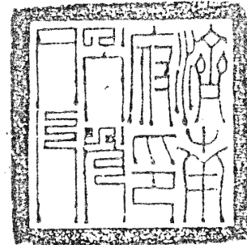

## 大六壬類占

## 太六壬類占目錄上卷

- 天時門
- 地理門
- 選舉門
- 官爵門
- 詣見門
- 家宅門
- 婚姻門
- 胎產門
- 出行門
- 行人門
- 求財門
- 商賈門
- 詞訟門

占驗拾

### 天時門

占歲內豐歉於歲事卜豐凶但記年支上用功金木水火土須滿火神主旱土神豐○立春之日用月將加立春之時演四課三傳以決歲中之事大抵日為君長辰為民庶占豐歉在太歲上神與五穀類神占之間水旱看地分十二月加神將如何占之○二說以立春日時陽用大吉陰用小吉洛書四課三傳以定吉凶又視十二地支為十二分野如子屬周上見白虎乘天罡則周分有瘟疫見遊都有兵革克方神為損大將

占日逐晴雨坎為雨而壬癸亥子后玄皆坎類也離為晴而丙丁巳午蛇雀皆離類也坎臨日辰及發用主雨離臨日辰及發用主晴巽為風而辰巳勾蛇皆巽類也震為雷而甲乙卯合震類也巽臨日辰及發用主風震臨日辰及發用主雷凡占雨要亥子二神及青龍在課傳刑克日或日上神者有雨不入課傳無雨如丁卯子加丁申加卯申子皆水來克丁火即日雨月建生扶亥子及龍雨大月建克制亥子及龍雨小又支干及龍落休囚則陰而微雨也

亥子加于巳午未申是水升火降主累日雨
亥子生旺大雨加申酉大雨乘勾陈父雨占雪亦主阴厚亥子
作空落空无雨临土受制无雨居北方为退归江湖无雨
青龙乘申酉主雨不以克制论盖申为水母酉为兑泽若金旺
雨更大
青龙所乘趁日有雨如壬辰日罡上龙是也
青龙生旺升天大雨升天者临巳午未申也乘亥子丑寅无雨
盖寅为入庙亥子丑为游乐园江湖不能变化入墓亦无雨
凡占雨龙欲飞腾蛇变化龙飞即升天之说蛇化乃乾入土

湖海玄子也
凡占雨虽专责龙若虎临亥子有大风雨大都龙虎须以披神
合看虎披甲乙先风后雨龙披庚辛戊巳先雨后风皆取克
制之辰为雨雨日以五子遁干未干支交战即雨日也初传为
云起雨来方位末传为雨止晴期
子卯相加有雨子为云卯为雷也后玄合入传亦主雨玄武加
亥子为入穴主雨所为穴居知雨也
四土临四维无大都占雨全看用神与日辰上若得亥子青龙
玄后等神旺相有气更披刑带煞或乘丁马主雨连未若休

虎制雖春月無雨也
凡占雨得水類神又無已作丁神乘蛇雀臨卯主忽然狂雷而
後雨也
欲知歲內何月雨用月將加歲上取亥子及天罡所臨為雨月
欲知此月何日雨用月將加時上亥子及天罡所臨為雨日
一法占月內雨期以月將加月朔或又以大吉加月朔俱視子
下為大雨日卯下為小雨日旬中六癸下為雨期也
一法以月符加月建視天上壬癸所臨辰為雨日月符者春辰
夏未秋戌冬丑是也

廢空亡罷酒座而已然者卻然正月起寅逆行四孟是也
無看逆月雨師雨煞雨師者正子順行四仲雨煞者正卯順
行四仲
四課陰陽視天罡所臨辰為雨日若天罡乘陰神加雲雷上有
雨乘陽神與蛇虎併主暴風霹靂即雨一說天罡後用主雨
凡見雲起山頭用月將加時查日辰上得亥子卯三神本相定
雨
凡占雨得水類神又無雷煞或雷公然發用先雷後雨雷然若
正巳順十二神雷公然正巳順四孟落卯為雷雨過雨方受

一法月將加時天上壬癸所臨日雨不雨定陰
一法兩期專以青龍所臨位決之如臨寅即寅日雨
凡占晴看巳午二神蛇雀二將為火神在課傳刑克日或日
神者晴不入課傳難晴
月建生扶火神晴速月建克制火神晴緩若火神陷休囚空
半陰半晴
四課比和無剋制晴日辰發用得火神全併大晴見旺火大吉
三處止一處是火神將晴發用火土神將晴土臨日辰上
洗晴三傳皆土晴天罡加時晴加旺亦晴旺生旺相時晴

晴水空或陷江湖晴蛇雀加巳午上即晴天空加日辰上
中見火土即晴風神乘土或風土甚多主晴速太陽乘天罡
月建久晴玄武龍蛇在巳酉丑上難晴巳午蛇雀臨亥子丑
難旬勾陳乘戌已發用久旱
凡久雨占晴看巳午蛇雀併臨之地為晴日如午加子即日晴
也天罡水臨亦為晴日
一法以月將日符下看天上丙丁下為晴日
一法將月建日符下看天上丙丁所臨為晴期日符者甲用甲
乙日卯丙戊日巳丁巳日午庚日申辛日酉壬日亥癸日丑

也

一法以月符加月建或月符加月钥俱视天上丙丁下为晴期

凡占风以巳为风门未为风伯虎为风神发用有气主风若被

刑带煞迅速逐月风伯正月起申逆行十二辰逐日风煞正

月起寅逆行十二辰班神束转猛风弥天班辰即虎也

东方谓出林动啸生风乘小吉愈猛

寅申加日在天乙前皆主有风看小吉下为风起时也假令壬

寅日传送临辰在天乙前来临丑主风起在夜间丑时也

传见白虎乘有气之神又加有气之下克上必有大风

方来看白虎加临何神如来爻临酉上正西风或临亥上正西

北风余同

白虎小吉受克落空上克下便是有风亦少 朱雀居巳午为

入巢亦主风所调巢居知风也

凡占暴风占吉视日上见天乙长吏有灾或贵人死见勾陈与

起见天空天后人民病见太阴六合青龙礼贤筵宴见玄武

盗贼以风起时为期寅时起事应正月之类

又以风来处占吉蛇上来惊恐雀上来官司口舌虎上来起

丧勾上来争斗天乙上来贵人游行

#### 大端晴雨

占法看日辰用傳見木神多主風水神多主雨金神多主陰金旺主雨火無土忽陰忽晴火神重生旺旱水神重生旺旱水神重生旺旱水神重生旺旱水神重生旺旱水神重生旺旱水神重生旺旱水神重生旺旱水神重生旺旱水神重生旺旱水神重生旺旱水神重生旺旱水神重生旺旱水神重生旺旱水神重生旺旱水神重生旺旱水神重生旺旱水神重生旺旱水神重生旺旱水神重生旺旱水神重生旺旱水神重生旺旱水神重生旺旱水神重生旺旱水神重生旺旱水神重生旺旱水神重生旺旱水神重生旺旱水神重生旺旱水神重生旺旱水神重生旺旱水神重生旺旱水神重生旺旱水神重生旺旱水神重生旺旱水神重生旺旱水神重生旺旱水神重生旺旱水神重生旺旱水神重生旺旱水神重生旺旱水神重生旺旱水神重生旺旱水神重生旺旱水神重生旺旱水神重生旺旱水神重生旺旱水神重生旺旱水神重生旺旱水神重生旺旱水神重生旺旱水神重生旺旱水神重生旺旱水神重生旺旱水神重生旺旱水神重生旺旱水神重生旺旱水神重生旺旱水神重生旺旱水神重生旺旱水神重生旺旱水神重生旺旱水神重生旺旱水神重生旺旱水神重生旺旱水神重生旺旱水神重生旺旱水神重生旺旱水神重生旺旱水神重生旺旱水神重生旺旱水神重生旺旱水神重生旺旱水神重生旺旱水神重生旺旱水神重生旺旱水神重生旺旱水神重生旺旱水神重生旺旱水神重生旺旱水神重生旺旱水神重生旺旱水神重生旺旱水神重生旺旱水神重生旺旱水神重生旺旱水神重生旺旱水神重生旺旱水神重生旺旱水神重生旺旱水神重生旺旱水神重生旺旱水神重生旺旱水神重生旺旱水神重生旺旱水神重生旺旱水神重生旺旱水神重生旺旱水神重生旺旱水神重生旺旱水神重生旺旱水神重生旺旱水神重生旺旱水神重生旺旱水神重生旺旱水神重生旺旱水神重生旺旱水神重生旺旱水神重生旺旱水神重生旺旱水神重生旺旱水神重生旺旱水神重生旺旱水神重生旺旱水神重生旺旱水神重生旺旱水神重生旺旱水神重生旺旱水神重生旺旱水神重生旺旱水神重生旺旱水神重生旺旱水神重生旺旱水神重生旺旱水神重生旺旱水神重生旺旱水神重生旺旱水神重生旺旱水神重生旺旱水神重生旺旱水神重生旺旱水神重生旺旱水神重生旺旱水神重生旺旱水神重生旺旱水神重生旺旱水神重生旺旱水神重生旺旱水神重生旺旱水神重生旺旱水神重生旺旱水神重生旺旱水神重生旺旱水神重生旺旱水神重生旺旱水神重生旺旱水神重生旺旱水神重生旺旱水神重生旺旱水神重生旺旱水神重生旺旱水神重生旺旱水神重生旺旱水神重生旺旱水神重生旺旱水神重生旺旱水神重生旺旱水神重生旺旱水神重生旺旱水神重生旺旱水神重生旺旱水神重生旺旱水神重生旺旱水神重生旺旱水神重生旺旱水神重生旺旱水神重生旺旱水神重生旺旱水神重生旺旱水神重生旺旱水神重生旺旱水神重生旺旱水神重生旺旱水神重生旺旱水神重生旺旱水神重生旺旱水神重生旺旱水神重生旺旱水神重生旺旱水神重生旺旱水神重生旺旱水神重生旺旱水神重生旺旱水神重生旺旱水神重生旺旱水神重生旺旱水神重生旺旱水神重生旺旱水神重生旺旱水神重生旺旱水神重生旺旱水神重生旺旱水神重生旺旱水神重生旺旱水神重生旺旱水神重生旺旱水神重生旺旱水神重生旺旱水神重生旺旱水神重生旺旱水神重生旺旱水神重生旺旱水神重生旺旱水神重生旺旱水神重生旺旱水神重生旺旱水神重生旺旱水神重生旺旱水神重生旺旱水神重生旺旱水神重生旺旱水神重生旺旱水神重生旺旱水神重生旺旱水神重生旺旱水神重生旺旱水神重生旺旱水神重生旺旱水神重生旺旱水神重生旺旱水神重生旺旱水神重生旺旱水神重生旺旱水神重生旺旱水神重生旺旱水神重生旺旱水神重生旺旱水神重生旺旱水神重生旺旱水神重生旺旱水神重生旺旱水神重生旺旱水神重生旺旱水神重生旺旱水神重生旺旱水神重生旺旱水神重生旺旱水神重生旺旱水神重生旺旱水神重生旺旱水神重生旺旱水神重生旺旱水神重生旺旱水神重生旺旱水神重生旺旱水神重生旺旱水神重生旺旱水神重生旺旱水神重生旺旱水神重生旺旱水神重生旺旱水神重生旺旱水神重生旺旱水神重生旺旱水神重生旺旱水神重生旺旱水神重生旺旱水神重生旺旱水神重生旺旱水神重生旺旱水神重生旺旱水神重生旺旱水神重生旺旱水神重生旺旱水神重生旺旱水神重生旺旱水神重生旺旱水神重生旺旱水神重生旺旱水神重生旺旱水神重生旺旱水神重生旺旱水神重生旺旱水神重生旺旱水神重生旺旱水神重生旺旱水神重生旺旱水神重生旺旱水神重生旺旱水神重生旺旱水神重生旺旱水神重生旺旱水神重生旺旱水神重生旺旱水神重生旺旱水神重生旺旱水神重生旺旱水神重生旺旱水神重生旺旱水神重生旺旱水神重生旺旱水神重生旺旱水神重生旺旱水神重生旺旱水神重生旺旱水神重生旺旱水神重生旺旱水神重生旺旱水神重生旺旱水神重生旺旱水神重生旺旱水神重生旺旱水神重生旺旱水神重生旺旱水神重生旺旱水神重生旺旱水神重生旺旱水神重生旺旱水神重生旺旱水神重生旺旱水神重生旺旱水神重生旺旱水神重生旺旱水神重生旺旱水神重生旺旱水神重生旺旱水神重生旺旱水神重生旺旱水神重生旺旱水神重生旺旱水神重生旺旱水神重生旺旱水神重生旺旱水神重生旺旱水神重生旺旱水神重生旺旱水神重生旺旱水神重生旺旱水神重生旺旱水神重生旺旱水神重生旺旱水神重生旺旱水神重生旺旱水神重生旺旱水神重生旺旱水神重生旺旱水神重生旺旱水神重生旺旱水神重生旺旱水神重生旺旱水神重生旺旱水神重生旺旱水神重生旺旱水神重生旺旱水神重生旺旱水神重生旺旱水神重生旺旱水神重生旺旱水神重生旺旱水神重生旺旱水神重生旺旱水神重生旺旱水神重生旺旱水神重生旺旱水神重生旺旱水神重生旺旱水神重生旺旱水神重生旺旱水神重生旺旱水神重生旺旱水神重生旺旱水神重生旺旱水神重生旺旱水神重生旺旱水神重生旺旱水神重生旺旱水神重生旺旱水神重生旺旱水神重生旺旱水神重生旺旱水神重生旺旱水神重生旺旱水神重生旺旱水神重生旺旱水神重生旺旱水神重生旺旱水神重生旺旱水神重生旺旱水神重生旺旱水神重生旺旱水神重生旺旱水神重生旺旱水神重生旺旱水神重生旺旱水神重生旺旱水神重生旺旱水神重生旺旱水神重生旺旱水神重生旺旱水神重生旺旱水神重生旺旱水神重生旺旱水神重生旺旱水神重生旺旱水神重生旺旱水神重生旺旱水神重生旺旱水神重生旺旱水神重生旺旱水神重生旺旱水神重生旺旱水神重生旺旱水神重生旺旱水神重生旺旱水神重生旺旱水神重生旺旱水神重生旺旱水神重生旺旱水神重生旺旱水神重生旺旱水神重生旺旱水神重生旺旱水神重生旺旱水神重生旺旱水神重生旺旱水神重生旺旱水神重生旺旱水神重生旺旱水神重生旺旱水神重生旺旱水神重生旺旱水神重生旺旱水神重生旺旱水神重生旺旱水神重生旺旱水神重生旺旱水神重生旺旱水神重生旺旱水神重生旺旱水神重生旺旱水神重生旺旱水神重生旺旱水神重生旺旱水神重生旺旱水神重生旺旱水神重生旺旱水神重生旺旱水神重生旺旱水神重生旺旱水神重生旺旱水神重生旺旱水神重生旺旱水神重生旺旱水神重生旺旱水神重生旺旱水神重生旺旱水神重生旺旱水神重生旺旱水神重生旺旱水神重生旺旱水神重生旺旱水神重生旺旱水神重生旺旱水神重生旺旱水神重生旺旱水神重生旺旱水神重生旺旱水神重生旺旱水神重生旺旱水神重生旺旱水神重生旺旱水神重生旺旱水神重生旺旱水神重生旺旱水神重生旺旱水神重生旺旱水神重生旺旱水神重生旺旱水神重生旺旱水神重生旺旱水神重生旺旱水神重生旺旱水神重生旺旱水神重生旺旱水神重生旺旱水神重生旺旱水神重生旺旱水神重生旺旱水神重生旺旱水神重生旺旱水神重生旺旱水神重生旺旱水神重生旺旱水神重生旺旱水神重生旺旱水神重生旺旱水神重生旺旱水神重生旺旱水神重生旺旱水神重生旺旱水神重生旺旱水神重生旺旱水神重生旺旱水神重生旺旱水神重生旺旱水神重生旺旱水神重生旺旱水神重生旺旱水神重生旺旱水神重生旺旱水神重生旺旱水神重生旺旱水神重生旺旱水神重生旺旱水神重生旺旱水神重生旺旱水神重生旺旱水神重生旺旱水神重生旺旱水神重生旺旱水神重生旺旱水神重生旺旱水神重生旺旱水神重生旺旱水神重生旺旱水神重生旺旱水神重生旺旱水神重生旺旱水神重生旺旱水神重生旺旱水神重生旺旱水神重生旺旱水神重生旺旱水神重生旺旱水神重生旺旱水神重生旺旱水神重生旺旱水神重生旺旱水神重生旺旱水神重生旺旱水神重生旺旱水神重生旺旱水神重生旺旱水神重生旺旱水神重生旺旱水神重生旺旱水神重生旺旱水神重生旺旱水神重生旺旱水神重生旺旱水神重生旺旱水神重生旺旱水神重生旺旱水神重生旺旱水神重生旺旱水神重生旺旱水神重生旺旱水神重生旺旱水神重生旺旱水神重生旺旱水神重生旺旱水神重生旺旱水神重生旺旱水神重生旺旱水神重生旺旱水神重生旺旱水神重生旺旱水神重生旺旱水神重生旺旱水神重生旺旱水神重生旺旱水神重生旺旱水神重生旺旱水神重生旺旱水神重生旺旱水神重生旺旱水神重生旺旱水神重生旺旱水神重生旺旱水神重生旺旱水神重生旺旱水神重生旺旱水神重生旺旱水神重生旺旱水神重生旺旱水神重生旺旱水神重生旺旱水神重生旺旱水神重生旺旱水神重生旺旱水神重生旺旱水神重生旺旱水神重生旺旱水神重生旺旱水神重生旺旱水神重生旺旱水神重生旺旱水神重生旺旱水神重生旺旱水神重生旺旱水神重生旺旱水神重生旺旱水神重生旺旱水神重生旺旱水神重生旺旱水神重生旺旱水神重生旺旱水神重生旺旱水神重生旺旱水神重生旺旱水神重生旺旱水神重生旺旱水神重生旺旱水神重生旺旱水神重生旺旱水神重生旺旱水神重生旺旱水神重生旺旱水神重生旺旱水神重生旺旱水神重生旺旱水神重生旺旱水神重生旺旱水神重生旺旱水神重生旺旱水神重生旺旱水神重生旺旱水神重生旺旱水神重生旺旱水神重生旺旱水神重生旺旱水神重生旺旱水神重生旺旱水神重生旺旱水神重生旺旱水神重生旺旱水神重生旺旱水神重生旺旱水神重生旺旱水神重生旺旱水神重生旺旱水神重生旺旱水神重生旺旱水神重生旺旱水神重生旺旱水神重生旺旱水神重生旺旱水神重生旺旱水神重生旺旱水神重生旺旱水神重生旺旱水神重生旺旱水神重生旺旱水神重生旺旱水神重生旺旱水神重生旺旱水神重生旺旱水神重生旺旱水神重生旺旱水神重生旺旱水神重生旺旱水神重生旺旱水神重生旺旱水神重生旺旱水神重生旺旱水神重生旺旱水神重生旺旱水神重生旺旱水神重生旺旱水神重生旺旱水神重生旺旱水神重生旺旱水神重生旺旱水神重生旺旱水神重生旺旱水神重生旺旱水神重生旺旱水神重生旺旱水神重生旺旱水神重生旺旱水神重生旺旱水神重生旺旱水神重生旺旱水神重生旺旱水神重生旺旱水神重生旺旱水神重生旺旱水神重生旺旱水神重生旺旱水神重生旺旱水神重生旺旱水神重生旺旱水神重生旺旱水神重生旺旱水神重生旺旱水神重生旺旱水神重生旺旱水神重生旺旱水神重生旺旱水神重生旺旱水神重生旺旱水神重生旺旱水神重生旺旱水神重生旺旱水神重生旺旱水神重生旺旱水神重生旺旱水神重生旺旱水神重生旺旱水神重生旺旱水神重生旺旱水神重生旺旱水神重生旺旱水神重生旺旱水神重生旺旱水神重生旺旱水神重生旺旱水神重生旺旱水神重生旺旱水神重生旺旱水神重生旺旱水神重生旺旱水神重生旺旱水神重生旺旱水神重生旺旱水神重生旺旱水神重生旺旱水神重生旺旱水神重生旺旱水神重生旺旱水神重生旺旱水神重生旺旱水神重生旺旱水神重生旺旱水神重生旺旱水神重生旺旱水神重生旺旱水神重生旺旱水神重生旺旱水神重生旺旱水神重生旺旱水神重生旺旱水神重生旺旱水神重生旺旱水神重生旺旱水神重生旺旱水神重生旺旱水神重生旺旱水神重生旺旱水神重生旺旱水神重生旺旱水神重生旺旱水神重生旺旱水神重生旺旱水神重生旺旱水神重生旺旱水神重生旺旱水神重生旺旱水神重生旺旱水神重生旺旱水神重生旺旱水神重生旺旱水神重生旺旱水神重生旺旱水神重生旺旱水神重生旺旱水神重生旺旱水神重生旺旱水神重生旺旱水神重生旺旱水神重生旺旱水神重生旺旱水神重生旺旱水神重生旺旱水神重生旺旱水神重生旺旱水神重生旺旱水神重生旺旱水神重生旺旱水神重生旺旱水神重生旺旱水神重生旺旱水神重生旺旱水神重生旺旱水神重生旺旱水神重生旺旱水神重生旺旱水神重生旺旱水神重生旺旱水神重生旺旱水神重生旺旱水神重生旺旱水神重生旺旱水神重生旺旱水神重生旺旱水神重生旺旱水神重生旺旱水神重生旺旱水神重生旺旱水神重生旺旱水神重生旺旱水神重生旺旱水神重生旺旱水神重生旺旱水神重生旺旱水神重生旺旱水神重生旺旱水神重生旺旱水神重生旺旱水神重生旺旱水神重生旺旱水神重生旺旱水神重生旺旱水神重生旺旱水神重生旺旱水神重生旺旱水神重生旺旱水神重生旺旱水神重生旺旱水神重生旺旱水神重生旺旱水神重生旺旱水神重生旺旱水神重生旺旱水神重生旺旱水神重生旺旱水神重生旺旱水神重生旺旱水神重生旺旱水神重生旺旱水神重生旺旱水神重生旺旱水神重生旺旱水神重生旺旱水神重生旺旱水神重生旺旱水神重生旺旱水神重生旺旱水神重生旺旱水神重生旺旱水神重生旺旱水神重生旺旱水神重生旺旱水神重生旺旱水神重生旺旱水神重生旺旱水神重生旺旱水神重生旺旱水神重生旺旱水神重生旺旱水神重生旺旱水神重生旺旱水神重生旺旱水神重生旺旱水神重生旺旱水神重生旺旱水神重生旺旱水神重生旺旱水神重生旺旱水神重生旺旱水神重生旺旱水神重生旺旱水神重生旺旱水神重生旺旱水神重生旺旱水神重生旺旱水神重生旺旱水神重生旺旱水神重生旺旱水神重生旺旱水神重生旺旱水神重生旺旱水神重生旺旱水神重生旺旱水神重生旺旱水神重生旺旱水神重生旺旱水神重生旺旱水神重生旺旱水神重生旺旱水神重生旺旱水神重生旺旱水神重生旺旱水神重生旺旱水神重生旺旱水神重生旺旱水神重生旺旱水神重生旺旱水神重生旺旱水神重生旺旱水神重生旺旱水神重生旺旱水神重生旺旱水神重生旺旱水神重生旺旱水神重生旺旱水神重生旺旱水神重生旺旱水神重生旺旱水神重生旺旱水神重生旺旱水神重生旺旱水神重生旺旱水神重生旺旱水神重生旺旱水神重生旺旱水神重生旺旱水神重生旺旱水神重生旺旱水神重生旺旱水神重生旺旱水神重生旺旱水神重生旺旱水神重生旺旱水神重生旺旱水神重生旺旱水神重生旺旱水神重生旺旱水神重生旺旱水神重生旺旱水神重生旺旱水神重生旺旱水神重生旺旱水神重生旺旱水神重生旺旱水神重生旺旱水神重生旺旱水神重生旺旱水神重生旺旱水神重生旺旱水神重生旺旱水神重生旺旱水神重生旺旱水神重生旺旱水神重生旺旱水神重生旺旱水神重生旺旱水神重生旺旱水神重生旺旱水神重生旺旱水神重生旺旱水神重生旺旱水神重生旺旱水神重生旺旱水神重生旺旱水神重生旺旱水神重生旺旱水神重生旺旱水神重生旺旱水神重生旺旱水神重生旺旱水神重生旺旱水神重生旺旱水神重生旺旱水神重生旺旱水神重生旺旱水神重生旺旱水神重生旺旱水神重生旺旱水神重生旺旱水神重生旺旱水神重生旺旱水神重生旺旱水神重生旺旱水神重生旺旱水神重生旺旱水神重生旺旱水神重生旺旱水神重生旺旱水神重生旺旱水神重生旺旱水神重生旺旱水神重生旺旱水神重生旺旱水神重生旺旱水神重生旺旱水神重生旺旱水神重生旺旱水神重生旺旱水神重生旺旱水神重生旺旱水神重生旺旱水神重生旺旱水神重生旺旱水神重生旺旱水神重生旺旱水神重生旺旱水神重生旺旱水神重生旺旱水神重生旺旱水神重生旺旱水神重生旺旱水神重生旺旱水神重生旺旱水神重生旺旱水神重生旺旱水神重生旺旱水神重生旺旱水神重生旺旱水神重生旺旱水神重生旺旱水神重生旺旱水神重生旺旱水神重生旺旱水神重生旺旱水神重生旺旱水神重生旺旱水神重生旺旱水神重生旺旱水神重生旺旱水神重生旺旱水神重生旺旱水神重生旺旱水神重生旺旱水神重生旺旱水神重生旺旱水神重生旺旱水神重生旺旱水神重生旺旱水神重生旺旱水神重生旺旱水神重生旺旱水神重生旺旱水神重生旺旱水神重生旺旱水神重生旺旱水神重生旺旱水神重生旺旱水神重生旺旱水神重生旺旱水神重生旺旱水神重生旺旱水神重生旺旱水神重生旺旱水神重生旺旱水神重生旺旱水神重生旺旱水神重生旺旱水神重生旺旱水神重生旺旱水神重生旺旱水神重生旺旱水神重生旺旱水神重生旺旱水神重生旺旱水神重生旺旱水神重生旺旱水神重生旺旱水神重生旺旱水神重生旺旱水神重生旺旱水神重生旺旱水神重生旺旱水神重生旺旱水神重生旺旱水神重生旺旱水神重生旺旱水神重生旺旱水神重生旺旱水神重生旺旱水神重生旺旱水神重生旺旱水神重生旺旱水神重生旺旱水神重生旺旱水神重生旺旱水神重生旺旱水神重生旺旱水神重生旺旱水神重生旺旱水神重生旺旱水神重生旺旱水神重生旺旱水神重生旺旱水神重生旺旱水神重生旺旱水神重生旺旱水神重生旺旱水神重生旺旱水神重生旺旱水神重生旺旱水神重生旺旱水神重生旺旱水神重生旺旱水神重生旺旱水神重生旺旱水神重生旺旱水神重生旺旱水神重生旺旱水神重生旺旱水神重生旺旱水神重生旺旱水神重生旺旱水神重生旺旱水神重生旺旱水神重生旺旱水神重生旺旱水神重生旺旱水神重生旺旱水神重生旺旱水神重生旺旱水神重生旺旱水神重生旺旱水神重生旺旱水神重生旺旱水神重生旺旱水神重生旺旱水神重生旺旱水神重生旺旱水神重生旺旱水神重生旺旱水神重生旺旱水神重生旺旱水神重生旺旱水神重生旺旱水神重生旺旱水神重生旺旱水神重生旺旱水神重生旺旱水神重生旺旱水神重生旺旱水神重生旺旱水神重生旺旱水神重生旺旱水神重生旺旱水神重生旺旱水神重生旺旱水神重生旺旱水神重生旺旱水神重生旺旱水神重生旺旱水神重生旺旱水神重生旺旱水神重生旺旱水神重生旺旱水神重生旺旱水神重生旺旱水神重生旺旱水神重生旺旱水神重生旺旱水神重生旺旱水神重生旺旱水神重生旺旱水神重生旺旱水神重生旺旱水神重生旺旱水神重生旺旱水神重生旺旱水神重生旺旱水神重生旺旱水神重生旺旱水神重生旺旱水神重生旺旱水神重生旺旱水神重生旺旱水神重生旺旱水神重生旺旱水神重生旺旱水神重生旺旱水神重生旺旱水神重生旺旱水神重生旺旱水神重生旺旱水神重生旺旱水神重生旺旱水神重生旺旱水神重生旺旱水神重生旺旱水神重生旺旱水神重生旺旱水神重生旺旱水神重生旺旱水神重生旺旱水神重生旺旱水神重生旺旱水神重生旺旱水神重生旺旱水神重生旺旱水神重生旺旱水神重生旺旱水神重生旺旱水神重生旺旱水神重生旺旱水神重生旺旱水神重生旺旱水神重生旺旱水神重生旺旱水神重生旺旱水神重生旺旱水神重生旺旱水神重生旺旱水神重生旺旱水神重生旺旱水神重生旺旱水神重生旺旱水神重生旺旱水神重生旺旱水神重生旺旱水神重生旺旱水神重生旺旱水神重生旺旱水神重生旺旱水神重生旺旱水神重生旺旱水神重生旺旱水神重生旺旱水神重生旺旱水神重生旺旱水神重生旺旱水神重生旺旱水神重生旺旱水神重生旺旱水神重生旺旱水神重生旺旱水神重生旺旱水神重生旺旱水神重生旺旱水神重生旺旱水神重生旺旱水神重生旺旱水神重生旺旱水神重生旺旱水神重生旺旱水神重生旺旱水神重生旺旱水神重生旺旱水神重生旺旱水神重生旺旱水神重生旺旱水神重生旺旱水神重生旺旱水神重生旺旱水神重生旺旱水神重生旺旱水神重生旺旱水神重生旺旱水神重生旺旱水神重生旺旱水神重生旺旱水神重生旺旱水神重生旺旱水神重生旺旱水神重生旺旱水神重生旺旱水神重生旺旱水神重生旺旱水神重生旺旱水神重生旺旱水神重生旺旱水神重生旺旱水神重生旺旱水神重生旺旱水神重生旺旱水神重生旺旱水神重生旺旱水神重生旺旱水神重生旺旱水神重生旺旱水神重生旺旱水神重生旺旱水神重生旺旱水神重生旺旱水神重生旺旱水神重生旺旱水神重生旺旱水神重生旺旱水神重生旺旱水神重生旺旱水神重生旺旱水神重生旺旱水神重生旺旱水神重生旺旱水神重生旺旱水神重生旺旱水神重生旺旱水神重生旺旱水神重生旺旱水神重生旺旱水神重生旺旱水神重生旺旱水神重生旺旱水神重生旺旱水神重生旺旱水神重生旺旱水神重生旺旱水神重生旺旱水神重生旺旱水神重生旺旱水神重生旺旱水神重生旺旱水神重生旺旱水神重生旺旱水神重生旺旱水神重生旺旱水神重生旺旱水神重生旺旱水神重生旺旱水神重生旺旱水神重生旺旱水神重生旺旱水神重生旺旱水神重生旺旱水神重生旺旱水神重生旺旱水神重生旺旱水神重生旺旱水神重生旺旱水神重生旺旱水神重生旺旱水神重生旺旱水神重生旺旱水神重生旺旱水神重生旺旱水神重生旺旱水神重生旺旱水神重生旺旱水神重生旺旱水神重生旺旱水神重生旺旱水神重生旺旱水神重生旺旱水神重生旺旱水神重生旺旱水神重生旺旱水神重生旺旱水神重生旺旱水神重生旺旱水神重生旺旱水神重生旺旱水神重生旺旱水神重生旺旱水神重生旺旱水神重生旺旱水神重生旺旱水神重生旺旱水神重生旺旱水神重生旺旱水神重生旺旱水神重生旺旱水神重生旺旱水神重生旺旱水神重生旺旱水神重生旺旱水神重生旺旱水神重生旺旱水神重生旺旱水神重生旺旱水神重生旺旱水神重生旺旱水神重生旺旱水神重生旺旱水神重生旺旱水神重生旺旱水神重生旺旱水神重生旺旱水神重生旺旱水神重生旺旱水神重生旺旱水神重生旺旱水神重生旺旱水神重生旺旱水神重生旺旱水神重生旺旱水神重生旺旱水神重生旺旱水神重生旺旱水神重生旺旱水神重生旺旱水神重生旺旱水神重生旺旱水神重生旺旱水神重生旺旱水神重生旺旱水神重生旺旱水神重生旺旱水神重生旺旱水神重生旺旱水神重生旺旱水神重生旺旱水神重生旺旱水神重生旺旱水神重生旺旱水神重生旺旱水神重生旺旱水神重生旺旱水神重生旺旱水神重生旺旱水神重生旺旱水神重生旺旱水神重生旺旱水神重生旺旱水神重生旺旱水神重生旺旱水神重生旺旱水神重生旺旱水神重生旺旱水神重生旺旱水神重生旺旱水神重生旺旱水神重生旺旱水神重生旺旱水神重生旺旱水神重生旺旱水神重生旺旱水神重生旺旱水神重生旺旱水神重生旺旱水神重生旺旱水神重生旺旱水神重生旺旱水神重生旺旱水神重生旺旱水神重生旺旱水神重生旺旱水神重生旺旱水神重生旺旱水神重生旺旱水神重生旺旱水神重生旺旱水神重生旺旱水神重生旺旱水神重生旺旱水神重生旺旱水神重生旺旱水神重生旺旱水神重生旺旱水神重生旺旱水神重生旺旱水神重生旺旱水神重生旺旱水神重生旺旱水神重生旺旱水神重生旺旱水神重生旺旱水神重生旺旱水神重生旺旱水神重生旺旱水神重生旺旱水神重生旺旱水神重生旺旱水神重生旺旱水神重生旺旱水神重生旺旱水神重生旺旱水神重生旺旱水神重生旺旱水神重生旺旱水神重生旺旱水神重生旺旱水神重生旺旱水神重生旺旱水神重生旺旱水神重生旺旱水神重生旺旱水神重生旺旱水神重生旺旱水神重生旺旱水神重生旺旱水神重生旺旱水神重生旺旱水神重生旺旱水神重生旺旱水神重生旺旱水神重生旺旱水神重生旺旱水神重生旺旱水神重生旺旱水神重生旺旱水神重生旺旱水神重生旺旱水神重生旺旱水神重生旺旱水神重生旺旱水神重生旺旱水神重生旺旱水神重生旺旱水神重生旺旱水神重生旺旱水神重生旺旱水神重生旺旱水神重生旺旱水神重生旺旱水神重生旺旱水神重生旺旱水神重生旺旱水神重生旺旱水神重生旺旱水神重生旺旱水神重生旺旱水神重生旺旱水神重生旺旱水神重生旺旱水神重生旺旱水神重生旺旱水神重生旺旱水神重生旺旱水神重生旺旱水神重生旺旱水神重生旺旱水神重生旺旱水神重生旺旱水神重生旺旱水神重生旺旱水神重生旺旱水神重生旺旱水神重生旺旱水神重生旺旱水神重生旺旱水神重生旺旱水神重生旺旱水神重生旺旱水神重生旺旱水神重生旺旱水神重生旺旱水神重生旺旱水神重生旺旱水神重生旺旱水神重生旺旱水神重生旺旱水神重生旺旱水神重生旺旱水神重生旺旱水神重生旺旱水神重生旺旱水神重生旺旱水神重生旺旱水神重生旺旱水神重生旺旱水神重生旺旱水神重生旺旱水神重生旺旱水神重生旺旱水神重生旺旱水神重生旺旱水神重生旺旱水神重生旺旱水神重生旺旱水神重生旺旱水神重生旺旱水神重生旺旱水神重生旺旱水神重生旺旱水神重生旺旱水神重生旺旱水神重生旺旱水神重生旺旱水神重生旺旱水神重生旺旱水神重生旺旱水神重生旺旱水神重生旺旱水神重生旺旱水神重生旺旱水神重生旺旱水神重生旺旱水神重生旺旱水神重生旺旱水神重生旺旱水神重生旺旱水神重生旺旱水神重生旺旱水神重生旺旱水神重生旺旱水神重生旺旱水神重生旺旱水神重生旺旱水神重生旺旱水神重生旺旱水神重生旺旱水神重生旺旱水神重生旺旱水神重生旺旱水神重生旺旱水神重生旺旱水神重生旺旱水神重生旺旱水神重生旺旱水神重生旺旱水神重生旺旱水神重生旺旱水神重生旺旱水神重生旺旱水神重生旺旱水神重生旺旱水神重生旺旱水神重生旺旱水神重生旺旱水神重生旺旱水神重生旺旱水神重生旺旱水神重生旺旱水神重生旺旱水神重生旺旱水神重生旺旱水神重生旺旱水神重生旺旱水神重生旺旱水神重生旺旱水神重生旺旱水神重生旺旱水神重生旺旱水神重生旺旱水神重生旺旱水神重生旺旱水神重生旺旱水神重生旺旱水神重生旺旱水神重生旺旱水神重生旺旱水神重生旺旱水神重生旺旱水神重生旺旱水神重生旺旱水神重生旺旱水神重生旺旱水神重生旺旱水神重生旺旱水神重生旺旱水神重生旺旱水神重生旺旱水神重生旺旱水神重生旺旱水神重生旺旱水神重生旺旱水神重生旺旱水神重生旺旱水神重生旺旱水神重生旺旱水神重生旺旱水神重生旺旱水神重生旺旱水神重生旺旱水神重生旺旱水神重生旺旱水神重生旺旱水神重生旺旱水神重生旺旱水神重生旺旱水神重生旺旱水神重生旺旱水神重生旺旱水神重生旺旱水神重生旺旱水神重生旺旱水神重生旺旱水神重生旺旱水神重生旺旱水神重生旺旱水神重生旺旱水神重生旺旱水神重生旺旱水神重生旺旱水神重生旺旱水神重生旺旱水神重生旺旱水神重生旺旱水神重生旺旱水神重生旺旱水神重生旺旱水神重生旺旱水神重生旺旱水神重生旺旱水神重生旺旱水神重生旺旱水神重生旺旱水神重生旺旱水神重生旺旱水神重生旺旱水神重生旺旱水神重生旺旱水神重生旺旱水神重生旺旱水神重生旺旱水神重生旺旱水神重生旺旱水神重生旺旱水神重生旺旱水神重生旺旱水神重生旺旱水神重生旺旱水神重生旺旱水神重生旺旱水神重生旺旱水神重生旺旱水神重生旺旱水神重生旺旱水神重生旺旱水神重生旺旱水神重生旺旱水神重生旺旱水神重生旺旱水神重生旺旱水神重生旺旱水神重生旺旱水神重生旺旱水神重生旺旱水神重生旺旱水神重生旺旱水神重生旺旱水神重生旺旱水神重生旺旱水神重生旺旱水神重生旺旱水神重生旺旱水神重生旺旱水神重生旺旱水神重生旺旱水神重生旺旱水神重生旺旱水神重生旺旱水神重生旺旱水神重生旺旱水神重生旺旱水神重生旺旱水神重生旺旱水神重生旺旱水神重生旺旱水神重生旺旱水神重生旺旱水神重生旺旱水神重生旺旱水神重生旺旱水神重生旺旱水神重生旺旱水神重生旺旱水神重生旺旱水神重生旺旱水神重生旺旱水神重生旺旱水神重生旺旱水神重生旺旱水神重生旺旱水神重生旺旱水神重生旺旱水神重生旺旱水神重生旺旱水神重生旺旱水神重生旺旱水神重生旺旱水神重生旺旱水神重生旺旱水神重生旺旱水神重生旺旱水神重生旺旱水神重生旺旱水神重生旺旱水神重生旺旱水神重生旺旱水神重生旺旱水神重生旺旱水神重生旺旱水神重生旺旱水神重生旺旱水神重生旺旱水神重生旺旱水神重生旺旱水神重生旺旱水神重生旺旱水神重生旺旱水神重生旺旱水神重生旺旱水神重生旺旱水神重生旺旱水神重生旺旱水神重生旺旱水神重生旺旱水神重生旺旱水神重生旺旱水神重生旺旱水神重生旺旱水神重生旺旱水神重生旺旱水神重生旺旱水神重生旺旱水神重生旺旱水神重生旺旱水神重生旺旱水神重生旺旱水神重生旺旱水神重生旺旱水神重生旺旱水神重生旺旱水神重生旺旱水神重生旺旱水神重生旺旱水神重生旺旱水神重生旺旱水神重生旺旱水神重生旺旱水神重生旺旱水神重生旺旱水神重生旺旱水神重生旺旱水神重生旺旱水神重生旺旱水神重生旺旱水神重生旺旱水神重生旺旱水神重生旺旱水神重生旺旱水神重生旺旱水神重生旺旱水神重生旺旱水神重生旺旱水神重生旺旱水神重生旺旱水神重生旺旱水神重生旺旱水神重生旺旱水神重生旺旱水神重生旺旱水神重生旺旱水神重生旺旱水神重生旺旱水神重生旺旱水神重生旺旱水神重生旺旱水神重生旺旱水神重生旺旱水神重生旺旱水神重生旺旱水神重生旺旱水神重生旺旱水神重生旺旱水神重生旺旱水神重生旺旱水神重生旺旱水神重生旺旱水神重生旺旱水神重生旺旱水神重生旺旱水神重生旺旱水神重生旺旱水神重生旺旱水神重生旺旱水神重生旺旱水神重生旺旱水神重生旺旱水神重生旺旱水神重生旺旱水神重生旺旱水神重生旺旱水神重生旺旱水神重生旺旱水神重生旺旱水神重生旺旱水神重生旺旱水神重生旺旱水神重生旺旱水神重生旺旱水神重生旺旱水神重生旺旱水神重生旺旱水神重生旺旱水神重生旺旱水神重生旺旱水神重生旺旱水神重生旺旱水神重生旺旱水神重生旺旱水神重生旺旱水神重生旺旱水神重生旺旱水神重生旺旱水神重生旺旱水神重生旺旱水神重生旺旱水神重生旺旱水神重生旺旱水神重生旺旱水神重生旺旱水神重生旺旱水神重生旺旱水神重生旺旱水神重生旺旱水神重生旺旱水神重生旺旱水神重生旺旱水神重生旺旱水神重生旺旱水神重生旺旱水神重生旺旱水神重生旺旱水神重生旺旱水神重生旺旱水神重生旺旱水神重生旺旱水神重生旺旱水神重生旺旱水神重生旺旱水神重生旺旱水神重生旺旱水神重生旺旱水神重生旺旱水神重生旺旱水神重生旺旱水神重生旺旱水神重生旺旱水神重生旺旱水神重生旺旱水神重生旺旱水神重生旺旱水神重生旺旱水神重生旺旱水神重生旺旱水神重生旺旱水神重生旺旱水神重生旺旱水神重生旺旱水神重生旺旱水神重生旺旱水神重生旺旱水神重生旺旱水神重生旺旱水神重生旺旱水神重生旺旱水神重生旺旱水神重生旺旱水神重生旺旱水神重生旺旱水神重生旺旱水神重生旺旱水神重生旺旱水神重生旺旱水神重生旺旱水神重生旺旱水神重生旺旱水神重生旺旱水神重生旺旱水神重生旺旱水神重生旺旱水神重生旺旱水神重生旺旱水神重生旺旱水神重生旺旱水神重生旺旱水神重生旺旱水神重生旺旱水神重生旺旱水神重生旺旱水神重生旺旱水神重生旺旱水神重生旺旱水神重生旺旱水神重生旺旱水神重生旺旱水神重生旺旱水神重生旺旱水神重生旺旱水神重生旺旱水神重生旺旱水神重生旺旱水神重生旺旱水神重生旺旱水神重生旺旱水神重生旺旱水神重生旺旱水神重生旺旱水神重生旺旱水神重生旺旱水神重生旺旱水神重生旺旱水神重生旺旱水神重生旺旱水神重生旺旱水神重生旺旱水神重生旺旱水神重生旺旱水神重生旺旱水神重生旺旱水神重生旺旱水神重生旺旱水神重生旺旱水神重生旺旱水神重生旺旱水神重生旺旱水神重生旺旱水神重生旺旱水神重生旺旱水神重生旺旱水神重生旺旱水神重生旺旱水神重生旺旱水神重生旺旱水神重生旺旱水神重生旺旱水神重生旺旱水神重生旺旱水神重生旺旱水神重生旺旱水神重生旺旱水神重生旺旱水神重生旺旱水神重生旺旱水神重生旺旱水神重生旺旱水神重生旺旱水神重生旺旱水神重生旺旱水神重生旺旱水神重生旺旱水神重生旺旱水神重生旺旱水神重生旺旱水神重生旺旱水神重生旺旱水神重生旺旱水神重生旺旱水神重生旺旱水神重生旺旱水神重生旺旱水神重生旺旱水神重生旺旱水神重生旺旱水神重生旺旱水神重生旺旱水神重生旺旱水神重生旺旱水神重生旺旱水神重生旺旱水神重生旺旱水神重生旺旱水神重生旺旱水神重生旺旱水神重生旺旱水神重生旺旱水神重生旺旱水神重生旺旱水神重生旺旱水神重生旺旱水神重生旺旱水神重生旺旱水神重生旺旱水神重生旺旱水神重生旺旱水神重生旺旱水神重生旺旱水神重生旺旱水神重生旺旱水神重生旺旱水神重生旺旱水神重生旺旱水神重生旺旱水神重生旺旱水神重生旺旱水神重生旺旱水神重生旺旱水神重生旺旱水神重生旺旱水神重生旺旱水神重生旺旱水神重生旺旱水神重生旺旱水神重生旺旱水神重生旺旱水神重生旺旱水神重生旺旱水神重生旺旱水神重生旺旱水神重生旺旱水神重生旺旱水神重生旺旱水神重生旺旱水神重生旺旱水神重生旺旱水神重生旺旱水神重生旺旱水神重生旺旱水神重生旺旱水神重生旺旱水神重生旺旱水神重生旺旱水神重生旺旱水神重生旺旱水神重生旺旱水神重生旺旱水神重生旺旱水神重生旺旱水神重生旺旱水神重生旺旱水神重生旺旱水神重生旺旱水神重生旺旱水神重生旺旱水神重生旺旱水神重生旺旱水神重生旺旱水神重生旺旱水神重生旺旱水神重生旺旱水神重生旺旱水神重生旺旱水神重生旺旱水神重生旺旱水神重生旺旱水神重生旺旱水神重生旺旱水神重生旺旱水神重生旺旱水神重生旺旱水神重生旺旱水神重生旺旱水神重生旺旱水神重生旺旱水神重生旺旱水神重生旺旱水神重生旺旱水神重生旺旱水神重生旺旱水神重生旺旱水神重生旺旱水神重生旺旱水神重生旺旱水神重生旺旱水神重生旺旱水神重生旺旱水神重生旺旱水神重生旺旱水神重生旺旱水神重生旺旱水神重生旺旱水神重生旺旱水神重生旺旱水神重生旺旱水神重生旺旱水神重生旺旱水神重生旺旱水神重生旺旱水神重生旺旱水神重生旺旱水神重生旺旱水神重生旺旱水神重生旺旱水神重生旺旱水神重生旺旱水神重生旺旱水神重生旺旱水神重生旺旱水神重生旺旱水神重生旺旱水神重生旺旱水神重生旺旱水神重生旺旱水神重生旺旱水神重生旺旱水神重生旺旱水神重生旺旱水神重生旺旱水神重生旺旱水神重生旺旱水神重生旺旱水神重生旺旱水神重生旺旱水神重生旺旱水神重生旺旱水神重生旺旱水神重生旺旱水神重生旺旱水神重生旺旱水神重生旺旱水神重生旺旱水神重生旺旱水神重生旺旱水神重生旺旱水神重生旺旱水神重生旺旱水神重生旺旱水神重生旺旱水神重生旺旱水神重生旺旱水神重生旺旱水神重生旺旱水神重生旺旱水神重生旺旱水神重生旺旱水神重生旺旱水神重生旺旱水神重生旺旱水神重生旺旱水神重生旺旱水神重生旺旱水神重生旺旱水神重生旺旱水神重生旺旱水神重生旺旱水神重生旺旱水神重生旺旱水神重生旺旱水神重生旺旱水神重生旺旱水神重生旺旱水神重生旺旱水神重生旺旱水神重生旺旱水神重生旺旱水神重生旺旱水神重生旺旱水神重生旺旱水神重生旺旱水神重生旺旱水神重生旺旱水神重生旺旱水神重生旺旱水神重生旺旱水神重生旺旱水神重生旺旱水神重生旺旱水神重生旺旱水神重生旺旱水神重生旺旱水神重生旺旱水神重生旺旱水神重生旺旱水神重生旺旱水神重生旺旱水神重生旺旱水神重生旺旱水神重生旺旱水神重生旺旱水神重生旺旱水神重生旺旱水神重生旺旱水神重生旺旱水神重生旺旱水神重生旺旱水神重生旺旱水神重生旺旱水神重生旺旱水神重生旺旱水神重生旺旱水神重生旺旱水神重生旺旱水神重生旺旱水神重生旺旱水神重生旺旱水神重生旺旱水神重生旺旱水神重生旺旱水神重生旺旱水神重生旺旱水神重生旺旱水神重生旺旱水神重生旺旱水神重生旺旱水神重生旺旱水神重生旺旱水神重生旺旱水神重生旺旱水神重生旺旱水神重生旺旱水神重生旺旱水神重生旺旱水神重生旺旱水神重生旺旱水神重生旺旱水神重生旺旱水神重生旺旱水神重生旺旱水神重生旺旱水神重生旺旱水神重生旺旱水神重生旺旱水神重生旺旱水神重生旺旱水神重生旺旱水神重生旺旱水神重生旺旱水神重生旺旱水神重生旺旱水神重生旺旱水神重生旺旱水神重生旺旱水神重生旺旱水神重生旺旱水神重生旺旱水神重生旺旱水神重生旺旱水神重生旺旱水神重生旺旱水神重生旺旱水神重生旺旱水神重生旺旱水神重生旺旱水神重生旺旱水神重生旺旱水神重生旺旱水神重生旺旱水神重生旺旱水神重生旺旱水神重生旺旱水神重生旺旱水神重生旺旱水神重生旺旱水神重生旺旱水神重生旺旱水神重生旺旱水神重生旺旱水神重生旺旱水神重生旺旱水神重生旺旱水神重生旺旱水神重生旺旱水神重生旺旱水神重生旺旱水神重生旺旱水神重生旺旱水神重生旺旱水神重生旺旱水神重生旺旱水神重生旺旱水神重生旺旱水神重生旺旱水神重生旺旱水神重生旺旱水神重生旺旱水神重生旺旱水神重生旺旱水神重生旺旱水神重生旺旱水神重生旺旱水神重生旺旱水神重生旺旱水神重生旺旱水神重生旺旱水神重生旺旱水神重生旺旱水神重生旺旱水神重生旺旱水神重生旺旱水神重生旺旱水神重生旺旱水神重生旺旱水神重生旺旱水神重生旺旱水神重生旺旱水神重生旺旱水神重生旺旱水神重生旺旱水神重生旺旱水神重生旺旱水神重生旺旱水神重生旺旱水神重生旺旱水神重生旺旱水神重生旺旱水神重生旺旱水神重生旺旱水神重生旺旱水神重生旺旱水神重生旺旱水神重生旺旱水神重生旺旱水神重生旺旱水神重生旺旱水神重生旺旱水神重生旺旱水神重生旺旱水神重生旺旱水神重生旺旱水神重生旺旱水神重生旺旱水神重生旺旱水神重生旺旱水神重生旺旱水神重生旺旱水神重生旺旱水神重生旺旱水神重生旺旱水神重生旺旱水神重生旺旱水神重生旺旱水神重生旺旱水神重生旺旱水神重生旺旱水神重生旺旱水神重生旺旱水神重生旺旱水神重生旺旱水神重生旺旱水神重生旺旱水神重生旺旱水神重生旺旱水神重生旺旱水神重生旺旱水神重生旺旱水神重生旺旱水神重生旺旱水神重生旺旱水神重生旺旱水神重生旺旱水神重生旺旱水神重生旺旱水神重生旺旱水神重生旺旱水神重生旺旱水神重生旺旱水神重生旺旱水神重生旺旱水神重生旺旱水神重生旺旱水神重生旺旱水神重生旺旱水神重生旺旱水神重生旺旱水神重生旺旱水神重生旺旱水神重生旺旱水神重生旺旱水神重生旺旱水神重生旺旱水神重生旺旱水神重生旺旱水神重生旺旱水神重生旺旱水神重生旺旱水神重生旺旱水神重生旺旱水神重生旺旱水神重生旺旱水神重生旺旱水神重生旺旱水神重生旺旱水神重生旺旱水神重生旺旱水神重生旺旱水神重生旺旱水神重生旺旱水神重生旺旱水神重生旺旱水神重生旺旱水神重生旺旱水神重生旺旱水神重生旺旱水神重生旺旱水神重生旺旱水神重生旺旱水神重生旺旱水神重生旺旱水神重生旺旱水神重生旺旱水神重生旺旱水神重生旺旱水神重生旺旱水神重生旺旱水神重生旺旱水神重生旺旱水神重生旺旱水神重生旺旱水神重生旺旱水神重生旺旱水神重生旺旱水神重生旺旱水神重生旺旱水神重生旺旱水神重生旺旱水神重生旺旱水神重生旺旱水神重生旺旱水神重生旺旱水神重生旺旱水神重生旺旱水神重生旺旱水神重生旺旱水神重生旺旱水神重生旺旱水神重生旺旱水神重生旺旱水神重生旺旱水神重生旺旱水神重生旺旱水神重生旺旱水神重生旺旱水神重生旺旱水神重生旺旱水神重生旺旱水神重生旺旱水神重生旺旱水神重生旺旱水神重生旺旱水神重生旺旱水神重生旺旱水神重生旺旱水神重生旺旱水神重生旺旱水神重生旺旱水神重生旺旱水神重生旺旱水神重生旺旱水神重生旺旱水神重生旺旱水神重生旺旱水神重生旺旱水神重生旺旱水神重生旺旱水神重生旺旱水神重生旺旱水神重生旺旱水神重生旺旱水神重生旺旱水神重生旺旱水神重生旺旱水神重生旺旱水神重生旺旱水神重生旺旱水神重生旺旱水神重生旺旱水神重生旺旱水神重生旺旱水神重生旺旱水神重生旺旱水神重生旺旱水神重生旺旱水神重生旺旱水神重生旺旱水神重生旺旱水神重生旺旱水神重生旺旱水神重生旺旱水神重生旺旱水神重生旺旱水神重生旺旱水神重生旺旱水神重生旺旱水神重生旺旱水神重生旺旱水神重生旺旱水神重生旺旱水神重生旺旱水神重生旺旱水神重生旺旱水神重生旺旱水神重生旺旱水神重生旺旱水神重生旺旱水神重生旺旱水神重生旺旱水神重生旺旱水神重生旺旱水神重生旺旱水神重生旺旱水神重生旺旱水神重生旺旱水神重生旺旱水神重生旺旱水神重生旺旱水神重生旺旱水神重生旺旱水神重生旺旱水神重生旺旱水神重生旺旱水神重生旺旱水神重生旺旱水神重生旺旱水神重生旺旱水神重生旺旱水神重生旺旱水神重生旺旱水神重生旺旱水神重生旺旱水神重生旺旱水神重生旺旱水神重生旺旱水神重生旺旱水神重生旺旱水神重生旺旱水神重生旺旱水神重生旺旱水神重生旺旱水神重生旺旱水神重生旺旱水神重生旺旱水神重生旺旱水神重生旺旱水神重生旺旱水神重生旺旱水神重生旺旱水神重生旺旱水神重生旺旱水神重生旺旱水神重生旺旱水神重生旺旱水神重生旺旱水神重生旺旱水神重生旺旱水神重生旺旱水神重生旺旱水神重生旺旱水神重生旺旱水神重生旺旱水神重生旺旱水神重生旺旱水神重生旺旱水神重生旺旱水神重生旺旱水神重生旺旱水神重生旺旱水神重生旺旱水神重生旺旱水神重生旺旱水神重生旺旱水神重生旺旱水神重生旺旱水神重生旺旱水神重生旺旱水神重生旺旱水神重生旺旱水神重生旺旱水神重生旺旱水神重生旺旱水神重生旺旱水神重生旺旱水神重生旺旱水神重生旺旱水神重生旺旱水神重生旺旱水神重生旺旱水神重生旺旱水神重生旺旱水神重生旺旱水神重生旺旱水神重生旺旱水神重生旺旱水神重生旺旱水神重生旺旱水神重生旺旱水神重生旺旱水神重生旺旱水神重生旺旱水神重生旺旱水神重生旺旱水神重生旺旱水神重生旺旱水神重生旺旱水神重生旺旱水神重生旺旱水神重生旺旱水神重生旺旱水神重生旺旱水神重生旺旱水神重生旺旱水神重生旺旱水神重生旺旱水神重生旺旱水神重生旺旱水神重生旺旱水神重生旺旱水神重生旺旱水神重生旺旱水神重生旺旱水神重生旺旱水神重生旺旱水神重生旺旱水神重生旺旱水神重生旺旱水神重生旺旱水神重生旺旱水神重生旺旱水神重生旺旱水神重生旺旱水神重生旺旱水神重生旺旱水神重生旺旱水神重生旺旱水神重生旺旱水神重生旺旱水神重生旺旱水神重生旺旱水神重生旺旱水神重生旺旱水神重生旺旱水神重生旺旱水神重生旺旱水神重生旺旱水神重生旺旱水神重生旺旱水神重生旺旱水神重生旺旱水神重生旺旱水神重生旺旱水神重生旺旱水神重生旺旱水神重生旺旱水神重生旺旱水神重生旺旱水神重生旺旱水神重生旺旱水神重生旺旱水神重生旺旱水神重生旺旱水神重生旺旱水神重生旺旱水神重生旺旱水神重生旺旱水神重生旺旱水神重生旺旱水神重生旺旱水神重生旺旱水神重生旺旱水神重生旺旱水神重生旺旱水神重生旺旱水神重生旺旱水神重生旺旱水神重生旺旱水神重生旺旱水神重生旺旱水神重生旺旱水神重生旺旱水神重生旺旱水神重生旺旱水神重生旺旱水神重生旺旱水神重生旺旱水神重生旺旱水神重生旺旱水神重生旺旱水神重生旺旱水神重生旺旱水神重生旺旱水神重生旺旱水神重生旺旱水神重生旺旱水神重生旺旱水神重生旺旱水神重生旺旱水神重生旺旱水神重生旺旱水神重生旺旱水神重生旺旱水神重生旺旱水神重生旺旱水神重生旺旱水神重生旺旱水神重生旺旱水神重生旺旱水神重生旺旱水神重生旺旱水神重生旺旱水神重生旺旱水神重生旺旱水神重生旺旱水神重生旺旱水神重生旺旱水神重生旺旱水神重生旺旱水神重生旺旱水神重生旺旱水神重生旺旱水神重生旺旱水神重生旺旱水神重生旺旱水神重生旺旱水神重生旺旱水神重生旺旱水神重生旺旱水神重生旺旱水神重生旺旱水神重生旺旱水神重生旺旱水神重生旺旱水神重生旺旱水神重生旺旱水神重生旺旱水神重生旺旱水神重生旺旱水神重生旺旱水神重生旺旱水神重生旺旱水神重生旺旱水神重生旺旱水神重生旺旱水神重生旺旱水神重生旺旱水神重生旺旱水神重生旺旱水神重生旺旱水神重生旺旱水神重生旺旱水神重生旺旱水神重生旺旱水神重生旺旱水神重生旺旱水神重生旺旱水神重生旺旱水神重生旺旱水神重生旺旱水神重生旺旱水神重生旺旱水神重生旺旱水神重生旺旱水神重生旺旱水神重生旺旱水神重生旺旱水神重生旺旱水神重生旺旱水神重生旺旱水神重生旺旱水神重生旺旱水神重生旺旱水神重生旺旱水神重生旺旱水神重生旺旱水神重生旺旱水神重生旺旱水神重生旺旱水神重生旺旱水神重生旺旱水神重生旺旱水神重生旺旱水神重生旺旱水神重生旺旱水神重生旺旱水神重生旺旱水神重生旺旱水神重生旺旱水神重生旺旱水神重生旺旱水神重生旺旱水神重生旺旱水神重生旺旱水神重生旺旱水神重生旺旱水神重生旺旱水神重生旺旱水神重生旺旱水神重生旺旱水神重生旺旱水神重生旺旱水神重生旺旱水神重生旺旱水神重生旺旱水神重生旺旱水神重生旺旱水神重生旺旱水神重生旺旱水神重生旺旱水神重生旺旱水神重生旺旱水神重生旺旱水神重生旺旱水神重生旺旱水神重生旺旱水神重生旺旱水神重生旺旱水神重生旺旱水神重生旺旱水神重生旺旱水神重生旺旱水神重生旺旱水神重生旺旱水神重生旺旱水神重生旺旱水神重生旺旱水神重生旺旱水神重生旺旱水神重生旺旱水神重生旺旱水神重生旺旱水神重生旺旱水神重生旺旱水神重生旺旱水神重生旺旱水神重生旺旱水神重生旺旱水神重生旺旱水神重生旺旱水神重生旺旱水神重生旺旱水神重生旺旱水神重生旺旱水神重生旺旱水神重生旺旱水神重生旺旱水神重生旺旱水神重生旺旱水神重生旺旱水神重生旺旱水神重生旺旱水神重生旺旱水神重生旺旱水神重生旺旱水神重生旺旱水神重生旺旱水神重生旺旱水神重生旺旱水神重生旺旱水神重生旺旱水神重生旺旱水神重生旺旱水神重生旺旱水神重生旺旱水神重生旺旱水神重生旺旱水神重生旺旱水神重生旺旱水神重生旺旱水神重生旺旱水神重生旺旱水神重生旺旱水神重生旺旱水神重生旺旱水神重生旺旱水神重生旺旱水神重生旺旱水神重生旺旱水神重生旺旱水神重生旺旱水神重生旺旱水神重生旺旱水神重生旺旱水神重生旺旱水神重生旺旱水神重生旺旱水神重生旺旱水神重生旺旱水神重生旺旱水神重生旺旱水神重生旺旱水神重生旺旱水神重生旺旱水神重生旺旱水神重生旺旱水神重生旺旱水神重生旺旱水神重生旺旱水神重生旺旱水神重生旺旱水神重生旺旱水神重生旺旱水神重生旺旱水神重生旺旱水神重生旺旱水神重生旺旱水神重生旺旱水神重生旺旱水神重生旺旱水神重生旺旱水神重生旺旱水神重生旺旱水神重生旺旱水神重生旺旱水神重生旺旱水神重生旺旱水神重生旺旱水神重生旺旱水神重生旺旱水神重生旺旱水神重生旺旱水神重生旺旱水神重生旺旱水神重生旺旱水神重生旺旱水神重生旺旱水神重生旺旱水神重生旺旱水神重生旺旱水神重生旺旱水神重生旺旱水神重生旺旱水神重生旺旱水神重生旺旱水神重生旺旱水神重生旺旱水神重生旺旱水神重生旺旱水神重生旺旱水神重生旺旱水神重生旺旱水神重生旺旱水神重生旺旱水神重生旺旱水神重生旺旱水神重生旺旱水神重生旺旱水神重生旺旱水神重生旺旱水神重生旺旱水神重生旺旱水神重生旺旱水神重生旺旱水神重生旺旱水神重生旺旱水神重生旺旱水神重生旺旱水神重生旺旱水神重生旺旱水神重生旺旱水神重生旺旱水神重生旺旱水神重生旺旱水神重生旺旱水神重生旺旱水神重生旺旱水神重生旺旱水神重生旺旱水神重生旺旱水神重生旺旱水神重生旺旱水神重生旺旱水神重生旺旱水神重生旺旱水神重生旺旱水神重生旺旱水神重生旺旱水神重生旺旱水神重生旺旱水神重生旺旱水神重生旺旱水神重生旺旱水神重生旺旱水神重生旺旱水神重生旺旱水神重生旺旱水神重生旺旱水神重生旺旱水神重生旺旱水神重生旺旱水神重生旺旱水神重生旺旱水神重生旺旱水神重生旺旱水神重生旺旱水神重生旺旱水神重生旺旱水神重生旺旱水神重生旺旱水神重生旺旱水神重生旺旱水神重生旺旱水神重生旺旱水神重生旺旱水神重生旺旱水神重生旺旱水神重生旺旱水神重生旺旱水神重生旺旱水神重生旺旱水神重生旺旱水神重生旺旱水神重生旺旱水神重生旺旱水神重生旺旱水神重生旺旱水神重生旺旱水神重生旺旱水神重生旺旱水神重生旺旱水神重生旺旱水神重生旺旱水神重生旺旱水神重生旺旱水神重生旺旱水神重生旺旱水神重生旺旱水神重生旺旱水神重生旺旱水神重生旺旱水神重生旺旱水神重生旺旱水神重生旺旱水神重生旺旱水神重生旺旱水神重生旺旱水神重生旺旱水神重生旺旱水神重生旺旱水神重生旺旱水神重生旺旱水神重生旺旱水神重生旺旱水神重生旺旱水神重生旺旱水神重生旺旱水神重生旺旱水神重生旺旱水神重生旺旱水神重生旺旱水神重生旺旱水神重生旺旱水神重生旺旱水神重生旺旱水神重生旺旱水神重生旺旱水神重生旺旱水神重生旺旱水神重生旺旱水神重生旺旱水神重生旺旱水神重生旺旱水神重生旺旱水神重生旺旱水神重生旺旱水神重生旺旱水神重生旺旱水神重生旺旱水神重生旺旱水神重生旺旱水神重生旺旱水神重生旺旱水神重生旺旱水神重生旺旱水神重生旺旱水神重生旺旱水神重生旺旱水神重生旺旱水神重生旺旱水神重生旺旱水神重生旺旱水神重生旺旱水神重生旺旱水神重生旺旱水神重生旺旱水神重生旺旱水神重生旺旱水神重生旺旱水神重生旺旱水神重生旺旱水神重生旺旱水神重生旺旱水神重生旺旱水神重生旺旱水神重生旺旱水神重生旺旱水神重生旺旱水神重生旺旱水神重生旺旱水神重生旺旱水神重生旺旱水神重生旺旱水神重生旺旱水神重生旺旱水神重生旺旱水神重生旺旱水神重生旺旱水神重生旺旱水神重生旺旱水神重生旺旱水神重生旺旱水神重生旺旱水神重生旺旱水神重生旺旱水神重生旺旱水神重生旺旱水神重生旺旱水神重生旺旱水神重生旺旱水神重生旺旱水神重生旺旱水神重生旺旱水神重生旺旱水神重生旺旱水神重生旺旱水神重生旺旱水神重生旺旱水神重生旺旱水神重生旺旱水神重生旺旱水神重生旺旱水神重生旺旱水神重生旺旱水神重生旺旱水神重生旺旱水神重生旺旱水神重生旺旱水神重生旺旱水神重生旺旱水神重生旺旱水神重生旺旱水神重生旺旱水神重生旺旱水神重生旺旱水神重生旺旱水神重生旺旱水神重生旺旱水神重生旺旱水神重生旺旱水神重生旺旱水神重生旺旱水神重生旺旱水神重生旺旱水神重生旺旱水神重生旺旱水神重生旺旱水神重生旺旱水神重生旺旱水神重生旺旱水神重生旺旱水神重生旺旱水神重生旺旱水神重生旺旱水神重生旺旱水神重生旺旱水神重生旺旱水神重生旺旱水神重生旺旱水神重生旺旱水神重生旺旱水神重生旺旱水神重生旺旱水神重生旺旱水神重生旺旱水神重生旺旱水神重生旺旱水神重生旺旱水神重生旺旱水神重生旺旱水神重生旺旱水神重生旺旱水神重生旺旱水神重生旺旱水神重生旺旱水神重生旺旱水神重生旺旱水神重生旺旱水神重生旺旱水神重生旺旱水神重生旺旱水神重生旺旱水神重生旺旱水神重生旺旱水神重生旺旱水神重生旺旱水神重生旺旱水神重生旺旱水神重生旺旱水神重生旺旱水神重生旺旱水神重生旺旱水神重生旺旱水神重生旺旱水神重生旺旱水神重生旺旱水神重生旺旱水神重生旺旱水神重生旺旱水神重生旺旱水神重生旺旱水神重生旺旱水神重生旺旱水神重生旺旱水神重生旺旱水神重生旺旱水神重生旺旱水神重生旺旱水神重生旺旱水神重生旺旱水神重生旺旱水神重生旺旱水神重生旺旱水神重生旺旱水神重生旺旱水神重生旺旱水神重生旺旱水神重生旺旱水神重生旺旱水神重生旺旱水神重生旺旱水神重生旺旱水神重生旺旱水神重生旺旱水神重生旺旱水神重生旺旱水神重生旺旱水神重生旺旱水神重生旺旱水神重生旺旱水神重生旺旱水神重生旺旱水神重生旺旱水神重生旺旱水神重生旺旱水神重生旺旱水神重生旺旱水神重生旺旱水神重生旺旱水神重生旺旱水神重生旺旱水神重生旺旱水神重生旺旱水神重生旺旱水神重生旺旱水神重生旺旱水神重生旺旱水神重生旺旱水神重生旺旱水神重生旺旱水神重生旺旱水神重生旺旱水神重生旺旱水神重生旺旱水神重生旺旱水神重生旺旱水神重生旺旱水神重生旺旱水神重生旺旱水神重生旺旱水神重生旺旱水神重生旺旱水神重生旺旱水神重生旺旱水神重生旺旱水神重生旺旱水神重生旺旱水神重生旺旱水神重生旺旱水神重生旺旱水神重生旺旱水神重生旺旱水神重生旺旱水神重生旺旱水神重生旺旱水神重生旺旱水神重生旺旱水神重生旺旱水神重生旺旱水神重生旺旱水神重生旺旱水神重生旺旱水神重生旺旱水神重生旺旱水神重生旺旱水神重生旺旱水神重生旺旱水神重生旺旱水神重生旺旱水神重生旺旱水神重生旺旱水神重生旺旱水神重生旺旱水神重生旺旱水神重生旺旱水神重生旺旱水神重生旺旱水神重生旺旱水神重生旺旱水神重生旺旱水神重生旺旱水神重生旺旱水神重生旺旱水神重生旺旱水神重生旺旱水神重生旺旱水神重生旺旱水神重生旺旱水神重生旺旱水神重生旺旱水神重生旺旱水神重生旺旱水神重生旺旱水神重生旺旱水神重生旺旱水神重生旺旱水神重生旺旱水神重生旺旱水神重生旺旱水神重生旺旱水神重生旺旱水神重生旺旱水神重生旺旱水神重生旺旱水神重生旺旱水神重生旺旱水神重生旺旱水神重生旺旱水神重生旺旱水神重生旺旱水神重生旺旱水神重生旺旱水神重生旺旱水神重生旺旱水神重生旺旱水神重生旺旱水神重生旺旱水神重生旺旱水神重生旺旱水神重生旺旱水神重生旺旱水神重生旺旱水神重生旺旱水神重生旺旱水神重生旺旱水神重生旺旱水神重生旺旱水神重生旺旱水神重生旺旱水神重生旺旱水神重生旺旱水神重生旺旱水神重生旺旱水神重生旺旱水神重生旺旱水神重生旺旱水神重生旺旱水神重生旺旱水神重生旺旱水神重生旺旱水神重生旺旱水神重生旺旱水神重生旺旱水神重生旺旱水神重生旺旱水神重生旺旱水神重生旺旱水神重生旺旱水神重生旺旱水神重生旺旱水神重生旺旱水神重生旺旱水神重生旺旱水神重生旺旱水神重生旺旱水神重生旺旱水神重生旺旱水神重生旺旱水神重生旺旱水神重生旺旱水神重生旺旱水神重生旺旱水神重生旺旱水神重生旺旱水神重生旺旱水神重生旺旱水神重生旺旱水神重生旺旱水神重生旺旱水神重生旺旱水神重生旺旱水神重生旺旱水神重生旺旱水神重生旺旱水神重生旺旱水神重生旺旱水神重生旺旱水神重生旺旱水神重生旺旱水神重生旺旱水神重生旺旱水神重生旺旱水神重生旺旱水神重生旺旱水神重生旺旱水神重生旺旱水神重生旺旱水神重生旺旱水神重生旺旱水神重生旺旱水神重生旺旱水神重生旺旱水神重生旺旱水神重生旺旱水神重生旺旱水神重生旺旱水神重生旺旱水神重生旺旱水神重生旺旱水神重生旺旱水神重生旺旱水神重生旺旱水神重生旺旱水神重生旺旱水神重生旺旱水神重生旺旱水神重生旺旱水神重生旺旱水神重生旺旱水神重生旺旱水神重生旺旱水神重生旺旱水神重生旺旱水神重生旺旱水神重生旺旱水神重生旺旱水神重生旺旱水神重生旺旱水神重生旺旱水神重生旺旱水神重生旺旱水神重生旺旱水神重生旺旱水神重生旺旱水神重生旺旱水神重生旺旱水神重生旺旱水神重生旺旱水神重生旺旱水神重生旺旱水神重生旺旱水神重生旺旱水神重生旺旱水神重生旺旱水神重生旺旱水神重生旺旱水神重生旺旱水神重生旺旱水神重生旺旱水神重生旺旱水神重生旺旱水神重生旺旱水神重生旺旱水神重生旺旱水神重生旺旱水神重生旺旱水神重生旺旱水神重生旺旱水神重生旺旱水神重生旺旱水神重生旺旱水神重生旺旱水神重生旺旱水神重生旺旱水神重生旺旱水神重生旺旱水神重生旺旱水神重生旺旱水神重生旺旱水神重生旺旱水神重生旺旱水神重生旺旱水神重生旺旱水神重生旺旱水神重生旺旱水神重生旺旱水神重生旺旱水神重生旺旱水神重生旺旱水神重生旺旱水神重生旺旱水神重生旺旱水神重生旺旱水神重生旺旱水神重生旺旱水神重生旺旱水神重生旺旱水神重生旺旱水神重生旺旱水神重生旺旱水神重生旺旱水神重生旺旱水神重生旺旱水神重生旺旱水神重生旺旱水神重生旺旱水神重生旺旱水神重生旺旱水神重生旺旱水神重生旺旱水神重生旺旱水神重生旺旱水神重生旺旱水神重生旺旱水神重生旺旱水神重生旺旱水神重生旺旱水神重生旺旱水神重生旺旱水神重生旺旱水神重生旺旱水神重生旺旱水神重生旺旱水神重生旺旱水神重生旺旱水神重生旺旱水神重生旺旱水神重生旺旱水神重生旺旱水神重生旺旱水神重生旺旱水神重生旺旱水神重生旺旱水神重生旺旱水神重生旺旱水神重生旺旱水神重生旺旱水神重生旺旱水神重生旺旱水神重生旺旱水神重生旺旱水神重生旺旱水神重生旺旱水神重生旺旱水神重生旺旱水神重生旺旱水神重生旺旱水神重生旺旱水神重生旺旱水神重生旺旱水神重生旺旱水神重生旺旱水神重生旺旱水神重生旺旱水神重生旺旱水神重生旺旱水神重生旺旱水神重生旺旱水神重生旺旱水神重生旺旱水神重生旺旱水神重生旺旱水神重生旺旱水神重生旺旱水神重生旺旱水神重生旺旱水神重生旺旱水神重生旺旱水神重生旺旱水神重生旺旱水神重生旺旱水神重生旺旱水神重生旺旱水神重生旺旱水神重生旺旱水神重生旺旱水神重生旺旱水神重生旺旱水神重生旺旱水神重生旺旱水神重生旺旱水神重生旺旱水神重生旺旱水神重生旺旱水神重生旺旱水神重生旺旱水神重生旺旱水神重生旺旱水神重生旺旱水神重生旺旱水神重生旺旱水神重生旺旱水神重生旺旱水神重生旺旱水神重生旺旱水神重生旺旱水神重生旺旱水神重生旺旱水神重生旺旱水神重生旺旱水神重生旺旱水神重生旺旱水神重生旺旱水神重生旺旱水神重生旺旱水神重生旺旱水神重生旺旱水神重生旺旱水神重生旺旱水神重生旺旱水神重生旺旱水神重生旺旱水神重生旺旱水神重生旺旱水神重生旺旱水神重生旺旱水神重生旺旱水神重生旺旱水神重生旺旱水神重生旺旱水神重生旺旱水神重生旺旱水神重生旺旱水神重生旺旱水神重生旺旱水神重生旺旱水神重生旺旱水神重生旺旱水神重生旺旱水神重生旺旱水神重生旺旱水神重生旺旱水神重生旺旱水神重生旺旱水神重生旺旱水神重生旺旱水神重生旺旱水神重生旺旱水神重生旺旱水神重生旺旱水神重生旺旱水神重生旺旱水神重生旺旱水神重生旺旱水神重生旺旱水神重生旺旱水神重生旺旱水神重生旺旱水神重生旺旱水神重生旺旱水神重生旺旱水神重生旺旱水神重生旺旱水神重生旺旱水神重生旺旱水神重生旺旱水神重生旺旱水神重生旺旱水神重生旺旱水神重生旺旱水神重生旺旱水神重生旺旱水神重生旺旱水神重生旺旱水神重生旺旱水神重生旺旱水神重生旺旱水神重生旺旱水神重生旺旱水神重生旺旱水神重生旺旱水神重生旺旱水神重生旺旱水神重生旺旱水神重生旺旱水神重生旺旱水神重生旺旱水神重生旺旱水神重生旺旱水神重生旺旱水神重生旺旱水神重生旺旱水神重生旺旱水神重生旺旱水神重生旺旱水神重生旺旱水神重生旺旱水神重生旺旱水神重生旺旱水神重生旺旱水神重生旺旱水神重生旺旱水神重生旺旱水神重生旺旱水神重生旺旱水神重生旺旱水神重生旺旱水神重生旺旱水神重生旺旱水神重生旺旱水神重生旺旱水神重生旺旱水神重生旺旱水神重生旺旱水神重生旺旱水神重生旺旱水神重生旺旱水神重生旺旱水神重生旺旱水神重生旺旱水神重生旺旱水神重生旺旱水神重生旺旱水神重生旺旱水神重生旺旱水神重生旺旱水神重生旺旱水神重生旺旱水神重生旺旱水神重生旺旱水神重生旺旱水神重生旺旱水神重生旺旱水神重生旺旱水神重生旺旱水神重生旺旱水神重生旺旱水神重生旺旱水神重生旺旱水神重生旺旱水神重生旺旱水神重生旺旱水神重生旺旱水神重生旺旱水神重生旺旱水神重生旺旱水神重生旺旱水神重生旺旱水神重生旺旱水神重生旺旱水神重生旺旱水神重生旺旱水神重生旺旱水神重生旺旱水神重生旺旱水神重生旺旱水神重生旺旱水神重生旺旱水神重生旺旱水神重生旺旱水神重生旺旱水神重生旺旱水神重生旺旱水神重生旺旱水神重生旺旱水神重生旺旱水神重生旺旱水神重生旺旱水神重生旺旱水神重生旺旱水神重生旺旱水神重生旺旱水神重生旺旱水神重生旺旱水神重生旺旱水神重生旺旱水神重生旺旱水神重生旺旱水神重生旺旱水神重生旺旱水神重生旺旱水神重生旺旱水神重生旺旱水神重生旺旱水神重生旺旱水神重生旺旱水神重生旺旱水神重生旺旱水神重生旺旱水神重生旺旱水神重生旺旱水神重生旺旱水神重生旺旱水神重生旺旱水神重生旺旱水神重生旺旱水神重生旺旱水神重生旺旱水神重生旺旱水神重生旺旱水神重生旺旱水神重生旺旱水神重生旺旱水神重生旺旱水神重生旺旱水神重生旺旱水神重生旺旱水神重生旺旱水神重生旺旱水神重生旺旱水神重生旺旱水神重生旺旱水神重生旺旱水神重生旺旱水神重生旺旱水神重生旺旱水神重生旺旱水神重生旺旱水神重生旺旱水神重生旺旱水神重生旺旱水神重生旺旱水神重生旺旱水神重生旺旱水神重生旺旱水神重生旺旱水神重生旺旱水神重生旺旱水神重生旺旱水神重生旺旱水神重生旺旱水神重生旺旱水神重生旺旱水神重生旺旱水神重生旺旱水神重生旺旱水神重生旺旱水神重生旺旱水神重生旺旱水神重生旺旱水神重生旺旱水神重生旺旱水神重生旺旱水神重生旺旱水神重生旺旱水神重生旺旱水神重生旺旱水神重生旺旱水神重生旺旱水神重生旺旱水神重生旺旱水神重生旺旱水神重生旺旱水神重生旺旱水神重生旺旱水神重生旺旱水神重生旺旱水神重生旺旱水神重生旺旱水神重生旺旱水神重生旺旱水神重生旺旱水神重生旺旱水神重生旺旱水神重生旺旱水神重生旺旱水神重生旺旱水神重生旺旱水神重生旺旱水神重生旺旱水神重生旺旱水神重生旺旱水神重生旺旱水神重生旺旱水神重生旺旱水神重生旺旱水神重生旺旱水神重生旺旱水神重生旺旱水神重生旺旱水神重生旺旱水神重生旺旱水神重生旺旱水神重生旺旱水神重生旺旱水神重生旺旱水神重生旺旱水神重生旺旱水神重生旺旱水神重生旺旱水神重生旺旱水神重生旺旱水神重生旺旱水神重生旺旱水神重生旺旱水神重生旺旱水神重生旺旱水神重生旺旱水神重生旺旱水神重生旺旱水神重生旺旱水神重生旺旱水神重生旺旱水神重生旺旱水神重生旺旱水神重生旺旱水神重生旺旱水神重生旺旱水神重生旺旱水神重生旺旱水神重生旺旱水神重生旺旱水神重生旺旱水神重生旺旱水神重生旺旱水神重生旺旱水神重生旺旱水神重生旺旱水神重生旺旱水神重生旺旱水神重生旺旱水神重生旺旱水神重生旺旱水神重生旺旱水神重生旺旱水神重生旺旱水神重生旺旱水神重生旺旱水神重生旺旱水神重生旺旱水神重生旺旱水神重生旺旱水神重生旺旱水神重生旺旱水神重生旺旱水神重生旺旱水神重生旺旱水神重生旺旱水神重生旺旱水神重生旺旱水神重生旺旱水神重生旺旱水神重生旺旱水神重生旺旱水神重生旺旱水神重生旺旱水神重生旺旱水神重生旺旱水神重生旺旱水神重生旺旱水神重生旺旱水神重生旺旱水神重生旺旱水神重生旺旱水神重生旺旱水神重生旺旱水神重生旺旱水神重生旺旱水神重生旺旱水神重生旺旱水神重生旺旱水神重生旺旱水神重生旺旱水神重生旺旱水神重生旺旱水神重生旺旱水神重生旺旱水神重生旺旱水神重生旺旱水神重生旺旱水神重生旺旱水神重生旺旱水神重生旺旱水神重生旺旱水神重生旺旱水神重生旺旱水神重生旺旱水神重生旺旱水神重生旺旱水神重生旺旱水神重生旺旱水神重生旺旱水神重生旺旱水神重生旺旱水神重生旺旱水神重生旺旱水神重生旺旱水神重生旺旱水神重生旺旱水神重生旺旱水神重生旺旱水神重生旺旱水神重生旺旱水神重生旺旱水神重生旺旱水神重生旺旱水神重生旺旱水神重生旺旱水神重生旺旱水神重生旺旱水神重生旺旱水神重生旺旱水神重生旺旱水神重生旺旱水神重生旺旱水神重生旺旱水神重生旺旱水神重生旺旱水神重生旺旱水神重生旺旱水神重生旺旱水神重生旺旱水神重生旺旱水神重生旺旱水神重生旺旱水神重生旺旱水神重生旺旱水神重生旺旱水神重生旺旱水神重生旺旱水神重生旺旱水神重生旺旱水神重生旺旱水神重生旺旱水神重生旺旱水神重生旺旱水神重生旺旱水神重生旺旱水神重生旺旱水神重生旺旱水神重生旺旱水神重生旺旱水神重生旺旱水神重生旺旱水神重生旺旱水神重生旺旱水神重生旺旱水神重生旺旱水神重生旺旱水神重生旺旱水神重生旺旱水神重生旺旱水神重生旺旱水神重生旺旱水神重生旺旱水神重生旺旱水神重生旺旱水神重生旺旱水神重生旺旱水神重生旺旱水神重生旺旱水神重生旺旱水神重生旺旱水神重生旺旱水神重生旺旱水神重生旺旱水神重生旺旱水神重生旺旱水神重生旺旱水神重生旺旱水神重生旺旱水神重生旺旱水神重生旺旱水神重生旺旱水神重生旺旱水神重生旺旱水神重生旺旱水神重生旺旱水神重生旺旱水神重生旺旱水神重生旺旱水神重生旺旱水神重生旺旱水神重生旺旱水神重生旺旱水神重生旺旱水神重生旺旱水神重生旺旱水神重生旺旱水神重生旺旱水神重生旺旱水神重生旺旱水神重生旺旱水神重生旺旱水神重生旺旱水神重生旺旱水神重生旺旱水神重生旺旱水神重生旺旱水神重生旺旱水神重生旺旱水神重生旺旱水神重生旺旱水神重生旺旱水神重生旺旱水神重生旺旱水神重生旺旱水神重生旺旱水神重生旺旱水神重生旺旱水神重生旺旱水神重生旺旱水神重生旺旱水神重生旺旱水神重生旺旱水神重生旺旱水神重生旺旱水神重生旺旱水神重生旺旱水神重生旺旱水神重生旺旱水神重生旺旱水神重生旺旱水神重生旺旱水神重生旺旱水神重生旺旱水神重生旺旱水神重生旺旱水神重生旺旱水神重生旺旱水神重生旺旱水神重生旺旱水神重生旺旱水神重生旺旱水神重生旺旱水神重生旺旱水神重生旺旱水神重生旺旱水神重生旺旱水神重生旺旱水神重生旺旱水神重生旺旱水神重生旺旱水神重生旺旱水神重生旺旱水神重生旺旱水神重生旺旱水神重生旺旱水神重生旺旱水神重生旺旱水神重生旺旱水神重生旺旱水神重生旺旱水神重生旺旱水神重生旺旱水神重生旺旱水神重生旺旱水神重生旺旱水神重生旺旱水神重生旺旱水神重生旺旱水神重生旺旱水神重生旺旱水神重生旺旱水神重生旺旱水神重生旺旱水神重生旺旱水神重生旺旱水神重生旺旱水神重生旺旱水神重生旺旱水神重生旺旱水神重生旺旱水神重生旺旱水神重生旺旱水神重生旺旱水神重生旺旱水神重生旺旱水神重生旺旱水神重生旺旱水神重生旺旱水神重生旺旱水神重生旺旱水神重生旺旱水神重生旺旱水神重生旺旱水神重生旺旱水神重生旺旱水神重生旺旱水神重生旺旱水神重生旺旱水神重生旺旱水神重生旺旱水神重生旺旱水神重生旺旱水神重生旺旱水神重生旺旱水神重生旺旱水神重生旺旱水神重生旺旱水神重生旺旱水神重生旺旱水神重生旺旱水神重生旺旱水神重生旺旱水神重生旺旱水神重生旺旱水神重生旺旱水神重生旺旱水神重生旺旱水神重生旺旱水神重生旺旱水神重生旺旱水神重生旺旱水神重生旺旱水神重生旺旱水神重生旺旱水神重生旺旱水神重生旺旱水神重生旺旱水神重生旺旱水神重生旺旱水神重生旺旱水神重生旺旱水神重生旺旱水神重生旺旱水神重生旺旱水神重生旺旱水神重生旺旱水神重生旺旱水神重生旺旱水神重生旺旱水神重生旺旱水神重生旺旱水神重生旺旱水神重生旺旱水神重生旺旱水神重生旺旱水神重生旺旱水神重生旺旱水神重生旺旱水神重生旺旱水神重生旺旱水神重生旺旱水神重生旺旱水神重生旺旱水神重生旺旱水神重生旺旱水神重生旺旱水神重生旺旱水神重生旺旱水神重生旺旱水神重生旺旱水神重生旺旱水神重生旺旱水神重生旺旱水神重生旺旱水神重生旺旱水神重生旺旱水神重生旺旱水神重生旺旱水神重生旺旱水神重生旺旱水神重生旺旱水神重生旺旱水神重生旺旱水神重生旺旱水神重生旺旱水神重生旺旱水神重生旺旱水神重生旺旱水神重生旺旱水神重生旺旱水神重生旺旱水神重生旺旱水神重生旺旱水神重生旺旱水神重生旺旱水神重生旺旱水神重生旺旱水神重生旺旱水神重生旺旱水神重生旺旱水神重生旺旱水神重生旺旱水神重生旺旱水神重生旺旱水神重生旺旱水神重生旺旱水神重生旺旱水神重生旺旱水神重生旺旱水神重生旺旱水神重生旺旱水神重生旺旱水神重生旺旱水神重生旺旱水神重生旺旱水神重生旺旱水神重生旺旱水神重生旺旱水神重生旺旱水神重生旺旱水神重生旺旱水神重生旺旱水神重生旺旱水神重生旺旱水神重生旺旱水神重生旺旱水神重生旺旱水神重生旺旱水神重生旺旱水神重生旺旱水神重生旺旱水神重生旺旱水神重生旺旱水神重生旺旱水神重生旺旱水神重生旺旱水神重生旺旱水神重生旺旱水神重生旺旱水神重生旺旱水神重生旺旱水神重生旺旱水神重生旺旱水神重生旺旱水神重生旺旱水神重生旺旱水神重生旺旱水神重生旺旱水神重生旺旱水神重生旺旱水神重生旺旱水神重生旺旱水神重生旺旱水神重生旺旱水神重生旺旱水神重生旺旱水神重生旺旱水神重生旺旱水神重生旺旱水神重生旺旱水神重生旺旱水神重生旺旱水神重生旺旱水神重生旺旱水神重生旺旱水神重生旺旱水神重生旺旱水神重生旺旱水神重生旺旱水神重生旺旱水神重生旺旱水神重生旺旱水神重生旺旱水神重生旺旱水神重生旺旱水神重生旺旱水神重生旺旱水神重生旺旱水神重生旺旱水神重生旺旱水神重生旺旱水神重生旺旱水神重生旺旱水神重生旺旱水神重生旺旱水神重生旺旱水神重生旺旱水神重生旺旱水神重生旺旱水神重生旺旱水神重生旺旱水神重生旺旱水神重生旺旱水神重生旺旱水神重生旺旱水神重生旺旱水神重生旺旱水神重生旺旱水神重生旺旱水神重生旺旱水神重生旺旱水神重生旺旱水神重生旺旱水神重生旺旱水神重生旺旱水神重生旺旱水神重生旺旱水神重生旺旱水神重生旺旱水神重生旺旱水神重生旺旱水神重生旺旱水神重生旺旱水神重生旺旱水神重生旺旱水神重生旺旱水神重生旺旱水神重生旺旱水神重生旺旱水神重生旺旱水神重生旺旱水神重生旺旱水神重生旺旱水神重生旺旱水神重生旺旱水神重生旺旱水神重生旺旱水神重生旺旱水神重生旺旱水神重生旺旱水神重生旺旱水神重生旺旱水神重生旺旱水神重生旺旱水神重生旺旱水神重生旺旱水神重生旺旱水神重生旺旱水神重生旺旱水神重生旺旱水神重生旺旱水神重生旺旱水神重生旺旱水神重生旺旱水神重生旺旱水神重生旺旱水神重生旺旱水神重生旺旱水神重生旺旱水神重生旺旱水神重生旺旱水神重生旺旱水神重生旺旱水神重生旺旱水神重生旺旱水神重生旺旱水神重生旺旱水神重生旺旱水神重生旺旱水神重生旺旱水神重生旺旱水神重生旺旱水神重生旺旱水神重生旺旱水神重生旺旱水神重生旺旱水神重生旺旱水神重生旺旱水神重生旺旱水神重生旺旱水神重生旺旱水神重生旺旱水神重生旺旱水神重生旺旱水神重生旺旱水神重生旺旱水神重生旺旱水神重生旺旱水神重生旺旱水神重生旺旱水神重生旺旱水神重生旺旱水神重生旺旱水神重生旺旱水神重生旺旱水神重生旺旱水神重生旺旱水神重生旺旱水神重生旺旱水神重生旺旱水神重生旺旱水神重生旺旱水神重生旺旱水神重生旺旱水神重生旺旱水神重生旺旱水神重生旺旱水神重生旺旱水神重生旺旱水神重生旺旱水神重生旺旱水神重生旺旱水神重生旺旱水神重生旺旱水神重生旺旱水神重生旺旱水神重生旺旱水神重生旺旱水神重生旺旱水神重生旺旱水神重生旺旱水神重生旺旱水神重生旺旱水神重生旺旱水神重生旺旱水神重生旺旱水神重生旺旱水神重生旺旱水神重生旺旱水神重生旺旱水神重生旺旱水神重生旺旱水神重生旺旱水神重生旺旱水神重生旺旱水神重生旺旱水神重生旺旱水神重生旺旱水神重生旺旱水神重生旺旱水神重生旺旱水神重生旺旱水神重生旺旱水神重生旺旱水神重生旺旱水神重生旺旱水神重生旺旱水神重生旺旱水神重生旺旱水神重生旺旱水神重生旺旱水神重生旺旱水神重生旺旱水神重生旺旱水神重生旺旱水神重生旺旱水神重生旺旱水神重生旺旱水神重生旺旱水神重生旺旱水神重生旺旱水神重生旺旱水神重生旺旱水神重生旺旱水神重生旺旱水神重生旺旱水神重生旺旱水神重生旺旱水神重生旺旱水神重生旺旱水神重生旺旱水神重生旺旱水神重生旺旱水神重生旺旱水神重生旺旱水神重生旺旱水神重生旺旱水神重生旺旱水神重生旺旱水神重生旺旱水神重生旺旱水神重生旺旱水神重生旺旱水神重生旺旱水神重生旺旱水神重生旺旱水神重生旺旱水神重生旺旱水神重生旺旱水神重生旺旱水神重生旺旱水神重生旺旱水神重生旺旱水神重生旺旱水神重生旺旱水神重生旺旱水神重生旺旱水神重生旺旱水神重生旺旱水神重生旺旱水神重生旺旱水神重生旺旱水神重生旺旱水神重生旺旱水神重生旺旱水神重生旺旱水神重生旺旱水神重生旺旱水神重生旺旱水神重生旺旱水神重生旺旱水神重生旺旱水神重生旺旱水神重生旺旱水神重生旺旱水神重生旺旱水神重生旺旱水神重生旺旱水神重生旺旱水神重生旺旱水神重生旺旱水神重生旺旱水神重生旺旱水神重生旺旱水神重生旺旱水神重生旺旱水神重生旺旱水神重生旺旱水神重生旺旱水神重生旺旱水神重生旺旱水神重生旺旱水神重生旺旱水神重生旺旱水神重生旺旱水神重生旺旱水神重生旺旱水神重生旺旱水神重生旺旱水神重生旺旱水神重生旺旱水神重生旺旱水神重生旺旱水神重生旺旱水神重生旺旱水神重生旺旱水神重生旺旱水神重生旺旱水神重生旺旱水神重生旺旱水神重生旺旱水神重生旺旱水神重生旺旱水神重生旺旱水神重生旺旱水神重生旺旱水神重生旺旱水神重生旺旱水神重生旺旱水神重生旺旱水神重生旺旱水神重生旺旱水神重生旺旱水神重生旺旱水神重生旺旱水神重生旺旱水神重生旺旱水神重生旺旱水神重生旺旱水神重生旺旱水神重生旺旱水神重生旺旱水神重生旺旱水神重生旺旱水神重生旺旱水神重生旺旱水神重生旺旱水神重生旺旱水神重生旺旱水神重生旺旱水神重生旺旱水神重生旺旱水神重生旺旱水神重生旺旱水神重生旺旱水神重生旺旱水神重生旺旱水神重生旺旱水神重生旺旱水神重生旺旱水神重生旺旱水神重生旺旱水神重生旺旱水神重生旺旱水神重生旺旱水神重生旺旱水神重生旺旱水神重生旺旱水神重生旺旱水神重生旺旱水神重生旺旱水神重生旺旱水神重生旺旱水神重生旺旱水神重生旺旱水神重生旺旱水神重生旺旱水神重生旺旱水神重生旺旱水神重生旺旱水神重生旺旱水神重生旺旱水神重生旺旱水神重生旺旱水神重生旺旱水神重生旺旱水神重生旺旱水神重生旺旱水神重生旺旱水神重生旺旱水神重生旺旱水神重生旺旱水神重生旺旱水神重生旺旱水神重生旺旱水神重生旺旱水神重生旺旱水神重生旺旱水神重生旺旱水神重生旺旱水神重生旺旱水神重生旺旱水神重生旺旱水神重生旺旱水神重生旺旱水神重生旺旱水神重生旺旱水神重生旺旱水神重生旺旱水神重生旺旱水神重生旺旱水神重生旺旱水神重生旺旱水神重生旺旱水神重生旺旱水神重生旺旱水神重生旺旱水神重生旺旱水神重生旺旱水神重生旺旱水神重生旺旱水神重生旺旱水神重生旺旱水神重生旺旱水神重生旺旱水神重生旺旱水神重生旺旱水神重生旺旱水神重生旺旱水神重生旺旱水神重生旺旱水神重生旺旱水神重生旺旱水神重生旺旱水神重生旺旱水神重生旺旱水神重生旺旱水神重生旺旱水神重生旺旱水神重生旺旱水神重生旺旱水神重生旺旱水神重生旺旱水神重生旺旱水神重生旺旱水神重生旺旱水神重生旺旱水神重生旺旱水神重生旺旱水神重生旺旱水神重生旺旱水神重生旺旱水神重生旺旱水神重生旺旱水神重生旺旱水神重生旺旱水神重生旺旱水神重生旺旱水神重生旺旱水神重生旺旱水神重生旺旱水神重生旺旱水神重生旺旱水神重生旺旱水神重生旺旱水神重生旺旱水神重生旺旱水神重生旺旱水神重生旺旱水神重生旺旱水神重生旺旱水神重生旺旱水神重生旺旱水神重生旺旱水神重生旺旱水神重生旺旱水神重生旺旱水神重生旺旱水神重生旺旱水神重生旺旱水神重生旺旱水神重生旺旱水神重生旺旱水神重生旺旱水神重生旺旱水神重生旺旱水神重生旺旱水神重生旺旱水神重生旺旱水神重生旺旱水神重生旺旱水神重生旺旱水神重生旺旱水神重生旺旱水神重生旺旱水神重生旺旱水神重生旺旱水神重生旺旱水神重生旺旱水神重生旺旱水神重生旺旱水神重生旺旱水神重生旺旱水神重生旺旱水神重生旺旱水神重生旺旱水神重生旺旱水神重生旺旱水神重生旺旱水神重生旺旱水神重生旺旱水神重生旺旱水神重生旺旱水神重生旺旱水神重生旺旱水神重生旺旱水神重生旺旱水神重生旺旱水神重生旺旱水神重生旺旱水神重生旺旱水神重生旺旱水神重生旺旱水神重生旺旱水神重生旺旱水神重生旺旱水神重生旺旱水神重生旺旱水神重生旺旱水神重生旺旱水神重生旺旱水神重生旺旱水神重生旺旱水神重生旺旱水神重生旺旱水神重生旺旱水神重生旺旱水神重生旺旱水神重生旺旱水神重生旺旱水神重生旺旱水神重生旺旱水神重生旺旱水神重生旺旱水神重生旺旱水神重生旺旱水神重生旺旱水神重生旺旱水神重生旺旱水神重生旺旱水神重生旺旱水神重生旺旱水神重生旺旱水神重生旺旱水神重生旺旱水神重生旺旱水神重生旺旱水神重生旺旱水神重生旺旱水神重生旺旱水神重生旺旱水神重生旺旱水神重生旺旱水神重生旺旱水神重生旺旱水神重生旺旱水神重生旺旱水神重生旺旱水神重生旺旱水神重生旺旱水神重生旺旱水神重生旺旱水神重生旺旱水神重生旺旱水神重生旺旱水神重生旺旱水神重生旺旱水神重生旺旱水神重生旺旱水神重生旺旱水神重生旺旱水神重生旺旱水神重生旺旱水神重生旺旱水神重生旺旱水神重生旺旱水神重生旺旱水神重生旺旱水神重生旺旱水神重生旺旱水神重生旺旱水神重生旺旱水神重生旺旱水神重生旺旱水神重生旺旱水神重生旺旱水神重生旺旱水神重生旺旱水神重生旺旱水神重生旺旱水神重生旺旱水神重生旺旱水神重生旺旱水神重生旺旱水神重生旺旱水神重生旺旱水神重生旺旱水神重生旺旱水神重生旺旱水神重生旺旱水神重生旺旱水神重生旺旱水神重生旺旱水神重生旺旱水神重生旺旱水神重生旺旱水神重生旺旱水神重生旺旱水神重生旺旱水神重生旺旱水神重生旺旱水神重生旺旱水神重生旺旱水神重生旺旱水神重生旺旱水神重生旺旱水神重生旺旱水神重生旺旱水神重生旺旱水神重生旺旱水神重生旺旱水神重生旺旱水神重生旺旱水神重生旺旱水神重生旺旱水神重生旺旱水神重生旺旱水神重生旺旱水神重生旺旱水神重生旺旱水神重生旺旱水神重生旺旱水神重生旺旱水神重生旺旱水神重生旺旱水神重生旺旱水神重生旺旱水神重生旺旱水神重生旺旱水神重生旺旱水神重生旺旱水神重生旺旱水神重生旺旱水神重生旺旱水神重生旺旱水神重生旺旱水神重生旺旱水神重生旺旱水神重生旺旱水神重生旺旱水神重生旺旱水神重生旺旱水神重生旺旱水神重生旺旱水神重生旺旱水神重生旺旱水神重生旺旱水神重生旺旱水神重生旺旱水神重生旺旱水神重生旺旱水神重生旺旱水神重生旺旱水神重生旺旱水神重生旺旱水神重生旺旱水神重生旺旱水神重生旺旱水神重生旺旱水神重生旺旱水神重生旺旱水神重生旺旱水神重生旺旱水神重生旺旱水神重生旺旱水神重生旺旱水神重生旺旱水神重生旺旱水神重生旺旱水神重生旺旱水神重生旺旱水神重生旺旱水神重生旺旱水神重生旺旱水神重生旺旱水神重生旺旱水神重生旺旱水神重生旺旱水神重生旺旱水神重生旺旱水神重生旺旱水神重生旺旱水神重生旺旱水神重生旺旱水神重生旺旱水神重生旺旱水神重生旺旱水神重生旺旱水神重生旺旱水神重生旺旱水神重生旺旱水神重生旺旱水神重生旺旱水神重生旺旱水神重生旺旱水神重生旺旱水神重生旺旱水神重生旺旱水神重生旺旱水神重生旺旱水神重生旺旱水神重生旺旱水神重生旺旱水神重生旺旱水神重生旺旱水神重生旺旱水神重生旺旱水神重生旺旱水神重生旺旱水神重生旺旱水神重生旺旱水神重生旺旱水神重生旺旱水神重生旺旱水神重生旺旱水神重生旺旱水神重生旺旱水神重生旺旱水神重生旺旱水神重生旺旱水神重生旺旱水神重生旺旱水神重生旺旱水神重生旺旱水神重生旺旱水神重生旺旱水神重生旺旱水神重生旺旱水神重生旺旱水神重生旺旱水神重生旺旱水神重生旺旱水神重生旺旱水神重生旺旱水神重生旺旱水神重生旺旱水神重生旺旱水神重生旺旱水神重生旺旱水神重生旺旱水神重生旺旱水神重生旺旱水神重生旺旱水神重生旺旱水神重生旺旱水神重生旺旱水神重生旺旱水神重生旺旱水神重生旺旱水神重生旺旱水神重生旺旱水神重生旺旱水神重生旺旱水神重生旺旱水神重生旺旱水神重生旺旱水神重生旺旱水神重生旺旱水神重生旺旱水神重生旺旱水神重生旺旱水神重生旺旱水神重生旺旱水神重生旺旱水神重生旺旱水神重生旺旱水神重生旺旱水神重生旺旱水神重生旺旱水神重生旺旱水神重生旺旱水神重生旺旱水神重生旺旱水神重生旺旱水神重生旺旱水神重生旺旱水神重生旺旱水神重生旺旱水神重生旺旱水神重生旺旱水神重生旺旱水神重生旺旱水神重生旺旱水神重生旺旱水神重生旺旱水神重生旺旱水神重生旺旱水神重生旺旱水神重生旺旱水神重生旺旱水神重生旺旱水神重生旺旱水神重生旺旱水神重生旺旱水神重生旺旱水神重生旺旱水神重生旺旱水神重生旺旱水神重生旺旱水神重生旺旱水神重生旺旱水神重生旺旱水神重生旺旱水神重生旺旱水神重生旺旱水神重生旺旱水神重生旺旱水神重生旺旱水神重生旺旱水神重生旺旱水神重生旺旱水神重生旺旱水神重生旺旱水神重生旺旱水神重生旺旱水神重生旺旱水神重生旺旱水神重生旺旱水神重生旺旱水神重生旺旱水神重生旺旱水神重生旺旱水神重生旺旱水神重生旺旱水神重生旺旱水神重生旺旱水神重生旺旱水神重生旺旱水神重生旺旱水神重生旺旱水神重生旺旱水神重生旺旱水神重生旺旱水神重生旺旱水神重生旺旱水神重生旺旱水神重生旺旱水神重生旺旱水神重生旺旱水神重生旺旱水神重生旺旱水神重生旺旱水神重生旺旱水神重生旺旱水神重生旺旱水神重生旺旱水神重生旺旱水神重生旺旱水神重生旺旱水神重生旺旱水神重生旺旱水神重生旺旱水神重生旺旱水神重生旺旱水神重生旺旱水神重生旺旱水神重生旺旱水神重生旺旱水神重生旺旱水神重生旺旱水神重生旺旱水神重生旺旱水神重生旺旱水神重生旺旱水神重生旺旱水神重生旺旱水神重生旺旱水神重生旺旱水神重生旺旱水神重生旺旱水神重生旺旱水神重生旺旱水神重生旺旱水神重生旺旱水神重生旺旱水神重生旺旱水神重生旺旱水神重生旺旱水神重生旺旱水神重生旺旱水神重生旺旱水神重生旺旱水神重生旺旱水神重生旺旱水神重生旺旱水神重生旺旱水神重生旺旱水神重生旺旱水神重生旺旱水神重生旺旱水神重生旺旱水神重生旺旱水神重生旺旱水神重生旺旱水神重生旺旱水神重生旺旱水神重生旺旱水神重生旺旱水神重生旺旱水神重生旺旱水神重生旺旱水神重生旺旱水神重生旺旱水神重生旺旱水神重生旺旱水神重生旺旱水神重生旺旱水神重生旺旱水神重生旺旱水神重生旺旱水神重生旺旱水神重生旺旱水神重生旺旱水神重生旺旱水神重生旺旱水神重生旺旱水神重生旺旱水神重生旺旱水神重生旺旱水神重生旺旱水神重生旺旱水神重生旺旱水神重生旺旱水神重生旺旱水神重生旺旱水神重生旺旱水神重生旺旱水神重生旺旱水神重生旺旱水神重生旺旱水神重生旺旱水神重生旺旱水神重生旺旱水神重生旺旱水神重生旺旱水神重生旺旱水神重生旺旱水神重生旺旱水神重生旺旱水神重生旺旱水神重生旺旱水神重生旺旱水神重生旺旱水神重生旺旱水神重生旺旱水神重生旺旱水神重生旺旱水神重生旺旱水神重生旺旱水神重生旺旱水神重生旺旱水神重生旺旱水神重生旺旱水神重生旺旱水神重生旺旱水神重生旺旱水神重生旺旱水神重生旺旱水神重生旺旱水神重生旺旱水神重生旺旱水神重生旺旱水神重生旺旱水神重生旺旱水神重生旺旱水神重生旺旱水神重生旺旱水神重生旺旱水神重生旺旱水神重生旺旱水神重生旺旱水神重生旺旱水神重生旺旱水神重生旺旱水神重生旺旱水神重生旺旱水神重生旺旱水神重生旺旱水神重生旺旱水神重生旺旱水神重生旺旱水神重生旺旱水神重生旺旱水神重生旺旱水神重生旺旱水神重生旺旱水神重生旺旱水神重生旺旱水神重生旺旱水神重生旺旱水神重生旺旱水神重生旺旱水神重生旺旱水神重生旺旱水神重生旺旱水神重生旺旱水神重生旺旱水神重生旺旱水神重生旺旱水神重生旺旱水神重生旺旱水神重生旺旱水神重生旺旱水神重生旺旱水神重生旺旱水神重生旺旱水神重生旺旱水神重生旺旱水神重生旺旱水神重生旺旱水神重生旺旱水神重生旺旱水神重生旺旱水神重生旺旱水神重生旺旱水神重生旺旱水神重生旺旱水神重生旺旱水神重生旺旱水神重生旺旱水神重生旺旱水神重生旺旱水神重生旺旱水神重生旺旱水神重生旺旱水神重生旺旱水神重生旺旱水神重生旺旱水神重生旺旱水神重生旺旱水神重生旺旱水神重生旺旱水神重生旺旱水神重生旺旱水神重生旺旱水神重生旺旱水神重生旺旱水神重生旺旱水神重生旺旱水神重生旺旱水神重生旺旱水神重生旺旱水神重生旺旱水神重生旺旱水神重生旺旱水神重生旺旱水神重生旺旱水神重生旺旱水神重生旺旱水神重生旺旱水神重生旺旱水神重生旺旱水神重生旺旱水神重生旺旱水神重生旺旱水神重生旺旱水神重生旺旱水神重生旺旱水神重生旺旱水神重生旺旱水神重生旺旱水神重生旺旱水神重生旺旱水神重生旺旱水神重生旺旱水神重生旺旱水神重生旺旱水神重生旺旱水神重生旺旱水神重生旺旱水神重生旺旱水神重生旺旱水神重生旺旱水神重生旺旱水神重生旺旱水神重生旺旱水神重生旺旱水神重生旺旱水神重生旺旱水神重生旺旱水神重生旺旱水神重生旺旱水神重生旺旱水神重生旺旱水神重生旺旱水神重生旺旱水神重生旺旱水神重生旺旱水神重生旺旱水神重生旺旱水神重生旺旱水神重生旺旱水神重生旺旱水神重生旺旱水神重生旺旱水神重生旺旱水神重生旺旱水神重生旺旱水神重生旺旱水神重生旺旱水神重生旺旱水神重生旺旱水神重生旺旱水神重生旺旱水神重生旺旱水神重生旺旱水神重生旺旱水神重生旺旱水神重生旺旱水神重生旺旱水神重生旺旱水神重生旺旱水神重生旺旱水神重生旺旱水神重生旺旱水神重生旺旱水神重生旺旱水神重生旺旱水神重生旺旱水神重生旺旱水神重生旺旱水神重生旺旱水神重生旺旱水神重生旺旱水神重生旺旱水神重生旺旱水神重生旺旱水神重生旺旱水神重生旺旱水神重生旺旱水神重生旺旱水神重生旺旱水神重生旺旱水神重生旺旱水神重生旺旱水神重生旺旱水神重生旺旱水神重生旺旱水神重生旺旱水神重生旺旱水神重生旺旱水神重生旺旱水神重生旺旱水神重生旺旱水神重生旺旱水神重生旺旱水神重生旺旱水神重生旺旱水神重生旺旱水神重生旺旱水神重生旺旱水神重生旺旱水神重生旺旱水神重生旺旱水神重生旺旱水神重生旺旱水神重生旺旱水神重生旺旱水神重生旺旱水神重生旺旱水神重生旺旱水神重生旺旱水神重生旺旱水神重生旺旱水神重生旺旱水神重生旺旱水神重生旺旱水神重生旺旱水神重生旺旱水神重生旺旱水神重生旺旱水神重生旺旱水神重生旺旱水神重生旺旱水神重生旺旱水神重生旺旱水神重生旺旱水神重生旺旱水神重生旺旱水神重生旺旱水神重生旺旱水神重生旺旱水神重生旺旱水神重生旺旱水神重生旺旱水神重生旺旱水神重生旺旱水神重生旺旱水神重生旺旱水神重生旺旱水神重生旺旱水神重生旺旱水神重生旺旱水神重生旺旱水神重生旺旱水神重生旺旱水神重生旺旱水神重生旺旱水神重生旺旱水神重生旺旱水神重生旺旱水神重生旺旱水神重生旺旱水神重生旺旱水神重生旺旱水神重生旺旱水神重生旺旱水神重生旺旱水神重生旺旱水神重生旺旱水神重生旺旱水神重生旺旱水神重生旺旱水神重生旺旱水神重生旺旱水神重生旺旱水神重生旺旱水神重生旺旱水神重生旺旱水神重生旺旱水神重生旺旱水神重生旺旱水神重生旺旱水神重生旺旱水神重生旺旱水神重生旺旱水神重生旺旱水神重生旺旱水神重生旺旱水神重生旺旱水神重生旺旱水神重生旺旱水神重生旺旱水神重生旺旱水神重生旺旱水神重生旺旱水神重生旺旱水神重生旺旱水神重生旺旱水神重生旺旱水神重生旺旱水神重生旺旱水神重生旺旱水神重生旺旱水神重生旺旱水神重生旺旱水神重生旺旱水神重生旺旱水神重生旺旱水神重生旺旱水神重生旺旱水神重生旺旱水神重生旺旱水神重生旺旱水神重生旺旱水神重生旺旱水神重生旺旱水神重生旺旱水神重生旺旱水神重生旺旱水神重生旺旱水神重生旺旱水神重生旺旱水神重生旺旱水神重生旺旱水神重生旺旱水神重生旺旱水神重生旺旱水神重生旺旱水神重生旺旱水神重生旺旱水神重生旺旱水神重生旺旱水神重生旺旱水神重生旺旱水神重生旺旱水神重生旺旱水神重生旺旱水神重生旺旱水神重生旺旱水神重生旺旱水神重生旺旱水神重生旺旱水神重生旺旱水神重生旺旱水神重生旺旱水神重生旺旱水神重生旺旱水神重生旺旱水神重生旺旱水神重生旺旱水神重生旺旱水神重生旺旱水神重生旺旱水神重生旺旱水神重生旺旱水神重生旺旱水神重生旺旱水神重生旺旱水神重生旺旱水神重生旺旱水神重生旺旱水神重生旺旱水神重生旺旱水神重生旺旱水神重生旺旱水神重生旺旱水神重生旺旱水神重生旺旱水神重生旺旱水神重生旺旱水神重生旺旱水神重生旺旱水神重生旺旱水神重生旺旱水神重生旺旱水神重生旺旱水神重生旺旱水神重生旺旱水神重生旺旱水神重生旺旱水神重生旺旱水神重生旺旱水神重生旺旱水神重生旺旱水神重生旺旱水神重生旺旱水神重生旺旱水神重生旺旱水神重生旺旱水神重生旺旱水神重生旺旱水神重生旺旱水神重生旺旱水神重生旺旱水神重生旺旱水神重生旺旱水神重生旺旱水神重生旺旱水神重生旺旱水神重生旺旱水神重生旺旱水神重生旺旱水神重生旺旱水神重生旺旱水神重生旺旱水神重生旺旱水神重生旺旱水神重生旺旱水神重生旺旱水神重生旺旱水神重生旺旱水神重生旺旱水神重生旺旱水神重生旺旱水神重生旺旱水神重生旺旱水神重生旺旱水神重生旺旱水神重生旺旱水神重生旺旱水神重生旺旱水神重生旺旱水神重生旺旱水神重生旺旱水神重生旺旱水神重生旺旱水神重生旺旱水神重生旺旱水神重生旺旱水神重生旺旱水神重生旺旱水神重生旺旱水神重生旺旱水神重生旺旱水神重生旺旱水神重生旺旱水神重生旺旱水神重生旺旱水神重生旺旱水神重生旺旱水神重生旺旱水神重生旺旱水神重生旺旱水神重生旺旱水神重生旺旱水神重生旺旱水神重生旺旱水神重生旺旱水神重生旺旱水神重生旺旱水神重生旺旱水神重生旺旱水神重生旺旱水神重生旺旱水神重生旺旱水神重生旺旱水神重生旺旱水神重生旺旱水神重生旺旱水神重生旺旱水神重生旺旱水神重生旺旱水神重生旺旱水神重生旺旱水神重生旺旱水神重生旺旱水神重生旺旱水神重生旺旱水神重生旺旱水神重生旺旱水神重生旺旱水神重生旺旱水神重生旺旱水神重生旺旱水神重生旺旱水神重生旺旱水神重生旺旱水神重生旺旱水神重生旺旱水神重生旺旱水神重生旺旱水神重生旺旱水神重生旺旱水神重生旺旱水神重生旺旱水神重生旺旱水神重生旺旱水神重生旺旱水神重生旺旱水神重生旺旱水神重生旺旱水神重生旺旱水神重生旺旱水神重生旺旱水神重生旺旱水神重生旺旱水神重生旺旱水神重生旺旱水神重生旺旱水神重生旺旱水神重生旺旱水神重生旺旱水神重生旺旱水神重生旺旱水神重生旺旱水神重生旺旱水神重生旺旱水神重生旺旱水神重生旺旱水神重生旺旱水神重生旺旱水神重生旺旱水神重生旺旱水神重生旺旱水神重生旺旱水神重生旺旱水神重生旺旱水神重生旺旱水神重生旺旱水神重生旺旱水神重生旺旱水神重生旺旱水神重生旺旱水神重生旺旱水神重生旺旱水神重生旺旱水神重生旺旱水神重生旺旱水神重生旺旱水神重生旺旱水神重生旺旱水神重生旺旱水神重生旺旱水神重生旺旱水神重生旺旱水神重生旺旱水神重生旺旱水神重生旺旱水神重生旺旱水神重生旺旱水神重生旺旱水神重生旺旱水神重生旺旱水神重生旺旱水神重生旺旱水神重生旺旱水神重生旺旱水神重生旺旱水神重生旺旱水神重生旺旱水神重生旺旱水神重生旺旱水神重生旺旱水神重生旺旱水神重生旺旱水神重生旺旱水神重生旺旱水神重生旺旱水神重生旺旱水神重生旺旱水神重生旺旱水神重生旺旱水神重生旺旱水神重生旺旱水神重生旺旱水神重生旺旱水神重生旺旱水神重生旺旱水神重生旺旱水神重生旺旱水神重生旺旱水神重生旺旱水神重生旺旱水神重生旺旱水神重生旺旱水神重生旺旱水神重生旺旱水神重生旺旱水神重生旺旱水神重生旺旱水神重生旺旱水神重生旺旱水神重生旺旱水神重生旺旱水神重生旺旱水神重生旺旱水神重生旺旱水神重生旺旱水神重生旺旱水神重生旺旱水神重生旺旱水神重生旺旱水神重生旺旱水神重生旺旱水神重生旺旱水神重生旺旱水神重生旺旱水神重生旺旱水神重生旺旱水神重生旺旱水神重生旺旱水神重生旺旱水神重生旺旱水神重生旺旱水神重生旺旱水神重生旺旱水神重生旺旱水神重生旺旱水神重生旺旱水神重生旺旱水神重生旺旱水神重生旺旱水神重生旺旱水神重生旺旱水神重生旺旱水神重生旺旱水神重生旺旱水神重生旺旱水神重生旺旱水神重生旺旱水神重生旺旱水神重生旺旱水神重生旺旱水神重生旺旱水神重生旺旱水神重生旺旱水神重生旺旱水神重生旺旱水神重生旺旱水神重生旺旱水神重生旺旱水神重生旺旱水神重生旺旱水神重生旺旱水神重生旺旱水神重生旺旱水神重生旺旱水神重生旺旱水神重生旺旱水神重生旺旱水神重生旺旱水神重生旺旱水神重生旺旱水神重生旺旱水神重生旺旱水神重生旺旱水神重生旺旱水神重生旺旱水神重生旺旱水神重生旺旱水神重生旺旱水神重生旺旱水神重生旺旱水神重生旺旱水神重生旺旱水神重生旺旱水神重生旺旱水神重生旺旱水神重生旺旱水神重生旺旱水神重生旺旱水神重生旺旱水神重生旺旱水神重生旺旱水神重生旺旱水神重生旺旱水神重生旺旱水神重生旺旱水神重生旺旱水神重生旺旱水神重生旺旱水神重生旺旱水神重生旺旱水神重生旺旱水神重生旺旱水神重生旺旱水神重生旺旱水神重生旺旱水神重生旺旱水神重生旺旱水神重生旺旱水神重生旺旱水神重生旺旱水神重生旺旱水神重生旺旱水神重生旺旱水神重生旺旱水神重生旺旱水神重生旺旱水神重生旺旱水神重生旺旱水神重生旺旱水神重生旺旱水神重生旺旱水神重生旺旱水神重生旺旱水神重生旺旱水神重生旺旱水神重生旺旱水神重生旺旱水神重生旺旱水神重生旺旱水神重生旺旱水神重生旺旱水神重生旺旱水神重生旺旱水神重生旺旱水神重生旺旱水神重生旺旱水神重生旺旱水神重生旺旱水神重生旺旱水神重生旺旱水神重生旺旱水神重生旺旱水神重生旺旱水神重生旺旱水神重生旺旱水神重生旺旱水神重生旺旱水神重生旺旱水神重生旺旱水神重生旺旱水神重生旺旱水神重生旺旱水神重生旺旱水神重生旺旱水神重生旺旱水神重生旺旱水神重生旺旱水神重生旺旱水神重生旺旱水神重生旺旱水神重生旺旱水神重生旺旱水神重生旺旱水神重生旺旱水神重生旺旱水神重生旺旱水神重生旺旱水神重生旺旱水神重生旺旱水神重生旺旱水神重生旺旱水神重生旺旱水神重生旺旱水神重生旺旱水神重生旺旱水神重生旺旱水神重生旺旱水神重生旺旱水神重生旺旱水神重生旺旱水神重生旺旱水神重生旺旱水神重生旺旱水神重生旺旱水神重生旺旱水神重生旺旱水神重生旺旱水神重生旺旱水神重生旺旱水神重生旺旱水神重生旺旱水神重生旺旱水神重生旺旱水神重生旺旱水神重生旺旱水神重生旺旱水神重生旺旱水神重生旺旱水神重生旺旱水神重生旺旱水神重生旺旱水神重生旺旱水神重生旺旱水神重生旺旱水神重生旺旱水神重生旺旱水神重生旺旱水神重生旺旱水神重生旺旱水神重生旺旱水神重生旺旱水神重生旺旱水神重生旺旱水神重生旺旱水神重生旺旱水神重生旺旱水神重生旺旱水神重生旺旱水神重生旺旱水神重生旺旱水神重生旺旱水神重生旺旱水神重生旺旱水神重生旺旱水神重生旺旱水神重生旺旱水神重生旺旱水神重生旺旱水神重生旺旱水神重生旺旱水神重生旺旱水神重生旺旱水神重生旺旱水神重生旺旱水神重生旺旱水神重生旺旱水神重生旺旱水神重生旺旱水神重生旺旱水神重生旺旱水神重生旺旱水神重生旺旱水神重生旺旱水神重生旺旱水神重生旺旱水神重生旺旱水神重生旺旱水神重生旺旱水神重生旺旱水神重生旺旱水神重生旺旱水神重生旺旱水神重生旺旱水神重生旺旱水神重生旺旱水神重生旺旱水神重生旺旱水神重生旺旱水神重生旺旱水神重生旺旱水神重生旺旱水神重生旺旱水神重生旺旱水神重生旺旱水神重生旺旱水神重生旺旱水神重生旺旱水神重生旺旱水神重生旺旱水神重生旺旱水神重生旺旱水神重生旺旱水神重生旺旱水神重生旺旱水神重生旺旱水神重生旺旱水神重生旺旱水神重生旺旱水神重生旺旱水神重生旺旱水神重生旺旱水神重生旺旱水神重生旺旱水神重生旺旱水神重生旺旱水神重生旺旱水神重生旺旱水神重生旺旱水神重生旺旱水神重生旺旱水神重生旺旱水神重生旺旱水神重生旺旱水神重生旺旱水神重生旺旱水神重生旺旱水神重生旺旱水神重生旺旱水神重生旺旱水神重生旺旱水神重生旺旱水神重生旺旱水神重生旺旱水神重生旺旱水神重生旺旱水神重生旺旱水神重生旺旱水神重生旺旱水神重生旺旱水神重生旺旱水神重生旺旱水神重生旺旱水神重生旺旱水神重生旺旱水神重生旺旱水神重生旺旱水神重生旺旱水神重生旺旱水神重生旺旱水神重生旺旱水神重生旺旱水神重生旺旱水神重生旺旱水神重生旺旱水神重生旺旱水神重生旺旱水神重生旺旱水神重生旺旱水神重生旺旱水神重生旺旱水神重生旺旱水神重生旺旱水神重生旺旱水神重生旺旱水神重生旺旱水神重生旺旱水神重生旺旱水神重生旺旱水神重生旺旱水神重生旺旱水神重生旺旱水神重生旺旱水神重生旺旱水神重生旺旱水神重生旺旱水神重生旺旱水神重生旺旱水神重生旺旱水神重生旺旱水神重生旺旱水神重生旺旱水神重生旺旱水神重生旺旱水神重生旺旱水神重生旺旱水神重生旺旱水神重生旺旱水神重生旺旱水神重生旺旱水神重生旺旱水神重生旺旱水神重生旺旱水神重生旺旱水神重生旺旱水神重生旺旱水神重生旺旱水神重生旺旱水神重生旺旱水神重生旺旱水神重生旺旱水神重生旺旱水神重生旺旱水神重生旺旱水神重生旺旱水神重生旺旱水神重生旺旱水神重生旺旱水神重生旺旱水神重生旺旱水神重生旺旱水神重生旺旱水神重生旺旱水神重生旺旱水神重生旺旱水神重生旺旱水神重生旺旱水神重生旺旱水神重生旺旱水神重生旺旱水神重生旺旱水神重生旺旱水神重生旺旱水神重生旺旱水神重生旺旱水神重生旺旱水神重生旺旱水神重生旺旱水神重生旺旱水神重生旺旱水神重生旺旱水神重生旺旱水神重生旺旱水神重生旺旱水神重生旺旱水神重生旺旱水神重生旺旱水神重生旺旱水神重生旺旱水神重生旺旱水神重生旺旱水神重生旺旱水神重生旺旱水神重生旺旱水神重生旺旱水神重生旺旱水神重生旺旱水神重生旺旱水神重生旺旱水神重生旺旱水神重生旺旱水神重生旺旱水神重生旺旱水神重生旺旱水神重生旺旱水神重生旺旱水神重生旺旱水神重生旺旱水神重生旺旱水神重生旺旱水神重生旺旱水神重生旺旱水神重生旺旱水神重生旺旱水神重生旺旱水神重生旺旱水神重生旺旱水神重生旺旱水神重生旺旱水神重生旺旱水神重生旺旱水神重生旺旱水神重生旺旱水神重生旺旱水神重生旺旱水神重生旺旱水神重生旺旱水神重生旺旱水神重生旺旱水神重生旺旱水神重生旺旱水神重生旺旱水神重生旺旱水神重生旺旱水神重生旺旱水神重生旺旱水神重生旺旱水神重生旺旱水神重生旺旱水神重生旺旱水神重生旺旱水神重生旺旱水神重生旺旱水神重生旺旱水神重生旺旱水神重生旺旱水神重生旺旱水神重生旺旱水神重生旺旱水神重生旺旱水神重生旺旱水神重生旺旱水神重生旺旱水神重生旺旱水神重生旺旱水神重生旺旱水神重生旺旱水神重生旺旱水神重生旺旱水神重生旺旱水神重生旺旱水神重生旺旱水神重生旺旱水神重生旺旱水神重生旺旱水神重生旺旱水神重生旺旱水神重生旺旱水神重生旺旱水神重生旺旱水神重生旺旱水神重生旺旱水神重生旺旱水神重生旺旱水神重生旺旱水神重生旺旱水神重生旺旱水神重生旺旱水神重生旺旱水神重生旺旱水神重生旺旱水神重生旺旱水神重生旺旱水神重生旺旱水神重生旺旱水神重生旺旱水神重生旺旱水神重生旺旱水神重生旺旱水神重生旺旱水神重生旺旱水神重生旺旱水神重生旺旱水神重生旺旱水神重生旺旱水神重生旺旱水神重生旺旱水神重生旺旱水神重生旺旱水神重生旺旱水神重生旺旱水神重生旺旱水神重生旺旱水神重生旺旱水神重生旺旱水神重生旺旱水神重生旺旱水神重生旺旱水神重生旺旱水神重生旺旱水神重生旺旱水神重生旺旱水神重生旺旱水神重生旺旱水神重生旺旱水神重生旺旱水神重生旺旱水神重生旺旱水神重生旺旱水神重生旺旱水神重生旺旱水神重生旺旱水神重生旺旱水神重生旺旱水神重生旺旱水神重生旺旱水神重生旺旱水神重生旺旱水神重生旺旱水神重生旺旱水神重生旺旱水神重生旺旱水神重生旺旱水神重生旺旱水神重生旺旱水神重生旺旱水神重生旺旱水神重生旺旱水神重生旺旱水神重生旺旱水神重生旺旱水神重生旺旱水神重生旺旱水神重生旺旱水神重生旺旱水神重生旺旱水神重生旺旱水神重生旺旱水神重生旺旱水神重生旺旱水神重生旺旱水神重生旺旱水神重生旺旱水神重生旺旱水神重生旺旱水神重生旺旱水神重生旺旱水神重生旺旱水神重生旺旱水神重生旺旱水神重生旺旱水神重生旺旱水神重生旺旱水神重生旺旱水神重生旺旱水神重生旺旱水神重生旺旱水神重生旺旱水神重生旺旱水神重生旺旱水神重生旺旱水神重生旺旱水神重生旺旱水神重生旺旱水神重生旺旱水神重生旺旱水神重生旺旱水神重生旺旱水神重生旺旱水神重生旺旱水神重生旺旱水神重生旺旱水神重生旺旱水神重生旺旱水神重生旺旱水神重生旺旱水神重生旺旱水神重生旺旱水神重生旺旱水神重生旺旱水神重生旺旱水神重生旺旱水神重生旺旱水神重生旺旱水神重生旺旱水神重生旺旱水神重生旺旱水神重生旺旱水神重生旺旱水神重生旺旱水神重生旺旱水神重生旺旱水神重生旺旱水神重生旺旱水神重生旺旱水神重生旺旱水神重生旺旱水神重生旺旱水神重生旺旱水神重生旺旱水神重生旺旱水神重生旺旱水神重生旺旱水神重生旺旱水神重生旺旱水神重生旺旱水神重生旺旱水神重生旺旱水神重生旺旱水神重生旺旱水神重生旺旱水神重生旺旱水神重生旺旱水神重生旺旱水神重生旺旱水神重生旺旱水神重生旺旱水神重生旺旱水神重生旺旱水神重生旺旱水神重生旺旱水神重生旺旱水神重生旺旱水神重生旺旱水神重生旺旱水神重生旺旱水神重生旺旱水神重生旺旱水神重生旺旱水神重生旺旱水神重生旺旱水神重生旺旱水神重生旺旱水神重生旺旱水神重生旺旱水神重生旺旱水神重生旺旱水神重生旺旱水神重生旺旱水神重生旺旱水神重生旺旱水神重生旺旱水神重生旺旱水神重生旺旱水神重生旺旱水神重生旺旱水神重生旺旱水神重生旺旱水神重生旺旱水神重生旺旱水神重生旺旱水神重生旺旱水神重生旺旱水神重生旺旱水神重生旺旱水神重生旺旱水神重生旺旱水神重生旺旱水神重生旺旱水神重生旺旱水神重生旺旱水神重生旺旱水神重生旺旱水神重生旺旱水神重生旺旱水神重生旺旱水神重生旺旱水神重生旺旱水神重生旺旱水神重生旺旱水神重生旺旱水神重生旺旱水神重生旺旱水神重生旺旱水神重生旺旱水神重生旺旱水神重生旺旱水神重生旺旱水神重生旺旱水神重生旺旱水神重生旺旱水神重生旺旱水神重生旺旱水神重生旺旱水神重生旺旱水神重生旺旱水神重生旺旱水神重生旺旱水神重生旺旱水神重生旺旱水神重生旺旱水神重生旺旱水神重生旺旱水神重生旺旱水神重生旺旱水神重生旺旱水神重生旺旱水神重生旺旱水神重生旺旱水神重生旺旱水神重生旺旱水神重生旺旱水神重生旺旱水神重生旺旱水神重生旺旱水神重生旺旱水神重生旺旱水神重生旺旱水神重生旺旱水神重生旺旱水神重生旺旱水神重生旺旱水神重生旺旱水神重生旺旱水神重生旺旱水神重生旺旱水神重生旺旱水神重生旺旱水神重生旺旱水神重生旺旱水神重生旺旱水神重生旺旱水神重生旺旱水神重生旺旱水神重生旺旱水神重生旺旱水神重生旺旱水神重生旺旱水神重生旺旱水神重生旺旱水神重生旺旱水神重生旺旱水神重生旺旱水神重生旺旱水神重生旺旱水神重生旺旱水神重生旺旱水神重生旺旱水神重生旺旱水神重生旺旱水神重生旺旱水神重生旺旱水神重生旺旱水神重生旺旱水神重生旺旱水神重生旺旱水神重生旺旱水神重生旺旱水神重生旺旱水神重生旺旱水神重生旺旱水神重生旺旱水神重生旺旱水神重生旺旱水神

### 地理門

以日為生人辰為亡人辰之陰神第四課為陵亡人病陰子孫。以干支上神將論穴中物色及有無水蟻吉凶如何。以辰上神將或以二十四山上所得神將論墓時克應與墓後子孫吉凶。以發用神將論地勢形局，以三傳神將論其來脈。四獸諸書無言及者，獨全書以亥為天柱作穴兼作玄武為左龍，申為右虎，對沖巳為案山朱雀，各以四位上神。

凡古地有二，未墓、巳墓，各隨所占詳其吉凶。未墓之墳貴主旺，巳墓之墳憂動盪。凡新地須要生新不死舊大吉。臨日為死舊，天罡臨日為生新。孟辰成為陽主生及新，丑未為陰主死及舊。若自舊傳新，乃別人舊地新得之，或有人巳墓此今又復用也。時旺日旺並月旺同天月德臨支，此最吉地可塋。若巳墓之墳，辰之陰陽俱欲靜不欲動，欲安和不欲刑害，三六合上下比和，自然死安泰，生人亦獲福。若逢占時墓日亡命之驛馬或天馬，遷移不定。未墓、巳墓之地俱喜陽而忌陰，課傳中六陽神多則有氣，主卜新地最宜用之，若巳墓者定福祥；六陰神多則無氣，主不宜用之，若巳墓者定生來替。陽多無得旺相氣主陽少不得氣，主女人掌家；陰多不得氣上乘替，陰多得氣地出美女。辰之陰陽神旺相與辰相生合，主墓安而吉；休囚與辰相克，主墓不安而凶。辰生日並辰上生日吉，日生辰並日上生辰凶。辰上與辰自相生不來生人，墓雖不陰人却有生灾。大抵遇吉神煞則吉，凶神煞則凶。吉神者，貴、龍、常、天及傳送、功曹、生氣、天喜等是也；凶煞者，魁、罡、蛇、虎、勾、玄及無破碎、丁空、替神、尅氣、半天鬼等是也。辰之陰陽神若遇凶煞又刑冲克害者，凶不可言。大抵支之陰陽破碎主不全，刑神主不定。若破碎更同空亡或今日亡神楊安生絕，或球壞被人掘鑿損害亡人不安。支上見六合為鬼家，通乘替更見傳中玄武，定播淫風。若玄武乘亥子入傳生水法亂流，支陰陽神上下長生者最吉。長生為學堂，若更乘替人傳主文章，如無冲破定出文章之士。地分三等，寅申巳亥為上地，此名四季學堂，富貴累代，然課傳須四生全大吉，如缺一便有冲破，或子孫貴而不久。子午卯酉全次之，主中貴而大富，不全必主遷移，子孫為衣食辛苦不停，蓋子午卯陽往來，卯酉則日月往來故不停也。辰戌丑未全又次之，主大富而少貴，不全尤混雜粗濁，雖有衣食不能向上。諸地此三等即為貧賤疾苦之地也。大端課孟仲季各要純全不離，若三傳午丑申、三傳子未寅，則孟仲季三字俱有，謂之陰陽不分，絕害子孫。

地有四要，凡地三等已定，即看要緊處有四：一、本季旺氣；二、生氣；三、天月德加臨；四、支上神生干，更得貴龍常雀陰合也。

塋得六神藏四煞沒為上吉。四煞不得加主人年命，六神在傳上下相克凶，滅宗族，必得日辰克之方可。塋得前三後二四吉，若得前二四後三五凶，各以神將言之。塋得功曹傳送臨墓姓門陌夜停塚穴蒿里黃泉六辰上者出富貴。

| 墓姓宮辰 | 商丑 | 角未 | 徵戌 | 羽辰 |
| --- | --- | --- | --- | --- |
| 門陌宮戊 | 商庚 | 角申 | 徵丙 | 羽壬 |
| 喪停宮丙 | 商戊 | 角壬 | 徵甲 | 羽庚 |
| 冢穴宮庚 | 商壬 | 角丙 | 徵戊 | 羽甲 |

三傳陰陽純為吉，難為凶。陽神多而旺者吉，陰神多而旺者凶。

穿物色，若新造墳，以二十四山上所得神將論之；已成，以羅經置塚上，視所立穴在二十四山何字，以天上神將。馬大抵二山相同，如壬山同子、癸山同丑、艮山同寅之類。

#### 二十四山

乾亥、壬子、癸丑、艮寅、甲卯、乙辰、丁未、坤申、庚酉、辛戌。

冢穴上得寅雜土色，卯木根，辰伏屍，巳窯窯，午焦赤土，未腐木，申雜色土，酉白色土，磧石，戌沙石，亥無物，丑伏屍，子鼠穴。

得貴人細膩土，騰蛇窯窯焦赤土，朱雀赤土，六合草木根，勾陳堅黃土或虫，青龍有錢或曲木，天空無物，白虎死屍，太帝金石，玄武水泉瀑流，太陰白土，后鼠穴。

神將皆屬土為二土，肥膩黃土；土金土有石；水土磧瓦礫；土木朽木；土水泥沙。

神將皆屬木為二木，草木根；木火灰炭；木金屍骸；木水蘆根苗根；木土朽木。

神將屬水為二水，墨色土或水泉；水金泥沙；水火伏屍；水水蘆根；水土泥沙。

神將屬火為二火，赤土石或焦炭；火金銅鐵器；火木炭；火水伏屍；火土磚瓦礫。

神將屬金為二金，白石金鐵；金木屍骸；金土石；金水沙；金火銅鐵器。假若神將空亡則無物。

新墓地取克應用初傳，不論中末，若初傳空亡則無應，旺相有，休囚無。

用神得子為雲雨；丑車蓋牛馬；寅吏人或青衣人；卯風雷術人負木器人孤鬼；辰微雨雲惡人；巳晴明赤雲非衣賓客；午南方赤雲緋衣人乘騾馬；未老人攜酒食人及羊馬；申白雲白衣人送物或奔走之人；酉白衣人四奪錢西方有飛鳥；戌官吏爭訟驢犬；亥黑雲雨皂衣人豬犬持傘持圖畫之人。

將得貴人五色雲貴官異服尊長；螣蛇主怪事；朱雀南方有人將文字來南方為鳴；六合風雷或青服親友美麗雅人或幼男；勾陳卑闘禍衣喧鬧；青龍人送錢帛或僧道；天空奴婢僧道；白虎病人出喪人或持兵器；太常老婦醫儒或贈酒食布帛人；玄武黑雲陰晦皂衣人遺失物；太陰老人白衣人有人送物；天后命婦異服煩人僧尼微雲。

墓後吉凶亦視初傳用起。木旺相相生與吉將並出子孫寬仁有文章，與龍常並出郡縣官；休囚主懦柔無力，與凶將並出水土棺槨之業，與玄后並出姦邪之女逐人而奔。

用起火旺相與吉將並出文人多才學爵祿尊崇有五色彩衣；與凶將並主子孫多言語好陰私能諂佞有奇計；休與凶將並主子孫浮遊無定火工鎔鑄之業。

用起土旺相與吉將並主富貴田宅出寶物子孫淳厚性好良出守土之職；休囚主性執滯而不通，與玄將並主子孫墓之業。

用起金旺相與吉將並主富貴出武將；休囚性剛與凶將並殺子孫兵死折傷四股奸子孫弄兵器多闘訟又出盜賊或勇寧之業。

用起水旺相與吉將並主子孫多謀慮好賓客多酒肉；休囚與凶將並主人多水厄子孫漂流遊蕩婦人淫奔，值空亡落空亡或乘天空則為僧道。

天將得貴龍常子孫富貴寬仁文章聰明；陰后則女多淫；六合買賣多而陷曲；玄武盜賊奸邪；天空奴婢；勾陳爭闘；朱雀詞訟；螣蛇放火破財；白虎兵傷。

古地勢看傳中三木，其地多樹木圍果下棺槨；三金，其地多岡有骸骨金銀銅鐵；三土地平廣安穩；三水地卑濕近水有沙石；三火地曲而災長有坑坎磚瓦孔穴。

凡新卜地，以登明加太歲，視天上坤可為地中傳送，天上艮可為地中功曹，天上巽可為地中甲，天上乾可為地中庚，天上丁可為地中壬，天上癸可為地中酉。若葬得天上為最吉，子孫富德無量。若葬得功曹傳送臨姓墓吉，魁罡蛇虎隔之，主有伏屍不宜葬。

一法天罡加月建，如孟月天上申下為天德，小吉下為地吞；月天上丙下為天德，登明下為地吞。葬得天德吉，地吞凶。戶出門孟月小吉為天喪，大吉下天罡埋之已足。

凡送葬亦有所忌，以姓墓加月建看年命在破碎下，此名魂魄入墓，不可送葬至墓。從魁加月建年命在天煞下，不可送葬。大吉加墓月年命在魁罡下，不可送葬。

亥為天柱，為月將之首，故以月將加占時，當觀亥上所乘之神焉。山主卽當玄武，以所對沖之神為案山，寅上神為左龍，甲上神為右虎。若山主受剋必遭鬼劫塘劫之患，受刑害沖破必遭鋤空損壞，受洩氣必是分劈甚多而情不專。若相生旺相帶吉相合者，必是外山護送開帳包裹藏風聚氣全地也。

若案山刑冲克害，必是朝山破碎反侧尖射不吉；若相生相合旺相吉，必是前朝环抱有情端严秀丽之案也。若龙旺亦乘即吉，反此为玄旺相为高，无气为低，与穴生合为有情，刑冲克害者不吉。天后为明堂水，天后所乘之神与墓穴生克者为刑战，无气亦不利。课传中若无天后即无水，也为气母所占，无水皆为废地。

一法即天盘四兽，玄武乘盘气乃是过山，主山势无力。辰戌丑未垂头谓之拒尸，朱雀不翘伏谓深法。故青龙欲顾不欲背，白虎欲伏不欲昂，主山欲垂不欲高，朱雀欲朝不欲去。此四兽一有不稳，必有病殃。青龙高踞外人来期，奴婢为主或女掌家；白虎远昂主出痨疾恶疮颠狂并强女弱男，或主风声或随人走；玄武不垂头天丧离乡井。

一说未葬之坟以支为穴，既葬之坟以支之天盘为穴。如甲子日辰加甲，寅加子，子加戌，其实加子处则子属地盘为未葬之穴，其子加戌处则子属天盘为已葬之穴。

课体得不脩四面多不正，主意二三难定。润下子孙多妻庶从华子孙发迁无定止，三爻主奔波，九醜主淫声，伏吟最忌，吟最武。三奇六儀三光三陽富貴龍德吉，二頻三陰天福喜最武也。

### 選舉門

太歲干為考官，太歲支為場屋，日干為舉子，日支為題目。約以字為榜案，四位有吉神帶旺相氣則吉，玄神帶刑煞則凶。考官雖看歲干，然亦分大小試詳之。進學進鄉場俱以月建為主司，會試以歲破為主司，歲破者太歲對沖之位，以臣犯君，蓋會試主考乃宰輔也。殿試以太歲為主司，主司帶記朱生日辰年命不空者俱中兆也。小試以三傳分縣府道，大試以三傳為三場。

考官雖有分隅，然俱看簾幕貴人為主。若幕貴乘旺相生旺年命者，似曾得句首作幕貴中更高。如凡日子申作貴又為旬首是也。若甲日未加甲，貴人為我之墓神又不中矣。如課中見鬼之墓神為官入墓亦同此論。朱雀乘神克墓貴文不中，主司之意。

選舉全看墓貴，次即以朱雀為類神，雖不入傳亦須尋討。朱雀臨午若真朱雀，若乘旺相入課傳不受刑克而生合日辰年命，主文章顯名，然喜臨東南方；若臨亥子投江及臨西方克職，主文字滯而不暢。

選舉忌神多是水土及金，天后太陰文字幽暗，玄武主名第失。三傳俱旺相併言將中，初傳蛇末傳龍為變化之兆。中太歲作天乙或作青龍入傳中，天乙青龍乘馬臨日辰年命者中。天乙驛馬天魁太常印綬四位臨日辰年命全備者中。天喜臨年命或生氣助之更得龍末入傳中。德者得也，亥為天門，日德加亥發用為得入天門主高中。丑中有斗未中有鬼，斗鬼合而為魁，故丑加未未加丑在干命日干者中魁。

脫且恐文內塗注多，天空克支文有疎失。交上生干文思滔滔，干若生支文思枯竭。干上得吉神吉將乘旺相生合者中。干支拱年命中。干支上神作貴人拱年命中。用神旺相生合日辰年命者中。用魁干舉子有災，用魁支文不得意。三傳生日者中，三傳或作進連茹五行全局生日，如寅卯辰未局、巳酉丑未火局之類，或遙生日俱主眾人合力為中魁。

酉戌臨年命日干相生者，酉主中亞魁，酉從魁也；戌主中正魁，戌天魁也。

甲辰旬內、甲戌旬內，若得辰戌加日干年命相生主中元。若殿試于辰旬內占，辰作太歲生干狀元無疑。

占殿試見天空天后太歲中必高。長生若見干上或發用為薦生喜愛文字，若傳入死囚墓絕，長生帶天德天馬可中。長生在日前中速，居日後成功緩，若傳入死絕主得第遲。

六馬相併在六處者中，然傳試省試重馬不重祿，會試殿試重祿不重馬。榜將出時朱雀臨丁馬，大小試俱忌之。學試省試尊文書不重官魁以其克我也，會試殿試則拜官期也，當無重矣。

大端小試如進學及考科舉，只干上三傳旺相生合，朱雀得位俱有力。若鄉會試事體大，必須元首時泰龍德三光三陽三奇六儀鑄印軒蓋斷輪富貴官爵等大吉課方可斷中外。玄貽得吉將亦中。

中之高下全在幕貴朱雀休旺氣詳之。如幕貴朱雀或併青龍乘旺相在六處生合我者高中，止在六處生合我卻乘休囚者中而不高，不在六處而自乘旺相生合我者副榜入局，不入局但落空亡或乘死囚絕墓者不中。

死氣死符並墓鬼或臨發用或末傳俱不中。白虎克干克辰之陽神不中。課得反吟伏吟昴星炎上潤下曲直從革稼穡斬關皆不中。得無祿絕嗣天網伏殃飛魂魄化四絕等除不中外，若來將休以疾言，囚以犯事言，死以死喪言也。

若士子犯試後得伏吟，如旺相仍以計論。若三合課為文書生干旺相乘龍朱仍以中論。

附古武試：已為弓弩為箭，天申加午必中紅心，申加寅申巳亥為四角花，以發用言其箭數，惟忌四墓為脫壞，四墓者辰戌丑未也。

### 官爵門

占以日為人辰為官職，太歲為朝廷，月建為部堂。文者青龍，武者太常。寅為天吏，申為天城，河魁為印，太常為綬。凡占官視太歲月建龍常城吏印綬及貴人朱雀日祿天馬七驛馬八傳臨日辰年命旺相生合者，皆主無官得官，有官遷官。若有刑衝破害墓絕空亡，皆不遂意。

占官最要官鬼透露，且要得令，與其日辰旺相不如官鬼旺相也。官星被子孫克，印被財克，皆不宜。

福星祿星無看祿，有日祿有命祿。日祿命祿臨正時上或併吉神立用，俱主陞遷。天驛二馬與祿值皆主遷官之喜。玄后蛇相會休官失職。日生辰耗泄多主偃蹇。辰生日胥吏順主福祥。日辰互相刑克又無玄虎主上官嗔怒。

傳順更得太歲發用主陞遷速，傳逆若乘馬帶丁雖還不如意。發用太歲見太陰干謁必遂。

以月將加月建，驛馬與城吏併而臨年者求得。驛馬看歲月日辰正時年命初傳共七馬最為要緊，入課傳得力處得所且遅。天吏臨天門，天城臨人門，天乙臨日辰求得者見印綬更大吉。歲上月上命上和合政聲四達。

天空亦占官所忌，但為奏書之神，若已上陞遷疏者得天罡用又三傳純粹，旦晚可得朝命。官星若囚死或見飛廉破碎用起又來刑年命者，政聲無聞。

占官先主象，隨象定方期。文貴青龍為主象，武貴太常為主象。要看主象立於何地，臨有氣地為吉，無氣地為凶。臨日辰相生主長久而死或為職俱不利。日生主象外除，主象生日內除或近都。一曰以主象落處為食祿位，一曰以五行衝之，木東金西火南水北土中也。此隨象定方之法。曰去主象為歲期，辰去主象為月期，主象生處為日期，克其主象為時期。假令甲子日占，青龍乘申立辰，從東至辰三位為三年，從子至辰五位為五月，申金所生為亥子日或壬癸日，克申金之時為丙丁巳午時也。此隨象定期之法也。

官有十義：天馬、驛馬、印綬、天吏、天賊、官祿、天乙、太歲、太陰、辰年命三傳者，主未仕得官，已仕遷官。

官有九危：立行年上神與受任者克，立行年上神克方上神便後不安，方上神克行年上神必死於任。方上神即居官之方位神也。立所拜之官勿令傷其人年上神，如官是金曹年上是郊，主到秋有禍，他做此。立傳中慎神天罡太乙與煞併主死沒其官，立災煞二煞當路主被災害盜劫。一主象落克下得飛又主病下賊上退官。與九主象臨刑害俱不利。傳見沖破空亡，傳克日立魁罡臨日辰，玄武天空乾飛合發用。

一法陽年用丑陰年用未，太歲行年上若得日上見功曹傳送遷官。一法遷官當視天魁，以月建去魁為月期，日去魁為日期。一法以發明加本命行年上見寅申者遷。一法以月將加月，驛馬與城吏并而臨年者得官。

亥卯未春占吉，託人千貴最宜。寅年戌宜占文書差遣千貴方面君之象。傳包兩貴併天德見君干貴任南北。四季旺相亦吉，如春占得寅卯辰，夏占得巳午未之類。

遇災迍如春酉夏子秋卯冬午是也。

天喜臨年命俱吉。本命支德見年命上俱吉，本命支德如甲子人見巳是也。丁馬併雖還不如意。

占食祿之方看祿臨何地，如甲以寅為祿，則寅下即其食祿。祿居長生帝旺見帶臨官四吉方吉，祿居刑占食祿之方者。丁馬併立路遠無，傳中見死神死氣恐死他鄉。凡赴任日上神克年上神，任中多見齟齬少和；今年上神克日上神，或主病欠安。庚赴任日時若春卯夏午秋酉冬子，此為天地轉殺，上官未久須防死及憂制。一拼四沖破神少不可用。

### 謂見門

以日為我辰為所謂之人。所謂若是貴人則專看天乙加臨處，看辰上併被人所居方神。若平等人專看辰上併方神。此外天罡俱應無看。

凡謂貴人，無論天乙入傳不入傳，則專責天乙乘神生合日辰併年命者，主喜見必會求必允；若所乘神刑沖克害日干者年命者，主怒見難會求難允。

天乙臨于午端門吉，臨辰戌主貴怒，然或上下相得生干亦吉。若行逆道則不說，雖行順道而所乘傷囚或上下神不和，亦難幹事。

凡干貴若干財要初傳便見財及青龍入傳，干文字要朱雀，酒食看小吉，衣服看太常，總要類神入傳得地即允。若貴謂貴須兩貴加臨上下和合主得意。

所謂之人兼看其人類神，如謂官長視朱雀，夫人視天后，婦人視神后，僧視武職視常，文人令長視朱雀，夫人視天后，婦人視神后，僧視傳送，道視功曹。須得干上與類神生合比和為吉。

凡謂見人若占其人在冢憂喜，如辰上與日生合為喜見，刑害克戰為憂。以辰上天將決所憂事：見貴人為長官及公吏，蛇有驚疑事，見雀文書口舌火燭，見六合子孫婚姻暗昧，見勾爭鬭及人連累，見龍財帛，見空欺詐，見虎病死喪行，見常田園才帛，見武失脫盜賊，見陰憂女子不明，見后女之憂。

辰上旺相生合日或作日之生氣，見必會求必允；辰上空刑沖破害日者見難，縱見事亦不成。日上克辰他不出見我，辰上克日或日上生辰雖見亦無實惠。假令甲戌日未加甲，卯加戌，戌既刑未，卯為日又刑而直，乃法必兇怒。

日辰上各見三刑者賓主不投。日上天將入廟我不去，辰上天將入廟彼不出。日上見空亡天空玄武我自不去亦不宜去，辰上見空亡天玄武彼不着意即許亦是虛說，刑害尤甚。辰上見貴常龍合吉，見蛇虎勾朱武凶，見天后淫疑，太陰姦詐，天空虛詐。

辰上見子午不在家可待之，見丑在貴人及酒家，見寅出使或為木作，見卯在舍後宅或為舟車竹木事，見辰戌其人亦病，見巳近去欲還，見未欲酒不出，見酉在家或道逢之，見亥孝不在。

凡謂小吉為青龍在日辰上最吉。日上克用神得見，用神克日上或用神空亡俱不得見。用神見天驛馬青龍主身欲動出外，若拜平等人用神作天馬主因官貴相留。

訪人在否，用神與所住方神合則在，不合則不在。假如用寅在戌亥午方皆在，以午戌與寅三合，亥與寅六合也。方上神見子午在家等待，見申酉在路遊行，見未在家飲酒。三傳相生近易見，相去遠難見。

天罡加孟其人在家見而且親，加仲其人在門等待而見，加季其人在外不得相見。若召人來我家，天罡加孟未乘，加仲半路，加季其人已前去。又罡在日前為已去難追，在日後未去也。

戌為天頭巳為地足，頭加足相見，足加頭不相見。

凡謂見忌隔角空亡，隔角者寅申巳亥也。凡謂見若占有無酒食，酉加孟酒方醞，加仲酒正醇，加季酒將盡。再用日干遁之食神加支，其人在家方食或出外而食享；食神加干我擾他酒食。食神者甲丙乙丁丙戊丁巳戊庚辛庚壬辛癸壬甲癸乙是也。或太常乘酉臨日辰亦以酒食論。

年命上見青龍與日辰比合主招財帛喜事，見太常與日辰比合主招酒食歎待。

課得重審涉害不備三爻從革不見要見亦遲，伏吟柔日昴星在家不出，退吟出行不在或在對門，退間傳遲，連茹皆而不可見，進間傳進連如為得見。凡占不見者皆以用神合處為見。

日將加日支視正時上見辰戌子午便來見，寅申少頃來，見丑未未來緩，見卯酉遲上却回，見巳亥言虛不來。凡請客俱同此斷。望女子視太乙，望男子視傳送，加孟未來，加仲半路，加季即至。

附占約人相見：日辰相合必見，傳送臨日必見，伏吟三傳順必見。日辰相去速，三傳相去遠。反吟日辰上有勾陳皆不見，用神合處為見。日為我辰為彼，日克辰至初傳克辰至傳入四季壬三傳合。

附路上與人期會：至辰上神生合日至辰究日不来，伏吟昴星不来。辰上神刑冲破害失约，亥加仲未至，子加仲得会，丑加仲过失也。

### 家宅門

占宅總係干支神，干屬人支屬宅。夫宅者支之所止也，支之動止則宅氣隨止，支之所鍾則宅氣隨鍾。生旺之宅上神來生來旺來德並三傳來生年來生德，必主門庭興隆人口太平上下和睦主僕分明，此其盛也。若值克賊刑害休囚，則宅之不寧也明矣。克賊刑害又看休旺因死如何：刑宅者旺相造宅不利，死氣宅有鬼祟，囚則宅欲克人不可居，害賊者旺相月前即當損人破財，囚死將來有損破，休則雖無凶惡而子孫衰靡家門衰替，見空亡尤甚。上說專看宅上神，且上神亦要兼看上神生日乘旺則人安，相克衰敗則人不安無後。以人互看干上支上最喜生合比和，刑沖破害死墓克戰人宅皆主不吉。然經云闘戰先看日克辰，占宅忌見辰克日；又云宅若克人居不穩，人如克宅定無妨。蓋干上克支與克宅，支上止損卑幼六畜田蚕，以上克下必損下也。若支上克干最凶，克日上次之，謂之宅不容人，公訟退財病患灾敗立見定傷家長，謹之。又曰上神克宅宅雖不妨，若帶囚墓死絕便加凶；克宅宅亦不寧，宅上神克宅旺氣猶可，而因墓死絕便加凶將必不可救。

支生干福享安樂，于生支熬煎奔走難望長進。于加支受克為亂首，頃刻不能存立。克夫寡被難養，生支百務不遂。如丙戊日已加戌投墓，訟病交侵心力盡費難支家計。支加干生干吉昌，雖將有小出不畏。若干反生支，或為妻子衣食或負債或寄身富家，或干謂不遂極是勞碌。

干上神克支上神主宅不完備，支上克干上不利容寄居有傷無防下侮上容欺主或奴婢于孫不良。干傷老者困，支傷少者逃，支干俱受克者人人有災。

扶生見旺相木神其宅宜于孫，旺相又神于孝臣忠。旺相土神安穩不移，旺相金神于孫孝義施及四鄰，旺相水神四隣和睦出賢人。宅要堅牢不可無金土，金土俱備是宅前後左右皆得形勢完。上神惟得長生利益綿綿不絕，臨官冠帶亦吉，旺則暴發而易起亦易退敗。

凡宅除生旺外餘各有忌：一忌死惡克神入宅克宅主不則病災；二忌盜氣，盜日則人口泄氣衰疾，盜宅則財當耗散；一忌空亡克日克宅防走失人口舉動不周，若空亡盜日盜辰雖無吉凶漸有凋零之象；一忌生我者陷空亡之地；一忌生氣克日主人常病未可言死；一忌夜責臨宅主。

## 大六壬新占

太阳射宅则屋光辉，又宅逢太岁乘天乙，小人出，君子远加职非常之喜。而逢岁建冲克，即君子不免退职，小人出其宅。一忌岁煞焉，前五位是也。

宅之神煞须分日夜所主。曰克我者防人损，夜克我者鬼神殃。如日害是人相克害，则星宿有犯；曰盗是脱贫，夜则是贼盗；曰刑是有官司或不良人相害，夜则是阴神暗谋；曰死是家事不通，夜则是病患卧床；曰休曰是人事不精神，夜则是昧魁魁；曰墓是昏迷朦蔽，夜墓则灾患将出，主死；曰空事不如意，夜空则家道荒颓。○又旦墓来生，主人助我，财物丰。

鬼盛人衰。○一忌墓神克宅，主病屋将折毁，或无主人，或坟墓不安，高灾。凡曰墓支墓覆曰覆支，皆暗昧不明，作事不振。○一忌绝神加宅，妨家长，六畜亦难养。○一忌破碎克宅，主人耗散，屋宇分裂。○一忌魁罡与支并克，曰忌出，不可久居，且田宅不收。魁罡作鬼冲支，宅有怪；作鬼加曰发用，主人不宁；作鬼加支发用，主宅更改。魁罡与曰辰上下相尅，克出凶人。○魁罡加曰有客寄居，胜光加辰身寄人居。○一忌飞魂临宅，主怪梦不安；火鬼与天曰临宅，主鬼殃。○一忌辰戌丑未加卯酉，谓之推土婿门，凶。○一忌太岁临爻，生大祸。

夜墓来生，主神佑我，子孙兴隆。季之神生我，声名荣达。值夜季之生，犹觉如意。太岁生我，一年福；本命生我，一世旺。日之说多不辨，宜加详推。○何谓日夜？地盘卯辰巳午未申位为日，百戊亥子丑寅为夜。假如壬癸日立在夜地，天盘得卯辰巳午未申来加，是日之辰也，为明显；得酉戌亥子丑寅来加，是夜之神也，为幽暗。他做此。又云辰未为日墓，丑戌为夜墓。如甲日以未为墓，既临夜，亦作夜墓；庚日以丑为墓，既临日，亦作日用。再详。

人宅有两取。人常欲动，动则无阻滞；宅常欲静，静则无摇动。见马则行立康健，宅见马则居止动摇。故宅上神加日不喜见丁，主动作工役，惧异。○日上神加宅，不要见马，生迁改不安。若天驿马并螣蛇，定是迁徙凶神，作丁疲病为殃。

人宅利阳不利阴。课传阳多阴少，阳旺阴衰最吉，即有小疵不妨。

占宅专责支神，以四课定根基，三传看兴废。课旺而传衰，暂旺不利，终当成吉；课衰而传旺，目前虽好，不为久远之计。○课得阳备阴不备，人旺宅不全；阴备阳不备，宅旺人不全。○第四课为内宅，旺相相生主宅深远，相克主窄狭。○凡卯酉为宅舍，安与不安看支干上将。吉则安，凶则不安。见天乙是贵人之宅，见前龙合阴常是富贵之宅，见蛇勾玄虎是出恶之宅，见天空是奴婢畜产虚耗之宅。

天乙与太常朱雀并乘生气天月德，生日辰更与天盘比和，即是闾阎声誉之家。若加长生学堂，即出贵永昌。○天乙加伏发用，宅有两姓同住。○支上天乙生旺，主富贵出文章之士，此不在发用。○乘百呪咀。○乘午凄凉。○天乙若刑克休废入宅，反主宅长灾厄。神加之有顾未了，乘死气添一口，随验。

迈吟主门户动摇，甲日迈吟出甲寅日尤甚。○课三六合吉，惟从革主迁改，润下主不兴起。发用克日为伤人，克支为恶。用与外合刑支则女忧，用与内合冲干则男惧。

三传全吉为上吉，出相参不免家道聚散不常。○三传内藏凶，百主开两门出入。○三传生日，家道兴隆；日生三传，家道消耗，逼债满前，子孙不得力。三传克日尤甚，日生灾难。日克传为才，亦不宜刑害空亡。初中末分属人，初年中年晚年。

本命得日辰三传相生，以生处天将言之；日辰三传相克，以克处天将言之，何决吉凶。

○乘未加寅，门户有庙。○乘木架造损折。六合临四课各得长生，宅兴隆。○乘德合临宅，出双生子。○在申酉多失，惟利阴人。○乘卯加辰，兄弟因财生怨。六合天后会主淫荡。○日鬼作合临支，主外人入宅私通。○子卯相刑，人口主失脱。○乘羊刃主杀伤。○乘支无气，宅不久。青龙所主不一，逢吉则吉，逢凶则凶。遇财旺发财，遇官贵旺贵运官，遇将星则出武爵。乘父母吉庆，若破碎作青龍，财耗。鬼乘青龍克辰，阴家中时有劳碌。疗龙逢死墓绝，主疾病缠绵。

胜蛇发用或丙丁日灾，上课更值月厌，主怪异梦寐颠倒。○胜宅防火烛，更乘魁罡凶。○乘土加卯发用，人灾财散；加酉婚姻忌，阴人男伤风疾，又主盲瞽。○蛇与虎临寅，主屋梁折。○此一将大不中，克我则主非横，生我则事多，我生则费耗，我克者虽不凶，亦主困钝。朱雀发用带煞，主二姓兄弟。○与宅比和生旺，文章锦绣，发名播扬；若休败，官非百出。○乘申加卯酉，主传递更改文字。○乘手足。○乘辰戌主讼。○乘土宅安财聚。○乘巳许入宅人灾。○乘亥上作日鬼，主官非。○乘申酉主口舌。○乘亥有信音。

○龙乘日辰四课各得长生，主宅兴隆。○四课阴阳见青龙与家长本命相生，其居吉；相克凶。○大端龙旺生宅，虽不白虎速发，而利益子孙却最长久。○又附说：青龙乘木神坛木作楹柱，乘火主屋火灾频产死，乘水主有人水死，又主家有孕妇，乘土主三姓人，若一姓人主凶，必损三人方免。若在财乡，主求婚三姓人。乘金旧宅新鑢，新屋旧灶居不安。乘申加丑，常有人送物；乘午加丑，富贵。○龙乘子午，妻妾怀孕，不然家藏孕妇。

天庭加宅，主宅荒废，亲属不和，阴人疾病，出孤寡，有牲发开口。逢岁月破，主门户衰败之甚。○乘申临卯酉，主水道壅塞，门户不便。○临未主井怪。○临巳釜破灶损。○临亥家神不安。○临戌梦寐不祥。

白虎乘生旺发用并生日辰，不必畏他，主非横大发财产，但不久速，生气一退如汤沃雪。○虎乘申酉加宅，常有孝服。○乘神并辰上神克日，主人病死。○乘父母凶事，乘财妻有病。○乘羊刃斗伤。○乘鬼防官事或狗咬人。○加爻生财吉，克财祸患不绝。若虎与日并加爻，必有盗贼。○乘土神加卯酉发用，人离财耗之象，已灶损。○乘戌犬伤人。○乘日鬼带刑克，鬼为殃。如丙午日白虎临午，午又加亥，供刑亥伤，有冤死屈。其妇再嫁亦遇害。○凡连占两课，支干皆虎又入传，其人不久死。

太常加宅旺相，君子爵禄，小人婚喜；因死破碎，主孝服财帛不安。

玄武加宅，主退人口，常失脱虚耗。○乘子临午，阴人灾。○乘子阴爻，女子私奔。○乘辰戌加酉，对门有庙神。○乘辰加子，宅必近水，常被水侵。○乘天罡有带刀夜掇，尽有诣贼不识。○武与天空并临夫上，断有盗贼难禁。○乘天马主失物。○乘戌临宅，堕胎或血灾，又主藏有过犯踪迹之辈。

太阴乘宅，主宅近寺观庙宇。若囚死克宅，主产难小口病患。○乘辰戌加宅，主妇人外慕兄弟，阴人为家长不利。○凡宅值阴后勾空之将，皆主不振；生旺犹可，囚死即见衰退矣。

天后乘罡临宅，阴人为政，妻必有灾。○后乘卯，阴人字门户。○酉作后，婢妾为妻；若加午，主淫佚。○后不与六合并，不可用淫；若同传谋又并玄武，淫风大播。○后乘囚死刑克，妇女不安。

宅神类。○日为人，辰为宅。○辰之左右为邻，对冲为对门。○地盘看上得神将吉而相生者吉，则残破且不安。

占人宅俱有气吉，无气凶。

占欲知新旧吉凶，取日上神为旧宅，辰上神为新宅。日上神旺相，旧宅好；辰上神旺相，新宅好。又以家长本命定之，如命克日，主自不愿居旧宅，弃旧迎新；如命克辰，主自不欲住新屋，而弃新复旧。日上神克命，旧宅害我；辰上神克命，新宅伤身。大抵旺相相生则为吉矣。

占宅近何方，家长命前五位为宅神，神上见发明近官厅厮宇。○见神后，宅内有大坑或聚水。○见丑未，宅有聚土台堆或近冢墓。○见寅申，近水流或大道。○见卯酉，近造船车竹木盘郊。为前门，百为后门。子房。丑院落厨房。寅申过道甬道。辰墙垣库房。巳厅灶。午堂。未院井。戌前堂堆。亥围并后阁。俱以地盘看上得神将吉而相生者吉，则残破且不安。

宅长幼坐位，以大吉加巳，太冲下为父坐，从魁下为母坐，天罡下为长妇位，天魁下为长子位，亥下为中子位，胜光下少妇位。巳上诸坐触则凶。

占欲买宅不知好恶者，四课阴阳中观青龙六合贵人与家长本命相生，其宅吉可居；相克凶，不可买。宅又克人，主人死。

见酉近神庙江水。○见巳近城池窑灶。○见魁罡庭木山埠。

占宅辰之两傍支为邻家，得吉神良将则邻吉，得凶神恶将则邻凶。如天乙青龙为贵人家，得白虎为死丧属羊，玄武为盗之类。与日辰相生则邻和睦有益，刑克者不睦有言。

占其居，看日辰上克下利他人，下克上利自己，上下相生相好可居；下生上即脱神，不可容人住；上生下可容人住。

占健宅，以月建加家长行年，视宅神命前五位是。如子生人命已上见凶神，子奸主安居，余皆忌。

占宅井，课中有青龙神后为水神，或水神加辰巳，主有井水甘且多；若落空囚死等，井浅水不堪食。

占宅有伏尸者，日辰上神若见滕蛇白勾魁罡鬼魂等，故曰有伏尸。全神加之即无。

占宅内有鬼否？春辰夏未秋戌冬丑，谓之天目。又天罡春酉夏午秋卯冬子，火鬼春午夏酉秋子冬卯。加宅长本命行年加宅上，并见蛇虎魁罡小吉，俱主有鬼讼。鬼多少又看白虎鬼魁罡小吉诸鬼星并与不并。○又虎阳男鬼，阴女鬼；虎旺相少壮鬼，休囚老鬼。○看鬼在何处，鬼星临甲在门，临乙在修造宅舍，专看支上神来生来旺，将后利益。○又以家长行年加太岁，视本命上见魁罡不可营造，余神皆吉。又造立宅合门户者，若人年及太岁上神克今日之日，修造大吉。○又以家长行年加太岁，视地年上见寅申作屋大吉，于时亦利。

临丙在堂，临丁在窗，临戊在庭，临巳在碓磨，临庚在井，临辛在鸡栖，临壬在猪圈，临癸在厕。○看鬼妨何物，曰上见鬼星害猫犬，大小吉害牛羊，卯午害驴马，巳害飞禽，酉害鸡兔，难作怪。又出兵死人子害鼠，又鼠作怪，申妨男子，各以所及推之。又见寅卯害寅卯生人，余推类。

修造利方，阳岁以大吉，阴岁以小吉，视天上申寅为天道上吉，丙下为人道次之，余皆凶。不可修动。姓墓者，商毋角宋微戊宫羽辰是也。三杀孟年仲年巳，季年丑。若岁杀终岁不宜修造，月杀终月不宜修造。亥出未申平，卯酉不利。○见以行年加太岁，如塞上见三杀。

修造向黄道方吉，黑道方凶。

青龙太乙除，明堂胜光满，天刑小吉平，朱雀传送定，金匮黄道，勾陈黄道，天德黄道，河魁破，白虎登明厄，黄道神后成，黑道大吉收，黑道魁执，黄道天德黄道，河魁破，白虎登明厄，黄道神后成，黑道大吉收，黑功曹开，黄道太冲闭。

假令正七月古修造，青龙加于余月，逐月推之。

心镜歌曰：金匮宜财物，青龙寄命长，玉堂招仆畜，天德合家昌，司命人多吉，明堂子更良，若带常择善，终更横祥。

又黄道所临为福神，任从修造不殃人。太岁之方犹不是，况其诸杀及将军。推之常以天罡起，正七加子二八寅，两月顺行阳位上，不如乎九更临辰。黑道天刑害出颠狂疾，朱雀官灾口舌招，白虎冲临多损，天牢贼害及财亡，玄武损财奴仆走，勾陈见处多刑伤。

### 婚姻门

占婚姻以干支为主，干为天，支为地。干即夫宫，支即妇位。二者各乘旺气，上神得生得合，互生互合，求婚断主成就，将来亦主吉昌。次看男女本命行年相合相生，而用传类神俱吉，可必福寿多男。若干支先已刑冲破害，阴阳偏胜，即非良缘，亦无可成之理，不必问年命用传类神也。

干男家，支女家。干上神克支上神，女家不肯；支上神克干上神，男家不肯。天后为婚类神，干克后与后克干，主不肯嫁娶。成不成莫相刑克。婚姻最忌者见破，必为人阻隔，此皆在支干上与天后论之。

寅卯日曲直，巳午日炎上，亥子日润下，皆主成就，且系连珠课。叶亲上作亲，惟从革课难成，众人中分离之象也。又寅卯日若传巳酉丑，则主隔远求亲，余倣此。

天罡加孟不成，加仲犹豫不定，加季可成。亥卯未酉四枝若连后合阴三将者，必主两家争亲。日干两课发传，男家凭；支两课发传，女家凭。三传遝生日辰，武逢传旺相值吉将，可成。

青龙属婚，天后属妇，六合属媒人。三个类神俱宜出现，详其衰旺。○婚忌克战，若天后即临神后极佳，更要作贵人子与六合，婚姻第一吉课。后阴神作太常青龙贵人值禄与天月德，俱为贵格。若作土神胜白阴空劫煞为败。青龙作贵人夫贵，六合是媒神，发用为约婚之始，亦属媒人。发用值吉神良将，媒人得力，所言皆实。若发用与六合偏生曰干，意向家偏生支辰，意同女家，不可不察。干之长生为翁姑，支之长生为岳翁母，两处乘旺，可知其完娶。用空亡临干临支，亦可类推。

用传生日，赠送丰盛；曰克用传，则无妆奩。两家门第家资，不出干支及类神取断。择亲有数处难决，看各家所居何方，上得何神与天后乘神生克分吉凶，俱不克，又以各方上得何吉将为优。

占女容貌性情，视其衰旺。若天后乘旺相有气，曰辰上下相生，必美而少；反此则否。○天后乘金旺，白净光莹，性果断无含毒。○水旺色黑而肥，性情和顺；休囚发少面亦性躁急。○土旺像貌端肥，休囚陋而性硬。○木旺主青秀修长，性情聪敏；休囚黑而毒。○火旺面颜面美，性情通明；休囚发少面亦性躁急。○土旺像貌端肥，性情况重；休囚面黄而拙。○后乘魁罡及阴后神作魁罡，主性气不平。○女命上见魁罡，主歪口包牙斜眼。○又夫星神将亦可互论。

占女次第，正时视神临孟长女，仲中女，季少女。一说以天罡加孟仲季。

占女邪正，最忌太阴乘卯未百亥四神发用，淫佚之妇，且临酉或支上得卯未百亥作太阴，并忌。○又玄武六合天罡丁神发用在支上，皆主淫奔。○盖未为奸邪，亥为阴贼，卯为私门，又酉为究大太阴阴私也，皆不正之象。问曰天罡主妻妾邪，何不言之以显恶人不敢言也。

天空临干，风尘女子。○天后克六合，女随人奔；六合克天后，男诱人妻妾。○天甲加地子上与神后加妇年命者，主有私通。○大吉传送加日辰，家中妻妾私奔。○辰戌相加，兄弟争妻。女年上见奸神六合，皆主不正。○干上支间作六合，见青龙天喜，主偷相约；又龙后乘神自合，不临日辰出现传无六合，亦主不由媒灼而自合。

占婚吉凶，日辰上下与两命见魁罡，男女大不利。○天后阴阳神要紧，详其来助来损。若阴神作白虎，主女病。天后阴阳二神并克日本，损翁姑；剋日干与青龙乘神，主夫病；克六合乘神，男女少。○寅加戊，戌加寅，若龙战于野，主杀妇剋夫。○夫妇行年皆在辰戌丑未，名六绝，皆不相宜。妇行年加夫行年不宜，夫年加妇则大吉。○登明加妇命者无子，太冲从魁加难产，胜光男神后多女，功曹传送多子孙。○用传若有生亡，他日断弦难续；又发用空亡，以来意断之，必是寡妇欲再醮。卦得无禄绝嗣孤寡龙战九醜不备八专从革等皆凶，三阳三光玄胎最佳。正时鬼门见甲主男无妇，见庚主女无夫。大端其二吟也。

○日上神贼日害夫，辰中有气助之则夫死；辰上神贼辰害妇，日有气助之则妇死。如甲戌日申加甲为贼，戌中有辛金剋之，大凶。贼辰做此解离卦。占婚出离卦者，如夫年立午，妻年立子，午上得亥上克下，子上得巳下克上，子又遥克午，是为天地解离之象，主夫妻反目不合。妇之孝顺忤逆，看天后上下神生日辰，与日辰上各得吉神良将相生反吉，则主忤逆；夫妇和睦亦喜日辰上各得吉神良将相生反吉，则终难强合。宁支生干，妇道无亏，有益亲眷；母干生支，坐等骄奢，犹有怨言。

婚后占子息，看夫妻行年上神。如夫年在午，妻年在寅，春占未旺火相，名旺孕课，岁中必有子。又以女行年上神为孕产期，行年上见某月将，即在某月。

嫁娶年月有斗否？太不可不明。四季生女行年入四季方宜婚嫁，仲季做此。○阳命女以大吉加本命，阴命女以太冲加本命。功曹下为行嫁月，利女家；传送下为行嫁月，利男家。阳命太冲下，阴命大吉，俱防有子，余各有忌。○纳妇之时，夫家上神与妇年上神最不宣相伤。

### 胎产门

占胎专以胎神为主。未孕之先，要胎神出现，更乘生气方许有孕；既有孕，要胎神旺相比合，方保坚固不损；临产又要胎神空脱冲破，方可定期。此占胎大纲也。

壬课干寄支毕，而胎产以夫为母，干为子。盖支为定体属母，寄体而生故属于子也。干上支上各宜相生，干上受克伤子，上受克伤母。支生干顺，干生支逆。三传生干吉，干生三传利。

初看胎有无，第一喜胎神作日财父为用，内注生气旺便有孕。七用甲子旬壬寅日占，上子癸用壬胎在干，干为壬妻，七月生气又在干，是也。此课最佳。若甲申旬壬辰日占亦是，干上午发用，午却旬空，孕妨有损。○丑为母腹，丑临胎神即胎在腹内之象，主孕。如甲乙日胎在酉，丑加酉；丙丁日丑加午；庚辛日丑加卯；壬癸戊己日丑加午，是也。若丑位空，即腹空不孕，必损。占产必生。○支之胎神即临支上，主孕。如寅胎在亥，酉加寅，是日胎神临支。支胎神临日，皆主孕，而胎神又旺，年命更的。○玄胎课主孕，却分三等：如寅加亥为长生，最吉；加巳为病，孕时母常多病，后生男女亦主病；加辰为衰，所生发用断主生子吉凶。○枉阴谋主无胎，三传亥酉名枉诈，全无生意也。又云已孕者勿课。

六丙日胎神在子，申月占阳见阳为偏财，主偏室有孕。○甲子日胎神在酉，十月占胎生气在酉，非妻孕，乃婢妾有也。丙子日胎神在子，正月占生气在子，亦主婢妾孕。益西为婢妾，可为小口故也。○六辛六癸日乘胎神作生气者，主妻之妹有孕；若乘玄武，必有私。○胎神上或乘玄武合后，更值姦神首不备狡侠等课，则为私媾之胎。

青龙太常空亡，寅与未相加，主鬼胎。盖未为鬼宿，寅为鬼门也。男女身轻衰弱，家道不振。○胎神临长生利孕，临产反主迟难。凡有孕无孕，盖看夫妻年命上值三合六合德合德合气天德月德月合，或见子息星，无上下空亡六害，孕气必盛。若见空害四绝无禄绝嗣者，无孕。

夫妻本命上神与行年上神相生，有子旺孕；有子德孕；有子孕者，夫妇之年同类三合，各立旺相之乡，岁中必有子。如年立寅，妻年立午，俱为火局，春占木旺火旺相，虽异位而气亦感也。德孕者，夫妇之年立于德乡，如夫年立甲寅，妻年立亥，正月甲子时生，虽是亚吟课，而甲巳德合俱在寅。

太阴蛇空加之尤的。若天空临胎神，主假胎。○壬癸日胎在午，庚辛日胎在卯焉妻财；戊巳日胎午，非财亦非鬼；惟日胎在酉，丙丁日胎在子，阶日之鬼必乘生气方以胎论，死气反主鬼胎。值旬空必假胎不成。既孕必干支上下相三传比助旺相，叠见吉神，方保子母安固无虞。

母年命上神克胎神，纵作生气，必是小产。○传生日干坚，忌日生传，盗气必坠。○胎神逢空受克太重，必损。○天神作玄武天后乘天罡加子丑，主坠胎。○胎神乘蛇虎，惊滞不稳；现死符死气更凶。○天后乘罡加将行干上加空亡，更凶。○血支血忌作胎神，防损。以上诸说系孕时或有病或触犯胎惊，当如此断。若孕已足月，即以产论。

占产吉凶，正时焉子母之命，切忌伤干伤夫伤天后，又忌月将伤时，子母俱有妨碍。○六合子类神也，临月死气受克子死。气三月申四月酉，六合属水加之则克也。○天后母类神也，临月死气受克母凶。死气二月未五月戌八月丑十一月辰，天后属水加之俱受克也。○死气作月厌加母年命上，月申九月寅，死气月厌相会，三九月占年命上不宜见神。○胎神加病神产凶。甲乙日酉加巳，丙丁日子加申，庚辛日卯加亥戌巳，壬癸日午加寅，是。○夫干夫定三传或有合，母子俱不利，以气塞于中故也。若母之行年透出夫干，可勉母出。○伏吟课日辰皆见自刑者，产不下大凶。○临天日鬼克母凶。○产时魁罡蛇虎诸凶煞加课传年命法，占产迟速难易。不要见三合日时，主迟且主在外家生；要见亡脱气并传退，皆易生。若进连茹进玄胎，子恋母腹主迟。生气作月厌加母年命上，产速。生气月厌六月皆巳。○胎神临或临日本，当日即生；胎神值空受克，亦主。○养神临占月厌胎神，主速。○夫干相加互克，亦是子母凶。

产迟惟支加于主速，缘夫为母俯首以见其子也。○五行逢绝处而绝胎生速，如亥巳相加，寅申相加，是。○天喜乃近年之养神，详其所临之日，当主甲之日养在戊，丙丁戊巳日在丑，庚辛日在辰，壬癸日在未。天喜发用更速。日破月破破胎神，产速。○月厌乘天空浴盆俱速。○青龙玄武发用稍缓。辰上神生日上神顺而易，日上神生辰上神逆而难。

一法视天罡所临地盘，加孟迟，仲将产，季速。○神在内木生在门，将生在外巳生。○三传逆大煞用神加绝地，俱速产。○外陈入传难产。○用传逆闭闭神于母，俱亡犹恋不下。

欲定产期，先责胎神。破胎神之日生，刑胎神之日生，月内生之日生子，息爻长生之日生。○又以用神三合定其月，以用神刑冲定其日。天乙顺主日生，逆主夜生。

胜光者，产神也。易以离为中女，为大腹。中女大腹，其胎之得。胎产专视胜光。所临之下，为产日期，极的。又天乙顺，以胜光顺数至本家；天乙逆，则逆数看有几位，以定产期。始末孕占何月孕，同此。又看生时，以胜光所临分三限，断其何时生。旺何时相，何时死绝，当在此三时生。

辨男女诀：谓阳主神，阴主神。阳主生男，阴主生女。阳极阳生，故也。做此。○又以日上神为比生。如阳日，上得阳神为比生；如阴日，上得阴神为比生；如阳日，上得阴神为不比生；如阴日，上得阳神为不比生。

男法最秘。次看母行年。日上年上俱阳，即男；日上年上俱阴，即女。日与年阴阳相参，又择其有气者决之。○日上两课发用为阳局，又上克下主男；夫上两课发用为阴局，又下克上主女。越王四月辛巳日子时占，郑妃产，范蠡断曰：上胜光旺，火克金为用，是男。果验。此式与上二法俱合。要紧。○子丑用加不拘上下克，皆男。盖五行始于此也。又产期有看子所者，或即此意。○三传俱阴俱阳，亦分男女。然阴阳不宜过盛，如传俱阴，又临阴地，主生男。阴极阳生，故也。做此。○又以日上神为比生。

与偶皆在斗，斗罡所临与日比阳为男，比阴为女，不比者。○干有气为男，支有气为女。○一二课发用在天乙前是男，若在天乙后又是三四课是女。○青龙太常发用男，天后阴女。○罡星课虎视主女，冬蛇主男，谓女仰视而男俯视。

占双生，夫干重出并月建月将者主双生。○母年上见天后，上见神后双生。○胜光太乙作青龙临传送双生。○重叠生更，为日子尤的。巳巳日初传中传皆申，为重虎重子。申月日时两男。○三传遝连珠贵人逆行，主倒生。

占男福德性，玄胎课必生决拔。传生旺兴起门户，日生时取债人生阳覆，日辰相生，中末相生，将来昌盛。三传与日辰相害，必绝六亲；与日辰相刑，或少年伤父母，或自残疾。日辰用传叠见刑克生生命太无情。○又看用神得天乙贵显，龙富贵孝义，六合平安，太阴保家，得太阳保命主寿，朱在勾陈遭讼争斗，玄武为贼盗，胜蛇多惊恐，天空性欺诈，白虎天禄无礼非横，天后好色。○用阳貌肖父，用阴肖母；旺相美貌，休囚醜陋。○魁罡加于命与日者性躁，功曹传送加者孝顺聪。岁在日辰或上神与日辰上神相生，聪明主寿。○日辰上传传送青龙旺相，主多材艺。○占女看神辰上，男看日上。

### 出行門

出行以日干為行人，要日干旺相，吉將生合，二馬加臨，則結局為途路。生日生年命，出行大吉；日克辰，年命克辰亦吉；辰克日，出克年命亦不吉。

日上神生合用神，行必速；若日辰彼此生合，行必緩，蓋未行也，辰為家相戀之故也。日辰相加，上下相克，不行。日干空亡，行日辰在天乙前行在後，不行。三傳遅，謂之曰馬不去，或空亡，或在斗後，亦不行。自干傳支不行，以支主靜也。自生傳速，有墓傳生緩。墓神臨辰不行，若年命上神并三傳破墓開則行，不然雖待沖破月日方行。又傳送、從魁、太沖加日辰行年上，定行。加白虎亦主行。三神在時前行，時後不行。日辰行年上有旺相氣行，休囚死氣不行。時空不行，急動未能緩之則可。時加日即動，天罡加季主行，天官入廟不行。伏吟不行，返吟巳行後還。俯視不行，從革有事阻，三交不行。斬關、遊子定行。馬在日傳行速，在日前本季動，如春見寅卯辰是也。或當二月見寅是替神，又不動課。凡三合主動，遇又亥為天頭，巳為地足，加卯乘蛇虎主遠行。俯視乃昇星，又所住方及方上不可與年上相克，日及行年亦不可克墓之地。申加戌為天盤，亥為天結，辰為地結，此時不可。

#### 出行

凡行動，太乙加日勢急迫而動，大吉加日自欲往訪人。冠帶加日迫於不得已而動，太歲加日亦系懸迫動不自由。生氣緩，天喜、月合、日祿、日馬入用傳或加日上，必因喜而動，或動得。飛廉、破碎、騰蛇、劫殺、日鬼、日破、支破，必因凶而動，或動得。

出行要與方上相宜。方若克日凶，日克方亦吉。日上見金宜西行吉，南則凶；見木宜東，見火宜南，見水宜北。六乙之利出行，經云：六乙之日天眼開，萬惡潛消百福來也。六辛之下大凶。月朔不利南行，望不利東行，晦不利西行，弦不利西行。又云出軍同此。

出行要時吉，黃道時為佳。以天罡甲庚日加子，乙辛日加寅，丙壬日加辰，丁癸日加午，戊己日加申。天罡下為青龍黃道，乙下為明堂黃道。傳送、從魁、登明、功曹並為黃道，餘是黑道。更得龍、常、貴、合乘旺相，大利。天地盤結時，以傳送臨戌為辰巳遠行，必被人盤結。

占出行言凶，先看發用。得子孫主逢好人作伴，得父母主阻雨，官鬼主有惡人驚恐，兄弟主多用盤費，妻財主逢良友爭如意。發用見日辰大吉。

十二天官生日生行年俱吉，克則俱凶。天乙克日克行年，官司撓擾。騰蛇主怪異憂懼驚恐。雀主文書口舌是非。合主陰私不明。勾主爭闘牽惹。龍主財帛。空主敗詐脫瞞奸騙。虎主疾病死喪官訟口舌。常主田園家畜口舌。玄主失脫逃亡盜賊。陰主陰私不明口舌。后主奸淫不明。

出行最忌墓神、羅網、關格神，俱主阻滯不通。天罡加子為天關，加午為地關，事因天時風雨有阻；加卯為天格，加酉為地，事因地理津渡有阻。又天罡加辰謂之撞土，主去不還。其符主官事口舌，直符即飛符，甲日巳，乙日辰，丙日卯，丁日寅，戊日丑，巳日子，庚日未，辛日申，壬日酉，癸日戌。往亡主在外死，正月寅，二巳，三申，四亥，五卯，六午，七百，八子，九辰，十未，十一戌，十二丑。飛廉主凶傷，正月起申順行。遊都主遇盜賊，臨日辰前一位，主一日禍至，二三次防禦，四則不來。甲巳日丑，乙庚日子，丙辛日寅，丁壬日巳，戊癸日申為遊都，對沖即為虜都，與劫殺正月亥逆行四孟，俱主劫奪。空亡主脫失。日破支破大凶。天車、天坑、天猴主舟楫破損車馬損傷。天車表：丑夏，辰秋，未冬，戌。天坑正月起丑順行。天猴正月起申進行。遊殺加日加行年大凶，正月起卯順行，又以日前一行為遊煞。天獄主連累官司，春卯，夏午，秋酉，冬子。以神煞俱以克害日干年命定之。

傳送克太歲不吉。三傳內戰主內外不相見阻隔。涉害課發用得火神加水生土有阻，得土神加木阻在山林，得金神加火財散，得水神加道路兵阻。涉三淵出行多滯，登三天往返難。又云心不相照而阻，伏吟俯視受見人而阻。

占水陸，以日為陸，辰為水。看土神將吉凶，生合年命者吉之。冲主舟車，乘水利舟，乘土利車。旺相有氣則舟車完固，日元則損敗。乘蛇虎車破舟者。日上吉將相生宜陸，辰上吉將相生宜水。

占渡，視登明加孟有大風，加仲微風，加季無風。神后加太歲宜渡。丙子、癸未、癸丑三日為觸水龍出，不宜渡。又涉險勿在前辰傷，勿在後時傷，勿在中。

占途次晴雨，三傳純陽主晴，純陰主雨，水多主雨，木多主風，土多主陰。又詳發用末傳以辨陰晴先後，更看乘旺決之。多非風即晴，陰多非雨即陰。

占投宿，日為行客，辰為旅邸。彼此生合則吉。日上凶神克辰，懷惡行；辰上凶神克日，主懷不仁。辰上見登明、天空主謀害客，天后、六合併入傳，旅中美色切防迷戀。

占失伴，視勝光在天乙前後，則知其人前後。辰戌加日加辰在後，天罡加辰追及，加日不及。

占人來善惡，視神后臨孟良人，臨仲商賈，臨季奸惡人。若捧視日支見亥卯子巳為賊，寅申酉午逃亡吏，以天府之。丑未送喪者。又云天罡加孟惡人，加仲良人，加季。

占遊中酒食，辰戌子卯臨日辰不可食，餘則無防。

占路聞鼓譟聲，視闘方上見青龍、六合、傳送、小吉是鼓樂道；勾陳單闘，白虎相殺與墓埋；朱雀官長，天空學堂，太陰地。

占路迷，天罡加孟左通，通加仲中通，加季右通。求食向大吉，求飲向小吉下，求泉向房井下，安息向寅下。又天罡加孟宜左，加陰宜右。

占往察事，酉為天目，卯為天耳，卯酉之下必得其情。

占客中思家，辰上有旺相氣得吉將則吉，若凶以虎病纏身，盗数推之。腰驚怪，朱口舌火穴勺，爭訟空疾病，欺詐白，喪玄水盜。

### 行人門

日為行人，辰為家宅，又為地頭。日辰上神彼此生合比和則來，刑克破害必不來。日克辰可來，辰克日不來。日加辰上，辰加日上，乃為日辰相見，行人至。若日辰相加同會末傳則至。又干加支不如支加干，是彼來就我。若末傳又歸我屬，歸此歸期最速。如戊申日占，申加戊，末傳又申，不問行人遠近即刻會合。癸巳日，已加癸，末傳已，又主行人不歸，何也？末傳相會而相生故歸，癸巳相會而相克故不歸。再看他克我不歸，我克他是畏我不歸，此和亦歸。日干在東南酒熟即，日干在西北刑臨即日發。東南是書遇酉暮則有歸意，西北屬夜遇卯則曉，曉即登程。日又日在東南傳亦歸東南即至，日在西北傳復歸西北遲至，蓋東南主明，西北主暗也。日干上見空亡行人來遲，辰上見空亡須過一句。辰上兩課發用速，日上兩課發用遲。日上兩課發用見支來速，見干來遲。用臨辰為來期，若在支後行人未動。發用在日前為向日即至，在後為背日不至。用見父母行人信至，見兄弟少監，見妻財欲動，見子孫行人有喜至，見官鬼有災無災有人報信。用上神克干為飛神，行人至；干克用神為伏神，不至。用見正時與日辰上俱速歸。

三傳與日辰相克害者行人不來。初傳空是人在使處飲，次未未中傳空若有馬已至中途有阻，末傳為行人足下空主來。更得末傳上克下旺相有氣，謂之足動，行人立至。末傳加在日上者即至。

行人本命行年加宅上，謂之休命入宅即歸。年命若克干又不歸。行人年入辰上兩課發用即來，入日干兩課發用未歸。發傳即歸，在末傳亦歸。年命雖日支近歸期亦近，遠則歸遲。行人不知方與行年者，以類神占之。類神入課傳旺相和合相生即至，即以所臨地盤為至期。類神如貴人用天乙，父母太常，兄弟太陰，子孫六合，朋友與夫婿青龍，婦人天后，奴婢天空，奸賊玄武，喪柩白虎，官吏天罡，軍卒勾陳，文書朱雀，車太沖。

凡天官入廟在日辰間發用，主在他鄉住定未移。天乙加卯酉或臨日辰，或日辰發用在天乙前，皆主行至。白虎道路神，太歲為家宅神。家旺路裹阻滯，路旺家裹回程迅速。虎旺臨行年乘太歲或與日辰合或在初傳，皆主速歸。虎如乘子為滿水速行不通。勾陳在日辰行年發用皆不動。青龍發用至，青龍合后乘驛馬在日辰前或加日辰，名曰傳者速速至。三合之間值六合者即歸。遍地錦者小惟行速難定，此法與諸家不同，專視玄武。若玄武乘神加辰戌丑未四季之地又入傳，必主行人即至。近則取用神三合屬為至日，遠取用神之合神所臨為至日。玄武乘辰戌丑未不入傳，則以地支加盤為至日。玄武又不乘四傳者，須三傳與玄武近亦至，以用神三合之日為至期。玄武加四傳發用明主不傳，又下九地盤行人立至。若不加四季而傳見勾陳，必主留滯愆期。見蛇虎主有官訟災禍，或見玄武天空克相逾益滅失脫。十二神天罡乘馬雖不入傳，當日至。天罡加日辰上及日辰上速至。月將入傳行人立至，並馬尤的。傳送為參星，然發用或加日辰虎皆主即至。傳送在時前已行，時後未行。傳為發送，然加寅人至信到。卯為日門，酉為月門，子午二至為陰陽之路。占行人者以日月二門為發限，陰陽二至為來期，其法最神。先視術人在何方，在寅卯辰巳午未申酉戌亥以百為限，于上神為至期。申百戌亥子丑西北六方以卯為限，于上神為至期。如占東方寅地人仍在東方舊居未動，加南為已發，加西方過西為度限，而于上見何神即至期地。若未度限不可便決至期，做此。又法卯百為門，門上神不與行年相克，天乙逆行以天上行年還還地下下年是謂還家年，或過門不過門。最怕門上神相克主不歸，又怕本宮上神克之亦不歸。此法未嘗說卯百三用，一以行人方向論，一以行年論，一以行年門上三法可兼斷。卯百發用行人已動，年則以日干論方向而卯百為期也。親前又說天上日要速至，地下日不光則歸。如甲子日丑將午時占，天盤甲寅在未，地盤寅上見酉金克木，是日干不得還家也。行年寅依天乙逆數還寅過卯門上見戌有辛金克寅，既不得過門而寅本宮上百無克，是行年又不得還家也，主不得歸。如甲子日亥將丑時占，天盤甲寅在辰，地盤寅上見子不克行年辰加于卯，即此說日干行年門上三法可兼斷。卯百發用行人已動，卯百三合日至。年命類神併遊戲神二馬生合門上神者速至。

行人專看二馬。馬加卯酉生日速至，加四土速至，加巳亥寅申或信至。二馬遇三合即至，二馬併道路神亦至。馬入墓人應，但不至處即牛也。驛馬下克上起身在途，上克下來要行。馬乘勾朱天獄官事連累，馬臨死氣病符白虎喪車疾病，馬乘空玄來信不的，馬乘陰后途中思家。歸切馬乘死絕有買賣財帛。遊戲二神加四仲四季速至，加四孟不來。課傳生日併二馬俱至。四絕神發用必歸，若近吟來絕即回，去絕不回。來絕者如庚辰日寅加庚也，去絕者如望辰神加寅也。墓加丁火傳聖若臨墓傳旺生旺不至。天耳天目入課臨日人至或信至。天耳巳申亥寅四季，天目玄寅巳申四季。天恩、天詔、天吏、天馬、朱雀入傳，主有朝廷公卿事。天吏正五九月，天馬二六十月，午三七十一月，卯四八十二月，子。天車入課克日主有凶災，春巳夏辰秋未冬酉。卯辰年在子，巳午未年在卯，申酉戌年在午，亥子丑年在酉。如將軍臨子，即子是到朝也。千里外看歲支下臨何辰，五里看月建下，百里看干下，五十里看支下，此法。安度卯酉之限，若方用未度限不用。一說遊戲神天驛馬臨爲歸程，生日之辰爲到期。

行人在外久客不知下落者，以行人天上行年所加之辰爲期在之方。若行年旺相與方神相生比和又見吉將，其人在外平安；若行年休囚被方神刑尅又見凶將，其人在外非死卽病也。又看行年臨孟則生，臨仲病，臨季則死。臨巳亥有歸期，臨寅申無歸期。又看行年上神與日上神相生者吉，相尅者凶。行年之神若在支上兩課發用或入傳者必來之象，若不入傳或入傳與支不和者終不能歸也。又云行年上神出門去方天上神爲轉求，初到方有尅制必移身在財方下，如移處有財外合必不再移。行年天上克還地下有刑尅大凶。行年建干臨日時遁，更以所臨宮分天上地下有刑合，主有妻妾相伴或財物相繫不能歸家。若行年建干之妻落今日之辰上，主思妻欲歸；若支辰上與妻相合，主妻在家淫亂，若更上下克尅行年之干支者，主妻有外心害夫。若虎帶煞尅日又是休囚死氣，行人在外凶不可望歸。行年之神不入三傳，支上陰陽不備者終不歸也。三傳克太歲行年有災。

占信期，以日干為占者，以用神為行人。要日干與用神生合也和者則有信，用神克日有信，日克用神無信。朱雀信神在西課三傳者有信，若乘二馬主有速信，若隔空亡主有詐信發。如信期以朱雀信神所臨之神為信期。信神者正月申，二月戌，三月寅，四月午，五月亥，六月辰，七月巳，八月未，九月丑，十月未，十一月甲，十二月戊是也。又曰上神之陰神為信神，信神在卯門信至，在絕地信絕。雀乘午加干信速，雀若地已許又為安巢信不至。雀加寅申乘寅申信即至。用神日陳信遲辭未，勾陳神途留滯。開報信速者專以日辰火，若日加辰相克信虛，旺相生信其實。如丙寅日辰生甲申時克。關格加日辰信音隔別。天盤會神俱主信。

占行人侶伴，以初傳為去時伴數，未傳為歸時伴數，以先天數加減之。

占近出，以去人臨行之時加今日之辰，視天罡所臨之地為到日及時也。若天罡乘貴人臨日辰即到，天罡加季亦到。若罡伏吟卦無丁馬者來遲也。又日干見天乙始發，見前二將半路，前三近郊，前四入廓，前五倚門而待。認得元首行人至，從華重審虎視不備皆主不來，則日伏吟即至。又云剛日伏逆課傳順至，課傳逆不至；柔日伏吟課傳順至，課傳順不至。又云伏吟近者來遠者不來，逆吟遠者來近者不來。連茹問傳進者來退者不來，贅婿課主有繫未動，記首課主動來，遙剋課行人主至。

### 求財門

凡占求財，日干所剋為財星，青龍為財神。兩者要入傳或臨日辰，謂之出現。若不出現并犯空亡，萬不能發財。財神財星俱要旺相，財財豐；休囚則財少。遇此肩財被劫亦少。人但知日剋為財，不能明於得失。須看發用是支之財方為真財，是日之財不足為財。如戊寅日辰發用為支財，求之可得；甲子日戊發用為外財內剋，又主他人得財自己破財。辰上神及財神生日無刑剋求得，日生辰及生財神求不得。日財為外爻，財為內。日財臨辰兩課，若外財多內財少主意；支財在日兩課出來亦吉。

財宜逢有氣之候，臨有氣之鄉，與日辰年命相生。若木日上財落在申酉死地，財反為災，取之有禍；或在空亡，即財已見面不得入手。有財旺日衰者，身雖病獲利；有日旺財秉者，縱身安而財必損陷。三傳有財易求，無財難得。初傳財中末生助，中傳財初末生助，末傳財上中生助俱吉。三傳俱財財反化鬼，三傳俱鬼鬼却化財，或先財後鬼，先鬼後財，宜分緩急取之。初傳空敗刑害末傳吉，財敗可求；初傳財中末空敗刑害，初九終不遂。三傳三傳中神將重擒大獲之兆。如巳酉丑三傳並有水木日土克水財也，支金克木財也，更逢青龍六合財在掌握極穩。初傳財中傳墓主利十倍，末傳又不沖克中傳則財可永。以求財專取其克，從日主三傳遞克將去斷主厚獲財。喜墓有分別，如丁巳日傳申酉戌成爲丁火之墓，反樂其金旺；日傳未卯亥自墓傳生，亦主先喪後成。辰日傳子申辰似乎財多生鬼，喜其自旺歸辰財旺本庫主財豐盈。然以日計旺相方可得此庫之財，倘墓反破水潰矣。凡財已歸墓又防墓空墓破，生在庫中有失。更詳天將決其去財之因。財墓加干其財未出，三傳干命有破墓之神可以空手求財。年命有破有刑是自己向前，若無破墓卒急難獲。又支上沖墓如鎖得鑰財可出矣，更看天將以定財之名色，看沖神以定所託之人。

發用不許見父母兄弟官鬼，財難得。克日行年者主喜見妻財于孫併青龍生日與行年財遂。二財最緊切日辰命是也，宜生助比和。如日克上神是財而上神加命上，謂之日財臨命，財喜之兆。若命上之神不是財或反克日上神，所謀不順。凡命宮得財星財神加臨偶吉，日祿命祿見謀傳，所謂一祿勝千財也。日辰命上見暗財吉，如甲日得遁巳也，土日得金局金多生水亦是暗財。行年上亦宜財星財神加臨，若太歲上神不賊人年人年制青龍者得財，或往行年所制之方求財大獲。若青龍受行年火逢。年上見功曹利五倍，傳送十倍，旺相益利。財神所乘天將各有所主。財臨貴人尊長財或干貴財。蛇蛇驚恐疑懼中得或虛詐不得。朱雀文字文書鬧市中得或費口舌。六合交易婚姻財。勾陳田土計玩。青龍金銀珠玉有賦財喜運看生財。天空僧道刑獄小人財變不實。白虎道路動移財或死亡年間財雖得終陰。太常段帛衣服或借貸財。玄武賊盜不明財小人阻隔。太陰煩人暗昧財加奸淫然奸私財。天后求記婦人與金銀釵釧財。奸淫然正月起申順行四孟。十二將專責青龍宜時旺地旺神旺宜臨日辰加年命。龍在亥為入水非常財喜即不入傳亦佳。在于為出水有財不足數。辰未為在陸堵泥不遂。巳午為燒身安求有不測之憂。龍乘日旺與相生長生有財。龍乘日有財。乘喜有財。龍坐申酉受剋空虛劫煞破碎俱不遂意。青龍臨財謀事終始皆吉而有成。龍臨日干長生最吉。

凡財神將在太歲月將為經年隔月舊財。三傳俱與日干比乃眾人財，若帶刑沖破害主眾卑闘。財乘天駟馬旺遠財或隔州縣。乘太歲前耗及日鬼休死歲月日破空亡對宮。朱雀虛煞無財，六虛甲子旬中無辰巳即空亡。乘天空不宜託人且防欺騙。乘虎旺因財爭訟。乘天空不宜託人且防欺騙。乘虎旺欺恐爭財殺害人。乘玄武旺克主失脫迷劫殺須防。劫煞該神只演從正月起酉順行十二傳。蛇臨時災。堂時酉為德正受時寅為德，三德加日辰者有利。龍入墓爭死人財，罡入傳聞訟爭財。雀蛇附財爻定有阻滯。卦得一吟不備別責退連茹蒿矢彈射財不稱心，皆為徒然求財。金以上以日將為我六合為人，千金以下以時為我青龍為人。人人我我比合相生可得，見大小言可得；他生我止得一半，他克我難得，我克他宜再求。天罡剋六合被人破，他克用時被人破，我市易被人侵害。則墓覆日主舊遠之財田地價，日暮作財宜急取遲反有禍。鬼乘陰鬼臨于財鄉主意私謀恐其播揚。

凡占遠大之財，不要見空。末傳宜旺，若只日干生小財，但得發用，或占時是財，或用財臨命，天喜發用，皆可空乎？求財與于謂換術傳內無財，却有三六合旺相，亦得財。日期難定，惟以旺相財神所臨之處為得月。以青龍所落之神為得日。

論財數目，以今日所克為財位，從位上順數至青龍臨處為有。去數位為幾分數。如財在午，龍在戌，其數五。東論東旺，西論西旺。

又法：水數一六，火二七，木三八，金四九，土五十。又論生旺氣倍加，死氣減半。

占出外求財，視所往方何如。方在年上，得寅卯年，宜上得亥子。克戌是方克行年也，不利。若行年子上見申，申克寅，是行年克方也，大利。大端財星、財神所落之方，往必有獲。支上神克日，與日上神宜出。日上神克支，與支上神不可妄動。

占買賣物，俱要類神入傳。買者要相生比和，則易買；賣者要相克者，則易賣。求索物亦與買物同類。神照五行分屬神將，各以類從便是。

占借債索債，只以日辰彼此相生克論。亦要財星財旺相神將，無氣是彼人無財可借。索見刑克，被人怨我，情意不見。將言而相生另有刑克恐被人別有事，日主年上克財我有難口。若是借物索物當以物類代財神論之。

占情敗財，一人占傳得吉將勝，二人占行年有吉將者勝同。又看方位人數多少，當分座位占之。

### 商賈門

商賈乃求財中之一端，凡財星財神課傳吉凶俱照求財門看。

買賣以干為人，以支為貨物。必要用傳中有貨物類神旺相與日辰相生，買即易得，賣即易售。若無其類，買賣皆不能。

物類：子魚鹽；丑牛田宅耕物；寅草木馬鞍椅梳席；卯林木車船竹器狐兔醯食物帛；辰墳魚網磚瓦玉器；巳爐火金石；午絲綿大小豆獐鹿馬；未酒食羊；申金銀珠玉大麥水田園地；酉寶器金錢小麥雞；戌五穀物小兒犬；亥酒醬海味盜賊頭。大凡看類神龍德財，天空奴僕，太常衣服等，白虎道路喪服車。物類各得木局謂之三傳得時，其利加倍。如絹帛屬太常見木，若三傳見亥卯未成本局是木局，春占為得時也。又如鹽屬水，三傳申子辰之類。物類各得旺相宜商販，若得休囚不宜。物在日辰行年太歲上不相克，用傳有旺相氣與吉將并者有利，反此物不好亦無利。

占買借物得否，以月將加行年視日辰上所見之神。見太常得曹易得，從魁河魁得速，太乙勝光遲緩方得，小吉傳送不難得，登明神后女人阻難，太沖天罡男子阻難。

占買賣物來審貴賤，視物類言之。如牛視大吉臨有氣之鄉貴，無氣之鄉必敗，餘倣此。凡買田地不要見月建前後三辰，見之終久不利；若買一切有形動物，不宜支前後三辰見之，終久破損。日辰不宜相賊，日辰克青龍即珍異難得者可得，若蛇乘白臨日辰與發用易得者不可得矣。今日所克之財即所敗之物，可與物類同者看其衰旺吉斷。利息看者年上見功曹利五倍，傳送十倍，旺相利倍，更又餘曰則減。又綰吝時成爲德，明堂時爲德，玉堂時爲德，德加日辰者有利。辰生日日克辰爲有利，日生辰無利，辰尅日折本，刑害尤甚。辰俱吉有利，俱傷無利。支吉干傷亦有利，干吉支傷縱有利亦遜。正時亦不宜受傷，傷則不吉。又正時亦不宜加日辰來克，如甲寅日申時占申加寅，此日爲敗入家必害主人，其日必不可納財物出財物，並忌出納財物亦要日辰神將克和。今日上神下賊日辰主得後有咎，不利主人。我買人物以日爲買主，辰爲賣主，日克辰爲買得值。日上神在辰上神買得亦貴，辰上神生日上辰有貴利，克不有貴利主。刑害克贼辰上我不肯买空亡亦然初传生辰中末克害
商议了不肯卖初传克辰中末生辰为初不肯后觉成
传生日中末克日我商议了不买初传克日中末生
初时不欲买后却肯买

若卖货物以日为卖主辰为买主其生克成否俱照买物例
但物类买则欲其生我卖则欲其克我课传上见空脱
墓绝其物可脱若生旺及主迟滞即物类不入传亦可
凡与人合本求利视四课阴阳中取六合与我相生比和
则吉若相克及财落空亡法知其人忘念合以神

之凡见人物即看物类旺相若物被克克脱不利身被克
亦消亡

占买卖方向总以青龙所居更乘旺气与日辰年命相生为
主
宁令年克方无令方克年若方上克者必有灾咎又随天将

占在路吉凶四课阴阳中看六合有气不落空亡加倍有利
六合并驿马青龙又与日辰相生比和其物到处可卖利
非带无此二神则平常再论贼益失脱又以玄武空亡劫
夺
等论

### 词讼门

占讼看官贵为听断之主而勾陈系切紧类神以其为刑冲
冲也凡始入视朱雀词已成专视勾陈生克定胜负勾陈
生日词得伸理克日理难伸雪至人间场责白虎田宅责天
常财帛贵青龙贼盗责玄武百罪责太阴又各视有气无气
推之

日为词主辰为对头日克辰我胜辰克日彼胜日辰相生尚
曰刑伤我损支伤彼损日辰俱伤两损若日辰同位则上
之贼建可为他人建词又同如建了祸我时适于为人又

以时遁为我将为他人将又同主终拗和不成讼日生辰
我求他辰生日他求我日得贵人生官助我力辰得贵人生
官助他力日克贵官虽不喜我胜辰克贵彼胜日克朱勾我
胜支克彼胜朱勾克日公吏屈折我克支屈折他生日护我
生支护他日上见鬼我受责辰上见鬼彼受责日上见官只
问他日上见兄弟我有强证辰上见官只问我辰上见兄弟
他有强证日上见子孙我吉辰上见子孙他吉日上见父母
两家都有文卷照证日上见才我使钱并见两家都使钱都有
情日上空我不做词

#### 司公月

词辰上空他不欲词日辰上俱空两家解散之意日辰上空
生比和三六合者两家和解日上逢墓我事不得明或
辰上墓他反是○经云占讼有四股论尊卑主客干为尊
为容先发支为卑幼为主被讼若干支相加谓之交併
不定干生支为上生下如甲午日寅加午去往生午辰加
来饿我乃上不争而下贪生无厌得吉将多主和不和亦
至刑责但上既生下不宜尊长及先发而卑幼与被讼
之生即结此案无讼无败尤吉惟戊申日虽往生又
可言脱气支干为下生上如甲子日该月将是利

讼人欲上欲下之生亦不愿生和惟庚辰日三传润下
中刃害中脱盗气为害甲子日三传辰午申中传盗气未
鬼贼乃避难避生式也干克支为上克下如甲辰甲戌日
足利尊长及先发若支加干受克是卑幼犯上取干加支
克支是尊长欺凌卑幼支克干为下贼上如甲申乙酉
干支同类更无刑伤多主和允此法非干支相加不以此断
而尊卑主客之说亦不可拘还以干为占者支为对头更难
必论先发后发以谋用上克下利原告下克上利被告其说
尤的又云发用为勘官克日利后克辰利先甚酌

用传生日不论曲直事体皆轻理直更不费力若用传值生旺
克日克行年讼凶三传有空亡讼解初中空解而不解后末
空即解○传中要见官不要见鬼官旺相事速了官囚死难
难了官带凶将官不肯休察我鬼带凶将对头不肯休和无
对头即是暗害年命日上有制官鬼者其凶即散若反生助
必不休如癸日三传辰未戌初胜中勾末虎俱作鬼凶散
冲辰行年戌又冲而蛇正作虚惊即散若行年是辰而辰
戌不能冲墓反为所墓凶见凶方难解手冲不中若反
正论此也日鬼临辰课定主折讼有两鬼偏德柄
本讼凶且罪及父母○巳未面上乃是配字巳未该凶防祸

旧事曾经官者○三传俱是子孙生气有理亦防失托人不
得力事多反覆若一重于孙在发用为救神主解散传急
父母主事不明或讼不成灾母并雀乘太岁月建主上同不
文卷对证○传见兄弟多主牵连虚诈耗费○发用见妻财
成吉克我凶○用传官鬼坐财卿主取索贿赂有费
讼神最忌魁罡巳亥干支年上相连定主囚系凶灾益辰巳为
阳绝戌亥为阴绝乃事之极也辰戌丑未四墓神亦主凶险
但辰戌与丑未不同丑未柔而迟滞辰戌刚而急速计辰戌
本讼凶且罪及父母○巳未面上乃是配字巳未该凶防祸

头面玄为头已为西也辛甲日最验二字乃玄针之林幽处
日酉加戊辛及在酉庚酉皆金戊为足酉为刀斧主刑足应
日酉加卯为羊及有羊主断手指卯手也二例皆占盗有验
验者即常占亦防刀斧误伤手足○丁亥丁酉二日亥加午
为啄目然主贵人转眼咄日来相刑害大不利讼○太岁在
传作鬼甚凶或官长大人可矣若我克害太岁祸更难逃
太岁生我值贵吉我生太岁小事反成大事○犯直符者
可理讼月厌照也

嗔怒或受贿赂贵神空亡官言语不信不肯看刀赏神火
刑害主有杖责贵神加亥克日盖彼损我昼贵在夜夜贵在
昼断事糊涂若夜贵在日克暗后明尤可贵人加卯酉开格
之地陈讼不理或反取怨日伤贵人主自已触上取罪○胜
蛇作鬼亦防负失○朱雀为文状空亡讼不成勾陈空亦然
朱勾克日克行年讼不胜朱雀虽生日而带刑害者主公吏
要阻朱雀开口为人枉屈难伸白虎闭口讼不得明遭罪刑
口者句末是也○六合为枷锁青龙为棒杖神加刑克之地
带武煞则主之若生旺则主解救太常临辰戌亦为加刑

合乘囚主刑狱发用克日克行年亦不宜○勾陈为讼最怕作鬼克日克行年发用带凶煞尤甚看勾陈要看阴神化吉化凶要紧要紧阴神得白虎与勾陈俱有气克日发用繁曰罪且至死勾凶而阴神得天乙等吉将生繁曰诸凶○敕解勾陈带水白虎落水主有杖责又无贵神冲日更妙○青龙带生旺松不易止青龙乘马事闻天下龙与太岁相并或生日皆主思赦○天空为狱加日辰本命为用年月日众人词多虚诈○白虎乘丑并凶煞主大讼○太阴发用旺相主日主事难明在日犹可虑夜柱得○天后发用旺相主日主

及解救又主关节若贵人在亥天后入传谓之受关节极利营干○讼虽专责勾陈而玄武六合入传多主事体不正官司不明在卯酉则门户不正在巳亥反复不正于午起之初中不正丑未事夹新旧不正或于亲戚事寅申公道不正或马吏卖弄辰戌则主刚强争斗不正

课得三合不可便言和合合中有杀外面虽好内防暗欺如马午戌以中间午字为主而午冲有刑冲破害及自刑之类须详推之从革课定主反复变更酉得辰六合方主不动矣

课有头无尾润下课事缓不急曲直课不伸伸屈进退不测

尧流配远乡○重审课主再问再告伏吟告不行且主迟滞
人返吟涉害多反复朝定夕移更忌涉害定致凶险○
外垂度三传连茹纵归难引○闭口课主囚禁○入传课
日辰共位却有喜忌不同如巳未日巳为我未为他人巳
郊木六合喜甲木青龙未则反是亦喜官忌畏鬼之意○
做此○三阳卦刀虽加项无咎三光卦因出讼停三传卦
破立解六仪卦罪逢赦宥

初入词看朱雀为状白虎为逊状人俱宜旺相生我克他
崔旺求生词状好告虽贼星生朱雀无实必须完结看一得

崔乘状不合式日上见空玄破害状被惊退责人生崔上
判得好状可行不然不行即行也判得不好生他克我断
彼词不行我词若行年三传克贵恐有触犯无虎来克防
刑责占彼此告否亦看崔贵生克初传见虎我讼人未传
见虎人讼我中传见虎互讼要看有无官事行年三传不
虎勾刑官鬼魁罡为害否则主讼

占讼因何事以日辰三传克我天将决之天乙因公事胜蛇
因借贷朱雀因文书六合因交易勾陈因斗争或田土事青龙
饯财天空诈骗谁听白虎因死七争斗杀伤白虎朱雀惊恐

门丘墓上必因茔埋致争有死气死神词内必有死人名目是
崔加丑是墓田事有生气是牛羊老僧事太常因布帛衣物
玄武因偷盗遗失太阴因奴人阴私或孝服事天后因妇女
相争或奸情事

占官公正以贵人旺相相生为吉祥贵神下若贵人值旺
见得占将俱次公明贵人入传见天后皆主受贿功曹为
吏生我吉克我凶

占胜负不外克我则负生我克我则胜若四课三传助克我
神反制生我救我者大不利若如克相好为用克日主辰
土救之为吉丁日畏水有土制之而又有克其故者去而
身旺鬼兼无理审成有理鬼取身衰理明反主刑责

占讼何日决看初传与日旺官旺节次问何日结绝四课三
刑战未已日传入生旺之乡未可言绝必未传克用克鬼生
事方已以日鬼墓绝之下焉期或三传退日辰之后主日不
即绝又日鬼有绝而复生者事必再发用神空亡事亦暂息
但官鬼借克行平主不久又来追呼

占何衙门太岁在千发用为朝廷在支发用为省部天狱为
寺以开闭所加者取之月建在日为外喜监司取日能断

也月建在辰为守合不动之象也月建所传为承传或有三四历者东南西北分之又曰干为宁所传为丞簿或以头龙为丞朱雀为簿白虎勾陈为尉○又曰传中有岁君者事涉朝廷雀遇岁破监司台部月建则州县也○又云太岁有马在朝廷无马则是台部月建乘马监司无马则止州同相辰不出本县总看三传行年有马势必经上司○又曰月建为用州司传见天罡监司数说皆可合观又辰正官成偏官亦可类推青龙乘马事关天下青龙带煞入朝廷此言其事之大小亦是

古官司杀易事久近已作朱雀主改换贵人临卯酉之门年移动临未亦动旬丁入传主变更隔远衙门用传见太岁事必经年中末日辰又或见月建谓移徙就近将缓为速或速如见旧年太岁与当年太岁者事必二三年总有月建旺气数月亦可了也若行年上太岁必尽一年方了占罪轻重发用见勾虎雀克日辰年命者重罪岁月刑日辰年命有罪勾陈化虎者罪重谋传带刑多者罪重少者罪轻○凡三传岁月五度刑克且辰年命凌迟四重刑克罪三重刑克军罪二重刑克徒罪一重刑克笞罪而已或三传上神

供克而所加地盘为阴俱化为吉或三传互相克害可解
不至重刑又云日刑罚月刑赦岁刑囚三刑弃市大凡刑
传加年命或见飞廉破碎月厌血神俱主刑责○凡重刑
是勾陈带羊刃大煞金神劫杀血支血忌等凶来刑克方主
死金土斩如金及等煞是本主缕如绳索丝麻等煞是○巳
亥为绳索带勾陈克日为用在午为高吊在支为低传亥卯
水长加煞余见论状责数目以勾陈上下盘并通干支故如
灭

○太岁天乙皇书往来相生主道路通达更有二马与勾
远逃可以避刑○勾虎不克日又得龙合常赦神虽备见免
克官事不起起亦不出○解神作贵生日主饶免丁神主云
动若作解神亦化为吉○阴后生气天喜等有救免○勾陈
上见天乙生初系日辰主有长者赦之不记初系日即有
日上神上见干神必有君子哀怜赦之天乙临寅卯有赏状
持○日辰旺相勾虎无气无煞宜上书论辨○子孙为赦神
课传宜见之

占思赦凡天乙乘太岁月建不论入传否皆有赦解遇有赦星

二八门亦赦○青龙天后生日有赦龙后并太岁月建有赦加日辰门户立到○天乙太岁并皇书用传见皇书天喜得赦有赦用传见天后生日辰有赦○天驿天月德加日上示皆赦宥之象

占系狱出狱关神天狱天牢天空入用传或加日辰年命俱主入禁见关神管神主囚见钥神主放○勾陈癸用克日辰者禁勾与日同类主久禁自生传墓者禁自墓传生与墓有冲破者并放○魁罡加日主动未禁防禁已禁得出母加日辰行罡武与日比必出君得人狱与状验不出新关送金司

○出狱要逢恩赦解救前已详

占关节以日为我辰为干事人日辰相生可谓相克不谐又有贵人生日比和或三六合见贵喜悦若贵来克并墓囚见脱空皆不允日辰上见玄空防有脱漏欺瞒

占捕人出否日克辰勾朱克辰追得出辰反克勾陈拒捕辰克日或相生皆追不出勾雀生辰捕人受嘱日上见勾朱乘生亡捕人不得力辰上见空墓主寻不获

占讼害我之人看克我四柱上下阳多则男阴多则女若日见鬼气旺有势之人无气其人必老必善必驱使之人也

下相乘克战又或建于克战其人貌不完全于杀头自损
截腰足疾鬼在刑害墓绝自不能为或引他人来害我

#### 刑戮举事

黄帝曰为官审贼情恐屈人欲知虚实者视今日所制之神问之官坐青龙功曹下置囚人于勾陈天罡白虎下今此贼亦居无气而畏今日及青龙所居之神其囚苦输情吐实不疑欢言假令正月甲辰日寅时官欲问囚今日甲木制辰上丑上功曹在巳胜光为青龙加酉问宜居巳地及酉地天罡加未太乙为勾陈加申传送为白虎加亥以囚居亥地又申地而天罡为玄武无气又畏今日甲木正月木带旺相此时审问囚不敌屈言若今日日辰上得天空世凶空亡

不诚实○通神集曰人君及部吏欲得推刑问事与今天乙吉神吉将旺相之气临今日之辰吉神者谓功曹胜光传送神后大小吉也吉将者谓天乙六合青龙太常太阴天后也皆不可使临今日之辰与辰之阴又辰与阴上之神不可问官行事上神必还害身也假令辛巳日占官年立未太中临之今日之辰是巳大吉加巳从魁加丑为辰阴上之神也上见青龙此是吉神将及旺相气临今日之辰与辰阴上神贼人年上神谓从魁及克太冲也殃遗后嗣害及子孙有当防之

#### 听讼门

断法以年为官月为吏以日干为问者支为对头支连下神为对桥上人干连下神为问桥上人年带大煞白虎一切凶神冲并克害干则问者不得理年带一切吉神生合干则问者得理冲干桥上人则上人受害吉神生合则桥上人官稳文亦同初传乃起事看神将何乘断事何起如青龙乘之乃婚姻事起婚姻事成譬如青龙带土日乃知坟林事也如太常带木日乃知棺木事也如天后带木日乃知小人女子干又看与官合尅二传乃致事三传乃大体一二无例而推此六壬诸书所不载者余出

长生驿为日本最不宜受克发或重土重金之类来
仰伏重虎来克主○日干上不宜见马胡之说非
三传自旺方传入休囚死墓者不吉自休囚死墓
吉自日传归夜者凶自夜传出日者吉○自墓传
见墓不妨初生未墓纵无主神亦主时死○○○
主病即愈○三传上下土中木上中土下木者
法○三传不要全无气如春得坤酉戌夏得
犯死气凶
一也若分休旺论之则此法亦可得

而莫定休囚绝方为真鬼故有克
脱若传入墓则随鬼而亡矣○鬼坐墓最凶如
以回避○鬼临克地受刑鬼落空亡皆不为凶○
鬼出三传俱鬼止主其病癫狂未必死盖鬼多必
日贵多不贵鬼多非鬼用之屡验○鬼不为鬼是
作日财反主沉吟日父何也财乃至重之物
鬼主父病不愈○子孙为克鬼之神课传中亦不
子孙受吾生育太蕃元气反亏铄祸独怪法将
生我者不当与鬼同占然久病不宜频逢生旺作

如辰是墓现谓为合是若开墓神为破之破必不差人所
以虽危不死○大抵四个墓神课传反复相加多凶○用时
俱入墓纵有解神亦出
白虎不问入传不入传皆当责之○虎阳神克日克行年者
之阴神生虎比虎主病即死阴虎克阳虎自相战持主不死
○虎与日及行年比者主病愈迟○发用克虎病即退○天
乙克虎吉○虎乘日德吉○虎加干上就身居中面自忘者
不为灾○虎乘太岁乘死气月厌门诸煞皆凶○虎如常
在一年内死在月建月内死在岁前一辰是来年死○

必有殃少年怕休囚老年怕生旺岂可执一而断○托
主气血虚弱如土多则水不流又主气血凝滞当以意推○
行年干支上乘德克虎吉却然中藏德不宜德中藏煞如甲
申日寅为德禄旬中庚寅返来克甲此德反为鬼克也○
日申酉为官鬼乃是旬中壬申癸酉反生于不为鬼矣
墓神要分四时乘旺旺相之墓虽凶未必为凶惟死囚休废
真墓也○墓喜冲破畏合如日上见墓更凶入庙尤甚
决墓所为抱石投江须衍传行年有破墓如六癸日
元加辰戌未戌即冲辰破墓也犹有神与墓合甚死

丑也○魁罡月杀加行年者凶以大吉加病者行年上见
罡月杀是也月杀正丑逆四季　权衡卯戌
加行年者立○得病日辰与占时可决生死月建九月未
得病者死月厌日得病者死又看厌与神破合而死
否亦详注金匮曰得病日辰虎虎得病日之死虎来之神死可存
参详与占时相生亦不死

干而人干有气主人强健病轻又为病支有气病性旺
而鬼来加干是病克人主人死病克○干上神与旺
克克克而虎吉○最怕支将来自下之气来
亥合丙自亥加丙上满加亥上神旺克干者死

主干加平时旺相者可成庚子加辰时中宫辰土旺到
壬传亥卯未合局旺气无不生者丁丑加丑加干上未
未丑未同来蚀丁虚危之甚巳酉日酉加巳主明败有
血或主久泻癸卯日卯加癸巳加卯既是虚症三传未酉丑
源枝断其根也惟丙辰日辰加丙或戌加丙亦是病气三
卯寅丑寅是丙火长生之地又病在卯亦成支其病
○今丙干临在死绝之地主凶○自未与不合相克主凶
亥合丙自亥加丙上满加亥上神旺克干者死

## 大六壬类占下卷

### 疾病门

人受鬼克则病病死则入墓而白虎为疾病之神三者而
大纲然生死之数在本命元重在行年行年有
死故虎与鬼墓专于年命两处推究以定吉凶
源辨病形状求医方向吉凶期眼虽不离于支干而年
鬼虎终为紧要

问病如何定死生先看白虎与谁并若鬼入白虎同来
本命行年看五鬼

又看三盘入墓是死二身入墓必死分用神见成死也
如入墓如本行年乘未临未是也○一鬼行令墓如金死
丑是○一带煞入墓如正月大杀在戊用寅午日辰年合是
虎踏是也大杀即帝杀○一干入墓如壬癸临辰是也○要
入墓如亥子临辰是也又墓加于支上亦是
又次凶煞○元辰本命然并虎加行年者出此数即死
男阴女本命对冲前一位是阴男阳女本命对冲后一位
○旺旺为白虎加行年者玄○立神三煞加行年者
是加本命行年见三杀者不可治三杀孟年酉仲年

男怕白虎阴阳二神女怕虎并天后阴阳二神小儿怕惊
阴阳二神○老人病或久病传中有青龙六合者必死○四
陈阴杂作虎克日死青龙乘虎阴神克日死○龙乘神而
日凶○天空入传克日凶○蛇旺祸与虎同故曰蛇虎
见入传○又云辛酉蛇虎乘送玄武乘魁罡病主死○
为六斤板棺柳之象不宜占病○天后受克临死地主
病伤○太常加亥多神太凶○贵人逢丙丁壬癸日凶
死气绝地不能救病

此经十二神各从其类将不宜乘克故受神来克日凶

虎临干支主传尸劳○卯是春转煞夏午秋酉冬子各以时推皆主变痫○申加巳名曰白虎入丧车○申为疾病得退吟申加寅名曰人入鬼门病必死○申身也三日占为生气死气尸也申作六合临卯是尸入棺必死若九月占为生气加卯不乘六合卯为木床病在床未愈而死○诸然生气人最要见之乘旺入棺亦活天德月德日合天乙月将生合者皆为救神不如生气最好其凶煞多候亦皆不为害最速○干支命落空亡者最凶新病见空亡即辞人间

三合六合并见将六合病不得解○大岁流年敢须果○加日辰年命克我或我有克犯之俱凶岁前五辰岁宅被克为岁墓此虎乘之作鬼主家口灾病岁当头立作白虎主重丧○死神死气病符死符浴盆丧吊绞麻诸凶并见鬼墓为主详其旺相休囚生克刑冲破害分吉凶然课课合吉课凶终凶又不可专泥神煞大抵五行生旺和合处为吉神休囚乘辰处为凶煞又云吉行吉地福更深凶行凶地祸更重正谓此也

占病不宜四绝天狱死奇飞魂丧魄绝嗣无禄诸神课二元

神天将决之术年上天将亦同五者皆以日神凡天乙病起
贺忧劳○见螣蛇病起出入惊恐怪异忧寐不安○见朱雀
病起口舌公讼文书忧疑○六合病起喜庆宴会酒食游嬉
○见勾陈病起争斗狱讼气疾○见青龙病起钱财得失喜
事伤神○见天空病卒暴或浴不安或因欺罔隐忍得○见
白虎病起吊丧问病索系狱讼○见太常因传请饮食财帛
受气○见玄武因盗贼失脱摇乱○见太阴因阴私暗害
惊气结心胸○见天后因妇女争竞与声色○旧式有主日
癸丑日占白虎乘旬内丁未断因往妻家为病盖水火相克

克三者皆主病象不备认分阴阳推病迟速克病凶恶甚
毒三阴主沉病玄胎谋老少得之为投胎即生亦不当应
午申为登三天常人无登天之理即主死亡传邪卦亦不吉
占病玉堂时难医峰宫时病重
得病根由以支为主先看干来生支如甲午日寅加午为
日癸加卯之类乃是受不实或不善调养致其病平
支被克如甲申日寅加申类乃劳心费力得之日未加辰
之乱损损轻辰往加日谓之上门乱损更重式是频送
病起难胜此其大略也凡占病

妻财而未又克壬癸为鬼故主病余可类推

少缘占病知何症白虎来伤是病因如木虎病在肾之类水虎病在

心金虎病在肝火虎病在肺土虎病在脾水虎病在

何神虎克年辰病深在内年神所主脏腑有受之如水虎病在

年神小肠病午年神心病是也年神克虎年神克虎病在

肢体皮肤之间病即传与本年神所属受之如水虎病在

病常在脾胃不在心与小肠也年与虎相生相比为相须次

秉俱有证皆以水虎为例水神病传肾金神病传肺木神病

传肝是也

穴逢明神后主神乘白虎者主心与小肠经受病白虎临日时

年上见太乙主小肠经受病小便赤涩口疮面赤行年

胜光主心经受病狂躁烦闷发渴吐血二症皆属裏内受之

行年见丑未者病传膀胱恶寒舌燥赤斑疹行年止见

戌者病传肾经口疮目焦疮疡寒热二症皆属裏外受之

年上见亥子与白虎比和表里俱有症外症主头赤唇疮牙

疹赤目粟症咽喉乾五心热大便秘燥闷惊悸行年上见申

酉者病传入肺与人大肠经外症脸赤热故疮喘息咳嗽

痰便血咽喉痰盛行年上见寅卯者病传肝胆二经外症

赤肿胀舌疼赤如火痒乘症霍乱吐水惊悸咽肿痛

凡传送从魁二神乘白虎者主肝与胆经受病白虎经曰行年

上见功曹主肝经受病生勣挛脚弱苦血凝滞行年上

见太冲者主肝经受病生勣挛脚弱苦血凝滞行年上

见胜光者病反传大筋挛挛急耳聋毛焦常肝不和行年

上见太乙者病近传肺经气惊吐痰耳聋毛焦常肝不和行年

上见小吉者与白虎比和表里俱有症状

上见传送者病传胃与膀胱经

上见从魁者病传肝与胆经

上见功曹者病传肝与胆经

上见太冲者病传肝与胆经

上见胜光者病传心与小肠经

上见太乙者病传肺与大肠经

上见小吉者病传胃与膀胱经

上见传送者病传胃与膀胱经

上见从魁者病传肝与胆经

上见功曹者病传肝与胆经

上见太冲者病传肝与胆经

上见胜光者病传心与小肠经

上见太乙者病传肺与大肠经

上见小吉者病传胃与膀胱经

上见传送者病传胃与膀胱经

上见从魁者病传肝与胆经

上见功曹者病传肝与胆经

上见太冲者病传肝与胆经

上见胜光者病传心与小肠经

上见太乙者病传肺与大肠经

上见小吉者病传胃与膀胱经

上见传送者病传胃与膀胱经

上见从魁者病传肝与胆经

上见功曹者病传肝与胆经

上见太冲者病传肝与胆经

上见胜光者病传心与小肠经

上见太乙者病传肺与大肠经

上见小吉者病传胃与膀胱经

上见传送者病传胃与膀胱经

上见从魁者病传肝与胆经

上见功曹者病传肝与胆经

上见太冲者病传肝与胆经

上见胜光者病传心与小肠经

上见太乙者病传肺与大肠经

上见小吉者病传胃与膀胱经

上见传送者病传胃与膀胱经

上见从魁者病传肝与胆经

上见功曹者病传肝与胆经

上见太冲者病传肝与胆经

上见胜光者病传心与小肠经

上见太乙者病传肺与大肠经

上见小吉者病传胃与膀胱经

上见传送者病传胃与膀胱经

上见从魁者病传肝与胆经

上见功曹者病传肝与胆经

上见太冲者病传肝与胆经

上见胜光者病传心与小肠经

上见太乙者病传肺与大肠经

上见小吉者病传胃与膀胱经

上见传送者病传胃与膀胱经

上见从魁者病传肝与胆经

上见功曹者病传肝与胆经

上见太冲者病传肝与胆经

上见胜光者病传心与小肠经

上见太乙者病传肺与大肠经

上见小吉者病传胃与膀胱经

上见传送者病传胃与膀胱经

上见从魁者病传肝与胆经

上见功曹者病传肝与胆经

上见太冲者病传肝与胆经

上见胜光者病传心与小肠经

上见太乙者病传肺与大肠经

上见小吉者病传胃与膀胱经

上见传送者病传胃与膀胱经

上见从魁者病传肝与胆经

上见功曹者病传肝与胆经

上见太冲者病传肝与胆经

上见胜光者病传心与小肠经

上见太乙者病传肺与大肠经

上见小吉者病传胃与膀胱经

上见传送者病传胃与膀胱经

上见从魁者病传肝与胆经

上见功曹者病传肝与胆经

上见太冲者病传肝与胆经

上见胜光者病传心与小肠经

上见太乙者病传肺与大肠经

上见小吉者病传胃与膀胱经

上见传送者病传胃与膀胱经

上见从魁者病传肝与胆经

上见功曹者病传肝与胆经

上见太冲者病传肝与胆经

上见胜光者病传心与小肠经

上见太乙者病传肺与大肠经

上见小吉者病传胃与膀胱经

上见传送者病传胃与膀胱经

上见从魁者病传肝与胆经

上见功曹者病传肝与胆经

上见太冲者病传肝与胆经

上见胜光者病传心与小肠经

上见太乙者病传肺与大肠经

上见小吉者病传胃与膀胱经

上见传送者病传胃与膀胱经

上见从魁者病传肝与胆经

上见功曹者病传肝与胆经

上见太冲者病传肝与胆经

上见胜光者病传心与小肠经

上见太乙者病传肺与大肠经

上见小吉者病传胃与膀胱经

上见传送者病传胃与膀胱经

上见从魁者病传肝与胆经

上见功曹者病传肝与胆经

上见太冲者病传肝与胆经

上见胜光者病传心与小肠经

上见太乙者病传肺与大肠经

上见小吉者病传胃与膀胱经

上见传送者病传胃与膀胱经

上见从魁者病传肝与胆经

上见功曹者病传肝与胆经

上见太冲者病传肝与胆经

上见胜光者病传心与小肠经

上见太乙者病传肺与大肠经

上见小吉者病传胃与膀胱经

上见传送者病传胃与膀胱经

上见从魁者病传肝与胆经

上见功曹者病传肝与胆经

上见太冲者病传肝与胆经

上见胜光者病传心与小肠经

上见太乙者病传肺与大肠经

上见小吉者病传胃与膀胱经

上见传送者病传胃与膀胱经

上见从魁者病传肝与胆经

上见功曹者病传肝与胆经

上见太冲者病传肝与胆经

上见胜光者病传心与小肠经

上见太乙者病传肺与大肠经

上见小吉者病传胃与膀胱经

上见传送者病传胃与膀胱经

上见从魁者病传肝与胆经

上见功曹者病传肝与胆经

上见太冲者病传肝与胆经

上见胜光者病传心与小肠经

上见太乙者病传肺与大肠经

上见小吉者病传胃与膀胱经

上见传送者病传胃与膀胱经

上见从魁者病传肝与胆经

上见功曹者病传肝与胆经

上见太冲者病传肝与胆经

上见胜光者病传心与小肠经

上见太乙者病传肺与大肠经

上见小吉者病传胃与膀胱经

上见传送者病传胃与膀胱经

上见从魁者病传肝与胆经

上见功曹者病传肝与胆经

上见太冲者病传肝与胆经

上见胜光者病传心与小肠经

上见太乙者病传肺与大肠经

上见小吉者病传胃与膀胱经

上见传送者病传胃与膀胱经

上见从魁者病传肝与胆经

上见功曹者病传肝与胆经

上见太冲者病传肝与胆经

上见胜光者病传心与小肠经

上见太乙者病传肺与大肠经

上见小吉者病传胃与膀胱经

上见传送者病传胃与膀胱经

上见从魁者病传肝与胆经

上见功曹者病传肝与胆经

上见太冲者病传肝与胆经

上见胜光者病传心与小肠经

上见太乙者病传肺与大肠经

上见小吉者病传胃与膀胱经

上见传送者病传胃与膀胱经

上见从魁者病传肝与胆经

上见功曹者病传肝与胆经

上见太冲者病传肝与胆经

上见胜光者病传心与小肠经

上见太乙者病传肺与大肠经

上见小吉者病传胃与膀胱经

上见传送者病传胃与膀胱经

上见从魁者病传肝与胆经

上见功曹者病传肝与胆经

上见太冲者病传肝与胆经

上见胜光者病传心与小肠经

上见太乙者病传肺与大肠经

上见小吉者病传胃与膀胱经

上见传送者病传胃与膀胱经

上见从魁者病传肝与胆经

上见功曹者病传肝与胆经

上见太冲者病传肝与胆经

上见胜光者病传心与小肠经

上见太乙者病传肺与大肠经

上见小吉者病传胃与膀胱经

上见传送者病传胃与膀胱经

上见从魁者病传肝与胆经

上见功曹者病传肝与胆经

上见太冲者病传肝与胆经

上见胜光者病传心与小肠经

上见太乙者病传肺与大肠经

上见小吉者病传胃与膀胱经

上见传送者病传胃与膀胱经

上见从魁者病传肝与胆经

上见功曹者病传肝与胆经

上见太冲者病传肝与胆经

上见胜光者病传心与小肠经

上见太乙者病传肺与大肠经

上见小吉者病传胃与膀胱经

上见传送者病传胃与膀胱经

上见从魁者病传肝与胆经

上见功曹者病传肝与胆经

上见太冲者病传肝与胆经

上见胜光者病传心与小肠经

上见太乙者病传肺与大肠经

上见小吉者病传胃与膀胱经

上见传送者病传胃与膀胱经

上见从魁者病传肝与胆经

上见功曹者病传肝与胆经

上见太冲者病传肝与胆经

上见胜光者病传心与小肠经

上见太乙者病传肺与大肠经

上见小吉者病传胃与膀胱经

上见传送者病传胃与膀胱经

上见从魁者病传肝与胆经

上见功曹者病传肝与胆经

上见太冲者病传肝与胆经

上见胜光者病传心与小肠经

上见太乙者病传肺与大肠经

上见小吉者病传胃与膀胱经

上见传送者病传胃与膀胱经

上见从魁者病传肝与胆经

上见功曹者病传肝与胆经

上见太冲者病传肝与胆经

上见胜光者病传心与小肠经

上见太乙者病传肺与大肠经

上见小吉者病传胃与膀胱经

上见传送者病传胃与膀胱经

上见从魁者病传肝与胆经

上见功曹者病传肝与胆经

上见太冲者病传肝与胆经

上见胜光者病传心与小肠经

上见太乙者病传肺与大肠经

上见小吉者病传胃与膀胱经

上见传送者病传胃与膀胱经

上见从魁者病传肝与胆经

上见功曹者病传肝与胆经

上见太冲者病传肝与胆经

上见胜光者病传心与小肠经

上见太乙者病传肺与大肠经

上见小吉者病传胃与膀胱经

上见传送者病传胃与膀胱经

上见从魁者病传肝与胆经

上见功曹者病传肝与胆经

上见太冲者病传肝与胆经

上见胜光者病传心与小肠经

上见太乙者病传肺与大肠经

上见小吉者病传胃与膀胱经

上见传送者病传胃与膀胱经

上见从魁者病传肝与胆经

上见功曹者病传肝与胆经

上见太冲者病传肝与胆经

上见胜光者病传心与小肠经

上见太乙者病传肺与大肠经

上见小吉者病传胃与膀胱经

上见传送者病传胃与膀胱经

上见从魁者病传肝与胆经

上见功曹者病传肝与胆经

上见太冲者病传肝与胆经

上见胜光者病传心与小肠经

上见太乙者病传肺与大肠经

上见小吉者病传胃与膀胱经

上见传送者病传胃与膀胱经

上见从魁者病传肝与胆经

上见功曹者病传肝与胆经

上见太冲者病传肝与胆经

上见胜光者病传心与小肠经

上见太乙者病传肺与大肠经

上见小吉者病传胃与膀胱经

上见传送者病传胃与膀胱经

上见从魁者病传肝与胆经

上见功曹者病传肝与胆经

上见太冲者病传肝与胆经

上见胜光者病传心与小肠经

上见太乙者病传肺与大肠经

上见小吉者病传胃与膀胱经

上见传送者病传胃与膀胱经

上见从魁者病传肝与胆经

上见功曹者病传肝与胆经

上见太冲者病传肝与胆经

上见胜光者病传心与小肠经

上见太乙者病传肺与大肠经

上见小吉者病传胃与膀胱经

上见传送者病传胃与膀胱经

上见从魁者病传肝与胆经

上见功曹者病传肝与胆经

上见太冲者病传肝与胆经

上见胜光者病传心与小肠经

上见太乙者病传肺与大肠经

上见小吉者病传胃与膀胱经

上见传送者病传胃与膀胱经

上见从魁者病传肝与胆经

上见功曹者病传肝与胆经

上见太冲者病传肝与胆经

上见胜光者病传心与小肠经

上见太乙者病传肺与大肠经

上见小吉者病传胃与膀胱经

上见传送者病传胃与膀胱经

上见从魁者病传肝与胆经

上见功曹者病传肝与胆经

上见太冲者病传肝与胆经

上见胜光者病传心与小肠经

上见太乙者病传肺与大肠经

上见小吉者病传胃与膀胱经

上见传送者病传胃与膀胱经

上见从魁者病传肝与胆经

上见功曹者病传肝与胆经

上见太冲者病传肝与胆经

上见胜光者病传心与小肠经

上见太乙者病传肺与大肠经

上见小吉者病传胃与膀胱经

上见传送者病传胃与膀胱经

上见从魁者病传肝与胆经

上见功曹者病传肝与胆经

上见太冲者病传肝与胆经

上见胜光者病传心与小肠经

上见太乙者病传肺与大肠经

上见小吉者病传胃与膀胱经

上见传送者病传胃与膀胱经

上见从魁者病传肝与胆经

上见功曹者病传肝与胆经

上见太冲者病传肝与胆经

上见胜光者病传心与小肠经

上见太乙者病传肺与大肠经

上见小吉者病传胃与膀胱经

上见传送者病传胃与膀胱经

上见从魁者病传肝与胆经

上见功曹者病传肝与胆经

上见太冲者病传肝与胆经

上见胜光者病传心与小肠经

上见太乙者病传肺与大肠经

上见小吉者病传胃与膀胱经

上见传送者病传胃与膀胱经

上见从魁者病传肝与胆经

上见功曹者病传肝与胆经

上见太冲者病传肝与胆经

上见胜光者病传心与小肠经

上见太乙者病传肺与大肠经

上见小吉者病传胃与膀胱经

上见传送者病传胃与膀胱经

上见从魁者病传肝与胆经

上见功曹者病传肝与胆经

上见太冲者病传肝与胆经

上见胜光者病传心与小肠经

上见太乙者病传肺与大肠经

上见小吉者病传胃与膀胱经

上见传送者病传胃与膀胱经

上见从魁者病传肝与胆经

上见功曹者病传肝与胆经

上见太冲者病传肝与胆经

上见胜光者病传心与小肠经

上见太乙者病传肺与大肠经

上见小吉者病传胃与膀胱经

上见传送者病传胃与膀胱经

上见从魁者病传肝与胆经

上见功曹者病传肝与胆经

上见太冲者病传肝与胆经

上见胜光者病传心与小肠经

上见太乙者病传肺与大肠经

上见小吉者病传胃与膀胱经

上见传送者病传胃与膀胱经

上见从魁者病传肝与胆经

上见功曹者病传肝与胆经

上见太冲者病传肝与胆经

上见胜光者病传心与小肠经

上见太乙者病传肺与大肠经

上见小吉者病传胃与膀胱经

上见传送者病传胃与膀胱经

上见从魁者病传肝与胆经

上见功曹者病传肝与胆经

上见太冲者病传肝与胆经

上见胜光者病传心与小肠经

上见太乙者病传肺与大肠经

上见小吉者病传胃与膀胱经

上见传送者病传胃与膀胱经

上见从魁者病传肝与胆经

上见功曹者病传肝与胆经

上见太冲者病传肝与胆经

上见胜光者病传心与小肠经

上见太乙者病传肺与大肠经

上见小吉者病传胃与膀胱经

上见传送者病传胃与膀胱经

上见从魁者病传肝与胆经

上见功曹者病传肝与胆经

上见太冲者病传肝与胆经

上见胜光者病传心与小肠经

上见太乙者病传肺与大肠经

上见小吉者病传胃与膀胱经

上见传送者病传胃与膀胱经

上见从魁者病传肝与胆经

上见功曹者病传肝与胆经

上见太冲者病传肝与胆经

上见胜光者病传心与小肠经

上见太乙者病传肺与大肠经

上见小吉者病传胃与膀胱经

上见传送者病传胃与膀胱经

上见从魁者病传肝与胆经

上见功曹者病传肝与胆经

上见太冲者病传肝与胆经

上见胜光者病传心与小肠经

上见太乙者病传肺与大肠经

上见小吉者病传胃与膀胱经

上见传送者病传胃与膀胱经

上见从魁者病传肝与胆经

上见功曹者病传肝与胆经

上见太冲者病传肝与胆经

上见胜光者病传心与小肠经

上见太乙者病传肺与大肠经

上见小吉者病传胃与膀胱经

上见传送者病传胃与膀胱经

上见从魁者病传肝与胆经

上见功曹者病传肝与胆经

上见太冲者病传肝与胆经

上见胜光者病传心与小肠经

上见太乙者病传肺与大肠经

上见小吉者病传胃与膀胱经

上见传送者病传胃与膀胱经

上见从魁者病传肝与胆经

上见功曹者病传肝与胆经

上见太冲者病传肝与胆经

上见胜光者病传心与小肠经

上见太乙者病传肺与大肠经

上见小吉者病传胃与膀胱经

上见传送者病传胃与膀胱经

上见从魁者病传肝与胆经

上见功曹者病传肝与胆经

上见太冲者病传肝与胆经

上见胜光者病传心与小肠经

上见太乙者病传肺与大肠经

上见小吉者病传胃与膀胱经

上见传送者病传胃与膀胱经

上见从魁者病传肝与胆经

上见功曹者病传肝与胆经

上见太冲者病传肝与胆经

上见胜光者病传心与小肠经

上见太乙者病传肺与大肠经

上见小吉者病传胃与膀胱经

上见传送者病传胃与膀胱经

上见从魁者病传肝与胆经

上见功曹者病传肝与胆经

上见太冲者病传肝与胆经

上见胜光者病传心与小肠经

上见太乙者病传肺与大肠经

上见小吉者病传胃与膀胱经

上见传送者病传胃与膀胱经

上见从魁者病传肝与胆经

上见功曹者病传肝与胆经

上见太冲者病传肝与胆经

上见胜光者病传心与小肠经

上见太乙者病传肺与大肠经

上见小吉者病传胃与膀胱经

上见传送者病传胃与膀胱经

上见从魁者病传肝与胆经

上见功曹者病传肝与胆经

上见太冲者病传肝与胆经

上见胜光者病传心与小肠经

上见太乙者病传肺与大肠经

上见小吉者病传胃与膀胱经

上见传送者病传胃与膀胱经

上见从魁者病传肝与胆经

上见功曹者病传肝与胆经

上见太冲者病传肝与胆经

上见胜光者病传心与小肠经

上见太乙者病传肺与大肠经

上见小吉者病传胃与膀胱经

上见传送者病传胃与膀胱经

上见从魁者病传肝与胆经

上见功曹者病传肝与胆经

上见太冲者病传肝与胆经

上见胜光者病传心与小肠经

上见太乙者病传肺与大肠经

上见小吉者病传胃与膀胱经

上见传送者病传胃与膀胱经

上见从魁者病传肝与胆经

上见功曹者病传肝与胆经

上见太冲者病传肝与胆经

上见胜光者病传心与小肠经

上见太乙者病传肺与大肠经

上见小吉者病传胃与膀胱经

上见传送者病传胃与膀胱经

上见从魁者病传肝与胆经

上见功曹者病传肝与胆经

上见太冲者病传肝与胆经

上见胜光者病传心与小肠经

上见太乙者病传肺与大肠经

上见小吉者病传胃与膀胱经

上见传送者病传胃与膀胱经

上见从魁者病传肝与胆经

上见功曹者病传肝与胆经

上见太冲者病传肝与胆经

上见胜光者病传心与小肠经

上见太乙者病传肺与大肠经

上见小吉者病传胃与膀胱经

上见传送者病传胃与膀胱经

上见从魁者病传肝与胆经

上见功曹者病传肝与胆经

上见太冲者病传肝与胆经

上见胜光者病传心与小肠经

上见太乙者病传肺与大肠经

上见小吉者病传胃与膀胱经

上见传送者病传胃与膀胱经

上见从魁者病传肝与胆经

上见功曹者病传肝与胆经

上见太冲者病传肝与胆经

上见胜光者病传心与小肠经

上见太乙者病传肺与大肠经

上见小吉者病传胃与膀胱经

上见传送者病传胃与膀胱经

上见从魁者病传肝与胆经

上见功曹者病传肝与胆经

上见太冲者病传肝与胆经

上见胜光者病传心与小肠经

上见太乙者病传肺与大肠经

上见小吉者病传胃与膀胱经

上见传送者病传胃与膀胱经

上见从魁者病传肝与胆经

上见功曹者病传肝与胆经

上见太冲者病传肝与胆经

上见胜光者病传心与小肠经

上见太乙者病传肺与大肠经

上见小吉者病传胃与膀胱经

上见传送者病传胃与膀胱经

上见从魁者病传肝与胆经

上见功曹者病传肝与胆经

上见太冲者病传肝与胆经

上见胜光者病传心与小肠经

上见太乙者病传肺与大肠经

上见小吉者病传胃与膀胱经

上见传送者病传胃与膀胱经

上见从魁者病传肝与胆经

上见功曹者病传肝与胆经

上见太冲者病传肝与胆经

上见胜光者病传心与小肠经

上见太乙者病传肺与大肠经

上见小吉者病传胃与膀胱经

上见传送者病传胃与膀胱经

上见从魁者病传肝与胆经

上见功曹者病传肝与胆经

上见太冲者病传肝与胆经

上见胜光者病传心与小肠经

上见太乙者病传肺与大肠经

上见小吉者病传胃与膀胱经

上见传送者病传胃与膀胱经

上见从魁者病传肝与胆经

上见功曹者病传肝与胆经

上见太冲者病传肝与胆经

上见胜光者病传心与小肠经

上见太乙者病传肺与大肠经

上见小吉者病传胃与膀胱经

上见传送者病传胃与膀胱经

上见从魁者病传肝与胆经

上见功曹者病传肝与胆经

上见太冲者病传肝与胆经

上见胜光者病传心与小肠经

上见太乙者病传肺与大肠经

上见小吉者病传胃与膀胱经

上见传送者病传胃与膀胱经

上见从魁者病传肝与胆经

上见功曹者病传肝与胆经

上见太冲者病传肝与胆经

上见胜光者病传心与小肠经

上见太乙者病传肺与大肠经

上见小吉者病传胃与膀胱经

上见传送者病传胃与膀胱经

上见从魁者病传肝与胆经

上见功曹者病传肝与胆经

上见太冲者病传肝与胆经

上见胜光者病传心与小肠经

上见太乙者病传肺与大肠经

上见小吉者病传胃与膀胱经

上见传送者病传胃与膀胱经

上见从魁者病传肝与胆经

上见功曹者病传肝与胆经

上见太冲者病传肝与胆经

上见胜光者病传心与小肠经

上见太乙者病传肺与大肠经

上见小吉者病传胃与膀胱经

上见传送者病传胃与膀胱经

上见从魁者病传肝与胆经

上见功曹者病传肝与胆经

上见太冲者病传肝与胆经

上见胜光者病传心与小肠经

上见太乙者病传肺与大肠经

上见小吉者病传胃与膀胱经

上见传送者病传胃与膀胱经

上见从魁者病传肝与胆经

上见功曹者病传肝与胆经

上见太冲者病传肝与胆经

上见胜光者病传心与小肠经

上见太乙者病传肺与大肠经

上见小吉者病传胃与膀胱经

上见传送者病传胃与膀胱经

上见从魁者病传肝与胆经

上见功曹者病传肝与胆经

上见太冲者病传肝与胆经

上见胜光者病传心与小肠经

上见太乙者病传肺与大肠经

上见小吉者病传胃与膀胱经

上见传送者病传胃与膀胱经

上见从魁者病传肝与胆经

上见功曹者病传肝与胆经

上见太冲者病传肝与胆经

上见胜光者病传心与小肠经

上见太乙者病传肺与大肠经

上见小吉者病传胃与膀胱经

上见传送者病传胃与膀胱经

上见从魁者病传肝与胆经

上见功曹者病传肝与胆经

上见太冲者病传肝与胆经

上见胜光者病传心与小肠经

上见太乙者病传肺与大肠经

上见小吉者病传胃与膀胱经

上见传送者病传胃与膀胱经

上见从魁者病传肝与胆经

上见功曹者病传肝与胆经

上见太冲者病传肝与胆经

上见胜光者病传心与小肠经

上见太乙者病传肺与大肠经

上见小吉者病传胃与膀胱经

上见传送者病传胃与膀胱经

上见从魁者病传肝与胆经

上见功曹者病传肝与胆经

上见太冲者病传肝与胆经

上见胜光者病传心与小肠经

上见太乙者病传肺与大肠经

上见小吉者病传胃与膀胱经

上见传送者病传胃与膀胱经

上见从魁者病传肝与胆经

上见功曹者病传肝与胆经

上见太冲者病传肝与胆经

上见胜光者病传心与小肠经

上见太乙者病传肺与大肠经

上见小吉者病传胃与膀胱经

上见传送者病传胃与膀胱经

上见从魁者病传肝与胆经

上见功曹者病传肝与胆经

上见太冲者病传肝与胆经

上见胜光者病传心与小肠经

上见太乙者病传肺与大肠经

上见小吉者病传胃与膀胱经

上见传送者病传胃与膀胱经

上见从魁者病传肝与胆经

上见功曹者病传肝与胆经

上见太冲者病传肝与胆经

上见胜光者病传心与小肠经

上见太乙者病传肺与大肠经

上见小吉者病传胃与膀胱经

上见传送者病传胃与膀胱经

上见从魁者病传肝与胆经

上见功曹者病传肝与胆经

上见太冲者病传肝与胆经

上见胜光者病传心与小肠经

上见太乙者病传肺与大肠经

上见小吉者病传胃与膀胱经

上见传送者病传胃与膀胱经

上见从魁者病传肝与胆经

上见功曹者病传肝与胆经

上见太冲者病传肝与胆经

上见胜光者病传心与小肠经

上见太乙者病传肺与大肠经

上见小吉者病传胃与膀胱经

上见传送者病传胃与膀胱经

上见从魁者病传肝与胆经

上见功曹者病传肝与胆经

上见太冲者病传肝与胆经

上见胜光者病传心与小肠经

上见太乙者病传肺与大肠经

上见小吉者病传胃与膀胱经

上见传送者病传胃与膀胱经

上见从魁者病传肝与胆经

上见功曹者病传肝与胆经

上见太冲者病传肝与胆经

上见胜光者病传心与小肠经

上见太乙者病传肺与大肠经

上见小吉者病传胃与膀胱经

上见传送者病传胃与膀胱经

上见从魁者病传肝与胆经

上见功曹者病传肝与胆经

上见太冲者病传肝与胆经

上见胜光者病传心与小肠经

上见太乙者病传肺与大肠经

上见小吉者病传胃与膀胱经

上见传送者病传胃与膀胱经

上见从魁者病传肝与胆经

上见功曹者病传肝与胆经

上见太冲者病传肝与胆经

上见胜光者病传心与小肠经

上见太乙者病传肺与大肠经

上见小吉者病传胃与膀胱经

上见传送者病传胃与膀胱经

上见从魁者病传肝与胆经

上见功曹者病传肝与胆经

上见太冲者病传肝与胆经

上见胜光者病传心与小肠经

上见太乙者病传肺与大肠经

上见小吉者病传胃与膀胱经

上见传送者病传胃与膀胱经

上见从魁者病传肝与胆经

上见功曹者病传肝与胆经

上见太冲者病传肝与胆经

上见胜光者病传心与小肠经

上见太乙者病传肺与大肠经

上见小吉者病传胃与膀胱经

上见传送者病传胃与膀胱经

上见从魁者病传肝与胆经

上见功曹者病传肝与胆经

上见太冲者病传肝与胆经

上见胜光者病传心与小肠经

上见太乙者病传肺与大肠经

上见小吉者病传胃与膀胱经

上见传送者病传胃与膀胱经

上见从魁者病传肝与胆经

上见功曹者病传肝与胆经

上见太冲者病传肝与胆经

上见胜光者病传心与小肠经

上见太乙者病传肺与大肠经

上见小吉者病传胃与膀胱经

上见传送者病传胃与膀胱经

上见从魁者病传肝与胆经

上见功曹者病传肝与胆经

上见太冲者病传肝与胆经

上见胜光者病传心与小肠经

上见太乙者病传肺与大肠经

上见小吉者病传胃与膀胱经

上见传送者病传胃与膀胱经

上见从魁者病传肝与胆经

上见功曹者病传肝与胆经

上见太冲者病传肝与胆经

上见胜光者病传心与小肠经

上见太乙者病传肺与大肠经

上见小吉者病传胃与膀胱经

上见传送者病传胃与膀胱经

上见从魁者病传肝与胆经

上见功曹者病传肝与胆经

上见太冲者病传肝与胆经

上见胜光者病传心与小肠经

上见太乙者病传肺与大肠经

上见小吉者病传胃与膀胱经

上见传送者病传胃与膀胱经

上见从魁者病传肝与胆经

上见功曹者病传肝与胆经

上见太冲者病传肝与胆经

上见胜光者病传心与小肠经

上见太乙者病传肺与大肠经

上见小吉者病传胃与膀胱经

上见传送者病传胃与膀胱经

上见从魁者病传肝与胆经

上见功曹者病传肝与胆经

上见太冲者病传肝与胆经

上见胜光者病传心与小肠经

上见太乙者病传肺与大肠经

上见小吉者病传胃与膀胱经

上见传送者病传胃与膀胱经

上见从魁者病传肝与胆经

上见功曹者病传肝与胆经

上见太冲者病传肝与胆经

上见胜光者病传心与小肠经

上见太乙者病传肺与大肠经

上见小吉者病传胃与膀胱经

上见传送者病传胃与膀胱经

上见从魁者病传肝与胆经

上见功曹者病传肝与胆经

上见太冲者病传肝与胆经

上见胜光者病传心与小肠经

上见太乙者病传肺与大肠经

上见小吉者病传胃与膀胱经

上见传送者病传胃与膀胱经

上见从魁者病传肝与胆经

上见功曹者病传肝与胆经

上见太冲者病传肝与胆经

上见胜光者病传心与小肠经

上见太乙者病传肺与大肠经

上见小吉者病传胃与膀胱经

上见传送者病传胃与膀胱经

上见从魁者病传肝与胆经

上见功曹者病传肝与胆经

上见太冲者病传肝与胆经

上见胜光者病传心与小肠经

上见太乙者病传肺与大肠经

上见小吉者病传胃与膀胱经

上见传送者病传胃与膀胱经

上见从魁者病传肝与胆经

上见功曹者病传肝与胆经

上见太冲者病传肝与胆经

上见胜光者病传心与小肠经

上见太乙者病传肺与大肠经

上见小吉者病传胃与膀胱经

上见传送者病传胃与膀胱经

上见从魁者病传肝与胆经

上见功曹者病传肝与胆经

上见太冲者病传肝与胆经

上见胜光者病传心与小肠经

上见太乙者病传肺与大肠经

上见小吉者病传胃与膀胱经

上见传送者病传胃与膀胱经

上见从魁者病传肝与胆经

上见功曹者病传肝与胆经

上见太冲者病传肝与胆经

上见胜光者病传心与小肠经

上见太乙者病传肺与大肠经

上见小吉者病传胃与膀胱经

上见传送者病传胃与膀胱经

上见从魁者病传肝与胆经

上见功曹者病传肝与胆经

上见太冲者病传肝与胆经

上见胜光者病传心与小肠经

上见太乙者病传肺与大肠经

上见小吉者病传胃与膀胱经

上见传送者病传胃与膀胱经

上见从魁者病传肝与胆经

上见功曹者病传肝与胆经

上见太冲者病传肝与胆经

上见胜光者病传心与小肠经

上见太乙者病传肺与大肠经

上见小吉者病传胃与膀胱经

上见传送者病传胃与膀胱经

上见从魁者病传肝与胆经

上见功曹者病传肝与胆经

上见太冲者病传肝与胆经

上见胜光者病传心与小肠经

上见太乙者病传肺与大肠经

上见小吉者病传胃与膀胱经

上见传送者病传胃与膀胱经

上见从魁者病传肝与胆经

上见功曹者病传肝与胆经

上见太冲者病传肝与胆经

上见胜光者病传心与小肠经

上见太乙者病传肺与大肠经

上见小吉者病传胃与膀胱经

上见传送者病传胃与膀胱经

上见从魁者病传肝与胆经

上见功曹者病传肝与胆经

上见太冲者病传肝与胆经

上见胜光者病传心与小肠经

上见太乙者病传肺与大肠经

上见小吉者病传胃与膀胱经

上见传送者病传胃与膀胱经

上见从魁者病传肝与胆经

上见功曹者病传肝与胆经

上见太冲者病传肝与胆经

上见胜光者病传心与小肠经

上见太乙者病传肺与大肠经

上见小吉者病传胃与膀胱经

上见传送者病传胃与膀胱经

上见从魁者病传肝与胆经

上见功曹者病传肝与胆经

上见太冲者病传肝与胆经

上见胜光者病传心与小肠经

上见太乙者病传肺与大肠经

上见小吉者病传胃与膀胱经

上见传送者病传胃与膀胱经

上见从魁者病传肝与胆经

上见功曹者病传肝与胆经

上见太冲者病传肝与胆经

上见胜光者病传心与小肠经

上见太乙者病传肺与大肠经

上见小吉者病传胃与膀胱经

上见传送者病传胃与膀胱经

上见从魁者病传肝与胆经

上见功曹者病传肝与胆经

上见太冲者病传肝与胆经

上见胜光者病传心与小肠经

上见太乙者病传肺与大肠经

上见小吉者病传胃与膀胱经

上见传送者病传胃与膀胱经

上见从魁者病传肝与胆经

上见功曹者病传肝与胆经

上见太冲者病传肝与胆经

上见胜光者病传心与小肠经

上见太乙者病传肺与大肠经

上见小吉者病传胃与膀胱经

上见传送者病传胃与膀胱经

上见从魁者病传肝与胆经

上见功曹者病传肝与胆经

上见太冲者病传肝与胆经

上见胜光者病传心与小肠经

上见太乙者病传肺与大肠经

上见小吉者病传胃与膀胱经

上见传送者病传胃与膀胱经

上见从魁者病传肝与胆经

上见功曹者病传肝与胆经

上见太冲者病传肝与胆经

上见胜光者病传心与小肠经

上见太乙者病传肺与大肠经

上见小吉者病传胃与膀胱经

上见传送者病传胃与膀胱经

上见从魁者病传肝与胆经

上见功曹者病传肝与胆经

上见太冲者病传肝与胆经

上见胜光者病传心与小肠经

上见太乙者病传肺与大肠经

上见小吉者病传胃与膀胱经

上见传送者病传胃与膀胱经

上见从魁者病传肝与胆经

上见功曹者病传肝与胆经

上见太冲者病传肝与胆经

上见胜光者病传心与小肠经

上见太乙者病传肺与大肠经

上见小吉者病传胃与膀胱经

上见传送者病传胃与膀胱经

上见从魁者病传肝与胆经

上见功曹者病传肝与胆经

上见太冲者病传肝与胆经

上见胜光者病传心与小肠经

上见太乙者病传肺与大肠经

上见小吉者病传胃与膀胱经

上见传送者病传胃与膀胱经

上见从魁者病传肝与胆经

上见功曹者病传肝与胆经

上见太冲者病传肝与胆经

上见胜光者病传心与小肠经

上见太乙者病传肺与大肠经

上见小吉者病传胃与膀胱经

上见传送者病传胃与膀胱经

上见从魁者病传肝与胆经

上见功曹者病传肝与胆经

上见太冲者病传肝与胆经

上见胜光者病传心与小肠经

上见太乙者病传肺与大肠经

上见小吉者病传胃与膀胱经

上见传送者病传胃与膀胱经

上见从魁者病传肝与胆经

上见功曹者病传肝与胆经

上见太冲者病传肝与胆经

上见胜光者病传心与小肠经

上见太乙者病传肺与大肠经

上见小吉者病传胃与膀胱经

上见传送者病传胃与膀胱经

上见从魁者病传肝与胆经

上见功曹者病传肝与胆经

上见太冲者病传肝与胆经

上见胜光者病传心与小肠经

上见太乙者病传肺与大肠经

上见小吉者病传胃与膀胱经

上见传送者病传胃与膀胱经

上见从魁者病传肝与胆经

上见功曹者病传肝与胆经

上见太冲者病传肝与胆经

上见胜光者病传心与小肠经

上见太乙者病传肺与大肠经

上见小吉者病传胃与膀胱经

上见传送者病传胃与膀胱经

上见从魁者病传肝与胆经

上见功曹者病传肝与胆经

上见太冲者病传肝与胆经

上见胜光者病传心与小肠经

上见太乙者病传肺与大肠经

上见小吉者病传胃与膀胱经

上见传送者病传胃与膀胱经

上见从魁者病传肝与胆经

上见功曹者病传肝与胆经

上见太冲者病传肝与胆经

上见胜光者病传心与小肠经

上见太乙者病传肺与大肠经

上见小吉者病传胃与膀胱经

上见传送者病传胃与膀胱经

上见从魁者病传肝与胆经

上见功曹者病传肝与胆经

上见太冲者病传肝与胆经

上见胜光者病传心与小肠经

上见太乙者病传肺与大肠经

上见小吉者病传胃与膀胱经

上见传送者病传胃与膀胱经

上见从魁者病传肝与胆经

上见功曹者病传肝与胆经

上见太冲者病传肝与胆经

上见胜光者病传心与小肠经

上见太乙者病传肺与大肠经

上见小吉者病传胃与膀胱经

上见传送者病传胃与膀胱经

上见从魁者病传肝与胆经

上见功曹者病传肝与胆经

上见太冲者病传肝与胆经

上见胜光者病传心与小肠经

上见太乙者病传肺与大肠经

上见小吉者病传胃与膀胱经

上见传送者病传胃与膀胱经

上见从魁者病传肝与胆经

上见功曹者病传肝与胆经

上见太冲者病传肝与胆经

上见胜光者病传心与小肠经

上见太乙者病传肺与大肠经

上见小吉者病传胃与膀胱经

上见传送者病传胃与膀胱经

上见从魁者病传肝与胆经

上见功曹者病传肝与胆经

上见太冲者病传肝与胆经

上见胜光者病传心与小肠经

上见太乙者病传肺与大肠经

上见小吉者病传胃与膀胱经

上见传送者病传胃与膀胱经

上见从魁者病传肝与胆经

上见功曹者病传肝与胆经

上见太冲者病传肝与胆经

上见胜光者病传心与小肠经

上见太乙者病传肺与大肠经

上见小吉者病传胃与膀胱经

上见传送者病传胃与膀胱经

上见从魁者病传肝与胆经

上见功曹者病传肝与胆经

上见太冲者病传肝与胆经

上见胜光者病传心与小肠经

上见太乙者病传肺与大肠经

上见小吉者病传胃与膀胱经

上见传送者病传胃与膀胱经

上见从魁者病传肝与胆经

上见功曹者病传肝与胆经

上见太冲者病传肝与胆经

上见胜光者病传心与小肠经

上见太乙者病传肺与大肠经

上见小吉者病传胃与膀胱经

上见传送者病传胃与膀胱经

上见从魁者病传肝与胆经

上见功曹者病传肝与胆经

上见太冲者病传肝与胆经

上见胜光者病传心与小肠经

上见太乙者病传肺与大肠经

上见小吉者病传胃与膀胱经

上见传送者病传胃与膀胱经

上见从魁者病传肝与胆经

上见功曹者病传肝与胆经

上见太冲者病传肝与胆经

上见胜光者病传心与小肠经

上见太乙者病传肺与大肠经

上见小吉者病传胃与膀胱经

上见传送者病传胃与膀胱经

上见从魁者病传肝与胆经

上见功曹者病传肝与胆经

上见太冲者病传肝与胆经

上见胜光者病传心与小肠经

上见太乙者病传肺与大肠经

上见小吉者病传胃与膀胱经

上见传送者病传胃与膀胱经

上见从魁者病传肝与胆经

上见功曹者病传肝与胆经

上见太冲者病传肝与胆经

上见胜光者病传心与小肠经

上见太乙者病传肺与大肠经

上见小吉者病传胃与膀胱经

上见传送者病传胃与膀胱经

上见从魁者病传肝与胆经

上见功曹者病传肝与胆经

上见太冲者病传肝与胆经

上见胜光者病传心与小肠经

上见太乙者病传肺与大肠经

上见小吉者病传胃与膀胱经

上见传送者病传胃与膀胱经

上见从魁者病传肝与胆经

上见功曹者病传肝与胆经

上见太冲者病传肝与胆经

上见胜光者病传心与小肠经

上见太乙者病传肺与大肠经

上见小吉者病传胃与膀胱经

上见传送者病传胃与膀胱经

上见从魁者病传肝与胆经

上见功曹者病传肝与胆经

上见太冲者病传肝与胆经

上见胜光者病传心与小肠经

上见太乙者病传肺与大肠经

上见小吉者病传胃与膀胱经

上见传送者病传胃与膀胱经

上见从魁者病传肝与胆经

上见功曹者病传肝与胆经

上见太冲者病传肝与胆经

上见胜光者病传心与小肠经

上见太乙者病传肺与大肠经

上见小吉者病传胃与膀胱经

上见传送者病传胃与膀胱经

上见从魁者病传肝与胆经

上见功曹者病传肝与胆经

上见太冲者病传肝与胆经

上见胜光者病传心与小肠经

上见太乙者病传肺与大肠经

上见小吉者病传胃与膀胱经

上见传送者病传胃与膀胱经

上见从魁者病传肝与胆经

上见功曹者病传肝与胆经

上见太冲者病传肝与胆经

上见胜光者病传心与小肠经

上见太乙者病传肺与大肠经

上见小吉者病传胃与膀胱经

上见传送者病传胃与膀胱经

上见从魁者病传肝与胆经

上见功曹者病传肝与胆经

上见太冲者病传肝与胆经

上见胜光者病传心与小肠经

上见太乙者病传肺与大肠经

上见小吉者病传胃与膀胱经

上见传送者病传胃与膀胱经

上见从魁者病传肝与胆经

上见功曹者病传肝与胆经

上见太冲者病传肝与胆经

上见胜光者病传心与小肠经

上见太乙者病传肺与大肠经

上见小吉者病传胃与膀胱经

上见传送者病传胃与膀胱经

上见从魁者病传肝与胆经

上见功曹者病传肝与胆经

上见太冲者病传肝与胆经

上见胜光者病传心与小肠经

上见太乙者病传肺与大肠经

上见小吉者病传胃与膀胱经

上见传送者病传胃与膀胱经

上见从魁者病传肝与胆经

上见功曹者病传肝与胆经

上见太冲者病传肝与胆经

上见胜光者病传心与小肠经

上见太乙者病传肺与大肠经

上见小吉者病传胃与膀胱经

上见传送者病传胃与膀胱经

上见从魁者病传肝与胆经

上见功曹者病传肝与胆经

上见太冲者病传肝与胆经

上见胜光者病传心与小肠经

上见太乙者病传肺与大肠经

上见小吉者病传胃与膀胱经

上见传送者病传胃与膀胱经

上见从魁者病传肝与胆经

上见功曹者病传肝与胆经

上见太冲者病传肝与胆经

上见胜光者病传心与小肠经

上见太乙者病传肺与大肠经

上见小吉者病传胃与膀胱经

上见传送者病传胃与膀胱经

上见从魁者病传肝与胆经

上见功曹者病传肝与胆经

上见太冲者病传肝与胆经

上见胜光者病传心与小肠经

上见太乙者病传肺与大肠经

上见小吉者病传胃与膀胱经

上见传送者病传胃与膀胱经

上见从魁者病传肝与胆经

上见功曹者病传肝与胆经

上见太冲者病传肝与胆经

上见胜光者病传心与小肠经

上见太乙者病传肺与大肠经

上见小吉者病传胃与膀胱经

上见传送者病传胃与膀胱经

上见从魁者病传肝与胆经

上见功曹者病传肝与胆经

上见太冲者病传肝与胆经

上见胜光者病传心与小肠经

上见太乙者病传肺与大肠经

上见小吉者病传胃与膀胱经

上见传送者病传胃与膀胱经

上见从魁者病传肝与胆经

上见功曹者病传肝与胆经

上见太冲者病传肝与胆经

上见胜光者病传心与小肠经

上见太乙者病传肺与大肠经

上见小吉者病传胃与膀胱经

上见传送者病传胃与膀胱经

上见从魁者病传肝与胆经

上见功曹者病传肝与胆经

上见太冲者病传肝与胆经

上见胜光者病传心与小肠经

上见太乙者病传肺与大肠经

上见小吉者病传胃与膀胱经

上见传送者病传胃与膀胱经

上见从魁者病传肝与胆经

上见功曹者病传肝与胆经

上见太冲者病传肝与胆经

上见胜光者病传心与小肠经

上见太乙者病传肺与大肠经

上见小吉者病传胃与膀胱经

上见传送者病传胃与膀胱经

上见从魁者病传肝与胆经

上见功曹者病传肝与胆经

上见太冲者病传肝与胆经

上见胜光者病传心与小肠经

上见太乙者病传肺与大肠经

上见小吉者病传胃与膀胱经

上见传送者病传胃与膀胱经

上见从魁者病传肝与胆经

上见功曹者病传肝与胆经

上见太冲者病传肝与胆经

上见胜光者病传心与小肠经

上见太乙者病传肺与大肠经

上见小吉者病传胃与膀胱经

上见传送者病传胃与膀胱经

上见从魁者病传肝与胆经

上见功曹者病传肝与胆经

上见太冲者病传肝与胆经

上见胜光者病传心与小肠经

上见太乙者病传肺与大肠经

上见小吉者病传胃与膀胱经

上见传送者病传胃与膀胱经

上见从魁者病传肝与胆经

上见功曹者病传肝与胆经

上见太冲者病传肝与胆经

上见胜光者病传心与小肠经

上见太乙者病传肺与大肠经

上见小吉者病传胃与膀胱经

上见传送者病传胃与膀胱经

上见从魁者病传肝与胆经

上见功曹者病传肝与胆经

上见太冲者病传肝与胆经

上见胜光者病传心与小肠经

上见太乙者病传肺与大肠经

上见小吉者病传胃与膀胱经

上见传送者病传胃与膀胱经

上见从魁者病传肝与胆经

上见功曹者病传肝与胆经

上见太冲者病传肝与胆经

上见胜光者病传心与小肠经

上见太乙者病传肺与大肠经

上见小吉者病传胃与膀胱经

上见传送者病传胃与膀胱经

上见从魁者病传肝与胆经

上见功曹者病传肝与胆经

上见太冲者病传肝与胆经

上见胜光者病传心与小肠经

上见太乙者病传肺与大肠经

上见小吉者病传胃与膀胱经

上见传送者病传胃与膀胱经

上见从魁者病传肝与胆经

上见功曹者病传肝与胆经

上见太冲者病传肝与胆经

上见胜光者病传心与小肠经

上见太乙者病传肺与大肠经

上见小吉者病传胃与膀胱经

上见传送者病传胃与膀胱经

上见从魁者病传肝与胆经

上见功曹者病传肝与胆经

上见太冲者病传肝与胆经

上见胜光者病传心与小肠经

上见太乙者病传肺与大肠经

上见小吉者病传胃与膀胱经

上见传送者病传胃与膀胱经

上见从魁者病传肝与胆经

上见功曹者病传肝与胆经

上见太冲者病传肝与胆经

上见胜光者病传心与小肠经

上见太乙者病传肺与大肠经

上见小吉者病传胃与膀胱经

上见传送者病传胃与膀胱经

上见从魁者病传肝与胆经

上见功曹者病传肝与胆经

上见太冲者病传肝与胆经

上见胜光者病传心与小肠经

上见太乙者病传肺与大肠经

上见小吉者病传胃与膀胱经

上见传送者病传胃与膀胱经

上见从魁者病传肝与胆经

上见功曹者病传肝与胆经

上见太冲者病传肝与胆经

上见胜光者病传心与小肠经

上见太乙者病传肺与大肠经

上见小吉者病传胃与膀胱经

上见传送者病传胃与膀胱经

上见从魁者病传肝与胆经

上见功曹者病传肝与胆经

上见太冲者病传肝与胆经

上见胜光者病传心与小肠经

上见太乙者病传肺与大肠经

上见小吉者病传胃与膀胱经

上见传送者病传胃与膀胱经

上见从魁者病传肝与胆经

上见功曹者病传肝与胆经

上见太冲者病传肝与胆经

上见胜光者病传心与小肠经

上见太乙者病传肺与大肠经

上见小吉者病传胃与膀胱经

上见传送者病传胃与膀胱经

上见从魁者病传肝与胆经

上见功曹者病传肝与胆经

上见太冲者病传肝与胆经

上见胜光者病传心与小肠经

上见太乙者病传肺与大肠经

上见小吉者病传胃与膀胱经

上见传送者病传胃与膀胱经

上见从魁者病传肝与胆经

上见功曹者病传肝与胆经

上见太冲者病传肝与胆经

上见胜光者病传心与小肠经

上见太乙者病传肺与大肠经

上见小吉者病传胃与膀胱经

上见传送者病传胃与膀胱经

上见从魁者病传肝与胆经

上见功曹者病传肝与胆经

上见太冲者病传肝与胆经

上见胜光者病传心与小肠经

上见太乙者病传肺与大肠经

上见小吉者病传胃与膀胱经

上见传送者病传胃与膀胱经

上见从魁者病传肝与胆经

上见功曹者病传肝与胆经

上见太冲者病传肝与胆经

上见胜光者病传心与小肠经

上见太乙者病传肺与大肠经

上见小吉者病传胃与膀胱经

上见传送者病传胃与膀胱经

上见从魁者病传肝与胆经

上见功曹者病传肝与胆经

上见太冲者病传肝与胆经

上见胜光者病传心与小肠经

上见太乙者病传肺与大肠经

上见小吉者病传胃与膀胱经

上见传送者病传胃与膀胱经

上见从魁者病传肝与胆经

上见功曹者病传肝与胆经

上见太冲者病传肝与胆经

上见胜光者病传心与小肠经

上见太乙者病传肺与大肠经

上见小吉者病传胃与膀胱经

上见传送者病传胃与膀胱经

上见从魁者病传肝与胆经

上见功曹者病传肝与胆经

上见太冲者病传肝与胆经

上见胜光者病传心与小肠经

上见太乙者病传肺与大肠经

上见小吉者病传胃与膀胱经

上见传送者病传胃与膀胱经

上见从魁者病传肝与胆经

上见功曹者病传肝与胆经

上见太冲者病传肝与胆经

上见胜光者病传心与小肠经

上见太乙者病传肺与大肠经

上见小吉者病传胃与膀胱经

上见传送者病传胃与膀胱经

上见从魁者病传肝与胆经

上见功曹者病传肝与胆经

上见太冲者病传肝与胆经

上见胜光者病传心与小肠经

上见太乙者病传肺与大肠经

上见小吉者病传胃与膀胱经

上见传送者病传胃与膀胱经

上见从魁者病传肝与胆经

上见功曹者病传肝与胆经

上见太冲者病传肝与胆经

上见胜光者病传心与小肠经

上见太乙者病传肺与大肠经

上见小吉者病传胃与膀胱经

上见传送者病传胃与膀胱经

上见从魁者病传肝与胆经

上见功曹者病传肝与胆经

上见太冲者病传肝与胆经

上见胜光者病传心与小肠经

上见太乙者病传肺与大肠经

上见小吉者病传胃与膀胱经

上见传送者病传胃与膀胱经

上见从魁者病传肝与胆经

上见功曹者病传肝与胆经

上见太冲者病传肝与胆经

上见胜光者病传心与小肠经

上见太乙者病传肺与大肠经

上见小吉者病传胃与膀胱经

上见传送者病传胃与膀胱经

上见从魁者病传肝与胆经

上见功曹者病传肝与胆经

上见太冲者病传肝与胆经

上见胜光者病传心与小肠经

上见太乙者病传肺与大肠经

上见小吉者病传胃与膀胱经

上见传送者病传胃与膀胱经

上见从魁者病传肝与胆经

上见功曹者病传肝与胆经

上见太冲者病传肝与胆经

上见胜光者病传心与小肠经

上见太乙者病传肺与大肠经

上见小吉者病传胃与膀胱经

上见传送者病传胃与膀胱经

上见从魁者病传肝与胆经

上见功曹者病传肝与胆经

上见太冲者病传肝与胆经

上见胜光者病传心与小肠经

上见太乙者病传肺与大肠经

上见小吉者病传胃与膀胱经

上见传送者病传胃与膀胱经

上见从魁者病传肝与胆经

上见功曹者病传肝与胆经

上见太冲者病传肝与胆经

上见胜光者病传心与小肠经

上见太乙者病传肺与大肠经

上见小吉者病传胃与膀胱经

上见传送者病传胃与膀胱经

上见从魁者病传肝与胆经

上见功曹者病传肝与胆经

上见太冲者病传肝与胆经

上见胜光者病传心与小肠经

上见太乙者病传肺与大肠经

上见小吉者病传胃与膀胱经

上见传送者病传胃与膀胱经

上见从魁者病传肝与胆经

上见功曹者病传肝与胆经

上见太冲者病传肝与胆经

上见胜光者病传心与小肠经

上见太乙者病传肺与大肠经

上见小吉者病传胃与膀胱经

上见传送者病传胃与膀胱经

上见从魁者病传肝与胆经

上见功曹者病传肝与胆经

上见太冲者病传肝与胆经

上见胜光者病传心与小肠经

上见太乙者病传肺与大肠经

上见小吉者病传胃与膀胱经

上见传送者病传胃与膀胱经

上见从魁者病传肝与胆经

上见功曹者病传肝与胆经

上见太冲者病传肝与胆经

上见胜光者病传心与小肠经

上见太乙者病传肺与大肠经

上见小吉者病传胃与膀胱经

上见传送者病传胃与膀胱经

上见从魁者病传肝与胆经

上见功曹者病传肝与胆经

上见太冲者病传肝与胆经

上见胜光者病传心与小肠经

上见太乙者病传肺与大肠经

上见小吉者病传胃与膀胱经

上见传送者病传胃与膀胱经

上见从魁者病传肝与胆经

上见功曹者病传肝与胆经

上见太冲者病传肝与胆经

上见胜光者病传心与小肠经

上见太乙者病传肺与大肠经

上见小吉者病传胃与膀胱经

上见传送者病传胃与膀胱经

上见从魁者病传肝与胆经

上见功曹者病传肝与胆经

上见太冲者病传肝与胆经

上见胜光者病传心与小肠经

上见太乙者病传肺与大肠经

上见小吉者病传胃与膀胱经

上见传送者病传胃与膀胱经

上见从魁者病传肝与胆经

上见功曹者病传肝与胆经

上见太冲者病传肝与胆经

上见胜光者病传心与小肠经

上见太乙者病传肺与大肠经

上见小吉者病传胃与膀胱经

上见传送者病传胃与膀胱经

上见从魁者病传肝与胆经

上见功曹者病传肝与胆经

上见太冲者病传肝与胆经

上见胜光者病传心与小肠经

上见太乙者病传肺与大肠经

上见小吉者病传胃与膀胱经

上见传送者病传胃与膀胱经

上见从魁者病传肝与胆经

上见功曹者病传肝与胆经

上见太冲者病传肝与胆经

上见胜光者病传心与小肠经

上见太乙者病传肺与大肠经

上见小吉者病传胃与膀胱经

上见传送者病传胃与膀胱经

上见从魁者病传肝与胆经

上见功曹者病传肝与胆经

上见太冲者病传肝与胆经

上见胜光者病传心与小肠经

上见太乙者病传肺与大肠经

上见小吉者病传胃与膀胱经

上见传送者病传胃与膀胱经

上见从魁者病传肝与胆经

上见功曹者病传肝与胆经

上见太冲者病传肝与胆经

上见胜光者病传心与小肠经

上见太乙者病传肺与大肠经

上见小吉者病传胃与膀胱经

上见传送者病传胃与膀胱经

上见从魁者病传肝与胆经

上见功曹者病传肝与胆经

上见太冲者病传肝与胆经

上见胜光者病传心与小肠经

上见太乙者病传肺与大肠经

上见小吉者病传胃与膀胱经

上见传送者病传胃与膀胱经

上见从魁者病传肝与胆经

上见功曹者病传肝与胆经

上见太冲者病传肝与胆经

上见胜光者病传心与小肠经

上见太乙者病传肺与大肠经

上见小吉者病传胃与膀胱经

上见传送者病传胃与膀胱经

上见从魁者病传肝与胆经

上见功曹者病传肝与胆经

上见太冲者病传肝与胆经

上见胜光者病传心与小肠经

上见太乙者病传肺与大肠经

上见小吉者病传胃与膀胱经

上见传送者病传胃与膀胱经

上见从魁者病传肝与胆经

上见功曹者病传肝与胆经

上见太冲者病传肝与胆经

上见胜光者病传心与小肠经

上见太乙者病传肺与大肠经

上见小吉者病传胃与膀胱经

上见传送者病传胃与膀胱经

上见从魁者病传肝与胆经

上见功曹者病传肝与胆经

上见太冲者病传肝与胆经

上见胜光者病传心与小肠经

上见太乙者病传肺与大肠经

上见小吉者病传胃与膀胱经

上见传送者病传胃与膀胱经

上见从魁者病传肝与胆经

上见功曹者病传肝与胆经

上见太冲者病传肝与胆经

上见胜光者病传心与小肠经

上见太乙者病传肺与大肠经

上见小吉者病传胃与膀胱经

上见传送者病传胃与膀胱经

上见从魁者病传肝与胆经

上见功曹者病传肝与胆经

上见太冲者病传肝与胆经

上见胜光者病传心与小肠经

上见太乙者病传肺与大肠经

上见小吉者病传胃与膀胱经

上见传送者病传胃与膀胱经

上见从魁者病传肝与胆经

上见功曹者病传肝与胆经

上见太冲者病传肝与胆经

上见胜光者病传心与小肠经

上见太乙者病传肺与大肠经

上见小吉者病传胃与膀胱经

上见传送者病传胃与膀胱经

上见从魁者病传肝与胆经

上见功曹者病传肝与胆经

上见太冲者病传肝与胆经

上见胜光者病传心与小肠经

上见太乙者病传肺与大肠经

上见小吉者病传胃与膀胱经

上见传送者病传胃与膀胱经

上见从魁者病传肝与胆经

上见功曹者病传肝与胆经

上见太冲者病传肝与胆经

上见胜光者病传心与小肠经

上见太乙者病传肺与大肠经

上见小吉者病传胃与膀胱经

上见传送者病传胃与膀胱经

上见从魁者病传肝与胆经

上见功曹者病传肝与胆经

上见太冲者病传肝与胆经

上见胜光者病传心与小肠经

上见太乙者病传肺与大肠经

上见小吉者病传胃与膀胱经

上见传送者病传胃与膀胱经

上见从魁者病传肝与胆经

上见功曹者病传肝与胆经

上见太冲者病传肝与胆经

上见胜光者病传心与小肠经

上见太乙者病传肺与大肠经

上见小吉者病传胃与膀胱经

上见传送者病传胃与膀胱经

上见从魁者病传肝与胆经

上见功曹者病传肝与胆经

上见太冲者病传肝与胆经

上见胜光者病传心与小肠经

上见太乙者病传肺与大肠经

上见小吉者病传胃与膀胱经

上见传送者病传胃与膀胱经

上见从魁者病传肝与胆经

上见功曹者病传肝与胆经

上见太冲者病传肝与胆经

上见胜光者病传心与小肠经

上见太乙者病传肺与大肠经

上见小吉者病传胃与膀胱经

上见传送者病传胃与膀胱经

上见从魁者病传肝与胆经

上见功曹者病传肝与胆经

上见太冲者病传肝与胆经

上见胜光者病传心与小肠经

上见太乙者病传肺与大肠经

上见小吉者病传胃与膀胱经

上见传送者病传胃与膀胱经

上见从魁者病传肝与胆经

上见功曹者病传肝与胆经

上见太冲者病传肝与胆经

上见胜光者病传心与小肠经

上见太乙者病传肺与大肠经

上见小吉者病传胃与膀胱经

上见传送者病传胃与膀胱经

上见从魁者病传肝与胆经

上见功曹者病传肝与胆经

上见太冲者病传肝与胆经

上见胜光者病传心与小肠经

上见太乙者病传肺与大肠经

上见小吉者病传胃与膀胱经

上见传送者病传胃与膀胱经

上见从魁者病传肝与胆经

上见功曹者病传肝与胆经

上见太冲者病传肝与胆经

上见胜光者病传心与小肠经

上见太乙者病传肺与大肠经

上见小吉者病传胃与膀胱经

上见传送者病传胃与膀胱经

上见从魁者病传肝与胆经

上见功曹者病传肝与胆经

上见太冲者病传肝与胆经

上见胜光者病传心与小肠经

上见太乙者病传肺与大肠经

上见小吉者病传胃与膀胱经

上见传送者病传胃与膀胱经

上见从魁者病传肝与胆经

上见功曹者病传肝与胆经

上见太冲者病传肝与胆经

上见胜光者病传心与小肠经

上见太乙者病传肺与大肠经

上见小吉者病传胃与膀胱经

上见传送者病传胃与膀胱经

上见从魁者病传肝与胆经

上见功曹者病传肝与胆经

上见太冲者病传肝与胆经

上见胜光者病传心与小肠经

上见太乙者病传肺与大肠经

上见小吉者病传胃与膀胱经

上见传送者病传胃与膀胱经

上见从魁者病传肝与胆经

上见功曹者病传肝与胆经

上见太冲者病传肝与胆经

上见胜光者病传心与小肠经

上见太乙者病传肺与大肠经

上见小吉者病传胃与膀胱经

上见传送者病传胃与膀胱经

上见从魁者病传肝与胆经

上见功曹者病传肝与胆经

上见太冲者病传肝与胆经

上见胜光者病传心与小肠经

上见太乙者病传肺与大肠经

上见小吉者病传胃与膀胱经

上见传送者病传胃与膀胱经

上见从魁者病传肝与胆经

上见功曹者病传肝与胆经

上见太冲者病传肝与胆经

上见胜光者病传心与小肠经

上见太乙者病传肺与大肠经

上见小吉者病传胃与膀胱经

上见传送者病传胃与膀胱经

上见从魁者病传肝与胆经

上见功曹者病传肝与胆经

上见太冲者病传肝与胆经

上见胜光者病传心与小肠经

上见太乙者病传肺与大肠经

上见小吉者病传胃与膀胱经

上见传送者病传胃与膀胱经

上见从魁者病传肝与胆经

上见功曹者病传肝与胆经

上见太冲者病传肝与胆经

上见胜光者病传心与小肠经

上见太乙者病传肺与大肠经

上见小吉者病传胃与膀胱经

上见传送者病传胃与膀胱经

上见从魁者病传肝与胆经

上见功曹者病传肝与胆经

上见太冲者病传肝与胆经

上见胜光者病传心与小肠经

上见太乙者病传肺与大肠经

上见小吉者病传胃与膀胱经

上见传送者病传胃与膀胱经

上见从魁者病传肝与胆经

上见功曹者病传肝与胆经

上见太冲者病传肝与胆经

上见胜光者病传心与小肠经

上见太乙者病传肺与大肠经

上见小吉者病传胃与膀胱经

上见传送者病传胃与膀胱经

上见从魁者病传肝与胆经

上见功曹者病传肝与胆经

上见太冲者病传肝与胆经

上见胜光者病传心与小肠经

上见太乙者病传肺与大肠经

上见小吉者病传胃与膀胱经

上见传送者病传胃与膀胱经

上见从魁者病传肝与胆经

上见功曹者病传肝与胆经

上见太冲者病传肝与胆经

上见胜光者病传心与小肠经

上见太乙者病传肺与大肠经

上见小吉者病传胃与膀胱经

上见传送者病传胃与膀胱经

上见从魁者病传肝与胆经

上见功曹者病传肝与胆经

上见太冲者病传肝与胆经

上见胜光者病传心与小肠经

上见太乙者病传肺与大肠经

上见小吉者病传胃与膀胱经

上见传送者病传胃与膀胱经

上见从魁者病传肝与胆经

上见功曹者病传肝与胆经

上见太冲者病传肝与胆经

上见胜光者病传心与小肠经

上见太乙者病传肺与大肠经

上见小吉者病传胃与膀胱经

上见传送者病传胃与膀胱经

上见从魁者病传肝与胆经

上见功曹者病传肝与胆经

上见太冲者病传肝与胆经

上见胜光者病传心与小肠经

上见太乙者病传肺与大肠经

上见小吉者病传胃与膀胱经

上见传送者病传胃与膀胱经

上见从魁者病传肝与胆经

上见功曹者病传肝与胆经

上见太冲者病传肝与胆经

上见胜光者病传心与小肠经

上见太乙者病传肺与大肠经

上见小吉者病传胃与膀胱经

上见传送者病传胃与膀胱经

上见从魁者病传肝与胆经

上见功曹者病传肝与胆经

上见太冲者病传肝与胆经

上见胜光者病传心与小肠经

上见太乙者病传肺与大肠经

上见小吉者病传胃与膀胱经

上见传送者病传胃与膀胱经

上见从魁者病传肝与胆经

上见功曹者病传肝与胆经

上见太冲者病传肝与胆经

上见胜光者病传心与小肠经

上见太乙者病传肺与大肠经

上见小吉者病传胃与膀胱经

上见传送者病传胃与膀胱经

上见从魁者病传肝与胆经

上见功曹者病传肝与胆经

上见太冲者病传肝与胆经

上见胜光者病传心与小肠经

上见太乙者病传肺与大肠经

上见小吉者病传胃与膀胱经

上见传送者病传胃与膀胱经

上见从魁者病传肝与胆经

上见功曹者病传肝与胆经

上见太冲者病传肝与胆经

上见胜光者病传心与小肠经

上见太乙者病传肺与大肠经

上见小吉者病传胃与膀胱经

上见传送者病传胃与膀胱经

上见从魁者病传肝与胆经

上见功曹者病传肝与胆经

上见太冲者病传肝与胆经

上见胜光者病传心与小肠经

上见太乙者病传肺与大肠经

上见小吉者病传胃与膀胱经

上见传送者病传胃与膀胱经

上见从魁者病传肝与胆经

上见功曹者病传肝与胆经

上见太冲者病传肝与胆经

上见胜光者病传心与小肠经

上见太乙者病传肺与大肠经

上见小吉者病传胃与膀胱经

上见传送者病传胃与膀胱经

上见从魁者病传肝与胆经

上见功曹者病传肝与胆经

上见太冲者病传肝与胆经

上见胜光者病传心与小肠经

上见太乙者病传肺与大肠经

上见小吉者病传胃与膀胱经

上见传送者病传胃与膀胱经

上见从魁者病传肝与胆经

上见功曹者病传肝与胆经

上见太冲者病传肝与胆经

上见胜光者病传心与小肠经

上见太乙者病传肺与大肠经

上见小吉者病传胃与膀胱经

上见传送者病传胃与膀胱经

上见从魁者病传肝与胆经

上见功曹者病传肝与胆经

上见太冲者病传肝与胆经

上见胜光者病传心与小肠经

上见太乙者病传肺与大肠经

上见小吉者病传胃与膀胱经

上见传送者病传胃与膀胱经

上见从魁者病传肝与胆经

上见功曹者病传肝与胆经

上见太冲者病传肝与胆经

上见胜光者病传心与小肠经

上见太乙者病传肺与大肠经

上见小吉者病传胃与膀胱经

上见传送者病传胃与膀胱经

上见从魁者病传肝与胆经

上见功曹者病传肝与胆经

上见太冲者病传肝与胆经

上见胜光者病传心与小肠经

上见太乙者病传肺与大肠经

上见小吉者病传胃与膀胱经

上见传送者病传胃与膀胱经

上见从魁者病传肝与胆经

上见功曹者病传肝与胆经

上见太冲者病传肝与胆经

上见胜光者病传心与小肠经

上见太乙者病传肺与大肠经

上见小吉者病传胃与膀胱经

上见传送者病传胃与膀胱经

上见从魁者病传肝与胆经

上见功曹者病传肝与胆经

上见太冲者病传肝与胆经

上见胜光者病传心与小肠经

上见太乙者病传肺与大肠经

上见小吉者病传胃与膀胱经

上见传送者病传胃与膀胱经

上见从魁者病传肝与胆经

上见功曹者病传肝与胆经

上见太冲者病传肝与胆经

上见胜光者病传心与小肠经

上见太乙者病传肺与大肠经

上见小吉者病传胃与膀胱经

上见传送者病传胃与膀胱经

上见从魁者病传肝与胆经

上见功曹者病传肝与胆经

上见太冲者病传肝与胆经

上见胜光者病传心与小肠经

上见太乙者病传肺与大肠经

上见小吉者病传胃与膀胱经

上见传送者病传胃与膀胱经

上见从魁者病传肝与胆经

上见功曹者病传肝与胆经

上见太冲者病传肝与胆经

上见胜光者病传心与小肠经

上见太乙者病传肺与大肠经

上见小吉者病传胃与膀胱经

上见传送者病传胃与膀胱经

上见从魁者病传肝与胆经

上见功曹者病传肝与胆经

上见太冲者病传肝与胆经

上见胜光者病传心与小肠经

上见太乙者病传肺与大肠经

上见小吉者病传胃与膀胱经

上见传送者病传胃与膀胱经

上见从魁者病传肝与胆经

上见功曹者病传肝与胆经

上见太冲者病传肝与胆经

上见胜光者病传心与小肠经

上见太乙者病传肺与大肠经

上见小吉者病传胃与膀胱经

上见传送者病传胃与膀胱经

上见从魁者病传肝与胆经

上见功曹者病传肝与胆经

上见太冲者病传肝与胆经

上见胜光者病传心与小肠经

上见太乙者病传肺与大肠经

上见小吉者病传胃与膀胱经

上见传送者病传胃与膀胱经

上见从魁者病传肝与胆经

上见功曹者病传肝与胆经

上见太冲者病传肝与胆经

上见胜光者病传心与小肠经

上见太乙者病传肺与大肠经

上见小吉者病传胃与膀胱经

上见传送者病传胃与膀胱经

上见从魁者病传肝与胆经

上见功曹者病传肝与胆经

上见太冲者病传肝与胆经

上见胜光者病传心与小肠经

上见太乙者病传肺与大肠经

上见小吉者病传胃与膀胱经

上见传送者病传胃与膀胱经

上见从魁者病传肝与胆经

上见功曹者病传肝与胆经

上见太冲者病传肝与胆经

上见胜光者病传心与小肠经

上见太乙者病传肺与大肠经

上见小吉者病传胃与膀胱经

上见传送者病传胃与膀胱经

上见从魁者病传肝与胆经

上见功曹者病传肝与胆经

上见太冲者病传肝与胆经

上见胜光者病传心与小肠经

上见太乙者病传肺与大肠经

上见小吉者病传胃与膀胱经

上见传送者病传胃与膀胱经

上见从魁者病传肝与胆经

上见功曹者病传肝与胆经

上见太冲者病传肝与胆经

上见胜光者病传心与小肠经

上见太乙者病传肺与大肠经

上见小吉者病传胃与膀胱经

上见传送者病传胃与膀胱经

上见从魁者病传肝与胆经

上见功曹者病传肝与胆经

上见太冲者病传肝与胆经

上见胜光者病传心与小肠经

上见太乙者病传肺与大肠经

上见小吉者病传胃与膀胱经

上见传送者病传胃与膀胱经

上见从魁者病传肝与胆经

上见功曹者病传肝与胆经

上见太冲者病传肝与胆经

上见胜光者病传心与小肠经

上见太乙者病传肺与大肠经

上见小吉者病传胃与膀胱经

上见传送者病传胃与膀胱经

上见从魁者病传肝与胆经

上见功曹者病传肝与胆经

上见太冲者病传肝与胆经

上见胜光者病传心与小肠经

上见太乙者病传肺与大肠经

上见小吉者病传胃与膀胱经

上见传送者病传胃与膀胱经

上见从魁者病传肝与胆经

上见功曹者病传肝与胆经

上见太冲者病传肝与胆经

上见胜光者病传心与小肠经

上见太乙者病传肺与大肠经

上见小吉者病传胃与膀胱经

上见传送者病传胃与膀胱经

上见从魁者病传肝与胆经

上见功曹者病传肝与胆经

上见太冲者病传肝与胆经

上见胜光者病传心与小肠经

上见太乙者病传肺与大肠经

上见小吉者病传胃与膀胱经

上见传送者病传胃与膀胱经

上见从魁者病传肝与胆经

上见功曹者病传肝与胆经

上见太冲者病传肝与胆经

上见胜光者病传心与小肠经

上见太乙者病传肺与大肠经

上见小吉者病传胃与膀胱经

上见传送者病传胃与膀胱经

上见从魁者病传肝与胆经

上见功曹者病传肝与胆经

上见太冲者病传肝与胆经

上见胜光者病传心与小肠经

上见太乙者病传肺与大肠经

上见小吉者病传胃与膀胱经

上见传送者病传胃与膀胱经

上见从魁者病传肝与胆经

上见功曹者病传肝与胆经

上见太冲者病传肝与胆经

上见胜光者病传心与小肠经

上见太乙者病传肺与大肠经

上见小吉者病传胃与膀胱经

上见传送者病传胃与膀胱经

上见从魁者病传肝与胆经

上见功曹者病传肝与胆经

上见太冲者病传肝与胆经

上见胜光者病传心与小肠经

上见太乙者病传肺与大肠经

上见小吉者病传胃与膀胱经

上见传送者病传胃与膀胱经

上见从魁者病传肝与胆经

上见功曹者病传肝与胆经

上见太冲者病传肝与胆经

上见胜光者病传心与小肠经

上见太乙者病传肺与大肠经

上见小吉者病传胃与膀胱经

上见传送者病传胃与膀胱经

上见从魁者病传肝与胆经

上见功曹者病传肝与胆经

上见太冲者病传肝与胆经

上见胜光者病传心与小肠经

上见太乙者病传肺与大肠经

上见小吉者病传胃与膀胱经

上见传送者病传胃与膀胱经

上见从魁者病传肝与胆经

上见功曹者病传肝与胆经

上见太冲者病传肝与胆经

上见胜光者病传心与小肠经

上见太乙者病传肺与大肠经

上见小吉者病传胃与膀胱经

上见传送者病传胃与膀胱经

上见从魁者病传肝与胆经

上见功曹者病传肝与胆经

上见太冲者病传肝与胆经

上见胜光者病传心与小肠经

上见太乙者病传肺与大肠经

上见小吉者病传胃与膀胱经

上见传送者病传胃与膀胱经

上见从魁者病传肝与胆经

上见功曹者病传肝与胆经

上见太冲者病传肝与胆经

上见胜光者病传心与小肠经

上见太乙者病传肺与大肠经

上见小吉者病传胃与膀胱经

上见传送者病传胃与膀胱经

上见从魁者病传肝与胆经

上见功曹者病传肝与胆经

上见太冲者病传肝与胆经

上见胜光者病传心与小肠经

上见太乙者病传肺与大肠经

上见小吉者病传胃与膀胱经

上见传送者病传胃与膀胱经

上见从魁者病传肝与胆经

上见功曹者病传肝与胆经

上见太冲者病传肝与胆经

上见胜光者病传心与小肠经

上见太乙者病传肺与大肠经

上见小吉者病传胃与膀胱经

上见传送者病传胃与膀胱经

上见从魁者病传肝与胆经

上见功曹者病传肝与胆经

上见太冲者病传肝与胆经

上见胜光者病传心与小肠经

上见太乙者病传肺与大肠经

上见小吉者病传胃与膀胱经

上见传送者病传胃与膀胱经

上见从魁者病传肝与胆经

上见功曹者病传肝与胆经

上见太冲者病传肝与胆经

上见胜光者病传心与小肠经

上见太乙者病传肺与大肠经

上见小吉者病传胃与膀胱经

上见传送者病传胃与膀胱经

上见从魁者病传肝与胆经

上见功曹者病传肝与胆经

上见太冲者病传肝与胆经

上见胜光者病传心与小肠经

上见太乙者病传肺与大肠经

上见小吉者病传胃与膀胱经

上见传送者病传胃与膀胱经

上见从魁者病传肝与胆经

上见功曹者病传肝与胆经

上见太冲者病传肝与胆经

上见胜光者病传心与小肠经

上见太乙者病传肺与大肠经

上见小吉者病传胃与膀胱经

上见传送者病传胃与膀胱经

上见从魁者病传肝与胆经

上见功曹者病传肝与胆经

上见太冲者病传肝与胆经

上见胜光者病传心与小肠经

上见太乙者病传肺与大肠经

上见小吉者病传胃与膀胱经

上见传送者病传胃与膀胱经

上见从魁者病传肝与胆经

上见功曹者病传肝与胆经

上见太冲者病传肝与胆经

上见胜光者病传心与小肠经

上见太乙者病传肺与大肠经

上见小吉者病传胃与膀胱经

上见传送者病传胃与膀胱经

上见从魁者病传肝与胆经

上见功曹者病传肝与胆经

上见太冲者病传肝与胆经

上见胜光者病传心与小肠经

上见太乙者病传肺与大肠经

上见小吉者病传胃与膀胱经

上见传送者病传胃与膀胱经

上见从魁者病传肝与胆经

上见功曹者病传肝与胆经

上见太冲者病传肝与胆经

上见胜光者病传心与小肠经

上见太乙者病传肺与大肠经

上见小吉者病传胃与膀胱经

上见传送者病传胃与膀胱经

上见从魁者病传肝与胆经

上见功曹者病传肝与胆经

上见太冲者病传肝与胆经

上见胜光者病传心与小肠经

上见太乙者病传肺与大肠经

上见小吉者病传胃与膀胱经

上见传送者病传胃与膀胱经

上见从魁者病传肝与胆经

上见功曹者病传肝与胆经

上见太冲者病传肝与胆经

上见胜光者病传心与小肠经

上见太乙者病传肺与大肠经

上见小吉者病传胃与膀胱经

上见传送者病传胃与膀胱经

上见从魁者病传肝与胆经

上见功曹者病传肝与胆经

上见太冲者病传肝与胆经

上见胜光者病传心与小肠经

上见太乙者病传肺与大肠经

上见小吉者病传胃与膀胱经

上见传送者病传胃与膀胱经

上见从魁者病传肝与胆经

上见功曹者病传肝与胆经

上见太冲者病传肝与胆经

上见胜光者病传心与小肠经

上见太乙者病传肺与大肠经

上见小吉者病传胃与膀胱经

上见传送者病传胃与膀胱经

上见从魁者病传肝与胆经

上见功曹者病传肝与胆经

上见太冲者病传肝与胆经

上见胜光者病传心与小肠经

上见太乙者病传肺与大肠经

上见小吉者病传胃与膀胱经

上见传送者病传胃与膀胱经

上见从魁者病传肝与胆经

上见功曹者病传肝与胆经

上见太冲者病传肝与胆经

上见胜光者病传心与小肠经

上见太乙者病传肺与大肠经

上见小吉者病传胃与膀胱经

上见传送者病传胃与膀胱经

上见从魁者病传肝与胆经

上见功曹者病传肝与胆经

上见太冲者病传肝与胆经

上见胜光者病传心与小肠经

上见太乙者病传肺与大肠经

上见小吉者病传胃与膀胱经

上见传送者病传胃与膀胱经

上见从魁者病传肝与胆经

上见功曹者病传肝与胆经

上见太冲者病传肝与胆经

上见胜光者病传心与小肠经

上见太乙者病传肺与大肠经

上见小吉者病传胃与膀胱经

上见传送者病传胃与膀胱经

上见从魁者病传肝与胆经

上见功曹者病传肝与胆经

上见太冲者病传肝与胆经

上见胜光者病传心与小肠经

上见太乙者病传肺与大肠经

上见小吉者病传胃与膀胱经

上见传送者病传胃与膀胱经

上见从魁者病传肝与胆经

上见功曹者病传肝与胆经

上见太冲者病传肝与胆经

上见胜光者病传心与小肠经

上见太乙者病传肺与大肠经

上见小吉者病传胃与膀胱经

上见传送者病传胃与膀胱经

上见从魁者病传肝与胆经

上见功曹者病传肝与胆经

上见太冲者病传肝与胆经

上见胜光者病传心与小肠经

上见太乙者病传肺与大肠经

上见小吉者病传胃与膀胱经

上见传送者病传胃与膀胱经

上见从魁者病传肝与胆经

上见功曹者病传肝与胆经

上见太冲者病传肝与胆经

上见胜光者病传心与小肠经

上见太乙者病传肺与大肠经

上见小吉者病传胃与膀胱经

上见传送者病传胃与膀胱经

上见从魁者病传肝与胆经

上见功曹者病传肝与胆经

上见太冲者病传肝与胆经

上见胜光者病传心与小肠经

上见太乙者病传肺与大肠经

上见小吉者病传胃与膀胱经

上见传送者病传胃与膀胱经

上见从魁者病传肝与胆经

上见功曹者病传肝与胆经

上见太冲者病传肝与胆经

上见胜光者病传心与小肠经

上见太乙者病传肺与大肠经

上见小吉者病传胃与膀胱经

上见传送者病传胃与膀胱经

上见从魁者病传肝与胆经

上见功曹者病传肝与胆经

上见太冲者病传肝与胆经

上见胜光者病传心与小肠经

上见太乙者病传肺与大肠经

上见小吉者病传胃与膀胱经

上见传送者病传胃与膀胱经

上见从魁者病传肝与胆经

上见功曹者病传肝与胆经

上见太冲者病传肝与胆经

上见胜光者病传心与小肠经

上见太乙者病传肺与大肠经

上见小吉者病传胃与膀胱经

上见传送者病传胃与膀胱经

上见从魁者病传肝与胆经

上见功曹者病传肝与胆经

上见太冲者病传肝与胆经

上见胜光者病传心与小肠经

上见太乙者病传肺与大肠经

上见小吉者病传胃与膀胱经

上见传送者病传胃与膀胱经

上见从魁者病传肝与胆经

上见功曹者病传肝与胆经

上见太冲者病传肝与胆经

上见胜光者病传心与小肠经

上见太乙者病传肺与大肠经

上见小吉者病传胃与膀胱经

上见传送者病传胃与膀胱经

上见从魁者病传肝与胆经

上见功曹者病传肝与胆经

上见太冲者病传肝与胆经

上见胜光者病传心与小肠经

上见太乙者病传肺与大肠经

上见小吉者病传胃与膀胱经

上见传送者病传胃与膀胱经

上见从魁者病传肝与胆经

上见功曹者病传肝与胆经

上见太冲者病传肝与胆经

上见胜光者病传心与小肠经

上见太乙者病传肺与大肠经

上见小吉者病传胃与膀胱经

上见传送者病传胃与膀胱经

上见从魁者病传肝与胆经

上见功曹者病传肝与胆经

上见太冲者病传肝与胆经

上见胜光者病传心与小肠经

上见太乙者病传肺与大肠经

上见小吉者病传胃与膀胱经

上见传送者病传胃与膀胱经

上见从魁者病传肝与胆经

上见功曹者病传肝与胆经

上见太冲者病传肝与胆经

上见胜光者病传心与小肠经

上见太乙者病传肺与大肠经

上见小吉者病传胃与膀胱经

上见传送者病传胃与膀胱经

上见从魁者病传肝与胆经

上见功曹者病传肝与胆经

上见太冲者病传肝与胆经

上见胜光者病传心与小肠经

上见太乙者病传肺与大肠经

上见小吉者病传胃与膀胱经

上见传送者病传胃与膀胱经

上见从魁者病传肝与胆经

上见功曹者病传肝与胆经

上见太冲者病传肝与胆经

上见胜光者病传心与小肠经

上见太乙者病传肺与大肠经

上见小吉者病传胃与膀胱经

上见传送者病传胃与膀胱经

上见从魁者病传肝与胆经

上见功曹者病传肝与胆经

上见太冲者病传肝与胆经

上见胜光者病传心与小肠经

上见太乙者病传肺与大肠经

上见小吉者病传胃与膀胱经

上见传送者病传胃与膀胱经

上见从魁者病传肝与胆经

上见功曹者病传肝与胆经

上见太冲者病传肝与胆经

上见胜光者病传心与小肠经

上见太乙者病传肺与大肠经

上见小吉者病传胃与膀胱经

上见传送者病传胃与膀胱经

上见从魁者病传肝与胆经

上见功曹者病传肝与胆经

上见太冲者病传肝与胆经

上

#### 佔病總論

氣遊走瘡悶行年上見巳午者，病傳入心與小腸經。外症煩燥、五心熱、自汗、喜水發渴、症小便赤、呻吟病痛、症癭腰痛。行年上見申酉者，病傳肺與大腸經。外症焦裏症。凡太乙勝光乘白虎者，主肺大腸受病。白虎經曰：行年上見送者，病在大腸；見從魁者，病在肺經。凡大腸病泄瀉、腹痛、便秘、血痢；肺經病主喘急、延嗽、咯血、痰嗽，二症皆屬裏症也。行年上見登明者，病返傳在心；見神后者，病返傳在小腸。傳者主心躁壯熱、稠痰病渴；傳小腸者寒慄、心中寒滿、心痛。

凡功曹太沖乘白虎者，主脾胃經受病。行年上見丑未者，主脾家受主積聚痞氣、嘔逆翻胃；見辰戌者，主脾家受病，主泄痛、脾泄、腹脹，二症在裏屬內也。行年上見傳送者，病返傳經，主乾嘔噎咳、面青黃；見從魁者，病返傳肝經，主鬼魘、胸膈脹，二症屬表在外受症也。行年上見功曹太神與白虎，和表裏俱有症。外症面浮、腿腫、腳腫、脈滿氣候；裏症腹滿、積黃疸、吐食惡心。行年上見寅子者，病在腎與膀胱經，俱有症。外症勸寒、盜汗、呻吟、口苦乾、心煩；裏症腹脹、腹泄痢、氣久滯沉積。行年上見巳午者，病傳心經小腸經，俱有症。外症乾嘔、便秘、汗外熱、喜水；裏症痘癢、便溺狂心。

白虎合行年上神看病症極是。黃帝曰：欲知病症尊卑，用金終本折傷流血；用木終立腫腫結聚；用土終水不是；用水終火來熱進退；用火終金瘡熱氣冷宿痰吐血。○青龍入用受克必不進飲食。○天罡主走氣瀉痢嘔吐，更見空亡主虛勞。○白虎主病滑痰痛帶利勞病。白虎主刀砍傷。申虎加○土道路得疾。○太常主飲食、夢魔、氣緩、風癱、婦人赤白帶下。○玄武主腰患、水洩走注、脫泄瀉、遺精。辰土作武主小便不通。○太陰主冷疾、腳損縮，更得伏吟主失聲、面向坐臥惡人動問。○天后主痢疾、脫血海、氣冷、體弱迷色。

三傳神將俱盡神症為陽，俱夜症為陰。三傳重土主咽喉閉塞；重金腹痛；重水主心滯、小腹懸；重木主膨脹；重火生喘。傳並重虎更凶。若三傳五行各結局，或一傳偏多，即是病症。若此之類，擇其偏勝者論之，是在變通。

占婦人病狀根同。見金當主目昏暈、臍腹刺痛；斷木主腹脹、足虛腫；水主子宮寒冷、月經不調；火主血崩、赤白帶下；土主月經不通、血塊不散、瘕瘕。見生氣、三合、六合相生，即主孕，不以病論。○占小兒亥子相加主夜啼。○占病人飲食否，看日干之祿，又看日干之食神乘行年，乃運糧神。祿與食神並受克，作閉口，主久病絕食餓死。

占病視天醫地醫所臨之方請醫。男女以鬼罡加行年于功曹傳送下請醫。假令男三十一行年在申，以罡加申，則功曹在午，宜往南方請醫；女三十一行年在寅，以罡加寅，則傳送在子，宜北方請醫。其方避病亦吉。○醫神臨主木之術，宜水鄉湯藥；失神宜灸；金神宜針。○醫克鬼虎藥功，受克力住藥尤妙。○前式功曹傳送下為天醫，對沖為地醫。又以月日辰時五者合于前二辰為天醫。病經年求醫，醫者求月；醫經月者視日；醫經日者視辰；醫當日求時醫，視時醫。

說神后為九泉之神，加本命男罡女魁，下為日期加朔建罡，下為日期加今日之辰魁罡，下為時期，又酉為驗神頭不。

### 賊盜門

曰干為失主，玄武為盜，以玄武之陰為盜神。如武臨子，即以地盤子上所得神為盜神也。玄武所乘可以定盜之男女老少，盜神所臨可以定盜之生克犯與不犯。盜神即盜之所在，天地盤相加可以知其遠近。盜神所生之方為藏物處。勾陳為捕盜人，捕獲日期皆以克武盜、克日辰之時決之。

未失之先，怕見玄武而空亡、脫氣、鬼仇、滕蛇、破碎。又看玄武年命上神與日辰生克。若人年命上值此，無所克制，必遭其害。○日辰用神俱空亡亦然。○劫財、鬼乘生氣，皆主賊盜窺伺，其勢不止。又或如交克支日辰，加堤防。○鬼乘克日用神，克之其鬼當化為賊，暗中鼠竊。○財有氣，賊無氣，無畏。○滕蛇臨財，主失物。卯與六合為私門，百與太陰為蔽匿。若武並合奸陰，皆入門，主盜起淫佚者。

龍乘盜作鬼，喜事中防有侵盜。○賊神、天盜、天賊與玄武臨日辰，皆主盜賊發動。賊神旬首前一位，六乙下之支是也。天盜：春巳、夏未、秋酉、冬子也。天賊：正丑、二戌、三未、四辰、五卯、六子、七亥、八申、九巳、十午、十一寅、十二卯也。

再起。○脫神主盜。若三傳皆脫，年命上神生日干，文劫克子，又主既失反還。若盜上見天空，為真盜，空亡亦然。○劫財亦為類。或傳焉年月日時之見克的。○遊都併玄武旺相，交所畏，主盡勢猖獗。遊都在日前一位，一日賊至，二三防之。在四位，賊已不來。遊都對沖為魯都，亦主盡。若遊都、玄武賊及易敗。○又遊都加孟，盜不來；加仲，半途；加季，即至。

古郡縣中有賊無賊，視四課陰陽中見勝蛇、玄武。有賊無賊，賊欲如何？賊以用神得白虎殺人賊，朱雀放火賊，玄武偷盜賊。在陽將有，陰將無。六合不發。

古賊來去方：玄武、盜神同克宅，虎為入來之方。若乘天馬時高，賊從兌方踰墻越屋而入。○無天驛二馬，賊徒跳加起入。○賊亥剋天門，玄武乘天門，賊從虛空樑間下來。辰巳絕地戶，玄武乘地戶，賊從坑坎水寶中來。○盜神與長繩懸索一然並者，賊緣繩索而下。長繩正百順仲，懸索正卯逆仲。○又玄武之復為賊來路。如武乘百臨亥，天盤百後是地盤戌，當自西北方來。地盤百為賊本家，亦自西北曰正西去，必不往東者，賊不行克絕之地也。倘歸本家而中有貴人，非迂途前隱伏而後還家，賊不敢近貴也。○又云以子午為來方，天上子午所臨為地下方道。陽日從子下，陰日從子下，陰日從子貢賊屋梁上來。加卯從前門來，加辰從神堂廟底下加起。

占捕盜，以勾陳為絆捕之人。勾克盜神為獲，盜克勾拒捕。盜神捕人縱賊，盜神生勾捕人受賄，勾盜比和通同容隱。朱勾不克玄武，捕人不得力。○初傳為賊，中傳為赃，末傳捕人。初克末難捉，末克初可獲。

占捕賊分主客。發用上克下，日克辰，宜先主兵。發用下克上，辰克日，不宜先舉，後舉則言。如勾陳克玄武者，賊必擒。玄武不克勾陳者，其賊有勢，未可輕舉。發用三傳相生者，玄武與擒者。發用三傳不能制玄武所乘神，反來克日于爻，論其賊有處，不可易追。玄武所乘神合內外賊，又臨無氣之地，而勾陳所乘神與日辰上神俱制玄武，其賊束手受縛矣。臨日雖不能制玄武，其賊必擒。六合、太陰克玄武者，却二家家不容賊徒，反被富家擒而首官也。○擒賊但以盜神為主，此盜神即遊都然也。凡盜神受制者，雖玄武有氣旺相生，終須受擒矣。盜神有氣旺相生，帶三六合，其賊有勢，不可攻。若盜神所乘神將得青龍、太常者，其賊來可攻討；得六合、太陰者，賊有謀略，宜方便攻之。于卯、巳、申、酉為盜神者，其賊擒。盜神帶金煞、大煞、白虎者，其賊有威，未可言敗。盜神帶將與玄武往來相生相合者，其賊不可次。盜神無氣，將戰而臨無氣之鄉，其賊就可擒。盜神受三傳曰辰所制，更玄武所乘相刑克者，可獲。○論天目星：春卯、夏午、秋酉、冬子。天目煞：春辰、夏未、秋戌、冬丑。二者取用不同，學者不可不知。天目星為察賊所在法。天目臨寅，其賊在山林道光城郭之側；臨卯，在林木車船城門之側；臨辰，在陂池積高阜之側；臨巳，在窯灶爐冶花草之側；臨午，在大通官舍馬廄之側；臨未，在庖舍古井樹木之側；臨申，在道路鋪城垣林莽之側；臨酉，在在數澤遠水淺江之側；臨戌，在聚眾賭博賣買之側；臨亥，在樓臺水間近江之側；臨子，在江湖淺灘漁釣之側；臨丑，在地塘墓田園圃之側。以上亦宜視休旺之氣方驗，不可執一並論也。○天目煞為見知在法。天目煞作貴人者，問官員長者可以見而知之；作者勝此者，問僧侶出徒可以見而知之；作者朱雀，問官吏秀才；作六合，問沙門九流；作勾陳，問軍吏；作白虎，問殺伐之人；作太常，問孝服差人；作玄武，問奸私賊黨；作太陰，問孝服婦女；作天后，問婦人女子可以見而知之。

古賊所在，玄武所立在戊即西北，在未即西南。又看陰神所生遷移藏避之處，大都不越兩處尋之。○亡神、天目、三奸神者，賊所在。亡神即旬中六乙天日然，辰未戌丑分四季。奸神者，臨巳子，臨午丑，臨未。○玄武所喜為盜止處，如中武常在中方也。武若在生旺之鄉，戰伴比和不散。○又法魁罡臨境時，藏其下看神之三合。如亥卯未加時，以此數至魁罡之處擒之。加戊戌加時，巳酉丑丑加時，以子辰辰加時，寅午加逃走時也。占逃亡同此。○三傳有一傳不充，即盜止處有生處，即賊止處。

古賊藏何處？觀盜神得神后，在北方水澤江湖之所。東有楊墳墓，北有水畔樓臺，前有神廟，物藏水中，其家有兒女時問而得之。○大吉在北方，或城池及風雲雷雨壇，或龍王廟，或前賢將軍之祠，或會場之所。水遠則橋梁平曲之野，墳墓之處，或地方有平田之類，賊在其中。○功曹在東林木之隈岸之所有大木，在西北及枯木之所，沾酒之家，寺觀之傍，藏物窖中，以草茅覆之。○太沖在東方林木或竹林間，曲水邊近寺觀，其家能承木之上，會作船車木匠。○天罡在東方隔岡後嶺穴塚之中，東有池塘，傍有路嶮滑之地，有大龍之跡，西有漁獵採捕之人，其家能丹青彩畫。○太乙在東南窪注之所，東有樹木，夏有草場，冬有馬嘶，藏物于樹下溪邊在內，家有師巫壇場。○勝光在南方爐冶鐵匠之所，大門側有楊柳二樹，門下有牛馬槽，或家是馬牙興販之家。○小吉南方隱伏新造墳所，向東四十步內或有井臼園，有人歌唱或收羊之所，沽酒之處，其家奉侍神像。○傳送西南方五洲縣城門牆開廁之所，或鄉村要之處，大路之口，郵亭馬舍之所，其家能金石之工，訪而得之。○從魁在西方城市酉年生所，或孀居漆匠之家，銀匠之傳。○河魁丑北方胡人言語之村居不一，有高岡土堆墳墓人家，有居大者，藏物近後在其中，乃下賤僕人兵卒之家。○登明在北方偏西居住水邊地名，或有黒水字樣，其家曾為獄卒，藏物近水內有樓臺，門前有小兒趕豬，問之得獲。

古賊藏何處何人家？視盜神上所得天將。若得貴人旺相，上下相生，其盜在貴人之家，或官宦有勢豪難獲。○騰蛇旺相相生，在豪富之家，雖多驚恐而不可得；相克得獲。若值囚死相生，必是凶惡之家，驚恐而得；如相生在喪禍之家，或凶惡之家，驚恐而得之。○朱雀旺相相生，在貴人有勢之家，或提攜相克在公吏之家得之；如囚死相生，在文书小吏之家；相克或私部兵吏见信得之。○六合旺相相生，在市井猾徒之家难获；相克可得；囚死相生，在九流术人之家不得；若相克，在亲属妇人离行门户家私情密请得之。○勾陈旺相相生，在文书生之家难得；相克则在囚徒家为人报信而得；囚死相生，故吏家为人所执；相克则在丧祸之家，囚死徒革者报而得之。○青龙旺相相生，在贵人长者之家或寺观中不可得；如相克，必争财物饮食而得之；若死囚相生，在故吏隐人游为隐；相克则囚出入饮食而得之。○天后旺相相生，在依妇人不可得；相克则常主事之家难得；相克因迁走行动中而得之；若相克在贱孤寒奴婢之家，勾连得之。○白虎旺相相生，押班兵卒职之家不可得；若相克，因丧服可得之；囚死相生，徒囚贱人屠户之家不可得；若相克，在有丧柩之家，欲自杀必得之。○太常旺相相生，在善人九流之家或出入宫禁不可得；相克因酒食财物交关中得；如囚死相生，在僧道家难得；若相克，藏在囚徒孝服之家得之。○玄武则在本家受克得之，相生不得。○太阴旺相相生，在长者妇人之家难得；相克在老娼之家得之。○天后旺相相生，在依妇人不可得；相克则在親之裏家知蹤跡；若囚死相生，在煩人昆弟之家不可得；若相克，則在娼媚之家，因朋友而得之。

占賊係何人？看玄武所乘，陽爲男，陰爲女。有氣爲少壯，無氣爲老。又云玄武上下俱陽是男，俱陰是女，上下不比爲男。武乘官將旺相者豪縱子，出神休囚者貧賤兒。○乘寅爲公吏，乘卯爲經紀。○乘辰戌是軍人，乘巳爲手藝人。○乘午爲庖舍爲屠沽人。○乘未爲熟識人。○乘申爲過犯人。○乘酉爲金銀匠及賭博酒客。○乘亥子水族或近水濱人。○乘丑子水族或近水濱人。○乘丑月厭就刑姙奴作賊。

占賊數目，武與太歲月建並者多人。○盜去本家知伴數者，武與陰神相去也。如武乘戌加申，戌上見子，相去五位，盜必五人。若相乘戊五子九，得四十五數。○又木爲賊是木人爲首，其數非三則八；水一六，金四九，火二七，土五十數推之。又課傳年命見鬼多者盜多，一鬼一人盜，二鬼二人盜。如冬季火日占，三傳申子辰三鬼是三人，當一白一黑一黃。白者年中，黑者年少，黃者老，蓋冬占金休水旺土囚也。

占賊遠近，以盜神上下相乘論之。如甲巳子午九，乙庚丑未，丙辛寅申七，丁壬卯酉六，戊癸辰戌五，巳亥乃爲四是也。神旺則遠，休則近。○又從武數至盜神幾為幾里，亦通。○又云貴人順治者初玄下尋，逆治者武終陰下尋，逆陰去遠在武沖地下，吟不遠即在武前辰下。

古盜明暗：玄武立卯至申六位白晝盜，酉至寅六位夜間盜。若日辰年命三傳俱在陽位，賊可擒獲。

古賊形：玄武加孟形長，加仲形中，加季形短小。又天罡加孟季亦然。○木為賊其形長其色青，水為賊其形肥其色黑，金為賊其形方其色白，土為賊其形厚其色黃，火為賊其形類尖斜其色赤。○亥為玄武，其人黃黑眼日斜視性急。○子為玄武，其人面黑者日分明大身材有鬚酒色淫亂。○丑為玄武，面圓車軸身黃白色肉粗性急旺大多力。○寅為玄武，青黑色大身材面有靈記。○卯為玄武，青色瘦薄身材不大頭大耳鋸齒。○辰為玄武，黃白色車軸身項短頭凸惡。○巳為玄武，面赤中材性急害治。○午為玄武，色赤頭尖毅高喙大唇近馬。○未為玄武，白面肥圓黃白色身中材口方眉粗家有羊。○申為玄武，白淨神面身中毅低大口。○酉為玄武，白淨神面身中毅低大口形貌細白。○戌為玄武，黃白色大身材口大言惡。

古賊色服狀態：于著青黑淡黃生得瘦弱，亥面相明音。○丑著皂下黃顏醜生得雄大多髭赤宮音。○寅著青裝裹時長年把班猫猫角音。○郊著深青作和尚轉却假作醫術之狀備。○辰著黃布衫目大眉窟頭把黃鱗釣竿宮音。○巳著白身小瘦性會歌曲語言試羞觸賊字其人便交手做者。○午著頭紫常擒于北賊把火如信光見一匹赤馬次見看便是賊手把燈籠投之微姓。○未著黃布衫又淡白衣靈賊詐作酒張三不然始服而說宮姓復姓。○申衣身材長白手把彈弓泥丸不合與陰陽人男或女露商姓。○百著雪白衣黃果肚多口臂面上斑點般响方道歸婦人尋夫商姓。○戌著上黃半白衣形容惡煞殺黑口入藏被家内不平賊敗宮姓。○亥著青黑色背拖三家名保向期角灶看破衣手把落傘羽音。○亥肥大醜貌人。○子眼小輕細人。○丑大腹汁潤口人。○寅短矮美髮人。○卯狀快走人。○辰長鬚大目惡人。○申長瘦少髮人。○午針見力長人。○未頭白持服人。○巳長瘦人。○酉形瘦長人。○戌少發殺人。

占賊姓名：功曹為玄武，姓虎豹狼為名字。○太沖為玄武，姓房石何卜木為名字。○天罡為武，姓鹿田鮑龍魚為名字。○太乙為姓戴申未金玉為名字。○勝光為武，姓張祿馮許以畜為名字。○小吉為武，姓朱楊伏井珠玉為名字。○從魁為武，姓劉張烏石為名字。○登明為武，姓尹王牛杜伯仲季為姓許呂孟孫鼠為名字。○大吉為武，姓名字。

占賊所藏姓氏：青龍者，其賊藏姓李，男女第十九念人沈人多作親情，其家門有一株大樹便捉賊藏處。○勾陳者，其賊藏中有官中文書並彎環之物為僧道門。○勝蛇者，其賊藏男女大小姓吳與王家作親，其吳家門前有水中皮殼之物，姓沈並男女第二十六，其張家親，其魏家門前有一生四足之物。○白虎者，其賊藏姓張，男女第一其九與姓吳人家作親，其張家門前有一四方白黃之物。○玄武者，其賊藏吳家，男女第七八與朱家作親，其吳家門前有一泥堯或回破物或有一飛禽。○朱雀者，其賊藏男女第一二與姓陳人家作親，門前有一飛禽或一尖赤色物有一官人文書。○勾陳者，其賊藏男女第五六姓陳與姓魏人家作親，其陳家門中有官中文書並彎環之物為僧道門。○勝蛇者，其賊藏男女大小姓吳與王家作親，其吳家門前有水中皮殼之物，有尖長水中活物。○天貴者，其職藏男女姓王小字是失馬生並伴叔伴娘之屬與李家作親，其灶王門前有一白物作用多時破物邊不用之物或有一僧是貴人出身微貧賤之人在門。

占藏藏物處：玄武與盜神所生為藏處，克處則不藏也。如盜神是水，水生木旺相即樹林中，休囚即柴草中，以類推之。○見吉地窖井前未羊欄草木中。○傳送金石器畔寄親情又送還。○從魁樓閣戶牖雞栖。○河魁牆壁鴉內墳墓中又狗竇中。○太乙火蛇連又灶畔。○勝光馮屋漏沙中。○功曹木枯樹又過道。○太沖門戶樓臺籠中。○天罡泥土器竈中后妃祠柱下及瓶中唱沼中。○大吉牛欄羊棧。○登明廁江邊草澤豬圈。○見青龍主藏物在木器中。○見白虎主藏物在水中。○見天貴主藏物在高處或在鐵器內。○見地貴主藏物在鐵器內或池中。○見玄武主藏物在泥土中。○見朱雀主藏物在泥燒成圓物中。○見勾陳主藏物在泥燒破粵環圓破之物，又不在官地上，須在寺院內，又入人家尋不見。○勝蛇藏泥水中。○又青龍者主藏物處有一尖長色上有花紋之物。○地貴者藏物處有一尖長青黑之物或有一水中四足之物或生氣物。○白虎者主藏物處有一尖物有一尖長物或有一方青白色物。○朱雀者主藏物處有一一尖小青赤色物或上面有花紋。○勾陳者主藏物處有一尖長彎環之物有一官中文書。○螣蛇者藏物處有一大字或有一尖長青白色貴物。○玄武者主藏物處有一破之物或四足物。此不言藏物之處而言藏物處之所有，便搜尋也，但多訛漏可以意會。○兇盜神之神生日干旺可獲，中傳為貯物旺相有氣其物尚在，休囚則分散。中傳克初傳亦不在，捕捉人克藏物處即得。

主不獲。○日為失主，支為貯物。日上並行年克支或生用生行年可得原物。若支克日克行年或反生支，才神才星生無氣，才化鬼或見天空刑害，皆不得反有所費。

占獲期，以所畏為得獲。如玄武乘上，則甲乙日得之。○太歲上神制武，歲中得；月建上神制武，月中得。○日鬼受克之期亦捉得。如辛巳日，巳乘武加亥發用，巳亥相沖，以水制火，當在壬子日敗。甲辰日傳辰午申金作日鬼加午受克，當在巳日敗。

否遺失尋看類神。○衣服布帛責太常。○錢財責青龍。○飛書大字責朱雀。○金銀器責百。○刀鋸鑰箭責申。○弓弩弓箭器責巳。○棒槌木器責寅。○舟車責卯。○傘蓋文章圖畫責。○藥物酒器責未。○牛責丑。○馬責午，餘可類推。如若頭臨為方向所在物，並蛇武日鬼或武鬼入課傳年命者主有盜，無則自失。支上見陰合家人藏匿，類神並陰合亦主人藏匿。類神入傳或與日辰生合者易尋，干支克類神亦易尋。類神在方旺相有氣易尋，否則宿主不獲。又看財在支上者不失，尚在宅內未出；或傳歸支上者亦在宅內，如子為房乃房內得之之類。○路盜失物，以白虎為路神，從太旺為物，物要衰敗不在宿旺之地，其物不出現尚在，可以類神合于期之無。看類神在何方，以路神克陰可獲，太陰克路難尋。

古回居同行人為盜，以各人行年在玄武下者為盜。○又云云且將太乙加年上，其次須觀生月頭虛星立也其為盜宿加臨莫護求用神若此亦云是無此何須結冤讐。

### 逃亡門

逃亡者，自已惡無欲逃避者，有人逃走亡匿欲尋捉者，各有法。自占逃避，以日為人，不可加克墓之地。辰為逃避之所，日辰上神生合比和，又得吉將，逃去大吉。日上旺相有氣吉，不可上神刑克日干，空亡見鬼凶。傳近宜前逃，退宜後隱。前神吉宜前，後神吉宜後。前見鬼莫逃，後見鬼莫退。傳生旺直遁休日宜近藏。大抵日干生旺之方安居無咎，鬼方宜避。如甲乙畏申酉，宜往亥子方。盜中酉之氣已干方克中酉之氣為是。○天上戊已之下可以避難行正地。金甲子旬後為已為已，餘旬做此。○天上六辛方往則被捉，如甲子旬見未是他做此。○魁罡發用宜速行，丑未發用且退伏勿動。○天盤地盤空亡之方俱難藏形隱跡。○直符方飛慮即月破方皆不可往。○天日下最吉，雖行萬里無妨。○天馬驛馬在旺相相生地可向其方，若有神助焉加干人傳更吉。○斬開旺子宜逃，伏吟課要日干所喜天將入廟吉，如甲日龍廟宇寅陰廟于酉，宜避而向寅做此。○避神方亦無驚恐可往，看丑夏子秋亥冬戌。○凡遇路三公擇其可行，視天罡加玉宜左，加仲宜中，加季宜右。○占商販欲私行渴親最畏病都主，惟宜天驛二馬。大凡陽多則明，陰多則暗暗生不測，明主無虞。

捕逃占法不一，以干為己身，支與玄武為逃者。就中看玄武干支用傳年命生克兼旺，並吉立神煞及其方向期候數目道里，供照捕盜占法不重錄。但捕盜有刑德開口二課，刑德分賢分愚，閉口分陽武陰武逆責順責，就中宜加詳細。天端先者刑德，刑德不克方取開口閉口卦不常有，責武即是文。刑德可用於初逃之時，久則須看類神，而逃亡無蹤者方可取逆責順責，各有用法，不得膠拘。

逃亡以玄武為逃人，玄武所臨為逃地，勾陳為捕者。武加空亡死絕或過魅罡等凶殺，主在外病死難尋。有云但看末傳所指何方便是去處。如辛未日酉辛三傳巳辰卯，玄武在亥空亡臨子，果投湖死。乙未日子乙傳卯亥未夜占婢走，玄武加已落空，但在酉本家不以空斷，酉婢在丑次日丑化開捉獲。遊都于水日克巳火天日在卯加支故難去也。若傳內不見遊都，責勾陳以制玄武。若皆比和，縱知著落亦難捕。克玄武之日為覆期，玄武合處亦是歸期。玄武作德神逃者有福無歸志。○玄武落父母方，其人投親戚家；落兄弟方，係伴侶引出去；落子孫方，寺觀道院；落妻財方，必不在長婦人家；官鬼方，在仕宦軍伍處。○玄武入課傳出現主遊近不遠，出現遊速不近。○傳進則去，傳退則回。三傳隔去留不定，傳無捉獲之神難尋。中末傳加支上自回。○玄武生曰婦舍，武若生辰可問親友得知。○武在南必近竈灶，在藏水濱西為磬磨，東為林木，未平田安祿墓丁以類推。法初走時以月將加之，男于勝光空宿下兩處可捉，女于神后女星下兩處可捉。又正時天罡下求之可得。又以罡斗三合之墓加時魁罡下可得。○遊者走時難勾覷時以月將加之上，壯夫視大吉下，小兒視小吉下，婦人視神后下可尋。○三奸神之下可捕亡叛，即絳宮明堂玉堂下對沖是也。○天綱課宜捕逃，但有破綱則應。○一法看遊候十何方即知遊所在。

占逃先看類神，如父母兄弟子孫官鬼妻才又。○又尊者看太常，父看日德，母看天后，夫看青龍，妻看神后，兄弟看六合，子孫亦看六合，女看神后，孫看發明，婢妹看太陰，此為親類跡者看朋友看六合，僕人看朱雀，奴看河魁，婢看從魁。類神既定，再查遊者命年所向神將比合相生，在外安住或害而冲奔走不定。大抵類神臨有益之鄉自無歸心，若臨處以凶陽刑女遊陰德陰刑。○刑德若同一位難分勝負，則視刑德根本是申被午克刑不能藏也，德之根本是甲生午喜德則能藏也。若寅加于酉，酉與申同類，酉金克甲木刑而德不能藏矣。德刑不藏可獲，刑藏德不藏不可獲。○欲知遊之遠近，即以刑德加臨位上下相乘，旺進衰減是也。克德不獲，德克刑可獲。德刑不克，其中建干與三傳年命上助德勝刑，亦主可獲。書云刑德方進求遊萬無一失，然切遊時可用此法，若過三日須看類神為是。若劫帶財物則不論德刑，專責玄武。武落空難尋，陰作白虎或死于外，六處有勾陳遊都克制玄武劫獲，不然難獲。辰上見六合太陰，辰戌子午斷間皆不獲。

閉口謀占逃亡，乃因刑德不相克而後求之。如甲子日子作玄武，逆度四辰酉為旬尾是陰神。甲戌日戌武逆四是未陰。甲申日申武巳陰。甲午日午武卯陰。甲辰日辰午丑陰。甲寅日寅武亥陰。此是旬之首尾相加，故名閉口。尋男在陰神下，尋女在玄武下。若不是六甲日，不是閉口，不以此論，但看天盤玄武見處是陽神，共下可以尋男；地盤玄武本位是陰神，共方可以捕女。捕賊盜其獲與不獲，則以上下相加生克定之。○諸說紛紜，逆度四辰為玄陰，玄武本位為陰，似難一定。有云凡占不必度四，其逃久而無蹤迹者認之亡方，取度四之法為准。度四神若見勾陳朱雀者，奴盜吏人所攝；四神見白虎螣蛇者，亡人必有災患不遠也；度四神見六合青龍太陰者，亡人得廕庇遠而難捕；度四神見天空天羅地網者，亡人前程阻礙，如捕亦無所進。觀此則占日遇六甲遇閉口或久亡者當翻度四法矣，則不必。

夫妻同走去看誰先發意。如丙日占，午加戌是玄武陽神度四，卯為陰，卯加未相克為煩人發意在西南未方上去。○諸說婢走求陽處，奴逃須責陰。婢者陰女也，走而就奴故求玄武陽；玄武陽男也，走而就婢故求玄武陰。及舊式又相矛盾，故陰正以陽尋男，以陰尋女。

貴人順治則以三傳玄武之初傳論其里數，如貴人逆治則以三傳玄武之終傳論其里數遠近。若得返吟伏吟，則不以貴人順逆論，但責玄武之沖與講耳。

### 奴婢門

干為主支為僕，尊卑之義也。凡置奴僕，先看干支吉凶。祭見水，看類神。天上戌為奴，酉為婢，所臨地垂為奴婢宮。生克衰旺，全係此。若天空若奴，太陰為婢，不過是酉戌之意，難可互觀，不得太拘。

支生干比和，無刑沖破害，類神臨旺相之方，生助日干，不旺休因空墓者，最吉。○支及類神加干克支，為犯主。類神加支固好，若克支，主作事退懶。他生我得力，我生他將任其所以，難制。我克他不死，嫌他退還。○干遙克支，他欲去殺難死，却漸生不仁不備，謀進退兩心，空亡終不久長。○類神加臨旺相，否則不吉。用神上克下吉，下克上不吉。○傳生日吉，日生傳脫耗不吉。○進傳生旺者勤敏，退傳因死者蠢惰。○癸卯日占，巳發來，卯戌臨午，與巳未相生，可置，但四下賊生不住。丙辰日，酉丙申辰戌臨午，與酉申克害。占壬子日，申亥加壬丙常加子，且旺且生。午臨酉上，克下發用吉。乙卯日遙克，未加卯，下賊上發用不吉。置奴婢此為定式，養六畜亦如此類。

支上為奴婢本家，惡見刑害。貴人刑害，被主凌辱；天后刑害，主母凌辱；太陰刑害，同類相妒；龍常以財物刑害；六合以陰刑害；勾陈闘爭；天空欺詐；白虎疾病；玄武偷盗。凡支上刑害，奴婢自身受苦；日上刑害，必累主人。三傳有救及空無妨。

奴婢臨太歲，歲加奴婢宮，非病則官事。歲克他主重病，他克歲亦不利。玄武蛇虎，非走失則疾病。亂首卦不堪大委任，三交卦奴婢藏匿好私人，絕嗣卦反主。

天空太陰乘酉戌，奴婢相爭。○白虎乘酉戌，奴婢病。○蛇虎乘酉戌，奴婢好闘。○六合玄武加酉戌，奴婢積財遊走。○請神太常天后貴人加酉戌，奴婢好客善性。

天空即戌也，乘申酉臨巳午，奴婢折腰駝背；乘辰立懸梁死。戌不忠良，在午寅上，奴婢可託腹心。辰酉相加，奴婢私合。酉加太乙，奴婢貌如花。從魁加午，妾坐正堂。奴婢加驛馬宮，或天馬加其上，主遊走換生。

奴婢行年與主行年相生吉，相克凶。不知其年，以月建代之，看其上神。又云月朔上神辨之。

占疾病，天魁是奴，怕臨克方；從魁是奴，所制為殃。又不宜見死神死氣鬼虎。

占走失，奴不宜見六丁飛廉月厭天驛二馬，定主遊亡。二鬼作六合着，必叛。○奴婢以旺相月虛日遊者，人自送來，不必尋。主克逃者易獲，空亡歲月逃破者損亡。○百戊臨干主剛捷，臨支則自歸。臨日陰藏鄉隣之家，臨辰陰藏親戚之家。四課逃遠不入三傳不獲。如乙丑日占，戊加丑主自歸者，婢即不得酉不入課傳也。中傳戌加丑上見太陰，當隱奴婢，但不見正酉而見太陰，去遠終不獲。占六畜走失同此法。○九逃亡專視刑德，如甲寅為德，子卯為刑。賢者責德，奴婢責刑。刑處當伏其下，然德勝刑可獲，刑勝德難追。○逃者若在臨官帝旺之鄉，必復來害主，宜防。○勾陳為逃處，如在旺相，在南方。○又者逃之遠近，天壯戒去，地可成就，就死理合。

下辰數算之，貴人順責初玄，逆責武終，逆暗逃遠取亥所地。伏吟不遠，取武所臨地。武在南方近窯灶，在北方水濱，西為鑿磨，東為林木，未是平田，丑是慈墓。武生日自歸，生辰問親友。武與三傳並日干自囚。○又說尋小兒未下，女人子下，丈夫丑下。又以三合尋魁罡之下者，大都酉戌所臨之方為逃處，于理有據。

### 農桑門

日為田主，為農人，為耕耘；支為田畝，又為苗種。類神日上神旺相，言則農夫吉，否則延滯不利。支上神旺相吉，則曰苗茂盛，否則次豈。日辰上神比和生合則收。若日克支上神，耕耘不如法，以欲不收；支上神克日，田禾雖旺，終耗散無益。

五穀類神見金主二麥。○水稻黑豆。○禾禾苗穀瓜果。○火黍赤豆棗栗。○主二麻。類神入謀傳，臨旺相地主收，來克不收。乘言將生扶類神者，此類必收。不臨支上，在傳旺古亦主豐收。若不臨謀傳，或入傳值刑克空亡不收。○日生一傳主豐，無成三傳生日大有利益。

五穀視太歲以為豐歉，歲上之神宜與類神和合，刑克者不收。歲上見魁罡，田不熟。次看天乙所乘神，合其類神者主收。又類神上乘太沖從魁神后大狀，見登明半收，見太乙苗而不實，見大吉小吉有蝗蟲。○丑行不宜偏勝，金勝主蟲賊災傷，木淫主淺薄稀疎，水淫主苗心爛腐，火淫主禾叢稿旱，土淫雖豐田不收。

貴常龍合臨支干三傳與類神主收，蛇勾白雀相加相克不收。雀乘土克日必爭田界，勾乘水克日必奪水道，水神主未可以類推。○支上怕見空亡破碎並死氣替神，縱有龍合兩敗亦微。○丁慮劫煞魁罡星同忌，又天地轉煞開閉神忌支干。○墓加支干費力無成，從生傳墓先芳後萎，從墓傳生先棄後獲。

以發明加寅順行，視家長行年上得寅申子酉大熟，辰未已亥防收時有公訟，卯或半熟。勝光是人之物，或還債欠租。

占歲中宜何種，立春日以月將加正時，定四課三傳，視太歲上見何神為五穀類神，仍詳三傳生克，以主收者多種，此歲占也。又類神占，以月將加月建，視天乙臨巳并為天倉，臨亥卯酉少收，臨戌不穩。再看類神見卯酉子大夫大吉，丑未俱不宜。

占方隅宜可種，各方上所得之神為五穀類神。初傳與何方類生比宜早種，末傳生比宜晚種。三傳克類不熟。○早種高低要看日才神，臨卯至申位及日上宜高田，臨酉至寅位及辰上宜低田，總喜旺相，否則高低俱不利。

占養蠶，以午為蠶命，屬離。課傳要有勝光，得吉將則吉。自未六神係蠶生旺豆作加臨，皆所弗忌。又見龍常六合相宜利益，最怕西北二方六神，以其死墓見害也。

太歲上神與蠶祖相生者吉。蠶祖即勝光也。寅為蠶，○卯為蠶，○辰箔，○巳筐，○未桑，○申繰，○酉僵，○戌黃，○亥死，○子亂竊，○丑眠，○化。以上吉辰各有衰旺，俱宜與午相加，凶辰不宜相加。假如卯上未，午上戌，俱墓，蠶絲不熟；卯上亥，年上寅，相生相合，絲絮盈餘。

占蠶忌有神來克日制主，損德。三傳要與天盤年生合吉，見結將生氣喜神，畏空亡破碎飛廉，而死氣替亞墓克尤凶。初傳出末傳吉，頭眠須薄，二三眠齊旺，中末不吉則枉費力。○木神為來雀憂爭奪，白虎臨年人必災。

委行年以四生為主，亥子丑年居申，寅卯辰居亥，巳午未居寅，申酉戌居巳。若年生蠶命主旺，年克蠶命主衰。養蠶之人行年與蠶年命合則吉，克則凶。人克蠶耗，蠶克人婦不安。人年與蠶重絲綿並者宜養蠶，見生氣更佳，或年立其上亦吉。

論蠶房在東南，擇其不克人克蠶者吉。

### 禽畜門

日為人爻，為物支吉則物吉，支凶則物凶。又看物之類神，天盤臨生旺之方，或本日長生之方，則物吉，帶吉將尤吉；或類神臨囚死墓絕受克之方，則物出，帶凶將尤凶。又云類神天盤地盤宜兼看，天盤然凶病與走失，地盤不容必不容亡，蓋地盤乃所屬本命也。物類所臨之神生干或比和者，則生長有利，還主人之債；若克干，則人生憂撓不利；若干克物，主難長進；干生物，主償物債，終無利益。

類神臨刀砧屠灶與血支血忌月厭死神死氣者，病死帶凶。

### 類神

○丑牛 ○寅虎 ○卯兔 ○辰龍 ○巳蛇 ○午馬 ○未羊 ○申猴 ○酉雞 ○戌犬 ○亥豬

凡買六畜，視類神本位有旺相氣臨，可買，雖貴必好；休囚死，價賤不好。

養牛屬太吉，臨旺相之鄉則牛貴，臨囚死牛賤。臨木病，臨金役，居至灶邊，刀臨砧上，則主屠剝。若灶加屠砧加刀者無事。子屠已灶酉刀卯砧，屬土最怕寅虎加臨。禍賊盜藤蛇驚惶，白虎死亡。類神要入三傳為吉。大牛羊皆養羊與白虎並即死，臨寅戌為虎狼，若加辰墓者死。

養豬登明臨巳午宜放，與天乙太陰並為祀。

養犬河魁臨子能捕鼠，臨卯能走獵，臨丑善走，臨寅任人，臨巳能吠，臨未咬羊，臨亥咬豬，臨戌露齒。乘朱雀加卯主咬人，與太陰併用為禱祀。

養馬勝光乘吉將臨生地為良馬，乘凶將臨相賊者其馬凶矣。火主驚，臨水上可畜。若瓦吟用神與天乙並臨有氣鄉，主人官；與白虎並為自死；勾陳並抵觸犯人；滕蛇並多驚；玄武並亡失。從午地左行數北，從午地右行數牡。午並朱雀加金上爻人可防，臨戌歸人。

養雞從魁臨木能鬥，與滕蛇並驚怪，臨金水可畜，臨丑自死或被殺，臨未欲祀神。與朱雀並好鳴，與勾陳並準作雄鳴，與白虎並為狸所食。

養豬功曹乘白虎克日主不利，主招災。以上諸物吉凶雖分言，可以意互推。

占禽畜病，看白虎魁罡諸凶，然臨六畜類上主病，臨六畜本命者死。白虎乘神克日，辰諸煞有氣止主病，無氣則主死，不可不辨。六畜病與走失俱不宜朱雀太陰加本屬，蓋朱雀乃丙午為懸針，太陰辛金刃刃之象也。凡謀傳中見數神之墓作虎占。

凡六畜有病，宜暫于生旺之方避之吉。

六畜走失，以類神所臨之地為走失方向。若離辰遠者則路遠，離辰近者則路近。○天乙順則責勝蛇，天乙逆則責玄武。若三傳有勝蛇玄武及日鬼，被人盜去；如無，則為走失。視日辰上神能制勝蛇玄武日鬼則獲，反此則不得獲也。辰生日辰自來，伏吟不動，旺相去遠。○類神見刃砧磨灶蛇虎魁罡已死，三傳有救不死，神將凶死。○辰並類神上見空玄盜神偷去，見合陰后皆為人藏匿，見朱勾天乙係留官家。類神在所勝光之地為故縱，在所畏之地為拘係。若與蛇虎並在囚死之地，皆為死也。○如失牛看大吉，若加申未在西南方，陰神在丑，丑至申隔六辰為六里，旺高六十里，相為三十里，若隔一二辰止一二里。總是旺相則遠，休囚則近。或申日申時可得，日辰上亦可為獲期。

#### 神祖先神鬼為怪

神后所臨之神與日辰相生者不為禍，相克者為禍。又看鬼虎入課傳衰旺如何，以斷吉凶。歌云：白虎尤怕陰神應，應起凶暴頻喪訟。此日如制虎無凶，反克千兮禍須定。見作初傳禍未休，見如臨見氣深憂。假令甲以申為鬼，見在南方便弗愁。空亡之內難推理，宜臨武分所以出。神樂見吉神嫌甲病，惡聞斷病喜鬼神寧。旺惡休囚旺生之見尚堪求，一朝因見無依倚。天陰夜靜數叩啄，出神喜墓言神惡。吉將看參差出徒說，然入墓中欲拖暴災曾無路。

### 怪異門

古怪有無專看滕，此蛇入傳則為怪，否則不為怪。欲知何物為怪，神后為貪狼主怪，當傳責之。神后加臨十二神，又分屬五行，皆可以辨怪類。神后加子鼠及水蟲怪。○丑水神為怪。○寅飛鳥竹木怪。○卯金器飛鳥怪。○辰風雪為怪。○巳金變異為怪。○午赤物及六畜為怪。○未井羊嫁娶鬼為怪。○申刀杖血光怪。○酉影像祖先怪。○戌犬為怪。○亥諸怪或異物入側。○金金石器物為怪。○木林木花草為怪。○水河泊水神豬鼠怪。○火神廟祠行神為怪。○土。

占天時變異，虹霓入宅或飲水，日上相生得吉將，三年內主大富貴。又或生有貴子女，日上陽生男，日上陰生女。若值立將及日上見刑克，尤財散宅空。

凡非常雷發，多是刑獄久滯，以寬橫起天之嗔。看初發聲方向得何神將，以辨吉凶。木主豐穩多風，火主亢旱，土主力役，金主刀兵，水主雨澤。又看在六合青龍天乙下主漢烟塵陣，蛇玄武下主小災疾病田薄收人民驚移。論災百里內為多，登明亥地不為災。并取五行發用處，便知歲月徵應。假如正西酉土聞响，八月驚處可知。又敲土君聞一下雷，我軍失勝彼軍危，已營若更坤其寨敗散，于今欲走回。

凡見星如飛練色辰，看自何分野起至何分野落。見吉將如值巳逢天乙，必是使臣遠出；見凶將為兵起。又東向西南向北兵出，西向東北向南使出。

占旋風，日上得言將吉，凶將凶。日臨墓喪病，日上刑克臨辰主盜。

占暴風，看起未處見天乙，長吏有罪或出遊；虎勾兵起，空后百姓災疫，陰玄盜賊，龍合禮賢筵宴，蛇虎驚雀口舌。以風止處為應期，如落在寅上屬正月，餘類推。

天狗如雷下九霄，國王傷敗烽煙妖。正時日上相破害，千里外權見及刀。○何日落地定災危，神將加臨問正時。月破歲刑天殺下，政荒民判戶逃移。落在喪門歲墓方，大人死喪見侯王。蓬蒿落地人民沒，曾取交鋒爭戰亡。

天電常開怕落乾，萬民海內似湯煎。假令戊未臨于日也，門落一般。

古地類變異，地動多災荒，主流離。大動有聲憂在主，無聲小震及于民。自西起向東順災少，自東起向西逆災多。但看日上及來方，怕見金神向玄武勾陳白虎淫浸兵革。如天乙太白是君后有災，見龍合則節度督府制使之類。再詳出將所說分野，即知災患所在。

凡占河水派退，則視日辰上所得之神以決之。若辰上見青龍白虎坐臨水神旺相有氣，刑克日上神者，則水派無涯；若日上見螣蛇勾陳坐臨上神旺相有氣，刑克辰上神者，則水退如舊；若日辰彼此刑克者，則河水忽派忽退；彼此生合者，則河水安寧也。

占井泉無故沸溢，日辰上下相生得吉辰良將，三合六合課位三光三陽吉泰之類，君子加官進祿，小人財物豐隆，乃。

占人事心驚或臥驚動者，行年上得吉將無憂，凶將則須限防。如年上得寅卯主文書陰私，巳午主驚憂口舌，申酉主兵革，上得子哭泣呼召，辰戌主疾病，丑未主吼咀。大端年上見寅巳午為吉，有逢知己酒食權笑事。

占目跳耳鳴，看行年上得寅卯巳午為喜事，得申酉亥子為憂事，辰戌為疾病官訟，丑未為酒食。旺相氣吉，囚死氣凶。吉將則吉，凶將則凶。○將得六合青龍太陰太常則吉，白虎天空則凶。又天地二獄臨日辰行年大凶。

占夢，年上有旺相相生吉，若休囚死絕凶。見魁罡者災至也。又凡占夢專責螣蛇，可以定其善惡矣。

占家宅中有物忽動搖者，日辰上見旺相相生吉，主進財加官；相克無氣主財耗，主患至也。

占釜鳴，日辰上得天乙官祿珍寶。○螣蛇驚恐怪夢。○朱雀文書口舌遠信。○六合婚姻和合。○勾陳爭闘訟訟。○青龍官祿錢財酒食喜慶。○天空欺詐虛驚奴婢逃亡。○白虎患病死亡。○太陰陰私不明婦人事。○太常官祿衣帛。○玄武盜賊遺亡。○天后煩人財帛姦私事。○日土生龍主生三台五。

太歲上逢凶將主征戰頭揚，看人六陽上下相生吉將同居大吉，半驚半喜走六陽上下相克凶將刑傷犬凶。

豬吃蛇，日上吉將旺相相生主日下有價，凶將休囚刑克主瘟死。

馬咬人，日上吉帶將生旺產驚，日上吉將刑克休囚年內災。

犬上屋，日上吉將生旺無災，日上凶將休囚刑克三年內喪病。

貓在宅鬧家長，本命行年上旺相平安，刑克小兒災。

路上見鼠，忌用神上作玄武防盜。荒草中見鼠，忌太陰臨日辰，妻人隱伏。忌宅內房中鳴喜，床後籠前咬物。

侯家長行年上吉神旺相加官進財，見成亥殘害。

占爐灶火光，日上乘天光等煞主火，空亡不好。○天光正巳順行于二辰，火光火光正戌逆行四季。

占壺上宅中樹木自枯死，多主災延。行年歲上日上三處察其吉凶。○花木不時開，亦在年命上察將之休咎。

占犬吠不知善惡，視日辰上言之。見天罡是持兵器人，太乙是賊盜，勝光是風起，小吉是覓酒食人，從魁天魁傳送神后皆是神鬼，發明是虎豹，大吉是空吠，太沖木折。

占路逢野獸巖上，逢凶將主悲泣。又無端獸群入城中，敗其兇。

占飛鳥類鳩集鳴，視鳥方上得何神將。○亥吏來。○子巫女。○丑親故酒食。寅喜事卯酒肉。○辰官府文書關訟。○巳吏來。○午詔命口舌。○未煩人酒食。○申索債人來。○酉女人奴婢酒食。○戌官吏。更以天將詳言之。

鴉鳴視方上神定之，次日辰定之。陽日看日，陰日看辰。若從下德支德上往來飛鳴者，有信酒食徵召。○鴉望天井，六合乘戌加卯酉，十日內主奴走，餘以類推。

凡野鳥入城飛鳴，從月德上飛來主詔喜，逢酒食動頭搖尾飛。家長行年口舌，若太歲克天已遊一年遠三年，貫人出不能聲但見形，月內百日防火盜。

中黃經云：未辰相加為天河，卯子相加為地井。日干加河井之上，三傳金無主克制，又是水將，其人必主溺死。○正月占乘寅克干，行年又逢雌虎煞，主虎噬人。雌虎煞正月起辰順行十二支。○白虎逢卯為絲麻煞，又逢天地勾候，又會天空，主人溢死。三條皆怪異之類附之。

### 雜占門

占歲中吉凶，太歲加本命，若行年上見寅申巳亥，人增官爵，庶人獲財；若見辰戌丑未，主官災疾病，或魁罡加日亦然。○又陽命以大吉，陰命以小吉加本命，其行年上有寅卯巳午，歲有慶賀事。若與干德並者，所求遂心，必有財祿。○又男以功曹，女以傳送加本命，其年上有支德並者，主福利。德神者，子德在申，丑在辛，寅在丙，卯在癸，辰在戌，巳在丁，午在庚，未在乙，申在壬，酉在癸，戌在庚，亥在辛。○又男以功曹，女以傳送加生年，若行年上見魁罡，主有喪服官災。○歲占以太歲上神斷之。

又以十二辰分十二月，看與日辰年命如何。○占以用神建功神斷之，初傳為上旬，中末傳為中旬末旬。

占貴賤，于午丑未寅申生人，以天罡加本命；卯酉辰戌巳亥生人，以河罡加本命。視生月上加傳送勝光神后小吉，主大福貴。○天罡加本命生月上見登明大富，大小吉次之。子午寅申亦貴，魁罡見貧賤，此其大略也。生于全看。

占富貴，視日辰人參上見吉神，有旺相氣，用神始終旺相為有本富貴。若初凶末吉，始衰終旺，乃暴得者位。雖有旺相並用傳終逆，與天乙不相生者，雖得必失。如得官者，日辰年上木神因文禮訊寬柔而得。○火神善言辭難犯伺察而得。○土神敦厚有財賄而得。○金神以剛斷動而得之。○水神以度慮通達而得。○如失官者，見木神以不善割斷動移而失。○火神以驅馳而失。○水神因奸邪貪婪而失。○土神以失信貪財而失。○金神因逸樂遊戲而失。○水神因奸邪貪婪而失。○土神以失信貪財而失。○金。

几圍望謀幹各有類神，謀傳仲見類神不見空亡，旺相有氣下相生與干支六合，所謀必成。若無類神難成，雖有而為鬼，又刑沖破害空亡，決然無成。占時克日辰，托人終不濟事。

占事成敗，干支有氣有合則成，減神入傳尤妙。成神者正巳二申三亥四寅，周而復始。或干上神來克支上神，求等所成者事敗散。須見脫氣退神，三傳無氣，日月歲破者宜。

凡求物得失，以日為人，辰為所求之物，又看物類神。日上神記制物必得，日制辰亦得。若神制日及日上神皆不得，見吉神不內戰旺相供遂。物多與少大與小，神將斷之。

占心有憂慮，課傳旺相為吉。又看所憂何事，責何類神。倘有克害日傳行年有救，則憂不成。再看憂疑事彰露否，專責滕蛇受我之克，或乘空附德，皆得掩覆。

占動久動思靜，欲得干傳支；父靜思動，欲得支傳干。益于常動支常靜也。又傳中看丁焉有無，以論動靜。

占弟子始入師通達否，以今日日辰占之。日為弟子，辰為所學者，正時為師。今日與時相生，必見受道于師，所學有益。時帶天空玄武制日，主師不肯傳授。日上占神囚死，乃弟子無才，終不長進也。

占人謀害已，以日上神為已身，辰上神為他人。若辰上神制日上神，則來；日上神制辰上神，空有怨恨勢不敢發。若日上有蛇虎魁罡者，害已必成；辰上得者却難為害，空不惡意。日上辰相生比和，則兩相忤怒，更得吉將無損有益。

占人呼召可往否，視日上神旺相相生吉將良辰者可往，休囚無氣相克及見蛇虎魁罡者占不可往。此論以日為已身，又當以尊卑長幼言之。○占途間遙見人來善惡，以神后所臨決之，如孟良人仲為商賈季為惡惡。○占遙望船來善惡，視天罡所加孟吏人仲商人季奸惡。

占人扣門善惡，視日上年上神上下相生旺相得吉將為好客，反此皆為惡人。又以天官決之，日上見亥為征戌役卒。○子為奸盜。○丑貴人相召。○寅吏來求見。○卯人來傭工。○辰占徒或官府勾喚。○巳乞丐。○午邀酒候。○未來求飲食。○申行客問路或請求。○酉女子借索。○戌占徒。

古人來投宿善惡，以正時加太歲，若歲上神賊天乙是逆節大。又云日辰上神勝日，其人不可收留。又云客從鴉尾黃幡上來者不可容受，六畜奴婢亦同。鴉尾者，申子辰在戌，亥卯未在丑，巳酉丑在未，寅午戌在辰，對沖名黃幡。

占野道人送酒食善惡，視魁罡臨並辰上得神后太沖太陰，內有奸詐起心毒害，不可食。若日辰上得青龍六合，此人乃好心敬奉。

古人來寄物，寄支克日不可納，時克日不可納。○心鏡云：辰上陰神看善惡，遙克支干卻敗危。更看支神所臨處，處神傷日不宜問。其事發因何故，將逐天官以決之。

占人家家宅吉凶，專看發用神將吉凶衰旺，以定其盛衰善惡。

占往察察事，正時于天目百天耳郊下察之，必得其情。

占聞憂喜事未知虛實，當隨其所在之鄉察之。如聞不美之事，視陰陽中有白虎入火天空入水，即惡事不虛；若陰陽中有青龍六合太常臨水火之鄉，為青龍躍水六合逢門太常見母，即善事不虛。○凡有憂事者，用神因死而臨所畏之鄉者，愛即實及此為虛。傳八將初傳水臨土上，中末見未神或遇木將或在木鄉有救，憂散。

古人言語虛實，日上為來說者，支上為主人。日上神克支上神，是說者克主人也，其言不可信；支上神克日上神，是主人克說者，其言可信。太陰白虎天空螣蛇玄武魁罡加日，其言說誕。干克支言虚，支克干言實，干支相生比和，其言虚實相半。

○又言吉事者青龍，吉事者白虎，與日比和則實，克賊則虚。占人請虚實，辰上神刑克日上神實，日上神刑克辰上神虚實。臨月辰實，太陰天空螣蛇白虎魁罡臨日虚。○辰上神克日上神防暗損，日辰上勝蛇白虎魁罡夜防法人。

占聞人死虚實，視日辰上有氣，傳中不見白虎者不死；若日辰無氣，虎臨日辰上者，傳言死者是實。

占被人使去否，視日辰在天乙前行在後不行。若上下相克，將得天后神后者行必遲滯。又傳在天乙前行在後不行。又其人行年上見申必行，見寅不行。

占喚人來否，正時上見魁罡勝光神后便來，見功曹傳送遲些來，見從魁太沖在道却回，見登明太乙虚言不來。○又望男子以日，望女于以支，相生來，相克不來。○又望男親傳送，望女親太乙，加孟來，加仲半路，加季即至。○又魁罡加日辰。

## 大六壬類占

人口又天喜六合龍常加支可進人口。

古裁衣，日辰上要有吉神旺相氣，四課中又要有龍常。其龍常所居神與干支相生，則吉利長久；雖龍常不在課，亦要視其所居神與日辰相生克，以定吉凶。

占求飲食，以月將加正時，求食向大吉下，求飲向小吉上。

占酒熟否，視從魁加孟始釀，加仲已熟，如季已盡。○又曰從魁加孟今方釀，臨仲醇香，季已熟。○占酒有無，視小吉臨旺相鄉有，臨囚死鄉無。○占酒多少，以先天數定之。大吉加時，日辰上見功曹旺相七器，因休三器。○又曰更將大吉加時看，時可倚門而待。○大端日為我，辰為他，日辰相生皆來，刑害不來。日克辰其人恐懼，辰克日必怪我。辰上見天空空亡玄武時不來，雖說來是虛言。則上天空空亡玄武我不去請。三傳順來遲則不來。

占與人期會，視天罡臨日辰，相會在日前為已去，在日後為未來。○又伏吟不來，三傳合即來。日上辰相生比和如約，刑沖破害失約。○又勝光在天乙前伴在前，在天乙後伴在後，在本位主相會。

占進退人口，平加支作吉將主進人口吉，支加干作凶將主退。

子未临支得半壶○又天罡加孟酒多加仲平和加季无酒
○占饮酒醉否最曰或有开筵蒙召命未知醉否要先定青
龙小吉加支干筵散归家必酩酊○占酒在何处看用神若
为功曹即酒在东壁下○又小吉临处是酒所在○占酒
恶从魁加木色清味酸加金色白味辛加水色黑味淡加火
色赤味苦加土色味甘

占求暗井太常所临是原有泉处太常井宿也
占水恶辰为天河临未为地井于卯相加亦同日辰入水三传
水多无土旺有水溺之患或临日临所溺死必矣或有相见

则以鬼类推之有水鬼作祟
占火灾正成二酉逆十二位更火相并朱雀蛇相加克日辰主
有焚爇之患

占土灾游子斩关三传上多损曰克身无木更蛇虎相并则主
近山山崩近墙墙倒无救神者伤命○忌立山崖墙下

占木灾年命三传木盛无制更蛇虎纵横死气死神相并主根
枝折压○忌入林破屋

占及灾年命三传劫亡及鬼金神三杀丧吊相并则有杀伤之
灾无救必死

占雌虎杀正月从寅顺行十二辰加日辰行年克身入山防有虎咥

若太冲加午火能克金加丑为生门鸟兽中刀犹有走失且防虎狼反伤见魁罡蛇虎犹豹正时伤主大获伏吟昴星不利以日为弓矢网罟并捕猎之人为鸟兽鱼蓝日上神有气辰上神无气必获及此大获○又斗加季获加孟不获曰辰年上神能制何物类者必获物类酉鸟卯兔午虎之类余傲此又依三十六禽断之○渔者发用审请龙六合又并送

占博奕胜负

天后为丝纶钓钩亦宜太冲为渔舟喜上下相生猎者传神不见寅卯亥与白兽为不见兽占博奕胜负七十二占有无视孤虚以正时论博人在孤上生者胜在虚上坐者负六甲空亡为孤对冲为虚○又曰客辰为主日上见太乙龙常又制辰上神者客胜反此主胜○天乙龙常所居神临其子孙必胜如金神临亥子水也○又各取年上神决之吉者胜凶者负我年上神虽吉而彼年上神反求克我亦主负先呼为客后应为主客用干主用支于吉克支客胜反此主胜

占斗禽垂胜负以日为我辰为他朱雀为鸟日克辰辰生日我胜反此他胜日辰比和两解若得青龙入传亦胜凡占要财神有气得地又要朱雀得地旺相相生犹妙日辰比和伏吟知一不问又六合乘支财发用两解传中初末空亡不问大聚斗争如出军例同此段秘诀诸书不载不可轻泄

鼠耗盗以太乙加月建天罡下为亭部取其方泥土泥月厌

王大善泥窥更吉

## 中华古籍库

1000000 册 高清影印古籍
珍版刻印 / 海外流传 / 家传手抄 / 民间失传

古籍善本、经史子集、史料笔记、古人文集、
民间收藏、传世家谱、各地方志、中医典籍、
四库全书、古禁毁书、内阁文库、图书集成、
丛书集成、四部丛刊、万有文库、四部备要、
二十四史、三国六朝文、明清和民国古籍史料
……