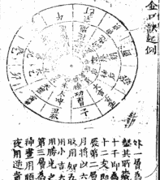

### 官板大六壬神課金口訣

金陵經正堂校梓

191 故宮珍本叢刊

## 神課金口訣卷上

金書謂目之所可見者形與色耳，此者目無與焉。耳之所聞者聲，此者耳無與焉。天下之物，固有非目而能視形色之外，又以探象數之微；非耳而能聽名聲之外，是以察吉凶之兆。審靡於造化之內，默運於範圍之表，非天下之至神，其孰能與於此哉？蓋惟神者，有孫公謹言，可謂精而能神者也。惟其精而能神，乃立焉。是故設為四位，包羅萬象，該括至理，體登禍福，成敗得失，皆得預知。雖世之所謂隔皆見針者，未足以擬其妙也。古人以金口木舌美聖人之警世也，今將是術發其書之名曰，庶幾乎。惟宋元君有稚龜七十二，占世無遺策，當時號為神龜。況孫之得萬無一失，孰為非神邪？故是命其名焉曰神課金口訣，豈其然乎。

丙午歲季春清明日余川應然子謹序

古籍库 www.fozhu920.com

官板大六壬神課金口訣 192

### 鈐敘

余嘗認庭殿燕坐，觀金口訣之妙書也，鄙有所效法焉。分三傳之錯竹，列君臣以辨尊卑，該賓主之三才之尊位。立四課以象四時之明交際，人元外也，又有外為輔，天子而已；貴神內也，又有內為輔者，將神地分是已。或比或賊克，或上下相生，或上下相克，亦有所有克賊。尊卑雖異，勢不能無隔位相刑；亦有所以比和，上下雖殊，體不能無隔位相生。有帶殺，有內向外者，有外向內者。理雖一致，取用多岐；道實一途，應用萬態，可謂不贅之龜，未擇之著爾。是鈐也，雖為筌蹄，亦是然也。又有捨是而有得焉者。今立六十甲子神課金口鈐，庶幾後學之流，致思其義，亦過半矣。

適適子自敘

神課金口訣 序

193 故宫珍本叢刊

### 太乙金鏡式經

#### 第一卷

- 論神鑑入式法歌
- 論十二神將法第一
- 論十二貴神法第二
- 論十二位神相吉凶法第三
- 論十二位神相吉凶法第四
- 論十二位神吉凶法第五
- 論十二位神吉凶法第六
- 論十二位神吉凶法第七
- 論十二位神吉凶法第八
- 論十二位神吉凶法第九
- 論十二位神吉凶法第十
- 論十二位神吉凶法第十一
- 論十二位神吉凶法第十二
- 論十二位神吉凶法第十三
- 論十二位神吉凶法第十四
- 論十二位神吉凶法第十五
- 論十二位神吉凶法第十六

### 神鑑金口訣目錄

#### 二

- 論天干貴神神位入式法第十七
- 論天干貴神神位入式法第十八
- 論天干貴神神位入式法第十九
- 論天干貴神神位入式法第二十
- 論天干貴神神位入式法第二十一
- 論天干貴神神位入式法第二十二
- 論天干貴神神位入式法第二十三
- 論天干貴神神位入式法第二十四
- 論天干貴神神位入式法第二十五
- 論天干貴神神位入式法第二十六
- 論天干貴神神位入式法第二十七
- 論天干貴神神位入式法第二十八
- 論天干貴神神位入式法第二十九
- 論天干貴神神位入式法第三十
- 論天干貴神神位入式法第三十一
- 論天干貴神神位入式法第三十二
- 論天干貴神神位入式法第三十三
- 論天干貴神神位入式法第三十四
- 論天干貴神神位入式法第三十五
- 論天干貴神神位入式法第三十六

官板大六壬神课金口诀 194

## 神课金口诀卷之四

- 论占求官人贵格法第四十七
- 论占求官人贵格法第四十八
- 论占求官人贵格法第四十九
- 论占求官人贵格法第五十
- 论占求官人贵格法第五十一
- 论占求官人贵格法第五十二
- 论占求官人贵格法第五十三
- 论占求官人贵格法第五十四
- 论占求官人贵格法第五十五
- 论占求官人贵格法第五十六

- 论占求官人贵格法第五十七
- 论占求官人贵格法第五十八
- 论占求官人贵格法第五十九
- 论占求官人贵格法第六十
- 论占求官人贵格法第六十一
- 论占求官人贵格法第六十二
- 论占求官人贵格法第六十三
- 论占求官人贵格法第六十四
- 论占求官人贵格法第六十五
- 论占求官人贵格法第六十六

## 神课金口诀卷之五

- 论占求官人贵格法第五十七
- 论占求官人贵格法第五十八
- 论占求官人贵格法第五十九
- 论占求官人贵格法第六十
- 论占求官人贵格法第六十一
- 论占求官人贵格法第六十二
- 论占求官人贵格法第六十三
- 论占求官人贵格法第六十四
- 论占求官人贵格法第六十五
- 论占求官人贵格法第六十六

- 论占求官人贵格法第六十七
- 论占求官人贵格法第六十八
- 论占求官人贵格法第六十九
- 论占求官人贵格法第七十
- 论占求官人贵格法第七十一
- 论占求官人贵格法第七十二
- 论占求官人贵格法第七十三
- 论占求官人贵格法第七十四
- 论占求官人贵格法第七十五
- 论占求官人贵格法第七十六

古籍库 www.fozhu920.com

195 故宫珍本叢刊

## 神機會通目錄

- 論太乙臨十二位吉凶古法第八
- 論太史臨十二位吉凶古法第九
- 論太常臨十二位吉凶古法第十
- 論白虎臨十二位吉凶古法第十一
- 論天空臨十二位吉凶古法第十二
- 論太陰臨十二位吉凶古法第十三
- 論六合臨十二位吉凶古法第十四
- 論天后臨十二位吉凶古法第十五
- 論騰蛇臨十二位吉凶古法第十六
- 論朱雀臨十二位吉凶古法第十七
- 論勾陳臨十二位吉凶古法第十八
- 論玄武臨十二位吉凶古法第十九
- 論太歲臨十二位吉凶古法第二十
- 論月將臨十二位吉凶古法第二十一
- 論日辰臨十二位吉凶古法第二十二
- 論時辰臨十二位吉凶古法第二十三
- 論神后臨十二位吉凶古法第二十四
- 論大吉臨十二位吉凶古法第二十五
- 論功曹臨十二位吉凶古法第二十六

## 神機會通目錄

- 文星照法第二十七
- 魁星照法第二十八
- 將神照法第二十九
- 天官入宅法第三十
- 將神入宅法第三十一
- 天官入宅內二度法第三十二
- 課諸外災禍法第三十三
- 課諸內災禍法第三十四
- 課諸內外禍法第三十五
- 課諸內外人陽人法第三十六
- 課諸內外人陰人法第三十七
- 開闢見鬼法第三十八
- 內宅外宅法第三十九
- 玄女射宅法第四十
- 日下十二時神將法第四十一
- 占病法第四十二
- 占病有祟無祟法第四十三
- 占病是何鬼神法第四十四
- 占病終死法第四十五
- 占失賊法第四十六

古籍库 www.fozhu920.com

官板大六壬神課金口訣 196

## 神課金口訣

### 卷一

#### 論十一將所主第五十七

- 占長六壬課第四十七
- 占出門見喜第四十八
- 占失人法第四十九
- 占失物法第五十
- 占井法第五十一
- 占墳瑩內外第五十二
- 占移徙吉凶第五十三
- 占病內外第五十四
- 占飲食第五十五
- 占食味吉凶第五十六

### 第五卷

- 論神課六十甲子鈐
- 神課入式吉凶解
- 論課體吉凶法

### 第六卷

- 論課義課體吉凶法
- 論內外景吉凶法
- 論占地形吉凶法
- 論問項所見吉凶法

## 神課金口訣

### 別錄

#### 目錄

八

- 論占別墓必死凶法
- 論金義士吉凶法
- 論王藻課入式法
- 論四課假法
- 論四課之內見吉凶法
- 論四位相生相克法
- 論四位內所見吉凶法
- 論占人在外內外法
- 論十一將所主吉凶法

### 五行卷勢

- 四象
- 五動誦
- 三動法
- 占法
- 雜占類
- 釋
- 貴神
- 將所主
- 五用法
- 合用神
- 都解

## 神課金口訣別錄卷

古籍库 www.fozhu920.com

197 故宫珍本叢書

## 神機金口訣例

## 六壬課傳活法圖

## 神機金口訣例

### 起例

一 暖克
取課從下賊上呼，如無下賊上，初將後為中，中上因加求未。此用此日是此神用，賜陰上凶并同。

二 此用
下賊上為四侵，如遇上克亦并同。

三 漢書
賊克俱不相止，孟用白虎季用，孟用白虎季用，孟用白虎季用，孟用白虎季用。

四 遊克
常將此日是此神用，賜陰上凶并同。

九

神機金口訣例
起例

四 課賊克賊通
日與神兮遇交，先取賊神來，有時克賊神來，今日此神為用，如無方取日來，今日此神為用。

五 宿
無克當以所乘，陽日先日而後辰，陰日先辰而後日。

六 伏吟
六甲伏吟巳亥，六丙六戊巳亥，六庚六戊巳亥，六壬日亥巳，壬辰壬午巳亥。

七 返吟
更有四課不為，久傳亦有，惟有偶無克神，丑未加辰戌，辰戌加丑未。

八 重審
日辰先後次第，賊克日次用賊，賊克日次用賊，賊克日次用賊，賊克日次用賊。

九 貴神
日辰神兮遇交，先取賊神來，有時克賊神來，今日此神為用，如無方取日來，今日此神為用。

十 別責
四課不全三課，無克剛日別，無克剛日別，無克剛日別，無克剛日別。

官板大六壬神課金口訣 198

## 四課式

三傳

初日干上神

中日支上神

末日干上神

無之則當制敵

有克比和為用

無克則取日辰

陽日取干上神

陰日取支上神

九八尊

無之則當制敵

有克比和為用

無克則取日辰

陽日取干上神

陰日取支上神

## 神樞金口訣

### 起例

十次客

次客法要兼明

陽日取干上神

陰日取支上神

無克則取日辰

陽日取干上神

陰日取支上神

除將前五後三取

依此用之者無差

假如十月己巳日巳時占

以日干己加巳上

以日支巳加巳上

取日干上神為用

取日支上神為用

取日干上神為用

取日支上神為用

取日干上神為用

取日支上神為用

取日干上神為用

取日支上神為用

取日干上神為用

取日支上神為用

取日干上神為用

取日支上神為用

取日干上神為用

取日支上神為用

取日干上神為用

取日支上神為用

取日干上神為用

取日支上神為用

取日干上神為用

取日支上神為用

取日干上神為用

取日支上神為用

取日干上神為用

取日支上神為用

取日干上神為用

取日支上神為用

取日干上神為用

取日支上神為用

取日干上神為用

取日支上神為用

取日干上神為用

取日支上神為用

取日干上神為用

取日支上神為用

取日干上神為用

取日支上神為用

取日干上神為用

取日支上神為用

取日干上神為用

取日支上神為用

取日干上神為用

取日支上神為用

取日干上神為用

取日支上神為用

取日干上神為用

取日支上神為用

取日干上神為用

取日支上神為用

取日干上神為用

取日支上神為用

取日干上神為用

199 故宫珍本叢刊

## 神機金口訣 卷三

### 論神機入式訣

式之法妙通玄，更將何神為一位。日干為主用五元，五行之內細推研。方察神人見的端，二火見水災須至。二水見火主凶言，水未入火災禍至。火未入水災禍連，天關全在有神傳。

月將加時方上傳，貴神為用無疑焉。便將神將定吉凶，二土比和萬事安。二金刑克不相當，二木相生大吉昌。二火相生為喜合，二水相生有禍殃。上下相生皆福慶，四位相生主有喜。

木來入土為刑獄，上克下兮從外入。下克上兮向內遷，四位相生百事吉。內有相刑必有禍，四位相克事難成。四位相生喜氣新，甲乙寅卯木為主。庚辛申酉金為君，丙丁巳午火為用。壬癸亥子水為尊，戊己辰戌丑未土。此是五行真妙文。

土行水土宅堂西，克害主兮有禍殃。子午卯酉為四正，庚辛申酉為西方。丙丁巳午南方火，壬癸亥子北方水。甲乙寅卯東方木，戊己辰戌丑未土。此是五行真妙文。

玄武朱雀勾陳，白虎道路及刀兵。此是凶神須仔細，莫教凶神來相侵。天空廟宇及僧道，太陰暗昧不分明。朱雀口舌及災禍，六合婚姻喜氣生。青龍財帛及文書，太常飲食樂和平。勾陳田園及詞訟，玄武盜賊暗損人。白虎疾病及災殃，天空欺詐事難成。

上克下兮宅不安，下克上兮人不旺。見金剋木主分離，見木剋金官事至。見水剋火家不寧，見火剋金有禍殃。見土剋水有災厄，見木剋土主口舌。見金剋木主分離，見水剋火家不寧。見火剋金有禍殃，見土剋水有災厄。見木剋土主口舌。

太乙巳月將木，甲為正月將木。卯為二月將木，辰為三月將土。巳為四月將火，午為五月將火。未為六月將土，申為七月將金。酉為八月將金，戌為九月將土。亥為十月將水，子為十一月將水。丑為十二月將土。

丑為大吉，子為神后。亥為登明，戌為河魁。酉為從魁，申為傳送。未為小吉，午為勝光。巳為太乙，辰為天罡。卯為太衝，寅為功曹。丑為大吉。

古籍库 www.fozhu920.com

官板大六壬神課金口訣 200

## 神課金口訣 卷一

### 論十二貴神旺相法第二

天乙貴神己丑火，前一蛇丁巳火。朱雀丙午火，前二六合乙卯木。勾陳戊辰土，前三青龍甲寅木。天空戊戌土，前四太陰辛酉金。白虎庚申金，前五天后癸亥水。太常己未土，後一貴神己丑火。玄武癸亥水，後二騰蛇丁巳火。太陰辛酉金，後三朱雀丙午火。天后癸亥水，後四勾陳戊辰土。六合乙卯木，後五天空戊戌土。青龍甲寅木，後六大常己未土。

### 論貴神旺相法第三

六壬青龍木為主，從魁太常土為魁。旺在四季相三六，庚辛申酉金為媒。後五天空戌土上，無氣發用不為災。絕在申酉并子午，相在亥子寅卯推。

大陰白虎及天空，貴神騰蛇朱雀同。勾陳六合青龍木，太常太陰玄武通。天后貴神為水象，旺相三六九月中。旺在四季相三六，庚辛申酉金為媒。後五天空戌土上，無氣發用不為災。絕在申酉并子午，相在亥子寅卯推。

有見必傷人共死，馬亡亂賊鬼邪。太陰白虎及天空，貴神騰蛇朱雀同。勾陳六合青龍木，太常太陰玄武通。天后貴神為水象，旺相三六九月中。旺在四季相三六，庚辛申酉金為媒。後五天空戌土上，無氣發用不為災。絕在申酉并子午，相在亥子寅卯推。

### 論十二神將所主法第五

天空道式好喜客，玄武臨人斜眼窺。白虎道路凶災見，太常飲食酒肉宜。天后臨人多暗昧，玄武臨人斜眼窺。白虎道路凶災見，太常飲酒酒肉宜。天后臨人多暗昧，玄武臨人斜眼窺。白虎道路凶災見，太常飲酒酒肉宜。天后臨人多暗昧，玄武臨人斜眼窺。白虎道路凶災見，太常飲酒酒肉宜。

大樹朝財人物旺，從旺斷之素解詳。十二神將知者稀，貴神臨人得便宜。朱雀臨人官事起，六合臨人主婚姻。勾陳臨人田宅論，太陰臨人暗損人。天空臨人多詐偽，白虎臨人凶禍侵。玄武臨人盜賊至，太常臨人酒食迎。天后臨人多暗昧，玄武臨人斜眼窺。白虎道路凶災見，太常飲酒酒肉宜。天后臨人多暗昧，玄武臨人斜眼窺。白虎道路凶災見，太常飲酒酒肉宜。天后臨人多暗昧，玄武臨人斜眼窺。白虎道路凶災見，太常飲酒酒肉宜。

201 故宫珍本叢刊

## 神樞金口訣 卷一

有客來問財旺衰吉凶，德祿由來入旺鄉。印綬之年逢人有，自從旺地出災殃。河中盛旺枯骨肥，夏逢宅死枯骨肥。看財死絕須防，神伏位見金神。

中央合兮為生紀，大吉此來入旺方。木見之頭必死。

### 論十一位貴神所主法第七

天乙貴神所主者，五行旺相休囚死。

### 論十二神所主法第八

朱雀南方是火精，失光口舌每相爭。飛來書者是此情。

玄武北方水神精，門上出遊防人驚。青龍貴人多喜慶，旺相財喜自生。白虎西方是金神，旺相相逢財自生。勾陳女賊人怪驚，旺相田宅見災凶。天空下傷見死氣，只恐田宅見災凶。太陰女立暗中行，此神上主有暗行。

### 論十二神所主法第八

實為功曹通賊人，陽干逢之必傷身。

凡占問處事求成，但看旺相與死囚。旺相相逢多吉慶，死囚見之主多凶。

凡占問處事求成，但看旺相與死囚。旺相相逢多吉慶，死囚見之主多凶。

凡占問處事求成，但看旺相與死囚。旺相相逢多吉慶，死囚見之主多凶。

官板大六壬神课金口诀 202

## 神课金口诀 卷一

### 占来意

仙人入室，见谋望当大吉出门。妻财位后主婚身，列于两宫位兄弟。天罡得位喜重重，列于宅位见分明。天罡到彼不和同，列于官上伤财凶。见申如媒须急速，列于财上喜重重。大乙临卯绝命见，列于官上伤财凶。腾蛇临卯绝命见，列于官上伤财凶。玄武临卯绝命见，列于官上伤财凶。太阴临卯绝命见，列于官上伤财凶。朱雀临卯绝命见，列于官上伤财凶。勾陈临卯绝命见，列于官上伤财凶。

有婚姻申卯年，见婚上卯即凶。传送到戌为旺方，列于宅上见分明。夏月壬注人有，列于宅上见分明。飞廉临卯绝命见，列于宅上见分明。天罡到彼不和同，列于宅上见分明。巳上见喜自至，列于宅上见分明。河到丑见喜自至，列于宅上见分明。长位宅逢枯木现，列于宅上见分明。登明到丑见喜自至，列于宅上见分明。未上逢喜自至，列于宅上见分明。神占腾蛇见金神，列于宅上见分明。

小吉临戌为守家，列于宅上见分明。中酉宫头是破财，列于宅上见分明。腾蛇临卯绝命见，列于宅上见分明。玄武临卯绝命见，列于宅上见分明。太阴临卯绝命见，列于宅上见分明。朱雀临卯绝命见，列于宅上见分明。勾陈临卯绝命见，列于宅上见分明。青龙临卯绝命见，列于宅上见分明。白虎临卯绝命见，列于宅上见分明。天空临卯绝命见，列于宅上见分明。贵人临卯绝命见，列于宅上见分明。天后临卯绝命见，列于宅上见分明。太常临卯绝命见，列于宅上见分明。玄武临卯绝命见，列于宅上见分明。太阴临卯绝命见，列于宅上见分明。朱雀临卯绝命见，列于宅上见分明。勾陈临卯绝命见，列于宅上见分明。青龙临卯绝命见，列于宅上见分明。白虎临卯绝命见，列于宅上见分明。天空临卯绝命见，列于宅上见分明。贵人临卯绝命见，列于宅上见分明。天后临卯绝命见，列于宅上见分明。太常临卯绝命见，列于宅上见分明。

### 占失盗

见盗贼当大吉出门，列于两宫位兄弟。天罡得位喜重重，列于宅位见分明。天罡到彼不和同，列于官上伤财凶。见申如媒须急速，列于财上喜重重。大乙临卯绝命见，列于官上伤财凶。腾蛇临卯绝命见，列于官上伤财凶。玄武临卯绝命见，列于官上伤财凶。太阴临卯绝命见，列于官上伤财凶。朱雀临卯绝命见，列于官上伤财凶。勾陈临卯绝命见，列于官上伤财凶。

### 占失盗

见盗贼当大吉出门，列于两宫位兄弟。天罡得位喜重重，列于宅位见分明。天罡到彼不和同，列于官上伤财凶。见申如媒须急速，列于财上喜重重。大乙临卯绝命见，列于官上伤财凶。腾蛇临卯绝命见，列于官上伤财凶。玄武临卯绝命见，列于官上伤财凶。太阴临卯绝命见，列于官上伤财凶。朱雀临卯绝命见，列于官上伤财凶。勾陈临卯绝命见，列于官上伤财凶。

## 神课金口诀 卷一

### 论十二位天官所临第九

青龙主上有喜庆，贵人主见贵人。天后主见贵人，太阴主见贵人。朱雀主见贵人，勾陈主见贵人。青龙主上有喜庆，贵人主见贵人。天后主见贵人，太阴主见贵人。朱雀主见贵人，勾陈主见贵人。青龙主上有喜庆，贵人主见贵人。天后主见贵人，太阴主见贵人。朱雀主见贵人，勾陈主见贵人。青龙主上有喜庆，贵人主见贵人。天后主见贵人，太阴主见贵人。朱雀主见贵人，勾陈主见贵人。

六壬占事多情，或主因财而合。勾陈主见贵人，天后主见贵人。太阴主见贵人，朱雀主见贵人。勾陈主见贵人，青龙主上有喜庆。贵人主见贵人，天后主见贵人。太阴主见贵人，朱雀主见贵人。勾陈主见贵人，青龙主上有喜庆。贵人主见贵人，天后主见贵人。太阴主见贵人，朱雀主见贵人。勾陈主见贵人，青龙主上有喜庆。贵人主见贵人，天后主见贵人。太阴主见贵人，朱雀主见贵人。勾陈主见贵人。

### 占失盗

见盗贼当大吉出门，列于两宫位兄弟。天罡得位喜重重，列于宅位见分明。天罡到彼不和同，列于官上伤财凶。见申如媒须急速，列于财上喜重重。大乙临卯绝命见，列于官上伤财凶。腾蛇临卯绝命见，列于官上伤财凶。玄武临卯绝命见，列于官上伤财凶。太阴临卯绝命见，列于官上伤财凶。朱雀临卯绝命见，列于官上伤财凶。勾陈临卯绝命见，列于官上伤财凶。

### 占失盗

见盗贼当大吉出门，列于两宫位兄弟。天罡得位喜重重，列于宅位见分明。天罡到彼不和同，列于官上伤财凶。见申如媒须急速，列于财上喜重重。大乙临卯绝命见，列于官上伤财凶。腾蛇临卯绝命见，列于官上伤财凶。玄武临卯绝命见，列于官上伤财凶。太阴临卯绝命见，列于官上伤财凶。朱雀临卯绝命见，列于官上伤财凶。勾陈临卯绝命见，列于官上伤财凶。

203 故宫珍本叢刊

## 神機金口訣 卷九

實來實照二事問，人論公事主難明。是臨一水非為吉，金上逢之却不凶。天祿福人成不虛，立千井竈化為中。白虎剛強道上行，亡人驚走失財凶。服受河魁兵甲，天祿驚人發陣營。受克臨門婚嫁作，紅嬌逢之亡家聲。主為古事支離甚，貴神常主喜重重。骨秀肥肥面耐清。

前陳勝配如形，須求此女嫁何人。性情亂髮鬢零，傳書有信人情薄。神思昏昏老之猶，面帶憂情心性急。清高大令未求名，或見文人遂臣去。勾陳刑木未去，服受臨門婚嫁作。眉今明近貴人。

## 神機金口訣 卷十

身長面短無神氣，人論公事主難明。天祿良人美婦人，眼長有細面光分。十祿長生牙齒全，性情剛好喜身。大倉合好風顛，性情清潔好修真。形變面方眉眼細，桃腮冷淡沒人憐。玄武朱雀走狂狂，眼小身小世中人。黑星相形神必逸，眼明夜視人中仙。好著青衣及錦繡，肉厚筋骨有口偏。白虎臨面兵伏行，神形不伏風顛。

### 論十一位天官象形第

天祿常逢道人來，冷面酒食頻頻。功祿外來作神福，如居田舍有孤田。勾陳常主喜重重，送迎官事出門庭。鐵蛇損失主驚憂，送迎官事出門庭。朱雀神現主婚嫁，見人先說是非事。開行官事交加至，家中長有事多。

清脫赤好文章，性情剛好喜身。性情清潔好修真，眼小身小世中人。眼明夜視人中仙，肉厚筋骨有口偏。神形不伏風顛，冷面酒食頻頻。如居田舍有孤田，送迎官事出門庭。見人先說是非事，家中長有事多。

官板大六壬神課金口訣 204

### 神課金口訣卷之三

六合神主立婚姻，棚破門傷人。木槌鐵器金破，結絲絃樹影。勾陳旺相田禾，荒蕪灰燼鼠鬼。青龍彩服入門，穿紅衣人來。家內水坑休囚，外來未及年間。天后暗中有喜，婦人私事暗通。太陰失光無私，男病暗鬼難分。玄武破頭怪夢，水溝石眼暗地。

古法占宅主河，水災見傷及魔。出見鬼怪驚恐，三度大傷失財。太常幡到佛前，口願指羊豬未全。銅器孟安井竈，曾見未免是鬼。白虎鬼子未乘，結煞賊血光災。宋中虛耗未除，門前石碑曾破。天罡克破傷損，托物鬼神上行。更有足相超入，定主屋宇及曾鳴。

論天乙主有文書，邪信文字有口舌，口舌見人有口舌，口舌見人有口舌。

### 神課金口訣卷之三

勝蛇主有驚恐，怪夢疑惑恐懼事，有克主有陰人病。朱雀主有文書信息口舌之喜，有克主有口舌見其光。六合主有婚姻和合交易婚姻事，有克主有奴婢私通。勾陳主有田宅交易婚姻事，有克主有奴婢私通。青龍主有財帛喜事，有克主有奴婢私通。天后主有陰人婚姻陰人，有克主有陰人暗通。太陰主有暗事陰人，有克主有陰人暗通。玄武主有盜賊暗損失財物，有克主有盜賊暗損失財物。太常主有陰人飲食衣服事，有克主有陰人飲食衣服事。白虎主有道路信息文書，有克主有道路信息文書。天空主有奴婢詐欺不實之事，有克主有奴婢詐欺不實之事。

太陰主有暗事陰人，有克主有陰人暗通。玄武主有盜賊暗損失財物，有克主有盜賊暗損失財物。太常主有陰人飲食衣服事，有克主有陰人飲食衣服事。白虎主有道路信息文書，有克主有道路信息文書。天空主有奴婢詐欺不實之事，有克主有奴婢詐欺不實之事。

古籍库 www.fozhu920.com

205 故宮珍本叢刊

### 論十干貴神本位吉凶第二十三

貢柳鬼且加官進祿加官主大富貴
有口舌應之
理珠云其家絕得財人主生火災主大
合女妻妻重婚妻有外情者亦主先吉後
來在臨門上主死厄主病
六合臨門上主死厄主病
須防常主有人與賊暗謀其事其家主賊
勾陳臨門上主爭競暗謀其事其家主賊
神課金口訣
天乙宅主有庄宅在門主大富貴
青龍宅主有財帛大加官相主有財得理
其家主出商賈亦有喜事
天后宅主酒食見之有喜事更旺相主生大吉
太陰宅主有陰人暗認也此課亦為不順以
一金故也
玄武宅主有盜賊至內驚恐衣枷枷鎖
必是男人如臨下是陰必女人為賊也此課
財也

神課金口訣卷一

太常臨宅主有女子若過問奪人後却有
天乙宅主有庄宅在門主大富貴
白虎臨門主有子孫在外難意也其家有
傷及損六畜見之有死喪事
春
天暗臨宅有孤兒及風魔人在其家
散人暗損陰人
神課金口訣卷一終

官板大六壬神课金口诀 206

## 神课金口诀 卷之二

### 论天乙贵神所主吉凶第一四

天乙贵神主王侯
贵人见面有何通
神将安见哭泣否
神将安见喜庆宫

神将安见哭泣否
神将安见喜庆宫

神将安见哭泣否
神将安见喜庆宫

神将安见哭泣否
神将安见喜庆宫

神将安见哭泣否
神将安见喜庆宫

神将安见哭泣否
神将安见喜庆宫

神将安见哭泣否
神将安见喜庆宫

神将安见哭泣否
神将安见喜庆宫

神将安见哭泣否
神将安见喜庆宫

神将安见哭泣否
神将安见喜庆宫

神将安见哭泣否
神将安见喜庆宫

神将安见哭泣否
神将安见喜庆宫

神将安见哭泣否
神将安见喜庆宫

神将安见哭泣否
神将安见喜庆宫

神将安见哭泣否
神将安见喜庆宫

神将安见哭泣否
神将安见喜庆宫

神将安见哭泣否
神将安见喜庆宫

神将安见哭泣否
神将安见喜庆宫

神将安见哭泣否
神将安见喜庆宫

神将安见哭泣否
神将安见喜庆宫

神将安见哭泣否
神将安见喜庆宫

神将安见哭泣否
神将安见喜庆宫

神将安见哭泣否
神将安见喜庆宫

神将安见哭泣否
神将安见喜庆宫

神将安见哭泣否
神将安见喜庆宫

神将安见哭泣否
神将安见喜庆宫

神将安见哭泣否
神将安见喜庆宫

神将安见哭泣否
神将安见喜庆宫

神将安见哭泣否
神将安见喜庆宫

神将安见哭泣否
神将安见喜庆宫

神将安见哭泣否
神将安见喜庆宫

神将安见哭泣否
神将安见喜庆宫

神将安见哭泣否
神将安见喜庆宫

神将安见哭泣否
神将安见喜庆宫

神将安见哭泣否
神将安见喜庆宫

神将安见哭泣否
神将安见喜庆宫

神将安见哭泣否
神将安见喜庆宫

神将安见哭泣否
神将安见喜庆宫

神将安见哭泣否
神将安见喜庆宫

神将安见哭泣否
神将安见喜庆宫

神将安见哭泣否
神将安见喜庆宫

神将安见哭泣否
神将安见喜庆宫

神将安见哭泣否
神将安见喜庆宫

神将安见哭泣否
神将安见喜庆宫

神将安见哭泣否
神将安见喜庆宫

神将安见哭泣否
神将安见喜庆宫

神将安见哭泣否
神将安见喜庆宫

神将安见哭泣否
神将安见喜庆宫

神将安见哭泣否
神将安见喜庆宫

神将安见哭泣否
神将安见喜庆宫

神将安见哭泣否
神将安见喜庆宫

神将安见哭泣否
神将安见喜庆宫

神将安见哭泣否
神将安见喜庆宫

神将安见哭泣否
神将安见喜庆宫

神将安见哭泣否
神将安见喜庆宫

神将安见哭泣否
神将安见喜庆宫

神将安见哭泣否
神将安见喜庆宫

神将安见哭泣否
神将安见喜庆宫

神将安见哭泣否
神将安见喜庆宫

神将安见哭泣否
神将安见喜庆宫

神将安见哭泣否
神将安见喜庆宫

神将安见哭泣否
神将安见喜庆宫

神将安见哭泣否
神将安见喜庆宫

神将安见哭泣否
神将安见喜庆宫

神将安见哭泣否
神将安见喜庆宫

神将安见哭泣否
神将安见喜庆宫

神将安见哭泣否
神将安见喜庆宫

神将安见哭泣否
神将安见喜庆宫

神将安见哭泣否
神将安见喜庆宫

神将安见哭泣否
神将安见喜庆宫

神将安见哭泣否
神将安见喜庆宫

神将安见哭泣否
神将安见喜庆宫

神将安见哭泣否
神将安见喜庆宫

神将安见哭泣否
神将安见喜庆宫

神将安见哭泣否
神将安见喜庆宫

神将安见哭泣否
神将安见喜庆宫

神将安见哭泣否
神将安见喜庆宫

神将安见哭泣否
神将安见喜庆宫

神将安见哭泣否
神将安见喜庆宫

神将安见哭泣否
神将安见喜庆宫

神将安见哭泣否
神将安见喜庆宫

神将安见哭泣否
神将安见喜庆宫

神将安见哭泣否
神将安见喜庆宫

神将安见哭泣否
神将安见喜庆宫

神将安见哭泣否
神将安见喜庆宫

神将安见哭泣否
神将安见喜庆宫

神将安见哭泣否
神将安见喜庆宫

神将安见哭泣否
神将安见喜庆宫

神将安见哭泣否
神将安见喜庆宫

神将安见哭泣否
神将安见喜庆宫

神将安见哭泣否
神将安见喜庆宫

神将安见哭泣否
神将安见喜庆宫

神将安见哭泣否
神将安见喜庆宫

神将安见哭泣否
神将安见喜庆宫

神将安见哭泣否
神将安见喜庆宫

神将安见哭泣否
神将安见喜庆宫

神将安见哭泣否
神将安见喜庆宫

神将安见哭泣否
神将安见喜庆宫

神将安见哭泣否
神将安见喜庆宫

神将安见哭泣否
神将安见喜庆宫

神将安见哭泣否
神将安见喜庆宫

神将安见哭泣否
神将安见喜庆宫

神将安见哭泣否
神将安见喜庆宫

神将安见哭泣否
神将安见喜庆宫

神将安见哭泣否
神将安见喜庆宫

神将安见哭泣否
神将安见喜庆宫

神将安见哭泣否
神将安见喜庆宫

神将安见哭泣否
神将安见喜庆宫

神将安见哭泣否
神将安见喜庆宫

神将安见哭泣否
神将安见喜庆宫

神将安见哭泣否
神将安见喜庆宫

神将安见哭泣否
神将安见喜庆宫

神将安见哭泣否
神将安见喜庆宫

神将安见哭泣否
神将安见喜庆宫

神将安见哭泣否
神将安见喜庆宫

神将安见哭泣否
神将安见喜庆宫

神将安见哭泣否
神将安见喜庆宫

神将安见哭泣否
神将安见喜庆宫

神将安见哭泣否
神将安见喜庆宫

神将安见哭泣否
神将安见喜庆宫

神将安见哭泣否
神将安见喜庆宫

神将安见哭泣否
神将安见喜庆宫

神将安见哭泣否
神将安见喜庆宫

神将安见哭泣否
神将安见喜庆宫

神将安见哭泣否
神将安见喜庆宫

神将安见哭泣否
神将安见喜庆宫

神将安见哭泣否
神将安见喜庆宫

神将安见哭泣否
神将安见喜庆宫

神将安见哭泣否
神将安见喜庆宫

神将安见哭泣否
神将安见喜庆宫

神将安见哭泣否
神将安见喜庆宫

神将安见哭泣否
神将安见喜庆宫

神将安见哭泣否
神将安见喜庆宫

神将安见哭泣否
神将安见喜庆宫

神将安见哭泣否
神将安见喜庆宫

神将安见哭泣否
神将安见喜庆宫

神将安见哭泣否
神将安见喜庆宫

神将安见哭泣否
神将安见喜庆宫

神将安见哭泣否
神将安见喜庆宫

神将安见哭泣否
神将安见喜庆宫

神将安见哭泣否
神将安见喜庆宫

神将安见哭泣否
神将安见喜庆宫

神将安见哭泣否
神将安见喜庆宫

神将安见哭泣否
神将安见喜庆宫

神将安见哭泣否
神将安见喜庆宫

神将安见哭泣否
神将安见喜庆宫

神将安见哭泣否
神将安见喜庆宫

神将安见哭泣否
神将安见喜庆宫

神将安见哭泣否
神将安见喜庆宫

神将安见哭泣否
神将安见喜庆宫

神将安见哭泣否
神将安见喜庆宫

神将安见哭泣否
神将安见喜庆宫

神将安见哭泣否
神将安见喜庆宫

神将安见哭泣否
神将安见喜庆宫

神将安见哭泣否
神将安见喜庆宫

神将安见哭泣否
神将安见喜庆宫

神将安见哭泣否
神将安见喜庆宫

神将安见哭泣否
神将安见喜庆宫

神将安见哭泣否
神将安见喜庆宫

神将安见哭泣否
神将安见喜庆宫

神将安见哭泣否
神将安见喜庆宫

神将安见哭泣否
神将安见喜庆宫

神将安见哭泣否
神将安见喜庆宫

神将安见哭泣否
神将安见喜庆宫

神将安见哭泣否
神将安见喜庆宫

神将安见哭泣否
神将安见喜庆宫

神将安见哭泣否
神将安见喜庆宫

神将安见哭泣否
神将安见喜庆宫

神将安见哭泣否
神将安见喜庆宫

神将安见哭泣否
神将安见喜庆宫

神将安见哭泣否
神将安见喜庆宫

神将安见哭泣否
神将安见喜庆宫

神将安见哭泣否
神将安见喜庆宫

神将安见哭泣否
神将安见喜庆宫

神将安见哭泣否
神将安见喜庆宫

神将安见哭泣否
神将安见喜庆宫

神将安见哭泣否
神将安见喜庆宫

神将安见哭泣否
神将安见喜庆宫

神将安见哭泣否
神将安见喜庆宫

神将安见哭泣否
神将安见喜庆宫

神将安见哭泣否
神将安见喜庆宫

神将安见哭泣否
神将安见喜庆宫

神将安见哭泣否
神将安见喜庆宫

神将安见哭泣否
神将安见喜庆宫

神将安见哭泣否
神将安见喜庆宫

神将安见哭泣否
神将安见喜庆宫

神将安见哭泣否
神将安见喜庆宫

神将安见哭泣否
神将安见喜庆宫

神将安见哭泣否
神将安见喜庆宫

神将安见哭泣否
神将安见喜庆宫

神将安见哭泣否
神将安见喜庆宫

神将安见哭泣否
神将安见喜庆宫

神将安见哭泣否
神将安见喜庆宫

神将安见哭泣否
神将安见喜庆宫

神将安见哭泣否
神将安见喜庆宫

神将安见哭泣否
神将安见喜庆宫

神将安见哭泣否
神将安见喜庆宫

神将安见哭泣否
神将安见喜庆宫

神将安见哭泣否
神将安见喜庆宫

神将安见哭泣否
神将安见喜庆宫

神将安见哭泣否
神将安见喜庆宫

神将安见哭泣否
神将安见喜庆宫

神将安见哭泣否
神将安见喜庆宫

神将安见哭泣否
神将安见喜庆宫

神将安见哭泣否
神将安见喜庆宫

神将安见哭泣否
神将安见喜庆宫

神将安见哭泣否
神将安见喜庆宫

神将安见哭泣否
神将安见喜庆宫

神将安见哭泣否
神将安见喜庆宫

神将安见哭泣否
神将安见喜庆宫

神将安见哭泣否
神将安见喜庆宫

神将安见哭泣否
神将安见喜庆宫

神将安见哭泣否
神将安见喜庆宫

神将安见哭泣否
神将安见喜庆宫

神将安见哭泣否
神将安见喜庆宫

神将安见哭泣否
神将安见喜庆宫

神将安见哭泣否
神将安见喜庆宫

神将安见哭泣否
神将安见喜庆宫

神将安见哭泣否
神将安见喜庆宫

神将安见哭泣否
神将安见喜庆宫

神将安见哭泣否
神将安见喜庆宫

神将安见哭泣否
神将安见喜庆宫

神将安见哭泣否
神将安见喜庆宫

神将安见哭泣否
神将安见喜庆宫

神将安见哭泣否
神将安见喜庆宫

神将安见哭泣否
神将安见喜庆宫

神将安见哭泣否
神将安见喜庆宫

神将安见哭泣否
神将安见喜庆宫

神将安见哭泣否
神将安见喜庆宫

神将安见哭泣否
神将安见喜庆宫

神将安见哭泣否
神将安见喜庆宫

神将安见哭泣否
神将安见喜庆宫

神将安见哭泣否
神将安见喜庆宫

神将安见哭泣否
神将安见喜庆宫

神将安见哭泣否
神将安见喜庆宫

神将安见哭泣否
神将安见喜庆宫

神将安见哭泣否
神将安见喜庆宫

神将安见哭泣否
神将安见喜庆宫

神将安见哭泣否
神将安见喜庆宫

神将安见哭泣否
神将安见喜庆宫

神将安见哭泣否
神将安见喜庆宫

神将安见哭泣否
神将安见喜庆宫

神将安见哭泣否
神将安见喜庆宫

神将安见哭泣否
神将安见喜庆宫

神将安见哭泣否
神将安见喜庆宫

神将安见哭泣否
神将安见喜庆宫

神将安见哭泣否
神将安见喜庆宫

神将安见哭泣否
神将安见喜庆宫

神将安见哭泣否
神将安见喜庆宫

神将安见哭泣否
神将安见喜庆宫

神将安见哭泣否
神将安见喜庆宫

神将安见哭泣否
神将安见喜庆宫

神将安见哭泣否
神将安见喜庆宫

神将安见哭泣否
神将安见喜庆宫

神将安见哭泣否
神将安见喜庆宫

神将安见哭泣否
神将安见喜庆宫

神将安见哭泣否
神将安见喜庆宫

神将安见哭泣否
神将安见喜庆宫

神将安见哭泣否
神将安见喜庆宫

神将安见哭泣否
神将安见喜庆宫

神将安见哭泣否
神将安见喜庆宫

神将安见哭泣否
神将安见喜庆宫

神将安见哭泣否
神将安见喜庆宫

神将安见哭泣否
神将安见喜庆宫

神将安见哭泣否
神将安见喜庆宫

神将安见哭泣否
神将安见喜庆宫

神将安见哭泣否
神将安见喜庆宫

神将安见哭泣否
神将安见喜庆宫

神将安见哭泣否
神将安见喜庆宫

神将安见哭泣否
神将安见喜庆宫

神将安见哭泣否
神将安见喜庆宫

神将安见哭泣否
神将安见喜庆宫

神将安见哭泣否
神将安见喜庆宫

神将安见哭泣否
神将安见喜庆宫

神将安见哭泣否
神将安见喜庆宫

神将安见哭泣否
神将安见喜庆宫

神将安见哭泣否
神将安见喜庆宫

神将安见哭泣否
神将安见喜庆宫

神将安见哭泣否
神将安见喜庆宫

神将安见哭泣否
神将安见喜庆宫

神将安见哭泣否
神将安见喜庆宫

神将安见哭泣否
神将安见喜庆宫

神将安见哭泣否
神将安见喜庆宫

神将安见哭泣否
神将安见喜庆宫

神将安见哭泣否
神将安见喜庆宫

神将安见哭泣否
神将安见喜庆宫

神将安见哭泣否
神将安见喜庆宫

神将安见哭泣否
神将安见喜庆宫

神将安见哭泣否
神将安见喜庆宫

神将安见哭泣否
神将安见喜庆宫

神将安见哭泣否
神将安见喜庆宫

神将安见哭泣否
神将安见喜庆宫

神将安见哭泣否
神将安见喜庆宫

神将安见哭泣否
神将安见喜庆宫

神将安见哭泣否
神将安见喜庆宫

神将安见哭泣否
神将安见喜庆宫

神将安见哭泣否
神将安见喜庆宫

神将安见哭泣否
神将安见喜庆宫

神将安见哭泣否
神将安见喜庆宫

神将安见哭泣否
神将安见喜庆宫

神将安见哭泣否
神将安见喜庆宫

神将安见哭泣否
神将安见喜庆宫

神将安见哭泣否
神将安见喜庆宫

神将安见哭泣否
神将安见喜庆宫

神将安见哭泣否
神将安见喜庆宫

神将安见哭泣否
神将安见喜庆宫

神将安见哭泣否
神将安见喜庆宫

神将安见哭泣否
神将安见喜庆宫

神将安见哭泣否
神将安见喜庆宫

神将安见哭泣否
神将安见喜庆宫

神将安见哭泣否
神将安见喜庆宫

神将安见哭泣否
神将安见喜庆宫

神将安见哭泣否
神将安见喜庆宫

神将安见哭泣否
神将安见喜庆宫

神将安见哭泣否
神将安见喜庆宫

神将安见哭泣否
神将安见喜庆宫

神将安见哭泣否
神将安见喜庆宫

神将安见哭泣否
神将安见喜庆宫

神将安见哭泣否
神将安见喜庆宫

神将安见哭泣否
神将安见喜庆宫

神将安见哭泣否
神将安见喜庆宫

神将安见哭泣否
神将安见喜庆宫

神将安见哭泣否
神将安见喜庆宫

神将安见哭泣否
神将安见喜庆宫

神将安见哭泣否
神将安见喜庆宫

神将安见哭泣否
神将安见喜庆宫

神将安见哭泣否
神将安见喜庆宫

神将安见哭泣否
神将安见喜庆宫

神将安见哭泣否
神将安见喜庆宫

神将安见哭泣否
神将安见喜庆宫

神将安见哭泣否
神将安见喜庆宫

神将安见哭泣否
神将安见喜庆宫

神将安见哭泣否
神将安见喜庆宫

神将安见哭泣否
神将安见喜庆宫

神将安见哭泣否
神将安见喜庆宫

神将安见哭泣否
神将安见喜庆宫

神将安见哭泣否
神将安见喜庆宫

神将安见哭泣否
神将安见喜庆宫

神将安见哭泣否
神将安见喜庆宫

神将安见哭泣否
神将安见喜庆宫

神将安见哭泣否
神将安见喜庆宫

神将安见哭泣否
神将安见喜庆宫

神将安见哭泣否
神将安见喜庆宫

神将安见哭泣否
神将安见喜庆宫

神将安见哭泣否
神将安见喜庆宫

神将安见哭泣否
神将安见喜庆宫

神将安见哭泣否
神将安见喜庆宫

神将安见哭泣否
神将安见喜庆宫

神将安见哭泣否
神将安见喜庆宫

神将安见哭泣否
神将安见喜庆宫

神将安见哭泣否
神将安见喜庆宫

神将安见哭泣否
神将安见喜庆宫

神将安见哭泣否
神将安见喜庆宫

神将安见哭泣否
神将安见喜庆宫

神将安见哭泣否
神将安见喜庆宫

神将安见哭泣否
神将安见喜庆宫

神将安见哭泣否
神将安见喜庆宫

神将安见哭泣否
神将安见喜庆宫

神将安见哭泣否
神将安见喜庆宫

神将安见哭泣否
神将安见喜庆宫

神将安见哭泣否
神将安见喜庆宫

神将安见哭泣否
神将安见喜庆宫

神将安见哭泣否
神将安见喜庆宫

神将安见哭泣否
神将安见喜庆宫

神将安见哭泣否
神将安见喜庆宫

神将安见哭泣否
神将安见喜庆宫

神将安见哭泣否
神将安见喜庆宫

神将安见哭泣否
神将安见喜庆宫

神将安见哭泣否
神将安见喜庆宫

神将安见哭泣否
神将安见喜庆宫

神将安见哭泣否
神将安见喜庆宫

神将安见哭泣否
神将安见喜庆宫

神将安见哭泣否
神将安见喜庆宫

神将安见哭泣否
神将安见喜庆宫

神将安见哭泣否
神将安见喜庆宫

神将安见哭泣否
神将安见喜庆宫

神将安见哭泣否
神将安见喜庆宫

神将安见哭泣否
神将安见喜庆宫

神将安见哭泣否
神将安见喜庆宫

神将安见哭泣否
神将安见喜庆宫

神将安见哭泣否
神将安见喜庆宫

神将安见哭泣否
神将安见喜庆宫

神将安见哭泣否
神将安见喜庆宫

神将安见哭泣否
神将安见喜庆宫

神将安见哭泣否
神将安见喜庆宫

神将安见哭泣否
神将安见喜庆宫

神将安见哭泣否
神将安见喜庆宫

神将安见哭泣否
神将安见喜庆宫

神将安见哭泣否
神将安见喜庆宫

神将安见哭泣否
神将安见喜庆宫

神将安见哭泣否
神将安见喜庆宫

神将安见哭泣否
神将安见喜庆宫

神将安见哭泣否
神将安见喜庆宫

神将安见哭泣否
神将安见喜庆宫

神将安见哭泣否
神将安见喜庆宫

神将安见哭泣否
神将安见喜庆宫

神将安见哭泣否
神将安见喜庆宫

神将安见哭泣否
神将安见喜庆宫

神将安见哭泣否
神将安见喜庆宫

神将安见哭泣否
神将安见喜庆宫

神将安见哭泣否
神将安见喜庆宫

神将安见哭泣否
神将安见喜庆宫

神将安见哭泣否
神将安见喜庆宫

神将安见哭泣否
神将安见喜庆宫

神将安见哭泣否
神将安见喜庆宫

神将安见哭泣否
神将安见喜庆宫

神将安见哭泣否
神将安见喜庆宫

神将安见哭泣否
神将安见喜庆宫

神将安见哭泣否
神将安见喜庆宫

神将安见哭泣否
神将安见喜庆宫

神将安见哭泣否
神将安见喜庆宫

神将安见哭泣否
神将安见喜庆宫

神将安见哭泣否
神将安见喜庆宫

神将安见哭泣否
神将安见喜庆宫

神将安见哭泣否
神将安见喜庆宫

神将安见哭泣否
神将安见喜庆宫

神将安见哭泣否
神将安见喜庆宫

神将安见哭泣否
神将安见喜庆宫

神将安见哭泣否
神将安见喜庆宫

神将安见哭泣否
神将安见喜庆宫

神将安见哭泣否
神将安见喜庆宫

神将安见哭泣否
神将安见喜庆宫

神将安见哭泣否
神将安见喜庆宫

神将安见哭泣否
神将安见喜庆宫

神将安见哭泣否
神将安见喜庆宫

神将安见哭泣否
神将安见喜庆宫

神将安见哭泣否
神将安见喜庆宫

神将安见哭泣否
神将安见喜庆宫

神将安见哭泣否
神将安见喜庆宫

神将安见哭泣否
神将安见喜庆宫

神将安见哭泣否
神将安见喜庆宫

神将安见哭泣否
神将安见喜庆宫

神将安见哭泣否
神将安见喜庆宫

神将安见哭泣否
神将安见喜庆宫

神将安见哭泣否
神将安见喜庆宫

神将安见哭泣否
神将安见喜庆宫

神将安见哭泣否
神将安见喜庆宫

神将安见哭泣否
神将安见喜庆宫

神将安见哭泣否
神将安见喜庆宫

神将安见哭泣否
神将安见喜庆宫

神将安见哭泣否
神将安见喜庆宫

神将安见哭泣否
神将安见喜庆宫

神将安见哭泣否
神将安见喜庆宫

神将安见哭泣否
神将安见喜庆宫

神将安见哭泣否
神将安见喜庆宫

神将安见哭泣否
神将安见喜庆宫

神将安见哭泣否
神将安见喜庆宫

神将安见哭泣否
神将安见喜庆宫

神将安见哭泣否
神将安见喜庆宫

神将安见哭泣否
神将安见喜庆宫

神将安见哭泣否
神将安见喜庆宫

神将安见哭泣否
神将安见喜庆宫

神将安见哭泣否
神将安见喜庆宫

神将安见哭泣否
神将安见喜庆宫

神将安见哭泣否
神将安见喜庆宫

神将安见哭泣否
神将安见喜庆宫

神将安见哭泣否
神将安见喜庆宫

神将安见哭泣否
神将安见喜庆宫

神将安见哭泣否
神将安见喜庆宫

神将安见哭泣否
神将安见喜庆宫

神将安见哭泣否
神将安见喜庆宫

神将安见哭泣否
神将安见喜庆宫

神将安见哭泣否
神将安见喜庆宫

神将安见哭泣否
神将安见喜庆宫

神将安见哭泣否
神将安见喜庆宫

神将安见哭泣否
神将安见喜庆宫

神将安见哭泣否
神将安见喜庆宫

神将安见哭泣否
神将安见喜庆宫

神将安见哭泣否
神将安见喜庆宫

神将安见哭泣否
神将安见喜庆宫

神将安见哭泣否
神将安见喜庆宫

神将安见哭泣否
神将安见喜庆宫

神将安见哭泣否
神将安见喜庆宫

神将安见哭泣否
神将安见喜庆宫

神将安见哭泣否
神将安见喜庆宫

神将安见哭泣否
神将安见喜庆宫

神将安见哭泣否
神将安见喜庆宫

神将安见哭泣否
神将安见喜庆宫

神将安见哭泣否
神将安见喜庆宫

神将安见哭泣否
神将安见喜庆宫

神将安见哭泣否
神将安见喜庆宫

神将安见哭泣否
神将安见喜庆宫

神将安见哭泣否
神将安见喜庆宫

神将安见哭泣否
神将安见喜庆宫

神将安见哭泣否
神将安见喜庆宫

神将安见哭泣否
神将安见喜庆宫

神将安见哭泣否
神将安见喜庆宫

神将安见哭泣否
神将安见喜庆宫

神将安见哭泣否
神将安见喜庆宫

神将安见哭泣否
神将安见喜庆宫

神将安见哭泣否
神将安见喜庆宫

神将安见哭泣否
神将安见喜庆宫

神将安见哭泣否
神将安见喜庆宫

神将安见哭泣否
神将安见喜庆宫

神将安见哭泣否
神将安见喜庆宫

神将安见哭泣否
神将安见喜庆宫

神将安见哭泣否
神将安见喜庆宫

神将安见哭泣否
神将安见喜庆宫

神将安见哭泣否
神将安见喜庆宫

神将安见哭泣否
神将安见喜庆宫

神将安见哭泣否
神将安见喜庆宫

神将安见哭泣否
神将安见喜庆宫

神将安见哭泣否
神将安见喜庆宫

神将安见哭泣否
神将安见喜庆宫

神将安见哭泣否
神将安见喜庆宫

神将安见哭泣否
神将安见喜庆宫

神将安见哭泣否
神将安见喜庆宫

神将安见哭泣否
神将安见喜庆宫

神将安见哭泣否
神将安见喜庆宫

神将安见哭泣否
神将安见喜庆宫

神将安见哭泣否
神将安见喜庆宫

神将安见哭泣否
神将安见喜庆宫

神将安见哭泣否
神将安见喜庆宫

神将安见哭泣否
神将安见喜庆宫

神将安见哭泣否
神将安见喜庆宫

神将安见哭泣否
神将安见喜庆宫

神将安见哭泣否
神将安见喜庆宫

神将安见哭泣否
神将安见喜庆宫

神将安见哭泣否
神将安见喜庆宫

神将安见哭泣否
神将安见喜庆宫

神将安见哭泣否
神将安见喜庆宫

神将安见哭泣否
神将安见喜庆宫

神将安见哭泣否
神将安见喜庆宫

神将安见哭泣否
神将安见喜庆宫

神将安见哭泣否
神将安见喜庆宫

神将安见哭泣否
神将安见喜庆宫

神将安见哭泣否
神将安见喜庆宫

神将安见哭泣否
神将安见喜庆宫

神将安见哭泣否
神将安见喜庆宫

神将安见哭泣否
神将安见喜庆宫

神将安见哭泣否
神将安见喜庆宫

神将安见哭泣否
神将安见喜庆宫

神将安见哭泣否
神将安见喜庆宫

神将安见哭泣否
神将安见喜庆宫

神将安见哭泣否
神将安见喜庆宫

神将安见哭泣否
神将安见喜庆宫

神将安见哭泣否
神将安见喜庆宫

神将安见哭泣否
神将安见喜庆宫

神将安见哭泣否
神将安见喜庆宫

神将安见哭泣否
神将安见喜庆宫

神将安见哭泣否
神将安见喜庆宫

神将安见哭泣否
神将安见喜庆宫

神将安见哭泣否
神将安见喜庆宫

神将安见哭泣否
神将安见喜庆宫

神将安见哭泣否
神将安见喜庆宫

神将安见哭泣否
神将安见喜庆宫

神将安见哭泣否
神将安见喜庆宫

神将安见哭泣否
神将安见喜庆宫

神将安见哭泣否
神将安见喜庆宫

神将安见哭泣否
神将安见喜庆宫

神将安见哭泣否
神将安见喜庆宫

神将安见哭泣否
神将安见喜庆宫

神将安见哭泣否
神将安见喜庆宫

神将安见哭泣否
神将安见喜庆宫

神将安见哭泣否
神将安见喜庆宫

神将安见哭泣否
神将安见喜庆宫

神将安见哭泣否
神将安见喜庆宫

神将安见哭泣否
神将安见喜庆宫

神将安见哭泣否
神将安见喜庆宫

神将安见哭泣否
神将安见喜庆宫

神将安见哭泣否
神将安见喜庆宫

神将安见哭泣否
神将安见喜庆宫

神将安见哭泣否
神将安见喜庆宫

神将安见哭泣否
神将安见喜庆宫

神将安见哭泣否
神将安见喜庆宫

神将安见哭泣否
神将安见喜庆宫

神将安见哭泣否
神将安见喜庆宫

神将安见哭泣否
神将安见喜庆宫

神将安见哭泣否
神将安见喜庆宫

神将安见哭泣否
神将安见喜庆宫

神将安见哭泣否
神将安见喜庆宫

神将安见哭泣否
神将安见喜庆宫

神将安见哭泣否
神将安见喜庆宫

神将安见哭泣否
神将安见喜庆宫

神将安见哭泣否
神将安见喜庆宫

神将安见哭泣否
神将安见喜庆宫

神将安见哭泣否
神将安见喜庆宫

神将安见哭泣否
神将安见喜庆宫

神将安见哭泣否
神将安见喜庆宫

神将安见哭泣否
神将安见喜庆宫

神将安见哭泣否
神将安见喜庆宫

神将安见哭泣否
神将安见喜庆宫

神将安见哭泣否
神将安见喜庆宫

神将安见哭泣否
神将安见喜庆宫

神将安见哭泣否
神将安见喜庆宫

神将安见哭泣否
神将安见喜庆宫

神将安见哭泣否
神将安见喜庆宫

神将安见哭泣否
神将安见喜庆宫

神将安见哭泣否
神将安见喜庆宫

神将安见哭泣否
神将安见喜庆宫

神将安见哭泣否
神将安见喜庆宫

神将安见哭泣否
神将安见喜庆宫

神将安见哭泣否
神将安见喜庆宫

神将安见哭泣否
神将安见喜庆宫

神将安见哭泣否
神将安见喜庆宫

神将安见哭泣否
神将安见喜庆宫

神将安见哭泣否
神将安见喜庆宫

神将安见哭泣否
神将安见喜庆宫

神将安见哭泣否
神将安见喜庆宫

神将安见哭泣否
神将安见喜庆宫

神将安见哭泣否
神将安见喜庆宫

神将安见哭泣否
神将安见喜庆宫

神将安见哭泣否
神将安见喜庆宫

神将安见哭泣否
神将安见喜庆宫

神将安见哭泣否
神将安见喜庆宫

神将安见哭泣否
神将安见喜庆宫

神将安见哭泣否
神将安见喜庆宫

神将安见哭泣否
神将安见喜庆宫

神将安见哭泣否
神将安见喜庆宫

神将安见哭泣否
神将安见喜庆宫

神将安见哭泣否
神将安见喜庆宫

神将安见哭泣否
神将安见喜庆宫

神将安见哭泣否
神将安见喜庆宫

神将安见哭泣否
神将安见喜庆宫

神将安见哭泣否
神将安见喜庆宫

神将安见哭泣否
神将安见喜庆宫

神将安见哭泣否
神将安见喜庆宫

神将安见哭泣否
神将安见喜庆宫

神将安见哭泣否
神将安见喜庆宫

神将安见哭泣否
神将安见喜庆宫

神将安见哭泣否
神将安见喜庆宫

神将安见哭泣否
神将安见喜庆宫

神将安见哭泣否
神将安见喜庆宫

神将安见哭泣否
神将安见喜庆宫

神将安见哭泣否
神将安见喜庆宫

神将安见哭泣否
神将安见喜庆宫

神将安见哭泣否
神将安见喜庆宫

神将安见哭泣否
神将安见喜庆宫

神将安见哭泣否
神将安见喜庆宫

神将安见哭泣否
神将安见喜庆宫

神将安见哭泣否
神将安见喜庆宫

神将安见哭泣否
神将安见喜庆宫

神将安见哭泣否
神将安见喜庆宫

神将安见哭泣否
神将安见喜庆宫

神将安见哭泣否
神将安见喜庆宫

神将安见哭泣否
神将安见喜庆宫

神将安见哭泣否
神将安见喜庆宫

神将安见哭泣否
神将安见喜庆宫

神将安见哭泣否
神将安见喜庆宫

神将安见哭泣否
神将安见喜庆宫

神将安见哭泣否
神将安见喜庆宫

神将安见哭泣否
神将安见喜庆宫

神将安见哭泣否
神将安见喜庆宫

神将安见哭泣否
神将安见喜庆宫

神将安见哭泣否
神将安见喜庆宫

神将安见哭泣否
神将安见喜庆宫

神将安见哭泣否
神将安见喜庆宫

神将安见哭泣否
神将安见喜庆宫

神将安见哭泣否
神将安见喜庆宫

神将安见哭泣否
神将安见喜庆宫

神将安见哭泣否
神将安见喜庆宫

神将安见哭泣否
神将安见喜庆宫

神将安见哭泣否
神将安见喜庆宫

神将安见哭泣否
神将安见喜庆宫

神将安见哭泣否
神将安见喜庆宫

神将安见哭泣否
神将安见喜庆宫

神将安见哭泣否
神将安见喜庆宫

神将安见哭泣否
神将安见喜庆宫

神将安见哭泣否
神将安见喜庆宫

神将安见哭泣否
神将安见喜庆宫

神将安见哭泣否
神将安见喜庆宫

神将安见哭泣否
神将安见喜庆宫

神将安见哭泣否
神将安见喜庆宫

神将安见哭泣否
神将安见喜庆宫

神将安见哭泣否
神将安见喜庆宫

神将安见哭泣否
神将安见喜庆宫

神将安见哭泣否
神将安见喜庆宫

神将安见哭泣否
神将安见喜庆宫

神将安见哭泣否
神将安见喜庆宫

神将安见哭泣否
神将安见喜庆宫

神将安见哭泣否
神将安见喜庆宫

神将安见哭泣否
神将安见喜庆宫

神将安见哭泣否
神将安见喜庆宫

神将安见哭泣否
神将安见喜庆宫

神将安见哭泣否
神将安见喜庆宫

神将安见哭泣否
神将安见喜庆宫

神将安见哭泣否
神将安见喜庆宫

神将安见哭泣否
神将安见喜庆宫

神将安见哭泣否
神将安见喜庆宫

神将安见哭泣否
神将安见喜庆宫

神将安见哭泣否
神将安见喜庆宫

神将安见哭泣否
神将安见喜庆宫

神将安见哭泣否
神将安见喜庆宫

神将安见哭泣否
神将安见喜庆宫

神将安见哭泣否
神将安见喜庆宫

神将安见哭泣否
神将安见喜庆宫

神将安见哭泣否
神将安见喜庆宫

神将安见哭泣否
神将安见喜庆宫

神将安见哭泣否
神将安见喜庆宫

神将安见哭泣否
神将安见喜庆宫

神将安见哭泣否
神将安见喜庆宫

神将安见哭泣否
神将安见喜庆宫

神将安见哭泣否
神将安见喜庆宫

神将安见哭泣否
神将安见喜庆宫

神将安见哭泣否
神将安见喜庆宫

神将安见哭泣否
神将安见喜庆宫

神将安见哭泣否
神将安见喜庆宫

神将安见哭泣否
神将安见喜庆宫

神将安见哭泣否
神将安见喜庆宫

神将安见哭泣否
神将安见喜庆宫

神将安见哭泣否
神将安见喜庆宫

神将安见哭泣否
神将安见喜庆宫

神将安见哭泣否
神将安见喜庆宫

神将安见哭泣否
神将安见喜庆宫

神将安见哭泣否
神将安见喜庆宫

神将安见哭泣否
神将安见喜庆宫

神将安见哭泣否
神将安见喜庆宫

神将安见哭泣否
神将安见喜庆宫

神将安见哭泣否
神将安见喜庆宫

神将安见哭泣否
神将安见喜庆宫

神将安见哭泣否
神将安见喜庆宫

神将安见哭泣否
神将安见喜庆宫

神将安见哭泣否
神将安见喜庆宫

神将安见哭泣否
神将安见喜庆宫

神将安见哭泣否
神将安见喜庆宫

神将安见哭泣否
神将安见喜庆宫

神将安见哭泣否
神将安见喜庆宫

神将安见哭泣否
神将安见喜庆宫

神将安见哭泣否
神将安见喜庆宫

神将安见哭泣否
神将安见喜庆宫

神将安见哭泣否
神将安见喜庆宫

神将安见哭泣否
神将安见喜庆宫

神将安见哭泣否
神将安见喜庆宫

神将安见哭泣否
神将安见喜庆宫

神将安见哭泣否
神将安见喜庆宫

神将安见哭泣否
神将安见喜庆宫

神将安见哭泣否
神将安见喜庆宫

神将安见哭泣否
神将安见喜庆宫

神将安见哭泣否
神将安见喜庆宫

神将安见哭泣否
神将安见喜庆宫

神将安见哭泣否
神将安见喜庆宫

神将安见哭泣否
神将安见喜庆宫

神将安见哭泣否
神将安见喜庆宫

神将安见哭泣否
神将安见喜庆宫

神将安见哭泣否
神将安见喜庆宫

神将安见哭泣否
神将安见喜庆宫

神将安见哭泣否
神将安见喜庆宫

神将安见哭泣否
神将安见喜庆宫

神将安见哭泣否
神将安见喜庆宫

神将安见哭泣否
神将安见喜庆宫

神将安见哭泣否
神将安见喜庆宫

神将安见哭泣否
神将安见喜庆宫

神将安见哭泣否
神将安见喜庆宫

神将安见哭泣否
神将安见喜庆宫

神将安见哭泣否
神将安见喜庆宫

神将安见哭泣否
神将安见喜庆宫

神将安见哭泣否
神将安见喜庆宫

神将安见哭泣否
神将安见喜庆宫

神将安见哭泣否
神将安见喜庆宫

神将安见哭泣否
神将安见喜庆宫

神将安见哭泣否
神将安见喜庆宫

神将安见哭泣否
神将安见喜庆宫

神将安见哭泣否
神将安见喜庆宫

神将安见哭泣否
神将安见喜庆宫

神将安见哭泣否
神将安见喜庆宫

神将安见哭泣否
神将安见喜庆宫

神将安见哭泣否
神将安见喜庆宫

神将安见哭泣否
神将安见喜庆宫

神将安见哭泣否
神将安见喜庆宫

神将安见哭泣否
神将安见喜庆宫

神将安见哭泣否
神将安见喜庆宫

神将安见哭泣否
神将安见喜庆宫

神将安见哭泣否
神将安见喜庆宫

神将安见哭泣否
神将安见喜庆宫

神将安见哭泣否
神将安见喜庆宫

神将安见哭泣否
神将安见喜庆宫

神将安见哭泣否
神将安见喜庆宫

神将安见哭泣否
神将安见喜庆宫

神将安见哭泣否
神将安见喜庆宫

神将安见哭泣否
神将安见喜庆宫

神将安见哭泣否
神将安见喜庆宫

神将安见哭泣否
神将安见喜庆宫

神将安见哭泣否
神将安见喜庆宫

神将安见哭泣否
神将安见喜庆宫

神将安见哭泣否
神将安见喜庆宫

神将安见哭泣否
神将安见喜庆宫

神将安见哭泣否
神将安见喜庆宫

神将安见哭泣否
神将安见喜庆宫

神将安见哭泣否
神将安见喜庆宫

神将安见哭泣否
神将安见喜庆宫

神将安见哭泣否
神将安见喜庆宫

神将安见哭泣否
神将安见喜庆宫

神将安见哭泣否
神将安见喜庆宫

神将安见哭泣否
神将安见喜庆宫

神将安见哭泣否
神将安见喜庆宫

神将安见哭泣否
神将安见喜庆宫

神将安见哭泣否
神将安见喜庆宫

神将安见哭泣否
神将安见喜庆宫

神将安见哭泣否
神将安见喜庆宫

神将安见哭泣否
神将安见喜庆宫

神将安见哭泣否
神将安见喜庆宫

神将安见哭泣否
神将安见喜庆宫

神将安见哭泣否
神将安见喜庆宫

神将安见哭泣否
神将安见喜庆宫

神将安见哭泣否
神将安见喜庆宫

神将安见哭泣否
神将安见喜庆宫

神将安见哭泣否
神将安见喜庆宫

神将安见哭泣否
神将安见喜庆宫

神将安见哭泣否
神将安见喜庆宫

神将安见哭泣否
神将安见喜庆宫

神将安见哭泣否
神将安见喜庆宫

神将安见哭泣否
神将安见喜庆宫

神将安见哭泣否
神将安见喜庆宫

神将安见哭泣否
神将安见喜庆宫

神将安见哭泣否
神将安见喜庆宫

神将安见哭泣否
神将安见喜庆宫

神将安见哭泣否
神将安见喜庆宫

神将安见哭泣否
神将安见喜庆宫

神将安见哭泣否
神将安见喜庆宫

神将安见哭泣否
神将安见喜庆宫

神将安见哭泣否
神将安见喜庆宫

神将安见哭泣否
神将安见喜庆宫

神将安见哭泣否
神将安见喜庆宫

神将安见哭泣否
神将安见喜庆宫

神将安见哭泣否
神将安见喜庆宫

神将安见哭泣否
神将安见喜庆宫

神将安见哭泣否
神将安见喜庆宫

神将安见哭泣否
神将安见喜庆宫

神将安见哭泣否
神将安见喜庆宫

神将安见哭泣否
神将安见喜庆宫

神将安见哭泣否
神将安见喜庆宫

神将安见哭泣否
神将安见喜庆宫

神将安见哭泣否
神将安见喜庆宫

神将安见哭泣否
神将安见喜庆宫

神将安见哭泣否
神将安见喜庆宫

神将安见哭泣否
神将安见喜庆宫

神将安见哭泣否
神将安见喜庆宫

神将安见哭泣否
神将安见喜庆宫

神将安见哭泣否
神将安见喜庆宫

神将安见哭泣否
神将安见喜庆宫

神将安见哭泣否
神将安见喜庆宫

神将安见哭泣否
神将安见喜庆宫

神将安见哭泣否
神将安见喜庆宫

神将安见哭泣否
神将安见喜庆宫

神将安见哭泣否
神将安见喜庆宫

神将安见哭泣否
神将安见喜庆宫

神将安见哭泣否
神将安见喜庆宫

神将安见哭泣否
神将安见喜庆宫

神将安见哭泣否
神将安见喜庆宫

神将安见哭泣否
神将安见喜庆宫

神将安见哭泣否
神将安见喜庆宫

神将安见哭泣否
神将安见喜庆宫

神将安见哭泣否
神将安见喜庆宫

神将安见哭泣否
神将安见喜庆宫

神将安见哭泣否
神将安见喜庆宫

神将安见哭泣否
神将安见喜庆宫

神将安见哭泣否
神将安见喜庆宫

神将安见哭泣否
神将安见喜庆宫

神将安见哭泣否
神将安见喜庆宫

神将安见哭泣否
神将安见喜庆宫

神将安见哭泣否
神将安见喜庆宫

神将安见哭泣否
神将安见喜庆宫

神将安见哭泣否
神将安见喜庆宫

神将安见哭泣否
神将安见喜庆宫

神将安见哭泣否
神将安见喜庆宫

神将安见哭泣否
神将安见喜庆宫

神将安见哭泣否
神将安见喜庆宫

神将安见哭泣否
神将安见喜庆宫

神将安见哭泣否
神将安见喜庆宫

神将安见哭泣否
神将安见喜庆宫

神将安见哭泣否
神将安见喜庆宫

神将安见哭泣否
神将安见喜庆宫

神将安见哭泣否
神将安见喜庆宫

神将安见哭泣否
神将安见喜庆宫

神将安见哭泣否
神将安见喜庆宫

神将安见哭泣否
神将安见喜庆宫

神将安见哭泣否
神将安见喜庆宫

神将安见哭泣否
神将安见喜庆宫

神将安见哭泣否
神将安见喜庆宫

神将安见哭泣否
神将安见喜庆宫

神将安见哭泣否
神将安见喜庆宫

神将安见哭泣否
神将安见喜庆宫

神将安见哭泣否
神将安见喜庆宫

神将安见哭泣否
神将安见喜庆宫

神将安见哭泣否
神将安见喜庆宫

神将安见哭泣否
神将安见喜庆宫

神将安见哭泣否
神将安见喜庆宫

神将安见哭泣否
神将安见喜庆宫

神将安见哭泣否
神将安见喜庆宫

神将安见哭泣否
神将安见喜庆宫

神将安见哭泣否
神将安见喜庆宫

神将安见哭泣否
神将安见喜庆宫

神将安见哭泣否
神将安见喜庆宫

神将安见哭泣否
神将安见喜庆宫

神将安见哭泣否
神将安见喜庆宫

神将安见哭泣否
神将安见喜庆宫

神将安见哭泣否
神将安见喜庆宫

神将安见哭泣否
神将安见喜庆宫

神将安见哭泣否
神将安见喜庆宫

神将安见哭泣否
神将安见喜庆宫

神将安见哭泣否
神将安见喜庆宫

神将安见哭泣否
神将安见喜庆宫

神将安见哭泣否
神将安见喜庆宫

神将安见哭泣否
神将安见喜庆宫

神将安见哭泣否
神将安见喜庆宫

神将安见哭泣否
神将安见喜庆宫

神将安见哭泣否
神将安见喜庆宫

神将安见哭泣否
神将安见喜庆宫

神将安见哭泣否
神将安见喜庆宫

神将安见哭泣否
神将安见喜庆宫

神将安见哭泣否
神将安见喜庆宫

神将安见哭泣否
神将安见喜庆宫

神将安见哭泣否
神将安见喜庆宫

神将安见哭泣否
神将安见喜庆宫

神将安见哭泣否
神将安见喜庆宫

神将安见哭泣否
神将安见喜庆宫

神将安见哭泣否
神将安见喜庆宫

神将安见哭泣否
神将安见喜庆宫

神将安见哭泣否
神将安见喜庆宫

神将安见哭泣否
神将安见喜庆宫

神将安见哭泣否
神将安见喜庆宫

神将安见哭泣否
神将安见喜庆宫

神将安见哭泣否
神将安见喜庆宫

神将安见哭泣否
神将安见喜庆宫

神将安见哭泣否
神将安见喜庆宫

神将安见哭泣否
神将安见喜庆宫

神将安见哭泣否
神将安见喜庆宫

神将安见哭泣否
神将安见喜庆宫

神将安见哭泣否
神将安见喜庆宫

神将安见哭泣否
神将安见喜庆宫

神将安见哭泣否
神将安见喜庆宫

神将安见哭泣否
神将安见喜庆宫

神将安见哭泣否
神将安见喜庆宫

神将安见哭泣否
神将安见喜庆宫

神将安见哭泣否
神将安见喜庆宫

神将安见哭泣否
神将安见喜庆宫

神将安见哭泣否
神将安见喜庆宫

神将安见哭泣否
神将安见喜庆宫

神将安见哭泣否
神将安见喜庆宫

神将安见哭泣否
神将安见喜庆宫

神将安见哭泣否
神将安见喜庆宫

神将安见哭泣否
神将安见喜庆宫

神将安见哭泣否
神将安见喜庆宫

神将安见哭泣否
神将安见喜庆宫

神将安见哭泣否
神将安见喜庆宫

神将安见哭泣否
神将安见喜庆宫

神将安见哭泣否
神将安见喜庆宫

神将安见哭泣否
神将安见喜庆宫

神将安见哭泣否
神将安见喜庆宫

神将安见哭泣否
神将安见喜庆宫

神将安见哭泣否
神将安见喜庆宫

神将安见哭泣否
神将安见喜庆宫

神将安见哭泣否
神将安见喜庆宫

神将安见哭泣否
神将安见喜庆宫

神将安见哭泣否
神将安见喜庆宫

神将安见哭泣否
神将安见喜庆宫

神将安见哭泣否
神将安见喜庆宫

神将安见哭泣否
神将安见喜庆宫

神将安见哭泣否
神将安见喜庆宫

神将安见哭泣否
神将安见喜庆宫

神将安见哭泣否
神将安见喜庆宫

神将安见哭泣否
神将安见喜庆宫

神将安见哭泣否
神将安见喜庆宫

神将安见哭泣否
神将安见喜庆宫

神将安见哭泣否
神将安见喜庆宫

神将安见哭泣否
神将安见喜庆宫

神将安见哭泣否
神将安见喜庆宫

神将安见哭泣否
神将安见喜庆宫

神将安见哭泣否
神将安见喜庆宫

神将安见哭泣否
神将安见喜庆宫

神将安见哭泣否
神将安见喜庆宫

神将安见哭泣否
神将安见喜庆宫

神将安见哭泣否
神将安见喜庆宫

神将安见哭泣否
神将安见喜庆宫

神将安见哭泣否
神将安见喜庆宫

神将安见哭泣否
神将安见喜庆宫

神将安见哭泣否
神将安见喜庆宫

神将安见哭泣否
神将安见喜庆宫

神将安见哭泣否
神将安见喜庆宫

神将安见哭泣否
神将安见喜庆宫

神将安见哭泣否
神将安见喜庆宫

神将安见哭泣否
神将安见喜庆宫

神将安见哭泣否
神将安见喜庆宫

神将安见哭泣否
神将安见喜庆宫

神将安见哭泣否
神将安见喜庆宫

神将安见哭泣否
神将安见喜庆宫

神将安见哭泣否
神将安见喜庆宫

神将安见哭泣否
神将安见喜庆宫

神将安见哭泣否
神将安见喜庆宫

神将安见哭泣否
神将安见喜庆宫

神将安见哭泣否
神将安见喜庆宫

神将安见哭泣否
神将安见喜庆宫

神将安见哭泣否
神将安见喜庆宫

神将安见哭泣否
神将安见喜庆宫

神将安见哭泣否
神将安见喜庆宫

神将安见哭泣否
神将安见喜庆宫

神将安见哭泣否
神将安见喜庆宫

神将安见哭泣否
神将安见喜庆宫

神将安见哭泣否
神将安见喜庆宫

神将安见哭泣否
神将安见喜庆宫

神将安见哭泣否
神将安见喜庆宫

神将安见哭泣否
神将安见喜庆宫

神将安见哭泣否
神将安见喜庆宫

神将安见哭泣否
神将安见喜庆宫

神将安见哭泣否
神将安见喜庆宫

神将安见哭泣否
神将安见喜庆宫

神将安见哭泣否
神将安见喜庆宫

神将安见哭泣否
神将安见喜庆宫

神将安见哭泣否
神将安见喜庆宫

神将安见哭泣否
神将安见喜庆宫

神将安见哭泣否
神将安见喜庆宫

神将安见哭泣否
神将安见喜庆宫

神将安见哭泣否
神将安见喜庆宫

神将安见哭泣否
神将安见喜庆宫

神将安见哭泣否
神将安见喜庆宫

神将安见哭泣否
神将安见喜庆宫

神将安见哭泣否
神将安见喜庆宫

神将安见哭泣否
神将安见喜庆宫

神将安见哭泣否
神将安见喜庆宫

神将安见哭泣否
神将安见喜庆宫

神将安见哭泣否
神将安见喜庆宫

神将安见哭泣否
神将安见喜庆宫

神将安见哭泣否
神将安见喜庆宫

神将安见哭泣否
神将安见喜庆宫

神将安见哭泣否
神将安见喜庆宫

神将安见哭泣否
神将安见喜庆宫

神将安见哭泣否
神将安见喜庆宫

神将安见哭泣否
神将安见喜庆宫

神将安见哭泣否
神将安见喜庆宫

神将安见哭泣否
神将安见喜庆宫

神将安见哭泣否
神将安见喜庆宫

神将安见哭泣否
神将安见喜庆宫

神将安见哭泣否
神将安见喜庆宫

神将安见哭泣否
神将安见喜庆宫

神将安见哭泣否
神将安见喜庆宫

神将安见哭泣否
神将安见喜庆宫

神将安见哭泣否
神将安见喜庆宫

神将安见哭泣否
神将安见喜庆宫

神将安见哭泣否
神将安见喜庆宫

神将安见哭泣否
神将安见喜庆宫

神将安见哭泣否
神将安见喜庆宫

神将安见哭泣否
神将安见喜庆宫

神将安见哭泣否
神将安见喜庆宫

神将安见哭泣否
神将安见喜庆宫

神将安见哭泣否
神将安见喜庆宫

神将安见哭泣否
神将安见喜庆宫

神将安见哭泣否
神将安见喜庆宫

神将安见哭泣否
神将安见喜庆宫

神将安见哭泣否
神将安见喜庆宫

神将安见哭泣否
神将安见喜庆宫

神将安见哭泣否
神将安见喜庆宫

神将安见哭泣否
神将安见喜庆宫

神将安见哭泣否
神将安见喜庆宫

神将安见哭泣否
神将安见喜庆宫

神将安见哭泣否
神将安见喜庆宫

神将安见哭泣否
神将安见喜庆宫

神将安见哭泣否
神将安见喜庆宫

神将安见哭泣否
神将安见喜庆宫

神将安见哭泣否
神将安见喜庆宫

神将安见哭泣否
神将安见喜庆宫

神将安见哭泣否
神将安见喜庆宫

神将安见哭泣否
神将安见喜庆宫

神将安见哭泣否
神将安见喜庆宫

神将安见哭泣否
神将安见喜庆宫

神将安见哭泣否
神将安见喜庆宫

神将安见哭泣否
神将安见喜庆宫

神将安见哭泣否
神将安见喜庆宫

神将安见哭泣否
神将安见喜庆宫

神将安见哭泣否
神将安见喜庆宫

神将安见哭泣否
神将安见喜庆宫

神将安见哭泣否
神将安见喜庆宫

神将安见哭泣否
神将安见喜庆宫

神将安见哭泣否
神将安见喜庆宫

神将安见哭泣否
神将安见喜庆宫

神将安见哭泣否
神将安见喜庆宫

神将安见哭泣否
神将安见喜庆宫

神将安见哭泣否
神将安见喜庆宫

神将安见哭泣否
神将安见喜庆宫

神将安见哭泣否
神将安见喜庆宫

神将安见哭泣否
神将安见喜庆宫

神将安见哭泣否
神将安见喜庆宫

神将安见哭泣否
神将安见喜庆宫

神将安见哭泣否
神将安见喜庆宫

神将安见哭泣否
神将安见喜庆宫

神将安见哭泣否
神将安见喜庆宫

神将安见哭泣否
神将安见喜庆宫

神将安见哭泣否
神将安见喜庆宫

神将安见哭泣否
神将安见喜庆宫

神将安见哭泣否
神将安见喜庆宫

神将安见哭泣否
神将安见喜庆宫

神将安见哭泣否
神将安见喜庆宫

神将安见哭泣否
神将安见喜庆宫

神将安见哭泣否
神将安见喜庆宫

神将安见哭泣否
神将安见喜庆宫

神将安见哭泣否
神将安见喜庆宫

神将安见哭泣否
神将安见喜庆宫

神将安见哭泣否
神将安见喜庆宫

神将安见哭泣否
神将安见喜庆宫

神将安见哭泣否
神将安见喜庆宫

神将安见哭泣否
神将安见喜庆宫

神将安见哭泣否
神将安见喜庆宫

神将安见哭泣否
神将安见喜庆宫

神将安见哭泣否
神将安见喜庆宫

神将安见哭泣否
神将安见喜庆宫

神将安见哭泣否
神将安见喜庆宫

神将安见哭泣否
神将安见喜庆宫

神将安见哭泣否
神将安见喜庆宫

神将安见哭泣否
神将安见喜庆宫

神将安见哭泣否
神将安见喜庆宫

神将安见哭泣否
神将安见喜庆宫

神将安见哭泣否
神将安见喜庆宫

神将安见哭泣否
神将安见喜庆宫

神将安见哭泣否
神将安见喜庆宫

神将安见哭泣否
神将安见喜庆宫

神将安见哭泣否
神将安见喜庆宫

神将安见哭泣否
神将安见喜庆宫

神将安见哭泣否
神将安见喜庆宫

神将安见哭泣否
神将安见喜庆宫

神将安见哭泣否
神将安见喜庆宫

神将安见哭泣否
神将安见喜庆宫

神将安见哭泣否
神将安见喜庆宫

神将安见哭泣否
神将安见喜庆宫

神将安见哭泣否
神将安见喜庆宫

神将安见哭泣否
神将安见喜庆宫

神将安见哭泣否
神将安见喜庆宫

神将安见哭泣否
神将安见喜庆宫

神将安见哭泣否
神将安见喜庆宫

神将安见哭泣否
神将安见喜庆宫

神将安见哭泣否
神将安见喜庆宫

神将安见哭泣否
神将安见喜庆宫

神将安见哭泣否
神将安见喜庆宫

神将安见哭泣否
神将安见喜庆宫

神将安见哭泣否
神将安见喜庆宫

神将安见哭泣否
神将安见喜庆宫

神将安见哭泣否
神将安见喜庆宫

神将安见哭泣否
神将安见喜庆宫

神将安见哭泣否
神将安见喜庆宫

神将安见哭泣否
神将安见喜庆宫

神将安见哭泣否
神将安见喜庆宫

神将安见哭泣否
神将安见喜庆宫

神将安见哭泣否
神将安见喜庆宫

神将安见哭泣否
神将安见喜庆宫

神将安见哭泣否
神将安见喜庆宫

神将安见哭泣否
神将安见喜庆宫

神将安见哭泣否
神将安见喜庆宫

神将安见哭泣否
神将安见喜庆宫

神将安见哭泣否
神将安见喜庆宫

神将安见哭泣否
神将安见喜庆宫

神将安见哭泣否
神将安见喜庆宫

神将安见哭泣否
神将安见喜庆宫

神将安见哭泣否
神将安见喜庆宫

神将安见哭泣否
神将安见喜庆宫

神将安见哭泣否
神将安见喜庆宫

神将安见哭泣否
神将安见喜庆宫

神将安见哭泣否
神将安见喜庆宫

神将安见哭泣否
神将安见喜庆宫

神将安见哭泣否
神将安见喜庆宫

神将安见哭泣否
神将安见喜庆宫

神将安见哭泣否
神将安见喜庆宫

神将安见哭泣否
神将安见喜庆宫

神将安见哭泣否
神将安见喜庆宫

神将安见哭泣否
神将安见喜庆宫

神将安见哭泣否
神将安见喜庆宫

神将安见哭泣否
神将安见喜庆宫

神将安见哭泣否
神将安见喜庆宫

神将安见哭泣否
神将安见喜庆宫

神将安见哭泣否
神将安见喜庆宫

神将安见哭泣否
神将安见喜庆宫

神将安见哭泣否
神将安见喜庆宫

神将安见哭泣否
神将安见喜庆宫

神将安见哭泣否
神将安见喜庆宫

神将安见哭泣否
神将安见喜庆宫

神将安见哭泣否
神将安见喜庆宫

神将安见哭泣否
神将安见喜庆宫

神将安见哭泣否
神将安见喜庆宫

神将安见哭泣否
神将安见喜庆宫

神将安见哭泣否
神将安见喜庆宫

神将安见哭泣否
神将安见喜庆宫

神将安见哭泣否
神将安见喜庆宫

神将安见哭泣否
神将安见喜庆宫

神将安见哭泣否
神将安见喜庆宫

神将安见哭泣否
神将安见喜庆宫

神将安见哭泣否
神将安见喜庆宫

神将安见哭泣否
神将安见喜庆宫

神将安见哭泣否
神将安见喜庆宫

神将安见哭泣否
神将安见喜庆宫

神将安见哭泣否
神将安见喜庆宫

神将安见哭泣否
神将安见喜庆宫

神将安见哭泣否
神将安见喜庆宫

神将安见哭泣否
神将安见喜庆宫

神将安见哭泣否
神将安见喜庆宫

神将安见哭泣否
神将安见喜庆宫

神将安见哭泣否
神将安见喜庆宫

神将安见哭泣否
神将安见喜庆宫

神将安见哭泣否
神将安见喜庆宫

神将安见哭泣否
神将安见喜庆宫

神将安见哭泣否
神将安见喜庆宫

神将安见哭泣否
神将安见喜庆宫

神将安见哭泣否
神将安见喜庆宫

神将安见哭泣否
神将安见喜庆宫

神将安见哭泣否
神将安见喜庆宫

神将安见哭泣否
神将安见喜庆宫

神将安见哭泣否
神将安见喜庆宫

神将安见哭泣否
神将安见喜庆宫

神将安见哭泣否
神将安见喜庆宫

神将安见哭泣否
神将安见喜庆宫

神将安见哭泣否
神将安见喜庆宫

神将安见哭泣否
神将安见喜庆宫

神将安见哭泣否
神将安见喜庆宫

神将安见哭泣否
神将安见喜庆宫

神将安见哭泣否
神将安见喜庆宫

神将安见哭泣否
神将安见喜庆宫

神将安见哭泣否
神将安见喜庆宫

神将安见哭泣否
神将安见喜庆宫

神将安见哭泣否
神将安见喜庆宫

神将安见哭泣否
神将安见喜庆宫

神将安见哭泣否
神将安见喜庆宫

神将安见哭泣否
神将安见喜庆宫

神将安见哭泣否
神将安见喜庆宫

神将安见哭泣否
神将安见喜庆宫

神将安见哭泣否
神将安见喜庆宫

神将安见哭泣否
神将安见喜庆宫

神将安见哭泣否
神将安见喜庆宫

神将安见哭泣否
神将安见喜庆宫

神将安见哭泣否
神将安见喜庆宫

神将安见哭泣否
神将安见喜庆宫

神将安见哭泣否
神将安见喜庆宫

神将安见哭泣否
神将安见喜庆宫

神将安见哭泣否
神将安见喜庆宫

神将安见哭泣否
神将安见喜庆宫

神将安见哭泣否
神将安见喜庆宫

神将安见哭泣否
神将安见喜庆宫

神将安见哭泣否
神将安见喜庆宫

神将安见哭泣否
神将安见喜庆宫

神将安见哭泣否
神将安见喜庆宫

神将安见哭泣否
神将安见喜庆宫

神将安见哭泣否
神将安见喜庆宫

神将安见哭泣否
神将安见喜庆宫

神将安见哭泣否
神将安见喜庆宫

神将安见哭泣否
神将安见喜庆宫

神将安见哭泣否
神将安见喜庆宫

神将安见哭泣否
神将安见喜庆宫

神将安见哭泣否
神将安见喜庆宫

神将安见哭泣否
神将安见喜庆宫

神将安见哭泣否
神将安见喜庆宫

神将安见哭泣否
神将安见喜庆宫

神将安见哭泣否
神将安见喜庆宫

神将安见哭泣否
神将安见喜庆宫

神将安见哭泣否
神将安见喜庆宫

神将安见哭泣否
神将安见喜庆宫

神将安见哭泣否
神将安见喜庆宫

神将安见哭泣否
神将安见喜庆宫

神将安见哭泣否
神将安见喜庆宫

神将安见哭泣否
神将安见喜庆宫

神将安见哭泣否
神将安见喜庆宫

神将安见哭泣否
神将安见喜庆宫

神将安见哭泣否
神将安见喜庆宫

神将安见哭泣否
神将安见喜庆宫

神将安见哭泣否
神将安见喜庆宫

神将安见哭泣否
神将安见喜庆宫

神将安见哭泣否
神将安见喜庆宫

神将安见哭泣否
神将安见喜庆宫

神将安见哭泣否
神将安见喜庆宫

神将安见哭泣否
神将安见喜庆宫

神将安见哭泣否
神将安见喜庆宫

神将安见哭泣否
神将安见喜庆宫

神将安见哭泣否
神将安见喜庆宫

神将安见哭泣否
神将安见喜庆宫

神将安见哭泣否
神将安见喜庆宫

神将安见哭泣否
神将安见喜庆宫

神将安见哭泣否
神将安见喜庆宫

神将安见哭泣否
神将安见喜庆宫

神将安见哭泣否
神将安见喜庆宫

神将安见哭泣否
神将安见喜庆宫

神将安见哭泣否
神将安见喜庆宫

神将安见哭泣否
神将安见喜庆宫

神将安见哭泣否
神将安见喜庆宫

神将安见哭泣否
神将安见喜庆宫

神将安见哭泣否
神将安见喜庆宫

神将安见哭泣否
神将安见喜庆宫

神将安见哭泣否
神将安见喜庆宫

神将安见哭泣否
神将安见喜庆宫

神将安见哭泣否
神将安见喜庆宫

神将安见哭泣否
神将安见喜庆宫

神将安见哭泣否
神将安见喜庆宫

神将安见哭泣否
神将安见喜庆宫

神将安见哭泣否
神将安见喜庆宫

神将安见哭泣否
神将安见喜庆宫

神将安见哭泣否
神将安见喜庆宫

神将安见哭泣否
神将安见喜庆宫

神将安见哭泣否
神将安见喜庆宫

神将安见哭泣否
神将安见喜庆宫

神将安见哭泣否
神将安见喜庆宫

神将安见哭泣否
神将安见喜庆宫

神将安见哭泣否
神将安见喜庆宫

神将安见哭泣否
神将安见喜庆宫

神将安见哭泣否
神将安见喜庆宫

神将安见哭泣否
神将安见喜庆宫

神将安见哭泣否
神将安见喜庆宫

神将安见哭泣否
神将安见喜庆宫

神将安见哭泣否
神将安见喜庆宫

神将安见哭泣否
神将安见喜庆宫

神将安见哭泣否
神将安见喜庆宫

神将安见哭泣否
神将安见喜庆宫

神将安见哭泣否
神将安见喜庆宫

神将安见哭泣否
神将安见喜庆宫

神将安见哭泣否
神将安见喜庆宫

神将安见哭泣否
神将安见喜庆宫

神将安见哭泣否
神将安见喜庆宫

神将安见哭泣否
神将安见喜庆宫

神将安见哭泣否
神将安见喜庆宫

神将安见哭泣否
神将安见喜庆宫

神将安见哭泣否
神将安见喜庆宫

神将安见哭泣否
神将安见喜庆宫

神将安见哭泣否
神将安见喜庆宫

神将安见哭泣否
神将安见喜庆宫

神将安见哭泣否
神将安见喜庆宫

神将安见哭泣否
神将安见喜庆宫

神将安见哭泣否
神将安见喜庆宫

神将安见哭泣否
神将安见喜庆宫

神将安见哭泣否
神将安见喜庆宫

神将安见哭泣否
神将安见喜庆宫

神将安见哭泣否
神将安见喜庆宫

神将安见哭泣否
神将安见喜庆宫

神将安见哭泣否
神将安见喜庆宫

神将安见哭泣否
神将安见喜庆宫

神将安见哭泣否
神将安见喜庆宫

神将安见哭泣否
神将安见喜庆宫

神将安见哭泣否
神将安见喜庆宫

神将安见哭泣否
神将安见喜庆宫

神将安见哭泣否
神将安见喜庆宫

神将安见哭泣否
神将安见喜庆宫

神将安见哭泣否
神将安见喜庆宫

神将安见哭泣否
神将安见喜庆宫

神将安见哭泣否
神将安见喜庆宫

神将安见哭泣否
神将安见喜庆宫

神将安见哭泣否
神将安见喜庆宫

神将安见哭泣否
神将安见喜庆宫

神将安见哭泣否
神将安见喜庆宫

神将安见哭泣否
神将安见喜庆宫

神将安见哭泣否
神将安见喜庆宫

神将安见哭泣否
神将安见喜庆宫

神将安见哭泣否
神将安见喜庆宫

神将安见哭泣否
神将安见喜庆宫

神将安见哭泣否
神将安见喜庆宫

神将安见哭泣否
神将安见喜庆宫

神将安见哭泣否
神将安见喜庆宫

神将安见哭泣否
神将安见喜庆宫

神将安见哭泣否
神将安见喜庆宫

神将安见哭泣否
神将安见喜庆宫

神将安见哭泣否
神将安见喜庆宫

神将安见哭泣否
神将安见喜庆宫

神将安见哭泣否
神将安见喜庆宫

神将安见哭泣否
神将安见喜庆宫

神将安见哭泣否
神将安见喜庆宫

神将安见哭泣否
神将安见喜庆宫

神将安见哭泣否
神将安见喜庆宫

神将安见哭泣否
神将安见喜庆宫

神将安见哭泣否
神将安见喜庆宫

神将安见哭泣否
神将安见喜庆宫

神将安见哭泣否
神将安见喜庆宫

神将安见哭泣否
神将安见喜庆宫

神将安见哭泣否
神将安见喜庆宫

神将安见哭泣否
神将安见喜庆宫

神将安见哭泣否
神将安见喜庆宫

神将安见哭泣否
神将安见喜庆宫

神将安见哭泣否
神将安见喜庆宫

神将安见哭泣否
神将安见喜庆宫

神将安见哭泣否
神将安见喜庆宫

神将安见哭泣否
神将安见喜庆宫

神将安见哭泣否
神将安见喜庆宫

神将安见哭泣否
神将安见喜庆宫

神将安见哭泣否
神将安见喜庆宫

神将安见哭泣否
神将安见喜庆宫

神将安见哭泣否
神将安见喜庆宫

神将安见哭泣否
神将安见喜庆宫

神将安见哭泣否
神将安见喜庆宫

神将安见哭泣否
神将安见喜庆宫

神将安见哭泣否
神将安见喜庆宫

神将安见哭泣否
神将安见喜庆宫

神将安见哭泣否
神将安见喜庆宫

神将安见哭泣否
神将安见喜庆宫

神将安见哭泣否
神将安见喜庆宫

神将安见哭泣否
神将安见喜庆宫

神将安见哭泣否
神将安见喜庆宫

神将安见哭泣否
神将安见喜庆宫

神将安见哭泣否
神将安见喜庆宫

神将安见哭泣否
神将安见喜庆宫

神将安见哭泣否
神将安见喜庆宫

神将安见哭泣否
神将安见喜庆宫

神将安见哭泣否
神将安见喜庆宫

神将安见哭泣否
神将安见喜庆宫

神将安见哭泣否
神将安见喜庆宫

神将安见哭泣否
神将安见喜庆宫

神将安见哭泣否
神将安见喜庆宫

神将安见哭泣否
神将安见喜庆宫

神将安见哭泣否
神将安见喜庆宫

神将安见哭泣否
神将安见喜庆宫

神将安见哭泣否
神将安见喜庆宫

神将安见哭泣否
神将安见喜庆宫

神将安见哭泣否
神将安见喜庆宫

神将安见哭泣否
神将安见喜庆宫

神将安见哭泣否
神将安见喜庆宫

神将安见哭泣否
神将安见喜庆宫

神将安见哭泣否
神将安见喜庆宫

神将安见哭泣否
神将安见喜庆宫

神将安见哭泣否
神将安见喜庆宫

神将安见哭泣否
神将安见喜庆宫

神将安见哭泣否
神将安见喜庆宫

神将安见哭泣否
神将安见喜庆宫

神将安见哭泣否
神将安见喜庆宫

神将安见哭泣否
神将安见喜庆宫

神将安见哭泣否
神将安见喜庆宫

神将安见哭泣否
神将安见喜庆宫

神将安见哭泣否
神将安见喜庆宫

神将安见哭泣否
神将安见喜庆宫

神将安见哭泣否
神将安见喜庆宫

神将安见哭泣否
神将安见喜庆宫

神将安见哭泣否
神将安见喜庆宫

神将安见哭泣否
神将安见喜庆宫

神将安见哭泣否
神将安见喜庆宫

神将安见哭泣否
神将安见喜庆宫

神将安见哭泣否
神将安见喜庆宫

神将安见哭泣否
神将安见喜庆宫

神将安见哭泣否
神将安见喜庆宫

神将安见哭泣否
神将安见喜庆宫

神将安见哭泣否
神将安见喜庆宫

神将安见哭泣否
神将安见喜庆宫

神将安见哭泣否
神将安见喜庆宫

神将安见哭泣否
神将安见喜庆宫

神将安见哭泣否
神将安见喜庆宫

神将安见哭泣否
神将安见喜庆宫

神将安见哭泣否
神将安见喜庆宫

神将安见哭泣否
神将安见喜庆宫

神将安见哭泣否
神将安见喜庆宫

神将安见哭泣否
神将安见喜庆宫

神将安见哭泣否
神将安见喜庆宫

神将安见哭泣否
神将安见喜庆宫

神将安见哭泣否
神将安见喜庆宫

神将安见哭泣否
神将安见喜庆宫

神将安见哭泣否
神将安见喜庆宫

神将安见哭泣否
神将安见喜庆宫

神将安见哭泣否
神将安见喜庆宫

神将安见哭泣否
神将安见喜庆宫

神将安见哭泣否
神将安见喜庆宫

神将安见哭泣否
神将安见喜庆宫

神将安见哭泣否
神将安见喜庆宫

神将安见哭泣否
神将安见喜庆宫

神将安见哭泣否
神将安见喜庆宫

神将安见哭泣否
神将安见喜庆宫

神将安见哭泣否
神将安见喜庆宫

神将安见哭泣否
神将安见喜庆宫

神将安见哭泣否
神将安见喜庆宫

神将安见哭泣否
神将安见喜庆宫

神将安见哭泣否
神将安见喜庆宫

神将安见哭泣否
神将安见喜庆宫

神将安见哭泣否
神将安见喜庆宫

神将安见哭泣否
神将安见喜庆宫

神将安见哭泣否
神将安见喜庆宫

神将安见哭泣否
神将安见喜庆宫

神将安见哭泣否
神将安见喜庆宫

神将安见哭泣否
神将安见喜庆宫

神将安见哭泣否
神将安见喜庆宫

神将安见哭泣否
神将安见喜庆宫

神将安见哭泣否
神将安见喜庆宫

神将安见哭泣否
神将安见喜庆宫

神将安见哭泣否
神将安见喜庆宫

神将安见哭泣否
神将安见喜庆宫

神将安见哭泣否
神将安见喜庆宫

神将安见哭泣否
神将安见喜庆宫

神将安见哭泣否
神将安见喜庆宫

神将安见哭泣否
神将安见喜庆宫

神将安见哭泣否
神将安见喜庆宫

神将安见哭泣否
神将安见喜庆宫

神将安见哭泣否
神将安见喜庆宫

神将安见哭泣否
神将安见喜庆宫

神将安见哭泣否
神将安见喜庆宫

神将安见哭泣否
神将安见喜庆宫

神将安见哭泣否
神将安见喜庆宫

神将安见哭泣否
神将安见喜庆宫

神将安见哭泣否
神将安见喜庆宫

神将安见哭泣否
神将安见喜庆宫

神将安见哭泣否
神将安见喜庆宫

神将安见哭泣否
神将安见喜庆宫

神将安见哭泣否
神将安见喜庆宫

神将安见哭泣否
神将安见喜庆宫

神将安见哭泣否
神将安见喜庆宫

神将安见哭泣否
神将安见喜庆宫

神将安见哭泣否
神将安见喜庆宫

神将安见哭泣否
神将安见喜庆宫

神将安见哭泣否
神将安见喜庆宫

神将安见哭泣否
神将安见喜庆宫

神将安见哭泣否
神将安见喜庆宫

神将安见哭泣否
神将安见喜庆宫

神将安见哭泣否
神将安见喜庆宫

神将安见哭泣否
神将安见喜庆宫

神将安见哭泣否
神将安见喜庆宫

神将安见哭泣否
神将安见喜庆宫

神将安见哭泣否
神将安见喜庆宫

神将安见哭泣否
神将安见喜庆宫

神将安见哭泣否
神将安见喜庆宫

神将安见哭泣否
神将安见喜庆宫

神将安见哭泣否
神将安见喜庆宫

神将安见哭泣否
神将安见喜庆宫

神将安见哭泣否
神将安见喜庆宫

神将安见哭泣否
神将安见喜庆宫

神将安见哭泣否
神将安见喜庆宫

神将安见哭泣否
神将安见喜庆宫

神将安见哭泣否
神将安见喜庆宫

神将安见哭泣否
神将安见喜庆宫

神将安见哭泣否
神将安见喜庆宫

神将安见哭泣否
神将安见喜庆宫

神将安见哭泣否
神将安见喜庆宫

神将安见哭泣否
神将安见喜庆宫

神将安见哭泣否
神将安见喜庆宫

神将安见哭泣否
神将安见喜庆宫

神将安见哭泣否
神将安见喜庆宫

神将安见哭泣否
神将安见喜庆宫

神将安见哭泣否
神将安见喜庆宫

神将安见哭泣否
神将安见喜庆宫

神将安见哭泣否
神将安见喜庆宫

神将安见哭泣否
神将安见喜庆宫

神将安见哭泣否
神将安见喜庆宫

神将安见哭泣否
神将安见喜庆宫

神将安见哭泣否
神将安见喜庆宫

神将安见哭泣否
神将安见喜庆宫

神将安见哭泣否
神将安见喜庆宫

神将安见哭泣否
神将安见喜庆宫

神将安见哭泣否
神将安见喜庆宫

神将安见哭泣否
神将安见喜庆宫

神将安见哭泣否
神将安见喜庆宫

神将安见哭泣否
神将安见喜庆宫

神将安见哭泣否
神将安见喜庆宫

神将安见哭泣否
神将安见喜庆宫

神将安见哭泣否
神将安见喜庆宫

神将安见哭泣否
神将安见喜庆宫

神将安见哭泣否
神将安见喜庆宫

神将安见哭泣否
神将安见喜庆宫

神将安见哭泣否
神将安见喜庆宫

神将安见哭泣否
神将安见喜庆宫

神将安见哭泣否
神将安见喜庆宫

神将安见哭泣否
神将安见喜庆宫

神将安见哭泣否
神将安见喜庆宫

神将安见哭泣否
神将安见喜庆宫

神将安见哭泣否
神将安见喜庆宫

神将安见哭泣否
神将安见喜庆宫

神将安见哭泣否
神将安见喜庆宫

神将安见哭泣否
神将安见喜庆宫

神将安见哭泣否
神将安见喜庆宫

神将安见哭泣否
神将安见喜庆宫

神将安见哭泣否
神将安见喜庆宫

神将安见哭泣否
神将安见喜庆宫

神将安见哭泣否
神将安见喜庆宫

神将安见哭泣否
神将安见喜庆宫

神将安见哭泣否
神将安见喜庆宫

神将安见哭泣否
神将安见喜庆宫

神将安见哭泣否
神将安见喜庆宫

神将安见哭泣否
神将安见喜庆宫

神将安见哭泣否
神将安见喜庆宫

神将安见哭泣否
神将安见喜庆宫

神将安见哭泣否
神将安见喜庆宫

神将安见哭泣否
神将安见喜庆宫

神将安见哭泣否
神将安见喜庆宫

神将安见哭泣否
神将安见喜庆宫

神将安见哭泣否
神将安见喜庆宫

神将安见哭泣否
神将安见喜庆宫

神将安见哭泣否
神将安见喜庆宫

神将安见哭泣否
神将安见喜庆宫

神将安见哭泣否
神将安见喜庆宫

神将安见哭泣否
神将安见喜庆宫

神将安见哭泣否
神将安见喜庆宫

神将安见哭泣否
神将安见喜庆宫

神将安见哭泣否
神将安见喜庆宫

神将安见哭泣否
神将安见喜庆宫

神将安见哭泣否
神将安见喜庆宫

神将安见哭泣否
神将安见喜庆宫

神将安见哭泣否
神将安见喜庆宫

神将安见哭泣否
神将安见喜庆宫

神将安见哭泣否
神将安见喜庆宫

神将安见哭泣否
神将安见喜庆宫

神将安见哭泣否
神将安见喜庆宫

神将安见哭泣否
神将安见喜庆宫

神将安见哭泣否
神将安见喜庆宫

神将安见哭泣否
神将安见喜庆宫

神将安见哭泣否
神将安见喜庆宫

神将安见哭泣否
神将安见喜庆宫

神将安见哭泣否
神将安见喜庆宫

神将安见哭泣否
神将安见喜庆宫

神将安见哭泣否
神将安见喜庆宫

神将安见哭泣否
神将安见喜庆宫

神将安见哭泣否
神将安见喜庆宫

神将安见哭泣否
神将安见喜庆宫

神将安见哭泣否
神将安见喜庆宫

神将安见哭泣否
神将安见喜庆宫

神将安见哭泣否
神将安见喜庆宫

神将安见哭泣否
神将安见喜庆宫

神将安见哭泣否
神将安见喜庆宫

神将安见哭泣否
神将安见喜庆宫

神将安见哭泣否
神将安见喜庆宫

神将安见哭泣否
神将安见喜庆宫

神将安见哭泣否
神将安见喜庆宫

神将安见哭泣否
神将安见喜庆宫

神将安见哭泣否
神将安见喜庆宫

神将安见哭泣否
神将安见喜庆宫

神将安见哭泣否
神将安见喜庆宫

神将安见哭泣否
神将安见喜庆宫

神将安见哭泣否
神将安见喜庆宫

神将安见哭泣否
神将安见喜庆宫

神将安见哭泣否
神将安见喜庆宫

神将安见哭泣否
神将安见喜庆宫

神将安见哭泣否
神将安见喜庆宫

神将安见哭泣否
神将安见喜庆宫

神将安见哭泣否
神将安见喜庆宫

神将安见哭泣否
神将安见喜庆宫

神将安见哭泣否
神将安见喜庆宫

神将安见哭泣否
神将安见喜庆宫

神将安见哭泣否
神将安见喜庆宫

神将安见哭泣否
神将安见喜庆宫

神将安见哭泣否
神将安见喜庆宫

神将安见哭泣否
神将安见喜庆宫

神将安见哭泣否
神将安见喜庆宫

神将安见哭泣否
神将安见喜庆宫

神将安见哭泣否
神将安见喜庆宫

神将安见哭泣否
神将安见喜庆宫

神将安见哭泣否
神将安见喜庆宫

神将安见哭泣否
神将安见喜庆宫

神将安见哭泣否
神将安见喜庆宫

神将安见哭泣否
神将安见喜庆宫

神将安见哭泣否
神将安见喜庆宫

神将安见哭泣否
神将安见喜庆宫

神将安见哭泣否
神将安见喜庆宫

神将安见哭泣否
神将安见喜庆宫

神将安见哭泣否
神将安见喜庆宫

神将安见哭泣否
神将安见喜庆宫

神将安见哭泣否
神将安见喜庆宫

神将安见哭泣否
神将安见喜庆宫

神将安见哭泣否
神将安见喜庆宫

神将安见哭泣否
神将安见喜庆宫

神将安见哭泣否
神将安见喜庆宫

神将安见哭泣否
神将安见喜庆宫

神将安见哭泣否
神将安见喜庆宫

神将安见哭泣否
神将安见喜庆宫

神将安见哭泣否
神将安见喜庆宫

神将安见哭泣否
神将安见喜庆宫

神将安见哭泣否
神将安见喜庆宫

神将安见哭泣否
神将安见喜庆宫

神将安见哭泣否
神将安见喜庆宫

神将安见哭泣否
神将安见喜庆宫

神将安见哭泣否
神将安见喜庆宫

神将安见哭泣否
神将安见喜庆宫

神将安见哭泣否
神将安见喜庆宫

神将安见哭泣否
神将安见喜庆宫

神将安见哭泣否
神将安见喜庆宫

神将安见哭泣否
神将安见喜庆宫

神将安见哭泣否
神将安见喜庆宫

神将安见哭泣否
神将安见喜庆宫

神将安见哭泣否
神将安见喜庆宫

神将安见哭泣否
神将安见喜庆宫

神将安见哭泣否
神将安见喜庆宫

神将安见哭泣否
神将安见喜庆宫

神将安见哭泣否
神将安见喜庆宫

神将安见哭泣否
神将安见喜庆宫

神将安见哭泣否
神将安见喜庆宫

神将安见哭泣否
神将安见喜庆宫

神将安见哭泣否
神将安见喜庆宫

神将安见哭泣否
神将安见喜庆宫

神将安见哭泣否
神将安见喜庆宫

神将安见哭泣否
神将安见喜庆宫

神将安见哭泣否
神将安见喜庆宫

神将安见哭泣否
神将安见喜庆宫

神将安见哭泣否
神将安见喜庆宫

神将安见哭泣否
神将安见喜庆宫

神将安见哭泣否
神将安见喜庆宫

神将安见哭泣否
神将安见喜庆宫

神将安见哭泣否
神将安见喜庆宫

神将安见哭泣否
神将安见喜庆宫

神将安见哭泣否
神将安见喜庆宫

神将安见哭泣否
神将安见喜庆宫

神将安见哭泣否
神将安见喜庆宫

神将安见哭泣否
神将安见喜庆宫

神将安见哭泣否
神将安见喜庆宫

神将安见哭泣否
神将安见喜庆宫

神将安见哭泣否
神将安见喜庆宫

神将安见哭泣否
神将安见喜庆宫

神将安见哭泣否
神将安见喜庆宫

神将安见哭泣否
神将安见喜庆宫

神将安见哭泣否
神将安见喜庆宫

神将安见哭泣否
神将安见喜庆宫

神将安见哭泣否
神将安见喜庆宫

神将安见哭泣否
神将安见喜庆宫

神将安见哭泣否
神将安见喜庆宫

神将安见哭泣否
神将安见喜庆宫

神将安见哭泣否
神将安见喜庆宫

神将安见哭泣否
神将安见喜庆宫

神将安见哭泣否
神将安见喜庆宫

神将安见哭泣否
神将安见喜庆宫

神将安见哭泣否
神将安见喜庆宫

神将安见哭泣否
神将安见喜庆宫

神将安见哭泣否
神将安见喜庆宫

神将安见哭泣否
神将安见喜庆宫

神将安见哭泣否
神将安见喜庆宫

神将安见哭泣否
神将安见喜庆宫

神将安见哭泣否
神将安见喜庆宫

神将安见哭泣否
神将安见喜庆宫

神将安见哭泣否
神将安见喜庆宫

神将安见哭泣否
神将安见喜庆宫

神将安见哭泣否
神将安见喜庆宫

神将安见哭泣否
神将安见喜庆宫

神将安见哭泣否
神将安见喜庆宫

神将安见哭泣否
神将安见喜庆宫

神将安见哭泣否
神将安见喜庆宫

神将安见哭泣否
神将安见喜庆宫

神将安见哭泣否
神将安见喜庆宫

神将安见哭泣否
神将安见喜庆宫

神将安见哭泣否
神将安见喜庆宫

神将安见哭泣否
神将安见喜庆宫

神将安见哭泣否
神将安见喜庆宫

神将安见哭泣否
神将安见喜庆宫

神将安见哭泣否
神将安见喜庆宫

神将安见哭泣否
神将安见喜庆宫

神将安见哭泣否
神将安见喜庆宫

神将安见哭泣否
神将安见喜庆宫

神将安见哭泣否
神将安见喜庆宫

神将安见哭泣否
神将安见喜庆宫

神将安见哭泣否
神将安见喜庆宫

神将安见哭泣否
神将安见喜庆宫

神将安见哭泣否
神将安见喜庆宫

神将安见哭泣否
神将安见喜庆宫

神将安见哭泣否
神将安见喜庆宫

神将安见哭泣否
神将安见喜庆宫

神将安见哭泣否
神将安见喜庆宫

神将安见哭泣否
神将安见喜庆宫

神将安见哭泣否
神将安见喜庆宫

神将安见哭泣否
神将安见喜庆宫

神将安见哭泣否
神将安见喜庆宫

神将安见哭泣否
神将安见喜庆宫

神将安见哭泣否
神将安见喜庆宫

神将安见哭泣否
神将安见喜庆宫

神将安见哭泣否
神将安见喜庆宫

神将安见哭泣否
神将安见喜庆宫

神将安见哭泣否
神将安见喜庆宫

神将安见哭泣否
神将安见喜庆宫

神将安见哭泣否
神将安见喜庆宫

神将安见哭泣否
神将安见喜庆宫

神将安见哭泣否
神将安见喜庆宫

神将安见哭泣否
神将安见喜庆宫

神将安见哭泣否
神将安见喜庆宫

神将安见哭泣否
神将安见喜庆宫

神将安见哭泣否
神将安见喜庆宫

神将安见哭泣否
神将安见喜庆宫

神将安见哭泣否
神将安见喜庆宫

神将安见哭泣否
神将安见喜庆宫

神将安见哭泣否
神将安见喜庆宫

神将安见哭泣否
神将安见喜庆宫

神将安见哭泣否
神将安见喜庆宫

神将安见哭泣否
神将安见喜庆宫

神将安见哭泣否
神将安见喜庆宫

神将安见哭泣否
神将安见喜庆宫

神将安见哭泣否
神将安见喜庆宫

神将安见哭泣否
神将安见喜庆宫

神将安见哭泣否
神将安见喜庆宫

神将安见哭泣否
神将安见喜庆宫

神将安见哭泣否
神将安见喜庆宫

神将安见哭泣否
神将安见喜庆宫

神将安见哭泣否
神将安见喜庆宫

神将安见哭泣否
神将安见喜庆宫

神将安见哭泣否
神将安见喜庆宫

神将安见哭泣否
神将安见喜庆宫

神将安见哭泣否
神将安见喜庆宫

神将安见哭泣否
神将安见喜庆宫

神将安见哭泣否
神将安见喜庆宫

神将安见哭泣否
神将安见喜庆宫

神将安见哭泣否
神将安见喜庆宫

神将安见哭泣否
神将安见喜庆宫

神将安见哭泣否
神将安见喜庆宫

神将安见哭泣否
神将安见喜庆宫

神将安见哭泣否
神将安见喜庆宫

神将安见哭泣否
神将安见喜庆宫

神将安见哭泣否
神将安见喜庆宫

神将安见哭泣否
神将安见喜庆宫

神将安见哭泣否
神将安见喜庆宫

神将安见哭泣否
神将安见喜庆宫

神将安见哭泣否
神将安见喜庆宫

神将安见哭泣否
神将安见喜庆宫

神将安见哭泣否
神将安见喜庆宫

神将安见哭泣否
神将安见喜庆宫

神将安见哭泣否
神将安见喜庆宫

神将安见哭泣否
神将安见喜庆宫

神将安见哭泣否
神将安见喜庆宫

神将安见哭泣否
神将安见喜庆宫

神将安见哭泣否
神将安见喜庆宫

神将安见哭泣否
神将安见喜庆宫

神将安见哭泣否
神将安见喜庆宫

神将安见哭泣否
神将安见喜庆宫

神将安见哭泣否
神将安见喜庆宫

神将安见哭泣否
神将安见喜庆宫

神将安见哭泣否
神将安见喜庆宫

神将安见哭泣否
神将安见喜庆宫

神将安见哭泣否
神将安见喜庆宫

神将安见哭泣否
神将安见喜庆宫

神将安见哭泣否
神将安见喜庆宫

神将安见哭泣否
神将安见喜庆宫

神将安见哭泣否
神将安见喜庆宫

神将安见哭泣否
神将安见喜庆宫

神将安见哭泣否
神将安见喜庆宫

神将安见哭泣否
神将安见喜庆宫

神将安见哭泣否
神将安见喜庆宫

神将安见哭泣否
神将安见喜庆宫

神将安见哭泣否
神将安见喜庆宫

神将安见哭泣否
神将安见喜庆宫

神将安见哭泣否
神将安见喜庆宫

神将安见哭泣否
神将安见喜庆宫

神将安见哭泣否
神将安见喜庆宫

神将安见哭泣否
神将安见喜庆宫

神将安见哭泣否
神将安见喜庆宫

神将安见哭泣否
神将安见喜庆宫

神将安见哭泣否
神将安见喜庆宫

神将安见哭泣否
神将安见喜庆宫

神将安见哭泣否
神将安见喜庆宫

神将安见哭泣否
神将安见喜庆宫

神将安见哭泣否
神将安见喜庆宫

神将安见哭泣否
神将安见喜庆宫

神将安见哭泣否
神将安见喜庆宫

神将安见哭泣否
神将安见喜庆宫

神将安见哭泣否
神将安见喜庆宫

神将安见哭泣否
神将安见喜庆宫

神将安见哭泣否
神将安见喜庆宫

神将安见哭泣否
神将安见喜庆宫

神将安见哭泣否
神将安见喜庆宫

神将安见哭泣否
神将安见喜庆宫

神将安见哭泣否
神将安见喜庆宫

神将安见哭泣否
神将安见喜庆宫

神将安见哭泣否
神将安见喜庆宫

神将安见哭泣否
神将安见喜庆宫

神将安见哭泣否
神将安见喜庆宫

神将安见哭泣否
神将安见喜庆宫

神将安见哭泣否
神将安见喜庆宫

神将安见哭泣否
神将安见喜庆宫

神将安见哭泣否
神将安见喜庆宫

神将安见哭泣否
神将安见喜庆宫

神将安见哭泣否
神将安见喜庆宫

神将安见哭泣否
神将安见喜庆宫

神将安见哭泣否
神将安见喜庆宫

神将安见哭泣否
神将安见喜庆宫

神将安见哭泣否
神将安见喜庆宫

神将安见哭泣否
神将安见喜庆宫

神将安见哭泣否
神将安见喜庆宫

神将安见哭泣否
神将安见喜庆宫

神将安见哭泣否
神将安见喜庆宫

神将安见哭泣否
神将安见喜庆宫

神将安见哭泣否
神将安见喜庆宫

神将安见哭泣否
神将安见喜庆宫

神将安见哭泣否
神将安见喜庆宫

神将安见哭泣否
神将安见喜庆宫

神将安见哭泣否
神将安见喜庆宫

神将安见哭泣否
神将安见喜庆宫

神将安见哭泣否
神将安见喜庆宫

神将安见哭泣否
神将安见喜庆宫

神将安见哭泣否
神将安见喜庆宫

神将安见哭泣否
神将安见喜庆宫

神将安见哭泣否
神将安见喜庆宫

神将安见哭泣否
神将安见喜庆宫

神将安见哭泣否
神将安见喜庆宫

神将安见哭泣否
神将安见喜庆宫

神将安见哭泣否
神将安见喜庆宫

神将安见哭泣否
神将安见喜庆宫

神将安见哭泣否
神将安见喜庆宫

神将安见哭泣否
神将安见喜庆宫

神将安见哭泣否
神将安见喜庆宫

神将安见哭泣否
神将安见喜庆宫

神将安见哭泣否
神将安见喜庆宫

神将安见哭泣否
神将安见喜庆宫

神将安见哭泣否
神将安见喜庆宫

神将安见哭泣否
神将安见喜庆宫

神将安见哭泣否
神将安见喜庆宫

神将安见哭泣否
神将安见喜庆宫

神将安见哭泣否
神将安见喜庆宫

神将安见哭泣否
神将安见喜庆宫

神将安见哭泣否
神将安见喜庆宫

神将安见哭泣否
神将安见喜庆宫

神将安见哭泣否
神将安见喜庆宫

神将安见哭泣否
神将安见喜庆宫

神将安见哭泣否
神将安见喜庆宫

神将安见哭泣否
神将安见喜庆宫

神将安见哭泣否
神将安见喜庆宫

神将安见哭泣否
神将安见喜庆宫

神将安见哭泣否
神将安见喜庆宫

神将安见哭泣否
神将安见喜庆宫

神将安见哭泣否
神将安见喜庆宫

神将安见哭泣否
神将安见喜庆宫

神将安见哭泣否
神将安见喜庆宫

神将安见哭泣否
神将安见喜庆宫

神将安见哭泣否
神将安见喜庆宫

神将安见哭泣否
神将安见喜庆宫

神将安见哭泣否
神将安见喜庆宫

神将安见哭泣否
神将安见喜庆宫

神将安见哭泣否
神将安见喜庆宫

神将安见哭泣否
神将安见喜庆宫

神将安见哭泣否
神将安见喜庆宫

神将安见哭泣否
神将安见喜庆宫

神将安见哭泣否
神将安见喜庆宫

神将安见哭泣否
神将安见喜庆宫

神将安见哭泣否
神将安见喜庆宫

神将安见哭泣否
神将安见喜庆宫

神将安见哭泣否
神将安见喜庆宫

神将安见哭泣否
神将安见喜庆宫

神将安见哭泣否
神将安见喜庆宫

神将安见哭泣否
神将安见喜庆宫

神将安见哭泣否
神将安见喜庆宫

神将安见哭泣否
神将安见喜庆宫

神将安见哭泣否
神将安见喜庆宫

神将安见哭泣否
神将安见喜庆宫

神将安见哭泣否
神将安见喜庆宫

神将安见哭泣否
神将安见喜庆宫

神将安见哭泣否
神将安见喜庆宫

神将安见哭泣否
神将安见喜庆宫

神将安见哭泣否
神将安见喜庆宫

神将安见哭泣否
神将安见喜庆宫

神将安见哭泣否
神将安见喜庆宫

神将安见哭泣否
神将安见喜庆宫

神将安见哭泣否
神将安见喜庆宫

神将安见哭泣否
神将安见喜庆宫

神将安见哭泣否
神将安见喜庆宫

神将安见哭泣否
神将安见喜庆宫

神将安见哭泣否
神将安见喜庆宫

神将安见哭泣否
神将安见喜庆宫

神将安见哭泣否
神将安见喜庆宫

神将安见哭泣否
神将安见喜庆宫

神将安见哭泣否
神将安见喜庆宫

神将安见哭泣否
神将安见喜庆宫

神将安见哭泣否
神将安见喜庆宫

神将安见哭泣否
神将安见喜庆宫

神将安见哭泣否
神将安见喜庆宫

神将安见哭泣否
神将安见喜庆宫

神将安见哭泣否
神将安见喜庆宫

神将安见哭泣否
神将安见喜庆宫

神将安见哭泣否
神将安见喜庆宫

神将安见哭泣否
神将安见喜庆宫

神将安见哭泣否
神将安见喜庆宫

神将安见哭泣否
神将安见喜庆宫

神将安见哭泣否
神将安见喜庆宫

神将安见哭泣否
神将安见喜庆宫

神将安见哭泣否
神将安见喜庆宫

神将安见哭泣否
神将安见喜庆宫

神将安见哭泣否
神将安见喜庆宫

神将安见哭泣否
神将安见喜庆宫

神将安见哭泣否
神将安见喜庆宫

神将安见哭泣否
神将安见喜庆宫

神将安见哭泣否
神将安见喜庆宫

神将安见哭泣否
神将安见喜庆宫

神将安见哭泣否
神将安见喜庆宫

神将安见哭泣否
神将安见喜庆宫

神将安见哭泣否
神将安见喜庆宫

神将安见哭泣否
神将安见喜庆宫

神将安见哭泣否
神将安见喜庆宫

神将安见哭泣否
神将安见喜庆宫

神将安见哭泣否
神将安见喜庆宫

神将安见哭泣否
神将安见喜庆宫

神将安见哭泣否
神将安见喜庆宫

神将安见哭泣否
神将安见喜庆宫

神将安见哭泣否
神将安见喜庆宫

神将安见哭泣否
神将安见喜庆宫

神将安见哭泣否
神将安见喜庆宫

神将安见哭泣否
神将安见喜庆宫

神将安见哭泣否
神将安见喜庆宫

神将安见哭泣否
神将安见喜庆宫

神将安见哭泣否
神将安见喜庆宫

神将安见哭泣否
神将安见喜庆宫

神将安见哭泣否
神将安见喜庆宫

神将安见哭泣否
神将安见喜庆宫

神将安见哭泣否
神将安见喜庆宫

神将安见哭泣否
神将安见喜庆宫

神将安见哭泣否
神将安见喜庆宫

神将安见哭泣否
神将安见喜庆宫

神将安见哭泣否
神将安见喜庆宫

神将安见哭泣否
神将安见喜庆宫

神将安见哭泣否
神将安见喜庆宫

神将安见哭泣否
神将安见喜庆宫

神将安见哭泣否
神将安见喜庆宫

神将安见哭泣否
神将安见喜庆宫

神将安见哭泣否
神将安见喜庆宫

神将安见哭泣否
神将安见喜庆宫

神将安见哭泣否
神将安见喜庆宫

神将安见哭泣否
神将安见喜庆宫

神将安见哭泣否
神将安见喜庆宫

神将安见哭泣否
神将安见喜庆宫

神将安见哭泣否
神将安见喜庆宫

神将安见哭泣否
神将安见喜庆宫

神将安见哭泣否
神将安见喜庆宫

神将安见哭泣否
神将安见喜庆宫

神将安见哭泣否
神将安见喜庆宫

神将安见哭泣否
神将安见喜庆宫

神将安见哭泣否
神将安见喜庆宫

神将安见哭泣否
神将安见喜庆宫

神将安见哭泣否
神将安见喜庆宫

神将安见哭泣否
神将安见喜庆宫

神将安见哭泣否
神将安见喜庆宫

神将安见哭泣否
神将安见喜庆宫

神将安见哭泣否
神将安见喜庆宫

神将安见哭泣否
神将安见喜庆宫

神将安见哭泣否
神将安见喜庆宫

神将安见哭泣否
神将安见喜庆宫

神将安见哭泣否
神将安见喜庆宫

神将安见哭泣否
神将安见喜庆宫

神将安见哭泣否
神将安见喜庆宫

神将安见哭泣否
神将安见喜庆宫

神将安见哭泣否
神将安见喜庆宫

神将安见哭泣否
神将安见喜庆宫

神将安见哭泣否
神将安见喜庆宫

神将安见哭泣否
神将安见喜庆宫

神将安见哭泣否
神将安见喜庆宫

神将安见哭泣否
神将安见喜庆宫

神将安见哭泣否
神将安见喜庆宫

神将安见哭泣否
神将安见喜庆宫

神将安见哭泣否
神将安见喜庆宫

神将安见哭泣否
神将安见喜庆宫

神将安见哭泣否
神将安见喜庆宫

神将安见哭泣否
神将安见喜庆宫

神将安见哭泣否
神将安见喜庆宫

神将安见哭泣否
神将安见喜庆宫

神将安见哭泣否
神将安见喜庆宫

神将安见哭泣否
神将安见喜庆宫

神将安见哭泣否
神将安见喜庆宫

神将安见哭泣否
神将安见喜庆宫

神将安见哭泣否
神将安见喜庆宫

神将安见哭泣否
神将安见喜庆宫

神将安见哭泣否
神将安见喜庆宫

神将安见哭泣否
神将安见喜庆宫

神将安见哭泣否
神将安见喜庆宫

神将安见哭泣否
神将安见喜庆宫

神将安见哭泣否
神将安见喜庆宫

神将安见哭泣否
神将安见喜庆宫

神将安见哭泣否
神将安见喜庆宫

神将安见哭泣否
神将安见喜庆宫

神将安见哭泣否
神将安见喜庆宫

神将安见哭泣否
神将安见喜庆宫

神将安见哭泣否
神将安见喜庆宫

神将安见哭泣否
神将安见喜庆宫

神将安见哭泣否
神将安见喜庆宫

神将安见哭泣否
神将安见喜庆宫

神将安见哭泣否
神将安见喜庆宫

神将安见哭泣否
神将安见喜庆宫

神将安见哭泣否
神将安见喜庆宫

神将安见哭泣否
神将安见喜庆宫

神将安见哭泣否
神将安见喜庆宫

神将安见哭泣否
神将安见喜庆宫

神将安见哭泣否
神将安见喜庆宫

神将安见哭泣否
神将安见喜庆宫

神将安见哭泣否
神将安见喜庆宫

神将安见哭泣否
神将安见喜庆宫

神将安见哭泣否
神将安见喜庆宫

神将安见哭泣否
神将安见喜庆宫

神将安见哭泣否
神将安见喜庆宫

神将安见哭泣否
神将安见喜庆宫

神将安见哭泣否
神将安见喜庆宫

神将安见哭泣否
神将安见喜庆宫

神将安见哭泣否
神将安见喜庆宫

神将安见哭泣否
神将安见喜庆宫

神将安见哭泣否
神将安见喜庆宫

神将安见哭泣否
神将安见喜庆宫

神将安见哭泣否
神将安见喜庆宫

神将安见哭泣否
神将安见喜庆宫

神将安见哭泣否
神将安见喜庆宫

神将安见哭泣否
神将安见喜庆宫

神将安见哭泣否
神将安见喜庆宫

神将安见哭泣否
神将安见喜庆宫

神将安见哭泣否
神将安见喜庆宫

神将安见哭泣否
神将安见喜庆宫

神将安见哭泣否
神将安见喜庆宫

神将安见哭泣否
神将安见喜庆宫

神将安见哭泣否
神将安见喜庆宫

神将安见哭泣否
神将安见喜庆宫

神将安见哭泣否
神将安见喜庆宫

神将安见哭泣否
神将安见喜庆宫

神将安见哭泣否
神将安见喜庆宫

神将安见哭泣否
神将安见喜庆宫

神将安见哭泣否
神将安见喜庆宫

神将安见哭泣否
神将安见喜庆宫

神将安见哭泣否
神将安见喜庆宫

神将安见哭泣否
神将安见喜庆宫

神将安见哭泣否
神将安见喜庆宫

神将安见哭泣否
神将安见喜庆宫

神将安见哭泣否
神将安见喜庆宫

神将安见哭泣否
神将安见喜庆宫

神将安见哭泣否
神将安见喜庆宫

神将安见哭泣否
神将安见喜庆宫

神将安见哭泣否
神将安见喜庆宫

神将安见哭泣否
神将安见喜庆宫

神将安见哭泣否
神将安见喜庆宫

神将安见哭泣否
神将安见喜庆宫

神将安见哭泣否
神将安见喜庆宫

神将安见哭泣否
神将安见喜庆宫

神将安见哭泣否
神将安见喜庆宫

神将安见哭泣否
神将安见喜庆宫

神将安见哭泣否
神将安见喜庆宫

神将安见哭泣否
神将安见喜庆宫

神将安见哭泣否
神将安见喜庆宫

神将安见哭泣否
神将安见喜庆宫

神将安见哭泣否
神将安见喜庆宫

神将安见哭泣否
神将安见喜庆宫

神将安见哭泣否
神将安见喜庆宫

神将安见哭泣否
神将安见喜庆宫

神将安见哭泣否
神将安见喜庆宫

神将安见哭泣否
神将安见喜庆宫

神将安见哭泣否
神将安见喜庆宫

神将安见哭泣否
神将安见喜庆宫

神将安见哭泣否
神将安见喜庆宫

神将安见哭泣否
神将安见喜庆宫

神将安见哭泣否
神将安见喜庆宫

神将安见哭泣否
神将安见喜庆宫

神将安见哭泣否
神将安见喜庆宫

神将安见哭泣否
神将安见喜庆宫

神将安见哭泣否
神将安见喜庆宫

神将安见哭泣否
神将安见喜庆宫

神将安见哭泣否
神将安见喜庆宫

神将安见哭泣否
神将安见喜庆宫

神将安见哭泣否
神将安见喜庆宫

神将安见哭泣否
神将安见喜庆宫

神将安见哭泣否
神将安见喜庆宫

神将安见哭泣否
神将安见喜庆宫

神将安见哭泣否
神将安见喜庆宫

神将安见哭泣否
神将安见喜庆宫

神将安见哭泣否
神将安见喜庆宫

神将安见哭泣否
神将安见喜庆宫

神将安见哭泣否
神将安见喜庆宫

神将安见哭泣否
神将安见喜庆宫

神将安见哭泣否
神将安见喜庆宫

神将安见哭泣否
神将安见喜庆宫

神将安见哭泣否
神将安见喜庆宫

神将安见哭泣否
神将安见喜庆宫

神将安见哭泣否
神将安见喜庆宫

神将安见哭泣否
神将安见喜庆宫

神将安见哭泣否
神将安见喜庆宫

神将安见哭泣否
神将安见喜庆宫

神将安见哭泣否
神将安见喜庆宫

神将安见哭泣否
神将安见喜庆宫

神将安见哭泣否
神将安见喜庆宫

神将安见哭泣否
神将安见喜庆宫

神将安见哭泣否
神将安见喜庆宫

神将安见哭泣否
神将安见喜庆宫

神将安见哭泣否
神将安见喜庆宫

神将安见哭泣否
神将安见喜庆宫

神将安见哭泣否
神将安见喜庆宫

神将安见哭泣否
神将安见喜庆宫

神将安见哭泣否
神将安见喜庆宫

神将安见哭泣否
神将安见喜庆宫

神将安见哭泣否
神将安见喜庆宫

神将安见哭泣否
神将安见喜庆宫

神将安见哭泣否
神将安见喜庆宫

神将安见哭泣否
神将安见喜庆宫

神将安见哭泣否
神将安见喜庆宫

神将安见哭泣否
神将安见喜庆宫

神将安见哭泣否
神将安见喜庆宫

神将安见哭泣否
神将安见喜庆宫

神将安见哭泣否
神将安见喜庆宫

神将安见哭泣否
神将安见喜庆宫

神将安见哭泣否
神将安见喜庆宫

神将安见哭泣否
神将安见喜庆宫

神将安见哭泣否
神将安见喜庆宫

神将安见哭泣否
神将安见喜庆宫

神将安见哭泣否
神将安见喜庆宫

神将安见哭泣否
神将安见喜庆宫

神将安见哭泣否
神将安见喜庆宫

神将安见哭泣否
神将安见喜庆宫

神将安见哭泣否
神将安见喜庆宫

神将安见哭泣否
神将安见喜庆宫

神将安见哭泣否
神将安见喜庆宫

神将安见哭泣否
神将安见喜庆宫

神将安见哭泣否
神将安见喜庆宫

神将安见哭泣否
神将安见喜庆宫

神将安见哭泣否
神将安见喜庆宫

神将安见哭泣否
神将安见喜庆宫

神将安见哭泣否
神将安见喜庆宫

神将安见哭泣否
神将安见喜庆宫

神将安见哭泣否
神将安见喜庆宫

神将安见哭泣否
神将安见喜庆宫

神将安见哭泣否
神将安见喜庆宫

神将安见哭泣否
神将安见喜庆宫

神将安见哭泣否
神将安见喜庆宫

神将安见哭泣否
神将安见喜庆宫

神将安见哭泣否
神将安见喜庆宫

神将安见哭泣否
神将安见喜庆宫

神将安见哭泣否
神将安见喜庆宫

神将安见哭泣否
神将安见喜庆宫

神将安见哭泣否
神将安见喜庆宫

神将安见哭泣否
神将安见喜庆宫

神将安见哭泣否
神将安见喜庆宫

神将安见哭泣否
神将安见喜庆宫

神将安见哭泣否
神将安见喜庆宫

神将安见哭泣否
神将安见喜庆宫

神将安见哭泣否
神将安见喜庆宫

神将安见哭泣否
神将安见喜庆宫

神将安见哭泣否
神将安见喜庆宫

神将安见哭泣否
神将安见喜庆宫

神将安见哭泣否
神将安见喜庆宫

神将安见哭泣否
神将安见喜庆宫

神将安见哭泣否
神将安见喜庆宫

神将安见哭泣否
神将安见喜庆宫

神将安见哭泣否
神将安见喜庆宫

神将安见哭泣否
神将安见喜庆宫

神将安见哭泣否
神将安见喜庆宫

神将安见哭泣否
神将安见喜庆宫

神将安见哭泣否
神将安见喜庆宫

神将安见哭泣否
神将安见喜庆宫

神将安见哭泣否
神将安见喜庆宫

神将安见哭泣否
神将安见喜庆宫

神将安见哭泣否
神将安见喜庆宫

神将安见哭泣否
神将安见喜庆宫

神将安见哭泣否
神将安见喜庆宫

神将安见哭泣否
神将安见喜庆宫

神将安见哭泣否
神将安见喜庆宫

神将安见哭泣否
神将安见喜庆宫

神将安见哭泣否
神将安见喜庆宫

神将安见哭泣否
神将安见喜庆宫

神将安见哭泣否
神将安见喜庆宫

神将安见哭泣否
神将安见喜庆宫

神将安见哭泣否
神将安见喜庆宫

神将安见哭泣否
神将安见喜庆宫

神将安见哭泣否
神将安见喜庆宫

神将安见哭泣否
神将安见喜庆宫

神将安见哭泣否
神将安见喜庆宫

神将安见哭泣否
神将安见喜庆宫

神将安见哭泣否
神将安见喜庆宫

神将安见哭泣否
神将安见喜庆宫

神将安见哭泣否
神将安见喜庆宫

神将安见哭泣否
神将安见喜庆宫

神将安见哭泣否
神将安见喜庆宫

神将安见哭泣否
神将安见喜庆宫

神将安见哭泣否
神将安见喜庆宫

神将安见哭泣否
神将安见喜庆宫

神将安见哭泣否
神将安见喜庆宫

神将安见哭泣否
神将安见喜庆宫

神将安见哭泣否
神将安见喜庆宫

神将安见哭泣否
神将安见喜庆宫

神将安见哭泣否
神将安见喜庆宫

神将安见哭泣否
神将安见喜庆宫

神将安见哭泣否
神将安见喜庆宫

神将安见哭泣否
神将安见喜庆宫

神将安见哭泣否
神将安见喜庆宫

神将安见哭泣否
神将安见喜庆宫

神将安见哭泣否
神将安见喜庆宫

神将安见哭泣否
神将安见喜庆宫

神将安见哭泣否
神将安见喜庆宫

神将安见哭泣否
神将安见喜庆宫

神将安见哭泣否
神将安见喜庆宫

神将安见哭泣否
神将安见喜庆宫

神将安见哭泣否
神将安见喜庆宫

神将安见哭泣否
神将安见喜庆宫

神将安见哭泣否
神将安见喜庆宫

神将安见哭泣否
神将安见喜庆宫

神将安见哭泣否
神将安见喜庆宫

神将安见哭泣否
神将安见喜庆宫

神将安见哭泣否
神将安见喜庆宫

神将安见哭泣否
神将安见喜庆宫

神将安见哭泣否
神将安见喜庆宫

神将安见哭泣否
神将安见喜庆宫

神将安见哭泣否
神将安见喜庆宫

神将安见哭泣否
神将安见喜庆宫

神将安见哭泣否
神将安见喜庆宫

神将安见哭泣否
神将安见喜庆宫

神将安见哭泣否
神将安见喜庆宫

神将安见哭泣否
神将安见喜庆宫

神将安见哭泣否
神将安见喜庆宫

神将安见哭泣否
神将安见喜庆宫

神将安见哭泣否
神将安见喜庆宫

神将安见哭泣否
神将安见喜庆宫

神将安见哭泣否
神将安见喜庆宫

神将安见哭泣否
神将安见喜庆宫

神将安见哭泣否
神将安见喜庆宫

神将安见哭泣否
神将安见喜庆宫

神将安见哭泣否
神将安见喜庆宫

神将安

## 官板大六壬神課金口訣 216

凡置井之時，先浮水香木爲樞紐，丈量吉月吉日。十二個月節，子午卯酉辰戌丑未在上，擇時後做之。

### 論射覆五色歌第五十三

凡置井之時，先浮水香木爲樞紐，丈量吉月吉日。十二個月節，子午卯酉辰戌丑未在上，擇時後做之。

### 論射覆五色歌第五十四

- 青龍絹帛絹花瓶
- 朱雀文書并毛羽
- 勾陳土上中央
- 六合器物須金銀
- 天空破竈無頭緒
- 白虎刀劍有鋒芒
- 太常衣裳并酒食
- 玄武文書暗器藏
- 貴人珍寶與冠帶
- 后土瓦器與衣裳
- 蛇驚嚇與人衣
- 蛇虎咬傷人衣

### 論射覆五色歌第五十五

- 論射覆爲何物
- 已失文書年
- 年紅來交信
- 未合發公黃

## 神課金口訣 卷之三

### 論金日第五十八

金日者，以月將加正時，取神后、太乙、勝光、小吉、傳送、從魁、河魁、登明、大吉、功曹、太衝、天罡爲用。若見太乙、勝光、小吉、傳送、從魁、河魁爲吉，見登明、大吉、功曹、太衝、天罡爲凶。若見神后，則爲吉凶相半。凡占事，以用神爲主，以日辰爲輔，以三傳爲驗。若用神旺相，則吉；若用神休囚，則凶。若日辰生合用神，則吉；若日辰克害用神，則凶。若三傳生合用神，則吉；若三傳克害用神，則凶。凡占事，須審其旺相休囚，生克制化，方可斷其吉凶。

太乙者，爲玄武，其神在巳，其色青，其味酸，其數四。凡占事，見太乙，主文書、口舌、是非、驚恐、怪異之事。若太乙旺相，則吉；若太乙休囚，則凶。若太乙生日辰，則吉；若太乙克日辰，則凶。若太乙臨旺地，則吉；若太乙臨衰地，則凶。凡占事，須審其旺相休囚，生克制化，方可斷其吉凶。

勝光者，爲朱雀，其神在午，其色赤，其味苦，其數九。凡占事，見勝光，主文書、口舌、是非、驚恐、怪異之事。若勝光旺相，則吉；若勝光休囚，則凶。若勝光生日辰，則吉；若勝光克日辰，則凶。若勝光臨旺地，則吉；若勝光臨衰地，則凶。凡占事，須審其旺相休囚，生克制化，方可斷其吉凶。

小吉者，爲六合，其神在未，其色黃，其味甘，其數八。凡占事，見小吉，主婚姻、交易、和合、喜慶之事。若小吉旺相，則吉；若小吉休囚，則凶。若小吉生日辰，則吉；若小吉克日辰，則凶。若小吉臨旺地，則吉；若小吉臨衰地，則凶。凡占事，須審其旺相休囚，生克制化，方可斷其吉凶。

傳送者，爲白虎，其神在申，其色白，其味辛，其數七。凡占事，見傳送，主疾病、死亡、刑獄、兵戈之事。若傳送旺相，則吉；若傳送休囚，則凶。若傳送生日辰，則吉；若傳送克日辰，則凶。若傳送臨旺地，則吉；若傳送臨衰地，則凶。凡占事，須審其旺相休囚，生克制化，方可斷其吉凶。

從魁者，爲太陰，其神在酉，其色白，其味辛，其數六。凡占事，見從魁，主陰私、暗昧、隱匿、盜賊之事。若從魁旺相，則吉；若從魁休囚，則凶。若從魁生日辰，則吉；若從魁克日辰，則凶。若從魁臨旺地，則吉；若從魁臨衰地，則凶。凡占事，須審其旺相休囚，生克制化，方可斷其吉凶。

河魁者，爲天空，其神在戌，其色黃，其味甘，其數五。凡占事，見河魁，主欺詐、虛妄、不實之事。若河魁旺相，則吉；若河魁休囚，則凶。若河魁生日辰，則吉；若河魁克日辰，則凶。若河魁臨旺地，則吉；若河魁臨衰地，則凶。凡占事，須審其旺相休囚，生克制化，方可斷其吉凶。

登明者，爲玄武，其神在亥，其色黑，其味鹹，其數四。凡占事，見登明，主文書、口舌、是非、驚恐、怪異之事。若登明旺相，則吉；若登明休囚，則凶。若登明日辰，則吉；若登明克日辰，則凶。若登明臨旺地，則吉；若登明臨衰地，則凶。凡占事，須審其旺相休囚，生克制化，方可斷其吉凶。

大吉者，爲貴人，其神在丑，其色黃，其味甘，其數八。凡占事，見大吉，主富貴、榮華、喜慶之事。若大吉旺相，則吉；若大吉休囚，則凶。若大吉生日辰，則吉；若大吉克日辰，則凶。若大吉臨旺地，則吉；若大吉臨衰地，則凶。凡占事，須審其旺相休囚，生克制化，方可斷其吉凶。

## 官板大六壬神課金口訣 217

丙戌年戊戌月火旺時，求財宜往旺方，缺角處懸鑑照之。

## 神課金口訣 卷三

### 論太乙經云

太乙常以月將加時，視大神所臨之下，爲天乙所臨之下，爲地乙所臨之下，爲人元。若天乙、地乙、人元三神，皆在旺相之地，則吉；若皆在休囚死絕之地，則凶。若天乙、地乙、人元三神，有生有克，則以生克論之。

## 神機金丹訣 卷二

### 一論小兒行年災厄法第六十六

- 男忌天狗
- 女忌天狗

## 神機金丹訣 卷三

### 一論小兒行年災厄法第六十六

- 男忌天狗
- 女忌天狗

## 官板大六壬神課金口訣 220

### 捕盜金口訣

| 三 | |
| :--- | :--- |
| 論見官事難 | 天上正神下臨難，地見刑沖不可言 |
| 位至甲事難官祿位發放至，財帛無退書出 | 四德相生皆有喜，更逢有喜不相 |
| 位至兩家宅不主文字損位，爲官恐失文書至 | 踏破浮萍無定處，特逢難難招財 |
| 位至庚六畜死見亡失位，至外家死有難無 | 巳未月日辰記，吊遷不病不傷 |
| 佐至壬癸把有官鬼逢位，至四家來沖退難 | 多子到門多是難，日時見災必生 |
| 子午卯酉爲門 | 好事須逢深客困 |
| 丑爲大吉且逢迎 | |
| 十二年中到丑天 | |
| 今時福祿尚高遷 | |
| 三二男凶多補遂 | |
| 四季凶惡有難 | |
| 諸事他令福連綿 | |

### 神課金口訣卷之三

### 論見十二神法第六十八

- 見貴神神速文才爲貴人
- 見蛇蛇主驚怪女婦人
- 見朱雀惟有文書信
- 見勾陳勾連人是軍
- 見六合和合事
- 見青龍財帛喜人是軍
- 見天后女人陰私事
- 見太陰女暗求陰人
- 見玄武文書暗求陰人
- 見天空好欺詐人難
- 見白虎凶惡人損刀兵

## 神課金口訣卷三

### 論十二位貴神吉凶

- 乙天乙臨卯爲吉，主官祿亨通，財物豐盈，人口平安，所求遂意。
- 丙天乙臨辰爲凶，主官災不測，口舌是非，六畜損傷，家宅不寧。
- 丁天乙臨巳爲凶，主官災不測，口舌是非，六畜損傷，家宅不寧。
- 戊天乙臨午爲吉，主官祿亨通，財物豐盈，人口平安，所求遂意。
- 己天乙臨未爲凶，主官災不測，口舌是非，六畜損傷，家宅不寧。
- 庚天乙臨申爲吉，主官祿亨通，財物豐盈，人口平安，所求遂意。
- 辛天乙臨酉爲凶，主官災不測，口舌是非，六畜損傷，家宅不寧。
- 壬天乙臨戌爲凶，主官災不測，口舌是非，六畜損傷，家宅不寧。
- 癸天乙臨亥爲吉，主官祿亨通，財物豐盈，人口平安，所求遂意。

## 官板大六壬神課金口訣 222

## 神課金口訣 卷三

時書甲己加寅人，乙庚辰上起，戊癸尋蛇位，六辛馬上是真神。

勝蛇臨卯木旺私，奴婢逃亡暗損財。占病頭目刀刃傷，路逢女主喜婚姻。遠信遲遲有阻關，門塞戶何事忌。驚惶小兒懷中鬼不見。

## 神機金丹 快要 卷之五

| 避吹風壓邪惡交 | 竹箭承膏重甲松 |
| :--- | :--- |
| 六合暗發辰時交 | 舊史公私常自通 |
| 傷只逢車載罩 | 或爲竹箭把姑明 |
| 六合已神宅厨 | 爲射不顯不我藏 |
| 見相逢午有道呼 | 見相逢午有道呼 |
| 愛物紅花又尊 | 愛物紅花又尊 |
| 六合未木曾現 | 酒逢後發張陳 |
| 願暗合神社 | 願暗合神社 |
| 六合暗申亡日 | 捕頭強生華身 |
| 六合暗酉亡日 | 捕頭強生華身 |
| 六合暗戌亡日 | 捕頭強生華身 |
| 六合暗亥亡日 | 捕頭強生華身 |

王

六合賊氣財神

- 六合暗酉亡日
- 六合暗戌亡日
- 六合暗亥亡日
- 六合暗子亡日
- 六合暗丑亡日
- 六合暗寅亡日
- 六合暗卯亡日

## 神機金丹 快要 卷之六

| 淮陰陳將擁旌旗 | 整頓舟師十萬師 |
| :--- | :--- |
| 論陳將十二位吉凶內外第五 | |
| 勾陳臨子水波危 | |
| 勾陳臨丑田土災 | |
| 勾陳臨寅文書至 | |
| 勾陳臨卯事不和 | |
| 勾陳臨辰獄訟多 | |
| 勾陳臨巳火光災 | |
| 勾陳臨午文書至 | |
| 勾陳臨未田土災 | |
| 勾陳臨申文書至 | |
| 勾陳臨酉事不和 | |
| 勾陳臨戌獄訟多 | |
| 勾陳臨亥火光災 | |

六

- 勾陳臨子水波危
- 勾陳臨丑田土災
- 勾陳臨寅文書至
- 勾陳臨卯事不和
- 勾陳臨辰獄訟多
- 勾陳臨巳火光災
- 勾陳臨午文書至
- 勾陳臨未田土災
- 勾陳臨申文書至
- 勾陳臨酉事不和
- 勾陳臨戌獄訟多
- 勾陳臨亥火光災

## 官板大六壬神課金口訣 224

## 神課金口訣 卷一

- 勾陳臨門必凶險，傷人損失財。
- 逢木必遭禍，逢火必遭災。
- 逢土必有阻，逢金必有損。
- 逢水必有難。

## 神課金口訣 卷九

| 天后臨午防災 | 水厄因人成大禍 | 文狀口舌事不諧 |
| :--- | :--- | :--- |
| 天后臨未求人井 | 出門驚恐失財物 | 後嫁諧女得成 |
| 天后臨申嫁女身 | 妻妾紛紛麻事行 | 遊嬉人送女來 |
| 天后臨酉百事明 | 妻妾紛紛麻事行 | 遊嬉人送女來 |
| 天后臨戌婚姻事 | 妻妾紛紛麻事行 | 遊嬉人送女來 |
| 天后臨亥事難成 | 妻妾紛紛麻事行 | 遊嬉人送女來 |
| 天后臨子事難成 | 妻妾紛紛麻事行 | 遊嬉人送女來 |
| 天后臨丑事難成 | 妻妾紛紛麻事行 | 遊嬉人送女來 |

## 神課金口訣 卷十

| 六里內逢重喪禍 | 射爲主其竹節多 | 作事因循百事難 |
| :--- | :--- | :--- |
| 太陰臨亥防口舌 | 陰人中金狗爲之 | 陰人中金狗爲之 |
| 五里內逢人戶至 | 陰人中金狗爲之 | 陰人中金狗爲之 |
| 太陰臨戌主吉昌 | 陰人中金狗爲之 | 陰人中金狗爲之 |
| 四里內逢人戶至 | 陰人中金狗爲之 | 陰人中金狗爲之 |
| 太陰臨酉主吉昌 | 陰人中金狗爲之 | 陰人中金狗爲之 |
| 三里內逢人戶至 | 陰人中金狗爲之 | 陰人中金狗爲之 |
| 太陰臨申主吉昌 | 陰人中金狗爲之 | 陰人中金狗爲之 |
| 二里內逢人戶至 | 陰人中金狗爲之 | 陰人中金狗爲之 |
| 太陰臨未主吉昌 | 陰人中金狗爲之 | 陰人中金狗爲之 |
| 一里內逢人戶至 | 陰人中金狗爲之 | 陰人中金狗爲之 |
| 太陰臨午主吉昌 | 陰人中金狗爲之 | 陰人中金狗爲之 |
| 五里內逢人戶至 | 陰人中金狗爲之 | 陰人中金狗爲之 |
| 太陰臨巳主吉昌 | 陰人中金狗爲之 | 陰人中金狗爲之 |
| 四里內逢人戶至 | 陰人中金狗爲之 | 陰人中金狗爲之 |
| 太陰臨辰主吉昌 | 陰人中金狗爲之 | 陰人中金狗爲之 |
| 三里內逢人戶至 | 陰人中金狗爲之 | 陰人中金狗爲之 |
| 太陰臨卯主吉昌 | 陰人中金狗爲之 | 陰人中金狗爲之 |
| 二里內逢人戶至 | 陰人中金狗爲之 | 陰人中金狗爲之 |
| 太陰臨寅主吉昌 | 陰人中金狗爲之 | 陰人中金狗爲之 |
| 一里內逢人戶至 | 陰人中金狗爲之 | 陰人中金狗爲之 |
| 太陰臨丑主吉昌 | 陰人中金狗爲之 | 陰人中金狗爲之 |
| 五里內逢人戶至 | 陰人中金狗爲之 | 陰人中金狗爲之 |
| 太陰臨子主吉昌 | 陰人中金狗爲之 | 陰人中金狗爲之 |

官板大六壬神课金口诀 226

## 神课金口诀 卷三

玄武临午为玄武
玄武临未为玄武
玄武临申为玄武
玄武临酉为玄武
玄武临戌为玄武
玄武临亥为玄武
玄武临子为玄武
玄武临丑为玄武
玄武临寅为玄武
玄武临卯为玄武
玄武临辰为玄武

玄武临巳为玄武
玄武临午为玄武
玄武临未为玄武
玄武临申为玄武
玄武临酉为玄武
玄武临戌为玄武
玄武临亥为玄武
玄武临子为玄武
玄武临丑为玄武
玄武临寅为玄武
玄武临卯为玄武
玄武临辰为玄武

玄武临巳为玄武
玄武临午为玄武
玄武临未为玄武
玄武临申为玄武
玄武临酉为玄武
玄武临戌为玄武
玄武临亥为玄武
玄武临子为玄武
玄武临丑为玄武
玄武临寅为玄武
玄武临卯为玄武
玄武临辰为玄武

## 神课金口诀 卷三

玄武临巳为玄武
玄武临午为玄武
玄武临未为玄武
玄武临申为玄武
玄武临酉为玄武
玄武临戌为玄武
玄武临亥为玄武
玄武临子为玄武
玄武临丑为玄武
玄武临寅为玄武
玄武临卯为玄武
玄武临辰为玄武

玄武临巳为玄武
玄武临午为玄武
玄武临未为玄武
玄武临申为玄武
玄武临酉为玄武
玄武临戌为玄武
玄武临亥为玄武
玄武临子为玄武
玄武临丑为玄武
玄武临寅为玄武
玄武临卯为玄武
玄武临辰为玄武

玄武临巳为玄武
玄武临午为玄武
玄武临未为玄武
玄武临申为玄武
玄武临酉为玄武
玄武临戌为玄武
玄武临亥为玄武
玄武临子为玄武
玄武临丑为玄武
玄武临寅为玄武
玄武临卯为玄武
玄武临辰为玄武

227 故宫珍本叢刊

## 神課金口訣 卷三

後漢光武帝劉小亭

### 白虎臨十二位吉凶

白虎臨子主家不旺
白虎臨丑家宅不安
白虎臨寅家宅不吉
白虎臨卯主家不旺
白虎臨辰家宅不吉
白虎臨巳主家不旺
白虎臨午主家不吉
白虎臨未家宅不旺
白虎臨申家宅不吉
白虎臨酉主家不旺
白虎臨戌家宅不吉
白虎臨亥主家不旺

### 太常臨十二位吉凶

太常臨子主家不旺
太常臨丑家宅不安
太常臨寅家宅不吉
太常臨卯主家不旺
太常臨辰家宅不吉
太常臨巳主家不旺
太常臨午主家不吉
太常臨未家宅不旺
太常臨申家宅不吉
太常臨酉主家不旺
太常臨戌家宅不吉
太常臨亥主家不旺

### 玄武臨十二位吉凶

玄武臨子主家不旺
玄武臨丑家宅不安
玄武臨寅家宅不吉
玄武臨卯主家不旺
玄武臨辰家宅不吉
玄武臨巳主家不旺
玄武臨午主家不吉
玄武臨未家宅不旺
玄武臨申家宅不吉
玄武臨酉主家不旺
玄武臨戌家宅不吉
玄武臨亥主家不旺

## 神課金口訣 卷三

白虎臨子主家不旺
白虎臨丑家宅不安
白虎臨寅家宅不吉
白虎臨卯主家不旺
白虎臨辰家宅不吉
白虎臨巳主家不旺
白虎臨午主家不吉
白虎臨未家宅不旺
白虎臨申家宅不吉
白虎臨酉主家不旺
白虎臨戌家宅不吉
白虎臨亥主家不旺

官板大六壬神課金口訣 226

## 神課金口訣 卷三

大吉臨巳有酒食
天罡臨巳主傷
五里三里三五里
四里有人著色衣
天罡臨午不可言
天罡臨未主爭競
應有文書事不靈
天罡臨申主信至
八里有孝子
天罡臨酉有錢財
天罡臨戌爭訟事
天罡臨亥有酒食
九里失目見
天罡臨子有酒食
天罡臨丑有錢財
天罡臨寅有錢財
天罡臨卯有酒食
天罡臨辰有錢財
天罡臨巳有酒食
天罡臨午有錢財
天罡臨未有酒食
天罡臨申有錢財
天罡臨酉有酒食
天罡臨戌有錢財
天罡臨亥有酒食

懷中金匱自招來
六言有人將信過
如珠圓物戲為先
四足土人驚恐怪
為財求索意難諧
賊人財物欲興災
如火發光應不測
家中有物未成胎
賊人來家惹禍災
天罡臨子有酒食
天罡臨丑有錢財
天罡臨寅有錢財
天罡臨卯有酒食
天罡臨辰有錢財
天罡臨巳有酒食
天罡臨午有錢財
天罡臨未有酒食
天罡臨申有錢財
天罡臨酉有酒食
天罡臨戌有錢財
天罡臨亥有酒食

## 神課金口訣 卷三

功曹將臨戊主私財
六言有人將信過
如珠圓物戲為先
四足土人驚恐怪
為財求索意難諧
賊人財物欲興災
如火發光應不測
家中有物未成胎
賊人來家惹禍災
天罡臨子有酒食
天罡臨丑有錢財
天罡臨寅有錢財
天罡臨卯有酒食
天罡臨辰有錢財
天罡臨巳有酒食
天罡臨午有錢財
天罡臨未有酒食
天罡臨申有錢財
天罡臨酉有酒食
天罡臨戌有錢財
天罡臨亥有酒食

太白臨辰主有文書
太白臨巳主有文書
太白臨午主有文書
太白臨未主有文書
太白臨申主有文書
太白臨酉主有文書
太白臨戌主有文書
太白臨亥主有文書
太白臨子主有文書
太白臨丑主有文書
太白臨寅主有文書
太白臨卯主有文書
太白臨辰主有文書
太白臨巳主有文書
太白臨午主有文書
太白臨未主有文書
太白臨申主有文書
太白臨酉主有文書
太白臨戌主有文書
太白臨亥主有文書

229 故宫珍本叢刊

## 神課金口訣 卷十

### 論將神內外戰第十五

天罡已上有凶惡因爲災禍神勸人
口舌口舌有女禍害
臨辰主有文書至
臨巳主有文書至
臨午主有文書至
臨未主有文書至
臨申主有文書至
臨酉主有文書至
臨戌主有文書至
臨亥主有文書至
臨子主有文書至
臨丑主有文書至

### 論將神內外戰第十六

### 論將神內外戰第十七

太乙所主分吉凶與諸將同問斷

### 論將神內外戰第十八

編修臣陳兆崙恭校第十六

官板大六壬神課金口訣 239

女入又主陰人會合其子事①主有婚嫁因成合也②主有暗昧不明事③主有私情暗合也④主有私情暗合也⑤主有私情暗合也⑥主有私情暗合也⑦主有私情暗合也⑧主有私情暗合也⑨主有私情暗合也⑩主有私情暗合也⑪主有私情暗合也⑫主有私情暗合也⑬主有私情暗合也⑭主有私情暗合也⑮主有私情暗合也⑯主有私情暗合也⑰主有私情暗合也⑱主有私情暗合也⑲主有私情暗合也⑳主有私情暗合也㉑主有私情暗合也㉒主有私情暗合也㉓主有私情暗合也㉔主有私情暗合也㉕主有私情暗合也㉖主有私情暗合也㉗主有私情暗合也㉘主有私情暗合也㉙主有私情暗合也㉚主有私情暗合也㉛主有私情暗合也㉜主有私情暗合也㉝主有私情暗合也㉞主有私情暗合也㉟主有私情暗合也㊱主有私情暗合也㊲主有私情暗合也㊳主有私情暗合也㊴主有私情暗合也㊵主有私情暗合也㊶主有私情暗合也㊷主有私情暗合也㊸主有私情暗合也㊹主有私情暗合也㊺主有私情暗合也㊻主有私情暗合也㊼主有私情暗合也㊽主有私情暗合也㊾主有私情暗合也㊿主有私情暗合也

得遇遷移人有尊長在外祖墳怪異則吉①臨卯無光除出外白事②財物法主門戶③次④失物不還⑤主有暗昧不明事⑥主有私情暗合也⑦主有私情暗合也⑧主有私情暗合也⑨主有私情暗合也⑩主有私情暗合也⑪主有私情暗合也⑫主有私情暗合也⑬主有私情暗合也⑭主有私情暗合也⑮主有私情暗合也⑯主有私情暗合也⑰主有私情暗合也⑱主有私情暗合也⑲主有私情暗合也⑳主有私情暗合也㉑主有私情暗合也㉒主有私情暗合也㉓主有私情暗合也㉔主有私情暗合也㉕主有私情暗合也㉖主有私情暗合也㉗主有私情暗合也㉘主有私情暗合也㉙主有私情暗合也㉚主有私情暗合也㉛主有私情暗合也㉜主有私情暗合也㉝主有私情暗合也㉞主有私情暗合也㉟主有私情暗合也㊱主有私情暗合也㊲主有私情暗合也㊳主有私情暗合也㊴主有私情暗合也㊵主有私情暗合也㊶主有私情暗合也㊷主有私情暗合也㊸主有私情暗合也㊹主有私情暗合也㊺主有私情暗合也㊻主有私情暗合也㊼主有私情暗合也㊽主有私情暗合也㊾主有私情暗合也㊿主有私情暗合也

## 神課金訣 卷之四

主家有上善人貪杯得白虎心主家有凶事①主有婚嫁因成合也②主有暗昧不明事③主有私情暗合也④主有私情暗合也⑤主有私情暗合也⑥主有私情暗合也⑦主有私情暗合也⑧主有私情暗合也⑨主有私情暗合也⑩主有私情暗合也⑪主有私情暗合也⑫主有私情暗合也⑬主有私情暗合也⑭主有私情暗合也⑮主有私情暗合也⑯主有私情暗合也⑰主有私情暗合也⑱主有私情暗合也⑲主有私情暗合也⑳主有私情暗合也㉑主有私情暗合也㉒主有私情暗合也㉓主有私情暗合也㉔主有私情暗合也㉕主有私情暗合也㉖主有私情暗合也㉗主有私情暗合也㉘主有私情暗合也㉙主有私情暗合也㉚主有私情暗合也㉛主有私情暗合也㉜主有私情暗合也㉝主有私情暗合也㉞主有私情暗合也㉟主有私情暗合也㊱主有私情暗合也㊲主有私情暗合也㊳主有私情暗合也㊴主有私情暗合也㊵主有私情暗合也㊶主有私情暗合也㊷主有私情暗合也㊸主有私情暗合也㊹主有私情暗合也㊺主有私情暗合也㊻主有私情暗合也㊼主有私情暗合也㊽主有私情暗合也㊾主有私情暗合也㊿主有私情暗合也

主家有上善人貪杯得白虎心主家有凶事①主有婚嫁因成合也②主有暗昧不明事③主有私情暗合也④主有私情暗合也⑤主有私情暗合也⑥主有私情暗合也⑦主有私情暗合也⑧主有私情暗合也⑨主有私情暗合也⑩主有私情暗合也⑪主有私情暗合也⑫主有私情暗合也⑬主有私情暗合也⑭主有私情暗合也⑮主有私情暗合也⑯主有私情暗合也⑰主有私情暗合也⑱主有私情暗合也⑲主有私情暗合也⑳主有私情暗合也㉑主有私情暗合也㉒主有私情暗合也㉓主有私情暗合也㉔主有私情暗合也㉕主有私情暗合也㉖主有私情暗合也㉗主有私情暗合也㉘主有私情暗合也㉙主有私情暗合也㉚主有私情暗合也㉛主有私情暗合也㉜主有私情暗合也㉝主有私情暗合也㉞主有私情暗合也㉟主有私情暗合也㊱主有私情暗合也㊲主有私情暗合也㊳主有私情暗合也㊴主有私情暗合也㊵主有私情暗合也㊶主有私情暗合也㊷主有私情暗合也㊸主有私情暗合也㊹主有私情暗合也㊺主有私情暗合也㊻主有私情暗合也㊼主有私情暗合也㊽主有私情暗合也㊾主有私情暗合也㊿主有私情暗合也

主家有上善人貪杯得白虎心主家有凶事①主有婚嫁因成合也②主有暗昧不明事③主有私情暗合也④主有私情暗合也⑤主有私情暗合也⑥主有私情暗合也⑦主有私情暗合也⑧主有私情暗合也⑨主有私情暗合也⑩主有私情暗合也⑪主有私情暗合也⑫主有私情暗合也⑬主有私情暗合也⑭主有私情暗合也⑮主有私情暗合也⑯主有私情暗合也⑰主有私情暗合也⑱主有私情暗合也⑲主有私情暗合也⑳主有私情暗合也㉑主有私情暗合也㉒主有私情暗合也㉓主有私情暗合也㉔主有私情暗合也㉕主有私情暗合也㉖主有私情暗合也㉗主有私情暗合也㉘主有私情暗合也㉙主有私情暗合也㉚主有私情暗合也㉛主有私情暗合也㉜主有私情暗合也㉝主有私情暗合也㉞主有私情暗合也㉟主有私情暗合也㊱主有私情暗合也㊲主有私情暗合也㊳主有私情暗合也㊴主有私情暗合也㊵主有私情暗合也㊶主有私情暗合也㊷主有私情暗合也㊸主有私情暗合也㊹主有私情暗合也㊺主有私情暗合也㊻主有私情暗合也㊼主有私情暗合也㊽主有私情暗合也㊾主有私情暗合也㊿主有私情暗合也

主家有上善人貪杯得白虎心主家有凶事①主有婚嫁因成合也②主有暗昧不明事③主有私情暗合也④主有私情暗合也⑤主有私情暗合也⑥主有私情暗合也⑦主有私情暗合也⑧主有私情暗合也⑨主有私情暗合也⑩主有私情暗合也⑪主有私情暗合也⑫主有私情暗合也⑬主有私情暗合也⑭主有私情暗合也⑮主有私情暗合也⑯主有私情暗合也⑰主有私情暗合也⑱主有私情暗合也⑲主有私情暗合也⑳主有私情暗合也㉑主有私情暗合也㉒主有私情暗合也㉓主有私情暗合也㉔主有私情暗合也㉕主有私情暗合也㉖主有私情暗合也㉗主有私情暗合也㉘主有私情暗合也㉙主有私情暗合也㉚主有私情暗合也㉛主有私情暗合也㉜主有私情暗合也㉝主有私情暗合也㉞主有私情暗合也㉟主有私情暗合也㊱主有私情暗合也㊲主有私情暗合也㊳主有私情暗合也㊴主有私情暗合也㊵主有私情暗合也㊶主有私情暗合也㊷主有私情暗合也㊸主有私情暗合也㊹主有私情暗合也㊺主有私情暗合也㊻主有私情暗合也㊼主有私情暗合也㊽主有私情暗合也㊾主有私情暗合也㊿主有私情暗合也

主家有上善人貪杯得白虎心主家有凶事①主有婚嫁因成合也②主有暗昧不明事③主有私情暗合也④主有私情暗合也⑤主有私情暗合也⑥主有私情暗合也⑦主有私情暗合也⑧主有私情暗合也⑨主有私情暗合也⑩主有私情暗合也⑪主有私情暗合也⑫主有私情暗合也⑬主有私情暗合也⑭主有私情暗合也⑮主有私情暗合也⑯主有私情暗合也⑰主有私情暗合也⑱主有私情暗合也⑲主有私情暗合也⑳主有私情暗合也㉑主有私情暗合也㉒主有私情暗合也㉓主有私情暗合也㉔主有私情暗合也㉕主有私情暗合也㉖主有私情暗合也㉗主有私情暗合也㉘主有私情暗合也㉙主有私情暗合也㉚主有私情暗合也㉛主有私情暗合也㉜主有私情暗合也㉝主有私情暗合也㉞主有私情暗合也㉟主有私情暗合也㊱主有私情暗合也㊲主有私情暗合也㊳主有私情暗合也㊴主有私情暗合也㊵主有私情暗合也㊶主有私情暗合也㊷主有私情暗合也㊸主有私情暗合也㊹主有私情暗合也㊺主有私情暗合也㊻主有私情暗合也㊼主有私情暗合也㊽主有私情暗合也㊾主有私情暗合也㊿主有私情暗合也

主家有上善人貪杯得白虎心主家有凶事①主有婚嫁因成合也②主有暗昧不明事③主有私情暗合也④主有私情暗合也⑤主有私情暗合也⑥主有私情暗合也⑦主有私情暗合也⑧主有私情暗合也⑨主有私情暗合也⑩主有私情暗合也⑪主有私情暗合也⑫主有私情暗合也⑬主有私情暗合也⑭主有私情暗合也⑮主有私情暗合也⑯主有私情暗合也⑰主有私情暗合也⑱主有私情暗合也⑲主有私情暗合也⑳主有私情暗合也㉑主有私情暗合也㉒主有私情暗合也㉓主有私情暗合也㉔主有私情暗合也㉕主有私情暗合也㉖主有私情暗合也㉗主有私情暗合也㉘主有私情暗合也㉙主有私情暗合也㉚主有私情暗合也㉛主有私情暗合也㉜主有私情暗合也㉝主有私情暗合也㉞主有私情暗合也㉟主有私情暗合也㊱主有私情暗合也㊲主有私情暗合也㊳主有私情暗合也㊴主有私情暗合也㊵主有私情暗合也㊶主有私情暗合也㊷主有私情暗合也㊸主有私情暗合也㊹主有私情暗合也㊺主有私情暗合也㊻主有私情暗合也㊼主有私情暗合也㊽主有私情暗合也㊾主有私情暗合也㊿主有私情暗合也

主家有上善人貪杯得白虎心主家有凶事①主有婚嫁因成合也②主有暗昧不明事③主有私情暗合也④主有私情暗合也⑤主有私情暗合也⑥主有私情暗合也⑦主有私情暗合也⑧主有私情暗合也⑨主有私情暗合也⑩主有私情暗合也⑪主有私情暗合也⑫主有私情暗合也⑬主有私情暗合也⑭主有私情暗合也⑮主有私情暗合也⑯主有私情暗合也⑰主有私情暗合也⑱主有私情暗合也⑲主有私情暗合也⑳主有私情暗合也㉑主有私情暗合也㉒主有私情暗合也㉓主有私情暗合也㉔主有私情暗合也㉕主有私情暗合也㉖主有私情暗合也㉗主有私情暗合也㉘主有私情暗合也㉙主有私情暗合也㉚主有私情暗合也㉛主有私情暗合也㉜主有私情暗合也㉝主有私情暗合也㉞主有私情暗合也㉟主有私情暗合也㊱主有私情暗合也㊲主有私情暗合也㊳主有私情暗合也㊴主有私情暗合也㊵主有私情暗合也㊶主有私情暗合也㊷主有私情暗合也㊸主有私情暗合也㊹主有私情暗合也㊺主有私情暗合也㊻主有私情暗合也㊼主有私情暗合也㊽主有私情暗合也㊾主有私情暗合也㊿主有私情暗合也

主家有上善人貪杯得白虎心主家有凶事①主有婚嫁因成合也②主有暗昧不明事③主有私情暗合也④主有私情暗合也⑤主有私情暗合也⑥主有私情暗合也⑦主有私情暗合也⑧主有私情暗合也⑨主有私情暗合也⑩主有私情暗合也⑪主有私情暗合也⑫主有私情暗合也⑬主有私情暗合也⑭主有私情暗合也⑮主有私情暗合也⑯主有私情暗合也⑰主有私情暗合也⑱主有私情暗合也⑲主有私情暗合也⑳主有私情暗合也㉑主有私情暗合也㉒主有私情暗合也㉓主有私情暗合也㉔主有私情暗合也㉕主有私情暗合也㉖主有私情暗合也㉗主有私情暗合也㉘主有私情暗合也㉙主有私情暗合也㉚主有私情暗合也㉛主有私情暗合也㉜主有私情暗合也㉝主有私情暗合也㉞主有私情暗合也㉟主有私情暗合也㊱主有私情暗合也㊲主有私情暗合也㊳主有私情暗合也㊴主有私情暗合也㊵主有私情暗合也㊶主有私情暗合也㊷主有私情暗合也㊸主有私情暗合也㊹主有私情暗合也㊺主有私情暗合也㊻主有私情暗合也㊼主有私情暗合也㊽主有私情暗合也㊾主有私情暗合也㊿主有私情暗合也

231 故宫珍本叢刊

有職惟又主傷財●臨生主有職又生鄉舉是謂
之異

### 論神明十二位吉凶神法第二十二

神明所臨之位遇旺相日吉神相生貴人
發之也

### 論神后太一吉凶神法第二十三

神后太一主大吉旺相○臨生主
邪有賊神禍害六畜六畜旺相○臨生主
細及入死喪家中有口舌○臨生主破敗
神○臨生主有馬男又生光○臨生主子
得喜

## 神課金口訣 卷三

### 論天罡吉凶神法第二十四

大吉臨主梁史或福牛亦主出惡自之人又主
有進退之人○臨生主有田土○臨生主
有口舌及會場以舌又
主金銀○臨生主有喜旺之人

也○臨生主自己喜○他家喜且內有口舌
和○臨生主走行○臨生主有禍及○臨生主
家內不和○臨生主有口舌○臨生主
道遠○臨生主子孫遠行小口主見死○臨丑同子
斷之

## 神課金口訣 卷三終

## 神课金口诀卷之四

官板大六壬神课金口诀 232

### 入式法第十五

神课金口诀卷之四

入式法第十五

凡课有四位：一主、二客、三神、四将。主者，日干也；客者，日支也；神者，月将也；将者，时支也。主客神将，各有生克，以定吉凶。

第一 须知方位

月将加时方上定

将上干神次第明

将上干神取其真

真神须用月将加

月将加时方上定

将上干神次第明

将上干神取其真

真神须用月将加

月将加时方上定

将上干神次第明

将上干神取其真

真神须用月将加

月将加时方上定

将上干神次第明

将上干神取其真

真神须用月将加

月将加时方上定

将上干神次第明

将上干神取其真

真神须用月将加

月将加时方上定

将上干神次第明

将上干神取其真

真神须用月将加

月将加时方上定

将上干神次第明

将上干神取其真

真神须用月将加

月将加时方上定

将上干神次第明

将上干神取其真

真神须用月将加

月将加时方上定

将上干神次第明

将上干神取其真

真神须用月将加

月将加时方上定

将上干神次第明

将上干神取其真

真神须用月将加

月将加时方上定

将上干神次第明

将上干神取其真

真神须用月将加

月将加时方上定

将上干神次第明

将上干神取其真

真神须用月将加

月将加时方上定

将上干神次第明

将上干神取其真

真神须用月将加

月将加时方上定

将上干神次第明

将上干神取其真

真神须用月将加

月将加时方上定

将上干神次第明

将上干神取其真

真神须用月将加

月将加时方上定

将上干神次第明

将上干神取其真

真神须用月将加

月将加时方上定

将上干神次第明

将上干神取其真

真神须用月将加

月将加时方上定

将上干神次第明

将上干神取其真

真神须用月将加

月将加时方上定

将上干神次第明

将上干神取其真

真神须用月将加

月将加时方上定

将上干神次第明

将上干神取其真

真神须用月将加

月将加时方上定

将上干神次第明

将上干神取其真

真神须用月将加

月将加时方上定

将上干神次第明

将上干神取其真

真神须用月将加

月将加时方上定

将上干神次第明

将上干神取其真

真神须用月将加

月将加时方上定

将上干神次第明

将上干神取其真

真神须用月将加

月将加时方上定

将上干神次第明

将上干神取其真

真神须用月将加

月将加时方上定

将上干神次第明

将上干神取其真

真神须用月将加

月将加时方上定

将上干神次第明

将上干神取其真

真神须用月将加

月将加时方上定

将上干神次第明

将上干神取其真

真神须用月将加

月将加时方上定

将上干神次第明

将上干神取其真

真神须用月将加

月将加时方上定

将上干神次第明

将上干神取其真

真神须用月将加

月将加时方上定

将上干神次第明

将上干神取其真

真神须用月将加

月将加时方上定

将上干神次第明

将上干神取其真

真神须用月将加

月将加时方上定

将上干神次第明

将上干神取其真

真神须用月将加

月将加时方上定

将上干神次第明

将上干神取其真

真神须用月将加

月将加时方上定

将上干神次第明

将上干神取其真

真神须用月将加

月将加时方上定

将上干神次第明

将上干神取其真

真神须用月将加

月将加时方上定

将上干神次第明

将上干神取其真

真神须用月将加

月将加时方上定

将上干神次第明

将上干神取其真

真神须用月将加

月将加时方上定

将上干神次第明

将上干神取其真

真神须用月将加

月将加时方上定

将上干神次第明

将上干神取其真

真神须用月将加

月将加时方上定

将上干神次第明

将上干神取其真

真神须用月将加

月将加时方上定

将上干神次第明

将上干神取其真

真神须用月将加

月将加时方上定

将上干神次第明

将上干神取其真

真神须用月将加

月将加时方上定

将上干神次第明

将上干神取其真

真神须用月将加

月将加时方上定

将上干神次第明

将上干神取其真

真神须用月将加

月将加时方上定

将上干神次第明

将上干神取其真

真神须用月将加

月将加时方上定

将上干神次第明

将上干神取其真

真神须用月将加

月将加时方上定

将上干神次第明

将上干神取其真

真神须用月将加

月将加时方上定

将上干神次第明

将上干神取其真

真神须用月将加

月将加时方上定

将上干神次第明

将上干神取其真

真神须用月将加

月将加时方上定

将上干神次第明

将上干神取其真

真神须用月将加

月将加时方上定

将上干神次第明

将上干神取其真

真神须用月将加

月将加时方上定

将上干神次第明

将上干神取其真

真神须用月将加

月将加时方上定

将上干神次第明

将上干神取其真

真神须用月将加

月将加时方上定

将上干神次第明

将上干神取其真

真神须用月将加

月将加时方上定

将上干神次第明

将上干神取其真

真神须用月将加

月将加时方上定

将上干神次第明

将上干神取其真

真神须用月将加

月将加时方上定

将上干神次第明

将上干神取其真

真神须用月将加

月将加时方上定

将上干神次第明

将上干神取其真

真神须用月将加

月将加时方上定

将上干神次第明

将上干神取其真

真神须用月将加

月将加时方上定

将上干神次第明

将上干神取其真

真神须用月将加

月将加时方上定

将上干神次第明

将上干神取其真

真神须用月将加

月将加时方上定

将上干神次第明

将上干神取其真

真神须用月将加

月将加时方上定

将上干神次第明

将上干神取其真

真神须用月将加

月将加时方上定

将上干神次第明

将上干神取其真

真神须用月将加

月将加时方上定

将上干神次第明

将上干神取其真

真神须用月将加

月将加时方上定

将上干神次第明

将上干神取其真

真神须用月将加

月将加时方上定

将上干神次第明

将上干神取其真

真神须用月将加

月将加时方上定

将上干神次第明

将上干神取其真

真神须用月将加

月将加时方上定

将上干神次第明

将上干神取其真

真神须用月将加

月将加时方上定

将上干神次第明

将上干神取其真

真神须用月将加

月将加时方上定

将上干神次第明

将上干神取其真

真神须用月将加

月将加时方上定

将上干神次第明

将上干神取其真

真神须用月将加

月将加时方上定

将上干神次第明

将上干神取其真

真神须用月将加

月将加时方上定

将上干神次第明

将上干神取其真

真神须用月将加

月将加时方上定

将上干神次第明

将上干神取其真

真神须用月将加

月将加时方上定

将上干神次第明

将上干神取其真

真神须用月将加

月将加时方上定

将上干神次第明

将上干神取其真

真神须用月将加

月将加时方上定

将上干神次第明

将上干神取其真

真神须用月将加

月将加时方上定

将上干神次第明

将上干神取其真

真神须用月将加

月将加时方上定

将上干神次第明

将上干神取其真

真神须用月将加

月将加时方上定

将上干神次第明

将上干神取其真

真神须用月将加

月将加时方上定

将上干神次第明

将上干神取其真

真神须用月将加

月将加时方上定

将上干神次第明

将上干神取其真

真神须用月将加

月将加时方上定

将上干神次第明

将上干神取其真

真神须用月将加

月将加时方上定

将上干神次第明

将上干神取其真

真神须用月将加

月将加时方上定

将上干神次第明

将上干神取其真

真神须用月将加

月将加时方上定

将上干神次第明

将上干神取其真

真神须用月将加

月将加时方上定

将上干神次第明

将上干神取其真

真神须用月将加

月将加时方上定

将上干神次第明

将上干神取其真

真神须用月将加

月将加时方上定

将上干神次第明

将上干神取其真

真神须用月将加

月将加时方上定

将上干神次第明

将上干神取其真

真神须用月将加

月将加时方上定

将上干神次第明

将上干神取其真

真神须用月将加

月将加时方上定

将上干神次第明

将上干神取其真

真神须用月将加

月将加时方上定

将上干神次第明

将上干神取其真

真神须用月将加

月将加时方上定

将上干神次第明

将上干神取其真

真神须用月将加

月将加时方上定

将上干神次第明

将上干神取其真

真神须用月将加

月将加时方上定

将上干神次第明

将上干神取其真

真神须用月将加

月将加时方上定

将上干神次第明

将上干神取其真

真神须用月将加

月将加时方上定

将上干神次第明

将上干神取其真

真神须用月将加

月将加时方上定

将上干神次第明

将上干神取其真

真神须用月将加

月将加时方上定

将上干神次第明

将上干神取其真

真神须用月将加

月将加时方上定

将上干神次第明

将上干神取其真

真神须用月将加

月将加时方上定

将上干神次第明

将上干神取其真

真神须用月将加

月将加时方上定

将上干神次第明

将上干神取其真

真神须用月将加

月将加时方上定

将上干神次第明

将上干神取其真

真神须用月将加

月将加时方上定

将上干神次第明

将上干神取其真

真神须用月将加

月将加时方上定

将上干神次第明

将上干神取其真

真神须用月将加

月将加时方上定

将上干神次第明

将上干神取其真

真神须用月将加

月将加时方上定

将上干神次第明

将上干神取其真

真神须用月将加

月将加时方上定

将上干神次第明

将上干神取其真

真神须用月将加

月将加时方上定

将上干神次第明

将上干神取其真

真神须用月将加

月将加时方上定

将上干神次第明

将上干神取其真

真神须用月将加

月将加时方上定

将上干神次第明

将上干神取其真

真神须用月将加

月将加时方上定

将上干神次第明

将上干神取其真

真神须用月将加

月将加时方上定

将上干神次第明

将上干神取其真

真神须用月将加

月将加时方上定

将上干神次第明

将上干神取其真

真神须用月将加

月将加时方上定

将上干神次第明

将上干神取其真

真神须用月将加

月将加时方上定

将上干神次第明

将上干神取其真

真神须用月将加

月将加时方上定

将上干神次第明

将上干神取其真

真神须用月将加

月将加时方上定

将上干神次第明

将上干神取其真

真神须用月将加

月将加时方上定

将上干神次第明

将上干神取其真

真神须用月将加

月将加时方上定

将上干神次第明

将上干神取其真

真神须用月将加

月将加时方上定

将上干神次第明
将上干神取其真
真神须用月将加
月将加时方上定
将上干神次第明
将上干神取其真
真神须用月将加
月将加时方上定
将上干神次第明
将上干神取其真
真神须用月将加
月将加时方上定
将上干神次第明
将上干神取其真
真神须用月将加
月将加时方上定
将上干神次第明
将上干神取其真
真神须用月将加
月将加时方上定
将上干神次第明
将上干神取其真
真神须用月将加
月将加时方上定
将上干神次第明
将上干神取其真
真神须用月将加
月将加时方上定
将上干神次第明
将上干神取其真
真神须用月将加
月将加时方上定
将上干神次第明
将上干神取其真
真神须用月将加
月将加时方上定
将上干神次第明
将上干神取其真
真神须用月将加
月将加时方上定
将上干神次第明
将上干神取其真
真神须用月将加
月将加时方上定
将上干神次第明
将上干神取其真
真神须用月将加
月将加时方上定
将上干神次第明
将上干神取其真
真神须用月将加
月将加时方上定
将上干神次第明
将上干神取其真
真神须用月将加
月将加时方上定
将上干神次第明
将上干神取其真
真神须用月将加
月将加时方上定
将上干神次第明
将上干神取其真
真神须用月将加
月将加时方上定
将上干神次第明
将上干神取其真
真神须用月将加
月将加时方上定
将上干神次第明
将上干神取其真
真神须用月将加
月将加时方上定
将上干神次第明
将上干神取其真
真神须用月将加
月将加时方上定
将上干神次第明
将上干神取其真
真神须用月将加
月将加时方上定
将上干神次第明
将上干神取其真
真神须用月将加
月将加时方上定
将上干神次第明
将上干神取其真
真神须用月将加
月将加时方上定
将上干神次第明
将上干神取其真
真神须用月将加
月将加时方上定
将上干神次第明
将上干神取其真
真神须用月将加
月将加时方上定
将上干神次第明
将上干神取其真
真神须用月将加
月将加时方上定
将上干神次第明
将上干神取其真
真神须用月将加
月将加时方上定
将上干神次第明
将上干神取其真
真神须用月将加
月将加时方上定
将上干神次第明
将上干神取其真
真神须用月将加
月将加时方上定
将上干神次第明
将上干神取其真
真神须用月将加
月将加时方上定
将上干神次第明
将上干神取其真
真神须用月将加
月将加时方上定
将上干神次第明
将上干神取其真
真神须用月将加
月将加时方上定
将上干神次第明
将上干神取其真
真神须用月将加
月将加时方上定
将上干神次第明
将上干神取其真
真神须用月将加
月将加时方上定
将上干神次第明
将上干神取其真
真神须用月将加
月将加时方上定
将上干神次第明
将上干神取其真
真神须用月将加
月将加时方上定
将上干神次第明
将上干神取其真
真神须用月将加
月将加时方上定
将上干神次第明
将上干神取其真
真神须用月将加
月将加时方上定
将上干神次第明
将上干神取其真
真神须用月将加
月将加时方上定
将上干神次第明
将上干神取其真
真神须用月将加
月将加时方上定
将上干神次第明
将上干神取其真
真神须用月将加
月将加时方上定
将上干神次第明
将上干神取其真
真神须用月将加
月将加时方上定
将上干神次第明
将上干神取其真
真神须用月将加
月将加时方上定
将上干神次第明
将上干神取其真
真神须用月将加
月将加时方上定
将上干神次第明
将上干神取其真
真神须用月将加
月将加时方上定
将上干神次第明
将上干神取其真
真神须用月将加
月将加时方上定
将上干神次第明
将上干神取其真
真神须用月将加
月将加时方上定
将上干神次第明
将上干神取其真
真神须用月将加
月将加时方上定
将上干神次第明
将上干神取其真
真神须用月将加
月将加时方上定
将上干神次第明
将上干神取其真
真神须用月将加
月将加时方上定
将上干神次第明
将上干神取其真
真神须用月将加
月将加时方上定
将上干神次第明
将上干神取其真
真神须用月将加
月将加时方上定
将上干神次第明
将上干神取其真
真神须用月将加
月将加时方上定
将上干神次第明
将上干神取其真
真神须用月将加
月将加时方上定
将上干神次第明
将上干神取其真
真神须用月将加
月将加时方上定
将上干神次第明
将上干神取其真
真神须用月将加
月将加时方上定
将上干神次第明
将上干神取其真
真神须用月将加
月将加时方上定
将上干神次第明
将上干神取其真
真神须用月将加
月将加时方上定
将上干神次第明
将上干神取其真
真神须用月将加
月将加时方上定
将上干神次第明
将上干神取其真
真神须用月将加
月将加时方上定
将上干神次第明
将上干神取其真
真神须用月将加
月将加时方上定
将上干神次第明
将上干神取其真
真神须用月将加
月将加时方上定
将上干神次第明
将上干神取其真
真神须用月将加
月将加时方上定
将上干神次第明
将上干神取其真
真神须用月将加
月将加时方上定
将上干神次第明
将上干神取其真
真神须用月将加
月将加时方上定
将上干神次第明
将上干神取其真
真神须用月将加
月将加时方上定
将上干神次第明
将上干神取其真
真神须用月将加
月将加时方上定
将上干神次第明
将上干神取其真
真神须用月将加
月将加时方上定
将上干神次第明
将上干神取其真
真神须用月将加
月将加时方上定
将上干神次第明
将上干神取其真
真神须用月将加
月将加时方上定
将上干神次第明
将上干神取其真
真神须用月将加
月将加时方上定
将上干神次第明
将上干神取其真
真神须用月将加
月将加时方上定
将上干神次第明
将上干神取其真
真神须用月将加
月将加时方上定
将上干神次第明
将上干神取其真
真神须用月将加
月将加时方上定
将上干神次第明
将上干神取其真
真神须用月将加
月将加时方上定
将上干神次第明
将上干神取其真
真神须用月将加
月将加时方上定
将上干神次第明
将上干神取其真
真神须用月将加
月将加时方上定
将上干神次第明
将上干神取其真
真神须用月将加
月将加时方上定
将上干神次第明
将上干神取其真
真神须用月将加
月将加时方上定
将上干神次第明
将上干神取其真
真神须用月将加
月将加时方上定
将上干神次第明
将上干神取其真
真神须用月将加
月将加时方上定
将上干神次第明
将上干神取其真
真神须用月将加
月将加时方上定
将上干神次第明
将上干神取其真
真神须用月将加
月将加时方上定
将上干神次第明
将上干神取其真
真神须用月将加
月将加时方上定
将上干神次第明
将上干神取其真
真神须用月将加
月将加时方上定
将上干神次第明
将上干神取其真
真神须用月将加
月将加时方上定
将上干神次第明
将上干神取其真
真神须用月将加
月将加时方上定
将上干神次第明
将上干神取其真
真神须用月将加
月将加时方上定
将上干神次第明
将上干神取其真
真神须用月将加
月将加时方上定
将上干神次第明
将上干神取其真
真神须用月将加
月将加时方上定
将上干神次第明
将上干神取其真
真神须用月将加
月将加时方上定
将上干神次第明
将上干神取其真
真神须用月将加
月将加时方上定
将上干神次第明
将上干神取其真
真神须用月将加
月将加时方上定
将上干神次第明
将上干神取其真
真神须用月将加
月将加时方上定
将上干神次第明
将上干神取其真
真神须用月将加
月将加时方上定
将上干神次第明
将上干神取其真
真神须用月将加
月将加时方上定
将上干神次第明
将上干神取其真
真神须用月将加
月将加时方上定
将上干神次第明
将上干神取其真
真神须用月将加
月将加时方上定
将上干神次第明
将上干神取其真
真神须用月将加
月将加时方上定
将上干神次第明
将上干神取其真
真神须用月将加
月将加时方上定
将上干神次第明
将上干神取其真
真神须用月将加
月将加时方上定
将上干神次第明
将上干神取其真
真神须用月将加
月将加时方上定
将上干神次第明
将上干神取其真
真神须用月将加
月将加时方上定
将上干神次第明
将上干神取其真
真神须用月将加
月将加时方上定
将上干神次第明
将上干神取其真
真神须用月将加
月将加时方上定
将上干神次第明
将上干神取其真
真神须用月将加
月将加时方上定
将上干神次第明
将上干神取其真
真神须用月将加
月将加时方上定
将上干神次第明
将上干神取其真
真神须用月将加
月将加时方上定
将上干神次第明
将上干神取其真
真神须用月将加
月将加时方上定
将上干神次第明
将上干神取其真
真神须用月将加
月将加时方上定
将上干神次第明
将上干神取其真
真神须用月将加
月将加时方上定
将上干神次第明
将上干神取其真
真神须用月将加
月将加时方上定
将上干神次第明
将上干神取其真
真神须用月将加
月将加时方上定
将上干神次第明
将上干神取其真
真神须用月将加
月将加时方上定
将上干神次第明
将上干神取其真
真神须用月将加
月将加时方上定
将上干神次第明
将上干神取其真
真神须用月将加
月将加时方上定
将上干神次第明
将上干神取其真
真神须用月将加
月将加时方上定
将上干神次第明
将上干神取其真
真神须用月将加
月将加时方上定
将上干神次第明
将上干神取其真
真神须用月将加
月将加时方上定
将上干神次第明
将上干神取其真
真神须用月将加
月将加时方上定
将上干神次第明
将上干神取其真
真神须用月将加
月将加时方上定
将上干神次第明
将上干神取其真
真神须用月将加
月将加时方上定
将上干神次第明
将上干神取其真
真神须用月将加
月将加时方上定
将上干神次第明
将上干神取其真
真神须用月将加
月将加时方上定
将上干神次第明
将上干神取其真
真神须用月将加
月将加时方上定
将上干神次第明
将上干神取其真
真神须用月将加
月将加时方上定
将上干神次第明
将上干神取其真
真神须用月将加
月将加时方上定
将上干神次第明
将上干神取其真
真神须用月将加
月将加时方上定
将上干神次第明
将上干神取其真
真神须用月将加
月将加时方上定
将上干神次第明
将上干神取其真
真神须用月将加
月将加时方上定
将上干神次第明
将上干神取其真
真神须用月将加
月将加时方上定
将上干神次第明
将上干神取其真
真神须用月将加
月将加时方上定
将上干神次第明
将上干神取其真
真神须用月将加
月将加时方上定
将上干神次第明
将上干神取其真
真神须用月将加
月将加时方上定
将上干神次第明
将上干神取其真
真神须用月将加
月将加时方上定
将上干神次第明
将上干神取其真
真神须用月将加
月将加时方上定
将上干神次第明
将上干神取其真
真神须用月将加
月将加时方上定
将上干神次第明
将上干神取其真
真神须用月将加
月将加时方上定
将上干神次第明
将上干神取其真
真神须用月将加
月将加时方上定
将上干神次第明
将上干神取其真
真神须用月将加
月将加时方上定
将上干神次第明
将上干神取其真
真神须用月将加
月将加时方上定
将上干神次第明
将上干神取其真
真神须用月将加
月将加时方上定
将上干神次第明
将上干神取其真
真神须用月将加
月将加时方上定
将上干神次第明
将上干神取其真
真神须用月将加
月将加时方上定
将上干神次第明
将上干神取其真
真神须用月将加
月将加时方上定
将上干神次第明
将上干神取其真
真神须用月将加
月将加时方上定
将上干神次第明
将上干神取其真
真神须用月将加
月将加时方上定
将上干神次第明
将上干神取其真
真神须用月将加
月将加时方上定
将上干神次第明
将上干神取其真
真神须用月将加
月将加时方上定
将上干神次第明
将上干神取其真
真神须用月将加
月将加时方上定
将上干神次第明
将上干神取其真
真神须用月将加
月将加时方上定
将上干神次第明
将上干神取其真
真神须用月将加
月将加时方上定
将上干神次第明
将上干神取其真
真神须用月将加
月将加时方上定
将上干神次第明
将上干神取其真
真神须用月将加
月将加时方上定
将上干神次第明
将上干神取其真
真神须用月将加
月将加时方上定
将上干神次第明
将上干神取其真
真神须用月将加
月将加时方上定
将上干神次第明
将上干神取其真
真神须用月将加
月将加时方上定
将上干神次第明
将上干神取其真
真神须用月将加
月将加时方上定
将上干神次第明
将上干神取其真
真神须用月将加
月将加时方上定
将上干神次第明
将上干神取其真
真神须用月将加
月将加时方上定
将上干神次第明
将上干神取其真
真神须用月将加
月将加时方上定
将上干神次第明
将上干神取其真
真神须用月将加
月将加时方上定
将上干神次第明
将上干神取其真
真神须用月将加
月将加时方上定
将上干神次第明
将上干神取其真
真神须用月将加
月将加时方上定
将上干神次第明
将上干神取其真
真神须用月将加
月将加时方上定
将上干神次第明
将上干神取其真
真神须用月将加
月将加时方上定
将上干神次第明
将上干神取其真
真神须用月将加
月将加时方上定
将上干神次第明
将上干神取其真
真神须用月将加
月将加时方上定
将上干神次第明
将上干神取其真
真神须用月将加
月将加时方上定
将上干神次第明
将上干神取其真
真神须用月将加
月将加时方上定
将上干神次第明
将上干神取其真
真神须用月将加
月将加时方上定
将上干神次第明
将上干神取其真
真神须用月将加
月将加时方上定
将上干神次第明
将上干神取其真
真神须用月将加
月将加时方上定
将上干神次第明
将上干神取其真
真神须用月将加
月将加时方上定
将上干神次第明
将上干神取其真
真神须用月将加
月将加时方上定
将上干神次第明
将上干神取其真
真神须用月将加
月将加时方上定
将上干神次第明
将上干神取其真
真神须用月将加
月将加时方上定
将上干神次第明
将上干神取其真
真神须用月将加
月将加时方上定
将上干神次第明
将上干神取其真
真神须用月将加
月将加时方上定
将上干神次第明
将上干神取其真
真神须用月将加
月将加时方上定
将上干神次第明
将上干神取其真
真神须用月将加
月将加时方上定
将上干神次第明
将上干神取其真
真神须用月将加
月将加时方上定
将上干神次第明
将上干神取其真
真神须用月将加
月将加时方上定
将上干神次第明
将上干神取其真
真神须用月将加
月将加时方上定
将上干神次第明
将上干神取其真
真神须用月将加
月将加时方上定
将上干神次第明
将上干神取其真
真神须用月将加
月将加时方上定
将上干神次第明
将上干神取其真
真神须用月将加
月将加时方上定
将上干神次第明
将上干神取其真
真神须用月将加
月将加时方上定
将上干神次第明
将上干神取其真
真神须用月将加
月将加时方上定
将上干神次第明
将上干神取其真
真神须用月将加
月将加时方上定
将上干神次第明
将上干神取其真
真神须用月将加
月将加时方上定
将上干神次第明
将上干神取其真
真神须用月将加
月将加时方上定
将上干神次第明
将上干神取其真
真神须用月将加
月将加时方上定
将上干神次第明
将上干神取其真
真神须用月将加
月将加时方上定
将上干神次第明
将上干神取其真
真神须用月将加
月将加时方上定
将上干神次第明
将上干神取其真
真神须用月将加
月将加时方上定
将上干神次第明
将上干神取其真
真神须用月将加
月将加时方上定
将上干神次第明
将上干神取其真
真神须用月将加
月将加时方上定
将上干神次第明
将上干神取其真
真神须用月将加
月将加时方上定
将上干神次第明
将上干神取其真
真神须用月将加
月将加时方上定
将上干神次第明
将上干神取其真
真神须用月将加
月将加时方上定
将上干神次第明
将上干神取其真
真神须用月将加
月将加时方上定
将上干神次第明
将上干神取其真
真神须用月将加
月将加时方上定
将上干神次第明
将上干神取其真
真神须用月将加
月将加时方上定
将上干神次第明
将上干神取其真
真神须用月将加
月将加时方上定
将上干神次第明
将上干神取其真
真神须用月将加
月将加时方上定
将上干神次第明
将上干神取其真
真神须用月将加
月将加时方上定
将上干神次第明
将上干神取其真
真神须用月将加
月将加时方上定
将上干神次第明
将上干神取其真
真神须用月将加
月将加时方上定
将上干神次第明
将上干神取其真
真神须用月将加
月将加时方上定
将上干神次第明
将上干神取其真
真神须用月将加
月将加时方上定
将上干神次第明
将上干神取其真
真神须用月将加
月将加时方上定
将上干神次第明
将上干神取其真
真神须用月将加
月将加时方上定
将上干神次第明
将上干神取其真
真神须用月将加
月将加时方上定
将上干神次第明
将上干神取其真
真神须用月将加
月将加时方上定
将上干神次第明
将上干神取其真
真神须用月将加
月将加时方上定
将上干神次第明
将上干神取其真
真神须用月将加
月将加时方上定
将上干神次第明
将上干神取其真
真神须用月将加
月将加时方上定
将上干神次第明
将上干神取其真
真神须用月将加
月将加时方上定
将上干神次第明
将上干神取其真
真神须用月将加
月将加时方上定
将上干神次第明
将上干神取其真
真神须用月将加
月将加时方上定
将上干神次第明
将上干神取其真
真神须用月将加
月将加时方上定
将上干神次第明
将上干神取其真
真神须用月将加
月将加时方上定
将上干神次第明
将上干神取其真
真神须用月将加
月将加时方上定
将上干神次第明
将上干神取其真
真神须用月将加
月将加时方上定
将上干神次第明
将上干神取其真
真神须用月将加
月将加时方上定
将上干神次第明
将上干神取其真
真神须用月将加
月将加时方上定
将上干神次第明
将上干神取其真
真神须用月将加
月将加时方上定
将上干神次第明
将上干神取其真
真神须用月将加
月将加时方上定
将上干神次第明
将上干神取其真
真神须用月将加
月将加时方上定
将上干神次第明
将上干神取其真
真神须用月将加
月将加时方上定
将上干神次第明
将上干神取其真
真神须用月将加
月将加时方上定
将上干神次第明
将上干神取其真
真神须用月将加
月将加时方上定
将上干神次第明
将上干神取其真
真神须用月将加
月将加时方上定
将上干神次第明
将上干神取其真
真神须用月将加
月将加时方上定
将上干神次第明
将上干神取其真
真神须用月将加
月将加时方上定
将上干神次第明
将上干神取其真
真神须用月将加
月将加时方上定
将上干神次第明
将上干神取其真
真神须用月将加
月将加时方上定
将上干神次第明
将上干神取其真
真神须用月将加
月将加时方上定
将上干神次第明
将上干神取其真
真神须用月将加
月将加时方上定
将上干神次第明
将上干神取其真
真神须用月将加
月将加时方上定
将上干神次第明
将上干神取其真
真神须用月将加
月将加时方上定
将上干神次第明
将上干神取其真
真神须用月将加
月将加时方上定
将上干神次第明
将上干神取其真
真神须用月将加
月将加时方上定
将上干神次第明
将上干神取其真
真神须用月将加
月将加时方上定
将上干神次第明
将上干神取其真
真神须用月将加
月将加时方上定
将上干神次第明
将上干神取其真
真神须用月将加
月将加时方上定
将上干神次第明
将上干神取其真
真神须用月将加
月将加时方上定
将上干神次第明
将上干神取其真
真神须用月将加
月将加时方上定
将上干神次第明
将上干神取其真
真神须用月将加
月将加时方上定
将上干神次第明
将上干神取其真
真神须用月将加
月将加时方上定
将上干神次第明
将上干神取其真
真神须用月将加
月将加时方上定
将上干神次第明
将上干神取其真
真神须用月将加
月将加时方上定
将上干神次第明
将上干神取其真
真神须用月将加
月将加时方上定
将上干神次第明
将上干神取其真
真神须用月将加
月将加时方上定
将上干神次第明
将上干神取其真
真神须用月将加
月将加时方上定
将上干神次第明
将上干神取其真
真神须用月将加
月将加时方上定
将上干神次第明
将上干神取其真
真神须用月将加
月将加时方上定
将上干神次第明
将上干神取其真
真神须用月将加
月将加时方上定
将上干神次第明
将上干神取其真
真神须用月将加
月将加时方上定
将上干神次第明
将上干神取其真
真神须用月将加
月将加时方上定
将上干神次第明
将上干神取其真
真神须用月将加
月将加时方上定
将上干神次第明
将上干神取其真
真神须用月将加
月将加时方上定
将上干神次第明
将上干神取其真
真神须用月将加
月将加时方上定
将上干神次第明
将上干神取其真
真神须用月将加
月将加时方上定
将上干神次第明
将上干神取其真
真神须用月将加
月将加时方上定
将上干神次第明
将上干神取其真
真神须用月将加
月将加时方上定
将上干神次第明
将上干神取其真
真神须用月将加
月将加时方上定
将上干神次第明
将上干神取其真
真神须用月将加
月将加时方上定
将上干神次第明
将上干神取其真
真神须用月将加
月将加时方上定
将上干神次第明
将上干神取其真
真神须用月将加
月将加时方上定
将上干神次第明
将上干神取其真
真神须用月将加
月将加时方上定
将上干神次第明
将上干神取其真
真神须用月将加
月将加时方上定
将上干神次第明
将上干神取其真
真神须用月将加
月将加时方上定
将上干神次第明
将上干神取其真
真神须用月将加
月将加时方上定
将上干神次第明
将上干神取其真
真神须用月将加
月将加时方上定
将上干神次第明
将上干神取其真
真神须用月将加
月将加时方上定
将上干神次第明
将上干神取其真
真神须用月将加
月将加时方上定
将上干神次第明
将上干神取其真
真神须用月将加
月将加时方上定
将上干神次第明
将上干神取其真
真神须用月将加
月将加时方上定
将上干神次第明
将上干神取其真
真神须用月将加
月将加时方上定
将上干神次第明
将上干神取其真
真神须用月将加
月将加时方上定
将上干神次第明
将上干神取其真
真神须用月将加
月将加时方上定
将上干神次第明
将上干神取其真
真神须用月将加
月将加时方上定
将上干神次第明
将上干神取其真
真神须用月将加
月将加时方上定
将上干神次第明
将上干神取其真
真神须用月将加
月将加时方上定
将上干神次第明
将上干神取其真
真神须用月将加
月将加时方上定
将上干神次第明
将上干神取其真
真神须用月将加
月将加时方上定
将上干神次第明
将上干神取其真
真神须用月将加
月将加时方上定
将上干神次第明
将上干神取其真
真神须用月将加
月将加时方上定
将上干神次第明
将上干神取其真
真神须用月将加
月将加时方上定
将上干神次第明
将上干神取其真
真神须用月将加
月将加时方上定
将上干神次第明
将上干神取其真
真神须用月将加
月将加时方上定
将上干神次第明
将上干神取其真
真神须用月将加
月将加时方上定
将上干神次第明
将上干神取其真
真神须用月将加
月将加时方上定
将上干神次第明
将上干神取其真
真神须用月将加
月将加时方上定
将上干神次第明
将上干神取其真
真神须用月将加
月将加时方上定
将上干神次第明
将上干神取其真
真神须用月将加
月将加时方上定
将上干神次第明
将上干神取其真
真神须用月将加
月将加时方上定
将上干神次第明
将上干神取其真
真神须用月将加
月将加时方上定
将上干神次第明
将上干神取其真
真神须用月将加
月将加时方上定
将上干神次第明
将上干神取其真
真神须用月将加
月将加时方上定
将上干神次第明
将上干神取其真
真神须用月将加
月将加时方上定
将上干神次第明
将上干神取其真
真神须用月将加
月将加时方上定
将上干神次第明
将上干神取其真
真神须用月将加
月将加时方上定
将上干神次第明
将上干神取其真
真神须用月将加
月将加时方上定
将上干神次第明
将上干神取其真
真神须用月将加
月将加时方上定
将上干神次第明
将上干神取其真
真神须用月将加
月将加时方上定
将上干神次第明
将上干神取其真
真神须用月将加
月将加时方上定
将上干神次第明
将上干神取其真
真神须用月将加
月将加时方上定
将上干神次第明
将上干神取其真
真神须用月将加
月将加时方上定
将上干神次第明
将上干神取其真
真神须用月将加
月将加时方上定
将上干神次第明
将上干神取其真
真神须用月将加
月将加时方上定
将上干神次第明
将上干神取其真
真神须用月将加
月将加时方上定
将上干神次第明
将上干神取其真
真神须用月将加
月将加时方上定
将上干神次第明
将上干神取其真
真神须用月将加
月将加时方上定
将上干神次第明
将上干神取其真
真神须用月将加
月将加时方上定
将上干神次第明
将上干神取其真
真神须用月将加
月将加时方上定
将上干神次第明
将上干神取其真
真神须用月将加
月将加时方上定
将上干神次第明
将上干神取其真
真神须用月将加
月将加时方上定
将上干神次第明
将上干神取其真
真神须用月将加
月将加时方上定
将上干神次第明
将上干神取其真
真神须用月将加
月将加时方上定
将上干神次第明
将上干神取其真
真神须用月将加
月将加时方上定
将上干神次第明
将上干神取其真
真神须用月将加
月将加时方上定
将上干神次第明
将上干神取其真
真神须用月将加
月将加时方上定
将上干神次第明
将上干神取其真
真神须用月将加
月将加时方上定
将上干神次第明
将上干神取其真
真神须用月将加
月将加时方上定
将上干神次第明
将上干神取其真
真神须用月将加
月将加时方上定
将上干神次第明
将上干神取其真
真神须用月将加
月将加时方上定
将上干神次第明
将上干神取其真
真神须用月将加
月将加时方上定
将上干神次第明
将上干神取其真
真神须用月将加
月将加时方上定
将上干神次第明
将上干神取其真
真神须用月将加
月将加时方上定
将上干神次第明
将上干神取其真
真神须用月将加
月将加时方上定
将上干神次第明
将上干神取其真
真神须用月将加
月将加时方上定
将上干神次第明
将上干神取其真
真神须用月将加
月将加时方上定
将上干神次第明
将上干神取其真
真神须用月将加
月将加时方上定
将上干神次第明
将上干神取其真
真神须用月将加
月将加时方上定
将上干神次第明
将上干神取其真
真神须用月将加
月将加时方上定
将上干神次第明
将上干神取其真
真神须用月将加
月将加时方上定
将上干神次第明
将上干神取其真
真神须用月将加
月将加时方上定
将上干神次第明
将上干神取其真
真神须用月将加
月将加时方上定
将上干神次第明
将上干神取其真
真神须用月将加
月将加时方上定
将上干神次第明
将上干神取其真
真神须用月将加
月将加时方上定
将上干神次第明
将上干神取其真
真神须用月将加
月将加时方上定
将上干神次第明
将上干神取其真
真神须用月将加
月将加时方上定
将上干神次第明
将上干神取其真
真神须用月将加
月将加时方上定
将上干神次第明
将上干神取其真
真神须用月将加
月将加时方上定
将上干神次第明
将上干神取其真
真神须用月将加
月将加时方上定
将上干神次第明
将上干神取其真
真神须用月将加
月将加时方上定
将上干神次第明
将上干神取其真
真神须用月将加
月将加时方上定
将上干神次第明
将上干神取其真
真神须用月将加
月将加时方上定
将上干神次第明
将上干神取其真
真神须用月将加
月将加时方上定
将上干神次第明
将上干神取其真
真神须用月将加
月将加时方上定
将上干神次第明
将上干神取其真
真神须用月将加
月将加时方上定
将上干神次第明
将上干神取其真
真神须用月将加
月将加时方上定
将上干神次第明
将上干神取其真
真神须用月将加
月将加时方上定
将上干神次第明
将上干神取其真
真神须用月将加
月将加时方上定
将上干神次第明
将上干神取其真
真神须用月将加
月将加时方上定
将上干神次第明
将上干神取其真
真神须用月将加
月将加时方上定
将上干神次第明
将上干神取其真
真神须用月将加
月将加时方上定
将上干神次第明
将上干神取其真
真神须用月将加
月将加时方上定
将上干神次第明
将上干神取其真
真神须用月将加
月将加时方上定
将上干神次第明
将上干神取其真
真神须用月将加
月将加时方上定
将上干神次第明
将上干神取其真
真神须用月将加
月将加时方上定
将上干神次第明
将上干神取其真
真神须用月将加
月将加时方上定
将上干神次第明
将上干神取其真
真神须用月将加
月将加时方上定
将上干神次第明
将上干神取其真
真神须用月将加
月将加时方上定
将上干神次第明
将上干神取其真
真神须用月将加
月将加时方上定
将上干神次第明
将上干神取其真
真神须用月将加
月将加时方上定
将上干神次第明
将上干神取其真
真神须用月将加
月将加时方上定
将上干神次第明
将上干神取其真
真神须用月将加
月将加时方上定
将上干神次第明
将上干神取其真
真神须用月将加
月将加时方上定
将上干神次第明
将上干神取其真
真神须用月将加
月将加时方上定
将上干神次第明
将上干神取其真
真神须用月将加
月将加时方上定
将上干神次第明
将上干神取其真
真神须用月将加
月将加时方上定
将上干神次第明
将上干神取其真
真神须用月将加
月将加时方上定
将上干神次第明
将上干神取其真
真神须用月将加
月将加时方上定
将上干神次第明
将上干神取其真
真神须用月将加
月将加时方上定
将上干神次第明
将上干神取其真
真神须用月将加
月将加时方上定
将上干神次第明
将上干神取其真
真神须用月将加
月将加时方上定
将上干神次第明
将上干神取其真
真神须用月将加
月将加时方上定
将上干神次第明
将上干神取其真
真神须用月将加
月将加时方上定
将上干神次第明
将上干神取其真
真神须用月将加
月将加时方上定
将上干神次第明
将上干神取其真
真神须用月将加
月将加时方上定
将上干神次第明
将上干神取其真
真神须用月将加
月将加时方上定
将上干神次第明
将上干神取其真
真神须用月将加
月将加时方上定
将上干神次第明
将上干神取其真
真神须用月将加
月将加时方上定
将上干神次第明
将上干神取其真
真神须用月将加
月将加时方上定
将上干神次第明
将上干神取其真
真神须用月将加
月将加时方上定
将上干神次第明
将上干神取其真
真神须用月将加
月将加时方上定
将上干神次第明
将上干神取其真
真神须用月将加
月将加时方上定
将上干神次第明
将上干神取其真
真神须用月将加
月将加时方上定
将上干神次第明
将上干神取其真
真神须用月将加
月将加时方上定
将上干神次第明
将上干神取其真
真神须用月将加
月将加时方上定
将上干神次第明
将上干神取其真
真神须用月将加
月将加时方上定
将上干神次第明
将上干神取其真
真神须用月将加
月将加时方上定
将上干神次第明
将上干神取其真
真神须用月将加
月将加时方上定
将上干神次第明
将上干神取其真
真神须用月将加
月将加时方上定
将上干神次第明
将上干神取其真
真神须用月将加
月将加时方上定
将上干神次第明
将上干神取其真
真神须用月将加
月将加时方上定
将上干神次第明
将上干神取其真
真神须用月将加
月将加时方上定
将上干神次第明
将上干神取其真
真神须用月将加
月将加时方上定
将上干神次第明
将上干神取其真
真神须用月将加
月将加时方上定
将上干神次第明
将上干神取其真
真神须用月将加
月将加时方上定
将上干神次第明
将上干神取其真
真神须用月将加
月将加时方上定
将上干神次第明
将上干神取其真
真神须用月将加
月将加时方上定
将上干神次第明
将上干神取其真
真神须用月将加
月将加时方上定
将上干神次第明
将上干神取其真
真神须用月将加
月将加时方上定
将上干神次第明
将上干神取其真
真神须用月将加
月将加时方上定
将上干神次第明
将上干神取其真
真神须用月将加
月将加时方上定
将上干神次第明
将上干神取其真
真神须用月将加
月将加时方上定
将上干神次第明
将上干神取其真
真神须用月将加
月将加时方上定
将上干神次第明
将上干神取其真
真神须用月将加
月将加时方上定
将上干神次第明
将上干神取其真
真神须用月将加
月将加时方上定
将上干神次第明
将上干神取其真
真神须用月将加
月将加时方上定
将上干神次第明
将上干神取其真
真神须用月将加
月将加时方上定
将上干神次第明
将上干神取其真
真神须用月将加
月将加时方上定
将上干神次第明
将上干神取其真
真神须用月将加
月将加时方上定
将上干神次第明
将上干神取其真
真神须用月将加
月将加时方上定
将上干神次第明
将上干神取其真
真神须用月将加
月将加时方上定
将上干神次第明
将上干神取其真
真神须用月将加
月将加时方上定
将上干神次第明
将上干神取其真
真神须用月将加
月将加时方上定
将上干神次第明
将上干神取其真
真神须用月将加
月将加时方上定
将上干神次第明
将上干神取其真
真神须用月将加
月将加时方上定
将上干神次第明
将上干神取其真
真神须用月将加
月将加时方上定
将上干神次第明
将上干神取其真
真神须用月将加
月将加时方上定
将上干神次第明
将上干神取其真
真神须用月将加
月将加时方上定
将上干神次第明
将上干神取其真
真神须用月将加
月将加时方上定
将上干神次第明
将上干神取其真
真神须用月将加
月将加时方上定
将上干神次第明
将上干神取其真
真神须用月将加
月将加时方上定
将上干神次第明
将上干神取其真
真神须用月将加
月将加时方上定
将上干神次第明
将上干神取其真
真神须用月将加
月将加时方上定
将上干神次第明
将上干神取其真
真神须用月将加
月将加时方上定
将上干神次第明
将上干神取其真
真神须用月将加
月将加时方上定
将上干神次第明
将上干神取其真
真神须用月将加
月将加时方上定
将上干神次第明
将上干神取其真
真神须用月将加
月将加时方上定
将上干神次第明
将上干神取其真
真神须用月将加
月将加时方上定
将上干神次第明
将上干神取其真
真神须用月将加
月将加时方上定
将上干神次第明
将上干神取其真
真神须用月将加
月将加时方上定
将上干神次第明
将上干神取其真
真神须用月将加
月将加时方上定
将上干神次第明
将上干神取其真
真神须用月将加
月将加时方上定
将上干神次第明
将上干神取其真
真神须用月将加
月将加时方上定
将上干神次第明
将上干神取其真
真神须用月将加
月将加时方上定
将上干神次第明
将上干神取其真
真神须用月将加
月将加时方上定
将上干神次第明
将上干神取其真
真神须用月将加
月将加时方上定
将上干神次第明
将上干神取其真
真神须用月将加
月将加时方上定
将上干神次第明
将上干神取其真
真神须用月将加
月将加时方上定
将上干神次第明
将上干神取其真
真神须用月将加
月将加时方上定
将上干神次第明
将上干神取其真
真神须用月将加
月将加时方上定
将上干神次第明
将上干神取其真
真神须用月将加
月将加时方上定
将上干神次第明
将上干神取其真
真神须用月将加
月将加时方上定
将上干神次第明
将上干神取其真
真神须用月将加
月将加时方上定
将上干神次第明
将上干神取其真
真神须用月将加
月将加时方上定
将上干神次第明
将上干神取其真
真神须用月将加
月将加时方上定
将上干神次第明
将上干神取其真
真神须用月将加
月将加时方上定
将上干神次第明
将上干神取其真
真神须用月将加
月将加时方上定
将上干神次第明
将上干神取其真
真神须用月将加
月将加时方上定
将上干神次第明
将上干神取其真
真神须用月将加
月将加时方上定
将上干神次第明
将上干神取其真
真神须用月将加
月将加时方上定
将上干神次第明
将上干神取其真
真神须用月将加
月将加时方上定
将上干神次第明
将上干神取其真
真神须用月将加
月将加时方上定
将上干神次第明
将上干神取其真
真神须用月将加
月将加时方上定
将上干神次第明
将上干神取其真
真神须用月将加
月将加时方上定
将上干神次第明
将上干神取其真
真神须用月将加
月将加时方上定
将上干神次第明
将上干神取其真
真神须用月将加
月将加时方上定
将上干神次第明
将上干神取其真
真神须用月将加
月将加时方上定
将上干神次第明
将上干神取其真
真神须用月将加
月将加时方上定
将上干神次第明
将上干神取其真
真神须用月将加
月将加时方上定
将上干神次第明
将上干神取其真
真神须用月将加
月将加时方上定
将上干神次第明
将上干神取其真
真神须用月将加
月将加时方上定
将上干神次第明
将上干神取其真
真神须用月将加
月将加时方上定
将上干神次第明
将上干神取其真
真神须用月将加
月将加时方上定
将上干神次第明
将上干神取其真
真神须用月将加
月将加时方上定
将上干神次第明
将上干神取其真
真神须用月将加
月将加时方上定
将上干神次第明
将上干神取其真
真神须用月将加
月将加时方上定
将上干神次第明
将上干神取其真
真神须用月将加
月将加时方上定
将上干神次第明
将上干神取其真
真神须用月将加
月将加时方上定
将上干神次第明
将上干神取其真
真神须用月将加
月将加时方上定
将上干神次第明
将上干神取其真
真神须用月将加
月将加时方上定
将上干神次第明
将上干神取其真
真神须用月将加
月将加时方上定
将上干神次第明
将上干神取其真
真神须用月将加
月将加时方上定
将上干神次第明
将上干神取其真
真神须用月将加
月将加时方上定
将上干神次第明
将上干神取其真
真神须用月将加
月将加时方上定
将上干神次第明
将上干神取其真
真神须用月将加
月将加时方上定
将上干神次第明
将上干神取其真
真神须用月将加
月将加时方上定
将上干神次第明
将上干神取其真
真神须用月将加
月将加时方上定
将上干神次第明
将上干神取其真
真神须用月将加
月将加时方上定
将上干神次第明
将上干神取其真
真神须用月将加
月将加时方上定
将上干神次第明
将上干神取其真
真神须用月将加
月将加时方上定
将上干神次第明
将上干神取其真
真神须用月将加
月将加时方上定
将上干神次第明
将上干神取其真
真神须用月将加
月将加时方上定
将上干神次第明
将上干神取其真
真神须用月将加
月将加时方上定
将上干神次第明
将上干神取其真
真神须用月将加
月将加时方上定
将上干神次第明
将上干神取其真
真神须用月将加
月将加时方上定
将上干神次第明
将上干神取其真
真神须用月将加
月将加时方上定
将上干神次第明
将上干神取其真
真神须用月将加
月将加时方上定
将上干神次第明
将上干神取其真
真神须用月将加
月将加时方上定
将上干神次第明
将上干神取其真
真神须用月将加
月将加时方上定
将上干神次第明
将上干神取其真
真神须用月将加
月将加时方上定
将上干神次第明
将上干神取其真
真神须用月将加
月将加时方上定
将上干神次第明
将上干神取其真
真神须用月将加
月将加时方上定
将上干神次第明
将上干神取其真
真神须用月将加
月将加时方上定
将上干神次第明
将上干神取其真
真神须用月将加
月将加时方上定
将上干神次第明
将上干神取其真
真神须用月将加
月将加时方上定
将上干神次第明
将上干神取其真
真神须用月将加
月将加时方上定
将上干神次第明
将上干神取其真
真神须用月将加
月将加时方上定
将上干神次第明
将上干神取其真
真神须用月将加
月将加时方上定
将上干神次第明
将上干神取其真
真神须用月将加
月将加时方上定
将上干神次第明
将上干神取其真
真神须用月将加
月将加时方上定
将上干神次第明
将上干神取其真
真神须用月将加
月将加时方上定
将上干神次第明
将上干神取其真
真神须用月将加
月将加时方上定
将上干神次第明
将上干神取其真
真神须用月将加
月将加时方上定
将上干神次第明
将上干神取其真
真神须用月将加
月将加时方上定
将上干神次第明
将上干神取其真
真神须用月将加
月将加时方上定
将上干神次第明
将上干神取其真
真神须用月将加
月将加时方上定
将上干神次第明
将上干神取其真
真神须用月将加
月将加时方上定
将上干神次第明
将上干神取其真
真神须用月将加
月将加时方上定
将上干神次第明
将上干神取其真
真神须用月将加
月将加时方上定
将上干神次第明
将上干神取其真
真神须用月将加
月将加时方上定
将上干神次第明
将上干神取其真
真神须用月将加
月将加时方上定
将上干神次第明
将上干神取其真
真神须用月将加
月将加时方上定
将上干神次第明
将上干神取其真
真神须用月将加
月将加时方上定
将上干神次第明
将上干神取其真
真神须用月将加
月将加时方上定
将上干神次第明
将上干神取其真
真神须用月将加
月将加时方上定
将上干神次第明
将上干神取其真
真神须用月将加
月将加时方上定
将上干神次第明
将上干神取其真
真神须用月将加
月将加时方上定
将上干神次第明
将上干神取其真
真神须用月将加
月将加时方上定
将上干神次第明
将上干神取其真
真神须用月将加
月将加时方上定
将上干神次第明
将上干神取其真
真神须用月将加
月将加时方上定
将上干神次第明
将上干神取其真
真神须用月将加
月将加时方上定
将上干神次第明
将上干神取其真
真神须用月将加
月将加时方上定
将上干神次第明
将上干神取其真
真神须用月将加
月将加时方上定
将上干神次第明
将上干神取其真
真神须用月将加
月将加时方上定
将上干神次第明
将上干神取其真
真神须用月将加
月将加时方上定
将上干神次第明
将上干神取其真
真神须用月将加
月将加时方上定
将上干神次第明
将上干神取其真
真神须用月将加
月将加时方上定
将上干神次第明
将上干神取其真
真神须用月将加
月将加时方上定
将上干神次第明
将上干神取其真
真神须用月将加
月将加时方上定
将上干神次第明
将上干神取其真
真神须用月将加
月将加时方上定
将上干神次第明
将上干神取其真
真神须用月将加
月将加时方上定
将上干神次第明
将上干神取其真
真神须用月将加
月将加时方上定
将上干神次第明
将上干神取其真
真神须用月将加
月将加时方上定
将上干神次第明
将上干神取其真
真神须用月将加
月将加时方上定
将上干神次第明
将上干神取其真
真神须用月将加
月将加时方上定
将上干神次第明
将上干神取其真
真神须用月将加
月将加时方上定
将上干神次第明
将上干神取其真
真神须用月将加
月将加时方上定
将上干神次第明
将上干神取其真
真神须用月将加
月将加时方上定
将上干神次第明
将上干神取其真
真神须用月将加
月将加时方上定
将上干神次第明
将上干神取其真
真神须用月将加
月将加时方上定
将上干神次第明
将上干神取其真
真神须用月将加
月将加时方上定
将上干神次第明
将上干神取其真
真神须用月将加
月将加时方上定
将上干神次第明
将上干神取其真
真神须用月将加
月将加时方上定
将上干神次第明
将上干神取其真
真神须用月将加
月将加时方上定
将上干神次第明
将上干神取其真
真神须用月将加
月将加时方上定
将上干神次第明
将上干神取其真
真神须用月将加
月将加时方上定
将上干神次第明
将上干神取其真
真神须用月将加
月将加时方上定
将上干神次第明
将上干神取其真
真神须用月将加
月将加时方上定
将上干神次第明
将上干神取其真
真神须用月将加
月将加时方上定
将上干神次第明
将上干神取其真
真神须用月将加
月将加时方上定
将上干神次第明
将上干神取其真
真神须用月将加
月将加时方上定
将上干神次第明
将上干神取其真
真神须用月将加
月将加时方上定
将上干神次第明
将上干神取其真
真神须用月将加
月将加时方上定
将上干神次第明
将上干神取其真
真神须用月将加
月将加时方上定
将上干神次第明
将上干神取其真
真神须用月将加
月将加时方上定
将上干神次第明
将上干神取其真
真神须用月将加
月将加时方上定
将上干神次第明
将上干神取其真
真神须用月将加
月将加时方上定
将上干神次第明
将上干神取其真
真神须用月将加
月将加时方上定
将上干神次第明
将上干神取其真
真神须用月将加
月将加时方上定
将上干神次第明
将上干神取其真
真神须用月将加
月将加时方上定
将上干神次第明
将上干神取其真
真神须用月将加
月将加时方上定
将上干神次第明
将上干神取其真
真神须用月将加
月将加时方上定
将上干神次第明
将上干神取其真
真神须用月将加
月将加时方上定
将上干神次第明
将上干神取其真
真神须用月将加
月将加时方上定
将上干神次第明
将上干神取其真
真神须用月将加
月将加时方上定
将上干神次第明
将上干神取其真
真神须用月将加
月将加时方上定
将上干神次第明
将上干神取其真
真神须用月将加
月将加时方上定
将上干神次第明
将上干神取其真
真神须用月将加
月将加时方上定
将上干神次第明
将上干神取其真
真神须用月将加
月将加时方上定
将上干神次第明
将上干神取其真
真神须用月将加
月将加时方上定
将上干神次第明
将上干神取其真
真神须用月将加
月将加时方上定
将上干神次第明
将上干神取其真
真神须用月将加
月将加时方上定
将上干神次第明
将上干神取其真
真神须用月将加
月将加时方上定
将上干神次第明
将上干神取其真
真神须用月将加
月将加时方上定
将上干神次第明
将上干神取其真
真神须用月将加
月将加时方上定
将上干神次第明
将上干神取其真
真神须用月将加
月将加时方上定
将上干神次第明
将上干神取其真
真神须用月将加
月将加时方上定
将上干神次第明
将上干神取其真
真神须用月将加
月将加时方上定
将上干神次第明
将上干神取其真
真神须用月将加
月将加时方上定
将上干神次第明
将上干神取其真
真神须用月将加
月将加时方上定
将上干神次第明
将上干神取其真
真神须用月将加
月将加时方上定
将上干神次第明
将上干神取其真
真神须用月将加
月将加时方上定
将上干神次第明
将上干神取其真
真神须用月将加
月将加时方上定
将上干神次第明
将上干神取其真
真神须用月将加
月将加时方上定
将上干神次第明
将上干神取其真
真神须用月将加
月将加时方上定
将上干神次第明
将上干神取其真
真神须用月将加
月将加时方上定
将上干神次第明
将上干神取其真
真神须用月将加
月将加时方上定
将上干神次第明
将上干神取其真
真神须用月将加
月将加时方上定
将上干神次第明
将上干神取其真
真神须用月将加
月将加时方上定
将上干神次第明
将上干神取其真
真神须用月将加
月将加时方上定
将上干神次第明
将上干神取其真
真神须用月将加
月将加时方上定
将上干神次第明
将上干神取其真
真神须用月将加
月将加时方上定
将上干神次第明
将上干神取其真
真神须用月将加
月将加时方上定
将上干神次第明
将上干神取其真
真神须用月将加
月将加时方上定
将上干神次第明
将上干神取其真
真神须用月将加
月将加时方上定
将上干神次第明
将上干神取其真
真神须用月将加
月将加时方上定
将上干神次第明
将上干神取其真
真神须用月将加
月将加时方上定
将上干神次第明
将上干神取其真
真神须用月将加
月将加时方上定
将上干神次第明
将上干神取其真
真神须用月将加
月将加时方上定
将上干神次第明
将上干神取其真
真神须用月将加
月将加时方上定
将上干神次第明
将上干神取其真
真神须用月将加
月将加时方上定
将上干神次第明
将上干神取其真
真神须用月将加
月将加时方上定
将上干神次第明
将上干神取其真
真神须用月将加
月将加时方上定
将上干神次第明
将上干神取其真
真神须用月将加
月将加时方上定
将上干神次第明
将上干神取其真
真神须用月将加
月将加时方上定
将上干神次第明
将上干神取其真
真神须用月将加
月将加时方上定
将上干神次第明
将上干神取其真
真神须用月将加
月将加时方上定
将上干神次第明
将上干神取其真
真神须用月将加
月将加时方上定
将上干神次第明
将上干神取其真
真神须用月将加
月将加时方上定
将上干神次第明
将上干神取其真
真神须用月将加
月将加时方上定
将上干神次第明
将上干神取其真
真神须用月将加
月将加时方上定
将上干神次第明
将上干神取其真
真神须用月将加
月将加时方上定
将上干神次第明
将上干神取其真
真神须用月将加
月将加时方上定
将上干神次第明
将上干神取其真
真神须用月将加
月将加时方上定
将上干神次第明
将上干神取其真
真神须用月将加
月将加时方上定
将上干神次第明
将上干神取其真
真神须用月将加
月将加时方上定
将上干神次第明
将上干神取其真
真神须用月将加
月将加时方上定
将上干神次第明
将上干神取其真
真神须用月将加
月将加时方上定
将上干神次第明
将上干神取其真
真神须用月将加
月将加时方上定
将上干神次第明
将上干神取其真
真神须用月将加
月将加时方上定
将上干神次第明
将上干神取其真
真神须用月将加
月将加时方上定
将上干神次第明
将上干神取其真
真神须用月将加
月将加时方上定
将上干神次第明
将上干神取其真
真神须用月将加
月将加时方上定
将上干神次第明
将上干神取其真
真神须用月将加
月将加时方上定
将上干神次第明
将上干神取其真
真神须用月将加
月将加时方上定
将上干神次第明
将上干神取其真
真神须用月将加
月将加时方上定
将上干神次第明
将上干神取其真
真神须用月将加
月将加时方上定
将上干神次第明
将上干神取其真
真神须用月将加
月将加时方上定
将上干神次第明
将上干神取其真
真神须用月将加
月将加时方上定
将上干神次第明
将上干神取其真
真神须用月将加
月将加时方上定
将上干神次第明
将上干神取其真
真神须用月将加
月将加时方上定
将上干神次第明
将上干神取其真
真神须用月将加
月将加时方上定
将上干神次第明
将上干神取其真
真神须用月将加
月将加时方上定
将上干神次第明
将上干神取其真
真神须用月将加
月将加时方上定
将上干神次第明
将上干神取其真
真神须用月将加
月将加时方上定
将上干神次第明
将上干神取其真
真神须用月将加
月将加时方上定
将上干神次第明
将上干神取其真
真神须用月将加
月将加时方上定
将上干神次第明
将上干神取其真
真神须用月将加
月将加时方上定
将上干神次第明
将上干神取其真
真神须用月将加
月将加时方上定
将上干神次第明
将上干神取其真
真神须用月将加
月将加时方上定
将上干神次第明
将上干神取其真
真神须用月将加
月将加时方上定
将上干神次第明
将上干神取其真
真神须用月将加
月将加时方上定
将上干神次第明
将上干神取其真
真神须用月将加
月将加时方上定
将上干神次第明
将上干神取其真
真神须用月将加
月将加时方上定
将上干神次第明
将上干神取其真
真神须用月将加
月将加时方上定
将上干神次第明
将上干神取其真
真神须用月将加
月将加时方上定
将上干神次第明
将上干神取其真
真神须用月将加
月将加时方上定
将上干神次第明
将上干神取其真
真神须用月将加
月将加时方上定
将上干神次第明
将上干神取其真
真神须用月将加
月将加时方上定
将上干神次第明
将上干神取其真
真神须用月将加
月将加时方上定
将上干神次第明
将上干神取其真
真神须用月将加
月将加时方上定
将上干神次第明
将上干神取其真
真神须用月将加
月将加时方上定
将上干神次第明
将上干神取其真
真神须用月将加
月将加时方上定
将上干神次第明
将上干神取其真
真神须用月将加
月将加时方上定
将上干神次第明
将上干神取其真
真神须用月将加
月将加时方上定
将上干神次第明
将上干神取其真
真神须用月将加
月将加时方上定
将上干神次第明
将上干神取其真
真神须用月将加
月将加时方上定
将上干神次第明
将上干神取其真
真神须用月将加
月将加时方上定
将上干神次第明
将上干神取其真
真神须用月将加
月将加时方上定
将上干神次第明
将上干神取其真
真神须用月将加
月将加时方上定
将上干神次第明
将上干神取其真
真神须用月将加
月将加时方上定
将上干神次第明
将上干神取其真
真神须用月将加
月将加时方上定
将上干神次第明
将上干神取其真
真神须用月将加
月将加时方上定
将上干神次第明
将上干神取其真
真神须用月将加
月将加时方上定
将上干神次第明
将上干神取其真
真神须用月将加
月将加时方上定
将上干神次第明
将上干神取其真
真神须用月将加
月将加时方上定
将上干神次第明
将上干神取其真
真神须用月将加
月将加时方上定
将上干神次第明
将上干神取其真
真神须用月将加
月将加时方上定
将上干神次第明
将上干神取其真
真神须用月将加
月将加时方上定
将上干神次第明
将上干神取其真
真神须用月将加
月将加时方上定
将上干神次第明
将上干神取其真
真神须用月将加
月将加时方上定
将上干神次第明
将上干神取其真
真神须用月将加
月将加时方上定
将上干神次第明
将上干神取其真
真神须用月将加
月将加时方上定
将上干神次第明
将上干神取其真
真神须用月将加
月将加时方上定
将上干神次第明
将上干神取其真
真神须用月将加
月将加时方上定
将上干神次第明
将上干神取其真
真神须用月将加
月将加时方上定
将上干神次第明
将上干神取其真
真神须用月将加
月将加时方上定
将上干神次第明
将上干神取其真
真神须用月将加
月将加时方上定
将上干神次第明
将上干神取其真
真神须用月将加
月将加时方上定
将上干神次第明
将上干神取其真
真神须用月将加
月将加时方上定
将上干神次第明
将上干神取其真
真神须用月将加
月将加时方上定
将上干神次第明
将上干神取其真
真神须用月将加
月将加时方上定
将上干神次第明
将上干神取其真
真神须用月将加
月将加时方上定
将上干神次第明
将上干神取其真
真神须用月将加
月将加时方上定
将上干神次第明
将上干神取其真
真神须用月将加
月将加时方上定
将上干神次第明
将上干神取其真
真神须用月将加
月将加时方上定
将上干神次第明
将上干神取其真
真神须用月将加
月将加时方上定
将上干神次第明
将上干神取其真
真神须用月将加
月将加时方上定
将上干神次第明
将上干神取其真
真神须用月将加
月将加时方上定
将上干神次第明
将上干神取其真
真神须用月将加
月将加时方上定
将上干神次第明
将上干神取其真
真神须用月将加
月将加时方上定
将上干神次第明
将上干神取其真
真神须用月将加
月将加时方上定
将上干神次第明
将上干神取其真
真神须用月将加
月将加时方上定
将上干神次第明
将上干神取其真
真神须用月将加
月将加时方上定
将上干神次第明
将上干神取其真
真神须用月将加
月将加时方上定
将上干神次第明
将上干神取其真
真神须用月将加
月将加时方上定
将上干神次第明
将上干神取其真
真神须用月将加
月将加时方上定
将上干神次第明
将上干神取其真
真神须用月将加
月将加时方上定
将上干神次第明
将上干神取其真
真神须用月将加
月将加时方上定
将上干神次第明
将上干神取其真
真神须用月将加
月将加时方上定
将上干神次第明
将上干神取其真
真神须用月将加
月将加时方上定
将上干神次第明
将上干神取其真
真神须用月将加
月将加时方上定
将上干神次第明
将上干神取其真
真神须用月将加
月将加时方上定
将上干神次第明
将上干神取其真
真神须用月将加
月将加时方上定
将上干神次第明
将上干神取其真
真神须用月将加
月将加时方上定
将上干神次第明
将上干神取其真
真神须用月将加
月将加时方上定
将上干神次第明
将上干神取其真
真神须用月将加
月将加时方上定
将上干神次第明
将上干神取其真
真神须用月将加
月将加时方上定
将上干神次第明
将上干神取其真
真神须用月将加
月将加时方上定
将上干神次第明
将上干神取其真
真神须用月将加
月将加时方上定
将上干神次第明
将上干神取其真
真神须用月将加
月将加时方上定
将上干神次第明
将上干神取其真
真神须用月将加
月将加时方上定
将上干神次第明
将上干神取其真
真神须用月将加
月将加时方上定
将上干神次第明
将上干神取其真
真神须用月将加
月将加时方上定
将上干神次第明
将上干神取其真
真神须用月将加
月将加时方上定
将上干神次第明
将上干神取其真
真神须用月将加
月将加时方上定
将上干神次第明
将上干神取其真
真神须用月将加
月将加时方上定
将上干神次第明
将上干神取其真
真神须用月将加
月将加时方上定
将上干神次第明
将上干神取其真
真神须用月将加
月将加时方上定
将上干神次第明
将上干神取其真
真神须用月将加
月将加时方上定
将上干神次第明
将上干神取其真
真神须用月将加
月将加时方上定
将上干神次第明
将上干神取其真
真神须用月将加
月将加时方上定
将上干神次第明
将上干神取其真
真神须用月将加
月将加时方上定
将上干神次第明
将上干神取其真
真神须用月将加
月将加时方上定
将上干神次第明
将上干神取其真
真神须用月将加
月将加时方上定
将上干神次第明
将上干神取其真
真神须用月将加
月将加时方上定
将上干神次第明
将上干神取其真
真神须用月将加
月将加时方上定
将上干神次第明
将上干神取其真
真神须用月将加
月将加时方上定
将上干神次第明
将上干神取其真
真神须用月将加
月将加时方上定
将上干神次第明
将上干神取其真
真神须用月将加
月将加时方上定
将上干神次第明
将上干神取其真
真神须用月将加
月将加时方上定
将上干神次第明
将上干神取其真
真神须用月将加
月将加时方上定
将上干神次第明
将上干神取其真
真神须用月将加
月将加时方上定
将上干神次第明
将上干神取其真
真神须用月将加
月将加时方上定
将上干神次第明
将上干神取其真
真神须用月将加
月将加时方上定
将上干神次第明
将上干神取其真
真神须用月将加
月将加时方上定
将上干神次第明
将上干神取其真
真神须用月将加
月将加时方上

## 神樞金口訣 卷四

更為文星發為端印
三合成寶為金印
四位俱同無雜遷
火旺光明照萬物
下賊上兮有侵損
更看天干與人元
當將神將細推排
要識根苗出有因

三土元如覆釜形
三土縱橫不見金
其中兇物力難任
剋其傷敗不須尋
上賊下兮常被侵
其餘仿此例相尋
須憑日月細搜尋
看是何神何位臨

## 保宅外景頭第一十八

月將加時宅上頭
次第推排見何由
神將須知有氣候
相生有氣旺相求
剋賊無氣刑害愁
甲乙寅卯木為頭
丙丁巳午火為流
戊己辰戌丑未土
庚辛申酉金為由
壬癸亥子水為流
四旺相生萬事休
四位相生百事吉
將神入宅有真由
宅上見木為門戶
見木損壞須當求
太衝卯木門戶頭
改戶須教門樓修
木旺旺處木必休
天旺旺處木必愁
有旺相處及州鄉
死七人產癆瘓

## 神课金口诀 卷三

太乙
天乙贵人
腾蛇
朱雀
六合
勾陈
青龙
天空
白虎
太常
玄武
太阴
天后

天德旺相主庆贺
更逢人遁见飞花
当旺相逢人及物
神后伏位见金鸡
大吉来入旺方
天乙常位作神头

天德旺相主庆贺
更逢人遁见飞花
当旺相逢人及物
神后伏位见金鸡
大吉来入旺方
天乙常位作神头

天德旺相主庆贺
更逢人遁见飞花
当旺相逢人及物
神后伏位见金鸡
大吉来入旺方
天乙常位作神头

天德旺相主庆贺
更逢人遁见飞花
当旺相逢人及物
神后伏位见金鸡
大吉来入旺方
天乙常位作神头

天德旺相主庆贺
更逢人遁见飞花
当旺相逢人及物
神后伏位见金鸡
大吉来入旺方
天乙常位作神头

天德旺相主庆贺
更逢人遁见飞花
当旺相逢人及物
神后伏位见金鸡
大吉来入旺方
天乙常位作神头

天德旺相主庆贺
更逢人遁见飞花
当旺相逢人及物
神后伏位见金鸡
大吉来入旺方
天乙常位作神头

## 神课金口诀 卷四

功曹太冲木为贼
两家曾见火光飞
朱雀太阴曾作贼
六合勾陈见女归
青龙太常主钱财
天空白虎主凶灾
太阴玄武阴私事
天后神后阴私事

送送官事出外游
两家曾见火光飞
朱雀太阴曾作贼
六合勾陈见女归
青龙太常主钱财
天空白虎主凶灾
太阴玄武阴私事
天后神后阴私事

送送官事出外游
两家曾见火光飞
朱雀太阴曾作贼
六合勾陈见女归
青龙太常主钱财
天空白虎主凶灾
太阴玄武阴私事
天后神后阴私事

送送官事出外游
两家曾见火光飞
朱雀太阴曾作贼
六合勾陈见女归
青龙太常主钱财
天空白虎主凶灾
太阴玄武阴私事
天后神后阴私事

送送官事出外游
两家曾见火光飞
朱雀太阴曾作贼
六合勾陈见女归
青龙太常主钱财
天空白虎主凶灾
太阴玄武阴私事
天后神后阴私事

送送官事出外游
两家曾见火光飞
朱雀太阴曾作贼
六合勾陈见女归
青龙太常主钱财
天空白虎主凶灾
太阴玄武阴私事
天后神后阴私事

送送官事出外游
两家曾见火光飞
朱雀太阴曾作贼
六合勾陈见女归
青龙太常主钱财
天空白虎主凶灾
太阴玄武阴私事
天后神后阴私事

送送官事出外游
两家曾见火光飞
朱雀太阴曾作贼
六合勾陈见女归
青龙太常主钱财
天空白虎主凶灾
太阴玄武阴私事
天后神后阴私事

## 神课金口诀

将神入宅内第一
法第三十二

天乙伏宅内第二
度法第三十一

天官符入宅内第二
度法第三十一

太岁入宅内第二
度法第三十一

天乙伏宅内第二
度法第三十一

天官符入宅内第二
度法第三十一

太岁入宅内第二
度法第三十一

太岁入宅内第二
度法第三十一

天乙伏宅内第二
度法第三十一

天官符入宅内第二
度法第三十一

太岁入宅内第二
度法第三十一

太岁入宅内第二
度法第三十一

天乙伏宅内第二
度法第三十一

天官符入宅内第二
度法第三十一

太岁入宅内第二
度法第三十一

太岁入宅内第二
度法第三十一

天乙伏宅内第二
度法第三十一

天官符入宅内第二
度法第三十一

太岁入宅内第二
度法第三十一

太岁入宅内第二
度法第三十一

## 神课金口诀 卷四

一壁之内有真机，若不知元枉费心。须知上下真消息，不在东南西北寻。将生天官显贵客，天官生将富文章。神将相生居旺地，定断当年喜气扬。天元克将主损失，将克天元财帛兴。地里克人祥瑞吉，人克地里官事生。天元克地元，忧虑重重。地元克天元，凶事连连。人元克地元，官事频仍。地元克人元，喜事连连。将克神，失物难寻。神克将，婚姻难成。将生神，喜事连连。神生将，失物易寻。人元克将，官事频仍。将克人元，喜事连连。人元生将，失物易寻。将生人元，官事频仍。人元克神，官事频仍。神克人元，喜事连连。人元生神，失物易寻。神生人元，官事频仍。人元克地元，官事频仍。地元克人元，喜事连连。人元生地元，失物易寻。地元生人元，官事频仍。将克地元，失物难寻。地元克将，喜事连连。将生地元，官事频仍。地元生将，失物易寻。神克地元，官事频仍。地元克神，喜事连连。神生地元，失物易寻。地元生神，官事频仍。

## 神课金口诀 卷四

大吉见将须军人，仔细推寻莫乱陈。辰戌丑未为军伍，子午卯酉是游人。寅申巳亥须看取，此是行军立向真。天官若克将，军败将身亡。将克天官，军胜将威扬。人元克将，失物难寻。将克人元，喜事连连。人元生将，失物易寻。将生人元，官事频仍。人元克神，官事频仍。神克人元，喜事连连。人元生神，失物易寻。神生人元，官事频仍。人元克地元，官事频仍。地元克人元，喜事连连。人元生地元，失物易寻。地元生人元，官事频仍。将克地元，失物难寻。地元克将，喜事连连。将生地元，官事频仍。地元生将，失物易寻。神克地元，官事频仍。地元克神，喜事连连。神生地元，失物易寻。地元生神，官事频仍。

## 神課金口訣 卷四

丁壬人來見血光
丙辛相見地池抵
甲己相見虎兔傷
乙庚相見蛇犬亡
戊癸相見子午當
上見下合而令地
下見上合而令天
五名刑害消不順
開閉見財求遂意
開閉見財求遂意
青龍旺相喜神言
天乙立處相逢喜
三公為事不須防

甲己根株實受殃
乙庚必定見災傷
丙辛相見多疾病
丁壬必定見死亡
戊癸相見多禍殃
月將加時方上論
青龍旺相喜神言
天乙立處相逢喜
三公為事不須防

課見旺相為人好
來生元神明珠網
天乙乘神福祿樹
勾陳旺相傷災患
青龍旺相見細水
天后旺相見長水
太常旺相見長水
玄武旺相見長水
太陰旺相見長水
天空旺相見長水
白虎旺相見長水

課見旺相為人好
來生元神明珠網
天乙乘神福祿樹
勾陳旺相傷災患
青龍旺相見細水
天后旺相見長水
太常旺相見長水
玄武旺相見長水
太陰旺相見長水
天空旺相見長水
白虎旺相見長水

## 神課金口訣 卷四

內方外圓金口訣
二十九
凡課見此法
實為火樹長春
由道相穿長道
午為井中長道
子為井中長道
丑為井中長道
寅為井中長道
卯為井中長道
辰為井中長道
巳為井中長道
午為井中長道
未為井中長道
申為井中長道
酉為井中長道
戌為井中長道
亥為井中長道

三公王侯將相
已難並
皆閉關共小吉
見移門擒盜
見移門擒盜
見移門擒盜
見移門擒盜
見移門擒盜
見移門擒盜
見移門擒盜
見移門擒盜
見移門擒盜
見移門擒盜
見移門擒盜
見移門擒盜
見移門擒盜
見移門擒盜
見移門擒盜

| 臨辰婦人有喜 | 一道喜者 |
| --- | --- |
| 臨巳驚女有中物 | 發福生財 |
| 臨午女內不安 | 季孝忠見火災 |
| 臨未太歲井竈凶 | 貴人守宅 |
| 臨申口舌不寧 | 家內見死 |
| 臨酉家不和陰人 | 家內見死 |
| 臨戌辛有驚怪 | 田苗不旺 |
| 臨亥辛有狂症 | 乾上破敗 |
| 臨子上神不安 | 不起家神 |
| 臨丑小人入宅 | 不起家神 |
| 臨寅小人入宅 | 不起家神 |

## 神課金口訣

課目下十日 時中災福法第一

四見是天乙宅宅 得傳千金也莫傳

要問其吉凶時災 月將加臨本相乘

本相刑時須防禍 更旺相時神相乘

日辰神煞無凶咎 原旺相日有吉來

天乙神煞不為害 貴神順轉不為災

太乙神煞不為害 貴神順轉不為災

未相見時無事至 六合見時有喜來

勾陳見時有口舌 太陰見時有陰謀

天戊婦人有喜 太陰見時有陰謀

| 白虎占病及信至 | 天前見失脫 |
| --- | --- |
| 常向占神一吉 | 天時見喜 |
| 蛇占凶禍來到 | 家計見好 |
| 日占病及凶吉 | 已上論書 |
| 四季占病及凶吉 | 月將加時 |
| 占病法第四十二 | 月將加時 |
| 占病法第四十二 | 月將加時 |
| 占病法第四十二 | 月將加時 |
| 占病法第四十二 | 月將加時 |
| 占病法第四十二 | 月將加時 |
| 占病法第四十二 | 月將加時 |

## 神課金口訣

占病法第四十二

占病法第四十二

占病法第四十二

占病法第四十二

占病法第四十二

占病法第四十二

占病法第四十二

占病法第四十二

占病法第四十二

占病法第四十二

占病法第四十二

占病法第四十二

占病法第四十二

占病法第四十二

占病法第四十二

占病法第四十二

占病法第四十二

占病法第四十二

占病法第四十二

占病法第四十二

占病法第四十二

占病法第四十二

占病法第四十二

占病法第四十二

占病法第四十二

占病法第四十二

占病法第四十二

占病法第四十二

占病法第四十二

占病法第四十二

占病法第四十二

占病法第四十二

占病法第四十二

占病法第四十二

占病法第四十二

占病法第四十二

占病法第四十二

占病法第四十二

占病法第四十二

占病法第四十二

占病法第四十二

占病法第四十二

占病法第四十二

占病法第四十二

占病法第四十二

占病法第四十二

占病法第四十二

占病法第四十二

占病法第四十二

占病法第四十二

占病法第四十二

占病法第四十二

占病法第四十二

占病法第四十二

占病法第四十二

占病法第四十二

占病法第四十二

占病法第四十二

占病法第四十二

占病法第四十二

占病法第四十二

占病法第四十二

占病法第四十二

占病法第四十二

占病法第四十二

占病法第四十二

占病法第四十二

占病法第四十二

占病法第四十二

占病法第四十二

占病法第四十二

占病法第四十二

占病法第四十二

占病法第四十二

占病法第四十二

占病法第四十二

占病法第四十二

占病法第四十二

占病法第四十二

占病法第四十二

占病法第四十二

占病法第四十二

占病法第四十二

占病法第四十二

占病法第四十二

占病法第四十二

占病法第四十二

占病法第四十二

占病法第四十二

占病法第四十二

占病法第四十二

占病法第四十二

占病法第四十二

占病法第四十二

占病法第四十二

占病法第四十二

占病法第四十二

占病法第四十二

占病法第四十二

占病法第四十二

占病法第四十二

占病法第四十二

占病法第四十二

占病法第四十二

占病法第四十二

占病法第四十二

占病法第四十二

占病法第四十二

占病法第四十二

占病法第四十二

占病法第四十二

占病法第四十二

占病法第四十二

占病法第四十二

占病法第四十二

占病法第四十二

占病法第四十二

占病法第四十二

占病法第四十二

占病法第四十二

占病法第四十二

占病法第四十二

占病法第四十二

占病法第四十二

占病法第四十二

占病法第四十二

占病法第四十二

占病法第四十二

占病法第四十二

占病法第四十二

占病法第四十二

占病法第四十二

占病法第四十二

占病法第四十二

占病法第四十二

占病法第四十二

占病法第四十二

占病法第四十二

占病法第四十二

占病法第四十二

占病法第四十二

占病法第四十二

占病法第四十二

占病法第四十二

占病法第四十二

占病法第四十二

占病法第四十二

占病法第四十二

占病法第四十二

占病法第四十二

占病法第四十二

占病法第四十二

占病法第四十二

占病法第四十二

占病法第四十二

占病法第四十二

占病法第四十二

占病法第四十二

占病法第四十二

占病法第四十二

占病法第四十二

占病法第四十二

占病法第四十二

占病法第四十二

占病法第四十二

占病法第四十二

占病法第四十二

占病法第四十二

占病法第四十二

占病法第四十二

占病法第四十二

占病法第四十二

占病法第四十二

占病法第四十二

占病法第四十二

占病法第四十二

占病法第四十二

占病法第四十二

占病法第四十二

占病法第四十二

占病法第四十二

占病法第四十二

占病法第四十二

占病法第四十二

占病法第四十二

占病法第四十二

占病法第四十二

占病法第四十二

占病法第四十二

占病法第四十二

占病法第四十二

占病法第四十二

占病法第四十二

占病法第四十二

占病法第四十二

占病法第四十二

占病法第四十二

占病法第四十二

占病法第四十二

占病法第四十二

占病法第四十二

占病法第四十二

占病法第四十二

占病法第四十二

占病法第四十二

占病法第四十二

占病法第四十二

占病法第四十二

占病法第四十二

占病法第四十二

占病法第四十二

占病法第四十二

占病法第四十二

占病法第四十二

占病法第四十二

占病法第四十二

占病法第四十二

占病法第四十二

占病法第四十二

占病法第四十二

占病法第四十二

占病法第四十二

占病法第四十二

占病法第四十二

占病法第四十二

占病法第四十二

占病法第四十二

占病法第四十二

占病法第四十二

占病法第四十二

占病法第四十二

占病法第四十二

占病法第四十二

占病法第四十二

占病法第四十二

占病法第四十二

占病法第四十二

占病法第四十二

占病法第四十二

占病法第四十二

占病法第四十二

占病法第四十二

占病法第四十二

占病法第四十二

占病法第四十二

占病法第四十二

占病法第四十二

占病法第四十二

占病法第四十二

占病法第四十二

占病法第四十二

占病法第四十二

占病法第四十二

占病法第四十二

占病法第四十二

占病法第四十二

占病法第四十二

占病法第四十二

占病法第四十二

占病法第四十二

占病法第四十二

占病法第四十二

占病法第四十二

占病法第四十二

占病法第四十二

占病法第四十二

占病法第四十二

占病法第四十二

占病法第四十二

占病法第四十二

占病法第四十二

占病法第四十二

占病法第四十二

占病法第四十二

占病法第四十二

占病法第四十二

占病法第四十二

占病法第四十二

占病法第四十二

占病法第四十二

占病法第四十二

占病法第四十二

占病法第四十二

占病法第四十二

占病法第四十二

占病法第四十二

占病法第四十二

占病法第四十二

占病法第四十二

占病法第四十二

占病法第四十二

占病法第四十二

占病法第四十二

占病法第四十二

占病法第四十二

占病法第四十二

占病法第四十二

占病法第四十二

占病法第四十二

占病法第四十二

占病法第四十二

占病法第四十二

占病法第四十二

占病法第四十二

占病法第四十二

占病法第四十二

占病法第四十二

占病法第四十二

占病法第四十二

占病法第四十二

占病法第四十二

占病法第四十二

占病法第四十二

占病法第四十二

占病法第四十二

占病法第四十二

占病法第四十二

占病法第四十二

占病法第四十二

占病法第四十二

占病法第四十二

占病法第四十二

占病法第四十二

占病法第四十二

占病法第四十二

占病法第四十二

占病法第四十二

占病法第四十二

占病法第四十二

占病法第四十二

占病法第四十二

占病法第四十二

占病法第四十二

占病法第四十二

占病法第四十二

占病法第四十二

占病法第四十二

占病法第四十二

占病法第四十二

占病法第四十二

占病法第四十二

占病法第四十二

占病法第四十二

占病法第四十二

占病法第四十二

占病法第四十二

占病法第四十二

占病法第四十二

占病法第四十二

占病法第四十二

占病法第四十二

占病法第四十二

占病法第四十二

占病法第四十二

占病法第四十二

占病法第四十二

占病法第四十二

占病法第四十二

占病法第四十二

占病法第四十二

占病法第四十二

占病法第四十二

占病法第四十二

占病法第四十二

占病法第四十二

占病法第四十二

占病法第四十二

占病法第四十二

占病法第四十二

占病法第四十二

占病法第四十二

占病法第四十二

占病法第四十二

占病法第四十二

占病法第四十二

占病法第四十二

占病法第四十二

占病法第四十二

占病法第四十二

占病法第四十二

占病法第四十二

占病法第四十二

占病法第四十二

占病法第四十二

占病法第四十二

占病法第四十二

占病法第四十二

占病法第四十二

占病法第四十二

占病法第四十二

占病法第四十二

占病法第四十二

占病法第四十二

占病法第四十二

占病法第四十二

占病法第四十二

占病法第四十二

占病法第四十二

占病法第四十二

占病法第四十二

占病法第四十二

占病法第四十二

占病法第四十二

占病法第四十二

占病法第四十二

占病法第四十二

占病法第四十二

占病法第四十二

占病法第四十二

占病法第四十二

占病法第四十二

占病法第四十二

占病法第四十二

占病法第四十二

占病法第四十二

占病法第四十二

占病法第四十二

占病法第四十二

占病法第四十二

占病法第四十二

占病法第四十二

占病法第四十二

占病法第四十二

占病法第四十二

占病法第四十二

占病法第四十二

占病法第四十二

占病法第四十二

占病法第四十二

占病法第四十二

占病法第四十二

占病法第四十二

占病法第四十二

占病法第四十二

占病法第四十二

占病法第四十二

占病法第四十二

占病法第四十二

占病法第四十二

占病法第四十二

占病法第四十二

占病法第四十二

占病法第四十二

占病法第四十二

占病法第四十二

占病法第四十二

占病法第四十二

占病法第四十二

占病法第四十二

占病法第四十二

占病法第四十二

占病法第四十二

占病法第四十二

占病法第四十二

占病法第四十二

占病法第四十二

占病法第四十二

占病法第四十二

占病法第四十二

占病法第四十二

占病法第四十二

占病法第四十二

占病法第四十二

占病法第四十二

占病法第四十二

占病法第四十二

占病法第四十二

占病法第四十二

占病法第四十二

占病法第四十二

占病法第四十二

占病法第四十二

占病法第四十二

占病法第四十二

占病法第四十二

占病法第四十二

占病法第四十二

占病法第四十二

占病法第四十二

占病法第四十二

占病法第四十二

占病法第四十二

占病法第四十二

占病法第四十二

占病法第四十二

占病法第四十二

占病法第四十二

占病法第四十二

占病法第四十二

占病法第四十二

占病法第四十二

占病法第四十二

占病法第四十二

占病法第四十二

占病法第四十二

占病法第四十二

占病法第四十二

占病法第四十二

占病法第四十二

占病法第四十二

占病法第四十二

占病法第四十二

占病法第四十二

占病法第四十二

占病法第四十二

占病法第四十二

占病法第四十二

占病法第四十二

占病法第四十二

占病法第四十二

占病法第四十二

占病法第四十二

占病法第四十二

占病法第四十二

占病法第四十二

占病法第四十二

占病法第四十二

占病法第四十二

占病法第四十二

占病法第四十二

占病法第四十二

占病法第四十二

占病法第四十二

占病法第四十二

占病法第四十二

占病法第四十二

占病法第四十二

占病法第四十二

占病法第四十二

占病法第四十二

占病法第四十二

占病法第四十二

占病法第四十二

占病法第四十二

占病法第四十二

占病法第四十二

占病法第四十二

占病法第四十二

占病法第四十二

占病法第四十二

占病法第四十二

占病法第四十二

占病法第四十二

占病法第四十二

占病法第四十二

占病法第四十二

占病法第四十二

占病法第四十二

占病法第四十二

占病法第四十二

占病法第四十二

占病法第四十二

占病法第四十二

占病法第四十二

占病法第四十二

占病法第四十二

占病法第四十二

占病法第四十二

占病法第四十二

占病法第四十二

占病法第四十二

占病法第四十二

占病法第四十二

占病法第四十二

占病法第四十二

占病法第四十二

占病法第四十二

占病法第四十二

占病法第四十二

占病法第四十二

占病法第四十二

占病法第四十二

占病法第四十二

占病法第四十二

占病法第四十二

占病法第四十二

占病法第四十二

占病法第四十二

占病法第四十二

占病法第四十二

占病法第四十二

占病法第四十二

占病法第四十二

占病法第四十二

占病法第四十二

占病法第四十二

占病法第四十二

占病法第四十二

占病法第四十二

占病法第四十二

占病法第四十二

占病法第四十二

占病法第四十二

占病法第四十二

占病法第四十二

占病法第四十二

占病法第四十二

占病法第四十二

占病法第四十二

占病法第四十二

占病法第四十二

占病法第四十二

占病法第四十二

占病法第四十二

占病法第四十二

占病法第四十二

占病法第四十二

占病法第四十二

占病法第四十二

占病法第四十二

占病法第四十二

占病法第四十二

占病法第四十二

占病法第四十二

占病法第四十二

占病法第四十二

占病法第四十二

占病法第四十二

占病法第四十二

占病法第四十二

占病法第四十二

占病法第四十二

占病法第四十二

占病法第四十二

占病法第四十二

占病法第四十二

占病法第四十二

占病法第四十二

占病法第四十二

占病法第四十二

占病法第四十二

占病法第四十二

占病法第四十二

占病法第四十二

占病法第四十二

占病法第四十二

占病法第四十二

占病法第四十二

占病法第四十二

占病法第四十二

占病法第四十二

占病法第四十二

占病法第四十二

占病法第四十二

占病法第四十二

占病法第四十二

占病法第四十二

占病法第四十二

占病法第四十二

占病法第四十二

占病法第四十二

占病法第四十二

占病法第四十二

占病法第四十二

占病法第四十二

占病法第四十二

占病法第四十二

占病法第四十二

占病法第四十二

占病法第四十二

占病法第四十二

占病法第四十二

占病法第四十二

占病法第四十二

占病法第四十二

占病法第四十二

占病法第四十二

占病法第四十二

占病法第四十二

占病法第四十二

占病法第四十二

占病法第四十二

占病法第四十二

占病法第四十二

占病法第四十二

占病法第四十二

占病法第四十二

占病法第四十二

占病法第四十二

占病法第四十二

占病法第四十二

占病法第四十二

占病法第四十二

占病法第四十二

占病法第四十二

占病法第四十二

占病法第四十二

占病法第四十二

占病法第四十二

占病法第四十二

占病法第四十二

占病法第四十二

占病法第四十二

占病法第四十二

占病法第四十二

占病法第四十二

占病法第四十二

占病法第四十二

占病法第四十二

占病法第四十二

占病法第四十二

占病法第四十二

占病法第四十二

占病法第四十二

占病法第四十二

占病法第四十二

占病法第四十二

占病法第四十二

占病法第四十二

占病法第四十二

占病法第四十二

占病法第四十二

占病法第四十二

占病法第四十二

占病法第四十二

占病法第四十二

占病法第四十二

占病法第四十二

占病法第四十二

占病法第四十二

占病法第四十二

占病法第四十二

占病法第四十二

占病法第四十二

占病法第四十二

占病法第四十二

占病法第四十二

占病法第四十二

占病法第四十二

占病法第四十二

占病法第四十二

占病法第四十二

占病法第四十二

占病法第四十二

占病法第四十二

占病法第四十二

占病法第四十二

占病法第四十二

占病法第四十二

占病法第四十二

占病法第四十二

占病法第四十二

占病法第四十二

占病法第四十二

占病法第四十二

占病法第四十二

占病法第四十二

占病法第四十二

占病法第四十二

占病法第四十二

占病法第四十二

占病法第四十二

占病法第四十二

占病法第四十二

占病法第四十二

占病法第四十二

占病法第四十二

占病法第四十二

占病法第四十二

占病法第四十二

占病法第四十二

占病法第四十二

占病法第四十二

占病法第四十二

占病法第四十二

占病法第四十二

占病法第四十二

占病法第四十二

占病法第四十二

占病法第四十二

占病法第四十二

占病法第四十二

占病法第四十二

占病法第四十二

占病法第四十二

占病法第四十二

占病法第四十二

占病法第四十二

占病法第四十二

占病法第四十二

占病法第四十二

占病法第四十二

占病法第四十二

占病法第四十二

占病法第四十二

占病法第四十二

占病法第四十二

占病法第四十二

占病法第四十二

占病法第四十二

占病法第四十二

占病法第四十二

占病法第四十二

占病法第四十二

占病法第四十二

占病法第四十二

占病法第四十二

占病法第四十二

占病法第四十二

占病法第四十二

占病法第四十二

占病法第四十二

占病法第四十二

占病法第四十二

占病法第四十二

占病法第四十二

占病法第四十二

占病法第四十二

占病法第四十二

占病法第四十二

占病法第四十二

占病法第四十二

占病法第四十二

占病法第四十二

占病法第四十二

占病法第四十二

占病法第四十二

占病法第四十二

占病法第四十二

占病法第四十二

占病法第四十二

占病法第四十二

占病法第四十二

占病法第四十二

占病法第四十二

占病法第四十二

占病法第四十二

占病法第四十二

占病法第四十二

占病法第四十二

占病法第四十二

占病法第四十二

占病法第四十二

占病法第四十二

占病法第四十二

占病法第四十二

占病法第四十二

占病法第四十二

占病法第四十二

占病法第四十二

占病法第四十二

占病法第四十二

占病法第四十二

占病法第四十二

占病法第四十二

占病法第四十二

占病法第四十二

占病法第四十二

占病法第四十二

占病法第四十二

占病法第四十二

占病法第四十二

占病法第四十二

占病法第四十二

占病法第四十二

占病法第四十二

占病法第四十二

占病法第四十二

占病法第四十二

占病法第四十二

占病法第四十二

占病法第四十二

占病法第四十二

占病法第四十二

占病法第四十二

占病法第四十二

占病法第四十二

占病法第四十二

占病法第四十二

占病法第四十二

占病法第四十二

占病法第四十二

占病法第四十二

占病法第四十二

占病法第四十二

占病法第四十二

占病法第四十二

占病法第四十二

占病法第四十二

占病法第四十二

占病法第四十二

占病法第四十二

占病法第四十二

占病法第四十二

占病法第四十二

占病法第四十二

占病法第四十二

占病法第四十二

占病法第四十二

占病法第四十二

占病法第四十二

占病法第四十二

占病法第四十二

占病法第四十二

占病法第四十二

占病法第四十二

占病法第四十二

占病法第四十二

占病法第四十二

占病法第四十二

占病法第四十二

占病法第四十二

占病法第四十二

占病法第四十二

占病法第四十二

占病法第四十二

占病法第四十二

占病法第四十二

占病法第四十二

占病法第四十二

占病法第四十二

占病法第四十二

占病法第四十二

占病法第四十二

占病法第四十二

占病法第四十二

占病法第四十二

占病法第四十二

占病法第四十二

占病法第四十二

占病法第四十二

占病法第四十二

占病法第四十二

占病法第四十二

占病法第四十二

占病法第四十二

占病法第四十二

占病法第四十二

占病法第四十二

占病法第四十二

占病法第四十二

占病法第四十二

占病法第四十二

占病法第四十二

占病法第四十二

占病法第四十二

占病法第四十二

占病法第四十二

占病法第四十二

占病法第四十二

占病法第四十二

占病法第四十二

占病法第四十二

占病法第四十二

占病法第四十二

占病法第四十二

占病法第四十二

占病法第四十二

占病法第四十二

占病法第四十二

占病法第四十二

占病法第四十二

占病法第四十二

占病法第四十二

占病法第四十二

占病法第四十二

占病法第四十二

占病法第四十二

占病法第四十二

占病法第四十二

占病法第四十二

占病法第四十二

占病法第四十二

占病法第四十二

占病法第四十二

占病法第四十二

占病法第四十二

占病法第四十二

占病法第四十二

占病法第四十二

占病法第四十二

占病法第四十二

占病法第四十二

占病法第四十二

占病法第四十二

占病法第四十二

占病法第四十二

占病法第四十二

占病法第四十二

占病法第四十二

占病法第四十二

占病法第四十二

占病法第四十二

占病法第四十二

占病法第四十二

占病法第四十二

占病法第四十二

占病法第四十二

占病法第四十二

占病法第四十二

占病法第四十二

占病法第四十二

占病法第四十二

占病法第四十二

占病法第四十二

占病法第四十二

占病法第四十二

占病法第四十二

占病法第四十二

占病法第四十二

占病法第四十二

占病法第四十二

占病法第四十二

占病法第四十二

占病法第四十二

占病法第四十二

占病法第四十二

占病法第四十二

占病法第四十二

占病法第四十二

占病法第四十二

占病法第四十二

占病法第四十二

占病法第四十二

占病法第四十二

占病法第四十二

占病法第四十二

占病法第四十二

占病法第四十二

占病法第四十二

占病法第四十二

占病法第四十二

占病法第四十二

占病法第四十二

占病法第四十二

占病法第四十二

占病法第四十二

占病法第四十二

占病法第四十二

占病法第四十二

占病法第四十二

占病法第四十二

占病法第四十二

占病法第四十二

占病法第四十二

占病法第四十二

占病法第四十二

占病法第四十二

占病法第四十二

占病法第四十二

占病法第四十二

占病法第四十二

占病法第四十二

占病法第四十二

占病法第四十二

占病法第四十二

占病法第四十二

占病法第四十二

占病法第四十二

占病法第四十二

占病法第四十二

占病法第四十二

占病法第四十二

占病法第四十二

占病法第四十二

占病法第四十二

占病法第四十二

占病法第四十二

占病法第四十二

占病法第四十二

占病法第四十二

占病法第四十二

占病法第四十二

占病法第四十二

占病法第四十二

占病法第四十二

占病法第四十二

占病法第四十二

占病法第四十二

占病法第四十二

占病法第四十二

占病法第四十二

占病法第四十二

占病法第四十二

占病法第四十二

占病法第四十二

占病法第四十二

占病法第四十二

占病法第四十二

占病法第四十二

占病法第四十二

占病法第四十二

占病法第四十二

占病法第四十二

占病法第四十二

占病法第四十二

占病法第四十二

占病法第四十二

占病法第四十二

占病法第四十二

占病法第四十二

占病法第四十二

占病法第四十二

占病法第四十二

占病法第四十二

占病法第四十二

占病法第四十二

占病法第四十二

占病法第四十二

占病法第四十二

占病法第四十二

占病法第四十二

占病法第四十二

占病法第四十二

占病法第四十二

占病法第四十二

占病法第四十二

占病法第四十二

占病法第四十二

占病法第四十二

占病法第四十二

占病法第四十二

占病法第四十二

占病法第四十二

占病法第四十二

占病法第四十二

占病法第四十二

占病法第四十二

占病法第四十二

占病法第四十二

占病法第四十二

占病法第四十二

占病法第四十二

占病法第四十二

占病法第四十二

占病法第四十二

占病法第四十二

占病法第四十二

占病法第四十二

占病法第四十二

占病法第四十二

占病法第四十二

占病法第四十二

占病法第四十二

占病法第四十二

占病法第四十二

占病法第四十二

占病法第四十二

占病法第四十二

占病法第四十二

占病法第四十二

占病法第四十二

占病法第四十二

占病法第四十二

占病法第四十二

占病法第四十二

占病法第四十二

占病法第四十二

占病法第四十二

占病法第四十二

占病法第四十二

占病法第四十二

占病法第四十二

占病法第四十二

占病法第四十二

占病法第四十二

占病法第四十二

占病法第四十二

占病法第四十二

占病法第四十二

占病法第四十二

占病法第四十二

占病法第四十二

占病法第四十二

占病法第四十二

占病法第四十二

占病法第四十二

占病法第四十二

占病法第四十二

占病法第四十二

占病法第四十二

占病法第四十二

占病法第四十二

占病法第四十二

占病法第四十二

占病法第四十二

占病法第四十二

占病法第四十二

占病法第四十二

占病法第四十二

占病法第四十二

占病法第四十二

占病法第四十二

占病法第四十二

占病法第四十二

占病法第四十二

占病法第四十二

占病法第四十二

占病法第四十二

占病法第四十二

占病法第四十二

占病法第四十二

占病法第四十二

占病法第四十二

占病法第四十二

占病法第四十二

占病法第四十二

占病法第四十二

占病法第四十二

占病法第四十二

占病法第四十二

占病法第四十二

占病法第四十二

占病法第四十二

占病法第四十二

占病法第四十二

占病法第四十二

占病法第四十二

占病法第四十二

占病法第四十二

占病法第四十二

占病法第四十二

占病法第四十二

占病法第四十二

占病法第四十二

占病法第四十二

占病法第四十二

占病法第四十二

占病法第四十二

占病法第四十二

占病法第四十二

占病法第四十二

占病法第四十二

占病法第四十二

占病法第四十二

占病法第四十二

占病法第四十二

占病法第四十二

占病法第四十二

占病法第四十二

占病法第四十二

占病法第四十二

占病法第四十二

占病法第四十二

占病法第四十二

占病法第四十二

占病法第四十二

占病法第四十二

占病法第四十二

占病法第四十二

占病法第四十二

占病法第四十二

占病法第四十二

占病法第四十二

占病法第四十二

占病法第四十二

占病法第四十二

占病法第四十二

占病法第四十二

占病法第四十二

占病法第四十二

占病法第四十二

占病法第四十二

占病法第四十二

占病法第四十二

占病法第四十二

占病法第四十二

占病法第四十二

占病法第四十二

占病法第四十二

占病法第四十二

占病法第四十二

占病法第四十二

占病法第四十二

占病法第四十二

占病法第四十二

占病法第四十二

占病法第四十二

占病法第四十二

占病法第四十二

占病法第四十二

占病法第四十二

占病法第四十二

占病法第四十二

占病法第四十二

占病法第四十二

占病法第四十二

占病法第四十二

占病法第四十二

占病法第四十二

占病法第四十二

占病法第四十二

占病法第四十二

占病法第四十二

占病法第四十二

占病法第四十二

占病法第四十二

占病法第四十二

占病法第四十二

占病法第四十二

占病法第四十二

占病法第四十二

占病法第四十二

占病法第四十二

占病法第四十二

占病法第四十二

占病法第四十二

占病法第四十二

占病法第四十二

占病法第四十二

占病法第四十二

占病法第四十二

占病法第四十二

占病法第四十二

占病法第四十二

占病法第四十二

占病法第四十二

占病法第四十二

占病法第四十二

占病法第四十二

占病法第四十二

占病法第四十二

占病法第四十二

占病法第四十二

占病法第四十二

占病法第四十二

占病法第四十二

占病法第四十二

占病法第四十二

占病法第四十二

占病法第四十二

占病法第四十二

占病法第四十二

占病法第四十二

占病法第四十二

占病法第四十二

占病法第四十二

占病法第四十二

占病法第四十二

占病法第四十二

占病法第四十二

占病法第四十二

占病法第四十二

占病法第四十二

占病法第四十二

占病法第四十二

占病法第四十二

占病法第四十二

占病法第四十二

占病法第四十二

占病法第四十二

占病法第四十二

占病法第四十二

占病法第四十二

占病法第四十二

占病法第四十二

占病法第四十二

占病法第四十二

占病法第四十二

占病法第四十二

占病法第四十二

占病法第四十二

占病法第四十二

占病法第四十二

占病法第四十二

占病法第四十二

占病法第四十二

占病法第四十二

占病法第四十二

占病法第四十二

占病法第四十二

占病法第四十二

占病法第四十二

占病法第四十二

占病法第四十二

占病法第四十二

占病法第四十二

占病法第四十二

占病法第四十二

占病法第四十二

占病法第四十二

占病法第四十二

占病法第四十二

占病法第四十二

占病法第四十二

占病法第四十二

占病法第四十二

占病法第四十二

占病法第四十二

占病法第四十二

占病法第四十二

占病法第四十二

占病法第四十二

占病法第四十二

占病法第四十二

占病法第四十二

占病法第四十二

占病法第四十二

占病法第四十二

占病法第四十二

占病法第四十二

占病法第四十二

占病法第四十二

占病法第四十二

占病法第四十二

占病法第四十二

占病法第四十二

占病法第四十二

占病法第四十二

占病法第四十二

占病法第四十二

占病法第四十二

占病法第四十二

占病法第四十二

占病法第四十二

占病法第四十二

占病法第四十二

占病法第四十二

占病法第四十二

占病法第四十二

占病法第四十二

占病法第四十二

占病法第四十二

占病法第四十二

占病法第四十二

占病法第四十二

占病法第四十二

占病法第四十二

占病法第四十二

占病法第四十二

占病法第四十二

占病法第四十二

占病法第四十二

占病法第四十二

占病法第四十二

占病法第四十二

占病法第四十二

占病法第四十二

占病法第四十二

占病法第四十二

占病法第四十二

占病法第四十二

占病法第四十二

占病法第四十二

占病法第四十二

占病法第四十二

占病法第四十二

占病法第四十二

占病法第四十二

占病法第四十二

占病法第四十二

占病法第四十二

占病法第四十二

占病法第四十二

占病法第四十二

占病法第四十二

占病法第四十二

占病法第四十二

占病法第四十二

占病法第四十二

占病法第四十二

占病法第四十二

占病法第四十二

占病法第四十二

占病法第四十二

占病法第四十二

占病法第四十二

占病法第四十二

占病法第四十二

占病法第四十二

占病法第四十二

占病法第四十二

占病法第四十二

占病法第四十二

占病法第四十二

占病法第四十二

占病法第四十二

占病法第四十二

占病法第四十二

占病法第四十二

占病法第四十二

占病法第四十二

占病法第四十二

占病法第四十二

占病法第四十二

占病法第四十二

占病法第四十二

占病法第四十二

占病法第四十二

占病法第四十二

占病法第四十二

占病法第四十二

占病法第四十二

占病法第四十二

占病法第四十二

占病法第四十二

占病法第四十二

占病法第四十二

占病法第四十二

占病法第四十二

占病法第四十二

占病法第四十二

占病法第四十二

占病法第四十二

占病法第四十二

占病法第四十二

占病法第四十二

占病法第四十二

占病法第四十二

占病法第四十二

占病法第四十二

占病法第四十二

占病法第四十二

占病法第四十二

占病法第四十二

占病法第四十二

占病法第四十二

占病法第四十二

占病法第四十二

占病法第四十二

占病法第四十二

占病法第四十二

占病法第四十二

占病法第四十二

占病法第四十二

占病法第四十二

占病法第四十二

占病法第四十二

占病法第四十二

占病法第四十二

占病法第四十二

占病法第四十二

占病法第四十二

占病法第四十二

占病法第四十二

占病法第四十二

占病法第四十二

占病法第四十二

占病法第四十二

占病法第四十二

占病法第四十二

占病法第四十二

占病法第四十二

占病法第四十二

占病法第四十二

占病法第四十二

占病法第四十二

占病法第四十二

占病法第四十二

占病法第四十二

占病法第四十二

占病法第四十二

占病法第四十二

占病法第四十二

占病法第四十二

占病法第四十二

占病法第四十二

占病法第四十二

占病法第四十二

占病法第四十二

占病法第四十二

占病法第四十二

占病法第四十二

占病法第四十二

占病法第四十二

占病法第四十二

占病法第四十二

占病法第四十二

占病法第四十二

占病法第四十二

占病法第四十二

占病法第四十二

占病法第四十二

占病法第四十二

占病法第四十二

占病法第四十二

占病法第四十二

占病法第四十二

占病法第四十二

占病法第四十二

占病法第四十二

占病法第四十二

占病法第四十二

占病法第四十二

占病法第四十二

占病法第四十二

占病法第四十二

占病法第四十二

占病法第四十二

占病法第四十二

占病法第四十二

占病法第四十二

占病法第四十二

占病法第四十二

占病法第四十二

占病法第四十二

占病法第四十二

占病法第四十二

占病法第四十二

占病法第四十二

占病法第四十二

占病法第四十二

占病法第四十二

占病法第四十二

占病法第四十二

占病法第四十二

占病法第四十二

占病法第四十二

占病法第四十二

占病法第四十二

占病法第四十二

占病法第四十二

占病法第四十二

占病法第四十二

占病法第四十二

占病法第四十二

占病法第四十二

占病法第四十二

占病法第四十二

占病法第四十二

占病法第四十二

占病法第四十二

占病法第四十二

占病法第四十二

占病法第四十二

占病法第四十二

占病法第四十二

占病法第四十二

占病法第四十二

占病法第四十二

占病法第四十二

占病法第四十二

占病法第四十二

占病法第四十二

占病法第四十二

占病法第四十二

占病法第四十二

占病法第四十二

占病法第四十二

占病法第四十二

占病法第四十二

占病法第四十二

占病法第四十二

占病法第四十二

占病法第四十二

占病法第四十二

占病法第四十二

占病法第四十二

占病法第四十二

占病法第四十二

占病法第四十二

占病法第四十二

占病法第四十二

占病法第四十二

占病法第四十二

占病法第四十二

占病法第四十二

占病法第四十二

占病法第四十二

占病法第四十二

占病法第四十二

占病法第四十二

占病法第四十二

占病法第四十二

占病法第四十二

占病法第四十二

占病法第四十二

占病法第四十二

占病法第四十二

占病法第四十二

占病法第四十二

占病法第四十二

占病法第四十二

占病法第四十二

占病法第四十二

占病法第四十二

占病法第四十二

占病法第四十二

占病法第四十二

占病法第四十二

占病法第四十二

占病法第四十二

占病法第四十二

占病法第四十二

占病法第四十二

占病法第四十二

占病法第四十二

占病法第四十二

占病法第四十二

占病法第四十二

占病法第四十二

占病法第四十二

占病法第四十二

占病法第四十二

占病法第四十二

占病法第四十二

占病法第四十二

占病法第四十二

占病法第四十二

占病法第四十二

占病法第四十二

占病法第四十二

占病法第四十二

占病法第四十二

占病法第四十二

占病法第四十二

占病法第四十二

占病法第四十二

占病法第四十二

占病法第四十二

占病法第四十二

占病法第四十二

占病法第四十二

占病法第四十二

占病法第四十二

占病法第四十二

占病法第四十二

占病法第四十二

占病法第四十二

占病法第四十二

占病法第四十二

占病法第四十二

占病法第四十二

占病法第四十二

占病法第四十二

占病法第四十二

占病法第四十二

占病法第四十二

占病法第四十二

占病法第四十二

占病法第四十二

占病法第四十二

占病法第四十二

占病法第四十二

占病法第四十二

占病法第四十二

占病法第四十二

占病法第四十二

占病法第四十二

占病法第四十二

占病法第四十二

占病法第四十二

占病法第四十二

占病法第四十二

占病法第四十二

占病法第四十二

占病法第四十二

占病法第四十二

占病法第四十二

占病法第四十二

占病法第四十二

占病法第四十二

占病法第四十二

占病法第四十二

占病法第四十二

占病法第四十二

占病法第四十二

占病法第四十二

占病法第四十二

占病法第四十二

占病法第四十二

占病法第四十二

占病法第四十二

占病法第四十二

占病法第四十二

占病法第四十二

占病法第四十二

占病法第四十二

占病法第四十二

占病法第四十二

占病法第四十二

占病法第四十二

占病法第四十二

占病法第四十二

占病法第四十二

占病法第四十二

占病法第四十二

占病法第四十二

占病法第四十二

占病法第四十二

占病法第四十二

占病法第四十二

占病法第四十二

占病法第四十二

占病法第四十二

占病法第四十二

占病法第四十二

占病法第四十二

占病法第四十二

占病法第四十二

占病法第四十二

占病法第四十二

占病法第四十二

占病法第四十二

占病法第四十二

占病法第四十二

占病法第四十二

占病法第四十二

占病法第四十二

占病法第四十二

占病法第四十二

占病法第四十二

占病法第四十二

占病法第四十二

占病法第四十二

占病法第四十二

占病法第四十二

占病法第四十二

占病法第四十二

占病法第四十二

占病法第四十二

占病法第四十二

占病法第四十二

占病法第四十二

占病法第四十二

占病法第四十二

占病法第四十二

占病法第四十二

占病法第四十二

占病法第四十二

占病法第四十二

占病法第四十二

占病法第四十二

占病法第四十二

占病法第四十二

占病法第四十二

占病法第四十二

占病法第四十二

占病法第四十二

占病法第四十二

占病法第四十二

占病法第四十二

占病法第四十二

占病法第四十二

占病法第四十二

占病法第四十二

占病法第四十二

占病法第四十二

占病法第四十二

占病法第四十二

占病法第四十二

占病法第四十二

占病法第四十二

占病法第四十二

占病法第四十二

占病法第四十二

占病法第四十二

占病法第四十二

占病法第四十二

占病法第四十二

占病法第四十二

占病法第四十二

占病法第四十二

占病法第四十二

占病法第四十二

占病法第四十二

占病法第四十二

占病法第四十二

占病法第四十二

占病法第四十二

占病法第四十二

占病法第四十二

占病法第四十二

占病法第四十二

占病法第四十二

占病法第四十二

占病法第四十二

占病法第四十二

占病法第四十二

占病法第四十二

占病法第四十二

占病法第四十二

占病法第四十二

占病法第四十二

占病法第四十二

占病法第四十二

占病法第四十二

占病法第四十二

占病法第四十二

占病法第四十二

占病法第四十二

占病法第四十二

占病法第四十二

占病法第四十二

占病法第四十二

占病法第四十二

占病法第四十二

占病法第四十二

占病法第四十二

占病法第四十二

占病法第四十二

占病法第四十二

占病法第四十二

占病法第四十二

占病法第四十二

占病法第四十二

占病法第四十二

占病法第四十二

占病法第四十二

占病法第四十二

占病法第四十二

占病法第四十二

占病法第四十二

占病法第四十二

占病法第四十二

占病法第四十二

占病法第四十二

占病法第四十二

占病法第四十二

占病法第四十二

占病法第四十二

占病法第四十二

占病法第四十二

占病法第四十二

占病法第四十二

占病法第四十二

占病法第四十二

占病法第四十二

占病法第四十二

占病法第四十二

占病法第四十二

占病法第四十二

占病法第四十二

占病法第四十二

占病法第四十二

占病法第四十二

占病法第四十二

占病法第四十二

占病法第四十二

占病法第四十二

占病法第四十二

占病法第四十二

占病法第四十二

占病法第四十二

占病法第四十二

占病法第四十二

占病法第四十二

占病法第四十二

占病法第四十二

占病法第四十二

占病法第四十二

占病法第四十二

占病法第四十二

占病法第四十二

占病法第四十二

占病法第四十二

占病法第四十二

占病法第四十二

占病法第四十二

占病法第四十二

占病法第四十二

占病法第四十二

占病法第四十二

占病法第四十二

占病法第四十二

占病法第四十二

占病法第四十二

占病法第四十二

占病法第四十二

占病法第四十二

占病法第四十二

占病法第四十二

占病法第四十二

占病法第四十二

占病法第四十二

占病法第四十二

占病法第四十二

占病法第四十二

占病法第四十二

占病法第四十二

占病法第四十二

占病法第四十二

占病法第四十二

占病法第四十二

占病法第四十二

占病法第四十二

占病法第四十二

占病法第四十二

占病法第四十二

占病法第四十二

占病法第四十二

占病法第四十二

占病法第四十二

占病法第四十二

占病法第四十二

占病法第四十二

占病法第四十二

占病法第四十二

占病法第四十二

占病法第四十二

占病法第四十二

占病法第四十二

占病法第四十二

占病法第四十二

占病法第四十二

占病法第四十二

占病法第四十二

占病法第四十二

占病法第四十二

占病法第四十二

占病法第四十二

占病法第四十二

占病法第四十二

占病法第四十二

占病法第四十二

占病法第四十二

占病法第四十二

占病法第四十二

占病法第四十二

占病法第四十二

占病法第四十二

占病法第四十二

占病法第四十二

占病法第四十二

占病法第四十二

占病法第四十二

占病法第四十二

占病法第四十二

占病法第四十二

占病法第四十二

占病法第四十二

占病法第四十二

占病法第四十二

占病法第四十二

占病法第四十二

占病法第四十二

占病法第四十二

占病法第四十二

占病法第四十二

占病法第四十二

占病法第四十二

占病法第四十二

占病法第四十二

占病法第四十二

占病法第四十二

占病法第四十二

占病法第四十二

占病法第四十二

占病法第四十二

占病法第四十二

占病法第四十二

占病法第四十二

占病法第四十二

占病法第四十二

占病法第四十二

占病法第四十二

占病法第四十二

占病法第四十二

占病法第四十二

占病法第四十二

占病法第四十二

占病法第四十二

占病法第四十二

占病法第四十二

占病法第四十二

占病法第四十二

占病法第四十二

占病法第四十二

占病法第四十二

占病法第四十二

占病法第四十二

占病法第四十二

占病法第四十二

占病法第四十二

占病法第四十二

占病法第四十二

占病法第四十二

占病法第四十二

占病法第四十二

占病法第四十二

占病法第四十二

占病法第四十二

占病法第四十二

占病法第四十二

占病法第四十二

占病法第四十二

占病法第四十二

占病法第四十二

占病法第四十二

占病法第四十二

占病法第四十二

占病法第四十二

占病法第四十二

占病法第四十二

占病法第四十二

占病法第四十二

占病法第四十二

占病法第四十二

占病法第四十二

占病法第四十二

占病法第四十二

占病法第四十二

占病法第四十二

占病法第四十二

占病法第四十二

占病法第四十二

占病法第四十二

占病法第四十二

占病法第四十二

占病法第四十二

占病法第四十二

占病法第四十二

占病法第四十二

占病法第四十二

占病法第四十二

占病法第四十二

占病法第四十二

占病法第四十二

占病法第四十二

占病法第四十二

占病法第四十二

占病法第四十二

占病法第四十二

占病法第四十二

占病法第四十二

占病法第四十二

占病法第四十二

占病法第四十二

占病法第四十二

占病法第四十二

占病法第四十二

占病法第四十二

占病法第四十二

占病法第四十二

占病法第四十二

占病法第四十二

占病法第四十二

占病法第四十二

占病法第四十二

占病法第四十二

占病法第四十二

占病法第四十二

占病法第四十二

占病法第四十二

占病法第四十二

占病法第四十二

占病法第四十二

占病法第四十二

占病法第四十二

占病法第四十二

占病法第四十二

占病法第四十二

占病法第四十二

占病法第四十二

占病法第四十二

占病法第四十二

占病法第四十二

占病法第四十二

占病法第四十二

占病法第四十二

占病法第四十二

占病法第四十二

占病法第四十二

占病法第四十二

占病法第四十二

占病法第四十二

占病法第四十二

占病法第四十二

占病法第四十二

占病法第四十二

占病法第四十二

占病法第四十二

占病法第四十二

占病法第四十二

占病法第四十二

占病法第四十二

占病法第四十二

占病法第四十二

占病法第四十二

占病法第四十二

占病法第四十二

占病法第四十二

占病法第四十二

占病法第四十二

占病法第四十二

占病法第四十二

占病法第四十二

占病法第四十二

占病法第四十二

占病法第四十二

占病法第四十二

占病法第四十二

占病法第四十二

占病法第四十二

占病法第四十二

占病法第四十二

占病法第四十二

占病法第四十二

占病法第四十二

占病法第四十二

占病法第四十二

占病法第四十二

占病法第四十二

占病法第四十二

占病法第四十二

占病法第四十二

占病法第四十二

占病法第四十二

占病法第四十二

占病法第四十二

占病法第四十二

占病法第四十二

占病法第四十二

占病法第四十二

占病法第四十二

占病法第四十二

占病法第四十二

占病法第四十二

占病法第四十二

占病法第四十二

占病法第四十二

占病法第四十二

占病法第四十二

占病法第四十二

占病法第四十二

占病法第四十二

占病法第四十二

占病法第四十二

占病法第四十二

占病法第四十二

占病法第四十二

占病法第四十二

占病法第四十二

占病法第四十二

占病法第四十二

占病法第四十二

占病法第四十二

占病法第四十二

占病法第四十二

占病法第四十二

占病法第四十二

占病法第四十二

占病法第四十二

占病法第四十二

占病法第四十二

占病法第四十二

占病法第四十二

占病法第四十二

占病法第四十二

占病法第四十二

占病法第四十二

占病法第四十二

占病法第四十二

占病法第四十二

占病法第四十二

占病法第四十二

占病法第四十二

占病法第四十二

占病法第四十二
占病法第四十二
占病法第四十二
占病法第四十二
占病法第四十二
占病法第四十二
占病法第四十二
占病法第四十二
占病法第四十二
占病法第四十二
占病法第四十二
占病法第四十二
占病法第四十二
占病法第四十二
占病法第四十二
占病法第四十二
占病法第四十二
占病法第四十二
占病法第四十二
占病法第四十二
占病法第四十二
占病法第四十二
占病法第四十二
占病法第四十二
占病法第四十二
占病法第四十二
占病法第四十二
占病法第四十二
占病法第四十二
占病法第四十二
占病法第四十二
占病法第四十二
占病法第四十二
占病法第四十二
占病法第四十二
占病法第四十二
占病法第四十二
占病法第四十二
占病法第四十二
占病法第四十二
占病法第四十二
占病法第四十二
占病法第四十二
占病法第四十二
占病法第四十二
占病法第四十二
占病法第四十二
占病法第四十二
占病法第四十二
占病法第四十二
占病法第四十二
占病法第四十二
占病法第四十二
占病法第四十二
占病法第四十二
占病法第四十二
占病法第四十二
占病法第四十二
占病法第四十二
占病法第四十二
占病法第四十二
占病法第四十二
占病法第四十二
占病法第四十二
占病法第四十二
占病法第四十二
占病法第四十二
占病法第四十二
占病法第四十二
占病法第四十二
占病法第四十二
占病法第四十二
占病法第四十二
占病法第四十二
占病法第四十二
占病法第四十二
占病法第四十二
占病法第四十二
占病法第四十二
占病法第四十二
占病法第四十二
占病法第四十二
占病法第四十二
占病法第四十二
占病法第四十二
占病法第四十二
占病法第四十二
占病法第四十二
占病法第四十二
占病法第四十二
占病法第四十二
占病法第四十二
占病法第四十二
占病法第四十二
占病法第四十二
占病法第四十二
占病法第四十二
占病法第四十二
占病法第四十二
占病法第四十二
占病法第四十二
占病法第四十二
占病法第四十二
占病法第四十二
占病法第四十二
占病法第四十二
占病法第四十二
占病法第四十二
占病法第四十二
占病法第四十二
占病法第四十二
占病法第四十二
占病法第四十二
占病法第四十二
占病法第四十二
占病法第四十二
占病法第四十二
占病法第四十二
占病法第四十二
占病法第四十二
占病法第四十二
占病法第四十二
占病法第四十二
占病法第四十二
占病法第四十二
占病法第四十二
占病法第四十二
占病法第四十二
占病法第四十二
占病法第四十二
占病法第四十二
占病法第四十二
占病法第四十二
占病法第四十二
占病法第四十二
占病法第四十二
占病法第四十二
占病法第四十二
占病法第四十二
占病法第四十二
占病法第四十二
占病法第四十二
占病法第四十二
占病法第四十二
占病法第四十二
占病法第四十二
占病法第四十二
占病法第四十二
占病法第四十二
占病法第四十二
占病法第四十二
占病法第四十二
占病法第四十二
占病法第四十二
占病法第四十二
占病法第四十二
占病法第四十二
占病法第四十二
占病法第四十二
占病法第四十二
占病法第四十二
占病法第四十二
占病法第四十二
占病法第四十二
占病法第四十二
占病法第四十二
占病法第四十二
占病法第四十二
占病法第四十二
占病法第四十二
占病法第四十二
占病法第四十二
占病法第四十二
占病法第四十二
占病法第四十二
占病法第四十二
占病法第四十二
占病法第四十二
占病法第四十二
占病法第四十二
占病法第四十二
占病法第四十二
占病法第四十二
占病法第四十二
占病法第四十二
占病法第四十二
占病法第四十二
占病法第四十二
占病法第四十二
占病法第四十二
占病法第四十二
占病法第四十二
占病法第四十二
占病法第四十二
占病法第四十二
占病法第四十二
占病法第四十二
占病法第四十二
占病法第四十二
占病法第四十二
占病法第四十二
占病法第四十二
占病法第四十二
占病法第四十二
占病法第四十二
占病法第四十二
占病法第四十二
占病法第四十二
占病法第四十二
占病法第四十二
占病法第四十二
占病法第四十二
占病法第四十二
占病法第四十二
占病法第四十二
占病法第四十二
占病法第四十二
占病法第四十二
占病法第四十二
占病法第四十二
占病法第四十二
占病法第四十二
占病法第四十二
占病法第四十二
占病法第四十二
占病法第四十二
占病法第四十二
占病法第四十二
占病法第四十二
占病法第四十二
占病法第四十二
占病法第四十二
占病法第四十二
占病法第四十二
占病法第四十二
占病法第四十二
占病法第四十二
占病法第四十二
占病法第四十二
占病法第四十二
占病法第四十二
占病法第四十二
占病法第四十二
占病法第四十二
占病法第四十二
占病法第四十二
占病法第四十二
占病法第四十二
占病法第四十二
占病法第四十二
占病法第四十二
占病法第四十二
占病法第四十二
占病法第四十二
占病法第四十二
占病法第四十二
占病法第四十二
占病法第四十二
占病法第四十二
占病法第四十二
占病法第四十二
占病法第四十二
占病法第四十二
占病法第四十二
占病法第四十二
占病法第四十二
占病法第四十二
占病法第四十二
占病法第四十二
占病法第四十二
占病法第四十二
占病法第四十二
占病法第四十二
占病法第四十二
占病法第四十二
占病法第四十二
占病法第四十二
占病法第四十二
占病法第四十二
占病法第四十二
占病法第四十二
占病法第四十二
占病法第四十二
占病法第四十二
占病法第四十二
占病法第四十二
占病法第四十二
占病法第四十二
占病法第四十二
占病法第四十二
占病法第四十二
占病法第四十二
占病法第四十二
占病法第四十二
占病法第四十二
占病法第四十二
占病法第四十二
占病法第四十二
占病法第四十二
占病法第四十二
占病法第四十二
占病法第四十二
占病法第四十二
占病法第四十二
占病法第四十二
占病法第四十二
占病法第四十二
占病法第四十二
占病法第四十二
占病法第四十二
占病法第四十二
占病法第四十二
占病法第四十二
占病法第四十二
占病法第四十二
占病法第四十二
占病法第四十二
占病法第四十二
占病法第四十二
占病法第四十二
占病法第四十二
占病法第四十二
占病法第四十二
占病法第四十二
占病法第四十二
占病法第四十二
占病法第四十二
占病法第四十二
占病法第四十二
占病法第四十二
占病法第四十二
占病法第四十二
占病法第四十二
占病法第四十二
占病法第四十二
占病法第四十二
占病法第四十二
占病法第四十二
占病法第四十二
占病法第四十二
占病法第四十二
占病法第四十二
占病法第四十二
占病法第四十二
占病法第四十二
占病法第四十二
占病法第四十二
占病法第四十二
占病法第四十二
占病法第四十二
占病法第四十二
占病法第四十二
占病法第四十二
占病法第四十二
占病法第四十二
占病法第四十二
占病法第四十二
占病法第四十二
占病法第四十二
占病法第四十二
占病法第四十二
占病法第四十二
占病法第四十二
占病法第四十二
占病法第四十二
占病法第四十二
占病法第四十二
占病法第四十二
占病法第四十二
占病法第四十二
占病法第四十二
占病法第四十二
占病法第四十二
占病法第四十二
占病法第四十二
占病法第四十二
占病法第四十二
占病法第四十二
占病法第四十二
占病法第四十二
占病法第四十二
占病法第四十二
占病法第四十二
占病法第四十二
占病法第四十二
占病法第四十二
占病法第四十二
占病法第四十二
占病法第四十二
占病法第四十二
占病法第四十二
占病法第四十二
占病法第四十二
占病法第四十二
占病法第四十二
占病法第四十二
占病法第四十二
占病法第四十二
占病法第四十二
占病法第四十二
占病法第四十二
占病法第四十二
占病法第四十二
占病法第四十二
占病法第四十二
占病法第四十二
占病法第四十二
占病法第四十二
占病法第四十二
占病法第四十二
占病法第四十二
占病法第四十二
占病法第四十二
占病法第四十二
占病法第四十二
占病法第四十二
占病法第四十二
占病法第四十二
占病法第四十二
占病法第四十二
占病法第四十二
占病法第四十二
占病法第四十二
占病法第四十二
占病法第四十二
占病法第四十二
占病法第四十二
占病法第四十二
占病法第四十二
占病法第四十二
占病法第四十二
占病法第四十二
占病法第四十二
占病法第四十二
占病法第四十二
占病法第四十二
占病法第四十二
占病法第四十二
占病法第四十二
占病法第四十二
占病法第四十二
占病法第四十二
占病法第四十二
占病法第四十二
占病法第四十二
占病法第四十二
占病法第四十二
占病法第四十二
占病法第四十二
占病法第四十二
占病法第四十二
占病法第四十二
占病法第四十二
占病法第四十二
占病法第四十二
占病法第四十二
占病法第四十二
占病法第四十二
占病法第四十二
占病法第四十二
占病法第四十二
占病法第四十二
占病法第四十二
占病法第四十二
占病法第四十二
占病法第四十二
占病法第四十二
占病法第四十二
占病法第四十二
占病法第四十二
占病法第四十二
占病法第四十二
占病法第四十二
占病法第四十二
占病法第四十二
占病法第四十二
占病法第四十二
占病法第四十二
占病法第四十二
占病法第四十二
占病法第四十二
占病法第四十二
占病法第四十二
占病法第四十二
占病法第四十二
占病法第四十二
占病法第四十二
占病法第四十二
占病法第四十二
占病法第四十二
占病法第四十二
占病法第四十二
占病法第四十二
占病法第四十二
占病法第四十二
占病法第四十二
占病法第四十二
占病法第四十二
占病法第四十二
占病法第四十二
占病法第四十二
占病法第四十二
占病法第四十二
占病法第四十二
占病法第四十二
占病法第四十二
占病法第四十二
占病法第四十二
占病法第四十二
占病法第四十二
占病法第四十二
占病法第四十二
占病法第四十二
占病法第四十二
占病法第四十二
占病法第四十二
占病法第四十二
占病法第四十二
占病法第四十二
占病法第四十二
占病法第四十二
占病法第四十二
占病法第四十二
占病法第四十二
占病法第四十二
占病法第四十二
占病法第四十二
占病法第四十二
占病法第四十二
占病法第四十二
占病法第四十二
占病法第四十二
占病法第四十二
占病法第四十二
占病法第四十二
占病法第四十二
占病法第四十二
占病法第四十二
占病法第四十二
占病法第四十二
占病法第四十二
占病法第四十二
占病法第四十二
占病法第四十二
占病法第四十二
占病法第四十二
占病法第四十二
占病法第四十二
占病法第四十二
占病法第四十二
占病法第四十二
占病法第四十二
占病法第四十二
占病法第四十二
占病法第四十二
占病法第四十二
占病法第四十二
占病法第四十二
占病法第四十二
占病法第四十二
占病法第四十二
占病法第四十二
占病法第四十二
占病法第四十二
占病法第四十二
占病法第四十二
占病法第四十二
占病法第四十二
占病法第四十二
占病法第四十二
占病法第四十二
占病法第四十二
占病法第四十二
占病法第四十二
占病法第四十二
占病法第四十二
占病法第四十二
占病法第四十二
占病法第四十二
占病法第四十二
占病法第四十二
占病法第四十二
占病法第四十二
占病法第四十二
占病法第四十二
占病法第四十二
占病法第四十二
占病法第四十二
占病法第四十二
占病法第四十二
占病法第四十二
占病法第四十二
占病法第四十二
占病法第四十二
占病法第四十二
占病法第四十二
占病法第四十二
占病法第四十二
占病法第四十二
占病法第四十二
占病法第四十二
占病法第四十二
占病法第四十二
占病法第四十二
占病法第四十二
占病法第四十二
占病法第四十二
占病法第四十二
占病法第四十二
占病法第四十二
占病法第四十二
占病法第四十二
占病法第四十二
占病法第四十二
占病法第四十二
占病法第四十二
占病法第四十二
占病法第四十二
占病法第四十二
占病法第四十二
占病法第四十二
占病法第四十二
占病法第四十二
占病法第四十二
占病法第四十二
占病法第四十二
占病法第四十二
占病法第四十二
占病法第四十二
占病法第四十二
占病法第四十二
占病法第四十二
占病法第四十二
占病法第四十二
占病法第四十二
占病法第四十二
占病法第四十二
占病法第四十二
占病法第四十二
占病法第四十二
占病法第四十二
占病法第四十二
占病法第四十二
占病法第四十二
占病法第四十二
占病法第四十二
占病法第四十二
占病法第四十二
占病法第四十二
占病法第四十二
占病法第四十二
占病法第四十二
占病法第四十二
占病法第四十二
占病法第四十二
占病法第四十二
占病法第四十二
占病法第四十二
占病法第四十二
占病法第四十二
占病法第四十二
占病法第四十二
占病法第四十二
占病法第四十二
占病法第四十二
占病法第四十二
占病法第四十二
占病法第四十二
占病法第四十二
占病法第四十二
占病法第四十二
占病法第四十二
占病法第四十二
占病法第四十二
占病法第四十二
占病法第四十二
占病法第四十二
占病法第四十二
占病法第四十二
占病法第四十二
占病法第四十二
占病法第四十二
占病法第四十二
占病法第四十二
占病法第四十二
占病法第四十二
占病法第四十二
占病法第四十二
占病法第四十二
占病法第四十二
占病法第四十二
占病法第四十二
占病法第四十二
占病法第四十二
占病法第四十二
占病法第四十二
占病法第四十二
占病法第四十二
占病法第四十二
占病法第四十二
占病法第四十二
占病法第四十二
占病法第四十二
占病法第四十二
占病法第四十二
占病法第四十二
占病法第四十二
占病法第四十二
占病法第四十二
占病法第四十二
占病法第四十二
占病法第四十二
占病法第四十二
占病法第四十二
占病法第四十二
占病法第四十二
占病法第四十二
占病法第四十二
占病法第四十二
占病法第四十二
占病法第四十二
占病法第四十二
占病法第四十二
占病法第四十二
占病法第四十二
占病法第四十二
占病法第四十二
占病法第四十二
占病法第四十二
占病法第四十二
占病法第四十二
占病法第四十二
占病法第四十二
占病法第四十二
占病法第四十二
占病法第四十二
占病法第四十二
占病法第四十二
占病法第四十二
占病法第四十二
占病法第四十二
占病法第四十二
占病法第四十二
占病法第四十二
占病法第四十二
占病法第四十二
占病法第四十二
占病法第四十二
占病法第四十二
占病法第四十二
占病法第四十二
占病法第四十二
占病法第四十二
占病法第四十二
占病法第四十二
占病法第四十二
占病法第四十二
占病法第四十二
占病法第四十二
占病法第四十二
占病法第四十二
占病法第四十二
占病法第四十二
占病法第四十二
占病法第四十二
占病法第四十二
占病法第四十二
占病法第四十二
占病法第四十二
占病法第四十二
占病法第四十二
占病法第四十二
占病法第四十二
占病法第四十二
占病法第四十二
占病法第四十二
占病法第四十二
占病法第四十二
占病法第四十二
占病法第四十二
占病法第四十二
占病法第四十二
占病法第四十二
占病法第四十二
占病法第四十二
占病法第四十二
占病法第四十二
占病法第四十二
占病法第四十二
占病法第四十二
占病法第四十二
占病法第四十二
占病法第四十二
占病法第四十二
占病法第四十二
占病法第四十二
占病法第四十二
占病法第四十二
占病法第四十二
占病法第四十二
占病法第四十二
占病法第四十二
占病法第四十二
占病法第四十二
占病法第四十二
占病法第四十二
占病法第四十二
占病法第四十二
占病法第四十二
占病法第四十二
占病法第四十二
占病法第四十二
占病法第四十二
占病法第四十二
占病法第四十二
占病法第四十二
占病法第四十二
占病法第四十二
占病法第四十二
占病法第四十二
占病法第四十二
占病法第四十二
占病法第四十二
占病法第四十二
占病法第四十二
占病法第四十二
占病法第四十二
占病法第四十二
占病法第四十二
占病法第四十二
占病法第四十二
占病法第四十二
占病法第四十二
占病法第四十二
占病法第四十二
占病法第四十二
占病法第四十二
占病法第四十二
占病法第四十二
占病法第四十二
占病法第四十二
占病法第四十二
占病法第四十二
占病法第四十二
占病法第四十二
占病法第四十二
占病法第四十二
占病法第四十二
占病法第四十二
占病法第四十二
占病法第四十二
占病法第四十二
占病法第四十二
占病法第四十二
占病法第四十二
占病法第四十二
占病法第四十二
占病法第四十二
占病法第四十二
占病法第四十二
占病法第四十二
占病法第四十二
占病法第四十二
占病法第四十二
占病法第四十二
占病法第四十二
占病法第四十二
占病法第四十二
占病法第四十二
占病法第四十二
占病法第四十二
占病法第四十二
占病法第四十二
占病法第四十二
占病法第四十二
占病法第四十二
占病法第四十二
占病法第四十二
占病法第四十二
占病法第四十二
占病法第四十二
占病法第四十二
占病法第四十二
占病法第四十二
占病法第四十二
占病法第四十二
占病法第四十二
占病法第四十二
占病法第四十二
占病法第四十二
占病法第四十二
占病法第四十二
占病法第四十二
占病法第四十二
占病法第四十二
占病法第四十二
占病法第四十二
占病法第四十二
占病法第四十二
占病法第四十二
占病法第四十二
占病法第四十二
占病法第四十二
占病法第四十二
占病法第四十二
占病法第四十二
占病法第四十二
占病法第四十二
占病法第四十二
占病法第四十二
占病法第四十二
占病法第四十二
占病法第四十二
占病法第四十二
占病法第四十二
占病法第四十二
占病法第四十二
占病法第四十二
占病法第四十二
占病法第四十二
占病法第四十二
占病法第四十二
占病法第四十二
占病法第四十二
占病法第四十二
占病法第四十二
占病法第四十二
占病法第四十二
占病法第四十二
占病法第四十二
占病法第四十二
占病法第四十二
占病法第四十二
占病法第四十二
占病法第四十二
占病法第四十二
占病法第四十二
占病法第四十二
占病法第四十二
占病法第四十二
占病法第四十二
占病法第四十二
占病法第四十二
占病法第四十二
占病法第四十二
占病法第四十二
占病法第四十二
占病法第四十二
占病法第四十二
占病法第四十二
占病法第四十二
占病法第四十二
占病法第四十二
占病法第四十二
占病法第四十二
占病法第四十二
占病法第四十二
占病法第四十二
占病法第四十二
占病法第四十二
占病法第四十二
占病法第四十二
占病法第四十二
占病法第四十二
占病法第四十二
占病法第四十二
占病法第四十二
占病法第四十二
占病法第四十二
占病法第四十二
占病法第四十二
占病法第四十二
占病法第四十二
占病法第四十二
占病法第四十二
占病法第四十二
占病法第四十二
占病法第四十二
占病法第四十二
占病法第四十二
占病法第四十二
占病法第四十二
占病法第四十二
占病法第四十二
占病法第四十二
占病法第四十二
占病法第四十二
占病法第四十二
占病法第四十二
占病法第四十二
占病法第四十二
占病法第四十二
占病法第四十二
占病法第四十二
占病法第四十二
占病法第四十二
占病法第四十二
占病法第四十二
占病法第四十二
占病法第四十二
占病法第四十二
占病法第四十二
占病法第四十二
占病法第四十二
占病法第四十二
占病法第四十二
占病法第四十二
占病法第四十二
占病法第四十二
占病法第四十二
占病法第四十二
占病法第四十二
占病法第四十二
占病法第四十二
占病法第四十二
占病法第四十二
占病法第四十二
占病法第四十二
占病法第四十二
占病法第四十二
占病法第四十二
占病法第四十二
占病法第四十二
占病法第四十二
占病法第四十二
占病法第四十二
占病法第四十二
占病法第四十二
占病法第四十二
占病法第四十二
占病法第四十二
占病法第四十二
占病法第四十二
占病法第四十二
占病法第四十二
占病法第四十二
占病法第四十二
占病法第四十二
占病法第四十二
占病法第四十二
占病法第四十二
占病法第四十二
占病法第四十二
占病法第四十二
占病法第四十二
占病法第四十二
占病法第四十二
占病法第四十二
占病法第四十二
占病法第四十二
占病法第四十二
占病法第四十二
占病法第四十二
占病法第四十二
占病法第四十二
占病法第四十二
占病法第四十二
占病法第四十二
占病法第四十二
占病法第四十二
占病法第四十二
占病法第四十二
占病法第四十二
占病法第四十二
占病法第四十二
占病法第四十二
占病法第四十二
占病法第四十二
占病法第四十二
占病法第四十二
占病法第四十二
占病法第四十二
占病法第四十二
占病法第四十二
占病法第四十二
占病法第四十二
占病法第四十二
占病法第四十二
占病法第四十二
占病法第四十二
占病法第四十二
占病法第四十二
占病法第四十二
占病法第四十二
占病法第四十二
占病法第四十二
占病法第四十二
占病法第四十二
占病法第四十二
占病法第四十二
占病法第四十二
占病法第四十二
占病法第四十二
占病法第四十二
占病法第四十二
占病法第四十二
占病法第四十二
占病法第四十二
占病法第四十二
占病法第四十二
占病法第四十二
占病法第四十二
占病法第四十二
占病法第四十二
占病法第四十二
占病法第四十二
占病法第四十二
占病法第四十二
占病法第四十二
占病法第四十二
占病法第四十二
占病法第四十二
占病法第四十二
占病法第四十二
占病法第四十二
占病法第四十二
占病法第四十二
占病法第四十二
占病法第四十二
占病法第四十二
占病法第四十二
占病法第四十二
占病法第四十二
占病法第四十二
占病法第四十二
占病法第四十二
占病法第四十二
占病法第四十二
占病法第四十二
占病法第四十二
占病法第四十二
占病法第四十二
占病法第四十二
占病法第四十二
占病法第四十二
占病法第四十二
占病法第四十二
占病法第四十二
占病法第四十二
占病法第四十二
占病法第四十二
占病法第四十二
占病法第四十二
占病法第四十二
占病法第四十二
占病法第四十二
占病法第四十二
占病法第四十二
占病法第四十二
占病法第四十二
占病法第四十二
占病法第四十二
占病法第四十二
占病法第四十二
占病法第四十二
占病法第四十二
占病法第四十二
占病法第四十二
占病法第四十二
占病法第四十二
占病法第四十二
占病法第四十二
占病法第四十二
占病法第四十二
占病法第四十二
占病法第四十二
占病法第四十二
占病法第四十二
占病法第四十二
占病法第四十二
占病法第四十二
占病法第四十二
占病法第四十二
占病法第四十二
占病法第四十二
占病法第四十二
占病法第四十二
占病法第四十二
占病法第四十二
占病法第四十二
占病法第四十二
占病法第四十二
占病法第四十二
占病法第四十二
占病法第四十二
占病法第四十二
占病法第四十二
占病法第四十二
占病法第四十二
占病法第四十二
占病法第四十二
占病法第四十二
占病法第四十二
占病法第四十二
占病法第四十二
占病法第四十二
占病法第四十二
占病法第四十二
占病法第四十二
占病法第四十二
占病法第四十二
占病法第四十二
占病法第四十二
占病法第四十二
占病法第四十二
占病法第四十二
占病法第四十二
占病法第四十二
占病法第四十二
占病法第四十二
占病法第四十二
占病法第四十二
占病法第四十二
占病法第四十二
占病法第四十二
占病法第四十二
占病法第四十二
占病法第四十二
占病法第四十二
占病法第四十二
占病法第四十二
占病法第四十二
占病法第四十二
占病法第四十二
占病法第四十二
占病法第四十二
占病法第四十二
占病法第四十二
占病法第四十二
占病法第四十二
占病法第四十二
占病法第四十二
占病法第四十二
占病法第四十二
占病法第四十二
占病法第四十二
占病法第四十二
占病法第四十二
占病法第四十二
占病法第四十二
占病法第四十二
占病法第四十二
占病法第四十二
占病法第四十二
占病法第四十二
占病法第四十二
占病法第四十二
占病法第四十二
占病法第四十二
占病法第四十二
占病法第四十二
占病法第四十二
占病法第四十二
占病法第四十二
占病法第四十二
占病法第四十二
占病法第四十二
占病法第四十二
占病法第四十二
占病法第四十二
占病法第四十二
占病法第四十二
占病法第四十二
占病法第四十二
占病法第四十二
占病法第四十二
占病法第四十二
占病法第四十二
占病法第四十二
占病法第四十二
占病法第四十二
占病法第四十二
占病法第四十二
占病法第四十二
占病法第四十二
占病法第四十二
占病法第四十二
占病法第四十二
占病法第四十二
占病法第四十二
占病法第四十二
占病法第四十二
占病法第四十二
占病法第四十二
占病法第四十二
占病法第四十二
占病法第四十二
占病法第四十二
占病法第四十二
占病法第四十二
占病法第四十二
占病法第四十二
占病法第四十二
占病法第四十二
占病法第四十二
占病法第四十二
占病法第四十二
占病法第四十二
占病法第四十二
占病法第四十二
占病法第四十二
占病法第四十二
占病法第四十二
占病法第四十二
占病法第四十二
占病法第四十二
占病法第四十二
占病法第四十二
占病法第四十二
占病法第四十二
占病法第四十二
占病法第四十二
占病法第四十二
占病法第四十二
占病法第四十二
占病法第四十二
占病法第四十二
占病法第四十二
占病法第四十二
占病法第四十二
占病法第四十二
占病法第四十二
占病法第四十二
占病法第四十二
占病法第四十二
占病法第四十二
占病法第四十二
占病法第四十二
占病法第四十二
占病法第四十二
占病法第四十二
占病法第四十二
占病法第四十二
占病法第四十二
占病法第四十二
占病法第四十二
占病法第四十二
占病法第四十二
占病法第四十二
占病法第四十二
占病法第四十二
占病法第四十二
占病法第四十二
占病法第四十二
占病法第四十二
占病法第四十二
占病法第四十二
占病法第四十二
占病法第四十二
占病法第四十二
占病法第四十二
占病法第四十二
占病法第四十二
占病法第四十二
占病法第四十二
占病法第四十二
占病法第四十二
占病法第四十二
占病法第四十二
占病法第四十二
占病法第四十二
占病法第四十二
占病法第四十二
占病法第四十二
占病法第四十二
占病法第四十二
占病法第四十二
占病法第四十二
占病法第四十二
占病法第四十二
占病法第四十二
占病法第四十二
占病法第四十二
占病法第四十二
占病法第四十二
占病法第四十二
占病法第四十二
占病法第四十二
占病法第四十二
占病法第四十二
占病法第四十二
占病法第四十二
占病法第四十二
占病法第四十二
占病法第四十二
占病法第四十二
占病法第四十二
占病法第四十二
占病法第四十二
占病法第四十二
占病法第四十二
占病法第四十二
占病法第四十二
占病法第四十二
占病法第四十二
占病法第四十二
占病法第四十二
占病法第四十二
占病法第四十二
占病法第四十二
占病法第四十二
占病法第四十二
占病法第四十二
占病法第四十二
占病法第四十二
占病法第四十二
占病法第四十二
占病法第四十二
占病法第四十二
占病法第四十二
占病法第四十二
占病法第四十二
占病法第四十二
占病法第四十二
占病法第四十二
占病法第四十二
占病法第四十二
占病法第四十二
占病法第四十二
占病法第四十二
占病法第四十二
占病法第四十二
占病法第四十二
占病法第四十二
占病法第四十二
占病法第四十二
占病法第四十二
占病法第四十二
占病法第四十二
占病法第四十二
占病法第四十二
占病法第四十二
占病法第四十二
占病法第四十二
占病法第四十二
占病法第四十二
占病法第四十二
占病法第四十二
占病法第四十二
占病法第四十二
占病法第四十二
占病法第四十二
占病法第四十二
占病法第四十二
占病法第四十二
占病法第四十二
占病法第四十二
占病法第四十二
占病法第四十二
占病法第四十二
占病法第四十二
占病法第四十二
占病法第四十二
占病法第四十二
占病法第四十二
占病法第四十二
占病法第四十二
占病法第四十二
占病法第四十二
占病法第四十二
占病法第四十二
占病法第四十二
占病法第四十二
占病法第四十二
占病法第四十二
占病法第四十二
占病法第四十二
占病法第四十二
占病法第四十二
占病法第四十二
占病法第四十二
占病法第四十二
占病法第四十二
占病法第四十二
占病法第四十二
占病法第四十二
占病法第四十二
占病法第四十二
占病法第四十二
占病法第四十二
占病法第四十二
占病法第四十二
占病法第四十二
占病法第四十二
占病法第四十二
占病法第四十二
占病法第四十二
占病法第四十二
占病法第四十二
占病法第四十二
占病法第四十二
占病法第四十二
占病法第四十二
占病法第四十二
占病法第四十二
占病法第四十二
占病法第四十二
占病法第四十二
占病法第四十二
占病法第四十二
占病法第四十二
占病法第四十二
占病法第四十二
占病法第四十二
占病法第四十二
占病法第四十二
占病法第四十二
占病法第四十二
占病法第四十二
占病法第四十二
占病法第四十二
占病法第四十二
占病法第四十二
占病法第四十二
占病法第四十二
占病法第四十二
占病法第四十二
占病法第四十二
占病法第四十二
占病法第四十二
占病法第四十二
占病法第四十二
占病法第四十二
占病法第四十二
占病法第四十二
占病法第四十二
占病法第四十二
占病法第四十二
占病法第四十二
占病法第四十二
占病法第四十二
占病法第四十二
占病法第四十二
占病法第四十二
占病法第四十二
占病法第四十二
占病法第四十二
占病法第四十二
占病法第四十二
占病法第四十二
占病法第四十二
占病法第四十二
占病法第四十二
占病法第四十二
占病法第四十二
占病法第四十二
占病法第四十二
占病法第四十二
占病法第四十二
占病法第四十二
占病法第四十二
占病法第四十二
占病法第四十二
占病法第四十二
占病法第四十二
占病法第四十二
占病法第四十二
占病法第四十二
占病法第四十二
占病法第四十二
占病法第四十二
占病法第四十二
占病法第四十二
占病法第四十二
占病法第四十二
占病法第四十二
占病法第四十二
占病法第四十二
占病法第四十二
占病法第四十二
占病法第四十二
占病法第四十二
占病法第四十二
占病法第四十二
占病法第四十二
占病法第四十二
占病法第四十二
占病法第四十二
占病法第四十二
占病法第四十二
占病法第四十二
占病法第四十二
占病法第四十二
占病法第四十二
占病法第四十二
占病法第四十二
占病法第四十二
占病法第四十二
占病法第四十二
占病法第四十二
占病法第四十二
占病法第四十二
占病法第四十二
占病法第四十二
占病法第四十二
占病法第四十二
占病法第四十二
占病法第四十二
占病法第四十二
占病法第四十二
占病法第四十二
占病法第四十二
占病法第四十二
占病法第四十二
占病法第四十二
占病法第四十二
占病法第四十二
占病法第四十二
占病法第四十二
占病法第四十二
占病法第四十二
占病法第四十二
占病法第四十二
占病法第四十二
占病法第四十二
占病法第四十二
占病法第四十二
占病法第四十二
占病法第四十二
占病法第四十二
占病法第四十二
占病法第四十二
占病法第四十二
占病法第四十二
占病法第四十二
占病法第四十二
占病法第四十二
占病法第四十二
占病法第四十二
占病法第四十二
占病法第四十二
占病法第四十二
占病法第四十二
占病法第四十二
占病法第四十二
占病法第四十二
占病法第四十二
占病法第四十二
占病法第四十二
占病法第四十二
占病法第四十二
占病法第四十二
占病法第四十二
占病法第四十二
占病法第四十二
占病法第四十二
占病法第四十二
占病法第四十二
占病法第四十二
占病法第四十二
占病法第四十二
占病法第四十二
占病法第四十二
占病法第四十二
占病法第四十二
占病法第四十二
占病法第四十二
占病法第四十二
占病法第四十二
占病法第四十二
占病法第四十二
占病法第四十二
占病法第四十二
占病法第四十二
占病法第四十二
占病法第四十二
占病法第四十二
占病法第四十二
占病法第四十二
占病法第四十二
占病法第四十二
占病法第四十二
占病法第四十二
占病法第四十二
占病法第四十二
占病法第四十二
占病法第四十二
占病法第四十二
占病法第四十二
占病法第四十二
占病法第四十二
占病法第四十二
占病法第四十二
占病法第四十二
占病法第四十二
占病法第四十二
占病法第四十二
占病法第四十二
占病法第四十二
占病法第四十二
占病法第四十二
占病法第四十二
占病法第四十二
占病法第四十二
占病法第四十二
占病法第四十二
占病法第四十二
占病法第四十二
占病法第四十二
占病法第四十二
占病法第四十二
占病法第四十二
占病法第四十二
占病法第四十二
占病法第四十二
占病法第四十二
占病法第四十二
占病法第四十二
占病法第四十二
占病法第四十二
占病法第四十二
占病法第四十二
占病法第四十二
占病法第四十二
占病法第四十二
占病法第四十二
占病法第四十二
占病法第四十二
占病法第四十二
占病法第四十二
占病法第四十二
占病法第四十二
占病法第四十二
占病法第四十二
占病法第四十二
占病法第四十二
占病法第四十二
占病法第四十二
占病法第四十二
占病法第四十二
占病法第四十二
占病法第四十二
占病法第四十二
占病法第四十二
占病法第四十二
占病法第四十二
占病法第四十二
占病法第四十二
占病法第四十二
占病法第四十二
占病法第四十二
占病法第四十二
占病法第四十二
占病法第四十二
占病法第四十二
占病法第四十二
占病法第四十二
占病法第四十二
占病法第四十二
占病法第四十二
占病法第四十二
占病法第四十二
占病法第四十二
占病法第四十二
占病法第四十二
占病法第四十二
占病法第四十二
占病法第四十二
占病法第四十二
占病法第四十二
占病法第四十二
占病法第四十二
占病法第四十二
占病法第四十二
占病法第四十二
占病法第四十二
占病法第四十二
占病法第四十二
占病法第四十二
占病法第四十二
占病法第四十二
占病法第四十二
占病法第四十二
占病法第四十二
占病法第四十二
占病法第四十二
占病法第四十二
占病法第四十二
占病法第四十二
占病法第四十二
占病法第四十二
占病法第四十二
占病法第四十二
占病法第四十二
占病法第四十二
占病法第四十二
占病法第四十二
占病法第四十二
占病法第四十二
占病法第四十二
占病法第四十二
占病法第四十二
占病法第四十二
占病法第四十二
占病法第四十二
占病法第四十二
占病法第四十二
占病法第四十二
占病法第四十二
占病法第四十二
占病法第四十二
占病法第四十二
占病法第四十二
占病法第四十二
占病法第四十二
占病法第四十二
占病法第四十二
占病法第四十二
占病法第四十二
占病法第四十二
占病法第四十二
占病法第四十二
占病法第四十二
占病法第四十二
占病法第四十二
占病法第四十二
占病法第四十二
占病法第四十二
占病法第四十二
占病法第四十二
占病法第四十二
占病法第四十二
占病法第四十二
占病法第四十二
占病法第四十二
占病法第四十二
占病法第四十二
占病法第四十二
占病法第四十二
占病法第四十二
占病法第四十二
占病法第四十二
占病法第四十二
占病法第四十二
占病法第四十二
占病法第四十二
占病法第四十二
占病法第四十二
占病法第四十二
占病法第四十二
占病法第四十二
占病法第四十二
占病法第四十二
占病法第四十二
占病法第四十二
占病法第四十二
占病法第四十二
占病法第四十二
占病法第四十二
占病法第四十二
占病法第四十二
占病法第四十二
占病法第四十二
占病法第四十二
占病法第四十二
占病法第四十二
占病法第四十二
占病法第四十二
占病法第四十二
占病法第四十二
占病法第四十二
占病法第四十二
占病法第四十二
占病法第四十二
占病法第四十二
占病法第四十二
占病法第四十二
占病法第四十二
占病法第四十二
占病法第四十二
占病法第四十二
占病法第四十二
占病法第四十二
占病法第四十二
占病法第四十二
占病法第四十二
占病法第四十二
占病法第四十二
占病法第四十二
占病法第四十二
占病法第四十二
占病法第四十二
占病法第四十二
占病法第四十二
占病法第四十二
占病法第四十二
占病法第四十二
占病法第四十二
占病法第四十二
占病法第四十二
占病法第四十二
占病法第四十二
占病法第四十二
占病法第四十二
占病法第四十二
占病法第四十二
占病法第四十二
占病法第四十二
占病法第四十二
占病法第四十二
占病法第四十二
占病法第四十二
占病法第四十二
占病法第四十二
占病法第四十二
占病法第四十二
占病法第四十二
占病法第四十二
占病法第四十二
占病法第四十二
占病法第四十二
占病法第四十二
占病法第四十二
占病法第四十二
占病法第四十二
占病法第四十二
占病法第四十二
占病法第四十二
占病法第四十二
占病法第四十二
占病法第四十二
占病法第四十二
占病法第四十二
占病法第四十二
占病法第四十二
占病法第四十二
占病法第四十二
占病法第四十二
占病法第四十二
占病法第四十二
占病法第四十二
占病法第四十二
占病法第四十二
占病法第四十二
占病法第四十二
占病法第四十二
占病法第四十二
占病法第四十二
占病法第四十二
占病法第四十二
占病法第四十二
占病法第四十二
占病法第四十二
占病法第四十二
占病法第四十二
占病法第四十二
占病法第四十二
占病法第四十二
占病法第四十二
占病法第四十二
占病法第四十二
占病法第四十二
占病法第四十二
占病法第四十二
占病法第四十二
占病法第四十二
占病法第四十二
占病法第四十二
占病法第四十二
占病法第四十二
占病法第四十二
占病法第四十二
占病法第四十二
占病法第四十二
占病法第四十二
占病法第四十二
占病法第四十二
占病法第四十二
占病法第四十二
占病法第四十二
占病法第四十二
占病法第四十二
占病法第四十二
占病法第四十二
占病法第四十二
占病法第四十二
占病法第四十二
占病法第四十二
占病法第四十二
占病法第四十二
占病法第四十二
占病法第四十二
占病法第四十二
占病法第四十二
占病法第四十二
占病法第四十二
占病法第四十二
占病法第四十二
占病法第四十二
占病法第四十二
占病法第四十二
占病法第四十二
占病法第四十二
占病法第四十二
占病法第四十二
占病法第四十二
占病法第四十二
占病法第四十二
占病法第四十二
占病法第四十二
占病法第四十二
占病法第四十二
占病法第四十二
占病法第四十二
占病法第四十二
占病法第四十二
占病法第四十二
占病法第四十二
占病法第四十二
占病法第四十二
占病法第四十二
占病法第四十二
占病法第四十二
占病法第四十二
占病法第四十二
占病法第四十二
占病法第四十二
占病法第四十二
占病法第四十二
占病法第四十二
占病法第四十二
占病法第四十二
占病法第四十二
占病法第四十二
占病法第四十二
占病法第四十二
占病法第四十二
占病法第四十二
占病法第四十二
占病法第四十二
占病法第四十二
占病法第四十二
占病法第四十二
占病法第四十二
占病法第四十二
占病法第四十二
占病法第四十二
占病法第四十二
占病法第四十二
占病法第四十二
占病法第四十二
占病法第四十二
占病法第四十二
占病法第四十二
占病法第四十二
占病法第四十二
占病法第四十二
占病法第四十二
占病法第四十二
占病法第四十二
占病法第四十二
占病法第四十二
占病法第四十二
占病法第四十二
占病法第四十二
占病法第四十二
占病法第四十二
占病法第四十二
占病法第四十二
占病法第四十二
占病法第四十二
占病法第四十二
占病法第四十二
占病法第四十二
占病法第四十二
占病法第四十二
占病法第四十二
占病法第四十二
占病法第四十二
占病法第四十二
占病法第四十二
占病法第四十二
占病法第四十二
占病法第四十二
占病法第四十二
占病法第四十二
占病法第四十二
占病法第四十二
占病法第四十二
占病法第四十二
占病法第四十二
占病法第四十二
占病法第四十二
占病法第四十二
占病法第四十二
占病法第四十二
占病法第四十二
占病法第四十二
占病法第四十二
占病法第四十二
占病法第四十二
占病法第四十二
占病法第四十二
占病法第四十二
占病法第四十二
占病法第四十二
占病法第四十二
占病法第四十二
占病法第四十二
占病法第四十二
占病法第四十二
占病法第四十二
占病法第四十二
占病法第四十二
占病法第四十二
占病法第四十二
占病法第四十二
占病法第四十二
占病法第四十二
占病法第四十二
占病法第四十二
占病法第四十二
占病法第四十二
占病法第四十二
占病法第四十二
占病法第四十二
占病法第四十二
占病法第四十二
占病法第四十二
占病法第四十二
占病法第四十二
占病法第四十二
占病法第四十二
占病法第四十二
占病法第四十二
占病法第四十二
占病法第四十二
占病法第四十二
占病法第四十二
占病法第四十二
占病法第四十二
占病法第四十二
占病法第四十二
占病法第四十二
占病法第四十二
占病法第四十二
占病法第四十二
占病法第四十二
占病法第四十二
占病法第四十二
占病法第四十二
占病法第四十二
占病法第四十二
占病法第四十二
占病法第四十二
占病法第四十二
占病法第四十二
占病法第四十二
占病法第四十二
占病法第四十二
占病法第四十二
占病法第四十二
占病法第四十二
占病法第四十二
占病法第四十二
占病法第四十二
占病法第四十二
占病法第四十二
占病法第四十二
占病法第四十二
占病法第四十二
占病法第四十二
占病法第四十二
占病法第四十二
占病法第四十二
占病法第四十二
占病法第四十二
占病法第四十二
占病法第四十二
占病法第四十二
占病法第四十二
占病法第四十二
占病法第四十二
占病法第四十二
占病法第四十二
占病法第四十二
占病法第四十二
占病法第四十二
占病法第四十二
占病法第四十二
占病法第四十二
占病法第四十二
占病法第四十二
占病法第四十二
占病法第四十二
占病法第四十二
占病法第四十二
占病法第四十二
占病法第四十二
占病法第四十二
占病法第四十二
占病法第四十二
占病法第四十二
占病法第四十二
占病法第四十二
占病法第四十二
占病法第四十二
占病法第四十二
占病法第四十二
占病法第四十二
占病法第四十二
占病法第四十二
占病法第四十二
占病法第四十二
占病法第四十二
占病法第四十二
占病法第四十二
占病法第四十二
占病法第四十二
占病法第四十二
占病法第四十二
占病法第四十二
占病法第四十二
占病法第四十二
占病法第四十二
占病法第四十二
占病法第四十二
占病法第四十二
占病法第四十二
占病法第四十二
占病法第四十二
占病法第四十二
占病法第四十二
占病法第四十二
占病法第四十二
占病法第四十二
占病法第四十二
占病法第四十二
占病法第四十二
占病法第四十二
占病法第四十二
占病法第四十二
占病法第四十二
占病法第四十二
占病法第四十二
占病法第四十二
占病法第四十二
占病法第四十二
占病法第四十二
占病法第四十二
占病法第四十二
占病法第四十二
占病法第四十二
占病法第四十二
占病法第四十二
占病法第四十二
占病法第四十二
占病法第四十二
占病法第四十二
占病法第四十二
占病法第四十二
占病法第四十二
占病法第四十二
占病法第四十二
占病法第四十二
占病法第四十二
占病法第四十二
占病法第四十二
占病法第四十二
占病法第四十二
占病法第四十二
占病法第四十二
占病法第四十二
占病法第四十二
占病法第四十二
占病法第四十二
占病法第四十二
占病法第四十二
占病法第四十二
占病法第四十二
占病法第四十二
占病法第四十二
占病法第四十二
占病法第四十二
占病法第四十二
占病法第四十二
占病法第四十二
占病法第四十二
占病法第四十二
占病法第四十二
占病法第四十二
占病法第四十二
占病法第四十二
占病法第四十二
占病法第四十二
占病法第四十二
占病法第四十二
占病法第四十二
占病法第四十二
占病法第四十二
占病法第四十二
占病法第四十二
占病法第四十二
占病法第四十二
占病法第四十二
占病法第四十二
占病法第四十二
占病法第四十二
占病法第四十二
占病法第四十二
占病法第四十二
占病法第四十二
占病法第四十二
占病法第四十二
占病法第四十二
占病法第四十二
占病法第四十二
占病法第四十二
占病法第四十二
占病法第四十二
占病法第四十二
占病法第四十二
占病法第四十二
占病法第四十二
占病法第四十二
占病法第四十二
占病法第四十二
占病法第四十二
占病法第四十二
占病法第四十二
占病法第四十二
占病法第四十二
占病法第四十二
占病法第四十二
占病法第四十二
占病法第四十二
占病法第四十二
占病法第四十二
占病法第四十二
占病法第四十二
占病法第四十二
占病法第四十二
占病法第四十二
占病法第四十二
占病法第四十二
占病法第四十二
占病法第四十二
占病法第四十二
占病法第四十二
占病法第四十二
占病法第四十二
占病法第四十二
占病法第四十二
占病法第四十二
占病法第四十二
占病法第四十二
占病法第四十二
占病法第四十二
占病法第四十二
占病法第四十二
占病法第四十二
占病法第四十二
占病法第四十二
占病法第四十二
占病法第四十二
占病法第四十二
占病法第四十二
占病法第四十二
占病法第四十二
占病法第四十二
占病法第四十二
占病法第四十二
占病法第四十二
占病法第四十二
占病法第四十二
占病法第四十二
占病法第四十二
占病法第四十二
占病法第四十二
占病法第四十二
占病法第四十二
占病法第四十二
占病法第四十二
占病法第四十二
占病法第四十二
占病法第四十二
占病法第四十二
占病法第四十二
占病法第四十二
占病法第四十二
占病法第四十二
占病法第四十二
占病法第四十二
占病法第四十二
占病法第四十二
占病法第四十二
占病法第四十二
占病法第四十二
占病法第四十二
占病法第四十二
占病法第四十二
占病法第四十二
占病法第四十二
占病法第四十二
占病法第四十二
占病法第四十二
占病法第四十二
占病法第四十二
占病法第四十二
占病法第四十二
占病法第四十二
占病法第四十二
占病法第四十二
占病法第四十二
占病法第四十二
占病法第四十二
占病法第四十二
占病法第四十二
占病法第四十二
占病法第四十二
占病法第四十二
占病法第四十二
占病法第四十二
占病法第四十二
占病法第四十二
占病法第四十二
占病法第四十二
占病法第四十二
占病法第四十二
占病法第四十二
占病法第四十二
占病法第四十二
占病法第四十二
占病法第四十二
占病法第四十二
占病法第四十二
占病法第四十二
占病法第四十二
占病法第四十二
占病法第四十二
占病法第四十二
占病法第四十二
占病法第四十二
占病法第四十二
占病法第四十二
占病法第四十二
占病法第四十二
占病法第四十二
占病法第四十二
占病法第四十二
占病法第四十二
占病法第四十二
占病法第四十二
占病法第四十二
占病法第四十二
占病法第四十二
占病法第四十二
占病法第四十二
占病法第四十二
占病法第四十二
占病法第四十二
占病法第四十二
占病法第四十二
占病法第四十二
占病法第四十二
占病法第四十二
占病法第四十二
占病法第四十二
占病法第四十二
占病法第四十二
占病法第四十二
占病法第四十二
占病法第四十二
占病法第四十二
占病法第四十二
占病法第四十二
占病法第四十二
占病法第四十二
占病法第四十二
占病法第四十二
占病法第四十二
占病法第四十二
占病法第四十二
占病法第四十二
占病法第四十二
占病法第四十二
占病法第四十二
占病法第四十二
占病法第四十二
占病法第四十二
占病法第四十二
占病法第四十二
占病法第四十二
占病法第四十二
占病法第四十二
占病法第四十二
占病法第四十二
占病法第四十二
占病法第四十二
占病法第四十二
占病法第四十二
占病法第四十二
占病法第四十二
占病法第四十二
占病法第四十二
占病法第四十二
占病法第四十二
占病法第四十二
占病法第四十二
占病法第四十二
占病法第四十二
占病法第四十二
占病法第四十二
占病法第四十二
占病法第四十二
占病法第四十二
占病法第四十二
占病法第四十二
占病法第四十二
占病法第四十二
占病法第四十二
占病法第四十二
占病法第四十二
占病法第四十二
占病法第四十二
占病法第四十二
占病法第四十二
占病法第四十二
占病法第四十二
占病法第四十二
占病法第四十二
占病法第四十二
占病法第四十二
占病法第四十二
占病法第四十二
占病法第四十二
占病法第四十二
占病法第四十二
占病法第四十二
占病法第四十二
占病法第四十二
占病法第四十二
占病法第四十二
占病法第四十二
占病法第四十二
占病法第四十二
占病法第四十二
占病法第四十二
占病法第四十二
占病法第四十二
占病法第四十二
占病法第四十二
占病法第四十二
占病法第四十二
占病法第四十二
占病法第四十二
占病法第四十二
占病法第四十二
占病法第四十二
占病法第四十二
占病法第四十二
占病法第四十二
占病法第四十二
占病法第四十二
占病法第四十二
占病法第四十二
占病法第四十二
占病法第四十二
占病法第四十二
占病法第四十二
占病法第四十二
占病法第四十二
占病法第四十二
占病法第四十二
占病法第四十二
占病法第四十二
占病法第四十二
占病法第四十二
占病法第四十二
占病法第四十二
占病法第四十二
占病法第四十二
占病法第四十二
占病法第四十二
占病法第四十二
占病法第四十二
占病法第四十二
占病法第四十二
占病法第四十二
占病法第四十二
占病法第四十二
占病法第四十二
占病法第四十二
占病法第四十二
占病法第四十二
占病法第四十二
占病法第四十二
占病法第四十二
占病法第四十二
占病法第四十二
占病法第四十二
占病法第四十二
占病法第四十二
占病法第四十二
占病法第四十二
占病法第四十二
占病法第四十二
占病法第四十二
占病法第四十二
占病法第四十二
占病法第四十二
占病法第四十二
占病法第四十二
占病法第四十二
占病法第四十二
占病法第四十二
占病法第四十二
占病法第四十二
占病法第四十二
占病法第四十二
占病法第四十二
占病法第四十二
占病法第四十二
占病法第四十二
占病法第四十二
占病法第四十二
占病法第四十二
占病法第四十二
占病法第四十二
占病法第四十二
占病法第四十二
占病法第四十二
占病法第四十二
占病法第四十二
占病法第四十二
占病法第四十二
占病法第四十二
占病法第四十二
占病法第四十二
占病法第四十二
占病法第四十二
占病法第四十二
占病法第四十二
占病法第四十二
占病法第四十二
占病法第四十二
占病法第四十二
占病法第四十二
占病法第四十二
占病法第四十二
占病法第四十二
占病法第四十二
占病法第四十二
占病法第四十二
占病法第四十二
占病法第四十二
占病法第四十二
占病法第四十二
占病法第四十二
占病法第四十二
占病法第四十二
占病法第四十二
占病法第四十二
占病法第四十二
占病法第四十二
占病法第四十二
占病法第四十二
占病法第四十二
占病法第四十二
占病法第四十二
占病法第四十二
占病法第四十二
占病法第四十二
占病法第四十二
占病法第四十二
占病法第四十二
占病法第四十二
占病法第四十二
占病法第四十二
占病法第四十二
占病法第四十二
占病法第四十二
占病法第四十二
占病法第四十二
占病法第四十二
占病法第四十二
占病法第四十二
占病法第四十二
占病法第四十二
占病法第四十二
占病法第四十二
占病法第四十二
占病法第四十二
占病法第四十二
占病法第四十二
占病法第四十二
占病法第四十二
占病法第四十二
占病法第四十二
占病法第四十二
占病法第四十二
占病法第四十二
占病法第四十二
占病法第四十二
占病法第四十二
占病法第四十二
占病法第四十二
占病法第四十二
占病法第四十二
占病法第四十二
占病法第四十二
占病法第四十二
占病法第四十二
占病法第四十二
占病法第四十二
占病法第四十二
占病法第四十二
占病法第四十二
占病法第四十二
占病法第四十二
占病法第四十二
占病法第四十二
占病法第四十二
占病法第四十二
占病法第四十二
占病法第四十二
占病法第四十二
占病法第四十二
占病法第四十二
占病法第四十二
占病法第四十二
占病法第四十二
占病法第四十二
占病法第四十二
占病法第四十二
占病法第四十二
占病法第四十二
占病法第四十二
占病法第四十二
占病法第四十二
占病法第四十二
占病法第四十二
占病法第四十二
占病法第四十二
占病法第四十二
占病法第四十二
占病法第四十二
占病法第四十二
占病法第四十二
占病法第四十二
占病法第四十二
占病法第四十二
占病法第四十二
占病法第四十二
占病法第四十二
占病法第四十二
占病法第四十二
占病法第四十二
占病法第四十二
占病法第四十二
占病法第四十二
占病法第四十二
占病法第四十二
占病法第四十二
占病法第四十二
占病法第四十二
占病法第四十二
占病法第四十二
占病法第四十二
占病法第四十二
占病法第四十二
占病法第四十二
占病法第四十二
占病法第四十二
占病法第四十二
占病法第四十二
占病法第四十二
占病法第四十二
占病法第四十二
占病法第四十二
占病法第四十二
占病法第四十二
占病法第四十二
占病法第四十二
占病法第四十二
占病法第四十二
占病法第四十二
占病法第四十二
占病法第四十二
占病法第四十二
占病法第四十二
占病法第四十二
占病法第四十二
占病法第四十二
占病法第四十二
占病法第四十二
占病法第四十二
占病法第四十二
占病法第四十二
占病法第四十二
占病法第四十二
占病法第四十二
占病法第四十二
占病法第四十二
占病法第四十二
占病法第四十二
占病法第四十二
占病法第四十二
占病法第四十二
占病法第四十二
占病法第四十二
占病法第四十二
占病法第四十二
占病法第四十二
占病法第四十二
占病法第四十二
占病法第四十二
占病法第四十二
占病法第四十二
占病法第四十二
占病法第四十二
占病法第四十二
占病法第四十二
占病法第四十二
占病法第四十二
占病法第四十二
占病法第四十二
占病法第四十二
占病法第四十二
占病法第四十二
占病法第四十二
占病法第四十二
占病法第四十二
占病法第四十二
占病法第四十二
占病法第四十二
占病法第四十二
占病法第四十二
占病法第四十二
占病法第四十二
占病法第四十二
占病法第四十二
占病法第四十二
占病法第四十二
占病法第四十二
占病法第四十二
占病法第四十二
占病法第四十二
占病法第四十二
占病法第四十二
占病法第四十二
占病法第四十二
占病法第四十二
占病法第四十二
占病法第四十二
占病法第四十二
占病法第四十二
占病法第四十二
占病法第四十二
占病法第四十二
占病法第四十二
占病法第四十二
占病法第四十二
占病法第四十二
占病法第四十二
占病法第四十二
占病法第四十二
占病法第四十二
占病法第四十二
占病法第四十二
占病法第四十二
占病法第四十二
占病法第四十二
占病法第四十二
占病法第四十二
占病法第四十二
占病法第四十二
占病法第四十二
占病法第四十二
占病法第四十二
占病法第四十二
占病法第四十二
占病法第四十二
占病法第四十二
占病法第四十二
占病法第四十二
占病法第四十二
占病法第四十二
占病法第四十二
占病法第四十二
占病法第四十二
占病法第四十二
占病法第四十二
占病法第四十二
占病法第四十二
占病法第四十二
占病法第四十二
占病法第四十二
占病法第四十二
占病法第四十二
占病法第四十二
占病法第四十二
占病法第四十二
占病法第四十二
占病法第四十二
占病法第四十二
占病法第四十二
占病法第四十二
占病法第四十二
占病法第四十二
占病法第四十二
占病法第四十二
占病法第四十二
占病法第四十二
占病法第四十二
占病法第四十二
占病法第四十二
占病法第四十二
占病法第四十二
占病法第四十二
占病法第四十二
占病法第四十二
占病法第四十二
占病法第四十二
占病法第四十二
占病法第四十二
占病法第四十二
占病法第四十二
占病法第四十二
占病法第四十二
占病法第四十二
占病法第四十二
占病法第四十二
占病法第四十二
占病法第四十二
占病法第四十二
占病法第四十二
占病法第四十二
占病法第四十二
占病法第四十二
占病法第四十二
占病法第四十二
占病法第四十二
占病法第四十二
占病法第四十二
占病法第四十二
占病法第四十二
占病法第四十二
占病法第四十二
占病法第四十二
占病法第四十二
占病法第四十二
占病法第四十二
占病法第四十二
占病法第四十二
占病法第四十二
占病法第四十二
占病法第四十二
占病法第四十二
占病法第四十二
占病法第四十二
占病法第四十二
占病法第四十二
占病法第四十二
占病法第四十二
占病法第四十二
占病法第四十二
占病法第四十二
占病法第四十二
占病法第四十二
占病法第四十二
占病法第四十二
占病法第四十二
占病法第四十二
占病法第四十二
占病法第四十二
占病法第四十二
占病法第四十二
占病法第四十二
占病法第四十二
占病法第四十二
占病法第四十二
占病法第四十二
占病法第四十二
占病法第四十二
占病法第四十二
占病法第四十二
占病法第四十二
占病法第四十二
占病法第四十二
占病法第四十二
占病法第四十二
占病法第四十二
占病法第四十二
占病法第四十二
占病法第四十二
占病法第四十二
占病法第四十二
占病法第四十二
占病法第四十二
占病法第四十二
占病法第四十二
占病法第四十二
占病法第四十二
占病法第四十二
占病法第四十二
占病法第四十二
占病法第四十二
占病法第四十二
占病法第四十二
占病法第四十二
占病法第四十二
占病法第四十二
占病法第四十二
占病法第四十二
占病法第四十二
占病法第四十二
占病法第四十二
占病法第四十二
占病法第四十二
占病法第四十二
占病法第四十二
占病法第四十二
占病法第四十二
占病法第四十二
占病法第四十二
占病法第四十二
占病法第四十二
占病法第四十二
占病法第四十二
占病法第四十二
占病法第四十二
占病法第四十二
占病法第四十二
占病法第四十二
占病法第四十二
占病法第四十二
占病法第四十二
占病法第四十二
占病法第四十二
占病法第四十二
占病法第四十二
占病法第四十二
占病法第四十二
占病法第四十二
占病法第四十二
占病法第四十二
占病法第四十二
占病法第四十二
占病法第四十二
占病法第四十二
占病法第四十二
占病法第四十二
占病法第四十二
占病法第四十二
占病法第四十二
占病法第四十二
占病法第四十二
占病法第四十二
占病法第四十二
占病法第四十二
占病法第四十二
占病法第四十二
占病法第四十二
占病法第四十二
占病法第四十二
占病

245 故宫珍本叢刊

所以相爭者也其家門孤隔兩世不生他物惟有一牛耕田種菜自給惟有老婢長大不嫁主家新立二墳既葬久之忽見東鄰莊西有一牛時時來牧其牛主使所牧牛觸逐之其牛忽走向舊牛所臥處將其臥榻填塞盡壞復將其地踏平遂去其主怪之往觀其地乃自成一池塘塘中有魚鯽數頭其大異常以網取之腹中有五色珠甚光潤自得此珠後家漸殷富然其珠乃水中之物因牛觸地而得之也故古者帝王或因田獵得異物而興者蓋亦有之矣

## 神課金口訣 卷四

克將無邪鬼其父人死時不為太常其鬼獨之神課得門戶在臨門所主凶○辛白虎邪一上克下主家宅長上病人口曰白虎臨門凶田宅衰敗四足怪見四足木器主家宅田宅衰敗四足怪見四足木器主家宅主驚恐怪夢婦女血疾主為一水見主驚恐怪夢婦女血疾主為一水見或主驚恐怪夢婦女血疾主為一水見或主驚恐怪夢婦女血疾主為一水見常發火光也○六乙三上見○李春芳常發火光也○六乙三上見○李春芳

## 神課金口訣 卷上

凡占課，先取日辰，次看旺相死囚休。旺相吉，死囚凶。日辰者，課之主也。旺相者，課之用也。死囚者，課之忌也。休者，課之閒也。凡占課，先看日辰，次看旺相死囚休。旺相吉，死囚凶。日辰者，課之主也。旺相者，課之用也。死囚者，課之忌也。休者，課之閒也。

凡占課，先取日辰，次看旺相死囚休。旺相吉，死囚凶。日辰者，課之主也。旺相者，課之用也。死囚者，課之忌也。休者，課之閒也。凡占課，先看日辰，次看旺相死囚休。旺相吉，死囚凶。日辰者，課之主也。旺相者，課之用也。死囚者，課之忌也。休者，課之閒也。

## 神課金口訣 卷上

凡占課，先取日辰，次看旺相死囚休。旺相吉，死囚凶。日辰者，課之主也。旺相者，課之用也。死囚者，課之忌也。休者，課之閒也。凡占課，先看日辰，次看旺相死囚休。旺相吉，死囚凶。日辰者，課之主也。旺相者，課之用也。死囚者，課之忌也。休者，課之閒也。

凡占課，先取日辰，次看旺相死囚休。旺相吉，死囚凶。日辰者，課之主也。旺相者，課之用也。死囚者，課之忌也。休者，課之閒也。凡占課，先看日辰，次看旺相死囚休。旺相吉，死囚凶。日辰者，課之主也。旺相者，課之用也。死囚者，課之忌也。休者，課之閒也。

## 神課金口訣 卷上

神課金口訣卷上

入式之法玄妙通玄月將加時方上看

一法几課有四課者取日上神為主為客也四五元辰起課中月將加時方上神

子丑寅卯辰巳午未申酉戌亥

神課金口訣卷上

五行之內細推原

- 五行之內有陰陽
- 五行之內有生剋
- 五行之內有旺相
- 五行之內有死絕
- 五行之內有空亡
- 五行之內有刑衝
- 五行之內有破害
- 五行之內有三合
- 五行之內有六合
- 五行之內有三會
- 五行之內有六沖
- 五行之內有六害
- 五行之內有三刑
- 五行之內有自刑
- 五行之內有伏吟
- 五行之內有反吟
- 五行之內有進神
- 五行之內有退神
- 五行之內有遊魂
- 五行之內有歸魂
- 五行之內有絕處逢生
- 五行之內有剋處逢生
- 五行之內有生處逢剋
- 五行之內有旺處逢剋
- 五行之內有死處逢生
- 五行之內有絕處逢剋
- 五行之內有空亡逢生
- 五行之內有空亡逢剋
- 五行之內有空亡逢旺
- 五行之內有空亡逢死
- 五行之內有空亡逢絕
- 五行之內有空亡逢空
- 五行之內有空亡逢沖
- 五行之內有空亡逢合
- 五行之內有空亡逢刑
- 五行之內有空亡逢害
- 五行之內有空亡逢破
- 五行之內有空亡逢墓
- 五行之內有空亡逢庫
- 五行之內有空亡逢絕
- 五行之內有空亡逢胎
- 五行之內有空亡逢養
- 五行之內有空亡逢長生
- 五行之內有空亡逢沐浴
- 五行之內有空亡逢冠帶
- 五行之內有空亡逢臨官
- 五行之內有空亡逢帝旺
- 五行之內有空亡逢衰
- 五行之內有空亡逢病
- 五行之內有空亡逢死
- 五行之內有空亡逢墓
- 五行之內有空亡逢絕
- 五行之內有空亡逢胎
- 五行之內有空亡逢養

神課金口訣 卷上

五行之內細推原

- 五行之內有陰陽
- 五行之內有生剋
- 五行之內有旺相
- 五行之內有死絕
- 五行之內有空亡
- 五行之內有刑衝
- 五行之內有破害
- 五行之內有三合
- 五行之內有六合
- 五行之內有三會
- 五行之內有六沖
- 五行之內有六害
- 五行之內有三刑
- 五行之內有自刑
- 五行之內有伏吟
- 五行之內有反吟
- 五行之內有進神
- 五行之內有退神
- 五行之內有遊魂
- 五行之內有歸魂
- 五行之內有絕處逢生
- 五行之內有剋處逢生
- 五行之內有生處逢剋
- 五行之內有旺處逢剋
- 五行之內有死處逢生
- 五行之內有絕處逢剋
- 五行之內有空亡逢生
- 五行之內有空亡逢剋
- 五行之內有空亡逢旺
- 五行之內有空亡逢死
- 五行之內有空亡逢絕
- 五行之內有空亡逢空
- 五行之內有空亡逢沖
- 五行之內有空亡逢合
- 五行之內有空亡逢刑
- 五行之內有空亡逢害
- 五行之內有空亡逢破
- 五行之內有空亡逢墓
- 五行之內有空亡逢庫
- 五行之內有空亡逢絕
- 五行之內有空亡逢胎
- 五行之內有空亡逢養
- 五行之內有空亡逢長生
- 五行之內有空亡逢沐浴
- 五行之內有空亡逢冠帶
- 五行之內有空亡逢臨官
- 五行之內有空亡逢帝旺
- 五行之內有空亡逢衰
- 五行之內有空亡逢病
- 五行之內有空亡逢死
- 五行之內有空亡逢墓
- 五行之內有空亡逢絕
- 五行之內有空亡逢胎
- 五行之內有空亡逢養

五行之內細推原

- 五行之內有陰陽
- 五行之內有生剋
- 五行之內有旺相
- 五行之內有死絕
- 五行之內有空亡
- 五行之內有刑衝
- 五行之內有破害
- 五行之內有三合
- 五行之內有六合
- 五行之內有三會
- 五行之內有六沖
- 五行之內有六害
- 五行之內有三刑
- 五行之內有自刑
- 五行之內有伏吟
- 五行之內有反吟
- 五行之內有進神
- 五行之內有退神
- 五行之內有遊魂
- 五行之內有歸魂
- 五行之內有絕處逢生
- 五行之內有剋處逢生
- 五行之內有生處逢剋
- 五行之內有旺處逢剋
- 五行之內有死處逢生
- 五行之內有絕處逢剋
- 五行之內有空亡逢生
- 五行之內有空亡逢剋
- 五行之內有空亡逢旺
- 五行之內有空亡逢死
- 五行之內有空亡逢絕
- 五行之內有空亡逢空
- 五行之內有空亡逢沖
- 五行之內有空亡逢合
- 五行之內有空亡逢刑
- 五行之內有空亡逢害
- 五行之內有空亡逢破
- 五行之內有空亡逢墓
- 五行之內有空亡逢庫
- 五行之內有空亡逢絕
- 五行之內有空亡逢胎
- 五行之內有空亡逢養
- 五行之內有空亡逢長生
- 五行之內有空亡逢沐浴
- 五行之內有空亡逢冠帶
- 五行之內有空亡逢臨官
- 五行之內有空亡逢帝旺
- 五行之內有空亡逢衰
- 五行之內有空亡逢病
- 五行之內有空亡逢死
- 五行之內有空亡逢墓
- 五行之內有空亡逢絕
- 五行之內有空亡逢胎
- 五行之內有空亡逢養

元也分下中為楊中不生旺相之時又楊外九地分取之

方取入物的場

察來人之方問何事以月將加時尋來人方位上起神人元地分上起神人元青神上起將神人元下起地分此四位生克關涉吉凶百端故斷事不離四位內矣

凡將神與人元相生者吉相克者凶故曰入物的場

## 神課金口訣 卷三 十

三來為交車相傳

凡課時四位為交車相傳者如兩位相交者二位不相交者就雖成也○假令地分在辰巳月將見未時是也

假令甲乙日木來人元下生地分火神在門戶應在門地分為寅木神為卯為門戶應在門地分為實為卯為門戶應在門地分為實為卯為門戶應在門地分為實為卯為門戶應在門地分為實為卯為門戶應在門地分為實為卯為門戶應在門地分為實為卯為門戶應在門地分為實為卯為門戶應在門

吟咏先水即生旺之氣也更得財神旺相其人必大富大貴若二水一無一好即生旺而水土失財水木不和

水在兩頭主姙生人二水在上主大富不旺主冷退

一水皆為大吉

將爻占古法四位相生中見一水或二水皆主

將爻占古法四位相生中見一水或二水皆主

是子水在上見水主傷兩口人財散家破

神課金口訣

一水皆為大吉

將爻占古法四位相生中見一水或二水皆主

將爻占古法四位相生中見一水或二水皆主

是子水在上見水主傷兩口人財散家破

神課金口訣

一水皆為大吉

古籍库 www.fozhu920.com

## 官板大六壬神课金口诀 250

季土只论旺相月建或克我者凶如无旺相月建大吉亦凶又取旺相末旺胜旺子丑亦主争进之

上克下者为外克内下克上为内克外

上克下者为外克内下克上为内克外

上克下者为外克内下克上为内克外

上克下者为外克内下克上为内克外

上克下者为外克内下克上为内克外

上克下者为外克内下克上为内克外

上克下者为外克内下克上为内克外

上克下者为外克内下克上为内克外

上克下者为外克内下克上为内克外

上克下者为外克内下克上为内克外

上克下者为外克内下克上为内克外

上克下者为外克内下克上为内克外

上克下者为外克内下克上为内克外

上克下者为外克内下克上为内克外

上克下者为外克内下克上为内克外

上克下者为外克内下克上为内克外

與貴相生子爵祿即王之長也與未貴相生注云爵祿者○本課內文星者未有官職婦人之主是生有文之相四位相刑主有上下相刑禍福者辰為非○假人問禍福却以宅上便推其禍福作位成四○相生相刑却以四神如四相生主有上下相生天祿主上乘朱雀主有文書口舌上主破敗主官事相看合神有無刑目之人最易由四位内上下相安宅上主有驚恐上主有驚恐故云上克下克宅上下相刑頭目有疾刑玉堂破用也

## 神樞金口訣 卷之七

上克下宅無也○假令十月將甲子日巳時申位上見天罡為辰土為勾陳又主文書○又主不老陽而為勾陳主文書不和又主不元辰火其禍主口舌官事口舌為一家之主見是非紛紛

今在申上為兩頭大也主曾掌軍事者有官遷下見罡將得非必旺其家在東西兩處住也○假令四月將甲子日巳時申位上見天罡為辰土為勾陳又主文書○又主不老陽而為勾陳主文書不和又主不元辰火其禍主口舌官事口舌為一家之主見是非紛紛

或人宅其位当遇河水突出乱流或太岁破宅上主灾破败家不和上常有帛之喜或金帛赤色之物上利虚度或水火之厄也

甲乙木林果见只用元更生上见甲乙行至本位必为林木如见为远或为单树子如临巳酉丑其树必有枯枝如临亥卯未其树必繁盛有枯枝如甲临火地必有花树子其树必焦枯带煞必有

见金枝条及花片人元两见云假令人元上见庚辛如甲乙除克辛故庚辛克其树必无枝投树皮也见庚辛为见丙丁旺处为贵临子丑上亦如之如有苗则茂盛有苗则枯

## 神课金口诀 卷之五 太

亦行人元两见其东西南北亦然前法在四正上则庚辛为道走交为小道如火则对方位分路去也如此四位本位必为大道若别方位上为小道也

或为坟墓及丘土成已为坟墓及丘土也亦行人元两见为坟若临旺地必有坟墓穴内死者患何病死亦依坟上颜色形状推其五色也衣冠并以人元两见之其坟上必有草木上为增断须凭式上见之

## 神课金口诀 卷之五 九

## 克上應此也

### 論旺相休囚死法

天乙相生為常吉 旺相生人吉事多
知者旺相賜福位 上下相生喜氣和
旺相生下及生人 老者貴人少者喜
貴人相生皆有理 旺相生人多福喜
前一騰蛇常已了 已上見之為喜吉
貴人見之因相喜 被刑因事到官詞
前二朱雀口舌至 被克因奴婢口舌
前三六合婚姻事 旺相為喜合和美
前四勾陳常主田 旺相生人有田宅
前五青龍常為吉 旺相生人多財物
前六天空常為欺 被克因事相欺誑
後一太陰暗中事 旺相生人有暗助
後二天后婦人邊 旺相生人因婦富
後三玄武盜賊事 旺相生人因賊富
後四白虎凶事至 旺相生人有武職
後五天空常為欺 被克因事相欺誑
後六太常衣食事 旺相生人多財物

## 神樞經曰

官符事主相連 祿命主爭訟死喪
主勾連驚恐怪夢 病者頭痛嘔逆
前一騰蛇常已了 已上見之為喜吉
貴人見之因相喜 被刑因事到官詞
前二朱雀口舌至 被克因奴婢口舌
前三六合婚姻事 旺相為喜合和美
前四勾陳常主田 旺相生人有田宅
前五青龍常為吉 旺相生人多財物
前六天空常為欺 被克因事相欺誑
後一太陰暗中事 旺相生人有暗助
後二天后婦人邊 旺相生人因婦富
後三玄武盜賊事 旺相生人因賊富
後四白虎凶事至 旺相生人有武職
後五天空常為欺 被克因事相欺誑
後六太常衣食事 旺相生人多財物

## 神樞經曰

凡人之事相生主官爵祿位 死喪除官
私事主暗昧不明 被克主有傷財物
者不至死休主有驚恐 被克主有
前四勾陳常主田 旺相生人有田宅
前五青龍常為吉 旺相生人多財物
前六天空常為欺 被克因事相欺誑
後一太陰暗中事 旺相生人有暗助
後二天后婦人邊 旺相生人因婦富
後三玄武盜賊事 旺相生人因賊富
後四白虎凶事至 旺相生人有武職
後五天空常為欺 被克因事相欺誑
後六太常衣食事 旺相生人多財物

## 神樞經曰

凡人之事相生主官爵祿位 死喪除官
私事主暗昧不明 被克主有傷財物
者不至死休主有驚恐 被克主有
前四勾陳常主田 旺相生人有田宅
前五青龍常為吉 旺相生人多財物
前六天空常為欺 被克因事相欺誑
後一太陰暗中事 旺相生人有暗助
後二天后婦人邊 旺相生人因婦富
後三玄武盜賊事 旺相生人因賊富
後四白虎凶事至 旺相生人有武職
後五天空常為欺 被克因事相欺誑
後六太常衣食事 旺相生人多財物

## 官板大六壬神課金口訣 254

一主文書食祿見財官門庭吉凶主死亡也後三元玄武居子水主盜賊暗昧之事主和人訟好旺生上主有財益家亡下主有賊盜家亡因財旺相而內外物事皆相生也時旺四神大抵旺相日時皆主吉也上生下主有外財利美利上主有喜事賜衣服酒帛比和主有酒食和會之事主婦人病患

## 神課金口訣 卷三

相生主有酒食和會之事主婦人病患主婦人有亂之事後五白虎常居庚辛金主道路驚恐或有人出外生上主有外人到來帶領人出外生上主有喜事相死主有休囚之事後六天空居戊戌土主虛詐不實之事亦出僧道人主家中有僧道來往有僧有俗有主增福解厄主僧有死亡四土有主事主僧人後惡人相欺之事

### 論旺相吉凶

凡課四傳內皆以貴神為主但看四位相生相克比和或隔角生克其神旺相者即貴神旺相死囚休也四神旺相者即貴神日下之旺神相因依此如此直變用之也

天乙貴神上克此課主貴神旺相四位內火為旺水為上克火又來生土即火旺土旺今天乙貴神為土旺土克水乘旺氣也主下生上有善有生土旺常人遇之不然有財時人發達及有喜事這逢貴人內有財時人發達及有喜事費入內有高祐福祿有職位人發財貴主主人死喪家有災禍難成或是患疾病者理作本貴人入內有災禍難成或是患疾病者意只為因貴人尊長之事

## 神課金口訣 卷三

### 前勝論

此課只見旺即克火火克金金克水水克木即二旺也 旺即克火火克金金克水水克木即主災禍或見大凶主有死亡也主萬

## 神樞金口訣 卷上

凡看後辰生上主嬌媚在内或外或有内無外或有外無内相主嬌媚貪食驚恐失財官事口舌疾病

主生人嬌媚貪食驚恐失財官事口舌疾病

主生人嬌媚貪食驚恐失財官事口舌疾病

主生人嬌媚貪食驚恐失財官事口舌疾病

主生人嬌媚貪食驚恐失財官事口舌疾病

主生人嬌媚貪食驚恐失財官事口舌疾病

主生人嬌媚貪食驚恐失財官事口舌疾病

主生人嬌媚貪食驚恐失財官事口舌疾病

主生人嬌媚貪食驚恐失財官事口舌疾病

主生人嬌媚貪食驚恐失財官事口舌疾病

### 前一朱雀

朱雀見木非以水克火死火克木又來生木木旺非以水克火死火克木又來生木木旺非以水克火死火克木又來生木木旺非以水克火死火克木又來生木木旺非以水克火死火克木又來生木木旺非以水克火死火克木又來生木木旺非以水克火死火克木又來生木木旺非以水克火死火克木又來生木木旺非以水克火死火克木又來生木木旺非以水克火死火克木又來生木木旺非以水克火死火克木又來生木木旺非以水克火死火克木又來生木木旺非以水克火死火克木又來生木木旺非以水克火死火克木又來生木木旺非以水克火死火克木又來生木木旺非以水克火死火克木又來生木木旺非以水克火死火克木又來生木木旺非以水克火死火克木又來生木木旺非以水克火死火克木又來生木木旺非以水克火死火克木又來生木木旺非以水克火死火克木又來生木木旺非以水克火死火克木又來生木木旺非以水克火死火克木又來生木木旺非以水克火死火克木又來生木木旺非以水克火死火克木又來生木木旺非以水克火死火克木又來生木木旺非以水克火死火克木又來生木木旺非以水克火死火克木又來生木木旺非以水克火死火克木又來生木木旺非以水克火死火克木又來生木木旺非以水克火死火克木又來生木木旺非以水克火死火克木又來生木木旺非以水克火死火克木又來生木木旺非以水克火死火克木又來生木木旺非以水克火死火克木又來生木木旺非以水克火死火克木又來生木木旺非以水克火死火克木又來生木木旺非以水克火死火克木又來生木木旺非以水克火死火克木又來生木木旺非以水克火死火克木又來生木木旺非以水克火死火克木又來生木木旺非以水克火死火克木又來生木木旺非以水克火死火克木又來生木木旺非以水克火死火克木又來生木木旺非以水克火死火克木又來生木木旺非以水克火死火克木又來生木木旺非以水克火死火克木又來生木木旺非以水克火死火克木又來生木木旺非以水克火死火克木又來生木木旺非以水克火死火克木又來生木木旺非以水克火死火克木又來生木木旺非以水克火死火克木又來生木木旺非以水克火死火克木又來生木木旺非以水克火死火克木又來生木木旺非以水克火死火克木又來生木木旺非以水克火死火克木又來生木木旺非以水克火死火克木又來生木木旺非以水克火死火克木又來生木木旺非以水克火死火克木又來生木木旺非以水克火死火克木又來生木木旺非以水克火死火克木又來生木木旺非以水克火死火克木又來生木木旺非以水克火死火克木又來生木木旺非以水克火死火克木又來生木木旺非以水克火死火克木又來生木木旺非以水克火死火克木又來生木木旺非以水克火死火克木又來生木木旺非以水克火死火克木又來生木木旺非以水克火死火克木又來生木木旺非以水克火死火克木又來生木木旺非以水克火死火克木又來生木木旺非以水克火死火克木又來生木木旺非以水克火死火克木又來生木木旺非以水克火死火克木又來生木木旺非以水克火死火克木又來生木木旺非以水克火死火克木又來生木木旺非以水克火死火克木又來生木木旺非以水克火死火克木又來生木木旺非以水克火死火克木又來生木木旺非以水克火死火克木又來生木木旺非以水克火死火克木又來生木木旺非以水克火死火克木又來生木木旺非以水克火死火克木又來生木木旺非以水克火死火克木又來生木木旺非以水克火死火克木又來生木木旺非以水克火死火克木又來生木木旺非以水克火死火克木又來生木木旺非以水克火死火克木又來生木木旺非以水克火死火克木又來生木木旺非以水克火死火克木又來生木木旺非以水克火死火克木又來生木木旺非以水克火死火克木又來生木木旺非以水克火死火克木又來生木木旺非以水克火死火克木又來生木木旺非以水克火死火克木又來生木木旺非以水克火死火克木又來生木木旺非以水克火死火克木又來生木木旺非以水克火死火克木又來生木木旺非以水克火死火克木又來生木木旺非以水克火死火克木又來生木木旺非以水克火死火克木又來生木木旺非以水克火死火克木又來生木木旺非以水克火死火克木又來生木木旺非以水克火死火克木又來生木木旺非以水克火死火克木又來生木木旺非以水克火死火克木又來生木木旺非以水克火死火克木又來生木木旺非以水克火死火克木又來生木木旺非以水克火死火克木又來生木木旺非以水克火死火克木又來生木木旺非以水克火死火克木又來生木木旺非以水克火死火克木又來生木木旺非以水克火死火克木又來生木木旺非以水克火死火克木又來生木木旺非以水克火死火克木又來生木木旺非以水克火死火克木又來生木木旺非以水克火死火克木又來生木木旺非以水克火死火克木又來生木木旺非以水克火死火克木又來生木木旺非以水克火死火克木又來生木木旺非以水克火死火克木又來生木木旺非以水克火死火克木又來生木木旺非以水克火死火克木又來生木木旺非以水克火死火克木又來生木木旺非以水克火死火克木又來生木木旺非以水克火死火克木又來生木木旺非以水克火死火克木又來生木木旺非以水克火死火克木又來生木木旺非以水克火死火克木又來生木木旺非以水克火死火克木又來生木木旺非以水克火死火克木又來生木木旺非以水克火死火克木又來生木木旺非以水克火死火克木又來生木木旺非以水克火死火克木又來生木木旺非以水克火死火克木又來生木木旺非以水克火死火克木又來生木木旺非以水克火死火克木又來生木木旺非以水克火死火克木又來生木木旺非以水克火死火克木又來生木木旺非以水克火死火克木又來生木木旺非以水克火死火克木又來生木木旺非以水克火死火克木又來生木木旺非以水克火死火克木又來生木木旺非以水克火死火克木又來生木木旺非以水克火死火克木又來生木木旺非以水克火死火克木又來生木木旺非以水克火死火克木又來生木木旺非以水克火死火克木又來生木木旺非以水克火死火克木又來生木木旺非以水克火死火克木又來生木木旺非以水克火死火克木又來生木木旺非以水克火死火克木又來生木木旺非以水克火死火克木又來生木木旺非以水克火死火克木又來生木木旺非以水克火死火克木又來生木木旺非以水克火死火克木又來生木木旺非以水克火死火克木又來生木木旺非以水克火死火克木又來生木木旺非以水克火死火克木又來生木木旺非以水克火死火克木又來生木木旺非以水克火死火克木又來生木木旺非以水克火死火克木又來生木木旺非以水克火死火克木又來生木木旺非以水克火死火克木又來生木木旺非以水克火死火克木又來生木木旺非以水克火死火克木又來生木木旺非以水克火死火克木又來生木木旺非以水克火死火克木又來生木木旺非以水克火死火克木又來生木木旺非以水克火死火克木又來生木木旺非以水克火死火克木又來生木木旺非以水克火死火克木又來生木木旺非以水克火死火克木又來生木木旺非以水克火死火克木又來生木木旺非以水克火死火克木又來生木木旺非以水克火死火克木又來生木木旺非以水克火死火克木又來生木木旺非以水克火死火克木又來生木木旺非以水克火死火克木又來生木木旺非以水克火死火克木又來生木木旺非以水克火死火克木又來生木木旺非以水克火死火克木又來生木木旺非以水克火死火克木又來生木木旺非以水克火死火克木又來生木木旺非以水克火死火克木又來生木木旺非以水克火死火克木又來生木木旺非以水克火死火克木又來生木木旺非以水克火死火克木又來生木木旺非以水克火死火克木又來生木木旺非以水克火死火克木又來生木木旺非以水克火死火克木又來生木木旺非以水克火死火克木又來生木木旺非以水克火死火克木又來生木木旺非以水克火死火克木又來生木木旺非以水克火死火克木又來生木木旺非以水克火死火克木又來生木木旺非以水克火死火克木又來生木木旺非以水克火死火克木又來生木木旺非以水克火死火克木又來生木木旺非以水克火死火克木又來生木木旺非以水克火死火克木又來生木木旺非以水克火死火克木又來生木木旺非以水克火死火克木又來生木木旺非以水克火死火克木又來生木木旺非以水克火死火克木又來生木木旺非以水克火死火克木又來生木木旺非以水克火死火克木又來生木木旺非以水克火死火克木又來生木木旺非以水克火死火克木又來生木木旺非以水克火死火克木又來生木木旺非以水克火死火克木又來生木木旺非以水克火死火克木又來生木木旺非以水克火死火克木又來生木木旺非以水克火死火克木又來生木木旺非以水克火死火克木又來生木木旺非以水克火死火克木又來生木木旺非以水克火死火克木又來生木木旺非以水克火死火克木又來生木木旺非以水克火死火克木又來生木木旺非以水克火死火克木又來生木木旺非以水克火死火克木又來生木木旺非以水克火死火克木又來生木木旺非以水克火死火克木又來生木木旺非以水克火死火克木又來生木木旺非以水克火死火克木又來生木木旺非以水克火死火克木又來生木木旺非以水克火死火克木又來生木木旺非以水克火死火克木又來生木木旺非以水克火死火克木又來生木木旺非以水克火死火克木又來生木木旺非以水克火死火克木又來生木木旺非以水克火死火克木又來生木木旺非以水克火死火克木又來生木木旺非以水克火死火克木又來生木木旺非以水克火死火克木又來生木木旺非以水克火死火克木又來生木木旺非以水克火死火克木又來生木木旺非以水克火死火克木又來生木木旺非以水克火死火克木又來生木木旺非以水克火死火克木又來生木木旺非以水克火死火克木又來生木木旺非以水克火死火克木又來生木木旺非以水克火死火克木又來生木木旺非以水克火死火克木又來生木木旺非以水克火死火克木又來生木木旺非以水克火死火克木又來生木木旺非以水克火死火克木又來生木木旺非以水克火死火克木又來生木木旺非以水克火死火克木又來生木木旺非以水克火死火克木又來生木木旺非以水克火死火克木又來生木木旺非以水克火死火克木又來生木木旺非以水克火死火克木又來生木木旺非以水克火死火克木又來生木木旺非以水克火死火克木又來生木木旺非以水克火死火克木又來生木木旺非以水克火死火克木又來生木木旺非以水克火死火克木又來生木木旺非以水克火死火克木又來生木木旺非以水克火死火克木又來生木木旺非以水克火死火克木又來生木木旺非以水克火死火克木又來生木木旺非以水克火死火克木又來生木木旺非以水克火死火克木又來生木木旺非以水克火死火克木又來生木木旺非以水克火死火克木又來生木木旺非以水克火死火克木又來生木木旺非以水克火死火克木又來生木木旺非以水克火死火克木又來生木木旺非以水克火死火克木又來生木木旺非以水克火死火克木又來生木木旺非以水克火死火克木又來生木木旺非以水克火死火克木又來生木木旺非以水克火死火克木又來生木木旺非以水克火死火克木又來生木木旺非以水克火死火克木又來生木木旺非以水克火死火克木又來生木木旺非以水克火死火克木又來生木木旺非以水克火死火克木又來生木木旺非以水克火死火克木又來生木木旺非以水克火死火克木又來生木木旺非以水克火死火克木又來生木木旺非以水克火死火克木又來生木木旺非以水克火死火克木又來生木木旺非以水克火死火克木又來生木木旺非以水克火死火克木又來生木木旺非以水克火死火克木又來生木木旺非以水克火死火克木又來生木木旺非以水克火死火克木又來生木木旺非以水克火死火克木又來生木木旺非以水克火死火克木又來生木木旺非以水克火死火克木又來生木木旺非以水克火死火克木又來生木木旺非以水克火死火克木又來生木木旺非以水克火死火克木又來生木木旺非以水克火死火克木又來生木木旺非以水克火死火克木又來生木木旺非以水克火死火克木又來生木木旺非以水克火死火克木又來生木木旺非以水克火死火克木又來生木木旺非以水克火死火克木又來生木木旺非以水克火死火克木又來生木木旺非以水克火死火克木又來生木木旺非以水克火死火克木又來生木木旺非以水克火死火克木又來生木木旺非以水克火死火克木又來生木木旺非以水克火死火克木又來生木木旺非以水克火死火克木又來生木木旺非以水克火死火克木又來生木木旺非以水克火死火克木又來生木木旺非以水克火死火克木又來生木木旺非以水克火死火克木又來生木木旺非以水克火死火克木又來生木木旺非以水克火死火克木又來生木木旺非以水克火死火克木又來生木木旺非以水克火死火克木又來生木木旺非以水克火死火克木又來生木木旺非以水克火死火克木又來生木木旺非以水克火死火克木又來生木木旺非以水克火死火克木又來生木木旺非以水克火死火克木又來生木木旺非以水克火死火克木又來生木木旺非以水克火死火克木又來生木木旺非以水克火死火克木又來生木木旺非以水克火死火克木又來生木木旺非以水克火死火克木又來生木木旺非以水克火死火克木又來生木木旺非以水克火死火克木又來生木木旺非以水克火死火克木又來生木木旺非以水克火死火克木又來生木木旺非以水克火死火克木又來生木木旺非以水克火死火克木又來生木木旺非以水克火死火克木又來生木木旺非以水克火死火克木又來生木木旺非以水克火死火克木又來生木木旺非以水克火死火克木又來生木木旺非以水克火死火克木又來生木木旺非以水克火死火克木又來生木木旺非以水克火死火克木又來生木木旺非以水克火死火克木又來生木木旺非以水克火死火克木又來生木木旺非以水克火死火克木又來生木木旺非以水克火死火克木又來生木木旺非以水克火死火克木又來生木木旺非以水克火死火克木又來生木木旺非以水克火死火克木又來生木木旺非以水克火死火克木又來生木木旺非以水克火死火克木又來生木木旺非以水克火死火克木又來生木木旺非以水克火死火克木又來生木木旺非以水克火死火克木又來生木木旺非以水克火死火克木又來生木木旺非以水克火死火克木又來生木木旺非以水克火死火克木又來生木木旺非以水克火死火克木又來生木木旺非以水克火死火克木又來生木木旺非以水克火死火克木又來生木木旺非以水克火死火克木又來生木木旺非以水克火死火克木又來生木木旺非以水克火死火克木又來生木木旺非以水克火死火克木又來生木木旺非以水克火死火克木又來生木木旺非以水克火死火克木又來生木木旺非以水克火死火克木又來生木木旺非以水克火死火克木又來生木木旺非以水克火死火克木又來生木木旺非以水克火死火克木又來生木木旺非以水克火死火克木又來生木木旺非以水克火死火克木又來生木木旺非以水克火死火克木又來生木木旺非以水克火死火克木又來生木木旺非以水克火死火克木又來生木木旺非以水克火死火克木又來生木木旺非以水克火死火克木又來生木木旺非以水克火死火克木又來生木木旺非以水克火死火克木又來生木木旺非以水克火死火克木又來生木木旺非以水克火死火克木又來生木木旺非以水克火死火克木又來生木木旺非以水克火死火克木又來生木木旺非以水克火死火克木又來生木木旺非以水克火死火克木又來生木木旺非以水克火死火克木又來生木木旺非以水克火死火克木又來生木木旺非以水克火死火克木又來生木木旺非以水克火死火克木又來生木木旺非以水克火死火克木又來生木木旺非以水克火死火克木又來生木木旺非以水克火死火克木又來生木木旺非以水克火死火克木又來生木木旺非以水克火死火克木又來生木木旺非以水克火死火克木又來生木木旺非以水克火死火克木又來生木木旺非以水克火死火克木又來生木木旺非以水克火死火克木又來生木木旺非以水克火死火克木又來生木木旺非以水克火死火克木又來生木木旺非以水克火死火克木又來生木木旺非以水克火死火克木又來生木木旺非以水克火死火克木又來生木木旺非以水克火死火克木又來生木木旺非以水克火死火克木又來生木木旺非以水克火死火克木又來生木木旺非以水克火死火克木又來生木木旺非以水克火死火克木又來生木木旺非以水克火死火克木又來生木木旺非以水克火死火克木又來生木木旺非以水克火死火克木又來生木木旺非以水克火死火克木又來生木木旺非以水克火死火克木又來生木木旺非以水克火死火克木又來生木木旺非以水克火死火克木又來生木木旺非以水克火死火克木又來生木木旺非以水克火死火克木又來生木木旺非以水克火死火克木又來生木木旺非以水克火死火克木又來生木木旺非以水克火死火克木又來生木木旺非以水克火死火克木又來生木木旺非以水克火死火克木又來生木木旺非以水克火死火克木又來生木木旺非以水克火死火克木又來生木木旺非以水克火死火克木又來生木木旺非以水克火死火克木又來生木木旺非以水克火死火克木又來生木木旺非以水克火死火克木又來生木木旺非以水克火死火克木又來生木木旺非以水克火死火克木又來生木木旺非以水克火死火克木又來生木木旺非以水克火死火克木又來生木木旺非以水克火死火克木又來生木木旺非以水克火死火克木又來生木木旺非以水克火死火克木又來生木木旺非以水克火死火克木又來生木木旺非以水克火死火克木又來生木木旺非以水克火死火克木又來生木木旺非以水克火死火克木又來生木木旺非以水克火死火克木又來生木木旺非以水克火死火克木又來生木木旺非以水克火死火克木又來生木木旺非以水克火死火克木又來生木木旺非以水克火死火克木又來生木木旺非以水克火死火克木又來生木木旺非以水克火死火克木又來生木木旺非以水克火死火克木又來生木木旺非以水克火死火克木又來生木木旺非以水克火死火克木又來生木木旺非以水克火死火克木又來生木木旺非以水克火死火克木又來生木木旺非以水克火死火克木又來生木木旺非以水克火死火克木又來生木木旺非以水克火死火克木又來生木木旺非以水克火死火克木又來生木木旺非以水克火死火克木又來生木木旺非以水克火死火克木又來生木木旺非以水克火死火克木又來生木木旺非以水克火死火克木又來生木木旺非以水克火死火克木又來生木木旺非以水克火死火克木又來生木木旺非以水克火死火克木又來生木木旺非以水克火死火克木又來生木木旺非以水克火死火克木又來生木木旺非以水克火死火克木又來生木木旺非以水克火死火克木又來生木木旺非以水克火死火克木又來生木木旺非以水克火死火克木又來生木木旺非以水克火死火克木又來生木木旺非以水克火死火克木又來生木木旺非以水克火死火克木又來生木木旺非以水克火死火克木又來生木木旺非以水克火死火克木又來生木木旺非以水克火死火克木又來生木木旺非以水克火死火克木又來生木木旺非以水克火死火克木又來生木木旺非以水克火死火克木又來生木木旺非以水克火死火克木又來生木木旺非以水克火死火克木又來生木木旺非以水克火死火克木又來生木木旺非以水克火死火克木又來生木木旺非以水克火死火克木又來生木木旺非以水克火死火克木又來生木木旺非以水克火死火克木又來生木木旺非以水克火死火克木又來生木木旺非以水克火死火克木又來生木木旺非以水克火死火克木又來生木木旺非以水克火死火克木又來生木木旺非以水克火死火克木又來生木木旺非以水克火死火克木又來生木木旺非以水克火死火克木又來生木木旺非以水克火死火克木又來生木木旺非以水克火死火克木又來生木木旺非以水克火死火克木又來生木木旺非以水克火死火克木又來生木木旺非以水克火死火克木又來生木木旺非以水克火死火克木又來生木木旺非以水克火死火克木又來生木木旺非以水克火死火克木又來生木木旺非以水克火死火克木又來生木木旺非以水克火死火克木又來生木木旺非以水克火死火克木又來生木木旺非以水克火死火克木又來生木木旺非以水克火死火克木又來生木木旺非以水克火死火克木又來生木木旺非以水克火死火克木又來生木木旺非以水克火死火克木又來生木木旺非以水克火死火克木又來生木木旺非以水克火死火克木又來生木木旺非以水克火死火克木又來生木木旺非以水克火死火克木又來生木木旺非以水克火死火克木又來生木木旺非以水克火死火克木又來生木木旺非以水克火死火克木又來生木木旺非以水克火死火克木又來生木木旺非以水克火死火克木又來生木木旺非以水克火死火克木又來生木木旺非以水克火死火克木又來生木木旺非以水克火死火克木又來生木木旺非以水克火死火克木又來生木木旺非以水克火死火克木又來生木木旺非以水克火死火克木又來生木木旺非以水克火死火克木又來生木木旺非以水克火死火克木又來生木木旺非以水克火死火克木又來生木木旺非以水克火死火克木又來生木木旺非以水克火死火克木又來生木木旺非以水克火死火克木又來生木木旺非以水克火死火克木又來生木木旺非以水克火死火克木又來生木木旺非以水克火死火克木又來生木木旺非以水克火死火克木又來生木木旺非以水克火死火克木又來生木木旺非以水克火死火克木又來生木木旺非以水克火死火克木又來生木木旺非以水克火死火克木又來生木木旺非以水克火死火克木又來生木木旺非以水克火死火克木又來生木木旺非以水克火死火克木又來生木木旺非以水克火死火克木又來生木木旺非以水克火死火克木又來生木木旺非以水克火死火克木又來生木木旺非以水克火死火克木又來生木木旺非以水克火死火克木又來生木木旺非以水克火死火克木又來生木木旺非以水克火死火克木又來生木木旺非以水克火死火克木又來生木木旺非以水克火死火克木又來生木木旺非以水克火死火克木又來生木木旺非以水克火死火克木又來生木木旺非以水克火死火克木又來生木木旺非以水克火死火克木又來生木木旺非以水克火死火克木又來生木木旺非以水克火死火克木又來生木木旺非以水克火死火克木又來生木木旺非以水克火死火克木又來生木木旺非以水克火死火克木又來生木木旺非以水克火死火克木又來生木木旺非以水克火死火克木又來生木木旺非以水克火死火克木又來生木木旺非以水克火死火克木又來生木木旺非以水克火死火克木又來生木木旺非以水克火死火克木又來生木木旺非以水克火死火克木又來生木木旺非以水克火死火克木又來生木木旺非以水克火死火克木又來生木木旺非以水克火死火克木又來生木木旺非以水克火死火克木又來生木木旺非以水克火死火克木又來生木木旺非以水克火死火克木又來生木木旺非以水克火死火克木又來生木木旺非以水克火死火克木又來生木木旺非以水克火死火克木又來生木木旺非以水克火死火克木又來生木木旺非以水克火死火克木又來生木木旺非以水克火死火克木又來生木木旺非以水克火死火克木又來生木木旺非以水克火死火克木又來生木木旺非以水克火死火克木又來生木木旺非以水克火死火克木又來生木木旺非以水克火死火克木又來生木木旺非以水克火死火克木又來生木木旺非以水克火死火克木又來生木木旺非以水克火死火克木又來生木木旺非以水克火死火克木又來生木木旺非以水克火死火克木又來生木木旺非以水克火死火克木又來生木木旺非以水克火死火克木又來生木木旺非以水克火死火克木又來生木木旺非以水克火死火克木又來生木木旺非以水克火死火克木又來生木木旺非以水克火死火克木又來生木木旺非以水克火死火克木又來生木木旺非以水克火死火克木又來生木木旺非以水克火死火克木又來生木木旺非以水克火死火克木又來生木木旺非以水克火死火克木又來生木木旺非以水克火死火克木又來生木木旺非以水克火死火克木又來生木木旺非以水克火死火克木又來生木木旺非以水克火死火克木又來生木木旺非以水克火死火克木又來生木木旺非以水克火死火克木又來生木木旺非以水克火死火克木又來生木木旺非以水克火死火克木又來生木木旺非以水克火死火克木又來生木木旺非以水克火死火克木又來生木木旺非以水克火死火克木又來生木木旺非以水克火死火克木又來生木木旺非以水克火死火克木又來生木木旺非以水克火死火克木又來生木木旺非以水克火死火克木又來生木木旺非以水克火死火克木又來生木木旺非以水克火死火克木又來生木木旺非以水克火死火克木又來生木木旺非以水克火死火克木又來生木木旺非以水克火死火克木又來生木木旺非以水克火死火克木又來生木木旺非以水克火死火克木又來生木木旺非以水克火死火克木又來生木木旺非以水克火死火克木又來生木木旺非以水克火死火克木又來生木木旺非以水克火死火克木又來生木木旺非以水克火死火克木又來生木木旺非以水克火死火克木又來生木木旺非以水克火死火克木又來生木木旺非以水克火死火克木又來生木木旺非以水克火死火克木又來生木木旺非以水克火死火克木又來生木木旺非以水克火死火克木又來生木木旺非以水克火死火克木又來生木木旺非以水克火死火克木又來生木木旺非以水克火死火克木又來生木木旺非以水克火死火克木又來生木木旺非以水克火死火克木又來生木木旺非以水克火死火克木又來生木木旺非以水克火死火克木又來生木木旺非以水克火死火克木又來生木木旺非以水克火死火克木又來生木木旺非以水克火死火克木又來生木木旺非以水克火死火克木又來生木木旺非以水克火死火克木又來生木木旺非以水克火死火克木又來生木木旺非以水克火死火克木又來生木木旺非以水克火死火克木又來生木木旺非以水克火死火克木又來生木木旺非以水克火死火克木又來生木木旺非以水克火死火克木又來生木木旺非以水克火死火克木又來生木木旺非以水克火死火克木又來生木木旺非以水克火死火克木又來生木木旺非以水克火死火克木又來生木木旺非以水克火死火克木又來生木木旺非以水克火死火克木又來生木木旺非以水克火死火克木又來生木木旺非以水克火死火克木又來生木木旺非以水克火死火克木又來生木木旺非以水克火死火克木又來生木木旺非以水克火死火克木又來生木木旺非以水克火死火克木又來生木木旺非以水克火死火克木又來生木木旺非以水克火死火克木又來生木木旺非以水克火死火克木又來生木木旺非以水克火死火克木又來生木木旺非以水克火死火克木又來生木木旺非以水克火死火克木又來生木木旺非以水克火死火克木又來生木木旺非以水克火死火克木又來生木木旺非以水克火死火克木又來生木木旺非以水克火死火克木又來生木木旺非以水克火死火克木又來生木木旺非以水克火死火克木又來生木木旺非以水克火死火克木又來生木木旺非以水克火死火克木又來生木木旺非以水克火死火克木又來生木木旺非以水克火死火克木又來生木木旺非以水克火死火克木又來生木木旺非以水克火死火克木又來生木木旺非以水克火死火克木又來生木木旺非以水克火死火克木又來生木木旺非以水克火死火克木又來生木木旺非以水克火死火克木又來生木木旺非以水克火死火克木又來生木木旺非以水克火死火克木又來生木木旺非以水克火死火克木又來生木木旺非以水克火死火克木又來生木木旺非以水克火死火克木又來生木木旺非以水克火死火克木又來生木木旺非以水克火死火克木又來生木木旺非以水克火死火克木又來生木木旺非以水克火死火克木又來生木木旺非以水克火死火克木又來生木木旺非以水克火死火克木又來生木木旺非以水克火死火克木又來生木木旺非以水克火死火克木又來生木木旺非以水克火死火克木又來生木木旺非以水克火死火克木又來生木木旺非以水克火死火克木又來生木木旺非以水克火死火克木又來生木木旺非以水克火死火克木又來生木木旺非以水克火死火克木又來生木木旺非以水克火死火克木又來生木木旺非以水克火死火克木又來生木木旺非以水克火死火克木又來生木木旺非以水克火死火克木又來生木木旺非以水克火死火克木又來生木木旺非以水克火死火克木又來生木木旺非以水克火死火克木又來生木木旺非以水克火死火克木又來生木木旺非以水克火死火克木又來生木木旺非以水克火死火克木又來生木木旺非以水克火死火克木又來生木木旺非以水克火死火克木又來生木木旺非以水克火死火克木又來生木木旺非以水克火死火克木又來生木木旺非以水克火死火克木又來生木木旺非以水克火死火克木又來生木木旺非以水克火死火克木又來生木木旺非以水克火死火克木又來生木木旺非以水克火死火克木又來生木木旺非以水克火死火克木又來生木木旺非以水克火死火克木又來生木木旺非以水克火死火克木又來生木木旺非以水克火死火克木又來生木木旺非以水克火死火克木又來生木木旺非以水克火死火克木又來生木木旺非以水克火死火克木又來生木木旺非以水克火死火克木又來生木木旺非以水克火死火克木又來生木木旺非以水克火死火克木又來生木木旺非以水克火死火克木又來生木木旺非以水克火死火克木又來生木木旺非以水克火死火克木又來生木木旺非以水克火死火克木又來生木木旺非以水克火死火克木又來生木木旺非以水克火死火克木又來生木木旺非以水克火死火克木又來生木木旺非以水克火死火克木又來生木木旺非以水克火死火克木又來生木木旺非以水克火死火克木又來生木木旺非以水克火死火克木又來生木木旺非以水克火死火克木又來生木木旺非以水克火死火克木又來生木木旺非以水克火死火克木又來生木木旺非以水克火死火克木又來生木木旺非以水克火死火克木又來生木木旺非以水克火死火克木又來生木木旺非以水克火死火克木又來生木木旺非以水克火死火克木又來生木木旺非以水克火死火克木又來生木木旺非以水克火死火克木又來生木木旺非以水克火死火克木又來生木木旺非以水克火死火克木又來生木木旺非以水克火死火克木又來生木木旺非以水克火死火克木又來生木木旺非以水克火死火克木又來生木木旺非以水克火死火克木又來生木木旺非以水克火死火克木又來生木木旺非以水克火死火克木又來生木木旺非以水克火死火克木又來生木木旺非以水克火死火克木又來生木木旺非以水克火死火克木又來生木木旺非以水克火死火克木又來生木木旺非以水克火死火克木又來生木木旺非以水克火死火克木又來生木木旺非以水克火死火克木又來生木木旺非以水克火死火克木又來生木木旺非以水克火死火克木又來生木木旺非以水克火死火克木又來生木木旺非以水克火死火克木又來生木木旺非以水克火死火克木又來生木木旺非以水克火死火克木又來生木木旺非以水克火死火克木又來生木木旺非以水克火死火克木又來生木木旺非以水克火死火克木又來生木木旺非以水克火死火克木又來生木木旺非以水克火死火克木又來生木木旺非以水克火死火克木又來生木木旺非以水克火死火克木又來生木木旺非以水克火死火克木又來生木木旺非以水克火死火克木又來生木木旺非以水克火死火克木又來生木木旺非以水克火死火克木又來生木木旺非以水克火死火克木又來生木木旺非以水克火死火克木又來生木木旺非以水克火死火克木又來生木木旺非以水克火死火克木又來生木木旺非以水克火死火克木又來生木木旺非以水克火死火克木又來生木木旺非以水克火死火克木又來生木木旺非以水克火死火克木又來生木木旺非以水克火死火克木又來生木木旺非以水克火死火克木又來生木木旺非以水克火死火克木又來生木木旺非以水克火死火克木又來生木木旺非以水克火死火克木又來生木木旺非以水克火死火克木又來生木木旺非以水克火死火克木又來生木木旺非以水克火死火克木又來生木木旺非以水克火死火克木又來生木木旺非以水克火死火克木又來生木木旺非以水克火死火克木又來生木木旺非以水克火死火克木又來生木木旺非以水克火死火克木又來生木木旺非以水克火死火克木又來生木木旺非以水克火死火克木又來生木木旺非以水克火死火克木又來生木木旺非以水克火死火克木又來生木木旺非以水克火死火克木又來生木木旺非以水克火死火克木又來生木木旺非以水克火死火克木又來生木木旺非以水克火死火克木又來生木木旺非以水克火死火克木又來生木木旺非以水克火死火克木又來生木木旺非以水克火死火克木又來生木木旺非以水克火死火克木又來生木木旺非以水克火死火克木又來生木木旺非以水克火死火克木又來生木木旺非以水克火死火克木又來生木木旺非以水克火死火克木又來生木木旺非以水克火死火克木又來生木木旺非以水克火死火克木又來生木木旺非以水克火死火克木又來生木木旺非以水克火死火克木又來生木木旺非以水克火死火克木又來生木木旺非以水克火死火克木又來生木木旺非以水克火死火克木又來生木木旺非以水克火死火克木又來生木木旺非以水克火死火克木又來生木木旺非以水克火死火克木又來生木木旺非以水克火死火克木又來生木木旺非以水克火死火克木又來生木木旺非以水克火死火克木又來生木木旺非以水克火死火克木又來生木木旺非以水克火死火克木又來生木木旺非以水克火死火克木又來生木木旺非以水克火死火克木又來生木木旺非以水克火死火克木又來生木木旺非以水克火死火克木又來生木木旺非以水克火死火克木又來生木木旺非以水克火死火克木又來生木木旺非以水克火死火克木又來生木木旺非以水克火死火克木又來生木木旺非以水克火死火克木又來生木木旺非以水克火死火克木又來生木木旺非以水克火死火克木又來生木木旺非以水克火死火克木又來生木木旺非以水克火死火克木又來生木木旺非以水克火死火克木又來生木木旺非以水克火死火克木又來生木木旺非以水克火死火克木又來生木木旺非以水克火死火克木又來生木木旺非以水克火死火克木又來生木木旺非以水克火死火克木又來生木木旺非以水克火死火克木又來生木木旺非以水克火死火克木又來生木木旺非以水克火死火克木又來生木木旺非以水克火死火克木又來生木木旺非以水克火死火克木又來生木木旺非以水克火死火克木又來生木木旺非以水克火死火克木又來生木木旺非以水克火死火克木又來生木木旺非以水克火死火克木又來生木木旺非以水克火死火克木又來生木木旺非以水克火死火克木又來生木木旺非以水克火死火克木又來生木木旺非以水克火死火克木又來生木木旺非以水克火死火克木又來生木木旺非以水克火死火克木又來生木木旺非以水克火死火克木又來生木木旺非以水克火死火克木又來生木木旺非以水克火死火克木又來生木木旺非以水克火死火克木又來生木木旺非以水克火死火克木又來生木木旺非以水克火死火克木又來生木木旺非以水克火死火克木又來生木木旺非以水克火死火克木又來生木木旺非以水克火死火克木又來生木木旺非以水克火死火克木又來生木木旺非以水克火死火克木又來生木木旺非以水克火死火克木又來生木木旺非以水克火死火克木又來生木木旺非以水克火死火克木又來生木木旺非以水克火死火克木又來生木木旺非以水克火死火克木又來生木木旺非以水克火死火克木又來生木木旺非以水克火死火克木又來生木木旺非以水克火死火克木又來生木木旺非以水克火死火克木又來生木木旺非以水克火死火克木又來生木木旺非以水克火死火克木又來生木木旺非以水克火死火克木又來生木木旺非以水克火死火克木又來生木木旺非以水克火死火克木又來生木木旺非以水克火死火克木又來生木木旺非以水克火死火克木又來生木木旺非以水克火死火克木又來生木木旺非以水克火死火克木又來生木木旺非以水克火死火克木又來生木木旺非以水克火死火克木又來生木木旺非以水克火死火克木又來生木木旺非以水克火死火克木又來生木木旺非以水克火死火克木又來生木木旺非以水克火死火克木又來生木木旺非以水克火死火克木又來生木木旺非以水克火死火克木又來生木木旺非以水克火死火克木又來生木木旺非以水克火死火克木又來生木木旺非以水克火死火克木又來生木木旺非以水克火死火克木又來生木木旺非以水克火死火克木又來生木木旺非以水克火死火克木又來生木木旺非以水克火死火克木又來生木木旺非以水克火死火克木又來生木木旺非以水克火死火克木又來生木木旺非以水克火死火克木又來生木木旺非以水克火死火克木又來生木木旺非以水克火死火克木又來生木木旺非以水克火死火克木又來生木木旺非以水克火死火克木又來生木木旺非以水克火死火克木又來生木木旺非以水克火死火克木又來生木木旺非以水克火死火克木又來生木木旺非以水克火死火克木又來生木木旺非以水克火死火克木又來生木木旺非以水克火死火克木又來生木木旺非以水克火死火克木又來生木木旺非以水克火死火克木又來生木木旺非以水克火死火克木又來生木木旺非以水克火死火克木又來生木木旺非以水克火死火克木又來生木木旺非以水克火死火克木又來生木木旺非以水克火死火克木又來生木木旺非以水克火死火克木又來生木木旺非以水克火死火克木又來生木木旺非以水克火死火克木又來生木木旺非以水克火死火克木又來生木木旺非以水克火死火克木又來生木木旺非以水克火死火克木又來生木木旺非以水克火死火克木又來生木木旺非以水克火死火克木又來生木木旺非以水克火死火克木又來生木木旺非以水克火死火克木又來生木木旺非以水克火死火克木又來生木木旺非以水克火死火克木又來生木木旺非以水克火死火克木又來生木木旺非以水克火死火克木又來生木木旺非以水克火死火克木又來生木木旺非以水克火死火克木又來生木木旺非以水克火死火克木又來生木木旺非以水克火死火克木又來生木木旺非以水克火死火克木又來生木木旺非以水克火死火克木又來生木木旺非以水克火死火克木又來生木木旺非以水克火死火克木又來生木木旺非以水克火死火克木又來生木木旺非以水克火死火克木又來生木木旺非以水克火死火克木又來生木木旺非以水克火死火克木又來生木木旺非以水克火死火克木又來生木木旺非以水克火死火克木又來生木木旺非以水克火死火克木又來生木木旺非以水克火死火克木又來生木木旺非以水克火死火克木又來生木木旺非以水克火死火克木又來生木木旺非以水克火死火克木又來生木木旺非以水克火死火克木又來生木木旺非以水克火死火克木又來生木木旺非以水克火死火克木又來生木木旺非以水克火死火克木又來生木木旺非以水克火死火克木又來生木木旺非以水克火死火克木又來生木木旺非以水克火死火克木又來生木木旺非以水克火死火克木又來生木木旺非以水克火死火克木又來生木木旺非以水克火死火克木又來生木木旺非以水克火死火克木又來生木木旺非以水克火死火克木又來生木木旺非以水克火死火克木又來生木木旺非以水克火死火克木又來生木木旺非以水克火死火克木又來生木木旺非以水克火死火克木又來生木木旺非以水克火死火克木又來生木木旺非以水克火死火克木又來生木木旺非以水克火死火克木又來生木木旺非以水克火死火克木又來生木木旺非以水克火死火克木又來生木木旺非以水克火死火克木又來生木木旺非以水克火死火克木又來生木木旺非以水克火死火克木又來生木木旺非以水克火死火克木又來生木木旺非以水克火死火克木又來生木木旺非以水克火死火克木又來生木木旺非以水克火死火克木又來生木木旺非以水克火死火克木又來生木木旺非以水克火死火克木又來生木木旺非以水克火死火克木又來生木木旺非以水克火死火克木又來生木木旺非以水克火死火克木又來生木木旺非以水克火死火克木又來生木木旺非以水克火死火克木又來生木木旺非以水克火死火克木又來生木木旺非以水克火死火克木又來生木木旺非以水克火死火克木又來生木木旺非以水克火死火克木又來生木木旺非以水克火死火克木又來生木木旺非以水克火死火克木又來生木木旺非以水克火死火克木又來生木木旺非以水克火死火克木又來生木木旺非以水克火死火克木又來生木木旺非以水克火死火克木又來生木木旺非以水克火死火克木又來生木木旺非以水克火死火克木又來生木木旺非以水克火死火克木又來生木木旺非以水克火死火克木又來生木木旺非以水克火死火克木又來生木木旺非以水克火死火克木又來生木木旺非以水克火死火克木又來生木木旺非以水克火死火克木又來生木木旺非以水克火死火克木又來生木木旺非以水克火死火克木又來生木木旺非以水克火死火克木又來生木木旺非以水克火死火克木又來生木木旺非以水克火死火克木又來生木木旺非以水克火死火克木又來生木木旺非以水克火死火克木又來生木木旺非以水克火死火克木又來生木木旺非以水克火死火克木又來生木木旺非以水克火死火克木又來生木木旺非以水克火死火克木又來生木木旺非以水克火死火克木又來生木木旺非以水克火死火克木又來生木木旺非以水克火死火克木又來生木木旺非以水克火死火克木又來生木木旺非以水克火死火克木又來生木木旺非以水克火死火克木又來生木木旺非以水克火死火克木又來生木木旺非以水克火死火克木又來生木木旺非以水克火死火克木又來生木木旺非以水克火死火克木又來生木木旺非以水克火死火克木又來生木木旺非以水克火死火克木又來生木木旺非以水克火死火克木又來生木木旺非以水克火死火克木又來生木木旺非以水克火死火克木又來生木木旺非以水克火死火克木又來生木木旺非以水克火死火克木又來生木木旺非以水克火死火克木又來生木木旺非以水克火死火克木又來生木木旺非以水克火死火克木又來生木木旺非以水克火死火克木又來生木木旺非以水克火死火克木又來生木木旺非以水克火死火克木又來生木木旺非以水克火死火克木又來生木木旺非以水克火死火克木又來生木木旺非以水克火死火克木又來生木木旺非以水克火死火克木又來生木木旺非以水克火死火克木又來生木木旺非以水克火死火克木又來生木木旺非以水克火死火克木又來生木木旺非以水克火死火克木又來生木木旺非以水克火死火克木又來生木木旺非以水克火死火克木又來生木木旺非以水克火死火克木又來生木木旺非以水克火死火克木又來生木木旺非以水克火死火克木又來生木木旺非以水克火死火克木又來生木木旺非以水克火死火克木又來生木木旺非以水克火死火克木又來生木木旺非以水克火死火克木又來生木木旺非以水克火死火克木又來生木木旺非以水克火死火克木又來生木木旺非以水克火死火克木又來生木木旺非以水克火死火克木又來生木木旺非以水克火死火克木又來生木木旺非以水克火死火克木又來生木木旺非以水克火死火克木又來生木木旺非以水克火死火克木又來生木木旺非以水克火死火克木又來生木木旺非以水克火死火克木又來生木木旺非以水克火死火克木又來生木木旺非以水克火死火克木又來生木木旺非以水克火死火克木又來生木木旺非以水克火死火克木又來生木木旺非以水克火死火克木又來生木木旺非以水克火死火克木又來生木木旺非以水克火死火克木又來生木木旺非以水克火死火克木又來生木木旺非以水克火死火克木又來生木木旺非以水克火死火克木又來生木木旺非以水克火死火克木又來生木木旺非以水克火死火克木又來生木木旺非以水克火死火克木又來生木木旺非以水克火死火克木又來生木木旺非以水克火死火克木又來生木木旺非以水克火死火克木又來生木木旺非以水克火死火克木又來生木木旺非以水克火死火克木又來生木木旺非以水克火死火克木又來生木木旺非以水克火死火克木又來生木木旺非以水克火死火克木又來生木木旺非以水克火死火克木又來生木木旺非以水克火死火克木又來生木木旺非以水克火死火克木又來生木木旺非以水克火死火克木又來生木木旺非以水克火死火克木又來生木木旺非以水克火死火克木又來生木木旺非以水克火死火克木又來生木木旺非以水克火死火克木又來生木木旺非以水克火死火克木又來生木木旺非以水克火死火克木又來生木木旺非以水克火死火克木又來生木木旺非以水克火死火克木又來生木木旺非以水克火死火克木又來生木木旺非以水克火死火克木又來生木木旺非以水克火死火克木又來生木木旺非以水克火死火克木又來生木木旺非以水克火死火克木又來生木木旺非以水克火死火克木又來生木木旺非以水克火死火克木又來生木木旺非以水克火死火克木又來生木木旺非以水克火死火克木又來生木木旺非以水克火死火克木又來生木木旺非以水克火死火克木又來生木木旺非以水克火死火克木又來生木木旺非以水克火死火克木又來生木木旺非以水克火死火克木又來生木木旺非以水克火死火克木又來生木木旺非以水克火死火克木又來生木木旺非以水克火死火克木又來生木木旺非以水克火死火克木又來生木木旺非以水克火死火克木又來生木木旺非以水克火死火克木又來生木木旺非以水克火死火克木又來生木木旺非以水克火死火克木又來生木木旺非以水克火死火克木又來生木木旺非以水克火死火克木又來生木木旺非以水克火死火克木又來生木木旺非以水克火死火克木又來生木木旺非以水克火死火克木又來生木木旺非以水克火死火克木又來生木木旺非以水克火死火克木又來生木木旺非以水克火死火克木又來生木木旺非以水克火死火克木又來生木木旺非以水克火死火克木又來生木木旺非以水克火死火克木又來生木木旺非以水克火死火克木又來生木木旺非以水克火死火克木又來生木木旺非以水克火死火克木又來生木木旺非以水克火死火克木又來生木木旺非以水克火死火克木又來生木木旺非以水克火死火克木又來生木木旺非以水克火死火克木又來生木木旺非以水克火死火克木又來生木木旺非以水克火死火克木又來生木木旺非以水克火死火克木又來生木木旺非以水克火死火克木又來生木木旺非以水克火死火克木又來生木木旺非以水克火死火克木又來生木木旺非以水克火死火克木又來生木木旺非以水克火死火克木又來生木木旺非以水克火死火克木又來生木木旺非以水克火死火克木又來生木木旺非以水克火死火克木又來生木木旺非以水克火死火克木又來生木木旺非以水克火死火克木又來生木木旺非以水克火死火克木又來生木木旺非以水克火死火克木又來生木木旺非以水克火死火克木又來生木木旺非以水克火死火克木又來生木木旺非以水克火死火克木又來生木木旺非以水克火死火克木又來生木木旺非以水克火死火克木又來生木木旺非以水克火死火克木又來生木木旺非以水克火死火克木又來生木木旺非以水克火死火克木又來生木木旺非以水克火死火克木又來生木木旺非以水克火死火克木又來生木木旺非以水克火死火克木又來生木木旺非以水克火死火克木又來生木木旺非以水克火死火克木又來生木木旺非以水克火死火克木又來生木木旺非以水克火死火克木又來生木木旺非以水克火死火克木又來生木木旺非以水克火死火克木又來生木木旺非以水克火死火克木又來生木木旺非以水克火死火克木又來生木木旺非以水克火死火克木又來生木木旺非以水克火死火克木又來生木木旺非以水克火死火克木又來生木木旺非以水克火死火克木又來生木木旺非以水克火死火克木又來生木木旺非以水克火死火克木又來生木木旺非以水克火死火克木又來生木木旺非以水克火死火克木又來生木木旺非以水克火死火克木又來生木木旺非以水克火死火克木又來生木木旺非以水克火死火克木又來生木木旺非以水克火死火克木又來生木木旺非以水克火死火克木又來生木木旺非以水克火死火克木又來生木木旺非以水克火死火克木又來生木木旺非以水克火死火克木又來生木木旺非以水克火死火克木又來生木木旺非以水克火死火克木又來生木木旺非以水克火死火克木又來生木木旺非以水克火死火克木又來生木木旺非以水克火死火克木又來生木木旺非以水克火死火克木又來生木木旺非以水克火死火克木又來生木木旺非以水克火死火克木又來生木木旺非以水克火死火克木又來生木木旺非以水克火死火克木又來生木木旺非以水克火死火克木又來生木木旺非以水克火死火克木又來生木木旺非以水克火死火克木又來生木木旺非以水克火死火克木又來生木木旺非以水克火死火克木又來生木木旺非以水克火死火克木又來生木木旺非以水克火死火克木又來生木木旺非以水克火死火克木又來生木木旺非以水克火死火克木又來生木木旺非以水克火死火克木又來生木木旺非以水克火死火克木又來生木木旺非以水克火死火克木又來生木木旺非以水克火死火克木又來生木木旺非以水克火死火克木又來生木木旺非以水克火死火克木又來生木木旺非以水克火死火克木又來生木木旺非以水克火死火克木又來生木木旺非以水克火死火克木又來生木木旺非以水克火死火克木又來生木木旺非以水克火死火克木又來生木木旺非以水克火死火克木又來生木木旺非以水克火死火克木又來生木木旺非以水克火死火克木又來生木木旺非以水克火死火克木又來生木木旺非以水克火死火克木又來生木木旺非以水克火死火克木又來生木木旺非以水克火死火克木又來生木木旺非以水克火死火克木又來生木木旺非以水克火死火克木又來生木木旺非以水克火死火克木又來生木木旺非以水克火死火克木又來生木木旺非以水克火死火克木又來生木木旺非以水克火死火克木又來生木木旺非以水克火死火克木又來生木木旺非以水克火死火克木又來生木木旺非以水克火死火克木又來生木木旺非以水克火死火克木又來生木木旺非以水克火死火克木又來生木木旺非以水克火死火克木又來生木木旺非以水克火死火克木又來生木木旺非以水克火死火克木又來生木木旺非以水克火死火克木又來生木木旺非以水克火死火克木又來生木木旺非以水克火死火克木又來生木木旺非以水克火死火克木又來生木木旺非以水克火死火克木又來生木木旺非以水克火死火克木又來生木木旺非以水克火死火克木又來生木木旺非以水克火死火克木又來生木木旺非以水克火死火克木又來生木木旺非以水克火死火克木又來生木木旺非以水克火死火克木又來生木木旺非以水克火死火克木又來生木木旺非以水克火死火克木又來生木木旺非以水克火死火克木又來生木木旺非以水克火死火克木又來生木木旺非以水克火死火克木又來生木木旺非以水克火死火克木又來生木木旺非以水克火死火克木又來生木木旺非以水克火死火克木又來生木木旺非以水克火死火克木又來生木木旺非以水克火死火克木又來生木木旺非以水克火死火克木又來生木木旺非以水克火死火克木又來生木木旺非以水克火死火克木又來生木木旺非以水克火死火克木又來生木木旺非以水克火死火克木又來生木木旺非以水克火死火克木又來生木木旺非以水克火死火克木又來生木木旺非以水克火死火克木又來生木木旺非以水克火死火克木又來生木木旺非以水克火死火克木又來生木木旺非以水克火死火克木又來生木木旺非以水克火死火克木又來生木木旺非以水克火死火克木又來生木木旺非以水克火死火克木又來生木木旺非以水克火死火克木又來生木木旺非以水克火死火克木又來生木木旺非以水克火死火克木又來生木木旺非以水克火死火克木又來生木木旺非以水克火死火克木又來生木木旺非以水克火死火克木又來生木木旺非以水克火死火克木又來生木木旺非以水克火死火克木又來生木木旺非以水克火死火克木又來生木木旺非以水克火死火克木又來生木木旺非以水克火死火克木又來生木木旺非以水克火死火克木又來生木木旺非以水克火死火克木又來生木木旺非以水克火死火克木又來生木木旺非以水克火死火克木又來生木木旺非以水克火死火克木又來生木木旺非以水克火死火克木又來生木木旺非以水克火死火克木又來生木木旺非以水克火死火克木又來生木木旺非以水克火死火克木又來生木木旺非以水克火死火克木又來生木木旺非以水克火死火克木又來生木木旺非以水克火死火克木又來生木木旺非以水克火死火克木又來生木木旺非以水克火死火克木又來生木木旺非以水克火死火克木又來生木木旺非以水克火死火克木又來生木木旺非以水克火死火克木又來生木木旺非以水克火死火克木又來生木木旺非以水克火死火克木又來生木木旺非以水克火死火克木又來生木木旺非以水克火死火克木又來生木木旺非以水克火死火克木又來生木木旺非以水克火死火克木又來生木木旺非以水克火死火克木又來生木木旺非以水克火死火克木又來生木木旺非以水克火死火克木又來生木木旺非以水克火死火克木又來生木木旺非以水克火死火克木又來生木木旺非以水克火死火克木又來生木木旺非以水克火死火克木又來生木木旺非以水克火死火克木又來生木木旺非以水克火死火克木又來生木木旺非以水克火死火克木又來生木木旺非以水克火死火克木又來生木木旺非以水克火死火克木又來生木木旺非以水克火死火克木又來生木木旺非以水克火死火克木又來生木木旺非以水克火死火克木又來生木木旺非以水克火死火克木又來生木木旺非以水克火死火克木又來生木木旺非以水克火死火克木又來生木木旺非以水克火死火克木又來生木木旺非以水克火死火克木又來生木木旺非以水克火死火克木又來生木木旺非以水克火死火克木又來生木木旺非以水克火死火克木又來生木木旺非以水克火死火克木又來生木木旺非以水克火死火克木又來生木木旺非以水克火死火克木又來生木木旺非以水克火死火克木又來生木木旺非以水克火死火克木又來生木木旺非以水克火死火克木又來生木木旺非以水克火死火克木又來生木木旺非以水克火死火克木又來生木木旺非以水克火死火克木又來生木木旺非以水克火死火克木又來生木木旺非以水克火死火克木又來生木木旺非以水克火死火克木又來生木木旺非以水克火死火克木又來生木木旺非以水克火死火克木又來生木木旺非以水克火死火克木又來生木木旺非以水克火死火克木又來生木木旺非以水克火死火克木又來生木木旺非以水克火死火克木又來生木木旺非以水克火死火克木又來生木木旺非以水克火死火克木又來生木木旺非以水克火死火克木又來生木木旺非以水克火死火克木又來生木木旺非以水克火死火克木又來生木木旺非以水克火死火克木又來生木木旺非以水克火死火克木又來生木木旺非以水克火死火克木又來生木木旺非以水克火死火克木又來生木木旺非以水克火死火克木又來生木木旺非以水克火死火克木又來生木木旺非以水克火死火克木又來生木木旺非以水克火死火克木又來生木木旺非以水克火死火克木又來生木木旺非以水克火死火克木又來生木木旺非以水克火死火克木又來生木木旺非以水克火死火克木又來生木木旺非以水克火死火克木又來生木木旺非以水克火死火克木又來生木木旺非以水克火死火克木又來生木木旺非以水克火死火克木又來生木木旺非以水克火死火克木又來生木木旺非以水克火死火克木又來生木木旺非以水克火死火克木又來生木木旺非以水克火死火克木又來生木木旺非以水克火死火克木又來生木木旺非以水克火死火克木又來生木木旺非以水克火死火克木又來生木木旺非以水克火死火克木又來生木木旺非以水克火死火克木又來生木木旺非以水克火死火克木又來生木木旺非以水克火死火克木又來生木木旺非以水克火死火克木又來生木木旺非以水克火死火克木又來生木木旺非以水克火死火克木又來生木木旺非以水克火死火克木又來生木木旺非以水克火死火克木又來生木木旺非以水克火死火克木又來生木木旺非以水克火死火克木又來生木木旺非以水克火死火克木又來生木木旺非以水克火死火克木又來生木木旺非以水克火死火克木又來生木木旺非以水克火死火克木又來生木木旺非以水克火死火克木又來生木木旺非以水克火死火克木又來生木木旺非以水克火死火克木又來生木木旺非以水克火死火克木又來生木木旺非以水克火死火克木又來生木木旺非以水克火死火克木又來生木木旺非以水克火死火克木又來生木木旺非以水克火死火克木又來生木木旺非以水克火死火克木又來生木木旺非以水克火死火克木又來生木木旺非以水克火死火克木又來生木木旺非以水克火死火克木又來生木木旺非以水克火死火克木又來生木木旺非以水克火死火克木又來生木木旺非以水克火死火克木又來生木木旺非以水克火死火克木又來生木木旺非以水克火死火克木又來生木木旺非以水克火死火克木又來生木木旺非以水克火死火克木又來生木木旺非以水克火死火克木又來生木木旺非以水克火死火克木又來生木木旺非以水克火死火克木又來生木木旺非以水克火死火克木又來生木木旺非以水克火死火克木又來生木木旺非以水克火死火克木又來生木木旺非以水克火死火克木又來生木木旺非以水克火死火克木又來生木木旺非以水克火死火克木又來生木木旺非以水克火死火克木又來生木木旺非以水克火死火克木又來生木木旺非以水克火死火克木又來生木木旺非以水克火死火克木又來生木木旺非以水克火死火克木又來生木木旺非以水克火死火克木又來生木木旺非以水克火死火克木又來生木木旺非以水克火死火克木又來生木木旺非以水克火死火克木又來生木木旺非以水克火死火克木又來生木木旺非以水克火死火克木又來生木木旺非以水克火死火克木又來生木木旺非以水克火死火克木又來生木木旺非以水克火死火克木又來生木木旺非以水克火死火克木又來生木木旺非以水克火死火克木又來生木木旺非以水克火死火克木又來生木木旺非以水克火死火克木又來生木木旺非以水克火死火克木又來生木木旺非以水克火死火克木又來生木木旺非以水克火死火克木又來生木木旺非以水克火死火克木又來生木木旺非以水克火死火克木又來生木木旺非以水克火死火克木又來生木木旺非以水克火死火克木又來生木木旺非以水克火死火克木又來生木木旺非以水克火死火克木又來生木木旺非以水克火死火克木又來生木木旺非以水克火死火克木又來生木木旺非以水克火死火克木又來生木木旺非以水克火死火克木又來生木木旺非以水克火死火克木又來生木木旺非以水克火死火克木又來生木木旺非以水克火死火克木又來生木木旺非以水克火死火克木又來生木木旺非以水克火死火克木又來生木木旺非以水克火死火克木又來生木木旺非以水克火死火克木又來生木木旺非以水克火死火克木又來生木木旺非以水克火死火克木又來生木木旺非以水克火死火克木又來生木木旺非以水克火死火克木又來生木木旺非以水克火死火克木又來生木木旺非以水克火死火克木又來生木木旺非以水克火死火克木又來生木木旺非以水克火死火克木又來生木木旺非以水克火死火克木又來生木木旺非以水克火死火克木又來生木木旺非以水克火死火克木又來生木木旺非以水克火死火克木又來生木木旺非以水克火死火克木又來生木木旺非以水克火死火克木又來生木木旺非以水克火死火克木又來生木木旺非以水克火死火克木又來生木木旺非以水克火死火克木又來生木木旺非以水克火死火克木又來生木木旺非以水克火死火克木又來生木木旺非以水克火死火克木又來生木木旺非以水克火死火克木又來生木木旺非以水克火死火克木又來生木木旺非以水克火死火克木又來生木木旺非以水克火死火克木又來生木木旺非以水克火死火克木又來生木木旺非以水克火死火克木又來生木木旺非以水克火死火克木又來生木木旺非以水克火死火克木又來生木木旺非以水克火死火克木又來生木木旺非以水克火死火克木又來生木木旺非以水克火死火克木又來生木木旺非以水克火死火克木又來生木木旺非以水克火死火克木又來生木木旺非以水克火死火克木又來生木木旺非以水克火死火克木又來生木木旺非以水克火死火克木又來生木木旺非以水克火死火克木又來生木木旺非以水克火死火克木又來生木木旺非以水克火死火克木又來生木木旺非以水克火死火克木又來生木木旺非以水克火死火克木又來生木木旺非以水克火死火克木又來生木木旺非以水克火死火克木又來生木木旺非以水克火死火克木又來生木木旺非以水克火死火克木又來生木木旺非以水克火死火克木又來生木木旺非以水克火死火克木又來生木木旺非以水克火死火克木又來生木木旺非以水克火死火克木又來生木木旺非以水克火死火克木又來生木木旺非以水克火死火克木又來生木木旺非以水克火死火克木又來生木木旺非以水克火死火克木又來生木木旺非以水克火死火克木又來生木木旺非以水克火死火克木又來生木木旺非以水克火死火克木又來生木木旺非以水克火死火克木又來生木木旺非以水克火死火克木又來生木木旺非以水克火死火克木又來生木木旺非以水克火死火克木又來生木木旺非以水克火死火克木又來生木木旺非以水克火死火克木又來生木木旺非以水克火死火克木又來生木木旺非以水克火死火克木又來生木木旺非以水克火死火克木又來生木木旺非以水克火死火克木又來生木木旺非以水克火死火克木又來生木木旺非以水克火死火克木又來生木木旺非以水克火死火克木又來生木木旺非以水克火死火克木又來生木木旺非以水克火死火克木又來生木木旺非以水克火死火克木又來生木木旺非以水克火死火克木又來生木木旺非以水克火死火克木又來生木木旺非以水克火死火克木又來生木木旺非以水克火死火克木又來生木木旺非以水克火死火克木又來生木木旺非以水克火死火克木又來生木木旺非以水克火死火克木又來生木木旺非以水克火死火克木又來生木木旺非以水克火死火克木又來生木木旺非以水克火死火克木又來生木木旺非以水克火死火克木又來生木木旺非以水克火死火克木又來生木木旺非以水克火死火克木又來生木木旺非以水克火死火克木又來生木木旺非以水克火死火克木又來生木木旺非以水克火死火克木又來生木木旺非以水克火死火克木又來生木木旺非以水克火死火克木又來生木木旺非以水克火死火克木又來生木木旺非以水克火死火克木又來生木木旺非以水克火死火克木又來生木木旺非以水克火死火克木又來生木木旺非以水克火死火克木又來生木木旺非以水克火死火克木又來生木木旺非以水克火死火克木又來生木木旺非以水克火死火克木又來生木木旺非以水克火死火克木又來生木木旺非以水克火死火克木又來生木木旺非以水克火死火克木又來生木木旺非以水克火死火克木又來生木木旺非以水克火死火克木又來生木木旺非以水克火死火克木又來生木木旺非以水克火死火克木又來生木木旺非以水克火死火克木又來生木木旺非以水克火死火克木又來生木木旺非以水克火死火克木又來生木木旺非以水克火死火克木又來生木木旺非以水克火死火克木又來生木木旺非以水克火死火克木又來生木木旺非以水克火死火克木又來生木木旺非以水克火死火克木又來生木木旺非以水克火死火克木又來生木木旺非以水克火死火克木又來生木木旺非以水克火死火克木又來生木木旺非以水克火死火克木又來生木木旺非以水克火死火克木又來生木木旺非以水克火死火克木又來生木木旺非以水克火死火克木又來生木木旺非以水克火死火克木又來生木木旺非以水克火死火克木又來生木木旺非以水克火死火克木又來生木木旺非以水克火死火克木又來生木木旺非以水克火死火克木又來生木木旺非以水克火死火克木又來生木木旺非以水克火死火克木又來生木木旺非以水克火死火克木又來生木木旺非以水克火死火克木又來生木木旺非以水克火死火克木又來生木木旺非以水克火死火克木又來生木木旺非以水克火死火克木又來生木木旺非以水克火死火克木又來生木木旺非以水克火死火克木又來生木木旺非以水克火死火克木又來生木木旺非以水克火死火克木又來生木木旺非以水克火死火克木又來生木木旺非以水克火死火克木又來生木木旺非以水克火死火克木又來生木木旺非以水克火死火克木又來生木木旺非以水克火死火克木又來生木木旺非以水克火死火克木又來生木木旺非以水克火死火克木又來生木木旺非以水克火死火克木又來生木木旺非以水克火死火克木又來生木木旺非以水克火死火克木又來生木木旺非以水克火死火克木又來生木木旺非以水克火死火克木又來生木木旺非以水克火死火克木又來生木木旺非以水克火死火克木又來生木木旺非以水克火死火克木又來生木木旺非以水克火死火克木又來生木木旺非以水克火死火克木又來生木木旺非以水克火死火克木又來生木木旺非以水克火死火克木又來生木木旺非以水克火死火克木又來生木木旺非以水克火死火克木又來生木木旺非以水克火死火克木又來生木木旺非以水克火死火克木又來生木木旺非以水克火死火克木又來生木木旺非以水克火死火克木又來生木木旺非以水克火死火克木又來生木木旺非以水克火死火克木又來生木木旺非以水克火死火克木又來生木木旺非以水克火死火克木又來生木木旺非以水克火死火克木又來生木木旺非以水克火死火克木又來生木木旺非以水克火死火克木又來生木木旺非以水克火死火克木又來生木木旺非以水克火死火克木又來生木木旺非以水克火死火克木又來生木木旺非以水克火死火克木又來生木木旺非以水克火死火克木又來生木木旺非以水克火死火克木又來生木木旺非以水克火死火克木又來生木木旺非以水克火死火克木又來生木木旺非以水克火死火克木又來生木木旺非以水克火死火克木又來生木木旺非以水克火死火克木又來生木木旺非以水克火死火克木又來生木木旺非以水克火死火克木又來生木木旺非以水克火死火克木又來生木木旺非以水克火死火克木又來生木木旺非以水克火死火克木又來生木木旺非以水克火死火克木又來生木木旺非以水克火死火克木又來生木木旺非以水克火死火克木又來生木木旺非以水克火死火克木又來生木木旺非以水克火死火克木又來生木木旺非以水克火死火克木又來生木木旺非以水克火死火克木又來生木木旺非以水克火死火克木又來生木木旺非以水克火死火克木又來生木木旺非以水克火死火克木又來生木木旺非以水克火死火克木又來生木木旺非以水克火死火克木又來生木木旺非以水克火死火克木又來生木木旺非以水克火死火克木又來生木木旺非以水克火死火克木又來生木木旺非以水克火死火克木又來生木木旺非以水克火死火克木又來生木木旺非以水克火死火克木又來生木木旺非以水克火死火克木又來生木木旺非以水克火死火克木又來生木木旺非以水克火死火克木又來生木木旺非以水克火死火克木又來生木木旺非以水克火死火克木又來生木木旺非以水克火死火克木又來生木木旺非以水克火死火克木又來生木木旺非以水克火死火克木又來生木木旺非以水克火死火克木又來生木木旺非以水克火死火克木又來生木木旺非以水克火死火克木又來生木木旺非以水克火死火克木又來生木木旺非以水克火死火克木又來生木木旺非以水克火死火克木又來生木木旺非以水克火死火克木又來生木木旺非以水克火死火克木又來生木木旺非以水克火死火克木又來生木木旺非以水克火死火克木又來生木木旺非以水克火死火克木又來生木木旺非以水克火死火克木又來生木木旺非以水克火死火克木又來生木木旺非以水克火死火克木又來生木木旺非以水克火死火克木又來生木木旺非以水克火死火克木又來生木木旺非以水克火死火克木又來生木木旺非以水克火死火克木又來生木木旺非以水克火死火克木又來生木木旺非以水克火死火克木又來生木木旺非以水克火死火克木又來生木木旺非以水克火死火克木又來生木木旺非以水克火死火克木又來生木木旺非以水克火死火克木又來生木木旺非以水克火死火克木又來生木木旺非以水克火死火克木又來生木木旺非以水克火死火克木又來生木木旺非以水克火死火克木又來生木木旺非以水克火死火克木又來生木木旺非以水克火死火克木又來生木木旺非以水克火死火克木又來生木木旺非以水克火死火克木又來生木木旺非以水克火死火克木又來生木木旺非以水克火死火克木又來生木木旺非以水克火死火克木又來生木木旺非以水克火死火克木又來生木木旺非以水克火死火克木又來生木木旺非以水克火死火克木又來生木木旺非以水克火死火克木又來生木木旺非以水克火死火克木又來生木木旺非以水克火死火克木又來生木木旺非以水克火死火克木又來生木木旺非以水克火死火克木又來生木木旺非以水克火死火克木又來生木木旺非以水克火死火克木又來生木木旺非以水克火死火克木又來生木木旺非以水克火死火克木又來生木木旺非以水克火死火克木又來生木木旺非以水克火死火克木又來生木木旺非以水克火死火克木又來生木木旺非以水克火死火克木又來生木木旺非以水克火死火克木又來生木木旺非以水克火死火克木又來生木木旺非以水克火死火克木又來生木木旺非以水克火死火克木又來生木木旺非以水克火死火克木又來生木木旺非以水克火死火克木又來生木木旺非以水克火死火克木又來生木木旺非以水克火死火克木又來生木木旺非以水克火死火克木又來生木木旺非以水克火死火克木又來生木木旺非以水克火死火克木又來生木木旺非以水克火死火克木又來生木木旺非以水克火死火克木又來生木木旺非以水克火死火克木又來生木木旺非以水克火死火克木又來生木木旺非以水克火死火克木又來生木木旺非以水克火死火克木又來生木木旺非以水克火死火克木又來生木木旺非以水克火死火克木又來生木木旺非以水克火死火克木又來生木木旺非以水克火死火克木又來生木木旺非以水克火死火克木又來生木木旺非以水克火死火克木又來生木木旺非以水克火死火克木又來生木木旺非以水克火死火克木又來生木木旺非以水克火死火克木又來生木木旺非以水克火死火克木又來生木木旺非以水克火死火克木又來生木木旺非以水克火死火克木又來生木木旺非以水克火死火克木又來生木木旺非以水克火死火克木又來生木木旺非以水克火死火克木又來生木木旺非以水克火死火克木又來生木木旺非以水克火死火克木又來生木木旺非以水克火死火克木又來生木木旺非以水克火死火克木又來生木木旺非以水克火死火克木又來生木木旺非以水克火死火克木又來生木木旺非以水克火死火克木又來生木木旺非以水克火死火克木又來生木木旺非以水克火死火克木又來生木木旺非以水克火死火克木又來生木木旺非以水克火死火克木又來生木木旺非以水克火死火克木又來生木木旺非以水克火死火克木又來生木木旺非以水克火死火克木又來生木木旺非以水克火死火克木又來生木木旺非以水克火死火克木又來生木木旺非以水克火死火克木又來生木木旺非以水克火死火克木又來生木木旺非以水克火死火克木又來生木木旺非以水克火死火克木又來生木木旺非以水克火死火克木又來生木木旺非以水克火死火克木又來生木木旺非以水克火死火克木又來生木木旺非以水克火死火克木又來生木木旺非以水克火死火克木又來生木木旺非以水克火死火克木又來生木木旺非以水克火死火克木又來生木木旺非以水克火死火克木又來生木木旺非以水克火死火克木又來生木木旺非以水克火死火克木又來生木木旺非以水克火死火克木又來生木木旺非以水克火死火克木又來生木木旺非以水克火死火克木又來生木木旺非以水克火死火克木又來生木木旺非以水克火死火克木又來生木木旺非以水克火死火克木又來生木木旺非以水克火死火克木又來生木木旺非以水克火死火克木又來生木木旺非以水克火死火克木又來生木木旺非以水克火死火克木又來生木木旺非以水克火死火克木又來生木木旺非以水克火死火克木又來生木木旺非以水克火死火克木又來生木木旺非以水克火死火克木又來生木木旺非以水克火死火克木又來生木木旺非以水克火死火克木又來生木木旺非以水克火死火克木又來生木木旺非以水克火死火克木又來生木木旺非以水克火死火克木又來生木木旺非以水克火死火克木又來生木木旺非以水克火死火克木又來生木木旺非以水克火死火克木又來生木木旺非以水克火死火克木又來生木木旺非以水克火死火克木又來生木木旺非以水克火死火克木又來生木木旺非以水克火死火克木又來生木木旺非以水克火死火克木又來生木木旺非以水克火死火克木又來生木木旺非以水克火死火克木又來生木木旺非以水克火死火克木又來生木木旺非以水克火死火克木又來生木木旺非以水克火死火克木又來生木木旺非以水克火死火克木又來生木木旺非以水克火死火克木又來生木木旺非以水克火死火克木又來生木木旺非以水克火死火克木又來生木木旺非以水克火死火克木又來生木木旺非以水克火死火克木又來生木木旺非以水克火死火克木又來生木木旺非以水克火死火克木又來生木木旺非以水克火死火克木又來生木木旺非以水克火死火克木又來生木木旺非以水克火死火克木又來生木木旺非以水克火死火克木又來生木木旺非以水克火死火克木又來生木木旺非以水克火死火克木又來生木木旺非以水克火死火克木又來生木木旺非以水克火死火克木又來生木木旺非以水克火死火克木又來生木木旺非以水克火死火克木又來生木木旺非以水克火死火克木又來生木木旺非以水克火死火克木又來生木木旺非以水克火死火克木又來生木木旺非以水克火死火克木又來生木木旺非以水克火死火克木又來生木木旺非以水克火死火克木又來生木木旺非以水克火死火克木又來生木木旺非以水克火死火克木又來生木木旺非以水克火死火克木又來生木木旺非以水克火死火克木又來生木木旺非以水克火死火克木又來生木木旺非以水克火死火克木又來生木木旺非以水克火死火克木又來生木木旺非以水克火死火克木又來生木木旺非以水克火死火克木又來生木木旺非以水克火死火克木又來生木木旺非以水克火死火克木又來生木木旺非以水克火死火克木又來生木木旺非以水克火死火克木又來生木木旺非以水克火死火克木又來生木木旺非以水克火死火克木又來生木木旺非以水克火死火克木又來生木木旺非以水克火死火克木又來生木木旺非以水克火死火克木又來生木木旺非以水克火死火克木又來生木木旺非以水克火死火克木又來生木木旺非以水克火死火克木又來生木木旺非以水克火死火克木又來生木木旺非以水克火死火克木又來生木木旺非以水克火死火克木又來生木木旺非以水克火死火克木又來生木木旺非以水克火死火克木又來生木木旺非以水克火死火克木又來生木木旺非以水克火死火克木又來生木木旺非以水克火死火克木又來生木木旺非以水克火死火克木又來生木木旺非以水克火死火克木又來生木木旺非以水克火死火克木又來生木木旺非以水克火死火克木又來生木木旺非以水克火死火克木又來生木木旺非以水克火死火克木又來生木木旺非以水克火死火克木又來生木木旺非以水克火死火克木又來生木木旺非以水克火死火克木又來生木木旺非以水克火死火克木又來生木木旺非以水克火死火克木又來生木木旺非以水克火死火克木又來生木木旺非以水克火死火克木又來生木木旺非以水克火死火克木又來生木木旺非以水克火死火克木又來生木木旺非以水克火死火克木又來生木木旺非以水克火死火克木又來生木木旺非以水克火死火克木又來生木木旺非以水克火死火克木又來生木木旺非以水克火死火克木又來生木木旺非以水克火死火克木又來生木木旺非以水克火死火克木又來生木木旺非以水克火死火克木又來生木木旺非以水克火死火克木又來生木木旺非以水克火死火克木又來生木木旺非以水克火死火克木又來生木木旺非以水克火死火克木又來生木木旺非以水克火死火克木又來生木木旺非以水克火死火克木又來生木木旺非以水克火死火克木又來生木木旺非以水克火死火克木又來生木木旺非以水克火死火克木又來生木木旺非以水克火死火克木又來生木木旺非以水克火死火克木又來生木木旺非以水克火死火克木又來生木木旺非以水克火死火克木又來生木木旺非以水克火死火克木又來生木木旺非以水克火死火克木又來生木木旺非以水克火死火克木又來生木木旺非以水克火死火克木又來生木木旺非以水克火死火克木又來生木木旺非以水克火死火克木又來生木木旺非以水克火死火克木又來生木木旺非以水克火死火克木又來生木木旺非以水克火死火克木又來生木木旺非以水克火死火克木又來生木木旺非以水克火死火克木又來生木木旺非以水克火死火克木又來生木木旺非以水克火死火克木又來生木木旺非以水克火死火克木又來生木木旺非以水克火死火克木又來生木木旺非以水克火死火克木又來生木木旺非以水克火死火克木又來生木木旺非以水克火死火克木又來生木木旺非以水克火死火克木又來生木木旺非以水克火死火克木又來生木木旺非以水克火死火克木又來生木木旺非以水克火死火克木又來生木

## 神煞金口訣 卷五

後六天空
水天罡星
火天刑星

太白金星
六白虎

赤生妻亡主敗人事死主凶人禍亂來意人福四位內上旺見白虎主生路勢動及有八人在外生出白虎主生自己出上克下有殘疾克上主有軍主見白虎當須相看旺相因何事由來意為主被人暗害損傷也主被人暗害損傷也

## 神煞金口訣 卷六

為賢賤界古法

甲乙為林木見樹
戊己為田園高地
庚辛為道路正
壬癸為江河水方
丙丁為爐冶火方

諸金神煞局相

水墓戊辰敗亡
火墓戊戌敗亡
木墓未辰敗亡
土墓戊辰敗亡
金墓戊戌敗亡

貴神所主小人
大旺羊刃金加臨
六合棒印并校尉
勾陳土星并校尉
朱雀火星并校尉
白虎金星并校尉
玄武水星并校尉
太常土星并校尉
太陰金星并校尉
天后水星并校尉
天空土星并校尉
大吉土星并校尉
小吉金星并校尉

萬物知根苗甘苦
四季秋冬春夏
四季秋冬春夏
四季秋冬春夏
四季秋冬春夏
四季秋冬春夏
四季秋冬春夏
四季秋冬春夏
四季秋冬春夏
四季秋冬春夏
四季秋冬春夏
四季秋冬春夏
四季秋冬春夏

大吉土星并校尉
小吉金星并校尉
勝光火星并校尉
太常土星并校尉
太陰金星并校尉
天后水星并校尉
天空土星并校尉
大吉土星并校尉
小吉金星并校尉
勝光火星并校尉
太常土星并校尉
太陰金星并校尉
天后水星并校尉
大吉土星并校尉
小吉金星并校尉
勝光火星并校尉
太常土星并校尉
太陰金星并校尉
天后水星并校尉
天空土星并校尉
大吉土星并校尉
小吉金星并校尉
勝光火星并校尉
太常土星并校尉
太陰金星并校尉
天后水星并校尉
大吉土星并校尉
小吉金星并校尉
勝光火星并校尉
太常土星并校尉
太陰金星并校尉
天后水星并校尉
天空土星并校尉
大吉土星并校尉
小吉金星并校尉
勝光火星并校尉
太常土星并校尉
太陰金星并校尉
天后水星并校尉

## 神課金口訣 卷之六

白虎居門上仿臥 人穿道中穿
天空稀疏有失脫 郵遞回書因酒醉
論占坟塋古法高 為花村柳橋廟
竹木山岡前後有 殘高岡已涸泉
戊寅骨破破墳墓 西地南面有水穿
子主地如龜蛇尾 於坡坤下有智
論占坟塋見墳法 開墓加地本方
只看貴臨何處處 當其神旺則災殃
玄武神光見明堂 田園出榜倚廟廂
青水土生松柏 墳頭楊柳在四傍
勝光見朱雀飛鴉 上有孔穴通明處
未見木頭本位 定知氣出墳墓
六合木位生根蒂 火土古之門閘堂
太陰本位生金劍 金色光生墳堂
見本墓生實物 木敗火死在四方
玄武敗來已火 木敗火死在四方
本敗火死在四方

## 神課金口訣 卷之六

太白向光為氣現 上六同鄉宜見光
白虎上天死無傷 上天死無傷
日月加時有方位 便詳課處傳
論占坟塋見墳法 陰陽方見其故
朱雀自飛投井 六合四散分
勾陳落在肝臍上
論占坟塋見墳法
天開見子孫興旺
太陰旺時不見
太陰旺時不見
天風鳳凰鳴瑞氣
以四位內並無相生也又主其家出一房無力

天開見子孫興旺
太陰旺時不見
太陰旺時不見
天風鳳凰鳴瑞氣
以四位內並無相生也又主其家出一房無力

## 神課金口訣 卷之四

四課東方卯地，其色青，其味酸，其數三，其音角，其卦震，其神勾陳，其獸青龍，其時春，其日甲乙，其辰寅卯，其地東海，其山泰山，其物棗杏，其數三八。

## 官板大六壬神課金口訣 260

鑒曰：凡神課見白虎、朱雀、勾陳、玄武、螣蛇，此五神者，皆凶神也。其神所主之事，皆主凶災、疾病、詞訟、盜賊、驚恐、怪異之事。若在旺相之地，其凶尤甚。若在死絕之地，其凶稍減。若與日辰相生，則凶中有吉。若與日辰相剋，則凶上加凶。凡此五神，皆不可不察也。

課式之法，以日辰為主。日為人，辰為事。日辰既定，然後以四課三傳決之。四課者，日上神、辰上神、日陰神、辰陰神也。三傳者，初傳、中傳、末傳也。初傳為發端，中傳為經過，末傳為結局。三傳既定，然後以天將、神煞、旺相、休囚、死絕決之。如此則吉凶禍福，無不驗矣。

### 神課金口訣卷之六

問課之法，以日辰為主。日為人，辰為事。日辰既定，然後以四課三傳決之。四課者，日上神、辰上神、日陰神、辰陰神也。三傳者，初傳、中傳、末傳也。初傳為發端，中傳為經過，末傳為結局。三傳既定，然後以天將、神煞、旺相、休囚、死絕決之。如此則吉凶禍福，無不驗矣。

凡課以日辰為主。日為人，辰為事。日辰既定，然後以四課三傳決之。四課者，日上神、辰上神、日陰神、辰陰神也。三傳者，初傳、中傳、末傳也。初傳為發端，中傳為經過，末傳為結局。三傳既定，然後以天將、神煞、旺相、休囚、死絕決之。如此則吉凶禍福，無不驗矣。

### 神課金口訣卷之七

凡課以日辰為主。日為人，辰為事。日辰既定，然後以四課三傳決之。四課者，日上神、辰上神、日陰神、辰陰神也。三傳者，初傳、中傳、末傳也。初傳為發端，中傳為經過，末傳為結局。三傳既定，然後以天將、神煞、旺相、休囚、死絕決之。如此則吉凶禍福，無不驗矣。

凡課以日辰為主。日為人，辰為事。日辰既定，然後以四課三傳決之。四課者，日上神、辰上神、日陰神、辰陰神也。三傳者，初傳、中傳、末傳也。初傳為發端，中傳為經過，末傳為結局。三傳既定，然後以天將、神煞、旺相、休囚、死絕決之。如此則吉凶禍福，無不驗矣。

凡課以日辰為主。日為人，辰為事。日辰既定，然後以四課三傳決之。四課者，日上神、辰上神、日陰神、辰陰神也。三傳者，初傳、中傳、末傳也。初傳為發端，中傳為經過，末傳為結局。三傳既定，然後以天將、神煞、旺相、休囚、死絕決之。如此則吉凶禍福，無不驗矣。

凡課以日辰為主。日為人，辰為事。日辰既定，然後以四課三傳決之。四課者，日上神、辰上神、日陰神、辰陰神也。三傳者，初傳、中傳、末傳也。初傳為發端，中傳為經過，末傳為結局。三傳既定，然後以天將、神煞、旺相、休囚、死絕決之。如此則吉凶禍福，無不驗矣。

261 故宫珍本丛刊

既為明堂地曾爭奪
已注凶禍水陰陽
宅上明堂有水
為凶
宅上明堂有水
為凶
宅上明堂有水
為凶
宅上明堂有水
為凶
宅上明堂有水
為凶
宅上明堂有水
為凶
宅上明堂有水
為凶
宅上明堂有水
為凶
宅上明堂有水
為凶
宅上明堂有水
為凶
宅上明堂有水
為凶
宅上明堂有水
為凶
宅上明堂有水
為凶
宅上明堂有水
為凶
宅上明堂有水
為凶
宅上明堂有水
為凶
宅上明堂有水
為凶
宅上明堂有水
為凶
宅上明堂有水
為凶
宅上明堂有水
為凶
宅上明堂有水
為凶
宅上明堂有水
為凶
宅上明堂有水
為凶
宅上明堂有水
為凶
宅上明堂有水
為凶
宅上明堂有水
為凶
宅上明堂有水
為凶
宅上明堂有水
為凶
宅上明堂有水
為凶
宅上明堂有水
為凶
宅上明堂有水
為凶
宅上明堂有水
為凶
宅上明堂有水
為凶
宅上明堂有水
為凶
宅上明堂有水
為凶
宅上明堂有水
為凶
宅上明堂有水
為凶
宅上明堂有水
為凶
宅上明堂有水
為凶
宅上明堂有水
為凶
宅上明堂有水
為凶
宅上明堂有水
為凶
宅上明堂有水
為凶
宅上明堂有水
為凶
宅上明堂有水
為凶
宅上明堂有水
為凶
宅上明堂有水
為凶
宅上明堂有水
為凶
宅上明堂有水
為凶
宅上明堂有水
為凶
宅上明堂有水
為凶
宅上明堂有水
為凶
宅上明堂有水
為凶
宅上明堂有水
為凶
宅上明堂有水
為凶
宅上明堂有水
為凶
宅上明堂有水
為凶
宅上明堂有水
為凶
宅上明堂有水
為凶
宅上明堂有水
為凶
宅上明堂有水
為凶
宅上明堂有水
為凶
宅上明堂有水
為凶
宅上明堂有水
為凶
宅上明堂有水
為凶
宅上明堂有水
為凶
宅上明堂有水
為凶
宅上明堂有水
為凶
宅上明堂有水
為凶
宅上明堂有水
為凶
宅上明堂有水
為凶
宅上明堂有水
為凶
宅上明堂有水
為凶
宅上明堂有水
為凶
宅上明堂有水
為凶
宅上明堂有水
為凶
宅上明堂有水
為凶
宅上明堂有水
為凶
宅上明堂有水
為凶
宅上明堂有水
為凶
宅上明堂有水
為凶
宅上明堂有水
為凶
宅上明堂有水
為凶
宅上明堂有水
為凶
宅上明堂有水
為凶
宅上明堂有水
為凶
宅上明堂有水
為凶
宅上明堂有水
為凶
宅上明堂有水
為凶
宅上明堂有水
為凶
宅上明堂有水
為凶
宅上明堂有水
為凶
宅上明堂有水
為凶
宅上明堂有水
為凶
宅上明堂有水
為凶
宅上明堂有水
為凶
宅上明堂有水
為凶
宅上明堂有水
為凶
宅上明堂有水
為凶
宅上明堂有水
為凶
宅上明堂有水
為凶
宅上明堂有水
為凶
宅上明堂有水
為凶
宅上明堂有水
為凶
宅上明堂有水
為凶
宅上明堂有水
為凶
宅上明堂有水
為凶
宅上明堂有水
為凶
宅上明堂有水
為凶
宅上明堂有水
為凶
宅上明堂有水
為凶
宅上明堂有水
為凶
宅上明堂有水
為凶
宅上明堂有水
為凶
宅上明堂有水
為凶
宅上明堂有水
為凶
宅上明堂有水
為凶
宅上明堂有水
為凶
宅上明堂有水
為凶
宅上明堂有水
為凶
宅上明堂有水
為凶
宅上明堂有水
為凶
宅上明堂有水
為凶
宅上明堂有水
為凶
宅上明堂有水
為凶
宅上明堂有水
為凶
宅上明堂有水
為凶
宅上明堂有水
為凶
宅上明堂有水
為凶
宅上明堂有水
為凶
宅上明堂有水
為凶
宅上明堂有水
為凶
宅上明堂有水
為凶
宅上明堂有水
為凶
宅上明堂有水
為凶
宅上明堂有水
為凶
宅上明堂有水
為凶
宅上明堂有水
為凶
宅上明堂有水
為凶
宅上明堂有水
為凶
宅上明堂有水
為凶
宅上明堂有水
為凶
宅上明堂有水
為凶
宅上明堂有水
為凶
宅上明堂有水
為凶
宅上明堂有水
為凶
宅上明堂有水
為凶
宅上明堂有水
為凶
宅上明堂有水
為凶
宅上明堂有水
為凶
宅上明堂有水
為凶
宅上明堂有水
為凶
宅上明堂有水
為凶
宅上明堂有水
為凶
宅上明堂有水
為凶
宅上明堂有水
為凶
宅上明堂有水
為凶
宅上明堂有水
為凶
宅上明堂有水
為凶
宅上明堂有水
為凶
宅上明堂有水
為凶
宅上明堂有水
為凶
宅上明堂有水
為凶
宅上明堂有水
為凶
宅上明堂有水
為凶
宅上明堂有水
為凶
宅上明堂有水
為凶
宅上明堂有水
為凶
宅上明堂有水
為凶
宅上明堂有水
為凶
宅上明堂有水
為凶
宅上明堂有水
為凶
宅上明堂有水
為凶
宅上明堂有水
為凶
宅上明堂有水
為凶
宅上明堂有水
為凶
宅上明堂有水
為凶
宅上明堂有水
為凶
宅上明堂有水
為凶
宅上明堂有水
為凶
宅上明堂有水
為凶
宅上明堂有水
為凶
宅上明堂有水
為凶
宅上明堂有水
為凶
宅上明堂有水
為凶
宅上明堂有水
為凶
宅上明堂有水
為凶
宅上明堂有水
為凶
宅上明堂有水
為凶
宅上明堂有水
為凶
宅上明堂有水
為凶
宅上明堂有水
為凶
宅上明堂有水
為凶
宅上明堂有水
為凶
宅上明堂有水
為凶
宅上明堂有水
為凶
宅上明堂有水
為凶
宅上明堂有水
為凶
宅上明堂有水
為凶
宅上明堂有水
為凶
宅上明堂有水
為凶
宅上明堂有水
為凶
宅上明堂有水
為凶
宅上明堂有水
為凶
宅上明堂有水
為凶
宅上明堂有水
為凶
宅上明堂有水
為凶
宅上明堂有水
為凶
宅上明堂有水
為凶
宅上明堂有水
為凶
宅上明堂有水
為凶
宅上明堂有水
為凶
宅上明堂有水
為凶
宅上明堂有水
為凶
宅上明堂有水
為凶
宅上明堂有水
為凶
宅上明堂有水
為凶
宅上明堂有水
為凶
宅上明堂有水
為凶
宅上明堂有水
為凶
宅上明堂有水
為凶
宅上明堂有水
為凶
宅上明堂有水
為凶
宅上明堂有水
為凶
宅上明堂有水
為凶
宅上明堂有水
為凶
宅上明堂有水
為凶
宅上明堂有水
為凶
宅上明堂有水
為凶
宅上明堂有水
為凶
宅上明堂有水
為凶
宅上明堂有水
為凶
宅上明堂有水
為凶
宅上明堂有水
為凶
宅上明堂有水
為凶
宅上明堂有水
為凶
宅上明堂有水
為凶
宅上明堂有水
為凶
宅上明堂有水
為凶
宅上明堂有水
為凶
宅上明堂有水
為凶
宅上明堂有水
為凶
宅上明堂有水
為凶
宅上明堂有水
為凶
宅上明堂有水
為凶
宅上明堂有水
為凶
宅上明堂有水
為凶
宅上明堂有水
為凶
宅上明堂有水
為凶
宅上明堂有水
為凶
宅上明堂有水
為凶
宅上明堂有水
為凶
宅上明堂有水
為凶
宅上明堂有水
為凶
宅上明堂有水
為凶
宅上明堂有水
為凶
宅上明堂有水
為凶
宅上明堂有水
為凶
宅上明堂有水
為凶
宅上明堂有水
為凶
宅上明堂有水
為凶
宅上明堂有水
為凶
宅上明堂有水
為凶
宅上明堂有水
為凶
宅上明堂有水
為凶
宅上明堂有水
為凶
宅上明堂有水
為凶
宅上明堂有水
為凶
宅上明堂有水
為凶
宅上明堂有水
為凶
宅上明堂有水
為凶
宅上明堂有水
為凶
宅上明堂有水
為凶
宅上明堂有水
為凶
宅上明堂有水
為凶
宅上明堂有水
為凶
宅上明堂有水
為凶
宅上明堂有水
為凶
宅上明堂有水
為凶
宅上明堂有水
為凶
宅上明堂有水
為凶
宅上明堂有水
為凶
宅上明堂有水
為凶
宅上明堂有水
為凶
宅上明堂有水
為凶
宅上明堂有水
為凶
宅上明堂有水
為凶
宅上明堂有水
為凶
宅上明堂有水
為凶
宅上明堂有水
為凶
宅上明堂有水
為凶
宅上明堂有水
為凶
宅上明堂有水
為凶
宅上明堂有水
為凶
宅上明堂有水
為凶
宅上明堂有水
為凶
宅上明堂有水
為凶
宅上明堂有水
為凶
宅上明堂有水
為凶
宅上明堂有水
為凶
宅上明堂有水
為凶
宅上明堂有水
為凶
宅上明堂有水
為凶
宅上明堂有水
為凶
宅上明堂有水
為凶
宅上明堂有水
為凶
宅上明堂有水
為凶
宅上明堂有水
為凶
宅上明堂有水
為凶
宅上明堂有水
為凶
宅上明堂有水
為凶
宅上明堂有水
為凶
宅上明堂有水
為凶
宅上明堂有水
為凶
宅上明堂有水
為凶
宅上明堂有水
為凶
宅上明堂有水
為凶
宅上明堂有水
為凶
宅上明堂有水
為凶
宅上明堂有水
為凶
宅上明堂有水
為凶
宅上明堂有水
為凶
宅上明堂有水
為凶
宅上明堂有水
為凶
宅上明堂有水
為凶
宅上明堂有水
為凶
宅上明堂有水
為凶
宅上明堂有水
為凶
宅上明堂有水
為凶
宅上明堂有水
為凶
宅上明堂有水
為凶
宅上明堂有水
為凶
宅上明堂有水
為凶
宅上明堂有水
為凶
宅上明堂有水
為凶
宅上明堂有水
為凶
宅上明堂有水
為凶
宅上明堂有水
為凶
宅上明堂有水
為凶
宅上明堂有水
為凶
宅上明堂有水
為凶
宅上明堂有水
為凶
宅上明堂有水
為凶
宅上明堂有水
為凶
宅上明堂有水
為凶
宅上明堂有水
為凶
宅上明堂有水
為凶
宅上明堂有水
為凶
宅上明堂有水
為凶
宅上明堂有水
為凶
宅上明堂有水
為凶
宅上明堂有水
為凶
宅上明堂有水
為凶
宅上明堂有水
為凶
宅上明堂有水
為凶
宅上明堂有水
為凶
宅上明堂有水
為凶
宅上明堂有水
為凶
宅上明堂有水
為凶
宅上明堂有水
為凶
宅上明堂有水
為凶
宅上明堂有水
為凶
宅上明堂有水
為凶
宅上明堂有水
為凶
宅上明堂有水
為凶
宅上明堂有水
為凶
宅上明堂有水
為凶
宅上明堂有水
為凶
宅上明堂有水
為凶
宅上明堂有水
為凶
宅上明堂有水
為凶
宅上明堂有水
為凶
宅上明堂有水
為凶
宅上明堂有水
為凶
宅上明堂有水
為凶
宅上明堂有水
為凶
宅上明堂有水
為凶
宅上明堂有水
為凶
宅上明堂有水
為凶
宅上明堂有水
為凶
宅上明堂有水
為凶
宅上明堂有水
為凶
宅上明堂有水
為凶
宅上明堂有水
為凶
宅上明堂有水
為凶
宅上明堂有水
為凶
宅上明堂有水
為凶
宅上明堂有水
為凶
宅上明堂有水
為凶
宅上明堂有水
為凶
宅上明堂有水
為凶
宅上明堂有水
為凶
宅上明堂有水
為凶
宅上明堂有水
為凶
宅上明堂有水
為凶
宅上明堂有水
為凶
宅上明堂有水
為凶
宅上明堂有水
為凶
宅上明堂有水
為凶
宅上明堂有水
為凶
宅上明堂有水
為凶
宅上明堂有水
為凶
宅上明堂有水
為凶
宅上明堂有水
為凶
宅上明堂有水
為凶
宅上明堂有水
為凶
宅上明堂有水
為凶
宅上明堂有水
為凶
宅上明堂有水
為凶
宅上明堂有水
為凶
宅上明堂有水
為凶
宅上明堂有水
為凶
宅上明堂有水
為凶
宅上明堂有水
為凶
宅上明堂有水
為凶
宅上明堂有水
為凶
宅上明堂有水
為凶
宅上明堂有水
為凶
宅上明堂有水
為凶
宅上明堂有水
為凶
宅上明堂有水
為凶
宅上明堂有水
為凶
宅上明堂有水
為凶
宅上明堂有水
為凶
宅上明堂有水
為凶
宅上明堂有水
為凶
宅上明堂有水
為凶
宅上明堂有水
為凶
宅上明堂有水
為凶
宅上明堂有水
為凶
宅上明堂有水
為凶
宅上明堂有水
為凶
宅上明堂有水
為凶
宅上明堂有水
為凶
宅上明堂有水
為凶
宅上明堂有水
為凶
宅上明堂有水
為凶
宅上明堂有水
為凶
宅上明堂有水
為凶
宅上明堂有水
為凶
宅上明堂有水
為凶
宅上明堂有水
為凶
宅上明堂有水
為凶
宅上明堂有水
為凶
宅上明堂有水
為凶
宅上明堂有水
為凶
宅上明堂有水
為凶
宅上明堂有水
為凶
宅上明堂有水
為凶
宅上明堂有水
為凶
宅上明堂有水
為凶
宅上明堂有水
為凶
宅上明堂有水
為凶
宅上明堂有水
為凶
宅上明堂有水
為凶
宅上明堂有水
為凶
宅上明堂有水
為凶
宅上明堂有水
為凶
宅上明堂有水
為凶
宅上明堂有水
為凶
宅上明堂有水
為凶
宅上明堂有水
為凶
宅上明堂有水
為凶
宅上明堂有水
為凶
宅上明堂有水
為凶
宅上明堂有水
為凶
宅上明堂有水
為凶
宅上明堂有水
為凶
宅上明堂有水
為凶
宅上明堂有水
為凶
宅上明堂有水
為凶
宅上明堂有水
為凶
宅上明堂有水
為凶
宅上明堂有水
為凶
宅上明堂有水
為凶
宅上明堂有水
為凶
宅上明堂有水
為凶
宅上明堂有水
為凶
宅上明堂有水
為凶
宅上明堂有水
為凶
宅上明堂有水
為凶
宅上明堂有水
為凶
宅上明堂有水
為凶
宅上明堂有水
為凶
宅上明堂有水
為凶
宅上明堂有水
為凶
宅上明堂有水
為凶
宅上明堂有水
為凶
宅上明堂有水
為凶
宅上明堂有水
為凶
宅上明堂有水
為凶
宅上明堂有水
為凶
宅上明堂有水
為凶
宅上明堂有水
為凶
宅上明堂有水
為凶
宅上明堂有水
為凶
宅上明堂有水
為凶
宅上明堂有水
為凶
宅上明堂有水
為凶
宅上明堂有水
為凶
宅上明堂有水
為凶
宅上明堂有水
為凶
宅上明堂有水
為凶
宅上明堂有水
為凶
宅上明堂有水
為凶
宅上明堂有水
為凶
宅上明堂有水
為凶
宅上明堂有水
為凶
宅上明堂有水
為凶
宅上明堂有水
為凶
宅上明堂有水
為凶
宅上明堂有水
為凶
宅上明堂有水
為凶
宅上明堂有水
為凶
宅上明堂有水
為凶
宅上明堂有水
為凶
宅上明堂有水
為凶
宅上明堂有水
為凶
宅上明堂有水
為凶
宅上明堂有水
為凶
宅上明堂有水
為凶
宅上明堂有水
為凶
宅上明堂有水
為凶
宅上明堂有水
為凶
宅上明堂有水
為凶
宅上明堂有水
為凶
宅上明堂有水
為凶
宅上明堂有水
為凶
宅上明堂有水
為凶
宅上明堂有水
為凶
宅上明堂有水
為凶
宅上明堂有水
為凶
宅上明堂有水
為凶
宅上明堂有水
為凶
宅上明堂有水
為凶
宅上明堂有水
為凶
宅上明堂有水
為凶
宅上明堂有水
為凶
宅上明堂有水
為凶
宅上明堂有水
為凶
宅上明堂有水
為凶
宅上明堂有水
為凶
宅上明堂有水
為凶
宅上明堂有水
為凶
宅上明堂有水
為凶
宅上明堂有水
為凶
宅上明堂有水
為凶
宅上明堂有水
為凶
宅上明堂有水
為凶
宅上明堂有水
為凶
宅上明堂有水
為凶
宅上明堂有水
為凶
宅上明堂有水
為凶
宅上明堂有水
為凶
宅上明堂有水
為凶
宅上明堂有水
為凶
宅上明堂有水
為凶
宅上明堂有水
為凶
宅上明堂有水
為凶
宅上明堂有水
為凶
宅上明堂有水
為凶
宅上明堂有水
為凶
宅上明堂有水
為凶
宅上明堂有水
為凶
宅上明堂有水
為凶
宅上明堂有水
為凶
宅上明堂有水
為凶
宅上明堂有水
為凶
宅上明堂有水
為凶
宅上明堂有水
為凶
宅上明堂有水
為凶
宅上明堂有水
為凶
宅上明堂有水
為凶
宅上明堂有水
為凶
宅上明堂有水
為凶
宅上明堂有水
為凶
宅上明堂有水
為凶
宅上明堂有水
為凶
宅上明堂有水
為凶
宅上明堂有水
為凶
宅上明堂有水
為凶
宅上明堂有水
為凶
宅上明堂有水
為凶
宅上明堂有水
為凶
宅上明堂有水
為凶
宅上明堂有水
為凶
宅上明堂有水
為凶
宅上明堂有水
為凶
宅上明堂有水
為凶
宅上明堂有水
為凶
宅上明堂有水
為凶
宅上明堂有水
為凶
宅上明堂有水
為凶
宅上明堂有水
為凶
宅上明堂有水
為凶
宅上明堂有水
為凶
宅上明堂有水
為凶
宅上明堂有水
為凶
宅上明堂有水
為凶
宅上明堂有水
為凶
宅上明堂有水
為凶
宅上明堂有水
為凶
宅上明堂有水
為凶
宅上明堂有水
為凶
宅上明堂有水
為凶
宅上明堂有水
為凶
宅上明堂有水
為凶
宅上明堂有水
為凶
宅上明堂有水
為凶
宅上明堂有水
為凶
宅上明堂有水
為凶
宅上明堂有水
為凶
宅上明堂有水
為凶
宅上明堂有水
為凶
宅上明堂有水
為凶
宅上明堂有水
為凶
宅上明堂有水
為凶
宅上明堂有水
為凶
宅上明堂有水
為凶
宅上明堂有水
為凶
宅上明堂有水
為凶
宅上明堂有水
為凶
宅上明堂有水
為凶
宅上明堂有水
為凶
宅上明堂有水
為凶
宅上明堂有水
為凶
宅上明堂有水
為凶
宅上明堂有水
為凶
宅上明堂有水
為凶
宅上明堂有水
為凶
宅上明堂有水
為凶
宅上明堂有水
為凶
宅上明堂有水
為凶
宅上明堂有水
為凶
宅上明堂有水
為凶
宅上明堂有水
為凶
宅上明堂有水
為凶
宅上明堂有水
為凶
宅上明堂有水
為凶
宅上明堂有水
為凶
宅上明堂有水
為凶
宅上明堂有水
為凶
宅上明堂有水
為凶
宅上明堂有水
為凶
宅上明堂有水
為凶
宅上明堂有水
為凶
宅上明堂有水
為凶
宅上明堂有水
為凶
宅上明堂有水
為凶
宅上明堂有水
為凶
宅上明堂有水
為凶
宅上明堂有水
為凶
宅上明堂有水
為凶
宅上明堂有水
為凶
宅上明堂有水
為凶
宅上明堂有水
為凶
宅上明堂有水
為凶
宅上明堂有水
為凶
宅上明堂有水
為凶
宅上明堂有水
為凶
宅上明堂有水
為凶
宅上明堂有水
為凶
宅上明堂有水
為凶
宅上明堂有水
為凶
宅上明堂有水
為凶
宅上明堂有水
為凶
宅上明堂有水
為凶
宅上明堂有水
為凶
宅上明堂有水
為凶
宅上明堂有水
為凶
宅上明堂有水
為凶
宅上明堂有水
為凶
宅上明堂有水
為凶
宅上明堂有水
為凶
宅上明堂有水
為凶
宅上明堂有水
為凶
宅上明堂有水
為凶
宅上明堂有水
為凶
宅上明堂有水
為凶
宅上明堂有水
為凶
宅上明堂有水
為凶
宅上明堂有水
為凶
宅上明堂有水
為凶
宅上明堂有水
為凶
宅上明堂有水
為凶
宅上明堂有水
為凶
宅上明堂有水
為凶
宅上明堂有水
為凶
宅上明堂有水
為凶
宅上明堂有水
為凶
宅上明堂有水
為凶
宅上明堂有水
為凶
宅上明堂有水
為凶
宅上明堂有水
為凶
宅上明堂有水
為凶
宅上明堂有水
為凶
宅上明堂有水
為凶
宅上明堂有水
為凶
宅上明堂有水
為凶
宅上明堂有水
為凶
宅上明堂有水
為凶
宅上明堂有水
為凶
宅上明堂有水
為凶
宅上明堂有水
為凶
宅上明堂有水
為凶
宅上明堂有水
為凶
宅上明堂有水
為凶
宅上明堂有水
為凶
宅上明堂有水
為凶
宅上明堂有水
為凶
宅上明堂有水
為凶
宅上明堂有水
為凶
宅上明堂有水
為凶
宅上明堂有水
為凶
宅上明堂有水
為凶
宅上明堂有水
為凶
宅上明堂有水
為凶
宅上明堂有水
為凶
宅上明堂有水
為凶
宅上明堂有水
為凶
宅上明堂有水
為凶
宅上明堂有水
為凶
宅上明堂有水
為凶
宅上明堂有水
為凶
宅上明堂有水
為凶
宅上明堂有水
為凶
宅上明堂有水
為凶
宅上明堂有水
為凶
宅上明堂有水
為凶
宅上明堂有水
為凶
宅上明堂有水
為凶
宅上明堂有水
為凶
宅上明堂有水
為凶
宅上明堂有水
為凶
宅上明堂有水
為凶
宅上明堂有水
為凶
宅上明堂有水
為凶
宅上明堂有水
為凶
宅上明堂有水
為凶
宅上明堂有水
為凶
宅上明堂有水
為凶
宅上明堂有水
為凶
宅上明堂有水
為凶
宅上明堂有水
為凶
宅上明堂有水
為凶
宅上明堂有水
為凶
宅上明堂有水
為凶
宅上明堂有水
為凶
宅上明堂有水
為凶
宅上明堂有水
為凶
宅上明堂有水
為凶
宅上明堂有水
為凶
宅上明堂有水
為凶
宅上明堂有水
為凶
宅上明堂有水
為凶
宅上明堂有水
為凶
宅上明堂有水
為凶
宅上明堂有水
為凶
宅上明堂有水
為凶
宅上明堂有水
為凶
宅上明堂有水
為凶
宅上明堂有水
為凶
宅上明堂有水
為凶
宅上明堂有水
為凶
宅上明堂有水
為凶
宅上明堂有水
為凶
宅上明堂有水
為凶
宅上明堂有水
為凶
宅上明堂有水
為凶
宅上明堂有水
為凶
宅上明堂有水
為凶
宅上明堂有水
為凶
宅上明堂有水
為凶
宅上明堂有水
為凶
宅上明堂有水
為凶
宅上明堂有水
為凶
宅上明堂有水
為凶
宅上明堂有水
為凶
宅上明堂有水
為凶
宅上明堂有水
為凶
宅上明堂有水
為凶
宅上明堂有水
為凶
宅上明堂有水
為凶
宅上明堂有水
為凶
宅上明堂有水
為凶
宅上明堂有水
為凶
宅上明堂有水
為凶
宅上明堂有水
為凶
宅上明堂有水
為凶
宅上明堂有水
為凶
宅上明堂有水
為凶
宅上明堂有水
為凶
宅上明堂有水
為凶
宅上明堂有水
為凶
宅上明堂有水
為凶
宅上明堂有水
為凶
宅上明堂有水
為凶
宅上明堂有水
為凶
宅上明堂有水
為凶
宅上明堂有水
為凶
宅上明堂有水
為凶
宅上明堂有水
為凶
宅上明堂有水
為凶
宅上明堂有水
為凶
宅上明堂有水
為凶
宅上明堂有水
為凶
宅上明堂有水
為凶
宅上明堂有水
為凶
宅上明堂有水
為凶
宅上明堂有水
為凶
宅上明堂有水
為凶
宅上明堂有水
為凶
宅上明堂有水
為凶
宅上明堂有水
為凶
宅上明堂有水
為凶
宅上明堂有水
為凶
宅上明堂有水
為凶
宅上明堂有水
為凶
宅上明堂有水
為凶
宅上明堂有水
為凶
宅上明堂有水
為凶
宅上明堂有水
為凶
宅上明堂有水
為凶
宅上明堂有水
為凶
宅上明堂有水
為凶
宅上明堂有水
為凶
宅上明堂有水
為凶
宅上明堂有水
為凶
宅上明堂有水
為凶
宅上明堂有水
為凶
宅上明堂有水
為凶
宅上明堂有水
為凶
宅上明堂有水
為凶
宅上明堂有水
為凶
宅上明堂有水
為凶
宅上明堂有水
為凶
宅上明堂有水
為凶
宅上明堂有水
為凶
宅上明堂有水
為凶
宅上明堂有水
為凶
宅上明堂有水
為凶
宅上明堂有水
為凶
宅上明堂有水
為凶
宅上明堂有水
為凶
宅上明堂有水
為凶
宅上明堂有水
為凶
宅上明堂有水
為凶
宅上明堂有水
為凶
宅上明堂有水
為凶
宅上明堂有水
為凶
宅上明堂有水
為凶
宅上明堂有水
為凶
宅上明堂有水
為凶
宅上明堂有水
為凶
宅上明堂有水
為凶
宅上明堂有水
為凶
宅上明堂有水
為凶
宅上明堂有水
為凶
宅上明堂有水
為凶
宅上明堂有水
為凶
宅上明堂有水
為凶
宅上明堂有水
為凶
宅上明堂有水
為凶
宅上明堂有水
為凶
宅上明堂有水
為凶
宅上明堂有水
為凶
宅上明堂有水
為凶
宅上明堂有水
為凶
宅上明堂有水
為凶
宅上明堂有水
為凶
宅上明堂有水
為凶
宅上明堂有水
為凶
宅上明堂有水
為凶
宅上明堂有水
為凶
宅上明堂有水
為凶
宅上明堂有水
為凶
宅上明堂有水
為凶
宅上明堂有水
為凶
宅上明堂有水
為凶
宅上明堂有水
為凶
宅上明堂有水
為凶
宅上明堂有水
為凶
宅上明堂有水
為凶
宅上明堂有水
為凶
宅上明堂有水
為凶
宅上明堂有水
為凶
宅上明堂有水
為凶
宅上明堂有水
為凶
宅上明堂有水
為凶
宅上明堂有水
為凶
宅上明堂有水
為凶
宅上明堂有水
為凶
宅上明堂有水
為凶
宅上明堂有水
為凶
宅上明堂有水
為凶
宅上明堂有水
為凶
宅上明堂有水
為凶
宅上明堂有水
為凶
宅上明堂有水
為凶
宅上明堂有水
為凶
宅上明堂有水
為凶
宅上明堂有水
為凶
宅上明堂有水
為凶
宅上明堂有水
為凶
宅上明堂有水
為凶
宅上明堂有水
為凶
宅上明堂有水
為凶
宅上明堂有水
為凶
宅上明堂有水
為凶
宅上明堂有水
為凶
宅上明堂有水
為凶
宅上明堂有水
為凶
宅上明堂有水
為凶
宅上明堂有水
為凶
宅上明堂有水
為凶
宅上明堂有水
為凶
宅上明堂有水
為凶
宅上明堂有水
為凶
宅上明堂有水
為凶
宅上明堂有水
為凶
宅上明堂有水
為凶
宅上明堂有水
為凶
宅上明堂有水
為凶
宅上明堂有水
為凶
宅上明堂有水
為凶
宅上明堂有水
為凶
宅上明堂有水
為凶
宅上明堂有水
為凶
宅上明堂有水
為凶
宅上明堂有水
為凶
宅上明堂有水
為凶
宅上明堂有水
為凶
宅上明堂有水
為凶
宅上明堂有水
為凶
宅上明堂有水
為凶
宅上明堂有水
為凶
宅上明堂有水
為凶
宅上明堂有水
為凶
宅上明堂有水
為凶
宅上明堂有水
為凶
宅上明堂有水
為凶
宅上明堂有水
為凶
宅上明堂有水
為凶
宅上明堂有水
為凶
宅上明堂有水
為凶
宅上明堂有水
為凶
宅上明堂有水
為凶
宅上明堂有水
為凶
宅上明堂有水
為凶
宅上明堂有水
為凶
宅上明堂有水
為凶
宅上明堂有水
為凶
宅上明堂有水
為凶
宅上明堂有水
為凶
宅上明堂有水
為凶
宅上明堂有水
為凶
宅上明堂有水
為凶
宅上明堂有水
為凶
宅上明堂有水
為凶
宅上明堂有水
為凶
宅上明堂有水
為凶
宅上明堂有水
為凶
宅上明堂有水
為凶
宅上明堂有水
為凶
宅上明堂有水
為凶
宅上明堂有水
為凶
宅上明堂有水
為凶
宅上明堂有水
為凶
宅上明堂有水
為凶
宅上明堂有水
為凶
宅上明堂有水
為凶
宅上明堂有水
為凶
宅上明堂有水
為凶
宅上明堂有水
為凶
宅上明堂有水
為凶
宅上明堂有水
為凶
宅上明堂有水
為凶
宅上明堂有水
為凶
宅上明堂有水
為凶
宅上明堂有水
為凶
宅上明堂有水
為凶
宅上明堂有水
為凶
宅上明堂有水
為凶
宅上明堂有水
為凶
宅上明堂有水
為凶
宅上明堂有水
為凶
宅上明堂有水
為凶
宅上明堂有水
為凶
宅上明堂有水
為凶
宅上明堂有水
為凶
宅上明堂有水
為凶
宅上明堂有水
為凶
宅上明堂有水
為凶
宅上明堂有水
為凶
宅上明堂有水
為凶
宅上明堂有水
為凶
宅上明堂有水
為凶
宅上明堂有水
為凶
宅上明堂有水
為凶
宅上明堂有水
為凶
宅上明堂有水
為凶
宅上明堂有水
為凶
宅上明堂有水
為凶
宅上明堂有水
為凶
宅上明堂有水
為凶
宅上明堂有水
為凶
宅上明堂有水
為凶
宅上明堂有水
為凶
宅上明堂有水
為凶
宅上明堂有水
為凶
宅上明堂有水
為凶
宅上明堂有水
為凶
宅上明堂有水
為凶
宅上明堂有水
為凶
宅上明堂有水
為凶
宅上明堂有水
為凶
宅上明堂有水
為凶
宅上明堂有水
為凶
宅上明堂有水
為凶
宅上明堂有水
為凶
宅上明堂有水
為凶
宅上明堂有水
為凶
宅上明堂有水
為凶
宅上明堂有水
為凶
宅上明堂有水
為凶
宅上明堂有水
為凶
宅上明堂有水
為凶
宅上明堂有水
為凶
宅上明堂有水
為凶
宅上明堂有水
為凶
宅上明堂有水
為凶
宅上明堂有水
為凶
宅上明堂有水
為凶
宅上明堂有水
為凶
宅上明堂有水
為凶
宅上明堂有水
為凶
宅上明堂有水
為凶
宅上明堂有水
為凶
宅上明堂有水
為凶
宅上明堂有水
為凶
宅上明堂有水
為凶
宅上明堂有水
為凶
宅上明堂有水
為凶
宅上明堂有水
為凶
宅上明堂有水
為凶
宅上明堂有水
為凶
宅上明堂有水
為凶
宅上明堂有水
為凶
宅上明堂有水
為凶
宅上明堂有水
為凶
宅上明堂有水
為凶
宅上明堂有水
為凶
宅上明堂有水
為凶
宅上明堂有水
為凶
宅上明堂有水
為凶
宅上明堂有水
為凶
宅上明堂有水
為凶
宅上明堂有水
為凶
宅上明堂有水
為凶
宅上明堂有水
為凶
宅上明堂有水
為凶
宅上明堂有水
為凶
宅上明堂有水
為凶
宅上明堂有水
為凶
宅上明堂有水
為凶
宅上明堂有水
為凶
宅上明堂有水
為凶
宅上明堂有水
為凶
宅上明堂有水
為凶
宅上明堂有水
為凶
宅上明堂有水
為凶
宅上明堂有水
為凶
宅上明堂有水
為凶
宅上明堂有水
為凶
宅上明堂有水
為凶
宅上明堂有水
為凶
宅上明堂有水
為凶
宅上明堂有水
為凶
宅上明堂有水
為凶
宅上明堂有水
為凶
宅上明堂有水
為凶
宅上明堂有水
為凶
宅上明堂有水
為凶
宅上明堂有水
為凶
宅上明堂有水
為凶
宅上明堂有水
為凶
宅上明堂有水
為凶
宅上明堂有水
為凶
宅上明堂有水
為凶
宅上明堂有水
為凶
宅上明堂有水
為凶
宅上明堂有水
為凶
宅上明堂有水
為凶
宅上明堂有水
為凶
宅上明堂有水
為凶
宅上明堂有水
為凶
宅上明堂有水
為凶
宅上明堂有水
為凶
宅上明堂有水
為凶
宅上明堂有水
為凶
宅上明堂有水
為凶
宅上明堂有水
為凶
宅上明堂有水
為凶
宅上明堂有水
為凶
宅上明堂有水
為凶
宅上明堂有水
為凶
宅上明堂有水
為凶
宅上明堂有水
為凶
宅上明堂有水
為凶
宅上明堂有水
為凶
宅上明堂有水
為凶
宅上明堂有水
為凶
宅上明堂有水
為凶
宅上明堂有水
為凶
宅上明堂有水
為凶
宅上明堂有水
為凶
宅上明堂有水
為凶
宅上明堂有水
為凶
宅上明堂有水
為凶
宅上明堂有水
為凶
宅上明堂有水
為凶
宅上明堂有水
為凶
宅上明堂有水
為凶
宅上明堂有水
為凶
宅上明堂有水
為凶
宅上明堂有水
為凶
宅上明堂有水
為凶
宅上明堂有水
為凶
宅上明堂有水
為凶
宅上明堂有水
為凶
宅上明堂有水
為凶
宅上明堂有水
為凶
宅上明堂有水
為凶
宅上明堂有水
為凶
宅上明堂有水
為凶
宅上明堂有水
為凶
宅上明堂有水
為凶
宅上明堂有水
為凶
宅上明堂有水
為凶
宅上明堂有水
為凶
宅上明堂有水
為凶
宅上明堂有水
為凶
宅上明堂有水
為凶
宅上明堂有水
為凶
宅上明堂有水
為凶
宅上明堂有水
為凶
宅上明堂有水
為凶
宅上明堂有水
為凶
宅上明堂有水
為凶
宅上明堂有水
為凶
宅上明堂有水
為凶
宅上明堂有水
為凶
宅上明堂有水
為凶
宅上明堂有水
為凶
宅上明堂有水
為凶
宅上明堂有水
為凶
宅上明堂有水
為凶
宅上明堂有水
為凶
宅上明堂有水
為凶
宅上明堂有水
為凶
宅上明堂有水
為凶
宅上明堂有水
為凶
宅上明堂有水
為凶
宅上明堂有水
為凶
宅上明堂有水
為凶
宅上明堂有水
為凶
宅上明堂有水
為凶
宅上明堂有水
為凶
宅上明堂有水
為凶
宅上明堂有水
為凶
宅上明堂有水
為凶
宅上明堂有水
為凶
宅上明堂有水
為凶
宅上明堂有水
為凶
宅上明堂有水
為凶
宅上明堂有水
為凶
宅上明堂有水
為凶
宅上明堂有水
為凶
宅上明堂有水
為凶
宅上明堂有水
為凶
宅上明堂有水
為凶
宅上明堂有水
為凶
宅上明堂有水
為凶
宅上明堂有水
為凶
宅上明堂有水
為凶
宅上明堂有水
為凶
宅上明堂有水
為凶
宅上明堂有水
為凶
宅上明堂有水
為凶
宅上明堂有水
為凶
宅上明堂有水
為凶
宅上明堂有水
為凶
宅上明堂有水
為凶
宅上明堂有水
為凶
宅上明堂有水
為凶
宅上明堂有水
為凶
宅上明堂有水
為凶
宅上明堂有水
為凶
宅上明堂有水
為凶
宅上明堂有水
為凶
宅上明堂有水
為凶
宅上明堂有水
為凶
宅上明堂有水
為凶
宅上明堂有水
為凶
宅上明堂有水
為凶
宅上明堂有水
為凶
宅上明堂有水
為凶
宅上明堂有水
為凶
宅上明堂有水
為凶
宅上明堂有水
為凶
宅上明堂有水
為凶
宅上明堂有水
為凶
宅上明堂有水
為凶
宅上明堂有水
為凶
宅上明堂有水
為凶
宅上明堂有水
為凶
宅上明堂有水
為凶
宅上明堂有水
為凶
宅上明堂有水
為凶
宅上明堂有水
為凶
宅上明堂有水
為凶
宅上明堂有水
為凶
宅上明堂有水
為凶
宅上明堂有水
為凶
宅上明堂有水
為凶
宅上明堂有水
為凶
宅上明堂有水
為凶
宅上明堂有水
為凶
宅上明堂有水
為凶
宅上明堂有水
為凶
宅上明堂有水
為凶
宅上明堂有水
為凶
宅上明堂有水
為凶
宅上明堂有水
為凶
宅上明堂有水
為凶
宅上明堂有水
為凶
宅上明堂有水
為凶
宅上明堂有水
為凶
宅上明堂有水
為凶
宅上明堂有水
為凶
宅上明堂有水
為凶
宅上明堂有水
為凶
宅上明堂有水
為凶
宅上明堂有水
為凶
宅上明堂有水
為凶
宅上明堂有水
為凶
宅上明堂有水
為凶
宅上明堂有水
為凶
宅上明堂有水
為凶
宅上明堂有水
為凶
宅上明堂有水
為凶
宅上明堂有水
為凶
宅上明堂有水
為凶
宅上明堂有水
為凶
宅上明堂有水
為凶
宅上明堂有水
為凶
宅上明堂有水
為凶
宅上明堂有水
為凶
宅上明堂有水
為凶
宅上明堂有水
為凶
宅上明堂有水
為凶
宅上明堂有水
為凶
宅上明堂有水
為凶
宅上明堂有水
為凶
宅上明堂有水
為凶
宅上明堂有水
為凶
宅上明堂有水
為凶
宅上明堂有水
為凶
宅上明堂有水
為凶
宅上明堂有水
為凶
宅上明堂有水
為凶
宅上明堂有水
為凶
宅上明堂有水
為凶
宅上明堂有水
為凶
宅上明堂有水
為凶
宅上明堂有水
為凶
宅上明堂有水
為凶
宅上明堂有水
為凶
宅上明堂有水
為凶
宅上明堂有水
為凶
宅上明堂有水
為凶
宅上明堂有水
為凶
宅上明堂有水
為凶
宅上明堂有水
為凶
宅上明堂有水
為凶
宅上明堂有水
為凶
宅上明堂有水
為凶
宅上明堂有水
為凶
宅上明堂有水
為凶
宅上明堂有水
為凶
宅上明堂有水
為凶
宅上明堂有水
為凶
宅上明堂有水
為凶
宅上明堂有水
為凶
宅上明堂有水
為凶
宅上明堂有水
為凶
宅上明堂有水
為凶
宅上明堂有水
為凶
宅上明堂有水
為凶
宅上明堂有水
為凶
宅上明堂有水
為凶
宅上明堂有水
為凶
宅上明堂有水
為凶
宅上明堂有水
為凶
宅上明堂有水
為凶
宅上明堂有水
為凶
宅上明堂有水
為凶
宅上明堂有水
為凶
宅上明堂有水
為凶
宅上明堂有水
為凶
宅上明堂有水
為凶
宅上明堂有水
為凶
宅上明堂有水
為凶
宅上明堂有水
為凶
宅上明堂有水
為凶
宅上明堂有水
為凶
宅上明堂有水
為凶
宅上明堂有水
為凶
宅上明堂有水
為凶
宅上明堂有水
為凶
宅上明堂有水
為凶
宅上明堂有水
為凶
宅上明堂有水
為凶
宅上明堂有水
為凶
宅上明堂有水
為凶
宅上明堂有水
為凶
宅上明堂有水
為凶
宅上明堂有水
為凶
宅上明堂有水
為凶
宅上明堂有水
為凶
宅上明堂有水
為凶
宅上明堂有水
為凶
宅上明堂有水
為凶
宅上明堂有水
為凶
宅上明堂有水
為凶
宅上明堂有水
為凶
宅上明堂有水
為凶
宅上明堂有水
為凶
宅上明堂有水
為凶
宅上明堂有水
為凶
宅上明堂有水
為凶
宅上明堂有水
為凶
宅上明堂有水
為凶
宅上明堂有水
為凶
宅上明堂有水
為凶
宅上明堂有水
為凶
宅上明堂有水
為凶
宅上明堂有水
為凶
宅上明堂有水
為凶
宅上明堂有水
為凶
宅上明堂有水
為凶
宅上明堂有水
為凶
宅上明堂有水
為凶
宅上明堂有水
為凶
宅上明堂有水
為凶
宅上明堂有水
為凶
宅上明堂有水
為凶
宅上明堂有水
為凶
宅上明堂有水
為凶
宅上明堂有水
為凶
宅上明堂有水
為凶
宅上明堂有水
為凶
宅上明堂有水
為凶
宅上明堂有水
為凶
宅上明堂有水
為凶
宅上明堂有水
為凶
宅上明堂有水
為凶
宅上明堂有水
為凶
宅上明堂有水
為凶
宅上明堂有水
為凶
宅上明堂有水
為凶
宅上明堂有水
為凶
宅上明堂有水
為凶
宅上明堂有水
為凶
宅上明堂有水
為凶
宅上明堂有水
為凶
宅上明堂有水
為凶
宅上明堂有水
為凶
宅上明堂有水
為凶
宅上明堂有水
為凶
宅上明堂有水
為凶
宅上明堂有水
為凶
宅上明堂有水
為凶
宅上明堂有水
為凶
宅上明堂有水
為凶
宅上明堂有水
為凶
宅上明堂有水
為凶
宅上明堂有水
為凶
宅上明堂有水
為凶
宅上明堂有水
為凶
宅上明堂有水
為凶
宅上明堂有水
為凶
宅上明堂有水
為凶
宅上明堂有水
為凶
宅上明堂有水
為凶
宅上明堂有水
為凶
宅上明堂有水
為凶
宅上明堂有水
為凶
宅上明堂有水
為凶
宅上明堂有水
為凶
宅上明堂有水
為凶
宅上明堂有水
為凶
宅上明堂有水
為凶
宅上明堂有水
為凶
宅上明堂有水
為凶
宅上明堂有水
為凶
宅上明堂有水
為凶
宅上明堂有水
為凶
宅上明堂有水
為凶
宅上明堂有水
為凶
宅上明堂有水
為凶
宅上明堂有水
為凶
宅上明堂有水
為凶
宅上明堂有水
為凶
宅上明堂有水
為凶
宅上明堂有水
為凶
宅上明堂有水
為凶
宅上明堂有水
為凶
宅上明堂有水
為凶
宅上明堂有水
為凶
宅上明堂有水
為凶
宅上明堂有水
為凶
宅上明堂有水
為凶
宅上明堂有水
為凶
宅上明堂有水
為凶
宅上明堂有水
為凶
宅上明堂有水
為凶
宅上明堂有水
為凶
宅上明堂有水
為凶
宅上明堂有水
為凶
宅上明堂有水
為凶
宅上明堂有水
為凶
宅上明堂有水
為凶
宅上明堂有水
為凶
宅上明堂有水
為凶
宅上明堂有水
為凶
宅上明堂有水
為凶
宅上明堂有水
為凶
宅上明堂有水
為凶
宅上明堂有水
為凶
宅上明堂有水
為凶
宅上明堂有水
為凶
宅上明堂有水
為凶
宅上明堂有水
為凶
宅上明堂有水
為凶
宅上明堂有水
為凶
宅上明堂有水
為凶
宅上明堂有水
為凶
宅上明堂有水
為凶
宅上明堂有水
為凶
宅上明堂有水
為凶
宅上明堂有水
為凶
宅上明堂有水
為凶
宅上明堂有水
為凶
宅上明堂有水
為凶
宅上明堂有水
為凶
宅上明堂有水
為凶
宅上明堂有水
為凶
宅上明堂有水
為凶
宅上明堂有水
為凶
宅上明堂有水
為凶
宅上明堂有水
為凶
宅上明堂有水
為凶
宅上明堂有水
為凶
宅上明堂有水
為凶
宅上明堂有水
為凶
宅上明堂有水
為凶
宅上明堂有水
為凶
宅上明堂有水
為凶
宅上明堂有水
為凶
宅上明堂有水
為凶
宅上明堂有水
為凶
宅上明堂有水
為凶
宅上明堂有水
為凶
宅上明堂有水
為凶
宅上明堂有水
為凶
宅上明堂有水
為凶
宅上明堂有水
為凶
宅上明堂有水
為凶
宅上明堂有水
為凶
宅上明堂有水
為凶
宅上明堂有水
為凶
宅上明堂有水
為凶
宅上明堂有水
為凶
宅上明堂有水
為凶
宅上明堂有水
為凶
宅上明堂有水
為凶
宅上明堂有水
為凶
宅上明堂有水
為凶
宅上明堂有水
為凶
宅上明堂有水
為凶
宅上明堂有水
為凶
宅上明堂有水
為凶
宅上明堂有水
為凶
宅上明堂有水
為凶
宅上明堂有水
為凶
宅上明堂有水
為凶
宅上明堂有水
為凶
宅上明堂有水
為凶
宅上明堂有水
為凶
宅上明堂有水
為凶
宅上明堂有水
為凶
宅上明堂有水
為凶
宅上明堂有水
為凶
宅上明堂有水
為凶
宅上明堂有水
為凶
宅上明堂有水
為凶
宅上明堂有水
為凶
宅上明堂有水
為凶
宅上明堂有水
為凶
宅上明堂有水
為凶
宅上明堂有水
為凶
宅上明堂有水
為凶
宅上明堂有水
為凶
宅上明堂有水
為凶
宅上明堂有水
為凶
宅上明堂有水
為凶
宅上明堂有水
為凶
宅上明堂有水
為凶
宅上明堂有水
為凶
宅上明堂有水
為凶
宅上明堂有水
為凶
宅上明堂有水
為凶
宅上明堂有水
為凶
宅上明堂有水
為凶
宅上明堂有水
為凶
宅上明堂有水
為凶
宅上明堂有水
為凶
宅上明堂有水
為凶
宅上明堂有水
為凶
宅上明堂有水
為凶
宅上明堂有水
為凶
宅上明堂有水
為凶
宅上明堂有水
為凶
宅上明堂有水
為凶
宅上明堂有水
為凶
宅上明堂有水
為凶
宅上明堂有水
為凶
宅上明堂有水
為凶
宅上明堂有水
為凶
宅上明堂有水
為凶
宅上明堂有水
為凶
宅上明堂有水
為凶
宅上明堂有水
為凶
宅上明堂有水
為凶
宅上明堂有水
為凶
宅上明堂有水
為凶
宅上明堂有水
為凶
宅上明堂有水
為凶
宅上明堂有水
為凶
宅上明堂有水
為凶
宅上明堂有水
為凶
宅上明堂有水
為凶
宅上明堂有水
為凶
宅上明堂有水
為凶
宅上明堂有水
為凶
宅上明堂有水
為凶
宅上明堂有水
為凶
宅上明堂有水
為凶
宅上明堂有水
為凶
宅上明堂有水
為凶
宅上明堂有水
為凶
宅上明堂有水
為凶
宅上明堂有水
為凶
宅上明堂有水
為凶
宅上明堂有水
為凶
宅上明堂有水
為凶
宅上明堂有水
為凶
宅上明堂有水
為凶
宅上明堂有水
為凶
宅上明堂有水
為凶
宅上明堂有水
為凶
宅上明堂有水
為凶
宅上明堂有水
為凶
宅上明堂有水
為凶
宅上明堂有水
為凶
宅上明堂有水
為凶
宅上明堂有水
為凶
宅上明堂有水
為凶
宅上明堂有水
為凶
宅上明堂有水
為凶
宅上明堂有水
為凶
宅上明堂有水
為凶
宅上明堂有水
為凶
宅上明堂有水
為凶
宅上明堂有水
為凶
宅上明堂有水
為凶
宅上明堂有水
為凶
宅上明堂有水
為凶
宅上明堂有水
為凶
宅上明堂有水
為凶
宅上明堂有水
為凶
宅上明堂有水
為凶
宅上明堂有水
為凶
宅上明堂有水
為凶
宅上明堂有水
為凶
宅上明堂有水
為凶
宅上明堂有水
為凶
宅上明堂有水
為凶
宅上明堂有水
為凶
宅上明堂有水
為凶
宅上明堂有水
為凶
宅上明堂有水
為凶
宅上明堂有水
為凶
宅上明堂有水
為凶
宅上明堂有水
為凶
宅上明堂有水
為凶
宅上明堂有水
為凶
宅上明堂有水
為凶
宅上明堂有水
為凶
宅上明堂有水
為凶
宅上明堂有水
為凶
宅上明堂有水
為凶
宅上明堂有水
為凶
宅上明堂有水
為凶
宅上明堂有水
為凶
宅上明堂有水
為凶
宅上明堂有水
為凶
宅上明堂有水
為凶
宅上明堂有水
為凶
宅上明堂有水
為凶
宅上明堂有水
為凶
宅上明堂有水
為凶
宅上明堂有水
為凶
宅上明堂有水
為凶
宅上明堂有水
為凶
宅上明堂有水
為凶
宅上明堂有水
為凶
宅上明堂有水
為凶
宅上明堂有水
為凶
宅上明堂有水
為凶
宅上明堂有水
為凶
宅上明堂有水
為凶
宅上明堂有水
為凶
宅上明堂有水
為凶
宅上明堂有水
為凶
宅上明堂有水
為凶
宅上明堂有水
為凶
宅上明堂有水
為凶
宅上明堂有水
為凶
宅上明堂有水
為凶
宅上明堂有水
為凶
宅上明堂有水
為凶
宅上明堂有水
為凶
宅上明堂有水
為凶
宅上明堂有水
為凶
宅上明堂有水
為凶
宅上明堂有水
為凶
宅上明堂有水
為凶
宅上明堂有水
為凶
宅上明堂有水
為凶
宅上明堂有水
為凶
宅上明堂有水
為凶
宅上明堂有水
為凶
宅上明堂有水
為凶
宅上明堂有水
為凶
宅上明堂有水
為凶
宅上明堂有水
為凶
宅上明堂有水
為凶
宅上明堂有水
為凶
宅上明堂有水
為凶
宅上明堂有水
為凶
宅上明堂有水
為凶
宅上明堂有水
為凶
宅上明堂有水
為凶
宅上明堂有水
為凶
宅上明堂有水
為凶
宅上明堂有水
為凶
宅上明堂有水
為凶
宅上明堂有水
為凶
宅上明堂有水
為凶
宅上明堂有水
為凶
宅上明堂有水
為凶
宅上明堂有水
為凶
宅上明堂有水
為凶
宅上明堂有水
為凶
宅上明堂有水
為凶
宅上明堂有水
為凶
宅上明堂有水
為凶
宅上明堂有水
為凶
宅上明堂有水
為凶
宅上明堂有水
為凶
宅上明堂有水
為凶
宅上明堂有水
為凶
宅上明堂有水
為凶
宅上明堂有水
為凶
宅上明堂有水
為凶
宅上明堂有水
為凶
宅上明堂有水
為凶
宅上明堂有水
為凶
宅上明堂有水
為凶
宅上明堂有水
為凶
宅上明堂有水
為凶
宅上明堂有水
為凶
宅上明堂有水
為凶
宅上明堂有水
為凶
宅上明堂有水
為凶
宅上明堂有水
為凶
宅上明堂有水
為凶
宅上明堂有水
為凶
宅上明堂有水
為凶
宅上明堂有水
為凶
宅上明堂有水
為凶
宅上明堂有水
為凶
宅上明堂有水
為凶
宅上明堂有水
為凶
宅上明堂有水
為凶
宅上明堂有水
為凶
宅上明堂有水
為凶
宅上明堂有水
為凶
宅上明堂有水
為凶
宅上明堂有水
為凶
宅上明堂有水
為凶
宅上明堂有水
為凶
宅上明堂有水
為凶
宅上明堂有水
為凶
宅上明堂有水
為凶
宅上明堂有水
為凶
宅上明堂有水
為凶
宅上明堂有水
為凶
宅上明堂有水
為凶
宅上明堂有水
為凶
宅上明堂有水
為凶
宅上明堂有水
為凶
宅上明堂有水
為凶
宅上明堂有水
為凶
宅上明堂有水
為凶
宅上明堂有水
為凶
宅上明堂有水
為凶
宅上明堂有水
為凶
宅上明堂有水
為凶
宅上明堂有水
為凶
宅上明堂有水
為凶
宅上明堂有水
為凶
宅上明堂有水
為凶
宅上明堂有水
為凶
宅上明堂有水
為凶
宅上明堂有水
為凶
宅上明堂有水
為凶
宅上明堂有水
為凶
宅上明堂有水
為凶
宅上明堂有水
為凶
宅上明堂有水
為凶
宅上明堂有水
為凶
宅上明堂有水
為凶
宅上明堂有水
為凶
宅上明堂有水
為凶
宅上明堂有水
為凶
宅上明堂有水
為凶
宅上明堂有水
為凶
宅上明堂有水
為凶
宅上明堂有水
為凶
宅上明堂有水
為凶
宅上明堂有水
為凶
宅上明堂有水
為凶
宅上明堂有水
為凶
宅上明堂有水
為凶
宅上明堂有水
為凶
宅上明堂有水
為凶
宅上明堂有水
為凶
宅上明堂有水
為凶
宅上明堂有水
為凶
宅上明堂有水
為凶
宅上明堂有水
為凶
宅上明堂有水
為凶
宅上明堂有水
為凶
宅上明堂有水
為凶
宅上明堂有水
為凶
宅上明堂有水
為凶
宅上明堂有水
為凶
宅上明堂有水
為凶
宅上明堂有水
為凶
宅上明堂有水
為凶
宅上明堂有水
為凶
宅上明堂有水
為凶
宅上明堂有水
為凶
宅上明堂有水
為凶
宅上明堂有水
為凶
宅上明堂有水
為凶
宅上明堂有水
為凶
宅上明堂有水
為凶
宅上明堂有水
為凶
宅上明堂有水
為凶
宅上明堂有水
為凶
宅上明堂有水
為凶
宅上明堂有水
為凶
宅上明堂有水
為凶
宅上明堂有水
為凶
宅上明堂有水
為凶
宅上明堂有水
為凶
宅上明堂有水
為凶
宅上明堂有水
為凶
宅上明堂有水
為凶
宅上明堂有水
為凶
宅上明堂有水
為凶
宅上明堂有水
為凶
宅上明堂有水
為凶
宅上明堂有水
為凶
宅上明堂有水
為凶
宅上明堂有水
為凶
宅上明堂有水
為凶
宅上明堂有水
為凶
宅上明堂有水
為凶
宅上明堂有水
為凶
宅上明堂有水
為凶
宅上明堂有水
為凶
宅上明堂有水
為凶
宅上明堂有水
為凶
宅上明堂有水
為凶
宅上明堂有水
為凶
宅上明堂有水
為凶
宅上明堂有水
為凶
宅上明堂有水
為凶
宅上明堂有水
為凶
宅上明堂有水
為凶
宅上明堂有水
為凶
宅上明堂有水
為凶
宅上明堂有水
為凶
宅上明堂有水
為凶
宅上明堂有水
為凶
宅上明堂有水
為凶
宅上明堂有水
為凶
宅上明堂有水
為凶
宅上明堂有水
為凶
宅上明堂有水
為凶
宅上明堂有水
為凶
宅上明堂有水
為凶
宅上明堂有水
為凶
宅上明堂有水
為凶
宅上明堂有水
為凶
宅上明堂有水
為凶
宅上明堂有水
為凶
宅上明堂有水
為凶
宅上明堂有水
為凶
宅上明堂有水
為凶
宅上明堂有水
為凶
宅上明堂有水
為凶
宅上明堂有水
為凶
宅上明堂有水
為凶
宅上明堂有水
為凶
宅上明堂有水
為凶
宅上明堂有水
為凶
宅上明堂有水
為凶
宅上明堂有水
為凶
宅上明堂有水
為凶
宅上明堂有水
為凶
宅上明堂有水
為凶
宅上明堂有水
為凶
宅上明堂有水
為凶
宅上明堂有水
為凶
宅上明堂有水
為凶
宅上明堂有水
為凶
宅上明堂有水
為凶
宅上明堂有水
為凶
宅上明堂有水
為凶
宅上明堂有水
為凶
宅上明堂有水
為凶
宅上明堂有水
為凶
宅上明堂有水
為凶
宅上明堂有水
為凶
宅上明堂有水
為凶
宅上明堂有水
為凶
宅上明堂有水
為凶
宅上明堂有水
為凶
宅上明堂有水
為凶
宅上明堂有水
為凶
宅上明堂有水
為凶
宅上明堂有水
為凶
宅上明堂有水
為凶
宅上明堂有水
為凶
宅上明堂有水
為凶
宅上明堂有水
為凶
宅上明堂有水
為凶
宅上明堂有水
為凶
宅上明堂有水
為凶
宅上明堂有水
為凶
宅上明堂有水
為凶
宅上明堂有水
為凶
宅上明堂有水
為凶
宅上明堂有水
為凶
宅上明堂有水
為凶
宅上明堂有水
為凶
宅上明堂有水
為凶
宅上明堂有水
為凶
宅上明堂有水
為凶
宅上明堂有水
為凶
宅上明堂有水
為凶
宅上明堂有水
為凶
宅上明堂有水
為凶
宅上明堂有水
為凶
宅上明堂有水
為凶
宅上明堂有水
為凶
宅上明堂有水
為凶
宅上明堂有水
為凶
宅上明堂有水
為凶
宅上明堂有水
為凶
宅上明堂有水
為凶
宅上明堂有水
為凶
宅上明堂有水
為凶
宅上明堂有水
為凶
宅上明堂有水
為凶
宅上明堂有水
為凶
宅上明堂有水
為凶
宅上明堂有水
為凶
宅上明堂有水
為凶
宅上明堂有水
為凶
宅上明堂有水
為凶
宅上明堂有水
為凶
宅上明堂有水
為凶
宅上明堂有水
為凶
宅上明堂有水
為凶
宅上明堂有水
為凶
宅上明堂有水
為凶
宅上明堂有水
為凶
宅上明堂有水
為凶
宅上明堂有水
為凶
宅上明堂有水
為凶
宅上明堂有水
為凶
宅上明堂有水
為凶
宅上明堂有水
為凶
宅上明堂有水
為凶
宅上明堂有水
為凶
宅上明堂有水
為凶
宅上明堂有水
為凶
宅上明堂有水
為凶
宅上明堂有水
為凶
宅上明堂有水
為凶
宅上明堂有水
為凶
宅上明堂有水
為凶
宅上明堂有水
為凶
宅上明堂有水
為凶
宅上明堂有水
為凶
宅上明堂有水
為凶
宅上明堂有水
為凶
宅上明堂有水
為凶
宅上明堂有水
為凶
宅上明堂有水
為凶
宅上明堂有水
為凶
宅上明堂有水
為凶
宅上明堂有水
為凶
宅上明堂有水
為凶
宅上明堂有水
為凶
宅上明堂有水
為凶
宅上明堂有水
為凶
宅上明堂有水
為凶
宅上明堂有水
為凶
宅上明堂有水
為凶
宅上明堂有水
為凶
宅上明堂有水
為凶
宅上明堂有水
為凶
宅上明堂有水
為凶
宅上明堂有水
為凶
宅上明堂有水
為凶
宅上明堂有水
為凶
宅上明堂有水
為凶
宅上明堂有水
為凶
宅上明堂有水
為凶
宅上明堂有水
為凶
宅上明堂有水
為凶
宅上明堂有水
為凶
宅上明堂有水
為凶
宅上明堂有水
為凶
宅上明堂有水
為凶
宅上明堂有水
為凶
宅上明堂有水
為凶
宅上明堂有水
為凶
宅上明堂有水
為凶
宅上明堂有水
為凶
宅上明堂有水
為凶
宅上明堂有水
為凶
宅上明堂有水
為凶
宅上明堂有水
為凶
宅上明堂有水
為凶
宅上明堂有水
為凶
宅上明堂有水
為凶
宅上明堂有水
為凶
宅上明堂有水
為凶
宅上明堂有水
為凶
宅上明堂有水
為凶
宅上明堂有水
為凶
宅上明堂有水
為凶
宅上明堂有水
為凶
宅上明堂有水
為凶
宅上明堂有水
為凶
宅上明堂有水
為凶
宅上明堂有水
為凶
宅上明堂有水
為凶
宅上明堂有水
為凶
宅上明堂有水
為凶
宅上明堂有水
為凶
宅上明堂有水
為凶
宅上明堂有水
為凶
宅上明堂有水
為凶
宅上明堂有水
為凶
宅上明堂有水
為凶
宅上明堂有水
為凶
宅上明堂有水
為凶
宅上明堂有水
為凶
宅上明堂有水
為凶
宅上明堂有水
為凶
宅上明堂有水
為凶
宅上明堂有水
為凶
宅上明堂有水
為凶
宅上明堂有水
為凶
宅上明堂有水
為凶
宅上明堂有水
為凶
宅上明堂有水
為凶
宅上明堂有水
為凶
宅上明堂有水
為凶
宅上明堂有水
為凶
宅上明堂有水
為凶
宅上明堂有水
為凶
宅上明堂有水
為凶
宅上明堂有水
為凶
宅上明堂有水
為凶
宅上明堂有水
為凶
宅上明堂有水
為凶
宅上明堂有水
為凶
宅上明堂有水
為凶
宅上明堂有水
為凶
宅上明堂有水
為凶
宅上明堂有水
為凶
宅上明堂有水
為凶
宅上明堂有水
為凶
宅上明堂有水
為凶
宅上明堂有水
為凶
宅上明堂有水
為凶
宅上明堂有水
為凶
宅上明堂有水
為凶
宅上明堂有水
為凶
宅上明堂有水
為凶
宅上明堂有水
為凶
宅上明堂有水
為凶
宅上明堂有水
為凶
宅上明堂有水
為凶
宅上明堂有水
為凶
宅上明堂有水
為凶
宅上明堂有水
為凶
宅上明堂有水
為凶
宅上明堂有水
為凶
宅上明堂有水
為凶
宅上明堂有水
為凶
宅上明堂有水
為凶
宅上明堂有水
為凶
宅上明堂有水
為凶
宅上明堂有水
為凶
宅上明堂有水
為凶
宅上明堂有水
為凶
宅上明堂有水
為凶
宅上明堂有水
為凶
宅上明堂有水
為凶
宅上明堂有水
為凶
宅上明堂有水
為凶
宅上明堂有水
為凶
宅上明堂有水
為凶
宅上明堂有水
為凶
宅上明堂有水
為凶
宅上明堂有水
為凶
宅上明堂有水
為凶
宅上明堂有水
為凶
宅上明堂有水
為凶
宅上明堂有水
為凶
宅上明堂有水
為凶
宅上明堂有水
為凶
宅上明堂有水
為凶
宅上明堂有水
為凶
宅上明堂有水
為凶
宅上明堂有水
為凶
宅上明堂有水
為凶
宅上明堂有水
為凶
宅上明堂有水
為凶
宅上明堂有水
為凶
宅上明堂有水
為凶
宅上明堂有水
為凶
宅上明堂有水
為凶
宅上明堂有水
為凶
宅上明堂有水
為凶
宅上明堂有水
為凶
宅上明堂有水
為凶
宅上明堂有水
為凶
宅上明堂有水
為凶
宅上明堂有水
為凶
宅上明堂有水
為凶
宅上明堂有水
為凶
宅上明堂有水
為凶
宅上明堂有水
為凶
宅上明堂有水
為凶
宅上明堂有水
為凶
宅上明堂有水
為凶
宅上明堂有水
為凶
宅上明堂有水
為凶
宅上明堂有水
為凶
宅上明堂有水
為凶
宅上明堂有水
為凶
宅上明堂有水
為凶
宅上明堂有水
為凶
宅上明堂有水
為凶
宅上明堂有水
為凶
宅上明堂有水
為凶
宅上明堂有水
為凶
宅上明堂有水
為凶
宅上明堂有水
為凶
宅上明堂有水
為凶
宅上明堂有水
為凶
宅上明堂有水
為凶
宅上明堂有水
為凶
宅上明堂有水
為凶
宅上明堂有水
為凶
宅上明堂有水
為凶
宅上明堂有水
為凶
宅上明堂有水
為凶
宅上明堂有水
為凶
宅上明堂有水
為凶
宅上明堂有水
為凶
宅上明堂有水
為凶
宅上明堂有水
為凶
宅上明堂有水
為凶
宅上明堂有水
為凶
宅上明堂有水
為凶
宅上明堂有水
為凶
宅上明堂有水
為凶
宅上明堂有水
為凶
宅上明堂有水
為凶
宅上明堂有水
為凶
宅上明堂有水
為凶
宅上明堂有水
為凶
宅上明堂有水
為凶
宅上明堂有水
為凶
宅上明堂有水
為凶
宅上明堂有水
為凶
宅上明堂有水
為凶
宅上明堂有水
為凶
宅上明堂有水
為凶
宅上明堂有水
為凶
宅上明堂有水
為凶
宅上明堂有水
為凶
宅上明堂有水
為凶
宅上明堂有水
為凶
宅上明堂有水
為凶
宅上明堂有水
為凶
宅上明堂有水
為凶
宅上明堂有水
為凶
宅上明堂有水
為凶
宅上明堂有水
為凶
宅上明堂有水
為凶
宅上明堂有水
為凶
宅上明堂有水
為凶
宅上明堂有水
為凶
宅上明堂有水
為凶
宅上明堂有水
為凶
宅上明堂有水
為凶
宅上明堂有水
為凶
宅上明堂有水
為凶
宅上明堂有水
為凶
宅上明堂有水
為凶
宅上明堂有水
為凶
宅上明堂有水
為凶
宅上明堂有水
為凶
宅上明堂有水
為凶
宅上明堂有水
為凶
宅上明堂有水
為凶
宅上明堂有水
為凶
宅上明堂有水
為凶
宅上明堂有水
為凶
宅上明堂有水
為凶
宅上明堂有水
為凶
宅上明堂有水
為凶
宅上明堂有水
為凶
宅上明堂有水
為凶
宅上明堂有水
為凶
宅上明堂有水
為凶
宅上明堂有水
為凶
宅上明堂有水
為凶
宅上明堂有水
為凶
宅上明堂有水
為凶
宅上明堂有水
為凶
宅上明堂有水
為凶
宅上明堂有水
為凶
宅上明堂有水
為凶
宅上明堂有水
為凶
宅上明堂有水
為凶
宅上明堂有水
為凶
宅上明堂有水
為凶
宅上明堂有水
為凶
宅上明堂有水
為凶
宅上明堂有水
為凶
宅上明堂有水
為凶
宅上明堂有水
為凶
宅上明堂有水
為凶
宅上明堂有水
為凶
宅上明堂有水
為凶
宅上明堂有水
為凶
宅上明堂有水
為凶
宅上明堂有水
為凶
宅上明堂有水
為凶
宅上明堂有水
為凶
宅上明堂有水
為凶
宅上明堂有水
為凶
宅上明堂有水
為凶
宅上明堂有水
為凶
宅上明堂有水
為凶
宅上明堂有水
為凶
宅上明堂有水
為凶
宅上明堂有水
為凶
宅上明堂有水
為凶
宅上明堂有水
為凶
宅上明堂有水
為凶
宅上明堂有水
為凶
宅上明堂有水
為凶
宅上明堂有水
為凶
宅上明堂有水
為凶
宅上明堂有水
為凶
宅上明堂有水
為凶
宅上明堂有水
為凶
宅上明堂有水
為凶
宅上明堂有水
為凶
宅上明堂有水
為凶
宅上明堂有水
為凶
宅上明堂有水
為凶
宅上明堂有水
為凶
宅上明堂有水
為凶
宅上明堂有水
為凶
宅上明堂有水
為凶
宅上明堂有水
為凶
宅上明堂有水
為凶
宅上明堂有水
為凶
宅上明堂有水
為凶
宅上明堂有水
為凶
宅上明堂有水
為凶
宅上明堂有水
為凶
宅上明堂有水
為凶
宅上明堂有水
為凶
宅上明堂有水
為凶
宅上明堂有水
為凶
宅上明堂有水
為凶
宅上明堂有水
為凶
宅上明堂有水
為凶
宅上明堂有水
為凶
宅上明堂有水
為凶
宅上明堂有水
為凶
宅上明堂有水
為凶
宅上明堂有水
為凶
宅上明堂有水
為凶
宅上明堂有水
為凶
宅上明堂有水
為凶
宅上明堂有水
為凶
宅上明堂有水
為凶
宅上明堂有水
為凶
宅上明堂有水
為凶
宅上明堂有水
為凶
宅上明堂有水
為凶
宅上明堂有水
為凶
宅上明堂有水
為凶
宅上明堂有水
為凶
宅上明堂有水
為凶
宅上明堂有水
為凶
宅上明堂有水
為凶
宅上明堂有水
為凶
宅上明堂有水
為凶
宅上明堂有水
為凶
宅上明堂有水
為凶
宅上明堂有水
為凶
宅上明堂有水
為凶
宅上明堂有水
為凶
宅上明堂有水
為凶
宅上明堂有水
為凶
宅上明堂有水
為凶
宅上明堂有水
為凶
宅上明堂有水
為凶
宅上明堂有水
為凶
宅上明堂有水
為凶
宅上明堂有水
為凶
宅上明堂有水
為凶
宅上明堂有水
為凶
宅上明堂有水
為凶
宅上明堂有水
為凶
宅上明堂有水
為凶
宅上明堂有水
為凶
宅上明堂有水
為凶
宅上明堂有水
為凶
宅上明堂有水
為凶
宅上明堂有水
為凶
宅上明堂有水
為凶
宅上明堂有水
為凶
宅上明堂有水
為凶
宅上明堂有水
為凶
宅上明堂有水
為凶
宅上明堂有水
為凶
宅上明堂有水
為凶
宅上明堂有水
為凶
宅上明堂有水
為凶
宅上明堂有水
為凶
宅上明堂有水
為凶
宅上明堂有水
為凶
宅上明堂有水
為凶
宅上明堂有水
為凶
宅上明堂有水
為凶
宅上明堂有水
為凶
宅上明堂有水
為凶
宅上明堂有水
為凶
宅上明堂有水
為凶
宅上明堂有水
為凶
宅上明堂有水
為凶
宅上明堂有水
為凶
宅上明堂有水
為凶
宅上明堂有水
為凶
宅上明堂有水
為凶
宅上明堂有水
為凶
宅上明堂有水
為凶
宅上明堂有水
為凶
宅上明堂有水
為凶
宅上明堂有水
為凶
宅上明堂有水
為凶
宅上明堂有水
為凶
宅上明堂有水
為凶
宅上明堂有水
為凶
宅上明堂有水
為凶
宅上明堂有水
為凶
宅上明堂有水
為凶
宅上明堂有水
為凶
宅上明堂有水
為凶
宅上明堂有水
為凶
宅上明堂有水
為凶
宅上明堂有水
為凶
宅上明堂有水
為凶
宅上明堂有水
為凶
宅上明堂有水
為凶
宅上明堂有水
為凶
宅上明堂有水
為凶
宅上明堂有水
為凶
宅上明堂有水
為凶
宅上明堂有水
為凶
宅上明堂有水
為凶
宅上明堂有水
為凶
宅上明堂有水
為凶
宅上明堂有水
為凶
宅上明堂有水
為凶
宅上明堂有水
為凶
宅上明堂有水
為凶
宅上明堂有水
為凶
宅上明堂有水
為凶
宅上明堂有水
為凶
宅上明堂有水
為凶
宅上明堂有水
為凶
宅上明堂有水
為凶
宅上明堂有水
為凶
宅上明堂有水
為凶
宅上明堂有水
為凶
宅上明堂有水
為凶
宅上明堂有水
為凶
宅上明堂有水
為凶
宅上明堂有水
為凶
宅上明堂有水
為凶
宅上明堂有水
為凶
宅上明堂有水
為凶
宅上明堂有水
為凶
宅上明堂有水
為凶
宅上明堂有水
為凶
宅上明堂有水
為凶
宅上明堂有水
為凶
宅上明堂有水
為凶
宅上明堂有水
為凶
宅上明堂有水
為凶
宅上明堂有水
為凶
宅上明堂有水
為凶
宅上明堂有水
為凶
宅上明堂有水
為凶
宅上明堂有水
為凶
宅上明堂有水
為凶
宅上明堂有水
為凶
宅上明堂有水
為凶
宅上明堂有水
為凶
宅上明堂有水
為凶
宅上明堂有水
為凶
宅上明堂有水
為凶
宅上明堂有水
為凶
宅上明堂有水
為凶
宅上明堂有水
為凶
宅上明堂有水
為凶
宅上明堂有水
為凶
宅上明堂有水
為凶
宅上明堂有水
為凶
宅上明堂有水
為凶
宅上明堂有水
為凶
宅上明堂有水
為凶
宅上明堂有水
為凶
宅上明堂有水
為凶
宅上明堂有水
為凶
宅上明堂有水
為凶
宅上明堂有水
為凶
宅上明堂有水
為凶
宅上明堂有水
為凶
宅上明堂有水
為凶
宅上明堂有水
為凶
宅上明堂有水
為凶
宅上明堂有水
為凶
宅上明堂有水
為凶
宅上明堂有水
為凶
宅上明堂有水
為凶
宅上明堂有水
為凶
宅上明堂有水
為凶
宅上明堂有水
為凶
宅上明堂有水
為凶
宅上明堂有水
為凶
宅上明堂有水
為凶
宅上明堂有水
為凶
宅上明堂有水
為凶
宅上明堂有水
為凶
宅上明堂有水
為凶
宅上明堂有水
為凶
宅上明堂有水
為凶
宅上明堂有水
為凶
宅上明堂有水
為凶
宅上明堂有水
為凶
宅上明堂有水
為凶
宅上明堂有水
為凶
宅上明堂有水
為凶
宅上明堂有水
為凶
宅上明堂有水
為凶
宅上明堂有水
為凶
宅上明堂有水
為凶
宅上明堂有水
為凶
宅上明堂有水
為凶
宅上明堂有水
為凶
宅上明堂有水
為凶
宅上明堂有水
為凶
宅上明堂有水
為凶
宅上明堂有水
為凶
宅上明堂有水
為凶
宅上明堂有水
為凶
宅上明堂有水
為凶
宅上明堂有水
為凶
宅上明堂有水
為凶
宅上明堂有水
為凶
宅上明堂有水
為凶
宅上明堂有水
為凶
宅上明堂有水
為凶
宅上明堂有水
為凶
宅上明堂有水
為凶
宅上明堂有水
為凶
宅上明堂有水
為凶
宅上明堂有水
為凶
宅上明堂有水
為凶
宅上明堂有水
為凶
宅上明堂有水
為凶
宅上明堂有水
為凶
宅上明堂有水
為凶
宅上明堂有水
為凶
宅上明堂有水
為凶
宅上明堂有水
為凶
宅上明堂有水
為凶
宅上明堂有水
為凶
宅上明堂有水
為凶
宅上明堂有水
為凶
宅上明堂有水
為凶
宅上明堂有水
為凶
宅上明堂有水
為凶
宅上明堂有水
為凶
宅上明堂有水
為凶
宅上明堂有水
為凶
宅上明堂有水
為凶
宅上明堂有水
為凶
宅上明堂有水
為凶
宅上明堂有水
為凶
宅上明堂有水
為凶
宅上明堂有水
為凶
宅上明堂有水
為凶
宅上明堂有水
為凶
宅上明堂有水
為凶
宅上明堂有水
為凶
宅上明堂有水
為凶
宅上明堂有水
為凶
宅上明堂有水
為凶
宅上明堂有水
為凶
宅上明堂有水
為凶
宅上明堂有水
為凶
宅上明堂有水
為凶
宅上明堂有水
為凶
宅上明堂有水
為凶
宅上明堂有水
為凶
宅上明堂有水
為凶
宅上明堂有水
為凶
宅上明堂有水
為凶
宅上明堂有水
為凶
宅上明堂有水
為凶
宅上明堂有水
為凶
宅上明堂有水
為凶
宅上明堂有水
為凶
宅上明堂有水
為凶
宅上明堂有水
為凶
宅上明堂有水
為凶
宅上明堂有水
為凶
宅上明堂有水
為凶
宅上明堂有水
為凶
宅上明堂有水
為凶
宅上明堂有水
為凶
宅上明堂有水
為凶
宅上明堂有水
為凶
宅上明堂有水
為凶
宅上明堂有水
為凶
宅上明堂有水
為凶
宅上明堂有水
為凶
宅上明堂有水
為凶
宅上明堂有水
為凶
宅上明堂有水
為凶
宅上明堂有水
為凶
宅上明堂有水
為凶
宅上明堂有水
為凶
宅上明堂有水
為凶
宅上明堂有水
為凶
宅上明堂有水
為凶
宅上明堂有水
為凶
宅上明堂有水
為凶
宅上明堂有水
為凶
宅上明堂有水
為凶
宅上明堂有水
為凶
宅上明堂有水
為凶
宅上明堂有水
為凶
宅上明堂有水
為凶
宅上明堂有水
為凶
宅上明堂有水
為凶
宅上明堂有水
為凶
宅上明堂有水
為凶
宅上明堂有水
為凶
宅上明堂有水
為凶
宅上明堂有水
為凶
宅上明堂有水
為凶
宅上明堂有水
為凶
宅上明堂有水
為凶
宅上明堂有水
為凶
宅上明堂有水
為凶
宅上明堂有水
為凶
宅上明堂有水
為凶
宅上明堂有水
為凶
宅上明堂有水
為凶
宅上明堂有水
為凶
宅上明堂有水
為凶
宅上明堂有水
為凶
宅上明堂有水
為凶
宅上明堂有水
為凶
宅上明堂有水
為凶
宅上明堂有水
為凶
宅上明堂有水
為凶
宅上明堂有水
為凶
宅上明堂有水
為凶
宅上明堂有水
為凶
宅上明堂有水
為凶
宅上明堂有水
為凶
宅上明堂有水
為凶
宅上明堂有水
為凶
宅上明堂有水
為凶
宅上明堂有水
為凶
宅上明堂有水
為凶
宅上明堂有水
為凶
宅上明堂有水
為凶
宅上明堂有水
為凶
宅上明堂有水
為凶
宅上明堂有水
為凶
宅上明堂有水
為凶
宅上明堂有水
為凶
宅上明堂有水
為凶
宅上明堂有水
為凶
宅上明堂有水
為凶
宅上明堂有水
為凶
宅上明堂有水
為凶
宅上明堂有水
為凶
宅上明堂有水
為凶
宅上明堂有水
為凶
宅上明堂有水
為凶
宅上明堂有水
為凶
宅上明堂有水
為凶
宅上明堂有水
為凶
宅上明堂有水
為凶
宅上明堂有水
為凶
宅上明堂有水
為凶
宅上明堂有水
為凶
宅上明堂有水
為凶
宅上明堂有水
為凶
宅上明堂有水
為凶
宅上明堂有水
為凶
宅上明堂有水
為凶
宅上明堂有水
為凶
宅上明堂有水
為凶
宅上明堂有水
為凶
宅上明堂有水
為凶
宅上明堂有水
為凶
宅上明堂有水
為凶
宅上明堂有水
為凶
宅上明堂有水
為凶
宅上明堂有水
為凶
宅上明堂有水
為凶
宅上明堂有水
為凶
宅上明堂有水
為凶
宅上明堂有水
為凶
宅上明堂有水
為凶
宅上明堂有水
為凶
宅上明堂有水
為凶
宅上明堂有水
為凶
宅上明堂有水
為凶
宅上明堂有水
為凶
宅上明堂有水
為凶
宅上明堂有水
為凶
宅上明堂有水
為凶
宅上明堂有水
為凶
宅上明堂有水
為凶
宅上明堂有水
為凶
宅上明堂有水
為凶
宅上明堂有水
為凶
宅上明堂有水
為凶
宅上明堂有水
為凶
宅上明堂有水
為凶
宅上明堂有水
為凶
宅上明堂有水
為凶
宅上明堂有水
為凶
宅上明堂有水
為凶
宅上明堂有水
為凶
宅上明堂有水
為凶
宅上明堂有水
為凶
宅上明堂有水
為凶
宅上明堂有水
為凶
宅上明堂有水
為凶
宅上明堂有水
為凶
宅上明堂有水
為凶
宅上明堂有水
為凶
宅上明堂有水
為凶
宅上明堂有水
為凶
宅上明堂有水
為凶
宅上明堂有水
為凶
宅上明堂有水
為凶
宅上明堂有水
為凶
宅上明堂有水
為凶
宅上明堂有水
為凶
宅上明堂有水
為凶
宅上明堂有水
為凶
宅上明堂有水
為凶
宅上明堂有水
為凶
宅上明堂有水
為凶
宅上明堂有水
為凶
宅上明堂有水
為凶
宅上明堂有水
為凶
宅上明堂有水
為凶
宅上明堂有水
為凶
宅上明堂有水
為凶
宅上明堂有水
為凶
宅上明堂有水
為凶
宅上明堂有水
為凶
宅上明堂有水
為凶
宅上明堂有水
為凶
宅上明堂有水
為凶
宅上明堂有水
為凶
宅上明堂有水
為凶
宅上明堂有水
為凶
宅上明堂有水
為凶
宅上明堂有水
為凶
宅上明堂有水
為凶
宅上明堂有水
為凶
宅上明堂有水
為凶
宅上明堂有水
為凶
宅上明堂有水
為凶
宅上明堂有水
為凶
宅上明堂有水
為凶
宅上明堂有水
為凶
宅上明堂有水
為凶
宅上明堂有水
為凶
宅上明堂有水
為凶
宅上明堂有水
為凶
宅上明堂有水
為凶
宅上明堂有水
為凶
宅上明堂有水
為凶
宅上明堂有水
為凶
宅上明堂有水
為凶
宅上明堂有水
為凶
宅上明堂有水
為凶
宅上明堂有水
為凶
宅上明堂有水
為凶
宅上明堂有水
為凶
宅上明堂有水
為凶
宅上明堂有水
為凶
宅上明堂有水
為凶
宅上明堂有水
為凶
宅上明堂有水
為凶
宅上明堂有水
為凶
宅上明堂有水
為凶
宅上明堂有水
為凶
宅上明堂有水
為凶
宅上明堂有水
為凶
宅上明堂有水
為凶
宅上明堂有水
為凶
宅上明堂有水
為凶
宅上明堂有水
為凶
宅上明堂有水
為凶
宅上明堂有水
為凶
宅上明堂有水
為凶
宅上明堂有水
為凶
宅上明堂有水
為凶
宅上明堂有水
為凶
宅上明堂有水
為凶
宅上明堂有水
為凶
宅上明堂有水
為凶
宅上明堂有水
為凶
宅上明堂有水
為凶
宅上明堂有水
為凶
宅上明堂有水
為凶
宅上明堂有水
為凶
宅上明堂有水
為凶
宅上明堂有水
為凶
宅上明堂有水
為凶
宅上明堂有水
為凶
宅上明堂有水
為凶
宅上明堂有水
為凶
宅上明堂有水
為凶
宅上明堂有水
為凶
宅上明堂有水
為凶
宅上明堂有水
為凶
宅上明堂有水
為凶
宅上明堂有水
為凶
宅上明堂有水
為凶
宅上明堂有水
為凶
宅上明堂有水
為凶
宅上明堂有水
為凶
宅上明堂有水
為凶
宅上明堂有水
為凶
宅上明堂有水
為凶
宅上明堂有水
為凶
宅上明堂有水
為凶
宅上明堂有水
為凶
宅上明堂有水
為凶
宅上明堂有水
為凶
宅上明堂有水
為凶
宅上明堂有水
為凶
宅上明堂有水
為凶
宅上明堂有水
為凶
宅上明堂有水
為凶
宅上明堂有水
為凶
宅上明堂有水
為凶
宅上明堂有水
為凶
宅上明堂有水
為凶
宅上明堂有水
為凶
宅上明堂有水
為凶
宅上明堂有水
為凶
宅上明堂有水
為凶
宅上明堂有水
為凶
宅上明堂有水
為凶
宅上明堂有水
為凶
宅上明堂有水
為凶
宅上明堂有水
為凶
宅上明堂有水
為凶
宅上明堂有水
為凶
宅上明堂有水
為凶
宅上明堂有水
為凶
宅上明堂有水
為凶
宅上明堂有水
為凶
宅上明堂有水
為凶
宅上明堂有水
為凶
宅上明堂有水
為凶
宅上明堂有水
為凶
宅上明堂有水
為凶
宅上明堂有水
為凶
宅上明堂有水
為凶
宅上明堂有水
為凶
宅上明堂有水
為凶
宅上明堂有水
為凶
宅上明堂有水
為凶
宅上明堂有水
為凶
宅上明堂有水
為凶
宅上明堂有水
為凶
宅上明堂有水
為凶
宅上明堂有水
為凶
宅上明堂有水
為凶
宅上明堂有水
為凶
宅上明堂有水
為凶
宅上明堂有水
為凶
宅上明堂有水
為凶
宅上明堂有水
為凶
宅上明堂有水
為凶
宅上明堂有水
為凶
宅上明堂有水
為凶
宅上明堂有水
為凶
宅上明堂有水
為凶
宅上明堂有水
為凶
宅上明堂有水
為凶
宅上明堂有水
為凶
宅上明堂有水
為凶
宅上明堂有水
為凶
宅上明堂有水
為凶
宅上明堂有水
為凶
宅上明堂有水
為凶
宅上明堂有水
為凶
宅上明堂有水
為凶
宅上明堂有水
為凶
宅上明堂有水
為凶
宅上明堂有水
為凶
宅上明堂有水
為凶
宅上明堂有水
為凶
宅上明堂有水
為凶
宅上明堂有水
為凶
宅上明堂有水
為凶
宅上明堂有水
為凶
宅上明堂有水
為凶
宅上明堂有水
為凶
宅上明堂有水
為凶
宅上明堂有水
為凶
宅上明堂有水
為凶
宅上明堂有水
為凶
宅上明堂有水
為凶
宅上明堂有水
為凶
宅上明堂有水
為凶
宅上明堂有水
為凶
宅上明堂有水
為凶
宅上明堂有水
為凶
宅上明堂有水
為凶
宅上明堂有水
為凶
宅上明堂有水
為凶
宅上明堂有水
為凶
宅上明堂有水
為凶
宅上明堂有水
為凶
宅上明堂有水
為凶
宅上明堂有水
為凶
宅上明堂有水
為凶
宅上明堂有水
為凶
宅上明堂有水
為凶
宅上明堂有水
為凶
宅上明堂有水
為凶
宅上明堂有水
為凶
宅上明堂有水
為凶
宅上明堂有水
為凶
宅上明堂有水
為凶
宅上明堂有水
為凶
宅上明堂有水
為凶
宅上明堂有水
為凶
宅上明堂有水
為凶
宅上明堂有水
為凶
宅上明堂有水
為凶
宅上明堂有水
為凶
宅上明堂有水
為凶
宅上明堂有水
為凶
宅上明堂有水
為凶
宅上明堂有水
為凶
宅上明堂有水
為凶
宅上明堂有水
為凶
宅上明堂有水
為凶
宅上明堂有水
為凶
宅上明堂有水
為凶
宅上明堂有水
為凶
宅上明堂有水
為凶
宅上明堂有水
為凶
宅上明堂有水
為凶
宅上明堂有水
為凶
宅上明堂有水
為凶
宅上明堂有水
為凶
宅上明堂有水
為凶
宅上明堂有水
為凶
宅上明堂有水
為凶
宅上明堂有水
為凶
宅上明堂有水
為凶
宅上明堂有水
為凶
宅上明堂有水
為凶
宅上明堂有水
為凶
宅上明堂有水
為凶
宅上明堂有水
為凶
宅上明堂有水
為凶
宅上明堂有水
為凶
宅上明堂有水
為凶
宅上明堂有水
為凶
宅上明堂有水
為凶
宅上明堂有水
為凶
宅上明堂有水
為凶
宅上明堂有水
為凶
宅上明堂有水
為凶
宅上明堂有水
為凶
宅上明堂有水
為凶
宅上明堂有水
為凶
宅上明堂有水
為凶
宅上明堂有水
為凶
宅上明堂有水
為凶
宅上明堂有水
為凶
宅上明堂有水
為凶
宅上明堂有水
為凶
宅上明堂有水
為凶
宅上明堂有水
為凶
宅上明堂有水
為凶
宅上明堂有水
為凶
宅上明堂有水
為凶
宅上明堂有水
為凶
宅上明堂有水
為凶
宅上明堂有水
為凶
宅上明堂有水
為凶
宅上明堂有水
為凶
宅上明堂有水
為凶
宅上明堂有水
為凶
宅上明堂有水
為凶
宅上明堂有水
為凶
宅上明堂有水
為凶
宅上明堂有水
為凶
宅上明堂有水
為凶
宅上明堂有水
為凶
宅上明堂有水
為凶
宅上明堂有水
為凶
宅上明堂有水
為凶
宅上明堂有水
為凶
宅上明堂有水
為凶
宅上明堂有水
為凶
宅上明堂有水
為凶
宅上明堂有水
為凶
宅上明堂有水
為凶
宅上明堂有水
為凶
宅上明堂有水
為凶
宅上明堂有水
為凶
宅上明堂有水
為凶
宅上明堂有水
為凶
宅上明堂有水
為凶
宅上明堂有水
為凶
宅上明堂有水
為凶
宅上明堂有水
為凶
宅上明堂有水
為凶
宅上明堂有水
為凶
宅上明堂有水
為凶
宅上明堂有水
為凶
宅上明堂有水
為凶
宅上明堂有水
為凶
宅上明堂有水
為凶
宅上明堂有水
為凶
宅上明堂有水
為凶
宅上明堂有水
為凶
宅上明堂有水
為凶
宅上明堂有水
為凶
宅上明堂有水
為凶
宅上明堂有水
為凶
宅上明堂有水
為凶
宅上明堂有水
為凶
宅上明堂有水
為凶
宅上明堂有水
為凶
宅上明堂有水
為凶
宅上明堂有水
為凶
宅上明堂有水
為凶
宅上明堂有水
為凶
宅上明堂有水
為凶
宅上明堂有水
為凶
宅上明堂有水
為凶
宅上明堂有水
為凶
宅上明堂有水
為凶
宅上明堂有水
為凶
宅上明堂有水
為凶
宅上明堂有水
為凶
宅上明堂有水
為凶
宅上明堂有水
為凶
宅上明堂有水
為凶
宅上明堂有水
為凶
宅上明堂有水
為凶
宅上明堂有水
為凶
宅上明堂有水
為凶
宅上明堂有水
為凶
宅上明堂有水
為凶
宅上明堂有水
為凶
宅上明堂有水
為凶
宅上明堂有水
為凶
宅上明堂有水
為凶
宅上明堂有水
為凶
宅上明堂有水
為凶
宅上明堂有水
為凶
宅上明堂有水
為凶
宅上明堂有水
為凶
宅上明堂有水
為凶
宅上明堂有水
為凶
宅上明堂有水
為凶
宅上明堂有水
為凶
宅上明堂有水
為凶
宅上明堂有水
為凶
宅上明堂有水
為凶
宅上明堂有水
為凶
宅上明堂有水
為凶
宅上明堂有水
為凶
宅上明堂有水
為凶
宅上明堂有水
為凶
宅上明堂有水
為凶
宅上明堂有水
為凶
宅上明堂有水
為凶
宅上明堂有水
為凶
宅上明堂有水
為凶
宅上明堂有水
為凶
宅上明堂有水
為凶
宅上明堂有水
為凶
宅上明堂有水
為凶
宅上明堂有水
為凶
宅上明堂有水
為凶
宅上明堂有水
為凶
宅上明堂有水
為凶
宅上明堂有水
為凶
宅上明堂有水
為凶
宅上明堂有水
為凶
宅上明堂有水
為凶
宅上明堂有水
為凶
宅上明堂有水
為凶
宅上明堂有水
為凶
宅上明堂有水
為凶
宅上明堂有水
為凶
宅上明堂有水
為凶
宅上明堂有水
為凶
宅上明堂有水
為凶
宅上明堂有水
為凶
宅上明堂有水
為凶
宅上明堂有水
為凶
宅上明堂有水
為凶
宅上明堂有水
為凶
宅上明堂有水
為凶
宅上明堂有水
為凶
宅上明堂有水
為凶
宅上明堂有水
為凶
宅上明堂有水
為凶
宅上明堂有水
為凶
宅上明堂有水
為凶
宅上明堂有水
為凶
宅上明堂有水
為凶
宅上明堂有水
為凶
宅上明堂有水
為凶
宅上明堂有水
為凶
宅上明堂有水
為凶
宅上明堂有水
為凶
宅上明堂有水
為凶
宅上明堂有水
為凶
宅上明堂有水
為凶
宅上明堂有水
為凶
宅上明堂有水
為凶
宅上明堂有水
為凶
宅上明堂有水
為凶
宅上明堂有水
為凶
宅上明堂有水
為凶
宅上明堂有水
為凶
宅上明堂有水
為凶
宅上明堂有水
為凶
宅上明堂有水
為凶
宅上明堂有水
為凶
宅上明堂有水
為凶
宅上明堂有水
為凶
宅上明堂有水
為凶
宅上明堂有水
為凶
宅上明堂有水
為凶
宅上明堂有水
為凶
宅上明堂有水
為凶
宅上明堂有水
為凶
宅上明堂有水
為凶
宅上明堂有水
為凶
宅上明堂有水
為凶
宅上明堂有水
為凶
宅上明堂有水
為凶
宅上明堂有水
為凶
宅上明堂有水
為凶
宅上明堂有水
為凶
宅上明堂有水
為凶
宅上明堂有水
為凶
宅上明堂有水
為凶
宅上明堂有水
為凶
宅上明堂有水
為凶
宅上明堂有水
為凶
宅上明堂有水
為凶
宅上明堂有水
為凶
宅上明堂有水
為凶
宅上明堂有水
為凶
宅上明堂有水
為凶
宅上明堂有水
為凶
宅上明堂有水
為凶
宅上明堂有水
為凶
宅上明堂有水
為凶
宅上明堂有水
為凶
宅上明堂有水
為凶
宅上明堂有水
為凶
宅上明堂有水
為凶
宅上明堂有水
為凶
宅上明堂有水
為凶
宅上明堂有水
為凶
宅上明堂有水
為凶
宅上明堂有水
為凶
宅上明堂有水
為凶
宅上明堂有水
為凶
宅上明堂有水
為凶
宅上明堂有水
為凶
宅上明堂有水
為凶
宅上明堂有水
為凶
宅上明堂有水
為凶
宅上明堂有水
為凶
宅上明堂有水
為凶
宅上明堂有水
為凶
宅上明堂有水
為凶
宅上明堂有水
為凶
宅上明堂有水
為凶
宅上明堂有水
為凶
宅上明堂有水
為凶
宅上明堂有水
為凶
宅上明堂有水
為凶
宅上明堂有水
為凶
宅上明堂有水
為凶
宅上明堂有水
為凶
宅上明堂有水
為凶
宅上明堂有水
為凶
宅上明堂有水
為凶
宅上明堂有水
為凶
宅上明堂有水
為凶
宅上明堂有水
為凶
宅上明堂有水
為凶
宅上明堂有水
為凶
宅上明堂有水
為凶
宅上明堂有水
為凶
宅上明堂有水
為凶
宅上明堂有水
為凶
宅上明堂有水
為凶
宅上明堂有水
為凶
宅上明堂有水
為凶
宅上明堂有水
為凶
宅上明堂有水
為凶
宅上明堂有水
為凶
宅上明堂有水
為凶
宅上明堂有水
為凶
宅上明堂有水
為凶
宅上明堂有水
為凶
宅上明堂有水
為凶
宅上明堂有水
為凶
宅上明堂有水
為凶
宅上明堂有水
為凶
宅上明堂有水
為凶
宅上明堂有水
為凶
宅上明堂有水
為凶
宅上明堂有水
為凶
宅上明堂有水
為凶
宅上明堂有水
為凶
宅上明堂有水
為凶
宅上明堂有水
為凶
宅上明堂有水
為凶
宅上明堂有水
為凶
宅上明堂有水
為凶
宅上明堂有水
為凶
宅上明堂有水
為凶
宅上明堂有水
為凶
宅上明堂有水
為凶
宅上明堂有水
為凶
宅上明堂有水
為凶
宅上明堂有水
為凶
宅上明堂有水
為凶
宅上明堂有水
為凶
宅上明堂有水
為凶
宅上明堂有水
為凶
宅上明堂有水
為凶
宅上明堂有水
為凶
宅上明堂有水
為凶
宅上明堂有水
為凶
宅上明堂有水
為凶
宅上明堂有水
為凶
宅上明堂有水
為凶
宅上明堂有水
為凶
宅上明堂有水
為凶
宅上明堂有水
為凶
宅上明堂有水
為凶
宅上明堂有水
為凶
宅上明堂有水
為凶
宅上明堂有水
為凶
宅上明堂有水
為凶
宅上明堂有水
為凶
宅上明堂有水
為凶
宅上明堂有水
為凶
宅上明堂有水
為凶
宅上明堂有水
為凶
宅上明堂有水
為凶
宅上明堂有水
為凶
宅上明堂有水
為凶
宅上明堂有水
為凶
宅上明堂有水
為凶
宅上明堂有水
為凶
宅上明堂有水
為凶
宅上明堂有水
為凶
宅上明堂有水
為凶
宅上明堂有水
為凶
宅上明堂有水
為凶
宅上明堂有水
為凶
宅上明堂有水
為凶
宅上明堂有水
為凶
宅上明堂有水
為凶
宅上明堂有水
為凶
宅上明堂有水
為凶
宅上明堂有水
為凶
宅上明堂有水
為凶
宅上明堂有水
為凶
宅上明堂有水
為凶
宅上明堂有水
為凶
宅上明堂有水
為凶
宅上明堂有水
為凶
宅上明堂有水
為凶
宅上明堂有水
為凶
宅上明堂有水
為凶
宅上明堂有水
為凶
宅上明堂有水
為凶
宅上明堂有水
為凶
宅上明堂有水
為凶
宅上明堂有水
為凶
宅上明堂有水
為凶
宅上明堂有水
為凶
宅上明堂有水
為凶
宅上明堂有水
為凶
宅上明堂有水
為凶
宅上明堂有水
為凶
宅上明堂有水
為凶
宅上明堂有水
為凶
宅上明堂有水
為凶
宅上明堂有水
為凶
宅上明堂有水
為凶
宅上明堂有水
為凶
宅上明堂有水
為凶
宅上明堂有水
為凶
宅上明堂有水
為凶
宅上明堂有水
為凶
宅上明堂有水
為凶
宅上明堂有水
為凶
宅上明堂有水
為凶
宅上明堂有水
為凶
宅上明堂有水
為凶
宅上明堂有水
為凶
宅上明堂有水
為凶
宅上明堂有水
為凶
宅上明堂有水
為凶
宅上明堂有水
為凶
宅上明堂有水
為凶
宅上明堂有水
為凶
宅上明堂有水
為凶
宅上明堂有水
為凶
宅上明堂有水
為凶
宅上明堂有水
為凶
宅上明堂有水
為凶
宅上明堂有水
為凶
宅上明堂有水
為凶
宅上明堂有水
為凶
宅上明堂有水
為凶
宅上明堂有水
為凶
宅上明堂有水
為凶
宅上明堂有水
為凶
宅上明堂有水
為凶
宅上明堂有水
為凶
宅上明堂有水
為凶
宅上明堂有水
為凶
宅上明堂有水
為凶
宅上明堂有水
為凶
宅上明堂有水
為凶
宅上明堂有水
為凶
宅上明堂有水
為凶
宅上明堂有水
為凶
宅上明堂有水
為凶
宅上明堂有水
為凶
宅上明堂有水
為凶
宅上明堂有水
為凶
宅上明堂有水
為凶
宅上明堂有水
為凶
宅上明堂有水
為凶
宅上明堂有水
為凶
宅上明堂有水
為凶
宅上明堂有水
為凶
宅上明堂有水
為凶
宅上明堂有水
為凶
宅上明堂有水
為凶
宅上明堂有水
為凶
宅上明堂有水
為凶
宅上明堂有水
為凶
宅上明堂有水
為凶
宅上明堂有水
為凶
宅上明堂有水
為凶
宅上明堂有水
為凶
宅上明堂有水
為凶
宅上明堂有水
為凶
宅上明堂有水
為凶
宅上明堂有水
為凶
宅上明堂有水
為凶
宅上明堂有水
為凶
宅上明堂有水
為凶
宅上明堂有水
為凶
宅上明堂有水
為凶
宅上明堂有水
為凶
宅上明堂有水
為凶
宅上明堂有水
為凶
宅上明堂有水
為凶
宅上明堂有水
為凶
宅上明堂有水
為凶
宅上明堂有水
為凶
宅上明堂有水
為凶
宅上明堂有水
為凶
宅上明堂有水
為凶
宅上明堂有水
為凶
宅上明堂有水
為凶
宅上明堂有水
為凶
宅上明堂有水
為凶
宅上明堂有水
為凶
宅上明堂有水
為凶
宅上明堂有水
為凶
宅上明堂有水
為凶
宅上明堂有水
為凶
宅上明堂有水
為凶
宅上明堂有水
為凶
宅上明堂有水
為凶
宅上明堂有水
為凶
宅上明堂有水
為凶
宅上明堂有水
為凶
宅上明堂有水
為凶
宅上明堂有水
為凶
宅上明堂有水
為凶
宅上明堂有水
為凶
宅上明堂有水
為凶
宅上明堂有水
為凶
宅上明堂有水
為凶
宅上明堂有水
為凶
宅上明堂有水
為凶
宅上明堂有水
為凶
宅上明堂有水
為凶
宅上明堂有水
為凶
宅上明堂有水
為凶
宅上明堂有水
為凶
宅上明堂有水
為凶
宅上明堂有水
為凶
宅上明堂有水
為凶
宅上明堂有水
為凶
宅上明堂有水
為凶
宅上明堂有水
為凶
宅上明堂有水
為凶
宅上明堂有水
為凶
宅上明堂有水
為凶
宅上明堂有水
為凶
宅上明堂有水
為凶
宅上明堂有水
為凶
宅上明堂有水
為凶
宅上明堂有水
為凶
宅上明堂有水
為凶
宅上明堂有水
為凶
宅上明堂有水
為凶
宅上明堂有水
為凶
宅上明堂有水
為凶
宅上明堂有水
為凶
宅上明堂有水
為凶
宅上明堂有水
為凶
宅上明堂有水
為凶
宅上明堂有水
為凶
宅上明堂有水
為凶
宅上明堂有水
為凶
宅上明堂有水
為凶
宅上明堂有水
為凶
宅上明堂有水
為凶
宅上明堂有水
為凶
宅上明堂有水
為凶
宅上明堂有水
為凶
宅上明堂有水
為凶
宅上明堂有水
為凶
宅上明堂有水
為凶
宅上明堂有水
為凶
宅上明堂有水
為凶
宅上明堂有水
為凶
宅上明堂有水
為凶
宅上明堂有水
為凶
宅上明堂有水
為凶
宅上明堂有水
為凶
宅上明堂有水
為凶
宅上明堂有水
為凶
宅上明堂有水
為凶
宅上明堂有水
為凶
宅上明堂有水
為凶
宅上明堂有水
為凶
宅上明堂有水
為凶
宅上明堂有水
為凶
宅上明堂有水
為凶
宅上明堂有水
為凶
宅上明堂有水
為凶
宅上明堂有水
為凶
宅上明堂有水
為凶
宅上明堂有水
為凶
宅上明堂有水
為凶
宅上明堂有水
為凶
宅上明堂有水
為凶
宅上明堂有水
為凶
宅上明堂有水
為凶
宅上明堂有水
為凶
宅上明堂有水
為凶
宅上明堂有水
為凶
宅上明堂有水
為凶
宅上明堂有水
為凶
宅上明堂有水
為凶
宅上明堂有水
為凶
宅上明堂有水
為凶
宅上明堂有水
為凶
宅上明堂有水
為凶
宅上明堂有水
為凶
宅上明堂有水
為凶
宅上明堂有水
為凶
宅上明堂有水
為凶
宅上明堂有水
為凶
宅上明堂有水
為凶
宅上明堂有水
為凶
宅上明堂有水
為凶
宅上明堂有水
為凶
宅上明堂有水
為凶
宅上明堂有水
為凶
宅上明堂有水
為凶
宅上明堂有水
為凶
宅上明堂有水
為凶
宅上明堂有水
為凶
宅上明堂有水
為

## 官板大六壬神課金口訣 262

結井課見此宅下釘釘者，道或主孤獨不見者，何為四內金不旺故有人死，是火能克金故無道路與此也，以訟之故。課見正宅下有小院子者，何為有地樹佛堂者，見有貢神堂位。課見此宅東南有無雜聚以上相者，是常家。

## 神課金口訣 卷之四 十

課見此宅下釘釘者，道或主孤獨不見者，何為四內金不旺故有人死，是火能克金故無道路與此也，以訟之故。課見正宅下有小院子者，何為有地樹佛堂者，見有貢神堂位。課見此宅東南有無雜聚以上相者，是常家。

課見此宅東南有無雜聚以上相者，是常家。

課見此宅東南有無雜聚以上相者，是常家。

課見此宅東南有無雜聚以上相者，是常家。

課見此宅東南有無雜聚以上相者，是常家。

課見此宅東南有無雜聚以上相者，是常家。

課見此宅東南有無雜聚以上相者，是常家。

課見此宅東南有無雜聚以上相者，是常家。

課見此宅東南有無雜聚以上相者，是常家。

課見此宅東南有無雜聚以上相者，是常家。

課見此宅東南有無雜聚以上相者，是常家。

課見此宅東南有無雜聚以上相者，是常家。

課見此宅東南有無雜聚以上相者，是常家。

課見此宅東南有無雜聚以上相者，是常家。

課見此宅東南有無雜聚以上相者，是常家。

課見此宅東南有無雜聚以上相者，是常家。

課見此宅東南有無雜聚以上相者，是常家。

課見此宅東南有無雜聚以上相者，是常家。

課見此宅東南有無雜聚以上相者，是常家。

課見此宅東南有無雜聚以上相者，是常家。

課見此宅東南有無雜聚以上相者，是常家。

課見此宅東南有無雜聚以上相者，是常家。

課見此宅東南有無雜聚以上相者，是常家。

課見此宅東南有無雜聚以上相者，是常家。

課見此宅東南有無雜聚以上相者，是常家。

課見此宅東南有無雜聚以上相者，是常家。

課見此宅東南有無雜聚以上相者，是常家。

課見此宅東南有無雜聚以上相者，是常家。

課見此宅東南有無雜聚以上相者，是常家。

課見此宅東南有無雜聚以上相者，是常家。

課見此宅東南有無雜聚以上相者，是常家。

課見此宅東南有無雜聚以上相者，是常家。

課見此宅東南有無雜聚以上相者，是常家。

課見此宅東南有無雜聚以上相者，是常家。

課見此宅東南有無雜聚以上相者，是常家。

課見此宅東南有無雜聚以上相者，是常家。

課見此宅東南有無雜聚以上相者，是常家。

課見此宅東南有無雜聚以上相者，是常家。

課見此宅東南有無雜聚以上相者，是常家。

課見此宅東南有無雜聚以上相者，是常家。

課見此宅東南有無雜聚以上相者，是常家。

課見此宅東南有無雜聚以上相者，是常家。

課見此宅東南有無雜聚以上相者，是常家。

課見此宅東南有無雜聚以上相者，是常家。

課見此宅東南有無雜聚以上相者，是常家。

課見此宅東南有無雜聚以上相者，是常家。

課見此宅東南有無雜聚以上相者，是常家。

課見此宅東南有無雜聚以上相者，是常家。

課見此宅東南有無雜聚以上相者，是常家。

課見此宅東南有無雜聚以上相者，是常家。

課見此宅東南有無雜聚以上相者，是常家。

課見此宅東南有無雜聚以上相者，是常家。

課見此宅東南有無雜聚以上相者，是常家。

課見此宅東南有無雜聚以上相者，是常家。

課見此宅東南有無雜聚以上相者，是常家。

課見此宅東南有無雜聚以上相者，是常家。

課見此宅東南有無雜聚以上相者，是常家。

課見此宅東南有無雜聚以上相者，是常家。

課見此宅東南有無雜聚以上相者，是常家。

課見此宅東南有無雜聚以上相者，是常家。

課見此宅東南有無雜聚以上相者，是常家。

課見此宅東南有無雜聚以上相者，是常家。

課見此宅東南有無雜聚以上相者，是常家。

課見此宅東南有無雜聚以上相者，是常家。

課見此宅東南有無雜聚以上相者，是常家。

課見此宅東南有無雜聚以上相者，是常家。

課見此宅東南有無雜聚以上相者，是常家。

課見此宅東南有無雜聚以上相者，是常家。

課見此宅東南有無雜聚以上相者，是常家。

課見此宅東南有無雜聚以上相者，是常家。

課見此宅東南有無雜聚以上相者，是常家。

課見此宅東南有無雜聚以上相者，是常家。

課見此宅東南有無雜聚以上相者，是常家。

課見此宅東南有無雜聚以上相者，是常家。

課見此宅東南有無雜聚以上相者，是常家。

課見此宅東南有無雜聚以上相者，是常家。

課見此宅東南有無雜聚以上相者，是常家。

課見此宅東南有無雜聚以上相者，是常家。

課見此宅東南有無雜聚以上相者，是常家。

課見此宅東南有無雜聚以上相者，是常家。

課見此宅東南有無雜聚以上相者，是常家。

課見此宅東南有無雜聚以上相者，是常家。

課見此宅東南有無雜聚以上相者，是常家。

課見此宅東南有無雜聚以上相者，是常家。

課見此宅東南有無雜聚以上相者，是常家。

課見此宅東南有無雜聚以上相者，是常家。

課見此宅東南有無雜聚以上相者，是常家。

課見此宅東南有無雜聚以上相者，是常家。

課見此宅東南有無雜聚以上相者，是常家。

課見此宅東南有無雜聚以上相者，是常家。

課見此宅東南有無雜聚以上相者，是常家。

課見此宅東南有無雜聚以上相者，是常家。

課見此宅東南有無雜聚以上相者，是常家。

課見此宅東南有無雜聚以上相者，是常家。

課見此宅東南有無雜聚以上相者，是常家。

課見此宅東南有無雜聚以上相者，是常家。

課見此宅東南有無雜聚以上相者，是常家。

課見此宅東南有無雜聚以上相者，是常家。

課見此宅東南有無雜聚以上相者，是常家。

課見此宅東南有無雜聚以上相者，是常家。

課見此宅東南有無雜聚以上相者，是常家。

課見此宅東南有無雜聚以上相者，是常家。

課見此宅東南有無雜聚以上相者，是常家。

課見此宅東南有無雜聚以上相者，是常家。

課見此宅東南有無雜聚以上相者，是常家。

課見此宅東南有無雜聚以上相者，是常家。

課見此宅東南有無雜聚以上相者，是常家。

課見此宅東南有無雜聚以上相者，是常家。

課見此宅東南有無雜聚以上相者，是常家。

課見此宅東南有無雜聚以上相者，是常家。

課見此宅東南有無雜聚以上相者，是常家。

課見此宅東南有無雜聚以上相者，是常家。

課見此宅東南有無雜聚以上相者，是常家。

課見此宅東南有無雜聚以上相者，是常家。

課見此宅東南有無雜聚以上相者，是常家。

課見此宅東南有無雜聚以上相者，是常家。

課見此宅東南有無雜聚以上相者，是常家。

課見此宅東南有無雜聚以上相者，是常家。

課見此宅東南有無雜聚以上相者，是常家。

課見此宅東南有無雜聚以上相者，是常家。

課見此宅東南有無雜聚以上相者，是常家。

課見此宅東南有無雜聚以上相者，是常家。

課見此宅東南有無雜聚以上相者，是常家。

課見此宅東南有無雜聚以上相者，是常家。

課見此宅東南有無雜聚以上相者，是常家。

課見此宅東南有無雜聚以上相者，是常家。

課見此宅東南有無雜聚以上相者，是常家。

課見此宅東南有無雜聚以上相者，是常家。

課見此宅東南有無雜聚以上相者，是常家。

課見此宅東南有無雜聚以上相者，是常家。

課見此宅東南有無雜聚以上相者，是常家。

課見此宅東南有無雜聚以上相者，是常家。

課見此宅東南有無雜聚以上相者，是常家。

課見此宅東南有無雜聚以上相者，是常家。

課見此宅東南有無雜聚以上相者，是常家。

課見此宅東南有無雜聚以上相者，是常家。

課見此宅東南有無雜聚以上相者，是常家。

課見此宅東南有無雜聚以上相者，是常家。

課見此宅東南有無雜聚以上相者，是常家。

課見此宅東南有無雜聚以上相者，是常家。

課見此宅東南有無雜聚以上相者，是常家。

課見此宅東南有無雜聚以上相者，是常家。

課見此宅東南有無雜聚以上相者，是常家。

課見此宅東南有無雜聚以上相者，是常家。

課見此宅東南有無雜聚以上相者，是常家。

課見此宅東南有無雜聚以上相者，是常家。

課見此宅東南有無雜聚以上相者，是常家。

課見此宅東南有無雜聚以上相者，是常家。

課見此宅東南有無雜聚以上相者，是常家。

課見此宅東南有無雜聚以上相者，是常家。

課見此宅東南有無雜聚以上相者，是常家。

課見此宅東南有無雜聚以上相者，是常家。

課見此宅東南有無雜聚以上相者，是常家。

課見此宅東南有無雜聚以上相者，是常家。

課見此宅東南有無雜聚以上相者，是常家。

課見此宅東南有無雜聚以上相者，是常家。

課見此宅東南有無雜聚以上相者，是常家。

課見此宅東南有無雜聚以上相者，是常家。

課見此宅東南有無雜聚以上相者，是常家。

課見此宅東南有無雜聚以上相者，是常家。

課見此宅東南有無雜聚以上相者，是常家。

課見此宅東南有無雜聚以上相者，是常家。

課見此宅東南有無雜聚以上相者，是常家。

課見此宅東南有無雜聚以上相者，是常家。

課見此宅東南有無雜聚以上相者，是常家。

課見此宅東南有無雜聚以上相者，是常家。

課見此宅東南有無雜聚以上相者，是常家。

課見此宅東南有無雜聚以上相者，是常家。

課見此宅東南有無雜聚以上相者，是常家。

課見此宅東南有無雜聚以上相者，是常家。

課見此宅東南有無雜聚以上相者，是常家。

課見此宅東南有無雜聚以上相者，是常家。

課見此宅東南有無雜聚以上相者，是常家。

課見此宅東南有無雜聚以上相者，是常家。

課見此宅東南有無雜聚以上相者，是常家。

課見此宅東南有無雜聚以上相者，是常家。

課見此宅東南有無雜聚以上相者，是常家。

課見此宅東南有無雜聚以上相者，是常家。

課見此宅東南有無雜聚以上相者，是常家。

課見此宅東南有無雜聚以上相者，是常家。

課見此宅東南有無雜聚以上相者，是常家。

課見此宅東南有無雜聚以上相者，是常家。

課見此宅東南有無雜聚以上相者，是常家。

課見此宅東南有無雜聚以上相者，是常家。

課見此宅東南有無雜聚以上相者，是常家。

課見此宅東南有無雜聚以上相者，是常家。

課見此宅東南有無雜聚以上相者，是常家。

課見此宅東南有無雜聚以上相者，是常家。

課見此宅東南有無雜聚以上相者，是常家。

課見此宅東南有無雜聚以上相者，是常家。

課見此宅東南有無雜聚以上相者，是常家。

課見此宅東南有無雜聚以上相者，是常家。

課見此宅東南有無雜聚以上相者，是常家。

課見此宅東南有無雜聚以上相者，是常家。

課見此宅東南有無雜聚以上相者，是常家。

課見此宅東南有無雜聚以上相者，是常家。

課見此宅東南有無雜聚以上相者，是常家。

課見此宅東南有無雜聚以上相者，是常家。

課見此宅東南有無雜聚以上相者，是常家。

課見此宅東南有無雜聚以上相者，是常家。

課見此宅東南有無雜聚以上相者，是常家。

課見此宅東南有無雜聚以上相者，是常家。

課見此宅東南有無雜聚以上相者，是常家。

課見此宅東南有無雜聚以上相者，是常家。

課見此宅東南有無雜聚以上相者，是常家。

課見此宅東南有無雜聚以上相者，是常家。

課見此宅東南有無雜聚以上相者，是常家。

課見此宅東南有無雜聚以上相者，是常家。

課見此宅東南有無雜聚以上相者，是常家。

課見此宅東南有無雜聚以上相者，是常家。

課見此宅東南有無雜聚以上相者，是常家。

課見此宅東南有無雜聚以上相者，是常家。

課見此宅東南有無雜聚以上相者，是常家。

課見此宅東南有無雜聚以上相者，是常家。

課見此宅東南有無雜聚以上相者，是常家。

課見此宅東南有無雜聚以上相者，是常家。

課見此宅東南有無雜聚以上相者，是常家。

課見此宅東南有無雜聚以上相者，是常家。

課見此宅東南有無雜聚以上相者，是常家。

課見此宅東南有無雜聚以上相者，是常家。

課見此宅東南有無雜聚以上相者，是常家。

課見此宅東南有無雜聚以上相者，是常家。

課見此宅東南有無雜聚以上相者，是常家。

課見此宅東南有無雜聚以上相者，是常家。

課見此宅東南有無雜聚以上相者，是常家。

課見此宅東南有無雜聚以上相者，是常家。

課見此宅東南有無雜聚以上相者，是常家。

課見此宅東南有無雜聚以上相者，是常家。

課見此宅東南有無雜聚以上相者，是常家。

課見此宅東南有無雜聚以上相者，是常家。

課見此宅東南有無雜聚以上相者，是常家。

課見此宅東南有無雜聚以上相者，是常家。

課見此宅東南有無雜聚以上相者，是常家。

課見此宅東南有無雜聚以上相者，是常家。

課見此宅東南有無雜聚以上相者，是常家。

課見此宅東南有無雜聚以上相者，是常家。

課見此宅東南有無雜聚以上相者，是常家。

課見此宅東南有無雜聚以上相者，是常家。

課見此宅東南有無雜聚以上相者，是常家。

課見此宅東南有無雜聚以上相者，是常家。

課見此宅東南有無雜聚以上相者，是常家。

課見此宅東南有無雜聚以上相者，是常家。

課見此宅東南有無雜聚以上相者，是常家。

課見此宅東南有無雜聚以上相者，是常家。

課見此宅東南有無雜聚以上相者，是常家。

課見此宅東南有無雜聚以上相者，是常家。

課見此宅東南有無雜聚以上相者，是常家。

課見此宅東南有無雜聚以上相者，是常家。

課見此宅東南有無雜聚以上相者，是常家。

課見此宅東南有無雜聚以上相者，是常家。

課見此宅東南有無雜聚以上相者，是常家。

課見此宅東南有無雜聚以上相者，是常家。

課見此宅東南有無雜聚以上相者，是常家。

課見此宅東南有無雜聚以上相者，是常家。

課見此宅東南有無雜聚以上相者，是常家。

課見此宅東南有無雜聚以上相者，是常家。

課見此宅東南有無雜聚以上相者，是常家。

課見此宅東南有無雜聚以上相者，是常家。

課見此宅東南有無雜聚以上相者，是常家。

課見此宅東南有無雜聚以上相者，是常家。

課見此宅東南有無雜聚以上相者，是常家。

課見此宅東南有無雜聚以上相者，是常家。

課見此宅東南有無雜聚以上相者，是常家。

課見此宅東南有無雜聚以上相者，是常家。

課見此宅東南有無雜聚以上相者，是常家。

課見此宅東南有無雜聚以上相者，是常家。

課見此宅東南有無雜聚以上相者，是常家。

課見此宅東南有無雜聚以上相者，是常家。

課見此宅東南有無雜聚以上相者，是常家。

課見此宅東南有無雜聚以上相者，是常家。

課見此宅東南有無雜聚以上相者，是常家。

課見此宅東南有無雜聚以上相者，是常家。

課見此宅東南有無雜聚以上相者，是常家。

課見此宅東南有無雜聚以上相者，是常家。

課見此宅東南有無雜聚以上相者，是常家。

課見此宅東南有無雜聚以上相者，是常家。

課見此宅東南有無雜聚以上相者，是常家。

課見此宅東南有無雜聚以上相者，是常家。

課見此宅東南有無雜聚以上相者，是常家。

課見此宅東南有無雜聚以上相者，是常家。

課見此宅東南有無雜聚以上相者，是常家。

課見此宅東南有無雜聚以上相者，是常家。

課見此宅東南有無雜聚以上相者，是常家。

課見此宅東南有無雜聚以上相者，是常家。

課見此宅東南有無雜聚以上相者，是常家。

課見此宅東南有無雜聚以上相者，是常家。

課見此宅東南有無雜聚以上相者，是常家。

課見此宅東南有無雜聚以上相者，是常家。

課見此宅東南有無雜聚以上相者，是常家。

課見此宅東南有無雜聚以上相者，是常家。

課見此宅東南有無雜聚以上相者，是常家。

課見此宅東南有無雜聚以上相者，是常家。

課見此宅東南有無雜聚以上相者，是常家。

課見此宅東南有無雜聚以上相者，是常家。

課見此宅東南有無雜聚以上相者，是常家。

課見此宅東南有無雜聚以上相者，是常家。

課見此宅東南有無雜聚以上相者，是常家。

課見此宅東南有無雜聚以上相者，是常家。

課見此宅東南有無雜聚以上相者，是常家。

課見此宅東南有無雜聚以上相者，是常家。

課見此宅東南有無雜聚以上相者，是常家。

課見此宅東南有無雜聚以上相者，是常家。

課見此宅東南有無雜聚以上相者，是常家。

課見此宅東南有無雜聚以上相者，是常家。

課見此宅東南有無雜聚以上相者，是常家。

課見此宅東南有無雜聚以上相者，是常家。

課見此宅東南有無雜聚以上相者，是常家。

課見此宅東南有無雜聚以上相者，是常家。

課見此宅東南有無雜聚以上相者，是常家。

課見此宅東南有無雜聚以上相者，是常家。

課見此宅東南有無雜聚以上相者，是常家。

課見此宅東南有無雜聚以上相者，是常家。

課見此宅東南有無雜聚以上相者，是常家。

課見此宅東南有無雜聚以上相者，是常家。

課見此宅東南有無雜聚以上相者，是常家。

課見此宅東南有無雜聚以上相者，是常家。

課見此宅東南有無雜聚以上相者，是常家。

課見此宅東南有無雜聚以上相者，是常家。

課見此宅東南有無雜聚以上相者，是常家。

課見此宅東南有無雜聚以上相者，是常家。

課見此宅東南有無雜聚以上相者，是常家。

課見此宅東南有無雜聚以上相者，是常家。

課見此宅東南有無雜聚以上相者，是常家。

課見此宅東南有無雜聚以上相者，是常家。

課見此宅東南有無雜聚以上相者，是常家。

課見此宅東南有無雜聚以上相者，是常家。

課見此宅東南有無雜聚以上相者，是常家。

課見此宅東南有無雜聚以上相者，是常家。

課見此宅東南有無雜聚以上相者，是常家。

課見此宅東南有無雜聚以上相者，是常家。

課見此宅東南有無雜聚以上相者，是常家。

課見此宅東南有無雜聚以上相者，是常家。

課見此宅東南有無雜聚以上相者，是常家。

課見此宅東南有無雜聚以上相者，是常家。

課見此宅東南有無雜聚以上相者，是常家。

課見此宅東南有無雜聚以上相者，是常家。

課見此宅東南有無雜聚以上相者，是常家。

課見此宅東南有無雜聚以上相者，是常家。

課見此宅東南有無雜聚以上相者，是常家。

課見此宅東南有無雜聚以上相者，是常家。

課見此宅東南有無雜聚以上相者，是常家。

課見此宅東南有無雜聚以上相者，是常家。

課見此宅東南有無雜聚以上相者，是常家。

課見此宅東南有無雜聚以上相者，是常家。

課見此宅東南有無雜聚以上相者，是常家。

課見此宅東南有無雜聚以上相者，是常家。

課見此宅東南有無雜聚以上相者，是常家。

課見此宅東南有無雜聚以上相者，是常家。

課見此宅東南有無雜聚以上相者，是常家。

課見此宅東南有無雜聚以上相者，是常家。

課見此宅東南有無雜聚以上相者，是常家。

課見此宅東南有無雜聚以上相者，是常家。

課見此宅東南有無雜聚以上相者，是常家。

課見此宅東南有無雜聚以上相者，是常家。

課見此宅東南有無雜聚以上相者，是常家。

課見此宅東南有無雜聚以上相者，是常家。

課見此宅東南有無雜聚以上相者，是常家。

課見此宅東南有無雜聚以上相者，是常家。

課見此宅東南有無雜聚以上相者，是常家。

課見此宅東南有無雜聚以上相者，是常家。

課見此宅東南有無雜聚以上相者，是常家。

課見此宅東南有無雜聚以上相者，是常家。

課見此宅東南有無雜聚以上相者，是常家。

課見此宅東南有無雜聚以上相者，是常家。

課見此宅東南有無雜聚以上相者，是常家。

課見此宅東南有無雜聚以上相者，是常家。

課見此宅東南有無雜聚以上相者，是常家。

課見此宅東南有無雜聚以上相者，是常家。

課見此宅東南有無雜聚以上相者，是常家。

課見此宅東南有無雜聚以上相者，是常家。

課見此宅東南有無雜聚以上相者，是常家。

課見此宅東南有無雜聚以上相者，是常家。

課見此宅東南有無雜聚以上相者，是常家。

課見此宅東南有無雜聚以上相者，是常家。

課見此宅東南有無雜聚以上相者，是常家。

課見此宅東南有無雜聚以上相者，是常家。

課見此宅東南有無雜聚以上相者，是常家。

課見此宅東南有無雜聚以上相者，是常家。

課見此宅東南有無雜聚以上相者，是常家。

課見此宅東南有無雜聚以上相者，是常家。

課見此宅東南有無雜聚以上相者，是常家。

課見此宅東南有無雜聚以上相者，是常家。

課見此宅東南有無雜聚以上相者，是常家。

課見此宅東南有無雜聚以上相者，是常家。

課見此宅東南有無雜聚以上相者，是常家。

課見此宅東南有無雜聚以上相者，是常家。

課見此宅東南有無雜聚以上相者，是常家。

課見此宅東南有無雜聚以上相者，是常家。

課見此宅東南有無雜聚以上相者，是常家。

課見此宅東南有無雜聚以上相者，是常家。

課見此宅東南有無雜聚以上相者，是常家。

課見此宅東南有無雜聚以上相者，是常家。

課見此宅東南有無雜聚以上相者，是常家。

課見此宅東南有無雜聚以上相者，是常家。

課見此宅東南有無雜聚以上相者，是常家。

課見此宅東南有無雜聚以上相者，是常家。

課見此宅東南有無雜聚以上相者，是常家。

課見此宅東南有無雜聚以上相者，是常家。

課見此宅東南有無雜聚以上相者，是常家。

課見此宅東南有無雜聚以上相者，是常家。

課見此宅東南有無雜聚以上相者，是常家。

課見此宅東南有無雜聚以上相者，是常家。

課見此宅東南有無雜聚以上相者，是常家。

課見此宅東南有無雜聚以上相者，是常家。

課見此宅東南有無雜聚以上相者，是常家。

課見此宅東南有無雜聚以上相者，是常家。

課見此宅東南有無雜聚以上相者，是常家。

課見此宅東南有無雜聚以上相者，是常家。

課見此宅東南有無雜聚以上相者，是常家。

課見此宅東南有無雜聚以上相者，是常家。

課見此宅東南有無雜聚以上相者，是常家。

課見此宅東南有無雜聚以上相者，是常家。

課見此宅東南有無雜聚以上相者，是常家。

課見此宅東南有無雜聚以上相者，是常家。

課見此宅東南有無雜聚以上相者，是常家。

課見此宅東南有無雜聚以上相者，是常家。

課見此宅東南有無雜聚以上相者，是常家。

課見此宅東南有無雜聚以上相者，是常家。

課見此宅東南有無雜聚以上相者，是常家。

課見此宅東南有無雜聚以上相者，是常家。

課見此宅東南有無雜聚以上相者，是常家。

課見此宅東南有無雜聚以上相者，是常家。

課見此宅東南有無雜聚以上相者，是常家。

課見此宅東南有無雜聚以上相者，是常家。

課見此宅東南有無雜聚以上相者，是常家。

課見此宅東南有無雜聚以上相者，是常家。

課見此宅東南有無雜聚以上相者，是常家。

課見此宅東南有無雜聚以上相者，是常家。

課見此宅東南有無雜聚以上相者，是常家。

課見此宅東南有無雜聚以上相者，是常家。

課見此宅東南有無雜聚以上相者，是常家。

課見此宅東南有無雜聚以上相者，是常家。

課見此宅東南有無雜聚以上相者，是常家。

課見此宅東南有無雜聚以上相者，是常家。

課見此宅東南有無雜聚以上相者，是常家。

課見此宅東南有無雜聚以上相者，是常家。

課見此宅東南有無雜聚以上相者，是常家。

課見此宅東南有無雜聚以上相者，是常家。

課見此宅東南有無雜聚以上相者，是常家。

課見此宅東南有無雜聚以上相者，是常家。

課見此宅東南有無雜聚以上相者，是常家。

課見此宅東南有無雜聚以上相者，是常家。

課見此宅東南有無雜聚以上相者，是常家。

課見此宅東南有無雜聚以上相者，是常家。

課見此宅東南有無雜聚以上相者，是常家。

課見此宅東南有無雜聚以上相者，是常家。

課見此宅東南有無雜聚以上相者，是常家。

課見此宅東南有無雜聚以上相者，是常家。

課見此宅東南有無雜聚以上相者，是常家。

課見此宅東南有無雜聚以上相者，是常家。

課見此宅東南有無雜聚以上相者，是常家。

課見此宅東南有無雜聚以上相者，是常家。

課見此宅東南有無雜聚以上相者，是常家。

課見此宅東南有無雜聚以上相者，是常家。

課見此宅東南有無雜聚以上相者，是常家。

課見此宅東南有無雜聚以上相者，是常家。

課見此宅東南有無雜聚以上相者，是常家。

課見此宅東南有無雜聚以上相者，是常家。

課見此宅東南有無雜聚以上相者，是常家。

課見此宅東南有無雜聚以上相者，是常家。

課見此宅東南有無雜聚以上相者，是常家。

課見此宅東南有無雜聚以上相者，是常家。

課見此宅東南有無雜聚以上相者，是常家。

課見此宅東南有無雜聚以上相者，是常家。

課見此宅東南有無雜聚以上相者，是常家。

課見此宅東南有無雜聚以上相者，是常家。

課見此宅東南有無雜聚以上相者，是常家。

課見此宅東南有無雜聚以上相者，是常家。

課見此宅東南有無雜聚以上相者，是常家。

課見此宅東南有無雜聚以上相者，是常家。

課見此宅東南有無雜聚以上相者，是常家。

課見此宅東南有無雜聚以上相者，是常家。

課見此宅東南有無雜聚以上相者，是常家。

課見此宅東南有無雜聚以上相者，是常家。

課見此宅東南有無雜聚以上相者，是常家。

課見此宅東南有無雜聚以上相者，是常家。

課見此宅東南有無雜聚以上相者，是常家。

課見此宅東南有無雜聚以上相者，是常家。

課見此宅東南有無雜聚以上相者，是常家。

課見此宅東南有無雜聚以上相者，是常家。

課見此宅東南有無雜聚以上相者，是常家。

課見此宅東南有無雜聚以上相者，是常家。

課見此宅東南有無雜聚以上相者，是常家。

課見此宅東南有無雜聚以上相者，是常家。

課見此宅東南有無雜聚以上相者，是常家。

課見此宅東南有無雜聚以上相者，是常家。

課見此宅東南有無雜聚以上相者，是常家。

課見此宅東南有無雜聚以上相者，是常家。

課見此宅東南有無雜聚以上相者，是常家。

課見此宅東南有無雜聚以上相者，是常家。

課見此宅東南有無雜聚以上相者，是常家。

課見此宅東南有無雜聚以上相者，是常家。

課見此宅東南有無雜聚以上相者，是常家。

課見此宅東南有無雜聚以上相者，是常家。

課見此宅東南有無雜聚以上相者，是常家。

課見此宅東南有無雜聚以上相者，是常家。

課見此宅東南有無雜聚以上相者，是常家。

課見此宅東南有無雜聚以上相者，是常家。

課見此宅東南有無雜聚以上相者，是常家。

課見此宅東南有無雜聚以上相者，是常家。

課見此宅東南有無雜聚以上相者，是常家。

課見此宅東南有無雜聚以上相者，是常家。

課見此宅東南有無雜聚以上相者，是常家。

課見此宅東南有無雜聚以上相者，是常家。

課見此宅東南有無雜聚以上相者，是常家。

課見此宅東南有無雜聚以上相者，是常家。

課見此宅東南有無雜聚以上相者，是常家。

課見此宅東南有無雜聚以上相者，是常家。

課見此宅東南有無雜聚以上相者，是常家。

課見此宅東南有無雜聚以上相者，是常家。

課見此宅東南有無雜聚以上相者，是常家。

課見此宅東南有無雜聚以上相者，是常家。

課見此宅東南有無雜聚以上相者，是常家。

課見此宅東南有無雜聚以上相者，是常家。

課見此宅東南有無雜聚以上相者，是常家。

課見此宅東南有無雜聚以上相者，是常家。

課見此宅東南有無雜聚以上相者，是常家。

課見此宅東南有無雜聚以上相者，是常家。

課見此宅東南有無雜聚以上相者，是常家。

課見此宅東南有無雜聚以上相者，是常家。

課見此宅東南有無雜聚以上相者，是常家。

課見此宅東南有無雜聚以上相者，是常家。

課見此宅東南有無雜聚以上相者，是常家。

課見此宅東南有無雜聚以上相者，是常家。

課見此宅東南有無雜聚以上相者，是常家。

課見此宅東南有無雜聚以上相者，是常家。

課見此宅東南有無雜聚以上相者，是常家。

課見此宅東南有無雜聚以上相者，是常家。

課見此宅東南有無雜聚以上相者，是常家。

課見此宅東南有無雜聚以上相者，是常家。

課見此宅東南有無雜聚以上相者，是常家。

課見此宅東南有無雜聚以上相者，是常家。

課見此宅東南有無雜聚以上相者，是常家。

課見此宅東南有無雜聚以上相者，是常家。

課見此宅東南有無雜聚以上相者，是常家。

課見此宅東南有無雜聚以上相者，是常家。

課見此宅東南有無雜聚以上相者，是常家。

課見此宅東南有無雜聚以上相者，是常家。

課見此宅東南有無雜聚以上相者，是常家。

課見此宅東南有無雜聚以上相者，是常家。

課見此宅東南有無雜聚以上相者，是常家。

課見此宅東南有無雜聚以上相者，是常家。

課見此宅東南有無雜聚以上相者，是常家。

課見此宅東南有無雜聚以上相者，是常家。

課見此宅東南有無雜聚以上相者，是常家。

課見此宅東南有無雜聚以上相者，是常家。

課見此宅東南有無雜聚以上相者，是常家。

課見此宅東南有無雜聚以上相者，是常家。

課見此宅東南有無雜聚以上相者，是常家。

課見此宅東南有無雜聚以上相者，是常家。

課見此宅東南有無雜聚以上相者，是常家。

課見此宅東南有無雜聚以上相者，是常家。

課見此宅東南有無雜聚以上相者，是常家。

課見此宅東南有無雜聚以上相者，是常家。

課見此宅東南有無雜聚以上相者，是常家。

課見此宅東南有無雜聚以上相者，是常家。

課見此宅東南有無雜聚以上相者，是常家。

課見此宅東南有無雜聚以上相者，是常家。

課見此宅東南有無雜聚以上相者，是常家。

課見此宅東南有無雜聚以上相者，是常家。

課見此宅東南有無雜聚以上相者，是常家。

課見此宅東南有無雜聚以上相者，是常家。

課見此宅東南有無雜聚以上相者，是常家。

課見此宅東南有無雜聚以上相者，是常家。

課見此宅東南有無雜聚以上相者，是常家。

課見此宅東南有無雜聚以上相者，是常家。

課見此宅東南有無雜聚以上相者，是常家。

課見此宅東南有無雜聚以上相者，是常家。

課見此宅東南有無雜聚以上相者，是常家。

課見此宅東南有無雜聚以上相者，是常家。

課見此宅東南有無雜聚以上相者，是常家。

課見此宅東南有無雜聚以上相者，是常家。

課見此宅東南有無雜聚以上相者，是常家。

課見此宅東南有無雜聚以上相者，是常家。

課見此宅東南有無雜聚以上相者，是常家。

課見此宅東南有無雜聚以上相者，是常家。

課見此宅東南有無雜聚以上相者，是常家。

課見此宅東南有無雜聚以上相者，是常家。

課見此宅東南有無雜聚以上相者，是常家。

課見此宅東南有無雜聚以上相者，是常家。

課見此宅東南有無雜聚以上相者，是常家。

課見此宅東南有無雜聚以上相者，是常家。

課見此宅東南有無雜聚以上相者，是常家。

課見此宅東南有無雜聚以上相者，是常家。

課見此宅東南有無雜聚以上相者，是常家。

課見此宅東南有無雜聚以上相者，是常家。

課見此宅東南有無雜聚以上相者，是常家。

課見此宅東南有無雜聚以上相者，是常家。

課見此宅東南有無雜聚以上相者，是常家。

課見此宅東南有無雜聚以上相者，是常家。

課見此宅東南有無雜聚以上相者，是常家。

課見此宅東南有無雜聚以上相者，是常家。

課見此宅東南有無雜聚以上相者，是常家。

課見此宅東南有無雜聚以上相者，是常家。

課見此宅東南有無雜聚以上相者，是常家。

課見此宅東南有無雜聚以上相者，是常家。

課見此宅東南有無雜聚以上相者，是常家。

課見此宅東南有無雜聚以上相者，是常家。

課見此宅東南有無雜聚以上相者，是常家。

課見此宅東南有無雜聚以上相者，是常家。

課見此宅東南有無雜聚以上相者，是常家。

課見此宅東南有無雜聚以上相者，是常家。

課見此宅東南有無雜聚以上相者，是常家。

課見此宅東南有無雜聚以上相者，是常家。

課見此宅東南有無雜聚以上相者，是常家。

課見此宅東南有無雜聚以上相者，是常家。

課見此宅東南有無雜聚以上相者，是常家。

課見此宅東南有無雜聚以上相者，是常家。

課見此宅東南有無雜聚以上相者，是常家。

課見此宅東南有無雜聚以上相者，是常家。

課見此宅東南有無雜聚以上相者，是常家。

課見此宅東南有無雜聚以上相者，是常家。

課見此宅東南有無雜聚以上相者，是常家。

課見此宅東南有無雜聚以上相者，是常家。

課見此宅東南有無雜聚以上相者，是常家。

課見此宅東南有無雜聚以上相者，是常家。

課見此宅東南有無雜聚以上相者，是常家。

課見此宅東南有無雜聚以上相者，是常家。

課見此宅東南有無雜聚以上相者，是常家。

課見此宅東南有無雜聚以上相者，是常家。

課見此宅東南有無雜聚以上相者，是常家。

課見此宅東南有無雜聚以上相者，是常家。

課見此宅東南有無雜聚以上相者，是常家。

課見此宅東南有無雜聚以上相者，是常家。

課見此宅東南有無雜聚以上相者，是常家。

課見此宅東南有無雜聚以上相者，是常家。

課見此宅東南有無雜聚以上相者，是常家。

課見此宅東南有無雜聚以上相者，是常家。

課見此宅東南有無雜聚以上相者，是常家。

課見此宅東南有無雜聚以上相者，是常家。

課見此宅東南有無雜聚以上相者，是常家。

課見此宅東南有無雜聚以上相者，是常家。

課見此宅東南有無雜聚以上相者，是常家。

課見此宅東南有無雜聚以上相者，是常家。

課見此宅東南有無雜聚以上相者，是常家。

課見此宅東南有無雜聚以上相者，是常家。

課見此宅東南有無雜聚以上相者，是常家。

課見此宅東南有無雜聚以上相者，是常家。

課見此宅東南有無雜聚以上相者，是常家。

課見此宅東南有無雜聚以上相者，是常家。

課見此宅東南有無雜聚以上相者，是常家。

課見此宅東南有無雜聚以上相者，是常家。

課見此宅東南有無雜聚以上相者，是常家。

課見此宅東南有無雜聚以上相者，是常家。

課見此宅東南有無雜聚以上相者，是常家。

課見此宅東南有無雜聚以上相者，是常家。

課見此宅東南有無雜聚以上相者，是常家。

課見此宅東南有無雜聚以上相者，是常家。

課見此宅東南有無雜聚以上相者，是常家。

課見此宅東南有無雜聚以上相者，是常家。

課見此宅東南有無雜聚以上相者，是常家。

課見此宅東南有無雜聚以上相者，是常家。

課見此宅東南有無雜聚以上相者，是常家。

課見此宅東南有無雜聚以上相者，是常家。

課見此宅東南有無雜聚以上相者，是常家。

課見此宅東南有無雜聚以上相者，是常家。

課見此宅東南有無雜聚以上相者，是常家。

課見此宅東南有無雜聚以上相者，是常家。

課見此宅東南有無雜聚以上相者，是常家。

課見此宅東南有無雜聚以上相者，是常家。

課見此宅東南有無雜聚以上相者，是常家。

課見此宅東南有無雜聚以上相者，是常家。

課見此宅東南有無雜聚以上相者，是常家。

課見此宅東南有無雜聚以上相者，是常家。

課見此宅東南有無雜聚以上相者，是常家。

課見此宅東南有無雜聚以上相者，是常家。

課見此宅東南有無雜聚以上相者，是常家。

課見此宅東南有無雜聚以上相者，是常家。

課見此宅東南有無雜聚以上相者，是常家。

課見此宅東南有無雜聚以上相者，是常家。

課見此宅東南有無雜聚以上相者，是常家。

課見此宅東南有無雜聚以上相者，是常家。

課見此宅東南有無雜聚以上相者，是常家。

課見此宅東南有無雜聚以上相者，是常家。

課見此宅東南有無雜聚以上相者，是常家。

課見此宅東南有無雜聚以上相者，是常家。

課見此宅東南有無雜聚以上相者，是常家。

課見此宅東南有無雜聚以上相者，是常家。

課見此宅東南有無雜聚以上相者，是常家。

課見此宅東南有無雜聚以上相者，是常家。

課見此宅東南有無雜聚以上相者，是常家。

課見此宅東南有無雜聚以上相者，是常家。

課見此宅東南有無雜聚以上相者，是常家。

課見此宅東南有無雜聚以上相者，是常家。

課見此宅東南有無雜聚以上相者，是常家。

課見此宅東南有無雜聚以上相者，是常家。

課見此宅東南有無雜聚以上相者，是常家。

課見此宅東南有無雜聚以上相者，是常家。

課見此宅東南有無雜聚以上相者，是常家。

課見此宅東南有無雜聚以上相者，是常家。

課見此宅東南有無雜聚以上相者，是常家。

課見此宅東南有無雜聚以上相者，是常家。

課見此宅東南有無雜聚以上相者，是常家。

課見此宅東南有無雜聚以上相者，是常家。

課見此宅東南有無雜聚以上相者，是常家。

課見此宅東南有無雜聚以上相者，是常家。

課見此宅東南有無雜聚以上相者，是常家。

課見此宅東南有無雜聚以上相者，是常家。

課見此宅東南有無雜聚以上相者，是常家。

課見此宅東南有無雜聚以上相者，是常家。

課見此宅東南有無雜聚以上相者，是常家。

課見此宅東南有無雜聚以上相者，是常家。

課見此宅東南有無雜聚以上相者，是常家。

課見此宅東南有無雜聚以上相者，是常家。

課見此宅東南有無雜聚以上相者，是常家。

課見此宅東南有無雜聚以上相者，是常家。

課見此宅東南有無雜聚以上相者，是常家。

課見此宅東南有無雜聚以上相者，是常家。

課見此宅東南有無雜聚以上相者，是常家。

課見此宅東南有無雜聚以上相者，是常家。

課見此宅東南有無雜聚以上相者，是常家。

課見此宅東南有無雜聚以上相者，是常家。

課見此宅東南有無雜聚以上相者，是常家。

課見此宅東南有無雜聚以上相者，是常家。

課見此宅東南有無雜聚以上相者，是常家。

課見此宅東南有無雜聚以上相者，是常家。

課見此宅東南有無雜聚以上相者，是常家。

課見此宅東南有無雜聚以上相者，是常家。

課見此宅東南有無雜聚以上相者，是常家。

課見此宅東南有無雜聚以上相者，是常家。

課見此宅東南有無雜聚以上相者，是常家。

課見此宅東南有無雜聚以上相者，是常家。

課見此宅東南有無雜聚以上相者，是常家。

課見此宅東南有無雜聚以上相者，是常家。

課見此宅東南有無雜聚以上相者，是常家。

課見此宅東南有無雜聚以上相者，是常家。

課見此宅東南有無雜聚以上相者，是常家。

課見此宅東南有無雜聚以上相者，是常家。

課見此宅東南有無雜聚以上相者，是常家。

課見此宅東南有無雜聚以上相者，是常家。

課見此宅東南有無雜聚以上相者，是常家。

課見此宅東南有無雜聚以上相者，是常家。

課見此宅東南有無雜聚以上相者，是常家。

課見此宅東南有無雜聚以上相者，是常家。

課見此宅東南有無雜聚以上相者，是常家。

課見此宅東南有無雜聚以上相者，是常家。

課見此宅東南有無雜聚以上相者，是常家。

課見此宅東南有無雜聚以上相者，是常家。

課見此宅東南有無雜聚以上相者，是常家。

課見此宅東南有無雜聚以上相者，是常家。

課見此宅東南有無雜聚以上相者，是常家。

課見此宅東南有無雜聚以上相者，是常家。

課見此宅東南有無雜聚以上相者，是常家。

課見此宅東南有無雜聚以上相者，是常家。

課見此宅東南有無雜聚以上相者，是常家。

課見此宅東南有無雜聚以上相者，是常家。

課見此宅東南有無雜聚以上相者，是常家。

課見此宅東南有無雜聚以上相者，是常家。

課見此宅東南有無雜聚以上相者，是常家。

課見此宅東南有無雜聚以上相者，是常家。

課見此宅東南有無雜聚以上相者，是常家。

課見此宅東南有無雜聚以上相者，是常家。

課見此宅東南有無雜聚以上相者，是常家。

課見此宅東南有無雜聚以上相者，是常家。

課見此宅東南有無雜聚以上相者，是常家。

課見此宅東南有無雜聚以上相者，是常家。

課見此宅東南有無雜聚以上相者，是常家。

課見此宅東南有無雜聚以上相者，是常家。

課見此宅東南有無雜聚以上相者，是常家。

課見此宅東南有無雜聚以上相者，是常家。

課見此宅東南有無雜聚以上相者，是常家。

課見此宅東南有無雜聚以上相者，是常家。

課見此宅東南有無雜聚以上相者，是常家。

課見此宅東南有無雜聚以上相者，是常家。

課見此宅東南有無雜聚以上相者，是常家。

課見此宅東南有無雜聚以上相者，是常家。

課見此宅東南有無雜聚以上相者，是常家。

課見此宅東南有無雜聚以上相者，是常家。

課見此宅東南有無雜聚以上相者，是常家。

課見此宅東南有無雜聚以上相者，是常家。

課見此宅東南有無雜聚以上相者，是常家。

課見此宅東南有無雜聚以上相者，是常家。

課見此宅東南有無雜聚以上相者，是常家。

課見此宅東南有無雜聚以上相者，是常家。

課見此宅東南有無雜聚以上相者，是常家。

課見此宅東南有無雜聚以上相者，是常家。

課見此宅東南有無雜聚以上相者，是常家。

課見此宅東南有無雜聚以上相者，是常家。

課見此宅東南有無雜聚以上相者，是常家。

課見此宅東南有無雜聚以上相者，是常家。

課見此宅東南有無雜聚以上相者，是常家。

課見此宅東南有無雜聚以上相者，是常家。

課見此宅東南有無雜聚以上相者，是常家。

課見此宅東南有無雜聚以上相者，是常家。

課見此宅東南有無雜聚以上相者，是常家。

課見此宅東南有無雜聚以上相者，是常家。

課見此宅東南有無雜聚以上相者，是常家。

課見此宅東南有無雜聚以上相者，是常家。

課見此宅東南有無雜聚以上相者，是常家。

課見此宅東南有無雜聚以上相者，是常家。

課見此宅東南有無雜聚以上相者，是常家。

課見此宅東南有無雜聚以上相者，是常家。

課見此宅東南有無雜聚以上相者，是常家。

課見此宅東南有無雜聚以上相者，是常家。

課見此宅東南有無雜聚以上相者，是常家。

課見此宅東南有無雜聚以上相者，是常家。

課見此宅東南有無雜聚以上相者，是常家。

課見此宅東南有無雜聚以上相者，是常家。

課見此宅東南有無雜聚以上相者，是常家。

課見此宅東南有無雜聚以上相者，是常家。

課見此宅東南有無雜聚以上相者，是常家。

課見此宅東南有無雜聚以上相者，是常家。

課見此宅東南有無雜聚以上相者，是常家。

課見此宅東南有無雜聚以上相者，是常家。

課見此宅東南有無雜聚以上相者，是常家。

課見此宅東南有無雜聚以上相者，是常家。

課見此宅東南有無雜聚以上相者，是常家。

課見此宅東南有無雜聚以上相者，是常家。

課見此宅東南有無雜聚以上相者，是常家。

課見此宅東南有無雜聚以上相者，是常家。

課見此宅東南有無雜聚以上相者，是常家。

課見此宅東南有無雜聚以上相者，是常家。

課見此宅東南有無雜聚以上相者，是常家。

課見此宅東南有無雜聚以上相者，是常家。

課見此宅東南有無雜聚以上相者，是常家。

課見此宅東南有無雜聚以上相者，是常家。

課見此宅東南有無雜聚以上相者，是常家。

課見此宅東南有無雜聚以上相者，是常家。

課見此宅東南有無雜聚以上相者，是常家。

課見此宅東南有無雜聚以上相者，是常家。

課見此宅東南有無雜聚以上相者，是常家。

課見此宅東南有無雜聚以上相者，是常家。

課見此宅東南有無雜聚以上相者，是常家。

課見此宅東南有無雜聚以上相者，是常家。

課見此宅東南有無雜聚以上相者，是常家。

課見此宅東南有無雜聚以上相者，是常家。

課見此宅東南有無雜聚以上相者，是常家。

課見此宅東南有無雜聚以上相者，是常家。

課見此宅東南有無雜聚以上相者，是常家。

課見此宅東南有無雜聚以上相者，是常家。

課見此宅東南有無雜聚以上相者，是常家。

課見此宅東南有無雜聚以上相者，是常家。

課見此宅東南有無雜聚以上相者，是常家。

課見此宅東南有無雜聚以上相者，是常家。

課見此宅東南有無雜聚以上相者，是常家。

課見此宅東南有無雜聚以上相者，是常家。

課見此宅東南有無雜聚以上相者，是常家。

課見此宅東南有無雜聚以上相者，是常家。

課見此宅東南有無雜聚以上相者，是常家。

課見此宅東南有無雜聚以上相者，是常家。

課見此宅東南有無雜聚以上相者，是常家。

課見此宅東南有無雜聚以上相者，是常家。

課見此宅東南有無雜聚以上相者，是常家。

課見此宅東南有無雜聚以上相者，是常家。

課見此宅東南有無雜聚以上相者，是常家。

課見此宅東南有無雜聚以上相者，是常家。

課見此宅東南有無雜聚以上相者，是常家。

課見此宅東南有無雜聚以上相者，是常家。

課見此宅東南有無雜聚以上相者，是常家。

課見此宅東南有無雜聚以上相者，是常家。

課見此宅東南有無雜聚以上相者，是常家。

課見此宅東南有無雜聚以上相者，是常家。

課見此宅東南有無雜聚以上相者，是常家。

課見此宅東南有無雜聚以上相者，是常家。

課見此宅東南有無雜聚以上相者，是常家。

課見此宅東南有無雜聚以上相者，是常家。

課見此宅東南有無雜聚以上相者，是常家。

課見此宅東南有無雜聚以上相者，是常家。

課見此宅東南有無雜聚以上相者，是常家。

課見此宅東南有無雜聚以上相者，是常家。

課見此宅東南有無雜聚以上相者，是常家。

課見此宅東南有無雜聚以上相者，是常家。

課見此宅東南有無雜聚以上相者，是常家。

課見此宅東南有無雜聚以上相者，是常家。

課見此宅東南有無雜聚以上相者，是常家。

課見此宅東南有無雜聚以上相者，是常家。

課見此宅東南有無雜聚以上相者，是常家。

課見此宅東南有無雜聚以上相者，是常家。

課見此宅東南有無雜聚以上相者，是常家。

課見此宅東南有無雜聚以上相者，是常家。

課見此宅東南有無雜聚以上相者，是常家。

課見此宅東南有無雜聚以上相者，是常家。

課見此宅東南有無雜聚以上相者，是常家。

課見此宅東南有無雜聚以上相者，是常家。

課見此宅東南有無雜聚以上相者，是常家。

課見此宅東南有無雜聚以上相者，是常家。

課見此宅東南有無雜聚以上相者，是常家。

課見此宅東南有無雜聚以上相者，是常家。

課見此宅東南有無雜聚以上相者，是常家。

課見此宅東南有無雜聚以上相者，是常家。

課見此宅東南有無雜聚以上相者，是常家。

課見此宅東南有無雜聚以上相者，是常家。

課見此宅東南有無雜聚以上相者，是常家。

課見此宅東南有無雜聚以上相者，是常家。

課見此宅東南有無雜聚以上相者，是常家。

課見此宅東南有無雜聚以上相者，是常家。

課見此宅東南有無雜聚以上相者，是常家。

課見此宅東南有無雜聚以上相者，是常家。

課見此宅東南有無雜聚以上相者，是常家。

課見此宅東南有無雜聚以上相者，是常家。

課見此宅東南有無雜聚以上相者，是常家。

課見此宅東南有無雜聚以上相者，是常家。

課見此宅東南有無雜聚以上相者，是常家。

課見此宅東南有無雜聚以上相者，是常家。

課見此宅東南有無雜聚以上相者，是常家。

課見此宅東南有無雜聚以上相者，是常家。

課見此宅東南有無雜聚以上相者，是常家。

課見此宅東南有無雜聚以上相者，是常家。

課見此宅東南有無雜聚以上相者，是常家。

課見此宅東南有無雜聚以上相者，是常家。

課見此宅東南有無雜聚以上相者，是常家。

課見此宅東南有無雜聚以上相者，是常家。

課見此宅東南有無雜聚以上相者，是常家。

課見此宅東南有無雜聚以上相者，是常家。

課見此宅東南有無雜聚以上相者，是常家。

課見此宅東南有無雜聚以上相者，是常家。

課見此宅東南有無雜聚以上相者，是常家。

課見此宅東南有無雜聚以上相者，是常家。

課見此宅東南有無雜聚以上相者，是常家。

課見此宅東南有無雜聚以上相者，是常家。

課見此宅東南有無雜聚以上相者，是常家。

課見此宅東南有無雜聚以上相者，是常家。

課見此宅東南有無雜聚以上相者，是常家。

課見此宅東南有無雜聚以上相者，是常家。

課見此宅東南有無雜聚以上相者，是常家。

課見此宅東南有無雜聚以上相者，是常家。

課見此宅東南有無雜聚以上相者，是常家。

課見此宅東南有無雜聚以上相者，是常家。

課見此宅東南有無雜聚以上相者，是常家。

課見此宅東南有無雜聚以上相者，是常家。

課見此宅東南有無雜聚以上相者，是常家。

課見此宅東南有無雜聚以上相者，是常家。

課見此宅東南有無雜聚以上相者，是常家。

課見此宅東南有無雜聚以上相者，是常家。

課見此宅東南有無雜聚以上相者，是常家。

課見此宅東南有無雜聚以上相者，是常家。

課見此宅東南有無雜聚以上相者，是常家。

課見此宅東南有無雜聚以上相者，是常家。

課見此宅東南有無雜聚以上相者，是常家。

課見此宅東南有無雜聚以上相者，是常家。

課見此宅東南有無雜聚以上相者，是常家。

課見此宅東南有無雜聚以上相者，是常家。

課見此宅東南有無雜聚以上相者，是常家。

課見此宅東南有無雜聚以上相者，是常家。

課見此宅東南有無雜聚以上相者，是常家。

課見此宅東南有無雜聚以上相者，是常家。

課見此宅東南有無雜聚以上相者，是常家。

課見此宅東南有無雜聚以上相者，是常家。

課見此宅東南有無雜聚以上相者，是常家。

課見此宅東南有無雜聚以上相者，是常家。

課見此宅東南有無雜聚以上相者，是常家。

課見此宅東南有無雜聚以上相者，是常家。

課見此宅東南有無雜聚以上相者，是常家。

課見此宅東南有無雜聚以上相者，是常家。

課見此宅東南有無雜聚以上相者，是常家。

課見此宅東南有無雜聚以上相者，是常家。

課見此宅東南有無雜聚以上相者，是常家。

課見此宅東南有無雜聚以上相者，是常家。

課見此宅東南有無雜聚以上相者，是常家。

課見此宅東南有無雜聚以上相者，是常家。

課見此宅東南有無雜聚以上相者，是常家。

課見此宅東南有無雜聚以上相者，是常家。

課見此宅東南有無雜聚以上相者，是常家。

課見此宅東南有無雜聚以上相者，是常家。

課見此宅東南有無雜聚以上相者，是常家。

課見此宅東南有無雜聚以上相者，是常家。

課見此宅東南有無雜聚以上相者，是常家。

課見此宅東南有無雜聚以上相者，是常家。

課見此宅東南有無雜聚以上相者，是常家。

課見此宅東南有無雜聚以上相者，是常家。

課見此宅東南有無雜聚以上相者，是常家。

課見此宅東南有無雜聚以上相者，是常家。

課見此宅東南有無雜聚以上相者，是常家。

課見此宅東南有無雜聚以上相者，是常家。

課見此宅東南有無雜聚以上相者，是常家。

課見此宅東南有無雜聚以上相者，是常家。

課見此宅東南有無雜聚以上相者，是常家。

課見此宅東南有無雜聚以上相者，是常家。

課見此宅東南有無雜聚以上相者，是常家。

課見此宅東南有無雜聚以上相者，是常家。

課見此宅東南有無雜聚以上相者，是常家。

課見此宅東南有無雜聚以上相者，是常家。

課見此宅東南有無雜聚以上相者，是常家。

課見此宅東南有無雜聚以上相者，是常家。

課見此宅東南有無雜聚以上相者，是常家。

課見此宅東南有無雜聚以上相者，是常家。

課見此宅東南有無雜聚以上相者，是常家。

課見此宅東南有無雜聚以上相者，是常家。

課見此宅東南有無雜聚以上相者，是常家。

課見此宅東南有無雜聚以上相者，是常家。

課見此宅東南有無雜聚以上相者，是常家。

課見此宅東南有無雜聚以上相者，是常家。

課見此宅東南有無雜聚以上相者，是常家。

課見此宅東南有無雜聚以上相者，是常家。

課見此宅東南有無雜聚以上相者，是常家。

課見此宅東南有無雜聚以上相者，是常家。

課見此宅東南有無雜聚以上相者，是常家。

課見此宅東南有無雜聚以上相者，是常家。

課見此宅東南有無雜聚以上相者，是常家。

課見此宅東南有無雜聚以上相者，是常家。

課見此宅東南有無雜聚以上相者，是常家。

課見此宅東南有無雜聚以上相者，是常家。

課見此宅東南有無雜聚以上相者，是常家。

課見此宅東南有無雜聚以上相者，是常家。

課見此宅東南有無雜聚以上相者，是常家。

課見此宅東南有無雜聚以上相者，是常家。

課見此宅東南有無雜聚以上相者，是常家。

課見此宅東南有無雜聚以上相者，是常家。

課見此宅東南有無雜聚以上相者，是常家。

課見此宅東南有無雜聚以上相者，是常家。

課見此宅東南有無雜聚以上相者，是常家。

課見此宅東南有無雜聚以上相者，是常家。

課見此宅東南有無雜聚以上相者，是常家。

課見此宅東南有無雜聚以上相者，是常家。

課見此宅東南有無雜聚以上相者，是常家。

課見此宅東南有無雜聚以上相者，是常家。

課見此宅東南有無雜聚以上相者，是常家。

課見此宅東南有無雜聚以上相者，是常家。

課見此宅東南有無雜聚以上相者，是常家。

課見此宅東南有無雜聚以上相者，是常家。

課見此宅東南有無雜聚以上相者，是常家。

課見此宅東南有無雜聚以上相者，是常家。

課見此宅東南有無雜聚以上相者，是常家。

課見此宅東南有無雜聚以上相者，是常家。

課見此宅東南有無雜聚以上相者，是常家。

課見此宅東南有無雜聚以上相者，是常家。

課見此宅東南有無雜聚以上相者，是常家。

課見此宅東南有無雜聚以上相者，是常家。

課見此宅東南有無雜聚以上相者，是常家。

課見此宅東南有無雜聚以上相者，是常家。

課見此宅東南有無雜聚以上相者，是常家。

課見此宅東南有無雜聚以上相者，是常家。

課見此宅東南有無雜聚以上相者，是常家。

課見此宅東南有無雜聚以上相者，是常家。

課見此宅東南有無雜聚以上相者，是常家。

課見此宅東南有無雜聚以上相者，是常家。

課見此宅東南有無雜聚以上相者，是常家。

課見此宅東南有無雜聚以上相者，是常家。

課見此宅東南有無雜聚以上相者，是常家。

課見此宅東南有無雜聚以上相者，是常家。

課見此宅東南有無雜聚以上相者，是常家。

課見此宅東南有無雜聚以上相者，是常家。

課見此宅東南有無雜聚以上相者，是常家。

課見此宅東南有無雜聚以上相者，是常家。

課見此宅東南有無雜聚以上相者，是常家。

課見此宅東南有無雜聚以上相者，是常家。

課見此宅東南有無雜聚以上相者，是常家。

課見此宅東南有無雜聚以上相者，是常家。

課見此宅東南有無雜聚以上相者，是常家。

課見此宅東南有無雜聚以上相者，是常家。

課見此宅東南有無雜聚以上相者，是常家。

課見此宅東南有無雜聚以上相者，是常家。

課見此宅東南有無雜聚以上相者，是常家。

課見此宅東南有無雜聚以上相者，是常家。

課見此宅東南有無雜聚以上相者，是常家。

課見此宅東南有無雜聚以上相者，是常家。

課見此宅東南有無雜聚以上相者，是常家。

課見此宅東南有無雜聚以上相者，是常家。

課見此宅東南有無雜聚以上相者，是常家。

課見此宅東南有無雜聚以上相者，是常家。

課見此宅東南有無雜聚以上相者，是常家。

課見此宅東南有無雜聚以上相者，是常家。

課見此宅東南有無雜聚以上相者，是常家。

課見此宅東南有無雜聚以上相者，是常家。

課見此宅東南有無雜聚以上相者，是常家。

課見此宅東南有無雜聚以上相者，是常家。

課見此宅東南有無雜聚以上相者，是常家。

課見此宅東南有無雜聚以上相者，是常家。

課見此宅東南有無雜聚以上相者，是常家。

課見此宅東南有無雜聚以上相者，是常家。

課見此宅東南有無雜聚以上相者，是常家。

課見此宅東南有無雜聚以上相者，是常家。

課見此宅東南有無雜聚以上相者，是常家。

課見此宅東南有無雜聚以上相者，是常家。

課見此宅東南有無雜聚以上相者，是常家。

課見此宅東南有無雜聚以上相者，是常家。

課見此宅東南有無雜聚以上相者，是常家。

課見此宅東南有無雜聚以上相者，是常家。

課見此宅東南有無雜聚以上相者，是常家。

課見此宅東南有無雜聚以上相者，是常家。

課見此宅東南有無雜聚以上相者，是常家。

課見此宅東南有無雜聚以上相者，是常家。

課見此宅東南有無雜聚以上相者，是常家。

課見此宅東南有無雜聚以上相者，是常家。

課見此宅東南有無雜聚以上相者，是常家。

課見此宅東南有無雜聚以上相者，是常家。

課見此宅東南有無雜聚以上相者，是常家。

課見此宅東南有無雜聚以上相者，是常家。

課見此宅東南有無雜聚以上相者，是常家。

課見此宅東南有無雜聚以上相者，是常家。

課見此宅東南有無雜聚以上相者，是常家。

課見此宅東南有無雜聚以上相者，是常家。

課見此宅東南有無雜聚以上相者，是常家。

課見此宅東南有無雜聚以上相者，是常家。

課見此宅東南有無雜聚以上相者，是常家。

課見此宅東南有無雜聚以上相者，是常家。

課見此宅東南有無雜聚以上相者，是常家。

課見此宅東南有無雜聚以上相者，是常家。

課見此宅東南有無雜聚以上相者，是常家。

課見此宅東南有無雜聚以上相者，是常家。

課見此宅東南有無雜聚以上相者，是常家。

課見此宅東南有無雜聚以上相者，是常家。

課見此宅東南有無雜聚以上相者，是常家。

課見此宅東南有無雜聚以上相者，是常家。

課見此宅東南有無雜聚以上相者，是常家。

課見此宅東南有無雜聚以上相者，是常家。

課見此宅東南有無雜聚以上相者，是常家。

課見此宅東南有無雜聚以上相者，是常家。

課見此宅東南有無雜聚以上相者，是常家。

課見此宅東南有無雜聚以上相者，是常家。

課見此宅東南有無雜聚以上相者，是常家。

課見此宅東南有無雜聚以上相者，是常家。

課見此宅東南有無雜聚以上相者，是常家。

課見此宅東南有無雜聚以上相者，是常家。

課見此宅東南有無雜聚以上相者，是常家。

課見此宅東南有無雜聚以上相者，是常家。

課見此宅東南有無雜聚以上相者，是常家。

課見此宅東南有無雜聚以上相者，是常家。

課見此宅東南有無雜聚以上相者，是常家。

課見此宅東南有無雜聚以上相者，是常家。

課見此宅東南有無雜聚以上相者，是常家。

課見此宅東南有無雜聚以上相者，是常家。

課見此宅東南有無雜聚以上相者，是常家。

課見此宅東南有無雜聚以上相者，是常家。

課見此宅東南有無雜聚以上相者，是常家。

課見此宅東南有無雜聚以上相者，是常家。

課見此宅東南有無雜聚以上相者，是常家。

課見此宅東南有無雜聚以上相者，是常家。

課見此宅東南有無雜聚以上相者，是常家。

課見此宅東南有無雜聚以上相者，是常家。

課見此宅東南有無雜聚以上相者，是常家。

課見此宅東南有無雜聚以上相者，是常家。

課見此宅東南有無雜聚以上相者，是常家。

課見此宅東南有無雜聚以上相者，是常家。

課見此宅東南有無雜聚以上相者，是常家。

課見此宅東南有無雜聚以上相者，是常家。

課見此宅東南有無雜聚以上相者，是常家。

課見此宅東南有無雜聚以上相者，是常家。

課見此宅東南有無雜聚以上相者，是常家。

課見此宅東南有無雜聚以上相者，是常家。

課見此宅東南有無雜聚以上相者，是常家。

課見此宅東南有無雜聚以上相者，是常家。

課見此宅東南有無雜聚以上相者，是常家。

課見此宅東南有無雜聚以上相者，是常家。

課見此宅東南有無雜聚以上相者，是常家。

課見此宅東南有無雜聚以上相者，是常家。

課見此宅東南有無雜聚以上相者，是常家。

課見此宅東南有無雜聚以上相者，是常家。

課見此宅東南有無雜聚以上相者，是常家。

課見此宅東南有無雜聚以上相者，是常家。

課見此宅東南有無雜聚以上相者，是常家。

課見此宅東南有無雜聚以上相者，是常家。

課見此宅東南有無雜聚以上相者，是常家。

課見此宅東南有無雜聚以上相者，是常家。

課見此宅東南有無雜聚以上相者，是常家。

課見此宅東南有無雜聚以上相者，是常家。

課見此宅東南有無雜聚以上相者，是常家。

課見此宅東南有無雜聚以上相者，是常家。

課見此宅東南有無雜聚以上相者，是常家。

課見此宅東南有無雜聚以上相者，是常家。

課見此宅東南有無雜聚以上相者，是常家。

課見此宅東南有無雜聚以上相者，是常家。

課見此宅東南有無雜聚以上相者，是常家。

課見此宅東南有無雜聚以上相者，是常家。

課見此宅東南有無雜聚以上相者，是常家。

課見此宅東南有無雜聚以上相者，是常家。

課見此宅東南有無雜聚以上相者，是常家。

課見此宅東南有無雜聚以上相者，是常家。

課見此宅東南有無雜聚以上相者，是常家。

課見此宅東南有無雜聚以上相者，是常家。

課見此宅東南有無雜聚以上相者，是常家。

課見此宅東南有無雜聚以上相者，是常家。

課見此宅東南有無雜聚以上相者，是常家。

課見此宅東南有無雜聚以上相者，是常家。

課見此宅東南有無雜聚以上相者，是常家。

課見此宅東南有無雜聚以上相者，是常家。

課見此宅東南有無雜聚以上相者，是常家。

課見此宅東南有無雜聚以上相者，是常家。

課見此宅東南有無雜聚以上相者，是常家。

課見此宅東南有無雜聚以上相者，是常家。

課見此宅東南有無雜聚以上相者，是常家。

課見此宅東南有無雜聚以上相者，是常家。

課見此宅東南有無雜聚以上相者，是常家。

課見此宅東南有無雜聚以上相者，是常家。

課見此宅東南有無雜聚以上相者，是常家。

課見此宅東南有無雜聚以上相者，是常家。

課見此宅東南有無雜聚以上相者，是常家。

課見此宅東南有無雜聚以上相者，是常家。

課見此宅東南有無雜聚以上相者，是常家。

課見此宅東南有無雜聚以上相者，是常家。

課見此宅東南有無雜聚以上相者，是常家。

課見此宅東南有無雜聚以上相者，是常家。

課見此宅東南有無雜聚以上相者，是常家。

課見此宅東南有無雜聚以上相者，是常家。

課見此宅東南有無雜聚以上相者，是常家。

課見此宅東南有無雜聚以上相者，是常家。

課見此宅東南有無雜聚以上相者，是常家。

課見此宅東南有無雜聚以上相者，是常家。

課見此宅東南有無雜聚以上相者，是常家。

課見此宅東南有無雜聚以上相者，是常家。

課見此宅東南有無雜聚以上相者，是常家。

課見此宅東南有無雜聚以上相者，是常家。

課見此宅東南有無雜聚以上相者，是常家。

課見此宅東南有無雜聚以上相者，是常家。

課見此宅東南有無雜聚以上相者，是常家。

課見此宅東南有無雜聚以上相者，是常家。

課見此宅東南有無雜聚以上相者，是常家。

課見此宅東南有無雜聚以上相者，是常家。

課見此宅東南有無雜聚以上相者，是常家。

課見此宅東南有無雜聚以上相者，是常家。

課見此宅東南有無雜聚以上相者，是常家。

課見此宅東南有無雜聚以上相者，是常家。

課見此宅東南有無雜聚以上相者，是常家。

課見此宅東南有無雜聚以上相者，是常家。

課見此宅東南有無雜聚以上相者，是常家。

課見此宅東南有無雜聚以上相者，是常家。

課見此宅東南有無雜聚以上相者，是常家。

課見此宅東南有無雜聚以上相者，是常家。

課見此宅東南有無雜聚以上相者，是常家。

課見此宅東南有無雜聚以上相者，是常家。

課見此宅東南有無雜聚以上相者，是常家。

課見此宅東南有無雜聚以上相者，是常家。

課見此宅東南有無雜聚以上相者，是常家。

課見此宅東南有無雜聚以上相者，是常家。

課見此宅東南有無雜聚以上相者，是常家。

課見此宅東南有無雜聚以上相者，是常家。

課見此宅東南有無雜聚以上相者，是常家。

課見此宅東南有無雜聚以上相者，是常家。

課見此宅東南有無雜聚以上相者，是常家。

課見此宅東南有無雜聚以上相者，是常家。

課見此宅東南有無雜聚以上相者，是常家。

課見此宅東南有無雜聚以上相者，是常家。

課見此宅東南有無雜聚以上相者，是常家。

課見此宅東南有無雜聚以上相者，是常家。

課見此宅東南有無雜聚以上相者，是常家。

課見此宅東南有無雜聚以上相者，是常家。

課見此宅東南有無雜聚以上相者，是常家。

課見此宅東南有無雜聚以上相者，是常家。

課見此宅東南有無雜聚以上相者，是常家。

課見此宅東南有無雜聚以上相者，是常家。

課見此宅東南有無雜聚以上相者，是常家。

課見此宅東南有無雜聚以上相者，是常家。

課見此宅東南有無雜聚以上相者，是常家。

課見此宅東南有無雜聚以上相者，是常家。

課見此宅東南有無雜聚以上相者，是常家。

課見此宅東南有無雜聚以上相者，是常家。

課見此宅東南有無雜聚以上相者，是常家。

課見此宅東南有無雜聚以上相者，是常家。

課見此宅東南有無雜聚以上相者，是常家。

課見此宅東南有無雜聚以上相者，是常家。

課見此宅東南有無雜聚以上相者，是常家。

課見此宅東南有無雜聚以上相者，是常家。

課見此宅東南有無雜聚以上相者，是常家。

課見此宅東南有無雜聚以上相者，是常家。

課見此宅東南有無雜聚以上相者，是常家。

課見此宅東南有無雜聚以上相者，是常家。

課見此宅東南有無雜聚以上相者，是常家。

課見此宅東南有無雜聚以上相者，是常家。

課見此宅東南有無雜聚以上相者，是常家。

課見此宅東南有無雜聚以上相者，是常家。

課見此宅東南有無雜聚以上相者，是常家。

課見此宅東南有無雜聚以上相者，是常家。

課見此宅東南有無雜聚以上相者，是常家。

課見此宅東南有無雜聚以上相者，是常家。

課見此宅東南有無雜聚以上相者，是常家。

課見此宅東南有無雜聚以上相者，是常家。

課見此宅東南有無雜聚以上相者，是常家。

課見此宅東南有無雜聚以上相者，是常家。

課見此宅東南有無雜聚以上相者，是常家。

課見此宅東南有無雜聚以上相者，是常家。

課見此宅東南有無雜聚以上相者，是常家。

課見此宅東南有無雜聚以上相者，是常家。

課見此宅東南有無雜聚以上相者，是常家。

課見此宅東南有無雜聚以上相者，是常家。

課見此宅東南有無雜聚以上相者，是常家。

課見此宅東南有無雜聚以上相者，是常家。

課見此宅東南有無雜聚以上相者，是常家。

課見此宅東南有無雜聚以上相者，是常家。

課見此宅東南有無雜聚以上相者，是常家。

課見此宅東南有無雜聚以上相者，是常家。

課見此宅東南有無雜聚以上相者，是常家。

課見此宅東南有無雜聚以上相者，是常家。

課見此宅東南有無雜聚以上相者，是常家。

課見此宅東南有無雜聚以上相者，是常家。

課見此宅東南有無雜聚以上相者，是常家。

課見此宅東南有無雜聚以上相者，是常家。

課見此宅東南有無雜聚以上相者，是常家。

課見此宅東南有無雜聚以上相者，是常家。

課見此宅東南有無雜聚以上相者，是常家。

課見此宅東南有無雜聚以上相者，是常家。

課見此宅東南有無雜聚以上相者，是常家。

課見此宅東南有無雜聚以上相者，是常家。

課見此宅東南有無雜聚以上相者，是常家。

課見此宅東南有無雜聚以上相者，是常家。

課見此宅東南有無雜聚以上相者，是常家。

課見此宅東南有無雜聚以上相者，是常家。

課見此宅東南有無雜聚以上相者，是常家。

課見此宅東南有無雜聚以上相者，是常家。

課見此宅東南有無雜聚以上相者，是常家。

課見此宅東南有無雜聚以上相者，是常家。

課見此宅東南有無雜聚以上相者，是常家。

課見此宅東南有無雜聚以上相者，是常家。

課見此宅東南有無雜聚以上相者，是常家。

課見此宅東南有無雜聚以上相者，是常家。

課見此宅東南有無雜聚以上相者，是常家。

課見此宅東南有無雜聚以上相者，是常家。

課見此宅東南有無雜聚以上相者，是常家。

課見此宅東南有無雜聚以上相者，是常家。

課見此宅東南有無雜聚以上相者，是常家。

課見此宅東南有無雜聚以上相者，是常家。

課見此宅東南有無雜聚以上相者，是常家。

課見此宅東南有無雜聚以上相者，是常家。

課見此宅東南有無雜聚以上相者，是常家。

課見此宅東南有無雜聚以上相者，是常家。

課見此宅東南有無雜聚以上相者，是常家。

課見此宅東南有無雜聚以上相者，是常家。

課見此宅東南有無雜聚以上相者，是常家。

課見此宅東南有無雜聚以上相者，是常家。

課見此宅東南有無雜聚以上相者，是常家。

課見此宅東南有無雜聚以上相者，是常家。

課見此宅東南有無雜聚以上相者，是常家。

課見此宅東南有無雜聚以上相者，是常家。

課見此宅東南有無雜聚以上相者，是常家。

課見此宅東南有無雜聚以上相者，是常家。

課見此宅東南有無雜聚以上相者，是常家。

課見此宅東南有無雜聚以上相者，是常家。

課見此宅東南有無雜聚以上相者，是常家。

課見此宅東南有無雜聚以上相者，是常家。

課見此宅東南有無雜聚以上相者，是常家。

課見此宅東南有無雜聚以上相者，是常家。

課見此宅東南有無雜聚以上相者，是常家。

課見此宅東南有無雜聚以上相者，是常家。

課見此宅東南有無雜聚以上相者，是常家。

課見此宅東南有無雜聚以上相者，是常家。

課見此宅東南有無雜聚以上相者，是常家。

課見此宅東南有無雜聚以上相者，是常家。

課見此宅東南有無雜聚以上相者，是常家。

課見此宅東南有無雜聚以上相者，是常家。

課見此宅東南有無雜聚以上相者，是常家。

課見此宅東南有無雜聚以上相者，是常家。

課見此宅東南有無雜聚以上相者，是常家。

課見此宅東南有無雜聚以上相者，是常家。

課見此宅東南有無雜聚以上相者，是常家。

課見此宅東南有無雜聚以上相者，是常家。

課見此宅東南有無雜聚以上相者，是常家。

課見此宅東南有無雜聚以上相者，是常家。

課見此宅東南有無雜聚以上相者，是常家。

課見此宅東南有無雜聚以上相者，是常家。

課見此宅東南有無雜聚以上相者，是常家。

課見此宅東南有無雜聚以上相者，是常家。

課見此宅東南有無雜聚以上相者，是常家。

課見此宅東南有無雜聚以上相者，是常家。

課見此宅東南有無雜聚以上相者，是常家。

課見此宅東南有無雜聚以上相者，是常家。

課見此宅東南有無雜聚以上相者，是常家。

課見此宅東南有無雜聚以上相者，是常家。

課見此宅東南有無雜聚以上相者，是常家。

課見此宅東南有無雜聚以上相者，是常家。

課見此宅東南有無雜聚以上相者，是常家。

課見此宅東南有無雜聚以上相者，是常家。

課見此宅東南有無雜聚以上相者，是常家。

課見此宅東南有無雜聚以上相者，是常家。

課見此宅東南有無雜聚以上相者，是常家。

課見此宅東南有無雜聚以上相者，是常家。

課見此宅東南有無雜聚以上相者，是常家。

課見此宅東南有無雜聚以上相者，是常家。

課見此宅東南有無雜聚以上相者，是常家。

課見此宅東南有無雜聚以上相者，是常家。

課見此宅東南有無雜聚以上相者，是常家。

課見此宅東南有無雜聚以上相者，是常家。

課見此宅東南有無雜聚以上相者，是常家。

課見此宅東南有無雜聚以上相者，是常家。

課見此宅東南有無雜聚以上相者，是常家。

課見此宅東南有無雜聚以上相者，是常家。

課見此宅東南有無雜聚以上相者，是常家。

課見此宅東南有無雜聚以上相者，是常家。

課見此宅東南有無雜聚以上相者，是常家。

課見此宅東南有無雜聚以上相者，是常家。

課見此宅東南有無雜聚以上相者，是常家。

課見此宅東南有無雜聚以上相者，是常家。

課見此宅東南有無雜聚以上相者，是常家。

課見此宅東南有無雜聚以上相者，是常家。

課見此宅東南有無雜聚以上相者，是常家。

課見此宅東南有無雜聚以上相者，是常家。

課見此宅東南有無雜聚以上相者，是常家。

課見此宅東南有無雜聚以上相者，是常家。

課見此宅東南有無雜聚以上相者，是常家。

課見此宅東南有無雜聚以上相者，是常家。

課見此宅東南有無雜聚以上相者，是常家。

課見此宅東南有無雜聚以上相者，是常家。

課見此宅東南有無雜聚以上相者，是常家。

課見此宅東南有無雜聚以上相者，是常家。

課見此宅東南有無雜聚以上相者，是常家。

課見此宅東南有無雜聚以上相者，是常家。

課見此宅東南有無雜聚以上相者，是常家。

課見此宅東南有無雜聚以上相者，是常家。

課見此宅東南有無雜聚以上相者，是常家。

課見此宅東南有無雜聚以上相者，是常家。

課見此宅東南有無雜聚以上相者，是常家。

課見此宅東南有無雜聚以上相者，是常家。

課見此宅東南有無雜聚以上相者，是常家。

課見此宅東南有無雜聚以上相者，是常家。

課見此宅東南有無雜聚以上相者，是常家。

課見此宅東南有無雜聚以上相者，是常家。

課見此宅東南有無雜聚以上相者，是常家。

課見此宅東南有無雜聚以上相者，是常家。

課見此宅東南有無雜聚以上相者，是常家。

課見此宅東南有無雜聚以上相者，是常家。

課見此宅東南有無雜聚以上相者，是常家。

課見此宅東南有無雜聚以上相者，是常家。

課見此宅東南有無雜聚以上相者，是常家。

課見此宅東南有無雜聚以上相者，是常家。

課見此宅東南有無雜聚以上相者，是常家。

課見此宅東南有無雜聚以上相者，是常家。

課見此宅東南有無雜聚以上相者，是常家。

課見此宅東南有無雜聚以上相者，是常家。

課見此宅東南有無雜聚以上相者，是常家。

課見此宅東南有無雜聚以上相者，是常家。

課見此宅東南有無雜聚以上相者，是常家。

課見此宅東南有無雜聚以上相者，是常家。

課見此宅東南有無雜聚以上相者，是常家。

課見此宅東南有無雜聚以上相者，是常家。

課見此宅東南有無雜聚以上相者，是常家。

課見此宅東南有無雜聚以上相者，是常家。

課見此宅東南有無雜聚以上相者，是常家。

課見此宅東南有無雜聚以上相者，是常家。

課見此宅東南有無雜聚以上相者，是常家。

課見此宅東南有無雜聚以上相者，是常家。

課見此宅東南有無雜聚以上相者，是常家。

課見此宅東南有無雜聚以上相者，是常家。

課見此宅東南有無雜聚以上相者，是常家。

課見此宅東南有無雜聚以上相者，是常家。

課見此宅東南有無雜聚以上相者，是常家。

課見此宅東南有無雜聚以上相者，是常家。

課見此宅東南有無雜聚以上相者，是常家。

課見此宅東南有無雜聚以上相者，是常家。

課見此宅東南有無雜聚以上相者，是常家。

課見此宅東南有無雜聚以上相者，是常家。

課見此宅東南有無雜聚以上相者，是常家。

課見此宅東南有無雜聚以上相者，是常家。

課見此宅東南有無雜聚以上相者，是常家。

課見此宅東南有無雜聚以上相者，是常家。

課見此宅東南有無雜聚以上相者，是常家。

課見此宅東南有無雜聚以上相者，是常家。

課見此宅東南有無雜聚以上相者，是常家。

課見此宅東南有無雜聚以上相者，是常家。

課見此宅東南有無雜聚以上相者，是常家。

課見此宅東南有無雜聚以上相者，是常家。

課見此宅東南有無雜聚以上相者，是常家。

課見此宅東南有無雜聚以上相者，是常家。

課見此宅東南有無雜聚以上相者，是常家。

課見此宅東南有無雜聚以上相者，是常家。

課見此宅東南有無雜聚以上相者，是常家。

課見此宅東南有無雜聚以上相者，是常家。

課見此宅東南有無雜聚以上相者，是常家。

課見此宅東南有無雜聚以上相者，是常家。

課見此宅東南有無雜聚以上相者，是常家。

課見此宅東南有無雜聚以上相者，是常家。

課見此宅東南有無雜聚以上相者，是常家。

課見此宅東南有無雜聚以上相者，是常家。

課見此宅東南有無雜聚以上相者，是常家。

課見此宅東南有無雜聚以上相者，是常家。

課見此宅東南有無雜聚以上相者，是常家。

課見此宅東南有無雜聚以上相者，是常家。

課見此宅東南有無雜聚以上相者，是常家。

課見此宅東南有無雜聚以上相者，是常家。

課見此宅東南有無雜聚以上相者，是常家。

課見此宅東南有無雜聚以上相者，是常家。

課見此宅東南有無雜聚以上相者，是常家。

課見此宅東南有無雜聚以上相者，是常家。

課見此宅東南有無雜聚以上相者，是常家。

課見此宅東南有無雜聚以上相者，是常家。

課見此宅東南有無雜聚以上相者，是常家。

課見此宅東南有無雜聚以上相者，是常家。

課見此宅東南有無雜聚以上相者，是常家。

課見此宅東南有無雜聚以上相者，是常家。

課見此宅東南有無雜聚以上相者，是常家。

課見此宅東南有無雜聚以上相者，是常家。

課見此宅東南有無雜聚以上相者，是常家。

課見此宅東南有無雜聚以上相者，是常家。

課見此宅東南有無雜聚以上相者，是常家。

課見此宅東南有無雜聚以上相者，是常家。

課見此宅東南有無雜聚以上相者，是常家。

課見此宅東南有無雜聚以上相者，是常家。

課見此宅東南有無雜聚以上相者，是常家。

課見此宅東南有無雜聚以上相者，是常家。

課見此宅東南有無雜聚以上相者，是常家。

課見此宅東南有無雜聚以上相者，是常家。

課見此宅東南有無雜聚以上相者，是常家。

課見此宅東南有無雜聚以上相者，是常家。

課見此宅東南有無雜聚以上相者，是常家。

課見此宅東南有無雜聚以上相者，是常家。

課見此宅東南有無雜聚以上相者，是常家。

課見此宅東南有無雜聚以上相者，是常家。

課見此宅東南有無雜聚以上相者，是常家。

課見此宅東南有無雜聚以上相者，是常家。

課見此宅東南有無雜聚以上相者，是常家。

課見此宅東南有無雜聚以上相者，是常家。

課見此宅東南有無雜聚以上相者，是常家。

課見此宅東南有無雜聚以上相者，是常家。

課見此宅東南有無雜聚以上相者，是常家。

課見此宅東南有無雜聚以上相者，是常家。

課見此宅東南有無雜聚以上相者，是常家。

課見此宅東南有無雜聚以上相者，是常家。

課見此宅東南有無雜聚以上相者，是常家。

課見此宅東南有無雜聚以上相者，是常家。

課見此宅東南有無雜聚以上相者，是常家。

課見此宅東南有無雜聚以上相者，是常家。

課見此宅東南有無雜聚以上相者，是常家。

課見此宅東南有無雜聚以上相者，是常家。

課見此宅東南有無雜聚以上相者，是常家。

課見此宅東南有無雜聚以上相者，是常家。

課見此宅東南有無雜聚以上相者，是常家。

課見此宅東南有無雜聚以上相者，是常家。

課見此宅東南有無雜聚以上相者，是常家。

課見此宅東南有無雜聚以上相者，是常家。

課見此宅東南有無雜聚以上相者，是常家。

課見此宅東南有無雜聚以上相者，是常家。

課見此宅東南有無雜聚以上相者，是常家。

課見此宅東南有無雜聚以上相者，是常家。

課見此宅東南有無雜聚以上相者，是常家。

課見此宅東南有無雜聚以上相者，是常家。

課見此宅東南有無雜聚以上相者，是常家。

課見此宅東南有無雜聚以上相者，是常家。

課見此宅東南有無雜聚以上相者，是常家。

課見此宅東南有無雜聚以上相者，是常家。

課見此宅東南有無雜聚以上相者，是常家。

課見此宅東南有無雜聚以上相者，是常家。

課見此宅東南有無雜聚以上相者，是常家。

課見此宅東南有無雜聚以上相者，是常家。

課見此宅東南有無雜聚以上相者，是常家。

課見此宅東南有無雜聚以上相者，是常家。

課見此宅東南有無雜聚以上相者，是常家。

課見此宅東南有無雜聚以上相者，是常家。

課見此宅東南有無雜聚以上相者，是常家。

課見此宅東南有無雜聚以上相者，是常家。

課見此宅東南有無雜聚以上相者，是常家。

課見此宅東南有無雜聚以上相者，是常家。

課見此宅東南有無雜聚以上相者，是常家。

課見此宅東南有無雜聚以上相者，是常家。

課見此宅東南有無雜聚以上相者，是常家。

課見此宅東南有無雜聚以上相者，是常家。

課見此宅東南有無雜聚以上相者，是常家。

課見此宅東南有無雜聚以上相者，是常家。

課見此宅東南有無雜聚以上相者，是常家。

課見此宅東南有無雜聚以上相者，是常家。

課見此宅東南有無雜聚以上相者，是常家。

課見此宅東南有無雜聚以上相者，是常家。

課見此宅東南有無雜聚以上相者，是常家。

課見此宅東南有無雜聚以上相者，是常家。

課見此宅東南有無雜聚以上相者，是常家。

課見此宅東南有無雜聚以上相者，是常家。

課見此宅東南有無雜聚以上相者，是常家。

課見此宅東南有無雜聚以上相者，是常家。

課見此宅東南有無雜聚以上相者，是常家。

課見此宅東南有無雜聚以上相者，是常家。

課見此宅東南有無雜聚以上相者，是常家。

課見此宅東南有無雜聚以上相者，是常家。

課見此宅東南有無雜聚以上相者，是常家。

課見此宅東南有無雜聚以上相者，是常家。

課見此宅東南有無雜聚以上相者，是常家。

課見此宅東南有無雜聚以上相者，是常家。

課見此宅東南有無雜聚以上相者，是常家。

課見此宅東南有無雜聚以上相者，是常家。

課見此宅東南有無雜聚以上相者，是常家。

課見此宅東南有無雜聚以上相者，是常家。

課見此宅東南有無雜聚以上相者，是常家。

課見此宅東南有無雜聚以上相者，是常家。

課見此宅東南有無雜聚以上相者，是常家。

課見此宅東南有無雜聚以上相者，是常家。

課見此宅東南有無雜聚以上相者，是常家。

課見此宅東南有無雜聚以上相者，是常家。

課見此宅東南有無雜聚以上相者，是常家。

課見此宅東南有無雜聚以上相者，是常家。

課見此宅東南有無雜聚以上相者，是常家。

課見此宅東南有無雜聚以上相者，是常家。

課見此宅東南有無雜聚以上相者，是常家。

課見此宅東南有無雜聚以上相者，是常家。

課見此宅東南有無雜聚以上相者，是常家。

課見此宅東南有無雜聚以上相者，是常家。

課見此宅東南有無雜聚以上相者，是常家。

課見此宅東南有無雜聚以上相者，是常家。

課見此宅東南有無雜聚以上相者，是常家。

課見此宅東南有無雜聚以上相者，是常家。

課見此宅東南有無雜聚以上相者，是常家。

課見此宅東南有無雜聚以上相者，是常家。

課見此宅東南有無雜聚以上相者，是常家。

課見此宅東南有無雜聚以上相者，是常家。

課見此宅東南有無雜聚以上相者，是常家。

課見此宅東南有無雜聚以上相者，是常家。

課見此宅東南有無雜聚以上相者，是常家。

課見此宅東南有無雜聚以上相者，是常家。

課見此宅東南有無雜聚以上相者，是常家。

課見此宅東南有無雜聚以上相者，是常家。

課見此宅東南有無雜聚以上相者，是常家。

課見此宅東南有無雜聚以上相者，是常家。

課見此宅東南有無雜聚以上相者，是常家。

課見此宅東南有無雜聚以上相者，是常家。

課見此宅東南有無雜聚以上相者，是常家。

課見此宅東南有無雜聚以上相者，是常家。

課見此宅東南有無雜聚以上相者，是常家。

課見此宅東南有無雜聚以上相者，是常家。

課見此宅東南有無雜聚以上相者，是常家。

課見此宅東南有無雜聚以上相者，是常家。

課見此宅東南有無雜聚以上相者，是常家。

課見此宅東南有無雜聚以上相者，是常家。

課見此宅東南有無雜聚以上相者，是常家。

課見此宅東南有無雜聚以上相者，是常家。

課見此宅東南有無雜聚以上相者，是常家。

課見此宅東南有無雜聚以上相者，是常家。

課見此宅東南有無雜聚以上相者，是常家。

課見此宅東南有無雜聚以上相者，是常家。

課見此宅東南有無雜聚以上相者，是常家。

課見此宅東南有無雜聚以上相者，是常家。

課見此宅東南有無雜聚以上相者，是常家。

課見此宅東南有無雜聚以上相者，是常家。

課見此宅東南有無雜聚以上相者，是常家。

課見此宅東南有無雜聚以上相者，是常家。

課見此宅東南有無雜聚以上相者，是常家。

課見此宅東南有無雜聚以上相者，是常家。

課見此宅東南有無雜聚以上相者，是常家。

課見此宅東南有無雜聚以上相者，是常家。

課見此宅東南有無雜聚以上相者，是常家。

課見此宅東南有無雜聚以上相者，是常家。

課見此宅東南有無雜聚以上相者，是常家。

課見此宅東南有無雜聚以上相者，是常家。

課見此宅東南有無雜聚以上相者，是常家。

課見此宅東南有無雜聚以上相者，是常家。

課見此宅東南有無雜聚以上相者，是常家。

課見此宅東南有無雜聚以上相者，是常家。

課見此宅東南有無雜聚以上相者，是常家。

課見此宅東南有無雜聚以上相者，是常家。

課見此宅東南有無雜聚以上相者，是常家。

課見此宅東南有無雜聚以上相者，是常家。

課見此宅東南有無雜聚以上相者，是常家。

課見此宅東南有無雜聚以上相者，是常家。

課見此宅東南有無雜聚以上相者，是常家。

課見此宅東南有無雜聚以上相者，是常家。

課見此宅東南有無雜聚以上相者，是常家。

課見此宅東南有無雜聚以上相者，是常家。

課見此宅東南有無雜聚以上相者，是常家。

課見此宅東南有無雜聚以上相者，是常家。

課見此宅東南有無雜聚以上相者，是常家。

課見此宅東南有無雜聚以上相者，是常家。

課見此宅東南有無雜聚以上相者，是常家。

課見此宅東南有無雜聚以上相者，是常家。

課見此宅東南有無雜聚以上相者，是常家。

課見此宅東南有無雜聚以上相者，是常家。

課見此宅東南有無雜聚以上相者，是常家。

課見此宅東南有無雜聚以上相者，是常家。

課見此宅東南有無雜聚以上相者，是常家。

課見此宅東南有無雜聚以上相者，是常家。

課見此宅東南有無雜聚以上相者，是常家。

課見此宅東南有無雜聚以上相者，是常家。

課見此宅東南有無雜聚以上相者，是常家。

課見此宅東南有無雜聚以上相者，是常家。

課見此宅東南有無雜聚以上相者，是常家。

課見此宅東南有無雜聚以上相者，是常家。

課見此宅東南有無雜聚以上相者，是常家。

課見此宅東南有無雜聚以上相者，是常家。

課見此宅東南有無雜聚以上相者，是常家。

課見此宅東南有無雜聚以上相者，是常家。

課見此宅東南有無雜聚以上相者，是常家。

課見此宅東南有無雜聚以上相者，是常家。

課見此宅東南有無雜聚以上相者，是常家。

課見此宅東南有無雜聚以上相者，是常家。

課見此宅東南有無雜聚以上相者，是常家。

課見此宅東南有無雜聚以上相者，是常家。

課見此宅東南有無雜聚以上相者，是常家。

課見此宅東南有無雜聚以上相者，是常家。

課見此宅東南有無雜聚以上相者，是常家。

課見此宅東南有無雜聚以上相者，是常家。

課見此宅東南有無雜聚以上相者，是常家。

課見此宅東南有無雜聚以上相者，是常家。

課見此宅東南有無雜聚以上相者，是常家。

課見此宅東南有無雜聚以上相者，是常家。

課見此宅東南有無雜聚以上相者，是常家。

課見此宅東南有無雜聚以上相者，是常家。

課見此宅東南有無雜聚以上相者，是常家。

課見此宅東南有無雜聚以上相者，是常家。

課見此宅東南有無雜聚以上相者，是常家。

課見此宅東南有無雜聚以上相者，是常家。

課見此宅東南有無雜聚以上相者，是常家。

課見此宅東南有無雜聚以上相者，是常家。

課見此宅東南有無雜聚以上相者，是常家。

課見此宅東南有無雜聚以上相者，是常家。

課見此宅東南有無雜聚以上相者，是常家。

課見此宅東南有無雜聚以上相者，是常家。

課見此宅東南有無雜聚以上相者，是常家。

課見此宅東南有無雜聚以上相者，是常家。

課見此宅東南有無雜聚以上相者，是常家。

課見此宅東南有無雜聚以上相者，是常家。

課見此宅東南有無雜聚以上相者，是常家。

課見此宅東南有無雜聚以上相者，是常家。

課見此宅東南有無雜聚以上相者，是常家。

課見此宅東南有無雜聚以上相者，是常家。

課見此宅東南有無雜聚以上相者，是常家。

課見此宅東南有無雜聚以上相者，是常家。

課見此宅東南有無雜聚以上相者，是常家。

課見此宅東南有無雜聚以上相者，是常家。

課見此宅東南有無雜聚以上相者，是常家。

課見此宅東南有無雜聚以上相者，是常家。

課見此宅東南有無雜聚以上相者，是常家。

課見此宅東南有無雜聚以上相者，是常家。

課見此宅東南有無雜聚以上相者，是常家。

課見此宅東南有無雜聚以上相者，是常家。

課見此宅東南有無雜聚以上相者，是常家。

課見此宅東南有無雜聚以上相者，是常家。

課見此宅東南有無雜聚以上相者，是常家。

課見此宅東南有無雜聚以上相者，是常家。

課見此宅東南有無雜聚以上相者，是常家。

課見此宅東南有無雜聚以上相者，是常家。

課見此宅東南有無雜聚以上相者，是常家。

課見此宅東南有無雜聚以上相者，是常家。

課見此宅東南有無雜聚以上相者，是常家。

課見此宅東南有無雜聚以上相者，是常家。

課見此宅東南有無雜聚以上相者，是常家。

課見此宅東南有無雜聚以上相者，是常家。

課見此宅東南有無雜聚以上相者，是常家。

課見此宅東南有無雜聚以上相者，是常家。

課見此宅東南有無雜聚以上相者，是常家。

課見此宅東南有無雜聚以上相者，是常家。

課見此宅東南有無雜聚以上相者，是常家。

課見此宅東南有無雜聚以上相者，是常家。

課見此宅東南有無雜聚以上相者，是常家。

課見此宅東南有無雜聚以上相者，是常家。

課見此宅東南有無雜聚以上相者，是常家。

課見此宅東南有無雜聚以上相者，是常家。

課見此宅東南有無雜聚以上相者，是常家。

課見此宅東南有無雜聚以上相者，是常家。

課見此宅東南有無雜聚以上相者，是常家。

課見此宅東南有無雜聚以上相者，是常家。

課見此宅東南有無雜聚以上相者，是常家。

課見此宅東南有無雜聚以上相者，是常家。

課見此宅東南有無雜聚以上相者，是常家。

課見此宅東南有無雜聚以上相者，是常家。

課見此宅東南有無雜聚以上相者，是常家。

課見此宅東南有無雜聚以上相者，是常家。

課見此宅東南有無雜聚以上相者，是常家。

課見此宅東南有無雜聚以上相者，是常家。

課見此宅東南有無雜聚以上相者，是常家。

課見此宅東南有無雜聚以上相者，是常家。

課見此宅東南有無雜聚以上相者，是常家。

課見此宅東南有無雜聚以上相者，是常家。

課見此宅東南有無雜聚以上相者，是常家。

課見此宅東南有無雜聚以上相者，是常家。

課見此宅東南有無雜聚以上相者，是常家。

課見此宅東南有無雜聚以上相者，是常家。

課見此宅東南有無雜聚以上相者，是常家。

課見此宅東南有無雜聚以上相者，是常家。

課見此宅東南有無雜聚以上相者，是常家。

課見此宅東南有無雜聚以上相者，是常家。

課見此宅東南有無雜聚以上相者，是常家。

課見此宅東南有無雜聚以上相者，是常家。

課見此宅東南有無雜聚以上相者，是常家。

課見此宅東南有無雜聚以上相者，是常家。

課見此宅東南有無雜聚以上相者，是常家。

課見此宅東南有無雜聚以上相者，是常家。

課見此宅東南有無雜聚以上相者，是常家。

課見此宅東南有無雜聚以上相者，是常家。

課見此宅東南有無雜聚以上相者，是常家。

課見此宅東南有無雜聚以上相者，是常家。

課見此宅東南有無雜聚以上相者，是常家。

課見此宅東南有無雜聚以上相者，是常家。

課見此宅東南有無雜聚以上相者，是常家。

課見此宅東南有無雜聚以上相者，是常家。

課見此宅東南有無雜聚以上相者，是常家。

課見此宅東南有無雜聚以上相者，是常家。

課見此宅東南有無雜聚以上相者，是常家。

課見此宅東南有無雜聚以上相者，是常家。

課見此宅東南有無雜聚以上相者，是常家。

課見此宅東南有無雜聚以上相者，是常家。

課見此宅東南有無雜聚以上相者，是常家。

課見此宅東南有無雜聚以上相者，是常家。

課見此宅東南有無雜聚以上相者，是常家。

課見此宅東南有無雜聚以上相者，是常家。

課見此宅東南有無雜聚以上相者，是常家。

課見此宅東南有無雜聚以上相者，是常家。

課見此宅東南有無雜聚以上相者，是常家。

課見此宅東南有無雜聚以上相者，是常家。

課見此宅東南有無雜聚以上相者，是常家。

課見此宅東南有無雜聚以上相者，是常家。

課見此宅東南有無雜聚以上相者，是常家。

課見此宅東南有無雜聚以上相者，是常家。

課見此宅東南有無雜聚以上相者，是常家。

課見此宅東南有無雜聚以上相者，是常家。

課見此宅東南有無雜聚以上相者，是常家。

課見此宅東南有無雜聚以上相者，是常家。

課見此宅東南有無雜聚以上相者，是常家。

課見此宅東南有無雜聚以上相者，是常家。

課見此宅東南有無雜聚以上相者，是常家。

課見此宅東南有無雜聚以上相者，是常家。

課見此宅東南有無雜聚以上相者，是常家。

課見此宅東南有無雜聚以上相者，是常家。

課見此宅東南有無雜聚以上相者，是常家。

課見此宅東南有無雜聚以上相者，是常家。

課見此宅東南有無雜聚以上相者，是常家。

課見此宅東南有無雜聚以上相者，是常家。

課見此宅東南有無雜聚以上相者，是常家。

課見此宅東南有無雜聚以上相者，是常家。

課見此宅東南有無雜聚以上相者，是常家。

課見此宅東南有無雜聚以上相者，是常家。

課見此宅東南有無雜聚以上相者，是常家。

課見此宅東南有無雜聚以上相者，是常家。

課見此宅東南有無雜聚以上相者，是常家。

課見此宅東南有無雜聚以上相者，是常家。

課見此宅東南有無雜聚以上相者，是常家。

課見此宅東南有無雜聚以上相者，是常家。

課見此宅東南有無雜聚以上相者，是常家。

課見此宅東南有無雜聚以上相者，是常家。

課見此宅東南有無雜聚以上相者，是常家。

課見此宅東南有無雜聚以上相者，是常家。

課見此宅東南有無雜聚以上相者，是常家。

課見此宅東南有無雜聚以上相者，是常家。

課見此宅東南有無雜聚以上相者，是常家。

課見此宅東南有無雜聚以上相者，是常家。

課見此宅東南有無雜聚以上相者，是常家。

課見此宅東南有無雜聚以上相者，是常家。

課見此宅東南有無雜聚以上相者，是常家。

課見此宅東南有無雜聚以上相者，是常家。

課見此宅東南有無雜聚以上相者，是常家。

課見此宅東南有無雜聚以上相者，是常家。

課見此宅東南有無雜聚以上相者，是常家。

課見此宅東南有無雜聚以上相者，是常家。

課見此宅東南有無雜聚以上相者，是常家。

課見此宅東南有無雜聚以上相者，是常家。

課見此宅東南有無雜聚以上相者，是常家。

課見此宅東南有無雜聚以上相者，是常家。

課見此宅東南有無雜聚以上相者，是常家。

課見此宅東南有無雜聚以上相者，是常家。

課見此宅東南有無雜聚以上相者，是常家。

課見此宅東南有無雜聚以上相者，是常家。

課見此宅東南有無雜聚以上相者，是常家。

課見此宅東南有無雜聚以上相者，是常家。

課見此宅東南有無雜聚以上相者，是常家。

課見此宅東南有無雜聚以上相者，是常家。

課見此宅東南有無雜聚以上相者，是常家。

課見此宅東南有無雜聚以上相者，是常家。

課見此宅東南有無雜聚以上相者，是常家。

課見此宅東南有無雜聚以上相者，是常家。

課見此宅東南有無雜聚以上相者，是常家。

課見此宅東南有無雜聚以上相者，是常家。

課見此宅東南有無雜聚以上相者，是常家。

課見此宅東南有無雜聚以上相者，是常家。

課見此宅東南有無雜聚以上相者，是常家。

課見此宅東南有無雜聚以上相者，是常家。

課見此宅東南有無雜聚以上相者，是常家。

課見此宅東南有無雜聚以上相者，是常家。

課見此宅東南有無雜聚以上相者，是常家。

課見此宅東南有無雜聚以上相者，是常家。

課見此宅東南有無雜聚以上相者，是常家。

課見此宅東南有無雜聚以上相者，是常家。

課見此宅東南有無雜聚以上相者，是常家。

課見此宅東南有無雜聚以上相者，是常家。

課見此宅東南有無雜聚以上相者，是常家。

課見此宅東南有無雜聚以上相者，是常家。

課見此宅東南有無雜聚以上相者，是常家。

課見此宅東南有無雜聚以上相者，是常家。

課見此宅東南有無雜聚以上相者，是常家。

課見此宅東南有無雜聚以上相者，是常家。

課見此宅東南有無雜聚以上相者，是常家。

課見此宅東南有無雜聚以上相者，是常家。

課見此宅東南有無雜聚以上相者，是常家。

課見此宅東南有無雜聚以上相者，是常家。

課見此宅東南有無雜聚以上相者，是常家。

課見此宅東南有無雜聚以上相者，是常家。

課見此宅東南有無雜聚以上相者，是常家。

課見此宅東南有無雜聚以上相者，是常家。

課見此宅東南有無雜聚以上相者，是常家。

課見此宅東南有無雜聚以上相者，是常家。

課見此宅東南有無雜聚以上相者，是常家。

課見此宅東南有無雜聚以上相者，是常家。

課見此宅東南有無雜聚以上相者，是常家。

課見此宅東南有無雜聚以上相者，是常家。

課見此宅東南有無雜聚以上相者，是常家。

課見此宅東南有無雜聚以上相者，是常家。

課見此宅東南有無雜聚以上相者，是常家。

課見此宅東南有無雜聚以上相者，是常家。

課見此宅東南有無雜聚以上相者，是常家。

課見此宅東南有無雜聚以上相者，是常家。

課見此宅東南有無雜聚以上相者，是常家。

課見此宅東南有無雜聚以上相者，是常家。

課見此宅東南有無雜聚以上相者，是常家。

課見此宅東南有無雜聚以上相者，是常家。

課見此宅東南有無雜聚以上相者，是常家。

課見此宅東南有無雜聚以上相者，是常家。

課見此宅東南有無雜聚以上相者，是常家。

課見此宅東南有無雜聚以上相者，是常家。

課見此宅東南有無雜聚以上相者，是常家。

課見此宅東南有無雜聚以上相者，是常家。

課見此宅東南有無雜聚以上相者，是常家。

課見此宅東南有無雜聚以上相者，是常家。

課見此宅東南有無雜聚以上相者，是常家。

課見此宅東南有無雜聚以上相者，是常家。

課見此宅東南有無雜聚以上相者，是常家。

課見此宅東南有無雜聚以上相者，是常家。

課見此宅東南有無雜聚以上相者，是常家。

課見此宅東南有無雜聚以上相者，是常家。

課見此宅東南有無雜聚以上相者，是常家。

課見此宅東南有無雜聚以上相者，是常家。

課見此宅東南有無雜聚以上相者，是常家。

課見此宅東南有無雜聚以上相者，是常家。

課見此宅東南有無雜聚以上相者，是常家。

課見此宅東南有無雜聚以上相者，是常家。

課見此宅東南有無雜聚以上相者，是常家。

課見此宅東南有無雜聚以上相者，是常家。

課見此宅東南有無雜聚以上相者，是常家。

課見此宅東南有無雜聚以上相者，是常家。

課見此宅東南有無雜聚以上相者，是常家。

課見此宅東南有無雜聚以上相者，是常家。

課見此宅東南有無雜聚以上相者，是常家。

課見此宅東南有無雜聚以上相者，是常家。

課見此宅東南有無雜聚以上相者，是常家。

課見此宅東南有無雜聚以上相者，是常家。

課見此宅東南有無雜聚以上相者，是常家。

課見此宅東南有無雜聚以上相者，是常家。

課見此宅東南有無雜聚以上相者，是常家。

課見此宅東南有無雜聚以上相者，是常家。

課見此宅東南有無雜聚以上相者，是常家。

課見此宅東南有無雜聚以上相者，是常家。

課見此宅東南有無雜聚以上相者，是常家。

課見此宅東南有無雜聚以上相者，是常家。

課見此宅東南有無雜聚以上相者，是常家。

課見此宅東南有無雜聚以上相者，是常家。

課見此宅東南有無雜聚以上相者，是常家。

課見此宅東南有無雜聚以上相者，是常家。

課見此宅東南有無雜聚以上相者，是常家。

課見此宅東南有無雜聚以上相者，是常家。

課見此宅東南有無雜聚以上相者，是常家。

課見此宅東南有無雜聚以上相者，是常家。

課見此宅東南有無雜聚以上相者，是常家。

課見此宅東南有無雜聚以上相者，是常家。

課見此宅東南有無雜聚以上相者，是常家。

課見此宅東南有無雜聚以上相者，是常家。

課見此宅東南有無雜聚以上相者，是常家。

課見此宅東南有無雜聚以上相者，是常家。

課見此宅東南有無雜聚以上相者，是常家。

課見此宅東南有無雜聚以上相者，是常家。

課見此宅東南有無雜聚以上相者，是常家。

課見此宅東南有無雜聚以上相者，是常家。

課見此宅東南有無雜聚以上相者，是常家。

課見此宅東南有無雜聚以上相者，是常家。

課見此宅東南有無雜聚以上相者，是常家。

## 故宫珍本叢刊

### 神相金口訣

【原文】

凡相人形，須分四體。骨為君，肉為臣，五官為佐使。骨肉相稱，君臣佐使分明者，大貴。骨不欲露，肉不欲薄，骨露肉薄者，主下賤。骨欲峻而舒，圓而堅，直而應節，緊而不粗，皆善相也。骨欲得圓起，峻峭棱角，四維朝拱，骨為君，肉為臣，君臣得位，佐使相應者，大貴。骨為城，肉為郭，城郭堅完，人物乃安。骨堅肉實者，主壽。骨寒而縮者，主貧。骨圓起者，主富。骨露者，主貧。骨軟者，主壽。骨硬者，主夭。骨圓者，主富。骨尖者，主貧。骨弱者，主夭。骨強者，主壽。骨清者，主聰明。骨濁者，主愚。骨秀者，主貴。骨粗者，主賤。骨細者，主富。骨橫者，主凶。骨孤者，主獨。骨圓者，主福。骨尖者，主苦。骨弱者，主夭。骨強者，主壽。骨清者，主聰明。骨濁者，主愚。骨秀者，主貴。骨粗者，主賤。骨細者，主富。骨橫者，主凶。骨孤者，主獨。骨圓者，主福。骨尖者，主苦。骨弱者，主夭。骨強者，主壽。骨清者，主聰明。骨濁者，主愚。骨秀者，主貴。骨粗者，主賤。骨細者，主富。骨橫者，主凶。骨孤者，主獨。骨圓者，主福。骨尖者，主苦。骨弱者，主夭。骨強者，主壽。骨清者，主聰明。骨濁者，主愚。骨秀者，主貴。骨粗者，主賤。骨細者，主富。骨橫者，主凶。骨孤者，主獨。骨圓者，主福。骨尖者，主苦。骨弱者，主夭。骨強者，主壽。骨清者，主聰明。骨濁者，主愚。骨秀者，主貴。骨粗者，主賤。骨細者，主富。骨橫者，主凶。骨孤者，主獨。骨圓者，主福。骨尖者，主苦。骨弱者，主夭。骨強者，主壽。骨清者，主聰明。骨濁者，主愚。骨秀者，主貴。骨粗者，主賤。骨細者，主富。骨橫者，主凶。骨孤者，主獨。骨圓者，主福。骨尖者，主苦。骨弱者，主夭。骨強者，主壽。骨清者，主聰明。骨濁者，主愚。骨秀者，主貴。骨粗者，主賤。骨細者，主富。骨橫者，主凶。骨孤者，主獨。骨圓者，主福。骨尖者，主苦。骨弱者，主夭。骨強者，主壽。骨清者，主聰明。骨濁者，主愚。骨秀者，主貴。骨粗者，主賤。骨細者，主富。骨橫者，主凶。骨孤者，主獨。骨圓者，主福。骨尖者，主苦。骨弱者，主夭。骨強者，主壽。骨清者，主聰明。骨濁者，主愚。骨秀者，主貴。骨粗者，主賤。骨細者，主富。骨橫者，主凶。骨孤者，主獨。骨圓者，主福。骨尖者，主苦。骨弱者，主夭。骨強者，主壽。骨清者，主聰明。骨濁者，主愚。骨秀者，主貴。骨粗者，主賤。骨細者，主富。骨橫者，主凶。骨孤者，主獨。骨圓者，主福。骨尖者，主苦。骨弱者，主夭。骨強者，主壽。骨清者，主聰明。骨濁者，主愚。骨秀者，主貴。骨粗者，主賤。骨細者，主富。骨橫者，主凶。骨孤者，主獨。骨圓者，主福。骨尖者，主苦。骨弱者，主夭。骨強者，主壽。骨清者，主聰明。骨濁者，主愚。骨秀者，主貴。骨粗者，主賤。骨細者，主富。骨橫者，主凶。骨孤者，主獨。骨圓者，主福。骨尖者，主苦。骨弱者，主夭。骨強者，主壽。骨清者，主聰明。骨濁者，主愚。骨秀者，主貴。骨粗者，主賤。骨細者，主富。骨橫者，主凶。骨孤者，主獨。骨圓者，主福。骨尖者，主苦。骨弱者，主夭。骨強者，主壽。骨清者，主聰明。骨濁者，主愚。骨秀者，主貴。骨粗者，主賤。骨細者，主富。骨橫者，主凶。骨孤者，主獨。骨圓者，主福。骨尖者，主苦。骨弱者，主夭。骨強者，主壽。骨清者，主聰明。骨濁者，主愚。骨秀者，主貴。骨粗者，主賤。骨細者，主富。骨橫者，主凶。骨孤者，主獨。骨圓者，主福。骨尖者，主苦。骨弱者，主夭。骨強者，主壽。骨清者，主聰明。骨濁者，主愚。骨秀者，主貴。骨粗者，主賤。骨細者，主富。骨橫者，主凶。骨孤者，主獨。骨圓者，主福。骨尖者，主苦。骨弱者，主夭。骨強者，主壽。骨清者，主聰明。骨濁者，主愚。骨秀者，主貴。骨粗者，主賤。骨細者，主富。骨橫者，主凶。骨孤者，主獨。骨圓者，主福。骨尖者，主苦。骨弱者，主夭。骨強者，主壽。骨清者，主聰明。骨濁者，主愚。骨秀者，主貴。骨粗者，主賤。骨細者，主富。骨橫者，主凶。骨孤者，主獨。骨圓者，主福。骨尖者，主苦。骨弱者，主夭。骨強者，主壽。骨清者，主聰明。骨濁者，主愚。骨秀者，主貴。骨粗者，主賤。骨細者，主富。骨橫者，主凶。骨孤者，主獨。骨圓者，主福。骨尖者，主苦。骨弱者，主夭。骨強者，主壽。骨清者，主聰明。骨濁者，主愚。骨秀者，主貴。骨粗者，主賤。骨細者，主富。骨橫者，主凶。骨孤者，主獨。骨圓者，主福。骨尖者，主苦。骨弱者，主夭。骨強者，主壽。骨清者，主聰明。骨濁者，主愚。骨秀者，主貴。骨粗者，主賤。骨細者，主富。骨橫者，主凶。骨孤者，主獨。骨圓者，主福。骨尖者，主苦。骨弱者，主夭。骨強者，主壽。骨清者，主聰明。骨濁者，主愚。骨秀者，主貴。骨粗者，主賤。骨細者，主富。骨橫者，主凶。骨孤者，主獨。骨圓者，主福。骨尖者，主苦。骨弱者，主夭。骨強者，主壽。骨清者，主聰明。骨濁者，主愚。骨秀者，主貴。骨粗者，主賤。骨細者，主富。骨橫者，主凶。骨孤者，主獨。骨圓者，主福。骨尖者，主苦。骨弱者，主夭。骨強者，主壽。骨清者，主聰明。骨濁者，主愚。骨秀者，主貴。骨粗者，主賤。骨細者，主富。骨橫者，主凶。骨孤者，主獨。骨圓者，主福。骨尖者，主苦。骨弱者，主夭。骨強者，主壽。骨清者，主聰明。骨濁者，主愚。骨秀者，主貴。骨粗者，主賤。骨細者，主富。骨橫者，主凶。骨孤者，主獨。骨圓者，主福。骨尖者，主苦。骨弱者，主夭。骨強者，主壽。骨清者，主聰明。骨濁者，主愚。骨秀者，主貴。骨粗者，主賤。骨細者，主富。骨橫者，主凶。骨孤者，主獨。骨圓者，主福。骨尖者，主苦。骨弱者，主夭。骨強者，主壽。骨清者，主聰明。骨濁者，主愚。骨秀者，主貴。骨粗者，主賤。骨細者，主富。骨橫者，主凶。骨孤者，主獨。骨圓者，主福。骨尖者，主苦。骨弱者，主夭。骨強者，主壽。骨清者，主聰明。骨濁者，主愚。骨秀者，主貴。骨粗者，主賤。骨細者，主富。骨橫者，主凶。骨孤者，主獨。骨圓者，主福。骨尖者，主苦。骨弱者，主夭。骨強者，主壽。骨清者，主聰明。骨濁者，主愚。骨秀者，主貴。骨粗者，主賤。骨細者，主富。骨橫者，主凶。骨孤者，主獨。骨圓者，主福。骨尖者，主苦。骨弱者，主夭。骨強者，主壽。骨清者，主聰明。骨濁者，主愚。骨秀者，主貴。骨粗者，主賤。骨細者，主富。骨橫者，主凶。骨孤者，主獨。骨圓者，主福。骨尖者，主苦。骨弱者，主夭。骨強者，主壽。骨清者，主聰明。骨濁者，主愚。骨秀者，主貴。骨粗者，主賤。骨細者，主富。骨橫者，主凶。骨孤者，主獨。骨圓者，主福。骨尖者，主苦。骨弱者，主夭。骨強者，主壽。骨清者，主聰明。骨濁者，主愚。骨秀者，主貴。骨粗者，主賤。骨細者，主富。骨橫者，主凶。骨孤者，主獨。骨圓者，主福。骨尖者，主苦。骨弱者，主夭。骨強者，主壽。骨清者，主聰明。骨濁者，主愚。骨秀者，主貴。骨粗者，主賤。骨細者，主富。骨橫者，主凶。骨孤者，主獨。骨圓者，主福。骨尖者，主苦。骨弱者，主夭。骨強者，主壽。骨清者，主聰明。骨濁者，主愚。骨秀者，主貴。骨粗者，主賤。骨細者，主富。骨橫者，主凶。骨孤者，主獨。骨圓者，主福。骨尖者，主苦。骨弱者，主夭。骨強者，主壽。骨清者，主聰明。骨濁者，主愚。骨秀者，主貴。骨粗者，主賤。骨細者，主富。骨橫者，主凶。骨孤者，主獨。骨圓者，主福。骨尖者，主苦。骨弱者，主夭。骨強者，主壽。骨清者，主聰明。骨濁者，主愚。骨秀者，主貴。骨粗者，主賤。骨細者，主富。骨橫者，主凶。骨孤者，主獨。骨圓者，主福。骨尖者，主苦。骨弱者，主夭。骨強者，主壽。骨清者，主聰明。骨濁者，主愚。骨秀者，主貴。骨粗者，主賤。骨細者，主富。骨橫者，主凶。骨孤者，主獨。骨圓者，主福。骨尖者，主苦。骨弱者，主夭。骨強者，主壽。骨清者，主聰明。骨濁者，主愚。骨秀者，主貴。骨粗者，主賤。骨細者，主富。骨橫者，主凶。骨孤者，主獨。骨圓者，主福。骨尖者，主苦。骨弱者，主夭。骨強者，主壽。骨清者，主聰明。骨濁者，主愚。骨秀者，主貴。骨粗者，主賤。骨細者，主富。骨橫者，主凶。骨孤者，主獨。骨圓者，主福。骨尖者，主苦。骨弱者，主夭。骨強者，主壽。骨清者，主聰明。骨濁者，主愚。骨秀者，主貴。骨粗者，主賤。骨細者，主富。骨橫者，主凶。骨孤者，主獨。骨圓者，主福。骨尖者，主苦。骨弱者，主夭。骨強者，主壽。骨清者，主聰明。骨濁者，主愚。骨秀者，主貴。骨粗者，主賤。骨細者，主富。骨橫者，主凶。骨孤者，主獨。骨圓者，主福。骨尖者，主苦。骨弱者，主夭。骨強者，主壽。骨清者，主聰明。骨濁者，主愚。骨秀者，主貴。骨粗者，主賤。骨細者，主富。骨橫者，主凶。骨孤者，主獨。骨圓者，主福。骨尖者，主苦。骨弱者，主夭。骨強者，主壽。骨清者，主聰明。骨濁者，主愚。骨秀者，主貴。骨粗者，主賤。骨細者，主富。骨橫者，主凶。骨孤者，主獨。骨圓者，主福。骨尖者，主苦。骨弱者，主夭。骨強者，主壽。骨清者，主聰明。骨濁者，主愚。骨秀者，主貴。骨粗者，主賤。骨細者，主富。骨橫者，主凶。骨孤者，主獨。骨圓者，主福。骨尖者，主苦。骨弱者，主夭。骨強者，主壽。骨清者，主聰明。骨濁者，主愚。骨秀者，主貴。骨粗者，主賤。骨細者，主富。骨橫者，主凶。骨孤者，主獨。骨圓者，主福。骨尖者，主苦。骨弱者，主夭。骨強者，主壽。骨清者，主聰明。骨濁者，主愚。骨秀者，主貴。骨粗者，主賤。骨細者，主富。骨橫者，主凶。骨孤者，主獨。骨圓者，主福。骨尖者，主苦。骨弱者，主夭。骨強者，主壽。骨清者，主聰明。骨濁者，主愚。骨秀者，主貴。骨粗者，主賤。骨細者，主富。骨橫者，主凶。骨孤者，主獨。骨圓者，主福。骨尖者，主苦。骨弱者，主夭。骨強者，主壽。骨清者，主聰明。骨濁者，主愚。骨秀者，主貴。骨粗者，主賤。骨細者，主富。骨橫者，主凶。骨孤者，主獨。骨圓者，主福。骨尖者，主苦。骨弱者，主夭。骨強者，主壽。骨清者，主聰明。骨濁者，主愚。骨秀者，主貴。骨粗者，主賤。骨細者，主富。骨橫者，主凶。骨孤者，主獨。骨圓者，主福。骨尖者，主苦。骨弱者，主夭。骨強者，主壽。骨清者，主聰明。骨濁者，主愚。骨秀者，主貴。骨粗者，主賤。骨細者，主富。骨橫者，主凶。骨孤者，主獨。骨圓者，主福。骨尖者，主苦。骨弱者，主夭。骨強者，主壽。骨清者，主聰明。骨濁者，主愚。骨秀者，主貴。骨粗者，主賤。骨細者，主富。骨橫者，主凶。骨孤者，主獨。骨圓者，主福。骨尖者，主苦。骨弱者，主夭。骨強者，主壽。骨清者，主聰明。骨濁者，主愚。骨秀者，主貴。骨粗者，主賤。骨細者，主富。骨橫者，主凶。骨孤者，主獨。骨圓者，主福。骨尖者，主苦。骨弱者，主夭。骨強者，主壽。骨清者，主聰明。骨濁者，主愚。骨秀者，主貴。骨粗者，主賤。骨細者，主富。骨橫者，主凶。骨孤者，主獨。骨圓者，主福。骨尖者，主苦。骨弱者，主夭。骨強者，主壽。骨清者，主聰明。骨濁者，主愚。骨秀者，主貴。骨粗者，主賤。骨細者，主富。骨橫者，主凶。骨孤者，主獨。骨圓者，主福。骨尖者，主苦。骨弱者，主夭。骨強者，主壽。骨清者，主聰明。骨濁者，主愚。骨秀者，主貴。骨粗者，主賤。骨細者，主富。骨橫者，主凶。骨孤者，主獨。骨圓者，主福。骨尖者，主苦。骨弱者，主夭。骨強者，主壽。骨清者，主聰明。骨濁者，主愚。骨秀者，主貴。骨粗者，主賤。骨細者，主富。骨橫者，主凶。骨孤者，主獨。骨圓者，主福。骨尖者，主苦。骨弱者，主夭。骨強者，主壽。骨清者，主聰明。骨濁者，主愚。骨秀者，主貴。骨粗者，主賤。骨細者，主富。骨橫者，主凶。骨孤者，主獨。骨圓者，主福。骨尖者，主苦。骨弱者，主夭。骨強者，主壽。骨清者，主聰明。骨濁者，主愚。骨秀者，主貴。骨粗者，主賤。骨細者，主富。骨橫者，主凶。骨孤者，主獨。骨圓者，主福。骨尖者，主苦。骨弱者，主夭。骨強者，主壽。骨清者，主聰明。骨濁者，主愚。骨秀者，主貴。骨粗者，主賤。骨細者，主富。骨橫者，主凶。骨孤者，主獨。骨圓者，主福。骨尖者，主苦。骨弱者，主夭。骨強者，主壽。骨清者，主聰明。骨濁者，主愚。骨秀者，主貴。骨粗者，主賤。骨細者，主富。骨橫者，主凶。骨孤者，主獨。骨圓者，主福。骨尖者，主苦。骨弱者，主夭。骨強者，主壽。骨清者，主聰明。骨濁者，主愚。骨秀者，主貴。骨粗者，主賤。骨細者，主富。骨橫者，主凶。骨孤者，主獨。骨圓者，主福。骨尖者，主苦。骨弱者，主夭。骨強者，主壽。骨清者，主聰明。骨濁者，主愚。骨秀者，主貴。骨粗者，主賤。骨細者，主富。骨橫者，主凶。骨孤者，主獨。骨圓者，主福。骨尖者，主苦。骨弱者，主夭。骨強者，主壽。骨清者，主聰明。骨濁者，主愚。骨秀者，主貴。骨粗者，主賤。骨細者，主富。骨橫者，主凶。骨孤者，主獨。骨圓者，主福。骨尖者，主苦。骨弱者，主夭。骨強者，主壽。骨清者，主聰明。骨濁者，主愚。骨秀者，主貴。骨粗者，主賤。骨細者，主富。骨橫者，主凶。骨孤者，主獨。骨圓者，主福。骨尖者，主苦。骨弱者，主夭。骨強者，主壽。骨清者，主聰明。骨濁者，主愚。骨秀者，主貴。骨粗者，主賤。骨細者，主富。骨橫者，主凶。骨孤者，主獨。骨圓者，主福。骨尖者，主苦。骨弱者，主夭。骨強者，主壽。骨清者，主聰明。骨濁者，主愚。骨秀者，主貴。骨粗者，主賤。骨細者，主富。骨橫者，主凶。骨孤者，主獨。骨圓者，主福。骨尖者，主苦。骨弱者，主夭。骨強者，主壽。骨清者，主聰明。骨濁者，主愚。骨秀者，主貴。骨粗者，主賤。骨細者，主富。骨橫者，主凶。骨孤者，主獨。骨圓者，主福。骨尖者，主苦。骨弱者，主夭。骨強者，主壽。骨清者，主聰明。骨濁者，主愚。骨秀者，主貴。骨粗者，主賤。骨細者，主富。骨橫者，主凶。骨孤者，主獨。骨圓者，主福。骨尖者，主苦。骨弱者，主夭。骨強者，主壽。骨清者，主聰明。骨濁者，主愚。骨秀者，主貴。骨粗者，主賤。骨細者，主富。骨橫者，主凶。骨孤者，主獨。骨圓者，主福。骨尖者，主苦。骨弱者，主夭。骨強者，主壽。骨清者，主聰明。骨濁者，主愚。骨秀者，主貴。骨粗者，主賤。骨細者，主富。骨橫者，主凶。骨孤者，主獨。骨圓者，主福。骨尖者，主苦。骨弱者，主夭。骨強者，主壽。骨清者，主聰明。骨濁者，主愚。骨秀者，主貴。骨粗者，主賤。骨細者，主富。骨橫者，主凶。骨孤者，主獨。骨圓者，主福。骨尖者，主苦。骨弱者，主夭。骨強者，主壽。骨清者，主聰明。骨濁者，主愚。骨秀者，主貴。骨粗者，主賤。骨細者，主富。骨橫者，主凶。骨孤者，主獨。骨圓者，主福。骨尖者，主苦。骨弱者，主夭。骨強者，主壽。骨清者，主聰明。骨濁者，主愚。骨秀者，主貴。骨粗者，主賤。骨細者，主富。骨橫者，主凶。骨孤者，主獨。骨圓者，主福。骨尖者，主苦。骨弱者，主夭。骨強者，主壽。骨清者，主聰明。骨濁者，主愚。骨秀者，主貴。骨粗者，主賤。骨細者，主富。骨橫者，主凶。骨孤者，主獨。骨圓者，主福。骨尖者，主苦。骨弱者，主夭。骨強者，主壽。骨清者，主聰明。骨濁者，主愚。骨秀者，主貴。骨粗者，主賤。骨細者，主富。骨橫者，主凶。骨孤者，主獨。骨圓者，主福。骨尖者，主苦。骨弱者，主夭。骨強者，主壽。骨清者，主聰明。骨濁者，主愚。骨秀者，主貴。骨粗者，主賤。骨細者，主富。骨橫者，主凶。骨孤者，主獨。骨圓者，主福。骨尖者，主苦。骨弱者，主夭。骨強者，主壽。骨清者，主聰明。骨濁者，主愚。骨秀者，主貴。骨粗者，主賤。骨細者，主富。骨橫者，主凶。骨孤者，主獨。骨圓者，主福。骨尖者，主苦。骨弱者，主夭。骨強者，主壽。骨清者，主聰明。骨濁者，主愚。骨秀者，主貴。骨粗者，主賤。骨細者，主富。骨橫者，主凶。骨孤者，主獨。骨圓者，主福。骨尖者，主苦。骨弱者，主夭。骨強者，主壽。骨清者，主聰明。骨濁者，主愚。骨秀者，主貴。骨粗者，主賤。骨細者，主富。骨橫者，主凶。骨孤者，主獨。骨圓者，主福。骨尖者，主苦。骨弱者，主夭。骨強者，主壽。骨清者，主聰明。骨濁者，主愚。骨秀者，主貴。骨粗者，主賤。骨細者，主富。骨橫者，主凶。骨孤者，主獨。骨圓者，主福。骨尖者，主苦。骨弱者，主夭。骨強者，主壽。骨清者，主聰明。骨濁者，主愚。骨秀者，主貴。骨粗者，主賤。骨細者，主富。骨橫者，主凶。骨孤者，主獨。骨圓者，主福。骨尖者，主苦。骨弱者，主夭。骨強者，主壽。骨清者，主聰明。骨濁者，主愚。骨秀者，主貴。骨粗者，主賤。骨細者，主富。骨橫者，主凶。骨孤者，主獨。骨圓者，主福。骨尖者，主苦。骨弱者，主夭。骨強者，主壽。骨清者，主聰明。骨濁者，主愚。骨秀者，主貴。骨粗者，主賤。骨細者，主富。骨橫者，主凶。骨孤者，主獨。骨圓者，主福。骨尖者，主苦。骨弱者，主夭。骨強者，主壽。骨清者，主聰明。骨濁者，主愚。骨秀者，主貴。骨粗者，主賤。骨細者，主富。骨橫者，主凶。骨孤者，主獨。骨圓者，主福。骨尖者，主苦。骨弱者，主夭。骨強者，主壽。骨清者，主聰明。骨濁者，主愚。骨秀者，主貴。骨粗者，主賤。骨細者，主富。骨橫者，主凶。骨孤者，主獨。骨圓者，主福。骨尖者，主苦。骨弱者，主夭。骨強者，主壽。骨清者，主聰明。骨濁者，主愚。骨秀者，主貴。骨粗者，主賤。骨細者，主富。骨橫者，主凶。骨孤者，主獨。骨圓者，主福。骨尖者，主苦。骨弱者，主夭。骨強者，主壽。骨清者，主聰明。骨濁者，主愚。骨秀者，主貴。骨粗者，主賤。骨細者，主富。骨橫者，主凶。骨孤者，主獨。骨圓者，主福。骨尖者，主苦。骨弱者，主夭。骨強者，主壽。骨清者，主聰明。骨濁者，主愚。骨秀者，主貴。骨粗者，主賤。骨細者，主富。骨橫者，主凶。骨孤者，主獨。骨圓者，主福。骨尖者，主苦。骨弱者，主夭。骨強者，主壽。骨清者，主聰明。骨濁者，主愚。骨秀者，主貴。骨粗者，主賤。骨細者，主富。骨橫者，主凶。骨孤者，主獨。骨圓者，主福。骨尖者，主苦。骨弱者，主夭。骨強者，主壽。骨清者，主聰明。骨濁者，主愚。骨秀者，主貴。骨粗者，主賤。骨細者，主富。骨橫者，主凶。骨孤者，主獨。骨圓者，主福。骨尖者，主苦。骨弱者，主夭。骨強者，主壽。骨清者，主聰明。骨濁者，主愚。骨秀者，主貴。骨粗者，主賤。骨細者，主富。骨橫者，主凶。骨孤者，主獨。骨圓者，主福。骨尖者，主苦。骨弱者，主夭。骨強者，主壽。骨清者，主聰明。骨濁者，主愚。骨秀者，主貴。骨粗者，主賤。骨細者，主富。骨橫者，主凶。骨孤者，主獨。骨圓者，主福。骨尖者，主苦。骨弱者，主夭。骨強者，主壽。骨清者，主聰明。骨濁者，主愚。骨秀者，主貴。骨粗者，主賤。骨細者，主富。骨橫者，主凶。骨孤者，主獨。骨圓者，主福。骨尖者，主苦。骨弱者，主夭。骨強者，主壽。骨清者，主聰明。骨濁者，主愚。骨秀者，主貴。骨粗者，主賤。骨細者，主富。骨橫者，主凶。骨孤者，主獨。骨圓者，主福。骨尖者，主苦。骨弱者，主夭。骨強者，主壽。骨清者，主聰明。骨濁者，主愚。骨秀者，主貴。骨粗者，主賤。骨細者，主富。骨橫者，主凶。骨孤者，主獨。骨圓者，主福。骨尖者，主苦。骨弱者，主夭。骨強者，主壽。骨清者，主聰明。骨濁者，主愚。骨秀者，主貴。骨粗者，主賤。骨細者，主富。骨橫者，主凶。骨孤者，主獨。骨圓者，主福。骨尖者，主苦。骨弱者，主夭。骨強者，主壽。骨清者，主聰明。骨濁者，主愚。骨秀者，主貴。骨粗者，主賤。骨細者，主富。骨橫者，主凶。骨孤者，主獨。骨圓者，主福。骨尖者，主苦。骨弱者，主夭。骨強者，主壽。骨清者，主聰明。骨濁者，主愚。骨秀者，主貴。骨粗者，主賤。骨細者，主富。骨橫者，主凶。骨孤者，主獨。骨圓者，主福。骨尖者，主苦。骨弱者，主夭。骨強者，主壽。骨清者，主聰明。骨濁者，主愚。骨秀者，主貴。骨粗者，主賤。骨細者，主富。骨橫者，主凶。骨孤者，主獨。骨圓者，主福。骨尖者，主苦。骨弱者，主夭。骨強者，主壽。骨清者，主聰明。骨濁者，主愚。骨秀者，主貴。骨粗者，主賤。骨細者，主富。骨橫者，主凶。骨孤者，主獨。骨圓者，主福。骨尖者，主苦。骨弱者，主夭。骨強者，主壽。骨清者，主聰明。骨濁者，主愚。骨秀者，主貴。骨粗者，主賤。骨細者，主富。骨橫者，主凶。骨孤者，主獨。骨圓者，主福。骨尖者，主苦。骨弱者，主夭。骨強者，主壽。骨清者，主聰明。骨濁者，主愚。骨秀者，主貴。骨粗者，主賤。骨細者，主富。骨橫者，主凶。骨孤者，主獨。骨圓者，主福。骨尖者，主苦。骨弱者，主夭。骨強者，主壽。骨清者，主聰明。骨濁者，主愚。骨秀者，主貴。骨粗者，主賤。骨細者，主富。骨橫者，主凶。骨孤者，主獨。骨圓者，主福。骨尖者，主苦。骨弱者，主夭。骨強者，主壽。骨清者，主聰明。骨濁者，主愚。骨秀者，主貴。骨粗者，主賤。骨細者，主富。骨橫者，主凶。骨孤者，主獨。骨圓者，主福。骨尖者，主苦。骨弱者，主夭。骨強者，主壽。骨清者，主聰明。骨濁者，主愚。骨秀者，主貴。骨粗者，主賤。骨細者，主富。骨橫者，主凶。骨孤者，主獨。骨圓者，主福。骨尖者，主苦。骨弱者，主夭。骨強者，主壽。骨清者，主聰明。骨濁者，主愚。骨秀者，主貴。骨粗者，主賤。骨細者，主富。骨橫者，主凶。骨孤者，主獨。骨圓者，主福。骨尖者，主苦。骨弱者，主夭。骨強者，主壽。骨清者，主聰明。骨濁者，主愚。骨秀者，主貴。骨粗者，主賤。骨細者，主富。骨橫者，主凶。骨孤者，主獨。骨圓者，主福。骨尖者，主苦。骨弱者，主夭。骨強者，主壽。骨清者，主聰明。骨濁者，主愚。骨秀者，主貴。骨粗者，主賤。骨細者，主富。骨橫者，主凶。骨孤者，主獨。骨圓者，主福。骨尖者，主苦。骨弱者，主夭。骨強者，主壽。骨清者，主聰明。骨濁者，主愚。骨秀者，主貴。骨粗者，主賤。骨細者，主富。骨橫者，主凶。骨孤者，主獨。骨圓者，主福。骨尖者，主苦。骨弱者，主夭。骨強者，主壽。骨清者，主聰明。骨濁者，主愚。骨秀者，主貴。骨粗者，主賤。骨細者，主富。骨橫者，主凶。骨孤者，主獨。骨圓者，主福。骨尖者，主苦。骨弱者，主夭。骨強者，主壽。骨清者，主聰明。骨濁者，主愚。骨秀者，主貴。骨粗者，主賤。骨細者，主富。骨橫者，主凶。骨孤者，主獨。骨圓者，主福。骨尖者，主苦。骨弱者，主夭。骨強者，主壽。骨清者，主聰明。骨濁者，主愚。骨秀者，主貴。骨粗者，主賤。骨細者，主富。骨橫者，主凶。骨孤者，主獨。骨圓者，主福。骨尖者，主苦。骨弱者，主夭。骨強者，主壽。骨清者，主聰明。骨濁者，主愚。骨秀者，主貴。骨粗者，主賤。骨細者，主富。骨橫者，主凶。骨孤者，主獨。骨圓者，主福。骨尖者，主苦。骨弱者，主夭。骨強者，主壽。骨清者，主聰明。骨濁者，主愚。骨秀者，主貴。骨粗者，主賤。骨細者，主富。骨橫者，主凶。骨孤者，主獨。骨圓者，主福。骨尖者，主苦。骨弱者，主夭。骨強者，主壽。骨清者，主聰明。骨濁者，主愚。骨秀者，主貴。骨粗者，主賤。骨細者，主富。骨橫者，主凶。骨孤者，主獨。骨圓者，主福。骨尖者，主苦。骨弱者，主夭。骨強者，主壽。骨清者，主聰明。骨濁者，主愚。骨秀者，主貴。骨粗者，主賤。骨細者，主富。骨橫者，主凶。骨孤者，主獨。骨圓者，主福。骨尖者，主苦。骨弱者，主夭。骨強者，主壽。骨清者，主聰明。骨濁者，主愚。骨秀者，主貴。骨粗者，主賤。骨細者，主富。骨橫者，主凶。骨孤者，主獨。骨圓者，主福。骨尖者，主苦。骨弱者，主夭。骨強者，主壽。骨清者，主聰明。骨濁者，主愚。骨秀者，主貴。骨粗者，主賤。骨細者，主富。骨橫者，主凶。骨孤者，主獨。骨圓者，主福。骨尖者，主苦。骨弱者，主夭。骨強者，主壽。骨清者，主聰明。骨濁者，主愚。骨秀者，主貴。骨粗者，主賤。骨細者，主富。骨橫者，主凶。骨孤者，主獨。骨圓者，主福。骨尖者，主苦。骨弱者，主夭。骨強者，主壽。骨清者，主聰明。骨濁者，主愚。骨秀者，主貴。骨粗者，主賤。骨細者，主富。骨橫者，主凶。骨孤者，主獨。骨圓者，主福。骨尖者，主苦。骨弱者，主夭。骨強者，主壽。骨清者，主聰明。骨濁者，主愚。骨秀者，主貴。骨粗者，主賤。骨細者，主富。骨橫者，主凶。骨孤者，主獨。骨圓者，主福。骨尖者，主苦。骨弱者，主夭。骨強者，主壽。骨清者，主聰明。骨濁者，主愚。骨秀者，主貴。骨粗者，主賤。骨細者，主富。骨橫者，主凶。骨孤者，主獨。骨圓者，主福。骨尖者，主苦。骨弱者，主夭。骨強者，主壽。骨清者，主聰明。骨濁者，主愚。骨秀者，主貴。骨粗者，主賤。骨細者，主富。骨橫者，主凶。骨孤者，主獨。骨圓者，主福。骨尖者，主苦。骨弱者，主夭。骨強者，主壽。骨清者，主聰明。骨濁者，主愚。骨秀者，主貴。骨粗者，主賤。骨細者，主富。骨橫者，主凶。骨孤者，主獨。骨圓者，主福。骨尖者，主苦。骨弱者，主夭。骨強者，主壽。骨清者，主聰明。骨濁者，主愚。骨秀者，主貴。骨粗者，主賤。骨細者，主富。骨橫者，主凶。骨孤者，主獨。骨圓者，主福。骨尖者，主苦。骨弱者，主夭。骨強者，主壽。骨清者，主聰明。骨濁者，主愚。骨秀者，主貴。骨粗者，主賤。骨細者，主富。骨橫者，主凶。骨孤者，主獨。骨圓者，主福。骨尖者，主苦。骨弱者，主夭。骨強者，主壽。骨清者，主聰明。骨濁者，主愚。骨秀者，主貴。骨粗者，主賤。骨細者，主富。骨橫者，主凶。骨孤者，主獨。骨圓者，主福。骨尖者，主苦。骨弱者，主夭。骨強者，主壽。骨清者，主聰明。骨濁者，主愚。骨秀者，主貴。骨粗者，主賤。骨細者，主富。骨橫者，主凶。骨孤者，主獨。骨圓者，主福。骨尖者，主苦。骨弱者，主夭。骨強者，主壽。骨清者，主聰明。骨濁者，主愚。骨秀者，主貴。骨粗者，主賤。骨細者，主富。骨橫者，主凶。骨孤者，主獨。骨圓者，主福。骨尖者，主苦。骨弱者，主夭。骨強者，主壽。骨清者，主聰明。骨濁者，主愚。骨秀者，主貴。骨粗者，主賤。骨細者，主富。骨橫者，主凶。骨孤者，主獨。骨圓者，主福。骨尖者，主苦。骨弱者，主夭。骨強者，主壽。骨清者，主聰明。骨濁者，主愚。骨秀者，主貴。骨粗者，主賤。骨細者，主富。骨橫者，主凶。骨孤者，主獨。骨圓者，主福。骨尖者，主苦。骨弱者，主夭。骨強者，主壽。骨清者，主聰明。骨濁者，主愚。骨秀者，主貴。骨粗者，主賤。骨細者，主富。骨橫者，主凶。骨孤者，主獨。骨圓者，主福。骨尖者，主苦。骨弱者，主夭。骨強者，主壽。骨清者，主聰明。骨濁者，主愚。骨秀者，主貴。骨粗者，主賤。骨細者，主富。骨橫者，主凶。骨孤者，主獨。骨圓者，主福。骨尖者，主苦。骨弱者，主夭。骨強者，主壽。骨清者，主聰明。骨濁者，主愚。骨秀者，主貴。骨粗者，主賤。骨細者，主富。骨橫者，主凶。骨孤者，主獨。骨圓者，主福。骨尖者，主苦。骨弱者，主夭。骨強者，主壽。骨清者，主聰明。骨濁者，主愚。骨秀者，主貴。骨粗者，主賤。骨細者，主富。骨橫者，主凶。骨孤者，主獨。骨圓者，主福。骨尖者，主苦。骨弱者，主夭。骨強者，主壽。骨清者，主聰明。骨濁者，主愚。骨秀者，主貴。骨粗者，主賤。骨細者，主富。骨橫者，主凶。骨孤者，主獨。骨圓者，主福。骨尖者，主苦。骨弱者，主夭。骨強者，主壽。骨清者，主聰明。骨濁者，主愚。骨秀者，主貴。骨粗者，主賤。骨細者，主富。骨橫者，主凶。骨孤者，主獨。骨圓者，主福。骨尖者，主苦。骨弱者，主夭。骨強者，主壽。骨清者，主聰明。骨濁者，主愚。骨秀者，主貴。骨粗者，主賤。骨細者，主富。骨橫者，主凶。骨孤者，主獨。骨圓者，主福。骨尖者，主苦。骨弱者，主夭。骨強者，主壽。骨清者，主聰明。骨濁者，主愚。骨秀者，主貴。骨粗者，主賤。骨細者，主富。骨橫者，主凶。骨孤者，主獨。骨圓者，主福。骨尖者，主苦。骨弱者，主夭。骨強者，主壽。骨清者，主聰明。骨濁者，主愚。骨秀者，主貴。骨粗者，主賤。骨細者，主富。骨橫者，主凶。骨孤者，主獨。骨圓者，主福。骨尖者，主苦。骨弱者，主夭。骨強者，主壽。骨清者，主聰明。骨濁者，主愚。骨秀者，主貴。骨粗者，主賤。骨細者，主富。骨橫者，主凶。骨孤者，主獨。骨圓者，主福。骨尖者，主苦。骨弱者，主夭。骨強者，主壽。骨清者，主聰明。骨濁者，主愚。骨秀者，主貴。骨粗者，主賤。骨細者，主富。骨橫者，主凶。骨孤者，主獨。骨圓者，主福。骨尖者，主苦。骨弱者，主夭。骨強者，主壽。骨清者，主聰明。骨濁者，主愚。骨秀者，主貴。骨粗者，主賤。骨細者，主富。骨橫者，主凶。骨孤者，主獨。骨圓者，主福。骨尖者，主苦。骨弱者，主夭。骨強者，主壽。骨清者，主聰明。骨濁者，主愚。骨秀者，主貴。骨粗者，主賤。骨細者，主富。骨橫者，主凶。骨孤者，主獨。骨圓者，主福。骨尖者，主苦。骨弱者，主夭。骨強者，主壽。骨清者，主聰明。骨濁者，主愚。骨秀者，主貴。骨粗者，主賤。骨細者，主富。骨橫者，主凶。骨孤者，主獨。骨圓者，主福。骨尖者，主苦。骨弱者，主夭。骨強者，主壽。骨清者，主聰明。骨濁者，主愚。骨秀者，主貴。骨粗者，主賤。骨細者，主富。骨橫者，主凶。骨孤者，主獨。骨圓者，主福。骨尖者，主苦。骨弱者，主夭。骨強者，主壽。骨清者，主聰明。骨濁者，主愚。骨秀者，主貴。骨粗者，主賤。骨細者，主富。骨橫者，主凶。骨孤者，主獨。骨圓者，主福。骨尖者，主苦。骨弱者，主夭。骨強者，主壽。骨清者，主聰明。骨濁者，主愚。骨秀者，主貴。骨粗者，主賤。骨細者，主富。骨橫者，主凶。骨孤者，主獨。骨圓者，主福。骨尖者，主苦。骨弱者，主夭。骨強者，主壽。骨清者，主聰明。骨濁者，主愚。骨秀者，主貴。骨粗者，主賤。骨細者，主富。骨橫者，主凶。骨孤者，主獨。骨圓者，主福。骨尖者，主苦。骨弱者，主夭。骨強者，主壽。骨清者，主聰明。骨濁者，主愚。骨秀者，主貴。骨粗者，主賤。骨細者，主富。骨橫者，主凶。骨孤者，主獨。骨圓者，主福。骨尖者，主苦。骨弱者，主夭。骨強者，主壽。骨清者，主聰明。骨濁者，主愚。骨秀者，主貴。骨粗者，主賤。骨細者，主富。骨橫者，主凶。骨孤者，主獨。骨圓者，主福。骨尖者，主苦。骨弱者，主夭。骨強者，主壽。骨清者，主聰明。骨濁者，主愚。骨秀者，主貴。骨粗者，主賤。骨細者，主富。骨橫者，主凶。骨孤者，主獨。骨圓者，主福。骨尖者，主苦。骨弱者，主夭。骨強者，主壽。骨清者，主聰明。骨濁者，主愚。骨秀者，主貴。骨粗者，主賤。骨細者，主富。骨橫者，主凶。骨孤者，主獨。骨圓者，主福。骨尖者，主苦。骨弱者，主夭。骨強者，主壽。骨清者，主聰明。骨濁者，主愚。骨秀者，主貴。骨粗者，主賤。骨細者，主富。骨橫者，主凶。骨孤者，主獨。骨圓者，主福。骨尖者，主苦。骨弱者，主夭。骨強者，主壽。骨清者，主聰明。骨濁者，主愚。骨秀者，主貴。骨粗者，主賤。骨細者，主富。骨橫者，主凶。骨孤者，主獨。骨圓者，主福。骨尖者，主苦。骨弱者，主夭。骨強者，主壽。骨清者，主聰明。骨濁者，主愚。骨秀者，主貴。骨粗者，主賤。骨細者，主富。骨橫者，主凶。骨孤者，主獨。骨圓者，主福。骨尖者，主苦。骨弱者，主夭。骨強者，主壽。骨清者，主聰明。骨濁者，主愚。骨秀者，主貴。骨粗者，主賤。骨細者，主富。骨橫者，主凶。骨孤者，主獨。骨圓者，主福。骨尖者，主苦。骨弱者，主夭。骨強者，主壽。骨清者，主聰明。骨濁者，主愚。骨秀者，主貴。骨粗者，主賤。骨細者，主富。骨橫者，主凶。骨孤者，主獨。骨圓者，主福。骨尖者，主苦。骨弱者，主夭。骨強者，主壽。骨清者，主聰明。骨濁者，主愚。骨秀者，主貴。骨粗者，主賤。骨細者，主富。骨橫者，主凶。骨孤者，主獨。骨圓者，主福。骨尖者，主苦。骨弱者，主夭。骨強者，主壽。骨清者，主聰明。骨濁者，主愚。骨秀者，主貴。骨粗者，主賤。骨細者，主富。骨橫者，主凶。骨孤者，主獨。骨圓者，主福。骨尖者，主苦。骨弱者，主夭。骨強者，主壽。骨清者，主聰明。骨濁者，主愚。骨秀者，主貴。骨粗者，主賤。骨細者，主富。骨橫者，主凶。骨孤者，主獨。骨圓者，主福。骨尖者，主苦。骨弱者，主夭。骨強者，主壽。骨清者，主聰明。骨濁者，主愚。骨秀者，主貴。骨粗者，主賤。骨細者，主富。骨橫者，主凶。骨孤者，主獨。骨圓者，主福。骨尖者，主苦。骨弱者，主夭。骨強者，主壽。骨清者，主聰明。骨濁者，主愚。骨秀者，主貴。骨粗者，主賤。骨細者，主富。骨橫者，主凶。骨孤者，主獨。骨圓者，主福。骨尖者，主苦。骨弱者，主夭。骨強者，主壽。骨清者，主聰明。骨濁者，主愚。骨秀者，主貴。骨粗者，主賤。骨細者，主富。骨橫者，主凶。骨孤者，主獨。骨圓者，主福。骨尖者，主苦。骨弱者，主夭。骨強者，主壽。骨清者，主聰明。骨濁者，主愚。骨秀者，主貴。骨粗者，主賤。骨細者，主富。骨橫者，主凶。骨孤者，主獨。骨圓者，主福。骨尖者，主苦。骨弱者，主夭。骨強者，主壽。骨清者，主聰明。骨濁者，主愚。骨秀者，主貴。骨粗者，主賤。骨細者，主富。骨橫者，主凶。骨孤者，主獨。骨圓者，主福。骨尖者，主苦。骨弱者，主夭。骨強者，主壽。骨清者，主聰明。骨濁者，主愚。骨秀者，主貴。骨粗者，主賤。骨細者，主富。骨橫者，主凶。骨孤者，主獨。骨圓者，主福。骨尖者，主苦。骨弱者，主夭。骨強者，主壽。骨清者，主聰明。骨濁者，主愚。骨秀者，主貴。骨粗者，主賤。骨細者，主富。骨橫者，主凶。骨孤者，主獨。骨圓者，主福。骨尖者，主苦。骨弱者，主夭。骨強者，主壽。骨清者，主聰明。骨濁者，主愚。骨秀者，主貴。骨粗者，主賤。骨細者，主富。骨橫者，主凶。骨孤者，主獨。骨圓者，主福。骨尖者，主苦。骨弱者，主夭。骨強者，主壽。骨清者，主聰明。骨濁者，主愚。骨秀者，主貴。骨粗者，主賤。骨細者，主富。骨橫者，主凶。骨孤者，主獨。骨圓者，主福。骨尖者，主苦。骨弱者，主夭。骨強者，主壽。骨清者，主聰明。骨濁者，主愚。骨秀者，主貴。骨粗者，主賤。骨細者，主富。骨橫者，主凶。骨孤者，主獨。骨圓者，主福。骨尖者，主苦。骨弱者，主夭。骨強者，主壽。骨清者，主聰明。骨濁者，主愚。骨秀者，主貴。骨粗者，主賤。骨細者，主富。骨橫者，主凶。骨孤者，主獨。骨圓者，主福。骨尖者，主苦。骨弱者，主夭。骨強者，主壽。骨清者，主聰明。骨濁者，主愚。骨秀者，主貴。骨粗者，主賤。骨細者，主富。骨橫者，主凶。骨孤者，主獨。骨圓者，主福。骨尖者，主苦。骨弱者，主夭。骨強者，主壽。骨清者，主聰明。骨濁者，主愚。骨秀者，主貴。骨粗者，主賤。骨細者，主富。骨橫者，主凶。骨孤者，主獨。骨圓者，主福。骨尖者，主苦。骨弱者，主夭。骨強者，主壽。骨清者，主聰明。骨濁者，主愚。骨秀者，主貴。骨粗者，主賤。骨細者，主富。骨橫者，主凶。骨孤者，主獨。骨圓者，主福。骨尖者，主苦。骨弱者，主夭。骨強者，主壽。骨清者，主聰明。骨濁者，主愚。骨秀者，主貴。骨粗者，主賤。骨細者，主富。骨橫者，主凶。骨孤者，主獨。骨圓者，主福。骨尖者，主苦。骨弱者，主夭。骨強者，主壽。骨清者，主聰明。骨濁者，主愚。骨秀者，主貴。骨粗者，主賤。骨細者，主富。骨橫者，主凶。骨孤者，主獨。骨圓者，主福。骨尖者，主苦。骨弱者，主夭。骨強者，主壽。骨清者，主聰明。骨濁者，主愚。骨秀者，主貴。骨粗者，主賤。骨細者，主富。骨橫者，主凶。骨孤者，主獨。骨圓者，主福。骨尖者，主苦。骨弱者，主夭。骨強者，主壽。骨清者，主聰明。骨濁者，主愚。骨秀者，主貴。骨粗者，主賤。骨細者，主富。骨橫者，主凶。骨孤者，主獨。骨圓者，主福。骨尖者，主苦。骨弱者，主夭。骨強者，主壽。骨清者，主聰明。骨濁者，主愚。骨秀者，主貴。骨粗者，主賤。骨細者，主富。骨橫者，主凶。骨孤者，主獨。骨圓者，主福。骨尖者，主苦。骨弱者，主夭。骨強者，主壽。骨清者，主聰明。骨濁者，主愚。骨秀者，主貴。骨粗者，主賤。骨細者，主富。骨橫者，主凶。骨孤者，主獨。骨圓者，主福。骨尖者，主苦。骨弱者，主夭。骨強者，主壽。骨清者，主聰明。骨濁者，主愚。骨秀者，主貴。骨粗者，主賤。骨細者，主富。骨橫者，主凶。骨孤者，主獨。骨圓者，主福。骨尖者，主苦。骨弱者，主夭。骨強者，主壽。骨清者，主聰明。骨濁者，主愚。骨秀者，主貴。骨粗者，主賤。骨細者，主富。骨橫者，主凶。骨孤者，主獨。骨圓者，主福。骨尖者，主苦。骨弱者，主夭。骨強者，主壽。骨清者，主聰明。骨濁者，主愚。骨秀者，主貴。骨粗者，主賤。骨細者，主富。骨橫者，主凶。骨孤者，主獨。骨圓者，主福。骨尖者，主苦。骨弱者，主夭。骨強者，主壽。骨清者，主聰明。骨濁者，主愚。骨秀者，主貴。骨粗者，主賤。骨細者，主富。骨橫者，主凶。骨孤者，主獨。骨圓者，主福。骨尖者，主苦。骨弱者，主夭。骨強者，主壽。骨清者，主聰明。骨濁者，主愚。骨秀者，主貴。骨粗者，主賤。骨細者，主富。骨橫者，主凶。骨孤者，主獨。骨圓者，主福。骨尖者，主苦。骨弱者，主夭。骨強者，主壽。骨清者，主聰明。骨濁者，主愚。骨秀者，主貴。骨粗者，主賤。骨細者，主富。骨橫者，主凶。骨孤者，主獨。骨圓者，主福。骨尖者，主苦。骨弱者，主夭。骨強者，主壽。骨清者，主聰明。骨濁者，主愚。骨秀者，主貴。骨粗者，主賤。骨細者，主富。骨橫者，主凶。骨孤者，主獨。骨圓者，主福。骨尖者，主苦。骨弱者，主夭。骨強者，主壽。骨清者，主聰明。骨濁者，主愚。骨秀者，主貴。骨粗者，主賤。骨細者，主富。骨橫者，主凶。骨孤者，主獨。骨圓者，主福。骨尖者，主苦。骨弱者，主夭。骨強者，主壽。骨清者，主聰明。骨濁者，主愚。骨秀者，主貴。骨粗者，主賤。骨細者，主富。骨橫者，主凶。骨孤者，主獨。骨圓者，主福。骨尖者，主苦。骨弱者，主夭。骨強者，主壽。骨清者，主聰明。骨濁者，主愚。骨秀者，主貴。骨粗者，主賤。骨細者，主富。骨橫者，主凶。骨孤者，主獨。骨圓者，主福。骨尖者，主苦。骨弱者，主夭。骨強者，主壽。骨清者，主聰明。骨濁者，主愚。骨秀者，主貴。骨粗者，主賤。骨細者，主富。骨橫者，主凶。骨孤者，主獨。骨圓者，主福。骨尖者，主苦。骨弱者，主夭。骨強者，主壽。骨清者，主聰明。骨濁者，主愚。骨秀者，主貴。骨粗者，主賤。骨細者，主富。骨橫者，主凶。骨孤者，主獨。骨圓者，主福。骨尖者，主苦。骨弱者，主夭。骨強者，主壽。骨清者，主聰明。骨濁者，主愚。骨秀者，主貴。骨粗者，主賤。骨細者，主富。骨橫者，主凶。骨孤者，主獨。骨圓者，主福。骨尖者，主苦。骨弱者，主夭。骨強者，主壽。骨清者，主聰明。骨濁者，主愚。骨秀者，主貴。骨粗者，主賤。骨細者，主富。骨橫者，主凶。骨孤者，主獨。骨圓者，主福。骨尖者，主苦。骨弱者，主夭。骨強者，主壽。骨清者，主聰明。骨濁者，主愚。骨秀者，主貴。骨粗者，主賤。骨細者，主富。骨橫者，主凶。骨孤者，主獨。骨圓者，主福。骨尖者，主苦。骨弱者，主夭。骨強者，主壽。骨清者，主聰明。骨濁者，主愚。骨秀者，主貴。骨粗者，主賤。骨細者，主富。骨橫者，主凶。骨孤者，主獨。骨圓者，主福。骨尖者，主苦。骨弱者，主夭。骨強者，主壽。骨清者，主聰明。骨濁者，主愚。骨秀者，主貴。骨粗者，主賤。骨細者，主富。骨橫者，主凶。骨孤者，主獨。骨圓者，主福。骨尖者，主苦。骨弱者，主夭。骨強者，主壽。骨清者，主聰明。骨濁者，主愚。骨秀者，主貴。骨粗者，主賤。骨細者，主富。骨橫者，主凶。骨孤者，主獨。骨圓者，主福。骨尖者，主苦。骨弱者，主夭。骨強者，主壽。骨清者，主聰明。骨濁者，主愚。骨秀者，主貴。骨粗者，主賤。骨細者，主富。骨橫者，主凶。骨孤者，主獨。骨圓者，主福。骨尖者，主苦。骨弱者，主夭。骨強者，主壽。骨清者，主聰明。骨濁者，主愚。骨秀者，主貴。骨粗者，主賤。骨細者，主富。骨橫者，主凶。骨孤者，主獨。骨圓者，主福。骨尖者，主苦。骨弱者，主夭。骨強者，主壽。骨清者，主聰明。骨濁者，主愚。骨秀者，主貴。骨粗者，主賤。骨細者，主富。骨橫者，主凶。骨孤者，主獨。骨圓者，主福。骨尖者，主苦。骨弱者，主夭。骨強者，主壽。骨清者，主聰明。骨濁者，主愚。骨秀者，主貴。骨粗者，主賤。骨細者，主富。骨橫者，主凶。骨孤者，主獨。骨圓者，主福。骨尖者，主苦。骨弱者，主夭。骨強者，主壽。骨清者，主聰明。骨濁者，主愚。骨秀者，主貴。骨粗者，主賤。骨細者，主富。骨橫者，主凶。骨孤者，主獨。骨圓者，主福。骨尖者，主苦。骨弱者，主夭。骨強者，主壽。骨清者，主聰明。骨濁者，主愚。骨秀者，主貴。骨粗者，主賤。骨細者，主富。骨橫者，主凶。骨孤者，主獨。骨圓者，主福。骨尖者，主苦。骨弱者，主夭。骨強者，主壽。骨清者，主聰明。骨濁者，主愚。骨秀者，主貴。骨粗者，主賤。骨細者，主富。骨橫者，主凶。骨孤者，主獨。骨圓者，主福。骨尖者，主苦。骨弱者，主夭。骨強者，主壽。骨清者，主聰明。骨濁者，主愚。骨秀者，主貴。骨粗者，主賤。骨細者，主富。骨橫者，主凶。骨孤者，主獨。骨圓者，主福。骨尖者，主苦。骨弱者，主夭。骨強者，主壽。骨清者，主聰明。骨濁者，主愚。骨秀者，主貴。骨粗者，主賤。骨細者，主富。骨橫者，主凶。骨孤者，主獨。骨圓者，主福。骨尖者，主苦。骨弱者，主夭。骨強者，主壽。骨清者，主聰明。骨濁者，主愚。骨秀者，主貴。骨粗者，主賤。骨細者，主富。骨橫者，主凶。骨孤者，主獨。骨圓者，主福。骨尖者，主苦。骨弱者，主夭。骨強者，主壽。骨清者，主聰明。骨濁者，主愚。骨秀者，主貴。骨粗者，主賤。骨細者，主富。骨橫者，主凶。骨孤者，主獨。骨圓者，主福。骨尖者，主苦。骨弱者，主夭。骨強者，主壽。骨清者，主聰明。骨濁者，主愚。骨秀者，主貴。骨粗者，主賤。骨細者，主富。骨橫者，主凶。骨孤者，主獨。骨圓者，主福。骨尖者，主苦。骨弱者，主夭。骨強者，主壽。骨清者，主聰明。骨濁者，主愚。骨秀者，主貴。骨粗者，主賤。骨細者，主富。骨橫者，主凶。骨孤者，主獨。骨圓者，主福。骨尖者，主苦。骨弱者，主夭。骨強者，主壽。骨清者，主聰明。骨濁者，主愚。骨秀者，主貴。骨粗者，主賤。骨細者，主富。骨橫者，主凶。骨孤者，主獨。骨圓者，主福。骨尖者，主苦。骨弱者，主夭。骨強者，主壽。骨清者，主聰明。骨濁者，主愚。骨秀者，主貴。骨粗者，主賤。骨細者，主富。骨橫者，主凶。骨孤者，主獨。骨圓者，主福。骨尖者，主苦。骨弱者，主夭。骨強者，主壽。骨清者，主聰明。骨濁者，主愚。骨秀者，主貴。骨粗者，主賤。骨細者，主富。骨橫者，主凶。骨孤者，主獨。骨圓者，主福。骨尖者，主苦。骨弱者，主夭。骨強者，主壽。骨清者，主聰明。骨濁者，主愚。骨秀者，主貴。骨粗者，主賤。骨細者，主富。骨橫者，主凶。骨孤者，主獨。骨圓者，主福。骨尖者，主苦。骨弱者，主夭。骨強者，主壽。骨清者，主聰明。骨濁者，主愚。骨秀者，主貴。骨粗者，主賤。骨細者，主富。骨橫者，主凶。骨孤者，主獨。骨圓者，主福。骨尖者，主苦。骨弱者，主夭。骨強者，主壽。骨清者，主聰明。骨濁者，主愚。骨秀者，主貴。骨粗者，主賤。骨細者，主富。骨橫者，主凶。骨孤者，主獨。骨圓者，主福。骨尖者，主苦。骨弱者，主夭。骨強者，主壽。骨清者，主聰明。骨濁者，主愚。骨秀者，主貴。骨粗者，主賤。骨細者，主富。骨橫者，主凶。骨孤者，主獨。骨圓者，主福。骨尖者，主苦。骨弱者，主夭。骨強者，主壽。骨清者，主聰明。骨濁者，主愚。骨秀者，主貴。骨粗者，主賤。骨細者，主富。骨橫者，主凶。骨孤者，主獨。骨圓者，主福。骨尖者，主苦。骨弱者，主夭。骨強者，主壽。骨清者，主聰明。骨濁者，主愚。骨秀者，主貴。骨粗者，主賤。骨細者，主富。骨橫者，主凶。骨孤者，主獨。骨圓者，主福。骨尖者，主苦。骨弱者，主夭。骨強者，主壽。骨清者，主聰明。骨濁者，主愚。骨秀者，主貴。骨粗者，主賤。骨細者，主富。骨橫者，主凶。骨孤者，主獨。骨圓者，主福。骨尖者，主苦。骨弱者，主夭。骨強者，主壽。骨清者，主聰明。骨濁者，主愚。骨秀者，主貴。骨粗者，主賤。骨細者，主富。骨橫者，主凶。骨孤者，主獨。骨圓者，主福。骨尖者，主苦。骨弱者，主夭。骨強者，主壽。骨清者，主聰明。骨濁者，主愚。骨秀者，主貴。骨粗者，主賤。骨細者，主富。骨橫者，主凶。骨孤者，主獨。骨圓者，主福。骨尖者，主苦。骨弱者，主夭。骨強者，主壽。骨清者，主聰明。骨濁者，主愚。骨秀者，主貴。骨粗者，主賤。骨細者，主富。骨橫者，主凶。骨孤者，主獨。骨圓者，主福。骨尖者，主苦。骨弱者，主夭。骨強者，主壽。骨清者，主聰明。骨濁者，主愚。骨秀者，主貴。骨粗者，主賤。骨細者，主富。骨橫者，主凶。骨孤者，主獨。骨圓者，主福。骨尖者，主苦。骨弱者，主夭。骨強者，主壽。骨清者，主聰明。骨濁者，主愚。骨秀者，主貴。骨粗者，主賤。骨細者，主富。骨橫者，主凶。骨孤者，主獨。骨圓者，主福。骨尖者，主苦。骨弱者，主夭。骨強者，主壽。骨清者，主聰明。骨濁者，主愚。骨秀者，主貴。骨粗者，主賤。骨細者，主富。骨橫者，主凶。骨孤者，主獨。骨圓者，主福。骨尖者，主苦。骨弱者，主夭。骨強者，主壽。骨清者，主聰明。骨濁者，主愚。骨秀者，主貴。骨粗者，主賤。骨細者，主富。骨橫者，主凶。骨孤者，主獨。骨圓者，主福。骨尖者，主苦。骨弱者，主夭。骨強者，主壽。骨清者，主聰明。骨濁者，主愚。骨秀者，主貴。骨粗者，主賤。骨細者，主富。骨橫者，主凶。骨孤者，主獨。骨圓者，主福。骨尖者，主苦。骨弱者，主夭。骨強者，主壽。骨清者，主聰明。骨濁者，主愚。骨秀者，主貴。骨粗者，主賤。骨細者，主富。骨橫者，主凶。骨孤者，主獨。骨圓者，主福。骨尖者，主苦。骨弱者，主夭。骨強者，主壽。骨清者，主聰明。骨濁者，主愚。骨秀者，主貴。骨粗者，主賤。骨細者，主富。骨橫者，主凶。骨孤者，主獨。骨圓者，主福。骨尖者，主苦。骨弱者，主夭。骨強者，主壽。骨清者，主聰明。骨濁者，主愚。骨秀者，主貴。骨粗者，主賤。骨細者，主富。骨橫者，主凶。骨孤者，主獨。骨圓者，主福。骨尖者，主苦。骨弱者，主夭。骨強者，主壽。骨清者，主聰明。骨濁者，主愚。骨秀者，主貴。骨粗者，主賤。骨細者，主富。骨橫者，主凶。骨孤者，主獨。骨圓者，主福。骨尖者，主苦。骨弱者，主夭。骨強者，主壽。骨清者，主聰明。骨濁者，主愚。骨秀者，主貴。骨粗者，主賤。骨細者，主富。骨橫者，主凶。骨孤者，主獨。骨圓者，主福。骨尖者，主苦。骨弱者，主夭。骨強者，主壽。骨清者，主聰明。骨濁者，主愚。骨秀者，主貴。骨粗者，主賤。骨細者，主富。骨橫者，主凶。骨孤者，主獨。骨圓者，主福。骨尖者，主苦。骨弱者，主夭。骨強者，主壽。骨清者，主聰明。骨濁者，主愚。骨秀者，主貴。骨粗者，主賤。骨細者，主富。骨橫者，主凶。骨孤者，主獨。骨圓者，主福。骨尖者，主苦。骨弱者，主夭。骨強者，主壽。骨清者，主聰明。骨濁者，主愚。骨秀者，主貴。骨粗者，主賤。骨細者，主富。骨橫者，主凶。骨孤者，主獨。骨圓者，主福。骨尖者，主苦。骨弱者，主夭。骨強者，主壽。骨清者，主聰明。骨濁者，主愚。骨秀者，主貴。骨粗者，主賤。骨細者，主富。骨橫者，主凶。骨孤者，主獨。骨圓者，主福。骨尖者，主苦。骨弱者，主夭。骨強者，主壽。骨清者，主聰明。骨濁者，主愚。骨秀者，主貴。骨粗者，主賤。骨細者，主富。骨橫者，主凶。骨孤者，主獨。骨圓者，主福。骨尖者，主苦。骨弱者，主夭。骨強者，主壽。骨清者，主聰明。骨濁者，主愚。骨秀者，主貴。骨粗者，主賤。骨細者，主富。骨橫者，主凶。骨孤者，主獨。骨圓者，主福。骨尖者，主苦。骨弱者，主夭。骨強者，主壽。骨清者，主聰明。骨濁者，主愚。骨秀者，主貴。骨粗者，主賤。骨細者，主富。骨橫者，主凶。骨孤者，主獨。骨圓者，主福。骨尖者，主苦。骨弱者，主夭。骨強者，主壽。骨清者，主聰明。骨濁者，主愚。骨秀者，主貴。骨粗者，主賤。骨細者，主富。骨橫者，主凶。骨孤者，主獨。骨圓者，主福。骨尖者，主苦。骨弱者，主夭。骨強者，主壽。骨清者，主聰明。骨濁者，主愚。骨秀者，主貴。骨粗者，主賤。骨細者，主富。骨橫者，主凶。骨孤者，主獨。骨圓者，主福。骨尖者，主苦。骨弱者，主夭。骨強者，主壽。骨清者，主聰明。骨濁者，主愚。骨秀者，主貴。骨粗者，主賤。骨細者，主富。骨橫者，主凶。骨孤者，主獨。骨圓者，主福。骨尖者，主苦。骨弱者，主夭。骨強者，主壽。骨清者，主聰明。骨濁者，主愚。骨秀者，主貴。骨粗者，主賤。骨細者，主富。骨橫者，主凶。骨孤者，主獨。骨圓者，主福。骨尖者，主苦。骨弱者，主夭。骨強者，主壽。骨清者，主聰明。骨濁者，主愚。骨秀者，主貴。骨粗者，主賤。骨細者，主富。骨橫者，主凶。骨孤者，主獨。骨圓者，主福。骨尖者，主苦。骨弱者，主夭。骨強者，主壽。骨清者，主聰明。骨濁者，主愚。骨秀者，主貴。骨粗者，主賤。骨細者，主富。骨橫者，主凶。骨孤者，主獨。骨圓者，主福。骨尖者，主苦。骨弱者，主夭。骨強者，主壽。骨清者，主聰明。骨濁者，主愚。骨秀者，主貴。骨粗者，主賤。骨細者，主富。骨橫者，主凶。骨孤者，主獨。骨圓者，主福。骨尖者，主苦。骨弱者，主夭。骨強者，主壽。骨清者，主聰明。骨濁者，主愚。骨秀者，主貴。骨粗者，主賤。骨細者，主富。骨橫者，主凶。骨孤者，主獨。骨圓者，主福。骨尖者，主苦。骨弱者，主夭。骨強者，主壽。骨清者，主聰明。骨濁者，主愚。骨秀者，主貴。骨粗者，主賤。骨細者，主富。骨橫者，主凶。骨孤者，主獨。骨圓者，主福。骨尖者，主苦。骨弱者，主夭。骨強者，主壽。骨清者，主聰明。骨濁者，主愚。骨秀者，主貴。骨粗者，主賤。骨細者，主富。骨橫者，主凶。骨孤者，主獨。骨圓者，主福。骨尖者，主苦。骨弱者，主夭。骨強者，主壽。骨清者，主聰明。骨濁者，主愚。骨秀者，主貴。骨粗者，主賤。骨細者，主富。骨橫者，主凶。骨孤者，主獨。骨圓者，主福。骨尖者，主苦。骨弱者，主夭。骨強者，主壽。骨清者，主聰明。骨濁者，主愚。骨秀者，主貴。骨粗者，主賤。骨細者，主富。骨橫者，主凶。骨孤者，主獨。骨圓者，主福。骨尖者，主苦。骨弱者，主夭。骨強者，主壽。骨清者，主聰明。骨濁者，主愚。骨秀者，主貴。骨粗者，主賤。骨細者，主富。骨橫者，主凶。骨孤者，主獨。骨圓者，主福。骨尖者，主苦。骨弱者，主夭。骨強者，主壽。骨清者，主聰明。骨濁者，主愚。骨秀者，主貴。骨粗者，主賤。骨細者，主富。骨橫者，主凶。骨孤者，主獨。骨圓者，主福。骨尖者，主苦。骨弱者，主夭。骨強者，主壽。骨清者，主聰明。骨濁者，主愚。骨秀者，主貴。骨粗者，主賤。骨細者，主富。骨橫者，主凶。骨孤者，主獨。骨圓者，主福。骨尖者，主苦。骨弱者，主夭。骨強者，主壽。骨清者，主聰明。骨濁者，主愚。骨秀者，主貴。骨粗者，主賤。骨細者，主富。骨橫者，主凶。骨孤者，主獨。骨圓者，主福。骨尖者，主苦。骨弱者，主夭。骨強者，主壽。骨清者，主聰明。骨濁者，主愚。骨秀者，主貴。骨粗者，主賤。骨細者，主富。骨橫者，主凶。骨孤者，主獨。骨圓者，主福。骨尖者，主苦。骨弱者，主夭。骨強者，主壽。骨清者，主聰明。骨濁者，主愚。骨秀者，主貴。骨粗者，主賤。骨細者，主富。骨橫者，主凶。骨孤者，主獨。骨圓者，主福。骨尖者，主苦。骨弱者，主夭。骨強者，主壽。骨清者，主聰明。骨濁者，主愚。骨秀者，主貴。骨粗者，主賤。骨細者，主富。骨橫者，主凶。骨孤者，主獨。骨圓者，主福。骨尖者，主苦。骨弱者，主夭。骨強者，主壽。骨清者，主聰明。骨濁者，主愚。骨秀者，主貴。骨粗者，主賤。骨細者，主富。骨橫者，主凶。骨孤者，主獨。骨圓者，主福。骨尖者，主苦。骨弱者，主夭。骨強者，主壽。骨清者，主聰明。骨濁者，主愚。骨秀者，主貴。骨粗者，主賤。骨細者，主富。骨橫者，主凶。骨孤者，主獨。骨圓者，主福。骨尖者，主苦。骨弱者，主夭。骨強者，主壽。骨清者，主聰明。骨濁者，主愚。骨秀者，主貴。骨粗者，主賤。骨細者，主富。骨橫者，主凶。骨孤者，主獨。骨圓者，主福。骨尖者，主苦。骨弱者，主夭。骨強者，主壽。骨清者，主聰明。骨濁者，主愚。骨秀者，主貴。骨粗者，主賤。骨細者，主富。骨橫者，主凶。骨孤者，主獨。骨圓者，主福。骨尖者，主苦。骨弱者，主夭。骨強者，主壽。骨清者，主聰明。骨濁者，主愚。骨秀者，主貴。骨粗者，主賤。骨細者，主富。骨橫者，主凶。骨孤者，主獨。骨圓者，主福。骨尖者，主苦。骨弱者，主夭。骨強者，主壽。骨清者，主聰明。骨濁者，主愚。骨秀者，主貴。骨粗者，主賤。骨細者，主富。骨橫者，主凶。骨孤者，主獨。骨圓者，主福。骨尖者，主苦。骨弱者，主夭。骨強者，主壽。骨清者，主聰明。骨濁者，主愚。骨秀者，主貴。骨粗者，主賤。骨細者，主富。骨橫者，主凶。骨孤者，主獨。骨圓者，主福。骨尖者，主苦。骨弱者，主夭。骨強者，主壽。骨清者，主聰明。骨濁者，主愚。骨秀者，主貴。骨粗者，主賤。骨細者，主富。骨橫者，主凶。骨孤者，主獨。骨圓者，主福。骨尖者，主苦。骨弱者，主夭。骨強者，主壽。骨清者，主聰明。骨濁者，主愚。骨秀者，主貴。骨粗者，主賤。骨細者，主富。骨橫者，主凶。骨孤者，主獨。骨圓者，主福。骨尖者，主苦。骨弱者，主夭。骨強者，主壽。骨清者，主聰明。骨濁者，主愚。骨秀者，主貴。骨粗者，主賤。骨細者，主富。骨橫者，主凶。骨孤者，主獨。骨圓者，主福。骨尖者，主苦。骨弱者，主夭。骨強者，主壽。骨清者，主聰明。骨濁者，主愚。骨秀者，主貴。骨粗者，主賤。骨細者，主富。骨橫者，主凶。骨孤者，主獨。骨圓者，主福。骨尖者，主苦。骨弱者，主夭。骨強者，主壽。骨清者，主聰明。骨濁者，主愚。骨秀者，主貴。骨粗者，主賤。骨細者，主富。骨橫者，主凶。骨孤者，主獨。骨圓者，主福。骨尖者，主苦。骨弱者，主夭。骨強者，主壽。骨清者，主聰明。骨濁者，主愚。骨秀者，主貴。骨粗者，主賤。骨細者，主富。骨橫者，主凶。骨孤者，主獨。骨圓者，主福。骨尖者，主苦。骨弱者，主夭。骨強者，主壽。骨清者，主聰明。骨濁者，主愚。骨秀者，主貴。骨粗者，主賤。骨細者，主富。骨橫者，主凶。骨孤者，主獨。骨圓者，主福。骨尖者，主苦。骨弱者，主夭。骨強者，主壽。骨清者，主聰明。骨濁者，主愚。骨秀者，主貴。骨粗者，主賤。骨細者，主富。骨橫者，主凶。骨孤者，主獨。骨圓者，主福。骨尖者，主苦。骨弱者，主夭。骨強者，主壽。骨清者，主聰明。骨濁者，主愚。骨秀者，主貴。骨粗者，主賤。骨細者，主富。骨橫者，主凶。骨孤者，主獨。骨圓者，主福。骨尖者，主苦。骨弱者，主夭。骨強者，主壽。骨清者，主聰明。骨濁者，主愚。骨秀者，主貴。骨粗者，主賤。骨細者，主富。骨橫者，主凶。骨孤者，主獨。骨圓者，主福。骨尖者，主苦。骨弱者，主夭。骨強者，主壽。骨清者，主聰明。骨濁者，主愚。骨秀者，主貴。骨粗者，主賤。骨細者，主富。骨橫者，主凶。骨孤者，主獨。骨圓者，主福。骨尖者，主苦。骨弱者，主夭。骨強者，主壽。骨清者，主聰明。骨濁者，主愚。骨秀者，主貴。骨粗者，主賤。骨細者，主富。骨橫者，主凶。骨孤者，主獨。骨圓者，主福。骨尖者，主苦。骨弱者，主夭。骨強者，主壽。骨清者，主聰明。骨濁者，主愚。骨秀者，主貴。骨粗者，主賤。骨細者，主富。骨橫者，主凶。骨孤者，主獨。骨圓者，主福。骨尖者，主苦。骨弱者，主夭。骨強者，主壽。骨清者，主聰明。骨濁者，主愚。骨秀者，主貴。骨粗者，主賤。骨細者，主富。骨橫者，主凶。骨孤者，主獨。骨圓者，主福。骨尖者，主苦。骨弱者，主夭。骨強者，主壽。骨清者，主聰明。骨濁者，主愚。骨秀者，主貴。骨粗者，主賤。骨細者，主富。骨橫者，主凶。骨孤者，主獨。骨圓者，主福。骨尖者，主苦。骨弱者，主夭。骨強者，主壽。骨清者，主聰明。骨濁者，主愚。骨秀者，主貴。骨粗者，主賤。骨細者，主富。骨橫者，主凶。骨孤者，主獨。骨圓者，主福。骨尖者，主苦。骨弱者，主夭。骨強者，主壽。骨清者，主聰明。骨濁者，主愚。骨秀者，主貴。骨粗者，主賤。骨細者，主富。骨橫者，主凶。骨孤者，主獨。骨圓者，主福。骨尖者，主苦。骨弱者，主夭。骨強者，主壽。骨清者，主聰明。骨濁者，主愚。骨秀者，主貴。骨粗者，主賤。骨細者，主富。骨橫者，主凶。骨孤者，主獨。骨圓者，主福。骨尖者，主苦。骨弱者，主夭。骨強者，主壽。骨清者，主聰明。骨濁者，主愚。骨秀者，主貴。骨粗者，主賤。骨細者，主富。骨橫者，主凶。骨孤者，主獨。骨圓者，主福。骨尖者，主苦。骨弱者，主夭。骨強者，主壽。骨清者，主聰明。骨濁者，主愚。骨秀者，主貴。骨粗者，主賤。骨細者，主富。骨橫者，主凶。骨孤者，主獨。骨圓者，主福。骨尖者，主苦。骨弱者，主夭。骨強者，主壽。骨清者，主聰明。骨濁者，主愚。骨秀者，主貴。骨粗者，主賤。骨細者，主富。骨橫者，主凶。骨孤者，主獨。骨圓者，主福。骨尖者，主苦。骨弱者，主夭。骨強者，主壽。骨清者，主聰明。骨濁者，主愚。骨秀者，主貴。骨粗者，主賤。骨細者，主富。骨橫者，主凶。骨孤者，主獨。骨圓者，主福。骨尖者，主苦。骨弱者，主夭。骨強者，主壽。骨清者，主聰明。骨濁者，主愚。骨秀者，主貴。骨粗者，主賤。骨細者，主富。骨橫者，主凶。骨孤者，主獨。骨圓者，主福。骨尖者，主苦。骨弱者，主夭。骨強者，主壽。骨清者，主聰明。骨濁者，主愚。骨秀者，主貴。骨粗者，主賤。骨細者，主富。骨橫者，主凶。骨孤者，主獨。骨圓者，主福。骨尖者，主苦。骨弱者，主夭。骨強者，主壽。骨清者，主聰明。骨濁者，主愚。骨秀者，主貴。骨粗者，主賤。骨細者，主富。骨橫者，主凶。骨孤者，主獨。骨圓者，主福。骨尖者，主苦。骨弱者，主夭。骨強者，主壽。骨清者，主聰明。骨濁者，主愚。骨秀者，主貴。骨粗者，主賤。骨細者，主富。骨橫者，主凶。骨孤者，主獨。骨圓者，主福。骨尖者，主苦。骨弱者，主夭。骨強者，主壽。骨清者，主聰明。骨濁者，主愚。骨秀者，主貴。骨粗者，主賤。骨細者，主富。骨橫者，主凶。骨孤者，主獨。骨圓者，主福。骨尖者，主苦。骨弱者，主夭。骨強者，主壽。骨清者，主聰明。骨濁者，主愚。骨秀者，主貴。骨粗者，主賤。骨細者，主富。骨橫者，主凶。骨孤者，主獨。骨圓者，主福。骨尖者，主苦。骨弱者，主夭。骨強者，主壽。骨清者，主聰明。骨濁者，主愚。骨秀者，主貴。骨粗者，主賤。骨細者，主富。骨橫者，主凶。骨孤者，主獨。骨圓者，主福。骨尖者，主苦。骨弱者，主夭。骨強者，主壽。骨清者，主聰明。骨濁者，主愚。骨秀者，主貴。骨粗者，主賤。骨細者，主富。骨橫者，主凶。骨孤者，主獨。骨圓者，主福。骨尖者，主苦。骨弱者，主夭。骨強者，主壽。骨清者，主聰明。骨濁者，主愚。骨秀者，主貴。骨粗者，主賤。骨細者，主富。骨橫者，主凶。骨孤者，主獨。骨圓者，主福。骨尖者，主苦。骨弱者，主夭。骨強者，主壽。骨清者，主聰明。骨濁者，主愚。骨秀者，主貴。骨粗者，主賤。骨細者，主富。骨橫者，主凶。骨孤者，主獨。骨圓者，主福。骨尖者，主苦。骨弱者，主夭。骨強者，主壽。骨清者，主聰明。骨濁者，主愚。骨秀者，主貴。骨粗者，主賤。骨細者，主富。骨橫者，主凶。骨孤者，主獨。骨圓者，主福。骨尖者，主苦。骨弱者，主夭。骨強者，主壽。骨清者，主聰明。骨濁者，主愚。骨秀者，主貴。骨粗者，主賤。骨細者，主富。骨橫者，主凶。骨孤者，主獨。骨圓者，主福。骨尖者，主苦。骨弱者，主夭。骨強者，主壽。骨清者，主聰明。骨濁者，主愚。骨秀者，主貴。骨粗者，主賤。骨細者，主富。骨橫者，主凶。骨孤者，主獨。骨圓者，主福。骨尖者，主苦。骨弱者，主夭。骨強者，主壽。骨清者，主聰明。骨濁者，主愚。骨秀者，主貴。骨粗者，主賤。骨細者，主富。骨橫者，主凶。骨孤者，主獨。骨圓者，主福。骨尖者，主苦。骨弱者，主夭。骨強者，主壽。骨清者，主聰明。骨濁者，主愚。骨秀者，主貴。骨粗者，主賤。骨細者，主富。骨橫者，主凶。骨孤者，主獨。骨圓者，主福。骨尖者，主苦。骨弱者，主夭。骨強者，主壽。骨清者，主聰明。骨濁者，主愚。骨秀者，主貴。骨粗者，主賤。骨細者，主富。骨橫者，主凶。骨孤者，主獨。骨圓者，主福。骨尖者，主苦。骨弱者，主夭。骨強者，主壽。骨清者，主聰明。骨濁者，主愚。骨秀者，主貴。骨粗者，主賤。骨細者，主富。骨橫者，主凶。骨孤者，主獨。骨圓者，主福。骨尖者，主苦。骨弱者，主夭。骨強者，主壽。骨清者，主聰明。骨濁者，主愚。骨秀者，主貴。骨粗者，主賤。骨細者，主富。骨橫者，主凶。骨孤者，主獨。骨圓者，主福。骨尖者，主苦。骨弱者，主夭。骨強者，主壽。骨清者，主聰明。骨濁者，主愚。骨秀者，主貴。骨粗者，主賤。骨細者，主富。骨橫者，主凶。骨孤者，主獨。骨圓者，主福。骨尖者，主苦。骨弱者，主夭。骨強者，主壽。骨清者，主聰明。骨濁者，主愚。骨秀者，主貴。骨粗者，主賤。骨細者，主富。骨橫者，主凶。骨孤者，主獨。骨圓者，主福。骨尖者，主苦。骨弱者，主夭。骨強者，主壽。骨清者，主聰明。骨濁者，主愚。骨秀者，主貴。骨粗者，主賤。骨細者，主富。骨橫者，主凶。骨孤者，主獨。骨圓者，主福。骨尖者，主苦。骨弱者，主夭。骨強者，主壽。骨清者，主聰明。骨濁者，主愚。骨秀者，主貴。骨粗者，主賤。骨細者，主富。骨橫者，主凶。骨孤者，主獨。骨圓者，主福。骨尖者，主苦。骨弱者，主夭。骨強者，主壽。骨清者，主聰明。骨濁者，主愚。骨秀者，主貴。骨粗者，主賤。骨細者，主富。骨橫者，主凶。骨孤者，主獨。骨圓者，主福。骨尖者，主苦。骨弱者，主夭。骨強者，主壽。骨清者，主聰明。骨濁者，主愚。骨秀者，主貴。骨粗者，主賤。骨細者，主富。骨橫者，主凶。骨孤者，主獨。骨圓者，主福。骨尖者，主苦。骨弱者，主夭。骨強者，主壽。骨清者，主聰明。骨濁者，主愚。骨秀者，主貴。骨粗者，主賤。骨細者，主富。骨橫者，主凶。骨孤者，主獨。骨圓者，主福。骨尖者，主苦。骨弱者，主夭。骨強者，主壽。骨清者，主聰明。骨濁者，主愚。骨秀者，主貴。骨粗者，主賤。骨細者，主富。骨橫者，主凶。骨孤者，主獨。骨圓者，主福。骨尖者，主苦。骨弱者，主夭。骨強者，主壽。骨清者，主聰明。骨濁者，主愚。骨秀者，主貴。骨粗者，主賤。骨細者，主富。骨橫者，主凶。骨孤者，主獨。骨圓者，主福。骨尖者，主苦。骨弱者，主夭。骨強者，主壽。骨清者，主聰明。骨濁者，主愚。骨秀者，主貴。骨粗者，主賤。骨細者，主富。骨橫者，主凶。骨孤者，主獨。骨圓者，主福。骨尖者，主苦。骨弱者，主夭。骨強者，主壽。骨清者，主聰明。骨濁者，主愚。骨秀者，主貴。骨粗者，主賤。骨細者，主富。骨橫者，主凶。骨孤者，主獨。骨圓者，主福。骨尖者，主苦。骨弱者，主夭。骨強者，主壽。骨清者，主聰明。骨濁者，主愚。骨秀者，主貴。骨粗者，主賤。骨細者，主富。骨橫者，主凶。骨孤者，主獨。骨圓者，主福。骨尖者，主苦。骨弱者，主夭。骨強者，主壽。骨清者，主聰明。骨濁者，主愚。骨秀者，主貴。骨粗者，主賤。骨細者，主富。骨橫者，主凶。骨孤者，主獨。骨圓者，主福。骨尖者，主苦。骨弱者，主夭。骨強者，主壽。骨清者，主聰明。骨濁者，主愚。骨秀者，主貴。骨粗者，主賤。骨細者，主富。骨橫者，主凶。骨孤者，主獨。骨圓者，主福。骨尖者，主苦。骨弱者，主夭。骨強者，主壽。骨清者，主聰明。骨濁者，主愚。骨秀者，主貴。骨粗者，主賤。骨細者，主富。骨橫者，主凶。骨孤者，主獨。骨圓者，主福。骨尖者，主苦。骨弱者，主夭。骨強者，主壽。骨清者，主聰明。骨濁者，主愚。骨秀者，主貴。骨粗者，主賤。骨細者，主富。骨橫者，主凶。骨孤者，主獨。骨圓者，主福。骨尖者，主苦。骨弱者，主夭。骨強者，主壽。骨清者，主聰明。骨濁者，主愚。骨秀者，主貴。骨粗者，主賤。骨細者，主富。骨橫者，主凶。骨孤者，主獨。骨圓者，主福。骨尖者，主苦。骨弱者，主夭。骨強者，主壽。骨清者，主聰明。骨濁者，主愚。骨秀者，主貴。骨粗者，主賤。骨細者，主富。骨橫者，主凶。骨孤者，主獨。骨圓者，主福。骨尖者，主苦。骨弱者，主夭。骨強者，主壽。骨清者，主聰明。骨濁者，主愚。骨秀者，主貴。骨粗者，主賤。骨細者，主富。骨橫者，主凶。骨孤者，主獨。骨圓者，主福。骨尖者，主苦。骨弱者，主夭。骨強者，主壽。骨清者，主聰明。骨濁者，主愚。骨秀者，主貴。骨粗者，主賤。骨細者，主富。骨橫者，主凶。骨孤者，主獨。骨圓者，主福。骨尖者，主苦。骨弱者，主夭。骨強者，主壽。骨清者，主聰明。骨濁者，主愚。骨秀者，主貴。骨粗者，主賤。骨細者，主富。骨橫者，主凶。骨孤者，主獨。骨圓者，主福。骨尖者，主苦。骨弱者，主夭。骨強者，主壽。骨清者，主聰明。骨濁者，主愚。骨秀者，主貴。骨粗者，主賤。骨細者，主富。骨橫者，主凶。骨孤者，主獨。骨圓者，主福。骨尖者，主苦。骨弱者，主夭。骨強者，主壽。骨清者，主聰明。骨濁者，主愚。骨秀者，主貴。骨粗者，主賤。骨細者，主富。骨橫者，主凶。骨孤者，主獨。骨圓者，主福。骨尖者，主苦。骨弱者，主夭。骨強者，主壽。骨清者，主聰明。骨濁者，主愚。骨秀者，主貴。骨粗者，主賤。骨細者，主富。骨橫者，主凶。骨孤者，主獨。骨圓者，主福。骨尖者，主苦。骨弱者，主夭。骨強者，主壽。骨清者，主聰明。骨濁者，主愚。骨秀者，主貴。骨粗者，主賤。骨細者，主富。骨橫者，主凶。骨孤者，主獨。骨圓者，主福。骨尖者，主苦。骨弱者，主夭。骨強者，主壽。骨清者，主聰明。骨濁者，主愚。骨秀者，主貴。骨粗者，主賤。骨細者，主富。骨橫者，主凶。骨孤者，主獨。骨圓者，主福。骨尖者，主苦。骨弱者，主夭。骨強者，主壽。骨清者，主聰明。骨濁者，主愚。骨秀者，主貴。骨粗者，主賤。骨細者，主富。骨橫者，主凶。骨孤者，主獨。骨圓者，主福。骨尖者，主苦。骨弱者，主夭。骨強者，主壽。骨清者，主聰明。骨濁者，主愚。骨秀者，主貴。骨粗者，主賤。骨細者，主富。骨橫者，主凶。骨孤者，主獨。骨圓者，主福。骨尖者，主苦。骨弱者，主夭。骨強者，主壽。骨清者，主聰明。骨濁者，主愚。骨秀者，主貴。骨粗者，主賤。骨細者，主富。骨橫者，主凶。骨孤者，主獨。骨圓者，主福。骨尖者，主苦。骨弱者，主夭。骨強者，主壽。骨清者，主聰明。骨濁者，主愚。骨秀者，主貴。骨粗者，主賤。骨細者，主富。骨橫者，主凶。骨孤者，主獨。骨圓者，主福。骨尖者，主苦。骨弱者，主夭。骨強者，主壽。骨清者，主聰明。骨濁者，主愚。骨秀者，主貴。骨粗者，主賤。骨細者，主富。骨橫者，主凶。骨孤者，主獨。骨圓者，主福。骨尖者，主苦。骨弱者，主夭。骨強者，主壽。骨清者，主聰明。骨濁者，主愚。骨秀者，主貴。骨粗者，主賤。骨細者，主富。骨橫者，主凶。骨孤者，主獨。骨圓者，主福。骨尖者，主苦。骨弱者，主夭。骨強者，主壽。骨清者，主聰明。骨濁者，主愚。骨秀者，主貴。骨粗者，主賤。骨細者，主富。骨橫者，主凶。骨孤者，主獨。骨圓者，主福。骨尖者，主苦。骨弱者，主夭。骨強者，主壽。骨清者，主聰明。骨濁者，主愚。骨秀者，主貴。骨粗者，主賤。骨細者，主富。骨橫者，主凶。骨孤者，主獨。骨圓者，主福。骨尖者，主苦。骨弱者，主夭。骨強者，主壽。骨清者，主聰明。骨濁者，主愚。骨秀者，主貴。骨粗者，主賤。骨細者，主富。骨橫者，主凶。骨孤者，主獨。骨圓者，主福。骨尖者，主苦。骨弱者，主夭。骨強者，主壽。骨清者，主聰明。骨濁者，主愚。骨秀者，主貴。骨粗者，主賤。骨細者，主富。骨橫者，主凶。骨孤者，主獨。骨圓者，主福。骨尖者，主苦。骨弱者，主夭。骨強者，主壽。骨清者，主聰明。骨濁者，主愚。骨秀者，主貴。骨粗者，主賤。骨細者，主富。骨橫者，主凶。骨孤者，主獨。骨圓者，主福。骨尖者，主苦。骨弱者，主夭。骨強者，主壽。骨清者，主聰明。骨濁者，主愚。骨秀者，主貴。骨粗者，主賤。骨細者，主富。骨橫者，主凶。骨孤者，主獨。骨圓者，主福。骨尖者，主苦。骨弱者，主夭。骨強者，主壽。骨清者，主聰明。骨濁者，主愚。骨秀者，主貴。骨粗者，主賤。骨細者，主富。骨橫者，主凶。骨孤者，主獨。骨圓者，主福。骨尖者，主苦。骨弱者，主夭。骨強者，主壽。骨清者，主聰明。骨濁者，主愚。骨秀者，主貴。骨粗者，主賤。骨細者，主富。骨橫者，主凶。骨孤者，主獨。骨圓者，主福。骨尖者，主苦。骨弱者，主夭。骨強者，主壽。骨清者，主聰明。骨濁者，主愚。骨秀者，主貴。骨粗者，主賤。骨細者，主富。骨橫者，主凶。骨孤者，主獨。骨圓者，主福。骨尖者，主苦。骨弱者，主夭。骨強者，主壽。骨清者，主聰明。骨濁者，主愚。骨秀者，主貴。骨粗者，主賤。骨細者，主富。骨橫者，主凶。骨孤者，主獨。骨圓者，主福。骨尖者，主苦。骨弱者，主夭。骨強者，主壽。骨清者，主聰明。骨濁者，主愚。骨秀者，主貴。骨粗者，主賤。骨細者，主富。骨橫者，主凶。骨孤者，主獨。骨圓者，主福。骨尖者，主苦。骨弱者，主夭。骨強者，主壽。骨清者，主聰明。骨濁者，主愚。骨秀者，主貴。骨粗者，主賤。骨細者，主富。骨橫者，主凶。骨孤者，主獨。骨圓者，主福。骨尖者，主苦。骨弱者，主夭。骨強者，主壽。骨清者，主聰明。骨濁者，主愚。骨秀者，主貴。骨粗者，主賤。骨細者，主富。骨橫者，主凶。骨孤者，主獨。骨圓者，主福。骨尖者，主苦。骨弱者，主夭。骨強者，主壽。骨清者，主聰明。骨濁者，主愚。骨秀者，主貴。骨粗者，主賤。骨細者，主富。骨橫者，主凶。骨孤者，主獨。骨圓者，主福。骨尖者，主苦。骨弱者，主夭。骨強者，主壽。骨清者，主聰明。骨濁者，主愚。骨秀者，主貴。骨粗者，主賤。骨細者，主富。骨橫者，主凶。骨孤者，主獨。骨圓者，主福。骨尖者，主苦。骨弱者，主夭。骨強者，主壽。骨清者，主聰明。骨濁者，主愚。骨秀者，主貴。骨粗者，主賤。骨細者，主富。骨橫者，主凶。骨孤者，主獨。骨圓者，主福。骨尖者，主苦。骨弱者，主夭。骨強者，主壽。骨清者，主聰明。骨濁者，主愚。骨秀者，主貴。骨粗者，主賤。骨細者，主富。骨橫者，主凶。骨孤者，主獨。骨圓者，主福。骨尖者，主苦。骨弱者，主夭。骨強者，主壽。骨清者，主聰明。骨濁者，主愚。骨秀者，主貴。骨粗者，主賤。骨細者，主富。骨橫者，主凶。骨孤者，主獨。骨圓者，主福。骨尖者，主苦。骨弱者，主夭。骨強者，主壽。骨清者，主聰明。骨濁者，主愚。骨秀者，主貴。骨粗者，主賤。骨細者，主富。骨橫者，主凶。骨孤者，主獨。骨圓者，主福。骨尖者，主苦。骨弱者，主夭。骨強者，主壽。骨清者，主聰明。骨濁者，主愚。骨秀者，主貴。骨粗者，主賤。骨細者，主富。骨橫者，主凶。骨孤者，主獨。骨圓者，主福。骨尖者，主苦。骨弱者，主夭。骨強者，主壽。骨清者，主聰明。骨濁者，主愚。骨秀者，主貴。骨粗者，主賤。骨細者，主富。骨橫者，主凶。骨孤者，主獨。骨圓者，主福。骨尖者，主苦。骨弱者，主夭。骨強者，主壽。骨清者，主聰明。骨濁者，主愚。骨秀者，主貴。骨粗者，主賤。骨細者，主富。骨橫者，主凶。骨孤者，主獨。骨圓者，主福。骨尖者，主苦。骨弱者，主夭。骨強者，主壽。骨清者，主聰明。骨濁者，主愚。骨秀者，主貴。骨粗者，主賤。骨細者，主富。骨橫者，主凶。骨孤者，主獨。骨圓者，主福。骨尖者，主苦。骨弱者，主夭。骨強者，主壽。骨清者，主聰明。骨濁者，主愚。骨秀者，主貴。骨粗者，主賤。骨細者，主富。骨橫者，主凶。骨孤者，主獨。骨圓者，主福。骨尖者，主苦。骨弱者，主夭。骨強者，主壽。骨清者，主聰明。骨濁者，主愚。骨秀者，主貴。骨粗者，主賤。骨細者，主富。骨橫者，主凶。骨孤者，主獨。骨圓者，主福。骨尖者，主苦。骨弱者，主夭。骨強者，主壽。骨清者，主聰明。骨濁者，主愚。骨秀者，主貴。骨粗者，主賤。骨細者，主富。骨橫者，主凶。骨孤者，主獨。骨圓者，主福。骨尖者，主苦。骨弱者，主夭。骨強者，主壽。骨清者，主聰明。骨濁者，主愚。骨秀者，主貴。骨粗者，主賤。骨細者，主富。骨橫者，主凶。骨孤者，主獨。骨圓者，主福。骨尖者，主苦。骨弱者，主夭。骨強者，主壽。骨清者，主聰明。骨濁者，主愚。骨秀者，主貴。骨粗者，主賤。骨細者，主富。骨橫者，主凶。骨孤者，主獨。骨圓者，主福。骨尖者，主苦。骨弱者，主夭。骨強者，主壽。骨清者，主聰明。骨濁者，主愚。骨秀者，主貴。骨粗者，主賤。骨細者，主富。骨橫者，主凶。骨孤者，主獨。骨圓者，主福。骨尖者，主苦。骨弱者，主夭。骨強者，主壽。骨清者，主聰明。骨濁者，主愚。骨秀者，主貴。骨粗者，主賤。骨細者，主富。骨橫者，主凶。骨孤者，主獨。骨圓者，主福。骨尖者，主苦。骨弱者，主夭。骨強者，主壽。骨清者，主聰明。骨濁者，主愚。骨秀者，主貴。骨粗者，主賤。骨細者，主富。骨橫者，主凶。骨孤者，主獨。骨圓者，主福。骨尖者，主苦。骨弱者，主夭。骨強者，主壽。骨清者，主聰明。骨濁者，主愚。骨秀者，主貴。骨粗者，主賤。骨細者，主富。骨橫者，主凶。骨孤者，主獨。骨圓者，主福。骨尖者，主苦。骨弱者，主夭。骨強者，主壽。骨清者，主聰明。骨濁者，主愚。骨秀者，主貴。骨粗者，主賤。骨細者，主富。骨橫者，主凶。骨孤者，主獨。骨圓者，主福。骨尖者，主苦。骨弱者，主夭。骨強者，主壽。骨清者，主聰明。骨濁者，主愚。骨秀者，主貴。骨粗者，主賤。骨細者，主富。骨橫者，主凶。骨孤者，主獨。骨圓者，主福。骨尖者，主苦。骨弱者，主夭。骨強者，主壽。骨清者，主聰明。骨濁者，主愚。骨秀者，主貴。骨粗者，主賤。骨細者，主富。骨橫者，主凶。骨孤者，主獨。骨圓者，主福。骨尖者，主苦。骨弱者，主夭。骨強者，主壽。骨清者，主聰明。骨濁者，主愚。骨秀者，主貴。骨粗者，主賤。骨細者，主富。骨橫者，主凶。骨孤者，主獨。骨圓者，主福。骨尖者，主苦。骨弱者，主夭。骨強者，主壽。骨清者，主聰明。骨濁者，主愚。骨秀者，主貴。骨粗者，主賤。骨細者，主富。骨橫者，主凶。骨孤者，主獨。骨圓者，主福。骨尖者，主苦。骨弱者，主夭。骨強者，主壽。骨清者，主聰明。骨濁者，主愚。骨秀者，主貴。骨粗者，主賤。骨細者，主富。骨橫者，主凶。骨孤者，主獨。骨圓者，主福。骨尖者，主苦。骨弱者，主夭。骨強者，主壽。骨清者，主聰明。骨濁者，主愚。骨秀者，主貴。骨粗者，主賤。骨細者，主富。骨橫者，主凶。骨孤者，主獨。骨圓者，主福。骨尖者，主苦。骨弱者，主夭。骨強者，主壽。骨清者，主聰明。骨濁者，主愚。骨秀者，主貴。骨粗者，主賤。骨細者，主富。骨橫者，主凶。骨孤者，主獨。骨圓者，主福。骨尖者，主苦。骨弱者，主夭。骨強者，主壽。骨清者，主聰明。骨濁者，主愚。骨秀者，主貴。骨粗者，主賤。骨細者，主富。骨橫者，主凶。骨孤者，主獨。骨圓者，主福。骨尖者，主苦。骨弱者，主夭。骨強者，主壽。骨清者，主聰明。骨濁者，主愚。骨秀者，主貴。骨粗者，主賤。骨細者，主富。骨橫者，主凶。骨孤者，主獨。骨圓者，主福。骨尖者，主苦。骨弱者，主夭。骨強者，主壽。骨清者，主聰明。骨濁者，主愚。骨秀者，主貴。骨粗者，主賤。骨細者，主富。骨橫者，主凶。骨孤者，主獨。骨圓者，主福。骨尖者，主苦。骨弱者，主夭。骨強者，主壽。骨清者，主聰明。骨濁者，主愚。骨秀者，主貴。骨粗者，主賤。骨細者，主富。骨橫者，主凶。骨孤者，主獨。骨圓者，主福。骨尖者，主苦。骨弱者，主夭。骨強者，主壽。骨清者，主聰明。骨濁者，主愚。骨秀者，主貴。骨粗者，主賤。骨細者，主富。骨橫者，主凶。骨孤者，主獨。骨圓者，主福。骨尖者，主苦。骨弱者，主夭。骨強者，主壽。骨清者，主聰明。骨濁者，主愚。骨秀者，主貴。骨粗者，主賤。骨細者，主富。骨橫者，主凶。骨孤者，主獨。骨圓者，主福。骨尖者，主苦。骨弱者，主夭。骨強者，主壽。骨清者，主聰明。骨濁者，主愚。骨秀者，主貴。骨粗者，主賤。骨細者，主富。骨橫者，主凶。骨孤者，主獨。骨圓者，主福。骨尖者，主苦。骨弱者，主夭。骨強者，主壽。骨清者，主聰明。骨濁者，主愚。骨秀者，主貴。骨粗者，主賤。骨細者，主富。骨橫者，主凶。骨孤者，主獨。骨圓者，主福。骨尖者，主苦。骨弱者，主夭。骨強者，主壽。骨清者，主聰明。骨濁者，主愚。骨秀者，主貴。骨粗者，主賤。骨細者，主富。骨橫者，主凶。骨孤者，主獨。骨圓者，主福。骨尖者，主苦。骨弱者，主夭。骨強者，主壽。骨清者，主聰明。骨濁者，主愚。骨秀者，主貴。骨粗者，主賤。骨細者，主富。骨橫者，主凶。骨孤者，主獨。骨圓者，主福。骨尖者，主苦。骨弱者，主夭。骨強者，主壽。骨清者，主聰明。骨濁者，主愚。骨秀者，主貴。骨粗者，主賤。骨細者，主富。骨橫者，主凶。骨孤者，主獨。骨圓者，主福。骨尖者，主苦。骨弱者，主夭。骨強者，主壽。骨清者，主聰明。骨濁者，主愚。骨秀者，主貴。骨粗者，主賤。骨細者，主富。骨橫者，主凶。骨孤者，主獨。骨圓者，主福。骨尖者，主苦。骨弱者，主夭。骨強者，主壽。骨清者，主聰明。骨濁者，主愚。骨秀者，主貴。骨粗者，主賤。骨細者，主富。骨橫者，主凶。骨孤者，主獨。骨圓者，主福。骨尖者，主苦。骨弱者，主夭。骨強者，主壽。骨清者，主聰明。骨濁者，主愚。骨秀者，主貴。骨粗者，主賤。骨細者，主富。骨橫者，主凶。骨孤者，主獨。骨圓者，主福。骨尖者，主苦。骨弱者，主夭。骨強者，主壽。骨清者，主聰明。骨濁者，主愚。骨秀者，主貴。骨粗者，主賤。骨細者，主富。骨橫者，主凶。骨孤者，主獨。骨圓者，主福。骨尖者，主苦。骨弱者，主夭。骨強者，主壽。骨清者，主聰明。骨濁者，主愚。骨秀者，主貴。骨粗者，主賤。骨細者，主富。骨橫者，主凶。骨孤者，主獨。骨圓者，主福。骨尖者，主苦。骨弱者，主夭。骨強者，主壽。骨清者，主聰明。骨濁者，主愚。骨秀者，主貴。骨粗者，主賤。骨細者，主富。骨橫者，主凶。骨孤者，主獨。骨圓者，主福。骨尖者，主苦。骨弱者，主夭。骨強者，主壽。骨清者，主聰明。骨濁者，主愚。骨秀者，主貴。骨粗者，主賤。骨細者，主富。骨橫者，主凶。骨孤者，主獨。骨圓者，主福。骨尖者，主苦。骨弱者，主夭。骨強者，主壽。骨清者，主聰明。骨濁者，主愚。骨秀者，主貴。骨粗者，主賤。骨細者，主富。骨橫者，主凶。骨孤者，主獨。骨圓者，主福。骨尖者，主苦。骨弱者，主夭。骨強者，主壽。骨清者，主聰明。骨濁者，主愚。骨秀者，主貴。骨粗者，主賤。骨細者，主富。骨橫者，主凶。骨孤者，主獨。骨圓者，主福。骨尖者，主苦。骨弱者，主夭。骨強者，主壽。骨清者，主聰明。骨濁者，主愚。骨秀者，主貴。骨粗者，主賤。骨細者，主富。骨橫者，主凶。骨孤者，主獨。骨圓者，主福。骨尖者，主苦。骨弱者，主夭。骨強者，主壽。骨清者，主聰明。骨濁者，主愚。骨秀者，主貴。骨粗者，主賤。骨細者，主富。骨橫者，主凶。骨孤者，主獨。骨圓者，主福。骨尖者，主苦。骨弱者，主夭。骨強者，主壽。骨清者，主聰明。骨濁者，主愚。骨秀者，主貴。骨粗者，主賤。骨細者，主富。骨橫者，主凶。骨孤者，主獨。骨圓者，主福。骨尖者，主苦。骨弱者，主夭。骨強者，主壽。骨清者，主聰明。骨濁者，主愚。骨秀者，主貴。骨粗者，主賤。骨細者，主富。骨橫者，主凶。骨孤者，主獨。骨圓者，主福。骨尖者，主苦。骨弱者，主夭。骨強者，主壽。骨清者，主聰明。骨濁者，主愚。骨秀者，主貴。骨粗者，主賤。骨細者，主富。骨橫者，主凶。骨孤者，主獨。骨圓者，主福。骨尖者，主苦。骨弱者，主夭。骨強者，主壽。骨清者，主聰明。骨濁者，主愚。骨秀者，主貴。骨粗者，主賤。骨細者，主富。骨橫者，主凶。骨孤者，主獨。骨圓者，主福。骨尖者，主苦。骨弱者，主夭。骨強者，主壽。骨清者，主聰明。骨濁者，主愚。骨秀者，主貴。骨粗者，主賤。骨細者，主富。骨橫者，主凶。骨孤者，主獨。骨圓者，主福。骨尖者，主苦。骨弱者，主夭。骨強者，主壽。骨清者，主聰明。骨濁者，主愚。骨秀者，主貴。骨粗者，主賤。骨細者，主富。骨橫者，主凶。骨孤者，主獨。骨圓者，主福。骨尖者，主苦。骨弱者，主夭。骨強者，主壽。骨清者，主聰明。骨濁者，主愚。骨秀者，主貴。骨粗者，主賤。骨細者，主富。骨橫者，主凶。骨孤者，主獨。骨圓者，主福。骨尖者，主苦。骨弱者，主夭。骨強者，主壽。骨清者，主聰明。骨濁者，主愚。骨秀者，主貴。骨粗者，主賤。骨細者，主富。骨橫者，主凶。骨孤者，主獨。骨圓者，主福。骨尖者，主苦。骨弱者，主夭。骨強者，主壽。骨清者，主聰明。骨濁者，主愚。骨秀者，主貴。骨粗者，主賤。骨細者，主富。骨橫者，主凶。骨孤者，主獨。骨圓者，主福。骨尖者，主苦。骨弱者，主夭。骨強者，主壽。骨清者，主聰明。骨濁者，主愚。骨秀者，主貴。骨粗者，主賤。骨細者，主富。骨橫者，主凶。骨孤者，主獨。骨圓者，主福。骨尖者，主苦。骨弱者，主夭。骨強者，主壽。骨清者，主聰明。骨濁者，主愚。骨秀者，主貴。骨粗者，主賤。骨細者，主富。骨橫者，主凶。骨孤者，主獨。骨圓者，主福。骨尖者，主苦。骨弱者，主夭。骨強者，主壽。骨清者，主聰明。骨濁者，主愚。骨秀者，主貴。骨粗者，主賤。骨細者，主富。骨橫者，主凶。骨孤者，主獨。骨圓者，主福。骨尖者，主苦。骨弱者，主夭。骨強者，主壽。骨清者，主聰明。骨濁者，主愚。骨秀者，主貴。骨粗者，主賤。骨細者，主富。骨橫者，主凶。骨孤者，主獨。骨圓者，主福。骨尖者，主苦。骨弱者，主夭。骨強者，主壽。骨清者，主聰明。骨濁者，主愚。骨秀者，主貴。骨粗者，主賤。骨細者，主富。骨橫者，主凶。骨孤者，主獨。骨圓者，主福。骨尖者，主苦。骨弱者，主夭。骨強者，主壽。骨清者，主聰明。骨濁者，主愚。骨秀者，主貴。骨粗者，主賤。骨細者，主富。骨橫者，主凶。骨孤者，主獨。骨圓者，主福。骨尖者，主苦。骨弱者，主夭。骨強者，主壽。骨清者，主聰明。骨濁者，主愚。骨秀者，主貴。骨粗者，主賤。骨細者，主富。骨橫者，主凶。骨孤者，主獨。骨圓者，主福。骨尖者，主苦。骨弱者，主夭。骨強者，主壽。骨清者，主聰明。骨濁者，主愚。骨秀者，主貴。骨粗者，主賤。骨細者，主富。骨橫者，主凶。骨孤者，主獨。骨圓者，主福。骨尖者，主苦。骨弱者，主夭。骨強者，主壽。骨清者，主聰明。骨濁者，主愚。骨秀者，主貴。骨粗者，主賤。骨細者，主富。骨橫者，主凶。骨孤者，主獨。骨圓者，主福。骨尖者，主苦。骨弱者，主夭。骨強者，主壽。骨清者，主聰明。骨濁者，主愚。骨秀者，主貴。骨粗者，主賤。骨細者，主富。骨橫者，主凶。骨孤者，主獨。骨圓者，主福。骨尖者，主苦。骨弱者，主夭。骨強者，主壽。骨清者，主聰明。骨濁者，主愚。骨秀者，主貴。骨粗者，主賤。骨細者，主富。骨橫者，主凶。骨孤者，主獨。骨圓者，主福。骨尖者，主苦。骨弱者，主夭。骨強者，主壽。骨清者，主聰明。骨濁者，主愚。骨秀者，主貴。骨粗者，主賤。骨細者，主富。骨橫者，主凶。骨孤者，主獨。骨圓者，主福。骨尖者，主苦。骨弱者，主夭。骨強者，主壽。骨清者，主聰明。骨濁者，主愚。骨秀者，主貴。骨粗者，主賤。骨細者，主富。骨橫者，主凶。骨孤者，主獨。骨圓者，主福。骨尖者，主苦。骨弱者，主夭。骨強者，主壽。骨清者，主聰明。骨濁者，主愚。骨秀者，主貴。骨粗者，主賤。骨細者，主富。骨橫者，主凶。骨孤者，主獨。骨圓者，主福。骨尖者，主苦。骨弱者，主夭。骨強者，主壽。骨清者，主聰明。骨濁者，主愚。骨秀者，主貴。骨粗者，主賤。骨細者，主富。骨橫者，主凶。骨孤者，主獨。骨圓者，主福。骨尖者，主苦。骨弱者，主夭。骨強者，主壽。骨清者，主聰明。骨濁者，主愚。骨秀者，主貴。骨粗者，主賤。骨細者，主富。骨橫者，主凶。骨孤者，主獨。骨圓者，主福。骨尖者，主苦。骨弱者，主夭。骨強者，主壽。骨清者，主聰明。骨濁者，主愚。骨秀者，主貴。骨粗者，主賤。骨細者，主富。骨橫者，主凶。骨孤者，主獨。骨圓者，主福。骨尖者，主苦。骨弱者，主夭。骨強者，主壽。骨清者，主聰明。骨濁者，主愚。骨秀者，主貴。骨粗者，主賤。骨細者，主富。骨橫者，主凶。骨孤者，主獨。骨圓者，主福。骨尖者，主苦。骨弱者，主夭。骨強者，主壽。骨清者，主聰明。骨濁者，主

## 官板大六壬神课金口诀 266

### 神课金口诀 卷六

凡占主小人暗破世事，其人出门占见一吏人更带皂衣，必主其人暗有阴私之事，必见口舌是非。

## 神課金口訣 卷之三

凡占人元，初切要認明旺、相、死、囚、休五氣。旺相者吉，凶者凶，又主其人元者是客也。旺相者吉，凶者凶，又主其人元者是客也。旺相者吉，凶者凶，又主其人元者是客也。旺相者吉，凶者凶，又主其人元者是客也。旺相者吉，凶者凶，又主其人元者是客也。旺相者吉，凶者凶，又主其人元者是客也。旺相者吉，凶者凶，又主其人元者是客也。旺相者吉，凶者凶，又主其人元者是客也。旺相者吉，凶者凶，又主其人元者是客也。旺相者吉，凶者凶，又主其人元者是客也。旺相者吉，凶者凶，又主其人元者是客也。旺相者吉，凶者凶，又主其人元者是客也。旺相者吉，凶者凶，又主其人元者是客也。旺相者吉，凶者凶，又主其人元者是客也。旺相者吉，凶者凶，又主其人元者是客也。旺相者吉，凶者凶，又主其人元者是客也。旺相者吉，凶者凶，又主其人元者是客也。旺相者吉，凶者凶，又主其人元者是客也。旺相者吉，凶者凶，又主其人元者是客也。旺相者吉，凶者凶，又主其人元者是客也。旺相者吉，凶者凶，又主其人元者是客也。旺相者吉，凶者凶，又主其人元者是客也。旺相者吉，凶者凶，又主其人元者是客也。旺相者吉，凶者凶，又主其人元者是客也。旺相者吉，凶者凶，又主其人元者是客也。旺相者吉，凶者凶，又主其人元者是客也。旺相者吉，凶者凶，又主其人元者是客也。旺相者吉，凶者凶，又主其人元者是客也。旺相者吉，凶者凶，又主其人元者是客也。旺相者吉，凶者凶，又主其人元者是客也。旺相者吉，凶者凶，又主其人元者是客也。旺相者吉，凶者凶，又主其人元者是客也。旺相者吉，凶者凶，又主其人元者是客也。旺相者吉，凶者凶，又主其人元者是客也。旺相者吉，凶者凶，又主其人元者是客也。旺相者吉，凶者凶，又主其人元者是客也。旺相者吉，凶者凶，又主其人元者是客也。旺相者吉，凶者凶，又主其人元者是客也。旺相者吉，凶者凶，又主其人元者是客也。旺相者吉，凶者凶，又主其人元者是客也。旺相者吉，凶者凶，又主其人元者是客也。旺相者吉，凶者凶，又主其人元者是客也。旺相者吉，凶者凶，又主其人元者是客也。旺相者吉，凶者凶，又主其人元者是客也。旺相者吉，凶者凶，又主其人元者是客也。旺相者吉，凶者凶，又主其人元者是客也。旺相者吉，凶者凶，又主其人元者是客也。旺相者吉，凶者凶，又主其人元者是客也。旺相者吉，凶者凶，又主其人元者是客也。旺相者吉，凶者凶，又主其人元者是客也。旺相者吉，凶者凶，又主其人元者是客也。旺相者吉，凶者凶，又主其人元者是客也。旺相者吉，凶者凶，又主其人元者是客也。旺相者吉，凶者凶，又主其人元者是客也。旺相者吉，凶者凶，又主其人元者是客也。旺相者吉，凶者凶，又主其人元者是客也。旺相者吉，凶者凶，又主其人元者是客也。旺相者吉，凶者凶，又主其人元者是客也。旺相者吉，凶者凶，又主其人元者是客也。旺相者吉，凶者凶，又主其人元者是客也。旺相者吉，凶者凶，又主其人元者是客也。旺相者吉，凶者凶，又主其人元者是客也。旺相者吉，凶者凶，又主其人元者是客也。旺相者吉，凶者凶，又主其人元者是客也。旺相者吉，凶者凶，又主其人元者是客也。旺相者吉，凶者凶，又主其人元者是客也。旺相者吉，凶者凶，又主其人元者是客也。旺相者吉，凶者凶，又主其人元者是客也。旺相者吉，凶者凶，又主其人元者是客也。旺相者吉，凶者凶，又主其人元者是客也。旺相者吉，凶者凶，又主其人元者是客也。旺相者吉，凶者凶，又主其人元者是客也。旺相者吉，凶者凶，又主其人元者是客也。旺相者吉，凶者凶，又主其人元者是客也。旺相者吉，凶者凶，又主其人元者是客也。旺相者吉，凶者凶，又主其人元者是客也。旺相者吉，凶者凶，又主其人元者是客也。旺相者吉，凶者凶，又主其人元者是客也。旺相者吉，凶者凶，又主其人元者是客也。旺相者吉，凶者凶，又主其人元者是客也。旺相者吉，凶者凶，又主其人元者是客也。旺相者吉，凶者凶，又主其人元者是客也。旺相者吉，凶者凶，又主其人元者是客也。旺相者吉，凶者凶，又主其人元者是客也。旺相者吉，凶者凶，又主其人元者是客也。旺相者吉，凶者凶，又主其人元者是客也。旺相者吉，凶者凶，又主其人元者是客也。旺相者吉，凶者凶，又主其人元者是客也。旺相者吉，凶者凶，又主其人元者是客也。旺相者吉，凶者凶，又主其人元者是客也。旺相者吉，凶者凶，又主其人元者是客也。旺相者吉，凶者凶，又主其人元者是客也。旺相者吉，凶者凶，又主其人元者是客也。旺相者吉，凶者凶，又主其人元者是客也。旺相者吉，凶者凶，又主其人元者是客也。旺相者吉，凶者凶，又主其人元者是客也。旺相者吉，凶者凶，又主其人元者是客也。旺相者吉，凶者凶，又主其人元者是客也。旺相者吉，凶者凶，又主其人元者是客也。旺相者吉，凶者凶，又主其人元者是客也。旺相者吉，凶者凶，又主其人元者是客也。旺相者吉，凶者凶，又主其人元者是客也。旺相者吉，凶者凶，又主其人元者是客也。旺相者吉，凶者凶，又主其人元者是客也。旺相者吉，凶者凶，又主其人元者是客也。旺相者吉，凶者凶，又主其人元者是客也。旺相者吉，凶者凶，又主其人元者是客也。旺相者吉，凶者凶，又主其人元者是客也。旺相者吉，凶者凶，又主其人元者是客也。旺相者吉，凶者凶，又主其人元者是客也。旺相者吉，凶者凶，又主其人元者是客也。旺相者吉，凶者凶，又主其人元者是客也。旺相者吉，凶者凶，又主其人元者是客也。旺相者吉，凶者凶，又主其人元者是客也。旺相者吉，凶者凶，又主其人元者是客也。旺相者吉，凶者凶，又主其人元者是客也。旺相者吉，凶者凶，又主其人元者是客也。旺相者吉，凶者凶，又主其人元者是客也。旺相者吉，凶者凶，又主其人元者是客也。旺相者吉，凶者凶，又主其人元者是客也。旺相者吉，凶者凶，又主其人元者是客也。旺相者吉，凶者凶，又主其人元者是客也。旺相者吉，凶者凶，又主其人元者是客也。旺相者吉，凶者凶，又主其人元者是客也。旺相者吉，凶者凶，又主其人元者是客也。旺相者吉，凶者凶，又主其人元者是客也。旺相者吉，凶者凶，又主其人元者是客也。旺相者吉，凶者凶，又主其人元者是客也。旺相者吉，凶者凶，又主其人元者是客也。旺相者吉，凶者凶，又主其人元者是客也。旺相者吉，凶者凶，又主其人元者是客也。旺相者吉，凶者凶，又主其人元者是客也。旺相者吉，凶者凶，又主其人元者是客也。旺相者吉，凶者凶，又主其人元者是客也。旺相者吉，凶者凶，又主其人元者是客也。旺相者吉，凶者凶，又主其人元者是客也。旺相者吉，凶者凶，又主其人元者是客也。旺相者吉，凶者凶，又主其人元者是客也。旺相者吉，凶者凶，又主其人元者是客也。旺相者吉，凶者凶，又主其人元者是客也。旺相者吉，凶者凶，又主其人元者是客也。旺相者吉，凶者凶，又主其人元者是客也。旺相者吉，凶者凶，又主其人元者是客也。旺相者吉，凶者凶，又主其人元者是客也。旺相者吉，凶者凶，又主其人元者是客也。旺相者吉，凶者凶，又主其人元者是客也。旺相者吉，凶者凶，又主其人元者是客也。旺相者吉，凶者凶，又主其人元者是客也。旺相者吉，凶者凶，又主其人元者是客也。旺相者吉，凶者凶，又主其人元者是客也。旺相者吉，凶者凶，又主其人元者是客也。旺相者吉，凶者凶，又主其人元者是客也。旺相者吉，凶者凶，又主其人元者是客也。旺相者吉，凶者凶，又主其人元者是客也。旺相者吉，凶者凶，又主其人元者是客也。旺相者吉，凶者凶，又主其人元者是客也。旺相者吉，凶者凶，又主其人元者是客也。旺相者吉，凶者凶，又主其人元者是客也。旺相者吉，凶者凶，又主其人元者是客也。旺相者吉，凶者凶，又主其人元者是客也。旺相者吉，凶者凶，又主其人元者是客也。旺相者吉，凶者凶，又主其人元者是客也。旺相者吉，凶者凶，又主其人元者是客也。旺相者吉，凶者凶，又主其人元者是客也。旺相者吉，凶者凶，又主其人元者是客也。旺相者吉，凶者凶，又主其人元者是客也。旺相者吉，凶者凶，又主其人元者是客也。旺相者吉，凶者凶，又主其人元者是客也。旺相者吉，凶者凶，又主其人元者是客也。旺相者吉，凶者凶，又主其人元者是客也。旺相者吉，凶者凶，又主其人元者是客也。旺相者吉，凶者凶，又主其人元者是客也。旺相者吉，凶者凶，又主其人元者是客也。旺相者吉，凶者凶，又主其人元者是客也。旺相者吉，凶者凶，又主其人元者是客也。旺相者吉，凶者凶，又主其人元者是客也。旺相者吉，凶者凶，又主其人元者是客也。旺相者吉，凶者凶，又主其人元者是客也。旺相者吉，凶者凶，又主其人元者是客也。旺相者吉，凶者凶，又主其人元者是客也。旺相者吉，凶者凶，又主其人元者是客也。旺相者吉，凶者凶，又主其人元者是客也。旺相者吉，凶者凶，又主其人元者是客也。旺相者吉，凶者凶，又主其人元者是客也。旺相者吉，凶者凶，又主其人元者是客也。旺相者吉，凶者凶，又主其人元者是客也。旺相者吉，凶者凶，又主其人元者是客也。旺相者吉，凶者凶，又主其人元者是客也。旺相者吉，凶者凶，又主其人元者是客也。旺相者吉，凶者凶，又主其人元者是客也。旺相者吉，凶者凶，又主其人元者是客也。旺相者吉，凶者凶，又主其人元者是客也。旺相者吉，凶者凶，又主其人元者是客也。旺相者吉，凶者凶，又主其人元者是客也。旺相者吉，凶者凶，又主其人元者是客也。旺相者吉，凶者凶，又主其人元者是客也。旺相者吉，凶者凶，又主其人元者是客也。旺相者吉，凶者凶，又主其人元者是客也。旺相者吉，凶者凶，又主其人元者是客也。旺相者吉，凶者凶，又主其人元者是客也。旺相者吉，凶者凶，又主其人元者是客也。旺相者吉，凶者凶，又主其人元者是客也。旺相者吉，凶者凶，又主其人元者是客也。旺相者吉，凶者凶，又主其人元者是客也。旺相者吉，凶者凶，又主其人元者是客也。旺相者吉，凶者凶，又主其人元者是客也。旺相者吉，凶者凶，又主其人元者是客也。旺相者吉，凶者凶，又主其人元者是客也。旺相者吉，凶者凶，又主其人元者是客也。旺相者吉，凶者凶，又主其人元者是客也。旺相者吉，凶者凶，又主其人元者是客也。旺相者吉，凶者凶，又主其人元者是客也。旺相者吉，凶者凶，又主其人元者是客也。旺相者吉，凶者凶，又主其人元者是客也。旺相者吉，凶者凶，又主其人元者是客也。旺相者吉，凶者凶，又主其人元者是客也。旺相者吉，凶者凶，又主其人元者是客也。旺相者吉，凶者凶，又主其人元者是客也。旺相者吉，凶者凶，又主其人元者是客也。旺相者吉，凶者凶，又主其人元者是客也。旺相者吉，凶者凶，又主其人元者是客也。旺相者吉，凶者凶，又主其人元者是客也。旺相者吉，凶者凶，又主其人元者是客也。旺相者吉，凶者凶，又主其人元者是客也。旺相者吉，凶者凶，又主其人元者是客也。旺相者吉，凶者凶，又主其人元者是客也。旺相者吉，凶者凶，又主其人元者是客也。旺相者吉，凶者凶，又主其人元者是客也。旺相者吉，凶者凶，又主其人元者是客也。旺相者吉，凶者凶，又主其人元者是客也。旺相者吉，凶者凶，又主其人元者是客也。旺相者吉，凶者凶，又主其人元者是客也。旺相者吉，凶者凶，又主其人元者是客也。旺相者吉，凶者凶，又主其人元者是客也。旺相者吉，凶者凶，又主其人元者是客也。旺相者吉，凶者凶，又主其人元者是客也。旺相者吉，凶者凶，又主其人元者是客也。旺相者吉，凶者凶，又主其人元者是客也。旺相者吉，凶者凶，又主其人元者是客也。旺相者吉，凶者凶，又主其人元者是客也。旺相者吉，凶者凶，又主其人元者是客也。旺相者吉，凶者凶，又主其人元者是客也。旺相者吉，凶者凶，又主其人元者是客也。旺相者吉，凶者凶，又主其人元者是客也。旺相者吉，凶者凶，又主其人元者是客也。旺相者吉，凶者凶，又主其人元者是客也。旺相者吉，凶者凶，又主其人元者是客也。旺相者吉，凶者凶，又主其人元者是客也。旺相者吉，凶者凶，又主其人元者是客也。旺相者吉，凶者凶，又主其人元者是客也。旺相者吉，凶者凶，又主其人元者是客也。旺相者吉，凶者凶，又主其人元者是客也。旺相者吉，凶者凶，又主其人元者是客也。旺相者吉，凶者凶，又主其人元者是客也。旺相者吉，凶者凶，又主其人元者是客也。旺相者吉，凶者凶，又主其人元者是客也。旺相者吉，凶者凶，又主其人元者是客也。旺相者吉，凶者凶，又主其人元者是客也。旺相者吉，凶者凶，又主其人元者是客也。旺相者吉，凶者凶，又主其人元者是客也。旺相者吉，凶者凶，又主其人元者是客也。旺相者吉，凶者凶，又主其人元者是客也。旺相者吉，凶者凶，又主其人元者是客也。旺相者吉，凶者凶，又主其人元者是客也。旺相者吉，凶者凶，又主其人元者是客也。旺相者吉，凶者凶，又主其人元者是客也。旺相者吉，凶者凶，又主其人元者是客也。旺相者吉，凶者凶，又主其人元者是客也。旺相者吉，凶者凶，又主其人元者是客也。旺相者吉，凶者凶，又主其人元者是客也。旺相者吉，凶者凶，又主其人元者是客也。旺相者吉，凶者凶，又主其人元者是客也。旺相者吉，凶者凶，又主其人元者是客也。旺相者吉，凶者凶，又主其人元者是客也。旺相者吉，凶者凶，又主其人元者是客也。旺相者吉，凶者凶，又主其人元者是客也。旺相者吉，凶者凶，又主其人元者是客也。旺相者吉，凶者凶，又主其人元者是客也。旺相者吉，凶者凶，又主其人元者是客也。旺相者吉，凶者凶，又主其人元者是客也。旺相者吉，凶者凶，又主其人元者是客也。旺相者吉，凶者凶，又主其人元者是客也。旺相者吉，凶者凶，又主其人元者是客也。旺相者吉，凶者凶，又主其人元者是客也。旺相者吉，凶者凶，又主其人元者是客也。旺相者吉，凶者凶，又主其人元者是客也。旺相者吉，凶者凶，又主其人元者是客也。旺相者吉，凶者凶，又主其人元者是客也。旺相者吉，凶者凶，又主其人元者是客也。旺相者吉，凶者凶，又主其人元者是客也。旺相者吉，凶者凶，又主其人元者是客也。旺相者吉，凶者凶，又主其人元者是客也。旺相者吉，凶者凶，又主其人元者是客也。旺相者吉，凶者凶，又主其人元者是客也。旺相者吉，凶者凶，又主其人元者是客也。旺相者吉，凶者凶，又主其人元者是客也。旺相者吉，凶者凶，又主其人元者是客也。旺相者吉，凶者凶，又主其人元者是客也。旺相者吉，凶者凶，又主其人元者是客也。旺相者吉，凶者凶，又主其人元者是客也。旺相者吉，凶者凶，又主其人元者是客也。旺相者吉，凶者凶，又主其人元者是客也。旺相者吉，凶者凶，又主其人元者是客也。旺相者吉，凶者凶，又主其人元者是客也。旺相者吉，凶者凶，又主其人元者是客也。旺相者吉，凶者凶，又主其人元者是客也。旺相者吉，凶者凶，又主其人元者是客也。旺相者吉，凶者凶，又主其人元者是客也。旺相者吉，凶者凶，又主其人元者是客也。旺相者吉，凶者凶，又主其人元者是客也。旺相者吉，凶者凶，又主其人元者是客也。旺相者吉，凶者凶，又主其人元者是客也。旺相者吉，凶者凶，又主其人元者是客也。旺相者吉，凶者凶，又主其人元者是客也。旺相者吉，凶者凶，又主其人元者是客也。旺相者吉，凶者凶，又主其人元者是客也。旺相者吉，凶者凶，又主其人元者是客也。旺相者吉，凶者凶，又主其人元者是客也。旺相者吉，凶者凶，又主其人元者是客也。旺相者吉，凶者凶，又主其人元者是客也。旺相者吉，凶者凶，又主其人元者是客也。旺相者吉，凶者凶，又主其人元者是客也。旺相者吉，凶者凶，又主其人元者是客也。旺相者吉，凶者凶，又主其人元者是客也。旺相者吉，凶者凶，又主其人元者是客也。旺相者吉，凶者凶，又主其人元者是客也。旺相者吉，凶者凶，又主其人元者是客也。旺相者吉，凶者凶，又主其人元者是客也。旺相者吉，凶者凶，又主其人元者是客也。旺相者吉，凶者凶，又主其人元者是客也。旺相者吉，凶者凶，又主其人元者是客也。旺相者吉，凶者凶，又主其人元者是客也。旺相者吉，凶者凶，又主其人元者是客也。旺相者吉，凶者凶，又主其人元者是客也。旺相者吉，凶者凶，又主其人元者是客也。旺相者吉，凶者凶，又主其人元者是客也。旺相者吉，凶者凶，又主其人元者是客也。旺相者吉，凶者凶，又主其人元者是客也。旺相者吉，凶者凶，又主其人元者是客也。旺相者吉，凶者凶，又主其人元者是客也。旺相者吉，凶者凶，又主其人元者是客也。旺相者吉，凶者凶，又主其人元者是客也。旺相者吉，凶者凶，又主其人元者是客也。旺相者吉，凶者凶，又主其人元者是客也。旺相者吉，凶者凶，又主其人元者是客也。旺相者吉，凶者凶，又主其人元者是客也。旺相者吉，凶者凶，又主其人元者是客也。旺相者吉，凶者凶，又主其人元者是客也。旺相者吉，凶者凶，又主其人元者是客也。旺相者吉，凶者凶，又主其人元者是客也。旺相者吉，凶者凶，又主其人元者是客也。旺相者吉，凶者凶，又主其人元者是客也。旺相者吉，凶者凶，又主其人元者是客也。旺相者吉，凶者凶，又主其人元者是客也。旺相者吉，凶者凶，又主其人元者是客也。旺相者吉，凶者凶，又主其人元者是客也。旺相者吉，凶者凶，又主其人元者是客也。旺相者吉，凶者凶，又主其人元者是客也。旺相者吉，凶者凶，又主其人元者是客也。旺相者吉，凶者凶，又主其人元者是客也。旺相者吉，凶者凶，又主其人元者是客也。旺相者吉，凶者凶，又主其人元者是客也。旺相者吉，凶者凶，又主其人元者是客也。旺相者吉，凶者凶，又主其人元者是客也。旺相者吉，凶者凶，又主其人元者是客也。旺相者吉，凶者凶，又主其人元者是客也。旺相者吉，凶者凶，又主其人元者是客也。旺相者吉，凶者凶，又主其人元者是客也。旺相者吉，凶者凶，又主其人元者是客也。旺相者吉，凶者凶，又主其人元者是客也。旺相者吉，凶者凶，又主其人元者是客也。旺相者吉，凶者凶，又主其人元者是客也。旺相者吉，凶者凶，又主其人元者是客也。旺相者吉，凶者凶，又主其人元者是客也。旺相者吉，凶者凶，又主其人元者是客也。旺相者吉，凶者凶，又主其人元者是客也。旺相者吉，凶者凶，又主其人元者是客也。旺相者吉，凶者凶，又主其人元者是客也。旺相者吉，凶者凶，又主其人元者是客也。旺相者吉，凶者凶，又主其人元者是客也。旺相者吉，凶者凶，又主其人元者是客也。旺相者吉，凶者凶，又主其人元者是客也。旺相者吉，凶者凶，又主其人元者是客也。旺相者吉，凶者凶，又主其人元者是客也。旺相者吉，凶者凶，又主其人元者是客也。旺相者吉，凶者凶，又主其人元者是客也。旺相者吉，凶者凶，又主其人元者是客也。旺相者吉，凶者凶，又主其人元者是客也。旺相者吉，凶者凶，又主其人元者是客也。旺相者吉，凶者凶，又主其人元者是客也。旺相者吉，凶者凶，又主其人元者是客也。旺相者吉，凶者凶，又主其人元者是客也。旺相者吉，凶者凶，又主其人元者是客也。旺相者吉，凶者凶，又主其人元者是客也。旺相者吉，凶者凶，又主其人元者是客也。旺相者吉，凶者凶，又主其人元者是客也。旺相者吉，凶者凶，又主其人元者是客也。旺相者吉，凶者凶，又主其人元者是客也。旺相者吉，凶者凶，又主其人元者是客也。旺相者吉，凶者凶，又主其人元者是客也。旺相者吉，凶者凶，又主其人元者是客也。旺相者吉，凶者凶，又主其人元者是客也。旺相者吉，凶者凶，又主其人元者是客也。旺相者吉，凶者凶，又主其人元者是客也。旺相者吉，凶者凶，又主其人元者是客也。旺相者吉，凶者凶，又主其人元者是客也。旺相者吉，凶者凶，又主其人元者是客也。旺相者吉，凶者凶，又主其人元者是客也。旺相者吉，凶者凶，又主其人元者是客也。旺相者吉，凶者凶，又主其人元者是客也。旺相者吉，凶者凶，又主其人元者是客也。旺相者吉，凶者凶，又主其人元者是客也。旺相者吉，凶者凶，又主其人元者是客也。旺相者吉，凶者凶，又主其人元者是客也。旺相者吉，凶者凶，又主其人元者是客也。旺相者吉，凶者凶，又主其人元者是客也。旺相者吉，凶者凶，又主其人元者是客也。旺相者吉，凶者凶，又主其人元者是客也。旺相者吉，凶者凶，又主其人元者是客也。旺相者吉，凶者凶，又主其人元者是客也。旺相者吉，凶者凶，又主其人元者是客也。旺相者吉，凶者凶，又主其人元者是客也。旺相者吉，凶者凶，又主其人元者是客也。旺相者吉，凶者凶，又主其人元者是客也。旺相者吉，凶者凶，又主其人元者是客也。旺相者吉，凶者凶，又主其人元者是客也。旺相者吉，凶者凶，又主其人元者是客也。旺相者吉，凶者凶，又主其人元者是客也。旺相者吉，凶者凶，又主其人元者是客也。旺相者吉，凶者凶，又主其人元者是客也。旺相者吉，凶者凶，又主其人元者是客也。旺相者吉，凶者凶，又主其人元者是客也。旺相者吉，凶者凶，又主其人元者是客也。旺相者吉，凶者凶，又主其人元者是客也。旺相者吉，凶者凶，又主其人元者是客也。旺相者吉，凶者凶，又主其人元者是客也。旺相者吉，凶者凶，又主其人元者是客也。旺相者吉，凶者凶，又主其人元者是客也。旺相者吉，凶者凶，又主其人元者是客也。旺相者吉，凶者凶，又主其人元者是客也。旺相者吉，凶者凶，又主其人元者是客也。旺相者吉，凶者凶，又主其人元者是客也。旺相者吉，凶者凶，又主其人元者是客也。旺相者吉，凶者凶，又主其人元者是客也。旺相者吉，凶者凶，又主其人元者是客也。旺相者吉，凶者凶，又主其人元者是客也。旺相者吉，凶者凶，又主其人元者是客也。旺相者吉，凶者凶，又主其人元者是客也。旺相者吉，凶者凶，又主其人元者是客也。旺相者吉，凶者凶，又主其人元者是客也。旺相者吉，凶者凶，又主其人元者是客也。旺相者吉，凶者凶，又主其人元者是客也。旺相者吉，凶者凶，又主其人元者是客也。旺相者吉，凶者凶，又主其人元者是客也。旺相者吉，凶者凶，又主其人元者是客也。旺相者吉，凶者凶，又主其人元者是客也。旺相者吉，凶者凶，又主其人元者是客也。旺相者吉，凶者凶，又主其人元者是客也。旺相者吉，凶者凶，又主其人元者是客也。旺相者吉，凶者凶，又主其人元者是客也。旺相者吉，凶者凶，又主其人元者是客也。旺相者吉，凶者凶，又主其人元者是客也。旺相者吉，凶者凶，又主其人元者是客也。旺相者吉，凶者凶，又主其人元者是客也。旺相者吉，凶者凶，又主其人元者是客也。旺相者吉，凶者凶，又主其人元者是客也。旺相者吉，凶者凶，又主其人元者是客也。旺相者吉，凶者凶，又主其人元者是客也。旺相者吉，凶者凶，又主其人元者是客也。旺相者吉，凶者凶，又主其人元者是客也。旺相者吉，凶者凶，又主其人元者是客也。旺相者吉，凶者凶，又主其人元者是客也。旺相者吉，凶者凶，又主其人元者是客也。旺相者吉，凶者凶，又主其人元者是客也。旺相者吉，凶者凶，又主其人元者是客也。旺相者吉，凶者凶，又主其人元者是客也。旺相者吉，凶者凶，又主其人元者是客也。旺相者吉，凶者凶，又主其人元者是客也。旺相者吉，凶者凶，又主其人元者是客也。旺相者吉，凶者凶，又主其人元者是客也。旺相者吉，凶者凶，又主其人元者是客也。旺相者吉，凶者凶，又主其人元者是客也。旺相者吉，凶者凶，又主其人元者是客也。旺相者吉，凶者凶，又主其人元者是客也。旺相者吉，凶者凶，又主其人元者是客也。旺相者吉，凶者凶，又主其人元者是客也。旺相者吉，凶者凶，又主其人元者是客也。旺相者吉，凶者凶，又主其人元者是客也。旺相者吉，凶者凶，又主其人元者是客也。旺相者吉，凶者凶，又主其人元者是客也。旺相者吉，凶者凶，又主其人元者是客也。旺相者吉，凶者凶，又主其人元者是客也。旺相者吉，凶者凶，又主其人元者是客也。旺相者吉，凶者凶，又主其人元者是客也。旺相者吉，凶者凶，又主其人元者是客也。旺相者吉，凶者凶，又主其人元者是客也。旺相者吉，凶者凶，又主其人元者是客也。旺相者吉，凶者凶，又主其人元者是客也。旺相者吉，凶者凶，又主其人元者是客也。旺相者吉，凶者凶，又主其人元者是客也。旺相者吉，凶者凶，又主其人元者是客也。旺相者吉，凶者凶，又主其人元者是客也。旺相者吉，凶者凶，又主其人元者是客也。旺相者吉，凶者凶，又主其人元者是客也。旺相者吉，凶者凶，又主其人元者是客也。旺相者吉，凶者凶，又主其人元者是客也。旺相者吉，凶者凶，又主其人元者是客也。旺相者吉，凶者凶，又主其人元者是客也。旺相者吉，凶者凶，又主其人元者是客也。旺相者吉，凶者凶，又主其人元者是客也。旺相者吉，凶者凶，又主其人元者是客也。旺相者吉，凶者凶，又主其人元者是客也。旺相者吉，凶者凶，又主其人元者是客也。旺相者吉，凶者凶，又主其人元者是客也。旺相者吉，凶者凶，又主其人元者是客也。旺相者吉，凶者凶，又主其人元者是客也。旺相者吉，凶者凶，又主其人元者是客也。旺相者吉，凶者凶，又主其人元者是客也。旺相者吉，凶者凶，又主其人元者是客也。旺相者吉，凶者凶，又主其人元者是客也。旺相者吉，凶者凶，又主其人元者是客也。旺相者吉，凶者凶，又主其人元者是客也。旺相者吉，凶者凶，又主其人元者是客也。旺相者吉，凶者凶，又主其人元者是客也。旺相者吉，凶者凶，又主其人元者是客也。旺相者吉，凶者凶，又主其人元者是客也。旺相者吉，凶者凶，又主其人元者是客也。旺相者吉，凶者凶，又主其人元者是客也。旺相者吉，凶者凶，又主其人元者是客也。旺相者吉，凶者凶，又主其人元者是客也。旺相者吉，凶者凶，又主其人元者是客也。旺相者吉，凶者凶，又主其人元者是客也。旺相者吉，凶者凶，又主其人元者是客也。旺相者吉，凶者凶，又主其人元者是客也。旺相者吉，凶者凶，又主其人元者是客也。旺相者吉，凶者凶，又主其人元者是客也。旺相者吉，凶者凶，又主其人元者是客也。旺相者吉，凶者凶，又主其人元者是客也。旺相者吉，凶者凶，又主其人元者是客也。旺相者吉，凶者凶，又主其人元者是客也。旺相者吉，凶者凶，又主其人元者是客也。旺相者吉，凶者凶，又主其人元者是客也。旺相者吉，凶者凶，又主其人元者是客也。旺相者吉，凶者凶，又主其人元者是客也。旺相者吉，凶者凶，又主其人元者是客也。旺相者吉，凶者凶，又主其人元者是客也。旺相者吉，凶者凶，又主其人元者是客也。旺相者吉，凶者凶，又主其人元者是客也。旺相者吉，凶者凶，又主其人元者是客也。旺相者吉，凶者凶，又主其人元者是客也。旺相者吉，凶者凶，又主其人元者是客也。旺相者吉，凶者凶，又主其人元者是客也。旺相者吉，凶者凶，又主其人元者是客也。旺相者吉，凶者凶，又主其人元者是客也。旺相者吉，凶者凶，又主其人元者是客也。旺相者吉，凶者凶，又主其人元者是客也。旺相者吉，凶者凶，又主其人元者是客也。旺相者吉，凶者凶，又主其人元者是客也。旺相者吉，凶者凶，又主其人元者是客也。旺相者吉，凶者凶，又主其人元者是客也。旺相者吉，凶者凶，又主其人元者是客也。旺相者吉，凶者凶，又主其人元者是客也。旺相者吉，凶者凶，又主其人元者是客也。旺相者吉，凶者凶，又主其人元者是客也。旺相者吉，凶者凶，又主其人元者是客也。旺相者吉，凶者凶，又主其人元者是客也。旺相者吉，凶者凶，又主其人元者是客也。旺相者吉，凶者凶，又主其人元者是客也。旺相者吉，凶者凶，又主其人元者是客也。旺相者吉，凶者凶，又主其人元者是客也。旺相者吉，凶者凶，又主其人元者是客也。旺相者吉，凶者凶，又主其人元者是客也。旺相者吉，凶者凶，又主其人元者是客也。旺相者吉，凶者凶，又主其人元者是客也。旺相者吉，凶者凶，又主其人元者是客也。旺相者吉，凶者凶，又主其人元者是客也。旺相者吉，凶者凶，又主其人元者是客也。旺相者吉，凶者凶，又主其人元者是客也。旺相者吉，凶者凶，又主其人元者是客也。旺相者吉，凶者凶，又主其人元者是客也。旺相者吉，凶者凶，又主其人元者是客也。旺相者吉，凶者凶，又主其人元者是客也。旺相者吉，凶者凶，又主其人元者是客也。旺相者吉，凶者凶，又主其人元者是客也。旺相者吉，凶者凶，又主其人元者是客也。旺相者吉，凶者凶，又主其人元者是客也。旺相者吉，凶者凶，又主其人元者是客也。旺相者吉，凶者凶，又主其人元者是客也。旺相者吉，凶者凶，又主其人元者是客也。旺相者吉，凶者凶，又主其人元者是客也。旺相者吉，凶者凶，又主其人元者是客也。旺相者吉，凶者凶，又主其人元者是客也。旺相者吉，凶者凶，又主其人元者是客也。旺相者吉，凶者凶，又主其人元者是客也。旺相者吉，凶者凶，又主其人元者是客也。旺相者吉，凶者凶，又主其人元者是客也。旺相者吉，凶者凶，又主其人元者是客也。旺相者吉，凶者凶，又主其人元者是客也。旺相者吉，凶者凶，又主其人元者是客也。旺相者吉，凶者凶，又主其人元者是客也。旺相者吉，凶者凶，又主其人元者是客也。旺相者吉，凶者凶，又主其人元者是客也。旺相者吉，凶者凶，又主其人元者是客也。旺相者吉，凶者凶，又主其人元者是客也。旺相者吉，凶者凶，又主其人元者是客也。旺相者吉，凶者凶，又主其人元者是客也。旺相者吉，凶者凶，又主其人元者是客也。旺相者吉，凶者凶，又主其人元者是客也。旺相者吉，凶者凶，又主其人元者是客也。旺相者吉，凶者凶，又主其人元者是客也。旺相者吉，凶者凶，又主其人元者是客也。旺相者吉，凶者凶，又主其人元者是客也。旺相者吉，凶者凶，又主其人元者是客也。旺相者吉，凶者凶，又主其人元者是客也。旺相者吉，凶者凶，又主其人元者是客也。旺相者吉，凶者凶，又主其人元者是客也。旺相者吉，凶者凶，又主其人元者是客也。旺相者吉，凶者凶，又主其人元者是客也。旺相者吉，凶者凶，又主其人元者是客也。旺相者吉，凶者凶，又主其人元者是客也。旺相者吉，凶者凶，又主其人元者是客也。旺相者吉，凶者凶，又主其人元者是客也。旺相者吉，凶者凶，又主其人元者是客也。旺相者吉，凶者凶，又主其人元者是客也。旺相者吉，凶者凶，又主其人元者是客也。旺相者吉，凶者凶，又主其人元者是客也。旺相者吉，凶者凶，又主其人元者是客也。旺相者吉，凶者凶，又主其人元者是客也。旺相者吉，凶者凶，又主其人元者是客也。旺相者吉，凶者凶，又主其人元者是客也。旺相者吉，凶者凶，又主其人元者是客也。旺相者吉，凶者凶，又主其人元者是客也。旺相者吉，凶者凶，又主其人元者是客也。旺相者吉，凶者凶，又主其人元者是客也。旺相者吉，凶者凶，又主其人元者是客也。旺相者吉，凶者凶，又主其人元者是客也。旺相者吉，凶者凶，又主其人元者是客也。旺相者吉，凶者凶，又主其人元者是客也。旺相者吉，凶者凶，又主其人元者是客也。旺相者吉，凶者凶，又主其人元者是客也。旺相者吉，凶者凶，又主其人元者是客也。旺相者吉，凶者凶，又主其人元者是客也。旺相者吉，凶者凶，又主其人元者是客也。旺相者吉，凶者凶，又主其人元者是客也。旺相者吉，凶者凶，又主其人元者是客也。旺相者吉，凶者凶，又主其人元者是客也。旺相者吉，凶者凶，又主其人元者是客也。旺相者吉，凶者凶，又主其人元者是客也。旺相者吉，凶者凶，又主其人元者是客也。旺相者吉，凶者凶，又主其人元者是客也。旺相者吉，凶者凶，又主其人元者是客也。旺相者吉，凶者凶，又主其人元者是客也。旺相者吉，凶者凶，又主其人元者是客也。旺相者吉，凶者凶，又主其人元者是客也。旺相者吉，凶者凶，又主其人元者是客也。旺相者吉，凶者凶，又主其人元者是客也。旺相者吉，凶者凶，又主其人元者是客也。旺相者吉，凶者凶，又主其人元者是客也。旺相者吉，凶者凶，又主其人元者是客也。旺相者吉，凶者凶，又主其人元者是客也。旺相者吉，凶者凶，又主其人元者是客也。旺相者吉，凶者凶，又主其人元者是客也。旺相者吉，凶者凶，又主其人元者是客也。旺相者吉，凶者凶，又主其人元者是客也。旺相者吉，凶者凶，又主其人元者是客也。旺相者吉，凶者凶，又主其人元者是客也。旺相者吉，凶者凶，又主其人元者是客也。旺相者吉，凶者凶，又主其人元者是客也。旺相者吉，凶者凶，又主其人元者是客也。旺相者吉，凶者凶，又主其人元者是客也。旺相者吉，凶者凶，又主其人元者是客也。旺相者吉，凶者凶，又主其人元者是客也。旺相者吉，凶者凶，又主其人元者是客也。旺相者吉，凶者凶，又主其人元者是客也。旺相者吉，凶者凶，又主其人元者是客也。旺相者吉，凶者凶，又主其人元者是客也。旺相者吉，凶者凶，又主其人元者是客也。旺相者吉，凶者凶，又主其人元者是客也。旺相者吉，凶者凶，又主其人元者是客也。旺相者吉，凶者凶，又主其人元者是客也。旺相者吉，凶者凶，又主其人元者是客也。旺相者吉，凶者凶，又主其人元者是客也。旺相者吉，凶者凶，又主其人元者是客也。旺相者吉，凶者凶，又主其人元者是客也。旺相者吉，凶者凶，又主其人元者是客也。旺相者吉，凶者凶，又主其人元者是客也。旺相者吉，凶者凶，又主其人元者是客也。旺相者吉，凶者凶，又主其人元者是客也。旺相者吉，凶者凶，又主其人元者是客也。旺相者吉，凶者凶，又主其人元者是客也。旺相者吉，凶者凶，又主其人元者是客也。旺相者吉，凶者凶，又主其人元者是客也。旺相者吉，凶者凶，又主其人元者是客也。旺相者吉，凶者凶，又主其人元者是客也。旺相者吉，凶者凶，又主其人元者是客也。旺相者吉，凶者凶，又主其人元者是客也。旺相者吉，凶者凶，又主其人元者是客也。旺相者吉，凶者凶，又主其人元者是客也。旺相者吉，凶者凶，又主其人元者是客也。旺相者吉，凶者凶，又主其人元者是客也。旺相者吉，凶者凶，又主其人元者是客也。旺相者吉，凶者凶，又主其人元者是客也。旺相者吉，凶者凶，又主其人元者是客也。旺相者吉，凶者凶，又主其人元者是客也。旺相者吉，凶者凶，又主其人元者是客也。旺相者吉，凶者凶，又主其人元者是客也。旺相者吉，凶者凶，又主其人元者是客也。旺相者吉，凶者凶，又主其人元者是客也。旺相者吉，凶者凶，又主其人元者是客也。旺相者吉，凶者凶，又主其人元者是客也。旺相者吉，凶者凶，又主其人元者是客也。旺相者吉，凶者凶，又主其人元者是客也。旺相者吉，凶者凶，又主其人元者是客也。旺相者吉，凶者凶，又主其人元者是客也。旺相者吉，凶者凶，又主其人元者是客也。旺相者吉，凶者凶，又主其人元者是客也。旺相者吉，凶者凶，又主其人元者是客也。旺相者吉，凶者凶，又主其人元者是客也。旺相者吉，凶者凶，又主其人元者是客也。旺相者吉，凶者凶，又主其人元者是客也。旺相者吉，凶者凶，又主其人元者是客也。旺相者吉，凶者凶，又主其人元者是客也。旺相者吉，凶者凶，又主其人元者是客也。旺相者吉，凶者凶，又主其人元者是客也。旺相者吉，凶者凶，又主其人元者是客也。旺相者吉，凶者凶，又主其人元者是客也。旺相者吉，凶者凶，又主其人元者是客也。旺相者吉，凶者凶，又主其人元者是客也。旺相者吉，凶者凶，又主其人元者是客也。旺相者吉，凶者凶，又主其人元者是客也。旺相者吉，凶者凶，又主其人元者是客也。旺相者吉，凶者凶，又主其人元者是客也。旺相者吉，凶者凶，又主其人元者是客也。旺相者吉，凶者凶，又主其人元者是客也。旺相者吉，凶者凶，又主其人元者是客也。旺相者吉，凶者凶，又主其人元者是客也。旺相者吉，凶者凶，又主其人元者是客也。旺相者吉，凶者凶，又主其人元者是客也。旺相者吉，凶者凶，又主其人元者是客也。旺相者吉，凶者凶，又主其人元者是客也。旺相者吉，凶者凶，又主其人元者是客也。旺相者吉，凶者凶，又主其人元者是客也。旺相者吉，凶者凶，又主其人元者是客也。旺相者吉，凶者凶，又主其人元者是客也。旺相者吉，凶者凶，又主其人元者是客也。旺相者吉，凶者凶，又主其人元者是客也。旺相者吉，凶者凶，又主其人元者是客也。旺相者吉，凶者凶，又主其人元者是客也。旺相者吉，凶者凶，又主其人元者是客也。旺相者吉，凶者凶，又主其人元者是客也。旺相者吉，凶者凶，又主其人元者是客也。旺相者吉，凶者凶，又主其人元者是客也。旺相者吉，凶者凶，又主其人元者是客也。旺相者吉，凶者凶，又主其人元者是客也。旺相者吉，凶者凶，又主其人元者是客也。旺相者吉，凶者凶，又主其人元者是客也。旺相者吉，凶者凶，又主其人元者是客也。旺相者吉，凶者凶，又主其人元者是客也。旺相者吉，凶者凶，又主其人元者是客也。旺相者吉，凶者凶，又主其人元者是客也。旺相者吉，凶者凶，又主其人元者是客也。旺相者吉，凶者凶，又主其人元者是客也。旺相者吉，凶者凶，又主其人元者是客也。旺相者吉，凶者凶，又主其人元者是客也。旺相者吉，凶者凶，又主其人元者是客也。旺相者吉，凶者凶，又主其人元者是客也。旺相者吉，凶者凶，又主其人元者是客也。旺相者吉，凶者凶，又主其人元者是客也。旺相者吉，凶者凶，又主其人元者是客也。旺相者吉，凶者凶，又主其人元者是客也。旺相者吉，凶者凶，又主其人元者是客也。旺相者吉，凶者凶，又主其人元者是客也。旺相者吉，凶者凶，又主其人元者是客也。旺相者吉，凶者凶，又主其人元者是客也。旺相者吉，凶者凶，又主其人元者是客也。旺相者吉，凶者凶，又主其人元者是客也。旺相者吉，凶者凶，又主其人元者是客也。旺相者吉，凶者凶，又主其人元者是客也。旺相者吉，凶者凶，又主其人元者是客也。旺相者吉，凶者凶，又主其人元者是客也。旺相者吉，凶者凶，又主其人元者是客也。旺相者吉，凶者凶，又主其人元者是客也。旺相者吉，凶者凶，又主其人元者是客也。旺相者吉，凶者凶，又主其人元者是客也。旺相者吉，凶者凶，又主其人元者是客也。旺相者吉，凶者凶，又主其人元者是客也。旺相者吉，凶者凶，又主其人元者是客也。旺相者吉，凶者凶，又主其人元者是客也。旺相者吉，凶者凶，又主其人元者是客也。旺相者吉，凶者凶，又主其人元者是客也。旺相者吉，凶者凶，又主其人元者是客也。旺相者吉，凶者凶，又主其人元者是客也。旺相者吉，凶者凶，又主其人元者是客也。旺相者吉，凶者凶，又主其人元者是客也。旺相者吉，凶者凶，又主其人元者是客也。旺相者吉，凶者凶，又主其人元者是客也。旺相者吉，凶者凶，又主其人元者是客也。旺相者吉，凶者凶，又主其人元者是客也。旺相者吉，凶者凶，又主其人元者是客也。旺相者吉，凶者凶，又主其人元者是客也。旺相者吉，凶者凶，又主其人元者是客也。旺相者吉，凶者凶，又主其人元者是客也。旺相者吉，凶者凶，又主其人元者是客也。旺相者吉，凶者凶，又主其人元者是客也。旺相者吉，凶者凶，又主其人元者是客也。旺相者吉，凶者凶，又主其人元者是客也。旺相者吉，凶者凶，又主其人元者是客也。旺相者吉，凶者凶，又主其人元者是客也。旺相者吉，凶者凶，又主其人元者是客也。旺相者吉，凶者凶，又主其人元者是客也。旺相者吉，凶者凶，又主其人元者是客也。旺相者吉，凶者凶，又主其人元者是客也。旺相者吉，凶者凶，又主其人元者是客也。旺相者吉，凶者凶，又主其人元者是客也。旺相者吉，凶者凶，又主其人元者是客也。旺相者吉，凶者凶，又主其人元者是客也。旺相者吉，凶者凶，又主其人元者是客也。旺相者吉，凶者凶，又主其人元者是客也。旺相者吉，凶者凶，又主其人元者是客也。旺相者吉，凶者凶，又主其人元者是客也。旺相者吉，凶者凶，又主其人元者是客也。旺相者吉，凶者凶，又主其人元者是客也。旺相者吉，凶者凶，又主其人元者是客也。旺相者吉，凶者凶，又主其人元者是客也。旺相者吉，凶者凶，又主其人元者是客也。旺相者吉，凶者凶，又主其人元者是客也。旺相者吉，凶者凶，又主其人元者是客也。旺相者吉，凶者凶，又主其人元者是客也。旺相者吉，凶者凶，又主其人元者是客也。旺相者吉，凶者凶，又主其人元者是客也。旺相者吉，凶者凶，又主其人元者是客也。旺相者吉，凶者凶，又主其人元者是客也。旺相者吉，凶者凶，又主其人元者是客也。旺相者吉，凶者凶，又主其人元者是客也。旺相者吉，凶者凶，又主其人元者是客也。旺相者吉，凶者凶，又主其人元者是客也。旺相者吉，凶者凶，又主其人元者是客也。旺相者吉，凶者凶，又主其人元者是客也。旺相者吉，凶者凶，又主其人元者是客也。旺相者吉，凶者凶，又主其人元者是客也。旺相者吉，凶者凶，又主其人元者是客也。旺相者吉，凶者凶，又主其人元者是客也。旺相者吉，凶者凶，又主其人元者是客也。旺相者吉，凶者凶，又主其人元者是客也。旺相者吉，凶者凶，又主其人元者是客也。旺相者吉，凶者凶，又主其人元者是客也。旺相者吉，凶者凶，又主其人元者是客也。旺相者吉，凶者凶，又主其人元者是客也。旺相者吉，凶者凶，又主其人元者是客也。旺相者吉，凶者凶，又主其人元者是客也。旺相者吉，凶者凶，又主其人元者是客也。旺相者吉，凶者凶，又主其人元者是客也。旺相者吉，凶者凶，又主其人元者是客也。旺相者吉，凶者凶，又主其人元者是客也。旺相者吉，凶者凶，又主其人元者是客也。旺相者吉，凶者凶，又主其人元者是客也。旺相者吉，凶者凶，又主其人元者是客也。旺相者吉，凶者凶，又主其人元者是客也。旺相者吉，凶者凶，又主其人元者是客也。旺相者吉，凶者凶，又主其人元者是客也。旺相者吉，凶者凶，又主其人元者是客也。旺相者吉，凶者凶，又主其人元者是客也。旺相者吉，凶者凶，又主其人元者是客也。旺相者吉，凶者凶，又主其人元者是客也。旺相者吉，凶者凶，又主其人元者是客也。旺相者吉，凶者凶，又主其人元者是客也。旺相者吉，凶者凶，又主其人元者是客也。旺相者吉，凶者凶，又主其人元者是客也。旺相者吉，凶者凶，又主其人元者是客也。旺相者吉，凶者凶，又主其人元者是客也。旺相者吉，凶者凶，又主其人元者是客也。旺相者吉，凶者凶，又主其人元者是客也。旺相者吉，凶者凶，又主其人元者是客也。旺相者吉，凶者凶，又主其人元者是客也。旺相者吉，凶者凶，又主其人元者是客也。旺相者吉，凶者凶，又主其人元者是客也。旺相者吉，凶者凶，又主其人元者是客也。旺相者吉，凶者凶，又主其人元者是客也。旺相者吉，凶者凶，又主其人元者是客也。旺相者吉，凶者凶，又主其人元者是客也。旺相者吉，凶者凶，又主其人元者是客也。旺相者吉，凶者凶，又主其人元者是客也。旺相者吉，凶者凶，又主其人元者是客也。旺相者吉，凶者凶，又主其人元者是客也。旺相者吉，凶者凶，又主其人元者是客也。旺相者吉，凶者凶，又主其人元者是客也。旺相者吉，凶者凶，又主其人元者是客也。旺相者吉，凶者凶，又主其人元者是客也。旺相者吉，凶者凶，又主其人元者是客也。旺相者吉，凶者凶，又主其人元者是客也。旺相者吉，凶者凶，又主其人元者是客也。旺相者吉，凶者凶，又主其人元者是客也。旺相者吉，凶者凶，又主其人元者是客也。旺相者吉，凶者凶，又主其人元者是客也。旺相者吉，凶者凶，又主其人元者是客也。旺相者吉，凶者凶，又主其人元者是客也。旺相者吉，凶者凶，又主其人元者是客也。旺相者吉，凶者凶，又主其人元者是客也。旺相者吉，凶者凶，又主其人元者是客也。旺相者吉，凶者凶，又主其人元者是客也。旺相者吉，凶者凶，又主其人元者是客也。旺相者吉，凶者凶，又主其人元者是客也。旺相者吉，凶者凶，又主其人元者是客也。旺相者吉，凶者凶，又主其人元者是客也。旺相者吉，凶者凶，又主其人元者是客也。旺相者吉，凶者凶，又主其人元者是客也。旺相者吉，凶者凶，又主其人元者是客也。旺相者吉，凶者凶，又主其人元者是客也。旺相者吉，凶者凶，又主其人元者是客也。旺相者吉，凶者凶，又主其人元者是客也。旺相者吉，凶者凶，又主其人元者是客也。旺相者吉，凶者凶，又主其人元者是客也。旺相者吉，凶者凶，又主其人元者是客也。旺相者吉，凶者凶，又主其人元者是客也。旺相者吉，凶者凶，又主其人元者是客也。旺相者吉，凶者凶，又主其人元者是客也。旺相者吉，凶者凶，又主其人元者是客也。旺相者吉，凶者凶，又主其人元者是客也。旺相者吉，凶者凶，又主其人元者是客也。旺相者吉，凶者凶，又主其人元者是客也。旺相者吉，凶者凶，又主其人元者是客也。旺相者吉，凶者凶，又主其人元者是客也。旺相者吉，凶者凶，又主其人元者是客也。旺相者吉，凶者凶，又主其人元者是客也。旺相者吉，凶者凶，又主其人元者是客也。旺相者吉，凶者凶，又主其人元者是客也。旺相者吉，凶者凶，又主其人元者是客也。旺相者吉，凶者凶，又主其人元者是客也。旺相者吉，凶者凶，又主其人元者是客也。旺相者吉，凶者凶，又主其人元者是客也。旺相者吉，凶者凶，又主其人元者是客也。旺相者吉，凶者凶，又主其人元者是客也。旺相者吉，凶者凶，又主其人元者是客也。旺相者吉，凶者凶，又主其人元者是客也。旺相者吉，凶者凶，又主其人元者是客也。旺相者吉，凶者凶，又主其人元者是客也。旺相者吉，凶者凶，又主其人元者是客也。旺相者吉，凶者凶，又主其人元者是客也。旺相者吉，凶者凶，又主其人元者是客也。旺相者吉，凶者凶，又主其人元者是客也。旺相者吉，凶者凶，又主其人元者是客也。旺相者吉，凶者凶，又主其人元者是客也。旺相者吉，凶者凶，又主其人元者是客也。旺相者吉，凶者凶，又主其人元者是客也。旺相者吉，凶者凶，又主其人元者是客也。旺相者吉，凶者凶，又主其人元者是客也。旺相者吉，凶者凶，又主其人元者是客也。旺相者吉，凶者凶，又主其人元者是客也。旺相者吉，凶者凶，又主其人元者是客也。旺相者吉，凶者凶，又主其人元者是客也。旺相者吉，凶者凶，又主其人元者是客也。旺相者吉，凶者凶，又主其人元者是客也。旺相者吉，凶者凶，又主其人元者是客也。旺相者吉，凶者凶，又主其人元者是客也。旺相者吉，凶者凶，又主其人元者是客也。旺相者吉，凶者凶，又主其人元者是客也。旺相者吉，凶者凶，又主其人元者是客也。旺相者吉，凶者凶，又主其人元者是客也。旺相者吉，凶者凶，又主其人元者是客也。旺相者吉，凶者凶，又主其人元者是客也。旺相者吉，凶者凶，又主其人元者是客也。旺相者吉，凶者凶，又主其人元者是客也。旺相者吉，凶者凶，又主其人元者是客也。旺相者吉，凶者凶，又主其人元者是客也。旺相者吉，凶者凶，又主其人元者是客也。旺相者吉，凶者凶，又主其人元者是客也。旺相者吉，凶者凶，又主其人元者是客也。旺相者吉，凶者凶，又主其人元者是客也。旺相者吉，凶者凶，又主其人元者是客也。旺相者吉，凶者凶，又主其人元者是客也。旺相者吉，凶者凶，又主其人元者是客也。旺相者吉，凶者凶，又主其人元者是客也。旺相者吉，凶者凶，又主其人元者是客也。旺相者吉，凶者凶，又主其人元者是客也。旺相者吉，凶者凶，又主其人元者是客也。旺相者吉，凶者凶，又主其人元者是客也。旺相者吉，凶者凶，又主其人元者是客也。旺相者吉，凶者凶，又主其人元者是客也。旺相者吉，凶者凶，又主其人元者是客也。旺相者吉，凶者凶，又主其人元者是客也。旺相者吉，凶者凶，又主其人元者是客也。旺相者吉，凶者凶，又主其人元者是客也。旺相者吉，凶者凶，又主其人元者是客也。旺相者吉，凶者凶，又主其人元者是客也。旺相者吉，凶者凶，又主其人元者是客也。旺相者吉，凶者凶，又主其人元者是客也。旺相者吉，凶者凶，又主其人元者是客也。旺相者吉，凶者凶，又主其人元者是客也。旺相者吉，凶者凶，又主其人元者是客也。旺相者吉，凶者凶，又主其人元者是客也。旺相者吉，凶者凶，又主其人元者是客也。旺相者吉，凶者凶，又主其人元者是客也。旺相者吉，凶者凶，又主其人元者是客也。旺相者吉，凶者凶，又主其人元者是客也。旺相者吉，凶者凶，又主其人元者是客也。旺相者吉，凶者凶，又主其人元者是客也。旺相者吉，凶者凶，又主其人元者是客也。旺相者吉，凶者凶，又主其人元者是客也。旺相者吉，凶者凶，又主其人元者是客也。旺相者吉，凶者凶，又主其人元者是客也。旺相者吉，凶者凶，又主其人元者是客也。旺相者吉，凶者凶，又主其人元者是客也。旺相者吉，凶者凶，又主其人元者是客也。旺相者吉，凶者凶，又主其人元者是客也。旺相者吉，凶者凶，又主其人元者是客也。旺相者吉，凶者凶，又主其人元者是客也。旺相者吉，凶者凶，又主其人元者是客也。旺相者吉，凶者凶，又主其人元者是客也。旺相者吉，凶者凶，又主其人元者是客也。旺相者吉，凶者凶，又主其人元者是客也。旺相者吉，凶者凶，又主其人元者是客也。旺相者吉，凶者凶，又主其人元者是客也。旺相者吉，凶者凶，又主其人元者是客也。旺相者吉，凶者凶，又主其人元者是客也。旺相者吉，凶者凶，又主其人元者是客也。旺相者吉，凶者凶，又主其人元者是客也。旺相者吉，凶者凶，又主其人元者是客也。旺相者吉，凶者凶，又主其人元者是客也。旺相者吉，凶者凶，又主其人元者是客也。旺相者吉，凶者凶，又主其人元者是客也。旺相者吉，凶者凶，又主其人元者是客也。旺相者吉，凶者凶，又主其人元者是客也。旺相者吉，凶者凶，又主其人元者是客也。旺相者吉，凶者凶，又主其人元者是客也。旺相者吉，凶者凶，又主其人元者是客也。旺相者吉，凶者凶，又主其人元者是客也。旺相者吉，凶者凶，又主其人元者是客也。旺相者吉，凶者凶，又主其人元者是客也。旺相者吉，凶者凶，又主其人元者是客也。旺相者吉，凶者凶，又主其人元者是客也。旺相者吉，凶者凶，又主其人元者是客也。旺相者吉，凶者凶，又主其人元者是客也。旺相者吉，凶者凶，又主其人元者是客也。旺相者吉，凶者凶，又主其人元者是客也。旺相者吉，凶者凶，又主其人元者是客也。旺相者吉，凶者凶，又主其人元者是客也。旺相者吉，凶者凶，又主其人元者是客也。旺相者吉，凶者凶，又主其人元者是客也。旺相者吉，凶者凶，又主其人元者是客也。旺相者吉，凶者凶，又主其人元者是客也。旺相者吉，凶者凶，又主其人元者是客也。旺相者吉，凶者凶，又主其人元者是客也。旺相者吉，凶者凶，又主其人元者是客也。旺相者吉，凶者凶，又主其人元者是客也。旺相者吉，凶者凶，又主其人元者是客也。旺相者吉，凶者凶，又主其人元者是客也。旺相者吉，凶者凶，又主其人元者是客也。旺相者吉，凶者凶，又主其人元者是客也。旺相者吉，凶者凶，又主其人元者是客也。旺相者吉，凶者凶，又主其人元者是客也。旺相者吉，凶者凶，又主其人元者是客也。旺相者吉，凶者凶，又主其人元者是客也。旺相者吉，凶者凶，又主其人元者是客也。旺相者吉，凶者凶，又主其人元者是客也。旺相者吉，凶者凶，又主其人元者是客也。旺相者吉，凶者凶，又主其人元者是客也。旺相者吉，凶者凶，又主其人元者是客也。旺相者吉，凶者凶，又主其人元者是客也。旺相者吉，凶者凶，又主其人元者是客也。旺相者吉，凶者凶，又主其人元者是客也。旺相者吉，凶者凶，又主其人元者是客也。旺相者吉，凶者凶，又主其人元者是客也。旺相者吉，凶者凶，又主其人元者是客也。旺相者吉，凶者凶，又主其人元者是客也。旺相者吉，凶者凶，又主其人元者是客也。旺相者吉，凶者凶，又主其人元者是客也。旺相者吉，凶者凶，又主其人元者是客也。旺相者吉，凶者凶，又主其人元者是客也。旺相者吉，凶者凶，又主其人元者是客也。旺相者吉，凶者凶，又主其人元者是客也。旺相者吉，凶者凶，又主其人元者是客也。旺相者吉，凶者凶，又主其人元者是客也。旺相者吉，凶者凶，又主其人元者是客也。旺相者吉，凶者凶，又主其人元者是客也。旺相者吉，凶者凶，又主其人元者是客也。旺相者吉，凶者凶，又主其人元者是客也。旺相者吉，凶者凶，又主其人元者是客也。旺相者吉，凶者凶，又主其人元者是客也。旺相者吉，凶者凶，又主其人元者是客也。旺相者吉，凶者凶，又主其人元者是客也。旺相者吉，凶者凶，又主其人元者是客也。旺相者吉，凶者凶，又主其人元者是客也。旺相者吉，凶者凶，又主其人元者是客也。旺相者吉，凶者凶，又主其人元者是客也。旺相者吉，凶者凶，又主其人元者是客也。旺相者吉，凶者凶，又主其人元者是客也。旺相者吉，凶者凶，又主其人元者是客也。旺相者吉，凶者凶，又主其人元者是客也。旺相者吉，凶者凶，又主其人元者是客也。旺相者吉，凶者凶，又主其人元者是客也。旺相者吉，凶者凶，又主其人元者是客也。旺相者吉，凶者凶，又主其人元者是客也。旺相者吉，凶者凶，又主其人元者是客也。旺相者吉，凶者凶，又主其人元者是客也。旺相者吉，凶者凶，又主其人元者是客也。旺相者吉，凶者凶，又主其人元者是客也。旺相者吉，凶者凶，又主其人元者是客也。旺相者吉，凶者凶，又主其人元者是客也。旺相者吉，凶者凶，又主其人元者是客也。旺相者吉，凶者凶，又主其人元者是客也。旺相者吉，凶者凶，又主其人元者是客也。旺相者吉，凶者凶，又主其人元者是客也。旺相者吉，凶者凶，又主其人元者是客也。旺相者吉，凶者凶，又主其人元者是客也。旺相者吉，凶者凶，又主其人元者是客也。旺相者吉，凶者凶，又主其人元者是客也。旺相者吉，凶者凶，又主其人元者是客也。旺相者吉，凶者凶，又主其人元者是客也。旺相者吉，凶者凶，又主其人元者是客也。旺相者吉，凶者凶，又主其人元者是客也。旺相者吉，凶者凶，又主其人元者是客也。旺相者吉，凶者凶，又主其人元者是客也。旺相者吉，凶者凶，又主其人元者是客也。旺相者吉，凶者凶，又主其人元者是客也。旺相者吉，凶者凶，又主其人元者是客也。旺相者吉，凶者凶，又主其人元者是客也。旺相者吉，凶者凶，又主其人元者是客也。旺相者吉，凶者凶，又主其人元者是客也。旺相者吉，凶者凶，又主其人元者是客也。旺相者吉，凶者凶，又主其人元者是客也。旺相者吉，凶者凶，又主其人元者是客也。旺相者吉，凶者凶，又主其人元者是客也。旺相者吉，凶者凶，又主其人元者是客也。旺相者吉，凶者凶，又主其人元者是客也。旺相者吉，凶者凶，又主其人元者是客也。旺相者吉，凶者凶，又主其人元者是客也。旺相者吉，凶者凶，又主其人元者是客也。旺相者吉，凶者凶，又主其人元者是客也。旺相者吉，凶者凶，又主其人元者是客也。旺相者吉，凶者凶，又主其人元者是客也。旺相者吉，凶者凶，又主其人元者是客也。旺相者吉，凶者凶，又主其人元者是客也。旺相者吉，凶者凶，又主其人元者是客也。旺相者吉，凶者凶，又主其人元者是客也。旺相者吉，凶者凶，又主其人元者是客也。旺相者吉，凶者凶，又主其人元者是客也。旺相者吉，凶者凶，又主其人元者是客也。旺相者吉，凶者凶，又主其人元者是客也。旺相者吉，凶者凶，又主其人元者是客也。旺相者吉，凶者凶，又主其人元者是客也。旺相者吉，凶者凶，又主其人元者是客也。旺相者吉，凶者凶，又主其人元者是客也。旺相者吉，凶者凶，又主其人元者是客也。旺相者吉，凶者凶，又主其人元者是客也。旺相者吉，凶者凶，又主其人元者是客也。旺相者吉，凶者凶，又主其人元者是客也。旺相者吉，凶者凶，又主其人元者是客也。旺相者吉，凶者凶，又主其人元者是客也。旺相者吉，凶者凶，又主其人元者是客也。旺相者吉，凶者凶，又主其人元者是客也。旺相者吉，凶者凶，又主其人元者是客也。旺相者吉，凶者凶，又主其人元者是客也。旺相者吉，凶者凶，又主其人元者是客也。旺相者吉，凶者凶，又主其人元者是客也。旺相者吉，凶者凶，又主其人元者是客也。旺相者吉，凶者凶，又主其人元者是客也。旺相者吉，凶者凶，又主其人元者是客也。旺相者吉，凶者凶，又主其人元者是客也。旺相者吉，凶者凶，又主其人元者是客也。旺相者吉，凶者凶，又主其人元者是客也。旺相者吉，凶者凶，又主其人元者是客也。旺相者吉，凶者凶，又主其人元者是客也。旺相者吉，凶者凶，又主其人元者是客也。旺相者吉，凶者凶，又主其人元者是客也。旺相者吉，凶者凶，又主其人元者是客也。旺相者吉，凶者凶，又主其人元者是客也。旺相者吉，凶者凶，又主其人元者是客也。旺相者吉，凶者凶，又主其人元者是客也。旺相者吉，凶者凶，又主其人元者是客也。旺相者吉，凶者凶，又主其人元者是客也。旺相者吉，凶者凶，又主其人元者是客也。旺相者吉，凶者凶，又主其人元者是客也。旺相者吉，凶者凶，又主其人元者是客也。旺相者吉，凶者凶，又主其人元者是客也。旺相者吉，凶者凶，又主其人元者是客也。旺相者吉，凶者凶，又主其人元者是客也。旺相者吉，凶者凶，又主其人元者是客也。旺相者吉，凶者凶，又主其人元者是客也。旺相者吉，凶者凶，又主其人元者是客也。旺相者吉，凶者凶，又主其人元者是客也。旺相者吉，凶者凶，又主其人元者是客也。旺相者吉，凶者凶，又主其人元者是客也。旺相者吉，凶者凶，又主其人元者是客也。旺相者吉，凶者凶，又主其人元者是客也。旺相者吉，凶者凶，又主其人元者是客也。旺相者吉，凶者凶，又主其人元者是客也。旺相者吉，凶者凶，又主其人元者是客也。旺相者吉，凶者凶，又主其人元者是客也。旺相者吉，凶者凶，又主其人元者是客也。旺相者吉，凶者凶，又主其人元者是客也。旺相者吉，凶者凶，又主其人元者是客也。旺相者吉，凶者凶，又主其人元者是客也。旺相者吉，凶者凶，又主其人元者是客也。旺相者吉，凶者凶，又主其人元者是客也。旺相者吉，凶者凶，又主其人元者是客也。旺相者吉，凶者凶，又主其人元者是客也。旺相者吉，凶者凶，又主其人元者是客也。旺相者吉，凶者凶，又主其人元者是客也。旺相者吉，凶者凶，又主其人元者是客也。旺相者吉，凶者凶，又主其人元者是客也。旺相者吉，凶者凶，又主其人元者是客也。旺相者吉，凶者凶，又主其人元者是客也。旺相者吉，凶者凶，又主其人元者是客也。旺相者吉，凶者凶，又主其人元者是客也。旺相者吉，凶者凶，又主其人元者是客也。旺相者吉，凶者凶，又主其人元者是客也。旺相者吉，凶者凶，又主其人元者是客也。旺相者吉，凶者凶，又主其人元者是客也。旺相者吉，凶者凶，又主其人元者是客也。旺相者吉，凶者凶，又主其人元者是客也。旺相者吉，凶者凶，又主其人元者是客也。旺相者吉，凶者凶，又主其人元者是客也。旺相者吉，凶者凶，又主其人元者是客也。旺相者吉，凶者凶，又主其人元者是客也。旺相者吉，凶者凶，又主其人元者是客也。旺相者吉，凶者凶，又主其人元者是客也。旺相者吉，凶者凶，又主其人元者是客也。旺相者吉，凶者凶，又主其人元者是客也。旺相者吉，凶者凶，又主其人元者是客也。旺相者吉，凶者凶，又主其人元者是客也。旺相者吉，凶者凶，又主其人元者是客也。旺相者吉，凶者凶，又主其人元者是客也。旺相者吉，凶者凶，又主其人元者是客也。旺相者吉，凶者凶，又主其人元者是客也。旺相者吉，凶者凶，又主其人元者是客也。旺相者吉，凶者凶，又主其人元者是客也。旺相者吉，凶者凶，又主其人元者是客也。旺相者吉，凶者凶，又主其人元者是客也。旺相者吉，凶者凶，又主其人元者是客也。旺相者吉，凶者凶，又主其人元者是客也。旺相者吉，凶者凶，又主其人元者是客也。旺相者吉，凶者凶，又主其人元者是客也。旺相者吉，凶者凶，又主其人元者是客也。旺相者吉，凶者凶，又主其人元者是客也。旺相者吉，凶者凶，又主其人元者是客也。旺相者吉，凶者凶，又主其人元者是客也。旺相者吉，凶者凶，又主其人元者是客也。旺相者吉，凶者凶，又主其人元者是客也。旺相者吉，凶者凶，又主其人元者是客也。旺相者吉，凶者凶，又主其人元者是客也。旺相者吉，凶者凶，又主其人元者是客也。旺相者吉，凶者凶，又主其人元者是客也。旺相者吉，凶者凶，又主其人元者是客也。旺相者吉，凶者凶，又主其人元者是客也。旺相者吉，凶者凶，又主其人元者是客也。旺相者吉，凶者凶，又主其人元者是客也。旺相者吉，凶者凶，又主其人元者是客也。旺相者吉，凶者凶，又主其人元者是客也。旺相者吉，凶者凶，又主其人元者是客也。旺相者吉，凶者凶，又主其人元者是客也。旺相者吉，凶者凶，又主其人元者是客也。旺相者吉，凶者凶，又主其人元者是客也。旺相者吉，凶者凶，又主其人元者是客也。旺相者吉，凶者凶，又主其人元者是客也。旺相者吉，凶者凶，又主其人元者是客也。旺相者吉，凶者凶，又主其人元者是客也。旺相者吉，凶者凶，又主其人元者是客也。旺相者吉，凶者凶，又主其人元者是客也。旺相者吉，凶者凶，又主其人元者是客也。旺相者吉，凶者凶，又主其人元者是客也。旺相者吉，凶者凶，又主其人元者是客也。旺相者吉，凶者凶，又主其人元者是客也。旺相者吉，凶者凶，又主其人元者是客也。旺相者吉，凶者凶，又主其人元者是客也。旺相者吉，凶者凶，又主其人元者是客也。旺相者吉，凶者凶，又主其人元者是客也。旺相者吉，凶者凶，又主其人元者是客也。旺相者吉，凶者凶，又主其人元者是客也。旺相者吉，凶者凶，又主其人元者是客也。旺相者吉，凶者凶，又主其人元者是客也。旺相者吉，凶者凶，又主其人元者是客也。旺相者吉，凶者凶，又主其人元者是客也。旺相者吉，凶者凶，又主其人元者是客也。旺相者吉，凶者凶，又主其人元者是客也。旺相者吉，凶者凶，又主其人元者是客也。旺相者吉，凶者凶，又主其人元者是客也。旺相者吉，凶者凶，又主其人元者是客也。旺相者吉，凶者凶，又主其人元者是客也。旺相者吉，凶者凶，又主其人元者是客也。旺相者吉，凶者凶，又主其人元者是客也。旺相者吉，凶者凶，又主其人元者是客也。旺相者吉，凶者凶，又主其人元者是客也。旺相者吉，凶者凶，又主其人元者是客也。旺相者吉，凶者凶，又主其人元者是客也。旺相者吉，凶者凶，又主其人元者是客也。旺相者吉，凶者凶，又主其人元者是客也。旺相者吉，凶者凶，又主其人元者是客也。旺相者吉，凶者凶，又主其人元者是客也。旺相者吉，凶者凶，又主其人元者是客也。旺相者吉，凶者凶，又主其人元者是客也。旺相者吉，凶者凶，又主其人元者是客也。旺相者吉，凶者凶，又主其人元者是客也。旺相者吉，凶者凶，又主其人元者是客也。旺相者吉，凶者凶，又主其人元者是客也。旺相者吉，凶者凶，又主其人元者是客也。旺相者吉，凶者凶，又主其人元者是客也。旺相者吉，凶者凶，又主其人元者是客也。旺相者吉，凶者凶，又主其人元者是客也。旺相者吉，凶者凶，又主其人元者是客也。旺相者吉，凶者凶，又主其人元者是客也。旺相者吉，凶者凶，又主其人元者是客也。旺相者吉，凶者凶，又主其人元者是客也。旺相者吉，凶者凶，又主其人元者是客也。旺相者吉，凶者凶，又主其人元者是客也。旺相者吉，凶者凶，又主其人元者是客也。旺相者吉，凶者凶，又主其人元者是客也。旺相者吉，凶者凶，又主其人元者是客也。旺相者吉，凶者凶，又主其人元者是客也。旺相者吉，凶者凶，又主其人元者是客也。旺相者吉，凶者凶，又主其人元者是客也。旺相者吉，凶者凶，又主其人元者是客也。旺相者吉，凶者凶，又主其人元者是客也。旺相者吉，凶者凶，又主其人元者是客也。旺相者吉，凶者凶，又主其人元者是客也。旺相者吉，凶者凶，又主其人元者是客也。旺相者吉，凶者凶，又主其人元者是客也。旺相者吉，凶者凶，又主其人元者是客也。旺相者吉，凶者凶，又主其人元者是客也。旺相者吉，凶者凶，又主其人元者是客也。旺相者吉，凶者凶，又主其人元者是客也。旺相者吉，凶者凶，又主其人元者是客也。旺相者吉，凶者凶，又主其人元者是客也。旺相者吉，凶者凶，又主其人元者是客也。旺相者吉，凶者凶，又主其人元者是客也。旺相者吉，凶者凶，又主其人元者是客也。旺相者吉，凶者凶，又主其人元者是客也。旺相者吉，凶者凶，又主其人元者是客也。旺相者吉，凶者凶，又主其人元者是客也。旺相者吉，凶者凶，又主其人元者是客也。旺相者吉，凶者凶，又主其人元者是客也。旺相者吉，凶者凶，又主其人元者是客也。旺相者吉，凶者凶，又主其人元者是客也。旺相者吉，凶者凶，又主其人元者是客也。旺相者吉，凶者凶，又主其人元者是客也。旺相者吉，凶者凶，又主其人元者是客也。旺相者吉，凶者凶，又主其人元者是客也。旺相者吉，凶者凶，又主其人元者是客也。旺相者吉，凶者凶，又主其人元者是客也。旺相者吉，凶者凶，又主其人元者是客也。旺相者吉，凶者凶，又主其人元者是客也。旺相者吉，凶者凶，又主其人元者是客也。旺相者吉，凶者凶，又主其人元者是客也。旺相者吉，凶者凶，又主其人元者是客也。旺相者吉，凶者凶，又主其人元者是客也。旺相者吉，凶者凶，又主其人元者是客也。旺相者吉，凶者凶，又主其人元者是客也。旺相者吉，凶者凶，又主其人元者是客也。旺相者吉，凶者凶，又主其人元者是客也。旺相者吉，凶者凶，又主其人元者是客也。旺相者吉，凶者凶，又主其人元者是客也。旺相者吉，凶者凶，又主其人元者是客也。旺相者吉，凶者凶，又主其人元者是客也。旺相者吉，凶者凶，又主其人元者是客也。旺相者吉，凶者凶，又主其人元者是客也。旺相者吉，凶者凶，又主其人元者是客也。旺相者吉，凶者凶，又主其人元者是客也。旺相者吉，凶者凶，又主其人元者是客也。旺相者吉，凶者凶，又主其人元者是客也。旺相者吉，凶者凶，又主其人元者是客也。旺相者吉，凶者凶，又主其人元者是客也。旺相者吉，凶者凶，又主其人元者是客也。旺相者吉，凶者凶，又主其人元者是客也。旺相者吉，凶者凶，又主其人元者是客也。旺相者吉，凶者凶，又主其人元者是客也。旺相者吉，凶者凶，又主其人元者是客也。旺相者吉，凶者凶，又主其人元者是客也。旺相者吉，凶者凶，又主其人元者是客也。旺相者吉，凶者凶，又主其人元者是客也。旺相者吉，凶者凶，又主其人元者是客也。旺相者吉，凶者凶，又主其人元者是客也。旺相者吉，凶者凶，又主其人元者是客也。旺相者吉，凶者凶，又主其人元者是客也。旺相者吉，凶者凶，又主其人元者是客也。旺相者吉，凶者凶，又主其人元者是客也。旺相者吉，凶者凶，又主其人元者是客也。旺相者吉，凶者凶，又主其人元者是客也。旺相者吉，凶者凶，又主其人元者是客也。旺相者吉，凶者凶，又主其人元者是客也。旺相者吉，凶者凶，又主其人元者是客也。旺相者吉，凶者凶，又主其人元者是客也。旺相者吉，凶者凶，又主其人元者是客也。旺相者吉，凶者凶，又主其人元者是客也。旺相者吉，凶者凶，又主其人元者是客也。旺相者吉，凶者凶，又主其人元者是客也。旺相者吉，凶者凶，又主其人元者是客也。旺相者吉，凶者凶，又主其人元者是客也。旺相者吉，凶者凶，又主其人元者是客也。旺相者吉，凶者凶，又主其人元者是客也。旺相者吉，凶者凶，又主其人元者是客也。旺相者吉，凶者凶，又主其人元者是客也。旺相者吉，凶者凶，又主其人元者是客也。旺相者吉，凶者凶，又主其人元者是客也。旺相者吉，凶者凶，又主其人元者是客也。旺相者吉，凶者凶，又主其人元者是客也。旺相者吉，凶者凶，又主其人元者是客也。旺相者吉，凶者凶，又主其人元者是客也。旺相者吉，凶者凶，又主其人元者是客也。旺相者吉，凶者凶，又主其人元者是客也。旺相者吉，凶者凶，又主其人元者是客也。旺相者吉，凶者凶，又主其人元者是客也。旺相者吉，凶者凶，又主其人元者是客也。旺相者吉，凶者凶，又主其人元者是客也。旺相者吉，凶者凶，又主其人元者是客也。旺相者吉，凶者凶，又主其人元者是客也。旺相者吉，凶者凶，又主其人元者是客也。旺相者吉，凶者凶，又主其人元者是客也。旺相者吉，凶者凶，又主其人元者是客也。旺相者吉，凶者凶，又主其人元者是客也。旺相者吉，凶者凶，又主其人元者是客也。旺相者吉，凶者凶，又主其人元者是客也。旺相者吉，凶者凶，又主其人元者是客也。旺相者吉，凶者凶，又主其人元者是客也。旺相者吉，凶者凶，又主其人元者是客也。旺相者吉，凶者凶，又主其人元者是客也。旺相者吉，凶者凶，又主其人元者是客也。旺相者吉，凶者凶，又主其人元者是客也。旺相者吉，凶者凶，又主其人元者是客也。旺相者吉，凶者凶，又主其人元者是客也。旺相者吉，凶者凶，又主其人元者是客也。旺相者吉，凶者凶，又主其人元者是客也。旺相者吉，凶者凶，又主其人元者是客也。旺相者吉，凶者凶，又主其人元者是客也。旺相者吉，凶者凶，又主其人元者是客也。旺相者吉，凶者凶，又主其人元者是客也。旺相者吉，凶者凶，又主其人元者是客也。旺相者吉，凶者凶，又主其人元者是客也。旺相者吉，凶者凶，又主其人元者是客也。旺相者吉，凶者凶，又主其人元者是客也。旺相者吉，凶者凶，又主其人元者是客也。旺相者吉，凶者凶，又主其人元者是客也。旺相者吉，凶者凶，又主其人元者是客也。旺相者吉，凶者凶，又主其人元者是客也。旺相者吉，凶者凶，又主其人元者是客也。旺相者吉，凶者凶，又主其人元者是客也。旺相者吉，凶者凶，又主其人元者是客也。旺相者吉，凶者凶，又主其人元者是客也。旺相者吉，凶者凶，又主其人元者是客也。旺相者吉，凶者凶，又主其人元者是客也。旺相者吉，凶者凶，又主其人元者是客也。旺相者吉，凶者凶，又主其人元者是客也。旺相者吉，凶者凶，又主其人元者是客也。旺相者吉，凶者凶，又主其人元者是客也。旺相者吉，凶者凶，又主其人元者是客也。旺相者吉，凶者凶，又主其人元者是客也。旺相者吉，凶者凶，又主其人元者是客也。旺相者吉，凶者凶，又主其人元者是客也。旺相者吉，凶者凶，又主其人元者是客也。旺相者吉，凶者凶，又主其人元者是客也。旺相者吉，凶者凶，又主其人元者是客也。旺相者吉，凶者凶，又主其人元者是客也。旺相者吉，凶者凶，又主其人元者是客也。旺相者吉，凶者凶，又主其人元者是客也。旺相者吉，凶者凶，又主其人元者是客也。旺相者吉，凶者凶，又主其人元者是客也。旺相者吉，凶者凶，又主其人元者是客也。旺相者吉，凶者凶，又主其人元者是客也。旺相者吉，凶者凶，又主其人元者是客也。旺相者吉，凶者凶，又主其人元者是客也。旺相者吉，凶者凶，又主其人元者是客也。旺相者吉，凶者凶，又主其人元者是客也。旺相者吉，凶者凶，又主其人元者是客也。旺相者吉，凶者凶，又主其人元者是客也。旺相者吉，凶者凶，又主其人元者是客也。旺相者吉，凶者凶，又主其人元者是客也。旺相者吉，凶者凶，又主其人元者是客也。旺相者吉，凶者凶，又主其人元者是客也。旺相者吉，凶者凶，又主其人元者是客也。旺相者吉，凶者凶，又主其人元者是客也。旺相者吉，凶者凶，又主其人元者是客也。旺相者吉，凶者凶，又主其人元者是客也。旺相者吉，凶者凶，又主其人元者是客也。旺相者吉，凶者凶，又主其人元者是客也。旺相者吉，凶者凶，又主其人元者是客也。旺相者吉，凶者凶，又主其人元者是客也。旺相者吉，凶者凶，又主其人元者是客也。旺相者吉，凶者凶，又主其人元者是客也。旺相者吉，凶者凶，又主其人元者是客也。旺相者吉，凶者凶，又主其人元者是客也。旺相者吉，凶者凶，又主其人元者是客也。旺相者吉，凶者凶，又主其人元者是客也。旺相者吉，凶者凶，又主其人元者是客也。旺相者吉，凶者凶，又主其人元者是客也。旺相者吉，凶者凶，又主其人元者是客也。旺相者吉，凶者凶，又主其人元者是客也。旺相者吉，凶者凶，又主其人元者是客也。旺相者吉，凶者凶，又主其人元者是客也。旺相者吉，凶者凶，又主其人元者是客也。旺相者吉，凶者凶，又主其人元者是客也。旺相者吉，凶者凶，又主其人元者是客也。旺相者吉，凶者凶，又主其人元者是客也。旺相者吉，凶者凶，又主其人元者是客也。旺相者吉，凶者凶，又主其人元者是客也。旺相者吉，凶者凶，又主其人元者是客也。旺相者吉，凶者凶，又主其人元者是客也。旺相者吉，凶者凶，又主其人元者是客也。旺相者吉，凶者凶，又主其人元者是客也。旺相者吉，凶者凶，又主其人元者是客也。旺相者吉，凶者凶，又主其人元者是客也。旺相者吉，凶者凶，又主其人元者是客也。旺相者吉，凶者凶，又主其人元者是客也。旺相者吉，凶者凶，又主其人元者是客也。旺相者吉，凶者凶，又主其人元者是客也。旺相者吉，凶者凶，又主其人元者是客也。旺相者吉，凶者凶，又主其人元者是客也。旺相者吉，凶者凶，又主其人元者是客也。旺相者吉，凶者凶，又主其人元者是客也。旺相者吉，凶者凶，又主其人元者是客也。旺相者吉，凶者凶，又主其人元者是客也。旺相者吉，凶者凶，又主其人元者是客也。旺相者吉，凶者凶，又主其人元者是客也。旺相者吉，凶者凶，又主其人元者是客也。旺相者吉，凶者凶，又主其人元者是客也。旺相者吉，凶者凶，又主其人元者是客也。旺相者吉，凶者凶，又主其人元者是客也。旺相者吉，凶者凶，又主其人元者是客也。旺相者吉，凶者凶，又主其人元者是客也。旺相者吉，凶者凶，又主其人元者是客也。旺相者吉，凶者凶，又主其人元者是客也。旺相者吉，凶者凶，又主其人元者是客也。旺相者吉，凶者凶，又主其人元者是客也。旺相者吉，凶者凶，又主其人元者是客也。旺相者吉，凶者凶，又主其人元者是客也。旺相者吉，凶者凶，又主其人元者是客也。旺相者吉，凶者凶，又主其人元者是客也。旺相者吉，凶者凶，又主其人元者是客也。旺相者吉，凶者凶，又主其人元者是客也。旺相者吉，凶者凶，又主其人元者是客也。旺相者吉，凶者凶，又主其人元者是客也。旺相者吉，凶者凶，又主其人元者是客也。旺相者吉，凶者凶，又主其人元者是客也。旺相者吉，凶者凶，又主其人元者是客也。旺相者吉，凶者凶，又主其人元者是客也。旺相者吉，凶者凶，又主其人元者是客也。旺相者吉，凶者凶，又主其人元者是客也。旺相者吉，凶者凶，又主其人元者是客也。旺相者吉，凶者凶，又主其人元者是客也。旺相者吉，凶者凶，又主其人元者是客也。旺相者吉，凶者凶，又主其人元者是客也。旺相者吉，凶者凶，又主其人元者是客也。旺相者吉，凶者凶，又主其人元者是客也。旺相者吉，凶者凶，又主其人元者是客也。旺相者吉，凶者凶，又主其人元者是客也。旺相者吉，凶者凶，又主其人元者是客也。旺相者吉，凶者凶，又主其人元者是客也。旺相者吉，凶者凶，又主其人元者是客也。旺相者吉，凶者凶，又主其人元者是客也。旺相者吉，凶者凶，又主其人元者是客也。旺相者吉，凶者凶，又主其人元者是客也。旺相者吉，凶者凶，又主其人元者是客也。旺相者吉，凶者凶，又主其人元者是客也。旺相者吉，凶者凶，又主其人元者是客也。旺相者吉，凶者凶，又主其人元者是客也。旺相者吉，凶者凶，又主其人元者是客也。旺相者吉，凶者凶，又主其人元者是客也。旺相者吉，凶者凶，又主其人元者是客也。旺相者吉，凶者凶，又主其人元者是客也。旺相者吉，凶者凶，又主其人元者是客也。旺相者吉，凶者凶，又主其人元者是客也。旺相者吉，凶者凶，又主其人元者是客也。旺相者吉，凶者凶，又主其人元者是客也。旺相者吉，凶者凶，又主其人元者是客也。旺相者吉，凶者凶，又主其人元者是客也。旺相者吉，凶者凶，又主其人元者是客也。旺相者吉，凶者凶，又主其人元者是客也。旺相者吉，凶者凶，又主其人元者是客也。旺相者吉，凶者凶，又主其人元者是客也。旺相者吉，凶者凶，又主其人元者是客也。旺相者吉，凶者凶，又主其人元者是客也。旺相者吉，凶者凶，又主其人元者是客也。旺相者吉，凶者凶，又主其人元者是客也。旺相者吉，凶者凶，又主其人元者是客也。旺相者吉，凶者凶，又主其人元者是客也。旺相者吉，凶者凶，又主其人元者是客也。旺相者吉，凶者凶，又主其人元者是客也。旺相者吉，凶者凶，又主其人元者是客也。旺相者吉，凶者凶，又主其人元者是客也。旺相者吉，凶者凶，又主其人元者是客也。旺相者吉，凶者凶，又主其人元者是客也。旺相者吉，凶者凶，又主其人元者是客也。旺相者吉，凶者凶，又主其人元者是客也。旺相者吉，凶者凶，又主其人元者是客也。旺相者吉，凶者凶，又主其人元者是客也。旺相者吉，凶者凶，又主其人元者是客也。旺相者吉，凶者凶，又主其人元者是客也。旺相者吉，凶者凶，又主其人元者是客也。旺相者吉，凶者凶，又主其人元者是客也。旺相者吉，凶者凶，又主其人元者是客也。旺相者吉，凶者凶，又主其人元者是客也。旺相者吉，凶者凶，又主其人元者是客也。旺相者吉，凶者凶，又主其人元者是客也。旺相者吉，凶者凶，又主其人元者是客也。旺相者吉，凶者凶，又主其人元者是客也。旺相者吉，凶者凶，又主其人元者是客也。旺相者吉，凶者凶，又主其人元者是客也。旺相者吉，凶者凶，又主其人元者是客也。旺相者吉，凶者凶，又主其人元者是客也。旺相者吉，凶者凶，又主其人元者是客也。旺相者吉，凶者凶，又主其人元者是客也。旺相者吉，凶者凶，又主其人元者是客也。旺相者吉，凶者凶，又主其人元者是客也。旺相者吉，凶者凶，又主其人元者是客也。旺相者吉，凶者凶，又主其人元者是客也。旺相者吉，凶者凶，又主其人元者是客也。旺相者吉，凶者凶，又主其人元者是客也。旺相者吉，凶者凶，又主其人元者是客也。旺相者吉，凶者凶，又主其人元者是客也。旺相者吉，凶者凶，又主其人元者是客也。旺相者吉，凶者凶，又主其人元者是客也。旺相者吉，凶者凶，又主其人元者是客也。旺相者吉，凶者凶，又主其人元者是客也。旺相者吉，凶者凶，又主其人元者是客也。旺相者吉，凶者凶，又主其人元者是客也。旺相者吉，凶者凶，又主其人元者是客也。旺相者吉，凶者凶，又主其人元者是客也。旺相者吉，凶者凶，又主其人元者是客也。旺相者吉，凶者凶，又主其人元者是客也。旺相者吉，凶者凶，又主其人元者是客也。旺相者吉，凶者凶，又主其人元者是客也。旺相者吉，凶者凶，又主其人元者是客也。旺相者吉，凶者凶，又主其人元者是客也。旺相者吉，凶者凶，又主其人元者是客也。旺相者吉，凶者凶，又主其人元者是客也。旺相者吉，凶者凶，又主其人元者是客也。旺相者吉，凶者凶，又主其人元者是客也。旺相者吉，凶者凶，又主其人元者是客也。旺相者吉，凶者凶，又主其人元者是客也。旺相者吉，凶者凶，又主其人元者是客也。旺相者吉，凶者凶，又主其人元者是客也。旺相者吉，凶者凶，又主其人元者是客也。旺相者吉，凶者凶，又主其人元者是客也。旺相者吉，凶者凶，又主其人元者是客也。旺相者吉，凶者凶，又主其人元者是客也。旺相者吉，凶者凶，又主其人元者是客也。旺相者吉，凶者凶，又主其人元者是客也。旺相者吉，凶者凶，又主其人元者是客也。旺相者吉，凶者凶，又主其人元者是客也。旺相者吉，凶者凶，又主其人元者是客也。旺相者吉，凶者凶，又主其人元者是客也。旺相者吉，凶者凶，又主其人元者是客也。旺相者吉，凶者凶，又主其人元者是客也。旺相者吉，凶者凶，又主其人元者是客也。旺相者吉，凶者凶，又主其人元者是客也。旺相者吉，凶者凶，又主其人元者是客也。旺相者吉，凶者凶，又主其人元者是客也。旺相者吉，凶者凶，又主其人元者是客也。旺相者吉，凶者凶，又主其人元者是客也。旺相者吉，凶者凶，又主其人元者是客也。旺相者吉，凶者凶，又主其人元者是客也。旺相者吉，凶者凶，又主其人元者是客也。旺相者吉，凶者凶，又主其人元者是客也。旺相者吉，凶者凶，又主其人元者是客也。旺相者吉，凶者凶，又主其人元者是客也。旺相者吉，凶者凶，又主其人元者是客也。旺相者吉，凶者凶，又主其人元者是客也。旺相者吉，凶者凶，又主其人元者是客也。旺相者吉，凶者凶，又主其人元者是客也。旺相者吉，凶者凶，又主其人元者是客也。旺相者吉，凶者凶，又主其人元者是客也。旺相者吉，凶者凶，又主其人元者是客也。旺相者吉，凶者凶，又主其人元者是客也。旺相者吉，凶者凶，又主其人元者是客也。旺相者吉，凶者凶，又主其人元者是客也。旺相者吉，凶者凶，又主其人元者是客也。旺相者吉，凶者凶，又主其人元者是客也。旺相者吉，凶者凶，又主其人元者是客也。旺相者吉，凶者凶，又主其人元者是客也。旺相者吉，凶者凶，又主其人元者是客也。旺相者吉，凶者凶，又主其人元者是客也。旺相者吉，凶者凶，又主其人元者是客也。旺相者吉，凶者凶，又主其人元者是客也。旺相者吉，凶者凶，又主其人元者是客也。旺相者吉，凶者凶，又主其人元者是客也。旺相者吉，凶者凶，又主其人元者是客也。旺相者吉，凶者凶，又主其人元者是客也。旺相者吉，凶者凶，又主其人元者是客也。旺相者吉，凶者凶，又主其人元者是客也。旺相者吉，凶者凶，又主其人元者是客也。旺相者吉，凶者凶，又主其人元者是客也。旺相者吉，凶者凶，又主其人元者是客也。旺相者吉，凶者凶，又主其人元者是客也。旺相者吉，凶者凶，又主其人元者是客也。旺相者吉，凶者凶，又主其人元者是客也。旺相者吉，凶者凶，又主其人元者是客也。旺相者吉，凶者凶，又主其人元者是客也。旺相者吉，凶者凶，又主其人元者是客也。旺相者吉，凶者凶，又主其人元者是客也。旺相者吉，凶者凶，又主其人元者是客也。旺相者吉，凶者凶，又主其人元者是客也。旺相者吉，凶者凶，又主其人元者是客也。旺相者吉，凶者凶，又主其人元者是客也。旺相者吉，凶者凶，又主其人元者是客也。旺相者吉，凶者凶，又主其人元者是客也。旺相者吉，凶者凶，又主其人元者是客也。旺相者吉，凶者凶，又主其人元者是客也。旺相者吉，凶者凶，又主其人元者是客也。旺相者吉，凶者凶，又主其人元者是客也。旺相者吉，凶者凶，又主其人元者是客也。旺相者吉，凶者凶，又主其人元者是客也。旺相者吉，凶者凶，又主其人元者是客也。旺相者吉，凶者凶，又主其人元者是客也。旺相者吉，凶者凶，又主其人元者是客也。旺相者吉，凶者凶，又主其人元者是客也。旺相者吉，凶者凶，又主其人元者是客也。旺相者吉，凶者凶，又主其人元者是客也。旺相者吉，凶者凶，又主其人元者是客也。旺相者吉，凶者凶，又主其人元者是客也。旺相者吉，凶者凶，又主其人元者是客也。旺相者吉，凶者凶，又主其人元者是客也。旺相者吉，凶者凶，又主其人元者是客也。旺相者吉，凶者凶，又主其人元者是客也。旺相者吉，凶者凶，又主其人元者是客也。旺相者吉，凶者凶，又主其人元者是客也。旺相者吉，凶者凶，又主其人元者是客也。旺相者吉，凶者凶，又主其人元者是客也。旺相者吉，凶者凶，又主其人元者是客也。旺相者吉，凶者凶，又主其人元者是客也。旺相者吉，凶者凶，又主其人元者是客也。旺相者吉，凶者凶，又主其人元者是客也。旺相者吉，凶者凶，又主其人元者是客也。旺相者吉，凶者凶，又主其人元者是客也。旺相者吉，凶者凶，又主其人元者是客也。旺相者吉，凶者凶，又主其人元者是客也。旺相者吉，凶者凶，又主其人元者是客也。旺相者吉，凶者凶，又主其人元者是客也。旺相者吉，凶者凶，又主其人元者是客也。旺相者吉，凶者凶，又主其人元者是客也。旺相者吉，凶者凶，又主其人元者是客也。旺相者吉，凶者凶，又主其人元者是客也。旺相者吉，凶者凶，又主其人元者是客也。旺相者吉，凶者凶，又主其人元者是客也。旺相者吉，凶者凶，又主其人元者是客也。旺相者吉，凶者凶，又主其人元者是客也。旺相者吉，凶者凶，又主其人元者是客也。旺相者吉，凶者凶，又主其人元者是客也。旺相者吉，凶者凶，又主其人元者是客也。旺相者吉，凶者凶，又主其人元者是客也。旺相者吉，凶者凶，又主其人元者是客也。旺相者吉，凶者凶，又主其人元者是客也。旺相者吉，凶者凶，又主其人元者是客也。旺相者吉，凶者凶，又主其人元者是客也。旺相者吉，凶者凶，又主其人元者是客也。旺相者吉，凶者凶，又主其人元者是客也。旺相者吉，凶者凶，又主其人元者是客也。旺相者吉，凶者凶，又主其人元者是客也。旺相者吉，凶者凶，又主其人元者是客也。旺相者吉，凶者凶，又主其人元者是客也。旺相者吉，凶者凶，又主其人元者是客也。旺相者吉，凶者凶，又主其人元者是客也。旺相者吉，凶者凶，又主其人元者是客也。旺相者吉，凶者凶，又主其人元者是客也。旺相者吉，凶者凶，又主其人元者是客也。旺相者吉，凶者凶，又主其人元者是客也。旺相者吉，凶者凶，又主其人元者是客也。旺相者吉，凶者凶，又主其人元者是客也。旺相者吉，凶者凶，又主其人元者是客也。旺相者吉，凶者凶，又主其人元者是客也。旺相者吉，凶者凶，又主其人元者是客也。旺相者吉，凶者凶，又主其人元者是客也。旺相者吉，凶者凶，又主其人元者是客也。旺相者吉，凶者凶，又主其人元者是客也。旺相者吉，凶者凶，又主其人元者是客也。旺相者吉，凶者凶，又主其人元者是客也。旺相者吉，凶者凶，又主其人元者是客也。旺相者吉，凶者凶，又主其人元者是客也。旺相者吉，凶者凶，又主其人元者是客也。旺相者吉，凶者凶，又主其人元者是客也。旺相者吉，凶者凶，又主其人元者是客也。旺相者吉，凶者凶，又主其人元者是客也。旺相者吉，凶者凶，又主其人元者是客也。旺相者吉，凶者凶，又主其人元者是客也。旺相者吉，凶者凶，又主其人元者是客也。旺相者吉，凶者凶，又主其人元者是客也。旺相者吉，凶者凶，又主其人元者是客也。旺相者吉，凶者凶，又主其人元者是客也。旺相者吉，凶者凶，又主其人元者是客也。旺相者吉，凶者凶，又主其人元者是客也。旺相者吉，凶者凶，又主其人元者是客也。旺相者吉，凶者凶，又主其人元者是客也。旺相者吉，凶者凶，又主其人元者是客也。旺相者吉，凶者凶，又主其人元者是客也。旺相者吉，凶者凶，又主其人元者是客也。旺相者吉，凶者凶，又主其人元者是客也。旺相者吉，凶者凶，又主其人元者是客也。旺相者吉，凶者凶，又主其人元者是客也。旺相者吉，凶者凶，又主其人元者是客也。旺相者吉，凶者凶，又主其人元者是客也。旺相者吉，凶者凶，又主其人元者是客也。旺相者吉，凶者凶，又主其人元者是客也。旺相者吉，凶者凶，又主其人元者是客也。旺相者吉，凶者凶，又主其人元者是客也。旺相者吉，凶者凶，又主其人元者是客也。旺相者吉，凶者凶，又主其人元者是客也。旺相者吉，凶者凶，又主其人元者是客也。旺相者吉，凶者凶，又主其人元者是客也。旺相者吉，凶者凶，又主其人元者是客也。旺相者吉，凶者凶，又主其人元者是客也。旺相者吉，凶者凶，又主其人元者是客也。旺相者吉，凶者凶，又主其人元者是客也。旺相者吉，凶者凶，又主其人元者是客也。旺相者吉，凶者凶，又主其人元者是客也。旺相者吉，凶者凶，又主其人元者是客也。旺相者吉，凶者凶，又主其人元者是客也。旺相者吉，凶者凶，又主其人元者是客也。旺相者吉，凶者凶，又主其人元者是客也。旺相者吉，凶者凶，又主其人元者是客也。旺相者吉，凶者凶，又主其人元者是客也。旺相者吉，凶者凶，又主其人元者是客也。旺相者吉，凶者凶，又主其人元者是客也。旺相者吉，凶者凶，又主其人元者是客也。旺相者吉，凶者凶，又主其人元者是客也。旺相者吉，凶者凶，又主其人元者是客也。旺相者吉，凶者凶，又主其人元者是客也。旺相者吉，凶者凶，又主其人元者是客也。旺相者吉，凶者凶，又主其人元者是客也。旺相者吉，凶者凶，又主其人元者是客也。旺相者吉，凶者凶，又主其人元者是客也。旺相者吉，凶者凶，又主其人元者是客也。旺相者吉，凶者凶，又主其人元者是客也。旺相者吉，凶者凶，又主其人元者是客也。旺相者吉，凶者凶，又主其人元者是客也。旺相者吉，凶者凶，又主其人元者是客也。旺相者吉，凶者凶，又主其人元者是客也。旺相者吉，凶者凶，又主其人元者是客也。旺相者吉，凶者凶，又主其人元者是客也。旺相者吉，凶者凶，又主其人元者是客也。旺相者吉，凶者凶，又主其人元者是客也。旺相者吉，凶者凶，又主其人元者是客也。旺相者吉，凶者凶，又主其人元者是客也。旺相者吉，凶者凶，又主其人元者是客也。旺相者吉，凶者凶，又主其人元者是客也。旺相者吉，凶者凶，又主其人元者是客也。旺相者吉，凶者凶，又主其人元者是客也。旺相者吉，凶者凶，又主其人元者是客也。旺相者吉，凶者凶，又主其人元者是客也。旺相者吉，凶者凶，又主其人元者是客也。旺相者吉，凶者凶，又主其人元者是客也。旺相者吉，凶者凶，又主其人元者是客也。旺相者吉，凶者凶，又主其人元者是客也。旺相者吉，凶者凶，又主其人元者是客也。旺相者吉，凶者凶，又主其人元者是客也。旺相者吉

## 官板大六壬神課金口訣 268

為魁改曰外戰由爭舉神沖神三位不拘上春即或交為凶也內戰者為凶也

## 269 故宮珍本叢刊

三子不善問其地何如故曰其地有水有火有木有金有土有水有火有木有金有土有水有火有木有金有土有水有火有木有金有土有水有火有木有金有土有水有火有木有金有土有水有火有木有金有土有水有火有木有金有土有水有火有木有金有土有水有火有木有金有土有水有火有木有金有土有水有火有木有金有土有水有火有木有金有土有水有火有木有金有土有水有火有木有金有土有水有火有木有金有土有水有火有木有金有土有水有火有木有金有土有水有火有木有金有土有水有火有木有金有土有水有火有木有金有土有水有火有木有金有土有水有火有木有金有土有水有火有木有金有土有水有火有木有金有土有水有火有木有金有土有水有火有木有金有土有水有火有木有金有土有水有火有木有金有土有水有火有木有金有土有水有火有木有金有土有水有火有木有金有土有水有火有木有金有土有水有火有木有金有土有水有火有木有金有土有水有火有木有金有土有水有火有木有金有土有水有火有木有金有土有水有火有木有金有土有水有火有木有金有土有水有火有木有金有土有水有火有木有金有土有水有火有木有金有土有水有火有木有金有土有水有火有木有金有土有水有火有木有金有土有水有火有木有金有土有水有火有木有金有土有水有火有木有金有土有水有火有木有金有土有水有火有木有金有土有水有火有木有金有土有水有火有木有金有土有水有火有木有金有土有水有火有木有金有土有水有火有木有金有土有水有火有木有金有土有水有火有木有金有土有水有火有木有金有土有水有火有木有金有土有水有火有木有金有土有水有火有木有金有土有水有火有木有金有土有水有火有木有金有土有水有火有木有金有土有水有火有木有金有土有水有火有木有金有土有水有火有木有金有土有水有火有木有金有土有水有火有木有金有土有水有火有木有金有土有水有火有木有金有土有水有火有木有金有土有水有火有木有金有土有水有火有木有金有土有水有火有木有金有土有水有火有木有金有土有水有火有木有金有土有水有火有木有金有土有水有火有木有金有土有水有火有木有金有土有水有火有木有金有土有水有火有木有金有土有水有火有木有金有土有水有火有木有金有土有水有火有木有金有土有水有火有木有金有土有水有火有木有金有土有水有火有木有金有土有水有火有木有金有土有水有火有木有金有土有水有火有木有金有土有水有火有木有金有土有水有火有木有金有土有水有火有木有金有土有水有火有木有金有土有水有火有木有金有土有水有火有木有金有土有水有火有木有金有土有水有火有木有金有土有水有火有木有金有土有水有火有木有金有土有水有火有木有金有土有水有火有木有金有土有水有火有木有金有土有水有火有木有金有土有水有火有木有金有土有水有火有木有金有土有水有火有木有金有土有水有火有木有金有土有水有火有木有金有土有水有火有木有金有土有水有火有木有金有土有水有火有木有金有土有水有火有木有金有土有水有火有木有金有土有水有火有木有金有土有水有火有木有金有土有水有火有木有金有土有水有火有木有金有土有水有火有木有金有土有水有火有木有金有土有水有火有木有金有土有水有火有木有金有土有水有火有木有金有土有水有火有木有金有土有水有火有木有金有土有水有火有木有金有土有水有火有木有金有土有水有火有木有金有土有水有火有木有金有土有水有火有木有金有土有水有火有木有金有土有水有火有木有金有土有水有火有木有金有土有水有火有木有金有土有水有火有木有金有土有水有火有木有金有土有水有火有木有金有土有水有火有木有金有土有水有火有木有金有土有水有火有木有金有土有水有火有木有金有土有水有火有木有金有土有水有火有木有金有土有水有火有木有金有土有水有火有木有金有土有水有火有木有金有土有水有火有木有金有土有水有火有木有金有土有水有火有木有金有土有水有火有木有金有土有水有火有木有金有土有水有火有木有金有土有水有火有木有金有土有水有火有木有金有土有水有火有木有金有土有水有火有木有金有土有水有火有木有金有土有水有火有木有金有土有水有火有木有金有土有水有火有木有金有土有水有火有木有金有土有水有火有木有金有土有水有火有木有金有土有水有火有木有金有土有水有火有木有金有土有水有火有木有金有土有水有火有木有金有土有水有火有木有金有土有水有火有木有金有土有水有火有木有金有土有水有火有木有金有土有水有火有木有金有土有水有火有木有金有土有水有火有木有金有土有水有火有木有金有土有水有火有木有金有土有水有火有木有金有土有水有火有木有金有土有水有火有木有金有土有水有火有木有金有土有水有火有木有金有土有水有火有木有金有土有水有火有木有金有土有水有火有木有金有土有水有火有木有金有土有水有火有木有金有土有水有火有木有金有土有水有火有木有金有土有水有火有木有金有土有水有火有木有金有土有水有火有木有金有土有水有火有木有金有土有水有火有木有金有土有水有火有木有金有土有水有火有木有金有土有水有火有木有金有土有水有火有木有金有土有水有火有木有金有土有水有火有木有金有土有水有火有木有金有土有水有火有木有金有土有水有火有木有金有土有水有火有木有金有土有水有火有木有金有土有水有火有木有金有土有水有火有木有金有土有水有火有木有金有土有水有火有木有金有土有水有火有木有金有土有水有火有木有金有土有水有火有木有金有土有水有火有木有金有土有水有火有木有金有土有水有火有木有金有土有水有火有木有金有土有水有火有木有金有土有水有火有木有金有土有水有火有木有金有土有水有火有木有金有土有水有火有木有金有土有水有火有木有金有土有水有火有木有金有土有水有火有木有金有土有水有火有木有金有土有水有火有木有金有土有水有火有木有金有土有水有火有木有金有土有水有火有木有金有土有水有火有木有金有土有水有火有木有金有土有水有火有木有金有土有水有火有木有金有土有水有火有木有金有土有水有火有木有金有土有水有火有木有金有土有水有火有木有金有土有水有火有木有金有土有水有火有木有金有土有水有火有木有金有土有水有火有木有金有土有水有火有木有金有土有水有火有木有金有土有水有火有木有金有土有水有火有木有金有土有水有火有木有金有土有水有火有木有金有土有水有火有木有金有土有水有火有木有金有土有水有火有木有金有土有水有火有木有金有土有水有火有木有金有土有水有火有木有金有土有水有火有木有金有土有水有火有木有金有土有水有火有木有金有土有水有火有木有金有土有水有火有木有金有土有水有火有木有金有土有水有火有木有金有土有水有火有木有金有土有水有火有木有金有土有水有火有木有金有土有水有火有木有金有土有水有火有木有金有土有水有火有木有金有土有水有火有木有金有土有水有火有木有金有土有水有火有木有金有土有水有火有木有金有土有水有火有木有金有土有水有火有木有金有土有水有火有木有金有土有水有火有木有金有土有水有火有木有金有土有水有火有木有金有土有水有火有木有金有土有水有火有木有金有土有水有火有木有金有土有水有火有木有金有土有水有火有木有金有土有水有火有木有金有土有水有火有木有金有土有水有火有木有金有土有水有火有木有金有土有水有火有木有金有土有水有火有木有金有土有水有火有木有金有土有水有火有木有金有土有水有火有木有金有土有水有火有木有金有土有水有火有木有金有土有水有火有木有金有土有水有火有木有金有土有水有火有木有金有土有水有火有木有金有土有水有火有木有金有土有水有火有木有金有土有水有火有木有金有土有水有火有木有金有土有水有火有木有金有土有水有火有木有金有土有水有火有木有金有土有水有火有木有金有土有水有火有木有金有土有水有火有木有金有土有水有火有木有金有土有水有火有木有金有土有水有火有木有金有土有水有火有木有金有土有水有火有木有金有土有水有火有木有金有土有水有火有木有金有土有水有火有木有金有土有水有火有木有金有土有水有火有木有金有土有水有火有木有金有土有水有火有木有金有土有水有火有木有金有土有水有火有木有金有土有水有火有木有金有土有水有火有木有金有土有水有火有木有金有土有水有火有木有金有土有水有火有木有金有土有水有火有木有金有土有水有火有木有金有土有水有火有木有金有土有水有火有木有金有土有水有火有木有金有土有水有火有木有金有土有水有火有木有金有土有水有火有木有金有土有水有火有木有金有土有水有火有木有金有土有水有火有木有金有土有水有火有木有金有土有水有火有木有金有土有水有火有木有金有土有水有火有木有金有土有水有火有木有金有土有水有火有木有金有土有水有火有木有金有土有水有火有木有金有土有水有火有木有金有土有水有火有木有金有土有水有火有木有金有土有水有火有木有金有土有水有火有木有金有土有水有火有木有金有土有水有火有木有金有土有水有火有木有金有土有水有火有木有金有土有水有火有木有金有土有水有火有木有金有土有水有火有木有金有土有水有火有木有金有土有水有火有木有金有土有水有火有木有金有土有水有火有木有金有土有水有火有木有金有土有水有火有木有金有土有水有火有木有金有土有水有火有木有金有土有水有火有木有金有土有水有火有木有金有土有水有火有木有金有土有水有火有木有金有土有水有火有木有金有土有水有火有木有金有土有水有火有木有金有土有水有火有木有金有土有水有火有木有金有土有水有火有木有金有土有水有火有木有金有土有水有火有木有金有土有水有火有木有金有土有水有火有木有金有土有水有火有木有金有土有水有火有木有金有土有水有火有木有金有土有水有火有木有金有土有水有火有木有金有土有水有火有木有金有土有水有火有木有金有土有水有火有木有金有土有水有火有木有金有土有水有火有木有金有土有水有火有木有金有土有水有火有木有金有土有水有火有木有金有土有水有火有木有金有土有水有火有木有金有土有水有火有木有金有土有水有火有木有金有土有水有火有木有金有土有水有火有木有金有土有水有火有木有金有土有水有火有木有金有土有水有火有木有金有土有水有火有木有金有土有水有火有木有金有土有水有火有木有金有土有水有火有木有金有土有水有火有木有金有土有水有火有木有金有土有水有火有木有金有土有水有火有木有金有土有水有火有木有金有土有水有火有木有金有土有水有火有木有金有土有水有火有木有金有土有水有火有木有金有土有水有火有木有金有土有水有火有木有金有土有水有火有木有金有土有水有火有木有金有土有水有火有木有金有土有水有火有木有金有土有水有火有木有金有土有水有火有木有金有土有水有火有木有金有土有水有火有木有金有土有水有火有木有金有土有水有火有木有金有土有水有火有木有金有土有水有火有木有金有土有水有火有木有金有土有水有火有木有金有土有水有火有木有金有土有水有火有木有金有土有水有火有木有金有土有水有火有木有金有土有水有火有木有金有土有水有火有木有金有土有水有火有木有金有土有水有火有木有金有土有水有火有木有金有土有水有火有木有金有土有水有火有木有金有土有水有火有木有金有土有水有火有木有金有土有水有火有木有金有土有水有火有木有金有土有水有火有木有金有土有水有火有木有金有土有水有火有木有金有土有水有火有木有金有土有水有火有木有金有土有水有火有木有金有土有水有火有木有金有土有水有火有木有金有土有水有火有木有金有土有水有火有木有金有土有水有火有木有金有土有水有火有木有金有土有水有火有木有金有土有水有火有木有金有土有水有火有木有金有土有水有火有木有金有土有水有火有木有金有土有水有火有木有金有土有水有火有木有金有土有水有火有木有金有土有水有火有木有金有土有水有火有木有金有土有水有火有木有金有土有水有火有木有金有土有水有火有木有金有土有水有火有木有金有土有水有火有木有金有土有水有火有木有金有土有水有火有木有金有土有水有火有木有金有土有水有火有木有金有土有水有火有木有金有土有水有火有木有金有土有水有火有木有金有土有水有火有木有金有土有水有火有木有金有土有水有火有木有金有土有水有火有木有金有土有水有火有木有金有土有水有火有木有金有土有水有火有木有金有土有水有火有木有金有土有水有火有木有金有土有水有火有木有金有土有水有火有木有金有土有水有火有木有金有土有水有火有木有金有土有水有火有木有金有土有水有火有木有金有土有水有火有木有金有土有水有火有木有金有土有水有火有木有金有土有水有火有木有金有土有水有火有木有金有土有水有火有木有金有土有水有火有木有金有土有水有火有木有金有土有水有火有木有金有土有水有火有木有金有土有水有火有木有金有土有水有火有木有金有土有水有火有木有金有土有水有火有木有金有土有水有火有木有金有土有水有火有木有金有土有水有火有木有金有土有水有火有木有金有土有水有火有木有金有土有水有火有木有金有土有水有火有木有金有土有水有火有木有金有土有水有火有木有金有土有水有火有木有金有土有水有火有木有金有土有水有火有木有金有土有水有火有木有金有土有水有火有木有金有土有水有火有木有金有土有水有火有木有金有土有水有火有木有金有土有水有火有木有金有土有水有火有木有金有土有水有火有木有金有土有水有火有木有金有土有水有火有木有金有土有水有火有木有金有土有水有火有木有金有土有水有火有木有金有土有水有火有木有金有土有水有火有木有金有土有水有火有木有金有土有水有火有木有金有土有水有火有木有金有土有水有火有木有金有土有水有火有木有金有土有水有火有木有金有土有水有火有木有金有土有水有火有木有金有土有水有火有木有金有土有水有火有木有金有土有水有火有木有金有土有水有火有木有金有土有水有火有木有金有土有水有火有木有金有土有水有火有木有金有土有水有火有木有金有土有水有火有木有金有土有水有火有木有金有土有水有火有木有金有土有水有火有木有金有土有水有火有木有金有土有水有火有木有金有土有水有火有木有金有土有水有火有木有金有土有水有火有木有金有土有水有火有木有金有土有水有火有木有金有土有水有火有木有金有土有水有火有木有金有土有水有火有木有金有土有水有火有木有金有土有水有火有木有金有土有水有火有木有金有土有水有火有木有金有土有水有火有木有金有土有水有火有木有金有土有水有火有木有金有土有水有火有木有金有土有水有火有木有金有土有水有火有木有金有土有水有火有木有金有土有水有火有木有金有土有水有火有木有金有土有水有火有木有金有土有水有火有木有金有土有水有火有木有金有土有水有火有木有金有土有水有火有木有金有土有水有火有木有金有土有水有火有木有金有土有水有火有木有金有土有水有火有木有金有土有水有火有木有金有土有水有火有木有金有土有水有火有木有金有土有水有火有木有金有土有水有火有木有金有土有水有火有木有金有土有水有火有木有金有土有水有火有木有金有土有水有火有木有金有土有水有火有木有金有土有水有火有木有金有土有水有火有木有金有土有水有火有木有金有土有水有火有木有金有土有水有火有木有金有土有水有火有木有金有土有水有火有木有金有土有水有火有木有金有土有水有火有木有金有土有水有火有木有金有土有水有火有木有金有土有水有火有木有金有土有水有火有木有金有土有水有火有木有金有土有水有火有木有金有土有水有火有木有金有土有水有火有木有金有土有水有火有木有金有土有水有火有木有金有土有水有火有木有金有土有水有火有木有金有土有水有火有木有金有土有水有火有木有金有土有水有火有木有金有土有水有火有木有金有土有水有火有木有金有土有水有火有木有金有土有水有火有木有金有土有水有火有木有金有土有水有火有木有金有土有水有火有木有金有土有水有火有木有金有土有水有火有木有金有土有水有火有木有金有土有水有火有木有金有土有水有火有木有金有土有水有火有木有金有土有水有火有木有金有土有水有火有木有金有土有水有火有木有金有土有水有火有木有金有土有水有火有木有金有土有水有火有木有金有土有水有火有木有金有土有水有火有木有金有土有水有火有木有金有土有水有火有木有金有土有水有火有木有金有土有水有火有木有金有土有水有火有木有金有土有水有火有木有金有土有水有火有木有金有土有水有火有木有金有土有水有火有木有金有土有水有火有木有金有土有水有火有木有金有土有水有火有木有金有土有水有火有木有金有土有水有火有木有金有土有水有火有木有金有土有水有火有木有金有土有水有火有木有金有土有水有火有木有金有土有水有火有木有金有土有水有火有木有金有土有水有火有木有金有土有水有火有木有金有土有水有火有木有金有土有水有火有木有金有土有水有火有木有金有土有水有火有木有金有土有水有火有木有金有土有水有火有木有金有土有水有火有木有金有土有水有火有木有金有土有水有火有木有金有土有水有火有木有金有土有水有火有木有金有土有水有火有木有金有土有水有火有木有金有土有水有火有木有金有土有水有火有木有金有土有水有火有木有金有土有水有火有木有金有土有水有火有木有金有土有水有火有木有金有土有水有火有木有金有土有水有火有木有金有土有水有火有木有金有土有水有火有木有金有土有水有火有木有金有土有水有火有木有金有土有水有火有木有金有土有水有火有木有金有土有水有火有木有金有土有水有火有木有金有土有水有火有木有金有土有水有火有木有金有土有水有火有木有金有土有水有火有木有金有土有水有火有木有金有土有水有火有木有金有土有水有火有木有金有土有水有火有木有金有土有水有火有木有金有土有水有火有木有金有土有水有火有木有金有土有水有火有木有金有土有水有火有木有金有土有水有火有木有金有土有水有火有木有金有土有水有火有木有金有土有水有火有木有金有土有水有火有木有金有土有水有火有木有金有土有水有火有木有金有土有水有火有木有金有土有水有火有木有金有土有水有火有木有金有土有水有火有木有金有土有水有火有木有金有土有水有火有木有金有土有水有火有木有金有土有水有火有木有金有土有水有火有木有金有土有水有火有木有金有土有水有火有木有金有土有水有火有木有金有土有水有火有木有金有土有水有火有木有金有土有水有火有木有金有土有水有火有木有金有土有水有火有木有金有土有水有火有木有金有土有水有火有木有金有土有水有火有木有金有土有水有火有木有金有土有水有火有木有金有土有水有火有木有金有土有水有火有木有金有土有水有火有木有金有土有水有火有木有金有土有水有火有木有金有土有水有火有木有金有土有水有火有木有金有土有水有火有木有金有土有水有火有木有金有土有水有火有木有金有土有水有火有木有金有土有水有火有木有金有土有水有火有木有金有土有水有火有木有金有土有水有火有木有金有土有水有火有木有金有土有水有火有木有金有土有水有火有木有金有土有水有火有木有金有土有水有火有木有金有土有水有火有木有金有土有水有火有木有金有土有水有火有木有金有土有水有火有木有金有土有水有火有木有金有土有水有火有木有金有土有水有火有木有金有土有水有火有木有金有土有水有火有木有金有土有水有火有木有金有土有水有火有木有金有土有水有火有木有金有土有水有火有木有金有土有水有火有木有金有土有水有火有木有金有土有水有火有木有金有土有水有火有木有金有土有水有火有木有金有土有水有火有木有金有土有水有火有木有金有土有水有火有木有金有土有水有火有木有金有土有水有火有木有金有土有水有火有木有金有土有水有火有木有金有土有水有火有木有金有土有水有火有木有金有土有水有火有木有金有土有水有火有木有金有土有水有火有木有金有土有水有火有木有金有土有水有火有木有金有土有水有火有木有金有土有水有火有木有金有土有水有火有木有金有土有水有火有木有金有土有水有火有木有金有土有水有火有木有金有土有水有火有木有金有土有水有火有木有金有土有水有火有木有金有土有水有火有木有金有土有水有火有木有金有土有水有火有木有金有土有水有火有木有金有土有水有火有木有金有土有水有火有木有金有土有水有火有木有金有土有水有火有木有金有土有水有火有木有金有土有水有火有木有金有土有水有火有木有金有土有水有火有木有金有土有水有火有木有金有土有水有火有木有金有土有水有火有木有金有土有水有火有木有金有土有水有火有木有金有土有水有火有木有金有土有水有火有木有金有土有水有火有木有金有土有水有火有木有金有土有水有火有木有金有土有水有火有木有金有土有水有火有木有金有土有水有火有木有金有土有水有火有木有金有土有水有火有木有金有土有水有火有木有金有土有水有火有木有金有土有水有火有木有金有土有水有火有木有金有土有水有火有木有金有土有水有火有木有金有土有水有火有木有金有土有水有火有木有金有土有水有火有木有金有土有水有火有木有金有土有水有火有木有金有土有水有火有木有金有土有水有火有木有金有土有水有火有木有金有土有水有火有木有金有土有水有火有木有金有土有水有火有木有金有土有水有火有木有金有土有水有火有木有金有土有水有火有木有金有土有水有火有木有金有土有水有火有木有金有土有水有火有木有金有土有水有火有木有金有土有水有火有木有金有土有水有火有木有金有土有水有火有木有金有土有水有火有木有金有土有水有火有木有金有土有水有火有木有金有土有水有火有木有金有土有水有火有木有金有土有水有火有木有金有土有水有火有木有金有土有水有火有木有金有土有水有火有木有金有土有水有火有木有金有土有水有火有木有金有土有水有火有木有金有土有水有火有木有金有土有水有火有木有金有土有水有火有木有金有土有水有火有木有金有土有水有火有木有金有土有水有火有木有金有土有水有火有木有金有土有水有火有木有金有土有水有火有木有金有土有水有火有木有金有土有水有火有木有金有土有水有火有木有金有土有水有火有木有金有土有水有火有木有金有土有水有火有木有金有土有水有火有木有金有土有水有火有木有金有土有水有火有木有金有土有水有火有木有金有土有水有火有木有金有土有水有火有木有金有土有水有火有木有金有土有水有火有木有金有土有水有火有木有金有土有水有火有木有金有土有水有火有木有金有土有水有火有木有金有土有水有火有木有金有土有水有火有木有金有土有水有火有木有金有土有水有火有木有金有土有水有火有木有金有土有水有火有木有金有土有水有火有木有金有土有水有火有木有金有土有水有火有木有金有土有水有火有木有金有土有水有火有木有金有土有水有火有木有金有土有水有火有木有金有土有水有火有木有金有土有水有火有木有金有土有水有火有木有金有土有水有火有木有金有土有水有火有木有金有土有水有火有木有金有土有水有火有木有金有土有水有火有木有金有土有水有火有木有金有土有水有火有木有金有土有水有火有木有金有土有水有火有木有金有土有水有火有木有金有土有水有火有木有金有土有水有火有木有金有土有水有火有木有金有土有水有火有木有金有土有水有火有木有金有土有水有火有木有金有土有水有火有木有金有土有水有火有木有金有土有水有火有木有金有土有水有火有木有金有土有水有火有木有金有土有水有火有木有金有土有水有火有木有金有土有水有火有木有金有土有水有火有木有金有土有水有火有木有金有土有水有火有木有金有土有水有火有木有金有土有水有火有木有金有土有水有火有木有金有土有水有火有木有金有土有水有火有木有金有土有水有火有木有金有土有水有火有木有金有土有水有火有木有金有土有水有火有木有金有土有水有火有木有金有土有水有火有木有金有土有水有火有木有金有土有水有火有木有金有土有水有火有木有金有土有水有火有木有金有土有水有火有木有金有土有水有火有木有金有土有水有火有木有金有土有水有火有木有金有土有水有火有木有金有土有水有火有木有金有土有水有火有木有金有土有水有火有木有金有土有水有火有木有金有土有水有火有木有金有土有水有火有木有金有土有水有火有木有金有土有水有火有木有金有土有水有火有木有金有土有水有火有木有金有土有水有火有木有金有土有水有火有木有金有土有水有火有木有金有土有水有火有木有金有土有水有火有木有金有土有水有火有木有金有土有水有火有木有金有土有水有火有木有金有土有水有火有木有金有土有水有火有木有金有土有水有火有木有金有土有水有火有木有金有土有水有火有木有金有土有水有火有木有金有土有水有火有木有金有土有水有火有木有金有土有水有火有木有金有土有水有火有木有金有土有水有火有木有金有土有水有火有木有金有土有水有火有木有金有土有水有火有木有金有土有水有火有木有金有土有水有火有木有金有土有水有火有木有金有土有水有火有木有金有土有水有火有木有金有土有水有火有木有金有土有水有火有木有金有土有水有火有木有金有土有水有火有木有金有土有水有火有木有金有土有水有火有木有金有土有水有火有木有金有土有水有火有木有金有土有水有火有木有金有土有水有火有木有金有土有水有火有木有金有土有水有火有木有金有土有水有火有木有金有土有水有火有木有金有土有水有火有木有金有土有水有火有木有金有土有水有火有木有金有土有水有火有木有金有土有水有火有木有金有土有水有火有木有金有土有水有火有木有金有土有水有火有木有金有土有水有火有木有金有土有水有火有木有金有土有水有火有木有金有土有水有火有木有金有土有水有火有木有金有土有水有火有木有金有土有水有火有木有金有土有水有火有木有金有土有水有火有木有金有土有水有火有木有金有土有水有火有木有金有土有水有火有木有金有土有水有火有木有金有土有水有火有木有金有土有水有火有木有金有土有水有火有木有金有土有水有火有木有金有土有水有火有木有金有土有水有火有木有金有土有水有火有木有金有土有水有火有木有金有土有水有火有木有金有土有水有火有木有金有土有水有火有木有金有土有水有火有木有金有土有水有火有木有金有土有水有火有木有金有土有水有火有木有金有土有水有火有木有金有土有水有火有木有金有土有水有火有木有金有土有水有火有木有金有土有水有火有木有金有土有水有火有木有金有土有水有火有木有金有土有水有火有木有金有土有水有火有木有金有土有水有火有木有金有土有水有火有木有金有土有水有火有木有金有土有水有火有木有金有土有水有火有木有金有土有水有火有木有金有土有水有火有木有金有土有水有火有木有金有土有水有火有木有金有土有水有火有木有金有土有水有火有木有金有土有水有火有木有金有土有水有火有木有金有土有水有火有木有金有土有水有火有木有金有土有水有火有木有金有土有水有火有木有金有土有水有火有木有金有土有水有火有木有金有土有水有火有木有金有土有水有火有木有金有土有水有火有木有金有土有水有火有木有金有土有水有火有木有金有土有水有火有木有金有土有水有火有木有金有土有水有火有木有金有土有水有火有木有金有土有水有火有木有金有土有水有火有木有金有土有水有火有木有金有土有水有火有木有金有土有水有火有木有金有土有水有火有木有金有土有水有火有木有金有土有水有火有木有金有土有水有火有木有金有土有水有火有木有金有土有水有火有木有金有土有水有火有木有金有土有水有火有木有金有土有水有火有木有金有土有水有火有木有金有土有水有火有木有金有土有水有火有木有金有土有水有火有木有金有土有水有火有木有金有土有水有火有木有金有土有水有火有木有金有土有水有火有木有金有土有水有火有木有金有土有水有火有木有金有土有水有火有木有金有土有水有火有木有金有土有水有火有木有金有土有水有火有木有金有土有水有火有木有金有土有水有火有木有金有土有水有火有木有金有土有水有火有木有金有土有水有火有木有金有土有水有火有木有金有土有水有火有木有金有土有水有火有木有金有土有水有火有木有金有土有水有火有木有金有土有水有火有木有金有土有水有火有木有金有土有水有火有木有金有土有水有火有木有金有土有水有火有木有金有土有水有火有木有金有土有水有火有木有金有土有水有火有木有金有土有水有火有木有金有土有水有火有木有金有土有水有火有木有金有土有水有火有木有金有土有水有火有木有金有土有水有火有木有金有土有水有火有木有金有土有水有火有木有金有土有水有火有木有金有土有水有火有木有金有土有水有火有木有金有土有水有火有木有金有土有水有火有木有金有土有水有火有木有金有土有水有火有木有金有土有水有火有木有金有土有水有火有木有金有土有水有火有木有金有土有水有火有木有金有土有水有火有木有金有土有水有火有木有金有土有水有火有木有金有土有水有火有木有金有土有水有火有木有金有土有水有火有木有金有土有水有火有木有金有土有水有火有木有金有土有水有火有木有金有土有水有火有木有金有土有水有火有木有金有土有水有火有木有金有土有水有火有木有金有土有水有火有木有金有土有水有火有木有金有土有水有火有木有金有土有水有火有木有金有土有水有火有木有金有土有水有火有木有金有土有水有火有木有金有土有水有火有木有金有土有水有火有木有金有土有水有火有木有金有土有水有火有木有金有土有水有火有木有金有土有水有火有木有金有土有水有火有木有金有土有水有火有木有金有土有水有火有木有金有土有水有火有木有金有土有水有火有木有金有土有水有火有木有金有土有水有火有木有金有土有水有火有木有金有土有水有火有木有金有土有水有火有木有金有土有水有火有木有金有土有水有火有木有金有土有水有火有木有金有土有水有火有木有金有土有水有火有木有金有土有水有火有木有金有土有水有火有木有金有土有水有火有木有金有土有水有火有木有金有土有水有火有木有金有土有水有火有木有金有土有水有火有木有金有土有水有火有木有金有土有水有火有木有金有土有水有火有木有金有土有水有火有木有金有土有水有火有木有金有土有水有火有木有金有土有水有火有木有金有土有水有火有木有金有土有水有火有木有金有土有水有火有木有金有土有水有火有木有金有土有水有火有木有金有土有水有火有木有金有土有水有火有木有金有土有水有火有木有金有土有水有火有木有金有土有水有火有木有金有土有水有火有木有金有土有水有火有木有金有土有水有火有木有金有土有水有火有木有金有土有水有火有木有金有土有水有火有木有金有土有水有火有木有金有土有水有火有木有金有土有水有火有木有金有土有水有火有木有金有土有水有火有木有金有土有水有火有木有金有土有水有火有木有金有土有水有火有木有金有土有水有火有木有金有土有水有火有木有金有土有水有火有木有金有土有水有火有木有金有土有水有火有木有金有土有水有火有木有金有土有水有火有木有金有土有水有火有木有金有土有水有火有木有金有土有水有火有木有金有土有水有火有木有金有土有水有火有木有金有土有水有火有木有金有土有水有火有木有金有土有水有火有木有金有土有水有火有木有金有土有水有火有木有金有土有水有火有木有金有土有水有火有木有金有土有水有火有木有金有土有水有火有木有金有土有水有火有木有金有土有水有火有木有金有土有水有火有木有金有土有水有火有木有金有土有水有火有木有金有土有水有火有木有金有土有水有火有木有金有土有水有火有木有金有土有水有火有木有金有土有水有火有木有金有土有水有火有木有金有土有水有火有木有金有土有水有火有木有金有土有水有火有木有金有土有水有火有木有金有土有水有火有木有金有土有水有火有木有金有土有水有火有木有金有土有水有火有木有金有土有水有火有木有金有土有水有火有木有金有土有水有火有木有金有土有水有火有木有金有土有水有火有木有金有土有水有火有木有金有土有水有火有木有金有土有水有火有木有金有土有水有火有木有金有土有水有火有木有金有土有水有火有木有金有土有水有火有木有金有土有水有火有木有金有土有水有火有木有金有土有水有火有木有金有土有水有火有木有金有土有水有火有木有金有土有水有火有木有金有土有水有火有木有金有土有水有火有木有金有土有水有火有木有金有土有水有火有木有金有土有水有火有木有金有土有水有火有木有金有土有水有火有木有金有土有水有火有木有金有土有水有火有木有金有土有水有火有木有金有土有水有火有木有金有土有水有火有木有金有土有水有火有木有金有土有水有火有木有金有土有水有火有木有金有土有水有火有木有金有土有水有火有木有金有土有水有火有木有金有土有水有火有木有金有土有水有火有木有金有土有水有火有木有金有土有水有火有木有金有土有水有火有木有金有土有水有火有木有金有土有水有火有木有金有土有水有火有木有金有土有水有火有木有金有土有水有火有木有金有土有水有火有木有金有土有水有火有木有金有土有水有火有木有金有土有水有火有木有金有土有水有火有木有金有土有水有火有木有金有土有水有火有木有金有土有水有火有木有金有土有水有火有木有金有土有水有火有木有金有土有水有火有木有金有土有水有火有木有金有土有水有火有木有金有土有水有火有木有金有土有水有火有木有金有土有水有火有木有金有土有水有火有木有金有土有水有火有木有金有土有水有火有木有金有土有水有火有木有金有土有水有火有木有金有土有水有火有木有金有土有水有火有木有金有土有水有火有木有金有土有水有火有木有金有土有水有火有木有金有土有水有火有木有金有土有水有火有木有金有土有水有火有木有金有土有水有火有木有金有土有水有火有木有金有土有水有火有木有金有土有水有火有木有金有土有水有火有木有金有土有水有火有木有金有土有水有火有木有金有土有水有火有木有金有土有水有火有木有金有土有水有火有木有金有土有水有火有木有金有土有水有火有木有金有土有水有火有木有金有土有水有火有木有金有土有水有火有木有金有土有水有火有木有金有土有水有火有木有金有土有水有火有木有金有土有水有火有木有金有土有水有火有木有金有土有水有火有木有金有土有水有火有木有金有土有水有火有木有金有土有水有火有木有金有土有水有火有木有金有土有水有火有木有金有土有水有火有木有金有土有水有火有木有金有土有水有火有木有金有土有水有火有木有金有土有水有火有木有金有土有水有火有木有金有土有水有火有木有金有土有水有火有木有金有土有水有火有木有金有土有水有火有木有金有土有水有火有木有金有土有水有火有木有金有土有水有火有木有金有土有水有火有木有金有土有水有火有木有金有土有水有火有木有金有土有水有火有木有金有土有水有火有木有金有土有水有火有木有金有土有水有火有木有金有土有水有火有木有金有土有水有火有木有金有土有水有火有木有金有土有水有火有木有金有土有水有火有木有金有土有水有火有木有金有土有水有火有木有金有土有水有火有木有金有土有水有火有木有金有土有水有火有木有金有土有水有火有木有金有土有水有火有木有金有土有水有火有木有金有土有水有火有木有金有土有水有火有木有金有土有水有火有木有金有土有水有火有木有金有土有水有火有木有金有土有水有火有木有金有土有水有火有木有金有土有水有火有木有金有土有水有火有木有金有土有水有火有木有金有土有水有火有木有金有土有水有火有木有金有土有水有火有木有金有土有水有火有木有金有土有水有火有木有金有土有水有火有木有金有土有水有火有木有金有土有水有火有木有金有土有水有火有木有金有土有水有火有木有金有土有水有火有木有金有土有水有火有木有金有土有水有火有木有金有土有水有火有木有金有土有水有火有木有金有土有水有火有木有金有土有水有火有木有金有土有水有火有木有金有土有水有火有木有金有土有水有火有木有金有土有水有火有木有金有土有水有火有木有金有土有水有火有木有金有土有水有火有木有金有土有水有火有木有金有土有水有火有木有金有土有水有火有木有金有土有水有火有木有金有土有水有火有木有金有土有水有火有木有金有土有水有火有木有金有土有水有火有木有金有土有水有火有木有金有土有水有火有木有金有土有水有火有木有金有土有水有火有木有金有土有水有火有木有金有土有水有火有木有金有土有水有火有木有金有土有水有火有木有金有土有水有火有木有金有土有水有火有木有金有土有水有火有木有金有土有水有火有木有金有土有水有火有木有金有土有水有火有木有金有土有水有火有木有金有土有水有火有木有金有土有水有火有木有金有土有水有火有木有金有土有水有火有木有金有土有水有火有木有金有土有水有火有木有金有土有水有火有木有金有土有水有火有木有金有土有水有火有木有金有土有水有火有木有金有土有水有火有木有金有土有水有火有木有金有土有水有火有木有金有土有水有火有木有金有土有水有火有木有金有土有水有火有木有金有土有水有火有木有金有土有水有火有木有金有土有水有火有木有金有土有水有火有木有金有土有水有火有木有金有土有水有火有木有金有土有水有火有木有金有土有水有火有木有金有土有水有火有木有金有土有水有火有木有金有土有水有火有木有金有土有水有火有木有金有土有水有火有木有金有土有水有火有木有金有土有水有火有木有金有土有水有火有木有金有土有水有火有木有金有土有水有火有木有金有土有水有火有木有金有土有水有火有木有金有土有水有火有木有金有土有水有火有木有金有土有水有火有木有金有土有水有火有木有金有土有水有火有木有金有土有水有火有木有金有土有水有火有木有金有土有水有火有木有金有土有水有火有木有金有土有水有火有木有金有土有水有火有木有金有土有水有火有木有金有土有水有火有木有金有土有水有火有木有金有土有水有火有木有金有土有水有火有木有金有土有水有火有木有金有土有水有火有木有金有土有水有火有木有金有土有水有火有木有金有土有水有火有木有金有土有水有火有木有金有土有水有火有木有金有土有水有火有木有金有土有水有火有木有金有土有水有火有木有金有土有水有火有木有金有土有水有火有木有金有土有水有火有木有金有土有水有火有木有金有土有水有火有木有金有土有水有火有木有金有土有水有火有木有金有土有水有火有木有金有土有水有火有木有金有土有水有火有木有金有土有水有火有木有金有土有水有火有木有金有土有水有火有木有金有土有水有火有木有金有土有水有火有木有金有土有水有火有木有金有土有水有火有木有金有土有水有火有木有金有土有水有火有木有金有土有水有火有木有金有土有水有火有木有金有土有水有火有木有金有土有水有火有木有金有土有水有火有木有金有土有水有火有木有金有土有水有火有木有金有土有水有火有木有金有土有水有火有木有金有土有水有火有木有金有土有水有火有木有金有土有水有火有木有金有土有水有火有木有金有土有水有火有木有金有土有水有火有木有金有土有水有火有木有金有土有水有火有木有金有土有水有火有木有金有土有水有火有木有金有土有水有火有木有金有土有水有火有木有金有土有水有火有木有金有土有水有火有木有金有土有水有火有木有金有土有水有火有木有金有土有水有火有木有金有土有水有火有木有金有土有水有火有木有金有土有水有火有木有金有土有水有火有木有金有土有水有火有木有金有土有水有火有木有金有土有水有火有木有金有土有水有火有木有金有土有水有火有木有金有土有水有火有木有金有土有水有火有木有金有土有水有火有木有金有土有水有火有木有金有土有水有火有木有金有土有水有火有木有金有土有水有火有木有金有土有水有火有木有金有土有水有火有木有金有土有水有火有木有金有土有水有火有木有金有土有水有火有木有金有土有水有火有木有金有土有水有火有木有金有土有水有火有木有金有土有水有火有木有金有土有水有火有木有金有土有水有火有木有金有土有水有火有木有金有土有水有火有木有金有土有水有火有木有金有土有水有火有木有金有土有水有火有木有金有土有水有火有木有金有土有水有火有木有金有土有水有火有木有金有土有水有火有木有金有土有水有火有木有金有土有水有火有木有金有土有水有火有木有金有土有水有火有木有金有土有水有火有木有金有土有水有火有木有金有土有水有火有木有金有土有水有火有木有金有土有水有火有木有金有土有水有火有木有金有土有水有火有木有金有土有水有火有木有金有土有水有火有木有金有土有水有火有木有金有土有水有火有木有金有土有水有火有木有金有土有水有火有木有金有土有水有火有木有金有土有水有火有木有金有土有水有火有木有金有土有水有火有木有金有土有水有火有木有金有土有水有火有木有金有土有水有火有木有金有土有水有火有木有金有土有水有火有木有金有土有水有火有木有金有土有水有火有木有金有土有水有火有木有金有土有水有火有木有金有土有水有火有木有金有土有水有火有木有金有土有水有火有木有金有土有水有火有木有金有土有水有火有木有金有土有水有火有木有金有土有水有火有木有金有土有水有火有木有金有土有水有火有木有金有土有水有火有木有金有土有水有火有木有金有土有水有火有木有金有土有水有火有木有金有土有水有火有木有金有土有水有火有木有金有土有水有火有木有金有土有水有火有木有金有土有水有火有木有金有土有水有火有木有金有土有水有火有木有金有土有水有火有木有金有土有水有火有木有金有土有水有火有木有金有土有水有火有木有金有土有水有火有木有金有土有水有火有木有金有土有水有火有木有金有土有水有火有木有金有土有水有火有木有金有土有水有火有木有金有土有水有火有木有金有土有水有火有木有金有土有水有火有木有金有土有水有火有木有金有土有水有火有木有金有土有水有火有木有金有土有水有火有木有金有土有水有火有木有金有土有水有火有木有金有土有水有火有木有金有土有水有火有木有金有土有水有火有木有金有土有水有火有木有金有土有水有火有木有金有土有水有火有木有金有土有水有火有木有金有土有水有火有木有金有土有水有火有木有金有土有水有火有木有金有土有水有火有木有金有土有水有火有木有金有土有水有火有木有金有土有水有火有木有金有土有水有火有木有金有土有水有火有木有金有土有水有火有木有金有土有水有火有木有金有土有水有火有木有金有土有水有火有木有金有土有水有火有木有金有土有水有火有木有金有土有水有火有木有金有土有水有火有木有金有土有水有火有木有金有土有水有火有木有金有土有水有火有木有金有土有水有火有木有金有土有水有火有木有金有土有水有火有木有金有土有水有火有木有金有土有水有火有木有金有土有水有火有木有金有土有水有火有木有金有土有水有火有木有金有土有水有火有木有金有土有水有火有木有金有土有水有火有木有金有土有水有火有木有金有土有水有火有木有金有土有水有火有木有金有土有水有火有木有金有土有水有火有木有金有土有水有火有木有金有土有水有火有木有金有土有水有火有木有金有土有水有火有木有金有土有水有火有木有金有土有水有火有木有金有土有水有火有木有金有土有水有火有木有金有土有水有火有木有金有土有水有火有木有金有土有水有火有木有金有土有水有火有木有金有土有水有火有木有金有土有水有火有木有金有土有水有火有木有金有土有水有火有木有金有土有水有火有木有金有土有水有火有木有金有土有水有火有木有金有土有水有火有木有金有土有水有火有木有金有土有水有火有木有金有土有水有火有木有金有土有水有火有木有金有土有水有火有木有金有土有水有火有木有金有土有水有火有木有金有土有水有火有木有金有土有水有火有木有金有土有水有火有木有金有土有水有火有木有金有土有水有火有木有金有土有水有火有木有金有土有水有火有木有金有土有水有火有木有金有土有水有火有木有金有土有水有火有木有金有土有水有火有木有金有土有水有火有木有金有土有水有火有木有金有土有水有火有木有金有土有水有火有木有金有土有水有火有木有金有土有水有火有木有金有土有水有火有木有金有土有水有火有木有金有土有水有火有木有金有土有水有火有木有金有土有水有火有木有金有土有水有火有木有金有土有水有火有木有金有土有水有火有木有金有土有水有火有木有金有土有水有火有木有金有土有水有火有木有金有土有水有火有木有金有土有水有火有木有金有土有水有火有木有金有土有水有火有木有金有土有水有火有木有金有土有水有火有木有金有土有水有火有木有金有土有水有火有木有金有土有水有火有木有金有土有水有火有木有金有土有水有火有木有金有土有水有火有木有金有土有水有火有木有金有土有水有火有木有金有土有水有火有木有金有土有水有火有木有金有土有水有火有木有金有土有水有火有木有金有土有水有火有木有金有土有水有火有木有金有土有水有火有木有金有土有水有火有木有金有土有水有火有木有金有土有水有火有木有金有土有水有火有木有金有土有水有火有木有金有土有水有火有木有金有土有水有火有木有金有土有水有火有木有金有土有水有火有木有金有土有水有火有木有金有土有水有火有木有金有土有水有火有木有金有土有水有火有木有金有土有水有火有木有金有土有水有火有木有金有土有水有火有木有金有土有水有火有木有金有土有水有火有木有金有土有水有火有木有金有土有水有火有木有金有土有水有火有木有金有土有水有火有木有金有土有水有火有木有金有土有水有火有木有金有土有水有火有木有金有土有水有火有木有金有土有水有火有木有金有土有水有火有木有金有土有水有火有木有金有土有水有火有木有金有土有水有火有木有金有土有水有火有木有金有土有水有火有木有金有土有水有火有木有金有土有水有火有木有金有土有水有火有木有金有土有水有火有木有金有土有水有火有木有金有土有水有火有木有金有土有水有火有木有金有土有水有火有木有金有土有水有火有木有金有土有水有火有木有金有土有水有火有木有金有土有水有火有木有金有土有水有火有木有金有土有水有火有木有金有土有水有火有木有金有土有水有火有木有金有土有水有火有木有金有土有水有火有木有金有土有水有火有木有金有土有水有火有木有金有土有水有火有木有金有土有水有火有木有金有土有水有火有木有金有土有水有火有木有金有土有水有火有木有金有土有水有火有木有金有土有水有火有木有金有土有水有火有木有金有土有水有火有木有金有土有水有火有木有金有土有水有火有木有金有土有水有火有木有金有土有水有火有木有金有土有水有火有木有金有土有水有火有木有金有土有水有火有木有金有土有水有火有木有金有土有水有火有木有金有土有水有火有木有金有土有水有火有木有金有土有水有火有木有金有土有水有火有木有金有土有水有火有木有金有土有水有火有木有金有土有水有火有木有金有土有水有火有木有金有土有水有火有木有金有土有水有火有木有金有土有水有火有木有金有土有水有火有木有金有土有水有火有木有金有土有水有火有木有金有土有水有火有木有金有土有水有火有木有金有土有水有火有木有金有土有水有火有木有金有土有水有火有木有金有土有水有火有木有金有土有水有火有木有金有土有水有火有木有金有土有水有火有木有金有土有水有火有木有金有土有水有火有木有金有土有水有火有木有金有土有水有火有木有金有土有水有火有木有金有土有水有火有木有金有土有水有火有木有金有土有水有火有木有金有土有水有火有木有金有土有水有火有木有金有土有水有火有木有金有土有水有火有木有金有土有水有火有木有金有土有水有火有木有金有土有水有火有木有金有土有水有火有木有金有土有水有火有木有金有土有水有火有木有金有土有水有火有木有金有土有水有火有木有金有土有水有火有木有金有土有水有火有木有金有土有水有火有木有金有土有水有火有木有金有土有水有火有木有金有土有水有火有木有金有土有水有火有木有金有土有水有火有木有金有土有水有火有木有金有土有水有火有木有金有土有水有火有木有金有土有水有火有木有金有土有水有火有木有金有土有水有火有木有金有土有水有火有木有金有土有水有火有木有金有土有水有火有木有金有土有水有火有木有金有土有水有火有木有金有土有水有火有木有金有土有水有火有木有金有土有水有火有木有金有土有水有火有木有金有土有水有火有木有金有土有水有火有木有金有土有水有火有木有金有土有水有火有木有金有土有水有火有木有金有土有水有火有木有金有土有水有火有木有金有土有水有火有木有金有土有水有火有木有金有土有水有火有木有金有土有水有火有木有金有土有水有火有木有金有土有水有火有木有金有土有水有火有木有金有土有水有火有木有金有土有水有火有木有金有土有水有火有木有金有土有水有火有木有金有土有水有火有木有金有土有水有火有木有金有土有水有火有木有金有土有水有火有木有金有土有水有火有木有金有土有水有火有木有金有土有水有火有木有金有土有水有火有木有金有土有水有火有木有金有土有水有火有木有金有土有水有火有木有金有土有水有火有木有金有土有水有火有木有金有土有水有火有木有金有土有水有火有木有金有土有水有火有木有金有土有水有火有木有金有土有水有火有木有金有土有水有火有木有金有土有水有火有木有金有土有水有火有木有金有土有水有火有木有金有土有水有火有木有金有土有水有火有木有金有土有水有火有木有金有土有水有火有木有金有土有水有火有木有金有土有水有火有木有金有土有水有火有木有金有土有水有火有木有金有土有水有火有木有金有土有水有火有木有金有土有水有火有木有金有土有水有火有木有金有土有水有火有木有金有土有水有火有木有金有土有水有火有木有金有土有水有火有木有金有土有水有火有木有金有土有水有火有木有金有土有水有火有木有金有土有水有火有木有金有土有水有火有木有金有土有水有火有木有金有土有水有火有木有金有土有水有火有木有金有土有水有火有木有金有土有水有火有木有金有土有水有火有木有金有土有水有火有木有金有土有水有火有木有金有土有水有火有木有金有土有水有火有木有金有土有水有火有木有金有土有水有火有木有金有土有水有火有木有金有土有水有火有木有金有土有水有火有木有金有土有水有火有木有金有土有水有火有木有金有土有水有火有木有金有土有水有火有木有金有土有水有火有木有金有土有水有火有木有金有土有水有火有木有金有土有水有火有木有金有土有水有火有木有金有土有水有火有木有金有土有水有火有木有金有土有水有火有木有金有土有水有火有木有金有土有水有火有木有金有土有水有火有木有金有土有水有火有木有金有土有水有火有木有金有土有水有火有木有金有土有水有火有木有金有土有水有火有木有金有土有水有火有木有金有土有水有火有木有金有土有水有火有木有金有土有水有火有木有金有土有水有火有木有金有土有水有火有木有金有土有水有火有木有金有土有水有火有木有金有土有水有火有木有金有土有水有火有木有金有土有水有火有木有金有土有水有火有木有金有土有水有火有木有金有土有水有火有木有金有土有水有火有木有金有土有水有火有木有金有土有水有火有木有金有土有水有火有木有金有土有水有火有木有金有土有水有火有木有金有土有水有火有木有金有土有水有火有木有金有土有水有火有木有金有土有水有火有木有金有土有水有火有木有金有土有水有火有木有金有土有水有火有木有金有土有水有火有木有金有土有水有火有木有金有土有水有火有木有金有土有水有火有木有金有土有水有火有木有金有土有水有火有木有金有土有水有火有木有金有土有水有火有木有金有土有水有火有木有金有土有水有火有木有金有土有水有火有木有金有土有水有火有木有金有土有水有火有木有金有土有水有火有木有金有土有水有火有木有金有土有水有火有木有金有土有水有火有木有金有土有水有火有木有金有土有水有火有木有金有土有水有火有木有金有土有水有火有木有金有土有水有火有木有金有土有水有火有木有金有土有水有火有木有金有土有水有火有木有金有土有水有火有木有金有土有水有火有木有金有土有水有火有木有金有土有水有火有木有金有土有水有火有木有金有土有水有火有木有金有土有水有火有木有金有土有水有火有木有金有土有水有火有木有金有土有水有火有木有金有土有水有火有木有金有土有水有火有木有金有土有水有火有木有金有土有水有火有木有金有土有水有火有木有金有土有水有火有木有金有土有水有火有木有金有土有水有火有木有金有土有水有火有木有金有土有水有火有木有金有土有水有火有木有金有土有水有火有木有金有土有水有火有木有金有土有水有火有木有金有土有水有火有木有金有土有水有火有木有金有土有水有火有木有金有土有水有火有木有金有土有水有火有木有金有土有水有火有木有金有土有水有火有木有金有土有水有火有木有金有土有水有火有木有金有土有水有火有木有金有土有水有火有木有金有土有水有火有木有金有土有水有火有木有金有土有水有火有木有金有土有水有火有木有金有土有水有火有木有金有土有水有火有木有金有土有水有火有木有金有土有水有火有木有金有土有水有火有木有金有土有水有火有木有金有土有水有火有木有金有土有水有火有木有金有土有水有火有木有金有土有水有火有木有金有土有水有火有木有金有土有水有火有木有金有土有水有火有木有金有土有水有火有木有金有土有水有火有木有金有土有水有火有木有金有土有水有火有木有金有土有水有火有木有金有土有水有火有木有金有土有水有火有木有金有土有水有火有木有金有土有水有火有木有金有土有水有火有木有金有土有水有火有木有金有土有水有火有木有金有土有水有火有木有金有土有水有火有木有金有土有水有火有木有金有土有水有火有木有金有土有水有火有木有金有土有水有火有木有金有土有水有火有木有金有土有水有火有木有金有土有水有火有木有金有土有水有火有木有金有土有水有火有木有金有土有水有火有木有金有土有水有火有木有金有土有水有火有木有金有土有水有火有木有金有土有水有火有木有金有土有水有火有木有金有土有水有火有木有金有土有水有火有木有金有土有水有火有木有金有土有水有火有木有金有土有水有火有木有金有土有水有火有木有金有土有水有火有木有金有土有水有火有木有金有土有水有火有木有金有土有水有火有木有金有土有水有火有木有金有土有水有火有木有金有土有水有火有木有金有土有水有火有木有金有土有水有火有木有金有土有水有火有木有金有土有水有火有木有金有土有水有火有木有金有土有水有火有木有金有土有水有火有木有金有土有水有火有木有金有土有水有火有木有金有土有水有火有木有金有土有水有火有木有金有土有水有火有木有金有土有水有火有木有金有土有水有火有木有金有土有水有火有木有金有土有水有火有木有金有土有水有火有木有金有土有水有火有木有金有土有水有火有木有金有土有水有火有木有金有土有水有火有木有金有土有水有火有木有金有土有水有火有木有金有土有水有火有木有金有土有水有火有木有金有土有水有火有木有金有土有水有火有木有金有土有水有火有木有金有土有水有火有木有金有土有水有火有木有金有土有水有火有木有金有土有水有火有木有金有土有水有火有木有金有土有水有火有木有金有土有水有火有木有金有土有水有火有木有金有土有水有火有木有金有土有水有火有木有金有土有水有火有木有金有土有水有火有木有金有土有水有火有木有金有土有水有火有木有金有土有水有火有木有金有土有水有火有木有金有土有水有火有木有金有土有水有火有木有金有土有水有火有木有金有土有水有火有木有金有土有水有火有木有金有土有水有火有木有金有土有水有火有木有金有土有水有火有木有金有土有水有火有木有金有土有水有火有木有金有土有水有火有木有金有土有水有火有木有金有土有水有火有木有金有土有水有火有木有金有土有水有火有木有金有土有水有火有木有金有土有水有火有木有金有土有水有火有木有金有土有水有火有木有金有土有水有火有木有金有土有水有火有木有金有土有水有火有木有金有土有水有火有木有金有土有水有火有木有金有土有水有火有木有金有土有水有火有木有金有土有水有火有木有金有土有水有火有木有金有土有水有火有木有金有土有水有火有木有金有土有水有火有木有金有土有水有火有木有金有土有水有火有木有金有土有水有火有木有金有土有水有火有木有金有土有水有火有木有金有土有水有火有木有金有土有水有火有木有金有土有水有火有木有金有土有水有火有木有金有土有水有火有木有金有土有水有火有木有金有土有水有火有木有金有土有水有火有木有金有土有水有火有木有金有土有水有火有木有金有土有水有火有木有金有土有水有火有木有金有土有水有火有木有金有土有水有火有木有金有土有水有火有木有金有土有水有火有木有金有土有水有火有木有金有土有水有火有木有金有土有水有火有木有金有土有水有火有木有金有土有水有火有木有金有土有水有火有木有金有土有水有火有木有金有土有水有火有木有金有土有水有火有木有金有土有水有火有木有金有土有水有火有木有金有土有水有火有木有金有土有水有火有木有金有土有水有火有木有金有土有水有火有木有金有土有水有火有木有金有土有水有火有木有金有土有水有火有木有金有土有水有火有木有金有土有水有火有木有金有土有水有火有木有金有土有水有火有木有金有土有水有火有木有金有土有水有火有木有金有土有水有火有木有金有土有水有火有木有金有土有水有火有木有金有土有水有火有木有金有土有水有火有木有金有土有水有火有木有金有土有水有火有木有金有土有水有火有木有金有土有水有火有木有金有土有水有火有木有金有土有水有火有木有金有土有水有火有木有金有土有水有火有木有金有土有水有火有木有金有土有水有火有木有金有土有水有火有木有金有土有水有火有木有金有土有水有火有木有金有土有水有火有木有金有土有水有火有木有金有土有水有火有木有金有土有水有火有木有金有土有水有火有木有金有土有水有火有木有金有土有水有火有木有金有土有水有火有木有金有土有水有火有木有金有土有水有火有木有金有土有水有火有木有金有土有水有火有木有金有土有水有火有木有金有土有水有火有木有金有土有水有火有木有金有土有水有火有木有金有土有水有火有木有金有土有水有火有木有金有土有水有火有木有金有土有水有火有木有金有土有水有火有木有金有土有水有火有木有金有土有水有火有木有金有土有水有火有木有金有土有水有火有木有金有土有水有火有木有金有土有水有火有木有金有土有水有火有木有金有土有水有火有木有金有土有水有火有木有金有土有水有火有木有金有土有水有火有木有金有土有水有火有木有金有土有水有火有木有金有土有水有火有木有金有土有水有火有木有金有土有水有火有木有金有土有水有火有木有金有土有水有火有木有金有土有水有火有木有金有土有水有火有木有金有土有水有火有木有金有土有水有火有木有金有土有水有火有木有金有土有水有火有木有金有土有水有火有木有金有土有水有火有木有金有土有水有火有木有金有土有水有火有木有金有土有水有火有木有金有土有水有火有木有金有土有水有火有木有金有土有水有火有木有金有土有水有火有木有金有土有水有火有木有金有土有水有火有木有金有土有水有火有木有金有土有水有火有木有金有土有水有火有木有金有土有水有火有木有金有土有水有火有木有金有土有水有火有木有金有土有水有火有木有金有土有水有火有木有金有土有水有火有木有金有土有水有火有木有金有土有水有火有木有金有土有水有火有木有金有土有水有火有木有金有土有水有火有木有金有土有水有火有木有金有土有水有火有木有金有土有水有火有木有金有土有水有火有木有金有土有水有火有木有金有土有水有火有木有金有土有水有火有木有金有土有水有火有木有金有土有水有火有木有金有土有水有火有木有金有土有水有火有木有金有土有水有火有木有金有土有水有火有木有金有土有水有火有木有金有土有水有火有木有金有土有水有火有木有金有土有水有火有木有金有土有水有火有木有金有土有水有火有木有金有土有水有火有木有金有土有水有火有木有金有土有水有火有木有金有土有水有火有木有金有土有水有火有木有金有土有水有火有木有金有土有水有火有木有金有土有水有火有木有金有土有水有火有木有金有土有水有火有木有金有土有水有火有木有金有土有水有火有木有金有土有水有火有木有金有土有水有火有木有金有土有水有火有木有金有土有水有火有木有金有土有水有火有木有金有土有水有火有木有金有土有水有火有木有金有土有水有火有木有金有土有水有火有木有金有土有水有火有木有金有土有水有火有木有金有土有水有火有木有金有土有水有火有木有金有土有水有火有木有金有土有水有火有木有金有土有水有火有木有金有土有水有火有木有金有土有水有火有木有金有土有水有火有木有金有土有水有火有木有金有土有水有火有木有金有土有水有火有木有金有土有水有火有木有金有土有水有火有木有金有土有水有火有木有金有土有水有火有木有金有土有水有火有木有金有土有水有火有木有金有土有水有火有木有金有土有水有火有木有金有土有水有火有木有金有土有水有火有木有金有土有水有火有木有金有土有水有火有木有金有土有水有火有木有金有土有水有火有木有金有土有水有火有木有金有土有水有火有木有金有土有水有火有木有金有土有水有火有木有金有土有水有火有木有金有土有水有火有木有金有土有水有火有木有金有土有水有火有木有金有土有水有火有木有金有土有水有火有木有金有土有水有火有木有金有土有水有火有木有金有土有水有火有木有金有土有水有火有木有金有土有水有火有木有金有土有水有火有木有金有土有水有火有木有金有土有水有火有木有金有土有水有火有木有金有土有水有火有木有金有土有水有火有木有金有土有水有火有木有金有土有水有火有木有金有土有水有火有木有金有土有水有火有木有金有土有水有火有木有金有土有水有火有木有金有土有水有火有木有金有土有水有火有木有金有土有水有火有木有金有土有水有火有木有金有土有水有火有木有金有土有水有火有木有金有土有水有火有木有金有土有水有火有木有金有土有水有火有木有金有土有水有火有木有金有土有水有火有木有金有土有水有火有木有金有土有水有火有木有金有土有水有火有木有金有土有水有火有木有金有土有水有火有木有金有土有水有火有木有金有土有水有火有木有金有土有水有火有木有金有土有水有火有木有金有土有水有火有木有金有土有水有火有木有金有土有水有火有木有金有土有水有火有木有金有土有水有火有木有金有土有水有火有木有金有土有水有火有木有金有土有水有火有木有金有土有水有火有木有金有土有水有火有木有金有土有水有火有木有金有土有水有火有木有金有土有水有火有木有金有土有水有火有木有金有土有水有火有木有金有土有水有火有木有金有土有水有火有木有金有土有水有火有木有金有土有水有火有木有金有土有水有火有木有金有土有水有火有木有金有土有水有火有木有金有土有水有火有木有金有土有水有火有木有金有土有水有火有木有金有土有水有火有木有金有土有水有火有木有金有土有水有火有木有金有土有水有火有木有金有土有水有火有木有金有土有水有火有木有金有土有水有火有木有金有土有水有火有木有金有土有水有火有木有金有土有水有火有木有金有土有水有火有木有金有土有水有火有木有金有土有水有火有木有金有土有水有火有木有金有土有水有火有木有金有土有水有火有木有金有土有水有火有木有金有土有水有火有木有金有土有水有火有木有金有土有水有火有木有金有土有水有火有木有金有土有水有火有木有金有土有水有火有木有金有土有水有火有木有金有土有水有火有木有金有土有水有火有木有金有土有水有火有木有金有土有水有火有木有金有土有水有火有木有金有土有水有火有木有金有土有水有火有木有金有土有水有火有木有金有土有水有火有木有金有土有水有火有木有金有土有水有火有木有金有土有水有火有木有金有土有水有火有木有金有土有水有火有木有金有土有水有火有木有金有土有水有火有木有金有土有水有火有木有金有土有水有火有木有金有土有水有火有木有金有土有水有火有木有金有土有水有火有木有金有土有水有火有木有金有土有水有火有木有金有土有水有火有木有金有土有水有火有木有金有土有水有火有木有金有土有水有火有木有金有土有水有火有木有金有土有水有火有木有金有土有水有火有木有金有土有水有火有木有金有土有水有火有木有金有土有水有火有木有金有土有水有火有木有金有土有水有火有木有金有土有水有火有木有金有土有水有火有木有金有土有水有火有木有金有土有水有火有木有金有土有水有火有木有金有土有水有火有木有金有土有水有火有木有金有土有水有火有木有金有土有水有火有木有金有土有水有火有木有金有土有水有火有木有金有土有水有火有木有金有土有水有火有木有金有土有水有火有木有金有土有水有火有木有金有土有水有火有木有金有土有水有火有木有金有土有水有火有木有金有土有水有火有木有金有土有水有火有木有金有土有水有火有木有金有土有水有火有木有金有土有水有火有木有金有土有水有火有木有金有土有水有火有木有金有土有水有火有木有金有土有水有火有木有金有土有水有火有木有金有土有水有火有木有金有土有水有火有木有金有土有水有火有木有金有土有水有火有木有金有土有水有火有木有金有土有水有火有木有金有土有水有火有木有金有土有水有火有木有金有土有水有火有木有金有土有水有火有木有金有土有水有火有木有金有土有水有火有木有金有土有水有火有木有金有土有水有火有木有金有土有水有火有木有金有土有水有火有木有金有土有水有火有木有金有土有水有火有木有金有土有水有火有木有金有土有水有火有木有金有土有水有火有木有金有土有水有火有木有金有土有水有火有木有金有土有水有火有木有金有土有水有火有木有金有土有水有火有木有金有土有水有火有木有金有土有水有火有木有金有土有水有火有木有金有土有水有火有木有金有土有水有火有木有金有土有水有火有木有金有土有水有火有木有金有土有水有火有木有金有土有水有火有木有金有土有水有火有木有金有土有水有火有木有金有土有水有火有木有金有土有水有火有木有金有土有水有火有木有金有土有水有火有木有金有土有水有火有木有金有土有水有火有木有金有土有水有火有木有金有土有水有火有木有金有土有水有火有木有金有土有水有火有木有金有土有水有火有木有金有土有水有火有木有金有土有水有火有木有金有土有水有火有木有金有土有水有火有木有金有土有水有火有木有金有土有水有火有木有金有土有水有火有木有金有土有水有火有木有金有土有水有火有木有金有土有水有火有木有金有土有水有火有木有金有土有水有火有木有金有土有水有火有木有金有土有水有火有木有金有土有水有火有木有金有土有水有火有木有金有土有水有火有木有金有土有水有火有木有金有土有水有火有木有金有土有水有火有木有金有土有水有火有木有金有土有水有火有木有金有土有水有火有木有金有土有水有火有木有金有土有水有火有木有金有土有水有火有木有金有土有水有火有木有金有土有水有火有木有金有土有水有火有木有金有土有水有火有木有金有土有水有火有木有金有土有水有火有木有金有土有水有火有木有金有土有水有火有木有金有土有水有火有木有金有土有水有火有木有金有土有水有火有木有金有土有水有火有木有金有土有水有火有木有金有土有水有火有木有金有土有水有火有木有金有土有水有火有木有金有土有水有火有木有金有土有水有火有木有金有土有水有火有木有金有土有水有火有木有金有土有水有火有木有金有土有水有火有木有金有土有水有火有木有金有土有水有火有木有金有土有水有火有木有金有土有水有火有木有金有土有水有火有木有金有土有水有火有木有金有土有水有火有木有金有土有水有火有木有金有土有水有火有木有金有土有水有火有木有金有土有水有火有木有金有土有水有火有木有金有土有水有火有木有金有土有水有火有木有金有土有水有火有木有金有土有水有火有木有金有土有水有火有木有金有土有水有火有木有金有土有水有火有木有金有土有水有火有木有金有土有水有火有木有金有土有水有火有木有金有土有水有火有木有金有土有水有火有木有金有土有水有火有木有金有土有水有火有木有金有土有水有火有木有金有土有水有火有木有金有土有水有火有木有金有土有水有火有木有金有土有水有火有木有金有土有水有火有木有金有土有水有火有木有金有土有水有火有木有金有土有水有火有木有金有土有水有火有木有金有土有水有火有木有金有土有水有火有木有金有土有水有火有木有金有土有水有火有木有金有土有水有火有木有金有土有水有火有木有金有土有水有火有木有金有土有水有火有木有金有土有水有火有木有金有土有水有火有木有金有土有水有火有木有金有土有水有火有木有金有土有水有火有木有金有土有水有火有木有金有土有水有火有木有金有土有水有火有木有金有土有水有火有木有金有土有水有火有木有金有土有水有火有木有金有土有水有火有木有金有土有水有火有木有金有土有水有火有木有金有土有水有火有木有金有土有水有火有木有金有土有水有火有木有金有土有水有火有木有金有土有水有火有木有金有土有水有火有木有金有土有水有火有木有金有土有水有火有木有金有土有水有火有木有金有土有水有火有木有金有土有水有火有木有金有土有水有火有木有金有土有水有火有木有金有土有水有火有木有金有土有水有火有木有金有土有水有火有木有金有土有水有火有木有金有土有水有火有木有金有土有水有火有木有金有土有水有火有木有金有土有水有火有木有金有土有水有火有木有金有土有水有火有木有金有土有水有火有木有金有土有水有火有木有金有土有水有火有木有金有土有水有火有木有金有土有水有火有木有金有土有水有火有木有金有土有水有火有木有金有土有水有火有木有金有土有水有火有木有金有土有水有火有木有金有土有水有火有木有金有土有水有火有木有金有土有水有火有木有金有土有水有火有木有金有土有水有火有木有金有土有水有火有木有金有土有水有火有木有金有土有水有火有木有金有土有水有火有木有金有土有水有火有木有金有土有水有火有木有金有土有水有火有木有金有土有水有火有木有金有土有水有火有木有金有土有水有火有木有金有土有水有火有木有金有土有水有火有木有金有土有水有火有木有金有土有水有火有木有金有土有水有火有木有金有土有水有火有木有金有土有水有火有木有金有土有水有火有木有金有土有水有火有木有金有土有水有火有木有金有土有水有火有木有金有土有水有火有木有金有土有水有火有木有金有土有水有火有木有金有土有水有火有木有金有土有水有火有木有金有土有水有火有木有金有土有水有火有木有金有土有水有火有木有金有土有水有火有木有金有土有水有火有木有金有土有水有火有木有金有土有水有火有木有金有土有水有火有木有金有土有水有火有木有金有土有水有火有木有金有土有水有火有木有金有土有水有火有木有金有土有水有火有木有金有土有水有火有木有金有土有水有火有木有金有土有水有火有木有金有土有水有火有木有金有土有水有火有木有金有土有水有火有木有金有土有水有火有木有金有土有水有火有木有金有土有水有火有木有金有土有水有火有木有金有土有水有火有木有金有土有水有火有木有金有土有水有火有木有金有土有水有火有木有金有土有水有火有木有金有土有水有火有木有金有土有水有火有木有金有土有水有火有木有金有土有水有火有木有金有土有水有火有木有金有土有水有火有木有金有土有水有火有木有金有土有水有火有木有金有土有水有火有木有金有土有水有火有木有金有土有水有火有木有金有土有水有火有木有金有土有水有火有木有金有土有水有火有木有金有土有水有火有木有金有土有水有火有木有金有土有水有火有木有金有土有水有火有木有金有土有水有火有木有金有土有水有火有木有金有土有水有火有木有金有土有水有火有木有金有土有水有火有木有金有土有水有火有木有金有土有水有火有木有金有土有水有火有木有金有土有水有火有木有金有土有水有火有木有金有土有水有火有木有金有土有水有火有木有金有土有水有火有木有金有土有水有火有木有金有土有水有火有木有金有土有水有火有木有金有土有水有火有木有金有土有水有火有木有金有土有水有火有木有金有土有水有火有木有金有土有水有火有木有金有土有水有火有木有金有土有水有火有木有金有土有水有火有木有金有土有水有火有木有金有土有水有火有木有金有土有水有火有木有金有土有水有火有木有金有土有水有火有木有金有土有水有火有木有金有土有水有火有木有金有土有水有火有木有金有土有水有火有木有金有土有水有火有木有金有土有水有火有木有金有土有水有火有木有金有土有水有火有木有金有土有水有火有木有金有土有水有火有木有金有土有水有火有木有金有土有水有火有木有金有土有水有火有木有金有土有水有火有木有金有土有水有火有木有金有土有水有火有木有金有土有水有火有木有金有土有水有火有木有金有土有水有火有木有金有土有水有火有木有金有土有水有火有木有金有土有水有火有木有金有土有水有火有木有金有土有水有火有木有金有土有水有火有木有金有土有水有火有木有金有土有水有火有木有金有土有水有火有木有金有土有水有火有木有金有土有水有火有木有金有土有水有火有木有金有土有水有火有木有金有土有水有火有木有金有土有水有火有木有金有土有水有火有木有金有土有水有火有木有金有土有水有火有木有金有土有水有火有木有金有土有水有火有木有金有土有水有火有木有金有土有水有火有木有金有土有水有火有木有金有土有水有火有木有金有土有水有火有木有金有土有水有火有木有金有土有水有火有木有金有土有水有火有木有金有土有水有火有木有金有土有水有火有木有金有土有水有火有木有金有土有水有火有木有金有土有水有火有木有金有土有水有火有木有金有土有水有火有木有金有土有水有火有木有金有土有水有火有木有金有土有水有火有木有金有土有水有火有木有金有土有水有火有木有金有土有水有火有木有金有土有水有火有木有金有土有水有火有木有金有土有水有火有木有金有土有水有火有木有金有土有水有火有木有金有土有水有火有木有金有土有水有火有木有金有土有水有火有木有金有土有水有火有木有金有土有水有火有木有金有土有水有火有木有金有土有水有火有木有金有土有水有火有木有金有土有水有火有木有金有土有水有火有木有金有土有水有火有木有金有土有水有火有木有金有土有水有火有木有金有土有水有火有木有金有土有水有火有木有金有土有水有火有木有金有土有水有火有木有金有土有水有火有木有金有土有水有火有木有金有土有水有火有木有金有土有水有火有木有金有土有水有火有木有金有土有水有火有木有金有土有水有火有木有金有土有水有火有木有金有土有水有火有木有金有土有水有火有木有金有土有水有火有木有金有土有水有火有木有金有土有水有火有木有金有土有水有火有木有金有土有水有火有木有金有土有水有火有木有金有土有水有火有木有金有土有水有火有木有金有土有水有火有木有金有土有水有火有木有金有土有水有火有木有金有土有水有火有木有金有土有水有火有木有金有土有水有火有木有金有土有水有火有木有金有土有水有火有木有金有土有水有火有木有金有土有水有火有木有金有土有水有火有木有金有土有水有火有木有金有土有水有火有木有金有土有水有火有木有金有土有水有火有木有金有土有水有火有木有金有土有水有火有木有金有土有水有火有木有金有土有水有火有木有金有土有水有火有木有金有土有水有火有木有金有土有水有火有木有金有土有水有火有木有金有土有水有火有木有金有土有水有火有木有金有土有水有火有木有金有土有水有火有木有金有土有水有火有木有金有土有水有火有木有金有土有水有火有木有金有土有水有火有木有金有土有水有火有木有金有土有水有火有木有金有土有水有火有木有金有土有水有火有木有金有土有水有火有木有金有土有水有火有木有金有土有水有火有木有金有土有水有火有木有金有土有水有火有木有金有土有水有火有木有金有土有水有火有木有金有土有水有火有木有金有土有水有火有木有金有土有水有火有木有金有土有水有火有木有金有土有水有火有木有金有土有水有火有木有金有土有水有火有木有金有土有水有火有木有金有土有水有火有木有金有土有水有火有木有金有土有水有火有木有金有土有水有火有木有金有土有水有火有木有金有土有水有火有木有金有土有水有火有木有金有土有水有火有木有金有土有水有火有木有金有土有水有火有木有金有土有水有火有木有金有土有水有火有木有金有土有水有火有木有金有土有水有火有木有金有土有水有火有木有金有土有水有火有木有金有土有水有火有木有金有土有水有火有木有金有土有水有火有木有金有土有水有火有木有金有土有水有火有木有金有土有水有火有木有金有土有水有火有木有金有土有水有火有木有金有土有水有火有木有金有土有水有火有木有金有土有水有火有木有金有土有水有火有木有金有土有水有火有木有金有土有水有火有木有金有土有水有火有木有金有土有水有火有木有金有土有水有火有木有金有土有水有火有木有金有土有水有火有木有金有土有水有火有木有金有土有水有火有木有金有土有水有火有木有金有土有水有火有木有金有土有水有火有木有金有土有水有火有木有金有土有水有火有木有金有土有水有火有木有金有土有水有火有木有金有土有水有火有木有金有土有水有火有木有金有土有水有火有木有金有土有水有火有木有金有土有水有火有木有金有土有水有火有木有金有土有水有火有木有金有土有水有火有木有金有土有水有火有木有金有土有水有火有木有金有土有水有火有木有金有土有水有火有木有金有土有水有火有木有金有土有水有火有木有金有土有水有火有木有金有土有水有火有木有金有土有水有火有木有金有土有水有火有木有金有土有水有火有木有金有土有水有火有木有金有土有水有火有木有金有土有水有火有木有金有土有水有火有木有金有土有水有火有木有金有土有水有火有木有金有土有水有火有木有金有土有水有火有木有金有土有水有火有木有金有土有水有火有木有金有土有水有火有木有金有土有水有火有木有金有土有水有火有木有金有土有水有火有木有金有土有水有火有木有金有土有水有火有木有金有土有水有火有木有金有土有水有火有木有金有土有水有火有木有金有土有水有火有木有金有土有水有火有木有金有土有水有火有木有金有土有水有火有木有金有土有水有火有木有金有土有水有火有木有金有土有水有火有木有金有土有水有火有木有金有土有水有火有木有金有土有水有火有木有金有土有水有火有木有金有土有水有火有木有金有土有水有火有木有金有土有水有火有木有金有土有水有火有木有金有土有水有火有木有金有土有水有火有木有金有土有水有火有木有金有土有水有火有木有金有土有水有火有木有金有土有水有火有木有金有土有水有火有木有金有土有水有火有木有金有土有水有火有木有金有土有水有火有木有金有土有水有火有木有金有土有水有火有木有金有土有水有火有木有金有土有水有火有木有金有土有水有火有木有金有土有水有火有木有金有土有水有火有木有金有土有水有火有木有金有土有水有火有木有金有土有水有火有木有金有土有水有火有木有金有土有水有火有木有金有土有水有火有木有金有土有水有火有木有金有土有水有火有木有金有土有水有火有木有金有土有水有火有木有金有土有水有火有木有金有土有水有火有木有金有土有水有火有木有金有土有水有火有木有金有土有水有火有木有金有土有水有火有木有金有土有水有火有木有金有土有水有火有木有金有土有水有火有木有金有土有水有火有木有金有土有水有火有木有金有土有水有火有木有金有土有水有火有木有金有土有水有火有木有金有土有水有火有木有金有土有水有火有木有金有土有水有火有木有金有土有水有火有木有金有土有水有火有木有金有土有水有火有木有金有土有水有火有木有金有土有水有火有木有金有土有水有火有木有金有土有水有火有木有金有土有水有火有木有金有土有水有火有木有金有土有水有火有木有金有土有水有火有木有金有土有水有火有木有金有土有水有火有木有金有土有水有火有木有金有土有水有火有木有金有土有水有火有木有金有土有水有火有木有金有土有水有火有木有金有土有水有火有木有金有土有水有火有木有金有土有水有火有木有金有土有水有火有木有金有土有水有火有木有金有土有水有火有木有金有土有水有火有木有金有土有水有火有木有金有土有水有火有木有金有土有水有火有木有金有土有水有火有木有金有土有水有火有木有金有土有水有火有木有金有土有水有火有木有金有土有水有火有木有金有土有水有火有木有金有土有水有火有木有金有土有水有火有木有金有土有水有火有木有金有土有水有火有木有金有土有水有火有木有金有土有水有火有木有金有土有水有火有木有金有土有水有火有木有金有土有水有火有木有金有土有水有火有木有金有土有水有火有木有金有土有水有火有木有金有土有水有火有木有金有土有水有火有木有金有土有水有火有木有金有土有水有火有木有金有土有水有火有木有金有土有水有火有木有金有土有水有火有木有金有土有水有火有木有金有土有水有火有木有金有土有水有火有木有金有土有水有火有木有金有土有水有火有木有金有土有水有火有木有金有土有水有火有木有金有土有水有火有木有金有土有水有火有木有金有土有水有火有木有金有土有水有火有木有金有土有水有火有木有金有土有水有火有木有金有土有水有火有木有金有土有水有火有木有金有土有水有火有木有金有土有水有火有木有金有土有水有火有木有金有土有水有火有木有金有土有水有火有木有金有土有水有火有木有金有土有水有火有木有金有土有水有火有木有金有土有水有火有木有金有土有水有火有木有金有土有水有火有木有金有土有水有火有木有金有土有水有火有木有金有土有水有火有木有金有土有水有火有木有金有土有水有火有木有金有土有水有火有木有金有土有水有火有木有金有土有水有火有木有金有土有水有火有木有金有土有水有火有木有金有土有水有火有木有金有土有水有火有木有金有土有水有火有木有金有土有水有火有木有金有土有水有火有木有金有土有水有火有木有金有土有水有火有木有金有土有水有火有木有金有土有水有火有木有金有土有水有火有木有金有土有水有火有木有金有土有水有火有木有金有土有水有火有木有金有土有水有火有木有金有土有水有火有木有金有土有水有火有木有金有土有水有火有木有金有土有水有火有木有金有土有水有火有木有金有土有水有火有木有金有土有水有火有木有金有土有水有火有木有金有土有水有火有木有金有土有水有火有木有金有土有水有火有木有金有土有水有火有木有金有土有水有火有木有金有土有水有火有木有金有土有水有火有木有金有土有水有火有木有金有土有水有火有木有金有土有水有火有木有金有土有水有火有木有金有土有水有火有木有金有土有水有火有木有金有土有水有火有木有金有土有水有火有木有金有土有水有火有木有金有土有水有火有木有金有土有水有火有木有金有土有水有火有木有金有土有水有火有木有金有土有水有火有木有金有土有水有火有木有金有土有水有火有木有金有土有水有火有木有金有土有水有火有木有金有土有水有火有木有金有土有水有火有木有金有土有水有火有木有金有土有水有火有木有金有土有水有火有木有金有土有水有火有木有金有土有水有火有木有金有土有水有火有木有金有土有水有火有木有金有土有水有火有木有金有土有水有火有木有金有土有水有火有木有金有土有水有火有木有金有土有水有火有木有金有土有水有火有木有金有土有水有火有木有金有土有水有火有木有金有土有水有火有木有金有土有水有火有木有金有土有水有火有木有金有土有水有火有木有金有土有水有火有木有金有土有水有火有木有金有土有水有火有木有金有土有水有火有木有金有土有水有火有木有金有土有水有火有木有金有土有水有火有木有金有土有水有火有木有金有土有水有火有木有金有土有水有火有木有金有土有水有火有木有金有土有水有火有木有金有土有水有火有木有金有土有水有火有木有金有土有水有火有木有金有土有水有火有木有金有土有水有火有木有金有土有水有火有木有金有土有水有火有木有金有土有水有火有木有金有土有水有火有木有金有土有水有火有木有金有土有水有火有木有金有土有水有火有木有金有土有水有火有木有金有土有水有火有木有金有土有水有火有木有金有土有水有火有木有金有土有水有火有木有金有土有水有火有木有金有土有水有火有木有金有土有水有火有木有金有土有水有火有木有金有土有水有火有木有金有土有水有火有木有金有土有水有火有木有金有土有水有火有木有金有土有水有火有木有金有土有水有火有木有金有土有水有火有木有金有土有水有火有木有金有土有水有火有木有金有土有水有火有木有金有土有水有火有木有金有土有水有火有木有金有土有水有火有木有金有土有水有火有木有金有土有水有火有木有金有土有水有火有木有金有土有水有火有木有金有土有水有火有木有金有土有水有火有木有金有土有水有火有木有金有土有水有火有木有金有土有水有火有木有金有土有水有火有木有金有土有水有火有木有金有土有水有火有木有金有土有水有火有木有金有土有水有火有木有金有土有水有火有木有金有土有水有火有木有金有土有水有火有木有金有土有水有火有木有金有土有水有火有木有金有土有水有火有木有金有土有水有火有木有金有土有水有火有木有金有土有水有火有木有金有土有水有火有木有金有土有水有火有木有金有土有水有火有木有金有土有水有火有木有金有土有水有火有木有金有土有水有火有木有金有土有水有火有木有金有土有水有火有木有金有土有水有火有木有金有土有水有火有木有金有土有水有火有木有金有土有水有火有木有金有土有水有火有木有金有土有水有火有木有金有土有水有火有木有金有土有水有火有木有金有土有水有火有木有金有土有水有火有木有金有土有水有火有木有金有土有水有火有木有金有土有水有火有木有金有土有水有火有木有金有土有水有火有木有金有土有水有火有木有金有土有水有火有木有金有土有水有火有木有金有土有水有火有木有金有土有水有火有木有金有土有水有火有木有金有土有水有火有木有金有土有水有火有木有金有土有水有火有木有金有土有水有火有木有金有土有水有火有木有金有土有水有火有木有金有土有水有火有木有金有土有水有火有木有金有土有水有火有木有金有土有水有火有木有金有土有水有火有木有金有土有水有火有木有金有土有水有火有木有金有土有水有火有木有金有土有水有火有木有金有土有水有火有木有金有土有水有火有木有金有土有水有火有木有金有土有水有火有木有金有土有水有火有木有金有土有水有火有木有金有土有水有火有木有金有土有水有火有木有金有土有水有火有木有金有土有水有火有木有金有土有水有火有木有金有土有水有火有木有金有土有水有火有木有金有土有水有火有木有金有土有水有火有木有金有土有水有火有木有金有土有水有火有木有金有土有水有火有木有金有土有水有火有木有金有土有水有火有木有金有土有水有火有木有金有土有水有火有木有金有土有水有火有木有金有土有水有火有木有金有土有水有火有木有金有土有水有火有木有金有土有水有火有木有金有土有水有火有木有金有土有水有火有木有金有土有水有火有木有金有土有水有火有木有金有土有水有火有木有金有土有水有火有木有金有土有水有火有木有金有土有水有火有木有金有土有水有火有木有金有土有水有火有木有金有土有水有火有木有金有土有水有火有木有金有土有水有火有木有金有土有水有火有木有金有土有水有火有木有金有土有水有火有木有金有土有水有火有木有金有土有水有火有木有金有土有水有火有木有金有土有水有火有木有金有土有水有火有木有金有土有水有

## 官板大六壬神课金口诀 270

六合注云：六合者，天之私门。

## 神課金口訣別錄

### 五行生剋篇
生我為父母 我生為子孫 克我為官鬼 我克為妻財
比和為兄弟

### 貴神所屬
大吉 丑土
小吉 未土
功曹 寅木
太衝 卯木
天罡 辰土
太乙 巳火
勝光 午火
小吉 未土
傳送 申金
從魁 酉金
河魁 戌土
登明 亥水

### 天乙貴人
甲戊庚牛羊 乙己鼠猴鄉 丙丁豬雞位 壬癸兔蛇藏
六辛逢馬虎 此是貴人方

## 神課金口訣
### 卷一

#### 四象
人元 為天
貴神 為君
將神 為臣
地分 為民

#### 四位生克
為長者 為尊 為上 為高
為下 為卑 為幼 為小
為主 為客 為夫 為妻
為父 為母 為兄 為弟
為子 為女 為孫 為媳
為財 為祿 為馬 為官
為鬼 為墓 為田 為宅
為車 為船 為器 為物

#### 地分旺相休囚死
旺 相 休 囚 死

## 神課金口訣
### 卷二

#### 五動
妻動
官動
財動
賊動
鬼動

干神將方為妻動
干神將方為官動
干神將方為財動
干神將方為賊動
干神將方為鬼動

凡占官吏長吏事
凡占財帛錢糧事
凡占盜賊暗害事
凡占疾病災禍事

凡占求財事

凡占行人遠信事

凡占家宅吉凶事

凡占婚姻事

凡占六甲事

凡占疾病事

凡占失物事

凡占出行事

凡占詞訟事

凡占行人遠信事

凡占家宅吉凶事

凡占婚姻事

### 官板大六壬神課金口訣

抽兌將為取動
動財門內生逢詐不問將甲劫病求事宜難
成

#### 五用法
觀世旺比克動者為用
三陽一陰以陰為用
純陰反以陽為用
反陰及陽皆動者為用
二陽一陰
將為用

#### 次家法
法曰陽將取後
前五陰將取後
後五陽將取前
不換神將者
元上重疊數至本位上也○甲合十

## 神課金口訣
### 卷之三

三月壬寅日
乙巳時
申將也
此課旺氣在
身課又旺
坐甲
三傳
初傳
中傳
末傳
為得

## 神課金口訣 卷之三

凡課主旺相，終身亨通。若遇休囚，事多阻滯。

## 神課金口訣 卷上

第一
占時與日干旺相

## 神課金口訣 卷九

賈氏珍藏合璧馬
一課加神走遊家

### 古課重輕第九
但有輕重與輕
下賊上何為重
上克下何為輕
相生得合終吉
相氣宜守吉小口
四位見刑見死

古課多山逢賊時
合得去者不為殃

### 占宅第十一
古宅之法課中詳
主者生宅宅生主
宅旺人旺宅生旺

## 官板大六壬神课金口诀 276

神课金口诀 卷一

### 占神课例第一

凡占课，入式之法有四，谓神、将、方、干。

277 故宫珍本叢刊

## 神樞金口訣卷之七

| 主 | |
|---|---|
| 室宿 | |
| 室初狼來刑客 | 去人身死在酒娛 |
| 門主生離人起堅 | 將來天禍見難除 |
| 送之上法各西東 | 日子為福送上詳 |
| 人死妻位四路索 | 克位人元不返鄉 |
| 河魁元人他作道 | 若逢隔角隔州刑 |
| 相生關成形見道 | 退主財用路不尚 |

### 古法第二十五

- 數古失脫須道息 | 持為財帛有成敗
- 上下相生四路偷 | 將主相生見旺財

### 古法第二十六

### 古法第二十七

- 東土妻下家中尋 | 下克見元財帛出
- 空亡路上逢迎等 | 朝發遇夜水邊覓
- 更逢元旺財須損 | 將受生時財自得

### 古法第二十八

- 如知牛馬去何方 | 月得加時占位詳
- 牛馬生旺去路長 | 火主克金須有傷
- 犬主湯鍾金去敗 | 此為牛馬殺中詳
- 四化相生開路喜 | 亡失天罡不返鄉

### 古法第二十九

- 帶吉山入邊戶解 | 遊行木是退無元

## 神樞金口訣卷之七

| 主 | |
|---|---|
| 古法第三十 | |
| 課作元水火相賊 | 水怕見火火見水 |
| 上克見下落陷果 | 上下相生必旺強 |

### 古法第三十一

- 元克上須防外損 | 有刑見外損家財
- 克元克下須防損 | 相生見外損家財
- 關隔須神不用 | 孫子見生朱為奇

### 古法第三十二

- 人元無氣是凶興 | 內來克外事須成
- 分為明堂空散數 | 所求之事莫能成
- 四位相生萬事和 | 和同萬事喜相仍

### 古法第三十三

- 四季見水仲為其 | 上有見方井必用
- 下克見上須防損 | 上有見方井必用
- 劫空害上須防損 | 上有見方井必用
- 切忌害上須防損 | 上有見方井必用
- 上火克金須有傷 | 常防有賊刀箭所

### 古人交第三十二

官板大六壬神课金口诀 278

## 神课金口诀 卷三

六壬神课总诀
分主相生及克破
去相相生万物
却教隔间有上下

占课第十三
金将甲子时
癸亥日未时

占课第十四
金将甲子时
癸亥日未时

占课第十五
金将甲子时
癸亥日未时

占课第十六
金将甲子时
癸亥日未时

占课第十七
金将甲子时
癸亥日未时

占课第十八
金将甲子时
癸亥日未时

占课第十九
金将甲子时
癸亥日未时

占课第二十
金将甲子时
癸亥日未时

占课第二十一
金将甲子时
癸亥日未时

占课第二十二
金将甲子时
癸亥日未时

占课第二十三
金将甲子时
癸亥日未时

占课第二十四
金将甲子时
癸亥日未时

占课第二十五
金将甲子时
癸亥日未时

占课第二十六
金将甲子时
癸亥日未时

占课第二十七
金将甲子时
癸亥日未时

占课第二十八
金将甲子时
癸亥日未时

占课第二十九
金将甲子时
癸亥日未时

占课第三十
金将甲子时
癸亥日未时

占课第三十一
金将甲子时
癸亥日未时

占课第三十二
金将甲子时
癸亥日未时

占课第三十三
金将甲子时
癸亥日未时

占课第三十四
金将甲子时
癸亥日未时

占课第三十五
金将甲子时
癸亥日未时

占课第三十六
金将甲子时
癸亥日未时

占课第三十七
金将甲子时
癸亥日未时

占课第三十八
金将甲子时
癸亥日未时

占课第三十九
金将甲子时
癸亥日未时

占课第四十
金将甲子时
癸亥日未时

占课第四十一
金将甲子时
癸亥日未时

占课第四十二
金将甲子时
癸亥日未时

占课第四十三
金将甲子时
癸亥日未时

占课第四十四
金将甲子时
癸亥日未时

占课第四十五
金将甲子时
癸亥日未时

占课第四十六
金将甲子时
癸亥日未时

占课第四十七
金将甲子时
癸亥日未时

占课第四十八
金将甲子时
癸亥日未时

占课第四十九
金将甲子时
癸亥日未时

占课第五十
金将甲子时
癸亥日未时

占课第五十一
金将甲子时
癸亥日未时

占课第五十二
金将甲子时
癸亥日未时

占课第五十三
金将甲子时
癸亥日未时

占课第五十四
金将甲子时
癸亥日未时

占课第五十五
金将甲子时
癸亥日未时

占课第五十六
金将甲子时
癸亥日未时

占课第五十七
金将甲子时
癸亥日未时

占课第五十八
金将甲子时
癸亥日未时

占课第五十九
金将甲子时
癸亥日未时

占课第六十
金将甲子时
癸亥日未时

占课第六十一
金将甲子时
癸亥日未时

占课第六十二
金将甲子时
癸亥日未时

占课第六十三
金将甲子时
癸亥日未时

占课第六十四
金将甲子时
癸亥日未时

占课第六十五
金将甲子时
癸亥日未时

占课第六十六
金将甲子时
癸亥日未时

占课第六十七
金将甲子时
癸亥日未时

占课第六十八
金将甲子时
癸亥日未时

占课第六十九
金将甲子时
癸亥日未时

占课第七十
金将甲子时
癸亥日未时

占课第七十一
金将甲子时
癸亥日未时

占课第七十二
金将甲子时
癸亥日未时

占课第七十三
金将甲子时
癸亥日未时

占课第七十四
金将甲子时
癸亥日未时

占课第七十五
金将甲子时
癸亥日未时

占课第七十六
金将甲子时
癸亥日未时

占课第七十七
金将甲子时
癸亥日未时

占课第七十八
金将甲子时
癸亥日未时

占课第七十九
金将甲子时
癸亥日未时

占课第八十
金将甲子时
癸亥日未时

占课第八十一
金将甲子时
癸亥日未时

占课第八十二
金将甲子时
癸亥日未时

占课第八十三
金将甲子时
癸亥日未时

占课第八十四
金将甲子时
癸亥日未时

占课第八十五
金将甲子时
癸亥日未时

占课第八十六
金将甲子时
癸亥日未时

占课第八十七
金将甲子时
癸亥日未时

占课第八十八
金将甲子时
癸亥日未时

占课第八十九
金将甲子时
癸亥日未时

占课第九十
金将甲子时
癸亥日未时

占课第九十一
金将甲子时
癸亥日未时

占课第九十二
金将甲子时
癸亥日未时

占课第九十三
金将甲子时
癸亥日未时

占课第九十四
金将甲子时
癸亥日未时

占课第九十五
金将甲子时
癸亥日未时

占课第九十六
金将甲子时
癸亥日未时

占课第九十七
金将甲子时
癸亥日未时

占课第九十八
金将甲子时
癸亥日未时

占课第九十九
金将甲子时
癸亥日未时

占课第一百
金将甲子时
癸亥日未时

## 神课金口诀 卷三

占五行所属
甲为木主乙风草
丙为火主丁烟起
戊为土主己田地
庚为金主辛铁器
壬为水主癸江湖

占五行所属
甲为木主乙风草
丙为火主丁烟起
戊为土主己田地
庚为金主辛铁器
壬为水主癸江湖

占五行所属
甲为木主乙风草
丙为火主丁烟起
戊为土主己田地
庚为金主辛铁器
壬为水主癸江湖

占五行所属
甲为木主乙风草
丙为火主丁烟起
戊为土主己田地
庚为金主辛铁器
壬为水主癸江湖

占五行所属
甲为木主乙风草
丙为火主丁烟起
戊为土主己田地
庚为金主辛铁器
壬为水主癸江湖

占五行所属
甲为木主乙风草
丙为火主丁烟起
戊为土主己田地
庚为金主辛铁器
壬为水主癸江湖

占五行所属
甲为木主乙风草
丙为火主丁烟起
戊为土主己田地
庚为金主辛铁器
壬为水主癸江湖

占五行所属
甲为木主乙风草
丙为火主丁烟起
戊为土主己田地
庚为金主辛铁器
壬为水主癸江湖

占五行所属
甲为木主乙风草
丙为火主丁烟起
戊为土主己田地
庚为金主辛铁器
壬为水主癸江湖

占五行所属
甲为木主乙风草
丙为火主丁烟起
戊为土主己田地
庚为金主辛铁器
壬为水主癸江湖

占五行所属
甲为木主乙风草
丙为火主丁烟起
戊为土主己田地
庚为金主辛铁器
壬为水主癸江湖

占五行所属
甲为木主乙风草
丙为火主丁烟起
戊为土主己田地
庚为金主辛铁器
壬为水主癸江湖

占五行所属
甲为木主乙风草
丙为火主丁烟起
戊为土主己田地
庚为金主辛铁器
壬为水主癸江湖

占五行所属
甲为木主乙风草
丙为火主丁烟起
戊为土主己田地
庚为金主辛铁器
壬为水主癸江湖

占五行所属
甲为木主乙风草
丙为火主丁烟起
戊为土主己田地
庚为金主辛铁器
壬为水主癸江湖

占五行所属
甲为木主乙风草
丙为火主丁烟起
戊为土主己田地
庚为金主辛铁器
壬为水主癸江湖

占五行所属
甲为木主乙风草
丙为火主丁烟起
戊为土主己田地
庚为金主辛铁器
壬为水主癸江湖

占五行所属
甲为木主乙风草
丙为火主丁烟起
戊为土主己田地
庚为金主辛铁器
壬为水主癸江湖

占五行所属
甲为木主乙风草
丙为火主丁烟起
戊为土主己田地
庚为金主辛铁器
壬为水主癸江湖

占五行所属
甲为木主乙风草
丙为火主丁烟起
戊为土主己田地
庚为金主辛铁器
壬为水主癸江湖

占五行所属
甲为木主乙风草
丙为火主丁烟起
戊为土主己田地
庚为金主辛铁器
壬为水主癸江湖

占五行所属
甲为木主乙风草
丙为火主丁烟起
戊为土主己田地
庚为金主辛铁器
壬为水主癸江湖

占五行所属
甲为木主乙风草
丙为火主丁烟起
戊为土主己田地
庚为金主辛铁器
壬为水主癸江湖

占五行所属
甲为木主乙风草
丙为火主丁烟起
戊为土主己田地
庚为金主辛铁器
壬为水主癸江湖

占五行所属
甲为木主乙风草
丙为火主丁烟起
戊为土主己田地
庚为金主辛铁器
壬为水主癸江湖

占五行所属
甲为木主乙风草
丙为火主丁烟起
戊为土主己田地
庚为金主辛铁器
壬为水主癸江湖

占五行所属
甲为木主乙风草
丙为火主丁烟起
戊为土主己田地
庚为金主辛铁器
壬为水主癸江湖

占五行所属
甲为木主乙风草
丙为火主丁烟起
戊为土主己田地
庚为金主辛铁器
壬为水主癸江湖

占五行所属
甲为木主乙风草
丙为火主丁烟起
戊为土主己田地
庚为金主辛铁器
壬为水主癸江湖

占五行所属
甲为木主乙风草
丙为火主丁烟起
戊为土主己田地
庚为金主辛铁器
壬为水主癸江湖

占五行所属
甲为木主乙风草
丙为火主丁烟起
戊为土主己田地
庚为金主辛铁器
壬为水主癸江湖

占五行所属
甲为木主乙风草
丙为火主丁烟起
戊为土主己田地
庚为金主辛铁器
壬为水主癸江湖

占五行所属
甲为木主乙风草
丙为火主丁烟起
戊为土主己田地
庚为金主辛铁器
壬为水主癸江湖

占五行所属
甲为木主乙风草
丙为火主丁烟起
戊为土主己田地
庚为金主辛铁器
壬为水主癸江湖

占五行所属
甲为木主乙风草
丙为火主丁烟起
戊为土主己田地
庚为金主辛铁器
壬为水主癸江湖

占五行所属
甲为木主乙风草
丙为火主丁烟起
戊为土主己田地
庚为金主辛铁器
壬为水主癸江湖

占五行所属
甲为木主乙风草
丙为火主丁烟起
戊为土主己田地
庚为金主辛铁器
壬为水主癸江湖

占五行所属
甲为木主乙风草
丙为火主丁烟起
戊为土主己田地
庚为金主辛铁器
壬为水主癸江湖

占五行所属
甲为木主乙风草
丙为火主丁烟起
戊为土主己田地
庚为金主辛铁器
壬为水主癸江湖

占五行所属
甲为木主乙风草
丙为火主丁烟起
戊为土主己田地
庚为金主辛铁器
壬为水主癸江湖

占五行所属
甲为木主乙风草
丙为火主丁烟起
戊为土主己田地
庚为金主辛铁器
壬为水主癸江湖

占五行所属
甲为木主乙风草
丙为火主丁烟起
戊为土主己田地
庚为金主辛铁器
壬为水主癸江湖

占五行所属
甲为木主乙风草
丙为火主丁烟起
戊为土主己田地
庚为金主辛铁器
壬为水主癸江湖

占五行所属
甲为木主乙风草
丙为火主丁烟起
戊为土主己田地
庚为金主辛铁器
壬为水主癸江湖

占五行所属
甲为木主乙风草
丙为火主丁烟起
戊为土主己田地
庚为金主辛铁器
壬为水主癸江湖

占五行所属
甲为木主乙风草
丙为火主丁烟起
戊为土主己田地
庚为金主辛铁器
壬为水主癸江湖

占五行所属
甲为木主乙风草
丙为火主丁烟起
戊为土主己田地
庚为金主辛铁器
壬为水主癸江湖

占五行所属
甲为木主乙风草
丙为火主丁烟起
戊为土主己田地
庚为金主辛铁器
壬为水主癸江湖

占五行所属
甲为木主乙风草
丙为火主丁烟起
戊为土主己田地
庚为金主辛铁器
壬为水主癸江湖

占五行所属
甲为木主乙风草
丙为火主丁烟起
戊为土主己田地
庚为金主辛铁器
壬为水主癸江湖

占五行所属
甲为木主乙风草
丙为火主丁烟起
戊为土主己田地
庚为金主辛铁器
壬为水主癸江湖

占五行所属
甲为木主乙风草
丙为火主丁烟起
戊为土主己田地
庚为金主辛铁器
壬为水主癸江湖

占五行所属
甲为木主乙风草
丙为火主丁烟起
戊为土主己田地
庚为金主辛铁器
壬为水主癸江湖

占五行所属
甲为木主乙风草
丙为火主丁烟起
戊为土主己田地
庚为金主辛铁器
壬为水主癸江湖

占五行所属
甲为木主乙风草
丙为火主丁烟起
戊为土主己田地
庚为金主辛铁器
壬为水主癸江湖

占五行所属
甲为木主乙风草
丙为火主丁烟起
戊为土主己田地
庚为金主辛铁器
壬为水主癸江湖

占五行所属
甲为木主乙风草
丙为火主丁烟起
戊为土主己田地
庚为金主辛铁器
壬为水主癸江湖

占五行所属
甲为木主乙风草
丙为火主丁烟起
戊为土主己田地
庚为金主辛铁器
壬为水主癸江湖

占五行所属
甲为木主乙风草
丙为火主丁烟起
戊为土主己田地
庚为金主辛铁器
壬为水主癸江湖

占五行所属
甲为木主乙风草
丙为火主丁烟起
戊为土主己田地
庚为金主辛铁器
壬为水主癸江湖

占五行所属
甲为木主乙风草
丙为火主丁烟起
戊为土主己田地
庚为金主辛铁器
壬为水主癸江湖

占五行所属
甲为木主乙风草
丙为火主丁烟起
戊为土主己田地
庚为金主辛铁器
壬为水主癸江湖

占五行所属
甲为木主乙风草
丙为火主丁烟起
戊为土主己田地
庚为金主辛铁器
壬为水主癸江湖

占五行所属
甲为木主乙风草
丙为火主丁烟起
戊为土主己田地
庚为金主辛铁器
壬为水主癸江湖

占五行所属
甲为木主乙风草
丙为火主丁烟起
戊为土主己田地
庚为金主辛铁器
壬为水主癸江湖

占五行所属
甲为木主乙风草
丙为火主丁烟起
戊为土主己田地
庚为金主辛铁器
壬为水主癸江湖

占五行所属
甲为木主乙风草
丙为火主丁烟起
戊为土主己田地
庚为金主辛铁器
壬为水主癸江湖

占五行所属
甲为木主乙风草
丙为火主丁烟起
戊为土主己田地
庚为金主辛铁器
壬为水主癸江湖

占五行所属
甲为木主乙风草
丙为火主丁烟起
戊为土主己田地
庚为金主辛铁器
壬为水主癸江湖

占五行所属
甲为木主乙风草
丙为火主丁烟起
戊为土主己田地
庚为金主辛铁器
壬为水主癸江湖

占五行所属
甲为木主乙风草
丙为火主丁烟起
戊为土主己田地
庚为金主辛铁器
壬为水主癸江湖

占五行所属
甲为木主乙风草
丙为火主丁烟起
戊为土主己田地
庚为金主辛铁器
壬为水主癸江湖

占五行所属
甲为木主乙风草
丙为火主丁烟起
戊为土主己田地
庚为金主辛铁器
壬为水主癸江湖

占五行所属
甲为木主乙风草
丙为火主丁烟起
戊为土主己田地
庚为金主辛铁器
壬为水主癸江湖

占五行所属
甲为木主乙风草
丙为火主丁烟起
戊为土主己田地
庚为金主辛铁器
壬为水主癸江湖

占五行所属
甲为木主乙风草
丙为火主丁烟起
戊为土主己田地
庚为金主辛铁器
壬为水主癸江湖

占五行所属
甲为木主乙风草
丙为火主丁烟起
戊为土主己田地
庚为金主辛铁器
壬为水主癸江湖

占五行所属
甲为木主乙风草
丙为火主丁烟起
戊为土主己田地
庚为金主辛铁器
壬为水主癸江湖

占五行所属
甲为木主乙风草
丙为火主丁烟起
戊为土主己田地
庚为金主辛铁器
壬为水主癸江湖

占五行所属
甲为木主乙风草
丙为火主丁烟起
戊为土主己田地
庚为金主辛铁器
壬为水主癸江湖

占五行所属
甲为木主乙风草
丙为火主丁烟起
戊为土主己田地
庚为金主辛铁器
壬为水主癸江湖

占五行所属
甲为木主乙风草
丙为火主丁烟起
戊为土主己田地
庚为金主辛铁器
壬为水主癸江湖

占五行所属
甲为木主乙风草
丙为火主丁烟起
戊为土主己田地
庚为金主辛铁器
壬为水主癸江湖

占五行所属
甲为木主乙风草
丙为火主丁烟起
戊为土主己田地
庚为金主辛铁器
壬为水主癸江湖

占五行所属
甲为木主乙风草
丙为火主丁烟起
戊为土主己田地
庚为金主辛铁器
壬为水主癸江湖

占五行所属
甲为木主乙风草
丙为火主丁烟起
戊为土主己田地
庚为金主辛铁器
壬为水主癸江湖

占五行所属
甲为木主乙风草
丙为火主丁烟起
戊为土主己田地
庚为金主辛铁器
壬为水主癸江湖

占五行所属
甲为木主乙风草
丙为火主丁烟起
戊为土主己田地
庚为金主辛铁器
壬为水主癸江湖

占五行所属
甲为木主乙风草
丙为火主丁烟起
戊为土主己田地
庚为金主辛铁器
壬为水主癸江湖

占五行所属
甲为木主乙风草
丙为火主丁烟起
戊为土主己田地
庚为金主辛铁器
壬为水主癸江湖

占五行所属
甲为木主乙风草
丙为火主丁烟起
戊为土主己田地
庚为金主辛铁器
壬为水主癸江湖

占五行所属
甲为木主乙风草
丙为火主丁烟起
戊为土主己田地
庚为金主辛铁器
壬为水主癸江湖

占五行所属
甲为木主乙风草
丙为火主丁烟起
戊为土主己田地
庚为金主辛铁器
壬为水主癸江湖

占五行所属
甲为木主乙风草
丙为火主丁烟起
戊为土主己田地
庚为金主辛铁器
壬为水主癸江湖

占五行所属
甲为木主乙风草
丙为火主丁烟起
戊为土主己田地
庚为金主辛铁器
壬为水主癸江湖

占五行所属
甲为木主乙风草
丙为火主丁烟起
戊为土主己田地
庚为金主辛铁器
壬为水主癸江湖

占五行所属
甲为木主乙风草
丙为火主丁烟起
戊为土主己田地
庚为金主辛铁器
壬为水主癸江湖

占五行所属
甲为木主乙风草
丙为火主丁烟起
戊为土主己田地
庚为金主辛铁器
壬为水主癸江湖

占五行所属
甲为木主乙风草
丙为火主丁烟起
戊为土主己田地
庚为金主辛铁器
壬为水主癸江湖

占五行所属
甲为木主乙风草
丙为火主丁烟起
戊为土主己田地
庚为金主辛铁器
壬为水主癸江湖

占五行所属
甲为木主乙风草
丙为火主丁烟起
戊为土主己田地
庚为金主辛铁器
壬为水主癸江湖

占五行所属
甲为木主乙风草
丙为火主丁烟起
戊为土主己田地
庚为金主辛铁器
壬为水主癸江湖

占五行所属
甲为木主乙风草
丙为火主丁烟起
戊为土主己田地
庚为金主辛铁器
壬为水主癸江湖

占五行所属
甲为木主乙风草
丙为火主丁烟起
戊为土主己田地
庚为金主辛铁器
壬为水主癸江湖

占五行所属
甲为木主乙风草
丙为火主丁烟起
戊为土主己田地
庚为金主辛铁器
壬为水主癸江湖

占五行所属
甲为木主乙风草
丙为火主丁烟起
戊为土主己田地
庚为金主辛铁器
壬为水主癸江湖

占五行所属
甲为木主乙风草
丙为火主丁烟起
戊为土主己田地
庚为金主辛铁器
壬为水主癸江湖

占五行所属
甲为木主乙风草
丙为火主丁烟起
戊为土主己田地
庚为金主辛铁器
壬为水主癸江湖

占五行所属
甲为木主乙风草
丙为火主丁烟起
戊为土主己田地
庚为金主辛铁器
壬为水主癸江湖

占五行所属
甲为木主乙风草
丙为火主丁烟起
戊为土主己田地
庚为金主辛铁器
壬为水主癸江湖

占五行所属
甲为木主乙风草
丙为火主丁烟起
戊为土主己田地
庚为金主辛铁器
壬为水主癸江湖

占五行所属
甲为木主乙风草
丙为火主丁烟起
戊为土主己田地
庚为金主辛铁器
壬为水主癸江湖

占五行所属
甲为木主乙风草
丙为火主丁烟起
戊为土主己田地
庚为金主辛铁器
壬为水主癸江湖

占五行所属
甲为木主乙风草
丙为火主丁烟起
戊为土主己田地
庚为金主辛铁器
壬为水主癸江湖

占五行所属
甲为木主乙风草
丙为火主丁烟起
戊为土主己田地
庚为金主辛铁器
壬为水主癸江湖

占五行所属
甲为木主乙风草
丙为火主丁烟起
戊为土主己田地
庚为金主辛铁器
壬为水主癸江湖

占五行所属
甲为木主乙风草
丙为火主丁烟起
戊为土主己田地
庚为金主辛铁器
壬为水主癸江湖

占五行所属
甲为木主乙风草
丙为火主丁烟起
戊为土主己田地
庚为金主辛铁器
壬为水主癸江湖

占五行所属
甲为木主乙风草
丙为火主丁烟起
戊为土主己田地
庚为金主辛铁器
壬为水主癸江湖

占五行所属
甲为木主乙风草
丙为火主丁烟起
戊为土主己田地
庚为金主辛铁器
壬为水主癸江湖

占五行所属
甲为木主乙风草
丙为火主丁烟起
戊为土主己田地
庚为金主辛铁器
壬为水主癸江湖

占五行所属
甲为木主乙风草
丙为火主丁烟起
戊为土主己田地
庚为金主辛铁器
壬为水主癸江湖

占五行所属
甲为木主乙风草
丙为火主丁烟起
戊为土主己田地
庚为金主辛铁器
壬为水主癸江湖

占五行所属
甲为木主乙风草
丙为火主丁烟起
戊为土主己田地
庚为金主辛铁器
壬为水主癸江湖

占五行所属
甲为木主乙风草
丙为火主丁烟起
戊为土主己田地
庚为金主辛铁器
壬为水主癸江湖

占五行所属
甲为木主乙风草
丙为火主丁烟起
戊为土主己田地
庚为金主辛铁器
壬为水主癸江湖

占五行所属
甲为木主乙风草
丙为火主丁烟起
戊为土主己田地
庚为金主辛铁器
壬为水主癸江湖

占五行所属
甲为木主乙风草
丙为火主丁烟起
戊为土主己田地
庚为金主辛铁器
壬为水主癸江湖

占五行所属
甲为木主乙风草
丙为火主丁烟起
戊为土主己田地
庚为金主辛铁器
壬为水主癸江湖

占五行所属
甲为木主乙风草
丙为火主丁烟起
戊为土主己田地
庚为金主辛铁器
壬为水主癸江湖

占五行所属
甲为木主乙风草
丙为火主丁烟起
戊为土主己田地
庚为金主辛铁器
壬为水主癸江湖

占五行所属
甲为木主乙风草
丙为火主丁烟起
戊为土主己田地
庚为金主辛铁器
壬为水主癸江湖

占五行所属
甲为木主乙风草
丙为火主丁烟起
戊为土主己田地
庚为金主辛铁器
壬为水主癸江湖

占五行所属
甲为木主乙风草
丙为火主丁烟起
戊为土主己田地
庚为金主辛铁器
壬为水主癸江湖

占五行所属
甲为木主乙风草
丙为火主丁烟起
戊为土主己田地
庚为金主辛铁器
壬为水主癸江湖

占五行所属
甲为木主乙风草
丙为火主丁烟起
戊为土主己田地
庚为金主辛铁器
壬为水主癸江湖

占五行所属
甲为木主乙风草
丙为火主丁烟起
戊为土主己田地
庚为金主辛铁器
壬为水主癸江湖

占五行所属
甲为木主乙风草
丙为火主丁烟起
戊为土主己田地
庚为金主辛铁器
壬为水主癸江湖

占五行所属
甲为木主乙风草
丙为火主丁烟起
戊为土主己田地
庚为金主辛铁器
壬为水主癸江湖

占五行所属
甲为木主乙风草
丙为火主丁烟起
戊为土主己田地
庚为金主辛铁器
壬为水主癸江湖

占五行所属
甲为木主乙风草
丙为火主丁烟起
戊为土主己田地
庚为金主辛铁器
壬为水主癸江湖

占五行所属
甲为木主乙风草
丙为火主丁烟起
戊为土主己田地
庚为金主辛铁器
壬为水主癸江湖

占五行所属
甲为木主乙风草
丙为火主丁烟起
戊为土主己田地
庚为金主辛铁器
壬为水主癸江湖

占五行所属
甲为木主乙风草
丙为火主丁烟起
戊为土主己田地
庚为金主辛铁器
壬为水主癸江湖

占五行所属
甲为木主乙风草
丙为火主丁烟起
戊为土主己田地
庚为金主辛铁器
壬为水主癸江湖

占五行所属
甲为木主乙风草
丙为火主丁烟起
戊为土主己田地
庚为金主辛铁器
壬为水主癸江湖

占五行所属
甲为木主乙风草
丙为火主丁烟起
戊为土主己田地
庚为金主辛铁器
壬为水主癸江湖

占五行所属
甲为木主乙风草
丙为火主丁烟起
戊为土主己田地
庚为金主辛铁器
壬为水主癸江湖

占五行所属
甲为木主乙风草
丙为火主丁烟起
戊为土主己田地
庚为金主辛铁器
壬为水主癸江湖

占五行所属
甲为木主乙风草
丙为火主丁烟起
戊为土主己田地
庚为金主辛铁器
壬为水主癸江湖

占五行所属
甲为木主乙风草
丙为火主丁烟起
戊为土主己田地
庚为金主辛铁器
壬为水主癸江湖

占五行所属
甲为木主乙风草
丙为火主丁烟起
戊为土主己田地
庚为金主辛铁器
壬为水主癸江湖

占五行所属
甲为木主乙风草
丙为火主丁烟起
戊为土主己田地
庚为金主辛铁器
壬为水主癸江湖

占五行所属
甲为木主乙风草
丙为火主丁烟起
戊为土主己田地
庚为金主辛铁器
壬为水主癸江湖

占五行所属
甲为木主乙风草
丙为火主丁烟起
戊为土主己田地
庚为金主辛铁器
壬为水主癸江湖

占五行所属
甲为木主乙风草
丙为火主丁烟起
戊为土主己田地
庚为金主辛铁器
壬为水主癸江湖

占五行所属
甲为木主乙风草
丙为火主丁烟起
戊为土主己田地
庚为金主辛铁器
壬为水主癸江湖

占五行所属
甲为木主乙风草
丙为火主丁烟起
戊为土主己田地
庚为金主辛铁器
壬为水主癸江湖

占五行所属
甲为木主乙风草
丙为火主丁烟起
戊为土主己田地
庚为金主辛铁器
壬为水主癸江湖

占五行所属
甲为木主乙风草
丙为火主丁烟起
戊为土主己田地
庚为金主辛铁器
壬为水主癸江湖

占五行所属
甲为木主乙风草
丙为火主丁烟起
戊为土主己田地
庚为金主辛铁器
壬为水主癸江湖

占五行所属
甲为木主乙风草
丙为火主丁烟起
戊为土主己田地
庚为金主辛铁器
壬为水主癸江湖

占五行所属
甲为木主乙风草
丙为火主丁烟起
戊为土主己田地
庚为金主辛铁器
壬为水主癸江湖

占五行所属
甲为木主乙风草
丙为火主丁烟起
戊为土主己田地
庚为金主辛铁器
壬为水主癸江湖

占五行所属
甲为木主乙风草
丙为火主丁烟起
戊为土主己田地
庚为金主辛铁器
壬为水主癸江湖

占五行所属
甲为木主乙风草
丙为火主丁烟起
戊为土主己田地
庚为金主辛铁器
壬为水主癸江湖

占五行所属
甲为木主乙风草
丙为火主丁烟起
戊为土主己田地
庚为金主辛铁器
壬为水主癸江湖

占五行所属
甲为木主乙风草
丙为火主丁烟起
戊为土主己田地
庚为金主辛铁器
壬为水主癸江湖

占五行所属
甲为木主乙风草
丙为火主丁烟起
戊为土主己田地
庚为金主辛铁器
壬为水主癸江湖

占五行所属
甲为木主乙风草
丙为火主丁烟起
戊为土主己田地
庚为金主辛铁器
壬为水主癸江湖

占五行所属
甲为木主乙风草
丙为火主丁烟起
戊为土主己田地
庚为金主辛铁器
壬为水主癸江湖

占五行所属
甲为木主乙风草
丙为火主丁烟起
戊为土主己田地
庚为金主辛铁器
壬为水主癸江湖

占五行所属
甲为木主乙风草
丙为火主丁烟起
戊为土主己田地
庚为金主辛铁器
壬为水主癸江湖

占五行所属
甲为木主乙风草
丙为火主丁烟起
戊为土主己田地
庚为金主辛铁器
壬为水主癸江湖

占五行所属
甲为木主乙风草
丙为火主丁烟起
戊为土主己田地
庚为金主辛铁器
壬为水主癸江湖

占五行所属
甲为木主乙风草
丙为火主丁烟起
戊为土主己田地
庚为金主辛铁器
壬为水主癸江湖

占五行所属
甲为木主乙风草
丙为火主丁烟起
戊为土主己田地
庚为金主辛铁器
壬为水主癸江湖

占五行所属
甲为木主乙风草
丙为火主丁烟起
戊为土主己田地
庚为金主辛铁器
壬为水主癸江湖

占五行所属
甲为木主乙风草
丙为火主丁烟起
戊为土主己田地
庚为金主辛铁器
壬为水主癸江湖

占五行所属
甲为木主乙风草
丙为火主丁烟起
戊为土主己田地
庚为金主辛铁器
壬为水主癸江湖

占五行所属
甲为木主乙风草
丙为火主丁烟起
戊为土主己田地
庚为金主辛铁器
壬为水主癸江湖

占五行所属
甲为木主乙风草
丙为火主丁烟起
戊为土主己田地
庚为金主辛铁器
壬为水主癸江湖

占五行所属
甲为木主乙风草
丙为火主丁烟起
戊为土主己田地
庚为金主辛铁器
壬为水主癸江湖

占五行所属
甲为木主乙风草
丙为火主丁烟起
戊为土主己田地
庚为金主辛铁器
壬为水主癸江湖

占五行所属
甲为木主乙风草
丙为火主丁烟起
戊为土主己田地
庚为金主辛铁器
壬为水主癸江湖

占五行所属
甲为木主乙风草
丙为火主丁烟起
戊为土主己田地
庚为金主辛铁器
壬为水主癸江湖

占五行所属
甲为木主乙风草
丙为火主丁烟起
戊为土主己田地
庚为金主辛铁器
壬为水主癸江湖

占五行所属
甲为木主乙风草
丙为火主丁烟起
戊为土主己田地
庚为金主辛铁器
壬为水主癸江湖

占五行所属
甲为木主乙风草
丙为火主丁烟起
戊为土主己田地
庚为金主辛铁器
壬为水主癸江湖

占五行所属
甲为木主乙风草
丙为火主丁烟起
戊为土主己田地
庚为金主辛铁器
壬为水主癸江湖

占五行所属
甲为木主乙风草
丙为火主丁烟起
戊为土主己田地
庚为金主辛铁器
壬为水主癸江湖

占五行所属
甲为木主乙风草
丙为火主丁烟起
戊为土主己田地
庚为金主辛铁器
壬为水主癸江湖

占五行所属
甲为木主乙风草
丙为火主丁烟起
戊为土主己田地
庚为金主辛铁器
壬为水主癸江湖

占五行所属
甲为木主乙风草
丙为火主丁烟起
戊为土主己田地
庚为金主辛铁器
壬为水主癸江湖

占五行所属
甲为木主乙风草
丙为火主丁烟起
戊为土主己田地
庚为金主辛铁器
壬为水主癸江湖

占五行所属
甲为木主乙风草
丙为火主丁烟起
戊为土主己田地
庚为金主辛铁器
壬为水主癸江湖

占五行所属
甲为木主乙风草
丙为火主丁烟起
戊为土主己田地
庚为金主辛铁器
壬为水主癸江湖

占五行所属
甲为木主乙风草
丙为火主丁烟起
戊为土主己田地
庚为金主辛铁器
壬为水主癸江湖

占五行所属
甲为木主乙风草
丙为火主丁烟起
戊为土主己田地
庚为金主辛铁器
壬为水主癸江湖

占五行所属
甲为木主乙风草
丙为火主丁烟起
戊为土主己田地
庚为金主辛铁器
壬为水主癸江湖

占五行所属
甲为木主乙风草
丙为火主丁烟起
戊为土主己田地
庚为金主辛铁器
壬为水主癸江湖

占五行所属
甲为木主乙风草
丙为火主丁烟起
戊为土主己田地
庚为金主辛铁器
壬为水主癸江湖

占五行所属
甲为木主乙风草
丙为火主丁烟起
戊为土主己田地
庚为金主辛铁器
壬为水主癸江湖

占五行所属
甲为木主乙风草
丙为火主丁烟起
戊为土主己田地
庚为金主辛铁器
壬为水主癸江湖

占五行所属
甲为木主乙风草
丙为火主丁烟起
戊为土主己田地
庚为金主辛铁器
壬为水主癸江湖

占五行所属
甲为木主乙风草
丙为火主丁烟起
戊为土主己田地
庚为金主辛铁器
壬为水主癸江湖

占五行所属
甲为木主乙风草
丙为火主丁烟起
戊为土主己田地
庚为金主辛铁器
壬为水主癸江湖

占五行所属
甲为木主乙风草
丙为火主丁烟起
戊为土主己田地
庚为金主辛铁器
壬为水主癸江湖

占五行所属
甲为木主乙风草
丙为火主丁烟起
戊为土主己田地
庚为金主辛铁器
壬为水主癸江湖

占五行所属
甲为木主乙风草
丙为火主丁烟起
戊为土主己田地
庚为金主辛铁器
壬为水主癸江湖

占五行所属
甲为木主乙风草
丙为火主丁烟起
戊为土主己田地
庚为金主辛铁器
壬为水主癸江湖

占五行所属
甲为木主乙风草
丙为火主丁烟起
戊为土主己田地
庚为金主辛铁器
壬为水主癸江湖

占五行所属
甲为木主乙风草
丙为火主丁烟起
戊为土主己田地
庚为金主辛铁器
壬为水主癸江湖

占五行所属
甲为木主乙风草
丙为火主丁烟起
戊为土主己田地
庚为金主辛铁器
壬为水主癸江湖

占五行所属
甲为木主乙风草
丙为火主丁烟起
戊为土主己田地
庚为金主辛铁器
壬为水主癸江湖

占五行所属
甲为木主乙风草
丙为火主丁烟起
戊为土主己田地
庚为金主辛铁器
壬为水主癸江湖

占五行所属
甲为木主乙风草
丙为火主丁烟起
戊为土主己田地
庚为金主辛铁器
壬为水主癸江湖

占五行所属
甲为木主乙风草
丙为火主丁烟起
戊为土主己田地
庚为金主辛铁器
壬为水主癸江湖

占五行所属
甲为木主乙风草
丙为火主丁烟起
戊为土主己田地
庚为金主辛铁器
壬为水主癸江湖

占五行所属
甲为木主乙风草
丙为火主丁烟起
戊为土主己田地
庚为金主辛铁器
壬为水主癸江湖

占五行所属
甲为木主乙风草
丙为火主丁烟起
戊为土主己田地
庚为金主辛铁器
壬为水主癸江湖

占五行所属
甲为木主乙风草
丙为火主丁烟起
戊为土主己田地
庚为金主辛铁器
壬为水主癸江湖

占五行所属
甲为木主乙风草
丙为火主丁烟起
戊为土主己田地
庚为金主辛铁器
壬为水主癸江湖

占五行所属
甲为木主乙风草
丙为火主丁烟起
戊为土主己田地
庚为金主辛铁器
壬为水主癸江湖

占五行所属
甲为木主乙风草
丙为火主丁烟起
戊为土主己田地
庚为金主辛铁器
壬为水主癸江湖

占五行所属
甲为木主乙风草
丙为火主丁烟起
戊为土主己田地
庚为金主辛铁器
壬为水主癸江湖

占五行所属
甲为木主乙风草
丙为火主丁烟起
戊为土主己田地
庚为金主辛铁器
壬为水主癸江湖

占五行所属
甲为木主乙风草
丙为火主丁烟起
戊为土主己田地
庚为金主辛铁器
壬为水主癸江湖

占五行所属
甲为木主乙风草
丙为火主丁烟起
戊为土主己田地
庚为金主辛铁器
壬为水主癸江湖

占五行所属
甲为木主乙风草
丙为火主丁烟起
戊为土主己田地
庚为金主辛铁器
壬为水主癸江湖

占五行所属
甲为木主乙风草
丙为火主丁烟起
戊为土主己田地
庚为金主辛铁器
壬为水主癸江湖

占五行所属
甲为木主乙风草
丙为火主丁烟起
戊为土主己田地
庚为金主辛铁器
壬为水主癸江湖

占五行所属
甲为木主乙风草
丙为火主丁烟起
戊为土主己田地
庚为金主辛铁器
壬为水主癸江湖

占五行所属
甲为木主乙风草
丙为火主丁烟起
戊为土主己田地
庚为金主辛铁器
壬为水主癸江湖

占五行所属
甲为木主乙风草
丙为火主丁烟起
戊为土主己田地
庚为金主辛铁器
壬为水主癸江湖

占五行所属
甲为木主乙风草
丙为火主丁烟起
戊为土主己田地
庚为金主辛铁器
壬为水主癸江湖

占五行所属
甲为木主乙风草
丙为火主丁烟起
戊为土主己田地
庚为金主辛铁器
壬为水主癸江湖

占五行所属
甲为木主乙风草
丙为火主丁烟起
戊为土主己田地
庚为金主辛铁器
壬为水主癸江湖

占五行所属
甲为木主乙风草
丙为火主丁烟起
戊为土主己田地
庚为金主辛铁器
壬为水主癸江湖

占五行所属
甲为木主乙风草
丙为火主丁烟起
戊为土主己田地
庚为金主辛铁器
壬为水主癸江湖

占五行所属
甲为木主乙风草
丙为火主丁烟起
戊为土主己田地
庚为金主辛铁器
壬为水主癸江湖

占五行所属
甲为木主乙风草
丙为火主丁烟起
戊为土主己田地
庚为金主辛铁器
壬为水主癸江湖

占五行所属
甲为木主乙风草
丙为火主丁烟起
戊为土主己田地
庚为金主辛铁器
壬为水主癸江湖

占五行所属
甲为木主乙风草
丙为火主丁烟起
戊为土主己田地
庚为金主辛铁器
壬为水主癸江湖

占五行所属
甲为木主乙风草
丙为火主丁烟起
戊为土主己田地
庚为金主辛铁器
壬为水主癸江湖

占五行所属
甲为木主乙风草
丙为火主丁烟起
戊为土主己田地
庚为金主辛铁器
壬为水主癸江湖

占五行所属
甲为木主乙风草
丙为火主丁烟起
戊为土主己田地
庚为金主辛铁器
壬为水主癸江湖

占五行所属
甲为木主乙风草
丙为火主丁烟起
戊为土主己田地
庚为金主辛铁器
壬为水主癸江湖

占五行所属
甲为木主乙风草
丙为火主丁烟起
戊为土主己田地
庚为金主辛铁器
壬为水主癸江湖

占五行所属
甲为木主乙风草
丙为火主丁烟起
戊为土主己田地
庚为金主辛铁器
壬为水主癸江湖

占五行所属
甲为木主乙风草
丙为火主丁烟起
戊为土主己田地
庚为金主辛铁器
壬为水主癸江湖

占五行所属
甲为木主乙风草
丙为火主丁烟起
戊为土主己田地
庚为金主辛铁器
壬为水主癸江湖

占五行所属
甲为木主乙风草
丙为火主丁烟起
戊为土主己田地
庚为金主辛铁器
壬为水主癸江湖

占五行所属
甲为木主乙风草
丙为火主丁烟起
戊为土主己田地
庚为金主辛铁器
壬为水主癸江湖

占五行所属
甲为木主乙风草
丙为火主丁烟起
戊为土主己田地
庚为金主辛铁器
壬为水主癸江湖

占五行所属
甲为木主乙风草
丙为火主丁烟起
戊为土主己田地
庚为金主辛铁器
壬为水主癸江湖

占五行所属
甲为木主乙风草
丙为火主丁烟起
戊为土主己田地
庚为金主辛铁器
壬为水主癸江湖

占五行所属
甲为木主乙风草
丙为火主丁烟起
戊为土主己田地
庚为金主辛铁器
壬为水主癸江湖

占五行所属
甲为木主乙风草
丙为火主丁烟起
戊为土主己田地
庚为金主辛铁器
壬为水主癸江湖

占五行所属
甲为木主乙风草
丙为火主丁烟起
戊为土主己田地
庚为金主辛铁器
壬为水主癸江湖

占五行所属
甲为木主乙风草
丙为火主丁烟起
戊为土主己田地
庚为金主辛铁器
壬为水主癸江湖

占五行所属
甲为木主乙风草
丙为火主丁烟起
戊为土主己田地
庚为金主辛铁器
壬为水主癸江湖

占五行所属
甲为木主乙风草
丙为火主丁烟起
戊为土主己田地
庚为金主辛铁器
壬为水主癸江湖

占五行所属
甲为木主乙风草
丙为火主丁烟起
戊为土主己田地
庚为金主辛铁器
壬为水主癸江湖

占五行所属
甲为木主乙风草
丙为火主丁烟起
戊为土主己田地
庚为金主辛铁器
壬为水主癸江湖

占五行所属
甲为木主乙风草
丙为火主丁烟起
戊为土主己田地
庚为金主辛铁器
壬为水主癸江湖

占五行所属
甲为木主乙风草
丙为火主丁烟起
戊为土主己田地
庚为金主辛铁器
壬为水主癸江湖

占五行所属
甲为木主乙风草
丙为火主丁烟起
戊为土主己田地
庚为金主辛铁器
壬为水主癸江湖

占五行所属
甲为木主乙风草
丙为火主丁烟起
戊为土主己田地
庚为金主辛铁器
壬为水主癸江湖

占五行所属
甲为木主乙风草
丙为火主丁烟起
戊为土主己田地
庚为金主辛铁器
壬为水主癸江湖

占五行所属
甲为木主乙风草
丙为火主丁烟起
戊为土主己田地
庚为金主辛铁器
壬为水主癸江湖

占五行所属
甲为木主乙风草
丙为火主丁烟起
戊为土主己田地
庚为金主辛铁器
壬为水主癸江湖

占五行所属
甲为木主乙风草
丙为火主丁烟起
戊为土主己田地
庚为金主辛铁器
壬为水主癸江湖

占五行所属
甲为木主乙风草
丙为火主丁烟起
戊为土主己田地
庚为金主辛铁器
壬为水主癸江湖

占五行所属
甲为木主乙风草
丙为火主丁烟起
戊为土主己田地
庚为金主辛铁器
壬为水主癸江湖

占五行所属
甲为木主乙风草
丙为火主丁烟起
戊为土主己田地
庚为金主辛铁器
壬为水主癸江湖

占五行所属
甲为木主乙风草
丙为火主丁烟起
戊为土主己田地
庚为金主辛铁器
壬为水主癸江湖

占五行所属
甲为木主乙风草
丙为火主丁烟起
戊为土主己田地
庚为金主辛铁器
壬为水主癸江湖

占五行所属
甲为木主乙风草
丙为火主丁烟起
戊为土主己田地
庚为金主辛铁器
壬为水主癸江湖

占五行所属
甲为木主乙风草
丙为火主丁烟起
戊为土主己田地
庚为金主辛铁器
壬为水主癸江湖

占五行所属
甲为木主乙风草
丙为火主丁烟起
戊为土主己田地
庚为金主辛铁器
壬为水主癸江湖

占五行所属
甲为木主乙风草
丙为火主丁烟起
戊为土主己田地
庚为金主辛铁器
壬为水主癸江湖

占五行所属
甲为木主乙风草
丙为火主丁烟起
戊为土主己田地
庚为金主辛铁器
壬为水主癸江湖

占五行所属
甲为木主乙风草
丙为火主丁烟起
戊为土主己田地
庚为金主辛铁器
壬为水主癸江湖

占五行所属
甲为木主乙风草
丙为火主丁烟起
戊为土主己田地
庚为金主辛铁器
壬为水主癸江湖

占五行所属
甲为木主乙风草
丙为火主丁烟起
戊为土主己田地
庚为金主辛铁器
壬为水主癸江湖

占五行所属
甲为木主乙风草
丙为火主丁烟起
戊为土主己田地
庚为金主辛铁器
壬为水主癸江湖

占五行所属
甲为木主乙风草
丙为火主丁烟起
戊为土主己田地
庚为金主辛铁器
壬为水主癸江湖

占五行所属
甲为木主乙风草
丙为火主丁烟起
戊为土主己田地
庚为金主辛铁器
壬为水主癸江湖

占五行所属
甲为木主乙风草
丙为火主丁烟起
戊为土主己田地
庚为金主辛铁器
壬为水主癸江湖

占五行所属
甲为木主乙风草
丙为火主丁烟起
戊为土主己田地
庚为金主辛铁器
壬为水主癸江湖

占五行所属
甲为木主乙风草
丙为火主丁烟起
戊为土主己田地
庚为金主辛铁器
壬为水主癸江湖

占五行所属
甲为木主乙风草
丙为火主丁烟起
戊为土主己田地
庚为金主辛铁器
壬为水主癸江湖

占五行所属
甲为木主乙风草
丙为火主丁烟起
戊为土主己田地
庚为金主辛铁器
壬为水主癸江湖

占五行所属
甲为木主乙风草
丙为火主丁烟起
戊为土主己田地
庚为金主辛铁器
壬为水主癸江湖

占五行所属
甲为木主乙风草
丙为火主丁烟起
戊为土主己田地
庚为金主辛铁器
壬为水主癸江湖

占五行所属
甲为木主乙风草
丙为火主丁烟起
戊为土主己田地
庚为金主辛铁器
壬为水主癸江湖

占五行所属
甲为木主乙风草
丙为火主丁烟起
戊为土主己田地
庚为金主辛铁器
壬为水主癸江湖

占五行所属
甲为木主乙风草
丙为火主丁烟起
戊为土主己田地
庚为金主辛铁器
壬为水主癸江湖

占五行所属
甲为木主乙风草
丙为火主丁烟起
戊为土主己田地
庚为金主辛铁器
壬为水主癸江湖

占五行所属
甲为木主乙风草
丙为火主丁烟起
戊为土主己田地
庚为金主辛铁器
壬为水主癸江湖

占五行所属
甲为木主乙风草
丙为火主丁烟起
戊为土主己田地
庚为金主辛铁器
壬为水主癸江湖

占五行所属
甲为木主乙风草
丙为火主丁烟起
戊为土主己田地
庚为金主辛铁器
壬为水主癸江湖

占五行所属
甲为木主乙风草
丙为火主丁烟起
戊为土主己田地
庚为金主辛铁器
壬为水主癸江湖

占五行所属
甲为木主乙风草
丙为火主丁烟起
戊为土主己田地
庚为金主辛铁器
壬为水主癸江湖

占五行所属
甲为木主乙风草
丙为火主丁烟起
戊为土主己田地
庚为金主辛铁器
壬为水主癸江湖

占五行所属
甲为木主乙风草
丙为火主丁烟起
戊为土主己田地
庚为金主辛铁器
壬为水主癸江湖

占五行所属
甲为木主乙风草
丙为火主丁烟起
戊为土主己田地
庚为金主辛铁器
壬为水主癸江湖

占五行所属
甲为木主乙风草
丙为火主丁烟起
戊为土主己田地
庚为金主辛铁器
壬为水主癸江湖

占五行所属
甲为木主乙风草
丙为火主丁烟起
戊为土主己田地
庚为金主辛铁器
壬为水主癸江湖

占五行所属
甲为木主乙风草
丙为火主丁烟起
戊为土主己田地
庚为金主辛铁器
壬为水主癸江湖

占五行所属
甲为木主乙风草
丙为火主丁烟起
戊为土主己田地
庚为金主辛铁器
壬为水主癸江湖

占五行所属
甲为木主乙风草
丙为火主丁烟起
戊为土主己田地
庚为金主辛铁器
壬为水主癸江湖

占五行所属
甲为木主乙风草
丙为火主丁烟起
戊为土主己田地
庚为金主辛铁器
壬为水主癸江湖

占五行所属
甲为木主乙风草
丙为火主丁烟起
戊为土主己田地
庚为金主辛铁器
壬为水主癸江湖

占五行所属
甲为木主乙风草
丙为火主丁烟起
戊为土主己田地
庚为金主辛铁器
壬为水主癸江湖

占五行所属
甲为木主乙风草
丙为火主丁烟起
戊为土主己田地
庚为金主辛铁器
壬为水主癸江湖

占五行所属
甲为木主乙风草
丙为火主丁烟起
戊为土主己田地
庚为金主辛铁器
壬为水主癸江湖

占五行所属
甲为木主乙风草
丙为火主丁烟起
戊为土主己田地
庚为金主辛铁器
壬为水主癸江湖

占五行所属
甲为木主乙风草
丙为火主丁烟起
戊为土主己田地
庚为金主辛铁器
壬为水主癸江湖

占五行所属
甲为木主乙风草
丙为火主丁烟起
戊为土主己田地
庚为金主辛铁器
壬为水主癸江湖

占五行所属
甲为木主乙风草
丙为火主丁烟起
戊为土主己田地
庚为金主辛铁器
壬为水主癸江湖

占五行所属
甲为木主乙风草
丙为火主丁烟起
戊为土主己田地
庚为金主辛铁器
壬为水主癸江湖

占五行所属
甲为木主乙风草
丙为火主丁烟起
戊为土主己田地
庚为金主辛铁器
壬为水主癸江湖

占五行所属
甲为木主乙风草
丙为火主丁烟起
戊为土主己田地
庚为金主辛铁器
壬为水主癸江湖

占五行所属
甲为木主乙风草
丙为火主丁烟起
戊为土主己田地
庚为金主辛铁器
壬为水主癸江湖

占五行所属
甲为木主乙风草
丙为火主丁烟起
戊为土主己田地
庚为金主辛铁器
壬为水主癸江湖

占五行所属
甲为木主乙风草
丙为火主丁烟起
戊为土主己田地
庚为金主辛铁器
壬为水主癸江湖

占五行所属
甲为木主乙风草
丙为火主丁烟起
戊为土主己田地
庚为金主辛铁器
壬为水主癸江湖

占五行所属
甲为木主乙风草
丙为火主丁烟起
戊为土主己田地
庚为金主辛铁器
壬为水主癸江湖

占五行所属
甲为木主乙风草
丙为火主丁烟起
戊为土主己田地
庚为金主辛铁器
壬为水主癸江湖

占五行所属
甲为木主乙风草
丙为火主丁烟起
戊为土主己田地
庚为金主辛铁器
壬为水主癸江湖

占五行所属
甲为木主乙风草
丙为火主丁烟起
戊为土主己田地
庚为金主辛铁器
壬为水主癸江湖

占五行所属
甲为木主乙风草
丙为火主丁烟起
戊为土主己田地
庚为金主辛铁器
壬为水主癸江湖

占五行所属
甲为木主乙风草
丙为火主丁烟起
戊为土主己田地
庚为金主辛铁器
壬为水主癸江湖

占五行所属
甲为木主乙风草
丙为火主丁烟起
戊为土主己田地
庚为金主辛铁器
壬为水主癸江湖

占五行所属
甲为木主乙风草
丙为火主丁烟起
戊为土主己田地
庚为金主辛铁器
壬为水主癸江湖

占五行所属
甲为木主乙风草
丙为火主丁烟起
戊为土主己田地
庚为金主辛铁器
壬为水主癸江湖

占五行所属
甲为木主乙风草
丙为火主丁烟起
戊为土主己田地
庚为金主辛铁器
壬为水主癸江湖

占五行所属
甲为木主乙风草
丙为火主丁烟起
戊为土主己田地
庚为金主辛铁器
壬为水主癸江湖

占五行所属
甲为木主乙风草
丙为火主丁烟起
戊为土主己田地
庚为金主辛铁器
壬为水主癸江湖

占五行所属
甲为木主乙风草
丙为火主丁烟起
戊为土主己田地
庚为金主辛铁器
壬为水主癸江湖

占五行所属
甲为木主乙风草
丙为火主丁烟起
戊为土主己田地
庚为金主辛铁器
壬为水主癸江湖

占五行所属
甲为木主乙风草
丙为火主丁烟起
戊为土主己田地
庚为金主辛铁器
壬为水主癸江湖

占五行所属
甲为木主乙风草
丙为火主丁烟起
戊为土主己田地
庚为金主辛铁器
壬为水主癸江湖

占五行所属
甲为木主乙风草
丙为火主丁烟起
戊为土主己田地
庚为金主辛铁器
壬为水主癸江湖

占五行所属
甲为木主乙风草
丙为火主丁烟起
戊为土主己田地
庚为金主辛铁器
壬为水主癸江湖

占五行所属
甲为木主乙风草
丙为火主丁烟起
戊为土主己田地
庚为金主辛铁器
壬为水主癸江湖

占五行所属
甲为木主乙风草
丙为火主丁烟起
戊为土主己田地
庚为金主辛铁器
壬为水主癸江湖

占五行所属
甲为木主乙风草
丙为火主丁烟起
戊为土主己田地
庚为金主辛铁器
壬为水主癸江湖

占五行所属
甲为木主乙风草
丙为火主丁烟起
戊为土主己田地
庚为金主辛铁器
壬为水主癸江湖

占五行所属
甲为木主乙风草
丙为火主丁烟起
戊为土主己田地
庚为金主辛铁器
壬为水主癸江湖

占五行所属
甲为木主乙风草
丙为火主丁烟起
戊为土主己田地
庚为金主辛铁器
壬为水主癸江湖

占五行所属
甲为木主乙风草
丙为火主丁烟起
戊为土主己田地
庚为金主辛铁器
壬为水主癸江湖

占五行所属
甲为木主乙风草
丙为火主丁烟起
戊为土主己田地
庚为金主辛铁器
壬为水主癸江湖

占五行所属
甲为木主乙风草
丙为火主丁烟起
戊为土主己田地
庚为金主辛铁器
壬为水主癸江湖

占五行所属
甲为木主乙风草
丙为火主丁烟起
戊为土主己田地
庚为金主辛铁器
壬为水主癸江湖

占五行所属
甲为木主乙风草
丙为火主丁烟起
戊为土主己田地
庚为金主辛铁器
壬为水主癸江湖

占五行所属
甲为木主乙风草
丙为火主丁烟起
戊为土主己田地
庚为金主辛铁器
壬为水主癸江湖

占五行所属
甲为木主乙风草
丙为火主丁烟起
戊为土主己田地
庚为金主辛铁器
壬为水主癸江湖

占五行所属
甲为木主乙风草
丙为火主丁烟起
戊为土主己田地
庚为金主辛铁器
壬为水主癸江湖

占五行所属
甲为木主乙风草
丙为火主丁烟起
戊为土主己田地
庚为金主辛铁器
壬为水主癸江湖

占五行所属
甲为木主乙风草
丙为火主丁烟起
戊为土主己田地
庚为金主辛铁器
壬为水主癸江湖

占五行所属
甲为木主乙风草
丙为火主丁烟起
戊为土主己田地
庚为金主辛铁器
壬为水主癸江湖

占五行所属
甲为木主乙风草
丙为火主丁烟起
戊为土主己田地
庚为金主辛铁器
壬为水主癸江湖

占五行所属
甲为木主乙风草
丙为火主丁烟起
戊为土主己田地
庚为金主辛铁器
壬为水主癸江湖

占五行所属
甲为木主乙风草
丙为火主丁烟起
戊为土主己田地
庚为金主辛铁器
壬为水主癸江湖

占五行所属
甲为木主乙风草
丙为火主丁烟起
戊为土主己田地
庚为金主辛铁器
壬为水主癸江湖

占五行所属
甲为木主乙风草
丙为火主丁烟起
戊为土主己田地
庚为金主辛铁器
壬为水主癸江湖

占五行所属
甲为木主乙风草
丙为火主丁烟起
戊为土主己田地
庚为金主辛铁器
壬为水主癸江湖

占五行所属
甲为木主乙风草
丙为火主丁烟起
戊为土主己田地
庚为金主辛铁器
壬为水主癸江湖

占五行所属
甲为木主乙风草
丙为火主丁烟起
戊为土主己田地
庚为金主辛铁器
壬为水主癸江湖

占五行所属
甲为木主乙风草
丙为火主丁烟起
戊为土主己田地
庚为金主辛铁器
壬为水主癸江湖

占五行所属
甲为木主乙风草
丙为火主丁烟起
戊为土主己田地
庚为金主辛铁器
壬为水主癸江湖

占五行所属
甲为木主乙风草
丙为火主丁烟起
戊为土主己田地
庚为金主辛铁器
壬为水主癸江湖

占五行所属
甲为木主乙风草
丙为火主丁烟起
戊为土主己田地
庚为金主辛铁器
壬为水主癸江湖

占五行所属
甲为木主乙风草
丙为火主丁烟起
戊为土主己田地
庚为金主辛铁器
壬为水主癸江湖

占五行所属
甲为木主乙风草
丙为火主丁烟起
戊为土主己田地
庚为金主辛铁器
壬为水主癸江湖

占五行所属
甲为木主乙风草
丙为火主丁烟起
戊为土主己田地
庚为金主辛铁器
壬为水主癸江湖

占五行所属
甲为木主乙风草
丙为火主丁烟起
戊为土主己田地
庚为金主辛铁器
壬为水主癸江湖

占五行所属
甲为木主乙风草
丙为火主丁烟起
戊为土主己田地
庚为金主辛铁器
壬为水主癸江湖

占五行所属
甲为木主乙风草
丙为火主丁烟起
戊为土主己田地
庚为金主辛铁器
壬为水主癸江湖

占五行所属
甲为木主乙风草
丙为火主丁烟起
戊为土主己田地
庚为金主辛铁器
壬为水主癸江湖

占五行所属
甲为木主乙风草
丙为火主丁烟起
戊为土主己田地
庚为金主辛铁器
壬为水主癸江湖

占五行所属
甲为木主乙风草
丙为火主丁烟起
戊为土主己田地
庚为金主辛铁器
壬为水主癸江湖

占五行所属
甲为木主乙风草
丙为火主丁烟起
戊为土主己田地
庚为金主辛铁器
壬为水主癸江湖

占五行所属
甲为木主乙风草
丙为火主丁烟起
戊为土主己田地
庚为金主辛铁器
壬为水主癸江湖

占五行所属
甲为木主乙风草
丙为火主丁烟起
戊为土主己田地
庚为金主辛铁器
壬为水主癸江湖

占五行所属
甲为木主乙风草
丙为火主丁烟起
戊为土主己田地
庚为金主辛铁器
壬为水主癸江湖

占五行所属
甲为木主乙风草
丙为火主丁烟起
戊为土主己田地
庚为金主辛铁器
壬为水主癸江湖

占五行所属
甲为木主乙风草
丙为火主丁烟起
戊为土主己田地
庚为金主辛铁器
壬为水主癸江湖

占五行所属
甲为木主乙风草
丙为火主丁烟起
戊为土主己田地
庚为金主辛铁器
壬为水主癸江湖

占五行所属
甲为木主乙风草
丙为火主丁烟起
戊为土主己田地
庚为金主辛铁器
壬为水主癸江湖

占五行所属
甲为木主乙风草
丙为火主丁烟起
戊为土主己田地
庚为金主辛铁器
壬为水主癸江湖

占五行所属
甲为木主乙风草
丙为火主丁烟起
戊为土主己田地
庚为金主辛铁器
壬为水主癸江湖

占五行所属
甲为木主乙风草
丙为火主丁烟起
戊为土主己田地
庚为金主辛铁器
壬为水主癸江湖

占五行所属
甲为木主乙风草
丙为火主丁烟起
戊为土主己田地
庚为金主辛铁器
壬为水主癸江湖

占五行所属
甲为木主乙风草
丙为火主丁烟起
戊为土主己田地
庚为金主辛铁器
壬为水主癸江湖

占五行所属
甲为木主乙风草
丙为火主丁烟起
戊为土主己田地
庚为金主辛铁器
壬为水主癸江湖

占五行所属
甲为木主乙风草
丙为火主丁烟起
戊为土主己田地
庚为金主辛铁器
壬为水主癸江湖

占五行所属
甲为木主乙风草
丙为火主丁烟起
戊为土主己田地
庚为金主辛铁器
壬为水主癸江湖

占五行所属
甲为木主乙风草
丙为火主丁烟起
戊为土主己田地
庚为金主辛铁器
壬为水主癸江湖

占五行所属
甲为木主乙风草
丙为火主丁烟起
戊为土主己田地
庚为金主辛铁器
壬为水主癸江湖

占五行所属
甲为木主乙风草
丙为火主丁烟起
戊为土主己田地
庚为金主辛铁器
壬为水主癸江湖

占五行所属
甲为木主乙风草
丙为火主丁烟起
戊为土主己田地
庚为金主辛铁器
壬为水主癸江湖

占五行所属
甲为木主乙风草
丙为火主丁烟起
戊为土主己田地
庚为金主辛铁器
壬为水主癸江湖

占五行所属
甲为木主乙风草
丙为火主丁烟起
戊为土主己田地
庚为金主辛铁器
壬为水主癸江湖

占五行所属
甲为木主乙风草
丙为火主丁烟起
戊为土主己田地
庚为金主辛铁器
壬为水主癸江湖

占五行所属
甲为木主乙风草
丙为火主丁烟起
戊为土主己田地
庚为金主辛铁器
壬为水主癸江湖

占五行所属
甲为木主乙风草
丙为火主丁烟起
戊为土主己田地
庚为金主辛铁器
壬为水主癸江湖

占五行所属
甲为木主乙风草
丙为火主丁烟起
戊为土主己田地
庚为金主辛铁器
壬为水主癸江湖

占五行所属
甲为木主乙风草
丙为火主丁烟起
戊为土主己田地
庚为金主辛铁器
壬为水主癸江湖

占五行所属
甲为木主乙风草
丙为火主丁烟起
戊为土主己田地
庚为金主辛铁器
壬为水主癸江湖

占五行所属
甲为木主乙风草
丙为火主丁烟起
戊为土主己田地
庚为金主辛铁器
壬为水主癸江湖

占五行所属
甲为木主乙风草
丙为火主丁烟起
戊为土主己田地
庚为金主辛铁器
壬为水主癸江湖

占五行所属
甲为木主乙风草
丙为火主丁烟起
戊为土主己田地
庚为金主辛铁器
壬为水主癸江湖

占五行所属
甲为木主乙风草
丙为火主丁烟起
戊为土主己田地
庚为金主辛铁器
壬为水主癸江湖

占五行所属
甲为木主乙风草
丙为火主丁烟起
戊为土主己田地
庚为金主辛铁器
壬为水主癸江湖

占五行所属
甲为木主乙风草
丙为火主丁烟起
戊为土主己田地
庚为金主辛铁器
壬为水主癸江湖

占五行所属
甲为木主乙风草
丙为火主丁烟起
戊为土主己田地
庚为金主辛铁器
壬为水主癸江湖

占五行所属
甲为木主乙风草
丙为火主丁烟起
戊为土主己田地
庚为金主辛铁器
壬为水主癸江湖

占五行所属
甲为木主乙风草
丙为火主丁烟起
戊为土主己田地
庚为金主辛铁器
壬为水主癸江湖

占五行所属
甲为木主乙风草
丙为火主丁烟起
戊为土主己田地
庚为金主辛铁器
壬为水主癸江湖

占五行所属
甲为木主乙风草
丙为火主丁烟起
戊为土主己田地
庚为金主辛铁器
壬为水主癸江湖

占五行所属
甲为木主乙风草
丙为火主丁烟起
戊为土主己田地
庚为金主辛铁器
壬为水主癸江湖

占五行所属
甲为木主乙风草
丙为火主丁烟起
戊为土主己田地
庚为金主辛铁器
壬为水主癸江湖

占五行所属
甲为木主乙风草
丙为火主丁烟起
戊为土主己田地
庚为金主辛铁器
壬为水主癸江湖

占五行所属
甲为木主乙风草
丙为火主丁烟起
戊为土主己田地
庚为金主辛铁器
壬为水主癸江湖

占五行所属
甲为木主乙风草
丙为火主丁烟起
戊为土主己田地
庚为金主辛铁器
壬为水主癸江湖

占五行所属
甲为木主乙风草
丙为火主丁烟起
戊为土主己田地
庚为金主辛铁器
壬为水主癸江湖

占五行所属
甲为木主乙风草
丙为火主丁烟起
戊为土主己田地
庚为金主辛铁器
壬为水主癸江湖

占五行所属
甲为木主乙风草
丙为火主丁烟起
戊为土主己田地
庚为金主辛铁器
壬为水主癸江湖

占五行所属
甲为木主乙风草
丙为火主丁烟起
戊为土主己田地
庚为金主辛铁器
壬为水主癸江湖

占五行所属
甲为木主乙风草
丙为火主丁烟起
戊为土主己田地
庚为金主辛铁器
壬为水主癸江湖

占五行所属
甲为木主乙风草
丙为火主丁烟起
戊为土主己田地
庚为金主辛铁器
壬为水主癸江湖

占五行所属
甲为木主乙风草
丙为火主丁烟起
戊为土主己田地
庚为金主辛铁器
壬为水主癸江湖

占五行所属
甲为木主乙风草
丙为火主丁烟起
戊为土主己田地
庚为金主辛铁器
壬为水主癸江湖

占五行所属
甲为木主乙风草
丙为火主丁烟起
戊为土主己田地
庚为金主辛铁器
壬为水主癸江湖

占五行所属
甲为木主乙风草
丙为火主丁烟起
戊为土主己田地
庚为金主辛铁器
壬为水主癸江湖

占五行所属
甲为木主乙风草
丙为火主丁烟起
戊为土主己田地
庚为金主辛铁器
壬为水主癸江湖

占五行所属
甲为木主乙风草
丙为火主丁烟起
戊为土主己田地
庚为金主辛铁器
壬为水主癸江湖

占五行所属
甲为木主乙风草
丙为火主丁烟起
戊为土主己田地
庚为金主辛铁器
壬为水主癸江湖

占五行所属
甲为木主乙风草
丙为火主丁烟起
戊为土主己田地
庚为金主辛铁器
壬为水主癸江湖

占五行所属
甲为木主乙风草
丙为火主丁烟起
戊为土主己田地
庚为金主辛铁器
壬为水主癸江湖

占五行所属
甲为木主乙风草
丙为火主丁烟起
戊为土主己田地
庚为金主辛铁器
壬为水主癸江湖

占五行所属
甲为木主乙风草
丙为火主丁烟起
戊为土主己田地
庚为金主辛铁器
壬为水主癸江湖

占五行所属
甲为木主乙风草
丙为火主丁烟起
戊为土主己田地
庚为金主辛铁器
壬为水主癸江湖

占五行所属
甲为木主乙风草
丙为火主丁烟起
戊为土主己田地
庚为金主辛铁器
壬为水主癸江湖

占五行所属
甲为木主乙风草
丙为火主丁烟起
戊为土主己田地
庚为金主辛铁器
壬为水主癸江湖

占五行所属
甲为木主乙风草
丙为火主丁烟起
戊为土主己田地
庚为金主辛铁器
壬为水主癸江湖

占五行所属
甲为木主乙风草
丙为火主丁烟起
戊为土主己田地
庚为金主辛铁器
壬为水主癸江湖

占五行所属
甲为木主乙风草
丙为火主丁烟起
戊为土主己田地
庚为金主辛铁器
壬为水主癸江湖

占五行所属
甲为木主乙风草
丙为火主丁烟起
戊为土主己田地
庚为金主辛铁器
壬为水主癸江湖

占五行所属
甲为木主乙风草
丙为火主丁烟起
戊为土主己田地
庚为金主辛铁器
壬为水主癸江湖

占五行所属
甲为木主乙风草
丙为火主丁烟起
戊为土主己田地
庚为金主辛铁器
壬为水主癸江湖

占五行所属
甲为木主乙风草
丙为火主丁烟起
戊为土主己田地
庚为金主辛铁器
壬为水主癸江湖

占五行所属
甲为木主乙风草
丙为火主丁烟起
戊为土主己田地
庚为金主辛铁器
壬为水主癸江湖

占五行所属
甲为木主乙风草
丙为火主丁烟起
戊为土主己田地
庚为金主辛铁器
壬为水主癸江湖

占五行所属
甲为木主乙风草
丙为火主丁烟起
戊为土主己田地
庚为金主辛铁器
壬为水主癸江湖

占五行所属
甲为木主乙风草
丙为火主丁烟起
戊为土主己田地
庚为金主辛铁器
壬为水主癸江湖

占五行所属
甲为木主乙风草
丙为火主丁烟起
戊为土主己田地
庚为金主辛铁器
壬为水主癸江湖

占五行所属
甲为木主乙风草
丙为火主丁烟起
戊为土主己田地
庚为金主辛铁器
壬为水主癸江湖

占五行所属
甲为木主乙风草
丙为火主丁烟起
戊为土主己田地
庚为金主辛铁器
壬为水主癸江湖

占五行所属
甲为木主乙风草
丙为火主丁烟起
戊为土主己田地
庚为金主辛铁器
壬为水主癸江湖

占五行所属
甲为木主乙风草
丙为火主丁烟起
戊为土主己田地
庚为金主辛铁器
壬为水主癸江湖

占五行所属
甲为木主乙风草
丙为火主丁烟起
戊为土主己田地
庚为金主辛铁器
壬为水主癸江湖

占五行所属
甲为木主乙风草
丙为火主丁烟起
戊为土主己田地
庚为金主辛铁器
壬为水主癸江湖

占五行所属
甲为木主乙风草
丙为火主丁烟起
戊为土主己田地
庚为金主辛铁器
壬为水主癸江湖

占五行所属
甲为木主乙风草
丙为火主丁烟起
戊为土主己田地
庚为金主辛铁器
壬为水主癸江湖

占五行所属
甲为木主乙风草
丙为火主丁烟起
戊为土主己田地
庚为金主辛铁器
壬为水主癸江湖

占五行所属
甲为木主乙风草
丙为火主丁烟起
戊为土主己田地
庚为金主辛铁器
壬为水主癸江湖

占五行所属
甲为木主乙风草
丙为火主丁烟起
戊为土主己田地
庚为金主辛铁器
壬为水主癸江湖

占五行所属
甲为木主乙风草
丙为火主丁烟起
戊为土主己田地
庚为金主辛铁器
壬为水主癸江湖

占五行所属
甲为木主乙风草
丙为火主丁烟起
戊为土主己田地
庚为金主辛铁器
壬为水主癸江湖

占五行所属
甲为木主乙风草
丙为火主丁烟起
戊为土主己田地
庚为金主辛铁器
壬为水主癸江湖

占五行所属
甲为木主乙风草
丙为火主丁烟起
戊为土主己田地
庚为金主辛铁器
壬为水主癸江湖

占五行所属
甲为木主乙风草
丙为火主丁烟起
戊为土主己田地
庚为金主辛铁器
壬为水主癸江湖

占五行所属
甲为木主乙风草
丙为火主丁烟起
戊为土主己田地
庚为金主辛铁器
壬为水主癸江湖

占五行所属
甲为木主乙风草
丙为火主丁烟起
戊为土主己田地
庚为金主辛铁器
壬为水主癸江湖

占五行所属
甲为木主乙风草
丙为火主丁烟起
戊为土主己田地
庚为金主辛铁器
壬为水主癸江湖

占五行所属
甲为木主乙风草
丙为火主丁烟起
戊为土主己田地
庚为金主辛铁器
壬为水主癸江湖

占五行所属
甲为木主乙风草
丙为火主丁烟起
戊为土主己田地
庚为金主辛铁器
壬为水主癸江湖

占五行所属
甲为木主乙风草
丙为火主丁烟起
戊为土主己田地
庚为金主辛铁器
壬为水主癸江湖

占五行所属
甲为木主乙风草
丙为火主丁烟起
戊为土主己田地
庚为金主辛铁器
壬为水主癸江湖

占五行所属
甲为木主乙风草
丙为火主丁烟起
戊为土主己田地
庚为金主辛铁器
壬为水主癸江湖

占五行所属
甲为木主乙风草
丙为火主丁烟起
戊为土主己田地
庚为金主辛铁器
壬为水主癸江湖

占五行所属
甲为木主乙风草
丙为火主丁烟起
戊为土主己田地
庚为金主辛铁器
壬为水主癸江湖

占五行所属
甲为木主乙风草
丙为火主丁烟起
戊为土主己田地
庚为金主辛铁器
壬为水主癸江湖

占五行所属
甲为木主乙风草
丙为火主丁烟起
戊为土主己田地
庚为金主辛铁器
壬为水主癸江湖

占五行所属
甲为木主乙风草
丙为火主丁烟起
戊为土主己田地
庚为金主辛铁器
壬为水主癸江湖

占五行所属
甲为木主乙风草
丙为火主丁烟起
戊为土主己田地
庚为金主辛铁器
壬为水主癸江湖

占五行所属
甲为木主乙风草
丙为火主丁烟起
戊为土主己田地
庚为金主辛铁器
壬为水主癸江湖

占五行所属
甲为木主乙风草
丙为火主丁烟起
戊为土主己田地
庚为金主辛铁器
壬为水主癸江湖

占五行所属
甲为木主乙风草
丙为火主丁烟起
戊为土主己田地
庚为金主辛铁器
壬为水主癸江湖

占五行所属
甲为木主乙风草
丙为火主丁烟起
戊为土主己田地
庚为金主辛铁器
壬为水主癸江湖

占五行所属
甲为木主乙风草
丙为火主丁烟起
戊为土主己田地
庚为金主辛铁器
壬为水主癸江湖

占五行所属
甲为木主乙风草
丙为火主丁烟起
戊为土主己田地
庚为金主辛铁器
壬为水主癸江湖

占五行所属
甲为木主乙风草
丙为火主丁烟起
戊为土主己田地
庚为金主辛铁器
壬为水主癸江湖

占五行所属
甲为木主乙风草
丙为火主丁烟起
戊为土主己田地
庚为金主辛铁器
壬为水主癸江湖

占五行所属
甲为木主乙风草
丙为火主丁烟起
戊为土主己田地
庚为金主辛铁器
壬为水主癸江湖

占五行所属
甲为木主乙风草
丙为火主丁烟起
戊为土主己田地
庚为金主辛铁器
壬为水主癸江湖

占五行所属
甲为木主乙风草
丙为火主丁烟起
戊为土主己田地
庚为金主辛铁器
壬为水主癸江湖

占五行所属
甲为木主乙风草
丙为火主丁烟起
戊为土主己田地
庚为金主辛铁器
壬为水主癸江湖

占五行所属
甲为木主乙风草
丙为火主丁烟起
戊为土主己田地
庚为金主辛铁器
壬为水主癸江湖

占五行所属
甲为木主乙风草
丙为火主丁烟起
戊为土主己田地
庚为金主辛铁器
壬为水主癸江湖

占五行所属
甲为木主乙风草
丙为火主丁烟起
戊为土主己田地
庚为金主辛铁器
壬为水主癸江湖

占五行所属
甲为木主乙风草
丙为火主丁烟起
戊为土主己田地
庚为金主辛铁器
壬为水主癸江湖

占五行所属
甲为木主乙风草
丙为火主丁烟起
戊为土主己田地
庚为金主辛铁器
壬为水主癸江湖

占五行所属
甲为木主乙风草
丙为火主丁烟起
戊为土主己田地
庚为金主辛铁器
壬为水主癸江湖

占五行所属
甲为木主乙风草
丙为火主丁烟起
戊为土主己田地
庚为金主辛铁器
壬为水主癸江湖

占五行所属
甲为木主乙风草
丙为火主丁烟起
戊为土主己田地
庚为金主辛铁器
壬为水主癸江湖

占五行所属
甲为木主乙风草
丙为火主丁烟起
戊为土主己田地
庚为金主辛铁器
壬为水主癸江湖

占五行所属
甲为木主乙风草
丙为火主丁烟起
戊为土主己田地
庚为金主辛铁器
壬为水主癸江湖

占五行所属
甲为木主乙风草
丙为火主丁烟起
戊为土主己田地
庚为金主辛铁器
壬为水主癸江湖

占五行所属
甲为木主乙风草
丙为火主丁烟起
戊为土主己田地
庚为金主辛铁器
壬为水主癸江湖

占五行所属
甲为木主乙风草
丙为火主丁烟起
戊为土主己田地
庚为金主辛铁器
壬为水主癸江湖

占五行所属
甲为木主乙风草
丙为火主丁烟起
戊为土主己田地
庚为金主辛铁器
壬为水主癸江湖

占五行所属
甲为木主乙风草
丙为火主丁烟起
戊为土主己田地
庚为金主辛铁器
壬为水主癸江湖

占五行所属
甲为木主乙风草
丙为火主丁烟起
戊为土主己田地
庚为金主辛铁器
壬为水主癸江湖

占五行所属
甲为木主乙风草
丙为火主丁烟起
戊为土主己田地
庚为金主辛铁器
壬为水主癸江湖

占五行所属
甲为木主乙风草
丙为火主丁烟起
戊为土主己田地
庚为金主辛铁器
壬为水主癸江湖

占五行所属
甲为木主乙风草
丙为火主丁烟起
戊为土主己田地
庚为金主辛铁器
壬为水主癸江湖

占五行所属
甲为木主乙风草
丙为火主丁烟起
戊为土主己田地
庚为金主辛铁器
壬为水主癸江湖

占五行所属
甲为木主乙风草
丙为火主丁烟起
戊为土主己田地
庚为金主辛铁器
壬为水主癸江湖

占五行所属
甲为木主乙风草
丙为火主丁烟起
戊为土主己田地
庚为金主辛铁器
壬为水主癸江湖

占五行所属
甲为木主乙风草
丙为火主丁烟起
戊为土主己田地
庚为金主辛铁器
壬为水主癸江湖

占五行所属
甲为木主乙风草
丙为火主丁烟起
戊为土主己田地
庚为金主辛铁器
壬为水主癸江湖

占五行所属
甲为木主乙风草
丙为火主丁烟起
戊为土主己田地
庚为金主辛铁器
壬为水主癸江湖

占五行所属
甲为木主乙风草
丙为火主丁烟起
戊为土主己田地
庚为金主辛铁器
壬为水主癸江湖

占五行所属
甲为木主乙风草
丙为火主丁烟起
戊为土主己田地
庚为金主辛铁器
壬为水主癸江湖

占五行所属
甲为木主乙风草
丙为火主丁烟起
戊为土主己田地
庚为金主辛铁器
壬为水主癸江湖

占五行所属
甲为木主乙风草
丙为火主丁烟起
戊为土主己田地
庚为金主辛铁器
壬为水主癸江湖

占五行所属
甲为木主乙风草
丙为火主丁烟起
戊为土主己田地
庚为金主辛铁器
壬为水主癸江湖

占五行所属
甲为木主乙风草
丙为火主丁烟起
戊为土主己田地
庚为金主辛铁器
壬为水主癸江湖

占五行所属
甲为木主乙风草
丙为火主丁烟起
戊为土主己田地
庚为金主辛铁器
壬为水主癸江湖

占五行所属
甲为木主乙风草
丙为火主丁烟起
戊为土主己田地
庚为金主辛铁器
壬为水主癸江湖

占五行所属
甲为木主乙风草
丙为火主丁烟起
戊为土主己田地
庚为金主辛铁器
壬为水主癸江湖

占五行所属
甲为木主乙风草
丙为火主丁烟起
戊为土主己田地
庚为金主辛铁器
壬为水主癸江湖

占五行所属
甲为木主乙风草
丙为火主丁烟起
戊为土主己田地
庚为金主辛铁器
壬为水主癸江湖

占五行所属
甲为木主乙风草
丙为火主丁烟起
戊为土主己田地
庚为金主辛铁器
壬为水主癸江湖

占五行所属
甲为木主乙风草
丙为火主丁烟起
戊为土主己田地
庚为金主辛铁器
壬为水主癸江湖

占五行所属
甲为木主乙风草
丙为火主丁烟起
戊为土主己田地
庚为金主辛铁器
壬为水主癸江湖

占五行所属
甲为木主乙风草
丙为火主丁烟起
戊为土主己田地
庚为金主辛铁器
壬为水主癸江湖

占五行所属
甲为木主乙风草
丙为火主丁烟起
戊为土主己田地
庚为金主辛铁器
壬为水主癸江湖

占五行所属
甲为木主乙风草
丙为火主丁烟起
戊为土主己田地
庚为金主辛铁器
壬为水主癸江湖

占五行所属
甲为木主乙风草
丙为火主丁烟起
戊为土主己田地
庚为金主辛铁器
壬为水主癸江湖

占五行所属
甲为木主乙风草
丙为火主丁烟起
戊为土主己田地
庚为金主辛铁器
壬为水主癸江湖

占五行所属
甲为木主乙风草
丙为火主丁烟起
戊为土主己田地
庚为金主辛铁器
壬为水主癸江湖

占五行所属
甲为木主乙风草
丙为火主丁烟起
戊为土主己田地
庚为金主辛铁器
壬为水主癸江湖

占五行所属
甲为木主乙风草
丙为火主丁烟起
戊为土主己田地
庚为金主辛铁器
壬为水主癸江湖

占五行所属
甲为木主乙风草
丙为火主丁烟起
戊为土主己田地
庚为金主辛铁器
壬为水主癸江湖

占五行所属
甲为木主乙风草
丙为火主丁烟起
戊为土主己田地
庚为金主辛铁器
壬为水主癸江湖

占五行所属
甲为木主乙风草
丙为火主丁烟起
戊为土主己田地
庚为金主辛铁器
壬为水主癸江湖

占五行所属
甲为木主乙风草
丙为火主丁烟起
戊为土主己田地
庚为金主辛铁器
壬为水主癸江湖

占五行所属
甲为木主乙风草
丙为火主丁烟起
戊为土主己田地
庚为金主辛铁器
壬为水主癸江湖

占五行所属
甲为木主乙风草
丙为火主丁烟起
戊为土主己田地
庚为金主辛铁器
壬为水主癸江湖

占五行所属
甲为木主乙风草
丙为火主丁烟起
戊为土主己田地
庚为金主辛铁器
壬为水主癸江湖

占五行所属
甲为木主乙风草
丙为火主丁烟起
戊为土主己田地
庚为金主辛铁器
壬为水主癸江湖

占五行所属
甲为木主乙风草
丙为火主丁烟起
戊为土主己田地
庚为金主辛铁器
壬为水主癸江湖

占五行所属
甲为木主乙风草
丙为火主丁烟起
戊为土主己田地
庚为金主辛铁器
壬为水主癸江湖

占五行所属
甲为木主乙风草
丙为火主丁烟起
戊为土主己田地
庚为金主辛铁器
壬为水主癸江湖

占五行所属
甲为木主乙风草
丙为火主丁烟起
戊为土主己田地
庚为金主辛铁器
壬为水主癸江湖

占五行所属
甲为木主乙风草
丙为火主丁烟起
戊为土主己田地
庚为金主辛铁器
壬为水主癸江湖

占五行所属
甲为木主乙风草
丙为火主丁烟起
戊为土主己田地
庚为金主辛铁器
壬为水主癸江湖

占五行所属
甲为木主乙风草
丙为火主丁烟起
戊为土主己田地
庚为金主辛铁器
壬为水主癸江湖

占五行所属
甲为木主乙风草
丙为火主丁烟起
戊为土主己田地
庚为金主辛铁器
壬为水主癸江湖

占五行所属
甲为木主乙风草
丙为火主丁烟起
戊为土主己田地
庚为金主辛铁器
壬为水主癸江湖

占五行所属
甲为木主乙风草
丙为火主丁烟起
戊为土主己田地
庚为金主辛铁器
壬为水主癸江湖

占五行所属
甲为木主乙风草
丙为火主丁烟起
戊为土主己田地
庚为金主辛铁器
壬为水主癸江湖

占五行所属
甲为木主乙风草
丙为火主丁烟起
戊为土主己田地
庚为金主辛铁器
壬为水主癸江湖

占五行所属
甲为木主乙风草
丙为火主丁烟起
戊为土主己田地
庚为金主辛铁器
壬为水主癸江湖

占五行所属
甲为木主乙风草
丙为火主丁烟起
戊为土主己田地
庚为金主辛铁器
壬为水主癸江湖

占五行所属
甲为木主乙风草
丙为火主丁烟起
戊为土主己田地
庚为金主辛铁器
壬为水主癸江湖

占五行所属
甲为木主乙风草
丙为火主丁烟起
戊为土主己田地
庚为金主辛铁器
壬为水主癸江湖

占五行所属
甲为木主乙风草
丙为火主丁烟起
戊为土主己田地
庚为金主辛铁器
壬为水主癸江湖

占五行所属
甲为木主乙风草
丙为火主丁烟起
戊为土主己田地
庚为金主辛铁器
壬为水主癸江湖

占五行所属
甲为木主乙风草
丙为火主丁烟起
戊为土主己田地
庚为金主辛铁器
壬为水主癸江湖

占五行所属
甲为木主乙风草
丙为火主丁烟起
戊为土主己田地
庚为金主辛铁器
壬为水主癸江湖

占五行所属
甲为木主乙风草
丙为火主丁烟起
戊为土主己田地
庚为金主辛铁器
壬为水主癸江湖

占五行所属
甲为木主乙风草
丙为火主丁烟起
戊为土主己田地
庚为金主辛铁器
壬为水主癸江湖

占五行所属
甲为木主乙风草
丙为火主丁烟起
戊为土主己田地
庚为金主辛铁器
壬为水主癸江湖

占五行所属
甲为木主乙风草
丙为火主丁烟起
戊为土主己田地
庚为金主辛铁器
壬为水主癸江湖

占五行所属
甲为木主乙风草
丙为火主丁烟起
戊为土主己田地
庚为金主辛铁器
壬为水主癸江湖

占五行所属
甲为木主乙风草
丙为火主丁烟起
戊为土主己田地
庚为金主辛铁器
壬为水主癸江湖

占五行所属
甲为木主乙风草
丙为火主丁烟起
戊为土主己田地
庚为金主辛铁器
壬为水主癸江湖

占五行所属
甲为木主乙风草
丙为火主丁烟起
戊为土主己田地
庚为金主辛铁器
壬为水主癸江湖

占五行所属
甲为木主乙风草
丙为火主丁烟起
戊为土主己田地
庚为金主辛铁器
壬为水主癸江湖

占五行所属
甲为木主乙风草
丙为火主丁烟起
戊为土主己田地
庚为金主辛铁器
壬为水主癸江湖

占五行所属
甲为木主乙风草
丙为火主丁烟起
戊为土主己田地
庚为金主辛铁器
壬为水主癸江湖

占五行所属
甲为木主乙风草
丙为火主丁烟起
戊为土主己田地
庚为金主辛铁器
壬为水主癸江湖

占五行所属
甲为木主乙风草
丙为火主丁烟起
戊为土主己田地
庚为金主辛铁器
壬为水主癸江湖

占五行所属
甲为木主乙风草
丙为火主丁烟起
戊为土主己田地
庚为金主辛铁器
壬为水主癸江湖

占五行所属
甲为木主乙风草
丙为火主丁烟起
戊为土主己田地
庚为金主辛铁器
壬为水主癸江湖

占五行所属
甲为木主乙风草
丙为火主丁烟起
戊为土主己田地
庚为金主辛铁器
壬为水主癸江湖

占五行所属
甲为木主乙风草
丙为火主丁烟起
戊为土主己田地
庚为金主辛铁器
壬为水主癸江湖

占五行所属
甲为木主乙风草
丙为火主丁烟起
戊为土主己田地
庚为金主辛铁器
壬为水主癸江湖

占五行所属
甲为木主乙风草
丙为火主丁烟起
戊为土主己田地
庚为金主辛铁器
壬为水主癸江湖

占五行所属
甲为木主乙风草
丙为火主丁烟起
戊为土主己田地
庚为金主辛铁器
壬为水主癸江湖

占五行所属
甲为木主乙风草
丙为火主丁烟起
戊为土主己田地
庚为金主辛铁器
壬为水主癸江湖

占五行所属
甲为木主乙风草
丙为火主丁烟起
戊为土主己田地
庚为金主辛铁器
壬为水主癸江湖

占五行所属
甲为木主乙风草
丙为火主丁烟起
戊为土主己田地
庚为金主辛铁器
壬为水主癸江湖

占五行所属
甲为木主乙风草
丙为火主丁烟起
戊为土主己田地
庚为金主辛铁器
壬为水主癸江湖

占五行所属
甲为木主乙风草
丙为火主丁烟起
戊为土主己田地
庚为金主辛铁器
壬为水主癸江湖

占五行所属
甲为木主乙风草
丙为火主丁烟起
戊为土主己田地
庚为金主辛铁器
壬为水主癸江湖

占五行所属
甲为木主乙风草
丙为火主丁烟起
戊为土主己田地
庚为金主辛铁器
壬为水主癸江湖

占五行所属
甲为木主乙风草
丙为火主丁烟起
戊为土主己田地
庚为金主辛铁器
壬为水主癸江湖

占五行所属
甲为木主乙风草
丙为火主丁烟起
戊为土主己田地
庚为金主辛铁器
壬为水主癸江湖

占五行所属
甲为木主乙风草
丙为火主丁烟起
戊为土主己田地
庚为金主辛铁器
壬为水主癸江湖

占五行所属
甲为木主乙风草
丙为火主丁烟起
戊为土主己田地
庚为金主辛铁器
壬为水主癸江湖

占五行所属
甲为木主乙风草
丙为火主丁烟起
戊为土主己田地
庚为金主辛铁器
壬为水主癸江湖

占五行所属
甲为木主乙风草
丙为火主丁烟起
戊为土主己田地
庚为金主辛铁器
壬为水主癸江湖

占五行所属
甲为木主乙风草
丙为火主丁烟起
戊为土主己田地
庚为金主辛铁器
壬为水主癸江湖

占五行所属
甲为木主乙风草
丙为火主丁烟起
戊为土主己田地
庚为金主辛铁器
壬为水主癸江湖

占五行所属
甲为木主乙风草
丙为火主丁烟起
戊为土主己田地
庚为金主辛铁器
壬为水主癸江湖

占五行所属
甲为木主乙风草
丙为火主丁烟起
戊为土主己田地
庚为金主辛铁器
壬为水主癸江湖

占五行所属
甲为木主乙风草
丙为火主丁烟起
戊为土主己田地
庚为金主辛铁器
壬为水主癸江湖

占五行所属
甲为木主乙风草
丙为火主丁烟起
戊为土主己田地
庚为金主辛铁器
壬为水主癸江湖

占五行所属
甲为木主乙风草
丙为火主丁烟起
戊为土主己田地
庚为金主辛铁器
壬为水主癸江湖

占五行所属
甲为木主乙风草
丙为火主丁烟起
戊为土主己田地
庚为金主辛铁器
壬为水主癸江湖

占五行所属
甲为木主乙风草
丙为火主丁烟起
戊为土主己田地
庚为金主辛铁器
壬为水主癸江湖

占五行所属
甲为木主乙风草
丙为火主丁烟起
戊为土主己田地
庚为金主辛铁器
壬为水主癸江湖

占五行所属
甲为木主乙风草
丙为火主丁烟起
戊为土主己田地
庚为金主辛铁器
壬为水主癸江湖

占五行所属
甲为木主乙风草
丙为火主丁烟起
戊为土主己田地
庚为金主辛铁器
壬为水主癸江湖

占五行所属
甲为木主乙风草
丙为火主丁烟起
戊为土主己田地
庚为金主辛铁器
壬为水主癸江湖

占五行所属
甲为木主乙风草
丙为火主丁烟起
戊为土主己田地
庚为金主辛铁器
壬为水主癸江湖

占五行所属
甲为木主乙风草
丙为火主丁烟起
戊为土主己田地
庚为金主辛铁器
壬为水主癸江湖

占五行所属
甲为木主乙风草
丙为火主丁烟起
戊为土主己田地
庚为金主辛铁器
壬为水主癸江湖

占五行所属
甲为木主乙风草
丙为火主丁烟起
戊为土主己田地
庚为金主辛铁器
壬为水主癸江湖

占五行所属
甲为木主乙风草
丙为火主丁烟起
戊为土主己田地
庚为金主辛铁器
壬为水主癸江湖

占五行所属
甲为木主乙风草
丙为火主丁烟起
戊为土主己田地
庚为金主辛铁器
壬为水主癸江湖

占五行所属
甲为木主乙风草
丙为火主丁烟起
戊为土主己田地
庚为金主辛铁器
壬为水主癸江湖

占五行所属
甲为木主乙风草
丙为火主丁烟起
戊为土主己田地
庚为金主辛铁器
壬为水主癸江湖

占五行所属
甲为木主乙风草
丙为火主丁烟起
戊为土主己田地
庚为金主辛铁器
壬为水主癸江湖

占五行所属
甲为木主乙风草
丙为火主丁烟起
戊为土主己田地
庚为金主辛铁器
壬为水主癸江湖

占五行所属
甲为木主乙风草
丙为火主丁烟起
戊为土主己田地
庚为金主辛铁器
壬为水主癸江湖

占五行所属
甲为木主乙风草
丙为火主丁烟起
戊为土主己田地
庚为金主辛铁器
壬为水主癸江湖

占五行所属
甲为木主乙风草
丙为火主丁烟起
戊为土主己田地
庚为金主辛铁器
壬为水主癸江湖

占五行所属
甲为木主乙风草
丙为火主丁烟起
戊为土主己田地
庚为金主辛铁器
壬为水主癸江湖

占五行所属
甲为木主乙风草
丙为火主丁烟起
戊为土主己田地
庚为金主辛铁器
壬为水主癸江湖

占五行所属
甲为木主乙风草
丙为火主丁烟起
戊为土主己田地
庚为金主辛铁器
壬为水主癸江湖

占五行所属
甲为木主乙风草
丙为火主丁烟起
戊为土主己田地
庚为金主辛铁器
壬为水主癸江湖

占五行所属
甲为木主乙风草
丙为火主丁烟起
戊为土主己田地
庚为金主辛铁器
壬为水主癸江湖

占五行所属
甲为木主乙风草
丙为火主丁烟起
戊为土主己田地
庚为金主辛铁器
壬为水主癸江湖

占五行所属
甲为木主乙风草
丙为火主丁烟起
戊为土主己田地
庚为金主辛铁器
壬为水主癸江湖

占五行所属
甲为木主乙风草
丙为火主丁烟起
戊为土主己田地
庚为金主辛铁器
壬为水主癸江湖

占五行所属
甲为木主乙风草
丙为火主丁烟起
戊为土主己田地
庚为金主辛铁器
壬为水主癸江湖

占五行所属
甲为木主乙风草
丙为火主丁烟起
戊为土主己田地
庚为金主辛铁器
壬为水主癸江湖

占五行所属
甲为木主乙风草
丙为火主丁烟起
戊为土主己田地
庚为金主辛铁器
壬为水主癸江湖

占五行所属
甲为木主乙风草
丙为火主丁烟起
戊为土主己田地
庚为金主辛铁器
壬为水主癸江湖

占五行所属
甲为木主乙风草
丙为火主丁烟起
戊为土主己田地
庚为金主辛铁器
壬为水主癸江湖

占五行所属
甲为木主乙风草
丙为火主丁烟起
戊为土主己田地
庚为金主辛铁器
壬为水主癸江湖

占五行所属
甲为木主乙风草
丙为火主丁烟起
戊为土主己田地
庚为金主辛铁器
壬为水主癸江湖

占五行所属
甲为木主乙风草
丙为火主丁烟起
戊为土主己田地
庚为金主辛铁器
壬为水主癸江湖

占五行所属
甲为木主乙风草
丙为火主丁烟起
戊为土主己田地
庚为金主辛铁器
壬为水主癸江湖

占五行所属
甲为木主乙风草
丙为火主丁烟起
戊为土主己田地
庚为金主辛铁器
壬为水主癸江湖

占五行所属
甲为木主乙风草
丙为火主丁烟起
戊为土主己田地
庚为金主辛铁器
壬为水主癸江湖

占五行所属
甲为木主乙风草
丙为火主丁烟起
戊为土主己田地
庚为金主辛铁器
壬为水主癸江湖

占五行所属
甲为木主乙风草
丙为火主丁烟起
戊为土主己田地
庚为金主辛铁器
壬为水主癸江湖

占五行所属
甲为木主乙风草
丙为火主丁烟起
戊为土主己田地
庚为金主辛铁器
壬为水主癸江湖

占五行所属
甲为木主乙风草
丙为火主丁烟起
戊为土主己田地
庚为金主辛铁器
壬为水主癸江湖

占五行所属
甲为木主乙风草
丙为火主丁烟起
戊为土主己田地
庚为金主辛铁器
壬为水主癸江湖

占五行所属
甲为木主乙风草
丙为火主丁烟起
戊为土主己田地
庚为金主辛铁器
壬为水主癸江湖

占五行所属
甲为木主乙风草
丙为火主丁烟起
戊为土主己田地
庚为金主辛铁器
壬为水主癸江湖

占五行所属
甲为木主乙风草
丙为火主丁烟起
戊为土主己田地
庚为金主辛铁器
壬为水主癸江湖

占五行所属
甲为木主乙风草
丙为火主丁烟起
戊为土主己田地
庚为金主辛铁器
壬为水主癸江湖

占五行所属
甲为木主乙风草
丙为火主丁烟起
戊为土主己田地
庚为金主辛铁器
壬为水主癸江湖

占五行所属
甲为木主乙风草
丙为火主丁烟起
戊为土主己田地
庚为金主辛铁器
壬为水主癸江湖

占五行所属
甲为木主乙风草
丙为火主丁烟起
戊为土主己田地
庚为金主辛铁器
壬为水主癸江湖

占五行所属
甲为木主乙风草
丙为火主丁烟起
戊为土主己田地
庚为金主辛铁器
壬为水主癸江湖

占五行所属
甲为木主乙风草
丙为火主丁烟起
戊为土主己田地
庚为金主辛铁器
壬为水主癸江湖

占五行所属
甲为木主乙风草
丙为火主丁烟起
戊为土主己田地
庚为金主辛铁器
壬为水主癸江湖

占五行所属
甲为木主乙风草
丙为火主丁烟起
戊为土主己田地
庚为金主辛铁器
壬为水主癸江湖

占五行所属
甲为木主乙风草
丙为火主丁烟起
戊为土主己田地
庚为金主辛铁器
壬为水主癸江湖

占五行所属
甲为木主乙风草
丙为火主丁烟起
戊为土主己田地
庚为金主辛铁器
壬为水主癸江湖

占五行所属
甲为木主乙风草
丙为火主丁烟起
戊为土主己田地
庚为金主辛铁器
壬为水主癸江湖

占五行所属
甲为木主乙风草
丙为火主丁烟起
戊为土主己田地
庚为金主辛铁器
壬为水主癸江湖

占五行所属
甲为木主乙风草
丙为火主丁烟起
戊为土主己田地
庚为金主辛铁器
壬为水主癸江湖

占五行所属
甲为木主乙风草
丙为火主丁烟起
戊为土主己田地
庚为金主辛铁器
壬为水主癸江湖

占五行所属
甲为木主乙风草
丙为火主丁烟起
戊为土主己田地
庚为金主辛铁器
壬为水主癸江湖

占五行所属
甲为木主乙风草
丙为火主丁烟起
戊为土主己田地
庚为金主辛铁器
壬为水主癸江湖

占五行所属
甲为木主乙风草
丙为火主丁烟起
戊为土主己田地
庚为金主辛铁器
壬为水主癸江湖

占五行所属
甲为木主乙风草
丙为火主丁烟起
戊为土主己田地
庚为金主辛铁器
壬为水主癸江湖

占五行所属
甲为木主乙风草
丙为火主丁烟起
戊为土主己田地
庚为金主辛铁器
壬为水主癸江湖

占五行所属
甲为木主乙风草
丙为火主丁烟起
戊为土主己田地
庚为金主辛铁器
壬为水主癸江湖

占五行所属
甲为木主乙风草
丙为火主丁烟起
戊为土主己田地
庚为金主辛铁器
壬为水主癸江湖

占五行所属
甲为木主乙风草
丙为火主丁烟起
戊为土主己田地
庚为金主辛铁器
壬为水主癸江湖

占五行所属
甲为木主乙风草
丙为火主丁烟起
戊为土主己田地
庚为金主辛铁器
壬为水主癸江湖

占五行所属
甲为木主乙风草
丙为火主丁烟起
戊为土主己田地
庚为金主辛铁器
壬为水主癸江湖

占五行所属
甲为木主乙风草
丙为火主丁烟起
戊为土主己田地
庚为金主辛铁器
壬为水主癸江湖

占五行所属
甲为木主乙风草
丙为火主丁烟起
戊为土主己田地
庚为金主辛铁器
壬为水主癸江湖

占五行所属
甲为木主乙风草
丙为火主丁烟起
戊为土主己田地
庚为金主辛铁器
壬为水主癸江湖

占五行所属
甲为木主乙风草
丙为火主丁烟起
戊为土主己田地
庚为金主辛铁器
壬为水主癸江湖

占五行所属
甲为木主乙风草
丙为火主丁烟起
戊为土主己田地
庚为金主辛铁器
壬为水主癸江湖

占五行所属
甲为木主乙风草
丙为火主丁烟起
戊为土主己田地
庚为金主辛铁器
壬为水主癸江湖

占五行所属
甲为木主乙风草
丙为火主丁烟起
戊为土主己田地
庚为金主辛铁器
壬为水主癸江湖

占五行所属
甲为木主乙风草
丙为火主丁烟起
戊为土主己田地
庚为金主辛铁器
壬为水主癸江湖

占五行所属
甲为木主乙风草
丙为火主丁烟起
戊为土主己田地
庚为金主辛铁器
壬为水主癸江湖

占五行所属
甲为木主乙风草
丙为火主丁烟起
戊为土主己田地
庚为金主辛铁器
壬为水主癸江湖

占五行所属
甲为木主乙风草
丙为火主丁烟起
戊为土主己田地
庚为金主辛铁器
壬为水主癸江湖

占五行所属
甲为木主乙风草
丙为火主丁烟起
戊为土主己田地
庚为金主辛铁器
壬为水主癸江湖

占五行所属
甲为木主乙风草
丙为火主丁烟起
戊为土主己田地
庚为金主辛铁器
壬为水主癸江湖

占五行所属
甲为木主乙风草
丙为火主丁烟起
戊为土主己田地
庚为金主辛铁器
壬为水主癸江湖

占五行所属
甲为木主乙风草
丙为火主丁烟起
戊为土主己田地
庚为金主辛铁器
壬为水主癸江湖

占五行所属
甲为木主乙风草
丙为火主丁烟起
戊为土主己田地
庚为金主辛铁器
壬为水主癸江湖

占五行所属
甲为木主乙风草
丙为火主丁烟起
戊为土主己田地
庚为金主辛铁器
壬为水主癸江湖

占五行所属
甲为木主乙风草
丙为火主丁烟起
戊为土主己田地
庚为金主辛铁器
壬为水主癸江湖

占五行所属
甲为木主乙风草
丙为火主丁烟起
戊为土主己田地
庚为金主辛铁器
壬为水主癸江湖

占五行所属
甲为木主乙风草
丙为火主丁烟起
戊为土主己田地
庚为金主辛铁器
壬为水主癸江湖

占五行所属
甲为木主乙风草
丙为火主丁烟起
戊为土主己田地
庚为金主辛铁器
壬为水主癸江湖

占五行所属
甲为木主乙风草
丙为火主丁烟起
戊为土主己田地
庚为金主辛铁器
壬为水主癸江湖

占五行所属
甲为木主乙风草
丙为火主丁烟起
戊为土主己田地
庚为金主辛铁器
壬为水主癸江湖

占五行所属
甲为木主乙风草
丙为火主丁烟起
戊为土主己田地
庚为金主辛铁器
壬为水主癸江湖

占五行所属
甲为木主乙风草
丙为火主丁烟起
戊为土主己田地
庚为金主辛铁器
壬为水主癸江湖

占五行所属
甲为木主乙风草
丙为火主丁烟起
戊为土主己田地
庚为金主辛铁器
壬为水主癸江湖

占五行所属
甲为木主乙风草
丙为火主丁烟起
戊为土主己田地
庚为金主辛铁器
壬为水主癸江湖

占五行所属
甲为木主乙风草
丙为火主丁烟起
戊为土主己田地
庚为金主辛铁器
壬为水主癸江湖

占五行所属
甲为木主乙风草
丙为火主丁烟起
戊为土主己田地
庚为金主辛铁器
壬为水主癸江湖

占五行所属
甲为木主乙风草
丙为火主丁烟起
戊为土主己田地
庚为金主辛铁器
壬为水主癸江湖

占五行所属
甲为木主乙风草
丙为火主丁烟起
戊为土主己田地
庚为金主辛铁器
壬为水主癸江湖

占五行所属
甲为木主乙风草
丙为火主丁烟起
戊为土主己田地
庚为金主辛铁器
壬为水主癸江湖

占五行所属
甲为木主乙风草
丙为火主丁烟起
戊为土主己田地
庚为金主辛铁器
壬为水主癸江湖

占五行所属
甲为木主乙风草
丙为火主丁烟起
戊为土主己田地
庚为金主辛铁器
壬为水主癸江湖

占五行所属
甲为木主乙风草
丙为火主丁烟起
戊为土主己田地
庚为金主辛铁器
壬为水主癸江湖

占五行所属
甲为木主乙风草
丙为火主丁烟起
戊为土主己田地
庚为金主辛铁器
壬为水主癸江湖

占五行所属
甲为木主乙风草
丙为火主丁烟起
戊为土主己田地
庚为金主辛铁器
壬为水主癸江湖

占五行所属
甲为木主乙风草
丙为火主丁烟起
戊为土主己田地
庚为金主辛铁器
壬为水主癸江湖

占五行所属
甲为木主乙风草
丙为火主丁烟起
戊为土主己田地
庚为金主辛铁器
壬为水主癸江湖

占五行所属
甲为木主乙风草
丙为火主丁烟起
戊为土主己田地
庚为金主辛铁器
壬为水主癸江湖

占五行所属
甲为木主乙风草
丙为火主丁烟起
戊为土主己田地
庚为金主辛铁器
壬为水主癸江湖

占五行所属
甲为木主乙风草
丙为火主丁烟起
戊为土主己田地
庚为金主辛铁器
壬为水主癸江湖

占五行所属
甲为木主乙风草
丙为火主丁烟起
戊为土主己田地
庚为金主辛铁器
壬为水主癸江湖

占五行所属
甲为木主乙风草
丙为火主丁烟起
戊为土主己田地
庚为金主辛铁器
壬为水主癸江湖

占五行所属
甲为木主乙风草
丙为火主丁烟起
戊为土主己田地
庚为金主辛铁器
壬为水主癸江湖

占五行所属
甲为木主乙风草
丙为火主丁烟起
戊为土主己田地
庚为金主辛铁器
壬为水主癸江湖

占五行所属
甲为木主乙风草
丙为火主丁烟起
戊为土主己田地
庚为金主辛铁器
壬为水主癸江湖

占五行所属
甲为木主乙风草
丙为火主丁烟起
戊为土主己田地
庚为金主辛铁器
壬为水主癸江湖

占五行所属
甲为木主乙风草
丙为火主丁烟起
戊为土主己田地
庚为金主辛铁器
壬为水主癸江湖

占五行所属
甲为木主乙风草
丙为火主丁烟起
戊为土主己田地
庚为金主辛铁器
壬为水主癸江湖

占五行所属
甲为木主乙风草
丙为火主丁烟起
戊为土主己田地
庚为金主辛铁器
壬为水主癸江湖

占五行所属
甲为木主乙风草
丙为火主丁烟起
戊为土主己田地
庚为金主辛铁器
壬为水主癸江湖

占五行所属
甲为木主乙风草
丙为火主丁烟起
戊为土主己田地
庚为金主辛铁器
壬为水主癸江湖

占五行所属
甲为木主乙风草
丙为火主丁烟起
戊为土主己田地
庚为金主辛铁器
壬为水主癸江湖

占五行所属
甲为木主乙风草
丙为火主丁烟起
戊为土主己田地
庚为金主辛铁器
壬为水主癸江湖

占五行所属
甲为木主乙风草
丙为火主丁烟起
戊为土主己田地
庚为金主辛铁器
壬为水主癸江湖

占五行所属
甲为木主乙风草
丙为火主丁烟起
戊为土主己田地
庚为金主辛铁器
壬为水主癸江湖

占五行所属
甲为木主乙风草
丙为火主丁烟起
戊为土主己田地
庚为金主辛铁器
壬为水主癸江湖

占五行所属
甲为木主乙风草
丙为火主丁烟起
戊为土主己田地
庚为金主辛铁器
壬为水主癸江湖

占五行所属
甲为木主乙风草
丙为火主丁烟起
戊为土主己田地
庚为金主辛铁器
壬为水主癸江湖

占五行所属
甲为木主乙风草
丙为火主丁烟起
戊为土主己田地
庚为金主辛铁器
壬为水主癸江湖

占五行所属
甲为木主乙风草
丙为火主丁烟起
戊为土主己田地
庚为金主辛铁器
壬为水主癸江湖

占五行所属
甲为木主乙风草
丙为火主丁烟起
戊为土主己田地
庚为金主辛铁器
壬为水主癸江湖

占五行所属
甲为木主乙风草
丙为火主丁烟起
戊为土主己田地
庚为金主辛铁器
壬为水主癸江湖

占五行所属
甲为木主乙风草
丙为火主丁烟起
戊为土主己田地
庚为金主辛铁器
壬为水主癸江湖

占五行所属
甲为木主乙风草
丙为火主丁烟起
戊为土主己田地
庚为金主辛铁器
壬为水主癸江湖

占五行所属
甲为木主乙风草
丙为火主丁烟起
戊为土主己田地
庚为金主辛铁器
壬为水主癸江湖

占五行所属
甲为木主乙风草
丙为火主丁烟起
戊为土主己田地
庚为金主辛铁器
壬为水主癸江湖

占五行所属
甲为木主乙风草
丙为火主丁烟起
戊为土主己田地
庚为金主辛铁器
壬为水主癸江湖

占五行所属
甲为木主乙风草
丙为火主丁烟起
戊为土主己田地
庚为金主辛铁器
壬为水主癸江湖

占五行所属
甲为木主乙风草
丙为火主丁烟起
戊为土主己田地
庚为金主辛铁器
壬为水主癸江湖

占五行所属
甲为木主乙风草
丙为火主丁烟起
戊为土主己田地
庚为金主辛铁器
壬为水主癸江湖

占五行所属
甲为木主乙风草
丙为火主丁烟起
戊为土主己田地
庚为金主辛铁器
壬为水主癸江湖

占五行所属
甲为木主乙风草
丙为火主丁烟起
戊为土主己田地
庚为金主辛铁器

## 神課金口訣 卷之八

四柱五行生剋旺衰
大忌旺相發見發
更將王相無休旺
依柱推求見的端

時刻下來意
暗問未言先失訣
旺相爭財財易得
已落空亡財難覓
取索交關須反覆
帶破逢空人信絕

四仲皆因酒食起
寅申文字及公文
卯酉但知財物事
辰戌官事及勾連
丑未田宅及婚姻
巳亥必因官事起

白虎吊喪人有禍
朱雀投書事不真
勾陳陣亡多勾連
螣蛇驚恐怪異生
玄武失脫暗中尋
天空欺詐事難成

課有旺相與休囚
旺相為主休囚客
旺相生我吉尤佳
旺相克我凶尤甚

入課須看旺相休
旺相為主休囚客
旺相生我吉尤佳
旺相克我凶尤甚

老人所倚休囚動
年少因由旺相生
幼小相中旺相動
旺相生扶喜事成

五行休旺論
旺相生扶喜事成
休囚克戰凶禍至
旺相為主休囚客
旺相生我吉尤佳
旺相克我凶尤甚

六沖逢木婚姻動
六合逢金財物興
三合遇火文書動
更看神煞細推詳

神煞吉凶須細辨
旺相生扶喜事成
休囚克戰凶禍至
旺相為主休囚客
旺相生我吉尤佳
旺相克我凶尤甚

三合遇火文書動
更看神煞細推詳
旺相生扶喜事成
休囚克戰凶禍至
旺相為主休囚客
旺相生我吉尤佳
旺相克我凶尤甚

已有四十餘古法
皆依五行相見斷
占者內求外者主
神課為人元為父

為他人將入財物
及所旺相內由神為主凶速
青龍旺相喜財吉
天空旺相欺詐事
白虎旺相凶喪事
玄武旺相失脫事
朱雀旺相口舌事
勾陳旺相勾連事
螣蛇旺相驚恐事

假令十二月甲子日
申時占事
青龍旺相喜財吉
天空旺相欺詐事
白虎旺相凶喪事
玄武旺相失脫事
朱雀旺相口舌事
勾陳旺相勾連事
螣蛇旺相驚恐事

假令五月甲子日
午時占事
青龍旺相喜財吉
天空旺相欺詐事
白虎旺相凶喪事
玄武旺相失脫事
朱雀旺相口舌事
勾陳旺相勾連事
螣蛇旺相驚恐事

朝元課

假令四月甲申日
申時占事

巳火
天一土
大吉土
丑土
當將人神

## 神課金口訣 卷之二

供比課
假令十二月戊日辰時占
己土
天空土 天罡土 未土 本和爲見
主同類相爭事主比和也
大吉爲名配分爲玉王曰順天者昌
水曰辰辰金曰剛男爲戶口會有將神
之象也

假令十二月戊日辰時占
首正卦
上吉 北方黑氣

甲木 膝蛇火 小吉水 寶木 主文書
己土 無成觀相結好吉
下賊上也

假令十二月甲日巳時占
辰位
丙火 膝蛇火 貴神金 寶木 主文書
己土 無成觀相結好吉
下賊上也

次比課
假令十二月庚子日戌時占
戌位
丙火 天空土 太常土 主人旺
主耗散錢財事

官職爲官妻財動
主見官事不順

假令十二月辛丑日亥時占
酉位
庚金 六合木 太衝木 主人旺
主見官事不順

## 神課金口訣 卷之二

| 知甲子日建 | 反吟課 | 丁卯 | 假令十月庚子日丑時占位 | 丁丑 | 成卦課 | 丁未 | 丁亥 | 丁巳 | 丁酉 | 丁丑 | 丁未 | 丁亥 | 丁巳 | 丁酉 | 丁丑 | 丁未 | 丁亥 | 丁巳 | 丁酉 | 丁丑 | 丁未 | 丁亥 | 丁巳 | 丁酉 | 丁丑 | 丁未 | 丁亥 | 丁巳 | 丁酉 | 丁丑 | 丁未 | 丁亥 | 丁巳 | 丁酉 | 丁丑 | 丁未 | 丁亥 | 丁巳 | 丁酉 | 丁丑 | 丁未 | 丁亥 | 丁巳 | 丁酉 | 丁丑 | 丁未 | 丁亥 | 丁巳 | 丁酉 | 丁丑 | 丁未 | 丁亥 | 丁巳 | 丁酉 | 丁丑 | 丁未 | 丁亥 | 丁巳 | 丁酉 | 丁丑 | 丁未 | 丁亥 | 丁巳 | 丁酉 | 丁丑 | 丁未 | 丁亥 | 丁巳 | 丁酉 | 丁丑 | 丁未 | 丁亥 | 丁巳 | 丁酉 | 丁丑 | 丁未 | 丁亥 | 丁巳 | 丁酉 | 丁丑 | 丁未 | 丁亥 | 丁巳 | 丁酉 | 丁丑 | 丁未 | 丁亥 | 丁巳 | 丁酉 | 丁丑 | 丁未 | 丁亥 | 丁巳 | 丁酉 | 丁丑 | 丁未 | 丁亥 | 丁巳 | 丁酉 | 丁丑 | 丁未 | 丁亥 | 丁巳 | 丁酉 | 丁丑 | 丁未 | 丁亥 | 丁巳 | 丁酉 | 丁丑 | 丁未 | 丁亥 | 丁巳 | 丁酉 | 丁丑 | 丁未 | 丁亥 | 丁巳 | 丁酉 | 丁丑 | 丁未 | 丁亥 | 丁巳 | 丁酉 | 丁丑 | 丁未 | 丁亥 | 丁巳 | 丁酉 | 丁丑 | 丁未 | 丁亥 | 丁巳 | 丁酉 | 丁丑 | 丁未 | 丁亥 | 丁巳 | 丁酉 | 丁丑 | 丁未 | 丁亥 | 丁巳 | 丁酉 | 丁丑 | 丁未 | 丁亥 | 丁巳 | 丁酉 | 丁丑 | 丁未 | 丁亥 | 丁巳 | 丁酉 | 丁丑 | 丁未 | 丁亥 | 丁巳 | 丁酉 | 丁丑 | 丁未 | 丁亥 | 丁巳 | 丁酉 | 丁丑 | 丁未 | 丁亥 | 丁巳 | 丁酉 | 丁丑 | 丁未 | 丁亥 | 丁巳 | 丁酉 | 丁丑 | 丁未 | 丁亥 | 丁巳 | 丁酉 | 丁丑 | 丁未 | 丁亥 | 丁巳 | 丁酉 | 丁丑 | 丁未 | 丁亥 | 丁巳 | 丁酉 | 丁丑 | 丁未 | 丁亥 | 丁巳 | 丁酉 | 丁丑 | 丁未 | 丁亥 | 丁巳 | 丁酉 | 丁丑 | 丁未 | 丁亥 | 丁巳 | 丁酉 | 丁丑 | 丁未 | 丁亥 | 丁巳 | 丁酉 | 丁丑 | 丁未 | 丁亥 | 丁巳 | 丁酉 | 丁丑 | 丁未 | 丁亥 | 丁巳 | 丁酉 | 丁丑 | 丁未 | 丁亥 | 丁巳 | 丁酉 | 丁丑 | 丁未 | 丁亥 | 丁巳 | 丁酉 | 丁丑 | 丁未 | 丁亥 | 丁巳 | 丁酉 | 丁丑 | 丁未 | 丁亥 | 丁巳 | 丁酉 | 丁丑 | 丁未 | 丁亥 | 丁巳 | 丁酉 | 丁丑 | 丁未 | 丁亥 | 丁巳 | 丁酉 | 丁丑 | 丁未 | 丁亥 | 丁巳 | 丁酉 | 丁丑 | 丁未 | 丁亥 | 丁巳 | 丁酉 | 丁丑 | 丁未 | 丁亥 | 丁巳 | 丁酉 | 丁丑 | 丁未 | 丁亥 | 丁巳 | 丁酉 | 丁丑 | 丁未 | 丁亥 | 丁巳 | 丁酉 | 丁丑 | 丁未 | 丁亥 | 丁巳 | 丁酉 | 丁丑 | 丁未 | 丁亥 | 丁巳 | 丁酉 | 丁丑 | 丁未 | 丁亥 | 丁巳 | 丁酉 | 丁丑 | 丁未 | 丁亥 | 丁巳 | 丁酉 | 丁丑 | 丁未 | 丁亥 | 丁巳 | 丁酉 | 丁丑 | 丁未 | 丁亥 | 丁巳 | 丁酉 | 丁丑 | 丁未 | 丁亥 | 丁巳 | 丁酉 | 丁丑 | 丁未 | 丁亥 | 丁巳 | 丁酉 | 丁丑 | 丁未 | 丁亥 | 丁巳 | 丁酉 | 丁丑 | 丁未 | 丁亥 | 丁巳 | 丁酉 | 丁丑 | 丁未 | 丁亥 | 丁巳 | 丁酉 | 丁丑 | 丁未 | 丁亥 | 丁巳 | 丁酉 | 丁丑 | 丁未 | 丁亥 | 丁巳 | 丁酉 | 丁丑 | 丁未 | 丁亥 | 丁巳 | 丁酉 | 丁丑 | 丁未 | 丁亥 | 丁巳 | 丁酉 | 丁丑 | 丁未 | 丁亥 | 丁巳 | 丁酉 | 丁丑 | 丁未 | 丁亥 | 丁巳 | 丁酉 | 丁丑 | 丁未 | 丁亥 | 丁巳 | 丁酉 | 丁丑 | 丁未 | 丁亥 | 丁巳 | 丁酉 | 丁丑 | 丁未 | 丁亥 | 丁巳 | 丁酉 | 丁丑 | 丁未 | 丁亥 | 丁巳 | 丁酉 | 丁丑 | 丁未 | 丁亥 | 丁巳 | 丁酉 | 丁丑 | 丁未 | 丁亥 | 丁巳 | 丁酉 | 丁丑 | 丁未 | 丁亥 | 丁巳 | 丁酉 | 丁丑 | 丁未 | 丁亥 | 丁巳 | 丁酉 | 丁丑 | 丁未 | 丁亥 | 丁巳 | 丁酉 | 丁丑 | 丁未 | 丁亥 | 丁巳 | 丁酉 | 丁丑 | 丁未 | 丁亥 | 丁巳 | 丁酉 | 丁丑 | 丁未 | 丁亥 | 丁巳 | 丁酉 | 丁丑 | 丁未 | 丁亥 | 丁巳 | 丁酉 | 丁丑 | 丁未 | 丁亥 | 丁巳 | 丁酉 | 丁丑 | 丁未 | 丁亥 | 丁巳 | 丁酉 | 丁丑 | 丁未 | 丁亥 | 丁巳 | 丁酉 | 丁丑 | 丁未 | 丁亥 | 丁巳 | 丁酉 | 丁丑 | 丁未 | 丁亥 | 丁巳 | 丁酉 | 丁丑 | 丁未 | 丁亥 | 丁巳 | 丁酉 | 丁丑 | 丁未 | 丁亥 | 丁巳 | 丁酉 | 丁丑 | 丁未 | 丁亥 | 丁巳 | 丁酉 | 丁丑 | 丁未 | 丁亥 | 丁巳 | 丁酉 | 丁丑 | 丁未 | 丁亥 | 丁巳 | 丁酉 | 丁丑 | 丁未 | 丁亥 | 丁巳 | 丁酉 | 丁丑 | 丁未 | 丁亥 | 丁巳 | 丁酉 | 丁丑 | 丁未 | 丁亥 | 丁巳 | 丁酉 | 丁丑 | 丁未 | 丁亥 | 丁巳 | 丁酉 | 丁丑 | 丁未 | 丁亥 | 丁巳 | 丁酉 | 丁丑 | 丁未 | 丁亥 | 丁巳 | 丁酉 | 丁丑 | 丁未 | 丁亥 | 丁巳 | 丁酉 | 丁丑 | 丁未 | 丁亥 | 丁巳 | 丁酉 | 丁丑 | 丁未 | 丁亥 | 丁巳 | 丁酉 | 丁丑 | 丁未 | 丁亥 | 丁巳 | 丁酉 | 丁丑 | 丁未 | 丁亥 | 丁巳 | 丁酉 | 丁丑 | 丁未 | 丁亥 | 丁巳 | 丁酉 | 丁丑 | 丁未 | 丁亥 | 丁巳 | 丁酉 | 丁丑 | 丁未 | 丁亥 | 丁巳 | 丁酉 | 丁丑 | 丁未 | 丁亥 | 丁巳 | 丁酉 | 丁丑 | 丁未 | 丁亥 | 丁巳 | 丁酉 | 丁丑 | 丁未 | 丁亥 | 丁巳 | 丁酉 | 丁丑 | 丁未 | 丁亥 | 丁巳 | 丁酉 | 丁丑 | 丁未 | 丁亥 | 丁巳 | 丁酉 | 丁丑 | 丁未 | 丁亥 | 丁巳 | 丁酉 | 丁丑 | 丁未 | 丁亥 | 丁巳 | 丁酉 | 丁丑 | 丁未 | 丁亥 | 丁巳 | 丁酉 | 丁丑 | 丁未 | 丁亥 | 丁巳 | 丁酉 | 丁丑 | 丁未 | 丁亥 | 丁巳 | 丁酉 | 丁丑 | 丁未 | 丁亥 | 丁巳 | 丁酉 | 丁丑 | 丁未 | 丁亥 | 丁巳 | 丁酉 | 丁丑 | 丁未 | 丁亥 | 丁巳 | 丁酉 | 丁丑 | 丁未 | 丁亥 | 丁巳 | 丁酉 | 丁丑 | 丁未 | 丁亥 | 丁巳 | 丁酉 | 丁丑 | 丁未 | 丁亥 | 丁巳 | 丁酉 | 丁丑 | 丁未 | 丁亥 | 丁巳 | 丁酉 | 丁丑 | 丁未 | 丁亥 | 丁巳 | 丁酉 | 丁丑 | 丁未 | 丁亥 | 丁巳 | 丁酉 | 丁丑 | 丁未 | 丁亥 | 丁巳 | 丁酉 | 丁丑 | 丁未 | 丁亥 | 丁巳 | 丁酉 | 丁丑 | 丁未 | 丁亥 | 丁巳 | 丁酉 | 丁丑 | 丁未 | 丁亥 | 丁巳 | 丁酉 | 丁丑 | 丁未 | 丁亥 | 丁巳 | 丁酉 | 丁丑 | 丁未 | 丁亥 | 丁巳 | 丁酉 | 丁丑 | 丁未 | 丁亥 | 丁巳 | 丁酉 | 丁丑 | 丁未 | 丁亥 | 丁巳 | 丁酉 | 丁丑 | 丁未 | 丁亥 | 丁巳 | 丁酉 | 丁丑 | 丁未 | 丁亥 | 丁巳 | 丁酉 | 丁丑 | 丁未 | 丁亥 | 丁巳 | 丁酉 | 丁丑 | 丁未 | 丁亥 | 丁巳 | 丁酉 | 丁丑 | 丁未 | 丁亥 | 丁巳 | 丁酉 | 丁丑 | 丁未 | 丁亥 | 丁巳 | 丁酉 | 丁丑 | 丁未 | 丁亥 | 丁巳 | 丁酉 | 丁丑 | 丁未 | 丁亥 | 丁巳 | 丁酉 | 丁丑 | 丁未 | 丁亥 | 丁巳 | 丁酉 | 丁丑 | 丁未 | 丁亥 | 丁巳 | 丁酉 | 丁丑 | 丁未 | 丁亥 | 丁巳 | 丁酉 | 丁丑 | 丁未 | 丁亥 | 丁巳 | 丁酉 | 丁丑 | 丁未 | 丁亥 | 丁巳 | 丁酉 | 丁丑 | 丁未 | 丁亥 | 丁巳 | 丁酉 | 丁丑 | 丁未 | 丁亥 | 丁巳 | 丁酉 | 丁丑 | 丁未 | 丁亥 | 丁巳 | 丁酉 | 丁丑 | 丁未 | 丁亥 | 丁巳 | 丁酉 | 丁丑 | 丁未 | 丁亥 | 丁巳 | 丁酉 | 丁丑 | 丁未 | 丁亥 | 丁巳 | 丁酉 | 丁丑 | 丁未 | 丁亥 | 丁巳 | 丁酉 | 丁丑 | 丁未 | 丁亥 | 丁巳 | 丁酉 | 丁丑 | 丁未 | 丁亥 | 丁巳 | 丁酉 | 丁丑 | 丁未 | 丁亥 | 丁巳 | 丁酉 | 丁丑 | 丁未 | 丁亥 | 丁巳 | 丁酉 | 丁丑 | 丁未 | 丁亥 | 丁巳 | 丁酉 | 丁丑 | 丁未 | 丁亥 | 丁巳 | 丁酉 | 丁丑 | 丁未 | 丁亥 | 丁巳 | 丁酉 | 丁丑 | 丁未 | 丁亥 | 丁巳 | 丁酉 | 丁丑 | 丁未 | 丁亥 | 丁巳 | 丁酉 | 丁丑 | 丁未 | 丁亥 | 丁巳 | 丁酉 | 丁丑 | 丁未 | 丁亥 | 丁巳 | 丁酉 | 丁丑 | 丁未 | 丁亥 | 丁巳 | 丁酉 | 丁丑 | 丁未 | 丁亥 | 丁巳 | 丁酉 | 丁丑 | 丁未 | 丁亥 | 丁巳 | 丁酉 | 丁丑 | 丁未 | 丁亥 | 丁巳 | 丁酉 | 丁丑 | 丁未 | 丁亥 | 丁巳 | 丁酉 | 丁丑 | 丁未 | 丁亥 | 丁巳 | 丁酉 | 丁丑 | 丁未 | 丁亥 | 丁巳 | 丁酉 | 丁丑 | 丁未 | 丁亥 | 丁巳 | 丁酉 | 丁丑 | 丁未 | 丁亥 | 丁巳 | 丁酉 | 丁丑 | 丁未 | 丁亥 | 丁巳 | 丁酉 | 丁丑 | 丁未 | 丁亥 | 丁巳 | 丁酉 | 丁丑 | 丁未 | 丁亥 | 丁巳 | 丁酉 | 丁丑 | 丁未 | 丁亥 | 丁巳 | 丁酉 | 丁丑 | 丁未 | 丁亥 | 丁巳 | 丁酉 | 丁丑 | 丁未 | 丁亥 | 丁巳 | 丁酉 | 丁丑 | 丁未 | 丁亥 | 丁巳 | 丁酉 | 丁丑 | 丁未 | 丁亥 | 丁巳 | 丁酉 | 丁丑 | 丁未 | 丁亥 | 丁巳 | 丁酉 | 丁丑 | 丁未 | 丁亥 | 丁巳 | 丁酉 | 丁丑 | 丁未 | 丁亥 | 丁巳 | 丁酉 | 丁丑 | 丁未 | 丁亥 | 丁巳 | 丁酉 | 丁丑 | 丁未 | 丁亥 | 丁巳 | 丁酉 | 丁丑 | 丁未 | 丁亥 | 丁巳 | 丁酉 | 丁丑 | 丁未 | 丁亥 | 丁巳 | 丁酉 | 丁丑 | 丁未 | 丁亥 | 丁巳 | 丁酉 | 丁丑 | 丁未 | 丁亥 | 丁巳 | 丁酉 | 丁丑 | 丁未 | 丁亥 | 丁巳 | 丁酉 | 丁丑 | 丁未 | 丁亥 | 丁巳 | 丁酉 | 丁丑 | 丁未 | 丁亥 | 丁巳 | 丁酉 | 丁丑 | 丁未 | 丁亥 | 丁巳 | 丁酉 | 丁丑 | 丁未 | 丁亥 | 丁巳 | 丁酉 | 丁丑 | 丁未 | 丁亥 | 丁巳 | 丁酉 | 丁丑 | 丁未 | 丁亥 | 丁巳 | 丁酉 | 丁丑 | 丁未 | 丁亥 | 丁巳 | 丁酉 | 丁丑 | 丁未 | 丁亥 | 丁巳 | 丁酉 | 丁丑 | 丁未 | 丁亥 | 丁巳 | 丁酉 | 丁丑 | 丁未 | 丁亥 | 丁巳 | 丁酉 | 丁丑 | 丁未 | 丁亥 | 丁巳 | 丁酉 | 丁丑 | 丁未 | 丁亥 | 丁巳 | 丁酉 | 丁丑 | 丁未 | 丁亥 | 丁巳 | 丁酉 | 丁丑 | 丁未 | 丁亥 | 丁巳 | 丁酉 | 丁丑 | 丁未 | 丁亥 | 丁巳 | 丁酉 | 丁丑 | 丁未 | 丁亥 | 丁巳 | 丁酉 | 丁丑 | 丁未 | 丁亥 | 丁巳 | 丁酉 | 丁丑 | 丁未 | 丁亥 | 丁巳 | 丁酉 | 丁丑 | 丁未 | 丁亥 | 丁巳 | 丁酉 | 丁丑 | 丁未 | 丁亥 | 丁巳 | 丁酉 | 丁丑 | 丁未 | 丁亥 | 丁巳 | 丁酉 | 丁丑 | 丁未 | 丁亥 | 丁巳 | 丁酉 | 丁丑 | 丁未 | 丁亥 | 丁巳 | 丁酉 | 丁丑 | 丁未 | 丁亥 | 丁巳 | 丁酉 | 丁丑 | 丁未 | 丁亥 | 丁巳 | 丁酉 | 丁丑 | 丁未 | 丁亥 | 丁巳 | 丁酉 | 丁丑 | 丁未 | 丁亥 | 丁巳 | 丁酉 | 丁丑 | 丁未 | 丁亥 | 丁巳 | 丁酉 | 丁丑 | 丁未 | 丁亥 | 丁巳 | 丁酉 | 丁丑 | 丁未 | 丁亥 | 丁巳 | 丁酉 | 丁丑 | 丁未 | 丁亥 | 丁巳 | 丁酉 | 丁丑 | 丁未 | 丁亥 | 丁巳 | 丁酉 | 丁丑 | 丁未 | 丁亥 | 丁巳 | 丁酉 | 丁丑 | 丁未 | 丁亥 | 丁巳 | 丁酉 | 丁丑 | 丁未 | 丁亥 | 丁巳 | 丁酉 | 丁丑 | 丁未 | 丁亥 | 丁巳 | 丁酉 | 丁丑 | 丁未 | 丁亥 | 丁巳 | 丁酉 | 丁丑 | 丁未 | 丁亥 | 丁巳 | 丁酉 | 丁丑 | 丁未 | 丁亥 | 丁巳 | 丁酉 | 丁丑 | 丁未 | 丁亥 | 丁巳 | 丁酉 | 丁丑 | 丁未 | 丁亥 | 丁巳 | 丁酉 | 丁丑 | 丁未 | 丁亥 | 丁巳 | 丁酉 | 丁丑 | 丁未 | 丁亥 | 丁巳 | 丁酉 | 丁丑 | 丁未 | 丁亥 | 丁巳 | 丁酉 | 丁丑 | 丁未 | 丁亥 | 丁巳 | 丁酉 | 丁丑 | 丁未 | 丁亥 | 丁巳 | 丁酉 | 丁丑 | 丁未 | 丁亥 | 丁巳 | 丁酉 | 丁丑 | 丁未 | 丁亥 | 丁巳 | 丁酉 | 丁丑 | 丁未 | 丁亥 | 丁巳 | 丁酉 | 丁丑 | 丁未 | 丁亥 | 丁巳 | 丁酉 | 丁丑 | 丁未 | 丁亥 | 丁巳 | 丁酉 | 丁丑 | 丁未 | 丁亥 | 丁巳 | 丁酉 | 丁丑 | 丁未 | 丁亥 | 丁巳 | 丁酉 | 丁丑 | 丁未 | 丁亥 | 丁巳 | 丁酉 | 丁丑 | 丁未 | 丁亥 | 丁巳 | 丁酉 | 丁丑 | 丁未 | 丁亥 | 丁巳 | 丁酉 | 丁丑 | 丁未 | 丁亥 | 丁巳 | 丁酉 | 丁丑 | 丁未 | 丁亥 | 丁巳 | 丁酉 | 丁丑 | 丁未 | 丁亥 | 丁巳 | 丁酉 | 丁丑 | 丁未 | 丁亥 | 丁巳 | 丁酉 | 丁丑 | 丁未 | 丁亥 | 丁巳 | 丁酉 | 丁丑 | 丁未 | 丁亥 | 丁巳 | 丁酉 | 丁丑 | 丁未 | 丁亥 | 丁巳 | 丁酉 | 丁丑 | 丁未 | 丁亥 | 丁巳 | 丁酉 | 丁丑 | 丁未 | 丁亥 | 丁巳 | 丁酉 | 丁丑 | 丁未 | 丁亥 | 丁巳 | 丁酉 | 丁丑 | 丁未 | 丁亥 | 丁巳 | 丁酉 | 丁丑 | 丁未 | 丁亥 | 丁巳 | 丁酉 | 丁丑 | 丁未 | 丁亥 | 丁巳 | 丁酉 | 丁丑 | 丁未 | 丁亥 | 丁巳 | 丁酉 | 丁丑 | 丁未 | 丁亥 | 丁巳 | 丁酉 | 丁丑 | 丁未 | 丁亥 | 丁巳 | 丁酉 | 丁丑 | 丁未 | 丁亥 | 丁巳 | 丁酉 | 丁丑 | 丁未 | 丁亥 | 丁巳 | 丁酉 | 丁丑 | 丁未 | 丁亥 | 丁巳 | 丁酉 | 丁丑 | 丁未 | 丁亥 | 丁巳 | 丁酉 | 丁丑 | 丁未 | 丁亥 | 丁巳 | 丁酉 | 丁丑 | 丁未 | 丁亥 | 丁巳 | 丁酉 | 丁丑 | 丁未 | 丁亥 | 丁巳 | 丁酉 | 丁丑 | 丁未 | 丁亥 | 丁巳 | 丁酉 | 丁丑 | 丁未 | 丁亥 | 丁巳 | 丁酉 | 丁丑 | 丁未 | 丁亥 | 丁巳 | 丁酉 | 丁丑 | 丁未 | 丁亥 | 丁巳 | 丁酉 | 丁丑 | 丁未 | 丁亥 | 丁巳 | 丁酉 | 丁丑 | 丁未 | 丁亥 | 丁巳 | 丁酉 | 丁丑 | 丁未 | 丁亥 | 丁巳 | 丁酉 | 丁丑 | 丁未 | 丁亥 | 丁巳 | 丁酉 | 丁丑 | 丁未 | 丁亥 | 丁巳 | 丁酉 | 丁丑 | 丁未 | 丁亥 | 丁巳 | 丁酉 | 丁丑 | 丁未 | 丁亥 | 丁巳 | 丁酉 | 丁丑 | 丁未 | 丁亥 | 丁巳 | 丁酉 | 丁丑 | 丁未 | 丁亥 | 丁巳 | 丁酉 | 丁丑 | 丁未 | 丁亥 | 丁巳 | 丁酉 | 丁丑 | 丁未 | 丁亥 | 丁巳 | 丁酉 | 丁丑 | 丁未 | 丁亥 | 丁巳 | 丁酉 | 丁丑 | 丁未 | 丁亥 | 丁巳 | 丁酉 | 丁丑 | 丁未 | 丁亥 | 丁巳 | 丁酉 | 丁丑 | 丁未 | 丁亥 | 丁巳 | 丁酉 | 丁丑 | 丁未 | 丁亥 | 丁巳 | 丁酉 | 丁丑 | 丁未 | 丁亥 | 丁巳 | 丁酉 | 丁丑 | 丁未 | 丁亥 | 丁巳 | 丁酉 | 丁丑 | 丁未 | 丁亥 | 丁巳 | 丁酉 | 丁丑 | 丁未 | 丁亥 | 丁巳 | 丁酉 | 丁丑 | 丁未 | 丁亥 | 丁巳 | 丁酉 | 丁丑 | 丁未 | 丁亥 | 丁巳 | 丁酉 | 丁丑 | 丁未 | 丁亥 | 丁巳 | 丁酉 | 丁丑 | 丁未 | 丁亥 | 丁巳 | 丁酉 | 丁丑 | 丁未 | 丁亥 | 丁巳 | 丁酉 | 丁丑 | 丁未 | 丁亥 | 丁巳 | 丁酉 | 丁丑 | 丁未 | 丁亥 | 丁巳 | 丁酉 | 丁丑 | 丁未 | 丁亥 | 丁巳 | 丁酉 | 丁丑 | 丁未 | 丁亥 | 丁巳 | 丁酉 | 丁丑 | 丁未 | 丁亥 | 丁巳 | 丁酉 | 丁丑 | 丁未 | 丁亥 | 丁巳 | 丁酉 | 丁丑 | 丁未 | 丁亥 | 丁巳 | 丁酉 | 丁丑 | 丁未 | 丁亥 | 丁巳 | 丁酉 | 丁丑 | 丁未 | 丁亥 | 丁巳 | 丁酉 | 丁丑 | 丁未 | 丁亥 | 丁巳 | 丁酉 | 丁丑 | 丁未 | 丁亥 | 丁巳 | 丁酉 | 丁丑 | 丁未 | 丁亥 | 丁巳 | 丁酉 | 丁丑 | 丁未 | 丁亥 | 丁巳 | 丁酉 | 丁丑 | 丁未 | 丁亥 | 丁巳 | 丁酉 | 丁丑 | 丁未 | 丁亥 | 丁巳 | 丁酉 | 丁丑 | 丁未 | 丁亥 | 丁巳 | 丁酉 | 丁丑 | 丁未 | 丁亥 | 丁巳 | 丁酉 | 丁丑 | 丁未 | 丁亥 | 丁巳 | 丁酉 | 丁丑 | 丁未 | 丁亥 | 丁巳 | 丁酉 | 丁丑 | 丁未 | 丁亥 | 丁巳 | 丁酉 | 丁丑 | 丁未 | 丁亥 | 丁巳 | 丁酉 | 丁丑 | 丁未 | 丁亥 | 丁巳 | 丁酉 | 丁丑 | 丁未 | 丁亥 | 丁巳 | 丁酉 | 丁丑 | 丁未 | 丁亥 | 丁巳 | 丁酉 | 丁丑 | 丁未 | 丁亥 | 丁巳 | 丁酉 | 丁丑 | 丁未 | 丁亥 | 丁巳 | 丁酉 | 丁丑 | 丁未 | 丁亥 | 丁巳 | 丁酉 | 丁丑 | 丁未 | 丁亥 | 丁巳 | 丁酉 | 丁丑 | 丁未 | 丁亥 | 丁巳 | 丁酉 | 丁丑 | 丁未 | 丁亥 | 丁巳 | 丁酉 | 丁丑 | 丁未 | 丁亥 | 丁巳 | 丁酉 | 丁丑 | 丁未 | 丁亥 | 丁巳 | 丁酉 | 丁丑 | 丁未 | 丁亥 | 丁巳 | 丁酉 | 丁丑 | 丁未 | 丁亥 | 丁巳 | 丁酉 | 丁丑 | 丁未 | 丁亥 | 丁巳 | 丁酉 | 丁丑 | 丁未 | 丁亥 | 丁巳 | 丁酉 | 丁丑 | 丁未 | 丁亥 | 丁巳 | 丁酉 | 丁丑 | 丁未 | 丁亥 | 丁巳 | 丁酉 | 丁丑 | 丁未 | 丁亥 | 丁巳 | 丁酉 | 丁丑 | 丁未 | 丁亥 | 丁巳 | 丁酉 | 丁丑 | 丁未 | 丁亥 | 丁巳 | 丁酉 | 丁丑 | 丁未 | 丁亥 | 丁巳 | 丁酉 | 丁丑 | 丁未 | 丁亥 | 丁巳 | 丁酉 | 丁丑 | 丁未 | 丁亥 | 丁巳 | 丁酉 | 丁丑 | 丁未 | 丁亥 | 丁巳 | 丁酉 | 丁丑 | 丁未 | 丁亥 | 丁巳 | 丁酉 | 丁丑 | 丁未 | 丁亥 | 丁巳 | 丁酉 | 丁丑 | 丁未 | 丁亥 | 丁巳 | 丁酉 | 丁丑 | 丁未 | 丁亥 | 丁巳 | 丁酉 | 丁丑 | 丁未 | 丁亥 | 丁巳 | 丁酉 | 丁丑 | 丁未 | 丁亥 | 丁巳 | 丁酉 | 丁丑 | 丁未 | 丁亥 | 丁巳 | 丁酉 | 丁丑 | 丁未 | 丁亥 | 丁巳 | 丁酉 | 丁丑 | 丁未 | 丁亥 | 丁巳 | 丁酉 | 丁丑 | 丁未 | 丁亥 | 丁巳 | 丁酉 | 丁丑 | 丁未 | 丁亥 | 丁巳 | 丁酉 | 丁丑 | 丁未 | 丁亥 | 丁巳 | 丁酉 | 丁丑 | 丁未 | 丁亥 | 丁巳 | 丁酉 | 丁丑 | 丁未 | 丁亥 | 丁巳 | 丁酉 | 丁丑 | 丁未 | 丁亥 | 丁巳 | 丁酉 | 丁丑 | 丁未 | 丁亥 | 丁巳 | 丁酉 | 丁丑 | 丁未 | 丁亥 | 丁巳 | 丁酉 | 丁丑 | 丁未 | 丁亥 | 丁巳 | 丁酉 | 丁丑 | 丁未 | 丁亥 | 丁巳 | 丁酉 | 丁丑 | 丁未 | 丁亥 | 丁巳 | 丁酉 | 丁丑 | 丁未 | 丁亥 | 丁巳 | 丁酉 | 丁丑 | 丁未 | 丁亥 | 丁巳 | 丁酉 | 丁丑 | 丁未 | 丁亥 | 丁巳 | 丁酉 | 丁丑 | 丁未 | 丁亥 | 丁巳 | 丁酉 | 丁丑 | 丁未 | 丁亥 | 丁巳 | 丁酉 | 丁丑 | 丁未 | 丁亥 | 丁巳 | 丁酉 | 丁丑 | 丁未 | 丁亥 | 丁巳 | 丁酉 | 丁丑 | 丁未 | 丁亥 | 丁巳 | 丁酉 | 丁丑 | 丁未 | 丁亥 | 丁巳 | 丁酉 | 丁丑 | 丁未 | 丁亥 | 丁巳 | 丁酉 | 丁丑 | 丁未 | 丁亥 | 丁巳 | 丁酉 | 丁丑 | 丁未 | 丁亥 | 丁巳 | 丁酉 | 丁丑 | 丁未 | 丁亥 | 丁巳 | 丁酉 | 丁丑 | 丁未 | 丁亥 | 丁巳 | 丁酉 | 丁丑 | 丁未 | 丁亥 | 丁巳 | 丁酉 | 丁丑 | 丁未 | 丁亥 | 丁巳 | 丁酉 | 丁丑 | 丁未 | 丁亥 | 丁巳 | 丁酉 | 丁丑 | 丁未 | 丁亥 | 丁巳 | 丁酉 | 丁丑 | 丁未 | 丁亥 | 丁巳 | 丁酉 | 丁丑 | 丁未 | 丁亥 | 丁巳 | 丁酉 | 丁丑 | 丁未 | 丁亥 | 丁巳 | 丁酉 | 丁丑 | 丁未 | 丁亥 | 丁巳 | 丁酉 | 丁丑 | 丁未 | 丁亥 | 丁巳 | 丁酉 | 丁丑 | 丁未 | 丁亥 | 丁巳 | 丁酉 | 丁丑 | 丁未 | 丁亥 | 丁巳 | 丁酉 | 丁丑 | 丁未 | 丁亥 | 丁巳 | 丁酉 | 丁丑 | 丁未 | 丁亥 | 丁巳 | 丁酉 | 丁丑 | 丁未 | 丁亥 | 丁巳 | 丁酉 | 丁丑 | 丁未 | 丁亥 | 丁巳 | 丁酉 | 丁丑 | 丁未 | 丁亥 | 丁巳 | 丁酉 | 丁丑 | 丁未 | 丁亥 | 丁巳 | 丁酉 | 丁丑 | 丁未 | 丁亥 | 丁巳 | 丁酉 | 丁丑 | 丁未 | 丁亥 | 丁巳 | 丁酉 | 丁丑 | 丁未 | 丁亥 | 丁巳 | 丁酉 | 丁丑 | 丁未 | 丁亥 | 丁巳 | 丁酉 | 丁丑 | 丁未 | 丁亥 | 丁巳 | 丁酉 | 丁丑 | 丁未 | 丁亥 | 丁巳 | 丁酉 | 丁丑 | 丁未 | 丁亥 | 丁巳 | 丁酉 | 丁丑 | 丁未 | 丁亥 | 丁巳 | 丁酉 | 丁丑 | 丁未 | 丁亥 | 丁巳 | 丁酉 | 丁丑 | 丁未 | 丁亥 | 丁巳 | 丁酉 | 丁丑 | 丁未 | 丁亥 | 丁巳 | 丁酉 | 丁丑 | 丁未 | 丁亥 | 丁巳 | 丁酉 | 丁丑 | 丁未 | 丁亥 | 丁巳 | 丁酉 | 丁丑 | 丁未 | 丁亥 | 丁巳 | 丁酉 | 丁丑 | 丁未 | 丁亥 | 丁巳 | 丁酉 | 丁丑 | 丁未 | 丁亥 | 丁巳 | 丁酉 | 丁丑 | 丁未 | 丁亥 | 丁巳 | 丁酉 | 丁丑 | 丁未 | 丁亥 | 丁巳 | 丁酉 | 丁丑 | 丁未 | 丁亥 | 丁巳 | 丁酉 | 丁丑 | 丁未 | 丁亥 | 丁巳 | 丁酉 | 丁丑 | 丁未 | 丁亥 | 丁巳 | 丁酉 | 丁丑 | 丁未 | 丁亥 | 丁巳 | 丁酉 | 丁丑 | 丁未 | 丁亥 | 丁巳 | 丁酉 | 丁丑 | 丁未 | 丁亥 | 丁巳 | 丁酉 | 丁丑 | 丁未 | 丁亥 | 丁巳 | 丁酉 | 丁丑 | 丁未 | 丁亥 | 丁巳 | 丁酉 | 丁丑 | 丁未 | 丁亥 | 丁巳 | 丁酉 | 丁丑 | 丁未 | 丁亥 | 丁巳 | 丁酉 | 丁丑 | 丁未 | 丁亥 | 丁巳 | 丁酉 | 丁丑 | 丁未 | 丁亥 | 丁巳 | 丁酉 | 丁丑 | 丁未 | 丁亥 | 丁巳 | 丁酉 | 丁丑 | 丁未 | 丁亥 | 丁巳 | 丁酉 | 丁丑 | 丁未 | 丁亥 | 丁巳 | 丁酉 | 丁丑 | 丁未 | 丁亥 | 丁巳 | 丁酉 | 丁丑 | 丁未 | 丁亥 | 丁巳 | 丁酉 | 丁丑 | 丁未 | 丁亥 | 丁巳 | 丁酉 | 丁丑 | 丁未 | 丁亥 | 丁巳 | 丁酉 | 丁丑 | 丁未 | 丁亥 | 丁巳 | 丁酉 | 丁丑 | 丁未 | 丁亥 | 丁巳 | 丁酉 | 丁丑 | 丁未 | 丁亥 | 丁巳 | 丁酉 | 丁丑 | 丁未 | 丁亥 | 丁巳 | 丁酉 | 丁丑 | 丁未 | 丁亥 | 丁巳 | 丁酉 | 丁丑 | 丁未 | 丁亥 | 丁巳 | 丁酉 | 丁丑 | 丁未 | 丁亥 | 丁巳 | 丁酉 | 丁丑 | 丁未 | 丁亥 | 丁巳 | 丁酉 | 丁丑 | 丁未 | 丁亥 | 丁巳 | 丁酉 | 丁丑 | 丁未 | 丁亥 | 丁巳 | 丁酉 | 丁丑 | 丁未 | 丁亥 | 丁巳 | 丁酉 | 丁丑 | 丁未 | 丁亥 | 丁巳 | 丁酉 | 丁丑 | 丁未 | 丁亥 | 丁巳 | 丁酉 | 丁丑 | 丁未 | 丁亥 | 丁巳 | 丁酉 | 丁丑 | 丁未 | 丁亥 | 丁巳 | 丁酉 | 丁丑 | 丁未 | 丁亥 | 丁巳 | 丁酉 | 丁丑 | 丁未 | 丁亥 | 丁巳 | 丁酉 | 丁丑 | 丁未 | 丁亥 | 丁巳 | 丁酉 | 丁丑 | 丁未 | 丁亥 | 丁巳 | 丁酉 | 丁丑 | 丁未 | 丁亥 | 丁巳 | 丁酉 | 丁丑 | 丁未 | 丁亥 | 丁巳 | 丁酉 | 丁丑 | 丁未 | 丁亥 | 丁巳 | 丁酉 | 丁丑 | 丁未 | 丁亥 | 丁巳 | 丁酉 | 丁丑 | 丁未 | 丁亥 | 丁巳 | 丁酉 | 丁丑 | 丁未 | 丁亥 | 丁巳 | 丁酉 | 丁丑 | 丁未 | 丁亥 | 丁巳 | 丁酉 | 丁丑 | 丁未 | 丁亥 | 丁巳 | 丁酉 | 丁丑 | 丁未 | 丁亥 | 丁巳 | 丁酉 | 丁丑 | 丁未 | 丁亥 | 丁巳 | 丁酉 | 丁丑 | 丁未 | 丁亥 | 丁巳 | 丁酉 | 丁丑 | 丁未 | 丁亥 | 丁巳 | 丁酉 | 丁丑 | 丁未 | 丁亥 | 丁巳 | 丁酉 | 丁丑 | 丁未 | 丁亥 | 丁巳 | 丁酉 | 丁丑 | 丁未 | 丁亥 | 丁巳 | 丁酉 | 丁丑 | 丁未 | 丁亥 | 丁巳 | 丁酉 | 丁丑 | 丁未 | 丁亥 | 丁巳 | 丁酉 | 丁丑 | 丁未 | 丁亥 | 丁巳 | 丁酉 | 丁丑 | 丁未 | 丁亥 | 丁巳 | 丁酉 | 丁丑 | 丁未 | 丁亥 | 丁巳 | 丁酉 | 丁丑 | 丁未 | 丁亥 | 丁巳 | 丁酉 | 丁丑 | 丁未 | 丁亥 | 丁巳 | 丁酉 | 丁丑 | 丁未 | 丁亥 | 丁巳 | 丁酉 | 丁丑 | 丁未 | 丁亥 | 丁巳 | 丁酉 | 丁丑 | 丁未 | 丁亥 | 丁巳 | 丁酉 | 丁丑 | 丁未 | 丁亥 | 丁巳 | 丁酉 | 丁丑 | 丁未 | 丁亥 | 丁巳 | 丁酉 | 丁丑 | 丁未 | 丁亥 | 丁巳 | 丁酉 | 丁丑 | 丁未 | 丁亥 | 丁巳 | 丁酉 | 丁丑 | 丁未 | 丁亥 | 丁巳 | 丁酉 | 丁丑 | 丁未 | 丁亥 | 丁巳 | 丁酉 | 丁丑 | 丁未 | 丁亥 | 丁巳 | 丁酉 | 丁丑 | 丁未 | 丁亥 | 丁巳 | 丁酉 | 丁丑 | 丁未 | 丁亥 | 丁巳 | 丁酉 | 丁丑 | 丁未 | 丁亥 | 丁巳 | 丁酉 | 丁丑 | 丁未 | 丁亥 | 丁巳 | 丁酉 | 丁丑 | 丁未 | 丁亥 | 丁巳 | 丁酉 | 丁丑 | 丁未 | 丁亥 | 丁巳 | 丁酉 | 丁丑 | 丁未 | 丁亥 | 丁巳 | 丁酉 | 丁丑 | 丁未 | 丁亥 | 丁巳 | 丁酉 | 丁丑 | 丁未 | 丁亥 | 丁巳 | 丁酉 | 丁丑 | 丁未 | 丁亥 | 丁巳 | 丁酉 | 丁丑 | 丁未 | 丁亥 | 丁巳 | 丁酉 | 丁丑 | 丁未 | 丁亥 | 丁巳 | 丁酉 | 丁丑 | 丁未 | 丁亥 | 丁巳 | 丁酉 | 丁丑 | 丁未 | 丁亥 | 丁巳 | 丁酉 | 丁丑 | 丁未 | 丁亥 | 丁巳 | 丁酉 | 丁丑 | 丁未 | 丁亥 | 丁巳 | 丁酉 | 丁丑 | 丁未 | 丁亥 | 丁巳 | 丁酉 | 丁丑 | 丁未 | 丁亥 | 丁巳 | 丁酉 | 丁丑 | 丁未 | 丁亥 | 丁巳 | 丁酉 | 丁丑 | 丁未 | 丁亥 | 丁巳 | 丁酉 | 丁丑 | 丁未 | 丁亥 | 丁巳 | 丁酉 | 丁丑 | 丁未 | 丁亥 | 丁巳 | 丁酉 | 丁丑 | 丁未 | 丁亥 | 丁巳 | 丁酉 | 丁丑 | 丁未 | 丁亥 | 丁巳 | 丁酉 | 丁丑 | 丁未 | 丁亥 | 丁巳 | 丁酉 | 丁丑 | 丁未 | 丁亥 | 丁巳 | 丁酉 | 丁丑 | 丁未 | 丁亥 | 丁巳 | 丁酉 | 丁丑 | 丁未 | 丁亥 | 丁巳 | 丁酉 | 丁丑 | 丁未 | 丁亥 | 丁巳 | 丁酉 | 丁丑 | 丁未 | 丁亥 | 丁巳 | 丁酉 | 丁丑 | 丁未 | 丁亥 | 丁巳 | 丁酉 | 丁丑 | 丁未 | 丁亥 | 丁巳 | 丁酉 | 丁丑 | 丁未 | 丁亥 | 丁巳 | 丁酉 | 丁丑 | 丁未 | 丁亥 | 丁巳 | 丁酉 | 丁丑 | 丁未 | 丁亥 | 丁巳 | 丁酉 | 丁丑 | 丁未 | 丁亥 | 丁巳 | 丁酉 | 丁丑 | 丁未 | 丁亥 | 丁巳 | 丁酉 | 丁丑 | 丁未 | 丁亥 | 丁巳 | 丁酉 | 丁丑 | 丁未 | 丁亥 | 丁巳 | 丁酉 | 丁丑 | 丁未 | 丁亥 | 丁巳 | 丁酉 | 丁丑 | 丁未 | 丁亥 | 丁巳 | 丁酉 | 丁丑 | 丁未 | 丁亥 | 丁巳 | 丁酉 | 丁丑 | 丁未 | 丁亥 | 丁巳 | 丁酉 | 丁丑 | 丁未 | 丁亥 | 丁巳 | 丁酉 | 丁丑 | 丁未 | 丁亥 | 丁巳 | 丁酉 | 丁丑 | 丁未 | 丁亥 | 丁巳 | 丁酉 | 丁丑 | 丁未 | 丁亥 | 丁巳 | 丁酉 | 丁丑 | 丁未 | 丁亥 | 丁巳 | 丁酉 | 丁丑 | 丁未 | 丁亥 | 丁巳 | 丁酉 | 丁丑 | 丁未 | 丁亥 | 丁巳 | 丁酉 | 丁丑 | 丁未 | 丁亥 | 丁巳 | 丁酉 | 丁丑 | 丁未 | 丁亥 | 丁巳 | 丁酉 | 丁丑 | 丁未 | 丁亥 | 丁巳 | 丁酉 | 丁丑 | 丁未 | 丁亥 | 丁巳 | 丁酉 | 丁丑 | 丁未 | 丁亥 | 丁巳 | 丁酉 | 丁丑 | 丁未 | 丁亥 | 丁巳 | 丁酉 | 丁丑 | 丁未 | 丁亥 | 丁巳 | 丁酉 | 丁丑 | 丁未 | 丁亥 | 丁巳 | 丁酉 | 丁丑 | 丁未 | 丁亥 | 丁巳 | 丁酉 | 丁丑 | 丁未 | 丁亥 | 丁巳 | 丁酉 | 丁丑 | 丁未 | 丁亥 | 丁巳 | 丁酉 | 丁丑 | 丁未 | 丁亥 | 丁巳 | 丁酉 | 丁丑 | 丁未 | 丁亥 | 丁巳 | 丁酉 | 丁丑 | 丁未 | 丁亥 | 丁巳 | 丁酉 | 丁丑 | 丁未 | 丁亥 | 丁巳 | 丁酉 | 丁丑 | 丁未 | 丁亥 | 丁巳 | 丁酉 | 丁丑 | 丁未 | 丁亥 | 丁巳 | 丁酉 | 丁丑 | 丁未 | 丁亥 | 丁巳 | 丁酉 | 丁丑 | 丁未 | 丁亥 | 丁巳 | 丁酉 | 丁丑 | 丁未 | 丁亥 | 丁巳 | 丁酉 | 丁丑 | 丁未 | 丁亥 | 丁巳 | 丁酉 | 丁丑 | 丁未 | 丁亥 | 丁巳 | 丁酉 | 丁丑 | 丁未 | 丁亥 | 丁巳 | 丁酉 | 丁丑 | 丁未 | 丁亥 | 丁巳 | 丁酉 | 丁丑 | 丁未 | 丁亥 | 丁巳 | 丁酉 | 丁丑 | 丁未 | 丁亥 | 丁巳 | 丁酉 | 丁丑 | 丁未 | 丁亥 | 丁巳 | 丁酉 | 丁丑 | 丁未 | 丁亥 | 丁巳 | 丁酉 | 丁丑 | 丁未 | 丁亥 | 丁巳 | 丁酉 | 丁丑 | 丁未 | 丁亥 | 丁巳 | 丁酉 | 丁丑 | 丁未 | 丁亥 | 丁巳 | 丁酉 | 丁丑 | 丁未 | 丁亥 | 丁巳 | 丁酉 | 丁丑 | 丁未 | 丁亥 | 丁巳 | 丁酉 | 丁丑 | 丁未 | 丁亥 | 丁巳 | 丁酉 | 丁丑 | 丁未 | 丁亥 | 丁巳 | 丁酉 | 丁丑 | 丁未 | 丁亥 | 丁巳 | 丁酉 | 丁丑 | 丁未 | 丁亥 | 丁巳 | 丁酉 | 丁丑 | 丁未 | 丁亥 | 丁巳 | 丁酉 | 丁丑 | 丁未 | 丁亥 | 丁巳 | 丁酉 | 丁丑 | 丁未 | 丁亥 | 丁巳 | 丁酉 | 丁丑 | 丁未 | 丁亥 | 丁巳 | 丁酉 | 丁丑 | 丁未 | 丁亥 | 丁巳 | 丁酉 | 丁丑 | 丁未 | 丁亥 | 丁巳 | 丁酉 | 丁丑 | 丁未 | 丁亥 | 丁巳 | 丁酉 | 丁丑 | 丁未 | 丁亥 | 丁巳 | 丁酉 | 丁丑 | 丁未 | 丁亥 | 丁巳 | 丁酉 | 丁丑 | 丁未 | 丁亥 | 丁巳 | 丁酉 | 丁丑 | 丁未 | 丁亥 | 丁巳 | 丁酉 | 丁丑 | 丁未 | 丁亥 | 丁巳 | 丁酉 | 丁丑 | 丁未 | 丁亥 | 丁巳 | 丁酉 | 丁丑 | 丁未 | 丁亥 | 丁巳 | 丁酉 | 丁丑 | 丁未 | 丁亥 | 丁巳 | 丁酉 | 丁丑 | 丁未 | 丁亥 | 丁巳 | 丁酉 | 丁丑 | 丁未 | 丁亥 | 丁巳 | 丁酉 | 丁丑 | 丁未 | 丁亥 | 丁巳 | 丁酉 | 丁丑 | 丁未 | 丁亥 | 丁巳 | 丁酉 | 丁丑 | 丁未 | 丁亥 | 丁巳 | 丁酉 | 丁丑 | 丁未 | 丁亥 | 丁巳 | 丁酉 | 丁丑 | 丁未 | 丁亥 | 丁巳 | 丁酉 | 丁丑 | 丁未 | 丁亥 | 丁巳 | 丁酉 | 丁丑 | 丁未 | 丁亥 | 丁巳 | 丁酉 | 丁丑 | 丁未 | 丁亥 | 丁巳 | 丁酉 | 丁丑 | 丁未 | 丁亥 | 丁巳 | 丁酉 | 丁丑 | 丁未 | 丁亥 | 丁巳 | 丁酉 | 丁丑 | 丁未 | 丁亥 | 丁巳 | 丁酉 | 丁丑 | 丁未 | 丁亥 | 丁巳 | 丁酉 | 丁丑 | 丁未 | 丁亥 | 丁巳 | 丁酉 | 丁丑 | 丁未 | 丁亥 | 丁巳 | 丁酉 | 丁丑 | 丁未 | 丁亥 | 丁巳 | 丁酉 | 丁丑 | 丁未 | 丁亥 | 丁巳 | 丁酉 | 丁丑 | 丁未 | 丁亥 | 丁巳 | 丁酉 | 丁丑 | 丁未 | 丁亥 | 丁巳 | 丁酉 | 丁丑 | 丁未 | 丁亥 | 丁巳 | 丁酉 | 丁丑 | 丁未 | 丁亥 | 丁巳 | 丁酉 | 丁丑 | 丁未 | 丁亥 | 丁巳 | 丁酉 | 丁丑 | 丁未 | 丁亥 | 丁巳 | 丁酉 | 丁丑 | 丁未 | 丁亥 | 丁巳 | 丁酉 | 丁丑 | 丁未 | 丁亥 | 丁巳 | 丁酉 | 丁丑 | 丁未 | 丁亥 | 丁巳 | 丁酉 | 丁丑 | 丁未 | 丁亥 | 丁巳 | 丁酉 | 丁丑 | 丁未 | 丁亥 | 丁巳 | 丁酉 | 丁丑 | 丁未 | 丁亥 | 丁巳 | 丁酉 | 丁丑 | 丁未 | 丁亥 | 丁巳 | 丁酉 | 丁丑 | 丁未 | 丁亥 | 丁巳 | 丁酉 | 丁丑 | 丁未 | 丁亥 | 丁巳 | 丁酉 | 丁丑 | 丁未 | 丁亥 | 丁巳 | 丁酉 | 丁丑 | 丁未 | 丁亥 | 丁巳 | 丁酉 | 丁丑 | 丁未 | 丁亥 | 丁巳 | 丁酉 | 丁丑 | 丁未 | 丁亥 | 丁巳 | 丁酉 | 丁丑 | 丁未 | 丁亥 | 丁巳 | 丁酉 | 丁丑 | 丁未 | 丁亥 | 丁巳 | 丁酉 | 丁丑 | 丁未 | 丁亥 | 丁巳 | 丁酉 | 丁丑 | 丁未 | 丁亥 | 丁巳 | 丁酉 | 丁丑 | 丁未 | 丁亥 | 丁巳 | 丁酉 | 丁丑 | 丁未 | 丁亥 | 丁巳 | 丁酉 | 丁丑 | 丁未 | 丁亥 | 丁巳 | 丁酉 | 丁丑 | 丁未 | 丁亥 | 丁巳 | 丁酉 | 丁丑 | 丁未 | 丁亥 | 丁巳 | 丁酉 | 丁丑 | 丁未 | 丁亥 | 丁巳 | 丁酉 | 丁丑 | 丁未 | 丁亥 | 丁巳 | 丁酉 | 丁丑 | 丁未 | 丁亥 | 丁巳 | 丁酉 | 丁丑 | 丁未 | 丁亥 | 丁巳 | 丁酉 | 丁丑 | 丁未 | 丁亥 | 丁巳 | 丁酉 | 丁丑 | 丁未 | 丁亥 | 丁巳 | 丁酉 | 丁丑 | 丁未 | 丁亥 | 丁巳 | 丁酉 | 丁丑 | 丁未 | 丁亥 | 丁巳 | 丁酉 | 丁丑 | 丁未 | 丁亥 | 丁巳 | 丁酉 | 丁丑 | 丁未 | 丁亥 | 丁巳 | 丁酉 | 丁丑 | 丁未 | 丁亥 | 丁巳 | 丁酉 | 丁丑 | 丁未 | 丁亥 | 丁巳 | 丁酉 | 丁丑 | 丁未 | 丁亥 | 丁巳 | 丁酉 | 丁丑 | 丁未 | 丁亥 | 丁巳 | 丁酉 | 丁丑 | 丁未 | 丁亥 | 丁巳 | 丁酉 | 丁丑 | 丁未 | 丁亥 | 丁巳 | 丁酉 | 丁丑 | 丁未 | 丁亥 | 丁巳 | 丁酉 | 丁丑 | 丁未 | 丁亥 | 丁巳 | 丁酉 | 丁丑 | 丁未 | 丁亥 | 丁巳 | 丁酉 | 丁丑 | 丁未 | 丁亥 | 丁巳 | 丁酉 | 丁丑 | 丁未 | 丁亥 | 丁巳 | 丁酉 | 丁丑 | 丁未 | 丁亥 | 丁巳 | 丁酉 | 丁丑 | 丁未 | 丁亥 | 丁巳 | 丁酉 | 丁丑 | 丁未 | 丁亥 | 丁巳 | 丁酉 | 丁丑 | 丁未 | 丁亥 | 丁巳 | 丁酉 | 丁丑 | 丁未 | 丁亥 | 丁巳 | 丁酉 | 丁丑 | 丁未 | 丁亥 | 丁巳 | 丁酉 | 丁丑 | 丁未 | 丁亥 | 丁巳 | 丁酉 | 丁丑 | 丁未 | 丁亥 | 丁巳 | 丁酉 | 丁丑 | 丁未 | 丁亥 | 丁巳 | 丁酉 | 丁丑 | 丁未 | 丁亥 | 丁巳 | 丁酉 | 丁丑 | 丁未 | 丁亥 | 丁巳 | 丁酉 | 丁丑 | 丁未 | 丁亥 | 丁巳 | 丁酉 | 丁丑 | 丁未 | 丁亥 | 丁巳 | 丁酉 | 丁丑 | 丁未 | 丁亥 | 丁巳 | 丁酉 | 丁丑 | 丁未 | 丁亥 | 丁巳 | 丁酉 | 丁丑 | 丁未 | 丁亥 | 丁巳 | 丁酉 | 丁丑 | 丁未 | 丁亥 | 丁巳 | 丁酉 | 丁丑 | 丁未 | 丁亥 | 丁巳 | 丁酉 | 丁丑 | 丁未 | 丁亥 | 丁巳 | 丁酉 | 丁丑 | 丁未 | 丁亥 | 丁巳 | 丁酉 | 丁丑 | 丁未 | 丁亥 | 丁巳 | 丁酉 | 丁丑 | 丁未 | 丁亥 | 丁巳 | 丁酉 | 丁丑 | 丁未 | 丁亥 | 丁巳 | 丁酉 | 丁丑 | 丁未 | 丁亥 | 丁巳 | 丁酉 | 丁丑 | 丁未 | 丁亥 | 丁巳 | 丁酉 | 丁丑 | 丁未 | 丁亥 | 丁巳 | 丁酉 | 丁丑 | 丁未 | 丁亥 | 丁巳 | 丁酉 | 丁丑 | 丁未 | 丁亥 | 丁巳 | 丁酉 | 丁丑 | 丁未 | 丁亥 | 丁巳 | 丁酉 | 丁丑 | 丁未 | 丁亥 | 丁巳 | 丁酉 | 丁丑 | 丁未 | 丁亥 | 丁巳 | 丁酉 | 丁丑 | 丁未 | 丁亥 | 丁巳 | 丁酉 | 丁丑 | 丁未 | 丁亥 | 丁巳 | 丁酉 | 丁丑 | 丁未 | 丁亥 | 丁巳 | 丁酉 | 丁丑 | 丁未 | 丁亥 | 丁巳 | 丁酉 | 丁丑 | 丁未 | 丁亥 | 丁巳 | 丁酉 | 丁丑 | 丁未 | 丁亥 | 丁巳 | 丁酉 | 丁丑 | 丁未 | 丁亥 | 丁巳 | 丁酉 | 丁丑 | 丁未 | 丁亥 | 丁巳 | 丁酉 | 丁丑 | 丁未 | 丁亥 | 丁巳 | 丁酉 | 丁丑 | 丁未 | 丁亥 | 丁巳 | 丁酉 | 丁丑 | 丁未 | 丁亥 | 丁巳 | 丁酉 | 丁丑 | 丁未 | 丁亥 | 丁巳 | 丁酉 | 丁丑 | 丁未 | 丁亥 | 丁巳 | 丁酉 | 丁丑 | 丁未 | 丁亥 | 丁巳 | 丁酉 | 丁丑 | 丁未 | 丁亥 | 丁巳 | 丁酉 | 丁丑 | 丁未 | 丁亥 | 丁巳 | 丁酉 | 丁丑 | 丁未 | 丁亥 | 丁巳 | 丁酉 | 丁丑 | 丁未 | 丁亥 | 丁巳 | 丁酉 | 丁丑 | 丁未 | 丁亥 | 丁巳 | 丁酉 | 丁丑 | 丁未 | 丁亥 | 丁巳 | 丁酉 | 丁丑 | 丁未 | 丁亥 | 丁巳 | 丁酉 | 丁丑 | 丁未 | 丁亥 | 丁巳 | 丁酉 | 丁丑 | 丁未 | 丁亥 | 丁巳 | 丁酉 | 丁丑 | 丁未 | 丁亥 | 丁巳 | 丁酉 | 丁丑 | 丁未 | 丁亥 | 丁巳 | 丁酉 | 丁丑 | 丁未 | 丁亥 | 丁巳 | 丁酉 | 丁丑 | 丁未 | 丁亥 | 丁巳 | 丁酉 | 丁丑 | 丁未 | 丁亥 | 丁巳 | 丁酉 | 丁丑 | 丁未 | 丁亥 | 丁巳 | 丁酉 | 丁丑 | 丁未 | 丁亥 | 丁巳 | 丁酉 | 丁丑 | 丁未 | 丁亥 | 丁巳 | 丁酉 | 丁丑 | 丁未 | 丁亥 | 丁巳 | 丁酉 | 丁丑 | 丁未 | 丁亥 | 丁巳 | 丁酉 | 丁丑 | 丁未 | 丁亥 | 丁巳 | 丁酉 | 丁丑 | 丁未 | 丁亥 | 丁巳 | 丁酉 | 丁丑 | 丁未 | 丁亥 | 丁巳 | 丁酉 | 丁丑 | 丁未 | 丁亥 | 丁巳 | 丁酉 | 丁丑 | 丁未 | 丁亥 | 丁巳 | 丁酉 | 丁丑 | 丁未 | 丁亥 | 丁巳 | 丁酉 | 丁丑 | 丁未 | 丁亥 | 丁巳 | 丁酉 | 丁丑 | 丁未 | 丁亥 | 丁巳 | 丁酉 | 丁丑 | 丁未 | 丁亥 | 丁巳 | 丁酉 | 丁丑 | 丁未 | 丁亥 | 丁巳 | 丁酉 | 丁丑 | 丁未 | 丁亥 | 丁巳 | 丁酉 | 丁丑 | 丁未 | 丁亥 | 丁巳 | 丁酉 | 丁丑 | 丁未 | 丁亥 | 丁巳 | 丁酉 | 丁丑 | 丁未 | 丁亥 | 丁巳 | 丁酉 | 丁丑 | 丁未 | 丁亥 | 丁巳 | 丁酉 | 丁丑 | 丁未 | 丁亥 | 丁巳 | 丁酉 | 丁丑 | 丁未 | 丁亥 | 丁巳 | 丁酉 | 丁丑 | 丁未 | 丁亥 | 丁巳 | 丁酉 | 丁丑 | 丁未 | 丁亥 | 丁巳 | 丁酉 | 丁丑 | 丁未 | 丁亥 | 丁巳 | 丁酉 | 丁丑 | 丁未 | 丁亥 | 丁巳 | 丁酉 | 丁丑 | 丁未 | 丁亥 | 丁巳 | 丁酉 | 丁丑 | 丁未 | 丁亥 | 丁巳 | 丁酉 | 丁丑 | 丁未 | 丁亥 | 丁巳 | 丁酉 | 丁丑 | 丁未 | 丁亥 | 丁巳 | 丁酉 | 丁丑 | 丁未 | 丁亥 | 丁巳 | 丁酉 | 丁丑 | 丁未 | 丁亥 | 丁巳 | 丁酉 | 丁丑 | 丁未 | 丁亥 | 丁巳 | 丁酉 | 丁丑 | 丁未 | 丁亥 | 丁巳 | 丁酉 | 丁丑 | 丁未 | 丁亥 | 丁巳 | 丁酉 | 丁丑 | 丁未 | 丁亥 | 丁巳 | 丁酉 | 丁丑 | 丁未 | 丁亥 | 丁巳 | 丁酉 | 丁丑 | 丁未 | 丁亥 | 丁巳 | 丁酉 | 丁丑 | 丁未 | 丁亥 | 丁巳 | 丁酉 | 丁丑 | 丁未 | 丁亥 | 丁巳 | 丁酉 | 丁丑 | 丁未 | 丁亥 | 丁巳 | 丁酉 | 丁丑 | 丁未 | 丁亥 | 丁巳 | 丁酉 | 丁丑 | 丁未 | 丁亥 | 丁巳 | 丁酉 | 丁丑 | 丁未 | 丁亥 | 丁巳 | 丁酉 | 丁丑 | 丁未 | 丁亥 | 丁巳 | 丁酉 | 丁丑 | 丁未 | 丁亥 | 丁巳 | 丁酉 | 丁丑 | 丁未 | 丁亥 | 丁巳 | 丁酉 | 丁丑 | 丁未 | 丁亥 | 丁巳 | 丁酉 | 丁丑 | 丁未 | 丁亥 | 丁巳 | 丁酉 | 丁丑 | 丁未 | 丁亥 | 丁巳 | 丁酉 | 丁丑 | 丁未 | 丁亥 | 丁巳 | 丁酉 | 丁丑 | 丁未 | 丁亥 | 丁巳 | 丁酉 | 丁丑 | 丁未 | 丁亥 | 丁巳 | 丁酉 | 丁丑 | 丁未 | 丁亥 | 丁巳 | 丁酉 | 丁丑 | 丁未 | 丁亥 | 丁巳 | 丁酉 | 丁丑 | 丁未 | 丁亥 | 丁巳 | 丁酉 | 丁丑 | 丁未 | 丁亥 | 丁巳 | 丁酉 | 丁丑 | 丁未 | 丁亥 | 丁巳 | 丁酉 | 丁丑 | 丁未 | 丁亥 | 丁巳 | 丁酉 | 丁丑 | 丁未 | 丁亥 | 丁巳 | 丁酉 | 丁丑 | 丁未 | 丁亥 | 丁巳 | 丁酉 | 丁丑 | 丁未 | 丁亥 | 丁巳 | 丁酉 | 丁丑 | 丁未 | 丁亥 | 丁巳 | 丁酉 | 丁丑 | 丁未 | 丁亥 | 丁巳 | 丁酉 | 丁丑 | 丁未 | 丁亥 | 丁巳 | 丁酉 | 丁丑 | 丁未 | 丁亥 | 丁巳 | 丁酉 | 丁丑 | 丁未 | 丁亥 | 丁巳 | 丁酉 | 丁丑 | 丁未 | 丁亥 | 丁巳 | 丁酉 | 丁丑 | 丁未 | 丁亥 | 丁巳 | 丁酉 | 丁丑 | 丁未 | 丁亥 | 丁巳 | 丁酉 | 丁丑 | 丁未 | 丁亥 | 丁巳 | 丁酉 | 丁丑 | 丁未 | 丁亥 | 丁巳 | 丁酉 | 丁丑 | 丁未 | 丁亥 | 丁巳 | 丁酉 | 丁丑 | 丁未 | 丁亥 | 丁巳 | 丁酉 | 丁丑 | 丁未 | 丁亥 | 丁巳 | 丁酉 | 丁丑 | 丁未 | 丁亥 | 丁巳 | 丁酉 | 丁丑 | 丁未 | 丁亥 | 丁巳 | 丁酉 | 丁丑 | 丁未 | 丁亥 | 丁巳 | 丁酉 | 丁丑 | 丁未 | 丁亥 | 丁巳 | 丁酉 | 丁丑 | 丁未 | 丁亥 | 丁巳 | 丁酉 | 丁丑 | 丁未 | 丁亥 | 丁巳 | 丁酉 | 丁丑 | 丁未 | 丁亥 | 丁巳 | 丁酉 | 丁丑 | 丁未 | 丁亥 | 丁巳 | 丁酉 | 丁丑 | 丁未 | 丁亥 | 丁巳 | 丁酉 | 丁丑 | 丁未 | 丁亥 | 丁巳 | 丁酉 | 丁丑 | 丁未 | 丁亥 | 丁巳 | 丁酉 | 丁丑 | 丁未 | 丁亥 | 丁巳 | 丁酉 | 丁丑 | 丁未 | 丁亥 | 丁巳 | 丁酉 | 丁丑 | 丁未 | 丁亥 | 丁巳 | 丁酉 | 丁丑 | 丁未 | 丁亥 | 丁巳 | 丁酉 | 丁丑 | 丁未 | 丁亥 | 丁巳 | 丁酉 | 丁丑 | 丁未 | 丁亥 | 丁巳 | 丁酉 | 丁丑 | 丁未 | 丁亥 | 丁巳 | 丁酉 | 丁丑 | 丁未 | 丁亥 | 丁巳 | 丁酉 | 丁丑 | 丁未 | 丁亥 | 丁巳 | 丁酉 | 丁丑 | 丁未 | 丁亥 | 丁巳 | 丁酉 | 丁丑 | 丁未 | 丁亥 | 丁巳 | 丁酉 | 丁丑 | 丁未 | 丁亥 | 丁巳 | 丁酉 | 丁丑 | 丁未 | 丁亥 | 丁巳 | 丁酉 | 丁丑 | 丁未 | 丁亥 | 丁巳 | 丁酉 | 丁丑 | 丁未 | 丁亥 | 丁巳 | 丁酉 | 丁丑 | 丁未 | 丁亥 | 丁巳 | 丁酉 | 丁丑 | 丁未 | 丁亥 | 丁巳 | 丁酉 | 丁丑 | 丁未 | 丁亥 | 丁巳 | 丁酉 | 丁丑 | 丁未 | 丁亥 | 丁巳 | 丁酉 | 丁丑 | 丁未 | 丁亥 | 丁巳 | 丁酉 | 丁丑 | 丁未 | 丁亥 | 丁巳 | 丁酉 | 丁丑 | 丁未 | 丁亥 | 丁巳 | 丁酉 | 丁丑 | 丁未 | 丁亥 | 丁巳 | 丁酉 | 丁丑 | 丁未 | 丁亥 | 丁巳 | 丁酉 | 丁丑 | 丁未 | 丁亥 | 丁巳 | 丁酉 | 丁丑 | 丁未 | 丁亥 | 丁巳 | 丁酉 | 丁丑 | 丁未 | 丁亥 | 丁巳 | 丁酉 | 丁丑 | 丁未 | 丁亥 | 丁巳 | 丁酉 | 丁丑 | 丁未 | 丁亥 | 丁巳 | 丁酉 | 丁丑 | 丁未 | 丁亥 | 丁巳 | 丁酉 | 丁丑 | 丁未 | 丁亥 | 丁巳 | 丁酉 | 丁丑 | 丁未 | 丁亥 | 丁巳 | 丁酉 | 丁丑 | 丁未 | 丁亥 | 丁巳 | 丁酉 | 丁丑 | 丁未 | 丁亥 | 丁巳 | 丁酉 | 丁丑 | 丁未 | 丁亥 | 丁巳 | 丁酉 | 丁丑 | 丁未 | 丁亥 | 丁巳 | 丁酉 | 丁丑 | 丁未 | 丁亥 | 丁巳 | 丁酉 | 丁丑 | 丁未 | 丁亥 | 丁巳 | 丁酉 | 丁丑 | 丁未 | 丁亥 | 丁巳 | 丁酉 | 丁丑 | 丁未 | 丁亥 | 丁巳 | 丁酉 | 丁丑 | 丁未 | 丁亥 | 丁巳 | 丁酉 | 丁丑 | 丁未 | 丁亥 | 丁巳 | 丁酉 | 丁丑 | 丁未 | 丁亥 | 丁巳 | 丁酉 | 丁丑 | 丁未 | 丁亥 | 丁巳 | 丁酉 | 丁丑 | 丁未 | 丁亥 | 丁巳 | 丁酉 | 丁丑 | 丁未 | 丁亥 | 丁巳 | 丁酉 | 丁丑 | 丁未 | 丁亥 | 丁巳 | 丁酉 | 丁丑 | 丁未 | 丁亥 | 丁巳 | 丁酉 | 丁丑 | 丁未 | 丁亥 | 丁巳 | 丁酉 | 丁丑 | 丁未 | 丁亥 | 丁巳 | 丁酉 | 丁丑 | 丁未 | 丁亥 | 丁巳 | 丁酉 | 丁丑 | 丁未 | 丁亥 | 丁巳 | 丁酉 | 丁丑 | 丁未 | 丁亥 | 丁巳 | 丁酉 | 丁丑 | 丁未 | 丁亥 | 丁巳 | 丁酉 | 丁丑 | 丁未 | 丁亥 | 丁巳 | 丁酉 | 丁丑 | 丁未 | 丁亥 | 丁巳 | 丁酉 | 丁丑 | 丁未 | 丁亥 | 丁巳 | 丁酉 | 丁丑 | 丁未 | 丁亥 | 丁巳 | 丁酉 | 丁丑 | 丁未 | 丁亥 | 丁巳 | 丁酉 | 丁丑 | 丁未 | 丁亥 | 丁巳 | 丁酉 | 丁丑 | 丁未 | 丁亥 | 丁巳 | 丁酉 | 丁丑 | 丁未 | 丁亥 | 丁巳 | 丁酉 | 丁丑 | 丁未 | 丁亥 | 丁巳 | 丁酉 | 丁丑 | 丁未 | 丁亥 | 丁巳 | 丁酉 | 丁丑 | 丁未 | 丁亥 | 丁巳 | 丁酉 | 丁丑 | 丁未 | 丁亥 | 丁巳 | 丁酉 | 丁丑 | 丁未 | 丁亥 | 丁巳 | 丁酉 | 丁丑 | 丁未 | 丁亥 | 丁巳 | 丁酉 | 丁丑 | 丁未 | 丁亥 | 丁巳 | 丁酉 | 丁丑 | 丁未 | 丁亥 | 丁巳 | 丁酉 | 丁丑 | 丁未 | 丁亥 | 丁巳 | 丁酉 | 丁丑 | 丁未 | 丁亥 | 丁巳 | 丁酉 | 丁丑 | 丁未 | 丁亥 | 丁巳 | 丁酉 | 丁丑 | 丁未 | 丁亥 | 丁巳 | 丁酉 | 丁丑 | 丁未 | 丁亥 | 丁巳 | 丁酉 | 丁丑 | 丁未 | 丁亥 | 丁巳 | 丁酉 | 丁丑 | 丁未 | 丁亥 | 丁巳 | 丁酉 | 丁丑 | 丁未 | 丁亥 | 丁巳 | 丁酉 | 丁丑 | 丁未 | 丁亥 | 丁巳 | 丁酉 | 丁丑 | 丁未 | 丁亥 | 丁巳 | 丁酉 | 丁丑 | 丁未 | 丁亥 | 丁巳 | 丁酉 | 丁丑 | 丁未 | 丁亥 | 丁巳 | 丁酉 | 丁丑 | 丁未 | 丁亥 | 丁巳 | 丁酉 | 丁丑 | 丁未 | 丁亥 | 丁巳 | 丁酉 | 丁丑 | 丁未 | 丁亥 | 丁巳 | 丁酉 | 丁丑 | 丁未 | 丁亥 | 丁巳 | 丁酉 | 丁丑 | 丁未 | 丁亥 | 丁巳 | 丁酉 | 丁丑 | 丁未 | 丁亥 | 丁巳 | 丁酉 | 丁丑 | 丁未 | 丁亥 | 丁巳 | 丁酉 | 丁丑 | 丁未 | 丁亥 | 丁巳 | 丁酉 | 丁丑 | 丁未 | 丁亥 | 丁巳 | 丁酉 | 丁丑 | 丁未 | 丁亥 | 丁巳 | 丁酉 | 丁丑 | 丁未 | 丁亥 | 丁巳 | 丁酉 | 丁丑 | 丁未 | 丁亥 | 丁巳 | 丁酉 | 丁丑 | 丁未 | 丁亥 | 丁巳 | 丁酉 | 丁丑 | 丁未 | 丁亥 | 丁巳 | 丁酉 | 丁丑 | 丁未 | 丁亥 | 丁巳 | 丁酉 | 丁丑 | 丁未 | 丁亥 | 丁巳 | 丁酉 | 丁丑 | 丁未 | 丁亥 | 丁巳 | 丁酉 | 丁丑 | 丁未 | 丁亥 | 丁巳 | 丁酉 | 丁丑 | 丁未 | 丁亥 | 丁巳 | 丁酉 | 丁丑 | 丁未 | 丁亥 | 丁巳 | 丁酉 | 丁丑 | 丁未 | 丁亥 | 丁巳 | 丁酉 | 丁丑 | 丁未 | 丁亥 | 丁巳 | 丁酉 | 丁丑 | 丁未 | 丁亥 | 丁巳 | 丁酉 | 丁丑 | 丁未 | 丁亥 | 丁巳 | 丁酉 | 丁丑 | 丁未 | 丁亥 | 丁巳 | 丁酉 | 丁丑 | 丁未 | 丁亥 | 丁巳 | 丁酉 | 丁丑 | 丁未 | 丁亥 | 丁巳 | 丁酉 | 丁丑 | 丁未 | 丁亥 | 丁巳 | 丁酉 | 丁丑 | 丁未 | 丁亥 | 丁巳 | 丁酉 | 丁丑 | 丁未 | 丁亥 | 丁巳 | 丁酉 | 丁丑 | 丁未 | 丁亥 | 丁巳 | 丁酉 | 丁丑 | 丁未 | 丁亥 | 丁巳 | 丁酉 | 丁丑 | 丁未 | 丁亥 | 丁巳 | 丁酉 | 丁丑 | 丁未 | 丁亥 | 丁巳 | 丁酉 | 丁丑 | 丁未 | 丁亥 | 丁巳 | 丁酉 | 丁丑 | 丁未 | 丁亥 | 丁巳 | 丁酉 | 丁丑 | 丁未 | 丁亥 | 丁巳 | 丁酉 | 丁丑 | 丁未 | 丁亥 | 丁巳 | 丁酉 | 丁丑 | 丁未 | 丁亥 | 丁巳 | 丁酉 | 丁丑 | 丁未 | 丁亥 | 丁巳 | 丁酉 | 丁丑 | 丁未 | 丁亥 | 丁巳 | 丁酉 | 丁丑 | 丁未 | 丁亥 | 丁巳 | 丁酉 | 丁丑 | 丁未 | 丁亥 | 丁巳 | 丁酉 | 丁丑 | 丁未 | 丁亥 | 丁巳 | 丁酉 | 丁丑 | 丁未 | 丁亥 | 丁巳 | 丁酉 | 丁丑 | 丁未 | 丁亥 | 丁巳 | 丁酉 | 丁丑 | 丁未 | 丁亥 | 丁巳 | 丁酉 | 丁丑 | 丁未 | 丁亥 | 丁巳 | 丁酉 | 丁丑 | 丁未 | 丁亥 | 丁巳 | 丁酉 | 丁丑 | 丁未 | 丁亥 | 丁巳 | 丁酉 | 丁丑 | 丁未 | 丁亥 | 丁巳 | 丁酉 | 丁丑 | 丁未 | 丁亥 | 丁巳 | 丁酉 | 丁丑 | 丁未 | 丁亥 | 丁巳 | 丁酉 | 丁丑 | 丁未 | 丁亥 | 丁巳 | 丁酉 | 丁丑 | 丁未 | 丁亥 | 丁巳 | 丁酉 | 丁丑 | 丁未 | 丁亥 | 丁巳 | 丁酉 | 丁丑 | 丁未 | 丁亥 | 丁巳 | 丁酉 | 丁丑 | 丁未 | 丁亥 | 丁巳 | 丁酉 | 丁丑 | 丁未 | 丁亥 | 丁巳 | 丁酉 | 丁丑 | 丁未 | 丁亥 | 丁巳 | 丁酉 | 丁丑 | 丁未 | 丁亥 | 丁巳 | 丁酉 | 丁丑 | 丁未 | 丁亥 | 丁巳 | 丁酉 | 丁丑 | 丁未 | 丁亥 | 丁巳 | 丁酉 | 丁丑 | 丁未 | 丁亥 | 丁巳 | 丁酉 | 丁丑 | 丁未 | 丁亥 | 丁巳 | 丁酉 | 丁丑 | 丁未 | 丁亥 | 丁巳 | 丁酉 | 丁丑 | 丁未 | 丁亥 | 丁巳 | 丁酉 | 丁丑 | 丁未 | 丁亥 | 丁巳 | 丁酉 | 丁丑 | 丁未 | 丁亥 | 丁巳 | 丁酉 | 丁丑 | 丁未 | 丁亥 | 丁巳 | 丁酉 | 丁丑 | 丁未 | 丁亥 | 丁巳 | 丁酉 | 丁丑 | 丁未 | 丁亥 | 丁巳 | 丁酉 | 丁丑 | 丁未 | 丁亥 | 丁巳 | 丁酉 | 丁丑 | 丁未 | 丁亥 | 丁巳 | 丁酉 | 丁丑 | 丁未 | 丁亥 | 丁巳 | 丁酉 | 丁丑 | 丁未 | 丁亥 | 丁巳 | 丁酉 | 丁丑 | 丁未 | 丁亥 | 丁巳 | 丁酉 | 丁丑 | 丁未 | 丁亥 | 丁巳 | 丁酉 | 丁丑 | 丁未 | 丁亥 | 丁巳 | 丁酉 | 丁丑 | 丁未 | 丁亥 | 丁巳 | 丁酉 | 丁丑 | 丁未 | 丁亥 | 丁巳 | 丁酉 | 丁丑 | 丁未 | 丁亥 | 丁巳 | 丁酉 | 丁丑 | 丁未 | 丁亥 | 丁巳 | 丁酉 | 丁丑 | 丁未 | 丁亥 | 丁巳 | 丁酉 | 丁丑 | 丁未 | 丁亥 | 丁巳 | 丁酉 | 丁丑 | 丁未 | 丁亥 | 丁巳 | 丁酉 | 丁丑 | 丁未 | 丁亥 | 丁巳 | 丁酉 | 丁丑 | 丁未 | 丁亥 | 丁巳 | 丁酉 | 丁丑 | 丁未 | 丁亥 | 丁巳 | 丁酉 | 丁丑 | 丁未 | 丁亥 | 丁巳 | 丁酉 | 丁丑 | 丁未 | 丁亥 | 丁巳 | 丁酉 | 丁丑 | 丁未 | 丁亥 | 丁巳 | 丁酉 | 丁丑 | 丁未 | 丁亥 | 丁巳 | 丁酉 | 丁丑 | 丁未 | 丁亥 | 丁巳 | 丁酉 | 丁丑 | 丁未 | 丁亥 | 丁巳 | 丁酉 | 丁丑 | 丁未 | 丁亥 | 丁巳 | 丁酉 | 丁丑 | 丁未 | 丁亥 | 丁巳 | 丁酉 | 丁丑 | 丁未 | 丁亥 | 丁巳 | 丁酉 | 丁丑 | 丁未 | 丁亥 | 丁巳 | 丁酉 | 丁丑 | 丁未 | 丁亥 | 丁巳 | 丁酉 | 丁丑 | 丁未 | 丁亥 | 丁巳 | 丁酉 | 丁丑 | 丁未 | 丁亥 | 丁巳 | 丁酉 | 丁丑 | 丁未 | 丁亥 | 丁巳 | 丁酉 | 丁丑 | 丁未 | 丁亥 | 丁巳 | 丁酉 | 丁丑 | 丁未 | 丁亥 | 丁巳 | 丁酉 | 丁丑 | 丁未 | 丁亥 | 丁巳 | 丁酉 | 丁丑 | 丁未 | 丁亥 | 丁巳 | 丁酉 | 丁丑 | 丁未 | 丁亥 | 丁巳 | 丁酉 | 丁丑 | 丁未 | 丁亥 | 丁巳 | 丁酉 | 丁丑 | 丁未 | 丁亥 | 丁巳 | 丁酉 | 丁丑 | 丁未 | 丁亥 | 丁巳 | 丁酉 | 丁丑 | 丁未 | 丁亥 | 丁巳 | 丁酉 | 丁丑 | 丁未 | 丁亥 | 丁巳 | 丁酉 | 丁丑 | 丁未 | 丁亥 | 丁巳 | 丁酉 | 丁丑 | 丁未 | 丁亥 | 丁巳 | 丁酉 | 丁丑 | 丁未 | 丁亥 | 丁巳 | 丁酉 | 丁丑 | 丁未 | 丁亥 | 丁巳 | 丁酉 | 丁丑 | 丁未 | 丁亥 | 丁巳 | 丁酉 | 丁丑 | 丁未 | 丁亥 | 丁巳 | 丁酉 | 丁丑 | 丁未 | 丁亥 | 丁巳 | 丁酉 | 丁丑 | 丁未 | 丁亥 | 丁巳 | 丁酉 | 丁丑 | 丁未 | 丁亥 | 丁巳 | 丁酉 | 丁丑 | 丁未 | 丁亥 | 丁巳 | 丁酉 | 丁丑 | 丁未 | 丁亥 | 丁巳 | 丁酉 | 丁丑 | 丁未 | 丁亥 | 丁巳 | 丁酉 | 丁丑 | 丁未 | 丁亥 | 丁巳 | 丁酉 | 丁丑 | 丁未 | 丁亥 | 丁巳 | 丁酉 | 丁丑 | 丁未 | 丁亥 | 丁巳 | 丁酉 | 丁丑 | 丁未 | 丁亥 | 丁巳 | 丁酉 | 丁丑 | 丁未 | 丁亥 | 丁巳 | 丁酉 | 丁丑 | 丁未 | 丁亥 | 丁巳 | 丁酉 | 丁丑 | 丁未 | 丁亥 | 丁巳 | 丁酉 | 丁丑 | 丁未 | 丁亥 | 丁巳 | 丁酉 | 丁丑 | 丁未 | 丁亥 | 丁巳 | 丁酉 | 丁丑 | 丁未 | 丁亥 | 丁巳 | 丁酉 | 丁丑 | 丁未 | 丁亥 | 丁巳 | 丁酉 | 丁丑 | 丁未 | 丁亥 | 丁巳 | 丁酉 | 丁丑 | 丁未 | 丁亥 | 丁巳 | 丁酉 | 丁丑 | 丁未 | 丁亥 | 丁巳 | 丁酉 | 丁丑 | 丁未 | 丁亥 | 丁巳 | 丁酉 | 丁丑 | 丁未 | 丁亥 | 丁巳 | 丁酉 | 丁丑 | 丁未 | 丁亥 | 丁巳 | 丁酉 | 丁丑 | 丁未 | 丁亥 | 丁巳 | 丁酉 | 丁丑 | 丁未 | 丁亥 | 丁巳 | 丁酉 | 丁丑 | 丁未 | 丁亥 | 丁巳 | 丁酉 | 丁丑 | 丁未 | 丁亥 | 丁巳 | 丁酉 | 丁丑 | 丁未 | 丁亥 | 丁巳 | 丁酉 | 丁丑 | 丁未 | 丁亥 | 丁巳 | 丁酉 | 丁丑 | 丁未 | 丁亥 | 丁巳 | 丁酉 | 丁丑 | 丁未 | 丁亥 | 丁巳 | 丁酉 | 丁丑 | 丁未 | 丁亥 | 丁巳 | 丁酉 | 丁丑 | 丁未 | 丁亥 | 丁巳 | 丁酉 | 丁丑 | 丁未 | 丁亥 | 丁巳 | 丁酉 | 丁丑 | 丁未 | 丁亥 | 丁巳 | 丁酉 | 丁丑 | 丁未 | 丁亥 | 丁巳 | 丁酉 | 丁丑 | 丁未 | 丁亥 | 丁巳 | 丁酉 | 丁丑 | 丁未 | 丁亥 | 丁巳 | 丁酉 | 丁丑 | 丁未 | 丁亥 | 丁巳 | 丁酉 | 丁丑 | 丁未 | 丁亥 | 丁巳 | 丁酉 | 丁丑 | 丁未 | 丁亥 | 丁巳 | 丁酉 | 丁丑 | 丁未 | 丁亥 | 丁巳 | 丁酉 | 丁丑 | 丁未 | 丁亥 | 丁巳 | 丁酉 | 丁丑 | 丁未 | 丁亥 | 丁巳 | 丁酉 | 丁丑 | 丁未 | 丁亥 | 丁巳 | 丁酉 | 丁丑 | 丁未 | 丁亥 | 丁巳 | 丁酉 | 丁丑 | 丁未 | 丁亥 | 丁巳 | 丁酉 | 丁丑 | 丁未 | 丁亥 | 丁巳 | 丁酉 | 丁丑 | 丁未 | 丁亥 | 丁巳 | 丁酉 | 丁丑 | 丁未 | 丁亥 | 丁巳 | 丁酉 | 丁丑 | 丁未 | 丁亥 | 丁巳 | 丁酉 | 丁丑 | 丁未 | 丁亥 | 丁巳 | 丁酉 | 丁丑 | 丁未 | 丁亥 | 丁巳 | 丁酉 | 丁丑 | 丁未 | 丁亥 | 丁巳 | 丁酉 | 丁丑 | 丁未 | 丁亥 | 丁巳 | 丁酉 | 丁丑 | 丁未 | 丁亥 | 丁巳 | 丁酉 | 丁丑 | 丁未 | 丁亥 | 丁巳 | 丁酉 | 丁丑 | 丁未 | 丁亥 | 丁巳 | 丁酉 | 丁丑 | 丁未 | 丁亥 | 丁巳 | 丁酉 | 丁丑 | 丁未 | 丁亥 | 丁巳 | 丁酉 | 丁丑 | 丁未 | 丁亥 | 丁巳 | 丁酉 | 丁丑 | 丁未 | 丁亥 | 丁巳 | 丁酉 | 丁丑 | 丁未 | 丁亥 | 丁巳 | 丁酉 | 丁丑 | 丁未 | 丁亥 | 丁巳 | 丁酉 | 丁丑 | 丁未 | 丁亥 | 丁巳 | 丁酉 | 丁丑 | 丁未 | 丁亥 | 丁巳 | 丁酉 | 丁丑 | 丁未 | 丁亥 | 丁巳 | 丁酉 | 丁丑 | 丁未 | 丁亥 | 丁巳 | 丁酉 | 丁丑 | 丁未 | 丁亥 | 丁巳 | 丁酉 | 丁丑 | 丁未 | 丁亥 | 丁巳 | 丁酉 | 丁丑 | 丁未 | 丁亥 | 丁巳 | 丁酉 | 丁丑 | 丁未 | 丁亥 | 丁巳 | 丁酉 | 丁丑 | 丁未 | 丁亥 | 丁巳 | 丁酉 | 丁丑 | 丁未 | 丁亥 | 丁巳 | 丁酉 | 丁丑 | 丁未 | 丁亥 | 丁巳 | 丁酉 | 丁丑 | 丁未 | 丁亥 | 丁巳 | 丁酉 | 丁丑 | 丁未 | 丁亥 | 丁巳 | 丁酉 | 丁丑 | 丁未 | 丁亥 | 丁巳 | 丁酉 | 丁丑 | 丁未 | 丁亥 | 丁巳 | 丁酉 | 丁丑 | 丁未 | 丁亥 | 丁巳 | 丁酉 | 丁丑 | 丁未 | 丁亥 | 丁巳 | 丁酉 | 丁丑 | 丁未 | 丁亥 | 丁巳 | 丁酉 | 丁丑 | 丁未 | 丁亥 | 丁巳 | 丁酉 | 丁丑 | 丁未 | 丁亥 | 丁巳 | 丁酉 | 丁丑 | 丁未 | 丁亥 | 丁巳 | 丁酉 | 丁丑 | 丁未 | 丁亥 | 丁巳 | 丁酉 | 丁丑 | 丁未 | 丁亥 | 丁巳 | 丁酉 | 丁丑 | 丁未 | 丁亥 | 丁巳 | 丁酉 | 丁丑 | 丁未 | 丁亥 | 丁巳 | 丁酉 | 丁丑 | 丁未 | 丁亥 | 丁巳 | 丁酉 | 丁丑 | 丁未 | 丁亥 | 丁巳 | 丁酉 | 丁丑 | 丁未 | 丁亥 | 丁巳 | 丁酉 | 丁丑 | 丁未 | 丁亥 | 丁巳 | 丁酉 | 丁丑 | 丁未 | 丁亥 | 丁巳 | 丁酉 | 丁丑 | 丁未 | 丁亥 | 丁巳 | 丁酉 | 丁丑 | 丁未 | 丁亥 | 丁巳 | 丁酉 | 丁丑 | 丁未 | 丁亥 | 丁巳 | 丁酉 | 丁丑 | 丁未 | 丁亥 | 丁巳 | 丁酉 | 丁丑 | 丁未 | 丁亥 | 丁巳 | 丁酉 | 丁丑 | 丁未 | 丁亥 | 丁巳 | 丁酉 | 丁丑 | 丁未 | 丁亥 | 丁巳 | 丁酉 | 丁丑 | 丁未 | 丁亥 | 丁巳 | 丁酉 | 丁丑 | 丁未 | 丁亥 | 丁巳 | 丁酉 | 丁丑 | 丁未 | 丁亥 | 丁巳 | 丁酉 | 丁丑 | 丁未 | 丁亥 | 丁巳 | 丁酉 | 丁丑 | 丁未 | 丁亥 | 丁巳 | 丁酉 | 丁丑 | 丁未 | 丁亥 | 丁巳 | 丁酉 | 丁丑 | 丁未 | 丁亥 | 丁巳 | 丁酉 | 丁丑 | 丁未 | 丁亥 | 丁巳 | 丁酉 | 丁丑 | 丁未 | 丁亥 | 丁巳 | 丁酉 | 丁丑 | 丁未 | 丁亥 | 丁巳 | 丁酉 | 丁丑 | 丁未 | 丁亥 | 丁巳 | 丁酉 | 丁丑 | 丁未 | 丁亥 | 丁巳 | 丁酉 | 丁丑 | 丁未 | 丁亥 | 丁巳 | 丁酉 | 丁丑 | 丁未 | 丁亥 | 丁巳 | 丁酉 | 丁丑 | 丁未 | 丁亥 | 丁巳 | 丁酉 | 丁丑 | 丁未 | 丁亥 | 丁巳 | 丁酉 | 丁丑 | 丁未 | 丁亥 | 丁巳 | 丁酉 | 丁丑 | 丁未 | 丁亥 | 丁巳 | 丁酉 | 丁丑 | 丁未 | 丁亥 | 丁巳 | 丁酉 | 丁丑 | 丁未 | 丁亥 | 丁巳 | 丁酉 | 丁丑 | 丁未 | 丁亥 | 丁巳 | 丁酉 | 丁丑 | 丁未 | 丁亥 | 丁巳 | 丁酉 | 丁丑 | 丁未 | 丁亥 | 丁巳 | 丁酉 | 丁丑 | 丁未 | 丁亥 | 丁巳 | 丁酉 | 丁丑 | 丁未 | 丁亥 | 丁巳 | 丁酉 | 丁丑 | 丁未 | 丁亥 | 丁巳 | 丁酉 | 丁丑 | 丁未 | 丁亥 | 丁巳 | 丁酉 | 丁丑 | 丁未 | 丁亥 | 丁巳 | 丁酉 | 丁丑 | 丁未 | 丁亥 | 丁巳 | 丁酉 | 丁丑 | 丁未 | 丁亥 | 丁巳 | 丁酉 | 丁丑 | 丁未 | 丁亥 | 丁巳 | 丁酉 | 丁丑 | 丁未 | 丁亥 | 丁巳 | 丁酉 | 丁丑 | 丁未 | 丁亥 | 丁巳 | 丁酉 | 丁丑 | 丁未 | 丁亥 | 丁巳 | 丁酉 | 丁丑 | 丁未 | 丁亥 | 丁巳 | 丁酉 | 丁丑 | 丁未 | 丁亥 | 丁巳 | 丁酉 | 丁丑 | 丁未 | 丁亥 | 丁巳 | 丁酉 | 丁丑 | 丁未 | 丁亥 | 丁巳 | 丁酉 | 丁丑 | 丁未 | 丁亥 | 丁巳 | 丁酉 | 丁丑 | 丁未 | 丁亥 | 丁巳 | 丁酉 | 丁丑 | 丁未 | 丁亥 | 丁巳 | 丁酉 | 丁丑 | 丁未 | 丁亥 | 丁巳 | 丁酉 | 丁丑 | 丁未 | 丁亥 | 丁巳 | 丁酉 | 丁丑 | 丁未 | 丁亥 | 丁巳 | 丁酉 | 丁丑 | 丁未 | 丁亥 | 丁巳 | 丁酉 | 丁丑 | 丁未 | 丁亥 | 丁巳 | 丁酉 | 丁丑 | 丁未 | 丁亥 | 丁巳 | 丁酉 | 丁丑 | 丁未 | 丁亥 | 丁巳 | 丁酉 | 丁丑 | 丁未 | 丁亥 | 丁巳 | 丁酉 | 丁丑 | 丁未 | 丁亥 | 丁巳 | 丁酉 | 丁丑 | 丁未 | 丁亥 | 丁巳 | 丁酉 | 丁丑 | 丁未 | 丁亥 | 丁巳 | 丁酉 | 丁丑 | 丁未 | 丁亥 | 丁巳 | 丁酉 | 丁丑 | 丁未 | 丁亥 | 丁巳 | 丁酉 | 丁丑 | 丁未 | 丁亥 | 丁巳 | 丁酉 | 丁丑 | 丁未 | 丁亥 | 丁巳 | 丁酉 | 丁丑 | 丁未 | 丁亥 | 丁巳 | 丁酉 | 丁丑 | 丁未 | 丁亥 | 丁巳 | 丁酉 | 丁丑 | 丁未 | 丁亥 | 丁巳 | 丁酉 | 丁丑 | 丁未 | 丁亥 | 丁巳 | 丁酉 | 丁丑 | 丁未 | 丁亥 | 丁巳 | 丁酉 | 丁丑 | 丁未 | 丁亥 | 丁巳 | 丁酉 | 丁丑 | 丁未 | 丁亥 | 丁巳 | 丁酉 | 丁丑 | 丁未 | 丁亥 | 丁巳 | 丁酉 | 丁丑 | 丁未 | 丁亥 | 丁巳 | 丁酉 | 丁丑 | 丁未 | 丁亥 | 丁巳 | 丁酉 | 丁丑 | 丁未 | 丁亥 | 丁巳 | 丁酉 | 丁丑 | 丁未 | 丁亥 | 丁巳 | 丁酉 | 丁丑 | 丁未 | 丁亥 | 丁巳 | 丁酉 | 丁丑 | 丁未 | 丁亥 | 丁巳 | 丁酉 | 丁丑 | 丁未 | 丁亥 | 丁巳 | 丁酉 | 丁丑 | 丁未 | 丁亥 | 丁巳 | 丁酉 | 丁丑 | 丁未 | 丁亥 | 丁巳 | 丁酉 | 丁丑 | 丁未 | 丁亥 | 丁巳 | 丁酉 | 丁丑 | 丁未 | 丁亥 | 丁巳 | 丁酉 | 丁丑 | 丁未 | 丁亥 | 丁巳 | 丁酉 | 丁丑 | 丁未 | 丁亥 | 丁巳 | 丁酉 | 丁丑 | 丁未 | 丁亥 | 丁巳 | 丁酉 | 丁丑 | 丁未 | 丁亥 | 丁巳 | 丁酉 | 丁丑 | 丁未 | 丁亥 | 丁巳 | 丁酉 | 丁丑 | 丁未 | 丁亥 | 丁巳 | 丁酉 | 丁丑 | 丁未 | 丁亥 | 丁巳 | 丁酉 | 丁丑 | 丁未 | 丁亥 | 丁巳 | 丁酉 | 丁丑 | 丁未 | 丁亥 | 丁巳 | 丁酉 | 丁丑 | 丁未 | 丁亥 | 丁巳 | 丁酉 | 丁丑 | 丁未 | 丁亥 | 丁巳 | 丁酉 | 丁丑 | 丁未 | 丁亥 | 丁巳 | 丁酉 | 丁丑 | 丁未 | 丁亥 | 丁巳 | 丁酉 | 丁丑 | 丁未 | 丁亥 | 丁巳 | 丁酉 | 丁丑 | 丁未 | 丁亥 | 丁巳 | 丁酉 | 丁丑 | 丁未 | 丁亥 | 丁巳 | 丁酉 | 丁丑 | 丁未 | 丁亥 | 丁巳 | 丁酉 | 丁丑 | 丁未 | 丁亥 | 丁巳 | 丁酉 | 丁丑 | 丁未 | 丁亥 | 丁巳 | 丁酉 | 丁丑 | 丁未 | 丁亥 | 丁巳 | 丁酉 | 丁丑 | 丁未 | 丁亥 | 丁巳 | 丁酉 | 丁丑 | 丁未 | 丁亥 | 丁巳 | 丁酉 | 丁丑 | 丁未 | 丁亥 | 丁巳 | 丁酉 | 丁丑 | 丁未 | 丁亥 | 丁巳 | 丁酉 | 丁丑 | 丁未 | 丁亥 | 丁巳 | 丁酉 | 丁丑 | 丁未 | 丁亥 | 丁巳 | 丁酉 | 丁丑 | 丁未 | 丁亥 | 丁巳 | 丁酉 | 丁丑 | 丁未 | 丁亥 | 丁巳 | 丁酉 | 丁丑 | 丁未 | 丁亥 | 丁巳 | 丁酉 | 丁丑 | 丁未 | 丁亥 | 丁巳 | 丁酉 | 丁丑 | 丁未 | 丁亥 | 丁巳 | 丁酉 | 丁丑 | 丁未 | 丁亥 | 丁巳 | 丁酉 | 丁丑 | 丁未 | 丁亥 | 丁巳 | 丁酉 | 丁丑 | 丁未 | 丁亥 | 丁巳 | 丁酉 | 丁丑 | 丁未 | 丁亥 | 丁巳 | 丁酉 | 丁丑 | 丁未 | 丁亥 | 丁巳 | 丁酉 | 丁丑 | 丁未 | 丁亥 | 丁巳 | 丁酉 | 丁丑 | 丁未 | 丁亥 | 丁巳 | 丁酉 | 丁丑 | 丁未 | 丁亥 | 丁巳 | 丁酉 | 丁丑 | 丁未 | 丁亥 | 丁巳 | 丁酉 | 丁丑 | 丁未 | 丁亥 | 丁巳 | 丁酉 | 丁丑 | 丁未 | 丁亥 | 丁巳 | 丁酉 | 丁丑 | 丁未 | 丁亥 | 丁巳 | 丁酉 | 丁丑 | 丁未 | 丁亥 | 丁巳 | 丁酉 | 丁丑 | 丁未 | 丁亥 | 丁巳 | 丁酉 | 丁丑 | 丁未 | 丁亥 | 丁巳 | 丁酉 | 丁丑 | 丁未 | 丁亥 | 丁巳 | 丁酉 | 丁丑 | 丁未 | 丁亥 | 丁巳 | 丁酉 | 丁丑 | 丁未 | 丁亥 | 丁巳 | 丁酉 | 丁丑 | 丁未 | 丁亥 | 丁巳 | 丁酉 | 丁丑 | 丁未 | 丁亥 | 丁巳 | 丁酉 | 丁丑 | 丁未 | 丁亥 | 丁巳 | 丁酉 | 丁丑 | 丁未 | 丁亥 | 丁巳 | 丁酉 | 丁丑 | 丁未 | 丁亥 | 丁巳 | 丁酉 | 丁丑 | 丁未 | 丁亥 | 丁巳 | 丁酉 | 丁丑 | 丁未 | 丁亥 | 丁巳 | 丁酉 | 丁丑 | 丁未 | 丁亥 | 丁巳 | 丁酉 | 丁丑 | 丁未 | 丁亥 | 丁巳 | 丁酉 | 丁丑 | 丁未 | 丁亥 | 丁巳 | 丁酉 | 丁丑 | 丁未 | 丁亥 | 丁巳 | 丁酉 | 丁丑 | 丁未 | 丁亥 | 丁巳 | 丁酉 | 丁丑 | 丁未 | 丁亥 | 丁巳 | 丁酉 | 丁丑 | 丁未 | 丁亥 | 丁巳 | 丁酉 | 丁丑 | 丁未 | 丁亥 | 丁巳 | 丁酉 | 丁丑 | 丁未 | 丁亥 | 丁巳 | 丁酉 | 丁丑 | 丁未 | 丁亥 | 丁巳 | 丁酉 | 丁丑 | 丁未 | 丁亥 | 丁巳 | 丁酉 | 丁丑 | 丁未 | 丁亥 | 丁巳 | 丁酉 | 丁丑 | 丁未 | 丁亥 | 丁巳 | 丁酉 | 丁丑 | 丁未 | 丁亥 | 丁巳 | 丁酉 | 丁丑 | 丁未 | 丁亥 | 丁巳 | 丁酉 | 丁丑 | 丁未 | 丁亥 | 丁巳 | 丁酉 | 丁丑 | 丁未 | 丁亥 | 丁巳 | 丁酉 | 丁丑 | 丁未 | 丁亥 | 丁巳 | 丁酉 | 丁丑 | 丁未 | 丁亥 | 丁巳 | 丁酉 | 丁丑 | 丁未 | 丁亥 | 丁巳 | 丁酉 | 丁丑 | 丁未 | 丁亥 | 丁巳 | 丁酉 | 丁丑 | 丁未 | 丁亥 | 丁巳 | 丁酉 | 丁丑 | 丁未 | 丁亥 | 丁巳 | 丁酉 | 丁丑 | 丁未 | 丁亥 | 丁巳 | 丁酉 | 丁丑 | 丁未 | 丁亥 | 丁巳 | 丁酉 | 丁丑 | 丁未 | 丁亥 | 丁巳 | 丁酉 | 丁丑 | 丁未 | 丁亥 | 丁巳 | 丁酉 | 丁丑 | 丁未 | 丁亥 | 丁巳 | 丁酉 | 丁丑 | 丁未 | 丁亥 | 丁巳 | 丁酉 | 丁丑 | 丁未 | 丁亥 | 丁巳 | 丁酉 | 丁丑 | 丁未 | 丁亥 | 丁巳 | 丁酉 | 丁丑 | 丁未 | 丁亥 | 丁巳 | 丁酉 | 丁丑 | 丁未 | 丁亥 | 丁巳 | 丁酉 | 丁丑 | 丁未 | 丁亥 | 丁巳 | 丁酉 | 丁丑 | 丁未 | 丁亥 | 丁巳 | 丁酉 | 丁丑 | 丁未 | 丁亥 | 丁巳 | 丁酉 | 丁丑 | 丁未 | 丁亥 | 丁巳 | 丁酉 | 丁丑 | 丁未 | 丁亥 | 丁巳 | 丁酉 | 丁丑 | 丁未 | 丁亥 | 丁巳 | 丁酉 | 丁丑 | 丁未 | 丁亥 | 丁巳 | 丁酉 | 丁丑 | 丁未 | 丁亥 | 丁巳 | 丁酉 | 丁丑 | 丁未 | 丁亥 | 丁巳 | 丁酉 | 丁丑 | 丁未 | 丁亥 | 丁巳 | 丁酉 | 丁丑 | 丁未 | 丁亥 | 丁巳 | 丁酉 | 丁丑 | 丁未 | 丁亥 | 丁巳 | 丁酉 | 丁丑 | 丁未 | 丁亥 | 丁巳 | 丁酉 | 丁丑 | 丁未 | 丁亥 | 丁巳 | 丁酉 | 丁丑 | 丁未 | 丁亥 | 丁巳 | 丁酉 | 丁丑 | 丁未 | 丁亥 | 丁巳 | 丁酉 | 丁丑 | 丁未 | 丁亥 | 丁巳 | 丁酉 | 丁丑 | 丁未 | 丁亥 | 丁巳 | 丁酉 | 丁丑 | 丁未 | 丁亥 | 丁巳 | 丁酉 | 丁丑 | 丁未 | 丁亥 | 丁巳 | 丁酉 | 丁丑 | 丁未 | 丁亥 | 丁巳 | 丁酉 | 丁丑 | 丁未 | 丁亥 | 丁巳 | 丁酉 | 丁丑 | 丁未 | 丁亥 | 丁巳 | 丁酉 | 丁丑 | 丁未 | 丁亥 | 丁巳 | 丁酉 | 丁丑 | 丁未 | 丁亥 | 丁巳 | 丁酉 | 丁丑 | 丁未 | 丁亥 | 丁巳 | 丁酉 | 丁丑 | 丁未 | 丁亥 | 丁巳 | 丁酉 | 丁丑 | 丁未 | 丁亥 | 丁巳 | 丁酉 | 丁丑 | 丁未 | 丁亥 | 丁巳 | 丁酉 | 丁丑 | 丁未 | 丁亥 | 丁巳 | 丁酉 | 丁丑 | 丁未 | 丁亥 | 丁巳 | 丁酉 | 丁丑 | 丁未 | 丁亥 | 丁巳 | 丁酉 | 丁丑 | 丁未 | 丁亥 | 丁巳 | 丁酉 | 丁丑 | 丁未 | 丁亥 | 丁巳 | 丁酉 | 丁丑 | 丁未 | 丁亥 | 丁巳 | 丁酉 | 丁丑 | 丁未 | 丁亥 | 丁巳 | 丁酉 | 丁丑 | 丁未 | 丁亥 | 丁巳 | 丁酉 | 丁丑 | 丁未 | 丁亥 | 丁巳 | 丁酉 | 丁丑 | 丁未 | 丁亥 | 丁巳 | 丁酉 | 丁丑 | 丁未 | 丁亥 | 丁巳 | 丁酉 | 丁丑 | 丁未 | 丁亥 | 丁巳 | 丁酉 | 丁丑 | 丁未 | 丁亥 | 丁巳 | 丁酉 | 丁丑 | 丁未 | 丁亥 | 丁巳 | 丁酉 | 丁丑 | 丁未 | 丁亥 | 丁巳 | 丁酉 | 丁丑 | 丁未 | 丁亥 | 丁巳 | 丁酉 | 丁丑 | 丁未 | 丁亥 | 丁巳 | 丁酉 | 丁丑 | 丁未 | 丁亥 | 丁巳 | 丁酉 | 丁丑 | 丁未 | 丁亥 | 丁巳 | 丁酉 | 丁丑 | 丁未 | 丁亥 | 丁巳 | 丁酉 | 丁丑 | 丁未 | 丁亥 | 丁巳 | 丁酉 | 丁丑 | 丁未 | 丁亥 | 丁巳 | 丁酉 | 丁丑 | 丁未 | 丁亥 | 丁巳 | 丁酉 | 丁丑 | 丁未 | 丁亥 | 丁巳 | 丁酉 | 丁丑 | 丁未 | 丁亥 | 丁巳 | 丁酉 | 丁丑 | 丁未 | 丁亥 | 丁巳 | 丁酉 | 丁丑 | 丁未 | 丁亥 | 丁巳 | 丁酉 | 丁丑 | 丁未 | 丁亥 | 丁巳 | 丁酉 | 丁丑 | 丁未 | 丁亥 | 丁巳 | 丁酉 | 丁丑 | 丁未 | 丁亥 | 丁巳 | 丁酉 | 丁丑 | 丁未 | 丁亥 | 丁巳 | 丁酉 | 丁丑 | 丁未 | 丁亥 | 丁巳 | 丁酉 | 丁丑 | 丁未 | 丁亥 | 丁巳 | 丁酉 | 丁丑 | 丁未 | 丁亥 | 丁巳 | 丁酉 | 丁丑 | 丁未 | 丁亥 | 丁巳 | 丁酉 | 丁丑 | 丁未 | 丁亥 | 丁巳 | 丁酉 | 丁丑 | 丁未 | 丁亥 | 丁巳 | 丁酉 | 丁丑 | 丁未 | 丁亥 | 丁巳 | 丁酉 | 丁丑 | 丁未 | 丁亥 | 丁巳 | 丁酉 | 丁丑 | 丁未 | 丁亥 | 丁巳 | 丁酉 | 丁丑 | 丁未 | 丁亥 | 丁巳 | 丁酉 | 丁丑 | 丁未 | 丁亥 | 丁巳 | 丁酉 | 丁丑 | 丁未 | 丁亥 | 丁巳 | 丁酉 | 丁丑 | 丁未 | 丁亥 | 丁巳 | 丁酉 | 丁丑 | 丁未 | 丁亥 | 丁巳 | 丁酉 | 丁丑 | 丁未 | 丁亥 | 丁巳 | 丁酉 | 丁丑 | 丁未 | 丁亥 | 丁巳 | 丁酉 | 丁丑 | 丁未 | 丁亥 | 丁巳 | 丁酉 | 丁丑 | 丁未 | 丁亥 | 丁巳 | 丁酉 | 丁丑 | 丁未 | 丁亥 | 丁巳 | 丁酉 | 丁丑 | 丁未 | 丁亥 | 丁巳 | 丁酉 | 丁丑 | 丁未 | 丁亥 | 丁巳 | 丁酉 | 丁丑 | 丁未 | 丁亥 | 丁巳 | 丁酉 | 丁丑 | 丁未 | 丁亥 | 丁巳 | 丁酉 | 丁丑 | 丁未 | 丁亥 | 丁巳 | 丁酉 | 丁丑 | 丁未 | 丁亥 | 丁巳 | 丁酉 | 丁丑 | 丁未 | 丁亥 | 丁巳 | 丁酉 | 丁丑 | 丁未 | 丁亥 | 丁巳 | 丁酉 | 丁丑 | 丁未 | 丁亥 | 丁巳 | 丁酉 | 丁丑 | 丁未 | 丁亥 | 丁巳 | 丁酉 | 丁丑 | 丁未 | 丁亥 | 丁巳 | 丁酉 | 丁丑 | 丁未 | 丁亥 | 丁巳 | 丁酉 | 丁丑 | 丁未 | 丁亥 | 丁巳 | 丁酉 | 丁丑 | 丁未 | 丁亥 | 丁巳 | 丁酉 | 丁丑 | 丁未 | 丁亥 | 丁巳 | 丁酉 | 丁丑 | 丁未 | 丁亥 | 丁巳 | 丁酉 | 丁丑 | 丁未 | 丁亥 | 丁巳 | 丁酉 | 丁丑 | 丁未 | 丁亥 | 丁巳 | 丁酉 | 丁丑 | 丁未 | 丁亥 | 丁巳 | 丁酉 | 丁丑 | 丁未 | 丁亥 | 丁巳 | 丁酉 | 丁丑 | 丁未 | 丁亥 | 丁巳 | 丁酉 | 丁丑 | 丁未 | 丁亥 | 丁巳 | 丁酉 | 丁丑 | 丁未 | 丁亥 | 丁巳 | 丁酉 | 丁丑 | 丁未 | 丁亥 | 丁巳 | 丁酉 | 丁丑 | 丁未 | 丁亥 | 丁巳 | 丁酉 | 丁丑 | 丁未 | 丁亥 | 丁巳 | 丁酉 | 丁丑 | 丁未 | 丁亥 | 丁巳 | 丁酉 | 丁丑 | 丁未 | 丁亥 | 丁巳 | 丁酉 | 丁丑 | 丁未 | 丁亥 | 丁巳 | 丁酉 | 丁丑 | 丁未 | 丁亥 | 丁巳 | 丁酉 | 丁丑 | 丁未 | 丁亥 | 丁巳 | 丁酉 | 丁丑 | 丁未 | 丁亥 | 丁巳 | 丁酉 | 丁丑 | 丁未 | 丁亥 | 丁巳 | 丁酉 | 丁丑 | 丁未 | 丁亥 | 丁巳 | 丁酉 | 丁丑 | 丁未 | 丁亥 | 丁巳 | 丁酉 | 丁丑 | 丁未 | 丁亥 | 丁巳 | 丁酉 | 丁丑 | 丁未 | 丁亥 | 丁巳 | 丁酉 | 丁丑 | 丁未 | 丁亥 | 丁巳 | 丁酉 | 丁丑 | 丁未 | 丁亥 | 丁巳 | 丁酉 | 丁丑 | 丁未 | 丁亥 | 丁巳 | 丁酉 | 丁丑 | 丁未 | 丁亥 | 丁巳 | 丁酉 | 丁丑 | 丁未 | 丁亥 | 丁巳 | 丁酉 | 丁丑 | 丁未 | 丁亥 | 丁巳 | 丁酉 | 丁丑 | 丁未 | 丁亥 | 丁巳 | 丁酉 | 丁丑 | 丁未 | 丁亥 | 丁巳 | 丁酉 | 丁丑 | 丁未 | 丁亥 | 丁巳 | 丁酉 | 丁丑 | 丁未 | 丁亥 | 丁巳 | 丁酉 | 丁丑 | 丁未 | 丁亥 | 丁巳 | 丁酉 | 丁丑 | 丁未 | 丁亥 | 丁巳 | 丁酉 | 丁丑 | 丁未 | 丁亥 | 丁巳 | 丁酉 | 丁丑 | 丁未 | 丁亥 | 丁巳 | 丁酉 | 丁丑 | 丁未 | 丁亥 | 丁巳 | 丁酉 | 丁丑 | 丁未 | 丁亥 | 丁巳 | 丁酉 | 丁丑 | 丁未 | 丁亥 | 丁巳 | 丁酉 | 丁丑 | 丁未 | 丁亥 | 丁巳 | 丁酉 | 丁丑 | 丁未 | 丁亥 | 丁巳 | 丁酉 | 丁丑 | 丁未 | 丁亥 | 丁巳 | 丁酉 | 丁丑 | 丁未 | 丁亥 | 丁巳 | 丁酉 | 丁丑 | 丁未 | 丁亥 | 丁巳 | 丁酉 | 丁丑 | 丁未 | 丁亥 | 丁巳 | 丁酉 | 丁丑 | 丁未 | 丁亥 | 丁巳 | 丁酉 | 丁丑 | 丁未 | 丁亥 | 丁巳 | 丁酉 | 丁丑 | 丁未 | 丁亥 | 丁巳 | 丁酉 | 丁丑 | 丁未 | 丁亥 | 丁巳 | 丁酉 | 丁丑 | 丁未 | 丁亥 | 丁巳 | 丁酉 | 丁丑 | 丁未 | 丁亥 | 丁巳 | 丁酉 | 丁丑 | 丁未 | 丁亥 | 丁巳 | 丁酉 | 丁丑 | 丁未 | 丁亥 | 丁巳 | 丁酉 | 丁丑 | 丁未 | 丁亥 | 丁巳 | 丁酉 | 丁丑 | 丁未 | 丁亥 | 丁巳 | 丁酉 | 丁丑 | 丁未 | 丁亥 | 丁巳 | 丁酉 | 丁丑 | 丁未 | 丁亥 | 丁巳 | 丁酉 | 丁丑 | 丁未 | 丁亥 | 丁巳 | 丁酉 | 丁丑 | 丁未 | 丁亥 | 丁巳 | 丁酉 | 丁丑 | 丁未 | 丁亥 | 丁巳 | 丁酉 | 丁丑 | 丁未 | 丁亥 | 丁巳 | 丁酉 | 丁丑 | 丁未 | 丁亥 | 丁巳 | 丁酉 | 丁丑 | 丁未 | 丁亥 | 丁巳 | 丁酉 | 丁丑 | 丁未 | 丁亥 | 丁巳 | 丁酉 | 丁丑 | 丁未 | 丁亥 | 丁巳 | 丁酉 | 丁丑 | 丁未 | 丁亥 | 丁巳 | 丁酉 | 丁丑 | 丁未 | 丁亥 | 丁巳 | 丁酉 | 丁丑 | 丁未 | 丁亥 | 丁巳 | 丁酉 | 丁丑 | 丁未 | 丁亥 | 丁巳 | 丁酉 | 丁丑 | 丁未 | 丁亥 | 丁巳 | 丁酉 | 丁丑 | 丁未 | 丁亥 | 丁巳 | 丁酉 | 丁丑 | 丁未 | 丁亥 | 丁巳 | 丁酉 | 丁丑 | 丁未 | 丁亥 | 丁巳 | 丁酉 | 丁丑 | 丁未 | 丁亥 | 丁巳 | 丁酉 | 丁丑 | 丁未 | 丁亥 | 丁巳 | 丁酉 | 丁丑 | 丁未 | 丁亥 | 丁巳 | 丁酉 | 丁丑 | 丁未 | 丁亥 | 丁巳 | 丁酉 | 丁丑 | 丁未 | 丁亥 | 丁巳 | 丁酉 | 丁丑 | 丁未 | 丁亥 | 丁巳 | 丁酉 | 丁丑 | 丁未 | 丁亥 | 丁巳 | 丁酉 | 丁丑 | 丁未 | 丁亥 | 丁巳 | 丁酉 | 丁丑 | 丁未 | 丁亥 | 丁巳 | 丁酉 | 丁丑 | 丁未 | 丁亥 | 丁巳 | 丁酉 | 丁丑 | 丁未 | 丁亥 | 丁巳 | 丁酉 | 丁丑 | 丁未 | 丁亥 | 丁巳 | 丁酉 | 丁丑 | 丁未 | 丁亥 | 丁巳 | 丁酉 | 丁丑 | 丁未 | 丁亥 | 丁巳 | 丁酉 | 丁丑 | 丁未 | 丁亥 | 丁巳 | 丁酉 | 丁丑 | 丁未 | 丁亥 | 丁巳 | 丁酉 | 丁丑 | 丁未 | 丁亥 | 丁巳 | 丁酉 | 丁丑 | 丁未 | 丁亥 | 丁巳 | 丁酉 | 丁丑 | 丁未 | 丁亥 | 丁巳 | 丁酉 | 丁丑 | 丁未 | 丁亥 | 丁巳 | 丁酉 | 丁丑 | 丁未 | 丁亥 | 丁巳 | 丁酉 | 丁丑 | 丁未 | 丁亥 | 丁巳 | 丁酉 | 丁丑 | 丁未 | 丁亥 | 丁巳 | 丁酉 | 丁丑 | 丁未 | 丁亥 | 丁巳 | 丁酉 | 丁丑 | 丁未 | 丁亥 | 丁巳 | 丁酉 | 丁丑 | 丁未 | 丁亥 | 丁巳 | 丁酉 | 丁丑 | 丁未 | 丁亥 | 丁巳 | 丁酉 | 丁丑 | 丁未 | 丁亥 | 丁巳 | 丁酉 | 丁丑 | 丁未 | 丁亥 | 丁巳 | 丁酉 | 丁丑 | 丁未 | 丁亥 | 丁巳 | 丁酉 | 丁丑 | 丁未 | 丁亥 | 丁巳 | 丁酉 | 丁丑 | 丁未 | 丁亥 | 丁巳 | 丁酉 | 丁丑 | 丁未 | 丁亥 | 丁巳 | 丁酉 | 丁丑 | 丁未 | 丁亥 | 丁巳 | 丁酉 | 丁丑 | 丁未 | 丁亥 | 丁巳 | 丁酉 | 丁丑 | 丁未 | 丁亥 | 丁巳 | 丁酉 | 丁丑 | 丁未 | 丁亥 | 丁巳 | 丁酉 | 丁丑 | 丁未 | 丁亥 | 丁巳 | 丁酉 | 丁丑 | 丁未 | 丁亥 | 丁巳 | 丁酉 | 丁丑 | 丁未 | 丁亥 | 丁巳 | 丁酉 | 丁丑 | 丁未 | 丁亥 | 丁巳 | 丁酉 | 丁丑 | 丁未 | 丁亥 | 丁巳 | 丁酉 | 丁丑 | 丁未 | 丁亥 | 丁巳 | 丁酉 | 丁丑 | 丁未 | 丁亥 | 丁巳 | 丁酉 | 丁丑 | 丁未 | 丁亥 | 丁巳 | 丁酉 | 丁丑 | 丁未 | 丁亥 | 丁巳 | 丁酉 | 丁丑 | 丁未 | 丁亥 | 丁巳 | 丁酉 | 丁丑 | 丁未 | 丁亥 | 丁巳 | 丁酉 | 丁丑 | 丁未 | 丁亥 | 丁巳 | 丁酉 | 丁丑 | 丁未 | 丁亥 | 丁巳 | 丁酉 | 丁丑 | 丁未 | 丁亥 | 丁巳 | 丁酉 | 丁丑 | 丁未 | 丁亥 | 丁巳 | 丁酉 | 丁丑 | 丁未 | 丁亥 | 丁巳 | 丁酉 | 丁丑 | 丁未 | 丁亥 | 丁巳 | 丁酉 | 丁丑 | 丁未 | 丁亥 | 丁巳 | 丁酉 | 丁丑 | 丁未 | 丁亥 | 丁巳 | 丁酉 | 丁丑 | 丁未 | 丁亥 | 丁巳 | 丁酉 | 丁丑 | 丁未 | 丁亥 | 丁巳 | 丁酉 | 丁丑 | 丁未 | 丁亥 | 丁巳 | 丁酉 | 丁丑 | 丁未 | 丁亥 | 丁巳 | 丁酉 | 丁丑 | 丁未 | 丁亥 | 丁巳 | 丁酉 | 丁丑 | 丁未 | 丁亥 | 丁巳 | 丁酉 | 丁丑 | 丁未 | 丁亥 | 丁巳 | 丁酉 | 丁丑 | 丁未 | 丁亥 | 丁巳 | 丁酉 | 丁丑 | 丁未 | 丁亥 | 丁巳 | 丁酉 | 丁丑 | 丁未 | 丁亥 | 丁巳 | 丁酉 | 丁丑 | 丁未 | 丁亥 | 丁巳 | 丁酉 | 丁丑 | 丁未 | 丁亥 | 丁巳 | 丁酉 | 丁丑 | 丁未 | 丁亥 | 丁巳 | 丁酉 | 丁丑 | 丁未 | 丁亥 | 丁巳 | 丁酉 | 丁丑 | 丁未 | 丁亥 | 丁巳 | 丁酉 | 丁丑 | 丁未 | 丁亥 | 丁巳 | 丁酉 | 丁丑 | 丁未 | 丁亥 | 丁巳 | 丁酉 | 丁丑 | 丁未 | 丁亥 | 丁巳 | 丁酉 | 丁丑 | 丁未 | 丁亥 | 丁巳 | 丁酉 | 丁丑 | 丁未 | 丁亥 | 丁巳 | 丁酉 | 丁丑 | 丁未 | 丁亥 | 丁巳 | 丁酉 | 丁丑 | 丁未 | 丁亥 | 丁巳 | 丁酉 | 丁丑 | 丁未 | 丁亥 | 丁巳 | 丁酉 | 丁丑 | 丁未 | 丁亥 | 丁巳 | 丁酉 | 丁丑 | 丁未 | 丁亥 | 丁巳 | 丁酉 | 丁丑 | 丁未 | 丁亥 | 丁巳 | 丁酉 | 丁丑 | 丁未 | 丁亥 | 丁巳 | 丁酉 | 丁丑 | 丁未 | 丁亥 | 丁巳 | 丁酉 | 丁丑 | 丁未 | 丁亥 | 丁巳 | 丁酉 | 丁丑 | 丁未 | 丁亥 | 丁巳 | 丁酉 | 丁丑 | 丁未 | 丁亥 | 丁巳 | 丁酉 | 丁丑 | 丁未 | 丁亥 | 丁巳 | 丁酉 | 丁丑 | 丁未 | 丁亥 | 丁巳 | 丁酉 | 丁丑 | 丁未 | 丁亥 | 丁巳 | 丁酉 | 丁丑 | 丁未 | 丁亥 | 丁巳 | 丁酉 | 丁丑 | 丁未 | 丁亥 | 丁巳 | 丁酉 | 丁丑 | 丁未 | 丁亥 | 丁巳 | 丁酉 | 丁丑 | 丁未 | 丁亥 | 丁巳 | 丁酉 | 丁丑 | 丁未 | 丁亥 | 丁巳 | 丁酉 | 丁丑 | 丁未 | 丁亥 | 丁巳 | 丁酉 | 丁丑 | 丁未 | 丁亥 | 丁巳 | 丁酉 | 丁丑 | 丁未 | 丁亥 | 丁巳 | 丁酉 | 丁丑 | 丁未 | 丁亥 | 丁巳 | 丁酉 | 丁丑 | 丁未 | 丁亥 | 丁巳 | 丁酉 | 丁丑 | 丁未 | 丁亥 | 丁巳 | 丁酉 | 丁丑 | 丁未 | 丁亥 | 丁巳 | 丁酉 | 丁丑 | 丁未 | 丁亥 | 丁巳 | 丁酉 | 丁丑 | 丁未 | 丁亥 | 丁巳 | 丁酉 | 丁丑 | 丁未 | 丁亥 | 丁巳 | 丁酉 | 丁丑 | 丁未 | 丁亥 | 丁巳 | 丁酉 | 丁丑 | 丁未 | 丁亥 | 丁巳 | 丁酉 | 丁丑 | 丁未 | 丁亥 | 丁巳 | 丁酉 | 丁丑 | 丁未 | 丁亥 | 丁巳 | 丁酉 | 丁丑 | 丁未 | 丁亥 | 丁巳 | 丁酉 | 丁丑 | 丁未 | 丁亥 | 丁巳 | 丁酉 | 丁丑 | 丁未 | 丁亥 | 丁巳 | 丁酉 | 丁丑 | 丁未 | 丁亥 | 丁巳 | 丁酉 | 丁丑 | 丁未 | 丁亥 | 丁巳 | 丁酉 | 丁丑 | 丁未 | 丁亥 | 丁巳 | 丁酉 | 丁丑 | 丁未 | 丁亥 | 丁巳 | 丁酉 | 丁丑 | 丁未 | 丁亥 | 丁巳 | 丁酉 | 丁丑 | 丁未 | 丁亥 | 丁巳 | 丁酉 | 丁丑 | 丁未 | 丁亥 | 丁巳 | 丁酉 | 丁丑 | 丁未 | 丁亥 | 丁巳 | 丁酉 | 丁丑 | 丁未 | 丁亥 | 丁巳 | 丁酉 | 丁丑 | 丁未 | 丁亥 | 丁巳 | 丁酉 | 丁丑 | 丁未 | 丁亥 | 丁巳 | 丁酉 | 丁丑 | 丁未 | 丁亥 | 丁巳 | 丁酉 | 丁丑 | 丁未 | 丁亥 | 丁巳 | 丁酉 | 丁丑 | 丁未 | 丁亥 | 丁巳 | 丁酉 | 丁丑 | 丁未 | 丁亥 | 丁巳 | 丁酉 | 丁丑 | 丁未 | 丁亥 | 丁巳 | 丁酉 | 丁丑 | 丁未 | 丁亥 | 丁巳 | 丁酉 | 丁丑 | 丁未 | 丁亥 | 丁巳 | 丁酉 | 丁丑 | 丁未 | 丁亥 | 丁巳 | 丁酉 | 丁丑 | 丁未 | 丁亥 | 丁巳 | 丁酉 | 丁丑 | 丁未 | 丁亥 | 丁巳 | 丁酉 | 丁丑 | 丁未 | 丁亥 | 丁巳 | 丁酉 | 丁丑 | 丁未 | 丁亥 | 丁巳 | 丁酉 | 丁丑 | 丁未 | 丁亥 | 丁巳 | 丁酉 | 丁丑 | 丁未 | 丁亥 | 丁巳 | 丁酉 | 丁丑 | 丁未 | 丁亥 | 丁巳 | 丁酉 | 丁丑 | 丁未 | 丁亥 | 丁巳 | 丁酉 | 丁丑 | 丁未 | 丁亥 | 丁巳 | 丁酉 | 丁丑 | 丁未 | 丁亥 | 丁巳 | 丁酉 | 丁丑 | 丁未 | 丁亥 | 丁巳 | 丁酉 | 丁丑 | 丁未 | 丁亥 | 丁巳 | 丁酉 | 丁丑 | 丁未 | 丁亥 | 丁巳 | 丁酉 | 丁丑 | 丁未 | 丁亥 | 丁巳 | 丁酉 | 丁丑 | 丁未 | 丁亥 | 丁巳 | 丁酉 | 丁丑 | 丁未 | 丁亥 | 丁巳 | 丁酉 | 丁丑 | 丁未 | 丁亥 | 丁巳 | 丁酉 | 丁丑 | 丁未 | 丁亥 | 丁巳 | 丁酉 | 丁丑 | 丁未 | 丁亥 | 丁巳 | 丁酉 | 丁丑 | 丁未 | 丁亥 | 丁巳 | 丁酉 | 丁丑 | 丁未 | 丁亥 | 丁巳 | 丁酉 | 丁丑 | 丁未 | 丁亥 | 丁巳 | 丁酉 | 丁丑 | 丁未 | 丁亥 | 丁巳 | 丁酉 | 丁丑 | 丁未 | 丁亥 | 丁巳 | 丁酉 | 丁丑 | 丁未 | 丁亥 | 丁巳 | 丁酉 | 丁丑 | 丁未 | 丁亥 | 丁巳 | 丁酉 | 丁丑 | 丁未 | 丁亥 | 丁巳 | 丁酉 | 丁丑 | 丁未 | 丁亥 | 丁巳 | 丁酉 | 丁丑 | 丁未 | 丁亥 | 丁巳 | 丁酉 | 丁丑 | 丁未 | 丁亥 | 丁巳 | 丁酉 | 丁丑 | 丁未 | 丁亥 | 丁巳 | 丁酉 | 丁丑 | 丁未 | 丁亥 | 丁巳 | 丁酉 | 丁丑 | 丁未 | 丁亥 | 丁巳 | 丁酉 | 丁丑 | 丁未 | 丁亥 | 丁巳 | 丁酉 | 丁丑 | 丁未 | 丁亥 | 丁巳 | 丁酉 | 丁丑 | 丁未 | 丁亥 | 丁巳 | 丁酉 | 丁丑 | 丁未 | 丁亥 | 丁巳 | 丁酉 | 丁丑 | 丁未 | 丁亥 | 丁巳 | 丁酉 | 丁丑 | 丁未 | 丁亥 | 丁巳 | 丁酉 | 丁丑 | 丁未 | 丁亥 | 丁巳 | 丁酉 | 丁丑 | 丁未 | 丁亥 | 丁巳 | 丁酉 | 丁丑 | 丁未 | 丁亥 | 丁巳 | 丁酉 | 丁丑 | 丁未 | 丁亥 | 丁巳 | 丁酉 | 丁丑 | 丁未 | 丁亥 | 丁巳 | 丁酉 | 丁丑 | 丁未 | 丁亥 | 丁巳 | 丁酉 | 丁丑 | 丁未 | 丁亥 | 丁巳 | 丁酉 | 丁丑 | 丁未 | 丁亥 | 丁巳 | 丁酉 | 丁丑 | 丁未 | 丁亥 | 丁巳 | 丁酉 | 丁丑 | 丁未 | 丁亥 | 丁巳 | 丁酉 | 丁丑 | 丁未 | 丁亥 | 丁巳 | 丁酉 | 丁丑 | 丁未 | 丁亥 | 丁巳 | 丁酉 | 丁丑 | 丁未 | 丁亥 | 丁巳 | 丁酉 | 丁丑 | 丁未 | 丁亥 | 丁巳 | 丁酉 | 丁丑 | 丁未 | 丁亥 | 丁巳 | 丁酉 | 丁丑 | 丁未 | 丁亥 | 丁巳 | 丁酉 | 丁丑 | 丁未 | 丁亥 | 丁巳 | 丁酉 | 丁丑 | 丁未 | 丁亥 | 丁巳 | 丁酉 | 丁丑 | 丁未 | 丁亥 | 丁巳 | 丁酉 | 丁丑 | 丁未 | 丁亥 | 丁巳 | 丁酉 | 丁丑 | 丁未 | 丁亥 | 丁巳 | 丁酉 | 丁丑 | 丁未 | 丁亥 | 丁巳 | 丁酉 | 丁丑 | 丁未 | 丁亥 | 丁巳 | 丁酉 | 丁丑 | 丁未 | 丁亥 | 丁巳 | 丁酉 | 丁丑 | 丁未 | 丁亥 | 丁巳 | 丁酉 | 丁丑 | 丁未 | 丁亥 | 丁巳 | 丁酉 | 丁丑 | 丁未 | 丁亥 | 丁巳 | 丁酉 | 丁丑 | 丁未 | 丁亥 | 丁巳 | 丁酉 | 丁丑 | 丁未 | 丁亥 | 丁巳 | 丁酉 | 丁丑 | 丁未 | 丁亥 | 丁巳 | 丁酉 | 丁丑 | 丁未 | 丁亥 | 丁巳 | 丁酉 | 丁丑 | 丁未 | 丁亥 | 丁巳 | 丁酉 | 丁丑 | 丁未 | 丁亥 | 丁巳 | 丁酉 | 丁丑 | 丁未 | 丁亥 | 丁巳 | 丁酉 | 丁丑 | 丁未 | 丁亥 | 丁巳 | 丁酉 | 丁丑 | 丁未 | 丁亥 | 丁巳 | 丁酉 | 丁丑 | 丁未 | 丁亥 | 丁巳 | 丁酉 | 丁丑 | 丁未 | 丁亥 | 丁巳 | 丁酉 | 丁丑 | 丁未 | 丁亥 | 丁巳 | 丁酉 | 丁丑 | 丁未 | 丁亥 | 丁巳 | 丁酉 | 丁丑 | 丁未 | 丁亥 | 丁巳 | 丁酉 | 丁丑 | 丁未 | 丁亥 | 丁巳 | 丁酉 | 丁丑 | 丁未 | 丁亥 | 丁巳 | 丁酉 | 丁丑 | 丁未 | 丁亥 | 丁巳 | 丁酉 | 丁丑 | 丁未 | 丁亥 | 丁巳 | 丁酉 | 丁丑 | 丁未 | 丁亥 | 丁巳 | 丁酉 | 丁丑 | 丁未 | 丁亥 | 丁巳 | 丁酉 | 丁丑 | 丁未 | 丁亥 | 丁巳 | 丁酉 | 丁丑 | 丁未 | 丁亥 | 丁巳 | 丁酉 | 丁丑 | 丁未 | 丁亥 | 丁巳 | 丁酉 | 丁丑 | 丁未 | 丁亥 | 丁巳 | 丁酉 | 丁丑 | 丁未 | 丁亥 | 丁巳 | 丁酉 | 丁丑 | 丁未 | 丁亥 | 丁巳 | 丁酉 | 丁丑 | 丁未 | 丁亥 | 丁巳 | 丁酉 | 丁丑 | 丁未 | 丁亥 | 丁巳 | 丁酉 | 丁丑 | 丁未 | 丁亥 | 丁巳 | 丁酉 | 丁丑 | 丁未 | 丁亥 | 丁巳 | 丁酉 | 丁丑 | 丁未 | 丁亥 | 丁巳 | 丁酉 | 丁丑 | 丁未 | 丁亥 | 丁巳 | 丁酉 | 丁丑 | 丁未 | 丁亥 | 丁巳 | 丁酉 | 丁丑 | 丁未 | 丁亥 | 丁巳 | 丁酉 | 丁丑 | 丁未 | 丁亥 | 丁巳 | 丁酉 | 丁丑 | 丁未 | 丁亥 | 丁巳 | 丁酉 | 丁丑 | 丁未 | 丁亥 | 丁巳 | 丁酉 | 丁丑 | 丁未 | 丁亥 | 丁巳 | 丁酉 | 丁丑 | 丁未 | 丁亥 | 丁巳 | 丁酉 | 丁丑 | 丁未 | 丁亥 | 丁巳 | 丁酉 | 丁丑 | 丁未 | 丁亥 | 丁巳 | 丁酉 | 丁丑 | 丁未 | 丁亥 | 丁巳 | 丁酉 | 丁丑 | 丁未 | 丁亥 | 丁巳 | 丁酉 | 丁丑 | 丁未 | 丁亥 | 丁巳 | 丁酉 | 丁丑 | 丁未 | 丁亥 | 丁巳 | 丁酉 | 丁丑 | 丁未 | 丁亥 | 丁巳 | 丁酉 | 丁丑 | 丁未 | 丁亥 | 丁巳 | 丁酉 | 丁丑 | 丁未 | 丁亥 | 丁巳 | 丁酉 | 丁丑 | 丁未 | 丁亥 | 丁巳 | 丁酉 | 丁丑 | 丁未 | 丁亥 | 丁巳 | 丁酉 | 丁丑 | 丁未 | 丁亥 | 丁巳 | 丁酉 | 丁丑 | 丁未 | 丁亥 | 丁巳 | 丁酉 | 丁丑 | 丁未 | 丁亥 | 丁巳 | 丁酉 | 丁丑 | 丁未 | 丁亥 | 丁巳 | 丁酉 | 丁丑 | 丁未 | 丁亥 | 丁巳 | 丁酉 | 丁丑 | 丁未 | 丁亥 | 丁巳 | 丁酉 | 丁丑 | 丁未 | 丁亥 | 丁巳 | 丁酉 | 丁丑 | 丁未 | 丁亥 | 丁巳 | 丁酉 | 丁丑 | 丁未 | 丁亥 | 丁巳 | 丁酉 | 丁丑 | 丁未 | 丁亥 | 丁巳 | 丁酉 | 丁丑 | 丁未 | 丁亥 | 丁巳 | 丁酉 | 丁丑 | 丁未 | 丁亥 | 丁巳 | 丁酉 | 丁丑 | 丁未 | 丁亥 | 丁巳 | 丁酉 | 丁丑 | 丁未 | 丁亥 | 丁巳 | 丁酉 | 丁丑 | 丁未 | 丁亥 | 丁巳 | 丁酉 | 丁丑 | 丁未 | 丁亥 | 丁巳 | 丁酉 | 丁丑 | 丁未 | 丁亥 | 丁巳 | 丁酉 |

## 官板大六壬神课金口诀 282

辛金 勾陈土 花姐火 已火 主人出外

假令十二月壬寅日未将申时

丁未 太阴木 神后水 未土 主人有趣

假令十二月甲申日丑将寅时

向贵人有非常推擢之兆然无前程也

空亡课

假令十二月甲申日丑将寅时

戊戌 朱雀火 小吉土 宝水 主求财动

癸水 勾陈土 天罡土 已火 主身心恍惚

假令十二月乙未日未将申时

神煞金口诀 一卷

四大空亡课

假令十二月戊戌日戌将亥时

壬水 玄武水 胜光火 戌土 吉凶皆不成

分局相生课

假令十二月己亥日亥将子时

双寅卦 甲子水 甲寅木 甲辰土 甲午火 甲申金 甲戌土

庚金 天空土 功曹木 千木 主事分

分局相生课

为喜者皆向各巽而求皆遂意

假令十二月己丑日丑将寅时

已土 青龙木 太阳火 已火 主事分

为凶则主吉凶小人来而为祸

假令十二月庚子日丑将寅时

壬水 青龙木 大吉土 午火 主两事合

合局相生课

为喜则为事进皆为合和论

假令十二月乙未日申将酉时

内有丙火 甲子水 甲寅木 甲辰土 甲午火 甲申金 甲戌土

辛金 青龙木 胜光火 已火 主和合

为凶则先喜而后不和合不顺

假令十二月辛丑日丑将寅时

庚金 勾陈土 太乙火 黄木 主有人惑

外有相克课

假令五月甲子日申将酉时

补遗六壬课

假令五月甲子日申将酉时

假令五月甲子日申将酉时

283 故宫珍本叢書

辛亥 朱雀火 由水 坤土 主驚恐出

外事又主身有口舌鬼怪之災及陰人克夫

乙丑也

復孟加臨課

假今十二月乙丑日戌時占

丙火 太常土 傳送金 子水

進人也 時旺相且土生金

人旺相且土生金

復孟加臨課

假今十二月乙未日申時占

甲木 青龍木 小吉土 辰土

主小人關

陰陽相合課

假今十二月丙寅日酉時占

甲木 玄武水 太陰金 戌土

主尊長關

陰陽相合課

假今十二月戊辰日戌時占

乙木 勾陳土 天空土 戌土

主小人關

神課金口訣 卷之三

課及取用以次吉

## 官板大六壬神课金口诀 284

假令十二月丙子日申时己未位

乙木 朱雀 木
主文书口舌
一云主求财
取旺气为用
旺则为财也

假令四月壬申日午时丙午位

丁火 六合 木
主财帛
主外人入

假令十二月戊戌日戊午时丙午位

壬水 天后 水
主阴私暗昧
主内事

假令十二月戊戌日戊午时丙午位

壬水 天后 水
主阴私暗昧
主内事

假令十二月戊戌日戊午时丙午位

壬水 天后 水
主阴私暗昧
主内事

假令十二月戊戌日戊午时丙午位

壬水 天后 水
主阴私暗昧
主内事

假令十二月戊戌日戊午时丙午位

壬水 天后 水
主阴私暗昧
主内事

假令十二月戊戌日戊午时丙午位

壬水 天后 水
主阴私暗昧
主内事

假令十二月戊戌日戊午时丙午位

壬水 天后 水
主阴私暗昧
主内事

假令十二月戊戌日戊午时丙午位

壬水 天后 水
主阴私暗昧
主内事

假令十二月戊戌日戊午时丙午位

壬水 天后 水
主阴私暗昧
主内事

假令十二月戊戌日戊午时丙午位

壬水 天后 水
主阴私暗昧
主内事

假令十二月戊戌日戊午时丙午位

壬水 天后 水
主阴私暗昧
主内事

假令十二月戊戌日戊午时丙午位

壬水 天后 水
主阴私暗昧
主内事

假令十二月戊戌日戊午时丙午位

壬水 天后 水
主阴私暗昧
主内事

假令十二月戊戌日戊午时丙午位

壬水 天后 水
主阴私暗昧
主内事

假令十二月戊戌日戊午时丙午位

壬水 天后 水
主阴私暗昧
主内事

假令十二月戊戌日戊午时丙午位

壬水 天后 水
主阴私暗昧
主内事

假令十二月戊戌日戊午时丙午位

壬水 天后 水
主阴私暗昧
主内事

假令十二月戊戌日戊午时丙午位

壬水 天后 水
主阴私暗昧
主内事

假令十二月戊戌日戊午时丙午位

壬水 天后 水
主阴私暗昧
主内事

假令十二月戊戌日戊午时丙午位

壬水 天后 水
主阴私暗昧
主内事

假令十二月戊戌日戊午时丙午位

壬水 天后 水
主阴私暗昧
主内事

假令十二月戊戌日戊午时丙午位

壬水 天后 水
主阴私暗昧
主内事

假令十二月戊戌日戊午时丙午位

壬水 天后 水
主阴私暗昧
主内事

假令十二月戊戌日戊午时丙午位

壬水 天后 水
主阴私暗昧
主内事

假令十二月戊戌日戊午时丙午位

壬水 天后 水
主阴私暗昧
主内事

假令十二月戊戌日戊午时丙午位

壬水 天后 水
主阴私暗昧
主内事

假令十二月戊戌日戊午时丙午位

壬水 天后 水
主阴私暗昧
主内事

假令十二月戊戌日戊午时丙午位

壬水 天后 水
主阴私暗昧
主内事

假令十二月戊戌日戊午时丙午位

壬水 天后 水
主阴私暗昧
主内事

假令十二月戊戌日戊午时丙午位

壬水 天后 水
主阴私暗昧
主内事

假令十二月戊戌日戊午时丙午位

壬水 天后 水
主阴私暗昧
主内事

假令十二月戊戌日戊午时丙午位

壬水 天后 水
主阴私暗昧
主内事

假令十二月戊戌日戊午时丙午位

壬水 天后 水
主阴私暗昧
主内事

假令十二月戊戌日戊午时丙午位

壬水 天后 水
主阴私暗昧
主内事

假令十二月戊戌日戊午时丙午位

壬水 天后 水
主阴私暗昧
主内事

假令十二月戊戌日戊午时丙午位

壬水 天后 水
主阴私暗昧
主内事

假令十二月戊戌日戊午时丙午位

壬水 天后 水
主阴私暗昧
主内事

假令十二月戊戌日戊午时丙午位

壬水 天后 水
主阴私暗昧
主内事

假令十二月戊戌日戊午时丙午位

壬水 天后 水
主阴私暗昧
主内事

假令十二月戊戌日戊午时丙午位

壬水 天后 水
主阴私暗昧
主内事

假令十二月戊戌日戊午时丙午位

壬水 天后 水
主阴私暗昧
主内事

假令十二月戊戌日戊午时丙午位

壬水 天后 水
主阴私暗昧
主内事

假令十二月戊戌日戊午时丙午位

壬水 天后 水
主阴私暗昧
主内事

假令十二月戊戌日戊午时丙午位

壬水 天后 水
主阴私暗昧
主内事

假令十二月戊戌日戊午时丙午位

壬水 天后 水
主阴私暗昧
主内事

假令十二月戊戌日戊午时丙午位

壬水 天后 水
主阴私暗昧
主内事

假令十二月戊戌日戊午时丙午位

壬水 天后 水
主阴私暗昧
主内事

假令十二月戊戌日戊午时丙午位

壬水 天后 水
主阴私暗昧
主内事

假令十二月戊戌日戊午时丙午位

壬水 天后 水
主阴私暗昧
主内事

假令十二月戊戌日戊午时丙午位

壬水 天后 水
主阴私暗昧
主内事

假令十二月戊戌日戊午时丙午位

壬水 天后 水
主阴私暗昧
主内事

假令十二月戊戌日戊午时丙午位

壬水 天后 水
主阴私暗昧
主内事

假令十二月戊戌日戊午时丙午位

壬水 天后 水
主阴私暗昧
主内事

假令十二月戊戌日戊午时丙午位

壬水 天后 水
主阴私暗昧
主内事

假令十二月戊戌日戊午时丙午位

壬水 天后 水
主阴私暗昧
主内事

假令十二月戊戌日戊午时丙午位

壬水 天后 水
主阴私暗昧
主内事

假令十二月戊戌日戊午时丙午位

壬水 天后 水
主阴私暗昧
主内事

假令十二月戊戌日戊午时丙午位

壬水 天后 水
主阴私暗昧
主内事

假令十二月戊戌日戊午时丙午位

壬水 天后 水
主阴私暗昧
主内事

假令十二月戊戌日戊午时丙午位

壬水 天后 水
主阴私暗昧
主内事

假令十二月戊戌日戊午时丙午位

壬水 天后 水
主阴私暗昧
主内事

假令十二月戊戌日戊午时丙午位

壬水 天后 水
主阴私暗昧
主内事

假令十二月戊戌日戊午时丙午位

壬水 天后 水
主阴私暗昧
主内事

假令十二月戊戌日戊午时丙午位

壬水 天后 水
主阴私暗昧
主内事

假令十二月戊戌日戊午时丙午位

壬水 天后 水
主阴私暗昧
主内事

假令十二月戊戌日戊午时丙午位

壬水 天后 水
主阴私暗昧
主内事

假令十二月戊戌日戊午时丙午位

壬水 天后 水
主阴私暗昧
主内事

假令十二月戊戌日戊午时丙午位

壬水 天后 水
主阴私暗昧
主内事

假令十二月戊戌日戊午时丙午位

壬水 天后 水
主阴私暗昧
主内事

假令十二月戊戌日戊午时丙午位

壬水 天后 水
主阴私暗昧
主内事

假令十二月戊戌日戊午时丙午位

壬水 天后 水
主阴私暗昧
主内事

假令十二月戊戌日戊午时丙午位

壬水 天后 水
主阴私暗昧
主内事

假令十二月戊戌日戊午时丙午位

壬水 天后 水
主阴私暗昧
主内事

假令十二月戊戌日戊午时丙午位

壬水 天后 水
主阴私暗昧
主内事

假令十二月戊戌日戊午时丙午位

壬水 天后 水
主阴私暗昧
主内事

假令十二月戊戌日戊午时丙午位

壬水 天后 水
主阴私暗昧
主内事

假令十二月戊戌日戊午时丙午位

壬水 天后 水
主阴私暗昧
主内事

假令十二月戊戌日戊午时丙午位

壬水 天后 水
主阴私暗昧
主内事

假令十二月戊戌日戊午时丙午位

壬水 天后 水
主阴私暗昧
主内事

假令十二月戊戌日戊午时丙午位

壬水 天后 水
主阴私暗昧
主内事

假令十二月戊戌日戊午时丙午位

壬水 天后 水
主阴私暗昧
主内事

假令十二月戊戌日戊午时丙午位

壬水 天后 水
主阴私暗昧
主内事

假令十二月戊戌日戊午时丙午位

壬水 天后 水
主阴私暗昧
主内事

假令十二月戊戌日戊午时丙午位

壬水 天后 水
主阴私暗昧
主内事

假令十二月戊戌日戊午时丙午位

壬水 天后 水
主阴私暗昧
主内事

假令十二月戊戌日戊午时丙午位

壬水 天后 水
主阴私暗昧
主内事

假令十二月戊戌日戊午时丙午位

壬水 天后 水
主阴私暗昧
主内事

假令十二月戊戌日戊午时丙午位

壬水 天后 水
主阴私暗昧
主内事

假令十二月戊戌日戊午时丙午位

壬水 天后 水
主阴私暗昧
主内事

假令十二月戊戌日戊午时丙午位

壬水 天后 水
主阴私暗昧
主内事

假令十二月戊戌日戊午时丙午位

壬水 天后 水
主阴私暗昧
主内事

假令十二月戊戌日戊午时丙午位

壬水 天后 水
主阴私暗昧
主内事

假令十二月戊戌日戊午时丙午位

壬水 天后 水
主阴私暗昧
主内事

假令十二月戊戌日戊午时丙午位

壬水 天后 水
主阴私暗昧
主内事

假令十二月戊戌日戊午时丙午位

壬水 天后 水
主阴私暗昧
主内事

假令十二月戊戌日戊午时丙午位

壬水 天后 水
主阴私暗昧
主内事

假令十二月戊戌日戊午时丙午位

壬水 天后 水
主阴私暗昧
主内事

假令十二月戊戌日戊午时丙午位

壬水 天后 水
主阴私暗昧
主内事

假令十二月戊戌日戊午时丙午位

壬水 天后 水
主阴私暗昧
主内事

假令十二月戊戌日戊午时丙午位

壬水 天后 水
主阴私暗昧
主内事

假令十二月戊戌日戊午时丙午位

壬水 天后 水
主阴私暗昧
主内事

假令十二月戊戌日戊午时丙午位

壬水 天后 水
主阴私暗昧
主内事

假令十二月戊戌日戊午时丙午位

壬水 天后 水
主阴私暗昧
主内事

假令十二月戊戌日戊午时丙午位

壬水 天后 水
主阴私暗昧
主内事

假令十二月戊戌日戊午时丙午位

壬水 天后 水
主阴私暗昧
主内事

假令十二月戊戌日戊午时丙午位

壬水 天后 水
主阴私暗昧
主内事

假令十二月戊戌日戊午时丙午位

壬水 天后 水
主阴私暗昧
主内事

假令十二月戊戌日戊午时丙午位

壬水 天后 水
主阴私暗昧
主内事

假令十二月戊戌日戊午时丙午位

壬水 天后 水
主阴私暗昧
主内事

假令十二月戊戌日戊午时丙午位

壬水 天后 水
主阴私暗昧
主内事

假令十二月戊戌日戊午时丙午位

壬水 天后 水
主阴私暗昧
主内事

假令十二月戊戌日戊午时丙午位

壬水 天后 水
主阴私暗昧
主内事

假令十二月戊戌日戊午时丙午位

壬水 天后 水
主阴私暗昧
主内事

假令十二月戊戌日戊午时丙午位

壬水 天后 水
主阴私暗昧
主内事

假令十二月戊戌日戊午时丙午位

壬水 天后 水
主阴私暗昧
主内事

假令十二月戊戌日戊午时丙午位

壬水 天后 水
主阴私暗昧
主内事

假令十二月戊戌日戊午时丙午位

壬水 天后 水
主阴私暗昧
主内事

假令十二月戊戌日戊午时丙午位

壬水 天后 水
主阴私暗昧
主内事

假令十二月戊戌日戊午时丙午位

壬水 天后 水
主阴私暗昧
主内事

假令十二月戊戌日戊午时丙午位

壬水 天后 水
主阴私暗昧
主内事

假令十二月戊戌日戊午时丙午位

壬水 天后 水
主阴私暗昧
主内事

假令十二月戊戌日戊午时丙午位

壬水 天后 水
主阴私暗昧
主内事

假令十二月戊戌日戊午时丙午位

壬水 天后 水
主阴私暗昧
主内事

假令十二月戊戌日戊午时丙午位

壬水 天后 水
主阴私暗昧
主内事

假令十二月戊戌日戊午时丙午位

壬水 天后 水
主阴私暗昧
主内事

假令十二月戊戌日戊午时丙午位

壬水 天后 水
主阴私暗昧
主内事

假令十二月戊戌日戊午时丙午位

壬水 天后 水
主阴私暗昧
主内事

假令十二月戊戌日戊午时丙午位

壬水 天后 水
主阴私暗昧
主内事

假令十二月戊戌日戊午时丙午位

壬水 天后 水
主阴私暗昧
主内事

假令十二月戊戌日戊午时丙午位

壬水 天后 水
主阴私暗昧
主内事

假令十二月戊戌日戊午时丙午位

壬水 天后 水
主阴私暗昧
主内事

假令十二月戊戌日戊午时丙午位

壬水 天后 水
主阴私暗昧
主内事

假令十二月戊戌日戊午时丙午位

壬水 天后 水
主阴私暗昧
主内事

假令十二月戊戌日戊午时丙午位

壬水 天后 水
主阴私暗昧
主内事

假令十二月戊戌日戊午时丙午位

壬水 天后 水
主阴私暗昧
主内事

假令十二月戊戌日戊午时丙午位

壬水 天后 水
主阴私暗昧
主内事

假令十二月戊戌日戊午时丙午位

壬水 天后 水
主阴私暗昧
主内事

假令十二月戊戌日戊午时丙午位

壬水 天后 水
主阴私暗昧
主内事

假令十二月戊戌日戊午时丙午位

壬水 天后 水
主阴私暗昧
主内事

假令十二月戊戌日戊午时丙午位

壬水 天后 水
主阴私暗昧
主内事

假令十二月戊戌日戊午时丙午位

壬水 天后 水
主阴私暗昧
主内事

假令十二月戊戌日戊午时丙午位

壬水 天后 水
主阴私暗昧
主内事

假令十二月戊戌日戊午时丙午位

壬水 天后 水
主阴私暗昧
主内事

假令十二月戊戌日戊午时丙午位

壬水 天后 水
主阴私暗昧
主内事

假令十二月戊戌日戊午时丙午位

壬水 天后 水
主阴私暗昧
主内事

假令十二月戊戌日戊午时丙午位

壬水 天后 水
主阴私暗昧
主内事

假令十二月戊戌日戊午时丙午位

壬水 天后 水
主阴私暗昧
主内事

假令十二月戊戌日戊午时丙午位

壬水 天后 水
主阴私暗昧
主内事

假令十二月戊戌日戊午时丙午位

壬水 天后 水
主阴私暗昧
主内事

假令十二月戊戌日戊午时丙午位

壬水 天后 水
主阴私暗昧
主内事

假令十二月戊戌日戊午时丙午位

壬水 天后 水
主阴私暗昧
主内事

假令十二月戊戌日戊午时丙午位

壬水 天后 水
主阴私暗昧
主内事

假令十二月戊戌日戊午时丙午位

壬水 天后 水
主阴私暗昧
主内事

假令十二月戊戌日戊午时丙午位

壬水 天后 水
主阴私暗昧
主内事

假令十二月戊戌日戊午时丙午位

壬水 天后 水
主阴私暗昧
主内事

假令十二月戊戌日戊午时丙午位

壬水 天后 水
主阴私暗昧
主内事

假令十二月戊戌日戊午时丙午位

壬水 天后 水
主阴私暗昧
主内事

假令十二月戊戌日戊午时丙午位

壬水 天后 水
主阴私暗昧
主内事

假令十二月戊戌日戊午时丙午位

壬水 天后 水
主阴私暗昧
主内事

假令十二月戊戌日戊午时丙午位

壬水 天后 水
主阴私暗昧
主内事

假令十二月戊戌日戊午时丙午位

壬水 天后 水
主阴私暗昧
主内事

假令十二月戊戌日戊午时丙午位

壬水 天后 水
主阴私暗昧
主内事

假令十二月戊戌日戊午时丙午位

壬水 天后 水
主阴私暗昧
主内事

假令十二月戊戌日戊午时丙午位

壬水 天后 水
主阴私暗昧
主内事

假令十二月戊戌日戊午时丙午位

壬水 天后 水
主阴私暗昧
主内事

假令十二月戊戌日戊午时丙午位

壬水 天后 水
主阴私暗昧
主内事

假令十二月戊戌日戊午时丙午位

壬水 天后 水
主阴私暗昧
主内事

假令十二月戊戌日戊午时丙午位

壬水 天后 水
主阴私暗昧
主内事

假令十二月戊戌日戊午时丙午位

壬水 天后 水
主阴私暗昧
主内事

假令十二月戊戌日戊午时丙午位

壬水 天后 水
主阴私暗昧
主内事

假令十二月戊戌日戊午时丙午位

壬水 天后 水
主阴私暗昧
主内事

假令十二月戊戌日戊午时丙午位

壬水 天后 水
主阴私暗昧
主内事

假令十二月戊戌日戊午时丙午位

壬水 天后 水
主阴私暗昧
主内事

假令十二月戊戌日戊午时丙午位

壬水 天后 水
主阴私暗昧
主内事

假令十二月戊戌日戊午时丙午位

壬水 天后 水
主阴私暗昧
主内事

假令十二月戊戌日戊午时丙午位

壬水 天后 水
主阴私暗昧
主内事

假令十二月戊戌日戊午时丙午位

壬水 天后 水
主阴私暗昧
主内事

假令十二月戊戌日戊午时丙午位

壬水 天后 水
主阴私暗昧
主内事

假令十二月戊戌日戊午时丙午位

壬水 天后 水
主阴私暗昧
主内事

假令十二月戊戌日戊午时丙午位

壬水 天后 水
主阴私暗昧
主内事

假令十二月戊戌日戊午时丙午位

壬水 天后 水
主阴私暗昧
主内事

假令十二月戊戌日戊午时丙午位

壬水 天后 水
主阴私暗昧
主内事

假令十二月戊戌日戊午时丙午位

壬水 天后 水
主阴私暗昧
主内事

假令十二月戊戌日戊午时丙午位

壬水 天后 水
主阴私暗昧
主内事

假令十二月戊戌日戊午时丙午位

壬水 天后 水
主阴私暗昧
主内事

假令十二月戊戌日戊午时丙午位

壬水 天后 水
主阴私暗昧
主内事

假令十二月戊戌日戊午时丙午位

壬水 天后 水
主阴私暗昧
主内事

假令十二月戊戌日戊午时丙午位

壬水 天后 水
主阴私暗昧
主内事

假令十二月戊戌日戊午时丙午位

壬水 天后 水
主阴私暗昧
主内事

假令十二月戊戌日戊午时丙午位

壬水 天后 水
主阴私暗昧
主内事

假令十二月戊戌日戊午时丙午位

壬水 天后 水
主阴私暗昧
主内事

假令十二月戊戌日戊午时丙午位

壬水 天后 水
主阴私暗昧
主内事

假令十二月戊戌日戊午时丙午位

壬水 天后 水
主阴私暗昧
主内事

假令十二月戊戌日戊午时丙午位

壬水 天后 水
主阴私暗昧
主内事

假令十二月戊戌日戊午时丙午位

壬水 天后 水
主阴私暗昧
主内事

假令十二月戊戌日戊午时丙午位

壬水 天后 水
主阴私暗昧
主内事

假令十二月戊戌日戊午时丙午位

壬水 天后 水
主阴私暗昧
主内事

假令十二月戊戌日戊午时丙午位

壬水 天后 水
主阴私暗昧
主内事

假令十二月戊戌日戊午时丙午位

壬水 天后 水
主阴私暗昧
主内事

假令十二月戊戌日戊午时丙午位

壬水 天后 水
主阴私暗昧
主内事

假令十二月戊戌日戊午时丙午位

壬水 天后 水
主阴私暗昧
主内事

假令十二月戊戌日戊午时丙午位

壬水 天后 水
主阴私暗昧
主内事

假令十二月戊戌日戊午时丙午位

壬水 天后 水
主阴私暗昧
主内事

假令十二月戊戌日戊午时丙午位

壬水 天后 水
主阴私暗昧
主内事

假令十二月戊戌日戊午时丙午位

壬水 天后 水
主阴私暗昧
主内事

假令十二月戊戌日戊午时丙午位

壬水 天后 水
主阴私暗昧
主内事

假令十二月戊戌日戊午时丙午位

壬水 天后 水
主阴私暗昧
主内事

假令十二月戊戌日戊午时丙午位

壬水 天后 水
主阴私暗昧
主内事

假令十二月戊戌日戊午时丙午位

壬水 天后 水
主阴私暗昧
主内事

假令十二月戊戌日戊午时丙午位

壬水 天后 水
主阴私暗昧
主内事

假令十二月戊戌日戊午时丙午位

壬水 天后 水
主阴私暗昧
主内事

假令十二月戊戌日戊午时丙午位

壬水 天后 水
主阴私暗昧
主内事

假令十二月戊戌日戊午时丙午位

壬水 天后 水
主阴私暗昧
主内事

假令十二月戊戌日戊午时丙午位

壬水 天后 水
主阴私暗昧
主内事

假令十二月戊戌日戊午时丙午位

壬水 天后 水
主阴私暗昧
主内事

假令十二月戊戌日戊午时丙午位

壬水 天后 水
主阴私暗昧
主内事

假令十二月戊戌日戊午时丙午位

壬水 天后 水
主阴私暗昧
主内事

假令十二月戊戌日戊午时丙午位

壬水 天后 水
主阴私暗昧
主内事

假令十二月戊戌日戊午时丙午位

壬水 天后 水
主阴私暗昧
主内事

假令十二月戊戌日戊午时丙午位

壬水 天后 水
主阴私暗昧
主内事

假令十二月戊戌日戊午时丙午位

壬水 天后 水
主阴私暗昧
主内事

假令十二月戊戌日戊午时丙午位

壬水 天后 水
主阴私暗昧
主内事

假令十二月戊戌日戊午时丙午位

壬水 天后 水
主阴私暗昧
主内事

假令十二月戊戌日戊午时丙午位

壬水 天后 水
主阴私暗昧
主内事

假令十二月戊戌日戊午时丙午位

壬水 天后 水
主阴私暗昧
主内事

假令十二月戊戌日戊午时丙午位

壬水 天后 水
主阴私暗昧
主内事

假令十二月戊戌日戊午时丙午位

壬水 天后 水
主阴私暗昧
主内事

假令十二月戊戌日戊午时丙午位

壬水 天后 水
主阴私暗昧
主内事

假令十二月戊戌日戊午时丙午位

壬水 天后 水
主阴私暗昧
主内事

假令十二月戊戌日戊午时丙午位

壬水 天后 水
主阴私暗昧
主内事

假令十二月戊戌日戊午时丙午位

壬水 天后 水
主阴私暗昧
主内事

假令十二月戊戌日戊午时丙午位

壬水 天后 水
主阴私暗昧
主内事

假令十二月戊戌日戊午时丙午位

壬水 天后 水
主阴私暗昧
主内事

假令十二月戊戌日戊午时丙午位

壬水 天后 水
主阴私暗昧
主内事

假令十二月戊戌日戊午时丙午位

壬水 天后 水
主阴私暗昧
主内事

假令十二月戊戌日戊午时丙午位

壬水 天后 水
主阴私暗昧
主内事

假令十二月戊戌日戊午时丙午位

壬水 天后 水
主阴私暗昧
主内事

假令十二月戊戌日戊午时丙午位

壬水 天后 水
主阴私暗昧
主内事

假令十二月戊戌日戊午时丙午位

壬水 天后 水
主阴私暗昧
主内事

假令十二月戊戌日戊午时丙午位

壬水 天后 水
主阴私暗昧
主内事

假令十二月戊戌日戊午时丙午位

壬水 天后 水
主阴私暗昧
主内事

假令十二月戊戌日戊午时丙午位

壬水 天后 水
主阴私暗昧
主内事

假令十二月戊戌日戊午时丙午位

壬水 天后 水
主阴私暗昧
主内事

假令十二月戊戌日戊午时丙午位

壬水 天后 水
主阴私暗昧
主内事

假令十二月戊戌日戊午时丙午位

壬水 天后 水
主阴私暗昧
主内事

假令十二月戊戌日戊午时丙午位

壬水 天后 水
主阴私暗昧
主内事

假令十二月戊戌日戊午时丙午位

壬水 天后 水
主阴私暗昧
主内事

假令十二月戊戌日戊午时丙午位

壬水 天后 水
主阴私暗昧
主内事

假令十二月戊戌日戊午时丙午位

壬水 天后 水
主阴私暗昧
主内事

假令十二月戊戌日戊午时丙午位

壬水 天后 水
主阴私暗昧
主内事

假令十二月戊戌日戊午时丙午位

壬水 天后 水
主阴私暗昧
主内事

假令十二月戊戌日戊午时丙午位

壬水 天后 水
主阴私暗昧
主内事

假令十二月戊戌日戊午时丙午位

壬水 天后 水
主阴私暗昧
主内事

假令十二月戊戌日戊午时丙午位

壬水 天后 水
主阴私暗昧
主内事

假令十二月戊戌日戊午时丙午位

壬水 天后 水
主阴私暗昧
主内事

假令十二月戊戌日戊午时丙午位

壬水 天后 水
主阴私暗昧
主内事

假令十二月戊戌日戊午时丙午位

壬水 天后 水
主阴私暗昧
主内事

假令十二月戊戌日戊午时丙午位

壬水 天后 水
主阴私暗昧
主内事

假令十二月戊戌日戊午时丙午位

壬水 天后 水
主阴私暗昧
主内事

假令十二月戊戌日戊午时丙午位

壬水 天后 水
主阴私暗昧
主内事

假令十二月戊戌日戊午时丙午位

壬水 天后 水
主阴私暗昧
主内事

假令十二月戊戌日戊午时丙午位

壬水 天后 水
主阴私暗昧
主内事

假令十二月戊戌日戊午时丙午位

壬水 天后 水
主阴私暗昧
主内事

假令十二月戊戌日戊午时丙午位

壬水 天后 水
主阴私暗昧
主内事

假令十二月戊戌日戊午时丙午位

壬水 天后 水
主阴私暗昧
主内事

假令十二月戊戌日戊午时丙午位

壬水 天后 水
主阴私暗昧
主内事

假令十二月戊戌日戊午时丙午位

壬水 天后 水
主阴私暗昧
主内事

假令十二月戊戌日戊午时丙午位

壬水 天后 水
主阴私暗昧
主内事

假令十二月戊戌日戊午时丙午位

壬水 天后 水
主阴私暗昧
主内事

假令十二月戊戌日戊午时丙午位

壬水 天后 水
主阴私暗昧
主内事

假令十二月戊戌日戊午时丙午位

壬水 天后 水
主阴私暗昧
主内事

假令十二月戊戌日戊午时丙午位

壬水 天后 水
主阴私暗昧
主内事

假令十二月戊戌日戊午时丙午位

壬水 天后 水
主阴私暗昧
主内事

假令十二月戊戌日戊午时丙午位

壬水 天后 水
主阴私暗昧
主内事

假令十二月戊戌日戊午时丙午位

壬水 天后 水
主阴私暗昧
主内事

假令十二月戊戌日戊午时丙午位

壬水 天后 水
主阴私暗昧
主内事

假令十二月戊戌日戊午时丙午位

壬水 天后 水
主阴私暗昧
主内事

假令十二月戊戌日戊午时丙午位

壬水 天后 水
主阴私暗昧
主内事

假令十二月戊戌日戊午时丙午位

壬水 天后 水
主阴私暗昧
主内事

假令十二月戊戌日戊午时丙午位

壬水 天后 水
主阴私暗昧
主内事

假令十二月戊戌日戊午时丙午位

壬水 天后 水
主阴私暗昧
主内事

假令十二月戊戌日戊午时丙午位

壬水 天后 水
主阴私暗昧
主内事

假令十二月戊戌日戊午时丙午位

壬水 天后 水
主阴私暗昧
主内事

假令十二月戊戌日戊午时丙午位

壬水 天后 水
主阴私暗昧
主内事

假令十二月戊戌日戊午时丙午位

壬水 天后 水
主阴私暗昧
主内事

假令十二月戊戌日戊午时丙午位

壬水 天后 水
主阴私暗昧
主内事

假令十二月戊戌日戊午时丙午位

壬水 天后 水
主阴私暗昧
主内事

假令十二月戊戌日戊午时丙午位

壬水 天后 水
主阴私暗昧
主内事

假令十二月戊戌日戊午时丙午位

壬水 天后 水
主阴私暗昧
主内事

假令十二月戊戌日戊午时丙午位

壬水 天后 水
主阴私暗昧
主内事

假令十二月戊戌日戊午时丙午位

壬水 天后 水
主阴私暗昧
主内事

假令十二月戊戌日戊午时丙午位

壬水 天后 水
主阴私暗昧
主内事

假令十二月戊戌日戊午时丙午位

壬水 天后 水
主阴私暗昧
主内事

假令十二月戊戌日戊午时丙午位

壬水 天后 水
主阴私暗昧
主内事

假令十二月戊戌日戊午时丙午位

壬水 天后 水
主阴私暗昧
主内事

假令十二月戊戌日戊午时丙午位

壬水 天后 水
主阴私暗昧
主内事

假令十二月戊戌日戊午时丙午位

壬水 天后 水
主阴私暗昧
主内事

假令十二月戊戌日戊午时丙午位

壬水 天后 水
主阴私暗昧
主内事

假令十二月戊戌日戊午时丙午位

壬水 天后 水
主阴私暗昧
主内事

假令十二月戊戌日戊午时丙午位

壬水 天后 水
主阴私暗昧
主内事

假令十二月戊戌日戊午时丙午位

壬水 天后 水
主阴私暗昧
主内事

假令十二月戊戌日戊午时丙午位

壬水 天后 水
主阴私暗昧
主内事

假令十二月戊戌日戊午时丙午位

壬水 天后 水
主阴私暗昧
主内事

假令十二月戊戌日戊午时丙午位

壬水 天后 水
主阴私暗昧
主内事

假令十二月戊戌日戊午时丙午位

壬水 天后 水
主阴私暗昧
主内事

假令十二月戊戌日戊午时丙午位

壬水 天后 水
主阴私暗昧
主内事

假令十二月戊戌日戊午时丙午位

壬水 天后 水
主阴私暗昧
主内事

假令十二月戊戌日戊午时丙午位

壬水 天后 水
主阴私暗昧
主内事

假令十二月戊戌日戊午时丙午位

壬水 天后 水
主阴私暗昧
主内事

假令十二月戊戌日戊午时丙午位

壬水 天后 水
主阴私暗昧
主内事

假令十二月戊戌日戊午时丙午位

壬水 天后 水
主阴私暗昧
主内事

假令十二月戊戌日戊午时丙午位

壬水 天后 水
主阴私暗昧
主内事

假令十二月戊戌日戊午时丙午位

壬水 天后 水
主阴私暗昧
主内事

假令十二月戊戌日戊午时丙午位

壬水 天后 水
主阴私暗昧
主内事

假令十二月戊戌日戊午时丙午位

壬水 天后 水
主阴私暗昧
主内事

假令十二月戊戌日戊午时丙午位

壬水 天后 水
主阴私暗昧
主内事

假令十二月戊戌日戊午时丙午位

壬水 天后 水
主阴私暗昧
主内事

假令十二月戊戌日戊午时丙午位

壬水 天后 水
主阴私暗昧
主内事

假令十二月戊戌日戊午时丙午位

壬水 天后 水
主阴私暗昧
主内事

假令十二月戊戌日戊午时丙午位

壬水 天后 水
主阴私暗昧
主内事

假令十二月戊戌日戊午时丙午位

壬水 天后 水
主阴私暗昧
主内事

假令十二月戊戌日戊午时丙午位

壬水 天后 水
主阴私暗昧
主内事

假令十二月戊戌日戊午时丙午位

壬水 天后 水
主阴私暗昧
主内事

假令十二月戊戌日戊午时丙午位

壬水 天后 水
主阴私暗昧
主内事

假令十二月戊戌日戊午时丙午位

壬水 天后 水
主阴私暗昧
主内事

假令十二月戊戌日戊午时丙午位

壬水 天后 水
主阴私暗昧
主内事

假令十二月戊戌日戊午时丙午位

壬水 天后 水
主阴私暗昧
主内事

假令十二月戊戌日戊午时丙午位

壬水 天后 水
主阴私暗昧
主内事

假令十二月戊戌日戊午时丙午位

壬水 天后 水
主阴私暗昧
主内事

假令十二月戊戌日戊午时丙午位

壬水 天后 水
主阴私暗昧
主内事

假令十二月戊戌日戊午时丙午位

壬水 天后 水
主阴私暗昧
主内事

假令十二月戊戌日戊午时丙午位

壬水 天后 水
主阴私暗昧
主内事

假令十二月戊戌日戊午时丙午位

壬水 天后 水
主阴私暗昧
主内事

假令十二月戊戌日戊午时丙午位

壬水 天后 水
主阴私暗昧
主内事

假令十二月戊戌日戊午时丙午位

壬水 天后 水
主阴私暗昧
主内事

假令十二月戊戌日戊午时丙午位

壬水 天后 水
主阴私暗昧
主内事

假令十二月戊戌日戊午时丙午位

壬水 天后 水
主阴私暗昧
主内事

假令十二月戊戌日戊午时丙午位

壬水 天后 水
主阴私暗昧
主内事

假令十二月戊戌日戊午时丙午位

壬水 天后 水
主阴私暗昧
主内事

假令十二月戊戌日戊午时丙午位

壬水 天后 水
主阴私暗昧
主内事

假令十二月戊戌日戊午时丙午位

壬水 天后 水
主阴私暗昧
主内事

假令十二月戊戌日戊午时丙午位

壬水 天后 水
主阴私暗昧
主内事

假令十二月戊戌日戊午时丙午位

壬水 天后 水
主阴私暗昧
主内事

假令十二月戊戌日戊午时丙午位

壬水 天后 水
主阴私暗昧
主内事

假令十二月戊戌日戊午时丙午位

壬水 天后 水
主阴私暗昧
主内事

假令十二月戊戌日戊午时丙午位

壬水 天后 水
主阴私暗昧
主内事

假令十二月戊戌日戊午时丙午位

壬水 天后 水
主阴私暗昧
主内事

假令十二月戊戌日戊午时丙午位

壬水 天后 水
主阴私暗昧
主内事

假令十二月戊戌日戊午时丙午位

壬水 天后 水
主阴私暗昧
主内事

假令十二月戊戌日戊午时丙午位

壬水 天后 水
主阴私暗昧
主内事

假令十二月戊戌日戊午时丙午位

壬水 天后 水
主阴私暗昧
主内事

假令十二月戊戌日戊午时丙午位

壬水 天后 水
主阴私暗昧
主内事

假令十二月戊戌日戊午时丙午位

壬水 天后 水
主阴私暗昧
主内事

假令十二月戊戌日戊午时丙午位

壬水 天后 水
主阴私暗昧
主内事

假令十二月戊戌日戊午时丙午位

壬水 天后 水
主阴私暗昧
主内事

假令十二月戊戌日戊午时丙午位

壬水 天后 水
主阴私暗昧
主内事

假令十二月戊戌日戊午时丙午位

壬水 天后 水
主阴私暗昧
主内事

假令十二月戊戌日戊午时丙午位

壬水 天后 水
主阴私暗昧
主内事

假令十二月戊戌日戊午时丙午位

壬水 天后 水
主阴私暗昧
主内事

假令十二月戊戌日戊午时丙午位

壬水 天后 水
主阴私暗昧
主内事

假令十二月戊戌日戊午时丙午位

壬水 天后 水
主阴私暗昧
主内事

假令十二月戊戌日戊午时丙午位

壬水 天后 水
主阴私暗昧
主内事

假令十二月戊戌日戊午时丙午位

壬水 天后 水
主阴私暗昧
主内事

假令十二月戊戌日戊午时丙午位

壬水 天后 水
主阴私暗昧
主内事

假令十二月戊戌日戊午时丙午位

壬水 天后 水
主阴私暗昧
主内事

假令十二月戊戌日戊午时丙午位

壬水 天后 水
主阴私暗昧
主内事

假令十二月戊戌日戊午时丙午位

壬水 天后 水
主阴私暗昧
主内事

假令十二月戊戌日戊午时丙午位

壬水 天后 水
主阴私暗昧
主内事

假令十二月戊戌日戊午时丙午位

壬水 天后 水
主阴私暗昧
主内事

假令十二月戊戌日戊午时丙午位

壬水 天后 水
主阴私暗昧
主内事

假令十二月戊戌日戊午时丙午位

壬水 天后 水
主阴私暗昧
主内事

假令十二月戊戌日戊午时丙午位

壬水 天后 水
主阴私暗昧
主内事

假令十二月戊戌日戊午时丙午位

壬水 天后 水
主阴私暗昧
主内事

假令十二月戊戌日戊午时丙午位

壬水 天后 水
主阴私暗昧
主内事

假令十二月戊戌日戊午时丙午位

壬水 天后 水
主阴私暗昧
主内事

假令十二月戊戌日戊午时丙午位

壬水 天后 水
主阴私暗昧
主内事

假令十二月戊戌日戊午时丙午位

壬水 天后 水
主阴私暗昧
主内事

假令十二月戊戌日戊午时丙午位

壬水 天后 水
主阴私暗昧
主内事

假令十二月戊戌日戊午时丙午位

壬水 天后 水
主阴私暗昧
主内事

假令十二月戊戌日戊午时丙午位

壬水 天后 水
主阴私暗昧
主内事

假令十二月戊戌日戊午时丙午位

壬水 天后 水
主阴私暗昧
主内事

假令十二月戊戌日戊午时丙午位

壬水 天后 水
主阴私暗昧
主内事

假令十二月戊戌日戊午时丙午位

壬水 天后 水
主阴私暗昧
主内事

假令十二月戊戌日戊午时丙午位

壬水 天后 水
主阴私暗昧
主内事

假令十二月戊戌日戊午时丙午位

壬水 天后 水
主阴私暗昧
主内事

假令十二月戊戌日戊午时丙午位

壬水 天后 水
主阴私暗昧
主内事

假令十二月戊戌日戊午时丙午位

壬水 天后 水
主阴私暗昧
主内事

假令十二月戊戌日戊午时丙午位

壬水 天后 水
主阴私暗昧
主内事

假令十二月戊戌日戊午时丙午位

壬水 天后 水
主阴私暗昧
主内事

假令十二月戊戌日戊午时丙午位

壬水 天后 水
主阴私暗昧
主内事

假令十二月戊戌日戊午时丙午位

壬水 天后 水
主阴私暗昧
主内事

假令十二月戊戌日戊午时丙午位

壬水 天后 水
主阴私暗昧
主内事

假令十二月戊戌日戊午时丙午位

壬水 天后 水
主阴私暗昧
主内事

假令十二月戊戌日戊午时丙午位

壬水 天后 水
主阴私暗昧
主内事

假令十二月戊戌日戊午时丙午位

壬水 天后 水
主阴私暗昧
主内事

假令十二月戊戌日戊午时丙午位

壬水 天后 水
主阴私暗昧
主内事

假令十二月戊戌日戊午时丙午位

壬水 天后 水
主阴私暗昧
主内事

假令十二月戊戌日戊午时丙午位

壬水 天后 水
主阴私暗昧
主内事

假令十二月戊戌日戊午时丙午位

壬水 天后 水
主阴私暗昧
主内事

假令十二月戊戌日戊午时丙午位

壬水 天后 水
主阴私暗昧
主内事

假令十二月戊戌日戊午时丙午位

壬水 天后 水
主阴私暗昧
主内事

假令十二月戊戌日戊午时丙午位

壬水 天后 水
主阴私暗昧
主内事

假令十二月戊戌日戊午时丙午位

壬水 天后 水
主阴私暗昧
主内事

假令十二月戊戌日戊午时丙午位

壬水 天后 水
主阴私暗昧
主内事

假令十二月戊戌日戊午时丙午位

壬水 天后 水
主阴私暗昧
主内事

假令十二月戊戌日戊午时丙午位

壬水 天后 水
主阴私暗昧
主内事

假令十二月戊戌日戊午时丙午位

壬水 天后 水
主阴私暗昧
主内事

假令十二月戊戌日戊午时丙午位

壬水 天后 水
主阴私暗昧
主内事

假令十二月戊戌日戊午时丙午位

壬水 天后 水
主阴私暗昧
主内事

假令十二月戊戌日戊午时丙午位

壬水 天后 水
主阴私暗昧
主内事

假令十二月戊戌日戊午时丙午位

壬水 天后 水
主阴私暗昧
主内事

假令十二月戊戌日戊午时丙午位

壬水 天后 水
主阴私暗昧
主内事

假令十二月戊戌日戊午时丙午位

壬水 天后 水
主阴私暗昧
主内事

假令十二月戊戌日戊午时丙午位

壬水 天后 水
主阴私暗昧
主内事

假令十二月戊戌日戊午时丙午位

壬水 天后 水
主阴私暗昧
主内事

假令十二月戊戌日戊午时丙午位

壬水 天后 水
主阴私暗昧
主内事

假令十二月戊戌日戊午时丙午位

壬水 天后 水
主阴私暗昧
主内事

假令十二月戊戌日戊午时丙午位

壬水 天后 水
主阴私暗昧
主内事

假令十二月戊戌日戊午时丙午位

壬水 天后 水
主阴私暗昧
主内事

假令十二月戊戌日戊午时丙午位

壬水 天后 水
主阴私暗昧
主内事

假令十二月戊戌日戊午时丙午位

壬水 天后 水
主阴私暗昧
主内事

假令十二月戊戌日戊午时丙午位

壬水 天后 水
主阴私暗昧
主内事

假令十二月戊戌日戊午时丙午位

壬水 天后 水
主阴私暗昧
主内事

假令十二月戊戌日戊午时丙午位

壬水 天后 水
主阴私暗昧
主内事

假令十二月戊戌日戊午时丙午位

壬水 天后 水
主阴私暗昧
主内事

假令十二月戊戌日戊午时丙午位

壬水 天后 水
主阴私暗昧
主内事

假令十二月戊戌日戊午时丙午位

壬水 天后 水
主阴私暗昧
主内事

假令十二月戊戌日戊午时丙午位

壬水 天后 水
主阴私暗昧
主内事

假令十二月戊戌日戊午时丙午位

壬水 天后 水
主阴私暗昧
主内事

假令十二月戊戌日戊午时丙午位

壬水 天后 水
主阴私暗昧
主内事

假令十二月戊戌日戊午时丙午位

壬水 天后 水
主阴私暗昧
主内事

假令十二月戊戌日戊午时丙午位

壬水 天后 水
主阴私暗昧
主内事

假令十二月戊戌日戊午时丙午位

壬水 天后 水
主阴私暗昧
主内事

假令十二月戊戌日戊午时丙午位

壬水 天后 水
主阴私暗昧
主内事

假令十二月戊戌日戊午时丙午位

壬水 天后 水
主阴私暗昧
主内事

假令十二月戊戌日戊午时丙午位

壬水 天后 水
主阴私暗昧
主内事

假令十二月戊戌日戊午时丙午位

壬水 天后 水
主阴私暗昧
主内事

假令十二月戊戌日戊午时丙午位

壬水 天后 水
主阴私暗昧
主内事

假令十二月戊戌日戊午时丙午位

壬水 天后 水
主阴私暗昧
主内事

假令十二月戊戌日戊午时丙午位

壬水 天后 水
主阴私暗昧
主内事

假令十二月戊戌日戊午时丙午位

壬水 天后 水
主阴私暗昧
主内事

假令十二月戊戌日戊午时丙午位

壬水 天后 水
主阴私暗昧
主内事

假令十二月戊戌日戊午时丙午位

壬水 天后 水
主阴私暗昧
主内事

假令十二月戊戌日戊午时丙午位

壬水 天后 水
主阴私暗昧
主内事

假令十二月戊戌日戊午时丙午位

壬水 天后 水
主阴私暗昧
主内事

假令十二月戊戌日戊午时丙午位

壬水 天后 水
主阴私暗昧
主内事

假令十二月戊戌日戊午时丙午位

壬水 天后 水
主阴私暗昧
主内事

假令十二月戊戌日戊午时丙午位

壬水 天后 水
主阴私暗昧
主内事

假令十二月戊戌日戊午时丙午位

壬水 天后 水
主阴私暗昧
主内事

假令十二月戊戌日戊午时丙午位

壬水 天后 水
主阴私暗昧
主内事

假令十二月戊戌日戊午时丙午位

壬水 天后 水
主阴私暗昧
主内事

假令十二月戊戌日戊午时丙午位

壬水 天后 水
主阴私暗昧
主内事

假令十二月戊戌日戊午时丙午位

壬水 天后 水
主阴私暗昧
主内事

假令十二月戊戌日戊午时丙午位

壬水 天后 水
主阴私暗昧
主内事

假令十二月戊戌日戊午时丙午位

壬水 天后 水
主阴私暗昧
主内事

假令十二月戊戌日戊午时丙午位

壬水 天后 水
主阴私暗昧
主内事

假令十二月戊戌日戊午时丙午位

壬水 天后 水
主阴私暗昧
主内事

假令十二月戊戌日戊午时丙午位

壬水 天后 水
主阴私暗昧
主内事

假令十二月戊戌日戊午时丙午位

壬水 天后 水
主阴私暗昧
主内事

假令十二月戊戌日戊午时丙午位

壬水 天后 水
主阴私暗昧
主内事

假令十二月戊戌日戊午时丙午位

壬水 天后 水
主阴私暗昧
主内事

假令十二月戊戌日戊午时丙午位

壬水 天后 水
主阴私暗昧
主内事

假令十二月戊戌日戊午时丙午位

壬水 天后 水
主阴私暗昧
主内事

假令十二月戊戌日戊午时丙午位

壬水 天后 水
主阴私暗昧
主内事

假令十二月戊戌日戊午时丙午位

壬水 天后 水
主阴私暗昧
主内事

假令十二月戊戌日戊午时丙午位

壬水 天后 水
主阴私暗昧
主内事

假令十二月戊戌日戊午时丙午位

壬水 天后 水
主阴私暗昧
主内事

假令十二月戊戌日戊午时丙午位

壬水 天后 水
主阴私暗昧
主内事

假令十二月戊戌日戊午时丙午位

壬水 天后 水
主阴私暗昧
主内事

假令十二月戊戌日戊午时丙午位

壬水 天后 水
主阴私暗昧
主内事

假令十二月戊戌日戊午时丙午位

壬水 天后 水
主阴私暗昧
主内事

假令十二月戊戌日戊午时丙午位

壬水 天后 水
主阴私暗昧
主内事

假令十二月戊戌日戊午时丙午位

壬水 天后 水
主阴私暗昧
主内事

假令十二月戊戌日戊午时丙午位

壬水 天后 水
主阴私暗昧
主内事

假令十二月戊戌日戊午时丙午位

壬水 天后 水
主阴私暗昧
主内事

假令十二月戊戌日戊午时丙午位

壬水 天后 水
主阴私暗昧
主内事

假令十二月戊戌日戊午时丙午位

壬水 天后 水
主阴私暗昧
主内事

假令十二月戊戌日戊午时丙午位

壬水 天后 水
主阴私暗昧
主内事

假令十二月戊戌日戊午时丙午位

壬水 天后 水
主阴私暗昧
主内事

假令十二月戊戌日戊午时丙午位

壬水 天后 水
主阴私暗昧
主内事

假令十二月戊戌日戊午时丙午位

壬水 天后 水
主阴私暗昧
主内事

假令十二月戊戌日戊午时丙午位

壬水 天后 水
主阴私暗昧
主内事

假令十二月戊戌日戊午时丙午位

壬水 天后 水
主阴私暗昧
主内事

假令十二月戊戌日戊午时丙午位

壬水 天后 水
主阴私暗昧
主内事

假令十二月戊戌日戊午时丙午位

壬水 天后 水
主阴私暗昧
主内事

假令十二月戊戌日戊午时丙午位

壬水 天后 水
主阴私暗昧
主内事

假令十二月戊戌日戊午时丙午位

壬水 天后 水
主阴私暗昧
主内事

假令十二月戊戌日戊午时丙午位

壬水 天后 水
主阴私暗昧
主内事

假令十二月戊戌日戊午时丙午位

壬水 天后 水
主阴私暗昧
主内事

假令十二月戊戌日戊午时丙午位

壬水 天后 水
主阴私暗昧
主内事

假令十二月戊戌日戊午时丙午位

壬水 天后 水
主阴私暗昧
主内事

假令十二月戊戌日戊午时丙午位

壬水 天后 水
主阴私暗昧
主内事

假令十二月戊戌日戊午时丙午位

壬水 天后 水
主阴私暗昧
主内事

假令十二月戊戌日戊午时丙午位

壬水 天后 水
主阴私暗昧
主内事

假令十二月戊戌日戊午时丙午位

壬水 天后 水
主阴私暗昧
主内事

假令十二月戊戌日戊午时丙午位

壬水 天后 水
主阴私暗昧
主内事

假令十二月戊戌日戊午时丙午位

壬水 天后 水
主阴私暗昧
主内事

假令十二月戊戌日戊午时丙午位

壬水 天后 水
主阴私暗昧
主内事

假令十二月戊戌日戊午时丙午位

壬水 天后 水
主阴私暗昧
主内事

假令十二月戊戌日戊午时丙午位

壬水 天后 水
主阴私暗昧
主内事

假令十二月戊戌日戊午时丙午位

壬水 天后 水
主阴私暗昧
主内事

假令十二月戊戌日戊午时丙午位

壬水 天后 水
主阴私暗昧
主内事

假令十二月戊戌日戊午时丙午位

壬水 天后 水
主阴私暗昧
主内事

假令十二月戊戌日戊午时丙午位

壬水 天后 水
主阴私暗昧
主内事

假令十二月戊戌日戊午时丙午位

壬水 天后 水
主阴私暗昧
主内事

假令十二月戊戌日戊午时丙午位

壬水 天后 水
主阴私暗昧
主内事

假令十二月戊戌日戊午时丙午位

壬水 天后 水
主阴私暗昧
主内事

假令十二月戊戌日戊午时丙午位

壬水 天后 水
主阴私暗昧
主内事

假令十二月戊戌日戊午时丙午位

壬水 天后 水
主阴私暗昧
主内事

假令十二月戊戌日戊午时丙午位

壬水 天后 水
主阴私暗昧
主内事

假令十二月戊戌日戊午时丙午位

壬水 天后 水
主阴私暗昧
主内事

假令十二月戊戌日戊午时丙午位

壬水 天后 水
主阴私暗昧
主内事

假令十二月戊戌日戊午时丙午位

壬水 天后 水
主阴私暗昧
主内事

假令十二月戊戌日戊午时丙午位

壬水 天后 水
主阴私暗昧
主内事

假令十二月戊戌日戊午时丙午位

壬水 天后 水
主阴私暗昧
主内事

假令十二月戊戌日戊午时丙午位

壬水 天后 水
主阴私暗昧
主内事

假令十二月戊戌日戊午时丙午位

壬水 天后 水
主阴私暗昧
主内事

假令十二月戊戌日戊午时丙午位

壬水 天后 水
主阴私暗昧
主内事

假令十二月戊戌日戊午时丙午位

壬水 天后 水
主阴私暗昧
主内事

假令十二月戊戌日戊午时丙午位

壬水 天后 水
主阴私暗昧
主内事

假令十二月戊戌日戊午时丙午位

壬水 天后 水
主阴私暗昧
主内事

假令十二月戊戌日戊午时丙午位

壬水 天后 水
主阴私暗昧
主内事

假令十二月戊戌日戊午时丙午位

壬水 天后 水
主阴私暗昧
主内事

假令十二月戊戌日戊午时丙午位

壬水 天后 水
主阴私暗昧
主内事

假令十二月戊戌日戊午时丙午位

壬水 天后 水
主阴私暗昧
主内事

假令十二月戊戌日戊午时丙午位

壬水 天后 水
主阴私暗昧
主内事

假令十二月戊戌日戊午时丙午位

壬水 天后 水
主阴私暗昧
主内事

假令十二月戊戌日戊午时丙午位

壬水 天后 水
主阴私暗昧
主内事

假令十二月戊戌日戊午时丙午位

壬水 天后 水
主阴私暗昧
主内事

假令十二月戊戌日戊午时丙午位

壬水 天后 水
主阴私暗昧
主内事

假令十二月戊戌日戊午时丙午位

壬水 天后 水
主阴私暗昧
主内事

假令十二月戊戌日戊午时丙午位

壬水 天后 水
主阴私暗昧
主内事

假令十二月戊戌日戊午时丙午位

壬水 天后 水
主阴私暗昧
主内事

假令十二月戊戌日戊午时丙午位

壬水 天后 水
主阴私暗昧
主内事

假令十二月戊戌日戊午时丙午位

壬水 天后 水
主阴私暗昧
主内事

假令十二月戊戌日戊午时丙午位

壬水 天后 水
主阴私暗昧
主内事

假令十二月戊戌日戊午时丙午位

壬水 天后 水
主阴私暗昧
主内事

假令十二月戊戌日戊午时丙午位

壬水 天后 水
主阴私暗昧
主内事

假令十二月戊戌日戊午时丙午位

壬水 天后 水
主阴私暗昧
主内事

假令十二月戊戌日戊午时丙午位

壬水 天后 水
主阴私暗昧
主内事

假令十二月戊戌日戊午时丙午位

壬水 天后 水
主阴私暗昧
主内事

假令十二月戊戌日戊午时丙午位

壬水 天后 水
主阴私暗昧
主内事

假令十二月戊戌日戊午时丙午位

壬水 天后 水
主阴私暗昧
主内事

假令十二月戊戌日戊午时丙午位

壬水 天后 水
主阴私暗昧
主内事

假令十二月戊戌日戊午时丙午位

壬水 天后 水
主阴私暗昧
主内事

假令十二月戊戌日戊午时丙午位

壬水 天后 水
主阴私暗昧
主内事

假令十二月戊戌日戊午时丙午位

壬水 天后 水
主阴私暗昧
主内事

假令十二月戊戌日戊午时丙午位

壬水 天后 水
主阴私暗昧
主内事

假令十二月戊戌日戊午时丙午位

壬水 天后 水
主阴私暗昧
主内事

假令十二月戊戌日戊午时丙午位

壬水 天后 水
主阴私暗昧
主内事

假令十二月戊戌日戊午时丙午位

壬水 天后 水
主阴私暗昧
主内事

假令十二月戊戌日戊午时丙午位

壬水 天后 水
主阴私暗昧
主内事

假令十二月戊戌日戊午时丙午位

壬水 天后 水
主阴私暗昧
主内事

假令十二月戊戌日戊午时丙午位

壬水 天后 水
主阴私暗昧
主内事

假令十二月戊戌日戊午时丙午位

壬水 天后 水
主阴私暗昧
主内事

假令十二月戊戌日戊午时丙午位

壬水 天后 水
主阴私暗昧
主内事

假令十二月戊戌日戊午时丙午位

壬水 天后 水
主阴私暗昧
主内事

假令十二月戊戌日戊午时丙午位

壬水 天后 水
主阴私暗昧
主内事

假令十二月戊戌日戊午时丙午位

壬水 天后 水
主阴私暗昧
主内事

假令十二月戊戌日戊午时丙午位

壬水 天后 水
主阴私暗昧
主内事

假令十二月戊戌日戊午时丙午位

壬水 天后 水
主阴私暗昧
主内事

假令十二月戊戌日戊午时丙午位

壬水 天后 水
主阴私暗昧
主内事

假令十二月戊戌日戊午时丙午位

壬水 天后 水
主阴私暗昧
主内事

假令十二月戊戌日戊午时丙午位

壬水 天后 水
主阴私暗昧
主内事

假令十二月戊戌日戊午时丙午位

壬水 天后 水
主阴私暗昧
主内事

假令十二月戊戌日戊午时丙午位

壬水 天后 水
主阴私暗昧
主内事

假令十二月戊戌日戊午时丙午位

壬水 天后 水
主阴私暗昧
主内事

假令十二月戊戌日戊午时丙午位

壬水 天后 水
主阴私暗昧
主内事

假令十二月戊戌日戊午时丙午位

壬水 天后 水
主阴私暗昧
主内事

假令十二月戊戌日戊午时丙午位

壬水 天后 水
主阴私暗昧
主内事

假令十二月戊戌日戊午时丙午位

壬水 天后 水
主阴私暗昧
主内事

假令十二月戊戌日戊午时丙午位

壬水 天后 水
主阴私暗昧
主内事

假令十二月戊戌日戊午时丙午位

壬水 天后 水
主阴私暗昧
主内事

假令十二月戊戌日戊午时丙午位

壬水 天后 水
主阴私暗昧
主内事

假令十二月戊戌日戊午时丙午位

壬水 天后 水
主阴私暗昧
主内事

假令十二月戊戌日戊午时丙午位

壬水 天后 水
主阴私暗昧
主内事

假令十二月戊戌日戊午时丙午位

壬水 天后 水
主阴私暗昧
主内事

假令十二月戊戌日戊午时丙午位

壬水 天后 水
主阴私暗昧
主内事

假令十二月戊戌日戊午时丙午位

壬水 天后 水
主阴私暗昧
主内事

假令十二月戊戌日戊午时丙午位

壬水 天后 水
主阴私暗昧
主内事

假令十二月戊戌日戊午时丙午位

壬水 天后 水
主阴私暗昧
主内事

假令十二月戊戌日戊午时丙午位

壬水 天后 水
主阴私暗昧
主内事

假令十二月戊戌日戊午时丙午位

壬水 天后 水
主阴私暗昧
主内事

假令十二月戊戌日戊午时丙午位

壬水 天后 水
主阴私暗昧
主内事

假令十二月戊戌日戊午时丙午位

壬水 天后 水
主阴私暗昧
主内事

假令十二月戊戌日戊午时丙午位

壬水 天后 水
主阴私暗昧
主内事

假令十二月戊戌日戊午时丙午位

壬水 天后 水
主阴私暗昧
主内事

假令十二月戊戌日戊午时丙午位

壬水 天后 水
主阴私暗昧
主内事

假令十二月戊戌日戊午时丙午位

壬水 天后 水
主阴私暗昧
主内事

假令十二月戊戌日戊午时丙午位

壬水 天后 水
主阴私暗昧
主内事

假令十二月戊戌日戊午时丙午位

壬水 天后 水
主阴私暗昧
主内事

假令十二月戊戌日戊午时丙午位

壬水 天后 水
主阴私暗昧
主内事

假令十二月戊戌日戊午时丙午位

壬水 天后 水
主阴私暗昧
主内事

假令十二月戊戌日戊午时丙午位

壬水 天后 水
主阴私暗昧
主内事

假令十二月戊戌日戊午时丙午位

壬水 天后 水
主阴私暗昧
主内事

假令十二月戊戌日戊午时丙午位

壬水 天后 水
主阴私暗昧
主内事

假令十二月戊戌日戊午时丙午位

壬水 天后 水
主阴私暗昧
主内事

假令十二月戊戌日戊午时丙午位

壬水 天后 水
主阴私暗昧
主内事

假令十二月戊戌日戊午时丙午位

壬水 天后 水
主阴私暗昧
主内事

假令十二月戊戌日戊午时丙午位

壬水 天后 水
主阴私暗昧
主内事

假令十二月戊戌日戊午时丙午位

壬水 天后 水
主阴私暗昧
主内事

假令十二月戊戌日戊午时丙午位

壬水 天后 水
主阴私暗昧
主内事

假令十二月戊戌日戊午时丙午位

壬水 天后 水
主阴私暗昧
主内事

假令十二月戊戌日戊午时丙午位

壬水 天后 水
主阴私暗昧
主内事

假令十二月戊戌日戊午时丙午位

壬水 天后 水
主阴私暗昧
主内事

假令十二月戊戌日戊午时丙午位

壬水 天后 水
主阴私暗昧
主内事

假令十二月戊戌日戊午时丙午位

壬水 天后 水
主阴私暗昧
主内事

假令十二月戊戌日戊午时丙午位

壬水 天后 水
主阴私暗昧
主内事

假令十二月戊戌日戊午时丙午位

壬水 天后 水
主阴私暗昧
主内事

假令十二月戊戌日戊午时丙午位

壬水 天后 水
主阴私暗昧
主内事

假令十二月戊戌日戊午时丙午位

壬水 天后 水
主阴私暗昧
主内事

假令十二月戊戌日戊午时丙午位

壬水 天后 水
主阴私暗昧
主内事

假令十二月戊戌日戊午时丙午位

壬水 天后 水
主阴私暗昧
主内事

假令十二月戊戌日戊午时丙午位

壬水 天后 水
主阴私暗昧
主内事

假令十二月戊戌日戊午时丙午位

壬水 天后 水
主阴私暗昧
主内事

假令十二月戊戌日戊午时丙午位

壬水 天后 水
主阴私暗昧
主内事

假令十二月戊戌日戊午时丙午位

壬水 天后 水
主阴私暗昧
主内事

假令十二月戊戌日戊午时丙午位

壬水 天后 水
主阴私暗昧
主内事

假令十二月戊戌日戊午时丙午位

壬水 天后 水
主阴私暗昧
主内事

假令十二月戊戌日戊午时丙午位

壬水 天后 水
主阴私暗昧
主内事

假令十二月戊戌日戊午时丙午位

壬水 天后 水
主阴私暗昧
主内事

假令十二月戊戌日戊午时丙午位

壬水 天后 水
主阴私暗昧
主内事

假令十二月戊戌日戊午时丙午位

壬水 天后 水
主阴私暗昧
主内事

假令十二月戊戌日戊午时丙午位

壬水 天后 水
主阴私暗昧
主内事

假令十二月戊戌日戊午时丙午位

壬水 天后 水
主阴私暗昧
主内事

假令十二月戊戌日戊午时丙午位

壬水 天后 水
主阴私暗昧
主内事

假令十二月戊戌日戊午时丙午位

壬水 天后 水
主阴私暗昧
主内事

假令十二月戊戌日戊午时丙午位

壬水 天后 水
主阴私暗昧
主内事

假令十二月戊戌日戊午时丙午位

壬水 天后 水
主阴私暗昧
主内事

假令十二月戊戌日戊午时丙午位

壬水 天后 水
主阴私暗昧
主内事

假令十二月戊戌日戊午时丙午位

壬水 天后 水
主阴私暗昧
主内事

假令十二月戊戌日戊午时丙午位

壬水 天后 水
主阴私暗昧
主内事

假令十二月戊戌日戊午时丙午位

壬水 天后 水
主阴私暗昧
主内事

假令十二月戊戌日戊午时丙午位

壬水 天后 水
主阴私暗昧
主内事

假令十二月戊戌日戊午时丙午位

壬水 天后 水
主阴私暗昧
主内事

假令十二月戊戌日戊午时丙午位

壬水 天后 水
主阴私暗昧
主内事

假令十二月戊戌日戊午时丙午位

壬水 天后 水
主阴私暗昧
主内事

假令十二月戊戌日戊午时丙午位

壬水 天后 水
主阴私暗昧
主内事

假令十二月戊戌日戊午时丙午位

壬水 天后 水
主阴私暗昧
主内事

假令十二月戊戌日戊午时丙午位

壬水 天后 水
主阴私暗昧
主内事

假令十二月戊戌日戊午时丙午位

壬水 天后 水
主阴私暗昧
主内事

假令十二月戊戌日戊午时丙午位

壬水 天后 水
主阴私暗昧
主内事

假令十二月戊戌日戊午时丙午位

壬水 天后 水
主阴私暗昧
主内事

假令十二月戊戌日戊午时丙午位

壬水 天后 水
主阴私暗昧
主内事

假令十二月戊戌日戊午时丙午位

壬水 天后 水
主阴私暗昧
主内事

假令十二月戊戌日戊午时丙午位

壬水 天后 水
主阴私暗昧
主内事

假令十二月戊戌日戊午时丙午位

壬水 天后 水
主阴私暗昧
主内事

假令十二月戊戌日戊午时丙午位

壬水 天后 水
主阴私暗昧
主内事

假令十二月戊戌日戊午时丙午位

壬水 天后 水
主阴私暗昧
主内事

假令十二月戊戌日戊午时丙午位

壬水 天后 水
主阴私暗昧
主内事

假令十二月戊戌日戊午时丙午位

壬水 天后 水
主阴私暗昧
主内事

假令十二月戊戌日戊午时丙午位

壬水 天后 水
主阴私暗昧
主内事

假令十二月戊戌日戊午时丙午位

壬水 天后 水
主阴私暗昧
主内事

假令十二月戊戌日戊午时丙午位

壬水 天后 水
主阴私暗昧
主内事

假令十二月戊戌日戊午时丙午位

壬水 天后 水
主阴私暗昧
主内事

假令十二月戊戌日戊午时丙午位

壬水 天后 水
主阴私暗昧
主内事

假令十二月戊戌日戊午时丙午位

壬水 天后 水
主阴私暗昧
主内事

假令十二月戊戌日戊午时丙午位

壬水 天后 水
主阴私暗昧
主内事

假令十二月戊戌日戊午时丙午位

壬水 天后 水
主阴私暗昧
主内事

假令十二月戊戌日戊午时丙午位

壬水 天后 水
主阴私暗昧
主内事

假令十二月戊戌日戊午时丙午位

壬水 天后 水
主阴私暗昧
主内事

假令十二月戊戌日戊午时丙午位

壬水 天后 水
主阴私暗昧
主内事

假令十二月戊戌日戊午时丙午位

壬水 天后 水
主阴私暗昧
主内事

假令十二月戊戌日戊午时丙午位

壬水 天后 水
主阴私暗昧
主内事

假令十二月戊戌日戊午时丙午位

壬水 天后 水
主阴私暗昧
主内事

假令十二月戊戌日戊午时丙午位

壬水 天后 水
主阴私暗昧
主内事

假令十二月戊戌日戊午时丙午位

壬水 天后 水
主阴私暗昧
主内事

假令十二月戊戌日戊午时丙午位

壬水 天后 水
主阴私暗昧
主内事

假令十二月戊戌日戊午时丙午位

壬水 天后 水
主阴私暗昧
主内事

假令十二月戊戌日戊午时丙午位

壬水 天后 水
主阴私暗昧
主内事

假令十二月戊戌日戊午时丙午位

壬水 天后 水
主阴私暗昧
主内事

假令十二月戊戌日戊午时丙午位

壬水 天后 水
主阴私暗昧
主内事

假令十二月戊戌日戊午时丙午位

壬水 天后 水
主阴私暗昧
主内事

假令十二月戊戌日戊午时丙午位

壬水 天后 水
主阴私暗昧
主内事

假令十二月戊戌日戊午时丙午位

壬水 天后 水
主阴私暗昧
主内事

假令十二月戊戌日戊午时丙午位

壬水 天后 水
主阴私暗昧
主内事

假令十二月戊戌日戊午时丙午位

壬水 天后 水
主阴私暗昧
主内事

假令十二月戊戌日戊午时丙午位

壬水 天后 水
主阴私暗昧
主内事

假令十二月戊戌日戊午时丙午位

壬水 天后 水
主阴私暗昧
主内事

假令十二月戊戌日戊午时丙午位

壬水 天后 水
主阴私暗昧
主内事

假令十二月戊戌日戊午时丙午位

壬水 天后 水
主阴私暗昧
主内事

假令十二月戊戌日戊午时丙午位

壬水 天后 水
主阴私暗昧
主内事

假令十二月戊戌日戊午时丙午位

壬水 天后 水
主阴私暗昧
主内事

假令十二月戊戌日戊午时丙午位

壬水 天后 水
主阴私暗昧
主内事

假令十二月戊戌日戊午时丙午位

壬水 天后 水
主阴私暗昧
主内事

假令十二月戊戌日戊午时丙午位

壬水 天后 水
主阴私暗昧
主内事

假令十二月戊戌日戊午时丙午位

壬水 天后 水
主阴私暗昧
主内事

假令十二月戊戌日戊午时丙午位

壬水 天后 水
主阴私暗昧
主内事

假令十二月戊戌日戊午时丙午位

壬水 天后 水
主阴私暗昧
主内事

假令十二月戊戌日戊午时丙午位

壬水 天后 水
主阴私暗昧
主内事

假令十二月戊戌日戊午时丙午位

壬水 天后 水
主阴私暗昧
主内事

假令十二月戊戌日戊午时丙午位

壬水 天后 水
主阴私暗昧
主内事

假令十二月戊戌日戊午时丙午位

壬水 天后 水
主阴私暗昧
主内事

假令十二月戊戌日戊午时丙午位

壬水 天后 水
主阴私暗昧
主内事

假令十二月戊戌日戊午时丙午位

壬水 天后 水
主阴私暗昧
主内事

假令十二月戊戌日戊午时丙午位

壬水 天后 水
主阴私暗昧
主内事

假令十二月戊戌日戊午时丙午位

壬水 天后 水
主阴私暗昧
主内事

假令十二月戊戌日戊午时丙午位

壬水 天后 水
主阴私暗昧
主内事

假令十二月戊戌日戊午时丙午位

壬水 天后 水
主阴私暗昧
主内事

假令十二月戊戌日戊午时丙午位

壬水 天后 水
主阴私暗昧
主内事

假令十二月戊戌日戊午时丙午位

壬水 天后 水
主阴私暗昧
主内事

假令十二月戊戌日戊午时丙午位

壬水 天后 水
主阴私暗昧
主内事

假令十二月戊戌日戊午时丙午位

壬水 天后 水
主阴私暗昧
主内事

假令十二月戊戌日戊午时丙午位

壬水 天后 水
主阴私暗昧
主内事

假令十二月戊戌日戊午时丙午位

壬水 天后 水
主阴私暗昧
主内事

假令十二月戊戌日戊午时丙午位

壬水 天后 水
主阴私暗昧
主内事

假令十二月戊戌日戊午时丙午位

壬水 天后 水
主阴私暗昧
主内事

假令十二月戊戌日戊午时丙午位

壬水 天后 水
主阴私暗昧
主内事

假令十二月戊戌日戊午时丙午位

壬水 天后 水
主阴私暗昧
主内事

假令十二月戊戌日戊午时丙午位

壬水 天后 水
主阴私暗昧
主内事

假令十二月戊戌日戊午时丙午位

壬水 天后 水
主阴私暗昧
主内事

假令十二月戊戌日戊午时丙午位

壬水 天后 水
主阴私暗昧
主内事

假令十二月戊戌日戊午时丙午位

壬水 天后 水
主阴私暗昧
主内事

假令十二月戊戌日戊午时丙午位

壬水 天后 水
主阴私暗昧
主内事

假令十二月戊戌日戊午时丙午位

壬水 天后 水
主阴私暗昧
主内事

假令十二月戊戌日戊午时丙午位

壬水 天后 水
主阴私暗昧
主内事

假令十二月戊戌日戊午时丙午位

壬水 天后 水
主阴私暗昧
主内事

假令十二月戊戌日戊午时丙午位

壬水 天后 水
主阴私暗昧
主内事

假令十二月戊戌日戊午时丙午位

壬水 天后 水
主阴私暗昧
主内事

假令十二月戊戌日戊午时丙午位

壬水 天后 水
主阴私暗昧
主内事

假令十二月戊戌日戊午时丙午位

壬水 天后 水
主阴私暗昧
主内事

假令十二月戊戌日戊午时丙午位

壬水 天后 水
主阴私暗昧
主内事

假令十二月戊戌日戊午时丙午位

壬水 天后 水
主阴私暗昧
主内事

假令十二月戊戌日戊午时丙午位

壬水 天后 水
主阴私暗昧
主内事

假令十二月戊戌日戊午时丙午位

壬水 天后 水
主阴私暗昧
主内事

假令十二月戊戌日戊午时丙午位

壬水 天后 水
主阴私暗昧
主内事

假令十二月戊戌日戊午时丙午位

壬水 天后 水
主阴私暗昧
主内事

假令十二月戊戌日戊午时丙午位

壬水 天后 水
主阴私暗昧
主内事

假令十二月戊戌日戊午时丙午位

壬水 天后 水
主阴私暗昧
主内事

假令十二月戊戌日戊午时丙午位

壬水 天后 水
主阴私暗昧
主内事

假令十二月戊戌日戊午时丙午位

壬水 天后 水
主阴私暗昧
主内事

假令十二月戊戌日戊午时丙午位

壬水 天后 水
主阴私暗昧
主内事

假令十二月戊戌日戊午时丙午位

壬水 天后 水
主阴私暗昧
主内事

假令十二月戊戌日戊午时丙午位

壬水 天后 水
主阴私暗昧
主内事

假令十二月戊戌日戊午时丙午位

壬水 天后 水
主阴私暗昧
主内事

假令十二月戊戌日戊午时丙午位

壬水 天后 水
主阴私暗昧
主内事

假令十二月戊戌日戊午时丙午位

壬水 天后 水
主阴私暗昧
主内事

假令十二月戊戌日戊午时丙午位

壬水 天后 水
主阴私暗昧
主内事

假令十二月戊戌日戊午时丙午位

壬水 天后 水
主阴私暗昧
主内事

假令十二月戊戌日戊午时丙午位

壬水 天后 水
主阴私暗昧
主内事

假令十二月戊戌日戊午时丙午位

壬水 天后 水
主阴私暗昧
主内事

假令十二月戊戌日戊午时丙午位

壬水 天后 水
主阴私暗昧
主内事

假令十二月戊戌日戊午时丙午位

壬水 天后 水
主阴私暗昧
主内事

假令十二月戊戌日戊午时丙午位

壬水 天后 水
主阴私暗昧
主内事

假令十二月戊戌日戊午时丙午位

壬水 天后 水
主阴私暗昧
主内事

假令十二月戊戌日戊午时丙午位

壬水 天后 水
主阴私暗昧
主内事

假令十二月戊戌日戊午时丙午位

壬水 天后 水
主阴私暗昧
主内事

假令十二月戊戌日戊午时丙午位

壬水 天后 水
主阴私暗昧
主内事

假令十二月戊戌日戊午时丙午位

壬水 天后 水
主阴私暗昧
主内事

假令十二月戊戌日戊午时丙午位

壬水 天后 水
主阴私暗昧
主内事

假令十二月戊戌日戊午时丙午位

壬水 天后 水
主阴私暗昧
主内事

假令十二月戊戌日戊午时丙午位

壬水 天后 水
主阴私暗昧
主内事

假令十二月戊戌日戊午时丙午位

壬水 天后 水
主阴私暗昧
主内事

假令十二月戊戌日戊午时丙午位

壬水 天后 水
主阴私暗昧
主内事

假令十二月戊戌日戊午时丙午位

壬水 天后 水
主阴私暗昧
主内事

假令十二月戊戌日戊午时丙午位

壬水 天后 水
主阴私暗昧
主内事

假令十二月戊戌日戊午时丙午位

壬水 天后 水
主阴私暗昧
主内事

假令十二月戊戌日戊午时丙午位

壬水 天后 水
主阴私暗昧
主内事

假令十二月戊戌日戊午时丙午位

壬水 天后 水
主阴私暗昧
主内事

假令十二月戊戌日戊午时丙午位

壬水 天后 水
主阴私暗昧
主内事

假令十二月戊戌日戊午时丙午位

壬水 天后 水
主阴私暗昧
主内事

假令十二月戊戌日戊午时丙午位

壬水 天后 水
主阴私暗昧
主内事

假令十二月戊戌日戊午时丙午位

壬水 天后 水
主阴私暗昧
主内事

假令十二月戊戌日戊午时丙午位

壬水 天后 水
主阴私暗昧
主内事

假令十二月戊戌日戊午时丙午位

壬水 天后 水
主阴私暗昧
主内事

假令十二月戊戌日戊午时丙午位

壬水 天后 水
主阴私暗昧
主内事

假令十二月戊戌日戊午时丙午位

壬水 天后 水
主阴私暗昧
主内事

假令十二月戊戌日戊午时丙午位

壬水 天后 水
主阴私暗昧
主内事

假令十二月戊戌日戊午时丙午位

壬水 天后 水
主阴私暗昧
主内事

假令十二月戊戌日戊午时丙午位

壬水 天后 水
主阴私暗昧
主内事

假令十二月戊戌日戊午时丙午位

壬水 天后 水
主阴私暗昧
主内事

假令十二月戊戌日戊午时丙午位

壬水 天后 水
主阴私暗昧
主内事

假令十二月戊戌日戊午时丙午位

壬水 天后 水
主阴私暗昧
主内事

假令十二月戊戌日戊午时丙午位

壬水 天后 水
主阴私暗昧
主内事

假令十二月戊戌日戊午时丙午位

壬水 天后 水
主阴私暗昧
主内事

假令十二月戊戌日戊午时丙午位

壬水 天后 水
主阴私暗昧
主内事

假令十二月戊戌日戊午时丙午位

壬水 天后 水
主阴私暗昧
主内事

假令十二月戊戌日戊午时丙午位

壬水 天后 水
主阴私暗昧
主内事

假令十二月戊戌日戊午时丙午位

壬水 天后 水
主阴私暗昧
主内事

假令十二月戊戌日戊午时丙午位

壬水 天后 水
主阴私暗昧
主内事

假令十二月戊戌日戊午时丙午位

壬水 天后 水
主阴私暗昧
主内事

假令十二月戊戌日戊午时丙午位

壬水 天后 水
主阴私暗昧
主内事

假令十二月戊戌日戊午时丙午位

壬水 天后 水
主阴私暗昧
主内事

假令十二月戊戌日戊午时丙午位

壬水 天后 水
主阴私暗昧
主内事

假令十二月戊戌日戊午时丙午位

壬水 天后 水
主阴私暗昧
主内事

假令十二月戊戌日戊午时丙午位

壬水 天后 水
主阴私暗昧
主内事

假令十二月戊戌日戊午时丙午位

壬水 天后 水
主阴私暗昧
主内事

假令十二月戊戌日戊午时丙午位

壬水 天后 水
主阴私暗昧
主内事

假令十二月戊戌日戊午时丙午位

壬水 天后 水
主阴私暗昧
主内事

假令十二月戊戌日戊午时丙午位

壬水 天后 水
主阴私暗昧
主内事

假令十二月戊戌日戊午时丙午位

壬水 天后 水
主阴私暗昧
主内事

假令十二月戊戌日戊午时丙午位

壬水 天后 水
主阴私暗昧
主内事

假令十二月戊戌日戊午时丙午位

壬水 天后 水
主阴私暗昧
主内事

假令十二月戊戌日戊午时丙午位

壬水 天后 水
主阴私暗昧
主内事

假令十二月戊戌日戊午时丙午位

壬水 天后 水
主阴私暗昧
主内事

假令十二月戊戌日戊午时丙午位

壬水 天后 水
主阴私暗昧
主内事

假令十二月戊戌日戊午时丙午位

壬水 天后 水
主阴私暗昧
主内事

假令十二月戊戌日戊午时丙午位

壬水 天后 水
主阴私暗昧
主内事

假令十二月戊戌日戊午时丙午位

壬水 天后 水
主阴私暗昧
主内事

假令十二月戊戌日戊午时丙午位

壬水 天后 水
主阴私暗昧
主内事

假令十二月戊戌日戊午时丙午位

壬水 天后 水
主阴私暗昧
主内事

假令十二月戊戌日戊午时丙午位

壬水 天后 水
主阴私暗昧
主内事

假令十二月戊戌日戊午时丙午位

壬水 天后 水
主阴私暗昧
主内事

假令十二月戊戌日戊午时丙午位

壬水 天后 水
主阴私暗昧
主内事

假令十二月戊戌日戊午时丙午位

壬水 天后 水
主阴私暗昧
主内事

假令十二月戊戌日戊午时丙午位

壬水 天后 水
主阴私暗昧
主内事

假令十二月戊戌日戊午时丙午位

壬水 天后 水
主阴私暗昧
主内事

假令十二月戊戌日戊午时丙午位

壬水 天后 水
主阴私暗昧
主内事

假令十二月戊戌日戊午时丙午位

壬水 天后 水
主阴私暗昧
主内事

假令十二月戊戌日戊午时丙午位

壬水 天后 水
主阴私暗昧
主内事

假令十二月戊戌日戊午时丙午位

壬水 天后 水
主阴私暗昧
主内事

假令十二月戊戌日戊午时丙午位

壬水 天后 水
主阴私暗昧
主内事

假令十二月戊戌日戊午时丙午位

壬水 天后 水
主阴私暗昧
主内事

假令十二月戊戌日戊午时丙午位

壬水 天后 水
主阴私暗昧
主内事

假令十二月戊戌日戊午时丙午位

壬水 天后 水
主阴私暗昧
主内事

假令十二月戊戌日戊午时丙午位

壬水 天后 水
主阴私暗昧
主内事

假令十二月戊戌日戊午时丙午位

壬水 天后 水
主阴私暗昧
主内事

假令十二月戊戌日戊午时丙午位

壬水 天后 水
主阴私暗昧
主内事

假令十二月戊戌日戊午时丙午位

壬水 天后 水
主阴私暗昧
主内事

假令十二月戊戌日戊午时丙午位

壬水 天后 水
主阴私暗昧
主内事

假令十二月戊戌日戊午时丙午位

壬水 天后 水
主阴私暗昧
主内事

假令十二月戊戌日戊午时丙午位

壬水 天后 水
主阴私暗昧
主内事

假令十二月戊戌日戊午时丙午位

壬水 天后 水
主阴私暗昧
主内事

假令十二月戊戌日戊午时丙午位

壬水 天后 水
主阴私暗昧
主内事

假令十二月戊戌日戊午时丙午位

壬水 天后 水
主阴私暗昧
主内事

假令十二月戊戌日戊午时丙午位

壬水 天后 水
主阴私暗昧
主内事

假令十二月戊戌日戊午时丙午位

壬水 天后 水
主阴私暗昧
主内事

假令十二月戊戌日戊午时丙午位

壬水 天后 水
主阴私暗昧
主内事

假令十二月戊戌日戊午时丙午位

壬水 天后 水
主阴私暗昧
主内事

假令十二月戊戌日戊午时丙午位

壬水 天后 水
主阴私暗昧
主内事

假令十二月戊戌日戊午时丙午位

壬水 天后 水
主阴私暗昧
主内事

假令十二月戊戌日戊午时丙午位

壬水 天后 水
主阴私暗昧
主内事

假令十二月戊戌日戊午时丙午位

壬水 天后 水
主阴私暗昧
主内事

假令十二月戊戌日戊午时丙午位

壬水 天后 水
主阴私暗昧
主内事

假令十二月戊戌日戊午时丙午位

壬水 天后 水
主阴私暗昧
主内事

假令十二月戊戌日戊午时丙午位

壬水 天后 水
主阴私暗昧
主内事

假令十二月戊戌日戊午时丙午位

壬水 天后 水
主阴私暗昧
主内事

假令十二月戊戌日戊午时丙午位

壬水 天后 水
主阴私暗昧
主内事

假令十二月戊戌日戊午时丙午位

壬水 天后 水
主阴私暗昧
主内事

假令十二月戊戌日戊午时丙午位

壬水 天后 水
主阴私暗昧
主内事

假令十二月戊戌日戊午时丙午位

壬水 天后 水
主阴私暗昧
主内事

假令十二月戊戌日戊午时丙午位

壬水 天后 水
主阴私暗昧
主内事

假令十二月戊戌日戊午时丙午位

壬水 天后 水
主阴私暗昧
主内事

假令十二月戊戌日戊午时丙午位

壬水 天后 水
主阴私暗昧
主内事

假令十二月戊戌日戊午时丙午位

壬水 天后 水
主阴私暗昧
主内事

假令十二月戊戌日戊午时丙午位

壬水 天后 水
主阴私暗昧
主内事

假令十二月戊戌日戊午时丙午位

壬水 天后 水
主阴私暗昧
主内事

假令十二月戊戌日戊午时丙午位

壬水 天后 水
主阴私暗昧
主内事

假令十二月戊戌日戊午时丙午位

壬水 天后 水
主阴私暗昧
主内事

假令十二月戊戌日戊午时丙午位

壬水 天后 水
主阴私暗昧
主内事

假令十二月戊戌日戊午时丙午位

壬水 天后 水
主阴私暗昧
主内事

假令十二月戊戌日戊午时丙午位

壬水 天后 水
主阴私暗昧
主内事

假令十二月戊戌日戊午时丙午位

壬水 天后 水
主阴私暗昧
主内事

假令十二月戊戌日戊午时丙午位

壬水 天后 水
主阴私暗昧
主内事

假令十二月戊戌日戊午时丙午位

壬水 天后 水
主阴私暗昧
主内事

假令十二月戊戌日戊午时丙午位

壬水 天后 水
主阴私暗昧
主内事

假令十二月戊戌日戊午时丙午位

壬水 天后 水
主阴私暗昧
主内事

假令十二月戊戌日戊午时丙午位

壬水 天后 水
主阴私暗昧
主内事

假令十二月戊戌日戊午时丙午位

壬水 天后 水
主阴私暗昧
主内事

假令十二月戊戌日戊午时丙午位

壬水 天后 水
主阴私暗昧
主内事

假令十二月戊戌日戊午时丙午位

壬水 天后 水
主阴私暗昧
主内事

假令十二月戊戌日戊午时丙午位

壬水 天后 水
主阴私暗昧
主内事

假令十二月戊戌日戊午时丙午位

壬水 天后 水
主阴私暗昧
主内事

假令十二月戊戌日戊午时丙午位

壬水 天后 水
主阴私暗昧
主内事

假令十二月戊戌日戊午时丙午位

壬水 天后 水
主阴私暗昧
主内事

假令十二月戊戌日戊午时丙午位

壬水 天后 水
主阴私暗昧
主内事

假令十二月戊戌日戊午时丙午位

壬水 天后 水
主阴私暗昧
主内事

假令十二月戊戌日戊午时丙午位

壬水 天后 水
主阴私暗昧
主内事

假令十二月戊戌日戊午时丙午位

壬水 天后 水
主阴私暗昧
主内事

假令十二月戊戌日戊午时丙午位

壬水 天后 水
主阴私暗昧
主内事

假令十二月戊戌日戊午时丙午位

壬水 天后 水
主阴私暗昧
主内事

假令十二月戊戌日戊午时丙午位

壬水 天后 水
主阴私暗昧
主内事

假令十二月戊戌日戊午时丙午位

壬水 天后 水
主阴私暗昧
主内事

假令十二月戊戌日戊午时丙午位

壬水 天后 水
主阴私暗昧
主内事

假令十二月戊戌日戊午时丙午位

壬水 天后 水
主阴私暗昧
主内事

假令十二月戊戌日戊午时丙午位

壬水 天后 水
主阴私暗昧
主内事

假令十二月戊戌日戊午时丙午位

壬水 天后 水
主阴私暗昧
主内事

假令十二月戊戌日戊午时丙午位

壬水 天后 水
主阴私暗昧
主内事

假令十二月戊戌日戊午时丙午位

壬水 天后 水
主阴私暗昧
主内事

假令十二月戊戌日戊午时丙午位

壬水 天后 水
主阴私暗昧
主内事

假令十二月戊戌日戊午时丙午位

壬水 天后 水
主阴私暗昧
主内事

假令十二月戊戌日戊午时丙午位

壬水 天后 水
主阴私暗昧
主内事

假令十二月戊戌日戊午时丙午位

壬水 天后 水
主阴私暗昧
主内事

假令十二月戊戌日戊午时丙午位

壬水 天后 水
主阴私暗昧
主内事

假令十二月戊戌日戊午时丙午位

壬水 天后 水
主阴私暗昧
主内事

假令十二月戊戌日戊午时丙午位

壬水 天后 水
主阴私暗昧
主内事

假令十二月戊戌日戊午时丙午位

壬水 天后 水
主阴私暗昧
主内事

假令十二月戊戌日戊午时丙午位

壬水 天后 水
主阴私暗昧
主内事

假令十二月戊戌日戊午时丙午位

壬水 天后 水
主阴私暗昧
主内事

假令十二月戊戌日戊午时丙午位

壬水 天后 水
主阴私暗昧
主内事

假令十二月戊戌日戊午时丙午位

壬水 天后 水
主阴私暗昧
主内事

假令十二月戊戌日戊午时丙午位

壬水 天后 水
主阴私暗昧
主内事

假令十二月戊戌日戊午时丙午位

壬水 天后 水
主阴私暗昧
主内事

假令十二月戊戌日戊午时丙午位

壬水 天后 水
主阴私暗昧
主内事

假令十二月戊戌日戊午时丙午位

壬水 天后 水
主阴私暗昧
主内事

假令十二月戊戌日戊午时丙午位

壬水 天后 水
主阴私暗昧
主内事

假令十二月戊戌日戊午时丙午位

壬水 天后 水
主阴私暗昧
主内事

假令十二月戊戌日戊午时丙午位

壬水 天后 水
主阴私暗昧
主内事

假令十二月戊戌日戊午时丙午位

壬水 天后 水
主阴私暗昧
主内事

假令十二月戊戌日戊午时丙午位

壬水 天后 水
主阴私暗昧
主内事

假令十二月戊戌日戊午时丙午位

壬水 天后 水
主阴私暗昧
主内事

假令十二月戊戌日戊午时丙午位

壬水 天后 水
主阴私暗昧
主内事

假令十二月戊戌日戊午时丙午位

壬水 天后 水
主阴私暗昧
主内事

假令十二月戊戌日戊午时丙午位

壬水 天后 水
主阴私暗昧
主内事

假令十二月戊戌日戊午时丙午位

壬水 天后 水
主阴私暗昧
主内事

假令十二月戊戌日戊午时丙午位

壬水 天后 水
主阴私暗昧
主内事

假令十二月戊戌日戊午时丙午位

壬水 天后 水
主阴私暗昧
主内事

假令十二月戊戌日戊午时丙午位

壬水 天后 水
主阴私暗昧
主内事

假令十二月戊戌日戊午时丙午位

壬水 天后 水
主阴私暗昧
主内事

假令十二月戊戌日戊午时丙午位

壬水 天后 水
主阴私暗昧
主内事

假令十二月戊戌日戊午时丙午位

壬水 天后 水
主阴私暗昧
主内事

假令十二月戊戌日戊午时丙午位

壬水 天后 水
主阴私暗昧
主内事

假令十二月戊戌日戊午时丙午位

壬水 天后 水
主阴私暗昧
主内事

假令十二月戊戌日戊午时丙午位

壬水 天后 水
主阴私暗昧
主内事

假令十二月戊戌日戊午时丙午位

壬水 天后 水
主阴私暗昧
主内事

假令十二月戊戌日戊午时丙午位

壬水 天后 水
主阴私暗昧
主内事

假令十二月戊戌日戊午时丙午位

壬水 天后 水
主阴私暗昧
主内事

假令十二月戊戌日戊午时丙午位

壬水 天后 水
主阴私暗昧
主内事

假令十二月戊戌日戊午时丙午位

壬水 天后 水
主阴私暗昧
主内事

假令十二月戊戌日戊午时丙午位

壬水 天后 水
主阴私暗昧
主内事

假令十二月戊戌日戊午时丙午位

壬水 天后 水
主阴私暗昧
主内事

假令十二月戊戌日戊午时丙午位

壬水 天后 水
主阴私暗昧
主内事

假令十二月戊戌日戊午时丙午位

壬水 天后 水
主阴私暗昧
主内事

假令十二月戊戌日戊午时丙午位

壬水 天后 水
主阴私暗昧
主内事

假令十二月戊戌日戊午时丙午位

壬水 天后 水
主阴私暗昧
主内事

假令十二月戊戌日戊午时丙午位

壬水 天后 水
主阴私暗昧
主内事

假令十二月戊戌日戊午时丙午位

壬水 天后 水
主阴私暗昧
主内事

假令十二月戊戌日戊午时丙午位

壬水 天后 水
主阴私暗昧
主内事

假令十二月戊戌日戊午时丙午位

壬水 天后 水
主阴私暗昧
主内事

假令十二月戊戌日戊午时丙午位

壬水 天后 水
主阴私暗昧
主内事

假令十二月戊戌日戊午时丙午位

壬水 天后 水
主阴私暗昧
主内事

假令十二月戊戌日戊午时丙午位

壬水 天后 水
主阴私暗昧
主内事

假令十二月戊戌日戊午时丙午位

壬水 天后 水
主阴私暗昧
主内事

假令十二月戊戌日戊午时丙午位

壬水 天后 水
主阴私暗昧
主内事

假令十二月戊戌日戊午时丙午位

壬水 天后 水
主阴私暗昧
主内事

假令十二月戊戌日戊午时丙午位

壬水 天后 水
主阴私暗昧
主内事

假令十二月戊戌日戊午时丙午位

壬水 天后 水
主阴私暗昧
主内事

假令十二月戊戌日戊午时丙午位

壬水 天后 水
主阴私暗昧
主内事

假令十二月戊戌日戊午时丙午位

壬水 天后 水
主阴私暗昧
主内事

假令十二月戊戌日戊午时丙午位

壬水 天后 水
主阴私暗昧
主内事

假令十二月戊戌日戊午时丙午位

壬水 天后 水
主阴私暗昧
主内事

假令十二月戊戌日戊午时丙午位

壬水 天后 水
主阴私暗昧
主内事

假令十二月戊戌日戊午时丙午位

壬水 天后 水
主阴私暗昧
主内事

假令十二月戊戌日戊午时丙午位

壬水 天后 水
主阴私暗昧
主内事

假令十二月戊戌日戊午时丙午位

壬水 天后 水
主阴私暗昧
主内事

假令十二月戊戌日戊午时丙午位

壬水 天后 水
主阴私暗昧
主内事

假令十二月戊戌日戊午时丙午位

壬水 天后 水
主阴私暗昧
主内事

假令十二月戊戌日戊午时丙午位

壬水 天后 水
主阴私暗昧
主内事

假令十二月戊戌日戊午时丙午位

壬水 天后 水
主阴私暗昧
主内事

假令十二月戊戌日戊午时丙午位

壬水 天后 水
主阴私暗昧
主内事

假令十二月戊戌日戊午时丙午位

壬水 天后 水
主阴私暗昧
主内事

假令十二月戊戌日戊午时丙午位

壬水 天后 水
主阴私暗昧
主内事

假令十二月戊戌日戊午时丙午位

壬水 天后 水
主阴私暗昧
主内事

假令十二月戊戌日戊午时丙午位

壬水 天后 水
主阴私暗昧
主内事

假令十二月戊戌日戊午时丙午位

壬水 天后 水
主阴私暗昧
主内事

假令十二月戊戌日戊午时丙午位

壬水 天后 水
主阴私暗昧
主内事

假令十二月戊戌日戊午时丙午位

壬水 天后 水
主阴私暗昧
主内事

假令十二月戊戌日戊午时丙午位

壬水 天后 水
主阴私暗昧
主内事

假令十二月戊戌日戊午时丙午位

壬水 天后 水
主阴私暗昧
主内事

假令十二月戊戌日戊午时丙午位

壬水 天后 水
主阴私暗昧
主内事

假令十二月戊戌日戊午时丙午位

壬水 天后 水
主阴私暗昧
主内事

假令十二月戊戌日戊午时丙午位

壬水 天后 水
主阴私暗昧
主内事

假令十二月戊戌日戊午时丙午位

壬水 天后 水
主阴私暗昧
主内事

假令十二月戊戌日戊午时丙午位

壬水 天后 水
主阴私暗昧
主内事

假令十二月戊戌日戊午时丙午位

壬水 天后 水
主阴私暗昧
主内事

假令十二月戊戌日戊午时丙午位

壬水 天后 水
主阴私暗昧
主内事

假令十二月戊戌日戊午时丙午位

壬水 天后 水
主阴私暗昧
主内事

假令十二月戊戌日戊午时丙午位

壬水 天后 水
主阴私暗昧
主内事

假令十二月戊戌日戊午时丙午位

壬水 天后 水
主阴私暗昧
主内事

假令十二月戊戌日戊午时丙午位

壬水 天后 水
主阴私暗昧
主内事

假令十二月戊戌日戊午时丙午位

壬水 天后 水
主阴私暗昧
主内事

假令十二月戊戌日戊午时丙午位

壬水 天后 水
主阴私暗昧
主内事

假令十二月戊戌日戊午时丙午位

壬水 天后 水
主阴私暗昧
主内事

假令十二月戊戌日戊午时丙午位

壬水 天后 水
主阴私暗昧
主内事

假令十二月戊戌日戊午时丙午位

壬水 天后 水
主阴私暗昧
主内事

假令十二月戊戌日戊午时丙午位

壬水 天后 水
主阴私暗昧
主内事

假令十二月戊戌日戊午时丙午位

壬水 天后 水
主阴私暗昧
主内事

假令十二月戊戌日戊午时丙午位

壬水 天后 水
主阴私暗昧
主内事

假令十二月戊戌日戊午时丙午位

壬水 天后 水
主阴私暗昧
主内事

假令十二月戊戌日戊午时丙午位

壬水 天后 水
主阴私暗昧
主内事

假令十二月戊戌日戊午时丙午位

壬水 天后 水
主阴私暗昧
主内事

假令十二月戊戌日戊午时丙午位

壬水 天后 水
主阴私暗昧
主内事

假令十二月戊戌日戊午时丙午位

壬水 天后 水
主阴私暗昧
主内事

假令十二月戊戌日戊午时丙午位

壬水 天后 水
主阴私暗昧
主内事

假令十二月戊戌日戊午时丙午位

壬水 天后 水
主阴私暗昧
主内事

假令十二月戊戌日戊午时丙午位

壬水 天后 水
主阴私暗昧
主内事

假令十二月戊戌日戊午时丙午位

壬水 天后 水
主阴私暗昧
主内事

假令十二月戊戌日戊午时丙午位

壬水 天后 水
主阴私暗昧
主内事

假令十二月戊戌日戊午时丙午位

壬水 天后 水
主阴私暗昧
主内事

假令十二月戊戌日戊午时丙午位

壬水 天后 水
主阴私暗昧
主内事

假令十二月戊戌日戊午时丙午位

壬水 天后 水
主阴私暗昧
主内事

假令十二月戊戌日戊午时丙午位

壬水 天后 水
主阴私暗昧
主内事

假令十二月戊戌日戊午时丙午位

壬水 天后 水
主阴私暗昧
主内事

假令十二月戊戌日戊午时丙午位

壬水 天后 水
主阴私暗昧
主内事

假令十二月戊戌日戊午时丙午位

壬水 天后 水
主阴私暗昧
主内事

假令十二月戊戌日戊午时丙午位

壬水 天后 水
主阴私暗昧
主内事

假令十二月戊戌日戊午时丙午位

壬水 天后 水
主阴私暗昧
主内事

假令十二月戊戌日戊午时丙午位

壬水 天后 水
主阴私暗昧
主内事

假令十二月戊戌日戊午时丙午位

壬水 天后 水
主阴私暗昧
主内事

假令十二月戊戌日戊午时丙午位

壬水 天后 水
主阴私暗昧
主内事

假令十二月戊戌日戊午时丙午位

壬水 天后 水
主阴私暗昧
主内事

假令十二月戊戌日戊午时丙午位

壬水 天后 水
主阴私暗昧
主内事

假令十二月戊戌日戊午时丙午位

壬水 天后 水
主阴私暗昧
主内事

假令十二月戊戌日戊午时丙午位

壬水 天后 水
主阴私暗昧
主内事

假令十二月戊戌日戊午时丙午位

壬水 天后 水
主阴私暗昧
主内事

假令十二月戊戌日戊午时丙午位

壬水 天后 水
主阴私暗昧
主内事

假令十二月戊戌日戊午时丙午位

壬水 天后 水
主阴私暗昧
主内事

假令十二月戊戌日戊午时丙午位

壬水 天后 水
主阴私暗昧
主内事

假令十二月戊戌日戊午时丙午位

壬水 天后 水
主阴私暗昧
主内事

假令十二月戊戌日戊午时丙午位

壬水 天后 水
主阴私暗昧
主内事

假令十二月戊戌日戊午时丙午位

壬水 天后 水
主阴私暗昧
主内事

假令十二月戊戌日戊午时丙午位

壬水 天后 水
主阴私暗昧
主内事

假令十二月戊戌日戊午时丙午位

壬水 天后 水
主阴私暗昧
主内事

假令十二月戊戌日戊午时丙午位

壬水 天后 水
主阴私暗昧
主内事

假令十二月戊戌日戊午时丙午位

壬水 天后 水
主阴私暗昧
主内事

假令十二月戊戌日戊午时丙午位

壬水 天后 水
主阴私暗昧
主内事

假令十二月戊戌日戊午时丙午位

壬水 天后 水
主阴私暗昧
主内事

假令十二月戊戌日戊午时丙午位

壬水 天后 水
主阴私暗昧
主内事

假令十二月戊戌日戊午时丙午位

壬水 天后 水
主阴私暗昧
主内事

假令十二月戊戌日戊午时丙午位

壬水 天后 水
主阴私暗昧
主内事

假令十二月戊戌日戊午时丙午位

壬水 天后 水
主阴私暗昧
主内事

假令十二月戊戌日戊午时丙午位

壬水 天后 水
主阴私暗昧
主内事

假令十二月戊戌日戊午时丙午位

壬水 天后 水
主阴私暗昧
主内事

假令十二月戊戌日戊午时丙午位

壬水 天后 水
主阴私暗昧
主内事

假令十二月戊戌日戊午时丙午位

壬水 天后 水
主阴私暗昧
主内事

假令十二月戊戌日戊午时丙午位

壬水 天后 水
主阴私暗昧
主内事

假令十二月戊戌日戊午时丙午位

壬水 天后 水
主阴私暗昧
主内事

假令十二月戊戌日戊午时丙午位

壬水 天后 水
主阴私暗昧
主内事

假令十二月戊戌日戊午时丙午位

壬水 天后 水
主阴私暗昧
主内事

假令十二月戊戌日戊午时丙午位

壬水 天后 水
主阴私暗昧
主内事

假令十二月戊戌日戊午时丙午位

壬水 天后 水
主阴私暗昧
主内事

假令十二月戊戌日戊午时丙午位

壬水 天后 水
主阴私暗昧
主内事

假令十二月戊戌日戊午时丙午位

壬水 天后 水
主阴私暗昧
主内事

假令十二月戊戌日戊午时丙午位

壬水 天后 水
主阴私暗昧
主内事

假令十二月戊戌日戊午时丙午位

壬水 天后 水
主阴私暗昧
主内事

假令十二月戊戌日戊午时丙午位

壬水 天后 水
主阴私暗昧
主内事

假令十二月戊戌日戊午时丙午位

壬水 天后 水
主阴私暗昧
主内事

假令十二月戊戌日戊午时丙午位

壬水 天后 水
主阴私暗昧
主内事

假令十二月戊戌日戊午时丙午位

壬水 天后 水
主阴私暗昧
主内事

假令十二月戊戌日戊午时丙午位

壬水 天后 水
主阴私暗昧
主内事

假令十二月戊戌日戊午时丙午位

壬水 天后 水
主阴私暗昧
主内事

假令十二月戊戌日戊午时丙午位

壬水 天后 水
主阴私暗昧
主内事

假令十二月戊戌日戊午时丙午位

壬水 天后 水
主阴私暗昧
主内事

假令十二月戊戌日戊午时丙午位

壬水 天后 水
主阴私暗昧
主内事

假令十二月戊戌日戊午时丙午位

壬水 天后 水
主阴私暗昧
主内事

假令十二月戊戌日戊午时丙午位

壬水 天后 水
主阴私暗昧
主内事

假令十二月戊戌日戊午时丙午位

壬水 天后 水
主阴私暗昧
主内事

假令十二月戊戌日戊午时丙午位

壬水 天后 水
主阴私暗昧
主内事

假令十二月戊戌日戊午时丙午位

壬水 天后 水
主阴私暗昧
主内事

假令十二月戊戌日戊午时丙午位

壬水 天后 水
主阴私暗昧
主内事

假令十二月戊戌日戊午时丙午位

壬水 天后 水
主阴私暗昧
主内事

假令十二月戊戌日戊午时丙午位

壬水 天后 水
主阴私暗昧
主内事

假令十二月戊戌日戊午时丙午位

壬水 天后 水
主阴私暗昧
主内事

假令十二月戊戌日戊午时丙午位

壬水 天后 水
主阴私暗昧
主内事

假令十二月戊戌日戊午时丙午位

壬水 天后 水
主阴私暗昧
主内事

假令十二月戊戌日戊午时丙午位

壬水 天后 水
主阴私暗昧
主内事

假令十二月戊戌日戊午时丙午位

壬水 天后 水
主阴私暗昧
主内事

假令十二月戊戌日戊午时丙午位

壬水 天后 水
主阴私暗昧