# 抓本

# 清朝第一奇书

# 八卦之迷

## 占易秘解

(清) 张丙哲 著 孙国中 点校

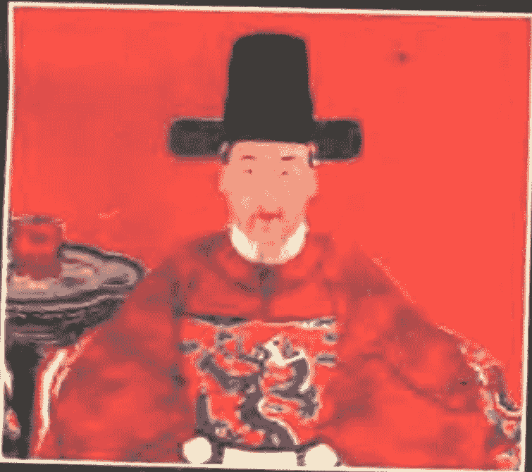

# 秘藏

占卜学家踏破铁鞋 难寻之书

# 八卦之谜·占易秘解

清·张丙哲 著
孙国中点校

海南出版社

琼新登字(03)号

# 八卦之谜·占易秘解

清·张丙哲 著 孙国中 点校

责任编辑:杨钧

*

海南出版社出版发行

(570105. 海口市滨海大道花园新村 20 号)

全国新华书店经销

保定兴国印刷有限责任公司印刷厂印刷

1995年9月第1版 1995年9月第1次印刷

开本:850×1168毫米 1/32 张印:19.5

字数:400千字 印数:15,000册

ISBN7—80590—581—9/B·22

定价: 24.80 (元)

# ——致读者

如何起卦断卦，是易经预测学的关键所在。
本书作者集一生的实践经验，以历代大量的占卜筮例为依据，层层分析其断易过程，一卦一爻务求尽其象数之本，一象一数务求尽其天理之源，在批驳前人谬误不足的同时，阐发了易经预测的奥妙所在，可谓持之有据，论之成理，为中国预测学写下了光辉的一页，是继宋代朱熹之后中国易学史上预测研究的第二个里程碑。目前国内玩易者多就四柱纳甲诸法为多，而就易经本身的预测方法却知之甚少，为此，我们出版此书以满足广大易学者的需要。

# 总目

点校说明 ……………………………………………………………… (7)

占易秘解 ……………………………………………………………… (11)

- 占易秘解序 ……………………………………………………………… (12)
- 占易秘解叙 ……………………………………………………………… (13)
- 朱氏序 …………………………………………………………………… (14)
- 弁言 …………………………………………………………………… (15)
- 朱子筮仪 ……………………………………………………………… (17)
- 筮论 …………………………………………………………………… (21)
- 占法要论 ……………………………………………………………… (22)
- 卦象论 ………………………………………………………………… (23)
- 六爻俱静 ……………………………………………………………… (29)
- 一动五静 ……………………………………………………………… (38)
- 二动四静 ……………………………………………………………… (53)
- 三动三静 ……………………………………………………………… (56)
- 四动二静 ……………………………………………………………… (65)
- 五动一静 ……………………………………………………………… (66)
- 六爻俱动 ……………………………………………………………… (69)
- 跋 ……………………………………………………………………… (72)

# 八卦之谜·占易秘解

- 周易卦象 …………………………………………………… (73)
  - 序 …………………………………………………… (74)
  - 周易卦象叙 …………………………………………………… (76)
- 周易卦象〔卷一〕 …………………………………………………… (77)
  - 周易上经 …………………………………………………… (77)
  - 乾卦象 …………………………………………………… (78)
  - 坤卦象 …………………………………………………… (97)
  - 屯卦象 …………………………………………………… (108)
  - 蒙卦象 …………………………………………………… (114)
  - 需卦象 …………………………………………………… (119)
  - 讼卦象 …………………………………………………… (124)
  - 师卦象 …………………………………………………… (128)
  - 比卦象 …………………………………………………… (133)
  - 小畜卦象 …………………………………………………… (137)
  - 履卦象 …………………………………………………… (143)
- 周易卦象〔卷二〕 …………………………………………………… (149)
  - 泰卦象 …………………………………………………… (149)
  - 否卦象 …………………………………………………… (153)
  - 同人卦象 …………………………………………………… (157)
  - 大有卦象 …………………………………………………… (161)
  - 谦卦象 …………………………………………………… (164)
  - 豫卦象 …………………………………………………… (168)
  - 随卦象 …………………………………………………… (172)
  - 蛊卦象 …………………………………………………… (177)

# 总目

- 临卦象 …………………………………………………… (181)
- 观卦象 …………………………………………………… (186)
- 噬嗑卦象 ………………………………………………… (190)
- 贲卦象 …………………………………………………… (195)
- 剥卦象 …………………………………………………… (200)
- 复卦象 …………………………………………………… (204)
- 无妄卦象 ………………………………………………… (208)
- 大畜卦象 ………………………………………………… (212)
- 颐卦象 …………………………………………………… (216)
- 大过卦象 ………………………………………………… (221)
- 坎卦象 …………………………………………………… (226)
- 离卦象 …………………………………………………… (231)

## 周易卦象〔卷三〕

- 周易下经 ………………………………………………… (236)
- 咸卦象 …………………………………………………… (236)
- 恒卦象 …………………………………………………… (240)
- 遁卦象 …………………………………………………… (244)
- 大壮卦象 ………………………………………………… (248)
- 晋卦象 …………………………………………………… (252)
- 明夷卦象 ………………………………………………… (256)
- 家人卦象 ………………………………………………… (261)
- 睽卦象 …………………………………………………… (266)
- 蹇卦象 …………………………………………………… (272)

# 八卦之谜·占易秘解

- 解卦象 …………………………………………………… (277)
- 损卦象 …………………………………………………… (281)
- 益卦象 …………………………………………………… (286)
- 夬卦象 …………………………………………………… (292)
- 姤卦象 …………………………………………………… (297)
- 萃卦象 …………………………………………………… (303)
- 升卦象 …………………………………………………… (307)

## 周易卦象〔卷四〕

- 困卦象 …………………………………………………… (311)
- 井卦象 …………………………………………………… (316)
- 革卦象 …………………………………………………… (320)
- 鼎卦象 …………………………………………………… (324)
- 震卦象 …………………………………………………… (329)
- 艮卦象 …………………………………………………… (333)
- 渐卦象 …………………………………………………… (337)
- 归妹卦象 ………………………………………………… (341)
- 丰卦象 …………………………………………………… (346)
- 旅卦象 …………………………………………………… (351)
- 巽卦象 …………………………………………………… (355)
- 兑卦象 …………………………………………………… (359)
- 涣卦象 …………………………………………………… (362)
- 节卦象 …………………………………………………… (366)
- 中孚卦象 ………………………………………………… (369)

# 总目

- 小过卦象 …………………………………………………… (375)
- 既济卦象 …………………………………………………… (380)
- 未济卦象 …………………………………………………… (385)

## 周易卦象〔卷五〕

- 系辞上传 …………………………………………………… (390)
- 系辞下传 …………………………………………………… (437)

## 周易卦象〔卷六〕

- 说卦传 …………………………………………………… (466)
  - 附录:邵子卦象 ………………………………………… (490)
- 序卦传 …………………………………………………… (496)
- 杂卦传 …………………………………………………… (502)

## 图说

- 河图 …………………………………………………… (509)
- 洛书 …………………………………………………… (510)
- 河洛图说 …………………………………………………… (511)
- 伏羲八卦次序横图 ………………………………………… (522)
- 伏羲八卦横图说 ………………………………………… (523)
- 伏羲八卦方位圆图 ………………………………………… (525)
- 伏羲八卦圆图说 ………………………………………… (526)
- 伏羲六十四卦横图 ………………………………………… (529)
- 伏羲六十四卦横图说 ………………………………………… (531)
- 伏羲六十四卦圆图 ……………………………… (533)
- 伏羲六十四卦方图 ……………………………… (534)
- 伏羲六十四卦方圆图说 ……………………………… (535)
- 文王八卦次序图 ……………………………… (543)
- 文王八卦次序图说 ……………………………… (544)
- 文王八卦方位图 ……………………………… (545)
- 文王八卦方位图说 ……………………………… (546)
- 朱子卦变图 ……………………………… (549)
- 朱子卦变图说 ……………………………… (613)

# 八卦之谜·占易秘解

- 伏羲六十四卦圆图 ………………………………………… (533)
- 伏羲六十四卦方图 ………………………………………… (534)
- 伏羲六十四卦方圆图说 …………………………………… (535)
- 文王八卦次序图 …………………………………………… (543)
- 文王八卦次序图说 ………………………………………… (544)
- 文王八卦方位图 …………………………………………… (545)
- 文王八卦方位图说 ………………………………………… (546)
- 朱子卦变图 ………………………………………………… (549)
- 朱子卦变图说 ……………………………………………… (613)

## 点校说明

《占易秘解》和《周易卦象》是清末著名学者张丙哲的代表作，该书是清代《易经》象数学研究的最新成果，在清代晚期的《易》学著作中占有显著的位置。如果说宋代朱熹是第一个把《易经》占卜预测的方法公开发表的人，那么张丙哲则是中国《易》学史上第二个把占卜预测的方法更完善、更系统的总结归纳之人。

张丙哲字龙西，山东莱阳人，光绪乙亥年之副贡，任清苑县知县，廉政爱民，深受百姓的拥护。龙西家世业儒，著有《礼记集腋》、《月令集解》、《类函摘要》、《律例》、《韵语》、《新疆记略》、《雪塞行吟》、《痴人说梦》、《续廉吏传》，凡数十百卷，而于《周易》一书尤殚精研习，阅读数十年，虽公退之余，未尝释手，著成《占易秘解》、《周易卦象》。该书一出版就受到学术界的好评，认为“自汉以来，言《易》者无虑数千百家，家异其书，人异其说，纷纷聚讼，靡所折衷。今之读经者，率自《易》始，而文辞奥邃莫可究竟，童而习之，至老不解者比比也。张龙西大令慨古筮之失传，考前人之成法，上据左氏证以史乘，探庖羲重卦之本，辟《启蒙》主占之讹，探赜索隐，研几入微，运以精心，开其秘研，使前贤未发之藏，遗文久坠之绪，灿然复明，秩然有序，诚观象之真诠，稽疑之正轨也。”又曰：“张子荟萃群书，以经解经，合理与数，而一以贯之，语语皆人所欲言，语语皆人所不能言，而古圣人占经之法，遂昭然若揭于数千年之后。”民国年间编写的《续修四库全书总目提要》上说：“张氏此书，首列《本义》，可见其说仍本朱子，次列按语，必指实卦象，以求实证，殆以补《本义》所未备，在清末治《易》者，尤为罕也。”又说：“其《卦象论》，谓《易》言倒象，如《丰·上六》体《震》，即为倒《艮》，《艮》为屋、为家、为门户，则与虞氏及荀氏诂重门之说合。又谓《中孚·六三》之或鼓或罢、或泣或歌，《震》为鼓为歌，覆之为《艮》，则罢而泣矣，此尤发前人所未发。”又说：“并谓朱子《启蒙》所定筮例，按之于古多不能合，如朱子谓六爻俱变占《象》，乃秦伯筮遇《蛊》，晋侯筮遇《复》，皆不占《象》。朱子谓一爻动则占本卦变辞，不及之卦，乃毕万筮得《屯》之《比》，庄叔遇《明夷》之《谦》，崔杼遇《困》之《大过》，晋文公遇《大有》之《睽》，皆之遇并占。至三爻变，朱子定前十卦后十卦之例，以卦变图为准。又，六爻全变，《乾》、《坤》占二用之尤为歧误无理，朱子盖惑于《左传》蔡墨之言，岂知墨引《易》以证有龙，非筮于《易》？按张氏所驳朱子说，皆引古筮案以证其非，所议皆平允，非故为攻击之论，虽朱子见之，亦不能不谓其是，足见张氏于古筮法攻研之精审。”

宗上所述，我们不难看出《占易秘解》和《周易卦象》的学术价值。研究预测学，只有认真学习前人的研究成果，才能有所进步，有所发现。您想登堂入室，步入《易经》这座神奇的殿堂去探颐索隐，钩深致远，从而揭开占卜预测的千古之谜，本书将是您的良师益友。

本书的点校是依据清代光绪丙申年三月的刊刻本，在整理时笔者认真审核了本书中的引文，发现有不少引文均有省略。有关上下文贯通的地方，省略之文不宜补足，只好依旧。有些则非补足不可，因为其文义对作者来说是十分明了的，但对初学此书之人则会有些费解。如引项氏平庵《周易玩辞》云：“《大过》必至于陷，《小过》可济事。”原文则是“《大过》则踰越常理甚矣，故必至于陷，《小过》则或可以济事。”再如引《孔子家语》孔子断卦一段：“孔子常自筮，其卦得《贲》焉，愀然有不平之状。子张进曰：‘师闻卜者得《贲卦》，吉也；而夫子之色有不平，何也？’孔子对曰：‘以其《离》耶。在《周易》山下有火谓之《贲》，非正色之卦也。夫质也，黑白宜正焉，今得《贲》，非吾兆也。吾闻丹漆不文，白玉不雕，何也？质有余，不受饰故也。’”而张氏引文则省略了“吾闻丹漆不文”，以后数语。由此可见，补足后对文义就更为易解。还有一种情况，在引文之中为了更明确的分析例卦，有时作者在一段文字中，前半为引文，而后半则为了简洁明了索性把引文中的内容改编成作者自己的话说出。如在解释断卦时遇见“六爻俱静”的情况，张氏举了很多筮例；其中举《左传·僖公十五年》秦伯伐晋，卜徒父为之占卜能否打败晋国一例，引亭林顾氏曰“去，犹算法所谓除也”一段。此文实非顾氏所言，实顾氏引明代邵宝《左觿》一书之言。全文为：邵氏曰：“千乘，侯国之车数也。去，犹算法所谓除也。一除则三百三十三，二除则六百六十六，三除则九百九十九，三除之余，所剩惟一，非君而何？”张氏在引此文时，将“三除之余，所剩惟一，非君而何？”改写成“三去之余，一而已矣，一者《艮》之一阳也，《艮》为狐，《艮》阳即雄狐，雄狐而蛊，必其君也。”显然张氏为了更清楚的解析筮例，改用了自己的话。这样前半段话为引文，后半段话是改编之语，点校时就无法加引号标出。凡此种种，笔者均认真进行考订，并在忠于原著的基础上，不妄增文字，以存其真。张氏引文的省略，是为了更好解释卦象，以便让读者更好的理解和运用断卦方法及过程，而学者在引用这些筮例时，则应该仔细对照原著原文。

本书的整理，在国内尚属首次，不足之处，诚望广大学者指正。

编者
一九九五年六月六日

## 古易秘解

## 占易秘解序

《易》为卜筮之书，自汉以来，卦气占候、视祥谶纬之说兴，而古义浸失，然古法犹时时散见于诸书。吾乡龙西张君积学士也，研精覃思，著《占易秘解》一卷，其于古法搜罗无遗，于古义尤多阐发，凡后世一切占验之稍涉于术数者，尽举而廓清之，而古圣人与民同患之意，灿然复明于世。尝为余言，《易》者，象也。六十四卦三百八十四爻之象皆非虚设，别成一书专论卦象，盖观象玩占之功力深矣。张君宰畿甸有政声，是真能以儒为吏者。光绪乙未醉司命日，书于京邸诸城徐会澧。

## 占易秘解叙

六经皆遭秦火，《周易》以卜筮之书独存，然自汉以来，言《易》者无虑数千百家，家异其书，人异其说，纷纷聚讼，靡所折衷。今之读经者，率皆自《易》始，而文辞奥邃莫可究竟，童而习之，至老不解者比比也。张龙西大令，慨古筮之失传，考前人之成法，上据左氏证以史乘，探庖羲重卦之本，辟《启蒙》主占之讹，探赜索隐，研几入微，运以精心，开其秘籥，使前贤未发之藏，遗文久坠之绪，灿然复明，秩然有序，诚观象之真诠，稽疑之正轨也，后有作者不能及已。余弱冠服官即荒经业，百家之言茫茫烟海，益莫窥其涯涘，于君之书奚敢赘一词？惟君之苦心孤诣，实事求是，本经术以施诸政事者，于此可窥见一斑。孔子曰：“假我数年，五十以学《易》，可以无大过矣。”蘧伯玉曰：“人生五十，而知四十九年之非。”今君行年五十，好学不倦；余行年五十，寡过未能。慎以终始，以要无咎，为《易》之道，愿与大令共勉焉，因系数语于简端。

光绪庚寅六月长百裕长谨叙

## 朱氏序

不佞守保六载，获与当世贤士大夫游，事友交资，良多受裨。张子龙西，以县令需次会垣共事，就局一见，如旧相识，凡疑难之案，不佞与诸局友所不能决者，得张子与从事，莫不奏刀騞然，迎刃而解。古人谓士之处世，如锥处囊中颖脱而出者，张子殆其人耶！迨权篆庆都高阳，两邑均以赋重差繁，官民交困，张子受任，钜细必亲，因难见巧，为人所不能为，省人所不能省，既为闾阎留其有余，而差务亦因以无误，不遇盘根错节，不足以别利器，非张子其孰当之？惜不能久任，旋以丁忧去职，两邑士民至今犹称颂不衰。张子天事过人，湛于经术，治行之优，本于和学之笃。读《礼》余闲，究心《易》理，《易》以四圣人而成书，原以教人卜筮，自《周礼》太卜之官久废，占验之法不传，后儒或专以义理解《易》，谈数学者，复以支离怪诞之说中之，而占验遂为不传之秘。盖理者数之始也，数者理之积也。圣人作《易》，既合理与数而为书，后人何得歧理与数而为言乎？张子荟萃群书，以经解经，合理与数，而一以贯之，语语皆人所欲言，语语皆人所不能言，而古圣人占验之法，遂昭然若揭于数千年之后。呜呼！何其盛欤！不佞荒于学殖，懵于经义，况大《易》之精微尤不能窥其万一，因读张子《占易秘解》，喜其说之先得我心，而为区区所不能为也，于是乎书。

光绪十五年菊月，愚弟讷斋学人相州朱靖旬拜序

## 弁言

少时不解《易》，亦不求甚解，及读《春秋》内外传诸书，所载占《易》繇辞，莫不断验如神，心窃异之，而占法无闻，亦付诸不解之解。夫一事不知，儒生之耻，矧包牺画卦，文王演《易》，周、孔系辞，合群圣之精力萃于一书，纵不能窥其万一，而观象玩占，周史职之，春秋士大夫亦多能言之，此岂后之人必不可解者？而今年已知非颖矣。读《礼》余闲，究心《易》理，因取《仲氏易》并他书所载占《易》成案，视变爻之多寡而群分之，察主占之异同而类聚之，参观互证，久之而管见一斑，犹以为未足，乃复取占《易》诸书，悉心考究，其显悖《易》理者无论矣。汉焦延寿《易林》用卦气值日，扬子云《太玄》次第亦全用焦法，后魏正光历推四正卦，术虽皆根据卦爻，而各赘以辞，淫于数而离其宗。惟朱子《易学启蒙》发明蓍筮理数并行，迄今七百八十余年，学者宗之。然考其占法，疑义有二：一曰解占则专论《易》辞，一曰主占则专论卦变。考古成占互相刺谬，果孰得而孰失，将何违而何从？因思《系辞》上传第九章，朱子《本义》云：“此章言天地大衍之数，揲蓍求卦之法，然亦略矣。意其详具于太卜筮人之官，而今不可考耳，其可推者《启蒙》备言之。”然则《启蒙》所言，特就卦变之可推者推而言之，朱子当日固非谓三代筮法不过如此也。以今考之，卦变即《彖传》刚来柔进之类，乃生卦之法，非主占之法。生卦者卦之德，主占者蓍之德。卦之德方以智，智以藏往；蓍之德圆而神，神以知来。以藏往者知来，此所以与古不合欤！至以《易》辞解占，则夫《易》者象也，圣人立象以尽意，系辞以尽言，如第以《易》辞解之，则未经系辞之先，岂卦象尚不足言占耶？故古史解占，无论占《象》占爻，皆不离乎卦之体象以为断，书有未尽之言，象无不尽之意也。其主占则一动主本卦动爻，一静主之卦静爻；二动以之卦之上动主之，二静以本卦之下静主之；三动三静兼占两《象》，俱动主之卦，俱静主本卦，详求其法，动静相生，阴阳互易，与大衍之理数动合自然，果孰得而孰失，将何违而何从欤？虽然三代筮法既不尽传，居今日而溯流探源，因占求法，几何不贻，扣槃扪烛之讥，第信而有徵，非虚而罔据。尝就正岱东邹太守题其额曰《占易秘解》，用是汇集成编，略叙颠末而识之，若谓得古人不传之秘，则吾岂敢。

光绪十四年戊子中秋前三日，
山左莱阳龙西张丙哲识。

## 朱子筮仪

择地洁处为蓍室，南户，置床于室中央。
床大约长五尺，广三尺，毋太近壁。
蓍五十茎，韬以比缥帛，贮以皂囊，纳之椟中，置于床北。

椟以竹筒，或坚木，蔬布漆为之，圆径三寸，如蓍之长，半为底，半为盖，下别为台函之，使不偃仆。

设木格于椟南，居床二分之北。

格以横木板为之，高一尺，长竟床，当中为两大刻，相距一尺，大刻之西为三小刻，相距各五寸许，下施横足，侧立案上。

置香炉一于格南，日注香致敬，将筮则洒扫拂拭，涤砚一、注水、及笔一、墨一、黄漆板一，于炉东东上，筮者斋洁衣冠，北面，盥手焚香致敬。

筮者北面，见《仪礼》；若使人筮，则主人焚香毕，少退北面立，筮者进立于床前少西，南向受命，主人直述所占之事，筮者许诺，主人右还西向立，筮者右还北向立。

两手奉椟盖，置于格南炉北，出蓍于椟，去囊解韬，置于椟东，合五十策两手执之，熏于炉上。

命之曰：假尔泰筮有常，假尔泰筮有常，某官姓名，今以某事云云，未知可否，爰质所疑，于神于灵，吉凶得失，悔吝忧虞，惟尔有神，尚明告之。乃以右手取其一策反于椟中，而以左右手中分四十九策，置格之左右两大刻。

此第一营，所谓分而为二以象两者也。

次以左手取左大刻之策执之，而以右手取右大刻之一策，挂于左手之小指间。

此第二营，所谓挂一以象三者也。

次以右手四揲左手之策。

此第三营之半，所谓揲之以四以象四时者也。

次归其所余之策，或一或二，或三或四，而扐之左手无名指间。

此第四营之半，所谓归奇于扐以象闰者也。

次以右手反过揲之策于左大刻，遂取右大刻之策执之，而以左手四揲之。

此第三营之半。

次归其所余之策如前，而执之左手中指之间。

此第四营之半，所谓再扐以象再闰者也，一变所余之策，左一则右必三，左二则右亦二，左三则右必一，左四则右亦四，通挂一之策，不五则九，五以一其四为奇，九以两其四为偶，奇者三而偶者一也。

按：五以一其四，九以两其四，皆除挂一之策计之也。

次以右手反过揲之策于右大刻，而合左手二挂二扐之策，置于格上策一小刻。

以东为上，后仿此。

是为一变，再以两手取左右大刻之蓍合之。

或四十四策，或四十策。

复四营如第一变之仪，而置其挂扐之策于格上第二小刻，是为二变。

二变所余之策，左一则右必二，左二则右必一，左三则右必四，左四则右必三，通挂一之策，不四则八，四以一其四而为奇，八以两其四而为偶，奇偶各得四之二焉。

又再取左右大刻之蓍合之。

或四十策，或三十六策，或三十二策。

复四营如第二变之仪，而置其挂扐之策于格上第三小刻，是为三变。

三变之余策，与二变同。

三变既毕，乃视三变所得挂扐过揲之策而画其爻于版。

挂扐之数，五四为奇，九八为偶，挂扐三奇，合十三策，则过揲三十六策而为老阳，其画为□，所谓重也。挂扐两奇一偶，合十七策，则过揲三十二策而为少阴，其画为一一，所谓拆也。挂扐两偶一奇，合二十一策，则过揲二十八策而为少阳，其画为一，所谓单也。挂扐三偶，合二十三策，则过揲二十四策而为老阴，其画为×，所谓交也。

如是每三变而成爻。

第一第四第七第十第十三第十六，凡六变并同，但第三变以下不命，而但用四十九蓍耳。第二第五第八第十一第十四第十七，凡六变亦同，第三第六第九第十二第十五第十八，凡六变亦同。

凡十有八变而成卦，乃考其卦之变，而占其事之吉凶。

礼毕，韬蓍，袭之以囊，入椟加盖，敛笔砚墨版，再焚香致敬而退。

如使人筮，则主人焚香揖筮者而退。

按阴阳老少之分，以统计挂扐过揲之策定之，今为捷法，专记过揲之策，九老阳、七少阳、六老阴、八少阴。揲之以四，四九三十六即老阳，画一□；四七二十八即少阳，画一丶；四六二十四即老阴，画一×；四八三十二即少阴，画一一一。

> 董郁阳曰：“×者偶之欲合，中已实而未纯乎丶也，丶则为单矣；□者奇之欲分，中已虚而未离乎二也，一一则为拆矣，此老阴老阳之所以为变爻也。”

## 筮论

闻之，龟为卜，筮为筮。《传》曰“见乎蓍龟”，《书》曰“谋及卜筮”，可见古人求神之道，卜筮并用，初非一端。故夫子曰：“定天下之吉凶，成天下之亹亹，莫大乎蓍龟。”而《春秋传》称“筮短龟长，不如从长”，似古人尤重龟卜。考之《周礼》，太卜掌三兆之法，其经兆之体，皆百有二十，其颂皆千有二百，筮人言凡国之大事，先筮而后卜，注云：当用卜者，先筮之，即事有渐也，于筮之凶则不卜，亦重龟之意也。汉文帝时犹有大横之兆，《艺文志》有龟书五十三卷，夏龟二十六卷，南龟二十八卷，巨龟三十六卷，杂龟十六卷，而后皆无闻。唐之李华遂有废龟之论矣，自唐及今，有筮无卜，是短者存而长者亡也。然而《洪范》所言，有龟从筮逆者，可知筮短龟长之说，古人亦有所不拘，且圣人之作《易》也，幽赞于神明而生蓍，无有远近幽深，遂知来物，龟卜虽长，能复有长于此者乎？今日者龟卜亡矣，将所谓占事知来，非蓍筮其谁与归，故无论龟卜无擅长之理，吾甚恐龟卜亡而蓍筮亦不亡而亡，仅录朱子《筮仪》一篇，冠诸《秘解》之首，保其存也，虽难语乎识大，亦庶几乎不贤。

## 占法要论

孟子曰：“人有不为也，而后可以有为”，凡有为皆然，占事亦何独不然，然固有不占之占法焉，试约举其要。

**一曰意不诚不占。**
占者，圣人以此斋戒，以神明其德者也，意苟不成，则不可对衾影，何可交神明？虽事重大，而无以感之，何以应之也？故不占。

**一曰心不正不占。**
《礼记》“问卜筮曰：义欤志欤？义则可问，志则否”。亭林顾氏曰：“子孝臣忠义也，趋利避害志也。夫人苟以趋利避害为心，则患得患失，无所不至矣，故不占”。

**一曰理不疑不占。**
占所决疑也，《系辞》曰：“人谋鬼谋”，《洪范》曰：“谋及乃心，谋及庶人，谋及卜筮”。夫庶人至贱也，犹在卜筮之先，故必尽人之明而不能决，然后谋之鬼焉，理苟不疑，舍人谋而用鬼谋，是慢也。鬼且瞰之矣，故不占。

**一曰事不法不占。**
法者帝王之所以治天下也，不法之罪，莫容于尧舜之世，难逃于天地之间，子服惠伯所谓《易》不可占险者此也，故不占。

凡此四者，皆不占之法也，人必知所不占，而后可以言占，则不占之法，谓非古法之要乎哉？

## 卦象论

将欲知卦爻之用，必先探《易》象之源。伏羲氏仰观俯察，近取远取，作八卦以通德类情，夫人而知之矣，惟重卦之起，《史记》谓神农始作重卦，京房引孔子之言，亦曰神农重乎八纯，且有谓夏禹重卦者，并有谓文王重卦者，何重卦者之多也？不知重卦即在画卦之时，始自伏羲，凿凿有据。且伏羲不惟画卦重卦，并取象于互卦、倒卦、大卦，奚以明其然也。子言之：“包牺氏之王天下也……作结绳而为网罟，以佃以渔，盖取诸《离》”。《离》，重《离》也。观下文取诸《益》与《噬嗑》十二卦，皆非单卦可知。若卦为神农所重，包牺氏将何由取之？而神农以下无论矣。然则何以知其取象于互卦、倒卦与大卦也？试即以“取诸《离》”论。

《离》为目，重《离》两目相承，如网罟然。夫网罟结绳为之，《离》无绳象，亦无结绳象也，而《离》下互《巽》，《巽》为绳，《离》上互《兑》，《兑》为倒《巽》，亦为绳，绳绳绞合，牵引其中，则结绳也，而网罟成矣。以佃者何？佃古作田，互《巽》之初，《坤》阴为田，《巽》见《离》为网罟，即为田猎。如《巽》之六四互《离》，所谓田获三品是也。以渔者何？渔古作鱼，则中四爻大《坎》之象，《系辞》所谓非其中爻不备者也。盖互《兑》为泽，倒《巽》为鱼，泽中有鱼，无水则困，而大《坎》为水于其间，是鱼在水泽之中，即在网罟之内也，故曰以渔也。然尚有可疑者，伏羲之取象于互卦、倒卦、大卦，书契以来，未之或纪，为问《周易》上下两经，六十四卦，三百八十四爻之爻辞，与三百八十四爻之象辞，有取象于互卦者乎？有取象于倒卦大卦者乎？曰：有之。且岂惟爻象有之，即史氏之占辞亦有之。试先论互卦。

《坤》、《艮》、《谦》也，二与四下互为《坎》，其在初六曰：“用涉大川”，夫《谦》无川象，互《坎》为大川，故初六涉之也，此爻辞有之也。

《兑》、《坤》、《萃》也，三与五上互为《巽》，其在六三之《象》曰：“往无咎，上《巽》也”。夫《萃》无《巽》体，曰上《巽》者，直明言上互《巽》矣，此《象》辞有之。

《坎》、《震》、《屯》也，上互为《艮》、《震》、《坤》、《豫》也，上互亦《艮》，《传》称晋文侯筮返国，得《屯》之《豫》，占者曰：泉原以资之，杜注曰：水在山下为泉，夫《屯》、《豫》初无山象，而上互皆有《艮》，《艮》为山，故占者云然也，此占辞有之也。

且如倒卦，《震》、《离》为《丰》，其在上六曰：“丰其屋，蔀其家，门阒其永，门阒其无人，三岁不觌。”盖外《震》倒为《艮》，《艮》为宫室，为门阙，以《震》之为草莽者倒《艮》，故“丰其屋，蔀其家”也。且《震》为人，倒《艮》则阒其户，而阒其无矣。《震》又为木，其数三，为三岁，倒《艮》则三岁不觌矣，此爻辞之有取于倒卦也。

《震》、《兑》为《归妹》，其在上六之象曰：“上六无实，承虚筐也”。盖《震》为筐，而《艮》为实，《震》倒《艮》，则无实而虚矣，此《象》辞之有取于倒卦也。

《艮》、《巽》为《蛊》，互《震》为侯车，无败象也，《传》称秦伯伐晋，筮之，其卦遇《蛊》占者曰：“涉河侯车败”，盖外《艮》倒《震》，《震》为车，倒《震》则车败矣，此占辞之有取于倒卦也。

## 占易秘解

为敌国，外《艮》倒《震》则车覆，车覆则侯与俱覆矣。此占辞之有取于倒卦也。

夫大卦，《巽》、《坤》为《观》，此兼画大《艮》也，六二曰：“窥观利女贞”，夫《坤》为阖户，二居《坤》中，初无窥观之象，乃兼画之大《艮》，合内外而高其门阈，而大《观》在上，大间难逾，有不得不窥者，故利女贞也，《象》曰可丑，亦此意也。

《传》称陈敬仲筮初生，得《观》之《否》，《观》与《否》皆无山象，更无太岳之象，而周史占辞，一则曰风为天于土上山也，再则曰姜太岳之后也，盖《观》、《否》皆互《艮》山，而《观》又为兼画之大《艮》，非太岳无以象之也。

《巽》、《乾》为《小畜》，初至上之大《离》也，九五曰：“有孚”，《离》有孚也；六四曰：“有孚，血去惕出”，亦《离》象也。何也？《坎》为疑、为血、为忧惕，四居大《离》之中，体与《坎》反，故《坎》有疑而此则有孚，《坎》为血而此则血去，《坎》有忧惕而此则惕出也。

《坎》、《震》为《屯》，初至五之大《离》也，六二曰：“女子贞，不字，十年乃字”，《坎》、《震》无此象也，即互《坤》互《艮》，亦无此象也，而大《离》为女子，二与五为正应，虽乘《震·初》之刚，而中正自守，贞不字也。惟二四互《坤》，《坤》为地，其数十，历尽《坤》阴之十年，乃得见九五之正应，故曰“十年乃字”也。

《兑》、《震》为《随》，初至四之大《离》也，亦三至上之大《坎》也，九四曰：“有孚在道，以明何咎”。《象》曰：“有孚在道，明功也。”孚与明皆《离》象，《兑》、《震》无是象也，九五曰：“孚于嘉，吉。”大《离》为有孚，而《坎》又得《乾》阳之为嘉，五居大《坎》之中，下应大《离》，故“孚于嘉”也。

《艮》、《坎》为《蒙》，二至上之大《离》也，九二曰：“纳妇若吉，子克家”。盖《离》为中女，九二以《坎》男纳之，《坎》为纳也，故有纳妇之象，即为克家之子也。六三曰“勿用取女，见金夫不有躬”。女亦《离》也，三本与上为正应，而下为九二所纳。夫二乃《乾》金之中男，是金夫也，《离》为相见，为大腹竟失身于九二，是“见金夫不有躬”也。

《巽》、《兑》为《中孚》，二四互《震》，三五互《艮》，又为二至五之大《离》也，其在六三曰：“得敌，或鼓或罢，或泣或歌”者，三以柔而应上刚，是得敌也，然间子九五，间则不决，故或之。或鼓者，《震》为鼓，三居五互《震》之终也。或罢者，《艮》为止，罢即止也，三居互《艮》之初也。泣则《离》目连于《兑》泽，歌则《震》声发于《兑》口也。若是乎古圣人之爻辞象辞，以及史氏之占辞，其取象于互卦、倒卦、大卦者，不历历可数乎？而卦之类又不惟是，又有杂卦，如《泰》之两互合为《归妹》之类是也，故《易》有《杂卦传》一篇。

若乃反卦，则《兑》、《坎》为《困》，其在九五曰：“劓刖”，盖《艮》为鼻，上则以《兑》反《艮》而劓其鼻。《震》为足，下则以《巽》反《震》而刖其足，此反卦之类也。

至于变卦，则《彖传》刚来柔进之类，即所谓卦变也。其法则一阴一阳之卦各六，皆自《复》、《姤》而来；二阴二阳之卦各十有五，皆自《临》、《遁》而来；三阴三阳之卦各二十，皆自《泰》、《否》而来，凡此皆变卦也。然则卦之用以取象者，如斯而已乎？未也，盖犹有六画爻位之卦，与《坎》、《离》之伏卦在焉。

今夫一阴一阳之谓道，道也者，合阴与阳言之也，是故《乾》天道也，天道非有阳而无阴；《坤》地道也，地道非有阴而无阳。如第谓《乾》纯阳，《坤》纯阴，则阳中无阴，阴中无阳，阴阳无互根之妙，而乾坤或几乎息矣。此纯《乾》纯《坤》之爻位，所以有《坎》、《离》伏乎其中也。何言之？六画成卦，初二三四五上也，初三五皆奇阳也，二四上皆偶阴也。《震》得初而《离》得二，《艮》得三而《巽》得四，《坎》得五而《兑》得上，六位之中，已具六子这卦。如《困卦》之初六为《震》位，《震》为木，则困于株木；九二为《离》位，并居大《离》之初，则朱绂方来；六三为《艮》位，《艮》为石，则困于石之类是也。然犹各具一体者，若初二三为阳阴阳，不全为《离》乎？四五上为阴阳阴，不全为《坎》乎？故凡卦皆有爻位，即凡卦皆有《坎》、《离》，特他卦之爻位不纯，斯伏卦之《坎》、《离》难见耳。惟纯《乾》、纯《坤》，则上《坎》下《离》，伏位显然，所以《乾》、《坤》卦中，多取象《坎》、《离》者，卦纯乃见，卦终亦见也。

试观纯《乾》，初无文明之象，亦无终日之象，并无在渊之象也，而下《乾》伏《离》，《离》为文明，故九二曰：“见龙在田，天下文明”。《离》又为日，三居《离》终，故九三曰：“终日乾乾”。且上《乾》伏《坎》，《坎》为水，渊象也，故九四曰：“或跃在渊”。进观纯《坤》，初无光象，亦无血象，而下《坤》伏《离》，《离》为火为光，故六二之《象》曰：“地道光也”。六三之《象》曰：“智光大也”。且上《坤》伏《坎》，《坎》为血，卦纯乃见，卦终亦见，故上六言“龙战”而并及“其血”也。圣人于纯《乾》、纯《坤》发其例，此阴阳互根，《易》所以首《乾》、《坤》而终《既济》、《未济》也。然而《易》内无互卦、倒卦、大卦与杂卦、反卦、变卦、及爻位卦并伏卦之名何也？子不曰：“书不尽言，言不尽意乎”？如手指然，一大指、二食指、三中指、五小指，惟四指无名，而无名即其名，不得谓无其名即无其指也。如必谓无是名即无是卦，则夫六画之中，有所谓《象》者乎？有所谓《象》者乎？有所谓卦与《易》者乎？《象》、《象》爻与卦与《易》之名，既可自无而之有，将所谓互卦、倒卦、大卦、杂卦、反卦、变卦，以及爻位与伏卦，名之可也，即不名亦可也，而要不得谓无是卦也。论而列之，聊以探《易》象之源，备卦爻之用云尔。

### 六爻俱静

占《易》之法，有之卦者，谓之兼卦；无之卦者，谓之专卦。兼则两卦比较，虽不尽用本辞，然尚有本辞可按验，专则无动可占，惟占贞悔之卦象而已。问何以不主《象》辞？盖未有《象》辞，先有卦象也。

《启蒙》曰：“六爻皆不变，则占本卦《象》辞，而以内卦为贞，外卦为悔。”夫《象》者言乎象，如果辞无异议，占《象》即所以占象，故卫孔成子筮立公子元，遇《屯》，其占曰：“元亨，利建侯，”是亦占《象》辞之明验。盖爻辞据时位而言，专动多有占，不动多无占，《象》辞则统体象而言，动不动皆可占，至《启蒙》本注，引秦伯伐晋筮《蛊》曰：“贞风也，其悔山也。”夫贞风悔山，乃贞悔之卦象，非《象》辞也。本注引之，可见所谓占本卦《象》辞，亦兼卦象言之。要之，俱静占贞悔，则《象》辞在其中，若专占《象》辞，犹恐言不尽意也。

《左传·僖公十五年》秦伯伐晋，卜徒父筮之，其卦遇《蛊》，曰：“涉河侯车败”，诘之，对曰：“乃大吉也，三败必获晋君。其繇曰千乘三去，三去之余，获其雄狐。夫狐蛊，必其君也。《蛊》之贞，风也；其悔，山也。岁云秋矣，我落其实而取其材，所以克也。实落材亡，不败何待？”及战，三败及韩，晋侯车败，秦获晋侯以归。

按：遇《蛊》☶☴不变，六爻俱静也。筮法随象取义，秦居河西，伐晋必涉河，卦《艮》上《巽》下，初至四为大《坎》，《坎》为水，河也。内贞为我，外悔为敌，以我向敌，是涉河也。《震》为侯为车，外《艮》倒《震》则车覆，车覆则侯与俱覆，故败。《震》为木，其数三，故三败，《艮》又为止，故获之。此皆取倒卦者。繇者，占辞也。萧山毛氏曰：“凡言繇者，皆当前断语，或谓别有引据，非也。”千乘者，侯车千乘也。三败故三去。亭林顾氏曰：去者，犹算法之除也，千乘一去三百三十三，二去六百六十六，三去九百九十九，三去之余，一而已矣。一者《艮》之一阳也，《艮》为狐，《艮》阳即雄狐，雄狐而蛊，必其君也。蛊者，君父之恶也。贞风悔山，《巽》为风，《艮》为山，所谓卦象也，《传》曰风落山谓之蛊。岁云秋矣，风落山木，故在我则落实取材，在彼则实落材亡也，能无败乎？夫《易》之为道，与时偕行，况《巽》为内贞，二四互《兑》，《兑》西方也，亦正秋也，当令用事，故占者及之，此六爻俱静，兼占贞悔，不主《象》辞者也。按：贞，卜问也，从卜，贝以为贽。悔，改也，古文作每卜，从每卜，既得内卦，又求外卦，故内曰贞，外曰悔。

《左传·成公十六年》晋楚遇于鄢陵，晋侯筮之，史曰：“吉。”其卦遇《复》，曰：“南国蹙，射其元，王中厥目。国蹙王伤，不败何待？”公从之。及战，吕锜射王中目，遂败之。

按：遇《复》☷☳不变，六爻俱静也。鄢陵，楚地，南国也。卦贞《震》悔《坤》。何言国蹙？杜氏元凯曰：“《复》阳长之卦，阳气起于南，行推阴，故南国蹙，蹙则《离》受其咎，《离》为诸侯，又为目，阳气南激，飞矢之象。”此注亦颇明晰，然尚有未尽者，盖《坤》为国，卦本全国，一阳来复，内变为《震》，已割据全《坤》之半，《坤》内伏《离》，而位南，不南国蹙乎？此取象伏卦变卦者，且伏《离》为侯为目为矢，乃诸侯目中有矢之象，而《震》为苍筤竹，阳气南激，又竹箭南飞有象，有不射其元而中厥目者乎？此亦六爻俱静，兼占贞悔，不主《彖》辞者也。

《家语》，孔子筮得《贲》，愀然有不平之色，子张进曰：“师闻卜得《贲》者吉，而子有不平之色何也？”曰：“以其《离》耶？在《周易》山下有火《贲》，非正色之谓也。夫质也，黑白宜正焉，今得《贲》，非吉兆也。吾闻丹漆不文，白玉不雕，何也？质有余不受饰故也。”又，《吕氏春秋》，孔子卜得《贲》，曰：“不吉。”子贡曰：“何谓也？”孔子曰：“白而白，黑而黑，贲亦安得吉乎？”

按：遇《贲》☶☲不变，六爻俱静也。卦贞《离》悔《艮》，《艮》为山，《离》为火，何名以《贲》？王肃曰：“贲，黄白色也。”孔氏正义曰：“以火照山之石，有黄白色。”然圣人两筮《贲》，皆以黑白言之者，取象贞悔之互卦也。盖《巽》为白，卦内互《巽》，而四阴以互《坎》间之，故白不白；《坤》为黑，卦外互《坤》，而三阳以互《震》间之，故黑不黑。不白不黑，乃色之不正者，圣人大居正，筮《贲》而以为不吉，恶其不正也。山下有火《贲》，《贲》之卦《象传》，卦象即贞悔也，故筮者引之，非以《象传》主占也。此亦六爻俱静，兼占贞悔，不主《象》辞者也。又按：卦《象传》乃孔子所作，此必伪托，因占法尚合，故录之。

《易乾凿度》，卷末载孔子生不知《易》，偶筮其命，得《旅》，谓益商瞿氏，曰：“子有圣知，而无位。”孔子泣而曰：“凤鸟不来，《河图》无至，无之命也。”停读《礼》，止史削，五十究作《十翼》。

按：遇《旅》不变，六爻俱静也。卦贞《艮》悔《离》，中互大《坎》，《坎》为圣，故曰圣智，此取象大卦者，而三四两阳爻，俱不得二五君臣之位，上九一阳，又高而无位，且大《坎》为北，外《离》为南，互《兑》为西，互《巽》为东南，内《艮》东北，当旅之时，乃东西南北之人也，故曰无位也。此亦六爻俱静，兼占贞悔，不主《象》者也。

《诚斋杂记》，孔子使子贡，久而不来，孔子命弟子占之，遇《鼎》，皆言无足不来，颜回曰：“无足者，乘舟而至。”果然。

按：遇《鼎》不变，六爻俱静也。无足者，卦象，故《易》有颠趾折足之辞。乘舟者，舟本无足，卦下《巽》为木，初至五为大《坎》，《坎》为水，互《乾》为行人，是行人在水木之上，故知乘舟而至。此亦六爻俱静，兼占贞悔，不主《象》辞者也。

《三国志》，蜀，杨仪，字公威，诸葛亮卒，自以为功勋至大，当代亮秉政。呼都尉赵正，以《周易》筮之，卦得《家人》，默然不悦，而亮生平密指，以仪性狷狭，意在蒋琬，琬遂为尚书令，仪至拜为中军，师无所统，从容而已。

按：遇《家人》不变，六爻俱静也。此卦有占无断，而仪默然不悦何也？卦贞《离》为火，悔《巽》为木，内互《坎》水，烹饪之象，仪欲秉政，则不家食吉，而卦名《家人》，不问而知其不得秉政矣，故默然不悦也。此亦六爻俱静，兼占贞悔，不主《象》辞者也。

《北齐书》，赵辅和明《易》善筮，高祖崩，葬有日矣，世宗令卜宅兆，相于邺西北，漳水北原，显宗与吴遵世频卜不吉，又至一所，命遵世筮之遇《革》，遵世等数十人，咸云不可用，辅和曰：“《革卦》于天下人皆凶，惟王家用之大吉。《革·象》辞云：‘汤武革命，顺天应民’。”遂以此地为定。

按：遇《革》不变，六爻俱静也。占者引汤武革命，指为革之《象》辞，谓《象传》之辞也，古无占《象传》之法，云然者，《象传》亦言乎象者。此亦六爻俱静，兼占贞悔，不主《象》辞者也。

《北齐书》，有一人父疾，诣馆，别托相知者筮之，遇《泰》，曰：“此卦甚吉，疾愈。”是人喜，出后，赵辅和谓筮者曰：“《泰卦》《乾》下《坤》上，然则入土矣，岂得言吉？”果以凶闻至。

按：遇《泰》不变，六爻俱静也。天在地下，故云入土。此亦六爻俱静，兼占贞悔，不主《象》辞者也。

《梁书》，阮孝绪，学士宗，性至孝，隐居不仕，筮者，张有道谓曰：“见子隐迹而心难明，自非考之龟蓍，无以验也。”及布卦，既构五爻，曰：“此将为《咸》，咸感之法，非嘉遁之兆。”孝绪曰：“安知后爻不为上九？”果成《遁卦》。有道叹曰：“此谓肥遁无不利，象实应德，心迹并也。”孝绪曰：“虽获《遁卦》，而上九爻不发，升遐之道，便当高谢，乃著《高隐传》。”

按：遇《遁》不变，六爻俱静也。固高隐之吉占，即以《咸卦》变《遁》占之，亦无不利。且初构五爻，而占者已有此将为《咸》之说，则卦即为《咸》矣，后爻又得上九，即《咸》变为《遁》矣。所以占者直指肥遁爻辞，似直以上九作动爻看，但与实变少别，故孝绪以为上九不发也。此亦六爻俱静，兼占贞悔，不主《象》辞者也。

《五代史》，晋高祖以太原拒命，废帝遣兵围之，势甚危急，命马重绩筮之，遇《同人》，曰：“天火之象，《乾》健而《离》明。健者，君之德也；明者，南面而向之，所以治天下也。《同人》者，人所同也，必有同我者焉。《易》曰：‘战乎乾’，《乾》西北也；又曰‘相见乎《离》’，《离》，南方也，其同我者自北而南乎。《乾》西北也，战而胜，其九月十月之交乎。”是岁九月，契丹助晋，击败唐军，晋遂有天下。

按：遇《同人》☰不变，六爻俱静也。卦贞《离》悔《乾》，《乾》天《离》火，故曰天火之象。《乾》健《离》明，《乾》又为君，故曰君德。南面而向之，《系辞》所谓“圣人南面而听天下，向明而治也。”《同人》者，人所同，谓一阴为五阳所同也，故曰必有同我者自北而南也。九十月之交者，九月戌，十月亥，《乾》位戌亥之间，故曰九十月之交也。此亦六爻俱静，兼占贞悔，不主《象》辞者也。

《五代史》，石晋高祖二年，张从宾反，命司天监马重绩筮之，遇《随》，曰：“南瞻析木，木不自续，虚而动之，动随其覆，岁将秋矣，无能为也。”七月而从宾败。

按：遇《随》☷不变，六爻俱静也。卦贞《震》悔《兑》，内贞为北，外悔为南，自内视外，故曰南瞻，亦初至四为大《离》，《离》位南又为目也，卦分三才，五上为天，《兑》泽在上，天汉之象。析木，星名，在天汉箕斗之间，左氏所谓析木之津也。盖内《震》为木，上《兑》倒《巽》亦木，以其在天汉之间，故象析木，而《兑》为毁折，互《艮》为止，故曰木不自续，言毁折之木，不能继长增高也。大《离》之内，伏甲胄戈兵，而其中虚而不实，又介乎内《震》之中，《震》为动，故虚而动之；又介乎互《艮》之下，《艮》体下覆，当随之时，随动随覆矣。言动辄覆败也，故曰动随其覆。岁将秋者，《兑》为秋也，至秋则草木黄落，其何能为，故七月而从宾果败。筮法，凡卦之方位时令，皆以文王八卦取之。此亦六爻俱静，兼占贞悔，不主《象》辞者也。

《五代史》，汉刘龚称帝，楚人以舟师攻封州，龚惧筮之，遇《大有》，遂赦境内，改元大有，遣苏章救之，章以两铁锁沉江，为巨轮于岸上，迎战佯败，举轮挽索锁楚舟，以强弩夹江射之，尽杀楚人。

按：遇《大有》☰不变，六爻俱静也。此卦有占无断，然筮者得此，即大赦改元，其吉可知。今依古法推之，卦分三才，三四为人，外《离》互《兑》，《兑》泽及人，故主赦；《兑》见《离》为革，故改元；而《兑》为泽，又为毁折，《离》为甲胄戈兵，皆以互《兑》而毁折于水泽之内矣。且《兑》泽江也，《乾》金互《乾》，二金绞合，铁锁也，金在泽下，锁沉江中也，占者虽未言，而象皆有之。此亦六爻俱静，兼占贞悔，不主《象》辞者也。

唐李纲在隋，仕宦不进，筮之得《鼎》，曰：“君当为卿辅，然俟易姓乃如志。仕不如退，折足为败。”纲后显于唐，数称疾辞位去。

按：遇《鼎》☴不变，六爻俱静也。卦贞《巽》，悔《离》，其象为鼎，故名《鼎》，鼎象三公，故曰当为卿辅。然内负《巽》木，外悔《离》火，下互大《坎》之水，鼎烹之道，以木《巽》火，当内卦水火相煎之时，必难得志，待外互《兑》泽之水，泽火《革》而鼎取新，可得鼎烹之养矣。然已入外卦矣，故曰易性乃如志。但《兑》为毁折，内本颠趾之鼎，外亦折足之鼎，虽有公餗，折足则覆，故仕不如退也。此亦六爻俱静，兼占贞悔，不主《象》辞者也。又按：折足乃《鼎》四爻辞，六爻俱静，古未有占及爻辞者，疑系遇《鼎》之《蛊》之占，附录存考。

### 一动五静

《系辞》曰：“动则观其变而玩其占”。夫动则变，变则有遇有之，既有遇之，即各有体象，无论变爻之多寡，万无专占爻辞之理也。一动五静，所谓动之微，吉凶之先见者，故遇之并重，而以本卦之变辞主之，其变在上爻，则之卦之变辞而兼占之，卦究之变，变则通也。《启蒙》专占本卦变辞，不及之卦，并不论上爻之变，其法乃偏而不举，虽古史成占，亦有不占遇之，并有不占爻辞者，非省文，即变占也，详见后。

《左传·闵公元年》，毕万筮仕于晋，得《屯》之《比》。辛廖曰：“《屯》固《比》入，焉孰大焉，其必繁昌，《震》为土，车从马，足居之，兄长之，母覆之，众归之，六体不易，合而能固，安而能杀，公侯之卦也。”

按：遇《屯》之《比》，一动在初爻也。其辞曰：“磐桓，利居贞，利建侯。”所谓公侯之卦也。而占者曰“《震》为土”，《屯》之内《震》，变为《比》之《坤》土也。曰“车从马”，《震》为车，《坤》为马也。曰：“足居之，兄长之，母覆之，众归之”，《震》为足为兄，《坤》为母为众也，“六体不易”者，言初九一爻变，则遇卦之内《震》，变为之卦之下《坤》，有此六义，不可易也。加以《比》合而《屯》固，《坤》安而《震》杀，筮仕而得此，非公侯之卦而何？谓即变爻所谓利建侯也。此一动在初，占本卦变爻，兼占遇之者也。

《左传·昭公四年》，叔孙穆子疾，其子竖牛，宾馈不进，叔孙不食卒。初穆子之生，其父庄叔筮之，遇《明夷》之《谦》，以示卜楚丘。曰：“是将行，而归为子祀，以谗人人，其名曰牛，卒经馁死。《明夷》，日也。日之数十，故有十时，亦当十位。自王已下，其二为公，其三为卿。日上其中，食日为二，旦日为三。《明夷》之《谦》，明而未融，其当旦乎，故曰为子祀；日之谦当鸟，故曰明夷于飞；明而未融，故曰垂其翼；象日之动，故曰君子于行；当三在旦，故曰三日不食。《离》，火也。《艮》，山也。《离》为火，火焚山，山败，于人为言，败言为谗，故曰有攸往，主人有言，言必谗也。纯《离》为牛，世乱谗胜，胜将适《离》，故其名曰牛。谦不足，飞不翔，垂不峻，翼不广，故曰其为子后乎。吾子亚卿也，抑少不终。”后成公十六年，叔孙避侨如之难奔齐，及庚宗，遇妇人，使私为食而宿焉。襄公二年召归，立为卿，庚宗妇人携其子献雉，问所生，曰能奉雉矣，召见，号曰牛，使为竖，有宠，长使为政，乃以谗杀长子孟，子谮而逐仲，至是叔孙以不食卒。

按：遇《明夷》之《谦》，一动在初爻也。《离》为中女，《艮》为少男，卦内《离》变《艮》，必生男矣。曰将行者，《明夷·初九》变爻所谓“君子于行”也。《明夷》之《谦》，明而未融当旦，故曰为子祀，则兼占遇之矣。《艮》为少男，为言，《离》为牛。卒以馁死者，变爻所谓“三日不食”也。

# 八卦之谜·占易秘解

氏注曰：“日之数十，甲至癸也。十位者，日中当王，食时当公，平明为卿，鸡鸣为士，夜半为皂，人定为舆，黄昏为隶，日夕为僚，晡时为仆，日昳为台。隅中日出，阙不在第，尊王公旷其位，日上其中，日中盛明，故当王。食日为二，公位也；旦日为三，卿位也。《离》畜牝牛，故曰纯《离》为牛。《离》为火，《艮》为山，火焚山，山败则《离》胜，犹世乱则谗胜，山焚而《离》存，故知名牛也。”此亦一动在初，占本卦变爻，兼占遇之者也。

《左传·昭公七年》，卫襄公无子，嬖人生子孟絷，足不良，弱行。孔成子梦康叔谓己立元，元絷之弟；成子将立元，筮之，曰：“元尚享卫国，主其社稷。”遇《屯》。又曰：“余尚立絷，尚克嘉之。”遇《屯》之《比》。史朝曰：“元亨，又何疑焉？”成子曰：“非长之谓乎”。对曰：“康书名之，可谓长矣。孟非人也，将不列于宗，不可谓长。且余繇曰‘利建侯’，嗣吉何建，建非嗣也。二卦皆云，子其建之，康叔命之，二卦告之，筮袭于梦，武王所用也，弗从何为？弱足者居，侯主社稷，临祭祀，奉民人，事鬼神，从朝会，又焉得居？各以所利，不亦可乎？”故成子立灵公。

按：初筮遇《屯》䷂不变，六爻俱静也。再筮遇《屯》䷂之比䷇，一动在初爻也。《屯》俱静，则贞《震》悔《坎》，动乎险中，周建侯之吉占。而占者只取《屯·彖》之“元亨”，以灵公名元，故断章取义也。《屯》之《比》，则内《震》变《坤》，《震》为侯，《坤》为国，《震》变《坤》，亦诸侯得国之象，而占者不占遇之，以本卦变爻明言利建侯，故曰二卦皆云也。神而明之，存乎其人，非六爻俱静，占《彖》辞不占贞悔，一动五静，占变爻不占遇之也。筮袭于梦二句，《书》“朕梦协朕卜”，“伐商必克”也。弱足者居，各从所利，言孟利居元利建也。《左传补正》曰：“《屯·初九》磐桓利居贞，魏明帝征管宁曰：‘磐桓利居，自昔以居字为句也。’”此一动在初，占本卦变爻，而不占遇之者也，所谓省文也。

《五代史》，唐明宗时，路晏夜如厕，有盗伏焉，晏心动，取烛照之，盗告晏曰：“勿惊，某禀命虽有自来，然察公正直，不敢妄害。”匿剑而去。后召董贺筮之，遇《夬》之《革》，曰：“难已过矣，但守中正，请释忧。”晏终无患。

按：遇《夬》☰之《革》☱，一动在二爻也，其辞曰：“莫夜有戎勿恤，”占者何言难已过也？盖内《乾》伏《离》，《离》为日，九二以一阳填之，故为暮夜，《离》为戈兵，故有戎。今九二变《离》，则《乾》天得《离》日，正日丽中天之象，暮夜之戎已无矣，故曰难已过也。且变而之《革》，革，去故也。释忧，即变爻所谓勿恤。此一动在二，虽未明言所占。实亦占本卦变爻，兼占遇之者也。

宋正和末，平江人解者，筮《噬嗑》之《睽》，曰：“《离》为戈兵，《艮》为门阙，又以《艮》东北之卦，而介乎南《离》，必东北敌人，南寇犯阙，且将不利于君矣。鼻者，君祖也。后徽宗果北巡。

按：遇《噬嗑》䷔之《贲》䷕，一动在二爻也。占者曰《离》为戈兵，《艮》为门阙，言本卦之外《离》互《艮》也，又《艮》以东北之卦介乎南《离》，言互《艮》之体，与外《离》相连也，以戈兵薄乎门阙，由东北而南犯，故曰东北敌人南寇犯阙也。而内《震》为君，变而为《兑》，《兑》为毁折，故不利于君。且互《艮》为鼻，六二变爻，已成灭鼻之凶，君祖者，鼻为人生之始，故曰君祖，言鼻有君象也，即变爻所谓灭鼻也。此一动在二，占本卦变爻，兼占遇之者也。

《左传·襄公二十五年》，齐崔杼欲娶棠姜，筮之，遇《困》之《大过》。陈文子曰：“夫从风，风陨，妻不可娶也。且其繇曰：‘困于石’，往不济也；‘据于蒺藜’，所恃伤也；‘入于其宫不见其妻凶’，无所归也”。后果验。

按：遇《困》䷮之《大过》䷛，一动在三爻也，卦内《坎》变《巽》，《坎》变《巽》，《坎》为夫，《巽》为妻，夫从妻也。占者曰夫从风，《巽》为风也。不曰夫从妻者，《巽》本长女，而二四互《乾》，《乾》、《巽》为《姤》，姤者媾也，已嫁之女，不全其为妻也。且体与《乾》连，《乾》为君父，娶之且不利于君父之尊，占者皆讳而不言，第变其辞曰夫从风，天下有能从风之夫乎？故又曰风陨妻不可娶也。三本《艮》之爻位，《艮》为石，故困于石，下据九二之《坎》刚，《坎》为蒺藜，故据于蒺藜。且《坎》三互《离》，《离》之内阴，即《坎》之三阴，《坎》为宫，《离》为妻，一阴不得两用，故入其宫不见其妻。此一动在三，占本卦变爻，兼占遇之者也。

《左传·僖公二十五年》，秦伯师于河上，将纳王，狐偃劝晋文公勤王，筮之，遇《大有》之《睽》。曰：“吉，遇‘公用亨于天子’之卦战克而王享，吉孰大焉。且是卦也，天为泽以当日，天子降心以逆公，不亦可乎？《大有》去《睽》而复，亦其所也。”晋侯辞秦师而下，逆王入之，王果享醴。

按：遇《大有》☰之睽☱，一动在三爻也。“公用亨于天子”，本卦九三变爻辞也。卦内《乾》变《兑》，《乾》天也，《兑》泽也，上皆承《离》，《离》为日，《乾》变《兑》，是天为泽以上当《离》日也，天君象，日侯象，天降泽以承日，故有天子降尊以逆公之象。且《大有》之《睽》，其象固如此其吉，即使不占之卦而去《睽》，复占所遇之《大有》，亦《离》日在上，《乾》天在下，有天子降尊逆公之象，故曰亦其所也。然即此可见史氏占法，一动五静，法宜占遇之两卦，苦惟恐人之专占变爻不占之卦者，而故设此去《睽》之论也。此一动在三，占本卦变爻，兼占遇之者也。

明土木之变，南冢宰魏骥，会陆时筮之，遇《解》之《恒》,时曰:“大吉。《恒》为大《坎》,三正当《坎》中,所以陷也。然而《恒》互为《乾》三,以一《乾》巍然居三《乾》之间,若无往而不为君者,乃一变为《解》则已解,且《解》之辞曰利西南,西南者,所狩地也。又曰来其复,则还复也。夫恒者,久也。日月得天而能久照,今《解》之互体,正当两《坎》互《离》之间,《坎》月《离》日,非日月幽而复明乎?大明吾国号也,非返国乎?只有两《坎》两《离》,而上《离》未全,尚有待耳。”后寇再至,以战而英宗返国。

按:遇《恒》之《解》,一动在三爻也。原解已明,其兼及之卦《象》辞者,法已不古,然《象》者言乎象,智者观其《象》辞,则思过半矣,故亦可占之,要亦一动在三,占本卦变爻,兼占遇之者也。

明正德间,都御史张嵿,敕巡抚保定,兼提督紫荆关,筮之,遇《屯》之《既济》,曰:“行无虞官,何以即鹿?吾入林而已。”时提学李梦阳在坐,曰:“不然,三关古钜鹿地也,急即之。无虞者,无疑也,惟入林中,恐为彬所中耳。”后武宗西狩,江彬索骡马,不应,驾言三关迎驾不至,罢职。

按:遇《屯》之《既济》,一动在三爻也。李解甚是,然所以知为江彬所中者,非独取爻辞入于林中也。彬宦寺也,三居《艮》之下,《艮》为阉寺,变互《坎》水故知其为江彬耳。此一动在三,占本卦变爻,兼占遇之者也。

《左传·庄公二十二年》,陈厉公生敬仲,周史筮之,遇《观》之《否》,曰:“是谓‘观国之光,利用宾于王’,此其代陈有国乎!不在此,其在异国;非此其身,在其子孙,光远而自他有耀者也。《坤》,土也。《巽》,风也。《乾》,天也。风为天于土上,山也,有山之材而照之以天光,于是乎居土上,故曰‘观国之光’;庭实旅百,奉之以玉帛,天地之美具焉,故曰‘利用宾于王’;犹有观焉,故曰其在后乎;风行而著于土,故曰其在异国乎;若在异国,必姜姓也。姜,太岳之后也。山岳则配天,物莫能两大,陈衰,此其昌乎!”

按:遇《观》䷓之否䷋,一动在四爻也。卦外《巽》变《乾》,本卦变爻六四之辞曰:“观国之观,利用宾于王”。占者以为代陈有国之象,亦以陈为三恪之后,为宾于王故也。内卦为身,外卦为子孙,言在其子孙者,六四变爻在外卦也。筮法随象取义,故遇卦外《巽》内《坤》,则曰风行而著于土;之卦上《乾》下《坤》,则曰风为天于土上,言外《巽》变为《乾》天于《坤》土之上也。山者互《艮》之象也,《艮》又为门阙,而《乾》为玉,《坤》为帛,皆在其中,天地之美也,乃诸侯朝王,陈币之象,所谓庭实也,旅陈也,百者备物也。《坤》为国,变《坤》为异国。太岳者,《艮》为山,《观》为兼画之大《艮》,故有是象,此又取大卦者。物莫能两大,其后陈亡,陈成子得政,其占果验。此一动在四,占本卦变爻,兼占遇之者也。

《左传·闵公二年》,成季将生,筮之,遇《大有》之《乾》。曰:“同复于父,敬如君所。”

按:遇《大有》☰之《乾》☰,一动在五爻也。卦内《乾》外《离》,《离》为大腹,为孕妇,内阴变阳,必生男矣,夫是男也,其父《乾》,今变为《乾》,则上下皆《乾》,同于父矣,故曰“同复于父”。《乾》为父为君,则父即其君。“敬如君所”者,敬如君同也。不占变爻者,变爻辞曰:“厥孚交如,威如吉”,与筮生子之义不相类也。杜氏所谓一爻变,义异则论《象》者,此类是也。此一动在五,兼占遇之,不占变爻者,所谓变占也。

《左传·昭公十二年》,南蒯将叛,筮之,遇《坤》之《比》,曰:“黄裳,元吉”。子服惠伯曰:“忠信之事则可,不然必败。外强内温,忠也;和以率贞,信也,故曰‘黄裳元吉’。黄,中之色也;裳,下之饰也;元,善之长也。中不忠则不得其色,下不共则不得其饰,事不善则不得其极。且夫《易》不可以占险,三者有有阙,筮虽当,未也。”后蒯叛果败。

按:遇《坤》☷之《比》☷,一动在五爻也,“黄裳元吉”,《坤》五爻辞也。《坤》土色黄;《系辞》衣裳取诸《乾》、《坤》,《乾》上为衣,《坤》下为裳。“忠信之事则可”者,据本卦爻辞解之也。毛氏曰:“后儒笼统论理,谓占者有是德则吉在我,无是德则吉在彼,如是则但修德可矣,筮人太卜,一切可废。”然则惠伯之解非欤?曰:不然。六五一爻乃王官之后,下国之侯象也,臣道也,妻道也,故曰黄裳元吉。言以臣妾自居,大吉世。今外变《坎》,险在下而包藏祸心,安得吉乎?故直断之曰“不然必败”,初无所笼统于其间也。此一动在五,虽未明言遇之,实亦占本卦变爻,兼占遇之者也。

《左传·哀公九年》,宋公伐郑,晋赵鞅救郑,阳虎筮之,遇《泰》之《需》,曰:“宋方吉,不可与也。微子启帝乙之元子也,宋郑甥舅也,若帝乙之元子归妹而有吉禄,我安得有吉焉?”乃止。

按:遇《泰》☰之《需》☵,一动在五爻也。其辞曰:“帝乙归妹,以祉元吉。”帝乙,启之父也。宋,启之后也。以天地交《泰》之卦,至六五阴爻,与九二阳爻相交,婚姻成矣。乃二四互《兑》而为妹,三五互《震》而为兄,合《震》与《兑》,所谓雷泽《归妹》也,是又取象杂卦者。五爻动而归妹元吉,宋郑甥舅,则宋受其福,他人安得有吉?故不可与也。此一动在五,占本卦变爻,而不占遇之者,所谓省文也。

汉武帝欲伐匈奴,以责贰师,筮之,得《大过》之《恒》,太卜占曰“何可久也”一语,谓匈奴不久当破,乃遣贰师伐匈奴,败之,后巫蛊事发,贰师降,单于以女妻之,武帝归咎卦兆反覆。

按:遇《大过》☱之《恒》☳,一动在五爻也。其辞曰:“枯杨生华,老妇得其士夫。”卦本不吉,盖枯杨生华,难入塞地,外《兑》变《震》,《兑》毁折而《震》决躁,皆非北伐吉兆,而太卜小人,欲迎合上意,而苦于变爻无辞可取,遂谬举《象传》“何可久也”一语,巧为附会。夫《象传》孔子所作,乃春秋以前之史官所未见之书,故古无以小象主占者,后世史占失传,皆苦辈阶之厉也。然而是役也,初遇匈奴尚能败之何也?盖卦体大《坎》,《坎》位居北,变爻在上,自南向北,则我南为凯,彼北为败,所以初尚有功也。乃身在《坎》中未能出险,而外《兑》为巫为口舌,一变《震》而俱动,不误于反间,必败于邪说,故巫蛊事发,而脱身降矣。《兑》为脱也,反令下《巽》之长女,当《太过》之时为老妇,得与变《震》为婚,故单于以女妻之,是又老妇得其士之应也。卦兆何谬?占者谬耳。然一动不占遇之,未始不知占变爻也。舍变爻之辞,而取变爻之《象》辞,特有心作伪耳。故附录之,以备参考。

汉永建二年,立大将军梁商女为贵人,筮之,遇《坤》之《比》;解之者曰:“元吉,位正中也。”后进为后。顺帝崩,元子立他妃子,是为冲帝,后进为皇太后,临朝。冲帝崩,质帝立,又临朝,兄梁冀弑质帝,立桓帝,于是有梁冀擅权,宦官乱政之祸。

按:遇《坤》☷之比☷,一动在五爻也。占曰“元吉”,《坤·六五》变爻“黄裳元吉”也。至“位正中也”一语,乃《比·五》变爻《象》辞,古未有占《象》辞者,前已辨其作伪矣。且一动在五爻,并不占之卦变爻之辞,何论《象》辞?今依古法占本卦变爻,兼占遇之推之。“黄裳元吉”。贵人进而为后也。之《比》而变《坎》阳,居九五之尊,以后临朝也。爻变互《艮》,为门阙,又为阍寺《艮》又倒《震》为兄为帝,《艮》,《震》互易,则帝阙之上,兄与阍寺,皆与帝位有参易之象,已兆梁冀与宦寺弑帝乱政之祸矣。此与前南蒯所筮,卦同而占异,筮法随象取义,而所以取象之道,又各缘所占之情事而生,知此则可与言象矣。

《三国·吴志·虞翻传》,关羽既败,权使翻筮之,得《节》之《临》。翻曰:“不出二日,必当陨首。”果如翻言。

按:遇《节》之《临》,一动在五爻也。卦上《坎》下《兑》,《坎》为水,《兑》为泽,水流而泽节之,外受内制,不利于外,五为外来主将,九阳象首,阳变为阴,乃陨首之象。且《坎》为血,变《坤》为死,变爻之辞又曰“甘节”,皆无可生之理矣。不出二日者,卦本三阳,五一变而止余其二,故不出二日也。此一动在五,虽未言所占,实亦占本卦变爻,兼占遇之者也。

晋东海世子病,郭璞筮得《明夷》之《既济》,曰:“不宜封国”。《坤》为国,《坎》折之。

按:遇《明夷》☷之《既济》☵,一动在五爻也。卦上《坤》变《坎》,《坤》国为《坎》所拆,固于卦不利,即以爻辞论,“箕子之明夷”,亦不利封国之象。且《坤》为死,《坎》为疾,以《坤》变《坎》,死子疾矣,第不宜封国乎?占者不言,讳也。此一动在五,占遇之,不占变爻者,亦省文也。

《左传》晋献筮嫁伯姬于秦,遇《归妹》之《睽》。史苏曰:“不吉,其繇曰:‘士刲羊’,亦无亡也;‘女承筐’,亦无贶也。西邻责言,不可偿也。《归妹》之《睽》,犹无相也。《震》之《离》,亦离之《震》,为雷为火,为赢败姬。车说其车复,火焚其旗,不利行师,败于宗丘。《归妹》‘睽孤,寇张之弧’,侄其从姑,六年其逋,逃归其国,而弃其家,明年其死于高梁之虚。’公不从,遂嫁伯姬于秦,为穆姬。僖公九年。晋献公卒,公子夷吾,许秦重赂而纳之,是为惠公。十年,不与所赂,及秦饥,晋闭之籴。十五年,秦伐晋,败晋于韩原,获晋侯。十一月,归晋侯。十六年,晋太子圉为质于秦,秦妻之以女,是为怀嬴。二十二年,子圉逃归。二十三年,惠公卒,太子圉立,是为怀公。二十四年,秦穆纳公子重耳,怀公奔高梁,重耳杀之。

按:遇《归妹》☷之《睽》☲,一动在上爻也。“刲羊”四句,节录上六爻辞,以上六无应,故所求不得也。卦外《震》变《离》,而下皆为《兑》,《兑》位西,为口舌,故西邻责言,不与所赂也。无相,犹无助,婚姻以求助,睽则无矣。《震》之《离》亦《离》之《震》,杜氏谓二卦变而气相通也。盖《震》木《离》火,木本生火,而反之则火亦足以焚木,是以所生之子,反害母家,故为嬴败姬。为雷为火者,言《震》雷亦火也。《震》又为车,车之下缚为辕,而下《兑》为脱,故脱辕。毛氏曰:“《震》木上动为旗,变火则焚,师必败矣。”宗丘者,《震》为主,宗主也,倒《艮》为丘,晋韩原之应。“睽孤,寇张之弧”,亦皆《睽》变爻之辞。姪从其姑者,毛氏曰:以嫁女言,则《离》火者,《震》木之女也;而以《归妹》言,则《离》火又《震》兄之子也。母女为姑,而兄子即为姪,则同此一《离》,而姑姪同居,有似乎从之者然,则子圉质秦之应也。卦之六爻,六年而复初,故六年逃归,上本《离》而仍变《震》,则归国而弃其家矣。男以女为家,其家即《离》女也,怀嬴也。盖一变而《震》得归,亦一变而《离》刚亡矣。一变为一年,故得国之明年,见杀于高梁。高梁者,亦《离》刚上横之象。此一动在上,占遇之及本卦亦爻,而兼占之卦变爻之辞者也,所谓卦究之变,变则通也。

《左传·襄公二十八年》,郑游吉如楚,归告子展曰:“楚子将死矣,《周易》有之,在《复》之《颐》曰:‘迷复,凶。’其楚子之谓乎!欲复其愿而弃其本,欲归无所,是谓迷复,能无凶乎?楚不几十年,未能恤诸侯也。”

按:在《复》☷之《颐》☶,一动在上爻也。其辞曰:“迷复,凶,有灾眚。用行师,终有大败,以其国君,凶;至于十年,不克征。”盖《坤》为迷,上六无应,故迷复。十年者,《坤》为地之数也。未能恤诸侯,爻所谓至于十年不克征也。游吉初未筮《易》,此引经之辞也,故但取爻辞,而不及遇之,并变在上爻,而不及之卦变爻之辞。附录于此,以见春秋士大夫引经之法,原与占《易》不同也。

又按:凡筮《易》谓之遇,如遇某卦之某卦之类是也。凡引经则谓之在,如游吉曰:“在《复》之《颐》”,庄子曰“在《师》之《临》”,蔡墨曰“在《乾》之《姤》”之类是也。《启蒙》一爻变注中,沙随程氏引蔡墨曰遇《乾》之《同人》,改在为遇误矣;六爻俱变,又引蔡墨曰“《乾》之《坤》,见群龙无首吉”,尤误矣,详见后六爻俱动。

《唐书》,陆羽,字鸿渐,一名疾,字季疵,复州竟陵人,不知所生,或言有僧得诸水滨,畜之既长,以《易》自筮,得《蹇》之《渐》,曰:“鸿渐于陆,其羽可用为仪”,乃以陆为氏,名而字之。初隐若邪溪,后为太祝,著《茶经》,后人祀为茶神。

按:得《蹇》之《渐》,一动在上爻也。“鸿渐于陆”二句,《渐·上九》爻辞,占者占变卦爻辞,不占本卦动爻者,盖以意在占定姓名,本卦上六动爻,“往蹇来硕”,义无可取,所以占及之卦爻辞,然亦足见一动在上,卦究之变,法宜占及之卦也。

《明史》,全寅,字景明,英宗北巡,石亨问全寅还期,筮得《乾》之初,曰:“大吉,四为初之应,初‘潜’四‘跃’,明年岁在午,其干庚午。跃候也,庚更新也。龙岁一跃,秋潜秋跃,明年仲秋驾必复。但爻‘勿用’,应‘在渊’,还而复,必失位。然象龙也,数九也,四近五,跃近飞。龙在丑,曰‘赤奋若’:复在午,午色赤,午奋于丑,若顺也,天顺之也。其于丁象火明也,位于南方火也,寅其生,午其王,壬其合也,至岁丁丑月寅日午合于寅,帝其复辟乎!”已而悉验。

按:得《乾》之初,是遇《乾》☰之《姤》☴,一变在初爻也。占者谓初应四,初“潜”四“跃”,夫初潜犹是本卦变爻,四跃则占及应爻,法已非古。庚午云云,则以六爻为甲子、丙寅、戊辰、庚午、壬申、甲戌,乃京房卦气爻辰之法,别是一术,尤非古史占法,附录以备一说。

### 二动四静

二动之卦,稽古成占,皆在晋唐以下,且辞多奇异,犹未免术家陋习,有意神秘其说者。然象事如器,占事知来,按之《易》理,其法尚可考而知也。二动占法,由遇及之,占本卦变爻,而仍以之卦变极之爻为主,朱子所谓凡变须就其变之极处看,所以上爻为主是也,然不得指本卦之二变爻言也。《启蒙》狃于卦变一二爻在三十二卦以前主贞之说,谓二爻变以本卦二变爻占,仍以上爻为主,乃考古成占,四爻变在三十二卦之后,反以本卦二静之下爻主占,与《启蒙》四爻变占之卦二静爻,仍以下爻为主之说既已相反;则知二动占法,不得仍以本卦动爻为主,自当以之卦动极之爻主占矣。况一动且占及之卦,二动岂有专占本卦动爻之理?虽古史成占,亦未明占之卦变极之爻。然暗占与明占,其义一也,则因占求法,成占之考据,正不必以多为贵矣。

《晋书·郭璞传》,元帝初镇建业,王导使郭璞筮之,遇《咸》之《井》。璞曰:“东北郡县有武名者,当出铎,以著受命之符。西南郡县有阳名者,其井当沸。”后晋武陵人,于田中得铜铎六枚,历阳县中井沸经日。

按:遇《咸》䷞之《井》䷾,六二、九四二爻动也。占者两卦爻辞俱未明言,按卦推之,其法可见也。东北郡县有武名者,《咸》内为《艮》,《艮》东北之卦,九二动在《艮》中也;有武名者,《咸》外为《兑》,《兑》本《乾》体,《兑》阴剥《乾》阳,故为武也;九四动在《兑·初》为主,故名武也。其出铎者,外《兑》互《乾》同为金,金同为铜,变而之《井》为互《离》,金得火为器,而《乾》金圆而《离》中虚,故曰当出铎。《乾》数六,故得铜铎六枚。然且互《乾》为天,互《巽》为命,故曰受命之符。西南郡县者,二变《巽》而互《兑》,《兑》为西也;四变《坎》而互《离》,《离》为南也。何以宜有阳名也,盖西《兑》为阴,南《离》为阳,《离》乃之

## 占易秘解

卦变极之爻位，为变爻之主，故知其有附名也。乃《咸·二》既变为《井·二》，下《巽》与互《兑》，为金木之交，《咸·四》又变为《井·四》，上《坎》与互《离》，为水火之际，木同金得火而承以水，此非薪在釜下，得火而水乃沸乎？故曰其井当沸也。然则锋之出，非《咸·四》变为《井·四》之《离》火，金不成器也；井之沸非《咸·四》变为《井·四》之《离》火，水不能沸也。之卦变极之爻，非二动之主占乎？此虽未明占之卦变极之爻辞，实则二动四静，占本卦变爻，仍以之卦变极之爻为主者也。

《北齐书》，宋景业，广宗人，显神令占应天受禅事，遇《乾》之《鼎》。曰：“《乾》为君，天也。《易》曰：‘时乘六龙以御天’，《鼎》五月卦也，宜以仲夏吉辰，御天受禅。”

按：遇《乾》☰之《鼎》☲，初九、九五二爻动也。法宜曰遇及之，占本卦变爻，仍以之卦变极之爻为主也。古者以卦象占之，然由本卦以及之卦，此亦占本卦变爻，仍以之卦变极之爻为主者也。

宋绍兴末，金主完颜入寇，时有人筮之，遇《解》之《大壮》。曰：“骄胡火形，造恶作凶，无所能成，遂自灭其身。”

按：遇《解》☵之《大壮》☳，初六、六三二爻动也。《解》内《坎》为盗，北方之卦，胡北方之盗也。骄者，六三动爻，负乘之意。火形者，《坎》三互《离》为火，《坤》为恶为凶，《坎》陷《坤》，故曰造作，言为盗也，无所能成。自灭其身者，变卦九三互《兑》为毁折，即之卦变极之爻辞，所谓“羝羊羸角”之意也。此虽未明占爻辞，实亦二动占本卦变爻，仍以之卦变极之爻为主者也。

### 三动三静

动至三爻，变一卦矣，故无论所变三爻，或全见于一卦，或分见于两卦，总之六爻变三爻，势均力敌，三动与三静，俱不得专主全局。法惟以遇卦为贞，之卦为悔，兼占两《象》，以提其纲而挈其领。《启蒙》所言三爻变，则占本卦及之卦之《象》辞，而以本卦为贞，之卦为悔是也。至所谓前十卦主贞，后十卦主悔，则指卦变图而言，考之成占亦未尝见。惟有初爻变者主贞，无初爻变者主悔，而蔡虚斋又谓有初爻变则占本卦《象》辞，无初爻变则占之卦《象》辞，似又专占一卦《象》辞矣，皆非也。

《国语》，晋公子重耳筮返国，得贞《屯》悔《豫》，皆八也。筮史占之皆曰：“不吉。闭而不通，爻无为也。”司空季子曰：“吉，是在《周易》，皆‘利建侯’，得国之务也，吉孰大焉！《震》，车也；《坎》，水也；《坤》，土也；《屯》，厚也；《豫》，乐也。车班外内，顺以训之，泉原以资之，土厚而乐其实，不有晋国，何以当之？《震》，雷也、车也；《坎》，劳也、水也、众也。主雷与车，而尚水与众，车有震威，众顺文也，文武具，厚之至也，故曰《屯》。其繇曰：‘元亨利贞，勿用有攸往，利建侯。’主《震》雷，长也，故曰‘元’；众而顺，嘉也，故曰‘亨’；内有《震》雷，故曰‘利贞’；车上水下必伯，小事不济壅也，故曰‘勿用有攸往’；一夫之行也，众顺而有武威，故曰‘利建侯’。《坤》，母也；《震》，长男也，母老子强，故曰‘豫’。其繇曰：‘利建侯行师’，居乐出威之谓也。是二者得国之卦也。”

按：贞《屯》悔《豫》，初九、六四、九五三爻动也。卦贞《震》悔《坎》，曰贞《屯》悔《豫》者，筮法变至三爻，以遇卦为贞，之卦为悔也。凡筮《易》老变而少不变，故阳爻用九不用七，阴爻用六不用八，此言八者，是用八也。盖《连山》、《归藏》二《易》之占法，用七八也。皆八者，言不动之阴爻，六二、六三、上六，两卦皆然也。韦氏注曰：“内曰贞外曰悔，《震》下《坎》上《屯》，《坤》下《震》上《豫》，得此两卦，《震》在《屯》为贞，在《豫》为悔，八谓《震》两阴爻在贞在悔皆不动，故曰皆八，谓爻无为也。”韦氏之说非也。夫贞悔专指《震》言，则《坎》与《坤》皆无占乎？皆八专指《震》之二阴言，则贞《震》之二阴未动，悔《震》之六五、上六由悔《坎》之九五动爻而成，可谓之皆不动乎？殊不然矣。“闭而不通，”韦注曰：“闭，壅也。《震》为动，动而遇《坎》，《坎》为险阻，闭塞不通。”“爻无为”者，谓筮史以《连山》、《归藏》占此二卦，皆言不吉也。盖因下文司空季子所引《周易》之辞，故知筮史所占，非《周易》也。“皆利建侯”，韦注：“《屯·初九》曰，‘利建侯’，《豫》大《象》曰‘利建侯行师’”，更误矣。大《象》乃孔子所作，春秋筮史，所未见之书，何得引及大《象》？且夫《象》亦无此语，或为《彖》辞之误。筮法，三爻变，占两卦《象》辞，韦氏何得引及《屯·初九》爻辞？然则季子何以谓之皆利建侯？夫《屯》之《象》不曰“元亨利贞，勿用，有攸往，利建侯”乎？《豫》之《象》不曰“利建侯行师”乎？季子已明言之矣。车，《震》也；班，遍也。遍外内，谓《屯》之内有《震》，《豫》之外亦有《震》也。《坤》，顺也。《屯》二四五《坤》，《豫》下亦《坤》也。资，财也。《屯》三五互《艮》，《豫》二四互《艮》，《艮》为山，《屯》上《坎》，《震》亦三五互《坎》，《坎》为水，杜注曰“水在山下为泉”，故泉原以资之。“土厚”者，《屯》、《豫》皆有《坤》土，故土厚。水，众也。《易·说卦》《坤》为众，此言水为众，《坎》象也，《坎》体《坤》也。“主雷”者，内贞为主也，尚水与众。尚者，上也，《坎》象皆在上也。繇，卦辞也。史氏断辞亦曰繇。此繇字则专指《象》辞而言。主《震》雷长，内为主，《震》为长男，亦“元者善之长”也。“众顺而嘉”者，众顺服善，故曰亨。亨者，嘉之会也。“车上水下必伯”者，韦注曰：“车，《震》也；水，《坎》也。车动而上，威也；水动而下，顺也。有威而众从，故必伯。”济，成也。小事不济，韦注曰：“小事，小人之事壅。《震》动而过《坎》，《坎》为险阻，故曰‘勿用有攸往’也。”一夫之行，一夫，一人也。《震》一索而得男，故曰一夫，又为足，故为行。“居乐”，《坤》母在内也；“出威”，《震》子在外也。居乐故利建侯，出威故利行师。“二者得国之卦”，二谓《屯》、《豫》。此三动三静兼占两《彖》，有初爻动而主贞者也。

《国语》秦伯纳晋公子重耳，及河，董因迎公于河。公问焉曰：“吾其济乎？”曰：“臣筮之”，得《泰》之八，曰：“是谓天地配，‘亨，小往大来’，今及之矣，何不济之有？”

按：得《泰》䷊之八，即《泰》之《坤》䷁，初九、九二、九三，三爻动也。用八者，亦《连山》、《归藏》二《易》占法。韦氏注曰：“《乾》下《坤》上《泰》，遇《泰》无动爻，无为侯，《泰》三至五《震》为侯，阴爻不动，其数皆八，故得《泰》之八，与贞《屯》悔《豫》皆八同义。”韦氏误矣。凡筮言某之某，之犹往也，谓由此之彼也，无动何得谓之？且韦氏既云遇《泰》无动爻，是六爻俱静矣，何又谓阴爻不动，其数皆八乎？果如所云，则阳爻阴爻俱不动，当云皆七八矣，而占者第言之八何也？盖《泰》之八者，内《乾》全动，而外《坤》未动，其未动者皆阴爻也，故曰《泰》之八。筮法三爻动，兼占两《象》，有初爻动者主贞，占本卦《象》辞，小往大往，即《泰》本卦《象》辞也。韦氏不解筮法，故一误再误。或问穆姜始往东宫，筮之，遇《艮》之八，史曰是为《艮》之《随》何也？盖《艮》之《随》，是《艮》之六二阴爻未动也，但泛言《艮》之八，则《艮》之阴爻有四，人不知其是何阴爻也，史氏故以《周易》明之，曰是谓《艮》之《随》，详见五动一静。然则《泰》之八何不谓之《泰》之《坤》？以《泰》本三阴，三阴皆不动，即皆谓之八，其义已明，不待明言也。“天地配”者，《乾》为天，《坤》为地，《泰》之《乾》下变而为《坤》，是天气下交于地，故曰配，配犹交也。亨，通也，《泰·象》之占辞也。“小往大来”，《泰》之《象》辞，小者往大者来也。小阴也，大阳也，阴在外为小往，阳在内为大来。其时公子围往泰，重耳来晋，故占者曰：“今及之矣，何不济之有”？济，成也，言必成也。此三动三静，兼占两《象》，有初爻动而主贞者也。

《国语》，晋自献公用骊姬之谗，不畜群公子，惠伯谈之子周，适周，事单襄公。简王十三年，晋厉公弑于翼门，襄公有疾，召顷公而告之曰：“必善晋周，将得晋国，其昭穆又近，可以得国。成公之归也，吾闻晋之筮之也，遇《乾》之《否》，曰：‘配而不终，君三出焉。一既往矣，后之不知，其次必此。’”

按：遇《乾》☰之《否》☷，初九、九二、九三、三爻动也。《乾》，上下皆《乾》，《乾》为君，上《乾》先君也，“配”者，配先君也。“不终”者，天气上腾，地气下降，闭塞而否，《坤》为臣，君变为臣，其何能终？言其后不终为君也。“君三出”者，内《乾》为主，三爻皆变，一变君一出，再变君再出，三变君三出，言君三出于周王也。韦氏注曰：“上《乾》天子也，五体不变，周天子国也。三爻三变，故君三出于周也。一谓成公也，已往办晋君，故曰一既往矣，后之不知，不知最后者在谁也。其次必此，此谓周也，言次成公而往者必周也。筮法卦变三爻，有初爻动主贞，故专就三动占之，不占《象》辞者，占两卦之《象》象与占《象》辞无异，《象》言乎象者也。盖《易》之为书，辞不尽言，各指其所之，如果辞无异义，占辞自无不合，否则非观象无以玩占也。此占遇之两卦《象》辞，皆与晋人立君之义无与，故不占《象》辞，而变占《象》象，要亦三动三静，兼占两《象》，有初爻动而主贞者也。

《晋史》载元帝为晋王时，尝使郭璞占兴复事，遇《豫》之《睽》，璞曰：会稽当出钟，以告成功，上有勒铭，应在家人井泥中得之。繇辞所谓“先王以作乐崇德，殷荐之上帝”是也。及帝即位，太兴中，会稽剡县井中得一钟，长七寸二分，口径四寸半，上有古文奇书十八字，人莫能识。

按：遇《豫》之《睽》，初六、六二、上六，三爻动也。“先王以作乐”二句，《豫》之卦《象传》辞，所谓“云”者，言卦之吉，有如《象传》所言。盖《象》者言乎象，《传》亦释卦象也。此占不露《象》辞一字，实仍兼占两《象》之法。《豫》之《象》曰“利建侯行师”，卦之吉不待言矣。之《睽》曰“小事吉”，则当时尚未可举大事也，占者明知之而故秘之。然必谓会稽出钟以告成功何也？盖《豫》下《坤》土，外变《兑》金；《豫》上《震》木，互《艮》，又变《离》互《离》，烈火熔金，势必成器，《艮》体覆碗，《离》形中虚，《艮》变为《离》，器必中空而形覆，且《震》为卦主，为鸣为声，其器必鸣而有声，当《豫》乐之时，必乐器也。夫乐器之熔金而成，中空而形覆，鸣而有声者，非钟而何？然且《震》为侯，而《艮》又成终而成始，以建侯行师之利，有不告厥成功者乎？功成者乐作，占者故引《象传》为言也。惟《睽》之《象》言“小事吉”，则功尚未成，钟亦未出也。两卦皆互《坎》，《坎》水陷之也，且《睽》之下《兑》倒《巽》，以《坎》合《巽》，水风《井》也，故在井中。此取象《杂卦》与倒卦者，《兑》泽本《坤》土所变，水土之交，其象为泥，故在井泥中。然《震》为出，终当出也。《震》变为《离》，《震》东也，《离》南也，会稽者东南郡也，故言会稽当出钟。而何以上有勒铭也？《坤》为文，《兑》为言，以《坤》变《兑》，《兑》又为金，是以文为言在金上也，非勒铭乎？毛氏曰：“南北为纵，纵即长也，南《离》之数，天七地二，则七寸二分也，大数阳，小数阴也；东西为横，横即径也，西《兑》之数，地四天九，则四寸半也，阴数四，折阳数之半，而中分之，则四寸有五也。”此占者所未及，毛氏解之甚确，附录以备占算尺寸之法。此呈未明占《象》辞，实亦三动三静，兼占两《象》，有初爻动而主贞者也。

《晋书》，宣城太守殷祐，以郭璞为参军，会有物如牛，足卑，类象，大力而行迟，到城下，祐将伏而取之，而令璞作卦，遇《遁》之《蛊》，其辞曰：“《艮》体连《乾》，其物壮巨，山潜之畜，非兕非虎，身与鬼并，精见二午，法当为禽，两翼不许，遂被一创，还其本堑，按卦名之，是为驴鼠。”卜竟，伏者乃以戟刺之，深尺余，遂去不见。郡纪纲上祠，巫云：“庙神不说，曰：‘此邦亭驴山君鼠也。’偶诣荆山，暂来过我，何容触之？”

按：遇《遁》☰之《蛊》☴，六二、九四、九五，三爻动也。此占亦有断无解，今依三动占《象》无初爻动主悔之法推之，《遁·象》曰：“遁亨，遁而亨也。”物必遁矣。之《蛊》曰：“元亨。”元，大也，其物必大矣。而占者不言者，占卦象犹之占《象》也。盖《遁卦》，《乾》上《艮》下，故曰《艮》体连《乾》。其物壮巨，之《蛊》而外《艮》为山，互《兑》为潜，非山潜之畜乎？夫山潜之畜，壮巨者莫如虎兕，乃《坤》为虎兕，而《蛊》初至五为大《坎》，止得《坤》之外，《蛊》二至上为大《离》，止得《坤》之中，故非兕而非虎。何以“身与鬼并，精见二午”也？《虞氏易》，三阳为神，三阴为鬼，卦变三阴，故身与鬼并，而四五二阳，变为大《离》，《离》位午，二阳所变，故曰精见二午。“法当为禽”者，《坎》为法，《离》为禽也，大《坎》之下无下爻，大《离》之上无上爻，两翼不许也。以二阴四阳之《遁》，之《蛊》而损其一阳，则被一刺一创，而《乾》变为《艮》，《艮》为山，则还其本野。盖《遁》之《乾》下，本有《艮》山也，若乃按卦取名，则《遁》之上《乾》，马也；下《艮》，鼠也。《蛊》之上《艮》，亦鼠也，乃《乾》变为《艮》，鼠则犹是也，而马一变而消其二阳，其形缩矣，马化为驴矣，名曰驴鼠，谁曰不然？此虽未明占象辞，实则三动三静，兼占两《象》无初爻动而主悔者也。

《唐书》，太宗长孙皇后，微时，归宁，舅高士廉妾，见大马二丈立后舍外，惧占之，遇《坤》之《泰》，卜者曰：“《坤》顺承天，载物无疆。马，地类也。之《泰》是天地交而万物通也，又以辅相天地之宜。繇协归妹，妇人事也。女处尊位，履中而居顺，后妃象也。”后果为皇后。

按：遇《坤》之《泰》，初六、六二、六三，三爻动也。有初爻动，法宜兼占两《象》而主贞，占者曰“坤顺承天，天地交而万物通”，是以两卦之《彖传》解之，《彖传》即所以解《彖》辞也。曰载物无疆，辅相天地之宜，是又以两卦之大《象传》解之，大《象传》亦所以解《彖》象也，法虽不古，而于理不悖。繇协归妹者，两卦上互《震》，下互《兑》合之为雷泽《归妹》，是又取合互之象也。女处尊位，履中而居顺，专指《坤》阴得位言之，以卦有初爻动也。此亦三动三静，兼占两《彖》，有初爻动而主贞者也。

### 四动二静

卦本六爻，四动已变三分之二，全局危苦垒卵，盖不惟四动之大势已去，即二不动爻亦岌岌乎有不得独静之虞，故占其之卦动极之爻，仍以下爻为主，此亦狃于卦变之见也。朱子曰：“二爻不变者，下便是不变之本，故以之为主。”又曰：“不变者是其常，只顺其先后，所以下爻为主。”皆是也，然不得指之卦之二不变爻言也，似是而非，毫厘千里，自有《启蒙》以来，占法竞传，而古今互异，苟非有成占可考，《启蒙》之占，直今人不敢赞一辞矣。又按：《启蒙》四爻变集说，胡氏一桂曰：“陈抟为宋太祖占，亦旁及诸爻与卦体”。则四动二静，不宜专占之卦二静之下爻，愈无疑义矣，惟陈抟所占之卦未见，俟考。

《定命录》，唐天宝十四年，王诸人解，筮之，遇《乾》之《观》。谓已及宾王，而大人未见，遂遇安禄山之变而返。

按：遇《乾》☰之《观》☷，初九、九二、九三、九四，四爻动也。宾王者，《观》之六四爻辞，“观国之光，利用宾于王”也，所谓之卦动极之爻也；已及宾王者，由本卦《乾》之九四变及之也。大人未见者，本卦《乾》之九五，“飞龙在天，利见大人”也。所胃本卦二不动之下一爻也，五爻未动，故曰未见也。至所以遇变之故，占者虽未言及，而四动变《坤》而互《艮》，《坤》为乱，《艮》为门阙，而上近九五之尊，是明明犯阙之象也。如谓占之卦二不变之下爻，则当占观我生之辞，之爻仍以本卦二静之下爻主占者也。

### 五动一静

五动一静，法以之卦之一静为主占，《启蒙》所谓五爻变，则以之卦不变爻为占是也。夫《启蒙》占法，惟五动之占，法与古合，而冯氏天闲，又谓五爻变，宜占本卦之一静，不知变至五爻，本卦之大势已去，之卦之大局已成，本卦一静，焉能为有？莫谓一动占本卦动爻，则一静亦占本卦静爻也。筮《易》之法，纯乎自然，绝不由人心安排，动极归静，彼消此长，此虚彼盈，有不得不然之理存乎其中矣。

《左传·襄公九年》，穆姜薨于东宫，始往则筮之，遇《艮》之八。史曰：“是谓《艮》之《随》，随其出也，君必速出。”姜曰：“亡，是于《周易》曰：‘随，元亨利贞，无咎’元，体之长也；亨，嘉之会也；利，义之和也；贞，事之干也。体仁足以长人，嘉德足以合礼，利物足以和义，贞固足以干事。然固不可诬也，是以虽《随》无咎，今我妇人而与于乱，固在下位而有不仁，不可为元；不靖国家，不可谓亨；作而害身，不可谓利；弃位而姣，不可谓贞。有是四德，《随》而无咎，我皆无之，岂《随》也哉？我则取恶，能无咎乎？必死于此，弗得出矣。”

按：遇《艮》之《随》，初三、四、五、上、五爻动也。凡占《易》老变而少不变，故阳爻用九不用七，阴爻用六不用八，多就其变者占之，然变至五爻，反占之卦之一静，故遇《艮》之八，即谓《艮》之《随》，非《艮》之一静变《随》之一静也。乃史不占“系小子失丈夫”之辞何也？盖以《随·六二》静爻之辞意，正合穆姜与侨如情事，不可道也，故讳之，而以《随》之《象》象解之，曰随其出也。言《随》下为《震》，《震》为出也。姜知其讳言，而佯若不知，亦即以《随》之《象》辞言之也。详玩“今我妇人，固在下位，弃位而姣，不可谓贞”等语，无非六“系小子失丈夫”爻义。论其言虽明解《象》辞，窥其意实以《象》辞暗解爻辞也。然所以占及《象》辞者，亦义异论《象》之法，所谓变占也。

又按：《艮》之《随》，杜氏元凯注曰：“《易》筮皆以变者占，遇一爻变，义异则论《象》，故姜亦以《象》为占。”杜氏去古未远，义异论《象》之说，意必古史占法，然此非一爻变注云然者，殆因五动以之卦之一静主占，犹之五静以本卦之一动主占，故比例引之耳。至论《象》之说，则《象》者材也，卦象也，《象》言乎象，则所谓《象》辞矣，在古史因变爻义异而论之，多论《象》之象，非专论《象》之辞也。如成季将生，筮《大有》之《乾》，以变爻“厥孚交加威如”义异，而变占遇之卦象，即义异论《象》之谓也。杜谓姜亦以《象》为占，不知姜乃暗占变爻者。且专论《象》辞，而不论《象》象，史称夫人辨而不德，信哉！至用八之说已见于前，然若贞《屯》悔《豫》皆八，《泰》之八，并此《艮》之八，所以用八之说，史未明言，几令人疑占《易》兼用七八，与《易》中用九用六不合矣。杜氏注曰：《周礼》太卜掌三《易》，然则杂用《连山》、《归藏》二《易》，皆以七八为占，故言遇《艮》之八。杜氏用七八之解甚的，故《正义》曰：“七为少阳，八为少阴，九为老阳，六为老阴，老变少不变。《周易》以变为占，故言九六。二《易》以不变为占，则占七八之爻。此筮遇《艮》之八，谓《艮》之第二爻不变者是八也，固也。然《艮》初、四、五另变一爻，独非八耶？初爻用八，则《艮》之《困》矣；四爻用八，则《艮》之《节》矣；五爻用八，则《艮》之《归妹》矣。所以史以《周易》明之，曰是谓《艮》之《随》也。其《周易》以变为占之说，亦不尽然，盖言《周易》多就其变者占之则可，不得谓其不占不变之爻也。不然，变至四爻，古史可以占及本卦之二静，变至五爻，古史何以占及之卦之一静，如《艮》之《随》之用八，占《随·二》不变之爻也。《左传补正》又谓《艮》之《随》，宜占《艮·六二》爻，其辞云：“艮其腓，不拯其随，我心不快”。史故讳之，而改占《随》之初二，其辞则又曰“系小子，失丈夫”，偏合著侨如情事，因更讳而以《随·象》为说，姜亦知之，而暗以爻解《象》也。《补正》之说良然，然谓宜占《艮·六二》爻，是占本卦一静矣，非是。

### 六爻俱动

俱动，则阴阳反易，脱离本卦，虽不必全弃本卦，而要

# 八卦之谜·占易秘解

必以之卦之贞悔为主，特之卦系由变而成，与六静之专占贞悔微有不同耳。而《启蒙》又谓六爻变，则《乾》、《坤》占二用，余卦占之卦《彖》辞。夫《彖》辞之占，虽成占所无，然犹与《易》理不悖，盖贞悔即卦之体象，而《彖》者言乎象者也，以义异则变占之说推之，《彖》辞如果义同，即占《彖》亦可，要不可一概论也。至六爻变，则《乾》、《坤》占二用，《启蒙》本注引蔡墨曰：“《乾》之《坤》曰‘见群龙无首吉’”为据。夫蔡墨引经之意，专主龙见，以证龙见绛郊，故凡言龙之爻，逐一引之，言《乾》之《坤》可变及用九群龙耳。春秋士大夫引经之辞，类皆如此，是引经也，非筮《易》也，据此解古，误矣。盖凡卦全变，虽主变卦贞悔，究不能全弃本卦。《乾》变《坤》则阳而根阴，《坤》变《乾》则顺而体健，故立二用之辞以发之，亦因《乾》《坤》以为六十四卦之通例，圣人于此发之以示例耳，非谓《乾》、《坤》有此义，而诸卦无之也，乌得以二用为占或？

《耳日记》，唐长庆中成德兵变，杀节度使田宏正，而挠立部将王庭凑，先有筮者，得《乾》之《坤》。谓《坤》土也，地也，大位当临，节旄不违，兼有土地山河之分。

按：遇《乾》☰之《坤》☷，六爻俱动也。卦本纯阳变为纯阴，乃非常之变，以部将而得此卦，非建节旄以临大位，何以当之？《坤》臣道也，纯《坤》位极人臣，故曰大位。言当临者，自《乾》变《坤》言之也，《坤》又为文、为柄、为布帛，节旄之象。言不远者，亦自《乾》变《坤》言之也。且地载山河，卦变为《坤》，故有土地山河之分，盖无非《坤》阴得位之象也。如谓《乾》、《坤》俱变，宜占二用，此何以不占群龙？然则二用无占明矣。此六爻俱动之纯《乾》占之卦之贞悔，不占用九者也。

宋时金主完颜亮入寇，筮之，遇《蛊》之《随》，占者曰：“我有《震》威，外当毁折，敌败之象也。”后果验。

按：遇《蛊》之《随》，六爻俱动也。卦下《巽》上《艮》，之《随》而反之，所谓反卦也，反则下《震》上《兑》，《震》为出威，见《国语》，《兑》为毁折。夫《随》之卦也，非遇卦也，遇为我，之为彼，《随》之下《震》，何以言我？六爻俱动，以之作遇也，故我之。我有威而彼毁折，非敌败之象乎？而《启蒙》言宜占之卦《象》辞，又不然矣。此六爻俱动占之卦之贞悔，不占之卦《象》辞者也。

## 跋

岁在癸巳，义游京师，同学张龙西宰新昌折柬来招至，则出其所著《周易卦象》及《占易秘解》，属为参校，细加披阅，见其观象玩占，多前贤所未备，洵足阐发精微启牖来学，怂恿梓行再三而后许，并谓义《辨惑篇》有可详其所略者谬承采入，殆亦《诗》人不弃葑菲之意欤！六经不讲久矣，龙西家世业儒，著有《礼记集腋》、《月令集解》、《类函摘要》、《律例》、《韵语》诸书，皆切实用，以及《新疆记略》、《雪塞行吟》、《痴人说梦》、《续廉吏传》，凡数十百卷，而于《周易》一书尤殚精研虑，阅数十年，虽公退之余，未尝释手。东坡云：“恨二十年相从知元章不尽”，今观此书，岂管窥蠡测所及耶？校毕跋编末，聊以识是书刊刻之由，且以见吾两人之有同契云。

光绪二十一年秋次乙未六月
十八日海阳徐广义黔南谨跋

## 周易卦象

### 序

张龙西大令，前以手著《占易秘解》见示，繙读数过，知其邃于释经，不仅精于游艺，爱询生平撰述复见是编，盖专言象数之蕴，后《秘解》而作者也，考圣门卜，子夏、商瞿、子木皆受《易》于孔子，汉兴而京、焦、服、郑、马、陆、虞、王诸儒辈出，虽或论飞伏，或言纳甲，或重爻辰，或主卦气，支分派别，互有异同，而授受源流去古未远，所以训诂旧文，综绎奥旨，要不失圣人观象玩占之义。至王弼注行，专主义理，欲举前贤占象之学一切扫去，致近老氏虚无玄妙之旨，且妄以俗书改易古文七十余字，使秦燔未尽之书不获以完璧垂久远，至今讲《易》家犹且为罪人。宋儒详于性道，略于象数，尚踵其辙。朱子虽有“溯流以观却须先见象数的当下落”之言，而所作《本义》率未及此意者其未竟之志欤！邵子《皇极经世》系以“观物”，是独能肆力于微实者得意忘象之语，殆实获于穷神达化之后，非空言于微文考义之初也。夫天地开辟，有物而后有事，有事而后有理，《大学》先物格而后知至，其本末大可见矣。龙西有见于此，作《周易卦象》六卷，参考旧闻，证以心得，分条晰理，各附于《本义》之后，不高语空虚，不拘牵文学，无说经家之穿凿，无说理家之支离。其子《说卦》一传，附录汉以来诸家释卦之言，并邵子卦象，加以注释，系朱子《启蒙图说》于卷尾，斟而诠之，《易》象之学，至此应无遗蕴，所谓收拾零碎以归实证者，亦可为紫阳之功臣，群贤之诤友矣。后之读《易》者，由象数以求理要，不复茫无涯岸，当以是编为津梁焉。

光绪庚寅六月既望
长白裕长谨序

### 周易卦象叙

夫《易》广矣，大矣，而占事知来百姓与能者，卦以象告也。圣人立象以尽意，君子观象而玩占，得意忘象谈何容易。昔郑东卿专取象。如以《鼎》为鼎，以《小过》为飞鸟，以《革》为小炉之类，朱子论之曰：“亦有义理，但学者须先理会得正当道理，然后于此等零碎处收拾以相资益不为无补也。”他日又曰：“学《易》得其理则象数在其中，固是如此，然溯流以观，却须先见得象数的当下落，方说得理不走作，不然事无实证，虚理易差也。”由前之说，明理为要；由后之说，观象为先。足证二者废一不可，乃观其所著《本义》，详于理而略于象，虽曰象数在其中，而不求卦爻以实之，倘所谓事无实证否耶？不揣谫陋，收拾零碎处，集为卦象，经义则恪遵《本义》，遇有疑义亦偶参臆见，至占《易》之法，则朱子《易学启蒙》言占颇详而不合于古，因考据成占，别为《占易秘解》窃附于后，以资参考。操戈入室非为寇也，亦犹是收拾零碎，以蕲至子不为无补焉已耳。

光绪十五年己丑十月初吉，山左莱阳龙西居士张丙哲自叙。

## 周易卦象卷一

### 周易上经

周，代名也；《易》，书名也。其卦本伏羲所画，有交易、变易之义，故谓之《易》。其辞则文王、周公所系，故系之周。以其简表重大，故分为上下两篇经，则伏羲之画，文王周公之辞也，并孔子所作之《传》十篇，凡十二篇，中间颇为诸儒所乱，近世晁氏始正其失，而未能尽合古文，吕氏又更定著为经二卷，《传》十卷，乃复孔氏之旧云。

按：《本义》，周，代名；《易》，书名。亭林顾氏曰：“《易》兴中古，文王所作之辞始名《易》，《连山》、《归藏》，非《易》也。《周官》掌三《易》之法，后人因《易》之名以名之也。然《说卦》言“昔者，圣人之作《易》也，幽赞于神明而生著。”说者谓垂皇策者羲，此圣人兼指羲皇言，则作《易》不自文王始矣。且《周礼》明言“掌三《易》”，若《连山》、《归藏》不名《易》，则周公作《周礼》似不应强名曰三《易》。窃意《易》道中微。至周始兴，言周者别乎二代也。《本义》有交易、变易之义，故谓之《易》，其义自明。然《易》以道阴阳，《参同契》云：“日月为《易》”，虞氏注云，“《易》字从日下月”，盖日阳精，月阴精，乃阴阳之大义，所以每卦皆伏《坎》、《离》，上下经皆以《坎》、《离》终也。《本义》以其简帙重大，故分为上下两篇。平庵项氏曰：“《易》分上下经，未有考也。以《序卦》观之，二篇之分，断可识矣。”盖《序卦》二传，上言天道，下言人事。程子所谓天地万物之始，夫妇人伦之本，所以上经首《乾》、《坤》，下经首《咸》以继《恒》也。

乾上乾下

#### 乾：元亨利贞。

《乾》，渠焉反。六画者伏羲所画之卦也；一者奇也，阳之数也；《乾》者健也，阳之性也。本注《乾》字，三画卦之名也。下者内卦也，上者外卦也，经文《乾》字，六画卦之名也。伏羲仰观俯察，见阴阳有奇偶之数，故画一奇以象阳，画一偶以象阴，见一阴一阳各生一阴一阳之象，故自下而上再倍而三，以成八卦。见阳之性健，而其成形之大者为天，故三奇之卦名之曰《乾》，而拟之于天也。三画已成，则又三倍其画，以成六画，而于八卦之上，各加八卦，以成六十四卦也。此卦六画皆奇，上下皆《乾》，则阳之纯而健之至也。故《乾》之名，天之象，皆不易焉。元亨利贞，文王所系之辞，以断一卦吉凶，所谓《彖》辞者也。元，大也；亨，通也；利，宜也；贞，正而固也。文王以为《乾》道大通而至正，故于筮得此卦而六爻皆不变者，言其占当得大通而必利在正固，然后可以保其终也。此圣人所以作《易》，教人卜筮，而可以开物成务之精意。余卦仿此。

按：经文《乾》字，《本义》谓六画卦之名，书契取诸《夬》，伏羲画卦时尚无文学，何以有《乾》名？芸台阮氏曰：“伏羲非第画其卦，必有意立乎卦之始，必有言传乎卦之继，其意若指此或连或断之画，以为此《乾》、《坎》、《艮》、《震》、《巽》、《离》、《坤》、《兑》也。其言遂以音传之，曰此《乾》、《坎》、《艮》、《震》、《巽》、《离》、《坤》、《兑》也。至黄帝时，始有文字，后人遂指其字而读之以寄其音，合之以成其书，而伏羲名卦之意，传乎其中矣。”卦本三画重为六者，三才之道，非两不立，《说卦传》所谓“立天之道，曰阴与阳；立地之道，曰柔与刚；立人之道，曰仁与义。兼三才而两之，故《易》六画而成卦”也。《本义》六爻皆不变，并下之一爻及六爻变之占，皆与成占不合，详《占易秘解》。

**初九：潜龙勿用。**

潜，捷言反。初九者，卦下阳爻之名，凡画卦者，自下而上，故以下爻为初。阳数九为老，七为少，老变而少不变，故谓阳爻为九。潜龙勿用，周公所系之辞，以断一爻之吉凶，所谓爻辞者也。潜，藏也。龙，阳物也。初阳在下，未可施用，故其象为潜龙，其占曰勿用。凡遇《乾》而此爻变者，当观此象而玩其占也。余爻仿此。

> 按：《程传》，龙之为物，变化不测，故以象《乾》道变化。潜者，《本义》训藏。盖初、二地道，初伏地下，阳气潜藏也，其义则《象》与《文言》备矣。

##### 九二：见龙在田，利见大人。

见龙之见，贤遍反，卦内见龙并同。二谓自下而上，第二爻也，后仿此。九二刚见中正，出潜离隐，泽及于物，物所利见，故其象为见龙在田。其占为利见大人。九二虽未得位而大人之德已著，常人不足以当之。故值此爻之变者，但为利见此人而已，盖亦谓在下之大人也。此以爻与占者相为宾主，自为一例，若有见龙之德，则为利见九五在上之大人矣。

> 按：初、二地道，二上于初，故在田。凡卦皆伏《坎》、《离》，初、二、三为阳、阴、阳，伏《离》；四、五、上为阴、阳、阴，伏《坎》。《离》为目，二居伏《离》之中，故曰见。

##### 九三：君子终日乾乾，夕惕若，厉，无咎。

九阳爻，三阳位，重刚不中，居下之上，乃危地也。然性体刚健，有能乾乾惕厉之象，故其占如此。君子，指占者而言，能忧惧如是，则虽处危地而无咎也。

> 按：郑氏康成曰：“三有《乾》德，而在人道，君子之象。”孔氏《正义》曰：“居不得中，故不称大人，阳而得位，故称君子。九三所居之地，实有危厉，《文言》云：‘虽危无咎’，是实有危也。”若字，宜为语辞，诸儒以若为如，如似有厉，是实无厉也，理恐未尽。又按：《离》为日，三居伏《离》之终，故言终日。夕者，言终竟此日至向夕之时也。

##### 九四：或跃在渊。无咎。

跃，羊灼反。或者，疑而未定之辞。跃者，无所缘而绝于地，特未飞尔。渊者，上空下洞，深昧不测之所，龙之在是，若下于田。或跃而起，则向乎天矣。九阳四阴，居上之下，改革之际，进退未定之时也，故象如此，其占能随时进退，则无咎也。

按《本义》改革之际，以上下二卦言，《坎》为水为渊，四居伏《坎》之初，故在渊，以九阳居之，故跃。阳主进，阴主退，以九阳居四阴故或跃。或，古本作惑，《象》、《文言》同。

##### 九五：飞龙在天，利见大人。

刚健中正，以居尊位，如以圣人之德居圣人之位，故其象如此，而其占法与九二同；特所利见者在上之大人尔。若有其位，则为利见九二在下之大人也。

按：五、上天道，故在天。逸象《乾》为飞，阳盛也。五与二同德相应，二伏《离》为相见，故亦曰利见。林氏希元曰：“此爻与他卦九五不同，盖《乾》是纯阳至健之卦，九五又得《乾》道之纯，在人则圣人也。故《本义》特曰如以圣人之德居圣人之位，以别于他卦。”

##### 上九：亢龙有悔。

亢，苦浪反。上者，最上一爻之名。亢者，过于上而不能下之意也。阳极于上，动必有悔，故其象占如此。

按：亢之为言，《文言》备矣。王氏肃曰：“穷高曰亢”。程子曰：“九五者，位之极；中正者，时之极，过此则亢矣。上九至于亢极，故有悔也。”

又按：《说卦》《震》之究为健，《巽》之究为躁卦。究，极也，言卦之上爻也。《乾·上九》亦《乾》之究也，故曰亢。

##### 用九：见群龙无首，吉。

用九，言凡筮得阳爻者，皆用九而不用七，盖诸卦百九十三阳爻之通例也，以此纯阳而居首，故于此发之。而圣人因系之辞，使遇此卦而六爻皆变者，即此占之。盖六阳皆变，刚而能柔，吉之道也，故为群龙无首之象，而其占为如是则吉也。《春秋传》曰：“《乾》之《坤》曰见群龙无首吉”。盖即纯《坤》卦辞牝马之贞，先迷后得，东北丧朋之意。

按：《本义》遇此卦而六爻皆变者，即此占之，并引《春秋传》为据。夫《春秋传》所言《乾》之《坤》，乃因蔡墨引经以证龙见绛郊，言《乾》之《坤》可变及用九群龙耳，非筮法也。唐《耳目记》载遇《乾》之《坤》，占曰：“《坤》，土也，地也”。是变《坤》占《坤》，不占用九也。详后《占易秘解》。

##### 《彖》曰：大哉乾元，万物资始乃统天。

彖，吐乱反。《彖》，即文王所系之辞，《传》者，孔子所以释经之辞也，后凡言《传》者仿此。此专以天道明《乾》义，又析元亨利贞为四德以发明之，而此一节首释元义也。大哉！叹辞。元，大也，始也。《乾》元天德之大始，故万物之生，皆资之以为始也。又为四德之首，而贯乎天德之始终，故曰统天。云行雨施，品物流形。施，始鼓反。卦内同。此释《乾》之亨也。

按：《系辞》“天地之大德曰生”，元即天地之生意也。《语类》云：“元者，天地生物之端倪也。元者生意，在亨则为生意之长，在利则为生意之遂，在贞则为生意之成。”杨文节曰：“云行雨施，气之亨也；品物流形，形之亨也。”俞玉吾曰：“前言万物，此言品物，万与品同欤？异欤？元为禀气之始，未可二则，故总谓之万，亨则流动形见，而洪纤高下各有区别，故特谓之品。”

##### 大明终始，六位时成，时乘六龙以御天。

始，即元也。终，谓贞也。不终则无始，不贞则无以为元也。此言圣人大明《乾》道之终始，则见卦之六位，各以时成，而乘此六阳以行天道，是乃圣人之元亨也。

按：《语类》云：“六位时成，言各以时而成，如潜、见、飞、跃，皆以时耳。六龙，只是六爻，乘龙便是御天。蔡氏清曰：“谓之乘者，因龙字生也。御者，如御车之御。”《蒙引》云此条时字最重，末句正圣人之元亨处。乘此六龙，当潜而谨密，当见而敷施，当惕而竞业，当跃而应机，当飞而建极，当亢而持盈，随时变易也。

**乾道变化，各正性命，保合太和，乃利贞。**

变者，化之渐；化者，变之成。物所受为性，天所赋为命。太和，阴阳会合冲和之气也。各正者，得于有生之初，保合者，全于已生之后。此言《乾》道变化，无所不利，而万物各得其性命以自全，以释利贞之义也。

按：阴阳会合冲和之气，《乾》元资始之理，固即在其中矣。

**首出庶物，万国咸宁。**

圣人在上，高出于物，犹《乾》道之变化也，万国各得其所而咸宁，犹万物之各正性命而保合太和也。此言圣人之利贞也，盖统而论之，元者物之始生，亨者物之畅茂，利则向于实也，贞则实之成也，实之既成，则其根蒂脱落，可复种而生矣，此四德之所以循环而无端也。然而四者之间，生气流行，初无间断，此元之所以包四德而统天也。其以圣人而言，则孔子之意，盖以此卦为圣得天位，行天道，而致太平之占也。虽其文义有非文王之旧者，然读者各以其意求之，则并行而不悖也，《坤卦》仿此。

按：首出庶物，即圣人作而万物睹之意。曰庶物，曰万国，又以切利见大人之义。

##### 《象》曰：天行健，君子以自强不息。

象者，卦之上下两象，及两象之六爻，周公所系之辞也。天，《乾卦》之象也。凡重卦皆取重义，此独不然者，天一而已。但言天行，则见其一日一周，而明日又一周，若重复之象，非至健不能也。君子法之，不以人欲害其天德之刚，则自强而不息矣。

按：大《象》孔子所系之辞也。《本义》谓周公系辞，盖以公为有位之圣，大《象》多治世之言也。且《家语》孔子筮得《贲》，曰：在《周易》山下有火《贲》，此引《贲》之大《象》，似更非孔子所作矣。然《家语》晚出，或谓伪书，今观周公爻辞，亨献之享皆作亨，《升》“亨于岐山。”《随》“亨于西山”，《大有》“亨子天子”是也。孔子小《象》，因亦作亨，解经不改字也。《益》之“用享于帝”，《释文》，享作亨：《困》之“利用享祀”，《监本》享亦作亨。是周公亨不享，孔子《象传》则享不作亨。《鼎》之“享上帝”，《萃》之“致孝享”，《损》之“可用享”是也。而《涣》之大《象》，“先王以享子帝”，享不作亨，大《象》非周公作矣。况全《易》、《象》爻，孔子皆有《传》，独大《象》无之，据此可知为孔子作。若周公所作，孔子断无不赞一辞之理，此不可不辨也。

**潜龙勿用，阳在下也。** 阳谓九，下谓潜。**见龙在田，德施普也。终日乾乾，反复道也。** 复，芳服反。本亦作覆。反复，重复践行之意。**亢龙有悔，盈不可久也。用九，天德不可为首也。** 言阳刚不可为物先，故六阳皆变而吉。天行以下，先儒谓之大《象》。潜龙以下，先儒谓之小《象》。后仿此。

# 八卦之谜·占易秘解

按：阳在下，谓在初也。胡氏炳文曰：“夫子于《乾》、《坤》初爻，揭阴阳二字，以明《易》之大义。《乾·初爻》曰‘阳在下’，《坤·初爻》曰‘阴始凝’，扶阳抑阴之意已见于言辞之表。”《本义》“阳刚不可为物先”，此须善会。《正义》曰：“天德刚健，当以柔和接待于下，不可更怀尊刚为物之首也。”

《文言》曰：元者，善之长也；亨者，嘉之会也；利者，义之和也；贞者，事之干也。

长，丁丈反。下“长人”同。干，古且反。此篇申《彖传》、《象传》之意，以尽《乾》、《坤》二卦之蕴，而余卦之说，因可以例推云。元者，生物之始，天地之德莫先于此，故于时为春，于人则为仁，而众善之长也；亨者，生物之通，物至于此，莫不嘉美，故于时为夏，于人则为礼，而众美之会也；利者，生物之遂，物各得宜而不相妨害，故于时为秋，于人则为义，而得其分之和；贞者，生物之成，实理具备，随在各足，故于时为冬，于人则为智，而为众事之干。干，木之身，而枝叶所依以立者也。

按：《文言》，孔子所系之辞，曰：“文者，物相杂，故曰文”。盖言一卦之文也。《易》之为书，六画成卦，六位成章，《乾》、《坤》其《易》之缊，故特言之。

君子体仁足以长人，嘉会足以合礼，利物足以和义，贞固足以干事。

以仁为体，则无一物不在所爱之中，故足以长人；嘉其所会，则无不合礼；使物各得其所利，则义无不和；贞固者，知正之所在而固守之，所谓知而弗去者也，故足以为事之干。

> 按：《语类》：“嘉，美也；会，是集齐底意思。许多嘉美一时斗凑到此，故谓之嘉会。嘉其所会，便动容周旋无不中礼。”

君子行此四德者，故曰乾元亨利贞。

非君子之至健，无以行此，故曰《乾》元亨利贞。此第一节申《彖传》之意，与《春秋传》所载穆姜之言不异，疑古者已有此语，穆姜称之，而夫子亦有取焉，故下文别以子曰表孔子之辞。盖《传》者欲以明此章之为古语也。

> 按：穆姜先孔子生十有余年，所言与此无异，故《本义》疑为古语。但《文言》之作，独《乾》、《坤》有之，梁武帝谓为文王作，固与文言列十翼之为不合。或谓夫子绎文王《彖》辞，故名《文言》，不知此下所绎爻辞皆名《文言》，爻辞亦岂文王所系之言乎？

初九曰潜龙勿用，何谓也？子曰：龙德而隐者也，不易乎世，不成乎名，遁世无闷，不见是而无闷，乐则行之，忧则违之，确乎其不可拔，潜龙也。

乐，音洛。确，苦学反。龙德，圣人之德也，在下故隐。《易》，谓变其所守。大抵《乾卦》六爻，《文言》皆以圣人明之，有隐显而无浅深也。

## 周易卦象〔卷一〕、《上经》

按：“龙德潜隐，乃圣贤之在侧陋也。守其道不随世而变，晦其行不求知于时，自信自乐，见可而动，知难而避，其守坚不可夺，此潜龙之德也”，说本程子。游定夫曰：“龙德而隐，故不易乎世；不易乎世者，用舍在我，故遁世无闷；不成乎名者，非誉不在物，故不见是而无闷。”

九二曰见龙在田，利见大人，何谓也？子曰：龙德而正中者也，庸言之信，庸行之谨，闲邪存其诚，善世而不伐，德博而化，《易》曰见龙在田，利见大人，君德也。

行，下孟反。邪，似嗟反。正中，不潜而未跃之时也。常言亦信，常行亦谨，盛德之至也。闲邪存其诚，无敢亦保之意。言君德也者，释大人之为九二也。

按：“二五为中，阴阳当位为正，称正中者，但取其正得中位，非以当位言也”，说本项平庵。程子曰：“在卦之正中，为得正中之义，庸信庸谨，造次必于是也。既处无过之地，则惟在闲邪，邪既闲，则诚存矣。善世而不伐，不有其善也；德博而化，正己而物正也。皆大人之事，虽非君位，君之德也。”李氏舜臣曰：“《乾》画一实则诚，《坤》画一虚则敬，故《乾》·九二》言诚，《坤·六二》言敬，诚敬二字，始于包羲心画，而实天地自然之理也。”

九三曰君子终日乾乾，夕惕若，厉无咎，何谓也？子曰：君子进德修业，忠信，所以进德也；修辞立其诚，所以居业也。知至至之，可与几也；知终终之，可与存义也。是故居上位而不骄，在下位而不忧，故乾乾因其时而惕，虽危无咎矣。

几，音机。忠信，主于心者，无一念之不诚也；修辞，见于事者，无一言之不实也。虽有忠信之心，然非修辞立诚，则无以居之。知至至之，进德之事；知终终之，居业之事。所以终日乾乾而夕犹惕若者，以此故也。可上可下，不骄不忧，所谓无咎也。

> 按：《语类》“知至，则知其道之所止；至之，乃行矣，而验其所知也。知终，则见其道极致；终之，乃力行而期至于所归宿之地也。”又曰：“问立诚不就制行上说，而特指修辞何也？曰：人不诚处，多在言语上。”又曰：“人多将言语作没紧要，容易说出来，若一一要实，这工夫自是大。”修辞立诚，便要立得者忠信。若口不择言，逢事便说，只者忠信，亦被汨没动荡，立不住了。又按：《正义》云：“居上位，居下体之上位，以其知终，故不骄；在下位，处上卦之下位，以其知至，故不忧。”谓九三也。

九四曰或跃在渊，无咎，何谓也？子曰：上下无常，非为邪也；进退无恒，非离群也，君子进德修业，欲及时也，故无咎。

离，去声。内卦以德学言，外卦以时位言，进德修业，九三备矣，此则欲其及时而进也。

按：上下之交，皆危疑之地，故三危而四尤疑之，然其时与三不同也。林氏希元曰：“可上而不上，疑于以隐为高；可进而不进，疑于遁世离群。及时之时，上进之时也，欲及时，是应非为邪离群句。无咎，得时也。”

九五曰飞龙在天，利见大人，何谓也？子曰：同声相应，同气相求，水流湿，火就燥，云从龙，风从虎，圣人作而万物睹，本乎天者亲上，本乎地者亲下，则各从其类也。

应，去声。作，起也。物，犹人也。睹，释利见大人之意也。本乎天者谓动物，本乎地者谓植物，各从其类。圣人，人类之首也，故兴起于上，则人皆见之。

按：“本乎天者”二句，所包甚广，《本义》以动物植物言之者，盖以本受气于天者动物，天体运动，含灵之物亦运动，是亲附于上也。本受气于地者植物，地体凝滞，植物亦不移动，是亲附于下也。其实亲上亲下，不止动植之物，故程子曰：“本乎天者，如日月星辰，本乎地者，如虫兽草木，阴阳各从其类，人物皆然。”萧山毛奇龄曰：“此则天开地辟，万象昭呈，山泽雷风，各相效顺之际，故以天德言，则圣作物睹，以《易》例言，则正隐括众卦之象。所谓雷风相薄，即声应也；山泽通气，即气求也，是《震》、《巽》、《艮》、《兑》也。《坎》水流湿，《离》火就燥也。然且山泽通气，并之为云，《震》、《巽》相薄，合而为风，而《乾》龙《坤》虎，各相感契，而亲上亲下，无不相准也。”按：本文止就天德言，《易》例究是旁义。毛氏说本虞氏，姑存之。

上九曰亢龙有悔，何谓也？子曰：贵而无位，高而无民，贤人在下位而无辅，是以动而有悔也。

贤人在下位，谓九五以下，无辅，以上九过高志满，不来辅助之也。此第二节申《彖传》之意。

按：《本义》贤人在下位，谓九五以下，盖逐爻看，则九五为君，就上爻看，则九五以下皆贤人。谷氏家杰曰：“以有位谓之贵，以有民谓之高，以有辅谓之贤人。在下位，其贵而又无位，高而又无民，贤人在下位而又无辅者何？俱以亢失之也，故动而有悔。”

**潜龙勿用，下也；见龙在田，时舍也；**舍，音捨。言未为时用也。**终日乾乾，行事也；或跃在渊，自试也；**未遽有为，姑试其可。**飞龙在天，上治也；**治，平声。居上以治下。**亢龙有悔，穷之灾也；乾元用九，天下治也。**治，去声。言乾元用九，见与他卦不同，君道刚而能柔，天下无不治矣。此第三节再申前意。

按：自试者，欲自知其所学也。俞玉吾曰：“君子谨失时之戒，而自试其所学，盖俗自知其浅深也。”赵氏汝祺曰：“凡飞者必先跃，所以作其飞冲之势。今鸟雏习飞，必跳跃于巢，自试其羽翰。四之跃，亦犹是也。”此以试释跃。

**潜龙勿用，阳气潜藏；见龙在田，天下文明；**虽不在上位，然天下已被其化。**终日乾乾，与时偕行；**时当然也。**或跃在渊，乾道乃革；**离下而上，变革之时。**飞龙在天，乃位乎天德；**天德，即天位也。盖惟有是德，乃宜居是位，故以名之。**亢龙有悔，与时偕极；乾元用九，乃见天则。**刚而能柔，天之法也。此第四节又申前意。

按：阳气潜藏，陆氏诠曰：“微阳潜藏，愈养则愈厚，轻用则发泄无余矣。”天下文明，苏氏轼曰：“以言行化物，故曰文明。”按：二居伏《离》之中，故有文明之象。《乾》道乃革，上下卦之交，离下而上，故变革，亦出乎伏《离》而入伏《坎》，水火相革之际也。乃见天则者，谷氏家杰曰：“则者，有准而不过之意。用九者，有变而无常之意。天道非变换，焉能使春夏秋冬各有其限；圣人非变换，焉能使仁义礼智各有其节。用九，正天之准则不过处，故曰乃见。”

乾元者，始而亨者也。始则必亨，理势然也。利贞者，性情也。收敛归藏，乃见性情之实。乾始能以美利天下，不言所利，大矣哉！始者，元而亨也。利天下者，利也，不言所利者，贞也。或曰《坤》利牝马，则言所利矣。大哉乾乎！刚健中正，纯粹精也；刚，以体言；健，兼用言。中者，其行无过不及；正者，其立不偏。四者《乾》之德也。纯者，不杂于阴柔；粹者，不杂于邪恶。盖刚健中正之至极，而精者，又纯粹之至极也。或疑《乾》刚无柔，不得言中正者，不然也。天地之间，本一气之流行，而有动静尔。以其流行之统体言，则但谓之乾，无所不包矣；以其动静分之，然后有阴阳刚柔之别也。六爻发挥，旁通情也；旁通，犹言曲尽。时乘六龙，以御天也；云行雨施，天下平也。言圣人时乘六龙以御天，则如天之云行雨施而天下平也。此第五节复申首章之意。

按：《乾》元者始而亨，言元者始也。然即始而亨之理已具，不待既亨而后知也。性情者，俞玉吾曰：“性言其静，情言其动也。物之动极而至于收敛而归藏，则复其本体之象，又将为来春动而发用之地，故曰利贞者性情也。元起于贞，贞下盖有元继焉；动生于静，静中盖有动存焉，若但言性而不言情，则止乎贞纯乎静而已矣，不见贞下起元静中有动之意，非生生不穷之道也。”

大哉！言《乾》道之大也。来氏木臣曰：“专言其体，则元始、亨通、利遂、贞固，专一不挠，何其刚也！兼言其用，则元而亨，阳而利；利而贞，贞而又元，迭运不息，何其健也！用之所以行，一气分为四序。交接顺行，无过不及，抑何中也！体之所立，回时各一其气，专主不混，无少偏倚，抑何正也！且刚健之极，纯不杂于阴柔；中正之极，粹不杂于邪恶。又纯粹之极，有非名言所可譬者，抑何精也！”张氏清子曰：“《象》言云行雨施，而以品物流形继之，则云雨为《乾》之云雨。此以天下平继之，则圣人之功即乾，而云雨乃圣人之德泽也。”

**君子以成德为行，日可见之行也。潜之为言也，隐而未见，行而未成，是以君子弗用也。**

行，并去声。未见之见，音现。成德，已成之德也。初九固成德，但其行未可见尔。

> 按：《语类》“行而未成，只是事业未就。”

**君子学以聚之，问以辩之，宽以居之，仁以行之。《易》曰见龙在田，利见大人，君德也。**

盖由四者以成大人之德，再言君德，以深明九二之为大人也。

按：理散于事物，而介于疑似，故学、聚、问、辨。宽以居者，居之安资之深也。仁者，心德之全，天理之公也。故仁以行之。程子曰：“学、聚、问、辨，进德也。宽居、仁行，修业也。君德已著，利见大人，而进以行之耳。进居其位者，舜、禹也；进行其道者，伊、傅也。”

九三重刚而不中，上不在天，下不在田，故乾乾因其时而惕，虽危无咎矣。

重，平声，下同。重刚，为阳爻阳位。

按：重刚，《本义》以阳爻阳位言，故下爻阳爻阴位，重字疑衍。虞仲翔曰：“以乾接乾故重刚，位非二、五故不中。”吴氏澄曰：“九三居下《乾》之终，接上《乾》之始；九四居上《乾》之始，接下《乾》之终，当重《乾》上下之际，故曰重刚。”孔氏《正义》曰：“上不在天，谓非五位；下不在田，谓非二位。”

九四重刚而不中，上不在天，下不在田，中不在人，故或之。或之者，疑之也，故无咎。

九四非重刚，重字疑衍。在人，谓三。或者，随时而未定也。

按：四与三虽同为人道，而三近二为人道之正，盖人在地上也。孔氏《正义》曰：“人下近于地，上远于天，九三近二，正是人道，九四则上近于天，下远于地，非人所处，故曰中不在人。”

夫大人者，与天地合其德，与日月合其明，与四时合其序，与鬼神合其吉凶，先天而天弗违，后天而奉天时。天且弗违，而况于人乎？况于鬼神乎？

夫，音扶。先后并去声。大人，即释爻辞所利见之大人也。有是德而当其位，乃可以当之。人与天地鬼神本无二理，特蔽于有我之私，是以梏于形体而不能相通。大人无私，以道为体，曾何彼此先后之可言哉？先天弗违，谓意之所为，默与道契。后天奉天，谓知理如此，奉而行之。回纥谓郭子仪曰：“卜者言此行当见一大人而还”，其占盖与此合，若子仪者，虽未及乎夫子之所论，然其至公无我，亦可谓当时之大人矣。

按：合其德，谓覆载；合其明，谓昭临；合其序，谓赏以春夏刑以秋冬之类；合其吉凶，若福善祸淫也。说本孔氏《正义》。先天后天只是一件，尧舜禅受，汤武放伐，一切制作，开先创造者，总是天地间未有之事，毕竟天地间原有之理，以故先天后天而无不合之理也。

又按：与四时合序，诸儒以为初九当建子之月，九二当建寅之月，九三当建辰之月，九四当建午之月，九五当建申之月，上九当建成之月。《正义》谓诸儒此说于理稍乖，盖九五当申月，则阴气始杀，不宜称飞龙在天；上九当戌月，则群阴方盛，阳气仅存，何极之有？不得言与时偕极。以阳气渐生而论，宜据建子至建巳以来言之，则初九与《复卦》无殊，九二与《临卦》无别，余可类推。惟卦论一卦之义，爻论一爻之位，各自为文，有不同耳。

**亢之为言也，知进而不知退，知存而不知亡，知得而不知丧。**丧，去声。所以动而有悔也。**其唯圣人乎！知进退存亡而不失其正者，其唯圣人乎！**

知其理势如是，而处之以道，则不至于有悔矣，固非计私以避害者也。再言“其唯圣人乎”，始若设问而卒自应之也。此六节复申第二、第三、第四节之意。

按：三“不知”字，在常人明不足以见机，心不免于物累，故不知也。然人亦有知进退存亡，而处之失其正，则与天地不相似，而仍不免于有悔也，故唯圣人能不失其正。胡氏炳文曰：“贞者正也，乾元之用所归宿也。《乾》之四德始于元，至此又论圣人之体乾而归于正，其意深矣。”陈氏琛曰：“进极必退，存极必变，乃理势之自然也。知其如是，则随虽时变通，而处以是道之当然，则不至于有悔。”《正义》曰：“进退据心，存亡据身，得丧据位，知进退存亡而不言得丧者，丧轻于存亡，举重略轻也。”

### 坤上坤下

坤：元亨，利牝马之贞。君子有攸往，先迷后得主，利西南得朋，东北丧朋，安贞，吉。

牝，频忍反，丧，去声。一一者，偶也，阴之数也。《坤》者，顺也，阴之性也。注中者三画卦之名也，经中者六画卦之名也。阴之成形，莫大于地，此卦三画皆偶，故名《坤》而象地，重之又得《坤》焉，则是阴之纯顺之至，故其名与象皆不易也。牝马，顺而健行者。阳先阴后，阳主义，阴主利。西南，阴方。东北，阳方。安，顺之为也。贞，健之守也。遇此卦者，其占为大亨而利以顺健为正，如有所往，则先迷后得而主于利，往西南则得朋，往东北则丧朋，大抵能安于地正则吉也。

按：《坤》与《乾》四德同，而贞曰牝马之贞何也？程子曰：“《乾》以刚固为贞，《坤》则柔顺而贞。牝马柔顺而健行，故取其象曰牝马之贞。”俞玉吾曰：“《坤》顺《乾》之健，故其占亦为元亨。北地马群，每十牝随一牡而行，不入他群，是为牝马之贞。《坤》道以阴从阳，其贞如牝马之从牡则利，故曰利牝马之贞。”孔氏《正义》曰：“不云牛而云马者，牛虽柔顺，不能行地无疆，马虽比龙为钝，而能致远，象地之广育也。”蔡氏清曰：“若牡马则全是健，若牝牛则又全是顺，牝马顺而健者也。要非顺外有健也，其健亦是顺之健也。”郑氏维岳曰：“《坤》，配《乾》者也。《坤》之德即《乾》之德，乃柔顺以承之而有终耳，有终为健，故曰利牝马之贞。《坤》道从《乾》，《乾》为《坤》之主，故先则迷而后则得其所主，西南得朋者，率类以从阳，以人事君之道也。东北丧朋者，绝类以从阳，涣群朋亡之道也。此皆阴道之正，而能安之；所以得吉也。”按：郑说则“主”字属“得”字作句，“利”字属下二句读，与《彖传》极合，当从之。盖人臣事君，惟在得主而已，朋类之得丧何尝之有哉？又按：《坤》阴性迷，《乾》为先，《乾》灭入《坤》，故先迷。《震》为后为主，《震》生出《坤》，故后得主。

**彖曰：至哉坤元，万物资生，乃顺承天。**

此以地道明《坤》之义，而首言无也。至，极也，比大义差缓。始者，气之始生者，形之始。顺承天施，地之道也。

按：《本义》至比大差缓，其义如何？吕氏大临曰：“《乾》之体大矣，《坤》之效《乾》之法，至《乾》之大而后已，故《乾》元曰大哉！《坤》元曰至哉！《本义》言气之始形之始何也？《语类》曰：“资《乾》以始，便资坤以生，不争得霎时间。万物资《乾》以始而有气，资《坤》以生而有形，气至而生，即《坤》元也。”蔡氏清曰：“乃顺承天，不惟见《坤》道无成有终之义，而《乾》、《坤》之合德，以成生物之功者，亦于此乎见之。不然，《乾》有四德，《坤》亦有四德，而名实混矣。”

**坤厚载物，德合无疆，含弘光大，品物咸亨。**

疆，居良反，下同。言亨也，德合无疆，谓配《乾》也。

按：崔氏憬曰：“含育万物为弘，光华万物曰大，动植各遂其性，故曰品物咸亨也。”变万言品者，注见《乾》。

**牝马地类，行地无疆，柔顺利贞，君子攸行。**

言利贞也，马，《乾》之象，而以为地类者，牝，阴物，而马又行地之物也，行地无疆则顺而健矣。柔顺利贞，《坤》之德也，君子攸行，人之所以如《坤》之德也。所行如是，则其占如下文所云也。

**先迷失道，后顺得常，西南得朋，乃与类行，东北丧朋，乃终有庆。**

阳大阴小，阳得兼阴，阴不得兼阳，故《坤》之德常减于《乾》之半也。东北丧朋。然反之西南，则终有庆矣。

按：《本义》反之西南，未免牵强，不如郑氏“利”字属下为得矣。

**安贞之吉。应地无疆。**

安而且贞，地之德也。

按：陈氏潜室曰：“德合无疆，是《坤》配《乾》之德；行地无疆，是《坤》之本德；应地无疆，是人法《坤》之德。”来氏木臣曰：“安与《坤》之柔顺同其德，贞与《坤》之利贞同其健，无疆之德，地固上配乎天，君子亦下配乎地者也。”

**象曰：地势坤，君子以厚德载物。**

地《坤》之象，亦一而已，故不言重，而言其势之顺，则见其高下相因之无穷，至顺极厚，而无所不载也。

按：地厚能载，故君子体之，以深厚之德，容载庶物。

**初六：履霜，坚冰至。**

履，音礼。六，阴爻之名。阴数六老而八少，故谓阴爻为六也。霜，阴气所结，盛则水冻而为坚冰之将至也。夫阴阳者造化之本，不能相无，而消长有常，亦非人所能损益也。然阳主生，阴主杀，则其类有淑慝之分焉。故圣人作《易》，于其不能相无者，既以健顺仁义之属明之，而无所偏主，至其消长之际，淑慝之分，则未尝不致其扶阳抑阴之意焉。盖所以赞化育而参天地者，其旨深矣。不言其占者，谨微之意，已可见于象中矣。

**象曰：履霜坚冰，阴始凝也。驯致其道，至坚冰也。**

凝，鱼陵反。驯，似遵反。按《魏志》作“初六履霜”，今当从之。驯，顺习也。

按：《坤》十月之卦，初阴始凝，霜象也。初，《震》位，《震》为足，故履之，阴浸而长，坚定之至，可于履霜知之。要其终曰坚冰至，原其始曰至坚冰。《传》曰履霜坚冰，总承爻辞言之，下乃一串说去。《本义》依《魏志》作“初六履霜”，然《后汉书·卓茂传》作“履霜坚冰”，《魏志》不足据矣。

**六二：直方大，不习无不利。**

柔顺正固，《坤》之直也；赋形有定，《坤》之方也；德合无疆，《坤》之大也。六二柔顺而中正，又得《坤》道之纯者，故其德内直外方，而又盛大；不待学习而无不利。占者有其德，则其占如是也。

**象曰：六二之动，直以方也。不习无不利，地道光也。**

按：《坤》为臣道，二在下位，为《坤》之主。沈氏该曰：“《坤》至柔而动也刚，直也；至静而德方，方也；含万物而化光，大也。《坤》道至简也，至静也，承天而行，顺物而成，初无所假于修习，是不习无不利也。”

又按：爻有因重，所谓习也。六二得中得正，惟中故内直，惟正故外方。地道之大也，重《坤》之习固利，即以单卦言之，既有六二之直方，不习亦无不利也。《传》谓之光者，内《坤》有伏《离》为火为光也。

**六三：含章可贞，或从王事，无成有终。**

六阴三阳，内含章美，可贞以守，然居下之上，不终含藏，故或时出而从上之事，则始虽无成而后必有终，爻有此象，故戒占者有是德则如此占也。

**象曰：含章可贞，以时发也。或从王事，知光大也。**

知，音智。

按：《正义》曰：“章者，阳之美也。”以阴居阳位，章美内含，自可贞守。惟居下之上，势不终藏，故或从王事。虽地道无成，而三居卦终，自能有终，则以伏《离》之光明在内，以时发而知光大也。

**六四：括囊，无咎无誉。**

括，古活反。誉，音余。又，音预。括囊，言结囊口而不出也。誉者，过实之名，谨密如是，则无咎而亦无誉矣。六四重阴不中，故其象占如此。盖或事当谨密，或时当隐遁也。

**象曰：括囊无咎，慎不害也。**

按：《坤》体虚主受，有囊象焉。四居下《坤》之上，则括囊矣。括者，结也。四当上下闭隔之时，而重阴不中，有咎则致罪，有誉则致疑，惟能谨密如囊口之括，则无咎无誉。盖阴盛之时，惟慎可以远害也。

**六五：黄裳，元吉。**

黄，中色。裳，下饰。六五以阴居尊，中顺之德充诸也。古者德必如是，则其占亦如是矣。《春秋传》南蒯将叛，筮得此爻，以为大吉，子服惠伯曰：“忠信之事则可，不然必败。外强内温忠也，和以率贞信也，故曰黄裳元吉。黄，中之色也；裳，下之饰也；元，善之长也。中不忠不得其色，下不共不得其饰，事不善不得其极，且夫《易》不可以占险，三者有缺，筮虽当，未也。”后蒯果败。此可以见古法矣。

#### 象曰：黄裳元吉，文在中也。

文在中而见于外也。

按：《坤》为裳，黄者土色，五居中也，《坤》为土也，《坤》又为文。《传》故曰文在中也，言文而得中也。项氏平庵曰：“阴以在下为正，阳以在上为正，故二、五皆得中，而《乾》之天德独以属之五，《坤》之地道独以属之一，故《乾》之九二为在下而有阳德者，下非阳之位也。《坤》之六五为在上而秉阴德者，上非阴之位也。”

#### 上六：龙战于野，其血玄黄。

阴盛之极，至与阳争，两败俱伤，其象如此，占者如是，其凶可知。

##### 象曰：龙战于野，其道穷也。

按：战于野，进至于外也。程子曰：“阴从阳者也，然盛极则抗而争。六既极矣，复进不已，则必战。”孔氏《正义》曰：“《说卦》‘战乎乾’是也。战于卦外，故曰于野。血者，《坎》为血也，上《坤》伏《坎》，卦终则见。”

#### 用六：利永贞

用六，言凡筮得阴爻者，皆用六而不用八，亦通例也，以此卦纯阴而居首故发之。遇此卦而六爻俱变者，其占如此辞，盖阴柔不能固守，变而为阳则能永贞矣。故戒占者以利永贞，即《乾》之利贞也，自《坤》而变，故不足于元亨云。

##### 象曰：用六永贞，以大终也。

初阴后阳，故曰大终。

# 八卦之谜·占易秘解

按：用九用六，《周易》之通例也。言《乾》之所用，用此六爻之九，吉在无首，刚而能柔也。《坤》之所用，用此六爻之六，利在永贞。顺而体健也。二用皆不主占，而各系以辞者，明《周易》以变为占，故用九用六，与《连山》、《归藏》之用七八不同也。六爻皆变，详《占易秘解》。

文言曰：《坤》至柔而动也刚，至静而德方。刚方，释牝马之贞也，方，谓生物有常。后得主而有常，程《传》曰：上下当有利字。含万物而化光。复明亨义。坤道其顺乎！承天而时行。复明顺承天之义。此以上申《象传》之意。

按：《坤》道柔静而刚方何也？何氏楷曰：“《乾》刚《坤》柔，定体也。《坤》固至柔矣，然《乾》之施一至，《坤》即能翕受而发生之，气机一动，不可遏止屈挠，此又柔中之刚矣。《乾》动《坤》静，定体也。《坤》固至静矣，及其承天之施，陶冶万类，各有定形，不可移易，此又静中之方矣。柔静者体也，刚方者用也。得主有常，言后则得主。而不失《坤》道之常也。”余氏苞舒曰：“程子以主利为句，朱子因之，故以《文言》后得主为缺文。然《象传》‘后顺得常’，与‘后得主而有常’，意正一律，似非缺文也。”赵氏汝楳曰：“天先施而地后生，后得主也，乃常理也。”

积善之家，必有余庆，积不善之家，必有余殃。臣弑其君，子弑其父，非一朝一夕之故，其所由来者渐矣。由辩之不早辩也。《易》曰：“履霜坚冰至”，盖言顺也。

古字顺慎通用。按：此当作慎，言当辩之于微也。

按：顺字，《本义》言当作慎，然旧解皆读如字。盖《坤》道顺，即驯致其道之义，亦即上文渐字意。故吕氏祖谦曰：“‘盖言顺也’一句，尤可警非心恶念，不可顺养将去。若顺将去，何所不至？惩治遏绝，正要人着力也。”

直其正也，方其义也。君子敬以直内，义以方外，敬义立而德不孤，直方大不习无不利，则不疑其所行也。

此以学而言之也。正。谓本体。义，谓裁制。敬则本体之守也，直内方外，《程传》备矣。不孤，言大也。疑故习而后利，不疑则何假于习？

按：《程传》曰：“直言其正也，方言其义也。君子主敬以直其内，守义以方其外，敬立而内直，义形而外方，义形于外，非在外也。敬义既立，其德盛矣，不期大而大矣。德不孤也。无所用而不周，无所施而不利，孰为疑乎？”王氏应麟曰：“丹书敬义之训，夫子于《坤·六二》发之，孟子以集义为本，程子以主敬为先，张宣公谓工夫并进，相须而相成也。”

又按：此节与上节不同，上节“积善”句，是陪起下句“积不善”，《坤》阴浸长，积不善也。此节敬义，皆《坤》之直方也。

阴虽有美，含之，以从王事，弗敢成也。地道也，妻道也，臣道也。地道无成，而代有终也。

# 八卦之谜·占易秘解

按：臣道不居成功，含晦其章美，从王事以代上终其事，犹地道代天以终物，而成功则主于天也，说本程子。

天地变化，草木蕃，天地闭，贤人隐。《易》曰括囊无咎无誉，盖言谨也。

按：张氏浚曰：“括囊，盖内充其德，待时而有为者也。故孔子发天地闭之训，夫闭于前而舒于后，化生之功，自是出也。括囊之慎，庸有害乎？”苏氏轼曰：“方其变化，虽草木亦蕃；及其闭也，虽贤人也隐。”

君子黄中通理。

黄中，言中德在内，释黄字之义也。

按：黄中，文在中也。通理，地道通达，有条理也。蔡氏清曰：“通理即是黄中处，通而理也。盖黄中非通无以应乎外，通而非理，则所以应乎外者，不能皆得其当也。”

正位居体。

虽在尊位，而居下体，释裳字之义也。

按：正位，以六居五，中而不正，言正者，中无不正也。居体，《本义》谓下体，以裳下饰也。《系辞》衣裳取诸《乾》、《坤》，《乾》上衣，《坤》下裳也。

美在其中，而畅于四支，发于事业，美之至也。

美在其中，复释黄中，畅于四支，复释居体。

按：蔡氏清曰：“黄裳二字，分言之，黄为中，裳为顺；合言之，则存于中为中。形于外为顺，理一而已，天下未有形于外不本于中者。”

阴疑于阳必战，为其嫌于无阳也，故称龙焉；犹未离其类也，故称血焉。夫玄黄者，天地之杂也，天玄而地黄。

为，于伪反。离，力智反。夫，音扶。疑，谓钧敌而无小大之差也。《坤》虽无阳，然阳未尝无也。血，属阴，盖气阳而血阴也。玄黄，天地之正色，言阴阳皆伤也。此以上申《象传》之意。

按：《坎》为血，《坤》伏《坎》，战而见《坎》血，是《坤》伤也。《本义》谓阴阳俱伤者，其血玄黄也。蔡氏清曰：“十月为纯《坤》之卦，六爻皆阴，然生生之理未尝顷刻而息，圣人为其纯阴而嫌于无阳，故称龙以明之。古人谓十月为阳月，盖出于此。”郑氏维岳曰：“交战而曰龙战，若曰阴犯顺而龙战之云耳，以讨阴之义与阳，不许阴为敌也。当其杂也，玄黄似乎莫辨，而不知即杂之中，玄者是天，黄者是地，断断乎不可混淆，定分原自如此。”《正义》曰：“阴盛为阳所疑，阳乃发动，欲除去此阴，阴既强盛，不肯退避，故必战也，其凶可知。”

又按：卦爻之辞，本为占断吉凶而设，非圣人为人说义理也。《乾》、《坤》、《文言》所说义理，仍是以义类推之，而见有是象，后人但见孔子所说义理，而不复推本文王、周公之本意。固鄙卜筮以为不足言，故朱子曰：“若但如此，圣人当时自可别作一书，明言义理，以诏后世，何用假托卦象为此艰深隐讳之辞乎？”

屯：元亨利贞。勿用有攸往，利建侯。

屯，张伦反。《震》、《坎》皆三画卦之名。《震》一阳动于二阴之下，故其德为动，其象为雷。《坎》一阳陷于二阴之间，故其德为陷为险，其象为云、为雨、为水。《屯》，六画卦之名也，难也，物始生而未通之意，故其为字，象屮穿地始出而未申也。其卦以《震》遇《坎》，《乾》、《坤》始交而遇险陷，故其名为《屯》。《震》动在下，《坎》险在上，是能动乎险中，能动虽可以亨，而在险则宜守正而未可遽进，故筮得之者，其占为大亨而利于正，但未可遽有所往耳。又，初九阳居阴下，而为成卦之主，是能以贤下人，得民而可君之象，故筮立君者遇之则吉也。

象曰：屯，刚柔始交而难生。

难，去声。六二《象》同。以二体释卦名义，始交，谓《震》。难生，谓《坎》。

### 动乎险中大亨贞。

以二体之德释卦辞。动，《震》之为也。险，《坎》之地也。自此以下，释元亨利贞。乃用文王本意。

### 雷雨之动满盈，天造草昧，宜建侯而不宁。

以二体之象释卦辞。雷，《震》象。雨，《坎》象。天造，犹言天运。草，杂乱。昧，晦冥也。阴阳交而雷雨作，杂乱晦冥，塞乎两间。天下未定，名分未明，宜立君以统治，而未可遽，谓安宁之时也。不取初九爻义者，取义多端，姑举其一也。

按：刚柔始交者，《乾》刚《坤》柔，《乾》、《坤》之后，继以《屯》、《蒙》，上下体有《震》、《坎》、《艮》，皆刚柔交也。而《屯》之下《震》，则《乾》、《坤》之始交，《说卦》所谓一索得男也。难生者，蔡氏清曰：“《屯》、《蹇》俱训难，而义差异，《困》亦不同。《屯》是起脚时之难，《蹇》是中间之难，《困》则终穷而难斯甚矣。”大亨贞者，《震》一阳居下，为成卦之主，《震》动故大亨，动在险中故利贞，为《震》遇《坎》而言，非贞固无以济《屯》也，即所以不可轻有所往也。《震》为动也，利建侯者，《震》为长子，震惊百里，诸侯之象，盖《震》雷《坎》雨，盈满乎天地之间，此正天地初开，国家肇造之际。草创冥昧，急宜建侯以驱除《屯》难，而不可少安也。

> 《语类》：“问：《屯》利建侯，此占恐与《乾卦》利见大人同例。然。若是自占为君者得之，则所谓建侯者乃己也。若是占立君者得之，则所谓建侯者，乃其君也。”理固如是，然使占非建侯，则《彖辞》穷矣。故六爻俱静，占不占《彖》。

# 八卦之谜·占易秘解

象曰：云雷屯，君子以经纶。

《坎》不言水而言云者，未通之意。经纶治丝之事，经引之，纶，理之也。《屯》难之世，君子有为之时也。

按：《屯》与《解》对，《坎》在《震》上为云，《坎》在《震》下为雨。云雷为《屯》，畜而未散也。雷雨作《解》，泽无不被也。云未成雨，所以为《屯》。经纶，亦有艰难之象。项氏平庵曰：“经以象雷之震，纶以象云之合。”按：亦有解纷之意。

初九：磐桓，利居贞，利建侯

磐，步干反。磐桓，难进之貌。《屯》难之初，以阳在下，又居动体，而上应阴柔险陷之爻，故有磐桓之象。然居得其正，故其占利于居贞。又本成卦之主，以阳下阴，为民所归，侯之象也。故其象又如此，而占者如是则利建以为侯也。

象曰：虽磐桓，志行正也。以贵下贱，大得民也。下，遐嫁反。

按：初为《震》主，《震》，动也。乃上应《坎》险，而倒《艮》为石，主《震》为木，若磐桓然，磐桓皆不动之象，故利居贞。胡氏炳文曰：“文王卦辞，有专主成卦之主而言者，周公首于此爻之辞发之，卦主《震》，《震》主初。磐桓即勿用有攸往，利居贞即利贞。卦言利建侯者，其事也，利于建初以为侯也。爻言利建侯者，其人也，如初之人利建以为侯也。”又曰：“《乾》、《坤》初爻，提出阴阳字，此则以阳为贵，阴为贱，阳为君，阴为民，阴阳之义益严矣。”《正义》曰：“前进有难，故磐桓且住，非苟求宴安，弃成务而不为也。言身虽住，但欲以静息乱也。”王氏曰：“大得民者，大凡君道以得民为先，自古帝王崛起，当其在下之时，固未有不得众而能得国者也。”

六二：屯如，邅如，乘马班如，匪寇婚媾。女子贞不字，十年乃字。

邅，张连反。乘，时登反；又，音绳。班，分布不进之貌。字，许嫁也。《礼》曰：“女子许嫁笄而字。”六二阴柔中正，有应于上，而乘初刚，故为所难，而邅回不进。然初非为寇也，乃求己为婚媾耳，但己守正，故不之许。至于十年，数穷理极，则妄求者去正应者合而可许矣。爻有此象，故因以戒占者。

象曰：六二之难，乘刚也。十年乃字，反常也。

按：《震》为马，《震》得《乾》之初阳也。二乘初，故乘马。匪寇婚媾，《本义》皆指初九言，程子曰：“设匪逼于寇难，则往求于婚媾矣，”则婚媾又指九五言，以二与五应也。然于本文语意不顺，且《贲·四》、《睽·上》“匪寇婚媾”，俱未尝兼指两爻言，此仍专指初九为是，盖言六二之难，虽乘初刚似寇，然初能居贞，实匪为寇，刚柔始交，厥初生民，正男婚女字之时，乃婚媾也。特二居大《离》及伏《离》之中，《离》为女子，得中得正，守志艰难之中，而不自失其贞，而二四互《坤》，《坤》为年，其数十，必历尽《坤》阴之数，乃得见九五之正应，故曰十年乃字。《传》曰反常，言数穷则反而得常也。

**六三：即鹿无虞，惟入于林中，君子几，不如舍，往吝。**

几，音机。舍，音舍。《象》同。阴柔居下，不中不正，上无正应，妄行取困，为逐鹿无虞陷入林中之象。君子见几，不如舍去，若往逐而不舍，必致羞吝，戒占者宜如是也。

**象曰：即鹿无虞，以从禽也。君子舍之，往吝穷也。**

按：《虞氏易》，《震》为鹿，《震》动也，故即鹿，言逐鹿也。无虞者，《语类》曰无虞人也。《周礼》山虞掌山林，卦内为《震》木，外互《艮》山，《艮》又为官，虞人象也。虞者，度也。上无应与，故曰无虞，冒昧以往，则入于《艮》山之林中，《艮》木坚多节也，然有大《离》之明，故犹能知几而舍之耳。

**六四：乘马班如，求婚媾，往吉，无不利。**

阴柔居《屯》，不能上进，故为乘马班如之象，然初九守正居下，以应于己，故其占为下求婚媾则吉也。

**象曰：求而往，明也。**

按：四与初应，故亦乘《震》马，位虽近五，而才弱不能上进，故班如。所以往求初九以共济时艰者，以有大《离》之明也，盖非明无以济《屯》也。

#### 九五：屯其膏，小贞吉，大贞凶。

九五虽以阳刚中正居尊位，然当《屯》之时，陷于险中，虽有六二正应，而阴柔才弱，不足以济，初九得民于下，众皆归之，九五《坎》体，有膏润而不得施，为屯其膏之象。占者以处小事，则守正犹可获吉；以处大事，则虽正而不免于凶。

##### 象曰：屯其膏，施未光也。施，始鼓反。

按：五居《坎》中，《坎》水有膏象，在上则屯。未光者，居大《离》之终也。两“贞”字，《本义》作“正”字解。魏氏了翁曰：“《周礼》有大贞，谓大卜，如迁国立君之事。五处险中，不利有所为，但可小事不可大事。”曰小贞吉大贞凶，其义亦通。项氏平庵曰：“《屯》不以九五为主者，建侯以为主，五本在高位，非建侯也。初九动乎险中，故为济屯之主。天造草昧，皆自下起，五能主事，则不屯矣。”程子曰：“九五之屯，以其无臣也，既膏泽有所不下，是威权不在己也。威权已去而欲骤正求之，求凶之道，鲁昭公高贵乡公之事是也，故小贞则吉也。小贞，则渐正之也。”张中溪曰：“阳德也，五阳体本明，以陷于《坎》中，为二阴所掩，故曰施未光也。”亦通。

上六：乘马班如，泣血涟如。

阴柔无应，处《屯》之终，进无所之，忧惧而已，故其象如此。

象曰：泣血涟如，何可长也？长，直良反。

按：上乘《坎·五》，《坎》亦马也，然亦班如者，非正应也。《坎》为血卦，为加忧，居《屯》之极，故有泣血涟如之象，《屯》难至此，尚可长久者哉！

坎下艮上

蒙：亨。匪我求童蒙，童蒙求我。初筮告，再三渎，渎则不告。利贞。

告，音谷。渎，音独。《艮》亦画卦名，一阳止于二阴之上，故其德为止，其象为山。蒙，昧也。物生之初，蒙昧未明也。其卦以《坎》遇《艮》，山下有险，蒙之地也；内险外止，蒙之意也，故其名为《蒙》。亨以下，占辞也。九二内卦之主，以刚居中，能发人之蒙者，而与六五阴阳相应，故遇此卦者，有亨道也。我，二也。童蒙，幼稚而蒙昧，谓五也。筮者明，则人当求我，而其亨在人；筮者暗，则我当求人，而亨在我。人求我者，当视其可否而应之；我求人者，当致其精一而扣之，而明者之养蒙，与蒙者之自养，又皆利于以正也。

象曰：象，山下有险，险而止蒙。以卦象卦德释卦名有两义。蒙亨，以亨行时中也。匪我求童蒙，童蒙求我，志应也。初筮告，以刚中也。再三渎，渎则不告，渎蒙也。蒙以养正，圣功也。

以卦体释卦辞也，九二以可亨之道，发人之蒙，而又得其时之中，谓如下文所指之事，皆以亨行而当其可也。志应者，二刚明，五柔暗，故二不求五而五求二，其志自相应也。以刚中者，以刚而中，故能告而有节也。渎，筮者二三，则问者固渎，而告者亦渎矣。蒙以养正，乃作圣之功，所以释利贞之义也。

按：《乾》、《坤》之后，继以《屯》、《蒙》。胡氏炳文曰：“有天地，即有君师，《乾》、《坤》之后，继以《屯》，主《震》之一阳，而曰利建侯，君道也；又继以《蒙》，主《坎》之一阳，而曰童蒙求我，师道也。君师之道，皆利于贞。”又曰：“《程传》云亨道，即时中也。《本义》谓九二以可亨之道，发人之蒙，而又得其时之中，盖蒙岂无可亨之道？但恐亨之不得乎时之中耳。《本义》谓如下文所指之事，盖谓志未应而遽欲亨之，非时中也；再三渎而亦告之，非时中也；蒙宜养正，过此而后养之，非时中也。”

**象曰：山下出泉，蒙。君子以果行育德**

行，下孟反。六三《象》同。泉水之始出者，必行而有渐。

按：不曰山下有水，而曰山下出泉者，王氏宗传曰：“泉者，水之源，所谓纯一而不杂者也。”程子曰：“观其出而未能通行，则以果决其所行；观其始出而未有所向，则以养育其明德也。”真氏景元曰：“果其行，如水之必行；育其德，如水之有本。”

**初六：发蒙，利用刑人，用说桎梏，以往吝。**

说，吐活反。桎，音质。梏，古毒反。以阴居下，蒙之甚也，占者遇此。当发其蒙。然发之道当痛惩而暂舍之，以观其后，若遂往而不舍，则致羞吝矣，戒占者当如是也。

**象曰：利用刑人，以正法也。**

发蒙之初，法不可不正，惩戒所以正法也。

按：《九家易》《坎》为律，为桎梏。律，法也，刑律也。六居《坎》初，《蒙》之始也，二为发蒙之主，不可无教刑也。然《坎》为桎梏，二四互《震》为足，外《艮》为手，与《坎》相连，用以发蒙，非教刑也，故说之。盖初之利用刑人，以正法而已，否则取吝矣。

**九二：包蒙吉，纳妇吉，子克家。**

九二以阳刚为内卦之主，统沼群阴；当发蒙之任者。然所治既广，物性不齐，不可一概取必，而爻之德刚而不过，为能有所包容之象；又以阳受阴，为纳妇之象；又居下位而能任上事，为子克家之象。故占者有其德而当其事，则如是而吉也。

## 周易卦象〔卷一〕、《上经》

**象曰：子克家，刚柔接也。** 指二、五之应。

按：《坎》为万物之所归，二居《坎》中，故能包纳，统治群阴。包蒙固吉，而二至上为大《离》，《离》为女，又有纳妇之象，亦阳统阴也。且《坎》为中子，既纳妇而有室，则能任家事，即克家之子也。《传》曰：“刚柔接”，言《坎》刚居内，接待群阴也。

**六三：勿用取女，见金夫不有躬，无攸利。**

取，七具反。六三阴柔，不中不正，女之见金夫而不能有其身之象也。占者遇之。则其取女，必得如是之人，无所利矣。金夫，盖以金赂己而挑之，若鲁秋胡之为者。

**象曰：勿用取女，行不顺也。**

顺当作慎，盖顺慎古字通用，《荀子》顺墨作慎墨。且行不慎，于经意尤亲切，今当从之。

按：六三以阴居阳，《离》女之不中不正者也。三本与上为正应，乃下近《坎·二》，与《坎》同体，《坎·二》本《乾》金之子，是金夫也。《离》为相见，一见而失身于二，是不有躬也，取女何利之有？故曰勿用也。行不顺者，女以顺为正，三互《坤》为顺，二非正应，故不顺也。《本义》不顺作不愼，能氏艮辅曰不必作不愼。王辅嗣曰：“三与上男女之义，上不求三，而三求上，女先求男，行在不顺也。”按：三无求上之象，如谓二为发蒙之主，三若求二，未为不顺，则《屯》之初九，为《屯》之主，六二不字，何谓之贞？

# 八卦之谜·占易秘解

六四：困蒙，吝。

既远于阳，又无正应，为困于蒙之象。占者如是，可羞吝也，能求刚明之德而亲近之，则可免矣。

象曰：困蒙之吝，独远实也。远，于万反。实，叶韵去声。

按：阴虚阳实，独远实者，六四以阴居阴，位又在六三、六五两阴之间，并应初阴，故无阳以发其蒙，而困于蒙。言独者，胡氏炳文曰：“初与三比二之阳，五比上之阳，初、三、五皆阳位，而三、五又皆与阳应，惟六四所比所应所居皆阴，困于蒙者也，故曰独远实。”

六五：童蒙，吉。

柔中居尊，下应九二，纯一未发，以听于人，故其象为童蒙，而其占为如是则吉也。

象曰：童蒙之吉，顺以巽也。

按：六五以阴居阳，犹是蒙也，而在外《艮》之中，《艮》为少男，是童蒙也，吉可知矣。顺以巽者，《坤》为顺，五居互《坤》之终，言巽顺率教也。

上九：击蒙不利为寇，利御寇。

以刚居上，治蒙过刚，故为击蒙之象。然取必太过，攻治太深，则必反为之害。惟捍其外诱，以全其真纯，则虽过于严密，乃为得宜，故戒占者如此。凡事皆然，不止为诲人也。

**象曰：利用御寇，上下顺也。**
御寇以刚，上下皆得其道。

按：明刑所以弼教，要非可以刑求也。上九过刚不中，居《艮》之上，《艮》倒《震》主击，有击蒙之象。夫击蒙非养正之道，得毋以下应《坎·三》，《坎》为寇盗，故从而击之，不知是蒙也，非寇也，攻求太深，意欲治之，反以害之，是我为之寇也，尚何利乎？惟利在闲其邪以存其诚，为之御寇已耳。上下顺者，上《艮》下《震》之间，互《坤》为顺，言上下之间，各得其道也。

**乾下坎上**

**需：有孚，光亨，贞吉，利涉大川。**

需。待也。以《乾》遇《坎》，《乾》健《坎》险，以刚遇险而不遽进以陷于险，待之义也。孚，信之在中者也。其卦九五以《坎》体中实，阳刚中正而居尊位，为有孚得正之象。《坎》水在前，《乾》健临之，将涉水而不轻进之象，故占者有所待而能有信，则光亨矣。若又得正则吉，而利涉大川。正固无所不利，而涉川尤贵于能待，则不欲速而犯难也。

> 象曰：需，须也。险在前也，刚健而不陷，其义不困穷矣。此以卦德释卦名义。需有孚，光亨贞吉，位乎天位，以正中也。利涉大川，往有功也。以卦体及两象释卦辞。

按：有孚则光亨，而又必得正则吉，非正而且吉也。凡人作事，皆责成于目前，而目前不可成者，其势不容于不待。然其心多非所乐，其待也未必出于中诚，不免于急迫觊望，如此则怀抱不开。胸中许多暗昧抑塞。而不光明豁达，故圣人特发有孚之义。然使心或安于需。而事未出于正，则将来亦未必可成，必也所需之事，皆出于正，而无行险侥幸之为，则功深而效得，时动而事起矣，故曰贞吉也。说本林氏希元。《本义》以《坎》体中实为有孚，孚者，信实也。大川，亦《坎》水象也。光者，互《离》为光也，此《彖辞》之，取互象者。

> 象曰：云上于天，需。君子以饮食宴乐。

上，上声。乐，音洛。云上于天，无所复为，待其阴阳之和而自雨尔。事之当需者，亦不容更有所为，但饮食宴乐，俟其自至而已，一有所为，则非需也。

按：云上于天，言云气蒸而上升于天也，不曰天上有云者，孔氏《正义》曰：“若是天上有云，无以见欲雨之意。云上于天，是天之欲雨，待时而落，所以明需。”程子曰：“君子观云上于天，需而为雨之象，怀其道德，安以待时，饮食以养其气体，宴乐以和其心志，所谓居易以俟命也。”卦内互《兑》为口，外互《离》为腹，有口腹故饮食。饮食者，宴乐之具也。

初九：需于郊，利用恒，无咎。

郊，旷远之地，未近于险之象也。而初九阳刚，又有能恒于其所之象，故戒占者能如是则无咎也。

象曰：需于郊，不犯难行也。利用恒无咎，未失常也。

难，去声。

按：《虞氏易》，《乾》为郊，西北戌亥，郊野之象也。《需》之初，《乾》之始也，故需于郊。”恒，久也。《乾》为可久，又为行，天行健也。《坎》险为难，不犯者，去《坎》尚远也。未失常者，未失其恒久之常也。人为不失常最难，或为才能所使，或为竞气所动，或为事势所激，犯难不顾，故失常耳。饮食宴乐，不失常也。能不失常，更有何事？说本孙氏质卿。

九二：需于沙，小有言，终吉。

沙，则近于险矣，言语之伤，亦灾害之小者，渐进近《坎》，故有此象，刚中能需，故得终吉，戒占者当如是也。

象曰：需于沙。衍在中也。虽小有言。以吉终也。

衍，以善反。衍，宽意。以宽居中，不急进也。

按：二四互《兑》为刚卤，沙象也，故需于沙。《兑》为口舌，故小有言，然终吉者，沙虽近水，犹平衍也，衍在其中，险尚在外也。夫《乾》广矣，大矣，二居《乾》中，故曰衍在中，言宽衍也。杨氏简曰：“衍在中者，胸中宽衍平夷，初不以进动其心。亦不以小言动其心也。”

九三：需于泥，致寇至。

泥，将陷于险矣，寇则害之大者。九三去险愈近，而过刚不中，故其象如此。

象曰：需于泥，灾在外也。自我致寇，敬慎不败也。

外，谓外卦，敬慎不败，发明占外之占，圣人示人之意切矣。

按：《坎》陷《坤》土而为水，三近《坎》水之滨，水土之交为泥，此以爻位取象也。《坎》又为寇盗，然未尝逼人，由人急于求进。自逼于险，故曰致寇至。灾在外者，《坎》为眚灾也。自我者，明致寇之由，非他人也。所幸《乾》为敬，敬则慎也。

六四：需于血，出自穴。

血者，杀伤之地。穴者，险陷之所。四爻《坎》体，入乎险矣，故为需于血之象。然柔得其正，需而不进，故又为出自穴之象，占者如是，则虽在伤地而终得出也。

象曰：需于血，顺以听也。

按：《坎》为血卦，四入《坎》矣，故需于血。《虞氏易》，《兑》为孔穴，口向上也。六四居互《兑》之口，故又有出自穴之象。《本义》以穴为险陷之所，是仍取《坎》象，然无能出之象。即谓柔而得正，亦不过需而不进。未见其为能出也。盖虽需于《坎》之下，实则出乎《兑》之上，故出也。杨氏简曰：“入险而伤，不言吉凶何也？能需而退听故也。入险而伤，处之有道，六与四皆柔，故有顺听之象。”《正义》曰：“九三之阳，上进逼己，四不能距，故出此所居之穴以避之。但顺以听命，而得免咎，《传》故曰顺以听也。”

九五：需于酒食，贞吉。

酒食，宴乐之具，言安以待之。九五阳刚中正，需于尊位，故有此象，占者如是，而贞固，则得吉也。

象曰：酒食贞吉，以中正也。

按：《虞氏易》，《坎》为酒，故需于酒食。九五阳刚中正，为需之主，宴乐以需。正《屯》、《蒙》之后，休养之时，故继之以需也，非耽乐之谓也。

上六：入于穴，有不速之客三人来，敬之终吉。

阴居险极，无复有需，有陷而入穴之象；下应九三，九三与下二阳需极并进，为不速客三人之象；柔不能御而能顺之，有敬之之象。占者当陷险中，然于非意之来，敬以待之则得终吉也。

象曰：不速之客来，敬之终吉，虽不当位，未大失也。

当，都郎反。后凡言当位不当位者仿此。以阴居上，是为当位，言不当位未详。

按：上本《兑》之爻位，故亦有《兑》穴，前无所往，无复有需，故入于穴。夫需极必进，理之常也，上无所需而入于穴，下之需极者，三人来矣。三人者，《乾》三阳也。谓之不速之客者，需则不速也，来则有以阳逼阴之嫌。然《乾》为敬，仍从而敬之，终必有吉也。《本义》不当位未详，程子曰：“阴宜在下而在上，为不当位也。”

讼：有孚、窒惕，中吉，终凶。利见大人，不利涉大川。

窒，张栗反。讼，争辩也。上《乾》下《坎》，《乾》刚《坎》险，上刚以制其下，下险以伺其上，又为内险而外健，又为己险而彼健，皆讼之道也。九二中实，上无应与，又为加忧，且于卦变自《遁》而来，为刚来居二，而当下卦之中，有有孚而见窒，能惧而得中之象；上九过刚，居《讼》之极，有终极其讼之象；九五刚健中正，以居尊位，有大人之象；以刚乘险，以实履陷，有不利涉大川之象。故戒占者必有争辩之事，而随其所处，为吉凶也。

象曰：讼，上刚下险，险而健，讼。以卦德释卦名。讼有孚窒惕中吉，刚来而得中也。终凶。讼不可成也。利见大人，尚中正也。不利涉大川，入于渊也。以卦变、卦体、卦象释卦辞。

按：《语类》大凡卦辞取义不一，如“讼有孚、窒惕，中吉”。盖取九二中实《坎》为加忧之象；“终凶”，盖取上九终极于讼之象；“利见大人”，盖取九五刚健中正居尊之象；“不利涉大川”，又取以刚乘险以实履陷之象，此取义不一也。“入于渊”，于当作於，《十翼》无于字也。

象曰：天与水违行，讼。君子以作事谋始。

天上水下，共行相违，作事谋始，讼端绝矣。

按：作事谋始，绝讼端于事之始也。胡氏炳文曰：“凡事有始有中，有终，《讼》中吉终凶，然能谋于其始，则讼端既绝，中与终不必言矣。”林氏希元曰：“讼不兴于讼之日，而兴于作事之始，作事不豫谋，此讼端之所由起也。故君子于其始而谋之，看事理有无违碍，人情有无违拂，终久有无祸患，凡其事之不善，而可以致讼者，皆杜绝之而不为，则讼端无自起矣。”

初六：不永所事，小有言，终吉。

阴柔居下，不能终讼，故共象占如此。

象曰：不永所事。讼不可长也。虽小有言，其辨明也。

按：初本《坤》阴，《坤》为事，所事，讼也。不永，《坎》拆《坤》为不永，故不言讼。言初阴非长讼者，特上应九四，倒《兑》为口舌，不免小有言耳，然不终讼，故终吉也。其辨明者，二与四互《离》，在前为明，一辩即明，故不终讼而吉。

九二：不克讼，归而逋。其邑人三百户，无眚。

逋，补吴反。眚，生领反。九二阳刚，为险之主，本欲讼者也。然以刚居柔，得下之中，而上应九五，阳刚居尊，势不可敌，故其象占如此。邑人三百户，邑之小者，言自处卑约，以免灾患，占者如此则无眚矣。

象曰：不克讼，归逋窜也。自下讼上，患至掇也。窜，七乱反。掇，都活反。掇，自取也。

按：《本义》自处卑约，以免灾患，是九二无眚也，义自可通。但《传》言患至掇也，又似九二非无眚者，无眚乃其邑人耳。项氏平庵曰：“一家好讼，则百家受害，言三百户无眚，见安者之众也。”俞玉吾曰：“既逋，则近己者皆无连坐之患也。”项氏俞氏之说皆以无眚谓邑人，盖九二以阳刚陷《坤》而居中，《虞氏易》《坤》为邑、为户。百，盈数也。三爻为三百，《坤》之邑人三百户，皆其人也。而《坎》为多眚，方其讼也，其人皆有眚也。及其逋也，患自取也，惟其邑人无眚耳。大凡好讼之徒，殃及乡邻，自古而然。果使好讼者不克讼，则阴受其福者多矣。除莠即以安良，信哉！

又按：《正义》方十里为城，去其沟渠等项，三百户，乃一城之地，若九二无眚，则其邑属上句。

六三：食旧德，贞厉，终吉。或从王事，无成。

食，犹食邑之食，言所亨也。六三阴柔，非能讼者，故守旧居正，则虽危而终吉，然或出而从上之事，亦必无成功，占者守常而不出则善也。

**象曰：食旧德，从上吉也。**
从上吉，谓随人则吉，明自主事，则无成功也。

按：或从王事无成，《本义》戒人以不可从王事，爻无是象。徐氏几曰：“王事即讼事，无成，即《彖》之讼不可成也。盖六三与上九应，逸象《乾》为旧为德，三居倒《兑》之口而食之，而得乎其正，不欲讼者也。虽在《坎·三》，不免《坎》之为厉，终必获吉，即以上《乾》为王而从事于讼，亦讼不终成也，《传》故曰从上吉也。”

**九四：不克讼，复即命，渝安贞吉。**
渝，以朱反。即，就也。命，正理也。渝，变也。九四刚而不中，故有讼象，以其居柔，故又为不克而复就正理。渝变其心。安处于正之象，占者如是则吉也。

**象曰：复即命，渝安贞，不失也。**
按：九四居互《巽》之中，《巽》为命，而九四刚而不中，方命而讼。然乘三应初而承五，三与初柔而不与为敌，五更刚健中正以听讼，讼何能胜？故复就听讼之命，而渝变其初志，以相安于正，是犹不失为改行之人也，吉也，《传》故曰不失也。

**九五：讼元吉。**

阳刚中正，以居尊位，听讼而得共平者也。占者遇之，讼而有理。必获伸矣。

**象曰：讼元吉，以中正也。**
中则听不偏，正则断合理。

按：九五听讼者也，故《本义》以讼字属讼者言，然即九五言，虽不能无讼，而以中正之德，齐乖争之俗，亦大吉也，《传》故曰中正也。

**上九：或锡之鞶带，终朝三褫之。**

褫，敕纸反。鞶带，命服之饰。褫，夺也。以刚居讼极，终讼而能胜之，故有锡命受服之象，然以讼得之，岂能安久？故又有终朝三褫之象。其占为终讼无理而或取胜，然其所得，终必失之，圣人为戒之意深矣。

**象曰：以讼受服，亦不足敬也。**

按：初畏罪，二逋窜，三食德，四即命，惟上九以刚居讼极而终讼，理宜取祸，设或讼胜，而《巽》为腰带，《乾》、《巽》相互，锡之鞶带，然二至上为大《离》，上居大《离》之终，为终朝，终朝之间，以《离》火制《乾》金之三阳，则三褫人之矣，虽曰《乾》为敬，亦何足敬哉？

师：贞，丈人吉，无咎。

师。兵众也。下《坎》上《坤》，《坎》险《坤》顺，《坎》水《坤》地。古者寓兵於农，伏至险于大顺，藏不测于至静之中。又，卦唯九二一阳居下卦之中，为将之象；上下五阴顺而从之，为众之象；九二以刚居下而用事，六五以柔居上而任之，为人君命将出师之象，故其卦之名曰《师》。丈人，长老之称，用师之道，利于得正，而任老成之人，乃得吉而无咎，戒占者亦必如是也。

> 彖曰：师，众也。贞，正也。能以众正，可以王矣。

王，往况反。此以卦体释《师》贞之义，以谓能左右之也。一阳在下之中，而五阴皆为所以也，能以众正，则王者之师也。

> 刚中而应，行险而顺，以此毒天下而民从之，吉又何咎矣？

又以卦体卦德释丈人吉无咎之义。刚中，谓九二。应，谓六五应之。行险，谓行危道。顺，谓顺人心。此非有老成之德者不能也。毒，害也。师旅之兴，不无害于天下，然以其有是才德，是以民悦而从之也。

按：征之为言正也，以众正不正，故师以正为本，而帅之必丈人，能以众正者也。吉无咎者，程子曰：“有吉而有咎者，有无咎而不吉者，吉且无咎，乃尽善也。”毒天下者；逸象，《坎》为毒。民从之者，《坤》为民、为顺，顺即从也。

象曰：地中有水，师。君子以容民畜众。

畜，许六反。水不外于地，兵不外于民，故能养其民，则可以得众矣。

按：《本义》养民得众，盖养民乃可得众，亦得众乃可用众也。陈氏琛曰：“地中有水，犹民中有兵，非师之象乎？君子观师之象，必容保其民，必畜其兵众焉。盖田以民分，兵以赋出，故当无事之时，必制田里教树畜，使无不各得其养，以为他日折冲御侮之用者，皆畜于此矣。”

初六：师出以律。否臧凶。

律，法也。否臧，谓不善也。晁氏曰：“否字先儒多作不字是也。”在卦之初为师之始，出师之道，当谨其始，以律则吉，不臧则凶，戒占者当谨始而守法也。

象曰：师出以律，失律凶也。

按：《象》言师贞，师之贵正，不待言矣，然师虽正而制师无法，凶道也。初六才弱，当出师之始，故有否臧之戒。然以律不言吉，否臧则凶者，胡氏炳文曰：“律令谨严，出师之常，其胜负未可知也，故不言吉。出而失律，凶立见矣。”

九二：在师中，吉，无咎，王三锡命。

九二在下，为众阴所归，而有刚中之德，上应于五，而为所宠任，故其象占如此。

象曰：在师中吉，承天宠也。王三锡命，怀万邦也。

按：九二在《师》中矣，刚中互《震》，上应六五之王，非王锡命，师旅不兴，而《震》为木，其数三，非王锡命，则上既失宠，何以行师？锡之则吉无咎，《传》故曰承天宠也。怀万邦者，《坤》为万邦，出师正所以怀之也。

六三：师或舆尸，凶。

舆尸，谓师徒挠败，舆尸而归也。以阴居阳，才弱志刚，不中不正，而犯非其分，故象占如此。

象曰：师或舆尸，大无功也。

按：出师之道，惟才弱志刚者大凶，为其以意气用事也。六三以阴居阳，才不足而意有余，斯师也，当《坎》之终，居《坤》与互《震》之内，而《坎》为尸，《坤》、《震》皆为舆，或不免舆尸之凶，遑言功哉！

六四：师左次，无咎。

左次，谓退舍也。阴柔不中，而居阴得正，故其象如此。全师以退，贤于六三远矣，故其占如此。

象曰：左次无咎，未失常也。

知难而退，师之常也。

按：兵家以前为右，以后为左。次，舍也。左次，退舍也。六四居互《震》倒《艮》之中，《艮》为止为退，故有左次之象。其占无咎者，知难而退，犹可全师，未为失常也。即如司马懿善用兵，其与武侯对垒，乃甘受巾帼而不辞，亦庶几左次无咎矣。

六五：田有禽，利执言，无咎。长子帅师，弟子舆尸，贞凶。

长，之丈反。六五用师之主，柔顺而中，不为兵端者也。敌加于己，不得已而应之，故为田有禽之象，而其占利以搏执而无咎也。言，语辞也。长子，九二也。弟子，三四也。又戒占者专于委任，若使君子任事，而又使小人参之，则是使之舆尸而归，故虽贞而亦不免于凶也。

象曰：长子帅师，以中行也。弟子舆尸，使不当也。当，去声。

按：《本义》：言，语辞也；程子曰执言，奉辞也，明其罪而讨之也，似宜从程子，以爻象有之也。盖《坤》为田，全《坤》伏《离》为鸟，且下《坎》为豕，互《震》为麋鹿，倒《艮》为狐狼，上《坤》又为虎兕，皆伤禾稼而害民者也。禽既自无而之有，虽不欲为兵端，而除害之谓利，《艮》为执而《震》为言，能无曰利用执乎？以执为言，何咎之有？夫田猎与征伐一也，所以无咎者，九二互《震》之长于帅师耳，若以倒《艮》之弟子为之，则德非中行，仍不免舆尸之凶，盖使不当也。

上六：大君有命，开国承家，小人勿用。

《师》之终，顺之极，论功行赏之时也。《坤》为土，故有开国承家之象。然小人则虽有功，亦不可使之得有爵土，但优以金帛可也。戒行赏之人，于小人则不可用此占，而小人遇之，亦不得用此爻也。

象曰：大君有命，以正功也。小人勿用，必乱邦也。

圣人之戒深矣。

按：上六以阴居上，则幽阴之地，正献捷告庙论功行赏之地，大君不于此有命乎？或命以国，则《坤》为国，所以开国也；或命以家，则《坤》为邑，所以承家也。此丈人师贞之功。贞，正也，能以众正，《传》故曰以正功也。然则小人尚可用乎？盖误用小人，不惟失律无功，必且扰民乱邦。此犹之《既济·九三》爻辞曰小人勿用也。《本义》小人虽有功不可使有爵土之说，殊非有功必赏之公义，所以朱子《语类》又云：“开国承家，小人勿用，旧时说，只作论功行赏之不可及小人，今思他既一例有功，如何不给他得，看来开国承家，是公共得底，未分别君子小人，在小人勿用，则是勿更用他与之谋议经画耳。汉光武能用此义，自定天下之后，一例论功行封，其所以用之在左右者，则邓禹、耿弇、贾复数人，他不与焉。此义方思量得如此，未曾改入《本义》”。

按：此较胜《本义》，然涉权谋。

比：吉，原筮元永贞，无咎。不宁方来，后夫凶。

筮，毗意反。比，亲辅也，九五以阳刚居上之中，而得其正，上下五阴比而从之，以一人而抚万邦，以四海而仰一人之象。故筮者得之，则当为人所亲辅，然必再筮以自审，有元善长永正固之德，然后可以当众之归，而无咎。其未比而有所不安者，亦将皆来归之，若又迟而后至，则此交已固，彼来已晚，而得凶矣。若欲比人，则亦以是而反观之耳。

象曰：比吉也。此三字疑衍文。比辅也，下顺从也。此以卦体释卦名义。原筮元永贞，无咎，以刚中也。不宁方来，上下应也。后夫凶，其道穷也。亦以卦体释卦辞。刚中，谓五。上下，谓五阴。

按：原筮，程子曰：“推原占决，其可比者而比之，筮谓占决卜度，非谓以蓍龟也。”而《本义》训再筮者，胡氏炳文曰：原筮，《本义》读如原蚕、原庙、原田之原，义皆训再。《蒙》、《比》两卦，特发两筮字，以示占者之通例。《蒙》之筮，问之人者也，不一则不专。《比》之筮，问其在我者也，不再则不审。不宁者，水性浪动，故不宁也。后夫者，后来之人也。盖上六居后也。朱子曰：“阳便是夫，阴便是妇，后夫凶，言九五既为群阴所归，若后来再添出一个阳来，则必凶。”按：卦无二阳，此说难通。如以阳为夫，则五即夫，后夫，谓后其夫，犹后其君也。

象曰：地上有水，比。先王以建万国亲诸侯。

地上有水，水比于地，不容有间，建国亲侯，亦先王所

## 周易卦象〔卷一〕、《上经》

以比于天下而无间者也。《象》意人来比我，此取我往比人。

按：下《坤》为国，五《坤》亦国，初至四大《坤》亦国，而互《艮》为门阙，倒《震》为诸侯，故有建国封侯之象。建万国以比民，民不可尽得比，故亲诸侯以比民。胡氏炳文曰：“《师》之容民畜众，井田法也，可以使民自相合而无间；《比》之建国亲侯，封建法也，可使君与民相合而无间。”

初六：有孚比之，无咎。有孚盈缶，终来有他吉。

缶，俯九反。他，汤何反。《比》之初贵乎有信则可以无咎，若其充实，则又有他吉也。

象曰：比之初六，有他吉也。

按：逸象《坤》缶，土器也。《坤》内伏《离》，《离》为有孚，初与五虽非正应，而当《比》之初而有缶，无咎之道也。且积诚有素，不相应而终来，有不期然而然者，故曰有他吉也。

六二：比之自内，贞吉。

柔顺中正，上应九五，自内比外，而得其正，吉之道也。占者如是，则正而吉矣。

象曰：比之自内，不自失也。

得正则不自失。

按：谷氏家杰曰：“自内之所有者以比之，达不变塞也，即此是正，故吉。”

# 八卦之谜·占易秘解

六三：比之匪人。

阴柔不中正，承乘应皆阴，所比皆非其人之象，其占大凶，不言可知。

象曰：比之匪人，不亦伤乎？

按：三乘二之中正，何以谓之匪人？朱子《语类》云：“初应四，二应五，皆比得其人，惟三乃应上，上为比之无首者，故为比之匪人。”当从《语类》，盖亦朱子未及改入《本义》者也。

六四：外比之，贞吉。

以柔居柔，外比九五，为得其正，吉之道也。占者如是，则正而吉矣。

象曰：外比于贤，以从上也。

按：外者，外卦也。四在外而外比九五，五在四上，故曰从上。贤者，五互《艮》为贤也。

九五：显比，王用三驱，失前禽，邑人不诫，吉。

一阳居尊，刚健中正，卦之群阴，皆来比己，显其比而无私，如天子不合围，开一面之网，来者不拒，去者不追，故为用三驱失前禽而邑人不诫之象。盖虽私属，亦喻上意，不相警备，以求必得也。凡此皆吉之道，占者如是则吉也。

象曰：显比之吉，位正中也。舍逆取顺，失前禽也。邑人不诫，上使中也。

舍，音捨。由上之德使不偏也。

按：五阴皆暗，九则显矣，以九居五，亦显位也。王者无私，昭然共见，是显比也，即如互《艮》倒《震》为驱逐，其数三，不无王用三驱之象。而《艮》为黔喙之属，亦无必得前禽之心。如六三之不我比者，失之可也。盖网开一面，古军礼，驱禽在前，舍其逆来者，而取其背我面去者是也。且《坤》为邑人，皆喻上意而不诫也。《语类》云：“邑人不诫，如有闻无声，言其自不消相告诫，又与耕者不变相似。”

**上六：比之无首，凶。**

阴柔居上，无以比下，凶之道也，故为无首之象，而其占则凶也。

**象曰：比之无首，无所终也。**

以上下之象言之，则为无首，以终始之象言之，则为无终，无首则无终矣。

按：上首下足，卦例也。杨氏简曰：“首，初也，有始则有终，无始何以能终？故曰无所终也。”蒋氏悌生曰：“即卦辞后夫凶之意。”

# 八卦之谜·占易秘解

小畜：亨，密云不雨，自我西郊。

畜，敕六反。《大畜卦》同。《巽》亦三画卦之名，一阴伏于二阳之下，故其德为巽为入，其象为风为木。小，阴也。畜，止遏之义也。上《巽》下《乾》，以阴畜阳，又卦六四一阴，上下五阳，皆为所畜，故为小畜。又以阴畜阳，能系而不能固，亦为所畜者小之象。内健外巽，二五皆阳，各居一卦之中而用事，有刚而能中其志得行之象，故其占当得亨通，然畜未极而施未行，故有密云不雨自我西郊之象。盖密云阴物，西郊阴方。我者，文王自我也。文王演《易》于羑里，视岐周为西方，正小畜之时也。筮者得之，则占亦如其象云。

象曰：小畜，柔得位而上下应之，曰小畜。

以卦体释卦名义，柔得位，指六居四，上下，谓五阳。健而巽，刚中而志行，乃亨。以卦德卦体而言，阳犹可亨也。密云不雨，尚往也。自我西郊，施未行也。施，始豉反。尚往，言畜之未极，其气犹上进也。

按：《系辞传》润之以风雨，雨谓《坎》也，《坎》在上为云，《兑》为密，曰密云者，卦有互《兑》也，不雨者，《兑》塞《坎》下，其气上往也。自我西郊者，《乾》为郊，《兑》为西，互《兑》在《乾》上，故曰西郊。阴气在阴方也，此《象》辞之取互象者。

象曰：风行天上，小畜。君子以懿文德。

风有气而无质，能畜而不能久，故小畜之象。懿文德，言未能厚积而远施也。

## 周易卦象〔卷一〕、《上经》

按：《乾》为德，《坤》为文。卦体大《离》，得《坤》阴之中，故亦有文明之象，此大《象》之象大卦者。《正义》曰风行天下，则施附于物。今风在天上，去物既远，无所施及，故有小畜之象。懿，美也。言君子但修美文德，待时而发，亦小畜之意也。

初九：复自道，何其咎？吉。

复，芳六反。二爻同。下卦《乾》体，然初九体《乾》，居下得正，前远于阴，虽与四为正应，而能自守以正，不为所畜，故有进复自道之象，占者如是，则无咎而吉也。

象曰：复自道，其义吉也。

按：九阳主进，初虽去四尚远，而与为正应，先为所畜，势欲往而仍复，自何能复？复自《乾》阳之道也。复与不远复，义同。何其咎者，以九阳而往为四阴所制，则有咎，复又何咎？所谓无咎者，善补过之义也。

九二：牵复吉。

三阳同志，而九二渐近于阴，以其刚中，故能与初九牵连而复，亦吉道也，占者如是则吉矣。

象曰：牵复在中，亦不自失也。

亦者，承上爻义。

按：九二刚中，亦主进也，而互《兑》之初，倒《巽》为绳，不进而退，若与同志之初九，牵连而复其中者，亦不为阴畜也，故曰亦不自失。九三：舆说辐，夫妻反目。说，吐活反。九三亦欲上进，然刚而不中，迫近于阴，而又非正应，但以阴阳相说，而为所系畜，不能自进，故有舆说辐之象。然以志刚，故又不能平而与之争，故又为夫妻反目之象，戒占者如是，则不得进而有所争也。

象曰：夫妻反目，不能正室也。

程子曰：“说辐反目，三自为也。”

按：舆说辐，《大畜》、《大壮》皆作说輹。輹，车下横木也，车不行则说之。辐，轮中横木，所以辖轮而行车者，必破轮而后可说，故项氏平庵以为辐无说理，辐亦当作輹。然则《明夷》入于左腹，腹有可入之理乎？此专论理而不论象之过也。盖说輹者可复进，说辐者不可行也。三居互《兑》之中，得《坤》阴之为舆，又在大《离》之中，《离》体中虚，而又为槁木，故有轮中之辐象，乃四居《兑》口为毁折，三为所畜而不可行，有不啻破轮而说辐者矣，且四本《巽》阴为长女，以三阳比近之，夫妻之象也，四畜三即妻畜夫，九三刚而不中，共何能平。反目者，《巽》之为妻，固多白眼者，而大《离》为目，目以阴为黑，以阳为白，阴在阳中，《离》目之正也，乃妻之白眼反而上，夫之白眼反而下，非夫妻反目之象乎？然则三之进不能行于世，退不能治其家，皆过刚之过也。《传》曰不能正室，盖三与四本非正应，但以互《兑》而相说，故为所系畜耳。能正室者，不至此也。

**六四：有孚，血去，惕出，无咎。**

去，上声。以一阴畜众阳，本有伤害忧惧，以其柔顺得正，虚中《巽》体，二阳助之，是有孚而血去惕出之象也，无咎宜矣，故戒占者亦有其德则无咎矣。

**象曰：有孚惕出，上合志也。**

按：六四以一阴畜众阳，卦之所由名也。四又近五，畜君理宜伤害忧惧，盖四居大《离》之中，体与《坎》反，血与惕皆《坎》象也，而大《离》虚中而有孚，以上承九五之有孚，虚心相感，虽当《兑》口之毁折，而大《离》如故也，故《坎》为血，而此则血去；《坎》有忧惕，而此则惕出，宜有咎而无咎也。《传》曰上合志，言下以诚畜其上，上即以诚任其下也。止言惕出者，举轻以见重也。

**九五：有孚挛如，富以其邻。**

挛，力专反。《巽》体三爻，同力畜《乾》，邻之象也。而九五居中处尊，势能有为以兼乎上下，故为有孚挛固，用富厚之力，而以其邻之象。以，犹《春秋》以某师之以，言能左右之也。占者有孚，则能如是也。

**象曰：有孚挛如，不独富也。**

按：九五亦在大《离》之中，同一有孚，以九居五，中实，亦有孚之象。朱子《语类》孚在阳爻，有在阴爻。伊川谓中虚信之本、中实信之质也。挛如者，固结之意，盖《巽》为绳，五之有孚，直若《巽》绳之挛固者，然且《巽》为富，五居《巽》中，并能富以其邻。邻者臣也，谓四也。谓君推诚以用臣，如富者分其财以与其邻共之也，故曰不独富也。

**上九：既雨既处，尚德载，妇贞厉，月几望，君子征凶。**

几，音机。《归妹卦》同。畜极而成，阴阳和矣，故为既雨既处之象，盖尊尚阴德，至于积满而然也。阴加于阳，故虽正亦厉，然阴既盛而抗阳，则君子亦不可以有行矣。其占如此，为戒深矣。

**象曰：既雨既处，德积载也。君子征凶，有所疑也。**

按：上本《兑》之爻位，《兑》为不雨，至此以九阳居之，阴阳和而既雨矣，向之尚往者亦既安处矣，《巽》为处也，盖崇尚阴德，积满而然也。虽然《巽》为妇，妇德无极，阴加于阳，得正亦危，阴气盛也。且上居大《离》之终，即居伏《坎》之终，《离》为日，《坎》为月，《离》负《坎》背，月借日光，而大《离》中偏，其光近上，有似乎月几望者，说本毛氏。往则必凶何也？伏《坎》为疑，卦终则见，有所疑于阳也。杨氏简曰：“《坤·上六》阴疑于阳亦此也，凶道也，可以小畜而忽不加察乎？”

### 履：履虎尾，不咥人，亨。

咥，直结的反。《兑》亦三画卦之名，一阴见于二阳之上，故其德为说，其象为泽。履有所蹑而进之义也，《兑》遇《乾》，和说以蹑刚强之后，有履虎尾而不见伤之象，故其卦为履，而占如是也。人能如是，则处危而不伤矣。

彖曰：履，柔履刚也。以二体释卦名义。说而应乎乾，是以履虎尾不咥人，亨。说，音悦。以卦德释《彖》辞。刚中正，履帝位而不疚，光明也。又以卦体明之，指九五也。

按：八卦惟《乾》至刚，惟《兑》至柔，天下为柔能制刚，事物皆然也。《彖》曰柔履刚，是《兑》柔履《乾》刚也。若《巽》履《乾》，则虽说而应乎《乾》而三则刚四则柔，故四言不咥人，三言咥人。《本义》谓柔履刚以二体释卦名义，统而言之也。虎，《乾》象也。帝位，九五也。疚，谓疵病，夬履是也。光明者，盛德光辉，大《离》之象。

又按：上《乾》下《兑》，卦何以名《履》？《传》曰柔履刚，说而应乎《乾》，盖《乾》天健行于前，而《兑》说蹑迹于后也。

象曰：上天下泽，履。君子以辨上下定民志。程《传》备矣。

# 八卦之谜·占易秘解

按：程《传》曰：“天在上，泽居下，上下之正理也。人之所履当如是，故取其象而为《履》，君子观《履》之象，以辨别上下之分，以定其民志。夫上下之分明，然后民志有定，然后可以言治。民志不定，天下不可得而治也。古之时，公卿大夫而下，位各称其德，终身居之，得其分也。位未称德，则君举而进之，士修其学，学至而君求之，皆非有预于己也。农工商贾，勤其事而所享有限，故皆有定志，而天下之心可一。后世自庶士至于公卿，日志于尊荣，农工商贾，日志于富侈，亿兆之心交骛于利，天下纷然，如之何其可一也，欲其不乱难矣。此由上下无定志也。君子观《履》之象，而分辨上下，使各当其分，以定民之心志也。”此《传》宜深思之。

又按：履，礼也。雷出地奋《豫》，此《易》之言乐；上天下泽《履》，此《易》之言礼也。说本王氏应麟。

**初九：素履往，无咎。**

以阳在下，居《履》之初，未为物迁，率其素履者也。占者如是，则往而无咎矣。

**象曰：素履之往，独行愿也。**

按：素履，《本义》谓居履之初，未为物迁是也。蔡氏清曰：“素者，无文之谓，盖履礼也，履初言素，礼以质为本也。”亦可备一说。盖《兑》西方之卦，于色为白也。

**九二：履道坦坦，幽人贞吉。**

刚中在下，无应于上，故为履道平坦幽独守贞之象，幽人履道而遇其占，则贞而吉矣。

**象曰：幽人贞吉，中不自乱也。**

按：二居《兑》中，《兑》为刚卤，卤地平坦，故有履道坦坦之象，虽无应与，又居互《离》之下，幽而不明，然世路险巇，以中道而履其平坦，亦幽人之正也，不以利欲乱其中也。

**六三：眇能视，跛能履，履虎尾，咥人凶，武人为于大君。**

跛，波我反。六三不中不正，柔而志刚，以此履《乾》，必见伤害，故其象如此，而占者凶，又为刚武之人，得志而肆暴之象，如秦政项籍，岂能久也？

**象曰：眇能视，不足以有明也。跛能履，不足以与行也。咥人之凶，位不当也。武人为于大君，志刚也。**

按：三互《离》，《离》为目，目能视，而毁于《兑》口，其目眇矣。三又互《巽》，《巽》为股，股能履，而三当《兑》终，《兑》为毁折，其股跛矣。而又不自量，敢于蹈危而履虎尾焉，不知三以互《巽》而连《乾》，虎之尾，即《兑》之口，尚得曰履刚而不咥人乎？夫柔阴也，武亦阴也，以柔居刚，武人之象。君曰大君，谓九五也。三五互《巽》，故为于大君，《本义》谓如秦政项籍，是自为大君也。《巽》而连《乾》，亦虎尾也，故皆得履之。

**九四：履虎尾，愬愬，终吉。**

愬，山革反，音色。九四亦以不中不正，履九五之刚，然以刚居柔，故能戒惧而得终吉。

**象曰：愬愬终吉，志行也。**

按：《系辞传》曰：“多惧，逼近至尊也。处多惧之地，而复以恐惧自处，故与三四同。不中不正，而三凶而四吉也。且三多凶，以柔居刚故凶；四多惧，以刚居柔故吉。”

**九五：夬履，贞厉。**

夬，古快反。九五以刚中正履帝位，而下以《兑》说应之，凡事必行，无所疑碍，故其象为夬决其履，虽使得正，亦危道也。故其占为虽正而危，为戒深矣。

**象曰：夬履贞厉，位正当也。** 伤于所恃。

按：《履》之为道，尚柔不尚刚，五虽以正中居帝位，然以刚居刚，故圣人有贞厉之戒。位正当者，正以德言，当以位言。说本胡云峰。

**上九：视履考祥，其旋元吉。**

视《履》之终，以考其祥，周旋无亏，则得元吉。占者祸福视其所履而未定也。

**象曰：元吉在上，大有庆也。**

若得元吉，则大有福庆也。

按：上应三，眇能视者也。然人之视我，何如我之自视？履道已成，祸福之祥，生乎所履，但视履考祥，果得周旋无亏，吉孰大焉。祥，祸福之朕兆也，非吉祥之祥。

## 周易卦象卷二

泰：小往大来，吉亨。

泰，通也，为卦天地交而二气通，故为泰，正月之卦也。小，谓阴。大，谓阳。言《坤》往居外，《乾》来居内。又自《归妹》来，则六往居四，九来居三也。占者有阳刚之德，则吉而亨矣。

彖曰：泰小往大来吉亨，则是天地交而万物通也，上下交而其志同也。内阳而外阴，内健而外顺，内君子而外小人。君子道长，小人道消也。

长，丁丈反。《否卦》同。

按：天地之形不可交，而以气交，气交而物通，天地之泰也。上下之分不可交，而以心交，心交而志向同，人事之泰也。阴阳以气言，健顺以德言，君子小人以类言。内外，释往来之义。阴阳健顺，君子小人，释小大之义。说本丘氏富国。小人道消化为君子也。乔氏中和曰：“有阳必有阴，有君子必有小人，必欲绝而去之，有是哉？善养身者，化痰邪为气血；善治国者，化盗贼为良民。”

象曰：天地交，泰。后以财成天地之道，辅相天地之宜，以左右民。

财，裁同。相，息亮反。左，音佐。右，音佑。财成以制其过，辅相以补其不及。

按：天地定位也，交则天气下降，地气上腾，而为泰矣。故不曰地天泰而曰天地交泰。天地之大，人犹有憾，故圣人有参赞之功。若一诿之天地，以为无预于人事，则圣人之《易》，可无作矣。交泰之时，天地之道与天地之宜不能无憾，圣人财成其过，辅相其不及，以左右天下之民，凡所以敬天时因地利以治民者皆是也。

初九：拔茅茹，以其汇，征吉。

茹，人余反。汇，于位反，音胃。《否卦》同。三阳在下，相连而进，拔茅连茹之象，征行之吉也。占者阳刚，则其征吉矣。郭璞《洞林》读至汇字绝句，下卦仿此。

象曰：拔茅征吉，志在外也。

按：二四互《兑》，《兑》倒《巽》为茅。茹，根也，茅根下生地中，初为地道，茅在二，故根在初也。汇，类也。初应四；四倒《艮》手，故拔之。志在外者，阳志外，阴志内，上下交而其志同也。程子曰：“三阳之志，欲进同也。”

九二：包荒，用冯河。不遐遗，朋亡，得尚于中行。

冯，音凭。九二以刚居柔，在下之中，上有六五之应，主乎泰而得中道者也。占者能包容荒秽，而果断刚决，不遗遐远，而不昵朋比，则合乎此爻中行之道矣。

象曰：包荒，得尚于中行，以光大也。

按：二虽臣位，主治泰者也。《虞氏易》，《乾》为包；《仲氏易》，地曰荒，犹四方之称四荒也。天地无私心，体天地之包荒以治泰，而以含容之量，施刚果之用，故又有冯河之象。河者，《兑》为泽也，二居互《兑》之初，故冯之。且三阳虽远而不遗也，三阳并进而非比也。《正义》中行，六五也。尚，配也，言得配六五之中也。九二伏《离》，《离》为光，故如此之光且大也。

九三：无平不陂，无往不复，艰贞无咎。勿恤其孚，于食有福。

将过于中，泰极将否，欲来之时也。恤，忧也。孚，所期之信也。戒占者艰难守贞，则无咎而有福。

象曰：无往不复，天地际也。

按：三本《艮》位，以九居之，又系倒《艮》，临互《兑》之泽，故其象不为山而为陂，当阴阳交际之会，阳际阴，既阴往而阳复；亦阴际阳，将阳往而阴复矣。然时虽过中，九阳能贞，艰以守之，勿徒忧其泰极必否之有孚，则无咎而有福。食福者，互《兑》为口也，《传》故曰天地际也。项氏平庵曰：“两言‘无不’者，明此皆天道之必至而有孚者也。抚泰极之运，而操心之危若此，然后必至之孚，可以勿恤，而固有之福，可以长享矣。”

**六四：翩翩，不富以其邻，不戒以孚。**

已过乎中，泰已极矣，故三阴翩然而下复，不待而其类从之，不待戒令而信也。其占为有小人合交以害正道，君子所当戒也。阴虚阳实，故凡言不富者，皆阴爻也。

**象曰：翩翩不富，皆失实也。不戒以孚，中心愿也。**

阴本居下，在上为失实。

按：翩翩，古文作偏偏，《释文》作篇篇，子夏《传》作翩翩，云轻举貌。《本义》训三阴翩然下复，则群飞而下矣。盖四主《坤》首，居大《震》之中，《震》在下为走，在上为飞，当泰极将否之初，故率其同类之群阴，翩翩而下复也。不富者，《巽》为富，《震》反《巽》为不富。以，用也。其邻，五上也。阴位乎下，为得实，今在上而失实，无往不复，愿从者众矣，孚岂待戒？程子曰：“人富而其类从，为利也。不富而从者，志同也。”

**六五：帝乙归妹，以祉元吉。**

以阴居尊，为《泰》之主，柔中虚己，下应九二，吉之道也。而帝乙归妹之时，亦尝占得此爻，占者如是，则有祉而元吉矣。凡经以古人为吉，如高宗箕子之类者，皆仿此。

**象曰：以祉元吉，中以行愿也。**

按：五与二，阴交阳也。帝乙，纣之父也。《春秋传》，微子启，帝乙之元子也。而二四互《兑》，三五互《震》，《兑》为妹，《震》为兄，合之为雷泽归妹。

# 八卦之谜·占易秘解

《归妹》，故有帝乙归妹之象。盖以阴居上而交阳，居中以行其所愿也。祉，禄也。

**上六：城复于隍，勿用师，自邑告命，贞吝。**

复，房六反。卜同。泰极而否，城复于隍之象。占者不可力争，但可自守，虽得其贞，亦不免于羞吝也。

**象曰：城复于隍，其命乱也。**

命乱故复否，告命所以治之也。

按：隍，城下坑也。大《震》倒《艮》，《艮》为城，向取隍之土以成城，今既倒《艮》，则复倾城之土，以填之隙矣。《坤》为师为邑，虽有师亦何用乎？

**否：否之匪人，不利君子贞，大往小来。**

否，备鄙反。否，闭塞也。七月之卦也，正与《泰》反，故曰匪人，谓非人道也，其占不利于君子之正道。盖《乾》往居外，《坤》来居内，又自《渐卦》而来，则九往居四，六来居三也。或疑“之匪人”三字衍文，由《比·六三》而误也，《传》不特解其义，亦可见。

**象曰：否之匪人，不利君子贞，大往小来，则是天地不交而万物不通也。上下不交而天下无邦也。内阴外阳，内柔而外刚，内小人而外君子，小人道长，君子道消也。**

按：《易》以道阴阳，而六十四卦惟《乾》、《坤》、《泰》、《否》四卦言阴阳，何也？吴氏绮曰：“《乾》、《坤》阴阳也，惟《泰》、《否》二卦，内外皆得《乾》、《坤》之全体故亦以阴阳言也。”

**象曰：天地不交，否。君子以俭德辟难，不可荣以禄。**

辟，音避。难，去声。收敛其德，不形于外，以辟小人之难，人不得以禄位荣之。

按：《乾》为德，禄亦天禄也。《坤》为俭啬，互《艮》为退避。《本义》人不得以禄位荣之，程子曰不可荣居禄位也，二义当兼之。盖小人得志之时，君子居显荣之位，祸患必及其身，故宜自晦处。且君子不专指臣子，若王公当此，则不可重自尊荣而骄逸也。

**初六：拔茅茹，以其汇，贞吉亨。**

三阴在下，当否之时，小人连类而进之象，而初之恶则未形也，故戒其贞则吉而亨，盖能如是，则变而为君子矣。

**象曰：拔茅贞吉，志在君也。**

小人而变为君子，则能以爱君子为念，不计其私矣。

按：初阴居阳，未见其为小人，《本义》又谓小人变为君子，爻亦无变象，故程子谓为君子。又曰《泰》、《否》皆取茅象，以群阳群阴，同在下有牵连之象。按：牵连乃连茹义，非茅象也。盖初与四应，四互《巽》亦大《巽》，《巽》为茅，根生地中，初二皆地道，故有是象。君者，阳也。

**六二：包承，小人吉，大人否，亨。**

阴柔而中正，小人而能包容承顺乎君子之象，小人之吉道也，故占者小人如是吉，大人则当安守其否而后道亨，盖不可以彼包承于我，而自失其守也。

**象曰：大人否亨，不乱群也。**

言不乱于小人之群。

按：六二阴柔象小人，中正象大人，然包承小人之常态也，当否之时，小人则吉，大人则身否而道亨。

**六三：包羞**

以阴居阳而不中正，小人志欲伤善而未能也，故为包羞之象，然以其未发，故无凶咎之戒。

**象曰：包羞，位不当也。**

按：六三德不如二，而位益高，舍正从邪，有愧于中。包者，《乾》《坤》皆为包，三互《艮》，羞为《艮》象。盖《兑》为悦，《艮》与《兑》反，故有羞也。

**九四：有命无咎，畴离祉。**

《否》过中矣，将济之时也。九四以阳居阴，不极其刚，故其占为有命无咎，而畴类三阳，皆获其福也。命，谓天命。

**象曰：有命无咎，志行也。**

按：四居互《巽》之中，《巽》为命，故有命，天命否极而将泰，故与三阳相丽而受福祉，其志得行矣，何咎之有？

**九五：休否，大人吉。其亡其亡，系于苞桑。**

苞与包同，古《易》作包。阳刚中正，以居尊位，能休时之否，大人之事也，故此爻之占，大人遇之则吉，然又当戒惧，如《系辞传》所云也。

**象曰：大人之吉，位正当也。**

按：苞桑，桑之丛生者，其根尤固，或以为伏《坎》之象，谓即《坎》为丛棘之类。然《坎》之为木坚多心，卦体内阳外阴，象物之内实而外多刺，故象蒺藜，亦象丛棘。桑则不然，其条可为器，其皮可为纸，其叶饲蚕则吐丝，皆柔韧缠固之意，与《说卦》《巽》为绳为最近，则桑仍互《巽》象也。苞桑则根众牢固，系，亦《巽》绳之象也。盖五居互《巽》之上，故系之，居大《巽》之中，故系于苞桑。

**上九：倾否，先否后喜。**

以阳刚居否极，能倾时之否者也，其占为先否后喜。

**象曰：否终则倾，何可长也？**

按：上本《兑》位，《兑》为喜悦。何氏楷曰：“即先天下而忧后天下而乐之意，也岂有长否之理哉？”

### 离下乾上

**同人：同人于野，亨。利涉大川，利君子贞。**

《离》，亦三画卦之名，一阴丽于二阳之间，故其德为丽为文明，其象为火为日为电。同人，与人同也，以《离》遇《乾》，火上同于天，六二得位得中，而上应九五，又卦惟一阴，而五阳同与人，故为同人。于野，谓旷远而无私也，有亨道矣，以健而行，故能涉川。为卦内文明而外刚健，六二中正而有应，则君子之道也。占者能如是则亨，而又可涉险，然必其所同，合于君子之道，乃为利也。

**象曰：同人，柔得位得中而应乎乾，曰同人。** 以卦体释卦名义。柔，谓六二。《乾》，谓九五。同人曰，衍文。**同人于野亨，利涉大川，乾行也。文明以健，中正而应，君子正也，唯君子为能通天下之志。** 以卦德卦体释卦辞。通天下之志，乃为大同。不然，则是私情之合而已，何以致亨而利涉哉？

按：《同人》以卦之全体取象，故《象》言得中应《乾》，与爻义不同也。野者，《乾》象也，详见下。大川者，《乾》伏《坎》为大川，《乾》伏之，则《乾》涉之，故曰乾行也。同人曰者，犹言《同人卦》曰也。《正义》曰：“卦名以六二为主，卦下之辞，不关六二之义，故特云同人曰，下乃释曰乾行也。”

**象曰：天与火，同人。君子以类族辨物。**

天在上而火炎上，其性同也。类族辨物，所以审异而致同也。

按：不曰火在天下，及天下有火，而曰天与火者，天在上，火性炎上，火与天同，《乾》为人，故曰同人。

**初九：同人于门，无咎。**

《同人》之初，未有私主，以刚在下，上无系应，可以无咎，故其象占如此。

**象曰：出门同人，又谁咎也。**

按：同人有所偏私，咎之所由生也，于门则无所偏私矣。盖入门则私，出门则公，初上无应，而《乾》为门，故曰同于门，何咎之有？

**六二：同人于宗，吝**

宗，党也。六二虽中且正，然有应于上，不能大同，而系于私，吝之道也，故其象占如此。

**象曰：同人于宗，吝道也。**

按：《虞氏易》，《乾》为宗，二应《乾》五，故同于宗。宗，主也，亦党也。有所主与有所党，皆非出同人之义，惟同于宗，宗外则否，可羞吝也。

**九三：伏戎于莽，升其高陵，三岁不兴。**

莽，莫荡反。刚而不中，上无正应，欲同于二，而非其正，惧九五之见攻，故有是象。

**象曰：伏戎于莽，敌刚也。三岁不兴，安行也。**

按：二多凶，四多惧，当同人之时，同则应，异则敌。三与上敌也，故《传》曰敌刚。《本义》欲同于二，惧九五之见攻，是与五敌也。然三居《离》刚，《离》为戈兵，戎象也。又居巽之中，《巽》为伏，为草莽，故伏戎于莽。三本《艮》之爻位，《艮》为山，高陵也，阳主升，故不终伏。《离》为伏，故又不兴，其位三，故三岁不兴。刚以指上九而言，其义亦通。

**九四：乘其墉，弗克攻，吉。**

墉，音庸。刚不中正，又无应与，亦欲同于三，而为三所隔，故为乘墉以攻之象。然以刚居柔，故有自反而不克攻之象。占者如是，则是能改过而得吉也。

**象曰：乘其墉，义弗克也。其吉，困而反则也。**

乘其墉矣，则非其力之不足也，特以义之弗克而不攻耳，能以义断，困而反于法则，故吉也。

按：《本义》四亦争二者也，但下应初，亦有不相同而攻之之象。盖四刚而不中，因初九不与之同，故乘其墉。其墉者，四之墉也，犹三之升其陵，即三之陵也。逸象《巽》为墉，言高而可伏处也。四本《巽》之爻位，故曰其墉。又四居《巽》之上，故曰乘其墉。乘墉者，欲窥敌也，欲攻其不备也。为人不与敌，适以自困，故《传》曰困而反则。又亦不可，故弗克攻也。《传》故曰困而反则也。

**九五：同人先号咷而后笑，大师克相遇。**

号，户羔反。咷，道刀反。《旅卦》同。五刚中正，二以柔中正相应于下，同心者也。而为三四所隔，不得其同，然义理所同，物不得而间之，故有此象。然六二柔弱，而三四刚强，故必用大师以胜之，然后得相遇也。

**象曰：同人之先，以中直也。大师相遇，言相克也。** 直，谓理直。

按：逸象《震》为言笑，《巽》为号咷，《震》、《巽》相反也。五与二同居大《巽》之内，故先号咷，不相遇也。大师克相遇，则《巽》与《震》反，破涕为笑矣，故曰后笑。五居尊，故曰大师。中者得中，直者理直，《乾》动也直，此居尊而下交，先难后获之象。

**上九：同人于郊，无悔。**

居外无应，物莫与同，然亦可以无悔，故其象占如此。郊在野之内，未至于旷远，但荒僻无与同耳。

**象曰：同人于郊，志未得也。**

按：逸象《乾》为郊为野，于郊与于野相似，但邑外为郊，郊外为牧，牧外为野，郊与野亦有间也。故于野曰亨，于郊止言无悔，盖犹未得大同之志也。

### 大有：元亨。

大有，所有之大也。《离》居《乾》上，火在天上，无所不照，又六五 一阴，居尊得中，而五阳应之，故为大有。“乾”健《离》明，居尊应天，在亨之道，古者有其德，则大善而亨也。

**象曰：大有，柔得尊位大中而上下应之，曰大有。** 以卦体释卦名义，柔谓六五，上下谓五阳。**其德刚健而文明，应乎天而时行，是以元亨。** 以卦德卦体释卦辞，应天，指六五也。

按：《易》例，阳大阴小，大非阴柔所能有也，必谦冲不自满者能之，六五体明而中虚，所以为大有。

**象曰：火在天上，大有。君子以遏恶扬善，顺天休命。**

火在天上，所照者广，为《大有》之象，所有既大，无以治之，则衅蘖萌于其间矣。天命有善而无恶，故遏恶扬善，所以顺天，反之于身，亦若是而已矣。

按：《本义》衅蘖萌于其间，《象》所谓恶也。恶者，不顺天命也。《乾》为天，互《兑》倒《巽》，《巽》为顺为命，倒《巽》为不顺命，《大有》之中，有不顺天命之象焉，故必以《乾》之闲邪存诚焉，遏恶而扬善，巽顺乎天之休命焉。

**初九：无交害，匪咎，难则无咎。**

虽当《大有》之时，然以阳居下，上无系应，而在事初，未涉乎害者也，何咎之有？然亦必艰以处之则无咎，戒占者当如是也。

**象曰：大有初九，无交害也。**

按：《本义》未涉乎害，其义自明，或谓上无系应，虽无六五交加吉，而在事之初，亦无九三小人之害，则无交也，匪咎也。然必艰以处之，乃可无咎也，义亦可通。

**九二：大车以载，有攸往，无咎。**

刚中在下，得应乎上，为大车以载之象，有所往而如是，可以无咎矣。占者必有是德，乃应其占也。

**象曰：大车以载，积中不败也。**

按：《正义》曰：“大车，牛车也。”盖二伏《离》牛，下乘初阳，初《震》位，象大车，能任重也。以载者，阳德积中，克承委任之隆，故攸往不败也。

**九三：公用亨于天子，小人弗克。**

亨，《春秋传》作享，谓朝献也。古者亨通之亨，享献之享，烹饪之烹，皆作亨字。九三居下之上，公侯之象，刚而得正，上有六五之君，虚中下贤，故为亨于天子之象。占者有其德，则其占如是，小人无刚正之德，则虽得此爻不能当也。

**象曰：公用亨于天子，小人害也。**

按：公侯居下之上，当《大有》之时，所有者大，用亨于天子，谓以其有为天子有也。程子曰：“此人臣之常义”。若小人处之，则不知为臣奉上之道，以其有为己之私，民众财丰，则反擅其富强，益为不顺，是小人大有则为害，又大有为小人之害也。”

**九四：匪其彭，无咎。**

彭，蒲光反，音旁。彭字音义不详。程《传》曰盛貌，理或当然。六五柔中之君，九四以刚近之，有僭逼之嫌，然以其处柔也，故有不极其盛之象，而得无咎，戒占者宜如是也。

**象曰：匪其彭无咎，明辩晢也。** 晢，明貌。

按：彭，盛貌，乃与《乾》之象。又，孔氏《正义》，彭，旁也，《释名》：彭，排车器也，在旁排御敌攻也。四近副君，故象彭，以其处柔也，故曰匪其彭。

**六五：厥孚交如，威如，吉。**

《大有》之世，柔顺而中，以处尊位，虚己以应九二之贤，而上下归之，是其孚信之交也。然君道贵刚，太柔则废，当以威济之则吉，故其象占如此，亦戒辞也。

**象曰：厥孚交如，信以发志也。** 一人之信足以发上下之志也。**威如之吉，易而无备也。** 易，以豉反。太柔则人将易之而无畏备之心。

按：易而无备。《本义》谓人将易之而无畏备之心。孔氏《正义》曰：“所以威如者，以己不私于物，惟行简易，无所防备，物自畏之，故曰易而无备。”如孔氏说，则不疑于上下相防矣。

**上九：自天祐之，吉无不利。**

《大有》之世，以刚居上，而能下从六五，是能履信思顺而尚贤也。满而不溢，故其占如此。

**象曰：大有上吉，自天祐也。**

按：《大有》上吉，言《大有》之吉也，非止上九之吉也。《本义》以上九言，胡氏炳文最为恪守《本义》者，独于此爻，则曰《小畜·上九》，畜之终也，其占曰厉曰凶，承六四言也。《大有·上九》，有之终也，其占吉无不利，承六五言也。《小畜》一阴畜众阳，故其终也如彼；《大有》一阴有众阳，故其终也如此。君臣大分，岂不明哉？盖五之厥孚，履信也；柔中，思顺也；尚九五之一阳，尚贤也，所以其终也，自天祐之，吉无不利也。郑氏汝谐曰：“言五而系之上何也，五成卦之主，上其终也。五之德宜获是福，于终可验也。”

### 谦：亨，君子有终。

《谦》者，有而不居之义，止乎内而顺乎外，《谦》之意也。山至高而地至卑，乃屈而止于其下，《谦》之象也。占者如是，则亨通而有终矣。有终，谓先屈而后伸也。

**象曰：谦亨，天道下济而光明，地道卑而上行。** 上，时掌反，言谦之必亨。**天道亏盈而益谦，地道变盈而流谦，鬼神害盈而福谦，人道恶盈而好谦。谦尊而光，卑而不可逾，君子之终也。**

按：九三为成卦之主，本《乾》天之道也，降在下卦，是下济而光明也。《坤》地道也，而升在上卦，是卑而上行也。下济与卑，皆释谦字。光明与上行，皆释亨字。盖天道尊而降下，下又互《坎》，《坎》为水，故曰下济。地道卑而升上，上又互《震》，《震》为行，故曰卑而上行。崔氏憬曰：“日中则昃，月满则亏，损有余以补不足，天之道也，高岸为谷，深谷为陵，是为变盈而流谦，地之道也，朱门之家，鬼阚其室，黍稷非馨，明德惟馨，是其义矣。满招损，谦受益，人之道也。蔡氏渊曰：“下济而光明，《艮》也。《艮》有光明之象，故《艮》之《象》曰其道光明，谓《艮》阳止乎上，阴不得而掩之，故光明。卑而上行，《坤》也。”《语类》问《谦》之为义，不知天地人鬼，何以皆好尚之。曰：太极中本无物，若事业功劳，于我何有？观天地生万物，而不言所利可见矣。按：此须善会，不言所利，正以美利利天下也。

**象曰：地中有山，谦。君子裒多益寡，称物平施。**

裒，蒲侯反。称，尺证反。施，始豉反。以卑蕴高，《谦》之象也。裒多益寡，所以称物之宜而平其施，提高增卑，以趋于平，亦《谦》之意也。

按：不曰山在地中，而曰地中有山者。程子曰：“言卑下之中，蕴其崇高也，若言宗高蕴于卑下之中，文理不顺。”冯氏椅曰：“凡大象皆别立一意，使人知用易之理，《象》与六爻无此意。”

**初六：谦谦君子，用涉大川，吉。**

以柔外下，谦之至也，君子之行也。以此涉难，何往不济？故占者如是，则利以涉川也。

**象曰：谦谦君子，卑以自牧也。**

按：二四互《坎》，《坎》为大川，初与四应，虽不得其正，然《艮》为君子，以六居初，用谦谦以涉之，无不吉也。南轩张氏曰：“牧，如牧牛羊，使之驯服，然后可以言谦也。”按即自养其德也。卑者初也，以六居初，故谦谦。

**六二：鸣谦，贞吉。**

柔顺中正，以谦有闻，正且吉者也，故其占如此。

**象曰：鸣谦，贞吉，中心得也。**

按：二与五应，三五与互震，《震》为鸣，有鸣其谦者也。盖柔顺中正，因谦有闻，正而且吉，不中心得乎？

**九三：劳谦，君子有终，吉。**

卦惟一阳居下之上，刚而得正，上下所归，有功劳而能谦，尤人所难，故有终而吉。占者如是，则如其应矣。

**象曰：劳谦君子，万民服也。**

按：阴为民，群阴归，即万民服。《艮》为君子，居互《坎》之中，《坎》为劳卦，劳而能谦，又居《艮》终，《艮》能成终，故其占如是。

**六四：无不利。撝谦。**

撝，呼回反，与挥同。柔而得正，上而能下，其占无不利矣。然居九三之上，故戒以更当发挥其谦，以示不敢自安之意。

**象曰：无不利，撝谦，不违则也。** 言不为过。

按：《本义》爻辞作二句，程《传》作一句，言撝施布之象，如人手之撝也。动息进退，无不利干撝谦。盖居多惧之地，又在贤臣之上也。四居互《震》之中，倒《艮》为手，故有撝意，《坎》为则，四居《坎》终得正，故不违。

**六五：不富以其邻，利用侵伐，无不利。**

以柔居尊，在上而能谦者也，故为不富而能以其邻之象。盖从之者众矣，犹有未服者，则利以征之，而于他事亦无不利，人有是德，则如其占也。

**象曰：利用侵伐，征不服也。**

按：《否·六四》、《本义》凡言不富，皆阴爻也。盖阳实阴虚之义，然详考其义，则《巽》为富，《震》为不富，《小畜·九五》言富以其邻，居《巽》中也。《泰》之六四言不富以其邻，居互《震》之中也。本卦六五言不富以其邻，亦居互《震》之中也。然则不富者，《震》反《巽》也。侵伐，五居《坤》中，《坤》为师，当大《坎》之中，《坎》为隐伏，则潜师以侵之，居互《震》之终，《震》为声，则声罪以伐之，侵与伐皆征也。征其不服，无不利也。

**上六：鸣谦，利用行师，征邑国。**

谦极有闻，人之所与，故可用行师，然以其质柔而无位，故可以征己之邑国而已。

**象曰：鸣谦，志未得也。可用行师，征邑国也。**

阴柔无位，才力不足，故其志未得，而至于行师，然亦适足以治其私邑而已。

按：上居大《震》之终，故亦鸣谦。胡氏一桂曰：“下三爻皆吉无凶，上三爻皆利无害，《易》中吉利，罕有若此纯全者，谦之效固如此。”

**豫：利建侯行师**

豫，和乐也。人心和乐，以应其上也。九四一阳，上下应之，其志得行，又以《坤》遇《震》，为顺以动，故其卦为《豫》，而其占利以立君用师也。

**象曰：豫刚应而志行，顺以动豫。** 以卦体卦德释卦名义。**豫顺以动，故天地如之，而况建侯行师乎？** 以卦德释卦辞。**天地以顺动，故日月不过，而四时不忒。圣人以顺动，则刑罚清而民服，豫之时义大矣哉！** 极言之而赞其大也。

按：《震》为侯，《坤》为国，建侯之象也。《坤》中互《坎》，《坤》、《坎》皆为众，地水《师》也，故又有行师之象。《震》为长子帅师，又为行也，《豫》之为道，不止利此二者，此所谓言不尽意也，故《传》又极言之，而赞其时义之大。

又按：古史占《易》，六爻俱静，占卦之体象。《启蒙》专占《彖》辞，若遇此《彖》，而所占非建侯行师之事，则占《彖》之法穷矣。详见《占易秘解》。

**象曰：雷出地奋，豫。先王以作乐崇德，殷荐之上帝，以配祖考。**

雷出地奋，和之至也。先王作乐，既象其声，又取其义。殷，盛也。

按：《本义》象其声，乐之声，法雷之声；取其义，像以和为义。雷所以发扬化功，而鼓天地之和；乐所以发扬功德，而召神人之和也。说本胡氏炳文。

# 八卦之谜·占易秘解

初六：鸣豫，凶。

阴柔小人，上有强援，得时主事，故不胜其豫，而以自鸣，凶之道也，故其占如此。卦之得名，本为和乐，然卦辞为众乐之义，爻辞除九四与卦同，外皆为自乐，所以有吉凶之异。

象曰：初六鸣豫，志穷凶也。穷谓满极。

按：《震》为鸣，初居《震》之爻位，上应《震》刚，故位方在初，时势不穷，而自鸣其豫，矜躁如此，则志已先穷，是自取凶也。

六二：介于石，不终日，贞吉。

豫虽主乐，然易以溺人，溺则反而忧矣，卦独此爻中而得正，是上下皆溺于豫，而独能以中正自守，其介如石也，其德安静而坚确，故其思虑明审，不俟终日，而见凡事之几微也。《大学》曰：“安而后能虑，虑而后能得。”意正如此，占者如是，则正而吉矣。

象曰：不终日贞吉，以中正也。

按：豫能溺人，故诸爻以无所系应为吉，二中正无应，方其静也，坚守如石，二居互《艮》之初，《艮》为石也。及其动也，不俟终日，伏《离》为日，二居其中，《离》日未终，是不终日也，言六二见几之速如此。贞吉，正则吉也。

六三：盱豫悔，迟有悔。

盱，香丁反。盱，上视也。阴不中正而近于四，四为卦主，故六三上视于四，而下溺于豫，宜有悔者也，故其象如此，而其占办事当速悔，若悔之迟，则必有悔也。

象曰：盱豫有悔，位不当也。

按：三与五正相反，二中正，三不中正，故盱豫与介石反，迟与不终日反。盖《离》为目，三居互《离》之终，故盱目而上视。《艮》为止，三居互《艮》之中，故迟，止则迟也。《坎》为悔，三居互《坎》之下，故曰悔，曰有悔也。

九四：由豫，大有得，勿疑，朋盍簪。

簪，侧林反。九四卦之所由以为豫者也，故其象如此，而其占为大有得，然又当至诚不疑，则朋类合而从之矣，故又因而戒之。簪，聚也，又速也。

象曰：由豫，大有得，志大行也。

按：四以一阳主《震》，即以一阳主五阴，豫之所由来也。众阴所附，不大有得乎？然居互《坎》之中，《坎》为疑，处近君之位，任大责重，苟非开诚布公，何能协众力以安其上？故必勿疑，而乃得朋盍簪。言协众力以安其上，犹总众发而安其冠也。簪之名义取聚发，发本散，非簪不聚。《韩诗外传》，妇人哭曰：“乡者刈蓍薪，亡我蓍簪”是也。簪之字上从竹，《震》为苍筤竹也。《震》与《巽》反，《巽》为寡发，发者血之余，《巽》阴在下，阴血不上行，故寡发。《震》阴在上，故多发，二阴以一阳主之，即簪之总乎众发也。发盍簪以安冠，朋盍簪以安上也。盍者，合而聚也。

六五：贞疾，恒不死。

当豫之时，以柔居尊，沈溺于豫，又乘九四之刚，众不耐而处势危，故为贞疾之象。然以其得中，故又为恒不死之象，即象而观，占在其中矣。

象曰：六五贞疾，乘刚也。恒不死，中未亡也。

按：五溺于豫，宜其死于安乐，然乘九四之刚，常如疾病在身，有贞疾之象焉，乘互《坎》之刚，《坎》为心病也。夫贞疾虽不快于己，而亦足以久其生者，有戒心而中未亡，中未亡则不死于安乐矣。盖六五得上《震》之中，《震》为反生，故恒不死。

上六：冥豫，成有渝，无咎。

渝，以朱反。以阴柔居《豫》极，为昏冥于豫之象，以其动体，故又为其事虽成，而能有渝之象，戒占者如是，则能补过而无咎，所以广迁善之门也。

象曰：冥豫在上，何可长也？

按：上居倒《艮》之终，《艮》为冥，又为成，虽成为昏冥之豫，而体《震》能动，动则变，故又为有渝之象。渝者，变也，变而补过，则无咎矣。

### 随：元亨利贞，无咎。

随，从也。以卦变言之，本自《困卦》九来居初，又自《噬嗑》九来居五，而自《既济》来者，兼此二变，皆刚来随柔之义。以二体言之，为此动而彼说，亦随之义，故为《随》。已能随物，物来随己，彼此相从，其通易矣，故其占为元亨，然必利于贞，乃得无咎。若所随不贞，则虽大亨而不免于有咎矣。《春秋传》穆姜曰：“有是四德，随而无咎，我皆无之，岂随也哉？”按：四德虽非本义，然其下云云，深得占法之意。

象曰：随，刚来而下柔，动而说，随。以卦变卦德释卦名。大亨贞无咎，而天下随时。王肃本时作之，今当从之，释卦名，言能如是，则天下之所以也。随时之义大矣哉！王肃本时字在之字下，今当从之。

按：《语类》但当言动而说，不当言说而动。凡卦体卦德，皆从内说出去，观此则知《随》以随人得名。《本义》人随己，是其效也，非卦名《随》之义也。且《彖传》亦止就动而说言。刚来下柔者，《震》刚《兑》柔，今《震》在《兑》下，即刚来下柔。《本义》以卦变言之，伊川程子不信卦变，朱子谓其将刚来柔进之类，皆牵强说了，然细玩程《传》，亦无所牵强。卦变虽生卦之法，而按之经文，究属支离，故王氏宗传曰：世儒惑于卦变，殊不知八卦成列，因而重之，而内外上下往来之义，已备乎其中。自八卦既重之后，又焉有所谓内外上下往来之义乎？”王氏可谓得《易》象本旨矣。然朱子又谓卦变是就卦已成后，用意推说，以见此为自彼来，非真有彼卦而后方有此卦也。若论伏羲画卦，则六十四卦一时俱了，虽《乾》、《坤》亦元能生诸卦之理。若如文王、孔子之说，则纵横曲直，反覆相生，无所不可，要在看得活，则无所不通矣。又，《本义》随时，皆从王肃本，程子曰：“君子之道，随时而动，从宜适变，不可为典要也。”

象曰：泽中有雷，随。君子以向晦入宴息。雷藏泽中，随时休息。

按：泽随雷动，曰泽中有雷者，雷随时伏藏也，故君子亦向晦入宴息。

初九：官有渝，贞吉，出门交有功。

卦以物随为义，爻以随物为义，初九以阳居下，为《震》之主，卦之所以为《随》者也。既有所随，则有所偏主，而变其常矣；惟得其正则吉，又当出门以交，不私其随，则有功也。故其象占如此，亦因以戒之。

象曰：官有渝，从正吉也。出门交有功，不失也。

按：《震》为主，阳为阴主也。官，主也。渝，变也。初九以刚下柔，为主有变矣，然当随之时，变而不失其正，非过动也，从正也，故虽官贵有守，前有互《艮》为门，宜若不出，而《震》为出，出而交，随无所私，且有功也。有渝，未为失也。

六二：系小子，失丈夫。

初阳在下而近，五阳正应而远，二阴柔不能自守，以须正应，故其象如此，凶吝可知，不假言矣。

象曰：系小子，弗兼与也。

按：九五正应，故曰丈夫，初九在下，故曰小子，苟系初则失五矣，人之所随，从非则失是，二虽中正，不可不戒也。系者，恋而不舍之义也。

六三：系丈夫，失小子，随有求得，利居贞。

丈夫，谓九四。小子，亦谓初也。三近系四，而失于初，其象与六二正相反，四阳当任而已随之，有求必得，然非正应，故有不正而为邪媚之嫌，故其占如此，而又戒以居贞也。

象曰：系丈夫，志舍下也。舍，音捨

按：卦以刚来下柔为义，六三上承刚来，故一志舍下而系上，九四虽非正应，而阳上阴下，犹丈夫也，随而失初，失小子也。但三居互《艮》之中，《艮》为求，随有求得，以不正得之者，多以不正失之，故非以《艮》之为居者居贞不利也。贞者正也。

九四：随有获，贞凶。有孚在道，以明，何咎。

九四以刚居上之下，与五同德，故其占随而有获。然势凌于五，故虽正而凶。惟有孚在道而明，则上安而下从之，可以无咎也。占者当时之任，宜慎此戒。

象曰：随有获，其义凶也。有孚在道，明功也。

按：有获，谓获三也。龚氏焕曰：“《随卦》诸爻，皆以阴阳相随为义，三四皆无正应，相比而相随者也。然六三上而从阳，理之正也，九四下为阴从，固守则凶，若心所孚信，在于道焉，以明自处，何咎之有，盖四居大《离》之旁，故明。”

九五：孚于嘉吉。

阳刚中正，下应中正，是信于善也。占者如是，其吉宜矣。

象曰：孚于嘉吉，位正中也。

按：孚，诚也。嘉，善也。杨氏廷秀曰：“九五以阳刚居《兑》之中正，为一卦说随之主，此圣君至诚，乐随天下之善者也，吉孰大焉。”

上六：拘系之，乃从维之，王用亨于西山。

居《随》之极，随之固结而不可解者也。诚意之极，可通神明，故其占为王用亨于西山。亨亦当作祭享之亨，自周而言，岐山在西，凡筮祭山川者得之，其诚意如是则吉也。

象曰：拘系之上，上穷也。穷，极也。

按：上近九五，亦刚在下也，《随》以刚下柔为义，而上居《随》之极，犹是以阴随阳，系恋不舍，而若有所拘焉。盖居倒《巽》之上，《巽》为绳，是乃以《巽》绳从而维之也，固结之诚意如此。王用此人主祭以亨于西山，可以通神明，神必享之矣。《兑》，西方也。《兑》连互《艮》，西山也。《兑》为口，为飨食，又为巫、为祝、为禳。故何氏楷曰：“凡卦有《兑》者，多象祭祀，如《萃》之王假有庙，《损》之二簋用享，《困》之利用祭祀，《升》之王用亨于岐山，皆是，盖祭祀之吉占也。”

### 蛊：元亨，利涉大川。先甲三日，后甲三日。

先，息荐反。后，胡豆反。蛊坏极而有事也。其卦《艮》刚居上，《巽》柔居下，上下不交，下卑巽而上苟止，故其卦为《蛊》。或曰刚上柔下，谓变卦自《贲》来者，初上二下；自《井》来者，五上上下；自《既济》来者兼之，亦刚上柔下，皆所以为《蛊》也。蛊坏之极，乱当复治，故其占为元亨而利涉大川。甲，日之始，事之端也。先甲三日，辛也；后甲三日，丁也。前事过中而将坏，则可自新以为后事之端，而不使至于大坏；后事方始而尚新，然更当致其叮咛之意，以监其前事之失，而不使至于速坏，圣人之深戒也。

象曰：蛊，刚上而柔下，巽而止，蛊。以卦体卦变卦德释卦名义，盖如此则积弊而至于蛊矣。蛊元亨而天下治也。利涉大川，往有事也。先甲三日，后甲三日，终则有始，天行也。释卦辞，治蛊至于元亨，则乱而复治之象也。乱之终，治之始，天运然也。

按：《本义》先甲三日辛也，后甲三日丁也，即程子先究其所以然，后虑其将然之意。然何以用甲不用庚，并不用戊己也？窃意《艮》能成终而成始，《艮》终则《震》始，甲即互《震》也。凡先乎甲后乎甲，皆得以甲周之。夫先甲三日，为辛、为金、为壬癸、为水；后甲三日，为乙、为木、为丙丁、为火，合金木水火而四时行，故七日一周，无不以甲为始也。终则有始，非天行乎？不用庚者，庚犹更也，有所更变则用庚，甲方始事，去庚去所忌也。不用戊己者，戊己分王于八干，故不用也。说本毛氏。大川，大《坎》也。下互《震》，为行、为舟，故曰利涉。

象曰：山下有风，蛊。君子以振民育德。

山下有风，物坏而有事矣，而事莫大于二者，乃治己治人之道也。

按：王氏畿曰：“风言振，山言育。”杨氏文焕曰：“振万物者莫如风，育万物者莫如山。”李氏舜臣曰：“振民，如《巽》风之鼓为号令也。育德，如《艮》山之养成材力也。”诸家皆以二事属民言，则《本义》言治己治人之道，盖以治己者治人也。

初六：干父之蛊，有子，考无咎，厉，终吉。

干，如木之干，枝叶之所附而立者也。蛊者，前人已坏之绪，故诸爻皆有父母之象，子能干之，则饬治而振起矣。初六蛊未深而事易济，故其占为有子则能治蛊，而考得无咎，然亦危矣。戒占者宜如是，又如危而能戒，则终吉也。

象曰：干父之蛊，意承考也。

按：考者，父已殁也。《乾》为父，《巽》失《乾》初，故曰考；居《震》位，故有子。杨氏启蒙曰：“前人已失而致蛊，未必无悔过之心，干父之蛊乃承考之意，而置之无过之地也。”杨氏简曰：“承其事则蛊不除，乃彰父之恶，非孝也。”

九二：干母之蛊，不可贞。

九二刚中，上应六五，子干母蛊而得中之象，以刚承柔，而治其坏，故又戒以不可坚贞，言当巽以入之也。

象曰：干母之蛊，得中道也。

按：贞者，正也。正未必得中，中无不正也。故《本义》言不可坚贞。苏氏轼曰：“阴之为性，安无事而恶有为，是以为蛊之深，而干之尤难者，正之则伤爱，不正则伤义，二以阳居阴，有刚之实，而无刚之迹，可以免矣。”爻矣以子干父蛊，惟二言干母蛊何也？《本义》谓以刚承柔而治其坏，是指上应六五言也，卦以五为君位，而可言母乎？杨氏时曰：“母者，阴尊之称，如《晋·六二》之受福于王母，《小过·六二》之遇其妣，皆谓六五也。”

九三：干父之蛊，小有悔，无大咎。

过刚不中，故小有悔，《巽》体得正，故无大咎。

象曰：干父之蛊，终无咎也。

按：赵氏汝楳曰：“重刚之才，易失于太过，则小悔固所宜也。然蛊由以亨，何大咎之有？

六四：裕父之蛊，往见吝。

以阴居阴，不能有为，宽裕以治蛊之象也。如是则蛊将日深，故往则见吝，戒占者不可如是也。

象曰：裕父之蛊，往未得也。

按：四本阴柔，且下居互《兑》之终，既畏《兑》口之毁折，上又居外《艮》之初，更受《艮》手之拘止，故不能干蛊，从而裕上，往未得，无应也。

六五：干父之蛊，用誉。

柔中居尊，而九二承之以德，以此干蛊，可致闻誉，故其象占如此。

象曰：干父用誉，承以德也。

按：《巽》为令誉，二居《巽》中，二又多誉，六五虽弱，下应九二，用有誉之正应，承之以德，以干父蛊，则干蛊用誉，用誉亦可致誉，故《本义》云然。郑氏维岳曰：“子有干蛊之名，则过归于亲，干蛊而亲不失于令名，是用誉以干之也。”义亦可通。

上九：不事王侯，高尚其事。

刚阳居上，在事之外，故为此象，而占与戒皆在其中矣。

象曰：不事王侯，志可则也。

按：上在卦终，事已成也。上无所承，身退者也，无事之时也。张氏振渊曰：“在《蛊》之外，则不当事之人也，故曰不事王侯。然当事者以干蛊为事，不当事者以高尚为事，故不曰无事，而曰高尚其事。”

### 临：元亨利贞，至于八月有凶。

临，进而凌逼于物也。二阳浸长，以逼于阴，故为《临》，十二月之卦也。又，其为卦，下《兑》说，上《坤》顺，九二以刚居中，上应六五，故占者大亨而利于正，然至于八月当有凶也。八月，谓自《复卦》一阳之月，至于《遁卦》二阴之月，阴长阳遁之时也。或曰：八月谓复正八，于卦为《观》，亦《临》之反对也，又因占而戒之。

象曰：临，刚浸而长。长，丁丈反。以卦体释卦名。说而顺，刚中而应。说，音悦。又以卦德卦体言卦之善。大亨以正，天之道也。当刚长之时，又有此善，故其占如此也。至于八月有凶，消不久也。虽天运之当然，然君子宜知所戒。

按：《临》即二阳浸长之意，故《序卦传》曰：“临者，大也。”天道有长必消，阳之所为长，即阴之所为消，八月者，阴气始生之数也。七，少阳。八，少阴。太阳极于九，则八之少阴生；太阴极于六，则七之少阳生。故阳之来曰七日，阴之来曰八月。阳言日而阴言月者，陆氏振奇曰：“日阳象，月阴象，八少阴之数，七少阳之数，故言阴来之期曰八月，言阳来之期曰七日。”此说最当者。《本义》以卦气月候配之，虽甚巧合，然推之他卦，三日、七日、三年、十年之数，多不可通，故程氏迥亦谓阳极于九，而少阴生于八，阴之义配月；阴极于六，而少阳复于七，阳之义配日。王氏应麟曰：“《临》所谓八月，其说有三：一云自丑至申为《否》，一云自子至未为《遁》，一云自寅至酉为《观》，《本义》兼取《遁》、《观》二说。《复》所谓七日，其说有三：一谓卦气起《中孚》，六日七分之后为《复》；一谓过《坤》六位，至《复》为七日；一谓自五月《姤》一阴生，至十一月一阳生。《本义》取自《姤》至《复》之说。”观王氏论《本义》所取，即汉儒所称十二辟卦也。辟，主也，言主乎十二月之卦也。其法阳长阴消，阴长阳消，自一阳子月起《复卦》，顺数丑月《临》，寅月《泰》，卯月《大壮》，辰月《夬》，巳月《乾》，而六阳之数终，所谓阳绝于巳也。又自一阴午月起《姤卦》，顺数未月《遁》，申月《否》，酉月《观》，戌月《剥》，亥月《坤》，而六阴之数终，所谓阴绝于亥也。此术数之不悖卦爻者，故《太玄》多取之。然此即术学之所由分，淫于数而渐离其宗也。考其始，盖以周天三百六十五度四分度之一，当三百六十五日四分日之一，而一年十二月，共三百六十日，尚余五日四分之一，以每日作八十分计之，每一卦得六日七分，此卦气之数，当期之日也。而穿凿附会，以意为之，乃不胜其支离，故朱子门人问当期日，《易》卦之位，《震》东、《离》南、《兑》西、《坎》北者为一说，十二辟卦分属十二辰者为一说，及焦延寿为卦气值日之法，乃合二说而一之，既以八卦之《震》、《离》、《兑》、《坎》二十四爻值四时，又以十二辟卦值十二月日为六十四卦，为之公、侯、卿、大夫，而六日七分之说生焉。若以八卦为主，则十二月之《乾》，不当为巳之辟，《坤》不当为亥之辟，《艮》不当候于申酉，《巽》不当候于戌亥。若以十二卦为主，则八卦之《乾》，不当在西北，《坤》不当在西南，《艮》不当在东北，《巽》不当在东南。彼此二说，互为矛盾，且其分四十八卦为公、侯、卿、大夫，以附于十二辟卦，初无决象，而直以意言，无所据矣，不待论其减去四卦二十四爻，而后可以见其失也。杨雄《太玄》次第，乃是全用焦法，其八十一首，盖亦去其《震》、《离》、《兑》、《坎》者，而但拟其六十四卦耳。诸家于八十一首多有作拟《震》、《离》、《兑》、《坎》者，近世许翰始正其误，至立《踦》、《赢》二赘，则正以七百二十九赘，又不足乎六十卦六日七分之数而益之，恐不可反据其说，以正焦氏之说也。此可见焦、杨皆术数别学，与《易》无涉，且凿于数而并非术数之有据者也。

象曰：泽上有地，临。君子以教思无穷，容保民无疆。

思，去声。地临于泽，上临下也，二者皆临下之事，教之无穷者《兑》也，容之无疆者《坤》也。

按：胡氏炳文曰：“不徒曰教，而曰教思，其意思如《兑》泽之深。不徒曰保民，而曰容保民，其度量如《坤》土之大也。”

初九：咸临贞吉。

卦唯二阳遍临四阴，故二爻皆有《咸》、《临》之象，初九刚而得正，故其占为贞吉。

象曰：咸临贞吉，志行正也。

按：《本义》咸临训遍临，则咸者皆也。然程子曰：“咸，感也。阳长之时，感动于阴，四应初，感之者也。”李氏舜臣亦曰：“山泽通气，故山上有泽，其卦为《咸》，而泽上有地，初二爻亦谓之咸者，阴阳之气相感也。”

九二：咸临，吉，无不利。

刚得中而势上进，故其占吉而无不利也。

象曰：咸临，吉无不利，未顺命也。未详。

按：咸亦感也。二五正应，感之正不待言矣。故不但如初之吉，且无不利。盖互《震》为不利，而二倒《巽》为利，故无不利也。《巽》为命、为顺，倒《巽》为未顺命。命，天命也。天命何常，大亨以正天之道，君子亦顺道而已，不谓命也。

六三：甘临，无攸利，既忧之，无咎。

阴柔不中正，而居下之上，为以甘说临人之象，其占固无所利，然能忧而改之，则无咎也。勉人迁善，为教深矣。

象曰：甘临，位不当也。既忧之，咎不长也。

按：三以阴居阳，在下之上，不足有临，而乃以互《坤》土之作甘，有甘临之象。虽《坤》主利，无所利也。然《兑》体《坎》，为加忧，三果能反乐为忧，则咎不长也。盖《巽》为长，《兑》倒《巽》为不长，三居下《兑》之终，倒《巽》故也。

六四：至临，无咎。

处得其位，下应初九，相临之至，宜无咎也。

象曰：至临无咎，位当也。

按：《坤》为至，四以阴居阴，何咎之有？故曰位当。

六五：知临，大君之宜，吉。

知，音智。以柔居中，下应九二，不自用而任人，乃知之事，而大君之宜，吉之道也。

象曰：大君之宜，行中之谓也。

按：五得君位，居伏《坎》之中，《坎》为智，下

### 临卦

九二，以智临之，有自用而用人。大君之宜，吉道也。行中者，五得中，故行中。

**上六：敦临吉，无咎。**

居卦之上，处《临》之终，敦厚于临，吉而无咎之道也，故其象占如此。

**象曰：敦临之吉，志在内也。**

按：上居《坤》上，《坤》为厚，故敦临。敦，厚也。志在内者，有万物一体之意，盖身虽在外，志未尝不在天下国家，所以能敦临而无咎也。

### 观卦

**观：盥而不荐，有孚颙若。**

观，官焕反。下大观以观之观，大《象》观字并同。盥，古玩反。颙，鱼恭反。观者，有以中正示人而为人所仰也。九五居上，四阴仰之，又内顺外巽，而九五以中正示天下，所以为观。盥，将祭而洁手也。荐，奉酒食以祭也。颙然，尊敬之貌，言致其洁清而不轻自用，则其孚信在中，而颙然可仰，戒占者宜如是也。或曰有孚颙若，谓在下之人，信而仰之也。此卦四阴长而二阳消，正为八月之卦，而名卦系辞，更取他义，亦扶阳抑阴之意。

象曰：大观在上，顺而巽，中正以观天下。以卦体卦德释卦名义。观盥而不荐，有孚颙若，下观而化也。观如字，下观天，大《象》观民之观，六爻观字并同。释卦辞 观天之神道，而四时不忒，圣人以神道设教，而天下服矣。极言观之道也。四时不忒，天之所以为观也。神道设教，圣人之所以为观也。

按：不荐，非不荐，不敢轻也。龚氏焕曰：“此四阴之卦，不曰小壮，而曰观，阴不可言壮也。”冯氏椅曰：“卦叠《艮》之画，有门阙重复之象，故取象于《观》。”冯氏此说，即兼大卦也。《艮》为鬼冥门，宗庙之象，故卦辞盥而不荐，又为大《艮》，故曰大观在上。二五中正，以观天下，则下观而化也。五上为天道，三为神爻，今以兼画言之，五上皆《艮》之三，则天之神道也，神也者，四时流行，理不可知，目不可见，而无或差忒，圣人用此神道，本身设教，不言而信，不怒而威，天下自然观化服从矣。毛氏奇龄以殷人尚鬼言之，殊未妥。

象曰：风行地上，观先王以省方观民设教。省，悉井反。省方以观民，设教以为观。

按：《坤》为方、为民，《巽》为教令。程子曰：“风行地上，周及庶物，为由历周鉴之象。”《九家易》曰：“风行地上，草木必偃，故以省察四方，观视民俗，而设其教也。”

初六：童观，小人无咎，君子吝。卦以观示为义，据九五为主也。爻以观瞻为义，皆观乎九五也。初六阴柔在下，不能远见，童观之象，小人之道，君子之羞也。故其占在小人则无咎，君子得之则可羞矣。

**象曰：初六童观，小人道也。**

按：童稚见不及远也，《观》为大《艮》，《艮》为童，《艮》阳为君子，《艮》阴为小人。小人者，庶民也。初六居下，所见不明，在小人则可恕，故无咎，君子则吝矣。

**六二：窥观，利女贞。**

阴柔居内而观乎外，窥观之象，女子之正也。故其占如此，丈夫得之，则非所利也。

**象曰：窥观女贞，亦可丑也。**

在丈夫则为丑也。

按：六二中正有应，由内观外，不失为女子之正，然窥窃而观，故《传》言可丑。“亦”字，似承“贞”字言，言虽贞亦可丑也。《本义》谓丈夫则可丑，经无是文，爻亦无是象。胡氏炳文曰：“初位阳，故为童，二位阴，故为女。”恐非正象。盖《艮》为少男，初又在下，故为童。二居中，乃《离》之爻位，又当内《坤》伏《离》之中，《离》为女也。女伏《坤》中，《坤》为阖户，初无窥观之象，乃上应九五之互《艮》为门，而兼画大《艮》，更合内外而高其闳闳，伏《离》为目，大观在上，虽女非不贞，有不能不观者，然由内窥窃，不贞不利，虽贞亦丑也。

六三：观我生，进退。

我生，我之所行也。六三居下之上，可进可退，故不观九五，而独观己所行之通塞，以为进退，占者宜自审也。

象曰：观我生进退，未失道也。

按：三居上下之间，故可进可退，又当互《巽》之下，《巽》亦为进退，君子进退，当观乎时，今不观乎时，而观我生者，王氏申子曰：“九五以阳刚中正，观示天下，则时不待观也。但观吾之所有，以为进退也。”未失道者，言进退之道也。

六四：观国之光，利用宾于王。

六四最近于五，故有此象，其占为利于朝觐仕进也。

象曰：观国之光，尚宾也。

按：《坤》为国，《离》为光。九五下应《坤》伏《离》，四最近五，故观之，犹言观见国之盛德光辉也。不指君身而指国者，程子曰：“在人君而言，岂止观其一身乎？当观天下之政化，则人君之道可见矣。古者有贤德之人，则人君宾礼之，故士之仕进于王朝，则谓之宾。”

九五：观我生，君子无咎。

九五阳刚中正以居尊位，其下四阴仰而观之，君子之象也。故戒居此位得此占者，当观己所行，必其阳刚中正，亦如是焉，则得无咎也。

象曰：观我生，观民也。

此夫子以义言之，明人君观己所行，不但一身之得失，又当观民德之善否，以自省察也。

按：《本义》以自省察之意，观民即以观我也。程子曰：“我生，出于己者，人君欲观己之施为善否，当观于民，民俗善则政化善也。”

**上九：观其生，君子无咎。**

上九阳刚，居尊位之上，虽不当事任，而亦为下所观，故其戒辞略与五同，但以我为其，小有主宾之异耳。

**象曰：观其生，志未平也。**

志未平，言虽不得位，未可忘戒惧也。

按：上九与《大有》之上爻，同一例义。盖所以终九五之义也。九五观我生，五，君位也，故我之。上非君位，故其之。言五之观其生者，乃君子无咎之道，所以必如此者，不敢忘戒惧也。平者，平安也。

又按：《语类》，《观卦》阴盛，而不言凶咎者，九五之君，乃当正位，故只取为观于下之义，而不取阴盛之象也。

### 噬嗑卦

噬嗑：亨，利用狱。

噬，市利反。嗑，胡腊反。噬，啮也。嗑，合也。物有间者，啮而合之也。为卦上下两阳而中虚，颐口之象。九四一阳间于其中，必啮之而后合，故为噬嗑。其占当得亨通者，有间故不通，啮之而合，则亨通矣。又三阴三阳，刚柔中半，下动上明，下雷上电，本自《益卦·六四》之柔，上行以至五而得其中，是以阴居阳，虽不当位，而利用狱。盖治狱之道，惟威与明，而得其中之为贵。故筮得之者，有其德则应其占也。

象曰：颐中有物，曰噬嗑。以卦体释卦名义。噬嗑而亨，刚柔分，动而明，雷电合而章，柔得中而上行，虽不当位，利用狱也。上，时掌反。又以卦名卦体卦德二象卦变释卦辞。

按：颐中有物，近取诸身也。凡天下国家，万事万物，其有未合，皆有间也，去其间则合矣。刚柔云分，雷电云合者，欲见动之与明，各是一事，故刚柔云分；欲见动明虽各一事，实则相须而用，故雷电云合也。不曰利用刑，而曰利用狱者，狱者，所以究治情伪，得其情然后可以设防与致刑也。又曰“治狱之道，全刚则伤于严暴，过柔则失于宽纵。五为用狱之主，以柔处刚而得中，得用狱之宜也。以柔居刚为利用狱，以刚居柔为利否？曰：刚柔，质也；居，用也，用柔非治狱之宜也。石氏介曰：“柔则言上行，刚则言来，柔下刚上，定体也。柔本在下，今居五位为上行，此不以卦变言者也。”

**象曰：雷电噬嗑，先王以明罚敕法。** 雷电，当作电雷。

按：雷电不作电雷，疑亦如地天为《泰》，不作地天，作天地交泰之例。盖噬而合也，《离》明而《震》敕罚与法，皆内互《坎》象也。徐氏几曰：“明罚者，所以示民而使之知所避；敕法者，所以防民而使之知所畏。”蔡氏清曰：“以立法言，故曰先王，若《丰》折狱致刑。以用法言，则曰君子矣。”

**初九：屦校灭趾，无咎。**

校，音教。初上无位，为受刑之象，中四爻为用刑之象，初在卦始，罪薄过小，又在卦下，故为屦校灭趾之象。止恶于初，故得无咎，占者小伤而无咎也。

**象曰：屦校灭趾，不行也。**

灭趾又有不进于恶之象。

按：灭，没也。《震》为足，故初象趾。然《坎》为穿木；校，木械《坎》体半见子下，故有屦校之象。戒于初则不进于恶，所谓小人之福也。

**六二：噬肤灭鼻，无咎。**

豕有肤鼎，盖肉之柔脆，噬而易噬者，六二中正，故其所治如噬夫之易，然以柔乘刚，故虽甚易，亦不免子伤灭其鼻，占者虽伤而无咎也。

**象曰：噬肤灭鼻，乘刚也。**

按：以六居二，如肤之易噬，然乘初刚，噬而噬之，则灭鼻矣。盖二四互《艮》，《艮》为鼻。灭，亦没也。灭鼻者，深入至没其鼻也，无咎也。

六三：噬腊肉，遇毒，小吝无咎。

腊，音昔。腊肉，谓兽腊，全体骨而为之者，坚韧之物也。阴柔不中正，治人而人不服，为噬腊遇毒之象，占虽小吝，然时当噬嗑，于义为无咎也。

象曰：遇毒，位不当也。

按：以六居三，以柔居刚，故如噬腊肉，柔中有刚也。遇毒者，三五互《坎》，《坎》为毒也。然而无咎者，位虽不当，噬强梗而遇毒，要必噬而噬也，即可吝亦小也。胡氏炳文曰：“肉，因六柔取象。腊，因三刚取象。六二柔居柔，故所噬象肤之柔。六三柔居刚，故所噬象腊。”

九四：噬乾胏，得金矢，利艰贞，吉。

乾，音干。胏，缁美反。胏，肉之带骨者，与胾通。《周礼》狱讼，入钧金束矢而后听之。九四以刚居柔，得用刑之道，故有此象，言所噬愈坚，而得听讼之宜也，然必利于艰难正固则吉，戒占者宜如是也。

象曰：利艰贞吉，未光也。

按：九四居外《离》之初，《离》为《乾卦》，故象乾胏。胏，肉之带骨者，肉阴骨阳，四阴九阳也。噬而得金矢者，《离》为矢，四居《离》刚，《乾》金也，故又为金象。夫乾胏非易噬，而噬之得金矢。金矢者，刚直也，言人皆服其刚直也。《传》曰未光，言居外《离》之初，《离》火未光，故艰贞乃吉也。吉独归之四，而他爻皆谓之无咎者，丘氏富国曰：“《噬嗑》惟四五两爻能尽治狱之道。《象》以五之柔为主，以仁为治狱之本；爻以四之刚为主，以威为治狱之用。仁以寓其哀矜，威以惩其奸慝，刚柔迭用，畏爱兼施，治狱之道得矣。

六五：噬乾肉，得黄金，贞厉，无咎。

噬乾肉，难于肤而易于腊胏者也。黄，中色。金，亦谓钧金。六五柔顺而中，以居尊位，用刑于人，人无不服，故有此象，然必贞厉，乃得无咎，亦戒占者之辞也。

象曰：贞厉无咎，得当也。

按：《离》日中烈，故曰乾肉。黄见《本义》。噬之而得黄金者，《离》本《乾》金也。以柔居尊，岂可不贞固而危厉哉？

上九：何校灭耳，凶。

何，何可反。何，荷也。过极之阳，在卦之上，恶极罪大，凶之道也，故其象占如此。

象曰：何校灭耳，聪不明也。

灭耳，盖罪其听之不聪也。若能审听而早图之，则无此凶矣。

按：卦内四爻为大《坎》，《坎》为穿木，为桎梏，皆刑具也。初刚居下，为屦校，上刚居上，故为何校。且上卦又伏《坎》，《坎》为耳，卦终则见，故又有灭耳之象。《坎》主聪，《离》为明，《离》终则不明，聪不明，犹言听不聪，谓不审听而早图之也。

### 贲卦

贲：亨，小利有攸往。

贲，彼为反。贲，饰也。卦自《巽》来者，柔自三来而文二，刚自二上而文三；自《既济》而来者，柔自上来而文五，刚自五上而文上。又内《离》而外《艮》，有文明而各得其分之象，故为贲。占者以其柔来文刚，阳得阴助，而《离》明于内，故为亨。以其刚上文柔，而《艮》止于外，故小利有攸往。

彖曰：贲，亨。亨字疑衍。柔来而文刚，故亨。分刚上而文柔，故小利有攸往，天文也。以卦变释卦辞，刚柔之交，自然之象，故曰天文。先儒说天文上当有“刚柔交错”四字，理或然也。文明以止，人文也。又以卦德言之。止，谓各得其分。观乎天文，以察时变；观乎人文，以化成天下。极言《贲》道之大也。

按：《彖》曰《贲》亨，不直言贲，连云贲亨者，由贲而致亨，事理相连也。若大哉乾元，以元连乾者也。说本《正义》。柔来文刚，以文相饰也，故曰亨。分刚上而文柔者，非以刚为文也，分刚画居上，而柔始得成其文，不然，无质之文非文也。夫分刚文柔，即节文之意，且上为天道，分刚上而文柔，天文也。三，人道也。柔自三来而文刚，人文也。程子曰：“天文，谓日月星辰之错列，寒暑阴阳之代变，观其运行，以察四时之迁改也。人文，人理之伦序，观人文以教化天下，天下成其礼俗，乃圣人用《贲》之道也。”

苏氏轼曰：“《易》有刚柔、往来、上下相易之说，而其最著者，《贲》之《彖传》也。故学者沿是争推其所从变，此大惑也。凡《易》之所谓刚柔往来相易者，皆本诸《乾》、《坤》也。《乾》施一阳于《坤》，以化其一阴，而生三子之卦，有言刚来者，明此本《坤》也，而《乾》来化之。《坤》施一阴于《乾》，以化其一阴，而生三女，凡三女之卦有言柔来者，明此本《乾》也，而《坤》来化之。非此卦也，则无是言也。”

象曰：山下有火，贲。君子以明庶政，无敢折狱。

山下有火，明不及远。明庶政，事之小者。折狱，事之大者，内《离》明而外《艮》止，故取象如此。

按：有山之材，而照之以火，《贲》饰之象也。明庶政，《离》明之象也。无敢折狱，《艮》止象也。卦内互《坎》，有刑狱之象，而无敢折狱者，折狱贵乎情实，贲则文饰而没有其情矣，故刻核者曰深文，锻炼者曰致，弄法者曰舞文。狱之多冤，未有不起于文者，皆以敢心误之也。故《语类》曰：“此与《旅卦》都说刑狱事，但争《艮》与《离》之在内外，故其说相反。止在外，明在内，故明政而不敢折狱；止在内，明在外，故明谨用刑而不敢留狱。如今州县治狱，禁勘审覆，自有许多节次，过乎此而不决，便是留狱；不及乎此而决，便是敢于折狱。

**初九：贲其趾，舍车而徒。**

舍，音捨。刚德明体，自贲于下，为舍非道之车，而安于徒步之象。占者自处，当如是也。

**象曰：舍车而徒，义弗乘也。**

按：初本《震》之爻位，《震》为足，初居下，故象趾。贲其趾，言在下而贲饰其所行也。二互《坎》为车，初比二而应四，应四义也，比二非义也。九之刚明，不近比于二，而远应于四，故有舍车而徒之象。程子曰：“众人之所羞，而君子以为贲也。”

**六二：贲其须**

二以阴柔居中正，三以阳刚而得正，皆无应欤？故二附三而动，有贲须之象。占者宜从上之阳刚而动也。

**象曰：贲其须，与上兴也。**

按：朱氏震曰：“毛在颐曰须，在口曰髭，在颊曰髯。三至上有颐体，二在颐下，有须之象。二三刚柔相贲，贲其须也。”王辅嗣曰：“须之为物，上附者也。”程子曰：“须，随颐而动者也。”何氏楷曰：“须，阴血之形，不能自动，必附丽于阳也。诸儒之说皆然，然初为趾，二何以为须？朱氏以三至上为颐体，亦未免牵强。窃谓须者，须女，《天官书》须女四星，婢妾之称。《归妹·六二》所谓归妹以须是也。盖六二居下《离》之中，《离》为中女，而上无正应，非若初与四之为婚媾也。惟近承九三之阳，而贵非正应，有须象焉。然犹得附阳而动，故曰与上兴。兴，起也。《杂卦传》，《震》，起也，三五互《震》也。与之云者，贵从阳也。

九三：贲如濡如，永贞吉。

一阳居二阴之间，得其贲而润泽者也。然不可溺于所安，故有永贞之戒。

象曰：永贞之吉，终莫之陵也。

按：三居互《坎》之中，《坎》为水，故濡如，言贲而如润泽然也。虽得其正，要不可溺，故戒以永贞。莫之陵者，三《艮》位，居卦终，《艮》为山，似乎终有陵之者，刚能陵柔，柔不能陵刚，莫之陵也。

六四：贲如皤如，白马翰如，匪寇婚媾。

皤，白波反。皤，白也。马，人所乘，人白则马亦白矣。四与初相贲者，乃为九三所隔，而不得遂，故皤如，而其往求之心，如飞翰之疾也。然九三刚正，非为寇者也，乃取婚媾耳，故其象如此。

象曰：六四，当位疑也。匪寇婚媾，终无尤也。

当位疑，谓所当之位可疑也。终无尤，谓若守正而不与，亦无他患也。

按：《语类》言此无所贲饰，谓人马皆白也。已自改其相贲之说矣。四本《巽》之爻位，《巽》为白，故人之白则皤如，当贲之时，而贲极当返，故贲如皤如，言文返于质也。如者，似也，即《传》所谓疑也，未决之辞也。《本义》马与寇皆指三爻言，又以四乘三为乘马，盖三互《坎》，《坎》为马，为寇盗，四乘三而求初，为白马翰如也。然三亦匪寇，欲为婚媾，终不为所隔，故无尤也。郭氏雍曰：“初饰其趾而来，翰如之马也。以刚下柔而来应，匪寇也，婚媾之道也。四虽怀疑，终何尤哉？”按：此专指初言，然无寇象。

六五：贲于丘园，束帛戋戋，吝，终吉。

戋，在千反，又音笺。六五柔中，为《贲》之主，敦本尚实，得贲之道也，故有丘园之象。然阴性吝啬，故有束帛戋戋之象。束帛，薄物。戋戋，浅小之意，人而如此，虽可羞吝，然礼奢宁俭，故得终吉。

象曰：六五之吉，有喜也。

按：五居《艮》中，《艮》为山，为果蓏，而五当山之半，果蓏在其间，则半山为丘，蔬圃为园。说本萧山毛氏。《艮》阴为《坤》，《坤》为帛，为包，包即束，故束帛。又为吝啬，故吝。《传》曰有喜，虽非有庆，亦终吉也。又按：或以束帛为聘贤，经无此文，文无此象，且俭约待贤，岂其义也？

上九：白贲，无咎。

贲极反本，复于无色，善补过矣，故其象占如此。

象曰：白贲无咎，上得志也。

按：《语类》，问何谓得志？曰：居卦之上，在事之外，不假文饰，而有自然之文，便是优游自得也。

### 剥卦

剥：不利有攸往。

剥，落也。五阴在下而方生，一阳在上而将尽，阴盛长而阳消落，九月之卦也。阴盛阳衰，小人壮而君子病。又内《坤》而外《艮》，有顺时而止之象，故占得之者，不可有所往也。

象曰：剥，剥也，柔变刚也。不利有攸往，小人长也。顺而止之，观象也。君子尚消息盈虚，天行也。

按：五阳一阴，曰刚决柔；五阴一阳，曰柔变刚，何也。陈氏友文曰：“君子之去小人，声其罪与天下共弃之，名正言顺，故曰决。小人之欲去君子，辞不顺，理不直，必萋菲浸润以侵蚀之，故曰变。一字之间，君子小人之情状皦然矣。”程子曰：“君子存心消息盈虚之理，而能顺之，乃合乎天行也。理有消衰有息长，有盈满有虚损，顺之则吉，逆之则凶，君子随时敦尚，所以事天也。”

象曰：山附于地，剥。上以厚下安宅。

按：《坤》为厚，艮为居，宅即居也。山高于地，地而反附著于地，上之剥必自下，下者上之本也。本固则邦宁矣。司马氏光曰：“基薄则墙颓，下薄则上危，故君子厚其下者，所以自安其居也。”

初六：剥床以足，蔑贞，凶。

剥自下起，灭正则凶，故其占如此。蔑，灭也。

象曰：剥床以足，以灭下也。

按：卦体大《艮》，一阳横于群阴之上，其象为床。床者，身之所处也。自下而剥，则渐至于身，初居下，象床之足，阴自下起，渐消灭乎阳之贞正，其凶可知。初本《震》位，《震》为足也。

六二：剥床以辨，蔑贞，凶。

辨，音办。辨，床干也，进而已矣。

象曰：剥床以辨，未有与也。言未大盛。

按：《本义》，辨，床干也，说本《程传》。崔氏憬曰：“辨当在第足之间，是床桎也。”未有与者，言无应与，故为阴所剥，若三则有与矣。故虽不如二之中正，而得无咎。

六三：剥之，无咎。

众阴方剥阳，而己独应之，去其党而从正，无咎之道也。占者如是，则得无咎。

象曰：剥之无咎，失上下也。上下谓四阴。

按：三独应上九之一阳，剥之而不言所剥，何也？盖众方剥阳，三若为从所迫，而阴为避嫌，阳若不觉者，剥则剥之而已，故无咎。《传》曰失上下，言独与阳应也。夫志在从正，何不言吉？程子曰：“三虽从正，其势孤弱，所应在无位之地，于斯时也，难乎免矣，安得吉？其义为无咎耳。言其无咎，所以劝也。”

六四：剥床以肤，凶。

阴祸切身，故不复言蔑贞，而直言凶也。

象曰：剥床以肤，切近灾也。

按：《本义》阴祸切身，则肤乃肌肤之肤，然《传》曰切近，似犹非肤受，故或以肤为荐席也。

六五：贯鱼，宫人宠，无不利。

鱼，阴物，宫人，阴之类而受制于阳者也。五为众阴之长，当率其类，受制于阳，故有此象，而占者如是则无不利也。

象曰：以宫人宠，终无尤也。

按：五居大《坤》之上，与下《坤》互《坤》，皆

## 周易卦象〔卷二〕、《上经》

连类而上，骈头并进，有似乎贯鱼者然。盖鱼本阴物，宫人亦阴类，《坤》阴见阳则为鱼，故逸象《巽》为鱼，六五以群阴见上九之阳，故有贯鱼之象，《巽》半体见也。《巽》又为绳，《艮》手贯之。宫人，宫中之人，皆阴也。且居上《艮》之中，《艮》为宫也，以宫人次第而进，受宠于上，则众阴有顺从之道，何不利之有哉？

上九：硕果不食，君子得舆，小人剥庐。

一阳在上，剥未尽而能复生。君子在上，则为众阴所载。小人居之，则剥极于上，自失所覆，而无复硕果得舆之象矣。取象既明，而君子小人，其占不同，圣人之情，益可见矣。

象曰：君子得舆，民所载也。小人剥庐，终不可用也。

按：上九一阳，孤悬于众阴之上。硕，大也，阳为大。《艮》为果蓏，众欲剥之，而伏位之《兑》口未开，不可得而食也。在阳刚之君子，则下《坤》为舆，得舆者也，《坤》又为民、为载，民所载也。在阴柔之小人，则上《艮》为庐，剥庐者也，上居一卦之终，剥庐则无所容其身矣，更何用哉？胡氏炳文曰：“床，上之藉下以安者也。庐，下之藉上以安者也。始而剥床，欲上失所安。今而剥庐，自失所安矣。自古小人欲害君子，亦岂小人之利哉？”乔氏和中曰：“硕果，核也，仁也，生生之根也。自古无不朽之株，有相传之果，剥之所以复也。”

震下坤上

复：亨，出入无疾，朋来无咎。反复其道，七日来复，利有攸往。

反复之复，方福反。又作覆，《象》同。《复》，阳复生于下也。剥尽则为纯《坤》，十月之卦而阳气已生于下矣，积之踰月，然后一阳之体始成而来复，故十有一月其卦为《复》，以其阳既往而反复，故有亨道。又内《震》外《坤》，有阳动于下，而以顺上行之象，故其占又为己之出入，既得无疾，朋类之来，亦得无咎。又，自五月《姤卦》一阴始生，至此七爻，而一阳来复，乃天运之自然，故其占又为反复其道，至于七日当得来复。又以刚德方长，故其占又为利有攸往也。反复其道，往而复来，来而复往之意。七日者，所占来复之期也。

象曰：复亨，刚反。刚反则亨。动而以顺行，是以出入无疾，朋来无咎。以卦德而言。反复其道，七日来复，天行也。阴阳消息，天运然也。利有攸往，刚长也。长，丁丈反。以卦体而言，既生则渐长也。复其见天地之心，乎！

积阴之下，一阳复生，天地生物之心，几于灭息，而至此乃复可见。在人则为静极而动，恶极而善，本心几息而复见之端也。程子论之详矣，而邵子之诗亦曰：“冬至子之半，天心无改移。一阳初动处，万物未生时。元酒味方淡，太音声正希。此言如不信，更请问包羲。”至哉言也，学者宜尽心焉。

按：复以往来言之，曰刚反；以消息言之，曰刚长。项氏平庵曰：“《剥》不利有攸往，小人长也。《复》利有攸往，刚长也，《易》之意皆为君子谋也。”七日来复，详见《临卦》。郑氏刚中曰：“七者阳数，日者阳物，故于阳长言七日。八者阴数，月者阴物，《临》刚长以阴为戒，故曰八月。”朱子《语类》亦云“七日只取七义，犹八月有凶只取八义。”观朱子已自改《本义》月卦之说矣。天地之心，生物之心也。《本义》谓在人则为复见之端，所谓道心也，故爻辞以心理言之。

**象曰：雷在地中，复。先王以至日闭关，商旅不行，后不省方。**

安静以养微阳也，《月令》是月斋戒掩身，以待阴阳之所定。

按：雷在地中，微阳初动之象也。至日，一阳之至也。《坤》为阖户，故闭关。杨氏启新曰：“闭关，静以养阳，旋命；动以制阴。王者于《姤》、《复》用意深矣。”

**初九：不远复，无祇悔，元吉。**

祗，音其。一阳复生于下，《复》之主也。祗，抵也。又居事初，失之未远，能复于善，不抵于悔，大善而吉之道也，故其象占如此。

象曰：不远之复，以修身也。

按：阳为君子之道，故复为反善之义。程子曰：“祗，音抵，抵也。《玉篇》云：‘适也’，义亦同。无祗悔，不至于悔也。《坎卦》曰：‘祗既平，无咎。’谓至既平也。”又按：一阳来复，而元善之长具焉，故曰元吉；君子体仁，《传》故曰以修身也。

六二：休复，吉。

柔顺中正，近于初九，而能下之，复之休美，吉之道也。

象曰：休复之吉，以下仁也。下，退嫁反。

按：六二下近初九，初既以元善而体仁，二自以嘉会而合体，则《复》之休嘉者也。下仁，谓初《震》为仁。

六三：频复，厉，无咎。

以阴居阳，不中不正，又处动极复而不固，屡失屡复之象，屡失故危，复则无咎，故其占又如此。

象曰：频复之厉，义无咎也。

按：六三不中不正，非裁之以义，则无以为复，故屡失屡复，有频复之象。虽不免惕厉，而频复乃所以徙义，义又何咎？故《传》云然。

六四：中行独复。

四处群阴之中，而独与初应，为与众俱行，而独能从善之象。当此之时，阳气甚微，未足以有为，故不言吉。然理所当然，吉凶非所论也。董子曰：“仁人者，正其谊不谋其利，明其道不计其功，于《剥》之六三及此爻见之。”

象曰：中行独复，以从道也。

按：六四上下皆有二阴，故曰中行；独自应初，故曰独复。从道者，从初也。复之所以为复，全在初爻，犹人之初念也，故曰以从道。

六五：敦复无悔。

以中顺居尊，而当复之时，敦复之象，无悔之道也。

象曰：敦复无悔，中以自考也。考，成也。

按：五中顺居尊，所谓天君也。凡复之道，以至天君而极，极项氏平庵曰：《临》以上六为敦临，《艮》以上九为敦艮，皆取积厚之极。《复》于五即言敦复者，《复》之上爻迷而不复，故《复》至五而极也。卦中复者五爻，初最在先，故为不远，五最在后，故为敦。

上六：迷复，凶，有灾眚，用行师，终有大败，以其国君，凶，至于十年不克征。

眚，生领反。以阴柔居《复》终，终迷不复之象，凶之道也，故其占如此。以，犹及也。

象曰：迷复之凶，反君道也。

按：上去初甚远，而居《坤》之终，《坤》为迷，虽同一大《震》，欲复而迷，凶可知矣。且上《坤》伏《坎》，卦终则见，而《坎》为心疾，为多眚，《坤》、《坎》合而为《师》，用而行之，不免终有大败，能无以其《坤》国《震》君皆凶乎？虽历尽《坤》阴之十年，亦不克征也。《坤》数十，《震》为征也，反君道者，言与君道相反也。何氏楷曰：“迷复，即昏迷而不知所复之谓，行师以下，皆假象以喻一心不能驭众动，徇物必至丧天君也。”徐氏几曰：“上六位高而无下仁之美，刚远而无迁善之机，厚极而有难开之蔽，柔终而无改过之勇，是昏迷而不知复者也。”

无妄：元亨利贞。其匪正有眚，不利有攸往。

无妄，实理自然之谓，《史记》作无望，谓无所期望而有得焉者，其义亦通。为卦自《讼》而变，九自二来而居于初，又为《震》主，动而不妄者也，故为无妄。又二体《震》动而《乾》健，九五刚中而应六二，故其占大亨而利于正，若其不正，则有眚而不利有所往也。

象曰：无妄，刚自外来，而为主于内。动而健，刚中而应，大亨以正，天之命也。其匪正有眚，不利有攸往。无妄之往何之矣？天命不祐行矣哉！

以卦变卦德卦体言卦之善如此，故其占当获大亨而利于正，乃天命之当然也。其有不正，则不利有所往，欲何往哉？盖其逆天之命，而天不祐之，故不可以有行也。

按：刚自外来而为主于内，《本义》以卦变言之，王氏宗传曰：“初九之刚，《乾》一索于《坤》而得之，是以为《震》，而《无妄》之外体又《乾》也，则初九之刚，实自《乾》来，故曰刚自外来。《震》以初爻为主，其在《无妄》则内体也，故曰主于内。”此不以卦变言也，义甚明，当从之。

**象曰：天下雷行，物与无妄，先王以茂对时育万物。**

天下雷行，《震》动发生，万物各正其性命，是物物而与之以无妄也。先王法此，以对时育物，因其所性，而不为私焉。

按：雷行天下，惊蛰藏，振萌芽，发生万物，物与无妄。逸象《乾》为茂。程子曰：“茂，盛也。茂对之为言，犹盛行永言之比。对时，谓合天时。”

**初九：无妄，往吉。**

以刚在内，诚之主也。如是而往，其吉可知，故其象占如此。

**象曰：无妄之往，得志也。**

按：此爻是蔽《无妄》全卦，《震》阳初动，诚一未分，是之谓无妄。以此而往，动与天合，何不吉之有？说本何氏楷。

六二：不耕获，不菑畲，则利有攸往。

菑，侧其反。畲，音余。柔顺中正，因时顺理，而无私意期望之心，故有耕获不菑畲之象。言其无所为于前，无所冀于后也。占者如是，则利有所往矣。

象曰：不耕获，未富也。

富，如非富天下之富，言非计其利而为之也。

按：耕者农之始，获则其终也。一岁田曰菑，三岁田曰畲。耕、获，种而敛之也。菑、畲，垦而熟之也。爻辞两不字，辞若相反，意实相足。言一岁之农，不于耕而望其获，三岁之田，不于菑而望其畲也。诸家以为不耕而获，不菑而畲，误矣。盖正其谊而谋其利，明其道而计其功，是妄也，非无妄也。何氏楷曰：“人心之妄，在于期望，不耕获者，不方耕而即望其有获也。不菑畲者，不方菑而即望其成畲也。学者之除妄心，必有事焉，当如此矣，故曰则利有攸往，言必如此而后利也。”考之爻象，当从何氏说。盖《震》为耕为稼，体《坤》为田，二居《震》中，有所为于前也。二四互《艮》，《艮》为止，无所望于后也，故《象传》以未富释之，正谓其不谋利不计功，乃所以为无妄，非谓无所事事也。

六三：无妄之灾，或系之牛，行人之得，邑人之灾。

卦之六爻，皆无妄者也。六三处不得正，故遇其占者，无故而有灾，如行人牵牛以去，而居者反遭诘捕之扰也。

**象曰：行人得牛，邑人灾也。**

按：非正有眚，人为之也。无妄之灾，天为之也。六三处虽不正，非妄也，而有无妄之灾，殆所谓人犹有憾者欤？盖三居《震》柔，本《坤》阴也。《坤》为邑人，又为牛，三五互《巽》，为绳，故或系之牛，而互《巽》连《乾》，《乾》为行人，《乾》又互《艮》，《艮》为手，而三在其中，则是牛也，方系以或人之绳，已入于行人之手，故行人得牛。行人得则邑人失，系牛者能无邑人是问乎？非邑人灾乎？

**九四：可贞，无咎。**

阳刚《乾》体，下无应与，可固守而无咎，不可以有为之占也。

**象曰：可贞无咎，固有之也。有，犹守也。**

按：胡氏炳文曰：“贞，正而固也。曰利贞，则训正字而兼固字之义；曰不可贞，则专训固字而无正字之义。九四阳刚《乾》体，下无应与，可贞正守之，不可有为也。”何氏楷曰：“九四本自无妄，可贞者也，止乎其所当止者也，初九之无妄往咎，行乎其所当行者也。”

**九五：无妄之疾，勿药有喜。**

《乾》刚中正，以居尊位，而下应亦中正，无妄之至也。如是而有疾，勿药而自愈矣，故其象占如此。

**象曰：无妄之药，不可试也。**

既已无妄，而复药之，则反为妄而生疾矣。试，谓少尝之也。

按：疾莫大于妄，无妄矣，何疾？五居伏《坎》之中，《坎》为心病也，然疾亦无妄之疾，从而药之则妄矣。勿者，禁止之辞，凡言勿皆然。

上九：无妄，行有眚，无攸利。

上九非有妄也，但以其穷极而不可行耳，故其象占如此。

象曰：无妄之行，穷之灾也。

按：上亦无妄也，《坎》为眚，卦终则见，故行有眚。《传》曰穷之灾，失位而居《乾》体之极，故与《乾》之亢龙有悔，其辞同，是故善学《易》者，在识时。初九得《震》之位，时之方来，故往吉。上九时已去矣，故行有眚，二利往，四可贞，亦时也。三曰灾，五曰疾，君子不幸而遇意外，亦随其时之自然，以听之而已。勿药有喜一名，乃圣人示人处变之道，天下之理，邪不胜正，虽有疾而仍有喜，无妄之福也。

大畜：利贞，不家食吉，利涉大川。

畜，敕六反。大，阳也。以《艮》畜《乾》又畜之大者也。又以内《乾》刚健，外《艮》笃实辉光，是以能日新其德，而为畜之大也。以卦变言，此卦自《需》而来，九自五而上；以卦体言，六五尊而尚之；以卦德言，又能止健，皆非大正不能，故其占又为利贞而不家食吉也。又六五下应于《乾》，为应乎天，故其占又为利涉大川也。不家食谓食禄于朝，不食于家也。

彖曰：大畜，刚健笃实辉光，日新其德。以卦德释卦名义。刚上而尚贤，能止健，大正也。以卦变卦体卦德释卦辞。不家食吉，养贤也。亦取尚贤之象。利涉大川，应乎天也。亦以卦体而言。

按：道德充积于内，若穷处而家食，是道之否也，故不家食吉。程子曰：“施为于天下，不独一身之吉，天下之吉也。《艮》为家，互《兑》为口食，互《兑》在《乾》君，故不家食也。大川亦互《兑》之象，六五下应乎《乾》，故涉之。刚健笃实辉光，《乾》、《艮》之象，见《本义》，但《艮》固一阳在上，有辉光之象，而《象传》言日新，则大《离》为日之象。德者，乾为德也。贤者，《艮》阳为贤人，故六五尚之。

象曰：天在山中，大畜。君子以多识前言往行，以畜其德。

识，如字，又音志。行，下孟反。天在山中，不必实有是事，但以其象言之耳。

按：《本义》不必实有是事，恐学者以辞害志也。张氏清子曰：天在山中，畜其气也。凡山中有雷雨风云之气，皆天也。”《乾》为言，为行。

**初九：有厉，利已。**

已，夷止反。《乾》三阳为《艮》所止，故内外之卦各取其义，初九为六四所止，故其占往则有危而利子止也。

**象曰：有厉利已，不犯灾也。**

按：初应四，四居《艮·初》为止，又当互《兑》之口，为毁折，故有厉，厉即灾也，利已，则不犯灾。

**九二：舆说輹。**

说，吐活反。輹，音服，又音福。九二亦为六五所畜，以其处中，故能自止而不进，有是象也。

**象曰：舆说輹，中无尤也。**

按：三五互《震》，《震》为舆。二居三下，其象为輹。輹，车下缚木，所以载舆而行者也，而二居互《兑》之初；《兑》为毁折，故说之，说则不行矣，不行乃得中，得中故无过也。

**九三：良马逐，利艰贞，曰闲舆卫，利有攸往。**

三以阳居健极，上以阳居畜极，极而通之时也，又皆阳爻，故不相畜而俱进，有良马逐之象焉。然过刚锐进，故其占必戒以艰贞闲习，乃利于有所往也。曰当为日月之日。

**象曰：利有攸往，上合志也。**

按：三居《乾》健之极，当《震》动之初，《乾》为良马，三阳并进，有良马逐之象焉，《震》为足，为逐也，《震》又为舆、为警卫，锐进当戒，故日常闲习其车舆与其防卫，则利有攸往矣。

**六四：童牛之牿，元吉。**

牿，古毒反。童者，未角之称。牿，施横木于牛角，以防其触，《诗》所谓福衡者也。止之于未角之时，为力则易，大善之吉也，故其象占如此。《学记》曰：“禁于未发之谓豫”，正此意也。

**象曰：六四元吉，有喜也。**

按：六四居大《离》之中，《离》畜牛，当大《兑》之终，《兑》藏牛，而皆在外《艮》之初，《艮》为童，是童牛也。童牛者，未角之牛，而《艮》为止，止之于未角之先，倒《震》木而为之牿，吉孰大焉。《传》曰有喜，《震》为喜也。

**六五：豶豕之牙，吉。**

豶，符云反。阳已进而止之，不若初之易矣。然以柔居中，而当尊位，是以得其机会而可制，故其象如此，占虽吉而不言元也。

**象曰：六五之吉，有庆也。**

按：五居大《离》之中，适当伏《坎》之位，《坎》为豕，《离》与《坎》反，以阴剥阳，则为豶豕。豶豕者，剧豕，无势之豕也，豕无势则不躁。吕氏大临曰：“四五皆以柔畜刚止健者也。牛之健在角，豕之健在牙，初居健之始，其健未著，二居健之中，其健已具，若豕之牙，渐不可制。六五居尊守中，能以柔道杀其刚暴之气，若豮豕然，其牙虽刚，莫之能暴，可以养畜而无虞，故有庆也。”

上九：何天之衢，亨。

何天之衢，言何其通达之基也，畜极而通，豁然无碍，故其象占如此。

象曰：何天之衢，道大行也。

按：上居《艮》终，《艮》为径路，《艮》倒《震》为大途，上为天道，是天之衢也。《本义》以何字为发语，诸儒皆以荷字为解。吴氏澄并引《商颂》“何天之休”，“何天之龙”，及后汉王延寿鲁《灵光殿赋》云“荷天衢以元亨”，则“何”作“荷”解明矣。言上以身任天下之责，当畜贤之时，为五所尚，主张贤路，贤者之得志，莫盛于斯也。

颐：贞吉，观颐，自求口实。

颐，口旁也。口食物以自养，故为养义。为卦上下二阳，内含四阴，外实内虚，上止下动，为颐之象，养之义也。

贞吉者，占者得正则吉。观颐，谓观其所养之术。自求口实，谓观其所养之术，皆得其正则吉也。

> 象曰：颐，贞吉，养正则吉也。观颐，观其所养也。自求口实，观其自养也。释卦辞。天地养万物，圣人养贤以及万民，颐之时大矣哉！极言养道而赞之。

按：贞吉者，非正不吉也。陆氏铨曰：“观颐，即考其善不善，自求口实，即己取之而已矣，此与《象传》语意尤合。夫养正之吉，非惟自养也。五上一阳一阴，天道也；初二一阳一阴，地道也。阴阳和而万物生，盈天地之间者，皆天他所养也。《震》之《乾》阳，圣人也。《艮》之《乾》阳，贤人也。互《坤》居中，万民也。圣人所以养万民，万民待养于圣人，而圣人不能遍万民而养之，必养贤以及之，则养贤之时，即养民之时，亦即圣人赞天地以养万物之时也，颐之时何其大哉？

> 象曰：山下有雷，颐。君子以慎言语，节饮食。二者，养德养身之切务。

按：雷震于山下，山之生物，皆动其根荄，发其萌芽，为养之象。冯氏椅曰：“法雷之动，以慎其所出，法山之止，以节其所入。”赵氏汝楳曰：“雷之声为言语，山之养为饮食，言语饮食，出入乎颐者也。”《语类》曰：“谚有祸从口出，病从口入，甚好。前辈曾用以解《颐》之象。”慎言语，节饮食，俞玉吾曰：“充此类，则凡号令政教之出于己者，皆所当慎，而不可悖出，货财赋敛之入于上者，皆所当节，而不可悖入。”

**初九：舍尔灵龟，观我朵颐，凶。**

余，音徐。朵，多果反。灵龟，不食之物。朵，垂也。朵颐，欲食之貌。初九阳刚在下，足以不食，乃上应六四之阴，而动于欲，凶之道也，故其象占如此。

**象曰：观我朵颐，亦不足贵也。**

按：卦为大《离》，《离》为龟，龟伏息在下，故初爻象之。龟为灵龟，则其不食足贵也。乃上应六四之《艮》阴，《艮》为舍，因舍其灵龟，以大《离》之为目，观乎四而朵颐，饮食之人，则人贱之，虽尔有灵龟，亦复何足贵哉？程子曰：“尔，谓初也。舍尔之灵龟，乃观我而朵颐，我对尔而设。初之所以朵颐者四也，然非四谓之也，假设之辞尔。”

**六二：颠颐拂经，于丘颐，征凶。**

求养子初，则颠倒而违于常理；求养于上，则往而得凶。丘，土之高者，上之象也。

**象曰：六二征凶，行失类也。**

初上皆非其类也。

按：《本义》子爻辞征凶，则专言求养于上，于《象传》则言初上皆非其类，是又以征凶总承初上言之。详玩《象传》，自应以总承为是。盖六二居中，与四阴为类，不能自养，而求养于上下，既颠倒而又拂戾者也。《艮》为丘，自二视上，上《艮》固为丘，自二视初，倒《艮》亦为丘，当颐养之时，相应则相养，初与上皆非正应，理不当求养于往也。往求于初上，皆为非道妄动，是以凶也。黄氏幹曰：“《颐》之六爻，只是‘颠拂’二字，求养于下则为颠，求养于上则为拂。六二比初而求上，故颠颐当为句。拂经于丘颐为句，征凶则占辞也。六三虽与上为正应，然是求于上以养己，故凶。六四颠颐，固与初为正应，然是赖初之养以养人，故虽颠而吉。六五拂经，是比于上，然是赖上九之养以养人，所以居贞而亦吉。”黄氏此论良然。然以六二之拂经属下句，理恐未协，且求下为颠，求上为拂，何以三求上而拂颐，惟二与五求上，则不曰拂颐而曰拂经。《本义》训“经”为常理，其义虽明，其象则似与颐皆取诸身者，观经文拂颐拂经，皆对举，可见经字当音径。经，吭也，居中者也。口之所食，下通于吭，庄子所谓缘督为经是也。故卦惟二五居中，亦惟二五言拂经，盖拂戾乎中道之象也。《仲氏易》拂经注，亦云然。

**六三：拂颐，贞凶，十年勿用，无攸利。**

阴柔不中正，以处动极，拂于颐矣，既拂于颐，虽正亦凶，故其象占如此。

**象曰：十年勿用，道大悖也。**

# 八卦之谜·占易秘解

按：六三位非居中，不拂经矣。然求养于上，是拂颐也。以阴求阳，虽正应亦凶，勿用者也。十年者，《坤》土数十，必历尽互《坤》之十年也。盖《颐》之为道，非贞不吉，而三之拂颐，虽贞亦凶，则与道大相悖也。

六四：颠颐，吉。虎视眈眈，其欲逐逐，无咎。

眈，都含反。柔居上而得正，所应又正，而赖其养以施于下，故虽颠而吉。虎视眈眈，下而专也；其欲逐逐，求而继也。又能如是，则无咎矣。

象曰：颠颐之吉，上施光也。施，始豉反。

按：六四居下卦之上，宜施养于下者，而阴柔无才，反借初九以为养，所谓养贤及民也，故虽颠颐亦吉。夫求下则下易慢，而四则互《坤》为虎，虎视下，则以大《离》之目为虎视之眈眈。然且《坤》为欲，四更上互《坤》，而下互《坤》，其欲逐逐然而相继，则从乎下者专矣。既有威严，又所施不究，而其事可济，何咎之有？上施光者，大《离》为光也。

六五：拂经，居贞，吉，不可涉大川。

六五阴柔不正，居尊而不能养人，反赖上九之养，故其象占如此。

象曰：居贞之吉，顺以从上也。

按：以六居五，得中而不正，不能养人，而求养于人，不拂颐又拂经矣。然才不足以养人，上有刚阳之贤，以《坤》之为顺者，顺而从之，赖其养以济天下，果能居守贞固，亦吉道也。特阴柔之才，倚赖贤人，能持循于平时，未可济险难耳。大川者，五为伏《坎》也。

上九：由颐，厉吉，利涉大川。

六五赖上九之养以养人，是物由上九以养也。位高任重，故厉而吉，阳刚在上，故利涉大川。

象曰：由颐，厉吉，大有庆也。

按：由颐，犹《豫·九四》之由豫也。卦二阳四阴，阳实阴虚，实者养人，虚者待养，四阴皆养于二阳者，然养之权在上，故二阳又以上为主也。五居伏《坎》之中，阴柔不利涉，上九阳刚，已过涉矣，故曰利涉大川也。

大过：栋桡，利有攸往，亨。

桡，乃教反。大，阳也。四阳居中，过盛，故为大过。上下二阴，不胜其重，故有栋桡之象，又以四阳虽过，而二五得中，内巽外说，有可行之道，故利有所往而得亨也。

象曰：大过，大者过也。以卦体释卦名义。栋桡，本末弱也。复以卦体释卦辞。本，谓初。末，谓上。弱，谓阴柔。**刚过而中，巽而说行，利有攸往，乃亨。** 说，音悦。又以卦体卦德释卦辞。**大过之时大矣哉！** 大过之时，非有大过人之材，不能济也，故汉其大。

按：《小过》阴过于上下，《大过》阳过于中，阳过中而上下弱矣。《颐》与《大过》反对，何以不名《小过》？《中孚》与《小过》反对，何以不名《大过》？胡氏一桂曰：“《大过》以四阳在中言，《小过》以四阴在外言，以圣人内阳外阴之意。”栋桡者，《坎》为栋，刚在中也。程子曰：“栋，今人谓之椽是也。”卦体大《坎》，四阳在中，而上下不胜其重，故桡，所谓本末弱也。何氏楷曰：“栋，《说文》谓之极，《尔雅》谓之桴，其义皆训中也，即屋之脊檩也。”卦辞言栋，概指二三四五言之也，爻辞专及三四者，举中枢也。《象传》巽而说下加行字，亨曰乃亨，何也？项氏平庵曰：“能以巽说而行于大难之中，是以利有攸往也。先言利有攸往，后言亨者，明亨因于往也，故《象》曰利有攸往乃亨，不往则不亨也。”

> **象曰：泽灭木，大过。君子以独立不惧，遁世无闷。**

泽灭于木，大过之象也。不惧无闷，大过之行也。

按：不曰泽风而曰泽木，重在木也。故棺椁之象，取诸《大过》。言灭木者，泽本生木，乃至灭没于木，则过甚矣。程子曰：“君子所以大过人者，天下非之而不顾，独立不惧也。举世不见知而不悔，遁世无闷也。”赵氏汝楳曰：“独立如《巽》木，无闷如《兑》说。”

初六：藉用白茅，无咎。

藉，在夜反。当《大过》之时，以阴柔居《巽》下，过于畏慎而无咎者也，故其象占如此，白茅，物之洁者。

象曰：藉用白茅，柔在下也。

按：初地道，又居《巽·初》，《巽》为白为茅，以六居初，则不错诸地而藉之用茅。白茅，物之洁者，是洁诚之过也，何咎之有？义备《系辞》。

九二：枯杨生稊，老夫得其女妻，无不利。

稊，杜兮反。阳过之时，而比于初阴，故其象占如此。稊，根也。荣于下者也，荣于下则生于上矣。夫虽老而得女妻，犹能成生育之功也。

象曰：老夫女妻，过以相与也。

按：《九家易》，《巽》为杨，二居《巽》中，故象之，过则枯矣。然五居《兑》中，何亦言枯杨，上《兑》倒《巽》也。《杂卦传》曰：“大过，颠也。”颠则倒矣，颠而上，则《兑》倒《巽》；颠而下，则《巽》亦倒《兑》。杨，泽木也。二五皆滨于泽，故皆有杨象，而四爻皆木，或为栋，或为杨，又何也？杨氏时曰：“闻之蜀僧云：‘栋，负众榱，木之强者也；杨为早彫，木之弱者也’。此卦本末皆弱，二近于本，五近于末，故均为木之弱也。”稊，《本义》训根，程子亦曰：“稊，根也”，并引刘琨《劝进步》云：“生繁华于枯荑”，谓枯根也。《郑康成易》亦作荑，字与稊同。然《夏小正》正月柳稊，稊，发莠也，荠与荑同，则荑又非根，根生芽也。夫枯能生菀，则老可配少，九二本《乾》阳之过，老夫也。初居《巽》阴，女妻也，阳虽过而比初阴，得其女妻，则阳得阴助，犹能成生育之功。《巽》为利，无不利也。过以相与者，程子曰：“老夫之悦少女，少女之顺老夫，其相与过于常分，谓九二初六，阴阳相与之和，过于常也。”程子此说，几近于戏，殊未妥。盖老夫得女妻，老少不配，即属过以相与也。

九三：栋桡，凶。

三四二爻，居卦之中，栋之象也。九三以刚居刚，不胜其重，故象桡而占凶。

象曰：栋桡之凶，不可以有辅也。

按：栋象见上，九三居《巽》之终，其究为躁，又以刚居刚，所谓太刚则折也，故曰栋桡。全卦皆有栋桡之象，而三独当之者，三尤过刚也。不可以有辅者，程子曰：“刚强之过，则不能取于人，人亦不能亲辅之，如栋桡折，不可支辅也。盖栋当室之中，不可加助，是不可以有辅也。”

九四：栋隆吉，有它吝。

它，汤何反。以阳居阴，过而不过，故其象隆而占吉，然下应初六，以柔济之，则过于柔矣，故又戒以有它则吝也。

象曰：栋隆之吉，不桡乎下也。

按：屋以栋为中，三四居卦之中，皆有栋象。然三桡而四隆者，李氏过曰：“下卦上实而下弱，下弱则上倾，故三居下卦之上而栋桡凶，言下弱而无助也。上卦上弱而下实，下实则可载，故四居上卦之下而曰栋隆吉，言下实而不桡也。”

九五：枯杨生华，老妇得其士夫，无咎无誉。

华如字。九五阳过之极，又比过极之阴，故其象占皆与二反。

象曰：枯杨生华，何可久也。老妇士夫，亦可丑也。

按：五阳比上阴，不言夫得妇，而言妇得夫者何也？程子曰：“上六过极之阴，老妇也。五虽非少，比老妇则为壮矣，于五无所赖也，故反称妇得。”惠氏栋曰：“大过无所不过，故二过应上，五过取初，《兑》少女，称女妻，《巽》长女，称老妇。”似也，然究不如《本义》为妥。盖稊者生于下，华者生于上者也。项氏平庵曰：“二五皆无正应，而过以与阴者，二所与者初，初本也，故为稊弟。稊者，木根新生之芽也，过而复生，故有往亨之理。五所与者上，上末也，故为华，木已过而生华，故无久生之理也。”

上六：过涉灭顶，凶凶无咎。

处过极之地，才弱不足以济，然于义为无咎矣，盖杀身成仁之事，故其象占如此。

象曰：过涉之凶，不可咎也。

按：上居《兑》泽之极，当互《乾》之上，《乾》为首，为顶，泽已灭顶矣，过极而涉之，其象有如此者，凶何如也？然当《大过》之时，过涉有济也，无所济而自犯其害，其身虽凶，其义则无咎也。《后汉书·赵温》曰：“一为过，再为涉，三而弗改，灭其顶凶。”

坎下坎上

习坎：有孚，维心亨，行有尚。

习，重习也。《坎》，险陷也，其象为水。阳陷阴中，外虚而中实也，此卦上下皆《坎》，是为重险，中实为有孚心亨之象，以是而行，必有功矣，故其占如此。

象曰：习坎，重险也。重，直龙反。释卦名义。水流而不盈，行险而不失其信。以卦象释有孚之义，言内实而行有常也。维心亨，乃以刚中也。行有尚，往有功也。以刚在中，心亨之象，如是而往，必有功也。天险不可升也，地险山川丘陵也，王公设险以守其国，险之时用大矣哉！极言之而赞其大也。

按：八纯卦之中，惟《坎》不一字句，而特加习字者，象则重险也，其义则存至也。胡氏瑗曰：“此卦上下皆险，以是为险难重叠之际，君子必当预积习之，然后可以济其险阻，故圣人特加习字。”苏氏轼曰：“《坎》，险也，水之所行，而非水也，惟水为能习行于险，其不直曰《坎》而曰《习坎》，取于水也。”而吕氏大临曰：“八卦惟险非吉德，君子所不取，故于《坎》也，独以《习坎》为名。”非也。八卦之德《坎》虽独险，然其为用一也，故《彖传》赞其时用之大。有孚者中实也；维实故心亨。《坎》为心也，行有尚，谓行而出险，有可嘉尚，言有功也，不行则不能出险矣。天险者，五上为天道，《坎》在上也。地险者，初二为地道，《坎》在下也。王公设险者，中为人道，其大者莫如王公，用天之道以设险，则刑赏之威也。因地之利以设险，则山河之固也。山川丘陵者，重《坎》为川，互《艮》为山、为丘陵也。守其国者，《坤》为国，《坎》由《坤》索也。内互《震》外倒《震》，震为守也。险之时用岂不大哉？

象曰：水洊至，习坎。君子以常德行习教事。

洊，在荐反。行，下孟反。治己治人，皆必重习，然后熟而安之。

按：常德行，取《坎》之洊习不止，习教事，取《坎》之洊习相受也。俞玉吾曰：“常德行，谓德行有常而不改；习教事，谓教事练习而不辍。”

初六：习坎，入于坎窞，凶。

窞，徒坎、陵感二反。以阴柔居重险之下，其陷益深，故其象占如此。

象曰：习坎入坎，失道凶也。

按：《彖》言习坎，初亦习坎者，居重险之下也。阴性务入，习于为恶，陷溺益深，此小人之行险者也，故有入于坎窞之象。失道凶者，处险之道，惟以出险而有功，入则失处险之道，能无凶乎？

九二：坎有险，求小得。

处重险之中，未能自出，故为有险之象。然刚而得中，故其占可以求小得也。

象曰：求小得，未出中也。

按：《坎》以一阳陷于二阴之间，故为险。二在其中，故曰有险。然险虽有而心亨。《艮》为求、为小、为得，二互《震》倒《艮》，亦可求小得也。盖《震》为出，二虽未出乎险，亦未出乎中也。

六三：来之坎坎，险且枕，入于坎窞，勿用。

枕，针甚反。以阴柔不中正而履重险之间，来往皆险，前险而后枕，其陷益深，不可用也，故其象占如此。枕，倚著未安之意。

象曰：来之坎坎，终无功也。

按：《语类》，来之，谓下来亦《坎》，上往亦《坎》，之，往也，进退皆险也。险且枕，只是前后皆险。终无功者，行有尚则往有功，三入于《坎》窞，终未往故终无功也。王氏申子曰：“下卦之险已终，上卦之险又至，进退皆险，则守于可止息地，而暂息焉。且者，聊尔之辞。枕者，息而未安之义，能如此，虽未离乎险，亦不至深入于坎窞之中也。其进而入，则陷益深，为不可用。勿者，止之之辞也。”义亦通。

六四：樽酒簋贰，用缶，纳约自牖，终无咎。

簋，音轨。缶，俯九反。晁氏云：“先儒读樽酒簋为一句，贰用缶为一句，今从之。贰，益之也。《周礼》‘大祭三贰，弟子职左执虚豆，右执挟七，周旋而贰’是也。九五尊位，六四近之，在险之时，刚柔相际，故有但用薄礼，益以诚心，进结自牖之象。牖非所由之正，而室之所以受明也。始虽艰阻，终得无咎，故其占如此。”

象曰：樽酒簋贰，刚柔际也。

晁氏曰陆氏《释文》本，无贰字，今从之。

按：何氏楷曰：“贰，副也，谓樽酒而副以簋也。《礼》，‘天子大臣出会诸侯，主国樽椵簋副’是也。”据何氏说，则簋贰为句，且甚合爻象。盖君子以俭德避难，当四五刚柔相际。际，交际也。四以互《震》之仰盂，上承《坎》之为酒，则樽酒也。《震》又为苍筤竹，合仰盂而为簋，居互《震》之终，与倒《震》之首，则簋不一簋，有贰象焉。然且樽簋不必其《震》为竹木也，体《坤》为缶，用之足矣。夫式饮式食，交际之间，不能无约，《坎》为纳，是纳约也，自何纳约，四居互《艮》之中，《艮》为牖，则纳约自牖也，牖岂纳约之正？然四居大《离》之中，有向明之象，牖即室之所以受明者也。礼虽薄而诚相结，所谓以明何咎也。潘氏梦旅曰：“纳约自牖，与《睽》之遇主于巷同意，皆自间道通于君也。”姜氏宝曰：“观孔子小《象》，以樽酒簋贰为句，则晁氏之说非矣。”

九五：坎不盈，祗既平，无咎。

九五虽在《坎》中，然以阳刚中正居尊位，而时亦将出矣，故其象占如此。

象曰：坎不盈，中未大也。

有中德而未大。

按：项氏平庵曰：“水流而不盈，谓不止也。坎不盈，谓不满也。不止故有孚，不满故中未大。凡物盈则止，水盈则愈行，故《坎》有时而盈，水无时而盈也。”据此则盈满也，满则溢矣。祗既平，言方至于平也，故无咎。《象》曰未大，陈氏仁锡曰：“五有中德，故不敢侈然自大也。未大，明其所以不盈。”此与《本义》异。

上六：系用徽纆，寘于丛棘，三岁不得，凶。

纆，音墨。寘，音置。以阴柔居险极，故其象占如此。

象曰：上六失道，凶三岁也。

按：上居重险之极，无出险之才，《坎》体《巽》为绳，似系之者然，重《坎》则系之者众矣，有系用徽纆之象焉。三股为徽，两股为纆，皆索也。上居下《坎》之上，则下《坎》三爻系之，有用徽之象；居上《坎》之上，则上《坎》二爻系之，有用繴之象，而上爻又为《坎》之外阴，其象为丛棘，则更宜于丛棘矣。系之如彼，宜之若此，处险之道，何时得也？《周礼》可圜收教罢民，能改者，上罪三年而舍，其不能改而出圜土者，杀。三岁不得，盖三岁不能得其道也，凶如何也？《坎》为岁，上居外卦之三，故为三岁。

离下离上

离：利贞，亨，畜牝牛，吉。

畜，许六反。离，丽也。阴丽于阳，其象为火，体阴而用阳也。物之所丽，贵乎得正。牝牛，柔顺之物也。故占者能正则亨，而畜牝牛则吉也。

彖曰：离，丽也。日月丽乎天，百谷草木丽乎土。重明以丽乎正，乃化成天下。重，直龙反。释卦名义。柔丽乎中正，故亨，是以畜牝牛吉也。以卦体释卦辞。

按：《坤》为牝牛，《离》得《坤》之内阴，故亦象牝牛。畜者，阳包阴也。胡氏炳文曰：“《坎》之明在内，以刚健而行之于外。《离》之明在外，当柔顺而养之于中也。”《离》有附丽、别离二义。《离》为火，托木而生，是附丽也；烟炎飞升，而灰炭降滞，是别离也。《彖传》专以附丽为义，以一阴丽二阳也。夫《离》之为丽亦多矣。《离》为日，二至五为大《坎》、为月，是丽乎天者也。二五得《坤》土，土爰稼穑，百谷也；互《巽》倒《巽》，草木也，丽乎土者也。二与五中也，六居二，中兼正也；六居五，中该正也。畜牝牛者，《离》畜《坤》之牝牛也，是故《兑》得《坤·上》为藏牛，服牛取《随》，以上《兑》也。《巽》得《坤·初》为系牛，《无妄》系牛，以互《巽》也，《离》得《坤》中，不为畜牛乎？而或谓《离》为牛象，误矣。

象曰：明两作，离。大人以继明照于四方。作，起也。

按：《语类》明两作，犹言水洊至，今日明，来日又明，明字便是指日而言，只是一个明，两番作。观乎此，则程子以明两为句非矣。

初九：履错然，敬之，无咎。

错，七各反。以刚居下，而处明体，志欲上进，故有履错然之象，敬之则无咎矣，戒占者当如是也。

象曰：履错之敬，以辟咎也。辟避同。

按：冯氏当可曰：“日方出，人夙兴之晨，动之始也，子其始而敬之，则终必吉，是以履错为事物纷错也，然无辟咎之象，《睽·初九》，《传》曰以辟咎，指《离》在四言，与此同，故履。错然，犹蹴踏也，《传》故曰履错之敬。

六二：黄离，元吉。

黄，中色。柔丽乎中而得其正，故其象占如此。

象曰：黄离元吉，得中道也。

按：六二中正，只言黄离，以中该正也，故《象传》亦只曰得中道。

九三：日昃之离，不鼓缶而歌，则大耋之嗟，凶。

耋，田节反。重《离》之间，前明将尽，故有日昃之象。不安常以自乐，则不能自处而凶矣，戒占者宜如是也。

象曰：日昃之离，何可久也？

按：三居下《离》之终，日之夕矣。梁氏寅曰：“持满定倾，非中正之君子不能，三处日之夕而过刚不中，其志荒矣，故不鼓缶而歌，则大耋之嗟。其歌也，乐之失常也；其嗟也，哀之失常也。哀乐失常，能无凶乎？君子值此之时，则思患之心，与乐天之诚，并行而不悖，是固不暇于歌矣，而亦何至于嗟乎？”此与《本义》异。《坤》为缶，《离》体《坤》也。

九四：突如其来如，焚如，死如，弃如。

突，徒忽反。后明将继之时，而九四以刚迫之，故其象如此。

象曰：突如其来如，无所容也。

无所容，言焚死弃也。

按：突，灶囱了。九四近互《兑》之口，以火继火，通火于上，有如突然。又复以刚迫之，有突如其来之象焉，来则下互《巽》为木为风，木得火而风扬之，焚如也；焚则火无所丽，以焚自灭，且上互《兑》为金为泽，金为火灭，而泽又灭水，死如也；死则灰烬之余，弃如也，果何所容其突如其来乎？不言凶而凶可知矣。说本毛氏奇龄。

六五：出涕沱若，戚嗟若，吉。

沱，徒何反。以阴居尊，柔丽乎中，然不得其正，而迫于上下之阳，故忧惧如此，然后，得吉，戒占者宜如是也。

象曰：六五之吉，离王公也。离，音丽。

按：六五居中，介乎二阳之间，危惧之地也，故当互《兑》之口，与伏《坎》之位，《坎》为加忧，《兑》为毁折，有不免出涕沱若戚嗟若之象焉。然危者安其位，亡者保其存，亦吉道也。离王公者，丽乎上下之间也。

上九：王用出征，有嘉折首，获匪其丑，无咎。

刚明及远，威震而行不滥，无咎之道也，故其象占如此。

象曰：王用出征，以正邦也。

按：上九以阳居上《离》之终，刚明之极者也。程子曰：“明则能照，刚则能断；能照足以察邪恶，能断足以行威刑。故王者宜用如是刚明，以辨天下之邪恶，而行其征伐，则有嘉美之功也。征伐，用刑之大者。夫明极则无微不照，断极则无所宽宥，不约之以中，则伤于严察矣。去天下之恶，若尽究其渐染诖误，则何可胜诛？所伤残亦甚矣。故但当折取其魁首，所执获者非其丑类，则无残暴之咎也。”

又按：上为《兑》之爻位，《兑》为毁折，又为《坎》之伏位，《坎》为寇盗，上又为首，《离》以阳刚填之，故折其魁首，《离》为甲胄戈兵，故有征伐之象。征伐者，所以正邦也。

## 周易卦象卷三

## 周易下经

艮下兑上

咸：亨，利贞，取女吉。

取，七具反。咸，交感也。《兑》柔在上，《艮》刚在下，而交相感应。又《艮》止则感之专，《兑》说则应之至。又《艮》以少男下于《兑》之少女，男先于女，得男女之正，婚姻之时，故其卦为《咸》，其占亨而利贞，取女则吉。盖感有必通之理，然不以贞，则失其亨，而所为皆凶矣。

彖曰：咸，感也。释卦名义。柔上而刚下，二气感应以相与，止而说，男下女，是以亨利贞，取女吉也。说，音悦。男下之下，谓嫁反。以卦体卦德卦象释卦辞，或以卦变言柔上刚下之义，曰《咸》自《旅》来，柔上居六，刚下居五也。亦通。天地感而万物化生，圣人感人心而天下和平，观其所感，而天地万物之情可见矣。极言感通之理。

按：《汉书·荀爽传》，夫妇人伦之本，故文王作《易》，上经首《乾》、《坤》，下经首《咸》、《恒》。”程子曰：“男女相感之情莫如少者，故少

### 咸

男少女为《咸》。”丘氏富国曰：“《咸》二少相交者，夫妇之始，所以论男女之情，故以男下女。《恒》二长相承者，夫妇之终，所以论处家之道，故以女下男。”

象曰：山上有泽，咸。君子以虚受人。

山上有泽，以虚而通也。

按：《程传》，泽性润下，土性受润，是二气相感通也。吕氏大临曰：“山内虚而泽气通也，故人中虚则能受。”《虞氏易》，《坤》为虚，《艮》体《坤》也。

初六：咸其拇。

拇，茂后反。拇，足大指也。《咸》以人身取象，感于最下，咸拇之象也。感之尚浅，欲进未能，故不言吉凶。此卦虽主于感，然六爻皆宜静不宜动也。

象曰：感其拇，志在外也。

按：拇，初指也。《说卦》，《艮》为指。初居《艮》下，故象足之拇。又《虞氏易》，《坤》为拇，足拇也。《艮》得《坤》阴之二，当以《艮》中之《坤》拇为正象。盖《艮》本《坤》体也。《易》称近取诸身，惟《咸》、《艮》二卦言之最详，有不必以卦象论者，然二体相交而为《咸》，其象固确有所指也。初应四，居下卦之下，其感未深，岂能动人，故如足拇之动，未足以进也。志在外者，所感者四，四在外卦也。蔡氏清曰：“咸其拇，辞意若曰感以其拇也，诸爻皆同。”

六二：咸其腓，凶，居吉。

腓，房非反。腓，足肚也。欲行则先自动躁妄而不能固守者也。二当其处，又以阴柔而不能固守，故取其象，然有中正之德，能居其所，故其占动凶而静吉也。

象曰：虽凶居吉，顺不害也。

按：逸象，《艮》为腓，《巽》为长、为股，《艮》小为腓，居者《艮》为居，二四互《巽》为顺，凶宜有害，顾其中正，以静自居，不至妄动而有凶害也。

九三：咸其股，执其随，往吝。

股随足而动，不能自专者也。执者，主当持守之意，下二爻皆欲动者，三亦不能自守而随之，往则吝矣，故其象占如此。

象曰：咸其股，亦不处也，志在随人，所执下也。

言亦者，因前二爻皆欲动而云也。二爻阴躁，其动也宜。九三阳刚，居止之极，宜静而动，可吝之甚也。

按：三居互《巽》之中，《巽》为股，又为随，随人而动者也。《艮》又为执，执其随，言专执其随也。夫《咸》以止而说，三居《艮》止之极，而随人而动，故吝。《巽》为处，二阴之咸固不处，三虽阳爻，亦不处也。所执下，言所执者下二爻也。程子以执下为所执卑下，言股随人而动，人指上六言也。其义亦通。然以象求之，则二四互《巽》，三在《巽》中，三五互《乾》，三在《乾·初》，皆有随上之象，不必单指上六言也。

九四：贞吉，悔亡，憧憧往来，朋从尔思。

憧，昌容反，又音同。九四居股之上晦之下，又当三阳之中，心之象，《咸》之主也。心之感物，当正而固，乃得其理。今九四乃以阳居阴，为失其正而不能固，故因占设戒，以为能正而固，则吉而悔亡。若憧憧往来，不能正固而累于私感，则但其朋类从之，不复能及远矣。

象曰：贞吉悔亡，未感害也。憧憧往来，未光大也。

感害，言不正而感，则有害也。

按：四居大《坎》之中，《坎》为思，思者心之官，得正，则《象》所谓贞吉也，吉则《坎》悔亡矣。盖未有相感之害也，乃以九居四，失其正而累于私，憧憧乎往来于无形，一若居上《兑》之中，《兑》之为朋者，从尔所思也。此无他，《离》为光，《坎》与《离》反，未光大也，言由于心之不明耳。夫天地感万物，圣人感人心，其所以感无不应者，贞而已矣。憧憧则失其正矣，失其正，故惟思所能及之朋类，犹能相从也。

九五：咸其晦，无悔。

晦武杯反，又音每。晦，背肉，在心上而相背，不能感物，而无私系，九五适当其处，故取其象。而戒占者以能如是，则虽不能感物，而亦可以无悔也。

象曰：咸其晦，志末也。志末，谓不能感物。

按：《字典》，晦，背也，背肉也，膂也，夹脊肉也，又心之上口之下也，其说不一。四爻《本义》谓股之上晦之下，则五爻自当在心之上口之下矣。且九五刚中，比近上六，非不能感者，故咸其晦。志末者，谓五志在于上也。李氏震曰：“卦以初为本，以上为末。”末，谓上也。

上六：咸其辅颊舌。

颊，古协反。辅颊舌，皆所以言者，而在身之上，上六以阴说之终，处《咸》之极，感人以言而无其实，又《兑》为口舌，故其象如此，凶咎可知。

象曰：咸其辅颊舌，滕口说也。滕腾通用。

按：《兑》为口舌，又为辅颊，此《咸》道之至薄者，言贵上衷，尚口乃穷。上六居《兑》与大《兑》之口，并其辅颊舌无不咸者，故曰滕口说也。

恒：亨，无咎，利贞，利有攸往。

恒，常久也。为卦《震》刚在上，《巽》柔在下。《震》雷《巽》风，二物相与，《巽》顺《震》动，为巽而动，二体六爻阴阳相应，四者皆理之常，故为恒。其占为能久于其道，则亨而无咎，然又必利于守贞，乃为得所常久之道，而利有所往也。

象曰：恒，久也。刚上而柔下，雷风相与，巽而动，刚柔皆应恒。以卦体、卦象、卦德释卦名义。或以卦变言刚上柔下之义，曰《恒》自《丰》来，刚上居二，柔下居初也。恒，亨，无咎，利贞，久于其道也。天地之道，恒久而不已也。恒固能亨且无咎矣，然必利于正，乃为久于其道，不正则久非其道矣。天地之道，所以长久，亦以正而已矣。利用攸往，终则有始也。久于其道，终也。利有攸往，始也。动静相生，循环之理，然必以静为主也。日月得天，而能久照；四时变化，而能久成；圣人久于其道，而天下化成，观其所恒而天地万物之情可见矣。极言恒久之道。

按：恒非一定之谓，一定则不能恒矣，故曰不已，曰终始，曰变化。《语类》云：“体之常，所以为用之变；用之变，所以为体之常是也。”

象曰：雷风，恒。君子以立不易方。

按：立不易方，恒也。言自立于久常之道，而不变其方所也。雷风虽变，而有不变者存，体雷风之变，为我之不变，变不失常也。

初六：浚恒，贞凶，无攸利。

初与四为正应，理之常也。然初居下而在初，未可以深有所求。四《震》体而阳，性上而不下，又为二三所隔，应初之意，异乎常矣。初之柔暗，不能度势，又以阴居《巽》下，为《巽》之主，其性务入，故深以常理求之，浚恒之象也。占者如此，则虽贞亦凶，而无所利矣。

象曰：浚恒之凶，始求深也。

按：终则有始，利有攸往也。然慎终者必于始，初六居《恒》之始，而适在《巽·初》，《巽》近利市三倍，虽上有正应，而交浅求深，有似乎入《坎》底而浚之者然。初至上为大《坎》，浚，深也。不知求深于始，何能有终？以此为恒，虽贞亦凶，无攸利也。贞者，指上应九四言也。

九二：悔亡。

以阳居阴，本当有悔，以其久中，故得亡也。

象曰：九二悔亡，能久中也。

按：惟九二不言恒，止言悔亡者，久中，即恒也。言以九居二，不得位之正，理宜有《坎》之为悔，而以互《乾》之初，居下《巽》之中，道贵中而《乾》为久，能久中，乃所以为恒也。故曰悔亡。

九三：不恒其德，或承之羞，贞吝。

位虽得正，然过刚不中，志从于上，不能久于其所，故为不恒其德或承之羞之象。或者，不知其何人之辞。承，奉也。言人皆得奉而进之，不知其所自来也。贞吝者，正而不恒，为可羞吝，申戒占之者辞。

象曰：不恒其德，无所容也。

按：九三以阳居阳，可谓贞矣，贞则何吝？乃重刚不中，其究为躁，躁则不恒，其德不恒，故羞吝若或承之，虽贞能免于吝乎？《传》曰无所容者，非人不容之，三无恒，自无所容也。盖三居下《巽》之上，又居互《兑》之下，并在互《乾》之中，更居大《坎》之内，上下无常，始终不一，其德若此，是无所容于上下之间也。

九四：田无禽。

以阳居阴，久非其位，故为此象，占者田无所获，而凡事亦不得其所求也。

象曰：久非其位，安得禽也？

按：九四以阳居阴，是不正也；位不及中，是不中也。不中不正，无恒者也。人而无恒，何事可成？其象犹田猎而无禽可获也。夫《震》岂真无禽者？乃《震》为麋鹿，又为大途，而当互《兑》之中，《兑》为毁折，为附决。大途之中，失前禽矣。况大《坎》为隐伏，虽有若无，顾乃以《乾》为可久者，久于其位，夫四阴岂《震》阳之所居？久非其位，虽劳无功，禽岂可幸获者哉？

六五：恒其德，贞，妇人吉，夫子凶。

以柔中而应刚中，常久不易，正而固也。乃妇人之道，非夫子之宜也，故其象占如此。

象曰：妇人贞吉，从一而终也。夫子制义，从妇凶也。

按：以六居中，下有正应，故有妇人从夫之象，是妇人之贞也。然六五本《震》二，夫子也，下应九二，乃《巽》之二，妇人也，是从妇也。妇人义在从夫，夫子则制义者，而惟妇是从，能无凶乎？

上六：振恒，凶。

振者，动之速也。上六居《恒》之极，处《震》之终，恒极则不常，《震》终则过动，又阴柔不能固守，居上非其所安，故有振恒之象，而其占则凶也。

象曰：振恒在上，大无功也。

按：上六居《震》之终，其究为健，下应《巽·三》，其究为躁，健与躁应，雷风相薄，必有振动而失其常者，则振恒之象也，凶道也，大无功也，苟非在上，何至振恒若此也？

### 遁

艮下乾上

遁：亨，小利贞。

遁，徒困反。遁，退避也。为卦二阴浸长，阳当退避，故为《遁》，六月之卦也。阳虽当遁，然九五当位，而下有六二之应，若犹可以有为，但二阴浸长于下，则其势不可以不遁，故其占为君子能遁，则身虽退而道亨。小人则利于守正，不可以浸长之故，而遂侵迫于阳也。小谓阴柔小人也。此卦之占，与《否》之初二，两爻相类。

象曰：遁，亨，遁而亨也。刚当位而应，与时行也。以九五一爻释亨义。小利贞，浸而长也。长，丁丈反。以下二阴释小利贞。遁之时义大矣哉！阴方浸长，处之为难，故其时义为尤大也。

按：《本义》谓身虽退而道亨，非谓道亨而身不亨也。盖屈身即不能伸道，伸道即必不屈身，当遁而遁，身名俱泰，是故遁而亨也。

象曰：天下有山，遁。君子以远小人，不恶而严。

远，袁万反。天体无穷，山高有限，遁之象也。严者，君子自守之常，而小人自不能近。

按：《乾》为君子，《艮》为小人。远小人，即遁也。《乾》本刚严，而元善之长，体仁长人，则不恶也。盖小人道长，疾之已甚，恐激成其势耳。

初六：遁尾厉，勿用有攸往。

遁而在后，尾之象，危之道也。占者不可以有所往，但晦处静俟，可免灾耳。

象曰：遁尾之厉，不往何灾也。

按：初居《艮》下，《艮》为尾，故遁尾。《仲氏易》遁者外向而我追之，是尾之也。谓阴本欲逐阳，而其势未盛，第从而羁縻之，然卦无是象，仍以《本义》为是，《坎》为厉、为灾，初与四应，四有伏《坎》也。《艮》为止，故不往，不往故无灾。

六二：执之用黄牛之革，莫之胜说。

胜，音升。说，吐活反。以中顺自守，人莫能解，必遁之志也。占者固守，亦当如是。

象曰：执用黄牛，固志也。

按：《艮》体为牛，得中为黄。《艮》为持、为皮，持即执，皮即革也。《本义》谓必遁之志，《正义》谓二独居内，非遁之人，人皆弃己，执而留之也。龚氏焕谓二不方言遁，二应五，义不可遁，五固结之，然执之则固非其志，执二则五何以遁？仍依《本义》为是，盖六爻皆遁也。

九三：系遁，有疾，厉，畜臣妾，吉。

畜，许六反。下比二阴，当遁而有所系之象，有疾而危之道也。然以畜臣妾则吉。盖君子之于小人，惟臣妾则不必其贤而可畜耳，故其占如此。

象曰：系遁之厉，有疾惫也。畜臣妾，不可大事也。

按：六二中顺自守，人莫能解，志在必遁，三则不然，位居互《巽》与大《巽》之中，《巽》为绳，有欲遁而为绳所系之象。盖二四互《巽》，则系于二，初至上为兼画大《巽》，则并系于初，系果若此，故有疾厉。畜臣妾吉者，所畜即所系也。盖二与四倒《兑》为妾，初则以内《艮》之少男，兼大《巽》之长女，而与妾为伍，故不曰男女，而曰臣妾。畜臣妾，言待小人如畜臣妾，乃不为所系耳。苏氏濬曰：“畜之之法，止有不恶而严，严以杜其狎侮之奸，而不恶以柔其忿戾之气，用畜臣妾之法畜之，庶几可免疾惫而吉耳，《传》故曰不可大事也。”

九四：好遁，君子吉，小人否。

好，呼报反。否，方有反。下应初六，而《乾》体刚健，有所好而能绝之以遁之象也。惟自克之君子能之，而小人不能，故占者君子则吉，而小人否也。

象曰：君子好遁，小人否也。

按：九四居上《乾》之下，互《乾》之中，《乾》体刚健，不为初六所系，且《乾》为好，以相好无尤而遁，故曰好遁，盖以《乾》阳为君子故吉也。然九居四阴，故又曰小人否，言小人不吉也。毛氏奇龄谓反君子为小人，即反《乾》阳为《坤》阴，卦变为否，言小人将否塞矣，非是。

九五：嘉遁，贞吉。

阳刚中正下应六二，亦柔顺而中正，遁之嘉美者也，占者如是而正则吉矣。

象曰：嘉遁贞吉，以正志也。

按：《乾》为嘉，五居《乾》中，故曰嘉遁。夫有嘉美而遁，非至正者不能，故《传》曰正志。盖以九居五，得其正位，在伏《坎》之中，《坎》为志，九五之遁，盖不以宠利居成功者也。毛氏谓嘉者嘉偶也，下应六二为嘉偶。嘉遁，谓夫妻偕隐，爻无此象，卦亦无此义。恐非的解。

上九：肥遁，无不利。

以刚居卦外，下无系应，遁之远而处之裕者也。故其象占如此。肥者，宽裕自得之意。

象曰：肥遁，无不利，无所疑也。

按：肥，大也，《乾》象也，《乾》阳盛大。遁而在上，故《本义》以为宽裕自得之意。《乾》为美利，伏《坎》为疑，《传》曰无所疑，《乾》金主断也。毛氏奇龄曰：“《淮南子》肥作飞”。“张平子《思元赋》‘欲飞遁以保名’。曹植《七启》‘飞遁离俗凡’，李善吕向诸注皆引上九飞遁无不利，则在唐以前，原有《易》本作飞遁者。”又谓“诸注引淮南九师训云：遁而能飞，吉孰大焉。明焦竑文引多陵摄山碑‘缅怀飞遁’，以注飞字。大抵不系即肥，亦不系即飞，别无二义。”毛氏之说是也。然飞、肥皆《乾》象，无关乎系不系也。盖《乾》阳盛为盈，《乾卦·上九》盈不可久是也。盈即肥意，礼肤革充盈，人之肥也。逸象《离》为飞，物之飞者，皆本乎天而亲上。《离》为飞鸟，得《乾》之上二阳也，《乾》之九五曰：飞龙在天，亦《乾》象也，然则飞与肥皆《乾》象，未知孰是，惟潜确《类书》云：“肥古作蜚，与古蜚字相似，后世因讹为肥。”

### 大壮

大壮：利贞。

大，谓阳也。四阳盛长，故为《大壮》，二月之卦也。阳壮则占者吉亨不假言，但利在正固而已。

象曰：大壮，大者壮也，刚以动，故壮。释卦名义，以卦体言，则阳长过中。大者壮也。以卦德言，则《乾》刚《震》动，所以壮也。大壮利贞，大者正也，正大而天地之情可见矣。释利贞之义而极言之。

按：正大而天地之情可见，然则天地之情，亦不过正大而已。《复》见天地之心，《震》在内也；《大壮》见天地之情，《震》在外也，可以思矣。

象曰：雷在天上，大壮。君子以非礼弗履。自强者强。

按：雷在天上，大而壮也。礼，天秩也。履，《震》为足，故履也。非礼弗履，克己复礼也。《语类》云：“人之克己，须知雷在天上，方能克去非礼。”

初九：壮于趾，征凶，有孚。

趾在下而进，动之物也，刚阳处下，而当壮时，壮于进者也，故有此象，居下而壮于进，其凶必矣，故其占又如此。

象曰：壮于趾，其孚穷也。言必困穷。

按：初本《震》之爻位，《震》为足，初在下，趾象也。《乾》健为行，征，行也。趾不自行，然而壮矣，壮于趾，虽在下而壮往，凶道也。有孚者，居伏《离》之初，《离》为孚，孚，信也。征凶有孚，言信乎其必凶也。或谓孚是信于行，言其孚亦穷矣，而况于行乎？亦通。

九二：贞吉。

以阳居阴，已不得其正矣，然所处得中，犹可因以不失其正，故戒占者，使因中以求正，然后可以得吉也。

象曰：九二：贞吉，以中也。

按：以九居二，虽不得正，而爻不立象，直言贞吉，盖中所自有，能正则吉，正将何以，《传》曰以中，惟中故正也。

九三：小人用壮，君子用罔。贞厉。羝羊触藩，羸其角。

羝，音低。羸，力追反。过刚不中，当壮之时，是小人用壮，而君子则用罔也。罔，无也，视有如无，君子之过于勇者也。如此则虽正亦危矣。羝羊，刚壮喜触之物。藩，篱也。羸，困也。贞厉之占，其象如此。

象曰：小人用壮，君子罔也。

小人以壮败，君子以罔困。

按：卦全体为兼画大《兑》，《兑》为羊，大《兑》四阳为羝羊。羝羊，羊之壮者，刚而喜触，角，刚在上也。藩，大《震》之象，《震》为竹、为苇，故为藩。三之为藩刚，故触而羸其角，四之为藩柔，故触之即决。《本义》三前有四为藩，四前二阴为藩决，则上六无藩可触矣，何亦言触藩？

九四：贞吉悔亡，藩决不羸，壮于大舆之輹。

輹，音福。贞吉悔亡，与《咸·九四》同占。藩决不羸，承上文而言也。决，开也。三前有四，犹有藩焉，四前二阴，则藩决矣。壮子大舆之輹，亦可进之象也。以阳居阴，不极其刚，故其象如此。

象曰：藩决不羸，尚往也。尚上通。

按：藩决之象，见上。大舆者，《震》为大舆。辕，舆下横木，所以载舆而行者。《震》下阳刚之象，故脱辕象不前，壮辕象上往，藩决亦可上往，《传》专言藩决尚往，省文也。决者，四近大《兑》之口，《兑》为决也。

六五：丧羊于易，无悔。

丧，息浪反，《象》同。易，以鼓反，一音亦，《旅卦》同。卦体似《兑》，有羊象焉，外柔而内刚者也，独六五以柔居中，不能抵触，虽失其壮，然亦无所悔矣，故其象如此，而占亦与《咸·九五》同。易，容易之易，言忽然不觉其亡也。或作疆场亡场亦通，《汉书·食货志》，场，作易。

象曰：丧羊于易，位不当也。

按：五以阴居《震》中，《震》为丧羊，盖《乾》为马，《兑》决《乾》上，为丧马，则《兑》为羊，《震》拆《兑》中，为丧羊可知矣。丧羊于易，《本义》有易作场之说。夫五居《震》中，《震》为大途，场乃陌路之地，正象也，非容易之易。位不当者，以阴居阳也，四阳已过，不当壮而仍壮，故有是象也。朱子《语类》又谓丧羊于易，不若作疆场之易，后丧牛于易，亦同此义。今《本义》所注，只是从前所说如此，只且仍旧耳。

上六：羝羊触藩，不能退，不能遂，无攸利，艰则吉。

壮终动极，故触藩而不能退。然其质本柔，故又不能遂其进也。其象如此，其占可知。然犹幸其不刚，故能艰以处，则尚可以得吉也。

象曰：不能退，不能遂，不详也。艰则吉。咎不长也。

按：上六居《震》藩之极，而用壮以触之，在内者所不容，而外尤无所容，故进退俱穷，是乃暗昧之所致，惟艰以处之，尚可无大咎耳。盖《巽》为进为退，上居大《兑》之终，《兑》为倒《巽》，故不能退，亦不能进，遂即进也。详，明审也。《兑》为少知，故不详。《巽》为长，倒《巽》故不长。

### 晋

晋：康侯，用锡马蕃庶，昼日三接。

晋，进也，康侯，安国之侯也。锡马蕃庶，昼日三接，言多受大赐，而显被亲礼也。盖其为卦，上《离》下《坤》，有日出地上之象，顺而丽乎大明之德，又其变自《观》而来，为六四之柔，进而在上行，以至于五，占者，有是三者，则亦当有是宠也。

象曰：晋，进也。释卦名义。明出地上，顺而丽乎大明，柔进而上行，是以康侯用锡马蕃庶，昼日三接也。上行之上，时掌反。以卦象卦德卦变释卦辞。

## 周易卦象〔卷三〕、《下经》

按：《本义》康侯，安国之侯也。盖也《坤》为侯、为国、又为康，康安民也。民功曰康，康侯，当取安民之义。《坤》又为民也，然安民即所以安国也。蕃庶者，《坤》为众，故蕃庶。锡马蕃庶，言所锡如民之众庶，《坤》为马，互《坎》亦马，互《艮》倒《震》亦马，初至上大《坎》亦马，故方蕃庶。上《离》为昼，为日。三接者，下接《坤》之三爻也。此诸侯上觐天子，天子赐马，而隆其礼接之象。《何氏易》王接侯礼，觐礼，延升，一也；觐毕，致享，升致命，二也；享毕，王劳之，升成拜，三也。郭氏雍曰：“以人臣之进，独备一卦之义，则臣之道至大者，非康侯安足以当之？”

象曰：明出地上，晋。君子以自昭明德。昭，明也。

按：明明德于己，明明德于天下，皆自明也，故云自昭。胡氏炳文曰：“至健莫如天，君子以之自强，至明莫如日，君子以之自昭。”

初六：晋如摧如，贞吉。罔孚，裕，无咎。以阴居下，应不中正，有欲进见摧之象，占者如是，而能守正则吉，设不为人所信，亦当处以宽裕，则无咎也。

象曰：晋如摧如，独行正也。裕无咎，未受命也。

初居下位，未有官守之命也。

按：初方进而上应《艮》刚，故摧如，摧则独行吾正，虽无应而不足取信。然初居下，《坤》为裕，我无官守，自可进退裕余也，何咎之有？

六二：晋如愁如，贞吉，受兹介福于其王母。

六二中正，上无应援，故欲进而愁，占者如是而能守正，则吉，而受福于王母也。王母，指六五，盖享先妣之吉占，而凡以阴居尊者，皆其类也。

象曰：受兹介福，以中正也。

按：二入大《坎》，为加忧，故晋如愁如。然与五同德，必当受宠，五本王位，阴居之，王母之象，故受介福于王母。介，大也。王母，祖母也。

六三：众允，悔亡。

三不中正，宜有悔者，以其与下二阴皆欲上进，是以为众所信而悔亡也。

象曰：从允之志，上行也。

按：《坤》为众，象三爻为三人也，故《坤》之三爻皆有众象，而初与二尚未众，三则众矣，故惟六三言众。众允者，允，信也，《坎》为信，言为众所信也。悔亡者，《坎》为悔，又为志，与众志皆欲上进，则吾道可行，而《坎》悔于以亡矣。

九四：晋如鼫鼠，贞厉。

鼫，音石。不中不正，以窃高位，贪而畏人，盖危道也，故为鼫鼠之象。占者如是，虽正亦危。

象曰：鼫鼠贞厉，位不当也。

按：四互《艮》刚，《艮》为鼠，居刚则为鼫鼠，盖即田鼠，在田间食粟豆者也。四居下《坤》之上也，其性贪窃畏人，昼伏夜动，四位《离》初，正昼伏之象也。位不当者，不正而处高位也。陆氏希声曰：“履非其位，固其宠禄，鼫鼠之志，窃食黍稷而已。”

六五，悔亡，失得勿恤，往吉，无不利。

以阴居阳，宜有悔矣。以大明在上，而下皆顺从，故占者得之，则其悔亡，又一切去其计功谋利之心，则往吉而无不利也，然亦必有其德乃应其占耳。

象曰：失得勿恤，往有庆也。

按：五居《离》阴，位当伏《坎》之中，《坎》为悔，为忧恤，患得患失，皆恤也。而《离》与《坎》反，故悔亡，而失得勿恤，如是以往，吉无不利矣，此《象》所谓柔进而上行者也。为大明之主，自当失得勿恤，以竭诚尽忠，此康侯之象也。往有庆者，言如是以往，可成大功，有福庆也。

上九：晋其角，维用伐邑，厉，吉，无咎，贞吝。

角，刚而居上，上九刚进之极，有其象矣。占者得之，而以伐其私邑，则虽危而吉且无咎。然以极刚治小邑，虽得其正，亦可吝矣。

象曰：维用伐邑，道未光也。

按：上九刚而居上，其象为角，此以爻位取象也。毛氏谓象《离》牛之角，经未言牛，奚必为牛？且如《姤》之上九曰姤其角，亦刚居上也，而其爻为《乾·上》，《乾》为龙，将谓之龙角乎？《乾》为马，抑谓之马角乎？殊不然也。窃谓角之为物，其刚在外，故《乾》之上刚，取象于角，《离》之外刚，亦有角象。《说卦》有《离》为鳖、为蟹、为蠃、为蚌、为龟，皆刚在外之象也。且《离》为甲胄，为戈兵，何非取象于外刚？由是观象，则上当《离》之外刚，安知角非甲胄戈兵之类，所谓画角者乎？若为画角，则角者兵之先声也，晋其角而声罪致讨，以伐下《坤》之私邑，则“用”字“伐”字皆有来历，较诸牛角之说，似乎尚有义意。《坤》为邑，伐邑，自治其私也。人之自治，不妨刚进，故虽厉亦吉也。

离下坤上

### 明夷：利艰贞。

夷，伤也。为卦下《离》上《坤》，日入地中，明而见伤之象，故为《明夷》。又其上六为暗之主，六五近之，故占者利于艰难以守正，而自晦其明也。

彖曰：明入地中，明夷。以卦象释卦名。内文明而外柔顺，以蒙大难，文王以之。难，去声，下同。以卦德释卦义。蒙大难，谓遭纣之乱而见囚也。利艰贞，晦其明也。内难而能正其志，箕子以之。以六五一爻之义释卦辞。内难，谓为纣近亲，在其国内，如六五之近于上六也。

按：大难，谓羑里之囚也，其难关系天下之大，民命之所寄，故曰大难。内难，谓家难也，其难关系一家之内，宗社之所寄也。箕子为纣之近亲，故曰内难。说本俞玉吾。胡氏炳文曰：“文王作《易》，箕子演《畴》，圣贤之子患难，自系斯文之会，盖有天意存焉。”

象曰：明入地中，明夷。君子以莅众，用晦而明。

按：用晦而明，只是不尽用其明，林氏希元曰：“尽用其明，则伤于大察，惟明而用晦，既不汶汶而暗，亦不察察而明也。”《坤》为众。

初九：明夷于飞，垂其翼，君子于行，三日不食，有攸往，主人有言。

飞而垂翼，见伤之象，占者行而不食，所如不合，时义当然，不得而避也。

象曰：君子于行，义不食也。

惟义所在，不食可也。

按：《离》为飞，详《遁卦·上九》。盖《离》初上两阳，固两翼也，两其翼者飞，则飞其常也。翼无恙也，乃初之为翼，鼓翼而飞，则颓然下垂，有似乎伤其翼者，此明夷于飞也。君子于行亦然，《离·初》阳刚为君子，初本《震》位，《震》为行，故君子于行。乃《离》为日，三爻为三日，又为大腹，其体中虚，其象不食。夫初与四应，初方于行，则四为主人，四本互《震》，《震》亦为主人，奈何《震》又为言，是主人啧啧有言也，尚可食乎？垂翼，似伤而未伤也。戢翼避祸，见几先去，不食可也。俞玉吾曰：“知几而早去，此君子独见，主人固不识也，岂得无言？”

六二：明夷，夷于左股，用拯马壮吉。

拯，之陵反。《涣》初爻同。伤而未切，救之速则免矣，故其象占如此。

象曰：六二之吉，顺以则也。

按：二四互《坎》，《坎》体巽，《巽》为股，二在下为左股，当明夷之时，夷于此焉，所伤为切，尚可拯也，将何用乎？虽上无正应，而互《坎》为马，美脊而亟心，拯马壮矣，吉可知也。顺以则者，以者，用也，《巽》为顺，《坎》为则，则者法也，顺用拯救之法也。

九三：明夷于南狩，得其大首，不可疾贞。

以刚居刚，又在明体之上，而屈于至暗之下，正与上六暗主为应，故有向明除害，得其首恶之象，然不可以亟也，故有不可疾贞之戒。成汤起于夏台，文王兴于羑里，正合此爻之义，而小事亦有然者。

象曰：南狩之志，乃大得也。

按：狩，冬猎也。三居《离》终，以日言为暮，以岁为冬，《离》又为网罟、为佃，故有冬狩之象。言南狩者，三五互《震》，出乎《离》矣，《离》，南方也，故出狩于南，得其大首者，三出《离》而互《震》，《震》得《乾》阳之初，《乾》为首，阳为大，故得其大首，不可疾。《本义》训不可亟，盖《坎》为亟心，《坎》已互《震》，故不可亟。疾，亟也。又按：《坎》为疾，疾贞，犹《豫》言贞疾，即《彖传》蒙难意。不可疾贞，即大《象传》用晦而明之意，言向固以疾之可贞，故垂翼而夷股。今不然矣，向明除害，得其大首，虽当明夷之时，可疾贞乎哉？

六四：入于左腹，获明夷之心，于出门庭。

此爻之义未详，窃疑左腹者，幽隐之处，获明夷之心于出门庭者，得意于远去之义，言筮得此者，其自处当如是也。盖《离》体为至明之德，《坤》体为至暗之地，下三爻明在暗外，故随其远近高下而处之不同，六四以柔正居暗地而尚浅，故犹可得意于远去，五以柔中居暗地而已迫，故为内难正志以晦其明之象。上则极乎暗矣，故为自伤其明，以至于暗，而又足以伤人之明，盖下五爻皆为君子，独上一爻为暗君也。

象曰：入于左腹，获心意也。意叶音臆。

按：六四出《离》入《坤》，《坤》为腹，四在下，为左腹，古人尚右，故下为左，而适当大《坎》之中，《坎》为心病，此心非他，明夷之心也，于何获之？三五互《震》，四居《震》中而倒《艮》，《艮》为门庭，庭在门内，故曰出门后庭。出者，《震》为出也，言不深入于《坤》暗，返而出《震》，以得《离》之明，故曰获明夷之心于出门庭也。意者，心之所发，亦由大《坎》得象，此盖初入乎暗，返而出明，得意以去者，倒行逆施，晦而明也。

六五：箕子之明夷，利贞。

居至暗之地，近至暗之君，而能正其志，箕子之象也。贞之至也，利贞以戒占者。

象曰：箕子之贞，明不可息也。

按：《本义》居至暗之地，谓《坤》中也；近至暗之君，谓上六也。《坤》为国，五在内，此内难也，故直曰箕子之明夷。夫箕子以诸父之尊，为商受所囚，至武王入殷而囚始释，夷亦极矣。然而披发佯狂，艰而能贞，晦其明而正其志，箕子之夷，亦箕子之明也，惟明故贞，明岂可以夷而息乎？苏氏轼曰：“五之于上，正之则势不敌，救之则力不能，去之则义不可，此最难处者也，身可辱也，明不可息也。”

上六：不明晦，初登于天，后入于地。

以阴居《坤》之极，不明其德，以至于晦，始则处高位以伤人之明，终必至于自伤而坠厥命，故其象如此，而占亦在其中矣。

象曰：初登于天，照四国也，后入于地，失则也。

照四国，以位言。

按：明者，日也。日登则明，日入则不明而晦。夫上天道也，此不明者，初亦何尝不登于天，而由初至上，则为后矣，后当《坤》尽，《坤》为地，入于地矣。照四国者，《坤》为国，四国，犹言四方也。失则者，《坎》为则，爻位伏《坎》，卦纯乃见，卦终亦见，何言失则，盖则者法也。《坎》月借《离》日之光，有似效法者，故《坎》为法则，上当《明夷》之终，明入地中，尚何法乎？故曰失则也。夫《明夷》终以失则，圣人之意深矣。

家人：利女贞。

家人者，一家之人，卦之九五、六二，内外各得其正，故为家人。利女贞者，先正乎内也，内正则外无不正矣。

彖曰：家人，女正位乎内，男正位乎外。男女正，天地之大义也。以卦体九五、六二释利女贞之义。家人有严君焉，父母之谓也。亦谓二五。父父、子子、兄兄、弟弟、夫夫、妇妇，而家道正矣，正家而天下定矣。上父初子，五三夫，四二妇，五兄三弟，以卦画推之又有此象。

按：父母皆称严君，如有慈父必有严母，及女君小君之类，是母亦称严称君也。言父子、兄弟、夫妇而不及母者，父母同一上爻也。卦之下五爻，皆阴居阴位，阳居阳位，惟上本阴位，以阳居之，阳父阴母，同一位也，言父而不言母者，阳统阴言父则母在其中也。且《彖传》明言父母皆为严君，君位自不应有二，故上九爻辞亦只言威如吉，威如正严君之象。盖以国论，则五爻为尊，而以家论，则上爻为尊也。《本义》父母指二五言存考，或以初为母，固非虞氏《乾》、《坤》为父母，恐亦未是。程子曰：“《家人》之道，必有所尊严，而君长者谓父母也，虽一家之小，无尊严则孝敬衰，无君长则法度废，有严君而后家道正，家者国之则也。”王氏申子曰：“父道固主乎严，母道尤不可不严，犹国有尊严之君长也，故《家人》一卦，大要以尊严为尚。”

象曰：风自火出，家人。君子以言有物而行有恒。

行，下孟反。身修则家齐矣。

按：不曰风下有火，亦不曰风在火上，而曰风自火出，盖风能生火，故火亦含风，则风自火出者，风化有原之象也。物，事实也。恒，常度法则也。言忠信则有物，行笃敬则有恒，出身加民，发迩见远，凡德业之著于外，由言行之谨于内也。言慎行修，则身正而家治矣。

初九：闲有家，悔亡。

初九以阳刚处有家之始，能防闲之，其悔亡矣，戒占者当如是也。

象曰：闲有家，志未变也。

志未变而预防之。

按：爻位例，初《震》位，长男也；四《巽》位，长女也；九居初，六居四，皆正位也；长男长女为夫妇，乃有家之始。凡教在初，而法在始，家渎而后严之，志变而后治之，则悔矣。而初之时当闲，《震》之刚能闲，《离》与《坎》反为无悔，而闲之于初，悔斯亡矣。

六二：无攸遂，在中馈，贞吉。

六二柔顺中正，女之正位乎内者也，故其象占如此。

象曰：六二之吉，顺以巽也。

按：二《离》位，中女也；五《坎》位，中男也；六居二，九居五，皆正位也；长男长女既有家，故次及中男中女。六二居中，正位乎内，而事无所遂，所谓地道无成，妇无遂事也。惟爻体《离》，互体《坎》，火在下而水在上，饪馈也，亦惟居中主馈而已，故得正而吉。顺以巽者，二柔顺，五居《巽》中，言顺以上巽，不敢有所自专，所谓女贞者也。

九三：家人嗃嗃，悔厉吉；妇子嘻嘻，终吝。

嗃，呼落反。嘻，喜悲反，《象》同。以刚居刚而不中，过乎刚者也，故有嗃嗃严厉之象，如是则虽有悔厉而吉也。嘻嘻，嗃嗃之反，吝之道也。占者各以其德为应，故两言之。

象曰：家人嗃嗃，未失也。妇子嘻嘻，失家节也。

按：三《艮》位，少男也，中男中女既有家，以次当及少男，然上无正应。因上《兑》爻位，为九阳所填，故少女伏而不见，三乃下互《坎》而上互《离》为夫妇，亦正位之家人也，故此爻又特称家人，若曰此亦家人也。嗃嗃，《艮》刚之象。嘻嘻，和乐声。三以《离》互《离》，《离》火无常声，故象如是。程子谓在卦无嘻嘻之象，恐未然，故胡氏炳文曰：嗃嗃以义胜情，虽悔厉而吉。嘻嘻以情胜义，终吝，悔自凶而吉，吝自吉而凶。九三以刚居刚，能严于家人者，比乎二柔，又若易昵于妇子者，三其在吉凶之间乎，悔吝之占两言之。”窃意过刚之性鲜克有终，上言家人，下言妇子，当分先后言之。盖其始有家人也，以《艮》刚而严厉，虽不能无悔，尚不失为《艮》之多节，继则妇已生子，而妇为互《离》，子居《离·初》，三以一阳跨两《离》之间，和同而化，顿改其初心，遂不觉更昵于情矣，能无吝乎？《传》故曰失家节也。

六四：富家，大吉。

阳主义，阴主利，以阴居阴而在上位，能富其家者也。

象曰：富家大吉，顺在位也。

按：女以夫为家，富家，言富其夫家也。四本《巽》位，巽近利，为富，在《巽·初》亦为富，以六居四，顺在其位，则又富，吉孰大焉。顺即巽也，顺在位，巽居《巽》位也。毛氏谓是富家之女，夫取妇岂以多财为大吉哉？

九五：王假有家，勿恤，吉。

假，更白反。假，至也，如假于太庙之假。有家，犹言有国也。九五刚健中正，下应六二之柔顺中正，王者以是至于其家，则勿用忧恤而吉可必矣。盖聘纳后妃之吉占，而凡有是德者遇之皆吉也。

象曰：王假有家，交相爱也。

程子曰：“夫爱其内助，妇爱其刑家。”

按：《象传》以交相爱，释假有家，则假字当与格同，言感格也。《本义》训至，故杨氏文焕曰：“闲有家，闲之于其始；假有家，假之于其终也。”丘氏富国曰：“假有感格之义”，龚氏焕曰：“假与格同”，何氏楷曰：“舜格于文祖，公假于大庙”，格假互用可证。身范既端，故能感格其家，使父父、子子、兄兄、弟弟、夫夫、妇妇，各得其所，以相敦睦，正家而天下定。故不待忧恤而吉也。恤者，《坎》为恤，五居《坎》位也。程子曰：“五君位，故以王言。”

上九：有孚，威如，终吉。

上九以刚居上，在卦之终，故言正家久远之道，占者必有诚信严威，则终吉也。

象曰：威如之吉，反身之谓也。

谓非作威也，反身自治，则人威服之矣。

按：以九居上，当伏《坎》之终，《坎》为孚，卦终乃见，则上九有孚矣。孚，信也。治家之道，非诚信不克有终，非徒尚严厉也。有孚则不怒而威，故曰有孚威如，盖父母严君也。信威并著，则恩不胜义，义不掩恩，所以终吉也。《传》曰反身之谓，谓非严厉以为威，反求诸身而已。孟子曰：“身不行道，不行于妻子”。《大学》言欲齐其家者，先修其身，家之本在身也。何氏楷曰：治家观于身，下五爻未及正身之义，故于此爻足其意。盖探本之论，与大《象》言有物行有恒相表里。

### 睽：小事吉。

睽，苦圭反。睽，乖异也。为卦上火下泽，性相违异，中女少女，志不同归，故为《睽》。然以卦德言之，内说而外明。以卦变言之，则自《离》来者，柔进居三；自《中孚》来者，柔进居五；自《家人》来者兼之。以卦体言之，则六五得中而下应九二之刚，是以其占不可大事，而小事尚有吉之道也。

象曰：睽，火动而上，泽动而下，二女同居，其志不同行。上下俱上声，下同。以卦象释卦名义。说而丽乎明，柔进而上行，得中而应乎刚，是以小事吉。说，音悦。以卦德卦变卦体释卦辞。天地睽而其事同也，男女睽而其志通也，万物睽而其事类也，睽之时用大矣哉！极言其理而赞之。

按：小事吉，言委曲以求合也。即爻辞见恶人遇主于巷之意。何氏楷曰：“既已睽矣，不可以忿疾之心驱迫之也，惟不为己甚，徐徐转移，此合睽之善术也，故曰小事吉。小事，犹言以柔为事，非大事不吉而小事吉之谓。”程子曰：“天高地下，其体睽也，然阳降阴升，相合而成化育之事则同也；男女异质，睽也，而相求之志则通也；生物万殊，睽也，然而得天地之和，禀阴阳之气，则相类也。物虽异而理本同，故天下之大，群生之众，睽散万殊，而圣人为能同之。处睽之时，合睽之用，其事至大，故云大矣哉。”又按：睽之时用，谓天下未有睽而不终合者，亦未有合不始于睽者，当其不合而睽，睽之时也；而睽不终睽，反即有以用其睽，则睽之用也。故赵氏汝楳曰：“天地不睽，则清浊淆渎；男女不睽，则内外无别；万物不睽，则化生杂糅。睽者其体，合者其用也。”

象曰：上火下泽，睽。君子以同而异。

二卦合体，而性不同。

按：项氏平庵曰：“同象《兑》之说，异象《离》之明。”同而异者，荀氏爽曰：“百官殊职，万民异业，文武并用，威德相反，共归于治，故曰以同而异。”程子曰：“不能大同者，乱常拂理之人也；不能独异者，随俗习非之人也。要在同而异耳。《中庸》曰：‘和而不流’是也。”

初九：悔亡，丧马勿逐，自复，见恶人，无咎。

丧，去声，上无正应，有悔也，而居《睽》之时，同德相应其悔亡矣，故有丧马勿逐而自复之象，然亦必见恶人，然后可以避咎，如孔子之于阳货也。

象曰：见恶人，以辟咎也。辟，音避。

按：初与四相应而不正，四互《坎》为悔，当《睽》之初，宜有悔者。然合则有睽，本异何睽，则非正应而悔亡矣。程子曰：“马者，所以行也，阳上行也。睽独无与，则不能行，是丧其马也，四既与之合，则能行矣，是勿逐而马自得也。”如程子说，其义自通，然阳何独象马？盖下《兑》体《乾》，《乾》为马，《兑》失《乾》上为丧马，亦睽之意也。然《兑》为决，决则反《乾》，而马自复矣，故曰勿逐，逐则愈远，睽而不合矣。虽初本《震》位，《震》为逐，勿用逐也。或以卦变言之，谓自《大壮》、《大畜》来者，则驾《乾》马；自《中孚》、《无妄》来，又跨《震》马；至《睽》而尽丧之，若是则丧马多矣。然卦外取象，恐无是理，窃意《坤》为牛，《兑》得《坤》上为藏牛；《乾》为马，《兑》失《乾》上，独不为丧马乎？见恶人者，《虞氏易》以《离》在四为恶人。夫外《离》之初，位固在四，然殊无恶义，盖九四居互《坎》之中，《坎》为盗，故谓之恶人，《离》为相见，见则无咎者，彼恶人方以不见为

## 周易卦象〔卷三〕、《下经》

咎，则不见以避其恶，何如见之以避其咎也。

九二：遇主于巷，无咎。

二、五阴阳正应，居《睽》之时，乖离不合，必委曲相求而得会遇，乃为无咎，故其象占如此。

象曰：遇主于巷，未失道也。

本非正应，非为邪也。

按：二五正应，五居上，故尊之曰主，说本胡氏炳文。考《春秋》之法，礼不备曰遇，当睽之时，何能遽合？故遇主于巷，言委曲求合也。然非屈身枉道之谓，即《象》辞小事吉之意也。巷，《离》体象也，两刚相夹如巷，五居巷中，故遇于此。苏氏《易解》，在五不能遇于室，在二不能遇于门，盖《坎》为宫，三五互《坎》五下近四，故不能遇于室，室即宫也。二近三，三本《艮》位，《艮》为门，亦即《坎》宫之门，三非正应，故二不能遇于门。或谓五以女在上比在室，二以夫在下比在门，恐非苏氏本义。

六三：见舆曳，其牛掣，其人天且劓，无初有终。

曳，以制反。掣，昌逝反。劓，鱼器反。六三、上九正应，而三居二阳之间，后为二所曳，前为四所掣，而当《睽》之时，上九猜狠方深，故又有髡劓之伤，然邪不胜正，终必得合，故其象占如此。

象曰，见舆曳，位不当也。无初有终，遇刚也。

按：《坎》为舆、为轮，刚中象舆，二阳象两轮。《坎》又为曳，舆曳者，曳其一轮也。三五互《坎》，三居《坎》下故舆曳，三又居互《离》之中，《离》为相见，故见舆曳，其牛掣者，三本《艮》之爻位，《艮》为手，为制，掣乃以手制物之象，故字从制手，则掣为由《艮》得象。六三前后皆《离》，《离》为畜牛，前《离》始于四，四本《巽》位，巽为进，则前牛欲进；后《离》互于三，三本《艮》位，《艮》为止，则后牛欲止，故曰掣，言前后掣制，欲进不进，所谓睽也。《本义》谓后为二所曳，前为四所掣，夫曳犹言拖也，如曳兵曳杖之类，义系于前，不系于后也，则三能曳二，二不能曳三也。四在三前，以四掣三，则三进矣，亦非《睽》象，故儒易之以前后掣制之说，然象固有之也。《说文》掣，作觢，云角一俯一仰，虽以角为言，要亦有二义也。其人者，六三也。三居《兑·上》，《兑》为脱、为倒《巽》，《巽》本寡发，倒《巽》而脱之，其人髡也。且三本《艮》鼻，受《兑》金之毁折，灭其鼻矣，故曰天且劓也。《传》曰位不当，言六三之位不当也。然有阳刚之正应，居一卦之终，则始虽险艰，而终必相遇，故无初有终。《传》曰遇刚，言上九也。胡氏瑗曰：“天，当作‘而’字，古文相类，天作而也，汉法，髡其发曰而，《周礼·梓人》作而，亦谓髡其发。”

九四：睽孤，遇元夫，交孚，厉，无咎。

夫，如字。睽孤，谓无应，遇元夫，谓得初九。交孚，谓同德相信，然当睽时，故必危厉，乃得无咎，占者亦如是也。

象曰：交孚无咎，志行也。

按：元者，初也。阳为夫，虽无应而睽孤，然以阳遇阳，德自不孤，盖四居《坎》中，《坎》为孚，《离》亦为孚，则同德相孚，虽《坎》为危厉无咎也。志行者，《坎》为志，言四与初之交孚，其志同行也。孔氏《正义》曰：“元夫，谓初九也。处于卦始，故云元。”

六五：悔亡，厥宗噬肤，往何咎。

噬，市制反。以阴居阳，悔也。居中得应，故能亡之。厥宗，指九二。噬肤，言易合。六五有桑中之德，故其象占如此。

象曰：厥宗噬肤，往有庆也。

按：五居互《坎》之上，故言悔。宗，亲之也。说本胡氏炳文。盖六阴为肤，上下两阳，刚啃噬之，与《噬嗑》之象相似，言以阴从阳，其合至易，何咎之有？有庆者，阳为庆，言往从二阳有庆也。

上九：睽孤，见豕负涂，载鬼一车，先张之弧，后说之弧，匪寇婚媾。往遇雨则吉。

弧，音胡。说，吐活反。媾，古豆反。睽孤，谓六三为二阳所制，而己以刚处明极睽极之地，又自猜狠而乖离也。见豕负涂，见其污也。载鬼一车，以无为有也。张弧，欲射之也。说弧，疑稍释也。匪寇婚媾，知其非寇而实亲也。往遇雨则吉，疑尽释而睽合也。上九之与六三，先睽后合，故其象占如此。

象曰：遇雨之吉，群疑亡也。

按：上与三应，虽睽非孤，然三为二阳所制，则睽即其孤。夫上所欲往者三，乃三五互《坎》，为豕，且《坎》连《兑》泽泥涂之中，故负涂。《坎》又为车，三之上为四，四爻为鬼，则载鬼一车。《坎》又为弓，弓即弧也，在其前者四，四本《巽》之为绳，则先张之弧，在其后者为《兑》，《兑》为脱，则后说之弧，凡此皆自上之睽孤者见之也。彼三之为人，何独不见，《坎》为寇盗，即见之，亦见为寇，而非寇也，乃正应之婚媾也。《坎》为雨，往遇雨则吉矣，盖其所见，皆其所疑也，遇雨则疑亡矣。

蹇：利西南，不利东北，利见大人，贞吉。

蹇，纪免反。蹇，难也，足不能进，行之难也。为卦《艮》下《坎》上，见险而止，故为《蹇》。西南平易，东北险阻，又《艮》方也。方在蹇中，不宜走险，又卦自《过》而来，阳进则往居五而得中，退则入于《艮》而不进，故其占曰利西南不利东北。当蹇之时，必见大人，然后可以济难，又必守正，然后得吉，而卦之九五刚健中正，有大人之象，自二以上，五爻皆得正位，则又贞之义也，故其占又曰利见大人贞吉。盖见险者贵于能止，而又不可终于止，处险者利于进，而不可失其正也。

象曰：蹇，难也，险在前也。见险而能止，知矣哉！难，乃且反。知，音智。以卦德释卦名义而赞其美。蹇利西南，往得中也；不利东北，其道穷也；利见大人，往有功也；当位贞吉，以正邦也，蹇之时用大矣哉！以卦变卦体释卦辞而赞其时用之大也。

按：《说文》蹇，跛也。卦《坎》险在前，而《艮》止不进，如跛者之艰于行，故谓之《蹇》，蹇难非智不济，而智以济蹇，即《坎》险《艮》止之用，故见险能止，斯谓之智。夫智也者，知《蹇》之时用者也。《蹇》之时贵乎止，《蹇》之用不终止，而又不可进，进非中，退亦非中。利西南者，以退为进，故往得中，盖西《兑》南《离》，皆阴方，阴主退，故利西南，非《坤》方之谓也。若东《震》北《坎》，皆阳方，阳主进，故不利东北，亦非《艮》方之谓也。然《坤》顺《艮》止，指《坤》、《艮》言亦通。大人者，刚正而得中者也，故利见之。范氏仲淹曰：“《蹇》与《屯》近，然《屯》则动乎险中，难可图也。《蹇》则止乎险中，难未可犯也，故六爻皆宜来不宜往，往得中，特谓其进退之适得乎中耳。”往有功，以正邦，亦皆济蹇之用，与他卦攸往“往”字大不同。

**象曰：山上有水，蹇。君子以反身修德。**

按：项氏平庵曰：“反身，象《艮》之背。修德，象《坎》之劳。”

《语类》云：“蹇与困相似，然泽无水《困》，处《困》之极，事无可为者，故只得致命遂志，若《蹇》则犹可进步，如山上之泉，曲折多艰阻，然犹可行，故教人以反身修德。”

**初六：往蹇来誉。**

往遇险，来得誉。

**象曰：往蹇来誉，宜待也。**

按：初应九三之《坎》险，故往蹇，来则自外及内，倒《艮》成《震》，《震》为声誉，故来誉。然如其有誉于后，不若避难于前，《传》故曰宜待也。《艮》为止，初居《艮》下，言宜安于《艮》止，以待时也。

**六二：王臣蹇蹇，匪躬之故。**

柔顺中正，正应在上，而在险中，故蹇而又蹇，以求济之，非以其身之故也。不言凶吉者，占者但当鞠躬尽力而已，至于成败利钝，则非所论也。

**象曰：王臣蹇蹇，终无尤也。**

事虽不济，亦无可尤。

按：六二居《艮》之中，止乎中正，上应九五中正之君，故谓之王臣。王臣者，志在五室者也。五方在大蹇之中，王臣之蹇难至甚，故蹇蹇，而非其身之故也。《本义》谓事虽不济何也？盖二虽中正，其才柔弱，曷克胜任？所谓其柔危也，故爻不言其吉，《传》不言其功。程子亦曰：“才不足以济蹇也，小可济，则圣人当盛称以为劝矣。”韩氏愈曰：“《蛊》之上九，‘不事五侯，高尚其事’，《蹇》之六二曰‘王臣蹇蹇，匪躬之故’，所居之时不一，而所蹈之德不同也。若《蛊》之上九，居无用之地，而致匪躬之节；《蹇》之六二，在王臣之位，而高不事之心，则冒进之患生，旷官之刺兴，志不可则，而尤不终无矣。”

九三：往蹇来反。

反就二阴，得其所安。

象曰：往蹇来反，内喜之也。

按：三前入《坎》，故往蹇。来则倒《艮》为《震》，《震》为反，故来反，言反其本位也。《震》又为喜，故《传》曰内喜之，言三为内《艮》之主，二阴附之，来反则为众所归，得其所安矣。

六四：往蹇来连。

连于九三，合力以济。

象曰：往蹇来连，当位实也。当，去声。

按：以六居四，元不吉者，以承五也，则来连宜指五而言。《本义》连于九三，诸儒皆不谓然。荀氏爽曰：“蹇难之世，不安其所，故曰往蹇也；来还承五，则于至尊相连，故曰来连也；处正承阳，故曰当位实也。”沈氏该曰：“四当位可进，而阴柔不能独济，来而承五，连于阳实，则得所辅也。”姜氏宝曰：“以阴比于阳，阳为实故云。”

九五：大蹇朋来。

大蹇者，非常之蹇也。九五居尊，而有刚健中正之德，必有朋来而助之者，占者有是德则有是助矣。

象曰：大蹇朋来，以中节也。

按：九五大人也，以大人居大位，故其蹇亦大，而其济蹇之用亦大，刚健中正，下应六二，盖不必往而自用，彼六二以匪躬之王臣，其相率而来者众矣。曰朋来者，亲之如友也，以中节者，以二居《艮》中，《艮》为多节也。如中字读去声，则中节义亦可通。盖即处置合宜，进退中礼之意，有以服众心也。胡氏炳文曰：“诸爻皆以往为蹇，二五君臣俱不往，谁当往乎？是以于二曰蹇蹇，于五曰大蹇。”

上六：往蹇来硕，吉，利见大人。

已在卦极，往无所之，益以蹇耳，来就九五，与之济蹇，则有硕大之功。大人者，指九五，晓占者宜如是也。

象曰：往蹇来硕，志在内也。利见大人，以从贵也。

按：上六蹇难之极，已将解矣，既无所往来就九五，则大有功。硕，大也，阳为大，志在内，以从贵，皆指九五言，五在内，阳为贵也。

解：利西南，无所往，其来复，吉。有攸往夙吉。

解，音蟹，《彖传》大《象》同。解，难之散也，居险能动，则出于险之外矣，《解》之象也。难之既解，利于平夷安静，不欲久为烦扰，且其卦自《升》来，三往居四，入于《坤》体，二居其所，而又得中，故利于西南平易之地。若无所往，则宜来复其所而安静，若尚有所往，则宜早往早复，不可久烦扰也。

彖曰：解，险以动，动而免乎险，解。以卦德释卦名义。解利西南，往得众也；其来复吉，乃得中也；有攸往夙吉，往有功也。以卦变释卦辞，《坤》为众，得众谓九四入《坤》体，得中有功；皆指九二。天地解而雷雨作，雷雨作而百果草木皆甲坼，解之时大矣哉！极言而赞其大也。

按：西南，与《蹇卦》同，皆言阴退之方也。《解》与《蹇》异，《解》则有可往之道，故无不利东北之文，然言得众得中，《彖传》似确指《坤》象，故《本义》多言义，独于此特释之曰《坤》为众，则以西南指《坤》方为是也。无所往四句，丘氏富国曰：“大抵处时方平者易缓，除恶不尽者易滋，圣人于患难方平之际，既不欲人以多事自疲，又不欲人以无事自息也。”郭氏雍曰：“其来复吉乃得中者，险难既解而来复，乃得中道，所谓获三狐而得矢者也。有攸往夙吉往有功，如射隼于高墉之上者也。”

象曰：雷雨作，解。君子以赦过宥罪。

按：赵氏汝楳曰：“雷者天之威，雨者天之泽，威中有泽，犹刑狱之有赦宥。”

初六：无咎。

难既解矣，以柔在下，上有正应，何咎之有？故其占如此。

象曰：刚柔之际，义无咎也。

按：《恒·九二》悔亡，《大壮·九二》贞吉，《解·初六》无咎，象在爻中，其吉可知，不待观象也。刚柔际者，际，交也，言初与四刚柔相交际也。

九二：田获三狐，得黄矢，贞吉。

此爻取象之义未详，或曰卦凡四阴，除六五君位，余三阴即三狐之象也。大抵此爻为卜田之吉占，亦去邪媚而得中直之象，能守其正，则无不吉矣。

象曰：九二贞吉，得中道也。

按：《本义》此爻取象之义未详，或以三阴即三狐，卦无是象也。窃谓二四互《离》，《系辞》佃取诸《离》佃即田也，《离》为矢，得中为黄离，即为黄矢，二与五应，乃以互《离》而得六三，三居互《离》之中，即内《坎》之三，《坎》为狐，《坎》三为三狐，则田获三狐，由《坎》二互《离》得象也。夫矢以射狐，狐为所获，矢将焉往，言得其中直之道也。盖解难必先去小人，然非柔者所能，亦非过刚所能，惟以阳居阴者能之。

**六三：负且乘致寇至，贞吝。**

乘如字，又石证反。《系辞》备矣。贞吝，言虽以正得之，亦可羞也，惟避而去之，为可免耳。

**象曰：负且乘，亦可丑也。自我致戎，又谁咎也。** 戎古本作寇。

按：三前后皆互《坎》，《坎》为寇，然寇不自至，而三乃上承九四之阳，如负者然，且下据九二之阳，如乘者然，天下有负荷而复乘舆者乎？寇知其非己所有，适足致寇己耳。小人而在高位，《系辞》所谓盗之招也。

**九四：解而拇，朋至斯孚。**

解，佳买反。《象》同。拇，茂后反。拇，指初，初与四皆不得其位而相应，应之不以正者也。然四阳初阴，其类不同，若能解而去之，则君子之朋至而相信也。

**象曰：解而拇，未当位也。**

按：《本义》以拇为初爻，谓初与四皆不得其位而相应也。然初何以象拇？盖《坤》为拇，《坎》陷《坤》，初居《坎》下故也。四以阳居阴，上则威震阴柔之君，下又比昵阴柔之应，虽有倒《艮》之为朋，谁复信从之？但九阳互《离》，其势非不能解去初阴、占者如是，则公而忘私，朋至斯孚矣。《易》所以为君子谋也，《正义》拇与上爻隼皆指三言，卦无此象也。

**六五：君子维有解，吉，有孚于小人。**

解，音蟹，《象》同，卦凡四阴，而六五当君位，与三阴同类者，必解而去之则吉也。孚，验也。君子有解，以小人之退为验也。

**象曰：君子有解，小人退也。**

按：君子之有所解者，谓退去小人也，小人若未退，则是君子未能有解也，是以小人之退，验君子之解，故《传》不言有孚，而只言小人退。郑氏汝谐曰：“使小人皆信上之所用必君子，所解必小人，则小人不复有投间抵隙之望矣。”按：此即能枉者之意，与《本义》同。

**上六：公用射隼于高墉之上，获之，无不利。**

射，食亦反。隼，荀尹反。《系辞》备矣。

**象曰：公用射隼，以解悖也。解，佳买反。**

按：公谓五，非谓上也。公用，犹言王用之例，言公于此爻当用射隼之道也。隼，急疾之鸟。邵子曰：“《震》在下为走，在上为飞，上居《震》终，其究为健，则隼为《震》象无疑。且隼飞戾天，上为天道，故高飞而上。郑氏汝谐所谓隼指上阴而言，墉指上位而言，皆是也。《虞氏易》，《巽》为墉，《坤》土在下也。《震》与《巽》反，《坤》土在上，则高墉矣。而五以伏《坎》之弓，瓦《离》之矢，射之于高墉之上，《系辞》所谓藏器于身出而有获也。《坎》为悖，上居伏《坎》之终也。以解悖者，程子曰：“悖，乱之大者也，射之所以解之也，解则天下平矣。”吴氏曰慎曰：“天下之难，由小人而作，群比如拇，邪媚如狐，鸷害如隼，解拇获狐射隼而难解矣。”按：拇、狐，内乱；隼，外乱也。

损：有孚，元吉，无咎，可贞，利有攸往。损，减省也。为卦损下卦上画之阳，益上卦上画之阴；损《兑》泽之深，益《艮》山之高。损下益上，损内益外，剥民奉君之象，所以为损也。损所当损，而有孚信，则其占学有此下四者之应矣。曷之用？二簋可用享。簋，音轨。言当损时，则至薄无害。

彖曰：损，损下益上，其道上行。上行之上，时掌反。以卦体释卦名义。损而有孚，元吉，无咎，可贞，利有攸往。曷之用？二簋可用享。二簋应有时，损刚益柔有时。损益盈虚，与时偕行。此释卦辞。时，谓当损之时。

按：互《震》为簋，外《艮》倒《震》，故二簋。《艮》又为门阙，下《兑》为口，外互《坤》致养于其间，故有用享之象，此《彖》辞之取象互卦倒卦者。《本义》，损，指上之损下言，然只可用之卦名，其卦辞则只承损字泛言之也。其道上行者，说者谓其道者，《损》之道也，下损则上不能独益，卦所以为《损》也，故曰其道上行。然则下不当益上乎？盖下之益上，上之益下，皆道所当然也。自损下益上言之，则为其道上行耳。二簋用享，节损之意也。二簋应有时者，张氏清子曰：“当其可之谓时，当损而损时也，不当损而损则非时。”损刚益柔者，刚，诚实也，即《象》之有孚也；柔，仪物也，即《象》之用簋也。损其有余之诚实，益其不足之仪物也。

**象曰：山下有泽，损。君子以惩忿窒欲。**

惩，直升反。君子修身所当慎者，莫切于此。

按：内《乾》刚忿，易六三而成《兑》说，是惩之也；刘《坤》柔欲，易上九而成《艮》止，是窒之也，《损》所以为德之修也。王氏申于曰：“和说则无忿，知止则无欲。”

**初九：已事遄往，无咎，酌损之。**

已，音以。遄，市专反。四爻同。初九当损下益上之时，上应六四之阴，辍所为之事，而速往以益之，无咎之道也，故其象占如此，然居下益上，亦当酌酌其浅深也。

**象曰：已事遄往，尚合志也。** 尚上通。

按：已事，《本义》谓辍所为之事，程子谓事既已则速去之，不居其功。孔氏《正义》曰：“人臣欲自损奉上，然各有职掌，若废事而往，咎莫大焉，竟事速往，乃得无咎。”诸儒之说，虽有异同，然皆与《象传》合志之意无与。窃意《坤》为事，《兑》体《坤》居初，乃有事之始，而上应《坤》亦为事，则欲其往者，上之志也，当损下益上之时，若废事而往，咎也，然竟事而不往，亦咎也。故已事而遄往，乃为无咎。何也？损刚益柔有时，此正酌乎时以损之也，则下能酌损，上非莫益，上与下各得其志，故曰尚合志也。

**九二：利贞，征凶，弗损益之。**

九二刚中，志在自守，不肯妄进，故占者贞，而征则凶也。弗损益之：言不变其所守，乃所以益上也。

**象曰：九二利贞，中以为志也。**

按：九二刚中，中以为志，故贞。然当损刚之时居柔而体说，以柔说应上，而互《震》为征，其凶必矣，夫损己非以益上也。程子曰：“世上愚者，有虽无邪心，而惟知竭力顺上为忠者，盖不知弗损益之之义也。”林氏希元曰：“自守而不妄进，宜若无益于上矣，然由是而启时君尊德乐道之心，止士大夫奔竞之习，其益于上也不少，是弗损乃所以益之也。桐江一纶，系汉九鼎，清风高节，振拂士习，可当此爻之义。”

**六三：三人行，则损一人，一人行，则得其友。**

下卦本《乾》，而损上爻以益《坤》，三人行而损一人也。一阳上而一阴下，一人行而得其友也，两相与则专，三则杂而乱，卦有是象，故戒占者当致一也。

**象曰：一人行，三则疑也。**

按：《虞氏易》，《乾》为行人。张氏惠言注曰：“《乾》在戌亥之郊，效外故为行人。”夫行人何地无之，张注非也。盖《乾》阳生人，又天行健，故为行人。《本义》以《乾》为行人是也。来氏知德，以《益》下三爻，反于《损》之上三爻为行人。毛氏奇龄斥来氏不顾情理，而自谓《震》为行人，言三居互《震》为中，为行、为足、为大途，故为行人。似也。然《震》仍体《乾》阳而为人，本《乾》健而为行，故行人原以《乾》为正象也。友者，《艮》为《兑》之友也，言《乾·三》之一阳，加乎《坤》上，则上《艮》下《兑》，山泽通气，得为同气相求之友也。三则疑者，疑犹《坤》阴疑于阳之疑，言三阳则疑于无阴，三阴则疑于无阳也。程子曰：“天下无不二者，一与二相对待，生生之本也，三则余而当损矣。”林氏希元曰：“此爻之辞，兼举六爻，以三正是当损之爻，乃卦之所以为损者，故于此言之。”

**六四：损其疾，使遄有喜，无咎。**

以初九之阳刚益己，而损其阴柔之疾，唯速则善，戒占者如是则无咎矣。

**象曰：损其疾，亦可喜也。**

按：卦以损下益上名《损》，四则受益者，不曰益而曰损，以下之所益损之也。四居大《离》之中，当伏《坎》之初，《坎》为疾，《离》与《坎》反，故损其疾。以初阳损四阴之疾，初曰遄往，四言使遄，则初之遄，四实使之也。喜者，四居《震》终，《震》为喜。

**六五：或益之十朋之龟，弗克违，元吉。**

柔中虚中，以居尊位，当损之时，受天下之益者也。两龟为朋，十朋之龟，大宝也。或以此益之而不能辞，其吉可知，占者有是德，则获其应也。

**象曰：六五元吉，自上祐也。**

按：《传》言自上祐，则六五之吉，由于上九。盖因上九受益而成《艮》，卦始成大《离》，《离》为龟，内又互《坤》，《坤》阴为朋，其数十，详见《益卦》。六二爻下，弗克违者，亦以上《艮》为止，虽欲违之，而上乃止之也。五以上而受此益，《传》故曰自上祐也。《本义》自明，而程子及杨氏时、杨氏简、郭氏雍，皆以或益之作句，十朋之龟弗克违作句，或以为龟弗能违，言受益之可必，信然不疑，或以为虽元龟亡灵弗克违，言龟筮协从，鬼神祐之。《益卦·六二》爻辞亦同，始并存之。

**上九：弗损益之，无咎，贞吉，利有攸往，得臣无家。**

上九当损下益上之时，居卦之上，受益之极，而欲自损以益人也。然居上而益下，有所谓惠而不费者，不待损己，然后可以益人也，能如是则无咎，然亦必以正则吉，而利有所往，惠而不费，其惠广矣，故又曰得臣无家。

**象曰：弗损益之，大得志也。**

按：上九，卦之主也。卦以损三益上名《损》，则上九受益者也。《本义》以弗损于己以益下为训，盖以九居《损》之终，损极而当变也。然上本《坤·三》，受《乾·三》之损刚而益之为九，故诸家仍以受益言之，且卦义损下益上，在下卦则为损，在上卦则为益，故此爻弗损益之，与九二辞同而义异也，言虽居《损》之极，而实则弗损于下，自有益于上，百姓足即君无不足，何咎之有？故占辞与《象》辞相同。得臣无家者，有所益即有所得，三以自损而得友，以内外言也，上以受益而得臣，以上下言也。无家，言为天下君，而不自利于己也。句氏微曰：“上九阳德，为众所归，虽曰得臣，非己所有。盖以四海为家，故曰无家也。”《艮》倒《震》为无家。

**益：利有攸往，利涉大川。**

益，增益也。为卦损上卦初画之阳，益下卦初画之阴，自上卦而下于下卦之下，故为《益》。卦之九五、六二皆得中正，下《震》上《巽》，皆木之象，故其占利有所往而利涉大川也。

> 彖曰：益，损上益下，民说无疆，自上下下，其道大光。上下之下去声。以卦体释卦名义。利有攸往，中正有庆，利涉大川，木道乃行。以卦体卦象释卦辞。益动而巽，日进无疆，天施地生，其益无方，凡益之道，与时偕行。施，始鼓反。动巽二卦之德。《乾》下施，《坤》上生，亦上文卦体之义，又以此极言，赞益之大。

按：其道大光者，卦初至五为大《离》也。《损》言其道上行，损下益上之道也；此言其道大光，损上益下之道也。卦必名《益》者，向氏秀曰：“明王之道，志在惠下，故取下谓之损，与下谓之益”。然其实不在此也，故蔡氏清曰：损下益上，民贫则君不能独富，《损》道也，故为损；损上益下，民富则君不能独贫，《益》道也，故为益。损则上下通一损，益则上下通一益，此其义也。”蔡氏之说独见其大，若以卦爻言之，则下不可损，损下将成《否》，与贵乎益，益下将成《泰》也。利涉大川者，二三四爻，互《坤》伏《坎》，阴阳阴也，《坎》为大川，《巽》往居外，《震》来居内，故涉之，所谓木道乃行也。日进无疆者，大《离》为日，互《坤》为无疆。施生，见《本义》。

程子曰：“益，误作木，或以为上《巽》下《震》，故云木道”。非也，朱氏震曰：“利涉大川，言木者三，《益》也、《涣》也、《中孚》也，皆《巽》也。”

象曰：风雷，益。君子以见善则迁，有过则改。

风雷之势，交相助益，迁善改过，益之大者，而其相益亦犹是也。

按：《本义》，相益犹是，言迁善则过愈寡，改过则善益至也。雷以动之，阳动则迁善；风以散之，阴散则改过。盖《乾》阳为善，《坤》阴为过。卦本天地《否》，迁《乾》初之阳善，改《坤》初之阴过，遂成风雷之《益》，故君子以之。

初九：利用为大作，元吉，无咎。

初虽居下，然当益下之时，受上之益者也，不可徒然无所报效，故利用为大作，必元吉，然后得无咎。

象曰：元吉无咎，下不厚事也。

下本不当任厚事，故不如是，不足以塞咎也。

按：初氏居《益》之初，正卦所以名《益》者，自当以益下为主，《本义》以报上言之，似属后一层义。《正义》曰：“大作，谓兴作大事也。”毛氏奇龄曰作；犹言东作；大作，犹言大兴农功也。初二皆地道，为民正小民力田之际，并引《系辞》耒耨之利，盖取诸《益》，且初为《震》刚，于卦为稼，于岁为春，于是为三月，而以全象言之，则《坤》土之中，前《巽》入而后《震》动，以《震》、《巽》之木为耒耜，驾大《离》之牛，耕互《坤》之土，而《震》足动耜，《艮》手持耒，《巽》为进退于其间，皆耕象也。然谓下不厚事，为可以谓大作，不可以谓厚事，言不可谓艰重之事也，此则与《传》不合，盖无是象也。窃谓阳为大，《震》为作，《震》之初阳，即大作，《坤》为厚、为事，厚事，犹大事也。处益之初，居动之始，体刚德以动作，所谓益以兴利，可以兴作大事者，然有其才，无其位，得其时，非其任，不有殊功，难免获咎，以下不当任大事也。下，谓初。

**六二：或益之十朋之龟，弗克违，永贞吉，王用享于帝，吉。**

六二当益下之时，虚中处下，故其象占与《损·六五》同，然爻位皆阴，故以永贞为戒，以其居下而受上之益，故又为卜郊之吉占。

**象曰：或益之，自外来也。**

或者，众无定主之辞。

按：十朋之龟，《尔雅》：一神龟、二灵龟、三摄龟、四宝龟、五文龟、六筮龟、七山龟、八泽龟、九水龟、十火龟。卦有在《离》，王者向明，故有王用享帝之象。用龟以卜郊，故曰享，吉则祭必受福矣。享宜作亨，石经下五字漫灭，《释文》作用享，且周公爻辞内，享皆作亨也。

**六三：益之用凶事，无咎，有孚，中行，告公用圭。**

六三阴象不中不正，不当得益者也。然当益下之时，居下之上，故有益之以凶事者，盖警戒震动，乃所以益之也，占者如此，然后可以无咎，又戒以有孚中行而告公用圭。

圭也。用圭，所以通信。

**象曰：益用凶事，固有之也。**

益用凶事，欲其困心衡虑而固有之也。

按：三居下卦之上，本宜益下，又在上卦之下，反欲受益，益之用凶事者，盖三居互《坤》之中，《坤》办事而三多凶也。毛氏谓大《离》之中，《离》为电，上《巽》为风，下《震》为雷，大雷电以风，而《离》又为火，为《乾卦》，此凶岁也，凶岁何益？此最无理者。孚，信也。告公用圭，圭所以通信也。《震》为行，为告言，又体《乾》为玉、为圭，居《坤》中，故有中行告公用圭之象。毛氏谓忧凶之礼，出镇圭以致王命，使恤凶之地，或去其征，或弛其政，所谓益之最变而最厚者，经无此文，《传》无比解，仍依《本义》用圭通信为是。

**六四：中行，告公从，利用为依迁国。**

三四皆不得中，故皆以中行为戒，此言以益下为心，而合于中行，则告公而见从矣。《传》曰“周之东迁，晋、郑焉依”。盖古者迁国以益下，必有所依，然后能立，此爻又为迁国之吉占也。

**象曰：告公从，以益志也。**

按：《本义》，三四皆不得中，故皆以中行为戒，然所以戒者，亦因三居《坤》中，四居《艮》中也。四当大《震》之终，故亦言行言告。告公从，《本义》训告公而见从，其义自明，然合二三四爻观之，则二称王，三称公，四当《坤》末，其象为公之从矣。且《坤》之四爻曰或从王事，是《坤》本有从义。告公从，犹言告仆夫也。盖《坤》为国，初本《坤》阴，损四之《乾》阳以益之，则迁国矣，国为四所迁，即国以四为依，故告公从而用之为依则利也，说本虞氏仲翔。《传》曰以益志，《离》有孚为志，志益下，故以之。

九五：有孚惠心，勿问元吉，有孚惠我德。

上有信以惠下，则下亦有信以惠上矣，不问而元吉可知。

象曰：有孚惠心，勿问之矣。惠我德，大得志也。

按：五居《离》终《巽》中，位当互《艮》之上，《离》为有孚，为心、为志，《巽》为顺，惠即顺也。《震》为问，《艮》倒《震》为勿问，勿问者，有信心以惠顺手下，不问其下之感否也。然下之心，即惠下之德，上以孚惠下，下即有孚以惠我，故志大得也。

上九：莫益之，或击之，立心勿恒，凶。

以阳居益之极，求益不已，故莫益而或击之，立心勿恒，戒之也。

象曰：莫益之，偏辞也。或击之，自外来也。

莫益之者，犹从其求益之偏辞而言也，若究而言之，则又有击之者矣。

按：上居《巽》中，下应《震·三》，《震》雷主击，击之者，六三也。上伏《坎》险之心，以上视下，立心求益，不以为风雷之益，直视为雷风之恒，三方益用凶事，其何能堪，故莫益之，或且击之，而因戒上以勿恒也。自外来者，上已卦终，更何有外？自三视之也。

乾下兑上

夬：扬于王庭，孚号，有厉，告自邑，不利即戎，利有攸往。

夬，古快反。号，户羔反。卦内并同。夬，决也，阳决阴也，三月之卦也。以五阳去一阴，决之而已，然其决也，必正名其罪，而尽诚以呼号其众，相与合力，然亦尚有危厉，不可安肆，又当先治其私，而不可专尚威武，则利有所往也，皆戒之之辞。

彖曰：夬，决也，刚决柔也。健而说，决而和。说，音悦。释卦名义而赞其德。扬于王庭，柔乘五刚也。孚号有厉，其危乃光也。告自邑，不利即戎，所尚乃穷也。利有攸往，刚长乃终也。长，丁丈反。此释卦辞。柔乘五刚，以卦体言，谓以一小人加于众君子之上，是其罪也。刚长乃终，谓一变则为纯《乾》也。

按：《乾》为王；五，王位；五阳连排，故曰王庭。扬则乘刚之气焰也，伏《坎》为忧厉，《兑》口为号。不利即戎者，即戎则尚武，不专尚动也，仍孚诚之意。必先告自邑者，治人先治己也。《坤》为邑，《坤》体《坤》，阳所从出也。程子曰：“圣人诛乱，必先修己，舜之敷文德是也。”

象曰：泽上于天，夬。君子以施禄及下，居德则忌。

上，时掌反。施，始豉反。泽上于天，溃决之势也。施禄及下，溃决之意也。居德则忌，未详。

按：居德则忌，李氏隆山曰：“居者，积而不流之谓。”《蒙引》谓君子既施禄于下，不可以为我之德而居之也。程子曰：“居德，谓安处其德则约也；忌，防也，谓约立防禁，有防禁则无溃散也。”王辅嗣作明忌，亦约禁之意，诸说以程子为是。盖君子之施禄，贵乎及下，惟居德则防其盈溢也。然训则为约，恐亦未是，故来氏尔绳《易经体注》从李氏之说。

初九：壮于前趾，往不胜为咎。

前，犹进也。当决之时，居下任壮，不胜宜矣，故其象占如此。

象曰：不胜而往，咎也。

按：初本《震》位，《震》为足，初居下，故象趾。或曰因《大壮》之趾，加前以别之，则在前之趾也，象亦有之。《本义》，前，犹进也，盖本程子前趾为进之说，九居初，躁于进者也，阴虽将尽，初以躁动而往，自宜有不胜之咎，曰为咎，自为之也。

**九二：惕号，莫夜有戎，勿恤。**

莫，音暮。九二当决之时，刚而居柔，又得中道，故能忧惕呼号，以自戒备，而莫夜有戎，亦可无患也。

**象曰：有戎勿恤，得中道也。**

按：二本《离》位，《离》为日，以九填之，伏而不见，则为暮夜。《离》又为戈兵，有戎象也。《坎》为惕恤，《离》与《坎》反，故勿恤。而惕号者，卦本大《兑》也，然刚而得中，不为过刚，惕号戒备，虽有戎亦复何恤？《象传》故曰得中道也。惕号，即《彖》言孚号有厉之意，卦为大《兑》，倒《巽》故号。

**九三：壮于頄，有凶。君子夬夬，独行遇雨，若濡，有愠，无咎。**

頄，求龟反。頄，颧也。九三当决之时，以刚而过乎中，是欲决小人而刚壮见于面目者也。如是则有凶道矣。然在众阳之中，独与上六为应，若能果决其决，不系私爱，则虽合于上六，如独行遇雨，至于若濡，而为君子所愠，然终必能决去小人，而无所咎也。温峤之于王敦，其事类此。

**象曰：君子夬夬，终无咎也。**

按：《乾》为首，頄，颧骨也。三居《乾·上》，而犹未为最上，故象頄；刚而不中，故壮于頄。《乾》为行，当下《乾》互《乾》之中，独与上应，是独行也。遇雨者，遇上六也，上居《兑》终，伏《坎》为雨，言三与上阴阳合也。近小人，故若为雨所污濡，能不为众阳所惕乎？然九三亦《乾》阳之君子，当决之时，自能果子决之，虽遇所和爱不顾也，故始虽有惕，终无咎也。陆氏希声曰：“当君子之世，而应小人，故外有沾濡之累，内有惕恨之心，然后无咎。”若然，则匿怨而友矣，恐非是。

**九四：臀无肤，其行次且，牵羊悔亡，闻言不信。**

臀，徒敦反。次，七私反。且，七余反。《姤卦》同。以阳居阴，不中不正，居则不安，行则不进，若不与众阳竞进，而安出其后，则可以亡其悔，然当决之时，志在上进，必不能也，占者闻言而信，则转凶而吉矣，牵羊者，当其前则不进，纵之使前而随其后，则可以行矣。

**象曰：其行次且，位不当也。闻言不信，聪不明也。**

按：《虞氏易》，《坎》为臀，言隐伏而有窍也。《困》之初六言臀，居下《坎》之初也；《姤》之九三言臀，居下《巽》之上，《巽》体《坎》也；《夬》之九四言臀，居上《兑》之下，《兑》塞《坎》也。无肤者，阳为骨，阴为肤，下乘三刚故无肤，言居则不安也。且四本《巽》位，《巽》为进退，故其行次且，言行则不进也。《巽》又为绳，四居《兑》刚，为羊，故又有牵羊之象，羊性刚壮，言自制其刚壮，如牵羊然，则悔亡也。《本义》谓让羊使前而随其后，则羊乃指众君子言，卦为大《兑》，象亦有之。但方氏应祥曰：“若就《兑》羊言之，则羊还是九四，羊性善触，不至羸角不已。圣人教以自牵其羊，抑其狠性，则可以亡悔矣。是亦壮顽有凶之意也。聪不明者，四居伏《坎》之初，《坎》为耳，《兑》塞《坎》窍，故聪不明也。

九五：苋陆夬夬，中行，无咎。

苋，闲辨反。苋陆，今马齿苋，感阴气之多者。九五当夬之时，为夬之主，而切近上六之阴，如苋陆然，若决而决之，而又不为过暴，合于中行，则无咎矣。戒占者当如是也。

象曰：中行无咎，中未光也。

《程·传》备矣。《传》曰卦辞言夬夬，则于中行为无咎矣，《象》复尽其义云，中未光也。夫人心正意诚，乃能极中正之道，而充实光辉，五心有所比，以义之不可而决之，虽行于外，不失中正之义，可以无咎，然于中道，未得为光大也，盖人心一有所欲，则离道矣，夫子于此，示人之意深矣。

按：苋陆，《本义》谓马齿苋，乃朱子《语类》云。苋陆，是两物，苋者，马齿苋；陆者，草陆，一名商陆，皆感阴气多之物。药中用商陆治水肿，其物难干，其子红。考《语类》系朱子晚年书，在《本义》之后，似应以《语类》为是。故荀氏爽云陆亦草名，然郑氏康成谓苋陆即商陆，且考之《本草》云：“苋陆，一名商陆，其根至蔓，虽尽取之，而旁根复生”，则苋陆仍为一物也。按之爻象，上只一阴，亦不应取象两物，盖近六阴，正物之感阴气者，则览陆《兑》象，即倒《巽》象也。当《夬》者一上六耳。三应之，五比之，皆以夬夬明之，可以割爱去私之非易易矣。然必中行乃得无咎者，不为过暴也，神武不杀，仍是不利即戎之意。

上六：无号，终有凶。

阴柔小人，居穷极之时，党类已尽，无所号呼，终必有凶，占者有君子之德，则其敌当之，不然反是。

象曰：无号之凶，终不可长也。

按：上为《兑》口，宜若有号，逸象《巽》为号，亦《巽》倒《兑》也。卦本大《兑》，自上视之，则为《巽》，《巽》则号，然当穷极之时，谁之号也，故无号，言无所号也。终有凶，刚长乃终，《传》故曰不可长也。蒋氏悌生曰：“《易》为君子谋，不为小人谋。”详味此爻，若如《本义》说，似为小人谋，恐只依卦辞孚号有厉之意，言虽是五阳决去，一阴尚存，为君子之计，苟或默然养祸，则其终必致凶，圣人何尝虑小人有凶也？

姤：女壮，勿用取女。

姤，古后反。取，七喻反。姤，遇也。决尽则为纯《乾》，四月之卦，至《姤》然后一阴可见，而为五月之卦，以其本非所望，而卒然值之，如不期而遇者，故为遇。遇已非正，又一阴而遇五阳，则女德不贞，而壮之甚也，取以自配，必害乎阳，故其象占如此。

象曰：姤，遇也，柔遇刚也。释卦名。勿用取女，不可与长也。释卦辞。天地相遇，品物咸章也。以卦体言。刚遇中正，天下大行也。指九五言。姤之时义大矣哉！几微之际，圣人所谨。

按：姤，古文作遘，遘，遇也，亦婚媾也，以女遇男之象，女壮类妇，故媾之，贱之也。阳至四五而后言壮，《姤》一阴方长，即为壮者何也？郭氏雍曰：“君子小人之情不同也。然圣人抑阴何遽以壮称之？或谓一阴有将盛之渐，故曰壮，然将盛犹未盛也。”胡氏炳文曰《本义》以一阴当五阳为女壮，孔氏《正义》曰以一女而遇五男为壮之甚，皆非也。夫一阴当五阳，一女遇五男，谓女之不贞可也，何有于壮？窃谓一阴为成卦为主，虽未壮而不啻已壮，亦履霜冰至之意，故谓之壮也，观《象传》释姤遇，不释壮字，第言柔遇刚，即言勿用取女，则卦以阴为主，即为女壮明矣。盖柔遇刚者，义系于柔，刚不得为主，视柔所遇，而初无专与也。苏氏轼曰：“姤者，所遇而合，无适应之谓也，故其女不可与长。”《巽》为长，不可与长，故勿用取女也。夫阴阳非不可相遇也，上为天，初为地，天地以气相遇，而品物咸章，五刚中而正，二刚中而亦正，中无不正也。《本义》专指九五言者，盖以大行于天下，非九五之刚遇中正不能也，《姤》之时与义岂不大哉？

象曰：天下有风，姤。后以施命诰四方。

按：《巽》风主散，《系辞》曰风以散之是也。散故施命，《巽》为命，施命所以消阴慝也。风动四方，故诰四方，《巽》为诰也。程子曰：诸象或称先王，或称后，或称君子大人。称先王者，先王所以立当制、建国、作乐、省方、敕法、闭关、育物、亨帝，皆是也。称后者，后王之所为也，财成天地之道，施命诰四方是也。君子，则上下之通称。大人者，王公之通称。”

龚氏焕曰：“《姤》与《观》相似，在《姤》曰施命诰四方，在《观》曰省方观民设教。曰施曰诰，自上而下，天下有风之象也；曰省曰观，周历遍览，风行地上之象也。

初六：系于金柅，贞吉；有攸往，见凶，羸豕孚蹢躅。

柅，乃李反，又女纪反。柅，所以止车，以金为之，其刚可知。一阴始生，静正则吉，往进则凶，故以二义戒小人，使不害于君子，则有吉而无凶，然其势不可止也，故以羸豕蹢躅晓君子，使深为之备云。

象曰：系于金柅，柔道牵也。

牵，进也，以其进故止也。

按：初本《震》位，《震》为车、为木，得《乾》阳之为金，故有金木之合象。初最下，故有车下金梜之象；初六以《巽》阴居之，《巽》为绳，故系于金梜。系与牵反，系则止，牵则进，《传》故曰柔道牵也。言系以止之，为其进也。毛氏奇龄曰：“金梜，木名，实如梨而黄。”亦《乾》、《巽》合象，然无止意，不可从。盖一阴方长，静则吉，动则凶，然阴虽微不可忽也。盖《巽》体《坎》为豕，而初阴主瘠，羸，瘠也，是求壮之羸豕也。蹢躅，跳踯也，亦《巽》为股《震》为足之合象也。言豕虽羸而性阴躁，欲有就而不得，其心信有急于求进而不止者也。

九二：包有鱼，无咎，不利宾。

鱼，阴物，二与初遇，为包有鱼之象，然制之在己，故犹可以无咎，若不制而使遇于众，则其为害广矣，故其象占如此。

象曰：包有鱼。义不及宾也。

按：《巽》阴为鱼，《乾》阳为包，九二下遇初六，故包有鱼。夫鱼在包中，有亦何咎？特鱼非款宾之鱼，倘不能有而使之及宾，则不利矣。盖遇之为道，主于专一，宾外来者也，《传》故曰义不及宾也。若《诗》言“敝笱在梁，其鱼唯唯”，则及宾矣。

#### 九三：臀无肤，其行次且，厉，无大咎。

九三过刚不中，下不遇于初，上无应于上，居则不安，行则不进，故其象占如此，然既无所遇，则无阴邪之伤，故虽危厉，而无大咎也。

##### 象曰：其行次且，行未牵也。

按：《坎》为臀，《夬》之九四居上《兑》之初，故曰臀无肤，《姤·三》居下卦之上，何以亦言臀无肤？说者谓以上卦言，则臀为下体，故《夬·四》为臀；以下卦言，则臀为上体，故《姤·三》为臀，皆非也。盖《姤》上《乾》，九三连《乾》为大《巽》，《巽》体《坎》，而三居其下，则臀仍《坎》象也。无肤者，阳为骨，阴为肤，以九阳居四，下乘九二之阳刚，乘刚为无肤，故《夬·四》乘九三之刚，《姤·三》乘九二之刚，皆无肤也。他如《困》之初九，臀困于株木，下无所乘，即不言无肤。

#### 九四：包无鱼，起凶。

初六正应，已遇于二，而不及于己，故其象占如此。

##### 象曰：无鱼之凶，远民也。

远，袁万反。民之去己，犹己远之。

按：四应《巽·初》，包有鱼得，曰无鱼，以初已遇二，故亡其所有也。起者，将生之谓，民心已离，乱将作也。远民者，民之离，亦四之失也。

#### 九五，以杞包瓜，含章，有陨自天。

瓜，阴物之在下者，甘美而善溃。杞，高大坚实之木也。五以阳刚中正，主卦于上，而下防始生必溃之阴，其象如此。然阴阳迭胜，时运之常，若能含晦章美，静以制之，则可以迥造化矣。有陨自天，本无而倏有之象也。

##### 象曰：九五含章，中正也。有陨自天，志不舍命也。

按：卦体大《巽》，为大木，五又刚中，有杞象焉。《乾》为包，《巽》为瓜，初阴之象，《本义》阴物在下，甘美善溃，义犹未尽，盖瓜之为物，蔓延而生，往往累及他物，阴剥阳也，初阴势必蔓延而上，九五居尊，以杞包之，而得中得正，含晦章美，以待其自陨，《巽》为陨，《左传》夫从风，风陨，妻不可娶是也。五为天道，有陨自天，言瓜无所延而上，有陨自天而已，无能为也。命即天命，志不舍命者，《巽》为命，舍如房舍之舍，身所居止也。《诗》言“舍命不渝”，是志之舍命者也。舍命则不冀非望之福，初之有陨自天，正以其志不舍命，而妄生杀冀，不知九五之刚遇中正，阳蘖不得萌于其间，此九五之所以天下大行也。

#### 上九：姤其角，吝，无咎。

角刚乎上者也，上九以刚居上而无位，不得其遇，故其象占与九三类。

##### 象曰：姤其角，上穷吝也。

按：角象详《晋·上九》，说者谓角者首之尽，是以《乾》为首言之也，然亦刚在上之义也。

## 周易卦象〔卷三〕《下经》

萃：亨，王假有庙。利见大人，亨，利贞。用大牲吉，利有攸往。

假，更白反。萃，聚也。《坤》顺《兑》说，九五刚中而二应之，又为泽上于地，万物萃聚之象，故为萃。亨字衍文。五假有庙，言王者可以至于宗庙之中，王者卜祭之吉占也。《祭义》曰公假于太庙是也。庙，所以聚祖考之精神，又人必聚己之精神，则可以至于庙而承祖考也。物既聚，则必见大人，而后可以得亨，然又必利于正，所聚不正则亦不能亨也。大牲必聚而后有，聚则可以有所径，皆占吉而有戒之辞。

### 彖曰：萃，聚也，顺以说，刚中而应，故聚也。

说，音悦。以卦德卦体释卦名义。王假有庙，致孝享也。利见大人亨，聚以正也。用大牲吉，利有攸往，顺天命也。释卦辞。观其所聚，而天地万物之情可见矣。极言其理而赞之。

按：卦初至四大《艮》，《艮》为宗庙，又初至上大《坎》，《仲氏易》，《坎》居尊位而隐伏为鬼神，故有致享于庙之象。九五为大人，内《坤》伏《离》为利见，大牲，旧皆以《坤》牛为大牲，窃谓大牲，犹言太牢也，盖内《坤》为牛，外《兑》为羊，大《坎》为豕，如是方有萃聚之意，故《本义》谓大牲必聚而后有也。二四倒《震》为往，三五互《巽》为命，《坤》为顺。

### 象曰：泽上于地，萃。君子以除戎器，戒不虞。

上，时掌反。除者，修而聚之之谓。

按：《坤》舆，大《坎》弓轮，伏《离》甲胄戈兵，皆戎器，君子修而聚之，以戒不虞，乃有备无患之意，所谓备预不虞，善之大者也。

#### 初六：有孚不终，乃乱乃萃，若号，一握为笑，勿恤，往无咎。

号，平声。初六上应九四，而隔于二阴，当萃之时，不能自守，是有孚而不终，志乱而妄聚也。若呼号正应，则众以为笑，但勿恤而往从正应，则无咎矣，戒占者当如是也。

##### 象曰：乃乱乃萃，其志乱也。

按：初居伏《离》之初，为有孚，又在《坤·初》，《坤》为终，不终者，初至四为大《艮》，初至五为大《巽》，初到上又为大《坎》，是乃乱而妄聚者，故不终有孚也。《坤》为乱，《巽》为号，初与四应，四居大《坎》之上，若号呼之，则《艮》为手为指，手一握而指向上，倒《艮》为《震》，《震》为笑矣，然位居大《坎》之初，未入《坎》中，《坎》虽为恤，勿用恤也，四本正应，以阴从阳，宜若有咎，而当乃乱乃萃之时，往无咎也。

#### 六二：引吉，无咎，孚乃利用禴。

禴，羊略反。二应五而杂于二阴之间，必牵引以萃，乃吉而无咎。又：中正柔顺，虚中以上应，九五刚健中正，诚实而下交，故卜祭者有其孚诚，则虽薄物亦可以祭矣。

##### 象曰：引吉无咎，中未变也。

按：初六志乱，乱则变矣。二虽杂于《坤》乱之中，而得中有应，互《艮》手为之援引，吉道也，故无咎。毛氏曰：“居中而当《离》孚之内，上下相应以孚诚，则夏祭为禴，当伏《离》盛夏之时，身在《艮》庙门内，是用孝享，无不利也，中未变，言中孚也。”

#### 六三：萃如嗟如，无攸利，往无咎，小吝。

六三阳柔不中不正，上无应与，欲求萃于近而不得，故嗟如而无所利。惟往从于上，可以无咎，然不得其萃，困然后往，复得阴极无位之爻，亦可小羞矣。戒占者当近舍不正之强援，而远结正应之穷交，则无咎矣。

##### 象曰：往无咎，上巽也。

按：《本义》专主正应之上六为言，然《传》称上巽，似指九五而言。盖三五互《巽》，自三视五为上，虽非正应，犹得聚而为巽，爻所谓萃如也，言非所萃而萃也。且三既无应，上何能往，因义求象，此爻似以互《巽》为主，言上无应与，九五居尊，互《巽》一体，往而为萃，如萃然也。如萃而非萃，则居倒《兑》之《兑》口，而未免嗟如，且《巽》为利，非正应而往萃，无攸利也。然既同互体，亦无大咎，特亟而求人，不免小吝耳。《传》曰上《巽》，直明言上互《巽》矣。

#### 九四：大吉，无咎。

上比九五，下比众阴，得其萃矣，然以阳居阴不正，故戒占者必大吉然后得无咎也。

##### 象曰：大吉无咎，位不当也。

按：《本义》上比九五，上《兑》也；下比众阴，大《艮》也，故得其萃，得其萃则大吉矣。然四位近君，以九居之，不得其正，而得其萃，苟非大吉，难免获咎，《传》故曰位不当也。

#### 九五：萃有位，无咎。匪孚，元永贞，悔亡。

九五阳刚中正，当《萃》之时而居尊，固无咎矣，若有未信，则亦修其元永贞之德，而悔亡矣，戒占者当如是也。

##### 象曰：萃有位，志未光也。

未光，谓匪孚。

按：九五以阳居尊，其位当矣，故直曰有位、曰无咎。然下应伏《离》之匪孚，身居大《坎》之为悔，则虽有《坎》志，未若《离》光。元永贞悔亡者，以《坎》志下应《坤》众，则元永贞而悔亡矣。盖《坎》体《乾》元，而《坤》能永贞，故《坎》上《坤》下，于卦为《比》《比·象》亦有元永贞之辞。说本毛氏。

#### 上六：赍咨涕洟，无咎。

赍，音咨，又将啼反。洟，音夷，《象》同。处《萃》之终，阴柔无位，求萃不得，故戒占者必如是而后可以无咎也。

##### 象曰：赍咨涕洟，未安上也。

按：上六独阴不得萃，下亦无应。夫聚则欢而散则悲者，情也，上亦当《萃》之时，而独立若此。故《兑》口有声，则赍咨而叹息；《兑》口有泽，则涕洟以流涟。然而无咎者，陶庵黄氏曰：“上乃孤孽之臣子也，萃极将散，而不得所萃，不得于君亲，乃怨艾求萃，终得无咎。”

巽下坤上

### 升：元亨，用见大人，勿恤，南征吉。

升，进而上也，卦自《解》来，柔上居四，内巽外顺，九二刚中，而五应之，是以其占如此。南征，前进也。

#### 彖曰：柔以时升，以卦变释卦名。巽而顺，刚中而应，是以大亨。以卦德卦体释卦辞。用见大人，勿恤，有庆也。南征吉，志行也。

按：不曰利见大人，而曰用见者何也？《坤》为用，伏《离》为见，代氏渊曰：“尊爻无此人，故不云利见。”互《震》为征，伏《离》为南，故云南征。

#### 象曰：地中生木，升。君子以顺德，积小以高大。

王肃本，顺作慎，今按他书引此，亦多作慎，意尤明白，盖古字通用也，说见上篇《蒙卦》。

按：顺德，《本义》从王肃作慎，然《艮》为慎，卦无艮也，惟《坤》为顺，《象传》明言巽而顺，则顺德《坤》德也，仍依本文，义自可通。

##### 初六：允升，大吉。

初以柔顺居下，《巽》之主也，当《升》之时，巽于二阳，占者如之，则信能升而大吉矣。

###### 象曰：允升大吉，上合志也。

按：初居《巽》阴本有进退不果之意，然当《升》之时，柔进而在上，虽处至下，上与三阴同升，众之所允，无所不利也，说本吕氏大临。

##### 九二：孚乃利用禴，无咎。

义见《萃卦》。

###### 象曰：九二之孚，有喜也。

按：二居伏《离》之中，故言孚用禴。有喜者，二五正应，五居《震》中，《震》为喜，九二应之以孚，五亦孚应也。

##### 九三：升虚邑。

阳实阴虚，而《坤》有国邑之象，九三以阳刚当《升》时，而进临于《坤》，故其象占如此。

###### 象曰：升虚邑，无所疑也。

按：爻象《本义》备矣。疑者，三当大《坎》之中，《坎》为疑，似有疑，而三已得《坤》邑而互大《震》，则无所疑矣。虚邑者，无人之邑也。

##### 六四：王用亨于岐山，吉，无咎。

义见《随卦》。

###### 象曰：王用亨于岐山，顺事也。

以顺而升，登祭于山之象。

按：岐山，西山也。《震》倒《艮》为山，四居《兑》口，《兑》位西。顺事者，王用贤以享，顺神明之心而事之也。

##### 六五：贞吉，升阶。

以阴居阴，当升而居尊位，必能贞固，则可以得吉而升阶矣，升之易者。

###### 象曰：贞吉升阶，大得志也。

按：《坤》为阶，古者以上为阶也。《象传》柔以时升，谓五也。熊氏良辅曰：“以顺而升，如历阶然。”李氏元量曰：“贞吉升阶，升而有序也，故以升阶言之，谓宾主以揖让而升者也。盖五已至《坤》中，而柔顺如此，所谓贞也。”

##### 上六：冥升，利于不息之贞。

以阴居升极，昏冥不已者也。占者遇此，无适而利，但可反其不已于外之心，施之于不息之正而已。

###### 象曰：冥升在上，消不富也。

按：《坤》为迷，冥即迷也。徐氏之祥曰：“《豫·上》乐极，故冥豫《升·上》进极，故冥升。利于不息之贞者，其贞不息，其富必消矣。”详玩《传》语，徐氏之说似未合。卦本大《震》，《震》为不富，言虽冥犹升，进而不息，必致消衰而不富，故戒之曰利于不息之贞，言不如此则不利也，即《序卦传》升而不已必困之义。

## 周易卦象卷四

坎下兑上

### 困：亨贞，大人吉，无咎，有言不信。

困者，穷而不能自振之义。《坎》刚为《兑》柔所掩，九二为二阴所掩，四五为上六所掩，所以为困。《坎》险《兑》说，处险而说，是身虽困而道则亨也。二五刚中，又有大人之象，占者处困能亨，则得其正矣，非大人其孰能之，故曰贞。又曰大者，明不正之小人不能当也。有言不信，又戒以当务晦默，不可尚口益取困穷。

#### 彖曰：困，刚掩也。以卦体释卦名。险以说，困而不失其所亨，其唯君子乎！贞，大人吉，以刚中也。有言不信，尚口乃穷也。

说，音悦。以卦德卦体释卦辞。

按：《程传》曰：“卦所以为《困》，以刚为柔所掩蔽也。陷于下而掩于上，所以困也，陷亦掩也。阳刚君子，为阴柔小人所掩蔽，君子之道穷窒之时也。”《本义》亦谓《坎》刚为《兑》柔所掩，而六爻之中，则又以刚掩柔是刚柔相掩矣。故三之困于石，指四言之；初之困于株木，《程传》亦指四言之，然不得其象，姑就爻象取之，详各爻下。闻言不信，《兑》塞《坎》耳之穷也。尚口乃穷，《兑》口向上也。

#### 象曰：泽无水，困。君子以致命遂志。

水下漏则泽上枯，故曰泽无水。致命，犹言授命，言持以与人而不之有也，能如是则虽困而亨矣。

按：致命，《本义》言犹授命，何氏楷曰：“致，犹委也。人不信其命，则死生祸福，营为百端，居贞之志，何以自遂？今一一委之命，则不以命贰志。”夫且能以志立命，其义亦通，《兑》为命，《坎》为志。

##### 初六：臀困于株木，入于幽谷，三岁不觌。

臀，物之底也。困于株木，伤而不能安也。初六阴柔处困之底，居暗之甚，故其象占如此。

###### 象曰：入于幽谷，幽不明也。

按：《坎》为臀，详《夬卦》。张氏清子曰：“人之体，行则趾为下，坐则臀为下。初六困而不行，此坐困之象也。”株木，无枝叶之木也。程子以九四为株木，谓其不能荫覆初六，故初六无所庇，而不能安居，是困于株木之下也。若然，则困在初何必言臀？言臀困于株木，臀困在此也。盖初本《震》之爻位，《震》为木，当《困》之初，《坎》阴居之，才不足以济困，而坐困不行，臀困于株木矣。或以九二为株木，谓初为二刚所掩，亦不得其象。幽谷者，《坎》阴豁然之象，水就下能入，虽历尽《坎》之三爻，已为三岁，而究无所觌，无能出之势矣。幽不明者，《离》为明，互《离》在前，《坎》与《离》反，故幽不明也。

##### 九二：困于酒食，朱绂方来，利用亨祀，征凶，无咎。

绂，音弗。亨，读作享。困于酒食，厌饫苦恼之意，酒食人之所欲，然醉饱过宜，则是反为所困矣。朱绂方来，上应之也。九二有刚中之德，以处困时，虽无凶害，而反困于得其所欲之多，故其象如此，而其占利以亨祀，若征行则非其时，故凶，而于义为无咎也。

###### 象曰：困于酒食，中有庆也。

按：《坎》为酒，《兑》为口食，二居《坎》中，上应《兑》中，故困于酒食。朱绂，《本义》谓上应之，二五以德相应也，二至五为大《离》，《离》为绂，《离》内互《巽》，《巽》为股，朱绂即《诗》所谓“赤芾在股”者，则朱绂乃《离》内互《巽》之象也。二当其下，故曰方来，利用亨祀者，九五居大《坎》之中，为隐伏之鬼神也。征凶者，盖言亨祀虽利，若遂以为利者有修往，则非处困之道，是故凶也，特九二刚中，于义犹为无咎耳。

##### 六三：困于石，据于蒺藜，入于其宫，不见其妻，凶。

阴柔而不中正，故有此象，而其占则凶。石指四。蒺藜指二，宫谓三，而妻则六也，其义则《系辞》备矣。

###### 象曰：据于蒺藜，乘刚也。入于其宫，不见其妻，不祥也。

按：《本义》石指四，四无石象也。虞仲翔曰：“二变正时，三在《艮》山下，故困于石。”此又取象卦外矣。窃谓三本《艮》之爻位，《艮》为石，以六居三，即困于石。蒺藜者，《坎》象也，二是也，三乘二刚，故据之。《坎》又为宫，三居其上，是入其宫矣，而三又当互《离》之中，《离》为女、为妻，一阴不能两用，既为《坎》宫，即不成为妻，故不见妻也。

##### 九四：来徐徐，困于金车，吝，有终。

初六、九四之正应，九四处位不当，不能济物，而初六方困于下，又为九二所隔，故其象如此，然邪不胜正，故其占虽为可吝，而必有终也。金车，为九二，象未详，疑《坎》有轮象也。

###### 象曰：来徐徐，志在下也，虽不当位，有与也。

按：《坎》为轮为舆，九二又得《乾》金之刚中，故《本义》疑金车为九二之象。盖初虽正应，当《困》之时，不能上进，四志在下，而徐徐其来者，阻于九二之刚中，然金车不第九二也，内《坎》之九二刚中，三至上为大《坎》，则九四、九五亦刚中，是内外承乘应与，无非金车毂击之象，则我难遄往，彼不遽来，故曰困于金车，能无吝乎？有终者，始虽不来，终必相从也。下，谓初。有与，谓有应也。

##### 九五：劓刖。困于赤绂，乃徐有说，利用祭祀。

劓，音见《睽》。刖 音月，说，音悦。劓刖者，伤于上下，上下既伤，则赤绂无所用而反为困矣，九五当困之时，上为阴掩，下则乘刚，故有此象，然刚中而说体，故能违久而有说也，占具象中，又利用祭祀，久当获福。

###### 象曰：劓刖，志未得也；乃徐有说，以中直也；利用祭祀，受福也。

按：劓刖，《本义》谓伤于上下。盖《艮》为鼻，上则以《兑》反《艮》而劓其鼻；《震》为足，下则以《巽》反《震》而刖其足。虽有大《离》之绂，施之以大《坎》之赤，著之于《巽》股之间，而所伤已多，适足自困。然刚可久，《兑》又为说，则迟久而能说，以之祭九五伏坎之鬼神，久当获福也。

##### 上六：困于葛藟，于臲卼，曰动悔，有悔，征吉。

藟，力轨反。臲，五结反。卼，五骨反。以阴柔处《困》极，故有困于葛藟于臲卼曰动悔之象，然物穷则变，故其占曰若能有悔，则可以征而吉矣。

###### 象曰：困于葛藟，未当也。动 悔有悔，吉行也。

按：《巽》为葛藟，上居互《巽》之外，又居《兑》口倒《巽》之初，则葛藟累之矣，故上于此困，即于此危，当大《坎》，为悔之终，能不曰动臲有悔乎？然困极必亨，《震》无咎者存乎悔，有悔乃所以征吉也，故曰吉行也。

巽下坎上

### 井：改邑不改井，无丧无得，往来井井。汔至亦未繘井，羸其瓶，凶。

丧，息浪反。汔，许汔反。繘，音橘。羸，律裴反。井者，穴地出水之处，以《巽》木入乎《坎》水之下 上出其水，故为井。改邑不改井，故无丧无得，而往来者皆井其井也。汔，几也。繘，绠也。羸，败也。汲井几至，未尽绠而败其瓶，则凶也，其占为事仍旧 无得丧而又当敬勉，不可几成而败也。

#### 象曰：巽乎水而上水，井。井养而不穷也。

上，时当反。以卦象释卦名义。改邑不改井，乃以刚中也。汔至亦未繘井，未有功也；羸其瓶，是以凶也。以卦体释卦辞，无丧无得，往来井井两句，意与不改井同，故不复出。刚中以二五而言，未有功而败其瓶，所以凶也。

按：无丧无得二句，《本义》谓意于不改井同。盖《坤》为邑，《坎》以《乾》阳陷《坤》邑而为井，故《坎》为改邑，改邑正所以为井，虽《巽》以《坤》阴蔽《乾》初之阳，井以阳为水，有似乎改井者，而巽乎水而上水，井如故也，故曰不改井。夫不改则《乾》阳陷《坤》不为丧，《坤》阴蔽阳不为得，而阳往为井，阴来亦为井，故曰无丧无得，往来井井。说本《仲氏易》。井养不穷者，《坎》体《坤》，《说卦传》，《坤》也者万物皆致养焉。繘，绳也，《巽》为绳。瓶《离》象也，三五互《离》自下而上，汲井几至，而二四互《兑》，瓶之腹即《兑》之口，《兑》为毁折，未繘井而败其瓶矣，是以凶也。

#### 象曰：木上有水，井。君子以劳民劝相。

上，如字，又时掌反。劳，力报反。相，息亮反。木上有水，津润上行，井之象也。劳民者，以君养民；劝相者，使民相养，皆取井养之义。

按：《坎》为劳，《坤》为民，《坎》体陷《坤》为劳民，《巽》为命，故劝相，盖合象也。

##### 初六：井泥不食，旧井无禽。

泥，乃计反。井以阳刚为泉，上出为功，初六以阴居下，故为此象。盖井不泉而泥，则人所不食，而禽鸟亦莫之顾也。

###### 象曰：井泥不食，下也。旧井无禽，时舍也。

言为时所弃。

按：初为地道，居井之下，《巽》倒《兑》泽，能润土而不能为泉，故象井泥，虽倒《兑》为口，不食之矣。且《乾》为旧，《巽》本《乾》索，故为旧井。盖《离》为禽，《巽》阴蔽伏《离》之阳，故无禽，言不惟人不食，即禽鸟亦无也。

##### 九二：井谷射鲋，瓮敝漏。

谷，余六反，音育。射，石亦反。鲋，音附。九二刚中，有泉之象，然上无正应，下比初六，功不上行，故其象如此。

此。

**象曰：井谷射鲋，无与也。**

按：九二阳居阴位，下乘初阴，有谷象，水下注也。鲋，小鱼，又虾蟹，皆《巽》象也。谷水上不及物，而下射鲋鱼，且《离》为大腹，为瓮，瓮，汲水器，庄子所谓抱瓮是也。二居伏《离》之中，又在互《兑》倒《兑》之内，《兑》为毁折为附决，瓮敝漏矣。无与者，上无正应也。凡井可汲引养人，则与之者多，若此则谁其与之。

**九三：井渫不食，为我心恻，可用汲，王明并受其福。**

渫，息列反。渫，不停污也。井渫不食，而使人心恻，可用汲矣。王明则汲井以及物，而施者受者并受其福也。九三以阳居阳，在下之上，而未为时用，故其象占如此。

**象曰：井渫不食，行恻也。求王明，受福也。**

行恻者行道之人，皆以为恻也。

按：三居大《坎》之中，又以刚乘刚，井之渫去其污，可食者也。乃《兑》口在三之上，而食不及之，则《坎》为心病，能不为我心恻乎？然而一尘不染，用汲自可，况三五互《离》，《离》为明，五居王位，同在《离》明之中，王之明者也，明则汲而用之。受其福者，当不惟三与五也。

**六四：井甃，无咎。**

甃，侧救反。以六居四，虽得其正，然阴柔不泉，则但能修治，而无及物之功，故其象为井甃，而占则无咎。占者能自修治，则虽无及物之功，而亦可以无咎矣。

**象曰：井甃无咎，修井也。**

按：四本《坎·初》之《坤》土，当互《离》之中，烧土为器，则井甃矣。《子夏传》曰：“甃，治也，以砖垒井之坏曰甃。”言四功不及物，惟自治无咎耳。

**九五：井冽寒泉食。**

冽，音列。冽，洁也。阳刚中正，功及于物，故为此象，占者有其德则契其象也。

**象曰：寒泉之食，中正也。**

按：五本《乾》阳陷《坤》为井者，《乾》为寒，故曰寒泉。食者，下有互《兑》之口也。

**上六：井收勿幕，有孚，元吉。**

收，诗救反。又如字。幕，音莫。收，汲取也。晁氏曰：“收，鹿卢，收绠者也。”亦通。幕，蔽覆也，有孚，谓其出有源而不穷也。井以上出为功，而《坎》口不掩，故上六虽非阳刚，而其象如此。然占者应之，必有孚乃元吉也。

**象曰：元吉在上，大成也。**

按：上六水已出井，《巽》绳之在下者，井上无有，是井下收也。夫井上有幕，收则幕之，今仍勿幕，则取之不尽用之不竭也。《坎》为有孚。大成者，地道无成，上本阴爻，何言大成？阳为大，井以阳为泉，言养人之大功，至是而成也。

离下兑上

### 革：巳日乃孚，元亨，利贞，悔亡。

革，变革也。《兑》泽在上，《离》火在下，火然则水干，水决则火灭，中少二女，合为一卦，而少上中下，志不相得，故其卦为革也。变革之初，人未之信，故必巳日而后信。又以其内有文明之德，而外有和说之气，故其占为有所更革，皆大亨而得其正；所革皆当，而所革之悔亡也。一有不正，则所革不信不通，而反有悔矣。

### 象曰：革，水火相息，二女同居，其志不相得，曰革。以卦象释卦名义，大略与《睽》相似，然以相违而为《睽》，相息而为《革》也。息，灭息也，又为生息之义，灭息后生息也。巳日乃孚，革而信之，文明以说，大亨以正，革而当，其悔乃亡。说，音悦。当，去声。以卦德释卦辞。天地革而四时成，汤武革命，顺乎天而应乎人，革之时大矣哉！极言而赞其大也。

按：巳日者，巳可革之时也。先时而革，则人疑而罔孚，故巳日乃孚。何氏楷曰：“巳日，即六二所谓巳日也。乃孚，即九三、九四、九五，所谓有孚也。悔亡，即九四所谓悔亡也。所以云巳日者，变革天下之事，不当轻遽，乃能孚信于人。乃，难辞也。九四当上下卦之交，正改命之时，故悔亡独于九四见之。《象传》所谓革而当其悔乃亡也。”又按：水火相息，《离》火《兑》泽，变泽言水者，见五行之生克也。

#### 象曰：泽中有火，革。君子以治历明时。

治，平声。四时之变，革之大者。

按：不曰泽下有火，而曰泽中有火，火炎上也。《虞氏易》，历象谓日月星辰也。天地革而四时成，故君子以治历明时也。

##### 初九：巩用黄牛之革。

巩，九勇反。虽当革时，居初无应，未可有为，故为此象。巩，固也。黄，中色。牛，顺物。革所以固物，亦取卦名，而义不同也。其占为当坚确固守。而不可以有为，圣人之于变革，其谨如此。

###### 象曰：巩用黄牛，不可以有为也。

按：《坤》为黄牛，《离》体《坤》畜牛，得中为黄牛。初居《离》刚，则黄牛之革也，所以固物，初无正应，惟结二之中顺以自固，不可变革也。

##### 六二：已日乃革之，征吉，无咎。

六二柔顺中正，而为文明之主，有应于上，于是可以革矣，然必已日然后革之，则征吉而无咎，戒占者犹未可遽变也。

###### 象曰：已日革之，行有嘉也。

按：已日见上。熊氏良辅曰：“六二为内卦之主，故卦之已日，见之于此。卦曰已日乃孚，爻曰已日乃革，孚而后革也。俞玉吾曰：“未当革而遽往，适以滋弊耳，何嘉之有？必往于已日当革之时，则其行有嘉美之功也。”《仲氏易》谓已日为庚前之已日，不可从。

##### 九三：征凶，贞厉，革言三就，有孚。

过刚不中，居《离》之极，躁动于革者也。故其占有征凶贞厉之戒。然其时则当革，故至于革言三就，则亦有孚而可革也。

###### 象曰：革言三就，又何之矣？言已审。

按：三居大《坎》之中，《坎》为厉，又在互《乾》之初，《乾》为言，而适当下《离》之上，《离》为就，上连互《乾》，故三就。盖言躁动而凶，虽贞亦危，惟当革之时，言革而不遽革，以至于互《乾》之所就有三，则上下相信而有孚，是革不遽革，而不容已者也。

##### 九四：悔亡，有孚改命，吉。

以阳居阴，故有悔，然卦已过中，水火之际，乃革之时，而刚柔不偏，又革之用也，是以悔亡。然又必有孚，然后革乃可获吉。明占者有其德而当其时，又必有信，乃悔亡而得吉也。

###### 象曰：改命之吉，信志也。

按：四居大《坎》之中，《坎》为悔，而当互《乾》之中，互《巽》之上，《巽》为命，《乾》为天命，四居《乾》中，水火相革之际，而天命改矣。有孚，即《象》所谓乃孚也。程子曰：“改命，改，为也，谓革之也。”《虞氏易》曰：“将革而谋谓之言，革而行之谓之命，”陆氏希声曰：“革而当，故其悔乃亡也。”

##### 九五：大人虎变，未占有孚。

虎，大人之象。变，谓希革而毛毬也。在大人则自新新民之极，顺天应人之时也。九五以阳刚中正，为革之主，故有此象，占而得此，则有此应，然亦必自未其占之时，人已信其如此，乃足以当之耳。

###### 象曰：大人虎变，其文炳也。

按：《乾》为虎，五居《乾》之上也。虎变，变即革也。未占有孚者，《坎》为有孚，五本伏《坎》之爻位，是有孚本在互《乾》之先，故未占虎变而已有孚也，此则既革命而正位之象也，文炳见后。

##### 上六：君子豹变，小人革面，征凶，居贞吉。

革道已成，君子如豹之变，小人亦革而以听从矣，不可以往，而居正则吉，变革之事，非得已者，不可以过，而上六之才，亦不可以有行也，故占者如之。

###### 象曰：君子豹变，其文蔚也；小人革面，顺以从君也。

蔚，纡胃反。

按：五为大人，上为君子，以位言也。五虎上豹，《乾》为虎，《兑》为豹也。或言虎豹皆《兑》象，谓《兑》西方属金，虎豹皆金兽。似也，不知《乾》老阳金，故象虎；《兑》少阴金，故象豹，虎大而豹小也。王湘卿曰：“虎文疏而著曰炳，豹文密而理曰蔚。”小人革命，非未必革心，而言征凶者，盖未革之先，已有孚矣。当革道已成之后，务在休息，张而不弛，盛世所忌，故动则凶居则吉也。

巽下离上

### 鼎：元吉，亨。

鼎，烹饪之器，为卦下阴为足，二三四阳为腹，五阴为耳，上阳为铉，有鼎之象。又以《巽》木入《离》火而致烹饪，鼎之用也，故其卦为《鼎》。下《巽》，巽也，上《离》为目，而五为耳，有内巽顺而外聪明之象。卦自《巽》来，阴进居五，而下应九二之阳，故其占曰元亨。吉，衍文也。

### 象曰：鼎，象也。以木巽火，亨饪也。圣人亨以享上帝，而大亨以养圣贤。亨，普庚反。饪，入甚反。以卦体二象释卦名义，因极其大而言之。亨帝贵诚，用犊而已，养贤则饕餮牢礼。当极其盛，故曰大亨。巽而耳目聪明，柔进而上行，得中而应乎刚，是以元亨。上，时掌反。以卦象卦变卦体释卦辞。

按：以木巽火，《巽》下《离》上也，此不过木生火耳，而即谓之烹饪者。以卦爻二四互《乾》金，三五互《兑》泽于其间也，此《象传》之取互象者。程子曰：“制器取其象也，乃象器以为卦乎？曰制器取于象也。象存乎卦；而卦不必先器，《离》为目，大《坎》为耳，故曰耳目聪明。

#### 象曰：木上有火，鼎。君子以正位凝命。

鼎：重器也，故有正位凝命之意。凝，犹至道不凝之凝，《传》所谓协于上下，以承天休者也。

按：胡氏炳文曰：“鼎之位正，然后可凝其所受之实；君之位正，然后可凝其所受之命。”苏氏轼曰：“《革》以改命，《鼎》以凝命。”

##### 初六：鼎颠趾，利出否。得妾以其子，无咎。

出，尺遂反。又如字。否，音鄙。居《鼎》之下，鼎趾之象也。上应九四则颠矣。然当卦初，鼎未有实，而旧有否恶之积焉，因其颠而出之，则为利矣。得妾而因得其子，亦犹是也，此爻之象如此，而其占无咎。盖因败以为功，因贱以致贵也。

###### 象曰：鼎颠趾，未悖也。利出否，以从贵也。

鼎而颠趾，悖道也，而因可出否以从贵，则未为悖也。从贵，谓应四，亦为取新之意。

按：《彖传》，鼎象也，卦以象《鼎》，爻即以鼎取象，故多与《说卦》之象不同。鼎之下为趾，初居下，故象趾，惟鼎趾向下，而初与四应，应四则趾向上，故颠，颠故因以出否，且颠则倒《巽》为《兑》，《巽》为妻，《兑》为妾，倒《巽》故得妾。初本《震》为长子之爻位，故得妾以其子。未悖者，《坎》为悖，初居大《坎》之始，颠趾似悖，然鼎未实而颠，未为悖也。从贵者，《本义》谓应四，亦取新之意，盖《杂卦》所谓《鼎》取新也。

##### 九二：鼎有实，我仇有疾，我不能即，吉。

仇，音求。以刚居中，鼎有实之象也。我仇，谓初，阴阳相求非正，则相陷于恶而为仇矣。二能以刚中自守，则初虽近不能以就之，是以其象如此，而其占为如是则吉也。

###### 象曰：鼎有实，慎所之也。我仇我疾，终无尤也。

有实而不慎其所往，则为仇所即而陷于恶矣。

按：音注，仇，音求，《本义》又谓陷于恶而为仇，则仇又当读仇矣，且初非正应，似不得谓我仇，《象传》终亦无着。窃意上应六五为我仇，五居大《坎》之终，《坎》为疾，故有疾，有疾则不我能即矣。然九二阳也，六五阴也，彼不能即，而我慎所之，五居大《坎》之上，其疾已终，则始虽有疾，终则无尤，故吉也。

##### 九三：鼎耳革，其行塞，雉膏不食，方雨亏悔，终吉。

行，下孟反。塞，悉则反。以阳居鼎腹之中，本有美实者也。然以过刚失中，越五应上，又居下之极，为变革之时，故为鼎耳。方革而不可举移，虽承上卦文明之腴，有雉膏之美，而不得以为人之食，然以阳居阳为得其正，苟能自守，则阴阳将和而失其悔矣。占者如是，则初虽不利，而终得吉也。

###### 象曰：鼎耳革，失其义也。

按：《汉·五行志》，鼎以耳行，耳革则行塞。又，《虞氏易》曰：“鼎不以趾行，而以耳行，耳革行塞，故失其义。”盖鼎制，凡鼎既实，则以铉贯耳，而扛近食前，若未实则撤铉脱耳，谓之耳革。今三有实而未盈，犹在耳革之际，且当下卦将革之时，故有鼎耳革之象，亦阳塞《坎》耳也。耳革行塞，虽上承外《离》为难，其膏在鼎，而三五互《兑》，《兑》口向上，不得食也，若不免有大《坎》之为悔矣。然三居大《坎》之中，《坎》为雨，时方雨，则阴阳和而失其悔，而上应卦终，犹将以吉终也。

##### 九四：鼎折足，覆公餗，其形渥，凶。

折，之舌反。覆，方服反。餗，送六反。渥，乙角反。晁氏曰：“形渥，诸本作刑剭，谓重刑也。”今从之。九四居上，任重者也，而下应初六之阴，则不胜其任矣，故其象如此，而其占凶也。

###### 象曰：覆公餗，信如何也？言失信也。

按：四与初应，初趾颠，故四足折。然初鼎无实，颠趾犹有出否之利；四鼎既实，折足难免覆餗之凶。盖九四居上，餗为公餗，今乃覆之，居《坎》之初，《坎》为刑，又当大《坎》之中，其刑重矣，惟解经不宜改字，且覆餗则其形淋漓，亦《坎》水泛溢之象，其形二字，亦即指鼎言之，似乎较顺。朱氏震曰：“其形渥，羞赧之象，泽流被面，沾濡其体也。”王辅嗣曰：“覆公餗，体为沾濡，智小谋大，灾及其身也。”

##### 九五：鼎黄耳，金铉，利贞。

铉，玄典反。五于象为耳，而有中德，故云黄耳。金，坚刚之物；铉，贯耳以举鼎者也。五虚中以应降九二之坚刚，故其象如此，而其占则利在贞固而已。或曰金铉以上九而言。更详之。

###### 象曰：鼎黄耳，中以为实也。

按：六五两偶，居上之下，象鼎之耳，耳与铉相连，故耳象兼及铉。黄，中色。金，则上九得《乾》金也。《本义》九二之说，于象未合，胡氏一桂曰：“诸家多以九二为金铉，《本义》从之，然犹举或曰之说，窃谓铉以举鼎，必在耳上方可贯耳，九二在下，势不可用，或说为优。”

##### 上九：鼎玉铉，大吉，无不利。

上于象为铉，而以阳居阴，刚而能温，故有玉铉之象，而其占为大吉无不利，盖有是德则如其占也。

###### 象曰：玉铉在上，刚柔节也。

按：上九一阳在上，正鼎铉之象。铉字从金，必金为之，玉不任为铉，言玉铉者，铉饰以玉，《传》所谓刚柔节也，且玉为《乾》象，《离》体《乾》也。《仲氏易》，铉为耳设，不能离耳，故五有黄耳，而铉即及之。今无耳而亦言铉，耳可兼铉，铉不可兼耳也。

震下震上

### 震：亨，震来虩虩，笑言哑哑，震惊百里，不丧匕鬯。

虩，许逆反。哑，乌客反。丧，息浪反。匕，必以反。鬯，敕亮反。震，动也，一阳始生于二阴之下，震而动也。其象为雷，其属为长子，震有亨道，震来，当震之来时也。虩虩，恐惧惊顾之貌。震惊百里，以雷言。匕，所以举鼎实。鬯，以秬黍酒和郁金，所以灌地降神者也。不丧匕鬯，以长子言也。此卦之占为能恐惧则致福，而不失其所主之重。

### 象曰：震，亨。震有亨道，不待言也。震来虩虩，恐致福也。笑言哑哑，后有则也。恐致福，恐惧以致福也。则，法也。震惊百里，惊远而惧迩也。出可以守宗庙社稷，以为祭主也。程子以为迩也下，脱不丧匕鬯四字，今从之。出，谓继世而主祭也。或云，出即鬯字之误。

按：《本义》震惊百里以雷言，言雷声之所及也。爻倒在上称前，在下称后，谓初也。《坎》为则，三五互《坎》，故后有则，蝇虎谓之虩者，亦以其周环顾虑也，能惧故致福，《震》为笑、为言，所以虽震惊百里而不丧匕鬯，互《坎》为棘、为酒醴，故有匕鬯也。《仲氏易》言一刚载二柔，鼎肉尚在匕，匕不丧也；互《坎》于仰盂之中，所酌尚在鬯，鬯不丧也。《正义》君出巡狩等事，长子留守宗社，摄祭主之礼事也。

#### 象曰：洊雷，震。君子以恐惧修省。

洊，在荐反。省，悉井反。

按：洊，再也。《程传》曰重袭也。项氏平庵曰：“恐惧修省，所谓洊也，人能恐惧，则既震矣。又修省焉，洊在其中矣。”非谓遇震雷而惧也。

##### 初九：震来虩虩，后笑言哑哑，吉。

成《震》之主，处《震》之初，故其占如此。

###### 象曰：震来虩虩，恐致福也。笑言哑哑，后有则也。

按：明张氏所出晋王本，笑言上无后字。胡氏炳文曰：“初九在内卦之内，故辞与卦同。”石氏介曰：“居《震》之始，能先戒惧。”

##### 六二：震来厉，亿丧贝，跻于九陵，勿逐，七日得。

跻，于西反。六二乘初九之刚，故当震之来而危厉也。亿字未详。又当丧其货贝而升于九陵之上，然柔顺中正。足以自守。故不求而自获也。此爻占具象中，但九陵七日之象则未详耳。

###### 象曰：震来厉，乘刚也。

按：《本义》此爻多未详，然以象求之，亦有可通。窃意二乘震刚，故震来尤厉，二非《震》主，虽无匕鬯可丧，而位居伏《离》之中，有贝象焉。凡介虫皆《离》象，故《说卦·离》有为赢蚌之属，刚在外也。乃居下《震》之中，既丧其上刚，又居互《艮》之下，更丧其初刚，是大丧其贝矣。亿，大也，本卦六五《象传》解亿为大，是也。所丧既大，遂因震惊而跻于九陵，盖互《艮》为山，倒《艮》即为陵，九者，初阳之数也，则二乘《震·初》之象。《震》为逐，而《艮》止之，故曰勿逐。七日得者，卦为月，爻为日，自二至三四五上，复自初至二，则七日也，而即已复得，何用逐为？又按：日阳象，七乃少阳之数，详《临》、《复》二卦注。

##### 六三：震苏苏，震行无眚。

苏苏，缓散自失之状，以阴居阳，当《震》时而居不正，是以如此。占者若因惧而能行，以去其不正，则可以无眚矣。

###### 象曰：震苏苏，位不当也。

按：苏苏，马融、陆绩俱注恐惧，或又谓即殑殑。惟虞仲翔以死而复苏为解。窃意三不得正位，当游雷之交，而又居互《坎》之初，《坎》为多眚，因震来而有灾眚，理固有之，然无死象，仍以苏苏为恐惧为是。《本义》谓缓散自失之状，正言其因惊失措之意，故犹可效《震》行而无《坎》眚也。

##### 九四：震遂泥。

泥，乃计反。以刚处柔，不中不正，陷于二阴之间，不能自震也。遂者，无反之意。泥，滞溺也。

###### 象曰：震遂泥，未光也。

按：《本义》谓四陷于二阴之间，以三五互《坎》，《坎》为陷也。泥者，九四居互《坎》之中，乃以阳居阴，故不为水而为泥，当有雷之震惊，而遂于其中，则濡滞沉溺，何能自震？虽居大《离》之中，《离》为光，而《坎》泥陷之，未有光也。

##### 九五：震往来厉，亿无丧，有事。

丧，息良反。以六居五，而处震时，无时而不危也。以其得中，故无所丧而能有事也。占者不失其中，则虽危无丧矣。

###### 象曰：震往来厉，危行也。其事在中，大无丧也。

按：卦二至上为大《坎》，《坎》为厉，五以阴居中，上下皆《坎》，故其往来俱厉，然得上《震》之中，《坎》虽厉而《震》自如故，亿无丧也。且《震》体《坤》，五得《坤》中为事，则往来危厉之时，尚可有事《传》故曰其事在中也。《震》为行，大，即亿也。

##### 上六：震索索，视矍矍，征凶。震不于其躬，于其邻，无咎，婚媾有言。

索，桑落反。矍，俱缚反。以阴柔处《震》极，故为索索矍矍之象，以是行，其凶必矣。然能及其震未及其身之时，恐惧修省，则可以无咎，而亦不能免于媾之有言，戒占者当如是也。

###### 象曰：震索索，中未得也。虽凶无咎，畏邻戒也。中，谓中心。

按：上居《震》极，《震》反《巽》为绳，故索索然退缩，中不足也，《传》故曰中未得。下应六三之大《离》为目，又非正应，故又视矍矍然惊顾。《艮》为躬，《震》倒《艮》，故不于其躬，上六阴柔，三其邻也，然非《震》身之厉，乃《震》邻之恐，故戒备可免。惟《震》为言，下无正应，故婚媾有言耳。

艮下艮上

### 艮：艮其背，不获其身；行其庭，不见其人，无咎。

《艮》，止也。一阳止于二阴之上，阳自下升，极上而止也。其象为山，取《坤》地而隆其上之状，亦止于极而不进之意也。其占则必能止于背而不有其身，行其庭而不见其人，乃无咎也。盖身动物也；惟背为止，艮其背，则止于所当止也；止于所当止，则不随其身而动矣，是不有其身也。如是则虽行于庭除有人之地，而亦不见其人矣。盖艮其背而不获其身者，止而止也，行其庭而不见其人者，行而止也。动静各止其所，而皆主夫静焉，所以得无咎也。

### 象曰：艮，止也。时止则止，时行则行，动静不失其时，其道光明。此释卦名，艮之义则止也。然行止各有其时，故时止而止止也，时行而行亦止也。《艮》体笃实，故又有光明之义，《大畜》于《艮》亦以光辉言之。艮其止，止其所也。上下敌应，不相与也。是以不获其身。

# 八卦之谜·占易秘解

艮其背，行其庭不见其人，无咎也。此释卦辞，易背为止，以明背即止也。背者止之所也，以卦体言，内外之卦，阴阳敌应而不相与也。不相与则内不见己，外不见人，而无咎矣。晁氏曰：“艮其止，当依卦辞作背。”

按：《易》象近取诸身，《咸》、《艮》等卦皆是，但《象》取全体，爻取分体，未有《象》辞象分体者。《象》、《本义》身动物，惟背为止，是取象分体矣，分体岂能赅全卦之象？且身动而背不动，亦无是象，况经言不获身不见人，已明取全体之象，焉有于全体之中，又独取背象之理？溪南徐氏谓毛《诗》言树之背，背读曰佩，注北堂也，此背字亦宜作北堂解；正与下文庭字对举。甚是。盖《艮》为门阙，兼《艮》之，前有庭象，后有北堂象。艮字从人，人古作入，即艮形也，故象人身。《艮》为止，艮其背，止于北堂也，《传》所谓艮止也，时止则止也；倒《震》为行，行其庭不见其人，《传》所谓时行则行，是以行其庭不见其人也。《传》曰艮其止，《本义》谓易背为止，以明背即止也，背者止之所也。窃谓艮其止，犹言艮之止也，止其所，即止其背，所谓北堂也。上下敌应，言上下之应皆相敌，故不相与也。

象曰：兼山，艮。君子以思不出其位。

按：《坎》为心，思者心之官也卦有大《坎》也。位者，所当止之处，《震》为出，《艮》倒《震》故不出，六子重卦，皆相往来，惟两山并立，不相往来。

**初六：艮其趾，无咎，利用贞。**

以阴柔居《艮·初》，为艮趾之象，占者如之则无咎，而又以其阴柔，故又戒其利永贞也。

按：《艮》为手、为指，兼《艮》取象人身。初居下，象足之趾，趾何能为？故艮趾未为失正。

**六二：艮其腓，不拯其随，其心不快。**

拯，之凌反。六二居中得正，既止其腓矣，三为限，则腓所随之，而过刚不中，以止乎止，二虽中正，而体柔弱，不能往而拯之，是以其心不快也。此爻占在象中，下爻仿此。

**象曰：不拯其随，未退听也。**

三止乎上，亦不肯退而听乎二也。

**九三：艮其限，列其夤，厉薰心。**

夤，引真反。限，身上下之际，即腰胯也。夤，膂也，止于腓则不进而已，而上下判隔，如列其夤矣，危厉薰心，不安之甚也。

**象曰：艮其限，危薰心也。**

按：三以重刚居上《艮》之下，下《艮》之上，其象为限。限，腰限。夤，夹脊骨也。列，峙也。既艮其限，而一阳互《坎》为夤膂，横峙于四阴之间，又似乎列其夤者，《坎》为厉，又为心，且三至上为大《离》，其危厉直若以《离》火薰炙其心者，故曰危薰心。

**六四：艮其身，无咎。**

以阴居阴，时止而止，故为艮其身之象，而占得无咎也。

**象曰：艮其身，止诸躬也。**

按：四居上《艮》之下，实在下《艮》之上，其象为身。《正义》曰中上称身，且当卦之中上，而得《坤》阴之为身，故有是象，然实指上身而言。

**六五：艮其辅，言有序，悔亡。**

六五当辅之处，故其象如此，而其占悔亡也。悔，谓以阴居阳。

**象曰：艮其辅，以中正也。** 正字羡文，叶韵可见。

按：辅，口辅也，居中得象以两阴在旁中有口也。夫辅为动物，辅动则言出，三五互《震》。《震》为言也。言出无序，虽悔何追？《坎》为悔，居伏《坎》之位也。今《震》欲言，而《艮》止之，言有序矣，有序故悔亡。以中正者，以得中自正也。

**上九：敦艮，吉。**

以阳刚居止之极，敦厚于止者也。

**象曰：敦艮之吉，以厚终也。**

按：《仲氏易》引何氏《订诂》云“丘再成曰敦”，误矣。《尔雅》作一成曰敦。敦即敦临、敦复之敦。又，《艮》象人，亦似敦彼独宿之敦。

渐：女归吉，利贞。

渐，渐进也，为卦止于下而巽于上，为不遽进之义，有女归之象焉，又自二至五，位皆得正，故其占为女归吉，而又戒以利贞也。

彖曰：渐之进也，女归吉也。之字疑衍，或是渐字。进得位，往有功也；进以正，可以正邦也。以卦变释利贞之意。盖此卦之变，自《涣》而来；九进居三，自《旅》而来；九进居五，皆为得位之正。其位，刚得中也。以卦体言，谓九五。止而巽，动不穷也。以卦德言，渐进之义。

按：泽山《咸》为取女，风山《渐》为女归，以长女少男，本非正配，且男小以待时自阻，而女大以择配为急，故不曰取女而曰女归也。然而吉者，惟《渐》则《巽》、《艮》虽非正配，而男犹下女，进不遽进，故女归亦吉，非若山风《蛊》之女惑男也。

象曰：山上有木，渐。君子以居贤德善俗。

二者皆当以渐而进，疑贤字衍，或善下有脱字。

按：《艮》为贤，《巽》为风。俗，风俗也。居，积也。德以渐而积，俗以渐而善。居德者，止诸内也；善俗者，入于外也。体《艮》以居德，体《巽》以善俗。

**初六：鸿渐于干，小子厉，有言，无咎。**

鸿之行有序而进有渐，干，水涯也。始进于下，未得所安，而上复无应，故其象如此，而其占则为小子厉，虽有言，而于义则无咎也。

**象曰：小子之厉，义无咎也。**

按：爻皆取鸿象。或曰：鸿，随阳鸟；或曰：昏礼用雁。《本义》则取有序而渐进也。然《乾》象六龙，六爻皆阳也，《渐》之六爻，阴阳相间，何六爻皆言鸿？盖其义取《巽》、《艮》之有渐，其象取《坎》、《离》之合互也。外互《离》，《离》为飞鸟，内互《坎》为水，《坎》、《离》合互，则鸟与水合而为鸿，故六爻皆有鸿象也。且飞潜异处，物理之常，而鸿独为水鸟，此亦犹《巽》本长女，而反取配于《艮》之少男也。若第以随阳奠雁解之，则《咸卦》何不取之？且何以六爻一象也？初居互《坎》之下，鸿之欲近水，犹男之欲得女。干，水之湄也，乃居《艮》之初，《艮》为小子，又为言，小子不知义，而啧啧有言，何其厉也？《坎》为厉，然而无咎者，义贵渐也。

**六二：鸿渐于磐，饮食衎衎，吉。**

衎，苦旦反。磐，大石也。渐远于水，进于磐而益安矣。衎衎，和乐意。六二柔顺中正，进以其渐，而上有九五之应，故其象如此，占则吉也。

**象曰：饮食衎衎，不素饱也。**

素饱，如《诗》言素餐，得之以道，则不为素饱，而处之安矣。

按：二当《坎》水之滨，而居《艮》石之正中，则山水间之磐石也。渐于磐，鸿渐得所安矣。且《坎》水可饮，《震》稼可食，饮啄自如，非素饱也。

**九三：鸿渐于陆，夫征不复，妇孕不育，凶，利御寇。**

复，房六反。鸿，水鸟，陆非所安也。九三过刚不中而无应，故其象如此，而其占夫征则不复，妇孕则不育，凶莫甚焉，然以其过刚也，故利御寇。

**象曰：夫征不复，离群丑也。妇孕不育，失其道也。利用御寇，顺相保也。**

按：卦以女归为义，故六爻皆贵有应，初无应而渐于干，厉；二有应而渐于磐，吉。夫高平曰陆，三无应而居《艮》山之上，曰渐陆者，互《坎》为平，《坎》平之也，言三无应而位高，非所安也。且《震》为夫、为征、为复，《艮》倒《震》则夫征不复返矣。三又互《离》，《离》为妇、为大腹，即为孕妇，乃《离》下为《艮》刚所止，孕何能育？皆凶道也。《传》曰离群丑，言刚而无应，离群可丑也。失其道者，阳固可丑，阴亦失道也。顺相保者，熊氏良辅曰：“顺相保，顺慎通用，只是谨慎以相保守也。”

**六四：鸿渐于木，或得其桷，无咎。**

桷，音角。鸿不木栖。桷，平柯也。或得平柯，则可以安矣。六四乘刚而顺巽，故其象如此，占者如之，则无咎也。

**象曰：或者得其桷，顺以巽也。**

按：四居《巽·初》，故渐于木，鸿不木栖，非所安也。桷者，木之劲直不动者也，故字从角，刚在上也。四互《离》为桷木之象，附于五，象得桷。《易》例，凡六四近五，皆无咎，四本无应，故宜顺上。房氏乔曰：“或得劲直之桷而可安栖，谓上附于五，故无咎。”

**九五：鸿渐于陵，妇三岁不孕，终莫之胜，吉。**

陵，高阜也。九五居尊，六二正应在下，而为三四所隔，然终不能夺其正也。故其象如此，而占者如是则吉也。

**象曰：终莫之胜吉，得所愿也。**

按：九五阳刚居中，下临《艮》山，而高出其上，渐于陵矣。鸿渐于此，愈非其地，虽下应六二之阴为妇，而中隔互《坎》，《坎》为岁，自二至四为三岁，此三岁之中，阴阳不和，即求为妇孕，亦不可得，盖三居互《离》之初犹能孕，二居互《离》之外也。

**上九：鸿渐于陆，其羽可用为仪，吉。**

胡氏程氏皆云陆当作逵，谓云路也。今以韵读之，良是。仪，羽旌旗纛之饰也。上九至高，出乎人位之外，而其羽毛可用以为仪饰，位虽极高，而不为无用之象，故其占为如是则吉也。

**象曰：其羽可用为仪吉，不可乱也。**

渐进愈高，而不为无用，其志卓然，岂可得而乱哉？

按：陆为逵，义象皆通，然必改经字方可。《仲氏易》，《巽》为进退，《巽》极则进而又退，上与三为表里，上《巽》极，三止极，故复渐于陆，其义亦通。仪，舞也。《书》“凤凰来仪”是也。文舞用羽，名羽舞，故云不可乱，谓羽舞有次第，如鸿序然，亦备一说。

**归妹：征凶，无攸利。**

妇人谓嫁曰归。妹，少女也。《兑》以少女而从《震》之长男，而其情又为说而动，皆非正也，故卦为《归妹》。而卦之诸爻，自二至五，皆不得正，三五又皆以柔乘刚，故其占征凶而无所利也。

**象曰：归妹，天地之大义也。天地不交而万物不兴，归妹人之终始也。** 释卦名义也，归者女之终，生育者人之始。**说以动，所归妹也。** 说，音悦。又以卦德言之。**征凶，位不当也，无攸利，柔乘刚也。** 又以卦体释卦辞，男女之交，本皆正理，惟若此卦，则不得其正也。

按：干宝曰：“归妹为衰落之女，父既殁矣，兄主其礼，亦又何利？”王肃曰：“男女交而人民蕃，天地交而万物兴，虽《震》、《兑》不交，而《乾》首得《震》，《坤》终得《兑》，即借此阴阳交索之情，为归妹婚姻之义，此亦人生之终始也。”

象曰：泽上有雷，归妹。君子以永终知敝。

雷动泽随，《归妹》之象。君子观其合之不正，知其终之有敝也，推之事物，莫不皆然。

按：永终知敝，崔氏憬曰：“始则征凶，终则无攸利，故以永终知敝不戒。”吴氏慎曰：“远虑其终，知其有敝《诗》言不思其反，故终见弃。”

**初九：归妹以娣，跛能履，征吉。**

娣，音弟，跛，波我反。初九居下而无正应，故为娣象，然阳刚在女子不贤正之德，但为娣之贱，仅能承助其君而已，故又为跛能履之象，而其占则征吉也。

**象曰：归妹以娣，以恒也，跛能履吉，相承也。**

恒谓有常久之德。

按：初九以少女在下而无应，上承九二之为妻，而初为之娣，虽有阳刚恒久之德，不过如跛之能履，以相承助其君而已。初本《震》之爻位，《震》为足，因居《兑》下，《兑》为毁折，二阳折《震·初》之足，故跛，然初本《震》，故犹能履也。又谓《震》为外卦，四与二为两足，费解。

**九二：眇能视，利幽人之贞。**

眇能视，承上爻而言，九二阳刚得中，女之贤也，上有正应，而反阴柔不正，乃女贤而配不良，不能大成内助之功，故不眇能视之象，而其占则利幽人之贞也。幽人，亦抱道守正而有偶者也。

**象曰：利幽人之贞，未变常也。**

按：二为《离》之爻位，本能视也，乃二四互《离》为且，而二居《兑》中，以阳毁阴，二之为目眇矣。然二本《离》位，犹能视也。胡氏一桂曰：初、二跛眇，《兑》毁之象，《履卦·六三》亦《兑》体，故取象同。又，逸象《兑》为幽人，来氏知德曰：“一五与之齐，终身不改，此妇道之常也，故曰未变。”

**六三：归妹以须，反归以娣。**

六三阴柔而不中正，又为说之主，女之不正，人莫之取者也，故为未得所适，而反归为娣之象。或曰：须，女之贱者。

**象曰：归妹以须。未当也。**

按：《本义》女之不正人莫之取者，以三不中正，而上无正应也，《传》所谓未当也，又谓或曰须女之贱者，是须有二义。前为须待之须。后为须女之须，详参卦象，似后说为正。盖须女四星，贱妾之称也，三居《兑》口，《兑》为妾，又居互《离》之中，《离》为中女，以妾互女，女之贱可知，三有须象，故归妹以须。盖上无正应，不得所归，而三居《兑》上为决，决则上反下，亦如初九之为娣，是反归以娣也。

**九四：归妹愆期，迟归有时。**

九四以阳居上体而无正应，贤女为轻从人，而愆期以待所归之象，正与六三相反。

**象曰：愆期之志，有待而行也。**

按：期，归期也。四居互《离》之终，《离》为日，又在互《坎》之中，《坎》为月，日往月来，由下卦而已入上卦，喻归期矣，然所以愆期者，迟迟而有待也。盖《坎》为志。四得《坎》中，又以《震》倒《艮》而为时，为待。志在待时，故曰迟归有时，犹言待年也。行者，《震》为行也。

**六五：帝乙归妹，其君之袂，不如其娣之袂良，月几望，吉。**

袂，弥计反。六五柔中居尊，下应九二，尚德而不贵饰，故为帝女下嫁而服不盛之象，然女德之盛，无以如此，故又为月几望之象，而占者如之则吉也。

**象曰：帝乙归妹，不如其娣之袂良也，其位在中，以贵行也。**

以其有中德之贵而行，故不尚饰。

按：帝乙，纣王之父。卦本《震》，五居尊，《震》为帝，为甲乙木，故遂借殷王成号以象之，意殷王当日亦必有嫁妹之事也。夫帝妹下嫁，亦女君也，而五以柔中，不贵服饰，观其所衣，其君有不如其娣媵之盛者，尚德不尚饰也。盖《乾》为衣，《震》得《乾》阳之为衣，五居《震》中，暗然无华，且《震》又倒《艮》为手，则见于手，下应《兑》二为口，则衣又有口，故象袂；月几望者，居互《坎》之上也，《坎》为月，居上则几望。望者，日月相望也，内互《离》日，与《坎》月相望。《仲氏易》，《坎》月《离》日，合璧在中，上《震》下《兑》东西相对，有如望然。其曰几者，以五位《坎》中，与《离》日之光稍偏耳，薛氏温其曰：“至尊之妹，必归于夫，人伦之正。”按：薛氏深得卦义，盖卦以女求夫为凶，惟帝女降尊不吝也。

**上六：女承筐无实，士刲羊无血。无攸利。**

刲，苦圭反。上六以阴柔居归妹之终而无应，约婚而不终者也，故其象如此，而于占为无所利也。

**象曰：上六无实，承虚筐也。**

按：上以阴居《震》终，《震》为筐，故女承筐，而《艮》为实，《震》倒《艮》，故无实。《震》又为士，上本《兑》之爻位，且下应《兑·兰》，《兑》为羊，《震》拆《兑》为刲羊，《坎》为血，无血者，《兑》塞《坎》流也。承筐刲羊，皆祀事也。无实无血，不可以祭，故为约婚而不终，盖无应也，曰女曰士，未为夫妇也。

离下震上

丰：亨，王假之，勿忧，宜日中。

假，更白反。丰，大也，以明而动，盛大之势也，故其占有亨道焉，然王者至此，极盛当衰，则又有忧道焉，圣人以为徒忧无益，但能守常，不至于过盛则可矣，故戒以勿忧宜日中也。

象曰：丰，大也，明以动故丰。以卦德释卦名义。王假之，尚大也。勿忧宜日中，宜照天下也。释卦辞。日中则昃，月盈则食，天地盈虚，与时消息，而况于人乎？况于鬼神乎？此又发明卦辞外意，言不可过中也。

按：勿忧宜日中，卦初至上为大《坎》，《坎》为忧，言勿忧者，内《离》为日，日之方中，光照天下，此大之宜然者，故其尚大，不必忧也，然所忧者非日中也，盈必亏，满必损也。盖《离》三互，《兑》，《兑》正西也，则日中将昃矣。大《坎》为月，受光于日，乃月光始盈，而初以一阳蔽其下，则月盈将食也。此盈虚也，即消息也。天地与时且然，而况于人乘此消息，鬼神之主此消息者乎？

象曰：雷电皆至。丰。君子以折狱致刑。

折，之舌反。取其威照并行之象。

按：折狱致刑，取威照并行之象，亦卦有大《坎》为刑狱也。苏氏轼曰：“雷电相遇，必及刑狱，取其明以动也，至《艮》、《离》则取其明以止。”

**初九：遇其配主，虽旬，无咎，往有尚。**

配主，谓四，旬，均也，谓皆阳也。当《丰》之时，明动相资，故初九之遇九四，虽皆阳刚，而其占如此也。

**象曰：虽旬无咎，过旬灾也。**

戒占者不可求胜其配，亦爻辞外意。

按：《本义》，旬，均也，《周礼》公旬注均，此通字耳，故荀爽本作均，刘炳本作钧，皆通字也。或者以十日为旬解，言纳甲之法，《震》纳庚，《离》纳己。自庚至己，适周十干为十日，然纳甲起于后世，据此解《易》，虽甚巧合，究不可从。配主者，初与四应，初本《震》之爻位，四居《震》之初刚，《震》为主，初与四皆主也，又皆阳刚。故自初言之，则四本匹配也，谓之配主，自四言之，则初本等夷也，谓之夷主。盖惟配故均，惟均则故而非应，宜若有咎，而虽旬无咎者，《震》为往，四为尚，往有尚也。言往而以德相尚也，惟过旬为灾耳。灾者《坎》也，过四则入《坎》，《坎》为灾也。盖二至上为大《坎》，而初至四犹在互《离》之内，若过此以往，则纯乎《坎》灾矣，爻无此辞，而《传》及之，故《本义》以为爻辞外意。然丰者大也，福不再至，盛不常有，圣人知盈虚消息之故，因示人以保泰之道，故于《象》则兼及日昃与月食，于爻则兼及过旬之灾。刘氏牧曰：“旬，数之极也，犹日之中也。言无咎者，谓初未至中，犹可进也，若进而过中，则灾，故曰过旬灾也。”

**六二：丰其蔀，日中见斗，往得疑疾，有孚发若，吉。**

六二居《丰》之时，为《离》之主，至明者也，而上应六五之柔暗，故为丰蔀见斗之象。蔀，障蔽也。大其障蔽，故日中而昏也，往而从之，则昏暗之主必反见疑，惟在积其诚意以感发之则吉，戒占者宜如是也，虚中有孚之象。

**象曰：有孚发若，信以发志也。**

按：六二正《离》日正中之会，《丰》之时也，乃上应六五之《震》中，《震》为草莽，丰其蔀焉。蔀，蔀蔀，草名也。而《震》之仰盂，又为斗象，故当日中见之。昏暗若此，尚可往乎？且五居大《坎》之中，《坎》为疑、为疾；往则得其疑疾，所藉《离》二中虚而有孚，惟信尚能发《坎》之为志耳。

**九三：丰其沛，日中见沬，折其右肱，无咎。**

沬，昧同莫佩反。折，食列反。沛，一作旆，谓幡幔也，其蔽甚于蔀矣。沬，小星也。三处明极而应上六，虽不可用，而非咎也，故其象占如此。

**象曰：丰其沛，不可大事也。折其右肱，终不可用也。**

按：三居《离》终，应上六之《震》终，因在卦中，故与四犹皆言日中。然丰其沛矣，沛，《本义》及王氏辅嗣皆以为幡幔，盖《震》旗之类，郑康成、干宝皆云祭祀之蔽膝。（夫三居互《巽》之中，《巽》为股，）蔽膝之象，当于《离》、《巽》取之，《离》为蔽也；以《离》蔽施之《巽》股之中也。然丰蔀丰屋，皆蔽日之明者，蔽膝何能蔽日？窃意三应《震·上》为草木，沛，草木，蔽茂之象也，说见《风俗通》。《九家易》，沫，斗杓后星，盖《震》为斗，二应《震》中为见斗，则三应《震》上，宜见斗杓后星矣。折其右肱者，三居互《巽》之中，《巽》为倒《兑》，又为互《兑》，《兑》为毁折；右肱者，卦例上右下左，九三上应《震》终，《震》倒《艮》为手，即为肱，而三五互《兑》，上居《兑》口毁折之外，故折其右肱也。郑氏康成云三本《艮》之爻位为肱，三五互《兑》，（三肱未折，二四互《巽》倒《兑》，）为折肱，然三居四下，乃折其左肱，亦与三应上六无涉。且三苟自折，何能无咎？无咎者言所应之上六，虽不可用，在九三犹无大咎。终者，居卦终也。苏式轼曰：“凡智生于忧患，而愚生于安逸，《丰》之患常在于暗，故爻皆以明暗为吉凶也。”

**九四：丰其蔀，日中见斗，遇其夷主，吉。**

象与六二同。夷，等夷也，谓初九也，其占为处《丰》而遇暗主，下就同德则吉也。

**象曰：丰其蔀，位不当也。日中见斗，幽不明也，遇其夷主，吉行也。**

The request was rejected because it was considered high risk

## 周易卦象〔卷四〕、《下经》

贞，其道穷也。又以理言。说以行险，当位以节，中正以通。说，音悦。又以卦德卦体言之，当位中正指五。又，《坎》为通。天地节而四时成，节以制度，不伤财，不害民。极言节道。

按：水流而泽节之，卦所以得名，制事有节，其道乃亨，但中为大《离》，炎上作苦，节须得中，为节过苦，物所不堪，故不可贞。天地节而四时成，寒暑往来，不失序也。且《坎》为法律，故节以制度，《兑》倒《巽》为不伤财，《巽》为利也。《坎》为害，初为民，《兑》初阳塞《坎》阴，故又为不害民。孔氏《正义》曰：“王者以制度为节，用之有道，役之有时，则不伤财不害民也。”

象曰：泽上有水，节。君子以制数度，议德行。

按：孔氏《正义》曰：“数度，谓尊卑礼命之多少；德行，谓人才堪任之优劣。君子制其礼数等差，使皆有度，议人之德行。任用皆使得宜。”

初九：不出户庭，无咎。

户庭，户外之庭也。阳刚得正，居节之初；未可以行，能节而止者也，故其象占如此。

象曰：不出户庭，知通塞也。

按：卦本重《坎》，初以一阳塞之，《坎》为通，《兑》初塞《坎》底则不通，不通则不出。不出户庭者，古室有户，户外为堂，堂下阶前相直曰庭，庭外有门，卦外互《艮》为户庭，初与四应，而居互《震》之下，《震》为出，而《艮》为止，初将出而《艮》止之，故曰知通塞也。

九二：不出门庭，凶。

门庭，门内之庭也，九二当可行之时，而失刚不正，上无应与，知节而不知通，故其象占如此。

象曰：不出门庭凶，失时极也。

按：《艮》为门庭，户外为庭，庭外为门，不曰庭门而曰庭者，二四互《震》倒《艮》，故先门而后庭也。夫初塞《坎》底，不出宜也，二以刚中居有为之位，而亦不出，故失时而凶也。

六三：不节若，则嗟若，无咎。

阴柔而不中正，以当节时，非能节者，故其象占如此。

象曰：不节之嗟，又谁咎也。

此无咎与诸爻异，言无所归咎也。

按：三以《兑》口受外《坎》之水，故不节而嗟若。又谁咎，《本义》言无所归咎，然诸爻无此解，张氏惠言曰：“时使然，不得咎三，故无咎。”

六四：安节亨。

柔顺得正，上承九五，自然有节者也，故其象占如此。

象曰：安节之亨，承上道也。

按：《本义》上承九五，自然有节，盖上卦本《坎》位，而适得上《坎》，五为地中之《坎》水，其下流而入泽受节，安焉者也。四得承之。故曰安。

九五：甘节吉，往有尚。

所谓当位以节，中正以通者也，故其象占如此。

象曰：甘节之吉，居位中也。

按：《坎》陷《坤》中为《坎》，《坤》为土，作甘，《坎》中即《坤》中，故曰甘节，《传》所谓居位中也。

往有尚，尚往也。

上六：苦节，贞凶，悔亡。

居节之极，故为苦节，既处过极，故虽得正而不免于凶。然礼奢宁俭，故虽有悔而终得亡之也。

象曰：苦节贞凶，其道穷也。

按：上居节之极，而位乎《坎》水之上，《坎》以阳为水，水就下，其道通；六居上，其道穷也。

陆氏振奇曰：“水之通处作甘，塞处作苦。”

中孚：豚鱼吉，利涉大川，利贞。

孚，信也。为卦二阴在内，四阳在外，而二五之阳皆得其中，以一卦言之为中虚，以二体言之为中实，皆孚信之象也。又下说以应上，上《巽》以顺下，亦为孚义。豚鱼，无知之物，又木在泽上，外实内虚，皆舟楫之象，至信可感豚鱼涉险难而不可以失其贞，故占者能致豚鱼之应则吉，而利涉大川，又必利于贞也。

> 彖曰：中孚，柔在内而刚得中，说而巽，孚乃化邦也。说，音悦。以卦体卦德释卦名义。豚鱼吉，信及豚鱼也。利涉大川，乘木舟虚也。以卦象言。中孚以利贞，乃应乎天也。信而正则应乎天矣。

按：中孚“孚”字，从爪从于，如鸟抱子之象，故乳字，一边从孚。张子曰：“孚者，覆乳之象也。夫覆乳者必刚外而柔内，虽柔内非阳则不生，故刚得中而为孚，卦名之所以取于乳卵者此也。”张子此解，最为精当，盖四阳在外，二阴在内，内柔外刚，故有乳卵之象。反卦为小过，四阴在外，二阴在内，内刚外柔，即为飞鸟之象矣。《易解》云《巽》象为鱼，《坎》象为豚，卦非下《坎》，而李氏云然，盖下《兑》体《坎》也。毛氏奇龄谓豚鱼即江豚，一名猪鱼，非水不生，非风不见，见必向风，风静即灭，乃《巽》、《坎》合并之象，此旧解所未及，盖物之冥顽不灵者，信能感之，则无不至矣。《兑》为大川，巽乎水上，乘木也。舟虚者，舟楫之利取诸《涣》，上《巽》下《坎》也。今《兑》塞《坎》初，《坎》水尚在，故仍有舟象，而虚则兼画大《离》中虚之象也，而又必利贞何也？胡氏炳文曰：“豚鱼至愚无知，惟信足以感之，大川至险不测，惟信足以济之。然信而或失其正，则如盗贼相群、男女相私，士夫死党，小人出肺肝相示而遂背之，其为孚也，人为之伪，非天理之正也，故又戒以利贞。”

象曰：泽上有风，中孚。君子以议狱缓死。

风感水受，中孚之象；议狱缓死，中孚之意。

按：泽上有风，有东风解冻寒谷回春之意，感通乎积水重阴之下也。君子诚无不至，议狱缓死，亦犹是也。其象则《坎》为刑狱，《兑》塞《坎》之下流，而《兑》口以议之，《坎》为死位，《巽》塞《坎》之上流，而巽顺以缓之。项氏平庵曰：“狱之将决则议之，其既决则又缓之，然后尽于人心，故狱成而孚，输而孚，在我者尽，在死者无憾也。”《汉书》，《易》十二月，君子以议狱缓死，注《中孚》，十二月之卦也。

初九：虞吉，有他不燕。

他，汤何反。当《中孚》之初，上应六四，能度其可信之则吉，复有他焉，则失其所以度之之正，而不得其所安矣，戒占者之辞也。

象曰：初九虞吉，志未变也。

按：《本义》，虞，度也。盖初与四应，四已绝类而上，更不取相应之义，故必虞度之也。荀氏爽曰：“虞，安也。初应于四，宜自安虞，无意于四则吉，故曰虞吉，有意于四则不安。”惠氏士奇曰：“虞与鹤皆水鸟，内卦泽也，故二象鹤初象虞。虞，泽虞，一名鸳，常在泽中，似有主守，故泽虞为守泽之鸟，虞人为守泽之官。虞吉，言如虞之专一无他则吉，守其位不思其外也，否则志变而不安。燕，安也。”

九二：鸣鹤在阴，其子和之，我有好爵，吾与尔靡之。

和，胡卧反。靡，亡池反。九二《中孚》之实，而九五亦以《中孚》之实应之，故有鹤鸣子和我爵尔靡之象。鹤在阴，谓九居二，好爵，谓得中，靡，与糜同，言懿德人之所好，故好爵虽我之所独有，而彼亦系恋之也。

象曰：其子和之，中心愿也。

按：卦体大《离》，《虞氏易》，《离》为鹤，鹤居互《震》之刚，《震》为鸣，故曰鸣鹤。在阴者，二为阴也。其子者，卦例初为子。和之者，初二皆阳，同声相应也。爵，有雀形，乃《离》鸟《震》孟合并之象。有好爵，其义犹言有天爵也。靡，《字典》注曰随顺之意。夫自耀者其实丧，自晦者其德章，鸣在阴，不求闻也。我有爵，不顾外也。无心于感，而物无不感者，动以天也，《传》故曰中心愿也，和之者如是，靡之者亦如是也。《本义》皆以五与二应言之，象多不合，故张氏浚曰：“其子和之，指初九言也。”

六三：得敌，或鼓，或罢，或泣，或歌。

敌，谓上九，信之穷者，六三阴柔不中正，以居说极，而与之为应，故不能自主，而其象如此。

象曰：或鼓或罢，位不当也。

按：三与上应也，言得敌者，三居《兑》口为决，上居《巽》究为躁，此决彼躁，应也而如敌矣。且位居《震》中，《震》为鼓，故或鼓；又当《艮》初，《艮》为止，故或罢，罢即止也；而《兑》泽见于大《离》之目，《震》声发于互《兑》之口，故或泣而或歌也。

六四：月几望，马匹亡，无咎。

几，音机。望，无方反。六四居阴得正，位近于君，为月几望之象。马匹，谓初与己为匹，四乃绝之而上，以信于五，故为马匹亡之象，占者如是则无咎也。

象曰：马匹亡，绝类上也。

按：四居大《离》之中，偏而近上，《离》与《坎》反，《坎》月《离》日，《坎》负《离》背，月借日光，亦孚象也。而四与初应，全体皆《离》，四偏近上，上满而下缺，如《坎》月之几望者然，上满则受上之光，下缺则不受下之光，是孚于五而不孚于初矣，说本毛氏奇龄。马匹亡者，初与四应，匹也。《易》例凡六四遇九五，皆以从上为义，而应非所论。初本下《兑》，《兑》决《乾》，故马亡，且四既从五，不复系初，故马匹亡，无私群也。

九五：有孚挛如，无咎。

挛，力圆反。九五刚健中正，《中孚》之实，而居尊位，为《中孚》之主者也。下应九二，与之同德，故其象占如此。

象曰：有孚挛如，位正当也。

按：五居《巽》中，下应倒《巽》，中有互《艮》，《巽》为绳，《艮》为手，两绳缪结，挛如之象也。有孚若是，何咎之有？盖二五正位，而又刚中相当也。

上九：翰音登于天，贞凶。

居信之极，而不知变，虽得其贞，亦凶道也，故其象占如此。鸡曰翰者，乃《巽》之象，居《巽》之极，为登于天，鸡非登天之物，而欲登天，信非所信，而不知变，亦犹是也。

象曰：翰音登于天，何可长也。

按：上为天道，登于天，居卦之上也。《巽》为鸡，礼鸡曰翰音。翰，羽翮也。鸡振其羽翮而后出声，曰翰音。登于天者，古用以郊天也，去死不远，故曰何可长也。居卦之上，处信之终，信终则衰，忠笃内衰，美华外扬，故云世说以朱博骤至三公，为翰音登天，亦此义。

艮下震上

小过：亨，利贞。可小事，不可大事。飞鸟遗之音，不宜上宜下，大吉。

小，谓阴也，为卦四阴在外，二阳在内，阴多于阳，小者过也，既过于阳，可以亨矣，然必利于守贞，则又不可以不戒也。卦之二五皆以柔而得中，故可小事，三四皆以刚失位而不中，故不可大事，卦体内实外虚，如鸟之飞，其声下而不上，故能致飞鸟遗音之应，则宜下而大吉，亦不可大事之类也。

象曰：小过，小者过而亨也。以卦体释卦名义与其辞。过以利贞，与时行也。柔得中，是以小事吉也。以二五言。刚失位而不中，是以不可大事也。以三四言。有飞鸟之象焉，飞鸟遗之音，不宜上宜下，大吉，上逆而下顺也。以卦体言。

按：飞鸟遗之音，不宜上宜下，飞鸟之形象然也，犹言卦体示之象，不宜逆顺也。二句当作一句读，《传》故曰有飞鸟之象，或云卦示以兆，如飞鸟之相呼，云不宜上宜下，在飞鸟则上无所止，不得所安，故解之曰上逆而下顺，在人则可小事不可大事也。然说终无据，卦形相背，两阳中实，象鸟身；四阴外虚，象两翼。遗之音者，《震》为鸣、为声音，《艮》倒《震》则鸣而下矣，故曰遗之音也。顺逆者，二阴在上，上逆也。二阴在下，下顺也。张氏彬曰：“鸟上飞则逆，下飞则顺。”

象曰：山上有雷，小过。君子以行过乎恭，丧过乎哀，用过乎俭。

山上有雷，其声小过。三者之过，皆小者之过，可过于小而不可过于大，可以小过而不可甚过，《象》所谓可小事而宜下者也。

按：上《震》为行，下《艮》为俭，兼画大《坎》拆《坤》为丧，阳大阴小，《震》阳也，山上有雷，则《震》阳失位，而二阴在上，故君子矫之以三者之过。

初六：飞鸟以凶。

初六阴柔，上应九四，又居过时，上而不下者也。飞鸟遗音，不宜上宜下，故其象占如此。郭璞《洞林》占得此者，或致羽虫之孽。

象曰：飞鸟以凶，不可如何也。

按：初上居外，皆翼之象，故二爻皆言飞鸟，下而欲上，《象》所谓不宜上也，故凶。龚氏焕曰：“《大过》卦辞，以栋为象，而三四两爻，亦以栋言；《小过》卦辞，以鸟为象，而初上两爻，亦以鸟言。《大过》阳过于中，而三四又阳之中也；《小过》阴过于外，初上又阴之外也。”

六二：过其祖，遇其妣，不及其君，遇其臣，无咎。

六二柔顺中正，进则过三四而遇六五，是过阳而反遇阴也。如此则不及六五，而自得其分，是不及君而适遇其臣也，皆过而不过，守正得中之意，无咎之道也，故其象占如此。

象曰：不及其君，臣不可过也。

所以不及君而还遇臣者，以臣不可过故也。

按：六爻惟六二得中得正，过而不过，过其祖遇其妣者。妣，祖母也。昭穆之序孙祔于祖，孙妇则祔于祖母，二五两阴相应故也。《程传》曰：“阳之在上者父之象，尊于父者祖之象，四在三上故为祖，二与五居相应之地，同有柔中之德，志不从于三四，故过四而遇五，是过其祖也。五阴而尊，祖妣之象，与二同德相应，在他卦则阴阳相求，过之时必其常，故异也。无所不过，故二从五亦戒其过。不及其君遇其臣，谓上进而不陵及于君，适当臣道，则无咎也。”张氏振渊曰：“祖妣只作阴阳象，阳亢而阴顺也。过祖遇妣是去阳而就阴，去亢而从顺，如此则不凌于君，适臣道之常矣。不及其君遇其臣，宜下宜顺也。”

九三：弗过防之，从或戕之，凶。

戕，在良反。《小过》之时，事每过，然后得中，九三以刚居正，众阴所欲害者也，而自恃其刚，不肯过为之备，故其象占如此。若占者能过防之，则可以免矣。

象曰：从或戕之，凶如何也。

按：九三重刚不中，虽居《艮》刚，有所防之，而刚愎自用，有不肯过防之意，不知身入大《坎》，《坎》为盗、为暴，又为隐伏，防之不密，祸来不测，或有戕之者也，众阴皆欲剥阳，故或之。王辅嗣曰：“《小过》之世，大者不立，故令小者得过也。三居下体之上，以阳当位，而不能先过防之，至令小者咸过，而复应而从焉，其从之也，则戕之凶至矣。”此指应上六言，《程传》三刚正，无必凶之道，能过防则免。

九四：无咎，弗过遇之，往厉必戒，勿用永贞。

当过之时，以刚处柔，过乎恭矣，无咎之道也。弗过遇之，言弗过于刚，而适合其宜也，往则过矣，故有厉而当戒，阳性坚刚，故又戒以勿用永贞，言当随时之宜，不可固守也。或曰弗过遇之，若以六二爻例，则当如此说，若依九三爻例，则过遇当如过防之义，未详孰是，当阙以俟知音。

象曰：弗过遇之，位不当也。往厉必戒，终不可长也。

爻义未明，此亦当阙。

按：《彖传》刚失位而不中，《本义》以三四言，则四亦失位不中者，故《传》曰位不当。然则以九居四，宜有咎也，而无咎者，盖以阳居阴，虽不当位，当过之时，犹非三之以阳居阳也，故尚能过遇之。《本义》以为未明理应阙疑，然《朱子语类》又云：“过遇，犹言加意待之也，与九三弗过防之文体正同。”《语类》之说是也。盖言过遇乃《小过》宜下之道，因其位之不当，故戒以弗过遇之，则往厉不可不戒也。虽居互《巽》之终，《巽》为长，而道贵因时，勿用永贞，《传》故曰终不可长也。徐氏威清曰：“过防，如鲁君欲去季氏而反为所逐；过遇，如新莽典午以后，多以隆遇劝进者。”如此则三不可过防，四不可过遇，两“弗”字当作勿字解，恐非爻义。

六五：密云不雨，自我西郊，公弋取彼在穴。

弋，余职反。以阴居尊，又当阴过之时，不能有为，而弋取六二以为助，故有此象。在穴，阴物也。两阴相得，其不能济大事可知。

象曰：密云不雨，已上也。已上，太高也。

按：《坎》为云雨，在上为云，在下为雨，卦体大《坎》，何言不雨？且五居互《兑》之中，《兑》为密，亦为云，然而不雨者，《兑》塞《坎》底，阴气已上也，已上则阴阳不和，故不雨。自何不雨？《兑》为西，《乾》为郊，《兑》决《乾》上，自我西郊也。五居尊，公也。《震》为竹，《巽》为绳，五居《震》中，下应初二之互《巽》，则《震》竹系以《巽》绳，弋象也。弋何取乎？二居《艮》中，《艮》为穴。居，取彼在穴也。夫穴，下也，上能下交，所谓宜下也。《传》曰已上，云在上者也，所谓不宜上也。

上六：弗遇过之，飞鸟离之凶，是谓灾眚。

眚，生领反。六以阴居动体之上，处阴过之极，过之已高而甚远者也，故其象占如此，或曰：遇过，恐只当作过遇，义同九四，未知是否。

象曰：弗遇过之，已亢也。

按：上六处过之极，不近人情，亢已而行，无所遇而过之，非小过矣。如飞鸟之不知所止，以至穷极而离于凶祸也。说本胡氏瑗。程子曰：“离，过之远也。”孔氏《正义》、余氏苞舒皆谓离于缯缴，言如鸿则离之离，皆遇。灾眚，《坎》为灾眚，上居大《坎》之终也。程子曰：“灾者天殃，眚者人为。既过之极，岂惟人眚？天灾亦至，其凶可知，天地人事皆然也。”俞玉吾曰：“五曰已上，谓已过也，上六又过甚，故曰已亢。”

既济：亨小，利贞。初吉，终乱。

既济，事之既成也，为卦水火相交，各得其用，六爻之位，各得其正，故为《既济》。亨小，当为小亨。大抵此卦及六爻占辞，皆有惊戒之意，时当然也。

彖曰：既济亨，小者亨也。济下疑脱小字。利贞，刚柔正而位皆当也。以卦体言。初吉，柔得中也。指六二。终止则乱，其道穷也。

按：陆氏铨曰：“国家当极盛时，纵有好处，都是寻常事，所以说小者亨。”刚柔正而位当者，俞玉吾曰：“三刚三柔皆正，而位皆当，六十四卦之中，独此一卦而已，故特赞之。”卦曰终乱，而《象》曰终止则乱何也？张氏清子曰：“于其终而有止心，此乱之所由生也。”其道穷者，程子曰：“天下之事，不进则退，无一定之理，济之终，不退而止矣，无常止也，衰乱至矣。盖其道已穷极也，惟圣人为能通其变于未穷，不使至于极也。”

象曰：水在火上，既济。君子以思患而豫防之。

按：既济非有患之时，患每生于既济之后，实伏于既济之中也。故龚氏焕曰：“水上火下，虽相为用，然水决则火灭，火炎则水涸，相交之中，相害之机伏焉，故君子思患而豫防之，能防在乎豫，能豫在乎思。”

初九：曳其轮，濡其尾，无咎。

曳，以制反。濡，音如。轮在下，尾在后，初之象也。曳轮则车不前，濡尾则狐不济，既济之初，谨戒如是，无咎之道。占者如是，则无咎矣。

象曰：曳其轮，义无咎也。

按：二四互《坎》，《坎》为轮、为曳，初居其下，故曳其轮。且卦以上为首，以初为尾，《坎》水就下，故又濡其尾，盖当济之时，未免有濡尾之患，而初曳其轮而不进，其义为无咎也。李氏简曰：“《既济》之初，以濡尾而曳轮，见其用力之难也。虽濡其尾，于义何咎？”

六二：妇丧其茀，勿逐，七日得。

丧，息浪反。茀，力佛反。二以文明中正之德，上应九五刚阳中正之君，宜得行其志，而九五居既济之时，不能下贤以行其道，故二有妇丧其茀之象。茀，妇车之蔽，言失其所行也。然中正之道，不可终废，时过则行矣，故又有勿逐而自得之戒。

象曰：七日得，以中道也。

按：六二上有正应，以阴居阴，位在《离》中，《离》为妇。茀，蔽车之后者，茀蔽于后，所以行也。二四互《坎》为车，初在车后，有茀象焉，乃二已互《坎》，失其初刚，丧其茀也。初本《震》位，《震》为逐，而勿庸逐也，中道不可废，时过则行矣。胡氏炳文曰：“丧特失其在外者，逐则失其在我也。”七日得者，程子曰：“卦本六位，七则变矣，七日得，谓时变也。”《象传》以中道言之，则二与五应，皆得中道，二五为七也。七阳数，日阳物，详《复卦》七日注。

九三：高宗伐鬼方，三年克之，小人勿用。

既济之时，以刚居刚，高宗伐鬼方之象也。三年克之，言其久而后克，戒占者不可轻动之意；小人勿用，占法与《师·上六》同。

象曰：三年克之，惫也。

按：《仲氏易》引匡衡疏云：“成汤化夷俗而怀鬼方。”又《西羌传》云：“殷室中衰，诸侯皆叛，至高宗征西戎鬼方，三年乃克。”此是实事，高宗，武丁也。鬼方，西北之戎也。九三以《离》三而当互《坎》之中，又以《乾》三居《艮》位，《离》为戈兵，《坎》为戎盗，《艮》为鬼冥门，而战乎《乾》，《乾》为年，《乾》三为三年，故有此象。高宗，商中兴之君也。其象则《乾》阳为先王，高宗者先王也。

六四：繻有衣袽，终日戒。

繻，而朱反。袽，女居反。既济之时，以柔居柔，能预备而戒惧者也，故其象如此。程子曰：“繻当作濡，衣袽所以塞舟之罅漏。”

象曰：终日戒，有所疑也。

按：舟漏则濡，繻所以塞之也。敝絮曰袽，衣袽，敝衣为之也。四本《巽》位，处互《坎》之中，当既济之时，本有舟象，而《坎》为疑，疑其舟之敝而繻之。繻有衣袽者，《乾》为衣，《离》拆《乾》而破之，故曰衣袽，言以《乾》之敝衣为 祲以缟舟也。互《离》为日，未终言终，戒也。

九五：东邻杀牛，不如西邻之 禴祭，实受其福。

东阳西阴，言九五居尊而时已过，不如六二之在下而始得时也。又当文王与纣之事，故其象占如此。《彖》辞初吉终乱，亦此意也。

象曰：东邻杀牛，不如西邻之时也。实受其福，吉大来也。

按：《仲氏易》，《坎》为水与西金伍，曰西邻。《离》为火与东木伍，曰东邻。国无两大，而第以水火敌应观之，俨邻比之分峙者，彼夫百物俱济，各主亨祀，故有此象。杀牛者，东邻之《离》畜牛，遇《坎》刚而杀之以祭，不如西邻之《坎》为时，而禴祭实受其福也。禴祭，夏祭名，《本义》又谓当文王与纣之事，按李氏《易解》载崔憬说，以有周受命之日言。且云：按《尚书》克殷之岁，厥四月，哉生明，王来自商，至于丰，丁未祀于周庙，四月，殷之三月，春也，则明西邻之 禴得其时而受祉福也。毛氏奇龄曰：“其意谓此四月克商之后，来祭周庙，向使在商，则时尚三月为春，春当郊祀，杀牛以祭，而今为周之四月，四月惟夏，则禴祭矣。商之杀牛，不如周之 禴祭者，一失时，一得时也，其说甚巧。”宜并存之。姚氏舜牧曰：“人君享治平之盛，骄奢易萌，而诚敬必不足，故以亨神在诚不在物者戒。”

上六：濡其首，厉。

既济之极，险体之上，而以阴柔处之，为狐涉水而濡其首之象。占者不戒，危之道也？

象曰：濡其首厉，何可久也？

按：爻不言狐，则濡首亦不必专指狐，卦例下尾上首，濡首，即终乱也。

未济：亨，小狐汔济，濡其尾，无攸利。

汔，许汔反。未济，事未成之时也。水火不交，不相为用，卦之六爻，皆失其位，故为《未济》。汔，几也。几济而濡尾，犹未济也。占者如此，何所利哉？

象曰：未济亨，柔得中也。指六五言。小狐汔济，未出中也。濡其尾，无攸利，不续终也。虽不当位，刚柔应也。

按：《坎》为狐，见《九家易》。卦下《坎》为大狐，互《坎》为小狐，大狐未济，而小狐汔济。盖三五互《坎》已入外卦，而六五居中，中犹未出，且三居互《坎》之下，适有尾在《坎》水之象，故汔济而濡尾。程子曰小狐未能畏慎，故勇于济而不能济，无攸利也。言求济当致慎也。

象曰：火在水上，未济。君子以慎辨物居方。

水火异物，各居其所，故君子观象而审辨之。

> 按：《程传》：“水火不交，不相济为用，故为未济。火在水上，非其处也。君子观其处不当之象，以慎处于事物，辨其所当，各居其方，谓止于其所也。”朱氏震曰：“君子观此，慎辨万物，有辨然后有交，有未济乃有既济，而未济含既济之象。”何氏楷曰：“慎辨物者，物以群分也；慎居方者，方以类聚也。”

初六：濡其尾，吝。

以阴居下，当《未济》之初，未能自进，故其象占如此。

象曰：濡其尾，亦不知极也。

极字未详，考上下韵亦不协，或恐是敬字，今且阙之。

> 按：濡其尾见《既济》，当《未济》之初，以阴柔而上应九四，则志行于上，然不度其才以求济，新进喜事，而反不能济，故曰吝。极字，《本义》或恐是敬字。张氏振渊曰：“事必善始，而后可善其用于终，初所以致尾之濡，不是时不可为，心不知敬慎故耳。”程子曰：“不度其才力而进，至于濡尾，是不知之极也。”或曰：极，中也，皆未协。

九二：曳其轮，贞吉。

以九二应六五，而居柔得中，为能自止而不进，得为下之正也，故其象占如此。

象曰：九二贞吉，中以行正也。

九居二本非正，以中做得正也。

按：二应五，五以柔处尊位，二乃阳刚之才，当用者也。然刚有凌柔之义，水有胜火之象，当未济之时，所赖固在才臣，而尤当尽恭顺之道，故圣人戒以曳轮则得正而吉也。《程传》曰：“倒曳其轮，杀其势，缓其进，戒用刚之过也。刚过，则好犯上而顺不足。唐之郭子仪、李晟，当艰危未济之时，能极其恭顺，所以为得正而能保其终吉也。”潘氏梦旗曰：“九二刚中，力足以济者也。然身在《坎》中，未可以大用，故曳其车轮，不敢轻进，待时而动，乃为正也。不量时度力，而勇于赴难，适以败事矣。”

六三：未济，征凶，利涉大川。

阴柔不中正，居未济之时，以征则凶，然以柔乘刚，将出乎《坎》，有利涉之象。故其占如此，盖行者可以水浮而不可以陆走也。或疑利字上当有不字。

象曰：未济征凶，位不当也。

按：六三互《坎》，前有刚中，故征凶，而下《坎》已逾刚中，故利涉，位在两《坎》中也。

九四：贞吉，悔亡。震用伐鬼方，三年有赏于大国。

以九居四，不正而有悔也，能勉而贞，则悔亡矣。然以不贞之资，欲勉而贞，非极其阳刚用力之久不能也，故为伐鬼方三年而受赏之象。

象曰：贞吉悔亡，志行也。

按：《坎》为悔，四居互《坎》之中，已属上《离》之初，故悔亡。《震》，动也、久也。四为鬼爻，故曰鬼方。《离》为戈兵，《坎》为戎盗故有伐象。三年，解见上卦，四近五，受赏于君也。言大国者，《离》得《坤》阴，《坤》为大国也。

六五：贞吉，无悔，君子之光，有孚，吉。

以六居五，亦非正也。然文明之主，居中应刚，虚心以求下之助，故得贞而吉且无悔也。又有光辉之盛，信实而不妄，吉而又吉也。

象曰：君子之光，其晖吉也。

晖者，光之散也。

按：六五居《离》中，不待悔亡，直无悔矣。有中德故称君子，君子之光者，《离》为文明也，虚中故有孚。《本义》光之散，言发散也。杨氏廷秀曰：“六五逢未济之世，而光辉何也？日之在夏，暄之益热；火之在夜，宿之弥炽。六五变未济为既济，文明之盛，又何疑焉？”

上九：有孚于饮酒，无咎。濡其首，有孚失是。

以刚明居《未济》之极，时将可以有为，而自信自养以俟命，无咎之道也。若纵而不反，如狐之涉水而濡其首，则过于自信，而失其义矣。

象曰：饮酒濡首，亦不知节也。

按：《坎》、《离》相孚，故有孚。《坎》为酒，上本《兑》口，《离》以一阳填之，有饮酒之象。然当《未济》之终，不溺于水而溺于酒，则不濡其尾而濡其道矣，仍未济也，有孚失是者，丘氏富国曰：“既言饮酒之无咎，复言饮酒濡首之失何也？盖饮酒可也，耽耽而至于濡道，则昔之有孚者，今失于是矣。”李氏简曰：“《既济》而复以濡道戒之，惧以终始，其要无咎，此之谓《易》之道也。”郑氏汝谐曰：“济于始者，必乱于终；乱于始者，必济于终，天之道，物之理，固然也。”项氏平庵曰：“《坎》、《离》者，《乾》、《坤》之用也，故上经终于《坎》、《离》，下经终于《既济》、《未济》也。”项氏《坎》、《离》之说极精，可谓知《易》矣。盖天地《乾》、《坤》之体，水火《乾》、《坤》之用，以水火得《乾》、《坤》之中气也。故龚氏焕谓山泽之气，即水之气；雷风之气，即火之气；而水火之气，又天地之气也。

## 周易卦象卷五

### 系辞上传

传，去声，后同。系辞，本谓文王、周公所作之辞，系于卦爻之下者，即今经文。此篇乃孔子所述系辞之传也，以其通论一经之大体凡例，故无经可附，而自分上下云。

按：系辞上下传，乃《十翼》中二翼。系，属也。文、周之《彖》辞、爻辞，皆系辞也，故辞中有系辞焉而明吉凶，与系辞焉而命之诸语。此夫于所系，又加传字以别之，其有称大传者，盖因太史公受《易》杨何，何之属自著《易传》行世，故称孔子者曰大传以别之。

天尊地卑，乾坤定矣。卑高以陈，贵贱位矣。动静有常，刚柔断矣。方以类聚，物以群分，吉凶生矣。在天成象，在地成形，变化见矣。

断，丁乱反。见，贤遍反。天地者，阴阳形气之实体。《乾》、《坤》者，《易》中纯阴纯阳之卦名也。卑高者，天地万物上下之位。贵贱者，《易》中卦爻上下之位也。动者，阳之常。静者，阴之常。刚柔者，《易》中卦爻阴阳之称也。方，谓事情所向，言事物善恶，各以类分。而吉凶者，《易》中卦爻占决之辞也。象者，日月星辰之属。形者，山川动植之属。变化者，《易》中蓍策卦爻，阴变为阳，阳化为阴者也。此言圣人作《易》，因阴阳之实体，为卦爻之法象，庄周所谓《易》以道阴阳，此之谓也。

按：《周易》首《乾》、《坤》，此乃孔子立《传》，先明《易》始《乾》、《坤》之理，而总涵六子在内。蔡氏清所谓从有《易》之后，追论夫未有《易》之前，以见画前之有《易》是也。然实从有《易》后说起，故何氏楷曰：“自‘天尊地卑’至‘变化见矣’，是因《乾》、《坤》而推极于变化；自‘刚柔相摩’，至‘坤’道成女’，又因变化而溯源于《乾》、《坤》也。”盖言圣人当日仰观俯察，见夫天尊地卑，尊卑之分定；而卦之《乾》、《坤》亦定矣；由卑及高，卑高之之位际，而卦爻之贵贱亦位矣；阳动阴静，各有其常，而卦爻之刚柔判矣；居方以类聚，辨物以群分，而卦爻之吉凶生矣；象见于天，形成于地，而卦爻之变化见矣。蔡氏清曰：“《易》有《乾》、《坤》及刚柔吉凶变化，要非圣人凿空所为，不过据六合中所自有者而模写之耳。”苏氏轼曰：“阴阳一气也，或为象，或为形，所在不同也。在云者明其一也。象者，形之精华发于上；形者，象之体质留子下。”

**是故刚柔相摩，八卦相荡。**

荡，徒浪反。此言《易》卦之变化也。六十四卦之初，刚柔两画而已，两相摩而为四，四相摩而为八，八相荡而为六十四。

按：刚柔者，立本者也，故画卦推本于刚柔。吴氏澄曰：“画卦之初，以一刚一柔，与第二画之刚柔相摩，而为四象；又以二刚一柔，与第三画之刚柔相摩，而为八卦；八卦既成，则又各以八卦荡于一贞卦之上，而一卦为八卦，八卦为六十四卦也。”韩氏康伯曰：“相切摩，言阴阳之交感；相推荡，言运行之推移。”

鼓之以雷霆，润之以风雨，日月运行，一寒一暑：此变化之成象者。

按：此言六子卦也。首章但言《乾》、《坤》，举父母以包六子，此则先言六子，而后总之以《乾》、《坤》，故下文以《乾》、《坤》之成男女言之。《震》为雷，《离》为电，电即霆也。《巽》为风，《坎》为寒，《离》为日，《坎》为月，《艮》为寒，《兑》为暑。寒以止物者《艮》，暑以说物者《兑》也。孔氏《正义》以为不言《艮》、《兑》，非也。毛氏奇龄求其说而不得，则以为《震》雷《艮》霆，《巽》风《兑》雨，《离》日《坎》月。且言《艮》倒《震》，雷自上反下也；《兑》决《坎》，水而施泽也。此皆以六子卦反对言之，亦非不类。然《艮》霆疑似，《兑》雨亦与《说卦》不合，且《小畜》互《兑》，《小过》互《兑》，皆言不雨。吴氏澄曰：“《离》为电，霆即电也。《春秋谷梁传》曰：“《震》者何？雷也。电者何？霆也”。《巽》为风，《坎》为雨，羲皇图左起《震》而次以《离》，鼓之以雷霆也；右起《巽》而次以《坎》，润之以风雨也。风不能润，风而雨，故通言润。《离》为日，《坎》为月，《艮》山在西北严凝之方，为寒；《兑》泽在东南温热之方，为暑。左《离》次以《兑》者，日之运行而为暑也；右《坎》次以《艮》者，月之运行而为寒也。”吴氏之说得之矣。然六子分生成之职，各有专司，而惟《离》为霆又为日，《坎》为雨又为月，运行乎《震》、《巽》、《艮》、《兑》之中何也？盖《坎》、《离》者，《乾》、《坤》之用也。卦凡六位，皆伏《坎》、《离》，初二三为阳阴阳，皆伏《离》；四五上为阴阳阴，皆伏《坎》。无物无水火，无卦无《坎》、《离》，此《坎》、《离》所以运行其中，而上下经皆终水火也。吴氏以图位言之，羲图盖由此而作也。

**《乾》道成男，《坤》道成女。**

此变化之成形者，此两节又明《易》之见子实体者；与上文相发明也。

按：《震》、《坎》、《艮》男也，《巽》、《离》、《兑》女也，而成之者《乾》、《坤》之道也。吴氏澄曰：“《乾》成男者，父道也。《坤》成女者，母道也。左起《震》，历《离》、《兑》而终于《乾》；右起《巽》，历《坎》、《艮》而终于《坤》。故以《乾》道成男，《坤》道成女二句，兑之于后也。”

**《乾》知大始，《坤》作成物。**

知，犹主也。《乾》主始物而《坤》作成之，承上文男女而言《乾》、《坤》之理。盖凡物之属乎阴阳者，莫不如此，大抵阳先阴后，阳施阴受，阳之轻清未形，而阴之重浊有迹也。

按:此承上文成男成女,而归本于《乾》、《坤》,以起下文易简之功化,成圣贤之德业也。大始者,《乾》元资始也;成物者,《坤》元资生也。知者,主之而无心也;作者,为之而有迹也。言《乾》道成男者,以其始物也;《坤》道成女者,以其成物也。《乾》言知而《坤》言作者,胡氏瑗曰:“《乾》之生物,起于无形,未有营作;《坤》承天气已成之物,事可营为,故《乾》言知而《坤》言作也。”

《乾》以易知,《坤》以简能。

易,以豉反。《乾》健而动,即其所知,便能始物而无所难;故以不易而知大始。《坤》顺而静,凡其所能,皆从乎阳,而不自作,故以为简而能成物。

按:大始曰知,似乎难矣;成物曰作,似乎烦矣。而《乾》以易知《坤》以简能者,张氏振渊曰:“所谓无心而成化也”。吴氏澄曰:“《乾》宰物而不劳心,故易而不难;《坤》从阳而不造事,故简而不烦也。”

易则易知,简则易从;易知则有亲,易从则有功;有亲则可久,有功则可大;可久则贤人之德,可大则贤人之业。

人之所为,如《乾》之易,则其心明白而人易知;如《坤》之简,则其事要约而人易从。易知则与之同心者多,故有亲;易从则与之协力者众,故有功;有亲则一于内,故可久，有功则兼于外，故可大。德，谓得于己者。业，谓成于事者。上言《乾》、《坤》之德不同，此言人法《乾》、《坤》之道，至此则可以谓贤矣。

> 按：上言易简为《乾》、《坤》之德，此言人体《乾》、《坤》之德也。易从则有功，赵氏光大曰：“有功不是人来助我作事，是我能使人如此，便是我之功。”又按：圣人如日月之照临，不知其何以照临，用无为以及天下，今云可久可大，则事在有境，故以贤人目之也。

易简而天下之理得矣，天下之理得，而成位乎其中矣。

成位，谓成人之位。其中，谓天地之中。至此则体道之极功，圣人之能事，可以与天地参矣。

> 按：张氏振渊曰：“通章之意，总是论《易》书之作，无非发明《乾》、《坤》之理，要人为圣贤以与天地参耳。”

#### 前第一章。

此章以造化之实，明作经之理，又言《乾》、《坤》之理，分见于天地，而人兼体之也。

> 按：《易》道始于《乾》、《坤》，《乾》、《坤》尽于易简，易简即在人身，作《易》所以顺性命之理者此也，故圣人以为《系辞传》之首。

圣人设卦观象，系辞焉而明吉凶。

象者，物之似也，此言圣人作《易》，观卦爻之象而系以辞也。

按：此圣人，指文、周而言。设卦，设犹定也，如天地设位之设，已成之卦，无事再画，但定其方位，此指文王改设卦位言也。观象者，定其方位，又象其物宜，而文王、周公，因系以辞焉。盖忧患后世，智不足以知此，于是观卦象而系之卦辞，观爻象而系之爻辞也。明吉凶者，有是象而吉凶之理已具，系之辞而吉凶之象始明也。

刚柔相推，而生变化。

言卦爻阴阳迭相推荡，而阴或变阳，阳或化阴，圣人所以观象而系辞，众人所以因蓍而求卦者也。

按：刚柔相推之中，变化生即吉凶生。张氏振渊曰：“吉凶悔吝之源，正起于此。圣人之所观，观此也；圣人之所明，明此也。”

是故吉凶者，失得之象也。悔吝者，忧虞之象也。

吉凶悔吝者，《易》之辞也。失得忧虞者，事之变也。得则吉，失则凶，忧虞虽未至凶，然已足以致悔而取吝矣。盖吉凶相对，而悔吝居其中间，悔自凶而趋吉，吝自吉而向凶也。故圣人观卦爻之中，或有此象，则系之以此辞也。

变化者，进退之象也。刚柔者，昼夜之象也。六爻之动，三极之道也。

柔变中趋于刚者，退极而进也。刚化而趋于柔者，进极而退也。既变而刚，则昼而阳矣；既化而柔，则夜而阴矣。六爻初、二为地，三、四为人，五、上为天。动，即变化也。极，至也。三极，天地人之至理，三才各一太极也。此明刚柔相推以生变化，而变化之极，复为刚柔，流行于一卦六爻之间，而占者得因所值以断吉凶也。

> 按：《语类》吉凶与悔吝相贯，进退与昼夜相贯。何氏楷曰：“吉凶悔吝，以卦辞言；得失忧虞，以人事言。上文所谓观象系辞以明吉凶者此也。变化刚柔，以画卦言；进退昼夜，以造化言。六爻之动二句，推言变化之故，上文所谓刚柔相推而生变化者此也。”

**是故君子所居而安者，《易》之序也；所乐而玩者，爻之辞也。**

乐，音洛。《易》之序，谓卦爻所著事理当然之次第。玩者，观之详。

> 按：《语类》，居，是就身之所处而言，与下居则观其象居字不同，下居字对动而言。序，是次序，谓卦爻之始终，如潜见飞跃，循其序则安。所乐而玩者爻之辞，横渠谓每读每有益，所以可乐，爻字当兼卦字言。俞玉吾曰：“居，以位言。安，谓安其分也。乐，以心言。玩，谓绎之而不厌也。”《虞氏易》，序旧读象，误作序。乐，旧作变，误作乐。

**是故君子居则观其象而玩其辞，动则观其变而玩其占，是以自天祐之，吉无不利。**

象辞变，已见上，凡单言变者，化在其中。占，谓其所值吉凶之决也。

按：居，犹言静也，动则应事矣。王氏申子曰：“平居无事，观卦爻之象而玩其辞，则可以察吉凶悔吝之故。动而应事，观卦爻之变而玩其占，则可以决吉凶悔吝之几。故有不动，动无不吉也。”胡氏炳文曰：“天地间刚柔变化，无一时间，人在大化中，吉凶悔吝，无一息停。吉一耳，凶悔吝三焉，独言吉者，学《易》之功也。”按：胡氏此说，当云学《易》之功，用《易》之效，其义乃备。俞玉吾曰：“观象玩辞，如蔡墨云在《乾》之《姤》，庄子云在《师》之《临》，谓之在者是也。观变玩占，如陈侯遇《观》之《否》，晋侯遇《大有》之《睽》，谓之遇者是也。”

又按：上节所居而安所乐而玩，以学《易》言也。此节似皆以筮《易》言，考之《春秋》内外传，所载占案，凡六爻俱静之占，其占法皆观其象而玩其辞，有动爻则观其变而玩其占；与此适相符合，则此居字当作静字看。动静皆指卦爻言矣，故下文言自天祐之吉无不利，谓尚占之效也。然诸儒不作如此解，惟《虞氏易》云然，吴氏澄本末二句，不解。

#### 前第二章。

此言圣人作《易》，君子学《易》之事。

按：此章首言明吉凶，而以玩占结之，是言学《易》与占《易》之事。

象者，言乎象者也。爻者，言乎变者也。

《象》谓卦辞，文王所作者。爻谓爻辞，周公所作者，象指全体而言，变指一节而言。

> 按：张氏振渊曰：“《易》有实理而无实事，故谓之象。卦立而象形。《易》有定理而无定用，故谓之变，爻立而变著，变者九六变化也。”

吉凶者，言乎其失得也。悔吝者，言乎其小疵也。无咎者，善补过也。

此卦爻辞之通例。

> 按：首章言画卦，次章言系辞，明卦爻中吉凶悔吝之辞，未尝及无咎之辞也。夫吉凶悔吝无咎，皆卦爻之断辞，此章方及无咎者，大抵不贵无过而贵改过，《易》之为道，其要无咎也。张氏振渊曰：“得失，指时有消息位有当否说。小疵，兼两意，向于得而未得，尚有小疵则悔；向于失而未失，已有小疵则吝。”蔡氏渊曰：“小疵者，事之得失未分而能致得失者也。善补过者，先本者咎，修之则可免咎也。”杨氏廷秀曰：“吾身之过，犹吾衣之破也。衣有破，补之斯全；身有过，补之斯还。还者何？复之于善也。补不善而复之于善，何咎之有？”

是故列贵贱者存乎位，齐小大者存乎卦，辨吉凶者存乎辞。

位，六爻之位。齐，犹定也。小，谓阴。大，谓阳。

按：六爻之位，初上则上贵初贱，二四则四贵二贱，三五则五贵三贱。五氏申子曰：“列，分也。阳贵阴贱，上贵下贱，亦有贵而无位，有位而在下者，故曰列贵贱者存乎位。齐，均也。阳大阴小，阳卦多阴，则阳为之主；阴卦多阳，则阴为之主。虽大小不齐，而得时为主则均也，故曰齐大小者存乎卦。位者，六爻之位也。卦者，全卦之体也。辨，明也。辨一卦一爻之吉凶者辞也，故曰辨吉凶者存乎辞。”

忧悔吝者存乎介，震无咎者存乎悔。

上悔，乎罪反。下悔，呼对反。介，谓辨别之端。盖善恶已动而未形之时也，于此忧之则不至于悔吝矣。震，动也。知悔则有以动其补过之心也，而可以无咎矣。

按：《语类》，介字，如界至界限之界，是善恶分界处，于此忧之，则不至于悔吝矣。丘氏富国曰：“此章就吉凶悔吝上添入无咎说，既欲人于悔吝上著力，尤欲人于介上用功。盖入知悔则以善补过而无咎，虽未至吉，亦不至凶也。若又于悔吝之介忧之，则但有吉而已。所谓几者动之微而吉之先见者也。”吴氏澄曰：“震者，动心戒惧之谓也。”

是故卦有小大，辞有险易，辞也者各指其所之。

易，以豉反。小险大易，各随所向。

#### 前第三章。

此章释卦爻辞之通例。

按：此章释卦爻辞之通例，实申明第二章系辞焉而明吉凶之意而推而言之耳。

> 《易》与天地准，故能弥纶天地之道。

《易》书卦爻具有天地之道，与之齐准。弥，如弥缝之弥，有终竟联合之意。纶，有选择条理之意。

按：圣人准天地而作《易》，故《易》与天地准。凡天地间之物，无非天地之道，即无非《易》之道，故能弥之而联合无间，纶之而条理不紊。朱子曰：“弥而非纶，则空疏无物；纶而非弥，则判然不相干。此二字见得圣人下字甚密也。”胡氏炳文曰：“弥之则是合万为一，浑然无欠；纶之则一实万分，粲然有伦。”

> 仰以观于天文，俯以察于地理，是故知幽明之故，原始反终，故知死生之说。精气为物，游魂为变，是故知鬼神之情状。

此穷理之事。以者，圣人以《易》之书也。《易》者阴阳而已，幽明死生鬼神，皆阴阳之变，天地之道也。天文则有昼夜上下，地理则有南北高深。原者，推之于前；反者，要之于后。阴精阳气，聚而成物，神之伸也。魂游魄降，散而为变，鬼之归也。

按：天地之道，即一阴一阳之谓也。其在天地，则为幽明，寓于始终，则为死生，见于物变，则为鬼神，是道也，将何以知之乎？圣人以《易》穷理，仰观俯察，于天文见昼夜上下之类，于地理见南北高深之类。若昼与上南与高，明也；夜与下北与深，幽也。无幽则无明，有明必有幽，是故知其故也。且原其阴阳交合之始，生也；反诸阴阳分离之终，死也。死必始于生，生必终于死，故知其说也。夫生则精气聚而为物，神之伸也；死则游魂散而为变，鬼之归也，是故知其情状也。胡氏炳文曰：“《易》不曰阳阴而曰阴阳，此所谓幽明死生鬼神，即阴阳之谓也。”胡氏明阴阳之义，而其说引而未伸。按：即《中庸》诚者物之终始之义，终则有始，故先言终，若后言终，则似乎无始矣。阴阳即终始也，故先阴而后阳，幽明死生鬼神，皆阴阳之终始也。故先幽而后明，先死而后生，先鬼而后神。

又按：苏氏轼曰：“鬼常与体魄俱，故谓之物，神无适而不可，故谓之变。精气为魄，魄为鬼；志气为魂，魂为神。”亦通。

与天地相似，故不违。知周乎万物，而道济天下，故不过。旁行而不流，乐天知命，故不忧。安土敦乎仁，故能爱。

知，音智。乐，音洛。知命之知，如字。此圣人尽性之事也，天地之道，知仁而已。知周乎万物者，天也；道济天下者，地也。知且仁则知而不过矣。旁行者行权之知也，不流者守正之仁也，既乐天理而又知天命，故能无忧。而其知益深，随处皆安，而无一息之不仁，故能不忘其济物之心而仁益笃，盖仁者爱之理，爱者仁之用，故其相为表里如此。

按：《易》与天地准，故与天地相似，言合德也，合故不违，下数句皆言与天地相似之事。安土者，随所寓而安。朱子曰：“若自择安处，便只知有己不知有物也，此厚于仁者之事，故能爱。”周物道济，以处常言；旁行不流，以处变言，处变深于处常也。乐天知命，安土敦仁，则与天地为一，处变又不足言矣。

范围天地之化而不过，曲成万物而不遗，通乎昼夜之道而知，故神无方，而易无体。

此圣人至命之事也。范，如铸金之有范。模，围匡郭也。天地之化无穷，而圣人为之范围，不使过于中道，所谓裁成者也。通，犹兼也。昼夜，即幽明死生鬼神之谓，如此然后可见至神之妙，无有方所，《易》之变化，无有形体也。

按：三节，一节深一节，故《本义》以此节为至命之事。盖天地之化，造化也，范围之则在其内；万物者，化之迹也，曲成之则合为一；昼夜者，化之机也，通知之见澈其原，举凡幽明死生鬼神，不但知其故知其说知其情状矣。此其中有神焉，神者化之主，《易》者神之用，神则阴阳不测，易则变化无穷，故神不可以方所求，而易不可以形体拘也。韩氏康伯曰：“方体皆系于形器，故无方无体。”

#### 前第四章。

此章言《易》道之大，圣人用之如此。

#### 一阴一阳之谓道。

阴阳迭运者气也，其理则所谓道。

> 按：此申上章弥纶天地之道之意，言天地之道，不外阴阳，然阴阳非道，一阴一阳，对待递嬗之谓道。《本义》专主迭运言，当补对待于前，义乃完足。必名道者何也？邵子曰：“道无声无形，不可得而见也，故假道路之道为名。人之有行，必由乎道，一阴一阳，天地之道也，物皆由是而生，由是而成者也。”

#### 继之者善也，成之者性也。

道具于阴而行乎阳。继，言其发也。善，谓化育之功，阳之事也。成，言其具也。性，谓物之所受，言物生则有性，而各具是道也，阴之事也，周子、程子之书，言之备矣。

> 按：周子曰：“大哉乾元，万物资始”，诚之源也。“乾道变化，各正性命”，诚斯立焉。纯粹至善者也。故曰：“一阴一阳之谓道，继之者善也，成之者性也’。大哉《易》也，性命之源乎！”继之者何？《语类》云继是接续不息之意，窃意继即天人与受之际也。自天与言，则所谓命也；自人受言，则所谓性也；自天人与受之际言，则所谓善也，成之者性，以人受言也。孟子生平不闻言《易》，然所谓性善者，实本乎此，盖性之理本善也。朱子曰：“性如宝珠，气质如水，水有清有汗，故珠或全见，或半见，或不见。”朱子此喻可谓善言者矣。

仁者见之谓之仁，知者见之谓之知；百姓日用而不知，故君子之道鲜矣。

知，音智。不知之知字。鲜，息浅反。仁阳智阴，各得是道之一隅，故随其所见而目为全体也。日用不知，则莫不饮食鲜能知味者，又其每下者也，然亦莫不有是道焉。或曰：上章以知属天仁属地与此不同何也？曰：彼以清浊言，此以动静言也。

按：君子当作圣人看，具仁智之成名，得道之大全者也。道即上章范围曲成之道，合仁智而为用者也，特道具于性，滞于所见者，仁者谓之仁，知者谓之知，既不足以见道，而百姓之愚，更日用而不知为性所固有，故君子之道鲜矣。

显诸仁，藏诸用，鼓万物而不与圣人同忧；盛德大业，至矣哉！

显自内而外也，仁谓造化之功，德之发也；藏自外而内也，用谓机缄之妙，业之本也。程子曰：“天地无心而成化，圣人有心而无为。”

按：此申言上章天地之化。胡氏炳文曰：“在圣人者则曰仁与智，在造化者则曰仁与用。”胡氏盖以天地无心也，故不言智。吴氏澄曰：“仁者，生物之元，由春生而为夏长之亨，此仁显见而发达于外，长物之所显者，生物之仁也，故曰显诸仁。用者，收敛之利，由秋收而为冬藏之贞，此用藏伏而归复于内，闲物之所藏者，收物之用也，故曰藏诸用。三气运行之四时之间，鼓动万物而生长收闭，天地无心，而造化自然，非如圣人之子民，有所忧而治之教之也。仁之显者为德之盛，用之藏者为业之大，其显者流行不息，其藏者充塞无间，此所谓易简之善极其至者，故赞之曰至矣哉。”俞玉吾曰：“仁本藏于内者也，显诸仁，则自内而外，如春夏之发生，所以显秋冬所藏之仁也。用本显于外者也，藏诸用，则自外而内，如秋冬之收成，所以藏春夏所显之用也。”此论尤精。

富有之谓大业，日新之谓盛德。

张子曰：“富有者，大而无外。日新者，久而无穷。”

按：富有者，包括无余，即藏用也。日新者，变化不息，即显仁也。胡氏炳文所谓藏而愈有，则显而愈新是也。

生生之谓《易》。

阴生阳，阳生阴，其变无穷，理与书皆然也。

按：此即上章易无体之意也。

成象之谓《乾》，效法之谓《坤》。

效，呈也；法，谓造化之详密而可见者。

按：形之精华发于上，在天成象也，故成象之谓乾。象之体质留于下，在地成形也，故效法之谓坤。

极数知来之谓占，通变之谓事。

占，筮也。事之未定者，属乎阳也。事，行事也。占之已决者，属乎阴也。极数知来，所以通事之变。张忠定公言公事有阴阳，意盖如此。

按：四句皆承生生句来，举《乾》、《坤》，见天地间无一物而非阴阳之生生；举占事，见日用间无一事而非阴阳之生生。说本张氏振渊。谷氏家杰曰：“生生谓《易》，论其理也。有理即有数，阴阳消息，《易》数也。推极之可以知来，占之义也。”不曰变通，曰通变，何也？俞玉吾曰：“穷其变，变则通，《易》也。通其变使民不倦，圣人之用《易》也。”

阴阳不测之谓神。

张子曰：“两在故不测。”

按：阴阳气也，非神也，阴阳不测之谓神。惟其不测，所以无方；惟神无方，故《易》无体。无体即生生之谓，无方即不测之谓，张子谓两在故不测，非二物也，盖不一不为两在，不两在不为不测。朱子所谓只是这一物，却周行事物之间者是也。

#### 前第五章。

此章言道之体用，不外乎阴阳，而其所以然者，则未尝倚于阴阳也。

> 夫《易》广矣大矣，以言乎远则不御，以言乎迩则静而正，以言乎天地之间则备矣。

夫，音扶，下同。不御，言无尽。静而正，言即物而理存。备，言无所不有。

按：此总承上三章而言《易》道之广大，备乎天地之间，而归本于《乾》、《坤》之易简也。言乎远，则道济天下，不可御也；言乎迩，则性具一身，静而正也；言乎天地之间，则上下同流，弥纶天地之道，范围天地之化，无所不有矣。

> 夫乾，其静也专，其动也直，是以大生焉。夫坤，其静也翕，其动也辟，是以广生焉。

翕，虚级反。辟，裨益反。《乾》、《坤》各有动静，于其四德见之，静体而动用，静别而动交也。《乾》一而实，故以质言，而曰大。《坤》二而虚，故以量言而曰广。盖天之形虽包子地之外，而其气常行乎地之中也。《易》之所以广大者以此。

按：此推《易》之所以广大也。胡氏炳文曰：“《乾》为健，故一以施；《坤》惟顺，故两而承。静专，一者之存；动直，一者之达。静翕，两者之合；动辟，两者之分。一之达所以行乎《坤》之两，故以质言而曰大；两之分所以承乎《乾》之一，故以量言而曰广。”吴氏澄曰：“翕谓合，而气之专者藏乎此；辟谓开，而气之直者出乎此。”

广大配天地，变通配四时，阴阳之义配日月，易简之善配至德。

易，以豉反。《易》之广大变通，与其所言阴阳之说，易简之德，配之天道人事则如此。

按：《易》之为书，广大之中有变通，有阴阳之义，犹天地之有四时日月也；四时日月即天地，犹《易》之六子即《乾》、《坤》也。故统言之则曰配天地，析言之则配四时配日月，即所谓变化者进退之象，刚柔者昼夜之象也。而《易》之广大变通，阴阳之义，无非易简之善为之主宰，天地之至德，亦此易简之善而已。是《易》书易简之善，配乎天地之至德也，业由德出，言德则业在其中。

#### 前第六章。

子曰：《易》其至矣乎！夫《易》，圣人所以崇德而广业也。知崇礼卑，崇效天，卑法地。

知，音智。《十翼》皆夫子所作，不应自著子曰字，疑皆后人所加也。穷理则知崇如天而德崇，循礼则礼卑如地而业广，此其取类又以清浊言也。

天地设位，而《易》行乎其中矣。成性存存，道义之门。

天地设位而变化行，犹知礼存性而道义出也。成性，本成之性也。存存，谓存而又存，不已之意也。

按：上言《易》配至德，此言圣人体《易》于身也。《易》配德之至，故先叹其至，至字仍在《易》上说。崇德广业，乃从《易》之至，说到圣人体《易》，德字承至德来，业由德出，故加而字侧串到业字，必言业者，非崇德无以成业之广，非广业亦无以见德之崇，此正与上文盛德大业，贤人之德，贤人之业，遥遥相承也。知崇礼卑，张氏振渊曰：“知，即德之虚明炯于中者；礼，即业之矩矱成于外者。天运于万物之上，而圣心之智，亦独超于万象之表，故曰崇效天。地包细微，不遗一物，而圣人之礼，亦不忽于纤悉细微之际，故曰卑法地。设位者，犹言定位也。天地位而《易》行，是天地德业之盛，智礼存而道义出，是圣人德业之盛。”吴氏慎曰：“道义之出不穷，犹《易》之生生不已也。然未有不存存而能生生者。”

#### 前第七章。

圣人有以见天下之赜，而拟诸其形容，象其物宜，是故谓之象。

赜，杂乱也。象，卦之象，如《说卦》所列者。

圣人有以见天下之动，而观其会通，以行其典礼，系辞焉以断其吉凶，是故谓之爻。

断，丁玩反。会，谓理之所聚而不可遗处；通，谓理之可行而无所碍处。如庖丁解牛，会则其族，而通则其虚也。

按：不以《象》对爻言，而以象对爻言者，吴氏澄曰：“文王未系辞之先，重卦之名谓之象。”此说非也，言象则《象》在其中。拟者何？拟在心也。象者何？象在画也。张氏振渊曰：“拟其所象，象其所拟也。物而曰宜，不独肖其形，兼欲尽其理。”吴氏楷曰：“会通，如省会通都。”

言天下之至赜而不可恶也，言天下之至动而不可乱也。

恶，犹厌也。

按：赜易生恶，动宜致乱。潘氏士藻曰：“有至一者存，所以不可恶。有至常者存，所以不可乱。”

拟之而后言，议之而后动，拟议以成其变化。

观象玩辞，观变玩占，而法行之，此下七爻，则其例也。

按：上节两言字，谓圣人系辞断吉凶，教人之意云然也。不可恶，故拟言；不可乱，故议动。在圣人不待拟议而变化出，在学者必先拟议而后言动，则所以成变化，成变化即所以行鬼神。故《本义》以玩辞玩占言之，并以下文为例也。

“鸣鹤在阴，其子和之，我有好爵，吾与尔靡之”。子曰：君子居其室，出其言，善则千里之外应之，况其迩者乎？居其室，出其言，不善则千里之外违之，况其迩者乎？言出乎身，加乎民；行发乎迩，见乎远。言行，君子之枢机，枢机之发，荣辱之主也。言行，君子所以动天地也，可不慎乎？

和，胡卧反。靡，音靡。行，下孟反。见，贤遍反。释《中孚·九二》爻义。

按：爻象见本爻，汉晋诸儒，此下皆论互卦，不尽然也。盖《中孚》，《巽》上《兑》下，互《艮》、《震》，为宫室、为门阙、为居，故居室，并有枢象。《震》为言、又为行、为出，故曰言行。《震》又为动，故有机象，木之动也。动天地者，五、上为天，初、二为地，动亦震也，慎则《艮》也。居室即在阴之义，出言即鸣之义，应之即和之义，枢动则户开，机动则矢发，小则招荣辱，大则动天地，皆此感而彼应，言行为之枢机也。

“同人，先号咷后笑”。子曰：君子之道，或出或处，或默或语。二人同心，其利断金；同心之言，其臭如兰。

断，丁管反。臭，昌又反。释《同人·九五》爻义，言君子之道，初若不同，而后实无间。断金如兰，言物莫能间，而其言有味也。

按：《同人》，《乾》上《离》下，爻象见本爻。卦互《乾》、《巽》，《乾》为道、为人，互《乾》上《乾》为二人，《乾》伏《坎》为心，重《乾》连互为同心，《乾》又为言，故曰同心之言。《巽》为利，《乾》为金，《巽》断《乾》初为断金，言心志之坚，物不能相间也。《巽》为臭为兰，其臭如兰，言其气味之一，物不能杂也。又按：《巽》为风，风至知气，《艮》为鼻，能通气也。《巽》二人《艮》鼻，故为臭，盖气入鼻中也。

“初六，藉用白茅，无咎”。子曰：苟错诸地而可矣，藉之用茅，何咎之有？慎之至也。夫茅为物薄，而用可重也。慎斯术也以往，其无所失矣。

藉，在夜反。错，音措。夫，音扶。释《大过·初六》爻义。

按：《大过》，《兑》上《巽》下，三爻象见本爻。《巽》为白茅，初办地道，故曰错诸地。茅之为物薄，对栋字看，然栋桡则凶，故虽物薄而用重。

“劳谦君子，有终，吉”。子曰：劳而不伐，有功而不德，厚之至也，语以其功下人者也。德言盛，礼言恭。谦也者，致恭以存其位者也。

释《谦·九三》爻义。德言盛礼言恭，言德欲其盛礼欲其恭也。

按：《谦》，《坤》上《艮》下。三互《震》互《坎》，《坎》为劳，功亦劳也，《坤》为厚，互震为言。杨氏廷秀曰：“人之谦与傲，系其德之厚与薄，德厚者无盈色，德薄者无卑辞。如钟磬焉，愈厚者声愈缓，薄者反是，故有劳有功，而不伐不德，唯至厚者能之，其德愈盛礼愈恭矣。”

“亢龙有悔”。子曰：贵而无位，高而无民，贤人在下位而无辅，是以动而有悔也。

释《乾·上九》爻义，当属《文言》，此盖重出。

按：亢者谦之反也，《本义》以《文言》重出，然非脱简。孔氏《正义》曰：“上既以谦德保位，此明无谦则有悔，故引《乾·上九》之辞是也。”

“不出户庭，无咎”。子曰：乱之所生也，则言语以为阶。君不密，则失臣；臣不密，则失身；几事不密，则害成；是以君子慎密而不出也。

几，音机。释《节·初九》爻义。

按：《节》，《坎》上《兑》下，爻象见本爻。《坎》生于《坤》，《坤》为乱，故曰乱之所生。《坤》又为阶，《兑》得《坤》上为口、为言，故曰言语为阶。《坤》又为臣、为身、为事、为密，而《坎·五》为君，《坎》、《兑》皆拆《坤》，故君不密失臣，臣不密失身，几事不密而害成，害成，《坎》为害，《艮》为成也。夫不出户庭，爻辞所象，乃慎行之义，夫子以言语释之何也？程子尝论之曰：“在人所节，惟言与行，节于言，则行可知，言当在先也。”

子曰：作《易》者其知盗乎？《易》曰：“负且乘，致寇至”。负也者，小人之事也；乘也者，君子之器也。小人而乘君子之器，盗思夺之矣。上慢下暴，盗思伐之矣。慢藏诲盗，冶容诲淫。《易》曰：“负且乘，致寇至”。盗之招也。

藏，才浪反。释《解·六三》爻义。

按：《解》、《震》上《坎》下。爻象见本爻。小人之事，三承四阳也。乘君子之器，三乘二阳也。二居《坎》之刚中，为轮为车，故曰君子之器。强取曰夺，执辞曰伐，《震》为声，声其罪而伐之也。上慢下暴者，《坎》为暴慢，六三上下皆《坎》也，《坤》为藏，《坎》为盗，《坎》陷《坤》则慢藏，是诲盗也。冶容者，三互《离》为女，而《震》发动于上，《坎》水沐于中，是冶容也。《坎》为淫，谓非诲淫乎？胡氏瑗曰：“盖在上之人，不能选贤任能，遂使小人乘时得势，而至于高位，不为盗之所夺，亦为盗之侵伐矣。”

#### 前第八章。

此章言卦爻之用。

天一地二，天三地四，天五地六，天七地八，天九地十。

此简本在第十章之首，程子曰宜在此，今从之。此言天地之数，阳奇阴偶，即所谓《河图》者也。其位一六居下，二七居上，三八居左，四九居右，五十居中。就此章而言，则中五为衍母，次十为衍子，次一二三四为四象之位，次六七八九为四象之数，二老位于西北，二少位于东南，其数则各以其数交错于外也。

天数五，地数五，五位相得，而各有合。天数二十有五，地数三十，凡天地之数，五十有五，此所以成变化而行鬼神也。

此简本在大衍之后，今按宜在此。天数五者，一三五七九，皆奇也。地数五者，二四六八十，皆偶也。相得，谓一与二，三与四，五与六，七与八，九与十，各以奇偶为类而自相得。有合，谓一与六，二与七，三与八，四与九，五与十，皆两相合。二十有五者，五奇之积也。三十者，五偶之积也。变化，谓一变生水，而六化成之；二化生火，而七变成之；三变生木，而八化成之；四化生金，而九变成之；五变生土，而十化成之。鬼神，谓凡奇偶生成之屈伸往来者。

按：天一地二至地十，《本义》，此本在第十章之首，程子曰宜在此，今从之。天数五至成变化而行鬼神也，《本义》此简本在大衍之后，今按宜在此。夫《本义》力维圣经，向无如此更定者，盖确有据，非惟因程子云也。项氏平庵曰：“姚大老云：‘天一地二至天九地十，班固《律历志》及卫元嵩《元包·运篇》，皆在天数五地数五之上。’”吴氏澄曰：“《汉书·律历志》引此章天一地二至行鬼神也，六十四字相连，是班固时，此简犹未错也。”此殆《本义》所以更定欤！《本义》又云：“此言天地之数，阳奇阴偶，即所谓《河图》者也。”夫河出图，洛出书，圣人则之，是有《河图》而后有八卦，有《洛书》而后有九畴也。然考之《尚书》，有天球《河图》在东序之语，至汉郑康成引《春秋纬》云：“河以通乾，出天苞。洛以流坤，吐地符。河龙图发，洛龟书感。《河图》第九

# 八卦之谜·占易秘解

篇，《洛书》有六篇”，而后皆无闻。其汉世《纬书》，《史》、《志》所载，如《河图著命》、《河图玉版》、《河图稽命曜》、《河图括地象》之类，论者已摘其非；则《河图》九篇久亡矣。今世所传之《河图》，毛氏谓华山道士陈抟窃大衍之数而为之图，且隐其所从来，不曰大衍之图，而曰《河图》，以为阴与大衍之数合，使人可信，所论似不为无见。然则今之所谓《河图》，非古之所谓《河图》乎？曰不然。盖《河图》乃天地之至文，以理揆之，固当与天地共悠久，且图内所载，天数二十有五，地数三十之圈点，贤不贤皆能识之，故知《河图》之书能亡，而《河图》不能亡也。即使果亡，亦岂陈抟所能为？如谓抟窃衍数而为之，则大衍之数，正圣人所以法《河图》者，《易》未亡，即图未亡，今之图仍古之图也。至以《洛书》注衍数者，以《易乾凿度》下篇所载太乙下九宫法名之曰《洛书》，毛氏亦力辨其伪，谓九宫明云太乙行八卦，是先有卦，后有法，其非《洛书》明矣。不知《洛书》初不在八卦之先，《易》所云“河出图，洛出书，圣人则之”，乃连类及之耳。天地者阴阳也，一三五七九皆奇，故曰天；二四六八十皆偶，故曰地，阳奇而阴偶也。五行生成之说，诸儒相传，朱子因之。郭氏率雍曰：“天一至天五，为五行生数；地六至地十，为五行成数。虽有此五行之说，而于《易》无所见，故五行之说出历数之学，非《易》之道也。”郭氏之说非也。《革》之《象传》曰：“水火相息”，五行何尝不见于《易》？生成之说，似无可疑。

大衍之数五十，其用四十有九，分而为二以象两，挂一以象三，揲之以四以象四时，归奇于扐象闰，五岁再闰，故再扐而后挂。

揲，时设反。奇，纪宜反。扐，郎得反。大衍之数五十，盖以《河图》中宫天五乘地十得之，至用以筮，则又只用四十有九，盖皆出理势之自然，而非人之知力所能损益者也。两，谓天地也。挂，悬其一于左手小指间也。三，三才也。揲，间而数之也。奇，所揲四数之余也。扐，勒于左手中三指之两间也。闰，积月之余日而成月者也。五岁之间，再积日而再成月，故五岁之中，凡有再闰，然后别起积分，如一挂之后，左右各一揲而一扐，故五者之中，凡有再扐，然后别在一起挂也。

按：衍，推衍也，即《书》衍忒之衍，谓数蓍也。大者，太也，尊之谓也。其数必五十者，生成之全数也，坐数极于五，天一至天五也；成数极于十，地六至地十也。合五与十，象太极也。尝疑《论语》五十以学《易》，五十字，即此衍数之五十，未必为卒字之误，盖五十之数，正所以学《易》也。其用四十有九者，五十其体，四十九其用也。舍一不用何也？如一阴一阳之谓道，继之者善，即舍一之理也。盖太极生两仪，两仪未分，一元初动，所谓生也，天地之大德也。崔氏憬曰：“其用四十有九者，法长阳七七之数也；卦六十四，即法长阴八八之数也。故蓍四十九，则法长阳七七之数。蓍圆而神，象天；卦方以智，象地，阴阳之别也。”此论极是。但又云“舍一不用，以象太极，虚而不用也。”此恐未然，若以舍一象太极，五十之全数，更当何象？势必遁入庄子所谓道在太极之先矣，则道与太极分而为二，无是理也。

**乾之策，二百一十有六。坤之策，百四十有四，凡三百六十，当期之日。**

期，音基。凡此策数，生于四象，盖《河图》四面，太阳居一而连九，少阴居二而连八，少阳居三而连七，太阴居四而连六。揲蓍之法则通计三变之余，去其初挂之一，凡四为奇，凡八为偶，奇圆围三，偶方围四，三用其全，四用其半，积而数之，则为六七八九，而第三变揲数策数，亦皆符会。盖余三奇则九，而其揲亦九，策亦四九三十六，是为居一之太阳；余二奇一偶则八，而其揲亦八，策亦四八三十二，是为居二之少阴；二偶则七，而其揲亦七，策亦四七二十八，是为居三之少阳；三偶则六，而其揲亦六，策亦四六二十四，是为居四之老阴。是其变化往来进退离合之妙，皆出自然，非人之所能为也。少阴退而未极乎虚，少阳进而未极乎盈，故此独以老阳老阴计《乾》、《坤》六爻之策数，余可推而知也。期，周一岁也，凡三百六十五日四分日之一，此特举成数而概言之耳。

按：《本义》余可推而知者，盖言《乾》之策，《坤》之策，凡三百有六十，此特以老阳老阴计《乾》《坤》六爻之策数也。若以《乾》之少阳计之，一爻有二十八策，六爻则一百六十八矣。以《坤》之少阴计之，一爻有三十二策，六爻则一百九十二矣，合计之，亦三百有六十。当期之日者，谓象一岁之日数也。一岁凡三百六十五日四分日之一，以《乾》、《坤》之策当之，尚余五日四分日之一，故又曰此举成数而概言之。后世学者，必欲其相合，将五日四分日之一，分排均匀，此焦延寿用卦气值日，每日作八十分，每卦六日七分之说所由来也。

二篇之策，万有一千五百二十，当万物之数也。

二篇，谓上下经，凡阳爻百九十二，得六千九百一十二策，阴爻百九十二，得四千六百八策，合之得此数。

按：万有一千五百二十之总数，以历法考之，一年三百六十五日四分日之一，当周天三百六十五度四分度之一，每日以百分计之，一年三万六千五百二十五分，除三万六千，为三百六十日，其五百二十五分，再以日法除之，为五日四分日之一，积三十二月闰一月，其辰万有一千五百二十；积三十二年闰一岁，其日万有一千五百二十。盖上言三百六十当期之日者，以过揲策之正数，当一年之日数言之，未及置闰也。此言万有一千五百二十，当万物之数者，合挂扐策之余数言之，兼及置闰，非谓一岁也。且三十二年，亦六十四卦阴阳各半之数也。

**是故四营而成易，十有八变而成卦。**

四营，谓分二、挂一、揲四、归奇也。易，变易也，谓一变也，三变成爻，十八变则成六爻也。

**八卦而小成。**

谓九度而成三画，得内卦也。

> 按：三变成爻，何不谓之爻，而谓之易？《语类》云：“这处未下得卦字，亦未下得爻字，只下得易字。”盖易者变易也。曰小成者何也？孔氏颖达曰：“象天地雷风日月山泽，于大《象》略尽。是为易道小成也。”

**引而伸之，触类而长之，天下之能事毕矣。**

长，丁丈反。谓已成六爻，而视其爻之变与不变，以为动静，则一卦可变而为六十四卦，以定吉凶，凡四千九十六卦也。

> 按：引伸触类，一卦可变六十四卦，程子所谓加一倍法也。盖画上加画，每卦六画加至十二画，则四千九十六卦矣，此焦赣《易林》变卦之数，即朱子三十二卦变图也。若自十二画上，又各生一奇一偶，累至二十四画，则成千六百七十七万七千二百一十六，引之伸之，盖未知其所终极矣。朱子谓虽未见其用处，亦足见《易》道之无穷是也。然道贵有用，未见其用，其为道可知矣。如树林然，枝叶愈繁，必无大用，学者贵反求其本，无徒以变卦为能事可也。

**显道神德行，是故可与酬酢，可与祐神矣。**

行，下孟反。道因辞显，行以数神。酬酢，谓应对。祐神，谓助神化之功。

按：天道虽幽，可阐之以示乎人。人事虽显，可推之以合乎天。明可以酬酢事物之宜，幽可以赞出鬼神之命，说本项氏平庵。

**子曰：知变化之道者，其知神之所为乎！**

变化之道，即上文数法是也，皆非人之所能为，故夫子叹之，而门人加子曰以别上文也。

按：“阴阳不测之谓神，阳变为阴，阴化为阳，神之所为，故知变化之道即知神之所为。龚氏焕曰：“此承上文所谓成变化而行鬼神言也。盖《河图》之数，体也，故曰所以成变化而行鬼神。大衍之数，用也，故曰知变化之道其知鬼神所为。变化者，神所为，而神不离于变化，知道者，必能知之。”《正义》，此节在下章之首，今在此，以其与下章不属耶，《本义》谓加子曰以别上文。夫上文皆夫子之言，何必别之？且上文可与祐神之下，似亦更无可言，窃疑此节是《说卦传》神也者句上脱简，正与下文然后能变化相应。

#### 前第九章。

此章言天地大衍之数，揲蓍求卦之法，然亦略矣，意其详具太卜筮人之官，而今不可考耳。其可推者，《启蒙》备言之。

按：《本义》其可推者，《启蒙》备言之，盖指所作卦变图而言也。考《启蒙》卦变三十二图，即焦延寿一卦变六十四卦之法，但焦法变卦之次，本之文王《序卦》。如以《乾》为本卦，其变首《乾》，次《坤》，次《屯》、《蒙》，以至《未济》。又如以末一卦《未济》为本卦，其变亦《乾》次《坤》、《屯》，以至《既济》。《启蒙》则以爻变多寡，顺而列之，以定一卦所变之序，又以《乾》、《坤》所变之次，引而伸之，为六十四卦所变相承之序，然后次第秩然，各得其所，虽出于焦而比焦尤密，《启蒙注》中，胡氏一桂言之甚详。然以《本义》观之，卦变之法，虽甚精密，要特其可推者之一端耳。故朱子他日又曰：“卦变，即《易·彖传》刚来柔进之类，乃《易》中之一义，非作《易》之本旨也。”至占《易》之法，《本义》既谓其详不可考，则所载占法，非筮人之旧可知。且《启蒙》二四爻变，本注亦自言经传无文，以例推之当如是，乃考之《春秋》内外传，所载古史成占，凡六爻俱不变，与六爻俱变，以及一爻三爻五爻之变，皆有之，其二爻变与四爻变之成占，《晋书·郭璞传》及唐《定命录》中亦有之，但非经义所关，故朱子偶未著意耳。然三代筮法，既不尽传，朱子《启蒙》所言占《易》之法，后世学者莫不宗之，而按之古史成占，率多不合，果何违而何从耶？夫《易》为尚占之书，不得其法，何以言占？因思卦变乃生卦之法，非主占之法。生卦者卦之德。主占者蓍之德。卦之德方以智，智以藏往；蓍之德圆而神，神以知来。朱子所推，以藏往者知来，无惑乎与古不合也。然使古史占法，经传一无可考，则变化之道，神之所为，岂后之人所敢拟议？推幸古史虽遥，成占尚在，则因占求法，其法尚不失为古也。观朱子《启蒙》占法者，参之以古史成占，庶几近之，故余尝著《占易秘解》一编，以资参考。

> 《易》有圣人之道四焉，以言者尚其辞，以动者尚其变，以制器者尚其象，以卜筮者尚其占。四者，皆变化之道，神之所为者也。是以君子将有为也，将有行也，问焉而以言，其受命也如响，无有远近幽深，遂知来物。非天下之至精，其孰能与于此？

响；许两反。与，音预，下同。此尚辞尚占之事，言人以蓍问《易》，求其卦爻之辞，而以之发言处事，则《易》受人命，而有以告之，如响之应声，以决其未来之吉凶也。以言，与以言者尚其辞之以言义同。命，则将筮而靠蓍之语，《士冠礼》筮日，宰自右赞命是也。

按：此章与第二章观象玩辞，观变玩占相应，辞即系辞，圣人之情见乎辞，系辞焉以尽其言，故以言者尚其辞，动则尚变，象事知器，故尚变尚象。辞以明变象之理，占以断变象之应，故卜筮尚占。并言卜者，《语类》云：“卜用龟，亦使占《易》否？曰不用，是则文势如此耳。”有为有行，蔡氏清以作事为有为，作处事为有行。问焉而以言，《本义》谓以蓍问《易》，求其卦爻之辞，而以之发言处事。非也。《语类》云：“问焉而以言，以上下推之，以言却是命筮之辞。”当从《语类》。知来者，指蓍言，蓍之德，圆而神，神以知来也。至精者，虚明无纤翳也。

参伍以变，错综其数，通其变遂成天地之文，极其数遂定天下之象，非天下之至变，其孰能与于此。

参，七南反。错，七各反。综，作弄反。此尚占之事，变则象之未定者也。参者，三数之也。伍者，五数之也。即参以变，又伍以变，一先一后，更相考核，以审其多寡之实也。错者，交而互之，一左一右之谓也。综者，总而挈之，一低一昂之谓也。此亦皆谓揲蓍求卦之事，盖通三揲两手之策，以成阴阳老少之画，究七八九六之数，以定卦爻动静之象也。参伍错综，皆古语，而参伍尤难晓，按荀子云：“窥敌制变，欲伍以参”。韩非曰：“省同异之言，以知朋党之分；偶参伍之验，以责陈言之实。”又曰：“参之以比物，伍之以合参。”《史记》曰：“必参而伍之”，又曰：“参伍不失。”《汉书》曰：“参伍其贾，以类相准。”此足以相发明矣。

按：参伍错综，皆互文，言卦爻阴阳交互之意，虽《本义》有三数五数之语，若以三变成爻为三数之，计其卦扐之余为五数之，分而为二为错其数，合而为一为综其数，则凿矣。盖言揲蓍求卦，参伍之以求阴阳奇偶之变，错综之以究七八九六之数，由是而通其变则八卦成，雷风水火山泽，遂成天地之文矣。极其数则六爻定，内外上下贵贱，遂定天下之象矣。至变者，《易》无体也。

《易》无思也，无为也，寂然不动，感而遂通天下之故，非天下之至神，其孰能与于此？

此四者之体所以立，而用所以行者也。易，指蓍卦，无思无为，言其无心也。寂然者感之体，感通者寂之用，人心之妙，其动静亦如此。

按：此承上文言，所以至精至变者，知来非由于有思；成文定象，非出于有为，乃寂然不动，有感而遂通天下之故耳。至神，即所神其孰能与此哉？

夫《易》，圣人所以极深而研几也。

几，音机，下同。研，犹审也。几，微也。所以极深者至精也，所以研几者至变也。

按：深者，未形之理也。几者，动微之会也。穷未形之理曰极深，适动微之会曰研几，所以极深者，以《易》之至精也，所以研几者，以《易》之至变也。

唯深也，故能通天下之志；唯几也，故能成天下之务；唯神也，故不疾而速，不行而至。

所以通志而成务者，神之所以为也。

按：《本义》前以至精为尚辞尚占之事，《语类》已自改其说，故又于易精变神说曰：“《易》有圣人之道四，所谓变化之道也。观变玩占，可以见其精之至矣；观象玩辞，可以见其变之至矣。然非有寂然感通之神，则亦何以为精为变而成变化之道哉？”此亦以至精为变占，至变为象辞矣，当从之。

子曰：《易》有圣人之道四焉者，此之谓也。

按：蔡氏清曰：“上章四营而成易，至显道神德行，则辞变象占四者俱有，但未及枚举而明言之耳，故于此章详之。

#### 前第十章。

此章承上章之意，言《易》之用有此四者。

子曰：夫《易》何为者也？夫《易》开物成务，冒天下之道，如斯而已者也。是故圣人以通天下之志，以定天下之业，以断天下之疑。

夫，音扶。冒，莫报反。断，丁乱反。开物成务，谓使人卜筮，以知吉凶而成事业。冒天下之道，谓卦爻既设，而天下之道，留在其中。

按：物，是人物。务，是事务。古时民朴，风气未开，未识事理，故圣人作《易》，使之趋吉避害，以成天下之事，故曰开物成务。将天下之道理，包藏其中，故曰冒天下之道。龚氏焕曰：“通志以开物言，定业以成务言，断疑以冒天下之道言。惟其能冒天下之道，所以能断天下之疑。”

是故，蓍之德圆而神，卦之德方以知，六爻之义易以贡。圣人以此洗心，退藏于密，吉凶与民同患，神以知来，知以藏往，其孰能与于此哉！古之聪明睿知神武而不杀者夫！

方以知之知，音智，下知以睿知并同，易，音亦。与，音预。夫，音扶。圆神，谓变化无方。方知，谓事有定理。易以贡，谓变易以告人，圣人体具三者之德，而无一尘之累，无事则其心寂然，人莫能窥；有事则神知之用，随感而应，所谓无卜筮而知吉凶也。神武不杀，得其理而不假其物之谓。

按：此承上章断疑言，蓍卦爻三者，所以断疑也。蓍数七七四十九，象阳，阳数奇，故圆；卦数八八六十四，象阴，阴数偶，故方。爻用九六，则老阴老阳，变化见矣，故易以贡。在常人用以断疑，在圣人以此洗心。无思也，退藏于密，无为也，吉凶以此与民同患，感而遂通天下之故也。同患者，作《易》者有忧患，若天则鼓万物而不与圣人同忧矣。何氏楷曰：“德统而义析，故六爻以义言也。”

是以明于天之道，而察于民之故，是兴神物，以前民用，圣人以此齐戒，以神明其德夫。

夫，音扶。神物谓蓍龟，湛然纯一之谓齐，肃然惊惕之谓戒。明天道，故知神物之可兴；察民故，故知其用之不可不有以开其先。是以作为卜筮以教人，而于此焉齐戒以考其占，使其心神明不测，如鬼神之能知来也。

> 按：《语类》，齐戒，敬也。圣人无一事一时而不敬，此特因卜筮而尤见其精诚之至。韩氏康伯曰：“洗心曰齐，防患曰戒。”丘氏富国曰：“心即神明之舍，人能洗之而无一点之累，则此心静与神明一，于揲蓍求卦之时，能以齐戒存之，则此心动与神明通，心在则神在矣。”

是故阖户谓之坤，辟户谓之乾，一阖一辟谓之变，往来不穷谓之通。见乃谓之象，形乃谓之器，制而用之谓之法，利用出入，民咸用之谓之神。

见，贤遍反。阖辟，动静之机也。先言《坤》者，由静而动也。《乾》、《坤》变通者，化育之功也。见象形器者，生物之序也。法者圣人修道所为，而神者百姓自然之日用也。

> 按：此言天道民故，以起下章圣人作《易》之意，制而用之，见圣人之成能，民咸用之，见百姓之与能也。虞氏翻曰：“阖，闭翕也。《坤》象夜，故以闭户。辟，开辟也。《乾》象昼，故以开户也。阳变阖阴，阴化辟阳，刚柔相推而生变化也。”

是故，《易》有太极，是生两仪，两仪生四象，四象生八卦。

一每生二，自然之理也。《易》者，阴阳之变。太极者，其理也；两仪者，始为一画以分阴阳；四象者，次为二画以分太少；八卦者，次为三画而三才之象始备。此数言者，实圣人作《易》自然之次第，有不假丝毫智力而成者，画卦揲蓍，其序皆然，详见序例、《启蒙》。

按：太极，理也。凡事到理上便是极。其理至大，无以复加，故曰太极。极，是至。太，是尊大之意。有实理方有阴阳，虽阴阳复函太及，推其本则太极生阴阳也。若《汉·志》谓太极函三为一，乃是指天地人气形已具，浑沦未判言。老子谓有物混成，先天地生，正指此也。庄子谓道在太极先，亦是指浑沦未判者，而道又别悬空在太极之先，则道太极分而为二矣，不知道即是太极。道以理之通行者言，太极以理之极至者而言，惟理之极至，所以古今人通行，惟古今人通行，所以为理之极至，更无二理也。周子曰无极而太极，朱子谓其说得有功处。盖周子无极之说，谓太极之上更无所谓极，乃所以为太极也。故曰无极而太极。仪，匹也。朱子曰犹俗云一双一对也。卦，挂也。孔氏《正义》曰悬挂物象以示人也。三生字，即生生之谓《易》之生，同一《乾》、《坤》也，以其一神则谓之太极，以其两化则谓之两仪。奇参偶中，《乾》体而有《坎》象；偶参奇中，《坤》体而有《离》象；故谓之四象。《乾》体而有《坎》象，则《震》、《艮》之形成矣；《坤》体而有《离》象，则《巽》、《兑》之形成矣，故谓之八卦。至四画五画，何以皆不成卦？夫是则未尝无卦也，虽于经无所见，然六十四卦既成之后，则凡为四画者十六卦，凡为五画者三十二卦。错综颠倒互之皆是，即汉儒互卦之说也。而王辅嗣不信互卦，不知《杂卦传》一篇，圣人早为后世学者发其端矣。

八卦定吉凶，吉凶生大业。

有吉有凶，是生大业。

按：定吉凶，故能断天下之疑；生大业，故能成天下之务。

是故，法象莫大乎天地，变通莫大乎四时，悬象著明莫大乎日月，崇高莫大乎富贵，备物致用，立成器以为天下利，莫大乎圣人。探赜索隐，钩深致远，以定天下之吉凶，成天下之亹亹者，莫大乎蓍龟。

探，吐南反。索，色白反。亹，亡伟反。富贵，谓有天下，履帝位，立下疑有缺文。亹亹，犹勉勉也。疑则怠，决故勉。

按：赜，谓杂乱。探者，抽而出之也。隐，谓隐僻。索者，寻而得之也。深，谓不可没。钩者，曲而取之也。远，谓难至。致者，推而极之也。说本俞玉吾。崇高句与下二句相承；言在天者示人以象，在地者成器利用，而此备物致用立成器以为天下利之圣人，非富有天下贵为子不能也，故先言崇高莫大乎富贵。

是故，天生神物，圣人则之；天地变化，圣人效之；天垂象见吉凶，圣人象之；河出图，洛出书，圣人则之。

见，贤遍反。此四者，圣人作《易》之所由也。《河图》、《洛书》详见《启蒙》。

按：《河图》出而后画八卦，《洛书》出而后定九畴。《河图》非卦也，包羲画而为卦；《洛书》非字也，大禹书而为字，皆圣人所则也。然《洛书》实出于画卦之后，圣人与《河图》并举者，连类及之耳。如龟为卜，蓍为筮，《易》不用龟卜，而前言卜筮尚占与莫大乎蓍龟，皆文势之相因耳。

《易》有四象，所以示也；系辞焉，所以告也；定之以吉凶，所以断也。

断，丁乱反。四象，谓阴阳老少。示，谓示人以所值之卦。

按：四象见上，但言四象者，四象生八卦，因而重之，六十四卦皆由是生，邵子所谓立功之本是也。

#### 前第十一章。

此章专言卜筮。

《易》曰：自天祐之，吉无不利。子曰：祐者助也，天之所助者顺也，人之所助者信也，履信思乎顺，又以尚贤也，是以自天祐之吉无不利也。

释《大有·上九》爻义，然在此无所属，或恐是错简。

### 系辞上传

宜在第八章之末。

按：《大有》☰《离》上《乾》下，上为天道，下为人道，六五为一卦之主，五阳皆其所有，上下助之。《离》虚中为信，得《坤》阴为顺，故履信思顺，而上九贤而在上，五能尚之，故曰尚贤。言如《大有·上九》之爻辞，则吉无不利也。何氏楷曰：“取《大有·上九》爻辞，以结上文居则观象玩辞，动则观变而玩占，与第二章自天祐之遥应，非错简也。”按《正义》，此节原在上章之末。

子曰：书不尽言，言不尽意，然则圣人之意其不可见乎？子曰：圣人立象以尽意，设卦以尽情伪，系辞焉以尽其言，变而通之以尽利，鼓之舞之以尽神。

言之所传者浅，象之所示者深，观奇偶二画，包含变化，无有穷尽，则可见矣。变通，鼓舞，以事而言。两“子曰”疑衍其一。盖“子曰”字，皆后人所加，故有此误。如近世《通书》，乃周子所自作，亦为后人每章加以“周子曰”字，其设问答处，正如此。

按：立象，《本义》指奇偶二画，诸儒则谓八卦之象，故吴氏澄曰：“立象，谓羲皇之卦画，所以示者也。尽意，谓虽无言，而与民同患之意，悉具于其中。设卦，谓文王设立重卦之名。尽情伪，谓六十四卦之名，足以尽天下事物之情。辞，谓文王周公之《彖》、《爻》，所以告者也。”吴氏立象之说可从，惟以设卦为文王设立重卦之名则非，设卦者已成之卦，无事再画，设立之以尽其情伪而已，即本《传》第二章首节，圣人设卦观象之意。至于名卦，则单卦重卦俱羲皇画卦时所名，详见下《传》第六章，并《占易秘解·卦象论》。

《乾》、《坤》其《易》之緼邪！《乾》、《坤》成列，而《易》立乎其中矣。《乾》、《坤》毁则无以见《易》，《易》不可见，则《乾》、《坤》或几乎息矣。

緼与蕴同，邪，于遮反。几，音机。緼所包蓄者，犹衣之著也。《易》之所有，阴阳而已，凡阳皆《乾》，凡阴皆《坤》，画卦定位，则二者成列，而《易》之体立矣。《乾》、《坤》毁，谓卦画不立。《乾》、《坤》息，谓变化不行。

> 按：苏氏轼曰：“《乾》、《坤》之于《易》，犹日之于岁，除日而求岁，岂可得哉？故《乾》、《坤》毁则《易》不可见矣。《易》不可见，则《乾》为独阳，《坤》为独阴，生生之功息矣。”

是故形而上者谓之道，形而下者谓之器，化而裁之谓之变，推而行之谓之通，举而错之天下之民，谓之事业。

卦爻阴阳，皆形而下者，其理则道也。因其自然之化而裁制之，变之义也。变通二字，上章以天言，此章以人言。

> 按：王氏宗传曰：“道也者，无方无体，所以妙是器也。器也者，有方有体，所以显是道也。道外无器，器外无道，故上下皆谓之形。”以上三节俱在造化人事上说，是圣人所以作《易》之由，下乃就画卦筮《易》说。

是故夫象，圣人有以见天下之赜，可拟诸其形容，象其物宜，是故谓之象。圣人有以见天下之动，而观其会通，以行其典礼，系辞焉以断其吉凶，是故谓之爻。

重出以起下文。

> 按：陆氏绩曰：“此明说立象尽意设卦尽情伪之意。”

极天下之赜者存乎卦，鼓天下之动者存乎辞。

卦，即象也。辞，即爻也。

> 按：俞玉吾曰：“赜以象著，卦有象，则穷天下之至杂至乱，无有遗者，故曰极。动以辞决，使天下乐于趋事赴功者，手舞足蹈而不能自己，故曰鼓。”《本义》，卦即象也，辞即爻也。按：卦兼《象》爻言，辞即《象》爻之辞也。

化而裁之存乎变，推而行之存乎通，神而明之存乎其人，默而成之，不言而信，存乎德行。

行，下孟反。卦爻所以变通者在人。人之所以能神而明之者在德。

> 按：上言化裁推行谓之变通，泛论之故曰谓。此言化裁推行存乎变通，切指之故曰存。神而明之者，辞固足以鼓舞乎人而尽神，尤在乎以人心之神而明之，故曰存乎人。默而成之，得意而忘象也。不言而信，得象而忘言也，此即所谓神而明之。得于心为德，履于身为行。胡氏炳文曰：“《易》之存乎人者，盖有存乎身心而不徒存乎书言者矣。”

前十二章。

### 系辞下传

八卦成列，象在其中矣；因而重之，爻在其中矣。

重，直龙反。成列，谓《乾》一、《兑》二、《离》三、《震》四、《巽》五、《坎》六、《艮》七、《坤》八之类。象，谓卦之形体也。因而重之，谓各因一卦，而以八卦次第加之为六十四也。六爻也，既重而后卦有六爻也。

刚柔相推，变在其中矣；系辞焉而命之，动在其中矣。

刚柔相推，而卦爻之变，往来交错，无不可见，圣人因其如此，而皆系之辞，以命其吉凶，则占者所值当动之爻象，亦不出乎此矣。

按：八卦成列，举天下之象皆在其中。《本义》谓卦之形体，亦谓各卦，非只八卦也。卦本三画，初未有爻，因而重之，其体有上下，其位有内外，其时有初终，其序有先后，而爻在其中矣。要无非刚柔也，刚皆柔所推，柔皆刚所推；刚柔相推而生变化，故变化在中，圣人因此系之辞而命其吉凶，此辞之所以系也。动在其中者，鼓天下之动者，存乎辞，故动在其中也，非谓当动之卦爻也，说本苏氏濬。

吉凶悔吝者，生乎动者也。

吉凶悔吝，皆辞之所命也，然必因卦爻之动而后见。

按：系辞而命之动在其中者，天下之吉凶悔吝皆生于人事之动，故《易》中所系吉凶悔吝之辞，皆生乎动者也。苏氏濬所谓寂然不动，尚无所谓吉，何有于凶？动而纷纷杂乱，凶与悔吝生于其间也。

刚柔者，立本者也。变通者，趣时者也。趣，七树反。一刚一柔，各有定位，自此而彼，变以从时。

> 按：此申明上文刚柔相推变在其中之意。

吉凶者，贞胜者也。贞，正也，常也；物以其所正为常者也。天下之事，非吉则凶，非凶非吉，常相胜而不已也。

> 按：贞胜，《本义》谓物以其正为常，颇不易晓；似谓以其正理为常而相胜。盖天下之不正而获吉，虽正而得凶者，其偶然之变耳；非常胜者也。惟能正则吉，不正则凶，乃为贞胜，故下文以天地日月言之。

天地之道，贞观者也；日月之道，贞明者也；天下之动，贞夫一者也。观，官换反。夫，音扶。观，示也。天下之动，其变化无穷，然顺理则吉，逆理则凶，则其所正而常者，亦一理而已矣。

> 按：此中言贞胜之理，如天地以常者观示，虽阳有愆，阴有伏，而贞观之理自若也。日月以常者照临，虽中则昃，盈则亏，而贞明之理自若也。天下之动，进退存亡，不可以一例测，然循理则裕，从欲则危，同一揆也，惠迪之吉，从逆之凶，无二致也，是则造化人事之正常，即吉凶之贞胜，岂可以二而求之哉？说本高氏萃。

夫《乾》，确然示人易矣。夫《坤》，隤然示人简矣。

确，苦角反。易，音异。隤，音颓。确然，健貌；隤然，顺貌，所谓贞观者也。

爻也者，效此者也。象也者，像此者也。

此谓上文《乾》、《坤》所示之理，爻之奇偶，卦之消息，所以效而像之。

爻象动乎内，吉凶见乎外。功业见乎变，圣人之情见乎辞。

内，谓蓍卦之中；外，谓蓍卦之外。变，即动乎内之变；辞，即见乎外之辞。

按：此承刚柔立本而言，确然，隤然，即刚柔之所以立本者，皆本于《乾》、《坤》之易简。爻者效此，象者像此，当其寂然不动，吉凶不见也，动乎无形之中，则吉凶见乎外也，动则变也。而吉凶生大业，吉凶见而功业亦见矣，圣人与民同忧之情，不即见于命吉凶之辞乎？吴氏澄曰：“圣人与民同患之情，皆于《易》而著见，而独重于辞，盖此篇为系辞之《传》故也。”

天地之大德曰生，圣人之大宝曰位。何以守位曰仁，何以聚人曰财，理财正辞禁民为非曰义。

巨人人之，今本作仁，吕氏从古，盖所谓非众罔与守邦。

按：《本义》曰人之人，今本作仁。李氏心传曰：“蔡邕云：‘以仁守位，以财聚人’，则汉以前已用此仁字矣。”崔氏憬曰：“言圣人行《易》之道，须法天地之大德，宝万乘之大位，谓以道济天下，是其大宝也。”项氏平庵曰：“‘圣人之仁，即天地之生’。‘大宝曰位，即崇高莫大乎富贵’。自此以下，以包牺氏、神农氏、黄帝、尧、舜氏实之，皆圣人之富贵者也’。‘财者，百物之总名，皆民之所利也。’”陆氏绩曰：“人非财不聚，故圣人观象制器，备物尽利，以业万民而聚之也。”观诸儒之说，财此节当为第二章之首矣。

前第一章。

此章言卦爻吉凶造化功业。

古者包牺氏之王天下也，仰则观象于天，俯则观法于地，观鸟兽之文，与天之宜，近取诸身，远取诸物，于是始作八卦，以通神明之德，以类万物之情。

包，蒲交反。王，于况反。王昭素曰：“与地之间，诸本多有天字。俯仰远近，所取不一，然不过以验阴阳消息两端而已。神明之德，如健顺动止之性，万物之情，如雷风山泽之象。

作结绳而为网罟，以佃以渔，盖取诸《离》。

罔与网同。罟，音古。佃，音田。两目相承，而物丽焉。

按：《离》为重《离》，包牺氏所重也。《离》中虚为目，重《离》两且相承，如网罟然。盖重《离》内互《巽》，《巽》为绳，外互《兑》，《兑》为倒《巽》，亦为绳。两绳绞合，牵引其中，则结绳也。以佃者，互《巽》之初，《坤》阴为田，《巽》见《离》为网罟，即为田猎。以渔者，互《兑》为泽，互《巽》为鱼，二至四为大《坎》，《坎》为水于其中，则鱼在水泽之内，即鱼在网罟之内，故曰以渔也。

包牺氏没，神农氏作，斫木为耜，揉木为耒，耒耨之利，以教天下，盖取诸《益》。

斫，涉角反。耜，似。耒，力对反。耨，奴豆反。二体皆木，上入下动，天下之益，莫大于此。

按：《益》☰《巽》上《震》下，中互《艮》、《坤》。《巽》木入《坤》土，而前动以《艮》手，后动以《震》足，皆耕象也。耜者，犁之入土者也。耒，即耜柄。以曲木为之，详见《益·初》爻注。吴氏澄曰：“《益》上《巽》二阳，象耒之自地上而入；下《震》一阳，象耜之自地下而动也。”

日中为市，致天下之民，聚天下之货，交易而退，各得其所，盖取诸《噬嗑》。

日中为市，上明下动，又借噬为市，嗑为合也。

按：《噬嗑》☰《离》上《震》下，日中而动也。古有三市，朝与夕与日中，而日中为盛，万物皆相见之时也，于此时致天下之民，聚天下之货，交易而各得其所焉。盖卦本天地《否》，《损·九五》之阳以益下为初九，《损·初六》之阴以益上为六五，则交易各得之象也。《震》又为动、为出，当日中而动出，市集之象也。耿市南仲曰：“有菽粟者，或不足乎禽鱼；有禽鱼者，或不足乎菽粟。罄者无所取，积者无所散，则布养不均矣，于是日中为市，迁其有无，则各得其所矣。”

神农氏没，黄帝尧舜作，通其变，使民不倦，神而化之，使民宜之。易穷则变，变则通，通则久，是以自天祐之，吉无不利，黄帝尧舜垂衣裳而天下治，盖取诸《乾》、《坤》。《乾》、《坤》变化而无为。

按：黄帝尧舜并称者，孔氏《正义》曰：举五帝之始终，而少皞颛顼帝喾，皆在其间焉。《乾》☰《坤》☷皆重卦也，《九家易》曰：“《乾》为衣，《坤》为裳，盖上衣下裳也。”王氏申子曰：“神农以上，民用未滋，所急者食货而已，此聚人之本也。及黄帝尧舜之世，民用日滋，若复守其朴略，则非变而通之之道矣。故黄帝尧舜氏作，通其变使民由之而不倦；神其化使民宜之而不知。凡此者非圣人喜新而恶旧也，穷则变，变则通，通则久，《易》之道然也。”俞玉吾曰：“民之所未厌，圣人不强去；民之所未安，圣人不强行。夫惟其时穷而将变，圣人因而通之，则民不倦，由之而莫知其所以然者神也，以渐相忘于不言之中者化也。”

刳木为舟，剡木为楫，舟楫之利，以济不通，致远以利天下，盖取诸《涣》。

刳，口姑反。剡，以冉反。木在水上也。致远以利天下，疑衍。

按：《涣》☴《巽》上《坎》下，木在水上，行舟之象也。刳木使空，剡木使锐，则卦中虚之象也。

服牛乘马，引重致远，以利天下，盖取诸《随》。

按：《随》☱《兑》上《震》下，《兑》藏《坤》牛，《坤》之终也。《震》行《乾》马，《乾》之始也，说于前动于后也。

重门击柝，以待暴客，盖取诸《豫》。

重，直龙反，柝，他各反。豫备之意。

按：《豫》☳《震》上《坤》下，《九家易》曰：“中有互《艮》，而从外视《震》，复为倒《艮》，两《艮》相合，则重门之象也。”郑康成又曰：“《艮》为门，《震》，日所出，亦为门，故重门。”亦通。击柝者，《震》为木，下实上虚，又为鸣、为声，故象柝。《震》又为雷主击，《艮》手复从而持之，故击柝。《艮》又为待，而三五互《坎》为盗，即暴客也。俞玉吾曰：“《坤》为阖户，互《艮》为阙，重门之象也。”按：阖户，昏夜之时。

断木为杵，掘地为臼，臼杵之利，万民以济，盖取诸《小过》。

断，丁缓反。杵，昌吕反。掘，其月反。下止上动。

按《小过》☳《震》上《艮》下，故《本义》曰下止上动。《艮》为止，《震》为动也。丘氏富国曰：“以象言之，上《震》为木，下《艮》为土，《震》木上动，《艮》土下止。”臼杵，治米之象也。然经言断木掘地，窃意卦本全《坤》，上《震》互《巽》，若通象杵臼，则中二阳断《震》、《巽》之木，外四阴掘全《坤》之地也。

**弦木为弧，剡木为矢，弧矢之利，以威天下，盖取诸《睽》。**

睽乖然后威以服之。

按：《睽》☰《离》上《兑》下，互《坎》为弓，上《离》为矢。以威天下者，即上文禁民为非之意。害之小者，击柝以待之；害之大者，弧矢以威之也。

**上古穴居而野处，后世圣人易之以宫室，上栋下宇，以待风雨，盖取诸《大壮》。**

处，上声。壮，固之意。

按：《大壮》☳《震》上《乾》下，四阴象栋，屋脊檩也。宇，檐也。《考工记》：栋尊而宇卑，则吐水疾而溜远是也。《大过》以四阳象栋，而栋桡，以初阴爻也。《大壮》则初九阳刚，不桡乎下，故上栋下宇，皆有壮象。以待风雨者，互《兑》倒《巽》为风，伏《坎》为雨，皆在外卦，故曰以待也。

**古之葬者，厚衣之以薪，葬之中野，不封不树，丧期无数。后世圣人，易之以棺椁，盖取诸《大过》。**

衣，去声。送死大事而过于厚。

按：《大过》䷛《兑》上《巽》下。虞仲翔曰：“《巽》为木，为入处，《兑》为口，《乾》为人，木而有口，《乾》人入处，棺椁之象。”郑康成曰：“初位在《巽》体，《巽》为木，上六位在巳，巳当《巽》位，又为木，两木在外，以夹四阳，有似棺椁。”窃谓《大过》颠也，卦体《巽》、《兑》颠倒，上下皆木，而内阳为《乾》之尸，外阴为《坤》之鬼，木中有尸，而鬼附之，非棺椁而何？

上古结绳而治，后世圣人，易之以书契，百官以治，万民以察，盖取诸《夬》。明决之意。

按：《夬》，䷪《兑》上《乾》下。《九家易》，结绳以为约，大事大其绳，小事小其绳。书契者，说者谓以刀笔画木简为文字之书，刻木为一二三四之数，而中分之，以为合约之契。其取象《夬》者，以义言则《夬》者决也，可决事也；以象言则《兑》说为言，可以通彼此之情，书之象也。《乾》刚能断，可坚彼此之信，契之象也。

前第二章。

此章言圣人制器尚象之事。

是故，《易》者，象也；象也者像也。易卦之形，理之似也。象者，材也。象言一卦之材。爻也者，效天下之动者也。效，仿也。是故吉凶生而悔吝著也。悔吝本微，因此而著。

按：是故二字，非章首发端之辞。此章自是承上结上语，盖自包牺至书契，皆言尚象利民之事，而以“是故”总结之，谓圣人制器皆合《易》象也。干氏宝、崔氏憬皆云然，惟吴氏澄谓总叙以起下文，然亦承上起下之辞。且此章并遥应首章吉凶悔吝也。《本义》，《彖》言一卦之材，盖聚众理而为《彖》，犹聚众材而为室也。人事之情伪，物理之是非，皆在六爻之中，故象天下之动。《彖》言一卦之材，所以断一卦之吉凶悔吝；爻言一爻之动，所以断一爻之吉凶悔吝。何氏楷曰：“吉凶在事本显，故曰生；悔吝之心尚微，故曰著。悔有改过之意，至于吉则悔之著也；吝有文过之意，至于凶则吝之著也。原其始，吉凶生于悔吝；要其终，悔吝著为吉凶也。”

前第三章。

阳卦多阴，阴卦多阳。《震》、《坎》、《艮》为阳卦，皆一阳二阴。《巽》、《离》、《兑》为阴卦，皆一阴二阳。其故何也？阳卦奇，阴卦偶。奇，纪宜反。凡阳卦皆五画，阴卦皆四画。其德行何也？阳一君而二民，君子之道也；阴二君而一民，小人之道也。行，下孟反。君谓阳，民谓阴。

按：《本义》阳卦皆五画，阴卦皆四画。阳卦二偶一奇，故五画；阴卦二奇一偶，故四画。言阳卦奇为主，阴卦偶为主，故下文以君言。然阳一奇为一君二民，阴独不言君者，阴不与其为君也，故阴卦仍以二阳为君。夫君道有二，则二君争一民，非君子之道，乃小人之道也。此章申言《彖》者材也之义。

前第四章。

《易》曰：“憧憧往来，朋从尔思。”子曰：天下何思何虑？天下同归而殊途，一致而百虑。天下何思何虑？此引《咸·九四》爻辞而释之，言理本无二，而殊途百虑，莫非自然，何以思虑为哉？必思而从，则所从者亦狭矣。日往则月来，月往则日来，日月相推，而明生焉。寒往则暑来，暑往则寒来，寒暑相推，而岁成焉。往者屈也，来者信也，屈信相感而利生焉。信，音申。言往来屈信，皆感应自然之常理，加憧憧焉则入于私矣，所以必思而后有从也。尺蠖之屈，以求信也。龙蛇之蛰，以存身也。精义入神，以致用也。利用安身，以崇德也。蠖，纡缚反。蛰，直立反。因言屈信往来之理，而又推以言学亦有自然之机也。精研其义至于入神，屈之至也，然乃所以为出而致用之本，利其施用，无适不安，信之极也。然乃所以为入而崇德之资，内外交相养互相发也。过此以往，未之或知也。穷神知化，德之盛也。

下学之事，尽力于精义利用，而交养互发之机自不能已，自是以上，则亦无所用其力矣。至于穷神知化，乃德盛仁熟，而自致耳。然不知者往而屈也，自致者来而信也，是亦感应自然之理而已。张子曰：“气有阴阳，推行有渐为化，合一不测为神。”此上四节，皆以释《咸·九四》爻义。

按：《咸》，☱《兑》上《艮》下。卦体大《坎》，《坎》为心，见本卦。思、虑，皆心也。殊途者《艮》为径路，倒《震》为大途，《坎》又为月，《坎》背负《离》，则为日，倒《震》为往，则《艮》为来矣。寒以止物者《艮》，暑以说物者《兑》也。内阳外阴为大《坎》，《坎》为岁，故寒暑相推而岁成。互《乾》为龙，《乾》在《坤》中则龙蛰。互《巽》为蛇，《巽》又为伏，故蛇蛰。尺蠖者，屈行虫也。郭璞曰即螝螝也，然不得象，以义推之，与蛇相类，似亦《巽》象。自此以下，共十一爻，皆申言爻者效天下之动之义，天下之动贞夫一，故先引《咸》之九四言之。盖言天下之动，本同归也，而从来之途各殊，本一致也，而应物之虑则百。夫途虽殊而归同，虑虽百而致一，人亦惟顺其自然之理而已。

“日往月来”节。

按：《咸》者，感也。感则或往或来，皆人之所不能无者，但憧憧则入于私耳。彼《离》曰《坎》月，往来相推而明生；《艮》寒《兑》暑，往来相推而岁成。是其往也，非有心于往，乃气机之消而屈也；是其来也，非有心于来，乃气机之息而信也。一屈一信相感如此，而有明生岁成之利，天道自然之感应，何所憧憧于其间哉？

“尺蠖之屈”节。

按：凡物之理，无非屈信相感而已。彼蠖之能信，其始必屈，是屈所以求信也。龙蛇之奋身，其先必蛰，是蛰所以存身也。此亦何所憧憧乎？明乎此而下学之事可知矣。精研夫义理，深造于神妙，而由内以达外，乃所以致用，亦犹尺蠖之屈以求信也；见于用而利，施于身而安，即外以养内，乃所以崇德，亦犹龙蛇之蛰以存身也。

“过此以往”节。

按：此言过此以往，则穷天地之神，而于阴阳合一不测者，默契其大原；知天地之化，而于阴阳之推行有渐者，潜孚其大用，岂非德之胜哉？《语类》云：“虽至于穷神知化地位，亦只是德盛仁熟之所致，何思何虑之有？”横渠张子曰：“精义入神，事豫吾内，求利吾外也；利用安身，素利吾外，致养吾内也。”穷神，是穷尽其神也；入神，是仅能入于神也。如自外而入，义固有浅深。又按：此下十一节，或谓皆《文言》脱简，非是。

《易》曰：“困于石，据于蒺藜，入于其宫，不见其妻，凶。”子曰：非所困而困焉，名必辱；非所据而据焉，身必危。既辱且危，死期将至，妻其可得见邪？

释《困·六三》爻义。

按：《困》☱《兑》上《坎》下，爻象见本爻。此以爻之动而凶者言之也，三本《艮》位，《艮》为石，以六居之，故非所困而困。三互《巽》为名誉，因困而名辱矣。三乘九二《坎》刚之蒺藜，故非所据而据；《坤》为身，据陷《坤》之《坎》中，故身危。《坎》又为尸，故死期将至，此动而凶者也。

《易》曰：“公用射隼于高墉之上，获之，无不利。”子曰：隼者，禽也；弓矢者，器也；射之者，人也。君子藏器于身，待时而动，何不利之有？动而不括，是以出而有获，语成器而动者也。

释《解·上六》爻义。

按：《解》☳《震》上《坎》下，爻象见本爻。此以爻之动而利者言之也。上六居动之极，而《震》为鸣、为声，故象隼。互《离》为矢，下《坎》为弓，故象弓矢。《坎》为隐伏，故象藏。《震》为动，故象动。《坎》为通，故象不括。括，结碍也。《震》为出，故象出。《离》为网，故象获。语成器而动者，言器已成而动，则动无不利也。

子曰：小人不耻不仁，不畏不义，不见利不劝，不威不惩。小惩而大诫，此小人之福也。《易》曰：“屦校灭趾，无咎。”此之谓也。

释《噬嗑·初九》爻义。

按：《噬嗑》☰《离》上《震》下，爻象见本爻。此以爻之动而无咎者言之也。初九居《震》之下，《震》为足，故象屦。互《坎》为桎梏，故象校。校，木械也。灭，没也。屦校灭趾，使不行也。小人之情，不耻不仁，不畏不义，惟利是视，惟威是惧。故小惩之，使知所戒，则不至有大恶，此小人之福也。

善不积不足以成名，恶不积不足以灭身。小人以小善为无益而弗为也，以小恶为无伤而弗去也，故恶积而不可掩，罪大而不可解。《易》曰：“何校灭耳，凶。”

释《噬嗑·上九》爻义。

按：《噬嗑》☰《离》上《震》下，爻象见本爻。此以爻之动而凶者言之也。上九居《离》之上，《离》为目，故象耳。互《坎》为桎梏，故象校。何，荷也。何校灭耳，使不聪也。小人之恶，始于小善之不为，小恶之不去，积之既久，则恶贯满盈，虽欲掩之而不可得，虽欲解之而不能免，故凶。

子曰：危者，安其位者也；亡者，保其存者也；乱者，有其治者也。是故君子安而不忘危，存而不忘亡，治而不忘乱，是以身安而国家可保也。《易》曰：“其亡其亡，系于苞桑。”

释《否·九五》爻义。

按：《否》☰《乾》上《坤》下，爻象见本爻。此以爻之动而吉者言之也。九五居《乾》之中，《乾》为君，故象君子。互《巽》为绳，故象系。《坤》为地，为众，故象苞桑。苞桑，丛生之桑，其根深固，故以为喻。九五有中正之德，能居安思危，治不忘乱，故身安而国保，吉无不利。

子曰：德薄而位尊，知小而谋大，力小而任重，鲜不及矣。《易》曰：“鼎折足，覆公餗，其形渥，凶。”言不胜其任也。

释《鼎·九四》爻义。

按：《鼎》☲《离》上《巽》下，爻象见本爻。此以爻之动而凶者言之也。九四居《离》之下，《离》为目，故象知。互《兑》为毁折，故象折足。《巽》为股，故象足。餗，鼎实也。覆公餗，倾覆公家之鼎实也。渥，沾濡貌。其形渥，汗颜之状也。九四以阳居阴，不中不正，德薄位尊，知小谋大，力小任重，故有折足覆餗之凶。

子曰：知几其神乎！几者，动之微，吉之先见者也。君子见几而作，不俟终日。《易》曰：“介于石，不终日，贞吉。”介如石焉，宁用终日，断可识矣。君子知微知彰，知柔知刚，万夫之望。

释《豫·六二》爻义。

按：《豫》☳《震》上《坤》下，爻象见本爻。此以爻之动而吉者言之也。六二居《坤》之中，《坤》为地，为石，故象石。介，坚确也。介于石，言其坚确如石也。不终日，言其速也。六二以阴居阴，中正自守，故能见几而作，不俟终日，吉。君子知微知彰，知柔知刚，故为万夫之望。

子曰：颜氏之子，其殆庶几乎！有不善未尝不知，知之未尝复行也。《易》曰：“不远复，无祇悔，元吉。”

释《复·初九》爻义。

按：《复》☷《坤》上《震》下，爻象见本爻。此以爻之动而吉者言之也。初九居《震》之下，《震》为动，故象复。祇，大也。不远复，失之不远而即复也。颜氏之子，谓颜回也。其殆庶几乎，言其近于知几也。有不善未尝不知，知之未尝复行，故能不远复而无大悔，元吉。

天地絪缊，万物化醇。男女构精，万物化生。《易》曰：“三人行则损一人，一人行则得其友。”言致一也。

释《损·六三》爻义。

按：《损》☶《艮》上《兑》下，爻象见本爻。此以爻之动而明致一之理也。六三居《艮》之上，《艮》为径路，故象行。三人行，则损一人，言不专一也。一人行，则得其友，言专一也。天地絪缊，男女构精，皆致一之理也。

子曰：君子安其身而后动，易其心而后语，定其交而后求。君子修此三者，故全也。危以动，则民不与也；惧以语，则民不应也；无交而求，则民不与也。莫之与，则伤之者至矣。《易》曰：“莫益之，或击之，立心勿恒，凶。”

释《益·上九》爻义。

按：《益》☴《巽》上《震》下，爻象见本爻。此以爻之动而凶者言之也。上九居《巽》之上，《巽》为进退，故象立心勿恒。勿恒，不常也。立心不常，则凶。君子安其身而后动，易其心而后语，定其交而后求，故能全。危以动，惧以语，无交而求，则民不与，而伤之者至矣。

子曰：《乾》、《坤》，其《易》之门邪！《乾》，阳物也；《坤》，阴物也。阴阳合德而刚柔有体，以体天地之撰，以通神明之德。其称名也，杂而不越。于稽其类，其衰世之意邪？

此言《易》书之作，本于《乾》、《坤》。门，所从出也。阳物阴物，言《乾》、《坤》为阴阳之纯也。阴阳合德，言《乾》、《坤》交而为六十四卦也。刚柔有体，言卦各有体也。体天地之撰，言卦象天地之化也。通神明之德，言卦理通神明之妙也。其称名也，杂而不越，言卦名虽杂，然皆不越乎阴阳之理也。于稽其类，其衰世之意邪，言观其卦名之类，多忧患之辞，盖衰世之意也。

夫《易》，彰往而察来，而微显阐幽。开而当名，辨物正言，断辞则备矣。其称名也小，其取类也大。其旨远，其辞文，其言曲而中，其事肆而隐。因贰以济民行，以明失得之报。

此言《易》书之用。彰往察来，言《易》能明已往而察将来也。微显阐幽，言《易》能显微而阐幽也。开而当名，言开释卦名而各当其位也。辨物正言，言辨别物情而正言其理也。断辞则备矣，言决断卦爻之辞则备矣。其称名也小，其取类也大，言卦名虽小，而取类则大也。其旨远，其辞文，言其旨意深远，其文辞有文采也。其言曲而中，其事肆而隐，言其言委曲而中理，其事直陈而隐义也。因贰以济民行，以明失得之报，言因阴阳之贰以济民之行，以明失得之报应也。

《易》之兴也，其于中古乎！作《易》者，其有忧患乎！

此言《易》之兴，当殷之末世，周之盛德，故作《易》者有忧患之心也。

是故，《履》，德之基也；《谦》，德之柄也；《复》，德之本也；《恒》，德之固也；《损》，德之修也；《益》，德之裕也；《困》，德之辨也；《井》，德之地也；《巽》，德之制也。

此言九卦之德。《履》，礼也，故为德之基。《谦》，让也，故为德之柄。《复》，反也，故为德之本。《恒》，久也，故为德之固。《损》，去己之恶也，故为德之修。《益》，进己之善也，故为德之裕。《困》，穷也，故为德之辨。《井》，养也，故为德之地。《巽》，入也，故为德之制。

《履》，和而至；《谦》，尊而光；《复》，小而辨于物；《恒》，杂而不厌；《损》，先难而后易；《益》，长裕而不设；《困》，穷而通；《井》，居其所而迁；《巽》，称而隐。

此言九卦之用。《履》，和而至，言礼之用和为贵，而能至也。《谦》，尊而光，言谦则人尊之，而德愈光也。《复》，小而辨于物，言复之初几虽小，而能辨于物也。《恒》，杂而不厌，言恒则虽杂处而不厌也。《损》，先难而后易，言损之始虽难，而后则易也。《益》，长裕而不设，言益之进长宽裕，而不虚设也。《困》，穷而通，言困之极则通也。《井》，居其所而迁，言井居其所而能迁养也。《巽》，称而隐，言巽之入能称物之宜，而隐于无形也。

《履》以和行，《谦》以制礼，《复》以自知，《恒》以一德，《损》以远害，《益》以兴利，《困》以寡怨，《井》以辨义，《巽》以行权。

此言九卦之行。《履》以和行，言礼以和其行也。《谦》以制礼，言谦以制其礼也。《复》以自知，言复以自知其过也。《恒》以一德，言恒以一其德也。《损》以远害，言损以远其害也。《益》以兴利，言益以兴其利也。《困》以寡怨，言困以寡其怨也。《井》以辨义，言井以辨其义也。《巽》以行权，言巽以行其权也。

《易》之为书也，不可远，为道也屡迁。变动不居，周流六虚，上下无常，刚柔相易，不可为典要，唯变所适。

此言《易》书之变。不可远，言不可须臾离也。为道也屡迁，言其道屡迁而不定也。变动不居，言变动而不居其位也。周流六虚，言周流于六爻之位也。上下无常，言上下无常位也。刚柔相易，言刚柔相易其位也。不可为典要，言不可为典常要约也。唯变所适，言唯变之所适也。

其出入以度，外内使知惧，又明于忧患与故，无有师保，如临父母。初率其辞而揆其方，既有典常，苟非其人，道不虚行。

此言《易》书之用。其出入以度，言其出入皆有法度也。外内使知惧，言外内皆使人知惧也。又明于忧患与故，言又明于忧患之故也。无有师保，如临父母，言虽无师保，而如临父母之严也。初率其辞而揆其方，既有典常，言初率其辞而度其方，则有典常也。苟非其人，道不虚行，言苟非其人，则道不虚行也。

《易》之为书也，原始要终，以为质也。六爻相杂，唯其时物也。其初难知，其上易知，本末也。初辞拟之，卒成之终。若夫杂物撰德，辨是与非，则非其中爻不备。

此言《易》书之体。原始要终，以为质也，言原始要终，以为卦体也。六爻相杂，唯其时物也，言六爻相杂，唯其时与物也。其初难知，其上易知，本末也，言初为本难知，上为末易知也。初辞拟之，卒成之终，言初辞拟其始，卒成其终也。若夫杂物撰德，辨是与非，则非其中爻不备，言杂物撰德，辨是非，则非中爻不备也。

亦要存亡吉凶，则居可知矣。知者观其彖辞，则思过半矣。

此言《易》书之要。亦要存亡吉凶，则居可知矣，言亦要存亡吉凶，则居而可知矣。知者观其彖辞，则思过半矣，言知者观其彖辞，则思过半矣。

二与四同功而异位，其善不同。二多誉，四多惧，近也。柔之为道，不利远者，其要无咎，其用柔中也。

此言二四之位。二与四同功而异位，其善不同，言二四同为阴位，而善不同也。二多誉，四多惧，近也，言二多誉，四多惧，以其近也。柔之为道，不利远者，其要无咎，其用柔中也，言柔之为道，不利远者，其要无咎，以其用柔中也。

三与五同功而异位，三多凶，五多功，贵贱之等也。其柔危，其刚胜邪？

此言三五之位。三与五同功而异位，三多凶，五多功，贵贱之等也，言三五同为阳位，而三多凶，五多功，以其贵贱之等也。其柔危，其刚胜邪，言柔则危，刚则胜也。

《易》之为书也，广大悉备，有天道焉，有人道焉，有地道焉。兼三才而两之，故六。六者非它也，三才之道也。

此言《易》书之备。广大悉备，言其广大而悉备也。有天道焉，有人道焉，有地道焉，言兼三才也。兼三才而两之，故六，言兼三才而两之，故为六爻也。六者非它也，三才之道也，言六爻非它，乃三才之道也。

道有变动，故曰爻。爻有等，故曰物。物相杂，故曰文。文不当，故吉凶生焉。

此言爻之义。道有变动，故曰爻，言道有变动，故曰爻也。爻有等，故曰物，言爻有等差，故曰物也。物相杂，故曰文，言物相杂，故曰文也。文不当，故吉凶生焉，言文不当，故吉凶生焉也。

《易》之兴也，其当殷之末世，周之盛德邪？当文王与纣之事邪？是故其辞危。危者使平，易者使倾。其道甚大，百物不废。惧以终始，其要无咎，此之谓《易》之道也。

此言《易》之兴。其当殷之末世，周之盛德邪，言其当殷之末世，周之盛德也。当文王与纣之事邪，言当文王与纣之事也。是故其辞危，言是故其辞危也。危者使平，易者使倾，言危者使平，易者使倾也。其道甚大，百物不废，言其道甚大，百物不废也。惧以终始，其要无咎，此之谓《易》之道也，言惧以终始，其要无咎，此之谓《易》之道也。

夫《乾》，天下之至健也，德行恒易以知险。夫《坤》，天下之至顺也，德行恒简以知阻。能说诸心，能研诸侯之虑，定天下之吉凶，成天下之亹亹者。

此言《乾》、《坤》之德。夫《乾》，天下之至健也，德行恒易以知险，言《乾》至健，其德行恒易，故能知险也。夫《坤》，天下之至顺也，德行恒简以知阻，言《坤》至顺，其德行恒简，故能知阻也。能说诸心，能研诸侯之虑，定天下之吉凶，成天下之亹亹者，言能说诸心，能研诸侯之虑，定天下之吉凶，成天下之亹亹也。

是故变化云为，吉事有祥。象事知器，占事知来。天地设位，圣人成能。人谋鬼谋，百姓与能。

此言《易》之用。是故变化云为，吉事有祥，言是故变化云为，吉事有祥也。象事知器，占事知来，言象事知器，占事知来也。天地设位，圣人成能，言天地设位，圣人成能也。人谋鬼谋，百姓与能，言人谋鬼谋，百姓与能也。

八卦以象告，爻彖以情言，刚柔杂居，而吉凶可见矣。

此言《易》之象。八卦以象告，爻彖以情言，刚柔杂居，而吉凶可见矣，言八卦以象告，爻彖以情言，刚柔杂居，而吉凶可见矣。

变动以利言，吉凶以情迁。是故爱恶相攻而吉凶生，远近相取而悔吝生，情伪相感而利害生。凡《易》之情，近而不相得则凶，或害之，悔且吝。

此言《易》之情。变动以利言，吉凶以情迁，言变动以利言，吉凶以情迁也。是故爱恶相攻而吉凶生，远近相取而悔吝生，情伪相感而利害生，言是故爱恶相攻而吉凶生，远近相取而悔吝生，情伪相感而利害生也。凡《易》之情，近而不相得则凶，或害之，悔且吝，言凡《易》之情，近而不相得则凶，或害之，悔且吝也。

将叛者其辞惭，中心疑者其辞枝，吉人之辞寡，躁人之辞多，诬善之人其辞游，失其守者其辞屈。

此言人之辞。将叛者其辞惭，言将叛者其辞惭也。中心疑者其辞枝，言中心疑者其辞枝也。吉人之辞寡，躁人之辞多，言吉人之辞寡，躁人之辞多也。诬善之人其辞游，失其守者其辞屈，言诬善之人其辞游，失其守者其辞屈也。

# 八卦之谜·占易秘解

曰：隼者，禽也。弓矢者，器也。射之者，人也。君子藏器于身，待时而动，何不利之有？动而不括，是以出而有获，语成器而动者也。

射，石亦反。隼，恤允反。括，古活反。括，结碍也。此释《解·上六》爻义。

按：《解》☳《震》上《坎》下，爻象见本爻。此以爻之动而吉者言之也，爻与《困》之六三相反，《震》为动，倒《震》为待，《坎》为时，故曰待时而动。括，矢受弦处，《书》曰往省括于度是也。动而不括，言虽动而不筑失于弦，以明藏器于身待时而之意。语，言也。此动而吉者也。

子曰：小人不耻不仁，不畏不义，不见利不劝，不威不惩。小惩而大诫，此小人之福也。《易》曰：“履校灭趾，无咎。”此之谓也。善不积，不足以成名。恶不积，不足以灭身。小人以小善为无益而弗为也，以小恶为无伤而弗去也，故恶积而不可掩，罪大而不可解。《易》曰：“何校灭耳，凶。”

何，河可反。去，羌吕反。此释《噬嗑·上九》爻义。

按：《噬嗑》☲《离》上《震》下，爻象各见本爻。《震》得《乾》阳为仁，体《坤》阴为义，以《乾》阳正《坤》阴，为劝惩。初九居下妄动，小人也。履校以止之，小惩大诫，故曰小人之福，此不妄动而无咎者也。《乾》为积善，《坤》为积恶，卦三阳与三阴相间，则善恶皆小，小人弗为小善，弗去小恶，乃恶积而罪大，何校灭耳，咎由自取。此爻与本卦初爻相反，乃因动而致凶者也。

子曰：危者安其位者也，亡者保其存者也，乱者有其治者也。是故君子安而不忘危，存而不忘亡，治而不忘乱，是以身安而国家可保也。《易》曰：“其亡其亡，系于苞桑。”

此释《否·九五》爻义。

按：《否》☰《乾》上《坤》下，爻象见本爻。危亡乱皆《否》象，安存治皆《泰》象，九五否极而泰，此动之由凶得吉者。

子曰：德薄而位尊，知小而谋大，力小而任重，鲜不及矣。《易》曰：“鼎折足，覆公餗，其形渥，凶。”言不胜其任也。

知，音智。鲜，仙善反。折，之设反。餗，音速。渥，乌角反。胜，音升。此释《鼎·九四》爻义。

按：《鼎》☲《离》上《巽》下，九四近君，位尊任重，才弱不足胜其任，故有折足覆餗之象。此爻与《否·九五》相反，乃动之由吉而得凶者也。

子曰：知几其神乎，君子上交不谄，下交不渎，其知几乎！几者，动之微，吉凶之先见者也。君子见几而作，不俟终日。《易》曰：“介于石，不终日，贞吉。”介如石焉，宁用终日，断可识矣。君子知微知彰，知柔知刚，万夫之望。

几，音机。先见之见，音现。断，丁玩反。望，无方反。此释《豫·六二》爻义。《汉书》吉之之间有凶字。

按：《豫》☷《震》上《坤》下，爻象见本爻。孔氏《正义》曰豫前知几，故特吉。定本无凶字，谄以求福，渎以交权，祸与怨随之，此动而吉者也。

子曰：颜氏之子，其殆庶几乎。有不善，未尝不知；知之，未尝复行也。《易》曰：“不远复，无祇悔，元吉。”

几，音机。复行之复，芳服反。祇，音其。殆，危也。遮几，近意，言近道也。此释《复·初九》爻义。

天地絪缊，万物化醇，男女构精，万物化生。《易》曰：“三人行，则损一人；一人行，则得其友，言致一也。”

絪，音因。缊，纡云反。絪缊，交密之状。醇，谓厚而凝也。言气化者也。化生，形化者也。此释《损·六三》爻义。

按：《损》☶《艮》上《兑》下。《艮》之一阳，《乾》天也。《兑》之一阴，《坤》地也。阴阳交而气化万物也。《艮》少男也，《兑》少女也，男女交而形化万物也。一则得，三则疑，所以道贵致一也，余详本爻。此动而贞夫一则吉者也。又按：此节首四句，可知上经首《乾》、《坤》，下经首《咸》、《恒》之义。

子曰：君子安其身而后动，易其心而后语，定其交而后求，君子修此三者故全也。危以动则民不与也，惧以语则民不应也，无交而求则民不与也，莫之与则伤之者至矣。《易》曰：“莫益之，或击之，立心勿恒，凶。”

易其之易，去声。此释《益·上九》爻义。

按：《益》☴《巽》上《震》下。《震》为动、为语，互《坤》为身，《乾》阳为心，《震》与上《巽》为交，互《艮》为求，卦本损下益上，而上九受益之极，乃求益于下，立心为恒，故戒之，否则伤之者至矣。此爻与《损·六三》相反，乃动而不贞夫一则凶者也。

前第五章。

子曰：《乾》、《坤》其《易》之门邪，《乾》阳物也，《坤》阴物也，阴阳合德而刚柔有体，以体天地之撰，以通神明之德。

邪，于遮反。撰，仕免反。诸卦刚柔之体，皆以《乾》、《坤》合德而成，故曰《乾》、《坤》、《易》之门。撰，犹事也。

按：阴阳相易，出于《乾》、《坤》，故曰门，有形可拟故曰体，有理可推故曰通。体天地之撰，承有体言，通神明之德，承合德言。

其称名也，杂而不越，于稽其类，其衰世之意邪。

万物虽多，无不出于阴阳之变，故卦爻之义，虽杂出而不差缪，然非上古淳质之时思虑所及也，故为衰世之意，盖指文王与纣之时也。

按：《本义》称名，谓卦爻之义，盖指卦爻系辞之名义言之，类则近取远取之类。《语类》，又谓名是卦名，说者遂谓卦名皆文王所定，并引何氏《订诂》载《归藏》卦名，不知当《周易》何卦者，有《瞿》、《钦》、《规》、《夜》、《分》五卦，《岑霹》、《林祸》、《马徒》，三复名卦，其与《周易》卦同名异者，则《震》作《屖》，《艮》作《很》，《损》作《员》，《大畜》作《奮畜》，《无妄》作《无亡》，《升》作《称》，《谦》作《兼》，《蛊》作《蜀》，《家人》作《散家人》，《遁》作《遂》，《坎》作《萃》，《小畜》作《奮畜》，《需》作《濡》之类，皆与《周易》不同，则《周易》卦名，必文王所定。然《礼》称孔子曰吾得《坤》、《乾》，是《归藏》已有《坤》、《乾》之名矣。或又谓三画卦本有名，惟重卦无名。然则《归藏》何又无《震》、《坎》、《艮》之名，上《传》明言网罟取诸《离》，伏羲已名重卦矣。且太卜掌三《易》之法，《国语》晋公子筮返国，得贞《屯》悔《豫》，皆八，筮史占之，皆曰不吉，司空季子曰是在《周易》，皆利建侯。韦注：史以《连山》、《归藏》占此二卦，皆不吉也。《左传》穆姜始往东宫，筮之，遇《艮》之八，史曰是谓《艮》之《随》，姜曰是在《周易》曰《随》元亨利贞。杜注：《连山》、《归藏》，皆以七八为占，故曰《艮》之八。然则三《易》之占法不同，而三《易》之卦名不闻有异也。何氏《归藏》卦名，形声多与《周易》近似，并皆无义意可寻，意必古文古音传写之误。

夫《易》彰往而察来，而微显阐幽，开而当名辨物，正言断辞则备矣。

夫，音扶。当，去声。断，丁玩反。而微显，恐当作微显而，开而之而，亦疑有误。

按：此承上两节而言，彰往，即藏往也，谓彰明已往之理；察来，即知来也，谓察知未来之事。此所以体天地之撰也。人事至显也，而《易》则微之，至显寓至微之理也。天道至幽也，而《易》则阐之，至幽寓至显之理也，此所以通神明之德也。当名，辨物，象其物宜之谓。正言，系辞也。断辞，断之以吉凶者也。开而当名之而，《本义》亦疑有误，是也。或谓开者其先，开而当，即上文杂而不越之意，句与革而当相似，殊未安。

其称名也小，其取类也大。其旨远，其辞文，其言曲而中，其事肆而隐，因贰以济民行，以明失得之报。

中，丁仲反。行，下孟反。肆，陈也。贰，疑也。

按：称名取类，言卦爻之名类也。小，犹言杂也。大，犹包容也。旨远辞文，承称取言。旨远则多隐约，故言曲，辞文则有条理，故能中，名小则事肆，类大则事隐。肆者，事物毕具也。隐者，事理包涵也。贰者，理贞夫一，而民贰之，有得失故贰也。明失得之报，则天下晓然而归于理之一，而民行济矣。《正义》曰：“以明失得之报者，言《易》明人行失之与得所报应，失则报之以凶，得则报之以吉也。”

前第六章。

此章多缺文疑字，不可尽通，后皆仿此。

易之兴也，其于中古乎？作易者其有忧患乎？

夏商之末，《易》道中微，文王拘于羑里而系《彖》辞，《易》道复兴。

按：孔氏《正义》曰：“上古之时，理尚质素，直观其象，足以垂教。中古之时，事渐浇浮，非象可以为教，故八卦之辞，起于中古。身既忧患，须垂法以示于后，以防忧患之事。”吴氏澄曰：“羲皇之《易》，有画而已，三画之卦虽有名，而六画之卦未有名，文王始名六画之卦，而系之以辞，《易》道几微，至此复兴也。卦名及辞，皆从前所未有，故不云述而云作，作《易》在拘羑里时，故云其有忧患，盖以卦名而知其有忧患也。下文举九卦之名，以见其忧患之意。”吴氏之说可从，惟以文王始名六画之卦则非。详见前。

是故，《履》，德之基也；《谦》，德之柄也；《复》，德之本也；《恒》，德之固也；《损》，德之修也；《益》，德之裕也；《困》，德之辨也；《井》，德之地也；《巽》，德之制也。

《履》，礼也，上天下泽，定分不易，必谨乎此，然后其德有以为基而立也。《谦》者，自卑而尊人，又为礼者之所当执持，而不可失者也。九者卦反身修德，以处忧患之事也，而有序焉。基所以立，柄所以持。《复》者，心不外而善端存；《恒》者，守不变而常且久，惩忿窒欲以修身，迁善改过以长善。《困》以自验其力，《井》以不变其所，然后能巽顺于理，以制事变也。

按：《语类》，《巽》为资斧，《巽》多作断制之象。盖巽字之义，非顺所能尽，乃顺而能入之义，是入细直澈致底，若不见得尽，如何能行礼？

《履》，和而至。《谦》，尊而光。《复》，小而辨于物。《恒》，杂而不厌。《损》，先难而后易。《益》，长裕而不设。《困》，穷而通。《井》，居其所而迁。《巽》，称而隐。

易，以豉反。长，丁丈反。称，尺证反。此如《书》之九德，礼非强世，然事皆至极。《谦》，以自卑而尊且光。《复》，阳微而不乱于群阴。《恒》，处杂而常德不厌。《损》，欲先难，习熟则易。《益》，但充长而造作。《困》，身困而道亨。《井》，不动而及物。《巽》，称物之宜，而潜隐不露。

> 按：程子曰：“《益》，长裕而不设，谓固有此理，而就而充长也。设，是撰造也。撰造则伪为也。”

《履》以和行，《谦》以制礼，《复》以自知，《恒》以一德，《损》以远害，《益》以兴利，《困》以寡怨，《井》以辨义，《巽》以行权。

和行之行，下孟反。远，袁万反。寡怨，谓少所怨尤。辨义，谓安而能虑。

> 按：陆氏九渊曰：“《巽》以行权，顺以理，如权之于物，随轻重而应，则动静称宜，不以一定而悖理也。”项氏平庵曰：“此章亦论《象》辞，凡《象》辞之体，皆先释卦名，次言两卦之体，末推卦用，故此章之序亦然，以为观《象》者之法也。”胡氏炳文曰：“上经自《乾》至《履》九卦，下经自《恒》至《损》、《益》亦九卦；上经《覆》至《谦》五卦，下经《益》至《困》、《井》亦五卦；上经《谦》至《复》又九卦，下经《井》至《巽》又九卦；上经自《复》而后八卦为下经之《恒》，下经自《巽》而《未济》亦八卦复为上经之《乾》。上下经对待，非偶然者。”今按：上下经对待，盖《乾》与《咸》、《恒》对，《覆》与《损》、《益》对，《谦》与《困》、《井》对，《复》与《巽》、《兑》对。每以下经两卦，对上经一卦，而上经三十卦，乃与下经三十四卦之数适齐矣。然相对待者共十二卦，不取《乾》、《咸》与《兑》，而止取九卦者，略其始终而用其中，所以见阴阳消息之渐，当中古而作《易》者之有忧患，兼示人以观《象》之法也。

前第七章。

此章三陈九卦，以明处忧患之道。

> 按：叶氏良佩曰：“此章三陈九卦，专言卦也。《易》道屡迁一章，专言爻也。”

《易》之为书也，不可远，为道也屡迁。变动不居，周流六虚，上下无常，刚柔相易，不可为典要，唯变所适。远，袁万反。上，上声。去，下声。远，犹忘也。周流六虚，谓阴阳流行于卦之六位。其出入以度，外内使知惧。此句未详，疑有脱误。又明于忧患与故，无有师保，如临父母。虽无师保，而常若父母临之，戒惧之至。初率其辞，而揆其方，既有典常，苟非其人，道不虚行。揆，葵癸反。方，道也。始由辞以度其理，则见其有典常矣。然神而明之，则存乎其人也。

> 按：此章专言六爻也。不可远，犹言不可离也。居则观象，动则玩占，故不可远。屡迁，谓变通而不滞乎物。不居，犹不止也。六虚，六位也。位未有爻，曰虚。卦虽六位，而刚柔爻画，往来如寄，故以虚言。上下者，或刚上柔下，柔上刚下，不可典要，变无方也。出入以度，卦爻所以利用出入也。度者，事理当然之则也，使人入而在内，出而在外，皆知有度，是以度也，即所以使知惧也。且不惟使知惧，又明于人之所当忧患，与所以致忧患之故，谆谆然与民同忧，与民同患，则既使人知惧，如师保之临者，人几忘之若无有，惟知如临恤我忧患之慈父母也。然则《易》之唯变所适，不可为典要，果始而循其辞，继而度其义，而出入有度，明于忧患，虽卦爻刚柔变易无常，而一定不易之理，未尝不行于唯变所适之中也。则亦既有典要矣。特非神而明之，则《易》之道不虚行也。

前第八章。

《易》之为书也，原始要终；以为质也。六爻相杂，唯其时物也。要，一遥反。质，谓卦体。卦必举其始终而后成体，爻则唯其时物而已。其初难知，其上易知，本末也，初辞拟之卒成之终。易，去声。此言初上二爻。若夫杂物撰德，辨是当非，则非其中爻不备。夫，音扶。此谓卦中四爻。噫！亦要存亡吉凶，则居可知矣。知者观其《象》辞，则思过半矣。知者之知，音智。《象》统论一卦六爻之体。二与四同功而异位，其善不同，二多誉，四多惧，近也。柔之为道不利远者，其要无咎，其用柔中也。要，如字。又，一遥反，下章同。此以下论中爻。同功，谓皆阴位。异位，谓远近不同。四近君，故多惧。柔不利远，而二多誉者，以其位也。三与五同功而异位，三多凶，五多功，贵贱之等也。其柔危，其刚胜邪？

按：此章言《象》统六爻，及六爻之用也。谷氏家杰曰：“此章虽兼卦爻，实以卦引起爻，专重在爻上。”吴氏澄曰：“此章言六爻，而六爻统于《象》，故先《象》说六爻也。言文王原卦义之始，要卦义之终，以为卦之体质，各设其卦而系以《象》辞。周公观六爻之交错，唯其六爻之时物，而系以爻辞。物者，爻有等也。初，本也。上，末也。在圣人系辞无难易，在后人学《易》有难易。初难知，而上易知也，盖初之辞必拟议而后成，上则卒成之于终焉已耳，若夫参错其贵贱上下之位，杂物也；体察其刚柔健顺之德，撰德也。德位分而是非判，从而辨之，则初上下不能尽，非中四爻不备矣。夫爻统于《象》，《象》常论其用事之爻，存亡吉凶，居可知也，故知者不待观六爻，而观其《象》辞，则思过半矣。多誉多惧，以二四之位言，言二远而四近也，近则刚不利而柔利，而柔固不利于远也。多凶多功，以三五之位言，言五贵而三贱也，三贱而多凶，而刚犹胜柔；五贵而多功，而柔犹不如刚也。故曰柔危刚胜，刚柔以九六言。

前第九章。

《易》之为书也，广大悉备，有天道焉，有人道焉，有地道焉，兼三才而两之，故六。六者非它也，三才之道也。三画已具三才，重之故六，而以上二爻为天，中二爻为人，下二爻为地。道有变动，故曰爻；爻有等，故曰物；物相杂，故曰文；文不当，故吉凶生焉。当，去声，道有变动，谓卦之一体。等，谓远近贵贱之差。相杂，谓刚柔之位相间。不当，谓爻不当位。

按：六者非它，言圣人所以兼三才而两者，非以私意傅会，因三才各有两，不得不六也，故曰三才之道也。说本项氏平庵。道有变动，言三才之道，变化移动。等，谓阴阳贵贱之差等。物，谓象万物之类。文不当者，吴氏慎曰：“以时义之得为当，时义之失为不当，不以位论。”

前第十章。

《易》之兴也，其当殷之末世、周之盛德邪？当文王与纣之事邪？是故其辞危。危者使平，易者使倾，其道甚大，百物不废。惧以终始，其要无咎，此之谓《易》之道也。

邪，于遮反。易者之易，去声。要，平声。危惧故得平安，慢易则必倾覆，《易》之道也。

按：两使字，天理之必然，若或使之。《易》之道也，由危而平，危使之也；由易而倾，易使之也。惧以终始，惧以始使人防微，惧以终使人持盈，要之以无咎而补过已耳。高氏攀龙曰：“一部《易》，原始要终，只是敬慎无咎而已，无咎者善补过也，只到了无咎便好。”

前十一章。

夫《乾》天下之至健也，德行恒易以知险。夫《坤》天下之至顺也，德行恒简以知阻。

夫，音扶。行、易并去声。阻，庄吕反。至健，则所行无难，故易；至顺，则所行不烦，故简。然其于事皆有以知其难，而不敢易以处之也。是以其有忧患，则健者如自高临下，而知其险；顺者如自下趋上，而知其阻。盖虽易而能知险，则不陷于险矣；即简而又知阻，则不困于阻矣。所以能危能惧，而无易者之倾也。

> 按：胡氏炳文曰：“前言《乾》、《坤》易简，此言《乾》、《坤》之所以易简。”张子曰：“易简然后知险阻”。苏氏轼曰：“已险而能知险，已阻而能知阻者，天下未尝有也。是故，处下以倾高，则高者毕露；用晦以求明，则明者必见。易简以观险阻，则险阻无隐情矣。”

能说诸心，能研诸侯之虑，定天下之吉凶，成天下之亹亹者。

说，音悦。侯之二字衍。说诸心者，心与理会，《乾》之事也。研诸虑者，理因虑审，《坤》之事也。说诸心，故有以定吉凶；研诸虑，故有以成亹亹。

> 按：张子曰：“易简故说诸心，知险阻故能研虑。”张氏栻曰：“心之说也，不忤于理；虑之研也，不昧于事。则得者为吉，失者为凶，吉凶既定，则凡勉事者莫不成其功矣。”

是故变化云为，吉事有祥，象事知器，占事知来。

变化云为，故象事可以知器；吉事有祥，故占事可以知来。

按：变化，以天道之阴阳言；以人事之日用言，变化虽无常，而吉之将至，先见于祯祥，云为虽我定，而吉之将至，先征于休祥，故象事则知其理之有定，占事则知其理于将来。器者，如物之有定也，亦即器物之器。知器，如郭璞占曰会稽当出钟是也。

天地设位，圣人成能，人谋鬼谋，百姓与能。

与，音预。天地设位，而圣人作《易》以成其功，于是人谋鬼谋，虽百姓之愚，皆得以与其能。

按：能字，承上文能说能研两能字来，胡氏炳文曰：“圣人成天地不能成之能，百姓得以与圣人所已成之能也。”葵氏清曰：“凡小筮先须谋诸人，虽圣人亦然。故《洪范》曰：‘谋及卿士，谋及庶人’，然后曰‘谋及卜筮’。又曰：‘朕志先定，询谋佥同，鬼神其依，龟筮协从。’是也。”国中按：“朕志先定”以下引文见《尚书·大禹谟》。

八卦以象告，爻象以情言，刚柔杂居，而吉凶可见矣。

象，谓卦画。爻象，谓卦爻辞。

按：以象告，画卦备万物之象以告人也；以情言，系卦爻之辞，圣人之情见乎辞也。以象告，则刚柔杂居；以情言，则吉凶可见矣。

变动以利言，吉凶以情迁，是故爱恶相攻而吉凶生，远近相取而悔吝生，情伪相感而利害生。凡《易》之情，近而不相得，则凶或害之悔且吝。

恶，乌路反。不相得，谓相恶也，凶害悔吝，皆由此生。

按：近而不相得，承乘应皆为近，承乘位之近，应则情之近也。项氏平庵曰：“爱恶相攻以下，皆言吉凶以情迁之事，而以六爻之情与词明之。吉凶、悔吝、利害三辞，分出于相攻、相取、相感之三情，而总属于相近之一情，此四者爻之情也。命辞之法，必各象其爻之情，故观其辞可以知其情。”

将叛者其辞惭，中心疑者其辞枝，吉人之辞寡，躁人之辞多。诬善之人其辞游，失其守者其辞屈。

卦象之辞亦犹是也。

按：张氏振渊曰：“此节即人之情以辞迁者，验人之辞以情迁也。”吴氏澄曰：“本于《易》之情，以终系辞之《传》，盖惟圣人能明《易》之情，而系《易》之辞也。”双按：此六句，皆以六子近而不相得之爻辞言之。《虞氏易》，将叛者其辞惭，《坎》人之辞也，《坎》为隐伏，故将叛；《坎》为心，故辞惭。中心疑者其辞枝，《离》人之辞也，火性枝分，故枝疑也。吉人之辞寡，《艮》人之辞也。”张氏惠言曰：“《艮》为慎，故辞寡。躁人之辞多，《震》人之辞也，《震》为决躁，恐惧虩虩，笑言哑哑，故多辞。诬善之人其辞游，《兑》人之辞也，《兑》为口舌诬《乾》，《乾》为善人也。失其守者其辞诎，《巽》人之辞也，《巽》诘诎，阳在初守，《巽》

## 周易卦象〔卷五〕 系辞下传

初阳入伏阴下，故其辞诎。此六子也，《离》上《坎》下，《震》起《艮》止，《兑》见《巽》伏。上经终《坎》、《离》，则下经终《既济》、《未济》；上系终《乾》、《坤》，则下系终六子，此《易》之大义也。

## 周易卦象卷六

### 说卦传

按：《说卦》者，备说卦义卦象，以资蓍筮之用也。无经何以言《传》？卦即经也。孔氏《正义》曰：“孔子《系辞》中，既明八卦小成，引而伸之，及八卦成列，象在其中矣。然重三成六之意，犹自未明；仰观俯察、近取远取之象，亦为未见。故于此更备说重卦之由，及八卦之象，谓之《说卦》焉。”考汉史秦火后，《易》亡《说卦》三篇，宣帝时，河内女子·伐老屋得之，但今只一篇，或云合《序卦》、《杂卦》为三，或云已亡其二。观《春秋传》所载占辞，及汉儒说《易》象，皆有《传》所未备者可验，朱子《本义》亦取《九家易》象，附合各节下，兹更取张氏惠言所注《虞氏易·说卦》逸象，及他书所载，附录于后，以资参考。

昔者圣人之作《易》也，幽赞于神明而生蓍。

幽赞神明，犹言赞化育。《龟筮传》曰：“天下和平，王道得，而蓍茎长丈，其丛生满百茎。”

按：《本义》引《龟筮传》，蓍生百茎，则生蓍乃生长之生，然似先有蓍后有卦矣。项氏平庵以生蓍为创立用蓍之法，则生犹言作也。且云：神不能言，以蓍言之，所以赞神出命，故谓之幽赞神明，即大衍所谓祐神也。龚氏焕曰：“项氏生蓍之说，与《本义》不同，然以下文倚数立卦生爻观之，似以项氏之说为正。”

#### 参天两地而倚数。

天圆地方，圆者一而围三，三各一奇，故参天而为三；方者一而周四，四合二偶，故两地而为二。数皆倚此而起，故揲蓍三变之末，其余三奇，则三三而九，三偶则三二而六，两二一三则为七，两三一二则为八。

按：天一地二，一者奇也，二者偶也。此不曰一天二地，而参天两地，三中含两，有一以包两之义。天包地，阳包阴也。《本义》所谓九六七八，若以方圆之象求之，则以八包一其围方，实其中则九，虚其中则八；以六包一其围圆，实其中则七，虚其中则六，则阴阳之老少，由此分矣。七圆而实为少阳，阳方盛也；八方而虚为少阴，阴方盛也。九虽实而积方，实则阳而方则阴，阳已老而将变阴矣；六虽虚而积圆，虚则阴而圆则阳，阴已老而将变阳矣。故筮《易》之法，用九六不用七八，为少者不变而老者变也。

#### 观变于阴阳而立卦，发挥于刚柔而生爻，和顺于道德而理于义，穷理尽性以至于命。

和顺，从容无所乖逆，统言之也。理，谓随事得其条理，析言之也。穷天下之理，尽人物之性，而合于天道，此圣人作《易》之极功也。

按：和顺于道德而理于义，言和顺乎天之道，性之德，而下周乎事物之宜也，下句又从物理人性说至命。

前第一章。

> 按：何氏楷曰：“此章总论蓍卦及爻辞，圣人，谓羲、文、周公，《乾凿度》曰垂皇策者羲，则自伏羲时已用蓍矣，卦爻辞，盖文王、周公始系，此以知其总言之也。”

昔者圣人之作《易》也，将以顺性命之理。是以立天之道，曰阴与阳；立地之道，曰柔与刚；立人之道，曰仁与义。兼三才而两之，故《易》六画而成卦，分阴分阳，迭用柔刚，故《易》六位而成章。

兼三才而两之，总言六画，又细分之，则阴阳之位间杂而成文章也。

> 按：用柔刚不言仁义，仁义亦一柔刚也。以卦体言，故曰画；以爻次言，始有位也。吴氏澄曰：“《系传》物相杂故曰文，此成章之谓也。”

前第二章。

天地定位，山泽通气，雷风相薄，水火不相射，八卦相错。

> 薄，音博。邵子曰：“此伏羲八卦之位，《乾》南《坤》北，《离》东《坎》西，《兑》居东南，《震》居东北，《巽》居西南，《艮》居西北，于是八卦相交，而成六十四卦，所谓先天之学也。”

数往者顺，知来者逆，是故《易》逆数也。

数，并上声。起《震》而历《离》、《兑》，以至干《乾》，数已生之卦也。自《巽》而历《坎》、《艮》，以至干《坤》，推未生之卦也。《易》之生卦，则以《乾》、《兑》、《离》、《震》、《巽》、《坎》、《艮》、《坤》为次，故皆逆数也。

按：伏羲八卦方位，邵子谓之先天这学，对文王为后天言之也。《本义》自《震》历《离》、《兑》至《乾》，为已生之卦，自《巽》历《坎》、《艮》至《坤》，为未生之卦，意盖以已生为数往顺，未生为知来逆也。章氏潢曰：“自《乾》纯阳，历《兑》、《离》以至一阳之《震》；自《坤》纯阴，历《艮》、《坎》以至一阳之《巽》，非数往之顺乎？自《震》一阳，历《离》、《兑》以至《乾》之纯阳；自《巽》一阴，历《坎》、《艮》以至《坤》之纯阴，非知来之逆乎？左旋则总为知来，右旋则总为数往。但《易》以知来为主，生生不穷，是以逆而数之。”章氏之说为优，然经文自天地定位说起，下章自《震》、《巽》说起，故项氏平庵又曰：“数往者顺，指上文言，知来者逆，指下文言。是故《易》逆数也，此一句，起下文八句也。上文据八卦已成之后，对而数之，其序顺而理明，故曰数往者顺。下文据八卦始画之初，左右对画而上下逆生，故曰知来者逆，非圣人于顺之外为逆象也。此之逆象，即上文之顺象。”项氏之说，子上下文语气尤为联贯，当从之。

前第三章。

雷以动之，风以散之，雨以润之，日以烜之，《艮》为止之，《兑》以说之，《乾》以君之，《坤》以藏之。

烜与晅同，说，音悦。此卦位相对，与上章同。

按：项氏平庵曰：“自天地定位，至八卦相错，言先天之顺象也：自雷以动之，至《坤》以藏之，言先天之逆象也。”金氏贲亨曰：“上章以天地居首，序尊卑也；此章以《乾》、《坤》居后，总成功也。上以体言，此以功用言也。”按：即《系辞》首章“鼓之以雷”至《坤》道成女之义。吴氏慎曰：“二章虽皆明先天卦序，而后天始《震》之义，亦具其中矣。”孔氏《正义》曰：“上四举象，下四举卦者，王肃云：‘互相备也。’”张子曰：“阴性凝聚，阳性发散，阴聚之，阳必散之，其势均散。阳为阴累，则相持为雨而降；阴为阳得，则飘扬为云而升。故云物班布太虚者，阴为风驱，敛聚而未散者也。凡阴气凝聚，阳在内者不得出，则奋击而为雷霆；阳在外者不得入，则周旋不舍而为风。其聚有远近虚实，故雷风有大小暴缓。和而散，则为霜雪雨露；不和而散，则为戾气噎霾。阴常散缓，受交于阳，则风雨调，寒暑正。”

又按：上《传》鼓之以雷霆，亦不言山泽而言寒暑，此则言《艮》止《兑》说，并不言寒暑。王氏云互相备，恐未是。盖寒以止物者《艮》，暑以说物者《兑》，止与说似仍以寒暑言，则《乾》君《坤》藏，岁功成矣，故终之以《乾》、《坤》。龚氏焕曰：“天地《乾》、《坤》之定体，水火《乾》、《坤》之大用，山泽之气即水之气，雷风之气即火之气，而水火之气，又天地之气也。”语有精义，故存之。

前第四章。

帝出乎《震》，齐乎《巽》，相见乎《离》，致役乎《坤》，说言乎《兑》，战乎《乾》，劳乎《坎》，成言乎《艮》。说，音悦，下同。帝者，天之主宰。邵子曰：“此卦位乃文王所定，所谓后天之学也。”万物出乎《震》，《震》东方也。齐乎《巽》，《巽》东南也。齐也者，言万物之洁齐也。《离》也者明也，万物皆相见，南方之卦也。圣人南面而听天下，向明而治，盖取诸此也。《坤》也者地也，万物皆致养焉，故曰致役乎《坤》。《兑》正秋也。万物之所说也，故曰说言乎《兑》。战乎《乾》，《乾》西北之卦也，言阴阳相薄也。《坎》者水也，正北方之卦也，劳卦也，万物之所归也，故曰劳乎《坎》。《艮》东北之卦也，万物之所成终而所成始也，故曰成言乎《艮》。

说，音悦。下同。薄，音博。上言帝，此言万物之随帝以出入也。

按：此言文王卦位也，与文王所言西南得朋及不利东北之类，夫子所言天一地二配位之类，皆相合，此卦位之万古不易者。或以《坤》不言西南，《兑》不言西方，而曲为穿凿，其说多端。不知《离》明以德言，八卦之德可推；《坤》地《坎》水以象言，八卦之象可推；《兑》秋以时言，八卦之时可推，皆互见也。先儒有谓文王卦位，《乾》、《坤》任六子，而自处于无用之地，程子斥其大无义理，谓山泽雷风之类，便是天地之用，如人有耳目手足，便是人之用，岂有耳目手足皆用，而身为无用乎？上节言八卦之功用，而功用不可见，故必验之万物。万物出乎《震》，阳气动而物发生也；齐乎《巽》，阴气顺而物洁齐也。郑氏康成曰：“雷发声以生之，风摇动以齐之，日照之使光大，地气含养使秀实，草木皆老，犹以泽气说成之。战，言阴阳相薄，西北阴也，而《乾》以纯阳临之，水性劳而不倦，万物之所归也。阴气终，阳气始，皆《艮》之用事也。”杨万里曰：“于帝言致役者，盖《坤》臣也，帝君也，君之于臣，径之而已，于万物言致养者，盖《坤》母也，万物子也。母之于子，养之而已。”

又按：五行生克之说，《易》虽未言明，然其理一也。故徐氏几曰：“《坎》、《离》天地之大用，得《乾》、《坤》之中气，故《离》居南，《坎》居北也；《震》动也，物生之初也，故居东；《兑》说也，物成之后也，故居西，此四者各居正位也。《震》属木，《巽》亦属木，《震》阳木也，《巽》阴木也，故《巽》居东南，巳之位也；《兑》属金，《乾》亦属金，《兑》阴金，《乾》阳金也，故《乾》居西北，亥之方也；《坤》、《艮》皆土也，《坤》阴土，《艮》阳土，《坤》居西南，《艮》居东北者，所以均王乎四时也，此四者分居四隅也。《震》、《巽》属木，木生火，故《离》次之；水非土不能生木，故《艮》次之；《离》火生土，故《坤》次之；《坤》土生金，故《兑》、《乾》次之；金生水，故《坎》次之；水非土不能生木，故《艮》次之；水土又生木，木又生火，八卦之用，五行之生，循环无穷，此所以为造化流行之序也。”

胡氏炳文曰：“夏而秋，火克金者也，火金之交，有《坤》土焉，则火生土，土生金，克者又顺以相生。冬而春，水生木者也，水木之交，有《艮》土焉，木克土，土克水，生者又逆以相克，相克所以为春之生，相生所以为秋之克也。”

前第五章。

此章所推卦位之说，多未详者。

神也者，妙万物而为言者也。动万物者莫疾乎雷，桡万物者莫疾乎风，燥万物者莫熯乎火，说万物者莫说乎泽，润万物者莫润乎水，终万物始万物者莫盛乎《艮》。故水火相逮，雷风不相悖，山泽通气，然后能变化既成万物也。

桡，乃饱反，熯，呼旦反。悖，必内反。此去《乾》、《坤》而专言六子，以见神之所为。然其位序，亦用上章之说，未详其义。

> 按：去《乾》、《坤》而言六子，以见神之所为，神非《乾》、《坤》，乃《乾》、《坤》之运六子而不测者，阴阳不测之谓神，妙万物，不测之神也。神也者上，疑有脱简，故孔氏《正义》谓此节别明八卦生成之成，盖以其与上文不属也。窃尝谓知变化之道二句，当在此节之首，正以此。

前第六章。

《乾》健也，《坤》顺也，《震》动也，《巽》入也，《坎》陷也，《离》丽也，《艮》止也，《兑》说也。

说，音悦。此言八卦之性情。

按：《仲氏易》，方位时气，如前所云，则《周易》次第也。自《乾》、《坤》父母顺生六子，如后所云，则羲《易》次第也。故自此至终，皆用此为序。《乾》为天，天行转运不息故曰健。《坤》为地，地顺承天故曰顺。《震》为雷，雷发动万物故曰动。《巽》为风，风行无所不入故曰入。《坎》为水，水流险陷故曰陷。《离》为火，火必附物故曰丽。《艮》为山，山体静止故曰止。《兑》为泽，泽润万物故曰说也。

前第七章。

《乾》为马，《坤》为牛，《震》为龙，《巽》为鸡，《坎》为豕，《离》为雉，《艮》为狗，《兑》为羊。

远取诸物如此。

按：马行健，象《乾》。牛任重，象《坤》。龙动物，象《震》。《巽》主号令，鸡能知时，豕处污湿，雉有文章，狗能善守。朱子曰：“羊外柔内刚，《造化权舆》云：“《乾》阳物，马蹄圆。《坤》阴物，牛蹄拆。阳病则阴，马疾卧；阴病则阳，牛疾立。马阳，起先前足，卧先后足。牛阴，起先后足，卧先前足。”

前第八章。

《乾》为首，《坤》为腹，《震》为足，《巽》为股，《坎》为耳，《离》为目，《艮》为手，《兑》为口。

近取诸身如此。

> 按：余氏苞舒曰：“首以君之，腹以藏之，足履于下为动，手持于上为止，股下岐而伏，口上窃而见，耳外虚，目内虚，各以反对也。伏者，阴所伏也。”龚氏原曰：“其外圆，诸阳之所聚者首也。其中宽，众阴之所藏者腹也。足在下而善动，股则从上而善随也。”

前第九章。

《乾》天也，故称乎父。《坤》地也，故称乎母。《震》一索而得男，故谓之长男。《巽》一索而得女，故谓之长女。《坎》再索而得男，故谓之中男。《离》再索而得女，故谓之中女。《艮》三索而得男，故谓之少男。《兑》三索而得女，故谓之少女。

索，色白反。长，之丈反。少，诗照反，下章同。索，求也，谓揲蓍以求爻也。男女，指卦中一阴一阳之爻而言。

> 按：阳索阴皆女，阴索阳皆男。《坤》索《乾》，则阴从阳而得三男；《乾》索《坤》，则阳从阴而得三女也。父母尊，故曰称。子女卑，故曰谓也。

前第十章。

《乾》为天、为圜、为君、为父、为王、为金、为寒、为冰、为大赤、为良马、为老马、为瘠马、为驳马、为木果。

圜，音圆。驳，邦角反。《荀九家》此下有为龙、为直、为衣、为言。

按：天至阳，又体圆，阳尊为君，主生物为父。崔氏憬曰：“天体清刚，为金玉。”孔氏《正义》曰：“为寒为冰，取其西北寒冰之地。”《白虎通》云：“赤者，阳盛之气，故周为天正，色尚赤。”虞仲翔曰：“《乾》善，故马良。”《仲氏易》，老马行久。瘠马者凡骨为阳，肉为阴，《乾》阳皆骨，故为瘠马。宋仲子曰：“天有五行之色，故为驳马。”陆德明本作驪马，《说文》作駮马，能食虎豹，究以本文驳马为是，解经不宜改字也。邵子曰：“木结实而种之，又成是木而结是实，此木之神不二也。此实生生之理也。”郭氏雍曰：“果者，木之始也，木以果始，犹物以《乾》为始也。按：荀慈明集《九家易》十卷，见诸史志，而《文献通考》引陈氏说，汉淮南王所聘明《易》者九人，荀爽尝为之集解，但陆氏作《释文》，其序录九家名氏，明有京房、马融、郑元、宋衷、虞翻陆绩、姚信、翟子元、荀爽九人。其但称荀氏者，或慈明总集之，皆未可知也。

《荀九家》有为龙阳物之变化不测者。为直其动也直。为衣详《坤》象中。为言为君主出令故为言。今张惠言《虞氏易义》载《说卦》逸象下文凡言逸象皆是。有为王、为先王已消则为先王。为明君《乾》大明。为神阳之信。为人入得阳以生。为大人、为圣人五也。为贤人初也。为君子三也。为武人《春秋外传》曰：天事武。为行人《乾》在戌亥之郊，郊外故为行人。为物精气为物。为易变易也，《乾》以易知。为立立天下之大本。为敬阳刚之德。为畏亦敬也。为威、为严、为坚刚皆君德。为道《乾》元也。为德、为盛德日新之谓德，为行亦德也。为性天命之谓性。为精《乾》精气。为信天行至信。为忿阳气刚武故忿。为良、为善、为扬善、为积善自《复》至《乾》为积善。为仁元者善之长也。为爱仁之爱。为生万物本天。为祥《乾》善故详。为庆、为天休、为嘉、为福、为介福、为录、为先阳主倡。为始《乾》知大始。为知《乾》以易知。为大阳道大。为盈、为茂、为肥皆阳盛也。为好贾逵曰：好生于阳。为施交《坤》。为利以美利利天下，与《仲》为利异。为清轻清为天。为治《乾》元用九，天下治也。为大谋治国之谋。为高、为扬、为宗、为族人本乎祖，宗族法天。为高宗尊祖配天。为甲日之始，《乾》盈于甲。为老《乾》盈将退故老。为旧、为古亦老之义。为大明《文言》大明终始。为远天道远。为郊、为野西北戌亥，郊野之象。为门、为道门易出《乾》故为门。为百盈数也。为岁周天之度。为顶即首也。为朱即大赤。为圭即玉。为蓍《礼杂记》蓍，阳之老也。为瓜《乾》圆为瓜，此象存参。

《坤》为地、为母、为布、为釜、为吝啬、为均、为子母牛、为大舆、为文、为众、为柄。其于地也为黑。

釜，房甫反。啬，音色。《荀九家》有为牝、为迷、为方、为囊、为裳、为黄、为帛、为浆。

按：孔氏《正义》曰：“《坤》既为地，地受任生育，故为母。为布，取其广载。为釜，取其化生成熟，为吝啬，取其生物不转移也。为均，地道均平也。为子母牛，多蕃育而顺之也。为大舆，载万物也。为文，万物之色杂也。为众，载物非一也。为柄，生物之本也。为黑。极阴之色也。”又按：布即泉布，《坤》承《乾》以美利利天下。吝啬，地主归藏。

《九家》有为牝阴为牝。为迷阴暗故迷。为方至静德方。为囊《坤》虚主受。为裳衣裳取《乾》《坤》，上衣下裳。为黄中色。为帛见上。为浆地出醴泉也。

今逸象，又有为臣、为顺臣、为民、为万民、为姓姓也，《坤》为母。为小人阴消阳。为邑人《乾》藏《坤》中，《坤》邑有人。为拇大指也，为四指之将，土为五行之主。为安、为康、为富、为财、为积、为聚、为萃地生万物。为重、为厚、为用致役乎《坤》。为包、为容、为下、为裕、为虚主受故虚。为寡阴消故寡。为徐亦柔道。为营营求阴道。为书《坤》为文也。为迩、为近、为疆即方也。为无疆应地无疆。为思思曰睿，五事配土。为恶贾逵曰恶生于阴。为事、为业、为大业发于事业，富有之谓大业。为庶、为俗阴柔小人故俗。为度事之法。为类方以类聚也。为困、为藏阖户之谓。为密、为默同上。为耻《坤》过故耻。为乱、为狱父消至二，子狱父；至三，臣狱君。为怨害皆阴慝也。为遏恶《坤》疑《乾》则遏恶。为终地道无成而代有终。为永终用六永终，为敝、为穷皆寒意。为死丧阴消《坤》丧于乙。为冥、为晦月无光。为夕、为暮夜《坤》冥为暮夜。为暑《稽览图》曰：“冬至之后，三十日极寒。夏至之后，三十日极暑”。故为暑。为乙丧乙。为年日周天为岁，阳也，月十二会为年，阴也。为十年地十。为户《乾》为门、《坤》为户，阴阳大小异名。为义门《乾》、《坤》、《易》之门，阴为义。为阖户、为闭关《坤》阖为闭关。为土、为积土、为阶古者土阶，积土也，《坤》体象之。为田《坤》二。为邑、为国、为邦、为大邦《坤》有《乾》故大。为万国《坤》数万。为异邦不同《乾》也。为鬼方皆土类。为级级也，蓑类。为车大舆。为辕车伏兔，所以载舆。为器器成而下。为缶土器。为虎虎杀物而有文，《坤》象也。为兕牛属。为黄牛、为牝牛即子母牛，俗以《离》为牝牛失之。按：《离》畜《坤》之牝牛。为欲阴多欲。为过、为丑、为积恶自《姤》至《坤》为积恶。为庶政。

《震》为雷、为龙、为玄黄、为勇、为大途、为长子、为决躁、为苍筤竹、为萑苇。其于马也，为善鸣、为馵足、为作足、为的颡。其于稼也，为反生。其究为健、为蕃鲜。

勇，音孚。筤，音郎。萑，音丸。馵，主树反。蕃，音烦。《荀九家》有为玉、为鹄、为鼓。

按：《虞氏易》太阳火得水有声，故为雷。注云：“《乾》、《坤》以《坎》《离》战阴阳，交会于壬而生《震》，故曰太阳火得水。但龙已见上，且旧作駹，駹苍色，《震》东方，故为駹。”当从之。《震·初》得天地之气以生，天玄地黄，故为玄黄。虩，花也，木荣也。大途者，万物所出世；又一奇甫动，而两偶开通，如大途然。长子，即长男。徐仲山曰：“《震》、《巽》皆得阴阳之气，而贲奋以生，故《震》为决躁，而《巽》为躁卦。”陆师衣曰：“苍筤，幼竹也。萑苇，亦类竹，皆本未孤生，而无附樞者。”《震》之怒生似之，为雷故善鸣。马左足白为舁，《震》居左，为足，有初阳为白。作，起也。王弼云：“马行先作弄四足也。”毛氏奇龄曰：“双足齐举也。”鲁诗“思马斯作”是也。的，白也。颡，额也，即白颠马也。《震》体《乾》为育，有初阳为白，故的颡。稼，《坤》气所生，《震》阳出《坤》，故有稼象。反生者，蔡氏清曰：“凡稼始生，皆为反生。盖其初间生意，实从种子中出，而下著地以为根，然后种中萌芽乃自举。”孔氏《正义》曰：“反生，戴甲而出也。”《乾凿度》云：“物有始，有壮，有究。究，极也。”俞玉吾曰：“阳长不已，其究为《乾》之健，三爻俱变则为《巽》。蕃，育。鲜，明。”

《九家》有为玉体《乾》。为鹄足能立也。为鼓雷声。

《虞氏易》有为主长子主器。为兄震长男。为仰缶《震》仰盂。为麋鹿善奔惊。蜀才有为喜笑生于阳也。《左传》杜注有为木、为诸侯《震》阳出《坤》，《坤》为国，故《震》为诸侯。《国语》韦注，有《震》为车《震》得《坤》之大舆也。今逸象又有为帝帝出乎《震》。为人体《乾》元以生人。为士《乾·初》元士。为元夫为《巽》夫。为趾《震》足为

## 周易卦象〔卷六〕 说卦传

趾。为出阳出。为行、为征、为作、为逐、为惊、为走皆动也。为警卫震来虩虩。为定《震》专为定。为言、为语、为告、为响答也。为声、为音、为应皆《震》声也。为讲论、为议、为问、为百、为交震惊百里，《乾》交《坤》自震。为徵同惩，以《乾》正《坤》，故为惩。为反《剥》穷上反下。为后《震》主初，笑言哑哑，后有则，谓初。为后世长子继世。为守世守。为左东方。为春春生。为常世守故常。为缓、为宽、为仁木德。为乐万物和乐春象。为道即大途。为陵阪陵也。《艮·三》反下也。为百谷生之大者，故属之《震》。为草莽萑苇之属。为筐竹所为，《震》仰盂。

《巽》为木、为风、为长女、为绳直、为工、为白、为长、为高、为进退、为不果、为臭。其于人也，为寡发、为广颡、为多白眼。为近利市三倍，其究为躁卦。

下为长之长，如字。《荀九家》有为杨、为鹤。

按：木王于东，《巽》以东南与《震》同属，故亦为木，木之《巽》顺者也。风，土气之散阳也。绳直者，木从绳则正，绳，阴柔之象，《巽》以阴顺阳，阳直以正阴之曲也。工，操绳直木者也，《巽》之德制也。《乾》阳在上，故白。虞氏翻曰：“阳在上，故长、故高。阳初退，故进退，不果，亦进退之意。臭，气臭也。风至知气，《巽·二》入《艮》鼻，故为臭。《同人·六二》，《巽》体，其臭如兰是也。寡发，古本作宣发，云黑白杂为宣。《仲氏易》：“《考工记》，车人之事，半矩谓之宣。注：头发颡落曰宣，与寡同义。”盖阴血不上行也。广颡，阳上盛也，与《震》的颐义同。眼以白为阳，以黑为阴。何氏《订诂》曰：“《离》目上下白而黑居中，《巽》目上中白，而黑掩在下，是多白眼也。”近利市三倍者，《巽》阴近利。孔氏《正义》曰市三倍，取其木生蕃盛，非也。盖《离》为日中之市，《巽》体《离》，故近也。三倍，则《巽》木之生数也。其究为躁卦，取其风之势极于躁急也。项氏平庵曰：“绳直，其齐。白，其洁也。”

《九家》有为杨木之弱者，《大过》下《巽》枯杨是也。为鹳鸟之感阴气而鸣者，《诗》“鹳鸣于垤”是也。

《虞氏易》有为处伏也。为随阴随阳也。今逸象又有为命《乾》阳为性《坤》阴为命。《巽》，《坤》元，故为命。为教令、为诰、为号令、为号咷雷风同声，《震》阳笑言，《巽》阴号咷。为处女《巽》伏处，又长女。为妇、为妻《巽》为《震》妇。为商旅近利市。为制、为入伏阳出《震》入《巽》。为利近利市。为齐、为同齐乎《巽》，同亦齐。为齐《坤》交《乾》，自《巽》始。为进、为退即为进退。为舞象风也。为谷《坎》水半见于下。按：有风隧之象。为长木、为苞柔木。为木果有果之木。为白茅《巽》柔白。为兰《巽》为臭草，臭莫如兰。为草木、为草莽与《震》同。为杞杞柳。为葛藟有如绳之象。为薪草木。为墉城墉也。《巽》为高、为伏，高而可入伏，城墉之象。为床所以处，巽木为之。为绳为绳直，故亦为绳。为帛帛阴功，布之属，《巽》体《坤》而柔白也。为腰带《巽》为帛、为交、《坎》为腰，《巽》覆《坎》腰，故为腰带。为缟汲水索，《巽》为绳。为蛇在巳位。为鱼《震》阳为龙，《巽》阴故为蛇、为鱼。

《语类》有为资斧《巽》为利，德之制。

《坎》为水、为沟渎、为隐伏，为矫輮、为弓轮。其于人也，为加忧、为心病，为耳痛、为血卦、为赤。其于马也，为美脊、为亟心、为下首、为薄蹄、为曳。其于舆也，为多眚、为通、为月、为盗。其于木也，为坚多心。

輮，如九反。亟，纪力反。曳，以制反。《荀九家》有为宫、为律、为可、为栋、为丛棘、为狐、为蒺藜、为桎梏。

按：《说文》，水北方之行也，象众水并流，中有微阳之气也。《虞氏易》以阳辟阴，水性流通，故为沟渎。阳藏《坤》中，故为隐伏。矫輮者，水流随地曲直。宋仲子云：“曲者更为矫，直者曲为輮，輮亦作揉，可矫揉故可为弓轮。《坎》为月，月在庚在弓，在甲象轮。”《仲氏易》惟险故忧，惟忧故心病，亦以《坎》为心，《坎·二》拆《坤》为心病。张氏惠言曰：“《坎》耳多眚，故痛。为血卦者，血阴也，取其人之有血亦如地中有水，故为血卦也。赤，《乾》色也。《白虎通》云：“十一月之时，阳气始养根株，黄泉之下，万物皆赤，故《坎》为赤也。”《坎》秉《乾》气，马，《乾》也。宋仲子云：“阳在中央，马脊之象也。”亟心者，心坚故亟，水流必首先就下，马劳则首下也。首者，《乾》为首，入阴下故下首。《震》为足，《震》象半见，故薄蹄。曳，《震》足曳初阴，亦水行磨地也。《坤》为大舆，《坎》拆《坤》，故亦有舆象。眚，败也，拆《坤》故车多眚。水流渎，故通《坤》为夜，以《坎》阳光《坤》土，故为月。《仲氏易》，通者，水空明也，月，水之精也。盗者，水潜窃如盗也。坚多心，《坎》为心，刚在内也。”《坎》、《离》俱有木象，《离》体《巽》，《坎》体《震》也。

《九家》有为宫穿土为宫，《困·初》入于其宫。为律法也。《坎》月法《离》日，为可盈科则进，适可而已。为栋屋脊榱也。为丛棘见《否》。为狐《坎》水淫，狐媚兽。为蒺藜见《否》。为桎梏《坎》穴《震》木。《虞氏易》有为酒水曰元酒。卢氏有为车，《左传》杜注，有为众。今逸象又有为圣《乾》体九二。为云、为玄云上《坎》为云，下《坎》为雨，玄，天色。为川、为大川、为河、为心得《乾》之中。为志、为思、为虑、为忧即加忧。为谋聪作谋，《坎》主耳也。为惕、为艰、为恤、为悔、为逖忧也。为志皆心属。为劳劳卦也。为濡契弱也，水德。为眚阳陷阴中，故多眚，不必舆矣。为疾病，为疾厉、为疑疾、为灾、为破、为罪、为悖、为欲、为淫水淫。为寇盗、为暴为毒害也。为渎乱也。为孚水不失信，亦中实也。为平水至平。为法平法平如水。为罚、为狱皆法也。为则、为经六经，法则也。为习《习坎》注云：习，常也，常者水之德也。为入、为内纳也。《坎》为万物之所归，故为入为纳。为聚水聚会。为脊阳在中为脊，不独马矣。为腰腰肾水藏。为臀隐伏有窍，故为臀。为膏《坎》水称膏。为阴夜子中。为岁岁始冬至。为三岁上六三岁不得。为尸《坤》之鬼，《乾》之尸。为棘七棘之属。为穿木《坎》穴《震》木。为校桎梏，穿木也。为弧、为弓弹皆弛。

《离》为火、为日、为电、为中女、为甲胄、为戈兵。其于人也，为大腹。为《乾卦》、为鳖、为蟹、为蠃、为蚌、为龟。其于木也，为科上槁。

蟹、户卖反。蠃，力禾反。蚌，步项反。《荀九家》有为牝牛。

按：火日电，皆阳光也。甲，刚在外也。胄，兜鍪也。《乾》为首，以《巽》绳贯甲而置之首上，象《巽》半见于《乾》上，故为胄，亦刚居上也。《乾》为金，《离》火断《乾》金而炼之，故为戈兵。象日常满，故为大腹，亦阳包《坤》阴之象也。《乾卦》者，火燥也。鳖、蟹、蠃、蚌、龟，刚在外也。然不曰为介虫之属者，万物皆相见，《离》备八卦之象也。《淮南子·说林训》，鳖无耳而目不瞽，精于明也。”盖《坎》为耳，《离》为目，《离》与《坎》反，故无耳而明目，则鳖外刚内柔而反《坎》之象也。《周礼·考工记》仄行注：仄行，蟹属；《疏》今人谓之旁蟹，侧行故也。盖《震》为行，《艮》为止，《离》下体《震》，而三阳填其上，上行既不能；《离》上体《艮》，而初阳塞其下，下止亦不可，故旁行，则蟹外刚内柔而半《震》半《艮》之合象也。《尔雅·释鱼》，蠃，小者螔。注：大者如斗。《说文》蠃与螺同。郭璞《江赋》鹦蠃蜌蜗。《唐韵》，蜌音旋。蜌蜗，蜗螺也。盖《离》本《乾》体，《乾》为天，天圆而左旋，蠃壳旋纹似之，则蠃外刚内柔而体《乾》之象也。《说文》，蚌，蜃属。《战国策》鹬蚌相持，盖《兑》为口，《巽》与《兑》反，为闭口，《离》下互《巽》，上互《兑》，蚌口之启闭似之，则蚌外刚内柔而互《巽》互《兑》之合象也。《玉篇》，龟，文也。《说文》，外骨内肉也。盖《离》外阳内阴，阳为骨，阴为肉，且《离》本再索，得《坤》之中，《坤》为文，则龟外刚内柔而体《坤》之象也。然则《离》备八卦之象，故夫子历指之。科，亦中虚意，木中虚则上槁，盖与《坎》木之坚多心相反也。

《九家》有为牝牛。牝牛本《坤》象，《离》得《坤》中，故《离·象》曰畜牝牛。马融、王肃俱有为矢上下皆刚而中直也。《左传》杜注有为诸侯得《坤》土也。今逸象有为瓶大腹也。

《艮》为山、为径路、为小石、为门阙、为果蓏、为阍寺、为指、为狗、为鼠、为黔喙之属。其于木也，为坚多节。

蓏，力果反。黔，其坚反。喙，况废反，又音咒。《荀九家》有为鼻、为虎、为狐。

按：一阳止《坤》土之上，故为山。《震》阳在初为大途，《艮》阳小故为山中径路。石性坚确，土之阳也，《艮》阳小，故为小石。《虞氏易》；《乾》为门，《艮》阳在门外，故为门阙，两小山阙之象也。项氏平庵曰：“《震》为虩、为蕃鲜，草木之始也。《艮》为果蓏，草木之终也。木实为果，草实为蓏，能终而又能始，故于《艮》象切。”为阍寺者，《艮》为门阙，又为止，阍寺守禁门阙者也。《虞氏易》，《艮》手多节，故为指，指屈伸制物，故为拘，旧作狗误，狗象已见上。鼠前却而不进，在《坎》穴中，盖《坎》穴半见于上也。黔，黑也。刚在口，豺狼之属，郑氏本作黝，云虎豹这属。俞玉吾曰：“《坎》之刚在内，故为木之坚多心；《艮》之刚在外，故为木之坚多节。”

《九家易》有为鼻山泽通气，山虚受泽，故象鼻。又管辂有鼻为面山之说。为虎虎本《乾》象，长百兽而居深山，故《艮》亦象虎。为狐穴山而居，与《坎》水淫狐不同。《虞氏易》有为尾黔喙之多长尾。为笃实慎而厚，故笃实。为宗庙、为城皆在上也。为狐狼见上。郑康成有为鬼冥门万物之所成终而成始也。《左传》杜注有为言《艮》体《乾》也。今逸象又有为弟、为小子、为童、为童蒙、为僮仆皆少男也。为君子、为贤体《乾·三》。为官、为友与《兑》为友。为时成终成始，故为四时。为斗斗建四时。为星、为沫星沫，小星，皆斗属。为霆雷自上反。按：此须存考。为果决也。为慎阳小故慎。为节亦慎义。为待亦止待之义也。为制《艮》手持物。为执即拘也。为小阳小。为多、为厚山所生物，多而广也。为取、又为求以手取物，同气相求。为舍置也，手止为舍。为道曰径路。为穴居山穴也。为宫室、又为门庭、为庐、为牖、为居皆门阙之属。为社稷《艮》、《乾》上为宗庙爻，成终成始，故亦为社稷也。为肱为手，故亦为肱。为背《艮》止也，又多节，故为背。为腓《巽》长为股，《艮》小为腓。为皮、为肤《乾》骨而《坤》肉，《艮》《乾·三》覆于《坤》肉之外，故为皮肤。为小木坚多节，木恒小也。为硕果即果蓏也，《乾·上》故硕。为豹豹象无注。按：豹本《兑》象也。《艮》为豹者，山居之黔喙也。为床阴架阳也。蔡氏有为光明阳止于上，阴不能掩。

兑为泽、为少女、为巫、为口舌、为毁折、为附决。其于地也，为刚卤、为妾、为羊。

折，之列反。卤，力杜反。《荀九家》有为常、为辅颊。

按：《虞氏易》，《坎》水半见于上，故为泽。《乾》为神，《兑》为通，与神通气，故为巫。孔氏《正义》谓巫为口舌之官。毁折者，秋物成熟，槁秆毁折。果蓏之属，则附决也。张氏曰：“《乾》阳至二，阴犹附之，当决去之。”二刚在下故刚，水润下故卤。三少女，位贱，故为妾。羊，虞氏本作羔。羔，女使也，皆取位贱义，故《震》驘为龙，《艮》拘为狗，《兑》羔为羊皆已见上，必无重出之理，不可不知。《九家》有为常未详义象，陆氏德明曰：“常，西方神也，未知何神。”为辅颊犹口舌也。《虞氏易》有为妹、为孔穴、为刑人、为小。今逸象又有为妻、为朋与《震》为朋。为友与《艮》为友。为讲习以朋友讲习。为少幼小。为密《艮》慎《兑》密同气。为通山泽通气，与《坎》为通类。为右《兑》西方。为下泽下也。为少知《乾》为知，《兑》未成《乾》，故少知。为契刻木两书一札，同而别之。《兑》为附决，连附而决之象。又《仲氏易》，有为潜、为脱二阳在下，为潜脱，即《兑》说之意，与《艮》相反。

前第十一章。

此章广八卦之象，其间多不可晓者，求之于经，亦不尽合也。

按：《本义》此章广八卦之象，夫圣人所以广之者，亦不过举八卦取象之义例，使学者可触类而通耳。故自第七章言八卦之性情，第十章言八卦之称谓而外，其第八、第九并此章，共仅一百二十余象，其取象之法不外乎相对、相反、相因、相形四者而已。然而上下经之卦象，可由此而得；天地间之物象，可由此而推，象顾可忽乎哉？善乎胡氏炳文之言曰：“此章广八卦之象。其中有相对取象者，如《乾》为天《坤》为地之类是也。上文《乾》为马，此则为良马、老马、瘠马、驳马。上文《坤》为牛，此则为子母牛。《乾》为木果，结于上而圆；《坤》为大舆，载于下而方。《震》为决躁，《巽》为进退，为不果，刚柔之性也，《震》、《巽》独以其究言，刚柔之始也。《坎》内阳外阴，水与月则内明外暗；《离》内阴外阳，火与日则内暗外明。《坎》中实，故于人为加忧、为心病、为耳痛；《离》中虚，故于人为大腹。《艮》为阍寺、为指，《艮》之止也；《兑》为巫、为口舌，阴之说也。有相反取象者，《震》为大途，反而《艮》则为径路。《巽》为长为高，反而《兑》则为毁折。有相因取象者，《乾》为马，《震》得《乾·初》爻之阳，故于马为善鸣、馵足、作足、的颡；《坎》得《乾》中爻之阳，故于以马为美脊、亟心、下首、薄蹄、曳。《巽》为木，于阳而根阴也；《坎》中阳，故于木为坚多心；《艮》上阳，故于木为坚多节；《离》中阴而虚，故于木为科上槁。《乾》为木果，《艮》为果蓏，果阳在上，果蓏阳上而阴下也。有一卦之中，自相因取象者，《坎》为隐伏，因而为盗；《巽》为绳直，因而为工；《艮》为门阙，因而为阍寺；《兑》为口舌，因而为巫。有不言而见者，《乾》为君，以见《坤》之为臣；《乾》为圜，以见《坤》之为方。吝啬者，《坤》之翕也，以见阳之辟；均者，地之平也，以见天之高。《离》为《乾卦》，以见《坎》之为湿；《坎》为血卦，以见《离》之为气。《巽》为臭，以《震》之为声。《震》为长子，而《坎》、《艮》不言者，于阳之长者尊之也；《兑》少女为妾，而《巽》、《离》不言者，于阴之少者卑之也。《乾》为马，《震》、《坎》得《乾》之阳，皆言马，而《艮》不言者，《艮》止也，止之性非马也。他可触类而推矣。”胡氏之言，深得观象之奥。所谓有不言而互见者，即相形之例也。本此相对、相反、相因、相形之例，而类推之，则言以存象，象以明意，庶几得象而忘言，以驯至于得意而忘象也，象顾可忽乎哉？

### 附录：邵子卦象

见于《说卦》者不录，虽后世名物与古不同，而其理则一，况《易》为占筮之书，百姓与能，故附录之。

《乾》为晴阳也，为雪、为雹、为霰皆寒冰之类。为京都、为大郡、为形胜之地、为高亢之所皆崇高之义。为公廨天无私覆。为高堂天尊也。为大厦覆庇者广。为驿舍天行健，又为马。为朝贵《乾》为天，阳为贵。为天使义同上。为盐司金生水作咸也。为太守太者尊也。为座主能育才也。为老人老阳。为项、为面颊《乾》为首也。为九页同上。为召命天命也。为荐举阳主进。为弓手，天犹张弓。为强横过刚。为凶暴邵子曰：“附于礼法，则为刚善、为明；不附于礼法，则为刚恶、为凶暴。”为目热言疾病也，手太阳脉弦紧，天威所发，上壅目热。为肺金也。为辛味金作辛。为饼、为诸物之首皆圆也。为粟、为栗、为瓜、为豆、为龙眼、为荔支皆木果类。为戊亥居戌亥也。为雀、为鹞、为鸦、为鹏、为鹰、为天鹅皆亲上也。为狮、为象兽之大也。为冠在首也。为镜金之光明能照物也。为宝珠、为玉环《乾》为玉为圆也。为水晶亦冰玉象。为毯圆也，为骨阳为骨。为商音金也。为有名近君也。为有财为金玉也。为利西北《乾》方。为见大人《乾》利见大人。为肺疾金也，占疾者遇之，则疾在肺，或在头面，夏不利。为金旁字，姓名字带金旁者。为一四九《乾》数一，又四生金，九成之。言占卜之期应也。

《坤》为阴、为雾、为露、为云皆阴气也。为郡国、为城邑、为宫阙、为墙壁皆土厚也。为田舍、为矮屋皆卑下也。为仓库《坤》以藏之。为大臣《坤》臣道，重《坤》为大臣。为农官掌邦土。为教官《坤》为文。为乡人在野。为大腹人《坤》为腹。为寡妇纯阴。为脾胃土也。为肉阴为肉。为僧阴人。为圣贤、为邪荡邵子曰：“附于礼法则为圣贤，否则邪荡。”为缓、为顽钝土性也。为迟滞同上。为奴婢盗藏在僻处。为腹痛占疾脉沉伏，腹痛，或脾胃闭。为饴糖土作甘。为丝绵柔也。为辰戌丑未土王也。为面黄土色也。为轿大舆类。为瓦器、为田具、为沙器皆土也。为芋籍土中之物。为鸥、鸦、鸽鸟之不能高飞，亲下者也。为宫音土音。为利西南西南得朋。为土旁、牛旁字姓名字带土旁，或牛旁之字。为八五十《坤》数八，又五生土，十成之。

《震》为虹霓躁阳之气。为市、为闹市《震》为动、为出，故为闹市。《噬嗑》象市，以下《震》也。为枋栳。为监司、为郡守《震》为主为守也。为法官、为刑幕主决断也。为决断为决躁也。为将帅长子帅师。为工匠木工也。为商旅行动也。为肝木也。为发阴血上行也，《巽》寡发，《震》反《巽》，故为发。为楼阁木高大也。为东去盗男盗。为无实内虚无实，无信也。为白鹭、为鹤鸟之举趾高者，《震》为足也，邵子曰：“在上卦为飞，在下卦为走。”为驼马之类。为蜂、为蝶皆恋花者，《震》为巽，巽即花也。为乐器竹木为之者。为木盘、为竹筐《震》为竹木，又仰盂也。为舟、为轿车类。为裙腰带《坎》为腰，《巽》为带，《震》反《巽》体《坎》也。为匹帛《坤》为帛，《震》、《坤》一索也。为声名《震》为声。为走竹旁字姓名字带走、竹旁或木旁者。为四八三《震》数四，又三生木八成之。

《巽》为林苑、为园、为圃草木茂盛之地。为风宪《巽》为风。为典狱坎为狱，《巽》体《坎》，为秀士文秀也。为命妇《巽》为妇又为命。为工术女《巽》为女、为工。为乐婆亦工术女也。为奴婢盗商量为盗也。为胆木也。为口倒《兑》也。为耳体《坎》也。为目体《离》也。为悭吝得《坤》阴之吝啬。为角音木也。为捷报、为召命、为荐举、为辟差皆《巽》为命，为号令也。为宿酒病体《坎》为酒，言占疾则象之。为丝弦《巽》为绳也。为鹅、为鸭禽之伏处者，《巽》为伏。为风疾《巽》风。为木香《巽》为香臭。为山林仙道《巽》为洁之意。为茶木也。为麻为绳也。为粉《巽》为白也。为酸味木作酸。为帆风所动也。为僧尼犹仙道。为羽毛柔也。为枝叶木之弱也。为草木竹旁字姓名字带草、木、竹旁者。为五三八《巽》数五，又三生木八成之。

《坎》为雪，为霜、为露皆《坎》为雨之类。为虹阳水之淫气所为也。为泉井《坎》为水。为厕、为坟墓阴穴也。为舟人习于水也。为僧道有隐伏之象。为酒家《坎》为酒。为漕运、为钱粮水能运泉能流。为发阴血上行。为狡狯盗贼《坎》为盗又为诈。为水阁、为江楼、为茶酒肆皆近水也。为漂泊、为暗昧、为险阻、为陷溺皆水也。为肾疾水疾也。为象兽之喜水者。为燕鸟之喜掠水者。为螺负壳而行，刚在中也。为诈财《巽》为利，《坎》体《巽》而为盗。为酒器《坎》酒。为麦、为枣、为梅、为李、为桃外柔内坚，有核之物。为羽音水也。为水旁字姓名字有点水旁者。为一六《坎》数六，又一生水，六成之。

《离》为虹霓《离》火之淫气。为霞日光所蒸。为晴日也。为殿堂、为中堂向明也。为厨、为灶用火也。为窑、为炉冶皆火所宅也。为明窗、为虚室生明也。为翰苑、为教官文明也。为文人亦文明也。为文书同上为甲胄之士《离》为甲胄。为目疾《离》为目。为朝信、为报捷、

# 八卦之谜·占易秘解

为契券皆文书之类。为风有文彩。为雉火鸟也。为牝羊《兑》内刚为羊，《离》内柔故为牝羊。为屏、为幕、为帘、为旗外坚内柔之物。为甑、瓶、瓮、笼一应中虚之物。为苦味火作苦。为妇人盗《离》为女在南方。为火日旁字姓名字有火、日旁者。为三二七《离》数三，又二生火，七成之。

《艮》为星光小也。为烟、为岚山气也。为云、为雾山泽通气。为山城《艮》为山，土为城。为园门、为墙巷皆为门阙之义。为官僚《艮》、《兑》为友也。为仆隶《艮》为童仆之类。为闲人、为山中人《艮》为山也。为刚直、为顽梗邪子曰：“《艮》阳赋性居偏，附于礼法则为刚直，不附于礼法则为顽梗。”为脾胃疾土也。为守静止也。为不见不见其人，为骨、为肋阳也。为鹊、为鸦、为鹞、为鹭、为鸥阳在上为飞鸟也。为轿舆、为磁器、为瓦器、为篮、为伞、为钱袋皆内柔外刚也。为阻滞、为宫音土也。为土山旁字姓名字带土山旁者。为七五十《艮》数七，又五生土，十成之。

《兑》为雨泽、为细雨、为露邵子曰：“上为雨，下为露。”为重雾、为大雪邵子曰：“夏秋重雾，冬大雪。”为春雾在春为雾。为废井泽在上而下塞《坎》之泉源也。为涸泽同上。为刑官、为武职《兑》秋气肃也。为伶官、为译官《兑》为口。为歌妓、为伶人、为译人、为巫师、为媒人、为牙人《皆》兑口也。为利顺，为淫滥邪子曰：“春夏性悦好辨，秋冬奸雄，邪言伪行，无所不为。附于礼法则和顺，否则邪吝淫滥。”为学官、为县令悦万物莫悦乎泽，教泽德泽，皆所以悦万物者也。为会友《艮》、《兑》同气之友。为僮仆盗藏于僻处。为鹭泽鸟也。为鱼水所生。为猿《兑》为穴，猿穴居也。

## 周易卦象〔卷六〕 说卦传

为豹《兑》为金，豹金兽也。为豺口能毁折。为石榴、为胡桃皆开口见子者。为铁、为铜、为钱皆金。为酒盏口向上为盏，塞《坎》底为酒。为有口器，为缺损《兑》毁折也。为金字旁字姓名字带金、口旁者。为二四九《兑》数二，又四生金，九成之。

按：以上邵子卦象，内多疑似，恐系伪托，然如《乾》为大厦，《坤》为仓库，《震》为闹市之类，亦有法象，未可尽弃，姑附于后，以备采择。

### 序卦传

按：羲皇画卦，自然有序，二篇之分，虽无所考，然夏《易》首《艮》、商《易》首《坤》，则二篇必周文所分，故《系辞传》称二篇之策也。韩康伯云：“《序卦》之所明，非《易》之蕴也。”朱子曰：“以为非圣人之精则可，以为非《易》之蕴则不可，周子分精字与蕴甚分明。‘《易》有太极是生两仪，两仪生四象，四象生八卦’，是《易》之精。”又，《语类》云：“‘问《序卦》中亦见消长进退之义，唤作不是精不得’。朱子曰：‘此正是事事夹杂在里面，正是蕴。’”又，胡氏一桂曰：“《乾》、《坤》至《履》十变，阴阳之气一周矣。”观诸儒之说，《序卦》中亦具有阴阳盛衰消长之渐。盖上经皆阳卦，下经皆阴卦，以主卦之义言之也。实则阳卦中有阴阳，阴卦中亦有阴阳。兹按其盛衰消长之次，上下篇各分四段，其义自见矣。

有天地然后万物生焉，盈天地之间者唯万物，故受之以《屯》，《屯》者盈也；《屯》者物之始生也；物生必蒙，故受之以《蒙》，《蒙》者蒙也，物之稺也；物稺不可不养也，故受之以《需》，《需》者饮食之道也；饮食必有讼，故受之以《讼》；《讼》必有众起，故受之以《师》，《师》者众也；众必有所比，故受之以《比》，《比》者比也；比必有所畜，故受之以《小畜》；物畜然后有礼，故受之以《履》；《履》而泰然后安，故受之以《泰》：

晁氏曰：“郑本无‘而泰’二字。”

按：《乾》、《坤》、《屯》、《蒙》、《需》、《讼》、《师》、《履》十卦，为阳盛；《泰》、《否》、《同人》、《大有》、《谦》、《豫》六卦，则为阳盛之次；《随》、《蛊》、《临》、《观》、《噬嗑》、《贲》，男女交而阴气生，至《剥》、《复》而阳复盛矣；《无妄》、《大畜》、《颐》、《大过》、《坎》、《离》六卦颠倒与篇首相对，亦阳盛之卦也。下经则《咸》、《恒》、《遁》、《大壮》、《晋》、《明夷》、《家人》、《睽》、《蹇》、《解》；义反上经十卦，阴之盛也；《损》、《益》、《夬》、《姤》、《萃》、《升》，阴盛之次也；《困》、《井》、《革》、《鼎》、《震》、《艮》、《渐》、《归妹》、《丰》、《旅》、《巽》、《兑》，则前六卦自阴而向阳，后六卦又自阳而向阴，亦阴复盛之卦也；《涣》、《节》、《中孚》、《小过》、《既济》、《未济》，皆为阴复盛之卦，以《未济》终篇者，阴盛之极也。说见《周易折衷》。

孔氏《正义》曰：“上言《屯》者盈也，释《屯》次《乾》、《坤》，其言已毕，更言《屯》者物之始生者，开说下物生必蒙，直取始生之意，非重释《屯》之名也。”《师》必有比者，项氏平庵曰：“《师》、《比》二卦相反，《师》取伍两卒旅师军之名，《比》取比闾族党州乡之名；《师》以众正为义，比以相亲为主。”又曰：“履不训礼，人所履未有外乎礼者，外于礼则非所当履，故以《履》为有礼也。上天下泽，亦有礼之名分焉。”

《泰》者通也；物不可以终通，故受之以《否》；物不可以终《否》，故受之以《同人》；与人同者物必归焉，故受之以《大有》；有大者不可以盈，故受之以《谦》；有大而能谦必豫，故受之以《豫》；

> 按：郭氏雍曰：“以《谦》有大，则绝盈满之累，故优游不迫而暇豫也。”

《豫》必有随，故受之以《随》；以喜随人者必有事，故受之以《蛊》，《蛊》者事也；有事而后可大，故受之以《临》，《临》者大也；物大然后可观，故受之以《观》；可观而后有所合，故受之以《噬嗑》；嗑者合也；物不可以苟合而已，故受之以《贲》，《贲》者饰也；致饰然后亨则尽矣，故受之以《剥》，《剥》者剥也；物不可以终尽，《剥》穷上反下，故受之以《复》；《复》则不妄矣，故受之以《无妄》；

> 按：以喜随人，随即其事，故必有事。朱氏震曰：“臣事君，子事父，妇事夫，弟子事师，非乐于所事者，岂肯随乎？《蛊》，坏也。训事者，物坏则万事生矣。项氏平庵所谓事因坏而起也，韩氏康伯曰：“可大之事，由坏而生。”吴氏澄曰：“因《蛊》之有事，而后有《临》之盛大也。”

有无妄然后可畜，故受之以《大畜》；物畜然后可养，故受之以《颐》，《颐》者养也；不养则不可动，故受之以《大过》；物不可以终过，故受之以《坎》，《坎》者陷也；陷必有所丽，故受之以《离》，《离》者丽也。

前上篇。

有天地然后有万物，有万物然后有男女；有男女然后有夫妇，有夫妇然后有父子；有父子然后有君臣，有君臣然后有上下；有上下然后礼义有所错。夫妇之道不可以不久也，故受之以《恒》，《恒》者久也；物不可以久居其所，故受之以《遁》，《遁》者退也；物不可以终遁，故受之以《大壮》；物不可以终壮，故受之以《晋》，《晋》者进也；进必有所伤，故受之以《明夷》，夷者伤也；伤于外者，必反其家，故受之以《家人》；家道穷必乖，故受之以《睽》，《睽》者乖也；乖必有难，故受之以《蹇》，《蹇》者难也；物不可以终难，故受之以《解》，《解》者缓也；

> 按：上经言天道，下经以人事言，故以夫妇之道始，首《咸》次《恒》者，男女之合，少则情专，老则谊笃，故《咸》男下女，《恒》女下男也。周子曰：“家人离必起于妇人，故《睽》次《家人》，以二女同居，其志不同行也。”必反下，闽本空一字石经作反于，监毛本作反其。

缓必有所失，故受之以《损》；损而不已必益，故受之以《益》；益而不已必决，故受之以《夬》，《夬》者决也；决必有所遇，故受之以《姤》，《姤》者遇也；物相遇而后聚，故受之以《萃》，《萃》者聚也；聚而上者谓之升，故受之以《升》；升而不已必困，故受之以《困》；

> 按：朱氏震曰：“益久必盈，盈则必决，堤防是已，故次之以《夬》。”俞玉吾曰：“《损》之后继以《益》，深谷为陵也；《益》之后继以《夬》，高岸为谷也。”

困乎上者必反下，故受之以《井》，井道不可不革，故受之以《革》；革物者莫若鼎，故受之以《鼎》；主器者莫若长子，故受之以《震》，《震》者动也；物不可以终动，止之，故受之以《艮》，《艮》者止也；物不可以终止，故受之以《渐》，《渐》者进也；进必有所归，故受之以《归妹》；得其所归者必大，故受之以《丰》，《丰》者大也；穷大者必失其居，故受之以《旅》；旅而无所容，故受之以《巽》，《巽》者入也；入而后说之，故受之以《兑》，《兑》者说也；说而后散之，故受之以《涣》。

> 按：井道不可不革者，朱氏震曰：“井久则秽浊不食，治井之道，革去其害井者而已。”

《涣》者离也；物不可以终离，故受之以《节》；节而信之，故受之以《中孚》；有其信者必行之，故受之以《小过》；有过物者必济，故受之以《既济》；物不可穷也，故受之以《未济》终焉。

> 按：有其信者必行之，言以信自负，而居有之，其行必过而中。项氏平庵曰：“《大过》则踰越常理甚矣，故必至于陷，《小过》则或可以济事”。《坎》、《离》之交，谓之《既济》，此生生不穷之所从出也，而圣人犹以为有穷也。”按：穷即《杂卦》男之穷也之义。盖重在《未济》，《未济》三阳失位，为男之穷，故以此终。又按：《序卦》两篇，圣人以义明之，未必即文王当日序卦之意，故诸儒皆以阴阳盛衰论之。沙随程氏甚至疑为非圣人之书，何其高视圣人也！夫圣人岂知上下经六十四卦之所以序？必有阴阳消长存乎其间，而概置不言者，诚以上下经所言，无非阴阳二字，若《序卦》仍以阴阳为训，则言之既可以不必，亦无以见《易》理之更有若此其无穷者也。况乎国家之治乱兴衰，人事之得失存亡，无不明其所以然之故，亦圣人与民同患之至意，奈何外视之耶？是故王氏通《中说》赞《易》至《序卦》曰：“大哉时之相生也，达者可与几矣。”至《杂卦》则又曰：“旁行而不流，守者可与存义矣。王氏者，可谓善读孔子之书矣。

#### 前下篇

### 杂卦传

按：杂者，错杂也。卦奚取其杂，对正卦言之谓之杂，实则画卦之初，早已有交错而成之卦，圣人故于篇终发之，示天下后世知《易》卦之变化无穷也。盖自两仪生四象，四象生八卦，而八卦之上，各生一二画，则卦皆四五画，《易》卦中无四五画卦也。然六十四卦已成之后，则凡为四画者十六卦，凡为五画者三十二卦，盖合而互之，皆可作卦，则先儒所谓互卦也。且有反卦，《乾》、《坤》、《坎》、《离》是也；有对卦，《艮》、《兑》、《震》、《巽》是也；有倒卦，《艮》、《震》相倒，《兑》、《巽》相倒也。朱子所谓倒转卦，则《艮》、《兑》、《震》、《巽》，倒转即为《中孚》、《颐》、《小过》、《大过》者。又，今之大卦也，大卦之类不一，通体为大卦，五画四画皆为大卦，并有以兼画论者，《中孚》为兼画大《离》，朱子谓双夹底《离》是也；《小过》为兼画大《坎》，朱子谓双夹底《坎》是也；《大过》为大《坎》，《颐》为大《离》，朱子谓厚画底《坎》、厚画底《离》是也。故《杂卦》一篇，无卦不具，“《大过》颠也”以下，卦不反对，更可见卦之有互，六爻皆可循环互之，非独中四爻然也。

《乾》刚《坤》柔，

按：《乾》、《坤》为《易》之门，《乾》、《坤》毁则无以见《易》，故经传皆首《乾》、《坤》。《杂卦》以互体为主，《乾》、《坤》两卦，虽互不变，不变乃所以生变化者也，故首言《乾》、《坤》，然后次及杂卦。《虞氏易》，《乾》刚，金坚故刚；《坤》柔，和顺故柔也。

《比》乐《师》忧。《监》、《观》之义，或与或求。以我监物曰与，物来观我曰求。或曰：二卦互有与求之义。

《屯》见而不失其居，《蒙》杂而著。见，贤遍反。著，陟虑反。《屯》，《震》遇《坎》，《震》动故见，《坎》险不行也。《蒙》，《坎》遇《艮》，《坎》幽昧，《艮》光明也。或曰《屯》以初言，《蒙》以二言。

《震》，起也。《艮》，止也。《损》、《益》盛衰之始也。

按：互卦生于四象相交，共互十六卦，邵子所谓十六事也。其阳卦二十八，内互《剥》、《复》、《渐》、《归妹》、《解》、《蹇》六卦，以《杂卦》之序言之，自《乾》、《坤》至《晋》、《明夷》是也。而阳卦之中，有正有变，其阳卦之正者，自《乾》、《坤》至《噬嗑》、《贲》是也；其阳卦之变者，自《兑》、《巽》至《晋》、《明夷》是也。其阴卦二十八，内互《姤》、《夬》、《大过》、《颐》、《睽》、《蒙》六卦，以《杂卦》之序言之，自《井》、《困》至《需》、《讼》是也。而阴卦之中，亦有正有变。其阴卦之变者，自《井》、《困》至《否》、《泰》是也；其阴卦之正者，自《大壮》、《遁》至《需》、《讼》是也。此节先言阳卦之正者，阳卦先互《剥》、《复》，此八卦皆互体为《剥》、《复》，惟《震》互《蹇》，《艮》互《解》，而杂于其中，《震》为《复》之主，《艮》为《剥》之主也。《比·五》得位，上下应之，故乐。《师》或舆尸，故忧。以阳监阴，故与。下观而化，故求。《虞氏易》，阴出初《震》，故见。盘桓利居贞，故不失居。《蒙》二阳在阴位，故杂，初杂为交故著。《震》阳动行，故起，《艮》阳终止，故止。《损》衰，《益》盛。

《大畜》，时也。《无妄》，灾也。

止健者，时有适然。《无妄》而灾自外至。

《萃》聚而《升》不来也。

按：此二卦亦阳卦之正，其次互《渐》、《归妹》者也。《萃》、《坤》众在内，故聚。《升》三阴往四在外，故不来。

《谦》轻而《豫》怠也。《噬嗑》，食也。《贲》，无色也。白受采。

按：此四卦亦阳卦之正，又次互《解》、《蹇》者也。《谦》，卑以自牧，故轻。《豫》，易溺人，故怠。《噬嗑》，颐中有物，故食。《贲》，白贲，故无色。

《兑》见而《巽》伏也。

见，贤遍反。《兑》阴外见，《巽》阴内伏。

按：此阳卦之变，先互《渐》、《归妹》，何言《兑》、《巽》？《兑》互《家人》，《巽》互《睽》者也。然《巽》为《渐》之主，《兑》为《归妹》之主，亦犹《震》、《艮》之例耳，故先及之。

《随》，无故也。《蛊》，则饬也。

饬，与敕同。《随》前无故，《蛊》后当饬。

按：此二卦即阳卦之变，先互《渐》、《归妹》者也。故，犹常也。饬，治也。张氏惠言曰：“故，谓旧也。”《虞氏易》，饬作饰，谓《蛊》以《泰》饰《坤》也。

《剥》，烂也，《复》，返也。

按：此阳卦之变，以次宜及《解》、《蹇》，何言《剥》、《复》？《剥》、《复》皆互《坤》者也。然《复》为大《震》，即为《解》之主；《剥》为大《艮》，即为《蹇》之主，故亦先及之。

《晋》，昼也。《明夷》，诛也。诛，伤也。

按：此二卦即阳卦之变，次互《解》、《蹇》者也。明出地上，故为昼；明入地中，故曰诛。

《井》通而《困》相遇也。

刚柔相遇，而刚见掩也。

按：以下言阴卦之变，阳顺阴逆，故先言其变，阴变首互《睽》、《家人》，二卦互体是也。

《咸》，速也。《恒》，久也。

按：此二卦则阴卦之变，次互《姤》、《夬》者也。《虞氏易》，感者不行而至，故速也。日月久照，四时久成，故久也。

《涣》，离也。《节》，止也。

按：此二卦则阴卦之变又次互《颐》者也。何以不互《大过》？盖《涣》、《节》只互《颐》，且《节》之下《兑》，《涣》之上《巽》，《兑》、《巽》即《大过》也。

《解》，缓也。《蹇》，难也。《睽》，外也。《家人》，内也。《否》、《泰》反其类也。

按：《解》、《蹇》、《睽》、《家人》四卦，皆阴卦之变，又其次互《既济》、《未济》者也。《否》、《泰》互体《渐》、《归妹》，并举之者，《否》、《泰》乃《乾》、《坤》之交，犹阳卦之首《乾》、《坤》也。

《大壮》则止，《遁》则退也。止，谓不退。《大有》，众也。《同人》，亲也。《革》，去故也。《鼎》，取新也。

按：此六卦皆阴卦之正，先互《姤》、《夬》者也。凡阳卦先上经后下经，凡阴卦先下经后上经，阴阳之别也。

《小过》，过也。《中孚》，信也。《丰》，多故也。亲寡《旅》也。既明且动，其故多矣。《离》上《坎》下也。

上，时掌反。下，遐嫁反。火炎上，水润下。

按：此六卦皆阴卦之正，次互《大过》、《颐》者也。张氏惠言曰多故，谓故旧多，究不如《本义》之正。亲寡者，《旅》无所容也，故独先言卦。

《小畜》，寡也。《履》，不处也。

处，上声。不处，行进之义也。

《需》，不进也。《讼》，不亲也。

按：此四卦皆阴卦之正，又次互《睽》、《家人》者也。

《大过》，颠也。《姤》，遇也，柔遇刚也。《渐》，女归待男行也。《颐》，养正也。《既济》，定也。《归妹》，女之终也。《未济》，男之穷也。《夬》决也，刚决柔也，君子道长，小人道忧也。

长，丁丈反。自《大过》以下，卦不反对，或疑其错简。今以韵协之，又似非误，未详向义。

按：《大过》以下，卦不反对，独以《大过》言者，盖所谓倒卦之例也，故曰颠也。卦互体为《乾》，《乾》圆而神，循环无端，圣人欲明六爻之皆可循环相互，故特举此内有互《乾》者言之，盖初至四为《姤》，上至三为《渐》，五至二为《颐》，四至初为《归妹》，三至上为《夬》，二至五为《乾》。胡氏炳文举中回爻，以先天之图言之，谓左右各八卦，所互之半，犹未合也。不言《乾》者，胡氏谓始《乾》终《夬》，决尽为《乾》是也。惟卦无《坎》、《离》，何言《既济》、《未济》？盖通体回环互之，初与上首尾相连，则二阴居中，大《离》之象，而卦本大《坎》，《坎》、《离》互见，故兼及《既济》、《未济》，此又大卦之例也。且水火为天地之大用，上下经皆以水火终，故此亦终以水火，然且以《未济》三阳失位，乃阳道之穷，阳道不可以终穷，故更推极于《夬》之刚决柔，务令君子道长小人道忧而后已。此尤圣人扶阳抑阴，拨乱反正之至意，昭然若揭者也，第空谈卦例云尔哉？

## 图说

### 河图

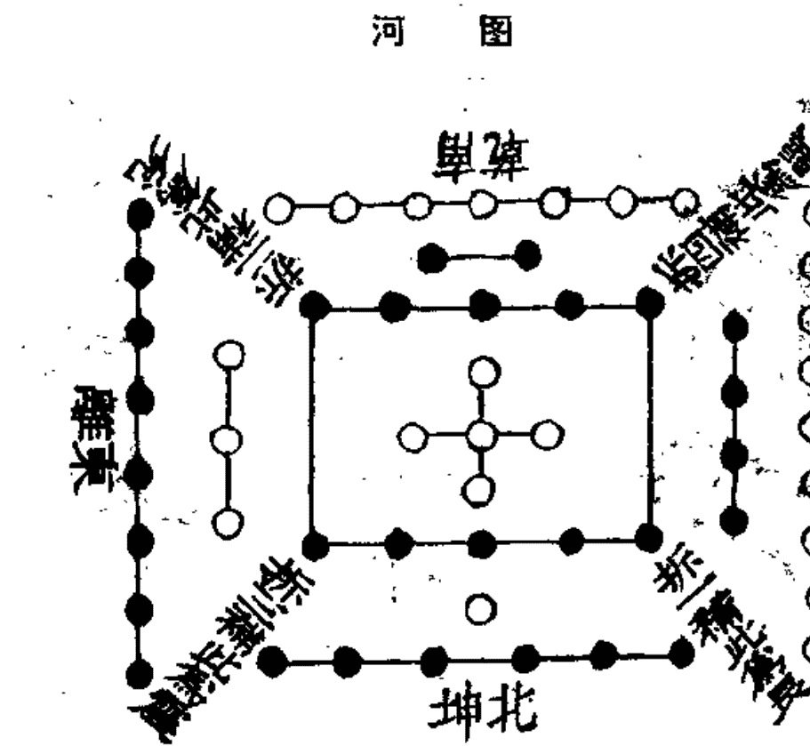

《本义》，《系辞传》曰：“河出图，洛出书，圣人则之。”又曰：“天一地二，天三地四，天五地六，天七地八，天九地十。天数五，地数五，五位相得而各有合。天数二十有五，地数三十，凡天地之数五十有五，此所以成变化而行鬼神也。”此《河图》之数也。

### 洛书

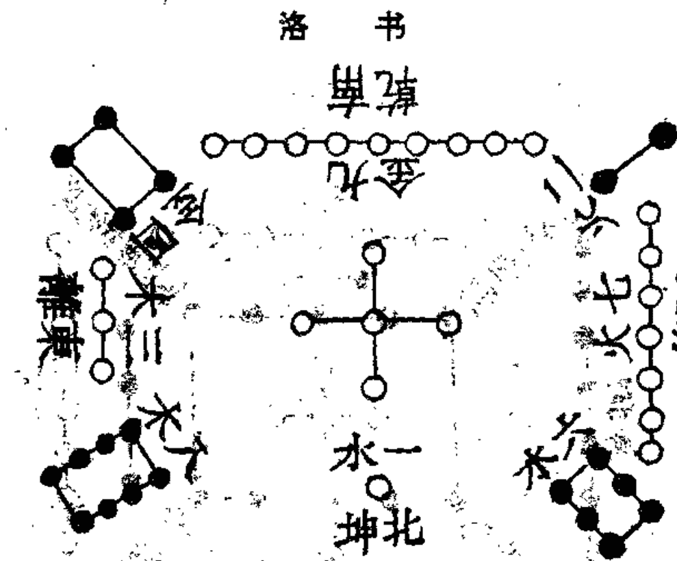

《本义》，《洛书》盖取龟象，故其数戴九履一，左三右七，二四为肩，六八为足。蔡元定曰：“图书之象，自汉孔安国、刘歆，魏关朗子明，有宋康节先生邵雍尧夫，皆谓如此；至刘牧始两易其名，而诸家因之，故今复之，悉从其旧。”

### 河洛图说

孔氏安国曰：“《河图》者，伏羲氏王天下，龙马出河，遂则其文以画人卦。《洛书》者，禹治水时，神龟负文而列于背，有数至九，禹遂因而第之，以成九类。”

刘氏子骏曰：“《河图》、《洛书》，相为经纬。八卦九章，相为表里。”

陈氏室潜曰：“大抵经言其正，纬言其变，而二图互为正变。主《河图》而言，则《河图》为正，《洛书》为变；主《洛书》而言，则《洛书》为正，《河图》为变。天地不过一阴一阳，以两其五行，而太极常居其中，二图虽纵横变动，要只是参互呈见，所以谓之相为经纬，表里亦然。”

邵子曰：“圆者星也，历纪之数，其肇于此乎！方者土也，画州井地之法，其仿于此乎！盖圆者《河图》之数，方者，《洛书》之文，故羲、文因之而造《易》，禹箕叙之而作《范》也。”

朱子曰：“圆者《河图》之数，言无那四角底，其形便圆。”蔡九峰曰：“《河图》体圆而用方，圣人以之画卦；《洛书》体方而用圆，圣人以之叙畴。卦者，阴阳之象也。畴者，五行之数也。象非偶不立，数非奇不行。偶者阴阳之对待乎，奇者五行之迭运乎。”

朱子曰：“天地之间，一气而已，分而为二，则为阴阳，而五行造化，万物始终，莫不由于是焉。故《河图》之位，一与六共宗而居乎北，二与七为朋而居乎南，三与八同道而居乎东，四与九为友而居乎西，五与十相守而居乎中，盖其所以为数者，不过一阴一阳，一奇一偶，以两其五行而已。”

朱子曰：“天地生数，到五便住，那一二三四，遇着那五，便成六七八九，五却自对五成十。”

所谓天者，阳之轻清而位乎上者也。所谓地者，阴之重浊而位乎下者也。阳数奇，故一、三、五、七、九皆属乎天，所谓天数五也。阴数偶，故二、四、六、八、十皆属乎地，所谓地数五也。天数地数，各以类而相求，所谓五位相得者然也。天以一生水，而地以六成之；地以二生火，而天以七成之；天以三生木，而地以八成之；地以四生金，而天以九成之；天以五生土，而地以十成之，此又其各有合焉者也。积五奇而为二十五，积五偶而为三十，合是二者而为五十有五，此《河图》之全数，皆夫子之意，而诸儒之说也。

按：五行生成之说，唐孔氏颖达已有之，而夫子大《传》中未尝明言，故曰夫子之意，诸儒之说也。郭氏雍曰：“五行之说，于《易》无所见，非《易》之道。”夫《革》之《彖传》不曰水火相息乎？即如十干之说，《易》只有“先甲后甲”、“先庚后庚”数语，亦将谓干支非《易》之道乎？《易》之为道，广大悉备，书不尽言，非但卦象也。朱子曰：“相得如兄弟，取其奇偶之相为次第也。有合如夫妇，取其奇偶之相为生成，合其类而不容间也。”黄勉斋曰：“自一至十，特言奇偶之多寡尔，非以次序言，天得奇而为水，故曰一生水；一之极而为三，故曰三生木。地得偶而为火，故曰二生火；二之极而为四，故曰四生金。何也？一极为三，以一运之，圆而成三，故一而三也，三极为四，以二周之，方而成四，故二而四也。六之成水，犹《坎》之为卦也，一阳居中，天一生水也，地六包于外，阳少阴多而水始盛。七之成火，犹《离》之为卦也，一阴居中，地二生火也，天七包于外，阴少阳多而火始盛。《坎》属阳而《离》属阴，以其内者为主，而在外者成之也。”翁思斋曰：“水火金木，不得土不能各成一器，如天一生水，一得五便为水之成；地二生火，二得五便为火之成；天三生木，三得五便为木之成；地四生金，四得五便为金之成。”又曰：“《河图》阴阳之位，生数为主，而成数配之，东北阳方，则主之以奇，而与合者偶；西南阴方，则主之以偶，而与合者奇也。”胡双峰曰：“五行质具于地，气行于天。以质言，则曰水火木金土，取天地生成之序也；以气言，则曰木火土金水，取春夏秋冬运行之气也。”

至于《洛书》，虽夫子所未言，然其象其说已具于前，有以通之，则刘歆所谓经纬表里者可见矣。

朱子曰：“《河图》四面，太阳居一连九，少阴居二连八，少阳居三连七，太阴居四连六，数与位合为十也。《洛书》之位，一对九，二对八，三对七，四对六，亦与《河图》不异。《河图》七八连于左，九六连于右，皆为十五。生数一三五连于左为九，二四连于右为六，九六之合亦为十五，五与十相守于中，亦为十五。《洛书》纵横数之，皆十五，互为七八九六。”胡双峰曰：“《洛书》之中，视《河图》惟有五而无十，然一九、二八、三七、四六之合，环而向之，未尝无十焉。合图书之数悉计之，为数者百。”

或曰：《河图》、《洛书》之位与数，所以不同者何也？曰：《河图》以五生数统五成数，而同处其方，盖揭其全以示人而道其常，数之体也；《洛书》以五奇数统四偶数，而各居其所，盖主于阳以统阴而肇其变，数之用也。

胡玉斋曰：“《河图》以生成分阴阳，以五生数之阳，统五成数之阴，而同处其方，阳内阴外，生成相合，交泰之义也。《洛书》以奇偶分阴阳，以五奇数之阳，统四偶之阴，而各居其所，阳正阴偏，奇偶既分，尊卑之位也。《河图》数十者，对待以立其体，故为常。《洛书》数九者，流行以致其用，故为变。”朱子特各举所重者为言，非谓《河图》有体而无用，《洛书》有用而无体也。

曰：其皆以五居中何也？曰：凡数之始，一阴一阳而已矣，阳之象圆，圆者径一而圆三；阴之象方，方者径一而围四。围三者以一为一，故参其一阳而为三；围四者以二为一，故两其一阴而为二，是所谓参天两地者也。三二之合则为五矣，此《河图》、《洛书》之数，皆以五为中也。然《河图》以生数为主，故其中之所以为五者，亦具五生数之象焉。其下一点，天一之象也；其上一点，地二之象也；其左一点，天三之象也；其右一点，地四之象也；其中一点，天五之象也。《洛书》以奇为主，故其中之所以为五者，亦具五奇数之象焉。其下一点，亦天一之象也；其左一点，亦天三之象也；其中一点，亦天五之象也；其右一点，则天七之象也；其上一点，则天九之象也。其数于位，皆三同二异，盖阳不可易而阴可易，成数虽阳，固亦生之阴也。

胡玉斋曰：“三同者，图书之一六皆在外，三八皆在东，五皆在中，三者之位数皆同也。二异者，图之二七在南，而书则二七在西；图之四九在西，而书则四九在南，二者之位数皆异也。阳不可易，专指一三五；阴可易，统指二七四九。二四以生数言，虽属阳，然以偶数言则属阴，不得谓之阳矣，故可易。七九以奇数言，虽属阳，然以成数言，只可谓之阴矣，故亦可易。其曰成数虽阳，固亦生之阴，不曰生数虽阴，固亦成之阳也，盖但生阴可易而言也。”刘云庄曰：“图之一三五七九皆奇，数阳也，而一三五之位不易，七九之位易者，亦以天地之间，阳动主变故也。然阳于东北则不动，于西南则互迁者，盖东北阳始生之方，西南阳极盛之方，阳主进，数又必进于极而后变也。”胡双峰曰：“图书之数，三同二异，其居中者不可易矣，独西南二方之数相易者，则金乘火位，火入金乡，有相克制之义焉。此造化所以必易二方之数者，正以成其相克之象也。自二方既易之后，图则左旋相生，书则右旋相克，造化不可无生，亦不可无克，不生则或几乎息，不克则无以为之成就也。

曰：“中央之五，固为五数之象矣，然则其为数也奈何？曰：以数言之，则通乎一图，由内及外，固各有积实可纪之数矣。然《河图》之一二三四，各居其五象本方之外，而六七八九十者，又各因五而得数以附于其生数之外。《洛书》之一三七九，亦各居其五象本方之外，而二四六八者，又各因其类以附于奇数之侧。盖中者为主，而外者为客；正者为君，而侧者为臣，亦各有条不紊也。

董盘涧曰：“《河图》之数，不过一奇一偶相错而已，故太阳之位，即太阴之数；太阴之位，即太阳之数；少阴之位，即少阳之数；少阳之位，即少阴之数。见其迭阴迭阳，阴阳相错，以为生成也。天五地十居中者，地十亦天五之成数也。一二三四，已含六七八九者，以五乘之故也。盖数不过五也。《洛书》之数，因一二三四，以对九八七六，其数亦不过十，盖太阳占第一位，已含太阳之数；少阴占第二位，已含少阴之数；少阳占第三位，已含少阳之数；太阴占第四位，已含太阴之数。虽其阴阳各自为数，然五数居中，太阳居一，得五而成六；少阴居二，得五而成七；少阳居三，得五而成八；太阴居四，得五而成九，则与《河图》一阴一阳相错而为生成之数者，亦无以异也。

曰：其多寡不同何也？曰：《河图》主全，故极于十，而奇偶之位均，论其积实，然后见其偶赢而奇乏也；《洛书》主变，故极于九，而其位与实，皆奇赢而偶乏也。必皆虚其中也，然后阴阳之数均于二十，而无偏尔。

按：胡玉斋曰：“《河图》偶赢而奇乏者，地三十，天二十五也。《洛书》奇赢而偶乏者，天二十五，地三十也。”

曰：其序之不同何也？曰：《河图》以生出之次言之，则始下次上，次左次右，以复于中，而又始于下也：以运行之次言之，则始东，次南、次中、次西、次北，左旋一周，而又始于东也。其生数之在内者，则阳居下左，而阴居上右也：其成数之在外者，则阴居下左，而阳居上右也。《洛书》之次，其阳数则首北、次东、次中、次西、次南；其阴数则首西南、次东南、次西北、次东北也。合而言之，则首北、次西南、次东、次东南、次中、次西北、次西、次东北，而究于南也。其运行则水克火、火克金、金克木、木克土，右旋一周，而土复克水也。

翁思斋曰：“《河图》运行之序，自北而东，左旋相生固也，然对待之位，则北方一六水，克南方二七火，西方四九金，克东方三八木，而相克者已寓相生之中。《洛书》运行之序，自北而西，右转相克固也，然对待之位，则东南方四九金，生西北方一六水；东北方三八木，生西南二七火。其相生者已寓于相克之中。盖造化之运，生而不克，则生者无从裁制；克而不生，则克者有时而间断。此固图书生成之妙，各全备也。”按：九宫之一白、二黑、三碧、四绿、五黄、六白、七赤、八白、九紫，即本乎此。

曰：其七八九六之数不同何也？曰：《河图》六七八九，既附于生数之外矣，此阴阳老少进退饶乏之正也。其九者，生数一三五之积也，故自北而东，自东而西，以成于四之外；其六者，生数二四之积也，故自南而西，自西而北，以成于一之外；七则九之自西而南者也，八则六之自北而东者也，此又阴阳老少互藏其宅之变也。

朱子曰：“一六共宗，一为老阳之位，六为老阴之数；四九为友，四为老阴之位，九为老阳之数。此固二老之合，然阳居阴位，阴居阳位，亦二老互藏其宅也。二七为朋，二为少阴之位，七为少阳之数；三八同道，三为少阳之位，八为少阴之数。此则二少之合，然亦阳居阴位，阴居阳位，亦二少互藏其宅也。

《洛书》之纵横十五，而七八九六，迭为消长，虚五分十，而一含九，二含八，三含七，四含六，则参伍错综，无适而不遇其合焉，此变化无穷之所以为妙也。

胡玉斋曰：“虚五分十者，虚其中五之外，则纵横皆十，以其十者分之，则九者十分一之余，八者十分二之余，七者十分三之余，六者十分四之余也。参伍错综，无适而不遇七八九六之合焉。”

然则圣人之则之也，奈何？曰：则《河图》者，虚其中；则《洛书》者，总其实也。《河图》之虚五与十，皆太极也。奇数二十，偶数二十者，两仪也；以一二三四为六七八九者，四象也；拆四方之合，以为《乾》、《坤》、《坎》、《离》，补四隅之空，以为《兑》、《震》、《巽》、《艮》者，八卦也。

朱子曰：“以四象观之，太阳位居一而数则九，《乾》得其数而《兑》得其位，故《乾》为九而《兑》为一；少阴位居二而数则八，《离》得其数而《震》得其位，故《离》为八而《震》为二；少阳位居三而数则七，《坎》得其数而《巽》得其位，故《坎》为七而《巽》为三；太阴位居四而数则六，《坤》得其数而《艮》得其位，故《坤》为六而《艮》为四。今拆六七八九之合，以为《乾》、《坤》、《离》、《坎》，而在四正之位；一二三四之次，以为《兑》、《震》、《巽》、《艮》，而补四隅之空也。”

《洛书》之实，其一为五行，其二为五事，其三为八政，其四为五纪，其五为皇极，其六为三德，其七为稽疑，其八为庶徵，其九为福极，其位与数，尤晓然矣。

按：《洛书》本禹、箕所以演畴者，此则以《九畴》证《洛书》之位数也。胡玉斋曰：“初一之五行，包天地自然之数，余八法是大禹参酌天时人事而类之，不必尽协于火木土金之位也。”

曰：《洛书》而虚其中五，则亦太极也；奇偶各居二十，则亦两仪也；一二三四而含九八七六，纵横十五，而互为七八九六，则亦四象也；四方之正以为《乾》、《坤》、《离》、《坎》，四隅之偏以为《兑》、《震》、《巽》、《艮》，则亦八卦也。《河图》之一六为水，二七为火，三八为木，四九为金，五十为土，则固《洪范》之五行五十有五者，又《九畴》之子目也，是则《洛书》固可以为《易》，而《河图》亦可以为《范》矣。且以《河图》而虚十，则《洛书》四十有五之数也；虚五，则大衍五十之数也；积五与十，则《洛书》纵横十五之数也；以五乘十，以十乘五，则又皆大衍之数也。《洛书》之五，又自含五而得十，而通为大衍之数矣，积五与十，则得十五，而通为《河图》之数矣。苟明乎此，则横斜曲直，无所不通，而《河图》、《洛书》，又岂有先后彼此之间哉？

胡玉斋曰：“《洛书》之五，又自含五而得十者，下一点含天一之象，上一点含地二之象，左一点含天三之象，右一点含地四之象，中一点含天五之象，所谓五自含五而得十，通在外四十为大衍之数。积五与十而得十五者，以其所含之五积之，则又含五与十而为十五，通在外四十而为《河图》之五十五也。”蔡节斋曰：“《河图》数偶，偶者静，静以动为用，故《河图》之位合皆奇。一合六，二合七云云，是故《易》之吉凶生乎动，盖静者必动而后生也。《洛书》数奇，奇者动，动以静为用，故《洛书》之位合皆偶，一合九，二合八云云，是故《范》之吉凶见乎静，盖动者必静而后成也。”胡双峰曰：“《河图》《洛书》皆木数居东方，伏羲画卦自下而上，即木之自根而干，干而枝也。其画三，木之生数也；其卦八，木之成数也；重卦亦两其三八其八耳。三八木数大备，而后六十四卦大成，一六水，二七火、四九金、五十土，皆在包罗中矣。此春所以贯四时，仁所以包四端，元所以统四德。大哉《易》也，斯其至矣！”

### 伏羲八卦次序横图

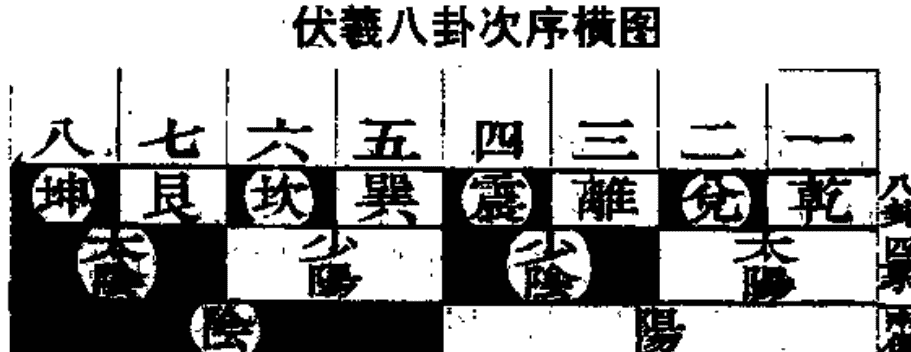

《本义》,《系辞传》曰:“《易》有太极,是生两仪,两仪生四象,四象生八卦。”邵子曰:“一分为二,二分为四,四分为八也。”《说卦》曰:“《易》逆数也。”邵子曰:“《乾》一、《兑》二、《离》三、《震》四、《巽》五、《坎》六、《艮》七、《坤》八,自《乾》至《坤》皆得未生之卦,若逆推四时之比也。后六十四卦次序仿此。

### 伏羲八卦横图说

朱子曰：“太极者，象数未形而其理已具之称，形器已具而其理未联之目，在《河图》、《洛书》，皆虚中之象也。太极之判，始生一奇一偶，而为一画者二，是为两仪。其数则阳一而阴二，在《河图》、《洛书》则奇偶是也。两仪之上，各生一奇一偶而为二画者四，是谓四象。其位则太阳一，少阴二，少阳三，太阴四；其数则太阳九，少阴八，少阳七，太阴六。以《河图》言之，则六者一而得于五者也，七者二而得于五者也，八者三而得于五者也，九者四而得于五者也；以《洛书》言之，则九者十分一之余也，八者十分二之余也，七者十分三之余也，六者十分四之余也。四象之上，各生一奇一偶而为三画者八，于是三才略具，而有八卦之名矣，其位则《乾》一、《兑》二、《离》三、《震》四、《巽》五、《坎》六、《艮》七、《坤》八。在《河图》则《乾》、《坤》、《离》、《坎》分居四实，《兑》、《震》、《巽》、《艮》分居四虚；在《洛书》则《乾》、《坤》、《离》、《坎》分居四方，《兑》、《震》、《巽》、《艮》分居四隅也。”

朱子曰太极之理，正谓理之极致耳，有是理即有是物，无先后次序之可言，故曰《易》有太极，则是太极乃在阴阳之中，而非在阴阳之外也。若以《乾》、《坤》未判太衍未分之时论之，则非也。有是理即有是气，理一而已，气则无不两者，故曰太极生两仪。按：太极动而生两仪，以理言之，即未发之中，大衍未分之时，亦中之未发者，仍当以朱子未形未联之说为优。董盘涧曰：“自四象生八卦，则《乾》、《坤》、《震》、《巽》不动，而《兑》、《离》、《坎》、《艮》则交，盖二老不动者，阳仪还生阳之象，阴仪还生阴之象。二少则交者，阳仪乃生阴之象，阴仪乃生阳之象也。《乾》、《坤》、《震》、《巽》不动者，阳象还生阳爻，阴象还生阳爻，《兑》、《离》、《坎》、《艮》则交者，阳象乃生阴爻，阴象乃生阳爻。”

### 伏羲八卦方位圆图

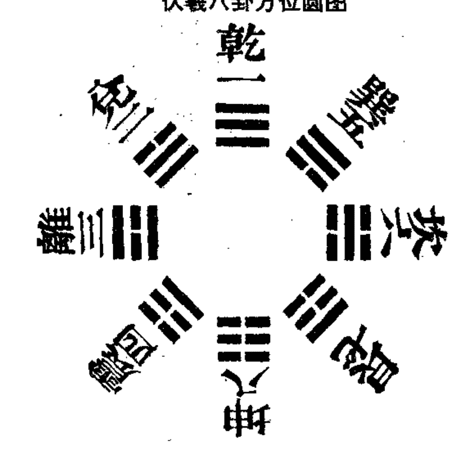

《本义》,《说卦传》曰:“天地定位,山泽通气,雷风相薄,水火不相射,八卦相错,数往者顺,知来者逆。”邵子曰:“《乾》南《坤》北,《离》东《坎》西,《震》东北,《兑》东南,《巽》西南,《艮》西北。自《震》至《乾》为顺,自《巽》至《坤》为逆。”后六十四卦方位仿此。

### 伏羲八卦圆图说

邵子曰：“《乾》、《坤》纵而六子横，《易》之本也。”又曰：“《震》始交阴而阳生，《巽》始消阳而阴生，《兑》阳长也，《艮》阴长也，《震》、《兑》在天之阴也，《巽》、《艮》在地之阳也。故《震》、《兑》上阴而下阳，《巽》、《艮》上阳而下阴。天以始生言之，故阴上而阳下，交泰之义也。地以既成言之，故阳上而阴下，尊卑之位也。《乾》、《坤》定上下之位，《坎》、《离》列左右之门，天地之所阖辟，日月之所出入，春夏秋冬，晦朔弦望、昼夜长短，行度盈缩，莫不由乎此矣。

徐进斋曰：“一气循环，自《复》至《乾》为阳，生物之始也，故《震》、《兑》阴上而阳下，为交泰之义。盖主动言，太极之用所以行。自《姤》至《坤》为阴，成物之终也，故《巽》、《艮》阳上而阴下，为尊卑之位。盖主静而言，太极之体所以立也。”朱子曰：“以横图观之，自《乾》一而《兑》二，而《离》三，而《震》四，《巽》五、《坎》六、《艮》七、《坤》八，以次而生，此《易》之所以成也。而圆图之左者，自《震》之初为冬至，《离》、《兑》之中为春分，以至于《乾》之末而交夏至焉，皆进而得其已生之卦，犹自今日而顺数昨日也，故曰数往者顺；其右方，自《巽》之初为夏至，《坎》、《艮》之中为秋分，以至于《坤》之末而交冬至焉，皆进而得其未生之卦，犹自今日而逆计来日也，故曰知来者逆，然本《易》之所以成，则其先后始终，如横图及圆图右方之序而已，故曰《易》逆数也。”按：朱子顺逆之说，当与章氏潢、项氏平庵之论参看，详《说卦》注中。又按：既言《震》之初为冬至，又曰《坤》之末交冬至者，《震》阳生于《坤》之末也，苟《坤》不生阳，《震》初之一阳何自而来？《姤》初之夏至，亦生于《乾》也。

朱子答董铢曰：“《先天图》自《乾》一横排至《坤》八，此则全是自然，若如圆图，则须如此方见阴阳消长次第，虽自稍涉安排，然亦莫非自然之理。”

按：稍涉安排者，较上横图言之，非勉强造作之谓也。故又云莫非自然之理。然因此而后儒之好为立异者，遂谓卦位无先天之说，而确守圣人言，《震》东方《巽》东南之卦位，见于《说卦》者为护符。不知先天之卦位体也，后天之卦位用也，体非用不行，用非体不立，二者废一不可。胡双峰曰：“观此图以四正卦居四方之正位，《乾》、《坤》、《坎》、《离》，反覆只是一卦；以一反卦居四隅不正之位，《震》反为《艮》，《巽》反为《兑》，本只《震》、《巽》二卦，反而成四卦。合而言之，天位乎上，地位乎下，日生于东，月生于西，山镇西北，泽浸东南，风起西南，雷动东北，自然与天地大造化合。先天八卦，对待以立体如此，其位则《乾》一《坤》八，《兑》二《艮》七，《离》三《坎》六，《震》四《巽》五，各相对而合成九数；其画则《乾》三《坤》六，《兑》四《艮》五，《离》四《坎》五，《巽》四《震》五，亦各相对而合成九数。九老阳之数，《乾》之象而无所不包也。”

### 伏羲六十四卦横图

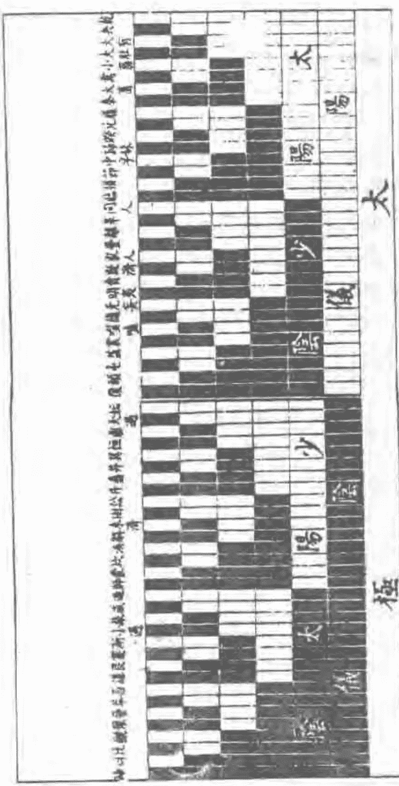

《本义》,前《八卦次序图》即《系辞传》所谓八卦成列者,此图即其所谓因而重之者也。故下三画即前图之八卦,上三画则各以其序重之,而下卦因亦各衍而为八也。若逐爻渐生,则邵子所谓八分为十六,十六分为三十二,三十二分为六十四者,尤见法象自然之妙也。

按:八分为十六者,言四画互十六卦也。十六分为三十二者,言五画互三十二卦也。虽至六画卦成,所互亦只有此数,但六画五画,皆除本卦而上下合互,惟四画仍连本卦互之耳。此所谓互卦也。《杂卦传》实由此而出,其生卦次第,每卦皆以《乾》一、《兑》二、《离》三、《震》四、《巽》五、《坎》六、《艮》七、《坤》八为序。如第一卦《乾》、《夬》、《大有》、《大壮》、《小畜》、《需》、《大畜》、《泰》八卦,内卦皆是《乾》,外卦则即以《乾》一、《兑》二、《离》三、《震》四、《巽》五、《坎》六、《艮》七、《坤》八为序,朱子五赞所谓因而重之,一贞八悔,六十四卦,由内达外是也。

### 伏羲六十四卦横图说

朱子曰：“此一节乃孔子发明伏羲画卦自然之形体次第，最为切要。康节之言曰一分为二，二分为四，四分为八，八分为十六，十六分为三十二，三十二分为六十四，犹根之有干，干之有枝，愈大则愈小，愈细则愈繁，而明道先生以为加一倍法。盖以《河图》、《洛书》论之，太极者虚中之象也，两仪者阴阳奇偶之象也，四象者《河图》之一合六、二合七、三合八、四合九，《洛书》之一含九、二含八、三含七、四含六也。八卦者《河图》四实四虚之数，《洛书》四正四隅之位也。以卦画言之，太极者象数未形之全体也，两仪者一一为阳而一一为阴，阳数一而阴数二也。四象者，阳之上生一阳则为一一，而谓之太阳；生一阴则为一一，而谓之少阴；阴之上生一阳则为一一，而谓之少阳；生一阴则为一一，而谓之太阴。四象既立，则太阳居一而含九，少阴居二而含八，少阳居三而含七，太阳居四而含六，此六七八九之数所由定也。八卦者，太阳之上，生一阳则为三而名《乾》，生一阴则为三而名《兑》；少阴之上，生一阳则为三而名《离》，生一阴则为三而名《震》；少阳之上生一阳则为三而名《巽》，生一阴则为三而名《坎》；太阴之上，生一阳则为三而名《艮》，生一阴则为三而名《坤》。康节先天之说，所谓《乾》一、《兑》二、《离》三、《震》四、《巽》五、《坎》六、《艮》七、《坤》八者，盖谓此也。至于八卦之上，各生一阴一阳，则为四画者十有六，经虽无文，而康节所谓八分为十六者此也。四画之上，又各生一阴一阳，则为五画者三十有二，经虽无文，而康节所谓十六分为三十二者此也。五画之上，又各生一阴一阳，则为六画之卦六十有四，而八卦相重，又各得《乾》一、《兑》二、《离》三、《震》四、《巽》五、《坎》六、《艮》七、《坤》八之次，其在图可见矣。”又诗曰：

> 诸儒谈易漫纷纷，只见繁枝不见根。
观象徒劳推互体，玩辞亦是逞空言。
须知一本能双干，始信千儿与万孙。
吃紧包牺为人意，悠悠千古向谁论。

按：邵子诗，一本双干，千儿万孙一联，括尽六十四卦，至谓观象徒劳推互体，非所重也，然亦足见观象之法，非推互体不可，卦之有互，即四画五画，朱子所谓经虽无文者是也。是故理者天下之至精也，数者天下之至变也。太极理也，图书数也，理虽不杂乎图书之数，而亦不离乎图书之数。故刘云庄曰：“太极为理之原，图书为数之祖，理形于上，必有所依而立，理之下数本非二致也。”

### 伏羲六十四卦圆图

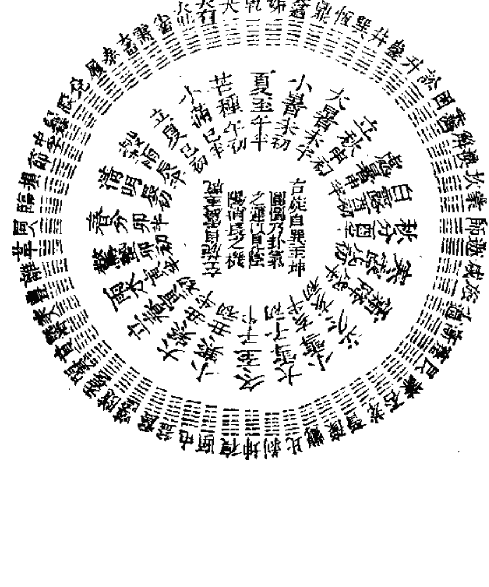

### 伏羲六十四卦方图

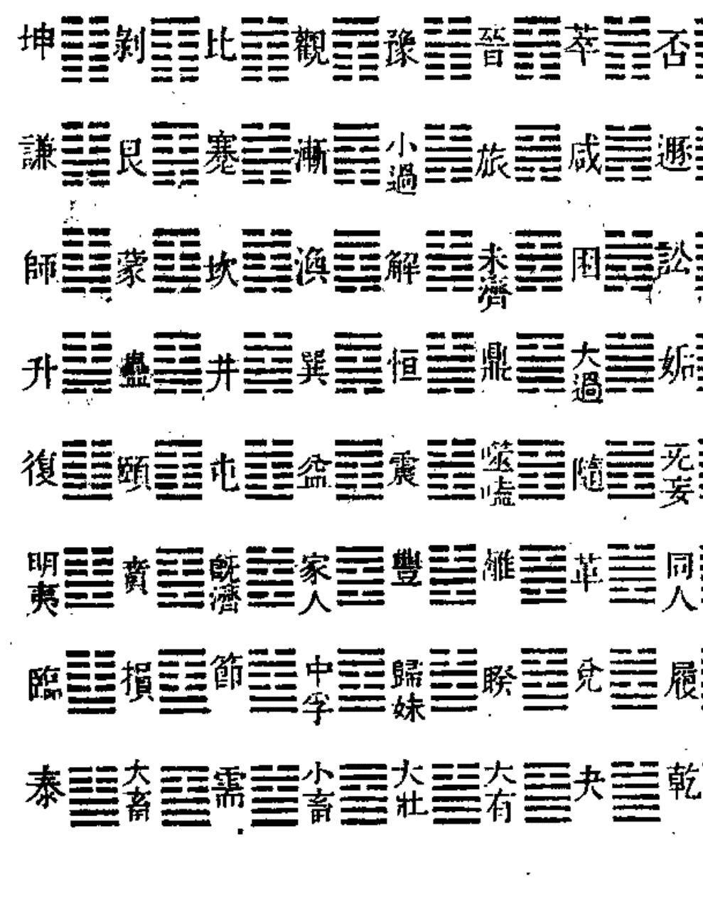

《本义》，伏羲四图，其说皆出邵氏，盖邵氏得之李之才挺之，挺之得之穆修伯长，伯长得之华山希夷先生陈抟图南者，所谓先天之学也。此图圆布者，盖《乾》尽午中，《坤》尽子中，《离》尽卯中，《坎》尽酉中。阳生于子中，极于午中；阴生于午中，极于子中。其阳在南，其阴在北。方布者，《乾》始于西北，《坤》尽于东南，其阳在北，其阴在南，此二者阴阳对待之数，圆于外者为阳，方于中者为阴，圆者动而为天，方者静而为地者也。

### 伏羲六十四卦方圆图说

邵子曰：“太极既分，两仪立矣。”

朱子曰：“此以第一爻而言，左一奇为阳，右一偶为阴，所谓两仪者也。今此一奇为左三十二卦之初爻，一偶为右三十二卦之初爻。”

阳上交阴，阴下交阳，而四象生矣。

朱子曰：“此以第一爻生第二爻而言，阳下之半，上交于阴上半，则生阴中第二爻之一奇一偶，而为少阳太阴矣；阴上之半，下交于阳下之半，则生阳中之一奇一偶，而为太阳少阴矣，所谓两仪生四象也。太阳一奇，今分为左上十六卦之第二爻，少阴一偶，今分为左下十六卦之第二爻，少阳太阴，其分仿此，而初爻之二，亦分而为四矣。”

阳交于阴，阴交于阳，而生天之四象；刚交于柔，柔交于刚，而生地之四象。

朱子曰：“此以第二爻生第三爻而言，阳谓太阳，阴谓太阴，刚谓少阳，柔谓少阴。太阳之下半，交于太阴之上半，则生太阴中第三爻之一奇一偶，而为《艮》为《坤》；太阴之上半，交于太阳之下半，则生太阳中第三爻之一奇一偶，而为《乾》为《兑》。少阳之上半，交于少阴之下半，则生少阴中第三爻之一奇一偶，而为《离》为《震》；少阴之下半，交于少阳之上半，则生少阳中第三爻之一奇一偶，而为《巽》为《坎》，所谓四象。《乾》一奇，今分为八卦之第三爻，《坤》一偶，今分为八卦生八卦也。余仿此，而初爻二爻之四，今又分为八矣。《乾》、《兑》、《艮》、《坤》，生于二太，故为天之四象；《离》、《震》、《巽》、《坎》，生于二少，故为地之四象。”按：朱子此论，似非邵子本意，盖邵子天四象，谓自阳仪中来；地四象，谓自阴仪中来也。详见下文。

八卦相错，而后万物生焉。

朱子曰：“一卦之上，各加八卦，以相间错，则六十四成矣。然第三爻之相交，则生第四爻之一奇一偶，于是一奇一偶，各为四卦之第四爻，而下三爻亦分为十六矣。第四爻又相交，则生第五爻之一奇一偶，于是一奇一偶，各为二卦之第五爻，而下四爻亦分为三十二矣。第五爻又相交，则生第六爻之一奇一偶，则一奇一偶，各为一卦之第六爻，而下五爻亦分为六十四矣。盖八卦相乘为六十四，而自三画以上，三加一倍，以至六画，则三画者亦加一倍，而卦体横分，亦为六十四矣，二数殊途，不约而会，如合符节，不差毫厘，正是《易》之妙处。”

是故《乾》以分之，《坤》以翕之，《震》以长之，《巽》以消之，长则分，分则消，消则翕也，《乾》、《坤》，定位也，《震》、《巽》一交也，《兑》、《离》、《坎》、《艮》再交也。故《震》阳少而阴尚多也，《巽》阴少而阳尚多也，《兑》、《离》阳浸多也，《坎》、《艮》阴浸多也。”又曰：“无极之前，阴含阳也；有象之后，阳分阴也。阴为阳之母，阳为阴之父，故母孕长男而为《复》，父生长女而为《姤》，是以阳起于《复》，而阴起于《姤》也。”

翁思斋曰：“无极之前，阴含阳也，言自《巽》消而至《坤》，翕静之妙也；有象之后，阳分阴也，言自《震》长而至《乾》，分动之妙也。阴含阳，故曰母孕；阳分阴，故曰父生。”

又曰：“阳在阴中，阳逆行；阴在阳中，阴逆行。阳在阳中，阴在阴中，则皆顺行。此真至之理，按图可见矣。”

朱子曰：“图左属阳，右属阴。自《震》一阳，《离》、《兑》二阳，《乾》三阳，为阳在阳中顺行；自《巽》一阴，《坎》、《艮》二阴，《坤》三阴，为阴在阴中顺行。《坤》无阳，《坎》、《艮》一阳，《巽》二阳，为阳在阴中逆行；《乾》无阴，《兑》、《离》一阴，《震》二阴，为阴在阳中逆行也。”

又曰：“《复》至《乾》，凡百一十有二阳；《姤》至《坤》，凡八十阳。《姤》至《坤》，凡百一十有二阴；《复》至《乾》凡八十阴。”

胡玉斋曰：“左边一画阳，便对右边一画阴；左边一画阴，便对右边一画阳。对待以立体，而阴阳各居其半也。”

又曰：“《坎》、《离》者，阴阳之限也，故《离》当寅，《坎》为申，而数常踰之者，阴阳之溢也，然用数不过乎中也。”

胡玉斋曰：“以四时言之，春为阳而始于寅，是《离》当寅而为阳之限；秋为阴而始于申，是《坎》当申而为阴之限。数常踰之者，《离》虽当寅而尽于卯中，《坎》虽当申而尽于酉中，是踰寅申之限而为阴阳之溢矣。用数不过乎中者，于位阳虽生而未出乎地，至寅则温厚之气始用事；午位阴虽生而未害于阳，至申则严凝之气始用事，是用数仍不过寅申之中也。”按：卦气皆当作如是观。

又大《易》吟曰：

> 天地定位，否泰反类。
山泽通气，损咸见义。
风雷相薄，恒益起意。
水火相射，既济未济。
四象相交，成十六事。
八卦相荡，为六十四。

董天台曰：“以方图分成四层看，第一层，四偶，《乾》、《坤》、《否》、《泰》四卦，周围二十八卦，横直皆《乾》一、《坤》八之卦，此见天地定位，《否》、《泰》反类也。第二层，四隅，《兑》、《艮》、《咸》、《损》四卦，周围二十卦，横直皆《兑》二《艮》七之卦，此见山泽通气，《损》《咸》见义。第三层，四隅，《坎》、《离》、《既济》、《未济》四卦，周围十二卦，横直皆《离》三《坎》六之卦，此见水火相射，既济未济之义。最里一层，《震》、《巽》、《恒》、《益》四卦，所谓雷风相薄，《恒》、《益》起意也。足以晓然，见先天法象自然之妙矣。”

又诗曰：

> 耳目聪明男子身，洪钧赋予不为贫。
须探月窟方知物，未蹑天根岂识人？
乾遇巽时观月窟，地逢雷处见天根。
天根月窟间来往，三十六宫都是春。

朱子曰：“《先天图》自《复》至《乾》阳也，《姤》至《坤》阴也，阳主人，阴主物。天根月窟，指《复》、《姤》二卦，乃是说图之从起处。三十六宫之说，邵子尝曰：八卦之象，不易者四，《乾》、《坤》、《坎》、《离》；反易者二，《震》反为《艮》，《巽》反为《兑》，本是二卦，以反易为四卦，以六变而成八也。重卦之象，不易者八，《乾》、《坤》、《坎》、《离》、《颐》、《中孚》、《大过》、《小过》；反易者二十八，如《屯》反为《蒙》之类，本五十六卦，反易只二十八卦，以三十六变，为六十四也。”

按：《乾》一、《兑》二、《离》三、《震》四、《巽》五、《坎》六、《艮》七、《坤》八，亦三十六。八卦之画，《乾》三，《坤》六，《震》、《坎》、《艮》皆五，《巽》、《离》、《兑》皆四，亦三十六。

朱子曰：“圆图，《乾》在南，《坤》在北。方图，《坤》在南，《乾》在北。《乾》位阳画之聚为多，《坤》位阴画之聚为多，此阴阳之各以类而聚也，亦莫不有自然法象焉。”又曰：“圆图象天，一顺一逆，流行中有对待，如《震》八卦对《巽》八卦之类，此则方圆图之辨也。圆图象天，天圆而动，包乎地外；方图象地，地方而静，囿乎天中。圆图者，天道阴阳；方图者，地道柔刚。《震》、《离》、《兑》、《乾》，为天之阳地之刚；《巽》、《坎》、《艮》、《坤》，为天之阴地之柔。地道承天而行，以地之柔刚，应天之阴阳，同一理也。特在天者一逆一顺，卦气所以运；在地者惟主乎逆，卦画所以成耳。”

胡玉斋曰：“四象八卦之位，邵子以阴阳刚柔四字分之，朱子惟以阴阳二字明之，其论四象既殊，其论八卦亦异。邵子以《乾》、《兑》、《离》、《震》为天四象，以四卦自阳仪中来；以《巽》、《坎》、《艮》、《坤》为地四象，以四卦自阴仪中来。朱子则以《乾》、《兑》、《艮》、《坤》生于太阳太阴，故属其象于天；《离》、《震》、《巽》、《坎》生于少阴少阳，故属于地，二者各有不同也。但详玩邵子本意，谓阴阳相交者，指阳仪中之阴阳；刚柔相交者，指阴仪中之刚柔，是以老交少少交老，而生天地四象，其分灿然而有别。朱子之说，虽非邵子本意，然因是可以见图之分阴阳者以交易，而成象之或老或少，初不易其分也。”

问邵子曰：“先天之学心法也，图皆从中起，万化万事生于心何也？”曰：“其中白处，便是太极；三十二阴，三十二阳，便是两仪；十六阴，十六阳，便是四象；八阴八阳底，便是八卦。”又曰：“万物万化，皆从这里流出，是心法皆从中起也。”

新安程氏曰：“天地定位，圆图从中起也；《震》以动之，风以散之，方图从中起也。”

《易》训变易，又训交易，是转易之义，观《先天图》便可见，东边一画阴，便对西边一画阳，盖东一边本皆是阳，西一边本皆是阴。东边阴画，本皆自西边来；西边阳画，本皆自东边来。《姤》在西，是东边五画阳过来；《复》在东，是西边五画阴过来。

问：“《先天图》与《太极图》不同如何？”曰：“中间虚者，便是太极，他图说从中起，今不合方图在中间塞却，待取出放外，他两边生者即是阴根阳阳根阴，者个有对，从中出者无对。”问：“《先天图》如何移出方图在下？”曰：“是某挑出。”

### 文王八卦次序图

坤母

乾父

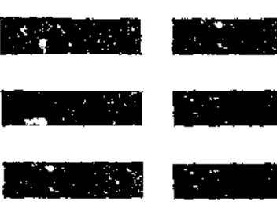

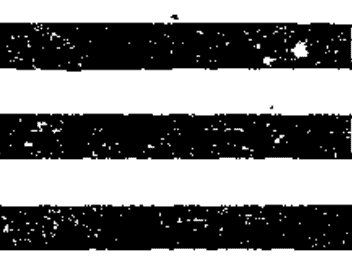

兑少女

离中女

巽长女

震长男

坎中男

艮少男

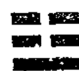

得坤上爻

得坤中爻

得坤初爻

得乾初爻

得乾中爻

得乾上爻

### 文王八卦次序图说

朱子曰：“《乾》索于《坤》而得女，《坤》索于《乾》而得男，初间画卦时不是恁地，只是画卦后，便见有此象耳。”

胡玉斋曰：“三男阳也，《乾》之似也，乃归之于《坤》求而后得；三女阴也，《坤》之似也，乃归之于《乾》求而后得。何也？盖三男本《坤》体，各得《乾》一阳而成，此阳根于阴，故归之《坤》也。三女本《乾》体，各得《坤》一阴而成，此阴根于阳，故归之《乾》也。”邵子曰：“母孕长男而为《复》，父生长女而为《姤》，阴阳互根之义见矣。”

### 文王八卦方位图

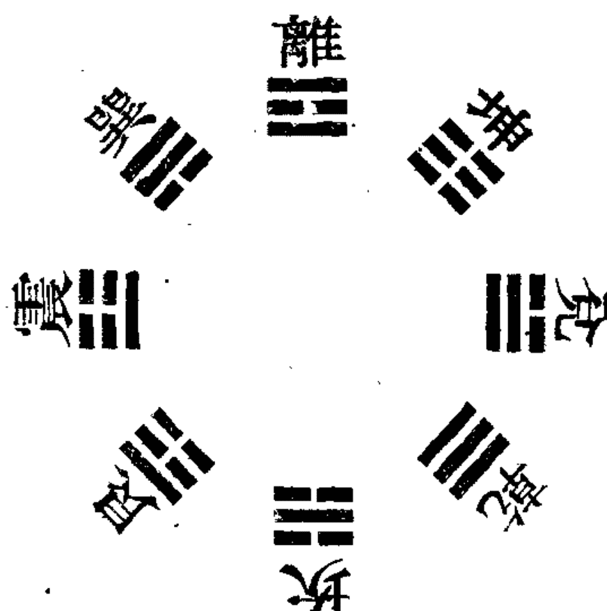

《本义》，前见《说卦》。邵子曰：“此文王八卦，乃人用之位，后天之学也。”

### 文王八卦方位图说

邵子曰：“至哉文王之作《易》也！其得天地之用乎！故《乾》、《坤》交而为《泰》，《坎》、《离》交而为《既济》也。《乾》生于子，《坤》生于午，《坎》终于寅，《离》终于申，以应天之时也。置《乾》于西北，退《坤》于西南，长子用事，而长女代母，《坎》、《离》得位，而《兑》、《艮》为偶，以应地之方也。王者之法，其尽于是矣。”

朱子曰：“此言文王改易伏羲卦画之意也。”

胡玉斋曰：“《乾》南《坤》北，《离》东《坎》西者，先天卦位由南北而交，《坤》南《乾》北曰《坤》上《乾》下，故交而为《泰》也。《离》、《坎》由东西而交，则《坎》上《离》下，故交而为《既济》也。先天卦《乾》居午而云生于子者，以《乾》阳始生于《复》，《复》子之半也。《坤》居子而云生于午者，以《坤》阴始生于《姤》，《姤》午之半也。午《乾》之所已成，今下而交《坤》于子，是其所由生也；子《坤》之所已成，今上而交《乾》于午，是反其所由生也。故再变而为后天卦，则《乾》退西北，《坤》退西南也。先天《离》当寅而云终于申者，申乃《坎》之位，《离》交《坎》而终于申也。《坎》当申而云终于寅者，寅乃《离》之位，《坎》交《离》而终于寅也。东者《离》之本位，其变则交于《坎》而向西，是东自上而西也。西者《坎》之本位，其变则交于《离》而向东，是西自下而东也。故再变而为后天卦。《乾》、《坤》既退，则《离》上而得《乾》位，《坎》下而得《坤》位也。《震》代父始事而发生于东方，《巽》代母继事而长养于东南也。先天主《乾》、《坤》、《坎》、《离》之交，其交也将变而无定位，天时之不穷也，故曰应天。后天主《坎》、《离》、《震》、《兑》之交，其交也不变而有定位，地方而有常也，故曰应地。”

又曰：“《易》者一阴一阳之谓也，《震》、《兑》始交者也，故当朝夕之位；《坎》、《离》交之极者也，故当子午之位；《艮》、《巽》不交，而阴阳犹杂也，故当用中之偏；《乾》、《坤》纯阳纯阴，故当不用之位也。”

蔡西山曰：“此论阴阳以易位为交，阳本在上，阴本在下，《艮》一阳在上，《巽》一阴在下，故云不交；《震》一阳在下，《兑》一阴在上，故为始交；《坎》阳在中，《离》阴在中，故为交之极。春阳之始，故《震》居之；秋阴之始，故《兑》居之；夏阳极阴生，故《离》居之；冬阴极阳生，故《坎》居之。《艮》一阳二阴，《巽》二阳一阴，犹有用。《乾》纯阳，《坤》纯阴，不为用。东方为阳主用，西方为阴不用，故《乾》、《坤》居西隅，《艮》、《巽》居东隅也。《乾》、《艮》为阳，《坤》、《巽》为阴，北为地之阳，南为地之阴，故《乾》、《艮》居北隅，而《巽》、《坤》居南隅也。”

又曰：“《兑》、《离》、《巽》，得阳之多者也。《艮》、《坎》、《震》，得阴之多者也。是以为天地用也。《乾》极阳，《坤》极阴，是以不用也。”又曰：“《震》、《兑》横而六卦纵，《易》之用也。”

按：后天改易卦位，《乾》、《坤》退处不用之地，非真不用，盖六子即《乾》、《坤》之用也。天地间二气往来，五行为用，先天卦位，当太古之时，所用者五行之生气；后天卦位，当中古之时，所用者五行之王气，此先后天之卦位所以改易也。陈氏隆山曰：“《离》为日，大明生于东，故在先天居东；日正照于午，日中时也，故在后天居南。《坎》为月，月生于西，故在先天居西；月正照于子，夜分时也，故在后天居北。先天则居生之地，后天则居王之地，不特《坎》、《离》，后天卦皆以生王为序。《震》木王于卯，《兑》金王于酉，土王中央，故《坤》位金火之间，《艮》位水木之间；《兑》阴金，《乾》阳金，故《乾》次《兑》居西北；《震》阳木，《巽》阴木，故《巽》次《震》居东南，皆以五行生王为序，此所谓《易》之用也。”

### 朱子卦变图

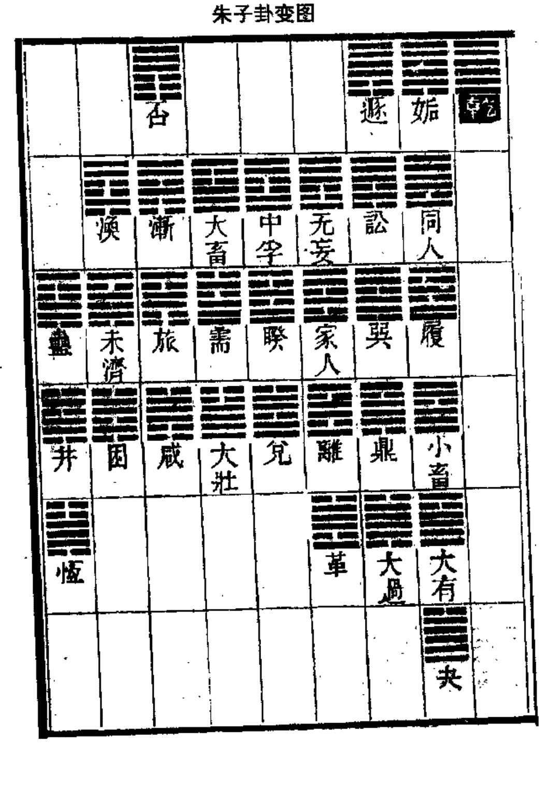

| | | | | | | | |
|---|---|---|---|---|---|---|---|
| ☶ (艮) | | | | ☷ (坤) | | | |
| ☷ (坤) | ☶ (艮) | ☵ (坎) | ☶ (艮) | ☲ (离) | ☶ (艮) | | ☴ (巽) |
| ☳ (震) | ☳ (震) | ☵ (坎) | ☶ (艮) | ☱ (兑) | ☵ (坎) | ☲ (离) | ☳ (震) |
| ☶ (艮) | ☳ (震) | ☵ (坎) | ☶ (艮) | | ☵ (坎) | ☲ (离) | ☳ (震) |
| ☷ (坤) | ☲ (离) | ☴ (巽) | | | ☷ (坤) | ☲ (离) | |
| ☷ (坤) | ☳ (震) | ☶ (艮) | | | | | |

| | | | | | | | |
|---|---|---|---|---|---|---|---|
| | | ☰ 无妄 | | | ☰ 同人 | ☰ 乾 | ☰ 姤 |
| | ☰ 中孚 | ☰ 家人 | ☰ 蛊 | ☰ 涣 | ☰ 否 | ☰ 履 | ☰ 遁 |
| ☰ 大畜 | ☰ 睽 | ☰ 离 | ☰ 井 | ☰ 未济 | ☰ 渐 | ☰ 小畜 | ☰ 讼 |
| ☰ 需 | ☰ 兑 | ☰ 革 | ☰ 恒 | ☰ 困 | ☰ 旅 | ☰ 大有 | ☰ 巽 |
| ☰ 大壮 | | | | | ☰ 咸 | ☰ 夬 | ☰ 鼎 |
| | | | | | | | ☰ 大过 |

| | ☶ (艮) | | | | ☴ (巽) | | |
|---|---|---|---|---|---|---|---|
| | ☶☶ (艮为山) | | | | ☴☴ (巽为风) | | |
| ☳☳ (震为雷) | ☳☶ (雷山小过) | ☳☷ (雷地豫) | ☳☵ (雷水解) | ☳☴ (雷风恒) | ☳☲ (雷火丰) | ☳☱ (雷泽归妹) | ☳☰ (雷天大壮) |
| ☵☵ (坎为水) | ☵☶ (水山蹇) | ☵☷ (水地比) | ☵☵ (坎为水) | ☵☴ (水风井) | ☵☲ (水火既济) | ☵☱ (水泽节) | ☵☰ (水天需) |
| ☲☲ (离为火) | ☲☶ (火山旅) | ☲☷ (火地晋) | ☲☵ (火水未济) | ☲☴ (火风鼎) | ☲☲ (离为火) | ☲☱ (火泽睽) | ☲☰ (火天大有) |
| ☷☷ (坤为地) | ☷☶ (地山谦) | ☷☷ (坤为地) | ☷☵ (地水师) | ☷☴ (地风升) | ☷☲ (地火明夷) | ☷☱ (地泽临) | ☷☰ (地天泰) |
| ☰☰ (乾为天) | ☰☶ (天山遁) | ☰☷ (天地否) | ☰☵ (天水讼) | ☰☴ (天风姤) | ☰☲ (天火同人) | ☰☱ (天泽履) | ☰☰ (乾为天) |

| | | ☰ | | | | ☰ | ☰ | ☰ |
|---|---|---|---|---|---|---|---|---|
| | | 讼 | | | | 姤 | 遯 | 同人 |
| | ☴ | ☴ | ☶ | ☴ | ☰ | ☰ | ☰ | |
| | 观 | 巽 | 贲 | 益 | 履 | 否 | 乾 | |
| ☶ | ☶ | ☲ | ☵ | ☳ | ☰ | ☰ | ☰ | |
| 艮 | 晋 | 鼎 | 既济 | 噬嗑 | 小畜 | 渐 | 无妄 | |
| ☶ | ☱ | ☱ | ☳ | ☳ | ☰ | ☲ | ☴ | |
| 蹇 | 萃 | 大过 | 丰 | 随 | 大有 | 旅 | 家人 | |
| ☶ | | | | | ☰ | ☱ | ☲ | |
| 小过 | | | | | 夬 | 咸 | 离 | |
| | | | | | | | ☱ | |
| | | | | | | | 革 | |

| | | ☰ 乾 | ☷ 坤 | ☳ 震 | ☴ 巽 | ☵ 坎 | ☲ 离 | ☶ 艮 | ☱ 兑 |
|---|---|---|---|---|---|---|---|---|---|
| ☰ 乾 | | 乾 | 否 | 无妄 | 姤 | 讼 | 同人 | 遁 | 履 |
| ☷ 坤 | | 泰 | 坤 | 复 | 升 | 明夷 | 师 | 谦 | 临 |
| ☳ 震 | | 大壮 | 豫 | 震 | 恒 | 解 | 丰 | 小过 | 归妹 |
| ☴ 巽 | | 小畜 | 观 | 益 | 巽 | 涣 | 家人 | 渐 | 中孚 |
| ☵ 坎 | | 需 | 比 | 屯 | 井 | 坎 | 既济 | 蹇 | 节 |
| ☲ 离 | | 大有 | 晋 | 噬嗑 | 鼎 | 未济 | 离 | 旅 | 睽 |
| ☶ 艮 | | 大畜 | 剥 | 颐 | 蛊 | 蒙 | 贲 | 艮 | 损 |
| ☱ 兑 | | 夬 | 萃 | 随 | 大过 | 困 | 革 | 咸 | 兑 |

| | | 观 | | | | 渐 | 巽 | 小畜 |
|---|---|---|---|---|---|---|---|---|
| | 讼 | 遯 | 大有 | 履 | 益 | 渙 | 家人 | |
| 鼎 | 蒙 | 艮 | 夬 | 损 | 同人 | 姤 | 中孚 | |
| 大过 | 坎 | 蹇 | 泰 | 节 | 贲 | 蛊 | 乾 | |
| 升 | | | | | 既济 | 井 | 大畜 | |
| | | | | | | | 需 | |

| 艮 | 渐 | | | | | |
|---|---|---|---|---|---|---|
| 遯 | 贲 | 蛊 | 剥 | 旅 | 大畜 | 家人 |
| 小过 | 既济 | 井 | 比 | 咸 | 需 | 颐 | 离 |
| 坤 | 丰 | 恒 | 豫 | | 大壮 | 屯 | 革 |
| 升 | 复 | 师 | | | 临 | 震 |
| 谦 | 明夷 | 泰 | | | | |

| | ☶☶☶
蒙 | | | ☴☴☴
涣 | | | |
| ☵☵☵
坎 | ☶☶☶
损 | ☶☶☶
剥 | ☶☶☶
蛊 | ☵☵☵
未济 | ☶☶☶
颐 | | ☴☴☴
中孚 |
| ☵☵☵
解 | ☵☵☵
节 | ☵☵☵
比 | ☵☵☵
井 | ☵☵☵
困 | ☵☵☵
屯 | ☶☶☶
大畜 | ☵☵☵
睽 |
| ☶☶☶
升 | ☶☶☶
归妹 | ☶☶☶
豫 | ☶☶☶
恒 | | ☶☶☶
震 | ☶☶☶
需 | ☴☴☴
兑 |
| ☷☷☷
坤 | ☷☷☷
泰 | ☶☶☶
谦 | | | ☶☶☶
明夷 | ☶☶☶
大壮 | |
| ☷☷☷
否 | ☷☷☷
临 | ☷☷☷
复 | | | | | |

| | ☷ 坤 | ☶ 艮 | ☵ 坎 | ☴ 巽 | ☳ 震 | ☲ 离 | ☱ 兑 | ☰ 乾 |
|---|---|---|---|---|---|---|---|---|
| ☷ 坤 | 坤 | 剥 | 比 | 观 | 豫 | 晋 | 萃 | 否 |
| ☶ 艮 | 谦 | 艮 | 渐 | 小过 | 旅 | 咸 | 遁 | 履 |
| ☵ 坎 | 师 | 蒙 | 坎 | 解 | 未济 | 困 | 讼 | 升 |
| ☴ 巽 | 升 | 蛊 | 井 | 恒 | 鼎 | 大过 | 姤 | 复 |
| ☳ 震 | 复 | 颐 | 屯 | 益 | 震 | 噬嗑 | 随 | 无妄 |
| ☲ 离 | 明夷 | 贲 | 既济 | 家人 | 丰 | 离 | 革 | 同人 |
| ☱ 兑 | 临 | 损 | 节 | 中孚 | 归妹 | 睽 | 兑 | 履 |
| ☰ 乾 | 泰 | 大畜 | 需 | 小畜 | 大壮 | 大有 | 夬 | 乾 |

| | | ☶ 艮 | | | ☲ 离 | ☱ 兑 | ☰ 乾 |
|---|---|---|---|---|---|---|---|
| | ☶ 蒙 | ☶ 艮 | ☴ 小畜 | ☶ 损 | ☶ 噬嗑 | ☲ 未济 | ☲ 离 |
| ☴ 巽 | ☴ 讼 | ☶ 遁 | ☷ 泰 | ☶ 履 | ☶ 贲 | ☶ 蛊 | ☶ 睽 |
| ☵ 井 | ☳ 解 | ☶ 小过 | ☱ 夬 | ☳ 归妹 | ☲ 同人 | ☴ 姤 | ☰ 大畜 |
| ☱ 大过 | | | | | ☲ 丰 | ☴ 恒 | ☰ 乾 |
| | | | | | | | ☳ 大壮 |

| | 观 | | | | 剥 | | | |
|---|---|---|---|---|---|---|---|---|
| | ☷☷☷☷☷☷ | ☷☷☷☷☷☷ | ☷☷☷☷☷☷ | ☷☷☷☷☷☷ | ☷☷☷☷☷☷ | ☷☷☷☷☷☷ | ☷☷☷☷☷☷ | ☷☷☷☷☷☷ |
| | 坤 | 益 | 涣 | 渐 | 否 | 中孚 | | 颐 |
| | ☷☷☷☷☷☷ | ☷☷☷☷☷☷ | ☷☷☷☷☷☷ | ☷☷☷☷☷☷ | ☷☷☷☷☷☷ | ☷☷☷☷☷☷ | ☷☷☷☷☷☷ | ☷☷☷☷☷☷ |
| | 萃 | 复 | 师 | 谦 | 豫 | 临 | 家人 | 无妄 |
| | ☷☷☷☷☷☷ | ☷☷☷☷☷☷ | ☷☷☷☷☷☷ | ☷☷☷☷☷☷ | ☷☷☷☷☷☷ | ☷☷☷☷☷☷ | ☷☷☷☷☷☷ | ☷☷☷☷☷☷ |
| | 蹇 | 随 | 困 | 咸 | | 兑 | 明夷 | 震 |
| | ☷☷☷☷☷☷ | ☷☷☷☷☷☷ | ☷☷☷☷☷☷ | ☷☷☷☷☷☷ | ☷☷☷☷☷☷ | ☷☷☷☷☷☷ | ☷☷☷☷☷☷ | ☷☷☷☷☷☷ |
| | 坎 | 既济 | 井 | | | 需 | 革 | |
| | ☷☷☷☷☷☷ | ☷☷☷☷☷☷ | ☷☷☷☷☷☷ | ☷☷☷☷☷☷ | ☷☷☷☷☷☷ | ☷☷☷☷☷☷ | ☷☷☷☷☷☷ | ☷☷☷☷☷☷ |
| | 乾 | 屯 | 节 | | | | | |

| | | ☷☷☷
萃 | | | | ☱☱☱
咸 | ☱☱☱
大过 | ☰☰☰
夬 |
|---|---|---|---|---|---|---|---|---|
| | ☵☵☵
坎 | ☶☶☶
蹇 | ☷☷☷
泰 | ☵☵☵
节 | ☳☳☳
随 | ☱☱☱
困 | ☲☲☲
革 | |
| ☴☴☴
升 | ☳☳☳
解 | ☶☶☶
小过 | ☴☴☴
小畜 | ☳☳☳
归妹 | ☵☵☵
既济 | ☵☵☵
井 | ☱☱☱
兑 | |
| ☴☴☴
巽 | ☰☰☰
讼 | ☶☶☶
遁 | ☲☲☲
大有 | ☰☰☰
履 | ☳☳☳
丰 | ☳☳☳
恒 | ☵☵☵
需 | |
| ☲☲☲
鼎 | | | | | ☰☰☰
同人 | ☰☰☰
姤 | ☰☰☰
大壮 | |
| | | | | | | | ☰☰☰
乾 | |

| | ☷ 坤 | | | | ☵ 比 | | | |
|---|---|---|---|---|---|---|---|---|
| | ☷ 观 | ☷ 复 | ☷ 师 | ☷ 谦 | ☷ 豫 | ☷ 临 | | ☷ 屯 |
| | ☷ 晋 | ☷ 益 | ☷ 渙 | ☷ 渐 | ☷ 否 | ☷ 中孚 | ☷ 明夷 | ☷ 震 |
| | ☷ 艮 | ☷ 噬嗑 | ☷ 未济 | ☷ 旅 | | ☷ 睽 | ☷ 家人 | ☷ 无妄 |
| | ☷ 蒙 | ☷ 贲 | ☷ 蛊 | | | ☷ 大畜 | ☷ 离 | |
| ☷ 剥 | ☷ 颐 | ☷ 损 | | | | | |

| | | ☰ | | | ☰ | ☰ | ☰ |
|---|---|---|---|---|---|---|---|
| | | 履 | | | 乾 | 同人 | 遯 |
| | ☶ | ☶ | ☶ | ☶ | ☶ | ☶ | ☶ |
| | 益 | 小畜 | 艮 | 观 | 讼 | 无妄 | 姤 |
| ☶ | ☶ | ☶ | ☶ | ☶ | ☶ | ☶ | ☶ |
| 贲 | 噬嗑 | 大有 | 蹇 | 晋 | 巽 | 家人 | 否 |
| ☶ | ☶ | ☶ | ☶ | ☶ | ☶ | ☶ | ☶ |
| 既济 | 随 | 夬 | 小过 | 萃 | 鼎 | 离 | 渐 |
| ☶ | ☶ | ☶ | ☶ | ☶ | ☶ | ☶ | ☶ |
| 丰 | | | | | 大过 | 革 | 旅 |
| ☶ | ☶ | ☶ | ☶ | ☶ | ☶ | ☶ | ☶ |
| | | | | | | | 咸 |

| | ☶ 艮 | ☵ 坎 | ☳ 震 | ☴ 巽 | ☲ 离 | ☱ 兑 | ☷ 坤 | ☰ 乾 |
|---|---|---|---|---|---|---|---|---|
| ☶ 艮 | 艮 | 蒙 | 颐 | 蛊 | 旅 | 咸 | 剥 | 遁 |
| ☵ 坎 | 蒙 | 坎 | 屯 | 井 | 未济 | 困 | 比 | 需 |
| ☳ 震 | 颐 | 屯 | 震 | 恒 | 噬嗑 | 随 | 豫 | 大壮 |
| ☴ 巽 | 蛊 | 井 | 恒 | 巽 | 鼎 | 大过 | 观 | 小畜 |
| ☲ 离 | 旅 | 未济 | 噬嗑 | 鼎 | 离 | 贲 | 晋 | 大有 |
| ☱ 兑 | 咸 | 困 | 随 | 大过 | 贲 | 兑 | 萃 | 夬 |
| ☷ 坤 | 剥 | 比 | 豫 | 观 | 晋 | 萃 | 坤 | 否 |
| ☰ 乾 | 遁 | 需 | 大壮 | 小畜 | 大有 | 夬 | 否 | 乾 |

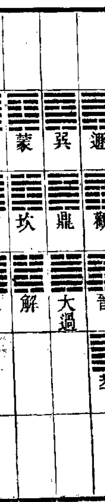

| | | | | | | | |
|---|---|---|---|---|---|---|---|
| | ☶ 贲 | | | | ☴ 家人 | | |
| | ☵ 既济 | ☶ 艮 | ☰ 大畜 | ☶ 颐 | ☲ 离 | ☴ 蛊 | | ☴ 渐 |
| | ☳ 丰 | ☲ 睽 | ☵ 需 | ☳ 屯 | ☱ 革 | ☵ 井 | ☶ 剥 | ☲ 旅 |
| | ☷ 复 | ☳ 小过 | ☳ 大壮 | ☳ 震 | | ☷ 坤 | ☵ 比 | ☱ 咸 |
| | ☷ 泰 | ☷ 坤 | ☷ 临 | | | ☷ 师 | ☷ 豫 | |
| ☲ 明夷 | ☷ 谦 | ☷ 升 | | | | | |

| | | ☰ | | | | ☴ | ☴ | ☴ |
|---|---|---|---|---|---|---|---|---|
| | ☰ | 益 | | | | 家人 | 小畜 | 巽 |
| | ☰ | 履 | 同人 | 鼎 | 讼 | 观 | 中孚 | 渐 |
| ☰ | ☰ | 大有 | 损 | 贲 | 大过 | 蒙 | 遁 | 乾 | 涣 |
| ☰ | ☰ | 夬 | 节 | 既济 | 升 | 坎 | 艮 | 大畜 | 姤 |
| ☰ | | 泰 | | | | 蹇 | 需 | 蛊 |
| | | | | | | | | 井 |

| | ☰ 乾 | ☷ 坤 | ☳ 震 | ☴ 巽 | ☵ 坎 | ☲ 离 | ☶ 艮 | ☱ 兑 |
|---|---|---|---|---|---|---|---|---|
| ☰ 乾 | 乾 | 否 | 无妄 | 姤 | 讼 | 同人 | 遁 | 履 |
| ☷ 坤 | 泰 | 坤 | 复 | 升 | 师 | 明夷 | 谦 | 临 |
| ☳ 震 | 大壮 | 豫 | 震 | 恒 | 解 | 丰 | 小过 | 归妹 |
| ☴ 巽 | 小畜 | 观 | 益 | 巽 | 涣 | 家人 | 渐 | 中孚 |
| ☵ 坎 | 需 | 比 | 屯 | 井 | 坎 | 既济 | 蹇 | 节 |
| ☲ 离 | 大有 | 晋 | 噬嗑 | 鼎 | 未济 | 离 | 旅 | 睽 |
| ☶ 艮 | 大畜 | 剥 | 颐 | 蛊 | 蒙 | 贲 | 艮 | 损 |
| ☱ 兑 | 夬 | 萃 | 随 | 大过 | 困 | 革 | 咸 | 兑 |

| | | ☶ 噬嗑 | | | | ☲ 离 | ☰ 大有 | ☷ 坤 |
|---|---|---|---|---|---|---|---|---|
| | ☶ 损 | ☶ 贲 | ☶ 巽 | ☶ 蒙 | ☶ 晋 | ☶ 睽 | ☶ 旅 | |
| ☶ 小畜 | ☶ 履 | ☶ 同人 | ☶ 升 | ☶ 讼 | ☶ 艮 | ☶ 大畜 | ☶ 未济 | |
| ☶ 泰 | ☶ 归妹 | ☶ 丰 | ☶ 大过 | ☶ 解 | ☶ 遁 | ☶ 乾 | ☶ 蛊 | |
| ☶ 夬 | | | | | ☶ 小过 | ☶ 大壮 | ☶ 姤 | |
| | | | | | | | ☶ 恒 | |

| | ☶ 艮 | ☴ 巽 | ☵ 坎 | ☲ 离 | ☳ 震 | ☱ 兑 | ☷ 坤 | ☰ 乾 |
|---|---|---|---|---|---|---|---|---|
| ☰ 乾 | 大畜 | 小畜 | 需 | 大有 | 大壮 | 夬 | 泰 | 乾 |
| ☱ 兑 | 损 | 中孚 | 节 | 睽 | 归妹 | 兑 | 临 | 履 |
| ☲ 离 | 贲 | 家人 | 既济 | 离 | 丰 | 革 | 明夷 | 同人 |
| ☳ 震 | 颐 | 益 | 屯 | 噬嗑 | 震 | 随 | 复 | 无妄 |
| ☵ 坎 | 蒙 | 渐 | 坎 | 未济 | 解 | 困 | 师 | 讼 |
| ☴ 巽 | 蛊 | 巽 | 涣 | 家人 | 恒 | 大过 | 升 | 姤 |
| ☷ 坤 | 剥 | 观 | 比 | 晋 | 豫 | 萃 | 坤 | 否 |
| ☶ 艮 | 艮 | 渐 | 蹇 | 旅 | 小过 | 咸 | 谦 | 遁 |

| | | ☰ 随 | | | ☱ 革 | ☰ 夬 | ☱ 大过 |
|---|---|---|---|---|---|---|---|
| | ☵ 节 | ☵ 既济 | ☵ 升 | ☵ 坎 | ☵ 萃 | ☵ 兑 | ☵ 咸 |
| ☰ 泰 | ☰ 归妹 | ☰ 丰 | ☰ 巽 | ☰ 解 | ☰ 蹇 | ☰ 需 | ☰ 困 |
| ☱ 小畜 | ☱ 履 | ☱ 同人 | ☱ 鼎 | ☱ 讼 | ☱ 小过 | ☱ 大壮 | ☱ 井 |
| ☰ 大有 | | | | ☰ 遁 | ☰ 乾 | ☰ 恒 | |
| | | | | | | ☱ 姤 | |

| | ☷ 坤 | ☶ 艮 | ☵ 坎 | ☴ 巽 | ☳ 震 | ☲ 离 | ☱ 兑 | ☰ 乾 |
|---|---|---|---|---|---|---|---|---|
| ☷ 坤 | 坤 | 剥 | 比 | 观 | 豫 | 晋 | 萃 | 否 |
| ☶ 艮 | 谦 | 艮 | 渐 | 小过 | 旅 | 咸 | 遯 | 履 |
| ☵ 坎 | 师 | 蒙 | 坎 | 涣 | 解 | 未济 | 困 | 讼 |
| ☴ 巽 | 升 | 蛊 | 井 | 巽 | 恒 | 鼎 | 大过 | 姤 |
| ☳ 震 | 复 | 颐 | 屯 | 益 | 震 | 噬嗑 | 随 | 无妄 |
| ☲ 离 | 明夷 | 贲 | 既济 | 家人 | 丰 | 离 | 革 | 同人 |
| ☱ 兑 | 临 | 损 | 节 | 中孚 | 归妹 | 睽 | 兑 | 履 |
| ☰ 乾 | 泰 | 大畜 | 需 | 小畜 | 大壮 | 大有 | 夬 | 乾 |

| | | 姤 | | | | 讼 | 否 | 无妄 |
|---|---|---|---|---|---|---|---|---|
| | 渐 | 渙 | 颐 | 家人 | 乾 | 遯 | 履 | |
| 剥 | 旅 | 未济 | 屯 | 离 | 中孚 | 观 | 同人 | |
| 比 | 咸 | 困 | 震 | 革 | 睽 | 晋 | 益 | |
| 豫 | | | | | 兑 | 萃 | 噬嗑 | |
| | | | | | | | 随 | |

| | ☶ 艮 | | | ☴ 巽 | | | |
|---|---|---|---|---|---|---|---|
| ☵ 坎 | ☶ 艮 | ☵ 坎 | ☶ 艮 | ☴ 巽 | ☲ 离 | | ☱ 兑 |
| ☵ 坎 | ☶ 艮 | ☵ 坎 | ☶ 艮 | ☴ 巽 | ☲ 离 | ☵ 坎 | ☱ 兑 |
| ☵ 坎 | ☶ 艮 | ☵ 坎 | ☶ 艮 | ☴ 巽 | ☲ 离 | ☵ 坎 | ☱ 兑 |
| ☵ 坎 | ☶ 艮 | ☵ 坎 | ☶ 艮 | ☴ 巽 | ☲ 离 | ☵ 坎 | ☱ 兑 |
| ☵ 坎 | ☶ 艮 | ☵ 坎 | ☶ 艮 | ☴ 巽 | ☲ 离 | ☵ 坎 | ☱ 兑 |
| ☵ 坎 | ☶ 艮 | ☵ 坎 | ☶ 艮 | ☴ 巽 | ☲ 离 | ☵ 坎 | ☱ 兑 |

# 八卦之谜·占易秘解

| | ☷ 坤 | ☶ 艮 | ☵ 坎 | ☴ 巽 | ☳ 震 | ☲ 离 | ☱ 兑 | ☰ 乾 |
|---|---|---|---|---|---|---|---|---|
| ☷ 坤 | 坤 | 剥 | 比 | 观 | 豫 | 晋 | 萃 | 否 |
| ☶ 艮 | 谦 | 艮 | 渐 | 小过 | 旅 | 咸 | 遁 | 履 |
| ☵ 坎 | 师 | 蒙 | 坎 | 涣 | 解 | 未济 | 困 | 讼 |
| ☴ 巽 | 升 | 蛊 | 井 | 巽 | 恒 | 鼎 | 大过 | 姤 |
| ☳ 震 | 复 | 颐 | 屯 | 益 | 震 | 噬嗑 | 随 | 无妄 |
| ☲ 离 | 明夷 | 贲 | 既济 | 家人 | 丰 | 离 | 革 | 同人 |
| ☱ 兑 | 临 | 损 | 节 | 中孚 | 归妹 | 睽 | 兑 | 履 |
| ☰ 乾 | 泰 | 大畜 | 需 | 小畜 | 大壮 | 大有 | 夬 | 乾 |

| | ☶ 艮 | ☵ 坎 | ☳ 震 | ☴ 巽 | ☲ 离 | ☱ 兑 | ☷ 坤 | ☰ 乾 |
|---|---|---|---|---|---|---|---|---|
| ☶ 艮 | 艮 | 蹇 | 小过 | 渐 | 旅 | 咸 | 谦 | 遁 |
| ☵ 坎 | 蒙 | 坎 | 解 | 涣 | 未济 | 困 | 师 | 讼 |
| ☳ 震 | 震 | 屯 | 震 | 益 | 噬嗑 | 随 | 豫 | 无妄 |
| ☴ 巽 | 巽 | 家人 | 益 | 巽 | 鼎 | 大过 | 升 | 姤 |
| ☲ 离 | 旅 | 未济 | 噬嗑 | 鼎 | 离 | 贲 | 明夷 | 同人 |
| ☱ 兑 | 咸 | 困 | 随 | 大过 | 贲 | 兑 | 萃 | 革 |
| ☷ 坤 | 谦 | 师 | 豫 | 升 | 明夷 | 萃 | 坤 | 否 |
| ☰ 乾 | 遁 | 讼 | 无妄 | 姤 | 同人 | 革 | 否 | 乾 |

| | ☰ 乾 | ☷ 坤 | ☳ 震 | ☴ 巽 | ☵ 坎 | ☲ 离 | ☶ 艮 | ☱ 兑 |
|---|---|---|---|---|---|---|---|---|
| ☰ 乾 | 乾 | 否 | 无妄 | 姤 | 讼 | 同人 | 遁 | 履 |
| ☷ 坤 | 泰 | 坤 | 复 | 升 | 师 | 明夷 | 谦 | 临 |
| ☳ 震 | 大壮 | 豫 | 震 | 恒 | 解 | 丰 | 小过 | 归妹 |
| ☴ 巽 | 小畜 | 观 | 益 | 巽 | 涣 | 家人 | 渐 | 中孚 |
| ☵ 坎 | 需 | 比 | 屯 | 井 | 坎 | 既济 | 蹇 | 节 |
| ☲ 离 | 大有 | 晋 | 噬嗑 | 鼎 | 未济 | 离 | 旅 | 睽 |
| ☶ 艮 | 大畜 | 剥 | 颐 | 蛊 | 蒙 | 贲 | 艮 | 损 |
| ☱ 兑 | 夬 | 萃 | 随 | 大过 | 困 | 革 | 咸 | 兑 |

# 八卦之谜·占易秘解

| | ☰ 乾 | ☷ 坤 | ☳ 震 | ☴ 巽 | ☵ 坎 | ☲ 离 | ☶ 艮 | ☱ 兑 |
|---|---|---|---|---|---|---|---|---|
| ☰ 乾 | 乾 | 否 | 无妄 | 姤 | 讼 | 同人 | 遁 | 履 |
| ☷ 坤 | 泰 | 坤 | 复 | 升 | 明夷 | 师 | 谦 | 临 |
| ☳ 震 | 大壮 | 豫 | 震 | 恒 | 解 | 丰 | 小过 | 归妹 |
| ☴ 巽 | 小畜 | 观 | 益 | 巽 | 涣 | 家人 | 渐 | 中孚 |
| ☵ 坎 | 需 | 比 | 屯 | 井 | 坎 | 既济 | 蹇 | 节 |
| ☲ 离 | 大有 | 晋 | 噬嗑 | 鼎 | 未济 | 离 | 旅 | 睽 |
| ☶ 艮 | 大畜 | 剥 | 颐 | 蛊 | 蒙 | 贲 | 艮 | 损 |
| ☱ 兑 | 夬 | 萃 | 随 | 大过 | 困 | 革 | 咸 | 兑 |

| | | 中孚 | | | | 小畜 | 家人 | 渐 |
|---|---|---|---|---|---|---|---|---|
| | 无妄 | 乾 | 旅 | 否 | 涣 | 益 | 巽 | |
| 离 | 颐 | 大畜 | 咸 | 剥 | 姤 | 同人 | 观 | |
| 革 | 屯 | 需 | 谦 | 比 | 蛊 | 贲 | 遁 | |
| 明夷 | | | | | 井 | 既济 | 艮 | |
| | | | | | | | 蹇 |

| 睽 | 履 |
|---|---|
| 兑 | 未济 | 噬嗑 | 大有 | 损 | 晋 | 讼 |
| 临 | 困 | 随 | 夬 | 节 | 萃 | 鼎 | 蒙 |
| 大壮 | 师 | 复 | 泰 | 坤 | 大过 | 坎 |
| 震 | 恒 | 丰 | 小过 | 升 |
| 归妹 | 解 | 豫 |

| | | | | | | |
|---|---|---|---|---|---|---|
| ☶ (艮) | ☲ (离) | ☰ (乾) | ☷ (坤) | ☳ (震) | ☴ (巽) | ☵ (坎) |
| 旅 | 大有 | 夬 | 剥 | 未济 | 噬嗑 | 鼎 |
| 颐 | 大畜 | 渐 | 剥 | 未济 | 噬嗑 | 鼎 |
| 家人 | 无妄 | 乾 | 谦 | 否 | 蛊 | 贲 |
| 明夷 | 震 | 大壮 | 咸 | 豫 | 姤 | 同人 |
| 革 | | | | 恒 | 丰 | 遁 |
| | | | | | | 小过 |

| | ☰ 乾 | ☷ 坤 | ☳ 震 | ☴ 巽 | ☵ 坎 | ☲ 离 | ☶ 艮 | ☱ 兑 |
|---|---|---|---|---|---|---|---|---|
| ☰ 乾 | 乾 | 否 | 无妄 | 姤 | 讼 | 同人 | 遁 | 履 |
| ☷ 坤 | 泰 | 坤 | 复 | 升 | 师 | 明夷 | 谦 | 临 |
| ☳ 震 | 大壮 | 豫 | 震 | 恒 | 解 | 丰 | 小过 | 归妹 |
| ☴ 巽 | 小畜 | 观 | 益 | 巽 | 涣 | 家人 | 渐 | 中孚 |
| ☵ 坎 | 需 | 比 | 屯 | 井 | 坎 | 既济 | 蹇 | 节 |
| ☲ 离 | 大有 | 晋 | 噬嗑 | 鼎 | 未济 | 离 | 旅 | 睽 |
| ☶ 艮 | 大畜 | 剥 | 颐 | 蛊 | 蒙 | 贲 | 艮 | 损 |
| ☱ 兑 | 夬 | 萃 | 随 | 大过 | 困 | 革 | 咸 | 兑 |

| | | ☱ 兑 | | | | ☰ 夬 | ☱ 革 | ☶ 咸 |
|---|---|---|---|---|---|---|---|---|
| | ☳ 屯 | ☵ 需 | ☷ 谦 | ☵ 比 | ☱ 困 | ☳ 随 | ☱ 大过 | |
| ☷ 明夷 | ☳ 震 | ☰ 大壮 | ☴ 渐 | ☳ 豫 | ☵ 井 | ☵ 既济 | ☱ 萃 |
| ☲ 家人 | ☳ 无妄 | ☰ 乾 | ☲ 旅 | ☷ 否 | ☳ 恒 | ☳ 丰 | ☵ 蹇 |
| ☲ 离 | | | | | ☰ 姤 | ☰ 同人 | ☳ 小过 |
| | | | | | | | ☶ 遁 |

# 八卦之谜·占易秘解

| | | | | | | | |
|---|---|---|---|---|---|---|---|
| ☷☷☷ 临 | | | | ☵☵☵ 节 | | | |
| ☷☷☷ 中孚 | ☷☷☷ 师 | ☷☷☷ 复 | ☷☷☷ 泰 | ☷☷☷ 归妹 | ☷☷☷ 坤 | | ☵☵☵ 坎 |
| ☷☷☷ 睽 | ☷☷☷ 涣 | ☷☷☷ 益 | ☷☷☷ 小畜 | ☷☷☷ 履 | ☷☷☷ 观 | ☷☷☷ 升 | ☵☵☵ 解 |
| ☷☷☷ 大畜 | ☷☷☷ 未济 | ☷☷☷ 噬嗑 | ☷☷☷ 大有 | | ☷☷☷ 晋 | ☷☷☷ 巽 | ☵☵☵ 讼 |
| ☷☷☷ 颐 | ☷☷☷ 蛊 | ☷☷☷ 贲 | | | ☷☷☷ 艮 | ☷☷☷ 鼎 | |
| ☷☷☷ 损 | ☷☷☷ 蒙 | ☷☷☷ 剥 | | | | | |

| | | 家人 | | | 益 | 中孚 | 涣 |
|---|---|---|---|---|---|---|---|
| | 乾 | 无妄 | 未济 | 姤 | 渐 | 小畜 | 观 |
| 睽 | 大畜 | 颐 | 困 | 蛊 | 否 | 履 | 巽 |
| 兑 | 需 | 屯 | 师 | 井 | 剥 | 损 | 讼 |
| 临 | | | | | 比 | 节 | 蒙 |
| | | | | | | | 坎 |

| | ☲ 离 | | | | ☰ 同人 | | | |
|---|---|---|---|---|---|---|---|---|
| | ☱ 革 | ☴ 旅 | ☲ 大有 | ☳ 噬嗑 | ☶ 贲 | ☲ 鼎 | | ☶ 遁 |
| | ☲ 明夷 | ☱ 咸 | ☰ 夬 | ☳ 随 | ☵ 既济 | ☱ 大过 | ☶ 晋 | ☶ 艮 |
| | ☳ 震 | ☶ 谦 | ☰ 泰 | ☳ 复 | | ☷ 升 | ☱ 萃 | ☵ 蹇 |
| | ☳ 大壮 | ☷ 豫 | ☳ 归妹 | | | ☳ 解 | ☷ 坤 | |
| ☲ 丰 | ☶ 小过 | ☴ 恒 | | | | | |

| | | ☲ 离 | | | | ☲ 噬嗑 | ☲ 睽 | ☲ 未济 |
|---|---|---|---|---|---|---|---|---|
| | ☶ 大畜 | ☶ 颐 | ☶ 涣 | ☶ 蛊 | ☶ 旅 | ☶ 大有 | ☶ 晋 | |
| ☴ 中孚 | ☴ 乾 | ☴ 无妄 | ☴ 师 | ☴ 姤 | ☴ 剥 | ☴ 损 | ☴ 鼎 | |
| ☱ 临 | ☱ 大壮 | ☱ 震 | ☱ 困 | ☱ 恒 | ☱ 否 | ☱ 履 | ☱ 蒙 | |
| ☱ 兑 | | | | | ☱ 豫 | ☱ 归妹 | ☱ 讼 | |
| | | | | | | | ☱ 解 |

# 八卦之谜·占易秘解

| | | | | | | | |
|---|---|---|---|---|---|---|---|
| ☶ 艮 | ☴ 巽 | ☲ 离 | ☳ 震 | ☵ 坎 | ☱ 兑 | ☷ 坤 | ☰ 乾 |
| 艮为山 | 巽为风 | 离为火 | 震为雷 | 坎为水 | 兑为泽 | 坤为地 | 乾为天 |
| 山地剥 | 风地观 | 火地晋 | 雷地豫 | 水地比 | 泽地萃 | 地地坤 | 天地否 |
| 山天大畜 | 风天小畜 | 火天大有 | 雷天大壮 | 水天需 | 泽天夬 | 地天泰 | 天天乾 |
| 山泽损 | 风泽中孚 | 火泽睽 | 雷泽归妹 | 水泽节 | 泽泽兑 | 地泽临 | 天泽履 |
| 山火贲 | 风火家人 | 火火离 | 雷火丰 | 水火既济 | 泽火革 | 地火明夷 | 天火同人 |
| 山雷颐 | 风雷益 | 火雷噬嗑 | 雷雷震 | 水雷屯 | 泽雷随 | 地雷复 | 天雷无妄 |
| 山水蒙 | 风水涣 | 火水未济 | 雷水解 | 水水坎 | 泽水困 | 地水师 | 天水讼 |
| 山风蛊 | 风风巽 | 火风鼎 | 雷风恒 | 水风井 | 泽风大过 | 地风升 | 天风姤 |

| | | ☰ 革 | | | ☱ 随 | ☱ 兑 | ☰ 困 |
|---|---|---|---|---|---|---|---|
| | ☵ 需 | ☳ 屯 | ☵ 师 | ☵ 井 | ☱ 咸 | ☰ 夬 | ☱ 萃 |
| ☶ 艮 | ☳ 大壮 | ☳ 震 | ☴ 涣 | ☳ 恒 | ☷ 比 | ☵ 节 | ☱ 大过 |
| ☵ 中孚 | ☰ 乾 | ☳ 无妄 | ☵ 未济 | ☰ 姤 | ☳ 豫 | ☳ 归妹 | ☵ 坎 |
| ☲ 睽 | | | | | ☷ 否 | ☶ 履 | ☳ 解 |
| | | | | | | | ☰ 讼 |

| | ☷ 坤 | ☶ 艮 | ☵ 坎 | ☴ 巽 | ☳ 震 | ☲ 离 | ☱ 兑 | ☰ 乾 |
|---|---|---|---|---|---|---|---|---|
| ☷ 坤 | 坤 | 剥 | 比 | 观 | 豫 | 晋 | 萃 | 否 |
| ☶ 艮 | 谦 | 艮 | 渐 | 小过 | 旅 | 咸 | 遯 | 履 |
| ☵ 坎 | 师 | 蒙 | 坎 | 涣 | 解 | 未济 | 困 | 讼 |
| ☴ 巽 | 升 | 蛊 | 井 | 巽 | 恒 | 鼎 | 大过 | 姤 |
| ☳ 震 | 复 | 颐 | 屯 | 益 | 震 | 噬嗑 | 随 | 无妄 |
| ☲ 离 | 明夷 | 贵 | 既济 | 家人 | 丰 | 离 | 革 | 同人 |
| ☱ 兑 | 临 | 损 | 节 | 中孚 | 归妹 | 睽 | 兑 | 履 |
| ☰ 乾 | 泰 | 大畜 | 需 | 小畜 | 大壮 | 大有 | 夬 | 乾 |

| | | ☶ | | | ☲ | ☶ | ☶ |
|---|---|---|---|---|---|---|---|
| | ☲ | ☲ | ☲ | ☲ | ☲ | ☲ | ☲ |
| | 睽 | 离 | 姤 | 未济 | 剥 | 损 | 艮 |
| ☰ | ☲ | ☲ | ☲ | ☲ | ☲ | ☲ | ☲ |
| 乾 | 中孚 | 家人 | 恒 | 涣 | 旅 | 大有 | 蒙 |
| ☰ | ☲ | ☲ | ☲ | ☲ | ☲ | ☲ | ☲ |
| 大壮 | 临 | 明夷 | 井 | 师 | 渐 | 小畜 | 鼎 |
| ☰ | | | | | ☲ | ☲ | ☲ |
| 需 | | | | | 谦 | 泰 | 巽 |
| | | | | | | | ☲ |
| | | | | | | | 升 |

| ☰ 无妄 | ☳ 震 | ☷ 否 | ☰ 履 | ☲ 同人 | ☴ 益 | ☵ 讼 | ☶ 晋 |
|---|---|---|---|---|---|---|---|
| ☳ 屯 | ☳ 豫 | ☳ 归妹 | ☳ 丰 | ☳ 复 | ☳ 解 | ☳ 遯 | ☳ 观 |
| ☱ 革 | ☱ 比 | ☱ 节 | ☱ 既济 | ☵ 坎 | ☶ 小过 | ☷ 坤 | |
| ☱ 兑 | ☱ 咸 | ☱ 夬 | | ☶ 大过 | ☶ 随 | | |
| ☷ 萃 | ☷ 困 | | | | | | |

| | | | | | | | |
|---|---|---|---|---|---|---|---|
| ☳ 震 | | | | ☱ 随 | | | |
| ☰ 无妄 | ☷ 象 | ☳ 归妹 | ☲ 丰 | ☷ 复 | ☵ 解 | | ☷ 萃 |
| ☶ 颐 | ☰ 否 | ☰ 履 | ☲ 同人 | ☶ 益 | ☵ 讼 | ☶ 小过 | ☷ 坤 |
| ☲ 离 | ☶ 剥 | ☶ 损 | ☶ 贲 | | ☵ 蒙 | ☶ 遯 | ☷ 观 |
| ☲ 睽 | ☶ 旅 | ☲ 大有 | | | ☶ 鼎 | ☶ 艮 | |
| ☲ 噬嗑 | ☶ 晋 | ☵ 未济 | | | | | |

| | | | | | | | |
|---|---|---|---|---|---|---|---|
| | | ☷☷☷ 屯 | | | ☵☵☵ 既济 | ☵☵☵ 需 | ☵☵☵ 井 |
| | ☱☱☱ 兑 | ☱☱☱ 革 | ☱☱☱ 恒 | ☱☱☱ 困 | ☱☱☱ 比 | ☱☱☱ 节 | ☱☱☱ 蹇 | |
| ☰☰☰ 大壮 | ☰☰☰ 临 | ☰☰☰ 明夷 | ☰☰☰ 姤 | ☰☰☰ 师 | ☰☰☰ 咸 | ☰☰☰ 夬 | ☰☰☰ 坎 |
| ☰☰☰ 乾 | ☰☰☰ 中孚 | ☰☰☰ 家人 | ☰☰☰ 蛊 | ☰☰☰ 涣 | ☰☰☰ 谦 | ☰☰☰ 泰 | ☰☰☰ 大过 |
| ☰☰☰ 大畜 | | | | | ☶☶☶ 渐 | ☶☶☶ 小畜 | ☶☶☶ 升 |
| | | | | | | | ☶☶艮 巽 |

| | | ☳ 震 | | | | ☳ 丰 | ☳ 大壮 | ☳ 恒 |
|---|---|---|---|---|---|---|---|---|
| | ☷ 临 | ☷ 明夷 | ☷ 井 | ☷ 师 | ☷ 豫 | ☷ 归妹 | ☷ 小过 | |
| ☵ 需 | ☵ 兑 | ☵ 革 | ☵ 蛊 | ☵ 困 | ☵ 谦 | ☵ 泰 | ☵ 解 | |
| ☶ 大畜 | ☶ 睽 | ☶ 离 | ☶ 姤 | ☶ 未济 | ☶ 咸 | ☶ 夬 | ☶ 升 | |
| ☰ 乾 | | | | | ☰ 旅 | ☰ 大有 | ☰ 大过 | |
| | | | | | | | ☰ 鼎 | |

| | ☷ 坤 | ☶ 艮 | ☵ 坎 | ☴ 巽 | ☳ 震 | ☲ 离 | ☱ 兑 | ☰ 乾 |
|---|---|---|---|---|---|---|---|---|
| ☰ 乾 | ䷀ 乾 | ䷪ 夬 | ䷄ 需 | ䷈ 小畜 | ䷡ 大壮 | ䷍ 大有 | ䷹ 睽 | ䷊ 泰 |
| ☱ 兑 | ䷪ 夬 | ䷹ 睽 | ䷮ 困 | ䷼ 中孚 | ䷧ 归妹 | ䷥ 睽 | ䷹ 兑 | ䷪ 履 |
| ☲ 离 | ䷄ 需 | ䷮ 困 | ䷂ 未济 | ䷤ 家人 | ䷧ 解 | ䷷ 旅 | ䷮ 咎 | ䷄ 比 |
| ☳ 震 | ䷈ 小畜 | ䷼ 中孚 | ䷤ 家人 | ䷩ 益 | ䷲ 震 | ䷩ 噬嗑 | ䷩ 颐 | ䷩ 复 |
| ☴ 巽 | ䷡ 大壮 | ䷧ 归妹 | ䷧ 解 | ䷩ 益 | ䷩ 震 | ䷩ 噬嗑 | ䷩ 颐 | ䷩ 复 |
| ☵ 坎 | ䷍ 大有 | ䷥ 睽 | ䷷ 旅 | ䷩ 噬嗑 | ䷩ 震 | ䷃ 蒙 | ䷩ 剥 | ䷩ 师 |
| ☶ 艮 | ䷹ 睽 | ䷹ 兑 | ䷮ 咎 | ䷩ 颐 | ䷩ 颐 | ䷩ 剥 | ䷩ 艮 | ䷩ 谦 |
| ☷ 坤 | ䷊ 泰 | ䷪ 履 | ䷄ 比 | ䷩ 复 | ䷩ 复 | ䷩ 师 | ䷩ 谦 | ䷩ 坤 |

### 朱子卦变图说

朱子曰：“论伏羲画卦，则一时俱了，虽《乾》、《坤》亦无能生诸卦之理。若如文王、孔子之说，则纵横曲直，反复相生，无所不可。”又《易学启蒙》曰：“凡六爻不变，占本卦《彖》辞，而以内卦为贞，外卦为悔，一爻变，则以本卦变爻辞占；二爻变，则以本卦二变爻辞占，仍以上爻为主；三爻变，则占本卦及之卦之《彖》辞，而以本卦为贞之卦为悔，前十卦主贞，后十卦主悔；四爻变，则以之卦二不变爻占，仍以下爻为主；五爻变，则以之卦不变爻占；六爻变，则《乾》、《坤》占二用，余卦占之卦《彖》辞。今以六十四卦之变，列为三十二图，变在三十二卦以前者，占本卦爻之辞；变在三十二卦以后者，占卦以前者，占本卦爻之辞；变在三十二卦以后者，占变卦爻之辞。”

按：卦变图，一卦变六十四卦，共变四千九十六卦。其法本自《焦氏易林》，而比焦氏尤精，详见《系辞》第九章注中，所谓足见《易》道之无穷也，实则无甚用处，倘引而伸之，虽巧历莫能纪其数矣。胡氏玉斋曰：“三十二卦前后者，如《乾》自《姤》至《恒》，《坤》自《复》至《益》，为三十卦之前；《乾》自《益》至《坤》，《坤》自《恒》至《乾》，为三十二卦之后。前十卦后十卦者，《乾》自《泰》至《否》，《坤》自《否》至《泰》，共三十卦。如《乾》三爻变，自《否》至《恒》为前十卦主贞，自《益》至《泰》为后十卦主悔。如《坤》三爻变，自《泰》至《否》为后十卦主悔，余可类推。”然考古成占，不惟不主卦变之说，即所谓占《象》辞、爻辞，及占不变爻占二用者，亦皆不合于古，殊难尽信，姑仍其旧而志之耳。余详《占易秘解》。

# [ General Information ]

书名= 未命名图书

作者=

页数= 1000

S S 号= 0

出版日期=

封面页
书名页
版权页
前言页
目录页
点校说明

## 占易秘解

- 占易秘解序
- 占易秘解叙
- 朱氏序
- 弁言
- 朱子筮仪
- 筮论
- 占法要论
- 卦象论
- 六爻俱静
- 一动五静
- 二动四静
- 三动三静
- 四动二静
- 五动一静
- 六爻俱动
- 跋

## 周易卦象

- 序
- 周易卦象叙

## 周易卦象〔卷一〕

- 周易上经
  - 乾卦象
  - 坤卦象
  - 屯卦象
  - 蒙卦象
  - 需卦象
  - 讼卦象
  - 师卦象
  - 比卦象
  - 小畜卦象
  - 履卦象

## 周易卦象〔卷二〕

- 泰卦象
- 否卦象
- 同人卦象
- 大有卦象
- 谦卦象
- 豫卦象
- 随卦象
- 蛊卦象
- 临卦象
- 观卦象
- 噬嗑卦象
- 贲卦象
- 剥卦象
- 复卦象
- 无妄卦象
- 大畜卦象
- 颐卦象
- 大过卦象
- 坎卦象
- 离卦象

## 周易卦象〔卷三〕

## 周易下经

- 咸卦象
- 恒卦象
- 遁卦象
- 大壮卦象
- 晋卦象
- 明夷卦象
- 家人卦象
- 睽卦象
- 蹇卦象
- 解卦象
- 损卦象
- 益卦象
- 夬卦象
- 姤卦象
- 萃卦象
- 升卦象

## 周易卦象〔卷四〕

- 困卦象
- 井卦象
- 革卦象
- 鼎卦象
- 震卦象
- 艮卦象
- 渐卦象
- 归妹卦象
- 丰卦象
- 旅卦象
- 巽卦象
- 兑卦象
- 涣卦象
- 节卦象

## 周易卦象〔卷五〕

- 中孚卦象
- 小过卦象
- 既济卦象
- 未济卦象
- 系辞上传
- 系辞下传

## 周易卦象〔卷六〕

- 说卦传
- 附录：邵子卦象
- 序卦传
- 杂卦传

## 图说

- 河图
- 洛书
- 河洛图说
- 伏羲八卦次序横图
- 伏羲八卦横图说
- 伏羲八卦方位圆图
- 伏羲八卦圆图说
- 伏羲六十四卦横图
- 伏羲六十四卦横图说
- 伏羲六十四卦圆图
- 伏羲六十四卦方图
- 伏羲六十四卦方圆图说
- 文王八卦次序图
- 文王八卦次序图说
- 文王八卦方位图
- 文王八卦方位图说
- 朱子卦变图
- 朱子卦变图说

## 附录页

## 更多资料

↓↓↓

--------------------------------------------------

## 【中华古籍库】

↓ 点击链接 ↓

https://www.fozhu920.com/list/

珍版刻印 / 海外流传 / 家传手抄 / 民间失传

【易】【医】【道】【武】【文】【奇】【画】【书】

1000000+高清古书籍

## 打包下载

微信：mbook86

古籍库 www.fozhu920.com------------------

## 中华古籍库

1000000 册 高清影印古籍
珍版刻印 / 海外流传 / 家传手抄 / 民间失传

古籍善本、经史子集、史料笔记、古人文集、
民间收藏、传世家谱、各地方志、中医典籍、
四库全书、古禁毁书、内阁文库、图书集成、
丛书集成、四部丛刊、万有文库、四部备要、
二十四史、三国六朝文、明清和民国古籍史料
……

