# 道教五派丹法精选

第一集

# 道教五派丹法精选
（第一集）

〔元〕李道纯 著
王沐选编

中医古籍出版社

1187286

# 第一集目录

| 中和集 | 中和集序 | 中和集卷之一 | 中和集卷之二 | 中和集卷之三 | 中和集卷之四 | 中和集卷之五 | 中和集卷之六 | 三天易髓 | 全真集玄秘要 |
| :--- | :--- | :--- | :--- | :--- | :--- | :--- | :--- | :--- | :--- |
| | 一 | 二 | 十五 | 三二 | 六四 | 八九 | 一〇一 | 一二九 | 一四一 |

| 谷神篇 | 谷神篇序 | 谷神篇卷上 | 谷神篇卷下 | 道德真经章句训颂 | 道德真经章句训颂序 | 道德真经章句训颂卷上 | 道德真经章句训颂卷下 | 道德会元 | 道德会元序 | 道德会元卷上 | 道德会元卷下 |
| :--- | :--- | :--- | :--- | :--- | :--- | :--- | :--- | :--- | :--- | :--- | :--- |
| | 一五九 | 一六五 | 一八〇 | | 二〇五 | 二〇七 | 二二六 | | 二五三 | 二五九 | 二七九 |

# 清庵莹蟾子语录

清庵莹蟾子语录序……三〇七

清庵莹蟾子语录卷之一……三〇八

清庵莹蟾子语录卷之二……三二一

清庵莹蟾子语录卷之三……三三五

清庵莹蟾子语录卷之四……三四六

清庵莹蟾子语录卷之五……三五三

清庵莹蟾子语录卷之六……三六七

# 出版说明

中国道教的养生历史源远流长，其养生的古籍浩如烟海。这对今天探索人体生命科学的人们，无疑是一笔丰富而珍贵的文化遗产。如何在卷帙浩繁的宝藏中发掘精萃代表著作，为人类的健身事业服务，是当前人们关心的重要问题。

为此，我们特请中国道教协会理事、中华气功协会文献委员会顾问、著名道教丹功专家王沐先生，从众多的养生书籍中，精选道教五大派系正宗的丹功功法献给读者。

道教的丹功源于道家，它是总结中国三千多年养生术而发展成的最高成果。自魏伯阳著《万古丹经王》的《周易参同契》开始，丹功经历了漫长的发展阶段。因古人择徒慎重，使前一时期的著作隐晦难懂。到唐朝以后，在著作中才初露端倪，形成了系统的理论和功法。与此同时，道教也逐步形成了五大派别。

《道教五派丹法精选》正是从这一时期著作中，精选出五大派别代表人物的经典著作予以重印。每派著作前，有王沐先生序言，对各派的源流、著者生平及丹法要点均有简述。所选著作，浅显实用，兼顾理论，通俗易懂，不仅对初学者是一部入门的参考书，而且对有一定练功基础的人，也有指点捷径，去伪存真的益处。

王沐先生青年时拜师，深得道教正宗丹法真传，五十年来博览群籍，精研功理，练功不辍，尤对道教正宗丹功有精深造诣。虽年逾八十，仍神采奕奕，健如青年。

为了便于读者阅读，我们将《道教五派丹法精选》分五集选编重印，由中医古籍出版社出版。由于时间仓促，有不当之处，请批评指正。本书所据版本为上海涵芬楼影印正统道藏本。

中国科学院科学文献服务部
一九八九年四月

# 序

道教养生功法自唐五代以后，由重视外丹转入内炼，形成一个内丹丹功系统，并逐步分成五大派，师徒相传，历久未衰。本集所收主要为中派著作。

中派并非教团，亦非金丹内炼派系，由后来内丹炼师将接近中派炼法说及丹功功法列在一起，称为中派，实际上都是北派、南派功法的改革者，自行著书立说并传徒而已。

中派推元代道士李道纯为代表人物。李道纯湖南都梁人，号清庵，道号莹蟾子，为南派五祖白玉蟾之再传弟子，在扬州仪真长生观常住。其功法融汇三教，主张中和。以儒家所言“喜怒未发之谓中，发而中节之谓和”之意，与内丹丹功结合，暗示“阳未发而内炼，阳气初动而中节（指火候阶段），故其将《中和集》之中和，象征作“玄关一窍，”著有丹功功法《中和集》、《周易与丹法》《三天易髓》、《全真功法注解》《全真集玄秘要》”，以及门弟子纪录《莹蟾子语录》等。在《语录》释玄关曰：“夫玄关者，至玄至妙之机关也，今之学者，多泥形体，或云眉间，或云脐轮，或云丹田，都皆非也。但著于形体上都不是，亦不可离此身向外寻求。诸丹经皆不言正在何处。所以难形，笔舌亦话不能。故玄关二字、圣人只书一个中字示人”“易曰寂然不动，中之体也，感而遂通，中之用也。”说明莹蟾子打破了三教界限，创一种新的丹功。

其次为黄元吉，清丰城人，著有《乐育堂语录》、《道德经注释》，其功法不用后升前降，不讲开合，而是中黄直透。

还应重点提出的是闵小艮的中黄直透法，此将在续集中详述。此外，北、南、东、西四派的代表作，亦将在续集中予以介绍。

我先父研究中医，好藏道经，我幼年涉猎其间，颇受影响，但一知半解，收获无多，加之渴求新知，不问门类，只广求善本，不告人知，所以众览虽博，却不分派系，功法方面，进步较少。一九三二年，供职国立北平图书馆，得窥秘藏。后留学东京，每日闲步西神田旧书店街，又见到不少佳本，但博览虽勤，功法仍缓。偶读宋代陆游《剑南诗稿》有句云：“书中得来终觉浅，绝知此事要躬行。”在治学方面，深受启发。盖丹功不尚空谈，必须实践。总结这一阶段，我只以广度着眼，未向深度钻求，所以歧路亡羊，未获真诠。《道德经》云：“常无欲以观其妙，常有欲以观其徼。”前者指微观方面，后者则指宏观方面，这样才能“玄之又玄”，探得骊珠。庄子曰：“多之多败。”就是指广而不专的错误。

一九三六年以后，从师接受口诀，专炼全真功法，始悟道教丹法，全赖苦行，必须历阶而升，不可贪多务得。于是由博返约，渐有所悟，而道出多门，行功不过求身体健康，恢复生命活力，促进生理机能，异说虽多，目的一致。清代明医汪昂说：“道家谓修炼金丹者，即调神之功夫也。若修养之功夫纯熟，则精神充足而内守，心性圆明以自然，恬淡虚无，若存若亡，即是金丹成熟。”这与道教练功目的是一致的。

丹法很多，炼者必须去粗存精，去伪存真，一切从实践中体会。许多丹经，不可执着运用。老子曰：『道教自然。』即一切都应灵活，分别体用，因每个人的人体禀赋不同，年龄不同，性别不同，体格强弱不同，丹经只能指出大概，至广运用之妙，还须行功者灵活掌握，反复体会运用，从而得出适合自己的行功方法。

丹功五派，各有特点，虽陆续出版，但读者应专攻一派，其他功法只参考而已。不可贪多务得，以致影响道功，所以将自己体会，反复介绍于读者之前。

王沐
一九八九年四月

# 中和集卷之一

## 中和集卷之二

## 中和集卷之三

## 中和集卷之四

## 中和集卷之五

中華民國十二年十月上海涵芬樓影印

# 中和集叙

維揚損菴蔡君志順瑩蟾子李清菴之門人也勤破凡塵篤修仙道得清菴之殘膏膹馥編次成書題曰中和集蓋取師之靜室名也大德丙午秋謁余印可欲壽諸梓開悟後人余未啟帙先已知羣妄掃空一真呈露謂如天付之而為命人受之而為性至於先天太極自然金丹光照太虛不假修鍊者漏洩無餘矣可以窮神知變而深根寧極可以脫胎神化而復歸無極也抑以見道之有物混成

儒之中和育物釋之指心見性此皆同王異曲咸自太極中來是故老聖常善救人能不輕於汝等周公豈欺我哉覽是集者切忌生疑當塗南谷杜道堅書于錢塘玄元真館

# 中和集卷之一

都梁清庵莹蟾子李道纯元素撰
門弟子損庵寶蟾子蔡志頤編

## 玄門宗旨

## 太極圖

動靜無端

陰陽無始

## 卷一 第一

釋曰圓覺道曰金丹儒曰太極所謂無極而太極者不可極而極之謂也釋氏云如不動了了常知易係云寂然不動感而遂通丹書云身心不動以後復有無極真機言太極之妙本也是知三教所尚者靜定也周子所謂主於靜者是也蓋人心靜定未感物時湛然天理即太極之妙也一感於物便有偏倚即太極之變也苟靜定之時謹其所存則天理常明虛靈不昧動時自有主宰一切事物之來俱可應也靜定工夫純熟不期然而自然至此无极之真复矣太极之妙应明矣天地万物之理悉备於我矣

## 中和图

四正中直
发无不中

礼记云喜怒哀乐未发谓之中发而皆中节谓之和未发谓静定中谨其所存也故曰中存而无体故谓天下之大本发而中节谓动时谨其所发也故曰和发无不中故谓天下之达道诚能致中和於一身则本然之体虚而灵静而觉动而正故能应天下无穷之变也老君曰人能常清静天地悉皆归即子思所谓致中和天地位万物育同意意中也和也感通之妙用也应变之枢机也周易生育流行一动一静之全体也予以为所居之舍中和二字扁名不亦宜乎哉

## 委顺图

身心世事谓之四缘一切世人皆为荣绊惟委順者能應之常應常靜何緣之有何謂委
委身寂然委心洞然委世混然委事自然何
謂順順天命順天道順天時順天理身順天
命故能應人心順天道故能應物世順天時
故能應變事順天理故能應機既能委又能
順兼能應則四緣脫灑作是見者常應常靜
常清靜矣

古云常滅動心不滅照心一切不動之心皆
照心也一切不止之心皆妄心也照心即道
心也妄心即人心也道心惟微謂微妙而難
見也人心惟危謂危殆而不安也雖人心亦
有道心雖道心亦有人心係乎動靜之間爾
惟允執厥中者照心常存妄心不動危者安
平微者昭著到此有妄之心復矣無妄之道
成矣易曰復其見天地之心乎

## 太極圖頌
中○者無極而太極也太極動而生陽動極而靜靜而生陰一陰一陽兩儀立焉○若兩儀也○者陽動也○者陰靜也陰陽互交而生四象○者四象動而又動曰老陽動極而靜曰少陰靜極復動曰少陽靜而又靜曰老陰四象動靜而生八卦乾一兌二老陽動靜也離三震四少陰動靜也艮五坎六少陽動靜也兌七坤八老陰動靜也陰逆陽順一升一降機緘不已而生六十四卦萬物之道至是備矣上○者氣化之始也下○者形化之母也知氣化而不知形化則不能極廣大知形化而不知氣化則不能盡精微故作頌而譜之

## 頌二十五章
道本至虛至虛無體窮於無窮始於無始
虛極化神神變生氣氣聚有形一分為二
二則有感感則有配陰陽互交乾坤定位動
靜不已四象相係健順推盪八卦森羅運五
行而有常定四時而成歲
沖和化醇資始資生在天則斡旋萬象在地
則長養群情
形形相授物物相孕化化生生奚有窮盡
天下萬物生於有有生於無有無錯綜隱顯
相扶
原其始也一切萬有未有不本乎氣推其終
也一切萬物未有不變於形
是知萬物本一形氣也形氣本一神也神本
至虛道本至無易在其中矣
天位乎上地位乎下人物居中自融自化氣
在其中矣
天地物之最巨人於物之最靈天人一也宇
宙在乎手萬化生乎身變在其中矣
人之極也中天地而立命稟虛靈以成性立
性立命神在其中矣
命係乎氣性係乎神潛神於心聚氣於身道
在其中矣
形化則有生有生則有死出生入死物之常
也
氣化則無生無生故無死不生不死神之常
也
形化體地氣化象天形化有感氣化自然
明達高士全氣全神千和萬合自然成真
真中之真玄之又玄無質生質是謂胎仙
欲造斯道將奚所自惟靜惟虛胎仙可冀
虛則無礙靜則無欲虛極靜篤觀化知復
動而生靜實以抱虛二理相須神與道俱
道者神之主神者氣之主氣者形之主形者
生之主
無生則形住形住則氣住氣住則神住神住
則無住是名無住
金液練形玉符保神形神俱妙與道合真

命寶凝矣性珠明矣元神靈矣胎仙成矣虛
無自然之道畢矣
大哉神也其變化之本歟

## 畫前密意
易象第一
易可易非常易象可象非大象常易不易大
象無象常易未畫以前易也變易既畫以後
易也常易不易太極之體也可易變易造化
之元也大象動靜之始也可象形名之母也
歷劫寂爾者常易也亘古不息者變易也至
虛無體者大象也隨事發見者可象也所謂常者莫窮其始莫測其終歷千萬世廓然而獨存者也所謂大者外包乾坤內充宇宙遍河沙界湛然圓滿者也常易不易故能統攝天下無窮之變大象無象故能形容天下無窮之事易也象也其道之原乎

## 常變第二
常易不變變易不常其常不變故能應變其變不常故能體常始終不變易之常也動靜不常易之變也獨立而不改得其常也周行而不殆通其變也不知常不足以通變不通變不足以知常常也變也其易之原乎

## 體用第三
常者易之體變者易之用古今不易易之體隨時變易易之用無思無為易之體有感有應易之用知其用則能極其體全其體則能利其用聖人仰觀俯察遠求近取得其體也

君子進德修業作事制器因其用也至於窮理盡性樂天知命修齊治平紀綱法度未有外乎易者也全其易體足以知常利其易用足以通變

## 動靜第四
剛柔推盪易之動靜陰陽升降氣之動靜奇偶交重卦之動靜象形消息物之動靜晝夜奧寢身之動靜至心之進退心之起滅世之通塞事之成敗一靜相倚伏也觀其動靜則萬物之情可見矣靜時有存動則有察主動則可衡靜時有定動罔不吉靜不失其常其道光矣基動者靜之機動

## 屈伸第五
暑往寒來歲之屈伸日往月來氣之屈伸古往今來世之屈伸至於有無相生難易相成長短相形高下相傾皆屈伸之理也知屈伸相感之道則能盡天下無窮之利也

## 消息第六
息者消之始消者息之終息者氣之聚消者形之散生育長養謂之息歸根復命謂之消元而亨易之息也利而貞易之消也春而夏歲之息也秋而冬歲之消也嬰而壯身之息也老而終身之消也無而有物之息也有而無物之消也息者生之徒消者死之徒自二氣肇分以來未有消而不息之理亦未有息而不消之物通而知之者獨理至明者也

## 神機第七
存乎中者神也發而中者機也寂然不動神也感而遂通機也隱顯莫測神也應用無方機也運之一身神也推之萬物機也吉凶先兆神也變動不居機也滿四德自強不息者存乎神者也三才應用無盡者運其機者

## 智行第八
智者深知其理也行者力行其道也深知其理不見而知力行其道不為而成不出戶知天下不窺牖見天道深知也自強不息無往不適力行也知亂於未亂知危於未危知亡於未亡知禍於未禍深知也存於身而不為身累行於心而不為心役行於世而不為世移行於事而不為事礙力行也深知其理者可以變亂為治變危為安變亡為存變禍為福力行其道者可以致身於壽域致心於玄境致世於太平致事於大成非大智大行者其孰能及此

## 明時第九
通變莫若識時識時莫若通理明理莫若虛靜虛則明靜則清清明在躬天理昭明天之變化觀易可見世之時變觀象可驗物之情偽觀形可辨麗於形者不能無偶施於色者不能無辯天將陰雨氣必先蒸山將崩裂下必先癹人將利害貌必先變譬如巢知風穴知雨

## 正己第十
知兩螯虫應候葉落知秋又如商人置雉尾於舟車之上以候陰晴天常晴則尾直豎天將雨則尾下垂無情之物尚爾而況人乎今人不識時變者燭理未明也

進德修業莫若正己己一正則無所不正一切形名非正不立一切事故非正不成日用平常設施酬酢未有不始於己者一切事事理理頭頭物物亦未有不自己出者是故進修之要必以正己為立基正己接人人亦歸正正已處事亦歸正正已應物物亦歸正
惟天下之一正為能通天下之萬變是知正已者進修之大用也入聖之階梯也

## 工夫第十一
清心釋累絕慮忘情少私寡欲見素抱朴易
道之工夫也心清累釋足以盡理慮絕情忘
足以盡性私欲俱泯足以造道素朴純一足
以知天

## 感應第十二
寂然而通無為而成不見而知易道之感應也寂然而通無所不通無為而成無所不成不見而知無所不知動而感通不足謂之通為而後成不足謂之成見而後知不足謂之知此三者其於感應之道也遠矣誠能為之於未有感之於未動見之於未萌三者在須而進無所感而不通也無所事而不應也無所住而非利也盡此道者其惟顏子乎

## 三易第十三
三易者一曰天易二曰聖易三曰心易天易者易之理也聖易者易之象也心易者易之道也觀聖易貴在明象象明則入聖觀天易貴在窮理理窮則知天觀心易貴在行道道行則盡心不讀聖人之易則不明天易不明天易則不知心易不知心易則不足以通變是知易者通變之書也

## 解惑第十四
氣之消長時之升降運之否泰世之通塞天易也卦之吉凶爻之得失辭之險易象之貞晦聖易也命之窮達身之進退世之成敗位之安危心易也深造天易則知時勢深造聖易則知變化深造心易則知性命以心易會聖易以聖易擬天易以天易參心易一以貫之是名至士

## 釋疑第十五
及動有時安危在己禍福得喪皆自己始是故通變者趨時者也趨時者危亦安通變者亂亦治不失其所守者困亦亨不謹其所行者豐亦昧晦其明者處明夷而無傷恃其有者居大有而必害至遠而可應者其志同也至近而無與者其意乖也至弱而能勝者得其輔也至剛而無過者有其道也益之用凶事濟難也睽之見惡人免怨也不怕其德者無所容不有其躬者無所利獨立自恃者無功恐懼修省者獲福益於人者人益之利於人者人利之信於人者人信之惠於人者人惠之畏凶者無凶畏吝者無吝畏禍者福必至忽福者禍必至乎所謂安危在己復何疑哉

## 聖功第十六
聖人所以為聖者用易而已矣用易所以成功者虛靜而已矣虛則無所不容靜則無所不察虛則能受物靜則能應事虛靜久久則靈明虛者天之象也靜者地之象也自強不息天之虛也厚德載物地之靜也空闊無涯天之虛也方廣無際地之靜也天地之道惟虛惟靜虛靜在己則是天地在己也道經云人能常清靜天地悉皆歸其斯之謂歟清即虛也虛靜也者其神德聖功乎

中和集卷之一

## 中和集卷之二

都梁清庵莹蟾子李道纯元素撰
門弟子損庵寶蟾子蔡志頤編

## 金丹妙訣

## 金丹圖象說

左四圖法象顯明至道玄玄之旨

撐天柱地太模糊
誰為安名號玉爐
曾向此中經煅鍊
出無入有盡由渠

## 立鼎

## 還丹

## 返

不無不有不當中
外面虛無裏面空
決烈丈夫掀倒看
元來那箇本來紅
威音那畔本來明
昧了皆因着幻形
若向丹中拈得出
圓陀陀地至虛靈
道本無為法自然
聖人立象假名圈

## 中和集

## 本

## 二圖訣

## 訣口

取出三中畫補三還復乾純陽命本固無礙
性珠圓受觸全天理離塵合上禪採鉛知下
手三疊舞胎仙

心不動
意不動
身不動

氣自固
神自靈
精自固

平常日用全彰露
打破方知象帝先

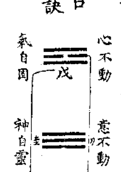

### 卷二 第二

## 火候圖

## 喻

## 警

## 煉氣

## 化神

## 心中氣

## 陽中陰

## 煉神

## 神

## 元

## 還虛

## 化氣

## 煉精

## 身中精

## 陰中陽

## 土 初一 子 玄關 復 乾

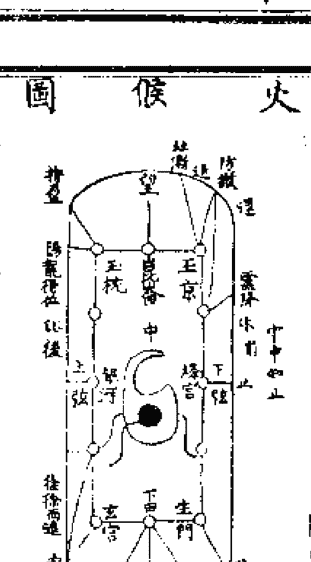

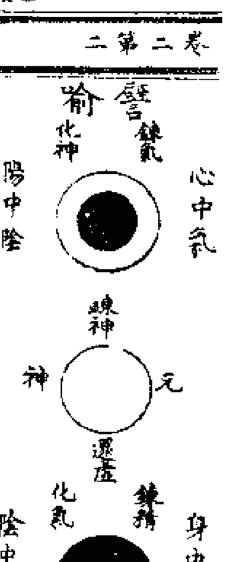

## 集和中

| 十三 | 正 | 二 | 三 | 四 | 五 | 六 | 七 | 八 | 九 |
| --- | --- | --- | --- | --- | --- | --- | --- | --- | --- |
| 塑 | 契 | 契 | 土 | 踏 | 退 | 大 | 平 | 重 | 美 |
| 丑 | 寅 | 卯 | 辰 | 巳 | 午 | 未 | 申 | 酉 | 戌 |
| 進 | 繇 | 沐 | 過 | 止 | 退 | | 徐 | 洛 | 守 |
| | 進 | 銀 | 正 | | | | 退 | 終 | 中 |
| | | 河 | 闢 | | | | | 營 | |
| 臨 | 泰 | 壯 | 夫 | 乾 | 姤 | 遯 | 否 | 觀 | 剝 |
| 九三 | 九二 | 九四 | 九五 | 九 | 六 | 六三 | 六二 | 六 | 六 |
| | | | | | 契 | | | | 益 |

## 卷第二三

## 外藥圖 內藥圖

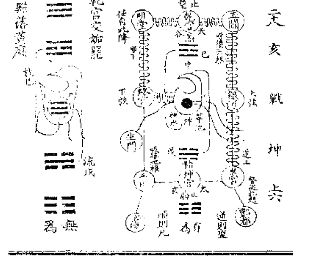

## 金丹内外二藥圖說

外藥可以治病可以長生久視
內藥可以超越可以出有入無

大凡學道必先從外藥起然後自知內藥高
上之士夙植德本生而知之故不鍊外藥便
鍊內藥

內藥無為無不為
外藥有為有以為
內藥無形無質而實有
外藥有體有用而實無
外藥色身上事
內藥法身上事
外藥地仙之道
內藥水仙之道

## 二藥全天仙之道

外藥了命
內藥了性
二藥全形神俱妙

外藥
初關鍊精化氣先要識天癸生時急採之
中關鍊氣化神調和真息周流六虛自太玄
關逆流至天谷穴交合然後下降黃
房入中宮乾坤交媾罷一點落黃庭

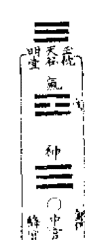

## 中和集

### 卷二 第五

## 上闡鍊神還虛

以心鍊合謂之七返
精來歸性謂之九還

## 內藥

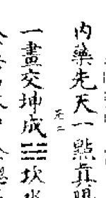

內藥乃鍊神之要
形神俱妙與道合真

內藥先天一點真陽是也譬如乾卦三中
一畫交坤成三坎水是也中一畫本是乾
金異名水中金總名至精也至精固而復
祖炁祖炁者乃先天虛無真一之元炁非
呼吸之炁如乾三中一畫交坤成坎了却
交坤中一陰入于乾而成離三離中一陰

本是坤土故異名曰砂中汞是也

道生一 一生二 二生三 三生萬物
虛化神 神化炁 炁化精 精化形
已上謂之順

萬物含三 三歸二 二歸一
鍊乎至精 精化炁 炁化神
已上謂之逆
丹書所謂順則成人
逆則成仙

上藥三品精炁神
體則一用則二何謂體本來三元之大事
也何謂用內外兩作用是也

## 集和中

內藥
先天至精
虛無寶泰
不壞元神

外藥
交感精
呼吸氣
思慮神

初有
關為
一鍊精化氣
取坎填離

中無
關交
入
二鍊氣化神
乾坤闔闢

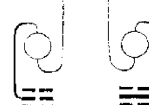

卷二第六

三鍊神還虛
上無
關為

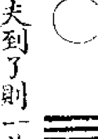

此三段功夫到了則一若向這裏具隻眼三教之大事畢矣其或未然緊後事

一鍊精化氣
三歸道乃水府求玄丹書云發生須急採望遠不堪嘗所謂採者不採之採謂之採也苟實有所採坎中一畫如何得升精之先天至靈之化因動而有身身中之至精

## 中和集

乃元陽也採者採此也譬如三乾乃先天至靈始因一動交坤而成坎即至靈化元精之象也坎爲水坎中一畫元乾金假名曰水中金金乃水之母反居水中故曰母隱子胎也採鉛消息難形筆舌達者觀雷在地中復先王至日閉關商旅不行后不省方之語思過半矣餘存口訣

## 二 鍊氣化神

三崇釋則離宮修定丹書云真土制真鉛真鉛制真汞汞歸土釜身心寂不動斯

### 卷二 第七

言盡矣既得真鉛則真汞何慮乎不凝鍊炁之要貴乎運動一闔一關一往一來一升一降無有停息始者用意後則自然一呼一吸奪一年之造化即太上云玄牝之門是謂天地根綿綿若存用之不動正此義也達者若於乾坤易之門與夫復姤三三之內上留意鍊氣之要備矣

## 三 鍊神還虛

三工失到此一箇字也用不着

三五指南圖局說

紫陽真人悟真篇詩云三五一都三箇字古
今明者實然希東三南二同成五北一西分
四共之戊己還從生數五三家相見結嬰兒
嬰兒是一含真氣十月胎成入聖基只此五
十六字貫徹諸子百家丹經子書若向這裏
具隻眼參學事畢其或未然向注脚下商量
(初)三五一都三箇字三元五行一氣也古
今明者實然希亘古亘今知者鮮矣東三
南二同成五東三木也南二火也木生火
木乃火之母兩性一家故曰同成五也北

一西方四共之北一水也西四金也金生
水金乃水之母兩性一家故曰共之戊己
還從生數五者土之生數也五居中無偶
自是一家所謂三家相見者三元五行混
而為一也故曰三家相見結嬰兒所謂嬰
兒者亦是假名純一之義也故曰嬰兒是
一含真氣也十月胎成入聖基者三百日
胎二八兩藥烹之鍊之成之熟之超凡入
聖之大功也故曰入聖基也

(申)以一身言之東三木也我之性也西四

金也我之情也南二火也我之神也北一水也我之精也性乃心之主心乃神之舍性與神同係乎心東三南二同成五也精乃身之主身者情之係精與情同係乎身北一西方四共之也戊己中土意也四象五行意為之主宰意無偶自是一家也修鍊之士收拾身心意則自然三元五行混而為一也丹書云收拾身心為採藥正謂此也收拾身心之要在乎虛靜虛其心則神與性合靜其身則精與情寂意大定則

三元混一此所謂三花聚五氣朝聖胎凝(未)情合性謂之金木併精合神謂之水火交意大定謂之五行全丹書云鍊精化氣是初關身不動也鍊氣化神為中關心不動也鍊神化虛為上關意不動也心不動東三南二同成五也身不動北一西方四共之也意不動戊己還從生數五也身心意合即三家相見結嬰兒也作是見者金丹之能事畢矣神仙之大事至是盡矣至於丹書種種法象種種異名並不外乎身

## 中和集

心意也雖然猶有不能直下會意者今立異名法象圖局于後具眼者流試着眼看看

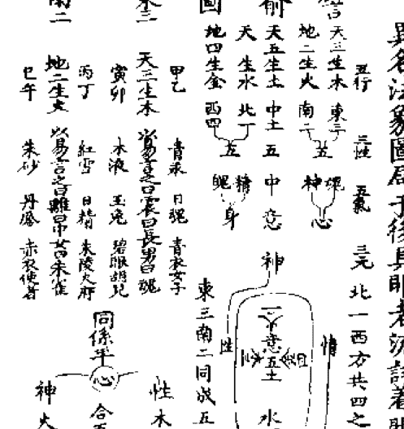

## 卷二 第二十

身心意曰三家精氣神曰三元精神魂魄意曰五氣鉛汞銀砂土曰五行三家相見曰胎圓三元合一曰丹成

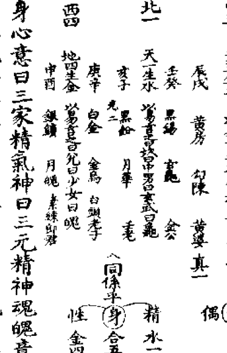

大德三年純陽誕日書于雙江中和菴

## 玄關一竅

夫玄關一竅者至玄至要之機關者非印堂非顱門非肚臍非膀胱非兩腎非腎前臍後非兩腎中間上至頂門下至腳跟四大一身才着一處便不是也亦不可離了此身向外

尋之所以聖人只以一中字示人只此中字便是也我設一喻令爾易知且如傀儡手足舉動百樣趨蹌非傀儡能動是絲線牽動雖是絲上關棧却是弄傀儡底人牽動喚還識

這箇弄傀儡底人麼休更疑惑我直說與汝

### 卷二 第十

等傀儡比此一身絲線比玄關弄傀儡底人比主人公一身手足舉動非手足動是玄關

使動雖是玄關動却是主人公使教玄關動

若認得這箇動底關棧又奚患不成仙乎

## 試金石

夫金丹者虛無為體清靜為用無上至真之

妙道也世鮮知之人鮮行之於是聖人用方

便力闡善誘門強立名象著諸丹書接引後

學蓋欲來者誦言明理嘿識潛通則行之頓

超其境奈何後學不窮其理執着筌蹄妄引

## 集和中

百端支離萬狀將至道碎破為曲徑旁蹊三千六百良不得其傳故也況今之無知淺學將聖人經旨妄行箋註乖訛尤甚要得不悞後來雖苦志之士亦不能辨其邪正深可憐憫予因是事故作此試金石而辨其真偽俾諸學者不被眩惑決然無疑直超道岸聖師曰道法三千六百門人人各執一為根誰知些子玄微處不在三千六百門予謂祖師老婆心切故作是詩也若復有人作如是見者大地皆黃金其或未然須當試過於是乎書

卷第二十

御女房中三峯採戰食乳對爐女人為鼎天癸為藥產門為生身處精血為大丹頭鑄雌

下三品

傍門九品

最上一乘

漸法三乘

九品

無上至真之妙

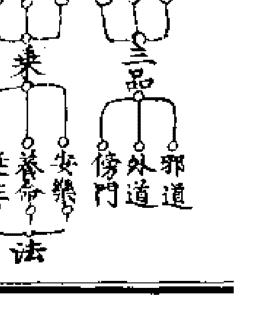

## 中和集

雄劍立陰陽爐謂女子爲純陽指月經爲至寶採而餌之爲一月一還用九女尚九鼎爲九年九返令童男童女交合而採初精取陰中黍米爲玄珠至於美金花弄金槍七十二家強兵戰勝多入少出九淺一深如此邪詭謂之泥水丹法三百餘條此大亂之道也乃下品之下邪道也

又有八十四家接法三十六般採陰用胞衣爲紫河車鍊小便爲秋石食自己精爲還元捏尾閭爲閉關夫婦交合使精不漏爲無漏

卷二 第十三

採女經爲紅圓子或以五金八石修鍊爲丸令婦人服之十月後產肉塊爲至藥採而服之如此謬術不欲盡舉約有三百餘條乃下品之中外道也

又有諸品丹竈爐火燒熬五金八石勾庚乾汞點茅燒灰弄大至於靈砂外藥三巡五假金石草木服餌之法四百餘條乃下品之上外道也

右下三品共一千餘條貪淫嗜利者行之

中三品

休糧辟穀忍寒食積服餌椒木曜背臥冰日
持一齋或清齋或食物多爲奇特或飲酒不
醉爲驗或減食爲抽添或不食五味而食三
白或不食煙火食或飲酒食肉不藉身命自
謂無爲或翻滄倒海種種捏怪乃中品之下
也
吞霞服氣採日月精華吞星曜之光服五方
之氣或採水火之氣或存思想遨遊九州
爲運用或想身中二氣化爲男女象人間夫
婦交媾之狀爲合和一切存想種種虛妄等

卷第二十四

法乃中品之中也
傳授三歸五戒看誦修習傳信法取如報應行
考赴取歸程歸空十信三際九接瞻星禮斗
或持不語或打勤勞持守外功已上有爲乃
中品之上漸次近道也
右三品一千餘條行之不怠漸入佳境勝
別留心

上三品

定觀鑒形存思吐納摩撫消息八段錦六字
氣視頂門守臍帶吞津液攪神水或子口水

## 中和集

為活或指舌為赤龍或擦身令熱為火候或一呵九摩求長生或鍊稠唾為真種子或守丹田或燒外腎至於煮海觀鼻以津精涎沫為藥乃上品之下也

閉息行氣屈伸導引摩腰腎守印堂運雙睛搖夾脊守臍輪或以雙睛為日月或以眉間為玄關或叩齒為天門或想元神從頂門出入或夢游仙境或默朝上帝或以昏沉為入定或數息為火候或想心腎黑白二氣相交為既濟乃上品之中也

卷二 第十五

般精運氣三大歸臍調和五臟十六觀法固守丹田服中黃氣三田運返補腦還精雙提金井夾脊雙關握固內視種種般般運乃上品之上也

右三品一千餘條中士行之亦可卻病

漸法三乘

下乘者以身心為鼎爐精氣為藥物心腎為水火五臟為五行肝肺為龍虎精為真種子以年月日時行火候嚥津灌溉為沐浴口鼻為三要腎前臍後為玄關五行混合為丹成

此乃安樂之法其中作用百餘條若能忘情亦可養命與上三品稍同作用差別

中乘者乾地為鼎器坎離為水火烏兔為藥物精神魂魄意為五行身心為龍虎氣為真種子一年寒暑為火候法水溉灌為沐浴內

境不出外境不入為固濟太淵絳宮精房為三要泥丸為玄關精神混合為丹成此中乘養命之法其中作用數十條與下乘大同小

異若行不怠亦可長生久視

上乘者以天地為鼎爐日月為水火陰陽為

卷二 第十六

化機鉛汞銀砂土為五行情性為龍虎念為真種子以心鍊念為火候息念為養火含光為固濟降伏內魔為野戰身心意為三要天

心為玄關情來歸性為丹成和氣薰蒸為沐浴乃上乘延生之道其中與中乘相似作用處不同亦有十餘條上士行之始終如一可

證仙道

最上一乘

夫最上一乘無上至真之妙道也以太虛為鼎太極為爐清靜為丹基無為為丹母性命為

## 中和集卷之二

為鈐汞定慧為水火空慈慈念為水火交性情合一為金木併洗心滌慮為沐浴存誠定意為固濟戒定慧為三要中為玄關明心為應驗見性為凝結三元混一為聖胎性命打成一片為丹成身外有身為脫胎打破虛空為了當此最上一乘之妙至士可以行之功滿德隆直超圓頓形神俱妙與道合真

## 中和集卷之三

都梁清庵鰲蟾子李道純元素撰
門弟子損庵寶蟾子蔡志頤編

## 問答語錄

潔庵蟾子程安道問三教一貫之道

瑩蟾子宴坐蟾窟是夜寒光清氣真潔可掬
門人瓊蟾子猛思生死事大神仙不可不敬
慕功行不可不專修稽首拜問曰弟子嘗聞
自古上聖高真歷代仙師皆因修真而成道
必以鉛汞為金丹之根蒂不知鉛汞是何物

師曰夫鉛汞者天地之始萬物之母金丹之
本也非凡鉛黑錫水銀朱砂奈何謬者不知
真玄私意揣度惑壞後學徒費歲月時擔閣一
生深可憐憫若不遇真師點化皆妄為矣紫
陽真人曰饒君聰慧過顏閔不遇真師莫強
猜正謂此也我今為汝指出真鉛真汞身心
是也聖師云身心兩箇字是藥也又是火也又
云要知產藥川源處只在西南是本鄉西南
者坤也坤屬身身中之精乃陰中之陽也如
乾中一爻入坤而成坎外陰內陽外柔內剛

外坤内乾坎水之中有乾金故强名曰水中金也夫汞者心中之氣也陽中之陰也如坤中一爻入乾而成離外陽內陰外剛內柔外乾內坤離火之中有坤土故强名曰砂中汞也精氣感合之妙故强名立象以鉛汞喻之使學者知有體用耳以此推之無出身心兩字身心合一之後鉛汞皆無也

問如何是抽添曰身不動氣定謂之抽心不動神定謂之添身心不動神凝氣結謂之還元所以取坎中之陽補離中之陰而成乾謂

卷三第二

抽鉛添汞也

問如何是烹鍊曰身心欲合未合之際若有一毫相撓便以剛決之心敵之為武鍊也心既合精氣既交之後以柔和之心守之為文烹也此理無他只是降伏身心便是烹鉛鍊汞也忘情養性虛心養神萬緣放下百慮俱澄身心不動神凝氣結是謂丹基喻曰聖胎也以上異名只是以性攝情而已性寂情冥服見本來抱本還虛歸根復命謂之丹成也喻曰脫胎

問諸丹經云用工之妙要在玄關不契玄關正在何處曰玄關者至玄至妙之機關也寧有定位着在身上即不是離了此身向外尋求亦不是泥於身則着於形泥於外則着於物夫玄關者只於四大五行不着處是也余令設一譬喻令汝易於曉會且如傀儡手足舉動百般舞跳在乎線上關機實由主人使牽底主人比得人之四大一身線比得玄關抽牽人無玄關亦不能運動汝但於二六時中

行住坐臥着工夫向內求之語默視聽是箇甚麼若身心靜定方寸湛然真機妙應處自然見之也勿繫云寂然不動即玄關之體也感而遂通即玄關之用也自見得玄關一得永得藥物火候三元八卦皆在其中矣時人若以有形着落處為玄關者縱動功苦志事終不成欲直指出來恐汝信不及亦不得用須是自見始得譬如儒家先天之學亦要默而識之孟子云浩然之氣塞乎天地之間曰難言也且難言之妙非玄關乎且如釋氏不

## 中和集

立文字教外別傳使人神領意會謂之不傳之妙能知此理者則能一徹萬融也
問或謂崇釋與修道可以斷生死出輪迴學儒可盡人倫不能了生死豈非三教異同乎
曰達理者奚患生死耶且如窮理盡性以至於命原始返終知周萬物則知生死之說所
以性命之學實儒家正傳窮得理徹了然自知豈可不能斷生死輪迴乎且如羲皇初畫
易之時體天設教以道化人未嘗有三教之分故曰皇天無二道聖人無兩心當來初畫

卷三 第四

一者象太極也有一便有二象兩儀也一者
陽也一者陰也一陰一陽之謂道仰則觀於
天上畫一畫以象天俯則察於地下畫一畫
以象地中畫一畫以象人故三畫以成乾三
象三才也兩乾斷而成坤三象六合也故曰
立天之道曰陰與陽立地之道曰柔與剛立
人之道曰仁與義兼三才而兩之故六畫而
成坤以一身言之立天之道曰陰與陽心之
神氣也立地之道曰柔與剛身之形體也立
人之道曰仁與義意之情性也心身意象乾

三才也神氣性情形體象坤之六合也易曰
遠取諸物近取諸身此之謂也
問繫辭云六畫而成卦先生云六畫而成坤
者何也曰汝未知之若謂六畫而成卦者文
王重卦也文王未重卦之前豈可謂無三才
六合乎先賢云立天之道曰陰與陽天之乾
坤也立地之道曰柔與剛地之乾坤也立人
之道曰仁與義人之乾坤也以此推之乾坤
兩卦三才六合備矣又豈以重卦言之哉所
謂六畫而成卦者重卦之後名為後天也

卷三 五

問若謂未重卦之前三才六合備矣而繫辭
云以制器者尚其象未嘗因器而設象因象
而制器乎曰因象而制器
問三皇以下聖人制器皆以重卦言之若謂
因象制器文王未重易之前豈有重卦之名
乎曰非也前賢云須信畫前元有易所以文
王未重卦之前六十四卦俱備
問卦若不重六十四卦從何而得曰變卦所
生也一卦變八卦八卦變六十四卦且如乾
卦三爻上兩爻少陽下一爻老陽支出巽卦

## 集和中

來陽變為陰乾之巽天風姤也舉此一卦諸卦皆然

問卦不重而有六十四卦文王如何又重之曰卦不重而變六十四卦乃羲皇心法道統正傳誘萬世之下學者同入聖門重卦而生

六十四卦者乃文王周孔立民極正人倫使世人趨吉避凶立萬世君臣父子之綱耳故性命之學不敢輕明於言亦不忍隱斯道孔子微露於係辭濂溪發明於太極通書也蓋欲來者熟咀之而自得之此學不泯其傳矣

卷三 第六

問一陰一陽之謂道如何說曰陰陽者乾坤也乾坤出於太極太極判而兩儀立焉兩儀也乾坤也太極也太極本無極也以太極言之則曰天地以易言之則曰乾坤以道言之則曰陰陽若以人身言之天地形體也乾坤性情也陰陽神氣也以法象言之天龍地虎也乾馬坤牛也陽烏陰兔也以金丹言之天鼎地爐也乾

## 中和集

金坤土也陰汞陽鉛也散而言之種種異名合而言之一陰一陽也修仙之人鍊鉛汞而成丹者即身心合而還其本初陰陽合而復歸太極也

問三五一是何也曰三元五行也東三南二是一箇五北一西四是兩箇五中土是三箇五是謂三五也以人身言之性三神二是一箇五情四精一是兩箇五意五是三箇五也三五合一則歸太極身心意合一則成聖胎也紫陽真人云三五都三箇字三元五行一氣是也

卷三 第七

古今明者實然稀知之鮮東三南二同成五三性也南此一西方四共之此一精也戊己還二神也生數五土數五三家相見結嬰兒三家者從合也嬰兒是一含真氣嬰兒是真也聖兒者三五嬰兒是一含真氣之異名也太一含十月胎圓入聖基胎起凡入聖也

以此求之金丹之道實入聖基也

問係辭云天地設位易行乎中如何曰天地設位人生於中是謂三才故人與物生生而不息所以不言人與物而言易者聖人言乾坤易之門隨時變易以從道也如金丹以乾

## 集和中

坤為鼎器者天地設位也以陰陽為化機者即易行乎中也元始採藥無窮行火候之不息也

闔闢戶謂之乾坤戶謂之坤一闔一闢謂之變如何曰一闔一闢者一動一靜也乾坤坤

陰如門戶之闔闢即乾坤易之門也且如陰陽互動互靜機緘不已元亨利貞定四時成

歲變者變易也至道與神氣混沌淪淪周乎三才萬物闔闢無窮致廣大而盡精微矣以

一身言之呼吸是矣呼則接天根是謂之闔

## 第三卷 八

吸則接地根是謂之闔一呼一吸化生金液是謂之變闔闢呼吸即玄牝之門天地之根矣所謂呼吸者非口鼻呼吸乃真息闔闢也

問乾道成男坤道成女如何曰乾父也坤母也乾初爻交坤而成震震初索而得男是謂

長男坤初爻交乾而成巽巽初索而得女是為女乾中爻交坤而成坎坎再索而得男

是謂中男坤中爻交乾而成離離再索而得女是謂中女乾三爻交坤而成艮艮三索而

得男是謂少男坤三爻交乾而成兌兌三索

## 中和集

而得女是謂少女。乾生三男，坤生三女，乾坤共生六子，是謂八卦。以身言之，初受胎時，稟父母精華而成此身。精華者，丹經喻曰天壬地癸也。初交合時，天壬先至，地癸隨至，癸裹壬則成男子；地癸先至，天壬隨至，壬裹癸則成女子。壬癸偶然齊至，則成雙胎；壬先至癸遲至，或癸先至壬遲至，俱不成胎也。故曰：乾道成男，坤道成女。夫天壬地癸者，乃天地元精元氣也，亦丹經所云坎戊離己，異名鉛汞也。飾之於外則成人，益之於內則成丹。世人不知生男生女，實由命分中得，不由人力。若不斷淫絕慾，自為修養，直待精華耗竭，早至天亡，大可惜也。又宜知寡慾而得男女，貴而壽；多慾而得男女，濁而夭。

問：形而上者謂之道，形而下者謂之器，如何？曰：形而上者無形質，形而下者有體用。無形質者係乎性（汞也），有體用者係乎命（鉛也）。總而言之，無出身心也。

問：聖人以易洗心，退藏於密，密是何也？曰：誠之至也。易理致廣大而盡精微，聖人玩味其理，洗心滌慮，藏於極誠矣。

問：《書》云「人心惟危，道心惟微，惟精惟一，允執厥中」，不知中如何執？曰：執者一定之辭，中者正之中也。道心微而難見，人心危而不安。雖至人亦有人心，雖下愚亦有道心。苟能心常正得中，所以微妙而難見也；若心稍偏而不中，所以危殆而不安也。學仙之人，擇一而守之不易，常執其中，自然危者安而微者著矣。金丹用中為玄關者，亦是這箇道理。

問：上天之載，無聲無臭，如何？曰：誠之昭著，雖無聲可聞，無臭可知，天道亦不可掩。如道經云「大量玄玄」，亦是真之至也。

問：不識不知，順帝之則，如何？曰：聖人生而知之，默而順之，天理所謂不思而得，不勉而中，得無為自然之道也。此則《中庸》所謂誠而明也。若謂明而誠，正是聖人之教耳。學道之人，根器淺薄者，不能一直了性，自粗達妙，所以先了命而後了性也，此學而知之也。

問：夫子飯疏食飲水，曲肱而枕之，樂亦在其中矣。夫子樂在何處？曰：夫子所樂者天，所知者命，故樂天知命而不憂。雖匡人所逼，猶且弦歌自娛。於《易》得「不遠復」以修身，復見天地之心，窮理盡性以至於命，此金丹之妙也。

問：顏子簞瓢之樂如何？曰：顏子得夫子樂天知命不憂之理，故不改其樂也。所以如愚，心齋坐忘，黜聰明去智慮，庶乎屢空，亦金丹之妙也。

問：曾子被破褐而頌聲滿天地，天子不得而臣，諸侯不得而友，是如何？曰：曾子一唯之妙，口耳俱忘，所以修身齊家治國平天下，得一貫之道。

問：子路問死，夫子答曰「未知生，焉知死」，是如？曰：生死乃晝夜之常，知有晝則知有夜。《易》云「原始返終，則知死生之說」。丹書云「父母未生以前，是金丹之基」。釋云「未有此身，性在何處」。以此求之，三教入處，只要原其始，自知其終；沂其流而知其源。人能窮究此身其所從來，生死自然都知也。汝曾看《太極圖》否？太極未判之前是甚麼？若窮得透，則知此身之前，原始可以要終也。

問：太極未判，其形若雞子，雞子之外是甚麼？曰：太虛也。凡人受氣之時，形體未分，亦如雞子。既生之後，立性立命，一身之外皆太虛也。

問：人在母腹中時，還有性否？曰：腹中穢污，靈性豈存得住？又問：懷胎五七箇月，其胎忽動，莫非性乎？曰：非性也，一氣而已。人在腹中時，隨母呼吸；一離母胎，立性立命，便自有天地。且如蛇斬作兩段，前尚走，尾尚活；又有人煮蟹既熟，遺下生脚尚動，豈性也？汝究此理，則知氣動也，非性也。

問：《語》云「吾道一以貫之」，如何？曰：聖人言身中一天理，可以貫通三才三教，萬事無不備矣。如釋氏「無我無人無眾生無壽者」，道教「了一萬事畢」，皆一貫也。

問：世尊拈花示眾，獨迦葉微笑。世尊云「吾有正法眼藏，涅槃妙心，分付摩訶迦葉」，不知微笑者何事？曰：世尊拈花示眾，眾皆不見佛心，獨迦葉見佛心之妙，所以微笑。故世尊以心外之妙，分付與迦葉也。

問：達磨西來，不立文字，直指人心，見性成佛，如何是見性？曰：達磨以真空妙理，直指人心。見性者，使人轉物情空，自然見性也，豈在乎筆舌傳之哉。

問：儒有先天易，釋有般若經，道有靈寶經，莫非文字乎？曰：非也，皆聖人以無言而形於有言，願真常之道也。釋教一大藏教典及諸家語錄因果，儒教九經三傳諸子百家，道教洞玄諸品經典及諸丹書，是入道之徑路，超昇的梯階。若至極處，一箇字也使不着。汝問余數事，亦只是過河之筏。向上一着，當於言句之外求之。或築着磕着，悟得透得，復歸於太極，圓明覺照，虛微靈通，性命雙全，形神俱妙，虛空同體，仙佛齊有，亦不為難。

問：先生云三教一理，極荷開發。但釋氏涅槃，道家脫胎，似有不同處？曰：涅槃與脫胎，只是一箇道理。脫胎者，脫去凡胎也，豈非涅槃乎？如道家鍊精化氣，鍊氣化神，鍊神還虛，即抱本歸虛，與釋氏歸空一理，無差別也。又問：脫胎後還有造化麼？曰：有造化在。聖人云「身外有身，未爲奇特；虛空粉碎，方露全真」。所以脫胎之後，正要腳踏實地，直待與虛空同體，方爲了當。且如佛云真空，儒曰無爲，道曰自然，皆抱本還元，與太虛同體也。孰着之徒，時克知此一貫之道哉？

潔菴曰：先生精造金丹之妙道，融通三教之玄機，隨問隨答，極玄極妙，豈敢自秘？當刊諸梓，與同志之士相與開發。隋珠趙璧，自有識者。

趙定菴問答

師曰：前代祖師高真上聖，有無上至真之道，留傳在世度人，汝還知否？定菴曰：弟子初進玄門，至愚至蠢，蒙師收錄，千載之幸也。無上正真之道，誠未知之，望師開發。師曰：無上正真之道者，無上可上，玄之又玄，無象可象，不然而然，至極至妙之謂也。聖人強名曰道。自古上仙，皆由此處了達，未有不由是而修證者。聖師口口，歷代心心相傳，所授金丹之旨，乃無上正真之妙道也。定菴曰：無上正真之妙，喻爲金丹，其理云何？師曰：金者堅也，丹者圓也。釋氏喻之為圓覺，儒家喻之為太極，初非別物，只是本來一靈而已。本來真性，永劫不壞，如金之堅，如丹之圓，愈鍊愈明。釋氏曰○，此者真如也；儒曰○，此者太極也；吾道曰○，此乃金丹也。體同名異。《易》曰：「易有太極，是生兩儀。」太極者，虛無自然之謂也；兩儀者，一陰一陽也。陰陽天地也，人生於天地之間，是謂三才。三才之道，一身備矣。太極者元神也，兩儀者身心也。以丹言之，太極者丹之母也，兩儀者真鉛真汞也。所謂鉛汞者，非水銀朱砂硫黃黑錫草木之類，亦非精津涕唾心腎氣血，乃身中元神，身中元氣。身不動，精氣凝結，喻之曰丹。所謂丹者身也，○者真性也。丹中取出○者，謂之丹成。所謂丹者，非假外而造作，由所生之本而成正真也。世鮮知之。今之修丹之士，多不得其正傳，皆是向外尋求，隨邪背正，所以學者多而成者少也。或鍊五金八石，或鍊三迆五假，或鍊雲霞外氣，或鍊日月精華，或採星曜之光，或想空中九塊而成丹，或想丹田有物而為丹，或肘後飛金精，或眉間存想，或還精補腦，或運氣歸臍，乃至服氣吞精，納新吐故，入段錦，六字氣，搖夾脊轆轤，閉尾閭，守臍蒂，採天癸，鍛秋石，屈伸導引，按摩消息，默朝上帝，舌拄上腭，二田還返，閉息行氣，三火聚於膀胱，五行攢於苦海。如斯小法，何啻千門？縱勤功採取，終不能成其大事。經云「正法難遇，多迷真道，多入邪宗」，此之謂也。夫至真之要，至簡至易，難遇易成。若遇至人點化，無不成就。定菴曰：弟子夙生慶幸，得遇老師，幸沾法乳。金丹之要，望賜點化。師曰：汝今諦聽，當為汝談。夫鍊金丹者，全在奪天地造化。以乾坤為鼎器，日月為水火，陰陽為化機，烏兔為藥物。仗天罡之斡運，斗柄之推遷。採藥有時，運符有則。進火退符，體一年之節候；抽鉛添汞，象一月之虧盈。攢簇五行，合和四象，追二氣歸黃道，會三性於元宮。返本還元，歸根復命。功圓神備，凡蛻為仙，謂之丹成也。定菴曰：天地造化，誠恐難奪。師曰：無出一身，奚難之有？天地形體也，水火精氣也，陰陽身心也，烏兔性情也。所以形體為鼎爐，精氣為水火，情性為化機，身心為藥材。聖人恐學者無以取則，遂以天地喻之。人身與天地造化，無有不同處。身心兩箇字，是藥也是火。所以天魂地魄，乾馬坤牛，陽鉛陰汞，坎男離女，日烏月兔，無出身心兩字也。天理斡旋者，天心也。丹書云「人心若與天心合，倒陰陽止片時」。又云「以心觀道，道即心也；以道觀心，心即道也」。斗柄推遷者，玄關也。夫玄關者，至玄至妙之機關也。今之學者，多泥於形體，或云眉間，或云臍輪，或云兩腎中間，或云臍後腎前，或云膀胱，或云丹田，或云首有九宮中為玄關，或指產門為生身處，或指口鼻為玄牝，皆非也。但着在形體上都不是，亦不可離此一身向外尋求。諸丹經皆不言正在何處者，何也？難形筆舌，亦說不得，故曰玄關。所以聖人只書一「中」字示人，此中字玄關明矣。所謂中者，非中外之中，亦非四維上下之中，不是在中之中。釋云「不思善，不思惡，正怎麽時，那箇是自己本來面目」，此禪家之中也；儒曰「喜怒哀樂未發謂之中」，此儒家之中也；道曰「念頭不起處謂之中」，此道家之中也。此乃三教所用之中也。《易》曰「寂然不動」，中之體也；「感而遂通」，中之用也。老子云「致虛極，守靜篤，萬物並作，吾以觀其復」。《易》云「復其見天地之心」。且復卦一陽生於五陰之下，陰者靜也，陽者動也，靜極生動，只這動處便是玄關也。沒但於二六時中，舉心動念處看工夫，玄關自然見也。見得玄關，藥物火候，運用抽添，乃至脫胎神化，並不出此一竅。採藥者，採身中真鉛真汞也。藥生有時，非冬至，非月生，非子時。祖師云「鍊丹不用尋冬至，身中自有一陽生」。又云「鉛見癸生須急採，金逢望遠不堪嘗」。以此求之，身中發生一陽時也，便可下手採之。二氣交合之後，要識持盈，不可太過，望遠不堪嘗也。進火退符，無以取則，遂以一年節候寒暑往來以為火符之則。又次一月盈虧，以明抽添之旨。且如冬至一陽生，復卦；十二月二陽，臨卦；正月三陽，泰卦；二月四陽，大壯卦；三月五陽，夬卦；四月純陽，乾卦。陽極陰生，五月一陰，姤卦；六月二陰，遯卦；七月三陰，否卦；八月四陰，觀卦；九月五陰，剝卦；十月純陰，坤卦。陰極陽生，周而復始。此火符進退之機。奈何學者執文泥象，以冬至下手進火，夏至退符，二八月沐浴，尤不知其要也。聖人見學者錯用心志，又以一年節候促在一月之內，以朔望象冬夏至，以兩弦比二八月，以兩日半准一月，以三十日准一年。世人又着在月上，又以一月盈虧促在一日，以子午體朔望，以卯酉體二弦。學者又看在日上。近代真師云「一刻之工夫，自有一年之節候」。又曰「父母未生以前，烏有年月日時」。此聖人誘喻初學，勿錯用心。奈何執着之徒，不窮其理，執文泥象，徒爾勞心。余今直指與汝：身中癸生，便是一陽也；陽升陰降，便是四陽，體二月如上弦，比卯時，宜沐浴，然後進火。陰陽交，神氣合，六陽也。陰陽相交，神氣混融之後，要識持盈，不知止足，前功俱廢，故曰「金逢望遠不堪嘗」。然後退符，象一陰，乃至陰陽分，象三陰。陰陽伏位，宜沐浴，象八月，比下弦，如酉時也。然後退至六陰，陰極陽生，頃刻之間，一周天也。汝但依而行之，久久工夫，漸漸結，無質生質，結成聖胎，謂之丹成也。定菴曰：下手工夫，周天運用，已蒙開益。種種異名，不能盡知，望師指示。師曰：異名者，只是譬喻，無出身心兩字。下工之際，凝耳韻，含眼光，絨舌氣，調鼻息，四大不動，使精神魂魄意各安其位，謂之五氣朝元。運入中宮，謂之攢簇五行。心不動龍吟，身不動虎嘯，身心不動，謂之降龍伏虎。龍吟則氣固，虎嘯則精固，握固靈根也。以精氣喻之龜蛇，以身心喻之龍虎。龜蛇打成一片，謂之合和四象。以性攝情，謂之金木者，只是譬喻，無出身心兩字。下工之際，凝耳韻，含眼光，絨舌氣，調鼻息，四大不動，使精神魂魄意各安其位，謂之五氣朝元。運入中宮，謂之攢簇五行。心不動龍吟，身不動虎嘯，身心不動，謂之降龍伏虎。龍吟則氣固，虎嘯則精固，握固靈根也。以精氣喻之龜蛇，以身心喻之龍虎。龜蛇打成一片，謂之合和四象。以性攝情，謂之金木併；以精御氣，謂之水火交。木與火同源，兩性一家，東三南二同成五也；水與金同源，兩性一家，北一西方四共之也。土居中宮，屬意，自己五數戊己，還從生數五。心身意打成一片，三家相見結嬰兒，總謂之三五混融也。鍊精化氣，鍊氣化神，鍊神還虛，謂之三花聚鼎，又謂之三關。今之學人，多指尾閭夾脊玉枕為三關者，只是功法，非至要也。聚心動念處為玄牝，今人指口鼻者非也。身心意為三要。心中之性，謂之砂中汞；身中之氣，謂之水中金。金本生水，乃水之母，金反居水中，故曰母隱子胎。外境勿令入，內境勿令出，謂之固濟。寂然不動，謂之養火；虛無自然，謂之運用；存誠篤志，謂之守城；降伏內魔，謂之野戰。真汞謂之姹女，真鉛謂之嬰兒，胎意謂之黃婆，性情謂之夫婦。澄心定意，性寂神靈，二物成團，三元輾轉，謂之成胎。愛護靈根，謂之溫養。所謂溫養者，如龍養珠，如雞覆子，謹謹護持，勿令差失。毫髮有差，前功俱廢也。陽神出殼，謂之脫胎；歸根復命，還其本初，謂之超脫；打破虛空，謂之了當也。定菴曰：金丹成時，還可見否？答曰：可見。曰：有形否？曰：無形。問曰：既無形，如何可見？答曰：金丹只是強名，豈有形乎？所謂可見者，不可以眼見。釋曰「於不見中親見，親見中不見」。道經云「視之不見，聽之不聞，斯謂之道」。視之不見，未嘗不見；聽之不聞，未嘗不聞。所謂可見可聞，非耳目所及也，心見意聞而已。譬如大風起，入山撼木，入水揚波，豈得謂之無？觀之不見，搏之不得，豈得謂之有？金丹之體，亦復如是。所以鍊丹之初，有無互用，動靜相須。乃至成功，諸緣頓息，萬法皆空，動靜俱忘，有無俱遣，始得玄珠成象，太一歸真也。性命雙全，形神俱妙，出有入無，逍遙雲際，果證金仙也。所以經典丹書，百種異名，接引學人，從粗達妙，漸入佳境。及至見性悟空，其事却不在紙上。譬若過河之舟，濟度斯民，既登彼岸，舟船無用矣。前賢云「得兔忘蹄，得魚忘筌」，此之謂也。且余今語此授汝，却不可執在言上，但只細嚼熟玩，其箇窮究本源。苟或一言之下，心地開通，直入無為之境，是不難也。更有向上機關，未易輕述，當於言外求之。

予觀丹經子書，後人箋注，取用不一，或著形體，或泥文墨，或以清淨為苦空，或以汞鉛為有象，所見不同，後人豈得不惑？殊不知至道則一，豈有二哉？又近來丹書所集，多且傍門，如解七返九還，寅子數坤申之類，不亦謬乎？予今將丹書中精要，集成或問三十六則，以破後人之惑。達者昧之。

或問：何謂九還？曰：九乃金之成數，還者還元之義，則是以性攝情而已。情屬金，情來歸性，故曰九還。丹書云「金來歸性初，乃得稱還丹」，此之謂也。若以子數至申為九還者，非也。

或問：何謂七返？曰：七乃火之成數，返者返本之義，則是鍊神還虛而已。神屬火，鍊神返虛，故曰七返。或以寅至申為七返，非也。《悟真篇》云「休將寅子數坤申，只要五行繩準」，正謂此也。

或問：何謂三關？曰：三元之機關也。鍊精化氣為初關，鍊氣化神為中關，鍊神還虛為上關。或指尾閭夾脊玉枕為三關者，只是工法，非至要也。登真之要在乎三關，豈有定位？存乎口訣。

或問：何謂玄關？曰：至玄至妙之機關也，初無定位。今人多指臍輪，或指頂門，或指印堂，或指兩腎中間，或指腎前臍後，已上皆是傍門。丹書云「玄關一竅，不在四維上下，不在內外偏傍，亦不在當中，四大五行不着處」是也。

或問：何謂三宮？曰：三元所居之宮也。神居乾宮，氣居中宮，精居坤宮。今人指三田者，非也。

或問：何謂三要？曰：歸根之竅，復命之關，虛無之谷，是謂三要。或指口鼻為三要者，非也。

或問：何謂玄牝？曰：「谷神不死，是謂玄牝」。或指口鼻者，非也。紫陽真人云「念頭起處為玄牝」，斯言是也。予謂念頭起處，乃生死之根，豈非玄牝乎？雖然，亦是工法。最上一乘，在手口訣。

或問：何謂真種子？曰：天地未判之先，一點靈明是也。或謂人從一氣而生，以氣為真種子；或謂因念而有此身，以念為真種子；或謂稟二五之精而有此身，以精為真種子。此三說似是而非。釋云「無量劫來生死本，癡人喚作本來真」，此之謂也。

或問：何謂鼎爐？曰：身心為鼎爐。丹書云「先把乾坤為鼎器，次搏烏兔藥來烹」。乾心也，坤身也。今人外面安爐立鼎者，謬矣。

或問：何謂藥物？曰：真鉛真汞為藥物，只是本來二物是也。

或問：何謂內藥？何謂外藥？曰：鍊精鍊氣鍊神，其體則一，其用有二。交感之精，呼吸之氣，思慮之神，皆外藥也；先天至精，虛無空氣，不壞元神，此內藥也。丹書云「內外兩般作用」，正謂此也。

或問：敲竹喚龜吞玉芝，如何說？曰：敲竹者息氣也，喚氣者攝精也。鍊精化氣，以氣攝精，精氣混融，結成玉芝，採而吞之，保命也。

或問：鼓琴招鳳飲刀圭，如何說？曰：鼓琴者虛心也，招鳳者養神也。虛心養神，心明神化，二土成圭，採而飲之，性圓明也。

或問：如何是五氣朝元？曰：身不動，精固，水朝元；心不動，氣固，火朝元；性寂則魂藏，木朝元；情忘則魄伏，金朝元；四大安和，則意定，土朝元。此之謂五氣朝元也。

或問：何謂黃婆？曰：黃者中之色，婆者母之稱。萬物生於土，土乃萬物之母，故曰黃婆。人之胎意是也。或謂脾神爲黃婆者，非也。

或問：何謂金公？曰：以理言之，乾中之陽入坤成坎，坎爲水，金乃水之父，故曰金公；以法象言之，金邊著公字，鉛也。

或問：坎爲太陰，如何喻嬰兒？曰：坎本坤之體，故曰太陰。因受乾陽而成坎，爲少陽，故喻之爲嬰兒，謂負陰抱陽也。

或問：離爲太陽，却如何喻爲姹女？曰：離本乾之體，故曰太陽。因受坤陰而成離，爲少陰，故喻之爲姹女，謂雄裏懷雌也。

或問：何謂真金？曰：金乃元神也，歷劫不壞，愈鍊愈明，故曰真金。

或問：如何是子母？曰：水中金也。金爲水之母，金藏水中，故母隱子胎也。則是神乃身之母，神藏於身，喻爲母隱子胎。

或問：何謂賓主？曰：性是一身之主，以身爲客。今借此身養此性，故讓身爲主。丹書云「饒他爲主我爲賓」，此之謂也。

或問：何謂先天一氣？曰：天地未判之先，一靈而已，身中一點真陽是也。以其先乎覆載，故名先天。

或問：何謂水火？曰：天以日月爲水火，易以坎離爲水火，禪以定慧爲水火，聖人以明潤爲水火，墜道以心腎爲水火，丹道以精氣爲水火。我今分明指出，自己一身之中，上而炎者皆為火，下而潤者皆為水。種種異名，無非譬喻，使學者自得之也。

或問：如何是火中有水？曰：從來神水出高原。以理言之，水不能自潤，須仗火蒸而成潤；以法象言之，火旺在午，水受氣在午，以此求之，火中有水明矣。若以一身言之，則是氣中之液也。

或問：如何水中有火？曰：以理言之，日從海出；以法象言之，水旺在子，火受胎在子；以一身言之，則是精中之氣也。

或問：如何是既濟？曰：水升火降，曰既濟。《易》曰「山下有澤，損，君子以懲忿窒欲」，此既濟之方。懲忿則火降，窒欲則水升。

或問：如何是未濟？曰：不能懲忿，則火上炎；不能窒欲，則水下燥。無明火熾，苦海波翻，水火不交，謂之未濟。

或問：如何是金木併？曰：情來歸性，謂之交併。情屬金，性屬木。

或問：如何是間隔？曰：情逐物，性隨念，情性相遺，謂之間隔。

或問：如何是清濁？曰：心不動，水歸源，故清；心動，水隨流，故濁。

或問：何謂二八？曰：一斤之數也。半斤鉛，八兩汞，非真有斤兩，只要二物平勻，故曰二八。丹書云「前弦之後後弦前，藥物平平火力全」，此喻陰陽平也，亦如二八月晝夜停也。

或問：如何是沐浴？曰：洗心滌慮，謂之沐浴。

或問：如何是丹成？曰：身心合一，神氣混融，情性成片，謂之丹成。喻為聖胎。仙師云「木汞真性是金丹，四假為爐鍊作團」是也。

或問：何謂養火？曰：絕念為養火。

或問：如何是脫胎？曰：身外有身，為脫胎。

或問：如何是了當？曰：與太虛同體，謂之了當。物外造化，未易輕述，在人自得之也。

## 全真活法

授諸門人

全真道人，當行全真之道。所謂全真者，全其本真也。全精全氣全神，方謂之全真。才有欠缺，便不全也；才有點污，便不真也。

全精可以保身。欲全其精，先要身安定，安定則無欲，故精全也。

全氣可以養心。欲全其氣，先要心清靜，清靜則無念，故氣全也。

全神可以返虛。欲全其神，先要意誠，意誠則身心合而返虛也。是故精氣神為三元藥物，身心意為三元至要。

學神仙法，不必多為，但鍊精氣神三寶為丹頭。三寶會於中宮，金丹成矣。豈不易知？豈為難行？難行難知者，為邪妄眩惑爾。

鍊精之要在乎身，身不動則虎嘯風生，玄龜潛伏，而元精凝矣。

鍊氣之要在乎心，心不動則龍吟雲起，朱雀斂翼，而元氣息矣。

生神之要在乎意，意不動則二物交，三元混一，而聖胎成矣。乾坤鼎器，坎離藥物，八卦三元，五行四象，並不出身心意三字。全真至極處，無出身心兩字。離了身心，便是外道。雖然，亦不可着在身心上，才着在身心，又被身心所累。須要即此用，離此用也。所謂身心者，非幻身肉心也，乃不可見之身心也。且道如何是不可見之身心？雲從山上，月向波心。身者，歷劫以來清靜身，無中之妙有也；心者，象帝之先靈妙本，有中之真無也。無中有象，坎三；有中無象，離三。祖師云「取將坎位中心實，點化離宮腹內陰，自此變成乾健體，潛藏飛躍盡由心」。予謂身心兩字，是全真致極處，復何疑哉？

鍊丹之要，只是性命兩字。離了性命，便是旁門，各執一邊，謂之偏枯。祖師云「神是性兮氣是命」，即此義也。

鍊氣在保身，鍊神在保心。身不動則虎嘯，心不動則龍吟。虎嘯則鉛投汞，龍吟則汞投鉛。鉛汞者，即坎離之異名也。坎中之陽，即身中之至精也；離中之陰，即心中之元氣也。鍊精化氣，所以先保其身；鍊氣化神，所以先保其心。身定則形固，形固則了命；心定則神全，神全則了性。身心合，性命全，形神妙，謂之丹成也。精化氣，氣化神，未為奇特。夫何故？猶有鍊神之妙，未易輕言。

尋前所言金丹之大槩，若向這裏具隻眼，方信大事不在紙上。其或未然，須知下手處。既知下手處，便從下手處做將去。自鍊精始，精住則然後鍊氣，氣定則然後鍊神，神凝則然後返虛。虛之又虛，道德乃俱。

鍊精在知時。所謂時者，非時候之時也。若着在時上，便不是；若謂無時，如何下手？畢竟作麼生？唉，古人言「時至神知」。祖師云「鉛見癸生須急採」，斯言盡矣。

鍊氣在調燮。所謂調燮者，調和真氣，燮理真元也。老子云「玄牝之門，是謂天地根，綿綿若存，用之不勤」，其調燮之要乎？今人指口鼻爲玄牝之門，非也。玄牝者，天地闔闢之機也。《易係》云「闔戶之謂坤，闢戶之謂乾，一闔一闢之謂變」。一闔一闢，即一動一靜，老子所謂用之不動之義也。丹書云「呼則接天根，吸則接地根；呼則龍吟雲起，吸則虎嘯風生」。予謂呼則接天根，吸則接地根，即闔戶之謂坤，闢戶之謂乾也；呼則龍吟雲起，吸則虎嘯風生，即一闔一闢之謂變也。

## 中和集

變亦用之不動之義也指口鼻爲玄牝不亦謬乎此所謂呼吸者真息往來無窮也

## 口訣

外陰陽往來則外藥也內坎離輻輳乃內藥也外有作用內則自然精氣神之用有二其體則一以外藥言之交合之精先要不漏呼吸之氣更要細細至於無息思慮之神貴在安靜以內藥言之鍊精鍊元精抽坎中之元陽也元精固則交合之精自不泄鍊氣鍊元氣補離中之元陰也元氣住則呼吸之氣自不出入鍊神鍊元神也坎離合體成乾也元神凝則思慮之神泰定其上更有鍊虛一着非易輕言貴在嘿會心通可也勉旃勉旃

## 中和集卷之三

卷三 第三十二

## 中和集卷之四

都梁清庵瑩蟾子李道纯元素撰
門弟子損庵寶蟾子蔡志頤編

## 論

### 性命論

夫性者先天至神一靈之謂也命者先天至精一氣之謂也精與性命之根也性之造化系乎心命之造化系乎身見解智識出於心也思慮念想心役性也舉動應酬出於身也語默視聽身累命也命有身累則有生有死

性受心役則有往有來是知身心兩字精神之舍也精神乃性命之本也性無命不立命無性不存其名雖二其理一也嗟乎今之學徒緇流道于以性命分為二各執一邊互相是非殊不知孤陰寡陽皆不能成全大事修

命者不明其性寧逃劫運見性者不知其命末後何歸仙師云鍊金丹不達性此是修行第一病只修真性不修丹萬劫英靈難入聖誠哉言歟高上之士性命兼達先持戒定慧而虛其心後鍊精氣神而保其身身安泰則命基永固心虛澄則性本圓明性圓明則無來無去命水固則無死無生至於混成圓頓直入無為性命雙全形神俱妙也雖然卻不可謂性命本二亦不可做一件說本一而用則二也苟或執着偏枯各立一門而入者是不明性命者也不明性命則支離為二矣性命既不相守又焉能登真歸境者哉

### 卦象論

海瓊真人云上品丹法無卦爻諸丹書皆用韓文却何也此聖人設教而顯道也古云大道無言無言不顯其道即此義也所謂卦者掛也如掛物於空懸示人猶天垂象見言凶使人易見也象也者像此者也爻也者仿此者也卦有三爻象三才即我之三元也畫卦六爻象六合也丹書用卦用爻者蓋欲學者法象安爐依爻進火易為採則也海瓊真人謂無卦爻者警後人不可泥於爻象即此用而離此用也譬如此身未生之前如如不動即太極未分之時因有此身立性立命即太極生兩儀也有形體便有性情即兩儀生四象也至於精神魂魄意氣身心悉皆足具即四象生八卦也先賢云崇釋則離宮修定歸道乃水府求玄謂修鍊性命之要也離宮修定者持戒定慧使諸塵不染萬有一空即去離中之陰也水府求玄者鍊精氣神使三花聚鼎五氣朝元而存坎中之陽也持達之士二理總持負陰抱陽虛心實腹即取坎中之陽而補離中之陰再成乾體也紫陽真人云取將坎位中心實點化離宮腹裏陰自此變成乾健體潛藏飛躍盡由心

正謂此也行火候用卦爻者乾坤二卦健順相因往來推盪定四時成歲四德運化無有窮也行火進退抽添加減則而象之獲一年於一月簇一月於一日簇一日於一時簇一刻簇一刻於一息大自元會運世細至一息之微皆有一周之運達此理者進火退符之要得矣雖然丹道用卦火候用爻皆是譬喻却不可執在卦爻上當知過河須用筏到岸不須船得魚忘筌得兔忘蹄可也紫陽真人云此中得意休求象若究群爻謾役情又云不刻時中分子午無爻卦內定乾坤皆謂此也予謂生而知之者不求自得不勉而中又豈在誘諭故上品丹法不用卦爻也中下之士不能直下了達須從漸入故諸丹書皆以卦爻為法則也達者味之而自得之矣

### 死生說

太上云人之輕死以其求生之厚是以輕死又曰夫惟無以生為者是賢於貴生是謂求生了不可得安得有死耶有生即有死無死便無生故知性命之大事死生為重焉欲知其死必先知其生知其生則自然知死也子路問死子曰未知生焉知死大哉聖人之言也易繫所謂原始要終故知死生之說其斯之謂歟予謂學道底人欲要其終先原其始欲明末後究竟只今只今脫灑末後脫灑只今自由末後自由亘古亘今歷代聖師脫胎神化應變無窮者良由從前淘汰得淨潔末後所以輕舉若復有人於平常一一境介覷得破打得徹不為物眩不被緣牽則末後一一境界眩他不得一一情緣牽他不住我見今時打坐底人纔合眼一切妄幻魔境都在目前既入魔境與那陰魔打成一片不自知覺間有覺者亦不能排遣却如菌有氣底死人六根具足不能施為被他撓亂擺撥不下只今既不得自由生死岸頭怎生得自由去也若是箇決烈漢合眼時與開眼時則一同於一妄幻境界都無染着去來無礙得大自在只今既脫灑末後奚患其不脫灑耶清蒼道人不惜兩片皮為損蒼輩饒舌只如今做底工夫便是末後大事只今是因末後是果只今一切念慮都屬陰趣一切幻緣都屬魔境若於平常間打併得潔淨末後不被他惑亂念慮當以理遣幻緣當以志斷念慮絕則陰消幻緣空則魔滅陽所以生也積習久久陰盡陽純是謂仙也或念增緣起縱意隨順則陰長魔盛陽所以消也積習久久陽盡陰純死矣大修行人分陰未盡則不仙一切常人分陽未盡則不死作是見者玄門高士諸法春等立決定志存不疑心直下打併教赤灑灑空蕩蕩勿令秋毫許塵染着便是清靜法身也汝若不着一切相則一切相亦不着汝汝若不染一切法則一切法亦不執汝汝若不見一切物則一切物亦不見汝汝若不知一切事則一切事亦不知汝汝若不聞一切聲則一切聲亦不聞汝汝若不緣一切覺則一切覺亦不緣汝如是六塵不入六根清靜五蘊皆空五眼圓明到這裏六根互用通身是眼群陰消盡遍體純陽性命雙全形神俱妙與道合真也更有甚死生可超更有甚只今末後也無因也無果和無也無倒大輕快倒大自在嘆無生法忍之妙至是盡矣至元壬辰上元日清菴瑩蟾子書于中和菴贈蔡損菴輩

### 動靜說

太上云致虛極守靜篤萬物並作吾以觀其復此言靜極而動也夫物芸芸各復歸其根歸根曰靜是謂復命此言動極而復靜也又云復命曰常此言靜一動動一靜道之常也苟以動爲動靜爲靜物之常也先賢云靜而動動而靜神也動無靜靜無動物也其斯之謂歟是知保身心之要無出於動靜也學道底人收拾身心致虛之極守靜之篤則能觀復易曰復其見天地之心乎夫復之爲卦自坤而復自靜而動也五陰至靜一陽動於下是謂復也非靜極而動乎觀復則知化知化則不化不化則復歸其根也歸根曰靜是謂復命非動而復靜乎易繫云闔戶之謂坤闢戶之謂乾一闔一闢之謂變往來不窮之謂通一闔一闢一動一靜也往來不窮動靜不已也互動互靜機織不已運化生成是謂之變推而行之應變無窮是謂之通太上云谷神不死是謂玄牝此言虛靈不昧則動靜之機不可捨也又云玄牝之門是謂天地根即乾坤坤陰一闔一闢而成變化也又云綿綿若存用之不動即往來不窮之謂通也天根闔闢猶人之呼吸也呼則接天根是謂闔也吸則接地根是謂闢也呼則龍吟雲起吸則虎嘯風生是謂變也風雲際會龍虎相交動靜相因顯微無間是謂通也予所謂呼吸者非口鼻也真息綿綿往來不息之謂也苟泥於口鼻而為玄牝又焉能盡天地鼓動之神哉知天地變動神之所為者是名上士達是理者則知乾道健而不息即我之心動而無為工夫不息也坤道厚德載物即我之身靜而應物用之無盡也心法天故清身法地故靜常清常靜則天地闔闢之機我之所維也經云清者濁之源動者靜之基人能常清靜天地悉皆歸正謂此也經闡發聖印予保身心之要予以往靜皆之蓋欲使其收拾身心效天法地之功用也夫保身在調燮保心在撿攝調燮貴乎動撿攝貴乎靜一動象天一靜象地身心俱靜天地合也至靜之極則自然真機妙應非常之動也只這動之機闢是天心也天心既見玄關透也玄關既透藥物在此也鼎爐在此矣火候在此矣三元八卦四象五行種種運用悉具其中矣工夫至此身心混合動靜相須天地闔闢之機盡在我也至於心歸虛寂身入無為動靜俱忘精凝氣化也到這裏精自然化氣氣自然化神神自然化虛與太虛混而為一是謂返本還元也嘆長生久視之道至是盡矣至元壬辰上元後四日清恭瑩蟾子書于中和精舍贈經閑蒼輩

## 歌

### 原道歌

贈野雲

玄流若也透玄關躡景登真果不難只是星兒孔竅子迷人如隔萬重山世間縱有金丹客太半泥文并着物雖然苦志教門中却似癡猫守空窟或將金石為丹母或云口鼻為玄牝或云心腎為坎離或云精血為奇耦勞形苦體費精神妙本支離道不傳直待靈源都喪盡尚猶執着不回身人人自有長生要道法法人人不肖浮華亂目孰迴光尊霧罩情誰返照我觀穎川野雲翁奇哉道釋俱貫通玉鎖金枷齊解脫急流勇退慕玄風我今得見知音友故把天機都泄漏坎水中間一點金急須取向離中轄一句道心話與賢從今不必亂鑽研九夏但觀龍取水明明天意露真詮會得此機知採藥地雷震處鼓囊籥雲時雲雨大霧需萬氣咸臻真快樂水中取得王蟾蜍送入懸胎鼎內儲進火退符功力到無中生有結玄珠獲將玄珠未是妙調神溫養稍深奧鑰要走而汞要飛水怕寒兮火怕燥火周須要識持盈靜定三元大寶成進破頂門神蛻也與君同步謁三清

### 鍊虛歌

并引

道本至虛虛無生氣一氣判而兩儀立焉清而上者曰天濁而下者曰地天圓而動北辰不移主動者也地方而靜東注不竭主靜者也此不天地之心東注天地之氣以虛養心心所以靜以虛養氣氣所以運人心安靜如北辰之不移神至虛靈作是見者天道在己氣常運動如東注之不竭形固常存作是見者地道在己天地之道在己則形神俱妙陰陽不可得而推遷超出造化之外也是知虛者大道之體天地之始動靜自此出陰陽由此運萬物自此生是故虛者天下之大本也古杭王高士以竹名齋蓋有取於此也趙事以直處世以順處心以柔處身以靜竹之節操也動則忘情靜則忘念應機忘我應變忘物竹之中虛也立決定志存不疑心內外圓通始終不易竹之歲寒也廣參至士遍訪明師接待雲水混同三教竹之叢林也兼之見素抱朴少私寡欲調息運誠觀化知復非天下之致虛其孰能與於此以竹名齋宜矣辛卯歲有全真羽流之金陵中和精舍嘗談盛德予深重之自後三領雲翰觀其言辭有致虛安靜之志於是乎橫空飛翎而訪先生是乃己亥重陽日也觀其行察其言足見其深造玄理者也於是乎以珏蟾扁子名珏之為字二玉相並俾之虛實相通為全形神之大方也虛為實體實為虛用虛實相通去來無礙玉又取其潔白之義虛室生白神宇泰定自然天光發露普照無私也工夫至此仙佛聖人之能事畢矣辭已既故作是篇以記之

歌曰

為仙為佛與為儒三教畢傳一箇虛亘古亘今超越者悉由虛裏做工夫學仙虛靜為丹昔學佛潛虛禪已矣扣予學聖事如何虛中無我明天理道體虛空妙莫窮乾坤虛運氣圓融陰陽造化虛推盪人若潛虛盡變通還丹妙在虛無谷下手致虛守靜篤虛極又虛元氣凝靜之又靜陽來復虛心實腹道之基不昧虛靈採藥時虛已應機真日用太虛同體丈夫兒採鉛虛靜無為作進火以虛為橐籥抽添加減總由虛粉碎虛空成大覺究竟道沖而用之解紛到鈍要兼持和光混俗忘人我象帝之先只自知無盡以前焉有卦乾乾非上坤非下中間一點至虛靈八面玲瓏無縫罅四邊固密別渾淪箇是中虛玄牝門若向不虛虛內用自然闔闢應乾坤玄牝門開功則極神從此出從此出入復還虛平地一聲春霹靂靈靈震時天地開虛中迸出一輪來圓陀陀地光明大無久無餘照竹齋竹齋主人大奇特細把將來應時物虛裏安神虛裏行發言闡露虛消息虛至無虛絕百非潛虛天地悉皆歸虛心直節青青竹箇是鍊虛第一機

## 破惑歌

堪嗟世上金丹客，萬別千差殊不一。執象泥文胡作為，摘葉尋枝徒費力。採日精吸月華，含光服氣及吞霞。斂身偃仰為多事，轉睛捏日起空花。鍊稠唾嚥津液，指捏尾閭并夾脊。注想存思覷鼻端，翻滄倒海食便溺。守寂淡落頑空，兀兀騰騰做奔功。更有按摩并數息，總與金丹理不同。八段錦六字氣，碎殼休糧事何濟。執著三峯學採陰，九淺一深為進退。撓腰兜腎守生門，屈伸導引開精魂。對爐食乳強兵法，箇樣家風不足論。更有縮龜并閉息，熊伸鳥引虛勞役。摩腰居士腹中溫，行氣先生面上赤。擊天鼓抱崑崙，叩齒集神視頂門。虛響認作雄虎嘯，肚鳴道是牝龍吟。燒丹田調煮海，晝夜不眠苦打睡。單衣赤脚受煎熬，前生欠少飢寒債。常持不語謾徒然，默朝上帝怎升遷。呵手提囊尋九伯，摩娑小便更狂顛。弄金槍提金井，美貌婦人為藥鼎。採他精血喚真鉛，喪失元和猶不省。有等蒼藤鼓揮闔，啓合舌遲能言。指空話空乾打闔，堅強兵法箇樣家風不足論。

拳堅指不知原提話頭并觀法捷辯機鋒喧雲雲拈槌豎拂接門徒瞬目揚眉為打發參公案為單提真箇高僧必然理路多通為智慧明心見性待鑑年道儒僧休執着返照迴光自忖度忽然摸着鼻孔尖始信從前都是錯學仙輩絕談論受氣之初窮本根有相有求俱莫立無形無象更休親心非大腎非水凡精不可云天癸黃婆元不在乎脾玄牝亦休言口鼻卯非兔酉非雞子非坎兮午非離一陽不在初三四持盈何執月圓時肝非龍肺非虎精華焉得稱丹母五行元只一陰陽四象不離二玄牝採藥川源未易知汞產東方鉛產西離位日魂為姹女坎宮月魄是嬰兒為無為學不學緣鬢鬢聞都倚閣我今一句全露機身心是火也是藥身心定玄竅通精氣神虛自混融三百日胎神脫蛻翻身撥碎太虛空

## 玄理歌 二首

至道雖然無處所也憑師匠傳規矩屯蒙取象配朝昏復始假名稱子午進火無中鍊大丹安爐定裏求真土身心意定共三家鉛汞銀砂同一祖加減依時有後先守城在我分賓主南山赤子跨青龍北海金公騎白虎兩般藥物皆混融一對龜蛇自吞吐直超實際歸大乘頓悟圓通非小補密會真機本自然可憐小法胡撐拄口靈舌辯自誇能氣大心高誰敢親未曾潛心入竅冥何勞立志棲圓堵初機自是不求師老倒無成甘受苦積功累行滿三千返照迴光窮二五起火東方虎嘯風滌塵西極龍行雨驅雷制雷役天罡輔正除邪任玄武姹女纔離紫極宮金公已到朱陵府爐中大藥一丸成室內胎仙三疊舞四象五行都合和九還七返功周普皎蟾形兆出卷來燦燦光明充大宇治人事天莫若嗇夫嗇謂之重積德性天大察長根塵理路多通增業識聰明智慧不如惡雄辯高談爭似黙絕慮忘機無是非隱耀含華遠聲色寡欲薄味善根臻省事簡緣德本植一念融通萬慮澄三心剔透諸緣息諦觀三教聖人書息之一字最簡直若於息上做工夫爲佛爲仙不勞力息緣達本禪之機息心明理儒之極息氣凝神道之玄三息相須無不克說與知堂田皎蟾究竟自心爲軌則

## 性理歌

兩儀肇判分三極乾以直專坤闔翕天地中間玄牝門其動念出靜愈入道統正傳指歸趨仲尼授參參授伋風從虎兮雲從龍火就燥兮水流濕致知格物有等倫入聖超凡無階級君子居易以俟命內省不疚何憂悒致用推明生殺機存身究竟龍蛇蟄回光照破夢中身直下掀翻舊書卷磨光刮垢絕根塵釋累清心無染習潛心入妙感而通萬里長江一口吸何須乾鼎鍊金精不假坤爐烹玉汁透徹義皇未畫前世界收來藏黍粒

## 火候歌

欲造玄玄須謹獨謹獨工夫機在目絕斷色塵無毀辱清虛方寸瑩如玉極致沖虛守靜篤靜中一動陽來復初九潛龍須攝伏進至見龍休大速才見乾乾光內燭或躍在淵時沐浴九五飛龍成化育陽極陰生須退縮防微杜漸坤初六退至直方金併木六三不可榮以祿枯萎以後神丹熟若逢野戰志鈴束陰剝陽純火候足一粒寶珠吞入腹作箇全真仙春屬一夫一婦常和睦三偶三奇時趨逐素女青郎一處宿黑汞亦鈴自攢簇虛空造就無為屋這箇主人誠不俗山嶽藏雲天地廂燦燦蟾光照射虛谷

## 龍虎歌

并引

龍虎者陰陽之異名也陰陽運化神妙莫測故象之以龍虎易繫云一陰一陽之謂道陰陽莫測之謂神丹書云偏陰偏陽之謂疾陰陽者太極之動靜也一分為二清升濁淪大而天地小而物類皆稟陰陽二氣而有形名故覆載之間纖洪巨細未有外乎陰陽者也

丹經子書種種異名不出陰陽二字歷代仙師假名立象喻之為龍虎使學徒易取則而成功也龍虎之象千變萬化神妙難窮故喻之為藥物立之為鼎爐運之為火候比之為坎離假之為金木宇之為男女配之為夫婦以上異名皆龍虎之妙用也以其靈感故曰藥物以其成物故曰鼎爐以其變化故曰火候以其交濟故曰坎離以其剛直故曰金木以其升沉故曰男女以其妙合故曰夫婦若非龍虎何以盡之又言曰雲從龍風從虎聖人作而萬物覩此發明乾元九五之德也是知龍虎之妙非神德聖功何以當之哉反求諸己情性也化而裁之身心也魂魄也精氣也推而行之玄牝之門也闔闢之機也太上云谷神不死是謂玄牝玄牝之門是謂天地根綿綿若存用之不勤易云闔戶謂之坤闢戶謂之乾一闔一闢謂之變往來不窮謂之通丹書云呼則接天根吸則接地根即乾坤闔闢之機也呼則龍吟雲起吸則虎嘯風生即一闔一闢謂之變也風雲感合化生金液即往來不窮謂之通也金液還返結成大丹故假名曰龍虎大丹也採而餌之長生久視此所謂呼吸者非口鼻也真機妙應一出一入之門戶也若向這裏透得龍虎丹成神仙可冀修真至士誠能於龍虎上打得徹透得過真常之道雖曰至玄至微又奚患其不成哉至於種善根植德本養聖胎未有不明龍虎而成者也紫陽云收拾身心謂之降伏龍虎心不動則龍吟身不動則虎嘯龍吟則氣固虎嘯則精凝元精凝則足以保形元氣固則足以凝神神神俱妙與道合真神仙之能事畢矣非天下至神其孰能與於此哉趙東齋者古杭人也幼為內侍職任中官因乾旋坤轉而勘破浮生故棄利捐名而參求道要雖紅塵而混跡寶玄境以棲心真脫略世事者也意欲混合凝神故留心於龍虎一日攜是圖示予求其贅語予辭不可於是乎著筆而寒責焉告之曰古人因道而設象子今因象而立言東齋者貴在明加眼力覷教端的莫教錯認定盤星苟能因言會意觀圖得旨便知道真龍真虎不在紙上而在自己也至於言象兩忘道德備矣咦真龍真虎不難尋只要抽陽去補陰四德運乾誠不息潛飛見躍盡由心雖然也是平地起波濤青天轟霹靂震起旌旗旌歌曰

真龍真虎元無象誰為起模傳此操若於無象裏承當又落齪常終奔蕩青青白太分明也是無風自起浪時人要識真龍虎不屬有無并子午休將二物混淪吞但把五行顛倒數根芽本是太玄宮造化却在朱陵府雖然運用有主張畢竟虛靈無處所一條大道要心通些子神機非目覷忽然迸開頂顎門劫破木金同一母高高絕頂天罡權耿耿銀河斗柄序與雲起霧仗丁公掣電驅雷役玄武瞬息之間天地交剎那之頃坎離補虎從水底起清風龍在穴中降甘雨雲行雨施天下平運乾龍德功周普人言六龍以御天孰知一龍是真主人言五虎透玄關孰知一虎生真土會得龍虎常合和便知龜蛇互吞吐聖人設象指蹄筌象外明言便造言言外更須窮祖意元來太極本無○得意忘象未為特和意都忘為極則稽首東齋趙隱居徹底掀翻參學畢

## 無一歌

道本虛無生太極太極變而先有一一分爲二二生三四象五行從此出無一斯為天地根玄教一為眾妙門易自一中分造化人心一上運經綸天得一清地得寧谷得一以盈神得靈物得一以成人得生侯王得之天下貞禪向一中傳正法儒從一字分開闢老君立一關真常曾參一唯妙難量道有三乘禪五派畢竟千燈共一光抱元守一通玄竅惟精惟一明聖教太玄真一復命關是知一乃真常道休言得一萬事畢得一持一保勿失一徹萬融天理明萬法歸一未奇特始者一無生萬有無有相資可長久誠能萬有歸一無方會面南觀北斗至此得一復忘一可與化元同出沒設若執一不能忘大似癡貓守空窟三五混一返虛返虛之後虛亦無無無無既無譙然寂西天鬍子沒髭髯今人以無喚作無花蕩頑空涉畏途今人以一喚作一偏枯苦執費工夫不無之無還會得便於守一知無一無兩字盡掀翻無一先生大事畢

## 抱一歌

無極極而為太極太極布妙始於一一分為

## 中和集

二生陰陽萬類三才從此出本來真一至虛靈亘古亘今無變易祇因成質神發知善惡機緣有差或隨情逐幻長荊榛香味色聲都眩惑誠能一上究根源返本還元不費力一夫一婦定中交三女三男無裏得三元八卦會於壬四象五行歸至寂忽然迸破頂顎門爆燥金光滿神室虛無之谷自透通玄牝之門自闢闔一陽來復妙妾窮四德運乾恒不息浩氣凝神於窈冥出有入無於恍惚中間主宰是甚麼便是達鄉元有的

## 卷四 第二十二

## 慧劒歌

自從至人傳劒訣正令全提誠決烈有人問我覓蹤由向道不是尋常鐵此塊鐵出坤方得入吾手便軒昂赫赫火中加火鍊工夫百鍊鍊成鋼學道人知此訣陽神威猛陰魔滅神功妙用寶難量我今剖露為君說為君說洩天機下手一陽來復時先令六甲擒爐鞴六丁然後動鉗鋌火功周得成劒初出輝輝如掣電橫揮凜凜清風生卓瑩瑩瑩明月現明月現瑞光輝燦地照天神鬼悲激濁揚清蕩妖氛誅龍斬虎滅蛟螭六賊亡三尸絕緣斷慮捐情綢裂神鋒指處山嶽崩三界魔王皆勅折此寶鈸本無形爲有神功強立名學道修真憑此鈸若無此鈸道難成開洪濛剖天地消凝化塵無不備有人問我借來看拈出向君會不會

## 挽邪歸正歌

道自虛無生一氣誰爲安名分五大一氣判而生兩儀清升濁論成覆載陰陽經緯如擲梭乾坤闢闢如崩崩兩義妙合有三才七竅鑿開生萬類無極之真則渾淪日用平常無不在生生化化百千機不出只今這皮袋誠能自己究根宗四象五行本圓備三反書夜志不分絕利一源功百倍打透精關與氣關潛通天籟并地籟頭頭合轍有規繩寂寂光明無窒礙若向這裏具眼睛便將兩采做一套撞頭撞倒須彌峯舉步踏翻玄妙寨單提一理闡真宗會合萬殊歸正派鍊陽神了出陽神自色界超無色界我見今時修行人多是造妖并捏怪氣高強大傲同儕逞俊誇能云自會機鋒捷辯假聰明駕馭談空乾慧初機學者受欺瞞博學玄流不見愛只管目前逞強梁不顧末後受殃害人前饒古口嘴喃却如擔水何頭賣生煙發火念頭差逐境隨時心地監滂滂灑灑弄精神熱熱亂亂苦打睡般精運氣枉辛勤數息按摩徒意快昏沉掉舉難主張不昏即散如之奈神衰氣散怎醫治髓竭形贏空後悔若求正道出迷津免使填還冤業債收拾從前狂亂心掀翻往日豪強態事父之心推事師得旨先須持禁戒恕己之心推恕人不責於人因善貸不自明而全其明不自大而成其大無事無欲及無知去甚去奢弁去泰立基下手要嚴持觸境遇緣更淘汰只憑鉛汞做丹頭莫認塗泥為寶貝更須上下交次離勿認東西家裏究交梨火裏非醫心木液金精豈肝肺休泥緣覺及聲聞不屬見知并學解究竟無中養就兒禪天淨盡絕纖芥九還七返那機關不在內兮不在外本來寶相了無形亘古虛靈終不昧抱元守一蘊諸空篤志力行休懈怠合和四象聚三元攢簇五行會八卦烹庚鍊甲有抽添陽火陰符知進退虛無湛寂運機織恍惚窈冥旋造化兩般靈物入中宮一道金光明四下西南黃氏老婆心鼓合南陵丁女嫁青衣女子才歸房白首金公來入舍夫惟婦合交陰陽兩態雲情忘晝夜氣圓精疑結聖胎產顆玄珠太希詭四方剔透太光明八面玲瓏無縫罅都來些子圓圞圞黃金萬兩難酬價稽首全真參學人記取請看說底話誠能直下肯承當便是渠儂把底靶話靶做成又作歷無位真人乘鶴駕

## 中和集卷之五

都梁清庵莹蟾子李道纯元素撰
門弟子損庵寶蟾子蔡志頤編

## 詩

## 述工夫 十七首

九轉還丹下手功要知山下出泉蒙安爐妙用憑坤土運火工夫藉巽風兌虎震龍才混合坎男離女便和同自從四象歸中後造化機織在我儻 右發蒙

鍊汞烹鉛本沒時學人當向定中推客塵欲染心無着天癸才生神自知情竅金來歸性本精凝坎去補南離兩般靈物交并後陰盡陽純道可期 右採藥

既通天癸始生時自有真陽應候回三昧火從離位發一聲雷自震宮來氣神和合生靈質心息相依結聖胎透得裏頭消息子二關九竅一齊開 右進火

真鉛真汞大丹頭採取當於固象求有此有爲終有累無求無執便無憂常清常靜心珠現忘物忘機命寶周動靜兩途無窒礙不離當處是瀛洲 右圓形

全真妙理不難行惟恐隨緣逐色聲萬幻不侵情自絕一心無染念安生屏除人我全天理把握陰陽合泰亨說與修丹高士道無聲無漏性圓明 右日用

造道元來本不難工夫只在定中間陰陽上下常升降金水周流自返還紫府青龍交白虎玄宮地軸合天關雲收雨散神胎就男子生兒不等閒 右交合

其常之道果何難只在如今日用間一合乾坤知闢闢兩輪日月自循還歸根自有歸根竅復命寧無復命關踏遍兩重消息子超凡越聖聲如閑 右透關

谷神不死為玄牝箇是乾坤闢闢機往往來來終不息推推蕩蕩了無違白頭老子乘龍去碧眼胡兒跨虎歸試問收功何所證周天布地月光輝 右出入

口頭三昧設矜誇鬧論高談事轉差比似著形求實相卻如捏目起空花隨將物去終歸幻裂障頭來便到家莫怪清庵多臭口行開心孔要無遮 右警眾

三千六百法傍門執着之人向裏昏每日只徒心有見何時得悟命歸根聰明特達何須道智慧精通不足論一切形名聲色相對頭都是弄精魂 右挽邪

夜中昏睡怎禁他鬼面神頭見也麼昏散相因由氣濁念緣斷續爲陰多潮來水面淨提岸風定江心絕浪波性寂情空心不動生無昏散睡無魔 右敵魔

火符容易藥非遙天癸生如大海潮兩種汞鉛知採取一齊物欲盡捐消被翻萬有三元合鍊盡諸陰五氣朝十月脫胎丹道畢嬰兒形兆謁神霄 右顯正

三元大藥意心身着意心身便係塵調息要調真息息鍊神須鍊不神神頓忌物我三花聚猛拚機緣五氣臻八達四通無窒礙隨時隨處闡全真 右調燮

身自空來強立名有名心事便牽繫陰陽消長磨今古日月升沉運死生會向時中存一定便知日午打三更雖然處世憑師授出世工夫要自明 右明本

明師授我鑄神鋒全藉陰陽造化功鍛鍊翻坤作冶吹噓離火巽風做成龍象心官巧掃蕩妖氛志帥雄學道高人知此趣等閒劈碎太虛空 右鑄劍

蟾窟靖幽境最佳主人頭倒作生涯玉爐煅鍊黃金液金鼎烹白雲芽斡運周天旋斗柄推遷符火運雷車自從打透都關鎖意銀河種泛槎 右蟾窟

吾卷非是等閒卷未許常人取次觀一婦夫能做活三男三女打成團裏頭世界元來大外面虛空未是寬試問主人為的事報言此斗面南看 右清卷

## 詠真樂 一二首

佛仙總是世人為爭奈迷途自不知若匪貪名爭計較定須逐利苦奔馳波波漉漉擔家業劫劫忙忙贍婦兒假使財榮妻貌美無常到後豈相隨

爭似全真妙更奇箇中真樂自心知丹從不鍊鍊中鍊道向無為處為息念息緣調祖氣忘開忘是養嬰兒自從立定丹基後五光華透幌惟

爐用坤母鼎用乾窮微盡理便通仙無非攝伏情歸性便是烹煎汞合鉛絕盡機緣丹赫赤金存正定寶凝堅即斯便是抽添法不必切切更問玄

火符容易藥非遙造化全同大海潮藥物只於無裏採火丹全在定中燒九三輻轉諸緣息二八相交五氣朝陰盡陽純功就也真人出見謁神霄

鍊丹先把氣神調法水頻澆慧火燒三物混融三性合一陽來復一陰消金爐端正千神會寶鼎功成萬象朝藥就丹圓神脫蛻全身露出赤條條

先天至理妙難窮鉛產西方汞產東水火二途分上下玄關一竅在當中有知不有真為有空會無空寶是空無有無端的意滔滔海底太陽紅

寂然不動契真常消盡群陰自復陽坤裏黃婆生赤子離中蛇女嫁郎山頭水降黃芽長地下雷轟白雪飄萬里銀河無點翳金蟾獨露發神光

妖嬈少女嫁金公全藉黃婆打合功一對夫妻才會合兩情雲雨便和同開時共飲朱陵府醉後同眠紫極宮慕樂朝惟恩義重一年生箇小孩童

人身內有夫妻爭奈愚癡太執迷不向裏頭求造化卻於外面立丹基妄將御女三頭術偽作軒轅九鼎奇箇樣畜生難懺悔悶公不久牒來追

身內夫妻說與公青衣女子白頭翁金情木性相交合黑汞紅鉛自感通對月臨風神逸樂行雲布雨興無窮這些至理誠能會凝結真胎反掌中

九還七返大丹頭學者須當定裏求些子神機誠會得兩般靈物便相投三年造化須臾備九轉工夫頃刻周便把鼎爐掀倒了丹光燭破四神州

不立文書教外傳人人分上本來圓玄風細細清三境慧月娟娟印百川兇率三關皆假喻天龍一指匪真詮厥音那畔通消息不是濂溪太極圖

## 詠四緣警世

身心世事四虛名多少迷人被繫縈禍患只因權利得輪迴都爲愛緣生安心絕慮從身動處忘機任事更觸境過緣常委順命基永固性圓明

## 詠葫蘆

靈苗種子產先天蒂固根深理自然逐日栽培坤位土依時澆灌坎中泉花開白玉光而瑩子結黃金圓且堅成就頂門開一竅箇中別是一坤乾

## 心鏡

採將乾鑛入坤爐六合虛空作一模法相就時圓燦燦水銀磨處瑩如如放光周遍三千界收斂歸藏一黍珠舉起分明全體現更須打破合元樞

## 爲孚泰指玄牝

玄關牝戶不難知收拾身心向內推會得兩儀推蕩理便知一氣往來時乾坤闔闢無休息離坎升沉有合離我為乎卷明指出念頭復處立丹基

## 和翁學錄韻

密意參同白玉蟾元來窮理便通仙未明太極生三五徒涉蓬萊路八千釋氏家風歸心祖印義皇道統必心傳青天獨露瑤臺月無口印千潭一樣圓

## 贈鄧一蟾

禪宗理學與全真教立三門接後人釋氏蘊空須見性儒流格物必存誠丹臺留得玉皇大空府銷鎔種種塵會得萬殊歸一致熙臺內外總登春

## 自得 七首

打破鴻濛竅都無佛與仙即非心外妙不是口頭禪儘日優遊過通宵自在眠委身潛絕境萬事付之天

一切有為法般般盡是塵窮通諸物理放下此心身隨處安禪定趨時樂至真每將周易髓警拔世間人

得造無為妙終朝不出門機緣全絕斷天理自然存日用天行健平常地勢坤緊提門弟子復命與歸根打透都關鎖天然合大同龜毛元自綠鶴頂本來紅可道非常道行功是外功些兒真造化恍惚冥中

自得身心定凝神固氣精身閒超有涵心寂證無生烏兔從來去乾坤任變更廓然無所礙衢露大光明

日用別無事維持一己誠靜中調氣息動則順人情晦德同其俗含華不顯明真閒真樂處常靜與常清靜抱無名朴塵情了不侵永鉛鉛作粉無礙變成金覷見羲黃面參同釋老心頓空超實際無古亦無今

## 自題相

面黃肌瘦子看來有甚奇分明喬眼孔剛道絕聞知勘破三千法參同十七師低頭叉手處洩盡那些兒

## 鏡中燈 二首

寶鏡本無相傳燈發慧光真如元瑩淨法體本癸煌金鼎燒真火華池浴太陽箇中端的意元不離中黃

靜室開心鏡虛室剔慧燈外頭明皎皎裏面晃騰騰黍米光中現銀蟾水底澄懸胎金鼎內一粒大丹凝

## 詠竊 二首

一種靈苗異其他迴不同法身元潔白真性本玲瓏外象頭頭曲中間竅竅通淤泥淹不得發露滿池紅

我本清虛種玲瓏貫古今為厭名利冗且隱淤泥深每有請人意常懷克己心幾多撈漉者那箇是知音

## 卓庵 二首

擇盡虛無地因緣在玉京築基須穩心立鼎要平平直堅須彌柱橫安太極楹青天為蓋覆蒼主樂無生

大地劃教平菴基即日成來山從丙入去水放西行門戶全通達窗櫺透底明菴中誰是伴月白與風清

中和集卷之五

## 中和集卷之六

## 三天易髓

## 全真集玄秘要

## 谷神篇卷上

## 谷神篇卷下

中華民國十二年十月上海涵芬樓影印

## 中和集卷之六

都梁清莹蟾子李道纯元素撰
门弟子损庵宝蟾子蔡志顺编

## 词

## 沁园春 六首

得遇真传便知下手成功不难待癸生之际抽铅添汞火休太燥水莫令寒鼓以巽风开炉辅武炼文烹不等闲金炉内箇两般灵物煅炼成丸 先须打破疑团方透归根复命关使赤子乘龙离宫取水金公跨虎通火烧山金公无言姹女饮袂一箇时辰炼就丹浑吞了证金刚不坏超出人间

身入玄门不遇真师徒尔劳辛苦若绝学无为争知阖辟多闻博学宁脱根尘固守自然终成断灭着有着无都不真般般假那星儿妙处参访高人 一言说破元因直指出丹头精气神问一窍玄关本无定位两般灵物只在心身动静相因有无交入五气朝元万善臻幽奇处把一元簇在一箇时辰

道曰五行释曰五眼儒曰五常恻仁义礼智信爲根本金木水火土在中央白虎青龍玄龜朱雀皆自勾陳五主張天數五人精神魂魄意屬中黃 乾坤二五全彰會三五歸元妙莫量火二南方東三成五北玄真一西四同鄉五土中宮合爲三五三五混融陰陽通玄士把鉛銀砂汞鍊作金剛

道本虛無虛無生一一二成三更三生萬物物皆虛化形形相授物物交參體體元虛頭頭本一未許常人取次談虛無妙具形名相貌虛裏包含 虛中密意深探致虛極工夫問老聃那虛寂湛然無中究竟虛無兼達勸破瞿曇象帝之先威音那畔清靜虛無孰有僭諸玄卷以虛無會道稽首和南

又手者誰合掌者誰擎拳者誰只這些伎倆人猶錯會無爲妙理孰解操持我爲諸公分明舉似老子瞿曇即仲尼思今古有千賢萬聖總是人爲 可憐後學無知辨是非非沒了期況天地與人一源分判道儒釋子一理何疑見性明心窮微至命爲佛爲仙只在伊功成後但殊途異派到底同歸

說與學人火無斤兩候無卦爻也沒抽添也無作用既無形象不必烹炮件件非真般般是假着意做工夫空勞君知否但一切聲色都是訛者見聞知見俱抱直打併靈臺無一毫更休言爐鼎休尋藥物虛靈不昧志力堅牢神室虛閒靈源澄靜就裏自然天地交全真華尚不全真性劫運密逃

又贈神卷
歷劫元神亘初祖氣太始元精這三般至寶同根並蒂欲求端的勿沉身形息定神清緣空氣固清靜無為精自凝丹頭結運陰陽符火慢慢調停尤當固濟持盈把鉛汞銀砂一處烹四象合和命基永固三元輻輳覺性虛靈性命兩全形神俱妙與道合真無變更逍遙處任遨遊八極自在縱橫

又贈春谷清輝師
智斷堅剛奮心決烈便透玄關把殺人手段輕輕拈出活人刀子慢慢教看一劍當空萬緣俱掃方信道瞿曇即老聃玄風播看春生寒谷覷面慈顏從他雪覆千山那突兀孤峯青似藍泥擎竹拈花都成骨董揚眉瞬目也是瞞預劫外風光目前薦取壁破面皮方羅參如何是那祖師的意合掌和南

又贈恬蒼張希
不識不知無聲無臭名曰希微只這箇便是全真妙本人能透得即刻知幾間法聞經說禪說道執象泥文都屬非君還悟這平常日用總是玄機 仍憑快烈行持把四象五行收拾歸會兩儀妙合三元輻轂一靈不昧萬化皈依精氣凝神情緣返性迸出蟾光遍界輝形神妙向太虛之外獨露巍巍

曲徑旁蹊三千六百門門不同若泥在一身終須著物離於形體又屬頑空無有兼行如何下手兩下俱捐理不通修真士若不知玄竅徒爾勞工 些兒妙處難窮親見了方能達本宗況聽之不聞搏之不得觀之似有覓又無蹤菌菌見成人人不識我把天機泄與公玄關竅與虛無造化總在當中

又贈長春
向上工夫乾宮立定坤位安爐這大機幽微元無作用抽添進退不費支吾陰往陽來雲行雨施主宰機緘總在渠心安定那虛靈不昧照破昏衝 性宗悟了玄珠這命本成全太極圓向圓圓外圓光迸出存存裏獨見真如一氣歸根六門互用到此全憑德行扶混塵世且藏鋒到鋭了事見夫

又贈安明子周高士
真鼎真爐不無不有惟正惟中向靜裏施工定中幹運寂然不動應感潛通老蚌含珠蛤呪子箇樣真機妙莫窮只這是若疑團打破頓悟真空 採鉛不離坤宮運符火須當鼓巽風向北海波心生擒白虎南山火裏捉住青龍二物相投三關一轍鍊出神丹滿鼎紅藏身處且和光混俗是謂玄同

又贈松溪子
若拙若愚若慵若懶若呆若癡只這底便是造玄日用果行得去露應神機學解見知聲聞圓覺增長根塵塞肚皮都無用但死心蹋地壽與天齊 金仙不在天西那碧眼胡兒不必題問性宗一著從空自悟命基上事修實爲基虛實相通有無交入混合形神聖立路禪天淨看雲藏山嶽月照松溪

又贈順菴
九轉工夫三元造化百日立基便打撲精神存決定志搬翻幻絕斷狐疑剔起眉毛放開心地物物頭頭一筆揮行功處便攪抱斗柄倒斡璇璣 爲中會取無爲箇不有中間有最奇到恍惚之間窈冥之際守之即安縱又成非下守不忘不取不縱勘這存存底誰尺憑歷得六陽數足抱閻蠕兒

又贈王拔點
慧海深澄德山高聳主人不凡況劉鈍解紛默聽屏智搬翻物我不露機緘立志虛無潛心混沌象帝之先密意參玄玄處老先生元姓一貫乎三 曾和至士玄談故默默昏昏契老聃剔靈地虛開禪天湛寂忘知忘識無北無南收拾身心圓融造化覆載中間總作龍神丹就看圓陀陀地服耀蒼卷

又贈仲恭老兄
中是儒宗中爲道本中是禪機這三教家風中為捷徑五常百行中立根基動止得中執中不易更向中中認細微其中趨向詞中剖露慎勿狐疑 簡中造化還知卻不在當中及四維這日用平常由中運用與居服食中裏施為透得此中便明中體中字元來物莫違全中了把中來劈破方是男兒

又贈圓菴病大師
人心惟危道心惟微中藏化機那些兒妙處都無做造靈明不昧慧月光輝曰氣曰神惟精惟一玉瑩無瑕天地歸通玄處把坎中一畫移入南離 赤龍纏定烏龜六月裏嚴霜果大奇那白頭老子來婚素女胎仙舞罷共入黃幃布雨行雲陽和陰暢一載工夫養箇兒常溫養待玉宸須詔足躡雲歸

又紹諸光大
道在常人日用之間人自不知奈叢識紛紛紅塵裏裹靈源不定心月無輝人我山高是非海闊一切掀翻便造微諸賢春聽清養設喻切勿狐疑 先將清淨為基用靜定為養自住持以中為門戶正為樁搩誠為徑路敬作藩離畢順和人謙恭接物服食與居弗可違常行此若工夫不問直入無為

## 满江红 贈盧

日用工夫只一味存虛抱素會殊途同歸一致百億紫極宮中元氣息懸胎鼎內三花聚問安爐立鼎事如何乾金鑄 縛金烏擒玉兔捉將來封土釜這火候抽添更須防護寶圓成明出入法身形兆無來去便潛身且謁太清宮神常住

又後段並語
誰是養兒阿誰在卷中撐拄看飢來與飯誰知甘苦角徵宮商誰解聽青黃皂白誰能視向平常日用應酬人誰區處 是誰行異誰舉是誰嘿是誰語這些兒透得便知賓主外面形軀誰做造裏頭門戶誰來去造無為畢竟住誰養朱陵府

又後段覺
道本自然但有為頭頭是錯若一味談空如何摸索無有雙忘終不了兩邊兼用遭纏縛都不如嘿嘿守其中神逸樂 過去事須忘却未來事休詳度這見在工夫更休泥着六欲不生三毒滅一陽來復羣陰剝悟真空抱本返元虛爲真覺

又三教一理
三教正傳這蹊徑元來慕直問老子機緘至虛靜極釋氏性從空裏悟仲尼理自誠中入算始初立教派分三其源一 道玄關常應物易幽微須嘿識那禪宗與旨真空至寂刻刻秉持無間斷生生受用無休息便歸根復命體元虛藏至密

又睡法十首通計十一
好睡家風別有箇睡眠三昧但睡裏心滅睡中修息睡法良能知止趣便於睡裏調神氣這睡功消見睡安禪少人會身雖眼性不昧目雖垂內不閉向熟睡中間穩帖帖地一枕清風涼徹骨夢於物外開遊戲覺來時身在廣寒宮抱蟾睡

又博同上居士
建窗兒自歷劫以來無象況端端正正亭亭當當細入微塵無影迹大周天界難安放更通天徹地任縱橫無遮障 沒根宗沒形狀燦燦明團團亮只這箇便是本來模樣放出直超無色界收來隱在光明藏待頂門裂破現圓通金色相

又贈止菴張寧公光大
惟正惟中只這是修仙秘訣若稍有偏頗動生差別試向動中持得定自然靜裏機通徹會三元五氣入黃庭金花結 運火功有時御海潮生天上月那一升一降復圓復缺十月工夫無間斷一靈妙有超生滅更問子向上事如何無言說

又贈密菴建三教
教有三門致極處元來只一道法門深不可測老子谷神恒不死仲尼心易初無盡問瞿曇教外涅槃心密密密 學神仙須定息學聖人忘智識論做佛機織只憑慧力道破見真如光赫赫

又贈惟菴宗道人
觀復工夫要默默存存固守靜極中一動便通玄牝 恍惚中間情合性 虛無谷裏奇投偶我今特向上祖師機 為君剖 說話底非干口把物底非干手 那沒脚童兒會翻筋斗解得箇些奇特處 自然勘破無中有問西來的意云何壁白鼻扭

又卷六九
一粒金丹這出處 誰知年劫若不識根源怎生調燮 況是自家元有底 何須着相胡施設 我分明舉似學仙人 天機泄 軟如綿硬似鐵利如金圓似月 又不方不圓無虧無缺放則逆開天地竅 收來隱在虛無穴 問不收不放作麼生 應難說

又卷六一
三五真機應用處 頭頭總是說日用平常龜麴地 向有無中忘二見 便於圓象通三昧 却如何成少不成多 因滯泥 水鄉鉛只一味 便是先天氣會蟾烏合璧身心合意西四歸來投北了東三 便去交南二把五般攢簇入爐中丹完備

又贈士

## 中和集

這點虛靈自古來無虧無缺更燦燦圓圓澄澄徹徹照破洪濛前底事分開蟾窟中間穴向養中養箇白蝦蟆咬如雪 那些兒無可說利如金團似月運化化生生了無休歇山水蒙時天癸降地雷復處玄霜結篤育靈根直詣廣寒宮超生滅

又 贈 識

默即說兮這說處元來有默只默說便是金丹秘訣默識潛通爲大要聲開緣覺皆虛設向說中認得默之根無生滅 會說底非干舌與默底無差別這默底寧如說底親切若向不言中得趣便於不默俱通徹將默默說說盡掀翻天機泄

又 贈 識

道本無言要學者潛通默識若萬慮俱捐虛靈湛寂動處調停水中火定中究竟波羅密問玄關一竅在何宮中間覓 不是心不是物不是仙不是佛只這些端的鮮人知得迷者到頭空苦志悟來不費些兒力看無中生有產靈胎陽神出

又

吾道玄關訣不許外邊人入有學者來參防他做賊猛把殺人刀子舉活人手段輕拈出更單提獨弄逞神通誰能敵　若是箇善知識便承當心不惑伏奮心剛膽逢佛殺佛舉步便能欺十聖口開便要吞三極把乾坤大地盡掀翻真奇特

又

採藥歸來這鼎器乾金鑄瀉那此兒道理全憑王者先把根塵都掃盡從前熟處休沾惹問行工進火事如何憑般若　五雷車青龍擒燒山符心匠寫更憑慮洗心靈泉溉灌九轉功成丹道畢一靈真性還虛也那亦條條地訣王身無可把

滿庭芳 贈 提 米

寂寞山居喧轟市隱頭頭總是玄關賢明高士須向定中參我把活人手段殺人刀慢慢教看君還悟只今薦取超脫不爲難　一言明說破起初心先鍊三三自玄宮起火運入崑山把定則雲橫谷口放行也月落寒潭工周竟大蟾成象名姓列仙班

又

學佛學仙參禪窮理不離玄牝中間可憐迷謬往往相瞞一味尋枝摘葉徒坐破幾茵蒲圍堪傷熬外邊尋覓咲殺老瞿雲 這些兒真造化誠能觀見膽冷心寒定養高士好向定中參看破娘生面目把從前學解掀翻真空透髑髏迸破真主自離菴

水調歌頭 贈 和 卷 王 鑒 刊

土釜要端正好定裏問黃公流戊就己須待山下出泉蒙採藥隄防不及行火休教太過費在得其中執中常不易天理感而通 那些兒玄妙處實難窮自從會得卷中無日不春風便把西方少女嫁與南陵赤子相見永和同十月聖胎備脫蛻樂虛空

又 贈 秋 塘 周 先 生

鉛汞了無質爐鼎假安名始因動靜迷人不覺壚聲聞這箇先天妙理日用着衣喫飯如對甚分明接物應機處不動感而靈 不異心不是佛匪爲金明加眼力莫教錯認定盤星星片片迷雲渙散湛湛禪天獨露苗是本來真風定浪須息月滿水光清

又 贈 蟾 子

學佛學仙要玄妙在中識真鉛真汞無非只是性和情但得情來歸性便見鉛來投汞二物自交併日用了無問大藥自然成 認抽添明進退要持盈坤爐乾鼎陰符陽火慢調停一竅玄關透了八片頂門裂破迸出寶蟾明功行兩圓備談笑謁三清

又 贈 居 士 劉 到

在俗心不俗塵裏不沾塵處身中正何妨鬧市與山林路復不偏不易日用無爭無執只此是全真方寸莫教昧便是上乘人 採元精鍊元氣復元神三元合一自然鼎內大丹凝更把玄風鼓動天外迷雲悄散慧月朗然明叩我第一義江上數峯青

又 贈 張 紫 巖

雷在地中復山下出泉蒙明斯二理自然造化合玄同寂寂至虛守靜便見無中妙有九竅一齊通直下承當去箇是主人公 莫著無莫有莫着空疑團打徹只今突出妙高峯撥直紛紛外境收拾靈靈底箇生化了無窮畢竟作麼道日向嶺東紅

又 贈 寶

道乃法之體法乃道之餘雙全道法橫拈倒用總由渠只這元神元氣便是天兵將吏除此外都無說與蟾子定裏做工夫 守爲胎用爲竅假爲符既明此理何須苦泥墨和茶若使精凝氣固便可驅雷役電妖怪悉皆誅行滿功成日談笑謁仙都

又 分示 彼眾 此客

道釋儒三教名殊理不殊參禪窮理只要抱本還元初解得一中造化便使三元輻轅宿疾普消除屋舍飯堅固始可立丹爐 鍊還丹全太極採玄珠的端消息採將坎有補離無若也不貪不愛直下離聲離色神氣總歸虛了達一切相亦子出神廬

又 贈 蘭 谷

三元祕秋水微密實難量未分清濁天地人物一包藏一乃太玄真水二氣由茲運化三極理全彰上下際升妙根本在中黃 兔懷胎牛端月蚌含光人明此理倒提斗柄厚銀漢絕斷曹溪一派掀倒蓬萊三島無處不仙鄉誰為白蘭谷安寢羲皇

又

三元秘秋水未悟謾猜量誠能參透洗心滌慮密歸藏意與身心不動精與氣神交合天理自然彰三善備於我翻笑鍊玄黃 性圓融心豁達德輝光牛郎織女一時會合到天漢勸破乘槎伎倆密契洛沂消息游泳有無鄉日用別無事讀易對三皇

又

三元秘秋水都不屬思量收來毫末放開大地不能藏過去未來見在只是星兒消息體物顯然彰本自無形象隨處見青黃 性源清心地靜發天光木人半夜倒騎鐵馬過銀漢正是露寒煙冷那更風清月白乘興水雲鄉識破夢中夢稽首禮虛皇

百字令 時真驗 葉天師

玄關欲透做工夫妙在一陽來復天癸繞生忙下手採處切須虔篤絕慮忘機清心釋累認取虛無谷鉛銀砂汞一時辰內攢簇時天地相交甲庚無間龍虎齊降伏取坎填離乾體就陽火陰符行足至寶凝堅真蟾形兆宜把靈泉沃德圓功備大師名注仙錄

又

玄關一竅理幽深至妙了無言說陰極陽生初動處便是採鉛時節地下雷轟山頭水降滿地紅塵雪行功之際馬猿休縱頭劣時虎嘯龍吟夫婦合鼎內丹頭結身外有身猶未了圓頓始能通徹鬱鬱黃花青青翠竹此理應難泄為君舉似水中撈取明月

又

修真慕道樂清虛任意陶陶兀兀富貴榮華都不戀甘分清貧徹骨名利俱捐是非不辨且把身埋沒真闇真靜誰知如是消息為言向上機織玄珠圓象火候無時刻一竅玄關通得透頓悟非心非佛情念雙忘有無交入胎備元神出眼睛開放光明周遍無極

又

秀才真初一点莹如如无相无形无质不荡不摇常正定真是断踪绝迹变化无方显微无间妙理应难测为伊言破屏除缘虑尘识数方寸虚澄冥室贴方见真端的三五混融心月皎照破本元来歷燦燦圆明如如不动运化无休总静中拈出蟾光燦破无极

又指老蛇张大夫下手

金丹大要不难知妙在阳时下手日用平常须谨独莫纵虎龙奔走心要安闲身须正定意在常存守始终不息自然通透玄牡其间些子有说为公直指地下听雷吼立鼎安炉非小可运用斡旋凭斗性本圆明命基牢固劫破无中有老蟾成象直同天地齐寿

又指老蛇张

太初一点本灵明元自至纯无杂糅着些儿千里远悟得只消时要方寸中虚纤尘不立何用调庚甲承当得去目前方信无法简中显诀难传无名可唤贵在心通达信手拈来启牖取无蛛茧容针劄人我山头是非海裹更要知生杀养其无象忘形灵地开发成山搗心在玄關一竅四通八達

學人生立志情修只消時要可矣迷徒不求師指熟看修門決煉精氣到頭都是冤搭爭知大道堂堂坦蕩真也要師開發會得善行無賴蹤玄牝自然開闔一念無生谷神不死九轉工夫下取陰功去大羅天上行路

西江月

真土真鉛真汞真氣真元精三元合一方成道是全真了品動靜虛靈不昧現全寶相圓明形神俱妙樂無生直謁虛皇絕境

又

至道本無言說全憑立志剛堅心常不昧究根源一月千潭普現會取擊風捕影便知大裏我運任他海水變桑田只這本來無變

又

識破無人無我何須求佛求仙隨時隨處總安禪一切幻塵不染遊甚山林野處何妨鬧市門前執中守正固三田久久神珠出現

鍊丹砂 許旌陽

玄牝少人通說與諸公休言南北與西東不在四維并上下不在當中闔闢妙無窮天地根宗生生化化運神功動靜機關應不息度納包容

又示 光上

至道本無傳只要心堅始終立志莫教偏九載二年常一定便是神仙真息自綿綿靈地平平飢來喫飯困來眠夏月單衣冬蓋被玄外無玄

隱語

## 教外名言

佛書云若人欲了知三世一切佛應觀法界性一切由心造是謂有造則有化造化皆由心人皆謂造化萬物者造化之工也予獨不然造化本無工萬物自造化也何以故一切萬物均有是心既有是心便有造化豈非自造化耶且如世間一切有形形本無無而生有是謂造有生便有滅有滅則復歸於無是謂化造造化化物之常也一真之性本有有而無象故無造無化道之常也人只知無造無化焉不造化殊不知有大造化存焉非明了者其孰能知之明了之士智慧圓通則能見空一心歸寂超然獨存故無造化也若不明白外着於身心世事內住於受想行識所以隨世變遷隨形生滅也目所見者謂之色領納在心謂之受既受之在心謂之想想而不已至於作為謂之行隨行善惡各有報謂之素識業識紛紛輪迴之根本也故不能出造化苟有不被幻緣纏縛不被法塵染污不被迷情障礙不被愛欲苦惱則能照見五蘊皆空五蘊既空造化何有此即是涅槃妙心也予謂造化由心復何疑哉

道書云有無相生是謂無生有造也有生無化也又云致虛極守靜篤萬物並作吾以觀其復是謂觀復知化也知化則不化不化則安得有造非洞觀無礙者孰能及此洞達之士清靜光明故能勘破身心世事因虛幻中有有則為物物極則返返則復歸虛幻也作是觀者則知無象之象乃是實象養其無象象故常存守其無體體故全真至於純純全全合乎大方溟涬隆隆合乎無倫超出虛無之外是謂無造化也執着之者身心不定念慮交攻所以喪其無象散其無體故流浪生死常沉苦海也苟有收拾身心屏除念慮內境勿令出外境勿令入內外清靜名爲照了至於內忘其心外忘其形一真侗然如太虛廓然無礙造化又何有焉

儒書云不忮不求無咎無譽是謂不忮不求則不受造也無咎無譽則不受化也易繫云遠取諸物近取諸身乎謂遠取諸物則知萬緣虛假近取諸身則知五蘊皆空外屏萬緣內消五蘊故能順天施運惟樂於天知物之始終知幽明之故知死生之說窮理盡性以至於命也樂天故不憂盡性故不疑非致知者孰能及此致知者誠明靜定故知生滅不停者幻形也差別不平者妄心也遷變不定者時世也敗壞不久者事務也觀縱純熟是名聖功一以貫之故無造化若不致知則不能格物不能格物則隨物變遷性命安在苟有變動不居周流六虛故天地合乎我萬物備於我至於復見天心萬有歸一無則造化息矣譬如乾坤不變動日月不運行六子何有六子不交重陰陽不升降萬物何有乾坤之體純一不雜倒正不變故無造化造無造之造大造也化無化之化大化也作是見者故知世間萬物皆是假合陰陽運用無非幻妄非天下之至變其孰能與於此觀之三教惟心也造化由心也出造化亦由心也學佛之要在乎見性若欲見性必先以決定之志奪習俗之氣以嚴持之力保洞然之明然後照破種種空安心不着物念不隨情念是煩惱根心是法塵種念起則一切煩惱起念息則一切煩惱息心生則種種法生心滅則種種法滅念起即止皆由自心至於生滅滅已寂滅為樂是見性也今之學者不能見性者為事理二障所礙也非大觀則不能解理障非大止則不能除事障大觀謂智斷也大止謂力制也智斷純熟則理理皆空力制純熟則事事皆空了三空之大空知一真之至真此大觀之至也即時身心世事念慮情識一齊都止此大止之至也非上上智其孰能與於此學道在乎存性若欲存性必先以慧劍斷羣魔火符消六慾次以定力忘情絕慮釋累清心至於心清累釋慮絕情忘是謂存性真性既存則無造化今之學者為情識之所奪也欲去情識先除生滅心心無生滅身無生滅定矣去生滅心必自無念之積習純熟是可致無夢無念之靜定純熟足可致無生無夢乃見在之大事也無念乃末後之大事也無生則不造無夢則不化不造不化即不生不滅也非高上之士其孰能與於此儒學之要在乎盡性若欲盡性在明明德在止於至善知止而後有定有定則能忘物我良卦辭云艮其背不獲其身行其庭不見其人無咎艮其背忘其心也不獲其身忘我也行其庭不見其人忘物也三者既忘何咎之有此知止之至也知止故能忘物我而全天理是謂盡性也今人不能盡性者為身心之累也既有累便有窒礙必以剛斷果決剛斷故能忘物果決故能忘我物我兩忘盡性至命矣矣非神德聖功其孰能與於此乎見世人多以此身為有我其不思之甚也且如此身因造而有未造之前有象乎有名乎有我乎前後兩既俱化之後有象乎有名乎有我乎殊不知身心世事無安得中間偏執有我耶

本來虛妄三世推求了不可得過去杳然何在只今念念變遷未來決定如是歷劫以來大夢幻中堅執妄緣結成輪迴種子是以出生入死無有了期若復有人於此夢幻境中證明了知而善消遣豈非至人乎乎一日舉此公案令門人參二三子稍合符節故作此書以贈之以心傳心若能直下承當潛通默會即時知止不謀其前不慮其後不戀只今三者混成得大自在徜徉乎大寂滅之海逍遙乎無何有之鄉游泳乎自得之場至此方知造化於此何預焉雖然更有向上事在且道喚甚麼做向上事喫撇翻無字腳粉碎太虛空方為了事漢秘之秘之

## 絕學無為閒弁敘

所為絕學者非不學也若以不學為絕學則固無所知只同常流也此所謂絕學者博學而至於絕學也蓋由世人多學為奇特轉學轉不會也聖人云其出彌遠其知彌少又云多則惑少則得正謂此也前儒云有為終日息無為便不息即此意也故作是篇以證之

使學徒不為聲聞緣覺學解見知所累也日用總玄玄時人識未全當推心上好放下口頭禪法法非空法傳傳是妄傳不曾修福始焉能有禍先不益便無損不變豈能遷垢亦不淨無缺亦無圓莫著嗔和喜何愁迷與道不作善因果那得惡因緣不聞興廢事名利不相牽精粗無愛惡妍醜不憎憐不償歡喜債都無恩怨纏打開人我網跳出是非圈清虛不好古恬澹倦希賢休思今世後下來生前從他佛是佛任伊仙是仙既無塵俗累俗累何憂業火煎有無俱不立虛實任相連都緣無取捨自然無過愆來去渾忘却死生何預焉居止無餘欠隨處任方圓飢來一椀飯渴則半甌泉來自清涼界困來且打眠達者明此義休尋天外天見前亦灑灑末後

## 中和集卷之六

娟娟

## 三天易髓

瑩蟾子李道純撰 混然子校正

### 老 第 一

三 天 易 髓

儒曰太極

火符直指

乾坤鼎器

上柱天下柱地只這人是鼎器咦既知下手工夫簡易

潛龍勿用

一陽生宜守靜常存誠心正定咦龍得潛藏勿宜輕進

見龍在田

鼓巽風進火功利那間滿爐紅是應見龍在田光遍虛空

終日乾乾

天地交陰陽均汞八兩鉛半斤呵呵姹女欽伏嬰兒仰承

或躍在淵

水制火金剋木到斯時宜沐浴因或躍在淵存中謹篤

飛龍在天

五 炁 朝 三 花 聚 木 金 交 鈐 乘 住 呼 飛 龍 在 天 雲 行 雨 致

亢 龍 有 悔 體 純 乾 六 陽 備 便 住 火 莫 擬 議 住 若 不 持 益 亢 龍 有 悔

履 霜 至 水 始 生 陰 莫 妄 行 牢 執 捉 謹 守 城 子 細 防 微 杜 漸 履 霜 至 水

直 方 大 逢 六 二 漸 漸 退 陰 正 中 陽 伏 位 專 煙 雨 濛 濛 不 習 自 利 含 章 可 貞 白 雪 凝 黃 芽 生 牢 愛 護 莫 馳 情 收 陽 爐 固 濟 含 章 可 貞

括 囊 無 咎 禾 要 飛 俗 要 走 至 斯 時 宜 謹 守 嘎 把 沒 底 囊 括 結 其 口

黃 袱 元 吉 群 陰 盡 丹 道 畢 至 精 凝 元 炁 息 呼 收 拾 歸 中 黃 袱 元 吉

龍戰于野

陰既盛陽亦生到這裏要隄防 小心若逢臥戰其血玄黃

溫養靈胎

虛其心實其腹守安靜待陽復矣一剎那

玄珠成象

問問天數足抵倒鼎陽翻爐功備也產玄珠歸根復命也本還虛

右十五頌准三五之數

三第

道曰金丹金丹者如金之堅如丹之圓愈鍊愈明故喻性為金丹也丹爐鼎也藥物也

頌曰

亘古此物 無形無質 無欠無餘 無休無息 丹 其利如金 其紅如日 釋曰玄珠 儒曰太極 其利如金 其紅如日 釋曰玄珠 儒曰太極 道曰金丹 名三體一 只在目前 世人不識 只道便是 休更疑惑

金丹一然圖八圖并絕句九首發明命本為丹之用注腳頌顯性為丹之

### 一下手

下手立丹基，休将子午推。静中才一动，便是癸生时。

丹

切忌错会，春花秋月，桃红李白，九夏酷热，三冬下雪，夏间如何，无法可说，叹休更疑惑，腊月梅含玉，霜天菊吐金，风来听浪吼，月上看潮生。

### 二安炉

外象为炉鼎，中间是药材。诚能收拾得，即刻结灵胎。种麻得麻，无为玄鼎，固济安炉，鼎炉坚固。勿用工夫，空不空，真至宝，无为无处炼真如。

丹

白云来开花，黄芽先结子。欲得婴儿生，先教姹女死。

### 三采药

汞向南山采，铅从北海寻。调和藉坤土，制伏仗乾金。採箇甚麽，山头求，海底求铅，水中捞月。地下寻天，得，不知真种子，徒尔费烹煎。

丹

入海捉蛟龙，工夫大费。日月送入鼎中，烧炼作一团雪。

### 四行功

火候无多事，无非只慧刚。木金常不问，至宝愈增光。切忌生花，数人手段，无非铁汉，提起疑团。

丹

一刀两段，破文武火，武以讨叛。会举烧山火，能兴刮地风。迷云全扫尽，独现一轮红。

### 五持盈

火大炉 難穩 鈐多乖 必死許中 無過極丹作汞無病

過猶不及 能藥如能使 多入不如少出

當作賊心 莫偷他物 慢藏誨盜 治容誨淫

閉門屋裏坐 自然少災禍 家賊最難防 也須休托大

### 六溫養

性定金砂結 心空赤子成 更須常暖養 拍出便光明

牢把捉 溫養工夫 如雞覆卵 差之毫釐

朱子曰 仔細看 牢著腳根 放開心地

養青松勢子須知沒口婆分毫失照賴鈍子過新羅

### 七調神

不見嬰兒 提攜全在娘 教養全大體 出入了無妨

休動動著 三千棒 出有入無 縱橫自在

放去收來 廓然無礙 細入微塵 大周天界

赤子出天關 縱橫去復還 須臾更遊八極 忽過三山

### 八脫胎

行滿功成日 神通妙無量 去來無所礙 定裏謁虛皇

當腳住 根在苗先 子從花後 花謝子成

雲天際外

石破方逢玉 沙無始得金 水清魚自現 雲散月華明

### 九了當

踢翻天鼎搬翻海爐虛空粉碎獨露一真如

家破人亡　了得一箇　萬事全畢　徹底堂奧

座主突兀咄咄咄咄咄咄咄咄咄咄咄咄咄咄咄咄咄咄咄咄咄咄咄咄咄咄咄咄咄咄咄咄咄咄咄咄咄咄咄咄咄咄咄咄咄咄咄咄咄咄咄咄咄咄咄咄咄咄咄咄咄咄咄咄咄咄咄咄咄咄咄咄咄咄咄咄咄咄咄咄咄咄咄咄咄咄咄咄咄咄咄咄咄咄咄咄咄咄咄咄咄咄咄咄咄咄咄咄咄咄咄咄咄咄咄咄咄咄咄咄咄咄咄咄咄咄咄咄咄咄咄咄咄咄咄咄咄咄咄咄咄咄咄咄咄咄咄咄咄咄咄咄咄咄咄咄咄咄咄咄咄咄咄咄咄咄咄咄咄咄咄咄咄咄咄咄咄咄咄咄咄咄咄咄咄咄咄咄咄咄咄咄咄咄咄咄咄咄咄咄咄咄咄咄咄咄咄咄咄咄咄咄咄咄咄咄咄咄咄咄咄咄咄咄咄咄咄咄咄咄咄咄咄咄咄咄咄咄咄咄咄咄咄咄咄咄咄咄咄咄咄咄咄咄咄咄咄咄咄咄咄咄咄咄咄咄咄咄咄咄咄咄咄咄咄咄咄咄咄咄咄咄咄咄咄咄咄咄咄咄咄咄咄咄咄咄咄咄咄咄咄咄咄咄咄咄咄咄咄咄咄咄咄咄咄咄咄咄咄咄咄咄咄咄咄咄咄咄咄咄咄咄咄咄咄咄咄咄咄咄咄咄咄咄咄咄咄咄咄咄咄咄咄咄咄咄咄咄咄咄咄咄咄咄咄咄咄咄咄咄咄咄咄咄咄咄咄咄咄咄咄咄咄咄咄咄咄咄咄咄咄咄咄咄咄咄咄咄咄咄咄咄咄咄咄咄咄咄咄咄咄咄咄咄咄咄咄咄咄咄咄咄咄咄咄咄咄咄咄咄咄咄咄咄咄咄咄咄咄咄咄咄咄咄咄咄咄咄咄咄咄咄咄咄咄咄咄咄咄咄咄咄咄咄咄咄咄咄咄咄咄咄咄咄咄咄咄咄咄咄咄咄咄咄咄咄咄咄咄咄咄咄咄咄咄咄咄咄咄咄咄咄咄咄咄咄咄咄咄咄咄咄咄咄咄咄咄咄咄咄咄咄咄咄咄咄咄咄咄咄咄咄咄咄咄咄咄咄咄咄咄咄咄咄咄咄咄咄咄咄咄咄咄咄咄咄咄咄咄咄咄咄咄咄咄咄咄咄咄咄咄咄咄咄咄咄咄咄咄咄咄咄咄咄咄咄咄咄咄咄咄咄咄咄咄咄咄咄咄咄咄咄咄咄咄咄咄咄咄咄咄咄咄咄咄咄咄咄咄咄咄咄咄咄咄咄咄咄咄咄咄咄咄咄咄咄咄咄咄咄咄咄咄咄咄咄咄咄咄咄咄咄咄咄咄咄咄咄咄咄咄咄咄咄咄咄咄咄咄咄咄咄咄咄咄咄咄咄咄咄咄咄咄咄咄咄咄咄咄咄咄咄咄咄咄咄咄咄咄咄咄咄咄咄咄咄咄咄咄咄咄咄咄咄咄咄咄咄咄咄咄咄咄咄咄咄咄咄咄咄咄咄咄咄咄咄咄咄咄咄咄咄咄咄咄咄咄咄咄咄咄咄咄咄咄咄咄咄咄咄咄咄咄咄咄咄咄咄咄咄咄咄咄咄咄咄咄咄咄咄咄咄咄咄咄咄咄咄咄咄咄咄咄咄咄咄咄咄咄咄咄咄咄咄咄咄咄咄咄咄咄咄咄咄咄咄咄咄咄咄咄咄咄咄咄咄咄咄咄咄咄咄咄咄咄咄咄咄咄咄咄咄咄咄咄咄咄咄咄咄咄咄咄咄咄咄咄咄咄咄咄咄咄咄咄咄咄咄咄咄咄咄咄咄咄咄咄咄咄咄咄咄咄咄咄咄咄咄咄咄咄咄咄咄咄咄咄咄咄咄咄咄咄咄咄咄咄咄咄咄咄咄咄咄咄咄咄咄咄咄咄咄咄咄咄咄咄咄咄咄咄咄咄咄咄咄咄咄咄咄咄咄咄咄咄咄咄咄咄咄咄咄咄咄咄咄咄咄咄咄咄咄咄咄咄咄咄咄咄咄咄咄咄咄咄咄咄咄咄咄咄咄咄咄咄咄咄咄咄咄咄咄咄咄咄咄咄咄咄咄咄咄咄咄咄咄咄咄咄咄咄咄咄咄咄咄咄咄咄咄咄咄咄咄咄咄咄咄咄咄咄咄咄咄咄咄咄咄咄咄咄咄咄咄咄咄咄咄咄咄咄咄咄咄咄咄咄咄咄咄咄咄咄咄咄咄咄咄咄咄咄咄咄咄咄咄咄咄咄咄咄咄咄咄咄咄咄咄咄咄咄咄咄咄咄咄咄咄咄咄咄咄咄咄咄咄咄咄咄咄咄咄咄咄咄咄咄咄咄咄咄咄咄咄咄咄咄咄咄咄咄咄咄咄咄咄咄咄咄咄咄咄咄咄咄咄咄咄咄咄咄咄咄咄咄咄咄咄咄咄咄咄咄咄咄咄咄咄咄咄咄咄咄咄咄咄咄咄咄咄咄咄咄咄咄咄咄咄咄咄咄咄咄咄咄咄咄咄咄咄咄咄咄咄咄咄咄咄咄咄咄咄咄咄咄咄咄咄咄咄咄咄咄咄咄咄咄咄咄咄咄咄咄咄咄咄咄咄咄咄咄咄咄咄咄咄咄咄咄咄咄咄咄咄咄咄咄咄咄咄咄咄咄咄咄咄咄咄咄咄咄咄咄咄咄咄咄咄咄咄咄咄咄咄咄咄咄咄咄咄咄咄咄咄咄咄咄咄咄咄咄咄咄咄咄咄咄咄咄咄咄咄咄咄咄咄咄咄咄咄咄咄咄咄咄咄咄咄咄咄咄咄咄咄咄咄咄咄咄咄咄咄咄咄咄咄咄咄咄咄咄咄咄咄咄咄咄咄咄咄咄咄咄咄咄咄咄咄咄咄咄咄咄咄咄咄咄咄咄咄咄咄咄咄咄咄咄咄咄咄咄咄咄咄咄咄咄咄咄咄咄咄咄咄咄咄咄咄咄咄咄咄咄咄咄咄咄咄咄咄咄咄咄咄咄咄咄咄咄咄咄咄咄咄咄咄咄咄咄咄咄咄咄咄咄咄咄咄咄咄咄咄咄咄咄咄咄咄咄咄咄咄咄咄咄咄咄咄咄咄咄咄咄咄咄咄咄咄咄咄咄咄咄咄咄咄咄咄咄咄咄咄咄咄咄咄咄咄咄咄咄咄咄咄咄咄咄咄咄咄咄咄咄咄咄咄咄咄咄咄咄咄咄咄咄咄咄咄咄咄咄咄咄咄咄咄咄咄咄咄咄咄咄咄咄咄咄咄咄咄咄咄咄咄咄咄咄咄咄咄咄咄咄咄咄咄咄咄咄咄咄咄咄咄咄咄咄咄咄咄咄咄咄咄咄咄咄咄咄咄咄咄咄咄咄咄咄咄咄咄咄咄咄咄咄咄咄咄咄咄咄咄咄咄咄咄咄咄咄咄咄咄咄咄咄咄咄咄咄咄咄咄咄咄咄咄咄咄咄咄咄咄咄咄咄咄咄咄咄咄咄咄咄咄咄咄咄咄咄咄咄咄咄咄咄咄咄咄咄咄咄咄咄咄咄咄咄咄咄咄咄咄咄咄咄咄咄咄咄咄咄咄咄咄咄咄咄咄咄咄咄咄咄咄咄咄咄咄咄咄咄咄咄咄咄咄咄咄咄咄咄咄咄咄咄咄咄咄咄咄咄咄咄咄咄咄咄咄咄咄咄咄咄咄咄咄咄咄咄咄咄咄咄咄咄咄咄咄咄咄咄咄咄咄咄咄咄咄咄咄咄咄咄咄咄咄咄咄咄咄咄咄咄咄咄咄咄咄咄咄咄咄咄咄咄咄咄咄咄咄咄咄咄咄咄咄咄咄咄咄咄咄咄咄咄咄咄咄咄咄咄咄咄咄咄咄咄咄咄咄咄咄咄咄咄咄咄咄咄咄咄咄咄咄咄咄咄咄咄咄咄咄咄咄咄咄咄咄咄咄咄咄咄咄咄咄咄咄咄咄咄咄咄咄咄咄咄咄咄咄咄咄咄咄咄咄咄咄咄咄咄咄咄咄咄咄咄咄咄咄咄咄咄咄咄咄咄咄咄咄咄咄咄咄咄咄咄咄咄咄咄咄咄咄咄咄咄咄咄咄咄咄咄咄咄咄咄咄咄咄咄咄咄咄咄咄咄咄咄咄咄咄咄咄咄咄咄咄咄咄咄咄咄咄咄咄咄咄咄咄咄咄咄咄咄咄咄咄咄咄咄咄咄咄咄咄咄咄咄咄咄咄咄咄咄咄咄咄咄咄咄咄咄咄咄咄咄咄咄咄咄咄咄咄咄咄咄咄咄咄咄咄咄咄咄咄咄咄咄咄咄咄咄咄咄咄咄咄咄咄咄咄咄咄咄咄咄咄咄咄咄咄咄咄咄咄咄咄咄咄咄咄咄咄咄咄咄咄咄咄咄咄咄咄咄咄咄咄咄咄咄咄咄咄咄咄咄咄咄咄咄咄咄咄咄咄咄咄咄咄咄咄咄咄咄咄咄咄咄咄咄咄咄咄咄咄咄咄咄咄咄咄咄咄咄咄咄咄咄咄咄咄咄咄咄咄咄咄咄咄咄咄咄咄咄咄咄咄咄咄咄咄咄咄咄咄咄咄咄咄咄咄咄咄咄咄咄咄咄咄咄咄咄咄咄咄咄咄咄咄咄咄咄咄咄咄咄咄咄咄咄咄咄咄咄咄咄咄咄咄咄咄咄咄咄咄咄咄咄咄咄咄咄咄咄咄咄咄咄咄咄咄咄咄咄咄咄咄咄咄咄咄咄咄咄咄咄咄咄咄咄咄咄咄咄咄咄咄咄咄咄咄咄咄咄咄咄咄咄咄咄咄咄咄咄咄咄咄咄咄咄咄咄咄咄咄咄咄咄咄咄咄咄咄咄咄咄咄咄咄咄咄咄咄咄咄咄咄咄咄咄咄咄咄咄咄咄咄咄咄咄咄咄咄咄咄咄咄咄咄咄咄咄咄咄咄咄咄咄咄咄咄咄咄咄咄咄咄咄咄咄咄咄咄咄咄咄咄咄咄咄咄咄咄咄咄咄咄咄咄咄咄咄咄咄咄咄咄咄咄咄咄咄咄咄咄咄咄咄咄咄咄咄咄咄咄咄咄咄咄咄咄咄咄咄咄咄咄咄咄咄咄咄咄咄咄咄咄咄咄咄咄咄咄咄咄咄咄咄咄咄咄咄咄咄咄咄咄咄咄咄咄咄咄咄咄咄咄咄咄咄咄咄咄咄咄咄咄咄咄咄咄咄咄咄咄咄咄咄咄咄咄咄咄咄咄咄咄咄咄咄咄咄咄咄咄咄咄咄咄咄咄咄咄咄咄咄咄咄咄咄咄咄咄咄咄咄咄咄咄咄咄咄咄咄咄咄咄咄咄咄咄咄咄咄咄咄咄咄咄咄咄咄咄咄咄咄咄咄咄咄咄咄咄咄咄咄咄咄咄咄咄咄咄咄咄咄咄咄咄咄咄咄咄咄咄咄咄咄咄咄咄咄咄咄咄咄咄咄咄咄咄咄咄咄咄咄咄咄咄咄咄咄咄咄咄咄咄咄咄咄咄咄咄咄咄咄咄咄咄咄咄咄咄咄咄咄咄咄咄咄咄咄咄咄咄咄咄咄咄咄咄咄咄咄咄咄咄咄咄咄咄咄咄咄咄咄咄咄咄咄咄咄咄咄咄咄咄咄咄咄咄咄咄咄咄咄咄咄咄咄咄咄咄咄咄咄咄咄咄咄咄咄咄咄咄咄咄咄咄咄咄咄咄咄咄咄咄咄咄咄咄咄咄咄咄咄咄咄咄咄咄咄咄咄咄咄咄咄咄咄咄咄咄咄咄咄咄咄咄咄咄咄咄咄咄咄咄咄咄咄咄咄咄咄咄咄咄咄咄咄咄咄咄咄咄咄咄咄咄咄咄咄咄咄咄咄咄咄咄咄咄咄咄咄咄咄咄咄咄咄咄咄咄咄咄咄咄咄咄咄咄咄咄咄咄咄咄咄咄咄咄咄咄咄咄咄咄咄咄咄咄咄咄咄咄咄咄咄咄咄咄咄咄咄咄咄咄咄咄咄咄咄咄咄咄咄咄咄咄咄咄咄咄咄咄咄咄咄咄咄咄咄咄咄咄咄咄咄咄咄咄咄咄咄咄咄咄咄咄咄咄咄咄咄咄咄咄咄咄咄咄咄咄咄咄咄咄咄咄咄咄咄咄咄咄咄咄咄咄咄咄咄咄咄咄咄咄咄咄咄咄咄咄咄咄咄咄咄咄咄咄咄咄咄咄咄咄咄咄咄咄咄咄咄咄咄咄咄咄咄咄咄咄咄咄咄咄咄咄咄咄咄咄咄咄咄咄咄咄咄咄咄咄咄咄咄咄咄咄咄咄咄咄咄咄咄咄咄咄咄咄咄咄咄咄咄咄咄咄咄咄咄咄咄咄咄咄咄咄咄咄咄咄咄咄咄咄咄咄咄咄咄咄咄咄咄咄咄咄咄咄咄咄咄咄咄咄咄咄咄咄咄咄咄咄咄咄咄咄咄咄咄咄咄咄咄咄咄咄咄咄咄咄咄咄咄咄咄咄咄咄咄咄咄咄咄咄咄咄咄咄咄咄咄咄咄咄咄咄咄咄咄咄咄咄咄咄咄咄咄咄咄咄咄咄咄咄咄咄咄咄咄咄咄咄咄咄咄咄咄咄咄咄咄咄咄咄咄咄咄咄咄咄咄咄咄咄咄咄咄咄咄咄咄咄咄咄咄咄咄咄咄咄咄咄咄咄咄咄咄咄咄咄咄咄咄咄咄咄咄咄咄咄咄咄咄咄咄咄咄咄咄咄咄咄咄咄咄咄咄咄咄咄咄咄咄咄咄咄咄咄咄咄咄咄咄咄咄咄咄咄咄咄咄咄咄咄咄咄咄咄咄咄咄咄咄咄咄咄咄咄咄咄咄咄咄咄咄咄咄咄咄咄咄咄咄咄咄咄咄咄咄咄咄咄咄咄咄咄咄咄咄咄咄咄咄咄咄咄咄咄咄咄咄咄咄咄咄咄咄咄咄咄咄咄咄咄咄咄咄咄咄咄咄咄咄咄咄咄咄咄咄咄咄咄咄咄咄咄咄咄咄咄咄咄咄咄咄咄咄咄咄咄咄咄咄咄咄咄咄咄咄咄咄咄咄咄咄咄咄咄咄咄咄咄咄咄咄咄咄咄咄咄咄咄咄咄咄咄咄咄咄咄咄咄咄咄咄咄咄咄咄咄咄咄咄咄咄咄咄咄咄咄咄咄咄咄咄咄咄咄咄咄咄咄咄咄咄咄咄咄咄咄咄咄咄咄咄咄咄咄咄咄咄咄咄咄咄咄咄咄咄咄咄咄咄咄咄咄咄咄咄咄咄咄咄咄咄咄咄咄咄咄咄咄咄咄咄咄咄咄咄咄咄咄咄咄咄咄咄咄咄咄咄咄咄咄咄咄咄咄咄咄咄咄咄咄咄咄咄咄咄咄咄咄咄咄咄咄咄咄咄咄咄咄咄咄咄咄咄咄咄咄咄咄咄咄咄咄咄咄咄咄咄咄咄咄咄咄咄咄咄咄咄咄咄咄咄咄咄咄咄咄咄咄咄咄咄咄咄咄咄咄咄咄咄咄咄咄咄咄咄咄咄咄咄咄咄咄咄咄咄咄咄咄咄咄咄咄咄咄咄咄咄咄咄咄咄咄咄咄咄咄咄咄咄咄咄咄咄咄咄咄咄咄咄咄咄咄咄咄咄咄咄咄咄咄咄咄咄咄咄咄咄咄咄咄咄咄咄咄咄咄咄咄咄咄咄咄咄咄咄咄咄咄咄咄咄咄咄咄咄咄咄咄咄咄咄咄咄咄咄咄咄咄咄咄咄咄咄咄咄咄咄咄咄咄咄咄咄咄咄咄咄咄咄咄咄咄咄咄咄咄咄咄咄咄咄咄咄咄咄咄咄咄咄咄咄咄咄咄咄咄咄咄咄咄咄咄咄咄咄咄咄咄咄咄咄咄咄咄咄咄咄咄咄咄咄咄咄咄咄咄咄咄咄咄咄咄咄咄咄咄咄咄咄咄咄咄咄咄咄咄咄咄咄咄咄咄咄咄咄咄咄咄咄咄咄咄咄咄咄咄咄咄咄咄咄咄咄咄咄咄咄咄咄咄咄咄咄咄咄咄咄咄咄咄咄咄咄咄咄咄咄咄咄咄咄咄咄咄咄咄咄咄咄咄咄咄咄咄咄咄咄咄咄咄咄咄咄咄咄咄咄咄咄咄咄咄咄咄咄咄咄咄咄咄咄咄咄咄咄咄咄咄咄咄咄咄咄咄咄咄咄咄咄咄咄咄咄咄咄咄咄咄咄咄咄咄咄咄咄咄咄咄咄咄咄咄咄咄咄咄咄咄咄咄咄咄咄咄咄咄咄咄咄咄咄咄咄咄咄咄咄咄咄咄咄咄咄咄咄咄咄咄咄咄咄咄咄咄咄咄咄咄咄咄咄咄咄咄咄咄咄咄咄咄咄咄咄咄咄咄咄咄咄咄咄咄咄咄咄咄咄咄咄咄咄咄咄咄咄咄咄咄咄咄咄咄咄咄咄咄咄咄咄咄咄咄咄咄咄咄咄咄咄咄咄咄咄咄咄咄咄咄咄咄咄咄咄咄咄咄咄咄咄咄咄咄咄咄咄咄咄咄咄咄咄咄咄咄咄咄咄咄咄咄咄咄咄咄咄咄咄咄咄咄咄咄咄咄咄咄咄咄咄咄咄咄咄咄咄咄咄咄咄咄咄咄咄咄咄咄咄咄咄咄咄咄咄咄咄咄咄咄咄咄咄咄咄咄咄咄咄咄咄咄咄咄咄咄咄咄咄咄咄咄咄咄咄咄咄咄咄咄咄咄咄咄咄咄咄咄咄咄咄咄咄咄咄咄咄咄咄咄咄咄咄咄咄咄咄咄咄咄咄咄咄咄咄咄咄咄咄咄咄咄咄咄咄咄咄咄咄咄咄咄咄咄咄咄咄咄咄咄咄咄咄咄咄咄咄咄咄咄咄咄咄咄咄咄咄咄咄咄咄咄咄咄咄咄咄咄咄咄咄咄咄咄咄咄咄咄咄咄咄咄咄咄咄咄咄咄咄咄咄咄咄咄咄咄咄咄咄咄咄咄咄咄咄咄咄咄咄咄咄咄咄咄咄咄咄咄咄咄咄咄咄咄咄咄咄咄咄咄咄咄咄咄咄咄咄咄咄咄咄咄咄咄咄咄咄咄咄咄咄咄咄咄咄咄咄咄咄咄咄咄咄咄咄咄咄咄咄咄咄咄咄咄咄咄咄咄咄咄咄咄咄咄咄咄咄咄咄咄咄咄咄咄咄咄咄咄咄咄咄咄咄咄咄咄咄咄咄咄咄咄咄咄咄咄咄咄咄咄咄咄咄咄咄咄咄咄咄咄咄咄咄咄咄咄咄咄咄咄咄咄咄咄咄咄咄咄咄咄咄咄咄咄咄咄咄咄咄咄咄咄咄咄咄咄咄咄咄咄咄咄咄咄咄咄咄咄咄咄咄咄咄咄咄咄咄咄咄咄咄咄咄咄咄咄咄咄咄咄咄咄咄咄咄咄咄咄咄咄咄咄咄咄咄咄咄咄咄咄咄咄咄咄咄咄咄咄咄咄咄咄咄咄咄咄咄咄咄咄咄咄咄咄咄咄咄咄咄咄咄咄咄咄咄咄咄咄咄咄咄咄咄咄咄咄咄咄咄咄咄咄咄咄咄咄咄咄咄咄咄咄咄咄咄咄咄咄咄咄咄咄咄咄咄咄咄咄咄咄咄咄咄咄咄咄咄咄咄咄咄咄咄咄咄咄咄咄咄咄咄咄咄咄咄咄咄咄咄咄咄咄咄咄咄咄咄咄咄咄咄咄咄咄咄咄咄咄咄咄咄咄咄咄咄咄咄咄咄咄咄咄咄咄咄咄咄咄咄咄咄咄咄咄咄咄咄咄咄咄咄咄咄咄咄咄咄咄咄咄咄咄咄咄咄咄咄咄咄咄咄咄咄咄咄咄咄咄咄咄咄咄咄咄咄咄咄咄咄咄咄咄咄咄咄咄咄咄咄咄咄咄咄咄咄咄咄咄咄咄咄咄咄咄咄咄咄咄咄咄咄咄咄咄咄咄咄咄咄咄咄咄咄咄咄咄咄咄咄咄咄咄咄咄咄咄咄咄咄咄咄咄咄咄咄咄咄咄咄咄咄咄咄咄咄咄咄咄咄咄咄咄咄咄咄咄咄咄咄咄咄咄咄咄咄咄咄咄咄咄咄咄咄咄咄咄咄咄咄咄咄咄咄咄咄咄咄咄咄咄咄咄咄咄咄咄咄咄咄咄咄咄咄咄咄咄咄咄咄咄咄咄咄咄咄咄咄咄咄咄咄咄咄咄咄咄咄咄咄咄咄咄咄咄咄咄咄咄咄咄咄咄咄咄咄咄咄咄咄咄咄咄咄咄咄咄咄咄咄咄咄咄咄咄咄咄咄咄咄咄咄咄咄咄咄咄咄咄咄咄咄咄咄咄咄咄咄咄咄咄咄咄咄咄咄咄咄咄咄咄咄咄咄咄咄咄咄咄咄咄咄咄咄咄咄咄咄咄咄咄咄咄咄咄咄咄咄咄咄咄咄咄咄咄咄咄咄咄咄咄咄咄咄咄咄咄咄咄咄咄咄咄咄咄咄咄咄咄咄咄咄咄咄咄咄咄咄咄咄咄咄咄咄咄咄咄咄咄咄咄咄咄咄咄咄咄咄咄咄咄咄咄咄咄咄咄咄咄咄咄咄咄咄咄咄咄咄咄咄咄咄咄咄咄咄咄咄咄咄咄咄咄咄咄咄咄咄咄咄咄咄咄咄咄咄咄咄咄咄咄咄咄咄咄咄咄咄咄咄咄咄咄咄咄咄咄咄咄咄咄咄咄咄咄咄咄咄咄咄咄咄咄咄咄咄咄咄咄咄咄咄咄咄咄咄咄咄咄咄咄咄咄咄咄咄咄咄咄咄咄咄咄咄咄咄咄咄咄咄咄咄咄咄咄咄咄咄咄咄咄咄咄咄咄咄咄咄咄咄咄咄咄咄咄咄咄咄咄咄咄咄咄咄咄咄咄咄咄咄咄咄咄咄咄咄咄咄咄咄咄咄咄咄咄咄咄咄咄咄咄咄咄咄咄咄咄咄咄咄咄咄咄咄咄咄咄咄咄咄咄咄咄咄咄咄咄咄咄咄咄咄咄咄咄咄咄咄咄咄咄咄咄咄咄咄咄咄咄咄咄咄咄咄咄咄咄咄咄咄咄咄咄咄咄咄咄咄咄咄咄咄咄咄咄咄咄咄咄咄咄咄咄咄咄咄咄咄咄咄咄咄咄咄咄咄咄咄咄咄咄咄咄咄咄咄咄咄咄咄咄咄咄咄咄咄咄咄咄咄咄咄咄咄咄咄咄咄咄咄咄咄咄咄咄咄咄咄咄咄咄咄咄咄咄咄咄咄咄咄咄咄咄咄咄咄咄咄咄咄咄咄咄咄咄咄咄咄咄咄咄咄咄咄咄咄咄咄咄咄咄咄咄咄咄咄咄咄咄咄咄咄咄咄咄咄咄咄咄咄咄咄咄咄咄咄咄咄咄咄咄咄咄咄咄咄咄咄咄咄咄咄咄咄咄咄咄咄咄咄咄咄咄咄咄咄咄咄咄咄咄咄咄咄咄咄咄咄咄咄咄咄咄咄咄咄咄咄咄咄咄咄咄咄咄咄咄咄咄咄咄咄咄咄咄咄咄咄咄咄咄咄咄咄咄咄咄咄咄咄咄咄咄咄咄咄咄咄咄咄咄咄咄咄咄咄咄咄咄咄咄咄咄咄咄咄咄咄咄咄咄咄咄咄咄咄咄咄咄咄咄咄咄咄咄咄咄咄咄咄咄咄咄咄咄咄咄咄咄咄咄咄咄咄咄咄咄咄咄咄咄咄咄咄咄咄咄咄咄咄咄咄咄咄咄咄咄咄咄咄咄咄咄咄咄咄咄咄咄咄咄咄咄咄咄咄咄咄咄咄咄咄咄咄咄咄咄咄咄咄咄咄咄咄咄咄咄咄咄咄咄咄咄咄咄咄咄咄咄咄咄咄咄咄咄咄咄咄咄咄咄咄咄咄咄咄咄咄咄咄咄咄咄咄咄咄咄咄咄咄咄咄咄咄咄咄咄咄咄咄咄咄咄咄咄咄咄咄咄咄咄咄咄咄咄咄咄咄咄咄咄咄咄咄咄咄咄咄咄咄咄咄咄咄咄咄咄咄咄咄咄咄咄咄咄咄咄咄咄咄咄咄咄咄咄咄咄咄咄咄咄咄咄咄咄咄咄咄咄咄咄咄咄咄咄咄咄咄咄咄咄咄咄咄咄咄咄咄咄咄咄咄咄咄咄咄咄咄咄咄咄咄咄咄咄咄咄咄咄咄咄咄咄咄咄咄咄咄咄咄咄咄咄咄咄咄咄咄咄咄咄咄咄咄咄咄咄咄咄咄咄咄咄咄咄咄咄咄咄咄咄咄咄咄咄咄咄咄咄咄咄咄咄咄咄咄咄咄咄咄咄咄咄咄咄咄咄咄咄咄咄咄咄咄咄咄咄咄咄咄咄咄咄咄咄咄咄咄咄咄咄咄咄咄咄咄咄咄咄咄咄咄咄咄咄咄咄咄咄咄咄咄咄咄咄咄咄咄咄咄咄咄咄咄咄咄咄咄咄咄咄咄咄咄咄咄咄咄咄咄咄咄咄咄咄咄咄咄咄咄咄咄咄咄咄咄咄咄咄咄咄咄咄咄咄咄咄咄咄咄咄咄咄咄咄咄咄咄咄咄咄咄咄咄咄咄咄咄咄咄咄咄咄咄咄咄咄咄咄咄咄咄咄咄咄咄咄咄咄咄咄咄咄咄咄咄咄咄咄咄咄咄咄咄咄咄咄咄咄咄咄咄咄咄咄咄咄咄咄咄咄咄咄咄咄咄咄咄咄咄咄咄咄咄咄咄咄咄咄咄咄咄咄咄咄咄咄咄咄咄咄咄咄咄咄咄咄咄咄咄咄咄咄咄咄咄咄咄咄咄咄咄咄咄咄咄咄咄咄咄咄咄咄咄咄咄咄咄咄咄咄咄咄咄咄咄咄咄咄咄咄咄咄咄咄咄咄咄咄咄咄咄咄咄咄咄咄咄咄咄咄咄咄咄咄咄咄咄咄咄咄咄咄咄咄咄咄咄咄咄咄咄咄咄咄咄咄咄咄咄咄咄咄咄咄咄咄咄咄咄咄咄咄咄咄咄咄咄咄咄咄咄咄咄咄咄咄咄咄咄咄咄咄咄咄咄咄咄咄咄咄咄咄咄咄咄咄咄咄咄咄咄咄咄咄咄咄咄咄咄咄咄咄咄咄咄咄咄咄咄咄咄咄咄咄咄咄咄咄咄咄咄咄咄咄咄咄咄咄咄咄咄咄咄咄咄咄咄咄咄咄咄咄咄咄咄咄咄咄咄咄咄咄咄咄咄咄咄咄咄咄咄咄咄咄咄咄咄咄咄咄咄咄咄咄咄咄咄咄咄咄咄咄咄咄咄咄咄咄咄咄咄咄咄咄咄咄咄咄咄咄咄咄咄咄咄咄咄咄咄咄咄咄咄咄咄咄咄咄咄咄咄咄咄咄咄咄咄咄咄咄咄咄咄咄咄咄咄咄咄咄咄咄咄咄咄咄咄咄咄咄咄咄咄咄咄咄咄咄咄咄咄咄咄咄咄咄咄咄咄咄咄咄咄咄咄咄咄咄咄咄咄咄咄咄咄咄咄咄咄咄咄咄咄咄咄咄咄咄咄咄咄咄咄咄咄咄咄咄咄咄咄咄咄咄咄咄咄咄咄咄咄咄咄咄咄咄咄咄咄咄咄咄咄咄咄咄咄咄咄咄咄咄咄咄咄咄咄咄咄咄咄咄咄咄咄咄咄咄咄咄咄咄咄咄咄咄咄咄咄咄咄咄咄咄咄咄咄咄咄咄咄咄咄咄咄咄咄咄咄咄咄咄咄咄咄咄咄咄咄咄咄咄咄咄咄咄咄咄咄咄咄咄咄咄咄咄咄咄咄咄咄咄咄咄咄咄咄咄咄咄咄咄咄咄咄咄咄咄咄咄咄咄咄咄咄咄咄咄咄咄咄咄咄咄咄咄咄咄咄咄咄咄咄咄咄咄咄咄咄咄咄咄咄咄咄咄咄咄咄咄咄咄咄咄咄咄咄咄咄咄咄咄咄咄咄咄咄咄咄咄咄咄咄咄咄咄咄咄咄咄咄咄咄咄咄咄咄咄咄咄咄咄咄咄咄咄咄咄咄咄咄咄咄咄咄咄咄咄咄咄咄咄咄咄咄咄咄咄咄咄咄咄咄咄咄咄咄咄咄咄咄咄咄咄咄咄咄咄咄咄咄咄咄咄咄咄咄咄咄咄咄咄咄咄咄咄咄咄咄咄咄咄咄咄咄咄咄咄咄咄咄咄咄咄咄咄咄咄咄咄咄咄咄咄咄咄咄咄咄咄咄咄咄咄咄咄咄咄咄咄咄咄咄咄咄咄咄咄咄咄咄咄咄咄咄咄咄咄咄咄咄咄咄咄咄咄咄咄咄咄咄咄咄咄咄咄咄咄咄咄咄咄咄咄咄咄咄咄咄咄咄咄咄咄咄咄咄咄咄咄咄咄咄咄咄咄咄咄咄咄咄咄咄咄咄咄咄咄咄咄咄咄咄咄咄咄咄咄咄咄咄咄咄咄咄咄咄咄咄咄咄咄咄咄咄咄咄咄咄咄咄咄咄咄咄咄咄咄咄咄咄咄咄咄咄咄咄咄咄咄咄咄咄咄咄咄咄咄咄咄咄咄咄咄咄咄咄咄咄咄咄咄咄咄咄咄咄咄咄咄咄咄咄咄咄咄咄咄咄咄咄咄咄咄咄咄咄咄咄咄咄咄咄咄咄咄咄咄咄咄咄咄咄咄咄咄咄咄咄咄咄咄咄咄咄咄咄咄咄咄咄咄咄咄咄咄咄咄咄咄咄咄咄咄咄咄咄咄咄咄咄咄咄咄咄咄咄咄咄咄咄咄咄咄咄咄咄咄咄咄咄咄咄咄咄咄咄咄咄咄咄咄咄咄咄咄咄咄咄咄咄咄咄咄咄咄咄咄咄咄咄咄咄咄咄咄咄咄咄咄咄咄咄咄咄咄咄咄咄咄咄咄咄咄咄咄咄咄咄咄咄咄咄咄咄咄咄咄咄咄咄咄咄咄咄咄咄咄咄咄咄咄咄咄咄咄咄咄咄咄咄咄咄咄咄咄咄咄咄咄咄咄咄咄咄咄咄咄咄咄咄咄咄咄咄咄咄咄咄咄咄咄咄咄咄咄咄咄咄咄咄咄咄咄咄咄咄咄咄咄咄咄咄咄咄咄咄咄咄咄咄咄咄咄咄咄咄咄咄咄咄咄咄咄咄咄咄咄咄咄咄咄咄咄咄咄咄咄咄咄咄咄咄咄咄咄咄咄咄咄咄咄咄咄咄咄咄咄咄咄咄咄咄咄咄咄咄咄咄咄咄咄咄咄咄咄咄咄咄咄咄咄咄咄咄咄咄咄咄咄咄咄咄咄咄咄咄咄咄咄咄咄咄咄咄咄咄咄咄咄咄咄咄咄咄咄咄咄咄咄咄咄咄咄咄咄咄咄咄咄咄咄咄咄咄咄咄咄咄咄咄咄咄咄咄咄咄咄咄咄咄咄咄咄咄咄咄咄咄咄咄咄咄咄咄咄咄咄咄咄咄咄咄咄咄咄咄咄咄咄咄咄咄咄咄咄咄咄咄咄咄咄咄咄咄咄咄咄咄咄咄咄咄咄咄咄咄咄咄咄咄咄咄咄咄咄咄咄咄咄咄咄咄咄咄咄咄咄咄咄咄咄咄咄咄咄咄咄咄咄咄咄咄咄咄咄咄咄咄咄咄咄咄咄咄咄咄咄咄咄咄咄咄咄咄咄咄咄咄咄咄咄咄咄咄咄咄咄咄咄咄咄咄咄咄咄咄咄咄咄咄咄咄咄咄咄咄咄咄咄咄咄咄咄咄咄咄咄咄咄咄咄咄咄咄咄咄咄咄咄咄咄咄咄咄咄咄咄咄咄咄咄咄咄咄咄咄咄咄咄咄咄咄咄咄咄咄咄咄咄咄咄咄咄咄咄咄咄咄咄咄咄咄咄咄咄咄咄咄咄咄咄咄咄咄咄咄咄咄咄咄咄咄咄咄咄咄咄咄咄咄咄咄咄咄咄咄咄咄咄咄咄咄咄咄咄咄咄咄咄咄咄咄咄咄咄咄咄咄咄咄咄咄咄咄咄咄咄咄咄咄咄咄咄咄咄咄咄咄咄咄咄咄咄咄咄咄咄咄咄咄咄咄咄咄咄咄咄咄咄咄咄咄咄咄咄咄咄咄咄咄咄咄咄咄咄咄咄咄咄咄咄咄咄咄咄咄咄咄咄咄咄咄咄咄咄咄咄咄咄咄咄咄咄咄咄咄咄咄咄咄咄咄咄咄咄咄咄咄咄咄咄咄咄咄咄咄咄咄咄咄咄咄咄咄咄咄咄咄咄咄咄咄咄咄咄咄咄咄咄咄咄咄咄咄咄咄咄咄咄咄咄咄咄咄咄咄咄咄咄咄咄咄咄咄咄咄咄咄咄咄咄咄咄咄咄咄咄咄咄咄咄咄咄咄咄咄咄咄咄咄咄咄咄咄咄咄咄咄咄咄咄咄咄咄咄咄咄咄咄咄咄咄咄咄咄咄咄咄咄咄咄咄咄咄咄咄咄咄咄咄咄咄咄咄咄咄咄咄咄咄咄咄咄咄咄咄咄咄咄咄咄咄咄咄咄咄咄咄咄咄咄咄咄咄咄咄咄咄咄咄咄咄咄咄咄咄咄咄咄咄咄咄咄咄咄咄咄咄咄咄咄咄咄咄咄咄咄咄咄咄咄咄咄咄咄咄咄咄咄咄咄咄咄咄咄咄咄咄咄咄咄咄咄咄咄咄咄咄咄咄咄咄咄咄咄咄咄咄咄咄咄咄咄咄咄咄咄咄咄咄咄咄咄咄咄咄咄咄咄咄咄咄咄咄咄咄咄咄咄咄咄咄咄咄咄咄咄咄咄咄咄咄咄咄咄咄咄咄咄咄咄咄咄咄咄咄咄咄咄咄咄咄咄咄咄咄咄咄咄咄咄咄咄咄咄咄咄咄咄咄咄咄咄咄咄咄咄咄咄咄咄咄咄咄咄咄咄咄咄咄咄咄咄咄咄咄咄咄咄咄咄咄咄咄咄咄咄咄咄咄咄咄咄咄咄咄咄咄咄咄咄咄咄咄咄咄咄咄咄咄咄咄咄咄咄咄咄咄咄咄咄咄咄咄咄咄咄咄咄咄咄咄咄咄咄咄咄咄咄咄咄咄咄咄咄咄咄咄咄咄咄咄咄咄咄咄咄咄咄咄咄咄咄咄咄咄咄咄咄咄咄咄咄咄咄咄咄咄咄咄咄咄咄咄咄咄咄咄咄咄咄咄咄咄咄咄咄咄咄咄咄咄咄咄咄咄咄咄咄咄咄咄咄咄咄咄咄咄咄咄咄咄咄咄咄咄咄咄咄咄咄咄咄咄咄咄咄咄咄咄咄咄咄咄咄咄咄咄咄咄咄咄咄咄咄咄咄咄咄咄咄咄咄咄咄咄咄咄咄咄咄咄咄咄咄咄咄咄咄咄咄咄咄咄咄咄咄咄咄咄咄咄咄咄咄咄咄咄咄咄咄咄咄咄咄咄咄咄咄咄咄咄咄咄咄咄咄咄咄咄咄咄咄咄咄咄咄咄咄咄咄咄咄咄咄咄咄咄咄咄咄咄咄咄咄咄咄咄咄咄咄咄咄咄咄咄咄咄咄咄咄咄咄咄咄咄咄咄咄咄咄咄咄咄咄咄咄咄咄咄咄咄咄咄咄咄咄咄咄咄咄咄咄咄咄咄咄咄咄咄咄咄咄咄咄咄咄咄咄咄咄咄咄咄咄咄咄咄咄咄咄咄咄咄咄咄咄咄咄咄咄咄咄咄咄咄咄咄咄咄咄咄咄咄咄咄咄咄咄咄咄咄咄咄咄咄咄咄咄咄咄咄咄咄咄咄咄咄咄咄咄咄咄咄咄咄咄咄咄咄咄咄咄咄咄咄咄咄咄咄咄咄咄咄咄咄咄咄咄咄咄咄咄咄咄咄咄咄咄咄咄咄咄咄咄咄咄咄咄咄咄咄咄咄咄咄咄咄咄咄咄咄咄咄咄咄咄咄咄咄咄咄咄咄咄咄咄咄咄咄咄咄咄咄咄咄咄咄咄咄咄咄咄咄咄咄咄咄咄咄咄咄咄咄咄咄咄咄咄咄咄咄咄咄咄咄咄咄咄咄咄咄咄咄咄咄咄咄咄咄咄咄咄咄咄咄咄咄咄咄咄咄咄咄咄咄咄咄咄咄咄咄咄咄咄咄咄咄咄咄咄咄咄咄咄咄咄咄咄咄咄咄咄咄咄咄咄咄咄咄咄咄咄咄咄咄咄咄咄咄咄咄咄咄咄咄咄咄咄咄咄咄咄咄咄咄咄咄咄咄咄咄咄咄咄咄咄咄咄咄咄咄咄咄咄咄咄咄咄咄咄咄咄咄咄咄咄咄咄咄咄咄咄咄咄咄咄咄咄咄咄咄咄咄咄咄咄咄咄咄咄咄咄咄咄咄咄咄咄咄咄咄咄咄咄咄咄咄咄咄咄咄咄咄咄咄咄咄咄咄咄咄咄咄咄咄咄咄咄咄咄咄咄咄咄咄咄咄咄咄咄咄咄咄咄咄咄咄咄咄咄咄咄咄咄咄咄咄咄咄咄咄咄咄咄咄咄咄咄咄咄咄咄咄咄咄咄咄咄咄咄咄咄咄咄咄咄咄咄咄咄咄咄咄咄咄咄咄咄咄咄咄咄咄咄咄咄咄咄咄咄咄咄咄咄咄咄咄咄咄咄咄咄咄咄咄咄咄咄咄咄咄咄咄咄咄咄咄咄咄咄咄咄咄咄咄咄咄咄咄咄咄咄咄咄咄咄咄咄咄咄咄咄咄咄咄咄咄咄咄咄咄咄咄咄咄咄咄咄咄咄咄咄咄咄咄咄咄咄咄咄咄咄咄咄咄咄咄咄咄咄咄咄咄咄咄咄咄咄咄咄咄咄咄咄咄咄咄咄咄咄咄咄咄咄咄咄咄咄咄咄咄咄咄咄咄咄咄咄咄咄咄咄咄咄咄咄咄咄咄咄咄咄咄咄咄咄咄咄咄咄咄咄咄咄咄咄咄咄咄咄咄咄咄咄咄咄咄咄咄咄咄咄咄咄咄咄咄咄咄咄咄咄咄咄咄咄咄咄咄咄咄咄咄咄咄咄咄咄咄咄咄咄咄咄咄咄咄咄咄咄咄咄咄咄咄咄咄咄咄咄咄咄咄咄咄咄咄咄咄咄咄咄咄咄咄咄咄咄咄咄咄咄咄咄咄咄咄咄咄咄咄咄咄咄咄咄咄咄咄咄咄咄咄咄咄咄咄咄咄咄咄咄咄咄咄咄咄咄咄咄咄咄咄咄咄咄咄咄咄咄咄咄咄咄咄咄咄咄咄咄咄咄咄咄咄咄咄咄咄咄咄咄咄咄咄咄咄咄咄咄咄咄咄咄咄咄咄咄咄咄咄咄咄咄咄咄咄咄咄咄咄咄咄咄咄咄咄咄咄咄咄咄咄咄咄咄咄咄咄咄咄咄咄咄咄咄咄咄咄咄咄咄咄咄咄咄咄咄咄咄咄咄咄咄咄咄咄咄咄咄咄咄咄咄咄咄咄咄咄咄咄咄咄咄咄咄咄咄咄咄咄咄咄咄咄咄咄咄咄咄咄咄咄咄咄咄咄咄咄咄咄咄咄咄咄咄咄咄咄咄咄咄咄咄咄咄咄咄咄咄咄咄咄咄咄咄咄咄咄咄咄咄咄咄咄咄咄咄咄咄咄咄咄咄咄咄咄咄咄咄咄咄咄咄咄咄咄咄咄咄咄咄咄咄咄咄咄咄咄咄咄咄咄咄咄咄咄咄咄咄咄咄咄咄咄咄咄咄咄咄咄咄咄咄咄咄咄咄咄咄咄咄咄咄咄咄咄咄咄咄咄咄咄咄咄咄咄咄咄咄咄咄咄咄咄咄咄咄咄咄咄咄咄咄咄咄咄咄咄咄咄咄咄咄咄咄咄咄咄咄咄咄咄咄咄咄咄咄咄咄咄咄咄咄咄咄咄咄咄咄咄咄咄咄咄咄咄咄咄咄咄咄咄咄咄咄咄咄咄咄咄咄咄咄咄咄咄咄咄咄咄咄咄咄咄咄咄咄咄咄咄咄咄咄咄咄咄咄咄咄咄咄咄咄咄咄咄咄咄咄咄咄咄咄咄咄咄咄咄咄咄咄咄咄咄咄咄咄咄咄咄咄咄咄咄咄咄咄咄咄咄咄咄咄咄咄咄咄咄咄咄咄咄咄咄咄咄咄咄咄咄咄咄咄咄咄咄咄咄咄咄咄咄咄咄咄咄咄咄咄咄咄咄咄咄咄咄咄咄咄咄咄咄咄咄咄咄咄咄咄咄咄咄咄咄咄咄咄咄咄咄咄咄咄咄咄咄咄咄咄咄咄咄咄咄咄咄咄咄咄咄咄咄咄咄咄咄咄咄咄咄咄咄咄咄咄咄咄咄咄咄咄咄咄咄咄咄咄咄咄咄咄咄咄咄咄咄咄咄咄咄咄咄咄咄咄咄咄咄咄咄咄咄咄咄咄咄咄咄咄咄咄咄咄咄咄咄咄咄咄咄咄咄咄咄咄咄咄咄咄咄咄咄咄咄咄咄咄咄咄咄咄咄咄咄咄咄咄咄咄咄咄咄咄咄咄咄咄咄咄咄咄咄咄咄咄咄咄咄咄咄咄咄咄咄咄咄咄咄咄咄咄咄咄咄咄咄咄咄咄咄咄咄咄咄咄咄咄咄咄咄咄咄咄咄咄咄咄咄咄咄咄咄咄咄咄咄咄咄咄咄咄咄咄咄咄咄咄咄咄咄咄咄咄咄咄咄咄咄咄咄咄咄咄咄咄咄咄咄咄咄咄咄咄咄咄咄咄咄咄咄咄咄咄咄咄咄咄咄咄咄咄咄咄咄咄咄咄咄咄咄咄咄咄咄咄咄咄咄咄咄咄咄咄咄咄咄咄咄咄咄咄咄咄咄咄咄咄咄咄咄咄咄咄咄咄咄咄咄咄咄咄咄咄咄咄咄咄咄咄咄咄咄咄咄咄咄咄咄咄咄咄咄咄咄咄咄咄咄咄咄咄咄咄咄咄咄咄咄咄咄咄咄咄咄咄咄咄咄咄咄咄咄咄咄咄咄咄咄咄咄咄咄咄咄咄咄咄咄咄咄咄咄咄咄咄咄咄咄咄咄咄咄咄咄咄咄咄咄咄咄咄咄咄咄咄咄咄咄咄咄咄咄咄咄咄咄咄咄咄咄咄咄咄咄咄咄咄咄咄咄咄咄咄咄咄咄咄咄咄咄咄咄咄咄咄咄咄咄咄咄咄咄咄咄咄咄咄咄咄咄咄咄咄咄咄咄咄咄咄咄咄咄咄咄咄咄咄咄咄咄咄咄咄咄咄咄咄咄咄咄咄咄咄咄咄咄咄咄咄咄咄咄咄咄咄咄咄咄咄咄咄咄咄咄咄咄咄咄咄咄咄咄咄咄咄咄咄咄咄咄咄咄咄咄咄咄咄咄咄咄咄咄咄咄咄咄咄咄咄咄咄咄咄咄咄咄咄咄咄咄咄咄咄咄咄咄咄咄咄咄咄咄咄咄咄咄咄咄咄咄咄咄咄咄咄咄咄咄咄咄咄咄咄咄咄咄咄咄咄咄咄咄咄咄咄咄咄咄咄咄咄咄咄咄咄咄咄咄咄咄咄咄咄咄咄咄咄咄咄咄咄咄咄咄咄咄咄咄咄咄咄咄咄咄咄咄咄咄咄咄咄咄咄咄咄咄咄咄咄咄咄咄咄咄咄咄咄咄咄咄咄咄咄咄咄咄咄咄咄咄咄咄咄咄咄咄咄咄咄咄咄咄咄咄咄咄咄咄咄咄咄咄咄咄咄咄咄咄咄咄咄咄咄咄咄咄咄咄咄咄咄咄咄咄咄咄咄咄咄咄咄咄咄咄咄咄咄咄咄咄咄咄咄咄咄咄咄咄咄咄咄咄咄咄咄咄咄咄咄咄咄咄咄咄咄咄咄咄咄咄咄咄咄咄咄咄咄咄咄咄咄咄咄咄咄咄咄咄咄咄咄咄咄咄咄咄咄咄咄咄咄咄咄咄咄咄咄咄咄咄咄咄咄咄咄咄咄咄咄咄咄咄咄咄咄咄咄咄咄咄咄咄咄咄咄咄咄咄咄咄咄咄咄咄咄咄咄咄咄咄咄咄咄咄咄咄咄咄咄咄咄咄咄咄咄咄咄咄咄咄咄咄咄咄咄咄咄咄咄咄咄咄咄咄咄咄咄咄咄咄咄咄咄咄咄咄咄咄咄咄咄咄咄咄咄咄咄咄咄咄咄咄咄咄咄咄咄咄咄咄咄咄咄咄咄咄咄咄咄咄咄咄咄咄咄咄咄咄咄咄咄咄咄咄咄咄咄咄咄咄咄咄咄咄咄咄咄咄咄咄咄咄咄咄咄咄咄咄咄咄咄咄咄咄咄咄咄咄咄咄咄咄咄咄咄咄咄咄咄咄咄咄咄咄咄咄咄咄咄咄咄咄咄咄咄咄咄咄咄咄咄咄咄咄咄咄咄咄咄咄咄咄咄咄咄咄咄咄咄咄咄咄咄咄咄咄咄咄咄咄咄咄咄咄咄咄咄咄咄咄咄咄咄咄咄咄咄咄咄咄咄咄咄咄咄咄咄咄咄咄咄咄咄咄咄咄咄咄咄咄咄咄咄咄咄咄咄咄咄咄咄咄咄咄咄咄咄咄咄咄咄咄咄咄咄咄咄咄咄咄咄咄咄咄咄咄咄咄咄咄咄咄咄咄咄咄咄咄咄咄咄咄咄咄咄咄咄咄咄咄咄咄咄咄咄咄咄咄咄咄咄咄咄咄咄咄咄咄咄咄咄咄咄咄咄咄咄咄咄咄咄咄咄咄咄咄咄咄咄咄咄咄咄咄咄咄咄咄咄咄咄咄咄咄咄咄咄咄咄咄咄咄咄咄咄咄咄咄咄咄咄咄咄咄咄咄咄咄咄咄咄咄咄咄咄咄咄咄咄咄咄咄咄咄咄咄咄咄咄咄咄咄咄咄咄咄咄咄咄咄咄咄咄咄咄咄咄咄咄咄咄咄咄咄咄咄咄咄咄咄咄咄咄咄咄咄咄咄咄咄咄咄咄咄咄咄咄咄咄咄咄咄咄咄咄咄咄咄咄咄咄咄咄咄咄咄咄咄咄咄咄咄咄咄咄咄咄咄咄咄咄咄咄咄咄咄咄咄咄咄咄咄咄咄咄咄咄咄咄咄咄咄咄咄咄咄咄咄咄咄咄咄咄咄咄咄咄咄咄咄咄咄咄咄咄咄咄咄咄咄咄咄咄咄咄咄咄咄咄咄咄咄咄咄咄咄咄咄咄咄咄咄咄咄咄咄咄咄咄咄咄咄咄咄咄咄咄咄咄咄咄咄咄咄咄咄咄咄咄咄咄咄咄咄咄咄咄咄咄咄咄咄咄咄咄咄咄咄咄咄咄咄咄咄咄咄咄咄咄咄咄咄咄咄咄咄咄咄咄咄咄咄咄咄咄咄咄咄咄咄咄咄咄咄咄咄咄咄咄咄咄咄咄咄咄咄咄咄咄咄咄咄咄咄咄咄咄咄咄咄咄咄咄咄咄咄咄咄咄咄咄咄咄咄咄咄咄咄咄咄咄咄咄咄咄咄咄咄咄咄咄咄咄咄咄咄咄咄咄咄咄咄咄咄咄咄咄咄咄咄咄咄咄咄咄咄咄咄咄咄咄咄咄咄咄咄咄咄咄咄咄咄咄咄咄咄咄咄咄咄咄咄咄咄咄咄咄咄咄咄咄咄咄咄咄咄咄咄咄咄咄咄咄咄咄咄咄咄咄咄咄咄咄咄咄咄咄咄咄咄咄咄咄咄咄咄咄咄咄咄咄咄咄咄咄咄咄咄咄咄咄咄咄咄咄咄咄咄咄咄咄咄咄咄咄咄咄咄咄咄咄咄咄咄咄咄咄咄咄咄咄咄咄咄咄咄咄咄咄咄咄咄咄咄咄咄咄咄咄咄咄咄咄咄咄咄咄咄咄咄咄咄咄咄咄咄咄咄咄咄咄咄咄咄咄咄咄咄咄咄咄咄咄咄咄咄咄咄咄咄咄咄咄咄咄咄咄咄咄咄咄咄咄咄咄咄咄咄咄咄咄咄咄咄咄咄咄咄咄咄咄咄咄咄咄咄咄咄咄咄咄咄咄咄咄咄咄咄咄咄咄咄咄咄咄咄咄咄咄咄咄咄咄咄咄咄咄咄咄咄咄咄咄咄咄咄咄咄咄咄咄咄咄咄咄咄咄咄咄咄咄咄咄咄咄咄咄咄咄咄咄咄咄咄咄咄咄咄咄咄咄咄咄咄咄咄咄咄咄咄咄咄咄咄咄咄咄咄咄咄咄咄咄咄咄咄咄咄咄咄咄咄咄咄咄咄咄咄咄咄咄咄咄咄咄咄咄咄咄咄咄咄咄咄咄咄咄咄咄咄咄咄咄咄咄咄咄咄咄咄咄咄咄咄咄咄咄咄咄咄咄咄咄咄咄咄咄咄咄咄咄咄咄咄咄咄咄咄咄咄咄咄咄咄咄咄咄咄咄咄咄咄咄咄咄咄咄咄咄咄咄咄咄咄咄咄咄咄咄咄咄咄咄咄咄咄咄咄咄咄咄咄咄咄咄咄咄咄咄咄咄咄咄咄咄咄咄咄咄咄咄咄咄咄咄咄咄咄咄咄咄咄咄咄咄咄咄咄咄咄咄咄咄咄咄咄咄咄咄咄咄咄咄咄咄咄咄咄咄咄咄咄咄咄咄咄咄咄咄咄咄咄咄咄咄咄咄咄咄咄咄咄咄咄咄咄咄咄咄咄咄咄咄咄咄咄咄咄咄咄咄咄咄咄咄咄咄咄咄咄咄咄咄咄咄咄咄咄咄咄咄咄咄咄咄咄咄咄咄咄咄咄咄咄咄咄咄咄咄咄咄咄咄咄咄咄咄咄咄咄咄咄咄咄咄咄咄咄咄咄咄咄咄咄咄咄咄咄咄咄咄咄咄咄咄咄咄咄咄咄咄咄咄咄咄咄咄咄咄咄咄咄咄咄咄咄咄咄咄咄咄咄咄咄咄咄咄咄咄咄咄咄咄咄咄咄咄咄咄咄咄咄咄咄咄咄咄咄咄咄咄咄咄咄咄咄咄咄咄咄咄咄咄咄咄咄咄咄咄咄咄咄咄咄咄咄咄咄咄咄咄咄咄咄咄咄咄咄咄咄咄咄咄咄咄咄咄咄咄咄咄咄咄咄咄咄咄咄咄咄咄咄咄咄咄咄咄咄咄咄咄咄咄咄咄咄咄咄咄咄咄咄咄咄咄咄咄咄咄咄咄咄咄咄咄咄咄咄咄咄咄咄咄咄咄咄咄咄咄咄咄咄咄咄咄咄咄咄咄咄咄咄咄咄咄咄咄咄咄咄咄咄咄咄咄咄咄咄咄咄咄咄咄咄咄咄咄咄咄咄咄咄咄咄咄咄咄咄咄咄咄咄咄咄咄咄咄咄咄咄咄咄咄咄咄咄咄咄咄咄咄咄咄咄咄咄咄咄咄咄咄咄咄咄咄咄咄咄咄咄咄咄咄咄咄咄咄咄咄咄咄咄咄咄咄咄咄咄咄咄咄咄咄咄咄咄咄咄咄咄咄咄咄咄咄咄咄咄咄咄咄咄咄咄咄咄咄咄咄咄咄咄咄咄咄咄咄咄咄咄咄咄咄咄咄咄咄咄咄咄咄咄咄咄咄咄咄咄咄咄咄咄咄咄咄咄咄咄咄咄咄咄咄咄咄咄咄咄咄咄咄咄咄咄咄咄咄咄咄咄咄咄咄咄咄咄咄咄咄咄咄咄咄咄咄咄咄咄咄咄咄咄咄咄咄咄咄咄咄咄咄咄咄咄咄咄咄咄咄咄咄咄咄咄咄咄咄咄咄咄咄咄咄咄咄咄咄咄咄咄咄咄咄咄咄咄咄咄咄咄咄咄咄咄咄咄咄咄咄咄咄咄咄咄咄咄咄咄咄咄咄咄咄咄咄咄咄咄咄咄咄咄咄咄咄咄咄咄咄咄咄咄咄咄咄咄咄咄咄咄咄咄咄咄咄咄咄咄咄咄咄咄咄咄咄咄咄咄咄咄咄咄咄咄咄咄咄咄咄咄咄咄咄咄咄咄咄咄咄咄咄咄咄咄咄咄咄咄咄咄咄咄咄咄咄咄咄咄咄咄咄咄咄咄咄咄咄咄咄咄咄咄咄咄咄咄咄咄咄咄咄咄咄咄咄咄咄咄咄咄咄咄咄咄咄咄咄咄咄咄咄咄咄咄咄咄咄咄咄咄咄咄咄咄咄咄咄咄咄咄咄咄咄咄咄咄咄咄咄咄咄咄咄咄咄咄咄咄咄咄咄咄咄咄咄咄咄咄咄咄咄咄咄咄咄咄咄咄咄咄咄咄咄咄咄咄咄咄咄咄咄咄咄咄咄咄咄咄咄咄咄咄咄咄咄咄咄咄咄咄咄咄咄咄咄咄咄咄咄咄咄咄咄咄咄咄咄咄咄咄咄咄咄咄咄咄咄咄咄咄咄咄咄咄咄咄咄咄咄咄咄咄咄咄咄咄咄咄咄咄咄咄咄咄咄咄咄咄咄咄咄咄咄咄咄咄咄咄咄咄咄咄咄咄咄咄咄咄咄咄咄咄咄咄咄咄咄咄咄咄咄咄咄咄咄咄咄咄咄咄咄咄咄咄咄咄咄咄咄咄咄咄咄咄咄咄咄咄咄咄咄咄咄咄咄咄咄咄咄咄咄咄咄咄咄咄咄咄咄咄咄咄咄咄咄咄咄咄咄咄咄咄咄咄咄咄咄咄咄咄咄咄咄咄咄咄咄咄咄咄咄咄咄咄咄咄咄咄咄咄咄咄咄咄咄咄咄咄咄咄咄咄咄咄咄咄咄咄咄咄咄咄咄咄咄咄咄咄咄咄咄咄咄咄咄咄咄咄咄咄咄咄咄咄咄咄咄咄咄咄咄咄咄咄咄咄咄咄咄咄咄咄咄咄咄咄咄咄咄咄咄咄咄咄咄咄咄咄咄咄咄咄咄咄咄咄咄咄咄咄咄咄咄咄咄咄咄咄咄咄咄咄咄咄咄咄咄咄咄咄咄咄咄咄咄咄咄咄咄咄咄咄咄咄咄咄咄咄咄咄咄咄咄咄咄咄咄咄咄咄咄咄咄咄咄咄咄咄咄咄咄咄咄咄咄咄咄咄咄咄咄咄咄咄咄咄咄咄咄咄咄咄咄咄咄咄咄咄咄咄咄咄咄咄咄咄咄咄咄咄咄咄咄咄咄咄咄咄咄咄咄咄咄咄咄咄咄咄咄咄咄咄咄咄咄咄咄咄咄咄咄咄咄咄咄咄咄咄咄咄咄咄咄咄咄咄咄咄咄咄咄咄咄咄咄咄咄咄咄咄咄咄咄咄咄咄咄咄咄咄咄咄咄咄咄咄咄咄咄咄咄咄咄咄咄咄咄咄咄咄咄咄咄咄咄咄咄咄咄咄咄咄咄咄咄咄咄咄咄咄咄咄咄咄咄咄咄咄咄咄咄咄咄咄咄咄咄咄咄咄咄咄咄咄咄咄咄咄咄咄咄咄咄咄咄咄咄咄咄咄咄咄咄咄咄咄咄咄咄咄咄咄咄咄咄咄咄咄咄咄咄咄咄咄咄咄咄咄咄咄咄咄咄咄咄咄咄咄咄咄咄咄咄咄咄咄咄咄咄咄咄咄咄咄咄咄咄咄咄咄咄咄咄咄咄咄咄咄咄咄咄咄咄咄咄咄咄咄咄咄咄咄咄咄咄咄咄咄咄咄咄咄咄咄咄咄咄咄咄咄咄咄咄咄咄咄咄咄咄咄咄咄咄咄咄咄咄咄咄咄咄咄咄咄咄咄咄咄咄咄咄咄咄咄咄咄咄咄咄咄咄咄咄咄咄咄咄咄咄咄咄咄咄咄咄咄咄咄咄咄咄咄咄咄咄咄咄咄咄咄咄咄咄咄咄咄咄咄咄咄咄咄咄咄咄咄咄咄咄咄咄咄咄咄咄咄咄咄咄咄咄咄咄咄咄咄咄咄咄咄咄咄咄咄咄咄咄咄咄咄咄咄咄咄咄咄咄咄咄咄咄咄咄咄咄咄咄咄咄咄咄咄咄咄咄咄咄咄咄咄咄咄咄咄咄咄咄咄咄咄咄咄咄咄咄咄咄咄咄咄咄咄咄咄咄咄咄咄咄咄咄咄咄咄咄咄咄咄咄咄咄咄咄咄咄咄咄咄咄咄咄咄咄咄咄咄咄咄咄咄咄咄咄咄咄咄咄咄咄咄咄咄咄咄咄咄咄咄咄咄咄咄咄咄咄咄咄咄咄咄咄咄咄咄咄咄咄咄咄咄咄咄咄咄咄咄咄咄咄咄咄咄咄咄咄咄咄咄咄咄咄咄咄咄咄咄咄咄咄咄咄咄咄咄咄咄咄咄咄咄咄咄咄咄咄咄咄咄咄咄咄咄咄咄咄咄咄咄咄咄咄咄咄咄咄咄咄咄咄咄咄咄咄咄咄咄咄咄咄咄咄咄咄咄咄咄咄咄咄咄咄咄咄咄咄咄咄咄咄咄咄咄咄咄咄咄咄咄咄咄咄咄咄咄咄咄咄咄咄咄咄咄咄咄咄咄咄咄咄咄咄咄咄咄咄咄咄咄咄咄咄咄咄咄咄咄咄咄咄咄咄咄咄咄咄咄咄咄咄咄咄咄咄咄咄咄咄咄咄咄咄咄咄咄咄咄咄咄咄咄咄咄咄咄咄咄咄咄咄咄咄咄咄咄咄咄咄咄咄咄咄咄咄咄咄咄咄咄咄咄咄咄咄咄咄咄咄咄咄咄咄咄咄咄咄咄咄咄咄咄咄咄咄咄咄咄咄咄咄咄咄咄咄咄咄咄咄咄咄咄咄咄咄咄咄咄咄咄咄咄咄咄咄咄咄咄咄咄咄咄咄咄咄咄咄咄咄咄咄咄咄咄咄咄咄咄咄咄咄咄咄咄咄咄咄咄咄咄咄咄咄咄咄咄咄咄咄咄咄咄咄咄咄咄咄咄咄咄咄咄咄咄咄咄咄咄咄咄咄咄咄咄咄咄咄咄咄咄咄咄咄咄咄咄咄咄咄咄咄咄咄咄咄咄咄咄咄咄咄咄咄咄咄咄咄咄咄咄咄咄咄咄咄咄咄咄咄咄咄咄咄咄咄咄咄咄咄咄咄咄咄咄咄咄咄咄咄咄咄咄咄咄咄咄咄咄咄咄咄咄咄咄咄咄咄咄咄咄咄咄咄咄咄咄咄咄咄咄咄咄咄咄咄咄咄咄咄咄咄咄咄咄咄咄咄咄咄咄咄咄咄咄咄咄咄咄咄咄咄咄咄咄咄咄咄咄咄咄咄咄咄咄咄咄咄咄咄咄咄咄咄咄咄咄咄咄咄咄咄咄咄咄咄咄咄咄咄咄咄咄咄咄咄咄咄咄咄咄咄咄咄咄咄咄咄咄咄咄咄咄咄咄咄咄咄咄咄咄咄咄咄咄咄咄咄咄咄咄咄咄咄咄咄咄咄咄咄咄咄咄咄咄咄咄咄咄咄咄咄咄咄咄咄咄咄咄咄咄咄咄咄咄咄咄咄咄咄咄咄咄咄咄咄咄咄咄咄咄咄咄咄咄咄咄咄咄咄咄咄咄咄咄咄咄咄咄咄咄咄咄咄咄咄咄咄咄咄咄咄咄咄咄咄咄咄咄咄咄咄咄咄咄咄咄咄咄咄咄咄咄咄咄咄咄咄咄咄咄咄咄咄咄咄咄咄咄咄咄咄咄咄咄咄咄咄咄咄咄咄咄咄咄咄咄咄咄咄咄咄咄咄咄咄咄咄咄咄咄咄咄咄咄咄咄咄咄咄咄咄咄咄咄咄咄咄咄咄咄咄咄咄咄咄咄咄咄咄咄咄咄咄咄咄咄咄咄咄咄咄咄咄咄咄咄咄咄咄咄咄咄咄咄咄咄咄咄咄咄咄咄咄咄咄咄咄咄咄咄咄咄咄咄咄咄咄咄咄咄咄咄咄咄咄咄咄咄咄咄咄咄咄咄咄咄咄咄咄咄咄咄咄咄咄咄咄咄咄咄咄咄咄咄咄咄咄咄咄咄咄咄咄咄咄咄咄咄咄咄咄咄咄咄咄咄咄咄咄咄咄咄咄咄咄咄咄咄咄咄咄咄咄咄咄咄咄咄咄咄咄咄咄咄咄咄咄咄咄咄咄咄咄咄咄咄咄咄咄咄咄咄咄咄咄咄咄咄咄咄咄咄咄咄咄咄咄咄咄咄咄咄咄咄咄咄咄咄咄咄咄咄咄咄咄咄咄咄咄咄咄咄咄咄咄咄咄咄咄咄咄咄咄咄咄咄咄咄咄咄咄咄咄咄咄咄咄咄咄咄咄咄咄咄咄咄咄咄咄咄咄咄咄咄咄咄咄咄咄咄咄咄咄咄咄咄咄咄咄咄咄咄咄咄咄咄咄咄咄咄咄咄咄咄咄咄咄咄咄咄咄咄咄咄咄咄咄咄咄咄咄咄咄咄咄咄咄咄咄咄咄咄咄咄咄咄咄咄咄咄咄咄咄咄咄咄咄咄咄咄咄咄咄咄咄咄咄咄咄咄咄咄咄咄咄咄咄咄咄咄咄咄咄咄咄咄咄咄咄咄咄咄咄咄咄咄咄咄咄咄咄咄咄咄咄咄咄咄咄咄咄咄咄咄咄咄咄咄咄咄咄咄咄咄咄咄咄咄咄咄咄咄咄咄咄咄咄咄咄咄咄咄咄咄咄咄咄咄咄咄咄咄咄咄咄咄咄咄咄咄咄咄咄咄咄咄咄咄咄咄咄咄咄咄咄咄咄咄咄咄咄咄咄咄咄咄咄咄咄咄咄咄咄咄咄咄咄咄咄咄咄咄咄咄咄咄咄咄咄咄咄咄咄咄咄咄咄咄咄咄咄咄咄咄咄咄咄咄咄咄咄咄咄咄咄咄咄咄咄咄咄咄咄咄咄咄咄咄咄咄咄咄咄咄咄咄咄咄咄咄咄咄咄咄咄咄咄咄咄咄咄咄咄咄咄咄咄咄咄咄咄咄咄咄咄咄咄咄咄咄咄咄咄咄咄咄咄咄咄咄咄咄咄咄咄咄咄咄咄咄咄咄咄咄咄咄咄咄咄咄咄咄咄咄咄咄咄咄咄咄咄咄咄咄咄咄咄咄咄咄咄咄咄咄咄咄咄咄咄咄咄咄咄咄咄咄咄咄咄咄咄咄咄咄咄咄咄咄咄咄咄咄咄咄咄咄咄咄咄咄咄咄咄咄咄咄咄咄咄咄咄咄咄咄咄咄咄咄咄咄咄咄咄咄咄咄咄咄咄咄咄咄咄咄咄咄咄咄咄咄咄咄咄咄咄咄咄咄咄咄咄咄咄咄咄咄咄咄咄咄咄咄咄咄咄咄咄咄咄咄咄咄咄咄咄咄咄咄咄咄咄咄咄咄咄咄咄咄咄咄咄咄咄咄咄咄咄咄咄咄咄咄咄咄咄咄咄咄咄咄咄咄咄咄咄咄咄咄咄咄咄咄咄咄咄咄咄咄咄咄咄咄咄咄咄咄咄咄咄咄咄咄咄咄咄咄咄咄咄咄咄咄咄咄咄咄咄咄咄咄咄咄咄咄咄咄咄咄咄咄咄咄咄咄咄咄咄咄咄咄咄咄咄咄咄咄咄咄咄咄咄咄咄咄咄咄咄咄咄咄咄咄咄咄咄咄咄咄咄咄咄咄咄咄咄咄咄咄咄咄咄咄咄咄咄咄咄咄咄咄咄咄咄咄咄咄咄咄咄咄咄咄咄咄咄咄咄咄咄咄咄咄咄咄咄咄咄咄咄咄咄咄咄咄咄咄咄咄咄咄咄咄咄咄咄咄咄咄咄咄咄咄咄咄咄咄咄咄咄咄咄咄咄咄咄咄咄咄咄咄咄咄咄咄咄咄咄咄咄咄咄咄咄咄咄咄咄咄咄咄咄咄咄咄咄咄咄咄咄咄咄咄咄咄咄咄咄咄咄咄咄咄咄咄咄咄咄咄咄咄咄咄咄咄咄咄咄咄咄咄咄咄咄咄咄咄咄咄咄咄咄咄咄咄咄咄咄咄咄咄咄咄咄咄咄咄咄咄咄咄咄咄咄咄咄咄咄咄咄咄咄咄咄咄咄咄咄咄咄咄咄咄咄咄咄咄咄咄咄咄咄咄咄咄咄咄咄咄咄咄咄咄咄咄咄咄咄咄咄咄咄咄咄咄咄咄咄咄咄咄咄咄咄咄咄咄咄咄咄咄咄咄咄咄咄咄咄咄咄咄咄咄咄咄咄咄咄咄咄咄咄咄咄咄咄咄咄咄咄咄咄咄咄咄咄咄咄咄咄咄咄咄咄咄咄咄咄咄咄咄咄咄咄咄咄咄咄咄咄咄咄咄咄咄咄咄咄咄咄咄咄咄咄咄咄咄咄咄咄咄咄咄咄咄咄咄咄咄咄咄咄咄咄咄咄咄咄咄咄咄咄咄咄咄咄咄咄咄咄咄咄咄咄咄咄咄咄咄咄咄咄咄咄咄咄咄咄咄咄咄咄咄咄咄咄咄咄咄咄咄咄咄咄咄咄咄咄咄咄咄咄咄咄咄咄咄咄咄咄咄咄咄咄咄咄咄咄咄咄咄咄咄咄咄咄咄咄咄咄咄咄咄咄咄咄咄咄咄咄咄咄咄咄咄咄咄咄咄咄咄咄咄咄咄咄咄咄咄咄咄咄咄咄咄咄咄咄咄咄咄咄咄咄咄咄咄咄咄咄咄咄咄咄咄咄咄咄咄咄咄咄咄咄咄咄咄咄咄咄咄咄咄咄咄咄咄咄咄咄咄咄咄咄咄咄咄咄咄咄咄咄咄咄咄咄咄咄咄咄咄咄咄咄咄咄咄咄咄咄咄咄咄咄咄咄咄咄咄咄咄咄咄咄咄咄咄咄咄咄咄咄咄咄咄咄咄咄咄咄咄咄咄咄咄咄咄咄咄咄咄咄咄咄咄咄咄咄咄咄咄咄咄咄咄咄咄咄咄咄咄咄咄咄咄咄咄咄咄咄咄咄咄咄咄咄咄咄咄咄咄咄咄咄咄咄咄咄咄咄咄咄咄咄咄咄咄咄咄咄咄咄咄咄咄咄咄咄咄咄咄咄咄咄咄咄咄咄咄咄咄咄咄咄咄咄咄咄咄咄咄咄咄咄咄咄咄咄咄咄咄咄咄咄咄咄咄咄咄咄咄咄咄咄咄咄咄咄咄咄咄咄咄咄咄咄咄咄咄咄咄咄咄咄咄咄咄咄咄咄咄咄咄咄咄咄咄咄咄咄咄咄咄咄咄咄咄咄咄咄咄咄咄咄咄咄咄咄咄咄咄咄咄咄咄咄咄咄咄咄咄咄咄咄咄咄咄咄咄咄咄咄咄咄咄咄咄咄咄咄咄咄咄咄咄咄咄咄咄咄咄咄咄咄咄咄咄咄咄咄咄咄咄咄咄咄咄咄咄咄咄咄咄咄咄咄咄咄咄咄咄咄咄咄咄咄咄咄咄咄咄咄咄咄咄咄咄咄咄咄咄咄咄咄咄咄咄咄咄咄咄咄咄咄咄咄咄咄咄咄咄咄咄咄咄咄咄咄咄咄咄咄咄咄咄咄咄咄咄咄咄咄咄咄咄咄咄咄咄咄咄咄咄咄咄咄咄咄咄咄咄咄咄咄咄咄咄咄咄咄咄咄咄咄咄咄咄咄咄咄咄咄咄咄咄咄咄咄咄咄咄咄咄咄咄咄咄咄咄咄咄咄咄咄咄咄咄咄咄咄咄咄咄咄咄咄咄咄咄咄咄咄咄咄咄咄咄咄咄咄咄咄咄咄咄咄咄咄咄咄咄咄咄咄咄咄咄咄咄咄咄咄咄咄咄咄咄咄咄咄咄咄咄咄咄咄咄咄咄咄咄咄咄咄咄咄咄咄咄咄咄咄咄咄咄咄咄咄咄咄咄咄咄咄咄咄咄咄咄咄咄咄咄咄咄咄咄咄咄咄咄咄咄咄咄咄咄咄咄咄咄咄咄咄咄咄咄咄咄咄咄咄咄咄咄咄咄咄咄咄咄咄咄咄咄咄咄咄咄咄咄咄咄咄咄咄咄咄咄咄咄咄咄咄咄咄咄咄咄咄咄咄咄咄咄咄咄咄咄咄咄咄咄咄咄咄咄咄咄咄咄咄咄咄咄咄咄咄咄咄咄咄咄咄咄咄咄咄咄咄咄咄咄咄咄咄咄咄咄咄咄咄咄咄咄咄咄咄咄咄咄咄咄咄咄咄咄咄咄咄咄咄咄咄咄咄咄咄咄咄咄咄咄咄咄咄咄咄咄咄咄咄咄咄咄咄咄咄咄咄咄咄咄咄咄咄咄咄咄咄咄咄咄咄咄咄咄咄咄咄咄咄咄咄咄咄咄咄咄咄咄咄咄咄咄咄咄咄咄咄咄咄咄咄咄咄咄咄咄咄咄咄咄咄咄咄咄咄咄咄咄咄咄咄咄咄咄咄咄咄咄咄咄咄咄咄咄咄咄咄咄咄咄咄咄咄咄咄咄咄咄咄咄咄咄咄咄咄咄咄咄咄咄咄咄咄咄咄咄咄咄咄咄咄咄咄咄咄咄咄咄咄咄咄咄咄咄咄咄咄咄咄咄咄咄咄咄咄咄咄咄咄咄咄咄咄咄咄咄咄咄咄咄咄咄咄咄咄咄咄咄咄咄咄咄咄咄咄咄咄咄咄咄咄咄咄咄咄咄咄咄咄咄咄咄咄咄咄咄咄咄咄咄咄咄咄咄咄咄咄咄咄咄咄咄咄咄咄咄咄咄咄咄咄咄咄咄咄咄咄咄咄咄咄咄咄咄咄咄咄咄咄咄咄咄咄咄咄咄咄咄咄咄咄咄咄咄咄咄咄咄咄咄咄咄咄咄咄咄咄咄咄咄咄咄咄咄咄咄咄咄咄咄咄咄咄咄咄咄咄咄咄咄咄咄咄咄咄咄咄咄咄咄咄咄咄咄咄咄咄咄咄咄咄咄咄咄咄咄咄咄咄咄咄咄咄咄咄咄咄咄咄咄咄咄咄咄咄咄咄咄咄咄咄咄咄咄咄咄咄咄咄咄咄咄咄咄咄咄咄咄咄咄咄咄咄咄咄咄咄咄咄咄咄咄咄咄咄咄咄咄咄咄咄咄咄咄咄咄咄咄咄咄咄咄咄咄咄咄咄咄咄咄咄咄咄咄咄咄咄咄咄咄咄咄咄咄咄咄咄咄咄咄咄咄咄咄咄咄咄咄咄咄咄咄咄咄咄咄咄咄咄咄咄咄咄咄咄咄咄咄咄咄咄咄咄咄咄咄咄咄咄咄咄咄咄咄咄咄咄咄咄咄咄咄咄咄咄咄咄咄咄咄咄咄咄咄咄咄咄咄咄咄咄咄咄咄咄咄咄咄咄咄咄咄咄咄咄咄咄咄咄咄咄咄咄咄咄咄咄咄咄咄咄咄咄咄咄咄咄咄咄咄咄咄咄咄咄咄咄咄咄咄咄咄咄咄咄咄咄咄咄咄咄咄咄咄咄咄咄咄咄咄咄咄咄咄咄咄咄咄咄咄咄咄咄咄咄咄咄咄咄咄咄咄咄咄咄咄咄咄咄咄咄咄咄咄咄咄咄咄咄咄咄咄咄咄咄咄咄咄咄咄咄咄咄咄咄咄咄咄咄咄咄咄咄咄咄咄咄咄咄咄咄咄咄咄咄咄咄咄咄咄咄咄咄咄咄咄咄咄咄咄咄咄咄咄咄咄咄咄咄咄咄咄咄咄咄咄咄咄咄咄咄咄咄咄咄咄咄咄咄咄咄咄咄咄咄咄咄咄咄咄咄咄咄咄咄咄咄咄咄咄咄咄咄咄咄咄咄咄咄咄咄咄咄咄咄咄咄咄咄咄咄咄咄咄咄咄咄咄咄咄咄咄咄咄咄咄咄咄咄咄咄咄咄咄咄咄咄咄咄咄咄咄咄咄咄咄咄咄咄咄咄咄咄咄咄咄咄咄咄咄咄咄咄咄咄咄咄咄咄咄咄咄咄咄咄咄咄咄咄咄咄咄咄咄咄咄咄咄咄咄咄咄咄咄咄咄咄咄咄咄咄咄咄咄咄咄咄咄咄咄咄咄咄咄咄咄咄咄咄咄咄咄咄咄咄咄咄咄咄咄咄咄咄咄咄咄咄咄咄咄咄咄咄咄咄咄咄咄咄咄咄咄咄咄咄咄咄咄咄咄咄咄咄咄咄咄咄咄咄咄咄咄咄咄咄咄咄咄咄咄咄咄咄咄咄咄咄咄咄咄咄咄咄咄咄咄咄咄咄咄咄咄咄咄咄咄咄咄咄咄咄咄咄咄咄咄咄咄咄咄咄咄咄咄咄咄咄咄咄咄咄咄咄咄咄咄咄咄咄咄咄咄咄咄咄咄咄咄咄咄咄咄咄咄咄咄咄咄咄咄咄咄咄咄咄咄咄咄咄咄咄咄咄咄咄咄咄咄咄咄咄咄咄咄咄咄咄咄咄咄咄咄咄咄咄咄咄咄咄咄咄咄咄咄咄咄咄咄咄咄咄咄咄咄咄咄咄咄咄咄咄咄咄咄咄咄咄咄咄咄咄咄咄咄咄咄咄咄咄咄咄咄咄咄咄咄咄咄咄咄咄咄咄咄咄咄咄咄咄咄咄咄咄咄咄咄咄咄咄咄咄咄咄咄咄咄咄咄咄咄咄咄咄咄咄咄咄咄咄咄咄咄咄咄咄咄咄咄咄咄咄咄咄咄咄咄咄咄咄咄咄咄咄咄咄咄咄咄咄咄咄咄咄咄咄咄咄咄咄咄咄咄咄咄咄咄咄咄咄咄咄咄咄咄咄咄咄咄咄咄咄咄咄咄咄咄咄咄咄咄咄咄咄咄咄咄咄咄咄咄咄咄咄咄咄咄咄咄咄咄咄咄咄咄咄咄咄咄咄咄咄咄咄咄咄咄咄咄咄咄咄咄咄咄咄咄咄咄咄咄咄咄咄咄咄咄咄咄咄咄咄咄咄咄咄咄咄咄咄咄咄咄咄咄咄咄咄咄咄咄咄咄咄咄咄咄咄咄咄咄咄咄咄咄咄咄咄咄咄咄咄咄咄咄咄咄咄咄咄咄咄咄咄咄咄咄咄咄咄咄咄咄咄咄咄咄咄咄咄咄咄咄咄咄咄咄咄咄咄咄咄咄咄咄咄咄咄咄咄咄咄咄咄咄咄咄咄咄咄咄咄咄咄咄咄咄咄咄咄咄咄咄咄咄咄咄咄咄咄咄咄咄咄咄咄咄咄咄咄咄咄咄咄咄咄咄咄咄咄咄咄咄咄咄咄咄咄咄咄咄咄咄咄咄咄咄咄咄咄咄咄咄咄咄咄咄咄咄咄咄咄咄咄咄咄咄咄咄咄咄咄咄咄咄咄咄咄咄咄咄咄咄咄咄咄咄咄咄咄咄咄咄咄咄咄咄咄咄咄咄咄咄咄咄咄咄咄咄咄咄咄咄咄咄咄咄咄咄咄咄咄咄咄咄咄咄咄咄咄咄咄咄咄咄咄咄咄咄咄咄咄咄咄咄咄咄咄咄咄咄咄咄咄咄咄咄咄咄咄咄咄咄咄咄咄咄咄咄咄咄咄咄咄咄咄咄咄咄咄咄咄咄咄咄咄咄咄咄咄咄咄咄咄咄咄咄咄咄咄咄咄咄咄咄咄咄咄咄咄咄咄咄咄咄咄咄咄咄咄咄咄咄咄咄咄咄咄咄咄咄咄咄咄咄咄咄咄咄咄咄咄咄咄咄咄咄咄咄咄咄咄咄咄咄咄咄咄咄咄咄咄咄咄咄咄咄咄咄咄咄咄咄咄咄咄咄咄咄咄咄咄咄咄咄咄咄咄咄咄咄咄咄咄咄咄咄咄咄咄咄咄咄咄咄咄咄咄咄咄咄咄咄咄咄咄咄咄咄咄咄咄咄咄咄咄咄咄咄咄咄咄咄咄咄咄咄咄咄咄咄咄咄咄咄咄咄咄咄咄咄咄咄咄咄咄咄咄咄咄咄咄咄咄咄咄咄咄咄咄咄咄咄咄咄咄咄咄咄咄咄咄咄咄咄咄咄咄咄咄咄咄咄咄咄咄咄咄咄咄咄咄咄咄咄咄咄咄咄咄咄咄咄咄咄咄咄咄咄咄咄咄咄咄咄咄咄咄咄咄咄咄咄咄咄咄咄咄咄咄咄咄咄咄咄咄咄咄咄咄咄咄咄咄咄咄咄咄咄咄咄咄咄咄咄咄咄咄咄咄咄咄咄咄咄咄咄咄咄咄咄咄咄咄咄咄咄咄咄咄咄咄咄咄咄咄咄咄咄咄咄咄咄咄咄咄咄咄咄咄咄咄咄咄咄咄咄咄咄咄咄咄咄咄咄咄咄咄咄咄咄咄咄咄咄咄咄咄咄咄咄咄咄咄咄咄咄咄咄咄咄咄咄咄咄咄咄咄咄咄咄咄咄咄咄咄咄咄咄咄咄咄咄咄咄咄咄咄咄咄咄咄咄咄咄咄咄咄咄咄咄咄咄咄咄咄咄咄咄咄咄咄咄咄咄咄咄咄咄咄咄咄咄咄咄咄咄咄咄咄咄咄咄咄咄咄咄咄咄咄咄咄咄咄咄咄咄咄咄咄咄咄咄咄咄咄咄咄咄咄咄咄咄咄咄咄咄咄咄咄咄咄咄咄咄咄咄咄咄咄咄咄咄咄咄咄咄咄咄咄咄咄咄咄咄咄咄咄咄咄咄咄咄咄咄咄咄咄咄咄咄咄咄咄咄咄咄咄咄咄咄咄咄咄咄咄咄咄咄咄咄咄咄咄咄咄咄咄咄咄咄咄咄咄咄咄咄咄咄咄咄咄咄咄咄咄咄咄咄咄咄咄咄咄咄咄咄咄咄咄咄咄咄咄咄咄咄咄咄咄咄咄咄咄咄咄咄咄咄咄咄咄咄咄咄咄咄咄咄咄咄咄咄咄咄咄咄咄咄咄咄咄咄咄咄咄咄咄咄咄咄咄咄咄咄咄咄咄咄咄咄咄咄咄咄咄咄咄咄咄咄咄咄咄咄咄咄咄咄咄咄咄咄咄咄咄咄咄咄咄咄咄咄咄咄咄咄咄咄咄咄咄咄咄咄咄咄咄咄咄咄咄咄咄咄咄咄咄咄咄咄咄咄咄咄咄咄咄咄咄咄咄咄咄咄咄咄咄咄咄咄咄咄咄咄咄咄咄咄咄咄咄咄咄咄咄咄咄咄咄咄咄咄咄咄咄咄咄咄咄咄咄咄咄咄咄咄咄咄咄咄咄咄咄咄咄咄咄咄咄咄咄咄咄咄咄咄咄咄咄咄咄咄咄咄咄咄咄咄咄咄咄咄咄咄咄咄咄咄咄咄咄咄咄咄咄咄咄咄咄咄咄咄咄咄咄咄咄咄咄咄咄咄咄咄咄咄咄咄咄咄咄咄咄咄咄咄咄咄咄咄咄咄咄咄咄咄咄咄咄咄咄咄咄咄咄咄咄咄咄咄咄咄咄咄咄咄咄咄咄咄咄咄咄咄咄咄咄咄咄咄咄咄咄咄咄咄咄咄咄咄咄咄咄咄咄咄咄咄咄咄咄咄咄咄咄咄咄咄咄咄咄咄咄咄咄咄咄咄咄咄咄咄咄咄咄咄咄咄咄咄咄咄咄咄咄咄咄咄咄咄咄咄咄咄咄咄咄咄咄咄咄咄咄咄咄咄咄咄咄咄咄咄咄咄咄咄咄咄咄咄咄咄咄咄咄咄咄咄咄咄咄咄咄咄咄咄咄咄咄咄咄咄咄咄咄咄咄咄咄咄咄咄咄咄咄咄咄咄咄咄咄咄咄咄咄咄咄咄咄咄咄咄咄咄咄咄咄咄咄咄咄咄咄咄咄咄咄咄咄咄咄咄咄咄咄咄咄咄咄咄咄咄咄咄咄咄咄咄咄咄咄咄咄咄咄咄咄咄咄咄咄咄咄咄咄咄咄咄咄咄咄咄咄咄咄咄咄咄咄咄咄咄咄咄咄咄咄咄咄咄咄咄咄咄咄咄咄咄咄咄咄咄咄咄咄咄咄咄咄咄咄咄咄咄咄咄咄咄咄咄咄咄咄咄咄咄咄咄咄咄咄咄咄咄咄咄咄咄咄咄咄咄咄咄咄咄咄咄咄咄咄咄咄咄咄咄咄咄咄咄咄咄咄咄咄咄咄咄咄咄咄咄咄咄咄咄咄咄咄咄咄咄咄咄咄咄咄咄咄咄咄咄咄咄咄咄咄咄咄咄咄咄咄咄咄咄咄咄咄咄咄咄咄咄咄咄咄咄咄咄咄咄咄咄咄咄咄咄咄咄咄咄咄咄咄咄咄咄咄咄咄咄咄咄咄咄咄咄咄咄咄咄咄咄咄咄咄咄咄咄咄咄咄咄咄咄咄咄咄咄咄咄咄咄咄咄咄咄咄咄咄咄咄咄咄咄咄咄咄咄咄咄咄咄咄咄咄咄咄咄咄咄咄咄咄咄咄咄咄咄咄咄咄咄咄咄咄咄咄咄咄咄咄咄咄咄咄咄咄咄咄咄咄咄咄咄咄咄咄咄咄咄咄咄咄咄咄咄咄咄咄咄咄咄咄咄咄咄咄咄咄咄咄咄咄咄咄咄咄咄咄咄咄咄咄咄咄咄咄咄咄咄咄咄咄咄咄咄咄咄咄咄咄咄咄咄咄咄咄咄咄咄咄咄咄咄咄咄咄咄咄咄咄咄咄咄咄咄咄咄咄咄咄咄咄咄咄咄咄咄咄咄咄咄咄咄咄咄咄咄咄咄咄咄咄咄咄咄咄咄咄咄咄咄咄咄咄咄咄咄咄咄咄咄咄咄咄咄咄咄咄咄咄咄咄咄咄咄咄咄咄咄咄咄咄咄咄咄咄咄咄咄咄咄咄咄咄咄咄咄咄咄咄咄咄咄咄咄咄咄咄咄咄咄咄咄咄咄咄咄咄咄咄咄咄咄咄咄咄咄咄咄咄咄咄咄咄咄咄咄咄咄咄咄咄咄咄咄咄咄咄咄咄咄咄咄咄咄咄咄咄咄咄咄咄咄咄咄咄咄咄咄咄咄咄咄咄咄咄咄咄咄咄咄咄咄咄咄咄咄咄咄咄咄咄咄咄咄咄咄咄咄咄咄咄咄咄咄咄咄咄咄咄咄咄咄咄咄咄咄咄咄咄咄咄咄咄咄咄咄咄咄咄咄咄咄咄咄咄咄咄咄咄咄咄咄咄咄咄咄咄咄咄咄咄咄咄咄咄咄咄咄咄咄咄咄咄咄咄咄咄咄咄咄咄咄咄咄咄咄咄咄咄咄咄咄咄咄咄咄咄咄咄咄咄咄咄咄咄咄咄咄咄咄咄咄咄咄咄咄咄咄咄咄咄咄咄咄咄咄咄咄咄咄咄咄咄咄咄咄咄咄咄咄咄咄咄咄咄咄咄咄咄咄咄咄咄咄咄咄咄咄咄咄咄咄咄咄咄咄咄咄咄咄咄咄咄咄咄咄咄咄咄咄咄咄咄咄咄咄咄咄咄咄咄咄咄咄咄咄咄咄咄咄咄咄咄咄咄咄咄咄咄咄咄咄咄咄咄咄咄咄咄咄咄咄咄咄咄咄咄咄咄咄咄咄咄咄咄咄咄咄咄咄咄咄咄咄咄咄咄咄咄咄咄咄咄咄咄咄咄咄咄咄咄咄咄咄咄咄咄咄咄咄咄咄咄咄咄咄咄咄咄咄咄咄咄咄咄咄咄咄咄咄咄咄咄咄咄咄咄咄咄咄咄咄咄咄咄咄咄咄咄咄咄咄咄咄咄咄咄咄咄咄咄咄咄咄咄咄咄咄咄咄咄咄咄咄咄咄咄咄咄咄咄咄咄咄咄咄咄咄咄咄咄咄咄咄咄咄咄咄咄咄咄咄咄咄咄咄咄咄咄咄咄咄咄咄咄咄咄咄咄咄咄咄咄咄咄咄咄咄咄咄咄咄咄咄咄咄咄咄咄咄咄咄咄咄咄咄咄咄咄咄咄咄咄咄咄咄咄咄咄咄咄咄咄咄咄咄咄咄咄咄咄咄咄咄咄咄咄咄咄咄咄咄咄咄咄咄咄咄咄咄咄咄咄咄咄咄咄咄咄咄咄咄咄咄咄咄咄咄咄咄咄咄咄咄咄咄咄咄咄咄咄咄咄咄咄咄咄咄咄咄咄咄咄咄咄咄咄咄咄咄咄咄咄咄咄咄咄咄咄咄咄咄咄咄咄咄咄咄咄咄咄咄咄咄咄咄咄咄咄咄咄咄咄咄咄咄咄咄咄咄咄咄咄咄咄咄咄咄咄咄咄咄咄咄咄咄咄咄咄咄咄咄咄咄咄咄咄咄咄咄咄咄咄咄咄咄咄咄咄咄咄咄咄咄咄咄咄咄咄咄咄咄咄咄咄咄咄咄咄咄咄咄咄咄咄咄咄咄咄咄咄咄咄咄咄咄咄咄咄咄咄咄咄咄咄咄咄咄咄咄咄咄咄咄咄咄咄咄咄咄咄咄咄咄咄咄咄咄咄咄咄咄咄咄咄咄咄咄咄咄咄咄咄咄咄咄咄咄咄咄咄咄咄咄咄咄咄咄咄咄咄咄咄咄咄咄咄咄咄咄咄咄咄咄咄咄咄咄咄咄咄咄咄咄咄咄咄咄咄咄咄咄咄咄咄咄咄咄咄咄咄咄咄咄咄咄咄咄咄咄咄咄咄咄咄咄咄咄咄咄咄咄咄咄咄咄咄咄咄咄咄咄咄咄咄咄咄咄咄咄咄咄咄咄咄咄咄咄咄咄咄咄咄咄咄咄咄咄咄咄咄咄咄咄咄咄咄咄咄咄咄咄咄咄咄咄咄咄咄咄咄咄咄咄咄咄咄咄咄咄咄咄咄咄咄咄咄咄咄咄咄咄咄咄咄咄咄咄咄咄咄咄咄咄咄咄咄咄咄咄咄咄咄咄咄咄咄咄咄咄咄咄咄咄咄咄咄咄咄咄咄咄咄咄咄咄咄咄咄咄咄咄咄咄咄咄咄咄咄咄咄咄咄咄咄咄咄咄咄咄咄咄咄咄咄咄咄咄咄咄咄咄咄咄咄咄咄咄咄咄咄咄咄咄咄咄咄咄咄咄咄咄咄咄咄咄咄咄咄咄咄咄咄咄咄咄咄咄咄咄咄咄咄咄咄咄咄咄咄咄咄咄咄咄咄咄咄咄咄咄咄咄咄咄咄咄咄咄咄咄咄咄咄咄咄咄咄咄咄咄咄咄咄咄咄咄咄咄咄咄咄咄咄咄咄咄咄咄咄咄咄咄咄咄咄咄咄咄咄咄咄咄咄咄咄咄咄咄咄咄咄咄咄咄咄咄咄咄咄咄咄咄咄咄咄咄咄咄咄咄咄咄咄咄咄咄咄咄咄咄咄咄咄咄咄咄咄咄咄咄咄咄咄咄咄咄咄咄咄咄咄咄咄咄咄咄咄咄咄咄咄咄咄咄咄咄咄咄咄咄咄咄咄咄咄咄咄咄咄咄咄咄咄咄咄咄咄咄咄咄咄咄咄咄咄咄咄咄咄咄咄咄咄咄咄咄咄咄咄咄咄咄咄咄咄咄咄咄咄咄咄咄咄咄咄咄咄咄咄咄咄咄咄咄咄咄咄咄咄咄咄咄咄咄咄咄咄咄咄咄咄咄咄咄咄咄咄咄咄咄咄咄咄咄咄咄咄咄咄咄咄咄咄咄咄咄咄咄咄咄咄咄咄咄咄咄咄咄咄咄咄咄咄咄咄咄咄咄咄咄咄咄咄咄咄咄咄咄咄咄咄咄咄咄咄咄咄咄咄咄咄咄咄咄咄咄咄咄咄咄咄咄咄咄咄咄咄咄咄咄咄咄咄咄咄咄咄咄咄咄咄咄咄咄咄咄咄咄咄咄咄咄咄咄咄咄咄咄咄咄咄咄咄咄咄咄咄咄咄咄咄咄咄咄咄咄咄咄咄咄咄咄咄咄咄咄咄咄咄咄咄咄咄咄咄咄咄咄咄咄咄咄咄咄咄咄咄咄咄咄咄咄咄咄咄咄咄咄咄咄咄咄咄咄咄咄咄咄咄咄咄咄咄咄咄咄咄咄咄咄咄咄咄咄咄咄咄咄咄咄咄咄咄咄咄咄咄咄咄咄咄咄咄咄咄咄咄咄咄咄咄咄咄咄咄咄咄咄咄咄咄咄咄咄咄咄咄咄咄咄咄咄咄咄咄咄咄咄咄咄咄咄咄咄咄咄咄咄咄咄咄咄咄咄咄咄咄咄咄咄咄咄咄咄咄咄咄咄咄咄咄咄咄咄咄咄咄咄咄咄咄咄咄咄咄咄咄咄咄咄咄咄咄咄咄咄咄咄咄咄咄咄咄咄咄咄咄咄咄咄咄咄咄咄咄咄咄咄咄咄咄咄咄咄咄咄咄咄咄咄咄咄咄咄咄咄咄咄咄咄咄咄咄咄咄咄咄咄咄咄咄咄咄咄咄咄咄咄咄咄咄咄咄咄咄咄咄咄咄咄咄咄咄咄咄咄咄咄咄咄咄咄咄咄咄咄咄咄咄咄咄咄咄咄咄咄咄咄咄咄咄咄咄咄咄咄咄咄咄咄咄咄咄咄咄咄咄咄咄咄咄咄咄咄咄咄咄咄咄咄咄咄咄咄咄咄咄咄咄咄咄咄咄咄咄咄咄咄咄咄咄咄咄咄咄咄咄咄咄咄咄咄咄咄咄咄咄咄咄咄咄咄咄咄咄咄咄咄咄咄咄咄咄咄咄咄咄咄咄咄咄咄咄咄咄咄咄咄咄咄咄咄咄咄咄咄咄咄咄咄咄咄咄咄咄咄咄咄咄咄咄咄咄咄咄咄咄咄咄咄咄咄咄咄咄咄咄咄咄咄咄咄咄咄咄咄咄咄咄咄咄咄咄咄咄咄咄咄咄咄咄咄咄咄咄咄咄咄咄咄咄咄咄咄咄咄咄咄咄咄咄咄咄咄咄咄咄咄咄咄咄咄咄咄咄咄咄咄咄咄咄咄咄咄咄咄咄咄咄咄咄咄咄咄咄咄咄咄咄咄咄咄咄咄咄咄咄咄咄咄咄咄咄咄咄咄咄咄咄咄咄咄咄咄咄咄咄咄咄咄咄咄咄咄咄咄咄咄咄咄咄咄咄咄咄咄咄咄咄咄咄咄咄咄咄咄咄咄咄咄咄咄咄咄咄咄咄咄咄咄咄咄咄咄咄咄咄咄咄咄咄咄咄咄咄咄咄咄咄咄咄咄咄咄咄咄咄咄咄咄咄咄咄咄咄咄咄咄咄咄咄咄咄咄咄咄咄咄咄咄咄咄咄咄咄咄咄咄咄咄咄咄咄咄咄咄咄咄咄咄咄咄咄咄咄咄咄咄咄咄咄咄咄咄咄咄咄咄咄咄咄咄咄咄咄咄咄咄咄咄咄咄咄咄咄咄咄咄咄咄咄咄咄咄咄咄咄咄咄咄咄咄咄咄咄咄咄咄咄咄咄咄咄咄咄咄咄咄咄咄咄咄咄咄咄咄咄咄咄咄咄咄咄咄咄咄咄咄咄咄咄咄咄咄咄咄咄咄咄咄咄咄咄咄咄咄咄咄咄咄咄咄咄咄咄咄咄咄咄咄咄咄咄咄咄咄咄咄咄咄咄咄咄咄咄咄咄咄咄咄咄咄咄咄咄咄咄咄咄咄咄咄咄咄咄咄咄咄咄咄咄咄咄咄咄咄咄咄咄咄咄咄咄咄咄咄咄咄咄咄咄咄咄咄咄咄咄咄咄咄咄咄咄咄咄咄咄咄咄咄咄咄咄咄咄咄咄咄咄咄咄咄咄咄咄咄咄咄咄咄咄咄咄咄咄咄咄咄咄咄咄咄咄咄咄咄咄咄咄咄咄咄咄咄咄咄咄咄咄咄咄咄咄咄咄咄咄咄咄咄咄咄咄咄咄咄咄咄咄咄咄咄咄咄咄咄咄咄咄咄咄咄咄咄咄咄咄咄咄咄咄咄咄咄咄咄咄咄咄咄咄咄咄咄咄咄咄咄咄咄咄咄咄咄咄咄咄咄咄咄咄咄咄咄咄咄咄咄咄咄咄咄咄咄咄咄咄咄咄咄咄咄咄咄咄咄咄咄咄咄咄咄咄咄咄咄咄咄咄咄咄咄咄咄咄咄咄咄咄咄咄咄咄咄咄咄咄咄咄咄咄咄咄咄咄咄咄咄咄咄咄咄咄咄咄咄咄咄咄咄咄咄咄咄咄咄咄咄咄咄咄咄咄咄咄咄咄咄咄咄咄咄咄咄咄咄咄咄咄咄咄咄咄咄咄咄咄咄咄咄咄咄咄咄咄咄咄咄咄咄咄咄咄咄咄咄咄咄咄咄咄咄咄咄咄咄咄咄咄咄咄咄咄咄咄咄咄咄咄咄咄咄咄咄咄咄咄咄咄咄咄咄咄咄咄咄咄咄咄咄咄咄咄咄咄咄咄咄咄咄咄咄咄咄咄咄咄咄咄咄咄咄咄咄咄咄咄咄咄咄咄咄咄咄咄咄咄咄咄咄咄咄咄咄咄咄咄咄咄咄咄咄咄咄咄咄咄咄咄咄咄咄咄咄咄咄咄咄咄咄咄咄咄咄咄咄咄咄咄咄咄咄咄咄咄咄咄咄咄咄咄咄咄咄咄咄咄咄咄咄咄咄咄咄咄咄咄咄咄咄咄咄咄咄咄咄咄咄咄咄咄咄咄咄咄咄咄咄咄咄咄咄咄咄咄咄咄咄咄咄咄咄咄咄咄咄咄咄咄咄咄咄咄咄咄咄咄咄咄咄咄咄咄咄咄咄咄咄咄咄咄咄咄咄咄咄咄咄咄咄咄咄咄咄咄咄咄咄咄咄咄咄咄咄咄咄咄咄咄咄咄咄咄咄咄咄咄咄咄咄咄咄咄咄咄咄咄咄咄咄咄咄咄咄咄咄咄咄咄咄咄咄咄咄咄咄咄咄咄咄咄咄咄咄咄咄咄咄咄咄咄咄咄咄咄咄咄咄咄咄咄咄咄咄咄咄咄咄咄咄咄咄咄咄咄咄咄咄咄咄咄咄咄咄咄咄咄咄咄咄咄咄咄咄咄咄咄咄咄咄咄咄咄咄咄咄咄咄咄咄咄咄咄咄咄咄咄咄咄咄咄咄咄咄咄咄咄咄咄咄咄咄咄咄咄咄咄咄咄咄咄咄咄咄咄咄咄咄咄咄咄咄咄咄咄咄咄咄咄咄咄咄咄咄咄咄咄咄咄咄咄咄咄咄咄咄咄咄咄咄咄咄咄咄咄咄咄咄咄咄咄咄咄咄咄咄咄咄咄咄咄咄咄咄咄咄咄咄咄咄咄咄咄咄咄咄咄咄咄咄咄咄咄咄咄咄咄咄咄咄咄咄咄咄咄咄咄咄咄咄咄咄咄咄咄咄咄咄咄咄咄咄咄咄咄咄咄咄咄咄咄咄咄咄咄咄咄咄咄咄咄咄咄咄咄咄咄咄咄咄咄咄咄咄咄咄咄咄咄咄咄咄咄咄咄咄咄咄咄咄咄咄咄咄咄咄咄咄咄咄咄咄咄咄咄咄咄咄咄咄咄咄咄咄咄咄咄咄咄咄咄咄咄咄咄咄咄咄咄咄咄咄咄咄咄咄咄咄咄咄咄咄咄咄咄咄咄咄咄咄咄咄咄咄咄咄咄咄咄咄咄咄咄咄咄咄咄咄咄咄咄咄咄咄咄咄咄咄咄咄咄咄咄咄咄咄咄咄咄咄咄咄咄咄咄咄咄咄咄咄咄咄咄咄咄咄咄咄咄咄咄咄咄咄咄咄咄咄咄咄咄咄咄咄咄咄咄咄咄咄咄咄咄咄咄咄咄咄咄咄咄咄咄咄咄咄咄咄咄咄咄咄咄咄咄咄咄咄咄咄咄咄咄咄咄咄咄咄咄咄咄咄咄咄咄咄咄咄咄咄咄咄咄咄咄咄咄咄咄咄咄咄咄咄咄咄咄咄咄咄咄咄咄咄咄咄咄咄咄咄咄咄咄咄咄咄咄咄咄咄咄咄咄咄咄咄咄咄咄咄咄咄咄咄咄咄咄咄咄咄咄咄咄咄咄咄咄咄咄咄咄咄咄咄咄咄咄咄咄咄咄咄咄咄咄咄咄咄咄咄咄咄咄咄咄咄咄咄咄咄咄咄咄咄咄咄咄咄咄咄咄咄咄咄咄咄咄咄咄咄咄咄咄咄咄咄咄咄咄咄咄咄咄咄咄咄咄咄咄咄咄咄咄咄咄咄咄咄咄咄咄咄咄咄咄咄咄咄咄咄咄咄咄咄咄咄咄咄咄咄咄咄咄咄咄咄咄咄咄咄咄咄咄咄咄咄咄咄咄咄咄咄咄咄咄咄咄咄咄咄咄咄咄咄咄咄咄咄咄咄咄咄咄咄咄咄咄咄咄咄咄咄咄咄咄咄咄咄咄咄咄咄咄咄咄咄咄咄咄咄咄咄咄咄咄咄咄咄咄咄咄咄咄咄咄咄咄咄咄咄咄咄咄咄咄咄咄咄咄咄咄咄咄咄咄咄咄咄咄咄咄咄咄咄咄咄咄咄咄咄咄咄咄咄咄咄咄咄咄咄咄咄咄咄咄咄咄咄咄咄咄咄咄咄咄咄咄咄咄咄咄咄咄咄咄咄咄咄咄咄咄咄咄咄咄咄咄咄咄咄咄咄咄咄咄咄咄咄咄咄咄咄咄咄咄咄咄咄咄咄咄咄咄咄咄咄咄咄咄咄咄咄咄咄咄咄咄咄咄咄咄咄咄咄咄咄咄咄咄咄咄咄咄咄咄咄咄咄咄咄咄咄咄咄咄咄咄咄咄咄咄咄咄咄咄咄咄咄咄咄咄咄咄咄咄咄咄咄咄咄咄咄咄咄咄咄咄咄咄咄咄咄咄咄咄咄咄咄咄咄咄咄咄咄咄咄咄咄咄咄咄咄咄咄咄咄咄咄咄咄咄咄咄咄咄咄咄咄咄咄咄咄咄咄咄咄咄咄咄咄咄咄咄咄咄咄咄咄咄咄咄咄咄咄咄咄咄咄咄咄咄咄咄咄咄咄咄咄咄咄咄咄咄咄咄咄咄咄咄咄咄咄咄咄咄咄咄咄咄咄咄咄咄咄咄咄咄咄咄咄咄咄咄咄咄咄咄咄咄咄咄咄咄咄咄咄咄咄咄咄咄咄咄咄咄咄咄咄咄咄咄咄咄咄咄咄咄咄咄咄咄咄咄咄咄咄咄咄咄咄咄咄咄咄咄咄咄咄咄咄咄咄咄咄咄咄咄咄咄咄咄咄咄咄咄咄咄咄咄咄咄咄咄咄咄咄咄咄咄咄咄咄咄咄咄咄咄咄咄咄咄咄咄咄咄咄咄咄咄咄咄咄咄咄咄咄咄咄咄咄咄咄咄咄咄咄咄咄咄咄咄咄咄咄咄咄咄咄咄咄咄咄咄咄咄咄咄咄咄咄咄咄咄咄咄咄咄咄咄咄咄咄咄咄咄咄咄咄咄咄咄咄咄咄咄咄咄咄咄咄咄咄咄咄咄咄咄咄咄咄咄咄咄咄咄咄咄咄咄咄咄咄咄咄咄咄咄咄咄咄咄咄咄咄咄咄咄咄咄咄咄咄咄咄咄咄咄咄咄咄咄咄咄咄咄咄咄咄咄咄咄咄咄咄咄咄咄咄咄咄咄咄咄咄咄咄咄咄咄咄咄咄咄咄咄咄咄咄咄咄咄咄咄咄咄咄咄咄咄咄咄咄咄咄咄咄咄咄咄咄咄咄咄咄咄咄咄咄咄咄咄咄咄咄咄咄咄咄咄咄咄咄咄咄咄咄咄咄咄咄咄咄咄咄咄咄咄咄咄咄咄咄咄咄咄咄咄咄咄咄咄咄咄咄咄咄咄咄咄咄咄咄咄咄咄咄咄咄咄咄咄咄咄咄咄咄咄咄咄咄咄咄咄咄咄咄咄咄咄咄咄咄咄咄咄咄咄咄咄咄咄咄咄咄咄咄咄咄咄咄咄咄咄咄咄咄咄咄咄咄咄咄咄咄咄咄咄咄咄咄咄咄咄咄咄咄咄咄咄咄咄咄咄咄咄咄咄咄咄咄咄咄咄咄咄咄咄咄咄咄咄咄咄咄咄咄咄咄咄咄咄咄咄咄咄咄咄咄咄咄咄咄咄咄咄咄咄咄咄咄咄咄咄咄咄咄咄咄咄咄咄咄咄咄咄咄咄咄咄咄咄咄咄咄咄咄咄咄咄咄咄咄咄咄咄咄咄咄咄咄咄咄咄咄咄咄咄咄咄咄咄咄咄咄咄咄咄咄咄咄咄咄咄咄咄咄咄咄咄咄咄咄咄咄咄咄咄咄咄咄咄咄咄咄咄咄咄咄咄咄咄咄咄咄咄咄咄咄咄咄咄咄咄咄咄咄咄咄咄咄咄咄咄咄咄咄咄咄咄咄咄咄咄咄咄咄咄咄咄咄咄咄咄咄咄咄咄咄咄咄咄咄咄咄咄咄咄咄咄咄咄咄咄咄咄咄咄咄咄咄咄咄咄咄咄咄咄咄咄咄咄咄咄咄咄咄咄咄咄咄咄咄咄咄咄咄咄咄咄咄咄咄咄咄咄咄咄咄咄咄咄咄咄咄咄咄咄咄咄咄咄咄咄咄咄咄咄咄咄咄咄咄咄咄咄咄咄咄咄咄咄咄咄咄咄咄咄咄咄咄咄咄咄咄咄咄咄咄咄咄咄咄咄咄咄咄咄咄咄咄咄咄咄咄咄咄咄咄咄咄咄咄咄咄咄咄咄咄咄咄咄咄咄咄咄咄咄咄咄咄咄咄咄咄咄咄咄咄咄咄咄咄咄咄咄咄咄咄咄咄咄咄咄咄咄咄咄咄咄咄咄咄咄咄咄咄咄咄咄咄咄咄咄咄咄咄咄咄咄咄咄咄咄咄咄咄咄咄咄咄咄咄咄咄咄咄咄咄咄咄咄咄咄咄咄咄咄咄咄咄咄咄咄咄咄咄咄咄咄咄咄咄咄咄咄咄咄咄咄咄咄咄咄咄咄咄咄咄咄咄咄咄咄咄咄咄咄咄咄咄咄咄咄咄咄咄咄咄咄咄咄咄咄咄咄咄咄咄咄咄咄咄咄咄咄咄咄咄咄咄咄咄咄咄咄咄咄咄咄咄咄咄咄咄咄咄咄咄咄咄咄咄咄咄咄咄咄咄咄咄咄咄咄咄咄咄咄咄咄咄咄咄咄咄咄咄咄咄咄咄咄咄咄咄咄咄咄咄咄咄咄咄咄咄咄咄咄咄咄咄咄咄咄咄咄咄咄咄咄咄咄咄咄咄咄咄咄咄咄咄咄咄咄咄咄咄咄咄咄咄咄咄咄咄咄咄咄咄咄咄咄咄咄咄咄咄咄咄咄咄咄咄咄咄咄咄咄咄咄咄咄咄咄咄咄咄咄咄咄咄咄咄咄咄咄咄咄咄咄咄咄咄咄咄咄咄咄咄咄咄咄咄咄咄咄咄咄咄咄咄咄咄咄咄咄咄咄咄咄咄咄咄咄咄咄咄咄咄咄咄咄咄咄咄咄咄咄咄咄咄咄咄咄咄咄咄咄咄咄咄咄咄咄咄咄咄咄咄咄咄咄咄咄咄咄咄咄咄咄咄咄咄咄咄咄咄咄咄咄咄咄咄咄咄咄咄咄咄咄咄咄咄咄咄咄咄咄咄咄咄咄咄咄咄咄咄咄咄咄咄咄咄咄咄咄咄咄咄咄咄咄咄咄咄咄咄咄咄咄咄咄咄咄咄咄咄咄咄咄咄咄咄咄咄咄咄咄咄咄咄咄咄咄咄咄咄咄咄咄咄咄咄咄咄咄咄咄咄咄咄咄咄咄咄咄咄咄咄咄咄咄咄咄咄咄咄咄咄咄咄咄咄咄咄咄咄咄咄咄咄咄咄咄咄咄咄咄咄咄咄咄咄咄咄咄咄咄咄咄咄咄咄咄咄咄咄咄咄咄咄咄咄咄咄咄咄咄咄咄咄咄咄咄咄咄咄咄咄咄咄咄咄咄咄咄咄咄咄咄咄咄咄咄咄咄咄咄咄咄咄咄咄咄咄咄咄咄咄咄咄咄咄咄咄咄咄咄咄咄咄咄咄咄咄咄咄咄咄咄咄咄咄咄咄咄咄咄咄咄咄咄咄咄咄咄咄咄咄咄咄咄咄咄咄咄咄咄咄咄咄咄咄咄咄咄咄咄咄咄咄咄咄咄咄咄咄咄咄咄咄咄咄咄咄咄咄咄咄咄咄咄咄咄咄咄咄咄咄咄咄咄咄咄咄咄咄咄咄咄咄咄咄咄咄咄咄咄咄咄咄咄咄咄咄咄咄咄咄咄咄咄咄咄咄咄咄咄咄咄咄咄咄咄咄咄咄咄咄咄咄咄咄咄咄咄咄咄咄咄咄咄咄咄咄咄咄咄咄咄咄咄咄咄咄咄咄咄咄咄咄咄咄咄咄咄咄咄咄咄咄咄咄咄咄咄咄咄咄咄咄咄咄咄咄咄咄咄咄咄咄咄咄咄咄咄咄咄咄咄咄咄咄咄咄咄咄咄咄咄咄咄咄咄咄咄咄咄咄咄咄咄咄咄咄咄咄咄咄咄咄咄咄咄咄咄咄咄咄咄咄咄咄咄咄咄咄咄咄咄咄咄咄咄咄咄咄咄咄咄咄咄咄咄咄咄咄咄咄咄咄咄咄咄咄咄咄咄咄咄咄咄咄咄咄咄咄咄咄咄咄咄咄咄咄咄咄咄咄咄咄咄咄咄咄咄咄咄咄咄咄咄咄咄咄咄咄咄咄咄咄咄咄咄咄咄咄咄咄咄咄咄咄咄咄咄咄咄咄咄咄咄咄咄咄咄咄咄咄咄咄咄咄咄咄咄咄咄咄咄咄咄咄咄咄咄咄咄咄咄咄咄咄咄咄咄咄咄咄咄咄咄咄咄咄咄咄咄咄咄咄咄咄咄咄咄咄咄咄咄咄咄咄咄咄咄咄咄咄咄咄咄咄咄咄咄咄咄咄咄咄咄咄咄咄咄咄咄咄咄咄咄咄咄咄咄咄咄咄咄咄咄咄咄咄咄咄咄咄咄咄咄咄咄咄咄咄咄咄咄咄咄咄咄咄咄咄咄咄咄咄咄咄咄咄咄咄咄咄咄咄咄咄咄咄咄咄咄咄咄咄咄咄咄咄咄咄咄咄咄咄咄咄咄咄咄咄咄咄咄咄咄咄咄咄咄咄咄咄咄咄咄咄咄咄咄咄咄咄咄咄咄咄咄咄咄咄咄咄咄咄咄咄咄咄咄咄咄咄咄咄咄咄咄咄咄咄咄咄咄咄咄咄咄咄咄咄咄咄咄咄咄咄咄咄咄咄咄咄咄咄咄咄咄咄咄咄咄咄咄咄咄咄咄咄咄咄咄咄咄咄咄咄咄咄咄咄咄咄咄咄咄咄咄咄咄咄咄咄咄咄咄咄咄咄咄咄咄咄咄咄咄咄咄咄咄咄咄咄咄咄咄咄咄咄咄咄咄咄咄咄咄咄咄咄咄咄咄咄咄咄咄咄咄咄咄咄咄咄咄咄咄咄咄咄咄咄咄咄咄咄咄咄咄咄咄咄咄咄咄咄咄咄咄咄咄咄咄咄咄咄咄咄咄咄咄咄咄咄咄咄咄咄咄咄咄咄咄咄咄咄咄咄咄咄咄咄咄咄咄咄咄咄咄咄咄咄咄咄咄咄咄咄咄咄咄咄咄咄咄咄咄咄咄咄咄咄咄咄咄咄咄咄咄咄咄咄咄咄咄咄咄咄咄咄咄咄咄咄咄咄咄咄咄咄咄咄咄咄咄咄咄咄咄咄咄咄咄咄咄咄咄咄咄咄咄咄咄咄咄咄咄咄咄咄咄咄咄咄咄咄咄咄咄咄咄咄咄咄咄咄咄咄咄咄咄咄咄咄咄咄咄咄咄咄咄咄咄咄咄咄咄咄咄咄咄咄咄咄咄咄咄咄咄咄咄咄咄咄咄咄咄咄咄咄咄咄咄咄咄咄咄咄咄咄咄咄咄咄咄咄咄咄咄咄咄咄咄咄咄咄咄咄咄咄咄咄咄咄咄咄咄咄咄咄咄咄咄咄咄咄咄咄咄咄咄咄咄咄咄咄咄咄咄咄咄咄咄咄咄咄咄咄咄咄咄咄咄咄咄咄咄咄咄咄咄咄咄咄咄咄咄咄咄咄咄咄咄咄咄咄咄咄咄咄咄咄咄咄咄咄咄咄咄咄咄咄咄咄咄咄咄咄咄咄咄咄咄咄咄咄咄咄咄咄咄咄咄咄咄咄咄咄咄咄咄咄咄咄咄咄咄咄咄咄咄咄咄咄咄咄咄咄咄咄咄咄咄咄咄咄咄咄咄咄咄咄咄咄咄咄咄咄咄咄咄咄咄咄咄咄咄咄咄咄咄咄咄咄咄咄咄咄咄咄咄咄咄咄咄咄咄咄咄咄咄咄咄咄咄咄咄咄咄咄咄咄咄咄咄咄咄咄咄咄咄咄咄咄咄咄咄咄咄咄咄咄咄咄咄咄咄咄咄咄咄咄咄咄咄咄咄咄咄咄咄咄咄咄咄咄咄咄咄咄咄咄咄咄咄咄咄咄咄咄咄咄咄咄咄咄咄咄咄咄咄咄咄咄咄咄咄咄咄咄咄咄咄咄咄咄咄咄咄咄咄咄咄咄咄咄咄咄咄咄咄咄咄咄咄咄咄咄咄咄咄咄咄咄咄咄咄咄咄咄咄咄咄咄咄咄咄咄咄咄咄咄咄咄咄咄咄咄咄咄咄咄咄咄咄咄咄咄咄咄咄咄咄咄咄咄咄咄咄咄咄咄咄咄咄咄咄咄咄咄咄咄咄咄咄咄咄咄咄咄咄咄咄咄咄咄咄咄咄咄咄咄咄咄咄咄咄咄咄咄咄咄咄咄咄咄咄咄咄咄咄咄咄咄咄咄咄咄咄咄咄咄咄咄咄咄咄咄咄咄咄咄咄咄咄咄咄咄咄咄咄咄咄咄咄咄咄咄咄咄咄咄咄咄咄咄咄咄咄咄咄咄咄咄咄咄咄咄咄咄咄咄咄咄咄咄咄咄咄咄咄咄咄咄咄咄咄咄咄咄咄咄咄咄咄咄咄咄咄咄咄咄咄咄咄咄咄咄咄咄咄咄咄咄咄咄咄咄咄咄咄咄咄咄咄咄咄咄咄咄咄咄咄咄咄咄咄咄咄咄咄咄咄咄咄咄咄咄咄咄咄咄咄咄咄咄咄咄咄咄咄咄咄咄咄咄咄咄咄咄咄咄咄咄咄咄咄咄咄咄咄咄咄咄咄咄咄咄咄咄咄咄咄咄咄咄咄咄咄咄咄咄咄咄咄咄咄咄咄咄咄咄咄咄咄咄咄咄咄咄咄咄咄咄咄咄咄咄咄咄咄咄咄咄咄咄咄咄咄咄咄咄咄咄咄咄咄咄咄咄咄咄咄咄咄咄咄咄咄咄咄咄咄咄咄咄咄咄咄咄咄咄咄咄咄咄咄咄咄咄咄咄咄咄咄咄咄咄咄咄咄咄咄咄咄咄咄咄咄咄咄咄咄咄咄咄咄咄咄咄咄咄咄咄咄咄咄咄咄咄咄咄咄咄咄咄咄咄咄咄咄咄咄咄咄咄咄咄咄咄咄咄咄咄咄咄咄咄咄咄咄咄咄咄咄咄咄咄咄咄咄咄咄咄咄咄咄咄咄咄咄咄咄咄咄咄咄咄咄咄咄咄咄咄咄咄咄咄咄咄咄咄咄咄咄咄咄咄咄咄咄咄咄咄咄咄咄咄咄咄咄咄咄咄咄咄咄咄咄咄咄咄咄咄咄咄咄咄咄咄咄咄咄咄咄咄咄咄咄咄咄咄咄咄咄咄咄咄咄咄咄咄咄咄咄咄咄咄咄咄咄咄咄咄咄咄咄咄咄咄咄咄咄咄咄咄咄咄咄咄咄咄咄咄咄咄咄咄咄咄咄咄咄咄咄咄咄咄咄咄咄咄咄咄咄咄咄咄咄咄咄咄咄咄咄咄咄咄咄咄咄咄咄咄咄咄咄咄咄咄咄咄咄咄咄咄咄咄咄咄咄咄咄咄咄咄咄咄咄咄咄咄咄咄咄咄咄咄咄咄咄咄咄咄咄咄咄咄咄咄咄咄咄咄咄咄咄咄咄咄咄咄咄咄咄咄咄咄咄咄咄咄咄咄咄咄咄咄咄咄咄咄咄咄咄咄咄咄咄咄咄咄咄咄咄咄咄咄咄咄咄咄咄咄咄咄咄咄咄咄咄咄咄咄咄咄咄咄咄咄咄咄咄咄咄咄咄咄咄咄咄咄咄咄咄咄咄咄咄咄咄咄咄咄咄咄咄咄咄咄咄咄咄咄咄咄咄咄咄咄咄咄咄咄咄咄咄咄咄咄咄咄咄咄咄咄咄咄咄咄咄咄咄咄咄咄咄咄咄咄咄咄咄咄咄咄咄咄咄咄咄咄咄咄咄咄咄咄咄咄咄咄咄咄咄咄咄咄咄咄咄咄咄咄咄咄咄咄咄咄咄咄咄咄咄咄咄咄咄咄咄咄咄咄咄咄咄咄咄咄咄咄咄咄咄咄咄咄咄咄咄咄咄咄咄咄咄咄咄咄咄咄咄咄咄咄咄咄咄咄咄咄咄咄咄咄咄咄咄咄咄咄咄咄咄咄咄咄咄咄咄咄咄咄咄咄咄咄咄咄咄咄咄咄咄咄咄咄咄咄咄咄咄咄咄咄咄咄咄咄咄咄咄咄咄咄咄咄咄咄咄咄咄咄咄咄咄咄咄咄咄咄咄咄咄咄咄咄咄咄咄咄咄咄咄咄咄咄咄咄咄咄咄咄咄咄咄咄咄咄咄咄咄咄咄咄咄咄咄咄咄咄咄咄咄咄咄咄咄咄咄咄咄咄咄咄咄咄咄咄咄咄咄咄咄咄咄咄咄咄咄咄咄咄咄咄咄咄咄咄咄咄咄咄咄咄咄咄咄咄咄咄咄咄咄咄咄咄咄咄咄咄咄咄咄咄咄咄咄咄咄咄咄咄咄咄咄咄咄咄咄咄咄咄咄咄咄咄咄咄咄咄咄咄咄咄咄咄咄咄咄咄咄咄咄咄咄咄咄咄咄咄咄咄咄咄咄咄咄咄咄咄咄咄咄咄咄咄咄咄咄咄咄咄咄咄咄咄咄咄咄咄咄咄咄咄咄咄咄咄咄咄咄咄咄咄咄咄咄咄咄咄咄咄咄咄咄咄咄咄咄咄咄咄咄咄咄咄咄咄咄咄咄咄咄咄咄咄咄咄咄咄咄咄咄咄咄咄咄咄咄咄咄咄咄咄咄咄咄咄咄咄咄咄咄咄咄咄咄咄咄咄咄咄咄咄咄咄咄咄咄咄咄咄咄咄咄咄咄咄咄咄咄咄咄咄咄咄咄咄咄咄咄咄咄咄咄咄咄咄咄咄咄咄咄咄咄咄咄咄咄咄咄咄咄咄咄咄咄咄咄咄咄咄咄咄咄咄咄咄咄咄咄咄咄咄咄咄咄咄咄咄咄咄咄咄咄咄咄咄咄咄咄咄咄咄咄咄咄咄咄咄咄咄咄咄咄咄咄咄咄咄咄咄咄咄咄咄咄咄咄咄咄咄咄咄咄咄咄咄咄咄咄咄咄咄咄咄咄咄咄咄咄咄咄咄咄咄咄咄咄咄咄咄咄咄咄咄咄咄咄咄咄咄咄咄咄咄咄咄咄咄咄咄咄咄咄咄咄咄咄咄咄咄咄咄咄咄咄咄咄咄咄咄咄咄咄咄咄咄咄咄咄咄咄咄咄咄咄咄咄咄咄咄咄咄咄咄咄咄咄咄咄咄咄咄咄咄咄咄咄咄咄咄咄咄咄咄咄咄咄咄咄咄咄咄咄咄咄咄咄咄咄咄咄咄咄咄咄咄咄咄咄咄咄咄咄咄咄咄咄咄咄咄咄咄咄咄咄咄咄咄咄咄咄咄咄咄咄咄咄咄咄咄咄咄咄咄咄咄咄咄咄咄咄咄咄咄咄咄咄咄咄咄咄咄咄咄咄咄咄咄咄咄咄咄咄咄咄咄咄咄咄咄咄咄咄咄咄咄咄咄咄咄咄咄咄咄咄咄咄咄咄咄咄咄咄咄咄咄咄咄咄咄咄咄咄咄咄咄咄咄咄咄咄咄咄咄咄咄咄咄咄咄咄咄咄咄咄咄咄咄咄咄咄咄咄咄咄咄咄咄咄咄咄咄咄咄咄咄咄咄咄咄咄咄咄咄咄咄咄咄咄咄咄咄咄咄咄咄咄咄咄咄咄咄咄咄咄咄咄咄咄咄咄咄咄咄咄咄咄咄咄咄咄咄咄咄咄咄咄咄咄咄咄咄咄咄咄咄咄咄咄咄咄咄咄咄咄咄咄咄咄咄咄咄咄咄咄咄咄咄咄咄咄咄咄咄咄咄咄咄咄咄咄咄咄咄咄咄咄咄咄咄咄咄咄咄咄咄咄咄咄咄咄咄咄咄咄咄咄咄咄咄咄咄咄咄咄咄咄咄咄咄咄咄咄咄咄咄咄咄咄咄咄咄咄咄咄咄咄咄咄咄咄咄咄咄咄咄咄咄咄咄咄咄咄咄咄咄咄咄咄咄咄咄咄咄咄咄咄咄咄咄咄咄咄咄咄咄咄咄咄咄咄咄咄咄咄咄咄咄咄咄咄咄咄咄咄咄咄咄咄咄咄咄咄咄咄咄咄咄咄咄咄咄咄咄咄咄咄咄咄咄咄咄咄咄咄咄咄咄咄咄咄咄咄咄咄咄咄咄咄咄咄咄咄咄咄咄咄咄咄咄咄咄咄咄咄咄咄咄咄咄咄咄咄咄咄咄咄咄咄咄咄咄咄咄咄咄咄咄咄咄咄咄咄咄咄咄咄咄咄咄咄咄咄咄咄咄咄咄咄咄咄咄咄咄咄咄咄咄咄咄咄咄咄咄咄咄咄咄咄咄咄咄咄咄咄咄咄咄咄咄咄咄咄咄咄咄咄咄咄咄咄咄咄咄咄咄咄咄咄咄咄咄咄咄咄咄咄咄咄咄咄咄咄咄咄咄咄咄咄咄咄咄咄咄咄咄咄咄咄咄咄咄咄咄咄咄咄咄咄咄咄咄咄咄咄咄咄咄咄咄咄咄咄咄咄咄咄咄咄咄咄咄咄咄咄咄咄咄咄咄咄咄咄咄咄咄咄咄咄咄咄咄咄咄咄咄咄咄咄咄咄咄咄咄咄咄咄咄咄咄咄咄咄咄咄咄咄咄咄咄咄咄咄咄咄咄咄咄咄咄咄咄咄咄咄咄咄咄咄咄咄咄咄咄咄咄咄咄咄咄咄咄咄咄咄咄咄咄咄咄咄咄咄咄咄咄咄咄咄咄咄咄咄咄咄咄咄咄咄咄咄咄咄咄咄咄咄咄咄咄咄咄咄咄咄咄咄咄咄咄咄咄咄咄咄咄咄咄咄咄咄咄咄咄咄咄咄咄咄咄咄咄咄咄咄咄咄咄咄咄咄咄咄咄咄咄咄咄咄咄咄咄咄咄咄咄咄咄咄咄咄咄咄咄咄咄咄咄咄咄咄咄咄咄咄咄咄咄咄咄咄咄咄咄咄咄咄咄咄咄咄咄咄咄咄咄咄咄咄咄咄咄咄咄咄咄咄咄咄咄咄咄咄咄咄咄咄咄咄咄咄咄咄咄咄咄咄咄咄咄咄咄咄咄咄咄咄咄咄咄咄咄咄咄咄咄咄咄咄咄咄咄咄咄咄咄咄咄咄咄咄咄咄咄咄咄咄咄咄咄咄咄咄咄咄咄咄咄咄咄咄咄咄咄咄咄咄咄咄咄咄咄咄咄咄咄咄咄咄咄咄咄咄咄咄咄咄咄咄咄咄咄咄咄咄咄咄咄咄咄咄咄咄咄咄咄咄咄咄咄咄咄咄咄咄咄咄咄咄咄咄咄咄咄咄咄咄咄咄咄咄咄咄咄咄咄咄咄咄咄咄咄咄咄咄咄咄咄咄咄咄咄咄咄咄咄咄咄咄咄咄咄咄咄咄咄咄咄咄咄咄咄咄咄咄咄咄咄咄咄咄咄咄咄咄咄咄咄咄咄咄咄咄咄咄咄咄咄咄咄咄咄咄咄咄咄咄咄咄咄咄咄咄咄咄咄咄咄咄咄咄咄咄咄咄咄咄咄咄咄咄咄咄咄咄咄咄咄咄咄咄咄咄咄咄咄咄咄咄咄咄咄咄咄咄咄咄咄咄咄咄咄咄咄咄咄咄咄咄咄咄咄咄咄咄咄咄咄咄咄咄咄咄咄咄咄咄咄咄咄咄咄咄咄咄咄咄咄咄咄咄咄咄咄咄咄咄咄咄咄咄咄咄咄咄咄咄咄咄咄咄咄咄咄咄咄咄咄咄咄咄咄咄咄咄咄咄咄咄咄咄咄咄咄咄咄咄咄咄咄咄咄咄咄咄咄咄咄咄咄咄咄咄咄咄咄咄咄咄咄咄咄咄咄咄咄咄咄咄咄咄咄咄咄咄咄咄咄咄咄咄咄咄咄咄咄咄咄咄咄咄咄咄咄咄咄咄咄咄咄咄咄咄咄咄咄咄咄咄咄咄咄咄咄咄咄咄咄咄咄咄咄咄咄咄咄咄咄咄咄咄咄咄咄咄咄咄咄咄咄咄咄咄咄咄咄咄咄咄咄咄咄咄咄咄咄咄咄咄咄咄咄咄咄咄咄咄咄咄咄咄咄咄咄咄咄咄咄咄咄咄咄咄咄咄咄咄咄咄咄咄咄咄咄咄咄咄咄咄咄咄咄咄咄咄咄咄咄咄咄咄咄咄咄咄咄咄咄咄咄咄咄咄咄咄咄咄咄咄咄咄咄咄咄咄咄咄咄咄咄咄咄咄咄咄咄咄咄咄咄咄咄咄咄咄咄咄咄咄咄咄咄咄咄咄咄咄咄咄咄咄咄咄咄咄咄咄咄咄咄咄咄咄咄咄咄咄咄咄咄咄咄咄咄咄咄咄咄咄咄咄咄咄咄咄咄咄咄咄咄咄咄咄咄咄咄咄咄咄咄咄咄咄咄咄咄咄咄咄咄咄咄咄咄咄咄咄咄咄咄咄咄咄咄咄咄咄咄咄咄咄咄咄咄咄咄咄咄咄咄咄咄咄咄咄咄咄咄咄咄咄咄咄咄咄咄咄咄咄咄咄咄咄咄咄咄咄咄咄咄咄咄咄咄咄咄咄咄咄咄咄咄咄咄咄咄咄咄咄咄咄咄咄咄咄咄咄咄咄咄咄咄咄咄咄咄咄咄咄咄咄咄咄咄咄咄咄咄咄咄咄咄咄咄咄咄咄咄咄咄咄咄咄咄咄咄咄咄咄咄咄咄咄咄咄咄咄咄咄咄咄咄咄咄咄咄咄咄咄咄咄咄咄咄咄咄咄咄咄咄咄咄咄咄咄咄咄咄咄咄咄咄咄咄咄咄咄咄咄咄咄咄咄咄咄咄咄咄咄咄咄咄咄咄咄咄咄咄咄咄咄咄咄咄咄咄咄咄咄咄咄咄咄咄咄咄咄咄咄咄咄咄咄咄咄咄咄咄咄咄咄咄咄咄咄咄咄咄咄咄咄咄咄咄咄咄咄咄咄咄咄咄咄咄咄咄咄咄咄咄咄咄咄咄咄咄咄咄咄咄咄咄咄咄咄咄咄咄咄咄咄咄咄咄咄咄咄咄咄咄咄咄咄咄咄咄咄咄咄咄咄咄咄咄咄咄咄咄咄咄咄咄咄咄咄咄咄咄咄咄咄咄

## 三易天

今公有疑求解義即是悟底根本余今不免饒舌諦聽諦聽且如摩訶般若大智也波羅蜜多到彼岸也心性本也經徑路也總而言之大智慧而到彼岸也是為見性法門矣所通行之截徑也行斷道者向日用常行處觀照已常切照顧念茲在茲勿令間斷久久純熟得大自在四通八達造化難拘奴名慈隨行深般若波羅蜜多時則是行斯道之時也功深力到豁然圓通契合知本來入於圓頓趨向趨向是謂到彼岸也當此之時照見五蘊皆空五蘊既空萬象何有所以能度一切苦厄者也舍利子者舍中之利子子者猶屋中之主人是謂清淨法身也色不異空空不異色色即是空空即是色受想行識亦復如是見經上文五蘊皆空色舍中之利子是諸法空相與虛空同體歷劫不壞所謂不生不滅者無往來也不垢不淨者無染著也不增不減者無餘欠也是故空中無色無受想行識無眼耳鼻舌身意無色聲香味觸法此謂空如元無五蘊亦無六識豈有六塵識者由眼界而所染有眼界便有五蘊有五蘊便有六根有六根便有六識有六識便有六塵也無眼界虛識何有故曰乃至無意識界也無此意識則無無明亦無無明盡所謂無無明盡者只是無明不起也若盡無無則落頑空矣丹書云息念為養火此之謂也無明者生死之根本丹書云念頭起處為玄牝玄牝之門是謂天地根豈非生死之根本乎所以無無明則乃至無老死亦無老死盡無苦集滅道亦無智慧而無愚痴亦無得以無所得以無所得亦無所失故是以心法皆空也了得心法名曰菩提了得法空名曰薩埵初發心之人依般若波羅蜜多故心無罣礙此謂自有入無從粗達妙發大智慧而破愚痴常清淨而合如本本來且於圓滿極則心同太虛廓然無礙也既無罣礙故無有恐怖遠離顛倒夢想夢想心者昏迷之為也既無昏亂則法身清淨所以能究竟涅槃也三世諸佛歷代祖師皆依般若波羅蜜多故得阿耨多羅三藐三菩提復正覺佛者依是而行發六慧智以清淨合和本來故蓋無上至真正等正覺也以此之故方知般若波羅蜜多是四咒也摩訶是大神咒謂四大堅固身神遍莫測也般若是大明咒謂智慧圓通精進明妙也波羅是無上咒謂合和本來是最上一乘也蜜多是無等等咒謂圓滿極則無上可上也了此四咒者然後能除一切苦是真實不虛妄也故世尊說此般若波羅蜜多咒即是解說前四句咒之義也故曰揭諦謂人空也又揭諦謂法空也波羅揭諦到彼岸心法俱空也波羅僧揭諦到岸不須船也此曰揭諦神咒即身中四大也四大俱空真常獨露故曰菩提薩婆訶菩提為始也薩婆訶為終也如絲如一則把本還虛起返佛祖雖難如是傳濟養者要在堅起脊梁忍著眼力莫教蹉過誠能於日用常行中養著滋養認得自家底方信此經不從外得不惟此卷心經至於釋老一大藏教典諸子百家只消一喝徹頭徹尾都竟其或未然參只此便是休更疑惑

## 三易天機

引儒釋之理證道使學者知三教本一不生二見

### 陰符經

陰符經陰陽符合之機泉所通行之義

觀天之道天垂象示吉凶聖人則之執天之行盡矣天地變化聖人效之天有五賊五炁生萬物五炁益萬物見之者昌照見五蘊皆空度一切苦厄五賊在心施行於天地弗違宇宙在乎手乾天之行萬化生乎身天地即我天性人也天付之與人者性也人心機也人發其機者心也立天之道以定人也立天垂統設教化人天發殺機天機發泄本無心故殺中有生意者存龍蛇起陸龍蛇之蟄至靜無欲故能應機順時而起人發殺機人心發泄本由心故能隱而顯天地反覆神機妙用故反覆莫測天人合發人機合天殺萬變定基以心立基萬變俱定性有巧拙物之不齊可以伏藏巧地不分九竅之邪一竅不定九竅俱邪在乎三要身心意定九竅俱通生於木倫五賊在心禍發必剋心為五賊害奸生於固萬化生身時動必潰身為萬化機知之修鍊善樂寇者謹大防奸謂之聖人富國安民是謂聖人天生天殺設萬物不與聖人同憂道之理也生生化化道之常理天地萬物之盜天生萬物亦殺萬物萬物人之盜萬物養人亦能盜人人萬物之盜人成萬物亦盜萬物三盜既宜人能轉物三盜俱化三才既安人循天理三才俱安故曰食其時百骸理飢食有節百骸俱理動其機萬化安動靜應機萬化俱安人知其神而神詔滅為子不知不神之所以神即非法相是名姓相日月有數日月虧盈日有定數大小有定大小不齊自有定體聖功生焉大小不分聖功生神明出焉日月合德神明著矣其盜機也不離方寸天下莫不見物物全彰莫能知對面不相識君子得之固躬君子時中小人得之輕命小人無忌憚瞽者善聽聾者善視絳色奪於可龍者善視絳色奪於目絶利一源絳色奪於心用師十倍心奪於一魁功十倍三反晝夜反視反聽反身而誠用師萬倍少不忘勉功萬倍心生於物心生種種法生於物心或種種法識機在目無眼界乃至無意識界天之無恩天發殺機而大恩生萬物遂其生迅雷烈風海雷震君子以恐懼修省莫不蠢然惡致禍也至樂性餘常樂幾靜至靜則廉極於靜俗於動天之至私有生有殺用之至公無黨無偏禽之制在氣會蟲之例在手御氣生者死之根氣盛則神冥死者生之根氣敗則神怡恩生於害傳曰長智害生於恩捨益獲功愚人以天地之文理聖愚者不能循天理文理以為聖我以時物文理哲達者以天地備乎身故以時物文理必為哲○觀天之道執天之行盡矣

## 金真蓬萊秘要

中卷 李通玄 著

### 註釋周易參同契指明火候

大丹妙用法乾坤

大者至大之謂丹者至圓之謂大還乾坤即身心也五行即精神魂魄意也乾坤運行而生五行即身心運動五氣具也

五行順兮常道有生有滅

祖師云五行順行法界火坑所謂五行運動而生萬物五常之道也五常之道屬生滅法也

五行逆兮丹體長靈長存

祖師云五行順倒大地七寶所謂逆行者攢簇五行真常之道也真常之道常存而不壞也

一自虚无兆质

老子云道生一虚无自然之謂者道自虚无生一炁即人之虚化神也

两仪曰一闢根

老子云一生二一炁判而两仪立焉即人之立性立命故也

四象不离二体

邵子云二分为四易云两仪生四象即人之性立命故也

八卦互为祖孫

易云四象生八卦所謂祖孫者乾坤生六子六子生六十四卦乾坤祖也諸卦孫也達者返窮諸己自得之也

万象生乎变动

八卦變動六十四卦生焉即人之一動諸緣藕慮生也

吉凶悔吝該紛

周子云吉凶悔吝各生乎動者也噫吉一而已可不慎乎故知吉凶悔吝各由變動而生也

百姓不知日用

百姓日用無非此理百姓日用而不知者為情識之所蔽也故君子之道鮮矣

聖人能究本源

聖人仰觀俯察究本推源體天立極設象垂辭易之書自此作矣

顛易遺妙盡化之體用

易之為書盡造化之體用也通天下之變定天下之事極廣大盡精微故曰周易

遂托象於斯文

易之道廣大悉備以之學佛則佛以之學仙則仙以之修齊治平則修齊治平故魏伯陽托象於丹道參同契也

否泰交則陰陽或升或降

否泰二卦陰陽交際之要津也泰卦三陽升當此之時宜防危否卦三陰降當此之時宜固守

屯蒙作則動靜在朝在昏

屯蒙乃下手之切也以年言之冬至後六日為屯六日為蒙以月言之初一日子至已為屯午至亥為蒙以身言之天癸總生曰屯山下出泉曰蒙

坎離為男女水火

坎為中男離為中女坎離交則水火既濟也平叔云取將坎位中心實然化離宮腹

### 復姤昭二炁之歸奔

乾坤為八卦之門復姤為六十四卦之二炁往來無窮無息造化成焉

### 月虧盈應精神之衰盛

日出沒合榮衛之寒溫

月盈虧衣袖添加減之則

日出沒表運養調燮之法

### 本立言以明象

立言明象者鼎用乾坤藥須烏兔之類是也

### 既得象以忘言

金丹之道種種異名皆是比喻欲知其要當咀言玩味既得其要忘其言可也

### 猶設象以指意

既得其象猶當求其意

### 悟其言則象須捐

過河須用筏到岸不須船

### 達者惟簡惟易

乾生物之道易坤成物之道簡達者惟而行之易簡之理得矣

### 迷者愈煩愈難

苟或執象安爐按圖索駿愈煩愈難終身無成矣

故知修真志士讀參同契不在乎泥象託文修真高士讀參同契者當咀味求玄必得之也執文泥象奚益者哉

### 太極圖解

无極而太極

（虛无自然之謂也始於无始名於元名亦无言說因說不得強名曰○聖人有以示天下後世溯流求源不忘其本故聖象垂解字之曰无極而太極是謂莫知其極而極非私意揣度可知也亦非謂太極之先又有无極也太極本无極也達者但於而字上著意自然見之也釋氏所謂歷劫之先明妙本即此意也老子所謂象帝之先亦謂此也大顛云還識這箇○麼天地不能蔽其大日月不能喻其明收來小者无内放開大者无外此非太極之妙乎返窮諸已无極而太極即虛化神也物之大者終有邊際惟神之大周流无方化成天地无有加焉由其妙有難量故字之曰神神也者其无極之真乎

太極動而生陽動極復靜靜而生陰靜極復動一動一靜互為其根分陰分陽兩儀立焉

○者太極之變也太極未判動靜之理已存二氣肇分動靜之機始發太極動而生陽太極變動也動而復靜陽變陰也靜而生陰靜而復動陰變陽也互為其根者陰錯陽而陽錯陰也一動一靜分陰分陽清升濁淪二氣判矣清而升者曰天濁而降者曰地天動地靜二氣運行變化之迹不可掩也老子云玄牝之門是謂天地根此謂玄牝闔闢而生天生地玄牝即陰陽動靜之機也反觀諸己則知虛化神有神則有感神感動而生氣即動而生陽也氣聚而生精即動極而靜靜而生陰也精化而有形即靜極而復動也精氣相生性命立身心判矣氣運乎心天道所以行也精主乎身地道所以立也是知身心即兩儀也

陽變陰合而生水火木金土五行順布四時行也

○者兩儀之變也兩者二也不言二而言兩者何也兩者配合之謂也合則有感感則變通也陽變陰合陰陽感合而生五行也天一生水地二生火天三生木地四生金天五生土此五行生數也五行運化機緘不已四時行而百物生焉以身言之身心立而精氣流行五臟生而五神具矣天一生水精藏於腎也地二生火神藏於心也天三生木魂藏於肝也地四生金魄藏於肺也天五生土意藏於脾也五行運動而四端發矣達是理者則能隨時變易以從道也

五行一陰陽也陰陽一太極也太極本無極也

天一天三天五陽數也地二地四陰數也故曰五行一陰陽也陽者太極之動陰者太極之靜動靜不二則返本返本陰陽一太極也返本則合乎元虛故曰太極本無極也修鍊之士運氣迴還周而復始惟神不變由其不變故運化無窮橫簇五行者神也會合陰陽者亦神也神本虛也鍊精化氣鍊氣化神鍊神還虛謂之返本還元者復歸於無極

五行之生也各一其性

五行各一其性者謂五行各具一太極也五行生數各以五數加之即成數也天一生水加五地六成水也地二生火加五天七成火也天三生木加五地八成木也地四生金加五天九成金也天五生土加五地十成土也是謂五行各具五行也前文謂五行一陰一陽也陰陽一太極者言其體也此謂五行各一其性者言其用言其體則五行同一太極言其用則五行各具一太極也言其體及本還元也言其用設施之廣也體者逆數也用者順數也逆數知其所始順數知其所終知始而不知終則不能致廣大知終而不知始則不能盡精微原其始則渾渾淪淪合乎無極推其終則生生化化運乎無窮逆順相須則始終不二顯微無間則性理融通是謂體用兼而合道也

无極之真二五之精妙合而凝

无極之真者元神之妙應也二五之精者五行之妙合也妙合而凝者作成萬有也大哉无極之真也先天之祖太乙之根三元之母眾妙之尊上下不變古今常存天得之確然而定位地得之賾然而立形乾定位而萬物資始坤立形而萬物資生至哉二五之精也非有非无非濁非清恍恍惚惚杳杳冥冥妙乎无體合乎无倫天地由之而立位日月由之而運行一无由之而融化萬物由之而生成人只知受天地之生而不知受无於无極之真人只知立天地之中而不知立形於二五之精无極之精而不變神不足以化无二五之精不妙合无不足以變形欲煉其神必先保真欲固其形必先保精真精不泄无固神靈形神俱妙與道合真聖人之能事畢矣

乾道成男坤道成女二氣交感化生萬物萬物生生而變化無窮焉

○者人之極也人之生也得乾道則成男得坤道則成女以卦言之乾初爻交坤成震震為長男坤初爻交乾成巽巽為長女乾中爻交坤成坎坎為中男坤中爻交乾成離離為中女乾上爻交坤成艮艮為少男坤上爻交乾成兌兌為少女六子者乾坤之互體也六子互交六十四卦備矣六十四卦變動無窮萬物生生化化而無息也

以身言之乾為首坤為腹天地定位也離為目坎為耳水火不相射也震為足巽為手雷風相薄也艮為鼻兌為口山澤通氣也此形體之八卦也若以性情言之乾坤身心也坎離精神也震兌魂魄也艮巽意氣也八卦成列神行乎其中矣有无交入內外感動諸緣萬慮自此出矣非一身之萬物乎易繫云天地網縕萬物化醇男女構精萬物化生正謂此也天地生成運化不息萬物生生化化而無窮也○者萬物之太極也

惟人也得其秀而最靈形既生矣神發知矣五性感動善惡分而萬事出矣

天位乎上地位乎下人物位乎中天地萬物父母人於萬物最靈者得其中和之正故神其道渾渾淪淪一而不離也天地設位易行乎其中即身心立而神行乎其中矣天人初不間人自以為小何也蓋由不知其原也推其本原人之未生之先抱養於太初純純全全未嘗須臾離也人之既生無變有形形生無聚神發知矣本元靈覺之真即无極之真也五无感動真機妙應發於外也精感於耳謂之聽地六成水也神感於口謂之言天七成火也魄感於目謂之視地八成木也魄感於鼻謂之嗅天九成金也意感於身謂之動地十成土也真機一發邪正分萬事自此出矣若復有人收拾身心消遣情識聚五攢三抱元守一收視返聽緘無調息外境勿令入內境勿令出一无歸虛潛神入寂又豈有善惡之分也至於抱二五之精含太和之液復無極之真造虛無之域是謂返本還元歸根復命玉蟾曰父母未生以前儘有無窮活路身心不動之後復有無極真機其斯之謂歟

聖人定之以中正仁義

聖人鉤深致遠動必循理理之在乎天下莫能與之較故進修德業必先窮理窮理之要必先以中正仁義為本故聖人定之以中正仁義立極設教也中正者不性也仁義者天性之發也貫天充地斡運樞機寂然不動體物無違曰中坦平蕩直柔順大方安常主靜應物無疆曰正克己復禮普濟博施成全委曲接物無私曰仁出處語默感應隨順利己利人與物無競曰義中也者天下之大本也正也者天下之至當也仁也者天下之大公也義也者天下之至和也文言曰利者義之和也又曰利物足以和義是知仁義進修德業之要也中正者窮理盡性之要也中正仁義包羅天地撫敘萬類以之修身則身修以之治國則國治周旋四海經緯天地巨細纖洪尤不具備修進君子誠能三反晝夜用志不分吾見其成道也易矣

而主於靜立人極焉

所謂靜者非不動若以不動為靜土石皆可聖也通書云動無靜物也是謂動中之靜真靜也立冬後閉塞而成冬謂靜也日月星辰運行而不息謂之不動可乎冬至日閉關示民以靜待動也是動中有靜中有動變化之機也靜極而動天心可見矣子曰復其見天地之心乎是知萬物之本莫貴乎靜靜而又靜神得其正理所以窮性所以盡以至於命超凡越聖老子所謂清靜為天下正大學云定而后靜人生以靜者天性也若復有人以靜立基向平常跟復遮掃動心除妄情息正氣養元精自然於寂然不動中感通於萬物也恁麼則靜亦靜動亦靜動而應物其體常靜是謂真靜真靜久久則明妙明妙而後瑩徹瑩徹而後靈通瑩徹靈通十方無礙是謂至清靜也心清靜則身清靜定矣一身清靜則多身清靜多身清靜則山河大地一切清靜一切清靜則天下將自正經云人能常清靜天地悉皆歸此之謂也古聖人云而主於靜立人極焉此聖人教人之功也非觀復知化者孰能及此

故聖人與天地合其德日月合其明四時合其序鬼神合其吉凶

聖人之於天下猶天之於萬物也故與天地齊德日月齊明四時合序造化合機也聖人體陰陽之運達事物之理先天地君子法則聖人奉順天時後天也先天者天理自然不我違也後天者我弗敢違乎天也文言曰先天而天弗違後天而奉天時天且弗違況於人乎況於鬼神乎

君子修之吉小人悖之凶

君子奉順天時正心誠意而修之故常吉小人皆理違義肆情遂妄而悖之故常凶修之之要貴在順時順時之要莫若靜靜則無不克無不克則莫知其極莫知其極可以合聖合聖而後知天先之道至是復矣廣成子云无視无聽抱神而靜神將自正必靜必清无勞汝形无搖汝精汝神守形形乃長生是知靜者入聖之基也聖哉周夫子一言以蔽之主於靜其為萬世人天之師歟

故曰立天之道曰陰與陽立地之道曰柔與剛立人之道曰仁與義

立天之道曰陰與陽天之乾坤也立地之道曰柔與剛地之乾坤也立人之道曰仁與義人之乾坤也是謂三才肇形各具一天地也各具一太極也各有變化也推原其始則本同一太極也反窮諸已三才之道一身備矣立天之道曰陰與陽心之神氣也立地之道曰柔與剛身之精魄也立人之道曰仁與義意之情性也身心意定三花聚而聖功成矣原始返終故知生死之說原其始則萬物同出於一太極也反其終則萬物復歸於一太極也及窮諸已元炁乃身之始也原乎元炁先天而生後天而存周流六虛彌滿八極徹地通天透金貫石三才由之而立位聖人體之而歸根復命返性之物恍惚之中千和萬合自然成真一切有形得之則生失之則亡卷之則藏於一毫端上放之充塞太虛之表包括萬有至大難量原其所自先乎覆載混然成其身之元也由其始物強名曰元炁故身此身因炁而有形形變而有生生變而有死生者炁之聚萬物出於機者也死者炁之散萬物入於機者也出生入死一散一聚即太極動靜之機也動必終於靜出必終於反生必終於死故原始反終故知生死之說也惟神莫測其始真知其終歷千萬世而不變不易無古無今不生不滅由其不變故能運化生成無休無息也神也者聖而不可知之者也達是理者靜坐而養神安寢以養炁真情於寂潛心於極長生久視之道得矣

大哉易也斯其至矣

易之在天下无時變無時不化生生化化變無窮者易之妙也神無方易無體通天下之變者易也盡天下之變者神也易像云易有太極是生兩儀兩儀生四象四象生八卦八卦定吉凶吉凶生大業太極者變化之始也兩儀者太極之變也四象者兩儀之變也八卦者四象之變也吉凶者八卦之變也六十四卦萬事萬理一切有情皆八卦之變始終不變者易也由其不變故變易無窮也原其始也一无生萬有及其終也萬有歸一无始終不變者神也由其不變故能運化不息也散一无于萬有者神也會萬有歸一无者亦神也神也易也至矣大矣

## 谷神篇叙

古聖帝王官天下者首以神仙之道默相傳授家天下者其道不傳是以至禹而止後遂散於方外之士皆口口相傳不立文字至周老氏著言五千其辭深古其旨玄妙非神非聖孰能與哉禦寇莊周以為虛無蓋公曹參以為清靜雖非正義違道不遠其不幸者又有三焉申韓之徒引為慘酷寡恩刑名之謬一也此魏冠讓之胥集道經為其書少遂將方技將小堅藥卜筮識緯之書混而為一二也佛法未來方外之學則有二焉一曰神仙二曰道家仙即命也陽也道即性也陰也諸史藝文志所分二家雖有未當而判然不同明白矣其竅啓之士束於其教莫能甄別安以孤險身中指心腎為坎離鉛汞交媾金丹篝鼓愚下盲以引盲三也吁可勝歎哉蒙抱此憤憤二十餘年竟無可與言者近遇三山玄巢于林先生一言投機昭同針芥千載一時不勝慶幸先生復以三玄篇示蒙敬捧莊誦心駭目回念欲刊傳普惠學者奈其屢空獸難規措態論名公洎諸好事共成斯美照耀將來非無謂也昔旌陽真君明有玄記謂千載之後五陵之間當出地仙八百會殆其時矣是書也俾諸聞見者信心開悟誠俟真傳獲服龍虎之大丹直邁仙班以應玄記入長生久視之門豈不為大丈夫也哉凡我同人毋自暴棄皆延祐乙卯夏六月書于臨川濠上趙州趙思玄從善敬敘嘗聞修道而得仙參禪而作佛習儒而進仕蓋斯三事皆男子之大學者而患不能也夫

### 序第二

道以理也醫以理也治亦以理也世無理字道何附以強名人有此生數難逃於老死有言修道者即是修身也鍊丹者即是鍊形也智者可以求益愚者徒自招損夫何故謂人之有身因受父母一点之元陽假合形骸長成六尺之軀原夫身者有所從出矣非千作意存想無中生有也人年十五之數如日月之朔望抱鉛汞之大有法爐鼎之象完過此以往則漸為腐臭況兼情慾冗擾精氣不免於消耗未及中年臉瘦毛落者良可

## 谷神篇

歎矣是以上世仙真明明指論生身二氣爲藥根本教人推類以加增益比氣以鈴延生此無他也即鋼鑄補罅之義矣是乃損益之道也世有愚夫福分淺薄不知身之可愛命之可惜全不存守身中本命元辰而反禱壽於木雕泥塑之像者所以不知道也徒然發忿下功或草衣木食忍飢受寒求道之無象則又勞形枯坐握固作氣亦無所得又且討論空法問辨闘捷文章應對認爲事業但圖打當口頭人事至於白首茫然皆是不求省

## 序第三

悟甚至毀形滅性愈非愈迷坐視生死紛紛人不可免苟意妄立無事邪說謂人之有身諸塵皆染爲之妄有或言有生必有滅求生謂之偷生莫若寂滅以爲大樂又言人之死也其陰魂謂之本來面目不生不滅不增不滅或言一靈湛然常住於虛空何處頓放前後倏忽窮其說者悔恨身爲苦本莫能自棄至干燃頂斷臂毀截肢體捐身諸水火者惑爲幻矣間有坐待衰老以盡天年者反遭老邁之譏夫豈知人之死也魂魄悠於冥途風雨淒迷隨識受苦不聞征戰而亡者既死而無形矣尚求血食以安其靈饑虛而亡者既死而無口矣尚求餅餌以慰其饑裸裎而亡者既死而無體矣尚求幣帛以掩其羞沉溺而亡者既死而無祿矣尚求角黍以繫其享癰疽而亡者既死而無背矣尚求草人以鍼其痛胎殞而亡者既死而無血矣尚求蘭盂以滌其穢及乎繆溺傷枉獄死路亡攝魂替代脫離苦趣智者詳之其寂滅之道安有樂乎人之有身也在生一日得一日之樂遲死一年增一年之智智識深遠而通神明若可待矣故俗云狐狸成精能學人語蟒蛇歲紀能作風雨檀柏年深始有香味蚌蛤固津而孕珍珠況人為靈物可不學道以求生乎身為靈樞可不鍊形以證仙乎夫道也者乃日用常言世俗之務也理至精微機懷動靜特為旁近取譬苟非正心誠意於學問者終鮮克知此道乃是吾賢君子之所可聞否乎仙經云失笑之道不足以語下士惟上智力能弘之可也余閭鄉林氏子也童卯之年厄於兵

## 序第四

華家人構怨互相傾散欲治儒術之道莫可及也將販釋氏之門慮于道也至于飄蓬四遠歷試諸難少從貧賤多能鄙事因觀黃帝內經若夙有得是以悴心於道疲身虛索自放於湖海之上飢寒勞役順受萬有日矣幸遇至人憫惻指劃修真之要為了身第一藝也遂披閱群經參訪衆論若曰欲覓長生必由所生要見如來當究本來所生者元氣本來者精血人知根本不浪施如飢渴得飲食如疾病投藥餌了悟真常堅固成道若以說空言逐邪見曰積後世因修來生福自把現在身心將爲無用器物無修則無證終於落空也詳見丹經子書論還丹說大藥其最要法在乎神水華池爲諸丹之基大道之祖存守則謂之寶珠交會則謂之金丹千家一理其詞章歌詠益各言志以是用功精熟出言數暢語皆神說愧余之未能也其火候斤兩之數亦在前賢道了不敢畫蛇添足伏念余濫聞至道未嘗發言但恐虛度歲月擬歸海島棲遊於巖竇之下作大休計也每思平昔交遊星散於吳頭楚尾天涯海角者莫能遍辭故不得已搜攬乳腥之語以寄同志告諸往也因為是篇目之曰谷神不過谷養元惡而已雖俚文野語皆存造化儻有達事君輩幸而雷覽默契心胸暗合道妙者稍見附丈不協作意不工處概垂斤削不亦可乎余傳之有師也派出韓遙之繼踵嗣廬養郁君之門弟子也其為人也凡聖混同隱顯莫測又兼余以早微竊學素來多病尚慮福薄分淺須知由我由天未便脫塵離俗猶為曦已玷師是以未敢題其名也亦當為學者云耳皆大德八年甲辰歲一陽來復日五福玄巢子林轅神風敘

## 谷神篇卷上

五福玄巢子林棘钟风述

## 大藥還丹詩

百歲光陰七十稀，鬢斑齒缺使人悲。如來先覺修無住，元始常存孰有為。蘇晉談禪還慮死，邵雍病篤尚求醫。可憐愚輩參無學，多少英雄着鬼迷。

聞道非師不決疑，難求神水入華池。未諧月窟擒鉛汞，休向人前說坎離。腐草化螢生滅易，守株待兔覺移遲。還丹未鍊頭顱白，袖手

## 傷心候死期

調和鉛汞築丹基，包括渾儀東就西。會得木金須間隔，定求庚甲兩相齊。金公入贅青龍婿，姹女俾承白虎妻。依約黃婆媒合了，杳冥之內產刀圭。

探得玄關路的端，教君容易鍊還丹。鑿開混沌分清濁，滌盡塵囂現聖凡。溫養自然金液煖，烹煎立喚水銀乾。分明一派西來意，龍虎剛稱作兩般。

傳得仙翁如意瓢，孜孜運水種靈苗。溫泉洗淨蝦墓窟明月常盈爲搗橋木女藏庚奇宴會金童遊甲偶邀招恩情直欲濃交結同共乘鸞入九霄

努力修真豈等閒天涯海角覓師難每逢有道須求正莫學無言祇自瞞父母兩儀生曾子汞鉛二氣合還丹勸君着寶尋玄牝身外求之總異端

父精母血汞鉛根有質玄合元始尊辨別還丹知妙藥親疎大道與傍門乳爲血宅猶宜啜忝是精藍急可吞抱一更修安樂法何憂性命不常存

種食蟠桃竊化工朱顏常似醉春風布開鬼谷迷魂寨兇率人間極樂宮深慮伐柯潛守護老來摘實望無窮花落休攀折望遠從他爛熳紅

修真初志望延年因道無傳浪入禪妄認眼光常顧盼便嫌皮囊不牢堅銷魂成魄終爲鬼鍊魄歸魂始是仙千古師家同一理教人尋覓水鄉鉛

貧富修真仗宿因貧而修氣富修身氣靈脫體成陰鬼身因留形號谷神了命非鉛難繼富遇仙知藥轉愁貧形真有類須汞配修氣無餘枉告人

學仙因把死為鄰立鼎安爐作大謀牢把鉢孟降水母無煩燈裏續開丘九年花道三千日一紀修丹十二秋要與骷髏事餓氣打救不奠土雙頭

枯禪縛律事茫然離坎無從顛倒顛留命特求砂裏汞鍊形須藉水中鉛守丹氣候常如醉運火工夫最喜眠若況坐圍齊了道死囚牢裏出神仙

須彌輟芥海投針一失人身難再尋欲了觀音無盡意全憑亞聖有恒心補天鍊石騰青頌養海為鹽證白金此理在還輕漏泄世情無古亦無今

太一含靈化玉真舞衣元不染凡塵鉛花仙女垂光影金粟如來妙色身利物有功稱上善鍊形合道詠生神何尤竹帛朦朧載負殺堅心學道人

紫府鵝膏軟碧香瓊房曲釀返魂漿兩停運制爲丹用一得盈持保命長嬰模龍眠吞玉玦温存月宇守珠囊黃庭鍊就金魚袋絕勝官封田舍郎

絕學愚夫覺夢槐蟾光迴照玉堂開招提月姊傾樽酌正值天童進饌來倒吊白蛇哇七曜橫騎黑虎上三台非天下之至神者孰敢輕言與此哉

熟讀參同慕伯陽悟真復命更消詳離龍坎虎投爐鼎乾坤牛守洞房制汞單方言鶴草養鉛一味是紅娘陰陽配類身堅固巧謬非爲不久長

鑿破洪濛笑太虛手探黍米一玄珠猶龍剖此言無味餓虎吞之樂有難學取仙翁調鼎鼎忍教君子遠庖廚度人粒粒超生死會得抽添滿玉壺

大丹世莫得而聞閉遍神方費屬文搜邁華池求赤子抱歸紫府獻元君服初受氣防陰泄腦漸凝神慮曉分無盡玄機俱漏露勉人修道得惟勤

多少修真不保真有心無志是愚人明知尺壁非吾寶鍊就黃金喪自身厚賂問姻充姪婦雕鞍躍馬勝麒麟動甘死地因驕易學道須當傲骨貧

道釋經書每較銖摩尼如意玉驪珠蕭梁忿室無由取漢武驕奢不可圖猶勒杖頭椒布袋呂公脩上藥葫蘆直須負箇通梳漢盡底掀翻說向渠

喬木羽人修果倉朝須金液暮瓊漿淘澄靈質如秋水凝結元神勝晚霜鬼火灼門飛鼠洞靈雷擊斷臥龍岡一從大藏黃庭路時駕羊車入翠房投老山林去學仙鍊丹燒藥保殘年兩弦良兌鉛汞六合乾坤北戴玄土鬼伏堆成鵝卯金公懷盞聚蛙涎百朝沐浴忙移鼎自白而黃十月全

丹砂玉札類相投乾汞能容濕汞勾澆灌金花成寶樹烹煎玉液鑄瓊樓大千變化多靈聖得一分明萬事周若起利名心未足依前却向赤中求

陰極陽生六脈充地雷震澤津藥珠宮初爻動處群爻動一法通時萬法通金鼎浴鉛修弱水玉爐進火忌鳥風異名同出無人識盡在玄關索篇中

未遇真詮豈在忙且須甘旨助皮囊曉梳夜枕循天理夏葛冬裘閱世方肉食益神資療理人身幻體貴珍藏血精涕唾難陰質得訣修持也壽長

天涯求術種蟠桃雲夢陽平過幾遭摘待雷霆歸去種又包星斗出來淘權時納甲滋枯骨嫌殺幻庚說點牙黃道不修修黑道恢恢天綱恐難逃

求道須求同象先休將龍虎亂言詮殺機反覆房中術嗜欲沉迷井底禪產穴迎紅蛇纏血舌尖送白野狐涎齋持金帛傳邪道悞了幾多羊內錢

三清科舉選鴻儒劫究顯危道不扶天眼至仁能好惡世情移智及賢愚齊等老子神仙璞傳授男兒大夫夫良馬匪嘉鞭影句玄關驟得入來無

仙是人修孰不能后因從諫木從繩母勞泛海搜神藥容易當風續命燈定道西南傳得妙喪朋東北實何曾天真絕雜細煩削玄酒一杯時曲肱

## 理一真篇

道之無名因一而立物之無形因一而生道區率性之源一純繫命之蒂樂道而忘一者得其常名守一而行道者抱其淑質故一為萬數之始一為萬物之兆一為萬字之母是故道一具載體用兼明一為體而道為用性無生而命有生易曰乾為天矣坤為地矣谷為澤矣物為形矣道經卻曰天得一以清地得一以寧谷得一以盈萬物得一以生人亦物也得一則生失一則死不可一日而無一也是知天之一地之一谷之一三者反復升降相生互為終始物雖有一自捨而不自得

古者伏羲氏始畫八卦首書一畫為乾則曰剛健不已必有窮終復書一畫配之於是則兩乾成坤或曰折乾柔而為坤使剛柔相得動靜相安然後有定乾坤索翕而成坎離坎離者乾坤之男女也坎離下變而生兌艮兌艮者坎離之男女也男女交會而成夫婦夫婦孕育而為父母父母再考而為翁婆此先天後天反復相生之義備矣治身者資一藝一術以贍其身修命者抱一陰一陽以全其神真象者歸一妻一妾以安其室此皆謂之得一故能身心有定老子抱一談道德五千言道要神功德符陰陽德之易傳者顏淵三月不違仁仁者義也德也可以傳其德道之難傳者洪範五福一曰富富者財也福也可受其道人生天地間有守仁成德守富成福天賦不等也財屬卜而占乃靈義聽訟而獄靡決然則道不貴師德不貴資安得義學之事有成全而勝財學之也故難得之物必固執易聞之事終退忽癡幣以祀社稷與貢賦同私設以藏鬼神與受賂同古云道不虛傳世情猶其方士求術而不得者極則潛匿其書或竊比其樣乃已訪師問道至於終身不傳者決無象可猜但自尤亦何怨或曰道非不傳亦非必用財傳雖謙尊君子聞道或悔也仙分多派正恐世絕此道苟得人而傳之是以道累人況當書者不敢附其文詮金者不可寄其物也向者更速於達道奴勝多曾得仙故其識寵辱明巧拙善開而忽悟設欺而不問也今也世俗之學忘本以逐末失道而修德以萬為物數之至貴以一為物數之至賤問無則詣問有則晒道為一之蒙庇一為道之諱忌世多學士哄稱抱一守一了一得一虛名端的承當此一不起正如見方不重藥也所以一者不易於形言言之不足詠歌之不足嗟歎之不足也學道失此一之體用正所謂千金易得點水難消古之得道者是得一也其身能修上乘大成之道者游同玄域入眾妙門修其太玄之一廣布天罡正氣混元符水以濟世死或謂將有餘而補不足或曰調和汞鉛兩國無傷獨愚夫愚婦敗道亂真則妄相殘賊孝子失其道割股以救父母遂致父子俱斃焉知有一之不可獻耶經云道法三千六百門得其一者萬事畢故一乃玄關之總鑰覺利之都燈無關鍵而不開無幽遠而不照韓素手探玄中年悟道痛思鑽刺多難僥倖得於四方非勉力而不知非有失而不悟謹錄以為普度

## 火候行持絕句詩

長生有訣不施工等得無常腳踏空說與求鉛還失笑如何認得主人翁

金精木液隔西東復姤移來土釜中率得五行歸一性鍊丹活計孰能同

靈芽增長道根源花正開時月自圓此是五方降真炁一名真汞又名鉛

日中有烏陰金赤月中有兔陽火白烏精兔血合成丹凡汞凡鉛燒不得日魂東卯卯屬兔月魄西酉酉屬雞鍊丹反本立基址但移雞兔還東西

六壬姹女降瑤臺化作琥珀月孛雷恨觸黃房飛不去被鉛搏住結成胎

鉛汞相投配四神鍊成靈寶聖胎銀汞鉛以此為虛室繼體生龍骨氣真

周天火候不難知葭管飛灰正子時只許黃婆能勘破女身月月有盈虧

武陵溪口蟠桃熟玄曲山間火棗紅等待黑煙緋雨過摘來供養老仙翁

人人有箇水銀壺老少殊途豈得無可惜拋拋全不顧尋常撒了定顏珠

死心容易腎難降百日存精已是強夜飽天寒憂夢泄早求大藥點丹陽

積精留氣宣因循元氣滋身百脈勻多少愚夫無福守敢將艾火瞞臍輪

採戰家風切莫行休言死戶可求生少陰鼎內無窮寶未必英雄有志爭

咸池窟宅水仙家一樹夫桃千度花多少無身因採折悞他群妾衣總麻

老戀花叢覓少年道心爭似色心然兵行思道常危殆赤體衰翁抱虎眠

古云好德如好色今日明朝終敗惑富兒相駕學採陰只許說得行不得

吳娃越女富爭求解得春秋殺父讎臍罷乍開鍋佛笑滿囊舍利一時休

房中有術不如無鰥寡多聞婦剋夫早早驅憐貼身鬼勝如當戶釘桃符

會得神交體不交空花陽豔自能拋只堪託鉢降龍虎惹上身來沒下梢

一滴蒙泉是藥材凡胎沐浴作靈胎歸根復命知關竅返本還元再有來

晚歲參玄半醉醒陰符道德未能聽調羹既用鹽爲主本命先由北斗經

道從玄牝立丹基戊己宮中煅坎離不得真鉛製真汞誰家養得鬼胎兒

混池初生無始青己坯丹藥在黃庭抽添容易韓湘子進退艱難許達靈

白雪黃芽受氣初除邪輔正號屠蘇少年坐道到頭白打破慳囊一滴無

鬼儡運動坎求離顛倒陰陽正及時喚醒了公添火候水源清濁恐差池

一飲華池便有功鬢生新髮頂垂紅從容特把菱花照覺與尋常貌不同

河車搬運氣難窮一轉工夫九載同抱道資身無影響學人妄想速成功

日月周星逐序移審知法象妙能窺天非不老常搬運人志無常講片時

男兒截白精化血女子斬赤血化精雖然未是蓬萊客也號嬰兒姹女名

復命還元道氣存綿綿神水澀靈根老來頗聽閨中物百歲猶能種子孫

三十時年血氣剛笑人談道說丹方廚中有米炊炊易燈裏無油夜作忙

五十修丹已太遲氣衰身健饒行屍幾人下志求爐鼎爐鼎而今又養兒

現在有身須保有未來過去事歸無就他無有修無有論甚先天太極圖

佛仙了命鉢囊中何事令人妄見同僧不拖元非正果道修苦行即頑空

習定為功已不才大升水降自狐精血榮氣衛循經絡安得刀圭入口來

蓬萊有路伏神遊無字金丹未足修寂滅若能歸極樂骷髏自合嘆莊周

泥着頑空錯到頭魂消魄散死皆休何人身上無龍虎卻道身從累劫修

輪迴生死事迷津佛化眾生積善因指示西方極樂國謂云種種得人身

死戶生門問要津佛言寂滅道言昇空談似近玄談遠所以世人多敬僧

年中求月日求時久在圍爐也不知寒夜相治喧坐鉢獨防精漏却歌詞

癖性孤居倦博問焉知守一尚傍門已身認作臭皮袋執定長生是妄言

念經度厄說禳災了義分明莫轉猜守道閉關行水火虎狼枷棒自何來

五仙修道不同科天運迴旋到爾何水德旺時陰直事玄門雖闢鬼功多

道演三乘神鬼仙坐亡立脫命無傳停屍在地終名死嘆咄喃喃說甚玄

玉液嚴凝金液濃杜門修鍊絕人蹤守神不密精須漏夢接招微妄作凶

混元符水混元燈此是先天神炁精一自許君修鍊後到今舉世莫能行

山間林下有愚夫名利甘心不去圖既道萬緣皆寂滅可堪歡笑待其無

君相臣僚士庶賢惜精保命莫求天人生精髓非天與枉了燒香乞壽年

日月高奔入紫庭工夫闔裏亦堪行居官守道源無闕只恐伊家行不清

金丹返老再還童命穴求玄了性宗範破若非皮片補吳綾蜀錦不彌縫

人人身上有丹砂凡汞凡鉛莫可加未審庸夫何以見開燒雜石作黃芽

守一精專死亦休忙如救渴飽難求懸胎要結波羅蜜提箇蜂王放裹頭

天癸天壬識得全終須有分做神仙任他紫府無名字畢竟吾能鍊汞鉛

## 谷神篇卷下

五氣朝元 萬法歸一

五福玄巢子林轅神鳳述

清者濁之源 動者靜之基

九還七返無多事 十二時中總一時

## 投壺口訣圖

金瓶投木箭 氣穴引神歸

心正形端者 機善善發揮

性無體則無為

命有基則有修

珞琭子云崇釋則離官守定

學道則水府求玄此言格矣

貴賤壽夭

旁門多伎倆 俱不克無常

鍊液投中正 壺中日月長

## 含

（注）
善 恶 贤 愚
先天后天 无极太极 大无不包
陶气如炊甑 性难随念灭
神魂暂守中 依旧入凡笼
释氏牟尼 孔氏仲尼 年之与神

## 元抱朴之图

学道有五得仙次第考之曰夫欲修命者保

静功座名论

潮风冰电
鼠伏潜飞
百骸造端
万化随几

细无不入
一以贯之

性依命生
理从道出
视听以前
杳冥恍惚

見存以身爲丹房氣爲鉛汞隨陽功之動作外兼藥餌治身無病號曰人仙別以玉符保神抱重厚純粹之實得象而忘言在世長年號爲地仙徙垣以疎交感晦跡以免徼呼復以金液鍊形使形神俱妙得爲神仙潛蘊造化樞機天道歸之若抱大患玄科禁戒復以言動爲忌而務廣修仁德暗積功行坐待氣足神完超清輕沖和之體以返洞天位證天仙以上四者旣分品格適從修命之漸故其理之果必先修性者信其無以氣爲主人身爲客寄抑陰氣以守靜屏萬緣息百念雖飲啄不足累其心四大尸位五臟絶繫皆衍坐功身無宿病不覺勞苦用工有効漸至靜定子精無漏則性水俱澄內觀無心外觀無形速觀無物將入真靜陽魄漸消陰魄漸勝魄之精性之水咸若光明靜定而能忘乃曰入定惟覺身在光中惚則無身性恣開朗是謂得性心純而博易中虛而言應淵兮預知人事言凶悔吝察往知來本身有患却不自知覺或者陰脫神恐恐則羣魔隊伏勉力智昏昏則蛇虎滿前若非有故則陰靈附其性虛邪入其體鬼神趁其役則亦服其勞靜功之驗此之抱一者亦曰人能常清靜天地悉皆歸陰精旺則尸魔旺似不自防墮深淵沒溺皆能自出世所謂道高一尺魔高一丈是也或者棄身則敢以履險空想則不覺飢寒悍氣則飽食無糞忘形則不知痛癢尸厥則自伐無傷神欽則臨刑刃壞息遊則煙變不干性滅則全拋眼睡已上種種利益皆出於拚命捨死無有恐怖皆徒以敗觀惑耳去道尤遠

謂之暫假因緣終不免於就死至於靜極而忽動不由主客而由賊邪動則莫能自禁發洩而形言歌詞章顯科教彰形化俗棄有着空或誇真風是其失心所在好勝之心猶存非道使然雖名得道實無所得人生天地間

抱萬古金天一泓神水胚胎男女俱足故性定則水澄澄則照物澄水清清即生魚鰲山有泉則有神涵則作妖魅俗聞妖術者入人家照其碗中之水尚可作盜竊況陰符性水也修行人得入空定境界風有靈骨一心不味自悟迴光返照復命歸根緘口以祀竈暝目以過橋或可以移神上達出戶入穀去來無礙真得鬼仙之道寶證空王之果萬中有一亦爲難事雖曰了矣無米粥濟飢可否其或逐物意移異端並起以澄照化機鬼擘口語認爲已能則誤矣苟患失之禍將至矣覓謂沒齒無怨言嗚呼惜哉天之道常善護物故無棄物鬼神無常情道貶則失之或曰鬼道易邪况復爲災也常思鬼仙之成道也既不得游神於清輕又不能留形於重厚其居幽其渺邃問意獨何似觀天地萬物之作先陰而後陽從無而生有先虛而後實捨妄而求真先鬼而後神偃武而修文先功而後巧及粗而致精物其有也則日漸損壞折貧散以至毀滅復歸於無形人與物俱隨氣運之流行驟勝寒冷靜勝熱弱勝強思勝恐天之道陰常勝陽人之道靜常勝動人稟陰質人重故言三魂七魄修仙道常自吉修鬼道常自凶易體之變亦曰與鬼神合其吉凶然世事文理亦是百件虛而一件實守動亦是道動極致靜靜則神凝守靜亦是道靜極復動動則氣散伏雌抱卵以水沃而試之浮而動者有生靜而仆者無生無生是無神此曉然之理也聖人觀復以傷物壞嘆曰莫若無物使不見其壞也卜筮書曰天地年月日時各有空亡而況於人乎常人死喪不過三年其于靈巫卜聖忠臣義士立功勳利濟而留名者有實行恩及後世則國人稱之故名在靈在其享則有祀雖忠臣義士之名在官則同祿慕清高狂簡而祠名者皆虛名在官則同祿發亡亦同俗有祀而無享死喪歸無常與孤陰守靜者何異

## 水調歌頭

雷在地中復山下出泉蒙撫機合發時惟君子為能通初九潛龍勿用上九亢龍有悔深澤萃黃宮大畜有攸利善繼養元雄 剝鴻濛求鼎實作參同有孚盈缶油然道濟沛其豐酬酢噬金遊殺鮒免包承敗漏退食總由公約約自戶牖其道永無窮

悟得天仙訣參透祖師關坎離顛倒歸根復

## 谷神篇

命片時間也不持齋受戒也不行藏語默也不坐禪圓因甚同門士廢寢更忘餐茅簷已汞結還丹塵情事完般般應接道無千也莫去妻逐妾也莫拋兒棄女也莫說休官混飲太玄酒箇箇會來

大藥金丹祖混質未分前剛柔剖判異名同出汞和鉛會得道窮物返鍊此華池神水推類合其玄二八正關鍵夫婦再團圓申寅起子運周天爻符既濟陰須陽極始承權三五庚生甲滿漸以中孚孕有十月聖胎全表裏赫然赤洪造應純乾色象昆盧育具足辟支離大千人我總名無量阿僧祇男則給孤舍衛女則曹門覺海慈受根基因樂蘭那行福報尚愆期施多寶積廣參師因緣殊勝頓超彼岸拑曹溪佛說須陀舍果我得阿羅漢道如是證菩提第一波羅蜜諦聽可思惟

樹老堪移接人老空容枯玄元食母還丹入口是良圖乞得西家紅醞又寬東鄰白醞裝做一葫蘆就我鑪中煮玉兔搗金烏救哀

翁仲老媼復如雞精填髓滿身心常是壯丁夫俗語神仙絕慾浪說真人無念天也被機摸我道非常道定不自羈孤造物局浮偽天網爻如張提起死生關疾便是有關王六道轉輪吞暗一氣循環貴賤校穀注生方芍免投皮殼難過好爺孃友多聞欺獲羅錯因忙天堂地獄信乎申呂鞠韓常耕鋤寡尤寡悔道毅闕疑闕殆舉措巧承當要出陰陽構金鼎鍊鉛霜

## 卷下第八

## 木金間隔體用之圖

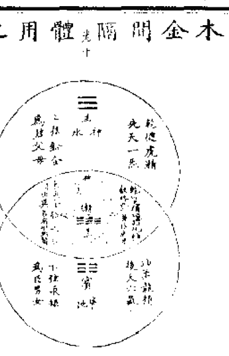

## 元氣生成之圖

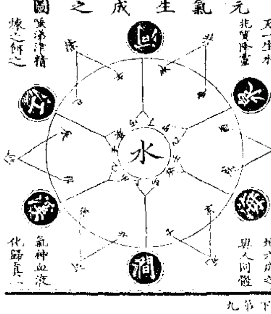

## 元氣說

元氣始生猶一黍也露珠也水顆也蓋自無始曠劫靈寶承陰而生內白而外黑玄精之孕於其間如筐戴卵自底而生斯有矣強名曰道曰靈寶承陰而生內白而外黑玄精之武北斗之經是也故內之白能化魄反屬陰外之黑能變魂反屬陽是陰含而陽抱也其內之陰因陽之動而隨出出則為香霧外之陽俟陰之靜而踐入入則肇氤氳陰氣始出視之不見是謂恍惚如同煙霧生寒氣也陽氣始入聽之不聞是謂杳冥乍若罔象生溫氣也既合矣混質而成朴積小而為大內非純陰外非純陽且陰氣之為情好舒暢好緩散欲盡出既漸出矣復不捨其子則為之肝脾狀若雲霧生濕氣也其陽氣之為性好幽養好圓融欲盡入既漸入矣莫能離其母則為之朕兆照肝離合生熱氣也外陰愈搏內陽愈凝結成混沌其形如初乃立天象是玄包其黃者也且玄屬水也是元氣之至精積而盈也黃屬火也乃餘氣之生神炬而灼也

## 卷下第十

猶是推之其混沌之內惟水中沉一日光者矣陰氣在天之外故不能靜則死死然常扇如母拍子眠陽氣在液之內故不能動則蠢蠢然常聽如雞候雞乳圓育茲久黃之內生燥氣為燥氣既生玄精蝕濁水濁氣虛因虛而風生焉燥極而雷作焉故天胞之內有四象焉其內也風欲揚而不能鼓水欲決而不能決火欲炎而不能升雷欲蕩而不能發則漸相刑剋甚至戰爭風助水之力而作澎湃雷助火之力而加奮迅至於激搏而破矣破乃分之是開天也故雷震而闢風揚其曠火氣得以升沉水液得以流注古之運化者審指風雷為盤古之號者欲使後世莫可輕測造化也天既分也元氣化氣之輕者自下而升結成梵宇也元氣積液之資重者隨底所載乃真水也原其天自有象以來至於混沌未破之時大只百里也大率今時人一日可行百里路所以雷在其中惟能固養百里之聲震動十里之怒蓋火是其母也火之燃煉一日亦不過百里乃息是以知雷之與火之今有所執矣水可日流萬里風亦如之是以知水之與風之政無所拘矣故雷之擊物則有焦風之吹衣亦有濕各隨其母氣稟受之所有也百里之天既分則千里矣漸至萬里矣風隨方以展之雷逐位以蕩之外之餘氣施張以摧之內之元氣兆運以局之歷元應化致令莫諦其幾千萬里矣或問風雷同穴也風可吹萬里雷只震百里何也曰風感寒氣而吹水是元氣則有餘也曰陰氣曰惡氣曰邪氣易積而難散陰神治世而多妄行也雷假燥氣而震火是餘氣則無私也曰陽氣曰怒氣曰義氣難動而易靜陽神治世而常守信也故雷震則聲微矣蕩則怒弱矣水火風雷四象也風惟魂雷惟響火惟光水獨質日乃火光也天宇之中有資而兆質者獨一水也水之上應北辰出焉而後水之氣日之影感化而生月矣然而水為先天後天之母也水既生風風復吹水起浪為沫雷復震水騰沸化萍日復曝水結滓成鹵月復照水澄全作泥積沉而生融煥俱化而為土也風揚而塵日烈而砂湛露既降水滋之土始生苔蘚次有蕪蕪至於任舟漸洳生滅土斯厚矣則草化為竹條茂為木久之而草結穗木成樹卉挺實春榮秋劉俱腐化土土愈坪而地域場矣至于木根土疊盤礴交固久之而化石則覆載之內有形而有象者惟木與石二物而矣老木受天地雲煙聚氣則有精有液久之而化禽化龍化玕化男子神靈具足因風以摧之則人物之四肢毛髮受之於木也乃能遵躍鼓舞控拉屈伸是其情也赭石感水土日月孕秀則有血有乳久之而化蟾化虎化羊化女人機源透徹因雷以驅之則人身之顱腹骨骼受之於石也乃能坐臥蹠處懷抱守靜是其性也木男石女既有仇合孕生男女得以全身人物既有化育茲分人蟲匪蠕亦繁胎胞長幼相須仍存子息種類差別形態燕焉簞食郊野時性遂飛走火食墟聚慧辨醜妍原其木石生男女者無情化有情也石性有潤令人之更齒木性有枯令人之有死物類有形皆偏倚也惟人身為最靈稟受陰陽元氣之全矣天神地祇皆人類主之復云天自開闢以來其象如一盞矣內之元氣化生諸氣升騰鬱結於盞唇聚為穹廓猶釜底停煤之狀隨其下方升氣厚薄所集久則垂懸隈磊得日月寒暑之氣陶鎔而成礦確內懷金玉之體或因穢濁氣干之而墜為丘陵洞冶女媧氏之鍊石取其元氣以補天遺其寶璞在世謂之五金珍寶其未經鍊鍛者乃丹砂鉛錫硝石泉類是也其穹窿聚氣既久質璞累重亦稍下墜其上幻生崆岡則有虛空故萬物旦夕騰氣爲之仰託於諸氣焰熾之芒端炎赫無影之氣灼入空廓凝而曰神萬物之液氣混合於其下而爲星曰靈化生之氣應現而爲小星故小星曰宿以其能留光一夜也察天之道其初者無靈也含萬象之景內之流光以爲靈無神也拘萬物之氣表之炎赫以爲神其外無形其內無影至聖者不得覷其面惟賢者必可合其心或言天地之有壞者此無他也蓋因一氣生化太過水力弱而土壤虛矣元氣是水也餘氣是土也水之晝夜常流洪汰川澤故河源常遷脈江岸無定垣是以禹基之栢系南比之榮枯錢塘之沙應東西之聚散日往月來世隨陵谷變遷水流極而勢弱矣況兼地土生物太盛土壤虛而不能自載小則隨方霍陷大則俱墜矣力因運窮數隨氣盡雖墜者墜必有底也但日月之光因震墜而激散無也地始墜也生氣絕而寒氣行也天無所載仍將危也其內冥冥然人物喪滅俱化土而無識也已經人世三百六十年矣陰靜極而陽復動寒氣化而溫氣生寒溫相湊化而為濕也濕氣既生薰蒸四達其穹窿寥廓因茲濡滓汗漫解斥亦皆崩塌也又經三百六十年矣猶磨壑受濕而摧也常觀山岡之勢一層石上又一層土重疊間積則可見天地之廢壞有自來矣夫天地之休息者是造化之歇力養氣也乃亦陰陽交接之道也歸根復命之義也雖曰有壞只是餘氣生積成後天上穹下壞伏實歸土也其先天之天則無壞矣以其元氣常存還返而復生也至於濕氣盛而熱氣兆熱極乃燥陽氣至焉清濁分焉光明出焉物猶賢始也又經九九八十一年矣故天地之一休息總得八百年嘗聞老人語開天一萬八百年然後有地猶此推之是天之積氣萬年而休息於八百年矣故總而言之也則又可見乾墜而成坤也故天一日有十二時人一身有十二經人之困醒惟在一時以合休息之數也天地既壞也其神不滅也所以經云浮黎元始天尊與元始天尊相去幾劫仍信不謬矣崩墜之後天高而倉遠地平而愈厚山有積而愈高猶水落石出之義也天地不休息無從而開展也嬰孩不寢寐無從而歊蒸也或問先天之天何能長存長生曰觀天之象如一盎矣外無夾曠傍無漏竅雖幽闢淨土亦居其內之明晦偏靜處所其元氣之搬運與乎休息惟在其中是以長存也天包萬物以盜其氣而養之以是長生也夫天之盜物氣者天無二天惟盜於自己之內所生故萬物無損無遺是其合得自然之盜也人亦能之況人有同體既可盜於自己之有也復能盜他物者哉奈何人之一身除五臟六腑之外別無物寄雖一啄一喙皆自外運而入欲求長生則難自生是以軒轅行御女之術故得一千二百歲幾鍾得育嬰之法亦享壽八百年歷觀移桃接杏插梨比桑至于採麋鹿之茸啖擎牡之肉身衣裘蒙口需血食以其氣可補氣情可感情物殊而元氣同也先聖曰近取諸身遠取諸物世誦其言莫咲咲也修道欲求得因求得而名盜食穀亦是盜食肉亦是盜欲為食神之盗者虽盗而盗莫及苟能自盗元气得以還返则長生之域易致知矣又尚可他圖而為不仁之盗乎且曰人之元氣何物也其始也是無始氣中一點露珠也生天也生地也資於木石而生人也至及祖宗生身之父母也今之在人之身而有者乃兩腎中間一點神氣也自父母遺而有也夫天地陰陽萬物之交媾者媾精也訛云而有血也父母既降靈於關元育陽之穴即無始玄含露珠之本也是名元氣也其形惚惚其象杳冥隱於精液之內水體是也其主腎也含育陽魂而化生心氣心氣化生兩眼瞳人而分清濁右眼之清氣化神水還心為液心之液化血還左腎為精精化氣守神為性左眼之濁氣上應生腦髓生頭顱既完而下生脊骨生右腎配左腎為命門或繫女子胞合魂魄魂生肝生心生舌生膽生包絡生小腸生膀胱生垂莖魄生肺生喉嚨生胃生脾生闌腸生大腸生穀道營衛合而生三焦魂為血行營生筋脊經絡魄化氣行衛生肌骨毛膚成身軀而後四肢也女人反皆是面此受胎也母候言脈診也然則男女雖異皆以天脈死生同斷命也夫元氣之經督者存乎腎過乎心應乎眼三官升降一氣循環者也故腎與膀胱為配心與小腸為配眼與腦為配其所配者是其都會之所也人知其配者是合也是歸也則知氣之出入有間隔也有衰旺也有清濁也此為明心見性之候也其元氣之變態化為氣液之二體也氣也者曰命也神也真汞也隨動外接人之寐則神游於眼瞑則歸於心寐則逸於腎點則集於眉本此為氣之升降者也液也者曰性也精也真鉛也修靜內復在腎而為精至肝而為魂至心而為血至脾而為膏腴至心包絡而為榮脈至肺而為魄至三焦而為衛氣至腠理而為動氣至腦而為神泉下至鼻中而為玉漿至喉舌而為靈液入于胃蒸於心候營衛二氣周身既備亦還心會合水穀諸液於大腸至闌腸分泌清濁則清氣輸入小腸接腎滲膀胱膀胱遂元海元海再生氣晝夜之無端當此之際是謂神歸氣復氣與液合君子慎其獨得之為小還男女混居室一物分二名陰中伏陽號曰黃芽陽內負陰象名白雪神符合而言之乃曰刀圭也修練之法於人身子陽之時沃以非凡之水進以自然之火自然即隨時之義也片餉功夫無中生有結成聖胎是謂奪造化也若又不求口訣而復失於同類玉液且無金液安有但以存想無為望其交媾結丹誠為虛妄也人無根本身在偏枯氣難停留液無歸著至于年老氣亦老形枯液亦枯身不了道則疾病是其憂飢渴是其累老死是其衰況為陰陽殺機之奪算乎或問何謂奪也當其寒暑之時則傷人血脈脾胃濡弱當其雷電之時則攝人魂魄神驚去體當其陰雨之時則滅人精神夢吞陰氣當其霜雪之時則削人肌膚夢危泄精當其饑餒之時則萎人氣質頑膿臭惡當其猛疫之時則腐人生命血肉天壽當其兵戈之時則毀人形志大痛離散世人不知不覺而紅顏暗失憔悴此皆殺機之奪也有言天好生而惡殺者天莫不慈忍乎夫天之好生以地氣爲本物之生氣則養之物之死氣則敗之如人腹中不容臭腐也人能調服元氣必藉胃氣爲本捨粗糲而奉精粹違非時而食新鮮去陳餕而進甘旨使胃氣充實則元氣有餘子曰祭於公不宿肉羔祭到羊必先呪刃而刺或曰啖活肉棄死血昔時之所諂聞今日而果實見亦爲惜身重命知之損益故可近求道也苟或吊山喪病患之家入產厭伏尸之次聞刑囚悲泣之聲坐屠殺流血之地自爲非法緣繼其身皆使人神駭散也殊不知元氣寄人之身如草棲煙善守者尚無百年主故養之則存觸之則散散則令人眩眩甚則人仆矣人能養元氣之勇者身心洞燭胸臆篤實有念慮有惻隱有剛毅至於審大斷其臂則其足元氣伏匿神色不移尚可活矣苟死者其靈亦不散也其不能養者庸陋淺識孰述退見多忌易惑氣無定守神無默處或因憂憤卒中暴亡或一喜一怒而輟喪身或傾生自殺此何愚之甚矣今謂元氣之所要也若曰元氣谷守之於內者曰正氣曰谷神曰性命餘氣施應之於外者曰浩氣曰應神曰聲色故王叔和診脈訣云若動應神魂魄在止便千休命不停所謂應神穴動是命脈存則人不死矣所以老子曰性命常存釋氏曰聲色皆空蓋一言非谷也一言其應者也世有迷徒不究奧理妄指釋氏欲得寂滅為樂又豈知魯論云鳥之將死其鳴也哀人之將死其言也善之語為悖哉噫前賢往哲有談道之無極者演易之太極者論天文地理者學藝射書數者推萬物盛衰者多是不從元氣立說至於窮理盡性正好下句處泛言常道既不為己任辭避依何厚薄筋骸相因束轅則皆與修身無益也於是孟軻但言善養浩然之氣莊周亦且怡悅應現之神全以不知元氣之真一名曰道哉直論元氣者是一也一也者是三才共同此一立命之基也有物也有象也是人我之本來面目也萬法歸根而名之也歸源而復命亦一之一也始於一也反復進退皆一也孰可二其名也故得指一歸元氣之說

承師口訣有感五言四韻
金液還丹訣無中養就兒一從師點透三嘆世難知守復神歸我交乾日用時逢人休問道一味服刀圭
學鑄純陽劍庚金利用堅致柔仍軟汞剛折必加鉛遍海沒不度問玄又玄仙人無忌憚懸瓶去朝天
道派分清濁訛傳理最淫藥材詢老嫩鑄鼎互陽陰龍虎知生處夫妻易死心紀丹十二載大藥一斤金
混沌初分誕乾坤氣始青悅之非小道惜也惡其形兩曜旋基鼎五芽含萬靈歲丹名在此經訣載黃庭
了命須金鼎無神也有神避庚潛向乙納甲媚逢辛外藥易亂性內丹難救貧遙聞唐呂子願度一千人

谷神篇卷下

## 道德真經章句訓頌卷上

## 道德真經章句訓頌卷下

# 道德會元卷上

# 道德會元卷下

中華民國十三年八月上海涵芬樓影印

## 道德真經章句訓頌序

太上老君道大而德宏守約而施博藏大用於無用之地寓無不為於無為之中超乎太極之先而不為古行乎三極之後而不為今得其高明者曰天得其博厚者曰地日月得之以代明四時得之以錯行山川得之以流峙洪者纖者高者下者飛者潛者動者植者各得其一而為萬物靈於物者為人舉不能出乎範圍曲成之外吾求其故而不得強名曰道非聖人無以有此道非經無以載此道

是故道難聞因經而後聞道難見因經而後見誦是經者倘有得於無為之緒則可以修身可以齊家可以安民可以措天下於太平雖然此持其粗耳南華經云其塵垢秕糠將陶鑄堯舜者非耶若夫性命蒂交媾互融妙有真空微言顯說險語後層則孫峯絕岸至味澹泊則元酒太羹其澄涵則鏡裏之花其窈渺則水中之月可以默契而不可以言悟可以神遇而不可以跡求自非別具隻眼與老君相見於寥廓惚恍間者未易影響其萬一也吾祖正一真君兩承神眴下降西蜀親授至道發五千文言外之旨無餘蘊矣家世守之蓋千數百載嗣成範焉傳嗣累奉德音以遵行太上老君經教爲祝釐第一義是以每於三元開壇傳籙告祝之餘必即此經敷暢之使在壇弟子及慕道而來者如魚飲水各滿其量然四方萬里人人提耳而誨之日亦不足矣爲老君弟子而不知老君之道猶終日飽食而不識五穀終夜秉燭而不識火也惟自負其身豈不深負聖朝崇尚經教之意哉以是不自揆輟綴其義以爲章句非敢自謂得老君之旨然使吾門弟子與夫尊德樂道之士得而玩之倘有悟入則金丹不在他求而至道吾所固有功成行滿法身不壞亦券內事耳所謂千載而下知其解者猶旦暮遇之也凡我同志可不勉旃至治壬戌夏五月嗣漢三十九代天師太玄子張嗣成再拜稽首謹序

## 道德真經章句訓頌卷上

嗣漢三十九代天師太玄子張嗣成訓頌

## 道可道章第一

道可道非常道名可名非常名無名天地之始有名萬物之母常無欲以觀其妙常有欲以觀其徼此兩者同出而異名同謂之玄玄之又玄衆妙之門

道何形象強名之說得分明說又非無有有無相造化只於理氣究真機

咦未悟非無非有若為常道常名從渠自感自胎成這箇了無形影

道者何理與氣耳因於無者理著於有者氣有此理道所以名有此氣道所以形理常於無而神故自然而性氣常於有而空故自然而命天地萬物無能違者營營皆路馬造於此必由於此故有理必有氣有氣必有形形則為天地萬物所謂可道之道可名之名也理氣之所以為氣又可得而通可得而名哉是則非無非有有不有不可得而易所謂常道常名者也天地之位以理言常無欲則寂然不動所以觀方發之理常有欲則通所以觀未發之氣同出異名又玄玄衆妙皆然二者相為無有有無耳曰

## 天下皆知章第二

天下皆知美之為美斯惡矣皆知善之為善斯不善矣故有無之相生難易之相成長短之相形高下之相傾音聲之相和前後之相隨是以聖人處無為之事行不言之教萬物作而不辭生而不有為而不恃功成不居夫惟不居是以不去

小異從來害大同更無對待是虛空當春物物皆生意那去尋他造化功喚到此全無可說教吾何處安名偶逢堯舜話昇平祇是夢中光景

# 卷上第二

## 不尚賢章第三

不尚賢使民不爭不貴難得之貨使民不為盜不見可欲使心不亂是以聖人之治虛其心實其腹弱其志強其骨常使無知無欲使夫知者不敢為也為無為則無不治

聖人之治何如使無生其心耳人皆遊乎其天我則何有乎已喫餓時喫飯困時眠天下本來無一事

## 道沖章第四

道沖而用之或不盈淵兮似萬物之宗挫其銳解其紛和其光同其塵湛兮似或存吾不知誰之子象帝之先

一無何所室凡有悉歸藏觸來勿與競事過心清涼無處逃明月世界大茫茫悠然認得我我即是虛皇咲可笑幾年看影子只今水鏡一齊忘

## 天地不仁章第五

天地不仁以萬物為芻狗聖人不仁以百姓為芻狗天地之間其猶橐籥乎虛而不屈動而愈出多言數窮不如守中

萬有自用舍芻狗祭則用祭已則舍所以為芻狗吾真容吾心譬如一呼吸自與風相尋妙當空洞際氣感何其神母勞嚼碎舌吾斯體吾真咲相與者忘故能不以為仁仁能不以為仁故能相忘所過者化萬語千言何者非假

## 谷神不死章第六

谷神不死是謂玄牝玄牝之門是謂天地根綿綿若存用之不動

恬恬奇奇理氣形自虛而實互相生元來天地一物耳妙應無窮是我靈喚此是生身處此是朝元路伏雌化作木雞土釜何勞封固谷言虛空虛空則神理也玄牝有物之義陽具為有陰陽所以有天地蓋物足則形矣夫其未形本乎虛空故其用以能無窮也

## 天長地久章第七

天長地久天地所以能長久者以其不自生故能長生是以聖人後其身而身先外其身而身存非以其無私邪故能成其私

天地如何逃始終獨能長久奪元工能知

# 卷上第四

## 上善若水章第八

上善若水水善利萬物而不爭處眾人之所惡故幾於道居善地心善淵與善仁言善信政善治事善能動善時夫惟不爭故無尤

性命人人壽莫道神仙非至公喚知性存神知命順悉無心之私乃為至理

此處柔能勝至剛自然之用妙無方碧潭照見元來面不待滄溟看渺茫喚到得滄溟更妙清寧萬象虛涵天下同沾雨露華池一點長甘

## 持而盈之章第九

持而盈之不如其已揣而銳之不可長保金玉滿堂莫之能守富貴而驕自遺其咎功成名遂身退天之道

滿傾剛折少前知代禪元來有四時明月清風真受用乃知堯舜得其遺嘆天心戒盈溢人道貴謙虛妙得天人一無慚把上書

## 載營魄章第十

載營魄抱一能無離乎專氣致柔能如嬰兒乎滌除玄覽能無疵乎愛民治國能無為乎天門開闔能無雌乎明白四達能無知乎生之畜之生而不有為而不恃長而不宰是謂玄德

四大假合託乎靈明順以保之沖然無營內視何有天下自寧出入之機審動與靜眾眩其聰我則若聰不有其功不聖其聖體用自然斯真性命喚真性命只在斯不可窺不可違

雖無知不有不情不宰皆所以言花一之過本乎自然者也

## 三十輻章第十一

三十輻共一轂，當其無，有車之用。埏埴以為器，當其無，有器之用。鑿戶牖以為室，當其無，有室之用。故有之以為利，無之以為用。

青天何蕩蕩，萬象無不容。頑然一塊土，有井便泉通。嘆莫言二物大，乃在虛空內。更於何處著虛空，元來不出吾身外。無空也，用推而大之也。又言不出吾身外者，心也。

載器空能盛，室空能居。此言天地之空也。飲而小之也。

## 五色章第十二

# 卷上第六

五色令人目盲，五音令人耳聾，五味令人口爽，馳騁田獵令人心發狂，難得之貨令人行妨。是以聖人為腹不為目，故去彼取此。

有形為我累，而況目耳口。虛心與實腹，所以明去取。嘆此是人人入道途，欲華就實著工夫。何時飽飯渾無事，內外俱忘彼我殊。

## 寵辱章第十三

寵辱若驚，貴大患若身。何謂寵辱？寵為上，辱為下。得之若驚，失之若驚，是謂寵辱若驚。何謂貴大患若身？吾所以有大患者，為吾有身，及吾無身，吾有何患？故貴以身為天下，若可寄天下；愛以身為天下，若可託天下。

道德真經章句頌

謂貴大患若身吾所以有大患者為吾有身及吾無身吾有何患故貴以身為天下若可寄天下愛以身為天下若可託天下

寵為辱之先貴乃患之大視之何用驚此身亦為外可與知者道所以自貴愛天下

一遂塵寄託或有在嗟此言有身患之的天下於吾又何益若為身在已忘吾許子

風騷從浙遊近而來之吾身貴矣身外者固為二而身乃吾病矣是猶未能忘身也其視吾喪我之南郭子綦又何如哉

卷上第七

## 視之不見章第十四

視之不見名曰夷聽之不聞名曰希搏之不得名曰微此三者不可致詰故混而為一其上不皦其下不昧繩繩兮不可名復歸於無物是謂無狀之狀無象之象是謂惚恍迎之不見其首隨之不見其後執古之道以御今之有能知古始是謂道紀

不聞乃真聞不見乃真見不用執宗頭不吹火自現無始便無終今古歸一串從來千萬變只是本來面嗟識本來面提正法

## 古之善為士章第十五

古之善為士者微妙玄通深不可識夫惟不可識故強為之容豫兮若冬涉川猶兮若畏四鄰儼兮其若客渙兮若冰將釋敦兮其若朴曠兮其若谷渾兮其若濁孰能濁以靜之徐清孰能安以久動之徐生保此道者不欲盈夫惟不盈故能弊不新成

惟其有諸內所以形諸外外內何容心所以無不解惟其靜以待所以動與對優哉

## 致虛極章第十六

致虛極守靜篤萬物並作吾以觀其復夫物芸芸各復歸其根歸根曰靜靜曰復命復命曰常知常曰明不知常妄作凶知常容容乃公公乃王王乃天天乃道道乃久沒身不殆曰無障礙不通風葉落林空歲歲同虛靜當年曾說破氣歸元海壽無窮唉惟氣性微吾惟靜知人能常清靜天地悉皆歸

有不有所以常常在唉常常在不在不在不壞不色不空不奇不惟

## 太上章第十七

太上下知有之其次親之譽之其次畏之侮之信不足有不信猶兮其貴言功成事遂百姓皆謂我自然

風日和霜雪多人心喜懼時節過懷哉誰家老擊壤去之千載猶間歌嘆惟堯舜禹氣象小異盛衰相因天地如此

## 大道廢章第十八

大道廢有仁義智慧出有大偽六親不和有孝慈國家昏亂有忠臣

## 絕聖棄智章第十九

絕聖棄智民利百倍絕仁棄義民復孝慈絕巧棄利盜賊無有此三者以為文不足故令有所屬見素抱樸少私寡欲

無三皇無五帝三王不與五伯不起也無替史與商辛此時好觀天地始嘆更於天地始妙觀未始前但得酒中趣勿為醒者傳

渾沌本來無七竅倏忽殷勤為鑿鑿誰知憂裏喪還生喜殺元氣天不覺嘆二有析

道德真經章句訓頌

## 絕學無憂章第二十

一小有勞大惟其有心斯為心害氣則專運元則無對收視返聽惟吾所在

絕學無憂唯之與阿相去幾何善之與惡相去何若人之所畏不可不畏荒兮其未央哉眾人熙熙如享太牢如登春臺我獨泊兮其未兆嬰兒之未孩乘乘兮若無所歸眾人皆有餘我獨若遺我愚人之心也哉純純兮俗人昭昭我獨若昏俗人察察我獨悶悶澹兮其若海飂兮似無所止眾人皆有以我獨頑

卷上第十

似鄙我獨異於人而貴求食於母

大道相忘一之勿二磨如嬰兒惟事乎乳偃然從兮曷有於彼乘其長也萬擾迭起外內得喪斯學累矣夫惟絕學吾復何累妙哉妙哉復天地始唉為學喪真真已喪返真須向學中求人前說夢休全信莫枉廢人白了頭

## 孔德之容章第二十一

孔德之容惟道是從道之為物唯恍唯惚惚兮恍其中有象恍兮惚其中有物窈兮冥其中有精其精甚真其中有信自古及今其名不去以閲衆甫吾何以知衆甫之然哉以此

惟無有空惟空有神惟神有炁惟炁有精

空炁相入實有不物靜以攪之妙變汨汨

喫上藥三品神炁精從無而有自然成世間萬物皆如此不信神仙浪得名

## 曲則全章第二十二

曲則全枉則直窪則盈弊則新少則得多則惑是以聖人抱一為天下式不自見故明不自是故彰不自伐故有功不自矜故長夫惟不爭故天下莫與之爭古之所謂曲則全者豈虛言哉誠全而歸之

曲能有誠誠則全哉之所至無不然儒家者流誰說異向來問禮已千年喫無極太極無名有名惟誠與一無有之真曲全枉直窪盈弊新少得多惑自然相因闇然日章的然日亡損之斯益謙尊而光此乎歸哉議則拙辣

## 希言自然章第二十三

希言自然故颶風不終朝驟雨不終日孰為此者天地天地尚不能久而況於人乎故從事於道者道者同於道德者同於德失者同於失同於道者道亦樂得之同於德者德亦樂得之同於失者失亦樂得之信不足有不信

言至自然皆有實驗諸天地得其常非常非實非長久萬得同歸一理藏映非言不言其索窮已非假不變飄風驟雨斷同其同執異於異化裁誠乎無往不至時然不欺其言言本非道言不時則不作不信不明不誠不誠則不幸矣觀風驟雨天地之變

卷上第二十

變固不能久理勢然也

## 政者不立章第二十四

政者不立跨者不行自見者不明自是者不彰自伐者無功自矜者不長其於道也曰餘食贅行物或惡之故有道者不處也

務高者不知足之揚躁進者不知步之間有其有者不化跡其跡者長嘆夫道損又損解我將何求唐虞等餘食天地一贅死

## 有物混成章第二十五

有物混成先天地生寂兮寥兮獨立而不改周行而不殆可以為天地母吾不知其名字之曰道強為之名曰大大曰逝逝曰遠遠曰反故道大天大地大王亦大域中有四大而王居一焉人法地地法天天法道道法自然

道有不物妙哉混成內外天地化化生生求之不得強名而名孰能反之人 物之靈靈其自然毋執以形唉欲望見翁頂上頭層層樓上架高樓眼前自有見翁在指向傍人得見不

卷上第三十

## 重為輕根章第二十六

重為輕根靜為躁者是以聖人終日行不離輜重雖有榮觀燕處超然奈何萬乘之主而以身輕天下輕則失臣躁則失君

至哉坤元重靜而已非重行馳非靜觀貽行以非行處以不處以御天下不過法地唉春來柳絮擅飛揚只道東風作主張去去更無歸著處枉教天地大茫茫

## 善行無轍迹章第二十七

善行無轍迹善言無瑕謫善計不用籌策善閉無關楗而不可開善結無繩約而不可解是以聖人常善救人故無棄人常善救物故無棄物是謂襲明故善人不善之師不善人善人之資不貴其師不愛其資雖智大迷是謂要妙

無所容其力則無以窺其隙有所施其德則有以同其得兼取乎人者無所偏自矜於己者有所惑嘆元造非著相聖人亦何心春和花語蕩海納水深深

## 知其雄章第二十八

卷上第四十

知其雄守其雌為天下谿為天下谿常德不離復歸於嬰兒知其白守其黑為天下式為天下式常德不忒復歸於無極知其榮守其辱為天下谷為天下谷常德乃足復歸於樸樸散則為器聖人用之則為官長故大制不割

吾身妙於嬰兒天地妙於無極道體妙於大樸觀其妙知其徼剛而能柔明而不耀貴而自卑斯執其要矣大樸散天地器執其要用天地又果何如哉散而求之天地

## 道德真經頌訓句章

## 將欲章第二十九

將欲取天下而為之吾見其不得已天下神器不可為也為者敗之執者失之凡物或行或隨或呴或吹或強或羸或載或隳是以聖人去甚去奢去泰

萬物之始因有見其未始之妙是謂無極欲而求之吾身之生猶有存乎未生之妙是謂嬰兒嬰兒有形之妙無極無形之妙然則大模之妙在於有無之間有而無無而有所以為道乎人為物靈體道知常知道係焉曰知雄守雌知白守黑知榮守辱者道體而德用也知此則造化吾握中物耳

卷上第五十

## 以道佐人主章第三十

以道佐人主者不以兵強天下其事好還師之所處荆棘生焉大軍之後必有凶年故善者果而已不敢以取強果而勿矜果而勿伐果而勿驕果而不得已果而勿強物壯則老是謂不道不道早已

無為而為所以收無得之得無心而心所以御無跡之跡天地尚不知吾之裁成則又孰知其為帝力矣執天之行玩物之化自然而自然智力皆假

大德曰生止戈為武一念之非傷天地氣唉作善降之百祥上帝臨汝

## 夫佳兵章第三十一

夫佳兵者不祥之器物或惡之故有道者不處君子居則貴左用兵則貴右兵者不祥之器非君子之器不得已而用之恬淡為上勝而不美而美之者是樂殺人夫樂殺人者不可得志於天下矣吉事尚左凶事尚右偏將軍處左上將軍處右言以喪禮處之殺人眾多以悲哀泣之戰勝以喪禮處之

卷上第十 六

備而不用者全師征而無戰者上勝易其位者非吾所崇悲其功者示之深警唉金籙九真三示戒慈悲不殺是真符憑君莫說封侯事一將功成萬骨枯

## 道常無名章第三十二

道常無名樸雖小天下不敢臣侯王若能守萬物將自賓天地相合以降甘露人莫之令而自均始制有名名亦既有夫亦將知止知止所以不殆譬道之在天下猶川谷之於江海

微而能尊者理感而必應者氣散而有名者形孰而不復者器唉出乎器復乎塵廓乎萬有之一初

## 知人者智章第三十三

知人者智自知者明勝人者有力自勝者強知足者富強行者有志不失其所者久死而不亡者壽

自知自勝有深功焉實剛純守此中九竅百骸皆幻妄無今無古是真空唉明乎靜安乎定以有其性不聽於命

大道汎兮其可左右萬物恃之以生而不辭功成不居衣被萬物而不為主故常無欲可名於小矣萬物歸焉而不為主可名於大矣是以聖人終不為大故能成其大

## 大道汎兮章第三十四

惟其無所係故無以窺其為無以窺其為故物不可違乃知已大而物小惟不自大者能之唉天地萬物惟形是礙大不可小

## 執大象章第三十五

執大象天下往而不害安平泰樂與餌過客止道之出口淡乎其無味視之不足見聽之不足聞用之不足既

妙象無象妙樂無聲妙餌無味妙用無能自歸自止自生自成矣吹龍苗擊龜鼓紫馳之峯出翠釜萬城千蠅暫時乘若何淨洗三生塵贈汝長流一杯水

## 將欲歙之章第三十六

將欲歙之必固張之將欲弱之必固強之將欲廢之必固興之將欲奪之必固與之是謂微明柔勝剛弱勝強魚不可脫於淵國之利器不可以示人

對待相因理之必至金吾之用乘之而已魚忘於淵民忘於利忘而不忘所以為治唉人居氣間磨如魚在水不自知其然出入有生死因之以順理乘之以守氣至寶存諸中天地一終始

## 道常無為章第三十七

道常無為而無不為侯王若能守萬物將自化化而欲作吾將鎮之以無名之樸無名之樸亦將不欲不欲以靜天下將自正

自然而然者天之行齊而不齊者物之情孰其行得其情而返之於無形之形寂兮寘兮無臭無聲亦孰使夫天清而地寧吹觀水還知道用微微波已靜又風吹不妨小立待其定自有人人照見時無曰當為而成不告不為主不為先曰柔曰靜曰從曰功而自然曰損又損是皆一經本旨所以為求道之方也五千言文意本相連貫河上公分為八十一章其旨因自有所在然於中出乎強免分科不鑿者亦可見舊者因共術以求其全則自悟入矣

道德真經章句訓頌卷下

嗣漢三十九代天師張嗣成訓頌

## 上德不德章第三十八

上德不德是以有德下德不失德是以無德上德無為而無以為下德為之而有以為上仁為之而無以為上義為之而有以為上禮為之而莫之應則攘臂而扔之故失道而後德失德而後仁失仁而後義失義而後禮夫禮者忠信之薄而亂之首也前識者道之華而愚之始也是以大夫處其厚不處其薄

卷下 第一

## 昔之得一章第三十九

居其實不居其華故去彼取此

皇道詭帝德失王霸雜仁義禮智相繼出萬語十言文勝質陽致長生陰致物瓦石成金丹似橘五行顛倒元氣漓方士紜紜皆伎術咲自從開闢以來盡閱棚前傀儡鏡他愈出愈奇一解不如一解

昔之得一者天得一以清地得一以寧神得一以靈谷得一以盈萬物得一以生侯王得一以為天下貞其致之一也天無以清將恐裂地無以寧將恐發神無以靈將恐歇谷無以盈將恐竭萬物無以生將恐滅侯王無以貴高將恐蹶故貴以賤為本高以下為基是以侯王自稱孤寡不穀此其以賤為本耶非乎故致數車無車不欲碌碌如玉硌硌如石

天之運以能強地之載以能息神以變而無方谷以虛而受益萬物之雜還以自然侯王之勢御以自抑純然以順二之則逆石不可玉玉不可石可石可王是謂全德

卷下第二

## 反者道之動章第四十

反者道之動弱者道之用天下之物生於有有生於無

有靜此有動有體此有用有無相倚環譬如覺復夢喚無則神神則性空則無無則命互相體用相動靜孰脫死生離感應

## 上士聞道章第四十一

上士聞道動而行之中士聞道若存若亡下士聞道大笑之不笑不足以為道故建言有之明道若昧進道若退夷道若類上德若谷大白若辱廣德若不足建德若偷質真若渝大方無隅大器晚成大音希聲大象無形道隱無名夫惟道善貸且成

明者見之從而明昧者見之從而昧人之習識自有殊道之體用無不在不自賢其賢不為天下尊不自有其有不為天下育惟其推有以以及無故能生天地之大邁天地之久咲道本虛无合自然信疑俱未得其全莫隨識習分人品且可相忘未笑前

## 道生一章第四十二

道生一生二二生三三生萬物萬物負陰而抱陽沖氣以為和人之所惡惟孤寡不穀而王公以為稱故物或損之而益益之而損人之所教亦我義教之強梁者不得其死吾將以為教父

太極名兩儀形三才成品物行畢其稱虛其盈所以全其生咲靈者以神生者以无虛而順之可侔天地

## 天下之至柔章第四十三

天下之至柔馳騁天下之至堅無有入於無間是以無為之有益也不言之教無為之益天下希及矣

天地內外無盤礴金石以凝以銷樂了無形跡與縫罅物自生成不知覺嘆繩鋸木斷水滴石穿默而識之妙合自然

## 名與身孰親章第四十四

名與身孰親身與貨孰多得與失孰病是故甚愛必大費多藏必厚亡知足不辱知止不殆可以長久

卷下第四

名高毀至貨殖盜謀一得一失循環無休惟氣血肉壞不可復悲哉營營胡不內燭有身俱是患身外復何求識得無形寶無身更自由

## 大成若缺章第四十五

大成若缺其用不敝大盈若沖其用不窮大直若屈大巧若拙大辯若訥躁勝寒靜勝熱清靜為天下正

天道地道人道妙用一以兼虛寒暑自然來往湛兮萬有歸無嘆生天成地內外此然大哉用乎能空而已

## 天下有道章第四十六

天下有道卻走馬以糞天下無道戎馬生於郊罪莫大於可欲禍莫大於不知足咎莫大於欲得故知足之足常足

戰馬踐於糞壤耕牛到處農歌衣食家家自給懷母好大貪多咲人欲之萌由不知止不幸而得禍有可畏宛西一馬白骨萬里輪臺之詔何嗟及矣

卷下第五

## 不出戶章第四十七

不出戶知天下不窺牖見天道其出彌遠其知彌少是以聖人不行而知不見而明不為而成

環足跡窮目力事物茫茫轉無極一時靜定自然靈洞見毫毛了然聰明治亂興衰陰陽變化斂之一身無有違者順氣養神潛神養真真成道合萬古長春

## 為學日益章第四十八

為學日益為道日損損之又損以至於無為無為而無不為故取天下常以無事及其有事不足以取天下

真學自然不問不辯非損無益惟益能損損之不已人欲盡矣天下之善皆吾樂取唉學道勞心已是魔學仙學法更如何誰知真學元無事學得真時事轉多

## 聖人無常心章第四十九

聖人無常心以百姓心為心善者吾善之不善者吾亦善之得善矣信者吾信之不信者吾亦信之得信矣聖人在天下惵惵為天下渾其心百姓皆注其耳目聖人皆孩之

卷下第六

不執於此者道之從無分於彼者德之容民吾同胞物吾與盡使其心歸赤子唉人物無拘含容一致萬物生生誠哉天地

## 出生入死章第五十

出生入死生之徒十有三死之徒十有三人之生動之死地亦十有三夫何故以其生生之厚蓋聞善攝生者陸行不遇兕虎入軍不被甲兵兕無所投其角虎無所措其爪兵無所容其刃夫何故以其無死地

生死常理不離乎數十有三分自生自死過於求生反入死地又有其三死數六矣生三死六合而九具不死不生惟一而已一為坤元一為乾始以全吾神以斂吾氣神氣空無一而不二物我俱亡何傷何累咦一二相依不少離隨之生死數難違不於無外觀天地夢裏誰知說夢非天地人皆不離乎氣氣聚則成形氣散則能生所謂養生亦順其氣而已養生之道以其厚自奉養少有以傷其氣而致死矣古之時慎于動明乎靜靜則定定則久久則復復則知所謂一而為不死不生之徒矣是蓋

卷下第七

神氣空無之妙生死所忘出入無間外物於我奚有加焉明乎靜知其所以靜而靜之也非若數息坐頑然以為空者使其頑然以空則又安能外氣以觀天地哉然陽氣虛陰氣塞陰常盛陽常抑乎之成當難事之取常易睹明之日常少冥晦之日常多於三生六死繁可見矣是非其本然皆人事有以致之天地萬物之氣於吾身未始一息不相通養生者可不慎歟

## 道生之章第五十一

道生之德畜之物形之勢成之是以萬物莫不尊道而貴德道之尊德之貴夫莫之命而常自然故道生之畜之長之育之成之熟之養之覆之生而不有為而不恃長而不宰是謂玄德

无形而尊以出萬有者道无名而貴以育眾生者德千形萬狀巨細雜遝者物往古來今屈伸消長者勢尊其尊貴其貴无所不施无所不被而不自知其所以是謂之至理唉道生德畜亦何心妙處元無跡可尋更好兩忘尊與貴任他瓦礫與黃金

## 天下有始章第五十二

天下有始以為天下母既得其母以知其子既知其子復守其母沒身不殆塞其兌閉其門終身不勤開其兌濟其事終身不救見小曰明守柔曰強用其光復歸其明無遺身殃是謂襲常

天地之先父母之前有始未始是謂一元為父而母造化出焉知出而復斯神之全神全不雜明光相一外想不入內言不出皎然見之青天白日不造不化矣有乎物知微知彰知柔知剛知用知藏知變知常仙則鼎湖治則陶唐噫其批揜死而不亡矣此是朝元第一方頂心直上見虛皇闐旌祭庖皆成技捉虎擒龍枉發狂史者與第五十九章積功累行者難態入門為異難然及其成功一也此條殊頓悟直

## 使我介然章第五十三

使我介然有知行於大道唯施是畏大道甚夷而民好徑朝甚除田甚蕪倉甚虛服文采帶利劍厭飲食資財有餘是謂盜夸非道也哉

孰夫寧而必於用舍夫正而趨於邪治其末而失其本厚其身而肥其家是皆自盜其所有乃不知惜而仍夸啖渡海駕橋終費力好花無實發逢春莫將捷出矜才智盜取吾家無價珍

卷下第九

## 善建不拔章第五十四

善建者不拔善抱者不脫子孫祭祀不報修之身其德乃真修之家其德乃餘修之鄉其德乃長修之國其德乃豐修之天下其德乃普故以身觀身以家觀家以鄉觀鄉以國觀國以天下觀天下吾何以知天下之然哉以此

創業惟艱守成不易宗廟饗之一世萬世身修家齊德效之始鄉國天下推之而已修真存神修仙養氣小而蛇魚大而天地一視同然孰外乎此嗟兔狡鳥烹死不還寶珠深藏海無淵若何識得靈通破好向魚龍化處觀

## 含德之厚章第五十五

含德之厚比於赤子毒蟲不螫猛獸不據攫鳥不搏骨弱筋柔而握固未知牝牡之合而峻作精之至也終日號而嗌不嗄和之至也知和曰常知常曰明益生曰祥心使氣曰強物壯則老是謂不道不道早已

卷 下 第 十

五畫純陽未六時乾元獨用一嬰兒無形可見何傷害有祖深潛要執持和在精中寧待始常而明處本非離自然妙得長生理火候抽添莫強為矣陽德為乾五生皆天陰存二四自然而然赤子之用精氣之全自無死地物何傷焉陰存不感陽健彌堅性不聽命何千萬年此修練存傷神之至玉生土乾五土也陽之用六則地成一陰形矣存而不用外之也然合而言之六數為陰折而言之則又為一數陽復於此終而如也二四為陽中之陰用而不用者也始則一陰在下離則二陰居中故深絕之指和之至常而明者皆純乾獨用之效所謂神光一點自照終始細入毫毛起天地洞然長存何知洞視者也

## 知者不言章第五十六

知者不言言者不知塞其兌閉其門挫其銳解其紛和其光同其塵是謂玄同不可得而親不可得而疏不可得而利不可得而害不可得而貴不可得而賤故為天下貴

子綦隱几回也如愚迦葉微笑異途同歸無人我想親疏何殊無貪懼想利害何施無榮辱想貴賤何拘默識直悟希夷而微是謂良貴斯天之徒唉收斂神光寂似無眾人皆醉啜其醨箇中誠得无同妙活捉神龍任汝騎

卷下第十

## 以正治國章第五十七

以正治國以奇用兵以無事取天下吾何以知其然哉夫天下多忌諱而民彌貧民多利器國家滋昏民多技巧奇物滋起法令滋彰盜賊多有故聖人云我無為而民自化我好靜而民自正我無事而民自富我無欲而民自樸

道德真經直講

垂衣裳而民自化者治之正，舞干羽而苗自格者兵之奇。取天下於無事者存乎揖讓，致天下於多事者惟其自私。嘆萬古萬萬古，君民同一機。欲存皆是事，靜後便無為。正失為刑罰，奇流入詐，其何人天地外。

觀月夜中時

## 其政悶悶章第五十八

其政悶悶，其民醇醇；其政察察，其民缺缺。禍兮福所倚，福兮禍所伏。孰知其極？其無正邪？正復為奇，善復為妖。民之迷，其日固已久矣。

卷下 第二十

是以聖人方而不割，廉而不劇，直而不肆，光而不耀。

民風有淳漓，政化有寬急。禍福非無端，人心自難必。汨汨千萬變，如夢不可執。至人攬元炁，保抱蟲始蟄。以有藏於無，妙用常不失。洞然約化外，見此未始一。嘆禍福無非自己為，見乎四竅有先知。細將人事參天理，認取純誠欲動時。

## 治人事天章第五十九

治人事天，莫若嗇。夫惟嗇，是謂早復。早復謂之重積德。重積德則無不克，無不克則莫知其極。莫知其極，可以有國。有國之母，可以長久。是謂深根固蒂，長生久視之道。

推吾身以外及者，治人之方；欲吾心以內守者，事天之則。因其寶而為虛，不盡用之謂杳。由是而復本，由是而積德。以能無能而能，以極無極之極。故有國者，治人之施；而有母者，事天而得。既得其母，子不待索。性根命蒂，灌溉凝植，環二無以為絲，化萬有而莫測。固將觀天地之終窮，而逍遙乎。

卷下第三十

無方之城，嗟此是朝元第二方。蓬萊不在海中央，伏雌莫為寶，風動胎蚌還分夜月光。靜篤之道則一，而入門有不同。此時書而然，所謂積功累行而滿三千者是也。

## 治大國章第六十

治大國，若烹小鮮。以道莅天下，其鬼不神。非其鬼不神，其神不傷人。非其神不傷人，聖人亦不傷。夫兩不相傷，故德交歸焉。

若烹小鮮者，求水火之宜以調陰陽也。其鬼不神者，用以陰柔而隱夫陽也。其神不傷人者，陽亦未嘗不用而能不顯其剛也。聖人亦不傷者，參贊裁成以保合太和也。唉，獨陽不成，獨陰不生。生成萬物，陰陽合凝。用剛則折，柔久是能剛。內以守柔，外以行。事天法地，人所以靈。裁成妙合，天地清寧。返之一已，萬有包并。示以槁死，存吾剛明。綿綿不亡，朝乎太清。

## 大國者下流章第六十一

大國者下流，天下之交，天下之牝。牝常以靜勝牡，以靜為下。故大國以下小國，則取小國；小國以下大國，則取大國。故或下以取，或下而取。大國不過欲兼畜人，小國不過欲入事人。夫兩者各得其所欲，故大者宜為下。

以大事小者，仁也；以小事大者，智焉。仁者樂天而能普，智者畏天而能全。普則天下效其地，全則一國安其天。合大小以同得，斯謙下之自然。唉，川河汨汨幾時休，海大如天凝不流。看得靜中元自動，陰陽交處互相柔。

## 道者萬物之奧章第六十二

道者萬物之奧，善人之寶，不善人之所保。美言可以市，尊行可以加人。人之不善，何棄之有？故立天子，置三公，雖有拱璧以先駟馬，不如坐進此道。古之所以貴此道者何？也不曰求以得，有罪以免，故為天下貴。

以無形而藏萬物者，謂之奧；知其所貴而有之者，謂之寶；循之以生而不知者，謂之保。故有不善而後見其善，有不美而後見其美，有不尊而後見其尊。是皆相因以為用，又美去取之足論。崇之以位，聘之以禮。

卷下第五十五

夫惟賢者之是寶，苟若反求於自己，復眾妙而取之，在一念之更耳。嗟，道何可說，亦何為？孰使三公坐論之，九萬里天同看月。妙哉，善惡未分時。

## 為無為章第六十三

為無為，事無事，味無味。大小多少，報怨以德。圖難於其易，為大於其細。天下難事，必作於易；天下大事，必作於細。是以聖人終不為大，故能成其大。夫輕諾必寡信，多易必多難。是以聖人猶難之，故終無難。

有心非心，著相非相，自然而然，無怨德想。圖難於易，為大於細，惟幾惟損，執其要矣。駟馬莫追一言之許，慎之慎之，克有終始。嘆曰：出事即生吉，存昧相竟。大小與難易，汨汨交出入。天地有不定，孰是無事？曰嗟然，吾喪我，何者真得失。

## 其安易持章第六十四

其安易持，其未兆易謀，其脆易泮，其微易散。為之於未有，治之於未亂。合抱之木，生於毫末；九層之臺，起於累土；千里之行，始於足下。

為者敗之，執者失之。聖人無為，故無敗；無執，故無失。民之從事，常於幾成而敗之。慎終如始，則無敗事。是以聖人欲不欲，不貴難得之貨；學不學，復眾人之所過。以輔萬物之自然，而不敢為。

見天下之幾，而後有以成天下之務；知天下之微，而後有以消天下之變。得失有可決於幾之先，智力有不能於微之顯。是故慎終而如始，彼舍而此取者，所以輔相時行物生之造，而順夫自然之理耳。嘆索裘莫待雪霜寒，木鑽猶能透石鑿。事向無心還自得，畫蛇添足便多端。

## 古之善為道者章第六十五

古之善為道者，非以明民，將以愚之。民之難治，以其智多。以智治國，國之賊；不以智治國，國之福。知此兩者，亦楷式。能知楷式，是謂玄德。玄德深矣，遠矣，與物反矣，然後乃至大順。

智流則假，愚近乎真。真假其自賤，推以賤人，其則返樸。民化以淳，於是取則天下歸仁。

卷下第七十

唉，秦以智愚黔首，不知黔首愚秦。誠得真愚，髮鬡君其間諸漢文。

## 江海為百谷王章第六十六

江海所以能為百谷王者，以其善下之，故能為百谷王。是以聖人欲上民，必以言下之；欲先民，必以身後之。是以聖人處上而民不重，處前而民不害。是以天下樂推而不厭。以其不爭，故天下莫能與之爭。

自卑莫如像天下之水趨之，自損莫如聖人天下之民歸之。水趨之，則有以盡地利；民歸之，則有以得天時。故軍者尊之資，而損者益之基。是皆藏有於其無，亦孰知其所以為哉？嘆謙尊損益道之餘，觀海當知造化機。試看銀河在天上，尾閭元有逆流時。

## 天下皆謂章第六十七

天下皆謂我道大，似不肖。夫惟大，故似不肖。若肖，久矣其細也夫！我有三寶，保而持之。一曰慈，二曰儉，三曰不敢為天下先。夫慈故能勇，儉故能廣，不敢為天下先故能成器長。今捨慈且勇，捨儉且廣，捨後且先，死矣！夫慈，以戰則勝，以守則固。天將救之，以慈衛之。

道大無象，有則小矣。夫惟三寶，天下以治。慈以民生，儉以民富。不欲為先，守常安事。惟守惟安，所以長器。廣則相資，勇則趨義。捨此取彼，戒哉以死。推而復之，長生久視。天道無親，惟善是與。嘆三寶人共有，有之在乎人。非慈曷守氣，非儉曷齊精，非授授為之先，曷以存吾神？神存精氣合，繹繹勿或情。勿戰亦勿守，自然成吾真。

## 善為士章第六十八

善為士者不武，善戰者不怒，善勝敵者不爭，善用人者為之下。是謂不爭之德，是謂用人之力，是謂配天，古之極。

士不武者，以保其身；戰不怒者，以平其氣；勝不爭者，其功能全；下於人者，其善樂取。合天德以同歸，蓋古人之極致。嘆保身平氣兩惟艱，更信全功取善難。水火相和龍虎伏，人天合處即金丹。

## 用兵有言章第六十九

用兵有言：吾不敢為主而為客，不敢進寸而退尺。是謂行無行，仍無敵，攘無臂，執無兵。禍莫大於輕敵，輕敵則幾喪吾寶。故抗兵相加，哀者勝矣。

不主而為客者，妙在乎應；以退為進者，惟守諸已。行無行者，不動其心；仍無敵者，因之於彼。早一割以要功，賤匹夫之疾視悻然者，自喪其慈；惻然者，有恃之理。嘆八十一章三論兵，知兵妙處有長生。乾坤萬物皆同體，勝敗元來只兩平。

## 吾言甚易知章第七十

吾言甚易知，甚易行。天下莫能知，莫能行。言有宗，事有君。夫惟無知，是以不我知。知我者希，則我貴矣。是以聖人被褐懷玉。

易知易行者，吾之言；莫知莫行者，所謂道。夫惟道，故有宗而有君。歷諸玉，則可貴而可寶；映萬有，若若皆是道。道行何者不由之？人自人有懷中玉，妙在無言與不知。

## 知不知上章第七十一

知不知，上；不知知，病。夫惟病病，是以不病。聖人不病，以其病病，是以不病。

知之為不知者，自謙；不知為知之者，自昧。能病自昧之為病，是則知害而不害。夫惟生知之謂聖，後何病乎不知？而乃病眾人之病者，此其所以為聖。聖而愚愚乎？嗟，有若無，實若虛，儒之格言；未得謂得，未盡謂盡，釋之戒示。合二者以歸之，亦奚分乎其同異。

## 民不畏威章第七十二

民不畏威，則大威至。無狎其所居，無厭其所生。夫惟不厭，是以不厭。是以聖人自知不自見，自愛不自貴。故去彼取此。

君慈民愛，受則不畏。不畏之愛，大威斯寄。容之如天，安其居矣；養之如地，樂其生矣。上下不厭，威應一理。知不自見，愛不自貴。以晦為能，以謙為美。去彼非道，惟此道取。治人修真，無往不至。唉，內養剛陽，外順之自然。心廣體安舒於中，認得真知愛信有。長年住世書。

## 勇於敢章第七十三

勇於敢則殺，勇於不敢則活。此兩者，或利或害。天之所惡，孰知其故？是以聖人猶難之。天之道，不爭而善勝，不言而善應，不召而自來，坦然而善謀。天網恢恢，疏而不失。

暴其氣者，死之機；持其志者，生之理。夫何二者之必然，而有或害而或利？蓋不求天之變者如彼，又孰知天之常者如此？故謂滴以之石穿，淵默以之雷厲，寒暑以之自然，智慮以之不滯。蕩蕩乎奮萬有而無拘，雖一毫之微不能外矣。嗟，惡盈惡殺無非道，入死入生皆是機。提取大綱歸掌握，任他常變總無違。

## 民常不畏章第七十四

民常不畏死，奈何以死懼之？若使人常畏死，而為奇者，吾將執而殺之，孰敢？常有司殺者殺。夫代司殺者殺，是謂代大匠斫。夫代大匠斫，希有不傷其手矣。

人未知愛生，常若不畏死。使其生以樂，安有死不畏？司殺無非天，有罪斯殺矣。所謂代司殺，殺之以私意。譬如代匠斫，傷手乃至必至傷人，即自傷。天道有還理，嗔起心傷處，已傷心及至傷人，并及身外子孫猶不免。一回念後便歸仁。

## 民之飢章第七十五

民之飢，以其上食稅之多，是以飢。民之難治，以其上之有為，是以難治。民之輕死，以其求生之厚，是以輕死。夫惟無以生為者，是賢於貴生。

賦斂重，萬腹空；智術用，萬息動。嗜欲無窮厚吾奉，入死求生不知痛。何如清靜兩相忘，飽飯機無民自重。唉，嗜欲之生如畫忽暝，萬界雜遝日與心競。去之何方？以省以定。清靜之道，斯其要領。

## 人之生章第七十六

人之生也柔弱，其死也堅強。萬物草木之生也柔脆，其死也枯槁。故堅強者死之徒，柔弱者生之徒。是以兵強則不勝，木強則共。故強大處下，柔弱處上。

柔弱者，氣之溫和；堅強者，氣之肅殺。溫和則陽之虛，肅殺則陰之塞。虛則所以存覽神，寒則所以復體鬼。孰知夫死生之非徒，而適乎造化之不測？唉，陰體柔弱用剛強，陽體剛強用柔弱。五行顛倒小技耳，萬物死生歸掌握。

## 天之道章第七十七

天之道，其猶張弓乎？高者抑之，下者舉之；有餘者損之，不足者補之。天之道，損有餘而補不足。人之道則不然，損不足以奉有餘。孰能有餘奉天下？唯有道者。是以聖人為而不恃，功成不居。其不欲見賢。

天道何如？以弓為喻。取其既張，不久必弛。高者必抑，下者必舉；有餘必損，不足必補。以弓推之，事物一理。人胡不天，而乃反此？孰知其然？是則是取。惟聖不聖，所以聖矣。唉，天道如弓有弛張，循環二悉為誰忙？若為認得中間機，萬有和弓一併忘。

## 天下柔弱章第七十八

天下柔弱，莫過於水；而攻堅強者，莫之能勝。其無以易之。故柔勝剛，弱勝強。天下莫不知，莫能行。是以聖人言：受國之垢，是謂社稷主；受國不祥，是謂天下王。正言若反。

此處專言德貴常常能柔弱勝剛強。納污自下方成海，成海工夫在久長。喫水以柔勝人，孰不知？莫能行者，不能常之。積善納廣不已，而持德成道，合天地皆歸。

## 和大怨章第七十九

和大怨，必有餘怨，安可以為善？是以聖人執左契，而不責於人。故有德司契，無德司徹。天道無親，常與善人。

怨不可生，亦不可和。和和無窮，兩仍其禍。生怨在彼，責報在此。執契之譬，有責報理。可責不責，惟德是取。有德執德，是謂司契。微者轍也，循環之義，喻以司微。怨怨不已，天道無親，惟善是與。善不責報，天斯報矣。嗟，萬有俱無，萬慮澄。怨何所在？德何名？人皆善從何與？太古青山只麼青。

## 小國寡民章第八十

小國寡民，使有什伯人之器而不用，使民重死而不遠徙。雖有舟輿，無所乘之；雖有甲兵，無所陳之。使民復結繩而用之。甘其食，美其服，安其居，樂其俗。鄰國相望，雞犬之聲相聞，民至老死不相往來。

## 信言不美章第八十一

信言不美，美言不信。善者不辯，辯者不善。知者不博，博者不知。聖人不積，既以為人己愈有，既以與人己愈多。天之道，利而不害；聖人之道，為而不爭。

言美則華，言信則朴。辯者有爭，善者無惡。貫一則知務，多則博。聖人無積，虛以主之。為人愈有，造物之機；與人愈多，淵泉之時。不害之利，不爭之為。惟天惟人，一而不二。萬事以宜，萬物以備。大哉道乎！予以終始。唉，非言非道，道非言辯。博誰知妙不傳？人法者天，天法道，道何所法？自然。

道德真經章句訓頌卷下

# 道德會元卷上

卷上第二十一

## 道德會元序

竊謂伏羲畫易，剖露先天；老子著書，全彰道德。此二者，其諸經之祖乎？今之學者，未造其理，何哉？蓋由不得其傳耳。予素不通書，因廣參遍訪，獲遇至人，點開心易，得造義經之妙。於是罄其所得，撰成三天易髓，授諸門人。惟老子道德經，未能究竟。一日，有傳濟庵者，持紫清真人道德寶章示予。觀其注腳，頗合符節，其中略有未盡處。予欲饒舌，熟思之未敢。後有二三子，各出數家解注，請益於予。先以正經參對，多有異同，或多或少一字，或全句差殊，或字訛舛，互有得失，往往不同。予嘆曰：正經尚爾，況注解乎？或問其故，曰：始者抄寫人差誤爾，或開板有失點對，或前人解不通處，妄有增加，以訛傳訛，支離錯雜故也。曰：孰為是？曰：河上公章句、紫清道德寶章，頗通。曰：何故？曰：與上下文理血脈貫通者為正。曰：諸家解義如何？曰：所見不同，各執一端耳。曰：請問其詳。曰：蓋由私意揣度，非自己胷中流出，故不能廣而推之也。得之於治道者，執於治道；得之於丹道者，執於丹道；得之於兵機者，執於兵機；得之於禪機者，執於禪機。或言理而不言事者，或言事而不言理者。至於權變智謀，旁蹊曲徑，遂墮於偏枯，皆失聖人之本意也。殊不知聖人作經之意，立極於天地之先，運化於陰陽之表。至於覆載之間，一事一理，無有不備，安可執一端而言之哉？予遂鏡舌，將彼解不通處，及與聖人經義相反處，逐一拈出，舉似諸子，眾皆曰然。自後請益者屢至，不容緘默，遂將正經逐句下添箇注。

## 序二

肘釋經之義，以證頤神養氣之要。又於各章下總言其理，以明究本窮源之序。又於各章後作頌，以盡明心見性之機。至於修齊治平，紀綱法度，百姓日用之間，平常履踐之道，洪纖巨細，廣大精微，靡所不備。於中又作正辭究理二說，冠之經首，明正言辭究竟義理，以破經中異同之惑。目之曰道德會元，俾諸後學審探熟味，隨其所解而入，庶不墮於偏枯，會至道以歸元也。惟是言辭鄙俚，無非直解經義，未敢自以為是。然較之諸本，其庶幾焉。

與我同志，其鑒諸。時至元庚寅孟夏旦日，都梁參學清庵蟾子李道純元素序。

## 道德會元序例

## 正辭

予參諸家經本，惟河上丈人本為正。河上大人本亦有三樣：有河上公解註，有二家全解，有章句白本。其三本中，惟河上大人章句白本理長，今從之。遂將諸本差訛表而出之，以正解理。外有大同小異二百餘言，不欲枚舉，此略言大槩，以釋學者之疑。

第二章有無相生已下六句非也。第三章是以聖人之治，或云聖人之治也非。第十一章已下六句加一字非。十三章寵為上辱為下，不合經義。十六章若存若亡，川或云與兮，或以下六句三句無兮者非也。十七章其次畏之，或云畏之者非。二十章強其若海，或云而貴食母，或云貴求。三十章或少三字，或三十一章勝而不美，或云。三十四章或以受養為。三十六章柔弱勝剛強。三十九章數車無車，或云。四十九章德善德信下或。五十二章既得其子，或云既知其子，皆非。五十五章益生不祥，或非也。生皆。六十六章是謂玄同。七十一章知不知上矣尚非。七十七章孰能以有餘奉天下，其七十八章天下柔弱莫過於水，而不用也，皆非也。或云莫柔弱於水，非也。

道德會元

## 道德會元

明也無民有自取無所之闕三者通自謂
徹有干德司見所服於死九或喻予禮種
詳德無司見自生不子者云而進不而
見德契生不於道者或十不於足進
正經而無畏道者云七足道於
經文稱德大者正是七情吾仁
本其焉司貪是其六有獨義
下信此微主無所欲三不亦
謹言人無服居者分然然
者只或服者尚生者數能
致好謂也者或云者數
思顧微故云大十車
之聽者云去會分無
此與通去人結中車
經義無人自句有
文了上知云三
古不無去
聖去被

# 道德會元卷上

都梁清庵菴子李道純元素述

道，道之可道，非常道；名可名，非常名。無名，天地之始；有名，萬物之母。故常無欲，以觀其妙；常有欲，以觀其徼。此兩者，同出而異名，同謂之玄。玄之又玄，眾妙之門。

天下皆知美之為美，斯惡已；皆知善之為善，斯不善已。故有無相生，難易相成，長短相形，高下相傾，音聲相和，前後相隨。是以聖人處無為之事，行不言之教。萬物作焉而不辭，生而不有，為而不恃，功成而弗居。夫唯弗居，是以不去。

不尚賢，使民不爭；不貴難得之貨，使民不為盜；不見可欲，使民心不亂。是以聖人之治，虛其心，實其腹，弱其志，強其骨。常使民無知無欲。使夫智者不敢為也。為無為，則無不治。

道沖，而用之或不盈。淵兮，似萬物之宗；挫其銳，解其紛，和其光，同其塵。湛兮，似或存。吾不知誰之子，象帝之先。

天地不仁，以萬物為芻狗；聖人不仁，以百姓為芻狗。天地之間，其猶橐籥乎？虛而不屈，動而愈出。多言數窮，不如守中。

谷神不死，是謂玄牝。玄牝之門，是謂天地根。綿綿若存，用之不勤。

# 德

上德不德，是以有德；下德不失德，是以無德。上德無為而無以為；下德為之而有以為。上仁為之而無以為；上義為之而有以為；上禮為之而莫之應，則攘臂而扔之。故失道而後德，失德而後仁，失仁而後義，失義而後禮。夫禮者，忠信之薄，而亂之首。前識者，道之華，而愚之始。是以大丈夫處其厚，不居其薄；處其實，不居其華。故去彼取此。

# 元會德道

經 道經之一字 亦是強名 始者聖人 為見世人 迷失本元 於是用方 便力開善 誘接引不
德 謂其頭 施為何可 見。須曰 何妙妙德 總在心 則不
玄 德 乃 賈 物 物 後 已 先 人 中 雖 把 一 地 不
治 平 皆 從 此 出 妙 用 難 量 是 難

一 言 外 不 章 能 地 經
句 細 尋 可 也 使 從 無 道
平 句 咀 未 沉 伏 歸 之 明 經
透 節 無 須 在 正 本 之 之
達 無 一 足 語 道 元 威 一
一 點 盡 向 言 故 於 感 字
部 書 自 三 之 是 亦
經 都 己 味 大 用 是 是
不 分 路 方 以 強
在 自 上 也 使 天 名
已 通 忽 然 力 真 始
方 然 然 把 了 開 者
信 道 得 五 此 善 聖
問 千 經 誘 人
餘 者 接 為
向 卻 引 見
者 不 世
人

處 字 自 然 玄 用 德 之 又 須 損 損
言 之 教 無 為 之 益 天 下 布 及 之 常 灌 然 云 玄 德 深
矣 達 矣 會 應 之 喚 不 離 當 及 之 又 云 玄 德 深
君 不 可 見 。 須 曰 何 妙 妙 德 總 在 心 則 不
施 為 何 可 見 。 須 曰 何 妙 妙 德 總 在 心 則 不
德 乃 賈 物 物 後 已 先 人 中 雖 把 一 地 不
治 平 皆 從 此 出 妙 用 難 量 是 難

一 言 外 不 章 能 地 經
句 細 尋 可 也 使 從 無 道
平 句 咀 未 沉 伏 歸 之 明 經
透 節 無 須 在 正 本 之 之
達 無 一 足 語 道 元 威 一
一 點 盡 向 言 故 於 感 字
部 書 自 三 之 是 亦
經 都 己 味 大 用 是 是
不 分 路 方 以 強
在 自 上 也 使 天 名
已 通 忽 然 力 真 始
方 然 然 把 了 開 者
信 道 得 五 此 善 聖
問 千 經 誘 人
餘 者 接 為
向 卻 引 見
者 不 世
人

# 卷上第二

道 可 道 非 常 道 名 可 名 非 常 名
無 名 天 地 之 始 有 名 萬 物 之 母
故 常 無 欲 以 觀 其 妙 常 有 欲 以 觀 其 徼
此 兩 者 同 出 而 異 名 同 謂 之 玄
玄 之 又 玄 眾 妙 之 門

不 見 中 同 出 而 異 名
有 欲 以 觀 其 徽
萬 物 之 母
即 作 一 物 無 名 也
道 可 道 非 常 道

口 不 在 舌 頭 上 到 這 裏 打 開 自 己 實 截 把 出
自 己 經 來 橫 抽 直 竖 用 不 盡 打 開 自 已 實 截 把 出
十 六 部 尊 經 一 大 藏 教 典 從 頭 徹 尾 轉 一 遍
只 消 一 唱 都 竟 還 委 悉 廢 從 頭 徹 尾 轉 一 遍
天 森 露 人 人 本 具 物 物 圓 成 堂 堂 直 截 如 用 清
難 許 人 人 本 具 物 物 圓 成 堂 堂 直 截 如 用 清
未 曾 舉 起 已 自 分 明 不 是 我 家 真 的 底 子 誰 通 人 詳
平 歷 劫 不 變 正 古 無 更 頭 面 盡 直 截 如 用 清

頭 散 行 向 實

# 元會德近

又玄
形神眾妙之門
右一章
道之為物，惟恍惟惚。惚兮恍兮，其中有象；恍兮惚兮，其中有物；窈兮冥兮，其中有精。其精甚真，其中有信。自古及今，其名不去，以閱眾甫。吾何以知眾甫之狀哉？以此。

天下皆知美之為美，斯惡已；皆知善之為善，斯不善已。故有無相生，難易相成，長短相形，高下相傾，音聲相和，前後相隨。是以聖人處無為之事，行不言之教。萬物作焉而不辭，生而不有，為而不恃，功成而弗居。夫唯弗居，是以不去。

右二章

261

# 元會修道

不尚賢，使民不爭；不貴難得之貨，使民不為盜；不見可欲，使心不亂。是以聖人之治，虛其心，實其腹，弱其志，強其骨。常使民無知無欲。使夫知者不敢為也。為無為，則無不治。

右三章

# 卷上第四

道沖，而用之或不盈。淵兮，似萬物之宗；挫其銳，解其紛，和其光，同其塵。湛兮，似或存。吾不知誰之子，象帝之先。

右四章

天地不仁，以萬物為芻狗；聖人不仁，以百姓為芻狗。天地之間，其猶橐籥乎？虛而不屈，動而愈出。多言數窮，不如守中。

262

## 道德會元

之間，其猶橐籥乎？虛而不屈，動而愈出。多言數窮，不如守中。

右五章 天覆地載，化民育物，可謂至仁。言固亦後如是，修身養命亦如是。結上章逆沖而用之之義也。頌曰：無底謂之橐，三孔謂之籥，中間一竅子，無人摸得著。摸得著，為君吹出無聲樂。

谷神不死，是謂玄牝。玄牝之門，是謂天地根。綿綿若存，用之不勤。

右六章 谷神不死，虛靈不昧也。按上章，陽不測，一間往來不息，莫知其極。動靜不測，不測不測不測不測不測不測，功生生化化而無窮。

# 卷上第五

天地長久。天地所以能長且久者，以其不自生，故能長久。是以聖人後其身而身先，外其身而身存。非以其無私耶？故能成其私。

右七章 聖人不自，天地合德，故生生不息。意用之不勤之義也。頌曰：道本至虛，至虛無如體得太虛同體太淵。三萬六千須月在心，說向誰。

上善若水。水善利萬物而不爭，處眾人之所惡，故幾於道。居善

# 元會德道

地，利心善淵，與善仁，物生言善信，物應政善治。

尤。治平聲，物事善能，物動善時，物類夫惟不爭，故無尤。如一。

右八章 按上章後已先人，所謂水者，取柔和處下之義，利物無爭，神寂靜自足，氣和平放下，遺照于黃河變度情。

持而盈之，不如其已。揣而銳之，不可常保。金玉滿堂，莫之能守。富貴而驕，自遺其咎。功成名遂身退，天之道。

右九章 持而盈之，不如其已。揣而銳之，不可常保。金玉滿堂，莫之能守。富貴而驕，自遺其咎。功成名遂身退，天之道。

# 卷上第六

載營魄抱一，能無離乎？專氣致柔，能嬰兒乎？滌除玄覽，能無疵乎？愛民治國，能無為乎？天門開闔，能為雌乎？明白四達，能無知乎？

生之畜之，生而不有，為而不恃，長而不宰，是謂玄德。

右十章 載營魄抱一，能無離乎？專氣致柔，能嬰兒乎？滌除玄覽，能無疵乎？愛民治國，能無為乎？天門開闔，能為雌乎？明白四達，能無知乎？

264

## 道德會元

三十輻共一轂，當其無，有車之用。埏埴以為器，當其無，有器之用。鑿戶牖以為室，當其無，有室之用。故有之以為利，無之以為用。

陰盛則空，陽消則息。無為而為，無知而知。伏陰者，地一也。無離敗，無為無知。

道德會元

## 右十二章

上章發明處用之以五色今人目盲色聲味物皆是根塵一切世人皆受其益惟有道者不受他視聽德言物非禮勿為則六賊化為六神通也故夫被此一頃曰見色神無定文間形散太和披融無此

## 寵辱若驚

通是外失是貴大患若身貴為何謂寵辱

## 若驚

下文寵為上辱為下故得之若驚失之若驚是謂寵辱若驚

## 患若身

設吾所以大患者為吾有身及吾無身吾有何患無患故

## 貴以身為天下

若可寄天下

卷上三第八

## 右十三章

承上章為既不為自為我之義

## 愛以身為天下

若可寄天下

## 視之不見名曰夷

無色道之隱此三者不可致詰

## 聽之不聞名曰希

無聲道之微

## 搏之不得名曰微

無形道之夷

道會德元

物成身長沒跡跡是謂無狀之狀無象之象視不見中不見其首隨之不見其後執古之道以御今之有能知古始是謂道紀

## 右十四章

古之善為士者微妙玄通深不可識夫惟不可識故強為之容豫兮若冬涉川猶兮若畏四鄰儼兮其若客渙兮若冰之將釋敦兮其若樸曠兮其若谷混兮其若濁

卷上第九

孰能濁以靜之徐清孰能安以久動之徐生保此道者不欲盈夫惟不盈故能蔽不新成

## 右十五章

致虛極守靜篤萬物並作吾以觀其復

道德會元

觀復夫物芸芸各復歸其根曰靜
是謂復命知常曰明
不知常妄作凶
知常容容乃公公乃王王乃天天乃道
道乃久沒身不殆

## 右十六章

太上下知有之
其次親而譽之
其次畏之
其次侮之
信不足焉有不信焉
悠兮其貴言
功成事遂
百姓皆謂我自然

大道廢有仁義
智慧出有大偽
六親不和有孝慈
國家昏亂有忠臣

六親不和有孝子國家昏亂有忠臣

## 右十八章

絕聖棄智民利百倍絕仁棄義民復孝慈絕巧棄利盜賊無有此三者以為文不足故令有所屬見素抱樸少私寡欲

## 右十九章

絕學無憂唯之與阿相去幾何善之與惡相去若何人之所畏不可不畏荒兮其未央哉眾人熙熙如享太牢如春登臺我獨泊兮其未兆如嬰兒之未孩儽儽兮若無所歸眾人皆有餘而我獨若遺我愚人之心也哉沌沌兮俗人昭昭我獨若昏俗人察察我獨悶悶

卷上第十

漂兮若無所止
眾人皆有以我獨頑似鄙
我獨異於人而貴食母

## 右二十章

絕學者絕其所有也故次之絕
聞難恐進學不精故常憂聖人棄絕所有
惟務於味道如水食於母兮雖把一而已
故無憂也是謂絕學無憂。頌曰
學開口便錯廣識多知轉轉不覺人間萬
事都忘却陷落
他家第二機

孔德之容
惟恍惟忽
忽其中有物
恍其中有象
窈兮冥兮其中有精
其精甚真其中有信

卷上第二十

精甚真其中有信
不去歷劫常存
眾甫之然哉以此

## 右二十一章

上章云我獨異於人德之容言其
廣納色容所謂道之為物果何物乎有象
有物有精果有乎若謂有未具參學眼
謂無亦未具參學眼
曰巨古一物了無人識別起眉毛
骨設若擬議時
照當空露

曲則全
枉則直
窪則盈
敝則新
少則得
多則惑
是以聖人抱一為天下式

新不自是故彰不自伐故有功不自矜故長夫惟不爭故天下莫能與之爭古之所謂曲則全者豈虛言哉誠全而歸之

## 右二十二章

希言自然故飄風不終朝驟雨不終日孰為此者天地天地尚不能久而況於人乎故從事於道者同於道德者同於德失者同於失同於道者道亦樂得之同於德者德亦樂得之同於失者失亦樂得之信不足焉有不信焉

## 右二十三章

卷上第十

跋者不立
跨者不行
自見者不明
自是者不彰
自伐者無功
自矜者不長
其在道也曰餘食贅行
物或惡之
故有道者不處

## 右二十四章

有物混成
先天地生
寂兮寥兮
獨立而不改
周行而不殆
可以為天下母
吾不知其名
字之曰道
強為之名曰大
大曰逝
逝曰遠
遠曰反
故道大
天大
地大
王亦大
域中有四大
而王居其一焉
人法地
地法天
天法道
道法自然

## 右二十五章

道德經卷之元

重為輕根靜為躁君是以君子終日行不離輜重雖有榮觀宴處超然奈何萬乘之主而以身輕天下輕則失臣躁則失君

## 右二十六章

善行無轍迹善言無瑕謫善數不用籌策善閉無關楗而不可開善結無繩約而不可解是以聖人常善救人故無棄人常善救物故無棄物是謂襲明故善人者不善人之師不善人者善人之資不貴其師不愛其資雖智大迷是謂要妙

## 右二十七章

知其雄，守其雌，為天下谿。為天下谿，常德不離，復歸於嬰兒。知其白，守其黑，為天下式。為天下式，常德不忒，復歸於無極。知其榮，守其辱，為天下谷。為天下谷，常德乃足，復歸於朴。朴散則為器，聖人用之，則為官長，故大制不割。

## 右二十八章

卷上 第十六

將欲取天下而為之，吾見其不得已。天下神器，不可為也，不可執也。為者敗之，執者失之。故物或行或隨，或歔或吹，或強或羸，或載或隳。是以聖人去甚，去奢，去泰。

## 右二十九章

以道佐人主者不以兵强天下其事好還師之所處荆棘生焉大軍之後必有凶年善者果而已不敢以取强果而勿矜果而勿伐果而勿骄果而不得已果而勿强物壮则老是谓不道不道早已

## 右三十章

卷上 第十七

夫佳兵者不祥之器物或恶之故有道者不处君子居则贵左用兵则贵右兵者不祥之器非君子之器不得已而用之恬淡为上胜而不美而美之者是乐杀人也夫乐杀人者则不可得志于天下矣吉事尚左凶事尚右偏将军居左上将军居右言以丧礼处之杀人众多以悲哀泣之战胜以丧礼处之

## 右三十一章

道常無名朴雖小天下不敢臣侯王若能守萬物將自賓天地相合以降甘露民莫之令而自均始制有名名亦既有夫亦將知止知止所以不殆譬道之在天下猶川谷之於江海

## 右三十二章

卷上第十八

知人者智自知者明勝人者有力自勝者強知足者富強行者有志不失其所者久死而不亡者壽

## 右三十三章

大道汎兮其可左右萬物恃之以生而不辭功成不名有愛養萬物而不為主所自常無欲可名於小萬物歸之而不為主可名於大是以聖人終不為大故能成其大

## 右三十四章

大道汎兮其可左右萬物恃之以生而不辭功成而不有衣養萬物而不為主常無欲可名於小萬物歸焉而不為主可名為大以其終不自為大故能成其大

執大象天下往往而不害安平泰樂與餌過客止道之出口淡乎其無味視之不足見聽之不足聞用之不足既

卷上 第十九

## 右三十五章

上章末後句云欲成其大故次之以執大象天下往謂安平泰樂與餌過客止道之出口淡乎其無味視之不足見聽之不足聞用之不足既

將欲歙之必固張之將欲弱之必固強之將欲廢之必固興之將欲奪之必固與之是謂微明柔弱勝剛強魚不可脫於淵國之利器不可以示人

必固與之是謂微明柔弱勝剛強

不可以示人有實利則用則必敗魚不可脫於淵國之利器

## 右三十六章

自然知幾為用則柔而勝剛水中物求與爭魚尚惜者及常也如魚離淵必死國之利器不可示人即孔子所謂可與立而不可與權者也同一義聖人用權反常合道尚不可慎為機如擊電瞬之在前忽然不見十方通寒中光明無不適

卷上第二十

道常無為而無不為侯王若能守萬物將自化化而欲作吾將鎮之以無名之朴作無欲而民自正不欲以靜天下將自正無不治

## 右三十七章

道德會元卷下

都梁清庵蟾子李道純元素述

上德不德是以有德下德不失德是以無德上德無為而無以為下德為之而有以為上仁為之而無以為上義為之而有以為上禮為之而莫之應則攘臂而仍之故失道而後德失德而後仁失仁而後義失義而後禮夫禮者忠信之薄而亂之首也

識者道之華不實愚之始也是以大丈夫處其厚不處其薄居其實不居其華故去彼取此

## 右三十八章

昔之得一者天得一以清地得一以寧神得一以靈谷得一以盈

解然萬物得一以生
有餘然萬物得一以生
下貞泰然其致之也
地無以寧將恐發
天無以清將恐裂
神無以靈將恐歇
谷無以盈將恐竭
萬物無以生將恐
滅侯王無以貴高將恐
故貴以賤為本也
高以下為基也
侯王自謂孤寡
不穀此其以賤為本也
非乎故致數車無車
不欲碌碌如玉
落落如石

## 右三十九章

上章云去彼取此謂去其本也本者何一也

卷下第二

反者道之動
弱者道之用
天下萬物生於有
有生於無

## 右四十章

反者道之動
弱者道之用
天下萬物生於有
有生於無

者天地之始
萬物之母
大道之用
侯王若能守萬物
自然歸往也
自謂孤寡不穀
自早升高不忘本也
不欲碌碌如玉
落落如石
貴賤兩忘
惟抱一也
數車無車
名車者數我之一身
無一名我也
者數我之合
一非是為妙
還虛未是玄
中知是夢
天外莫尋
神一出
便收來
致柔氣
天下

上士聞道，勤而行之；中士聞道，若存若亡；下士聞道，大笑之。不笑不足以為道。故建言有之：明道若昧，進道若退，夷道若纇。上德若谷，大白若辱，廣德若不足，建德若偷，質真若渝，大方無隅，大器晚成，大音希聲，大象無形，道隱無名。夫唯道，善貸且成。

## 右四十一章

卷下第三

道生一，一生二，二生三，三生萬物。萬物負陰而抱陽，沖氣以為和。人之所惡，唯孤、寡、不穀，而王公以為稱。故物或損之而益，或益之而損。人之所教，我亦教之。強梁者不得其死，吾將以為教父。

聞道，大笑之。不笑不足以為道。是以建言有之：明道若昧，進道若退，夷道若纇。上德若谷，大白若辱，廣德若不足，建德若偷，質真若渝，大方無隅，大器晚成，大音希聲，大象無形，道隱無名。夫唯道，善貸且成。

解者

所教為善非亦我義教之義亦強眾者不得其死死之徒吾將以為教父人之所惡唯孤寡不穀而王公以自稱故物或損之而益或益之而損人之所教我亦教之強梁者不得其死吾將以為教父

## 右四十二章

一者萬物之始人之所惡唯孤寡不穀而王公以自稱故物或損之而益或益之而損人之所教我亦教之強梁者不得其死吾將以為教父

天下之至柔馳騁天下之至堅無有入無間吾是以知無為之有益不言之教無為之益天下希及之

山王京

卷下第四

## 右四十三章

之上章孫寡不穀至柔弱勝剛強故損之又損以至於無為無為而無不為故天下將自正

名與身孰親身與貨孰多得與亡孰病甚愛必大費多藏必厚亡知足不辱知止不殆可以長久

## 右四十四章

上章無為之益謂有為則名貨得失皆有為也故以名與身孰親

能長久攝伏綿猴心耿耿取師子孔若花一標春

大成若缺其用不弊大盈若沖其用不窮大直若屈大巧若拙大辯若訥躁勝寒靜勝熱清靜為天下正

## 右四十五章

天下有道卻走馬以糞天下無道戎馬生於郊

卷下第五

不出戶知天下不窺牖見天道

## 右四十六章

罪莫大於可欲禍莫大於不知足咎莫大於欲得

## 右四十七章

不出戶，知天下；不窺牖，見天道。其出彌遠，其知彌少。是以聖人不行而知，不見而名，不為而成。

為學日益，為道日損。損之又損，以至於無為。無為而無不為。取天下常以無事，及其有事，不足以取天下。

## 右四十八章

聖人無常心，以百姓心為心。善者，吾善之；不善者，吾亦善之，德善。信者，吾信之；不信者，吾亦信之，德信。聖人在天下，歙歙焉，為天下渾其心。百姓皆注其耳目，聖人皆孩之。

作事聖人皆後之天下一家
可法

## 右四十九章

上章云無事取天下故次之
者應機應物不逆民物之情故百姓遵聖
人之言行聖人之行從聖人之化天下同
一心也。頌曰信者從他信善者從他善
若能如是知知卻成顛倒見顛倒見
三界十
一方成
出生入死
生之徒十有三
死之徒十有三
人之生動之死地亦十有三
夫何故
以其生生之厚
蓋聞善攝生者
陸行不遇虎兕
入軍不被甲兵
兕無所投其角
虎無所措其爪
兵無所容其刃
夫何故
以其無死地

卷下第七

被甲兵
心無畏懼
兕無所投其角
虎無所措
其爪兵無所容其刃
夫何故
以其無死地
死奈何
以其無死地

## 右五十章

蓋聞善攝生者
陸行不遇虎兕
入軍不被甲兵
兕無所投其角
虎無所措其爪
兵無所容其刃
夫何故
以其無死地

## 右五十一章

道生之，德畜之，物形之，勢成之。是以萬物莫不尊道而貴德。道之尊，德之貴，夫莫之命而常自然。故道生之，德畜之，長之育之，亭之毒之，養之覆之。生而不有，為而不恃，長而不宰，是謂玄德。

## 右五十二章

天下有始，以為天下母。既得其母，以知其子，既知其子，復守其母，沒身不殆。塞其兌，閉其門，終身不勤。開其兌，濟其事，終身不救。見小曰明，守柔曰強。用其光，復歸其明，無遺身殃，是為襲常。

## 右五十三章

使我介然有知，行於大道，唯施是畏。大道甚夷，而人好徑。朝甚除，田甚蕪，倉甚虛，服文采，帶利劍，厭飲食，財貨有餘，是謂盜夸。非道也哉！

## 右五十四章

善建者不拔，善抱者不脫，子孫以祭祀不輟。修之於身，其德乃真；修之於家，其德乃餘；修之於鄉，其德乃長；修之於邦，其德乃豐；修之於天下，其德乃普。故以身觀身，以家觀家，以鄉觀鄉，以邦觀邦，以天下觀天下。吾何以知天下然哉？以此。

## 右五十五章

含德之厚，比於赤子。蜂蠆虺蛇不螫，猛獸不據，攫鳥不搏。骨弱筋柔而握固。未知牝牡之合而作，精之至也。終日號而不嗄，和之至也。知和曰常，知常曰明，益生曰祥，心使氣曰強。物壯則老，謂之不道，不道早已。

## 右五十六章

知者不言，言者不知。塞其兌，閉其門，挫其銳，解其紛，和其光，同其塵，是謂玄同。故不可得而親，不可得而疏；不可得而利，不可得而害；不可得而貴，不可得而賤。故為天下貴。

## 右五十七章

以正治國，以奇用兵，以無事取天下。吾何以知其然哉？以此：天下多忌諱，而民彌貧；人多利器，國家滋昏；人多伎巧，奇物滋起；法令滋彰，盜賊多有。故聖人云：我無為，而民自化；我好靜，而民自正；我無事，而民自富；我無欲，而民自樸。

## 右五十八章

其政悶悶，其民淳淳；其政察察，其民缺缺。禍兮，福之所倚；福兮，禍之所伏。孰知其極？其無正也。正復為奇，善復為妖。人之迷，其日固久。是以聖人方而不割，廉而不劌，直而不肆，光而不耀。

## 右五十九章

治人事天，莫若嗇。夫唯嗇，是謂早服；早服謂之重積德；重積德則無不克；無不克則莫知其極；莫知其極，可以有國；有國之母，可以長久。是謂深根固柢，長生久視之道。

## 右六十章

治大國，若烹小鮮。以道蒞天下，其鬼不神；非其鬼不神，其神不傷人；非其神不傷人，聖人亦不傷人。夫兩不相傷，故德交歸焉。

## 右六十一章

大國者下流，天下之交，天下之牝。牝常以靜勝牡，以靜為下。故大國以下小國，則取小國；小國以下大國，則取大國。故或下以取，或下而取。大國不過欲兼畜人，小國不過欲入事人。夫兩者各得所欲，大者宜為下。

## 右六十二章

道者，萬物之奧，善人之寶，不善人之所保。美言可以市尊，美行可以加人。人之不善，何棄之有？故立天子，置三公，雖有拱璧以先駟馬，不如坐進此道。古之所以貴此道者何？不曰：以求得，有罪以免邪？故為天下貴。

## 右六十三章

為無為，事無事，味無味。大小多少，報怨以德。圖難於其易，為大於其細。天下難事，必作於易；天下大事，必作於細。是以聖人終不為大，故能成其大。夫輕諾必寡信，多易必多難。是以聖人猶難之，故終無難矣。

## 右六十四章

其安易持，其未兆易謀；其脆易泮，其微易散。為之於未有，治之於未亂。合抱之木，生於毫末；九層之臺，起於累土；千里之行，始於足下。為者敗之，執者失之。是以聖人無為故無敗，無執故無失。民之從事，常於幾成而敗之。慎終如始，則無敗事。是以聖人欲不欲，不貴難得之貨；學不學，復眾人之所過。以輔萬物之自然而不敢為。

## 右六十五章

古之善為道者，非以明民，將以愚之。民之難治，以其智多。故以智治國，國之賊；不以智治國，國之福。知此兩者亦稽式。常知稽式，是謂玄德。玄德深矣，遠矣，與物反矣，然後乃至大順。

## 右六十六章

江海所以能為百谷王者，以其善下之，故能為百谷王。是以欲上民，必以言下之；欲先民，必以身後之。是以聖人處上而民不重，處前而民不害。是以天下樂推而不厭。以其不爭，故天下莫能與之爭。

## 右六十七章

天下皆謂我道大，似不肖。夫唯大，故似不肖。若肖，久矣其細也夫！我有三寶，持而保之。一曰慈，二曰儉，三曰不敢為天下先。慈故能勇；儉故能廣；不敢為天下先，故能成器長。今捨慈且勇；捨儉且廣；捨後且先；死矣！夫慈，以戰則勝，以守則固。天將救之，以慈衛之。

## 右六十八章

善為士者，不武；善戰者，不怒；善勝敵者，不與；善用人者，為之下。是謂不爭之德，是謂用人之力，是謂配天古之極。

## 右六十九章

用兵有言：吾不敢為主，而為客；不敢進寸，而退尺。是謂行無行，攘無臂，扔無敵，執無兵。禍莫大於輕敵，輕敵幾喪吾寶。故抗兵相若，哀者勝矣。

## 右七十章

吾言甚易知，甚易行。天下莫能知，莫能行。言有宗，事有君。夫唯無知，是以不我知。知我者希，則我者貴。是以聖人被褐而懷玉。

## 右七十一章

知不知，尚矣；不知知，病也。聖人不病，以其病病。夫唯病病，是以不病。

## 右七十二章

民不畏威，則大威至。無狎其所居，無厭其所生。夫唯不厭，是以不厭。是以聖人自知不自見；自愛不自貴。故去彼取此。

## 右七十三章

勇於敢則殺，勇於不敢則活。此兩者，或利或害。天之所惡，孰知其故？是以聖人猶難之。天之道，不爭而善勝，不言而善應，不召而自來，繟然而善謀。天網恢恢，疏而不失。

## 右七十四章

民不畏死，奈何以死懼之？若使民常畏死，而為奇者，吾得執而殺之，孰敢？常有司殺者殺。夫代司殺者殺，是謂代大匠斫，夫代大匠斫者，希有不傷其手矣。

## 右七十五章

民之飢，以其上食稅之多，是以飢。民之難治，以其上之有為，是以難治。民之輕死，以其上求生之厚，是以輕死。夫唯無以生為者，是賢於貴生。

## 右七十六章

人之生也柔弱，其死也堅強。草木之生也柔脆，其死也枯槁。故堅強者死之徒，柔弱者生之徒。是以兵強則滅，木強則折。強大處下，柔弱處上。

## 右七十七章

天之道，其猶張弓歟？高者抑之，下者舉之；有餘者損之，不足者補之。天之道，損有餘而補不足。人之道，則不然，損不足以奉有餘。孰能有餘以奉天下，唯有道者。是以聖人為而不恃，功成而不處，其不欲見賢。

## 右七十八章

天下莫柔弱於水，而攻堅強者莫之能勝，以其無以易之。弱之勝強，柔之勝剛，天下莫不知，莫能行。是以聖人云：受國之垢，是謂社稷主；受國不祥，是為天下王。正言若反。

## 右七十九章

和大怨，必有餘怨，安可以為善？是以聖人執左契，而不責於人。有德司契，無德司徹。天道無親，常與善人。

## 右八十章

小國寡民。使有什伯之器而不用；使民重死而不遠徙。雖有舟輿，無所乘之；雖有甲兵，無所陳之。使民復結繩而用之。甘其食，美其服，安其居，樂其俗。鄰國相望，雞犬之聲相聞，民至老死，不相往來。

## 右八十一章

信言不美，美言不信。善者不辯，辯者不善。知者不博，博者不知。聖人不積，既以為人己愈有，既以與人己愈多。天之道，利而不害；聖人之道，為而不爭。

## 道德會元

貴德皆從道之尊德之貴起夫莫知爵而常自然善應故道生之畜之長之育之成之熟之養之覆之生而不有為而不恃長而不宰是謂玄德合道

右五十一章養生者以道生之言道本無形因氣成之熟之養之覆之生而不有為而不恃長而不宰是謂玄德合道

天下有始以為天下母既得其母以知其子既知其子復歸其母

生育天地無名因長養萬物而名可立一切有相受命于天成形氣於中和皆通之府也故萬物莫不尊道而貴德頌曰可道非常道無為卻有為為君明範破眾水態朝而夜

本見此頭落花萬象森羅總不知

## 卷下第八

母本及沒身不殆塞其兌不內境閉其兌不出外境終身不勤不勞而治開其兌內境濟其事外境終身不救未失其道見小曰明知微守柔曰強用其光物來復歸其明無遺身殃是謂襲常直下切忌隨他去

右五十二章道生之言道之始也故次之

使我介然有所知行於大道為無惟施是畏者恐法大道甚夷而民好徑

信真至士當向這裏真聰明載道之曰不收不放無上可上清淨自然本來模

朝甚除，田甚蕪，倉甚虛；服文綵，帶利劍，厭飲食，財貨有餘；是謂盜夸。非道也哉！

右五十三章。上章云：襲常。謂密用常道也。故次之以使我介然有知，行於大道，唯施是畏。大道甚夷，而人好徑。朝甚除，除，治也。謂治其朝廷。田甚蕪，蕪，穢也。謂田疇荒穢。倉甚虛，謂倉廩空乏。服文綵，謂服飾華美。帶利劍，謂帶佩鋒鋭。厭飲食，謂飫飫膏粱。財貨有餘，謂蓄積豐盈。是謂盜夸。夸，奢也。謂盜賊之奢泰。非道也哉！謂此豈合於道哉！

善建者不拔，善抱者不脫，子孫祭祀不輟。修之於身，其德乃真；修之家，其德有餘；修之於鄉，其德乃長；修之於國，其德乃豐；修之於天下，其德乃普。故以身觀身，以家觀家，以鄉觀鄉，以國觀國，以天下觀天下。吾何以知天下然哉？以此。

右五十四章。上章云：使我介然有知，行於大道，唯施是畏。大道甚夷，而人好徑。朝甚除，田甚蕪，倉甚虛；服文綵，帶利劍，厭飲食，財貨有餘；是謂盜夸。非道也哉！故次之以善建者不拔，善抱者不脫，子孫祭祀不輟。修之於身，其德乃真；修之家，其德有餘；修之於鄉，其德乃長；修之於國，其德乃豐；修之於天下，其德乃普。故以身觀身，以家觀家，以鄉觀鄉，以國觀國，以天下觀天下。吾何以知天下然哉？以此。

## 卷下第九

含德之厚，比於赤子。蜂蠆虺蛇不螫，猛獸不據，攫鳥不搏。骨弱筋柔而握固。未知牝牡之合而朘作，精之至也。終日號而不嗄，和之至也。知和曰常，知常曰明，益生曰祥。心使氣曰強。物壯則老，謂之不道，不道早已。

右第五十五章

知者不言，言者不知。塞其兌，閉其門，挫其銳，解其紛，和其光，同其塵，是謂玄同。故不可得而親，不可得而疏；不可得而利，不可得而害；不可得而貴，不可得而賤。故為天下貴。

## 卷下第十

知者不言，言者不知。塞其兑，闭其门，挫其锐，解其纷，和其光，同其尘，是谓玄同。故不可得而亲，不可得而疏；不可得而利，不可得而害；不可得而贵，不可得而贱。故为天下贵。

右五十六章

以正治国，以奇用兵，以无事取天下。吾何以知其然哉？以此：天下多忌讳，而民弥贫；人多利器，国家滋昏；人多伎巧，奇物滋起；法令滋彰，盗贼多有。故圣人云：我无为，而民自化；我好静，而民自正；我无事，而民自富；我无欲，而民自朴。

右五十七章

妖為欲則民之迷
聖人方而不割 方正其心自化
自直而不肆 使直其行自化
化而不肆 使直其行自化

右五十八章 上章言無為無事
問是謂上寬裕 則民淳實
察察 則民薄 實則得眾

## 道德會元

治大國若烹小鮮，撓之則糜。以道莅天下，其鬼不神。非其鬼不神，其神不傷人。非其神不傷人，聖人亦不傷人。夫兩不相傷，故德交歸焉。

右六十章

魚也烹小鮮，撓之則糜。言治大國若烹小鮮，以道莅天下，其鬼不神。非其鬼不神，其神不傷人。非其神不傷人，聖人亦不傷人。夫兩不相傷，故德交歸焉。

卷下第三十

大國者下流，天下之交，天下之牝。牝常以靜勝牡，以靜為下。故大國以下小國，則取小國；小國以下大國，則取大國。故或下以取，或下而取。大國不過欲兼畜人，小國不過欲入事人。夫兩者各得其所欲，大者宜為下。

右六十一章

大國者下流，天下之交，天下之牝。牝常以靜勝牡，以靜為下。故大國以下小國，則取小國；小國以下大國，則取大國。故或下以取，或下而取。大國不過欲兼畜人，小國不過欲入事人。夫兩者各得其所欲，大者宜為下。

順德交歸焉。修身以此，心愈下而道愈高，身愈退而德愈進。謙善而光，卑而不可踰。故曰大者宜為下。頌曰：大不傲小，小不小。做小好笑笑，好笑當面諱。了等閒伸出手，不動于戈定不平。

道者萬物之奧，無所不容。善人之寶，至貴不善人之所保。皆賴道庇。美言可以市，是足以尊行。可以加人。人行去聲。足以出眾。人之不善，善我亦何棄之有。亦可使也。

反。故立天子，置三公。作之君，作之師。雖有拱璧以先駟馬，非寶不如坐進此道。道德尊貴，古之所以貴此道者。善人不曰求以得，見有或有罪以免耶。且成。

於人故為天下貴。

## 卷下第四十

## 右六十二章

接上章之義。與者大也。寶者貴也。保者萬物恃之以生也。雖下愚不肖者，未嘗離也。舉動應酬，無非此道。百姓日用而不知者，為塵識所昧，立非天子置三公作之君作之師，教化下民，使不善者從其化。拱璧駟馬見不足為貴，不如坐進此道。修己以安百姓，先之以讓，而民不爭。陳之以德義，而民興行。示之以好惡，而民知禁。是以聖人常善救人，故無棄人。求則得之，皆有罪者之不貴於人，有罪以免耶。

凡致天下尊之也。頌曰：終日忙忙走回頭，便到家。悔來無一非，不會亂如麻。為無為，藏神事無事。心味無味，於易成大小。多少速報怨以德。不責人，圖難於其易。天下之難事必作於易，天下之大事必作於細。是以聖人終不為大，故能成其大。

於易至細成大是。

聖人終不為大，故能成其大。輕諾必寡信，多易必多難。是以聖人猶難之，故終無難。

右六十三章。為無為，事無事，味無味。大小多少，報怨以德。圖難於其易，為大於其細。天下難事，必作於易；天下大事，必作於細。是以聖人終不為大，故能成其大。夫輕諾必寡信，多易必多難。是以聖人猶難之，故終無難。

其安易持，其未兆易謀，其脆易破，其微易散。為之於未有，治之於未亂。合抱之木，生於毫末；九層之臺，起於累土；千里之行，始於足下。為者敗之，執者失之。是以聖人無為故無敗，無執故無失。民之從事，常於幾成而敗之。慎終如始，則無敗事。是以聖人欲不欲，不貴難得之貨；學不學，復眾人之所過。以輔萬物之自然，而不敢為。

卷下第十五

右六十四章

按上章之義，其要易耕，言作事謀始，備真志士，正心於思虛之先，柳清於感物之前，則心易正，情易絕，易治事於已發，過悔於已萌，不亦難乎？精小成大，不可救也。故易有覆霜堅冰之戒。傳曰：臣弑其君，子弑其父，非一朝一夕之故，其所由來者漸矣，由辯之不早辯也。繫云：惡不積不足以滅身。又云：臣弑其父，力而反臍，可不戒之哉？苟有覺於己在之，可解可不戒之哉？苟有覺於己在之。又云：為者敗之，執者失之，戒之猶切。聖人學永無危殆，若人之不欲無執無為，終始如一，下失便切九以道之盡，此道者其非賴子乎？敗失事之未萌，志皆先兆，知則不為。落第二聯，屈原馬夫收權晚船到紅心補漏道。

## 卷下第六十

古之善為士者，非以明民，不問民之難治，以其智多，其賊其民不足。不以智治國，國之福。此兩者亦楷式，楷式口默切，常知楷式，從長是謂玄德。玄德深矣遠矣，與物反矣，然後乃至大順。

右六十五章

其安易持，其未兆易謀。無為寬大治平天下，民之福也。率制下民，國之賊也。民之難治，以其多事。是以聖人以無為清靜治國，使夫知者不敢為難，與物反久，慎自然，民遂其生，獲百倍為天下治平，成大順之化。惡此道者，是謂玄德。頌曰：一切有為法，三千六百者。

江海所以能為百谷王者，以其善下之，故能為百谷王。是以聖人欲上民，必以言下之；欲先民，必以身後之。是以聖人處上而民不重，處前而民不害。是以天下樂推而不厭。以其不爭，故天下莫能與之爭。

右六十六章

天下皆謂我道大，似不肖。夫唯大，故似不肖。若肖，久矣其細也夫！我有三寶，持而保之。一曰慈，二曰儉，三曰不敢為天下先。慈故能勇；儉故能廣；不敢為天下先，故能成器長。今舍慈且勇；舍儉且廣；舍後且先；死矣！夫慈，以戰則勝，以守則固。天將救之，以慈衛之。

右六十七章

身愈下而德愈高，江海所以為百谷王者，聖人則之。下皆推尊為大，不肖言無可比也，又謙下之辭。慈忍謙退，儉約卑下，故似不肖。流俗皆尚廣大強梁血氣之勇也，殊不知慈忍謙退極廣大處。一字戰則勝，守則固，生差別相，浮雲散碧空，萬里天一様。

善為士者不武，善戰者不怒，善勝敵者不爭，善用人者為下。是謂不爭之德，是謂用人之力，是謂配天古之極。

右六十八章

不武不怒不爭，發上章不肖之義。不爭之德，用人之力，皆仁慈之間，故曰配天。以天此猶身，則形存壽永也。頌曰：不文不武，無得無失，換常尋。

卷下第十八

用兵有言：吾不敢為主而為客，不敢進寸而退尺。是謂行無行，攘無臂，仍無敵，執無兵。禍莫大於輕敵，輕敵幾喪吾寶。故抗兵相加，哀者勝。

右六十九章

接上章不武之義，行無行以至於哀者勝，皆不慈無爭之謂。頌曰：好勝終須敗，惟慈善守成。不勞施寸刃，天下賀昇平。

吾言甚易知，甚易行。天下莫能知，莫能行。言有宗，事有君。夫唯無知，是以不我知。知我者希，則我者貴。是以聖人被褐懷玉。

夫惟無知，是以不我知。知我者希，則我者貴。是以聖人被褐懷玉。

知不知上，不知知病。夫惟病病，是以不病。聖人不病，以其病病，是以不病。

右七十章

前章云：聖人被褐懷玉，內蘊真知，外同塵俗。故曰知不知上，不知知病。夫惟病病，是以不病。聖人不病，以其病病，是以不病。

卷下第十九

民不畏威，則大威至。無狎其所居，無厭其所生。夫惟不厭，是以不厭。是以聖人自知不自見，自愛不自貴，故去彼取此。

右七十一章

知不知上，不知知病。夫惟病病，是以不病。聖人不病，以其病病，是以不病。

右七十二章

民不畏威，則大威至。無狎其所居，無厭其所生。夫惟不厭，是以不厭。是以聖人自知不自見，自愛不自貴，故去彼取此。

勇於敢則殺，勇於不敢則活。此兩者或利或害。天之所惡，孰知其故？是以聖人猶難之。天之道，不爭而善勝，不言而善應，不召而自來，繟然而善謀。天網恢恢，疏而不失。

右七十三章

卷下第二十

民不畏死，奈何以死懼之？若使民常畏死，而為奇者，吾得執而殺之，孰敢？常有司殺者殺。夫代司殺者殺，是謂代大匠斫。夫代大匠斫者，希有不傷其手矣。

右七十四章

民之飢，以其上食稅之多，是以飢。民之難治，以其上之有為，是以難治。民之輕死，以其求生之厚，是以輕死。夫唯無以生為者，是賢於貴生。

右七十五章

卷下第二十一

民之生也柔弱，其死也堅強。草木之生也柔脆，其死也枯槁。故堅強者死之徒，柔弱者生之徒。是以兵強則不勝，木強則拱。強大處下，柔弱處上。

右七十六章

天之道，其猶張弓乎？高者抑之，下者舉之；有餘者損之，不足者與之。天之道，損有餘而補不足。人之道則不然，損不足以奉有餘。孰能有餘以奉天下？唯有道者。是以聖人為而不恃，功成不居，其不欲見賢。見賢之義損。

右七十七章

按上章損益之義，損有益無者必受益，惟有道者則人而行損益之性，損多益寡，損己益人，損有餘益不足，損之又損，以至無為，故曰損之常不足，損則知寬利，只這克己心便是平等行。

天下柔弱莫過於水，而攻堅強者莫之能勝，以其無以易之。柔勝剛，弱勝強，天下莫不知，莫能行。是以聖人言：受國之垢，是謂社稷主；受國之不祥，是為天下王。正言若反。

右七十八章

損上章損益之義，莫過於水，破堤決岸，莫之能禦。以此可見柔勝剛，弱勝強也。天下人皆知而不能行，何哉？不肯卑下故也。數人所忍始與不祥，惟有道者則能受之。頌曰：弱者從他弱，強者任他強。休生分別相滅。

和大怨，必有餘怨，安可以為善？是以聖人執左契，契音挈，下同叶，不責於人。已克故有德司契，性靜逸；無德司徼，心動。天道無私，公至常與聖人是從。

右七十九章

橫上章剛柔之義，以恩和怨，不如責已，恩怨兩忘，則民心自感德而契之也。大德之人則司契，下德之人司徼。明做者通也，只知通為明斷，殊不知盡法無民矣，安可為善？司契者存誠信，與民心契也。頌曰：明斷撫和氣，施恩怨禍殃，殊不如司左契，恩怨兩相忘。

小國寡民，會不使有什伯之器而不用，賢不尚，使民重死而不遠徙，安分。雖有舟車，無所乘之；動不，雖有甲兵，無所陳之。不使民復結繩而用之。

卷下第二十三

甘其食，忘美其服，忘形；安其居，忘動；樂其俗，忘鄰國相望，對境平聲無心。雞犬之聲相聞，忘其境不入內。民至老死，在道不相往來，使此忘不入內。民至老死，在道不相往來，使此。

右八十章

上章云執左契，以道處民，則小國寡民，言知足而不貪也。國雖小，民雖寡，自以為足，便有才能者不得見用，則民自然無知無欲，不違不變，無爭無競，安守常分。服食與居，常樂於道，都無彼此無犯，永無爭奪也。頌曰：無為境界，能小能大，放去收來，廓然無疑。本來面目現堂堂，世界壞時非不壞。

信言不苦，苦良口樂；美言不信，口頭味。善者不辯，相辯者不善，差別生；知者不博，頭頭總是，博者不知。

物得物，聖人不積不增。既以為人己愈有，不盡害下無所利。聖人之道而行，天為而不爭，慈惠既以與人己愈多，無窮。天之道不生利而無。

信言不美，忠言逆耳也。美不辯，善辯者致爭之由，故曰不害。真知者淡薄虛妄之言，華飾善為道者無真寶之言，故曰不積不增。既以為人己愈有，不盡體，故曰不積。養其無象，象故常存；守其無為主，故曰不可既。故曰利而無害。聖人守之曰天德曰生，故曰利而無害。聖人守之曰天章曰為而不知，故曰利而無害。聖人守之曰天。進不言之教，無為之益，天下希及之矣。遺若退，明道若昧，廣德若不足，大白若辱。

## 卷下第四十二

不後無之信，出知嘗質自獨。知白守黑，知榮辱。不自見故彰，不自伐故有功，不自矜故長。夫唯不爭，故天下莫能與之爭。知且厭謂戶前於高，自知之義也。為而不知，皆是妄知。長而不宰，功成不居。其不見其知天照察，已上皆不善之所生。開其光同其光，不見其物。知人知事知外，知其事知外。

# 道德會元卷下

卷下第二十五

道生之，德畜之，物形之，勢成之。是以萬物莫不尊道而貴德。道之尊，德之貴，夫莫之命而常自然。故道生之，德畜之，長之育之，亭之毒之，養之覆之。生而不有，為而不恃，長而不宰，是謂玄德。

天下有始，以為天下母。既得其母，以知其子，既知其子，復守其母，沒身不殆。塞其兌，閉其門，終身不勤。開其兌，濟其事，終身不救。見小曰明，守柔曰強。用其光，復歸其明，無遺身殃，是為襲常。

使我介然有知，行於大道，唯施是畏。大道甚夷，而人好徑。朝甚除，田甚蕪，倉甚虛；服文采，帶利劍，厭飲食，財貨有餘；是謂盜夸。非道也哉！

善建者不拔，善抱者不脫，子孫以祭祀不輟。修之於身，其德乃真；修之於家，其德乃餘；修之於鄉，其德乃長；修之於邦，其德乃豐；修之於天下，其德乃普。故以身觀身，以家觀家，以鄉觀鄉，以邦觀邦，以天下觀天下。吾何以知天下然哉？以此。

含德之厚，比於赤子。蜂蠆虺蛇不螫，猛獸不據，攫鳥不搏。骨弱筋柔而握固。未知牝牡之合而朘作，精之至也。終日號而不嗄，和之至也。知和曰常，知常曰明。益生曰祥。心使氣曰強。物壯則老，謂之不道，不道早已。

知者不言，言者不知。塞其兌，閉其門，挫其銳，解其紛，和其光，同其塵，是謂玄同。故不可得而親，不可得而疏；不可得而利，不可得而害；不可得而貴，不可得而賤。故為天下貴。

以正治國，以奇用兵，以無事取天下。吾何以知其然哉？以此：天下多忌諱，而民彌貧；人多利器，國家滋昏；人多伎巧，奇物滋起；法令滋彰，盜賊多有。故聖人云：我無為，而民自化；我好靜，而民自正；我無事，而民自富；我無欲，而民自樸。

其政悶悶，其民淳淳；其政察察，其民缺缺。禍兮，福之所倚；福兮，禍之所伏。孰知其極？其無正也。正復為奇，善復為妖。人之迷，其日固久。是以聖人方而不割，廉而不劌，直而不肆，光而不耀。

治人事天，莫若嗇。夫唯嗇，是謂早服；早服謂之重積德；重積德則無不克；無不克則莫知其極；莫知其極，可以有國；有國之母，可以長久；是謂深根固柢，長生久視之道。

治大國，若烹小鮮。以道蒞天下，其鬼不神；非其鬼不神，其神不傷人；非其神不傷人，聖人亦不傷人。夫兩不相傷，故德交歸焉。

大國者下流，天下之交，天下之牝。牝常以靜勝牡，以靜為下。故大國以下小國，則取小國；小國以下大國，則取大國。故或下以取，或下而取。大國不過欲兼畜人，小國不過欲入事人。夫兩者各得所欲，大者宜為下。

道者，萬物之奧，善人之寶，不善人之所保。美言可以市尊，美行可以加人。人之不善，何棄之有？故立天子，置三公，雖有拱璧以先駟馬，不如坐進此道。古之所以貴此道者何？不曰：以求得，有罪以免邪？故為天下貴。

為無為，事無事，味無味。大小多少，報怨以德。圖難於其易，為大於其細；天下難事，必作於易，天下大事，必作於細。是以聖人終不為大，故能成其大。夫輕諾必寡信，多易必多難。是以聖人猶難之，故終無難矣。

其安易持，其未兆易謀；其脆易泮，其微易散。為之於未有，治之於未亂。合抱之木，生於毫末；九層之臺，起於累土；千里之行，始於足下。為者敗之，執者失之。是以聖人無為故無敗，無執故無失。民之從事，常於幾成而敗之。慎終如始，則無敗事。是以聖人欲不欲，不貴難得之貨；學不學，復眾人之所過，以輔萬物之自然而不敢為。

古之善為道者，非以明民，將以愚之。民之難治，以其智多。故以智治國，國之賊；不以智治國，國之福。知此兩者亦稽式。常知稽式，是謂玄德。玄德深矣，遠矣，與物反矣，然後乃至大順。

江海之所以能為百谷王者，以其善下之，故能為百谷王。是以聖人欲上民，必以言下之；欲先民，必以身後之。是以聖人處上而民不重，處前而民不害。是以天下樂推而不厭。以其不爭，故天下莫能與之爭。

天下皆謂我道大，似不肖。夫唯大，故似不肖。若肖，久矣其細也夫！我有三寶，持而保之。一曰慈，二曰儉，三曰不敢為天下先。慈故能勇；儉故能廣；不敢為天下先，故能成器長。今捨慈且勇；捨儉且廣；捨後且先；死矣！夫慈，以戰則勝，以守則固。天將救之，以慈衛之。

善為士者，不武；善戰者，不怒；善勝敵者，不與；善用人者，為之下。是謂不爭之德，是謂用人之力，是謂配天古之極。

用兵有言：吾不敢為主，而為客；不敢進寸，而退尺。是謂行無行；攘無臂；扔無敵；執無兵。禍莫大於輕敵；輕敵幾喪吾寶。故抗兵相若，哀者勝矣。

吾言甚易知，甚易行。天下莫能知，莫能行。言有宗，事有君。夫唯無知，是以不我知。知我者希，則我者貴。是以聖人被褐而懷玉。

知不知，尚矣；不知知，病也。聖人不病，以其病病。夫唯病病，是以不病。

民不畏威，則大威至。無狎其所居，無厭其所生。夫唯不厭，是以不厭。是以聖人自知不自見；自愛不自貴。故去彼取此。

勇於敢則殺，勇於不敢則活。此兩者，或利或害。天之所惡，孰知其故？是以聖人猶難之。天之道，不爭而善勝，不言而善應，不召而自來，繟然而善謀。天網恢恢，疏而不失。

民不畏死，奈何以死懼之？若使民常畏死，而為奇者，吾得執而殺之，孰敢？常有司殺者殺。夫代司殺者殺，是謂代大匠斫，夫代大匠斫者，希有不傷其手矣。

民之飢，以其上食稅之多，是以飢。民之難治，以其上之有為，是以難治。民之輕死，以其上求生之厚，是以輕死。夫唯無以生為者，是賢於貴生。

人之生也柔弱，其死也堅強。草木之生也柔脆，其死也枯槁。故堅強者死之徒，柔弱者生之徒。是以兵強則滅，木強則折。強大處下，柔弱處上。

天之道，其猶張弓歟？高者抑之，下者舉之；有餘者損之，不足者補之。天之道，損有餘而補不足。人之道，則不然，損不足以奉有餘。孰能有餘以奉天下，唯有道者。是以聖人為而不恃，功成而不處，其不欲見賢。

天下莫柔弱於水，而攻堅強者莫之能勝，以其無以易之。弱之勝強，柔之勝剛，天下莫不知，莫能行。是以聖人云：受國之垢，是謂社稷主；受國不祥，是為天下王。正言若反。

和大怨，必有餘怨，安可以為善？是以聖人執左契，而不責於人。有德司契，無德司徹。天道無親，常與善人。

小國寡民。使有什伯之器而不用；使民重死而不遠徙。雖有舟輿，無所乘之，雖有甲兵，無所陳之。使民復結繩而用之。甘其食，美其服，安其居，樂其俗。鄰國相望，雞犬之聲相聞，民至老死，不相往來。

信言不美，美言不信。善者不辯，辯者不善。知者不博，博者不知。聖人不積，既以為人己愈有，既以與人己愈多。天之道，利而不害；聖人之道，為而不爭。

螢蟾子語錄卷之一

螢蟾子語錄卷之二

螢蟾子語錄卷之三

螢蟾子語錄卷之四

螢蟾子語錄卷之五

螢蟾子語錄卷之六

中華民國十四年二月上海涵芬樓影印

# 清庵瑩蟾子語錄序

作家話靶打頭相遇便把自家屋裏話拈出此豈非道中之作家者乎予自幼業儒壯愛談空雖愚賤者有能道酸餡氣話亦不以儒自高必屈己下問但未能遇作家爾一日歸茅山舊隱清庵瑩蟾子李君來訪塵未溫發數語字字無煙火氣繼而講義皇未盡以前易透祖師過不切底關把三教紙上語掃得赤洒洒將我箇瞎漢眼點出圓陀陀清氣襲人和光滿座恍不知移蟾窟於予身中耶抑予潛身入蟾窟中耶是夜驚喜萬倍整心慮燕心香拜於床下曰真我師也真作家也師不我棄願加警誨是後從師日久問答頗多集成一編時為展敬直待向清庵座下踢翻玄妙粉碎太虛空方為了事漢於斯時也若有箇出來問清庵老曰到這裏要這骨董做甚麼則曰便是我打頭遇作家話靶時至元戊子夏季大雨時行日茅山道士嘿庵廣蟾子稽首謹書

# 清庵瑩蟾子語錄卷之一

門弟子嘿庵柴元皋編

大願心經注云有僧問岑和尚二鼠侵藤如何淘汰岑曰今時人須是隱身去敢問何謂隱身師曰何須待零落然後始知空須是只今件件不着事事不染我不見一切物則一切物亦不見我是謂隱身也問曰欲言言不及山東河北好商量此意如何師曰此事若以言說說不能盡末後一句至廣至大都包盡了更有何說只這言不及已自說了問曰要識此經麼曰西瞿耶尼北鬱單越何故偏指此二句師曰我不如是道若有人問我如何是此經我只向他道東西十萬南北八千問曰是大神咒是大明咒是無上咒是無等等咒此四句三教書中比得甚麼師曰比得道書妙中之妙玄之又玄無上可上不然而然又比得儒書中真觀真明真勝一雖然最上一着又在言句之外

問曰圓明菩薩初地出家如何出得女子定文殊菩薩是七佛之師如何出不得師曰臭

錄語子燈臺清

庵云犬迎曾宿客鴉護落巢兒說得好分曉休更疑惑

師問予曰因出不得女子定文殊召問明參不二法門文殊云不得動動着三十棒子作麼會予方擬議間因定庵動身偶觸其機遂舉似師然之

師曰井底泥蛇舞柘枝窗間明月照梅梨作麼生會予擬議良久曰吹出竅中一曲爛破眼裏空花師曰不是予又曰腦蓋撞開惟有我眼睛突出更無他師曰較些子

卷一 第二

問曰昔兩僧捲簾公案其間一得一失謂何師曰仁者見之謂之仁智者見之謂之智

問曰僧問夾山如何是法身山云法身無相僧云如何是法眼山云法眼無瑕道吾聞之不許後參船子回來再舉此話亦依前答道吾云今番有師子敢問吾師一般問一般答如何不許前却許後師曰雲月是同溪山各異

師曰問洞山有寶鏡三昧五位顯訣云正中偏偏中正正中來偏中至兼中到五事如何參答曰正不得中莫見其偏偏不得中莫

顯其正正者來歸中偏者亦至中偏正合一皆中則兼到矣到此偏正兩忘惟中獨存是也師曰久些子若於動靜中會意始得一日師與四人同坐次師曰川老云是心非心不是心如何說眾答皆不當答曰是心也不是非心也不是師曰如何即是予一唱師曰牢收取師曰如何是道予拍臺下又曰如何是道中人予又拍一下師曰久些箇子隨聲一唱師曰早遲八刻

問曰三十幅共一轂如何說師曰輻與轂只是器之體輻來湊轂方成車之用比得三十日共一月以成明之用又比得萬法歸空以成性之用皆同也

問曰生之徒十有三死之徒十有三此說譬之者多請師為我正之師曰生之徒水火既濟也死之徒水火相違也水成數六火成數七六與七合十三數古人道七六十三等月官春色者是也或謂七情六欲合十三者稍通或以八卦五行言之者非也豈不聞下經有云堅強死之徒柔弱生之徒乎堅強為欲

欲使也柔弱謂憑憑空欲也念欲起則上炎下濕水火違也念欲絕則陽降陰升水火濟也復何疑哉

問曰天地之間其猶橐籥乎虛而不屈動而愈出其橐籥可以建天地造化之妙歟願師明以告之師曰橐是沒底囊橐是三孔笛總謂之鼓風鞴此喻天地至虛無窮妙義悉具其中又喻人之虛靈不昧也不屈言其舒徐通暢之義也動而愈出應變無窮也

問曰朝屯暮蒙如何說師曰乾坤坎離為造

卷一 第九四

廓六十卦運化於其中始於屯蒙終於既未以為火符之則丹書以乾坤為鼎器坎離為藥物諸卦為化機若是也六十卦共三百六十爻象一年三百六十日之數自冬至後起也蒙大雪盡日是既未也以一月言之初一日起屯蒙月晦日是既未以一日言之子時起屯蒙亥時是既未若以工夫言之頃刻之工夫奪一年之節候自起手便是屯蒙收拾便是既未所謂朝屯暮蒙只此總名也總是理有一刹那間周天數足諸卦悉在其中矣

錄語子燈堂應清

祖師謂無爻卦內定乾坤者是也

問曰寶瓶裏面養金鵝如何說師曰以無為言之是兩則公案以有為言之是一段工夫且先以無為向公道僧問趙州狗子有佛性也無州云有僧曰爲甚有州云無僧云爲甚無州云爲伊了無又古德云瓶中鵝子成鵝了如何出得瓶去此兩則公案今人多有過不得底如有人下得一轉語參學事畢又以有爲言之狗者無中有也陰中陽也又狗乃司寇帳中狗者防內盜也寶瓶裏面養金鵝

卷一 第五

水中金也爐中丹也養金鵝則是養聖胎也聖胎成如瓶中鵝子也瓶破鵝出世俗之常理也鵝出而瓶不破此脫胎之妙也故祖師云錦帳之中藏玉狗寶瓶裏面養金鵝其金丹之妙歟

問曰休妻謾遺陰陽隔其說如何師曰紫陽云未得真鈐莫隱山此一句願同今時學道底人被謾師所惑傳得箇工法便道他得道了也休妻棄子入山隱遁及至行功無驗便生退悔或還俗歸家者或再娶妻者如此之

錄語子蟾唐清

人極多又有下愚無學之人不達聖人之理却言休妻不是道及指婦人爲鼎器或謂婦人身中有藥或指產門爲生身處此大亂之道也殊不知祖師當來指示世人若不能絕欲徒爾休妻又見學者錯會其意故復云自然有鼎烹龍虎何必捨家戀子妻今之無學只着在前句上全不思後句真罪人也

問曰我師嘗謂修丹者不可着在年月日時上如何却又道採藥須知昏曉師曰此即與屯蒙同一意也其用處稍異立春立秋乃年

卷一 第六

中昏晚上下兩弦月中昏晚寅申二時日中昏晚陰陽交會之時乃身中昏晚也通乎晝夜之道則知陰陽推遷之理推幽明之故則知死生之說佛仙聖之人大要盡在是矣

問曰視之不見名曰希聽之不聞名曰夷搏之不得名曰微與視不見我聽不得聞離種種邊名爲妙道是同是異師曰大槩相似其理實不同前是體後是用中庸曰戒慎乎其所不覩恐懼乎其所不聞莫見乎隱莫顯乎微故君子常慎其獨即視不見我處聽不得

問處離得種種邊方謂之妙道也若謂視之不可見聽之不可聞搏之不可得曰希曰夷曰微又有甚種種邊可離也即愚樂問曰一年十二月有箇子月一日十二時有箇子時不知人身中子時在甚麼處師曰致虛極守篤萬物並作吾以觀其復其斯之謂歟答曰癸生之時時動必決此說如何師曰然即又問曰元始隱一寶珠去地五丈師曰相公如何說印曰五者陽數也師曰非也去地五丈則是離五濁辱也在虛玄之中則是潛神入

妙也答曰五濁之上即玄牝之門數師曰雖然不下實工夫不曾親見得徒說得有此象又濟得箇甚麼事問曰天地不仁以萬物為芻狗聖人不仁以百姓為芻狗何譬之至賤也師曰天地聖人不以仁為仁故視萬物百姓至微而譬之自生自殺也雖自生自殺實歸根復命也易繫云顯諸仁藏諸用鼓萬物不與聖人同憂即天地不仁以萬物為芻狗之義也乾以美利利天下不言所利大矣哉即聖人不仁以百

姓為芻狗也

問曰嬰兒之未孩孟子云大人者不失其赤子之心是同否師曰同此言其大朴未散其復不遠也

問曰老子云道之為物惟恍惟惚惚兮恍其中有物惚兮恍其中有象窈兮冥其中有精其精甚真其中有信耶師曰聖人言有物混成先天地生則這先天地生便是道之顯象也象因天地而顯天地因有物而混成物因二

卷一第八

五之精妙合而凝所以二五之精道之體也象與物道之用也

問曰戒慎乎其所不睹一節以視不見我四句譬喻得甚切若只以儒家話引喻得切更好顯師着一語師曰前兩句如在無人之境而常存乎誠也後兩句如與人對面常防其有不測之意也且如上天之載無聲無臭誠之不可揜非見隱顯微之密乎上天之載雖無聲無臭之可聞知然天理昭昭誠不可揜也

問曰愛悔吝者存乎介如何說師曰介謂我心匪石不可轉也凡舉心動念處先存乎介介然大定則毫毛之動悉皆先兆奚悔吝之有只要先覺為上

師曰先甲三日後甲三日與先庚三日後庚三日同否師曰不同蠱者亂也覺之於未然不至於亂覺之於已然而後治之亂亦可救也尚不覺亂之甚也甲者首也覺於三日之先謂之先甲覺於三日之後謂之後甲後於三日之遠非覺也先庚後庚在巽九五巽為

卷一 第九

風天之命令也令有更改則民不信已日乃孚若於未更前三日先告誡利害然後有所革變則民從而信之也又於已更三日之後復告誡使其樂然為善也甲至戊已為中庚過中也過中則變故曰庚所謂庚者更革之義也

師曰非道不可言即道如何說速道速道予舉似師然之師曰不可道不可名公作何說答曰說則說矣恐所以見淺近願師言之師曰從自然出者不可道之道本無名喚是不

可名之名從道中出者是可道之道才可名道是可名之名不可道不可名是天地之始可道可名是萬物之母欲見其始常無欲以觀其妙欲見其母常有欲以觀其徼妙玄妙始於無始也徼邊徼見於可見者也此兩者同出而異名同謂之玄也

師曰吾昔日侍坐於通庵師之前師令我對一對句曰精開神開與氣開三開一轉吾對曰天籟地籟與人籟萬籟俱鳴師改鳴字作澄字公對曰甚麼答曰文火武火加猛火總

火全功師又曰吾有一對以先覺而覺後覺對曰甚麼答曰由外觀而觀內觀師曰改由字作反字更好

冬至夜師曰一陽來復先王以至日閉關對曰甚麼對曰大畫備坤君子故及時修業師然之一日師對眾云先聖易心即是後人心易各請一對答曰吾身神惡本是元始死神磨穿云太初真性豈非今日性真師曰吾自有一對諸人諦聽師曰小生經藏元同老子藏經諸人莫能及師曰師屬金金本沈也為

甚却浮肝屬木木本浮也爲甚却沈諸人皆無答師曰肺因受蒸而有庚金在內故浮肝因受蒸而有乙木在內故沈以卦言之兌爲金金性本沈因金生北一之水爲坎坎中真火上炎故浮震爲木木性本浮震下實因木生南二之火爲離離中真水下降故沈以藥物言之鉛屬金本沈見火即升故浮汞屬木本浮見水則墜故沈以法象言之月屬坎本沈進火故浮日屬離木浮退符故沈古人云潭底日紅陰怪滅因水而沈也山頭月白藥

卷一 第十一

苗新因蒸而浮也總而言之金空即浮木實即沈此之謂也師曰主中主賓中賓賓中主主中賓諸人作麼會衆皆不解此機磨宰曰身外身是主中主夢中夢則賓中賓情中性是賓中主性中情是主中賓師曰較些子答曰我惟有我他又去說他他來使我我又役他即此意也師曰未徹在答曰又心外無心主中主念中起念賓中賓未動先覺賓中主動後方覺主中賓師曰不若以動靜言之最親切靜中極靜

主中主動而又動

靜中散亂主中寂

師曰乾有四德坤有幾德答曰坤亦有四德師曰未盡善夫坤元亨利與乾同貞之一字不同順承而後方貞故曰牝馬之貞也牝馬柔順健行之謂也師曰屯有幾德答曰元亨利貞與乾同其辭其德則不同也師曰何謂不同吾思之未及對師曰若同德則非屯難也所謂元亨者元有大亨通之義也利貞者利在正固也苟非正固則不足以免屯難矣

卷一 十二

何亨之有若能固守元亨之亨則能濟屯難而已

師曰西南得朋東北喪朋何謂也吾思之未及答師笑曰公未知之蓋陰類又得陰則陰氣愈盛則愈迷亂矣故曰失常至東北之陽位又喪其陰朋是以安貞吉也陰既從陽有生成之理故曰得常修真之士情念一動是陰也若縱意隨之是陰得朋也亦謂之失常苟以剛志斷之念從何起念情絕則喪其朋也亦謂之得常非天下之至明其孰能與於

此

師曰謙六爻皆吉何也答曰由其謙下之致也師曰然諸爻皆言謙第五爻不言謙何也蓋五為君不過於謙則不失其權也故有利用侵伐無不利之說也所以修真之士須要剛柔並濟不可過於柔也師曰先天而天弗違後天而奉天時何也答曰未生以前為先天故無所違既生以後為後天故有所奉師曰只當以先覺喻先天出乎自然然後覺喻後天出乎不得已出乎自然天理弗違出乎不

卷一 第三十三

得已我不敢違乎天故曰奉天時也

師曰喜怒哀樂未發謂之中發而皆中節謂之和我試問公輩欲發未發作麼生會良久應之師曰是已發也予默然師曰是未發也再一答師許之曰留取自受用恐暗却後人眼自悟者始得用也

清庵瑩蟾子語錄卷之一

## 清庵瑩蟾子語錄卷之三

門弟子定庵趙道可編

道德心要

清庵曰：道在人中，人在道中。道離人不得，人離道不得。譬如魚在水中，水離魚不得，魚離水不得。道在人中，人離道不得。道在人中，如魚在水中。水離魚不得，魚離水不得。道離人不得，人離道不得。道在人中，如魚在水中。水離魚不得，魚離水不得。道離人不得，人離道不得。道在人中，如魚在水中。水離魚不得，魚離水不得。道離人不得，人離道不得。道在人中，如魚在水中。水離魚不得，魚離水不得。道離人不得，人離道不得。道在人中，如魚在水中。水離魚不得，魚離水不得。道離人不得，人離道不得。道在人中，如魚在水中。水離魚不得，魚離水不得。道離人不得，人離道不得。道在人中，如魚在水中。水離魚不得，魚離水不得。道離人不得，人離道不得。道在人中，如魚在水中。水離魚不得，魚離水不得。道離人不得，人離道不得。道在人中，如魚在水中。水離魚不得，魚離水不得。道離人不得，人離道不得。道在人中，如魚在水中。水離魚不得，魚離水不得。道離人不得，人離道不得。道在人中，如魚在水中。水離魚不得，魚離水不得。道離人不得，人離道不得。道在人中，如魚在水中。水離魚不得，魚離水不得。道離人不得，人離道不得。道在人中，如魚在水中。水離魚不得，魚離水不得。道離人不得，人離道不得。道在人中，如魚在水中。水離魚不得，魚離水不得。道離人不得，人離道不得。道在人中，如魚在水中。水離魚不得，魚離水不得。道離人不得，人離道不得。道在人中，如魚在水中。水離魚不得，魚離水不得。道離人不得，人離道不得。道在人中，如魚在水中。水離魚不得，魚離水不得。道離人不得，人離道不得。道在人中，如魚在水中。水離魚不得，魚離水不得。道離人不得，人離道不得。道在人中，如魚在水中。水離魚不得，魚離水不得。道離人不得，人離道不得。道在人中，如魚在水中。水離魚不得，魚離水不得。道離人不得，人離道不得。道在人中，如魚在水中。水離魚不得，魚離水不得。道離人不得，人離道不得。道在人中，如魚在水中。水離魚不得，魚離水不得。道離人不得，人離道不得。道在人中，如魚在水中。水離魚不得，魚離水不得。道離人不得，人離道不得。道在人中，如魚在水中。水離魚不得，魚離水不得。道離人不得，人離道不得。道在人中，如魚在水中。水離魚不得，魚離水不得。道離人不得，人離道不得。道在人中，如魚在水中。水離魚不得，魚離水不得。道離人不得，人離道不得。道在人中，如魚在水中。水離魚不得，魚離水不得。道離人不得，人離道不得。道在人中，如魚在水中。水離魚不得，魚離水不得。道離人不得，人離道不得。道在人中，如魚在水中。水離魚不得，魚離水不得。道離人不得，人離道不得。道在人中，如魚在水中。水離魚不得，魚離水不得。道離人不得，人離道不得。道在人中，如魚在水中。水離魚不得，魚離水不得。道離人不得，人離道不得。道在人中，如魚在水中。水離魚不得，魚離水不得。道離人不得，人離道不得。道在人中，如魚在水中。水離魚不得，魚離水不得。道離人不得，人離道不得。道在人中，如魚在水中。水離魚不得，魚離水不得。道離人不得，人離道不得。道在人中，如魚在水中。水離魚不得，魚離水不得。道離人不得，人離道不得。道在人中，如魚在水中。水離魚不得，魚離水不得。道離人不得，人離道不得。道在人中，如魚在水中。水離魚不得，魚離水不得。道離人不得，人離道不得。道在人中，如魚在水中。水離魚不得，魚離水不得。道離人不得，人離道不得。道在人中，如魚在水中。水離魚不得，魚離水不得。道離人不得，人離道不得。道在人中，如魚在水中。水離魚不得，魚離水不得。道離人不得，人離道不得。道在人中，如魚在水中。水離魚不得，魚離水不得。道離人不得，人離道不得。道在人中，如魚在水中。水離魚不得，魚離水不得。道離人不得，人離道不得。道在人中，如魚在水中。水離魚不得，魚離水不得。道離人不得，人離道不得。道在人中，如魚在水中。水離魚不得，魚離水不得。道離人不得，人離道不得。道在人中，如魚在水中。水離魚不得，魚離水不得。道離人不得，人離道不得。道在人中，如魚在水中。水離魚不得，魚離水不得。道離人不得，人離道不得。道在人中，如魚在水中。水離魚不得，魚離水不得。道離人不得，人離道不得。道在人中，如魚在水中。水離魚不得，魚離水不得。道離人不得，人離道不得。道在人中，如魚在水中。水離魚不得，魚離水不得。道離人不得，人離道不得。道在人中，如魚在水中。水離魚不得，魚離水不得。道離人不得，人離道不得。道在人中，如魚在水中。水離魚不得，魚離水不得。道離人不得，人離道不得。道在人中，如魚在水中。水離魚不得，魚離水不得。道離人不得，人離道不得。道在人中，如魚在水中。水離魚不得，魚離水不得。道離人不得，人離道不得。道在人中，如魚在水中。水離魚不得，魚離水不得。道離人不得，人離道不得。道在人中，如魚在水中。水離魚不得，魚離水不得。道離人不得，人離道不得。道在人中，如魚在水中。水離魚不得，魚離水不得。道離人不得，人離道不得。道在人中，如魚在水中。水離魚不得，魚離水不得。道離人不得，人離道不得。道在人中，如魚在水中。水離魚不得，魚離水不得。道離人不得，人離道不得。道在人中，如魚在水中。水離魚不得，魚離水不得。道離人不得，人離道不得。道在人中，如魚在水中。水離魚不得，魚離水不得。道離人不得，人離道不得。道在人中，如魚在水中。水離魚不得，魚離水不得。道離人不得，人離道不得。道在人中，如魚在水中。水離魚不得，魚離水不得。道離人不得，人離道不得。道在人中，如魚在水中。水離魚不得，魚離水不得。道離人不得，人離道不得。道在人中，如魚在水中。水離魚不得，魚離水不得。道離人不得，人離道不得。道在人中，如魚在水中。水離魚不得，魚離水不得。道離人不得，人離道不得。道在人中，如魚在水中。水離魚不得，魚離水不得。道離人不得，人離道不得。道在人中，如魚在水中。水離魚不得，魚離水不得。道離人不得，人離道不得。道在人中，如魚在水中。水離魚不得，魚離水不得。道離人不得，人離道不得。道在人中，如魚在水中。水離魚不得，魚離水不得。道離人不得，人離道不得。道在人中，如魚在水中。水離魚不得，魚離水不得。道離人不得，人離道不得。道在人中，如魚在水中。水離魚不得，魚離水不得。道離人不得，人離道不得。道在人中，如魚在水中。水離魚不得，魚離水不得。道離人不得，人離道不得。道在人中，如魚在水中。水離魚不得，魚離水不得。道離人不得，人離道不得。道在人中，如魚在水中。水離魚不得，魚離水不得。道離人不得，人離道不得。道在人中，如魚在水中。水離魚不得，魚離水不得。道離人不得，人離道不得。道在人中，如魚在水中。水離魚不得，魚離水不得。道離人不得，人離道不得。道在人中，如魚在水中。水離魚不得，魚離水不得。道離人不得，人離道不得。道在人中，如魚在水中。水離魚不得，魚離水不得。道離人不得，人離道不得。道在人中，如魚在水中。水離魚不得，魚離水不得。道離人不得，人離道不得。道在人中，如魚在水中。水離魚不得，魚離水不得。道離人不得，人離道不得。道在人中，如魚在水中。水離魚不得，魚離水不得。道離人不得，人離道不得。道在人中，如魚在水中。水離魚不得，魚離水不得。道離人不得，人離道不得。道在人中，如魚在水中。水離魚不得，魚離水不得。道離人不得，人離道不得。道在人中，如魚在水中。水離魚不得，魚離水不得。道離人不得，人離道不得。道在人中，如魚在水中。水離魚不得，魚離水不得。道離人不得，人離道不得。道在人中，如魚在水中。水離魚不得，魚離水不得。道離人不得，人離道不得。道在人中，如魚在水中。水離魚不得，魚離水不得。道離人不得，人離道不得。道在人中，如魚在水中。水離魚不得，魚離水不得。道離人不得，人離道不得。道在人中，如魚在水中。水離魚不得，魚離水不得。道離人不得，人離道不得。道在人中，如魚在水中。水離魚不得，魚離水不得。道離人不得，人離道不得。道在人中，如魚在水中。水離魚不得，魚離水不得。道離人不得，人離道不得。道在人中，如魚在水中。水離魚不得，魚離水不得。道離人不得，人離道不得。道在人中，如魚在水中。水離魚不得，魚離水不得。道離人不得，人離道不得。道在人中，如魚在水中。水離魚不得，魚離水不得。道離人不得，人離道不得。道在人中，如魚在水中。水離魚不得，魚離水不得。道離人不得，人離道不得。道在人中，如魚在水中。水離魚不得，魚離水不得。道離人不得，人離道不得。道在人中，如魚在水中。水離魚不得，魚離水不得。道離人不得，人離道不得。道在人中，如魚在水中。水離魚不得，魚離水不得。道離人不得，人離道不得。道在人中，如魚在水中。水離魚不得，魚離水不得。道離人不得，人離道不得。道在人中，如魚在水中。水離魚不得，魚離水不得。道離人不得，人離道不得。道在人中，如魚在水中。水離魚不得，魚離水不得。道離人不得，人離道不得。道在人中，如魚在水中。水離魚不得，魚離水不得。道離人不得，人離道不得。道在人中，如魚在水中。水離魚不得，魚離水不得。道離人不得，人離道不得。道在人中，如魚在水中。水離魚不得，魚離水不得。道離人不得，人離道不得。道在人中，如魚在水中。水離魚不得，魚離水不得。道離人不得，人離道不得。道在人中，如魚在水中。水離魚不得，魚離水不得。道離人不得，人離道不得。道在人中，如魚在水中。水離魚不得，魚離水不得。道離人不得，人離道不得。道在人中，如魚在水中。水離魚不得，魚離水不得。道離人不得，人離道不得。道在人中，如魚在水中。水離魚不得，魚離水不得。道離人不得，人離道不得。道在人中，如魚在水中。水離魚不得，魚離水不得。道離人不得，人離道不得。道在人中，如魚在水中。水離魚不得，魚離水不得。道離人不得，人離道不得。道在人中，如魚在水中。水離魚不得，魚離水不得。道離人不得，人離道不得。道在人中，如魚在水中。水離魚不得，魚離水不得。道離人不得，人離道不得。道在人中，如魚在水中。水離魚不得，魚離水不得。道離人不得，人離道不得。道在人中，如魚在水中。水離魚不得，魚離水不得。道離人不得，人離道不得。道在人中，如魚在水中。水離魚不得，魚離水不得。道離人不得，人離道不得。道在人中，如魚在水中。水離魚不得，魚離水不得。道離人不得，人離道不得。道在人中，如魚在水中。水離魚不得，魚離水不得。道離人不得，人離道不得。道在人中，如魚在水中。水離魚不得，魚離水不得。道離人不得，人離道不得。道在人中，如魚在水中。水離魚不得，魚離水不得。道離人不得，人離道不得。道在人中，如魚在水中。水離魚不得，魚離水不得。道離人不得，人離道不得。道在人中，如魚在水中。水離魚不得，魚離水不得。道離人不得，人離道不得。道在人中，如魚在水中。水離魚不得，魚離水不得。道離人不得，人離道不得。道在人中，如魚在水中。水離魚不得，魚離水不得。道離人不得，人離道不得。道在人中，如魚在水中。水離魚不得，魚離水不得。道離人不得，人離道不得。道在人中，如魚在水中。水離魚不得，魚離水不得。道離人不得，人離道不得。道在人中，如魚在水中。水離魚不得，魚離水不得。道離人不得，人離道不得。道在人中，如魚在水中。水離魚不得，魚離水不得。道離人不得，人離道不得。道在人中，如魚在水中。水離魚不得，魚離水不得。道離人不得，人離道不得。道在人中，如魚在水中。水離魚不得，魚離水不得。道離人不得，人離道不得。道在人中，如魚在水中。水離魚不得，魚離水不得。道離人不得，人離道不得。道在人中，如魚在水中。水離魚不得，魚離水不得。道離人不得，人離道不得。道在人中，如魚在水中。水離魚不得，魚離水不得。道離人不得，人離道不得。道在人中，如魚在水中。水離魚不得，魚離水不得。道離人不得，人離道不得。道在人中，如魚在水中。水離魚不得，魚離水不得。道離人不得，人離道不得。道在人中，如魚在水中。水離魚不得，魚離水不得。道離人不得，人離道不得。道在人中，如魚在水中。水離魚不得，魚離水不得。道離人不得，人離道不得。道在人中，如魚在水中。水離魚不得，魚離水不得。道離人不得，人離道不得。道在人中，如魚在水中。水離魚不得，魚離水不得。道離人不得，人離道不得。道在人中，如魚在水中。水離魚不得，魚離水不得。道離人不得，人離道不得。道在人中，如魚在水中。水離魚不得，魚離水不得。道離人不得，人離道不得。道在人中，如魚在水中。水離魚不得，魚離水不得。道離人不得，人離道不得。道在人中，如魚在水中。水離魚不得，魚離水不得。道離人不得，人離道不得。道在人中，如魚在水中。水離魚不得，魚離水不得。道離人不得，人離道不得。道在人中，如魚在水中。水離魚不得，魚離水不得。道離人不得，人離道不得。道在人中，如魚在水中。水離魚不得，魚離水不得。道離人不得，人離道不得。道在人中，如魚在水中。水離魚不得，魚離水不得。道離人不得，人離道不得。道在人中，如魚在水中。水離魚不得，魚離水不得。道離人不得，人離道不得。道在人中，如魚在水中。水離魚不得，魚離水不得。道離人不得，人離道不得。道在人中，如魚在水中。水離魚不得，魚離水不得。道離人不得，人離道不得。道在人中，如魚在水中。水離魚不得，魚離水不得。道離人不得，人離道不得。道在人中，如魚在水中。水離魚不得，魚離水不得。道離人不得，人離道不得。道在人中，如魚在水中。水離魚不得，魚離水不得。道離人不得，人離道不得。道在人中，如魚在水中。水離魚不得，魚離水不得。道離人不得，人離道不得。道在人中，如魚在水中。水離魚不得，魚離水不得。道離人不得，人離道不得。道在人中，如魚在水中。水離魚不得，魚離水不得。道離人不得，人離道不得。道在人中，如魚在水中。水離魚不得，魚離水不得。道離人不得，人離道不得。道在人中，如魚在水中。水離魚不得，魚離水不得。道離人不得，人離道不得。道在人中，如魚在水中。水離魚不得，魚離水不得。道離人不得，人離道不得。道在人中，如魚在水中。水離魚不得，魚離水不得。道離人不得，人離道不得。道在人中，如魚在水中。水離魚不得，魚離水不得。道離人不得，人離道不得。道在人中，如魚在水中。水離魚不得，魚離水不得。道離人不得，人離道不得。道在人中，如魚在水中。水離魚不得，魚離水不得。道離人不得，人離道不得。道在人中，如魚在水中。水離魚不得，魚離水不得。道離人不得，人離道不得。道在人中，如魚在水中。水離魚不得，魚離水不得。道離人不得，人離道不得。道在人中，如魚在水中。水離魚不得，魚離水不得。道離人不得，人離道不得。道在人中，如魚在水中。水離魚不得，魚離水不得。道離人不得，人離道不得。道在人中，如魚在水中。水離魚不得，魚離水不得。道離人不得，人離道不得。道在人中，如魚在水中。水離魚不得，魚離水不得。道離人不得，人離道不得。道在人中，如魚在水中。水離魚不得，魚離水不得。道離人不得，人離道不得。道在人中，如魚在水中。水離魚不得，魚離水不得。道離人不得，人離道不得。道在人中，如魚在水中。水離魚不得，魚離水不得。道離人不得，人離道不得。道在人中，如魚在水中。水離魚不得，魚離水不得。道離人不得，人離道不得。道在人中，如魚在水中。水離魚不得，魚離水不得。道離人不得，人離道不得。道在人中，如魚在水中。水離魚不得，魚離水不得。道離人不得，人離道不得。道在人中，如魚在水中。水離魚不得，魚離水不得。道離人不得，人離道不得。道在人中，如魚在水中。水離魚不得，魚離水不得。道離人不得，人離道不得。道在人中，如魚在水中。水離魚不得，魚離水不得。道離人不得，人離道不得。道在人中，如魚在水中。水離魚不得，魚離水不得。道離人不得，人離道不得。道在人中，如魚在水中。水離魚不得，魚離水不得。道離人不得，人離道不得。道在人中，如魚在水中。水離魚不得，魚離水不得。道離人不得，人離道不得。道在人中，如魚在水中。水離魚不得，魚離水不得。道離人不得，人離道不得。道在人中，如魚在水中。水離魚不得，魚離水不得。道離人不得，人離道不得。道在人中，如魚在水中。水離魚不得，魚離水不得。道離人不得，人離道不得。道在人中，如魚在水中。水離魚不得，魚離水不得。道離人不得，人離道不得。道在人中，如魚在水中。水離魚不得，魚離水不得。道離人不得，人離道不得。道在人中，如魚在水中。水離魚不得，魚離水不得。道離人不得，人離道不得。道在人中，如魚在水中。水離魚不得，魚離水不得。道離人不得，人離道不得。道在人中，如魚在水中。水離魚不得，魚離水不得。道離人不得，人離道不得。道在人中，如魚在水中。水離魚不得，魚離水不得。道離人不得，人離道不得。道在人中，如魚在水中。水離魚不得，魚離水不得。道離人不得，人離道不得。道在人中，如魚在水中。水離魚不得，魚離水不得。道離人不得，人離道不得。道在人中，如魚在水中。水離魚不得，魚離水不得。道離人不得，人離道不得。道在人中，如魚在水中。水離魚不得，魚離水不得。道離人不得，人離道不得。道在人中，如魚在水中。水離魚不得，魚離水不得。道離人不得，人離道不得。道在人中，如魚在水中。水離魚不得，魚離水不得。道離人不得，人離道不得。道在人中，如魚在水中。水離魚不得，魚離水不得。道離人不得，人離道不得。道在人中，如魚在水中。水離魚不得，魚離水不得。道離人不得，人離道不得。道在人中，如魚在水中。水離魚不得，魚離水不得。道離人不得，人離道不得。道在人中，如魚在水中。水離魚不得，魚離水不得。道離人不得，人離道不得。道在人中，如魚在水中。水離魚不得，魚離水不得。道離人不得，人離道不得。道在人中，如魚在水中。水離魚不得，魚離水不得。道離人不得，人離道不得。道在人中，如魚在水中。水離魚不得，魚離水不得。道離人不得，人離道不得。道在人中，如魚在水中。水離魚不得，魚離水不得。道離人不得，人離道不得。道在人中，如魚在水中。水離魚不得，魚離水不得。道離人不得，人離道不得。道在人中，如魚在水中。水離魚不得，魚離水不得。道離人不得，人離道不得。道在人中，如魚在水中。水離魚不得，魚離水不得。道離人不得，人離道不得。道在人中，如魚在水中。水離魚不得，魚離水不得。道離人不得，人離道不得。道在人中，如魚在水中。水離魚不得，魚離水不得。道離人不得，人離道不得。道在人中，如魚在水中。水離魚不得，魚離水不得。道離人不得，人離道不得。道在人中，如魚在水中。水離魚不得，魚離水不得。道離人不得，人離道不得。道在人中，如魚在水中。水離魚不得，魚離水不得。道離人不得，人離道不得。道在人中，如魚在水中。水離魚不得，魚離水不得。道離人不得，人離道不得。道在人中，如魚在水中。水離魚不得，魚離水不得。道離人不得，人離道不得。道在人中，如魚在水中。水離魚不得，魚離水不得。道離人不得，人離道不得。道在人中，如魚在水中。水離魚不得，魚離水不得。道離人不得，人離道不得。道在人中，如魚在水中。水離魚不得，魚離水不得。道離人不得，人離道不得。道在人中，如魚在水中。水離魚不得，魚離水不得。道離人不得，人離道不得。道在人中，如魚在水中。水離魚不得，魚離水不得。道離人不得，人離道不得。道在人中，如魚在水中。水離魚不得，魚離水不得。道離人不得，人離道不得。道在人中，如魚在水中。水離魚不得，魚離水不得。道離人不得，人離道不得。道在人中，如魚在水中。水離魚不得，魚離水不得。道離人不得，人離道不得。道在人中，如魚在水中。水離魚不得，魚離水不得。道離人不得，人離道不得。道在人中，如魚在水中。水離魚不得，魚離水不得。道離人不得，人離道不得。道在人中，如魚在水中。水離魚不得，魚離水不得。道離人不得，人離道不得。道在人中，如魚在水中。水離魚不得，魚離水不得。道離人不得，人離道不得。道在人中，如魚在水中。水離魚不得，魚離水不得。道離人不得，人離道不得。道在人中，如魚在水中。水離魚不得，魚離水不得。道離人不得，人離道不得。道在人中，如魚在水中。水離魚不得，魚離水不得。道離人不得，人離道不得。道在人中，如魚在水中。水離魚不得，魚離水不得。道離人不得，人離道不得。道在人中，如魚在水中。水離魚不得，魚離水不得。道離人不得，人離道不得。道在人中，如魚在水中。水離魚不得，魚離水不得。道離人不得，人離道不得。道在人中，如魚在水中。水離魚不得，魚離水不得。道離人不得，人離道不得。道在人中，如魚在水中。水離魚不得，魚離水不得。道離人不得，人離道不得。道在人中，如魚在水中。水離魚不得，魚離水不得。道離人不得，人離道不得。道在人中，如魚在水中。水離魚不得，魚離水不得。道離人不得，人離道不得。道在人中，如魚在水中。水離魚不得，魚離水不得。道離人不得，人離道不得。道在人中，如魚在水中。水離魚不得，魚離水不得。道離人不得，人離道不得。道在人中，如魚在水中。水離魚不得，魚離水不得。道離人不得，人離道不得。道在人中，如魚在水中。水離魚不得，魚離水不得。道離人不得，人離道不得。道在人中，如魚在水中。水離魚不得，魚離水不得。道離人不得，人離道不得。道在人中，如魚在水中。水離魚不得，魚離水不得。道離人不得，人離道不得。道在人中，如魚在水中。水離魚不得，魚離水不得。道離人不得，人離道不得。道在人中，如魚在水中。水離魚不得，魚離水不得。道離人不得，人離道不得。道在人中，如魚在水中。水離魚不得，魚離水不得。道離人不得，人離道不得。道在人中，如魚在水中。水離魚不得，魚離水不得。道離人不得，人離道不得。道在人中，如魚在水中。水離魚不得，魚離水不得。道離人不得，人離道不得。道在人中，如魚在水中。水離魚不得，魚離水不得。道離人不得，人離道不得。道在人中，如魚在水中。水離魚不得，魚離水不得。道離人不得，人離道不得。道在人中，如魚在水中。水離魚不得，魚離水不得。道離人不得，人離道不得。道在人中，如魚在水中。水離魚不得，魚離水不得。道離人不得，人離道不得。道在人中，如魚在水中。水離魚不得，魚離水不得。道離人不得，人離道不得。道在人中，如魚在水中。水離魚不得，魚離水不得。道離人不得，人離道不得。道在人中，如魚在水中。水離魚不得，魚離水不得。道離人不得，人離道不得。道在人中，如魚在水中。水離魚不得，魚離水不得。道離人不得，人離道不得。道在人中，如魚在水中。水離魚不得，魚離水不得。道離人不得，人離道不得。道在人中，如魚在水中。水離魚不得，魚離水不得。道離人不得，人離道不得。道在人中，如魚在水中。水離魚不得，魚離水不得。道離人不得，人離道不得。道在人中，如魚在水中。水離魚不得，魚離水不得。道離人不得，人離道不得。道在人中，如魚在水中。水離魚不得，魚離水不得。道離人不得，人離道不得。道在人中，如魚在水中。水離魚不得，魚離水不得。道離人不得，人離道不得。道在人中，如魚在水中。水離魚不得，魚離水不得。道離人不得，人離道不得。道在人中，如魚在水中。水離魚不得，魚離水不得。道離人不得，人離道不得。道在人中，如魚在水中。水離魚不得，魚離水不得。道離人不得，人離道不得。道在人中，如魚在水中。水離魚不得，魚離水不得。道離人不得，人離道不得。道在人中，如魚在水中。水離魚不得，魚離水不得。道離人不得，人離道不得。道在人中，如魚在水中。水離魚不得，魚離水不得。道離人不得，人離道不得。道在人中，如魚在水中。水離魚不得，魚離水不得。道離人不得，人離道不得。道在人中，如魚在水中。水離魚不得，魚離水不得。道離人不得，人離道不得。道在人中，如魚在水中。水離魚不得，魚離水不得。道離人不得，人離道不得。道在人中，如魚在水中。水離魚不得，魚離水不得。道離人不得，人離道不得。道在人中，如魚在水中。水離魚不得，魚離水不得。道離人不得，人離道不得。道在人中，如魚在水中。水離魚不得，魚離水不得。道離人不得，人離道不得。道在人中，如魚在水中。水離魚不得，魚離水不得。道離人不得，人離道不得。道在人中，如魚在水中。水離魚不得，魚離水不得。道離人不得，人離道不得。道在人中，如魚在水中。水離魚不得，魚離水不得。道離人不得，人離道不得。道在人中，如魚在水中。水離魚不得，魚離水不得。道離人不得，人離道不得。道在人中，如魚在水中。水離魚不得，魚離水不得。道離人不得，人離道不得。道在人中，如魚在水中。水離魚不得，魚離水不得。道離人不得，人離道不得。道在人中，如魚在水中。水離魚不得，魚離水不得。道離人不得，人離道不得。道在人中，如魚在水中。水離魚不得，魚離水不得。道離人不得，人離道不得。道在人中，如魚在水中。水離魚不得，魚離水不得。道離人不得，人離道不得。道在人中，如魚在水中。水離魚不得，魚離水不得。道離人不得，人離道不得。道在人中，如魚在水中。水離魚不得，魚離水不得。道離人不得，人離道不得。道在人中，如魚在水中。水離魚不得，魚離水不得。道離人不得，人離道不得。道在人中，如魚在水中。水離魚不得，魚離水不得。道離人不得，人離道不得。道在人中，如魚在水中。水離魚不得，魚離水不得。道離人不得，人離道不得。道在人中，如魚在水中。水離魚不得，魚離水不得。道離人不得，人離道不得。道在人中，如魚在水中。水離魚不得，魚離水不得。道離人不得，人離道不得。道在人中，如魚在水中。水離魚不得，魚離水不得。道離人不得，人離道不得。道在人中，如魚在水中。水離魚不得，魚離水不得。道離人不得，人離道不得。道在人中，如魚在水中。水離魚不得，魚離水不得。道離人不得，人離道不得。道在人中，如魚在水中。水離魚不得，魚離水不得。道離人不得，人離道不得。道在人中，如魚在水中。水離魚不得，魚離水不得。道離人不得，人離道不得。道在人中，如魚在水中。水離魚不得，魚離水不得。道離人不得，人離道不得。道在人中，如魚在水中。水離魚不得，魚離水不得。道離人不得，人離道不得。道在人中，如魚在水中。水離魚不得，魚離水不得。道離人不得，人離道不得。道在人中，如魚在水中。水離魚不得，魚離水不得。道離人不得，人離道不得。道在人中，如魚在水中。水離魚不得，魚離水不得。道離人不得，人離道不得。道在人中，如魚在水中。水離魚不得，魚離水不得。道離人不得，人離道不得。道在人中，如魚在水中。水離魚不得，魚離水不得。道離人不得，人離道不得。道在人中，如魚在水中。水離魚不得，魚離水不得。道離人不得，人離道不得。道在人中，如魚在水中。水離魚不得，魚離水不得。道離人不得，人離道不得。道在人中，如魚在水中。水離魚不得，魚離水不得。道離人不得，人離道不得。道在人中，如魚在水中。水離魚不得，魚離水不得。道離人不得，人離道不得。道在人中，如魚在水中。水離魚不得，魚離水不得。道離人不得，人離道不得。道在人中，如魚在水中。水離魚不得，魚離水不得。道離人不得，人離道不得。道在人中，如魚在水中。水離魚不得，魚離水不得。道離人不得，人離道不得。道在人中，如魚在水中。水離魚不得，魚離水不得。道離人不得，人離道不得。道在人中，如魚在水中。水離魚不得，魚離水不得。道離人不得，人離道不得。道在人中，如魚在水中。水離魚不得，魚離水不得。道離人不得，人離道不得。道在人中，如魚在水中。水離魚不得，魚離水不得。道離人不得，人離道不得。道在人中，如魚在水中。水離魚不得，魚離水不得。道離人不得，人離道不得。道在人中，如魚在水中。水離魚不得，魚離水不得。道離人不得，人離道不得。道在人中，如魚在水中。水離魚不得，魚離水不得。道離人不得，人離道不得。道在人中，如魚在水中。水離魚不得，魚離水不得。道離人不得，人離道不得。道在人中，如魚在水中。水離魚不得，魚離水不得。道離人不得，人離道不得。道在人中，如魚在水中。水離魚不得，魚離水不得。道離人不得，人離道不得。道在人中，如魚在水中。水離魚不得，魚離水不得。道離人不得，人離道不得。道在人中，如魚在水中。水離魚不得，魚離水不得。道離人不得，人離道不得。道在人中，如魚在水中。水離魚不得，魚離水不得。道離人不得，人離道不得。道在人中，如魚在水中。水離魚不得，魚離水不得。道離人不得，人離道不得。道在人中，如魚在水中。水離魚不得，魚離水不得。道離人不得，人離道不得。道在人中，如魚在水中。水離魚不得，魚離水不得。道離人不得，人離道不得。道在人中，如魚在水中。水離魚不得，魚離水不得。道離人不得，人離道不得。道在人中，如魚在水中。水離魚不得，魚離水不得。道離人不得，人離道不得。道在人中，如魚在水中。水離魚不得，魚離水不得。道離人不得，人離道不得。道在人中，如魚在水中。水離魚不得，魚離水不得。道離人不得，人離道不得。道在人中，如魚在水中。水離魚不得，魚離水不得。道離人不得，人離道不得。道在人中，如魚在水中。水離魚不得，魚離水不得。道離人不得，人離道不得。道在人中，如魚在水中。水離魚不得，魚離水不得。道離人不得，人離道不得。道在人中，如魚在水中。水離魚不得，魚離水不得。道離人不得，人離道不得。道在人中，如魚在水中。水離魚不得，魚離水不得。道離人不得，人離道不得。道在人中，如魚在水中。水離魚不得，魚離水不得。道離人不得，人離道不得。道在人中，如魚在水中。水離魚不得，魚離水不得。道離人不得，人離道不得。道在人中，如魚在水中。水離魚不得，魚離水不得。道離人不得，人離道不得。道在人中，如魚在水中。水離魚不得，魚離水不得。道離人不得，人離道不得。道在人中，如魚在水中。水離魚不得，魚離水不得。道離人不得，人離道不得。道在人中，如魚在水中。水離魚不得，魚離水不得。道離人不得，人離道不得。道在人中，如魚在水中。水離魚不得，魚離水不得。道離人不得，人離道不得。道在人中，如魚在水中。水離魚不得，魚離水不得。道離人不得，人離道不得。道在人中，如魚在水中。水離魚不得，魚離水不得。道離人不得，人離道不得。道在人中，如魚在水中。水離魚不得，魚離水不得。道離人不得，人離道不得。道在人中，如魚在水中。水離魚不得，魚離水不得。道離人不得，人離道不得。道在人中，如魚在水中。水離魚不得，魚離水不得。道離人不得，人離道不得。道在人中，如魚在水中。水離魚不得，魚離水不得。道離人不得，人離道不得。道在人中，如魚在水中。水離魚不得，魚離水不得。道離人不得，人離道不得。道在人中，如魚在水中。水離魚不得，魚離水不得。道離人不得，人離道不得。道在人中，如魚在水中。水離魚不得，魚離水不得。道離人不得，人離道不得。道在人中，如魚在水中。水離魚不得，魚離水不得。道離人不得，人離道不得。道在人中，如魚在水中。水離魚不得，魚離水不得。道離人不得，人離道不得。道在人中，如魚在水中。水離魚不得，魚離水不得。道離人不得，人離道不得。道在人中，如魚在水中。水離魚不得，魚離水不得。道離人不得，人離道不得。道在人中，如魚在水中。水離魚不得，魚離水不得。道離人不得，人離道不得。道在人中，如魚在水中。水離魚不得，魚離水不得。道離人不得，人離道不得。道在人中，如魚在水中。水離魚不得，魚離水不得。道離人不得，人離道不得。道在人中，如魚在水中。水離魚不得，魚離水不得。道離人不得，人離道不得。道在人中，如魚在水中。水離魚不得，魚離水不得。道離人不得，人離道不得。道在人中，如魚在水中。水離魚不得，魚離水不得。道離人不得，人離道不得。道在人中，如魚在水中。水離魚不得，魚離水不得。道離人不得，人離道不得。道在人中，如魚在水中。水離魚不得，魚離水不得。道離人不得，人離道不得。道在人中，如魚在水中。水離魚不得，魚離水不得。道離人不得，人離道不得。道在人中，如魚在水中。水離魚不得，魚離水不得。道離人不得，人離道不得。道在人中，如魚在水中。水離魚不得，魚離水不得。道離人不得，人離道不得。道在人中，如魚在水中。水離魚不得，魚離水不得。道離人不得，人離道不得。道在人中，如魚在水中。水離魚不得，魚離水不得。道離人不得，人離道不得。道在人中，如魚在水中。水離魚不得，魚離水不得。道離人不得，人離道不得。道在人中，如魚在水中。水離魚不得，魚離水不得。道離人不得，人離道不得。道在人中，如魚在水中。水離魚不得，魚離水不得。道離人不得，人離道不得。道在人中，如魚在水中。水離魚不得，魚離水不得。道離人不得，人離道不得。道在人中，如魚在水中。水離魚不得，魚離水不得。道離人不得，人離道不得。道在人中，如魚在水中。水離魚不得，魚離水不得。道離人不得，人離道不得。道在人中，如魚在水中。水離魚不得，魚離水不得。道離人不得，人離道不得。道在人中，如魚在水中。水離魚不得，魚離水不得。道離人不得，人離道不得。道在人中，如魚在水中。水離魚不得，魚離水不得。道離人不得，人離道不得。道在人中，如魚在水中。水離魚不得，魚離水不得。道離人不得，人離道不得。道在人中，如魚在水中。水離魚不得，魚離水不得。道離人不得，人離道不得。道在人中，如魚在水中。水離魚不得，魚離水不得。道離人不得，人離道不得。道在人中，如魚在水中。水離魚不得，魚離水不得。道離人不得，人離道不得。道在人中，如魚在水中。水離魚不得，魚離水不得。道離人不得，人離道不得。道在人中，如魚在水中。水離魚不得，魚離水不得。道離人不得，人離道不得。道在人中，如魚在水中。水離魚不得，魚離水不得。道離人不得，人離道不得。道在人中，如魚在水中。水離魚不得，魚離水不得。道離人不得，人離道不得。道在人中，如魚在水中。水離魚不得，魚離水不得。道離人不得，人離道不得。道在人中，如魚在水中。水離魚不得，魚離水不得。道離人不得，人離道不得。道在人中，如魚在水中。水離魚不得，魚離水不得。道離人不得，人離道不得。道在人中，如魚在水中。水離魚不得，魚離水不得。道離人不得，人離道不得。道在人中，如魚在水中。水離魚不得，魚離水不得。道離人不得，人離道不得。道在人中，如魚在水中。水離魚不得，魚離水不得。道離人不得，人離道不得。道在人中，如魚在水中。水離魚不得，魚離水不得。道離人不得，人離道不得。道在人中，如魚在水中。水離魚不得，魚離水不得。道離人不得，人離道不得。道在人中，如魚在水中。水離魚不得，魚離水不得。道離人不得，人離道不得。道在人中，如魚在水中。水離魚不得，魚離水不得。道離人不得，人離道不得。道在人中，如魚在水中。水離魚不得，魚離水不得。道離人不得，人離道不得。道在人中，如魚在水中。水離魚不得，魚離水不得。道離人不得，人離道不得。道在人中，如魚在水中。水離魚不得，魚離水不得。道離人不得，人離道不得。道在人中，如魚在水中。水離魚不得，魚離水不得。道離人不得，人離道不得。道在人中，如魚在水中。水離魚不得，魚離水不得。道離人不得，人離道不得。道在人中，如魚在水中。水離魚不得，魚離水不得。道離人不得，人離道不得。道在人中，如魚在水中。水離魚不得，魚離水不得。道離人不得，人離道不得。道在人中，如魚在水中。水離魚不得，魚離水不得。道離人不得，人離道不得。道在人中，如魚在水中。水離魚不得，魚離水不得。道離人不得，人離道不得。道在人中，如魚在水中。水離魚不得，魚離水不得。道離人不得，人離道不得。道在人中，如魚在水中。水離魚不得，魚離水不得。道離人不得，人離道不得。道在人中，如魚在水中。水離魚不得，魚離水不得。道離人不得，人離道不得。道在人中，如魚在水中。水離魚不得，魚離水不得。道離人不得，人離道不得。道在人中，如魚在水中。水離魚不得，魚離水不得。道離人不得，人離道不得。道在人中，如魚在水中。水離魚不得，魚離水不得。道離人不得，人離道不得。道在人中，如魚在水中。水離魚不得，魚離水不得。道離人不得，人離道不得。道在人中，如魚在水中。水離魚不得，魚離水不得。道離人不得，人離道不得。道在人中，如魚在水中。水離魚不得，魚離水不得。道離人不得，人離道不得。道在人中，如魚在水中。水離魚不得，魚離水不得。道離人不得，人離道不得。道在人中，如魚在水中。水離魚不得，魚離水不得。道離人不得，人離道不得。道在人中，如魚在水中。水離魚不得，魚離水不得。道離人不得，人離道不得。道在人中，如魚在水中。水離魚不得，魚離水不得。道離人不得，人離道不得。道在人中，如魚在水中。水離魚不得，魚離水不得。道離人不得，人離道不得。道在人中，如魚在水中。水離魚不得，魚離水不得。道離人不得，人離道不得。道在人中，如魚在水中。水離魚不得，魚離水不得。道離人不得，人離道不得。道在人中，如魚在水中。水離魚不得，魚離水不得。道離人不得，人離道不得。道在人中，如魚在水中。水離魚不得，魚離水不得。道離人不得，人離道不得。道在人中，如魚在水中。水離魚不得，魚離水不得。道離人不得，人離道不得。道在人中，如魚在水中。水離魚不得，魚離水不得。道離人不得，人離道不得。道在人中，如魚在水中。水離魚不得，魚離水不得。道離人不得，人離道不得。道在人中，如魚在水中。水離魚不得，魚離水不得。道離人不得，人離道不得。道在人中，如魚在水中。水離魚不得，魚離水不得。道離人不得，人離道不得。道在人中，如魚在水中。水離魚不得，魚離水不得。道離人不得，人離道不得。道在人中，如魚在水中。水離魚不得，魚離水不得。道離人不得，人離道不得。道在人中，如魚在水中。水離魚不得，魚離水不得。道離人不得，人離道不得。道在人中，如魚在水中。水離魚不得，魚離水不得。道離人不得，人離道不得。道在人中，如魚在水中。水離魚不得，魚離水不得。道離人不得，人離道不得。道在人中，如魚在水中。水離魚不得，魚離水不得。道離人不得，人離道不得。道在人中，如魚在水中。水離魚不得，魚離水不得。道離人不得，人離道不得。道在人中，如魚在水中。水離魚不得，魚離水不得。道離人不得，人離道不得。道在人中，如魚在水中。水離魚不得，魚離水不得。道離人不得，人離道不得。道在人中，如魚在水中。水離魚不得，魚離水不得。道離人不得，人離道不得。道在人中，如魚在水中。水離魚不得，魚離水不得。道離人不得，人離道不得。道在人中，如魚在水中。水離魚不得，魚離水不得。道離人不得，人離道不得。道在人中，如魚在水中。水離魚不得，魚離水不得。道離人不得，人離道不得。道在人中，如魚在水中。水離魚不得，魚離水不得。道離人不得，人離道不得。道在人中，如魚在水中。水離魚不得，魚離水不得。道離人不得，人離道不得。道在人中，如魚在水中。水離魚不得，魚離水不得。道離人不得，人離道不得。道在人中，如魚在水中。水離魚不得，魚離水不得。道離人不得，人離道不得。道在人中，如魚在水中。水離魚不得，魚離水不得。道離人不得，人離道不得。道在人中，如魚在水中。水離魚不得，魚離水不得。道離人不得，人離道不得。道在人中，如魚在水中。水離魚不得，魚離水不得。道離人不得，人離道不得。道在人中，如魚在水中。水離魚不得，魚離水不得。道離人不得，人離道不得。道在人中，如魚在水中。水離魚不得，魚離水不得。道離人不得，人離道不得。道在人中，如魚在水中。水離魚不得，魚離水不得。道離人不得，人離道不得。道在人中，如魚在水中。水離魚不得，魚離水不得。道離人不得，人離道不得。道在人中，如魚在水中。水離魚不得，魚離水不得。道離人不得，人離道不得。道在人中，如魚在水中。水離魚不得，魚離水不得。道離人不得，人離道不得。道在人中，如魚在水中。水離魚不得，魚離水不得。道離人不得，人離道不得。道在人中，如魚在水中。水離魚不得，魚離水不得。道離人不得，人離道不得。道在人中，如魚在水中。水離魚不得，魚離水不得。道離人不得，人離道不得。道在人中，如魚在水中。水離魚不得，魚離水不得。道離人不得，人離道不得。道在人中，如魚在水中。水離魚不得，魚離水不得。道離人不得，人離道不得。道在人中，如魚在水中。水離魚不得，魚離水不得。道離人不得，人離道不得。道在人中，如魚在水中。水離魚不得，魚離水不得。道離人不得，人離道不得。道在人中，如魚在水中。水離魚不得，魚離水不得。道離人不得，人離道不得。道在人中，如魚在水中。水離魚不得，魚離水不得。道離人不得，人離道不得。道在人中，如魚在水中。水離魚不得，魚離水不得。道離人不得，人離道不得。道在人中，如魚在水中。水離魚不得，魚離水不得。道離人不得，人離道不得。道在人中，如魚在水中。水離魚不得，魚離水不得。道離人不得，人離道不得。道在人中，如魚在水中。水離魚不得，魚離水不得。道離人不得，人離道不得。道在人中，如魚在水中。水離魚不得，魚離水不得。道離人不得，人離道不得。道在人中，如魚在水中。水離魚不得，魚離水不得。道離人不得，人離道不得。道在人中，如魚在水中。水離魚不得，魚離水不得。道離人不得，人離道不得。道在人中，如魚在水中。水離魚不得，魚離水不得。道離人不得，人離道不得。道在人中，如魚在水中。水離魚不得，魚離水不得。道離人不得，人離道不得。道在人中，如魚在水中。水離魚不得，魚離水不得。道離人不得，人離道不得。道在人中，如魚在水中。水離魚不得，魚離水不得。道離人不得，人離道不得。道在人中，如魚在水中。水離魚不得，魚離水不得。道離人不得，人離道不得。道在人中，如魚在水中。水離魚不得，魚離水不得。道離人不得，人離道不得。道在人中，如魚在水中。水離魚不得，魚離水不得。道離人不得，人離道不得。道在人中，如魚在水中。水離魚不得，魚離水不得。道離人不得，人離道不得。道在人中，如魚在水中。水離魚不得，魚離水不得。道離人不得，人離道不得。道在人中，如魚在水中。水離魚不得，魚離水不得。道離人不得，人離道不得。道在人中，如魚在水中。水離魚不得，魚離水不得。道離人不得，人離道不得。道在人中，如魚在水中。水離魚不得，魚離水不得。道離人不得，人離道不得。道在人中，如魚在水中。水離魚不得，魚離水不得。道離人不得，人離道不得。道在人中，如魚在水中。水離魚不得，魚離水不得。道離人不得，人離道不得。道在人中，如魚在水中。水離魚不得，魚離水不得。道離人不得，人離道不得。道在人中，如魚在水中。水離魚不得，魚離水不得。道離人不得，人離道不得。道在人中，如魚在水中。水離魚不得，魚離水不得。道離人不得，人離道不得。道在人中，如魚在水中。水離魚不得，魚離水不得。道離人不得，人離道不得。道在人中，如魚在水中。水離魚不得，魚離水不得。道離人不得，人離道不得。道在人中，如魚在水中。水離魚不得，魚離水不得。道離人不得，人離道不得。道在人中，如魚在水中。水離魚不得，魚離水不得。道離人不得，人離道不得。道在人中，如魚在水中。水離魚不得，魚離水不得。道離人不得，人離道不得。道在人中，如魚在水中。水離魚不得，魚離水不得。道離人不得，人離道不得。道在人中，如魚在水中。水離魚不得，魚離水不得。道離人不得，人離道不得。道在人中，如魚在水中。水離魚不得，魚離水不得。道離人不得，人離道不得。道在人中，如魚在水中。水離魚不得，魚離水不得。道離人不得，人離道不得。道在人中，如魚在水中。水離魚不得，魚離水不得。道離人不得，人離道不得。道在人中，如魚在水中。水離魚不得，魚離水不得。道離人不得，人離道不得。道在人中，如魚在水中。水離魚不得，魚離水不得。道離人不得，人離道不得。道在人中，如魚在水中。水離魚不得，魚離水不得。道離人不得，人離道不得。道在人中，如魚在水中。水離魚不得，魚離水不得。道離人不得，人離道不得。道在人中，如魚在水中。水離魚不得，魚離水不得。道離人不得，人離道不得。道在人中，如魚在水中。水離魚不得，魚離水不得。道離人不得，人離道不得。道在人中，如魚在水中。水離魚不得，魚離水不得。道離人不得，人離道不得。道在人中，如魚在水中。水離魚不得，魚離水不得。道離人不得，人離道不得。道在人中，如魚在水中。水離魚不得，魚離水不得。道離人不得，人離道不得。道在人中，如魚在水中。水離魚不得，魚離水不得。道離人不得，人離道不得。道在人中，如魚在水中。水離魚不得，魚離水不得。道離人不得，人離道不得。道在人中，如魚在水中。水離魚不得，魚離水不得。道離人不得，人離道不得。道在人中，如魚在水中。水離魚不得，魚離水不得。道離人不得，人離道不得。道在人中，如魚在水中。水離魚不得，魚離水不得。道離人不得，人離道不得。道在人中，如魚在水中。水離魚不得，魚離水不得。道離人不得，人離道不得。道在人中，如魚在水中。水離魚不得，魚離水不得。道離人不得，人離道不得。道在人中，如魚在水中。水離魚不得，魚離水不得。道離人不得，人離道不得。道在人中，如魚在水中。水離魚不得，魚離水不得。道離人不得，人離道不得。道在人中，如魚在水中。水離魚不得，魚離水不得。道離人不得，人離道不得。道在人中，如魚在水中。水離魚不得，魚離水不得。道離人不得，人離道不得。道在人中，如魚在水中。水離魚不得，魚離水不得。道離人不得，人離道不得。道在人中，如魚在水中。水離魚不得，魚離水不得。道離人不得，人離道不得。道在人中，如魚在水中。水離魚不得，魚離水不得。道離人不得，人離道不得。道在人中，如魚在水中。水離魚不得，魚離水不得。道離人不得，人離道不得。道在人中，如魚在水中。水離魚不得，魚離水不得。道離人不得，人離道不得。道在人中，如魚在水中。水離魚不得，魚離水不得。道離人不得，人離道不得。道在人中，如魚在水中。水離魚不得，魚離水不得。道離人不得，人離道不得。道在人中，如魚在水中。水離魚不得，魚離水不得。道離人不得，人離道不得。道在人中，如魚在水中。水離魚不得，魚離水不得。道離人不得，人離道不得。道在人中，如魚在水中。水離魚不得，魚離水不得。道離人不得，人離道不得。道在人中，如魚在水中。水離魚不得，魚離水不得。道離人不得，人離道不得。道在人中，如魚在水中。水離魚不得，魚離水不得。道離人不得，人離道不得。道在人中，如魚在水中。水離魚不得，魚離水不得。道離人不得，人離道不得。道在人中，如魚在水中。水離魚不得，魚離水不得。道離人不得，人離道不得。道在人中，如魚在水中。水離魚不得，魚離水不得。道離人不得，人離道不得。道在人中，如魚在水中。水離魚不得，魚離水不得。道離人不得，人離道不得。道在人中，如魚在水中。水離魚不得，魚離水不得。道離人不得，人離道不得。道在人中，如魚在水中。水離魚不得，魚離水不得。道離人不得，人離道不得。道在人中，如魚在水中。水離魚不得，魚離水不得。道離人不得，人離道不得。道在人中，如魚在水中。水離魚不得，魚離水不得。道離人不得，人離道不得。道在人中，如魚在水中。水離魚不得，魚離水不得。道離人不得，人離道不得。道在人中，如魚在水中。水離魚不得，魚離水不得。道離人不得，人離道不得。道在人中，如魚在水中。水離魚不得，魚離水不得。道離人不得，人離道不得。道在人中，如魚在水中。水離魚不得，魚離水不得。道離人不得，人離道不得。道在人中，如魚在水中。水離魚不得，魚離水不得。道離人不得，人離道不得。道在人中，如魚在水中。水離魚不得，魚離水不得。道離人不得，人離道不得。道在人中，如魚在水中。水離魚不得，魚離水不得。道離人不得，人離道不得。道在人中，如魚在水中。水離魚不得，魚離水不得。道離人不得，人離道不得。道在人中，如魚在水中。水離魚不得，魚離水不得。道離人不得，人離道不得。道在人中，如魚在水中。水離魚不得，魚離水不得。道離人不得，人離道不得。道在人中，如魚在水中。水離魚不得，魚離水不得。道離人不得，人離道不得。道在人中，如魚在水中。水離魚不得，魚離水不得。道離人不得，人離道不得。道在人中，如魚在水中。水離魚不得，魚離水不得。道離人不得，人離道不得。道在人中，如魚在水中。水離魚不得，魚離水不得。道離人不得，人離道不得。道在人中，如魚在水中。水離魚不得，魚離水不得。道離人不得，人離道不得。道在人中，如魚在水中。水離魚不得，魚離水不得。道離人不得，人離道不得。道在人中，如魚在水中。水離魚不得，魚離水不得。道離人不得，人離道不得。道在人中，如魚在水中。水離魚不得，魚離水不得。道離人不得，人離道不得。道在人中，如魚在水中。水離魚不得，魚離水不得。道離人不得，人離道不得。道在人中，如魚在水中。水離魚不得，魚離水不得。道離人不得，人離道不得。道在人中，如魚在水中。水離魚不得，魚離水不得。道離人不得，人離道不得。道在人中，如魚在水中。水離魚不得，魚離水不得。道離人不得，人離道不得。道在人中，如魚在水中。水離魚不得，魚離水不得。道離人不得，人離道不得。道在人中，如魚在水中。水離魚不得，魚離水不得。道離人不得，人離道不得。道在人中，如魚在水中。水離魚不得，魚離水不得。道離人不得，人離道不得。道在人中，如魚在水中。水離魚不得，魚離水不得。道離人不得，人離道不得。道在人中，如魚在水中。水離魚不得，魚離水不得。道離人不得，人離道不得。道在人中，如魚在水中。水離魚不得，魚離水不得。道離人不得，人離道不得。道在人中，如魚在水中。水離魚不得，魚離水不得。道離人不得，人離道不得。道在人中，如魚在水中。水離魚不得，魚離水不得。道離人不得，人離道不得。道在人中，如魚在水中。水離魚不得，魚離水不得。道離人不得，人離道不得。道在人中，如魚在水中。水離魚不得，魚離水不得。道離人不得，人離道不得。道在人中，如魚在水中。水離魚不得，魚離水不得。道離人不得，人離道不得。道在人中，如魚在水中。水離魚不得，魚離水不得。道離人不得，人離道不得。道在人中，如魚在水中。水離魚不得，魚離水不得。道離人不得，人離道不得。道在人中，如魚在水中。水離魚不得，魚離水不得。道離人不得，人離道不得。道在人中，如魚在水中。水離魚不得，魚離水不得。道離人不得，人離道不得。道在人中，如魚在水中。水離魚不得，魚離水不得。道離人不得，人離道不得。道在人中，如魚在水中。水離魚不得，魚離水不得。道離人不得，人離道不得。道在人中，如魚在水中。水離魚不得，魚離水不得。道離人不得，人離道不得。道在人中，如魚在水中。水離魚不得，魚離水不得。道離人不得，人離道不得。道在人中，如魚在水中。水離魚不得，魚離水不得。道離人不得，人離道不得。道在人中，如魚在水中。水離魚不得，魚離水不得。道離人不得，人離道不得。道在人中，如魚在水中。水離魚不得，魚離水不得。道離人不得，人離道不得。道在人中，如魚在水中。水離魚不得，魚離水不得。道離人不得，人離道不得。道在人中，如魚在水中。水離魚不得，魚離水不得。道離人不得，人離道不得。道在人中，如魚在水中。水離魚不得，魚離水不得。道離人不得，人離道不得。道在人中，如魚在水中。水離魚不得，魚離水不得。道離人不得，人離道不得。道在人中，如魚在水中。水離魚不得，魚離水不得。道離人不得，人離道不得。道在人中，如魚在水中。水離魚不得，魚離水不得。道離人不得，人離道不得。道在人中，如魚在水中。水離魚不得，魚離水不得。道離人不得，人離道不得。道在人中，如魚在水中。水離魚不得，魚離水不得。道離人不得，人離道不得。道在人中，如魚在水中。水離魚不得，魚離水不得。道離人不得，人離道不得。道在人中，如魚在水中。水離魚不得，魚離水不得。道離人不得，人離道不得。道在人中，如魚在水中。水離魚不得，魚離水不得。道離人不得，人離道不得。道在人中，如魚在水中。水離魚不得，魚離水不得。道離人不得，人離道不得。道在人中，如魚在水中。水離魚不得，魚離水不得。道離人不得，人離道不得。道在人中，如魚在水中。水離魚不得，魚離水不得。道離人不得，人離道不得。道在人中，如魚在水中。水離魚不得，魚離水不得。道離人不得，人離道不得。道在人中，如魚在水中。水離魚不得，魚離水不得。道離人不得，人離道不得。道在人中，如魚在水中。水離魚不得，魚離水不得。道離人不得，人離道不得。道在人中，如魚在水中。水離魚不得，魚離水不得。道離人不得，人離道不得。道在人中，如魚在水中。水離魚不得，魚離水不得。道離人不得，人離道不得。道在人中，如魚在水中。水離魚不得，魚離水不得。道離人不得，人離道不得。道在人中，如魚在水中。水離魚不得，魚離水不得。道離人不得，人離道不得。道在人中，如魚在水中。水離魚不得，魚離水不得。道離人不得，人離道不得。道在人中，如魚在水中。水離魚不得，魚離水不得。道離人不得，人離道不得。道在人中，如魚在水中。水離魚不得，魚離水不得。道離人不得，人離道不得。道在人中，如魚在水中。水離魚不得，魚離水不得。道離人不得，人離道不得。道在人中，如魚在水中。水離魚不得，魚離水不得。道離人不得，人離道不得。道在人中，如魚在水中。水離魚不得，魚離水不得。道離人不得，人離道不得。道在人中，如魚在水中。水離魚不得，魚離水不得。道離人不得，人離道不得。道在人中，如魚在水中。水離魚不得，魚離水不得。道離人不得，人離道不得。道在人中，如魚在水中。水離魚不得，魚離水不得。道離人不得，人離道不得。道在人中，如魚在水中。水離魚不得，魚離水不得。道離人不得，人離道不得。道在人中，如魚在水中。水離魚不得，魚離水不得。道離人不得，人離道不得。道在人中，如魚在水中。水離魚不得，魚離水不得。道離人不得，人離道不得。道在人中，如魚在水中。水離魚不得，魚離水不得。道離人不得，人離道不得。道在人中，如魚在水中。水離魚不得，魚離水不得。道離人不得，人離道不得。道在人中，如魚在水中。水離魚不得，魚離水不得。道離人不得，人離道不得。道在人中，如魚在水中。水離魚不得，魚離水不得。道離人不得，人離道不得。道在人中，如魚在水中。水離魚不得，魚離水不得。道離人不得，人離道不得。道在人中，如魚在水中。水離魚不得，魚離水不得。道離人不得，人離道不得。道在人中，如魚在水中。水離魚不得，魚離水不得。道離人不得，人離道不得。道在人中，如魚在水中。水離魚不得，魚離水不得。道離人不得，人離道不得。道在人中，如魚在水中。水離魚不得，魚離水不得。道離人不得，人離道不得。道在人中，如魚在水中。水離魚不得，魚離水不得。道離人不得，人離道不得。道在人中，如魚在水中。水離魚不得，魚離水不得。道離人不得，人離道不得。道在人中，如魚在水中。水離魚不得，魚離水不得。道離人不得，人離道不得。道在人中，如魚在水中。水離魚不得，魚離水不得。道離人不得，人離道不得。道在人中，如魚在水中。水離魚不得，魚離水不得。道離人不得，人離道不得。道在人中，如魚在水中。水離魚不得，魚離水不得。道離人不得，人離道不得。道在人中，如魚在水中。水離魚不得，魚離水不得。道離人不得，人離道不得。道在人中，如魚在水中。水離魚不得，魚離水不得。道離人不得，人離道不得。道在人中，如魚在水中。水離魚不得，魚離水不得。道離人不得，人離道不得。道在人中，如魚在水中。水離魚不得，魚離水不得。道離人不得，人離道不得。道在人中，如魚在水中。水離魚不得，魚離水不得。道離人不得，人離道不得。道在人中，如魚在水中。水離魚不得，魚離水不得。道離人不得，人離道不得。道在人中，如魚在水中。水離魚不得，魚離水不得。道離人不得，人離道不得。道在人中，如魚在水中。水離魚不得，魚離水不得。道離人不得，人離道不得。道在人中，如魚在水中。水離魚不得，魚離水不得。道離人不得，人離道不得。道在人中，如魚在水中。水離魚不得，魚離水不得。道離人不得，人離道不得。道在人中，如魚在水中。水離魚不得，魚離水不得。道離人不得，人離道不得。道在人中，如魚在水中。水離魚不得，魚離水不得。道離人不得，人離道不得。道在人中，如魚在水中。水離魚不得，魚離水不得。道離人不得，人離道不得。道在人中，如魚在水中。水離魚不得，魚離水不得。道離人不得，人離道不得。道在人中，如魚在水中。水離魚不得，魚離水不得。道離人不得，人離道不得。道在人中，如魚在水中。水離魚不得，魚離水不得。道離人不得，人離道不得。道在人中，如魚在水中。水離魚不得，魚離水不得。道離人不得，人離道不得。道在人中，如魚在水中。水離魚不得，魚離水不得。道離人不得，人離道不得。道在人中，如魚在水中。水離魚不得，魚離水不得。道離人不得，人離道不得。道在人中，如魚在水中。水離魚不得，魚離水不得。道離人不得，人離道不得。道在人中，如魚在水中。水離魚不得，魚離水不得。道離人不得，人離道不得。道在人中，如魚在水中。水離魚不得，魚離水不得。道離人不得，人離道不得。道在人中，如魚在水中。水離魚不得，魚離水不得。道離人不得，人離道不得。道在人中，如魚在水中。水離魚不得，魚離水不得。道離人不得，人離道不得。道在人中，如魚在水中。水離魚不得，魚離水不得。道離人不得，人離道不得。道在人中，如魚在水中。水離魚不得，魚離水不得。道離人不得，人離道不得。道在人中，如魚在水中。水離魚不得，魚離水不得。道離人不得，人離道不得。道在人中，如魚在水中。水離魚不得，魚離水不得。道離人不得，人離道不得。道在人中，如魚在水中。水離魚不得，魚離水不得。道離人不得，人離道不得。道在人中，如魚在水中。水離魚不得，魚離水不得。道離人不得，人離道不得。道在人中，如魚在水中。水離魚不得，魚離水不得。道離人不得，人離道不得。道在人中，如魚在水中。水離魚不得，魚離水不得。道離人不得，人離道不得。道在人中，如魚在水中。水離魚不得，魚離水不得。道離人不得，人離道不得。道在人中，如魚在水中。水離魚不得，魚離水不得。道離人不得，人離道不得。道在人中，如魚在水中。水離魚不得，魚離水不得。道離人不得，人離道不得。道在人中，如魚在水中。水離魚不得，魚離水不得。道離人不得，人離道不得。道在人中，如魚在水中。水離魚不得，魚離水不得。道離人不得，人離道不得。道在人中，如魚在水中。水離魚不得，魚離水不得。道離人不得，人離道不得。道在人中，如魚在水中。水離魚不得，魚離水不得。道離人不得，人離道不得。道在人中，如魚在水中。水離魚不得，魚離水不得。道離人不得，人離道不得。道在人中，如魚在水中。水離魚不得，魚離水不得。道離人不得，人離道不得。道在人中，如魚在水中。水離魚不得，魚離水不得。道離人不得，人離道不得。道在人中，如魚在水中。水離魚不得，魚離水不得。道離人不得，人離道不得。道在人中，如魚在水中。水離魚不得，魚離水不得。道離人不得，人離道不得。道在人中，如魚在水中。水離魚不得，魚離水不得。道離人不得，人離道不得。道在人中，如魚在水中。水離魚不得，魚離水不得。道離人不得，人離道不得。道在人中，如魚在水中。水離魚不得，魚離水不得。道離人不得，人離道不得。道在人中，如魚在水中。水離魚不得，魚離水不得。道離人不得，人離道不得。道在人中，如魚在水中。水離魚不得，魚離水不得。道離人不得，人離道不得。道在人中，如魚在水中。水離魚不得，魚離水不得。道離人不得，人離道不得。道在人中，如魚在水中。水離魚不得，魚離水不得。道離人不得，人離道不得。道在人中，如魚在水中。水離魚不得，魚離水不得。道離人不得，人離道不得。道在人中，如魚在水中。水離魚不得，魚離水不得。道離人不得，人離道不得。道在人中，如魚在水中。水離魚不得，魚離水不得。道離人不得，人離道不得。道在人中，如魚在水中。水離魚不得，魚離水不得。道離人不得，人離道不得。道在人中，如魚在水中。水離魚不得，魚離水不得。道離人不得，人離道不得。道在人中，如魚在水中。水離魚不得，魚離水不得。道離人不得，人離道不得。道在人中，如魚在水中。水離魚不得，魚離水不得。道離人不得，人離道不得。道在人中，如魚在水中。水離魚不得，魚離水不得。道離人不得，人離道不得。道在人中，如魚在水中。水離魚不得，魚離水不得。道離人不得，人離道不得。道在人中，如魚在水中。水離魚不得，魚離水不得。道離人不得，人離道不得。道在人中，如魚在水中。水離魚不得，魚離水不得。道離人不得，人離道不得。道在人中，如魚在水中。水離魚不得，魚離水不得。道離人不得，人離道不得。道在人中，如魚在水中。水離魚不得，魚離水不得。道離人不得，人離道不得。道在人中，如魚在水中。水離魚不得，魚離水不得。道離人不得，人離道不得。道在人中，如魚在水中。水離魚不得，魚離水不得。道離人不得，人離道不得。道在人中，如魚在水中。水離魚不得，魚離水不得。道離人不得，人離道不得。道在人中，如魚在水中。水離魚不得，魚離水不得。道離人不得，人離道不得。道在人中，如魚在水中。水離魚不得，魚離水不得。道離人不得，人離道不得。道在人中，如魚在水中。水離魚不得，魚離水不得。道離人不得，人離道不得。道在人中，如魚在水中。水離魚不得，魚離水不得。道離人不得，人離道不得。道在人中，如魚在水中。水離魚不得，魚離水不得。道離人不得，人離道不得。道在人中，如魚在水中。水離魚不得，魚離水不得。道離人不得，人離道不得。道在人中，如魚在水中。水離魚不得，魚離水不得。道離人不得，人離道不得。道在人中，如魚在水中。水離魚不得，魚離水不得。道離人不得，人離道不得。道在人中，如魚在水中。水離魚不得，魚離水不得。道離人不得，人離道不得。道在人中，如魚在水中。水離魚不得，魚離水不得。道離人不得，人離道不得。道在人中，如魚在水中。水離魚不得，魚離水不得。道離人不得，人離道不得。道在人中，如魚在水中。水離魚不得，魚離水不得。道離人不得，人離道不得。道在人中，如魚在水中。水離魚不得，魚離水不得。道離人不得，人離道不得。道在人中，如魚在水中。水離魚不得，魚離水不得。道離人不得，人離道不得。道在人中，如魚在水中。水離魚不得，魚離水不得。道離人不得，人離道不得。道在人中，如魚在水中。水離魚不得，魚離水不得。道離人不得，人離道不得。道在人中，如魚在水中。水離魚不得，魚離水不得。道離人不得，人離道不得。道在人中，如魚在水中。水離魚不得，魚離水不得。道離人不得，人離道不得。道在人中，如魚在水中。水離魚不得，魚離水不得。道離人不得，人離道不得。道在人中，如魚在水中。水離魚不得，魚離水不得。道離人不得，人離道不得。道在人中，如魚在水中。水離魚不得，魚離水不得。道離人不得，人離道不得。道在人中，如魚在水中。水離魚不得，魚離水不得。道離人不得，人離道不得。道在人中，如魚在水中。水離魚不得，魚離水不得。道離人不得，人離道不得。道在人中，如魚在水中。水離魚不得，魚離水不得。道離人不得，人離道不得。道在人中，如魚在水中。水離魚不得，魚離水不得。道離人不得，人離道不得。道在人中，如魚在水中。水離魚不得，魚離水不得。道離人不得，人離道不得。道在人中，如魚在水中。水離魚不得，魚離水不得。道離人不得，人離道不得。道在人中，如魚在水中。水離魚不得，魚離水不得。道離人不得，人離道不得。道在人中，如魚在水中。水離魚不得，魚離水不得。道離人不得，人離道不得。道在人中，如魚在水中。水離魚不得，魚離水不得。道離人不得，人離道不得。道在人中，如魚在水中。水離魚不得，魚離水不得。道離人不得，人離道不得。道在人中，如魚在水中。水離魚不得，魚離水不得。道離人不得，人離道不得。道在人中，如魚在水中。水離魚不得，魚離水不得。道離人不得，人離道不得。道在人中，如魚在水中。水離魚不得，魚離水不得。道離人不得，人離道不得。道在人中，如魚在水中。水離魚不得，魚離水不得。道離人不得，人離道不得。道在人中，如魚在水中。水離魚不得，魚離水不得。道離人不得，人離道不得。道在人中，如魚在水中。水離魚不得，魚離水不得。道離人不得，人離道不得。道在人中，如魚在水中。水離魚不得，魚離水不得。道離人不得，人離道不得。道在人中，如魚在水中。水離魚不得，魚離水不得。道離人不得，人離道不得。道在人中，如魚在水中。水離魚不得，魚離水不得。道離人不得，人離道不得。道在人中，如魚在水中。水離魚不得，魚離水不得。道離人不得，人離道不得。道在人中，如魚在水中。水離魚不得，魚離水不得。道離人不得，人離道不得。道在人中，如魚在水中。水離魚不得，魚離水不得。道離人不得，人離道不得。道在人中，如魚在水中。水離魚不得，魚離水不得。道離人不得，人離道不得。道在人中，如魚在水中。水離魚不得，魚離水不得。道離人不得，人離道不得。道在人中，如魚在水中。水離魚不得，魚離水不得。道離人不得，人離道不得。道在人中，如魚在水中。水離魚不得，魚離水不得。道離人不得，人離道不得。道在人中，如魚在水中。水離魚不得，魚離水不得。道離人不得，人離道不得。道在人中，如魚在水中。水離魚不得，魚離水不得。道離人不得，人離道不得。道在人中，如魚在水中。水離魚不得，魚離水不得。道離人不得，人離道不得。道在人中，如魚在水中。水離魚不得，魚離水不得。道離人不得，人離道不得。道在人中，如魚在水中。水離魚不得，魚離水不得。道離人不得，人離道不得。道在人中，如魚在水中。水離魚不得，魚離水不得。道離人不得，人離道不得。道在人中，如魚在水中。水離魚不得，魚離水不得。道離人不得，人離道不得。道在人中，如魚在水中。水離魚不得，魚離水不得。道離人不得，人離道不得。道在人中，如魚在水中。水離魚不得，魚離水不得。道離人不得，人離道不得。道在人中，如魚在水中。水離魚不得，魚離水不得。道離人不得，人離道不得。道在人中，如魚在水中。水離魚不得，魚離水不得。道離人不得，人離道不得。道在人中，如魚在水中。水離魚不得，魚離水不得。道離人不得，人離道不得。道在人中，如魚在水中。水離魚不得，魚離水不得。道離人不得，人離道不得。道在人中，如魚在水中。水離魚不得，魚離水不得。道離人不得，人離道不得。道在人中，如魚在水中。水離魚不得，魚離水不得。道離人不得，人離道不得。道在人中，如魚在水中。水離魚不得，魚離水不得。道離人不得，人離道不得。道在人中，如魚在水中。水離魚不得，魚離水不得。道離人不得，人離道不得。道在人中，如魚在水中。水離魚不得，魚離水不得。道離人不得，人離道不得。道在人中，如魚在水中。水離魚不得，魚離水不得。道離人不得，人離道不得。道在人中，如魚在水中。水離魚不得，魚離水不得。道離人不得，人離道不得。道在人中，如魚在水中。水離魚不得，魚離水不得。道離人不得，人離道不得。道在人中，如魚在水中。水離魚不得，魚離水不得。道離人不得，人離道不得。道在人中，如魚在水中。水離魚不得，魚離水不得。道離人不得，人離道不得。道在人中，如魚在水中。水離魚不得，魚離水不得。道離人不得，人離道不得。道在人中，如魚在水中。水離魚不得，魚離水不得。道離人不得，人離道不得。道在人中，如魚在水中。水離魚不得，魚離水不得。道離人不得，人離道不得。道在人中，如魚在水中。水離魚不得，魚離水不得。道離人不得，人離道不得。道在人中，如魚在水中。水離魚不得，魚離水不得。道離人不得，人離道不得。道在人中，如魚在水中。水離魚不得，魚離水不得。道離人不得，人離道不得。道在人中，如魚在水中。水離魚不得，魚離水不得。道離人不得，人離道不得。道在人中，如魚在水中。水離魚不得，魚離水不得。道離人不得，人離道不得。道在人中，如魚在水中。水離魚不得，魚離水不得。道離人不得，人離道不得。道在人中，如魚在水中。水離魚不得，魚離水不得。道離人不得，人離道不得。道在人中，如魚在水中。水離魚不得，魚離水不得。道離人不得，人離道不得。道在人中，如魚在水中。水離魚不得，魚離水不得。道離人不得，人離道不得。道在人中，如魚在水中。水離魚不得，魚離水不得。道離人不得，人離道不得。道在人中，如魚在水中。水離魚不得，魚離水不得。道離人不得，人離道不得。道在人中，如魚在水中。水離魚不得，魚離水不得。道離人不得，人離道不得。道在人中，如魚在水中。水離魚不得，魚離水不得。道離人不得，人離道不得。道在人中，如魚在水中。水離魚不得，魚離水不得。道離人不得，人離道不得。道在人中，如魚在水中。水離魚不得，魚離水不得。道離人不得，人離道不得。道在人中，如魚在水中。水離魚不得，魚離水不得。道離人不得，人離道不得。道在人中，如魚在水中。水離魚不得，魚離水不得。道離人不得，人離道不得。道在人中，如魚在水中。水離魚不得，魚離水不得。道離人不得，人離道不得。道在人中，如魚在水中。水離魚不得，魚離水不得。道離人不得，人離道不得。道在人中，如魚在水中。水離魚不得，魚離水不得。道離人不得，人離道不得。道在人中，如魚在水中。水離魚不得，魚離水不得。道離人不得，人離道不得。道在人中，如魚在水中。水離魚不得，魚離水不得。道離人不得，人離道不得。道在人中，如魚在水中。水離魚不得，魚離水不得。道離人不得，人離道不得。道在人中，如魚在水中。水離魚不得，魚離水不得。道離人不得，人離道不得。道在人中，如魚在水中。水離魚不得，魚離水不得。道離人不得，人離道不得。道在人中，如魚在水中。水離魚不得，魚離水不得。道離人不得，人離道不得。道在人中，如魚在水中。水離魚不得，魚離水不得。道離人不得，人離道不得。道在人中，如魚在水中。水離魚不得，魚離水不得。道離人不得，人離道不得。道在人中，如魚在水中。水離魚不得，魚離水不得。道離人不得，人離道不得。道在人中，如魚在水中。水離魚不得，魚離水不得。道離人不得，人離道不得。道在人中，如魚在水中。水離魚不得，魚離水不得。道離人不得，人離道不得。道在人中，如魚在水中。水離魚不得，魚離水不得。道離人不得，人離道不得。道在人中，如魚在水中。水離魚不得，魚離水不得。道離人不得，人離道不得。道在人中，如魚在水中。水離魚不得，魚離水不得。道離人不得，人離道不得。道在人中，如魚在水中。水離魚不得，魚離水不得。道離人不得，人離道不得。道在人中，如魚在水中。水離魚不得，魚離水不得。道離人不得，人離道不得。道在人中，如魚在水中。水離魚不得，魚離水不得。道離人不得，人離道不得。道在人中，如魚在水中。水離魚不得，魚離水不得。道離人不得，人離道不得。道在人中，如魚在水中。水離魚不得，魚離水不得。道離人不得，人離道不得。道在人中，如魚在水中。水離魚不得，魚離水不得。道離人不得，人離道不得。道在人中，如魚在水中。水離魚不得，魚離水不得。道離人不得，人離道不得。道在人中，如魚在水中。水離魚不得，魚離水不得。道離人不得，人離道不得。道在人中，如魚在水中。水離魚不得，魚離水不得。道離人不得，人離道不得。道在人中，如魚在水中。水離魚不得，魚離水不得。道離人不得，人離道不得。道在人中，如魚在水中。水離魚不得，魚離水不得。道離人不得，人離道不得。道在人中，如魚在水中。水離魚不得，魚離水不得。道離人不得，人離道不得。道在人中，如魚在水中。水離魚不得，魚離水不得。道離人不得，人離道不得。道在人中，如魚在水中。水離魚不得，魚離水不得。道離人不得，人離道不得。道在人中，如魚在水中。水離魚不得，魚離水不得。道離人不得，人離道不得。道在人中，如魚在水中。水離魚不得，魚離水不得。道離人不得，人離道不得。道在人中，如魚在水中。水離魚不得，魚離水不得。道離人不得，人離道不得。道在人中，如魚在水中。水離魚不得，魚離水不得。道離人不得，人離道不得。道在人中，如魚在水中。水離魚不得，魚離水不得。道離人不得，人離道不得。道在人中，如魚在水中。水離魚不得，魚離水不得。道離人不得，人離道不得。道在人中，如魚在水中。水離魚不得，魚離水不得。道離人不得，人離道不得。道在人中，如魚在水中。水離魚不得，魚離水不得。道離人不得，人離道不得。道在人中，如魚在水中。水離魚不得，魚離水不得。道離人不得，人離道不得。道在人中，如魚在水中。水離魚不得，魚離水不得。道離人不得，人離道不得。道在人中，如魚在水中。水離魚不得，魚離水不得。道離人不得，人離道不得。道在人中，如魚在水中。水離魚不得，魚離水不得。道離人不得，人離道不得。道在人中，如魚在水中。水離魚不得，魚離水不得。道離人不得，人離道不得。道在人中，如魚在水中。水離魚不得，魚離水不得。道離人不得，人離道不得。道在人中，如魚在水中。水離魚不得，魚離水不得。道離人不得，人離道不得。道在人中，如魚在水中。水離魚不得，魚離水不得。道離人不得，人離道不得。道在人中，如魚在水中。水離魚不得，魚離水不得。道離人不得，人離道不得。道在人中，如魚在水中。水離魚不得，魚離水不得。道離人不得，人離道不得。道在人中，如魚在水中。水離魚不得，魚離水不得。道離人不得，人離道不得。道在人中，如魚在水中。水離魚不得，魚離水不得。道離人不得，人離道不得。道在人中，如魚在水中。水離魚不得，魚離水不得。道離人不得，人離道不得。道在人中，如魚在水中。水離魚不得，魚離水不得。道離人不得，人離道不得。道在人中，如魚在水中。水離魚不得，魚離水不得。道離人不得，人離道不得。道在人中，如魚在水中。水離魚不得，魚離水不得。道離人不得，人離道不得。道在人中，如魚在水中。水離魚不得，魚離水不得。道離人不得，人離道不得。道在人中，如魚在水中。水離魚不得，魚離水不得。道離人不得，人離道不得。道在人中，如魚在水中。水離魚不得，魚離水不得。道離人不得，人離道不得。道在人中，如魚在水中。水離魚不得，魚離水不得。道離人不得，人離道不得。道在人中，如魚在水中。水離魚不得，魚離水不得。道離人不得，人離道不得。道在人中，如魚在水中。水離魚不得，魚離水不得。道離人不得，人離道不得。道在人中，如魚在水中。水離魚不得，魚離水不得。道離人不得，人離道不得。道在人中，如魚在水中。水離魚不得，魚離水不得。道離人不得，人離道不得。道在人中，如魚在水中。水離魚不得，魚離水不得。道離人不得，人離道不得。道在人中，如魚在水中。水離魚不得，魚離水不得。道離人不得，人離道不得。道在人中，如魚在水中。水離魚不得，魚離水不得。道離人不得，人離道不得。道在人中，如魚在水中。水離魚不得，魚離水不得。道離人不得，人離道不得。道在人中，如魚在水中。水離魚不得，魚離水不得。道離人不得，人離道不得。道在人中，如魚在水中。水離魚不得，魚離水不得。道離人不得，人離道不得。道在人中，如魚在水中。水離魚不得，魚離水不得。道離人不得，人離道不得。道在人中，如魚在水中。水離魚不得，魚離水不得。道離人不得，人離道不得。道在人中，如魚在水中。水離魚不得，魚離水不得。道離人不得，人離道不得。道在人中，如魚在水中。水離魚不得，魚離水不得。道離人不得，人離道不得。道在人中，如魚在水中。水離魚不得，魚離水不得。道離人不得，人離道不得。道在人中，如魚在水中。水離魚不得，魚離水不得。道離人不得，人離道不得。道在人中，如魚在水中。水離魚不得，魚離水不得。道離人不得，人離道不得。道在人中，如魚在水中。水離魚不得，魚離水不得。道離人不得，人離道不得。道在人中，如魚在水中。水離魚不得，魚離水不得。道離人不得，人離道不得。道在人中，如魚在水中。水離魚不得，魚離水不得。道離人不得，人離道不得。道在人中，如魚在水中。水離魚不得，魚離水不得。道離人不得，人離道不得。道在人中，如魚在水中。水離魚不得，魚離水不得。道離人不得，人離道不得。道在人中，如魚在水中。水離魚不得，魚離水不得。道離人不得，人離道不得。道在人中，如魚在水中。水離魚不得，魚離水不得。道離人不得，人離道不得。道在人中，如魚在水中。水離魚不得，魚離水不得。道離人不得，人離道不得。道在人中，如魚在水中。水離魚不得，魚離水不得。道離人不得，人離道不得。道在人中，如魚在水中。水離魚不得，魚離水不得。道離人不得，人離道不得。道在人中，如魚在水中。水離魚不得，魚離水不得。道離人不得，人離道不得。道在人中，如魚在水中。水離魚不得，魚離水不得。道離人不得，人離道不得。道在人中，如魚在水中。水離魚不得，魚離水不得。道離人不得，人離道不得。道在人中，如魚在水中。水離魚不得，魚離水不得。道離人不得，人離道不得。道在人中，如魚在水中。水離魚不得，魚離水不得。道離人不得，人離道不得。道在人中，如魚在水中。水離魚不得，魚離水不得。道離人不得，人離道不得。道在人中，如魚在水中。水離魚不得，魚離水不得。道離人不得，人離道不得。道在人中，如魚在水中。水離魚不得，魚離水不得。道離人不得，人離道不得。道在人中，如魚在水中。水離魚不得，魚離水不得。道離人不得，人離道不得。道在人中，如魚在水中。水離魚不得，魚離水不得。道離人不得，人離道不得。道在人中，如魚在水中。水離魚不得，魚離水不得。道離人不得，人離道不得。道在人中，如魚在水中。水離魚不得，魚離水不得。道離人不得，人離道不得。道在人中，如魚在水中。水離魚不得，魚離水不得。道離人不得，人離道不得。道在人中，如魚在水中。水離魚不得，魚離水不得。道離人不得，人離道不得。道在人中，如魚在水中。水離魚不得，魚離水不得。道離人不得，人離道不得。道在人中，如魚在水中。水離魚不得，魚離水不得。道離人不得，人離道不得。道在人中，如魚在水中。水離魚不得，魚離水不得。道離人不得，人離道不得。道在人中，如魚在水中。水離魚不得，魚離水不得。道離人不得，人離道不得。道在人中，如魚在水中。水離魚不得，魚離水不得。道離人不得，人離道不得。道在人中，如魚在水中。水離魚不得，魚離水不得。道離人不得，人離道不得。道在人中，如魚在水中。水離魚不得，魚離水不得。道離人不得，人離道不得。道在人中，如魚在水中。水離魚不得，魚離水不得。道離人不得，人離道不得。道在人中，如魚在水中。水離魚不得，魚離水不得。道離人不得，人離道不得。道在人中，如魚在水中。水離魚不得，魚離水不得。道離人不得，人離道不得。道在人中，如魚在水中。水離魚不得，魚離水不得。道離人不得，人離道不得。道在人中，如魚在水中。水離魚不得，魚離水不得。道離人不得，人離道不得。道在人中，如魚在水中。水離魚不得，魚離水不得。道離人不得，人離道不得。道在人中，如魚在水中。水離魚不得，魚離水不得。道離人不得，人離道不得。道在人中，如魚在水中。水離魚不得，魚離水不得。道離人不得，人離道不得。道在人中，如魚在水中。水離魚不得，魚離水不得。道離人不得，人離道不得。道在人中，如魚在水中。水離魚不得，魚離水不得。道離人不得，人離道不得。道在人中，如魚在水中。水離魚不得，魚離水不得。道離人不得，人離道不得。道在人中，如魚在水中。水離魚不得，魚離水不得。道離人不得，人離道不得。道在人中，如魚在水中。水離魚不得，魚離水不得。道離人不得，人離道不得。道在人中，如魚在水中。水離魚不得，魚離水不得。道離人不得，人離道不得。道在人中，如魚在水中。水離魚不得，魚離水不得。道離人不得，人離道不得。道在人中，如魚在水中。水離魚不得，魚離水不得。道離人不得，人離道不得。道在人中，如魚在水中。水離魚不得，魚離水不得。道離人不得，人離道不得。道在人中，如魚在水中。水離魚不得，魚離水不得。道離人不得，人離道不得。道在人中，如魚在水中。水離魚不得，魚離水不得。道離人不得，人離道不得。道在人中，如魚在水中。水離魚不得，魚離水不得。道離人不得，人離道不得。道在人中，如魚在水中。水離魚不得，魚離水不得。道離人不得，人離道不得。道在人中，如魚在水中。水離魚不得，魚離水不得。道離人不得，人離道不得。道在人中，如魚在水中。水離魚不得，魚離水不得。道離人不得，人離道不得。道在人中，如魚在水中。水離魚不得，魚離水不得。道離人不得，人離道不得。道在人中，如魚在水中。水離魚不得，魚離水不得。道離人不得，人離道不得。道在人中，如魚在水中。水離魚不得，魚離水不得。道離人不得，人離道不得。道在人中，如魚在水中。水離魚不得，魚離水不得。道離人不得，人離道不得。道在人中，如魚在水中。水離魚不得，魚離水不得。道離人不得，人離道不得。道在人中，如魚在水中。水離魚不得，魚離水不得。道離人不得，人離道不得。道在人中，如魚在水中。水離魚不得，魚離水不得。道離人不得，人離道不得。道在人中，如魚在水中。水離魚不得，魚離水不得。道離人不得，人離道不得。道在人中，如魚在水中。水離魚不得，魚離水不得。道離人不得，人離道不得。道在人中，如魚在水中。水離魚不得，魚離水不得。道離人不得，人離道不得。道在人中，如魚在水中。水離魚不得，魚離水不得。道離人不得，人離道不得。道在人中，如魚在水中。水離魚不得，魚離水不得。道離人不得，人離道不得。道在人中，如魚在水中。水離魚不得，魚離水不得。道離人不得，人離道不得。道在人中，如魚在水中。水離魚不得，魚離水不得。道離人不得，人離道不得。道在人中，如魚在水中。水離魚不得，魚離水不得。道離人不得，人離道不得。道在人中，如魚在水中。水離魚不得，魚離水不得。道離人不得，人離道不得。道在人中，如魚在水中。水離魚不得，魚離水不得。道離人不得，人離道不得。道在人中，如魚在水中。水離魚不得，魚離水不得。道離人不得，人離道不得。道在人中，如魚在水中。水離魚不得，魚離水不得。道離人不得，人離道不得。道在人中，如魚在水中。水離魚不得，魚離水不得。道離人不得，人離道不得。道在人中，如魚在水中。水離魚不得，魚離水不得。道離人不得，人離道不得。道在人中，如魚在水中。水離魚不得，魚離水不得。道離人不得，人離道不得。道在人中，如魚在水中。水離魚不得，魚離水不得。道離人不得，人離道不得。道在人中，如魚在水中。水離魚不得，魚離水不得。道離人不得，人離道不得。道在人中，如魚在水中。水離魚不得，魚離

## 清庵瑩蟾子語錄

### 卷二 第二

師曰第四章象帝之先一句以口說爛却舌根以眼視突出眼睛含光嘿嘿正好哭捧諸人作麼會李監齋舉似實庵打圓相

師曰第五章天地之間其猶橐籥乎師頌曰無底謂之橐三孔謂之籥中間一竅子無人摸得着為君吹出無聲樂且道如何是一竅嘿庵曰照顧鼻孔實庵曰叫且道如何是無聲樂師代云碧落空歌

師曰第六章玄牝之門師曰出息不涉萬緣入息不居陰界不出不入作麼會嘿庵曰寂然不動師自曰萬籟俱澄

師曰第七章非以其無私邪故能成其私是謂修行人只為自己屬私普度一切屬情不屬私情一句作麼道定庵曰先人後己

師曰第八章上善若水師曰放下這點子黃河幾度清且道這點子放在甚麼處定庵嘿庵一般舉似

師曰第九章功成名遂身退天之道且道退向甚處去定庵曰虚空一喝無蹤跡嘿庵曰無處去師曰都未是或曰如何是師曰兩腳察馳藏北斗

師曰第十章載營魄師曰魄好馳騖好運動好剛勇以何法度治之有心治則屬情無心又治不得作麼治嘿庵彈指一下

師曰第十一章三十幅共一轂當其無有車之用且道幅不轂時車在甚處嘿庵曰轉轆轤定庵推車勢

師曰第十二章五色令人目盲師曰離色離相脫卻眼睛諸人作麼會嘿庵曰見如不見

師曰第十三章貴大患若身師曰有身則有患無身何以見道畢竟如何即是定庵曰放下着嘿庵曰養其無象

師曰第十四章視之不見師曰無縫罅諸人作麼會實庵曰渾如雞子師曰未是或曰師如何道師曰對面不相識

師曰第十五章微妙玄通深不可測師曰水將杖探人將語探道將甚麼探定庵嘿庵皆舉拳師曰一狀領過

### 卷二 第四

師曰第十六章致虛極守靜篤萬物並作吾以觀其復切謂復見天心且道天心在甚麼處又曰不可動動着三十棒定庵奪棒師曰第十七章太上下之有知師曰不屬有相不屬無相要見自己太上諸子無對師曰只今見在說法師曰第十八章智慧出有大偽師曰聰明迷大本智慧喪天真諸人作麼會止庵曰無為損庵曰智不如愚師曰第十九章絕聖棄智諸人作麼會定庵曰忘其所自師曰第二十章絕學無憂師曰諸人喚甚麼做絕學嘿庵曰繫風捕影師曰學不學覆衆人之所過師曰第二十一章師曰有物有象有情果有乎若謂有來且參學眼若謂無來去參學眼畢竟作麼道嘿庵曰有無俱不涉惟有一真相損庵打圓相師曰第二十二章曲則全枉則直師曰木不材者壽鴈不材者烹如何即是諸人皆不答師曰材不材各順時

師曰第二十三章希言自然師曰嘿嘿無言落第二機如何是第一機諸人答皆不中節師曰開口不在舌上

師曰第二十四章跋者不立跨者不行諸人作麼會定庵曰舉步不在腳跟上

師曰第二十五章有物混成師曰有箇甚物定庵舉似又曰域中有四大還更有大底麼嘿庵唱

師曰第二十六章輕則失臣躁則失君師曰不輕不躁又作麼生定庵曰道泰時清嘿庵曰成性存存

### 卷二 第五

師曰第二十七章善行無轍迹諸人會麼嘿庵曰大力量人撞腳不起

師曰第二十八章師曰守黑守雌守辱是用也無極太朴嬰兒是體也朴散為器諸人作麼會定庵曰生生化化

師曰第二十九章將欲取天下為之者吾見其不得已師曰子謂錯且過在甚麼定庵曰在為處

### 卷二 第六

師曰第三十章以道佐人主者不以兵强天下師曰設有寇至作廢敵嘿庵曰以德化之師曰不若以慈衛之

師曰第三十一章佳兵不祥之器師曰不用兵無以禦敵用兵則非道作廢是定庵曰遵行順化

師曰第三十二章道常無為樸雖小天下不敢臣師曰朴雖小一句作廢會定庵曰恭納須彌嘿庵曰卑而不可踰

師曰第三十三章死而不亡者壽師曰不亡底是甚麼嘿庵曰無中有密庵曰虛靈不昧

師曰第三十四章聖人不自大故能成其大師曰如何是不自大嘿庵曰勅勅從珠口入師曰上善若水

師曰第三十五章執大象師曰若云有象便不大若云無象如何執嘿庵曰泰珠中世界師曰似不肖故大

師曰第三十六章將欲歙之必固張之師曰睫上眉毛早錯過且道錯向甚麼去定庵曰當處嘿庵曰鵠過新羅寶庵曰不得亂走師曰一狀領過

### 卷二 第七

師曰第三十七章道常無為而無不為師曰予頌云有作皆為幻無為又落空兩途俱不涉請頌一句嘿庵曰對百不相逢止庵一定守其心中密庵曰自有大神通師曰當處闡宗

師曰第三十八章上德不德是以有德師曰喚甚麼做德嘿庵曰不自有其有師曰不自矜

師曰第三十九章昔之得一者天得一以清師曰且道得一安在甚處嘿庵曰安在無為處師曰無用處更好

師曰第四十章末後一句云天下萬物生於有有生於無師曰無有之外更有甚麼嘿庵曰有這箇舉似

師曰第四十一章下士聞道大笑之師曰笑箇甚麼嘿庵舉云笑這箇密庵曰笑箇無為

師曰第四十二章或損之而益或益之而損師曰不損不益時如何嘿庵曰無欠無餘師曰剔渾淪

### 卷二 第八

師曰第四十三章天下之至柔馳天下之至剛師曰觸來勿與競事過心清涼如何是清涼境嘿庵曰無熱惱師曰無無明師曰第四十四章名與身孰親財與貨孰多川老云若能運出家中寶啼鳥山花一樣新如何是家中寶嘿庵曰哩哩囉定庵喝師曰一曰慈師曰第四十五章師曰上章知足不辱知止不殆謂常足也此章云大成若缺大盈若沖不足也足底是不足底是損庵止庵曰滿招損謙受益師曰德有餘而為不足者壽財有餘而為不足者鄙故云

師曰第四十六章罪莫大於可欲師曰不見可欲使心不亂急走回來救得一半且道那一半如何定庵曰不離當處師曰第四十七章末後句云不見兩名無為而成師曰名箇甚成箇甚定庵嘿庵曰曰成德名道師曰第四十八章為學日益為道日損師曰益人甚損人甚定庵曰損已益人嘿庵曰損情益性

### 卷二 第九

師曰第四十九章師曰第五十章生之徒十有三死之徒十有三師曰涅槃心易曉差別智難明如何差別智眾無答師曰仁者謂仁智者智師曰如何涅槃心眾無答師曰前無往古後無只今師曰第五十一章道生之德畜之師曰生畜甚畜箇其實廢曰生之畜之只是這箇師曰較些子師曰第五十二章天下有始以為天下母首章云有名萬物之母名喚甚麼諸人答不中誠庵問曰喚做甚麼名師喚誠庵誠庵應諾師曰安名了也師曰第五十三章使我介然有所知行於大道惟施是畏師曰畏箇甚麼庵曰畏天命師曰第五十四章以國觀國師曰觀國非容易觀身意更深海枯終見底人死不知心還有知心底麼諸人答不應機誠庵問師還有知心底麼師應之曰問者是誰師曰第五十五章含德之厚比於赤子師曰即孟子謂大人者不失赤子之心意且道赤子之心是已發喚喚曰純一定喚曰寂然不動師曰未盡在殊不知返者道之用也

### 卷二 第十

師曰第五十六章知者不言言者不知師曰言底是不言是諸人答不切師曰父母所生口終不爲君通

師曰第五十七章以正治國以奇用兵以無事取天下師曰取天下安得無事無事何以取天下衆無對師曰導之以德

師曰第五十八章師曰末後一句光而不耀作麼會衆無語師曰被禍懷王

師曰第五十九章治人事天莫若嗇作麼會止喚曰儉師曰從儉

師曰第六十章以道莅天下其鬼不神如何說喚曰無以施其能定喚曰邪不干正

師曰第六十一章大國者下流師曰等閑伸出無爲手不動干戈定太平喚甚麼做無爲手喚曰掀翻三教誠喚曰打破虛空

師曰第六十二章有罪以免耶師曰過在甚處定喚曰覓過了不可得師擲經云休覷疑

### 卷二 第十一

師曰第六十三章圖難於其易師曰說易非容易言難未是難箇中奇特處請續一句嘿庵云元只在中間寶庵云元不離玄關師曰北斗面南看

師曰第六十四章其安易持師曰諸人作麼會庵防微杜漸

師曰第六十五章古之善為道者非以明民將以愚之師曰一切有為法三十六百門從頭都勘破總是弄精魂惟予獨抱無名朴無限羣魔倒赤幡諸人會麼定庵曰認着一物即不中嘿庵擲經

師曰第六十六章江海所以能為百谷王者以其善下之師曰且道江海下百谷耶百谷下江海耶嘿庵曰聚散皆歸一定庵曰上遜下順師曰下下

師曰第六十七章捨其慈且勇捨其儉且廣捨其後且先死矣師曰莫飲無明水且道喫作麼做無明水定庵曰陸地平沈嘿庵曰無風浪起

師曰第六十八章善為士者不武師曰不文不武無得無失摸着鼻孔通身汗出且道父母未生前鼻孔在甚麼定庵曰出入息處嘿庵曰在闔闢處寶庵曰只在眉毛下師曰第六十九章用兵有言吾不敢爲主而爲客且道主客如何分諸人無答師曰你是何人我是誰又曰兩眼對兩眼師曰第七十章吾道甚易知甚易行如何又道莫能知莫能行若向這裏下得一轉語參學事畢其或未然定庵曰百姓日用而不知嘿庵曰只在目前人不識師曰只爲太分明師曰第七十一章知不知上不知知病此病作麼治嘿庵曰寸心不昧其諸子皆不的當師曰吾將鎮之以無名之朴又曰不然則渾淪吞箇熟鐵丸又曰下士須是哭服藥過瀉去惡知識矣

師曰第七十二章民不畏威則大威至如何是大威嘿庵曰生死事大師曰無常迅速師曰第七十三章勇於敢則殺勇於不敢則活師曰如何是殺活機衆無答師曰如王秉鉏

### 卷二 第十三

師曰第七十四章代大匠斲希有不傷其手者師曰作麼會定庵曰不是當行家師曰第七十五章末後句云夫惟無以生為者是賢於貴生師曰諸人作麼會定庵曰以其無死地

師曰第七十六章民之生也柔弱其死也堅強作麼會定庵曰柔弱生之徒

師曰第七十七章天之道損有餘而補不足人之道損不足以奉有餘師曰且道不損不益時如何眾無對師曰也不剩兮也不少信手拈來便恰好

師曰第七十八章受國之不祥能為天下王師曰作麼會諸人無答師曰無忌諱

師曰第七十九章和大怨必有餘怨安可以為善如何說惟安曰克己為善定庵曰克己復禮嘿庵曰慈忍為善師曰一狀領過或曰師作麼道師曰恩怨兩忘

師曰第八十章末後句云民至老死不相往來如何說嘿庵曰安其家定庵曰無事師曰內境不出外境不入

### 卷二 第十四

師曰第八十一章聖人之道爲而不爭師曰作麼是不爭衆各不應機師曰放倒門剎竿着師又曰各人要一聯句體道德二字嘿庵曰道藏諸用德顯諸仁定庵曰道不在修德不在求唯庵曰道不無中無德不有中有實庵曰道可道非道德上德不德師曰道寂然不動德感而遂通又云道清靜光明德謙柔異順師曰各人要一聯證無爲道德二字衆無答師曰道聲奉德稽首師指燭云各人作聯要見此燭體用嘿庵曰體寒破虛空用照破黑暗實庵曰體圓陀陀用光燦燦師曰體如如不動用樂樂圓明又曰體撐天拄地用照天燎地師曰各人要無說一聯要見燭體用諸人無答師舉似衆有省

清庵瑩蟾子語錄卷之二

## 清庵瑩蟾子語錄卷之三

知堂 寶庵 苗 善時 編

### 卷三 第一

早七

初入中和精舍庵門鐵壁由誰建立透得此關了無闘闘且道此關作麼透卓拄杖一下云咦便從這裏入聖堂繞說金關化身已自天機露洩重增外象莊嚴又是一場敗缺畢竟作麼咄要見黃金滿月相大家進步裏頭來參聖至慈至仁至靈至聖掌生死關行殺活令激濁揚清驅邪輔正惡不報善不應雖然顯現許大神通也向清庵手中乞命

### 冬至陞堂講經

陞座上香祝語畢師舉拄杖云道本無言予亦不會多說借這拄杖子有時在予手中為體有時在予手中為用橫按拄杖云是體是用良久又云用則撐天拄地這條拄杖神通莫測妙用難量方繞舉起十方無極飛天神王長生大神無鞅數眾齊立下風太上老君也來拄杖頭乞命何以故一朝權在手便把令來行舉起拄杖云大眾看打一下云打一既如是又拜箇甚麼咦因我得禮孰敢不敬棒打得虛空跳攪一攪云攪一攪攪得混池密融盡一畫云盡一畫盡開三教藩籬卓一下云卓一卓卓透諸人鼻孔雖然有許大神通盡大地不曾打得一箇何以故清庵往杖不打鈍漢喝一喝云莫有要契棒底麼便請出來實庵出拜而問曰冬至下雪此意如何師曰這一問滴水滴凍不可作祥瑞會不可不作祥瑞會未具參學眼且道作麼生喚地雷震動一陽至素女青郎會絳宮歌罷酒闌雲雨散亂將碎玉撒虛空這箇莫是冬至月雪麼莫作境會何以故守城不用尋冬至身中自有一陽生年中自有年中冬至月中自有月中冬至日中自有日中冬至時中自有一陽節是年中冬至每月初一日是月中冬至每日子時是日中冬至且道如何是身中冬至實庵曰請師開示師曰月到天心處風來水面時一般清意味料得少人知會麼實庵曰唯師曰猶恐有未會底再念得至虛極一章麼曰念得師曰先念起頭四句曰致虛極守靜篤萬物並作吾以觀其復師曰孔子云雷在地中復先王以至日閉關商旅不行后不省方此謂上古帝王於冬至日閉關不許商旅往來使民致虛守靜以待新陽復也新陽既復四時順序五穀豐登世人於一陽來復之時守其安靜使內境不出外境不入以待一陽來復一陽既復四大咸安百骸俱理此長生久視之道也且如今日冬至下雪商旅自然不往來也豈得不是祥瑞雖然萬般祥瑞不如無你再念四句曰夫物芸芸各復歸其根歸根曰靜靜曰復命師曰此四句謂觀化知復也且如復卦自坤而復坤靜也陽動也靜極復動天心見矣再念四句曰復命曰常知常曰明不知常妄作凶師曰世人會得這些消息直造真常境界故曰明苟或一陽來復昧而不知妄有施為喪身必矣故曰凶再念四句曰知常容容乃公公乃王王乃天師曰容謂廣納包容也公者謂普及一切也至公且普則可以作之君作之師天人同一理也再念後句曰天乃道道乃久沒身不殆師曰體天合道長生久視之道盡矣到這裏更進一步方證無生法忍之妙有人認得親切直下承當下靜定工夫至於致虛之極守靜之篤天心見矣天心既見便於當處放大光明遍照三千大千世界於一一世界中各具三千大千國土於一一國土中各具三千大千法門於一一法門各具三千大千善智識於一一善智識各具三千大千眷屬於一一眷屬各具如是眼各見如是天心各放如是光明遍照三千大千世界恁麼則盡大地人同一個鼻孔出氣也到這裏方知道月月日日都是冬至時時刻刻都是冬至今日冬至只是尋常日也古德云大都只是尋常日萬捷衆生亂一場既說道只是尋常日為甚麼今日作法事莫是分外麼雖然只得隨鄉入鄉依例下個注腳有人會這箇注腳麼寶庵曰不會師曰你問我曰如何是冬至注腳師曰即日仲冬喜雪恭惟尊候動止萬福會麼曰唯師曰既會如何不拜寶庵拜師曰且住更有向上事在曰更有甚麼師曰清庵舉似瑞雪應至日之休祥會首復此今辰納自天之福祐珍重珍重便下座放參師舉拂子示眾云夫道體於無體名於無名亦無可說說亦不得今日既陞座借這拂子代吾說法這箇拂子不是拂子是甚麼何以故綫拈起來便是翻祖師疑便瞎衆人眼便要尋討問這箇拂子通身都是口這箇拂子通身都是手這箇拂子通身都是眼這箇拂子神通莫測變化無窮豎起云看有眼也無敵一敲云聽有耳也無擲下拂子云咦有神通也無侍者拈拂子與師師曰即此用離此用良久又云山河大地都在這拂子頭上森羅萬象都在這拂子頭上三賢十聖都在拂子頭上盡大地人都在這拂子頭上搖拂子云大眾莫有不在拂子頭上底麼便請出來相見黃居士出云雷發一聲驚霹靂震動滿天星斗寒上啟吾師如何是一陽消息師打圓象云會麼黃曰會身中一陽又作麼生師振拂子喝一聲黃曰直下承當師曰只恁麼去黃拜謝曰不是我師親說破幾乎錯過一陽生戴甲庵問曰大都只是尋常日暮挽衆生亂一場爲甚麼喚作冬至又道一陽生却如何下雪畢竟作麼生師曰大地坦平乾坤一色會麼曰未會師曰近前來向你道戴至師前師曰從教雪覆千山白孤峯元自別巍巍拜謝而退師曰我有一箇隱語請你衆人參經云惚兮恍其中有象恍兮惚其中有物且道是箇甚麼物若有人參得着便從法座上拖下李清庵來一頓打死深掘坑厚着土埋教不見蹤跡不爲過若參不着却被李清庵埋却你去也其或未然我更添箇注脚頌曰我有一件物能小亦能大體則同太虚用則遍法界拈起天不容放下地莫藏見之者則突眼睛聞之者則迸裂腦蓋道人會此振動蓬島三山緇流會此掌握曹溪一派以之治國國安民豐以之助道時清道泰若論酬價直萬兩黃金若遇知音不用一文便賣爲甚不用一文不圖利只圖快只今舉似向君試問會也不會實庵曰不會師曰休論會與不會只今自買自賣打圓象云看兩手縫合中間拈出自然香

### 太上老君聖誕上堂

師陞座云太上元無上常存日用間可憐無學輩剛道出幽關大眾且道太上在甚麼處喫只今見在說法諸人還會麼縱饒直下會意猶隔清庵一線道在何以故若言他是太上自己卻是甚麼須是向自己究竟方見得親切太上云真常之道悟者自得即此意也又云眾生所以不得真道者為有妄心是謂妄心一動起種種差別因緣因緣纏縛失道之本也聖人為見眾生迷真之故於是設立種種方便誘諭世人離諸染着出諸迷徑是經所以作也經也者返道之徑敏讀是經者當知此經元是強名本無可說說亦不得取不得捨不得添不得減不得形容不得舉似人不得不屬講論不屬智識不屬見聞不屬有無莫作實相會莫作虛無會莫作斷常會莫然則從事於道者將奚所自耶非就大象者則不足造也太上云執大象天下往往而不害安平太樂與餌過客止道之出口淡乎其無味是謂以聲色見道者屬無常法終有盡期道之出口淡而無味視之不足見聽之不足聞用之不可既大哉聖人之言乎若是箇信得及底便能離一切相了一切法直下打併教赤洒洒空蕩蕩地潛大音於希聲隱大象於無形則自然形神俱妙與道合真也奈何今之學者不求師旨私意揣度或泥於文理或執著文辭聖人作經之義由是晦矣此經中不注腳者往往不同良由此也殊不知繞開臭口十萬八千繞言可道便非常道繞言可名便非常名然則常道不可道五千餘言非道乎常名不可名道德經名非名乎咦非道不可道即道非名不可名即名若向這裏具眼參學事畢其或未然未免隨人腳轉仁者以仁見智者以智見百姓日用而不知故聖人之道知之者鮮矣清庵不惜兩片為你諸人道破此一卷經拭不淨底故紙既是不淨故紙無用五千餘言發明不可道之義也譬如大醫治病對證發藥病既瘳矣藥亦無用既得常道五十餘言亦無用作是見者則知可道可名道之邊徼也不可道不可名道之玄妙也有名之徼道之用也無名之妙道之體也無名天地之始也有名萬物之母也此兩者同出而異名同謂之玄玄之又玄眾妙之門苟有自有名之徼而造無名之妙者真常之道得矣非天下之至虛其孰能與於此大眾清庵饒舌至此是說耶非說耶諸人聞經至此是聞耶非聞耶善智識苟有不聞而聞者方會清庵無說之說傳燈處則聖人作經之意明矣起初一句至矣盡矣休更疑惑或曰道既不可道名既不可名今日大作法事莫非多事乎曰不然太上二月十五日降誕非真也顯生生之義也予今與太上慶誕正欲發明起初一句也何多事之有復何疑哉大眾起初一句已自說了末後一句又作麼生嘆父毋所生口終不為吾通下座放參師曰視之不見名曰夷聽之不聞名曰希搏之不得名曰微此三者不可致詰予謂視之不見名曰夷莫非無色乎聽之不聞名曰夷莫非無聲乎搏之不得名曰微莫非無形乎舉拂子云見麼敲一敲云開麼若作見聞會未具參學眼不作見聞會亦未具參學眼諸人作麼會咄庵出云見色非干色聞聲不是聲色身無礙處觀到法王城師曰離却語言咄庵豎起拳頭云看打一拳云聽這箇還屬見聞也無師曰敲空作響咄庵曰更有麼師曰待汝隱大象於無形潛大音於希聲却來相見咄庵曰唯拜謝而退師舉拄杖云泥牛喘月木馬嘶風觀之似有覓無蹤清庵拄杖子畫倒妙高峰又道開口即錯可勞舉似咄若向拄杖下當虛皇的意未夢見在何以故善行無轍迹善言無瑕謫善計不用籌策善閉無關鍵而不可開善結無繩約而不可解頌曰舉步不在腳把物非干手摸著鼻孔尖通身都是口若能於此善參詳七七元來四十九若向這裏會得方知道太上說是經不曾開口清庵舉拄杖不曾動手其或未然且向聲色裏做工夫還有會底麼不得開口不得動手離却聲色出來相見道得也喫棒道不得也喫

## 清庵瑩蟾子語錄卷之三

棒黃居士出方欲開口侍者云不得開口良久踏一踏師云更有在黃咳嗽師曰早遲八刻定庵出拜云請師再舉師曰不得開口定庵堅拳又曰不得動手定庵喝師曰向上更有在定庵曰更有箇甚麼師曰只今座下人眾好向靜處理會師下座定庵隨行師把住云那裏去定庵云無處去師云恁麼去且免喫棒定庵拜謝

## 清庵瑩蟾子語錄卷之四

門弟子 寧庵 鄧德成 編

師在維揚作絕句令門人續一句師曰若有合轍者許進一步師曰無形無影亦無名撐柱乾坤古到今剛被清庵掀倒了定庵曰大千沙界總成金無庵曰香無蹤跡絕追尋復庵曰要知下手定中毒嘿庵曰變成大地作黃金月庵曰虛無粉碎沒蹤尋師曰除無庵外一狀領過師曰乾鼎金爐烹日月天罡斗柄斡璇璣劈開混沌金丹就定庵曰迸出圓光遍界輝無庵曰抱箇嬰兒謁紫微昔庵曰直謁丹霄不用梯復庵曰服了乘鸞造太微嘿庵曰認得中間一點顆素庵曰放出光明太始歸師曰諦觀諸子之作皆且且猶嘿庵曰較些子師曰舉步踏翻無色界搖頭撞倒大羅天有人問我安身處定庵曰透出金剛無得圓無庵曰一顆珠中納大千復庵曰隱在鴻濛未判前嘿庵曰無減無增本自然月庵曰只在眉毛眼睫前師曰定庵為上復庵次之師曰歷劫元來一寶珠硬如生鐵軟如酥大千沙界無安處定庵曰包盡乾坤造化模無底曰道外虛無蓋不數復庵曰照徹虛空一也無普庵曰看見分明覓後無嘿庵曰遍滿虛空總是渠愛山曰無限清光照太虛師曰都未盡在其間獨定庵嘿庵較些子師曰着無着有總非功兩下俱捐又落空無有兼資終不一定庵曰無中真有始潛通嘿庵曰非無非有始圓通無庵曰非無非有顯神通復庵曰太虛同體道方通師曰都較些子予則曰不如默默守其中師曰圓陀陀地一團圞落在鴻濛未判前沒蒂沒根無可把定庵曰方明此際是真筌嘿庵曰現前應用十分全無底曰要知月落不離天復庵曰寂然不動悟真詮師曰嘿庵一句可取師曰上柱天兮下柱地中間一竅不通氣視之不見聽無聲定庵曰喫飯着衣常不昧嘿庵曰應用頭頭皆不離無底曰拍塞虛空神鬼畏損庵曰却與虛空有何異師曰定庵可取師又曰立鼎燒乾四大海安爐煉碎五須彌金丹成象包三界定庵曰方顯男兒得志時無底曰道本無為喻有為嘿庵曰此是先天先地時濟庵曰正是超凡入聖時師曰定庵一句為絕師在昭陽四聖道院與諸法眷煉志今并附于此

師曰筆鋒一蘸江湖竭墨挺縱磨大地穿柏庵曰毫尖露出本來天退庵曰畫開父母未生前靜庵曰此玄玄外更無玄師曰靜庵退庵較些子退庵一句改作混沌未分前更妙師曰小小庵兒小小蟾潛藏不許外人瞻夜來開放吞天口嘿庵曰滿腹丹砂火正炎靜庵曰嚼碎方知苦與甜退庵曰大地山河舌下潛一庵曰一味醍醐別樣甜師曰都較些子予則曰吞盡乾坤尚不厭師曰貧者今年成煞貧庵中無地可容針貧來貧去貧無極嘿庵曰惟有金丹亘古今濟庵曰徹骨全無一點塵隱庵曰赤條條地本來心虛庵曰脫却皮膚見本心息庵曰煉得乾坤總是金惟庵曰唯有通身是紫金丁寧曰獨有神丹一粒金師曰都未是客曰家破人亡死却心師曰黃婆昨夜養嬰兒纔出胞胎體太微混沌之中藏不得嘿庵曰還他無極以前時息庵曰却來乘米識玄機師曰都是未着答曰太虛之外幹琉璃

師曰開經聞法事難全離法求玄又不然不離不聞都是錯嘿庵曰一切掀倒始功圓息庵曰飢來喫飯困來眠師曰皆未盡善答曰執中不易是真詮師曰竿頭立底功難就進步如何動腳跟不動腳跟爭得到嘿庵曰上頭一着妙難論

師曰揭開腦蓋去朝元師又曰坐中開眼道難成開眼元來又屬陰不開不開真瞎漢嘿庵曰通身是眼我知音濟庵曰放開一眼觀教親師曰頂門具眼見天心師曰若行陸地涉途程水路來時隨墜坑不涉兩途爭得到嘿庵曰攔腮一掌太無情息庵曰元來中道坦然平師曰息庵較些子子剛曰乘風歸去謁三清

師曰無門關鎖不難參說着無門便沒關既是無關關箇甚嘿庵曰知他寒曰有何難息庵曰一拳打破透疑團虛庵曰不移一步到長安師曰虛庵可取師曰坐中皆濁總爲陰及至惺惺又屬情不散不昏都是垢嘿庵曰鼓琴招鳳自然清一庵曰萬緣俱泯大丹成東庵曰虛無空寂本乎誠靜安曰全身放下自通靈師曰都欠些子答曰放散自在便光明師曰工夫做到杳冥中守着些兒費了功不守又還成茫蕩嘿庵曰此身全與太虛同息庵曰息中有大神通東庵曰全身隱在太虛中一庵曰寂然不動感而通師曰拈來物外逞神通師又曰昨夜三更日正午大蟲吞却南山虎清庵定裏逞神通嘿庵曰獅子吼時誰敢侮顧庵曰撼動乾坤誰敢侮師曰你兩箇都不識這箇答曰饒得驪龍起未舞師曰水中撈月從來妄火裏栽蓮是脫空撮地尋天多費力嘿庵曰不離當處闡神通息庵曰無修無證始成功師曰爭如一定守其中又曰天作庵兒地作基四維八極作藩籬中間有箇癡呆漢嘿庵曰獨玩天心月上時

師曰索性拔諦不住持又曰乾坤未判從無極無極之前本太初未有太初前底事喚庵曰渠今非我我非渠息庵曰古今惟我獨如如師曰只今見在體元虛師曰昨宵日午與無寒直上中天旋斗杓運轉法輪天地震嘿庵曰黍珠宮裏正逍遙又曰森羅萬象悉來朝師曰莫執無心與有心兩心到底不通真有心畢竟心為累嘿庵曰會取中間真有因師曰無有雙忘證法身又曰我把殺人手段拈出活人刀子試問殺活如何嘿庵曰活却從前死底息庵曰斬斷一切生死師曰你兩個刀子無刀答曰法王法今在此

師曰樂樂團團一寶珠外無邊際裏頭虛輕拈出無安處嘿庵曰獨露單提得自如虛庵曰遍周沙界現真如息庵曰放去收來總在渠一庵曰元始於中獨自居師曰你每安得不着下着嘆引我蟾蟾裏面居又曰煉就通紅熟鐵九紅如泉曰大如天鉗來送入諸人口嘿庵曰嚼出清涼一味禪息庵曰嚼碎方知滋味全師曰爛盡肝腸性始堅

師曰子與諸法卷綴詩遊戲予之本意不在詩而在道苟有以詩會道者無上至正之妙得矣今以挽邪歸正為題押爺癡韻作一絕句證不許犯題嘿嘿曰堪笑迷徒不認家喚他假老作親爺嘿嘿伸出無為手直指長安無障遮寶庵曰曲徑傍蹊數百家人人錯認賊為爺我今喚得回頭了方信蓬萊路不遙甲庵曰三千小法眼前花切莫迷漫喚作爺舊鼻拔回歸大道滿天明月沒雲遮師曰抱瞞叫屈寶堪嗟兩眼明明不識爺莫怪清庵施毒手打開心孔要無遮

## 清庵蟾蟾子語錄卷之五

門弟子蒙庵張應坦編

## 雜述

## 詩贈東溪

丹道立基處休教外境侵一心繞靜定二物互相任離火燒鉛汞雷車運水金調和藉坤土灌漑必天壬白雪凝金鼎黃芽長玉簪這些真種子本不是玄參

## 又

會得潛心妙從他二鼠侵有人信得及無箇力難任慈誓弘如海機鋒利似金窮通內子午掀倒外丁壬善闘無關鑰勿疑朋盍簪玄之又玄處一唯契曾參

## 韓宰求讚呂祖師

這箇呂老面善心黑兀兀騰騰飄飄逸逸翎佩青蛇丹傳紫極校勘將來分明奇特奇特一句又作麼生 神中神劍不露鋒鋩宇宙縱橫了無人識

## 王居士求讚寶公頂相

這箇和尚拗服背摔三十六場做盡模樣嘢直待擘破面皮露出裏頭端相

## 張居士求贊布袋和尚

這筒胖漢慣會做賊布袋中藏了無人識得白是賊人心下虛笑中露出真消息

## 李居士求贊呂公

簡樣弱漢是何像態兀兀騰騰捏捏惟惟寄迹紅塵遨遊物外既到這裏私賊盡敗且道賊在甚處咄神內隱青蛇粟中藏世界

## 善友求贊王祖師

這筒老叟形容大醜髮少如鬢眼大似口自稱是五祖兒孫人喚作七真師友且道如何即是看更問如何劈脊便摟

## 趙居士求贊三仙圖

祖師清癢黃胖黃胖全不似像百無一能受人供養還識真底麼為伊劈破面皮卻與虛空一樣潔癢揜大指大千喬百怪讀五車書一字不會且道云何不會咄脫卻鮑老戲衫博箇金剛不壞

## 贊諸法眷

了蟾頌曰心月圓明天朗耀迸出了蟾乾坤普照

嘿庵頌曰嘿庵境界無內無外廣納包容弘光大

丹蟾頌曰丹為蟾用蟾為丹體丹成蟾蛻功齊元始

一蟾頌曰禪天瑩靜慧海澄清一蟾突出普照無情吐乾坤百拶碎獨露大光明

順庵頌曰順庵境界無窒無礙九轉功成靈胎脫蛻喚頂門放大光明遍照三千世界

## 贊李待詔

剔聰正容披雲修月向上工夫一切漏洩喚至士面前呈手段到頭萬法一齊通

## 贊錢待詔

玉撩撥開雲金刀修出月上頭些子機一切都通徹喚面前消息子不聞中露洩

## 雜頌

## 題三境圖

看這一箇拙漢全無些子果斷分明半死半活猶自臍纏臍絆喚連忙急走回來也只救得一半

## 題打生緣

這箇畜生頑劣忒煞突出眼睛野性猶在咄直須爛了皮毛物外縱橫無礙

## 題閉目揉

咄這毛團是何相態一味顛狂千般捏怪既到這裏和賊捉取且道賊在甚麼處冥心瞬目坐山嶺全無全神遊物外

## 贊黑殺符

虛空為紙須彌作筆畫就靈符神出鬼沒試問煞活如何贊

## 贊鋤

殺人刀子橫拈倒舉定佛殺佛逢兇殺鬼

## 贊燒餅

水麴和成一塊做出圓陀陀地不問火候工夫爭得箇般真味咄信手拈出向君不用牙關嚼碎

## 贊錫糖

絞出黃芽汁煎熬總火力黏如鸞鳳膠甜似波羅蜜懵懂拙漢黏却牙關大力量人開口不得

## 贊瓢

東風先天一氣成就箇般道器拈來信手劈開渾淪圓陀陀地喚舉起分明切忌錯會又云只這一箇把柄妙用神功莫測舉起蓋曰遠天放下風恬浪息

## 贊宗擎頭

擎頭擎頭有甚風流橫拖拄杖倒騎鐵牛

## 自贊真相

這箇白嘴不傍道理那箇尚非何嘗有你喚作李清庵便是眼見鬼

## 贊扇

圓陀陀地一片直下森羅影現舉起明月當天搖動清風拂面且道見也不見喫休問見也不見為伊略通一線拂一扇

## 贊丹

亘古此物無形無質無欠無餘無休無息其利斷金其圓勝日釋曰玄珠儒曰太極道曰金丹名三體一只在目前時人不識○只這便是休更疑惑

## 示眾二圖

## 疊字藏頭頌

### 釋頌

脫蛻元神
成丹神鍊
久視氣存
生長定性
形固心明
精住神靈
氣本悟

元神鍊形
鍊形保精
保精禦氣
禦氣存神
存定性
定性明心
明心悟本
悟本神靈
神靈

氣住氣住
精凝精凝
形固形固
長生長生
久視久視
丹成丹成
蛻蛻蛻蛻
元神

右此頌乃鍊神之要也欲鍊其神先鍊其精欲鍊其精先御其氣欲禦其氣必先存守存守得定則心所以明神所以靈氣所以住也然住而後精凝精凝而後形固形固而陽神脫蛻長生久視之道盡矣丹書所謂金液鍊形金液還丹並不外乎此

## 八金釜內煉丹時

### 釋圖律詩

丹 煉 也以性攝情入于中宮喻曰土
釜 然後加火煉之愈煉愈堅固
時 內

八者木之成數也木性也金情愈煉愈圓明故喻之曰金丹也

## 戶火爐中要謹持

### 謹 爐 中

火者神也戶者室也元神入室如藥在爐切宜謹謹固濟勿令差失鉛汞二物惟好飛走可不謹守毫髮差殊不作丹者是也

## 欠土坎官壬癸走

### 癸 坎 走

土者坤也坤屬身身不動則虎嘯身動則虎走虎嘯則精凝虎走則精洩欠土者身不定也壬癸走者精洩也學者不可不謹

## 心生性地丙丁飛

丙丁火也屬心心定則龍吟心不定則龍奔龍吟則炁固龍奔則炁散心生者火炎也丙丁飛者炁散也此二句喻鉛飛汞走之意也

## 主人住處陰魔伏

主人者本來真如之性也歷劫不壞元神也住者元神入室也陰魔伏者情欲絕也學道底人身心既不動則神凝氣固矣

## 日月明時至寶輝

日月喻身之精華也明時至寶輝者精華凝結也功深力到煉成一塊至寶放光輝照天燦地也

## 一二三元成混合

天一生水精也地二生火氣也天三生木神也混成三元精氣神煉成一塊三五合一返本還元

## 金公鉛死抱嬰兒

### 嬰 鉛 抱
見 鉛 死
念 絕 也
聖 胎 成 也
嬰 兒 顯 象 也

金 邊 看 筒 公 字 鉛 也
鉛 死 者 欲 海 竭 也 情

## 一 鉛 二 氣 會 三 宮

### 會 三 氣
宮 鉛

一 者 水 之 生 數 喻 精 也 強 名 曰 鉛
二 者 火 之 生 數 喻 氣 也 強 名 曰 砂
三 者 木 之 生 數 喻 神 也 強 名 曰 汞
三 宮 者 三 元 所 居 之 宮 也

## 東 海 金 公 百 鍊 工

### 百 公
鍊 海
工

東 海 喻 性 也 金 公 喻 情 也 即 是 鉛 汞 之 異 名 情 來 歸 性 以 火 鍊 百 鍊 工 夫 方 為 至 寶

## 身 內 本 元 為 體 用

### 用 體
內 元

自 家 身 內 有 天 種 子
向 外 求 之 者 謬 矣 身 內
元 精 金 丹 之 用 也 心 中
元 氣 金 丹 之 體 也

## 艮宮木液是根宗

艮宮即土也木液即汞是液也總名曰砂中汞金丹宗根宮之母也恐學者無以取則故強名云

## 日居月窟真明了

日居月窟者陽來陰舍真明居汞也娶兒交姹女也金木并也水火交也

## 心死神生慧性通

心死則神生神生則慧通故學道之人身如朽木心若死灰寂然不動工夫純熟慧性圓明

## 工備水乾鉛汞結

工夫周竟則欲海自竭性情混融則鉛汞交結火候功成則形神超越然後金丹形兆也

## 大丹一粒透天紅

大丹者大至圓也非假外物由本來真如之本而煉成人還得餌果證金仙矣

## 學道先明三二一

三二一者即神炁精也即非交合之精呼吸之炁思慮之神乃元精元炁元神也不可不明

## 行工莫縱性生心

行工之際不可縱心心生則火炎上心定則無明息十二時中常常檢攝

## 時人若信吾言語

學道之人執文泥象終不自明老子云吾言甚易行世人莫能知莫能行信不及也

## 打併乾坤住主人

乾坤身心也信得及打併身心认本来底打併身心认本来面自苟或覿面相逢决定无来无去也

## 坎水扬波因欠土

坎水扬波者精不住也欠土者身不定也丹书云真土制真铅即此也

## 性天起念为生心

性天起念者情动於中也生心者散乱也丹书云真铅制真汞即此也

## 汞炉立定须工水

安炉立鼎必先固其精故曰先工水也精固则然疑铅汞自结也丹书云铅汞归土釜

## 釜內調和鍊八金

黃中也性情歸中身心湛寂丹書云身心寂不動即此也

八金者情性也釜爲

## 垂目睡時工水汞

行工之際睡魔相撓睡時汞水中取火而攻之

## 自心息定鍊束金

身心不動金木交併一性圓明萬緣息

## 車由軸動吾心悟

車動由軸人動由心

## 軸動悟

人明此理即全真

## 一二三宮日月明

三元合一二物圓成

## 三宮明

## 明如日月燦乾坤

蒙庵曰清庵師作此疊字藏頭二圖非尚奇巧也蓋欲發明金丹之體用顯微無間也疊字頌謂丹體也藏頭詩謂丹用也藏頭之意表丹道之微密也自釋其詳表丹旨之顯明也苟有觀圖得旨者金丹之能事畢矣於是摸之于集後與同志共之

## 清庵瑩蟾子語錄卷之六

門弟子損庵蔡志願編

## 黃中解惑

師曰前代祖師高真上聖有無上正真之道留傳在世度人公還知否定庵曰弟子初進玄門至愚且蠢蒙師收留千載之幸也無上正真之道誠未知之望師開發師曰無上正真之道者無上可上玄之又玄無象可象自然而然然至極至妙之謂也聖人強名曰道自古上仙皆由此處了達未有不由是而修證者聖師口口歷代心心所傳所授金丹之旨乃無上正真之妙道也定庵曰無上正真之妙喻為金丹其理云何師曰金者堅也丹者圓也釋氏喻之為圓覺儒家喻之為太極太極初非別物只是本來一靈而已本來真性永劫不壞如金之堅如丹之圓愈煉愈明釋氏曰○此者真如也儒家曰○此者太極也吾道曰○此者乃金丹也體同名異易曰易有太極是生兩儀太極者虛無自然之謂也兩儀一陰一陽也天地也人生於天地之間是謂三才之道一身備矣太極者元神也兩儀者身心也以丹道言之太極者丹之母也兩儀者真鉛真汞也所謂鉛汞者非水銀朱砂硫黃黑錫草木之類亦非精津涕唾心腎氣血乃身中元精心中元神身心不動精氣凝結翁之曰丹所謂丹者丹身也○此真性也丹中取出○者謂之丹成也所謂丹者非假外物而造作由所生之本而成正真也世鮮知之今之修丹之士多不得正傳皆是向外尋求隨邪背正所以學者多而成者少或煉五金八石或煉三避五假或煉雲霞外氣或煉日月精華或採星曜之光或想空中九塊而成丹者或想丹田有物而為丹或肘後飛金精或存想眉間或還精補腦或運氣歸臍乃至服氣吞津納新吐故八段錦三字法搖夾脊紋轆轤閉尾閭守臍帝抹天癸煅秋石曲伸導引按摩消息默朝上帝舌柱上腭三田返還閉塞行氣大火聚於膀胱五行攢於苦海如斯小法何啻千門縱有勤功採取終不能成其大事經云正法難遇多迷真路多入邪宗此之謂也夫至真之要至簡至易難遇而易成若遇至人點化無不成就定庵曰弟子夙緣有幸得遇老師幸沾法乳金丹之要望賜點化師曰汝今諦聽當為演說夫煉丹者全在奪天地造化以乾坤為鼎器以日月為水火以陰陽為化機以烏兔為藥物伏天罡之斡運憑斗柄之推遷採有時運符有時進火退符和合四象追二炁歸黃道會三性於元宮返本還元歸根復命功圓神備凡脫胎仙謂之丹成也

定庵曰天地造化誠恐難奪師曰無出一身奚難之有天地形體也水火精炁陰陽身心也烏兔性情也所以形體為鼎爐精炁為水火情性為化機身心為藥材聖人恐學者無以取則遂以天地喻之人身與天地造化無有不同處身心兩個字是藥也是火也所以天魂地魄乾馬坤牛陽鉛陰汞坎男離女日烏月兔無出於身心二字天罡斡運者天心也丹書云人心若與天心合顛倒陰陽止片時又云以心觀道道即心也以道觀心心即道也斗柄推遷者玄關也夫玄關者至玄至妙之機關也今之學者多泥形體或云眉間或云臍輪或云兩腎中間或云臍後腎前或云膀胱或云丹田或云首有九宮為玄關或指產門為生身處或指口鼻為玄牝都皆非也但着於形體上都不是亦不可離此身向外尋求諸丹經皆不言正在何處此所以難形筆舌亦說不得故曰玄關二字所以聖人只書一箇中字示人此中字玄關明矣所謂中者非中外之中亦非四維上下之中不是在中之中釋氏云不思善不思惡正於恁麼時那箇是自己本來面目此禪家之中也儒曰喜怒哀樂未發之謂中道教曰念頭不動處謂之中此道教之中也此乃三教只用一箇中也易曰寂然不動中之體也感而遂通中之用也老子云致虛極守靜篤萬物並作吾以觀其復易云復見天地之心且復卦一陽生於五陰之下陰者靜也陽者動也靜極生動只這動處便是玄關也公但向二六時中舉心動念處著工夫久久玄關自然見也

若得見玄關藥物火候抽添運用乃至脫胎神化並不出此一竅採藥者採身中真鉛真汞也藥生有時夫時者非冬至非月生非子時師云煉丹不用尋冬至身中自有一陽生又云鉛到發生急須採金逢望遠不堪嘗以此尋身中發生時是一陽也便可下手採之二氣交合之後要識持盈不可太過望遠不堪嘗進火退符無以取則遂一年節候寒暑往來以為火符之則又以一月盈虧以明抽添之指且如冬至陽生復卦十二月二陽臨卦正月三陽泰卦二月四陽大壯卦三月五陽夬卦四月六陽純陽乾卦陽極陰生五月一陰姤卦六月二陰遯卦七月三陰否卦八月四陰觀卦九月五陰剝卦十月純陰坤卦陰極陽生周而復始此火符進退之機奈何學者執文泥象以冬至日下手進火夏至日退符二八月沐浴由不知其要也聖人見學者錯用心志又以一年節候促在一月之內以朔望象冬夏二至以兩弦比二八月以兩日半準一月以三十日準一年學者又着在月上工夫又以月虧盈促在一日以子午體朔望以卯酉體二弦學者又看在一日上做工夫近代真師云一刻之工夫自有一年之節候又曰父母未生前焉有年月日時此聖人誘喻學者勿錯用心奈何泥着之徒不窮其理執文泥象徒爾勞心余今直指與公身中癸生時便是一陽也陽升陰降便是三陽也陰陽分便是四陽體二月如上弦比卯時為沐浴然後進火陰陽交神氣合六陽也陰陽相交神氣混融之後要識持盈不知止足前功俱廢故曰丹金逢望還不堪嘗然後退符象一陰力至陰陽分象三陰陰陽伏位宜沐浴象八月比下弦如酉時也然後運至六陰陰極陽生頃刻之間一周天也公但依而行之久久工夫漸漸結無質質結成聖胎謂之丹成也定庵曰下手工夫周天火候之用已蒙師開發種種異名不能盡知望師指示師曰異名者只是譬喻無出乎身心二字下工之際凝耳韻含眼光緘舌氣調鼻息四大不動使精神魂魄意各安其位謂之五氣朝元運入中官謂之攢簇五行心不動龍吟身不動虎嘯身心不動謂之降龍伏虎也以精氣喻之為龜蛇以身心喻之為龍虎龍虎龜蛇打成一片謂之和合四象以性攝情謂之金木併以精御氣謂之水火交木與火同源兩性一家東三南二同成五水與金同源北一西方四共之土在中宮屬自己五數戊已還從本生數心身意打成一片三家相見結嬰兒總謂三五混融也煉精化氣煉氣化神煉神還虛謂之三花聚鼎又謂之三關今之學者多指尾間夾脊玉枕為三關者只是功法非至要也舉心動念處為玄牝今之人指口鼻者非也身心意為三要心中之性謂之砂中汞身中之氣謂之水中金金本生水乃水之母金返居水中故曰母隱子胎外境勿入內境勿令出謂之固濟寂然不動謂之養火虛無自然謂之運用存誠篤志謂之守城降伏內境謂之野戰真汞謂之姹女真鉛謂之嬰兒胎意謂之黃婆性情謂之夫婦澄心定意恬寂神靈二物成團三元輻輳謂之成胎愛護靈根謂之溫養二者如龍養珠如雞覆子謂之護持勿令差失毫髮有差前功俱廢也陽神出現謂之脫胎歸根復命還其本初謂之超脫打破虛空謂之了當

定庵曰金丹成時還可見否答曰可見再問有形否答曰無形再問既無形如何可見答曰金丹只是強名豈有形乎所以可見者不可以眼見釋氏云於不見中親見親見中不見道經云視之不見聽之不聞期謂之道視之不見未嘗不見聽之不聞未嘗不聞所謂可見可聞非耳目所及也乃心見意聞而已譬如大風起入山撼木入水揚波豈得謂之無觀之不見搏之不得豈得謂之有金丹之體亦復如是所以煉之初有無互用動靜相隨乃至成功諸緣頓息萬法皆空動靜俱忘有無俱遣始得玄珠成象太一歸真也性命雙全形神俱妙出有人無逍遙雲際證金仙也所以經典丹書種種異名接引學人從粗達妙漸入佳境乃至見性悟空真事却在紙上磨如過河之舟濟度斯民既登彼岸則舟船無用矣前賢云得兔忘蹄得魚忘筌此之謂也且余今之此集却不可執在紙上但只可細嚼熟玩其味窮究本源或一言之下心地開通直入無為之境是不難也更有向上關捩未易輕述當於言下之外求之待公工夫好向如何別有心傳口授且篤力而行之玄科深戒乃為頌曰

授汝金丹一卷書 且宜篤意返求諸
若能直解書中意 妙用圓通體太虛

## 鍊性指南

性理之學本無次序或謂窮理盡性以至於命儒有次序或謂三事一時都了今之學者不知孰是我今分明說與公中下之士須從漸入先窮物理窮盡始得盡性繞有一物不盡便有窒礙處須先一一窮盡得見自己性然後至於命也上智人則不然但窮得一理盡萬理自通盡性至命一時都了如禪家戒定慧一同也下根下器人忘情絕念謂之戒寂然不動謂之定默識潛通謂之慧上根器人則不然上根器人戒則自定定則自然慧通三事一時都了鍊金丹者漸教起手之初鍊精化無漸次鍊無化神然後鍊神還虛頓教則不然以精無神謂之元藥物下手一時都了如此求之性理之學有甚次序若是有志氣男兒三事一時都了且道如何是三事一時都了咦一握亂絲綢一斬一齊斷

## 登真捷徑

願庵詹公者興化賢宰也仁風及物心目臨民雖混迹於紅塵實存心於玄境真所謂居慶出塵之士也一日訪予於蟾窟請益於予略舉工夫則語扣之其應對不俗不容緘默故撰此命基九事而贈之以合九還之理其中所述金丹造化以禪宗奧旨引證觀是書而熟玩其味曲求其旨自然絕物我之殊無異同之見也若夫登真蹊徑之要無出乎此故以登真捷徑而名之焉都梁清庵蟾蟾子李純素撰

### 一下手知時

欲鍊金丹先明下手處若不知下手工夫萬般扭捏千種杜撰都不濟事紫陽真人曰饒君聽慧過顏閔不遇明師莫強猜須是要真師指破安手下腳處既知下手處又要知時節所謂時者一陽時也今人多指子時為一陽時非也但着在時辰上都不是若云無時亦非也豈不聞呂真人云鍊已待時又不聞紫陽真人云鉛見癸生須急採經中道時至神知以此窮之便知道身中發生便是一陽時也且道如何是癸生時嘆行到水窮處坐看雲起時

### 二真鉛真汞

下手既知時節要識真鉛真汞鉛汞若不是凡鉛黑錫硃砂水銀是自己身中本來二物也強名藥物二物感合之妙故喻之為鉛汞蓋鉛性好飛汞性好走鉛見汞不飛汞見鉛不走身中藥物亦復如是要見藥塵嘆雲起南山與北山

### 三採藥入爐

識得不為苦會採方為妙夫採藥物者不離動靜中動靜中採得來送入無為造化爐內用進三昧真火鍊成紫粉結成玄珠取而食之可以長生久視結就玄珠一句作麼生會喚捉住青山萬頃雲撈取碧潭一輪月

### 四抽鉛添汞

會得煉藥要識抽添所謂抽添者抽有餘而補不足也一切世間天人阿修羅人非人等情常有餘性常不足念常有餘心常不足精常有餘氣常不足忘精養性攝念歸心煉精化氣已上謂之抽添且如抽得有餘補了不足未為奇特更有向上事在須是到不抽不添處始得如何是不抽不添喚也不剩芳也不少信手拈來正恰好

### 五火候周天

若到無抽無添處正好行火候又道真火本無候又道不將火候著於火呵呵只這兩句子瞻了多少人眼開了多少人眼我今直指與君火者心也候者念也以心煉念謂之火候至於心定念息火候用也雖然恁麼道卻不可着在心念上亦不得離了心念離了心念便是妄着了心念便是物在心念又不是離心念又不是畢竟作麼生喫寒來暑往秋收冬藏

### 六持盈固濟

行功之際要識持盈不識持盈前功俱廢紫陽真人云若也持盈未已心不免一朝遭殆辱太上云保此道者不欲盈此之謂也且道如何是持盈喫滴而不溢所以長守富也

### 七固濟臍爐

既識持盈尤當固濟固濟者牢封土釜也毫釐有差天地懸隔所以大候既周周天數足

### 八溫養

舍光默默真息綿綿十二時中常切照顧直待藥熱方得自如且道藥熱有何效驗喫此夜一輪滿清光何處無金丹成象更要溫養工夫如何是溫養如婦人懷胎相似二六時中行住坐臥兢兢業業如牛養黃如龍養珠常守其中勿令間斷直待分胎方得腳踏實地還會分胎麼喫瓜熟蒂落

### 九調神出殼

分胎之後調神出入更要子細如母愛護嬰兒相似與居服食處常要懷抱及至會行便要看守若不看守墮落墜直待立事方可離母調神工夫亦復如是鍾離公曰孩兒幼小未成人全藉娘娘養育恩三年九載人事盡縱橫天地不由親此之謂也雖然恁麼道不可作境會只要時時刻刻防危慮險直待和爐鼎一齊掀翻方見逍遙自在出入無拘邀遊物外與太虛同體如何掀翻爐鼎一句家破人亡囧虛空百雜碎獨露一丹蟾

## 水調歌頭 顯性

至道無言說神功妙莫量本來具足添之無礙減無妨不在多聞廣學只要潛通默會定裏細參詳箇中端的意元不離中黃圓陀陀光燦燦現堂堂無餘無欠通身無象合真常只這而今默識便是當來彌勒直下要承當開放頂門眼遍界不能藏

## 金丹秘要

大道無言無言不能顯其道金丹無象無象何以見其丹故聖人法天象地以道化人立種種名設種種象著丹書經典論羣品奈何今之學者執象泥文又生見解異端並起三教殊途不能合一蓋因不知其源也余今以金丹造化秘要述成三十五頌明彰至理直指異名目之曰金丹秘要以贈退庵居士使其易為曉了者或因言而解義自然抱本以歸虛直造希夷之妙境耳

## 性命

元始真如謂之性先天一氣謂之命性本神通大因身便不靈只今全放下依舊放光明

## 體用

法天象地謂之體負陰抱陽謂之用天地為立基陰陽運化機這些關捩子料得少人知

## 龍虎

心中元氣謂之龍身中元精謂之虎性定龍歸水情忘虎隱山性情和合了名姓列仙班

## 鉛汞

太一靈泉謂之鉛朱陵火府謂之汞欲煉南山汞先抽北海鉛身開心不動至寶便凝堅

## 鼎炉

乾宮真金謂之鼎坤宮真土謂之炉鼎用乾金鑄炉須坤土包身心端正後炉鼎自堅固

## 丹竅

一靈真性謂之丹四大假合謂之竅幻體為丹竅真如是藥材工夫常不問定裹結靈胎

## 有無

會得離交坎方知有即無有無成一片煉作夜明珠

## 藥火

以死掃情謂之藥以心煉念謂之火采藥元容易烹煎亦不難

## 玄牝

虛谷氣歸根斯為天地門自從通開金鼎鎮溫溫

## 中正

寂然不動謂之中感而遂通謂之正心靜方為正神清總是中湛然常不動天理感而通

## 靈寶

自己身中寶施為便有靈試能含蓄得放出大光明

## 清淨

靈源浪息謂之清性地無塵謂之淨神水本來清隨流便不澄只今還不動慧日自西東

## 抽添

忘情絕念謂之抽煉情養性謂之添養性謂添汞忘情是減鉛

## 沐浴

形神俱妙後無減亦無添指麾心地謂之沐洗滌塵勞謂之浴要得狂猿伏先將劣馬擒纖毫塵不染神氣合乎心

## 復姤

陰極陽生謂之復陽極陰生謂之姤陰極陽來復陽生姤又侵學人明此趣一定見天心

## 交合

二物混融謂之交三元輻輳謂之合姹女安東室金公住在西黃婆相會合匹配作夫妻

## 溫養

真息綿綿謂之溫含光默默謂之養胎內嬰兒就便加溫養功時時常照顧脫殼顯神通

## 返還

欲要全歸性先教火返心收放兩般成一塊遍地總黃金

## 虛徹

入希夷門謂之收出羣迷徑謂之放亘古靈童子神通妙莫量放開周法界收則黍珠藏有無不立謂之虛內外皆空謂之徹着有終成幻云無又不中有無俱不立內外悉皆空

## 靈通

悟本知源謂之靈廓然無礙謂之通識破娘生面都無佛與仙廓然無所礙一任海成田

## 圓明

全歸太極謂之圓熒破真空謂之明力到丹成象功圓寶至堅性蟾形兆也照破未生前

## 覺照

掀翻萬幻謂之覺獨露真常謂之照一炁還元始元神返太初

## 全真

萬緣掀倒也獨露一真如純一不雜謂之全太虛同體謂之真一致而百慮同歸而殊途連得全真理身心混太初

## 詩絕句

贈程潔庵

無為好向無中作自有瓊蟾照碧崖晝夜工常不間氣固神備產嬰孩

潔庵識破世炎涼錐彩埋光自養恬最有一般真樂處碧潭撈水弄瓊蟾

庵兒潔淨元無物只箇瓊蟾養在中功備煉成三五一光輝南北與西東

傳窮天理釋參禪道煉金丹法自然惟有瓊蟾通一貫頂門具眼法身全

先生本是通儒學又得神仙正派傳透得真空成大覺瓊蟾形兆僭坤乾

又五言絕句贈程潔庵

除却玄關竅其他總不真無為終蹭蹬有作枉勞辛

性定離交坎心澄木併金四般歸一處全在潔庵成

肝肺非龍虎心腎豈坎離性情還混合烏兔自交持

意要常中守心休向外迷潔庵常定一胎就養嬰兒

河上牛郎立橋邊織女過一時纔會遇兩意自諧和

海底生紅焰山頭起白波淨庵歡樂處時聽木人歌

鼎立懸胎鼎爐安太一爐但知生樂處便好下工夫

頃刻虛通寶須臾入無深廣工成也獲得夜明珠

無藥休輕舉生鉛急下工駕車須坎虎起火仗玄風

二物情交合三關路透通性天雲起處光照淨庵紅

說破無為趣玄關奧且深欲求天上寶先覓水中金

靈地無纖翳淨庵無點塵瓊蟾圓皎皎光透九天明

一二三四五東西南北中五行攢一處只是靠金公

得一萬事畢一居何所安更能忘却一即此是金丹

周象先天地無形混沌先天交混純玄外更無玄

存誠終入聖致敬便通玄動靜了無礙逍遙樂自然

詠儒釋道三教總贈程潔庵

儒理

致知格物

物物包含太極微存誠致敬便知機無聲無臭無跡跡體物昭然理莫違

誠明靜定道之宗動靜相因個不同日用平常存一正自然天理感而通

可歎世人太執迷隨聲逐色轉傾危若能返理窮諸已性定身安神自怡

人心惟危

道在凡人日用中顯仁藏用發神功無餘無欠時時在爭奈凡人眼自瞽

道心惟微

天心體用妙玄機捨妄從真便造微精義入神惟定惟精惟一

允執厥中

一功深力到達希夷得造玄微篤力行堂堂大道坦然平縱橫妙用中心定危者安而微者明

窮理盡性

存誠至要先窮理窮理神功在盡誠誠極理窮天大本性天發露太光明

以致於命

樂天知命真君子盡理窮微大聖人只要厥中為大本全明大本便通神

忠恕而已

責人之心惟責己恕己之心惟恕人忠恕兩全方達道克終克始不違仁

復見天心

羣陰剝盡一陽生牢閉玄關莫妄開靜極極中觀一動天心瑩徹悟元來

知周萬物

世間物物全天理自是時人鮮克知原始返終全太極窮神知化入無為

退藏於密

先天太易理幽深廣大精微妙莫評玩味探玄玄在已洗心藏退極於誠

常慎其獨

觀之不見聽無聲隱顯幽微常盡誠應用神機人莫測堂堂天意自昭明

一以貫之

一物自有一太極機織造化體坤乾窮通一貫全天理抱本還元合自然

復歸於無極

無極極中全太極太極形而分兩儀萬物三才皆備我後元無極聖人基

釋放

法身清淨本無形有象何名圓滿身假使化身千百億不能合一不全真

二身一體

三心本一一元無捏聚分開只是見在更能無滲着未來過去總歸虛

三心則一

莫誇口鼓學談禪但只澄心絕萬緣學解見知俱放下迷雲消散月華圓

消礙悟空

見了還如未見時不能合畜返成迷藏身船海無蹤跡縱是金毛獅子兒

顯微無間

看有著無總難通兩下俱捐又落空無有兼資終是幻執中方可合神功

不立有無

動中不動為真戒真定方能合祖宗慈既升騰周法界情緣妄幻悉消鑠

戒定慧

參禪求法性全迷離法求玄事轉違會得法從心上出法空心寂見牟尼

無有定法

虛心靜定通玄牝徹骨清貧入道基靈地瑩然心月現禪天獨露大光輝

虛徹靈通

真性元來本自圓如如不動照中天光明瑩徹無遮障鼎破鴻濛未判前

真如覺性

願神養志慕清虛終日逍遙常寂我靜處樺天獨露瑩如

朝陽補衲

假桩么補了肩頭又補腰補了破時重又補到頭爭似赤條條

對月了殘經

了末後段忽然些子黑雲來兩眼依然似暗漠

金剛經塔

分明一座無縫塔強被傍人硬撞開八面四方都是天外銀蟾繞一半癡人要眼中間現出活如來

道教

清淨無為

清清淨淨本無言縱有施為不自然默識通玄關竅透性靈神化寶凝堅

無上至真

無為好用法乾坤上下中間認本根正定始能通此趣真如透出燦天門

真元妙用

莫着無心與有心無心爭得悟天心有心必覓為心累有無俱捐覺性純

損之又損

艮兌交重山澤損戒人慾念絕嗔癡損之又損無慾室絕學無為入聖基

三返晝夜

先天大道埋難尋終日乾乾抱一真三返工夫為日用玄關透徹出陽神

一得永得

學解見知皆是垢聲聞圓淨凡聖齊瞻慈日明

抽添鉛汞

抽鉛只是絕塵緣添汞工夫本性天情性混融仙道畢汞鉛凝結大丹圓

玄牝之門

玄關牝戶道之門關則從乾坤則坤迷者忙忙推口鼻如何本命復歸根

出塵迷徑

拋名棄利樂清虛萬幻諸緣盡剪除性海波澄舟到岸一輪皎月出雲衢

入希夷門

三關透了達真玄真造無為本自然無步便超無色界種頭身在大羅天

多言數窮

千經萬論講宗風可歎迷途見不同大辯高談誇俊銳到頭終是落頑空

不如守中

說妙談玄了不通爭如默默守其中不偏不倚玄關透不易方能合聖功

九轉神丹

立鼎燒乾四大海安爐煉碎五須彌金丹成象包三界方是男兒得志時

可道非常道

真常之道無言說有說分明是肯宗若向不言中會意不勞餘力備全功

## 後序

嘗聞太上啟教接引方來故有神仙之學神仙之學豈尋常而語哉必是遇其至人點開心易通陰陽闔闢之機達性命混合之理超然獨立應化無窮殆可與言神仙之學也自東華紹派鍾呂流輝以後列仙並駕而出者皆鴻生碩士上則匡君以行道下則澤民以濟生玄風益振競起學仙者代不少矣繼而焚燈子李清庵出通學淵源得神仙秘授三教之宗了然築於曾次四方聞之踵門而請益者不可枚舉其發揮金丹之妙與弟子問答難疑之辭機鋒捷對之句凡若干言錄而成書名曰清庵語錄余誦其文再三篇篇無閒言句句無閒字皆發明太上之遺風先真之未露可謂明矣妙矣其文與中和集相表裏荆南羽士鄧坦然抄錄已久今則命匠繕梓以壽其傳不泯清庵之德音可見運心之善矣學仙之徒覽斯文者必有超然而作者豈曰小補也哉南昌脩江後學混然子稽首讚書

## 後序第二