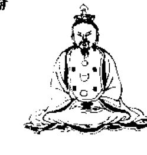
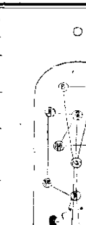
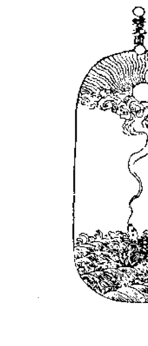
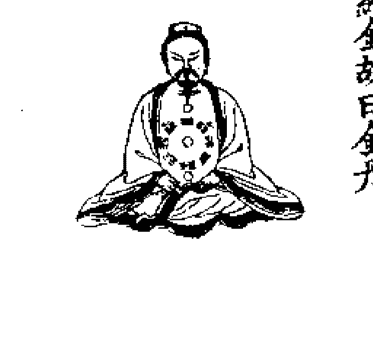
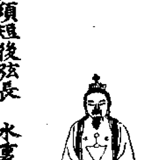
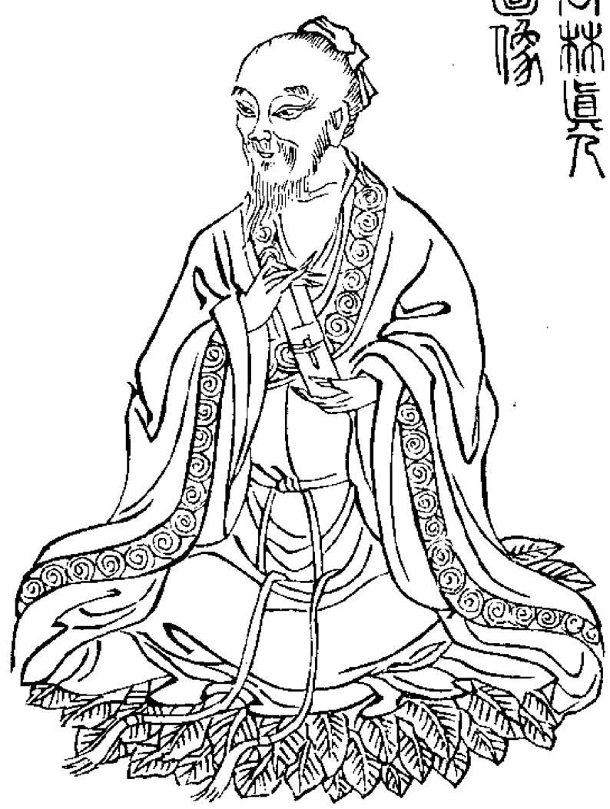
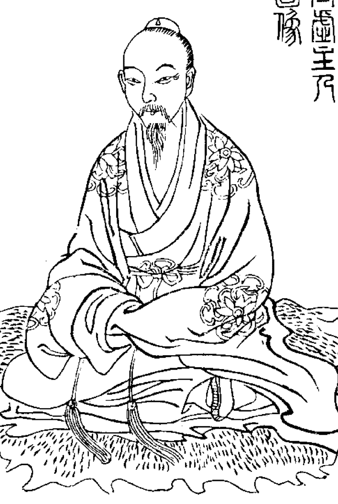
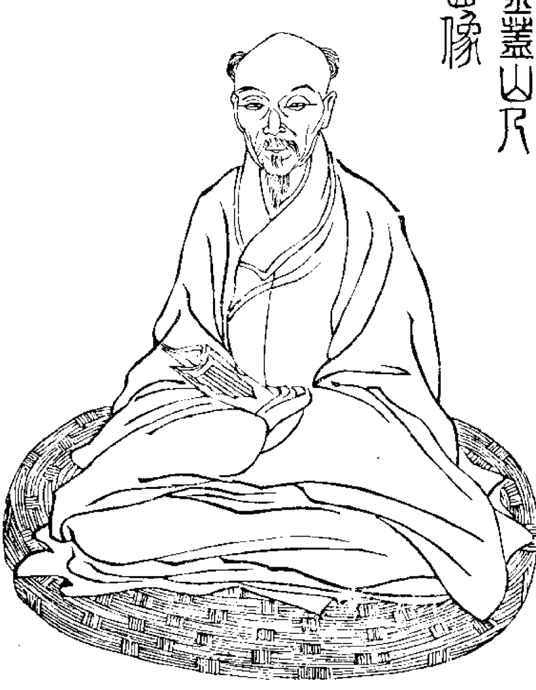
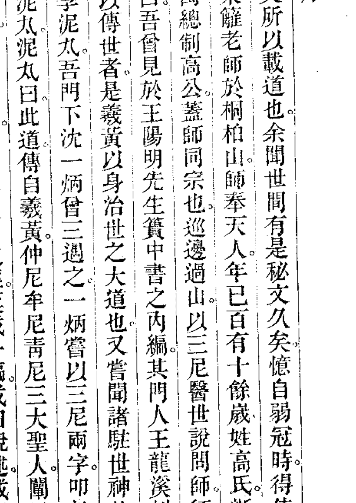

# 道教五派丹法精选

王沐选编

第一集

中医古籍出版社

# 样本库

【宋】张伯端等著

道教五派丹法精选

王沐选编

（第二集）

中医古籍出版社

1190258

# 第二集 目录

| 篇名 | 卷次 | 页码 |
| :--- | :--- | :--- |
| 玉清金笥菁华秘文金宝内炼丹诀 | 卷上 | 一 |
| | 卷中 | 十六 |
| | 卷下 | 三五 |
| 碧虚子亲传直指 | | 五〇 |
| 纸丹先生全真直指 | | 六一 |
| 陈虚白规中指南 | 卷上 | 六八 |
| | 卷下 | 七四 |
| 还源篇 | | |
| 还源篇仙考 | | 八八 |
| 还源篇自序 | | 一〇七 |
| 还源篇正文 | | 一〇八 |
| 还源篇后序 | | 一一八 |
| 还源篇阐微序 | | 一二〇 |
| 还源篇阐微 | | 一一四 |
| 翠虚吟 | | 三〇九 |
| 三尼医世说述 | | |
| 三尼医世说述原序 | | 三一九 |
| 三尼医世说述 | | 三三八 |
| 三尼医世说述 | | 三四四 |
| 医世说述管窥 | | 三七四 |
| 医世说述管窥跋 | | 三九六 |
| 三尼医世功诀 | | 三九九 |
| 三尼医世功诀 | | |
| 如是我闻 | | 四一九 |
| 如是我闻 | | |
| 泄天机 | | 四三九 |
| 泄天机 | | |
| 上品丹 | | 四六五 |
| 上品丹法目录 | | 四六七 |
| 上品丹法节次 | | |
| 养生十三则阐微 | | 五一七 |
| 养生十三则阐微 | | |
| 二懒心话 | | 五四一 |
| 二懒心话 | | 五六八 |
| 终止 | | |

# 重印说明

中国道教的养生历史源远流长，其养生的古籍浩如烟海，这对今天探索人体生命科学的人们，无疑是一笔丰富而珍贵的文化遗产。如何在卷帙浩繁的宝藏中发掘精萃代表著作，为人类的健身事业服务，是当前人们关心的重要问题。

为此，我们特请中国道教协会理事、中华气功协会文献委员会顾问、著名道教丹法专家王沐先生，从众多的养生书籍中，精选道教五大派系正宗的丹功功法献给读者。

道教的丹功源于道家，它是总结中国三千多年养生术而发展成的最高成果。自魏伯阳著「万古丹经王」的《周易参同契》开始，丹功经历了漫长的发展阶段。因古人择徒慎重，使前一时期的著作隐晦难懂。到唐朝以后，在著作中才初露端倪，形成了系统的理论和功法。与此同时，道教也逐步形成了五大派别。

《道教五派丹法精选》正是从这一时期著作中，精选出五大派别代表人物的经典著作予以重印。每派著作前，有王沐先生序言，对各派的源流、著者生平及丹法要点均有简述。所选著作，浅显实用，兼顾理论，通俗易懂，不仅对初学者是一部入门的参考书，而且对有一定基础的人，也有指点捷径，去伪存真的益处。

王沐先生青年时拜师，深得道教正宗丹法真传。五十年来博览群籍，精研功理，练功不辍，尤对道教正宗丹功有精深造诣。虽年逾八十，仍神采奕奕，健如青年。

为了便于读者阅读，我们将《道教五派丹法精选》分五集选编重印，由中医古籍出版社出版。由于时间仓促，有不当之处，请批评指正。本书所据版本为上海涵芬楼影印正统道藏本及古书隐楼藏写本等。

中国科学院科学文献服务部
一九八九年十月

### 序

中国养生功法，时代悠久，门类繁多，即以道家道教的功法言之，不仅限于道藏所收，而民间功法，亦不可忽视。盖按《道藏》正统功法，自「黄老道」、「万仙道」、「天师道」、「全真教」等分别流传，各家继往开来，有许多正统功法传授下来，更有一类民间功法，社会称之为道会门，流传也广。

查明清文献，屡有禁止旁门左道的记载，如明代禁无为教、白莲教、焚香教、混元教、龙元教、红阳教、圆道教、大乐教等。清代禁青阳教、白阳教、天地会、三合会、江潮会等。晚清及民国更有青帮、红帮、在理教、成德坛、广善社、悟善社、同善社、红压字会、红枪会、万国道教会、一贯道等其倡言养生，实为秘密结社，谓功法系吸取儒、释、道三家之秘传，而实为惊俗骇众之演术，藉以表示神奇，招徕信徒，虽在五十年代以后渐被禁止，但改头换面，自称道家真传者，亦仍在潜伏，所以道教丹经中常常指摘三千六百旁门，劝信徒详加辨别，我们因此选刊道教五派功法，也是使大家擦亮眼睛，能分清真假，明确是非，寻得正途，不受欺骗。

道教功法，从养生方面分类，派别也很多，宋元以来，因南北分立，全真教从北方崛起，王重阳传徒七人，分成七派，功法大致相近。南派则以张伯端为首，历南五祖授受，称为南派功法，今称为天台山功。

北派主张先性后命，即先炼心后炼术，南派则主张先炼术后炼心，功法大致相近，明清以来，两派以同祖同源，互相合并于全真教之内。

中派为两派的革新派，元李道纯原为南宗系统，后来又主张三教合流。清初闵一得系为北派龙门派系统，在功法上主张中黄直透，清末黄元吉则主张内炼「玄关」。实即推动人体机能使其推迟衰老恢复青春。所以，中派不讲坐关、出阳神等步骤，而结合佛家「戒」、「定」、「慧」论法，加以发挥。如李道纯《莹蟾子语录》中说：下根下器人忘情绝念谓之「戒」，寂然不动谓之「定」，默识潜通谓之「慧」。炼金丹者，亦有渐、顿之分，渐法起手之初，炼精化气，渐次炼气化神，然后炼神还虚；顿法则不然，以精气神谓之元药物，下手一时都了，这是顿渐功法的区分。

道教功法，是从有为到无为，有为是渐法，即发而中节。无为是顿法，即顿悟灵机、开发智力达到还虚的目的。

什么是还虚，「虚」出自老子《道德经》致虚极守静笃，实即炼心。炼神与佛教「空」字同义。伍冲虚《仙佛合宗》用还虚一词说：第一章「初还虚」系指收心、松身、入静。第九章「末后还虚」则指炼神已毕，心为俱化，法与俱忘，寂之无所寂，照之无所照也，又何神之云乎？此境界为道家宇宙观之上关，天人一如，有无无证，形神俱化，分合自如，此即所谓空不空之境。

总之，道教功法原则来自老子《道德经》讲虚极静笃，讲由有为到无为，而炼精气，炼气化神，炼神还虚三步皆是有为，炼神还虚是无为，曰还，曰返，皆是成道，但末后与最初的功法和成就，已均有发展提高，决非前后一样。

中国养生法，百花齐放，宋元以来逐渐系统整理，五派功法，渐趋一致，不外常变有、无为的道理，阴、阳的规律，盖「中」字包括神的关系，方法虽不一致，目的则归贵生。所以，我们先选的中派著作，盖「中」字包括三教，代表玄关，为中心问题解决道教功法，自可六辔在手，驰骤由心了。

本集汇聚南派丹法，可以补充中派部分内容，但详于源流方面，功法则尚未尽言。如张伯端《青华秘文》、石泰《还源篇》、陈泥丸《翠虚吟》等，都对南派著作加以发挥解释。尤其是北宋张伯端的《青华秘文》，陈虚白的《规中指南》最为明显。「规中」即《参同契》「浮游守规中」之义，亦即「玄关一窍」之异名，陈虚白的直言不讳，诚参考功法之专书也。

所收南派第二代石泰之《还源篇》，第三代陈泥丸之《翠虚吟》，因为中派闵小良注本，读者可能怀疑何以南派功法转为中派注本，实际上中派功法为南派功法之革新，渊源所同，互相启发，并非两派功法之混淆。至如「三尼医世」之说，乃汇通三教之论。三尼者，紫气东来之圣人为青尼，以称东方圣人老子；其一则代表儒家仲尼；其三代表佛家释迦牟尼。「三尼医世」者，即主张三教归一。

中派创派人闵小良，道名一得，浙江金盖山人，属北宗龙门派十一代。但其功法则有所革新，主张「中黄直透」。如本书收《泄天机》、《如是我闻》等，都是中派精华秘本，虽亦引证南派《悟真篇》，但其功法则别具一格，应在命功中自悟。

王沐
一九八九年十月

玉清金笥青华秘文金宝内炼丹诀卷上

玉清金笥青华秘文金宝内炼丹诀卷中

玉清金笥青华秘文金宝内炼丹诀卷下

二直指同卷
碧虚子直指
纸舟先生直指

陈虚白规中指南

中华民国十二年十月上海涵芬楼影印

# 王清金笥青华秘文金宝内炼丹诀卷上

紫阳真人张伯端撰

## 表奏

不避雷震之诛，辄伸毕渎。念臣处世多虞，无所为为，必愿踪年迈，三白独于大道有缘。回思曩昔，昔日使我无成者，正佑今日之有成也。感念至重，铭心戴德。今者切见嘉尔下民，执钝造器，奔惊尘境，伐真元，愈降愈下，弃人就物。就物思人，则不可得而返之矣。物不能修，终乎异类，哀哉！臣之身自弗能度，反怜及此，固无异甽蛙而咽离上难也。唯某昨传授青华真人王清金笥长生度世金宝内炼丹诀，简而易行，详而不杂，身里分阴阳之主壶，中立四象之枢。三中常守以为机，一定不离而作用。用中无用，静里长存。哲人秀士一览无遗，造化在掌中矣。今欲斋沐精思，著为图论，毫发无隐，直泄至真之奥旨。择其可传者而传之，得接续心灯，流传万世，顾美事也。然始传之际，誓语至严，蒙师至嘱，轻泄犯刑数。

玉清金笥青华秘文金宝内炼丹诀

欲作而踟蹰勿记其几矣伏惟
太上好生度人為重是用俯伏尘埃冥心上
界欲望
天慈鉴臣之意若不允而立彰玄谴如或谅
容俾臣安静无几敢践斯言复陈
天陛臣无任诚惶诚恐顿首百拜怀恩之至
臣通者表奏
天廷欲将青华真人玉清金笥长生度世金
宝内炼丹秘旨画图立论传诸缘士俯伏茅
庐恭伺天罚逾三旬焉今不至始敢斋沐焚

卷上第二

香精思著述三日而成秘诸法箇以待贤者
谨录上奏伏望
天慈俯垂救宥伏冀人人依此炼成金宝超
出尘埃世世相传无有泄慢臣无任诚惶诚
恐顿首百拜以闻

玄之又玄

金丹图论序
吾自识金丹秘诀之后累获罪于天而不自

校又为玄书并悟真篇等行于世自心为至矣忽有客至访余惟其状貌非凡敬肃待之或问曰子于金丹之道训人亦至矣但首尾未明机关尚隐后学何以为识余自此亦不得已也

天机之重玄律至严子固美言某敢不奉曰子但著为一书尽底泄漏苟有谴焉某当其责余再拜敬服遂失所在余思此语故著此书天机泄则泄矣传之者当以至宝拜受有玄律焉

卷上第三

## 泄慢堕地狱 祸及七祖翁

## 心为君论

心者神之舍也心者众妙之理而宰万物也性在乎是命在乎是若夫学道之士先须了得这一箇字其余皆后段事矣故为之传张子野人身披百衲自成都归于故山筑室于山青水绿之中万物罄然而怡怡然若有所得客传于市曰遭贬张平叔归于山矣从游之士丛然而至于庭且泣且拜曰先生固无恙乎且夫奔涉山川逾越险阻者于兹十

年而貌不少衰形不少疲者其有术乎张子曰吁吾与汝言人之所以憔悴枯槁者谁使之然心也百事集之一念未已一念续之尽日之中全无顷刻之暇也则亦若无心焉但神不存矣吾本无他术为能定心故夫鬼神之所以测度者吾心之有念耳心无念则神之灵不可得而施也岂神不知吾心吾亦自不知其为心乃定之根本也弟子曰然则金丹之士其静心乎勿静心乎曰静之一字能静则金丹可坐而致也但难耳曰夫子之

卷上第四

言其误后学多矣张子矍然而请其旨曰夫子与人言金丹之道常使人心中生意以意为造化之主心其能静乎曰子见备耳非吾言之所误也君寻其平日用心为何而动寂然不动而遂通乃吾心之用也奔役天理子无居止子用心也夫斗极之北辰固未始动其所以为动者拱之星耳然拱之星固不能动者斗极为之枢而运之尔此其不动之中而有所谓动者丹士之用心也唯其动之中而存不动者仁者之用心也云不动之

中终于不动者土木之类也心居于中而两目属之两肾属之三窍属之皆未可尽其妙用其所以为妙用者但神服其令气服其窍精从其召神服其令者心勿驰于外则神反藏于内气服其窍者心和则气和气和则形和形和则天地之和应矣故盛喜怒而气逆者喜怒生乎心也精从其召者如男女构形而精荡亦心使之然心清即念清念清则精止吁心惟静则不外驰心惟静则和心惟静则清一言以蔽之曰静精气神始得而用矣

精气神之所以为用者心静极则生动也非平昔之所谓动也用精气神于内之动也精固精气固气神亦可谓性之基也性则性而基言之何也盖心静则神全神全则性现又一言以蔽之曰静其所以为静者盖亦有理顺水行舟滔滔腾拔欲往海岛不曰劳形一旦回家思乡安静急驾归帆求风逆送还家固静之道但久违而始复久失而始寻一旦欲静其可得乎当思归静之由然后能静既悟昨非当求今是固常为是在何处诗曰

自下金梯阶苍崖回思闲落几花开向来大道今何在野草不除荆棘堆

## 口诀

但于一念妄生之际思平日心不得静者此为梗耳急舍之久久纯熟夫妄念莫大于喜怒怒里回思则不怒喜中知抑则不喜种种皆然久而自静岂独坐时然平日提百万强兵但事至则理退则休亦可为静之本以此静心应事接物谁云误事实自灵耳故曰以

事炼心情无他镜能察形不差毫发形去而

镜自镜盖事至而应之事去而心自心也

## 口诀中口诀

心不留事一静可期此便是觅静底路又诗曰得路欲归休问远看看信步莫烦心云收将放金乌见一点灵光眼内明心之所以不能静者不可纯谓之心盖神亦役心心亦役神二者交相役而欲念生焉心求静必先制眼眼者神游之宅也神游于眼而役于心故抑之于眼而使之归于心则心静而神亦静矣

## 目不乱视 神返于心 神返于心

## 乃静之本

## 神为主论

心为君者喻乎人君之在位一人有庆兆民赖之秦皇汉武为之则四海疮痍尧舜禹汤为之则天下安逸民歌太平者何也圣人以无为而治天下则天地安庸庸人以有为而治天下则天下挠盖心者君之位也以无为临之则其所以动者元神之性耳以有为临之则其所以动者欲念之性耳有为者日用

之心无为者金丹之用心也以有为及乎无为然后以无为利正事金丹之入门也夫神者有元神焉有欲神焉元神者乃先天以来一点灵光也欲神者气禀之性也元神乃先天之性也形而后有气质之性善反之则

天地之性存焉自为气质之性所蔽之后如云掩月气质之性虽定先天之性则无有然元性微而质性彰如君臣之不明而小人用事以蠹国也且父母构形而气质具于我矣将生之际而元性始入父母以情而育我体

故气质之性每寓物而生情焉今则徐徐剗除主于气质尽而本元始见本元见而后可以用事无他百姓日用乃气质之性胜本元之性至本元之性胜气质之性以气质之性而用之则气亦后天之气也以本元性而用之则气乃先天之气也气质之性本微自生以来日长日盛则日用常行无非气质一旦反之矣自今已往先天之气本微吾勿忘勿助长则日长日盛至乎纯熟日用常行无非本体矣此得先天制后天而为用

## 气为用说
先天天气后天气得之者如痴如醉忘寝失寐呼元神见则元气生盖自太极既分禀得这一点灵光乃元性也元性是何物为之亦气灵凝而灵耳故元性复而元气生相感之理也元气之生周流乎身而独于肾府栋而用之者何也夫肾府路遥直达气穴黄庭者一也肾为精府精至直引精华而用之二也周流于他处则难觅至精府而可识三也心气透肾意下则直至栋之者易为力四也此四

## 者故采真阳于肾府

## 精从气说

神有元神气有元气精得无元精乎盖精依气生精实肾宫而气融之故随气而升阳为铅者此也精实而气不生元阳不见何益于我哉元神见而元气生元气生则元精产

## 意为媒说

意者岂特为媒而已金丹之道自始至终作意不可离也意生于心然心勿驰于意则可心驰于意末矣

卷上第九

## 坎离说

坎者肾宫也离者心田也坎静属水乃三也动属火乃一也离动为火乃三也静属水乃一也交会之际心田静而肾府动得非真阳在下而真阴在上乎况意生乎心而直下肾府乎阳生于肾而直升于黄庭乎故曰坎离颠倒若不颠倒而顺行则心火而不静则大地火坑之义明矣

## 下手工夫

持心论于前然后参下手工夫于后盖心始

如不见闻如不闻形心相忘合乎至道则元性彰露而元气生矣

## 精神论

神者元性也余前所说神为主论盖亦尽之矣今念夫修丹者凝神之法凝神之法不在乎前不在乎速故又为之论而尽神室并论于后凝者以神于精气之内精气本相依而神亦恋之今独重于神何也神者精气之主丹士交会采取至于行火无非以神而用气精苟先以神凝于气之中则气未可安神

亦未有恋气而反害药物矣且神元性也性方寻见尚未定摇摇颭颭进退存亡而子使凝之也初云质而寻本性是可以质性而逐本性可乎哉今为学者盖为凝神所误何耶盖神仙有下手先凝神之说故妄引以盲众岂知其所谓凝神者盖息念而返神于心之道神归于心则性之全体见全体见而用之无非神用念念不离金丹故丹成而神自归之何凝之有故曰凝神者神融于精

## 幻丹说

丹有幻丹者盖学道之士不知正理而妄为采取交会故成幻丹幻丹者未静心田远采一阳故斯时也一阳实非真阳也乃呼吸之气也精亦非元精乃淫泆之精也神亦非元神乃情欲之念也夫人方学道便欲为仙得非欲念乎以欲念而交会阳生此幻丹之所以有也精在肾府而若采之升至于脐上又无安顿处故逐气而息于气穴之右脐生于肾之缕与气交结而止即自曰丹既自曰丹矣而精神而用著便是后天底物先天之物果安在哉谓之黄庭内炉外炉泥丸等窍皆先天立之后始见当此时在何处实未之有也傍风起影入海寻蟾守株待兔缘木求鱼一旦败露精荡然而去先天又无主呜呼非长生之丹乃促命之法也又有采气而上遇心血气血凝而为物亦曰幻丹若此者众故

卷上第二十

以有也精在肾府而若采之升至于脐上又无安顿处故逐气而息于气穴之右脐生于肾之缕与气交结而止即自曰丹既自曰丹矣而精神而用著便是后天底物先天之物果安在哉谓之黄庭内炉外炉泥丸等窍皆先天立之后始见当此时在何处实未之有也傍风起影入海寻蟾守株待兔缘木求鱼一旦败露精荡然而去先天又无主呜呼非长生之丹乃促命之法也又有采气而上遇心血气血凝而为物亦曰幻丹若此者众故

12

古籍库 www.fozhu920.com

## 举以辨惑

## 捉丹法

金丹居内亦有走失者乎曰有有可捉之道乎曰有然非丹之走失也曰门户不坚而被其出也幻丹则有走失金丹安有此患曰金丹之出何以知之曰丹在鼎中备五行之正气吾身五行之气迫炉则相感而动一旦觉气升外而内无相感乃丹不存也急须放下一场大静并所谓炉鼎丹之在不在俱付之无何有或一日或一夜始觉其在何处或在

心或在肝或在脾与肾身中百窍皆可藏之知其在彼处遂绵绵若存守之勿使他去又一日之久始以意采取之则直降于阳宫又就阳宫如采取之时用意遂从旧径直升阳于鼎矣造化玄微至此谁曰不然苟有云云者吾之师也

## 神水华池说

神水者即本液之谓也华池者脐中气穴之下两肾中间一窍绝育黄庭毂气就此而生精医家所谓精穴者是也斯窍也少壮之士

阳盛气融则神水华池不过浇灌炉鼎洗涤脾胃周流浊气穴而已元气衰微精元枯竭者皆藉此以为丹本元气既衰非元气之衰也乃气质之气断丧已甚邪欲之性念念不已先天又不得见后天亦不足为用羸庀之根殆起于此华池之窍乃生精而降于外肾者也气壮则精多精多则华盛用之如有余气凋之士精元槁矣毂气所临不过产一等欲欲之水流归肾府耳然我既静矣元气本无增减但华池无矣大药三品而欠其一故

卷上第十

阳生之际未直采之时以意斡归尾闾自夹脊直透至泥丸故就精穴用精自然随气而升至午宫遇众阳融之则精始可用然后降至于心就心取汞依然下自黄庭即落于其中却用一意封固即绵绵若存以养之二者就其中自相吞咽而丹始成近有浙西一派虽少壮之士亦用此法而结丹但道在迩求诸远耳然各执其是而已

## 百窍说

人之一身毛窍八万四千气宫三百八十有四

## 更多资料

### 【中华古籍库】

↓ 点击链接 ↓

https://www.fozhu920.com/list/

珍版刻印 / 海外流传 / 家传手抄 / 民间失传

【易】【医】【道】【武】【文】【奇】【画】【书】

1000000+高清古书籍

### 打包下载

微信：mbook86

玉清金笥青华秘文金宝内炼丹诀卷上

毛窍散属气宫脐中气穴又为三百八十四宫之主降而阳宫皆而为精心为中田顶为上田舌下玄膺目中有银海额之中眉之间口鼻之冲耳目之畔咽喉之侧腰膂之中皆窍也余所谓丹之出者若此窍皆可藏也岂曰人身上有一二窍也此一二窍者众之枢纽岂曰止乎斯而已矣此其体也用别著说于后

卷上第十五

# 玉清金笥青华秘文金宝内炼丹诀卷中

紫阳真人张平叔撰

## 采取图论

采取者采取真阳于肾府取者取真汞于心田可以采取则采取之必得其用非其时而采取之则龙不降虎不升虽见血气奔驰冲冲来往迷者以为交媾矣抑不知离坎自离坎阴中之真阳阳中之真阴自兀然耳至于气脉为一念所止则气疾入脉络之中离坎之内反有伤于铅汞虽曰养气要于中实所以丧元气也夫元气之在人至静始见是先天之气也后天之气时刻循环但人汨于欲而不知详审耳至于略定之际心无他用则方知其气之上遂错采以为先天致返加害所以近世之学道者常有奇疾盖为此也夫人之疾但气脉为梗耳气本自调而若役之使之升则伤脾胃肺肝耳目口鼻降则如决水于长堤锐然而下趋沛乎其不可御也至真之物其能存乎余悯此等言丹之士故画采取图为于第一虽直泄天机但人有志于金丹

而反成其性命余救之以正理太上好生必不我罪故此篇尽以刀圭玄黄婴儿姹女诸般譬设尽扫而退三舍使贤者见之而参同愚者见之泮然冰释分分明朗朗如宝鉴之察形同见毫发矣金丹之士先修阴德以尽人事然后持前心论则大药产而圆形见矣采取之法生于心心者万化纲维枢纽必须忘之而始觅之忘者忘心也觅者真心也但于忘中生一觅意即真心也恍惚之中始见真心真心既见就此真心生一真意加以反光

卷中第二

内照庶百窍备陈元精吐华矣要在乎无中生有有中生无到这境界併真心俱忘而弃之也我以无待已则其息绵绵真息绵绵之时后天之气以定后天隐则先天之气见故阳生焉阳生者先天之气自气穴流出则至于肾中○如喷泡然盖两肾中间有一缕透气穴乃父母交媾之后始生脉络也故先天之气游之既觉如斯则一身百脉尽若春生春融融而渐长此时先天之气始立先天立而后天愈退藏矣然后可以微动采取之意

意者以目垂观于心却以心放下送入阳宫徐收而又纵则阳起矣于心心生于目故老子曰吾尝观心得道亦至灵夫真息既定内光乃神光此心乃真心真心生意神光烛心故常为之说曰目视心心生意意采铅若阳生未融盛而远采之则一念采意既萌后天复起故曰了命实关于性地性者凡所有相皆是虚妄既无著相则虚妄除而真理显矣真理方明而一念生岂非复其虚妄之相乎故伺阳长而始采则勃

然而升先天气盛而后天伏不暇矣采之升也实有异焉醞然而上至于脐而稍止徐止脐之上则息方名曰铅金也金生水故汞产于心云从龙风从虎之理兆矣风平而雨降自然铅汞相投相吞相照金生水水生木木又生火木爱金而金恶木乃交会之道也夫金剋木反有爱恶之意焉盖金木之本性耳吾以本然之天故能用五行本然之性亦不过譬喻耳此乃先天也五行在何处但不如是则不能达其理采取之道既明交会之理

玉清金笥青华秘文金宝内丹诀

复露再有叮嘱采取不可太缓太缓则老而不可用而后天之气杂矣学人以交会图参看则思过半矣

诗曰

酿酿和气酿春风
一点阳生恍惚中
无自有生无胜有
色从空里色还空
升于脐上铅情见
产自心源秉性通
定里见真真里定
坎离交会雨濛濛

诗曰

木为龙兮金为虎
坎户生男引离女

卷中第四

要知造化有根源
不离真火生于子

## 交会图论

恍兮惚兮其中有象杳兮冥兮其中有物古先哲常持此以警学者盖恍惚真定之象也惟定可以炼丹不定而阳不生阳生之后不定而不结此意只在口诀其意止有持

而升有刻盖始生无过一气耳升于脐则为铅故心斯意而无用矣铅自能引汞汞自能寻铅恍惚杳冥之中交会之理毕矣我得师之口诀并泄之宜秘宜秘默而视之念勿出声若有知道之士宿有善缘逢此玄机至宝之道凡遇口诀记而勿书书而勿见则某实戴其德余从师一十年凡有所得尽底陈露愿与同志之士共宝之此乃玉清金笥东极青华长生度世上品内炼金丹宝诀玄律至严某不识避就撰为此书亦前三旬

卷中第五

## 表奏

天廷继得报应始敢吐露下笔下笔之时心蠢蠢然而汗落于纸涕泣交零但愿志士得之幸勿相累同成胜果共证仙阶吁知我者谓我心忧不知我者谓我何求幸心心相照某不胜祷告之至诸仙幸鉴

## 采取交会口诀

忘里觅觅里忘忘中见见中忘阳生矣忘中采采中忘忘里升升里见见里变铅成矣定中起意中升忘中用铅引汞汞铅合汞于内

精会神于外交会矣铅汞精神合而为一却将一念使之落黄庭归鼎矣

打合铅汞须用一意动采一阳须用以静而生定

## 口诀中口诀

莫怪平叔多兜搅却缘学者尽痴迷叹说尽来咄满眼天花散乱飞门前流水浪声微青骏载取青娥去顷刻青骏独自归

青娥在我

巫峡云生十二峰故宫箫管寂寥中星桥路隔青山外若要相逢永不逢是性又是命

或问孰为交始曰采取圆心下一窍乃交会之地不可以有形求不可以无形取但铅升之际阳气上夫自气穴降为一阳宫中我采以意寸汞降之际会气降为几盖铅汞生铅升于脐上几为精光所烛故曰铅铅犹表也汞犹影也表动影随故汞降以如之阳铅之升不可谓之纯阳中含精光为铅盖亦属阴阴汞之降不可谓之纯阴心生汞心为神含汞遇神光而后可用盖亦属阳易曰有象

阴中有阳二气交感凝结不散遂成玄珠○如黍米或问铅乃一阳一阳乃先天一气耳汞何物为之曰铅与汞皆先天之物铅乃先天气汞乃先天灵此气乃命之母此灵乃性之子可以曰铅汞可以曰性命诸得道之宗师谁肯直泄至此又问曰心下一窍何窍耳曰混沌神房者此也乃精光目光之气幻而为之精光华腾为目光垂为明精虽元精然无日用之精则元精不见又如不信譬如有水则潮兴白气未闻白气兴于地也水乃

精也白气乃华也神虽元神然日用之神而不役然后元神见譬之皓月当天云收而光始下烛清净即无云也裘光即照临也精虽属阴而精华属阳目光属阳而照于内则亦属阴光华相遇而成一窍以气感气使二物会于其中○物之成也有精气焉有元气焉工夫周足遂为真人盖生生之意寓于此矣所以能灵而神者此也或曰然则交会之后安得此珠落于黄庭归于鼎内曰二物聚时情性合五行全矣虎归于山龙归于渊目光

还而精气复此○落于黄庭归于鼎内会有关换子尘恍恍惚惚万孔生春○秘密此数言非正经原有乃学者有所得之谓也或问阳生于上逮止其意安保不复降曰大哉问黄庭之下有一丹室之门户也意生则上故阳升意止则一故阳则不可得而降矣炉鼎则在乎一之内正属土故○备五行之正气成天地之全形也或问炉鼎之法曰黄庭之在人身如此至一阳上升如此珠落于其中之候如此即炉鼎也○黄庭固属土也

卷中第八

○至于中之中尽属土中之土也故落于其中而成鼎器五行各厚其基何谓厚土基夫母求子子恋母丹之法也皆取其本然之性既归于鼎而气各趋之如子之恋母故静坐之中神光下垂则归于鼎精华上升亦如之至于行住坐卧如龙养珠如鸡抱卵而气各归之一身之脉络皆为之务在乎勿忘而勿助长耳学道之士然乎其不然乎在某之丹法者上而已矣

寺曰

何劳姹女与婴儿
透彻分明说与伊
身里乾坤颠倒处
壶中日月运行时
要知一者为阳用
须识一中作气机
天使紫阳来说尽
后来何必更寻师

真泄天机图

到这田地知道理
且莫欢喜未知如何
想

宝剑沉埋古狱边
虹光夜夜上冲天
虎龙战罢三田静
何处求他汞与铅
嘎嘎嘻嘻嘻
嘻且休认鹿为马
一个玄珠在泥底

卷中第九

牛女桥边路不通
河车运去杳无踪
谁问得真消息
吹彻重关藉巽风

## 真泄天机图论

金丹之图既成
应天机之尤秘
且论五行之颠倒
述水火之流行
明药材之进退
体日月

之循环余前所著三篇之文尽矣今虑夫学者未明故为此书此书也直泄天机洞见毫发化顽石而成金点瓦砾而成玉不啻过也夫两目为役神之舍顾瞻视瞩神常不得离之两耳为送神之地盖百里之音闻于耳而神随之而又去两鼻为劳神之位随机而辨之者谁神也使耳目口鼻皆如屑则神岂不安而全之夫如是则不为后天也亦不劳修炼也大抵忘于目则神归于鼎而烛于内盖绵绵若存之时目垂而下顾也忘于耳则神

归于鼎而闻于内盖绵绵若存之时耳内听于下也忘于鼻则神归于鼎而吸于内盖真息既定之时气归元海之理合而言之俱忘而俱归于鼎而合于内矣还更有口诀么

口诀 离能抱卵心常听

或问金丹之道耳目口鼻固亦得闻之矣心固不言可知也肝胆脾胃肺无用之物也还亦无用之中而有用者也余答之曰此固已到而后知其理但余誓以无隐夫何隐之有吾师从师亦叩之矣师增戊又诗曰

五湖风景阔漫漫
鹭立沙滩宇宙宽
画出枉劳君指点
异时游到儘堪看

余初未达此理后到此田地始信师言之不我欺也今以师不言之者并言之夫五行之用不可缺一故绵绵若存之顷脾气与胃气相接而归于心缀肝气与胆气相接从大小肠接于肾缀肺气伏心气而通于鼻是气也皆静定之余元气周流自东而西自南而北之气也西南乃气之会也气合而归于此却自夹脊直透上中丹田而降于肾腑两肾中

卷中第十

间有治命桥一带故寒山子曰上有接神灵横安治命桥者此也气降至于此阳气与精气盛而上冲与此气相接于此则固围于鼎器之外日用之则日增经营之力故郑邬之成肇于此也忽然有一物超然而出不内不外金丹之事不言可知矣一半玄之又玄一半者何也曰金丹之士到此则一半矣○超然而出者乃玄关一窍也其大无外其小无内○有形之中也○无形之中也先就有形之中寻无形之中乃因命而见性也就无形

之中寻有形之中乃因性而见命也先性固难先命则有下手处譬之万里虽远有路耳先性则如水中捉月然及其成功一也先性者或又有胜焉彼以性制命我以命制性故也未容轻议用力不得到者知其然也未见不必存之以有恐至著相或又曰子画图中多有窍何也曰斯窍也非采取交会图中之窍也盖一阴一阳之谓道往来不可穷用之则充塞于一身之中此物之作用不用则归藏于心田之侧了无形像然则何物耳。

卷中第十二

意之主耳在属阳右属阴秘秘秘秘到这裏方是返太极处曰返太易者自太极返太极者自太和致太和者自阴阳始故曰阴阳和而风雨时嘉禾生者譬之若此大衍五十八天九地十阳奇阴耦天数二十五地数三十五合而为五十有五大衍之数五十去五以象五行者后之鼎内外回是也又就其中剋一象太极之不动其用四十有九又就其中剋一以为邓郸其用四十有八学人行炉鼎

用火之法以四卦为主以六十卦为用存乾坤坎离也又以大衍图求其象则循环之理明矣周天之法泄矣如或未明更请看炉鼎

## 图论云

卷中第三十

## 论

一点蟾光照太虚 金蟆水里吸还嘘 高低犹是纯阴体 何事生阳用有余

太虚寥廓皓月粲然雪浪翻腾金蟆吐耀人见月之所以明而曰金精精盛则月明焉孰知金丹之所以生者性也水者喻坎宫也金蟆者喻一点真阳之窍也元性喻月性之用也性之初见如星大圆陀陀光灿灿未足以见性但气质之性稍息而元性略见如云开则月见项合则亦然耳至于不时时存之则

可没与见未见时无以异也故金丹之士才见此物分明便是元气产矣遂以而用之譬之见贼便捉毋使再逸然以之收于鼎器之中而一点元气之真终乎不可得出矣以丹田为日以心中元性为月日光自返照月盖交会之后实体乃生金也月受日气故初三生一阳者丹既居鼎觉一点灵光自心常照而无昼夜一阳生于月之八日而二阳产矣二阳者丹之金炁少旺而元性又少现自二阳生于月之望而三阳纯矣三阳纯者是所

谓元性尽现即前谓无形之中也一阳纯生时但觉吾身有一物或明或隐二阳生时则遍体生明矣三阳生者则光不在内不在外但觉此身如在虚空亦无身亦无虚空亦无日亦无月常能如此则禅定也但丹士若生于有而不能采其空而以无为用也既至于此而金丹且半何也且元神见矣而未归于丹混精气而为一所以为半矣更说他后一半底道理月既望矣十六而一阴生一阴者性归于命之始也自一阴生至于月之二十

三而二阴产矣二阴者乃性归于命三之二也自三阴生于月之三十日而三阴全矣三阴者乃性尽归于命也性之全体见绵绵若存之性时乎反乎命内矣方其始也以命而取性之全矣又以性安命此是性命天机括

处双修者此之谓也天机至密吾尽泄矣到此际则金丹全也始于火候凡一日用度则一日养之百日之功而婴儿产矣故吾以月为之喻取其交会相照之理也月明实本于金金之性实出于月百炼愈坚万劫不坏盖

金日色月性也火日气金入火而复于元性之真可以炼成至宝号为金液还丹故修丹者始则取金为金生水交合之理显而藉土以成之故城郭基址无非托真金药物而固济堤防之炼成纯金故曰金丹

玉清金笥青华秘文金宝内丹诀

## 鼎炉形象悉分明

八卦纵横用则亲

## 炼就五行全藉土

又令真土变真金

## 鼎之为器匪金匪铁炉之为其匪玉匪石

## 庭为鼎气穴为炉黄庭正在气穴之上缕络

## 相连是为炉鼎阴阳为炭以烹以炼夫黄庭

## 之在人身上交会之顷乃元气立之际此时

## 正开而丹落于其中遂固之所谓水银实满

## 葫芦里闭塞其口置深水者也水银铅汞也

## 葫芦黄庭也深水者水犹气也闭塞黄庭隐

## 炉鼎图论

卷中第十六

## 藏丹母而置于气会之地达者审之得其趣

## 也虎啸风生龙吟云起蟋蟀吟秋蜉蝣显阴

## 万气归鼎而封固愈密烹炼愈坚此炉鼎之

## 所以有也万卷丹经要旨尽图立象本使人

## 得象忘言后之学者皆泥象寻真各求说论

## 岂知夫至道不繁枢纽阴阳而已矣如以天

## 一生水云云之数而言此亦不过明水火之

## 流行耳如以四时八节而言者此亦不过喻

## 天地阴阳消长耳秘其母而言其子故知之

## 者鲜矣用成今所以著为此书者皆弃枝叶

费尽工夫结得成
主人未至谁藏得
返光内照景分明
闻道灵光驾赤城

## 神室圆论

神室者元神所居之室郸鄂是也人知立郸鄂之造化显然彰露矣抑不知有室而无主人何取其为室哉然主人虽无而主人之胎亦在乎一室之中矣如怀孕然十月之间母呼亦呼母吸亦吸但气未足耳气足而形完一点灵光入于其中则倏然而生啼哭饴然纯乎其人矣此乃郸鄂成而神归于室之时

卷中第十八

也神归其室则所谓得其一万事毕矣盖交会之后神光乘而烛乎玄珠矣精华升而产于玄珠矣真铃则元气矣精气神亦先有胚胎在其中矣火足气充则元精元气元神尽合而为一故婴儿产矣婴儿岂即产焉火燥尽群阴而胎始脱到此方是产婴儿吾尝谓古人画炼丹之图象固郸鄂也此一点便以安乎其中矣后之学者皆谓郸鄂有一点安遂不知安一点于中之道誓结终散猛火空烧而离坎逸矣夫此一点产于外

而顺乎后天者一生二二生三三生万物皆从此常人为之志反逆焉而产于内则长生久视之道存矣岂非归根复命乎命复根归之由深根固蒂也深根固蒂之道自澄心远欲澄心之理屏视去听始孔子曰非礼勿视非礼勿听非礼勿言非礼勿动此便是真实道理但儒教欲行于世用于时故以礼为之防所谓妄心者喜怒哀乐各等其忠恕慈顺恤恭敬谨则为真心吾修丹之士则以真心并为妄心混然返其初而原其始却就无妄

心中生一真念奋天地有为而终则至于无为也若释氏之所谓真心则又异焉放下六情了一无一念性地廓然真元自见一见之顷往来自 in the盖静之极至于极之极故见太极则须用一言半句之间如死一场而生相似焉然后可以造化至极而不生不死之根本岂易窥其门户耶

# 玉清金笥青华秘文金宝内炼丹诀卷下

紫阳真人张伯端撰

前弦须短后弦长
日夜巽风吹不灭
水里藏灯焰自光
将心挑动更荧煌

## 火候图论

易之为书三百八十四爻火之为数三百八

卷下 第一

十四录故舍乾坤以为鼎器坎离为药物之外初一用屯蒙初二用需讼初三用师比初四用小畜履初五用泰否初六用同人大有初七用谦豫初八用随蛊而金计半斤初九用临观初十用噬嗑贲十一用剥复十二用无妄大畜十三用颐大过十四用咸恒十五用遯大壮十六用晋明夷十七用家人睽十八用蹇解十九用损益二十用夬姤二十一用萃升二十二用困井二十三用革鼎而水半斤二十四用震艮二十五用渐归妹二十

六用丰旅二十七用巽兑二十八用既节二十九用中孚小过三十用既济未济顷刻而周周而复始自日月运行一寒一暑天地氤氲万物化醇倒造化翻乾坤窃宇宙盗阴阳天下之至通始可与言此也或曰乾坤坎离之体曰周天火候之时坎离交矣坎离交则乾坤会矣夫天道下降地道上升乃乾坤之用也坎者乾交坤也离者坤交乾也其他卦象不过设体耳亦不可泥象寻爻而火候之法始见又曰似子言之不过范围天地运行

日月而已而炉鼎图又列八卦于鼎中火候图又升午位于泥丸布平桥于卯酉何也曰天机固不容泄言既至此隐之何为且河出图洛出书天尚自泄况于人乎客曰止余闻泄天机而殃及九祖独不闻度一人而福及九祖乎吾以吾之丹法尽底无隐而仅于有缘之士苟有信士一人为仙某岂无功乎客曰子之用心非某能知及之曰是炉也是鼎也乃进火进水之理耳水火无过一气耳气之升也吾以心接之即火也气之降也吾以

静持之即水也此绵绵若存之时子午进用之功也斯时也方是偃月炉具之时夫性见则气生气生则金生金生则气多气多则金愈旺此二者交相为用也金旺于中炉破浮云露出一钩真性如月之明乃偃月炉也存养之久则金气盛而全尽烛见一轮明月乃全性也既见全性又返金性则吾身皆真性命为之主此用火之时也盖二者未融为一而用火炼之炼作纯金也包含性命通体皆阳浮沉自在爱日恋月好游顶门时至道成

奋厉而脱窍虚一声身非我有呀唔人人可以如此而成功人而自弃之若是可哀也哉余见总篇方其九转既周沐浴已竟火力终焉一星不灭故动○○一风以吹之巽风者鼎下之片缕耳阖则为乾辟则为巽阖则为嘘辟则为吸何以能开辟亦无非一意使之然或曰巽西方之位以子所言巽乃中宫母乃反乎曰西方者巽之用也中宫者巽之体也吾自心生一意而降于巽位其象始辟则吾言实兼体用而训也继之以乾乾金而火

乃金精故遇而炎火张设须坎以抑之抑之而不能止则有反攻于下之患故止以艮而又噬以巽巽上一画属阳止火非阳不行故遇震而稍焰遇离而复炎又止以坤坤水也火从水起如遇其兑故不止而自止坤非正卦故徐归于兑兑又西方之卦也故自尾闾徐徐升上而至泥丸顶为天门为正午之地午属火火遂加煌又接之以心心火也接者神也乃神火也又加煌至卯酉若直下则刑德临门危其殆哉故一立而各为二道今日

之卯酉昔日之坤艮也火气也气降而复升之理故归于肾府化为真水而用之盖文火性柔而难化遇卯木木必剋土遂以火剋木则土不受剋矣武火性强而易化降自酉酉属金金生水遂为水归于鼎曰何谓文何谓武曰文火自三关上至于天矣武火是午宫与心火也大凡火候只此一场大有危险丹士宜一战而胜则天下定矣平日周天火候切不可以为则然此亦不可执著彼亦不可执著且喜且喜庆云开尽现洪濛仿佛空中

玉清金笥青華紫文大丹內訣丹訣

見祖宗風定七星還在水依稀殘韻尚飄空

陰盡圖論

張子一日坐于幽室形忘氣化倏然兩耳風生始知秋蟬鳴隔岸之翠柳終爲若聞九天之簫韻恍然有一人立于旁耳目口鼻與張

卷下第五

無異指張而罵曰吾自太易以來爲子所役略不瞬寧何罪於汝張子不覺失笑而無聲默謂之曰來吾與爾言汝言固是但爾爲我苦耶我爲爾苦耶姑坐以叙曰我先以來本無事與子同居之後寤寐亦相持移像累劫

而不自如置我沙漠風霜之地既令我歸東又令我歸西種種相魔自頃以來始蒙慧以室廬養以調息美則美矣但晚也張曰匪吾之過也乃六欲之賊使之然也子微而隱彼顯而彰吾知有彼而不知有此壁之瞽者坐

五清金丹青華文秘金寶內丹錄丹

舟但知舟之日去千里而不知撐者實勞也
使不欲舟行則撐者眼矣似張者欣然曰幾
失君吾有百鍊之堅刀可同勦此賊而去其
根後同入規中時然後行獨安金關張曰唯
唯見黃光四迸五色煥然觀者聽其言曰去
賤之道不宜急急則反受其敵始然力不勝
其禍乃可必縱放住余心守之常將息或作
狡詐形視之常無懈一戰定三清萬魔俱屏
述
噫

卷下第六

當日風塵枉自橫
堪憐不達窮通者
無明焰子又無煙
壽塞一聲圓活子

波平海晏兆升平
猶弄干戈觀我城
煅出真金曜徽天
騰空三觀玉皇前

噫

五清金節青華秘文金寶內錄丹訣

## 陽純圖論

又無文 看甚 竅竅仙童捧詔來 妙哉

## 總論金丹之要

夫人一身大而不可以取象天地包容萬象變化莫測靈通玄妙百姓日用而不知故金丹之道鮮矣夫金丹之道貴乎藥物藥物在乎精氣神神始用神光精始用精華氣即用元氣精非氣不盈神非氣不充精因氣融氣憑精用氣因神見神憑氣用且以吾身之天地言之自太極既分兩儀判矣兩儀生四象

卷下第七

四象生八卦八卦立而天地人之道備矣天以動為體地以靜為體天地之氣性來不息而日月行乎其中蓋父母構形育我之後始生脈絡也自形完之後始生纓絡及若元性之虛無穀道筋條殆似草茅之育茂此乃先天之無為先天之道此金寶之至言也宜守之以中則庶乎道路通暢蓋人受天地之中以生所謂命也得天地之中氣以生遂可為人我以身為天地亦宜執其中而為造化之樞紐中者有三中心意臍中鼎腎中爐三

中之至切者心中意臍中鼎次之腎中爐又次之此三者自金丹之始至終不可須臾離也大凡金丹之道學者尋五行其未矣當知夫交會之際恍惚杳冥養生毛竅金之本情也逸豫和暢肢體柔順木之本性也鉛本火體而金情汞本水體而木無他水火者鉛汞之體也金木者鉛汞之用也鉛汞凝結光華會合者意也意屬土五行既全於鼎器之內外中物以類聚五行又環列於鼎器之外內外相感而丹始成形狀如黍米非青非黃非黑

卷下第八

非白不可得而名狀也到此際又綿綿若存清淨無為自然現出百般妙用景象腎水合精水自玄膺滴下謂之華池神水虛無之中白雪生而黃芽長只綿綿若存之頃亦率歸于鼎器之內是大藥不離精氣神要認始用藥材又精氣神之所產也非便用精氣神也今有一等旁門自作自是而精氣神受役之不暇奚能產藥也精氣神三者孰為重曰神為重金丹之道始然以神而用精氣也故曰神為重神者性之別名也至靜之餘元氣方

產之際神亦欲出急庸定以待之不然是散而無體之體也苟誇出入必為大道則誰不可為夫神不疾而速不行而至師言曰神之妙用無方而有限若得其道可以出入切不可縱為良深蓋收於內則可宜縱於外也

夫神出而依林木以成形陰未盡也將出之際多異景目光煇然從目出也鼻氣或吸從鼻出也耳聞清音從耳出也獨不可從口出入者何也夫口五臟之氣所會也神棄精氣而竊出避氣盛之地也神氣精常相戀神一

卷下第九

出二者無依焉故神之出也有害無益日居月諸照臨下土丹士逆之為用順而為火夫火循環九轉中九轉九轉初生旺於第一轉伺陰氣盡又遠第二轉餘亦如之至於九轉周足遂迫於鼎故用前進火工夫謂之真陽而戰羣陰請明言之一身皆屬陰惟有一點陽耳我以一點之陽自遠之近轉之又轉戰退羣陰則陽道日長陰道日消故易曰龍戰于野其血玄黃至于陰盡陽純而丹始能升於泥丸決然翕屬真人於斯而始見矣

金丹之道如此而已更有言不盡底
丹之初成也交合之際未免藉陰陽二炁以
成之之後則漸以陽火鍊成純陽之體故自強
不息乾道也丹成矣故凝神以成軀而成仙
丹之初成也藉五行以成其用後則漸以真
金養成純金之體故通體光金色也金變
日色故光金象曰性故剛曰金丹又曰金仙
幻體雖假合之物修丹之士須藉以養丹基
譬之地也城池固則外邪不能入故綿綿若
存之頃脾胃合為一脈而圍丹穴之左肺肝

卷下 第十

合為一脈圍丹穴之右真氣微至則環於脈
絡之中故近丹而氣可得之以化至寶舉其
一可知二然亦無為自然始舉是以明矣夫
無為無有為也夫人之一氣在身由念而動
譬之握拳念欲開而五指伸了無罣礙學人
達此於采先天一氣之時行一真念來一真
氣按圖觀象落在黃庭其理一也窮冬凋剝
必得陰陽交泰之後乃至萬象學人達此當
知交會之後不期產物之產而自產矣金之
在水其耀奪目金之在土土能藏之蓋產於

幽處而隱其明處也丹之居鼎猶人君之在位百官稱職其國自安而民自安火候藥物各得其宜則萬化成何謂各得其宜第一轉產藥於東而降於西以心為斗柄旋其機故行二十度而魄滿又斡之二十度而魄滿則火之魂而水之魄立而神用大矣他轉如之舉其要而明者言曰斗樞建四時八節無不順斗樞實元魁杓自後動只要兩眼咬上下交相用須向靜中行莫就忙裏送要無形圖與你看一氣周流

歸故宅金丹何事却成功至道本不繁庸人自生事我本遇師傅三囑令深秘何故盡圖并立論毫釐說盡鬼神驚叱地獄不因傳道者教存經籍度三師

次第秘訣
癸待
坐靜打頑空　仰息　守巳生時
聞命無沖和待氣動方可如下行
存歸。。然後就上二竅直衝五星候見明放
靜又觀心放下了一段候再見明一陽真氣
產矣

綿綿若存 只八分

小光透用機出入 開道一回然後方行子

午

大光透用機出入 破頂一回

此是後上前下此後並係尾閭五星於三

十日見用機出入 上弦五十日足見機

大凡三遭望左右見機下弦日數足下明

鼎內瞻用機再朝天迴

以太和返太極

以太和返無極

冬卷下第二十

意

動靜之機氣盛則抑之以靜氣弱則助之以

火候秘訣

丹居鼎內上水下火心動屬火靜屬水乃水

鼎也 底靜屬水動屬火乃火鼎也

陽在鼎下曰水火升於鼎上則水火也陽火

是外爐外爐與火存於氣穴黃庭正在氣穴

之上氣穴乃內爐也內爐存火近鼎常烹此

綿綿若存也火長進於下則不可坐至於子

午二時年進火子進水陽生不以心擾換之

意幹歸於右轉降于左存入○○○及是則

進火或曰敢問九轉之功曰三月火候乃九

轉

第一轉

初自臍邊左右存為火道自陽宮起自右邊

到肩橫過正中凝自左邊送下邊綿綿若存

宜靜不宜動宜徐不宜急動曰扇火急曰傷

丹此每日子時之功也

第二轉

自臍邊進一寸二分用如前法此丑時之用

卷下第三十

功也

第三轉

自臍邊進五分用法如前此寅時之用功也

沐浴

卯時火起取丹計四寸有縱二條正為火道

脈通鼎中故火起不用目不用心以意幹之

右轉取橫與鼎齊正緩地也邊大靜火遂為

水而歸于鼎丹遂沐浴綿綿若存天機天機

宜秘宜秘

第四轉

進一寸用法如前此辰時之用功也

第五轉

進五分用法如前此已時之用功也

第六轉抽添

進五分火自下與午時心火頂火俱旺故陽

生小抑之抽也弄生則火微矣直上于左而

橫過恰值心遂連心火火其火矣此抽添也

第七轉

進五分用如前法此未時之用功也

第八轉沐浴

卷下第四十

行左降右取丹方一寸未時之火道皆至陰

之道也火力過而衰值申道亦陰道無他心

上道陽道也心下道陰道也二時火皆從陰

道過至酉而始金旺故靜以待之火為金液

而歸于鼎丹遂沐浴卯沐浴乃益乘酉沐浴

定益鉛

第九轉

取丹五分而已頃刻用而即定以待

第十轉

用巽風起火行運火之法見火候之圖

# 玉清金笥青華秘文金寶內鍊丹訣卷下

火氣
採取圖
認著
天向一中分造化
人從心上起經綸

右
意意
○○○子陽生
左
○○○
○
上
精三
主

# 二篇同卷

# 碧盧子親傳直指

## 紙舟先生全真直指

# 碧盧子親傳直指

僕自幼學道弱冠棄家遍歷江湖求參道德
認祖師派紫陽以來諸先生丹經詞曲傳記
熟研精思尋文求義又遍參道契高士窮歷
大道之要後遊諸名山大川洞府福地禱求

## 第一

## 石壁碑記

晚遇海瓊先生授以大道之要又
遇安然居士於朱陵洞天作諸章以相貽始
得海瓊之妙旨也乃知少年之學所求所聞
所見俱為屋下架屋枝上接枝殊不知屋便
是屋枝便是枝此事只在眼前何必遠求今
授于子子可因文解意極省用功不必狐疑
道在其中矣

夫至道不可以名言至神不可以想得可名
非道可想非神夫神稟乎道合乎性根於陽
虛靈而無跡變現而無方超乎天地之外天

地不可得而圍出於古今之數古今不可得而窮可謂真而至真玄之又玄凡男子四大一身皆屬陰惟先天一氣是陽此氣非呼吸吹噓之氣亦無形影可見古云見之不可用用之不可見此氣未受形之先在胎中先受此氣後生兩腎兩目由此生心肝脾肺九竅四肢次第而成人象具足此氣正在空虛之間名玄牝之門先師玄牝歌曰可詳見今世人宰猪羊見兩腎之間腰脊去處有一空膜之中有氣呼吸膨脹直至內冷方息者是也

此氣生則氣血全盛魂魄相為內含五彩腹氣如湯如人死氣血一散而此竅毀矣此氣便是金丹大藥故師云以心肝脾肺腎腸膽精津液唾氣血液為非道可以精神魂魄意似是而實非者也人之一身左足太陽右足太陰兩足底為湧泉發水火二氣自兩足入尾閭上合於兩腎左為腎堂右為精府一水一火一龜一蛇互相橐籥兩腎之間虛一竅名曰玄牝二腎之氣貫通玄牝氣之由此發黃赤二道上夾脊雙關貫二十四椎中通

碧虛子親傳直指

心腹入膏育會于風府上朝泥丸由泥丸而下明堂散灌五宮下重樓復流入于本宮日夜循環周流不息皆是自然而然即不是動手腳做來底然而今人皆流入旁門者不知虛無自然默默運用之理却妄行屈伸呵噓摩擦引導存思注想遂生妄想妄作反致成疾如白蓮道人個個黃瘦運氣道人人一般而無多疾此皆驗也夫氣在人身人人一般而無多有涵養底做得成無涵養底做不成其流行往來出入自有定數有如潮候弦朔必應

第三

天上斗杓子午自移又如女子月經人病瘥疾應時而至確然無差此氣遇陽時為陽火遇陰時為陰水火即木液水即金精左腎為坎坎中有戊右腎為離離中有己戊己二土合成曰圭又名水中金金者曰刀故號刀圭也火即木水即金為金木無間水火同鄉其金木水火即是一土而一土總其五行師云五臟無氣六腑無精正謂此耳此氣時時運轉自然不假人為凡言轆轆三車黃河曹溪者取象如此非以人力能為常以子時而至

碧虚子親傳直指

為陽火午時而至為陰符以卯時而至為木液以百時而至為金精卯中有甲酉中有庚故須採取用甲庚子中有戊午中有己故取真土用子午其實一物取採則用甲庚行火則不拘子午非自然洞曉乾坤升降陰陽盛衰藥材老嫩水火潛飛之理者不足以語此然而師傳言之甚詳而後人自惑言之甚簡而後人自疑何也皆緣泥於虛無則不知下手用功是胎息不成而歸於頑空怨於自然則泥於妄想強作是以心神枉費而反以致

第四

疾夫虛無者言其不可見聞自然者言其可以迎取今以採取火候等法逐節緊切相傳但謹守奉行自驗訣曰凡人未入定已前且理會安排採取藥材每日每夜且習打坐一
定自然骨節關關脈通自膀胱至夾脊便如
車輪動先天一氣自然由三關朝泥丸下重
樓入絳宮然其來有時採亦有時須得卯酉
一旺時默默端坐不須用力摩動須臾覺頂
熟喉中有甘露時時滴下便以目內視以意
內送直納之絳宮而止凡一日內以甲應上

弦自子至卯為上弦得汞半斤自午至酉為下弦得鉛半斤採甲庚鉛各半斤自然定數所謂鉛見癸生須急採者甲庚二時本乘金鉛方生須是此時時採取也如此謂之採取然於採取之時不記年月久久積之方成

爐鼎夫一身爐也今人以脾為黃庭頂中泥丸為鼎也爐鼎既成然後種藥夫藥物一生且採且鍊採而種之為藥鍊而成之為火採之則一日有一銖之得鍊之則一日有一斤之數採藥之時須揀甲庚旺氣行火之法則

忌沐浴有此不同採之法亦如安鼎不過因自然而來而迎之以意送之以目故丹經云黃婆青衣黃婆者意也青衣者目也以意逢迎謂之黃婆媒合以目內送謂之青衣女傳言人身之氣意行則行意止則止不復不流

謂之種藥即入鼎中然後有火候古人云聖人傳藥不傳火非不傳也以火與藥同歸而殊途同情而異功故子為一陽至已為六陽言自子至已火歸六數而六成乾當自子至已以意送之謂之進火又謂之曰添午為陰

至亥為六陰自午至亥水歸六數而六成坤
當自午至亥不必迎之謂之退火又謂之曰
抽而言火不言水者蓋添進則為火抽退則
為水此自然而然不假人為故不言之水也
丹經言河圖洛書之數者言其火候自然與
此卦生成之數合耳非必求用力以此數言
朝屯暮蒙晝姤夜復一言與此卦默合非以
用力求合於卦也如運之說則言此氣運行
流灌五臟百脈如亥子旺腎寅卯旺肝巳午
旺心申酉旺肺辰戌丑未旺脾自然而此氣

運行由旺宮而出初不必妄想此時此臟有
此氣出入流運然採取造鼎之初則無禁忌
時為即為即了即休至如入藥行火則須擇
日入室一毫俗事不可妄干使耳目口鼻四
象相忘晝夜如一毫髮無間習中廓然虛室
生白一有所著便是卦圖不牢藥物走漏既
在室中不可求睡當始終不寐蓋不寐為陽
合寐為陰并無要惺惺然常提著捐去喜怒
蓋怒則陽散喜則陰乘若有毫髮之陰而陽
神間錙銖之陰而皆鬼也食須半饑半飽勿

碧虚子親傳直指

如藥肥五味但和淡溫熱者為佳必須率性依時合氣當以玄虛為誠恬淡為域太和為室寂然為日月去其妄心存其真心見藥即採遇火即行一年之內止除卯酉兩月不可行火候以卯木旺則火炎金旺則水盛故耳除此兩月不須行火候行則反傷一年十二月去其卯酉為沐浴止存十箇月故曰胎成則純陽俱備不須行火候行則傷丹當移入泥丸謂之撫鼎此時胎仙已成如人已生但須乳哺也工夫至此只須溫養不必再行火

候沐浴如此三年九載則天門自開嬰兒出入往來無礙位登天矣故撫鼎者即乳哺也此首尾用工之說皆是自然而然者不假人力強為妄想不過及時以意逢迎而已須是積日累月造鼎安爐一年十月結胎行火而

師云一粒金丹赫日紅何也言一時半日之功夫可奪一年半紀之造化也當其藥生火到之時不過頃刻逢迎故謂頃刻而成然金丹即非終日終夜勞神苦志強為妄想可成者夫藥物爐鼎火候沐浴胎息嬰兒運用抽

碧霞元君親傳直指

添竇主刑德浮沉升降鉛汞水火真土刀圭金精木液一應名號都是改名換字其物即一也鉤鎖連環經自可熟讀言之非難行之為難守之最難大抵旁門小法俱無報應唯有金丹一件便有應驗凡人採藥少年須行半年功夫中年須行一年功夫老年須行三年功夫絕忘念靜坐默然採取之後時節至來耳目聰明手足清健百病俱無自然兩腎氣來夾脊如車輪泥丸如湯注口常有甘露滴滴而來神若不寐百念俱絕不過兩月

第八

餘日月生神光此心明了不可便為至道否則狂念妄生遂成癲風至於三月行火之餘時時刻刻工夫不差則七竅光明所有金輪內外洞明遠接鬼神當此之時嬰兒遂生形像不可便縱其運動出入須要著緊守護牢固否則火漏丹敗十月火滿受氣足備自然如此瓜熟蒂懸而出然後出入往來可以離身丈尺亦不可遠去一出便須收回否則一去而迷遂至投胎奪舍不復回顧直須三年九載日子滿足骨駱老如人數歲方知人事

輕重淺深方可縱其自然出入往來至此時
則飛昇變化真仙之位矣然猶有魔障當其
入室坐忘之時神異自出凡天下萬品奇惟
之事俱集于前具如慧眼初見猶如神明依
附到此勿喜勿驚此皆魔障所至不可便以
為道要在把捉攝機靜念凝一守持所謂太
玄之一守其真形切不可以妄為真縱情為
性如此守一其魔自消方能道成今人多到
此時無定力定見故為外邪所攝則不能來
反有風狂癲顯非橫之禍遂使後人反以神

仙之道虛無渺蕩惜哉若十月胎成移鼎溫
養之後又當求向上一著此事在悟真為下
卷求精進法自然有希有之遇此不待傳授
之訣若飛昇尸解乃是丹成之後又下功夫
立大功德隨修行深淺之果證即非傳授口
訣凡欲修此丹法必須次第而行倘或不依
次第妄作偕行則身中無胎嬰兒不生妄參
禪學如水之無源木之無根竟成頑空到老
無成終歸輪迴之趣入室六十日之後便見
驗也須是依訣行之切不可間斷子轉斗移

碧霞子觀親直指

氣澄境靜攝機作用綿綿不絕或倦則上池
回旋一任消息往來雲霧過與無迷無妄靈
光發現勿喜勿驚但兩手捲珠簾而已須要
尊戒萬緣喜怒思憂飢渴寒煥寢寐無入昏
沉心王常明濁則少飲四君子湯白朮湯纏
睡氣便化血不能上騰不寐惺惺則陽氣上
騰矣氣世人兩目係肝來養者蓋心司神也
所必神併眼養色者目也凡人修道者不可
蒸瞼瞼則蒸氣盛此血入肝不能上滋兩目
身然通靈便頭痛念也人該道者一二幾欲付

第十

人奈針芥不相投未容分付今偶與子會意
味稍合若非前生有些種子豈能知其一二
僕今盡其所授逐節切緊一錄付子可熟
玩靜思尋文求義候其時來用下手斷斷
成就僕與子四紀復有會期之所未可輕泄
了宜勉之僕口囑之言在心勿失筆錄之語
常可熟誦每開卷時如見諸師君在上不可
忽之如身未行且當澄心靜念守其機緣下
手切不可妄授非徒倘可言者粗發明共一
二無妨得人則不可秘違此則戾禍大焉

## 碧虚子亲传直指

卷四

九

第十

## 紙舟先生全真直指

嗣全真正宗 金月巖 編
明 全真 大癡 黃公望 傳

夫全真之學直究玄宗乃單明向上大道非
小乘眾學雜術之比自五祖七真出而天下
得道者皆直指自證以心印心而不立片文
隻字其妙在此後世有學者眾其所師得人
則其說皆合符節所師非人或受頑坐枯心
或吞精咽氣或存心想腎或雜傍門非徒無
益而又害之且全真把柄於父母未生前真

第一

已全矣生亦不增死亦不減若人以心印空
覺悟本真則真自全金丹之道具而大樂之
基立矣或謂金丹乃神仙之道必有口授師
傳密語或指大道謂之單修性宗不達命宗
不得成仙道今為大眾破此一疑謂如魚化
為龍朽麥化為蝴蝶雀入水化為蛤蛤化為
飛鵝貞女化為石彼此以有情而化無情無
情而化有情或自己一念堅固而化為觸陰
陽二氣而化以物性論則有飛潛動植之不
同以形質論則有鱗甲羽毛之差別其神奇

不測也如此安有所謂真師密傳口授之妙物之較人天地懸隔人為萬物之靈若能悟全具之妙念念相續專致柔照一靈而不昧返六用以無衣守一忘一至虛而靜極靜極則性停性停則命住命住則丹成丹成則神變無方矣人之化仙即與物之念堅觸無而變化無有異也其奈今之學者根器淺小信道不篤疑情日生正因日誡不下苦工夫希望立地成道殊不思立地成道之人皆是千生萬世栽培善果到此時行滿功成成立地

成道矣今凡肉質行既不正功又不修若欲丹道立成遠之遠矣今將七真形神俱妙七返合同印子入室節目開列于後來免靈騖虛空無風起浪謂如不信貧道此語直待鍾呂親傳也只得一半如何是那一半石女飛行木人稱喚

金丹之祖

造化之宗

周象起天地

全真亘古今

便從這裏入

切忌外追尋

道自虛無生一炁

一炁陰陽萬象全

若是當家能領會

何須更覓水中鉛

搨直真全生先每紙

本是一團血肉裡惺全借陽
神起居言語是誰靈神去更
無把柄說出萬般名相教人
轉入迷津自從今日悟全真
妙語奇言不信

光徹虛空上下人人具足無
虧全真真露真機實證無
爲不二掃去關名野字曾中
莫滯些兒七真五祖只如斯
悟得真超聖地

三第

七返七真合同印子

形神雙證
魄乃陰形
子常戀母
陰陽立根
修證不輟

形神相顧
入道初真

實悟至真
形借神靈
婦順夫行
念念相續
高起玉京

魂乃陽神
月望日明
形神定交
久久自靈

平生醉夢走長途
忽起相看識得渠
覷面更無迴避處
常機始會別親疎

形神相入
名曰守真

形神相伴
名曰得真

子母親情豈忍離
同行同坐更同衣
若非轉面些兒子
笑殺寒山拾得妻

一日相知得至真
從今賓主轉相親
茫茫宇宙人無數
誰信三冬火裏冰

形神俱妙
與道合真

形神相抱
名曰全真

錦袍玉勒五花兒
幾度桃源往復回
踏翠穿紅成底事
如今休歇已忘歸

全是真陽抱住陰
不勞相作妄思尋
一毫才動丹飛走
此是長生水裏金

形神雙捨
名曰證真

普度後學
以真覺真

擎開金鎖兩頭空
不與寥寥太極同
倒握廣寒歸溟滓
兩襟星斗動天風

鼓棹迎棹往復回
有緣即上此舟來
真超彼岸成真覺
自利須教更利他

入室節自築室闊狹各有定例

一入室大抵要神凝氣聚真炁足而神自靈
靈則變化矣然凝神聚氣全在清淨不可不
慎小節而妨大事然濁肉食濁氣腥菜助瞋
怒五味奪元精可皆戒之不可以為無害不
妨大道否則氣不清而神不安神不安而無
所成矣

一初坐多昏節飲食則氣疎通虛心則神清
靜

一昏困到不須行走則勞神勞神則氣散氣
散則神昏於已有道於道無益如昏困時但當起身緩行數步復坐奮發精神調息歸根息歸則氣生氣生則神居神居則日久睡魔自退

一坐久或自身覺得真氣自下而上往來升降降或腎作熱或身覺跳動止是真氣漸聚偶然如此不可以為奇時聽其自然

一坐久夜間忽然開合眼中見光如日月燈明或一片光明久而漸減或忽然而滅此乃神光妄想非真境界不可忍著

一坐久或見山林城市平日中極愛人物及極嫌人物皆是見處未盡妄想現前掃去莫理

一坐久形神忽忘身中或有真境界不可為好認著心即生魔

一入室坐中日久忽然心旺胡見亂見不得胡說與人此是神識所使如心旺不得過時放寬些子要人驚覺一覺便散

一坐中忽有小小不快可以收拾身心調理驅除如打睡不過且放一調理安可緩緩再坐一蝸之氣不能敵天地寒暑氣候切莫傷生

一坐久純熟忽然有一無位真人忽出忽沒
聽其自然不得認著依前是病雖然如是病
眼空花休錯認一場捲揀任縱橫躍如鳳慕
玄風篤泰至道欲陶三尺劍寧棄六斗塵願
說天從學當心傳得遇紙舟先生印以全真
一妙何以大道之書不敢專美於私是用廣
法於眾解黏去縛斷妄除疑若是心法雙明
一見如指諸掌必求泥於圓相恰如水裏珠

第七

回光返照即全真當機借事而喻理末後翻
身句作麼生會一真絕點七真非東海泥龍
吼紫鰲透得元和關棙子滿天霜月夜烏啼

紙舟先生全真直指

# 陳虛白規中指南卷上

止念第一
稍縱不思食
滿不思色

耳目聰明男子身
洪鈞賦予不為貧
因探月窟方知物
為躡天根始識人
乾遇巽時觀月窟
地逢雷處見天根
天根月窟閒來往
三十六宮都是春

念起即覺覺之即無
修行妙門
惟在此已此法
無多子教人煉
念頭一毫如未盡
何處覓蹤由

夫元念者非同土石草木
塊然無情也蓋無

稱五
一第上卷

念之念謂之正念
正念現前迴光返照
使神御氣氣歸神
神凝氣結乃成汞鉛
牢擒意馬鎖心猿
慢著工夫鍊汞鉛
大道教人先止念
念頭不住亦徒然

採藥第二
心動則神不入氣
養心然身動則氣不入神
忘夫採藥者採身中之藥物
也身中之藥者神氣
也採之之法謂之收拾身心
斂藏神氣心不動則神氣完
乃安爐立鼎烹鍊神丹

載爐鼎第三

玄牝

真人潛深淵
浮游守規中

夫玄牝其白如綿其連如環縱廣一寸二分
包一身之精粹

要得谷神長不死
須憑玄牝立根基

真精既返黃金室
一顆明珠永不離

入藥起火第四

神是火
炁是藥

取將坎位中心實
點化離宮腹裏陰

卷上第二

從此變成乾健體
潛藏飛躍盡由心

坎離交姤第五

追二炁於黃道
會三性於元宮

鉛龍升
汞虎降
驅二物
勿縱放

夫坎離交姤亦謂之小周天在立基百日之
內見之水火升降於中宮陰陽混合於丹鼎
雲收雨散炁結神凝見此驗矣

紫陽真人曰

龍虎一交相眷戀
坎離方始便成胎

曉如火熱一息之間天機自動輕輕然運點
默然氣入以意而定息應造化之樞機則金
本自然混融水大自然升隆忽然一點大如
泰珠落於黃庭之中仍用採鉛投汞之機百
日之內結一日之丹也當此之時身心混然
與虚空等不知身之為我我之為身亦不知
神之為炁炁之為神似此造化非存想非作
為自然而然亦不知其所以然也復命篇曰
井底泥蛇舞柘枝窗間明月照梅梨夜來混
沌擲落地萬象森羅總不知

攢簇火候第七
上柱天下柱地只這筒是
鼎器既知下手工夫容易

乾
子(明子)
復
初九
潛龍勿用
一陽生宜守靜
意要誠心要定
真氣常存勿妄進

母(○丑)
臨
九二
見龍在田
利那間滿鼎紅
鼓其風泛火功
元龍在見這臺靈

寅(○寅)
泰
九三
終日乾乾
天地交陰陽均
汞八兩鉛半斤
姹女乘龍雙兒仰捉

南 拾 中 现 白 虚 陈

| 午 ○ 早 ● 始 | 巳 ○ 巳 ○ 乾 | 辰 ○ 辰 ● 夫 | 卯 ○ 卯 ● 大壮 |
| :--- | :--- | :--- | :--- |
| 初六 | 上九 亢龙有悔 | 九五 飞龙在天 | 九四 或跃在渊 |
| | | | 火刺火 金克水 到斯时宜沐浴 或跃在渊右 获谨独 |

卷 上 第 五

| 戌 ○ 戌 ● 剥 | 酉 ○ 酉 ● 观 | 申 ○ 申 ● 否 | 未 ○ 未 ● 遁 |
| :--- | :--- | :--- | :--- |
| 六五 黄裳元吉 | 六四 | 六三 | 六二 |
| 虚其心实其腹 宜守静待阳复 | 乘变飞铃要走 至斯时宜谨守 把没衣裳掩口 | | |

南指中現白虛陳

陰既藏再生陽到這裏要隄防若逢野戰亂其
血玄黃

養火

亥○亥●
坤
野戰
守靜
上六
龍戰于野
其血玄黃
陰陽剝丹光滅
收括居中整衣元吉

掀倒鼎起翻爐功滿也產玄珠歸根復命抱
本還虛

陽神脫胎第八

○
三百日
火
一十日
胎
其心
驚
身
忽
去
忽
來
回
視
舊
殼
一
堆
糞
土
十
步
百
步
切
宜
防
顧

孩兒幼小未成人
須藉爹娘養育恩

卷上第六

身外有神猶未奇特
虛空粉碎方露全身

九載三年人事盡
縱橫天地不由親

忘神合虛第九

太上玄門知者少
玄玄元不異如如

提將日月歸元象
跳出扶輿見太虛

○

鍊到形神俱妙處
遂知父母未生初

這箇消息誰傳授
沒口先生說與吾

張真人解佩令

陽神離體冥冥窈窈剎那間遊遍三島出入
純熟按捺住別尋玄妙合真空虛無事了

73

# 陳虛白覲中指南卷下

# 內丹三要

內丹之要有三曰玄牝藥物火候丹經有云
摘為隱語黃絹幼婦讀者感之愚今滿口饒
舌直為天下說破言雖醲縷意在發明宁字
真訣肺肝相視漏泄造化之機緘貫串陰陽
之骨髓古今不傳之秘盡在是矣鯨吞海水
盡露出珊瑚枝

## 藥物圖

混沌生前混沌圓
箇中消息不容傳
擘開竅內竅中竅
踏破天中天外天
斗柄逆旋方有象
台光返照始成仙
一朝撈得潭心月
覷破胡僧面壁禪

會八卦
貢九關
通泥丸
變五行
雲散碧空山色靜
鶴歸丹闕月輪孤

汞鉛玄牝共一家
先天無入黃房
後天無成至寶
性由自悟
命假師傳
從此變成乾健體
潛藏飛躍盡由心

## 火候圖

詩曰
五蘊山頭多白雪
白雲深處藥苗芬
威音王佛隨時種
元始天尊下手栽
石女騎龍採兩寶
木人駕虎摘霜花
不論貧富家家有
採得歸來共一斤

五戒
縱識朱砂與水銀
不知火候也如閑
我今拈出甚分明

無位真人煉大丹
倚空長劍逼人寒

詩曰
玉爐火煅天尊髓
金鼎湯煎佛祖肝
百刻寒溫忙裏準
六爻文武靜中看
有人要問真爐鼎
豈離而今赤肉團
玄牝

悟真篇云要得谷神長不死須憑玄牝立根基
基真精既返黃金室一顆明珠永不離身
中一竅名曰玄牝受炁以生實為神府三元
所聚更無分別精神魂魄會於此穴乃金丹
返還之根神仙凝結聖胎之地也古人謂之
太極之蒂先天之柄虛無之宗混沌之根太

陳虛白規中指南卷中

一虛之谷造化之源歸根復命關戊己門庚
辛室甲乙戶西南鄉真一處中黃房丹元府
守一壇偃月爐朱砂鼎龍虎穴黃婆舍金爐
土釜神水華池帝一神室靈臺絳宮皆一處
也然在身中而求之非口非鼻非心非腎非
肝非肺非脾非胃非臍輪非尾閭非膀胱非
谷道非兩腎中間一穴非臍下一寸三分非
明堂泥丸非關元氣海然則何處曰我的妙
訣名曰規中一意不散結成胎仙契云真人
潛深淵浮游守規中此其所也老子曰多言

卷下第三

數窮不如守中正在乾之下坤之上震之西
兌之東坎離水火交媾之鄉人一身天地之
正中八脈九竅經絡聯轅虛闊一穴空懸黍
珠不依形而立惟道體以生似有似無若亡
若存無內無外中有乾坤黃中通理正位居
體書曰惟精惟一允執厥中度人經曰中理
五炁混合百神崔公謂之貫尾閭通泥丸純
陽謂之竊取生身受炁初平叔曰勸君密取
生身處此元炁之所由生真息之所由起故
玉蟾又謂之念頭動處修丹之士不明此竅

則真息不住神仙無基且此一竅先天而生
後天而接先後二炁總為混沌杳冥杳冥其
中有精恍恍惚惚其中有物物非常物精非
常精也天得之以清地得之以寧人得之以
靈譚真人曰得灝炁之門所以歸其根知元
神之囊所以韜其光若蚌內守若石中藏所
以為珠玉之房皆真盲也然此一竅亦無邊
傍更無內外若以形體色象求之則又成大
錯認矣故曰不可執於無為不可形於有作
不可泥於存想不可著於持守聖人法象見

於丹經或謂之玄中高起狀似蓬壺關閉微
密神運其中或謂之狀如雞子黑白相扶縱
廣一寸以為始初彌歷十月脫出其胞或謂
之其白如練其連如環方廣一寸二分包一
身之精粹此明示玄關之要顯露造化之機
學者不探其玄不贖其奧用功之時便守之
以為蓬壺存之以為難子想之以為連環模
樣如此形狀如此執有為有存神入妄豈不
大謬邪要知玄關一竅玄牝之門乃神仙聊
指造化之基爾王蟾曰似有而實非除却自身安

頓何處去然其中體用權衡本自不殊如以
乾坤法天地離坎體日月是也契云混沌處
相接權與樹根基經營養鄞鄂凝神以成軀
則神炁有所取魂魄不致散亂回光返照便
歸來造次弗離常在此其詩經營鄞鄂體虛
无便把元神裏面居息往息來無間斷全胎
成就合元初玄化之旨備於斯矣抑又論之
杏林云一孔玄關竅三關要路頭忽然輕運
動神水自然流又曰心下腎上處肝西肺左
中非腸非胃府一炁自流通今曰玄關一竅

玄牝之門在人一身天地之正中造化固胎
合乎此愚嘗審思其說大略精明猶未的為
直指天不愛道流傳人間
太上慈悲必不固恪愚敢淨盡漏泄天機指
出玄關的大意冒禁相付使骨肉相合修
仙之士一見豁然心領神會密而行之句句
相應是書在處神物護持若業重福薄與道
無緣自然邂逅斯訣雖及見之忽而不信亦
不過替之文章聾之鐘鼓耳玄之又玄彼焉
知之其客語曰徑寸之質以混三才在腎之

上心之下彷彿其內謂之玄關不可以有心守不可以無心求以有心守之終莫之有以無心求之終見其無若何可也蓋用志不分乃凝於神但澄心絕慮調息令勻寂然常照勿使昏散候氣安和真人入定於此定中觀照內景纔若意到其兆即萌便覺一息從規中起混混續續兀兀騰騰存之以誠聽之以心六根安定胎息凝凝不閉不數任其自如靜極而噓如春沼魚動極而嗡如百蟲蟄氣開闔其妙無窮如此少時便須忘氣合神

一歸混沌致虛之極守靜之篤心不動念無來無去不出不入湛然常住是謂真人之息以踵踵者其息深深之義神無交感此其候也前所謂元炁之所由生真息之所由起此意到處便見造化此息起處便是玄關非高非下非左非右不前不後不偏不倚人一身天地之正中正此處也採取在此交媾在此烹煉在此沐浴在此溫養在此結胎在此脫胎神化無不在此今若不明白說破學者必妄意猜度非太過則不及矣紫陽真人曰饒君

聰慧過顏閔不遇明師莫強猜只為丹經無口訣教君無處結靈胎然此竅陽舒陰修本無正形意到即開開合有時百日立基養成無母虛室生白自然見之昔黃帝三月內觀蓋此道也自臍以下腸胃之間謂之酆都地獄九幽都司陰穢積結真陽不居故靈寶煉度諸法存想此謂幽關豈修煉之所哉學者誠思之

古歌曰借問因何是我身不離精炁與元神

## 藥物

我今說破生身理一粒玄珠是的親夫神與炁精三品上藥煉精化炁煉炁成神煉神合道此七返九還之要訣也紅鉛黑汞木液金精朱砂水銀白金黑錫金翁黃婆離女坎男蒼龜赤蛇火龍水虎白雪黃芽交梨火棗烏王兔乾馬坤牛日精月華天魂地魄水鄉中白雄裹雌異名眾多皆譬喻也然則何謂之藥物曰修丹之要在乎玄牝欲立玄牝先固本根本本根之本元精是也精即元炁所化

故精氣一也以元神居之則三者聚於一矣
杏林曰萬物生復死元神死復生以神歸氣
內丹道自然成施肩吾曰氣是添年藥心為
使氣神若知行氣主便是得仙人若精虛則
氣竭氣竭則神遊易曰精氣為物遊魂為變
欲復歸根不亦難乎玉溪子曰以元精未化
之元氣而點化之至神則神有光明而變化
莫測矣名曰神是皆明身中之藥物非假外
物而言之也然而產藥有川源採藥有時節
製藥有法度入藥有造化煉藥有火功吾曩

聞之師曰西南之鄉土名黃庭恍惚有物杳
冥有精分明一味水中金但向華池著意尋
此產藥之川源也垂簾塞兌室韻調息離形
去智幾於坐忘勸君終日默如愚煉成一顆
如意珠此採藥之時節也天地之先無根靈
草一意製度產成至寶大道不離方寸地工
夫細密有行持此製藥之法度也心中無心
念中無念注意規中混融一氣又云息息綿
綿無間斷行行坐坐轉分明此入藥之造化
也清靜藥材密意為丸十二時中無念火煎

金鼎常令湯用暖玉爐不要火教寒此煉藥之火功也大抵玄牝為陰陽之原神氣之宅神氣為性命之藥胎息之根呼吸之祖深根固蒂之道胎者載神之府息者化胎之元胎因息生息因胎住胎住則息不得息不成息不得神無主若夫人之未生漠然太虛父母媾精其兆始見一點初凝純是性命混沌三月玄牝立焉玄牝既立繫如瓜蒂嬰兒在胎暗注母氣母呼亦呼母吸亦吸凡百動盪內外相感何識何知何明何曉天之氣混混沌地之氣沌沌但有一息存焉及期而育天地翻覆人驚胞破如行太山巔失足之狀頭懸足掉而出之大叫一聲其息即忘故隨性情不可俱也況亂以沃其心巧以覩其目愛以率其情欲以化其性渾然天真散之而為萬物者皆是矣胎之一息無復再守神仙教人煉精以欲返其本復其初重生五臟再立形骸無質生質結成聖胎其訣曰專氣至柔能如嬰兒乎除垢止念靜心守一外想不入內想不出終日混沌如在母腹神定以會乎氣氣和以合

手神神即無而凝無即神而住於寂然休歇之場恍兮無何有之鄉天心冥冥注意一寂如雞抱卵似魚在水呼至於根吸至於蒂綿綿若存再守胎中之一息也守無所守真息自住泯然若無雖心於心無所存住杳冥之內但覺太虛之中一靈為造化之主宰時節若至妙理自彰輕輕然運默默然舉微以意而定無應造化之樞機則金木自然混融水火自然升降忽然一點大如黍珠落于黃庭之中此乃採鉛投汞之機為一日之內結一

日之丹復命篇曰夜來混沌顛落地萬象森羅總不知當此之時身中混融與虚空等亦不知神之為無亦不知無之為神似此造化亦非存想是皆自然之道吾亦不知其所以然而然藥既生矣火斯出焉大抵藥之生也

小則可以配坎離之造化大則可以同乾坤之運用金丹之旨又於此泄無餘蘊矣豈傍門小法所可同語哉若不吾信捨玄牝而立根基外神無而求藥物不知自然之胎息而妄行火候棄本趨末遂妄迷真天奪其算吾

陳虛白規中指南
南

## 火候

古歌曰聖人傳藥不傳火從來火候少人知
夫何謂不傳非秘不傳也蓋採時謂之藥藥
之中有火焉煉時謂之火火之中有藥焉能
知藥而取火則定裏之丹成自有不待傳而
知者已詩曰藥物陽內陰火候陰內陽會得
陰陽旨火候一處詳此其義也後人惑於丹
書不能頓悟聞有二十四氣七十二候二十
八宿六十四卦十二分野日月合璧海潮升

卷下第十

降長生三昧陽文陰武等說必欲窮究何者
為火何者為候極心一生種種著相雖得藥
物之真懵然不敢烹煉殊不知真火本無候
大藥不計斤玉蟾云火本南方離卦屬心心
者神也神即火也炁即藥也以火煉藥而成
丹者即是以神馭炁而成道也其說如此分
明如此直捷風無仙骨諷為虛言當面蹉過
深可歎惜然火候口訣之要尤當於真息中
求之蓋息從心起心靜息調息息歸根金丹
之母心印經曰回風混合百日功靈者此也

入藥鏡所謂起巽風運坤火入黃房成至寶者此也海蟾翁所謂開闔乾坤造化權煅煉一爐真日月者此也何謂真人潛深淵浮游守規中必以神馭氣以氣定息橐籥之開闔陰陽之升降呼吸出入任其自然專氣致柔含光默默行住坐臥綿綿若存如婦人之懷孕如小龍之養珠漸採漸煉漸凝漸結功夫純粹打成一片動靜之間更宜消息念不可起起則火炎意不可散意散則火冷但使無過不及操舍得中神抱於氣氣抱於神

卷下第二十

一意沖和包裹混沌斯謂火種相續丹日常溫無一息之間斷無毫髮之差殊如是煉之一時一刻之周天也如是煉之一日一日之周天也如是煉之一百日謂之立基煉至十月謂之胎仙以至元海陽生水中火起天地循環乾坤反復皆不離一息說所謂沐浴溫養進退抽添其中密合天機潛符造化而不容吾力焉故曰火雖有候不須持此子機關我自知無子午卯酉之法無晦明弦朔之節無冬至夏至之分

無陰火陽符之別無十二時中只一時之說無三百日內在半日之訣亦不在攢簇年月日時之說若言其時則十二辰意所到皆可為若言其妙則一刻之工夫自有一年之節候但安神息在天然此先師之的說也晝夜屯蒙法自然何用孜孜看火候此先師之確論也噫聖人傳藥不傳火之旨盡於斯矣詩曰學人何必苦求師洩漏天機只此書蹈破鐵鞋無覓處得來全不費工夫

神無方易無體夫所謂玄關一竅者不過神識氣使氣歸神回光返照收拾念頭之一法耳玉溪子曰以正心誠意為中心柱子者是也夫所謂藥物火候者亦皆譬喻耳蓋大道之要凡屬心知意為者皆非也但要知人身中一個主宰造化底且道如今何者為我若能知此以靜為本以定為基一斡旋頃刻天機自動不規中而自規中不胎息而自胎息藥不求而自生火不求而自出莫非自然妙用豈待乎存思持守苦己勞形心知之意為

之然後為道哉究竟到此可以忘言矣窮眼者以為如何是夷昇真玄化洞天真放道人

# 還源篇目錄

仙孜

正文

闡微 附注翠虛吟

還源篇目錄

# 還源篇仙攷序

仙可攷乎仙不可攷蓋仙跡若雲之卷舒不可執虛而定第雲無心而仙有文文者跡也又烏不可攷夫木公金母先天先地其跡邈矣若夫道德傳宗系分南北惟南以文垂世故紫陽祖肇著悟真至瓊琯先生而益富美風華閱嘗放觀典籍沈玩精思求其得瓊琯心而溯紫陽之道者惟朱元陽悟真闡幽一冊而已子閱子膺太虛真人之心印箋杏林二祖之還源無微不闡盡美矣又盡善也惜倪未入室受切耳之提囧能於字裡言外奪不傳之真而道山已隱為平生一大

恨事蓋金丹之術語其精則一貫一字猶增語其細則三千三百猶簡層層曲曲匪可如帖括之揣摩就試憶師示化神來告曰以清靜自然爲運用夫此七字乃瓊瑤之言而闡微之大旨囑心相告師道慈哉今而後奉此金針庶幾無大過也夫是編吾師三易寒暑而成鉤玄提要句逗犁然不忍秘之筍中以公於衆天下萬世慧心者於太虛中而拈杏林一瓣不以跡求則師之願也又聞太虛原編載有杏林傳贊特摩石像補之爰於金蓋心燈中採傳并吾師所奉太虛像贊次之不揣僭妄亦登湯師所撰師傳繪像製贊又次之彙爲

## 還源篇仙孜序

但孜其正文闡微俱係師放朱元陽闡幽體式未敢稍易但增此數頁於前俾讀其書者先見其人以慰四海高山之仰正不徒以讀書孜古之心向青天而說夢亦以紹金峯夜半之燈也時道光十八年三月上巳日金蓋侍者蔡陽倪盟香拜撰

## 青精真人圖像

## 還源篇像贊

### 杏林真人贊

杏林傑紅鑪雪一點
還源事大奇編成九
九傳丹訣
龍門後學沈一炳拜題

## 還源篇仙攷

### 杏林真人傳

真人姓石諱泰字得之鳳翔府扶風縣杏林驛道人也朱熙寧中張平叔真人於成都天回寺遇異人授金丹藥物火候之秘仍戒曰他日有脫子輻厄者當受之後因妄傳獲譴鳳洲太守怒按以事坐黥竄經邪境天雪與護者飲村肆真人過之顧眾方懼而平叔未成飲邀同席飲酣問知故真人念之曰邪守故人也樂善忘勢平叔曰能迂玉趾有因緣可免此行懇諸護者許之乃相與之邪真人為之先容獲免平叔德之曰此恩不報豈人也哉況昔受記遂授以丹法易簡之語真人依修證道作還源篇行於世世稱爲南宗二祖云龍門後學沈一炳敬輯

## 南華真人圖像

## 還源篇像贊

### 太虚主人赞

太虚无量中有畸人
析东山之木为冠曰
以栖吾神

受业同门弟闵一得拜题

## 還源篇仙攷

### 太虛主人傳

大師姓沈諱一炳字真揚又字谷音號輕雲子蛻號太虛主人人生而有文在手曰主宰太虛少孤家貧牧羊而讀有某先生拂面就之講衣敝緼袍一章聞而喜曰志士當如是也又至孝子問仁章曰我亦從此四勿庶幾君子年十六遇李泥丸古仙於金蓋山麓席談達旦遂遁跡武林金鼓洞師事子高子東籬宗師乃命今名停雲戴律師與子高子兄弟也授以三大戒訪道於高池華山貝常吉真人亦授以宗旨大師好尚不與人同同參者亦罔測其蘊第見其坐如尸立如齋望之儼然即之溫然長長幼幼咸敬如賓數十年未嘗稍懈所謂恭而安者於大師見之曾謁曲阜得夫子手植楷木封而冠戴嗚乎真我龍門儒仙正軌歟若夫禱雨於燕城祈晴於節署致雪於錢塘收狐於青浦伏虎於終南馴猿於太白皆大師不得已一行之事不足以神通爲異也初母錢太君禱嗣於歸安之開化院故晚歲葺而居之其逝也天樂悟悟鄰里咸聞世壽七十有九葬於大滌山之金筑坪 得 泰同邑同師繼以師事惜中年宦遊未能親炙矣而窺闔奧然羹牆夢赫若或自滿假擬手為著書或當之曰恐為斷輪所笑耳其手批諸書皆已星失惟還源篇不請於前曰萬卷丹經一性宗心神安醒是元功丹靈謹防同門弟一得拜撰

## 還源篇仙孜

元學道無男女異途之說只要爐成丹熟督任交通眉丸中自有一顆毫光爲驗試以黑夜閉目垂簾朗如明月悟真篇云欲得谷神常不死須從玄牝立根基真金既返黃金室一顆靈光永不離又曰牽將白虎歸家養産箇明珠似月圓無論男女皆有此景

## 金蓋山人畫像

## 還源篇像贊

### 金蓋山人閔子贊

金蓋出雲：上天先生日：
事丹鉛最後註還原篇
噫九十年躬行實踐乃能
疏一勺之味分真詮

受業門人蔡陽倪頓首拜題

## 還源篇仙攷

### 金蓋山人傳

浙西金蓋之麓有山人焉言訥訥行循循人莫得而窺其際予聞之蔡生曰山人吳興世族幼時弗良於行依桐柏高東籬宗師以愈故受龍門名曰一得歸而讀書金蓋山山有乃祖高士堂址葺而居之其地幽僻殊勝竹影泉聲故得肆志三餘靈光煥發時有畸人曰沈太虛亦宗師門下所養尤深曳履來遊山人得其傳欲隨雲水而不果以親在也山人工於文而奇於數薄遊滇南即奉諱歸遂壹志性天之學不出山者四十年夫珠光劍氣臭味自爾不同古往今來林林亦多拔萃有若金懷懷白馬李李峯頭王袖虎雞足叟龍門道士之流罔不編紆言歡朋簪之盡金峯一席亦云盛哉山人嘗謂蔡生曰之若人固四海所仰望而莫及然與之言及太虛亦若四海之仰望而莫及者何哉蓋太虛得天之清不可以赤水求惜未盡其傳耳因訓蔡生以行遠自邇之學平淡而有味乎言予每嘆山人之學有淵源行有尺寸而遠大可期乃一旦溘逝其厭離而示幻歟抑別有所寄託歟山人著書甚富蔡生什其最後所注還源一編手澤猶存欲列傳於前以問世泣而請曰不敏曾受教金蓋今金蓋頹矣四海內無有知金蓋者金蓋平生多煙霞友乞師文以傳師於不朽予笑曰予亦山人也以山人而文山人當不貽青山笑但身隱焉文無已矣子之言以略傳山人之生平山人姓閔諱苕字補之號小艮又號懶雲吳興人年八十有九葬於金蓋山中門人祠之道光十八年二月望西山道人湯志素拜撰

## 還源篇自序

泰素慕真宗遍遊勝境參傳正法願以濟世爲心專一存三尤以養生爲重古云迷雲鎖慧月業風吹定海蓋謂學仙甚易而人自難脫塵不難而人未易深可哀哉昔年於驛中遇先師紫陽張真人以易簡之語不過半句其證驗之效只在片時知仙之可學私自歡喜及今金液交結聖胎圓成泰故作還源篇八十一章五言四句以授晚學早悟真詮莫待老來鉛汞少急須猛省尋師訪道修鍊金丹同證仙階變化飛昇實所願望焉杏林石泰得之序

## 還源篇正文

南宋二祖石杏林真人著

鉛汞成真體陰陽結太元但知行二八便可鍊金丹

汞是青龍髓鉛是白虎胎投來歸鼎內採取要知時

姹女騎鉛虎金翁跨汞龍甲庚明正令鍊取一爐紅

蛇虺擒龍髓龜蛇制虎精華池神水內一朵玉脂生

白雪飛瓊苑黃芽發玉園但能如偃月何處鍊紅鉛

藥材開混沌火候鍊鴻濛十月胎仙化方知九轉功

龍正藏珠處雞方抱卵時誰知鉛汞合正可飲刀圭

沐浴資坤水吹噓賴巽風嬰兒無一事獨處太微宮

紫府尋離女朱陵配坎男黃婆媒合處太極自函三

乾馬馭金戶坤牛入木宮阿誰將姹女嫁去與金翁

姹女方二八金翁正九三洞房生瑞氣歡合產初男

昨夜西川岸蟾光照碧濤採來歸玉室鼎內自煎熬

離坎非交媾乾坤自化生人能明此理一點落黃庭

丹谷生神水黃庭有太倉更無饑渴想一直入仙鄉

意馬歸神室心猿守洞房精神魂魄意化作紫金霜

一孔三關竅三關要路頭忽然輕運動神水自周流

制魄非心制拘魂豈意拘惟留神與氣片晌結玄珠

口訣無多子修丹在片時溫溫行火候十月產嬰兒

夫婦初歡合年深意轉濃洞房生瑞氣無日不春風

驟雨紙蝴蝶金鑪玉牡丹三更紅日赫六月素霜寒

海底飛金火山巔運土泉片時交媾就玉鼎起青煙

鑿破玄元竅衝開混沌關但知烹水火一任虎龍蟠

娑碣水中火崑崙山上波誰能知運用大意要黃婆

藥取先天氣火尋太乙精能知藥取火定裏見丹成

元氣如何服真精不用移真精與元氣此是大丹基

儒家明性理釋氏打頑空不識神仙術金丹頭刻功

偃月鑪中汞朱砂鼎內鉛龜蛇真一氣所產在先天

朝野晦抽添象缺圓不知真造化何物是真鉛

氣是形中命心為性內神能知神氣穴即是得仙人

木髓烹金鼎泉流注玉鑪誰將三百日慢慢著功夫

玉鼎烹鉛液金鑪養汞精九還為九轉溫養象周星

玉液滋神室金胎結氣樞只尋身內藥不用檢丹書

火棗原無核交梨豈有渣終朝行火候神水灌金花

煉氣徒施力存神枉用功豈知丹訣妙鎮日玩真空

欲鍊先天氣先乾活水銀聖胎如結就破頂見雷鳴

氣產非干腎神居不在心氣神難捉摸化作一團金

一竅名玄牝中藏氣與神有誰知此竅更莫外尋真

脾胃非神室膀胱乃腎餘勸君休執泥此不是丹梯

內景詩千首中黃酒一尊逍遙無物累身外有乾坤

烏兔相煎煮龜蛇自纏纏化成丹一粒溫養作胎仙

萬物生皆死元神死復生以神歸氣穴丹道自然成

神氣歸根處身心復命時這般真孔竅料得少人知

身裏有玄牝心中無垢塵不知誰解識一竅內涵真

離坎真龍虎乾坤正馬牛人人皆具足因甚不知修

魂魄為心主精神以意包如如行火候默默運初爻

心下腎上處肝西肺左中非腸非胃腑一氣自流通

妙用非關意真機不用時誰能知此竅且莫任無為

有物非無物無為合有為化權歸手內烏兔結金脂

虎嘯西山上龍吟北海東捉來須野戰寄在艮坤宮

復姤司明晦屯蒙直曉昏丹鑪凝白雪無處覓猿心

黑黍生黃葉紅鉛綻紫花更須行火候定裡結丹砂

木液須防兔金精更忌雞抽添當沐浴正是刃同持

萬籟風初起千山月正圓急須行正令便可運周天

藥材分老嫩火候用抽添一粒丹光起寒蟾射玉簷

蚌腹珠曾剖雞窠卵易尋無中生有物神氣自相侵

神氣非子母身心豈夫妻但要合天機誰識結丹處

丹頭初結處藥物已凝時龍虎交相戰東君總不知

旁門并小法異術及閑言金液還丹訣渾無第二門

貴賤并高下夫妻與弟兄修仙如有分皆可看丹經

屋破修容易藥枯生不難但知歸復法金寶積如山

魂魄成三性精神會五行就中分四象攢簇結胎精

定志求鉛汞灰心覓土金方知真一竅誰識此幽深

造化無根蒂陰陽有本源這些真妙處父子不相傳

爾汞居金鼎將鉛入玉池主賓無左右只要識嬰兒

黃婆雙乳美丁老片心慈溫養無他術無中養就兒

絳闕翔青鳳丹田養玉蟾壺中天不夜白雪落纖纖

琴瑟合諧後箕裘了當時不須行火候又恐損嬰兒

長男纔入兌少女便歸乾巽宮并土位關鎖自周天

弦後弦前處月圓月缺時抽添象刑德沐浴按盈虧

老汞三斤白真鉛一點紅奪他天地髓交媾片時中

火候通玄處古今誰肯傳未曾知採取且莫問周天

雲散海棠月春深楊柳風阿誰知此意舉目問虛空

人道無物累天上有仙階已解乘雲了相將白鶴來

心田無草穢性地絕塵飛夜靜月明處一聲春鳥啼

白金烹六卦黑錫過三關半夜三更裡金烏入廣寒

丹熟無龍虎火終休汞鉛脫胎已神化更作玉清仙

塞斷黃泉路衝開紫府門如何海蟾子化鶴出泥丸

江海歸何處山巖屬甚人金丹成熟後總是屋中珍

呂承鍾口訣葛授鄭心傳總沒閒言語都來只汞鉛

汞鉛歸一鼎日月要同鑪進火須防忌教君結玉酥

採藥并交結進火與沐浴及至脫胎時九九陽數足

## 還源篇後序

夫煉金丹之士須知冬至不在子時沐浴亦非卯酉二物皆非涕唾精津氣血液也七返者返本九還者還源金精木液過土則交龍虎馬牛總皆無相先師悟真篇所謂金丹之要在乎神水華池者即鉛汞也人能知鉛之出處則知求之所產既知鉛與汞則知神水華池既知神水華池則可以煉金丹金丹之功成於片時不可執九載三年之日程不可泥年月日時而運用鍾離所謂四大一身皆屬陰也如是則不可就身中而求特尋身中一點陽精可也然此陽精在乎一竅常人不可得而猜度也只此一竅則是玄牝之門正所謂神水華池也知此則可以採取然後交結其次烹鍊至於沐浴以及分胎更須溫養丹成可不辨川源知斤兩識時日者耶泰自得師以來知此身不可死知此丹必可成今既大事入手以此詔諸未來學仙者云杏林石泰得之又序

## 還源篇闡微序

得歸山四十餘年矣前二十年方自拳拳於外摩內省之功於先師遺傳大道未敢以筆墨闡發誠恐有背正旨也道嘉慶庚午入閩三載學養稍純漸通經咒微言旋至河上與諸同人問答項皆會錄於冊嗣是遠近好道者或持其師說或撮其所習之本過訪於得聞嘗就地辨正其訛皆為門下士後先付梓大都因人因地以闡發其心思闢除其悠謬而已惟天仙心傳一宗乃得脫去丹家窠臼將自己效驗功訣編成一冊冀可啟迪學人無如學者罕從實地著腳不向密處藏神或與望洋之嘆或假畫餅充飢即或得其似仍復失其真可勝感慨前年復就衡陽李公所著丹書悉心改訂以定丹法功夫之節次俾知循序漸進自有為以造無為然尚拘於原本成說未將入手功訣詳明心尚未慊今年乙未夏攜從孫陽林同來金陵主秋山瞿觀察家晨夕講論身心性命之學因不揣僭妄以宿所耳於先師者參解石子還源篇嗣述人生之源歷循節次歸復還返以變化氣質為入手功夫以復命復性合元為究竟之道開講即標出正念為主持到底以養其無形為了當其中步驟精詳竊於石子簡易之功訣少有發明陽林筆之於冊爰題其籤曰還源篇闡微為闡其繫靜精微之教也因為摘其丹法次第口訣亦只取清靜鉛汞四字於未得手時本情靜以為體守鉛汞而為用及下手處聚鉛汞為藥材致清靜為火候既得手後主清靜以拳拳寶鉛汞而穆穆到了手後以清靜心而玄大願休鉛汞氣而昇鴻鈞如是而已夫道家之所謂清靜鉛汞者即孔子之所謂繫靜精微也因復就是編謂之解曰一統七竅謂之清七竅歸一謂之靜身中氣生謂之鉛心中精來謂之汞無思無為謂之體知來藏往謂之用見時採合謂之藥材退而治錄謂之火候明其正令謂之主養其無形謂之寶性光大定謂之心真空無礙謂之氣此學道之極功先師之能事皆盡其在我者而已自始徹終更無別巧神而明之存乎其人矣即以弁夫卷端并加批點以證同志道光乙未端午龍門正宗第十一代閔一得小艮氏敬題于金陵之涵虛室

## 還源篇闡微

北宗龍門第十一代閔一得曰授 門人閔陽林述 蔡陽倪訂

還源篇八十一章宋杏林石真人所著也杏林出紫陽張真人門下為南宗第二祖嗣人讀書求道不知自體自悟欲作此篇三夜申明教人返本還源之道還源之法必先堅持正念就倫常日用中處處懲忿窒欲真實无妄體以行之是為鍊己潛致力夫滌慮忘情以疏通督任三關遂由慎獨而退藏于密是為築基自然身中還出一點真陽正氣心中寫出一點真陰至精相與渾融凝結成丹是爲丹頭從此心自存誠氣自周行久則藏心于心而不見藏氣于氣而不測靜虛動直氣爽神清是爲完體第覺三際圓通萬緣澄澈六根清靜方寸虛明如是期月不違藥物亦源源而至始終以清靜自然爲運用可以還源返本與道合真是爲至真金丹之要如是而已然大要先知夫身中一竅然後可以入手一竅者神明之牖性命之宗也遂于末則分注乎七竅還其本則歸併爲一竅惟常能以心集身者則知竅理以盡性常能以身藏心者則知竅性以致命蓋心身爲性命所憑依性命是身心之根蒂精氣乃身心所發用心身為神氣所集藏故能以心集身中之氣者則神還天谷可以窮理而盡性能以身藏心中之神者則氣返絳宮可以盡性而致命惟理窮故欲淨惟性盡故情忘欲淨情忘中無他擾我惟基命宥密自覺一寂豁然是為開關見得此中虛而不屈動而愈出隨機運變一任自然則是尚書所謂道心惟微惟精惟一允執厥中道德經所謂谷神不死是謂玄牝玄牝之門是謂天地根者此也既歸其根即復乎命復命即還丹矣人可不因流知源以先還生身受氣之初乎還我初則谷神可不死慎厥初以保厥終則金丹可必成得囊蒙先師太虛翁慈示此篇并指點夫上品鉛汞之旨潛神默會未敢妄參賴師一言點化頓自悟徹還源之法見得此篇次序自採取交結烹鍊沐浴以及分胎溫養丹成脫化種種口訣無非反復申明返源之道盡精微以致廣大人能準此修持可以入聖賢之堂奧可以登仙佛之階梯个因緣已至敬禮師意依文闡發其微爰命從孫陽林筆述如左

### 鉛汞成真體陰陽結太元

師曰鉛指身汞指心時而會元是爲上品丹道愚按人於未生受氣之初先成一竅內含精氣神三者混而爲一網綴於中日滋夜長及至十月胎足因地一聲元竅頓開通乎七竅遂有呼吸身中遂有三谷上有天谷泥丸藏神之府中有應谷絳宮藏氣之府下有虛谷關元以爲後來藏精之府其時元精已遍播於周身實處而運形元氣已歸集于中谷絳宮而爲命所憑元神遂上浮于上谷泥丸而爲性所託俄而元氣動而生陽始流注于下谷關元而爲精故下谷又名爲氣海然其精尙是元精仍隨氣轉常自周流于身每到靜極之際七竅仍并成一竅身中卽騰起一點眞陽之氣上朝元神丹道名之爲眞鉛故師指身爲鉛元神靜而生陰亦布注于中谷絳宮而爲氣故中谷又名爲神室然其氣尙是元氣仍與神凝常生液以養心每遇陽動之際一竅將發爲七竅心中先蕩出一點眞陰之精來會陽氣丹道名之爲眞汞故師指心爲汞鉛氣得汞精以周流則形體長成故曰鉛汞成眞體陰精兼陽氣以上達則元神凝結故曰陰陽結太元其實鉛指身中氣汞指心中精即先天陽神陰精之落于後天者象坎離中藏有先天乾坤也陰指海中氣陽指室內神乃後天鉛氣汞精之還于先天者象後天離坎之復爲乾坤也只此顛倒坎離以後還先神遂藏于心而象乾氣遂依乎身而象坤坤資生故稱體乾資始故稱元曰真體者以明體尚未漏猶是真一之體也曰太元者以明元尚未漓猶兼太極之元也皆生身時自成自結初無待乎作爲者也此章開宗明義特指明本源示人以精氣凝成之身爲元命所憑神氣凝結之心爲元性所託身心既得性命完全精氣日滋藥火俱備貝須人自返還真一而已

### 但知行二八便可鍊金丹

言人得此身心性命神既憑於心而屬乾氣既依乎身而屬坤果能常清常靜七竅長歸為一竅猶是一個成形之太極性命未曾滲失渾似一丸有質金丹只須還虛合道遂合真元何須用意修鍊有復性復命之煩只因生身之後七竅已竅竅通靈不能常歸于一竅以致混沌破而為知知復轉而成識從此心感于物而有好有惡身接於物而有害有怒心中之精既為外物所引誘不受元性之主持常逐於外而不養其心元性因無所托而遂汨前所取象乎乾之元神茲即中虛而為離矣身中之氣既為陰精所動搖亦不順元命以周行常滿於外而不充其身元命亦因不足憑而日促前所取象乎坤之元氣茲又中實而為坎矣夫元神本實也因常逐于氣而日見其虛元氣本虛也因常流為精故返象為實卒之虛者益虛實者又復失其實乃有老病死苦之厄此非其本其源之不善本遂于末源故為流之弊也夫神失其實故心遂變象為離氣失其虛故身亦變象為坎則是後天坎身中一點之陽即先天之元氣於卦德象水中之火故曰陽氣後天離心中一點之陰即先天之元神於卦德象火中之水故曰陰精所謂一八者以卦中象數言之坎水為已成之水數居地六水中之火乃初生之火數居地二六與二皆屬地為在地之一八即我先天之元氣從吾身中出者也喻之為鉛離火為已成之火數居天七火中之水乃初生之水數居天一七與一皆屬天為在天之一八即我先天之元神從吾心中出者也喻之為汞故凡言藥言火者必須謂之二八不可以他數言也曰行二八者即師所云時而會元之道只以清靜自然為運用也今知其流末之弊而欲返還乎本源若不肯懲忿窒欲則斷斷無從下手若欲已窒而忿已懲將此二八會合行之則神即火也氣即藥也採時謂之藥猶是後天陰精陽氣也鍊時謂之火即屬先天神為陽而氣又屬陰也但知神以御氣便是火以鍊藥可以成金液大還丹也夫所謂鍊者寓有防危慮險之意亦只以清靜自然為運用也蓋吾身中陽氣今從寄宮虛谷初還苟不得神以凝之則此氣正防其散漫吾心中陰精今由寄宮應谷初返倘不兼氣以行之則此精尚慮其汨沒夫惟常清靜以立道之體斯得真鉛汞以為道之用及得鉛汞二物會元結成一箇正念登時退藏凝然大定念中無念則是片晌間便可凝結還我生身受氣之初矣孔子曰精氣為物即指此鉛汞凝成之真體乎老子曰有物渾成即指此陰陽凝結之太元乎紫陽張子曰會得坎離基三界歸一身即指此行二八以鍊金丹之樞要乎是知鉛汞即陰陽也陰陽會一即太元也太元即真體也真體太元即吾先天之一而二者時而會之即二而一之矣夫已可以恍然悟矣

右第一章此通篇之綱領揭出身心性命神氣藥火皆備于有生之初是以不憚煩言將人生本源明白注述以便學人自悟以後八十章悉屬此章注腳矣其下七章係將採取交結烹煉之法逐一發明其第九章至十五章教人下手用功之訣其第十六章至二十四章發明關竅詳論烹煉沐浴防危慮險以及分胎溫養成丹之道其第二十五章至四十八章重標正旨闡發真機合人讀之疑竇齊銷自四十九章至七十八章分明教以後天精氣返還先天神氣而成谷神遂由谷神煉出

## 還源篇闡微

陽神即從陽神鍊還元神，乃以元神還返乎無極之真而成真人，是爲與道合真。金丹了當，直洩先聖窮理性以致于命之旨，諄諄囑咐，步驟精詳。末後三章，復引證于古聖心傳，並丁寧夫神氣身心性命必合一，遂以總結通篇之意。學者果然鍊己功深，專其氣，壹其神，端秉靈然獨存之正念，對著此篇，自然得見法甚簡易，可以即時坐進于道也。

汞是青龍髓

心中陰精，本自性根鑄出。茲謂是青龍髓者，丹家以青龍喻魂，在先天卦位屬離，居東，故張子以謂東魂之木。夫先天之魂，尙藏于乾中而不動。至後天而乾已中虛爲離，離卦居南，屬火，張子卽以爲南神之火。是魂藏于肝，雖仍位于東，其卦已變爲震動之象，而好念其用，卽憑于心而爲神。心爲神之舍，今我心中瀉出之陰精，原由先天木氣而爲汞，上章喻爲火中水，其實卽木之液也，故曰青龍髓，謂須烹調者也。

鉛爲白虎脂

身中陽氣，原從命蒂抽來。今謂爲白虎脂者，丹家以白虎喻魄，在先天卦位屬坎，居西，張子以謂西魄之金。夫先天之魄，尚伏于坤中而未顯。至後天而坤已中實爲坎，坎卦居北，屬水，張子卽以爲北精之水。是魄藏于肺，雖仍位于西，其卦已變爲兌悅之象，而善柔其用，卽依於身而爲精。身乃精所凝，今我身中騰起之陽氣，原本先天金氣而爲鉛，上章喻爲水中火，其實乃金之液也，故曰白虎脂，須治鍊者也。

撥衆歸鼎內，採取要知時

此言精氣二物發生之際，正當採取之時。法惟任意撥來，厥配歸于鼎內，則坎卽中虛而返坤，離卽中實而還乾。精氣歸鼎而混凝，則乾坤亦遂混合而還太極，是卽謂之丹頭，張子謂之眞種子是也。歸，藏也。鼎者，乃易道之正傳，丹家之口號，並無形象之可觀，在吾一身六合之正中。昔人所謂中間有箇眞金鼎，然亦無地位可拘也。《易》曰：鼎，君子以正位凝命。是也。時，指癸生之時，卽活子之半也。如尚未悟，且以端坐習定爲功，到得靜極而動，便是癸生之時，急將正念退藏于密，以爲採取，轉念卽非，是斷不可求于他也。○總之，坎中陽氣爲眞鉛，離中陰精爲眞汞。坎離能產鉛汞者也，鉛汞產自身心者也。身心之用，乃精氣也；精氣之體，卽性命也。坎抽其陽，卽還乎坤；離實其虛，卽還乎乾。二物既并，氣爲元氣，精卽化神。神氣交感，坎離卽返爲坤乾。及其妙合而凝，乾坤遂混成一太極。從此陰陽動靜，互爲其根，固結而不可解，勻和而不可辨，純一而不可已矣。如是以爲採取之法，豈非至簡至易者乎？

右第二章，此承上章發明鉛汞之由來，採藥歸鼎之妙訣。

姹女騎鉛虎，金翁跨汞龍

姹女卽真汞，金翁卽真鉛，其名義詳註第十五章。虎以喻身，龍以喻心。張子曰：心之猖狂如龍，身之狰惡如虎。是也。曰騎曰跨者，取兩相駕馭之象也。言二藥既採入鼎，自然以陰精駕夫陽氣，卽以陽氣馭夫陰精，成一渾沌無分之象。然此際性情稍欠靜逸，則神復外馳，所結之丹頭卽散，須俟後來鉛汞重新結取。故下文以明正合爲切囑。

甲庚明正合，鍊取一爐紅

甲屬木，以喻性；庚屬金，以喻情。正合者，無倚無偏之合。合字係念字之頭，方成一个字，而心尚未現，急下一直而令字，謂機初發于今，急自直于內，以爲令。孔子所謂直其正也，故曰正令。自子所謂念頭動處爲立乾坤二爻，言所云君子敬以直內是也。我同門秩山瞿君以謂念字去心，乃藏其心之義，謂念頭初動，卽須直下承當爲氣之帥，則心自退藏而無妄矣。發明正訣，甚爲顯著。此篇石子本拆字訣傳出正合兩字，以明夫天人危微之交關，乃直洩古來先正心傳，別部丹經均未宣洩者也。明正令者，要先明之於平素，到此但一申明，百體自然從合矣。言當此精氣初交之際，務須性靜情逸，方保和而不流。法惟使我平素主敬存誠之力，及令心尚未動，急明直養之道，先藏于密，自然念中無念，精凝氣以成神，神情歸性而大定，則結爲丹頭，不虞滲失。孟子所謂以直養而無害也。一鑪紅者，丹家所謂一鑪火鍛煅虛空，即是烹鍊之道。孟子所謂充實而有光輝是也。

右第三章，此承上章發明得藥交結，全在性情得正，則神不出位而氣自流行也。

蛇魄擒龍髓，龜魂制虎精

蛇以喻情，情每感于善柔而生喜，乃魄之所爲，故曰蛇魄。龍髓者，喻心裏之陰精。龜以喻性，性每觸于震動而生怒，乃魂之所爲，故曰龜魂。虎精者，喻身中之陽氣。此承上章而言，吾之正合既明，則情已忘而歸于性初，故猖狂之心龍就擒，而精已不搖；性已定而斷滅情根，故獰惡之身虎受制，而氣已不滯。曰擒曰制，亦行其所無事而已矣。所謂虎已伏，龍已降，猶猴不復窺六窗，其在斯乎。

華池神水內，一朶玉脂生

張子曰：以鉛見汞，名曰華池；以汞入鉛，名曰神水。愚按張子之意，以鉛喻身，譬之曰池，以見汞而氣聚也，故曰華池；以汞喻心，謂之曰水，以入鉛而精神也，故名神水。汞鉛開洽，卽喻爲神水大華池也。其實只是神返身中，氣自回耳。言鉛汞既經凝結，自然情忘性定，神之入氣，如水歸池內，有一箇主人常惺惺然，如花已苞，藥成桑坎，欣向榮；又如玉已凝液成脂，密密結實之象，乃譬喻也。

右第四章，此承上章發明二物既得交結，則性情已正，其爲物不貳，故丹頭立矣。

白雪飛瓊苑，黃芽發玉圃

白雪云者，身屬坎，坎中一陽是乾金，故色白。身中鉛生，由于金氣之洋溢，得汞一交，化爲神水，明淨清激，故有雪象。瓊苑喻身也。黃芽云者，心屬離，離中一陰是坤土，故色黃。心中汞生，由於木液之充盈，遇鉛而凝，卽入華池，融和滋長，故有芽生。玉圃亦喻此身。曰飛曰發者，言鉛得汞交而上透，勢將飛布漫天；汞得鉛凝而下行，勢將發榮滿地也。紫賢薛子曰：無白雪，無黃芽；白雪乃是神室水，黃芽便是氣爐花。此可以證矣。然不可以有心求也。清和二字。

但能如偃月，何處鍊紅鉛

如偃月者，卽本來元竅之變象。言我身中未得藥時，清靜內守，七竅已歸一竅，此中虛靈洞厥，圓渾如卵，蓋其靜也翕焉。及至藥產，我之正令一到，竅卽仰如承盂以受藥，蓋其將動也，亦將闔焉。爾時若從旁觀之，則象如偃月。迨既受藥而冥合，仍如卯守矣。蓋念頭一動而卽靜，立竅亦將闔而仍翕焉。若感乎情而心動，則竅遂闔爲七，而藥卽散矣。故以但能如偃月爲受藥之驗。然亦只言其意象如是，蓋有不期然而然者，初無形質可觀也。曰紅鉛者，張子以爲真鉛生于坎，其用在離宮，以黑而變紅是也。然亦初無色相也。曰何處鍊者，蓋神無方體，戒人勿著相于有爲也。孟子所謂必有事焉而勿正是也。要之，丹頭既立，則藥物時時發生，我但能明正令，自無外誘相乘，此中亦時時自能承受。久而氣足神充，谷神自然充實焉。夫修鍊之士，當初苦不知竅，及會得竅，緊防斷竅，先事退藏要矣，清靜自然妙矣。○人能先事退藏，則臨事不失機，而後起之念不能擾。知乎此，則心可得而正矣。

右第五章，此承上章言丹頭既立，則藥物時刻發生，愈採無窮，總不可轉念料量，則此中自能承受，斷勿稍假作爲以助長。卽張子所謂一粒復一粒，從微而至著，亦不過言其積累之盛大，並無法象可擬也。

## 藥材開混沌，火候鍊鴻濛

藥材者，採取時之稱也；火候者，烹鍊時之號也。皆指此精氣也。曰開混沌、鍊鴻濛者，言此精氣只于清靜際，七竅歸一，如混沌中之無兆，自然開闢出來。卽以清靜意不分內外，如鴻濛時之無象，自然混鍊成功。謂藥纔出于混沌，火卽鍊如鴻濛，發明上文正合偃月等義，教人只可以無心會，不可以勞心爲也。

## 十月胎仙化，方知九轉功

化者，卽白子所謂打破虛空爲了當，卽下文脫胎神化之謂也。九轉，卽九還。九乃金之成數，指身中陽氣之來復，非謂九箇轉回也。言藥材于無中生有，卽須如大造之混鍊鴻濛，更不及料量夫氣象何如。及至三百日胎圓，方知我初結丹時，採掇身中先天陽氣之功也。

右第六章，此言得丹烹鍊，不可拘求形迹，將來自知其效。契云：不以察求。是也。

龍正藏珠處，雞方抱卵時。誰知鉛汞合，正可飲刀圭。

藏珠抱卵，以喻穀妙內景。言人既知歸併于一竅，卽得處密之法，但當如龍之養珠，如雞之抱卵，神注不移而已。誰字妙有實義，吾師太虛翁注《九天心印箴文》謂曰：非我非他，莫可稱呼，而強謂之誰也。篇中誰字凡十一見，均可依此體會。曰誰知鉛汞合者，只是藏神于密，守其清靜，不辨何者爲他爲主，何者爲我爲賓，亦不管二物之合與否，乃真妙合無間也。刀圭，指戊己二土，數皆屬五，其初本位原同在中央，生後寄宮分在坎離。坎中之陽，卽戊土之英；離中之陰，卽己土之萃。古人稱爲坎離刀圭之旨，先儒稱之爲二五之精。刀字一丿係戊字初筆，一丿係己字初筆，以兩初筆合成爲刀；以兩土字合成爲圭，蘊有精義，以明坎戊離己，一見相得，爾時尚無間隔之物，遂交合于中央，故曰刀圭。教人只用初意，乃是正令，卽先賢所謂無極之真，二五之精，妙合而凝者也。老子《常清靜經》所云：無形無情無名，強名之曰道。卽吾師注解誰字之實義，乃時而會元之道可用者也。初後念卽著相，雖正已落後天，瞬卽轉爲思慮，二土遂爲木性金情所間隔。氣是坎中戊，遂通達于呼吸，而水府不能保其源；精係離中己，遂滲落于膀胱，而神室不能安其宅。是水精火神又不能相濟，則四象俱不復爲我用，何能合鉛汞而凝結胎仙？故修鍊之士，必須以能飲刀圭爲合鉛汞之正法。曰正可飲者，蓋言鉛汞初生之際，卽我天心靜中初動，發爲正令，卽當二物已凝，正可烹鍊之時也。其不日用而日飲者，寓有飲水飲湯，冷煖自覺，我意覺處，自會烹調，以明正令妙用，用中有正覺存焉。仍只以清靜縣密爲功而已。于此可知，片晌功夫，已連烹鍊在內。蓋交結于念頭動處，只在刹那；烹鍊自密自退藏，須經片晌，方能堅定。交結得自天然，烹鍊方爲凝結。故未交以前，祗在無功功裏施功，端坐習定以爲採取；及至藥生，卽于有用用中無用，凝然大定，無思無爲，便是烹鍊。此乃妙中之妙，豈易言傳？然已言之不勝冗沓矣。讀者約而精之，神而明之，則存乎其人焉。

右第七章，此承上章發明烹鍊之道，只要綿綿若存，自子所謂以斷續不專爲隄防是也。

沐浴資坤水，吹噓賴巽風

言到此地位，如或藏念不密，則火散體內，便覺冷落。但卽自明正合，則神返中而氣自回，自有真氣薰蒸遍體，以爲沐浴，此中卽溫。曰資坤水者，以我體質已化先天，北方正位已非後天坎象，故稱此天然沐浴之氣爲坤水。倘竟念起紛擾，則火雜體中，便覺煩熱。但卽回顧正念，以息躁妄，內仍靜專，自有真息悠悠，吹噓遍體，清涼此中自和。曰賴巽風者，以我坤體既復先天，則西南之鄉原是巽宮鼻象，故稱此自然吹噓之息曰巽風。是卽調勻冷煖之妙劑，是神返而氣自回，仍不必求諸氣分也。白子以操持照顧爲行火，以真氣薰蒸爲沐浴，以息念爲養火，其法精矣。

嬰兒無一事，獨處太微宮

嬰兒，指我心中陰精已兼陽氣變成之神，卽還居于天谷本宮，名曰谷神。前輩喻之爲嬰兒，言此時神力尚微，還須吾之正念常自操持照顧者，故以喻之。太微宮在天上爲太微垣，有帝坐居中；在人爲頭上九宮之中宮，卽泥丸宮，谷神處以養真之所。我師常言：嬰兒卽真人，要在虛閑無用處，閑閑獨自養元神。其旨精矣，是卽自性光也。言人身中只此是真，養到真身透露，卽是妙道真人也。

右第八章，此承上章言當烹鍊之後，卽須沐浴。如遇冷媛不調，總由神馳於外，念擾於中，急須自治其咎，照顧嬰兒，獨處上谷，清靜無爲，任氣自然周流，卽是調和之劑，不必反驚吾神。若驚其神，卽著于物，仍流淚于生死矣。○前章至此，發明丹基採取交結烹鍊沐浴之道備矣。然其大旨，惟以持念爲採取，念藏爲取，神靜斯交，妄滅故結，專氣爲烹，无妄爲鍊。蓋妄滅則正念長存，正念藏則妄自不起，法正簡而不煩。其下七章，仍承此章發明溫養分胎治鍊之道，只是一味清靜，全无作爲，在人心領神會，身體力行耳。專氣二字出于《道德經》，言要如嬰兒之饒氣，自爲主行，此心不加調度也。

紫府尋離女，朱陵配坎男。黃婆媒合處，太極自涵三。

紫府喻我身，朱陵喻我心，黃婆喻我意。愚按，後天身象北方坎卦，坎屬水，色本黑，欲返先天坤卦，須尋南方離中之陰以納之。離屬火，其色赤，赤黑間色爲紫，故曰紫府尋離女。女卽離中之陰也，謂以後天坎身返還先天坤身也。後天心象南方離卦，欲返先天乾卦，須求北方坎中之陽以配之。朱陵南嶽洞名，以喻心之宅，故曰朱陵配坎男。男卽坎中之陽也，謂以後天離心還成先天乾心也。黃者土之色，婆者姥之稱，黃婆云者，卽吾之正念也。言當時鍊此後天心身，先向身中尋得心裏之陰精，以配身中之陽氣。陽氣得陰精兼行直透，陰精卽賴陽氣凝鍊以成神，神遂還于本宮天谷。至藉我之正念先自退藏，媒合于密，故得涵身心意三家爲一太極，成此谷神。谷神之生，精氣所凝，正念惟一，明其正合，遂自渾合乎其中，亦不以爲功，故曰太極自涵三也。

右第五章，此承上章發明身心所以返還，只賴我先識意潛合爲一竅耳。下章遂反復以申明之。

金以喻情，言朱陵既配坎男而成乾，卽可以剛健之道以馭情，故神自藏于密，常棲天谷以養性。然誰致之？

坤牛入木宮

木以喻性，言紫府既得離女以成坤，卽可以柔順之德以率性，故氣自充乎虛，常朝泥丸以養命。誰實使之？

阿誰將姪女，嫁去與金翁

女本離中之陰精，入于坎中而成坤，因其自離返坤而爲氣，有女歸于宅之象，故曰姪女。金本坎中之陽氣，入于離中而成乾，因其自坎還乾而化神，有少年老成之象，故曰金翁。嫁去云者，謂陰精之出離入坎，卽以坤而配乾，以喻心既宅身，身卽藏心，有女從夫之象。言陰精之出離適坎，則陽氣之出坎入離，不待言矣。當時若非吾之正合，克明其德，知來藏往，氣何能養形而致之柔順？精何能成神而致之剛健耶？而今卽以柔順之形配剛健之神，妙合而疑爲太極之冥冥，性情各得其正，伊誰之力哉？○愚按，金戶指兌卦，兌爲乾金闔戶之象，乾馬馭金戶者，象澤天夬卦，陽氣已盛之時也。木宮指艮卦，艮因坤土駕木爲宮之象，坤牛入木宮者，象山地剝卦，陰精已盛之時也。姪女指剝上原有一陰返宅成坤也。金翁指夬象也。阿誰將姪女嫁去與金翁者，卽丹家所謂半斤須配八兩之說，蓋以四陽卦內八陽爻爲半斤，以四陰卦內八陰爻爲八兩，配合爲八卦，以爲一斤滿足之喻也。言人當此陰陽並壯之候，若非平素主敬存誠，鍊就篤信謹守之正念，誰能收心捲藏于密，使剝上一陽自然配入夬上而成乾，卽以夬上一陰返乎剝上而成坤？則體完全坤之柔順以養氣，神還純乾之剛健以馭形。從此資始資生，重行邉復，運化無疆。是並下章洞房瑞氣之義一併解明，似更直捷。惟是上品丹道，前輩立言皆含易理，不言卦爻，只據實地指示，以便雅俗其曉。如遇宿學之士，正不妨觀象玩辭，直通玄解；如遇未學之人，惟恐語涉經義，反障心目。是以體註此篇，亦宜切指人身具有之物，核實言之，庶冀眾見眾知，不須求象採索，並以仰體吾師普度之慈願耳。此章祇因金戶木宮兩象正注未及指明，恐番遺義漏入旁門，是以仍取夬剝二象指實闡發，以明互變卽成邁復，可以祛盈溢之災，而免亢陽之悔也。幸共思之。

右第十章，此申明上章所以返先天之旨，皆賴平時密藏正念之功。蓋自丹頭初結以來，神氣日壯，漸可分胎，更當加意持盈，藏神養氣也。

## 姹女方二八，金翁正九三

姹女喻我陰精所化之氣，二八爲成斤之數，分兩已足之謂也。金翁喻我陽氣所凝之神，九三爲內陽已足，卽如乾之內卦已居三爻之象。言修丹到此，體內神氣並壯，勢將分胎，每因好動而不安于靜。若任其矜躁，勢必氣反動心，谷神卽難安靖，未有滿而不溢者。故特以方二八、正九三，點清火候，教人因時而惕，不驕不憂，則有美內含，自然忿欲不興，分胎无咎。

## 洞房生瑞氣，歡合產初男

洞房喻我身，卽密藏之一竅也。生瑞氣者，卽指我身中陽氣勃興，正是元命來復之憑，陽神初基之兆也。曰產初男者，謂陽神初孕，如震爲長男，加于乾上，卽爲雷天大壯之象，一陽初動于外卦也。言當此體氣既壯，神益退藏，猛然陽氣勃興，卽與神會，歡合片晌，谷神遂化爲陽神，正如初男之方產，卽是元命來復，是爲谷神成功，可以留神不死矣。

右第十一章，此指元命來復景象，以明自然分胎之道。人果讀此會悟，當陽盛而將亢，正是夬卦之象，急自退藏，則上復爲初。孔子所謂知來藏往，互夬爲邁，卽互剝爲復，而陽神從此基生，方知用九用六之所以皆吉而无悔也。

昨夜西川岸，蟾光照碧濤。採來歸玉室，鼎內自煎熬。

昨夜者，元命來復時也。西乃坎卦先天本位，坎爲水，故曰西川。蟾本月彩，曰蟾光者，喻陽氣發生上透之象。篇中凡言陽神初基時，必喻之以蟾，皆取其三足而陽光上透也。碧濤喻後天身象坎之卦氣，坎水色本黑，得蟾光照透，則水碧，故曰碧濤。玉室喻我體，緣元命既復，神氣縝密，故稱玉室。鼎內指神室。煎熬云者，仍取專氣爲烹、无妄爲鍊之法也。言我嘗昔元命來復，由于後天坎象身中神氣充足，頓然陽氣勃興，上透天谷，與神混合，變爲陽神。而今體已返還先天坤象，仍復北位，坎卽退位于西方。一經回潮，正如昨夜于西川岸上，得見陽光照水之蟾，我卽掇來歸于神室，凝鍊一番，使其自相煎熬，但覺溫溫氣象，却無煎熬形象可求也。卽此化爲陽神，而命復矣。此乃玉符保神之道，故谷神可以不死也。

右第十二章，此承上章而言元命已復，必須保合太和，乃利貞也。

離坎非交媾，乾坤自化生。人能明此理，一點落黃庭。

言昔我後天心身相合，雖名爲交結，正如日月之合璧，並非交媾。此番復命之時，雖名乾坤交媾，其實只是神凝氣聚，自然化生完一太極。人果能明此理，則凡丹經所云身中一點陽、心中一點陰，謂爲二物者，不過同出而異名也。相見自然妙合，凝成一箇正念，念寂歸密，卽落黃庭。黃庭指一竅，卽密處也。黃乃中央正色，庭乃虛無空際，故名。然總不可以色相求也。

右第十三章，此承上各章發明丹道終始悉本自然，一必混一之要旨。

丹谷生神水，黃庭有太倉。更無飢渴想，一直入仙鄉。

丹谷，卽人身中絳宮之別名。黃庭已見上章。言中谷自能生氣，由下谷盤旋而上，與神會，遂生神水，灌溉周身。故谷神亦時得氣來朝，一如太倉之源源收貯，旋復發爲神水，充滿周身。是身中自有灌漑不渴之漿，並無激濫之象；谷神自有飽飫不餒之糧，初無積貯之形。知此，則凡世稱乳哺之說，可弗講求，而我心更無飢渴之虞。飢渴尚不必虞，此外更有何想？大可安心退入，直抵仙鄉，乃救人一念不生，萬幻俱寢之道也。

右第十四章，此承上各章教人專持正念，退密爲功，更毋分心他慮，有悞大仙大道。

意馬歸神室

一意退藏，神自不散。既歸于密，卽是天心。

心猿守洞房

萬絲放下，心在身中。趁此無爲，亦藏于密。

## 精神魂魄意，化作紫金霜

精藏于腎，腎氣全則精安腎臟，而人智；神藏于心，心氣全則神安心臟，而人禮；魂藏于肝，肝氣全則魂安肝臟，而人仁；魄藏于肺，肺氣全則魄安肺臟，而人義；意藏于脾，脾氣全則意安脾臟，而人信。是五臟各秉一氣，各具一德，有如此。若人能意誠心正，則五氣皆全而各安本藏，其五德亦全。此聖門一貫之理，而退藏于密之道，卽是丹家攢簇五行而歸藏一竅之法。五氣會一，可以凝結成神，神卽丹也。全真之所謂丹，卽孔門之所謂仁也，猶果核之有仁是也。曰紫者，以金丹初由水火合成，水黑火赤，相間成紫，故闕尹子望見老子之氣爲紫氣。此不曰丹而曰霜者，恐人泥字悞作顆粒之積，想成幻身中必成氣痞之症，大是悞事故。以零露所結之霜爲喻，以明跡之可見，搏之不得，乃是虛空粉碎之象，形容金丹于無相中生實相之妙，故曰紫金霜也。○讀此二章，益足徵人之修養與天地同功。何則？天垂象以覆物者也，天惟養其無象，故象益高明，常覆萬物于無窮；地凝體以載物者也，地惟養其無體，故體益博厚，常載萬物而無洩；人寓形以成物者也，人能養其無形，則形益悠久，範圍天地之化而不過，曲成萬物而不遺，可以長生久視，智周萬類，渾流永世，參天兩地，中立爲三。故白子有言曰：人若不爲形所累，眼前即是大羅天。文曰：忘形以養氣，忘氣以養神，忘神以養虛，忘虛以合道。卽此忘之一字，便是無物也。本來無一物，何處惹塵埃？更何必拘拘于何者爲精，何者爲神，何者爲魂爲魄爲意？總歸于養其無形之一訣，一任氣化之自然流行，以盡我自性之至誠無息焉爾。

右第十五章，此承上各章發明金丹無質，教人下手用功，只是誠一不貳，養其無形，以合乎無象無體，則正氣自流行于天地，元神自集藏于一身，皆得之自然清靜之妙。李泥丸所謂三一音符，張子所謂會得坎離基，三界歸一身也。通篇自首章至此爲一總結，其下九章發明關竅溫養成丹，並以申說各上章之意。

一孔三關竅，三關要路頭。忽然輕運動，神水自周流。

一孔，卽指七竅歸根之一竅也。三關，以鍊精化氣爲下關，鍊氣化神爲中關，鍊神化虛爲上關，乃上品鍊丹之道。有以身後之尾閭、夾脊、玉枕爲下中上三關，復以身前鵲橋、經宮、關元爲上中下三關。我宗亦取其說，以爲立基時疏通督任，銷其宿疾積垢，以便後來真氣得以暢行無滯之功用。然亦只以滌慮忘情以疏之，並不更有作爲也。此言三關，卻不必拘其說也。竅者，卽指此一孔也。言此真體中一孔之竅，乃是積精累氣凝神之轉關要路。只須致虛守靜，養到無形，忽然得見鉛汞應合齊發，是精已化而爲氣，自然運動上朝于谷，卽爲五氣朝元。其時神感氣交，氣卽化神，神凝氣聚，遂化而爲神水，充遍周身，卽是神水入華池，仍任其周流運動，一息無停，自然而然，非識可識，而吾

之神總安安於如如不動中也故曰三華聚頂○吾于是悟得精之化氣氣之化神神之化虛合道只憑我心與息兩相忘于無形無物之中其法始而相依漸而蟄藏從此相依于無相依遂并蟄藏于無可蟄藏之際是為相忘湛然常寂即是化虛到得寂無所寂即是鍊虛合道也吾師太虛翁嘗謂天仙之學精氣神三者轉關於一竅之中仍如子在胞胎未解料量母懷胎娠亦弗矜持母子相忘而相安一如水晶盤中之珠轉漉漉地活潑潑地自然圓陀陀光爍爍初無渣核存滯于中非如別品丹法限定幾時鍊精化氣幾時鍊氣化神幾時鍊神化虛究因未識此一孔轉關之訣竅是以講不到如此親切真實功夫只將小法閒言名象程限支吾演說教人誤弄是非吾宗心傳上品丹法也蓋吾宗心傳必以藏神混化為天仙功夫者故考究家珍件件指明實據令人修鍊教他先覓主人事事懇懇懇懇處處樸實實然後下手鍊丹則伏虎降龍陶魂制魄自是易事回向一孔訣竅直造三關源頭更復不難故得以三百日功夫成就金液大還丹也凡我同人幸毋岐惑誤認臍邊一穴存思氣升氣降謂氣騰騰謂精滴滴謂神靈靈謂虛空空如此拔本塞源益滋流弊如餿食鹽反加得渴汞無鍛精成神之日那得鍊虛合道之時徒然兀坐暴氣勞神不知立丹基于頃刻運造化于一身甚可惜也

右第十六章此章指出一孔轉關密竅弁特發明氣精混鍊成神之旨全是清靜者密養其無形之功效也

制魄非心制
言養其無形則識神死而谷神活谷神活故情忘情忘則魄滅矣夫固有先乎心能制之心非能制魄者也

拘魂豈意拘
言形既能忘則七竅并而一竅明一竅明故性現性現則魂藏矣夫惟有持此意者能拘之意豈能拘魂也哉

惟留神與氣
魂藏故神全魄滅故氣充

片晌結玄珠
神氣交感自然凝結玄者象其幽淵珠者象其光潔故曰玄珠

右第十七章此承上章申明養其無形則氣自充足而神自安藏也

口訣無多子修丹在片時
此言修丹口訣即上章惟留神與氣二句語意只用在無多子三字片晌之時然而神氣之如何並留片晌之如何凝結自有簡易之訣即石子原序中所謂不過半句是也學者功夫純熟由定生慧自然領悟奪取先機所謂得來全不費功夫也

溫溫行火候十月產嬰兒
漫守藥鑪看火候但安神息任天然氣專念寂自無差失養之三百日自然靈動如嬰兒之脫胎而產有見龍在田之象乃喻辭也

右第十八章此承上兩章以起下六章之意上兩章言採取交結此章點出口訣兩字并教以用訣之際火候務要溫溫其下六章詳言沐浴以及分胎溫養丹成也

夫婦初歡合年深意轉濃洞房生瑞氣無日不春風
夫婦喻心身洞房喻一竅春風喻溫溫也言此身心初以精氣凝結成神已覺歡合無間及經烹煉沐浴日積月累其好合之意較初轉濃于中時時交會自有真氣薰蒸以為沐浴其氣體溫和如坐春風之中讀者慎勿以辭害意可也紫賢薛子有歌曰夫真夫婦真婦坎男離女交感時虛空無塵天地露此形容一竅中之光明景象也其可稱存塵見乎

右第十九章此承上章而言烹鍊之久自有天然真氣沐浴仍以溫溫為準似無異乎烹鍊功用殊不知得藥交結于中初時行火致之穠密謂之烹鍊後求真氣時時上朝充乎遍體取其溫潤謂之沐浴故言烹鍊是火候之所致言沐浴乃藥力之自然白子所以以作止為進退也烹鍊是作沐浴是止作為進火有用用中無用也止為退火依前于無功功裏施功也不可不知

驟雨紙蝴蝶金鑪玉牡丹三更紅日赫六月素霜寒
首句喻其險次句喻其危三更喻其冷六月喻其熱紅日所以退冷素霜所以銷暑言丹道當壯長之時每每好動而不安于靜然火候又當無為無作之際神果凝然靜定念中無念功夫純粹原無可慮如其平素鍊己未純到此無為勢必動念則神逐外馳其險有如紙蝴蝶之遇驟雨身中冷落如夜三更須得紅日之赫以暄之則神歸天谷郎時冷退而返溫倘念頭躁動則神遂躁烈其危有如玉牡丹之大金鑪心頭煩熱如夏六月須得素霜之寒以銷之則氣返絳宮自然躁退而還潤總要念中無念動直靜專常令溫潤爲度然而三更何以得日六月何以得霜到此而求補救之法其何能淑夫豈知三更者時正子也六月者日在午也言冷必喻以三更言熱必喻以六月顯因其妄動作警戒之危言隱示以乘時可斡旋之機會人能悟此胎元之所在即可下手調停如未得訣請讀下章

右第二十章此承上章言止火沐浴之時全憑神定氣行方能盛大以致分胎萬一念動氣散即致危險故自子必以斷續不專爲隄防也于此可悟平素鍊己功深者必無此患有志修丹者可不先自乾惕乎

海底飛金火山嶺運土泉片時交媾就玉鼎起青煙
海底喻尾閭山嶺喻頂際金火命火也土泉性水也交媾就喻密裏調和得其平也玉鼎喻此一孔密竅也起青煙者溫和乍轉之象也此承上章言三更何以得日須將正令一注從我海底尾閭飛起坎中純陽乾金之火以達于巔而還乾即如紅日之赫而遍體沖和六月何以得霜即由我山巔運下離中純陰坤土之象以歸于海而返坤有如素霜之寒而遍體溫潤言雖剪作兩句其實只是一貫自下而上以還乾謂之飛金火即由上而下以返坤謂之運土泉別部丹書所講進火退符之說即此也如是斡旋只須片晌自得遍體溫和正如鼎已起煙不必再求夫氣然此究非出于自然乃不得已而一用之以為補救否則命寶不宜輕弄張子戒之詳矣總之吾人性命之學全在防意如城故文王演坤之六三繫以含章可貞之辭也

右第二十一章此承上章發明補救之法○愚按上文第十九章爲自然沐浴之正此二章教以補救差失之方白子所以有運用抽添之說也

鑿破玄元竅衝開混沌關
玄元竅者卽指一孔之立象也鑿破云者卽指七竅歸根之一竅到此豁然頓開遂爾洞見本來真一根乎萬象之先貫透色身內外至虛至無至妙至玄但覺杳杳冥冥非尺寸之所可量浩浩蕩蕩非涯岸之所可拘其大無外其小無內大包天地細入毫芒上無復色下無復淵一物圓成千古顯露是乃一統七竅玄關大開之時也混沌關者言此時氣已旺盛陽神獨處天谷之中得氣來朝亦復渾渾噩噩如在混沌關頭塊如一卵衝開云者言到此地位藥力已足火力已全至大至剛不容潛伏我之谷神已自得見玄元真竅頓自衝開遂爾黃中通理正位居體其氣即貫乎天地其神即統乎法身第覺雷轟電擊撼動乾坤旋即百脈聳然三關透徹遍體純陽身如火熱此真景象非譬喻也上句是銷釋從前滌慮洗心搏七歸一之苦況到此即一以歸根下句遂直指金丹大道即一以統七以直養而無害老子所謂歸根曰靜靜曰復命到此而元命方爲全復矣總之在後天爲身心功夫須由動以歸靜以還我先天及還到先天爲性命功夫自然靜極而動有或躍在淵之象苟非夙夜基命宥密者曷克臻此

但知烹水火一任虎龍蟠
烹水火即是溫養說在下章虎本喻身今喻氣龍本喻心今喻神言到此地位玄竅已破不必伏處色身潛修然元性未復正如乾爻外卦九四爻象孔子所謂上下无常進退无恆言上不能參天下不能兩地進未能合道退未足保身正凝而未定之時止可括囊內守溫養聖功如山下初出之泉爲蒙君子以果行育德養其定以爲水也如山下初發之火爲賁君子以明庶政而无敢折獄養其慧以爲火也以如是爲烹調必從事以有終而弗敢告成也故我述天仙心傳之圓訣而曰三才卯守黃是牖田我處其中混化坤乾是仍以神氣混凝于誠一不貳之中性命包藏于虛無自然之竅任龍虎之相蟠待風雲之際會方可以冀夫丹成也林謹記吾師嘗語人曰欲求金丹至要請六與乾之上九而悟採取之道讀坤之初九以參坤之上六而知凝結之道讀九二以參六二而知烹鍊之道讀九三以參六三而知沐浴之道讀九四以參六四而見分胎即須溫養之道讀六五以參九五而得丹成之道復讀上六上九以參用九用六遂得了悟生死脫化之道故周公繫辭使人玩其占孔子翼以象象爻言以闡其微妙正可觀象知變玩辭知占也欲附述讀易之義如此

右第二十二章此承上章言沐浴旣足有自然分胎之道即白子所謂以移神爲換鼎是也其實分無可分移無可移者不過知見摘而天人不隔神氣充而物我無間但須溫養純熟乃見丹成然而溫養之功有難于勉明告成者此在其人平時慎獨之純否以證其遲速耳

娑碣水中火崑崙山上波誰能知運用大意要黃婆
娑碣水中指海底崑崙山上指山巔此二句似與二十一章首兩句相同但前以飛運二字爲色身內補救之法取其卽至此時神已正位凝命氣已內外透徹但知天下有娑碣之海水吾之慧命藏其中有崑崙之山頭吾之定性宅乎此無有東西遠近亦無水火升降一任浩然之正氣自爲流行萬物並育以爲溫養之聖功其運用較未開關時大不相同只要一箇大意篤信謹守勿任飛揚浮躁使體常舒泰和光同塵自可望元性之來復也紫賢薛子有歌曰水眞水火眞火依前應候運周天調和鍊盡長生寶此可以知運用矣

右第二十三章此承上章切指温养持盈之道

藥取先天炁火尋太乙精能知藥取火定裏見丹成
藥指精神魂魄意五者之氣五氣一貫而朝元結成太素氤氳之元神體中乃有純陽之氣是爲先天氣火指精氣神三品之華三華齊化而聚頂內凝太乙含眞之氣心中乃得有純陰之精是爲太乙精我同門瞿君謂春秋合誠圖北極五星在紫微宮紫微天帝室太乙之精也其位與天乙近而稍南正當人之巔頂故能應感直注人心其理確有可據是即人之初生陰陽結太元之所由來也愚又核之第七十章稱此際所得者謂為天地髓天地即太極也則太乙之本于太極即鶴曜子所述杳杳冥冥太極流精是也然太極不可見故以其主乎天之太乙以況之是紫微宮太乙之精即太極所流之精也明矣其謂之天地髓也亦宜然此且不必具論總之人與天氣本來貫通修養到此常以五者朝元之真氣凝合三華聚頂之元神綿綿若存灰心冥冥自然得我元性來復即是尋取太乙之精以為火採取先天之氣以為藥火以鍊藥定裏丹成白子所謂可以無心會不可以有心求者也夜衣賢薛子有歌曰藥非物火非候分明只是一點陽鍊作萬劫無窮壽我但于清靜無象中密以守之自然有火鍊鍊成神是爲定裏見丹成也若以知求則如莊子所謂黃帝失玄珠使知求之而不得也矣

右第二十四章此總承上二十三章發明自採取以迄丹成不出乾坤易簡之道皆易知簡能之法但得正念清靜自然純一不貳三百日功夫此後儘可逍遙物外遊戲人間去來無礙道合自然矣○愚按自首章至此二十四章所言丹道業已完備惟于點化採取交結烹鍊沐浴以及分胎溫養之處不能不假譬喻以立言又不得不作分別以明辨誠恐後人執其文以泥夫象以為有形有為而不能頓悟即或悟得真確尚恐以為二者並用著意于往復升降之煩而不知其一貫即知一貫猶恐其鍊到谷神之後尚有身內身外之見而不悟夫真體原兼色法為一身本自內外透徹也故下文復申明二十四章以發明上文之正旨其文雖間有借物取譬之句然其處處闡除疑竇章章闡發真詮唱嘆餘音意在言外其味深長當熟玩之

元氣如何服真精不用移真精與元氣此是大丹基
言我身中所產之氣乃無形之元氣不比食物有形可講如何服法我心中所產之精乃無質之真精不比外物堅重是以不用移得但能知藥取火則知藥即是火火即是藥真精與元氣一而二二而一者也其足為大丹基也明矣

右第二十五章此總承上二十四章申明丹基止此精氣二物合而為一並不更須外求者也

儒家明性理釋氏打頑空不識神仙術金丹頃刻功
此言當時聖道佛法均鮮得傳之人故儒家有但明性理未究元命為性之根釋氏有徒打頑空不探元性即命之本故不識神仙一貫之道所謂以火鍊藥而成丹只是以神馭氣而成道即是窮理盡性以致命也噫儒家先聖著有周易中庸釋氏世尊說有金剛圓覺第各取而參之則知神仙金丹之術乃仁術也可以功基頃刻造化一身先儒所謂通乎一而萬事畢者方知亘古之天下無一道三教之聖人無兩心也

右第二十六章此承上文嘆世人不知合精氣以為丹慨然廣發婆心棒喝三教門人冀其探三聖之心傳行道同術普度天下人也

偃月鑪中汞朱砂鼎內鉛龜蛇真一氣所產在先天
偃月鑪即指人身之中堪以安鑪烹煉之所不必拘求部位也朱砂喻心象曰鼎者喻人心本虛堪以容物烹調之義龜蛇已見第四章此特發明首章之意而言身心中之鉛汞原本于陰陽之真一都係產于先天只要人自致虛守靜以觀其復不用外求者也故紫賢薛子有歌曰偃月鑪朱砂鼎須知抱一守沖和不管透關投玉井夫薛子石子之徒也蓋得此章正傳真訣而有此歌也

右第二十七章發明鑪鼎藥火皆備于我有生之初嘆惜世人之不明而不行也

朝聖尋弦晦抽添象缺圓不知真造化何物是真鉛
朝聖弦晦盈虛消息之象也尋轉也不作覓字解抽者因其盈而損之添者因其虛而益之皆出于自然者也自無生有謂之造郎有還無謂之化取法乎自然者也言丹道取法乎自然人身自有動定氣機自有伏躍如天上之月自有朝聖弦晦因其圓缺以為抽添斷無币月持盈之勢倘不知盈虛消息爲造化之真機而當上弦之後朔晦以前于日晡之時欲求月出庚方必不可得矣明鍊丹者未得藥時但當抱清靜以爲體守真鉛而爲用若未遇癸生之初斷不得見縱向身中搜遍究有何物可是真鉛此乃發明第二章採取要知時之義

右第二十八章上章既明藥物之出處此章指明藥物之生時以冀人人能知而能行也

氣是形中命心爲性內神能知神氣穴即是得仙人
形卽身也身資命蒂真氣以生故以氣爲形中之命心乃性天元神所含故以心為性內之神言心即神之室也總之性命為身心之根神氣乃身心所發則知心身為性命所憑心身即是神氣之穴靈敏之士得此真穴集而藏之即是基命有密矣若不知此從何下手修鍊成仙

右第二十九章此復發明身心性命之功惟憑神氣為用養人頓悟歸復之法以還其源也

木髓烹金鼎
木以喻性性憑于心心中一點真精原自性根生出即是我之元精譬如木之有髓故曰木髓是點明汞之源也金烹金鼎
爲先天乾德先天心本屬乾故喻心曰金心爲性所憑性無有不善故寓于心能具衆理以應萬事譬如治金成鼎能調水火以烹五味故曰金鼎言心本至清當外物不交之時尚無疵累故其精髓可鍊成神祇因有身以來未經烹鍊感物欲而外馳逐勞其心反爲形役今欲鍊丹安望其能凝精成汞故必先明正令以清靜心烹鍊明淨方完本性原神一遇鉛生即產真汞凝鍊成神故喻之曰木髓

泉流注玉鑪
泉者水尚在山未出之稱以喻我命命依夫身身中一點真氣原從命蒂生來即是我之元氣譬如有源故曰泉流是點明鉛之源也玉鑪先天坤體先天身本屬坤故喻身為玉身為命所憑命無有不旺故依于身每到子半一陽自動譬如琢玉成鑪其中有火暖氣更溫故曰玉鑪言身本至靜當外物未接之時原無疾病資此胎息運以長成祇緣接物之後不復眷注遂動蕩夫氣機致流爲精而有滲漏今欲鍊丹此氣尚嫌其濁必先堅持正念帥氣歸集于身中澄注清潔方得先天一氣自然發動鍊汞成神故喻之曰泉流注玉鑪

誰將三百日慢慢著功夫
言天下熙熙誰肯思量生死大事將自己心身中精氣如此正本清源炮製得如金如玉乘時配合著下三百日功夫勿忘勿助慢慢行持耶

右第三十章此因上章已將神氣根由發露詳明似可頓悟還源其有未悟者蓋緣向來習染已深神昏氣濁當下靈關不透不能徹底承當故復教以振刷精神配製剛潔待時下手進火用功也

玉鼎烹鉛液
鼎喻神室室中主人得如上章修鍊清明則神已鎮密如玉故曰玉鼎俄而鉛氣到來即發汞火烹調遂成神水故曰玉鼎烹鉛液

金鑪養汞精
鑪喻氣海海中正氣得如上章澄注清潔則氣自堅凝如金故曰金鑪氣產必遇汞精自然兼而長養遂入華池故曰金鑪養汞精

九還爲九轉溫養象周星
九還即爲九轉義見第六章以言採取得法即是烹鍊交結之道象周星者猶夫周天星斗以定四時辰昏之有準悉本乎天行之健自然隨樞運轉而不忒此言沐浴溫養皆當取法者也○此章大旨發明神即是火氣即是藥火見藥則猛烹藥得火即堅凝遂成還丹曰烹曰養言自交結而烹鍊即用乾道之靜專以直養至沐浴分胎溫養丹成而已

右第三十一章此承上章言振攝精神之後時來輻湊即可凝鍊作丹并指示藥火端的令人曉然于九還之說而無疑也

玉液滋神室金胎結氣樞只尋身內藥不用檢丹書
玉液指心氣金胎指鉛心氣足而為神方能烹鍊作丹故必先養我心氣以滋神室則遇鉛即渾一而成胎胎氣結成則通體氣機如周天運度之隨順天樞皆無妄行矣是神即氣樞也神能常凝氣無不聚總是身內之藥只可向身中求之歷代丹書亦不過明其大旨教人內自修省不用檢閱也

右第三十二章此言交結之正法

火棗原無核交梨豈有渣終朝行火候神水灌金花
棗曰火棗以喻烹鉛成丹之真汞梨曰交梨以喻汞鉛混一之丹頭神水義見第四章金花即華池也言神無核氣無渣只要終朝靜虛動直養其無形自然凝神入氣穴即首章所云鉛汞成真體之道成于自然者也老子所謂勇于不敢則活是也紫賢薛子有歌曰真交梨真火棗交梨吃後四肢雅火棗吞時萬劫飽不信然乎

右第三十三章此言烹鍊之正法下章遂言鍊氣存神者之誤而嘆其未明上品正訣之妙也

鍊氣徒施力存神枉用功豈知丹訣妙鎮日覑真空
衞者如大鵬之飛九萬里而息六月總不出乎天外也真空者謂神實氣虛我以神入氣穴則觀空之見與所空之境一並埽卻而全體通透內外一真空也曰覑真空者即海蟾翁所謂照體長生空不空靈鑑涵天容萬物是也言人之正氣只宜養而無所為鍊故專任其周行則清空而無礙而乃有鍊氣者若非搬運即是閉息殊不知閉息搬運法家于行持符秘中假所空之境蓄以布氣似覺得力是因有所用而鍊之也若真氣正自周流而人復鍊之是鋼其氣矣鋼其氣便窒滯而不通勢必于寢臥不覺時仍自吹出徒然施力勞而無功是丹家別品尚著于所空之境未明內外一貫者之誤也再人之元神只宜安而無所為存故常退藏于密斯真實而不虛而乃有存神者若非注想即為默朝殊不知注想默朝常人于祭祀鬼神時假觀空之見致其精虔自得感通是因有所注而存之也若丹神正自寂定而人復存之是自擾其神擾其神便結輕而不安勢必向遊思妄想處茫然馳去枉用功夫反不得力是釋氏二乘尚泥于觀空之見未能人法兩忘者之誤也陳泥丸翠虛吟中列指其弊皆因未明真一正訣以致徒勞枉作滋弊無窮夫豈知上品丹訣之妙早將觀空之見與所空之境一齊空卻故得真空無礙神自藏于密而養其無形氣自充乎虛而會其有極凡于活子時交正之後以迨活子時交初以前鎮日凝靜以行止坐臥為火候日出而作如鵬之飛向晦而息如鵬之息餓來吃飯倦來便眠事至順應客去靜虛萬物不能撓我之無識天地不能役我之無形一任周流乎六氣我獨含萬有於一誠是即上章所云終朝行火候此章所謂鎮日鍊真空之妙訣也而何事鍊氣存神之徒勞枉作乎哉

右第三十四章此承上章而言命寶不宜輕弄只是藏氣于氣而不測藏神于神而不知故不滯于空亦不滯于無如水中魚悠揚自得物來則介然以順應物去則廓然而大公渾然而獨存可也此即沐浴之正法人能如是更何危險之可慮耶

欲鍊先天氣先乾活水銀聖胎如結就破頂見雷鳴
活水銀者即未鍊之汞指我心中一點陰精初時未遇鉛烹尙如水銀之活而難制破頂者即二十二章鑿破衝開之義言所以寶我心中之陰精者以其過我身中陽氣彼能捉住烹鍊耳但精向屬陰如水銀之活而易汨安望其能聚氣成神則欲鍊先天氣者必先于平居戒慎恐懼堅持其志由慎獨而退藏于密是本清靜以為體守鉛汞以為用及至癸生矢我剛健篤實之力捨此猖狂如龍之陰精迎捉猙惡如虎之陽氣扭住死關一路衝上兇轉頭來即自歡合無間爾時我之陰精向來惡其易汨喻之為活水銀者其水已被陽氣吸乾凝結成神同歸于無形殼內是為玄牝白子所謂兩箇泥牛鬥入海至今消息總茫然

## 還源篇闡微

也然此言其丹頭初結如是而此後元命元性之來復亦莫不基此胥密以為功即平時身中真氣頻頻而至亦惟此不神之神妙合而凝于無何有之中者也如此日復日夜復夜不必計日月之程聖胎自然結就一旦破開竅頂即是玄牝之門第覺此身已坐天上但見空中雷鳴電擊振地驚天旋即百脈俱停三關爽透從此身如火熱遍體純陽宿病全消更無夢寐前輩尊此復命謂為是我先天靈寶元命真人來復於復性謂為先天太極道德真人來復及至鍊虛合道謂是我先天無極元始一炁來復顯然

以三清演化之天尊為一氣流行之真體其說固確有妙理然愚竊以為鍊丹之道初以復氣復神為進步繼即揭復命復性合元為盡功以闡發返本還源之本旨更覺親切而不浮故不必步步稱引尊號並非敢撇去先輩成說也

右第三十五章此承上章發明自然分胎之真景但正上不在天下不在田中不在人之際丹家雖稱為還丹然而金液尚未還也此時身內功夫更大段著力不得故下文遂言混化一法教人溫養成丹也

氣產非關腎神居不在心氣神難捉摸化作一團金

一團金者不自分別其五氣三華內外動定色法等見只

是以清靜心養其無形太乙救苦經云天氣歸一身皆成

自然神自然有別體本在空洞中空洞迹非迹遍體皆虛

空第一委氣立第二順氣生第三成萬法第四生光明是

也此承上章而言生身時初委于身中之氣原由寄宮虛

谷而還于應谷非于于腎陰精所化之神只因寄宮應谷

順氣周旋而返于天谷不在于心然此猶是色身內捉摸

之處並未顯現法身茲兼色法混化以為溫養功夫要知

神本無方而氣本無體故藏于密者謂之神充乎虛者謂之氣氣神交感只在空洞洞中無迹可迹第覺恍惚裏相逢即于杳冥中有變若欲尋時斷難捉摸但于靜虛動直之間一閃火餓飛播虛空直是一團金光遍體透澈用之則真神顯現舍之即藏于如如不動中矣此真景象非譬喻也

右第三十六章此承上章通下五章皆以發明溫養之正法

一竅名立牝中藏氣與神有誰知此竅更莫外尋真

此章發明生身受氣之初所成一孔之竅前輩名為玄牝

者只由我能清靜七竅歸根中有精氣返還凝鍊成神竅

能藏之故名玄牝然大要只因爾時恰好一箇貞正念頭

動處得以片晌凝結者故曰子則以念頭動處為玄牝也

師云氣產于幽淵而成神故曰玄即離中之真陰實心中

之陰精得氣一凝而完我之天性也氣賴神翕受而化為

神水故曰牝即坎中之真陽實身中之陽氣與氣交并而

完我本命也氣精混合于一竅即名玄牝人誰知之如有

能知此竅之所以名玄牝者則是只此一念實此外即非

真何須更向外求哉紫賢薛子有歌曰真玄牝真玄牝立

牝都來共一竅不在口鼻并心腎是爲此章發明純陽子

則曰第取生身受氣初莫怪天機都洩盡語更明顯矣

右第三十七章此言一竅之所以名爲玄牝也

脾胃非神室膀胱乃腎餘勸君休執泥此不是丹梯

言脾胃乃貯穀氣之所並非神室不可閉阻致難運化膀

胱只是腎餘收貯水濁不可誤認陽精泛入河車丹道階

梯至不在此休得執泥也

右第三十八章此因上章戒以外尋恐人內覓故復言

此教人只管養其無形乃真正階梯也

內景詩千首中黃酒一尊逍遙無物累身外有乾坤

內景者色身內之景象也中黃者天倪中之黃庭也身外

有乾坤者乃一統七竅之光明頓然破頂之後得見色身

內外透有一箇金光全體是我先天乾坤浩氣結成其大

無外其小無內貫我色身亦在其中故指乾坤合成之體

爲身外身也言此時身內之景不可捉摸天中之黃又不

可進火正好即景吟咏以陶天地之性情借酒和中以暢

陰陽之神氣陶情不厭精詳故詩則千首而無礙養氣不

宜過縱故酒則一尊而毋多則是神氣仍逍遙于法體之中雖此色身作九萬里之飛六月之息一任翱翔皆不出乎法界之外更無物欲可累其神此內外交養之道張子所謂內適外亦須適是也

右第三十九章此因上兩章既將內外掃除點清此時正須內外交養只要陶情淑性正是養我浩然則凡禮儀三百威儀三千皆聖人所以陶鎔乎天地之中和俾各得性情之正要皆本諸無聲之樂無體之禮從容中道上下與天地同流夫豈尚有外物能累其神哉

烏兔相煎煮龜蛇自纏繞化成丹一粒溫養作胎仙

烏本日魂以喻此時之性兎乃月魄以喻此時之情相煎

煮者謂性以攝情情即率性性有水火旣濟之象龜善伏藏

以喻神蛇善蟠旋以喻氣自纏繞者謂神馭夫氣氣自養

神有陰陽蟠旋之狀此因上章教人陶情敘性可以飲酒

賦詩尚恐學人拘泥于身心內外之見故復教以儘管忘

形則性情借陶鑄爲煎煮氣神即動定爲纏繞自然混化

成丹一粒其大無外其小無內智周萬物神化無方渾太

極而常存陳泥丸所謂捉烏兔爲藥材把太虛爲鑪鼎正

是復性合元之道紫賢薛子有歌曰鳥無形兔無影鳥兔只是日月精烏兔交時天地汞又歌曰龜無象蛇無跡龜蛇只是陰陽形二氣交會混爲一皆以喻夫性情神氣其爲道也屢遷必須混化圓成養其一點丹心隨機運變動靜咸宜合內外以爲體不可著于一偏而尋求也

右第四十章此承上章發明此時陰陽神氣變動不居亦無內外之分舉凡明爲禮樂幽爲鬼神總歸于我之情陶性淑以溫養其化機馴致乎無聲無臭而丹成矣

萬物生皆死元神死復生以神歸氣穴丹道自然成

神即元神氣乃無極元陽之真氣言人能如是善養似可長生不死快活逍遙何必更望丹成成仙作祖蓋觀盈天地間萬物有生皆有死即我陽神元命從前亦曾死去者今雖得訣來復而生此後終難保其不復死去如此溫養終非究竟了當之局此際自須更進一層必俟溫養圓成方可得手何則蓋吾之神氣自開關煅以來一味直養無害已塞天地而貫三清只候我完太極于虛無自然之中再發起一點先天無極元陽真氣我即凝定如初即是神歸氣穴一任掀地翻天固結不解如是片晌功夫陽神已得元氣貫注遂爾現形可以飛昇變化可以寂定安居論

其體質則耳聞九天目視萬里不食不餒飲酒不醉口能

乾汞腹可蒸餅論其應用則身有光明萬神朝禮可以役

使雷霆開晴降雨鬼妖見而喪魄精怪遇而亡形仍自對

影無心如如不動包羅萬象溫養元神自然與天地合德

日月合明是為合元元神成就待時脫化與道合真斯乃

道德經所謂功成事遂百姓皆謂我自然夫豈知我徹始

徹終功夫卻不外乎養其無形則神歸氣穴之一訣非真

正聰明睿智神武而不殺者其孰能與於斯此為金液鍊

形之法故陽神得以現形也

右第四十一章此通上五章皆以發明溫養成丹究竟

不假作為只等元神真性來復憑我陽神靜定克壯其

獻而已矣○此下七章皆爲破疑而作並非另有功夫

閱者當自知之

神氣歸根處身心復命時這般真孔竅料得少人知

神氣已見上章根天地根也卽我之元性也命元命也言

到此地位方是歸根復命之時猶恐世人不知歸復者之

爲何物故特點清神氣心身四字不復借物取譬以明神

氣歸根之處即是身心復命之時皆性之德也合內外之

道也故時措之宜也非由外鑠我也教人不必另尋孔竅

即此七竅歸根之一竅一竅復返其真空便是真孔竅也

白子所謂以返本還源爲真空其實只是人能虛心道自

歸之老子所謂天地悉皆歸孔子所謂天下歸仁焉夫豈

別有孔竅之可見也哉

右第四十二章此特發明歸復之竅令人釋然故白子

以歸根復命爲丹成是也

身裏有玄牝心中無垢塵不知誰解識一竅內涵真

言未得訣時身裏未有立牝故須向心中力洗垢塵及至洗滌功深一得真訣但得正令一至登時鉛汞齊來不待心思計慮即自退藏于密從此神居天谷氣返絳宮是爲立牝而今身裏既有立牝則神自肫肫氣自淵淵心中絕無垢塵更無事乎洗滌如此空空蕩蕩境界真是浩浩其天不知者誰能解識只因我神與氣已并成一箇正念混藏于一竅之中涵養天真更無外擾此心亦自成一片靈臺垢塵無從著跡也此教人以不必逃世避俗而居塵自可出塵總之易簡功夫可久可大白子所謂勤而不遇必遇至人一得真訣則好惡胥捐而事物到前權衡悉當此中有主萬物自不能役我也

右第四十三章特筆發明得訣成丹則妄念自滅教人不必畏難而苟安其言懇切極矣

離坎真龍虎乾坤正馬牛人人皆具足因甚不知修

離喻後天心心有陰精而無制故如龍之猖狂坎喻後天身身有陽氣而無歸故如虎之狰惡萃以離坎謂為真龍虎尚須擒伏者也乾喻先天心孔子說卦象之為良馬坤喻先天身說卦象之為子母牛茲以乾坤謂為正馬牛是皆馴良者也人之修丹原不過鍊去後天身心之頑劣化完先天性命之馴良人人具有身心人人秉有天彝因甚而不知修是皆未得真訣不知先藏其神于一竅之中以致魂魄不安于肝肺皆越俎而代庖作惡作好以逞其喜怒日流汙下而不知返還良可嘆也下章遂明言陶鑄魂魄之法

右第四十四章此承各上章言人人皆具仙材勉人進修之意

魂魄為心主精神以意包如如行火候默默運初爻

意者心之所發即我之念頭動處也以意包者念茲在茲

包藏于密之義也如如云者纔得動念便如印圈契約即

自退藏之象也默默云者如機務之宜主帥獨謀諸帷幄

不使旁參外議以況人之團練精神以復命只此一意主

持于密不許魂魄為主之義也初爻者即念頭初動處也

言丹道以精神魂魄意為藥材而魂魄本藏于肝肺並非

心主心中原有正神泰然安居以靜鎮百骸且莫不從

今有時發而為意即是正念之初動篤信謹守足以團聚

夫精氣故魂魄亦伏藏于正位俾我居仁由義養其德力

卻足滋長我精神只因生身以後心接于物而不克凝靜

神遂流而為氣氣亦流而為精以致氣實神虛心中無主

無以坐鎮夫官骸魂魄亦不安居于本臟反欲播弄夫精

神而為心之主夫魂木離肝而居心則火發而性受剋魄

金離肺而居心則被鑠而情以流以致魂失其仁而反逞

夫忿魄違乎義而遂肆其欲從此忿憶恐懼好惡憂患憧

擾于中而猝難懲窒實由于神不守舍而魂魄得攘其權

以為心主也故修煉之士知魂魄之不可以為心主也必

先團練夫精神堅持夫正念正念凝而心腎自交精神即

包藏于意中而不散魂魄亦戀精神而同歸于意中是即

攢簇齊全正念即權爲心主念茲在茲如如不動以行清

靜自然之火候俄覺一陽來復默默運起周天魂魄自不

能妄參識見陽氣更無所搖蕩逕自上衝與神交會正念

亦混合而成神丹頭于是乎結矣此爲採取交結之要訣

與下文六十章參看益足徵正念之不可不先立也

右第四十五章此承上章憫世人之不知而示以陶魂

鑄魄凝聚精神之正訣

心下腎上處肝西肺左中非腸非胃腑一氣自流通

此承上章而言默默運初爻是運轉此陽氣也然究如何

運法運歸何處尚未道破恐人因疑生妄則誤事非細故

復將一身中通之處指明卻又不言一竅而謂只在心下

腎上肝西肺左之中又非腸胃六腑似乎在脾矣而上文

三十八章又云脾胃非神室則是身中有物之實處皆非

正氣歸復之鄉只是此中虛無密處等於太極大包六合

之空中一氣自會流通並無積滯亦無轉運之勞一任氣

以養神頻來頻復積久能成遍體之陽神人更可以恍然

于一竅之說也

右第四十六章此特發明人能虛心氣自流通之正道

以闢除尋孔竅竅之疑團也

妙用非關意真機不用時誰能知此竅且莫任無爲

竅訣竅也密蒂也不必作孔穴解矣言此結丹之道固責

成于吾之真意本清靜以爲體至于精來合氣氣卽鍊精

以成神此際妙用只由精氣二物妙合而凝非關矜心作

意卽如陽氣發生第二章中雖有採取要知時之說然其

所謂時者只是有密中妙覺之真機並不用鐘鳴漏滴之

時刻如此先事退藏之密竅果然誰能知得 則當此交結

之際正是有用用中無用未交以前只在無功功裏施功

此吾之正念所當為于無為者不到分胎溫養時候且莫

竟任無為而落于漭蕩自失機宜焉

右第四十七章此承各上章發明真機之至不可任其

無為失機走險所以吾人正念務要刻刻操持靜以存

養正之功動必加省察之力庶無失誤萬一有失深恐

諸弊叢生丹傾命險前功盡棄再鍊需時昔者南宗五

祖白子以未悟悟真篇旨嘗三鍊而三傾夫固天縱之

資不致生弊耳林向年功夫但知洗心未曉持念而退

藏于密譬如逐賊竟將自家主人一并逐去以致靜不能

專動無以直遇事猶豫是此心半為魂魄所主而神亦不

能以意包及至辛卯年冬感蒙我師耳邊一句不嘗醒醐

灌頂甘露灑心當即迎主歸家漸覺靜虛動直果然日用

功夫頗覺省力當遇事順應亦不煩難然猶未悟先機此

心終難常應常靜刻自以踰間為堤防茫又三年蒙師指

授此篇令自齋心退聽于道欲林自得之也苟非其時固

嘗聽而不聞者謹附述困學功夫如此

有物非無物無為合有為化權歸手內烏兔結金脂

烏兔指日月以喻天地之性情金脂者喻專氣致柔之象

如金在鎔其柔如脂即白子所謂天地日月軟如酥陳泥

丸所謂軟如酥團硬如鐵是也言精氣為物是有非無當

其汞見鉛生而相凝鉛得汞并而直透皆屬有爲之法然

有爲之二物若任其留連轉顧彼將下流而未肯上達爲

斯不善矣但由我無爲而治之正念攝合二物之有爲先

自退藏則心無畔援而同歸于密則爲斯善矣此造化之

微權已歸于我主持者之手前後三大交關自然合法遂

可與造物者遊而柄其終始吾之性情旣正則天地之性

情亦正矣子思子所以傳述中和之道純陽子所以有醫

世贊化之說也

右第四十八章此特發明正念常存之功用其盛大有

如此以總結上文四十七章之意其下十五章教人鍊取

谷神之法自六十四章至七十章教人鍊就陽神之道自

七十一章至七十八章教人鍊合元神脫化還源義精法

簡有志進修者更當簡練以為揣摩久而純熟自能入妙

也

虎嘯西山上龍吟北海東捉來須野戰寄在艮坤宮

虎本喻身之屬陰今日虎嘯借喻陰精之將足龍本喻心

之屬陽茲曰龍吟借喻陽氣之方生西山之上乃先天艮

位漸至純陰之象北海之東乃先天震位一陽初生之象

野戰者白子以謂制伏身心是也師曰後天方位戊亥之

交其中有乾是陽為陰包故坤之上六有龍戰于野之象

所以漢儒以乾為野全真先輩以戊亥之交謂之野孔子

文言曰陰凝于陽必戰故曰野戰艮坤宮即四象之太陰

艮為宮闕坤為闔戶有閉戶深藏之象教人此際耳目口

三寶閉塞勿使通是揣摩密藏之妙即是烹鍊之法言人

當偃息之間夜氣方生正是真陰將足之際心坎之上已

翕聚一點陰精在內俄而醒覺即是陰極陽生坤體之下

自有一點陽氣發動陰精便自凝陽交戰爾時正念覺著

急自退藏密竅便是制伏身心自然精氣混一益背上衝

正位凝命旋即發爲神水遍布周身吾仍凝定片晌即是

寄在太陰之宮仍是退藏于密之道曰捉曰寄皆不過于

事後追想二物初合之景象由我靜定之力量渾如捉而

寄藏者當夫行鍊之時斷不可稍自計較也○易經坤卦

文言曰陰疑于陽必戰爲其嫌于無陽也二句古本作陰

疑于陽必戰爲其兼于陽也疑作凝嫌作兼無无字全真

漢唐以來諸前輩皆承其舊茲故仍之以解上品丹道自

然凝結之實據也

右第四十九章此言及時持念先藏以制伏身心為採

取交結烹鍊之妙法說時遲結時快全在得之清靜覺

即退藏凝定片時即是捉來寄著其所謂艮坤宮者亦

即指此凝定之時非有溟涬之處也斷斷不可著跡尋

求有違刀圭正旨

復姤司明晦屯蒙直曉昏丹鑪疑白雪無處覓猿心

復為陰極陽生之卦以喻人身靜極而動陽氣初生之際

姤為陽盛陰生之卦以喻人心動極而靜陰精自生之時

屯卦震下坎上震動坎險取象人身陽氣初動即有陰精

凝人正是險難當前速藏正念退聽此氣破險直上方能

通透蒙卦坎下艮上坎險艮止取象人心見氣方生即欲

兼并此乃危險之時急冥其心先自退藏勿奪此氣方是

養正之道明晦昏曉言其動如天時之由夜而明為曉動

而復靜由天時之自晝而晦為昏皆任氣自流行之象曰

司曰直者言正氣自能司直即靜專動直之謂吾惟收攝

身心勿任搖蕩即張子所謂餽他為主我為賓以他指氣

以我指心則丹爐自然凝成白雪遍布周身更無雜念相

乘即欲洗心亦無從覓其起滅之跡矣白雪即神水其義

已見第五章猿心郎未得訣時一切穿鑿之見并一切妄想雜念也

右第五十章此承上章申明採取交結之法

黑汞生黃葉紅鉛綻紫花更須行火候鼎裏結丹砂

心精已順從身氣而上透故喻爲黑汞身氣已吸取陰精

而成神故曰紅鉛曰生黃葉者言黑汞已含陽氣同歸于

純陰坤土之內凝定片時已得土氣滋培故生黃葉卽黃

芽初放之嫩葉也瞿君以謂葉秉陰質得陽氣以發榮以

喻陰凝于陽而有結丹之朕兆是也綻紫花者謂紅鉛亦

賴黑汞同息片時已得火氣薰蒸故綻紫花水火之間色

為紫瞿君以謂紫花者果實之胞也以喻水得火濟而有

結丹之初基是也此際若遂肆意外馳則神氣仍散何能

汞定以成谷神急須放下身心堅藏正念含光默默以為

烹鍊之火候如嬰兒之專氣致柔勿忘勿助觀其自在則

心氣充足有如鼎裏凝結之丹砂其德性堅凝而氣質之

性亦定方可謂是谷神然未能保其不死也

右第五十一章此承上章申明交結烹鍊之法

木液須防兔

木本喻性心由性生故曰木液免于地支属卯其時卦氣

得雷天大壯陽旺過中之卦取象人修到此心已正大一

見小人如惡惡臭忿隨性生火發于木必反尅性故須防

之若待忿已生而後懲則性已亂而谷神危矣故君子非

禮勿履所以定性也性定則大者壯矣防之以去理障

### 金精更忌雜

金以喻情身因情生故曰金精雜于地支屬酉其時卦氣

得風地觀陰長過中之卦取象人修到此身已茁壯一遇

物觸如好好色欲動情勝水泄金枯遂難制情當更忌之

若待欲既動而後窒則情已牽而谷神險矣故君子觀我

生所以遏欲而忘情也情忘則觀自在矣忌之以絕情魔

抽添當沐浴正是月圓時

如此防忌以為抽添身中自有真氣流行薰蒸沐浴從此

以進即如澤天夬卦務取法其卦德神以馭氣順以應健

使我性情和悅神氣充暢正如月之將圓氣候然切戒夫

自詡自滿暴氣勞神仍當退藏深密效法乎君子之施祿

及下而不自居其德則心廣體胖方保滿而不溢矣

右第五十二章此承上三章教人沐浴之法

萬籟風初起千山月正圓急須行正令便可運周天

萬籟喻周身之孔竅千山喻遍體之經絡言人之身心性

情冶煉到此則神完氣充周身關竅爽透過體經絡清徹

正如初起之風旁吹萬籟乍圓之月正照千山已交澤天

夬卦氣候將到純陽乾卦地位是元命將復之時識神將

化之際若不嚴密內守則此身已萬竅齊開三尸九蟲正

竊窺伺有隙可乘遂肆侵奪挾我谷神透身出奔不知其

散而為飛為潛為動為植為胎為卵為濕為化惟其生平

嗜好之所近以投之正念亦隨而迷遁人即不死亦呆矣

此知進而不知退者之所以有悔也故於此時急須申明

正令防忌加嚴密密綿綿操持照顧守括囊之箴凛躍淵

之象致虛守靜以俟元命之來復則識神自化便可廣運

周天也

右第五十三章此承上章教人持密之道

藥材分老嫩火候用抽添一粒丹光起寒蟾射玉簪

藥材指來復之命氣過時爲老不及爲嫩言人氣質之性

各有不同到此持盈之際性情稍欠中正深恐元命來復

之時剛者勇往先迎則失之驟柔者畏慈莫措即失之怯

驟者取之速則藥尚嫩怯者得之遲則藥已老皆失火候

之中是以吾之正令須審察我氣質之性疆弗友剛克變

友柔克沈潛剛克高明柔克務繩之以平康正直密守規

中待時而動則得藥適中此後溫養亦易故此時火候必

須抽添得宜仍自戒嚴處密俄而一粒丹光透起但覺體

中如雷如電即是元命來復之憑儻一直上衝巔際遂

棲天谷即是下文六十四章所謂雷汞居金鼎也頓覺脈

停息止溟漠片時便覺心廣體胖肌膚爽透宿疾全消更

無夢寐蓋魂魄已鎔化于神氣之中而谷神已與來復之

元命混化而為陽神之初基此際天氣雖已歸體但陽神

方結正如冬至以後一點蟾光尚須溫養第可光射玉簪

未可出簪之象故曰寒蟾射玉簪也○愚按金丹三百日

功夫起于此時纔得先天真氣凝結成神可以一直進道

無魔而已近見別種丹書敘述到此迅筆帶出陽神現形

一語則仍是神馳矣若說現于體內猶終嫌有語病如云

現形吾不知其幻相之從何而得也純陽子敲爻歌云三

鉛只得一鉛就金果仙芽未現形此可以為證矣

右第五十四章此承上章發明急行正令之意即是分

## 還源篇闡微

胎之道蓋其夙夜築基于有密也久矣故到此元命來復方爲谷神成功可以留形不死正陽神初結之時也溫養功夫載在六十四章以後此下九章皆發明還丹之要旨并申勸勉之辭

蚌腹珠曾剖雞窠卵易尋無中生有物神氣自相侵
言微物尚知靜專以茲有成似蚌含珠似雞哺卵皆屬無中能生有物可見人之丹道須要恒誠只在神注不移專氣致柔密密綿綿自相侵射而已

右第五十五章此以物警人并寓以分胎後自然溫養

之道可以人而不如物乎

神氣非子母身心豈夫婦但要合天機誰識結丹處
此因前代師傳丹書每有子母夫婦字樣以喻神氣身心子母之喻未免支離夫婦之喻陷人妄作故特點明是喻神氣身心非真子母夫婦教人勿泥其文但要知時明令合天之機始於有為終於無為凝鍊陰精化作陽神神凝氣聚自然丹成若問結丹之處只在無相幽獨之中生完實相不過養氣之實者致之靜虛凝神之虛者還吾為實久而剛健遂有光輝故得陽神現而天氣歸焉誰能識之

右第五十六章闡除覓空妄見闡明運用真機

丹頭初結處藥物已凝時龍虎交相戰東君總不知
言當氣得精兼而上透精遂凝氣以成神此爲丹頭初結之處即是藥物已凝之時當知精凝于氣如龍處之交戰吾之正令早已退藏于密不識不知故氣自戰勝張子所謂戰罷方能見聖人也

右第五十七章此再點明交結烹煉只在一刻之中并以破除四十九章內捉寄等語教人知來藏往勿忘勿助而已

# 旁門并小法異術及閑言金液還丹訣渾無第二門
言此金液還丹正訣乃與佛祖大乘正宗孔門中庸至道同一不二法門不比旁門異術令人惹禍招殃小法閑言令人徒費功力也

林謹按旁門異術我師向來指明林未虛吟辨邪正猶如杲日之麗青天附述于後以備參考

右第五十八章教人學道選擇訣須明必須正邪兩辨方不誤人旁門也

貴賤并高下夫妻與弟兄修仙如有分皆可看丹經
言此修仙之道不論貴賤男女只要安分勤業發箇肯心
即是有分之人總是仙家眷屬此等丹經人人皆可看也

右第五十九章乃勸勉大眾之辭謂皆可與其學也

屋破修容易藥枯生不難但知歸復法金寶積如山
上章既言人人可修猶恐世間髦士誤聽異術聞言自嘆藥枯不作修仙之想殊不知全真上品丹道取材只憑神氣神氣通天貫地並無老少之分但有一刻之神思凝靜即是一刻之谷神有一刻之志氣清明即是一刻之元氣肯安此刻之神以自守即養此刻之氣以周行從此密密綿綿久而弗懈則氣以養神神凝氣聚而精自生氣精日滋而神自旺神水灌注氣海充盈自有陽氣升騰上透凝精成神神完氣足返老還嬰即是歸復之法藥生何難故特以屋喻身但肯修築便易完好身中之藥要生不難只耍正念收攝身心毫藏于密自得神歸氣復日積月累猶夫屋中金寶堆積如山紫陽張子所謂真金起屋幾時枯同此喻也

右第六十章此承上章并以勸勉老年人亦可修鍊總之一息尚存性命猶爲我有神能兀兀氣自繇繇此志正不容稍懈也其下三章遂言歸復之法

# 魂魄成三性精神會五行就中分四象攢簇結胎精
言人性本一乃天所付畀于我心而魂魄係肝肺之所藏原不容與心並立瞿君以謂人未修鍊是非之心固是本性其枝節分歧趨同紛擾乃魂之所為偏倚堅執枉直不顧乃魄之所為李善文選注曰魂者身之精魄者性之決皆能分真性之權者也此理甚為明確是以常人遇事初念極明乃根于心即是真意倏轉一念乃魂所發其中雖疑尚不甚惡及至三念而決乃魄所生其中純陰全是私意大人祇一性而心因物誘不能自辨賢奸竟讓魂魄與意參主于中遂成一國三公之勢故曰魂魄成三性然而東木之魂實生南火之神西金之魄實生北水之精丹道取材乎精神精神實資生于魂魄是魂魄為精神之母精神乃性命之符故必會五行而一之方克成全乎丹道經云欲誠其意先致其知知致則窮理而性見故修鍊之士必先窮理盡性大為之防性盡則心自剛健大權不復旁移一面團聚精神立定篤信謹守之主意就中分魂魄精神為四象凝精以斂魄安神以藏魂精神資生于魂魄魂魄遂收攝于精神惟時意正清靜四象遂攢簇于杳密之中則是會聚五行之氣爲一氣凝然大定結成胎精張子所謂兩般和合藥方成點化魂靈魄聖是也魂魄既化精神自凝而吾之性情可得而正定矣此章與上文四十五章參觀更妙

右第六十一章此承上兩章發明窮理盡性爲修道之要務性定可與適道矣

定志求鉛汞灰心覓土金方知真一竅誰識此幽深
志者我性中所指之事也即吾之素志土金者謂靜如純陰坤土中藏一點乾金即戊寄於坤而成坎乃吾正念之造化無根蒂陰陽有本源這些真妙處父子不相傳
與立矣

右第六十一章此亦承上章發明立命之功訣命立可沈之學誰能識之

氣寂同歸于真實无妄一竅之內自然混化成丹白子所仍須冥心如灰即是覓取真意包藏精神之道由是神凝于一專志冥心即是求取陽氣陰精之法氣精既覺齊來初動時也此承上章而言性定則志亦定從此七竅歸根謂用志不紛乃凝于神灰心冥冥金丹內成如此幽淵深

無名天地之始造化以之為根蒂有名萬物之母陰陽以之為本源固矣然此玄玄妙竅但可以心領未易言傳姑先就造化陰陽名義言之夫造化者天獨操之權以生死人物天然有為之道也陰陽者人與天地萬物並根乎無極元始之一氣不生不滅虛無自然中無為之道也無中生有謂之造即有還無謂之化以生滅言也動極而靜則為陰靜極復動即為陽以通復言也生滅屬形質通復屬精神夫人與物之形質皆由於精神之所凝則人得陰精陽氣于厥初而生神即為有生之根蒂何以此章特言無為根蒂耶只因世人不知歸復所本乎父母以天然精氣構成此身一屆脫胎斷臍即不啻根斷蒂落雖所得于大造之精神有多寡之不同為壽命之定數賢者延之稍長不肯者促之即短智者愚者不延不促而順之固之則盡數以終遲早總歸于消化仍入于大造之鑪中故人物皆難逃乎氣數人之生年月日謂之命造死年月日謂之化命勸善文中有延壽長命促壽短命以及算盡則死之說總謂有形必滅有造必化故曰造化無根蒂也若夫人身中之陰精陽氣雖亦根于天之所賦然天地亦本此陰陽以成象成體天地不過能忘象忘體不以氣質累其神故遂資此陰陽造生夫人物人爲萬物之最靈知崇禮卑效天法地虛心實腹養其無形其中二氣之運行卽無極元始之一氣一樣盈虛消長如魚在水刻刻貫通不過不知歸復者如分水之一勺如得土之一撮玩弄不久勺破撮散而水歸大海土委大地矣能自歸復者則原自通乎本源卽此一勺水保之而忘其勺之用則無時不逢其源卽此一撮土安之而克自敦乎仁卽無時不培其基恆久而不已則聚水成湖累土成山浸假而充湖之量以爲海遂涵虛而混太清凝聚而擴山之廣以為地遂厚重而載華嶽皆此勺水撮土之本來面目也人之積精累氣以成神凝虛養浩以成道乃屬本源內應得之事老子所謂谷神不死即與天地同根于玄牝之門矣故曰陰陽有本源也然此乃中品說法也若夫上品丹法自有一著先機直捷孔道可以一觸而頓證之玄關自然妙見妙知直體夫道德首章而知人之神與天地同一造化即同一元始妙無為根蒂人之氣與萬物均秉陰陽即均秉靈寶妙有為本源更不比聚水積土之煩難只本一念至誠不貳不息即
是功無間斷返還甚速也故但就造化言陰陽則陰陽已落于後天在人為色身壽命不延不促守死善道即大人之後天而奉天時也是以顏子不為夭非言其有造必化色身也指夫能常無以觀其妙者言也盜跖不為壽乃言其有造必化之色身也為夫不知常無以觀其妙者言也如統乎陰陽論造化則造化悉本乎先天在人為法身慧命果能復其本還其源則真常應物真常得性即大人之先天而天不違也是以眾生之輪迴于六道轉輪三之不得為如來因其以法身殉陰陽之好惡未能常有以觀其徵也文帝之二十七世身老子之八十一化是以法身循乎陰陽之動靜斯能常有以觀其徼者也故曰色身惡造化由天不由己以己無根蒂可憑也法身貫陰陽由我不由天以我有本源可貫也天亦佑之吉無不利者也然而天下之物生于有有生于無無固爲有之本源有卽爲無之根蒂是則有無卽動靜也動靜卽陰陽也陰陽卽造化也造化卽有無也吾更不辨何有何無何陰何陽何造何化但就我之一動一靜互爲其根無惡無好遵王之道卽色身以長養法身則聚處爲形散處爲氣本法身以穩盡我性以致乎命更能忘虛以合道則天亦縱之將聖自然元命復而元性還性命完全毋意毋必毋固毋我遂并合乎先天元始之一氣即是與道合真貫古今而常存參天地而不貳動則為太極之永貞流行而無滯靜即為無極之真一得主而有常夫既有常則無常者皆歸掌握無滯則有滯者亦會貫通先儒周子所謂五行一陰陽也陰陽一太極也太極本無極也無極固無太極即有也造化之根陰陽之本固在是也而豈甘被陰陽束縛在五行之中空自貪生怕死較有論無要當直探其根本會得其樞要超出乎造化之策曰方可名為得道之士矣這些真正妙處色法生死交關若不自體自悟窮理盡性皈神真師幕下大家正念當空無聲無臭印證一番從而自定自立自返自還自歸自復自成自證自解自脫雖父子之至恩不能相傳者也吾龍門七祖豈陽王子所以說到了悟生死之後而曰認得真連夜走覓箇拄兒無一有空空蕩蕩獨修行不濁不饑天地壽二十二章注內所述用六之利永貞而用九之見羣龍无首吉也如是如是

右第六十三章此承上四章姑就中品闡法戒之以造化之無根蒂董之以陰陽之有本源顯現窮理盡性之端倪教人自己體認了悟生死直臻妙有妙無之聖境以返本還源慨與上品丹法修證無異乃知孔子所謂原始及終故知死生之說即此之謂也得此真妙可與權矣此為通篇眼目點睛特筆并以發明上文第四十九章至五十四章鍊成谷神之總訣以起下文各章之意○周易繫辭傳原始及終及字見漢儒注本言人能原始以及終故知生死之說也語意極亮今從之○

雷汞居金鼎將鉛入玉池主賓無左右只要識嬰兒
汞指神鉛指氣金鼎指人身中上有天谷即嬰兒時藏神之府也玉池指人身中中有應谷即嬰兒時藏氣之府也嬰兒即指元命既復谷神初化之陽神也此承上文五十四章元命來復之際而言此神已由應谷寄宮養到充足乘氣騰轉周天移歸本位泥丸宮中遂留居于天谷是為谷神石子謂是分胎白子謂之移神換鼎故曰雷汞居金鼎而氣亦自復其本位入于應谷絳宮故曰將鉛入玉池此不假作為自然轉移張子悟真篇云用將須分左右軍饒他為主我為賓此章特為剖析其旨教人饒氣為主而神為賓並無左右之分與道合一而歸于不死不生惟神安藏于密不於分外造作以求生是以氣亦浩然權且習神以不死此惟嬰兒為能如是純氣之守也故曰主賓無左右只要識嬰兒教人此際得此陽神正與嬰兒初生無異只要如嬰兒純氣以守純陽之體則陽神自壯長矣

右第六十四章統上九章皆以發明窮理盡性之微旨以致元命來復之原由及命復時自然之功用下章遂言溫養之道

黃婆雙乳美丁老片心慈溫養無他術無中養就兒
丁老指心言命復時已如上章功訣安頓停當即無所事只要其人不自執以為有仍自養其無相之神主清靜以拳拳賓餂求而穆穆則氣自流行滋養神室如姆哺兒任其吸飲心亦慈祥順氣所行常常願復故得遍體溫潤養就嬰兒自然長大更無他術也無中者中不自有之意金剛經所謂若以色見音聲求皆非也必用觀自在之法只是忘形忘氣以養其不神之神而已矣

右第六十五章此承上章發明溫養時之火候只是忘形一訣為長養谷神之道

絳闕翔青鳳丹田養玉蟾壺中天不夜白雪落纖纖
絳闕指身中應谷絳宮翔青鳳者指此時之氣方從本位絳宮新出如青鳳之翔翔陰符經云禽之制在氣故以鳳喻氣釋名云青生也故以青鳳喻初生之氣丹田乃上丹田即指天谷泥丸宮玉蟾即指谷中之陽神以此時已經溫養不似初陽之寒而溫如玉矣白雪指氣周旋到于上谷與神一交遂爲神水其氣清澈明淨而彌滿有如白雪也言此時陽神已漸壯長不可妄動益自安養其不神一任氣自流行如青鳳之翔翔而上來到泥丸滋養此神神氣一交卽爲神水便如白雪纖纖落下充滿周身但覺遍體清和明淨渾如不夜之天也

右第六十六章此言溫養時任氣自流行之象如是眞正養命方法較諸翠虛吟內所指各種小法養命者爲何如哉心清目明識能自辨也

琴瑟合諧後箕裘了當時不須行火候又恐損嬰兒
言此時溫養元神不比從前冶鍊谷神火候蓋此時谷神已與命氣配合正如琴瑟已諧之後任氣周旋陽神已壯卽是箕裘了當之時更無情識好惡之牽纏若再用心火調度勞神暴氣則氣不充乎虛神亦難完夫實何時得就陽神爲損不小故教人儘管放下身心安神靜謐任氣流行自然充實斷不可究其火候也

右第六十七章此言溫養不可助長蓋前則盡性以致命此時又當安命以率性方克還乎本源也

長男纔入兌少女便歸乾巽宮并土位關鎖自周天
長男指震象陽初生少女指兌象陽已壯入兌歸乾乃依先天卦位爻象而言指陽方初生一陽爲震遞長至兩爻卽爲兌兌爲少女再長至三爻卽爲純陽乾象曰纔入日便歸以明陽神長成甚速也巽宮指人身鼻竅土位指形體曰并者即前四十九章所謂艮坤宮也蓋一陰為巽兩陰即為艮三陰即為坤為土位也言人自性定命復以來陽神初如震卦一陽藏于天谷任氣流行體即壯長如兌二陽旋即充滿便是純乾神遂正位居體而氣亦遂如巽宮一陰初息旋即寂如艮止靜如坤藏美在其中而暢于四肢美之至矣是神以能凝而愈壯氣亦能寂而愈充理有固然應無偏勝之患然而胞胎內一分血氣究未盡除此時若不戒嚴深藏育密復恐好動而不安于靜其行止坐臥之間鼻息自聽有聲形體馳驟勞頓則氣返動心神常外馳便爲透關漏氣將來成就道果亦偏而不圓因其氣勝神也故必要真息悠悠形體申申容色天天順六氣以周流隨周天之運度氣機自然關鎖于內無偏勝流失之弊方爲善養浩然也

右第六十八章此言溫養壯盛之際不假作爲只須制節謹度以保滿而不溢也

弦後弦前處月圓月缺時抽添象刑德沐浴按盈虧
弦後弦前喻氣象之消息月圓月缺指氣質之盈虧剛治爲刑柔服爲德言當此神旺氣足之時浩氣之流行已自充塞乎天地固不可任其動蕩亦不可稍有抑制只須因盈而抽因虛而添仍用剛克柔克之道使此正氣常自沖和以爲沐浴則體常舒泰廣大寬平以待先天元陽邁復還元可也○總之氣體愈旺則神愈退藏勿使神爲氣役則陽神自得圓足也

右第六十九章此言持盈之時務使神清氣靜勿使神氣二者有過不及之弊

老汞三斤白眞鉛一點紅奪他天地髓交遘片時中
老黍者合全體之精氣神而成者也三斤者即指此三品分兩皆足之謂也白者純完本色不染之謂也真鉛乃我太極中有先天一點無極元陽真氣即我之元性也真鉛無形無色而此曰一點者以見是一非二是點非滴曰紅者張子所謂以黑而變紅是也夫人之秉彝本乎天性性賦自天而降衷于人爲心心于五色爲赤而此時所復之性乃天地之元性本無極所賦于太極以爲心者故太清至真上帝所居之境爲大赤天宮而先輩每以本來元性喚作金丹尊此來復之元性謂之曰先天太極道德真人中庸所謂尊德性即尊此元性也非氣質之性也茲不曰赤而曰紅者以前所得之鉛已因水火之間色而成紫此時身中三品已完太素貞白再得此大赤之真鉛交合混凝赤白相間而成紅也天地髓即指此真鉛也言到此神與氣精皆已充足毫無污染堪爲老汞只須溫養功足待得真鉛一點而成紅即爲金液還丹惟時體內陽神只以靜密爲事一任天氣流行到得周圓具足氣亦寂然不動白子所謂真心凝神致虛守靜則虛室生白信乎自然遂覺體鎮如山巍巍高大俄而一點真鉛淵然透起煥乎赤明之天是乃天地之髓即我元性來復之憑饒他掀地翻天還衝混沌我神亦遂渾噩不識不知如睡方酣片刻之後頓覺神清氣爽身如火熱心如冰釋若論進修此時還須混鍊若論其效則性光普照洞徹幽微耳聞九天目視萬里遍體純陽金筋玉骨是乃陽神現形可以出入自然以言乎長生之道于茲畢矣但恐陽有陰對尚存六合虛空之見不能無往來隱現之分何能與造物者遊而柄其終始則非將吾昔時混沌今時品物一并交結混鍊以成金液大還丹勢有所不能已者矣

右第七十章此言陽神已成正元神初合之時也 此章內一奪字正與陰符經所云盜機相同左傳云軍志曰先人有奪人之心彼言兵貴神速須乘人之心機未動先奪其要害耳茲言修己之學要在神武先乘己之心機未動奪取陰陽之樞要而已天地髓即陰陽之樞要也

火候通玄處古今誰肯傳未曾知採取且莫問周天
玄天也言此元性已復陽神已成體內無火候可行火候只在通天之處自古及今誰肯明傳只緣世無能還性命之人亦無尋誰之慧力則金液大還丹之藥尚未知採取此際之周天火候且莫問及可也

右第七十一章此承上章奪字之義逗見火候端倪

雲散海棠月春深楊柳風阿誰知此意舉目問虛空
愚按此時已得太極中元性以為體火候只是忘虛合道一著神氣都付相忘之中故此章首句言雲散而月到海棠似喻神已大淨大明無聲無臭次句言春深而風吹楊柳似喻氣已至和至暢無影無蹤學者切諸身心完其體段則首句是形容喜怒哀樂未發之謂中次句是形容發而皆中乎節之謂和象其功用則首句是模擬三達德爲我所良知卽爲人人所同得次句是模擬五達道爲我所良能卽爲人人所其由然以云周天火候之巖妙尚未見入手精一之旨且下文又何以云目間虛空此須其人自體自悟通一畢萬但能自得夫本心之良然則動卽爭乎人性之同然靜卽合夫天命之本然常涵養其渾然斯觸處而洞然方知我神與氣已早自混化于心目之間并復泯跡于虛空之際何則氣之動靜隨乎神神固爲氣之先也神之飛潛由乎心心更爲神之先也心之先機在乎目則目實心之先也陰符經云心生于物死于物機在目是知目爲心之先機實爲神氣之先務故目迷者則心遁而氣阻神喪目明內視者則心清而神凝氣浩目問虛空者則心遊于物之初而無所住神氣亦湛然常寂養到寂無所寂方知道十方三界不外一心往古來今無非一我昔本不生今亦不滅昔原不滅今亦無增此意如如阿誰知得曾以此義叩師於太虛之安居師正持無字觀音之經遂言曰首句是令人見月之指不可認指爲月次句如角風之旗不可認旗爲風蓋當雷雨漸形之後肇開光風霽月之場首句一散字猶云但得置身天際坐莫須回首白雲低神也性之命也而何可執喻為神也次句一深字猶云等閒識得東風面萬紫千紅總是春氣也命之性也而何可偏喻為氣也余師泥丸嘗留道偈有曰楊柳也當明月舞海棠亦為好風嬌又云漫空雲散家家月大地春來處處花正是澹蕩天光無邊明鏡互相容受莫可端倪子但堅貞處密定慧等觀斯自誠而明則明無或昧于以盡天命之性而性命合元倘何有虛空之可忘而觀自然以合道即與道合真永保真空無礙之休焉遂稽首而稱頌曰我在太虛中空明無一物自在即天真清風吹皓月如是大乘正宗虛無妙道若非向日積持念誠恆之力會得半句先機由我師虛空藏印證確實縱使走遍天涯阿誰能知此意耶○易屯卦象辭雷雨之動滿盈盈字漢儒注本作形字蓋指屯卦二三四爻為一坤象也全真先輩俱從形字解今仍之

右第七十二章此承上二章指示通玄之火候即是合元之先機合參泥丸翠虛吟呂秀才一訣更知妙體妙用廣大精微見得太虛真境有如是之妙不可言者

人間無物累天上有仙階已解乘雲了相將白鶴乘
言到此得訣直捷了當則已鑄盡金純煙銷火滅包含萬象不掛一絲人間物累無干天上仙階有分然未敢乘雲以自達必謹俟鶴至以沖霄教人總不以出入隱顯爲能自可造變化飛昇之道耳

右第七十三章此承上章火候已明遂造丹成之境

心田無草穢性地絕塵飛夜靜月明處一聲春鳥啼
正陽神合元之時一聲春鳥啼指無極中有一點真機發動之象言既處密定慧等觀心性自然明淨但自和光同塵有道而不見其道有德而不見其德與世間愚夫愚婦一般面目一樣舉動隨緣度人多方利物即或垂手入塵人淨出垢無所不可功圓行滿自得無極中發一真機即我先天二五之精便是天一所自出之金先儒周子謂為無極之真陳泥丸謂之一盞鴻濛酒是也餌之便可脫卻陰陽不受五行之束縛矣

## 右第七十四章此言溫養元神之道

白金烹六卦黑錫過三關半夜三更裏金烏入廣寒

白金喻元神已純一不二正如金液乍還之象六卦震兌乾巽艮坤六氣循環周行不息為一太極之象曰烹者至虛不宰之謂也黑錫即鉛也喻陽神既得元神內守體已至柔至順正如鉛錫待點之象三關謂混鍊元精元氣元神三品遞化還虛之語言到此三鉛俱就也半夜三更裏指無極元始真機將動之時即上章之夜靜月明處也金烏亦取其三足之義在天為日魂此以借喻元始真機即上章之春鳥也上章但得聲聞此處乃是緣覺廣寒以象太極言到溫養時足元性已含六氣以周流至虛不宰元

還源篇闡微

命已歷三關而機即我妙無元爾真元迸出方而復動也廣寒即指我元命因性之動而順與合符一如日月之合璧斯為性命合一即吾師所謂時而合元之道並非另有一個真機外至者也亦非心思計慮所能撮合者也真實虛無自然之妙道也故得之而成真稱為妙道真人可以經世可以遜世如獅子之迷蹤獅子不足以擬其跡如神龍之變化神龍亦不足以比其靈淵乎妙哉至

道可行爾時無極中自然發一真來復混合元神是為金液大還遂道真人其實金烏即指我元性靜極

矣神矣文王所以繫乾之用九而見羣龍无首之吉也是謂鍊虛合道性命會元渾太極而常存然初得天地之元宗倘須與道合真方保永無障落也

## 右第七十五章此言元神合道之時也

丹熟無龍虎火終休汞鉛脫胎已神化更作玉清仙

丹指真人之體火指真人之心玉清乃元始妙無上帝之聖境此承上章言鍊虛合道倘未與道合真必也連此之真體不復存心身定慧之見并此真心不復有陰陽神氣之分惟盡至誠之道篤無息之恭無意以藏神更不必假

還源篇闡微

卷

虛以含實無必以養心更不必烹卦以息機無固以安身更不必透關以鍊形無我以應物更不必持念以付事十方三界不出一堂往古來今無非一我緣覺聲聞冰銷雪亮潛現飛躍運用隨機以清靜心而宏大願休鉛汞氣而界洪鈞真妄悉銷有無不設方是與道合真可以脫胎神化平昇玉清承作大羅仙子流傳後世稱為一代聖師乃為金液大還丹告成之日也

## 右第七十六章此言丹成脫化與道合真

塞斷黃泉路衝開紫府門如何海蟾子化鶴出泥丸

紫府乃東華青童木公道君即全真大教主東華紫府輔元立極少陽帝君選仙之所言必須丹成脫化與道合真方是塞斷黃泉之路永不復走逕登道祖之門聽候選仙上則榮膺天爵下為一代宗師上文以寒蟾喻谷神之成以玉蟾喻陽神之壯茲以海蟾喻元神已得無極中真機點化遂爾透出泥丸如鶴沖舉以鶴喻真人言修鍊之士如蟾化鶴非指南宗啟教之海蟾劉公也

## 右第七十七章此言脫胎神化上朝道祖乃證果成真也

江海歸何處山巖屬甚人金丹成熟後總是屋中珍

金液大還丹之道通篇已三復詳明猶恐世人讀之知而不好好而不樂推原其故只是眷戀塵情發不出一箇正念鍊己築基故復特發此章言到金丹成熟之後即與太虛同體世間江海山巖都未拋撇總是家珍言江山則凡細于江山者概之矣教人儘管放下萬絲堅持一念自然修真有路進道無魔必可成功還將度世否則無常一到萬般將不去惟有業隨身那時雖悔何追乎

## 右第七十八章此為激發人之正念而作故言丹成之後與天為體山河大地總是家珍古人所謂皇皇八荒皆在我闔豈虛言哉

呂承鍾口訣葛授鄭心傳總沒間言語都來只汞鉛

呂即道祖純陽帝君鍾謂正陽帝君鍾離翁也葛指老葛仙翁字孝仙即太極左公仙翁也鄭謂思遠鄭真人言古來修仙得道高真不可勝計如呂葛兩仙翁人莫不知無不敬信而其所傳口訣皆無別說都來只是汞鉛而已教人不必旁信他說身外求道也

## 右第七十九章言此還源丹法確是古聖的傳易簡至

還源篇闡微

兌

道不似別品異術其法煩難也

汞鉛歸一鼎日月要同鑪進火須防忌教君結玉酥

此言丹道總訣汞鉛要歸于一性情務使和同其間烹鍊沐浴進火退火之際大要防忿忌欲抽添適中必須夙夜宥密則物我兩忘六根清靜方寸澄澈自然凝結成丹曰玉酥者言能如是藏神養氣自然于溫潤綴密之中兼細膩融和之妙始終三大交關皆能如是溫養自不費力其成甚速也

## 右第八十章此明丹道之總訣

採藥并交結進火與沐浴及至脫胎時九九陽數足

此章總結全篇點明鍊丹功夫具有次序條目教人循序進修及至數足純陽自然脫胎神化飛昇成道讀者慎勿辜負此篇懇切教人以返本還源之至意焉

## 右第八十一章點明丹訣次序遂以總結通篇八十章之意

○按此篇大段功訣始于有為終于無為有為之功只是正位凝命養我浩然無為之訣只是自強不息養其無形吾師嘗語人曰人必端直其體空洞其心真一其念則得訣鍊丹自是容易即不修鍊亦足卻病延

還源篇闡微

卒

年老而強健是真人手之總持正訣也門下頗有遵行者果然耄耋矍鑠勝于壯年蓋能端直其體則身無跛倚之容其五官四肢百骸悉歸整飭而外物難干也空洞其心則氣機充暢其通體脈絡筋骨皆無積滯而氣得返乎虛也眞一其念則遇事率眞中無猶豫而心中陰精隨時兼凝于正氣結而成神神遂得還其實也是身心意三家常會于一谷神長養于不知不覺之中身其康強乃自然之功效何必另求小法以爲養命之方哉予故謂還源之法必先堅持正念正念誠則體自端

直而心自空洞心既空洞則藥生而火必正斷無金木間隔之患亦無水火不濟之虞惟神與氣妙合而凝此中即有根蒂然後養其無形馴致乎無象無體而金液大還矣金為天一所自出之金液乃天一將生水之液然則所謂金液者即先天無極之真無極而太極也大還者即以此二五之精妙合而凝為太極以還我無極之先天也金液既凝加以沐浴溫養之功日積月累從微至著以成可大可久之德業此身有不成金剛不壞之法身者乎源本如是也還源固如是還也言下可以

還源篇闡微

恍然于凝精成神之道也夫所谓丹者丹字正与身字相似只要将身字修削三笔使其上不飞下不漏中不二腔裏只藏一、即丹字也此、即吾之正令也正令存于心而未发谓之正念及发其心之音将以为言而後谓之意也诚其意者即实此一点于未发之先而藏之于密也发为正令为正念为真意皆用之端也其未发则性也即神是也神无方体无限量是以成谷神成阳神成元神皆本此一点丹心之充实发为光辉大而化之而已人更可恍然于丹之为道矣是编之名阐微

者又竊取中庸莫顯乎微之義能知微之顯可與入德灸發復剖名義以為同學取法焉

安鑪之法看初三四纖月其舒養之意最為合式妙難言喻故云鍊藥須尋偃月鑪也下臍中凹邊仰鑪底要舒展虛虛靠著廉泉鑪邊虛近下齶會厭處即喉作下垂之狀其勢粘近喉節似乎嬰兒吮乳一般則氣息容易下注習使鑪底一空則天地春生夏長秋收冬藏循環不已之氣從玄牝孔即鼻而入灌丹田而通督任不僅男子以卯縮為驗女子以乳縮摩乳之為驗并且其氣自能至踵覺足心

還源篇闡微

湧泉穴間有似蟻行之狀有此光景可謂爐成丹熟此身一出母胎漸漸忘卻來時根本之路度一年則督任之路壅塞一年若再感風寒暑濕之邪更令臟腑閉塞而死是以素問天真論首提知道者氣脈常通至聖人傳天氣以通神明等句惜其言略而不詳然修道一法軒轅岐伯尚且推重如此而今之人欲將督任之路疏鑿一通談何容易必須子午二時面南趺坐努力閉氣如不息者一氣竭力注下閉息至再至三極至一十二十三十之數總有疏通之日最宜冬月行之乘天氣藏陽之候行此猛法則氣

藏而不露若從容行之必待期年而始通矣

還源篇闡微

荃

## 翠虛吟

南宗四祖陳泥丸真人著

此篇凡一百三十六韻乃四祖傳授五祖白紫清真人者其中歷指旁門異術之不可行小法閒言之不濟事闡明金液大還丹訣語精法備善讀者與還源篇注合參之學之甚易鍊必可成足以醒世破迷茲并蒙師逐節推詳指示利弊附列於後北宗龍門第十二代閔陽林謹識

嘉定壬申八月秋翠虛道人在羅浮眼前萬事去如水天地

翠虛吟

何異一淨滙吾將脫影歸玉闕遂以金丹火候訣說與瓊山白玉蟾使伊深識造化骨

此言已將脫化飛昇必須傳道既得傳人乃有此吟也

道光禪師薛紫賢付我歸根復命篇指示鉛汞兩箇字所謂真的立中立辛苦都來只十月漸漸採取漸凝結而今通身是白血已覺四肢無寒熱

此述從前自己參訪多人幸遇真師指示鉛汞下手用功今已得效遂爾現身說法也

後來依舊去參人勘破多少野狐精箇箇不知真一處都是

旁門不是真恐君虛度此青春從頭一一爲君陳若非金液還丹訣不必空自勞精神

言得道之後復去參人廣見世間多少旁門因教學者必先審知真一之處自能闢除一切邪徑下文遂將各種空勞精神之術逐一指明

有如迷者學探戰心心只向房中戀謂之陰丹御女方手按尾閭吸氣噓奪人真氣補我身執著三峯信邪見產門喚作生身處九淺一深行幾遍軒后彭祖老容成黃谷壽光趙飛燕他家別有通霄路酒肆淫房戲歷練莫言花裡遇神仙卻

翠虛吟

二

把金篦換瓦片樹根已朽葉徒青氣海波翻死如箭

此為採生迷死之邪術明有王法幽有鬼神行之無不遭殛斷不可為者

其他有若諸旁門尚自可結安樂緣有如服氣為中黃有如守頂為混元有如運氣為先天有如咽液為靈泉或者脾邊認一穴執定謂之呼吸根或者口鼻為立牝納清吐濁為返還或者默朝高上帝心目上視守泥丸與彼存思氣升降以此謂之夾脊關與彼閉息吞津唾謂之玉液金液丹與彼存神守臍下與彼作念想眉間又如運心思夾脊又如合口拄

舌端聳肩縮頭偃脊背喚作直入玉京山口爲華池舌爲龍喚作神水流潺湲此皆旁門安樂法擬作天仙豈不難

以上諸法俱未審知真一正訣故皆謂之旁門無益身心性命但自悞弄其形神不致遭殞故曰倘自可結安樂緣然已空勞精神決非仙道行之積久或且致病是亦不可爲也

八十放九嘯其一聚氣歸臍謂胎息手持念珠數呼吸冰壺土圭測時刻或依靈寶畢法行直勒尾閭嘔精液或參西山會真記終日無言面對壁時人雖是學坐禪何曾月照寒潭

翠虛吟

三

碧時人雖是學抱元何曾如玉之在石或言大道本無爲枯木灰心祇默默或言已自顯現成試問幻身何處得更有勞形採日月謂之天魂與地魄更有終宵服七曜謂之造化真血脈更有肘後飛金精氣自騰騰水滴滴更有太乙含真氣心自冥冥腎寂寂有般循環運流珠有般靜定想朱橘如斯皆是養命方卽非無質生靈質此等小法豈能養得命住謂之養命方者時人之說也問或行之得訣謹守軀殼而已或屬搬精弄氣或是勞形馳神或爲枯木死灰旨于眞一訣竅不通執而不化徒然廢

事失業行之一不得當亦復致病是亦不可爲也

道要無中養就兒箇中自有真端的都緣簡易妙天機散在丹書不肯洩

言須得妙悟之人及時而授苟非其人道不虛行也

可憐愚夫自執迷迷迷相指盡胡爲箇般詭怪顛狂輩坐中搖動顛多時屈伸偃仰千萬狀啼哭呀喚如兒嬉蓋緣方寸失主人精虛氣散神狂飛一隊妄人相唱闘以此誑俗誘愚癡不知與道合其真與鬼合邪徒妄爲一纏心動意隨動跳躍顛掉運神機或曰此是神氣來或曰龍虎爭戰時或曰河

翠虛吟

四

車千萬幣或曰水火相奔馳看看搖擺五臟氣一旦腦瀉精神贏當年聖祖留丹訣無中生有作丹基何曾有此鬼怪狀盡是下士徒闘提

此乃妄人所傳斷不可聽也

我聞前代諸聖師無為之中無不為盡于無相生實相不假作想并行持

箇中真一為真端的如月照潭如玉在石無質生質無為之為是以十二活時辰中只須半箇活子乃無為中之有為丹道採取交結烹鍊都在其中餘只靜虛動直顯密相

因沐浴如是溫養亦如是無為而無不為仍向倫常日用以靜虛動直為火候敬以直內義以方外活活潑潑養其無形自然於無相中生就實相是為完體獨露真常有何作想并行持耶下文遂實指其弊

別有些兒奇又奇心腎原來非坎離肝心脾肺腎腸膽只是空屋舊簷籬涕唾精津氣血液只可接助為階梯精神魂魄心意氣觀之似是而實非何須內觀及鑑形或聽靈響視泓池吞霞飲露服元氣功效不驗精神疲

此言作想行持之悞并以埽清上文所說各種法弊

翠虛吟

五

演說清虛弄鑪火索人投狀資金寶敢將蛙井窺滄溟元始天尊即是我虛收銜號偽神通指劃鬼神說因果今朝明朝又奏名丙丹外丹無不可欺賢罔聖昧三光自視福德皆慚耀招搖徒弟步市廛醉酒飽肉成羣夥大道原來絕名相真仙本自無花草教他戒誓立辛勤爭如汝自辛勤好一人迷昧猶自可迷以傳迷迷到老此輩一盲引眾盲其入迷途受愛惱忽朝福盡業報來獲罪於天無所禱三元九府錄其愆追魂繫魄受冥拷

此言托名丹客法家者終必自殃也

舉世人喜學仙幾人日日去參玄各自妄誕自相尚不務真實為真詮

此指託名講道以為世俗道販者自己不務真實其說都無實據也

古人好話切須記功夫純熟語通仙言語不通非眷屬功夫不到不方圓

此言求道之士必先堅持正念滌慮忘情功夫純熟方能聽受師言登時領悟藏之於中頭頭是道若粗心負氣之徒雖遇真師口訣亦復聽而不聞即或聞之亦如方鑿圓

翠虛吟

六

枘凿凿不相入也

我昔功夫行一年六脉已息气归根有一婴儿在丹田与我形貌亦如然翻思尘世学道者三年九载空迁延依前云水游四海冷眼看有谁堪传炷香问道仍下风勘辨邪正知愚贤归来作此翠虚吟犹如杲日丽青天

此就现身说法直指金丹大道并无年月迁延故特勘明邪正以告后人下文即将真诀明传

埽除末学小伎术分别火候采药物只取一味水中金收拾虚无造化烹捉将百脉尽归源脉住气停丹始结初时枯木

依寒嚴二獸相逢如電掣中央正位產立珠淚靜風平雷雨歇片時之間見丹頭軟似綿團硬如鐵此是南方赤鳳血採之須要知時節一般纔得萬般全復命歸根真孔穴內中自有真靈天風物光明月皎潔龍吟虎嘯鉛汞交灼見黃芽并白雪每當天地交合時奪取陰陽造化機卯酉甲庚須沐浴茲聖晦朔要防危隨日隨時則斤兩抽添運用在怡怡十二時中只一時九還七返這些兒溫養切須當固濟巽風常向坎中吹行坐寢食總如如惟恐火冷丹力遲一年周天除卯酉九轉功夫月用九至於十月玉霜飛聖胎圓就風雷吼一

翠虛吟

載胎生一箇兒子生孫兮孫又枝千百億化最妙處豈可容易教人知忘形死心絕爾汝存亡動靜分賓主朝昏藥物有浮沈水火炙符宜檢舉真氣薰蒸無寒暑純陽流溢無生死有一子母分胎處妙在尾箕斗牛女

此指還丹自採取交結烹鍊沐浴以至分胎之道曰掃除曰只取曰收拾曰捉將曰奪取一步一步真正口訣上極好替身字義然不可拘文牽義合參還源篇自知其法不二也

若欲延年救老殘斷除淫慾行勞門果欲留形永住世除非

運火鍊神丹神丹之功三百日七解七蛻成大還聚則成形散則氣天上人間總一般宰可求師安樂法不可邪淫採精血古云天地悉皆歸須學無為清靜訣縛住青山萬頃雲撈取碧潭一輪月玄關一竅少人知此是刀圭甚奇絕

此承上節而言分胎之際即是復命開關已得陽神根基若遂住手但冀老而康健則行上文第五節中諸旁門安樂之法亦可卻病若欲留形住世必須混鍊金液還丹溫養三百日功夫可以迸出陽神故稱為神丹七為少陽之數曰解曰蛻者言當陽神解蛻方是合取元神乃為金液

翠虛訣

八

## 大還下文遂言混鍊神丹之道

夜來撞見呂秀才有一丹訣尤奇哉卻把太虛為鑪鼎括捉鳥兔為藥材山河大地發猛火于中萬象生雲雷昔時混沌今品物一時交結成聖胎也無金木相間隔也無龍虎分南北不問子母及雌雄不問夫妻并黑白何人名曰大還丹太上老君吞不得老君留與清閒客服了飛昇登太極更將一盞鴻濛酒餌此刀圭壯顏色

此言開關已後泥鍊陽神合就元神只要把捉得定片晌金液大還自有猛火烹鍊成丹法訣顯露與還源篇合參

## 自知其妙

任從滄海變桑田我道壺中未一年懸知汝心如鐵堅所以口口密相傳妙處都無半句子神仙法度真自然速須下手結胎仙朗吟歸去蓬萊天

此篇吟成一百三十餘韻猶云口口密相傳妙處無半句以明真傳正訣不消半句卻非語言文字所能傳授人能堅持正念鍊得心堅如鐵以自然為法度下手結成胎仙便可開關混鍊成真全要自體自悟得而行之方知其法簡易並非高遠難行之事也

翠虛吟

九

又按此篇一十八節首三節開明道脈正傳須辨邪正四五六三節應指邪術旁門之不可行第七節指出真機簡易散在丹書第八至十二五節復言小法聞言之不足信受其第十三節教人先自磨洗功夫純熟方能心受心傳第十四節指明丹道甚易不必畏難其第十五節將加藥採取以後至玄關將開以前所鍊玉液還丹之法切實言之尚是色身上功夫所謂外藥了命是也其第十七節乃言開關以後鍊取金液還丹之道須兼法色混鍊成功所謂內藥了性是也中間第十六節故將開關作一頓筆以

明分胎以後正當上下無常進退無恆之際聽人志向之所在以定色法生死之交關至第十八節乃將的傳口訣不到半句特筆透露令人先將身心克治明淨果然心堅如鐵到得功難措手一遇師傳即合神仙法度矣總之學人欲看丹經須明丹品凡其書以精血髓氣液為藥材用閉噏擒磨存思升降為火候運用者下品也以肝心脾肺腎為藥材按年月日時抱元守一為火候運用者中品也如石子還源篇取精神魂魄意為藥材以行止坐臥清靜自然為火候運用者上品也上品簡易而易成中品要妙

翠虛吟

十

而可成下品煩難而難成五祖白真人具述師言詳著修仙辨惑論一篇仰見四祖度人心切夙抱點化天下神仙之宏願早發露于此篇矣有志希仙者當不厭百回讀也

心傳或曰功訣或曰功用今散軼矣余昔聞於高師者如此

至乾隆丙午歲十月二十六日吾大師太虛翁是日辭世於先兩日授書一冊囑收毋洩其時尙達不務慎守聽爲友人攜赴晉寧久假不歸乃卽呂祖三尼醫世功訣也歲己酉浙督學朱石君先生按臨湖州進謁於右文館始知先生有是書珍藏不以示人頗疑有脫簡聞金蓋藏本完善以余爲誠實可信囑往攜取不得而返乃示余所藏之本係明代人手錄有誠意伯跋余擬錄之適先生俶裝將按他郡匆匆不果越四載宦遊過雞足山訪住世神仙雞足道者於龍樹山房

仙姓黃名守中西域月支人元時進中國久休雞足故有是號順治十六年入京師求授太上三大戒於崑陽王律師初無名字自號野閣婆閣華言求道士也律師以其身休中國有年因命以華人姓名曰黃守中迄今滇人咸以黃真人呼之年已五百有餘歲而貌若六十許人雙眸炯炯聲若洪鐘案頭無多書佛說持世陀羅尼經外惟三尼醫世說述核郎東籬所見太虛神說者乞勿與請錄之笑曰毋子歸而求之誠訪二美得自集者今非其時姑待之余因問曰某昔得有呂祖三尼醫世功訣為某大師太虛翁所授未及體閱為友

三尼醫世說述序

攜去此書如何曰余向亦有之善冊也他日亦必得者余又問曰先生嘗行是說乎先生曰時哉時哉又問曰聖如孔子不以斯道醫世何也曰聖人立人之極行斯道於萬世者也夫子之道大不在一時也且郊鄲定鼎卜年七百春秋之季其數已終安知非參贊之神功維持衰運迄續乃命於天乎曰夫子若以斯道濟世當時應大治矣曰春秋之時孽海甚深殺運將啟天故未欲平治天下也凡暴殄之氣足以致虛耗淫泆之氣足以致水潦冤抑之氣足以致亢旱悖逆之氣足以致兵刃乖氣久鬱而不散則元氣隔閡而不通無位之

聖人能培人心固有之善而不能鋤人世已稔之惡師道立則善人多善人多則可以維持世運其自作不靖者天將聚而殲旃非章布之士所得而治也曰然則斯道亦有窮乎曰良醫攻疾必去其疾而後元氣可通子不聞老子之言乎道大天大地大王亦大王亦大者薄海內外百萬億生靈之所歸有旋乾轉坤之權也道與權合則兵刑禮樂革舊俗而新之權足以去其疾而奠安之也有道而無權豈能於凶人敗類而亦安之懷之也哉世之為病有二曰人為之病曰天運之病人為之病戾氣所鍾所謂自作之孽不可活惟有權者

三尼醫世說述序

能醫之天運之病，協氣可道。所謂天作孽猶可爲，惟有道者能醫之。然而天運亦轉移於人事，消戾氣於未萌之先，則天運亦應之。天運通則元氣通，元氣通則大化通，斯道乃大通而不窮也。在上之君子，則平地成天，於物一無所遺；在下之君子，則立人達人，於物亦大有所濟。以道醫世，不因世廢道也。況當昇平之世，海宇又安，上有大聖人以爲之主，道與權合，版圖之內無有頑民汙吏釀災眚以梗塞氣機，則此道流通，雖一介之士，亦有位天地育萬物之能，事得襄贊於不見不聞之中矣。若五行百物之生成，偶有偏災小劫，行此道以補之，上合仁主之心，下濟生靈之厄，有不如響斯應者乎？余之受教於黃眞人者如此。至歲癸丑，游洞庭之東山，休於朱氏。朱爲吾山前輩九還翁弟孫，好立學，出示藏本二冊。其一爲文正中堂珍藏之書，亦屬膽本，而無名人手跋；其一爲吾山石菴律師手錄於龍嶠山房，輯題於隱眞黃祖者，文義更爲明暢，殆難足眞人所稱詳善本也。因乞攜歸。其時未聞箇中玄理，妄期道成而後行之。遲至道光五年，蒙吾太虛翁詢呈昔授醫世功訣，又沐呂祖臨沙，洋洋萬言，立理乃明。始悔師傳功訣爲友攜赴晉寧，迄今年未歸。幸有籤足真人謂必自得，爰謹節錄沙示，又採聞見彙而註之。儒釋二家之說，則分引經義以補之。以未讀持世經，故爰附管窺七則，鈔成一冊，詳述得書註書顯末，以祛無徵之惑，將以公諸同志。稿既成，或有見而問曰：「是道惟存心濟世者可行之，若私心用事之人亦可行乎？」余矍然起立曰：「是何言歟？挾私則背道，必不可行。呂祖嘗降壇誡諭曰：『二氣之用，陽爲德，陰爲刑。動于私，即入于陰中。正慈祥則爲德，邪忒凶暴則爲刑。苟非利物濟人之心，而欲以吾氣引動乾坤之氣，則刑氣所召，間不容髮，天魔應之，天神殛之，其禍甚速，自取滅亡，歷劫不救，悔不可追。』祖師明訓如此，故學道者正心爲第一義。識此以爲玩襲是書者鑒焉。」時道光戊子年孟夏望日，嗣龍門正宗第十一代閔一得謹序。

## 原序

太始之初，道立於一，確不可拔而無所倚，堅不可破而無所住，無貳無間，無內無外，靜而無靜，動而無動，剛柔健順之未判，而爲至剛至柔至健至順之所由出，大生之母，大道之原，是曰真一。真一者，先天之精，活潑潑地，其發不可遏，發則通，通則爲陽，其復則爲陰。通復是氣之始，陽清則升，陰濁則降，清濁是形之始。故真一爲生天生地之始體，萬有而空萬有，無極是也。惟無故無隔閡，無隔閡故極靈極明；惟無故無窒礙，無窒礙故能屈能伸。人物得其靈明之理而爲性，得其屈伸之氣而爲命。萬物皆在性命之中，性命皆在真一之中。性命之外無道，性命之外無教，三教同出於一也。儒盡性以立命，釋見性而度命，道成性以復命。儒貫一，釋皈一，道得一，而其功化之極，則皆無遠勿屆，流行於四大部洲而無所底止。儒家之道，至於位天地育萬物，所過者化，所存者神；釋家之道，至於無住相佈施，四維上下虛空福德不可思量；道家之道，至於萬物作而不辭，生而不恃，爲而不有，功成而不居。其宗旨皆無爲而濟世，豈舍己而從事於世哉？有生以來，人我同此一性，同此一命，即同此一道。形隔而氣通，氣通則性命通。極之天之所覆，地之所載，皆一氣呼吸之所通。道在我，則我爲之宰。其始一物不有，其終一物不遺，而其妙萬物也，仍一物不有。斯道也，何道也？真一之道也。成己成物，皆道中之事。萬物各正性命，而後道之量於是乎全。遺世獨立，不可以言道。此醫世之說所由來也。醫世之說，其本經全書自有金簡玉函藏在天府，世不概見。此書全部，尚有儒釋醫世說述。太律師崑陽王祖聞諸異人云：儒釋燬於秦，釋燬於晉，世不可得而見矣。世所流傳者，特道宗醫世入手之則。蓋呂祖駐世時，得聞是說，闡述本經之義，授之法嗣，乃本經註疏，不是經文。故其文平近易曉，而於經中玄微功候尚未述及，第就道宗醫世入手次第敘起焉耳。其大要與儒釋兩門雖殊途，而同歸於一。故此書有三尼之名，且經呂祖昇證金仙後，嘗親印證於三尼者。是三尼在天之靈，宣說參天地贊化育之大道，俾有志斯道者聞而傳之，踵而行之，世世可登仁壽之域也。讀是書者，慎毋襲視焉。是書本山世有藏本，不知誰氏攜去。蒙呂祖降壇宣示，辭意尤詳，爰敬錄之，弁數言於首。時康熙甲辰元旦，嗣龍門正宗第九代陶太定謹敘於金蓋之龍嶠山房。

## 三才一氣之圖

陰陽消長循環十二時。天地人皆在一氣之中。卦從時變，不從方位。

右十二卦，陽長則陰消，陰來則陽往，循環十二支中，各應其氣，以著陰陽進退之象。道有變動，爻位互易而成六十四卦，上下無常，剛柔相易。六十四卦不出此十二卦中推遷，以盡其變。隨體察易，天下之理得矣。

## 呂祖師三尼醫世說述

龍門第八代戒子黃守中題
第十一代閔一得謹疏

龍門第九代戒子陶太定輯
第十二代沈陽一恭校

呂祖師爲太上門下關尹子嗣道曾孫，本唐宗室，姓李名瓊，字伯玉。避武后之禍，偕夫人金氏隱於嵩山深谷，改姓呂，名曰呂，字洞賓。夫人殁，因號純陽。鍾離祖師弟子。元世宗敕封警化孚佑帝君。三尼者，孔子、如來、老子也。心印集經曰：「青尼致中，仲尼時中，牟尼空中，三尼師師，文尼翼司，三尼克傳，文尼斯贊，宏敷教化，裨生化之源。」此元始誥文。尼之文本經又言：純陽真人化號文尼，職司鐸化，故詔以三尼之道敷錫於世，陰隲下民。呂祖師之統儒釋道以宣教，天所命也。是以寶誥亦稱爲三教之師。醫世說乃三聖之精蘊，發育萬物，峻極於天。開闢以來，天下之道無有大於此者。呂祖述之，以開無量劫懷保惠康之化。所言入手之則，雖屬玄門，實不外始基於定靜。定靜乃三家同入之門，惟道宗功法較爲簡而易曉，故拈以示人。至於盡性知命，而功及於天地，則三尼同道悉該於此焉。呂祖筆之於書，以授門下歷代祖師，寶之藏於梅島之龍嶠山房。地爲黃隱眞律師別業，今址猶存。地離雲巢二里許，金蓋之東麓也。是書原序爲陶律師石菴著，其標題蓋出自隱眞律師。曰呂祖師三尼醫世說述者，正以明是書尙有三聖本經，呂祖述其意以敎人云爾。

### 第一步說法

#### 三三大壯

本易象以明各步功法，非盡以卦氣時序言也。大壯利貞，大者正也。內乾外震，乾爲天爲首，震起也，故功起於此。帝出乎震，帝太乙也，卽眞一之宰也。震巽特變爲多白眼，目注腦則向上，故多白，謂當注視乾宮也。震陽之動也，意者心之所發，陽氣之動也。

若曰法先閉目，意斂目神向腦一注。

簧中書同。若曰者，明非本經，蓋本經簡奧難曉，呂祖述其意若曰如是如是也。陶律師本無若曰兩字，次句有微以兩字，末句腦字下有際字，一注作存守。呂祖曰：存者真一，守者真元。真一是性，真元是氣。腦爲髓海，又爲天性都會府，猶天上有玉清勝境，其境至清，高居星月之上，乃太無之天。能知存守，自能明道。

#### 繼於腦中曰頂注之

簧中書曰：陶本中作際，下句有門上兩字，注之作一注。呂祖曰：腦爲人身玉清宮，元始所居。頂曰顱門，穴名百會，乃三元聚會之所，上接三天。真一向頂注之，真一感通，真元稟注，得見紅黃星點，若雨灑下，爲驗。蓋真一無形，所可見者真元。真元者，真一所生之氣也。一得按：禮曰：本於太乙，分而爲天地，轉而爲陰陽，變而爲四時，列而爲鬼神，其降曰命，其官於天也。太乙即真一，天之宰也。首爲人身之天關，故迎乾必於首。易曰：乾元，曰首出庶物。乾爲天，爲首也。

虞氏易義：乾爲性，天命之性也。心目注之，卽尙書所謂顧諟天之明命，朱子曰常目在之也。內典曰：大佛頂首陀羅尼，言慧光如日在佛頂也。又曰：斯是如來無見頂相，無爲心佛。又曰：摩頂令其開悟，言人之性光皆在頂也。儒釋二家醫世功法，以經義參之，與此書宗旨重規疊矩矣。

此爲下手第一步。

箋中書同。陶本每步此句有功法二字。呂祖曰：法，法則也；功，功用也。法先閉目者，目爲我心使氣神法籙，目神在天，卽爲苟畢二帥。其在人身，行則注於兩湧泉，坐則注於兩腰腎。閉也者，凝字之義也。曰微以者，有以若無以之義。意爲心神之號令，令出乃行，猶人君之有誥敕也。曰上注者，有透頂而上之義，所以注迎眞一之元，以護身世也。

### 第二步說法

#### 三三夬

內乾外兌。逸象乾爲神，兌爲通，與神通氣也。引乾氣下通之義。夬，決也，剛決柔也，君子道長，小人道消。小人謂陰，闘盆下通於腹，腹爲陰，引乾陽下注，以決陰也。

迺自百會下遊闘盆。

簧中書同。陶本作繕於腦際向下胸堂。百會穴名，其穴在頂門；闘盆亦穴名，其穴在胸。呂祖曰：此不言意，意在其中。曰下者，引一引元並下之義，味下句自可見。

#### 三三乾

元亨利貞。元始亨通，利和貞正。元始謂易生復初，探賾索隱，萬物養始。亨通以陽通陰，各正性命爲利貞。心以上爲陽，腹爲陰，胸乃陽始通陰之界，天下之噴將由之而起，不可憧擾。乾有伏坤，馭動以靜，乃爲體得聞趨。體乾之德，剛健中正純粹精，此七德者，所由覺空色相，一絲不掛也。

#### 遊夫闔盆體得閒趣

簧中書同。陶本作用守胸堂一絲不掛。一得按：易曰清明在躬，心經曰五蘊皆空，蓋同是道也。呂祖曰：第一戒毋率躁，第二戒毋昏迷，第三戒毋莽蕩。要識此中本無一物，有何人我，有何內外？光明磊落，徹地徹天，物物件件，機動乃現，現非心體也。現而勿察，隱而勿追，如浮雲之點太空，過而已矣。所當迎者，清存十分，和迎三五。蓋此一步，參同謂之上德。德以清虛恬淡，一塵不染，得失有無不稍粘滯，乃爲得法。

此爲下手第二步。

呂祖曰：此步中必現有紛紜景象，若稍滯稍擾，天君有病，不惟無益，爲害非細，而於下步便無下手處矣，可不戒哉？

一得竊謂，能體遊字閉字意義，自得行合祖訓焉。

### 第三步說法

#### 三三三姤

內巽外乾。象曰：姤，遇也，柔遇剛也。陰爲柔，剛遇中正，天下大行，謂以剛克柔。五中正，故剛遇中正。陰始生，故宜勒照。

姤與復旁通，復則龍蛇俱蟄，姤則萬物發揚，陰陽相伏之理。象曰：天地相遇，品物咸章，故爲萬路齊開，天下有風，無路不通也。

運值正午，訣惟勅照。

簧中書同。陶本首句上有已而兩字，下句作萬路齊開。言此中元運旺，旣庶且富，無物不備，有日中則昃、月盈則虧之懼，故當有勅照作用。正午於世爲中元，於身中爲心，於功候爲活午時，乃一陰初生之候，宜勅照也。

#### 三三三遯

內艮外乾。象曰：天下有山，遯，君子以遠小人，不惡而嚴。君子謂乾，乾爲遠爲嚴。未於首，其位已遠，遠而嚴，正本清源之道。剛當位而陰漸長，故有偏頗之象。

已值未正，正本清源。

簧中書同。陶本已作若，下句作便有偏頗。蓋民忘善之所致也。世泰已久，則民惟逸是安，逸是安則忘善，忘善則惡機已伏，自然之勢也。宜體正本清源句義，乃有下手處。鄙意訣則迎一以化之，不惟訣迎坤元而已。

#### 二二二否

內坤外乾。象曰：天地不交，而萬物不通，內小人而外君子，故外強中乾。大往小來，故當植培，此天地閉塞之候。

一入申正，植培而已。

簧中書同。陶本申正下作外強中乾，須事植培，意義與此書同。蓋值申正，運當下元之初，其時人民燕安成性，罔知奮勉，無有遠慮，風氣浮華，舉止文勝，故曰外強；惟民生厚，其氣已漓，百產亦漸耗竭，故曰中乾。一旦劫臨，挺而走險，適以速斃，誠可哀也。志斯道者，訣惟植培爲事，所以思患預防也。

#### 三三三觀

內坤外巽。象曰：風行地上，觀，先王以省方觀民設教。觀主化民，故當致新。五位未變爲大觀在上，近乾爻，故迎乾。陶本曰成賢劫者，酉時卦中有蹇有明夷，值運之艱也。

若值酉正，訣惟致新。

簧中書同。陶本酉正下作訣惟迎乾以成賢劫，義與此書相表裡。酉正者，下元之中運也。舊染汙俗，迎乾氣以廓清之，使民自新也。頑讖猶欲並生，使民自新，則劫運之來化大成小，所謂賢劫是也。較諸兵火相乘不已，相去多多乎？呂祖蓋有深意存焉。賢劫者何？饑饉、疫癘、昏墊是也。

#### 三三三剝

內坤外艮，此成卦也。乾鑿度曰：夫陰傷害爲行，當九月之候，陽氣衰消，而陰終不能盡陽，小人不能決君子也，謂之剝，言不安而已。象曰：不利有攸往，小人長也。

#### 三三三坤

六爻皆陰，此亥卦也。卦德爲柔順利貞，卦氣爲滅藏於癸，極晦之象，陽盡滅也。故有履霜堅冰至之占。戊亥爲剝爲坤，此曰法惟屯蒙以俟復者，舍值時之卦而言，因時之用，謂此時惟當息養。蓋戊亥於身爲下極，於世爲下元之下運，言丙言外，皆當息養也。

運至戊亥，法惟屯蒙以俟復。

簧中書同。陶本下句作屯蒙而已，意義與是書無異。屯蒙者，萬物冥昧之象，養之以俟其復而已。屯，內震外坎，動而遇險，劫運多艱，故屯利居貞；蒙，內坎外艮，坎智艮止，性靈窒塞，機竅未開，故蒙以養正。大元運之戊亥，萬物皆息；小元運之戊亥，亦貴息養元氣。呂祖曰：究其致此之由，總因失照失培之故，言小元運之可挽於前也。一得按：易曰凡益之道與時偕行，書曰道有升降政由俗革，此儒教之視否泰元運而醫世也。華嚴經曰清淨光明徧照世間，以無礙願住一切劫，常勤利益一切眾生；楞嚴經曰於恒沙劫中救世悉安寧，此釋教之歷無量元運而醫世也。

此爲下手第三步。

簧中書此句上有呂祖曰究其致此之由總因失照失培之故十七字，按前後文均無呂祖曰字樣，當是後人以此書質諸呂祖仙筆憑沙所示，錄者誤入正文耳。今採入前註。竊按是書二步以上，自頂至胸言身不言世，乃是自修之事，渾渾穆穆，不必分時體驗，故不言時。三步中分言六時者，功用至午位則爲心，乃一身之宰，一世之宰；至未以下，則爲腹爲闔浮提，世事不同，補救之法亦不同，故逐時分析言之，以明隨運之用。此六時之用，皆言學問之事，謂當裕道法於未用之時。午未申酉戌亥，皆迎一迎乾之所貫注，乾君也。蓋有隨時醫世之學術，而後可以任斯世之重；能調元贊化，而後可以上格君心。欲從事于澤民，必先以致君爲主也。

### 第四步說法

#### 三三三復

內震外坤。震修省致福，坤德合無疆。象曰：復亨，剛反動而以順行，利有攸往，剛長也。陽來返初，而應天行，陰順之，明艮之際會也。

已而華開見佛，自造慶會，於音萬斯年。此爲下手第四步。

簧中書同。陶本已而作既乃，下有別有妙用，不外忠貞二句。自造慶會下有得致兩字。華，心華；佛，喻君也。開者，開心見誠之義，中無意必固我，隨機導引，格非啟沃，大有紅爐點雪之神。不外忠貞者，言忠貞則感有一德，上下交孚，不待語言文字，故曰自造，誠之通也。忠則表裏如一，貞則夙夜匪懈，是以能充滿其肅肅雍雍之氣，而君臣皆在一氣之中，爲上爲德也；天下亦皆在一氣之中，爲下爲民也。海隅蒼生，陰受其福而不知矣。呂祖曰：惟知迎一與元者能之。一得按：書曰燮理陰陽，寅亮天地；楞嚴經曰於大菩提善得通達，覺通如來盡佛境界；持世陀羅尼經曰利益安樂一切有情，同此功用也。

### 第五步說法

#### 三三三臨

內兌外坤。兌悅坤順，故無間。元亨利貞。象曰：悅而順，剛中而應。悅而順，混一之原；剛中而應，妙凝之德。大亨以正也。於斯時也，功造無間，一舉一措不謀自合，蓋已兩氣混一，志神不二，是妙凝之神驗。此爲下手第五步。

簧中書陶本同。文正藏本有小異。呂祖曰：行到此步，益宜人我兩忘，任此乾坤正氣氤如氳如有，彌天蓋地氣象，乃得此驗。偶或現有戾機，必當參迎人元以通之，倍迎乾元以新之，坤元以和之，寂體真一以一之，自然君聖臣良，上下一氣，功行不怠，造致雍熙，計日可待。一得按：書曰咸有一德，金剛經曰以福德無故如來說福德多，皆是道也。

### 第六步說法

#### 三三泰

內乾外坤。象曰：天地交而萬物通也，上下交而其志同也。象曰：后以財成天地之道，輔相天地之宜，以左右民。以陰輔陽，坤承乾命，庶績咸熙，四海昇平之象也。

功到此際，朝寧雍熙，百工亮采，而民隱君悉從而加迎真一，下照萬方，繼迎坤元以撫之，乾元以一之，物產繁衍，民行淳訓。此爲下手第六步。

簧中書陶本同。文正藏本句繁不悉載。一得按：禮曰德者，性之端也，極乎天而蟠乎地，行乎陰陽而通乎鬼神，功用至此，天地順而四時當，艮有德而五穀昌。詩曰允矣君子，展也大成，合外內之道也。金剛經曰佛說非身，是名大身，納大千於一粟也。彌陀經曰阿彌陀佛國，眾生無有眾苦，但受諸樂，是故名為極樂，皆道在一身，效在眾生，申錫無疆之軌也。儒釋二家醫世之道，亦該于此書矣。呂祖曰：此撫世之極功，聖人之能事，然非有待於外。六合九州不出坤腹，呼吸可通，盡人能學，惟在志堅，切戒私智用事耳。又曰：天地無心，寄心於人，人故能行，行必有成。又曰：要知世運之有上中下，猶人之有少壯老人，無不願常少壯，天地豈有不願常上中哉？至人體之，故垂是說以俟志士。然有至立玄理，終古未經道破。余昔早聞是說，而竊有侍及，既道成且圓，甫知昔既未事，今亦惟能述此說。曰述此說，明祖師述其說以俟後之踵行者。汝曹姑勿竊詰，非本經原以示人也。大仙真且不得盡聞，凡人不當竊詰。秘籙類詳語意，此祖師慈悲，吾輩得聞說述，豈非三生之幸乎？今姑爲汝曹詳述其能致之本爲功夫，下文乃述其意耳。乃曰：參同契、悟真篇足以圓命，唱道真言足以圓性，大洞玉經足以化凡，三尼醫世足以證果。無如參悟兩書中多隱秘，易入岐途。大洞玉經義簡該，藉化氣質，功用極神；加之唱道真言伎以鍊心，則三寶淳粹。然後參以參悟以圓命，醫世以證果。證果計行以證者，行有巨於三尼醫世說乎？嗚呼！匹婦銜冤，三年不雨，凶乃爾，吉亦然也。余嘗親印諸三尼，咸云如是如是。三尼又曰：性功不圓者驗不淳，命功不圓者致不堅，氣質不聖者用不神。三寶盡圓，返夫先天者，行之藉諸人。此即至立立理，吾昔未之聞也。汝曹今可悟矣。否則兩大自謀，何其疎；萬聖同寅，何其懈？豈非有生以來一大疑團哉？汝曹今而後，趁此生年月日時時力行勿怠，盡此報身而證果，不亦宜乎？然治病要知源，病源不知，如何下手？兩大無心無慾者，然而好生，生多則乏醫。有子病補母，母病補子。若夫保極而新民，一法也；愛民而悍災，一法也。惟此醫世，乃有循環補濟，用用無窮，不費一錢，不勞絲力，坐而致之，功圓上昇。與其從事三千功八百行，須藉人力，不若行憑一念，操縱自由，而訣又不繁，乃反空度歲月，不亦惑乎？時哉時哉，幸毋待焉。此道光三年分所示者。又曰：兩大元復，則物產茂生，人長；人長則物茂，物茂則人長。人長物茂，非世泰乎？非有互相醫治之義乎？又何觀望乎哉？昔姑射弋山神人，姓許名晶，字子由，創醫兩大於堯舜時，而洪水乎，苗民臣服，非明徵歟？葛陸問答，其尤著者。佛說持世陀羅尼經，親授妙月長者於僑彌國，迄令西域受其賜，見諸內典。彭尺木佛藏，厥功厥德，可勝量哉？吾宗以此道證果仙者，惟北派七子，然而盡人可學也。以昔未奉玉清神母懿旨，秘不敢洩；今則統沐懿旨，詰下三天，普敕三界，準行授受，無分男女。三天三界晝夜巡護，授持善信，有感斯應，魔無干犯，洵是開闢以來未有之遭逢，造化幸甚，億萬世世幸甚。然貴有以身率者，余訣則以得合真一爲本，而功用總自胎息一節始。余知道不終隱，故昔降說述存於茲山之龍嶠山房也。今更徹底宣示，未洩汝曹應共凜遵，慎毋稍存期效念，無驗自驗，理如是，道如是也。呂祖之訓如此，有志斯道者閱是書，必能發所未發，身體而力行之，三尼且默鑒之。此一得採集呂祖遺訓疏解是書之本意。上數條均屬呂祖誕辰降示者，其餘強半採諸蔣元庭侍郎纂刻呂祖天仙正宗內集。侍郎有跋，謂閩雲南五華山藏有祖師醫世說經，似合內集所示玄義，歷訪未得，得則擬以冠諸內集，蓋必有要妙存是經中，道藏未採，缺典也。一得竊以侍郎所聞，或即雞足山本得之傳閱，故有是經云云耳。蓋以陶律師原序覈之，決非經文，而謂呂祖醫世亦訛也。識此以俟考。一得謹識。

## 呂祖師三尼醫世說述終

## 讀呂祖師三尼醫世說述管窺

### 其一

金蓋山人閔一得著

按醫世說，呂祖師奉教於三尼。石菴陶律師謂是三聖在天之靈宣說參天地贊化育之大道，祖師嘗得聞之而述以示人者。其大旨不外即身以治世，是道非法。據管窺，乃從三才源頭上立腳者。醫世經文，玉清之寶笈，蓋深奧如大洞玉章經，凡人難曉，非其人不可妄傳。故祖師不宣示本文，而但述其說以示誠心學道者。又恐學者不知入手之門，故降壇之日，娓娓言之，謂當以參同悟真了命，大洞玉經化凡，唱道真言煉心，然後以三尼醫世證果，則醫世經義自可默會而行之，自有步驟。使世志士得其大略，誠以事之，敬以行之，從此上續三尼心學，累行積功，惠而不費，大而非誇，天仙之梯航也。竊嘗息心體會，即身即世，宜事培元，元培功乃進焉。其訣惟何？虛我色相，一我氣神，卯而守之，久則內外無間，神完氣足而精化。此身之神氣既旺，則所事得實，必無不濟而中止之虞。又久之，乃一絲不掛，身世兩忘，歸於太無。功竣一斂，全復太初，而縮斯身斯世於祖竅之中，悠然住手。斯時也，身世兩益。嗣則相力加進，自戒計驗計程，所當刻省者，身不可不

### 其二

憶昔事此每到身世兩忘旋現一境上截澈清下截渾和虛無邊際返而內照此身肢體臟腑空無所有但覺白者天如黑者地如且有激濁揚清之變化流露於動靜之中寂而體之下界疊現歷歷布若棋局更寂體之又見熙熙攘攘紛若明窗之塵以是氣機之徵驗叩之呂祖呂祖曰向之初現者三才混一之太極繼而現於內照者一身之太極其後紛紛疊現者是混一太極中含世宙億億太極之玄影統攝於一心之中惟能體而勿滯見而不著日時行功而勿間三才真一感而下合乃可中加作用矣若未迎合真一但當循是徵驗益加虛寂其心置此真元景象於不見不聞之中庶不為元所障久之自可冀得真一喜汝不由想像而得玄影印心能不動念而加寂體不負太虛保舉汝其勉諸今所得雖屬玄影一得真一便非玄影已也然斯真一豈得以歲月期哉噫玄影入膛進功之階汝其勉之此為嘉慶十六年事蓋以初步進功必由之境故識之以為同志者先路之導

### 其三

是道入手現黑白見升沈是爲消息而總以自得爲真苟有心想像便落幻妄故以得見真一爲宗真一者持之不得體之則存上所言者乃是真元之爲物有一以持之內則用以治身外則用以治世第本一氣忽判成兩輕清者上升重濁者下降此自然之道而至人必究其所自據理而論靜以致清動以致濁而使之的一動一靜者非無神以宰之也在人之宰曰心心乃至靈之物必憑一念以定所謂志也君子所以貴立志成賢成聖皆此志之定力知此則治心有法矣治心之法不外剛健中正四字如何剛如何健如何中如何正內問諸心心自了了者以有天賦之性在焉中正性之體剛健性之用性即天心也明此則存養有方而中有把握一得有志未逮竊聞先師緒論謂學者當遵唱道真言以自洗刷則心體大明自能辨氣機之先後氣機之滯凡質之累也虔奉玉經而氣質自化參諸參悟不爲喻言蒙惑而七情胥歸一性之正稟賦乃至於是用志不分以之醫世出神入化近則一家一村遠則一縣一郡推其極則四大部洲無不調攝於此方寸之中消其災沴則無水火刀兵蟲蝗疫癘正其趨向則俗無不化人無不新民安物阜熙熙然如登春臺小用之而小效大用之而大效道如是也而用之則存乎其人

稟天地之氣故通天地之氣而能運天地之氣人氣爲天地二氣之樞紐性命之功未圓則氣不靈性命之功旣圓而四大已空則無所依據以有爲故天仙亦讓其權於人此人所以爲三才之一也

### 其四

要知天地無心非塊然兩大也言其自然之道耳作善而百祥隨之作不善而百殃隨之皆自然之道也而致殃致祥之柄乃自人操之而天隨之是可見人有轉移造化之力矣其故何哉蓋從逆則凶惠迪則吉天本無心惟人自召聽其縱欲則從逆而凶消其戾氣則惠迪而吉轉移在人而藉有轉之移之之人一氣轉而人心皆轉人心轉而天心亦轉矣所謂寄者非出而寄之也三才一氣原是一物言其形則有三焉氣以成形各有所歸是惟太極輕清者自歸天重濁者自歸地乃各從其類動而愈出生清濁者真元也玄之又玄妙清濁者真一也君子知而迎之合同而化之令各返夫先天乃為得訣斯真一也羣居而不異獨立而不孤同得而分各得而合蓋元與一是一非一是一非一離氣而言曰真一合氣而言曰真元天心之氣曰真元真元之宰曰真一真一即天心天心無形賦於人而有形即真一也真元有氣藉心迎一藉一敷元天以真一真元鑄有形吾以真一真元培有形令各安泰是曰醫世是性命之學有為而無為者盡心盡性以致之得驗與否不欲人知遠近久暫證果之高下定焉君子存心合內外以成其道不計功效況計人世之勸業哉蓋以是為性分中事一有所為不可與言道士所以為四民之首者以其有化民之責也得聞是道可不勉歟

### 其五

是道也。當於定靜之中。寂審氣機之通塞。及既充和。一守清明之在躬。有性命合修之理。而醫世之用賅焉。一得嘗學之。竊有所會。方其由心注頂。由頂達胸。奉元首而啟乃心。明艮之象也。及其由胸達腹。奉天心以牖下民。康濟之事也。以一身言之。則為通理督任之法。繼由下極穿尾閭。循夾脊。透玉枕。上崑崙。駐泥丸。天雷一震。甘露霏灑。五臟清涼。斯時任督已交。天氣降而地氣升。煦嫗發育。含宏光大。品物咸亨。上下成泰。朝野不隔。而民親其上。是實其腹而藏富於民也。地不愛寶上達天庭膏澤洋溢復下華池駐護絳宮者下流上通所以致雍熙也從而坤乾並迎綿綿照注俗化民新漪漪盛哉究其得致之由中有真一以宰之耳斯道也謂之昇仙之寶筏也可謂之醫世之神功也亦可然非致虛極守靜篤詣力充足則不可以行呂祖曰頂不知存存不至足胸不知存存不至足腹不知存存不至足前三不得通也下極不知存存不至極足後三不得通也三三通一半功成仙致治攻復攻下半功夫閉巽風按攻專治也巽風鼻氣也鼻有兩竅致閉乃圓不從鼻漏直由黃道載升載降而鼻若虛設乃謂之閉此虛極靜篤之驗蓋得孟子直養之義焉養者何養此真一也孟子所謂至大至剛塞乎天地之間者無若宋人然則待矣

### 其六

憶昔學此訣未了了但趺其足直其體虛其心志平其氣機安守下極既覺充和漸熱若灸安守如故覺此暖氣騰騰向後寢守勿助又久之乃覺下極寬廣氣機無稍阻塞知已透關欲上矣關者尾閭是也微用下翹上聳之訣隨機縱任之便覺春背非背噴若通衢平衍上騰綿亘數十里琦花夾道步者騎者兜者笠者負且乘者肩摩轂擊如五都之市其中冠蓋雲集輜重輻轅雕題鑿齒亦接踵而來有萬國琪球趨赴神京之象忽見白虹一道起自北海肅肅有聲直趨崕嶺而南元神殿址而隨之見山頂極平廣中峙殿宇金璧輝煌精曜華爛別有天地此道家所謂崑崙內典所謂兜率實人身之元首也此中不敢顧戀俄見赤氣昭耀起自天南隆隆有聲知是天罡砕礴一震與白虹相擊乃合成長橋橫空上有羽葆旌幢往來雜沓已而風送繁響酆琅磅礴唐知是天樂不敢傾聽又見星冠羽衣仙禽神獸環璃鴻紛絢若圓畫靄然燦然彌滿空際斯時心怦怦欲動疑神強定倏寂無所見黑窣成夜心又稍動且有虎嘯猿啼之擾鎮靜久之大聲忽起疾若霹靂知是剎復機關息心候之略有甘露需注遍體作旃檀氣寂然不動光明頓開見沃野千里城雉環列氣象壯麗知是釋典所謂帝釋天道典所謂酆鄧也肅然起敬果見天神衣冕下降輿衛莊嚴身即俯伏存迎真一布護天宮有頃忽覺身隨雲逝遠離閭闔回視天宮五彩炫目俯見大地如棋局遍觀遐邇繡壤相錯山川糾紛知是下方雲氣垂注瑞光紕縷錦覆大千定神諦審熙來攘往之眾粟如蠶如既而漸近歷歷如掌示斯時心目中覺眾庶非眾庶直是一我所分現眾庶之悲愉忻戚悉無所隔直是一我所親嘗此即融萬為一物我無分之真境也蓋此真境胞與眾生春滿乾坤三元之氣妙合而凝斯身斯世均在太和翔洽之中惜爾時未及加迎真一陶鎔於林林總總之間虛靜內觀遂入渾穆久又久之元神出定吾身趺直如初而顏色頓變忽成少年鬢髮皆變白成黑此為嘉慶十八年長至日事予學問疏漏功夫未足遽敢云有益於世乎謹以所歷之境叩之呂祖呂祖曰得之矣能行之不怠必有徵驗云以上所歷之境不必盡泥蓋各有精神詣力之不同不可按圖索驥也

### 其七

謹按是書離世以事身原可成仙即一身包羅一世以醫之身世皆有功而證果是正一舉兩得者箇中消息前已略呈其概所當空淨者凡情凡緒與妄覺妄知也所當迎存者乾元坤元真一也蓋乾無坤不和坤無乾不清知迎坤乾而不知迎兩元中之真一是猶以水火煮空鑑萬無得丹成仙之理以中無物耳物者何真一是也得真一則箇中有主措施無偏勝矣此醫世之綱領也誠而行之訣中有訣蓋不外有真我以持之所謂以我之真感合三才之真逆而一之復完太極澆漓虧損之處斟酌清和維持調劑於其間當不計歲月不計功驗盡此報身而止古人行之見諸冊籍者周時吳會張諱亞字善勳以醫世之道陰行名世之功業默輔周召於成王時道洽政治福祚無疆而證文昌果位事載寶籙文昌大洞仙經原敘亦引之敘爲存華魏元君手著者一得沐先師曉諭龜勉從事於迎元而尚未注意於迎一蓋以性未明徵真一之一恐難協應亦因未聞箇中玄理妄有所待欲得別參秘旨而後行之然迎元之應已歷有神驗一得久寓之鄉春花重放於秋季非一次二次三四五次也如金蓋之雲巢姑蘇之大德菴蓮華菴葆元善堂禹航之天柱觀半持菴武林之寂寧閣上海之小蓬萊若杏若桃若玉蘭紫荊木筆木瓜西府海棠之屬秋令作花燦爛繁馥釀若三春萬目共睹題詠成帖九九桃花呂祖師嘗賜詩諸君子和之事在嘉慶十六七八三年金蓋之花木尤盛遍滿山麓巖放成例斯十年中吳沈門桑椹重實於小春者亦有七載金蓋之河埠也嘉興童翁名宏毅衰頹足蹇有神相斷其壽數終於嚴之臘年已七十矣得是埠冬實於樹服之盈握縣強健棄杖入山往返七里許身輕如飛歸採斗許純紫者配太配酒常服之次者配於施藥方中治病無不立愈乃歲歲如期來採救危疾無算其友莫達誠頂患血瘤大如拳皮軟薄若熟柿翁以棋酒杯許飲之入口片時癢不可忍立即平伏若失遂與翁發願募砌進山石路千二百步有奇造石橋二路亭一亭名止止呂祖降壇為之題額初宋梅子春常止此趙松雪題其亭曰鶴止今重建呂祖示人知止之義故改是名錢唐鮑薇垣太守鯤為作碑文詳誌造橋砌路勝因梁侍講山舟同書為之書是年春山上院中忽生楊柳紅蓼今柳已成陰紅蓼每歲皆發柳葉能治瘧癘紅蓼入麴釀酒能消中脹迄令嘉湖杭郡有疾者咸來採取呼其柳曰神柳蓼曰仙蓼叩之呂祖祖曰由氣化而生古來有之事載徑山誌爲國一禪師事不足異也然亦足爲迎元之一證九九桃花載在續文獻月令爲林侍宸靈素廣陵故事吾題咏載焉今所題詩即用廣陵原韻此非僅迎元得致者喜秋桃歲放放亦繁衍禮郁類昔廣陵風景矣汝曹勉之又曰汝曹亦知林侍宸之僅證靈匿（音）欽秘錄一代宗師者其故何哉將大道而樹私名一也及既赴召疊以法顯二也反含真一謬云有待三也使其能不赴召而密迎真一以醫世者小潛消天下太平其功尚可量哉迷不師古吾曾憑沙諭示而有待之見牢不可破以致不能直上天衢惜哉此嘉慶二十一年短至日示一得學力未充輒蒙祖師獎許其應在草木者眾所共見故誌之以勸同志若眾所不知者為所當為不欲為外人道也

## 讀呂祖師三尼醫世說述管窺終

## 跋

簧中書刻本原無卦畫余所得朱氏鈔本各步前有卦象或疑是後之學道者所擬余謂鈔本傳世已久不可刪故疏解卦義而存之或又疑而問曰世之爲病多端醫世之事亦多術如禳旱澇消沴祲厭兵燹除疾疚救焚拯溺捍大災大患皆當有大神通大法力施符持呪分應而不窮今是書以一法而欲治衆病若是其疎乎抑全書中諸法皆備而子未之見乎予應之曰子之所言術也此書之所言道也吾知此書必不言術明玄學者不屑爲觸石鬭棋之幻握神機者不屑為羽扇反風杯酒潦雨之事曾謂聖人之大道而可雜以技術乎謂吾未見全書信也謂吾未見全書中之法術吾不信也是書所見異辭所傳聞又異辭安知不有好奇之士竊取他書符呪之說附入此書見者遂以為是書之本文訛以傳訛流於方技作偽欺人勿為所惑勿為所愚焚之可也曰然則矣患多端執一說而可盡治之乎抑將束手而聽之乎曰子未知道而好言術術小而道大非子所知也凡世間之病皆五行偏勝之氣吾人一身之中具五行之正氣應五方之分野察其受病之源攻其受病之方合人世之氣於一身內不見我外不見人世過者損之不及者益之鬱者散之頑者化之逆者順之病不可悉數醫道亦不可殫述消息盈虛各視其症而理之入或有病以吾身之陰陽運化之世或有病亦以吾身之陰陽調攝之不疾而速神乎神乎然而非人之所能為也乾元也坤元也真一也迎而存之乃如響斯應耳況大道之行何待患至而後為之補偏救弊哉知斯理者可不為符咒術數之所惑矣道光戊子孟夏浙湖金蓋山人嗣龍門正宗第十一代閔一得謹跋於金陵之甘露園

## 呂祖師三尼醫世功訣

太虛大師沈一炳授　門弟閔一得重述并註

三尼者仲尼牟尼青尼也世世界也按此世字兼身而言乃是即身以醫世也呂祖舊有三尼醫世說述刻本余曾得而疏之而功訣未備功訣一冊得自大師太虛翁翁謂功惟神持玉經而訣自玄蘊呪入手云云中爲友人攜去歲越四十春秋始得重事乃爲重述而手註之後更申以祝詞以昭示我功用如是訣功乃備不敢自私謹以公諸同學云。

## 玄蘊呪

雲篆太謹按功訣師命輯從玄蘊開張者。欲學者先自遊心於物之初也。夫我未寓形。原與太虛同體。如雲篆於浩劫之初。遐邇浮沈於五方。不出乎一丈天心之外。及至寓形成物。初尙未失真元。迨後外物交錯。識神用事。莫知自返。久之習染病塵。將且求醫之不暇。更何能從事此訣。吾故願志此者。首格物致知。以誠己意。己意一誠。乃可學此。每於持經之先體誦此呪以新心目而返吾初使彼識神無從駐足本命乃安心乃泰定既安且定真元乃復此雲篆方得遍羅太虛是得靜極而動之明證然其動出無心遐邇浮沈徘徊未定其為物也至虛至靈忽隱忽現惟五方既現端倪太虛已有雲篆自可演象成文總蘊有增損于其間究莫漓天心之方丈是又動不移極之至理猶夫吾心不離方寸是也方寸心也人心曰方寸天心曰方丈云

天真皇人

謹按道典在天曰天真皇人在人曰本命元神

按筆乃書以演洞章

洞章即玉經按爲生天生地生人物之文皇人乃先天之真故能體演成經以人而言乃爲先覺之靈朕兆未現靈先覺焉此玉經正旨學者毋或背焉

文書靈符

按即洞章之文皇人剖而書之乃爲一字一符

元始下降真文詮數

謹按元始乃即元始法王在天之靈三才真一之精是也下句真文乃爲三才所生之聖乘時流演之聖訓三教經書是也

昭昭其有冥冥其無

言皆真一所生所化無非妙有妙無之隱現二而一者也故統以其字該之

疣疴能自痊塵勞溺可扶

按世疣疴半由人事半由運戾故不可以藥力致痊若世塵勞半由習染半由氣稟故不可以威惠維持惟應迎一以鎔以化庶幾疣疴能自痊塵勞溺可扶有志自新新民者務勉誠體以行之

## 幽明皆有賴由是昇清都

幽乃地道冥冥是也明乃天德昭昭是也人之一身兼而有之身心是也惟明知白守黑知雄守雌者庶克所用無偏而幽明咸賴焉清都者三清聖人所居之天都也昇者平也人知循一引一以鎔以化自克平證清都蓋言真一之妙用進體下句是字直接此句是字可見矣

是為元命寶窮劫不消磨人能常持誦世與天為徒

按此世字專貼一身而言元命寶即是坎中一畫升由海底後穿尾閭透脊達腦化成王倪懸於天靈蓋骨運到中宮炁合便成滿月而光現紅黃丹書字曰天罡究屬中央生炁所聚結在天曰鎮星高出日月之上乃是地毯精華上騰成象其爲炁也極中極正而又至剛至仁道典曰所注則化所鎮則正而光隨斗轉心不移極蓋言其心中鎮定若磨盤之心故其中宮常得泰定吾輩醫世必事迎鎮罡氣自隨下注者故宜色身端直如立山巔四顧空廓蓋鎮如日上麗天際不假人存自得光注全身惟當虛寂身心而容光必照人能如是行持自造音糙身若秒穀內外通透此非中宮虛寂之極不之現也尤貴不住昭昭兼聽冥冥。一旦身造清和。視若故有。心不稍動。是為身造清和。不滯色相。再能加造忘忘。乃入圓證矣。然或并此假法亦忘。則又墮入自然外道。不散漫。即昏沈。此古哲必假元命命寶之由。蓋以命寶乃是吾身真一。用一以鎮心。乃泰定余今進體呂祖之假玉經。以調心。其旨更玄。其用更微。我師用以輔相命寶。上迎下注。全體虛靈。尤為神效也。蓋以玉經乃是三才真一之精。而命寶又為天賦真一。即一引一。有無互鎔而互化。世有不治乎哉。然惟至誠無息者能之。故曰人能常持誦。世與天為徒。古哲之垂戒如此。是

## 玉經

言玉經雖靈尤貴持誦之無或間耳

羅三藍波遠洽臺離堂運推入連廣靈都鬱羅殊邈穆育弗超散光生天橫滯始冥鸞庭盼苞己上聲幾 獻玄握稱平沙福煙明柱會和去子存樂洛賢勒百奮天厔日音后謬 土成垣員平彌結章生章結陸渺萊蒙龍登獮能獮械筌信帝響你音駄狖南無曩謨謬 珏法乘平津幽延日月星斗耀息命炁防元德丘壽貞固靈壽天地晶

謹按玉經經文止至耀息命炁其下文乃言儒釋道三大宗教之所同祖後代宗師之言非經文也經文出自浩劫之初尚無天地人物既現如雲如霞遍滿虛空是名玄篆先天皇人起而體之按形摹寫集成文然無句讀音可分第流存世及至中古天神相之為雲篆為蝌蚪隨集成章再後譙母下臨口授旌陽許祖不惟形體較準音韻亦得詳悉祖欲易以世楷復慮世人愚魯不無遺誤乃以丹道意義構成四言便無遺誤而已非以先天經義如是焉故此四言玉經亦猶周氏之集千字文今人之集蘭亭契帖重在體韻焉耳余昔自歎解悟之難為之註釋究墮言詮所幸音韻無多違背惟於南無二字另音曩謨又於百奮天屋屋字另音后字別有體會未符此訣茲閱醫世功訣並無註釋中有音韻所存如錄且戒註釋但久持誦自得會悟原傳立訓其義至精只可意會不可言傳玄門所謂誠誦一年成人仙二年成地仙三年成天仙最下日持不問亦得尸解上道云云豈欺我哉特恐持之或間耳玉經經力其不可思議乎余今以師傳實效錄述於世惟願學者純以調心虛寂入門調至胸懷清靜而天都泰安調至坤腹通泰而閭閻富庶調至四肢通暢而四夷安靖如是體調而身安身安而世治功效捷如響一經參破即聖門贊育化功並非說妙談玄乃是腳踏實地道學此人之得與天地並立為三之至理吾輩有何疑懼而甘暴棄乎尤恐學者不悟更將在昔已效功訣述為祝詞俾持誦之以同臻實效第非一掘得泉果能人一己百人十己千雖愚必明矣下文云云乃是祝詞非經文也然功訣具在下文宜細體行毋僅口誦

## 祝詞 咒附

我今持誦

此句緊接經文而來謹按曰吾曰我而不曰臣非妄也考諸道典人身一小天地天地有一神人身亦有之人身之神靈天地之神乃應蓋此吾字我字係法家用以結斗諱非泛泛而稱者按玄律陽日念我字結以貪斗九星陰日念吾字結以魁斗九星法以一筆一星人知會義以持陽日念我陰日念吾而已亦自應驗者人心有七竅輔以腎小心而成九是證心與斗一蓋戒念毋自欺一當顧諟明命以示訣惟無妄焉耳

依教奉行

可見下文所言皆由實體功夫以發實用學者當識體行毋僅口誦是囑

## 三才卯守

言視天地如雞卵而人世乃在雞卵卵黃我得而守之耳此句尙混于喜怒哀樂未發之中也

## 世化福庭

按此世字乃兼身世而言庭卽玉經庭盼苞己之庭此卵守之功用天地悉皆歸之實效也

耗星退散福曜照臨

此兩句即大學云富潤屋德潤身心廣體胖故君子必誠其意

諸天眷佑財位信親

此兩句乃與天地合其德與日月合其明與四時合其序與鬼神合其吉凶先天而天弗違之道也財位出內典即富貴福澤之意信則立親則遜厚其生而正其德也

觀天執天自新新民

觀天者觀其至誠之無息也執天者執其為物之不貳也自新新民者本身徵民之實效也

有無不立人法雙忘圓虛圓寂圓正圓剛圓和圓泰圓覺圓清

此六句無為而治苞存在己之切實真象猶經文之出於身世惟常庭盼者得宅乎中而覺此圓也若初學先以意識識之則妄矣此訣必無成就然必知此存此而持始有定力而功用始足後效始實故門人有恐學者誤以識識請削此六句而未之許也請共喻之況有此則上一句乃性天入手之要訣次句又為性功進步之卓識以下四句乃戒有住有所之玄訓蓋有遍六合盡法界無或偏倚為得法是即天之所覆地之所載日月所照霜露所墜有情無情均被靈光道炁之義而所用功保無泥漏之弊乃皆全部至要功訣何可削乎學者宜悉體行毋忽毋漏

共扶宗教不負四恩

按上所事盡是吾身性分中具有之物天地有我父母生我君師教我日月照我蓋謂具有是物足完我事而有餘也余故不敢自負述註功訣以呈以勗願為共扶宗教勉報四恩云

成大覺世元亨利貞

## 吕祖師三尼醫世功訣終

## 古書隱樓藏書第七冊

無名氏授 天水子錄佩 閔一得小艮氏重訂

如是我聞

曰如是蓋謂所授功訣也曰我無名氏之自謂其曰聞者蓋明得自口授也授道而隱姓氏品高而志謙也 得取寂體而精味之仙道人道剖示昭然編中援引屢標我祖泥丸李翁疑編出自西川陳翁曰授然則天水子或即欽劉郭翁之隱號藏有習坎精義歟況按編中載有我宗東華又有齋心習坎訣說而竟曰祖做則此編出陳翁門下無疑惜所訂本決非天水手錄故多魚魯乃爲息心體訂是爲我宗一家言也道光癸巳天中日後學閔一得謹跋於金蓋之書隱樓

## 金丹說

金丹之道全在靜定其心若不靜定則神志錯亂難調真息其息不住身中先天無隱三才真無無朋不歸行無補益將何以生藥是以遇事制心凡有所爲順聽自然事若未至不生行念事若過去釋同冰化務令此心常若無事則心靜矣靜則自定以此定心獨處靜室少坐片時盤膝握固塞兌垂簾回光返照內觀其心存其心若嬰兒端坐心舍所謂端坐也者不過寂靜存如嬰兒者不過內外混穆無識無知之義所謂心舍者不過此中虛朗況若舍然只可覺不可見也倘若泥文執象便墮幻妄非真清靜矣如法內觀乃見其心行造自然而然是其心真況況者體也體即道體泥丸氏曰道本至虛體本至無學知悟此方可與言其心而觀訣得矣未得真況只自無念必覺鼻息若無而息歸心腦斯造真況矣既造真況方可與意歸海海乃元海歸海念純胎息亦息纔可舉念大闔闔乃是以我真神運我真氣何關何竅之不開

按即人道謂之督脈竅爲黑道直由夾脊雙關上至腦後謂之玉枕關而又謂之鐵壁是以此處竅細而關堅故有是名行循穿竅入腦謂之正透有或踰嶺降入似無不可然屬二氣歸黃之仙徑大非初學所可蹤等者有或犯之後凡雜入流弊無窮故須痛戒也夫此仙徑升由闐前海後中有一竅直升達頂透至蓋骨存雷融化化自直下氣海或有分循任脈而下分駐絳關中黃統歸氣海一任自然勿忘勿助古哲皆名歸化聖功箇中微妙皆非一言可盡者若循黑道須破三關三關之中各有洞房乃神棲息之所種種生化寓焉故如是我聞

有上田上宮中田中宮下田下宮之名上田曰泥丸中田曰土釜下田曰華池上田方圓一寸二分虛開一穴是乃藏神之所其穴在眉心入內三寸正中之地眉心為天門入內一寸為明堂再入一寸為洞房更晉一寸為泥丸是為上田三宮眉心之下謂之鼻柱內有金橋下有兩竅達口通喉謂之鵲橋蓋喉有內外兩管外有硬喉謂之氣管乃氣出入之喉內有軟喉謂之食管乃咽飲食通膈入胃之喉也其氣管有十二節名曰重樓直達肺竅以至於心心下有一竅名曰絳宮是乃龍虎交會之處直下三寸六分名曰土釜又曰黃庭

是為中丹田左明堂右洞房元英居左白元居右亦是空開一穴內亦方圓一寸二分乃是藏蒸之所養丹之地直至臍後約有三寸六分故曰天上三十六地下三十六自天至地八萬四千里人自心至腎有八寸四分天心三寸六分地腎三寸六分中丹田一寸二分非八寸四分而何臍門號曰生門內有七竅通外腎乃精氣泄漏之竅臍後腎前正中處名曰偃月爐又曰氣海稍下一寸三分名曰華池乃是下丹田是為藏精之所採藥之處左有明堂右有洞房亦是虛開一穴方圓一寸二分此處有一竅通內腎中有一竅通尾閭一

身有形有所之大關大竅則如此而皆不可認爲立牝也蓋陽曰立陰曰牝總之爲立竅不在身卻在身有無之根虛實之鼻陰陽之蒂儒曰太極道曰金丹釋曰圓覺是也只可虛極而現靜篤而闢萬難擬而現運而闢法惟直養而直入焉蓋可意會不可言傳故爾此竅而外皆可一依前法握固而冥心回光而返照待息一定隨機發意直下湧泉機升隨升機止隨止自得化生謂必升至外腎會合左右由臍七竅入存氣海降由下田仍歸腎府轉攻尾閭闖闖穿脊透關破壁穿而入腦則自任督相會同下金橋而入口或由眉心鼻柱略

存迎是彙放入口口為上池均宜上池略存然後經樓達關樓乃重樓關乃關盆胸膺是也由關畱宮而息息宮乃絳宮息乃氣息曰息息者氣息若無靜之至然正以煉液而化血也箇中有真況涼趣盈宮方由心後分注兩腎蓋此心後生有二絡從絡至腎血自化精陰生陽也原心心血義屬真陰法惟靜極液乃化血此步聖功萬不可缺古哲未之泄也有或關前放灌臟腑所以潤脈絡和營衛亦是要著有或心後心前一同注放而自彙歸氣海以烹以煉者所以煉精化氣氣盛關開直若無阻然上種種均屬自然而然故能功步

後先絲毫不爽無或紊遺謹按功步一循人道蓋其升則循督降則循任而任為赤道督為黑道學必爾循者呂祖有言欲修仙道先盡人道又曰人道不修仙道遠矣是以一身三寶皆屬後凡不返不化終歸滅沒而或攝升攝降無非有形濁質失神以馭不棄歸爐每每散滯關竅適足填黃攻之忌器導化不從為禍非細法惟用意率氣埽除赤黑二道撫恤關竅流離焚賊巢穴殲賊魁從故有穿闢破關人行又有息心止念聖功所以除暴安良正以化後返先也故有欲修仙道先盡人道之玄訓是以人自情竇開後玄關竅閉冥元身

隱 身關竅賊眾嘯聚黃中黃道伏有後凡勢必靖人故有人道不修仙道遠矣之棒喝無如世學悟會泥丸氏憫之故爲宣釋如此此是入門至要之訣學者必當謹省然斯人道功訣步驟示若指掌循行似易而純屬有爲通理則能化返不得非道究竟道圓無日且究繁瑣如何而可泥丸氏曰學於斯道初則備目伏揣無遺如是一身關竅舉則洞現入則歷循止則釋如惟空亦無繼則循體循觀而循無終則循若勿循造至不循自循此是假法如是假循一值時至真機頓現斯可隨機而順運焉箇中微妙全在心清方識其來非影

我採非妄歸之存之載生載化載沈載浮而況非假況寂以存之忘以凝之金丹作用可說只此此乃千聖不洩之聖訣

泥丸氏乃於開闢說中洩者是憫世失心傳冒禁而洩得當寶秘寶秘非僅慎傳也得而不行行而不勤是皆褻秘天律

良可畏也泥丸又曰所事關竅確有方位所得徵驗確有真況即如氣海時到氣臨便覺下田火熾兩腎湯煎頂則露灑崑崙上池泉湧露滴關涼絳湧心液流合坤火遍體沖和下池應之金波澄澈其穿閤也如蛇內鑽一旦透脊升若車輪及其恍透牆端聲若海朝款乃音承鐘磬協焉已而甘霖需

灑流池若注味香而甜及到眉心便覺掣脹斯時以神入心天門隨開便覺我身八萬四千毫竅三百六十骨節一齊爆開此即所謂一竅開百竅齊開大關開眾關齊開歟法於此際使意引氣入鼻柱降金橋覺有涼水盈池切忌用意以吞只宜隨機而噯自流入肺倘有些兒氣逆此是平日順行慣了一旦逆行便不順從是宜息心靜俟頭即自順則此精氣自然灌溉五臟不僅達胃又使復歸於腎故得謂曰歸根自腎而轉尾閭復自尾閭而上泥丸自泥丸而降絳宮故得謂曰復命自此而行之日久不勞費事一存一周天蓋有意到

機行之妙若能行住坐臥常常默運則精氣在內周流旋轉決無漏洩之患兼之內氣既轉鼻中氣息自微且自三才真氣從鼻而入下接我腎祖氣與之混合被我一齊運行自上而下下而復上自然補益真氣正是竹破須將竹補宜也此一真氣正是融化我人日逐穀氣所生精液化成真精精盛自化真氣氣盛自化真神斯三充滿一身而大藥自產然後踵行採取亦可自結靈丹然僅得夫玉液耳其故何也純以導引入手則所闢所生關非立關竅非立竅故其所產生自色身不由法身則所生物於身則先天於道則後天世學不

## 金丹要旨

夫人一身屬陰惟此先天一氣屬陽乃自團的一聲便落下

泄假也。

者鮮然非由假不能造真上故歷爲詳述功步並非秘真而可於無情中得不可於有心中求古哲亦常棒喝聞而得悟道則後天學必得夫太極所生乃可與天地參此真氣也只天地間氣實屬天地間可見之有可覺之無於世則先天於玄牝豈知斯竅斯關實屬色身有形有所之玄牝則所得夫察故有妄指命門或指泥丸或指口鼻或指上池下池認爲

田氣海此一海也左陽右陰太極影具故得亦號玄牝然究屬夫後天敢云其非影乎哉影則成影敢謂金丹乎哉要知五臟六腑精液氣血皆非真陽而此先天一氣不是吹噓呼吸之氣亦無形影氣象故悟真先生以為可見不可用可用不可見此身未受氣之先在母胎中先受此物受此物然後生二腎繼生兩眼由而生心生肝生肺生脾生九竅百骸四肢而後人象具足從此化化生生儼然一小天地而人第從流不識還返故有生老病死哲人憫之乃示齋心習坎成訣誠以心即乾也身即坤也而離位在心汞所自出坎位在腎

有鉛以生者其中有竅曰命門南有黃庭北有關元古哲言之詳矣謂此中氣便是大藥者即身而論命門一竅左陽而右陰具有太極玄牝玄影不獨氣綜一身本與天地玄牝一孔通融而人每患間隔者以無真意且由念雜耳故凡從事長生只即命門一地寂存不貳時到隨機降升升行行止止一任自然勿忘勿助數周迴圓先自歸先後自歸後不勞引導亦自還返能循不怠後全返先水仙可必蓋以命門前乃氣海後乃尾閭閭骨有竅任督之總徑穿竅後透謂之循督透脊達關會於風府上朝泥丸復由泥丸下明堂開天門

經鼻柱由鵲橋降合任於上池其下重樓直達絳闕生生化化。放歸下池合汞入爐一憑橐籥於中鼓動謂之大陶大治。是為竊極人功於斯而後方可升從海後闖前虛穴而升名曰歸黃蓋以斯穴黃道之天關天仙之總持承而應時採結乃為聖胎從而乳哺溫養等等概有成說學宜詳慎乃得胎圓欲出時也然亦遺有成說學須自問何如耳倘或孟浪順出為禍非細若未初用繼用終用立訣祖蓋做夫攢年簇月一訣也踵而循行步驟功況歷成熟徑學只一循道體有而不有覺而勿著隨機靜動則歷關竅自造玄玄更有何後之

得雜何凡之不化乎。準是行去。自造胎無凡後故自無況非。冥而嬰無出入有何方所遠近高下凡勝乎哉。

如是我聞終

## 泄天機

神人泥丸李翁口授 無名氏述 閔一得重纂

## 金液大還直指

至道藥物固是三才而生成妙義不外二五凡人下手總以神充氣足入門神充氣足真精乃生真精發生氣神乃保蓋以精竭則神飛神亡則氣散而氣自心生精由身出識此妙義還返聖功不過身心混化則此生成至道不外乎此泥丸氏曰氣屬天精屬地神則屬人蓋以人稟二五之精而成則人即天地天地即人故完天地之道法天象地不外一我其

法惟何。心如天之清。身如地之寧。克清克寧。即天即地矣。從而大還。學造自然而已。造極之訣。不外至誠無息焉爾。其得無息者。學承二五之精故。故爾泥丸氏曰。學惟至誠無息。乃得金液大還。然非自內自外。先哲謂自虛無是也。蓋言道本至虛。體本至無。則知金液大還。還自道體也。學循道體。是即太上所謂識得一。萬事畢也夫。

閱小艮曰。謹按是書。書名篇目。洵出神人。口授乃體其文。決非口述。原本定經後人參雜。故都玉石錯砌。不以增刪。帙後非細。爰纂神人。口授太虛誠齋玄論。成章於左。惜未

真息既調，意到即現。闔開自如，不假意念。只須依法開接上下鵲橋，微以胸膈撐開，將心中之氣降下少腹，存於坤宮中極，謂之虛心實腹。兩手將腎莖並陰囊兜捧使熱，若舉更妙。令我之陽氣發露，則天地之陽氣方應得招攝而入我身中也。切不可著意於彼，撥動慾念，慾火一熾，原陽亂動，反被天地消受我身陽氣而去矣。故爾只要心息相依而已。泥丸氏曰：學於此際，用意存養，且須聽降禁升，追到丹田火熾，兩腎湯煎，約經九息，乃以意引穿閭後透，自得五龍捧聖之驗。然有破脊燒關撒壁入腦聲勢，切戒驚惶，而忽洞府瞥改尋真

存九息始聽上升此後行持一聽自然蓋已得寓升降於闔關之中也泥丸氏曰如是行持不計遍數造至循環無端迨到二氣相停惟覺遍身融暢然其初得或有四肢若山石而身若木墩者乃我身中伏陰之氣見此陽氣攻擊欲去故有此沈重幽爽之狀片晌陰盡清快難名向後每一行持火足身輕神悅美好之景日進日增元陽漸茂元氣冲和化身中陰垢而為元和之精化心中凡焰而為真一之氣髓固精凝永無滲漏安泄之患基址堅實丹家外戶具矣是云身不動也然身不動之義不但精固即涕汗津液七般俱無即見可

欲而不動且經所謂精足不思淫皆主身不動而言也

閔小艮曰丹家理氣原有三道曰赤曰黑曰黃赤乃任脈道在前心氣所由之路心色赤故曰赤道而赤性炎上法必制之使降則心涼而腎暖黑乃督脈道在後腎氣所由之路腎色黑故曰黑道而黑性潤下法必制之使升則髓運而神安原斯二道精氣所由出人物類以生存者法故標曰人道丹家醫家詳述如此黃乃黃中道介赤黑中縫位在脊前心後而德統二氣為闔闢中主境則極虛而寂故所經駐只容先天凡夫仙胎之結之圓皆在斯境雖有

三田之別實則一貫法故標曰仙道然為先哲寶秘故爾丹書充棟鮮敢備述周秦迄明法皆口授而受必三更盟授先師太虛翁曰授而筆之書者始自蓬頭尹氏我師泥丸神人也然亦不過略示端倪者蓋以心性未明後凡體蹠而質稟好奇且躁兼之世多外道總以聞見開導此與道體顯背何論其他得今肅讀是篇抹煞赤黑逕述黃中天機仍未直洩得何敢隱不為補述辜負神人爰為補述成章見者諒之。

煉己須用真鉛金水鑄劍探先天人仙

己者土也土者意也即至誠無妄真意是也心屬火妄想情慾皆屬後天熾灼奔馳難以過滅必得先天水中真金元陽真精一點方能絕其凡焰變成真意丹家所謂黃中黃庭而又謂之金鼎神室故能有方無方無體而體者按前築基之始已備煉己而有相須妙用但前以汞投鉛煉鉛產金在人身為煉形資養真精至此節方是以鉛投汞水火既濟在人身為煉精化氣而成金丹神室也秘訣在陽舉之時即活子時急宜採取然活子時亦有先天後天之不同悟真所謂兩般作用是也若見可欲有觸動念起者乃後天人心從欲念

現若抄之，火也則藥銷鑠而無用太過則金化水而成質若採之乃水也穢濁而害事故經曰鉛遇癸生須急採金逢望遠不堪嘗須以識金水平分冬至子半天心無改萬物未生之際其陽堅極陰蹺與尾閭有蠢蠕動之狀乃其候也急用手訣緩提穀道並提小便鼓動橐籥則吾身之真氣遂引天地之陽氣從尾閭颼颼而入隨橐籥巽風升上泥丸定觀不動則斯陰陽二氣化為玉露下灑絳宮此液一點凡焰全消而元氣出現與之相交入於黃中結成一塊死砂稱之為己也然經曰分明一味水中金則知丹家始終只此一物

一事按前止言烹餙至此鍊鉛金生真精言產鉛金中之水用以制火爲土也而功夫尚屬操持故稱鍊己鍊己以後則真土已就乃採天地之氣化土生金而成乾陽金液之丹此藥所以有淺深而各以境殊也

得藥方施烹鍊抽添火候不忒方爲陸地神仙烹者陽烹鍊者陰鍊得藥必在活子乃身中一陽來復之時二候所得之大藥也自下手築基鍊己俱有採藥之功此又重出發明者前之採藥爲修鼎爐今之採鍊用成還丹也必俟玄關靜之子天機自動外陽舉時謂之天人合發未可

便採還須用意助之謂之進陽火直至龜眼圓睜龍身直豎正是火候只用意目普照下田意乃真意目則天目也嗣必田現黍珠內外二氣覺相引從從微至著自覺真氣愈吸愈來關竅之間如螻蠕動胸腹頭背真光隱現此是真金氣滿天癸正生之時也急須採之乃用武火提小便攝穀道掀少腹開橐籥少頃便覺此藥自化真氣隨即用意後導自必飆升透乃是由督達腦抵鎮而止鎮乃人鎮頂骨是也此骨成自落地以後一身生烝升成之物上應天鎮天鎮也者五星之中星大地精華升結之星辰位天罡之主光照則生光

注則化照乃普照注則入注造化賴以生成至人假以結蛻者今則假以會罡合任而前降乃由天目分經池柱下停絳關池則上池人口是也柱乃鼻柱山根是也法於抵鎮即腦迎星星乃天鎮迎以化凡而返先至要要用故必數之九息非有留戀而然蓋俟元陽氣化甘露分隨罡鎮需下池關此一露也清涼香美立用無窮而其需隨罡鎮更有玄義泥丸氏曰有形之露隨罡點關無形之露隨罡鎮歸黃故凡露由鵲橋下停絳關者概藉口燕乃得經樓抵關而有陰陽清濁之別至人於此乃以陰濁存化血液流行脈絡以其清陽融落

中黃與我元氣交接隨同真意即於中宮左上右下自小至大順運三十六轉又於右胯右上左下自大至小逆旋二十四轉止於中宮之中謂之卯酉周天靜坐片時或起或睡任意施事不必追尋落在何處住於何地惟覺融化於虛靜不著之中亦為神息胞胎真氣之實際方其得藥升降定覺周身暢美切忌貪著一或染著立變凡後為禍非細法於事後只守真息浮游規中不得外求如此日採日煉至於交滿鉍盈三田充足兩腎湯暖氣海火熾玉液浮生大藥將生即須入團候結產嬰以臻天仙大道謹秘謹秘

## 再求大藥證金仙火候修持九轉

大藥者金液大還天仙之大藥也即悟真所謂學仙須是學天仙惟有金丹最的端是也前藥乃外真鉛是謂外金丹又名玉液還丹地仙之藥物也玉液既滿急宜入圓寂俟金液產生點化元神結成聖胎點化元氣凝為神寶須擇名山福地築立圓室高低明暗適宜用志心道友三人衛護房中設平榻一張四面帷帳上懸明鏡左右插劍狀下鋪雄黃三斤上置蒲團並混元衣一領起臀一箇其餘外不安一物於前四維安列八卦須擇吉奏達

上帝入圜靜坐無爲無著一意規中身如槁木跏趺端坐晝夜不間只存胎息神氣相抱不出不入如在母腹外人視之宛同不省人事是乃歸根復命金液產生之際有或七日十日甚有二十一日者志友護衛不可暫離大戒音擾尤忌聲驚蓋以學者斯時神休應谷音觸則覺聲觸則驚覺慮出定養功失矣驚則神散禍莫大焉泥丸太故曰外護一職生死係之學者得此內必現月一輪懸於西又現日如懸於東寂而守之兩輪必相吞吐旋竟合璧懸於谷前長春有言曰學於斯時全賴知音志友從旁諦審寂守但得學者眉間一放

光明須即通知無勞聲達第以音傳學自神會應用心罡引鎮養注則神自休谷自得感生大藥罡合元融成珠若也學造此境已與太虛神通氣貫無復三界六合可分蓋即丹經金歸性初之候而珠即神寶也神寶即金仙也神寶既得還須加行十月溫養謹持九轉始得胎完珠化身證聖嬰然此溫養此火候與前不同前有抽添升降之別此則一意規中如春沼魚如百蟲蟄吸聚元陽靈氣不散招攝太虛培育元精此一步也全仗罡鎮兩星刻時葆照而功法不外若存若亡勿忘勿助焉泥丸氏曰意不可散意斂則火冷念不可

起念起則火炎二俱傷胎切宜詳慎如此一年實見大功

功故謂之九轉一年除二八兩月不用火功者非撒手拋空竟置膜外只如無心照顧不復加意耳然退火則水潮清靜之象乃沐浴之候灌漑黃芽之時此法只以結丹日為十一月冬至節算至九十日候即沐浴一節為二月節月以結丹之日為初一日至八日二十三沐浴一節至次月一日又為十二月初一日也日則以結胎之時至第四時為卯第十時為酉月也以此活法溫養沐浴九轉火足氣候圓滿嬰兒欲動還宜自問曾否到還返功純如後凡悉化悉銷者自必動

定一如駐世升遐惟其所願蓋已即身即世即地即天與道合真何有出入升降高下遠近凡勝乎哉倘或憑運而通而化而結而圓先少後多未能融化此身則必預放金光一團懸於頂上虛際名曰意珠上應鎮星者

太虛氏曰鎮爲天罡罡主爲坤地真元升而結光照則生光注則化人物賴以生成者位在中天按即五星之中星高出日月諸星之上我師泥太氏曰於人身按即顱門蓋骨此一骨也人身生氣所聚結成於落地之後呂祖謂爲人鑰其華金關謂爲意珠太上用以衛嬰者學人不可

## 泄天機

不知倘得藥過早者，用於聖嬰既育未壯之時，假取是珠懸於頂上虛際，以補平時還返未純、識神未化功夫，祛除誘侮，不致被魔吞食耳。已詳正陽末後一著。正陽有言：學造嬰成，談何容易。然而分陰未盡，必有身識勾引外魔，朋比串侮。法惟退隱道體。苟或先少後多，則惟混入意珠，融自化自造，內外冰釋，久久身等古佛也。太虛曰：意珠足珍如此。然而歷祖傳經，鮮有備述者。倘因此法爲救下土性根未澈而設，如性光早定者，末後無須此法故也。隨將我身透入珠，隨包覆我身，內融外洽，銷化後凡，自然淘泄天機。

淨學士惟自存虛寂寂虛以化之，已而聞見胥泯，到得寂無所寂，真常得性，自與還返功純一般。此稟受有不同，入手有各別，安行利行，功成則一，造物毫無容心焉。是故證貴自審，乃有雷形之駐世，所以盡性正以致命而圓志耳。

閔小艮曰：我僑修道一生精勤，只爲證升。稍或迷昧，前功盡去。今按是篇削刪口授，詳述世傳，果何心哉？爰故刪削其述，詳爲補述師授，並述師訓，以註以證者，以見神人確有所授，絕非無根無蒂云爾。

九年面壁絕塵緣，始合神仙本願。

欲了本願，無過面壁一宗。是蓋行於得圓未化時也。泥丸氏曰：是西聖教外別傳，敢自薄伽筏帝達摩承之，於是現身東土，乃有九年之面壁。自是千百年來，兩地人承，鮮識宗旨，而率皆爲了性了命。豈知初祖來時，一身性命行已極圓，故能乘葦飛渡，此明徵也。而仍行夫九年面壁者，特示震旦至人共行，即身即世即心，而功必以面壁入門，是以世治願始圓耳。其法備於呂祖三尼醫世功訣，而行乘色身未脫時，故有乘此生年月日時之訓。吾宗乃全真，全真末後大著指此步也。是以道憑行進，功賴德圓，故有三千功八百行之積。

然以在下匹夫，功由何積，行由何圓哉？惟此別傳，不勞絲力，不費一錢，只與造化一心，即身以理，但具極誠而無息，行無不驗，功無不圓。其訣至簡而至易，蓋惟致如天之清、地之靜而已。是以心即天也，身即地也，而神即人也。如是體之，何須身外求治乎哉？然皆天機也，古哲未之彙洩，泥太氏洩之，余承而述，故仍以洩天機名之。

閔小良曰：醫世一宗，律宗之枕秘，向惟口授。是書不述，似出謹慎。然既詳述篇目，理應略述端倪。如或不信此理，請讀碧苑壇經。得承師訓，謹補述之。道光癸巳七月七日後學閔一得謹識。

## 泄天機經

## 上品丹法目錄

- 鍊己存誠
- 築基培藥
- 坎離交媾
- 採藥歸鼎
- 周天火候
- 乾坤交媾
- 十月養胎
- 移神換鼎
- 泥丸養慧
- 鍊神還虛
- 鍊虛合道
- 與道合真

## 上品丹法節次

衡陽道人李德洽原述

金蓋山人閔一得續纂

受業姪孫 陽林校訂

### 鍊己存誠

嘗觀紅塵之中，紛紛擾擾，大抵皆汨於利欲，非滯功名事業，即自玩忽年華，不知復還本性。間有夙生智慧，希求大道者，而機緣不偶，却遇庸流指引，陷入曲徑旁蹊，終身莫悟。此至道之不明於世也久矣。予因夙世良緣，幸遇真師，得參上品丹法功夫節次，今已效驗，不敢自私，務爲剪荊除棘，開門引路，直指坦平大道，便人按步循行。如有好道之士，立心誠篤，信受無疑，須即澹嗜好，寡言語，省思慮，薄滋味，慎寒暑，均勞逸，以期志氣清明，乃可希登仙品。故必先存誠以鍊己，鍊淨後起之習染，獨露先天之真體，即孔子所謂克己復禮之意。學者果能鍊去凡心，獨存真性，無論行住坐臥，應事接物，立身行己之際，將平日七情六慾種種妄想念頭，刻刻掃除，當不見不聞之際，默默檢攝己心，於忽起忽滅時，隄防馴致乎不識不知之際，尋其趣味，則萬般虛妄幻想更無從起，即是起首慎獨功夫。直待俗緣頓息，神思漸清，收拾身心，退藏於密，即歸中宮祖竅。從此勿復外馳，一味凝神定慮，養我本來一點靈光，常應常靜，如太虛之有容而無礙，乃可以深造無窮盡聖境也。此節功夫，或一二年，三年四年，積久益善，磨煉過一番，方可入園修鍊，行下節功夫矣。

閔陽林曰：鍊己存誠，嚴即克己復禮。心傳原本說法浮游，未見功訣，且云與孔子克己復禮之意有別，定是訛舛。謹遵師命，改訂切實。至此節功法，專爲養開玄竅而設。學有體質利鈍之不齊，故有一二年，或三年四年，積久益善之切訓也。其下十一節，悉遵先師纂定，較訂無訛。

### 築基培藥

學者既有前功，方可擇靜地爲圜室，遠避塵氛，供設東華帝君、正陽帝君、純陽帝君、海蟾帝君、重陽帝君、紫陽張祖、杏林石祖、道光薛祖、泥丸陳祖、玉蟾白祖，以及北派諸祖神位，本支經籍度師，長燈香火祀之。日漸收拾身心，斂藏神炁，同歸中宮祖竅之中，存抱元守一之訣。

閔小艮曰：謹按上品丹法，乃以身爲壇爐鼎竈者。今謂入圜，又令設供列祖列宗，倘爲中下學人說法令從，洋洋如在無形與聲之靜境，直造無無亦無地位。倘或中懈，藉以觸目警心，不敢廢撤，念復恆識焉爾。上智之士，動與天俱，自強不息，斯所謂上帝臨汝，敢貳爾心乎？

夫人之元性，即是金丹，即是大道，即是無位真人。世人不明修鍊金丹是修箇甚麼，所以到底無成。可憐無人指點，埋沒了多少有志氣的人。若知丹道之元神，即是自己元性，是吾固有之物，借身中先天一氣點化，鍊成純陽之體，安有修鍊而無成者乎？王祖師云：本來元性喚金丹，四假爲爐鍊作團，是也。中宮祖竅，即太上所謂玄牝之門，修鍊金丹全在此竅。所謂守一而萬事畢者，此也。

閔小艮曰：謹按中宮祖竅，洵是玄牝之門。但此中字，須要認得真，不要認做有形有所，乃是不偏不倚、無過不及之中，故無方所，亦無內外。曰珠、曰黍米，又曰牟尼舍利、金丹太極，許多假名別號，皆在此中取得、種得、鍊得、圓得、脫得、化得也。但此中宮此祖竅，開之大之，端在克己功純，造至自然，以致虛極而靜篤，則已深入彀中矣。一失虛靜，便墮竅外。惟隨機動靜，不雜己念，則自頭頭合道。蓋此一竅，道曰玄牝，竅即儒之人禽、釋之魔佛，都在幾希之間。第此玄竅，左陽而右陰，故曰玄牝，則與人禽魔佛究有異者。何以故？陽乃真陽，陰乃真陰，均屬先天，故可統曰玄竅。泥丸氏曰：機動則入玄，機靜則入牝，此乃自然之至道。然而修仙辨惑論，乃有念頭動處爲玄牝，斯議爲何？蓋自靜中觀動而言，是卽儒釋所謂人禽魔佛也。歎若夫金丹四百字序，乃曰在人身中，莫向他求。故其正文有云：此竅非凡竅，乾坤共合成也。泥丸又曰：此是假法，然不於此處尋求，萬無得入之理。何以故？此一竅也，其大無外，其小無內，故兩黍米能藏大千，能納三才也。得體各訓，紫陽所示切且近矣。我祖泥丸太慈示假法，旨哉旨哉！三才都在玄竅之中，我身豈在玄竅外哉？我身既在竅中，我身祖竅反在玄竅外乎？得故信從祖竅直入，隨而念絕情忘以事之，果頭頭自在矣。不敢自秘，謹以告諸同志，惟願同志息心體之。

在人身中心下腎上中餘一寸二分之中，此乃先天元始祖炁之竅。學者認清一條門路，方可修行進于大道。又須從形體上一一收攝，則元神方有正位可居。古人云：有一寶珠，閉在形山。殊不知此一寶珠，即在六根門中，時時放大光明。人多不悟，所以虛生浪死。吾今指出路頭，顯然明白。人身雖有六根，總從一根所發，機要惟是三元混一，四象合和，歸于虛無，使身心意不動，收攝我後天之神，歸於中宮，時時覺照，刻刻規中，存抱元守一功夫。久久純熟，精氣神全，玄牝立基，能生真炁，化生真鉛，再究以下功訣，其功方應。此是天仙修證之妙機，得之者立躋聖域，非具大智慧者，安得領悟此中玄奧哉？

閔小艮曰：此節所述，雖屬假法，若不假此作為，學無進路。玄關立奧，萬難得開。而開法不在有為，乃在虛無不動四字。所謂門路，乃是一根；所謂作為，乃是混一合和與夫歸使收攝等字也。及既歸宮，蓋已透入玄竅，是為假法之初步。若夫時時覺照，乃是二步要訣；刻刻規中，乃是三步功法。學者遵此修持，而所持者抱元也，守一也。元者何？元始祖炁也。一者何？本來元性也。功夫久久，自造純熟。既造純熟，三寶乃全。而下不曰基立者，尚是玄牝初立之始基，氣未化炁，元命未復也。迨至氣返化炁，真鉛始至。到得真鉛將至，即可從事下訣。學者務須體認，只此活子片晌，頓然鉛至汞應，遂爾凝結，全賴夫鍊己築基功足耳。太虛氏曰：陽生則陰應，理有不期自至者也。泥丸氏曰：不愁真陰不我應，只恐陽生未必真。學者可以悟矣。

前功嫻熟，然後體認存神入炁穴功夫。將眼耳鼻三者皆收拾向裏，目不外視，耳不外聽，鼻不外臭，俾元神都歸於氣穴之中，自然呼吸調勻，綿綿若存，是培藥之真口訣。陳虛白云：垂簾塞兌筌蹄調息，離形去智幾於坐忘。勸君終日默如愚，鍊成一顆如意珠。白玉蟾云：吾曾遇師真口證，只要存神入氣穴。皆言築基口訣也。昔者明菴劉祖師云：下手立丹基，休將子午推。靜中纔一動，便是癸生時。此種語意，皆爲初入園者而言也。所謂立丹基者，止言培藥時事，非謂採大藥也。休將子午推者，恐人疑於身中升降之子午周天，或疑是子時午時下功之事，故以休將兩字醒之，以別其用功之次第也。其所謂時者，即入藥鏡所云十二時意，所到皆可爲之時也，何須拘定子午二時耶？靜中纔一動，所謂陰極陽生，虛極靜篤之際也。故其動也，便是癸生時也。祖師指破迷津，教人一見陽生，即當採取，勿俟癸足機危，空勞神用。若至癸足而採取，止是順時發生之陽氣，非大藥也。惟能於靜處一動便採者，斯爲萬物未生時之元陽，即生天生地生人物之神母，即先天一氣是也。

閔小艮曰：謹按下手之陽生，雖出自然，尚屬假法。故所生採，乃屬一身之陽，雖號先天，猶屬後天。即如入藥鏡之陽生，雖非假法，而曰意到，倘屬因意而發，其所感發，尚屬先天之後天，曰非大藥，辨析極精。泥丸有言曰：十二時中，機發於勃然者，是先天之炁，不可小視。人能及時而採得者，乃即至寶。古哲得之，或形神未充者，用以修完鄞鄂，或修神室黃房等等。是說也，屢經門下陽林稟陳甚悉。凡我同志，可與參之。若夫真正子陽生得大藥，亦非定論。太虛有言曰：相值應感，而體本虛極，時際靜篤者，則其得也無量，而所生也莫測。苟或未虛而靜，或僅虛未靜者，斷無得理。

得故每與人言觀復之法，總不外乎致虛極、守靜篤二句功訣。知此訣者有幾人哉？得年已老，一旦歸空，訣不傳世，徒似無毛獅子大吼無聲，不無遺憾。爰將此節所論時字，詳晰改明，並爲註釋於此，見者幸珍體之。

丹經曰：天得一以清，地得一以寧，人得一以長生。蓋此先天一無，從虛無中來，又非虛空全無。謂守靜極於虛無，身居恍惚杳冥之中，混沌大定，神明自來，一靈常湛，是真先天不空者也。

閱小艮曰：按此先天，非僅一身先天，直是太極之祖無，並非是兩造虛實之炁，故能空而不空者也。愚按此先天一句，乃指太極之炁，又非一句，乃指三才流行之炁。今述功法，乃云致靜於虛，其旨甚玄。蓋虛爲體，靜爲功，非靜不能得，非靜於虛則得不全也。余恐學人疑與前註功法相背，故特筆以釋之。至夫太極之祖炁，得可爲母；太極流行之炁，得則乳哺。皆屬大藥，而自有別者。蓋太極爲兩造所自生，而此祖炁又太極所從出，得可結胎，故謂之母。流行之炁，乃太極內三才所發之炁也，在造物爲先天，在道爲後天。箇中清濁不齊，只可收作培養，故曰可作乳哺。中下之士得此成胎，乃是幻影，非聖嬰，所以須行此後三篇功訣。爰爲辨別而詳述之，以明人品有不同，丹品有各別耳。

蓋壬爲陽水，是虛無清氣；癸爲陰水，是藥老成質。丹家喜陽而不喜陰，癸水爲丹道所忌。故眞陽所生，乃有氣無質，純陽之氣也。稍遲則生質矣，生質便爲癸水重濁之物，豈能逆流而上升？此紫陽祖師有鉛遇癸生須急採，金逢望遠不堪嘗之口訣也。凡言癸生者，恐其生也，非喜其生也。勿錯認癸生爲陽生方妙。凡陽旣生，便當以眞意攝入中宮，與離中眞陰會合，便龍虎交媾之初功也。

閔小艮曰：論丹道喜陽而忌陰，所述洵屬不磨之定論。若爲養生而事，即或過時，亦可勿棄。第別有功法，俟透巔後，惟一任散布周身，遂自忘形以養氣，則涼趣到心，便化真陰，暢於四肢，放歸百絡，滋潤筋節，亦屬培補色身之妙訣。惟切戒留宮變飲云爾。太虛翁爲老年學道者言，有此一說，謂與石杏林真人所云歸復法相似。少壯之士，斷勿妄此可也。

丹經云：龍從火裏出，謂龍生於離中也。又云：虎向水中生，謂虎生於坎中也。作丹之法，其始也，以龍召於虎；其繼也，以虎而應於龍。當虛極靜篤之時，但將元神沈於炁穴，聽其自呼自吸，著不得一些作爲，及有見功之心，務要悠揚自在，不可執著，反生不和，方合神用。日久之時，息不用調，自然充和。若要起身行動，必要閉目靜坐，聽其復歸舊穴，直待至靜而後起。切記切記！倘有不得已而起身事，過時仍補前功，亦是斡旋之法。

閔小艮曰：謹按其始云云，乃即金丹四百字之以真土擒真鉛也；其繼云云，乃即真鉛制真汞也；但將云云，乃即鉛汞歸真土也；聽其云云，乃即身心寂不動也。修丹功法至要宗旨，已全備矣。學者未明龍虎，必須明師指點，方知是喻未鍊時之心身也。此節口訣在二聽字，一曰著不得，二曰及有意，戒之至也。曰務要，曰不可，曰反生，曰方合，何等叮嚀！又恐求效心切，故又有日久云云。我輩讀書，志在明了，何可草草滑過？舉世學人都犯此病，爰贅數言，謹以奉勸，願同志有則改之，無則加勉焉。古云：讀書具隻眼，不過精體焉爾。

自冬至前先期下功四十九日，而一陽來復於五陰之下，以此先天一炁點化後天之神而成陽神，此世間稀有之法，其微妙豈易言哉？但築基時培藥與採取大藥功夫各有分別，不可一概混行，方爲明徹吾道者矣。

閔小艮曰：按此先期下功，乃卽行夫克己也。蓋修至道，必自啟竅，此竅不啟，功難越入。然非運行能啟，必藉克己，己淨念自無雜，而志始純一。志念克一，立竅必自洞厥矣。我師太虛翁言之詳矣。然恐存有期效心者，茲故不得已述有四十九日之說。學宜自問，荷心未淨，何妨起自夏至乎？且何妨起自上一年冬至前乎？此卽第一篇積久益善之談，並非刻期定程者也。其培藥與採大藥功夫各別，前已註明，茲不復贅。第倘有一大疑竇，古今丹書罕述，是書亦不述及，不知誤了多少志士。得 知不敢不辨。即如白紫清祖師修仙辨惑論，凡吾門下已爲家弦戶誦之書，無如誦皆滑過者。疑竇惟何？一採字也。不知身體者，但如走馬看花，字且不疑，更何必辨？若求體認者，謂有作為，盲參瞎訪，因墮旁蹊，翻置此論於腦後，是可悲也。論不云乎：以身爲鉛，以心爲汞，以定爲水，以慧爲火。又曰：以精神魂魄意爲藥材，以行住坐臥爲火候，以清靜自然爲運用。及言鍊法，則曰：以身爲壇爐鼎竈，以心爲神室，以端坐習定爲採取，以操持照顧爲行火，以作止爲進退，以斷續不專爲堤防，以運用爲抽添，以真炁薰蒸爲沐浴，以息念爲養火，以制伏身心爲野戰，以凝神聚炁爲守城，以忘機絕慮爲生殺，以念頭動處爲元牝，以打成一塊爲交結，以歸根復命爲丹成，以移神爲換鼎，以身外有身爲脫胎，以返本還源爲真宗，以打破虛空爲了當。何等明顯！是採取只在端坐習定。此疑不解，致有南轅北轍之誤，畢世無成，委諸福薄而廢，大可哀也。願諸同志先體培字，乘雖有三，採取功訣並無二說也。

### 坎離交媾

修真之士，築基有效，不可懈弛，仍照前調鼻息、緘舌氣、凝耳韻、閉穀道，四象和合，歸於虛無。務使身心不動，收後天之神歸於真人呼吸處，守之勿失，與炁交合，自然虛極靜篤。忽覺海底蠕蠕而光透，渾似一鉤新月掛于西南之鄉，如初三日月出庚方，此金氣初現也。坎中有一點熱氣上沖心主，以意順下，由黃道穿尾閭，經夾脊，透玉枕，入泥丸，遊九宮，自上膊而下，溫溫然如滴水之狀，香似醍醐，味如甘露，目送於虛，意迎於無，自歸鼎內。此坎離交媾之妙也。

閔小艮曰：此歸復法，即胎息入手功法。言到虛極靜篤後，則有光透簾幃，似有一鉤新月云云，成說如此，未必盡然。蓋有或現如粟如珠者，而現總在腹曰坤位曰庚方，不過發明金氣初現耳。謂有一點熱氣沖心，亦非定說。第須以意順下，至如原本穿尾閭，由黃道過玉枕，則大謬，定屬錯脫。得故改以由黃道穿尾閭，再加經夾脊透玉枕入泥丸字樣。蓋按人身有三道，曰黑、曰赤、曰黃。黃道循腎前臍後中縫直升，是由脊前心後中縫直透泥丸者；赤道則由絳逆循會黑附黃順升抵鎖，復又會黑附黃而歸絳；黑道由海會赤附黃逆循穿閭而透枕，復由鎮位會赤附黃循額抵池順下絳宮，復歸於海。三道蹊徑如此，而其得名之由，世鮮知之。其實身心意三寶是也。心屬乾，乾之本位在離，其色赤，故名赤道，實即我身任脈也。任性炎上，學必使之下降。身屬坤，坤之本位在坎，其色黑，故曰黑道，實即我身督脈也。督性潤下，學必使之上升。此之謂顛倒陰陽，蓋以督陽而任陰也。曰督曰任者，義取乾健坤順焉爾。意屬土，其色黃，故曰黃道。成說則如此，箇中玄義亦難盡說。即如經以赤黑曰人道，而以黃曰仙道，其旨所在，何可勿悉得？

門下陽林體釋金丹四百字，甚為詳晰。其釋曰：坎者身也，離者心也，坎離基者意也。坎在先天居西爲魄，至後天居北，是魄已流而爲精，今統先天混精魄爲一家者，身也。離在先天居東爲魂，至後天居南，是魂已顯而爲神，今統先後天渾神魂爲一家者，心也。惟土居中央，會合四象，實爲先後天坎離之基，未嘗因先後天而變其所者，意也。上土舉以宅身，以收心，使身心意三者渾歸一處，不貳不息，鞠養成真，以致盛大而能生物，豈非萬物已備於我，三界歸於一身耶？其釋如此，舉以會體三道，了如指掌。呂祖曰：欲修仙道，先盡人道，人道不修，仙道遠矣。泥丸氏曰：仙道人道，不外一身。世人誤會，身外尋繹，無從着手，蓋昧赤黑爲人人淨返白，乃可歸黃之義。太虛氏曰：丹道聖功，不外還返。得體赤黑發乎離坎，學事還返，必自離坎淘洗，務要後盡返先，凡自化聖也。而世學通病，在於欲速，每每躐等取進，致有闖黃驚疑之失。余於天仙心傳註中詳述矣，同志取以參之，知余非得已而故創此說也。此本頗有精義，信爲丹道家難得之作。無如輾轉傳錄，致有字錯句脫之說，得不改正，必有闖黃等弊，關係非細。茲雖訂正，不爲詳述精義，後學尚難循行，或因此阻功，不可不慮。並將過玉枕過字改作透字，以此玉枕一關，竅小而骨堅，一名鐵壁，學者後凡未化，若任踰越而降，必致鬧黃之害，小則腦脹，大則傷腦，其禍猶烈，不可不知。其下文目送意迎云者，乃收拾心目同歸虛無也。其下篇鼎字，乃指正位凝命，勿遽誤會頭腦爲乾鼎可也。此爲胎息入手功法，然已不可輕視。苟不虛極靜篤，胎息斷不能得也。長春邱祖之小周天，正是此節所述，只是真常不貳，心息相依爲爾。

小艮又曰：以上三篇，皆準原本依文改訂，均屬正傳無誤。以下尚有九篇，曰採藥歸鼎、曰周天火候、曰乾坤交媾、曰十月養胎、曰移神換鼎、曰乳哺三年、曰鍊神還虛、曰鍊虛合道、曰待詔飛昇。大都曲說支離，俱屬中下二品，斤兩卦爻，並雜以數息噓津諸說，全非上品功夫，與此書題不稱，係爲盲販串混。得閱再四，不禁心目渾搖，如是三晝夜，眠食幾廢。至孟冬十有四日晨坐，心動執筆直書，不知機從何來，就題另述，去其乳哺三年，易以泥丸養慧；去其待詔飛昇，易以與道合真，共完九篇，埽去一切支離，直標正道。此即我師太虛翁所謂人同心同之妙契也夫。其原本九篇不復重陳，恐礙學人心目，讀者諒之可也。

### 採藥歸鼎

既得坎離交媾，已自身心混合，特未妙合而凝。此時目送意迎之際，仍以致虛爲體，守靜爲功，不計時刻，造至虛極靜篤，漸歸杳冥混沌，自然淵默之際，頓起雷聲中似裂帛，即是天根機動。登時丹田火熱，兩腎湯煎，得此證候，即是全身頓於海底，目送轉關，意迎上透三關，轟轟龍雷如火直上雲衢，旋覺滃然翕聚泥丸，即是月窟風生。隨覺眉間內湧圓光，不知不覺經由鵲橋而下重樓，第覺味如冰片之美，薄荷之涼，沁人心脾，即是絳宮月明。旋即送歸土釜，是爲採藥歸還。曰鼎者，易象之卦名也，即先哲丹訣內所謂一時辰內二候得藥，還復默運周天火候，是謂四候封固。然所得者，謂之玉液還丹，無形而尙有形可象者。紫陽真人所謂取將坎位中心實，點破離中腹內陰。又曰一粒復一粒，從微而至著，卽此購料貯材之法訣也。

閔小艮曰：此鍊取谷神之法，即是取坎填離，謂取後天之坎，填滿後天之離，以復完先天乾坤本位是也。

### 周天火候

薛祖師曰：月之圓，存乎口訣；時之子，妙在心傳。又曰：周天息數微微數，玉漏聲寒滴滴符。此即口口相傳之周天火候也。

是以翠虛真人云：萬籟風初起，千山月正圓。急須行正令，便可運周天。此述石祖師之句，以徵薛祖師之口訣，教人行功于自然符合之密旨也。衡陽子以謂：凡鍊丹，隨正子時陽氣起火，則火力全，他時不然。蓋夜半正子時，太陽在北方，正人身氣到尾閭關節，此時起火，又正值身中陰極陽生之候。以天地間之正子時，值人身之活子時，一齊發動，則內外相合，方是天人合發妙機，得以全盜天地之造化而成丹。其說甚明，頗爲的確。雖得者不必盡然，尚堪以疏薛祖師心傳妙訣。第其所論周天之數，謂在自子至巳陽時六位，應乾之策，其得二百一十六數，內除卯陽三十六數，應沐浴息火不用，實行一百八十數；其在自午至亥陰時六位，應坤之策，其得一百四十四數，內除酉陰二十四數，應沐浴停符不用，實行一百二十數。合成三百息，連沐浴總計之，合成三百六十息。閏餘尚有二十四數，即爲三百八十四息，以釋周天息數微微數之句，固爲親切詳明。但將此息數教人于行功之際留心數計，則進火已嫌太旺而煩雜，其退符必至紊擾而失調。何

## 上品丹法節次

異治絲而棼之，不與白紫清行火進退抽添沐浴之說異耶？要知薛祖師說了「周天息數微微數」一句，隨說「玉漏聲寒滴符」一句，以醒學人下手功訣。原教人喻息數于平時，準周天而神運。白紫清謂以清靜自然爲運用者是也。張紫陽所謂「火候不用時，冬至不在子，及其沐浴法，卯酉時虛比」是也。故將原本圖說以及鼻吸吞嚥、陷掌輪位種種瑣碎字句，全行刪削，免得障人心目。只期學者功夫到此，但將「微微滴滴」字樣默會循行，自然意無滲漏，只覺心息相依，息調心靜，即是玉液還丹告成之候矣。薛祖師又曰：「聖人傳藥不傳火，從來火候少人知。莫將火候爲兒戲，須其神仙仔細推。」是可知不傳火者，正恐學人習用其說，而有礙于火候。故又曰：「莫爲兒戲，須其細推。」學人要知藥即是火，火即是藥。自身心既交而採取，則謂之藥；身心既妙合以凝而刻意保合太和，則謂之火。豈可以吸天風、吞地液、掐掌輪位、逐宮運行，以爲運周天之火候，幾同于唱籌量沙，撓亂真意，竟犯火候爲兒戲之戒耶？吾宗學士須明辨之。

閔小艮曰：世至中古，已鮮真陽不破之身，是以立有坎離交媾、採藥歸鼎、周天火候三篇功訣，是爲玉液還丹，只是上品丹法節次。補還後天破漏之陽精陽氣陽神，復與童身一般而已。若有妙齡聞道即肯下手，但先鍊己築基，即可乾坤交媾，自是最上一乘，實爲上品直截丹法。世無其人，不得不于上品丹法之中插此中品丹訣三篇，以補後天之虧缺，方與童真一體，乃可從事下文乾坤交媾功法也。若原本所載，顯是下品丹法，必非衡陽原筆，茲故刪去不存。

## 乾坤交媾

自上三篇功法言坎離既交而成藥，採藥歸鼎以行火，行到周天滿足，則先天乾坤之位已定。從此絕不可從形相推求，仍自虛其心以致虛之極，實其腹以守靜之篤，誠于中以自觀其復，自得凝然大定，純粹以精，勃然機發，頓失我與天地現存形相。第覺虛靈朗耀，無際無邊，一覺急收，登時冥息，即自入于竅中，混混冥冥，不識不知，無聲無臭，斯爲大開玄關，深入一竅。頭久一點，自落黃庭，纔是先天氣復，自然周流六虛。方知此身原是壇爐鼎竈，心爲神室，我處其中，只是一個真意。覺得氣爽神清，身和心暢，天地日月仍軟如綿，是謂金液還丹。只覺圓陀光爍，渾如元珠之在晶盤，其實無形無象。聖人所云「虛靈獨露」是也。先師所謂「乾坤混合，完我太極」者是也。學士此際更宜慎守精微，以此洗心退藏于密，無思無爲，自然虛而不屈。法爲十月養胎。白紫清曰：「片晌凝結，十月胎圓，既無卦爻，亦無斤兩，其法簡易，惟上士可以學之，甚易成者此也。」

## 十月養胎

前者靈丹既歸神室，古人所謂「丹竈河車休矻矻，鶴胎龜息自綿綿」之候。王重陽曰：「聖胎既凝，養以文火，安神定息，任其自然。」正陽老祖云：「不須行火候，爐裏自溫溫。」杏林祖師曰：「鍊氣徒施力，存神枉用功。豈知丹訣妙，鎮日玩真空。」以上皆是養胎真口訣。蓋以前雖得大藥，五彩並現，時人便謂之結胎。然未經變化，也是以仙師曰：「丹田有寶非真寶，重結靈胎是聖胎。」得丹之後，爲十月養胎之始。此後當刻刻操持，時時照顧，如龍養珠，如雞抱卵，煖氣不絕，始得靈胎日漸堅固。一意溫和爲主，念不可起，念起則火炎；意不可散，意散則火冷。第令無過不及，惟以爐裏溫溫爲是，別無他法也。若有作爲，危險立至，慎之哉，慎之哉！十箇月功夫，自始至終，須得猶如一日，時時全此七情未發之中，刻刻保此八識未染之體，方謂修之鍊之而得以神全胎化也。如遇丹火發熱，存兩眉間有一黑毯如碗大，收攝入于神室，其熱自退，不可不知。

## 移神換鼎

十月養胎之功既畢，則氣足神全，嬰兒現相，既出其胞，便可移神而換鼎。長春邱祖以爲即由中宮直升上黃。上黃曰泥丸，又曰天谷，人身至清之境也。按此嬰兒全是先天凝結，並非凡精凡氣凡神，隱現隨心，金鐵能透，毫無透迹。得體曰胎曰嬰，喻義而已。薛祖故云：「太上心傳，存若嬰兒者，言須養若嬰兒，乃是假實證虛之慈旨。」然而端陽有言：「法身已凝，神更宜定。」故有天谷之移居，並第取其清，乃法自然。世昧其旨，故有出入隱現。學者仍自寂定，正位居體，不爲魂魄眩惑，而中外清明。蕭紫虛云：「移神天谷，正以鍊性。方其三華聚頂，五氣會元，直有一刻萬幾之擾，而能端拱無爲者，慧以鎮之，乃有機到自寂之驗。」然而學鮮保安者，每爲丹家述有陽神現形之神說以擾之爾。薛祖故曰：「大道無形，有何形相？大道無名，有何靈聖？種種名號，無上神說，無非即此明彼，是即假幻成真妙用。」而其致極之神功，全在移神天谷時鍊之。無如此種交旨，世失其傳久矣。後學得之，慎毋視性學理論與命無干，不知紫磨金身即是虛無一氣之所凝現爾。故能欲隱而立釋，欲現而立彰。薛祖又曰：「箇中立義，有能體會于大動大靜間者，乃可心領，莫雜擬議，凜之慎之。」

## 泥丸養慧

泥丸爲一身之天谷，猶斗之有北極，世之有天鎮，天之有玉清天也。學旣神移天谷，別無功法，一雜作爲，立墮幻妄，先哲言之詳矣。法惟冥心而寂定者，蓋以人尙寓形在世，眞我未化，眞神未全，未能如星斗之歸其有極，更未能如諸天之三境同清，且猶與天鎮未能合一也。天鎮無我，我尙有我。天上鎮星爲大塊眞金所結，塊而非塊，故能一順天心，隨生隨化。我人學鍊金丹，全憑我之真我法身真神凝結。既得大造精一點化，上棲天谷，決應法鎮以順天也。鎮能普照三才，我亦普照三才。第我只照一身之三才，苟不內外消忘，自在無我，何能貫徹三界，隨地順天，動靜一如，聚散不貳？此固非無神慧者所可冀及，亦斷非專恃神慧者所能永保也。薛祖故曰：「純陽有云：法天象地，談何容易？不假虛極靜篤，萬難居塵出塵。」然而得致之者，端在人塵磨鍊，所謂「靜以養慧，動以鍊慧」也。杏林註曰：「但恐識不破，撇不下，故須加鍊。」愚按鍊法止不外一「識」字。識者，非自成己而已也，所以成物也。是故誠于靜者神自明，誠于動者性自澈。性澈而神自大定，天下無搬不下之凡情；神明而性自圓通，天下無識不破之物理。此真物格知致而意以誠，其心之正、身之修，有不期然而然，如響斯應者，乃爲養慧鍊慧之真秘妙訣。其中不可以知知，不可以識識，並不可以神神。惟安定我不神之所以神，即造自誠而明之本性也。有命也，君子不徒爲性也。是即鍊神之功用，進造還虛基在是矣。

## 鍊神還虛

前乃定能生慧，覈即靜極而動，有虛而不屈、動而愈出之妙，得大智慧，具大神通。但使常動而不還，則慧何能保而神何能不疲？祖師故又有鍊神還虛之訣。其訣即於羣動之中，獨抱靜觀自得之趣。存此身世，至廣至大，箇中氣機，隱現無常，皆我一體。觀彼凡夫身處其中，渺如一粟，與世浮沈。我則獨體真常，物來順應，既不忤物，亦不廢物。凡夫七情八識之隱隱現現，無非梵炁之彌羅。我獨擅我浩浩元精，融化得虛空粉碎，第覺物我一貫，咸乘六氣而周流。凡聖同天，更無形神之分別。寄乎地成天之符命于帝主，而我不宰其權；任存神過化之應感于氣機，而我不期其效。一如日月之容光必照，而日月無容心。斯能亘古今而常明，歷萬劫而不敝。曰煉曰還，如是而已。謂曰煉還，仍假法也。善還虛者，一如得魚而忘筌焉可也。

## 煉虛合道

前曰還虛，已到物我無間地位，尚有物我之見存焉。此見不克己未盡，必須百尺竿頭更進一步。祖師尚有煉虛合道一訣，得之方能與道合真。蓋以此世此身終屬幻影，可見可聞，若不破此虛空，仍存此實彼虛、此虛彼實之邪見，此見不除，終難保無薄蝕之患。一遇世緣忤犯，復墮擾攘塵寰，憧憧往來，朋儕爾思，何能絕念忘情哉？法惟真幻兩忘，一任自然，乃自合道。謂曰鍊者，只有打破虛空一句，登時道合自然。夫此道也，譬如閻浮之通衢大路，萬物並由之。所謂「周道如砥，其直如矢」，只患目不明、足不健、志不專，何患造詣之不抵其極哉？無如世失其道，而中無隻眼，兼被邪師盲販，妄指蹊徑，妄予柱杖，甚有南轅而北轅者。太上憫之，復生衡陽李公，述此金丹節次功夫，而又爲道販竊真雜偽，欺世營私。殊不知此道之在人心，不分三教，不問何宗，大家有不可磨滅之良知良能，直貫乎太上之心傳。衡陽系出南宗，得明嗣北宗，同屬呂祖門下，師本一家，言豈有異？遭覩此書，惜其真贗錯雜，爲之補綴成編，宛如一室寤言，同聲相應。即擬惠諸後學，以副同氣之相求。惟願後之學者得此心傳，毫無假名托喻之疑，又無勞神苦形之迹，一心靜定，直見本來，一念不生，輪迴便息，塵沙惡業隨念消除，等與羣生同清靜果。何等直捷，何等快活，更何所懼而不肯直下承當耶？功造其極，自能至受全歸。黃帝失珠得珠，曾子啟手啟足，皆了此鍊虛一著完成之候也。三教門人當共可以恍然喻矣。

## 與道合真

功至鍊虛合道，更無功力可施。衡其學力，以際聖人知命耳順之等級，惟期于語默動靜之間治鍊純熟，則事事不勉而中，念念不思而得，從容中道。自世人觀之，但見語即成爻，默則成象，動與天俱，靜與天遊。自然八百功圓，三千行滿。如仲尼之從心所欲，堯舜之從欲以治，孟子所謂天民，釋氏所謂大乘金仙，吾宗所謂上品天仙。用行於世而國治天下平，動而世爲天下道，行而世爲天下法，言而世爲天下則。遠之則有望，近之則不厭。神證太虛，則無不持載，無不覆幬，並育萬物而不害，周流六虛而不宰，與天地同其闔闢循環，不與天地同其缺陷休戚。吾師所謂「義皇齊驅，元始比肩」，其實與義皇元始渾化于無垠矣。原本此篇題名「待詔飛昇」，云于此際必須積功累行，以待天詔下降，鸞鶴來迎，飛昇沖舉等語，是渺小見解，仍爲中下二品丹成之效，未足以證上品丹法，故并改之。學者幸毋疑焉可也。

## 上品丹法節次終

## 古法養生十三則闡微

- 兩手握固閉目冥心
- 舌抵上腭一意調心
- 神遊水府雙擦兩腎
- 心注尾閭頻聳兩肩
- 目視頂門叩齒攪口
- 靜運兩目頻頻噓氣
- 澄神摩腹手攀兩足
- 俯身鳴鼓數息凝神
- 擺腰灑腿兩手托天
- 左右開弓平心靜氣
- 無人無我心如止水
- 遍體常煖晝夜充和
- 動靜不二和光同塵

## 十三則闡微

### 一曰兩手握固閉目冥心

人身一心耳，而其名有三。心之本位曰人心，其神腦注曰天心，其神腹注曰地心。其用有三：天心生精，地心生氣，人心生血。欲收人心，必須握固。握固者何？以兩手大指尖各掐兩手亥子紋間，而以四指包握大指成拳形是也。蓋心乃至靈之物，但一著想郎住想處。況心具陰陽，其理奇而耦者，本位之心也。稽其寄宮，乃在兩手之心。一經掐夫亥子紋而握固之，則我之人心得住於本位矣。心居本位，則一身之氣咸自相拱護，不勞招聚而自相聚於絳闕上下四傍也。凡夫後天之氣，其質潤而溫，凡其聚處如雲如霧。然於本位，則其如雲如霧之物必先化而爲液，下滴點心，便化爲血。其間時候諒非頃刻而化而成。是以握固之後，便應冥心。冥心須久久則方妙。於是知養生家之所以必握固必冥心也。我言行是功，必須功夫長久些者，一以心靜不易，而欲令其安然而冥，則尤非易；一以心爲真冥，而一身之氣來朝其朝絳闕也，諒非一朝便能化液。苟非聚之久而周，則如雲如霧之效不見，且必吾心冥而且安也，則其所聚之氣亦始和之極，然後得有變化之機呈焉。此一定之理，奈何可有馬到成功之想乎？聞之師云：世人中宮痰飲之多，釀成痼疾者，無他，每於食後脾倦，或瞪目呆定，或閉目冥定，其在絳宮上下四傍之氣亦隨而擁護之，亦有如雲如霧光景，但不到化液而起，或即到化液之後，彼不知內養之訣，而徒知便安一層，則所滴之液不點人心，而傍落於中脘左右，則成痰，久久積多，則成痰飲症。世之修養家亦多此停飲之症者，無他，於冥心一功上不加功，略行香寸許或半寸許，即行他功，其靈液未化血而中止之故耳。我深悉此病，故每勸人於此一步功上著實加功。今故不憚煩而疏說如右，見者幸勿視為常談而忽諸。噫！行得液滴化血之後，不接行調心之訣，則又將釀駭人病由矣。其說則剖陳於後云。

### 二曰舌抵上腭一意調心

夫人一身皆心也。虛處者心之體，實處者心之用。此之體用，乃貼粗淺一邊說，其妙義乃氣血焉。以一心之所主者，故曰一身惟心云。古先哲教人修養，而於閉目冥心後，繼以舌抵上腭一意調心者，旨何在乎？舌爲心之苗，舌抵上腭，則心之神便隨而上注。蓋神爲氣帥，氣爲血將。如是一作用，則我神已上居夫乾元，其中已具有存想泥丸一段妙用在其間矣。此不過略一存想我泥丸，或有明顯是氣象，我則即用此明晃晃一光，遍將我身前前後後通體一罩，繼即從事下句加功。其所謂加功者，不過先調息，看我氣息隨此光自頂自口自心自腹。次則繼以虛其頭，虛其心腹，是即存虛妙訣。妙訣之妙，在於存其虛意，而步步自裏達外焉。謂之調者，有不虛處以意虛之，有不通處以意通之，有欲達外而若有牆壁緊向裏迫然者，我則以意一散一鬆，則其中氣象自能疏暢焉。或若有物兜住我氣機，如被網鎖然，我則以意一放一鬆一脫，其訣在放心於無何有之鄉而已。此又在行之者之能心領神會焉。此之謂調，此之謂一意調也。聞之師曰：世多染吐絡血與夫赤濁腸紅赤帶者，其病類由如上所云飲食困倦後得養血化妙矣。無如所化未行於絡，未藏於肝，未統於脾，蹶然而興起剛應焉，其血橫行而無歸，積而外發，遂成等等症，不勝駭人。世之養生初行功時，無不見效，已而忽得等等之症而中止者比比。此非別有故，蓋於調心一功不加暢行耳。我亦深悉其弊，故不憚煩而詳論之如右。

### 三曰神遊水府雙擦腰腎

蓋血爲精本，精爲氣源，而使之血化精、精化氣者，神不遊夫水府，則水冷而不化，其所積留於下部間者乃頑液，並不得謂之精也矣。古人有言：「腎暖則生精，心涼則生血。」味斯二語，則神之遊夫水府也，非惟益乎腎，亦且利乎心矣。其訣惟何？將我目光內導心氣，從我心後分注兩腰，各盤旋於左右兩腎之間。則凡所生血，即隨氣降分注兩腎。經我目神注旋不已，煖氣自生，漸漸大熱，如沸如炙，則隨降之血立化真液而色純白焉。此一物蓋即世人所謂精者。然此一物不經夫兩腎大熱如沸如炙，以至各於左右大熱會前升入臍輪，再加非常真火大煅一場，此物僅隨向所積液伏於膀胱左右耳。相火一動，則油然走泄，是即世人所患遺精與白濁也。訣惟加功於兩腰腎，使彼腰腎常大熱，則臍輪一關自得大熱，而精自化氣。其世有赤濁赤帶之症者，由所降心血達至於腰，未經真火一烘，即隨氣流膀胱隱伏而滯，後感外邪一引而出，男曰赤濁，女曰赤帶云。於斯可悟雙腎之不可不加擦，而神必腎遊之妙義矣。然不標曰神存、神運、神摩、神旋，而曰雙擦腰腎者，以人初學，其神不靈，其氣不旺，其火不足，其一身之關竅脈絡半有積痰壅阻其間，引之導之未易領教，則效不可必，而病可因積。故不得已而教之以手擦焉。嗚呼！此先輩度世不得已之苦心，故立言止此。然有因而薄視之，以爲事非內運，有爲外功，置之勿行，以爲有志，遂有等等病生，卒因功廢，惜哉！余深洞悉其妙，且又洞悉世之流弊，故不憚煩而爲縷詳於右，見者幸勿視為常談而忽諸。但凡行是功者，擦勿用力，惟以心隨掌轉，自外達中，週而復始，不計擦之多寡，總以大熱爲妙。慎毋如俗僧之了誦受生經，虛行故事爲戒。何以故？人之一身，血氣旺則無病得染，而神爲氣血之主，又以氣血爲養神之本。氣血之爲一身寶也，人知之而不知所以養之，故日就月衰而迴瀾無計也。果能從事夫上所言，而又能實心實力，恆久不廢，何長生之不可論及哉？

### 四曰心注尾閭頻聳兩肩

此段功夫乃爲初行上言輩救弊之法，亦養生家必行之作用也。蓋心者神之謂也。果如上言而極行之，其真炁自能攻穿尾閭，煖氣沖脊，層層烘升，自達巔頂，原無事乎心注而頻聳也。但彼初學之士，真氣旣衰而神力又薄，其尾閭之關閉塞而勿開，夾脊之節二十有四，其間積痰節節有之。苟不仗此有爲作用，其穿關也固不易，而欲節節通升，焉能無阻？然事又不可中止。倘此尾閭不開，則所有精不固，而所降雷之氣豈肯安駐腹間？不變爲腹脹腸疼、肛癰痔漏，則變爲氣忡心怔，小則亦必變爲牙疼眼赤頭眩等症。幸而關穿脊達，倘或中住，則有發背對口腦疽等患。是以先哲開此不得已有爲作用，以解種種之厄。其訣乃一意神注尾閭，而於糞門作忍大便勢，其氣則縮而提矣。如是行之，尾閭必開。我則以頭稍向前而面，又用意自下提上聳其兩肩，則其氣自從夾脊節節上升。升一節，則加一提聳之功。直覺此氣已到玉枕骨間，則可從事於下文之所示也矣。此一段功夫，稽郎丹經所稱「黃河逆流」一步立訣。然其關有三：尾閭一也，夾脊二也，玉枕三也。今猶三關僅通其二云，我故曰過此關尚須從事於下所示者，以有玉枕一關耳。

### 五曰目視頂門叩齒攪口

曰目視者，非以開眼視之，乃以眼合著其目，則向下而使其氣上達，有如神在深淵而一意上注之法。如是視則得矣。標曰頂門，要使學者察其氣升已過玉枕與否耳。然其間猶有一段大玄大妙，養生家必行一秘藏而未之洩。其訣惟何？亦仍在頂門兩字問也。頂者極高之謂，門乃天門。謂當導引此氣即從玉枕關直冲上去，存冲到天上，要覺有杳杳冥冥，而日月星辰猶在我神光之下，方謂之足。如是則我身後天濁氣化爲先天清炁矣。如是後方從事於叩齒攪口一功，斯無拖泥帶水之弊焉。然我所云天門者，非指上天之門，原是我之頂而上通天氣之門耳。此一門也，我身天罡真炁之所駐者。其炁下臨，羣陰悉化。此關一過，則我身所具三關將勢如破竹，有不待用兵將焉。此修養家至寶之物，而欲得此一炁，非從破關直沖上接天上之天罡，則此炁凝結於頂門，不爲我用。卽或世從別法精修，亦乘雲馭空而神從天目出者尙矣，然猶是神仙一門也。惟得此炁而進修之，自有白日沖舉之妙。我師言之詳矣，故於此關猶詳述如此。至如叩齒攪口，不過聚神引津之小作用耳，然於養生家則大有所補云。陶貞白眞誥載有一夫不解修煉而壽踰百歲，嶽吏不敢近其所居。察其故，彼有風痰，其齒常自相擊，乃疾使然。然於道，凡人叩齒則身神畢集者，彼夫之齒雖因風常擊，而其身神無敢或離，則其關竅得護甚固，故身有光焰，鬼不得近，有以夫。眞誥所載如此。至夫攪口者，以人舌下有二竅，一通心，一通腎，丹經所稱水火華池是也。以舌攪之，其液自出，且默以引所後升之氣到口，以便吞咽。我故曰大有所補云爾。

### 六曰靜運兩目頻頻噓氣

此一段雖爲初學說法，然其寓意亦精玄也。其曰靜運兩目者，所以聚神也。以所升之氣已過玉枕，或已降注口中，則自有甘露隨下，我必與舌攪得津同嚥矣。而有餘氣尚因叩攪停駐泥丸，我則從事運目，自得潤而熱而涼，其神光圓白如珠，得懸於目前空際。而下曰頻頻嚥氣，不曰嚥津，其旨立矣哉。蓋彼初學陰液多而陽氣微，虛有他變，嚥氣所以助陽也。令彼下田得有常熱之妙，而身中水火始均，此補偏救弊之妙秘也。稽之丹書，自明斯理之非妄云。故我師謂此說縱已超夫玄境，此段功夫亦不謂之虛勞焉，況初學乎？何以故？丹道以陽爲宗者，補陽即以除陰。經曰：「分陽不盡不成鬼，分陰不盡不成仙。」即此可悟矣。我願見者循行勿疑，是囑。第所噓氣不到下田，不可中止云爾。

### 七曰澄神摩腹手攀兩足

此一段雖爲初學而說，而藏有火土相生、三家會聚之妙義也。有補土燥濕之功，有聚氣會神之妙，有五行會宗之用。夫神澄則濁質附土，摩腹則氣運土馴，手攀者必俯其身，則腹貯清炁，必自穿尾而達乎泥丸。兩足承攀，故直其脛而外挺，其氣達出必自足。既而受攀，則足心陽氣必自腳背而升上至尾閭，隨其腹穿之炁而同升夾脊焉。此其中妙義蓋有不勝述者，核諸下文所述，其妙義自知不虛焉。

### 八曰俯身鳴鼓數息凝神

曰俯身承上法而加以無爲一用焉。蓋覺兩足之氣已從尾閭穿上，故放卻兩足，以手捧頭，掌掩兩耳，以指向玉枕下擊之，其聲如鼓，故曰鳴鼓。鳴鼓何以致靈也？俯身而鼓，所以召我陽神自背而達上，所謂乘槎達漢之一法也。逮至數息，則又直身而坐行矣。蓋斯時也，神咸集於泥丸，將俯而聽政矣，而返行數息何也？泥丸乃聽政之府，而燕息還在中黃。要知數息之時，我之陽神業已退休土府矣。其數息也，所以進陽火也。此即息息歸臍之妙，又即所謂安不忘危之道。故其數息之訣，不計數於升際，而著存於將降之候，則能息息歸臍焉。故即繼之以凝神之道，此蓋借數息一法爲凝神作用云爾。

### 九曰擺腰洒腿兩手托天

此一段乃靜極而動之妙用，蓋非淺見一流所能測也。殆以加意凝神之後，我身氣機有所阻住，故必先行緩步，或十步或二十步，退而坐擺我腰，或九或十或十五，起而洒腿，左右咸如擺腰數。繼即加以托天數，則或三或五。其起也緩，其落也如之，總以骨節通暢而不致氣粗爲妙。

### 十曰左右開弓平心靜氣

此一段無甚深義，學者但依法循行可也。

### 十一曰無我無人心如止水

此一段似貼性功一邊，而實煉命家腳踏實地之奇驗焉。如每行功無此一步，斷無成就之理。其法總如初步行功，加以一塵不染、萬籟皆空之志行去，自得此真實境界。如果到此而時候又久，其去大道也不遠矣。

### 十二曰遍體常暖晝夜充和

功夫到此，去仙近矣。然其所以致此者，還從上文來也。蓋非可倖致者。

### 十三曰動靜不二和光同塵

至此已超出地仙之上，並非水仙境界。其所俟者牟尼寶珠耳，殆非累行功圓者所得跂及者矣。

以上十三則名目尚矣，大約養生家之所宗者。行之者未得其訣，每有弊生。今據師傳核之丹書，合而發之，名曰闡微。其言粗淺，其義精深。凡夫龍虎坎離、卦爻斤兩之說，概不之採。從事斯道者見之，我知其必不鄙而遐棄也。嘉慶

## 二懶心話

萍逢

君寄天南我寄地北今秋乍會歡若平生緣矣哉君師李赤腳我師太虛翁無緣而緣二師之所默致合也君近交城北公城北為石照山人付法傳道士君所未知也其師祖金懷王姓而清楚名者又為君之師祖則君師赤腳翁乃我石照山人之同硯兄也金懷懷余嘗師之乃因太虛翁而得師之者我與君本有服堂昆季也一見水乳宗同而事一其趣昧自相投矣城北公示君何道曰某所聞惟識玄關一竅心臂交媾而已曰玄關一竅開否識之不難開之有道使此關尚未開也我不知君如何交媾焉曰願受教曰本是一家豈容膜視第今猶是萍逢他日共析玄奧也可

### 善問

一日復遇於古寺大懶曰古云其機在我願究竟其微妙懶翁肅然起曰善哉問人身遍體屬陰賴以化陰還陽者兩目也此即入道第一口訣君既知之從此用以內照則頭頭是道玄關可望開矣

曰內照從何下手曰冥爾目調息片時覺息調矣始以意凝神於臍以目光微向巔頂一看覺有微明如黑夜月色然隨即用意引此光映泥丸待得腦中光滿而頭若水晶然此即法也久之乃引此明由重樓絳宮存之片晌覺我絳宮純白此即法也隨以意引到中黃亦如上法存之覺中黃純白淨土也其光明自覺隨氣下降又覺下田漸漸寬闊而更幽深焉此即法也內照至此愈久愈明而愈覺愈廣久之又久覺有氣動於中此即海此即黃龍從海底現也我則一念清虛微以意引目光從海底兜照後去未幾覺此光明已透尾閭此即虎從水底翻也漸漸有光自下升上此即黃河竟透達巔補腦法也我於斯時用首尾照顧法其法惟何我之兩目光存在半天空如日如下照巔頂直透三關照至極深海底影沈於海底與上半天空月輪上下相映於斯際萬籟皆空惟用一意上沖下透並行不悖之訣行之久久覺此清光上透九霄下破九淵斯時我身已不覺有焉內照之入手如此吁說時容易行時難也曰某雖不敏請事斯語

### 善疑

一日相敘既散復至曰余此去從事內照繼事無相未幾而心地清朗漸覺下部忽然若失覺無邊際深亦莫測是從內掐加功許久念寂至篤乃現此景惟覺偏體冲和已而并此景象亦置之度外惟覺呼吸之氣無而下部膨膨氣熱忽於極熱之際得有幾縷涼氣或自胸腹下降或自臍後脊前流下溯洄于男根左右若有走洩之機恐非妙境此正中道而止。若止不加火出而蕭叩焉

懶翁曰善哉疑也此下部陰精遇氣而化此陰精即上所說下者真氣力微化而失煉不能大熱者真氣即真火則與凡氣合氣即凡火此際幾縷涼氣四邊流凡火相火也將成交感之精不進陽火名進陽火也此物必閉息存思即將奪關而出法惟有凝神集氣於海底以兩目光推而溢之如轉磨然我於此際此心愈加寧靜則呼吸氣停而真氣得注雷下部此真是進陽下部斯得熱如鼎沸水開貌而陰精化氣隨然後攻穿尾閭升至泥丸化為真液此之謂還精下陰重樓絳宮此名後天甘露從心後脊前分達兩腎甘露此時已變紅色我則以兩目光降送至腎左右分旋急旋急轉便熱如火所以煉血由兩腎熱至腦輪所以煉凡返真煉此一熱也須比前倍熱數倍斯此物由真精化而為氣矣從此不住手須知其熱復降至海底而仍行其存注之功此為要囑則如前云之陰精。此所必有且必多者要到周身純陽之後方無矣又得化氣而後升矣煉陰還陽之訣不外乎此其效驗可時見。間斷則難見而要妙在能恆久焉。切囑切囑故能循環無間日行時作。必要如此如此方是何愁不如前賢所許計月而成者哉。是可必可必無疑者也

大懶曰君之言然也某請從事焉然某問之法從心後分降兩腎云云者女子之修訣如是也蓋女子以血爲本故其立關一竅開自絳闕以其修訣加摩於兩乳中間名曰乳谿揉摩至百至千則胸間火熱惟覺氣悶且有板木之景之象其血生始旺法惟以意退入心後脊前分注兩腎若如男子一直從心降腹則有血崩之虞此一問乃大懶太夫人正行內修之功懶翁為之陳說於平時者故復有此問此故其作用洵如君言今君所述乃氣也氣升於腦返化為液斯已奇矣即已化液則直下下田何礙而必欲如女子降至絳闕退而後達由兩腎轉上臍輪方始化蒸斯理未明況炁與氣一物也性皆屬火不過有先天後天之名耳今聞君論疑竇四開莫自塞焉願為開示

懶翁曰善哉斯問君真可稱善疑者矣我所言半聞諸師半得諸書者今為略述其概也可曰願聆奧旨曰男子之陽在腹女子之陽在背此乃天地自然不易之理我之所言陰精者其形似精而非精乃飲食所化之液未經化血流滯於百絡之間乃成痰類停滯中焦則成飲證流注膀胱則成滑液我之一身三百骨節之縫八萬四千毫竅之內不乏此品盤踞其間外邪乘隙入與此品朋比為奸為害非細今因我真蒸周烘斯物融活隨氣護蒸流注下田其性陰寒故其流注也機趣惟涼然使積而不之化則又必化火而出世人認為流火症亦此品也故凡我於坐際每逢真蒸流行則覺有颼颼涼氣自內而出亦此品化而出之功效也故我於此品流注下田之候須必大加真火以煅之此皆至要則此品成如雲氣然隨夫真氣由後上升達至巔頂一聚一凝便成真液如雨如露由鼻孔處滴下口際此凡甘潤至絳宮到此須存又得心火一烘便化成血故須從心後脊前分降兩腎一經煅煉隨氣注臍又經大煉斯可成氣此是一定之氣化不分男女者也夫人孰不飲食則飲食所化之液無日不有苟昧由心一煉之訣鮮不因而致病是以十人九多痰修持者每患遺泄世人不悟委之有念或委之心腎不交或委之克化不濟皆非也是皆不知從心一存其氣則其津液橫流積化成痰流注下出故有強而溢之變成外症發為疽毒是又化火而出也。其流弊也握髮難數。我故詳爲申說之。若夫所謂真精者，渾而體之，則有握而取之，則無。至如交感之精，尙是氣化之物，故有形色焉。而其來自內，故能生育焉。若此飮食之液，其來自外，不經心煉，血尙未化，不過形似精耳。焉能生育？原非至寶，偶而遺洩，亦何足恨？因而憂鬱焉，煩躁焉，不亦惑乎？與其服藥以澁之，不如如我言而煉之。此之謂釜底抽薪。我於此節津津言之者，以此一品雖是凡物，如法一煉，便成陰氣。到腦降心，便可化血。已是寶物。再降至腎，升煉於臍，得土一和，遂與真炁無二無別。居然至寶云爾。大懶先天爲陽後天為陰我輩修持無非煉陰還陽之道其訣不外乎忘形以養氣忘氣以養神忘神以養虛其所以必造夫忘字境者以所聚之精之氣之神皆得咸屬先天始為無弊況所重在身常受煉其用惟火火足則昌火衰則敗不忘則不聚能忘火乃足是乃修真之至要訣也大懶識之曰敢不惟命是聽乎

已而大懶又問曰某聞之心有三何謂也曰然曰天心曰地心曰人心其實惟一經不云乎心為神明之府變化之道由焉蓋人一身咸秉心氣而行而止者猶魚之處夫水也古人云一身之实处地也一身之虚处天也屈之伸之语言视听人也又曰天之心居脑地之心居腹人之心居绛宫绛宫之心块然而虚灵不昧是一物而含三有焉盖其居脑居腹之心无形无质乃即块然居中形如垂莲者之灵炁之上透下注而诚存者也我故曰其实惟一

懶翁曰大懶識之意者心之所發也心無聲臭者念動而發是名曰意念也者今心之謂猶曰即心是也意也者心之音也謂其念頭已發動也佛家所稱觀世音者此一聖號乃治身治心之一大秘訣也宜細味之我按佛經世字即作身字解猶言詳省我一身中動靜氣機勿入於邪之義也呂祖有言曰大道教人先止念念頭不止亦徒然又曰不怕念起只怕覺遲輕雲子曰念頭未離腔子裡除之大易放而除之便稍難矣故古有曰念起即除神仙許汝大懶識之大懶笑而問曰修仙之秘止於斯乎某聞之有曰修命不修性修行第一病又曰修性不修命萬劫陰靈難入聖何謂也懶翁曰噫命無性不靈性無命不呈謂必性命雙修也據我見修得一分性保得一分命蓋以性命兩字不可分也實以有時偏乎性而命在其中偏乎命而性在其中有如形影然得可分乎第凡修道先一我志性功之始基也惜身如玉命功之始基也從而進之止念除妄性功也調息住息運行升降命功也體而參之念不止息不調妄不除功不進也凡夫調住運行升降及夫混合交結等功總得於無思無慮之際而暢於萬籟皆空塵不染之候也我故曰修得一分性保得一分命大槩以為然否曰然君嘗試之矣惟丹道謂身有四海心曰血海胃曰穀海腎曰氣海腦曰髓海其微妙未之悉願為開示曰善哉問人之一身皆藉自然生氣以生以成惟胃一海仰藉後天來飲食以消以化補夫周身生氣之或缺人人知之無庸贅述大懶子明夫養生家立論每先自冥心一層始其故何也誠以心為血海心涼則生血心冥則心涼夫冥心之訣微以意引心氣退麗於夾脊之前覺吾一身之溫氣氳然歸護於絳宮前後左右上下中間如是則凡溫溫然之生氣一近絳宮便有油然自化為血又自氤氳然達於肌絡之間其至精者退後而降至兩腎則赤洒洒者化而為純精天一之氣焉大懶子明夫養生家於未冥心前如曰閉目乎噫其義玄其指精也心之靈發竅於目一也兩目又藏有肝魂肺魄脾靈腎臟之精炁二也一冥心而目預之閉則臟腑四肢內外生氣自來朝會於絳闕三也且凡其來朝生氣自得不期相化而自化爲純血其妙用亦在兩目四也更能使夫純血各隨其氣分布流潤於脈絡肌膚之間者總因我兩目懸如日月周照乎內內外外高高下下遠遠近近一若有意一若無意似爲引導而不引導之故五也君昔曰其機在目即此可信古人之言不我欺也

懶翁曰夫腎水臟也謂曰氣海君疑善疑也雖然要知水臟之爲水臟非謂膀胱之貯有濁水而云然也乃吾身呼吸之所歸純是後天而又有陰陽之別陽則名氣陰則名液此二種也不得我身太陽之火為之烹煉則此二物滯而不化為害非細其變而為病也不勝數其名目焉煉之之訣惟何總不外乎用我兩目導彼真陽存於海底我則一念不雜氣機通暢無內無外不知其五臟焉六腑焉四肢焉地天焉惟時自省於海底沈一紅日此至要忘失即須覺存存即事乎忘是妙哉如失即覺為存循環事之要囑則此一海泰定而無弊焉矣大抵修道如牛毛成道如兔角何哉廢棄於此海一關天下比比然也君果有志焉從而堅持之持之不堅堅之不久亦無益也切戒切戒君其勉乎哉千萬千萬切囑切囑

懶翁曰大懶君其識之上所言雖示煉夫氣海一關其間景象多多也不勝述也千言萬語三教經書諸子百家汗牛充棟無非治心一法大懶識之好不足喜歹不足憂一切好好歹歹景象似真而咸幻有者心不可爲之動念不可爲之搖行不可爲之阻其所現之象總不外乎驚喜兩種然其中變幻幻每有出人意表者總以不動爲宗須明皆是魔幻或是上真遭來嘗試者惟能不爲魔動方是大丈夫本來面目故凡遇夫魔擾則宜益加堅定益加勇猛爲是大懶大懶我之所以大聲疾呼者邪正不兩立而魔道每並存何以故無魔不顯道魔而不退道乃成大幗勉之

懶翁曰腦號髓海其理顯明無庸煩說然此一海世說作用膠矣類皆地仙鬼仙之訣非至道也不可從也君所向我所事天仙一宗所煉以純返先天爲了當者故不可不慎所煉焉大懶要明夫天仙之究竟與夫先天一炁之淳妙其質至清至柔而至剛至銳金鐵不能格也所過者化所存者神大周天界細入微塵放之可包三千大千恆河沙世界化之可結億億萬萬人物山水殿城宮觀此等境界不愁不得惟愁此等境界發現不休且必愈出愈奇一經著相便入魔道小則成魔大則立死此間修道人著此而死者比比也非惟本人不知即其眷屬道侶亦且認爲某果得道而去也其誤人也不小矣是故天仙家概不以此爲效果且威以此爲魔攝去也若坐而現現此之境又不可用意辟之一用意辟則又化成闘境有變現不測之相攝相降必成狂疾而死或竟爲魔攝去而死或竟現人魔殺中幾然戰勝從此神通法力不煉而大本人迷昧以爲道得之明驗焉孰知正爲魔誘入殼命終而去其殼反遁成修羅眷屬而已又或因闘不勝至神離殼而出其殼與淫爲魔踞外人不得而知也以爲斯人道成試其神通法力與古神仙無二其魔踞試行其魔道從者如雲究其談論以淫爲顛以貪以詐爲無妨於真道從之者咸入魔境成魔眷屬如个昔白蓮邪教之教首類因修道迷誤魔踞其殼而成斯等邪教也此不可不知也故凡修道者總以見而不見聞而不聞爲降魔大秘訣所謂惡他風浪起我自不開船此聚散混合形色上此天仙之究意是亦示以不之動念之大要訣也凡煉隨海者切鑒之也可聚則聚可散則散此指一守成形散則成氣混三清而不二合三教而爲一者我清空無住之念一任他有有無無青黃白赤焉而已學者慎無著在聚散混合形色上此天仙之究意是亦先天一炁之妙用我儕有志自能造及此非妄也志則如是

古仙有言學仙須得學天仙惟有金丹最端的故志不可不自立也煉此髓海其訣惟何上與天通而下澈地局四維四正無際無邊氣象湛如寂如不有山川城郭惟存有赤洒洒黃金世界明晃晃皓月當空此為入手之秘凡現夫種種瑤臺瓊室十洲三島亦不視之而有之秘訣也鐵圍無間刀山劍樹餕原沸池亦弗之察此郎不以惟存一無可著之正念而除其動心此治髓海一關之要訣也若夫穀海之關其煉法惟有以手磨腹助我陽氣以消以化故古之人每於食後先以一手自中脘摩至腹徐行約百步又以手在腹際如磨鏡然自內而外循環而行約行三百步其間左手如之易以右手繼則靜審其氣機得已通泰乃止嗣如得聞而坐則接行冥心閉目存神絳宮一法則中宮穀氣便可化血而達腎兼行此功者萬無津液化痰之弊亦無液化陰精之虞雖似有為之功而實無為之一助此即下德有為其用不休之一法也大懶識之慎毋以其小作而忽諸此正我師預治陰精之秘道也行亦簡易甚者大懶起而揖曰諾謹受教已而大懶肅其衣冠至誠而告曰某聞之玄關不開聖胎不結乳哺失宜聖嬰內疾脫遷不道真人天卒某以此懼願垂訓示若某也玄關可倖開乎聖胎可倖結乎

懶翁聞怡然笑翼然前曰君誤矣抑君之自道乎君之玄關已於前夜洞開矣下部云云時正君開關已後之明驗焉至夫胎結與否須自問者君可徧體通暢否亦有氤氳氣象否得夫物我兩忘否此皆至要之曰均曰已過時有矣得常有曰得夫萬籟皆空一靈獨露境界否曰此均試有焉而未之得久為恨如得之久其去曰君之坤腹有何證驗曰每於坐時覺有真氣縷縷自心而下未幾覺似自內豁然洞開其大無外其小無內。覺有種種真氣氤氳內注。且覺此中無底惟覺此中溫然。又若有火又若無火。而自有一種暖氣悠悠揚揚自下部騰騰然四周而升。第覺向後直上。濃然達背達巔頂。又覺烘然下面下喉際。適至絳闕。忽覺化為涼液滴下。既過心坎。又忽化如熱湯奔下滿腹火熱。頗覺周身通暢焉。懶翁曰。洵如是其去結胎也不遠矣。

懶翁又曰。大懶君須悟夫天仙結胎不同世所傳聞。君須熟揣修仙辯惑論。如何煉。如何結。如何採取。如何火候。如何防護。如何溫養。如何沐浴。如何運用。如何降伏。如何移神換鼎。脫胎了當一論之中均備述焉其最要訣在念中無念如雞抱卵與夫端坐習定為採取斷續不專為隄防行止坐臥為火候又曰勤而不遇必遇至人遇而不勤終為下鬼此四句君當時時自省為要

大懶曰修仙辨惑論外當看何書曰鶴林問道篇玄關顯秘論性命說外則金華宗旨仙佛合宗天仙正理燃犀篇推而上之參同契悟真篇大而化之白註道德經金剛楞嚴圓覺等經憶白祖有言曰一言半句便通玄何用丹書千萬篇人若不為形所累眼前即是大羅天

### 序

斯二子不知何許人亦不詳其姓氏閱其心話殆養生家而將從事於南宮者余見而錄之喜其言淺而深粗而精其間命意似有所向殆又非頑隱一流趣味與余不二爰去其不經而存其常說名之曰二懶心話蓋以其一號懶翁一號大懶按其懶字從心不從女是有取夫賴心而學之義焉是殆蘇懶翁之流亞也蓋能從事夫天心道心者嘉慶戊寅之十一月望日小艮肅錄弁識

## 二懶心話終

---

# 中华古籍库

| 项目 | 说明 |
| :--- | :--- |
| **规模** | 1000000 册 高清影印古籍 |
| **版本类型** | 珍版刻印 / 海外流传 / 家传手抄 / 民间失传 |
| **收录范围** | 古籍善本、经史子集、史料笔记、古人文集、民间收藏、传世家谱、各地方志、中医典籍、四库全书、古禁毁书、内阁文库、图书集成、丛书集成、四部丛刊、万有文库、四部备要、二十四史、三国六朝文、明清和民国古籍史料…… |