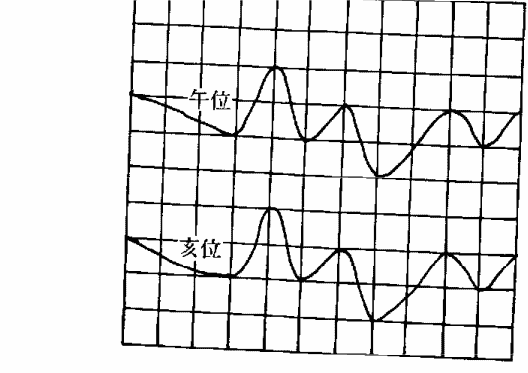
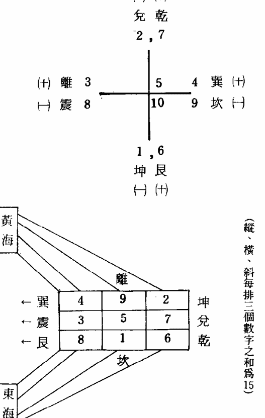
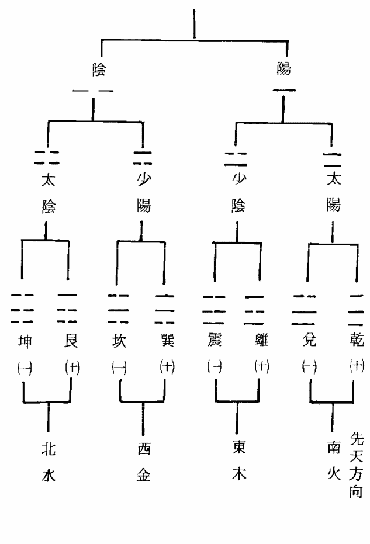
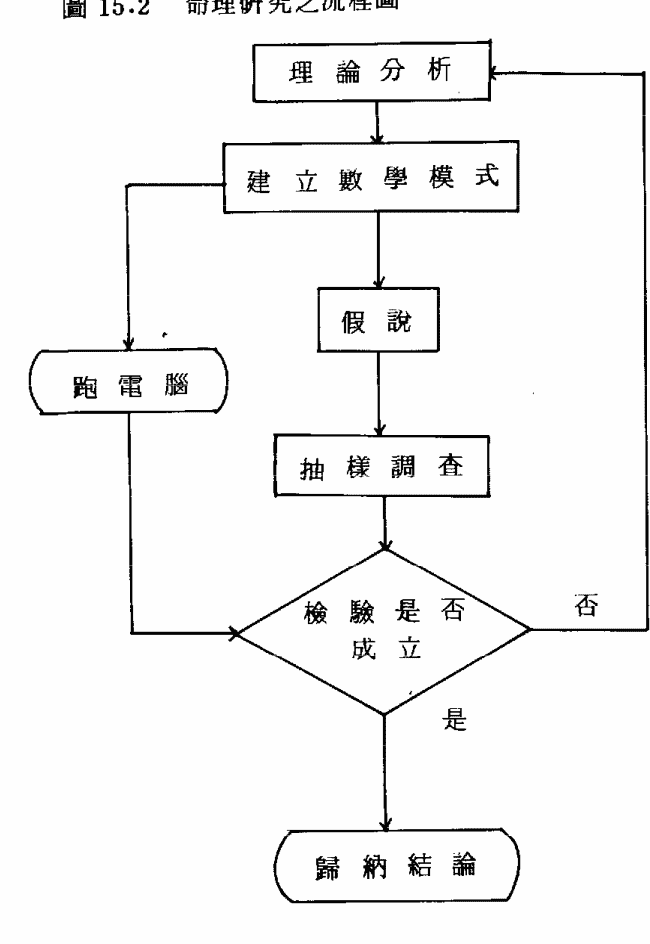
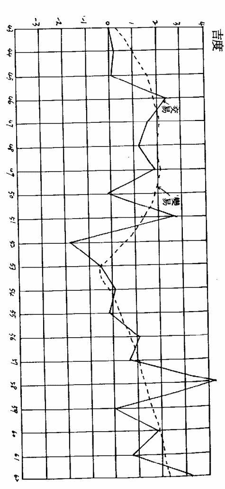
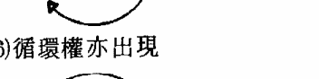
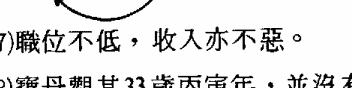

# 序言

首先在此先感謝武陵出版社的各位同仁，由於他們的辛苦，本書才得以順利再版，雖然報酬不多，但作者並不在意，然對紫微宗的闡揚有正面的效果。

本書推導出變化星體系是最佳結構，它的機率最低而威力最高，對紫微論命有引導正信的作用，破除迷信古書。

紫微宗是一種法門，可以渡化眾生，又具有傳承文化之功，所以本書實在應該廣傳社會，以糾正目前社會上邪惡的風氣，和功利主義的思想。

紫微宗重視因果報應，可以淨化人心、教化人心，讓世人知道，既使你的命盤很好，如果不行走正道的話，上帝會把你的太極點易位，此可參見實例29，有警醒世人的作用。

賭門一入深似海，從此父母如路人。奉勸星相界、宗教界同修，莫再預測明牌、漲跌，助長賭風而造下共業，災禍已瀕臨眼前矣！

若作者勸化有功，願迴向給九六眾生，早登覺路，並祈天下太平！

古奇峰 張寶丹

# 目錄

1. 太玄賦之玄機 7
2. 紫微斗數的“習性” 41
3. 先天命主的玄機 43
4. 身宮調整的數學方法 51
5. 雙盤重疊之合斷玄機 55
6. 五虎遁的原理 58
7. 大限起五虎遁的應用 62
8. 大限五虎遁分陰陽之玄機 63
9. 流年五虎遁的玄機 68
10. 復式玄空四化的玄機 70
11. 十八飛星的正名 74
12. 五行局分陰陽的玄機 79
13. 五行局的來龍去脈 81
14. 寶丹模式五行局之特點 87
15. 南半球的命理時辰 96
16. 流年曲線的計算過程 113
17. 改變命運的方法 127
18. 實務命例 134
19. 結語 229

# 1. 太玄賦之玄機

## 1.0. 太玄賦的意義

太者形而上也，至高無上也。玄者深奧精妙也。故太玄者乃玄之又玄，眾妙之門也。出玄入牝，有觀其竅，無觀其妙，顛倒顛，玄中玄，不可言，不可名也。

是故斗數論斷細節難立文字，只能以心印心，教外別傳，其困難始於無極生太極，道生一，一生二，二生三，三生萬物，則兩儀三盤確定，萬星億辰生焉。

般若的閃動，靈感的迸裂，星辰同宮的排列，周遭環境的瞬間變易，其細節解釋不盡相同，以及問命者的一言一行，皆是紫斗觸機的靈躍發揮，此乃太玄之精微所在，始於斗盤（陽儀）而成於數盤（陰儀）。

## 1.1. 斗數至玄至微，理旨難明，雖設問於百篇之中，猶有言而未盡至。

> <解說>
原文“理旨易明”謬誤，宜更正爲“理旨難明”，蓋紫斗學理異常玄奧而繁瑣，所謂道大理微，很多微末細節，非文字所能表達出來，必須經常跟隨在明師（非指寶丹）身邊，從實務的論命過程當中，參悟學理及吸取經驗，舉一反三，轉變成他自個兒的學問和技術。

丙寅年范先生千里訪明師，萬里尋口訣，後遇寶丹，寶丹認為他與筆者有師徒之緣，留在寶丹身邊，親自聆聽寶丹論斷細節，三個月之後，他對星情和四化星，逐漸起了脫胎換骨的大轉變，猶如天蠶變似的，有了星情細節的概念。

寶丹並非希望大家來“拜碼頭”，因為寶丹的正業很忙，沒有那麼多美國時間陪讀者聊天。

所以沒有明師的指點和說破，既使筆尖沾乾日月潭，仍然無法把微末的細節交代清楚，其主要困難的原因，在於學者永遠無機會親身體驗紫斗論斷細節的高段技術，除非在明師身邊才看得到。

所謂紫斗易學，那只是學些皮毛罷了，怎可和高段紫微斗數相比呢？其間差距何止千萬里！

## 1.2. 如星之分野各有所屬，壽夭賢愚、富貴貧賤不可一概論談。其星分佈一十二垣，數定乎三十六位，入廟為奇失數為虛。

> <解說>
星辰羅佈，各有正位和虛位，例如武曲入財宮為正位，入夫宮為寡宿乃虛位。化科星入疾厄為正位（對病人而言），入妻宮為虛位（打扮漂亮）。

又命無定命，運隨當事人的心態瞬息萬變，故很多明師論命有第13宮的飄浮概念，該宮隨當事人的面相、身材、後天環境而加權（weight）取捨。

寶丹在此先嚴明確定一個定義，把宮和位詳細區分。

所謂“宮”係指命身12宮，所謂“位”係指地支12位，寶丹驚奇古人造字的慧聰巧思，由子到亥，一個循環之後還老返童，故子亥合成“孩”，又是一個新的輪迴開始，若能定位子亥，永保赤子之心，純真無邪，可以迴光返照，頓現本來真面目，佛祖對我點頭微笑，立刻跳出三界外，不在五行中。

有了宮和位的嚴格定義，則論斷細節，星情將有所依歸。宮論強說弱，病人強宮在疾厄，商人強宮在財帛。

又例如天梁星，天梁化權強宮居事業宮，乃宮祿主。天梁化科強宮居疾厄宮，乃天醫貴人。天梁（不四化）弱星居疾厄宮，乃疾厄主，毫無解厄之功。

故吉星不見得各宮皆吉，凶星不見得各宮皆凶，其細節不可一概而論也。

“位”談論廟旺陷弱，天梁屬土清高主，不喜亥位之陰暗，為陷弱之位。參閱圖1.1

宮分12個，盤分先天、后天、中天，乃36宮位，紫斗祿命大法可期矣。

圖1.1 天梁星宮位之吉度

吉度



命父福田事友遷厄財子夫兄

## 1.3. 大抵以身命為福德之本，加以根源無窮通之資。星有同纏，數有分定，須明其生剋之要，必詳乎得垣失度之分。

> <解說>
看命須先由命宮和身宮下手，但身宮務必過宮調整，使命盤增加兩倍半。

雖然身宮順排屬先天，但也有可看性。緊接著找出命主的宮位，由于三元九宮的關係，從洛書發展出來，使命盤又增加三倍。

因此僅看身命宮和命主三才所在之地，其組合共75萬個，既準又快，威力超越子平八字甚多。紫斗經過寶丹的努力和衝刺，終於可以揚眉吐氣，讓希夷祖師“重震江湖”。

若能再配合虛飄不定的第13宮，則由三才生四象，紫斗更具威力，命盤增加12倍，直逼900萬個組合，依據命理學第一定律，其準確度實在難以形容。

既然宮位被define下來，若能明瞭星斗之間同宮同位的意義，計算另一盤的數理關係，命理師可以看出當事人口袋有多少錢，銀行存款有多少，哪一年賺多少錢，哪一年虧多少錢，哪一年貸款多少，甚至連利息也計算出來。

台南縣佳里鎮的黃先生，丙寅年來訪寶丹，寶丹遙指他家的大門向西北方，貸款×元，利息每月×元，使他驚異萬分，因此欲拜在寶丹門下。

游刃有餘，繼續追蹤廟旺落陷，所代表的細節有高低，若再配合72飛星，細節躍然在紙上，如數家珍，甚至於要喝退左右旁人，細語他的私事，令當事人臉紅“歹勢”。

命理界常言紫斗不准，非不准也，是自個兒未突破耳，對化權和化科的細節不曾妥善解釋，因此功力減掉大半。

三才四象已生，五行六爻不可偏廢，若五行偏旺無制反而不利，乃吉中藏凶。再下去七政八卦呼之欲出，九宮洛書和十干河圖，隨心所欲，則高段紫斗盡善盡美矣！

## 1.4. 觀乎紫微司一天儀之象，率列宿而成垣。土星苟居其垣若可移動，令星專司財庫最怕空亡。

> <解說>
我們觀察紫微星，猶如張衡之渾天儀，北辰居其所眾易拱之，乃天象之領導者。

原文的“卒”改爲“率”，比較合乎現代白話文。

土星指紫微，中央戊己土，居管理地位，它是一顆動星，每天每時運轉不停，正合乎天行健君子自強不息之易理。日月運行曰易，乃觸機法之原理，但觸機論命是實驗室裡的理論，沒有明師的口訣，不足以把理論化爲實務。

因無極靜而太極動，靜極思動，我們欲找到太極點不容易，太極找不到，則兩儀三才四象無所歸依，故同一時辰的觸機，其強宮不盡相同，非具有豐富的臨床論命經驗不可。

所謂：八卦推求眞妙理，六爻算盡鬼神機。

古人誠非虛言，的確可以通天地神明，奪宇宙造化，上算33天河漢星斗，下斷18層幽冥地府。

丙寅年，竹市南大路的王小姐，透過友人之介紹來訪寶丹，寶丹是業餘命理學家，不取人分文之潤金，但沒有知友引薦，亦不肯輕易替人論命。

寶丹在談笑之間，遙指她家大門正對著尖銳的牆角，王小姐大驚，誤以爲寶丹作弊，曾到她家大門看過，寶丹今天只是萍水相逢，從未和她謀面，哪有可能知道她家住在何街呢？

寶丹為了苦心成全她，請出其父已投胎轉世，而亡母正在第六殿卞城王處受苦。

依照寶丹的經驗，凡是提及地獄之事，聞者莫不一笑置之，可是王小姐頓時雙淚珠垂，寶丹大驚失色，急問原因。

她說：我確實曾夢見母親哀求迴向功德給她，她說在地獄很苦。

再說“令星”代表南斗令主天府星，古書寫“金星”可能錯誤，令和金極易混淆，它代表財庫，最怕地劫來劫庫，其他空亡諸星亦怕。

因係令主，喜左輔右弼來扶持。左右是一組奇怪的星辰，它喜歡擇木而棲，沒有好的主人領導它，它反而會興風作浪。

## 1.5. 帝居動則列宿奔馳，貪守空而財源不聚，各司其職不可參差。苟或不察其機，更忘其變，則數之造化違矣。

> <解說>
紫微是一個帝王星，眾星圍拱，只要它一飛動，列宿跟著奔馳，構成命理動態學的原理根據。

子平術強調Time Series的論斷，只要取出喜忌，即可在紙上畫出流年曲線圖，類似一棵大樹的縱切面，來龍去脈一目了然。

紫斗強調Space Details的論斷，類似一棵大樹的橫切面，但是它更勝一等，可以從橫切面，轉變成縱切面，比子平衡更高明，那是相當高段的技術，恕寶丹不敢隨便洩露。

貪狼是偏財星，若遇空亡星沖破，最忌投機性事業。故各星各有所司，一點多不能差誤，若學者沒有累積經驗，星情易生偏差，不察觸機之強宮，更忘太極暈之追尋，則斗和數，兩儀之變化完全失序，不合動態命理之學理。

一旦高段紫斗靈動躍起，可以算出當事人的18代祖先、墳墓狀況，甚至連左右鄰墓都可以講得頭頭是道，令人聽得張目結舌，久久不能言語。

## 1.6. 祿逢沖破吉處藏凶，馬遇空亡終身奔走。生逢敗地發也虛花，絕處逢生發而不敗。

> <解說>
如果命身宮之祿星被化忌沖破反為凶兆，被空亡沖破，亦呈凶象。

祿存比化祿更忌沖破，因祿存有羊陀二將拱衛，若被沖破，兩個衛兵將是亂臣賊子，會乘虛而入侵。

祿存被化忌沖破，主要是財源不聚，或猛賺猛花，古書稱為羊陀夾忌為乞丐。

祿存被空亡沖破，主要是六親無常，親朋好友無緣。化祿比較不畏化忌，若有權科拱衛，可以抵抗它。

寅申巳亥非生即絕，亦是長生位，亦是絕鄉，故安命立身於此，宜配合12長生以觀察入微。

竹林版之紫微斗數全書（卷三P.16）曰：如年納音水土，長生見甲申（泉中水），乃全星為水宮之主，若安命在酉敗地，又逢羊陀忌耗七殺同不美，得祿存吉。

其意義係指：甲申年出生者，其納音泉中水，若是男命，則申位起長生，敗地（沐浴）入酉位，若安命在酉，即是生逢敗地。

寶丹非常懷疑它的真實性，有賴斗界諸公先進之抽樣調查。若配合下一句絕外逢生，應該是指五行局起12長生，配合星辰屬性才正確。

蓋“生”係指星辰之長生，“敗地”係指五行局之沐浴。故竹林紫微斗全書（卷三P.16）有三句話：納音墓庫看何宮
生逢敗地發也虛花
絕外逢生花而不敗

前者指丑未辰戌四墓地，財帛宮或官祿宮喜入四庫，有斂藏作用，存款必豐。田宅宮亦喜入庫，不動產連綿數里，千山鳥飛絕，萬里人蹤滅……。

后者指寅申巳亥四馬地，若12長生入絕，喜星性為長生，叫做絕地逢生。

唯獨“生逢敗地”一句，令人撲朔迷離，此可能有兩種解說：

(1) 安命於沐浴（敗地），而星性是長生者。但12長生分順逆，依據陽死陰生，及陰死陽生的原理，我們可以永得星性長生的宮位。

譬如：火六局陽男，立命卯位，寅位起12長生順佈，乃生、沐、財、臨、旺、衰、病、死、墓、絕、胎、養。

立命卯宮敗地（沐浴），若命宮星辰屬性水氣，為生逢敗地，蓋水氣長生居申，順佈12長生，卯位入死，陽死陰生，故陰水長生居卯。

同理：火六局陰男立命丑位，若宮中水星當頭座，乃生逢敗地。

(2) 另一種解說，寶丹懷疑敗地乃絕地之代稱，古書一向是“敗絕”並提，說不定是“生逢敗絕之地，發也虛花，古人抄書時或八股文的關係，把“絕”省略掉，形成對偶工整的賦文。

如果上述假設成立，則應該是“生逢絕地，發也虛發”（花改成發更切實際）。與下一句之“絕處逢生，發而不敗”（同理：花改成發）。此頗合乎諾貝爾得獎人，楊振寧和李政道的“對偶定律”，該定律來自易經的啟發。

按：現代物理學愈來愈玄，科學和哲學逐漸結合在一起，若從易經上去找尋，或許可以幫助我們瞭解它。

故絕處逢生是：

- 木星居亥而亥是絕地
- 火星居寅而寅是絕地
- 金星居巳而已是絕地
- 水星居申而申是絕地
- 土星居申（男）或寅（女）

同理“生逢絕地”是：

(1) 陽男和陰女

- 木星居申而申是長生
- 火星居亥而亥是長生
- 金星居寅而寅是長生
- 水星居巳而已是長生
- 土星居巳（男）或亥（女）

(2) 陰男和陽女：

- 木星居寅而寅是長生
- 火星居巳而已是長生
- 金星居申而申是長生
- 水星居亥而亥是長生
- 土星居亥（男）或巳（女）

另外一句馬遇空亡，終生奔走，徒勞無功。空亡諸星有地空、地劫、截路空亡、旬中空亡。

后兩者空亡，古書認為陽年生者見陽宮，陰年生者見陰宮。事實上陽年生者又分男和女，陰年生者亦分男和女。依據易經的原理，太極分兩儀，兩儀生四象，故宜分陽男、陰女和陰男、陽女，前者截空、旬空見陽宮，后者截空、旬空見陰宮。

又天馬星是依年支而安，還是依月份而安呢？何者才正確？寶丹認為應該依年支而安，其理由如下：

在紫斗命盤的形成過程中，月和時決定命身12宮，日決定紫府14顆主星，年干決定飛星四化，三者出力皆大，唯獨年支在睡懶覺，好官自我為之，笑罵由人，不派一兵一卒參加甲級星會戰。故寶丹欲加重年支的責任感，把天馬星劃歸於他。

## 1.7. 星臨廟旺再觀生剋之機，命坐強宮細察制化之理，日月最嫌反背。祿馬最喜交馳，倘居空亡得失最為要緊，若逢敗地專看扶持之曜大有奇功。

> <解說>
即使星臨廟旺之位，亦不可輕言吉利，尚須配合12長生。

例如：財帛宮非常喜歡入墓，名曰財庫。官祿宮次之，名曰官庫。

墓庫者斂藏也，奉帝令斂旨而藏庫銀之地也。故化祿宜用不宜藏，化忌宜靜不宜動。

一旦化祿星入墓，不宜作投資、買賣，否則易損財庫。

最忌諱遷移宮入墓，名曰劫庫。蓋遷移宮主動，而墓庫主靜，於是欲動不能，欲靜不止，動靜兩不是，出外謀財難遂。

祿存比化祿更能適應墓庫，祿存又名天祿，若入墓名曰天庫，有羊陀夾衛，不畏小偷強盜來犯。

命坐強位係指12長生之意，應把“強宮”改用“強位”更符合我們的定義。

古書寫“命生強宮”，乃暗示12長生之意。

如果把後一句話“若逢敗地扶持大有奇功”，緊接在“命生強位細察制化之理”之後，更能令人體悟其主旨。

全句而言，星辰入廟旺樂，最喜星情屬性來相剋。若安命12長生強位，亦喜星情屬性來剋。若安命12長生之弱位，尤其是敗絕之地，最喜星情五行來生扶。

古書所說敗地，係指沐浴之地，它經常是“敗絕”並提，可見還包括絕地。

日月最嫌失輝，所謂失輝係指光度不能普照。

日月是最奇妙的星辰，其光度與季節、日時、氣候、四化等，有密切的關係。請參考1.3表做為論斷高低的標準。

太陽主男性親友，以父親為主。若入父母宮為父親主（三合或對照亦算），若入夫妻宮（對女人而言）為丈夫主。若入官祿宮為官貴主。

太陰主女性親友，以母親親為主。若入父母宮為母親主（三合或對照亦算），其夫宮居本命的兄弟宮，可視為父親宮，在論斷細節技術上，的確非常精準，百發百中。

太陰屬水，陽宅學中，視水路為財，故太陰尚主財氣。居田宅宮為田宅主，居財帛宮為財帛主，居官祿宮為官祿主。

祿馬交馳指祿星和天馬星互相對照，同宮就沒有交馳作用。又天馬喜居遷移宮，而祿星居本宮算是正格，因天馬居遷移宮為得其正位。

此處之祿星，祿存比化祿力量大，因祿存號稱天祿，有羊陀二將前後夾衛。但天祿最怕空亡星沖破，奔波忙碌，徒勞無功，一手進財，另一手出財。

古書把天馬守命當作正位是錯誤的，天馬是好動的星辰，帶有財氣，守在家中（本宮）不會進財，居外頭（對宮）才會財源滾滾而來。

表1—2 太陽太陰廟陷表

| 項目 | 廟 | 平 | 陷 | 備註 |
| :--- | :--- | :--- | :--- | :--- |
| 太陽 | 季節 | 夏 | 春秋 | 冬 | 論白天 |
| | 氣候 | 晴 | 陰 | 雨 | |
| | 緯度 | 0°～25° | 25°～50° | 50°以上 | 論所入宮位 |
| | 納音 | 火 木 | 土 | 金水 | |
| | 時辰 | 寅卯辰巳午 | 未申 | 酉戌亥子丑 | |
| 太陰 | 季節 | 秋 | 冬春 | 夏 | 論夜間 |
| | 氣候 | 晴 | 陰 | 雨 | |
| | 納音 | 金 水 | 木 | 火土 | 論所入宮位 |
| | 日號 | 初19.～10.日 | 初初5.～9. 20～24. | 初初1.～4. 25.～30. | |
| | 時辰 | 酉戌亥子丑 | 未申 | 寅卯辰巳午 | |

## 1.8. 紫微天府全依辅弼之功，七杀破军专依羊铃之虐。诸星吉逢凶也吉，诸星凶逢吉也凶。

> <解說>
紫微星是帝王星，天府星是南斗令主，两星各领导南北二方，最需要左右身边的贤士辅助，苟得左辅右弼合照或夹持同宫，必然终身富贵，盖紫微主贵而天府主富。
七杀主肃杀，破军主破耗（破坏），皆属凶星，若逢羊刃铃星，必然增强其凶性。
由此可见，七杀和破军非常怕羊刃铃星，而较不怕陀罗、火星，也不怕地劫地空。同理，天府非常喜欢左辅右弼，文昌、文曲、天魁、天钺反而没有左右之有力。
吉星多于凶星仍以吉论，反之，凶星多于吉星仍以凶论。
其次，务必比较四化星，是否得化吉星或化忌星，若四化全无，依据四化生五行的原理，应该转看纳音，是否生扶或克制。

## 1.9. 辅弼夹帝为上品，桃花犯主为至淫，君臣庆会才善经邦，魁钺同行位居台辅，禄文拱命贵而且富，日月夹财不权则富。

> <解說>
桃花指贪狼星，主或帝指紫微星，紫贪同居卯或酉二位，称为桃花犯主。但紫贪居卯的机率是10%，居酉的机率是6.7%〔注〕，两者共16.7%，机率极大。依据命理学第二定律的原理，机率大者，威力反而降低，故直断“桃花犯主”，毫无科学根据。
如果真的是“桃花犯主”，那么酉位要比卯位严重（因酉位之机率是6.7%）。宝丹认为这句赋文不可相信，倒是左右夹帝尚可相信，因其机率是1／36＝2.78%，威力极高。
〔注〕 请参考宝丹所著“高段紫微斗数”P.33。
紫微得天府天相之合照，复得昌曲之助力，此称为君臣庆会。以紫微居子午辰戌四位，才有可能君臣庆会。
紫微居子的机率是4.7%
紫微居午的机率是10.7%
紫微居辰的机率是11.3%
紫微居戌的机率是6%。
合计32.7%，几乎每3人当中，就有一人合乎此先決條件。依據命理學第二定律的原理，機率與威力成反比。寶丹非常懷疑“君臣慶會才善經邦”這句賦文，望讀者不可輕易相信它。

若把文昌文曲加入，才有可能把 32.7 % 的機率降低，沒有昌曲的助力不能叫做君臣慶會格。

左右魁鉞算嗎？寶丹答曰：不算。

蓋既是才善經邦（文可安邦武可定國），昌曲是最適合的星辰（才藝星）。

若加入羊陀或化忌，則為破格，古書說是奴欺主、臣蔽君。

若把昌曲加入考慮，昌曲同宮的機率是 1 ／ 72 ，昌曲守照的機率是 1 ／ 36 ，守合是 1 ／ 18 ，三合是 1 ／ 18 ，夾衛是 1 ／ 36 ，同照是 1 ／ 72 ，其合成機率是（ 1 ／ 72 ）× 2 ＋（ 1 ／ 36 ）× 2 ＋（ 1 ／ 18 ）× 3 ＝ 1 ／ 4 。

與命宮是紫微星的配對，其機率是 1 ／ 12 × 32.7 % × 1 ／ 4 ＝ 0.681 % 。顯然機率已降低，但不如古書所說，那麼威力赫赫，才善經邦。

天魁天鉞的結構有三種：夾衛、三合、守照。

夾衛的機率是 2 ／ 5 ，三合的機率是 2 ／ 5 ，守照的機率是 1 ／ 5 （甲戊兼牛羊），以守照的威力最強。

若身命分守魁鉞，兼得化祿化權來助，昌曲來拱，降低其機率，才可算是合此坐貴向貴之格局。

因昌曲與魁鉞之性質類似，同屬科甲星，兩組會合極佳，可互通聲勢。左右來會反不力，蓋左右最喜輔佐君王，不喜輔佐偏星（指魁鉞）。

祿星配合文曲，稱為祿文拱命，祿存較化祿為佳，但逢化忌，反而不如化祿。

祿文拱命格喜文藝工作，其中若會照文昌更是相得益彰。

文曲單守的機率是 1 ／ 12 ，單照的機率是 1 ／ 12 ，三合的機率是 1 ／ 6 ，合成的機率是 1 ／ 12 ＋ 1 ／ 12 ＋ 1 ／ 6 ＝ 1 ／ 3 。

祿存的機率應扣掉辰戌丑未宮，為 1 ／ 3 × 8 ／ 12 ＝ 2 ／ 9 。化祿的機率 1 ／ 3 ，與文曲相同。

昌曲雙星的合成機率是 1 ／ 4 ，比單星略低。

若只考慮祿存，祿文拱命之機率是 2 ／ 9 × 1 ／ 3 × 1 ／ 12 ＝ 0.617 % （只有文曲一顆）或 2 ／ 9 × 1 ／ 4 × 1 ／ 12 ＝ 0.463 % （昌曲兩顆）。

后面多乘 1 ／ 12 ，係指入命宮之機率。

太陽太陰最喜夾財帛宮，不貴則富，蓋太陽主貴，而太陰主財。

其相夾之位置必在丑位或未位，但以丑位較未位為佳，因太陽居寅、太陰居子，具屬廟旺。所夾之星辰必為天府，天府又是財庫，若該宮是財帛宮，豈非滿盤皆財，當然富不可言。

### 1.10. 馬頭帶箭鎮衛邊疆。刑囚夾印刑杖惟司。善蔭朝綱仁慈之長。貴入貴鄉逢者獲祿，財居財宮遇者富奢。

<解說>
馬頭指午位安命，帶箭指守羊刃星，但須有主星鎮壓，主星務必穩定性高，有化吉星同守者，是為馬頭帶箭，可以鎮禦邊疆，利於武職。
主星以天同化祿、太陰化祿、紫微化權、貪狼化祿為佳。

廉貞天相居午位，守或合或照羊刃，是謂之刑囚夾印。按刑指羊刃，囚指廉貞，印指天相。
刑囚夾印主犯官符。

善指天機，蔭指天梁，兩星同居辰或戌位，是最具修道和宗教之星情，個性往往非常慈悲。若有空亡星來會照，更主僧道。

貴係指貴人星，天魁和天鉞，喜入宮祿宮，可以富貴，大都獲人提拔。

寶丹發現貴人星居宮祿宮者，當事人皆是貴人介紹而入機關或公司上班。

貴人星入財帛宮者，有貴人介紹當事人去謀財，百發百中，屢試不爽。

若財星居財帛宮，乃得其正位，可以富甲一方。財星指祿存、化祿、武曲、太陰、天府等星。

### 1.11. 太陽居午謂之日麗中天，有專權之貴，敵國之富。太陰居子丑號曰水澄桂萼，得清要之職，忠諫之材。日月守不如照守。太陽會文昌於官祿，皇殿朝班富貴全美。太陰會文曲於妻宮，蟾宮折桂文章令盛。

<解說>
身命宮安午位，守太陽有化吉（化祿或化權）助長，又見上午生及夏季出生，當天出大太陽者，富貴雙全。
若宮位納音木火，地球緯度在±25°以內者更佳，此謂之日麗中天。
午位的天干不外乎甲午沙中金，太陽自化忌，格局沖破。

丙午天河水，旺水猛剋太陽天上火，三合祿存，只能視為中上格。

戊午天上火，旺火比助太陽，是相當不錯的格局。

庚午路旁土，太陽自化祿，土有疏洩旺火之趨勢，是比較溫和的格局，可謂上格。

壬午楊柳木，喜南方人，木可以生扶火勢，而且天梁化祿對照，但亦羊陀三合進入，有廟星變景之態。

身命居子丑位，守太陰有化吉助長，又見望日附近，冬季出生，夜晚滿月高掛，適合監察委員的職務。

乙丑海中金，雖可生扶太陰水，但太陰自化忌，格局沖破。

丁丑澗下水，比助太陰水，太陰自化祿，祿存對宮照射，視為上格。

己丑霹靂火，水火交剋，廟旺稍退，遇羊陀不美。

辛丑壁上土，土氣剋水，廟旺不再，但日月同宮丑位，太陽自化權，太陽不再陷弱，仍以中上格視之。

癸丑桑柘木，洩水氣不旺，羊刃同宮不美，幸太陰自化科，只能視為中格。

甲子海中金，金生扶水，宮中天同太陰同位，唯恐水氣偏旺，吉處藏凶，這是寶丹多年論命之經驗。

丙子澗下水，天同自化忌，羊陀三合進入，格局沖破。

### 1.12. 紫微輔弼同宮，一呼百諾居上品。帝遇凶徒雖獲吉而無道。帝坐金車則曰金輿捧轎

<解說>
紫微稱帝王星，最喜身邊有臣輔佐，最佳人選者是左輔和右弼，同宮最佳，同照亦佳，雙夾次之，可以終生富貴。

但同宮的機率是1／72，顯然威力不夠，務必再配合其他吉星來朝，以降低其機率，提高吉度的威力。

乙干者可使紫微自化科，機率是1／10，合成機率達1／72。壬干者可使紫微自化權，機率是1／10，合成機率達1／72。

若紫微沒有左右大臣來輔佐，容易變成孤君，甚至是暴君。

因此君王失去忠臣，又遇凶徒小人，君王容易轉變成無道昏君，心術不正。

金車係指文昌文曲，該星來輔佐稱為金輿捧轎，金輿相當於現代的豪華汽車，捧轎形容左右有奴僕侍候，捧著梳子在旁邊恭立。

古書寫“帝坐命庫”不正確，應改為“帝坐金車”。

### 1.13. 文耗居寅卯謂之眾水朝東。破軍暗曜同鄉水中作塚。耗居祿位沿途乞食。

<解說>
假如身命居寅卯位，遇文昌文曲破軍，又有眾煞助虐，一生驚濤駭浪，因水氣偏旺之故。

寶丹以為不僅在寅卯兩位，各宮位皆有這種現象，但破軍在卯位是落陷，所以古人就以它當作代表，寫入八股賦文來。

破軍居卯酉俱陷，若水氣偏旺則比較嚴重，流限到此宮位，加吉則平，遇凶則如枯木逢霜。

破軍和巨門不可能同鄉，唯一合理的解釋是流限分守破軍和巨門，可以稱為破暗同鄉。

寶丹發明雙盤疊斷，有可能遇到破暗同鄉，於論斷日常生活細節上，尚須考慮它們入何宮，以作合理的解釋。

耗星指破軍，若守財帛宮或官祿宮，逢眾煞助虐，可稱為耗居祿宮。理論上應該是財帛宮比官祿宮嚴重。

古書只有記載官祿宮，省略財帛宮。又記載寅午戌生人命坐午宮，巳酉丑生人命坐酉宮，亥卯未生人命卯宮，申子辰生人命坐子宮是。這句話是錯誤的。

### 1.14. 陰福聚不怕凶危。福安文曜謂之玉袖天香。

<解說>
蔭指天梁，福指天同，二星聚集在寅申宮，或相對照於巳亥宮，是否真如古書所言，不怕凶惡危險呢？

寶丹以為尚須配合四化星。天同化祿表示非常享福，不怕凶煞來犯。天同化權，表示積極爭取享受，可以輔助太陰化祿。天同化忌表示辛勞、福份被折，無力抗凶。

天梁化祿表示自貶清譽，喜好小利、飽贈，天梁化權表示官祿主，可以升官掌權柄。化祿和化權解厄力道不夠。

天梁化科乃天醫貴人，病人最喜歡它，是道道地地的一顆解厄主，是病人的強星，最喜入疾厄宮。

天梁沒逢四化星，最怕入疾厄宮，是一顆如假包換的疾厄主，誰遇到誰倒霉。

“福安文曜”係指福德宮安文昌文曲，或天同與文昌文曲共臨守命，到底何者正確？不過天同之正位居福德宮，居命宮反而次之。

古書前後記載不盡相同，在卷一 P.21（竹林）反而寫為：

臨官同文曜，號為衣錦惹天香。

寶丹非常懷疑是福德宮安文昌文曲者，常遇美人恩，因福德主享受，文昌文曲主歌舞昇平，與後一句話之“玉袖天香（或衣錦惹天香）”，頗合乎福德昌曲之狀況。

若有天同及臨官來助陣，則“天香”的味道更重。

### 1.15. 刑遇貪狼號曰風流邪杖，貪居亥子名為泛水桃花。貪會旺宮終身鼠竊，貪坐生鄉毒考永如彭祖。

<解說>
假如身命坐亥子位，守貪狼逢羊陀或昌曲，則男浪漫女貪玩。

古書寫“男盜女娼”比較惡毒，其實沒有這麼嚴重。有此巧合者不必耿耿於懷。

故古書又云，陀羅貪狼同居寅宮，主人聰明風流。不管如何，貪狼怕羊陀同宮。

貪狼居帝旺之位，主人貪窮潦倒，並非一定得當小偷。同理，貪狼居長生之位，則壽元很長，故古書說貪狼可以修仙術，以目前流行的俗語是可以學通靈。

又貪狼非常忌諱文昌文曲，古書有所謂貪昌粉身碎骨。昌曲往好看是文藝文才，往壞的看卻是玉袖天香，女命最忌入夫宮。

### 1.16. 七殺廉貞同位路上埋屍。殺居絕地天年天似顏回。七殺臨身命加煞必亡。

<解說>
遷移宮守廉貞七殺，命身宮次之，牽動化忌星，則易發生車禍，並不一定非死不可。

閩南女人最喜歡罵“路旁屍”，這是最惡毒的咒罵，口出惡言造口業，會消蝕我們的陰德。切記！不可再犯！

查顏回的命盤（竹林・卷4 P・1），子女宮紫殺居長生位，木三局陰男絕地入寅，由此可見12長生是依陰陽男女而安。

顏回的命身相照，並無七殺居絕地，或煞星居絕地，顯然有誤。

或許與顏回無關，只拿來當作形容詞而已。

七殺同守身命，若加煞星又居絕地，則壽元不長。

令人噴飯的是，古書錯誤百出，卷四P.1（竹林板）所記載顏亞聖命，陰男辛酉年4月20日卯時，命宮居庚寅松柏木，紫微飛入乙未位交友宮，而非己亥位子女宮，除非把20日改為30日，令寶丹愈來愈不敢完全相信古書。

卷四以孔子的命例掛帥出場，命宮居戊子霹靂火，乃火六局而非土五局，奇怪的是紫微卻依火六局而安，但12長生卻依土五局而安。由此可見，千百年來抄書承襲，薪火相傳，以訛傳訛，一人抄錯，眾人信奉，有誰能辨別真偽。

從卷四以後的命例觀知，12長生和博士星系，是依陰陽男女而分正逆轉，將星系省略掉，太歲系只保留歲建。

### 1.17. 祿居奴僕縱官也奔馳、祿存守於田財堆金積玉。財陰坐於遷移巨商高賈。

<解說>
如果祿存、化祿、財星等，聚集在交友宮不以美論，只是勞碌奔波罷了。

交友宮亦不喜化權，朋友或兄弟當權，皆非吉利，倒是化科比校喜入交友宮，可獲貴人提拔，或揚名於世。尤其演藝人員，或參加博碩士論文口試時，交友宮有舉足輕重的影響力，有化科飛入，必得上司垂青。

祿星或財星的正位在田宅宮和財帛宮，由此可見星辰和“宮”的關係較密切，和“位”的關係較疏遠。

最後一句的蔭星，令寶丹非常懷疑，蓋天梁化祿主為錢財而困擾，不可能成為巨商高賈。寶丹擬修改成爲“財或陰坐遷移宮”用太陰取代之比較合理。

太陰是田宅主，入遷移宮表示作外貿可積大財。另一顆財星係指武曲星，入遷移宮亦主適合外貿。

按：化祿飛入交友宮和化忌飛入交友宮，其意義不盡相同，前者係指把財物借給朋友，後者係指財物被朋友倒帳，拿不回來了。

### 1.18. 忌暗同居身命疾厄沉困弱贏。兇星居父母遷移刑傷產室。刑煞同廉貞於官祿柳扭難逃。官府刑煞於遷移離鄉遭配。

<解說>
假如身命或疾厄宮，守巨門羊陀，非貧困則殘疾之人，或祖業動蕩奔波勞碌。

假如父母宮和遷移宮守凶星，則恐一生下來就父母見背。

廉貞守流限官祿宮時，若流限羊陀諸煞俱到，應忍讓為謀，退一步海闊天空，何等逍遙自在。忍辱波羅蜜是世尊昔日成就忍辱大仙的果位，必然可以消除冒犯國法的危機。

假如中天遷移宮守羊陀諸煞，遇先天、后天或中天之官府雙星所入侵，宜修心養性，不與人爭吵，才不致犯官非而流放外島，傾訴“綠島小夜曲”。

### 1.19. 善福於空位天竺生涯。輔弼單守命宮離宗庶出。

<解說>
天機天同若遇空亡星，為人比較清高，淡泊名利，不願同流合污，並非一定要剃頭當和尚不可。

左輔和右弼守照、守合，甚至同宮，其威力才足以顯現出來，因為左或右單守，或然率僅1／12，力量不夠。

雖宗庶出並非當小老婆的兒子，而是重拜義父母，或結拜兄弟姊妹。

若左右同守子女宮，沒有主星，表示有收養義子義女之現象。

### 1.20. 鈴羊合於命宮，遇白虎須當刑戮。官府發於吉曜，流煞怕逢破軍。羊鈴憑太歲以引行，病符官符皆作禍。奏書博士與流祿盡作吉祥。力士將軍同青龍顯其權勢。

<解說>
羊鈴三合入命宮，最怕遇白虎，有殺身之禍，須提防意外之災厄，天災地變不可免，但至少人禍可以避開，此有賴個人平日之“靈修”。

所謂“靈修”非指通靈、啟靈，而是重視個人靈性之昇華，摒棄世俗的名利糾纏。

官府屬於博士星系，博士主聰明，依祿存而安，曰發於吉曜。

流年所飛出的次級煞星，最忌諱跨盤飛入后天命宮，若有破軍更糟。羊鈴一樣可以隨著太歲而飛出來。

太歲所飛出的次級飛星尚有病符、官符、奏書、博士、祿存、力士、將軍、青龍等。

吉祥者有博士、奏書、將軍、力士，凶惡者有羊刃、鈴星、病符、官符、白虎。

### 1.21. 童子限如水上泡漚，老人限似風中殘燭。遇煞無制乃流年最忌。人生榮辱限元必有休咎，處世孤貧數中並無駁雜。學者至此誠玄微矣。

<解說>
童子和老人都是老弱之輩，其強宮居疾厄宮，最易引起意外和疾厄。

流年最怕遇煞星聚集，若有吉星來解，可有解厄之功。

人生的榮辱福禍，從流限中可窺其吉凶休咎。未註生先註死，生死簿記載得清清楚楚，決無半點混雜和謬誤，而本身三尸神主宰，故曰舉頭三尺有神明，在識田中錄影起來，因果難逃。若再配合太玄賦的動態命理學，則六爻算盡鬼神機。學者至此，可謂精微之至，玄中玄，顛倒顛，誠乃“命無定命”已得希夷之最高心法矣！

# 2.紫微斗數的“習性”

斗界先進若欲闡揚紫斗的祿命奧理必也須充分瞭解它的習性，紫斗的命盤數很少，只有 10 萬個組合，欲描述社會的人文現象顯然捉襟見肘，重複的 CASES 司空見慣，譬如出生日不同而命盤相同。

最不合理者是出生年支，除火鈴外未派壹星壹辰參入甲級星體系之中，故年支三合者或相照者，命盤極其類似。

重複性和類似性如此之高，不幸論命的方式又是看三方四正，故三合宮位的部份大小雷同，更增加了紫斗祿命法的缺陷。

從以上分析不禁令我們暗罵希夷祖師老奸巨猾，引人入甕上當。寶丹以為可以引進命主的觀念來取代年支的輸出，不但可以使命盤增加三倍，並使之符合各元甲子的八字結構，蔚為命理學上之奇觀。

命理學並非如此單純，太極量瞬息萬變，有的走命宮的路線，有的走命主的路線，甚至于有的走身宮的路線。

故殺破狼者不見得非冒險犯難不可，他一樣可享有機月同梁的清閒。寶丹以為紫斗的特長在於論斷細節，如此才能賦于生機，我們將發現紫斗猶如飛龍在天，光芒畢露，瑞氣千條，手執牛耳的命理巨人。

# 3. 先天命主的玄機

觀乎紫斗祿命術之最高心法乃是命無定命，它必須符合佛道的因果定律，由于社會是複雜的變數，人類天天造因承果，日有所損而不自知，最後突遭變故，再來怨天尤人已來不及矣，命理師必須依其豐富的體驗在命盤上尋龍點穴，找出太極量來，命主將是我們考慮的對象之一。

命主另一項威力是檢驗出生時辰是否正確，尤其應用在誤差一個時辰最為有效。

寶丹很早以前欲將命主取代命宮的假設提出，但礙于時機未成熟，不能取得斗界衷衷諸公的共識，恐引起術道人士的不服，磨刀霍霍向寶丹，唯有訴諸統計的方法來印證，寶丹不敢說放諸四海而皆準，但若有 80 % 以上的準確度就值得我們去研究和開發。

自從MULTI-VARIABLES ANALISIS的技術被開發成功以後，應用電腦解決複雜的統計矩陣方程式，人類的能力飛躍千里，絕不遜于神明，假設A代表母體，N代表樣本，K代表隨機性係數，

寶丹建議抽樣如下：

```
N = [ ( A / K ) ^ ( 1 / K ) ] / K
```

如果隨機性足夠的話，可以取K >= 2，否則取K < 2 到 1.62（河圖比例）。令K = 2，A = 103680，則N = 114 個樣本，不須檢驗幾千幾萬個命例，可以節省很多人力和物力，這也是統計學的神奇魅力。

寶丹有理由相信，希夷時代的統計技術還不夠成熟，除非用通靈，否則所歸納出來的結論必不很完整，有賴後人去給它修改和增益，故擁秘自重的人士不可盲目崇拜線裝書，以為天下之秘藏在此矣！

每一個人所接觸的樣本（SAMPLES）皆有小圈圈的趨向，容易變成成分層抽樣（STRATIFICAL SAMPLING），工廠界者大多抽取工人當命例，演藝界大多抽取演藝人員充當命例。為了不使以偏概全而產生誤導，宜透過各界人士的合作而抽取不同背景和空間的樣本。

命主加入紫斗祿命體系之後，命盤增加了三倍，身宮調整增加了2.5倍，我們放棄看三方四正的落後觀念，改看命宮、命主和身宮的組合，他們具有三才的作用，總計有75萬個組合〔註〕，頗具威力，難怪寶丹頓覺紫斗比八字有效而實用。

譬如某大師舉成吉思汗為例，出生于公元1155年，歲次乙亥3月21日午時，其八字如下：

| 食 | 乙亥 | 劫 | 驛 |
| --- | --- | --- | --- |
| 印 | 庚辰 | 官 | |
| 一 | 癸丑 | 殺 | 双 |
| 官 | 戊午 | 才 | 桃 |

單憑這八個干支欲看透當事人的一生，除非是頂尖高手，才足以洞悉全局，大部分的人無法高攀如斯境界。但若我們借重紫斗的甲級星命盤，寶丹在兩分鐘內可以佈星列斗（這種速度算是很慢的），則頓見：

命身同坐丙戊守紫微化科，和天相文曲，被天機化祿與天梁化權双夾衛，他們的吉度應加倍計算。其身宮不必調而命主飛入壬午財帛宮，得其正位，守武曲和天府，氣勢宏偉，巧妙者在于武曲自化忌，被諸化吉所引導，步入將星主的路線，衝鋒陷陣，攻無不克，守無不固，敵人望風披靡。

又丙干起四化星，再遇天同化祿和天機化權間接夾而文昌化科來照，由于命身同宮加倍計算，數不清的化吉星兼双紫微双天相，故可断为富可敌国且贵不可言之格局。

寶丹之學既準又快，而且容易學習，從三才的宮位迅速看出一個人的窮通禍福，堪稱千百年來，紫斗祿命法的大革新。

一旦我們測知是走命主的路線，則命主可以取代命宮，古人亦發現命主可以論斷吉凶，譬如紫斗全書在談星要論有云（卷三 P.12）：

> 看身命祿馬不落空亡，天空截空最緊，旬空次之，第一看命主吉凶廟旺，化吉化忌生剋，次看身主吉凶生剋，三看遷移財帛官祿……………。

古書的說詞前後矛盾，前面說命宮頗有看頭，後面反說命主掛帥出陣，命運隨著當事人的心態瞬息萬變，不見得非走哪一固定的宮位，命無定命，命理師務必依其豐富的體驗詳加判斷太極量坐落何方，如此才足以論命切中，這是非常高段的實務經驗（OPERATIONAL EXPERIENCE），非寶丹窮墨所能描述，若太極誤，強宮錯，則全盤皆謬矣，吾等能不懼哉？

道書亦曰：修道者必須收斂其三魂七魄，才不致放蕩元靈。

## 3.先天命主的玄機

魂者屬陽，凡生物莫不有之，草木僅有一魂，名曰生魂，其頭向下，只知生芽結果，不知苦樂七情。

飛禽走獸則有二魂：一曰生魂，知生長走動，二曰覺魂，知痛苦喜樂，其頭平直，背天橫行，見難知避，見食知求。

惟人向上，頂天立地，三魂在身，多一靈魂，可以思維，無所不知，無所不曉，可以分判是非。

九天司命，每週庚申甲子之日，三屍悉奏天曹，常與七魂會合，撥弄主人。

七魄者七情也，一名尸狗，好吃。二名伏尸，好穿。三名雀陰，好淫。四名吞賊，好賭。五名蠆毒，好禍。六名除穢，好貪。七名臭肺，好一切難事，他們常潛人之心竅中。

人心中有七個竅眼，依其生月生時推算，應北斗七星，在本命一竅中即主其事。如人本命是貪狼星，屬北斗第一，應尸狗，其人好吃。巨門星第二應伏尸，其人好穿。以此類推，俱是七魄勾弄也。

魂注於肝而魄注於肺，若能降龍伏虎，陶魂鑄魄，則性不能烈，情不能勇，內保金丹，外不招禍，河車自轉，天地永交泰矣！

故民間安太歲祭北斗，知其義者幾稀矣，事實上，拜斗之目的在減少自個兒的七情六慾。若祭拜者不能配合修心養性，五陰盛苦，六賊相攻，恐仍難躲災避禍。

由古書的印證，七情六慾是命運的原動力，是心態的表現，故命主具有非凡的威力，甚至在某些場合可以取代命宮。

〔註〕 命宮、身宮、命主三才之組合數計算如下：
3元甲子×60甲子年×12月×30日×12時辰＝750,000個組合。

## 表3.1 男命命主和身主

| 男命身主 | 7 | 6 | 5 | 4 | 3 | 2 | 1 | 9 | 8 |
|---|---|---|---|---|---|---|---|---|---|
| 男命命主 | 貪狼 | 6 | 7 | 8 | 1 | 9 | 8 | 4 | 3 | 2 |
| | 巨門 | 2 | 8 | 7 | 9 | 1 | 7 | 3 | 4 | 6 |
| | 祿存 | 1 | 4 | 3 | 6 | 2 | 3 | 7 | 8 | 9 |
| | 文曲 | 4 | 1 | 9 | 7 | 8 | 9 | 6 | 2 | 3 |
| | 廉貞 | 9 | 3 | 4 | 2 | 6 | 4 | 8 | 7 | 1 |
| | 武曲 | 8 | 2 | 6 | 3 | 4 | 6 | 9 | 1 | 7 |
| | 破軍 | 3 | 9 | 1 | 8 | 7 | 1 | 2 | 6 | 4 |
| 民國年代 | 1 | 2 | 3 | 4 | 5 | 6 | 7 | 8 | 9 |
| | 10 | 11 | 12 | 13 | 14 | 15 | 16 | 17 | 18 |
| | 19 | 20 | 21 | 22 | 23 | 24 | 25 | 26 | 27 |
| | 28 | 29 | 30 | 31 | 32 | 33 | 34 | 35 | 36 |
| | 37 | 38 | 39 | 40 | 41 | 42 | 43 | 44 | 45 |
| | 46 | 47 | 48 | 49 | 50 | 51 | 52 | 53 | 54 |
| | 55 | 56 | 57 | 58 | 59 | 60 | 61 | 62 | 63 |
| | 64 | 65 | 66 | 67 | 68 | 69 | 70 | 71 | 72 |
| | 73 | 74 | 75 | 76 | 77 | 78 | 79 | 80 | 81 |
| | 82 | 83 | 84 | 85 | 86 | 87 | 88 | 89 | 90 |
| | 91 | 92 | 93 | 94 | 95 | 96 | 97 | 98 | 99 |
| | 100 | 101 | 102 | 103 | 104 | 105 | 106 | 107 | 108 |
| | 109 | 110 | 111 | 112 | 113 | 114 | 115 | 116 | 117 |
| | 118 | 119 | 120 | 121 | 122 | 123 | 124 | 125 | 126 |
| | 127 | 128 | 129 | 130 | 131 | 132 | 133 | 134 | 135 |
| | 136 | 137 | 138 | 139 | 140 | 141 | 142 | 143 | 144 |
| | 145 | 146 | 147 | 148 | 149 | 150 | 151 | 152 | 153 |

## 表3.2 女命命主和身主

| 女命身主 | 8 | 9 | 1 | 2 | 3 | 4 | 8 | 6 | 7 |
|---|---|---|---|---|---|---|---|---|---|
| 女命命主 | 貪狼 | 2 | 3 | 4 | 8 | 9 | 1 | 2 | 7 | 6 |
| | 巨門 | 6 | 4 | 3 | 7 | 1 | 9 | 6 | 8 | 2 |
| | 祿存 | 9 | 8 | 7 | 3 | 2 | 6 | 9 | 4 | 1 |
| | 文曲 | 3 | 2 | 6 | 9 | 8 | 7 | 3 | 1 | 4 |
| | 廉貞 | 1 | 7 | 8 | 4 | 6 | 2 | 1 | 3 | 9 |
| | 武曲 | 7 | 1 | 9 | 6 | 4 | 3 | 7 | 2 | 8 |
| | 破軍 | 4 | 6 | 2 | 1 | 7 | 8 | 4 | 9 | 3 |

| 民國年代 | 1 | 2 | 3 | 4 | 5 | 6 | 7 | 8 | 9 |
|---|---|---|---|---|---|---|---|---|---|
| | 10 | 11 | 12 | 13 | 14 | 15 | 16 | 17 | 18 |
| | 19 | 20 | 21 | 22 | 23 | 24 | 25 | 26 | 27 |
| | 28 | 29 | 30 | 31 | 32 | 33 | 34 | 35 | 36 |
| | 37 | 38 | 39 | 40 | 41 | 42 | 43 | 44 | 45 |
| | 46 | 47 | 48 | 49 | 50 | 51 | 52 | 53 | 54 |
| | 55 | 56 | 57 | 58 | 59 | 60 | 61 | 62 | 63 |
| | 64 | 65 | 66 | 67 | 68 | 69 | 70 | 71 | 72 |
| | 73 | 74 | 75 | 76 | 77 | 78 | 79 | 80 | 81 |
| | 82 | 83 | 84 | 85 | 86 | 87 | 88 | 89 | 90 |
| | 91 | 92 | 93 | 94 | 95 | 96 | 97 | 98 | 99 |
| | 100 | 101 | 102 | 103 | 104 | 105 | 106 | 107 | 108 |
| | 109 | 110 | 111 | 112 | 113 | 114 | 115 | 116 | 117 |
| | 118 | 119 | 120 | 121 | 122 | 123 | 124 | 125 | 126 |
| | 127 | 128 | 129 | 130 | 131 | 132 | 133 | 134 | 135 |
| | 136 | 137 | 138 | 139 | 140 | 141 | 142 | 143 | 144 |
| | 145 | 146 | 147 | 148 | 149 | 150 | 151 | 152 | 153 |

# 4. 身宮調整的數學方法

身宮調整以後命盤增加 2.5 倍，準確性提高甚多，事實上的抽樣調查結果亦復如此，和命宮、命主三足鼎立，同是三才之一，具有舉足輕重的角色，不可或缺。

但身宮的調整需借重表格（參見高段紫斗 P.34），感到非常不自在，寶丹不得不介紹身宮調整的數學方法，可以迅速算出調整的位數。

令 P = 紫微宮位（加減 12 的倍數不變）
F = 五行局數
D = 出生日
R = 餘數（0 ≤ R < F）

P 值從寅位起首，卯位為 2、辰位為 3，以此類推。則其公式如下：

```
D = F ( P - R ) - R   ( R = 偶數 )
D = F ( P + R ) - R   ( R = 奇數 )
```

【例題 4.1】 F = 6（火六局）
P = 12（紫微入丑）

<解>

R = 0、1、2、3、4、5
D = F ( P ± R ) - R

P = 10（紫微入亥）

<解>

R = 0、1、2、3
D = F ( P ± R ) - R

偶數
D = 6 × ( 12 - 0 ) - 0 = 72
D = 6 × ( 12 - 2 ) - 2 = 58
D = 6 × ( 12 - 4 ) - 4 = 44

偶數
D = 4 × ( 10 - 0 ) - 0 = 40
D = 4 × ( 10 - 2 ) - 2 = 30

奇數
D = 6 × ( 0 + 1 ) - 1 = 5
D = 6 × ( 0 + 3 ) - 3 = 15
D = 6 × ( 0 + 5 ) - 5 = 25

奇數
D = 4 × ( 10 + 1 ) - 1 = 43
D = 4 × 1 - 3 = 1

【例題 4.2】 F = 5（土五局）
P = 11（紫微入子）

【例題 4.4】 F = 3（木三局）
P = 9（紫微入戌）

<解>

<解>

R = 0、1、2、3、4
D = F ( P ± R ) - R

R = 0、1、2
D = F ( P ± R ) - R

偶數
D = 5 × ( 11 - 0 ) - 0 = 55
D = 5 × ( 11 - 2 ) - 2 = 43
D = 5 × ( 11 - 4 ) - 4 = 31

偶數
D = 3 × ( 9 - 0 ) - 0 = 27
D = 3 × ( 9 - 2 ) - 2 = 19

奇數
D = 5 × ( 11 + 1 ) - 1 = 59
D = 5 × ( 11 + 3 ) - 3 = 5 × 2 - 3
= 7

奇數 D = 3 × ( 9 + 1 ) - 1 = 29

【例題 4.3】 F = 4（金四局）

【例題 4.5】 F = 2（水二局）
P = 8（紫微入酉）

<解>

R = 0、1
D = F ( P ± R ) - R
\begin{cases} D = 2 \times ( 8 - 0 ) - 0 = 16 \\ D = 2 \times ( 8 + 1 ) - 1 = 17 \end{cases}

# 5. 雙盤重疊之合斷玄機

寶丹曾介紹過双盤合斷法，應用在婚配方面，頗具效率，今寶丹在此再介紹双盤疊斷，與前者的原理類似，手段稍異，亦具有不可忽視之威力。

祿命方法的發明，並非需借重通靈不可，那是處在原始的落後地區或時代，如今人類科技昌盛，未來預測學應運而生，管理學家對預測的理論和技術，層次漸高，故寶丹不必通靈、問神、問關，照樣可以頓悟紫微心法。

本理論來自命理學第一定律，命盤數愈多則準確性愈高。本定律放諸四海而皆準，不會因時空的變化而被推翻，即使是通靈算命，或海枯石爛，命理界應奉爲信守不渝的千古真理。

双盤合斷時，組合數達100億個，遠超越地球上50億人口，可以說沒有一組是重複的，完全消除紫斗高重複性的困擾。

若配合調整身宮，和三元九宮命主，則組合數高到5625億個，超越紫斗和八字合斷法，紫平合斷的組合數是10萬×50萬＝500萬個。

疊盤合斷法的威力更勝跨盤合斷法，因為它應用在流年，各宮位皆可起四化飛星，運盤數大量增加，精確度大幅度的提高。

最常見的双盤合斷命例是夫妻、父子、母子、合夥，兩者有相當密切關係時，學理上才能追尋出來。

夫妻是互相影響的，理論上双盤合斷大致沒有疑問，但是父母和子女的關係，若要双盤合斷，到底是取誰來合斷較合理，寶丹認為看誰影響孩子最強者，就以他為主。

例如：美國發明大王愛迪生，讀小學被開除，完全靠慈母教導學業，母親對他的影響比父親為大，應該是母子合斷。

又如：印度的拉吉夫·甘地，受他母親甘地夫人的影響很大，也應該是母子合斷。

同理：英國首相柴契爾夫人，鐵娘子女強人，她的子女命運必然受女首相所左右。

其他的人大概多是受父親影響較大，應該父子合斷。

多數合夥人，亦作如是觀，總可以找出一位影響力最大者當作主盤。

跨盤合斷法不分主副盤，疊盤合斷法應分主副盤。例如：欲論斷先生的命盤，應把他的當作主盤，太太則當作副盤，而將其星辰填入主盤中。

由於先生的命運受太太的命運影響，兩盤重疊合斷，學理上站得住腳，而且擲地有聲。實務上新斗界諸公先進能抽樣調查。

双盤合斷是非常高段的斗數技術，可以論斷相當微妙的細節。

本法技術全部採用傳統的斗數祿命法，只不過加以延伸罷了，堪稱斗數界之偉大發明。

# 6. 五虎遁的原理

五虎遁的原理來自河圖：

- 甲己居北化合土
- 乙庚居南化合金
- 丙辛居東化合水
- 丁壬居西化合木
- 戊癸居中化合火

事實上，五虎遁起自五鼠遁，兩種遁法完全一致，前者只不過是后者的延伸。五鼠遁如下：

- 甲己起甲子
- 乙庚起丙子
- 丙辛起戊子
- 丁壬起庚子
- 戊癸起壬子

若順數到寅位恰巧是：

- 甲己起丙寅
- 乙庚起戊寅
- 丙辛起庚寅
- 丁壬起壬寅
- 戊癸起甲寅

以此類推，順數到辰位為：

- 甲己逢戊辰位
- 乙庚逢庚辰位
- 丙辛逢壬辰位
- 丁壬逢甲辰位
- 戊癸逢丙辰位

依據古書的記載，逢龍則化的原理：

- 甲己化合戊己土
- 乙庚化合庚辛金
- 丙辛化合壬癸水
- 丁壬化合甲乙木
- 戊癸化合丙丁火

寶丹作數理演算，也都不敢私自發明，仍須根據河圖和洛書的基本理論出發。

老虎居寅位，所有天干皆以它當起點，因為老虎是山中之王，頗富生機，代表靈動的開始，抑且寅會生人，具有萬象更新，一元復始之意。故命理學家皆以寅位為立春，而不以子位冬至為交換。

蓋冬至子位，尚在開天，丑位闢地，若以子月為交換點，則天地尚在混沌之際，萬物難以生長，何況人類乎？

故論斷“人類”之命運，大都以寅位為出發點，起遁點、交換點。

據說黃帝時代，令大撓氏作60甲子，係以子位當作交換點。寶丹按：上古時代，天文學不發達，民智尚未開通，冬至百物凋零，寸草難長，天寒地凍，怎可做為一元復始之交換點？

迨夏朝時代，天文學突飛猛進，改用夏曆，把交換點移至寅位，果然萬物欣欣向榮，適合人間使用。

據說黃帝的登基八字是：

- 甲子年
- 甲子月
- 甲子日
- 甲子時

很明顯可以看出，月和時各為年和日之五鼠遁也，可惜老鼠陰陽不定，古書說是前五爪屬陽，后四爪屬陰。

各位斗界諸公先進，正當滅鼠運動如火如荼之際，不妨捉幾隻瞧瞧，是否真如古人所說者，希望古人所看到的，不是突變異種。

因為寶丹是一介“儒生”，不敢和鼠輩交朋友，恕寶丹沒有去作查證工作。

# 7. 大限起五虎遁的應用

從理學上分析，大限是流年的樞紐，大限的函數一旦被定下來，只要對時間作一次微分，流年函數也就跟著被定下來。

往往在論斷流年時，大限常被拋的遠遠的，好像是獨木橋和陽關道一樣，南轅北轍，頂多飛個後天四化星，有開工夫的，再看是大限的什麼宮位，但其準確性又如何呢？

若我們把大限起五虎遁，將天干安在流年宮位上，寶丹發現它在論斷“死劫”方面，非常 Powerful。

從太歲的宮位安上大限五虎遁的天干，無形中增加大限影響力的輸出（Output），補救大限被冷落的“尷尬”場面。

當然它的準確性，寶丹不敢說 100 %，希望斗界諸公先進繼續“採集樣本”，若有 80%準確性，就值得我們開發。

# 8. 大限五虎遁分陰陽之玄機

五虎遁分陰陽並非寶丹單獨之發明，君不見許多大師名家，在論斷流月、流日、流時，常常是陽干配陰支，或陰干配陽支。

寶丹是小人物，大師之德如風，風動草必偃，所以寶丹以他們為馬首是瞻，依樣學樣，靈機一動，也來個五虎陰遁（參見圖 8.1，8.2）

- 甲己起丁寅
- 乙庚起己寅
- 丙辛起辛寅
- 丁壬起癸寅
- 戊癸起乙寅

當甲干已經用過之後，若再遇甲干或己干，為避免重複，宜改用五虎陰遁，雖然它在學理上站不住腳，但在實務上却很好用，所以寶丹不吝冒野人獻曝，提供斗界諸公先進共享。

## 圖 8.1 五虎陰遁

| 庚 | 辛 | 壬 | 癸 |
|---|---|---|---|
| 己 | 甲 | 甲 | |
| 戊 | 己 | 乙 | |
| 丁 | 戊 | 丁 | 丙 |

| 丙 | 丁 | 戊 | 己 |
|---|---|---|---|
| 乙 | 丁 | 庚 | |
| 甲 | 壬 | 辛 | |
| 癸 | 甲 | 癸 | 壬 |

| 壬 | 癸 | 甲 | 乙 |
|---|---|---|---|
| 辛 | 乙 | 丙 | |
| 庚 | 庚 | 丁 | |
| 己 | 庚 | 己 | 戊 |

| 甲 | 乙 | 丙 | 丁 |
|---|---|---|---|
| 癸 | 丙 | 戊 | |
| 壬 | 辛 | 己 | |
| 辛 | 壬 | 辛 | 庚 |

| 戊 | 己 | 庚 | 辛 |
|---|---|---|---|
| 丁 | 戊 | 壬 | |
| 丙 | 癸 | 癸 | |
| 乙 | 丙 | 乙 | 甲 |

說明：
五虎陰遁是寶丹模仿紫斗明師的論命方法，非寶丹獨特發明，“有樣看樣，無樣自己想”。

## 圖 8.2 五虎陽遁（傳統模式）

| 己 | 庚 | 辛 | 壬 |
|---|---|---|---|
| 戊 | 甲 | | 癸 |
| 丁 | 己 | | 甲 |
| 丙 | 丁 | 丙 | 乙 |

| 乙 | 丙 | 丁 | 戊 |
|---|---|---|---|
| 甲 | 丁 | | 己 |
| 癸 | 壬 | | 庚 |
| 壬 | 癸 | 壬 | 辛 |

| 辛 | 壬 | 癸 | 甲 |
|---|---|---|---|
| 庚 | 乙 | | 乙 |
| 己 | 庚 | | 丙 |
| 戊 | 己 | 戊 | 丁 |

| 癸 | 甲 | 乙 | 丙 |
|---|---|---|---|
| 壬 | 丙 | | 丁 |
| 辛 | 辛 | | 戊 |
| 庚 | 辛 | 庚 | 己 |

| 丁 | 戊 | 己 | 庚 |
|---|---|---|---|
| 丙 | 戊 | | 辛 |
| 乙 | 癸 | | 壬 |
| 甲 | 乙 | 甲 | 癸 |

# 9. 流年五虎遁的玄機

工程學的原理，很多來自易經和河圖洛書，寶丹在前幾本書已經論述很多。

命理學也不例外，其學理亦根據河圖和洛書。河圖的應用，最常見者是五虎遁。洛書的應用最常見者是命主之飛躍。

若能善加利用兩者工具，在論斷命理可以增加實力。此兩者技術，寶丹不列入管制，可以授與世人同享。

流年起五虎遁，但是不分陰陽，一律起陽遁如下：

- 甲己起丙寅
- 乙庚起戊寅
- 丙辛起庚寅
- 丁壬起壬寅
- 戊癸起甲寅

然後順數到大限命宮，看是什麼天干飛入，此新天干係由流年的五虎遁追尋出來，頗合乎河圖的原理，它隱藏了千古不傳之奧秘，尤其應用在複式玄空四化，配合 72 飛星更具威力。

或許有人會舉一兩個特例來推翻寶丹的學說，這是以偏概全的辯證技術，實微不足道也，務必作有一連串之隨機性抽樣調查，才足以令人心服口服。

事實上，任何一種祿命方法，都沒有 100 % 的準確性，那是假定人類的社會行為是靜止的，比較適合古代的農業社會，是一種 Ideal Cases。

目前是人類大活動的時代，是一種 Real Cases，所以任何一種祿命方法都沒有 100 % 之準確性，只是百分比有高有低之差別而已，此可列入命理學第零定律。

# 10. 複式玄空四化的玄機

複式玄空四化是一項偉大的發現，好友們都這樣說，寶丹並不認為，猶如“便所彈吉他”——臭彈。

寶丹只不過是像哥倫布一樣，把蛋底打破而豎立起來。寶丹常自比斗界的神農氏，嘗試百法專醫治紫斗的疑難雜症。

寶丹也常自比是斗界的愛迪生，I.Q.不會超過兩位數，僅靠一分的天才，九十九分的努力，由於鍥而不捨的精神，終於揭開紫斗的命理奧祕。

最近寶丹發現某些新出版的斗數書籍，其觀念來自寶丹的拙作，但引經據典本是好事，不值得讓我們臉紅。孔子之聖賢，尚不恥下問，何況我們是凡夫俗子呢？居然作者和書名不提，好像是他發明似的，令寶丹不齒。

能著書問世的人，都是稱師道祖之類的高人，道德文章足堪斗界后學之楷模，有發現或發明不必客氣自誇一番，是抄襲或剪貼也不必羞恥，把來源交代清楚，讓后學者有所瞭解真相和真理。

言歸正傳。複式玄空四化和單式玄空四化是相互表裡，三合派喜取大限和流年之四化飛星，它的變化有限，比不上子平八字的變化多端。若能充分使用各宮的四化飛星，將使運盤增加 12 宮×4 化＝48 倍。

單式玄空四化飛星體系，把三盤分開來討論，威力大大地降低，準確度也大打折扣。

複式玄空四化飛星體系把三盤混合成一體，不但威力大增，準確性也大增。它是一種高段技術，種類相當複雜，寶丹聊舉數例說明於諸實例當中。

或有后學者會以為，複式玄空四化飛星體系，會使飛星滿天，到底是看化祿還是看化忌，最後愈看愈迷糊，觀念不能澄清，運盤不能肯定的論斷。

寶丹認為那是由於沒有抓到訣竅，一竅通則百竅通，寶丹已發展出更高段的論命技術，複式玄空四化不再列入管制，可以公開給世人知道，讓斗界的后人可以習得高段技術以“防身”，不會被江湖術士騙去改運。

寶丹希望你學，但不希望你開館，恐怕造了一身口業，將來去十八層地獄報到，寶丹是你的授業師，亦難逃因果報應。

所以寶丹把話說在前面，二三子若把高段斗數用在邪道方面，已經構成違背師訓，即刻被“逐出師門”，與寶丹毫無瓜葛，個人造業個人承受，千萬不要把寶丹拖下水。

丙寅年有中部地區的人士，欲拜在寶丹門下，無論多少“束脩”他皆願意付。

寶丹笑曰：高段紫微斗數若配合複式玄空四化，需要論斷四小時以上，細節多如牛毛，一天頂多只批兩張命，已夠我們氣喘如牛，賺不到幾個錢，若碰到貧窮潦倒的問命者，還須免費為他服務，你的投資永遠撈不回來。

話說流年各宮天干可以飛四化，大限各宮天干亦可以飛四化，三五知友成群，嗑嗑瓜子，喝喝茗茶，玩玩飛星，還蠻不亦樂乎！玩飛星玩到複式玄空四化才有意思呢！比下圍棋更刺激！

由於各宮可以起四化星，則各宮的吉凶各有得失，此亦符合人生交易原理之變化。

有的人財旺但官衰，有的官旺但財不聚，有的財官雙美卻賠當一生健康，也唯有複式玄空四化才能夠透視出來，合乎紫斗的特長——論斷細節。

寶丹以為四化星“宮”的分佈，比“位”的分佈重要。換言之，命身12宮的分佈狀況重要。

若從太歲天干起五虎遁（一律陽遁），順數到大限之某宮，則雙干所飛出的72飛星細節更加準確，幾乎高達到90%以上，讀者學會這一招絕技，何愁紫斗不準確呢？

事實上，雙干飛星是最佳結構，即使是使用複玄四化，仍然取本命和玄空這雙組四化同斷，何以故？蓋以天干的觀點而言，每多飛一組四化星，則增加一次守合照的機率。以地支的觀點而言，每多飛一組四化星，宮中化祿同守合照另一組化祿，其機率會降低⅓。

所以在這一增一減當中，以雙干飛星的機率最低，如下所示：

一組四化=⅓+1/10= 0.4333
二組四化=(⅓)²+2/10= 0.3111（最佳結構）
三組四化=(⅓)³+3/10= 0.3370（最佳結構）
四組五化=(⅓)⁴+4/10= 0.4123
五組四化=(⅓)⁵+5/10= 0.5041

由上面的演算，我們發現五組以上則滿盤飛星，威力反而不如一組者。

# 11. 十八飛星的正名

子曰：名正言順。
故正名相當重要，是紫斗精氣神之所在，若不正其名則失其玄。

猶如軍中之令旗，乃全連之精神藏處，凡有當過兵者皆知，演習前必須先祭旗拜神（指揮官比寶丹更迷信），則全連官兵士氣如虹，敵人聞風喪膽，部隊所臨無不望旗披靡，全連安如泰山。

又猶如持大悲咒，若不解千手千眼之意，修持者毫無大悲之心，則持咒轉愚念，效力不高。

因此寶丹擬正名十八飛星，既稱十八飛星，務必參入天相和七殺兩顆飛星。

由於天動地靜的原理，十八顆星靜佈在 12 宮位地支之中，靠天干的斗輪常轉，產生飛星跳躍的奇觀，堪稱紫斗的精髓玄奧。

七殺主權柄，天相主衣祿，在某些場合，若使用庚陽殺府相，則有如神來之筆，可以洞燭先機。

寶丹建議在論斷細節當中，天相自化忌或自沖忌時，可以借用上述的庚干四化，否則借用庚陽武府同，則十八飛星已經正名，此有賴諸公先進繼續追蹤調查。

若 18 飛星皆賦予四化，則有 72 飛星，但紫微不化忌怎麼辦呢？寶丹認為宮位以主星為主，雖然不化忌，三方四正遇到亦算，其細節以主星之化忌解釋之。

譬如天同不化科，今三方遇右弼化科，以天同化科試解釋之。此又比 18 飛星紫斗更上一層樓矣！

### ◎十八飛星各星四化之細節

- (1)紫微：官祿主
  - 化權：能幹，有統御才幹，權威。
  - 化科：隨和，科甲高中，地位崇高。

- (2)天機：智慧主
  - 化祿：聰明，計劃成功。
  - 化權：設計能力強。
  - 化科：喜愛修道。
  - 化忌：鑽牛角尖，傷腦筋。

- (3)太陽：官祿主
  - 化祿：官貴，富次之。
  - 化權：剛強，掌權。
  - 化忌：不利男性親友，辛勞。

- (4)武曲：正財、將星、寡宿。
  - 化祿：進財，善理財。
  - 化權：創業，武職升遷，領導。
  - 化科：名聲顯赫。
  - 化忌：孤剋寡宿，損財。

- (5)天同：福德主
  - 化祿：享福，解厄。
  - 化權：積極爭取享受。
  - 化忌：辛勤工作。

- (6)廉貞：次桃花，官祿主，政治主。
  - 化祿：桃花，官祿，高升。
  - 化忌：官符，住醫院。

- (7)天府：祿庫
  - 化科：儲蓄，祖業發達。

- (8)太陰：田宅主
  - 化祿：銀行存款增加。
  - 化權：計劃購屋，事事求表現。
  - 化科：招蜂引蝶，漂亮綠投。
  - 化忌：損財，不利女性親友。

- (9)貪狼：桃花、偏財、修仙（通靈）。
  - 化祿：酒色財氣，橫發。
  - 化權：才藝星，陶朱公。
  - 化忌：桃色糾紛。

- (10)巨門：口舌、是非、競爭、暗財。
  - 化祿：暗財（兼差賺來的）。
  - 化權：頗具說服力。
  - 化忌：是非讒謗。

- (11)天相：掌印，秘書主。
  - 化忌：偽造文書，冰箱損壞。

- (12)天梁：主管
  - 化祿：為財困擾，增壽。
  - 化權：升任主管。
  - 化科：清高，有名望。

- (13)七殺：將星，肅殺。
  - 化權：武職升遷，創業有成。

- (14)破軍：破耗，破壞，橫發橫破。
  - 化祿：動土開工，突發。
  - 化權：辛勤開創。

- (15)左輔：輔助斗主。
  - 化科：科甲高中。

- (16)右弼：輔助斗主。
  - 化科：科甲高中。

- (17)文昌：科甲、文書、文藝。
  - 化科：科甲、才藝、學業有成。
  - 化忌：文書麻煩。

- (18)文曲：科甲、文書、口才。
  - 化科：科甲、才藝、學業有成。
  - 化忌：文書麻煩。

# 12. 五行局分陰陽的玄機

希夷老祖師隻字未提五行局分陰陽，寶丹孤陋寡聞，竟敢私自竄改，簡直是大逆不道，敢與權威作對。來人呀！老祖師一聲令下：可以鳴鼓而攻之。

哇塞！寶丹這下可有苦頭吃了！非被揍成仙丹不可，各位花錢買書的讀者們且～慢～啊！寶丹驚叫道：

沒有哥白尼的挺身而出，宗教界還誤會太陽是繞地球旋轉，因此有天圓地方之謬說。

沒有愛因斯坦的相對論，人類尚沈醉於牛頓三大定律的象牙塔中。

定律可以推翻，但真理不能否認，雖歷 N 大阿僧祇劫，仍然屹立不動。何況命理學乎？豈有 100 % 之正確呢？

今天的八字學，在春秋戰國時代是採用年干為元神，到唐末的徐子平，才改用日干為元神。紫斗又何嘗不能更改進化呢？

這只是觀念上的問題，千萬不要認為違反傳統就是左道旁門。

李遠哲博士曾說：照單全收的學生不是好學生，因為他沒有獨目的見解。

大哉是言也！寶丹心有戚戚焉。讀聖賢書所學何事？一言以蔽之，追求真理耳。

是故寶丹“向天借膽”，修飾老祖師的學說，導引紫斗的理論更趨完善，斗界先進諸公，不妨“洗耳恭聽”，讓寶丹升堂奧蓋一番。如果您老人家覺得寶丹的歪說有理，欲“移樽就教”，寶丹會恭恭敬敬地泡茶侍候。

如果您老人家覺得寶丹一派胡言，不妨一笑置之，讓無情的歲月沖淡一切，待雨過天晴的時候，多演算幾次，也許會“山窮水盡疑無路，柳暗花明又一村”似的發現新大陸一樣。

今日寶丹著書問世，並非嘩眾取寵，亦非沽名釣譽，只不過感慨那些所謂高級知識份子，全身毛茸茸的洋人化，一點中華文化的修養都不具備，居然公開接受訪問，大發謬論，視命理界無人。

準備要上鏡頭發表心得的知識份子，寶丹希望您把筆者的拙作詳閱幾番，看通了再發表，才不致於令人有廖化作先鋒的感覺。

# 13. 五行局的來龍去脈

寶丹曾在拙作討論如何從先天八卦配合河圖，后天配合洛書，而一舉引導出五行局的原理。

這樣的引導方法是否符合當初希夷祖師的心意，我們不得而知。

伏羲氏看見河圖，頓悟 10 進位，諸數相減為 5，恰巧是 10 的一半，近取己身，遠取諸物，伸出双手一看，發現左右手各有 5 指，共有 10 指（這是寶丹猜想的）。

更妙的是，其縱橫比是黃金分割，可以應用於建築工程和土木工程。原始時代，最需要居住，有巢氏把我們的祖先吊在樹頭上，好在伏羲之妹女媧娘娘，煉石補天，不得了！出現了“中國水泥”，配合河圖的原理，大興土木。

原始時代最需要利用工程來改善生活，所以當初河圖的發現，一定是用於民生工程（Civil Engineering）方面。

緊接著，大禹發現洛書，他老人家官拜水官大帝，更了不起，居然從 9 個不顯眼的數字，頓悟綱路最佳設計，因此置天下為九州，建立九個儲水站，使每一條水道皆以 15 個 Flow Unit 注入黃海和東海，從此天下水患大治。

如果不依照洛書的原理疏注入黃海和東海，從此天下水患大治。

如果不依照洛書的原理疏濬水路，其中必有一條以上的水路超過負荷，令寶丹非常欽佩原始時代有這種高度的工程智慧，怪不得大禹被尊奉為中國工程師之鼻祖。

但曾幾何時，河圖洛書不再是工程師的專利品，星相界大師亦分享其果，大行其道，寶丹亦不例外，猛下功夫研究。

話說先天八卦的排列是乾、兌、離、震、巽、坎、艮、坤，數往者順而知來者逆，他們分別是太陽、少陰、少陽、太陰，故陽掛和陰掛相互次序排列。

其次後天八卦配洛書，乃一坎、二坤、三震、四巽、五中、六乾、七兌、八艮、九離。

據說河洛可以避邪，工程師大禹從沒有料想到，四千年後的中國民間流行安太歲、吊八卦鏡，都少不了要畫上洛書。

可是如果仿照寶丹寫些阿拉伯數字是無效的，寶丹在此先聲明，免得有人吊八卦鏡無效，怪罪到寶丹身上來。

寶丹模式的五行局分陰陽，其最大的用途是紫斗占卜，它比一般的卜掛要高明多了，而且可以在手掌中掐指神算，就像電視上演的封神榜一樣，令人看了非常羨慕。

由於希夷模式的五行局不分陰陽，結果寶丹老是抽中籤王（紫微入辰），那隻籤尾（紫微入子）怎麼搞的，總是抽不中，因此寶丹下定決心欲修改它。

五行局分陰陽之後，動態命理和紫斗占卜之技術，雖是寶丹的一小步，卻是斗數界的一大步。

### 表 13.1 陰陽五行局

| 方向 | 五行 | 陰陽 | 卦名 | 局數 |
| :---: | :---: | :---: | :---: | :---: |
| 南 | 火 | 陽 | 乾 | 6 |
| | | 陰 | 兌 | 7 |
| 東 | 木 | 陽 | 離 | 9 |
| | | 陰 | 震 | 3 |
| 西 | 金 | 陽 | 巽 | 4 |
| | | 陰 | 坎 | 1 |
| 北 | 水 | 陽 | 艮 | 8 |
| | | 陰 | 坤 | 2 |

### 圖 13.2 河圖與洛書



### 圖 13.3 先天八卦的形成

伏羲一劃開天（開創天地文明之始）



# 14. 寶丹模式五行局之特點

寶丹觀乎希夷模式之五行局，紫微星特別喜愛辰位的愛妃，兩三天就去寵倖一次，而子位的娘娘好像被打入冷宮，長年不見君王，可見紫微運行黃道12宮位之隨機性不夠，似乎有偏袒之嫌，或許寶丹歌仔戲看太多了，懷疑辰妃狸貓換太子，設計陷害子妃。

不相信的話請您參考“高段紫斗”P.34。

| 紫微入子 | 機率 |
| :--- | :--- |
| 丑 | 8 % |
| 寅 | 10 % |
| 卯 | 10 % |
| 辰 | 11.33 % |
| 巳 | 10 % |
| 午 | 10.66 % |
| 未 | 8.66 % |
| 申 | 7.33 % |
| 酉 | 6.66 % |
| 戌 | 6 % |
| 亥 | 6.66 % |

辰妃的寵倖機率是 11.33 %，而子妃是 4.66 %，怪不得寶丹許久沒有排到紫微入子的命盤了。寶丹模式恰巧可以補足希夷模式的缺點，使紫微星飛入各宮位的機會益趨均等，則命理學第二定律愈能適用。

寶丹模式之子位機率，由 4.66 % 提升為 6 %，而辰位由 11.33 % 下降為 9.66 %，寶丹所感到興趣者是計算其標準差（Standard Deviation），標準差小表示各宮位獲得紫微的照射，逐漸趨近於平均和一致。其計算過程如下：

平均機率 $\overline{X} = 1 / 12 \times 100 \% = 8.33 \%$

標準差 $S_1 = \sqrt{\frac{1}{n} \sum X_i^2 - \overline{X}^2}$
$= [\frac{1}{12}(6^2 + 8^2 + 9.33^2 + 8.66^2 + 9.66^2 + 8^2 + 9.33^2 + 8.66^2 + 8^2 + 8.33^2 + 7.66^2 + 8.33^2) - 8.33^2]^{1/2} \%$
$= 0.92 \%$

標準差 $S_2 = [\frac{1}{12}(4.66^2 + 8^2 + 10^2 + 10^2 + 11.33^2 + 10^2 + 10.66^2 + 8.66^2 + 7.33^2 + 6.66^2 + 6^2 + 6.66^2) - 8.33^2]^{1/2} \%$
$= 2.01 \%$

$S_1$ 是寶丹模式，$S_2$ 是希夷模式，標準差顯著降低，約 2.2 倍。五行局分陰陽的學理非常周詳，再下去有賴斗界諸公先進去印證。由於務必符合楊振寧和李政道的對偶定律，五行納音分陰陽才合理，列表如下：

| 五行納音 | 陽 | 陰 |
| :--- | :--- | :--- |
| 海中金 | 甲子 | 乙丑 |
| 爐中火 | 丙寅 | 丁卯 |
| 大林木 | 戊辰 | 己巳 |
| 路旁土 | 庚午 | 辛未 |
| 劍鋒金 | 壬申 | 癸酉 |
| 山頭火 | 甲戌 | 乙亥 |
| 潤下火 | 丙子 | 丁丑 |
| 城頭土 | 戊寅 | 己卯 |
| 白臘金 | 庚辰 | 辛巳 |
| 楊柳木 | 壬午 | 癸未 |
| 泉中水 | 甲申 | 乙酉 |
| 屋上土 | 丙戌 | 丁亥 |
| 霹靂火 | 戊子 | 己丑 |
| 松柏木 | 庚寅 | 辛卯 |
| 長流水 | 壬辰 | 癸巳 |
| 沙中金 | 甲午 | 乙未 |
| 山下火 | 丙申 | 丁酉 |
| 平地木 | 戊戌 | 己亥 |
| 壁上土 | 庚子 | 辛丑 |
| 金箔金 | 壬寅 | 癸卯 |
| 覆燈火 | 甲辰 | 乙巳 |
| 天河水 | 丙午 | 丁未 |
| 大驛土 | 戊申 | 己酉 |
| 釵釧金 | 庚戌 | 辛亥 |
| 桑柘木 | 壬子 | 癸丑 |
| 大溪水 | 甲寅 | 乙卯 |
| 沙中土 | 丙辰 | 丁巳 |
| 天上火 | 戊午 | 己未 |
| 石榴木 | 庚申 | 辛酉 |
| 大海水 | 壬戌 | 癸亥 |

### 表 14.1 五行局（希夷模式）

| 2 | 3 | 4 | 5 | 6 | DATES |
|---|---|---|---|---|---|
| 0 | 3 | 10 | 5 | 8 | 1 |
| 1 | 0 | 3 | 10 | 5 | 2 |
| 1 | 1 | 0 | 3 | 10 | 3 |
| 2 | 4 | 1 | 0 | 3 | 4 |
| 2 | 1 | 11 | 1 | 0 | 5 |
| 3 | 2 | 4 | 6 | 1 | 6 |
| 3 | 5 | 1 | 11 | 9 | 7 |
| 4 | 2 | 2 | 4 | 6 | 8 |
| 4 | 3 | 0 | 1 | 11 | 9 |
| 5 | 6 | 5 | 2 | 4 | 10 |
| 5 | 3 | 2 | 7 | 1 | 11 |
| 6 | 4 | 3 | 0 | 2 | 12 |
| 6 | 7 | 1 | 5 | 10 | 13 |
| 7 | 4 | 6 | 2 | 7 | 14 |
| 7 | 5 | 3 | 3 | 0 | 15 |
| 8 | 8 | 4 | 8 | 5 | 16 |
| 8 | 5 | 2 | 1 | 2 | 17 |
| 9 | 6 | 7 | 6 | 3 | 18 |
| 9 | 9 | 4 | 3 | 11 | 19 |
| 10 | 6 | 5 | 4 | 8 | 20 |
| 10 | 7 | 3 | 9 | 1 | 21 |
| 11 | 10 | 8 | 2 | 6 | 22 |
| 11 | 7 | 5 | 7 | 3 | 23 |
| 0 | 8 | 6 | 4 | 4 | 24 |
| 0 | 11 | 4 | 5 | 0 | 25 |
| 1 | 8 | 9 | 10 | 9 | 26 |
| 1 | 9 | 6 | 3 | 2 | 27 |
| 2 | 0 | 7 | 8 | 7 | 28 |
| 2 | 9 | 5 | 5 | 4 | 29 |
| 3 | 10 | 10 | 6 | 5 | 30 |

註：丑位起零，寅位為壹，以此類推，迄子位為拾壹。

### 表 14.2 寶丹模式陰陽五行局

| 7 | 8 | 9 | 10 | 1 | DATES |
|---|---|---|---|---|---|
| 7 | 6 | 9 | 4 | 1 | 1 |
| 8 | 7 | 6 | 9 | 2 | 2 |
| 5 | 8 | 7 | 6 | 3 | 3 |
| 10 | 5 | 8 | 7 | 4 | 4 |
| 3 | 10 | 5 | 8 | 5 | 5 |
| 0 | 3 | 10 | 5 | 6 | 6 |
| 1 | 0 | 3 | 10 | 7 | 7 |
| 8 | 1 | 0 | 3 | 8 | 8 |
| 9 | 7 | 1 | 0 | 9 | 9 |
| 6 | 8 | 10 | 1 | 10 | 10 |
| 11 | 9 | 7 | 5 | 11 | 11 |
| 4 | 6 | 8 | 10 | 0 | 12 |
| 1 | 11 | 9 | 7 | 1 | 13 |
| 2 | 4 | 6 | 8 | 2 | 14 |
| 9 | 1 | 11 | 9 | 3 | 15 |
| 10 | 2 | 4 | 6 | 4 | 16 |
| 7 | 8 | 1 | 11 | 5 | 17 |
| 0 | 9 | 2 | 4 | 6 | 18 |
| 5 | 10 | 11 | 1 | 7 | 19 |
| 2 | 7 | 8 | 2 | 8 | 20 |
| 3 | 0 | 9 | 6 | 9 | 21 |
| 10 | 5 | 10 | 11 | 10 | 22 |
| 11 | 2 | 7 | 8 | 11 | 23 |
| 8 | 3 | 0 | 9 | 0 | 24 |
| 1 | 9 | 5 | 10 | 1 | 25 |
| 6 | 10 | 2 | 7 | 2 | 26 |
| 3 | 11 | 3 | 0 | 3 | 27 |
| 4 | 8 | 0 | 5 | 4 | 28 |
| 11 | 1 | 9 | 2 | 5 | 29 |
| 0 | 6 | 10 | 3 | 6 | 30 |

註：使用電腦計算五行局，可以避免人工計算的錯誤。

### 表 14.3 寶丹模式五行局（由數字轉變成地支）

| 日期 | 陰火七局 | 陽水八局 | 陽木九局 | 陰土十局 | 陰金一局 |
|---|---|---|---|---|---|
| 1 | 申 | 未 | 戌 | 巳 | 寅 |
| 2 | 酉 | 申 | 未 | 戌 | 卯 |
| 3 | 午 | 酉 | 申 | 未 | 辰 |
| 4 | 亥 | 午 | 酉 | 申 | 巳 |
| 5 | 辰 | 亥 | 午 | 酉 | 午 |
| 6 | 丑 | 辰 | 亥 | 午 | 未 |
| 7 | 寅 | 丑 | 辰 | 亥 | 申 |
| 8 | 酉 | 寅 | 丑 | 辰 | 酉 |
| 9 | 戌 | 申 | 寅 | 丑 | 戌 |
| 10 | 未 | 酉 | 亥 | 寅 | 亥 |
| 11 | 子 | 戌 | 申 | 午 | 子 |
| 12 | 巳 | 未 | 酉 | 亥 | 丑 |
| 13 | 寅 | 子 | 戌 | 申 | 寅 |
| 14 | 卯 | 巳 | 未 | 酉 | 卯 |
| 15 | 戌 | 寅 | 子 | 戌 | 辰 |
| 16 | 亥 | 卯 | 巳 | 未 | 巳 |
| 17 | 申 | 酉 | 寅 | 子 | 午 |
| 18 | 丑 | 戌 | 卯 | 巳 | 未 |
| 19 | 午 | 亥 | 子 | 寅 | 申 |
| 20 | 卯 | 申 | 酉 | 卯 | 酉 |
| 21 | 辰 | 丑 | 戌 | 未 | 戌 |
| 22 | 亥 | 午 | 亥 | 子 | 亥 |
| 23 | 子 | 卯 | 申 | 酉 | 子 |
| 24 | 酉 | 辰 | 丑 | 戌 | 丑 |
| 25 | 寅 | 戌 | 午 | 亥 | 寅 |
| 26 | 未 | 亥 | 卯 | 申 | 卯 |
| 27 | 辰 | 子 | 辰 | 丑 | 辰 |
| 28 | 巳 | 酉 | 丑 | 午 | 巳 |
| 29 | 子 | 寅 | 戌 | 卯 | 午 |
| 30 | 丑 | 未 | 亥 | 辰 | 未 |

## 表 14.4 寶丹模式五行局

| 紫微 | 子 | 丑 | 寅 | 卯 | 辰 | 巳 | 午 | 未 | 申 | 酉 | 戌 | 亥 | 合計 |
|---|---|---|---|---|---|---|---|---|---|---|---|---|---|
| 陰火七局 | 11,23,29 | 6,18,30 | 7,13,25 | 14,20 | 5,21,27 | 12,28 | 3,19 | 10,26 | 1,17 | 2,8,24 | 9,15 | 4,16,22 | 30 |
| 陽水八局 | 13,27 | 7,21 | 8,15,29 | 16,23 | 6,24 | 14 | 4,22 | 1,12,30 | 2,9,20 | 3,10,17,28 | 11,18,25 | 5,19,26 | 30 |
| 陽木九局 | 15,19 | 8,24,28 | 9,17 | 18,26 | 7,27 | 16 | 5,25 | 2,14 | 3,11,23 | 4,12,20 | 1,13,21,29 | 6,10,22,30 | 30 |
| 陰土十局 | 17,22 | 9,27 | 10,19 | 20,29 | 8,30 | 1,18 | 6,11,28 | 3,16,21 | 4,13,26 | 5,14,23 | 2,15,24 | 7,12,25 | 30 |
| 陰金一局 | 11,23 | 12,24 | 1,13,25 | 2,14,26 | 3,15,27 | 4,16,28 | 5,17,29 | 6,18,30 | 7,19 | 8,20 | 9,21 | 10,22 | 30 |
| 合計 | 11 | 12 | 13 | 11 | 12 | 9 | 12 | 13 | 13 | 15 | 14 | 15 | 150 |

## 表 14.5 兩種模式之合併

| 紫微 | 〔註〕希夷模式 | 寶丹模式 | 合計 | 機率 |
|---|---|---|---|---|
| 子 | 7 | 11 | 18 | 6% |
| 丑 | 12 | 12 | 24 | 8% |
| 寅 | 15 | 13 | 28 | 9.33% |
| 卯 | 15 | 11 | 26 | 8.66% |
| 辰 | 17 | 12 | 29 | 9.66% |
| 巳 | 15 | 9 | 24 | 8% |
| 午 | 16 | 12 | 28 | 9.33% |
| 未 | 13 | 13 | 26 | 8.66% |
| 申 | 11 | 13 | 24 | 8% |
| 酉 | 10 | 15 | 25 | 8.33% |
| 戌 | 9 | 14 | 23 | 7.66% |
| 亥 | 10 | 15 | 25 | 8.33% |
| 合計 | 150 | 150 | 300 | 100% |

〔註〕 參考“高段紫微斗數” P.34 。

說明：紫微飛入子位的機率，已由 4.7% 升高為 6 %，紫微星飛入辰位的機率，已由 11.3% 降低為 9.66%，全局之機率較希夷模式更合理。

# 15. 南半球的命理時辰

在中國地區算命大致上沒有問題，若在外國地區則如何呢？一般有兩種觀點：

- (1)以當地太陽時為命理時辰。
- (2)或換算成中原時區為命理時辰。

前者係指在該地區的真太陽時，所謂真太陽時係指已經過季節性時差和地域性時差的調整。

后者係指當地太陽時，換算成中原標準時區（東經 120 °）之命理時辰。

姑不論此二種觀點何者正確，寶丹比較傾向前者學理。今筆者最關切南半球的命理時辰，將來中國的命理學必然會引渡重洋，到世界各地發揚光大，如果我輩這一代不下工夫研究，說不定會被日本、韓國、美國搶先去做，那就愧對希夷祖師了。

南半球的四季秩序，與北半球完全相反，如表 15-1 所示。北半球過新春的時候，大家互道恭禧之際，南半球卻是夏日炎熱，豔陽高照。

到底南半球係以北半球的陰曆作為年交換點，抑是以它本身的七月初一當作交換點呢？這是一個非常有趣的研究題目。

從八字的觀點而言，它是依節氣安干立支，故學理上應該是以南半球的節氣來安排八字，可是南半球的農民生活完全與北半球相反，農曆正月的時候正是秋割，農曆四月以後，正是冬藏，準備吃臘肉過一個美好的冬季。

到農曆七月份，一元復始，萬象更新，三春淑氣盈門新，開始準備春耕。到農曆十月份，正是夏種的好時機。

旅居世界各地的華僑都有算命占卜的傳統風俗，在該地出生的龍種必然不少，手執命理學牛耳的祖國人士，必然具有世界地理的常識。若明明是瑞雪紛飄，您還是像老僧入定狀，面不改色猛批曰：

> 「令郎生於夏至后第五天，換算成為丙辛年夏至后第×日交運………。」

豈非滑天下之大稽，令華僑人士失望，怪不得很多知識份子視為荒唐怪誕，經不起時代的考驗。

此時的子不術碰到對手了，南半球的干支問題，變成徐子平先師的空亡區，這是祂老人家 1000 餘年來所未想到的問題。

在南半球執業的紫斗人士應該非常幸運，因它係以數爲基準，仍然以北半球的數爲參考原點（Reference Origin），寶丹猜想大概不必變動，但這是一廂情願的想法，務必透過抽樣調查，才足以印證本假說是否成立。

今寶丹擬定大型的研究計劃，有賴企業界提供研究經費，必須動員星相界的全部菁英參與其事，由星相界的德高望重之元老當主持人，寶丹不喜歡出風頭，只充當幕後無名英雄，提供命理工程技術之支援。

如果經費許可，隨機性抽樣可包括：南北寒帶、南北溫帶、南北亞熱帶、熱帶等七大區。

以上七大區再細分爲南半球的東部及西部，及北半球的東部及西部。

寶丹猜想：經度（Longitude）係以當地太陽時爲命理時辰。緯度（Latitude）係以北半球之年月爲基準，不知是否確實，待各地的資料送回台灣，即刻可以瞭解真相。

## 表 15.1 南北半球的節氣

| 節氣 | 北半球 | 南半球 |
| :--- | :--- | :--- |
| 立春、雨水 | 正月 | 七月 |
| 驚蟄、春分 | 二月 | 八月 |
| 清明、穀雨 | 三月 | 九月 |
| 立夏、小滿 | 四月 | 十月 |
| 芒種、夏至 | 五月 | 十一月 |
| 小暑、大暑 | 六月 | 十二月 |
| 立秋、處暑 | 七月 | 正月 |
| 白露、秋分 | 八月 | 二月 |
| 寒露、霜降 | 九月 | 三月 |
| 立冬、小雪 | 十月 | 四月 |
| 大雪、冬至 | 十一月 | 五月 |
| 小寒、大寒 | 十二月 | 六月 |

## 圖 15.2 命理研究之流程圖



## 表 15.3 北半球季節性時差（大約值）

| DATE | X | T(MINUTES) |
|---|---|---|
| 1 - 1 | 9 | - 3.658216 |
| 1 - 2 | 10 | - 4.103464 |
| 1 - 3 | 11 | - 4.544494 |
| 1 - 4 | 12 | - 4.980853 |
| 1 - 5 | 13 | - 5.412093 |
| 1 - 6 | 14 | - 5.83777 |
| 1 - 7 | 15 | - 6.257447 |
| 1 - 8 | 16 | - 6.670691 |
| 1 - 9 | 17 | - 7.077079 |
| 1 - 10 | 18 | - 7.476192 |
| 1 - 11 | 19 | - 7.867622 |
| 1 - 12 | 20 | - 8.250963 |
| 1 - 13 | 21 | - 8.625824 |
| 1 - 14 | 22 | - 8.991819 |
| 1 - 15 | 23 | - 9.348572 |
| 1 - 16 | 24 | - 9.695716 |
| 1 - 17 | 25 | - 10.03289 |
| 1 - 18 | 26 | - 10.35976 |
| 1 - 19 | 27 | - 10.67598 |
| 1 - 20 | 28 | - 10.98122 |
| 1 - 21 | 29 | - 11.27518 |
| 1 - 22 | 30 | - 11.55754 |
| 1 - 23 | 31 | - 11.82803 |
| 1 - 24 | 32 | - 12.08636 |
| 1 - 25 | 33 | - 12.33227 |
| 1 - 26 | 34 | - 12.5655 |
| 1 - 27 | 35 | - 12.78581 |
| 1 - 28 | 36 | - 12.99299 |
| 1 - 29 | 37 | - 13.1868 |
| 1 - 30 | 38 | - 13.36707 |
| 1 - 31 | 39 | - 13.53359 |

| DATE | X | T(MINUTES) |
|---|---|---|
| 2 - 1 | 40 | - 13.68621 |
| 2 - 2 | 41 | - 13.82475 |
| 2 - 3 | 42 | - 13.94909 |
| 2 - 4 | 43 | - 14.05909 |
| 2 - 5 | 44 | - 14.15463 |
| 2 - 6 | 45 | - 14.23563 |
| 2 - 7 | 46 | - 14.302 |
| 2 - 8 | 47 | - 14.35366 |
| 2 - 9 | 48 | - 14.39058 |
| 2 - 10 | 49 | - 14.41269 |
| 2 - 11 | 50 | - 14.42 |

| DATE | X | T(MINUTES) |
|---|---|---|
| 3 - 1 | 19 | - 13.04 |
| 3 - 2 | 20 | - 12.88 |
| 3 - 3 | 21 | - 12.72 |
| 3 - 4 | 22 | - 12.55 |
| 3 - 5 | 23 | - 12.37 |
| 3 - 6 | 24 | - 12.18 |
| 3 - 7 | 25 | - 11.98 |
| 3 - 8 | 26 | - 11.78 |
| 3 - 9 | 27 | - 11.57 |
| 3 - 10 | 28 | - 11.35 |
| 3 - 11 | 29 | - 11.13 |
| 3 - 12 | 30 | - 10.90 |
| 3 - 13 | 31 | - 10.66 |
| 3 - 14 | 32 | - 10.41 |
| 3 - 15 | 33 | - 10.16 |
| 3 - 16 | 34 | - 9.91 |
| 3 - 17 | 35 | - 9.64 |
| 3 - 18 | 36 | - 9.37 |
| 3 - 19 | 37 | - 9.10 |
| 3 - 20 | 38 | - 8.82 |
| 3 - 21 | 39 | - 8.53 |
| 3 - 22 | 40 | - 8.24 |
| 3 - 23 | 41 | - 7.94 |
| 3 - 24 | 42 | - 7.64 |
| 3 - 25 | 43 | - 7.34 |
| 3 - 26 | 44 | - 7.03 |
| 3 - 27 | 45 | - 6.71 |
| 3 - 28 | 46 | - 6.39 |
| 3 - 29 | 47 | - 6.07 |
| 3 - 30 | 48 | - 5.74 |
| 3 - 31 | 49 | - 5.41 |

| DATE | X | T(MINUTES) |
|---|---|---|
| 2 - 11 | 1 | - 14.42 |
| 2 - 12 | 2 | - 14.42 |
| 2 - 13 | 3 | - 14.41 |
| 2 - 14 | 4 | - 14.39 |
| 2 - 15 | 5 | - 14.36 |
| 2 - 16 | 6 | - 14.32 |
| 2 - 17 | 7 | - 14.27 |
| 2 - 18 | 8 | - 14.22 |
| 2 - 19 | 9 | - 14.15 |
| 2 - 20 | 10 | - 14.08 |
| 2 - 21 | 11 | - 14.00 |
| 2 - 22 | 12 | - 13.91 |
| 2 - 23 | 13 | - 13.81 |
| 2 - 24 | 14 | - 13.70 |
| 2 - 25 | 15 | - 13.59 |
| 2 - 26 | 16 | - 13.46 |
| 2 - 27 | 17 | - 13.33 |
| 2 - 28 | 18 | - 13.19 |

| DATE | X | T(MINUTES) |
|---|---|---|
| 4 - 1 | 50 | - 5.08 |
| 4 - 2 | 51 | - 4.74 |
| 4 - 3 | 52 | - 4.40 |
| 4 - 4 | 53 | - 4.06 |
| 4 - 5 | 54 | - 3.72 |
| 4 - 6 | 55 | - 3.37 |
| 4 - 7 | 56 | - 3.02 |
| 4 - 8 | 57 | - 2.67 |
| 4 - 9 | 58 | - 2.32 |
| 4 - 10 | 59 | - 1.96 |
| 4 - 11 | 60 | - 1.61 |
| 4 - 12 | 61 | - 1.25 |
| 4 - 13 | 62 | - 0.89 |
| 4 - 14 | 63 | - 0.53 |

| DATE | X | T(MINUTES) |
|---|---|---|
| 5 - 1 | 17 | 4.46 |
| 5 - 2 | 18 | 4.66 |
| 5 - 3 | 19 | 4.85 |
| 5 - 4 | 20 | 5.03 |
| 5 - 5 | 21 | 5.20 |
| 5 - 6 | 22 | 5.35 |
| 5 - 7 | 23 | 5.48 |
| 5 - 8 | 24 | 5.60 |
| 5 - 9 | 25 | 5.71 |
| 5 - 10 | 26 | 5.80 |
| 5 - 11 | 27 | 5.87 |
| 5 - 12 | 28 | 5.93 |
| 5 - 13 | 29 | 5.97 |
| 5 - 14 | 30 | 5.99 |
| 5 - 15 | 31 | 6.00 |
| 5 - 16 | 32 | 5.99 |
| 5 - 17 | 33 | 5.97 |
| 5 - 18 | 34 | 5.93 |
| 5 - 19 | 35 | 5.87 |
| 5 - 20 | 36 | 5.80 |
| 5 - 21 | 37 | 5.71 |
| 5 - 22 | 38 | 5.60 |
| 5 - 23 | 39 | 5.48 |
| 5 - 24 | 40 | 5.35 |
| 5 - 25 | 41 | 5.20 |
| 5 - 26 | 42 | 5.03 |
| 5 - 27 | 43 | 4.85 |
| 5 - 28 | 44 | 4.66 |
| 5 - 29 | 45 | 4.46 |
| 5 - 30 | 46 | 4.24 |
| 5 - 31 | 47 | 4.01 |

| DATE | X | T(MINUTES) |
|---|---|---|
| 4 - 15 | 1 | 0 |
| 4 - 16 | 2 | .3140158 |
| 4 - 17 | 3 | .6271708 |
| 4 - 18 | 4 | .9386068 |
| 4 - 19 | 5 | 1.24747 |
| 4 - 20 | 6 | 1.552914 |
| 4 - 21 | 7 | 1.854102 |
| 4 - 22 | 8 | 2.150208 |
| 4 - 23 | 9 | 2.44042 |
| 4 - 24 | 10 | 2.723943 |
| 4 - 25 | 11 | 3 |
| 4 - 26 | 12 | 3.267834 |
| 4 - 27 | 13 | 3.526712 |
| 4 - 28 | 14 | 3.775923 |
| 4 - 29 | 15 | 4.014784 |
| 4 - 30 | 16 | 4.242641 |

| DATE | X | T(MINUTES) |
|---|---|---|
| 6 - 1 | 48 | 3.78 |
| 6 - 2 | 49 | 3.53 |
| 6 - 3 | 50 | 3.27 |
| 6 - 4 | 51 | 3.00 |
| 6 - 5 | 52 | 2.72 |
| 6 - 6 | 53 | 2.44 |
| 6 - 7 | 54 | 2.15 |
| 6 - 8 | 55 | 1.85 |
| 6 - 9 | 56 | 1.55 |
| 6 - 10 | 57 | 1.25 |
| 6 - 11 | 58 | 0.94 |
| 6 - 12 | 59 | 0.63 |
| 6 - 13 | 60 | 0.31 |
| 6 - 14 | 61 | - 0.00 |

| DATE | X | T(MINUTES) |
|---|---|---|
| 6 - 14 | 1 | 0.00 |
| 6 - 15 | 2 | - 0.24 |
| 6 - 16 | 3 | - 0.48 |
| 6 - 17 | 4 | - 0.71 |
| 6 - 18 | 5 | - 0.95 |
| 6 - 19 | 6 | - 1.19 |
| 6 - 20 | 7 | - 1.42 |
| 6 - 21 | 8 | - 1.65 |
| 6 - 22 | 9 | - 1.88 |
| 6 - 23 | 10 | - 2.10 |
| 6 - 24 | 11 | - 2.33 |
| 6 - 25 | 12 | - 2.54 |
| 6 - 26 | 13 | - 2.76 |
| 6 - 27 | 14 | - 2.97 |
| 6 - 28 | 15 | - 3.17 |
| 6 - 29 | 16 | - 3.37 |
| 6 - 30 | 17 | - 3.57 |

| DATE | X | T(MINUTES) |
|---|---|---|
| 7 - 1 | 18 | - 3.76 |
| 7 - 2 | 19 | - 3.94 |
| 7 - 3 | 20 | - 4.12 |
| 7 - 4 | 21 | - 4.29 |
| 7 - 5 | 22 | - 4.45 |
| 7 - 6 | 23 | - 4.61 |
| 7 - 7 | 24 | - 4.76 |
| 7 - 8 | 25 | - 4.90 |
| 7 - 9 | 26 | - 5.03 |
| 7 - 10 | 27 | - 5.16 |
| 7 - 11 | 28 | - 5.28 |
| 7 - 12 | 29 | - 5.39 |
| 7 - 13 | 30 | - 5.49 |
| 7 - 14 | 31 | - 5.58 |
| 7 - 15 | 32 | - 5.66 |
| 7 - 16 | 33 | - 5.74 |
| 7 - 17 | 34 | - 5.80 |
| 7 - 18 | 35 | - 5.86 |
| 7 - 19 | 36 | - 5.91 |
| 7 - 20 | 37 | - 5.94 |
| 7 - 21 | 38 | - 5.97 |
| 7 - 22 | 39 | - 5.99 |
| 7 - 23 | 40 | - 6.00 |
| 7 - 24 | 41 | - 6.00 |
| 7 - 25 | 42 | - 5.99 |
| 7 - 26 | 43 | - 5.97 |
| 7 - 27 | 44 | - 5.94 |
| 7 - 28 | 45 | - 5.90 |
| 7 - 29 | 46 | - 5.86 |
| 7 - 30 | 47 | - 5.80 |
| 7 - 31 | 48 | - 5.73 |

| DATE | X | T(MINUTES) |
|---|---|---|
| 8 - 1 | 49 | - 5.66 |
| 8 - 2 | 50 | - 5.57 |
| 8 - 3 | 51 | - 5.48 |
| 8 - 4 | 52 | - 5.38 |
| 8 - 5 | 53 | - 5.27 |
| 8 - 6 | 54 | - 5.15 |
| 8 - 7 | 55 | - 5.03 |
| 8 - 8 | 56 | - 4.89 |
| 8 - 9 | 57 | - 4.75 |
| 8 - 10 | 58 | - 4.60 |
| 8 - 11 | 59 | - 4.44 |
| 8 - 12 | 60 | - 4.28 |
| 8 - 13 | 61 | - 4.11 |
| 8 - 14 | 62 | - 3.93 |
| 8 - 15 | 63 | - 3.75 |
| 8 - 16 | 64 | - 3.56 |
| 8 - 17 | 65 | - 3.36 |
| 8 - 18 | 66 | - 3.16 |
| 8 - 19 | 67 | - 2.96 |
| 8 - 20 | 68 | - 2.75 |
| 8 - 21 | 69 | - 2.53 |
| 8 - 22 | 70 | - 2.31 |
| 8 - 23 | 71 | - 2.09 |
| 8 - 24 | 72 | - 1.87 |
| 8 - 25 | 73 | - 1.64 |
| 8 - 26 | 74 | - 1.41 |
| 8 - 27 | 75 | - 1.17 |
| 8 - 28 | 76 | - 0.94 |
| 8 - 29 | 77 | - 0.70 |
| 8 - 30 | 78 | - 0.46 |
| 8 - 31 | 79 | - 0.23 |

| DATE | X | T(MINUTES) |
|---|---|---|
| 9 - 1 | 1 | 0.00 |
| 9 - 2 | 2 | 0.41 |
| 9 - 3 | 3 | 0.83 |
| 9 - 4 | 4 | 1.24 |
| 9 - 5 | 5 | 1.65 |
| 9 - 6 | 6 | 2.07 |
| 9 - 7 | 7 | 2.48 |
| 9 - 8 | 8 | 2.89 |
| 9 - 9 | 9 | 3.29 |
| 9 - 10 | 10 | 3.70 |
| 9 - 11 | 11 | 4.10 |
| 9 - 12 | 12 | 4.50 |
| 9 - 13 | 13 | 4.90 |
| 9 - 14 | 14 | 5.29 |
| 9 - 15 | 15 | 5.68 |
| 9 - 16 | 16 | 6.07 |
| 9 - 17 | 17 | 6.45 |
| 9 - 18 | 18 | 6.83 |
| 9 - 19 | 19 | 7.20 |
| 9 - 20 | 20 | 7.57 |
| 9 - 21 | 21 | 7.94 |
| 9 - 22 | 22 | 8.30 |
| 9 - 23 | 23 | 8.65 |
| 9 - 24 | 24 | 9.00 |
| 9 - 25 | 25 | 9.34 |
| 9 - 26 | 26 | 9.68 |
| 9 - 27 | 27 | 10.01 |
| 9 - 28 | 28 | 10.33 |
| 9 - 29 | 29 | 10.65 |
| 9 - 30 | 30 | 10.96 |

| DATE | X | T(MINUTES) |
|---|---|---|
| 10 - 1 | 31 | 11.27 |
| 10 - 2 | 32 | 11.56 |
| 10 - 3 | 33 | 11.85 |
| 10 - 4 | 34 | 12.13 |
| 10 - 5 | 35 | 12.41 |
| 10 - 6 | 36 | 12.67 |
| 10 - 7 | 37 | 12.93 |
| 10 - 8 | 38 | 13.18 |
| 10 - 9 | 39 | 13.42 |
| 10 - 10 | 40 | 13.65 |
| 10 - 11 | 41 | 13.88 |
| 10 - 12 | 42 | 14.09 |
| 10 - 13 | 43 | 14.30 |
| 10 - 14 | 44 | 14.49 |
| 10 - 15 | 45 | 14.68 |
| 10 - 16 | 46 | 14.86 |
| 10 - 17 | 47 | 15.03 |
| 10 - 18 | 48 | 15.19 |
| 10 - 19 | 49 | 15.33 |
| 10 - 20 | 50 | 15.47 |
| 10 - 21 | 51 | 15.60 |
| 10 - 22 | 52 | 15.72 |
| 10 - 23 | 53 | 15.83 |
| 10 - 24 | 54 | 15.93 |
| 10 - 25 | 55 | 16.02 |
| 10 - 26 | 56 | 16.09 |
| 10 - 27 | 57 | 16.16 |
| 10 - 28 | 58 | 16.22 |
| 10 - 29 | 59 | 16.27 |
| 10 - 30 | 60 | 16.30 |
| 10 - 31 | 61 | 16.33 |

| DATE | X | T(MINUTES) |
|---|---|---|
| 11 - 1 | 62 | 16.34 |
| 11 - 2 | 63 | 16.35 |

| DATE | X | T(MINUTES) |
|---|---|---|
| 11 - 2 | 1 | 16.35 |
| 11 - 3 | 2 | 16.34 |
| 11 - 4 | 3 | 16.32 |
| 11 - 5 | 4 | 16.28 |
| 11 - 6 | 5 | 16.23 |
| 11 - 7 | 6 | 16.16 |
| 11 - 8 | 7 | 16.08 |
| 11 - 9 | 8 | 15.99 |
| 11 - 10 | 9 | 15.87 |
| 11 - 11 | 10 | 15.75 |
| 11 - 12 | 11 | 15.61 |
| 11 - 13 | 12 | 15.45 |
| 11 - 14 | 13 | 15.29 |
| 11 - 15 | 14 | 15.10 |
| 11 - 16 | 15 | 14.91 |
| 11 - 17 | 16 | 14.70 |
| 11 - 18 | 17 | 14.48 |
| 11 - 19 | 18 | 14.24 |
| 11 - 20 | 19 | 13.99 |
| 11 - 21 | 20 | 13.73 |
| 11 - 22 | 21 | 13.45 |
| 11 - 23 | 22 | 13.17 |
| 11 - 24 | 23 | 12.87 |
| 11 - 25 | 24 | 12.56 |
| 11 - 26 | 25 | 12.23 |
| 11 - 27 | 26 | 11.90 |
| 11 - 28 | 27 | 11.56 |
| 11 - 29 | 28 | 11.20 |
| 11 - 30 | 29 | 10.84 |

| DATE | X | T(MINUTES) |
|---|---|---|
| 12 - 1 | 30 | 10.46 |
| 12 - 2 | 31 | 10.08 |
| 12 - 3 | 32 | 9.69 |
| 12 - 4 | 33 | 9.28 |
| 12 - 5 | 34 | 8.87 |
| 12 - 6 | 35 | 8.45 |
| 12 - 7 | 36 | 8.03 |
| 12 - 8 | 37 | 7.59 |
| 12 - 9 | 38 | 7.15 |
| 12 - 10 | 39 | 6.70 |
| 12 - 11 | 40 | 6.25 |
| 12 - 12 | 41 | 5.79 |
| 12 - 13 | 42 | 5.33 |
| 12 - 14 | 43 | 4.86 |
| 12 - 15 | 44 | 4.38 |
| 12 - 16 | 45 | 3.91 |
| 12 - 17 | 46 | 3.43 |
| 12 - 18 | 47 | 2.94 |
| 12 - 19 | 48 | 2.45 |
| 12 - 20 | 49 | 1.96 |
| 12 - 21 | 50 | 1.47 |
| 12 - 22 | 51 | 0.98 |
| 12 - 23 | 52 | 0.49 |

# 16. 流年曲線的計算過程

本章需要有高深的數理觀念，不具該項基礎者請勿研讀，以免您的觀念被混淆。

流年曲線或函數，對人生的旅程相當的重要，我們可以透過曲線的 Up - And - Down，作為重要的關鍵性之選擇。

如今的命理學已非昔比，經過各位先賢時賢的努力，紫斗向外大量的開疆拓土，到處都是未耕種的處女地，有需要更多的知識份子投入命理學術的領域，才足以完全擺脫“江湖模式”的不良形象，讓社會人士對命理界耳目一新，再也不是陰陽五行之類的迷信奇譚，而是俱備高深學理的“未來預測學”。

吉度的計算可以依據寶丹的精簡論命技術〔註〕，飛出流年的四化星，分佈於流年盤和大限盤之中，從其三方四正的情形算出吉度來，然後逐年繪製於方格紙上。

我們從曲線的 Rough Shape，判斷它屬於哪一種類的 Time Series，透過 Curve Fitting 的電腦程式，幫助我們把精確的命盤方程式（Equation of Fortune）描繪出來。

這一條曲線就是變易曲線，而流年各點就是交易狀況。當我們進入曲線的谷底時，如果逢到病厄就非常危險，說不定要您一條老命。它是綜合性的指標，可作為人生奮鬥的參考。

欲繪製流年曲線的圖形，務必先規定吉度的定義，如下所示：

```
G(t) = Σ Wi·Log[Fi(t)]

式中之 G(t) = 吉度
    t = 年齡
    Σ = Snm
    i = 足碼

Wi = 加權指數（Weighting Index）
    化祿 W₁ = 1
    化權 W₂ = 0.5
    化科 W₃ = 0.5
    化忌 W₄ = -1

Log = 以 10 為底的對數
```

Fi(t) = 威力（機率之倒數）。
參考表 16.1

表 16.1 流年四化星的威力

| 流年盤 / 大限盤 | 守 | 照 | 三合 | 加權指數 |
| :--- | :---: | :---: | :---: | :---: |
| 化祿 | 12 | 12 | 6 | 1 |
| 化權 | 12 | 12 | 6 | 0.5 |
| 化科 | 12 | 12 | 6 | 0.5 |
| 化忌 | 12 | 12 | 6 | -1 |
| 祿權夾 | 12 | 12 | 6 | 1 |
| 祿科夾 | 12 | 12 | - | 1 |
| 權科夾 | 12 | 12 | - | 0.5 |
| 双祿夾 | 144 | 144 | - | 1 |
| 双權夾 | 144 | 144 | - | 0.5 |
| 双科夾 | 144 | 144 | - | 0.5 |
| 双忌夾 | 144 | 144 | - | -1 |

〔註〕所謂寶丹精簡論命技術，其論斷過程如下：

- (1) 先天盤四化星保留，其作用是潛伏性，等待時機來到而被牽引出來。
- (2) 后天盤不飛四化，只觀察中天四化星對它的影響。
- (3) 中天盤飛出四化星，觀察對它的影響。
- (4) 尋找双化祿、双化權、双化科、双化忌作解釋。如果付之闕如，只好取流限五虎遁，再飛另一組天干四化星。
- (5) 本法優點是論命精簡且準確度高。缺點是細節太少，比不上複玄空四化。凡是滿天飛星者，其細節必然增加，但過程繁瑣，其中一得一失，在於各人去活潑應用，不拘於某一個固定之論命模式，此有賴於明師之口訣和經驗。
- (6) 各位可以找出適合自己的論命方式，不一定必需依照寶丹的模式。

## 【實例 16.1】陽男 23、1、9、戌。

| 天梁× 紅鸞 | 七殺○ | 天鉞 | 廉貞○祿 天馬 天哭 |
| :--- | :--- | :--- | :--- |
| 13-22 己巳 父 | 23-32 庚午 福 | 33-42 辛未 田 | 43-52 壬申 官 |
| 紫微△ 天相△ 左輔 天虛 3-12 戊辰 命 | 姓名：NO.1 ●性屬為陽男 五行：木三局 ＊身宮在子宮 命主：廉貞身主：文昌 農曆出生：甲戌23年1月9日 戌時生 | | 地劫 天刑○ 53-62 癸酉 友 |
| 天機○ 巨門○ 羊刃× 113-丁卯 兄 | | | 破軍○權 右弼 63-72 甲戌 運 |
| 貪狼△ 文曲△ 祿存○ 103-丙寅 夫 | 太陽×忌天姚× 太陰○ 陀羅○ 天空 天魁 鈴星△ 93-丁丑 子 | 武曲○科 天府○ 文昌△ 83-92 丙子 財 | 天同○ 火星△ 天喜 73-82 乙亥 疾 |

| DATE | X | T(MINUTES) |
|---|---|---|
| 12 - 24 | 1 | - 0 |
| 12 - 25 | 2 | - .4622506 |
| 12 - 26 | 3 | - .9240259 |
| 12 - 27 | 4 | - 1.384852 |
| 12 - 28 | 5 | - 1.844254 |
| 12 - 29 | 6 | - 2.30176 |
| 12 - 30 | 7 | - 2.756901 |
| 12 - 31 | 8 | - 3.209208 |

寶丹將繪製本實例的流年曲線圖，斗界同好可一飽眼福，範圍從壬申大限到癸酉大限。

先繪製壬申大限的流年曲線圖。流年丙辰43歲，飛出四化星，天同化祿入亥，天機化權入卯，文昌化科入子，廉貞化忌入申。

流年命宮被天同化祿和天機化權双夾，三合文昌化科，但也三合廉貞化忌，其吉度計算如下：

```
Ga(43) = Log12 + ½ Log6 - Log6 = 0.691
```

次看四化星跨盤到大限的情形。大限居壬申，三合文昌化科，守廉貞化忌，其吉度計算如下：

```
Gb(43) = ½ Log6 - Log12 = - 0.691
```

流年盤和大限盤兩者併計算如下：

```
G(43) = Ga(43) + Gb(43) = 0
```

以此類推，繼續計算其他流年和跨盤大限的吉度，細節不再詳列，我們直接計算如下：

```
G(44) = Ga(44) + Gb(44)
= (Log6 + ½ Log12 + Log12) + (- Log144)
= 0.778 - ½ × 1.079
= 0.2384
```

```
G(45) = Ga(45) + Gb(45)
= (Log6 + ½ Log6) + (Log12 - Log144)
= 1.5 × 0.778 - 1.079
= 0.087
```

```
G(46) = Ga(46) + Gb(46)
= (Log144) + (Log6 + ½ Log12 - Log12)
= 1.5 × 1.079 + 0.778
= 2.40
```

```
G(47) = Ga(47) + Gb(47)
= ½ (Log6 + Log6) + ½ (Log6 + Log6)
= 2 × 0.778
= 1.556
```

```
G(48) = Ga(48) + Gb(48)
= (Log12 + ½ Log6) + (½ Log12 - Log6)
= 1.5 × 1.079 - 0.5 × 0.778
= 1.2295
```

```
G(49) = Ga(49) + Gb(49)
= [ Log6 + ½ ( Log12 + Log12 ) ] + [ ½ ( Log6 + Log6 ) - Log6 ]
= 0.778 + 1.079
= 1.857
```

```
G(50) = Ga(50) + Gb(50)
= ( ½ Log6 ) + ( ½ Log12 - Log12 )
= ½ × ( 0.778 - 1.079 )
= - 0.1505
```

```
G(51) = Ga(51) + Gb(51)
= ( Log6 + ½ Log12 ) + ( Log12 + ½ Log6 )
= 1.5 × ( 0.778 + 1.079 )
= 2.7855
```

```
G(52) = Ga(52) + Gb(52)
= - Log144 + ½ Log6
= - 2 × 1.079 + 0.5 × 0.778
= - 1.769
```

53歲開始步限癸酉，我們依法類推其吉度如下。

```
G(53) = Ga(53) + Gb(53)
= - Log12 + ½ Log12
= - 0.5 × 1.079
= - 0.5395
```

```
G(54) = Ga(54) + Gb(54)
= ( ½ Log6 + ½ Log12 - Log12 ) + ( Log6 + ½ Log12 - Log12 )
= 1.5 × 0.778 - 1.079
= 0.088
```

```
G(55) = Ga(55) + Gb(55)
= ½ Log12 + (½ Log6 – Log12)
= ½ × (0.778 – 1.079)
= – 0.1505
```

```
G(56) = Ga(56) + Gb(56)
= ½ Log144
= 1.079
```

```
G(57) = Ga(57) + Gb(57)
= (½ (Log12 + Log12) – Log144) + Log6
= – 1.079 + 0.778
= – 0.301
```

```
G(58) = Ga(58) + Gb(58)
= (Log6 + ½ Log12 + ½ Log144) + (Log12 + Log6)
= 2 × 0.778 + 2.5 × 1.079
= 4.2535
```

```
G(59) = Ga(59) + Gb(59)
= ½ (Log6 + Log6) – Log6
= 0
```

```
G(60) = Ga(60) + Gb(60)
= (½ Log12 + ½ Log6) × 2
= 1.079 + 0.778
= 1.857
```

```
G(61) = Ga(61) + Gb(61)
= ½ Log12 + (Log12 – Log6)
= 1.5 × 1.079 – 0.778
= 0.8405
```

```
G(62) = Ga(62) + Gb(62)
= (Log6 + ½ Log144 + ½ Log12) + (Log12 – Log6)
= 3 × 1.079
= 3.237
```

流年曲線如圖16.2所示，實線是逐年描繪出來，虛線是透過電腦分析出來的概略圖。因為牽涉到高深的數學技術運算，寶丹不打算在本文賣弄，免得讓很多讀者打瞌睡。其方程式如下：

```
G(t) = -215 + 9.173t - 0.0969t^2 (43 ≤ t ≤ 48) ……①
G(t) = -326.7 + 13.52t - 0.1386t^2 (48 ≤ t ≤ 53) ……②
G(t) = -48.41 + 1.41t - 0.00963t^2 (53 ≤ t ≤ 62) ……③
```



當事人是賣蛋類的批發商人。生五子。丙寅年農曆4月初8父親喪亡，享年91歲。父親信奉佛教虔誠，歸空後全身柔軟如綿，這種奇蹟寶丹看過很多。

乙丑年52歲農10月份，玩大家樂損100萬元。

丙寅年53歲3月初7中5萬元，17日損20萬元，8月初2又扳回10萬元。

由此可見玩賭博非正常運作，吉凶頓起頓伏，冒險性太大，不符合命理學第三定律，勸諸君莫誤入歧途。

從流年曲線觀來，申酉大限交替之際，恰入曲線的谷底，不幸有喪父之憂。丁卯年54歲以後，吉度較穩定成長，可以投資做較大的生意。

52歲曲線走入谷底邊緣，不知懸崖勒馬，導至玩大家樂損財100萬元。一切皆在命運曲線的預料中，焉可不令人警惕乎！？

# 17.改變命運的方法

我們學習命理學，最大目的是趨吉避凶和認識自己。

一般的凡人，命運是不可改的。命運的形成，是由累世因果所決定下來，上帝在我們的臉上做記號（人相學），或在手掌上作記號（手相學），聖經上記載的非常清楚。

寶丹有幸聽聞武陵出版社的林老闆，演說聖經的微妙玄理，神靈沛乎宇宙，天人同沾其露。

宗教本不分你我他，其真理一貫不變，寶丹不相信佛祖所參悟的心法和耶穌所參悟的心法不一樣，聖人所見略同，不因時空的差異而有所出入。

是故五教真理同一根源，不可互相詆譭，否則口業纏身，反而不能超越五行陰陽，宗教大師能無懼哉！？

改變命運的方法，以明代袁了凡最具代表性，寶丹稱它為了凡模式。

不過有人嫌棄了凡模式太過於辛苦，寶丹笑曰：

天下沒有白吃的午餐，欲改運不下功夫，焉能有成？

欲儲蓄必先還債。

此乃古今至理名言。當我們要修功德改變命運時，由於累世的冤欠索償，一定非常坎坷難行，故修行者務必忍辱負重，亟指貪錢也好，裸拜也好，皆不能動搖我們積德改運的信心。

寶丹套一句金剛經的偈語（能淨業障分第十六）：
若為人輕賤，是人先世罪業，應墮惡道，以今世人輕賤故，先世罪業則為消滅。

其白話意義是說：
當一個人擬依照金剛經法（破四相掃三心）修行時，若被人輕視譏謗，這是由於他累世因果業障的關係，本應墜落三途之苦，但佛祖網開一面，讓他在凡塵受人輕視譏謗，以清淨他累世的業障。

因此寶丹提出其他種修改變運的方法，以別於了凡模式，若能堅定信心，不因他人的輕賤或譏謗而萌退志，功夫深厚時必有所感應。

寶丹把菩薩乘萬行六波羅蜜搬出來給修行者當作座右銘。

- (1)佈施到彼岸。佈施分為財施、法施和無畏施。

財施不在多，貴於源流不斷，常保仁慈之心，故財施應細水長流，每個月佈施三百、五百、量力而為，若能以無名氏出資，更具無相功德。

佈施的種種感應，不妨參考雲鶴教授所著“不可思議的因果報應現象”，各大素食館皆有存書。

財施以濟人危急為最佳，有的人以為印刷善書最佳，但目前善書充斥市面，未作好事先之規劃，已經到了泛濫的地步，看的人不多，其效果不彰。

法施是勸人為善，講經說法予人明白道理，財施有限而法施無窮。所謂慈悲心方便舌，有錢無錢皆積德。

欲法施必先清其口，妄言、綺語、兩舌、惡口務必除盡，否則法施無甚意義。自己做不到，叫別人做到，是不可能的，故尚須立身行道，以身作則，增其法施之功效。

無畏施常給予人方便，不辭勞苦為人服務，故功德兩字，不外乎須花費“工夫”和“出力”。德者從双人旁，守十戒飛四相和一顆誠心，則人與人之間如入蓮花邦。

公門之中最好修行，不妨多多佈施無畏，臣民同感其恩。在法律允許之內，折枝反掌何樂不爲呢？

若能依此修行，比了凡模式簡單多了，靈山立刻顯現眼前，命運何愁不能改變？

無畏施無所不在，開車時佈施禮讓，看到熟人佈施一個點頭，當公務員佈施微笑給民衆，皆是無畏施。

對於譭謗自己的人，佈施寬恕，既往不咎。他要你走一里路，你就陪他走兩里，這是何等偉大的無畏施啊！

- (2)精進到彼岸。可以渡化自個兒的懈怠，猛K聖人的經典，再依法修行，可獲信心。或多聽聞法師講道，增加到彼岸之精神資糧。

- (3)禪定到彼岸，可渡化散漫之人心。有某大師言，打坐當中，觀想五行喜用神，可以幫助吾人改運。事實上，定靜安慮得乃古聖賢人修心養性之功夫，大學篇有詳細記載，觀想只不過是讓我們不會胡思亂想耳。是故與其胡思亂想不如觀想。

注意！修禪定和修通靈或啓靈不同，它是一種收斂人心，緊閉六賊（眼、耳、鼻、舌、身、意）之門戶，是三教聖人傳下來的修心養性之功夫。故禪者屬精神旁，右邊一個單字，叫我們精神要守單（守一），遠離凡塵的功名利祿，由於與世無爭，災禍自然不降臨己身。

當“高段紫斗續集”問世一週，就有台北市某賢伉儷蒞臨新竹，追蹤扶乩研究所，後來給他們打聽到地址，要求治療陰靈纏身的痛苦。寶丹希望讀者不要來打擾本研究所，個人所造的因果，個人去了斷，非寶丹不慈悲。

按：那位太太不知修什麼宗教，打坐時無意中啓動元靈，邪魔乘虛進入體內，日久形成雙重人格。他的先生非常焦慮。寶丹曾經說過，現在正值三期未法時代，萬教齊發，仙、佛、神、聖、妖、怪、魑魅、魑魅齊降世界，各找有緣人，有恩報恩，有仇報仇。在這種情況之下，啓動元靈是非常危險的，如果根基深厚的尚無大礙，而根基不夠者，召來的守護靈是邪靈，請神容易送神難，屆時想擺脫祂可沒那麼簡單，往往祂是您累世的冤欠，欲和解之需要很大的功德迴向給祂。

- (4)持戒到彼岸。戒律乃學佛者之必修課程，有所謂比丘250戒，比丘尼480戒。

如今流行在家修道，稱爲在家居士，佛語是優婆塞（男）或優婆夷（女）。

一般人修道可以從五戒入門，即戒殺、戒盜、戒邪淫（非自己正式配偶者當戒之）、戒妄（不打狂語、妄言）、戒酒。

更深入一層者，可以守十戒：

- 身戒——殺、盜、淫。
- 口戒——妄言、兩舌、綺語、惡口。
- 意戒——貪、嗔、痴。

- (5)忍辱到彼岸，可以渡化人之嗔恨心，笑罵由他，種種譏謗視若無睹，聽若無聞，並且感謝他成就我無上菩提，此非一般凡人所能做到。

- (6)般若（智慧）到彼岸，可以渡人之愚痴心，深信因果，奉行佛法，常轉法輪，乃悲智雙修。

寶丹道聽塗說，若依此六法修行，可以成就無上佛道，何況改運改命乎？趨吉避凶自然形成，不必類似了凡模式如此辛苦。

| 天梁×權 | 七殺○ | 廉貞○ |
| :--- | :--- | :--- |
| 地劫 | 右弼 | 左輔 |
| 天空 | 紅鸞 | 天馬 |
| 天姚△ 辛 | 壬 | 癸 天鉞 甲 |
| 命主 76-85巳 | 66-75午 | 56-65未 天鉞 46-55申 |
| 友 | 遷 | 疾 財 |
| 紫微△科 | 姓名：盧勝× | 火星△ |
| 天相△ | 性別：陰男 | 天哭 |
| 文昌△ | 五行：火六局 | 乙 |
| 鈴星× 庚 | 命主：貪狼 | 36-45酉 |
| 羊刃○ 86-95辰 | 身宮在子宫 | 子 |
| 官 | 身主：天同 | 破軍○ |
| 天機○祿 | 農曆出生：乙酉34年5月18日 | 文曲× |
| 巨門○ | 午時生 | 丙 |
| 祿存○ 己 | | 26-35戌 |
| 天虛 96- 卯 | | 夫 |
| 田 | | |
| 貪狼△ | 太陽× | 武曲○ | 天同○ |
| 陀羅× | 太陰○忌 | 天府○ | |
| 戊 天刑× 己 天魁 戊 | | 丁 |
| 106- 寅 | 116- 丑 天喜 6-15子 | 16-25亥 |
| 福 | 父 | 命 | 兄 |

# 18. 實務命例

### 〔實例18.1.〕陰男34.5.18.午。

(1)本實例是盧上師自個兒提供的，寶丹論斷起來比較具有公信力。

(2)命守武府天魁，身宮逆調入夫妻宮，守破軍文曲，文昌自化科來照，同樣右弼自化科照命。

(3)命主飛入交友宮，鈴星亦逆調入該宮，守天梁化權空劫天姚。土空則塌，化權來撐大有奇功。由於天梁空劫三合天刑，具是修道星，適於宗教界，可掌教權。看來太極定位命主非常明顯。

(4)辛干文曲化科入身宮，又有紫微化科復照之，滿盤皆科，當事人不往科甲的路線走，反而利於參禪悟道。

(5)若以命主取代命宮，其遷移宮入丁亥位，守天同天馬，天同自化權，三合雙祿和天機化科，天梁化權復照，都是修道星，遠行利於宏揚佛法，但也巨門化忌三合，不免令人眼紅，是非層出不窮。

(6)29歲癸丑年生一場大病，奄奄一息之際，突獲奇緣，仙佛搭救，不但病體霍然而癒，並且獲證神通，此與先天命主有密切之關係。查癸丑年三合先天命主，梁刑空劫化忌，滿盤皆是宗教星，若遁入空門反而可死裡逃生。

(7)該年守日月化忌天刑，貪狼化忌沖流年疾厄宮（大限夫妻宮），威力不大，但二級跨盤入先天福德宮，乃累世之因果病。由於威力不大，又是二級跨盤，即使有疾厄尚不致於死。

(8)起疾厄宮的複玄空四化，戊干使貪狼自化祿照，天機太陰雙化忌夾沖，右弼紫微雙化科夾大限疾厄宮（又是先天命主），疾厄有救。

(9)貪狼遇化科喜修仙術，當遇不可思議之奇緣，而解雙忌夾沖之侵害。

(10)全局觀之，身宮較弱，破軍文曲刑剋勞，不可貪求名，一生以服務眾生爲宜。

| 天機△科 | 紫微○ | 羊刃○ | 破軍△ |
| :--- | :--- | :--- | :--- |
| 地劫 | 祿存○ | | 天馬 |
| 天空 | 紅鸞 | | |
| 陀羅× 95- 巳 | 105- 午 | 115- 未 | 5-14 申 |
| 子 | 夫 | 兄 | 命 |
| 七殺○ | 姓名： | 火星△ | |
| 文昌△ | 性別：陰女 | 天刑○ | |
| 鈴星× 甲 | 五行：土五局 | 天鉞 | 己 |
| 左輔 85-94 辰 | 命主：廉貞 | 天哭 15-24 酉 | |
| 財 | 身宮在申宮 | 父 | |
| 太陽○ | 身主：天同 | 廉貞△ | |
| 天梁○ | 農曆出生：丁酉46年1月29日 | 天府○ | |
| 天虛 癸 | 午時生 | 文曲× 庚 | |
| 75-84 卯 | | 右弼 25-34 戌 | |
| 疾 | | 福 | |
| 武曲△ | 天同×權 | 貪狼○ | 太陰○祿 |
| 天相○ | 巨門×忌 | 天喜 | 天魁 |
| 壬 | 天姚× 癸 | 命主 壬 | 辛 |
| 65-74 寅 | 55-64 丑 | 45-54 子 | 35-44 亥 |
| 遷 | 友 | 官 | 田 |

### 〔實例18.2.〕陰女46.1.29.午

(1)本例是基隆市×街×巷×號讀者許先生來函提供：

(2)他的歷程或許是很多學者之經驗，特公登於下。

張寶丹先生：

感謝你所作的“高段紫微斗數”，雖然我學斗數才一年多，但我看得出你是真心地在寫這本書，可是我不敢相信此書定價才200元，真的，以現今斗數的著作而言，它不會只賣200元的。

我大意地翻閱一下，因為此書不是現在的我所能全懂的，使我想起以前所買的書，唉！不是只說個大概，就是交代不清，曾經一度放棄斗數，但實在心有不甘。

因這陣子得閒，再次拾起斗數，望能有再次的活力重新學起，但始終不得其門而入，久而久之，心裡起了疑問，我該不該學斗數，我是不是在浪費時間和生命。

這封信除了感謝你之外，另一個主題就是希望你能幫我排個斗數，說一說大概，我該不該學斗數。

這是我個人的願望，但只要你回我信，有或沒有達成願望，我都會告訴你一個資料，一個擁有陰陽眼的人之生年月日時，只要你回我信。謝謝！

本人是乾造丙午年×月×日×時生。

許××敬上 1987、1、22

(3)這封信充滿了失望和無奈，是當今一般紫斗後學者之心聲，寶丹責無旁貸，有義務為他作好心理輔導。

寶丹認為任何人皆可以學習命理學，其目的在防身、認識自己、趨吉避凶。

若稍具有命理知識，不致於被小人騙得團團轉。但若要學得精通，就非訪求明師不可。台灣是蓬萊仙島，百步之內必有高人，說不定明師就在您家隔壁。若不願拜師學藝，欲走無師自通的路線，必須具備博古通今的超人工夫，此倒有點類似寶丹的調調，但可能會走很多冤枉路，虛擲光陰。

選擇明師的時候，眼睛要雪亮。有少數不肖份子唯恐天下不己知，照片、學歷、經歷大登廣告，您務必考查是否實至名歸。

寶丹希望您學，但不希望您隨便開館“濟世”，恐濟世不足，却造了一生之口業纏身，百年之後，一縷罪魂被黑白無常拘往陰山去。

(4)據許先生說：當事人與天具有陰陽眼，能看見靈異現象。25歲辛酉年結婚，28歲甲子年離婚。如今單身到台北吃頭路，很少回基隆。

(5)命宮守破軍，殺破狼的格局不利女命。

(6)身宮順調入遷移宮，守武曲天相，祿文拱身，可惜被武曲自化忌所破。

(7)命主飛入事業宮，得其正位，守貪狼星，紫微化權高照，三合左輔化科，祿存復遇，貪狼增加偏財的機會（紫微化權），亦增加修仙的機遇（祿存配左科）。

命主又被機科陰祿和同權夾衛，可修仙有成之現象，陰陽眼的秉賦可能源自此宮。

(8)當事人走命主的路線，太極定位事業宮，用命主取代命宮，其夫妻宮入庚戌（先天福德），表面上看來天府相當穩定，但廉貞是次桃花，最怕入夫妻宮。

廉貞聯合文昌文曲（機率1／36）和左輔右弼（機率1／36），構成對該宮的破壞威力高達36×36＝1296 F.U.

不幸庚干牽引武曲化權三合，寡宿主又從旁殺出，夫妻雙方必然經常上演鐵公雞。

天府化科有穩定作用，只不過是貌合神離，表面上好看而已。

| 太陰×<br>祿存○<br>癸<br>2-11 巳<br>命 | 貪狼○<br>文昌×科<br>火星○ 甲<br>羊刃× 12-21 午<br>父 | 天同×祿<br>巨門×<br>天空 乙<br>紅鸞 22-31 未<br>福 | 武曲△<br>天相○<br>文曲△ 丙<br>天姚△ 32-41 申<br>田 |
| :--- | :--- | :--- | :--- |
| 廉貞△忌<br>天府○<br>天刑△ 壬<br>陀羅○ 112- 辰<br>兄 | 姓名：蔣<br>性別：陽男<br>五行：水二局<br>命主：武曲<br>身宮在丑宮<br>身主：天梁<br>農曆出生：丙申45年8月23日<br>辰時生 | 太陽△<br>天梁△<br>天鉞 丁<br>命主 42-51 酉<br>官 | |
| 地劫<br>右弼<br>辛<br>102- 卯<br>夫 | | 七殺○<br>天哭<br>戊<br>52-61 戌<br>友 | |
| 破軍△<br>鈴星○<br>天虛 庚<br>92- 寅<br>子 | 天喜<br>辛<br>82-91 丑<br>財 | 紫微△<br>庚<br>72-81 子<br>疾 | 天機△<br>左輔<br>天馬 己<br>天魁 62-71 亥<br>遷 |

### 〔實例18.3.〕陽男45.8.23辰。

(1)官階少校，是某軍事單位的小主管，丁卯年軍方送他出國進修醫學碩士學位。

(2)命宮太陰祿存。身宮順調入辛卯夫妻宮，守地劫右弼。命主居丁酉事業宮，守太陽天梁天鉞，其得正位。

(3)命主實在太好了，三合命宮，乃陽梁昌祿格，流年遇文昌或文昌貴人，必可金榜題名。丁卯年昌曲夾事業宮，文昌貴人飛入先天命主，承蒙國家的提拔。

(4)地劫對軍人的破壞力最小。辛干使太陽自化權，飛入命主，可以升任小主管。

(5)丁干使太陰化祿，飛入命宮，癸干又使太陰自化科。全局祿權科旺盛，令寶丹非常羨慕，蔣先生是前世修來的。

(6)寶丹看完命盤之後，他拍案驚奇，蔣先生深感寶丹論命切中，只看三個宮位，就知其命局高低，速度又快，兩三下就清潔溜溜。

(7)飛出流年丁干四化，則見太陰天同雙化祿夾住田宅，照流年子女宮及大限事業宮。子女宮是事業宮的交友宮，得到同僚一致的讚賞。

(8)天同化權三合天機化權於流年事業宮，且雙權間接夾大限事業宮，在軍事單位將有一番大進展。

(9)巨門化忌入流年事業宮，但天同化祿被引動，守合天同化權和天機化權化科，構成假化忌，反而幫助蔣先生衝鋒陷陣，得到上司（大限兄弟宮）的提拔。

| 天相△<br>鈴星△<br>天馬 癸<br>祿存○ 86-95 巳<br>財 | 天梁○<br>文曲×<br>天刑△ 甲<br>羊刃× 96- 午<br>子 | 廉貞△忌<br>七殺○<br>乙<br>106- 未<br>夫 | 文昌△科<br>丙<br>116- 申<br>兄 |
| :--- | :--- | :--- | :--- |
| 巨門×<br>陀羅○<br>命主 壬<br>76-85 辰<br>疾 | 姓名：周廣×<br>性別：陽男<br>五行：火六局<br>命主：文曲<br>身宮在丑宮<br>身主：火星<br>農曆出生：丙午55年10月27日<br>寅時生 | 天空<br>天鉞<br>紅鸞 丁<br>6-15 酉<br>命 | |
| 紫微○<br>貪狼△<br>火星△ 辛<br>天喜 66-75 卯<br>遷 | | 天同△祿<br>天姚○<br>戊<br>16-25 戌<br>父 | |
| 天機△權<br>太陰○<br>庚<br>56-65 寅<br>友 | 天府○<br>地劫<br>左輔 辛<br>右弼 46-55 丑<br>官 | 太陽×<br>天哭<br>天虛 庚<br>36-45 子<br>田 | 武曲△<br>破軍△<br>天魁 己<br>26-35 亥<br>福 |

### 〔實例18.4.〕陽男55.10.27.寅。

(1)周小弟國中畢業後，就讀某軍事學校，可能壓力太大，有點精神分裂症，經常會胸痛，發作起來非常痛苦。寶丹一眼望去就知道是冤孽病。

(2)其母憂心如焚，問寶丹何謂冤孽病？寶丹曰：

冤孽病是因果病，非普通的醫藥所能治癒，是累世所造的惡業，今世暴發出來。欲治療也，必先懺悔己過，淨修三業（身、口、意），然後建功補過，再配合現代醫學（天人合一），才足以改變命運。

(3)其母又問：有做功德，但效果不彰，不知是何故？寶丹答曰：

做功德必須每月皆行，不可間斷，才能永保慈心。不求回報，無相功德，才能神通廣大。不再造業，才能因果滿盡，否則一面做功德，眼睛一張開，講人是非，功德從嘴漏出。

(4)命宮天鉞地空。命主入壬辰疾厄宮，守巨門陀羅，凶度呈現。

(5)身宮順調入癸巳財帛宮，守天相祿存，天馬調入申位，鈴星調入丑位。

(6)周小弟先天出身環境中產階級，有癸干破軍自化祿沖照。

(7)丁干巨門化忌入命主，壬干武曲化忌沖身宮，癸干貪狼化忌沖命宮，構成循環忌，寶丹暗中大叫不妙。

(8)若以命主取代命宮，福德宮飛入甲午位，天梁文曲被天刑羊刃所破壞，甲干又使太陽自化忌照射，因果病昭然若揭。

(9)疾厄宮飛入己亥位，武曲自化祿，需要花錢消災，醫院多跑幾次勢必難免。

(10)丙寅年開始發病，中天疾厄宮居癸酉，貪狼化忌自沖，或然率是1／12，恰巧居先天命宮，或然率1／12。

(11)大限入戊戌，疾厄宮居癸巳，也是貪狼化忌沖中天疾厄宮，或然率1／12，合成之或然率是1／12 × 12 × 12 = 1／1728，威力是1728F.U（Force Units），來勢兇狠。

(12)寶丹為安慰其心，先做心理治療，斷言疾厄可好，為取其信心，使出看家絕技。

(13)寶丹曰：周小弟，你家電腦主機損壞，趕快回去修理。

周小弟驚呆住說：大概是磁碟片壞掉，Screen 有時會顯像，有時不顯像。

寶丹正色曰：是主機損壞，不是磁碟片。

又曰：人在家中坐，面向屋外，你家右邊第二戶人家，旁邊有一支電線桿。

這下子母子二人全都驚住了，周小弟曰：沒有錯。

寶丹又曰：你家大門朝向正西，傍晚時分，可以照見太陽。

周母曰：沒有錯。

寶丹又曰：周父以前在公家機構幹技術類工作。

周母曰：正是！以前在空軍基地修護飛機。

寶丹使出三招之後不再言，令他們返家速速修道積德。

### 〔实例18.5.〕阴男44.3.4.丑

| 廉贞× 贪狼× 文曲○ 辛 105- 巳 福 | 巨门○ 左辅 身主 壬 95- 午 田 | 天相△ 癸 85-94未 官 | 天同○ 红鸾 天梁×权 右弼 天钺 甲 命主 75-84申 友 |
|---|---|---|---|
| 太阴×忌 羊刃○ 庚 115- 辰 父 | 姓名：苏德× 性别：阴男 五行：土五局 命主：文曲 身宫在巳宫 身主：天相 农历出生：乙未44年3月4日 丑时生 | 武曲△ 七杀○ 文昌○ 乙 65-74酉 迁 | 太阳× 天空 火星○ 丙 55-64戌 疾 |
| 天府△ 天姚○ 禄存○ 己 5-14卯 命 | | | |
| 天马 陀罗× 天喜 戊 15-24寅 兄 | 紫微○科 破军○ 天虚 己 25-34丑 夫 | 天机○禄 地劫 天魁 戊 35-44子 子 | 铃星△ 天刑△ 天哭 丁 45-54亥 财 |

(1) 辛酉年11月13日结婚，壬戌年6月11日酉时车祸，亥时回天乏术。

(2) 命宫守天府禄存天姚，身宫守廉贞文曲。命主飞入交友宫，守天同右弼天钺及天梁化权。文曲自化科，武曲自化禄照，破军化权和武曲化科夹命主，且紫科武科双夹。

(3) 全局权科盛，在科学园区上班，当一名技术人员。

(4) 太极定位命宫，疾厄宫守太阳地空火星，受太阴化忌和羊陀的侵蚀。

(5) 该宫恰巧是命主的福德宫，乃前世累积的因果，宜速忏悔，并多行阴功，以培养瑞气。

(6) 28岁壬戌年，疾厄宫居丁巳位，被巨门和太阴双化忌夹，三合武曲化忌，又是居先天福德宫，恐前世因果难逃。

(7) 起复玄空四化，配合壬干之河图五虎遁，癸干入大限，则贪狼化忌入流年之疾厄宫。

### 〔实例18.6.〕阳女45.1.5.卯

| 巨门○ 火星△ 禄存○ 癸 63-72 巳 迁 | 廉贞△忌 天相○ 羊刃× 甲 53-62 午 疾 | 天梁○ 文昌△科 文曲○ 乙 红鸾 43-52 未 财 | 七杀○ 天空 天马 丙 命主 33-42 申 子 |
|---|---|---|---|
| 贪狼○ 左辅 陀罗○ 壬 73-82 辰 友 | 姓名：彭梅× 性别：阳女 五行：木三局 命主：巨门 身宫在巳宫 身主：天梁 农历出生：丙申45年1月5日 卯时生 | 天同△禄 天刑○ 天钺 丁 23-32 酉 夫 |
| 太阴× 辛 83-92 卯 官 | | 武曲○ 右弼 天哭 戊 13-22 戌 兄 |
| 紫微○ 天府○ 地劫 庚 天虚 93- 寅 田 | 天机×权 铃星△ 天姚× 辛 天喜 103- 丑 福 | 破军○ 庚 113- 子 父 | 太阳× 天魁 己 3-12 亥 命 |

(1) 前例是先生，本例是太太。

(2) 壬戌年2月初10流产。

(3) 壬戌年8月18日第二次流产。

(4) 壬戌年6月11日夫车祸死亡。

(5) 乙丑年9月29日再婚。

(6) 命守太阳天魁。身宫逆调入事业宫，守太阴。

(7) 命主飞入子女宫，守七杀地空，被禄科夹，但空劫双星冲破。

(8) 全局来看，日月俱陷却配七杀，不利女命，克夫克子的凶力隐藏其间。

(9) 太极定位命主，其夫妻宫是甲午位，羊刃夹卯，况且囚星化忌，被火铃双星夹，有刑杖司之虞。

(10) 其子女宫居癸巳，贪狼廉贞双忌夹巨火天禄，廉贪主桃花，表示生殖器官较弱，易导致流产。

(11) 壬戌年27岁，武曲自化忌，三合廉贞化忌及羊刃地劫哭虚。

(12) 天梁和天同双化禄夹住流年夫宫，代表先生有钱财上的困扰，而天同化禄被空劫七杀破坏，又是先天命主之地，这两颗化禄来帮倒忙，恐怕先生有大事将要发生，况且天同代表福德主，是否寿元将尽呢？

(13) 跨盘大限来看，天梁化禄入夫宫，三合命身宫，同样有困扰。

(14) 流年起河图五虎遁，己干入大限，武禄贪权守照流年，天梁化科和文昌化科居子女宫，有怀孕的喜讯，可惜文曲化忌冲破，变成梦幻泡影，空欢喜一场。

| 马曲贞贞 忌权 禄火巨 辛福 | 左巨 贞羊相 壬田 | 相 铃曲昌梁 癸官 | 铃铃右梁同 辛 甲友 |
|---|---|---|---|
| 羊月 陀左贞 庚父 | | | 昌杀武 辛 刑铃同 权 乙迁 |
| 姚禄府 月 禄 己命 | | | 火空日 武哭右 壬 丙厄 28 |
| 陀 虚马劫柴府 戊兄 | 虚破紫 姚机 辛 己妻 25-34 | 魁劫机 破 戊子 | 刑哭 魁日 丁财 命己 |

### 〔实例18.7.〕先生44.3.4.丑。太太45.1.5.卯。

(1) 宝丹所感到兴趣者是先生和太太合断，将上两例重叠在一起。

(2) 以先生为主盘，把太太的命盘写入其间。

(3) 太太步限丁酉，飞出四化星填入重叠盘中。

(4) 先生步限己丑，亦飞出四化星填入。

(5) 圆圈形四化星表示先生所有，四角形四化星表示太太所有。

(6) 理论上分析，先生应受太太命盘的影响，双盘重叠达到100亿个组合，地球上找不到任何重复的组合，其威力超越任何禄命法。

(7) 28岁壬戌年，壬干使子女宫化禄，又使妻宫化禄。

(8) 子女宫可惜己干使文曲自化忌，得而复失，流产难免。

(9) 壬干使武曲自化忌，又使兄弟宫化忌，已经暗藏凶象。

(10) 双盘重叠论法非常繁杂，宝丹基于简化的理由，纯粹以飞星四化为原则。

(11) 疾厄宫大凶，守文曲巨门双化忌，又见双羊夹忌，丁干复使巨门自化忌，意外灾厄非常明显。

(12) 先天疾厄宫壬干武曲自化忌，后天疾厄宫庚干天同自化忌，中天疾厄宫三忌交会，三盘疾厄宫全被蹈死，似乎是非死不可了。

| 天同○ 铃星△ 禄存○ 丁 116- 巳 兄 | 武曲○ 天哭 天府○ 天虚 地劫 戊 羊刃× 6-15午 命 | 太阳△ 太阴×权 天钺 己 16-25未 父 | 贪狼△禄 天刑△ 26-35 福 |
|---|---|---|---|
| 天相△ 癸 巳 疾 | 天梁○ 文曲×科 天魁 甲 天喜 83-92午 财 | 廉贞△ 七杀○ 天刑× 乙 93- 未 子 | 文昌△忌 陀罗× 丙 申 夫 |
| 破军○ 天空 陀罗○ 丙 106- 辰 夫 | 姓名：林先生 性别：阳男 五行：火六局 命主：破军 身宫在申宫 身主：火星 农历出生：戊子37年12月7日 未时生 | 天机○忌 巨门○ 火星△ 天喜 36-45 田 | 巨门×禄 壬 63-72辰 迁 | 姓名：林太太 性别：阴女 五行：木三局 命主：禄存 身宫在寅宫 身主：天同 农历出生：辛卯40年11月8日 寅时生 | 天空 禄存○ 天虚 丁 113- 酉 兄 |
| 文昌△ 左辅 红鸾 乙 命主 96- 卯 子 | 紫微△ 天相△ 壬 46-55戌 官 | 紫微○ 贪狼△ 天哭 辛 53-62卯 友 | 天同△ 羊刃○ 戊 3-12戌 命 |
| 廉贞○ 甲 86-95寅 财 | 天魁 乙 76-85丑 疾 | 七杀○ 天姚△ 甲 66-75子 迁 | 天梁× 文曲○ 右弼 科 癸 天马 56-65亥 友 | 天机△ 太阴○ 左辅 庚 天马 43-52寅 天钺 官 | 天府○ 地劫 辛 33-42丑 田 | 太阳×权 铃星× 右弼 庚 红鸾 23-32子 福 | 武曲△ 破军△ 火星△ 己 天姚○13-22亥 父 |

### 〔实例18.8.〕先生37.12.7.未。太太40.11.8.寅。

本实例是一对夫妻，家住台中县大甲镇。林先生少年得志，经商发财。料想不到天有不测风云，人有旦夕祸福。癸亥年参加互助会，因投资太大，被人倒帐，多年苦心付之一炬，还负担了一大笔债务。不得已暂时打工维生，盼望有生之年，时来运转，东山再起。因此到处算命问神，所得答案愈感迷惘，徘徊在十字路口。

后来干脆自己买一大堆书研究，均是皮毛理论，未能满足内心的需求，也走上命理的不归路。

终于有一天发现宝丹的拙作，打听出宝丹的茅居，来函请益，自认受教良多，欲拜宝丹门下，笔者认为他与我无缘。

首观林先生的命局：

(1) 命主入乙卯子女宫，宫中无主星，守文昌左辅，铃星逆调入卯，乙干使天机化禄自照。

(2) 命宫居戊午，武曲天府两颗财星，被羊刃和地劫所破，古书有所谓持刀劫财的说法。

(3) 身宫不必调，居庚申福德宫守贪狼化禄，有偏财星。

(4) 从命主、命宫、身宫的组合，正财偏财兼俱，可惜羊刃地劫暗藏祸根，天机化禄若赚到钱，应不忘从事慈善事业，才足以永保天禄。

(5) 命宫起四化，化禄飞入身宫，但化忌飞冲命主，化科（右弼）三合命主，可见林先生天生具有贪狼化禄的个性，冒险激进。右弼化科居交友宫，交际很广，名声很高，来攀龙附凤的小人很多。

(6) 癸亥年36岁，正值申酉大限交替，命理师应密切注意他的变化。

(7) 由于先天盘和中天盘的天干重叠，流年和小限同居亥位，若庚申大限起五虎遁，则丁干入太岁，太阴化禄三合，天同太阴双权合照（机率1/72），可是天机巨门双忌入妻宫冲事业宫，问题出在太太身上，猛起招会，不但伤脑筋（天机），而且引致阴沟里翻船（巨门）。

(8) 事业宫己卯守文昌左辅，昌左皆不化禄，三合太阴化禄，左拉右招的起会，猛签文昌会约。左辅亦不化忌，如今双忌一冲，兵败如山倒，跳票跳得令人心惊肉跳，一波接一波。

(9) 若跨盘一级入大限，从大限的观点来看，流年事业宫照大限政府宫（或文书宫），被巨机双忌冲破，文书契约出大问题。

(10) 玄妙者在于流年事业宫合照天机右弼变化科，景气趋于过热，商人不喜化科，只是表面好看而已。

(11) 若辛酉大限起五虎遁，则己干入流年（或小限），武曲贪狼双禄夹财帛宫，天梁右弼变化科自守，天机文曲双忌夹六亲宫，这下子可更加不妙！

(12) 武贪双禄夹财帛宫，一级跨盘入大限，是它的夫妻宫，太太猛收正财和偏财。

(13) 天梁右弼变化科自守，一级跨盘入大限，是它的福德宫，照射大限财帛宫。天梁不善理财，也不喜欢去收会钱，看来林先生已经走错路线了，这两颗化科星，对做生意的林先生是帮了倒忙。天梁本无化忌，如今遇到文曲化忌，麻烦可大了，文昌是小额而文曲是大额钞票。

(14) 不幸双忌所夹的大限宫位是文书宫，契约出了大纰漏，一夜之间全部泡汤，再回头已百年身矣！

(15) 更凶恶者是事业宫文昌自化忌，三合文曲化忌，实不宜猛起招会。太太的命局由各位去摸索。

| 廉贪×禄 巨门○羊刃 天相△铃星△ 天同○天梁× | 天刑△ 丁 天哭 戊 天钺 己 地劫 庚 | 禄存○ 44-53巳 天虚 54-63午 64-73未 天马 74-83申 | 官 友 迁 疾 |
|---|---|---|---|
| 太阴×权 陀罗○ 丙 34-43辰 田 | 姓名：曾 性别：阳男 五行：金四局 命主：巨门 身宫在未宫 身主：火星 农历出生：戊子37年9月3日 酉时生 | 武曲△ 七杀○ 天姚○ 辛 天喜 84-93酉 财 |
| 天府△ 红鸾 乙 24-33卯 福 | | 太阳× 命主 壬 94- 戌 子 |
| 天空 右弼 科 甲 14-23寅 父 | 紫微○天魁 破军○ 文昌○ 乙 文曲○ 4-13丑 命 | 天机○忌 左辅 甲 114- 子 兄 | 火星△ 癸 104- 亥 夫 |

### 〔实例18.9.〕父亲37.9.3.酉。女儿72.9.22.丑。

| 天府△ 文曲○ 天刑△ 天钺 天虚 财 | 天同× 太阴×科 戊 93- 午 子 | 武曲○ 贪狼○忌 己 103- 未 夫 | 太阳△ 巨门○权 天马 庚 113- 申 兄 |
|---|---|---|---|
| 红鸾 命主 丙 73-82辰 疾 | 姓名：曾安× 性别：阴女 五行：木三局 命主：文曲 身宫在亥宫 身主：天机 农历出生：癸亥72年9月22日 丑时生 | 天相× 文昌○ 天姚○ 辛 3-12酉 命 |
| 廉贞△ 破军×禄 天魁 乙 63-72卯 迁 | 天机△ 天梁○ 天空 壬 天星○13-22戌 天喜 父 |
| 右弼 甲 53-62寅 友 | 羊刃○ 乙 43-52丑 官 | 地劫 左辅 禄存○ 甲 33-42子 田 | 紫微○ 七杀△ 铃星△ 陀罗×23-32亥 天哭 癸 福 |

(1) 曾父是警员，岳父是某大学教授。

(2) 亚东工专电子科毕业，今服务于科学园区某电脑公司。

(3) 丙寅年5月初10戌时占卜女儿的健康。

(4) 36岁癸亥年，步限丙辰先天田宅宫。由于医师接生不当，导致脑性麻痹，当初尚看不出来，直到满周岁甲子年以后，才逐渐发现女儿有异样。

(5) 目前脑性麻痹的儿童日渐增多，他们是一群不幸者，请国内读者们能够多关心他们，发扬人饥己饥，人溺己溺的仁爱精神。

(6) 曾先生命守紫破昌曲天魁，身守天相铃钺。命主飞入子女宫守太阳落陷。

(7) 从三才宫位来看，格局还不错，太极定位命主，子女宫居己未，文曲自化忌冲射，三合火铃，凶力潜伏其间。

(8) 36岁流年小限重叠，先天中天干相同，改用大限起五虎遁，己干入太岁。

(9) 武曲化禄居流年妻宫，三合贪狼化禄，又守天姚三合廉贞昌曲，且武贪双禄夹先天子女宫，可断有太太生子之喜。

(10) 武贪双禄跨盘夹大限命宫，这两颗禄星势力庞大，不可等闲视之，机率极低而威力极大。

(11) 天梁右弼变化科守照流年子女宫，主星是天同，天同不化科，今以天同化科作细节解释，又跨盘入大限夫妻宫，乃喜获太太怀孕之讯。

(12) 可惜文曲化忌入流年福德宫，又是先天命宫之地加强作用，也是大限子女宫之地，恐此子带有因果业力，来向她父母讨债。

(13) 宝丹观察其父女之面相，曾小妹长得肥头大耳，父亲的面相反而不如她，小耳抱大耳，有福者被人照顾，无福者照顾别人。最近几年出生的婴儿，无不长得眉清目秀，肥头大耳，他们都是来讨债和享福的，我们在弄璋弄瓦之余不要高兴的太早，说不定以后您可有苦头吃的啊！

(14) 其次观察曾小妹的命局，命守天相姚昌，身守紫杀陀哭。命主飞入疾厄宫，宫中空无一物。

(15) 太极定位命宫，文昌自化忌，不幸身主落入命宫，等于文昌变化忌。天相本不化忌，如今遇之以天相化忌解释，缺乏贵人相助。

(16) 疾厄宫与命主同宫，增强威力，单守红鸾，须见血才能驯服红鸾，弱不可堪。若借对宫来用，更是不妙，天梁乃疾厄主，天机是因果主，火空助凶，疾厄重重。

(17) 身宫与福德宫连成一体，与前世因果有密切关系，宝丹直断是冤孽病，累世因果必须在三期未劫了断之。

(18) 新竹某林姓先进挂电赐教，指责宝丹以一位学术的儒者，为什么如此迷信因果定律？而且还整天与鬼神为伍，何以故？宝丹答曰：

因果循环是佛祖在禅定中所大澈大悟的，凡夫俗子不知它的可怕性，经常履造恶因。因果定律也是理化实验室里的有名定律，林先生不妨去询问家里的小孩，他们一定有读过。

至于灵学方面，先进国家如美、苏、日、英，她们对灵学的研究不遗余力，甚至超过我国，有的已经使用在军事方面，苏俄还把灵气用特殊的照相术摄影出来，谁敢说世上没有灵呢？

| 天机△ 天马 天钺 丁 天虚 54-63巳 友 | 紫微○ 天刑△ 戊 64-73午 迁 | 疾 己 74-83未 疾 | 破军△禄 火星× 庚 84-93申 财 |
|---|---|---|---|
| 七杀○ 红鸾 丙 44-53辰 官 | 姓名：王 性别：阴女 五行：金四局 命主：贪狼 身宫在戌宫 身主：天机 农历出生：癸亥72年10月10日 亥时生 | 铃星△ 辛 94-酉 子 |
| 太阳○ 天梁○ 文曲○ 乙 天魁 34-43卯 田 | | 廉贞△ 天府○ 地劫 天姚○ 壬 天喜 104-戌 夫 |
| 武曲△ 天相○ 甲 24-33寅 福 | 天同× 巨门×权 左辅 右弼 乙 羊刃○ 14-23丑 父 | 贪狼○忌 天空 禄存○ 甲 4-13子 命 | 太阴○科 文昌△ 陀罗× 天哭 命主 114-癸亥 兄 |

### 〔实例18.10.〕阴女70.10.10.亥

(1) 甫出生时，母亲心脏衰竭死亡。

(2) 母先怀孕而后出嫁，死亡时26岁癸亥年。

(3) 据老一辈的人说，其母是犯流霞煞（活胎）。因没有详细资料，无法印证是否真的命带流霞。

(4) 命坐甲子守贪狼化忌地空，禄存来帮倒忙，形成羊陀夹忌，和禄逢空亡，六亲无常。

(5) 身不调居壬戌守廉贞、天府、地劫、天姚，长得明眸皓齿，玲珑活泼。

(6) 身主兑卦，爻变成乾卦，命主居癸亥守太阴化科、文昌、陀罗、天哭。

(7) 命主太阴变化科，但化忌飞入命宫，命宫化禄飞入身宫，禄忌兼俱，且命身夹命主，这种组合非常微妙。

(8) 全局来看，空劫夹命主，天府正财逢劫，偏财遇空，空亡重重，六亲无依。据说她的生父拟再娶妻，家里的人都视她为扫帚星。

(9) 癸亥1岁，步限癸亥兄弟宫（1～3岁），大限起五虎遁，乃河图之玄妙活用，太岁仍然是癸干。

(10) 流限俱癸干，贪狼变化忌入中天父母宫，唉！母亲的疾厄宫又见空无一星（己未），中天重叠后天，威力加倍算计，你说能不丧母吗？

(11) 或然率计算如下：

癸干贪狼三化忌 1/12×1/12×1/12＝1/1728。

又有中后天盘重叠 1/12。

不幸母亲和先天盘重叠 1/12。

合成或然率 1/1728 × 1/144 ＝ 1/248832。

故威力是 248,832 F. U. 真吓人。

宝丹敢拍胸保证，她的父母亲出大问题了。

(12) 由本实例观知，当先天盘和中天盘之天干重叠时，太岁的天干宜采用后天盘之五虎遁，其准确度较高，超越中天盘原来之天干。

| 天梁× 天钺 丁 62-71 巳 迁 | 七杀○ 命主 戊 72-81 午 疾 | 铃星△ 天姚× 己 82-91 未 财 | 廉贞○ 地劫 庚 92- 申 子 |
|---|---|---|---|
| 身主 紫微△ 天相△ 右弼 丙 天喜 52-61 辰 友 | 姓名：林富× 性别：阴女 五行：水二局 命主：巨门 身宫在巳宫 身主：天机 农历出生：癸巳42年7月7日 酉时生 | 辛 102- 酉 夫 |
| 天机○ 巨门○权 天刑○ 乙 天魁 42-51 卯 官 | 破军○禄 左辅 红鸾 壬 112- 戌 兄 |
| 贪狼△忌 天空 天马 甲 32-41 寅 田 | 太阳× 太阴○科 文昌○ 文曲○ 羊刃○ 乙 天哭 22-31 丑 福 | 武曲○ 天府○ 火星× 甲 禄存○ 12-21 子 父 | 天同○ 陀罗× 天虚 癸 2-11 亥 命 |

### 〔实例18.11.〕阴女42.7.7.酉

(1) 命坐癸亥守天同陀罗。身宫逆调入己未财帛宫，单守天姚，而铃星逆调入寅。

(2) 命主飞入戊午疾厄宫，守七杀加官晋爵。

(3) 帮助先生从事木材外销生意。

(4) 31岁癸亥年发生车祸，脚部断裂，到甲子年间共开刀三次，治疗脚伤。

(5) 依据命无定命的原理，林小姐走入太岁的路径。当年（31岁）贪狼双化忌入流年田宅宫（大限父母宫），父母宫没有变化，必然反射到自己身上，贪狼双化忌三合入流年疾厄宫，又是二级跨盘入本命疾厄宫，威力达 6 × 6 × 12 = 432 F. U.

(6) 32岁甲子年，廉贞破军双化禄夹子女宫（大限疾厄宫），一定花费不少积蓄治疗疾病。

(7) 太阳化忌入父母宫（大限兄弟宫），公公高血压病。

(8) 33岁乙丑年公公去世。守太阴自化忌，威力只有12 F. U. 不够大，有何变化我们看不出来，有必要再飞出另一组复爻空四化，以提高命盘的威力。

(9) 起河图五虎遁，戊干入大限，起戊干四化星，则机阴双忌夹贪忌于父母宫。故导致公公病逝。

(10) 遗憾的是没有一颗化科星入父母宫，但见破贪双禄夹住父母的疾厄宫，破财看病一定花费不少。

(11) 按：命无定命是命理师的上乘心法。依据命理学第零定律的原理，任何一套禄命法，皆不可能达到百分之百之准确度，所以经常会遇到原则以外的特例，此时命理师务必透过他丰富的论命体验，从以往三年的发生，来研判当事人是走小限、或太岁、或五虎遁等之路线。

### 實例18.12 陰男42 7. 5.亥

(1) 丙寅年12月胃出血入院開刀，不久立即痊癒出院。

(2) 鈴星逆調入子位，命守天同，據其妻說非常懶惰。

(3) 身宮逆調入丁巳財帛宮，守巨門化權和天鉞，但巨門自化忌，顯然是假化權。

(4) 身主坤卦，命主亥變成離卦，居戊午子女宮，守廉貞、天相。

(5) 循環祿出現：



(6) 循環權亦出現



(7) 職位不低，收入亦不惡。

(8) 寶丹觀其33歲丙寅年，並沒有什麼大災厄，既使是胃出血，一定可以立刻痊癒，果然不久病況好轉，一週後出院。

(9) 大限交替之時，務必注意他的變化。

(10) 33歲丙寅年，廉貪雙忌夾住流年田宅宮，沖流年子女宮（先天福德宮），子女宮是福德宮的疾厄宮，是享福過度所引起的疾病。但由於二級跨盤的關係，威力較低，並無大礙。

(11) 子女宮守合昌曲雙化科，並且夾衛流年福德宮，顯然貴人很旺，應該可以馬上痊癒出院。

(12) 天機巨門雙化權夾流年事業宮（大限命宮），當年在公司的表現相當不錯。

### 實例18.13 陽男 37. 4. 27. 寅

(1) 3. 歲庚寅年，口含竹筷跌倒，穿過後腦險死。

(2) 目前在新莊開設網球場，頗有名望，人際關係良好。

(3) 表面上很體面風光，但口袋裡沒有多少錢。

(4) 他的網球場是好友免費租借給他的。

(5) 命坐乙卯守太陰化權，身宮順調入乙丑，守天機化忌、地劫、天魁。

(6) 身宮逆調可以不必查表，直接用計算法追求出來，如下：

```
出生 日 D = 2 P - 0 （對水二局而言）
或 D = 2 ( P + 1 ) - 1 ( P 值可以加減 12 )
式中 P = 紫微宮位 （由寅位起首）
今 P = 1 ( 紫微入寅 )
∴ D₁ = 2 × 1 - 0 = 2
D₂ = 2 × 2 - 1 = 3
D₃ = 2 × ( 1 + 12 ) - 0 = 26
D₄ = 2 × ( 2 + 12 ) - 1 = 27
故須順調 3 次。
```

(7) 身主兌卦爻變成巽卦，故命主居父母宮，守貪祿天姚，火陀爭合貪狼，貪祿被天姚迷得昏昏沉沉，自然和陀羅一拍即合，風流邪杖一番。

(8) 從命、身、命主三才宮位觀之，擅長酒食交際，頗合乎其局，怪不得朋友自願提供私有土地，給當事人開設網球場。

(9) 3. 歲庚寅年，天同化忌入流年疾厄宮，三合天機化忌，該宮又對照大限命宮，威力增強達 12 × 6 × 12 = 864 F.U.，須提防意外災厄。

(10) 當年命宮守紫府，被天同天機雙忌夾破，凶惡顯現出來，幸主星紫府很旺，有本錢挑起這次意外災厄。

(11) 陳先生太極位居命主，亦相當旺盛，命主之疾厄宮居癸亥，守太陽照祿巨，且巨門自化科，三合右弼化科，貴人極旺，才讓他死裡逃生。

### 實例 18.14 陰男 26.10.22.辰

(1) 辛酉年45.歲農 8.月初 8.，中第 961 期第一特獎 3 聯 × 100 萬 = 300 萬元。

(2) 命宮居丁未守天同、巨門、地空、火星、羊刃、天虛，眾煞聚集。

(3) 身宮不必調居癸卯財帛宮守地劫星。

(4) 命主飛入壬子交友宮守紫微星。

(5) 全局來看，煞星聚集，格局不高，太極定位在命主。

(6) 45.歲辛酉年流限相照，飛出辛干四化星，巨門化祿照事業宮，太陽化權自守，文曲化科照交友宮或守兄弟宮。

(7) 從大限（癸卯）的角度來看，巨門化祿入事業宮，太陽化權猛照。流限之祿權旺盛，吉度極高。

(8) 事業宮的巨門、羊火空虛等，可視為偏財或暗財。

(9) 更令人眼紅的是：巨門、太陰雙祿夾祿存於大限之田宅宮，太陰是田宅主，巨門是暗財主。很明顯的，當事人拿去買房地產。文昌化忌主房地契約開立之後，拿出大筆支票（或存款）給建築公司。

(10) 流年財帛宮丁巳位，太陰自化祿牽引先天太陰化祿出來湊熱鬧，結果是雙祿照大限財帛宮，怪不得當年財神爺會照顧他。

### 實例18.15 陰女 50. 4. 13. 卯

(1) 出生地在新竹。乙丑年戀愛受挫，禍不單行，連續發生三次小車禍。

(2) 丙寅年26歲被倒會，數目不多，占卜可收回嗎？

(3) 命宮居庚寅守七殺、地劫、天鉞。

(4) 身宮不必調，居丙申遷移宮，守紫微、天府、地空、陀羅。

(5) 命身是七殺仰斗之格局，被空劫陀羅破壞，不利女命感情和財運。

(6) 命主飛入乙未交友宮，守天機、右弼、左輔、文曲化科、文昌化忌、天虛等星。

(7) 乙干天機化祿，被文昌化忌破壞，財運流動性極大，容易被人倒帳。

(8) 若以命主取代命宮，交友宮居庚子，天相自化忌，刑囚相的組合不佳，太陽化祿入夫妻宮，朋友對她的婚姻有困擾無助之感。

(9) 若庚干用天同化忌，則沒有什麼作用和玄機。

(10) 乙丑年25歲異性宮居癸亥之地，破軍化祿照先天夫妻宮，巨門化權自守，積極爭取交異性朋友，但巨門有競爭性，恐怕會陷入三角習題。

(11) 大限居壬辰，異性宮是庚寅。由流年起五虎遁，戊干入大限異性宮，文曲右弼雙化科三合流年異性宮，半途殺出右弼，恐有文曲爭寵的情形。不幸天機文昌雙化忌三合，傷腦筋和口角勢必難免。

(12) 到底鹿死誰手，有需要更進一步的追蹤。

(13) 男朋友的異性宮居辛酉之地，守太陰和祿存，顯然情敵的條件比王小姐優越，對男朋友的感情不錯（巨門雙化祿），太陽雙化權照射，對男朋友控制相當嚴密。看樣子男朋友非拱手讓人不可。

(14) 再者，文曲雙化科照射王小姐，表面上對她是巧言令色，背後卻是鮮矣仁（文昌雙化忌）。

(15) 大限的男友異性宮是庚子位，五虎遁戊干入該位，飛出四化，日月雙化權三合王小姐的宮位，文曲右弼雙化科照射之，天機文昌雙化忌亦照射之，細節的解釋如法模彷，相信各位讀者會駕輕就熟。

(16) 由以上之分析，我們知道情敵是她的好友。

### 實例18.16 陽女55.8.15.戌

(1) 農74.10.24.辰因感情問題，被男友刀傷，幸未致死。

(2) 命守太陰、火星、左輔、天魁，見8月15日中秋節，月到中秋分外明，太陰廟旺不畏火鈴。

(3) 身宮逆調入遷移宮，守天機化權和祿存鈴星，太陰化科來照，一定長得非常漂亮，但貪狼廉貞雙忌夾命照身，須提防桃花糾紛。

(4) 命主飛入兄弟宮，又見廉貞化忌之次桃花星。依據72飛星紫斗的原理，天府逢化忌，表示心神不安定，感情不穩定。

(5) 若以命主當作太極點，其夫妻宮入丙申，守破軍天姚天馬，三合文昌雙化科、哭虛、刑陀，異性交往狀況流動性極大，濫交異性相當嚴重。

(6) 流年乙丑20歲，正值雙十年華，豆蔻少女充滿了白馬王子的幻想。該年夫妻宮飛出四化星，太陰自化科，打扮得非常時髦，被貪狼和廉貞兩顆桃花星雙化忌一夾，又是先天命之地，小心引發一場桃色糾紛。

(7) 覆亥空四化再飛出丙干（大限夫妻宮），天機雙化權射入，大動腦筋應付眾多的異性關係，不幸被廉貞化忌再夾一次，桃色糾紛已禍藏其中，爭風吃醋在所難免。

(8) 若起流年河圖五虎遁，甲干入大限異性宮，太陽化忌三合異性宮，小心男性朋友對她有不利的舉動。

(9) 由於本盤以庚寅起頭，故遇丙辛年之五虎遁與本命盤之天干一致。

### 實例18.17 陽女41.11.28.卯

(1) 汪太太家住台北市內湖，是一位女強人，自個兒開了一家塑膠小工廠，不料丁卯年正月初八引起一場小火災，幸消防車及時趕到，損失輕微。

(2) 由於新台幣的大幅度升值，原本利潤就不高，這下子苦了中小企業，什麼化祿雙化權，在這種都合上（日語）皆無法發揮出來。

(3) 命坐己酉，守紫微和貪狼雙化權，寶丹一眼就認定她是一位女企業家，雖然內湖遠隔科學城百里之外。

(4) 身宮逆調入癸丑官祿宮，鈴星逆調入丁未。

(5) 命主居壬寅交友宮，守左輔雙化科，可得眾家朋友之資助，善於交際和名望亦頗高，況且又有一紫微化權飛入命宮，寶丹認定她會創業，問命者聞之心服口服，但有地劫天哭同位，最忌經商，宜小規模。

(6) 命宮、身宮、命主構成三才，若配合面貌身材取飄忽不定的第13宮，恰巧構成四象，面貌隨心態轉變，符合因果現象。

(7) 若以命主取代命宮，則其田宅宮居乙巳，武曲化忌，火破同宮，因係本命財帛宮，註定她一生所住房舍，易遭受損財，譬如竊盜、火警、整修內部，幸絕處逢生，損失不會太大。

(8) 丁卯年的田宅宮居庚午先天子女宮，太陽自化祿，武曲化權和天府化科夾，田宅宮有明顯的變化。但太陽居午的或然率是1／12，威力還不夠大，寶丹不敢肯定她的田宅會變動。

(9) 有需要再飛出大限田宅宮的四化星，結果天梁化科照射中天田宅和先天田宅，等於是天府、天梁雙科入田宅宮，雙化科入田宅表示裝潢，或整修內部，但天梁化科並不漂亮，因陋就簡整修一番，其或然率是太陽自化祿1／12×天梁化科1／12×先天田宅1／12×后天命宮1／12＝1／20736，威力大增，依據命理學第二定律，寶丹敢拍胸膛保證，她今年必定整修房舍內部。中天田宅宮恰巧是后天命宮及先天田宅宮來照，所以威力才會這麼大。

(10) 本例乃典型之複式玄空四化飛星的命例，結合三盤四化，以及或然率理論，把紫微斗數推向現代化的路途。

### 實例18.18 陽男45.1.12.申

(1) 身宮順調入庚子遷移宮，使命盤增加 2.5 倍。

(2) 身宮武曲自化權，天府自化科，相當不錯，家庭環境良好。

(3) 命主居癸巳兄弟宮，天梁祿存，在某化纖公司任職，收入頗豐，是化學工程師，頗合其命局，命主使命盤增加三倍。

(4) 鈴星逆調入乙未父母宮。

(5) 命宮七殺羊刃，甲干使武曲自化科高照，三合文昌化科，雙科合照，畢業於某工專化工科。

(6) 福德宮廉貞雙化忌，有前世的冤孽病，腎臟病纏身 8 年。

(7) 31.歲丙寅年，爆發出尿毒症，每週須洗腎三次，長庚醫院開出紅單子，病況非常危急。按：尿毒症是因果病，非藥力所能療效。

(8) 寶丹勸他修佛，並清口茹素，功德迴向冤孽，果然病勢好轉，醫生亦感覺奇怪。

(9) 31.歲丙寅年，流限都是廉貞雙化忌，加倍計算，等於是四化忌，其凶無比，須守太歲符。又是本命福德宮。而且先天太歲來犯，更是雪上加霜。

(10) 文昌雙化科加貪狼，修仙有成。寶丹不必用八卦鏡、書符念咒、放置風鈴等，只指點陳先生了斷因果牽纏，釜底抽薪，修功補過。

(11) 陳先生素食3個月後，血色由17增加為23，血壓日趨正常。體重反而增加，長庚醫院的醫師非常緊張，以為是尿毒增加，檢查結果不是，眾醫師如墜五里霧中，醫學上解釋不通，只好說是“奇蹟”吧！

(12) 尿毒症需靠洗腎過日子，否則必需換腎，寶丹非常同情這些受苦受難的同胞，希望他們能夠皈依宗教，懺悔前罪，並清口茹素，說不定會有宗教上的奇蹟出現。

(13) 天機雙化權照流限疾厄宮，兼本命田宅宮照子女宮，為身體的健康傷透腦筋。

### 實例18.19 陰女 22.10. 4.丑

(1) 出生在新竹市。出生三天後，眼睛哭出血淚，據說是胎火引起，有高人指點其母餵以車前草汁，再用甘薯粉和凸大海塗在眼睛，果然痊癒。

(2) 讀小學時代，常常瀉肚，有高人指點用刈粉放黑糖煮食，如果排泄物是紅色改用白糖，果然有效。

(3) 讀初中時代，常常流鼻血。高女畢業，當時高中畢業很少，父親非常有錢，是獨生女。

(4) 命守天同鈴星地空天姚，身宮守太陽祿存地劫天喜，命主守紫微天魁天虛和貪狼化忌。身宮太陽自化忌。

(5) 全局來說，吉中藏凶，有剋父剋夫的趨向。

(6) 乙丑大限時，曾經開設製冰工廠，賺乙棟四層樓房位於×街。

(7) 43歲先生病死。48歲的除夕喉癌開刀，大量出血險死。

(8) 先天中天天干重疊，改用五虎遁，戊干入太歲(43歲)，天機化忌入流年夫宮，又是大限命宮，照先天夫宮，威力增強，該年夫病亡。

(9) 癸干入太歲（49歲），貪狼雙化忌沖射，不幸又是照大限之疾厄宮，應注意身體健康。

(10) 該年（辛酉年）正月初旬緊急轉診到長庚醫院，醫藥費花了70萬元左右。

### [ 實例18.20. ]陽女 75.7.27.未

| 宫位 | 星曜 | 年限 | 宫位 | 星曜 | 年限 | 宫位 | 星曜 | 年限 | 宫位 | 星曜 | 年限 |
|---|---|---|---|---|---|---|---|---|---|---|---|
| 官 | 天梁× 祿存○ | 85-94 巳 | 友 | 七殺○ 地劫 羊刃× | 75-84 午 | 遷 | 天姚× 天喜 | 65-74 未 | 疾 | 廉貞○忌 火星× 天虛 | 55-64 申 |
| 田 | 紫微△ 天相△ 天空 右弼 陀羅○ 天哭 | 95-辰 | 姓名： 性別：陽女 五行：土五局 命主：巨門 身宮在卯宮 身主：天粱 農曆出生：丙寅75年7月27日 未時生 | | | | 天鉞 | 45-54 酉 | 財 | | |
| 福 | 天機○權 巨門○ 文昌△科 天刑○ 命主 | 105-卯 | | | | | | | 子 | 破軍○ 鈴星○ 左輔 | 35-44 戌 |
| 父 | 貪狼△ 天馬 | 115-寅 | 命 | 太陽× 太陰○ 紅鸞 | 5-14 丑 | 兄 | 武曲○ 天府○ 身主 | 15-24 子 | 夫 | 天同○祿 文曲○ 天魁 | 25-34 亥 |

(1)本例來自某醫學雜誌之報導。

(2)母親名叫 Samigo Uchida ，住在日本三重縣。

(3)母於丙寅年農曆7月被機車撞倒，於7月27日未時剖腹生產，當天21:30死亡。

(4)據其實際情形，太極定位命宮。

(5)命守日月，27號月兒消失，太陰廟旺的程度降低。太陽自化權三合天梁祿存。

(6)身宮逆調入丁酉財帛宮，坐空且巨門自沖忌。

(7)命主飛入戊戌子女宮，守破軍左輔。全局來看，格局不高。

(8)鈴星逆調入疾厄宮。父母居庚寅，守貪狼居長生之地，但被廉貞化忌和火鈴沖破，不能以長壽斷之。

(9)1歲起庚寅大限，恰巧流限重疊，吉凶應加倍計算。因丙干已經飛出四化星，改用大限五虎遁，乃戊干也，貪狼化祿自守，太陰、天機雙權夾衛，非常堅實，却苦了父母宮之天機化忌，父母宮是嬰兒的強宮，影響力極大。

(10)庚寅大限之命主飛入癸巳宮，被天同化忌沖破，命主飛出癸干四化，貪狼化忌反射回去，構成循環忌。由於五虎遁的關係，大限命主遁變成辛巳，辛辛伏吟，注意父母宮和福德宮的變化。又丙辛化水，注意疾厄宮和遷移宮的變化。

(11)丙寅年的命主飛入亥位，天干遁變爲丁，丁丁伏吟，見先天財帛宮，或后天疾厄宮，財帛非強宮，以疾厄宮爲重。由於同命盤而時空相異的關係，女嬰沒有疾厄，必定反射到對宮之父母宮，產生變化。

| 陀 | 咸火祿機 | 艷羊曲昌破紫 | 姚鈴空 |
|---|---|---|---|
| 乙命 6- 絕 | 丙父 | 丁福 身 | 戊田 |
| 刑日 | | 雙命 46 彭 胞主丁先 胎：酉生 老武潤：二曲8火 月六 初局 6 卯 時 | 鈹府 |
| 甲兄 16- | | | 己事 |
| 31 右殺武 命主 | | | 卯 月 限 命主 |
| 癸妻 31丁 26-35 | | | 庚友 |
| 命劫梁同 主 祿 | 華相 | 陰身巨 主忌 | 魁左貞 |
| 壬子 | 癸財 | 壬厄 | 辛遷 |

### [ 實例18.21. ] 陰男46、渦8.6.卯。雙胞胎老二

(1)彭先生是雙胞胎的老二，又是潤月出生。由於雙胞胎和潤月是紫斗的死角，凡是有命相館的地方，都有他老兄的芳蹤，而且以考倒命理師為樂。寶丹非常幸運，沒有被考倒，彭先生佩服得五體投地。

(2)命守陀羅，絕處逢生，被月祿機科所夾。身宮守紫破昌曲羊豔，被火鈴夾破。

(3)命主飛入子女宮，守同權梁剋空。

(4)全局來看主星有力，惜被羊陀空剋火鈴沖破，六煞俱到。

(5)欲占卜他丁卯年31歲的事業。他從事鞋類的生意。

(6)太陰雙化祿入流限之疾厄宮（本命交友宮），不幸皆入弱宮。

(7)巨門雙化忌入子女宮（本命疾厄宮），小孩尚幼，沒有任何困擾，必定反射到他自己的財庫（銀行存款）上。

(8)精簡祿命法之細節太少，有必要飛出事業宮的覆爻空四化。事業宮文昌自化忌，文曲自化科。表面上好看，實際上天天跑三點半。

(9)再飛出財帛宮的覆爻空四化，則見太陰巨門雙化忌夾守，天機太陰雙化祿夾守，財務進出無常，有必要再飛出另一組天干的四化星。

(10)流年取五虎遁，辛干入大限之財帛宮，則巨門太陰雙化祿夾守，三合文昌化忌，文曲化科。彭先生問借貸周轉之事。借是可以借到，但被文昌化忌打折扣，100 萬當中只能借到80萬。彭先生點頭稱是。

202

18.實務命例 203

| 太陰× 左輔 天馬 己 25-34 巳 夫 | 貪狼○ 流年命主 庚 15-24 午 兄 | 天同× 巨門× 地劫 辛 天鉞 5-14 未 命 | 武曲△科 天相○ 壬 115- 申 父 |
|---|---|---|---|
| 廉貞△祿 天府○ 戊 35-44 辰 子 | 姓名：張 性別：陽女 五行：土五局 命主：武曲 身宮在亥宮 身主：火星 農曆出生：甲午43年2月7日 申時生 | 命主 太陽△忌 天梁△ 火星△ 右弼 紅鸞 105- 癸 酉 福 | |
| 天空 羊刃× 天喜 丁 45-54 卯 財 | | 七殺○ 天刑○ 甲 95- 戌 田 | |
| 破軍△權 文昌× 天姚△ 祿存○ 丙 身主 55-64 寅 疾 | 陀羅○ 天魁 丁 65-74 丑 遷 | 紫微△ 文曲△ 天哭 天虛 流年身主 丙 75-84 子 友 | 天機△ 鈴星△ 乙 85-94 亥 官 |

### [ 實例 18.22. ]陽女43. 2. 7. 申

(1)丁卯年正月初4 酉時占卜事業和身體。

(2)丙寅年農曆11月22日到12月初1，在榮總開刀腦下腺腫瘤，死裡逃生。

(3)她先生是39.12.20？，時辰不詳。兩夫妻都是非常忠厚老實的人，寶丹才破例為她論命，否則沒有熟人引薦，寶丹不接受。

(4)順便詢問她小姑的婚姻和子女，43.11.4.申或酉。

(5)命宮守天同巨門地劫天鉞鈴星，巨門自化祿。兩夫妻開了一家水電行在×路，生意還算可以溫飽。

(6)身宮不必調，守天機自化祿，天機化祿比較俱有流動性，一手進財，另一手出財，怪不得無法存錢。

(7)身主艮卦爻變成兌卦，命主飛入癸酉福德宮，守太陽化忌，天梁火星右弼紅鸞。

(8)全局觀之，化權星很旺，可以開創事業。命宮之太陽化權飛入命主，命主之巨門化權反射入命，構成循環權。

(9)身宮之天梁化權和命宮之太陽化權，雙雙交會於命主，構成交會權。怪不得她是企業的主持人，她先生只是掛名而已，能力不及於她。

(10)由於火鈴剋忌的沖破，比較不可能成爲大企業家。

(11)太極定位命主，疾厄宮對應在戊辰位，廉貞化祿遇天府同宮，相當安定穩健，不過被陽機雙忌夾照，仍然以堅實論斷之。

(12)32歲丙寅年，先中天天干相同，起大限五虎遁仍然是丙寅，寶丹左觀觀、右瞧瞧，實在看不出太歲有何凶力存在，可以不必安太歲符。

(13)廉貞化忌入流年福德宮，也是本命子女宮，子女宮是福德宮之疾厄宮，33歲會入院開腦，可能源自於此。恰巧流年子女宮是乙亥，天機自化祿，而太陰自化忌沖射，祿忌交戰一番，勢均力敵，誰也不臣服誰。

(14)當年既然不印證在子女宮上，只有反射印證在她自己身上，受點小災難。

(15)33歲身主飛入丙子，命主飛入庚午，身主三合廉貞雙化忌，應祭拜南斗七星以延其壽元，增強其元神之眞力，再配合陰功，相信可以輕易過關。

| 太陽○ | 破軍○祿 | 天機× | 紫微○ |
|---|---|---|---|
| 右弼 | 天姚△ | 火星△ | 天府△ |
| 天馬 丁 | 戊 | 己 | 鈴星× 庚 |
| 天鉞 83-92巳 | 93- 午 | 103- 未 | 紅鸞 113- 申 |
| 財 | 子 | 夫 | 兄 |
| 武曲○ | 姓名：李太太 | 太陰○科 |
| | 性別：陰女 | 地劫 |
| 丙 | 五行：木三局 | 左輔 辛 |
| 73-82辰 | 命主：文曲 | 3-12酉 |
| 疾 | 身宮在巳宮 | 命 |
| | 身主：天相 | 貪狼○忌 |
| 天同△ | 農曆出生：癸未32年6月13日 | 壬 |
| 天魁 | 戌時生 | 13-22戌 |
| 乙 | | 父 |
| 63-72卯 | | |
| 遷 | | |
| 七殺○ | 天梁○ | 廉貞△ | 巨門○ |
| 文曲△ | 天空 | 天相○ | 陀羅× |
| 天刑○ | 羊刃○ 乙 | 文昌△ 甲 | 天哭 癸 |
| 天喜 甲 | 天虛 43-52丑 | 祿存○ 33-42子 | 23-32亥 |
| 命主 53-62寅 | 官 | 田 | 福 |
| 友 | | | |

### [ 實例18.23. ]陰女32. 6. 13.戌

(1)44歲丙寅年，與人合夥從事美術燈頭的製造事業。半年後，被合夥人倒掉，逃之夭夭。

(2)李先生當外務員，李太太主持工廠內部。

(3)45歲丁卯年，乾脆自己開，年初開張，想不到農曆四月份又被倒賬40萬。

(4)寶丹非常同情她倆夫妻的遭遇，特別為她指點迷津。

(5)命守太陰化科左輔地劫，身守太陽右弼天鉞。

(6)命主飛入交友宮，守七殺文曲天刑。

(7)全局觀之，化權少，化祿亦少，開創力道不足。

(8)太極定位命主，命主之事業宮，破軍化祿衝鋒陷陣，但財帛宮貪狼化忌，扯後腿。

(9)44歲丙寅年，廉貞貪狼雙化忌夾流年子女宮，照大限事業宮。子女宮是事業宮的交友宮，是合夥人的所在宮位，其主星是巨門，恐合夥人會暗中使出殺手鐧。如今事過境遷，也不必再說了。

(10)天機化權三合巨門化權入流年子女宮。寶丹曰：妳實在太傻了，怎麼可以把工廠的大權統統交給合夥人呢？給他有機可乘的方便。

(11)45歲丁卯年，守天同化權三合巨門化權，照大限財帛宮，創業辛苦。

(12)天機和太陰雙化科夾流年交友宮，照大限政府宮，欲得政府企業之融資不可能。雙化科只是在表面上應付應付而已。

(13)丁卯年因係自己做事業，跟人家來往的工作契約要小心。如今交友宮（大限文書宮）被天機和太陰雙化科夾住，就必須謹慎追查商業上有來往的人，千萬不要被他的Benz轎車所迷惑，那只是表面上好看而已，中看不中吃。

(14)李太太向寶丹說，她今年太陰化祿，兼天同巨門雙化權，還有什麼天機化祿，為何事業屢次被倒？

(15)寶丹曰：那是由於太極點居命主，今年雙化科恰巧夾照命主，才會讓不懂得做生意的化科星來掣肘。

(16)李先生出生於30.10.10.，時辰不知。

(17)老大男生55. 9. 19.卯。目前在當少爺兵（空軍通訊）。某高工電子科畢業，性內向，好和父母親抬槓，脾氣倔強。

(18)老二女生57.4.21.子。她是4月20日10點55分出生於新竹，經過命理時辰的計算是21日子時。喜歡看小說，好鑽牛角尖，愛幻想。會管父母親的事。丙寅年參加大學聯考落第。

(19)老三男生59.4.16.子。天生兔唇，從鼻孔可以看到喉管。曾六次手術，把兔唇補縫，耗盡父母的一生積蓄。亦曾手術肛門贅肉，真是多災多難。六歲乙卯年時，連續發生三次車禍，共縫十針。長得一表人才，很像女孩子，沒有自卑感，交際很廣。

| 天府△ 火星△ 天鉞 丁 16-25 巳 兄 | 天同× 太陰×科 文曲× 戊 6-15 午 命 | 武曲○ 貪狼○忌 天姚× 己 身主 116- 未 父 | 太陽△ 巨門○權 文昌△ 庚 106- 申 福 |
|---|---|---|---|
| 右弼 天喜 丙 26-35 辰 夫 | 姓名：化研 性別：陰男 五行：火六局 命主：破軍 身宮在戊宮 身主：天機 農曆出生：癸巳42年7月13日 寅時生 | | 天相× 天空 辛 96- 酉 田 |
| 廉貞△ 破軍×祿 天刑○ 乙 天魁 36-45 卯 子 | | | 天機△ 天梁○ 左輔 壬 紅鸞 86-95 戌 官 |
| 天馬 甲 46-55 寅 財 | 地劫 羊刃○ 天哭 乙 56-55 丑 疾 | 鈴星× 祿存○ 命主 甲 66-75 子 遷 | 紫微○ 七殺△ 陀羅× 癸 天虛 76-85 亥 友 |

### [ 實例18.24. ] 陰男42.7.13.寅

(1)大學化工系畢，某化研所之研究員，正主持一項化工研究計劃，月入甚豐。

(2)丙寅年11月份水腫、腳腫，有腎臟病。

(3)丙寅年12月份作全身檢查，發現染患末期肝癌，真是禍不單行。

(4)丁卯年3月×日宣告兩腿伸直。

(5)命宮守天同文曲和太陰化科及其自化權。

(6)身宮逆調入福德宮，守文昌太陽自化祿和巨門化權。

(7)命主飛入遷移宮守天祿。哇塞！全局皆是祿權科，況且互相合照，更增其財宮雙美。

(8)美中不足者是連接忌兼循環忌產生，命主之太陽化忌入身宮，身宮之天同化忌反射命宮，而沖命主。

(9)當事人走入研究工作，太極定位命宮，疾厄宮守羊劫天哭，宜小心身體不要操勞過度。

(10)33歲乙丑年，先中天天干疊併，改用丙辰大限起五虎遁，則辛干入太歲，丁干入小限，寶丹捨小限就太歲而論。

(11)太歲飛出辛干四化，盤中各疊高手開接招，但見巨門化祿和文昌化忌雙雙飛入疾厄宮，並有巨日雙化權輔助接殺，文昌化忌顯然威力被抵消掉。

(12)太陰文曲雙化科入交友宮，跨盤入大限之福德宮，天同本不化科，如今也開始躍躍欲試，你兄我弟，小酌暢飲，享福一番，因此暗植病根。

(13)34歲丙寅年，太歲被廉貞雙忌夾破，宮中又空無一物可以抵擋它，來勢凶凶，宜安太歲符。

(14)該年疾厄宮癸酉，破軍雙化祿照射，跨盤入先天田宅宮，銀行的存款突然橫破，拿去看中醫吃偏方，結果皆無效而退。

(15)又巨機雙化權夾疾厄宮，天相本不化權，如今雙權一夾，也幹起醫師的職務，暫時是穩定下來。

(16)35歲丁卯年，命主飛入丙寅，身主飛入戊辰，身主呈現大凶而太歲不凶，宜祭南斗七星以延其壽元。

(17)丁干使巨門化忌三合入身主，且身主天機自化忌，右弼自化科。身主居大限命宮之地，又是流年相貌宮之地，恐怕外傷或開刀難逃。

(18)該年身主宮中無主星，若借對宮來用則大事不妙矣，天梁是疾厄主，天機自化忌是因果主，左輔右弼是引起許多併發病，紅鸞須見刀光出血，實在慘不忍睹，寶丹不敢再論斷下去。

(19)若大限起五虎遁斷生死，則戊干入疾厄宮，天機自化忌沖身主，壽元盡矣！

| 天府△ 左輔 天馬 丁 天鉞 5-14 巳 命 | 天同× 太陰×科 戊 15-24 午 父 | 武曲○ 貪狼○忌 火星△ 己 25-34 未 福 | 太陽△ 巨門○權 鈴星× 庚 紅鸞 35-44 申 田 |
|---|---|---|---|
| 命主 丙 115- 辰 兄 | 姓名：謝錦× 性別：陰女 五行：土五局 命主：武曲 身宮在丑宮 身主：天相 農曆出生：癸未32年2月26日 戌時生 | 天相× 地劫 右弼 辛 45-54 酉 官 |
| 廉貞△ 破軍×祿 天魁 乙 身主 105- 卯 夫 | 天機△ 天梁○ 天刑○ 壬 55-64 戌 友 |
| 文曲△ 天姚△ 天喜 甲 95- 寅 子 | 天空 羊刃○ 天虛 乙 85-94 丑 財 | 文昌△ 祿存○ 甲 75-84 子 疾 | 紫微○ 七殺△ 陀羅× 癸 天哭 65-74 亥 遷 |

### [ 實例18.25. ]陰女 32. 2. 26. 戌

(1)先生開垃圾車，頗有積蓄，約 100 萬元左右。

(2)生二子一女，老大體格雄壯，類似老爸。個性外向，喜花錢。老二內向，個性溫和，長得皮膚白皙而英俊，修理電器的技術很好。

(3)甲子年42歲，全年看耳病，12月初入院開刀，直到20日才出院。

(4)丙寅年12月份胃炎住院三天。

(5)丁卯年3月初4寅時占卜身體健康方面。

(6)寶丹從她的命盤看出她家裡的狀況、佈置，她先生的個性、存款，她兒子的個性、長相，使她非常驚訝。此乃紫斗論斷細節的最高心法。

(7)命守天府天鉞左輔天馬，被天機太陰雙化科夾，威力達144 F.U.，利於修道，她是虔誠的佛教徒。

(8)身宮順調入卯，守破軍化祿天魁廉貞。命主飛入兄弟宮，宮中空無一物。乃命身夾命主，魁鉞夾命主，貴人極旺，經常逢凶化吉。

(9)命主借對宮來看，則天機天梁天刑，皆是修道星，頗合乎其局，故取該宮為太極點。

(10)若以命主取代命宮，其疾厄宮入癸亥，守紫殺陀鈴，三合祿忌火星魁鉞等寶星，吉凶參半，但仍然以堅實斷之。

(11)步限庚申，大限命主飛入乙丑位，守羊空。配合大限之太陽自化祿巨門化權，寶丹認為吉凶參半。

(12)大限的疾厄宮有破軍化祿，大限命主的疾厄宮有太陽化祿，難免需破財消災。

(13)四十二歲甲子年三合太陽化忌，並且跨盤飛入大限之地，太歲來勢凶狠，宜安太歲。

(14)由於先天和中天之天干重疊，改用河圖五虎遁的原理，乙庚起戊寅，則戊干飛入太歲，癸干飛入疾厄宮，貪狼化祿和自化忌交會於疾厄宮，祿忌交戰一番，花錢治病難免。

(15)丙寅年四十四歲，流限相照，吉凶威力增強，廉貞化忌各入流限之疾厄宮，宜注意身體方面的健康。這一年的下半年，開始感覺到全身不舒服，年底終於爆發胃病。

(16)該年的疾厄宮是癸酉，破軍變化祿自照，又是跨盤入大限之同類祿，花錢消災，但主星是天相，天相本身不化祿，遇化祿則有貴人相扶助，沒有大礙，馬上病癒出院。

(17)由本例可以看出，72飛星紫斗的準確性甚高，超越傳統的18飛星紫斗。各位讀者務必有72飛星的新觀念。

(18)又該年之命主飛入庚午，而身主飛入丙子，命主堅強有力，守天同化祿，且天機化權和文昌化科合照，而身主之文昌自化科及太陰化科照射，雙科一守照，確實使元神增加了不少真力，小小的胃病動不了謝小姐的一根汗毛。

(19)若我們比較前例（癸巳年7月13日寅時）和本例（癸未年2月26日戌時），命局非常類似，四化星也一樣，靠命身主的相異，令寶丹輕易的區別兩者的命局。顯然後者的先天命主之疾厄宮，優於前者甚多。

| 宮位 | 內容 |
|---|---|
| 官 (82-91 巳) | 紫微○ 七殺△ 天喜 己 |
| 友 (72-81 午) | 艷 庚 |
| 遷 (62-71 未) | 天刑× 天鉞 辛 |
| 疾 (52-61 申) | 壬 |
| 田 (92-辰) | 天機△ 天梁○ 戊 |
| 財 (42-51 酉) | 廉貞△祿 破軍×權 鈴星△ 癸 戌 |
| 福 (102-卯) | 天相× 文曲○ 羊刃× 丁 |
| 子 (32-41 戌) | 地劫 天虛 身主 甲 |
| 父 (112-寅) | 太陽○忌 巨門○ 左輔 天馬 祿存○ 天哭 丙 命主 |
| 命 (2-11 丑) | 武曲○科 貪狼○ 火星△ 陀羅○ 丁 天魁 |
| 兄 (12-21 子) | 天同○ 太陰○ 天空 右弼 丙 |
| 夫 (22-31 亥) | 天府△ 文昌△ 天姚○ 乙 紅鸞 |
| 中央 | 姓名： 性別：陽女 五行：水二局 命主：巨門 身宮在亥宮 身主：文昌 農曆出生：甲辰53年11月8日 亥時生 |

## 18.實務命例

### 實例18.26. 陽女53.11. 8. 亥

(1)本例來自某秘笈，寶丹引據明師之例，以支持寶丹之學說。

(2)此命桃花格，16.歲己未年時，發生桃花事件。

(3)命守武曲化科火貪陀魁。身守夫宮，天府文昌姚鸞，桃花呈現。

(4)命主飛入父母宮，守祿存被太陽化忌沖破，及巨門左輔天哭三合天虛天馬，不但六親無常，抑且徒勞無功。紅豔自守三合本命紅豔。桃花再次呈現。

(5)16.歲己未年時，其夫妻宮居丁巳位，三合武曲廉貞雙化祿，兼貪狼破軍雙化權。該宮又是大限之交友宮照本命之夫妻宮，顯然與異性的關係非常活躍。

(6)流年命宮被本命和大限之雙紅豔夾之。

(7)異性宮守紫殺化權，天喜同宮，說她完全自願，寶丹不相信。

| 天相△ 天馬 天鉞 乙 天喜 73-82巳 | 天梁○祿 天刑△ 丙 63-72午 | 廉貞△ 七殺○ 丁 53-62未 | 戊 43-52申 |
|---|---|---|---|
| 友 | 遷 | 疾 | 財 |
| 巨門× 甲 83-92辰 官 | 姓名： 性別：陽女 五行：木三局 命主：貪狼 身宮在戌宮 身主：文昌 農曆出生：壬辰41年10月6日 亥時生 | 鈴星△ 咸 己 33-42酉 子 |
| 紫微○權 貪狼△ 文曲○ 癸 天魁 93- 卯 田 | 天同△ 地劫 天姚○ 陀羅○ 庚 天虛 23-32戌 夫 |
| 天機△ 太陰○ 天哭 壬 103- 寅 福 | 天府○ 火星△ 左輔 科 癸 右弼 113- 丑 父 | 太陽× 天空 羊刃× 壬 艷 3-12子 命 | 武曲△忌 破軍△ 文昌△ 祿存○ 辛 紅鸞 13-22亥 兄 |

### 實例18.27. 陽女41.10. 6.亥

(1)本例來源同上。

(2)27.歲戊午年時結婚，夫妻合乘機車出車禍，本人受傷而先生死亡。

(3)命守太陽羊空。身守天同地劫陀姚。

(4)命主飛入遷移宮，守天梁化祿天刑。

(5)太極定位命宮，夫宮天同自化忌。

(6)流年戊午27.歲時，夫妻天同自照祿，機率不高只有1／12，務必再飛出另一組玄空四化。

(7)大限夫妻宮庚干（流年之五虎遁），使太陽三合入流年夫宮，但亦引起天同化忌沖，吉中藏凶。

(8)該年夫宮接受本命和大限雙紅艷之合照。

(9)左右雙化科入流年疾厄宮照大限子女宮，又見本命疾厄宮，子女宮是疾厄宮之福德宮，子女不生事故必然反射到自己身上。

(10)天府見左右雙化的輔助，是顆相當穩定之星辰，即使發生疾厄，天府化科可以迅速遇到貴人之解救。按：此處之天府化科是依72飛星紫斗之觀念而發。

(11)寶丹的論命技巧是相當簡單而實用，您學會這一招，晚上包您樂得睡不着。困難者在於雙化權、雙化科（機率1／144）如何作細節解釋，希望您能多體驗數百個命盤，不難可以高達可放可收的如意境界。

(12)不幸的是當年身主居未，而命主居丑，接受左右雙化科的激盪，才會出這麼大的紕漏。

| 天機△ 鈴星△ 辛 55-64巳 疾 | 紫微○ 文曲× 壬 45-54午 財 | 天刑× 陀羅○ 天鉞 天喜 35-44未 子 | 破軍△ 文昌△ 祿存○ 天虛 25-34申 夫 |
|---|---|---|---|
| 七殺○ 天哭 庚 65-74辰 遷 | 姓名： 性別：陽女 五行：土五局 命主：祿存 身宮在寅宮 身主：天梁 農曆出生：庚寅39年11月25日 寅時生 | 天空 羊刃× 乙 15-24酉 兄 |
| 太陽○祿 天梁○ 火星△ 己 咸 75-84卯 友 | 廉貞△ 天府○科 艷 丙 戌 命 |
| 武曲△權 天相○ 左輔 戊 天馬 85-94寅 官 | 天同×忌 巨門× 地劫 天魁 己 紅鸞 95-丑 田 | 貪狼○ 右弼 戊 105-子 福 | 太陰○ 天姚○ 丁 115-亥 父 |

### 實例18.28. 陽女39.11.25.寅

(1)本例來源同上。

(2)配偶年齡懸殊，先生是退伍軍人，離家在外與人同居。

(3)命守廉貞天府紅豔。身逆調入命宮，桃花再度呈現，且被姚咸所夾。

(4)命主飛入兄弟宮，空羊坐守，逢咸池照射，桃花重重。

(5)不論太極定位命宮或命主，其夫宮皆不穩定。

(6)28歲丁巳年，天同巨門雙化忌入流年財帛宮，兼大限交友宮，被軋會倒閉。

(7)交友宮被太陰太陽雙化祿夾，朋友獲得一大筆會錢。由於照大限財帛宮，必然從當事人那裡弄到手的。

(8)34歲癸亥年，又被倒會100多萬元。寶丹認為33歲壬戌年即已埋下禍根，太陽天梁雙化祿入33歲之交友宮（兼本命交友宮），照大限文書宮，朋友已經有財務上的困擾了。

(9)壬戌年事業宮武曲化權三合紫微化權，武曲主財，紫微主領導人，由於照大限命宮，威力增強，必定當起會首猛拉會員參加，不知不覺把天梁化祿拉進來。倒會者一定是男性（太陽化祿），而且是風流人物（咸池）。

(10)壬戌年的交友宮天府左輔雙科夾，一定是外表體面的人。

(11)癸亥年的命主飛入甲子位，被貪狼化忌沖破，三合大限事業宮。命主是大財，貪狼是偏財，將損失一筆大財。所謂大財係指相對性，而非絕對性。例如 1000 元對學生而言是大財，10 萬元對窮公務員也是大財。

| 祿存○ 紅鸞 | 天機○權 羊刃× | 紫微○ 破軍○ | 天姚△ 天哭 |
|---|---|---|---|
| 癸 45-54 巳 官 | 甲 55-64 午 友 | 乙 65-74 未 遷 | 丙 75-84 申 疾 |
| 太陽○ 天刑△ 陀羅○ 天虛 命主 35-44 辰 田 | 姓名：蔡×× 性別：陽男 五行：土五局 命主：巨門 身宮在巳宮 身主：文昌 農曆出生：丙戌35年8月18日 申時生 | 天府○ 火星△ 天鉞 丁 85-94 酉 財 |
| 武曲△ 七殺○ 天空 辛 右弼 25-34 卯 福 | | 太陰○ 戊 95- 戊 子 |
| 天同△祿 天梁○ 文昌×科 庚 15-24 寅 父 | 天相○ 辛 5-14 丑 命 | 巨門○ 文曲△ 庚 115- 子 兄 | 廉貞×忌 貪狼× 鈴星△ 左輔 天馬 天魁 天喜 己 105- 亥 夫 |

### 實例18.29. 陽男35.8.18.申

(1)命守天相衣祿之神。身逆調入遷移宮，守紫破地劫。

(2)命主飛入田宅宮，蔡氏是大企業家，命主未得正位，非常可惜。

(3)命主守太陽刑陀，三合虛哭。

(4)既是大企業家，化祿是重要的星辰，蔡氏只三顆化祿有遇到。主星雖旺可惜輔助力不夠。

(5)34.歲己未年分家，得到祖產。查當年武曲化祿入流年財帛宮，兼大限命宮照本命財帛宮，機率低達 1／12 × 1／12 × 1／12，而武曲是財帛主，必然得產豐富。

(6)該年又見天梁文昌雙化科入流年疾厄宮，兼大限兄弟宮照本命父母宮。疾厄宮是兄弟的財帛宮，該年身體健康不生變化，必然反射到兄弟財帛宮身上，故有兄弟分家之舉動。

(7)38.歲癸亥年時，參加台北市增額立委選舉順利當選，巨門天機雙化權守照流年政府宮，兼大限財帛宮，如果參選公職，務必動用大量之金錢，天機主活動，巨門主暗地裡。

(8)癸亥年兄弟宮守太陰化科，三合天同化科，兼照大限命宮，可獲家族的幫助。太陰是田宅主，可能要賣掉一些不動產。

(9)太陰天同雙化科夾流年事業宮，兼大限兄弟宮，必需仰仗家族的幫助，才能夠一舉成名。

(10)癸亥年廉貪雙化忌，兼大限之疾厄宮，千萬不可交際飲酒過量，否則病從口入。

(11)39.歲甲子年12月開始大量跳票。40.歲乙丑年正月初十被治安機關逮捕。

(12)查甲子年太陽化忌入流年事業宮，兼大限命宮，威力增強，又是本命田宅宮之地，財庫微破，機率為 1／12 × 1／12。

(13)40.歲乙丑年之時，天機天同雙化祿夾，照大限田宅宮及本命遷移宮，從不動產的變賣獲得一筆大財富，但天機化祿流動性，馬上又轉手讓給別人，尤其是大企業家，更有此現象。

(14)乙丑年之交友宮守合天機天同雙化祿，交友宮雙化祿對大企業家的威脅很大，不僅僅是縱官也奔而已，簡直是萬馬奔騰，不可遏抑。況且又守合天機天梁雙化權。

(15)不幸乙丑年之命主居甲寅，守官符照大限官符，守流府合大限官府，又三合太陰化忌。又有雙化祿和雙化權，例如蔡氏能夠不爆發官符，一定可以大賺一筆財富。

(16)文書宮天同化祿兼天梁化權，三合天機化祿化權，需要花一些錢財和精神來應付四顆官非之星。

(17)42歲丁卯年，疾厄宮太陰化祿三合天同化祿，有疾病出現，需要花錢醫治。

(18)該宮三合天同天機之雙化權和天機文昌雙化科，又是照大限命宮，本應可以輕易過關，奈何他人身陷獄中，雙化科無法發揮出來，此乃自作孽不可活，又一明證。

(19)由此可見，寶丹命無定命之理論是正確的。蔡氏接受因果報應，非命盤之罪也，實在是蔡氏咎由自取，非命理師算命有所偏差也。

# 19.結語

欲體悟紫斗的祿命玄機，必須將命理學各項定律參透，還須猛K寶丹的三本拙作。

命理學第零定律，其原理來自佛教的因果循環理論。人是動態的，天天造因承果，而命盤是靜態的，所以寶丹敢說，世界上沒有一套祿命法是百分之百準確的。所以命無定命的學理應運而生，命理師務必找出問命者的太極量，再找出他行運的路徑（Path）來。如此論命才會切中實際狀況。

命理學第一定律，其原理來自數學理論，準確度與命盤數成正比例。所以寶丹依據本定律，取命宮、調整身宮、命主為三才之地，構成75萬個組合，超越希夷模式7.5倍，超越子平八字1.5倍，是當今最進步的祿命體系。

命理學第二定律來自機率理論，星辰的威力與出現的機率成反比例。因此寶丹依此定律發明複玄空四化。譬如說：流年行運太陰自化祿，其機率是1／12，我們不能武斷為吉，需再飛出另一組四化星，若得太陰雙化祿，則機率降為1／144，我們才敢肯定為吉。

命理學第三定律來自易經吉凶遞變的原理，禍福休咎是漸變的曲線，不可能遽吉驟凶的狀況發生。譬如說：某公司年年都虧損，而今年突然遇雙化祿、雙化權、雙化科，就認為可以大展鴻圖，這是錯誤的觀念，只不過是可以降低虧損的機率而已。

寶丹的拙作“高段紫斗”，視為 4 個學分。第二本拙作“高段紫斗續集”，視為 3 個學分。本書可視為 2 個學分。

按：1 個學分表示每週上一節課，需上四個月。

讀通此三本書，寶丹承認您已修過 9 個學分。若能完全體悟書中的玄機，寶丹承認您是寶丹的“俗家弟子”，功力相當高。但因只有 9 個學分，看自己有餘，而開命相館則不足，望務恪遵師訓，不可隨便妄造口業，否則即刻被逐出師門。將來您下地獄到閻王爺面前，個人去承擔因果報應，不要怨恨他人，寶丹已經言明在先了。

論命須合乎天地人三才，所謂天係指出出生年月日時，這是上天所賜予我們的生命。所謂地係指出生的環境背景、家庭狀況、國家的盛衰情形。所謂人係指個人的努力、智慧、個性、修養等。

由於命運受三者的影響，威力各佔⅓，欲用靜態命盤論命是不可能有 100 ％的準確性，而且今天處於工業社會，“人”的因素和所佔的份量，愈來愈大，非昔日農業時代所可比擬，論命的技術倍感困難。

所以寶丹不得不下結論曰：命無定命，因果報應。

由於命無定命，誰也難逃因果的報應，寶丹奉勸世人須信仰宗教，永保善心，才足以脫離命運的糾纏。故作偈語曰：

> 佛前站一站，不消災也避難。
神前跪一跪，不聰明也智慧。

# 聲明啟事

有少數的命理界先進向寶丹抱怨，學術界人士涉入命理學，而且是一個接一個的冒出來，對他們構成威脅，已經到了忍無可忍的地步。寶丹誠惶誠恐，在此特答覆如下：

人類是處於進步的動態當中。譬如十八世紀的 Watt 發明 Steam Engine，產業開始利用厚生，當時威脅到手工業的家庭，但那只是短暫性的，社會隨之大幅度的進步，改善了全體人類的生活。我們目前所使用的日常必需品：衛生紙、牙膏、肥皂等，哪樣不都是全拜產業革命之賜！

七十年代電腦的引進，造成另一次的巨大震撼，那些老教授、老官員，為了跟上時代，孜孜不倦地在研習電腦，無形中提升了我國的教育水準。

如今機器人研發成功，將用來取代人工，工人飽受失業的威脅，這批多出來的人力轉變成附帶價值更高的服務業，使我們的生活更加美滿。

不相信去問問當年由三輪車轉業開計程車的司機老大，當時他們是非常反對“轉進”，可是現在坐轎車滿舒適的，要他們再回去踩三輪車，一定會罵您神經病。

寶丹引用新觀念和新技術進入命理界，造成命理界很大的革新和變化，可能會帶給某些人士的不方便、不能適應，或利益損失，但這只是短暫性的陣痛和 Bottleneck，可以促使全國同胞和政府當局，對命理界有較新和較佳的觀感。祈諸位先進能夠把眼光放在遠程的目標和利益上！

這三四十年來，命理界給一般人的形象非常的壞，簡直到了不可收拾的局面，乙丑年還掀起陣陣漣漪，十手所指，十目所視，各方咬牙切齒争相指責，寶丹單槍匹馬，舌戰群儒，為的是維護我國傳統的命學正脈，惟恐有一天，政府當局受到各方輿論的壓力，下令查辦所有的命相館（美其名是破除迷信），屆時大家後悔，將來不及了。

寶丹也是到了忍無可忍的地步，不得不冒微薄的利潤，利用課餘閒暇，寫幾本高水準的書給社會大眾看，給政府當局參考，重新建立起命理界的新形象。

況且寶丹決不利用這種機會出盛名獲暴利，寶丹用心之良苦，祈各位先進能夠賜予道義上之支持，則不啻是國人之幸，亦是命理界之幸也！

同時由於新觀念的引進，促使從業人員充實自己以提升技術水平，強迫繼續進修可以改善服務品質，誠乃廣大消費者之一大福音也！

張 寶 丹 謹啟
丁卯年桐月

# 更多资料

↓↓↓

# 【中华古籍库】

↓ 点击链接 ↓

https://www.fozhu920.com/list/

珍版刻印 / 海外流传 / 家传手抄 / 民间失传

【易】【医】【道】【武】【文】【奇】【画】【书】

1000000+高清古书籍

# 打包下载

微信：mbook86

# 中华古籍库

1000000 册 高清影印古籍
珍版刻印 / 海外流传 / 家传手抄 / 民间失传

古籍善本、经史子集、史料笔记、古人文集、
民间收藏、传世家谱、各地方志、中医典籍、
四库全书、古禁毁书、内阁文库、图书集成、
丛书集成、四部丛刊、万有文库、四部备要、
二十四史、三国六朝文、明清和民国古籍史料
……