是把他所有的資料通通免費提供給本人參考。

眾學員的一再要求，建議本人速編輯高段紫微斗數，公開數年研究心得及統計資料，讓斗數重見天日，誠爲斗林的一大福音。

如今據翰學所知，有兩位學員在台北替人作斗數服務，一位是周姓（另一位周姓），在命運月刊爲人排盤解難，他才剛學四個月，另一位謝姓學員，他本是作八字服務，但是沒有辦法突破，後來改學高段斗數，現在爲人排盤解難非常”嘜嘜叫”！

由以上諸例，我們可以看出高段斗數的威力，學五、六年的傳統斗數，決無法與學半年者相匹敵，但也引起翰學的隱憂，如果各位學員，心存不正，而涉足命相界，必然會損害社會，因此桃園趙老師，建議翰學不要濫收學生，應該以價制量，讓有智慧的、有緣份的，登上高段斗數的天地。

翰學在此呼籲各位學員！必須心存厚道，然後才足以仁術濟世，學會高段紫微斗數之後，必須恪遵師訓，不可藉術斂財騙色，否則造下因果業力，永壓陰山，與翰學無關！屆時後悔來不及矣！

民國74年歲次乙丑荔月 新竹 翰學居士 撰

## 高段紫微斗數講義目錄

- 1. 高段斗數及其研究背景
- 2. 精密度的數學模式
- 3. 斗數功力的鑑定準則
- 4. 天干地支及陰陽五行
- 5. 五行納音的數學公式
- 6. 先后天八卦導出五行局
- 7. 命理時辰
- 8. 安命宮身宮及命盤12宮位
- 9. 專有名詞的解釋
- 10. 紫微星定位的數學模式
- 11. 紫微星定位的統計分析
- 12. 身宮調整的理論依據
- 13. 潤月紫微星的定位理論
- 14. 安甲級星的說明
- 15. 庚干貴人及四化的理論分析
- 16. 戊己兩干祿存、長生的理論分析
- 17. 星辰強度的探討
- 18. 安乙級星
- 19. 安其他星
- 20. 六甲掌訣
- 21. 排盤查表
- 22. 星辰簡介 …………………………………………………… 75
- 23. 大限、流年、小限的天干 ……………………………… 101
- 24. 流月、流日、流時的天干 ……………………………… 103
- 25. 未上運量限安法 ………………………………………… 108
- 26. 習題一 …………………………………………………… 109
- 27. 上運量限的安法 ………………………………………… 111
- 28. 小兒關煞之可靠性 …………………………………… 113
- 29. 多胞胎的命盤安法 …………………………………… 115
- 30. 小限的用途 ……………………………………………… 122
- 31. 三元九宮八卦 ………………………………………… 124
- 32. 揭開命主身主的謎底 ………………………………… 129
- 33. 大限的身主及命主 …………………………………… 133
- 34. 前世心法 ……………………………………………… 134
- 35. 交易心法 ……………………………………………… 135
- 36. 三強理論 ……………………………………………… 138
- 37. 如何抽爻換象 ………………………………………… 142
- 38. 飛星體系理論 ………………………………………… 145
- 39. 流年盤飛星的討論 …………………………………… 148
- 40. 真假化忌的探討 …………………………………… 148
- 41. 次級飛星的重要性 …………………………………… 153
- 42. 飛星牽動理論 ………………………………………… 155
- 43. 六爻交易數 …………………………………………… 156
- 44. 五行的強度 ……………………………………………… 163
- 45. 六十甲子五行納音玄機 ……………………………… 166
- 46. 四季天時對五行的關係 ……………………………… 167
- 47. 取喜忌神的方法 ……………………………………… 168
- 48. 星辰與個性、職業的關係 …………………………… 179
- 49. 星辰組合的歸納 ……………………………………… 188
- 50. 古代賦文的整理 ……………………………………… 189
- 51. 格局 …………………………………………………… 201
- 52. 財官和疾厄賦文 …………………………………… 210
- 53. 看異痣核對生辰法 ………………………………… 212
- 54. 習題二 ………………………………………………… 215

## 1. 高段紫微斗数定义及其研究背景

紫微斗数本是我国古老的算命法，创始于北宋时代，据说华山道人陈上希下夷祖师，有德不言叫做希，有功不居叫做夷，取名颇俱佛理，乃是一位有德之隐士。有一次闭关坐禅，通和太虚，神游无极之际，遇到吕纯阳祖师，授以紫微大法。按紫微斗数内的星座，大多是虚构的。从此哇一声，紫微斗数降生到世间来。它是中国命学最后的诞生者，所以俱有以前五术的各种特点，应该算是最进步的一种禄命法。譬如它具有五行生克，乃取自子平八字学，它又俱有阳宅学，兼俱奇门遁甲，可以说包罗万象。

翰学居士占在西方科学的地位，蒐集资料，统计分析，寻找古书学理依据，一一加以查证，则我们确实可归纳出乙套合乎科学，逻辑的禄命法，非常接近紫微斗数的最高境界，而且准确性极高，因此叫做高段紫微斗数，简称高段斗数。

在高段斗数中，数学（Mathematics）是不可或缺的工具，翰学居士用了很多的数学手段（Mathematical Means）来描述人文现象及原理，使我们更能了解其理论，这是本书的特点。

当今斗数百家争鸣，乃受日本的冲激，东瀛人在这方面的研究很有体系，可惜国内无人肯牺牲，从事统计归纳的繁重工作，既使有人做，也不愿公开，否则需索取高价，因此翰学居士居然挺身而出，略尽薄力，让斗数重见天日，此不仅读者之福，亦是社稷之福也。

斗数界同好认为本人取用科学的名词不神秘事实上科学可分为自然科学、社会科学、人文科学，星命學包括此三種科學，但稍重於人文科學的探討，人文科學和哲學是相同的意義，只是名稱有異，前者是現代名詞，而后者是古代名詞，所以科學兩個字所代表的意義非比尋常，“科”字係禾斗兩字的合成，“禾”係指努力耕耘的意思，“斗”係指斗數，整句的意思包含著：以人文科學的方法，努力耕耘紫微斗數之學問。

總而言之，翰學居士以為科學絕非是硬體（Hardware）偶可適合星命學界，此僅是觀念上的突破而已，如果我們研究命學不結合數學、物理的技巧，是無法突破的，所以很多斗數大師都感嘆命學易學難精，如今翰學居士大膽嘗試，採用數學方面的新觀念，終於揭開紫微斗數的秘密。

## 2. 精密度的數學模式（Evaluation for Accuracy）

所謂精密度是我們對某一算命體系（Fortune System）的鑑定精密度高的，表示此一論命體系的價值高，是一種優良的論命法則。

有一個非常重要的公理，精密度與命盤數（Quantity of Fortune）成正比例，換言之，大家重複的機率（Repeating Chance）之高低，可以用來評鑑該論命體系是否優良，我們可以用數學描述如下：

令 A = 精密度

QF = 命盤數
RC = 重複機率或重複度（人）
P = 某一地區（Area）的人口數（人）
∞ = 成正比例

則 A ∞ QF ∞ 1/RC ……公式①
且 RC = P/QF ……公式②

〔例1〕農民曆刊載著一種宮度論命系統，一宮等於10度，從三宮一度到20宮為止，共有200－31＋1＝170個情況（Cases），即有170個命盤數。（QF=170）

以台灣地區人口P＝1800萬人而言，其重複機率RC=P/QF=1800萬／170＝10.6萬人，即每10萬6千人共用同一張命盤，因為它的重複情形很嚴重，所以不是一套優良的論命體系。

〔例2〕以十二生肖來論命，命盤數QF=12，台灣地區人口P＝1800萬人，則重複度為
RC=1800萬/12＝150萬人，
即每150萬人共用相同的命盤，其精密度實在太差了。

〔例3〕袁天罡先師創設以秤斤兩法來論命，從2兩1錢到7兩1錢，共有命例QF＝51個，台灣地區人口P＝1800萬人，則重複度為
RC = 1800萬/51 = 35.3萬人，
即每 35.3 萬人共用相同的命盤，譬如六兩六錢，乃公侯駙馬丞相之命，那麼台灣地區到處都是駙馬爺，台北市西門町一個招牌掉下來，不知要打死多少公侯丞相！

〔例 4〕紫微斗數的命例數 QF=60 甲子 × 12 月 × 12 紫微宮位 × 12 時辰 = 103,680 個，則台灣地區的重複度為

$$RC = \frac{1800 萬}{103,680} = 174 人$$

即每 174 人共用同一個命盤，用 10 萬個命盤要應付這日趨複雜的工業社會，顯然是捉襟見肘，莫怪乎很多大師感嘆斗數易學難精。

翰學在替人批命的全盛時期，每隔 5、6 天就會發現類同的命盤，似曾相見，欲語又止。

〔例 5〕子平八字學的命例數 QF=60 甲子 × 12 月 × 60 甲子 × 13 時辰 = 561,600 個，台灣地區重複度 RC = \frac{1800 萬}{561600} = 32 人，即 32 人共用一張命盤，顯然確信度大為提高，較斗數高出 5.4 倍。

〔例 6〕有東西四命合婚法系統，東四命係指流年卦是坎、巽、震、離者，而西命係指乾、坤、艮、兌、本法來自初級陽宅學金光斗臨經，內容記載著東西命不喜互配婚，東喜配東，西喜配西，張寶丹試評估如下：

東配東、東配西、西配東、西配西，共有 4 種組合，即命例數 QF=4，僅有 4 個命盤要描述千變萬化的工業社會，顯然是不敷應用，故本法可信度不高，不予採信。

由上述例 4 和例 5 來看，斗數的精密度應當較八字遜色，這是先天上缺陷的地方，從論命的整體觀（Macroscopic View），八字體系顯然優於斗數體系，因此 翰學處心積慮欲增加高段斗數體系的命盤數，以擴大其精密度，這也是高段斗數的基本原理在此。

我們再從微觀（Microscopic View）的立場來研究，換言之，日常生活細節方面，我們可以計算如下：

八字運盤 = 10 歲起大運 × 60 甲子流年 × 12 流月 × 60 甲子流日 × 13 時辰（包括早子、夜子）

$$= 5.616 \times 10^6$$

斗數運盤 = （12 大限宮位 × 4 化星） × （60 流年 × 12 宮 × 4 化星） × （12 月 × 12 宮 × 4 化星） × （30 日 × 12 宮 × 4 化星） × （12 時辰 × 12 宮 × 4 化星）

$$= 48 \times 2880 \times 576 \times 1440 \times 576$$

$$= 6.6 \times 10^{13}$$

由上述的計算結果顯示，斗數的運盤優於八字，它的飛星四化體系，應該善加利用，才能超越八字的威力，否則斗數在論命競賽中，是會敗陣下來的。

## 3. 斗數功力的鑑定準則（Evaluated Criterion）

對於任何一種學問或技藝，我們都應該有一個評鑑的準則，最常用的是工業技術方面，例如我們要評鑑一位焊接（Arc Welding）技術員的能力，必須當場考驗，達到某一種標準，我們就承認他屬於甲級、乙級或丙級的技藝水準。

對於武功方面也不例外，最常聽到的是柔道有區分成十個階段，圍棋亦區分成十個階段。所以我們對紫微斗數這項技藝，應該成立一個評鑑小組，專門負責鑑定國內外斗數的學者。翰學把它暫訂如下：

- ①初段：熟悉星情及其組合格局，並能作掌中排盤和運算。
- ②二段：熟悉飛星四化，本盤跨盤飛星運算自如者。
- ③三段：能斷先天命盤，知其格局之高低者。
- ④四段：能斷后天命盤（大限），知何限之盛衰吉凶。
- ⑤五段：熟悉喜忌神者。
- ⑥六段：能斷流年的吉凶禍福。
- ⑦七段：熟悉交易心法，及抽爻換象者。
- ⑧八段：能斷流月者。
- ⑨九段：能斷流日者。
- ⑩十段：能斷流時者，乃最高的意境，兼了解奇門遁甲，往何方向走，會遇到什麼事或人。

親愛的讀者，您到底屬於哪一階段呢？張寶丹預祝您讀完本講義之後，可以連跳數段，甚至高達八九段以上，雖不敢說能通天地神明或成為地仙，但亦足以趨吉避凶矣！

## 4. 天干地支及陰陽五行

### 4.1. 天干的方位及其屬性

甲乙為東方木，甲屬陽木，乙屬陰木。
丙丁為南方火，丙屬陽火，丁屬陰火。
戊己為中央土，戊屬陽土，己屬陰土。
庚辛為西方金，庚屬陽金，辛屬陰金。
壬癸為北方水，壬屬陽水，癸屬陰水。

### 4.2. 地支的方位及其屬性

寅卯為東方木，寅屬陽木，卯屬陰木，辰有木的餘氣。
巳午為南方火，巳屬陰火，午屬陽火，未有火的餘氣。
申酉為西方金，申屬陽金，酉屬陰金，戌有金的餘氣。
亥子為北方水，亥屬陰水，子屬陽水，丑有水的餘氣。
辰戌丑未為中央土，辰戌屬陽土，丑未屬陰土。

### 4.3. 五行生剋及四季

金生水，水生木，木生火，火生土，土生金。
金剋木，木剋土，土剋水，水剋火，火剋金。
春木，夏火，秋金，冬水，四季立節為土。
按立節有立春、立夏、立秋、立冬，其前18天內屬土。

### 4.4. 天干的沖剋合化

天干的排列如圖1.所示之四分法，
甲乙安在左青龍，丙丁安在前朱雀，
庚辛安在右白虎，壬癸安在后玄武，
戊己安在太極位。

天干排列成 180° 者稱為沖，由圖 1. 可輕易看出：
甲庚相沖
乙辛相沖
丙壬相冲
丁癸相冲
戊己居中無冲
丙庚相剋
丁辛相剋

子丑合土
寅亥合木
卯戌合火
辰酉合金
巳申合水
午未合火

六合又稱暗合

申子辰合水
亥卯未合木
寅午戌合火
巳酉丑合金

三合

三合的第一位稱為生位
三合的第二位稱為本位
三合的第三位稱為庫位

寅卯辰會木
巳午未會火
申酉戌會金
亥子丑會水

三會

三會的第一位稱為生位
三會的第二位稱為本位
三會的第三位稱為庫位

圖 2. 河圖配天干
河圖一六共宗居北，二七同道居南，三八為朋居東，四九為友居西，五十居中太極位，如圖2所示，配天干為甲己居北，乙庚居南，丙辛居東，丁壬居西，戊癸居中。

甲己化合土
乙庚化合金
丙辛化合水
丁壬化合木
戊癸化合火

### 4.5. 地支的冲合會穿（害）

子午相冲
丑未相冲
寅申相冲
卯酉相冲
辰戌相冲
巳亥相冲

六冲

辰卯相穿
巳寅相穿
午丑相穿
子未相穿
亥申相穿
戌酉相穿

六害或稱六穿

### 4.6. 地支之刑

地支之刑來自三合局與三會局的相比，其條件是所合會的局勢屬性相同才可相比，否則亂無規章，因為四個合局與四個會局，其組合有16組，實在太多了，我們列舉有意義的地支之刑如表3所示。

| 五行 | 火 | 金 | 水 | 木 |
| :--- | :--- | :--- | :--- | :--- |
| 三合 | 寅午戌 | 巳酉丑 | 申子辰 | 亥卯未 |
| 三會 | 巳午未 | 申酉戌 | 亥子丑 | 寅卯辰 |

四馬地為長生位，故稱恃勢之刑，有寅刑巳，巳刑申，申刑亥亥刑寅，但它們與六合或六害重複，故不予取用。

四敗地子午卯酉為自刑，四墓地同屬土，卻互相刑之，猶如兄弟之無恩，故稱為無恩之刑，為戌刑未、未刑辰、辰刑丑、丑刑戌為逆行循環之刑。

子午卯酉亦是桃花地，除了自刑外，又有互破之嫌，即子破卯、卯破午、午破酉、酉破子，為順行循環之破。

在飛星斗數中，凶星（化忌）怕刑、沖、害、暗、破、吉星（祿、權、科）喜合、化、會，故這些關係宜熟背之。

### 4.7. 地支配生肖

肖者像也，取用生肖來類比某一地支的特性，例如用鼠來摸擬子位，鼠的特性，夜間才出來活動，眼盲而耳聰，有上牙而無下齒，故子居天，道書說子會開天。前爪四而後爪五，屬前陰后陽，故子時分早夜子，其因在此。

又用牛來摸擬丑位，牛的特性耕田犁土，任勞任怨，故道書說丑會闢地，其因在此。牛有下齒而無上牙，屬雙蹄為陰。

虎用來摸擬寅位，虎性活躍，俗稱生龍活虎，故道書說寅會生人，地球開始有了高等動物的活動，從此不再寂寞，虎爪有五屬陽，但有頸而無項，欲回頭看須全身轉動。

兔用來摸擬卯位，靜如處子，動如脫兔，有如卯日初昇，全身旭白，兔缺唇而雌雄莫辨，有四蹄屬陰。

龍用來摸擬辰位，三爪屬陽但缺耳，事實上龍屬爬蟲類，盛極一時的恐龍，就是它的化身，爬蟲類有五爪，也是屬陽。

蛇用來摸擬巳位，蛇極陰毒故無足，零仍然屬於偶數，所以代表至陰，蛇雖無足但行走極快，俗云：蜈蚣百足行不及蛇。

馬用來摸擬午位，馬性無體，奔走極速，代表週期的最高峰，馬蹄單趾屬陽。

羊用來摸擬未位，羊有四蹄屬陰而無瞳孔。猴用來摸擬申位，五爪屬陽而無腮，有的說猴無脾。

雞用來摸擬酉位，四爪屬陰而無臀，故好淫且屎尿同道。狗用來摸擬戌位，專司夜間看家，有五爪屬陽而無胃，故取食穢物。豬用來摸擬亥宮，雙蹄屬陰而無肋，故腳無力支持身體，整天躺地下，豬的生活環境既髒且臭，恰巧可描述亥宮的陰暗特性。

### 4.8. 十二星座

地球軌跡經過12個星座，地球的軌道稱為黃道，月亮的軌道稱為白道，其12個星座配地支如下：

- 寅一人馬座
- 卯一天蠍座
- 辰一天秤座
- 巳一處女座
- 午一獅子座
- 未一巨蟹座
- 申一雙子座
- 酉一金牛座
- 戌一白羊座
- 亥一雙魚座
- 子一寶瓶座
- 丑一磨羯座

### 4.9. 天干的代表事物

- 甲木一粗壯的喬木、高大的樹木、棟樑、大林木、松柏木
- 乙木一矮嫩的花草、瓜蘿、禾麥、楊柳木。
- 丙火一豔陽、烈火、狂風、霹靂火、天上火、山頭火。
- 丁火一幽微的燈光、窯燈火、爐中火。
- 戊土一粗硬的燥土、磚瓦、沙石、城頭土、大驛土。
- 己土一鬆軟的泥田、山澤、窪地、屋上土、壁上土。
- 庚金一鋼銳的鋼鐵、刀劍、礦物、劍鋒金、海中金。
- 辛金一柔脆的礦物、金銀、珠玉、金箔金、釵釧金。
- 壬水一激盪的液體、江海、大雨、大海水、天河水。
- 癸水一泉露、溪流、泉井水、澗下水、長流水。

## 5. 五行納音的數學公式

古書（星學大成或三命通會）有記載，天地大衍之數，甲己子午9，乙庚丑未8，丙辛寅申7，丁壬卯酉6，戊癸辰戌5，巳亥4。

六十甲子納音求法；依照上例數字相加，然後用大衍數49減之，所得的差除5，餘1為水，2為火，3為木，4為金，5為土（若0亦為土），此為河圖之佈置，然後取相生，即可得五行納音。

例如甲子乙丑＝9＋9＋8＋8＝34
49－34＝15
R(15/5)＝5 土，土生金
故甲子乙丑納音為金。

又如丙寅丁卯＝7＋7＋6＋6＝26
49－26＝23
R(23/5)＝3 木，木生火
故丙寅丁卯納音為火。

其中R表示求餘數（Remainder）。

這種古書的求法非常繁雜，翰學試用數學的手段來推導一個體系，可以簡化其演算過程，推衍如下：

```
甲乙＝9＋8＝17
丙丁＝7＋6＝13
戊己＝5＋9＝14
庚辛＝8＋7＝15
壬癸＝6＋5＝11
```

因係求除5的餘數，加減5之倍數應不影響，故

```
甲乙＝17
丙丁＝13
戊己＝14
庚辛＝15
壬癸＝11＋5＝16
```

我們可以作座標的平移，全部減去 13，應不會影響全部體系的運算，故

```
甲乙＝17－13＝4
丙丁＝13－13＝0
戊己＝14－13＝1
庚辛＝15－13＝2
壬癸＝16－13＝3
```

再作一次座標平移，把甲乙放在起點，則

```
甲乙＝0
丙丁＝1
戊己＝2
庚辛＝3
壬癸＝4
```

同理

```
子丑＝9＋8＝17
寅卯＝7＋6＝13
辰巳＝5＋4＝9
午未＝9＋8＝17
申酉＝7＋6＝13
戌亥＝5＋4＝9
```

寅卯、辰巳加減 5 之倍數不影響全局，故

```
子丑＝午未＝17
寅卯＝申酉＝13＋5＝18
辰巳＝戌亥＝9＋10＝19
```

作座標平移，全部減 17，不影響全局的運算，故

```
子丑＝午未＝17－17＝0
寅卯＝申酉＝18－17＝1
辰巳＝戌亥＝19－17＝2
```

令 SUM = 六十甲子干支和

原體系的公式是 S = R ( (49 - SUM) / 5 )

我們再作一次座標平移，把 49 去掉，然後檢視餘數，可以把公式修正為：

S = R ( SUM / 5 ) ………………………………公式③

參見表 4，其中 S 表納音之數字。

〔例 7.〕戊寅 = 2 + 1 = 3
S = R ( 3 / 5 ) = 3
納音為土

〔例 8.〕癸亥 = 4 + 2 = 6
S = R ( 6 / 5 ) = 1
納音為水

| 數字 | 天干 | 地支 | 五行納音S |
| :--- | :--- | :--- | :--- |
| 0 | 甲乙 | 子丑午未 | 金 |
| 1 | 丙丁 | 寅卯申酉 | 水 |
| 2 | 戊己 | 辰巳戌亥 | 火 |
| 3 | 庚辛 | | 土 |
| 4 | 壬癸 | | 木 |

表 4. 六十甲子納音表

我們可以把數字安入左掌中，例如圖 5 所示：

甲乙 = 0 居食指根部。
丙丁 = 1 居食指端部。
戊己 = 2 居中指端部。
庚辛 = 3 居無名指端部。
壬癸 = 4 居無名指根部。

然後作掌中加法運算，即可獲得五行納音。

〔例 9.〕試用納音掌訣法求丙午之五行納音。

解：丙丁 = 1 居食指端部，
午未 = 0 在原位不動，
因 S = 1 + 0 = 1 ，
故納音為水。

〔例 10.〕試用掌訣法運算壬寅之五行納音。 戊己 = 2

解：壬癸 = 4 居無名指根部 丙丁 = 1 庚辛 = 3

寅卯 = 1 加 1 則移到食指根部

故納音為金（ S = 0 ）

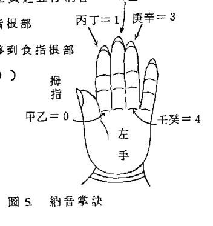

有的學員數學不佳，可用查表法，如表 6 所示。

註：
R(1/5) = 1
R(2/5) = 2
R(3/5) = 3
R(4/5) = 4
R(5/5) = 5 或 0
R(6/5) = 1

| 地支 | 天干 | 甲乙 | 丙丁 | 戊己 | 庚辛 | 壬癸 |
| :--- | :--- | :--- | :--- | :--- | :--- | :--- |
| 子丑 | 午未 | 金 | 水 | 火 | 土 | 木 |
| 寅卯 | 申酉 | 水 | 火 | 土 | 木 | 金 |
| 辰巳 | 戌亥 | 火 | 土 | 木 | 金 | 水 |

表 6. 五行納音

## 6. 先後天八卦與五行局的關係

相傳在公元前 4477 年時，伏羲氏創造了先天八卦，以一劃代表陽爻，二劃代表陰爻，所以有人稱伏羲一劃開天，天者乾卦也，有開萬物文字之始的意味，其實早在伏羲以前，即有陰陽的概念。唐鈞博士在他的易經著作中曾說：古人以結繩記事，大結代表陽，小結代表陰，由陰陽的排列而表示某一件事，類似電腦中的字元（ Bit ）。中國結的存在，及電算機的原理，古代的中國已經發明了。

伏羲氏據說是一個朝代，相傳了 16 代，伏羲死後傳位與其妹，女媧氏，她以婦女的立場，提倡男人至上，改變以前的母系社會為父系社會，所以古人稱為煉石補天，石者乃立柱也，即五倫八德，三從四德，天者乾父也，用道德為基石來確立父系主權，以前一些母系的姓，如姚、姬、姜、姒……等，皆冠有女旁。

先天八卦中

| 乾三連 | 三 | 天 | 坤六段 | 三 | 地 |
| 震仰盂 | 三 | 雷 | 巽下斷 | 三 | 風 |
| 離中虛 | 三 | 火 | 坎中滿 | 三 | 水 |
| 艮覆碗 | 三 | 山 | 兌上缺 | 三 | 澤 |

先天八卦的排列是：乾、兌、離、震、巽、坎、艮、坤，數往者順而知來者逆，前四卦是順排，后四卦是逆排，如圖7所示。

奇怪的是伏羲時代出現河圖，所謂龍馬負圖而出，是一種非龍非馬的怪獸，背負河圖而出，河圖是一種四分法體系，一六共宗居北，二七同道居南，三八為朋居東，四九為友居西，如圖八所示。

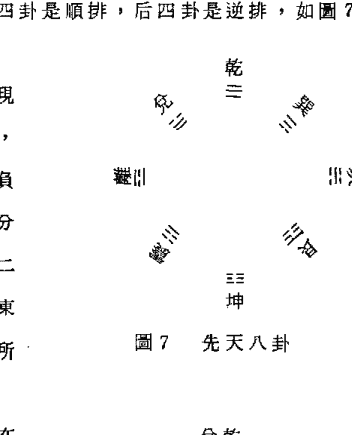

先天八卦四分法分配在四方為：乾兌居南
離震居東
巽坎居西
艮坤居北

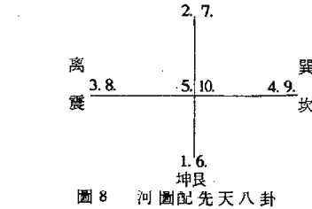

商紂時代，文王以90高齡，被囚羑里7年，他在監獄期間，演算周易，乃依據后天八卦而成；后天八卦必須要配合洛書，洛書據說是夏禹時代，靈龜從洛水而出，背殼上隱約可見洛書，因此從黃河、洛水一帶來的人，稱為河洛人，閩南人又稱為河洛人，由此可見他們也是從中原遷徙過來的。

洛書事實上是一種數字方陣（Numerical Square Matrix），古書曰：戴九履一，左三右七，二四為肩，六八為足。如圖9所示，乃后天八卦配洛書：

離九在南方
坎1在北方
震3在東方
兌7在西方
巽4在東南
坤2在西南
乾6在西北
艮8在東北

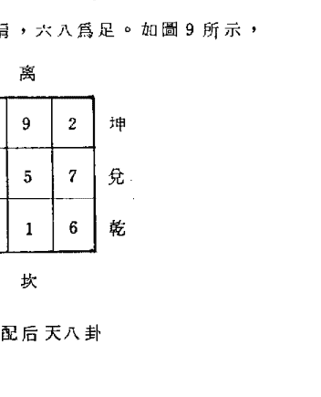

我們從河圖配先天八卦來看，取不越6者為用：
南方取乾卦，后天為6，故曰火六局。
東方取震卦，后天為3，故曰木三局。
北方取坤卦，后天為2，故曰水二局。
西方取巽卦，后天為4，故曰金四局。
中央取太極，后天為5，故曰土五局。

## 7. 命理時辰

子平八字學將子時分成早子及夜子，因它係依節氣來安干支，而鼠前爪四為陰，后爪五為陽，故將子時一分為二，夜子時為當天的干支，而早子屬翌日的干支。然而斗數係以數為基準，不分早子、夜子，一律稱為子時，我們將兩者的體系列於下：

| 子平八字學體系 | 紫微斗數體系 |
|---|---|
| 早子時 0 -- 1 點 | 子時 23. 1. 點 |
| 丑 1 -- 3 點 | 丑 1. -- 3. 點 |
| 寅 3 -- 5 點 | 寅 3. -- 5. 點 |
| 卯 5 -- 7 點 | 卯 5. -- 7. 點 |
| 辰 7 -- 9 點 | 辰 7. -- 9. 點 |
| 巳 9 -- 11 點 | 巳 9. -- 11. 點 |
| 午 11 -- 13 點 | 午 11. -- 13. 點 |
| 未 13 -- 15 點 | 未 13. -- 15. 點 |
| 申 15 -- 17 點 | 申 15. -- 17. 點 |
| 酉 17 -- 19 點 | 酉 17. -- 19. 點 |
| 戌 19 -- 21 點 | 戌 19. -- 21. 點 |
| 亥 21 -- 23 點 | 亥 21. -- 23. 點 |
| 夜子時 23 -- 24 點 | — |

我們通常說一天有24小時，不過是一年365天的平均太陽時，事實上，陽曆有四天恰巧是24小時，即：

12月24日、4月5日、6月14日、9月1日。

其他的361天皆比24小時或多或少，此稱為季節性時差。時差有正負之分，最大的正時差是陽曆11月2日，達到16分21秒，簡寫成16' 21"；最大的負時差是陽曆2月11日，達到負14分25秒，簡寫成-14' 25"，可參考圖10，橫座標為月份，縱座標為分。

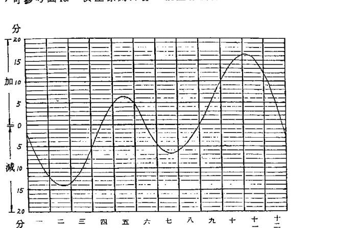

圖10的函數很接近正弦波（Sine Wave）如果讀者有興趣，或有意要設計電腦程式，翰學提供一套公式，如下所示：

```
△ t₁ = A Sin [ B (C+X) ] （分） ……………………公式④
```

公式中A、B、C都是某一常數，可查表11，X表示從某一參考點算其天數，亦可查表10。B（C＋X）表示度數（Degree），△t₁表示季節性時差。

另一種時差叫做區域性時差，係依經度不同而獲得的時差。世界時區的劃分，係以英國格林威治天文台為參考點，當作0°度的經度，向東西每隔經度15°成立一個時區，對於我國而言，由於幅員廣闊，成立了五個時區：

| 適用範圍 | A | B | C | X（天） |
| :--- | :--- | :--- | :--- | :--- |
| 12/24～2/11 | -14.42 | 1.837 | 0 | 由12/24算起 |
| 2/11～4/15 | -14.42 | 1.423 | 63 | 由2/11算起 |
| 4/15～6/14 | 6 | 3 | 0 | 由4/15算起 |
| 6/14～9/1 | -6 | 2.28 | 0 | 由6/14算起 |
| 9/1～11/2 | 16.35 | 1.452 | 0 | 由9/1算起 |
| 11/2～12/24 | 16.35 | 1.731 | 52 | 由11/2算起 |

表11 季節性時差公式④

崑崙時區（67.5°～82.5°）以東經75°為標準時間
回藏時區（82.5°～97.5°）以東經90°為標準時間
隴蜀時區（97.5°～112.5°）以東經105°為標準時間
中原時區（112.5°～127.5°）以東經120°為標準時間
長白時區（127.5°～142.5°）以東經135°為標準時間

台灣隸屬中原時區，台北市約東經121.50，新竹約東經120.9°，在標準時區（120°）以東，每差1°則快四分鐘，則數學表示如下：
△t₂＝4×（出生地經度－標準時區經度）…………公式⑤
公式中，東經用正號，西經用負號。整個時差淨值，包括季節性時差及區域性時差，叫做淨時差（Net Time Difference），係兩者的代數和，用公式表示如下：
假設△t＝淨時差（分）＝△t₁＋△t₂
△t＝A·Sin〔B（C＋X）〕＋4·（出生地經度－標準區經度）……………………公式⑥
命理時辰＝標準時間＋△t……………………公式⑦

〔例11.〕陽曆8月8日，試求台北市在7點正的命理時辰
解：使用查表法，季節性時差△t₁＝－5分
台北市為東經121.5°，中原標準時區為120°，
故命理時辰＝－5＋4（121.50－120°）＝1分
即7點1分，為辰時。

使用計算法如下：
X（8月8日）＝（30－14.）＋31＋8＝55（天）
△t₁＝－6 Sin（2.28×55）＝－6 Sin 125.4°
＝－4.89分÷－5分
故命理時辰＝－5＋4（121.5°－120°）＝1分
即7點1分，為辰時。

，試畢乙例如下。

〔例 13.〕試求三月未時出生的命身宮。

解：從寅宮起正月順行，
二月在卯，三月在辰，
再從辰宮起子時逆行，
丑時在卯，寅時在寅，
卯時在丑，辰時在子，
巳時在亥，午時在戌，
未時在酉，故命宮在酉。
同理，從辰宮起子時順行，
丑時在巳，寅時在午，
卯時在未，辰時在申，
巳時在酉，午時在戌，
未時在亥，故身宮在亥。

| 巳 | 午 | 未 | 申 |
|---|---|---|---|
| 辰 | 命 | | 酉 |
| 卯 | | 盤 | 戌 |
| 寅 | 丑 | 子 | 亥 |

圖 12 命盤配地支

翰學有一位祁姓學員，家住新埔，精通電腦軟體設計，他曾設計乙套紫微斗數命盤，如今個人電腦很流行，命身宮實在有必要用數學公式來描述，如下所示：

命宮＝出生月－出生時辰＋1 ………………………………公式⑧
身宮＝出生月＋出生時辰－1 ………………………………公式⑨

其中以寅宮為起首，即寅宮＝1 卯宮＝2
辰宮＝3 巳宮＝4
午宮＝5 未宮＝6

〔例 12.〕陽曆 11.月 21.日 23.點 50.分生於新竹，試求其命理時辰。

解：使用查表法，季節性時差△t₁＝13.分
使用計算法，X（11.／21.）＝22.－2＝19.天
△t₁＝16.35 Sin〔1.731（52＋19.）〕＝16.35 Sin 122.9°
＝13.7 分

因新竹為東經 120.9°，故
命理時辰＝13.＋4（120.9°－120°）＝16.7 分＝17 分
即 23.點 50.分＋17.分＝0 點 7 點，屬 22.日之早子時，如果欲起子平八字，應該算作 22.日的早子，如果欲起斗數，亦應算作 22.日的子時。

## 8. 安命宮身宮及命盤 12 宮位

安命宮的方法是由寅宮起正月，順數到出生月，然後由出生月所處的宮位起子時，逆數出生時辰，即為命宮所在地。
同樣的方法，由寅宮起正月順數到出生月，然後由出生月所處的宮位，起子時順數到出生時辰。

我們把命盤展開如圖 12 所示，將地支列入盤中，順時針方向為順行，逆時針方向為逆行，為了有效地說明命身宮的求法

申宮 = 7
酉宮 = 8
戌宮 = 9
亥宮 = 10
子宮 = 11
丑宮 = 12

且正月 = 1
2月 = 2
3月 = 3
以此類推

又子時 = 1
丑時 = 2
寅時 = 3
以此類推

上述公式⑥及⑨，可能超越12以上，所以我們應求除12的餘數比較具有一般性，公式⑥⑨可改寫成：

命宮 = R ( (月 - 時 + 13) / 12 ) ………………………………公式⑧

身宮 = R ( (月 + 時 - 1) / 12 ) ………………………………公式⑨

〔例14.〕依據上例出生月 = 3，出生時 = 8（未時）
命宮 = R ( (3 - 8 + 13) / 12 ) = R ( (-5 + 13) / 12 ) = 8（酉宮）
身宮 = R ( (3 + 8 - 1) / 12 ) = 10（亥宮）

如果讀者數學搞不清，可用查表法，如表13.所示。

接著安12宮位，依逆行方向；

為：兄弟宮
疾厄宮
田宅宮
夫妻宮
遷移宮
福德宮
子女宮
交友宮（奴僕宮）
父母宮（相貌宮）
財帛宮
事業宮（官祿宮）

表13
安命宮及身宮表

| 生月\時 | 正月 | 二月 | 三月 | 四月 | 五月 | 六月 | 七月 | 八月 | 九月 | 十月 | 十一月 | 十二月 |
|---|---|---|---|---|---|---|---|---|---|---|---|---|
| 子 | 命 | 寅 | 卯 | 辰 | 巳 | 午 | 未 | 申 | 酉 | 戌 | 亥 | 子 | 丑 |
| | 身 | 寅 | 卯 | 辰 | 巳 | 午 | 未 | 申 | 酉 | 戌 | 亥 | 子 | 丑 |
| 丑 | 命 | 丑 | 寅 | 卯 | 辰 | 巳 | 午 | 未 | 申 | 酉 | 戌 | 亥 | 子 |
| | 身 | 卯 | 辰 | 巳 | 午 | 未 | 申 | 酉 | 戌 | 亥 | 子 | 丑 | 寅 |
| 寅 | 命 | 子 | 丑 | 寅 | 卯 | 辰 | 巳 | 午 | 未 | 申 | 酉 | 戌 | 亥 |
| | 身 | 辰 | 巳 | 午 | 未 | 申 | 酉 | 戌 | 亥 | 子 | 丑 | 寅 | 卯 |
| 卯 | 命 | 亥 | 子 | 丑 | 寅 | 卯 | 辰 | 巳 | 午 | 未 | 申 | 酉 | 戌 |
| | 身 | 巳 | 午 | 未 | 申 | 酉 | 戌 | 亥 | 子 | 丑 | 寅 | 卯 | 辰 |
| 辰 | 命 | 戌 | 亥 | 子 | 丑 | 寅 | 卯 | 辰 | 巳 | 午 | 未 | 申 | 酉 |
| | 身 | 午 | 未 | 申 | 酉 | 戌 | 亥 | 子 | 丑 | 寅 | 卯 | 辰 | 巳 |
| 巳 | 命 | 酉 | 戌 | 亥 | 子 | 丑 | 寅 | 卯 | 辰 | 巳 | 午 | 未 | 申 |
| | 身 | 未 | 申 | 酉 | 戌 | 亥 | 子 | 丑 | 寅 | 卯 | 辰 | 巳 | 午 |
| 午 | 命 | 申 | 酉 | 戌 | 亥 | 子 | 丑 | 寅 | 卯 | 辰 | 巳 | 午 | 未 |
| | 身 | 申 | 酉 | 戌 | 亥 | 子 | 丑 | 寅 | 卯 | 辰 | 巳 | 午 | 未 |
| 未 | 命 | 未 | 申 | 酉 | 戌 | 亥 | 子 | 丑 | 寅 | 卯 | 辰 | 巳 | 午 |
| | 身 | 酉 | 戌 | 亥 | 子 | 丑 | 寅 | 卯 | 辰 | 巳 | 午 | 未 | 申 |
| 申 | 命 | 午 | 未 | 申 | 酉 | 戌 | 亥 | 子 | 丑 | 寅 | 卯 | 辰 | 巳 |
| | 身 | 戌 | 亥 | 子 | 丑 | 寅 | 卯 | 辰 | 巳 | 午 | 未 | 申 | 酉 |
| 酉 | 命 | 巳 | 午 | 未 | 申 | 酉 | 戌 | 亥 | 子 | 丑 | 寅 | 卯 | 辰 |
| | 身 | 亥 | 子 | 丑 | 寅 | 卯 | 辰 | 巳 | 午 | 未 | 申 | 酉 | 戌 |
| 戌 | 命 | 辰 | 巳 | 午 | 未 | 申 | 酉 | 戌 | 亥 | 子 | 丑 | 寅 | 卯 |
| | 身 | 子 | 丑 | 寅 | 卯 | 辰 | 巳 | 午 | 未 | 申 | 酉 | 戌 | 亥 |
| 亥 | 命 | 卯 | 辰 | 巳 | 午 | 未 | 申 | 酉 | 戌 | 亥 | 子 | 丑 | 寅 |
| | 身 | 丑 | 寅 | 卯 | 辰 | 巳 | 午 | 未 | 申 | 酉 | 戌 | 亥 | 子 |

註：
身宮未調整

## 9. 專有名詞的解釋：

- (1)命 宮：先天運勢，終生命運的關鍵宮位。
- (2)身 宮：后天運勢，輔助命宮，主管身體方面。
- (3)兄弟宮：可了解兄弟姊妹的助益與否。
- (4)夫妻宮：了解配偶的發展，婚姻狀況，早婚或晚婚。
- (5)子女宮：了解子女的狀況，子女多少。
- (6)財帛宮：了解財運狀況。
- (7)疾厄宮：了解身體健康狀況。
- (8)遷移宮：遠行、旅遊、搬家、離鄉等。
- (9)交友宮：人際關係。
- (10)事業宮：事業的狀況，是否適合創業。
- (11)田宅宮：田產情形，居處環境，辦公室，繼承。
- (12)福德宮：是否辛勞、費神，是否有優裕的享受。
- (13)父母宮：主幼年時是否得父母的照顧。
- (14)主 星：指紫府星系，再將祿存星加入，共15顆主星。
- (15)輔助星：除主星外之其他甲級星，包括六吉星和六凶星。
- (16)六吉星：指昌、曲、左、右、魁、鉞。
- (17)六煞星：指火、鈴、羊、陀、空、劫。
- (18)四煞星：指火星、鈴星、羊刃、陀羅。
- (19)化吉星：指化祿、化權、化科。
- (20)四化星：指化祿、化權、化科、化忌。
- (21)三 方：指本宮及其三合的宮位。
- (22)四 正：指三方及其對宮。
- (23)先天命盤：指本命的命盤，天干係由出生年起五虎遁。
- (24)后天命盤：指某一大限，管10年的運氣。
- (25)照（或沖）：指星在對宮。
- (26)會、逢、遇、加：指星位於三方的宮位。
- (27)坐、守、居：指星位於本宮的宮位。
- (28)亮 度：星辰優點顯現的強度。
- (29)廟 旺：星辰亮度最強，優點最能發揮出來。
- (30) 平 ：星辰亮度中庸，優劣並現。
- (31)陷（弱）：或稱不得地，星辰亮度最差，劣點顯現。
- (32)閑 宮：星辰亮度中性，必須依所會照的吉凶來斷定其亮度。
- (33)天 羅：指辰宮。
- (34)地 網：指戌宮。
- (35)陽男、陰男：前者指陽年出生的男人，如甲、丙、戊、庚、壬年出生者。后者指陰年出生的男人。如乙、丁、己、辛、癸出生者。
陽女、陰女與上同理而分類。

## 10. 紫微星定位的數學模式（Mathe. Mode）

由出生月及出生時辰求出命宮之後，其次由出生年天干起五虎遁，以定出命盤的天干，所謂五虎遁如表14.所示；
例如甲子年出生的人，
其地支天干如下：

丙寅 ····· 丁卯
戊辰 ····· 己巳
庚午 ····· 辛未
壬申 ····· 癸酉
甲戌 ····· 乙亥
丙子 ····· 丁丑

| 出生年天干 | 寅宫天干 |
| :--- | :--- |
| 甲 己 | 丙 寅 |
| 乙 庚 | 戊 寅 |
| 丙 辛 | 庚 寅 |
| 丁 壬 | 壬 寅 |
| 戊 癸 | 甲 寅 |

表 14. 五虎遁

配入命盤如圖 15 所示，子丑與寅卯的天干重複，因係由寅（虎）
宮遁起，故稱曰五虎遁。然後從命宮找出它的五行局。

假設 F = 五行局（命宮）
D = 出生日
R. = 餘數
Q = 商
P. = 紫微宮位（由寅宮起頭）
則 $\begin{cases} F \times Q = D + R. \cdots\cdots\cdots \text{公式⑩} \ F > R. \end{cases}$
而 $P. = Q + (-1)^{R.} \cdot R.$
$\cdots\cdots\cdots\cdots\text{公式⑪}$

| 己巳 | 庚午 | 辛未 | 壬申 |
| :--- | :--- | :--- | :--- |
| 戊辰 | 甲年出生 | 癸酉 | 甲戌 |
| 丁卯 | | | |
| 丙寅 | 丁丑 | 丙子 | 乙亥 |

圖 15. 甲年出生的命盤干支

〔例 15.〕假設命宮五行局 F = 3（木三局）
出生日 D = 17.
試求紫微星的宮位。

⑥
$3\sqrt{17.+①}$
18.

解：由公式⑩，$3 \times 6 = 17.+1$ （3 > 1）
由公式⑪，$P. = 6 + (-1)^1 \cdot 1 = 6 - 1 = 5$（午宮）
故紫微星在午宮

〔例 16.〕假設命宮五行局 F = 4（金四局）
出生日 D = 19
試求紫微星的宮位。

⑤
$4\sqrt{19.+①}$
20.

解：由公式⑩，$\begin{cases} 4 \times 5 = 19.+1 \ 4 > 1 \end{cases}$
由公式⑪，$P. = 5 + (-1)^1 \cdot 1 = 5 - 1 = 4$（巳宮）
故紫微星在巳宮。

如果數學不行的讀者，可參考表 16。紫微星找出宮位之後，
可以安紫微星系，它們是逆行，如下所示：
紫微、天機、一、太陽、武曲、天同、一、一、廉貞，如圖
17 所示，假設紫微星在巳宮。

接著可安天府星系，它們是順行，如下所示：
天府、太陰、貪狼、巨門、天相、天梁、七殺、一、一、一
、破軍，參見圖 17。

天府與紫微以寅申為對稱線（Symmetric Line）。

### 表 16. 起紫微表

| 生日 | 水二局 | 木三局 | 金四局 | 土五局 | 火六局 |
|---|---|---|---|---|---|
| 初一 | 丑 | 辰 | 亥 | 午 | 酉 |
| 初二 | 寅 | 丑 | 辰 | 亥 | 午 |
| 初三 | 寅 | 寅 | 丑 | 辰 | 亥 |
| 初四 | 卯 | 巳 | 寅 | 丑 | 辰 |
| 初五 | 卯 | 寅 | 子 | 寅 | 丑 |
| 初六 | 辰 | 卯 | 巳 | 未 | 寅 |
| 初七 | 辰 | 午 | 寅 | 子 | 戌 |
| 初八 | 巳 | 卯 | 卯 | 巳 | 未 |
| 初九 | 巳 | 辰 | 丑 | 寅 | 子 |
| 初十 | 午 | 未 | 午 | 卯 | 巳 |
| 十一 | 午 | 辰 | 卯 | 申 | 寅 |
| 十二 | 未 | 巳 | 辰 | 丑 | 卯 |
| 十三 | 未 | 申 | 寅 | 午 | 亥 |
| 十四 | 申 | 巳 | 未 | 卯 | 申 |
| 十五 | 申 | 午 | 辰 | 辰 | 丑 |
| 十六 | 酉 | 西 | 巳 | 西 | 午 |
| 十七 | 酉 | 午 | 卯 | 寅 | 卯 |
| 十八 | 戌 | 未 | 申 | 未 | 辰 |
| 十九 | 戌 | 戌 | 巳 | 辰 | 子 |
| 二十 | 亥 | 未 | 午 | 巳 | 酉 |
| 廿一 | 亥 | 申 | 辰 | 戌 | 寅 |
| 廿二 | 子 | 亥 | 西 | 卯 | 未 |
| 廿三 | 子 | 申 | 午 | 申 | 辰 |
| 廿四 | 丑 | 西 | 未 | 巳 | 巳 |
| 廿五 | 丑 | 子 | 巳 | 午 | 丑 |
| 廿六 | 寅 | 西 | 戌 | 亥 | 戌 |
| 廿七 | 寅 | 戌 | 未 | 辰 | 卯 |
| 廿八 | 卯 | 丑 | 申 | 西 | 申 |
| 廿九 | 卯 | 寅 | 午 | 午 | 巳 |
| 三十 | 辰 | 亥 | 亥 | 未 | 午 |

| 紫微 | 天府 |
|---|---|
| 寅 | 寅 |
| 卯 | 丑 |
| 辰 | 子 |
| 巳 | 亥 |
| 午 | 戌 |
| 未 | 酉 |
| 申 | 申 |
| 酉 | 未 |
| 戌 | 午 |
| 亥 | 巳 |
| 子 | 辰 |
| 丑 | 卯 |

## 11. 紫微星定位的统计分析

我们将表 16. 改写成表 18. ，可以发现紫微星分布在 12 宫位中，并非均匀分布，例如：

紫微安子宫有 7 个出生日，占 4.7% ，是最少情形。

- 丑 12. 8%
- 寅 15. 10.%
- 卯 15. 10.%
- 辰 17. 11.3% ，是最多情形。
- 巳 15. 10%
- 午 16. 10.7%
- 未 13. 8.7%
- 申 11. 7.3%
- 酉 10. 6.7%
- 戌 9. 6%
- 亥 10. 6.7%

从表 18. 我们发现命盘重复的情形非常严重，例如紫微安午宫，土五局，有 4 个重复命盘，计有 1、13、25、29 等 4 个出生日，如果有一位当驸马爷，是否其他人也跟着当驸马爷，甚至连他们的五行喜忌神都相同，故张宝丹不得不在下一节中，欲作身宫调整，以资区别。

### 图 17. 紫微在巳宫

| 紫微宫位 | 水二局 | 木三局 | 金四局 | 土五局 | 火六局 | 总计 | 或然率 |
| :--- | :--- | :--- | :--- | :--- | :--- | :--- | :--- |
| 子 | 22. 23. | 25. | 5. | 7. | 9. 19. | 7 | 4.7% |
| 丑 | 1. 24. 5. | 2. 28. | 3. 9. | 4. 12. | 5. 15. 25. | 12 | 8% |
| 寅 | 2.26. 3.27. | 3. 5. | 4. 7. 13. | 5. 9. 17. | 6. 11. 21. | 15 | 10% |
| 卯 | 4.28. 5.29. | 6. 8. | 8. 11. 17. | 10. 14. 22. | 12. 17. 27. | 15 | 10% |
| 辰 | 6. 7. 30. | 1. 9. 11. | 2. 15. 12. 21. | 3. 19. 15. 27. | 4. 18. 23. | 17 | 11.3% |
| 巳 | 8. 9. | 4. 12. 14. | 6. 19. 16. 25. | 8. 20. 24. | 10. 24. 29. | 15 | 10% |
| 午 | 10. 11. | 7. 15. 17. | 10. 23. 20. 29. | 1. 25. 13. 29. | 2. 16. 30. | 16 | 10.7% |
| 未 | 12. 13. | 10. 18. 20. | 14. 24. 27. | 6. 18. 30. | 8. 22. | 13 | 8.7% |
| 申 | 14. 15. | 13. 21. 23. | 18. 28. | 11. 23. | 14. 28. | 11 | 7.3% |
| 酉 | 16. 17. | 16. 24. 26. | 22. | 16. 28. | 1. 20. | 10 | 6.7% |
| 戌 | 18. 19. | 19. 27. 29. | 26. | 21. | 7. 26. | 9 | 6% |
| 亥 | 20. 21. | 22. 30. | 1. 30. | 2. 26. | 3. 13. | 10 | 6.7% |
| 合计 | 30 | 30 | 30 | 30 | 30 | 150 | 100% |

表18. 由出生日找紫微宫位

## 12. 身宫调整的理论依据

由于前节的统计分析，出生日不一样但命盘相同者很多，无形中降低了斗数的精密度，因此不少紫微大师感叹斗数易学难精，有的在他著作或刊物，总是吞吞吐吐，语焉不详，最常见的是马后炮，当事情发生后才人作文章。

张宝丹不如正玄山人，可以灵通感应上界高真，下降来指导突破，只好用逻辑的方法去推理，为了使斗数的命盘增加，唯有循过宫的途径去发掘，过宫的理论，最早系由吴情大师所发起，有所谓三元过宫法。

张宝丹有一位学员，她的一位朋友跟人家学过宫法，拜师礼要80万，翰学是穷书生，当然没有这么多银子去搜集，否则可以评估一下值不值得。在此顺便一提，据本人一位学员刘君称，第一本“紫微斗数秘仪”出现时，也是索价80万两新台币，所以这本“高段紫微斗数”实在是太便宜了，盼各位读者要好好珍惜，不要误以为太贱价就弃如敝履，这可是费了翰学半生的心血而得来，里面的经验来之不易。

另一位提倡过宫者是透派掌门人张耀文大师，偶然在他的著作会发现身宫作调整，但是他们的过宫法，并不是为了减少重覆命盘的机率，时有时无，而张宝丹调整身宫是为了增加命盘数，亦即减少重叠命盘的机率。10.万个斗数命盘，实在无法应付今日多变的社会，故过宫法应运而生焉。

明代万民英著有“星学大成”，被搜集在四库全书之内，他老人家对于身宫没有详细的交待，既然命学是以命宫挂帅，为何还要制造一个身宫呢？徒增困扰，唯一合理的解释是，中国人保守的个性和观念，隐藏了身宫调整的秘密，否则吴情、张耀文等几位大师，偶然会露出一两手，幸张宝丹有充沛的体力，作了数以百计的命例统计，印证了过宫理论及假设。

依据统计资料显示，阳男和阴女，身宫调整顺行，叫做顺调。阴男和阳女，身宫调整逆行，叫做逆调。依据表20的出生日之序位（Order），以定其调整之宫位，出生日排在第一个位置，其序位为第一位，身宫原地不动，不必作调整。序位第二位的出生日须调整两个宫，序位第三位者，须调整四个宫位，以此类推。试举几例说明于下。

〔例17.〕男命14年5月13日丑时，试排其命盘。

解： 民14年为乙丑年

(1) 起五虎遁，乙庚起戊寅，排出天干。

(2) 求出命宫、身宫
命宫 = R ( (5 - 2 + 1) / 12 ) = 4 (巳宫)
身宫 = R ( (5 + 2 - 1) / 12 ) = 6 (未宫)

(3) 安命盘十二宫

(4) 起命宫五行局
庚辰辛巳白腊金，为金4局。

| 辛巳命 | 壬午父 | 癸未 | 甲申田 |
|---|---|---|---|
| 庚辰兄 | 乙丑男 | 乙酉事 | 丙戌友 |
| 己卯妻 | 13. 7. 4 | 武 | |
| 戊寅府紫子 | 己丑财 | 戊子厄 | 丁亥迁身日 |

图19. 例1.的排盘

(5) 定紫微星宫位
{ 4 × 4 = 13 + 3
{ 4 > 3
紫微 = 4 + ( - 1 )³ · 3 = 4 - 3 = 1 (寅宫)

(6) 起天府星
紫府以寅申为对称线，故天府在寅宫。

(7) 安紫微星系及天府星系，我们用简化符号来代表这些星系，如下：

- 紫—紫微
- 日—太阳
- 同—天同
- 府—天府
- 贪—贪狼
- 相—天相
- 杀—七杀
- 机—天机
- 武—武曲
- 贞—廉贞
- 月—太阴
- 巨—巨门
- 梁—天梁
- 破—破军

(8) 调整身宫
出生日4、7、13三天共用一张命盘，13日序位在第三位，阳男顺调4个宫位，故新的身宫调到亥宫。

| 紫微宫位 | 水二局 | 木三局 | 金四局 | 土五局 | 火六局 |
| :--- | :--- | :--- | :--- | :--- | :--- |
| 子 | 22. 23. 46. 47. | 25. 33. 35. | 5. 34. 44. 47. 53. | 7. 31. 43. 55. 59. | 9. 19. 38. 52. |
| 丑 | 1. 24. 25. 48. 49. | 2. 28. 36. 38. | 3. 9. 38. 48. 51. 57. | 4. 12. 36. 48. 60. | 5. 15. 25. 44. 58. |
| 寅 | 2. 3. 26. 27. 50. 51. | 3. 5. 31. 39. 41. | 4. 7. 13. 42. 52. 55. | 5. 9. 17. 41. 53. | 6. 11. 21. 31. 50. |
| 卯 | 4. 5. 28. 29. 52. 53. | 6. 8. 34. 42. 44. | 8. 11. 17. 46. 56. 59. | 10. 14. 22. 46. 58. | 12. 17. 27. 37. 56. |
| 辰 | 6. 7. 30. 31. 54. 55. | 1. 9. 11. 37. 45. 47. | 2. 12. 15. 21. 50. 60. | 3. 15. 19. 27. 51. | 4. 18. 23. 33. 43. |
| 巳 | 8. 9. 32. 33. 56. 57. | 4. 12. 14. 40. 48. 50. | 6. 16. 19. 25. 54. | 8. 20. 24. 32. 56. | 10. 24. 29. 39. 49. |
| 午 | 10. 11. 34. 35. 58. 59. | 7. 15. 17. 43. 51. 53. | 10. 20. 23. 29. 58. | 1. 13. 25. 29. 37. | 2. 16. 30. 35. 45. 55. |
| 未 | 12. 13. 36. 37. 60. | 10. 18. 20. 46. 54. 56. | 14. 24. 27. 33. | 6. 18. 30. 34. 42. | 8. 22. 36. 41. 51. |
| 申 | 14. 15. 38. 39. | 13. 21. 23. 49. 57. 59. | 18. 28. 31. 37. | 11. 23. 35. 39. 47. | 14. 28. 42. 47. 57. |
| 酉 | 16. 17. 40. 41. | 16. 24. 26. 52. 60. | 22. 32. 35. 41. | 16. 28. 40. 44. 52. | 1. 20. 34. 48. 53. |
| 戌 | 18. 19. 42. 43. | 19. 27. 29. 55. | 26. 36. 39. 45. | 21. 33. 45. 49. 57. | 7. 26. 40. 54. 59. |
| 亥 | 20. 21. 44. 46. | 22. 30. 32. 58. | 1. 30. 40. 43. 49. | 2. 26. 38. 50. 54. | 3. 13. 32. 46. 60. |

表20 由出生日找紫微宫位（包括闰月）

注：由本表可以作身宫之调整，从此斗数命盘数增加 2.5 倍，命盘数 = 60 × 12 × 30 × 12 = 259,200，即 25 万 9 仟 2 佰个命盘，比八字命盘少 2 倍而已，精密度大为增加。

## 13. 闰月紫微星的定位理论

历法上每 19 年有 7 个闰月，张宝丹在此试计算闰月人口所占的机率，如下：

$$\frac{7 \text{ 月}}{19 \times 12} \div 3\%$$

即每 100 人中有 3 人是闰月出生，若以台湾地区 1800 万人来说，有 54 万人是闰月出生。

子平八字学系依节气来找干支，对于闰月出生的人仍然可获得良好的服务，但若要起斗数命盘，这 54 万人被排除在斗林外面，不知如何来安排才好，古书有说：闰月 15 日以前者，用当月份来排，16 日以后者用次月来排。

古书的这一段立论并不能满足统计上的需求，也不能符合梅花易数的要求，梅花易数是北宋邵康节夫子所创，他以年月日为上卦，以年月日时总数为下卦，除以 6 为爻变，得到六十四卦其中之一卦，以断吉凶，斗数的六爻神卦亦依据这种原理来推。

闰月排盘理论，首推闽山仙宗正玄山人写得最好，这是对斗数界最大的贡献，张宝丹用数学的方法，将他的理论描述出来。

调整出生日 =（非闰月的日数）+（闰月出生日）………公式⑫
（Adjusted Birthday）

求出调整出生日后，可利用公式⑩和公式⑪来求紫微星的宫位，假设 AD = 调整出生日，则

F · Q = AD + Re ( F > Re ) ………………………………公式 (13)
∴ P₀ = Q + ( - 1 )^Re · R ………………………………公式 (11)

如果读者的数学不佳，可以用查表法，直接去查表20，我们试举例如下。

〔例18〕甲子年闰10月5日子时，试排其命盘（男命）。

解：甲子年（73年），10月是大月（30天），故
调整出生日 AD = 30 + 5 = 35.

(1) 五虎遁：甲己起丙寅

(2) 命宫：由寅算起到出生月为亥宫，亥宫起子时仍然在亥宫。

(3) 身宫：仍然在亥宫，但须顺调至巳宫，2.16.30.35.45.55.六天共盘。

(4) 五行局：甲戊乙亥山头火为火六局

(5) 定紫微：6 × 6 = 35 + 1
( 6 > 1 )
6 - 1 = 5
( 午宫 )

(6) 定天府：以寅申为对称，
天府在戌。

(7) 排紫府星系

(8) 安命盘十二宫

| 机 | 紫 | | 破 |
| 己迁身 | 庚厄 | 辛财 | 壬子 |
| 杀 | | 阳 | |
| 戊友 | | 男 | 癸妻 |
| 梁日 | 火 | 命 | 府 |
| 丁事 | 六 | | 甲兄 |
| 相武 | 巨同 | 食 | 月 |
| 丙田 | 丁福 | 丙父 | 乙命 |

图21. 例1之排盘

依据这种闰月排盘理论，73年闰10月，翰学作了多次梅花易数，证实了本理论之正确性。

按梅花易数系把年月日时换算成先天数字，如下：

- 子年—1 正月—1 子时—1 乾—1 ☰
- 丑年—2 二月—2 丑时—2 兑—2 ☱
- 寅年—3 三月—3 寅时—3 离—3 ☲
- 卯年—4 四月—4 卯时—4 震—4 ☳
- 辰年—5 五月—5 辰时—5 巽—5 ☴
- 巳年—6 六月—6 巳时—6 坎—6 ☵
- 午年—7 七月—7 午时—7 艮—7 ☶
- 未年—8 八月—8 未时—8 坤—8 ☷
- 申年—9 九月—9 申时—9
- 酉年—10 十月—10 酉时—10
- 戌年—11 十一月—11 戌时—11
- 亥年—12 十二月—12 亥时—12

〔例19〕甲子年闰10月5日子时起梅花易数（先天易数）。

解：上卦 = R ( (年+月+日)/8 ) = R ( (1+10+35)/8 ) = R ( 46/8 ) = 6 (坎卦)
下卦 = R ( (年+月+日+时)/8 ) = R ( (46+1)/8 ) = 7 (艮卦)
爻变 = R ( (年+月+日+时)/6 ) = R ( 47/6 ) = 5 (第五爻变)
故其先天易卦为 ☶ ( 调整日 = 35 )

注意：上卦 = R (\frac{年+月+日}{8}) ……………………………… 公式⑮
下卦 = R (\frac{年+月+日+时}{8}) ……………………………… 公式⑯
爻变 = R (\frac{年+月+日+时}{6}) ……………………………… 公式⑰
R：求余数用之数学符号。

有学生发问：如果没有随身携带表格，则如何算出生日之序位？ 翰学答曰：可应用线性代数（Linear Algebra）计算之，假设一些变量如下：
F = 五行局数（已知数）
P = 紫微宫位（寅宫为起头）为已知数
Q = 商（未知数）
±R = 余数（未知数）偶数取正，奇数取负。
欲找出Q和R，可用下列之公式求之：
\begin{cases} P = Q \pm R \ F > R \end{cases}

〔例20〕若 F = 木三局 = 3
P = 6（紫微在未宫）
则 \begin{cases} 6 = 4 + 2 = 6 + 0（偶数） \ 6 = 7 - 1（奇数） \end{cases}
故出生日 = FQ - R ……………………………… 公式⑱
= 3 × 4 - 2
= 10.

另一出生日 = 3 × 7 - 1
= 20.
另一出生日 = 3 × 6 - 0
= 18.
故其序位为 10. 18. 20。

## 14. 安甲级星的说明

甲级星包括紫微系 6 颗，天府系 8 颗、六吉星、六煞星、禄存、四化星、天马等共 32 颗甲级星。
紫微星系依命宫的五行局及出生日而定出宫位，天府系与紫微以寅申宫为对称线而定出宫位，则紫府两星系皆可安排出来。
其他的甲级星可依出生时、出生月、出生年支、出生年干及出生日而安排出来，兹分述于下。

### 14.1. 安时星系

- (1) 地劫：由亥宫起子时顺行至出生时。
- (2) 地空：由亥宫起子时逆行至出生时。
- (3) 文曲：由辰宫起子时顺行至出生时。
- (4) 文昌：由戌宫起子时逆行至出生时。
- (5) 火星：寅午戌年支者由丑宫起子时顺行至出生时。
  申子辰年支者由寅宫起子时顺行至出生时。
  巳酉丑年支者由卯宫起子时顺行至出生时。
  亥卯未年支者由酉宫起子时顺行至出生时。

(6)鈴星：寅午戌年支者由卯宮起子時順行至出生時。
申子辰年支者由戌宮起子時順行至出生時。
巳酉丑年支者由戌宮起子時順行至出生時。
亥卯未年支者由戌宮起子時順行至出生時。

按古本火鈴係依年支排，近賢們的統計及張寶丹的統計，仍然認為尚須依出生時安之。

### 14.2 安月系星

- (1)左輔：由辰宮起正月順行到出生月。
- (2)右弼：由戌宮起正月逆行到出生月。

### 14.3 安年干系星：請參閱§15.－16.之說明

- (1)祿存：甲－寅 乙－卯
丙－巳 丁－午
戊－巳（女） 己－午（女）
戊－亥（男） 己－子（男）
庚－申 辛－酉
壬－亥 癸－子

- (2)羊刃：在祿存的前一宮（即順行一宮位。）
- (3)陀羅：在祿存的后一宮（即逆行一宮位）。

- (4)天魁} 係以天羅地網為對稱綫，天魁一律安在天羅地網綫之下
天鉞} 而天鉞一律安在其上。

古書所載可助我們記憶，如下：
甲戊乘牛羊，乙巳鼠猴群，丙丁豬雞位，
庚辛逢虎馬，壬癸兔蛇藏，魁下而鉞上。

### (5)四化星（化祿、化權、化科、化忌）

- 甲廉破武陽，乙機梁紫陰。
丙同機昌廉，丁陰同機巨。
戊貪陰右機，己武貪梁曲。
庚陽武府同，辛巨陽曲昌。
壬梁紫左武，癸破巨陰貪。

## 15. 庚干貴人及四化的理論分析

庚干的貴人星係指天魁和天鉞，前者為日貴，后者為夜貴，古書記載著“甲戊庚牛羊”，將庚的貴人星歸類於甲戊，坐宮於丑未，有不少近賢皆已證明此須記載錯誤，應該改為“甲戊乘牛羊”，另外把庚歸類於辛，但是辛有兩種安法，一種是“庚辛逢虎馬”，另一種是“庚辛逢馬虎”，翰學認為前者比較合乎學理，因為貴人星係以天羅地網為對稱綫，陽貴皆安在下方，而陰貴皆安在上方，形成一個連續性體系，如圖22所示。

其次述及庚干的四化星，翰學觀察四化星的分佈，化祿和化權決不出現第二次，例如甲廉貞化祿只出現一次，如果出現兩次以上，其或然率必然不均勻。

化科和化忌由於庚干的不確定，形成有一顆星會出現兩次，使得機率不均勻，如果採用庚陽武同陰的體系，則與癸破巨陰的化科重複，太陰化科出現兩次。若採用庚陽武同陰，則乙機梁紫陰的化忌重複，太陰化忌出現兩次，那麼太陰坐命的人，每10年出現兩次化忌，豈不是得不到上帝的垂憐。

所以翰學以為採用庚陽武府同比較合乎學理上要求，如此一來，化祿化權、化科、化忌各出現一次，不會產生不公平的現象。

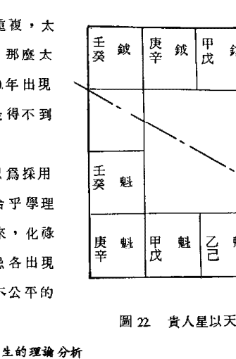

## 16. 戊己兩干祿存、長生的理論分析

祿存星又名天祿，乃由十天干所化，故名十干祿，係從十二長生的原理導出來，即長生、沐浴、冠帶、臨官、帝旺、衰、病、死、墓、絕、胎、養。祿存乃臨官的位置。

對於中央戊己土，長生位頗多爭議，以希夷祖師為首的傳統派而言，他老人家將土五局的長生劃歸於申宮，他並沒有說明理由。

反過來看，徐子平先師卻把土的長生劃歸於寅宮，八字學的書本說是土藉火而生，寅宮是火的長生位，這種說法並不完全正確。

翰學以為：土屬中央匯為太極位，不分東西南北，若欲勉強分之，應認均勻分佈（Uniform Distribution），故男借坤（申宮）而女借艮（寅宮），兩卦恰巧相照，有均勻分佈的概念。

## 17. 星辰強度的探討

所謂星辰強度就是亮度，亮度強者，他的優點明顯而缺點隱藏，亮度弱者，他的缺點明顯而優點隱藏。星辰亮度的體系頗多，一般來說可分為飛星斗數體系、鐵朴子體系、其他體系（例如慧心齋主自成一派），翰學認為採用傳統的飛星體系較有根據。

我們首先探討羊刃、陀羅、祿存等三星的亮度（Brightness）。在八字學中，將甲木長生安在亥宮，而將乙木安在午宮，前者陽木順行，后者陰木逆行。午宮是甲木的死地，陽死陰生的道理，故為乙木的長生地。

十二長生是：長生、沐浴、冠帶、臨官、帝旺、衰、病、死、墓、絕、胎、養等12顆星辰。

甲木從亥宮安長生依次順行為：沐浴在子、冠帶在丑、臨官在寅、帝旺在卯、衰在辰、病在巳、死在午、墓在未、絕在申、胎在酉、養在戌。

乙木從午安長逆行為：沐浴在巳、冠帶在辰、臨官在卯、帝旺在寅、衰在丑、病在子、死在亥、墓在戌、絕在酉、胎在申、養在未。

祿存在臨官的位置，永遠是廟旺的亮度，羊刃在祿前一位，陀羅在祿后一位，兩者若遇帝旺則為落陷，因物極必反的道理。兩者若遇冠帶則為入廟，恰巧冠帶落在四庫位（辰戌丑未），故羊、陀居四庫位為廟旺。帝旺恰巧在四正地（子午卯酉）或四馬地（寅申巳亥），故羊陀居四正地，四馬地為陷地。

其次探討火星和鈴星的亮度，兩者皆屬火，前者為陽火而后者為陰火，寅午戌三合火，可以比助火勢，故火、鈴居寅午戌三宮為入廟。申子辰三合水，有撲滅火勢的局面，故火、鈴居申子辰三宮為陷地。其他的巳酉丑三合金，火來制金為剋出的現象屬平地，亥卯未三合木可生火，屬旺宮之地。

文昌屬陽金，巳酉丑三合金，可比助金局，故居入廟之地。寅午戌三合火，會剋制金勢，故居落陷之地。申子辰三合水，亥卯未三合木，皆屬平宮之地。

文曲屬陰水，寅午戌三合火，水火交戰為陷宮。巳酉丑三合金，可生水勢，故為旺宮。申子辰三合水，可比助水勢為入廟，亥卯未三合木，洩水勢為平宮。

昌曲若左右來夾，或三方來朝，換言之，昌曲若同時出現時，則不分廟陷，其力量很大。昌曲夾命的人，數理很好。昌曲同宮的人，文學不錯。昌曲三方四正遇到的人，有文藝修養。

地空為陰火，居寅午戌為三合火，比助火勢，為入廟之地其他宮位為陷。地劫屬陽火，喜入天羅地網，故在辰戌為入廟之地。

左輔、右弼、天魁、天鉞等四顆星，皆屬入廟。

古書將星辰亮度分8級：廟、旺、得地、利、平、不得地、陷、閒，廟的亮度最強，陷的亮度最弱，閒宮是中和之位，須看吉星凶星的相會情形而定。翰學把8級減少為4級，即廟、旺、平、不得地、陷。因為得地、利、平，其三者的亮度實不宜再細分，統歸入平宮。紫府系的亮度見表23。我們在實用上，僅分三級，把廟旺列入同級，用符號○表示，又把不得地、陷弱列入同級，用符號×表示。

- 註：◎ 表示廟
○ 表示旺
△ 表示平
× 表示不得地
※ 表示陷弱

| 星\宫 | 子 | 丑 | 寅 | 卯 | 辰 | 巳 | 午 | 未 | 申 | 酉 | 戌 | 亥 |
|---|---|---|---|---|---|---|---|---|---|---|---|---|
| 紫 | △ | ⊙ | ○ | ○ | △ | ○ | ⊙ | ⊙ | ○ | ○ | △ | ○ |
| 机 | ⊙ | ※ | △ | ○ | △ | △ | ⊙ | ※ | △ | ○ | △ | △ |
| 日 | ※ | × | ○ | ⊙ | ○ | ○ | ○ | △ | △ | △ | × | ※ |
| 武 | ○ | ⊙ | △ | △ | ⊙ | △ | ○ | ⊙ | △ | △ | ⊙ | △ |
| 同 | ○ | × | △ | △ | △ | ⊙ | ※ | × | ○ | △ | △ | ⊙ |
| 贞 | △ | △ | ⊙ | △ | △ | ※ | △ | △ | ⊙ | △ | △ | × |
| 府 | ⊙ | ⊙ | ⊙ | △ | ⊙ | △ | ○ | ⊙ | △ | ○ | ⊙ | △ |
| 月 | ⊙ | ⊙ | ○ | ※ | ※ | ※ | × | × | △ | ○ | ○ | ⊙ |
| 贪 | ○ | ⊙ | △ | △ | ⊙ | ※ | ○ | ⊙ | △ | △ | ⊙ | × |
| 巨 | ○ | × | ⊙ | ⊙ | ※ | ○ | ○ | × | ⊙ | ⊙ | ※ | ○ |
| 相 | ⊙ | ⊙ | ⊙ | ※ | △ | △ | ⊙ | △ | ⊙ | ※ | △ | △ |
| 梁 | ⊙ | ○ | ⊙ | ⊙ | ⊙ | ※ | ⊙ | ○ | ※ | △ | ⊙ | × |
| 杀 | ○ | ⊙ | ⊙ | ○ | ⊙ | △ | ○ | ⊙ | ⊙ | ○ | ⊙ | △ |
| 破 | ⊙ | ○ | △ | ※ | ○ | △ | ⊙ | ○ | △ | ※ | ○ | △ |

表23 主星辰的亮度

## 18. 安乙级星

### 18.1 安时系星

- (1)台辅：从午宫起子时顺行，至出生时之宫位。
- (2)封诰：从寅宫起子时顺行，至出生时之宫位。

### 18.2 安月系星

- (1)天姚：从丑宫起正月，顺行至出生月之宫位。
- (2)天刑：从酉宫起正月，顺行至出生月之宫位。
- (3)解神：从申宫起正月和二月顺行六阳宫，至出生之宫位。
- (4)天巫：从巳宫起正月依行申寅亥，至出生月之宫位。
- (5)阴煞：从寅宫起正月逆行六阴宫，至出生月之宫位。
- (6)天月：不规则排列，口诀如下。

> 正月十一同居戌，二巳三辰十月午。
六卯七亥五八未，寅藏四九腊月尾。

### 18.3 安日系星

- (1)三台：从左辅起初一，顺行至出生日之宫位。
- (2)八座：从右弼起初一，逆行至出生日之宫位。
- (3)恩光：从文昌起初一，顺行至出生日减一之宫位。
- (4)天贵：从文曲起初一，顺行至出生日减一之宫位。

### 18.4 安干系星

- (1)天官：不规则排列，口诀如下。

> 甲未乙辰壬戌宫，
丙蛇丁虎己辛酉，
戊兔庚豕癸宜馬，
其人貴顯可安知。

- (2)天福：不規則排列，其口訣如下：
甲酉乙申丙子丁亥，
戊卯己寅安天福星，
庚壬午宮辛癸巳宮。

- (3)紅鸞：不規則排列，其口訣如下：
甲乙居午丁未紅，
丙寅戊己沈龍宮，
庚戌辛酉宜小心，
壬子癸申紅鸞星。

- (4)天廚：不規則排列，其口訣如下：
乙戊辛馬甲丁蛇，
丙鼠己猴庚虎位，
壬雞癸豬是天廚。

### 18.5 安支系星

- (1)龍池：從辰宮起子年，順行至生年之宮位。
- (2)鳳閣：從戌宮起子年，逆行至生年之宮位。
- (3)紅鸞：從卯宮起子年逆行至生年。
- (4)天喜：永遠與紅鸞相對照。
- (5)孤辰：三會局的前一位，在四馬宮之位。
寅卯辰年安巳，巳午未年安申宮。
申酉戌年安亥宮，亥子丑年安寅宮。
- (6)寡宿：三會局的后一位，在四庫宮之位。
寅卯辰年安丑宮，巳午未年安辰宮。
申酉戌年安未宮，亥子丑年安戌宮。

- (7)截空：子丑寅年各安申酉戌，卯辰巳年各安巳午未。
午未申年各安寅卯辰，酉戌亥年各安亥子丑。

- (8)破碎：從巳宮起子年逆行，跳三合位（巳丑酉）至生年。
- (9)天才：由命宮起子年順行至生年。
- (10)天壽：由身宮起子年順行至生年。身宮是已調整過的身宮。

- (11)咸池：三合年支的前一位。又名桃花。居四敗地。
寅午戌年安卯宮，巳酉丑年安午宮，
申子辰年安酉宮，亥卯未年安子宮。

- (12)華蓋：三合年支的庫位。
- (13)天德：從酉宮起子年順行至生年。
- (14)月德：從巳宮起子年順行至生年。

## 19. 安其他星辰

- (1)截路空亡：甲己安申酉，乙庚安午未，
丙辛安辰巳，丁壬安寅卯，戊癸安子丑。屬丙級星。

- (2)博士星系：屬丙級星，由祿存位起博士，陽男、陰女順行，陰男陽女逆行，共有12顆星：
博士、力士、青龍、小耗、將軍、奏書、飛廉、喜神、病符、大耗、伏兵、官府。

- (3)旬中空亡：屬丙級星，依出生年干支而安。

甲子旬中戌亥空，
甲戌旬中申酉空，
甲申旬中午未空，
甲午旬中辰巳空，
甲寅旬中子丑空。

- (4)十二長生：依命五行局安之，陽男、陰女順行，陰男、陽女逆行，屬丙級星。

長生、沐浴、冠帶、臨官、帝旺、衰、
病、死、墓(庫)、絕、胎、養。

水二局長生起申宮，木三局長生起亥宮，
金四局長生起巳宮，火六局長生起寅宮，
土五局長生男起申宮，女起寅宮（男坤女艮）。

- (5)流年將前諸星：依流年地支而安，屬丁級星，一律順行，依三合年支之本位起將。

寅午戌年起午宮，申子辰年起子宮，
巳酉丑年起酉宮，寅卯未年起卯宮。

然後依次為：將星、攀鞍、歲驛、息神、華蓋、劫煞、災煞、天煞、指背、咸池、月煞、亡神。

- (6)歲前諸星：依流年地支而安，一律順行，屬丁級星。

太歲、晦氣、喪門、貫索、官符、歲耗、歲破、龍德、白虎、天德、吊客、歲病。

按：小耗改名為歲耗，大耗改名為歲破，病符改名為歲病，以與博士系中之星名避免重複。

- (7)飛天三煞：依流年地支而安，與博士系重複，本名是奏書、將軍、直符，故改名為劫煞、桃花煞、驛馬煞，此三星本為將星系的名稱，因其排法兩者近似，所以採用將星系的名稱，一律順行。

寅午戌年起亥卯未，亥卯未年起申子辰，
申子辰年起巳酉丑，巳酉丑年起寅午戌。

- (8)斗君：由太歲的宮位，逆行至生月，再順行至生時，即為斗君位，乃每年之正月。

- (9)小限：由出生年支的三合庫位之對宮起1歲，男順女逆。

## 20. 六甲掌訣

六甲掌訣用來尋找出生年的干支，不必去一一查表太麻煩，如圖24所示，民國13年為中元甲子年，民國23年為甲戌年，民國33年為甲申年，民國43年為甲午年，民國53年為甲辰年，民國63年為甲寅，以此類推，民國3年為甲寅年，與63年差一甲子，民國73年為下元甲子年，與13年差一甲子。

〔例21.〕求民國36年的干支。

解：找其最接近的六甲宮位，為33年的甲申，34年在酉，35年在戌，36年在亥。

33年天干為甲，34年為乙，35年為丙，36年為丁，所以36年的干支是丁亥。

〔例22〕求民國41年的干支。

解：找其最近的六甲宮位，乃民國43年甲午，退後逆數，42年在巳，41年在辰。
43年天干為甲，42年為癸，41年為壬，所以41年的干支為壬辰。

〔例23〕試求公元1811年的干支。

解：六十甲子係以60為循環的周期，若加減60的倍數應該干支不變，我們可以把昔日的年化成20世紀來看：
1811 + 120 = 1931。
公元年代可再轉變成民國紀元，兩者相差1911年：
1931 - 1911 = 20年。
民國20年最接近民國23年甲戌，逆數22年在酉，21年在申，20年在未。天干逆數，22年為癸，21年為壬，20年為辛，故民國20年的干支是辛未，即公元1811年的干支的辛未。

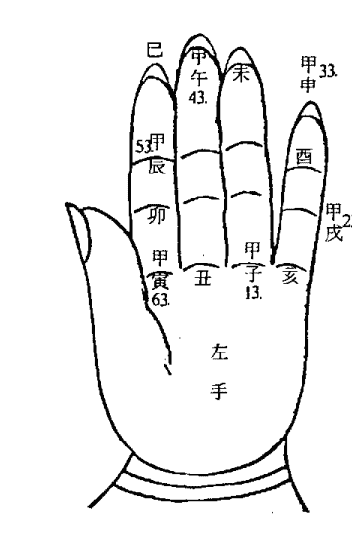

## 21. 排盤查表

表25. 五虎遁

| 生年干\月支 | 甲/己 | 乙/庚 | 丙/辛 | 丁/壬 | 戊/癸 |
| :--- | :--- | :--- | :--- | :--- | :--- |
| 寅 | 丙 | 戊 | 庚 | 壬 | 甲 |
| 卯 | 丁 | 己 | 辛 | 癸 | 乙 |
| 辰 | 戊 | 庚 | 壬 | 甲 | 丙 |
| 巳 | 己 | 辛 | 癸 | 乙 | 丁 |
| 午 | 庚 | 壬 | 甲 | 丙 | 戊 |
| 未 | 辛 | 癸 | 乙 | 丁 | 己 |
| 申 | 壬 | 甲 | 丙 | 戊 | 庚 |
| 酉 | 癸 | 乙 | 丁 | 己 | 辛 |
| 戌 | 甲 | 丙 | 戊 | 庚 | 壬 |
| 亥 | 乙 | 丁 | 己 | 辛 | 癸 |
| 子 | 丙 | 戊 | 庚 | 壬 | 甲 |
| 丑 | 丁 | 己 | 辛 | 癸 | 乙 |

表 26. 安命宫

| 生月\生时 | 1月 | 2月 | 3月 | 4月 | 5月 | 6月 | 7月 | 8月 | 9月 | 10月 | 11月 | 12月 |
|---|---|---|---|---|---|---|---|---|---|---|---|---|
| 子 | 寅 | 卯 | 辰 | 巳 | 午 | 未 | 申 | 酉 | 戌 | 亥 | 子 | 丑 |
| 丑 | 丑 | 寅 | 卯 | 辰 | 巳 | 午 | 未 | 申 | 酉 | 戌 | 亥 | 子 |
| 寅 | 子 | 丑 | 寅 | 卯 | 辰 | 巳 | 午 | 未 | 申 | 酉 | 戌 | 亥 |
| 卯 | 亥 | 子 | 丑 | 寅 | 卯 | 辰 | 巳 | 午 | 未 | 申 | 酉 | 戌 |
| 辰 | 戌 | 亥 | 子 | 丑 | 寅 | 卯 | 辰 | 巳 | 午 | 未 | 申 | 酉 |
| 巳 | 酉 | 戌 | 亥 | 子 | 丑 | 寅 | 卯 | 辰 | 巳 | 午 | 未 | 申 |
| 午 | 申 | 酉 | 戌 | 亥 | 子 | 丑 | 寅 | 卯 | 辰 | 巳 | 午 | 未 |
| 未 | 未 | 申 | 酉 | 戌 | 亥 | 子 | 丑 | 寅 | 卯 | 辰 | 巳 | 午 |
| 申 | 午 | 未 | 申 | 酉 | 戌 | 亥 | 子 | 丑 | 寅 | 卯 | 辰 | 巳 |
| 酉 | 巳 | 午 | 未 | 申 | 酉 | 戌 | 亥 | 子 | 丑 | 寅 | 卯 | 辰 |
| 戌 | 辰 | 巳 | 午 | 未 | 申 | 酉 | 戌 | 亥 | 子 | 丑 | 寅 | 卯 |
| 亥 | 卯 | 辰 | 巳 | 午 | 未 | 申 | 酉 | 戌 | 亥 | 子 | 丑 | 寅 |

表 27. 安命盘 12 宫

| 命宫\兄弟 | 兄弟 | 夫妻 | 子女 | 财帛 | 疾厄 | 迁移 | 奴仆 | 官禄 | 田宅 | 福德 | 父母 |
|---|---|---|---|---|---|---|---|---|---|---|---|
| 子 | 亥 | 戌 | 酉 | 申 | 未 | 午 | 巳 | 辰 | 卯 | 寅 | 丑 |
| 丑 | 子 | 亥 | 戌 | 酉 | 申 | 未 | 午 | 巳 | 辰 | 卯 | 寅 |
| 寅 | 丑 | 子 | 亥 | 戌 | 酉 | 申 | 未 | 午 | 巳 | 辰 | 卯 |
| 卯 | 寅 | 丑 | 子 | 亥 | 戌 | 酉 | 申 | 未 | 午 | 巳 | 辰 |
| 辰 | 卯 | 寅 | 丑 | 子 | 亥 | 戌 | 酉 | 申 | 未 | 午 | 巳 |
| 巳 | 辰 | 卯 | 寅 | 丑 | 子 | 亥 | 戌 | 酉 | 申 | 未 | 午 |
| 午 | 巳 | 辰 | 卯 | 寅 | 丑 | 子 | 亥 | 戌 | 酉 | 申 | 未 |
| 未 | 午 | 巳 | 辰 | 卯 | 寅 | 丑 | 子 | 亥 | 戌 | 酉 | 申 |
| 申 | 未 | 午 | 巳 | 辰 | 卯 | 寅 | 丑 | 子 | 亥 | 戌 | 酉 |
| 酉 | 申 | 未 | 午 | 巳 | 辰 | 卯 | 寅 | 丑 | 子 | 亥 | 戌 |
| 戌 | 酉 | 申 | 未 | 午 | 巳 | 辰 | 卯 | 寅 | 丑 | 子 | 亥 |
| 亥 | 戌 | 酉 | 申 | 未 | 午 | 巳 | 辰 | 卯 | 寅 | 丑 | 子 |

表 28. 五行局

| 命宫干支 | 丙子 | 丁丑 | 甲申 | 乙酉 | 壬辰 | 癸巳 |
|---|---|---|---|---|---|---|
| 水二局 | 丙子 | 丁丑 | 甲申 | 乙酉 | 壬辰 | 癸巳 |
| 木三局 | 壬午 | 癸未 | 庚寅 | 辛卯 | 戊辰 | 己巳 |
| 金四局 | 甲子 | 乙丑 | 壬申 | 癸酉 | 庚辰 | 辛巳 |
| 土五局 | 庚午 | 辛未 | 戊寅 | 己卯 | 丙辰 | 丁巳 |
| 火六局 | 丙寅 | 丁卯 | 甲戌 | 乙亥 | 戊子 | 己丑 |

图 29. 安紫府星

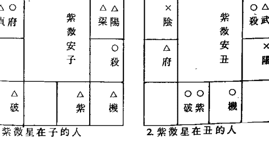

1. 紫微星在子的人

2. 紫微星在丑的人

### 紫微星在寅的人

| ○ 巨 | ○ △ 相貞 | ○ 梁 | ○ 殺 |
| :---: | :---: | :---: | :---: |
| ○ 貪 | 紫微安寅 | △ 同 | |
| × 陰 | | ○ 武 | |
| ○ ○ 府紫 | × 機 | ○ 破 | × 陽 |

### 紫微星在卯的人

| △ 相 | ○ 梁 | ○ △ 殺貞 | |
| :---: | :---: | :---: | :---: |
| × 巨 | 紫微安卯 | | |
| △ ○ 貪紫 | | △ 同 | |
| ○ △ 陰機 | ○ 府 | × 陽 | △ △ 破武 |

### 紫微星在午的人

| △ 機 | ○ 紫 | | △ 破 |
| :---: | :---: | :---: | :---: |
| ○ 殺 | 紫微安午 | | |
| ○ ○ 梁陽 | | △ ○ 貞府 | |
| ○ △ 相武 | × × 門同 | ○ 貪 | ○ 陰 |

### 紫微星在未的人

| ○ 機 | ○ ○ 破紫 | | |
| :---: | :---: | :---: | :---: |
| ○ 陽 | 紫微安未 | ○ 府 | |
| ○ △ 殺武 | | ○ 陰 | |
| ○ △ 梁同 | ○ 相 | ○ 巨 | × × 貞貞 |

### 紫微星在辰的人

| × 梁 | ○ 殻 | | ○ 貞 |
| :---: | :---: | :---: | :---: |
| △ △ 相紫 | 紫微安辰 | | |
| ○ ○ 巨機 | | ○ 破 | |
| △ 貪 | ○ × 陰陽 | ○ ○ 武府 | ○ 同 |

### 紫微星在巳的人

| △ ○ 殺紫 | | | |
| :---: | :---: | :---: | :---: |
| ○ △ 梁機 | 紫微安巳 | × △ 破貞 | |
| × 相 | | | |
| ○ ○ 巨陽 | ○ △ 貪武 | ○ ○ 陰同 | △ 府 |

### 紫微星在申的人

| ○ 陽 | ○ 破 | × 機 | △ ○ 府紫 |
| :---: | :---: | :---: | :---: |
| ○ 武 | 紫微安申 | ○ 陰 | |
| △ 同 | | ○ 貪 | |
| ○ 殺 | ○ 梁 | ○ △ 相貞 | ○ 巨 |

### 紫微星在酉的人

| △ △ 破武 | ○ 陽 | ○ 府 | △ △ 陰機 |
| :---: | :---: | :---: | :---: |
| △ 同 | 紫微安酉 | △ ○ 貪紫 | |
| | | × 巨 | |
| ○ △ 殺貞 | ○ 梁 | △ 相 | |

### 紫微星在戌的人

| ○ | ○○ | ×△ | △ |
|---|---|---|---|
| 同 | 武府 | 陰陽 | 貪 |
| ○ | | ○○ | |
| 破 | 紫微安戌 | 巨機 | |
| | | △△ | |
| | | 相紫 | |
| ○ | | ○ | × |
| 貞 | | 殺 | 梁 |

### 紫微星在亥的人

| △ | ×× | ○○ | ○△ |
|---|---|---|---|
| 府 | 陰同 | 貪武 | 巨陽 |
| | | | × |
| | 紫微安亥 | 相 | |
| ×△ | | ○△ | |
| 破貞 | | 梁機 | |
| | | △○ | |
| | | 殺紫 | |

### 表 30. 安時系諸星表

| 星\時\生\辰 | 甲 | 甲 | 乙 | 乙 |
|---|---|---|---|---|
| | 寅午戌 | 申子辰 | 巳酉丑 | 亥卯未 |
| 文昌 | 戌 | 辰 | 巳 | 亥 |
| 文曲 | 辰 | 戌 | 亥 | 巳 |
| 火星 | 丑 | 卯 | 寅 | 戌 |
| 鈴星 | 卯 | 丑 | 戌 | 寅 |
| 火星 | 寅 | 戌 | 卯 | 亥 |
| 鈴星 | 戌 | 寅 | 亥 | 卯 |
| 火星 | 卯 | 亥 | 戌 | 寅 |
| 鈴星 | 亥 | 卯 | 寅 | 戌 |
| 火星 | 戌 | 寅 | 亥 | 卯 |
| 鈴星 | 寅 | 戌 | 卯 | 亥 |
| 地劫 | 亥 | 亥 | 午 | 寅 |
| 地空 | 亥 | 亥 | 午 | 寅 |
| 台輔 | 午 | 寅 | 未 | 卯 |
| 封誥 | 寅 | 午 | 申 | 辰 |
| 子 | 戌 | 辰 | 巳 | 亥 |
| 丑 | 酉 | 巳 | 寅 | 辰 |
| 寅 | 申 | 午 | 卯 | 巳 |
| 卯 | 未 | 未 | 辰 | 午 |
| 辰 | 午 | 申 | 巳 | 未 |
| 巳 | 巳 | 酉 | 午 | 申 |
| 午 | 辰 | 戌 | 未 | 酉 |
| 未 | 卯 | 亥 | 申 | 戌 |
| 申 | 寅 | 子 | 酉 | 亥 |
| 酉 | 丑 | 丑 | 戌 | 子 |
| 戌 | 子 | 寅 | 亥 | 丑 |
| 亥 | 亥 | 卯 | 子 | 寅 |

### 表 31. 安月系諸星表

| 星級
本生月 | 甲 | 乙 | 乙 | 乙 | 乙 | 乙 | 乙 |
|---|---|---|---|---|---|---|---|
| 諸星 | 左輔 | 右弼 | 天刑 | 天姚 | 天馬 | 解神 | 天巫 | 天月 | 陰煞 |
| 正月 | 辰 | 戌 | 酉 | 丑 | 申 | 申 | 巳 | 戌 | 寅 |
| 二月 | 巳 | 酉 | 戌 | 寅 | 巳 | 申 | 申 | 巳 | 子 |
| 三月 | 午 | 申 | 亥 | 卯 | 寅 | 戌 | 寅 | 辰 | 戌 |
| 四月 | 未 | 未 | 子 | 辰 | 亥 | 戌 | 亥 | 寅 | 申 |
| 五月 | 申 | 午 | 丑 | 巳 | 中 | 子 | 巳 | 未 | 午 |
| 六月 | 酉 | 巳 | 寅 | 午 | 巳 | 子 | 申 | 卯 | 辰 |
| 七月 | 戌 | 辰 | 卯 | 未 | 寅 | 寅 | 寅 | 亥 | 寅 |
| 八月 | 亥 | 卯 | 辰 | 申 | 亥 | 寅 | 亥 | 未 | 子 |
| 九月 | 子 | 寅 | 巳 | 酉 | 中 | 辰 | 巳 | 寅 | 戌 |
| 十月 | 丑 | 丑 | 午 | 戌 | 巳 | 辰 | 申 | 午 | 申 |
| 十一月 | 寅 | 子 | 未 | 亥 | 寅 | 午 | 寅 | 戌 | 午 |
| 十二月 | 卯 | 亥 | 申 | 子 | 亥 | 午 | 亥 | 寅 | 辰 |

### 表 32. 安支系諸星表

| 星級
出生年支 | 乙 | 乙 | 乙 | 乙 | 乙 | 乙 | 乙 |
|---|---|---|---|---|---|---|---|
| 諸星 | 天哭 | 天虛 | 龍池 | 鳳閣 | 紅鸞 | 天喜 | 孤辰 | 寡宿 | 蜚廉 | 破碎 | 天才 | 天壽 | 天空 |
| 子 | 午 | 午 | 辰 | 戌 | 卯 | 酉 | 寅 | 戌 | 申 | 巳 | 由命宮起子，順行，數至出生年支，即安天才星。 | 由身宮起子，順行，數至出生年支，即安天壽星。 | 丑 |
| 丑 | 巳 | 未 | 巳 | 酉 | 寅 | 申 | 寅 | 戌 | 酉 | 丑 | 寅 | 卯 | 辰 |
| 寅 | 辰 | 申 | 午 | 申 | 丑 | 未 | 巳 | 丑 | 戌 | 酉 | 卯 | 辰 | 巳 |
| 卯 | 卯 | 酉 | 未 | 未 | 子 | 午 | 巳 | 丑 | 巳 | 巳 | 辰 | 巳 | 午 |
| 辰 | 寅 | 戌 | 申 | 午 | 亥 | 巳 | 巳 | 丑 | 午 | 丑 | 巳 | 午 | 未 |
| 巳 | 丑 | 亥 | 酉 | 巳 | 戌 | 辰 | 申 | 辰 | 未 | 酉 | 午 | 未 | 申 |
| 午 | 子 | 子 | 戌 | 辰 | 酉 | 卯 | 申 | 辰 | 寅 | 巳 | 未 | 申 | 酉 |
| 未 | 亥 | 丑 | 亥 | 卯 | 申 | 寅 | 申 | 辰 | 卯 | 丑 | 申 | 酉 | 戌 |
| 申 | 戌 | 寅 | 子 | 寅 | 未 | 丑 | 亥 | 未 | 辰 | 酉 | 酉 | 戌 | 亥 |
| 酉 | 酉 | 卯 | 丑 | 丑 | 午 | 子 | 亥 | 未 | 亥 | 巳 | 戌 | 亥 | 子 |
| 戌 | 申 | 辰 | 寅 | 子 | 巳 | 亥 | 亥 | 未 | 子 | 丑 | 亥 | 子 | 丑 |
| 亥 | 未 | 巳 | 卯 | 亥 | 辰 | 戌 | 寅 | 戌 | 丑 | 酉 | 子 | 丑 | 寅 |

### 表 33. 安干系诸星表

| 星级 | 甲 | 甲 | 甲 | 乙 | 丙 | 乙 |
| :--- | :--- | :--- | :--- | :--- | :--- | :--- |
| 诸星 | 禄存 | 擎羊 | 陀罗 | 天魁 | 天钺 | 化禄 | 化权 | 化科 | 化忌 | 天官 | 天福 | 截空 | 亡 | 天厨 |
| 年干 | | | | | | | | | | | | | | |
| 甲 | 寅 | 卯 | 丑 | 丑 | 未 | 廉贞 | 破军 | 武曲 | 太阳 | 未 | 酉 | 申 | 酉 | 巳 |
| 乙 | 卯 | 辰 | 寅 | 子 | 申 | 天机 | 天梁 | 紫微 | 太阴 | 辰 | 申 | 午 | 未 | 午 |
| 丙 | 巳 | 午 | 辰 | 亥 | 酉 | 天同 | 天机 | 文昌 | 廉贞 | 巳 | 子 | 辰 | 巳 | 子 |
| 丁 | 午 | 未 | 巳 | 亥 | 酉 | 太阴 | 天同 | 天机 | 巨门 | 寅 | 亥 | 寅 | 卯 | 巳 |
| 戊 | 巳 | 午 | 辰 | 丑 | 未 | 贪狼 | 太阴 | 右弼 | 天机 | 卯 | 卯 | 子 | 丑 | 午 |
| 己 | 午 | 未 | 巳 | 子 | 申 | 武曲 | 贪狼 | 天梁 | 文曲 | 酉 | 寅 | 申 | 酉 | 申 |
| 庚 | 申 | 酉 | 未 | 寅 | 马 | 太阳 | 武曲 | 天府 | 天同 | 亥 | 午 | 午 | 未 | 寅 |
| 辛 | 酉 | 戌 | 申 | 寅 | 马 | 巨门 | 太阳 | 文曲 | 文昌 | 酉 | 巳 | 辰 | 巳 | 午 |
| 壬 | 亥 | 子 | 戌 | 卯 | 巳 | 天梁 | 紫微 | 左辅 | 武曲 | 戌 | 午 | 寅 | 卯 | 酉 |
| 癸 | 子 | 丑 | 亥 | 卯 | 巳 | 破军 | 巨门 | 太阴 | 贪狼 | 午 | 巳 | 子 | 丑 | 亥 |

### 表 34. 安旬空表

| 年干 | 戌 | 申 | 午 | 辰 | 寅 | 子 |
| :--- | :--- | :--- | :--- | :--- | :--- | :--- |
| 甲 | 子 | 戌 | 申 | 午 | 辰 | 寅 |
| 乙 | 丑 | 亥 | 酉 | 未 | 巳 | 卯 |
| 丙 | 寅 | 子 | 戌 | 申 | 午 | 辰 |
| 丁 | 卯 | 丑 | 亥 | 酉 | 未 | 巳 |
| 戊 | 辰 | 寅 | 子 | 戌 | 申 | 午 |
| 己 | 巳 | 卯 | 丑 | 亥 | 酉 | 未 |
| 庚 | 午 | 辰 | 寅 | 子 | 戌 | 申 |
| 辛 | 未 | 巳 | 卯 | 丑 | 亥 | 酉 |
| 壬 | 申 | 午 | 辰 | 寅 | 子 | 戌 |
| 癸 | 酉 | 未 | 巳 | 卯 | 丑 | 亥 |

### 表 35 安博士星系

| 出生年\星名 | 甲 | 乙 | 丙 | 丁 | 戊 | 己 | 庚 | 辛 | 壬 | 癸 |
| :--- | :--- | :--- | :--- | :--- | :--- | :--- | :--- | :--- | :--- | :--- |
| 男 | 寅 | 卯 | 巳 | 午 | 亥 | 子 | 申 | 酉 | 亥 | 子 |
| 女 | 寅 | 卯 | 巳 | 午 | 巳 | 午 | 申 | 酉 | 亥 | 子 |

### 表 36 安流年斗君表

| 出生年\月份 | 正月 | 二月 | 三月 | 四月 | 五月 | 六月 | 七月 | 八月 | 九月 | 十月 | 十一月 | 十二月 |
| :--- | :--- | :--- | :--- | :--- | :--- | :--- | :--- | :--- | :--- | :--- | :--- | :--- |
| 子 | 子 | 丑 | 寅 | 卯 | 辰 | 巳 | 午 | 未 | 申 | 酉 | 戌 | 亥 |
| 丑 | 丑 | 寅 | 卯 | 辰 | 巳 | 午 | 未 | 申 | 酉 | 戌 | 亥 | 子 |
| 寅 | 寅 | 卯 | 辰 | 巳 | 午 | 未 | 申 | 酉 | 戌 | 亥 | 子 | 丑 |
| 卯 | 卯 | 辰 | 巳 | 午 | 未 | 申 | 酉 | 戌 | 亥 | 子 | 丑 | 寅 |
| 辰 | 辰 | 巳 | 午 | 未 | 申 | 酉 | 戌 | 亥 | 子 | 丑 | 寅 | 卯 |
| 巳 | 巳 | 午 | 未 | 申 | 酉 | 戌 | 亥 | 子 | 丑 | 寅 | 卯 | 辰 |
| 午 | 午 | 未 | 申 | 酉 | 戌 | 亥 | 子 | 丑 | 寅 | 卯 | 辰 | 巳 |
| 未 | 未 | 申 | 酉 | 戌 | 亥 | 子 | 丑 | 寅 | 卯 | 辰 | 巳 | 午 |
| 申 | 申 | 酉 | 戌 | 亥 | 子 | 丑 | 寅 | 卯 | 辰 | 巳 | 午 | 未 |
| 酉 | 酉 | 戌 | 亥 | 子 | 丑 | 寅 | 卯 | 辰 | 巳 | 午 | 未 | 申 |
| 戌 | 戌 | 亥 | 子 | 丑 | 寅 | 卯 | 辰 | 巳 | 午 | 未 | 申 | 酉 |
| 亥 | 亥 | 子 | 丑 | 寅 | 卯 | 辰 | 巳 | 午 | 未 | 申 | 酉 | 戌 |

### 表 37. 起大限表

| 五行局 | 阴阳男女 | 命宫 | 兄弟 | 夫妻 | 子女 | 财帛 | 疾厄 | 迁移 | 仆役 | 官禄 | 田宅 | 福德 | 父母 |
|---|---|---|---|---|---|---|---|---|---|---|---|---|---|
| 水二局 | 阳男 | 2 | 112 | 102 | 92 | 82 | 72 | 62 | 52 | 42 | 32 | 22 | 12 |
| | 阴女 | 11 | 121 | 111 | 101 | 91 | 81 | 71 | 61 | 51 | 41 | 31 | 21 |
| | 阴男 | 2 | 12 | 22 | 32 | 42 | 52 | 62 | 72 | 82 | 92 | 102 | 112 |
| | 阳女 | 11 | 21 | 31 | 41 | 51 | 62 | 71 | 81 | 91 | 101 | 111 | 121 |
| 木三局 | 阳男 | 3 | 113 | 103 | 93 | 83 | 73 | 63 | 53 | 43 | 33 | 23 | 13 |
| | 阴女 | 12 | 122 | 112 | 102 | 92 | 82 | 72 | 62 | 52 | 42 | 32 | 22 |
| | 阴男 | 3 | 13 | 23 | 33 | 43 | 53 | 63 | 73 | 83 | 93 | 103 | 113 |
| | 阳女 | 12 | 22 | 32 | 42 | 52 | 62 | 72 | 82 | 92 | 102 | 112 | 122 |
| 金四局 | 阳男 | 4 | 114 | 104 | 94 | 84 | 74 | 64 | 54 | 44 | 34 | 24 | 14 |
| | 阴女 | 13 | 123 | 113 | 103 | 93 | 83 | 73 | 63 | 53 | 43 | 33 | 23 |
| | 阴男 | 4 | 14 | 24 | 34 | 44 | 54 | 64 | 74 | 84 | 94 | 104 | 114 |
| | 阳女 | 13 | 23 | 33 | 43 | 53 | 63 | 73 | 83 | 93 | 103 | 113 | 123 |
| 土五局 | 阳男 | 5 | 115 | 105 | 95 | 85 | 75 | 65 | 55 | 45 | 35 | 25 | 15 |
| | 阴女 | 14 | 124 | 114 | 104 | 94 | 84 | 74 | 64 | 54 | 44 | 34 | 24 |
| | 阴男 | 5 | 15 | 25 | 35 | 45 | 55 | 65 | 75 | 85 | 95 | 105 | 115 |
| | 阳女 | 14 | 24 | 34 | 44 | 54 | 64 | 74 | 84 | 94 | 104 | 114 | 124 |
| 火六局 | 阳男 | 6 | 116 | 106 | 96 | 86 | 76 | 66 | 56 | 46 | 36 | 26 | 16 |
| | 阴女 | 15 | 125 | 115 | 105 | 95 | 85 | 75 | 65 | 55 | 45 | 35 | 25 |
| | 阴男 | 6 | 16 | 26 | 36 | 46 | 56 | 66 | 76 | 86 | 96 | 106 | 116 |
| | 阳女 | 15 | 25 | 35 | 45 | 55 | 65 | 75 | 85 | 95 | 105 | 115 | 125 |

### 表 38 起小限表

| 小限值宫之岁 | 1 | 2 | 3 | 4 | 5 | 6 | 7 | 8 | 9 | 10 | 11 | 12 |
|---|---|---|---|---|---|---|---|---|---|---|---|---|
| | 13 | 14 | 15 | 16 | 17 | 18 | 19 | 20 | 21 | 22 | 23 | 24 |
| | 25 | 26 | 27 | 28 | 29 | 30 | 31 | 32 | 33 | 34 | 35 | 36 |
| | 37 | 38 | 39 | 40 | 41 | 42 | 43 | 44 | 45 | 46 | 47 | 48 |
| | 49 | 50 | 51 | 52 | 53 | 54 | 55 | 56 | 57 | 58 | 59 | 60 |
| | 61 | 62 | 63 | 64 | 65 | 66 | 67 | 68 | 69 | 70 | 71 | 72 |
| | 73 | 74 | 75 | 76 | 77 | 78 | 79 | 80 | 81 | 82 | 83 | 84 |
| | 85 | 86 | 87 | 88 | 89 | 90 | 91 | 92 | 93 | 94 | 95 | 96 |
| | 97 | 98 | 99 | 100 | 101 | 102 | 103 | 104 | 105 | 106 | 107 | 108 |
| | 109 | 110 | 111 | 112 | 113 | 114 | 115 | 116 | 117 | 118 | 119 | 120 |
| 出生年年支 | | | | | | | | | | | | |
| 寅午戌 | 男 | 辰 | 巳 | 午 | 未 | 申 | 酉 | 戌 | 亥 | 子 | 丑 | 寅 | 卯 |
| | 女 | 辰 | 卯 | 寅 | 丑 | 子 | 亥 | 戌 | 酉 | 申 | 未 | 午 | 巳 |
| 申子辰 | 男 | 戌 | 亥 | 子 | 丑 | 寅 | 卯 | 辰 | 巳 | 午 | 未 | 申 | 酉 |
| | 女 | 戌 | 酉 | 申 | 未 | 午 | 巳 | 辰 | 卯 | 寅 | 丑 | 子 | 亥 |
| 巳酉丑 | 男 | 未 | 申 | 酉 | 戌 | 亥 | 子 | 丑 | 寅 | 卯 | 辰 | 巳 | 午 |
| | 女 | 未 | 午 | 巳 | 辰 | 卯 | 寅 | 丑 | 子 | 亥 | 戌 | 酉 | 申 |
| 亥卯未 | 男 | 丑 | 寅 | 卯 | 辰 | 巳 | 午 | 未 | 申 | 酉 | 戌 | 亥 | 子 |
| | 女 | 丑 | 子 | 亥 | 戌 | 酉 | 申 | 未 | 午 | 巳 | 辰 | 卯 | 寅 |

### 表 39. 安將星系

| 星級\流年支 | 丁 | 戊 | 丁 | 戊 | 戊 | 戊 | 戊 | 戊 | 戊 | 戊 | 戊 | 戊 |
|---|---|---|---|---|---|---|---|---|---|---|---|---|
| 諸星 | 將星 | 華蓋 | 歲驛 | 息神 | 攀鞍 | 劫煞 | 災煞 | 天煞 | 指背 | 咸池 | 月煞 | 亡神 |
| 寅午戌 | 午 | 未 | 申 | 酉 | 戌 | 亥 | 子 | 丑 | 寅 | 卯 | 辰 | 巳 |
| 申子辰 | 子 | 丑 | 寅 | 卯 | 辰 | 巳 | 午 | 未 | 申 | 酉 | 戌 | 亥 |
| 巳酉丑 | 酉 | 戌 | 亥 | 子 | 丑 | 寅 | 卯 | 辰 | 巳 | 午 | 未 | 申 |
| 亥卯未 | 卯 | 辰 | 巳 | 午 | 未 | 申 | 酉 | 戌 | 亥 | 子 | 丑 | 寅 |

### 表 40. 安流年歲前諸星表

| 諸星\流年 | 歲建 | 嗨氣 | 喪門 | 貫索 | 官符 | 歲耗 | 歲破 | 龍德 | 白虎 | 天德 | 吊客 | 歲病 | 月德 |
|---|---|---|---|---|---|---|---|---|---|---|---|---|---|
| 子 | 子 | 丑 | 寅 | 卯 | 辰 | 巳 | 午 | 未 | 申 | 酉 | 戌 | 亥 | 巳 |
| 丑 | 丑 | 寅 | 卯 | 辰 | 巳 | 午 | 未 | 申 | 酉 | 戌 | 亥 | 子 | 午 |
| 寅 | 寅 | 卯 | 辰 | 巳 | 午 | 未 | 申 | 酉 | 戌 | 亥 | 子 | 丑 | 未 |
| 卯 | 卯 | 辰 | 巳 | 午 | 未 | 申 | 酉 | 戌 | 亥 | 子 | 丑 | 寅 | 申 |
| 辰 | 辰 | 巳 | 午 | 未 | 申 | 酉 | 戌 | 亥 | 子 | 丑 | 寅 | 卯 | 酉 |
| 巳 | 巳 | 午 | 未 | 申 | 酉 | 戌 | 亥 | 子 | 丑 | 寅 | 卯 | 辰 | 戌 |
| 午 | 午 | 未 | 申 | 酉 | 戌 | 亥 | 子 | 丑 | 寅 | 卯 | 辰 | 巳 | 亥 |
| 未 | 未 | 申 | 酉 | 戌 | 亥 | 子 | 丑 | 寅 | 卯 | 辰 | 巳 | 午 | 子 |
| 申 | 申 | 酉 | 戌 | 亥 | 子 | 丑 | 寅 | 卯 | 辰 | 巳 | 午 | 未 | 丑 |
| 酉 | 酉 | 戌 | 亥 | 子 | 丑 | 寅 | 卯 | 辰 | 巳 | 午 | 未 | 申 | 寅 |
| 戌 | 戌 | 亥 | 子 | 丑 | 寅 | 卯 | 辰 | 巳 | 午 | 未 | 申 | 酉 | 卯 |
| 亥 | 亥 | 子 | 丑 | 寅 | 卯 | 辰 | 巳 | 午 | 未 | 申 | 酉 | 戌 | 辰 |

### 表 41. 天傷永在僕役宮 天使永在疾厄宮

| 星級\命宮 | 丙 |
| :--- | :--- |
| 名 | 天傷 | 天使 |
| 子 | 巳 | 未 |
| 丑 | 午 | 申 |
| 寅 | 未 | 酉 |
| 卯 | 申 | 戌 |
| 辰 | 酉 | 亥 |
| 巳 | 戌 | 子 |
| 午 | 亥 | 丑 |
| 未 | 子 | 寅 |
| 申 | 丑 | 卯 |
| 酉 | 寅 | 辰 |
| 戌 | 卯 | 巳 |
| 亥 | 辰 | 午 |

## 22. 星辰簡介（專為初學者而寫）

### 22.1. 紫微：

己土（屋上土），中天尊星，為帝座，主掌造化樞機，官祿主。

掌爵祿，諸宮降福，能消百惡，如廟旺化吉甚佳。無輔為孤君，再與諸煞同宮，君子在野，小人在位，主人奸詐假善。

如落疾厄、奴僕、相貌、兄弟四陷宮，主人勞碌，作事無成，雖得助亦不為福。

喜人身命、官祿三強宮，但不可入空亡。更坐生鄉，天相來朝，祿馬交馳，可為貴論。

亦喜會魁鉞、三台八座、昌曲，必為文選之職。帶可降殺為權，有吉同位，可作武官。

居財帛、田宅，有左右守衛不見惡星，更與祿存同居，可為財賦之官。

居子女宮有吉星解佐，主生貴子，但獨守反而子息孤單。

居夫妻宮會吉，主得美配偕老，但不可有破。居遷移宮有相佐吉星照命，將因人提拔得貴。

居福德宮，男人喜陷地，可奮發圖強，女喜廟旺，可享天倫。

能制火鈴為善，得六吉星不貴亦巨富，縱四煞沖破，亦作中局。女命逢之作貴婦，即使加煞沖破，亦作平常不為賤。

紫微以輔弼為相，以昌曲為從（故稱金輿），以魁鉞為傳命，以日月為分司，以祿馬為掌爵，以天府為帑藏。猶如飛星棋譜，紫微為將帥，魁鉞為士，昌曲為車，左右為相。

### 22.2. 天機：

乙木（楊柳木），南斗第三益算之善星，化氣曰善，動於體佛，敬乎六親，利於林泉，宜於僧道，仁慈之心，靈機應變之志，淵魚察見，作事有方。為兄弟主，佐帝令行事。

女命為祿壽，守身宮同位天梁，必有高藝隨身。與天梁同位逢左右昌曲，文為清顯，武為忠良，若居陷地四煞來沖，是為下局。二限逢之，興家創業。

女命吉星拱照，主旺夫益子，有三奇則為貴婦，四煞沖破主下賤殘疾刑剋。

作事有謀略，秉性最高明，會吉主享福，八格居翰林，逢沖煞亦好善。

巨門同位卯宮或酉宮，權煞逢之，武職壓邊庭。天梁同位辰戌，空劫逢之，遁入空門。

子午入廟有功名，二限臨之主變更。

### 22.3. 太陽：

丙火（天上火），主人有貴氣，允文允武，諸吉集則顯祥，諸凶聚則勞心費力，喜化祿化權化科於官祿宮，為官祿主。

男作父星，女作夫主，更得旺月同照，富貴雙全，身宮逢之吉聚，可在貴人門下或公卿走卒。

居夫妻宮為弱宮，諸吉聚可因妻而貴，陷地加煞則妻不吉。子女宮得八座加吉於廟旺，主生貴子權柄不小。

居財帛宮於旺地會吉，不怕暗星，富貴綿遠，無空劫，一生主富。居田宅宮，得祖父蔭澤。

大小二限俱到，若會吉必有驟興之喜，與羊鈴陀集，目下有憂或剋父母。羊煞聚限有傷官之憂，或官非之撓，與羊陀聚則疾病，與火鈴合則苦楚不少。

居遷移宮逢煞星聚，則難招祖業，移根換葉，出祖離家，限步逢之，必要動移。

女命居福德宮有吉扶，招賢明之夫。居父母宮，男子單作，父星有輝則吉，失輝則剋父。

太陽喜左右佐，祿存助福，忌限逢暗星，若居旺地化祿化權，斷為貴論，六吉三合，財官極品，加煞亦可飽暖，僧道有師號。女人居旺地，主旺夫益子，加權祿封贈，加煞平常。

居身命稟性最聰明，慈愛量寬大，福壽享遐齡，與旺月驟，發貴無倫，有輝照身命，平步青雲，不畏巨門來犯，失輝則忌限逢巨門，男必剋父，女必剋夫，二限逢火鈴或羊陀，必賣田園。

太陽遇祿權科為文，遇天刑為武，居寅卯為初昇，辰巳為昇殿，居午為日麗中天，主大富貴。在未申為偏垣，先勤后惰，居酉為西沒，貴而不顯，秀而不實，居戌亥為失輝，限逢巨、破，勞碌貪忙，眼目有傷，與人寡合招非，女命逢之，夫星不美，限逢破軍則非禮成婚，祿存同宮，亦至辛勞賺錢。

### 22.4. 武曲：

北斗第六星，庚金（釵釧金），財帛主，故化氣曰財。

性剛果決，有喜有怒，可福可災。

與祿馬交馳，發財與遠鄉，與貪狼同度，慳吝人，不利少年，武破同財官，財到手又成空。

在斗司壽，在數司財，怕受制入陷，喜祿存同，喜天府同（子午）主壽。

惡煞聚會震宮，限逢耗囚必見木壓雷震。惡煞聚坎宮，限逢貪破，主投河溺水，火殺同度卯酉，因財被劫。遇羊陀則孤剋，逢破軍難顯貴，是非之撓。

三奇嘉會（甲、己生人）出將之相福非輕，喜火貪為貴格，喜西北生人，東南生人平常，四煞沖破孤貧，或破相延年，吉多女為貴婦，加煞孤剋。

### 22.5. 天同：

壬水（大海水），福如東海，南斗第四星，福德主，故化氣曰福，乃益算保生之星，化祿為善。

為人廉潔貌清奇，有機樞無亢激，不畏七殺，不怕諸煞同纏，若限逢之皆福，無破為祥。

身命值之，為人謙遜，稟性溫和，心慈耿直，文墨精通，有奇志無凶欲，遇左右昌梁貴顯。

已亥得地，不宜六庚，居酉終身不守，會四煞居已亥為殘疾孤剋。女逢煞沖破，刑夫剋子，梁月沖破宜作偏房。

### 22.6. 廉貞：

丁火（爐火、覆燈火），北斗第五星，在斗司品秩，在數司權令，不臨廟旺犯官符為殺曜，故曰化囚。人逢之不可測其祥，心狠性狂，不習禮義。

逢帝座可執威權，遇祿存主富貴，遇文昌好禮樂，遇煞顯武職，居官祿有威權，故曰官祿主，居身命次桃花，居旺地賭博迷花而致訟。限逢巨門於陷地，則是非官司。限逢財星破軍祖業必破。遇羊陀有血光，遇白虎刑杖難逃。限逢武曲恐木壓蛇傷於外鄉。火星同纏於陷空之地，主投河自縊。限逢破軍、日月恐目疾，遇吉為福，逢凶不慈。

廉貞已亥宮，遇吉為福30后，須防不善終。

### 22.7. 天府：

戊土（城頭土），南斗主令第一星，在斗司福權，在數主財帛，城頭圍成財庫，會吉化成文昌。

掌財帛、田宅、衣祿，為帝之佐，能制羊陀為從，化火鈴為福。主人相貌清奇，稟性溫良端雅，會太陽昌曲必登科，逢祿存武曲必巨萬富翁。

天府為祿庫，命逢終是福，不喜四煞沖破，無官貴僅財田富足。喜居田宅財帛官，兄弟宮次之，忌居奴僕相貌宮（父母宮）。居命主妻賢子女多，若逢空亡為孤。女命得之清正機巧，旺夫益子，不見沖破為福。四煞沖破，既使為僧道，亦有師號。

### 22.8. 太阴：

癸水（池水、泉井水），田宅主，曰化富，有上下弦月之分。

為人聰明俊秀，稟性端雅純祥，喜上弦月，下弦月減威，若卯且酉月俱旺，富貴之基，若居陷地則落弱之命，身命不分守巨門為佳，因月嫌最怕暗星。

居身宮隨娘繼拜，離祖過房。身命若見惡煞則傷殘，除非僧道反吉。與文曲同居身命，則為九流術士。

卯辰巳午未為陷地，酉戌亥子丑得垣，嫌巨門限，怕羊陀同度，廉囚限犯，七殺限沖，定作傷殘，有輝有福，失陷必凶，為母星又作妻宿。居身命廟樂主富貴，居疾厄遇陀暗限為目疾，遇火鈴為災，值貪殺限損日，居父母限地失輝，流年白虎太歲主母有災，故失輝受制不吉，逢虎喪吊妻慎之。

### 22.9. 贪狼：

北斗解厄第一星，氣屬木髓屬水，化氣為桃花，主禍福之神，在數則樂為放蕩，遇吉富貴，遇凶虛浮，主人矮小，性剛猛威，機深謀遠，隨波逐浪，愛憎難定，居廟旺遇火星，武職權貴，限逢天相延壽，限逢貞武巧藝，得祿存宜僧道，限逢破殺，飄蓬度日。

好高吟浮蕩，作巧成拙奸詐，人授神仙之術，入廟旺之地可為祥亦可為禍，身居破軍迷花戀酒而喪命，同祿存可吉，遇廉貞不潔，身居七殺遭刑遠配，遇羊陀痔疾或斑痕，二限為禍非輕，與七殺分守身命，女偷情男偷盜，諸吉難救，梟凶愈藏其奸，虛花無實，與人交厚者薄，而薄者厚。

七殺守身終是夭，貪狼入廟反為娼，與破軍分守身命，生旺之地，男好飲賭游蕩，女好淫奔私竊，無媒自嫁，輕則隨客奔馳，重則游於歌妓，喜見空亡來救，反主端正賢淑。與武曲同度，為人諂佞奸貪，每存肥己之心，無濟人之意，與廉貞同宮公庭遭刑，與七殺分守，定為屠宰，羊陀交並風流鬼，昌曲同度多虛少實，與七殺日月分守，男女淫邪虛花，限逢巨門，口舌常有，犯帝座無制，無益之人，喜左右昌曲夾制。

陷地喜逢長生，會火鈴能富貴喜居財帛，限逢太陰為淫佚，忌居兄弟、子女、田宅，破蕩祖業，先富後貧，居奴僕因友而破，居夫妻不美，居疾厄忌羊陀，酒色之病，居遷移坐火鄉，流歲疊並主遭兵火賊盜。

### 22.10. 巨门：

癸水（暗溝水），北斗第二星，在斗司品萬物，在數掌是非，主暗昧疑多，欺瞞天地，進退兩難，化氣曰暗。

其性面是背非，六親寡合，交人初善終惡，非廟樂則到處為災，奔波勞碌，雖富貴亦不耐久。

會太陽吉凶參半，限逢七殺主殺傷，限逢貪耗，好賭遭配，限遇帝座則解其困，遇祿存則解其厄，值羊陀則男盜女娼，照火鈴白虎，無帶壓制或祿存解厄，則決配千里，三合煞湊則遭火厄，孤獨之星，剋剝之神，入僧道九流反佳。

居身命一生招口舌是非，居兄弟骨肉參商，居夫妻則隔角，生離死別，居子女損後人，居財帛與人爭，居疾厄遇羊陀，眼目之災，合煞則殘疾，居遷移招是非，居奴僕多怨逆，居官祿主招刑杖，居田宅破蕩祖業，居福德禍稍輕，居父母遷棄擲。

### 22.11. 天相：

壬水（大溪水），南斗第五星，司爵之星，化氣曰印，為官祿主，佐帝文星之位。

言語誠實，事不虛偽，見人有難，惻隱之心，見人惡抱不平，形體肥滿，語言不輕發。

居身命主財多福厚，出仕飛騰，居家主財足，二限逢之，百事充足，衣食豐足，昌曲左右會，位至公卿，陷地限逢貪囚武破羊陀煞湊，則巧藝安身，火鈴沖破殘疾，宜僧道主清高。

女命主聰明端莊，志過丈夫，三方拱吉封贈，昌曲沖破為妾。

居官祿顯榮，三合帝座則爭權，佐日月之光，兼化囚之惡。

居子女嗣續昌，居身命榮耀，不隨惡而變志，不因煞而改，限逢富不可量，臨生旺之鄉得左右，則職掌威權，居閑弱之地亦作吉利，二限逢之主富貴。

### 22.12. 天梁：

戊土（高地，高山），南斗第二星，最吉司壽，化氣曰蔭，為福延壽，壽比南山，父母主，田宅、兄弟得之福，主宰殺帝之權，可佐帝威權。

性情磊落，相貌厚重，溫謙循直無私，臨事果決，形神持重，心性平和，生來無災患，文章有聲名，六親和睦，仕宦王庭，善談兵法，面貌清秀。

巨門若分守，勞祿歷艱辛，若逢天機，僧道享山林。

居財帛遇昌曲，居福德逢太陽，聲名顧王室，職位臨風憲，限逢破軍或天機及煞，宜僧道，亦受王室制。限逢貪狼亂禮亂家。

見囚羊陀無災，遇火鈴羊巨無厄，太歲、白虎臨無殃，加會昌曲左右位台綱。

居父母宮，厚重威嚴，居福德會太陽，極品之貴，若四煞沖破，苗而不秀，居奴僕、疾厄非豐，奏書會有意外之榮，青龍動有文書之喜，大小耗遇所做無成，病符官符侵不為災。

女命入廟，旺夫益子，昌曲左右扶封贈，忌羊陀沖刑破剋，招非不貞，宜空門。

### 22.13. 七殺：

辛金（白蠟金），南斗第六星，斗中上將，成敗孤辰，在斗司柄，主風憲威靈，其性清涼，在數宜僧道，主歷盡艱辛。

遇紫微則化權降福，遇火鈴則長其威，遇凶曜居生鄉為屠宰，會昌曲於要地，性情頑蠢。二宮逢之艱辛，二限逢之逝殃破敗，遇帝祿可解。

守身命作事進退，喜怒無常，左右昌曲入弼拱照，掌生殺大權，富貴出眾，見四煞化忌沖破，巧藝安身，陷地殘疾。

子午寅申宮，四夷稱英雄，左右貴人昌，權祿食萬鍾。聚煞不堪言，凶禍猛抱虎，若是無制伏，少年恐惡死。

居命官若限不扶則天折，居官祿得地化禍為祥，居子女則子息孤，居夫妻則鴛衾半冷，居田宅會羊囚，則父母刑傷，父母產業難留。居遷移疾厄逢羊陀，終身殘疾，縱使子然一身，壽年亦不長。與囚居身命，折股傷身務病，居遷移會囚耗，死於道路。

陰宮作禍深，流年最怕七殺重疊，主陣亡掠死，限逢巨日居帝旺之鄉為吉，空亡犯羊殺遭禍不輕，二限七殺，身命七殺，帝制無功，祿存亦無力，蓋世英雄無用武之地，乃倒限之所。

### 22.14. 破军：

癸水（澗下水），北斗第七星，司夫妻、子女、奴僕，在斗為殺，在數為耗，故化氣曰耗。

性暴凶狡奸滑，與人寡合，動則損人，不成人之美，善助人之惡，視六親如寇仇，處骨肉無仁義，癸、甲生人主富貴。

子午入廟，陷地加煞，巧藝殘疾，不守祖業，僧道宜之。

紫微同度失威權，天府分守作奸偽，限逢天機鼠盜狗竊，與囚火鈴同度，則起官司，與羊陀同度，終身殘，與武曲入財帛，東傾西敗，限逢巨門口舌爭鬥，與文星守命，一生貧士，天祿可解其狂，若逢七殺流年，家業蕩空，與文曲入坎水，殘疾離鄉，遇文昌於震木有吉可貴。

居子午威震華夷，武破居巳官位台閣。居兄弟骨肉參商，居夫妻主婚姻進退，居子女先損后成，居財帛如湯澆雪，居疾厄致癱弱，居遷移奔走無力，居奴僕勞怨逃走，居官祿主清貧，居田宅陷度，祖基破敗，居福德多災，居父母破相刑剋。

四煞沖破，女命無媒自嫁，喪節飄蕩，淫蕩無恥。

### 22.15. 文昌：

庚金，金箔金，主科甲。

居身命主人幽閒儒雅，清秀魁梧，博文廣記，機變異常，一舉成名，披緋衣紫，福壽双全，縱四煞沖破不為下賤。

眉目分明，相貌俊麗，富貴双全，先難后易，中晚年有聲名，太陽、天梁、天同聚，傳臚第一名。

喜金生人，不喜火生人（指出生年干支）。

女命加吉得地，衣祿充足，四煞沖破宜偏房或僧道，加權祿厚重有師號。

### 22.16. 文曲：

癸水，九曲長流水，北斗第四星，主科甲文車。

臨身命作科第之客，入仕無疑，落陷則桃花浪漫。居官祿面君執政，單居身命逢凶曜，作無名緇客。

廉貞同度官祿宮，必作官吏身。太陰同行爲九流術士。怕逢破軍恐有水厄，嫌遇貪狼，政事顛倒，逢七殺羊陀謀惡許偽，逢巨門喪志。

巳酉丑三合金生癸水，爲廟旺可居侯伯，武貪同垣將相格，文昌遇合最吉祥。寅午戌三合火，水火交戰爲陷宮（寅木稍輕爲平），巨門羊陀來沖恐天折，或水厄驚險。亥卯未三合木，水木相生爲平宮，會天梁或天相，主聰明博學，煞沖破宜僧道。

女命不宜，水性楊花，忌入土宮，喜祿存、化來解，若廟旺主清秀聰明而貴。

### 22.17. 昌曲：

流年昌曲爲科名，太陽流祿三合拱，魁鉞左右併台座，日月科權祿馬照，二限逢之必高中，喜得二三吉曜逢。不富即貴居廟旺，最怕空亡官丟掉。

### 22.18. 左輔：

戊土，帝極主宰。

守身命諸宮降福，相貌敦厚慷慨風流，紫府祿權三合，主文武大貴，火陀沖破，富貴不久，宜僧道清閒。

### 22.19. 右弼：

癸水，帝極主宰，守身命文墨精通，紫府同垣，財官双美，文武双全，羊陀沖破，下局斷之。女命賢良有志，縱煞沖破不爲賤，僧道清閒。

### 22.20. 左右：

輔土弼水根，失君爲無用，三合見紫府，爵祿滾滾來，若居夫妻位，恐要渡二婚，若與廉貞併，惡賊遭鉗刑，喜居日月側，文人登禹門，不居強宮上，無爵更無名，最怕羊囚處，遭傷作盜賊。

### 22.21. 天魁、天鉞：

中斗司科，入命坐貴向貴，左右吉聚富貴，二星爲上界和合之神，遇紫府日月昌曲左右權祿，少年娶美妻，有難得貴人助，小人不爲凶，限步逢巡，主添喜，生男俊雅，功名有成，生女容貌端莊，超群出眾。

居官祿賢而威武，聲名遠播，與人和睦，既使僧道亦享福。女命吉多爲貴夫人，加煞雖富貴但私情淫佚。

天乙貴人飛騰達，博雅通古今時藝，二限逢之廣錢糧，宮吏財富見君王。

### 22.22. 祿存：

己土，北斗第三星，主人貴爵，掌人壽基。

守身命主人慈厚信直，通文濟楚，女人清淑機巧能幹，有君子之志。

帝扶施權，日月得之增輝，武府得之掌職，同梁得之增祥，喜入身命田宅財帛四宮，主富。

獨守身命無吉扶，乃守財奴，逢吉逞權，遇凶逞敗，最嫌落入空亡，不能降福，更逢火鈴空劫，巧藝安身，因緣皆不得勢，焉能安享？

喜會紫府廉同，諸宮降福消災，故詩云：

北斗祿存星，身命為上局，不貴亦主富，若登仕路途，文人有聲名，武人有厚祿，僧道亦主福，官吏食天祿。

又詩云：

夾祿拱貴合化祿，屋裡重逢金滿屋，若為方丈比諸侯，一食萬鐘猶未足，祿存居遷合化祿，自然白手起家基。

### 22.23. 天馬：

丙火，山頭火，身命臨之謂驛馬，祿存同守謂之祿馬交馳，又名折鞭馬。紫府同宮謂之扶輿馬，日月同宮分守身命，謂之雌雄馬。火星同宮謂之戰馬，又名火焚馬。逢空亡謂之亡馬。居絕處死地謂之死馬，遇陀羅謂之折足馬，遇羊殺謂之負屍馬，以上犯之主災病。

喜祿存、紫府、昌曲，二限臨之，更遇祿、君、流昌必獲利。

### 22.24. 羊刃：

庚金，劍鋒金，北斗助星，化氣曰刑。守身命性粗行暴孤單，視親為疏，翻思為怨。入廟性剛果決，機謀好勇，主有權貴。喜北方生人，四墓生人不忌。四敗地落陷，尤忌卯酉，刑剋極甚，縱富貴不耐久，若九流工藝人辛勤，加火忌劫空沖破為殘疾，或離祖刑剋六親。女命入廟加吉為上局，煞耗沖破主刑剋為下局。

### 22.25. 陀羅：

辛金，北斗助星，化氣曰忌。守身命心行不正，性剛威猛，作事進退，橫成橫破，飄蕩不定。貪狼同度，酒色成癆，火鈴同處，疔瘡險死。居疾厄暗病纏綿。入廟（四墓）財宮，但文人不耐久，武人可橫發。陷地加煞，刑剋招凶，二姓延生。女命刑剋下賤。

### 22.26. 羊陀：

在斗司奏，在數凶厄，怕三合身命，合昌曲左右有暗痣或眼痣，見日月剋配偶或傷親損目，羊巨同行招暗疾或壞目損親，陀殺或巨同行招凌辱或暗疾，與火鈴為伴宜僧道。羊殺不免疾病或官厄，破軍同行面上刺痕，二限逢之災害非輕，謂之羊陀疊併，主橫禍血刃，羊凶合煞，疾病災厄。

### 22.27. 火星：

丙火，南斗浮星，大殺將。性氣浮毒，剛強出眾，毛髮多異，唇齒有傷，更會羊陀，襁褓必災，過房出養，二姓延生，不利西北，但利東南，若會貪狼，旺地居貴，封侯居將，勳業鎮邊，三方無煞，中年始興，僧道多蕩，不守規戒，女淫旺地，邪淫陷地，刑夫剋子，下賤勞碌。

### 22.28.鈴星：

丁火，南斗助星，大殺將。性格沉吟，形貌多異，威名有勢，喜會貪狼，威鎮邊庭，廟旺財貴，陷地孤貧，羊陀來合，孤單棄祖，殘傷帶疾，僧道多蕩，還俗無倫，七殺同行，主戰陣亡，破軍同行，屋傾財空，羊囚來會，遇劫刀兵。女命無吉，刑剋六親，終身不貞，壽夭貧困。

### 22.29.化祿：

己土，掌福德，主財祿。守身命居官祿，逢科權作大臣。與祿存夾，必主富貴。明祿暗祿，錦上添花。子午遷移，文章冠世。祿纏弱地，或空劫陷，主不發財。休囚四墓，化祿無用。祿逢沖破，吉也成凶。女命吉湊，內外威嚴，可作貴婦。

### 22.30.化權：

甲木，掌殺生，主權貴。科祿相逢，出將入相，文章冠世。會武或巨，必掌大事，或握兵符。羊陀空劫，官災貶謫。權科双夾，必主大貴。權祿重逢，財官双美，煞星來湊，虛譽之隆。財帛德福，權祿來守，出世榮華。權祿奴僕，縱官也奔。女命化權，主人性剛，喜奪夫權，內外稱意。

### 22.31.化科：

壬水，掌文星，主聲名。守身命宮，主人聰明。權祿相逢，宰臣之貴，如遇惡星，文章秀士，群英師範，但嫌諸空。（空劫、截空、旬空）。三奇夾命，必為貴格，科權對拱，躍汲禹門，科祿逢命，威名壓眾。科明暗祿，位列三台。科名陷凶，陷於空劫，陷於羊陀，日月陷地，主曜陷地，苗而不秀。女命權祿，吉星相拱，封贈主貴，四煞沖破，亦主富貴。

### 22.32.化忌：

壬水，嫉妬星，多慮之神，主是非不順。二限逢之，斷然蹭蹬，文人不久，武人官災，工商不順，口舌不免，煩惱失望。紫府昌曲，左右三奇，與忌同行，又兼四煞，財不耐久，功名不成，單守逢煞，奔波帶疾，僧道遠避。廟旺不忌，陷地甚忌。天同戌忌，丁人反佳，巨門辰忌，辛人反佳。日月陷地，化忌大凶，廉贞陷地，化忌更忌。女命遇凶，艰难度日。

### 22.33.地空：

丁火，天上空亡之神，主多灾，用钱慷慨。单守身命，作事虚空，不行正道，成败多端，不能聚财，退祖荣昌，有吉祸轻，煞少平平，煞重下贱，僧道不正，二限逢之，破财刑伤。空劫夹命，贫贱败局，火忌更凶，孤贫刑伤。单守身命，若不飘流，亦主贫苦。临财福宫，出生贫贱，限逢劫煞，先富后贫。二限空劫，楚王丧国，限至地空，项羽败亡。禄马空劫，禄倒马倒，必主灾悔。女命单守，偏房婢妓，或刑克孤，不利感情。

### 22.34.地劫：（辰戌入庙）

丙火，在斗司劫杀，在数主破失，节俭亦空。单守身命，作事疏狂，动静憎恶，不行正道，好为邪僻，僧道不正。二限逢之，必主破财，限行地劫，石崇亡家，阮籍贫穷。女命单守，偏房婢妓，刑克孤独，不利感情。

### 22.35.天空：

思考能力，理想抱负，喜紫阳贪，可增其力，实现理想，不喜天机，落陷丑未，空有幻想，红鸾同行，可增人缘。

### 22.36.天刑：寅卯丑酉入庙，丑未陷地。

丁火，孤剋，入庙掌兵符，遇太阳主武贵，遇羊刃外科医生。喜紫贪酉，喜巨或日，法界人士，羊刃同行，再遇煞星，主易灾伤。入庙则吉，名天喜神，三合昌曲，掌百万兵。性刚无毒，落陷为僧，不夭则贫，父母兄弟，不得双全。二限重逢，出家空门，官事牢狱，失财火灾。天哭同行，终身有疾。

### 22.37.天姚：卯酉戌亥入庙、丑未落陷。

癸水，入庙风雅艳福，陷地淫佚风流。心性阴毒，多疑恐善，颜色风流，多婢主淫。入庙富贵，居亥博学。会凶破败，因色犯刑。暗合重逢，少年天折，二限重逢，招手成婚。紫微相济，虽解风骚，若加红鸾，则愈淫乱，加羊则夭。居生旺地，位登极品，风流不改。须防水厄，妻犯重婚。女居福德，心乱贫贱。

### 22.38.天厨：

居命俸禄，居官公职。喜居贪狼，主善烹调。若遇双禄，武府同宫，主餐饮业。若逢化科，兼遇六吉，為名廚師。

### 22.39.哭虛：丑卯申入廟，其他落陷。

天哭庚金，主刑剋，傷心落淚。天虛己土，主空亡，空虛。入廟為吉，遇祿揚名。落陷為凶，窮獨刑傷，六親不足，東謀西敗，煩惱度日，心事慌忙。二限逢之，哀哭斷腸。加臨父母，破蕩賣田。居福德宮，祿薄無福。居官祿宮，徒有虛名。居遷移宮，出外離祖，口舌是非。居疾厄宮，身體不寧。居財帛宮，破耗進退。居子女宮，剋害驛蕩。居夫妻宮，刑傷配偶。

### 22.40.紅鸞：丑寅卯辰戌亥入廟，其他落陷。

癸水，主婚姻喜慶。入廟為吉，三合紫微，府相吉星，旌節廟堂，主得吉慶，男招美妻，女配貴夫。相貌堂皇，容顏秀麗，雖然來侵，亦主美觀。流限逢之，或居子女，主添人口。主星不穩，或逢煞星，主交異性，不主婚慶。老年逢之，反損元配，不利感情。

### 22.41.天喜：

壬水，主婚姻喜慶，守於身命，早婚早發，參考紅鸞。

### 22.42.三台八座：

三台戊土，八座己土，双星主貴，科名官貴。紫微輔佐，北斗之權，主掌清貴，專主文章。台座合拱，主吉利貴，分則主孤。台座居妻，生離剋害。二限重逢，居命主吉。

### 22.43.龍池鳳閣：

龍壬水，鳳戊土，在斗司文明，在數主科甲文貴。龍鳳合拱，吉利為美，分則無力。清秀伶俐，雅重溫良。男人逢之，攀龍附鳳，功名顯達，財祿豐厚。女人逢之，相貌秀麗，多智才能，心志堅定。喜配左右，合拱昌曲，喜居官祿。喜夾府相，文藝才華。

### 22.44.天才：

乙木，才能出眾，聰明英揚。最喜同宮，入廟天機，智商頗高，反應迅速。坐命官宮，發揮主星，但忌煞星，無力發揮。

### 22.45.天壽：酉戌亥入廟。

戊土，主壽永享，二限重逢，凡事吉利。天福同行，福壽双全。天梁同行，更能延壽。

### 22.46.恩光：

丙火，為官祿主，可受殊恩，二限重逢，主大吉利。昌曲同宮，左右双夾，利於考試。

### 22.47.天貴：寅辰入廟，其他為平。

戊土，秀氣豪爽，少年登榜，入廟高名，財旺主貴。三合文昌，英傑聰明，二限重逢，文人及第，官吏升遷，士庶發財，喜氣洋洋，既使有災，得貴人救。居兄弟宮，成行清貴，居夫妻宮，配偶貴美，居子女宮，二三顯揚，居財帛宮，必主富足，居遷移宮，貴人扶持，居交友宮，僕役得力，居官祿宮，事業顯貴，居田宅宮，祖業昌榮，居福德宮，衣食豐富。

### 22.48.天官：

戊土，顯達大貴，二限重逢，官吏升遷，常人發福。喜天梁廟，同行有功。

### 22.49.天福：寅申巳卯入廟。

高壽居貴，早婚早子，美貌端嚴，惡星不臨，多財多寶。喜居入廟，父母双全，兄弟得力，夫婦偕老，天財幣藏，富貴聲揚。天同同行，更主有福。二限重疊，貴人面君，仕者升官，庶人進業。

### 22.50.台輔：

戊土，台閣主貴，主曜有力，可增其輝，聲望榮譽。

### 22.51.封誥：子丑寅卯午入廟。

己土，封章主貴，功勳封贈。主星有力，利於科名，喜會六吉。

### 22.52.孤辰：

丙火主孤，忌入父母，無吉孤蹤。吉星同行，精神孤發，凶星同行，則主遲婚，聚少離多，貌合神離。

### 22.53.寡宿：

丁火主寡，忌入夫宮，命身主寡。參考孤辰。

### 22.54.蜚廉：子午卯酉入廟。

屬火主孤，父母剋害，主遇小人，桃花口舌。逢吉星居，尚有壓制。

### 22.55.破碎：

丁火，損耗損財，財星同行，削減財力。

### 22.56.解神：

逢凶化吉，遇難呈祥。

### 22.57.天巫：

有力主星，同行升遷，煞星同行，頓失力量，流年有力。

### 22.58.天月：

忌入疾厄，命身福宮，主人多病，流年顯現，遇吉來解，僅是微恙。

### 22.59.陰煞：

主遇小人。

### 22.60.截空：

忌入身命，田宅財帛，影響事業，錢財受阻。喜入疾厄，主無病痛，流年有力。

### 22.61.旬空：

近似截空，流月有力。

### 22.62.博士系：

- (1)博士：屬水，主聰明壽權。
- (2)力士：屬火，主權勢權柄。
- (3)青龍：屬水，主喜氣進財機變。
- (4)小耗：屬火，主小失財，忌空亡喜吉星。
- (5)將軍：屬木，威猛性暴。
- (6)奏書：屬金，福祿文書之喜。
- (7)飛廉：屬火，主孤剋害。
- (8)喜神：屬火，主吉慶喜事。
- (9)病符：屬水，主災病。
- (10)大耗：屬火，退祖破敗，入廟災輕（寅午戌、申子辰）。
- (11)伏兵：屬火，口舌是非。
- (12)官府：屬火，口舌刑杖，訴訟官司。

### 22.63.將星系：

- (1)將星：化凶為吉，主人武貴。
- (2)紫微：功名武貴。
- (3)歲驛：遷動武顯。
- (4)息神：消沉無氣。
- (5)華蓋：流年日月，發生力量。孤高僧道，喜研哲理。紫微同宮，宗教領袖。
- (6)劫煞：盜劫。
- (7)災煞：災患。
- (8)天煞：剋父剋夫。
- (9)指背：謗。
- (10)咸池：風流好色，名桃花煞，感情糾紛，喜空來解。
- (11)月煞：剋母剋妻。
- (12)亡神：耗敗。

### 22.64.歲建系：

- (1)歲建：屬火，多管之神，運限佳者，遇之更佳。
- (2)晦氣：入廟災輕（丑未），陷地主咎。
- (3)喪門：屬水，主喪亡事，子午入廟。
- (4)貫索：主獄災事，寅申入廟。
- (5)官符：屬火主訟，丑未入廟。
- (6)龍德：化凶為吉，能避諸煞。
- (7)白虎：屬金主凶，卯酉入廟。
- (8)天德：可抗煞星，可制桃花，化凶爲吉。
- (9)吊客：屬火孝服，辰戌入廟。
- (10)歲病：主小病災。
- (11)歲耗：小耗失財。
- (12)歲破：大耗破財，退祖賣田。

### 22.65.十二長生：

- (1)長生：主生發，喜化祿，忌空亡。
- (2)沐浴：主桃花，忌化祿，喜空亡，喜居夫妻宮。
- (3)冠帶：主喜慶，喜化祿，喜夫妻宮。
- (4)臨官：主喜慶，喜化權可升官。
- (5)帝旺：主旺狀爲吉。
- (6)衰：主頹敗，怕化忌，怕少年運。
- (7)病：主疾厄，忌入疾厄宮，忌入少運。
- (8)死：主死亡，忌入少運。
- (9)墓(庫)：主斂藏，喜入財帛、官祿宮，喜化祿、化權，忌入身命。
- (10)絕：主絕滅，忌入身命子女，喜入疾厄。
- (11)胎：主喜事，喜入妻宮、子女宮，忌空亡、入疾厄。
- (12)養：主福爲吉。

### 22.66.月德：

主人仁慈惠敏，道德高尚，利物濟人，增吉星力，解煞星威。

## 23.大限、流年、小限的天干

大限係由命宮起第一大限，陽男陰女順行，陰男陽女逆行，其起限年歲，係由五行局數開始。

古書所記載的稍有出入，它是從命宮的前一限起第一大限，依據寶丹的統計，古書的記載是錯誤，乃羅洪先的筆誤，羅氏是明代嘉靖年間的進士，他是紫微斗數全書的手抄者，事實上，命宮的前一限應該是未上運的童限，我們留到以後再談。

本命盤又稱先天命盤，它的天干係來自出生年干之五虎遁，大限係由命宮起初限，兩者命盤的天干重疊。

流年命盤的天干，是根據太歲干支來安排，但是應依五虎遁的原理，令子寅及丑卯的天干重複，每12年更換一次流年盤，每逢寅卯即須更換天干。

〔例24.〕民國63年（歲次甲寅）到74年（歲次乙丑）的流年盤如圖42.所示。

〔例25.〕民國75年（丙寅）到86年（丁丑）的流年盤如圖43.所示：

圖42. 甲寅年到乙丑年的流年盤

| 66 丁 | 67 戊 | 68 己 | 69 庚 |
| :--- | :--- | :--- | :--- |
| 65 丙 | | | 70 辛 |
| 64 乙 | | | 71 壬 |
| 63 甲 | 74 乙 | 73 甲 | 72 癸 |

圖43. 丙寅年到丁丑年的流年盤

| 78 己 | 79 庚 | 80 辛 | 81 壬 |
| :--- | :--- | :--- | :--- |
| 77 戊 | | | 82 癸 |
| 76 丁 | | | 83 甲 |
| 75 丙 | 86 丁 | 85 丙 | 84 乙 |

大限盤、流年盤大概都沒有問題，但小限盤的天干爭執較多，有的大師認為借流年盤來用，有的大師認為借本命盤來用，翰學統計多年的經驗，應該借大限天干的五虎遁來用，比較合乎學理及實際效用，因為古書對於大限、小限，總是以二限來相提併論，可見兩者關係非常密切，所以小限盤採用大限天干的五虎遁，是相當有理論基礎，如表44所示。

表44. 小限盤

| 大限天干 | 小限寅宮干支 |
| :--- | :--- |
| 甲己 | 丙寅 |
| 乙庚 | 戊寅 |
| 丙辛 | 庚寅 |
| 丁壬 | 壬寅 |
| 戊癸 | 甲寅 |

## 24.流月、流日、流時的天干

流月的干支，目前有很多派系，爭論極多，不過依據翰學的統計，仍然以古書的記載較為正確，古書係以斗君為正月，斗君的尋找方法是：從流年太歲逆行至生月，再順行至生時，可惜古書對於斗君的天干沒有交代清楚，於是乎很多通法一一出籠，例如什麼“五馬遁、五雞遁”，翰學以為五虎遁較準確，而且合乎學理，因為古書只有記載著兩種遁法：一種是五虎遁，另一種是五鼠遁。其他的遁法都是不合理的理論。

什麼叫做五馬飛呢？它是從午宮遁起，例如流年乙丑，假設斗君飛入午宮，此時乙庚起戊寅，把天干戊安在午宮，這非常不合理，古書明明是說乙庚起戊寅，順數至午宮應該是壬午才對，為什麼某一些大師會乙庚起戊午，實令人大惑不解。

另一種五雞遁，係從酉宮起，例如流年乙丑，斗君飛入酉宮，乙庚起戊寅，把戊安在酉宮，成為戊酉的組合，陽干配陰支更不合理。有些大師把斗君入陰宮中，硬是將其過宮到陽位，那樣又可模擬五馬遁，像上述的例子，斗君飛入酉宮，大師從戌宮遁起，乙庚起戊戌，這些都是不合理的現象。

翰學以為五虎遁才是唯一合法的遁法，是“名正言順”，是“名門正派”，其他遁法皆屬“妾身不明”。

譬如上例的乙丑流年，乙庚起戊寅，翰學將流月盤安之如圖45所示（斗君在午）。

圖45. 乙丑流年的流月盤（斗君在午）

| 十二月 辛 | 斗君 壬 | 二月 癸 | 三月 甲 |
| :--- | :--- | :--- | :--- |
| 十一月 庚 | 乙丑流年盤 | | 四月 乙 |
| 十月 己 | | | 五月 丙 |
| 九月 戊 | 八月 己 | 七月 戊 | 六月 丁 |

至於流日的干支爭執亦不少，不過翰學的統計，從當月的宮位起初一是正確的，初二順行一位，以此類推。

譬如上例，74年乙丑，假設斗君飛入午宮，那麼正月初一在午宮，初二在未宮，初三在申宮……，十三又回到午宮，十四回到未宮，十五回到申宮，……，廿五又回到午宮，廿六回到未宮，廿七回到申宮……。

天干決定仍然不離正宗的五虎遁，因為斗君正月是壬午，丁壬起壬寅，所以屈指算之為：癸卯、甲辰、乙巳、丙午，故初一為丙午，初二為丁未，初三為戊申……。

十三為戊午，十四為己未，十五為庚申………，
廿五為庚午，廿六為辛未，廿七為壬申………，
卅七為壬午，卅八為癸未，卅九為甲申………，
四九為甲午，五十為乙未，五一為丙申………。

上例排到卅日以後，是應用在閏月，閏月必須用公式(2)，換算成調整日。

同理，安排流時，從當日宮位起子時，但天干的決定採用五鼠遁，它與五虎遁最大不同的地方在：戊子同干，亥丑同干，五鼠遁如表46所示。

譬如上例，74年乙丑，正月初一在午位，當天子時從午位起子時，天干起五鼠遁，初一是丙午，丙辛起戊子，故：

子時飛入甲午宮位
丑時 乙未
寅時 丙申
卯時 丁酉
辰時 戊戌
巳時 己亥
午時 戊子
未時 己丑
申時 庚寅
酉時 辛卯
戌時 壬辰

表46. 五鼠遁

| 日 干 | 鼠位干支 |
| :--- | :--- |
| 甲 己 | 甲 子 |
| 乙 庚 | 丙 子 |
| 丙 辛 | 戊 子 |
| 丁 壬 | 庚 子 |
| 戊 癸 | 壬 子 |

亥時 癸巳
參見圖47所示。
命盤十二宮可以活盤應用，例如民國69年（庚申），其流年盤配命盤12宮位如圖48所示，自申位起命宮，順行安父母、福德、田宅……。

圖47. 初一的五鼠遁（初一在丙午）

| 亥時 | 初一 子時 | 丑時 | 寅時 |
| :--- | :--- | :--- | :--- |
| 癸 | 甲 | 乙 | 丙 |
| 戊時 | 初一 丙午日 | 卯時 | 丁 |
| 壬 | 酉時 | 辛 | 辰時 戊 |
| 申時 | 未時 | 午時 | 巳時 |
| 庚 | 己 | 戊 | 己 |

圖48 庚申年命盤12宮

| 丁巳 子女 | 戊午 夫妻 | 己未 兄弟 | 庚申 命宮 |
| :--- | :--- | :--- | :--- |
| 丙辰 財帛 | | 庚申年流年盤 | 辛酉 父母 |
| 乙卯 疾厄 | | | 壬戌 福德 |
| 甲寅 遷移 | 乙丑 僕役 | 甲子 官祿 | 癸亥 田宅 |

## 25.未上運童限定法

未上運的童限，指的是命宮的前一限，一般我們將命宮當作第一個步限，如果是陽男和陰女，則他們的前一限落入兄弟宮，這是嬰兒的大限。同理，如果是陰男和陽女，他們的前一限落入父母宮，這是他們的嬰兒大限。

此種理論經過統計的檢驗，有驚人的印證，準確度大為提高，若能再配合流年，鮮有不驗者。

一般傳統紫微斗數，對於嬰兒時代是不安大限的，因此缺少了后天命盤，這樣的論命方法，準確度大打折扣，不但如此，甚至於不取流年，而用安童限占法，該法不如流年法來得可信。

古書安童限訣曰：一命二財三疾厄，四妻五福六官祿，餘年一派順流行，十五命宮看端詳。

事實上，男坤8女艮7（先天卦數），男孩8歲換齒，16歲始長成人，而曰乾道，女孩7歲換齒，14歲始初經來潮，而曰坤道，怎麼算也不可能在15歲就結束童限，以上翰學所用男坤女艮的原理，是來自黃帝內經，及一些中醫的理論。

其次，把15歲以前，大限通通取在命宮，又破壞了依五行局取大限的理論，所以上述的安童限訣不適用在斗數，但可能適用在星學大成所記載的七政四餘之星盤體系中。

舉乙例來說明，例如命宮坐丑位，火六局，假設是陽男陰女，其嬰兒大限在子位，主掌1歲至5歲。如果是陰男陽女，則其嬰兒大限在寅宮，亦主掌1歲到5歲，6歲到15歲又恢復在命宮的位置（丑位）。

## 26.習題一

- (1)試計算八字合婚的命盤數。
- (2)試計算斗數合婚的命盤數，身宮有過宮及無過宮，兩者皆加以計算。
- (3)三元地理大師有所謂犯零神煞，即出生年是：戊子、丙寅、乙卯、壬辰、戊午、丙申、乙酉、壬戌等8柱。又有厲謂犯副零神，即出生年是：甲子、己巳、辛未、甲戌、乙亥、丙子、壬午、己丑、庚寅、辛丑、甲午、己亥、辛丑、甲辰、乙巳、丙午、壬子、丙辰、丁巳、己未等21柱。台灣地區有 380 萬戶，每戶平均 5 人，試計算一家大小皆犯客神煞的有多少戶？一家大小皆犯副客神煞的有多少戶？一家大小皆犯客神或副客神的有多少戶？並加以評論此套論命體系是否可靠呢？
- (4)試應用公式求五行納音：甲申、乙未、壬寅、癸巳。
- (5)女命74年潤10月20日丑時，試排其命盤及過身宮，並排甲級乙級丙級諸星。又問：有那幾個出生日與20日共盤？
- (6)為什麼身宮須要作調整，其理論根據如何？
- (7)假設五行局是 F = 4（金四局），紫微定位 P = 10（亥宮），試求其出生日有那幾天？
- (8)如果大限居丁亥宮位，試求小限未宮的天干。
- (9)流年甲子，斗君在酉，試求其流月盤，並在五月安命盤12宮位。
- (10)試探討命宮以外又設立身宮的意義。

## 27.上運童限的安法

所謂上運係指進入第一步大限，又稱初限，一般是將初限安在命宮。

由於初限和先天命宮同干同支，所以論初限等於在論先天命，顯然是不合理的。

從統計的立場來看，先天命宮好的，未必少時皆事事如意，反言之，少時優裕者不見得本命就很好。

許多布衣宰相、平民皇帝，他們童年時代都非常可憐。俗語說：英雄不怕出身低，寒門總是出賢臣。

因此用先天命宮來討論初限，令人感到不滿意，翰學居士認為可以用小限盤來取代，即小限盤轉變成后天盤，再配合流年來斷，其精確度較佳，鮮有不準者。茲試舉乙例說明之。

〔例26.〕乾造49、1、4、酉。

本例來自正玄山人的大作，疾難死亡闡微，P. 146。

當事人在八歲時，右手被切菜機絞傷而成殘廢，翰學試斷如下：

8 歲時流年丁未，小限入癸巳宮，孩童的強宮在疾厄宮，強星取化忌。

小限盤的追蹤，命忌飛入兄弟宮，恰為身主宮位，身主乃身體之主宰，司疾厄壽元，又身主所飛出的化忌自沖，幸未牽動疾厄宮化忌。身主留待第33章再討論。

流年丁未，化忌飛沖后天命，身主飛入庚戌宮，疾厄武忌飛入身主沖大限身主，幸身主化忌沒有牽動。

因此可斷有意外災厄或病疾，但尚不致於死地。

### 圖 49. 上運童限的說明：

| 巨 (命) 辛 4-13 癸 | 魁相貞 壬 甲 | 鈴陀梁 丁 癸 8 乙 | 劫存殺 甲 丙 |
| :--- | :--- | :--- | :--- |
| 左貪 身主 (忌) 庚 1-3 壬 | 命主：三 身主：三 | 乾造：庚子 1月 4日 酉 羅 × × 白臘金 | 刑羊同 (忌) 乙 丁 |
| 月 己 辛 | | 8 歲身主 | 右武 (權) 丙 戊 |
| 馬空鉞府榮 (科) 戊 庚 | 曲昌機 己 辛 | 破 戊 庚 | 火日 (祿) 丁 己 |

〔例 27.〕乾造賴××，56、1、28、寅。本例來源同上，乙卯年九歲，小兒麻痺，靠輪椅行動。

命坐機鈴，巨忌來沖，厄忌又沖命，形成巨門双忌沖命，主身體有凶。

牽動鈴星，飛出該星並沒有再沖照。身主坐火，牽動火星，飛出火星恰入身主，双火守身主，且身主鈴星入命宮，主神經系統及循環系統要小心。疾厄宮羊双牽動，飛出該星，又見双羊守厄，双陀沖身主。

身主化忌沖身宮，這是最厲害的，身主、身宮同主身體疾厄壽元，幸身忌沒有沖動任何強宮，命宮三奇嘉會，壽元可達五、六十歲。大限壬子，起小限盤，恰好先天、小限兩盤重疊，既然借小限盤為后天，剛才所論先天命盤恰巧即論初限運盤。

9 歲流年乙卯，后天武曲化忌來沖，厄忌又是武曲化忌來沖，形成双化忌沖命。

非常不幸，乙卯年的身主飛入辛酉宮，被武曲双忌所侵。

流年身主遇白虎、大病，身主守流虎，流年疾厄守病符，大限疾厄守流病，計得二虎三病，幸虎、病分散，力量稍弱，尚不足致死。

身主化忌和身宮化忌皆沒有沖動任何強宮，老命可以保住。

翰學居士發現，小限盤借用為后天盤時，其與先天盤重疊的機率計算如下：

庚寅系和壬寅系有三宮，其他甲寅系、丙寅系、戊寅系有兩宮，共 3×2 + 2×3 = 12 宮起五虎遁會與先天盤重疊，五虎遁系共有 60 宮，故其天干重疊的或然率 = 12/60 = 1/5 = 20%

## 28 小兒關煞之可靠性

斗數和八字皆有記載著小兒關煞，遺憾的是兩個體系所排出來的關煞不盡相同，因此它的可靠性令人存疑，茲列出一些重要者供讀者參考。

- (1) 白虎關：命身有白虎，防小兒跌傷，出麻疹要小心。
- (2) 喪門關：命身有喪門，小兒忌入喪家，此比較靈驗。
- (3) 五鬼關：命身有陰煞，小兒忌入陰廟，此亦靈驗。
- (4) 新娘關：命身有紅鸞或天喜會化忌、天刑、羊陀，小兒不可參加婚禮、吃喜餅、喜宴，甚至孕婦亦不可抱，此亦靈驗。
- (5) 天狗關：命身有吊客星，小兒不可看日月蝕。
- (6) 無情關：命無正曜，且父母宮化忌四煞沖破，小兒宜拜義父母，或父母偏叫，此亦靈驗。
- (7) 深水關：命坐貞、破、貪而三合文昌曲天姚者，宜防水厄。
- (8) 駁火關：命身有火鈴而會天刑，宜防水駁火厄。

### 圖50. 上運重限的說明

| 陀貞貞 | 存曲巨 | 流羊相 | 大昌梁同 |
| :--- | :--- | :--- | :--- |
| 乙 | 丙 | 丁 厄 | 戊 財 |
| 左月 | 桑柘木 | 身主：三 | 流年身主 |
| 甲 事 | | 乾造：賴 × × | 己 |
| 大虎府 | | | 病右日 |
| 癸 9 | | 寅 | 庚 |
| 壬 身 | 劫破紫 | 鈴機 | 流身火魁 |
| | 癸 1-2 | 王 命 3-12 | 辛 |

〔例28〕乾造楊××，67、3、26、子，本例來源同上。

庚申年3歲，腦膜炎開刀變成植物人。參考圖51。

本命坐陀、曲，無主星，借對宮機忌、梁為用，陰煞、化忌來沖乃五鬼關，不可入陰廟，命坐吊客乃天吊關，忌看日月蝕。

身宮順調至戊午宮，牽動羊刃，飛出羊刃，又見双羊來沖，双陀沖命。飛出化忌，又見天機双機双忌沖命。

本造所凶者是在身宮，身主很旺，可斷其壽元約五、六十歲。

大限乙卯，牽動鈴星，飛出火鈴，鈴星入疾厄宮，火星沖命宮。身主與大限重疊，故加倍計算，共計4鈴2火侵害。

身宮丁巳，巨門化忌，與天機化忌夾照大限。命宮飛出太陰化忌，與天機化忌夾身宮，形成科祿双夾忌。因疾厄未牽動化忌，尚不致於死亡。

流年盤與先天盤天干重疊，借小限為用，小限飛入壬午宮，守后天太陰化忌，三合先天機化忌，飛出武曲化忌沖疾厄宮，疾厄飛出文昌化忌夾小限身主，身主飛出文昌化忌自夾。

身宮甲申，飛出太陽化忌自守，又見身宮作惡。

小限疾厄宮又牽動火星，飛出火星入卯宮，双火夾沖身宮，且火鈴同行於大限，可斷其神經系統或循環系統有病。

## 29.多胞胎的命盤安法

翰學居士在這方面有獨到的見解，與眾不同，可惜三胞胎以上，因資料不足，不敢確定，如果各位讀者有這方面的資料，請自行檢驗，或寄給作者當作統計資料，有了研究成果，必然會回寄給提供資料的讀者。

從理論上來分析，老二應借老大的兄弟宮為用，但其五行局可能會與老大者相同或不同。前者的紫微定位相同，后者的紫微定位必須另尋，找到紫微的宮位，自然整個命盤又可以安置出來。

老三如法泡製，依老二的兄弟宮當作命宮再依其五行局來安，其他老四以下以此類推。

如果是不同時辰出生的話，當然就不必以前一胎的兄弟為用了，而以新的時辰來安命。

翰學居士發現，多胞胎的安命法，要比八字強多了，八字對於多胞胎是死角，威力無法達到，故斗數和八字，兩者各有所長，也各有所短，最好能互相截長補短。茲試舉三例，以說明本法理論的正確性。

〔例29.〕坤造双胞胎33、4、3、亥。

本例來自正玄山人所著天地人紫微斗數心鏡學奧秘闡微。P.208。參考圖52。

老大結婚生於一男一女，先生是出版事業老闆，家境不錯。老二對婚姻沒有興趣，吃素唸佛，半空半俗。

翰學居士的安法，老二借老大的兄弟為用，五行局是大林木，出生日3號，紫微定位在寅宮，如此才合乎學理。

老大命坐七殺入廟，武府來照，祿存、權、科三奇嘉會。夫宮權科嘉會，守紫相，化祿守福德宮，可享有幸福婚姻。

老二命坐巨門孤寡，太陽落陷無力，主辛勞，空劫夾忌於遷移宮，主不利財務及感情，尤其是太陽主男性，對男人不利，幸有科權夾，稍解其凶。

命忌飛入夫宮，夫忌亦飛入命宮，循環忌永無止境，主夫宮大凶，或與婚姻無緣，由於空亡聚集沖夫宮，無夫的可能性大增。

〔例30.〕乾造36、7、6、寅。本例出處與上例同。

老大財官如意，老二做生意，收賬困難，連續被倒賬，幾臨破敗，幸靠老大的支援而過難關。參考圖53。

老大坐七殺入廟，祿存武府，財星聚集，只會一顆煞星，且權祿夾遷移宮，祿科夾財帛宮，丁未無主星，月祿通入，形成明祿暗祿，全局不錯。

老二借老大的兄弟位為用，五行局覆燈火，紫微定位於寅，故巨門化忌入命，三合空劫，對宮太陽無力照亮暗星，又有一顆火星，全局來說，不如老大，幸有權科來朝，尚不致於破敗不堪，猶有一番作為。

老大入大限癸卯時，巨門化忌轉變成辛勞創業，因為權科嘉會，而且本宮巨門轉變成化權，財帛宮化祿入命，化權照事，事業宮化祿自照，化權入財。

老二走入壬寅宮時，七殺朝斗，且祿科夾紫府，本是不錯的格局，可惜空劫夾財星（紫府），又逢双截，財星最怕空亡，尤其是做生意的人，化忌飛入財帛宮，武曲主財帛，化忌後焉能不敗，且事業宮自化忌。

翰學居士發現強宮財事兩宮，化祿化權皆未入強宮，僅有財帛宮武曲化權自守，但被命忌侵入所破壞，故本限反主不佳，宜保守為妙。

按：做生意的強宮在命、事、財三宮，而強星取化祿、化權，在第36章三強理論，將有詳細交代。

### 圖 51. 小兒關煞及未上運量限

| 小身府<br>限主<br>身主<br>丁 | 左月同<br>(權)<br>壬<br>戊(身)③ | 病鉞貪武<br>(祿)<br>己 | 右巨日<br>(科)<br>庚事 |
| :--- | :--- | :--- | :--- |
| 命曲<br>丙(命)5--14 | 沙中土<br>身主：三<br>(67)戊午<br>3月<br>26日<br>2×<br>乾造：楊×<br>辛 | 相 | 官煞陀昌梁機<br>(忌)<br>壬遷 |
| 大限<br>身主<br>乙 1--4 | 鉞破貞 | | |
| 小虎<br>虎<br>甲 | 火魁<br>乙 | 羊<br>甲財 | 刑劫空存殺紫<br>大小大<br>病病虎<br>癸厄 |

### 圖 52. 双胞胎命盤的安法

| 寡梁<br>己兄15--24 | 殺<br>庚(命)5--14 | 右左<br>辛父1--4 | 旬截鉞貞<br>(祿)<br>壬福 |
| :--- | :--- | :--- | :--- |
| 華相紫<br>戊夫25--34 | 命主：三<br>身主：三 | (63)坤造<br>甲申<br>4月<br>3日<br>亥<br>老大 | 鈴孤亡亡<br>癸田 |
| 曲羊巨機 | 路旁土 | | 劫破<br>(權)<br>甲(身) |
| 丁子35--44 | | | |
| 馬存貪<br>丙財 | 火魁陀月<br>(忌)<br>丁厄 | 刑空府武<br>(科)<br>丙遷 | 昌同<br>乙友 |

| 寡巨<br>(命)<br>己 3--12 | 真相<br>(祿)<br>庚父1--2 | 鉞右左梁<br>辛福 | 旬截殺<br>壬田 |
| :--- | :--- | :--- | :--- |
| 華貪<br>戊兄13--22 | 命主：三<br>身主：三 | (63)坤造<br>甲申<br>4月<br>3日<br>亥<br>老二<br>森林木 | 孤亡亡鈴同<br>癸(身) |
| 羊曲月 | | | 劫武<br>(科)<br>甲友 |
| 丁夫23--32 | | | |
| 存馬府紫<br>(命)<br>丙子33--42 | 火陀魁機<br>丁財 | 刑空破<br>(權)<br>丙厄 | 昌日<br>(忌)<br>乙遷 |

### 圖 53. 雙胞胎命盤

| 命馬曲陀梁主 | 曲存殺 | 羊 | 昌貞 |
| :--- | :--- | :--- | :--- |
| 乙兄12-21. | 丙命2-11. | 丁 1-1 | 戊 |
| 右相紫 | 天河 | 命主 | 身主 | 乾造：老大 | 鉞 |
| 甲 22-31. | 水 | | | 丁亥7月6日寅 | |
| 刑巨機 | | | | | 左破 |
| 癸 32-41. | | | | | 庚男 |
| 貪 | 月日 | 鈴府武 | 魁火同 |
| 壬財 | 癸 | 壬遷 | 辛 |

| 馬陀巨 | 旬存曲貞相 | 亡羊梁 | 昌殺 |
| :--- | :--- | :--- | :--- |
| 乙命6-15. | 丙 1-5 | 丁 | 戊 |
| 右貪 | 覆燈 | 命主 | 身主 | 乾造：老二 | 空鉞同 |
| 甲兄16-25. | 火 | | | 丁亥7月6日寅 | 己男 |
| 大亡月 | | | | | 左武 |
| 癸 26-35. | | | | | 庚 |
| 大裁府紫 | 劫機 | 鈴破 | 火魁日 |
| 壬 36-45. | 癸財 | 壬 | 辛遷 |

〔例 31.〕坤造 73、8、27、巳。
本例來自唐山逸士話斗數，第 1 集 P. 160。參考圖 54。
老大命坐破軍化權，守天刑、地劫，入天羅地網，主動年艱辛，尤其破軍入命者，不剋父即剋己。破權被兄弟宮吸收而夾之。
強宮取疾厄宮、身宮，強星取化忌等凶星。
疾厄化忌飛沖身主，連同太陽化忌，乃双忌沖身主，身主司疾厄壽元，且牽動火陀，知老大壽命不長，或帶疾延年。
童限己巳宮，同昌三合文昌化忌及陀羅、大陀。
身宮丁丑宮，日忌來沖，三合巨忌及曲忌。
童限身主丙寅宮，自守化忌。
疾厄化忌又飛入童限身主，看來老大的壽元不長，可能在童限就殞命西歸。
老二坐紫貪羊鈴，三合火星，幸未逢白虎（羊鈴最怕過白虎）。鈴星被貪狼轉化成鈴貪格，羊刃被紫微制伏。
三奇嘉會可解其凶，命宮飛出四化星，也是三奇夾命，故凶性大減。
身主要比老大旺多了，壽元必然較長。
童限身主己巳宮，又是三奇嘉會，也比老大要強多了。
按：身主、強宮、強星等理論，後面會詳細說明。
由於翰學居士很少在江湖上走動，知名度不高，人微言輕，所以盡量引用別人的著作，來印證本理論的正確性。

## 30.小限的用途

小限除了在童限扮演重要角色，它又可作何用途呢？古書論命是二限併提，小限訂出師，但今人論命是流年掛帥，驗學居士從統計的立場而言，流年盤的確比小限盤來得準確。

有的紫微大師認為應該兩者合斷，流年佔70.%而小限佔30.%，如此草率的量化，並不能合乎科學管理的量化理論（Quantitized Theorem）。

有的紫微大師認為，流年表示物質，小限表示精神。有的認為小限一律逆行。

經過多年的統計，當流年盤和先天盤重疊時，小限會突然伸出它的手掌，來影響當事人的命運，這是一個非常奇特的統計結論。

如果三盤天干重疊，我們仍然取流年為用。如此一來，使用小限的機會是$\frac{1}{5} \times \frac{4}{5} = \frac{4}{25} = 16.\%$。

〔例32.〕坤造17.、2.、2.、巳。

當事人民國67.年4月18.日辰時，在公車上被扒錢而損財。在70.年6月2日破倒會。參考圖55。

驗學試斷如下：丙辰限的47.歲開始，先天盤和流年盤天干重疊，取小限為用。

67.年小限入丙申宮，三個大耗來守，一個歲破來沖，兩個歲破沖會財帛宮，起四化星來看，財帛宮化忌自沖，幸小限化忌沒有牽動。

戊午年斗君入壬戌宮，四月入乙丑宮，命宮化忌沖財帛宮，財帛化忌三合，且破耗夾財帛宮及命宮，友忌入命。

四月18.日入丙午宮，財帛宮四耗守照，三合一個歲破，又見化忌自守，財忌三合，廉貞化忌自守。

辰時飛入戊戌宮，守歲破三合小限歲破，幸無牽動化忌，若此時辰失財，亦損小財。

辛酉年54歲，小限入癸巳宮，牽動大限巨門化忌，因大限重疊，加倍計算，乃巨門雙忌居守。

財帛宮辛酉，飛出文昌化忌又入大小限，也是加倍計算。

事業宮丁酉，飛出巨門化忌入大小限，兄弟戊戌飛出天機化忌，入財帛宮，形成循環忌：友→財→命→友。

但翰學觀其事業、財帛、命宮的祿、權、科共獲8個，故尚不致於倒斃。

流年命主入甲午宮，遇見三奇嘉會，命主旺不怕，尚可以有一番作爲，此乃所謂賠小錢賺大錢。

## 31.三元九宮八卦

傳統紫微斗數，其斷命方法主要重在飛星四化，和星辰的性情及組合，事實上，只有這兩種方法，斗數的威力不夠。

任何一種五術（山、醫、命、相、卜），它都應該包括無極、太極、三才、四象、五行、六爻、七政、八卦、九宮、十干、十二支、六十甲子、六十四卦，否則就是失傳。

翰學從多年的統計資料，挖掘出三元九宮，其準確性令人驚奇，還救過不少人。

所謂無極、太極，指的是星辰的性情及其陰陽。三才指的是三盤，本命盤、流年盤、流月盤。

四象係指四化星，五行係指喜忌神，六爻係指由發生時刻起斗數命盤，七政係指命主和身主，八卦係指命主和身主的卦象，九宮係指流年或大限的九宮位置，十天係指十個天干所化出的飛星，十二支係指十二地支所化的飛星。

### 圖55 小限用途命例

| 命存左昌巨 主 癸 54 丁 52-61. | 18. 空羊相貞 日 (丙) 54. 大限 命主 戊 42-51. | 火鉞梁 己 32-41. | 小限 大限 大耗 殺 丙 51 庚 22-31. |
| :--- | :--- | :--- | :--- |
| 劫陀貪 (祿) | 命主 身主 戊辰 2月 2日 巳時 大海水 | (7) 坤造 | 右曲同 (科) (祿) 辛 12-21. |
| 丙 | | | 辰 武 時 破 (戊) 壬 2-11. |
| 鈴月 (權) (祿) 乙友 | | | |
| 小限 歲破 甲 | 馬府紫 四月 (乙) 乙田 | 魁機 (祿) (祿) 甲 | 大限 歲破 日 癸父 1-1 |

命宮和身宮同位的時候，身主變得非常重要，身主可以取代身宮。

何謂三元？三元係指上元、中元、下元等三個甲子年，三個甲子年須配合九宮的變化，九宮爲：一坎、二坤、三震、四巽、五中宮、六乾、七兌、八艮、九離。

男命和女命的九宮變化不一樣，男逆飛而女順飛，翰學居士用公式表示如下：

男卦 = R ( (80 - 民國年) / 9 ) ………… 公式⑲
= R ( (98 - 民國年) / 9 ) ………… 公式⑳
= R ( (29 - 西元數字和) / 9 ) ………… 公式㉑
女卦 = R ( (15 - 男卦) / 9 ) ………… 公式㉒
公式中R表示求餘數。

在九宮八卦中，對於五中宮屬太極位，男借坤而女借艮。其中四正卦：坎、離、震、兌，各占一宮，分別是子、午、卯、酉。四隅卦是：巽、坤、乾、艮，各占兩宮，分別是辰巳、未申、戌亥、丑寅。

四隅卦到底是通入陽宮或陰宮，取決於流年是陽年或陰年，陽流年取陰宮，陰流年取陽宮。

至於流月如何求九宮八卦，翰學居士再一次用公式表示如下：

(1) 當流年卦 = 1、4、7 時
流月卦 = R ( (18 - 月份) / 9 ) ………… 公式㉓
(2) 當流年卦 = 2、5、8 時
流月卦 = R ( (12 - 月份) / 9 ) ………… 公式㉔
(3) 當流年卦 = 3、6、9 時
流月卦 = R ( (15 - 月份) / 9 ) ………… 公式㉕

流月卦係依據流年卦而求出來，同理，流日卦亦從流月卦求出來，流時卦亦從流日卦求出來，公式㉓、㉔、㉕仍然適用於流日、時。

〔例33.〕民國40年（公元1951）歲次辛卯，試求其男女命卦。
解：男卦 = R ( (80 - 40) / 9 ) = 4，巽卦。
或男卦 = R ( (29 - (1 + 9 + 5 + 1)) / 9 ) = 4。
女卦 = R ( (15 - 4) / 9 ) = 2，坤卦。

因為辛卯流年為陰年，所以四隅卦取陽宮，男卦通入辰宮，女卦通入申宮。

〔例34.〕承上例，四月份的男女命卦如何求？
解：男年卦 = 4
男 4 月卦 = R ( (18 - 4) / 9 ) = 5（坤卦）
女年卦 = 2
女 4 月卦 = R ( (12 - 4) / 9 ) = 8（艮卦）

坤、艮兩卦為隅，各占兩宮，應取何宮呢？則須視 4 月通入何宮而再取定，若通入陽宮，自然應取陰宮，通入陰宮則取陽宮。

假設流月 4 月通入午宮，因係陽宮，男命取未宮，女命取丑宮。

如果讀者數學搞不清，可以用排山掌來算，如圖56所示，將后天八卦列在左手的食指、中指、無名指。

把民國年個位十位兩數相加，然後男命從 7 兌卦逆數（逆時針），女命從 8 艮卦順數（順時針），即獲流年卦。

左食指
↓
4 巽
3 震
2 坤
1 坎

左中指
↓
5 中宮

左無名指
↓
6 乾
7 兌
8 艮
9 離

圖 56 排山掌

譬如上例，民國 40 年，4 + 0 = 4。

男命從兌卦逆數，兌為一，乾為二，中宮為三，巽為四，故男卦為巽。

女命從艮卦順數，艮為一，離為二，坎為三，坤為四，故女卦為坤。

排山掌運用在流月的算法如下：
(1) 當流年卦 = 1、4、7 由艮卦起正月逆數。
(2) 當流年卦 = 2、5、8 由坤卦起正月逆數。
(3) 當流年卦 = 3、6、9 由中宮起正月逆數。

翰學居士將在下節談身主命主的妙用，它們係隨三元九宮作變化，因為上元、中元、下元等三元甲子，其九宮位置不同，於是命盤可以提高 3 倍。

我們在身宮作調整的章節談到命盤數 = 259,200 個，如今配合三元的變化，則命盤數 = 3 × 259,200 = 777,600 個，即七十七萬七千六百個命盤，已經超越八字的容量 (Capacity)，顯然準確度又提高了不少。

## 32 揭開命主身主的謎底

身主是身體的主宰，司掌身體、疾厄、壽元。命主是命運的主宰，司掌妻財子祿，係由身主所引導出來的。命主弱不能任財任官，命主強才可任財任官。

奇怪的是，命主依命宮的地支而安，身主並非依身宮而安，却依出生年支而安，可見身主與三元九宮八卦有密切關係。

命主位於北斗七星，身主位於南斗七星，北斗掌財官，南斗司疾厄，恰為命運的兩大立柱，一般人問命，不外乎是財祿或災難兩種。

先天命盤的身主係依公式④及出生年來求其八卦，身主命主的安法參見表 57、58，傳統的斗數，把南斗七星的次序排列錯誤，千百年來以訛傳訛，正確的排法，應將天府、文昌同列在子午位。

表 57 南斗七星（身主）

| 出生年支 | 子午 | 丑未 | 寅申 | 卯酉 | 辰戌 | 巳亥 |
| :--- | :--- | :--- | :--- | :--- | :--- | :--- |
| 身主 | 天府 | 文昌 | 天機 | 天同 | 天相 | 七殺 |
| 南斗 | 1 | 7 | 2 | 3 | 4 | 5 | 6 |
| 五行 | 戊土 | 庚金 | 戊土 | 乙木 | 壬水 | 壬水 | 辛金 |
| 化氣 | 庫 | 科 | 陰 | 善 | 福 | 印 | 將 |

### 表58 北斗七星（命主）

| 命宫 | 子 | 丑亥 | 寅戌 | 卯酉 | 辰申 | 巳未 | 午 |
| :--- | :--- | :--- | :--- | :--- | :--- | :--- | :--- |
| 命主 | 贪狼 | 巨门 | 禄存 | 文曲 | 廉贞 | 武曲 | 破军 |
| 北斗 | 1 | 2 | 3 | 4 | 5 | 6 | 7 |
| 五行 | 甲木 | 癸水 | 己土 | 癸水 | 丁火 | 庚金 | 癸水 |
| 化气 | 桃花 | 暗 | 爵禄 | 科 | 囚 | 财 | 耗 |

加入了命主身主之后，斗数开始有了三盘、四化、七星、八卦、九宫的原理可循，断命的准确性也大量的增加。但七星如何配合八卦九宫呢？翰学居士在第1节曾谈到，斗数包括阳宅、中医、奇门遁甲、五行生克等理论，所以必须配合金光斗临经，自然可以追寻出八卦九宫的原理。

依出生年求身主八卦以后，命主的八卦求法如下所示：
身主伏位—全爻不变 贪狼生气—上爻变 廉贞五鬼—下爻不变
巨门天医—上爻不变 禄存祸害—下爻变 文曲六煞—中爻不变
武曲延年—全爻变 破军绝命—中爻变

〔例35.〕民国74年岁次乙丑，试求男命身主的卦象及命主的卦象。

解：男命卦 = R ( (80 - 74) / 9 ) = 6 乾卦

身主伏位 适入戌宫
贪狼生气 酉
巨门天医 寅
禄存祸害 辰
文曲六煞 子
廉贞五鬼 卯
武曲延年 申
破军绝命 午

〔例36.〕承上例，试求女命的身主和命主之卦象。

解：女命卦 = R ( (15 - 6) / 9 ) = 9 离卦

身主伏位 适入午宫
贪狼生气 卯
巨门天医 辰
禄存祸害 寅
文曲六煞 申
廉贞五鬼 酉
武曲延年 子
破军绝命 戌

小限的身主取法稍异，男命的小限是顺行，依其所对应的流年来取身主，兹取乙例如下。

〔例37.〕乾命37、10、2、寅，本例来自正玄山人天地人紫微斗数疾难阐微 P.138。参考图59。

壬戌年35岁，6月4日肩部被杀三刀，全新轿车被劫，身上两万元也被洗劫。

因为流年盘与先天盘天干重叠，取小限盘为用，35岁飞入壬申宫，申宫乃民国69年的位置，故以此为计算基准，如下所示：

小限身主 = R (\frac{80 - 69}{9}) = 2

2 坤取辛未宫，文昌化忌入小限，身主乃身体主宰，司身体疾厄、寿元，双虎聚集小限三合小虎，主血光之灾，但化忌没有牵动，尚不致死亡。

又大限牵动羊刃，小羊飞入大限，双羊主刀灾，小限整喜作跨盘飞星，威力大增。

同理，小限聚集了大耗、流耗、小限破破，命主聚集了双岁破，其化忌飞入小限，财帛宫化忌飞入大限，可断破大财。

图 59. 例 37. 的小限身主

| 贞贞 | 小限命主 | 岁刑曲巨 | 小限身主 | 钺相 | 大虎昌梁同 |
| :--- | :--- | :--- | :--- | :--- | :--- |
| 丁财 | 戊 | 大岁破 | 己 | 壬 | 庚 1-2 |
| 小火月虎 | | 命主 | 身主 | 乾造 | 空杀武 |
| 丙 | | 三 | 三 | 戊子10月2日寅 | 辛 3-12 |
| 府 | | | | | 陀日 |
| 乙迁 | | | | 壬 | 13-22 |
| 小岁破 | 马 | 劫魁右左破紫 | 小羊铃机 | 大限博士 | 存 |
| 甲 | 乙 | 甲 33-42 | 癸 | 23-32 |

## 33.大限的身主及命主

上节我们已经说过身主係依出生年支而定，命主係依命宫而定，所得者乃先天命盘的命身主。

后天命盘的命身主又如何来求取呢？依据翰学居士的多年统计，后天盘的身主係随着大限作九宫变化。

如果大限顺行，则身主顺飞九宫变化，如果大限逆行，则身主逆飞九宫变化。

翰学居士将婴儿大限称为第○大限，将命宫称为第一大限，以此类推，欲求第 N 大限的身主，可以用下列公式求之：

第 N 大限身主 = R [ \frac{命宫卦数 \pm (N - 1)}{9} ] …………公式 29

大限顺行者取正号，逆行者取负号。

〔例 38.〕命宫居戊为乾卦 6，试求其第 5 大限（寅宫）的后天身主及命主。

解：此大限为顺行，取正号。

第 5 大限身主 = R [ \frac{6 + (5 - 1)}{9} ] = 1 坎卦.

因命主是禄存（下爻变），故该限命主为兑卦，飞入酉宫。

如果读者数学不灵光，可直接用计数法：

- 命宫（第 1 限）= 6
- 亥（第 2 限）= 7
- 子（第 3 限）= 8
- 丑（第 4 限）= 9
- 寅（第 5 限）= 1 坎

至于流年身主即是流年卦，流月身主即是流月卦，流日身主即是流日卦，流时身主即是流时卦。

## 34 前世心法

各位读者既然肯学习命理，必然都是相信三世因果，对于前世的事情，充满了神秘和难以了解，谁都不知道他前世的事情。据游地狱的詹玉珮小妹（58年次出生）说，她于甲子年三月初一酉时，济公活佛引领她的灵性游地狱，曾到过孟婆亭，欲投胎转世者，皆须喝下迷魂酒，以忘掉前世所有的事情。

翰学居士为了印证前世心法的正确性，曾到过一些可问三世因果的后天鸾堂，加以求证，譬如说：苗栗县后龙镇的能湖宫，主神是玄天上帝，台中市的慈惠堂，主神是济公活佛。

如今能游灵界的人太多了，像台中圣德堂的杨堂主，他著了两部轰动世界的善书，一部是”地狱游记”，另一部是”天堂游记”。

云林溪湖的杨明纯道长，华陀仙翁直接来传授灵疗法及太阳神功。

新竹地区也出了不少奇人异士，新竹客运驾驶补习班的陈老先生，具有天眼通，能见灵界的事物，他的儿子是东海大学毕业，受过高等教育的大学生，居然也会夜夜神游地狱各殿，跟阎王爷结为八拜之交。

翰学居士说了这么多的题外之话，无非是让各位了解，前世并非无稽之谈。

前世的追寻，也是利用洛书飞九宫，洛书的妙用及威力，又一次的显现出来，中华民族老祖宗，发明洛书实在不可思议。

大限是顺行者，应该从命宫逆飞九宫来追寻前世，大限是逆行者，应该从命宫顺飞九宫来追寻。

〔例39.〕命宫在丑，试求其前三世的宫位，若大限是顺行。
解：大限顺行则逆飞九宫，命宫在8艮，逆飞至7兑（酉宫），再飞入6乾戌宫，为前二世之位置，再飞入6乾亥宫，为前三世之位置。参见图60。

再飞入6乾戌宫，为前二世之位置，再飞入6乾亥宫，为前三世之位置。参见图60。

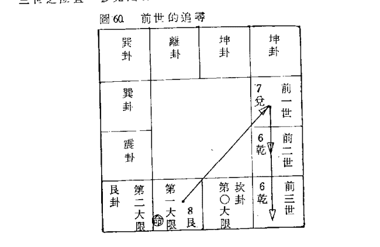

〔例40.〕命宫辰位，大限逆行，试求其前三世的宫位。（男命）
解：大限逆行，顺飞九宫，辰宫4巽，飞入5中宫，男借坤卦，故为2坤，入申宫为前一世，入未宫为前二世，再飞入亥宫6乾，为前三世。参见图61。

## 35 交易心法

古书说：易有三易，乃不易、变易、交易是也。
不易是常而不变，变易是变而有常（有规则的变化），交易是变而无常（不规则的变化），有点类似英文的不规则动词变化。

如图62所示：先天命属不易，所占天时有利，则不易的水平线可以往上平行移动，将相王侯不易的水准一定高居在上，而贫穷寒士水准一定居处低位。此乃与天俱来，人类无法改变它。
后天命属变易，乃大限的运行，有好有坏，一半控制在天，一半控制在人。
中天命属交易，人顶天立地，在天地之中，故曰中天，乃流年、流月、流日、流时之变化，随着工业时代和社会的进步而瞬息万变，70％控制在人的手中，论命者必须要有充份的资讯（Information），才能精确的预测出来。
台湾地区每95秒钟诞生一位婴儿，一个时辰（2小时）大约有76位婴儿降生，他们都拥有相同的命盘，只要有一位当附马爷，其他的人是否也顺理成章当起附马爷，恐怕也没有这么多的郡主可以招亲，所以里面隐藏着玉皇大帝的秘密，让松学居士娓娓道来。

### 图62. 三易说明

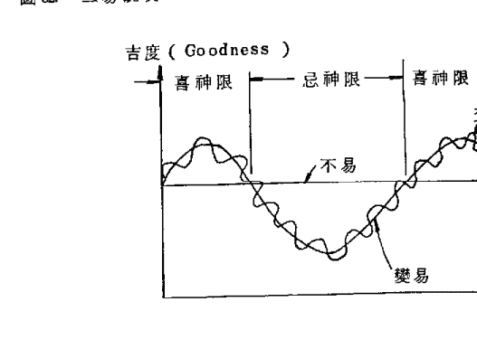

人类除了受刚降生一刹那时刻影响外，尚受后天环境的支配，例如：家庭背景、风水、配偶、道德、教育程度、职业等。
假如两个同时在某一医院接生的婴儿，一个抱往商人的家中，另一个抱回军人的家中，两者以后所受到家庭教育、父母思想不一样，而行为不尽相同，走向相异的人生旅途。
同样的道理，一个抱到城市，另一个抱到乡下，两者所受到的自然环境影响又不尽相同。
同样的道理，以后他们长大所从事的行业，和所结婚的对象，亦产生迥然相异的遭遇。如以婚配来说，有26万×26万＝676亿个合婚组合，若能夫妻命盘同断，其精密度提高甚大。
古书说：阴德最难评。积有阴德善功者，面相会改变，所以相学比较容易控制交易的情形，然而出生年月日时辰是固定的，显然不合逻辑，紫微斗数若能抓住交易的现象，才能算是高段斗数。

> 易经说：积善之家必有余庆。
孟子说：一德、二命、三风水，四积阴功，五读书。
孔子说：天作孽犹可为，自作孽不可活。

明代袁坤仪，本名黄坤仪，号了凡居士，早年学医，曾遇孔道人，指点他弃医读书，将来必金榜题名，并断他会考取第几名，连薪水多少都算出来，又说他命中无子，寿元53岁，结果一一应验。

有一次偶遇云谷禅师，指点他命由心造，福由心生，后来他立誓行三千功，结果不但生了一子，尚活到74岁无疾而终。

由以上的故事，我们可以知道，命运是活的，而出生年月日时辰是死的，用死的理论来批断活的实际问题，当然是不合理的。论命者所能控制的交易现象，应该是问命者的职业，江湖人士喜欢用套话，以达到投机取巧的目的，翰学居士以学术的眼光而言，不必用套话，直截了当询问我们所需的交易资料。

## 36.三强理论

所谓三强理论包括强宫、强星、强盘等三种理论。

强宫係指重点宫位，对当事人有重大影响的宫位。

强星係指重要星辰，对当事人有举足轻重的星辰。

强盘係指重要的运盘，三者来自交易心法的应用，因此命盘相同者，其强星、强宫、强盘不见得相同，使得斗数运盘体系，非常地活泼，而且变化莫测，有时会令人拍案叫绝，叹为观止。

从三强理论来看，强盘的变化较少，而强星和强宫随着当事人的行业或后天环境瞬息万变。

假设强星的组合有10种，强宫有12个位置，若再配合命身主的三元九宫，则命盘数可以增加10×12×3＝360倍，即259200×360＝93,312,000，计获约九千万个命盘，将近一亿，足以说尽人世间的变化了。

### 36.1.强宫理论

由于行业相异，其强宫亦异。譬如：船员、空姐、飞行员、司机，他们的强宫在迁移宫，该宫的好坏影响当事人甚巨，甚至要他的一条老命，所以保险公司最怕他们。

做生意的商人，其强宫在财帛宫及事业宫，其次是交友宫。如果交友宫凶，可能会被倒账，如果财帛宫不吉，则说不定要逃路收摊子。

薪水阶级的人，是领固定的薪金，财帛宫被钉得死死的，再好也轮不到他发财，反而事业宫是强宫，其次是交友宫，希望能获得上司的青睐，而升官发财。

家庭主妇的强宫在福德、夫妻、子女等三宫，希望能获得丰富的爱情生活，和幸福的家庭。职业妇女的强宫反而在事业宫。基于此原理，我们可以作抽爻换象，夫妻宫不佳的小姐们，你们可以把强宫转到事业宫来。

影视界和演艺界，由于人际关系的纵横复杂，及观众的五光十色，其强宫在交友宫，交友宫不佳的，则难遇伯乐，反之，可得贵人提拔，金马奔驰，而成为明日之星。

但是强宫并非一成不变，是随着当事人的行为和心态而瞬息万变。

譬如身体羸弱的人，其强宫通入疾厄宫，该宫稍有风吹草动，就要吃不完兜着走，甚至连一条老命都得赔掉，后来他参加什

历洗髓神功、瑜珈天地、有氧舞蹈，反而接触的人多了，疾厄宫转弱，迈入交友宫。

〔例41.〕乾造 38.、10.、16.、寅。

本例来自楚皇斗数不传心诀，P. 115。参考图63。

当事人是船员，水产学校毕业，31.岁升船长，月薪6万，32.岁11.月船失事，一去不返。

传统紫微斗数只重三方四正，事实上迁移宫是强宫，该宫的好坏，影响当事人甚巨。

先天迁移入丁卯宫，天相守是不错的，但是疾厄宫化忌自守，病符同行，须防疾病。身主化忌冲友，友忌冲迁移宫，白虎同行，须防出外受到血光之灾。

辛未大限，迁移宫守羊刃，飞出了的羊刃，又见冲动，化忌入疾厄宫冲大限身主，疾厄化忌入身宫，身宫化忌入迁移宫，身主的化忌也入迁移宫，形成循环交会忌入迁移宫。

32.岁庚申年，迁移宫守太阳化忌，大限文昌化忌来冲，身主入己未宫，文曲化忌双夹，疾厄宫化忌亦夹身主。

翰学观其身主入甲戌宫，化忌入寅宫，三合文曲化忌及太阳化忌，本可断其寿元五十几岁左右，可惜身主与相貌宫同位，有被伤害之虞，而且又是当船员，故危险性升高。

翰学再观其命主入丙子宫，飞出四化星，乃三奇嘉会，而且又守禄存，文曲化忌来冲，不可断禄逢冲破，乃辛劳工作之表现，因与田宅同宫，可断当事人很难在田宅内安居。

### 36.2 强星理论

对一位口嚼槟榔、穿拖鞋、着短裤的人来说，会了一大的科甲星、三台八座、龙池凤阁，并没有什么作用。

### 图63. 强宫的说明

| 火杀紫 | 大限命主 | 曲忌 | 流年身主 | 己31. | 庚32. | 吕忌 |
|---|---|---|---|---|---|---|
| 己财 | 庚子 | 辛亥 24.-33. | 壬兄 14.- | | | |
| 病梁机 | 命主 | 身主 | 38. 己丑 10. 月 16. 日 寅 | 乾造 | 虎空破贞 | |
| 戊厄 | 三 | 三 | | | 癸命 4.- | |
| 相 | | | | | 身主 | |
| 丁迁 | | | | | 甲父 1-3 | |
| 巨日 | 羊劫右左贪武 | 命铃存月同 | 陀马府 | | |
| 丙友 | 丁事 | 丙田 | 乙身 | | |

对一位军公教人员，会了一大堆的化禄星，如果他没有从事商业活动，这些禄星顿失威力，而坐失良机。

对一位婴儿，会了一大堆化权星，毫无意义可言。对一位商人，化禄星对他比较有意义，而化科星比较没有意义。

因此星辰对于人的强弱要辨别，这一颗星对张三有作用，但对李四可能没有作用。

有时间命者求问财运如何，此时与财运有关的强星是化禄、禄存，强宫兼取财帛宫、官禄宫来合断。

若问命求卜官运如何，则强星必然是化权、天官、龙凤，强宫是事业宫、交友宫。

此林林总总的交易心法，需要靠论命者的经验之累积，功力才能升高。

### 36. 3. 强盘理论

先天命盘是主掌一生的气运，后天命盘是主掌十年内一年以上的气运，流年命盘是主掌一年内一月以上的气运，流月盘是主掌一月内一日以上的气运，流日盘是主掌一日内一时辰以上的气运，流时盘是主掌一时辰内的气运。

曾有人问卜到外国投资是否可行？

翰学居士曰：到外国投资非一朝一夕可成，强盘取后天盘，先天盘次之，强宫取迁移、财帛、事业，强星取化禄、禄存。

又譬如在“命和运月刊”第12期（九月号），拙文“高段紫微斗数一强宫理论分析”，文中×小姐的实际命例，流年盘犯驿马，该盘掌一年内一月以上之气运，故翰学居士劝她作一个月以上的欧洲旅游，以化解六只驿马，其道理在此（文中没有解释为何要作一个月以上的旅游）。

以第30章的例32来说，抓钱的动作，只稍几分钟即可完成，故流时盘可视为强盘，而流日盘次之，此有点类似奇门遁甲的理论。

以大学联考而言，考试超过两天以上，故其强盘在流月而非流日，故断考大学应该流年、流月同断，则准确性较高。

## 37. 如何抽爻换象

抽爻换象来自易经八八六十四卦384爻，可应用在很多理论，最常见者是应用在炼丹学方面。

婴儿先天在母体中，头下脚上，是谓地天泰，落于后天凡尘，哇一声吸入空气，开始用肺部呼吸，坤乾二卦起变化，乾卦三中爻一点真性散于全身，填入坤卦三的中爻，而转变成水火未济，从此知寒感暖，而有七情六慾，因此炼丹者，必须紧闭六门或称六贼，深引呼吸入气于丹田（脐下四指），降龙（七情）伏虎（六慾），配合低心下气，心属火，肾属水，如是如是，则倒转火水，而成水火既济，然后再达本还原，将坎卦三中爻一点真性，复返离卦三的中爻，归位于原来面目乾坤之卦，乃天地定位，此称为抽爻换象。

抽爻换象亦可应用在阴宅学上，360度方位配以64卦，一卦代表一个方位，找一个合适方位给仙命（逝者），但众家兄弟不一定全合适，老大可能有利，而老二不一定有利，老三可能有损，此时再从一卦中可分六爻，选取一爻以趋吉避凶，这叫做抽爻换象。

翰学居士以科学的眼光来看，360度被384爻所细分，每爻不到1度（约有56'），机械伞齿轮的精密度也是到分而已，人为误差一定大于1度以上，所以用384爻来立方位是不可靠的。

翰学居士有一次看某一大师表演抽爻换象大法，钉了两根竹子立向，竹子的直径是4公分粗，一条绳子一公分直径，绳绑时，左旋和右旋的误差不一样，起码会误差一度以上，果然不出所料，坟墓建好后加以核对，误差了好几爻。

趋吉避凶是我们研究命学的目的，有几种人比较不畏六煞星，譬如：宗教人士、从事研究工作、星相学家、行善积德之士、修道士、炼气士等。

他们把六煞星由强转弱，对一位清心寡慾，长年素食的人来说，火铃化为低心下气，火气被洩，百病不侵。所以修心养性是趋吉避凶的不二法门。

又如化忌侵入福德宫，福德宫与财帛宫相照，两宫的卦象不一样，我们可以把化忌由福德宫通入财帛宫，乘财保福，多行布施、财施，则可称为抽爻换象。

除了把强星转弱，把弱星转强，或将对照的宫位互相抽爻换象卦，我们亦可透过强宫变弱，弱宫变强的手段，来作抽爻换象。

最常见的例子是身体衰弱的人，他的强宫在疾厄宫，可以用锻练的方法，把疾厄宫通入其他宫位或卦象。

一位身体残障的朋友，心理纳闷，自卑感重重，强宫通入福德卦象，可以用交友的方法，或学画图、文艺、音乐等手段，把福德宫通入其他卦象。

一般而言，化忌入疾厄或福德，两种情况下不太一样。疾厄宫係主外来的疾病或灾厄，例如细菌的侵入，此较难防。福德宫係主由内在的病痛，例如心理上的不健全，或享受过多而所发生的疾病，最常见者是吃肉太多，发生血脂肪过多，还有缺乏运动，色慾过多者等，所以应该减少享受才可使福德宫通变。

一位肯下苦功的修道士，当三千功圆，八百果满时，无极下丹书，位证九品莲台，超凡入圣，名列仙班，跳出三界外，不在五行中，不拘阴阳，此亦可称为抽爻换象，已修练成舍利子，金刚不坏之身。

是故抽爻换象在斗数的观点来说，与交易心法并属于无极，无极生太极，太极分阴阳，乃星辰属性和组合的活用，才能将太极的妙法发挥得淋漓尽致，十全十美。

翰学作结论如下：

- 无极一抽爻换象、交易心法。
- 太极一星性组合、格局。
- 三才一三盘的运用。
- 四象一飞星四化。
- 五行一喜忌神。
- 六爻一梅花易数。
- 七政一命主、身主所入12宫位的意义。
- 八卦一命身主配卦象。
- 九宫一流年卦、流月卦、流日卦、流时卦。

联合这九大方法，才可以称为是高段紫微斗数，威力极品，变化莫测，断命奇准，望各位读者努力修持，必可达到出神入化的功力。

## 38.飞星体系理论

飞星四化係指十天干所飞出的化禄、化权、化科、化忌等四星。

翰学居士在第15章P.45曾将庚干的四化借庚阳武府同来用，则四化的分布非常均匀，消除重覆出现的不公平现象。

事实上，四化星仅是飞星体系中一小部份，尚有其他飞星，我们可以发现，年干星系及年支星系，亦具有同等重要的飞星特性。

天干的飞星尚有禄存、羊、陀、贵人、文昌贵人、截路空亡、旬中空亡、红鸾、天官、天福等。

地支的飞星尚有火、铃、哭、虚、惊、喜、咸、和藏建系、将星系、博士系等。

其他的月系星、日系星、时系星，三系没有玄空飞星的作用。

### 38. 本盤飛星法

所謂本盤飛星，是在某一盤（先天盤、后天盤、流年盤、小限盤、流月盤、流日盤、流時盤）中起飛星，飛入某宮中，我們以該盤的宮位作解釋。

因為飛星的種類繁多，暫以化忌爲例作說明，其他者類推。

- (1) 自化忌：乃本宮自守化忌，用符號 ↺ 表示。
- (2) 自沖忌：乃對宮化忌來沖，用符號 ↻ 表示。
- (3) 射入忌：由一宮起化忌，射入另一宮，用符號 → 表示。
- (4) 射沖忌：由一宮起化忌，射入另一宮，但以對宮來作解說，用符號 → 表示。
- (5) 連環忌：第一宮起化忌射入第二宮，再起化忌又射入第三宮，以此類推，直到某一宮才自化或自沖而停止。參見圖64。若停在某宮，則該宮必然受害較大。
- (6) 循環忌：如果連環忌首尾相接，就要變成循環忌，永無停止，其威力甚大。
- (7) 糾纏忌：在連環忌或循環忌中，都是射入忌構成，如果射入忌和射沖忌並存，則稱為糾纏忌。
- (8) 交會忌：多宮的化忌交會於某一宮位，該宮所受侵害極烈。
- (9) 雙夾忌：即雙忌夾某一宮位。
- (10) 三夾忌：即雙忌夾忌於某一宮位。
- (11) 組合忌：由兩種以上諸類化忌構成。

#### 圖 64. 各種化忌

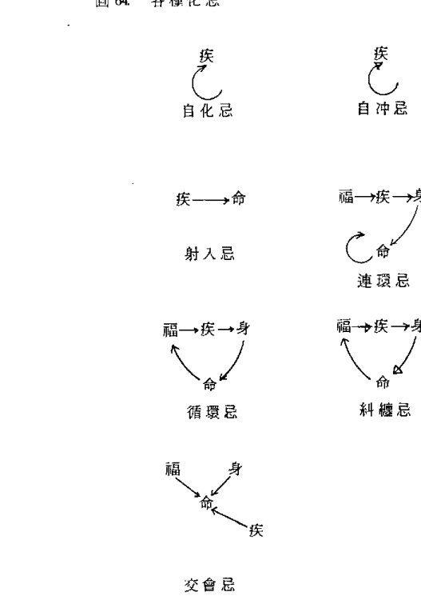

### 38. 2 跨盤飛星法

從某盤起飛星，飛跨到另一盤作解說，有的是從某人的命盤起飛星，飛跨到另外一人的命盤作解說，前者稱為單人跨盤飛星法，後者稱為雙人跨盤飛星法。

在雙人跨盤法中，這兩人必須是關係極密切，才會產生靈動力，譬如夫妻、父子、兄弟等。

在單人跨盤法中，又可區分為一級跨盤、二級跨盤，譬如：從流時盤起飛星，跨入流日盤作解說，叫做一級跨盤，若跨入流月盤作解釋，叫做二級跨盤（Two Stages）。

從理論上而言，一級跨盤的威力大於二級跨盤。茲將跨盤的條件分述於下（暫以化忌為例，其他類推）。

- (1) 同類忌：某宮起化忌，飛入跨盤同類宮位者。例如：流年交友宮起化忌，跨盤飛入大限交友宮。同類吉星（祿、權、科）喜三合，六合、三會、化合、同干（伏吟）。
- (2) 入命忌：起化忌跨盤飛入先天命宮或后天命宮或流年命宮者。例如：流年財帛宮化忌飛入大限命宮。
- (3) 沖命忌：起化忌跨盤飛沖先天命或后天命或流年命宮者。

## 39. 流年盤飛星的討論

流年盤是比較特殊的狀況，因為大家的流年盤是同干同支，其他的先天盤、后天盤、流月盤、流日盤、流時盤皆不相同，所以有必要在此討論一下。

由於紫府星系的分佈，大家不一樣，故四化星仍然喜歡本盤法，跨盤法威力較差。

但是祿存、流羊、流陀、魁、鉞、博士系、天官、天福、天廚、截路空亡、旬中空亡、馬、哭、虛、龍、鳳、驚喜、孤寡、墓、碎、咸、驛等星，由於同干同支的特性，大家的飛星都是一樣，故此等飛星喜作跨盤才有威力，本盤反而威力小。

例如：庚申流年，庚的祿存在申，那麼大家都是守流年祿存，所以失去意義，如果大限恰在寅或申，則威力才可顯現出來。

## 40. 真假化忌的探討

傳統斗數一遇到化忌，無不心驚肉跳，因為古書對化忌的描寫，使人誤解它的形象，所以惡名昭彰，猶如過街老鼠，人人喊打。

事實上，化忌雖然主不順或不利，但有時也主大的變動，如果論命者能懂得抽爻換象，把不利化成變動，足以有一番作為，因此化忌有所謂真假化忌之分。

紫微斗數秘笈有所謂逆水忌，如果化忌來沖或守，若起化忌三合，會把化忌阻擋回去，猶如逆水倒流，故謂逆水忌，將有突發性的進展。

翰學居士不以為然，化忌的真假繫於化祿或化權或化科的多寡而定，化祿多者，可轉變化忌為辛苦賺錢，化權多者可轉變化忌為辛勞創業，化科多者，可轉變化忌為燈火辛勤，用功讀書。試舉幾個例來證明本理論的正確，翰學居士盡量舉別人的著作來旁證，以免被人誤會是假造命例唬人。

〔例 42〕乾命 31、9、5、酉時，來自天地人紫微斗數玄空四化先天命格局闡微乙書（P.170）。參閱圖65。

解：據正玄大師稱，歲次戊午 發生靈動力，智慧大開，勤修禪功，70年頓悟天地人紫微斗數。

戊午年大師37歲，大限落入甲辰，有武曲化忌來沖，為何這一顆化忌轉化成燈火辛勤呢？翰學居士評論如下：

大師從南部來此開創，強宮取遷移、事業、財帛、命宮，強星取化科、化權、化祿。

甲辰限逢破軍化權，武曲化科，及左輔先天化科，可以說兩奇嘉會，而財帛宮是真正的三奇嘉會，故武忌轉化成辛苦創業和賺錢。

其次，遷移宮守后天科、武權三合天府化科，事業宮右科自照三合貪祿，財帛宮左輔雙科自守，計得五子登科，利於參禪悟道，故眾科將武忌轉化成有利的變動。

〔例43〕乾命27、1、20、午時。本例來自了無居士的著作現代紫微第②集（P.98）。參見圖66。

癸亥限投資房地產生意，結果一發如雷，賺進了大把鈔票，翰學居士試評論如下：

首先要了解社會背景，正當民國50年代和60年代初期，房地業是一枝獨秀，凡是有辦法插一腳者，無不大撈一筆財富而歸，所以當事人走入房地投機事業，在先天上已經迎合了時代潮流，故賺錢的勝算較大。

如今房地業一落千丈，既使有人的命盤聚集了一大堆的財星，翰學居士決不敢救他冒然行事，務必慎重世界性的不景氣，並非單靠乙張命盤，就可以起死回生，所以論命者須知時代背景。

猶如一個唐山大地震，死了80萬人，他們個個的命盤能發現死訊嗎？答案是否定的。

大限癸亥，貪狼三合火星，乃火貪格，有突發性的進展，而且權科夾三祿，雖然貪狼化忌，卻可被這些優良的格局轉化成辛苦創業。

因係投資房地業，強宮取事業、財帛、命宮、田宅，強星取化祿、化權。財帛宮化祿飛入事業宮，化權飛入命宮，事業宮化權飛入田宅，田宅宮化祿飛入命宮，化權飛入財帛宮。連先天后天命宮之祿權，計得5化祿、4化權，它們足以轉化貪忌為假化忌。

### 圖65 假化忌的說明

| 刑 鐵 巨 | 天命相貞 | 大限 大身主 梁 | 劫馬殺 |
| --- | --- | --- | --- |
| 丁 乙事 36. | 福主 戊 37. | 天宮 遷 | 戊 |
| 身貪 主 丙 35. | 命主 身主 壬午 9月 ⑤3. 西時 | | 大大 同 命限 主天福 己 身 |
| 甲 33.-42. | 桑柘木 | | 天陀武 官 庚 |
| 魁月 乙 34. | | | |
| 癸 23.- | | | |
| 空右府紫 | 曲昌機 | 羊左破 | 存日 |
| 權 | | 科 圖 | 圖 |
| 壬 13.- | 癸 命 3.- | 壬 | 辛 |

本書在財官闡微部分有說：投資經商空喜亡，多逢祿星可成功。由於五祿聚集，力量最鉅大者，莫過於財帛宮的化祿是武曲，武曲主財，更是相得益彰，財星如此之旺，逢空亡星兩顆，自然是利於投資。

### 圖66. 假化忌的說明

| 劫空 | 機 | 鐵火破榮 | 大身主 | 句馬 |
|---|---|---|---|---|
| 丁 病 | 戊 死 | 己 1-2 | 庚 3- 絕 | |
| 大左昌日 | 命主身主 | 乾命 | 亡刑鈐府 | |
| 丙 衰 | 戊寅正月20日18時 | 辛 13.- 胎 | |
| 威殺武 | 石榴木 | 陀右曲月 | |
| 乙 旺 | 壬 23.- 養 | |
| 梁同 | 身亡魁相主 | 命羊截巨主 | 存貞 | |
| 甲 臨 | 乙 冠 | 甲 沐 | 癸 33.- 42生 | |

## 41. 次級飛星的重要性

次級星包括乙級星以下之諸小飛星，他們對於斗數運盤具有舉足輕重的影響力，目前排盤流行只安甲級星，然後作飛星四化，完全漠視次級飛星在運盤中所扮演的角色。

一般問命不外有兩種模式，一種是求問婚姻、出國、升學、升官、事業、謀財、生子、健康、搬家等，這些問題可以輕而易舉的解答。

另一種是考問過去曾發生什麼事？未來又會發生什麼事？這是比較棘手的問題，此時需要求助次級飛星粉墨登場，來表演一些高段的特技，當場令人驚奇得目瞪口呆。

我們比較喜歡天地合斷，天指天干星系，地指地支星系，取出一干一支的飛星，其威力驚人，若再牽動四化星，則必發生大事。理論上，近似諸星聚集在某宮，該宮必然發生事情，可以說屢試不爽。

據翰學居士的學員劉君稱，在竹東地區有一高人，他斷紫微斗數亦是採用小行星。可見次級飛星的重要性了。

翰學居士試取乙例來說明次級星的運用。

〔例44.〕坤造22、12、14、辰，甲子限當密醫賺了五、六棟大樓。

身宮過到西，命身同宮，身主取代身宮，身主守天刑三合兩病星，由於甲子限拚命賺錢，乙丑限身體已不行了，強宮通入疾厄宮及身宮（由身主代之），乙丑限身主又飛入申宮，兩身重疊，牽動兩病，大病符飛入未宮，大藏病飛入子宫，結果双病夾后天命宮，大病符又來沖，身主、大限身主、疾厄宮重疊，三病來朝，加倍計算，共六病聚在疾厄宮，三病聚在命宮，幸沒有牽動化忌星，但在九病星的聚集，這個病一定不小。

流年盤與先天盤重疊，取小限盤巧用，49. 歲入癸未，雙忌來冲，四病夾病，49. 歲身主飛入己卯宮，文曲化忌入大限身主，看來情形不妙，詢問之，原來是膽結石開刀。

長庚出院后，在家休養，但始終未起色，延至50. 歲四月廿八日七點 55. 分病亡。如果再將50. 歲的小星排進命盤恐會混亂，由讀者自行試斷。

提示：50. 歲小限在壬午，化忌入大限，太陰化忌又對冲，是暗忌，兩宮被糾纏刑暗忌所侵。50. 歲身主飛入癸未宮，貪狼双忌來冲。

### 圖 67. 次級飛星的運用

| 虎鉞殺紫 | 49. 歲病壬 50 | 50. 大空火身主病符 己 癸 49 | 身大歲刑曲主限病 49. 病符 庚 1-2 |
|---|---|---|---|
| 丁財 | 戊 | 己 | 庚 1-2 |
| 病梁機符 | 命主：三 身主：三 | ② 坤造 癸酉 12. 月 4. ⑭12. 日辰時 蘇太 太石榴木 | 大破貞虎 辛 ④身 3- |
| 丙 | | | 壬 13- |
| 49.劫魁左相身主 乙 遷 | | | |
| 鈴巨日 ④ | 羊貪武 ④ | 大存月同歲病 ④ | 陀馬右府 |
| 甲 | 乙事 43.-52 | 甲 33.- | 癸 23.- |

## 42. 飛星牽動理論

打開紫微斗數的書本來看，具有飛星的星辰很多，少說亦有五、六十顆，在如此繁多的飛星，到底要取那幾顆來飛呢？或者是全部來飛呢？如果是採用前者方法是比較省時省力，但容易“漏接”，若採用后者，則不勝其煩，因此翰學居士在研究過程中，偶然發現了牽動理論。

譬如說：大限走入火星，火星是一顆飛星，牽動了火星的飛躍，我們可以從大限的地支飛出大限火星，簡稱大火，如果双火疊併，其凶熾盛，三合次之，此叫做飛星牽動。

另一種情況是：某宮飛星四化牽動，但不明其意圖時，我們亦可起相近似的飛星，來判斷其真正的意圖。

譬如說：遷移宮化忌自冲或自守，這有兩種可能，一種是發生車禍，一種是出外旅行，我們可以飛出截路空亡，和驛馬星，來加以判斷到底屬於那一種狀況，由於遷移化忌而牽動截空和天馬，我們亦可稱為飛星牽動。試舉乙例說明之。

〔例 45.〕乾造李××46.、潤 8.、8.、寅。

當事人兄長與翰學居士是好友，其兄拿其命盤來求問身體健康狀況。

潤 8. 月 8. 日調整為 8. 月 38. 日，身宮過到未位。

乙丑年 29. 歲，大限入乙巳宮，守火星、白虎，牽動火虎馬三顆飛星，大火飛入大限，双火疊併，大鈴飛入疾厄，亦是双鈴疊併，大虎飛入財帛而三合，大馬飛入遷移，亦是双馬疊併。

双火鈴分守命、疾，須要注意丙小腸或丁心或神經系統，詢問之，原來經年泄肚。

74. 年暑假由美返台，舊病復發（在美一年期間泄症稍止）。3 馬聚在大限遷移命身同宮加倍計算，共獲 6 馬，故巨門化忌牽動 6 馬，應斷出外遠行，不可斷車禍。

大限身主飛入丙午宮，化忌自沖，双鈴來沖，双虎來夾，恐有微恙。

流年身主飛入壬戌宮，又見化忌自沖，双虎來夾，命宮見大虎、双病符，身主見双病，今年恐有小病災。詢問之，原來七月份患輕微糖尿病，現已控制住，無大礙。

由本例可看出小行星的威力，不可忽視，可幫我們達到高段的層次。

按：病符是來自博士系，而歲病來自歲建系，一干一支合斷，其威力無與倫比。由於化忌星沒有發生作用，而歲病、病符分散，所以可斷為小病，而非大病。若兩病星及其所屬飛星聚在一起，那就非常恐怖了。

## 43. 六爻易數

六爻易數來自梅花易數的應用，翰學居士在13章 P.41.已經交代過，是北宋邵康節夫子所創，依年月日時起出乙卦，來斷其吉凶。

六爻易數應用在斗數有何作用呢？它到底是用來解決什麼問題呢？茲分述如下：

- (1) 解決只知道出生年月日，而不知出生時辰者。
- (2) 解決完全不知自己的出生年月日時者。
- (3) 解決一些疑難雜症，從斗數命盤無法找到答案者。
- (4) 解決一些大的刑案，可幫助治安當局智破凶案。
- (5) 可預測國運及世界局勢。

對於第一個問題，我們可以取問命的年月日時總和除 12，所得餘數即其時辰，如果來了兩個人以上，可以加其姓名筆劃，不同姓者，可只加其姓氏的筆劃來加以區別。

對於第二個問題，可以取問命者的卜命時刻來安命盤。

對於第三個問題，翰學居士願取乙例說明。

〔例 46.〕4 歲女童張××，家住新竹，於民國 73、9、8、亥時走失於露天野戲台附近。

翰學居士僅在報上看過這則新聞，因不認識她父母，只好取當時走失的時刻來起命盤，如圖 69.所示。

命坐貪狼，三奇嘉會，貪狼坐生鄉主長壽，可惜這些格局對論走失的問題轉變成作用力不大。

女童迷失的強宮在疾厄宮及交友宮，強星是化科及化忌，化科只有兩顆，貴人全無會到。命忌沖友，友忌入厄，厄忌入身主逢三虎，身主化忌入命，形成循環忌，看來凶多吉少，已被人所害，詢問之，至今尚未找到，已經快失蹤一年了。

尤其厲害者是空劫夾空亡，空亡諸星對遺失是強星，這一輩子恐難找出來了。

### 圖69. 女童迷失的六爻易數

| 機 | 銳破紫 | 流大虎 |
|---|---|---|
| 己遷 | 庚厄 | 辛財 | 壬子 |
| 日 | 身主 | 山頭火 | 73、9、8、亥 | 女命：張 × × | 重限身主 | 鈴府 |
| 戊友 | 三三 | | | | 癸 | |
| 羊曲殺武 | | | | | 旬劫月 |
| 丁事 | | | | | 甲兄 |
| 馬身存梁同主 | 陀火魁右左相 | 空巨 | 空貞 |
| 丙田 | 丁福 | 丙父 1-5 | 乙命 6-15生 |

第四個問題，有關重大刑案，亦可以起紫微斗數命盤，正玄山人的著作寫得很好，各位可以參閱”天地人紫微斗數心靈闡微” PP. 161 ～ 180，翰學不願在此侵犯他人的版權。

第五個問題，有關世局的預測，依立春交節起紫微斗數命盤。

中國居丑寅卯宮，東北亞日韓居卯辰宮，東南亞居巳宮，印度居午宮，中東居未宮，美國居申酉宮，歐加居戌亥宮，蘇俄居亥子丑宮。

東方國家屬男，西方屬女。

〔例47.〕1985 年的世局，73、12、15、卯交立春。

命守太陽落陷無力，尤嫌化忌，主 1985 年全年不樂觀，命宮化忌又是太陽，忌上加忌，太陽是主貴，富次之，故今年不論是政治或經濟，各國皆不理想。

東方國家陽男，身宮順調至庚午宮，乃石中隱玉，要經過一番努力，才能把玉取出來，太陽化祿，與祿來朝，是謂双祿交會，可惜化忌沖事業宮，美中不足。

西方國家陽女，身宮逆調至丙寅宮，空劫祿馬，吉中藏凶不美。

全局來看，西方國家比東方國家為凶。

中國大陸主宮在寅，天同化祿，乃双祿天馬逢空劫截空，雖有投資但損失亦多，不甚理想。

東南亞入己巳宮，火貪格兼三奇嘉會，可惜化忌沖其財帛宮，美中不足，經濟狀況還算不錯。

按：東南亞主要係指中華民國、新加坡、香港等重要區域。

美國本位在癸酉宮，化忌入其財帛宮，幸有三奇嘉會，尚不致很差。

歐洲本位在甲戌宮，守太陽双忌，是最差的地區。

蘇俄本位在子宫，祿權夾天機，兼逢同祿、機祿，將有大進展。

### 圖 70 六爻易數應用於世局預測

| 火貞貞 (祿) | 巨 東 | 曲昌鉞相 | 截空梁同 |
| :--- | :--- | :--- | :--- |
| 己 | 庚 (財墓旺) 辛 | 壬 | |
| 月 | 山 73 | 空 殺武 |
| 戊遷 | 頭 、12 | 亡 (科) |
| 左華府 | 火 、5, (15) | 癸 |
| 丁 | 卯 | 旬 日 |
| | | 中 (忌) |
| | | 甲 命 |
| 馬劫存 | 魁鈴陀破紫 | 機 | 空 右 |
| 西 | (祿) | | 亡 |
| 丙 (事 生) 丁 | 丙 | 乙 | |

上例必須查萬年曆，才能知道何時交立春，但萬年曆係以北京（東經 116.5°）為基準，預測當然以中原（中央戊己土）為標準，中原又稱中土，乃太極位。

我們亦可取各國的首都，交立春的時刻來作命盤。譬如：美國華盛頓（西經 77.5°），區域時差 = 4（-77.5° - 116.5°）= -4 × 194 = -776 分 = -12 小時 56 分。季節性時差 = -13 分。

1984 年 12 月 15 日 6 點 12 分交立春，換算成當地太陽時，華府的命理時辰 = -13 - 12.°56 + 15 日 6°12 = 4 日 30.°12 - 13.°9 = 14 日 17.°3。

即 12 月 14 日酉時交立春，我們依此來立命盤，乃美國次年之國運。

由於同一經度的國家首都很多，此時五行喜忌神非常重要，南方國家和北方國家的喜忌不同，首都靠山和靠水也不一樣。留待后面再論。

如果知道當事人的命盤，如何取六爻易數？依據問命的年月日時，找出其流時的命宮所處宮位，根據該宮的凶吉及所求問的事情而斷吉凶。

曾有人攜其命盤來求問翰學居士，他欲搬家是否可行，因其命盤已交還當事人，無法寫出讓各位研究。

翰學依其問命時刻找到他流時的命宮，此時強盤應該在流時盤，因係問命的一剎那所啟動的靈機。

發現該宮的遷移位，聚集很多截路空亡，因此勸他不要搬家。

一個月之後，他又回來找作者，認為翰學有通天地神明之功，怎麼知道不搬家有如此眾多的好處，生意逐漸好轉，顧客紛紛。進門，房東也不再漲房租，求問到底是用什麼方法看的，怎麼他都看不出來。

翰學再舉乙例來說明六爻易數的妙用。

〔例46〕坤造羅××，41、5、10、卯，於74、7、12、亥問命，卜婚姻緣份何時到來。

羅小姐命坐日梁，三合昌曲祿存，乃陽梁昌祿格，兼祿文拱命，双祿交會，連一顆甲級煞星皆無遇到，算是很好的格局，可惜夫忌飛入子女宮，與先天化忌双忌夾守，命忌亦是飛入夾守夫宮，双忌交會於夫宮，主事業盛而婚姻遲。

大限壬子，夫宮庚戌，化忌又飛入先天夫宮，是厲害的刑忌兼同類忌。

看來情況不妙，再起六爻，七月入壬午宮，12日入丁巳宮，亥時入甲辰。

因婚姻緣份很難確定那一年，故強盤取大限，飛出大限一些飛星，結果大限、流月、流日、流時所有空亡皆聚集在流時的夫宮，且又牽動武曲三忌，看來姻緣無望，否則當人家的姨太太。翰學居士知道玄機之後，不敢明講，只道她婚姻稍晚，一切不錯。

所以翰學不願涉足算命界，算到人家的命不錯，翰學可以滔滔不絕的說，與人共享這一份喜悅，但算到不佳時，總是嗯啊一番，不敢明講，以免讓人家心理很難過，翰學也與人分擔了這一份悲痛。

今年五月中，曾經驚動了地方幾位人上，前往寒舍，催促翰學居士下山，但皆被翰學所拒，實在很抱歉，他們的好意翰學心領，翰學可以如大家心願，寫一本較具水準的書來貢獻給眾生，這是翰學居士能力所及的地方。

### 圖71. 六爻易數應用於斷婚姻

| 12 姚鉞火機 日 (丁) 乙福 | 7 旬右紫 月 (壬) 丙 | 亡曲昌 丁 | 流左空破 時裁 戊 |
|---|---|---|---|
| 亥 殺 時 (甲) 甲 | 74 (41) 坤 、 壬 造 ： 7 辰 ： 年 羅 、 5 × 12 月 × 、 10. 亥 日 時 卯 金箔金 | 流時亡 己 (身) | 咸 陀府貞 庚 |
| 大大亡鉞梁日 亡亡駕 流時 笑亡 (命) 4- | 鈴巨同 | 騰羊貪 | 驁存月 |
| 大流大截劫相武 旬時截 旬 (忌) 壬 14- | 癸夫 24- | 壬 34-43. | 辛 |

## 44.五行的強度

翰學前幾章已談到三盤、四化、六爻、七政、八卦、九宮，獨缺五行未講，因為五行的理論很深，是子平八字的精華，非翰學在此三兩章所能論盡。

陽宅陰宅一般論五行，只重生剋而忽略五行的強度，這是不正確的，此猶如大禹的父親鯀治水，水的強度實在太強，不宜用堤防阻擋，而宜用禹來疏導，故知五行強度者，則已窺知天地間宇宙萬物的奧秘。

五行的強度依次為：強、旺、中庸、衰、弱。

佔盡天時地利人和者，五行屬強，僅佔其中兩項者屬旺，不佔其中兩項者屬衰，三項付之闕如者屬弱。

中和是我們所追求的目標。中庸說：中也者天下之大本也；和也者，天下之達道也。致中和，天地位焉，萬物生焉。

善哉斯言也，若我們可以找到中心點（中和的條件），則稱為用神。

幫助用神者稱為喜神，妨害用神者稱為忌神，幫助忌神行凶者稱為仇神，兩方皆不幫助也不妨害者，稱為閒神。

五行得天時的幫助，我們稱為得令。得地利的幫助，我們稱為得地。得黨多的幫助，我們稱為得勢。

淵海子平論五行強度喜忌如下所記：

- (1)金旺得火方成器皿
火旺得水方成相濟
水旺得土方成池沼
土旺得木方成疏道
木旺得金方成棟樑

- (2)金賴土生但土多金埋
土賴火生但火多土焦
火賴木生但木多火熾
木賴水生但水多木漂
水賴金生但金多水濁

- (3)金能剋木但木多金缺
木能剋土但土多木折
土能剋水但水多土流
水能剋火但火多水熱
火能剋金但金多火熄

- (4)金弱遇火則銷熔
火弱遇水則熄滅
水弱遇土則淤塞
土弱遇木則傾陷
木弱遇金則砍折

- (5)強金得水方挫其鋒
強水得木方洩其勢
強木得火方化其頑
強火得土方止其餒
強土得金方制其壅

- (6)水多金沉
木多水縮
火多木焚
土多火晦
金多土變

其次談用神的選取方法，茲分述於下：

- (1)扶抑法：旺者宜剋，衰者宜扶。

- (2)通關法：兩相剋五行之氣，其強度相當，互不相讓，若能找到緩衝者，可將兩相剋的五行轉化成相生的關係。
例如：水火相剋，強度相當，互不相讓，若能取木來緩衝，則水可生木，木又可生火，五行一派相生通暢，此謂之通關法。

- (3)調候法：由於天時的寒暖，地道的燥濕，五行不調，人體得病，故寒冬出生者，宜用火溫之，炎夏出生者，宜用水滋潤，此謂之調候法。

- (4)病藥法：本法乃綜合上述三種方法而作全盤性的取用。

（4.1）五行太旺，叫做旺病，須下損藥，將它消除，則病自癒。

（4.2）五行太衰，叫做衰病，須下益藥，將它補充，則病自癒。

## 45.六十甲子五行納音玄機

### 45.1.金納音

甲子乙丑海中金為旺，出生在海邊者，金氣轉強，出生在內陸者，金氣中等。

甲午乙未沙中金為衰，出生在河邊者，金氣中等。

庚辰辛巳白蠟金為衰，庚戌辛亥釵釧金為衰。

壬寅癸卯金箔金為衰，壬申癸酉劍鋒金為旺。

### 45.2.水納音

甲寅乙卯大溪水為旺，出生在大河流邊者，水氣轉強。甲申乙酉泉井水為衰。

丙子丁丑澗下水為衰，丙午丁未天河水為旺，下大雨天出生者，水氣轉強，晴天出大太陽出生者，水氣中等。

壬辰癸巳長流水為衰。壬戌癸亥大海水為旺，出生在海邊者，水氣轉強，在內陸出生者，水氣中等。

### 45.3.木納音

戊辰己巳大林木為旺，出生在森林區者，木氣轉強。戊戌己亥平地木為衰，出生在潮地者，木氣中等，但生在乾地者，木氣轉弱。

庚寅辛卯松柏木為旺，生長在寒帶者，木氣轉強，生長在熱帶者，木氣中等。

壬子癸丑桑柘木為衰，生長在溫帶者，木氣為中等。壬午癸未楊柳木為衰，出生在南方或春夏天者，木氣中等。

### 45.4.火納音

甲辰乙巳覆燈火為衰。甲戌乙亥山頭火為衰，生長在高山上者，火氣轉弱。

丙寅丁卯爐中火為衰，生長在水邊者轉弱，出生在南方轉為中等。

丙申丁酉山下火為衰，南方或夏天出生者，火氣中等，北方或冬天出生者，火氣轉弱。

戊子己丑霹靂火為旺，逢炮火戰地附近轉強。戊午己未天上火為旺，逢大太陽日出生者轉強，逢陰雨天轉為中等。

### 45.5.土納音

丙辰丁巳沙中土為衰，丙戌丁亥屋上土為衰。

戊寅己卯城頭土為旺，戊申己酉大驛土為旺。

庚子辛丑壁上土為衰，庚午辛未路旁土為旺。

以上翰學居士所說六十甲子五行納音，暗藏玄機，一般人不知要運用，由於它與當事人的出生地和氣候有密切關係，可惜父母親不會注意這些瑣碎細事，以致於喜忌神不能使命盤數增加，事實上，我們所輸入的資料，除了年、月、日、時、性別、行業之外，若能再增加天氣、區域，則喜忌神可充當非常重要的角色。

## 46.四季天時對五行的關係

正月出生者，春木臨官，火氣生長，金氣入絕，水氣入病。

二月出生者，春木帝旺，火氣沐浴，金氣入胎，水氣入死。

三月出生者，濕土當令，木氣轉衰，火氣冠帶，金氣入養，水氣入墓。

四月出生者，夏火臨官，金氣長生，水氣入絕，木氣入病。
五月出生者，夏火帝旺，金氣沐浴，水氣入胎，木氣入死。
六月出生者，燥土當令，火氣轉衰，金氣冠帶，水氣入養。
七月出生者，金氣臨官，火氣入病，水氣長生，木氣入絕。
八月出生者，秋金帝旺，水氣沐浴，木氣入胎，火氣入死。
九月出生者，厚土當令，金氣轉衰，水氣冠帶，木氣入養，火氣入墓。

十月出生者，水氣臨官，木氣長生，火氣入絕，金氣入病。
十一月出生者，水氣帝旺，木氣沐浴，火氣入胎，金氣入死。
十二月出生者，水氣轉衰，木氣冠帶，火氣入養，寒土當令，金氣入墓。

一般論喜忌，可分為星性及宮氣，翰學居士係由地支、天干、納音取出喜忌，故大限、本命以星性為主，宮氣為輔，所謂宮氣乃宮中之干支。我們經常會遇到喜忌混雜，應該轉看四化星為主。但在流年、小限、流月、流日、流時，仍然以宮氣為主，即命宮之干支屬性為重。

## 47.取喜忌神的方法

由於前節所言，一般人都忽略了出生的氣候及區域，故喜忌神的威力降低，所取出的五行喜忌不一定正確。
喜忌神的組合共有10組，如下所示：

| 喜神 | 忌神 |
| :--- | :--- |
| 木火 | 土金或金水 |
| 火土 | 金水或水木 |
| 土金 | 水木或木火 |
| 金水 | 木火或火土 |
| 水木 | 火土或土金 |

高段紫微斗數的體系，身宮作了調整，我們應該以新的身宮作基準。
理論上，不同出生日者，其五行喜忌不同，不同性別者，其五行喜忌亦不同，茲將取喜忌神法則分述如下：
(1)取命宮和身宮的地支五行氣，如果命身三合或三會，要作合或會來看。
(2)其次取命宮及身宮的五行納音。
(3)再取出生月份的五行盛衰。
(4)最後依全盤五行的盛衰來定出喜神忌神。
茲舉數例以說明之。

〔例49〕乾造中華民國1911、11、13、亥。
命宮坐丑，身宮逆調到酉，丑酉半合金局，五行納音各為壁上土及山下火。
11月水旺、木沐浴。山下火和壁上土無力制水，故金水兩旺，喜火土來制金水，忌金水。
中華民國命坐巨門、天同，兩星皆屬水，故為忌神星，幸巨門化祿轉為土，否則實在多災多難，尤其建都在東海邊，山下火和壁上土皆轉弱，無力制金水。
三合祿存，乃双祿交會，又逢鈴星，煞星只有一顆，全局來看不錯。
財帛宮三奇嘉會，有益於經濟發展。
初限忌神星不佳。庚子限貪狼木為閑神。乙亥限月昌皆屬金水當運，非常不美，尤其月忌三合文曲化忌，查該限正值抗日戰爭。
戊戌限火土喜神星當運，可惜羊劫同行，美中不足，所以日本投降為喜，緊接著又是大陸變色為憂。

丁酉限火土喜神星當運，建設台灣為三民主義模範省，而且是三奇嘉會，鈴星被制伏住。

丙申限水星當運不美，幸三奇夾照。乙未限借巨同來看，水星當運不美，但三奇嘉會，且其財帛宮亦兩三奇嘉會，從外交困境中發展經濟。

甲午限火土當運，其化祿、祿存來朝，且三奇夾科於財帛宮，經濟局面將有長足的進步。

翰學居士從身主中，看出中華民國的壽元很長，身主入庚寅宮，被三奇夾，飛出四化，日祿與巨祿双夾，武曲化權自守，天府化科三合，身主很旺。

身宮也逢天同化權，天機化科，可惜巨門化忌，大致來說，身宮也是屬旺。

〔例50.〕乾造雷根總統，1911、1、8、丑。

命坐丑土，身坐卯木，五行納音各為壁上土、松柏木。

正月木臨官，壁上土力量不夠，松柏木為旺，双木助卯木，故喜金制木，土來助金，忌水木。

乙未限金木星當運，喜忌皆有，轉看四化星，双祿權夾財帛宮，双科照事業宮，真是他一生的大好機會。而且武貪重逢，最喜中老年人。

70歲庚申年，金氣當運，喜神正逢，一舉成名，該年逢双祿双權（先后天），又逢武曲化祿，及天同化忌，因祿權很多，化忌轉變成辛苦競選。

辛酉年守文昌双化忌，但逢三科，力不足以轉化成假化忌，身主飛入甲子宮，沒有牽動化忌，被人刺殺，有驚無險。

乙丑年木土當運，喜忌皆有，轉看四化，事業宮守三科，財帛宮逢三科及双祿權夾照，財官双美，是本大限之最佳一年，果然再度當選。

### 圖72 中華民國的喜忌神

| 機 | 鈴紫 | 刑 | 陀火破 |
|---|---|---|---|
| 癸 | 甲 75-84. | 乙 65- | 丙 55- |
| 殺 | 命主 : 三 | 身主 : 三 | 五行局 : 壁上土 |
| 壬 | | | (1911)乾造 : 中華民國 |
| | | | 辛亥 11月 13日 亥時 |
| 曲梁日 | | | 鈴存 |
| 科 祿 | | | 丁 45.- |
| 辛 | | | 羊劫貞府 |
| | | | 圓 |
| | | | 戊 35.- |
| 魁左馬武相 | 巨同 | 空右貞 | 昌月 |
| 身主 | 祿 | 甲 74. | 癸 73. |
| 庚 | 辛 5 75 | 庚 15.- | 己 25.- |

〔例51.〕乾造1910、11、12、辰。46歲乙未年7月9日病故。

先天命的追蹤

命中身辰，命身拱水局，納音泉井水、金箔金，兩者俱衰。

11月水帝旺，全局水旺，喜土制水，火來生土，忌金水。

身主入壬午宮宮氣水火俱有，星辰機昌，木金俱到，忌神稍旺，轉看四化星。

身主守白虎，病符亥沖，化忌入疾，厄忌沖命，身忌沖命，可斷其壽元約三、四十歲。

后天命的追蹤：
巨右皆水，忌神當運。
命宮化忌自沖。
身主入丁亥宮，化忌入命宮。
疾厄宮化忌入身主，形成連環忌。疾→身→命。
兩病聚集在身主，一病在命宮。

流年乙未的追蹤：

乙未年木土，喜神微現，須兼看四化星。
身主飛入甲午宮，三合天機化忌（后天）、天同化忌（先天）、太陰化忌（中天），主身體有變。
身主聚集了二病，且双虎夾命。
疾宮自化忌，天同双忌守。
身宮化忌入身主，身主化忌夾身宮，形成循環忌。

流月 4 月的追蹤：
七月飛入癸未宮，水土喜忌兼有，轉看四化星。

流月身主 = R ($\frac{15 - 7}{9}$) = 8，飛入戊寅宮。

身主天機化忌，又見天機、太陰、天同三忌鼎立大凶。
身主、疾厄重疊，其凶可知矣！
身宮己卯，文曲又化忌沖身主。

〔例52〕乾造 1910 、5 、24 、亥。8 歲丁巳年 5 月病故。
本例來自香火雜誌，乃吳情大師所蒐巢。
身宮順調到未，命宮重疊未土旺，納音楊柳木衰。
5 月火帝旺生未土，金局土旺，喜木制土，水助木，忌火土。

先天命追蹤如下：命坐天府忌土，對宮廉貞忌火，可說一片火土忌星。疾厄戊干天機化忌自沖，牽動另一鈐星同宮。
牽動陀羅，癸午飛出，三合另一陀羅。

身主壬午宮，亦是火氣忌星，幸權科夾祿，但逢白虎、火鈐、空劫，牽動了火鈐，乃双火鈐來侵，可斷神經系統或循環系統受到損害。

后天命取小限盤為用，追蹤如下：
身主取戊午宮為用，化忌沖疾厄宮。

### 圖74 喜忌神求法

| 虎昌機 | 身主 虎昌機 | 七空陀破柴 | 大馬存曲 |
|---|---|---|---|
| 辛 | 流年身主 | (癸) 乙 | 甲 2- |
| 日 | 大限巨右忌神星 | 身主 (1910) 乾造：庚戊 11. 12. 12. 日辰 泉中水 | 藏羊府 病 (科) |
| 庚 (身) | | | 乙 12- |
| 大病符 | 劫武殺 (權) | | 大月陀 |
| 己厄 | | | 丙 |
| 七月身主 | 左同梁 (忌) | 斗君 相 | 病大右巨 符羊 | 流大大大貪食 病身歲存主病 |
| 戊遷 | 己 | 戊事 42-51. | 丁 32- |

疾厄宮化忌奔回身主，乃凶惡的科權忌。
命宮己未，身主戊午，宮氣皆是火土，忌神當令。
流年丁已追蹤如下：
丁巳年又見火氣，忌神當旺。
身主入庚申宮，三合天同双化忌。又被双虎所夾沖。
疾厄宮化忌自沖。

流月5月的追蹤：

流月身主 = R ( 12 - 5 / 9 ) = 7 ，飛入己酉宮。

疾厄宮自化忌。
身主自冲忌，文曲双忌来冲。
流月甲辰，木土喜忌兼有，轉看四化星流年巨門化忌来冲。

### 圖75. 喜忌神求法

| 破武 (權) | 虎身右鉞日 主 (祿) | 陀府 (科) 3-12 | 流年身主 左存月機 |
|---|---|---|---|
| 辛 丁 | 壬 1-2 戊 | 癸 (命) (忌) 己 | 甲 庚 |
| 五月 (甲) 庚 | 病同 (忌) 丙 | (1910) 庚戊 5月 24日亥 楊柳木 | 歲羊貪柴 流月身主 病 乙 (己) 辛 |
| 曲 (忌) | | | 劫巨 |
| 己 財 乙 | | | 丙 壬 |
| 魁鈴 | 殺貞 | 空火梁 | 昌相 |
| 戊 甲 | 己遷 乙 | 戊 甲 | 丁事 癸 |

〔例53.〕坤造美國，1984、12、14、酉交立春，試論1985年的國運。本例屬六交易數。

命身三會木局，納音大林木旺，炉中火衰，華府居北方海邊，大林木轉強，炉中火轉弱。

12月寒土當令，被大林木所制，全局仍然木旺，喜金來制，土來生助，忌水木。

命坐機梁，木土喜忌兼有，宮氣土當令，五行不錯，兼看四化，命忌自守且身宮羊陀夾忌，命身由吉神轉爲下吉。

### 圖76. 例53之喜忌神求法

| 柴殺 | 鈴鐵 | 劫 |
|---|---|---|
| 己 | 庚 | 辛 | 壬事 |
| 梁機 | 忌 喜 命 身 (1984)坤造 | 破貞 |
| 圖 | 水 金 主 主 日 甲子 12月14日酉 | 權祿 |
| 戊 命 | 木 土 交立春 | 癸 |
| 羊左相 | | 甲遷 |
| 空馬存巨日 | 陀曲昌貪武 | 命月同 | 火右府 |
| 忌 | 科 | 主 圖 | |
| 丙 身 | 丁 | 丙 財 | 乙 |

事業宮存、忌、空劫，乃祿逢沖破，但被祿權、科所夾，又遇天梁化祿，仍有一番進展，但幅度不大。

財帛宮祿權三合，財政稍見改善。命主坐月同，逢本宮之祿權，是不錯的際遇。

乙丑年木土喜忌兼有，四化星轉變成重要因素，全局來看，雖有進展，但步伐不大。

〔例54.〕坤造1895、3、4、酉。交際花之命，22歲從良當小星（姨太太），30歲病亡。本例來自吳俊民大著P.641。

命身丑未土旺，納音楊柳木衰，天上火旺，3月濕土當令，全局火土旺，喜水木來制，忌火土。

命坐華蓋主孤，對宮武貪昌曲，楊妃好色合昌曲，姚祿沖福主淫蕩。

咸、驛聚友宮，主好交際。命主交友宮重疊，顯然不妙，可斷爲交際花。

身主入壬午宮，太陰化忌來沖，化忌飛入身宮沖命宮，身宮化忌自守，命忌自沖，三忌（身主、身宮、命宮）交會於身宮，可斷壽元不長，約三、四十歲。

命宮喜神當頭坐，但宮氣忌神當令不美，轉看四化星。

大限甲申，喜忌兼俱，轉看四化星，命忌自沖，三合月忌，幸被貞祿破權，和貪科所夾，又三合機祿、梁權，化忌轉變成假化忌，辛苦賺錢，一定賺了不少錢。

強宮取財帛、事業、命主（辛巳宮），會了不少祿權科，化忌的凶性變成辛勞。

30歲甲子年，乃民國13年，身主入己未宮。

命宮守太陰双忌（先天、后天），身主化忌自沖，身主又與疾厄宮重疊，主病故。又命忌双夾照身主。

本來甲子年，喜神當運，應該可以跳過去，但陰德最難評，當事人以前作交際花時，一定會作過陰惡，所以難逃忌星的肆虐。

### 圖 77. 五行喜忌求法

| 甲限命主辛夫 | 殺紫科 | 左身鑑主 | 癸命 3-12 | 30歲身主 | 華 | 右孤鶩劫 | 甲 13-22 |
|---|---|---|---|---|---|---|---|
| 羊刃機祿 | 忌喜命身 | 火水主主 | 土木 | (1895)坤造：乙未 3月初4酉 | 交際花 | 破貞 | 乙 23-32 |
| 庚 | | | | | | | |
| 姚存相 | | | | | | | |
| 己財 | | | | | | 丙 | |
| 空陀巨日 | 昌曲貪武 | 命主 | 咸月同 | 忌 | 府 | |
| 戊 | 己遷身 | 戊友 | 甲 30. | 丁事 | | |

## 48.星辰與個性、職業的關係

### 48. 1. 紫微星

個性穩重、沈著、愛面子、外剛內柔，有領導力，有管理才華。

遇到不如意的事，表面無所謂，但內心痛苦。有領袖慾，但若沒有實際能力，容易徒具虛名。

男性適合的行業是：公司職員、實業家、政治家。

女性會有美貌及細膩的皮膚，禮節端正，有高度教養。紫貪則多情善感，有異性緣。紫殺（巳亥）則自尊心強。

- (1)紫微居子，獨立個性，孤獨，脾氣暴躁。宜公教，若不逢空劫可經商。
- (2)紫微居午，有獨特見解，高超的理想，喜歡領導，卓然不群的個性，喜研哲理宗教。若加科甲星，宜學術研究，或文藝界。
- (3)紫破居丑未，思慮多，辛勞多，為人耿直，有決斷，有領導力，獨立個性，喜創新，富多采多姿的生活。宜政界發展，若煞星多，則多思慮，宜武職或服務業，不宜經商。華蓋同行可為宗界領袖。
- (4)紫府居寅申，為人厚重溫良，聰明多才，謹慎保守，有領導力，但兩星太強，幼年有災傷，或與父母無緣。宜服務業、公職、民營大企業。女命宜家庭主婦。
- (5)紫貪卯酉，為人興趣廣泛，男命貪酒色財氣，女命擅家政女紅，及做人處世之道。不遇桃花星、煞星，則為人爽直，性格堅強，反應敏捷，才幹優越，愛好文藝，有才藝能力，語文天才，女擅烹飪編織，可文可武。會空劫宗教界發展，加羊刃宜美容、燙髮、緞帶編花。
- (6)紫貪居辰戌，為人有正義感，個性溫和，處事謹慎，樂於助人。

### 48. 2. 天機星

個性機巧，勤勞，謹慎，作事有計劃，善於安排局面，喜幻想，有卓越的策劃能力，獨創的構想，較不會違逆別人的意見。

聰明而富有研究心，心地善良，有時處理事務過於急躁，喜歡研究哲學、宗教、星命，有透澈的洞察力及分析力。

男性面貌精悍，眼睛銳利，尊重禮節，性格溫和，深獲大家的信賴，適合廣告設計家、雜誌編輯家、研究學術、藝術家、畫家。

加昌曲有卓越參謀才能，喜會機月同梁，卓越的企劃頭腦。加巨門可成就思想家、藝術家。加空劫是宗教家。

女性身影稍瘦、沈著、細緻周到，能體貼男性，是賢妻良母型，教子嚴格。

- (1)天機居子午，辦事能力強，有口才，處事有條理，反應敏捷，遇煞星是專門技術人員，遇吉星可從醫或律師。若對宮巨門化權可從事文化界、教育界，或大眾傳播界。女命宜職業婦女。
- (2)天機居丑未，宜服務業，不宜自力經商。
- (3)機月居寅申，男命易與女性接近，女命具有女性美，理家有力。宜擔任公職，或民營機構任職。若加桃花星可以從事演藝工作。
- (4)機巨居卯酉，個性堅強，有主見及口才，多學多能，思應敏捷，易惹是非，宜服公職。
- (5)機梁居辰戌宮，心地慈善溫和，才能佳，品格清高，聰明機敏，善策劃分析，宜服務業。
- (6)天機在巳亥宮，男命溫柔多情，有異性緣，宜公、文教職。

### 48. 3. 太陽星

個性急躁、激烈，做事積極，用錢慷慨，好動，喜外出，氣魄充沛，易誇大出風頭，不受人指揮。

重信用的社交，熱心照顧別人，行動敏捷，是天生的運動家，爽快善言，有度量。

女性有剛強的性格，喜奪夫權，宜嫁性情溫和的配偶。

男性宜事務員、政治家、土木工程師，建築師。女性宜經營百貨，高級設計師，旅行社，小餐館等服務業。

- (1)太陽居子，宜公、教職，或一般民營機構的事務工作。
- (2)日月居丑，個性保守，謹慎，循規蹈矩，能自得其樂，宜公教職，或民營企業，不宜經商。女命兼備兩性之美，可把家庭和事業兼顧，而且做得不錯。
- (3)巨日居寅，志向遠大，有理想及抱負，個性穩重謹慎，風度好，修養佳。最宜任教職，有寬容博愛的涵養，學養俱佳，是一位好老師。其次宜研究學問或藝術，或為外交家、演藝家、傳播家、法律家，最不宜經商。
- (4)陽梁居卯，有文藝天才，為人熱心正直，喜助人，不與人計較，考運不錯，可任公職。
- (5)太陽居辰，為人熱心正直，聰明機智，宜文教界、傳播界、外交界。女命事業非凡，不讓鬚眉。
- (6)太陽居巳，志向遠大，熱心正直，主貴，宜公教界發展。
- (7)太陽居午，個性孤獨，應注意健康（循環系統、神經系統），宜文教界或公職。女命貞潔淑美，可為職業婦女。
- (8)日月居未，個性孤立，愛求表現，不考慮現實，度量沒有顯旺的宮位大。宜公教職，或民營企業，不宜經商。
- (9)太陽居申，為人隨和，不計得失，心情快樂，但時常先勤后惰。宜文教界，作育英才。
- (10)陽梁居酉，宜文藝界、公教界，亦宜研究易理、宗教。
- (11)太陽居戌，奔忙碌碌，宜公教界。
- (12)太陽居亥，雖辛勞奔忙，但有專門學識和技能，宜公教界或傳播界。

### 48. 4. 武曲星

個性堅強明朗，爽快乾脆，行動敏捷，有決斷力，但易暴怒，急求事功，稍欠思慮。

身材中等，肌肉結實，聲音較高。

女性雖貌美，但脾氣太過激烈，妻奪夫權。

男性宜武職或技術類或理財類，例如警官、軍人、土木、建築、銀行員、不動產買賣。

女性宜經營餐廳、寶石、商、教師、職業婦女。

- (1)武府居子宫，性情溫良厚重，聰明有為，剛強耿直。無空劫可經商致富，有煞星宜公職或武職。
- (2)武貪居丑未，多才多藝，喜交際，女善家事女紅，但性剛。宜經商珠寶、裝璜、畫廊，有煞星宜文藝界，加羊刃宜特殊技能。
- (3)武相居寅宮，為人誠懇持重，樂於助人，富正義感，處事謹慎，性剛，有忍讓力。宜幕僚人員、政界發展，或替人服務。
- (4)武殺居卯酉，性急而能幹，聰明機智，有魄力謀略，志向遠大，宜公職、政界、或民營企業，遇祿星可經商。
- (5)武曲居辰戌，文武皆宜，文可任民營企業或公職，武可任軍旅中之儒將，或專門技術。
- (6)武破居巳亥宮，個性剛強，性情爽直。逢昌曲宜學術研究，宜公教界任職，加祿星宜金融界任職，但不宜經商。

### 48. 5. 天同星

個性親切、隨和，樂觀有趣，純樸悠閒，喜安逸，較軟弱，通才但不精。

性格溫和，好奇心強，謙遜有禮，人緣好，不隨便生氣，會聽取別人的意見。面型方圓，兩頰豐滿，女性天生皮膚白皙，肌肉細膩，美貌天仙。

男性宜接客廣泛的行業，例如銀行業、餐飲服務業。女性宜流行設計師、寶石業，或大公司的秘書。

- (1)同月居子午，個性倜儻，女性容貌秀麗，溫柔賢淑，善美容、料理、家務。宜公教文職，加羊刃宜武職。
- (2)同巨居丑未，宜企業界或傳播界，女性社會服務。
- (3)同梁居寅申，性情溫和，思想清高，外表木訥，內涵精細，心地善良，處事隨和，宜傳播界、文化事業、出版著述、公職。
- (4)天同居卯酉，喜好文藝，及悠閒生活，宜傳播界、文教界。女命保守謹慎、淑美，可成為賢妻良母。
- (5)天同居辰戌，甚宜教職、新聞界、民意代表。女命秀麗稍減，宜教職、著述、出版、研究學問。
- (6)天同居亥入廟，反使人沈溺於安樂，遇事懶散，喜煞星來激發他進取。天同居巳亥宮，宜公職或民營企業。女命性格十分隨和，容貌秀麗，尤受異性歡迎，可為職業婦女。

### 48. 6. 廉貞星

個性率真灑脫，剛毅倔強，工作勤奮，自尊心過強，不屈不撓，周圍的人不太敢親近。

女性好勝貞烈，面貌輪廓分明的美人。

男性宜自力經營，設計師、文學作家、銀行業、大學教授、重工業技術、政界、公職。

女性宜陶藝、美容、護士、藥劑師、高級進口品買賣、櫃台服務、空姐。

- (1)貞相居子午，為人謹慎，處事負責，宜公職。
- (2)貞殺居丑未，喜文藝，重享受，嗜好多，善理財。宜公職或財金機構，也可與人合夥從商，但不宜獨資創業。
- (3)廉貞居寅申，甚有才華，善交際，易近酒色財氣，宜公營企業、行政單位。若加空劫，宜專門技術、工程師、理工人員。不加空劫可經商文藝美學方面的產品，如化粧品、衣飾、裝飾品。女命端正賢淑，事業及家庭可兼顧。
- (4)貞破居卯酉，有抱負，有志氣、工作能力強，宜從政，任公職，傳播界。加化祿宜財金界工作，經理人員，但不宜經商。女命處事乾淨俐落。
- (5)貞府居辰戌，厚重溫良，韜光養晦，學問淵博，宜公職首長，或文藝界。
- (6)貞貪居巳亥，有理想抱負，尤利從政，加化祿可入財金界，但不宜從商，加煞星有特殊技能。

### 48. 7. 天府星

個性保守善良，重禮節和習性，溫和可親，自得自在，外柔內剛，缺乏生活衝勁，沒有開創的精神，喜安定。

雖多才多藝，但易怠惰，遵守規矩，安份的過一生，好飲喜樂，不能耐勞，好享幸福，悠閒安寧，所以體質稍胖，注意循環系統的健康。

女性肉體豐腴，性格內向，但不善料理家務。

天府宜公務員、建築技師、經營小工廠、秘書、銀行家。

### 48. 8. 太陰星

個性溫柔浪漫，喜溺於美的幻想，有遠離世俗的願望，注重房間的裝飾，有一股憂愁的氣息，處理現實問題稍嫌不足。若居廟旺，是一位傾國傾城的大美人或美男子。

愛好文學藝術，有潔癖，有異性緣，動作優雅，聲音有魅力。

女性柳腰細眉，苗條身材，姿態柔弱，古典美型。

男性宜詩人、作家、電影演員、工藝設計家、劇作家、醫生。

女性宜服務業、公司女職員、名貴金飾商、高級設計師、歌手、女醫生、旅行社、百貨行。

加文曲宜神秘學、星命學、占卜學、醫學。加科甲星學術界或藝術界。

### 48. 9. 貪狼星

個性豪放，行動實際，講求合理，工作喜變化，喜外出，膽量大，不理會別人的中傷，充滿激情和活力，佔有性強。

大言不慚，沈溺酒色，個性頑強，不顧禮節，工作不熱心。

男女皆面貌端正，易陷情網，口手雙巧，最適合演藝界、社交界。

男性宜演員、歌手、電影業、餐飲業。女性宜模特兒、旅行業、藝術界。

加羊、陀、忌宜外科醫師。

### 48.10.巨門星

喜觀察分析，強烈好奇心，不拘生活細節，以工作爲第一，追求高遠的理想，腦筋靈活，恃才處世，難以取悅，較勞心多口舌，可縱橫在知識領域中，暢快談話。

安於清貧，過著唯我獨尊的生活，優點是善長發明，有正確判斷力，可研究玄學。

女性眉毛細長，說話滔滔不絕，是憂慮型的太太。

男性宜律師、政治家、評論家、大學教授、廣告企劃、交涉、演唱。

女性宜教師、褓母、秘書、作家、技術員、設計家、陶藝。

### 48.11.天相星

謹慎穩重，個性敦厚，樂於助人，忠心耿耿，做事有計劃，有始有終，多才而內向，有人援助更能發揮優秀的管理潛力和實際能力。

女性貌美博學，多才內向。

天相宜政界、商業發展，加煞宜工業、醫界、幕僚、秘書。

### 48.12.天梁星

少年老成，穩健耿直，講求義理人情，做事有原則，自律而能幹，愛面子，不太敢表露自己的情感。

俠義精神，制強扶弱，聲音低沈，身體強健，可居領導地位。

女性同情心濃厚、行爲大方。

男性宜擔任領導人，如旅行社、公司等主管，亦可醫生、教師、學術研究。

女性與天機、太陽相似，可職業婦女。

天梁屬清高，忌諱經商賺錢。

### 48.13.七殺

有主見、嚴肅好強、好勝心強、不記恨、初面難交、不服別人管束、殘忍、有獨立性、不喜說話、有反抗心理、但不一定表現出來。

女性面貌端正，眉骨稍高，適合職業婦女，男子氣概的女人。

男性宜軍警界、職業運動選手、土木建築界、重機械業。

女性宜寶石設計師、電視演員、娛樂界、醫界。

### 48.14.破軍

正直孤僻，剛強好勝、行爲獨特，變動而情緒化，稍欠定力，有反抗性，具開導力，喜怒哀樂不定。

女性勞苦勞心，自尊心強，性情孤僻，愛吃點心。

破軍宜軍警界、重工業界、土木業、廢鐵業、拆船業等破壞性工作，亦可外科醫師、牙科、神秘學、宗教界。

## 49.星辰組合的歸納

在14顆紫府星系中，其組合非常巧妙，有成垂直的關係，並且其星組是固定的，所謂星組系指本宮及對宮的星辰組合，至少兩顆，至多3顆，茲分列如表78、79所示。

### 表78. 二星組

| 兩星組 | 同居宮位 | 相照宮位 |
| :--- | :--- | :--- |
| 月同 | 子午 | 卯酉 |
| 武貪 | 丑未 | 辰戌 |
| 巨同 | 丑未 | 辰戌 |
| 日月 | 丑未 | 辰戌 |
| 機月 | 寅申 | 巳亥 |
| 巨日 | 寅申 | 巳亥 |
| 同梁 | 寅申 | 巳亥 |
| 機巨 | 卯酉 | 子午 |
| 紫貪 | 卯酉 | 子午 |
| 日梁 | 卯酉 | 子午 |
| 機梁 | 辰戌 | 丑未 |
| 貞貪 | 巳亥 | 寅申 |

### 表79. 三星組

| 共星 | 本宮 | 對宮 | 宮位 |
| :--- | :--- | :--- | :--- |
| 紫微 | 紫破 | 天相 | 丑未 |
| | 紫相 | 破軍 | 辰戌 |
| | 紫殺 | 天府 | 巳亥 |
| | 紫府 | 七殺 | 寅申 |
| 廉貞 | 貞相 | 破軍 | 子午 |
| | 貞破 | 天相 | 卯酉 |
| | 貞殺 | 天府 | 丑未 |
| | 貞府 | 七殺 | 辰戌 |
| 武曲 | 武相 | 破軍 | 寅申 |
| | 武破 | 天相 | 巳亥 |

## 50.古代賦文的整理

### 50. 1. 骨髓賦

> 要知一世之榮枯，定看五行之宮位。
> 立命便知其貴賤，安身即曉其根基。
> 命無正曜孤夭貧，美玉瑕玷吉有凶。
> 五行局生得根基，相生財官富貴齊。①
> 命身限好到老榮，命身限衰終身乞。
> 災貴災祿少人知，災權災科世所宜。
> 災日災月難能遇，災昌災曲主貴兮。
> 空劫夾煞主貧賤，羊陀夾忌為乞丐。
> 廉殺逢祿積富人，月梁陷地飄蓬客。
> 廉貞陷地主孤寒，太陰廟旺主快樂。
> 先貧后富武貪居，先富后貧運逢煞。
> 財官祿權出世榮，財富劫空出世貧。
> 昌曲多學多能人，輔弼秉性克寬厚。
> 天府天相衣祿神，為仕為官主亨通。
> 科星陷凶苗不秀，祿星陷弱財不發。②
> 七殺朝斗爵祿昌，紫府同宮終身福。
> 紫微居午無煞湊，位至公卿必無疑。
> 天府臨戌有吉扶，腰金衣紫財資足。③
> 科權祿拱名譽彰，武曲廟垣威名赫。
> 科明祿暗位三台，日月同臨居侯伯。④
> 機巨同宮公卿位，貪鈴併守將相名。
> 蓋世文章貴人星，驚人甲第天祿馬。⑤
> 左昌化吉登八座，火貪廟旺鎮諸邦。⑥
> 官封三代巨日寅，紫府朝垣祿萬鍾。
> 躍三禹門科權拱，日月並明佐堯殿。⑦
> 府相朝垣全家祿，三台明珠步蟾宮。⑧
> 七殺破軍宜外出，機月同梁作吏人。
> 紫府日月居旺地，斷定公侯將相器。
> 日月科祿丑宮中，可以判為方伯公。
> 廉貞寅申名遠播，日照雷門富貴榮。⑨
> 月朗天門晉封侯，左右居墓登八座。⑩
> 天梁居午官清顯，天梁文曲位台綱。
> 周勃入相科祿巡，賈宜登科文暗拱。⑪
> 威權出眾羊火守，威鎮邊夷武貪行。
> 李廣不封羊力士，昌陷奴僕顏回天。⑫
> 仲由猛烈武將格，廉貞入廟遇將軍。
> 巨日照命合同梁，子羽才能出眾人。⑬
> 寅申最喜同梁守，辰戌最嫌巨門陷。
> 忌星空劫祿馬倒，紫府居寅登一品。
> 紫微可解運限衰，祿珠墜樓弔喪遇。⑭
> 官符太歲公冶憂，天羅地網屈原溺。⑮
> 阮籍貧苦空劫限，廉貞昌曲喪天年。
> 命空限空無吉湊，功名蹭蹬不上達。⑯
> 天空似半天折翅，地劫如浪裏行舟。
> 項羽運空而喪國，石崇運劫而亡家。
> 呂后奪權重祿馬，楊妃好色合昌曲。
> 女命淫賤馬梁遇，昌曲夾輝男命貴。⑰
> 紫貪命空脫俗僧，廉破卯酉公胥吏。
> 左府辰戌登萬乘，廉殺巳亥蕩天涯。
> 鄧通餓死大耗運，夫子絕糧天傷限。⑱
> 鈐昌陀武限投河，巨門火羊終縊死。
> 非驟即疾命守空，馬頭帶箭逢煞天。
> 子午破軍加官祿，貪狼文昌粉碎骨。
> 朝斗仰斗爵祿昌，文桂文華貴九重。⑲
> 丹墀桂墀早遂志，合祿拱祿為大臣。
> 日月昌曲出世榮，財官輔弼衣緋紫。
> 貞相居午合双祿，鴛鴦富貴一世榮。
> 武曲閉宮多手藝，貪狼陷地作廝人。⑳
> 天祿朝垣身榮貴，貴人臨命位三台。
> 石中隱玉子午暗，化祿休向墓中藏。
> 紫相辰戌身破軍，富而不貴徒虛名。
> 錦上添花明暗祿，耗煞昌曲多剋勞。
> 武貪居墓三十發，日月反背為失輝。
> 天同戌宮為反背，丁人化權主大貴。
> 巨門辰戌為陷地，辛人化祿財崢榮。
> 機梁酉宮化吉者，縱遇財官也不榮。
> 陰功延年增百福，運逢陷地不遭傷。
> 命實連堅田得雨，命衰限弱嫩草霜。
> 巨破羊刃性剛強，府相同梁性必好。
> 火劫空貪性不常，昌曲祿機清秀巧。
> 日月左右最慈祥，武破廉貪武職貴。
> 羊陀七殺互見傷，貪狼廉貞破軍惡。
> 七殺擎羊陀羅凶，論命須推星善惡。
> 火星鈐星專作禍，劫空傷使禍重重。
> 巨門忌星皆不吉，身命運限忌相逢。
> 更兼太歲官符至，官非口舌決不空。
> 弔客喪門又相遇，管教災禍兩相攻。
> 七殺守身終天壽，貪狼無空必為娼。
> 心好命微尚可為，心毒命厚難發輝。

註釋：

- ①五行局生得根基：命宮五行局若與主星相生，是謂得根基。
- ②科名陷凶苗不秀：化科的主星如果是陷弱或凶星來侵，則當事人苗而不秀，很難成功。
- ③天府臨戌有吉扶：天府居戌宮，六合太陽（廟旺），因酉宮無主星，故旺日可通入酉宮借用，與廟旺太陰双夾天府。
- ④科明祿暗：守化科而六合化祿。
- ⑤貴人星：指天魁天鉞。
- ⑥左昌化吉：指左輔和文昌的組合，喜化權或化科。
- ⑦躍三禹門：可以科甲及第。日月並明：朝旺日、月來拱照命宮。佐堯舜：可為皇帝的大臣。可遇如堯帝之明君。
- ⑧朝垣：拱照命垣。明珠：太陽、太陰。蟾宮：科甲及第。
- ⑨雷門：指震卦的宮位，即卯宮。
- ⑩天門：指乾卦的宮位，即戌亥兩宮。墓：指十二長生的墓位。
- ⑪文暗拱：指文曲六合。
- ⑫昌陷奴僕：文昌落陷居奴僕宮。
- ⑬巨日來照合同梁：子羽立命申宮，寅宮巨日來照，會天同天梁。
- ⑭祿珠墜樓弔喪遇：流年遇先天弔或喪，又遇大限的弔或喪，猶如一塊美玉墜樓，粉身碎骨。
- ⑮官符太歲公冶憂：命身分守官、歲，流限又遇之，則有公冶長遇上官司之憂。按：公冶長乃孔子女婿，通曉鳥語，曾經聽懂鳥語而獲獵物，但沒有分給鳥，鳥找機會報仇，陷害公冶長去取贓物，而被移送官辦，幸他聽懂鳥語，還他清白。
- ⑯蹌蹌：失勢的樣子。
- ⑰輝：丹輝是太陽，桂輝是太陰。
- ⑱天驚限：流限在交友宮重疊，主被人陷害危困。
- ⑲文柱文華：文柱是文昌，文華是文曲。
- ⑳武曲開宮在申，貪狼陷地在巳亥。

### 50. 2. 女命骨髓賦

> 子貴夫賢府相星，廉貞廟旺能清白。
> 紫府巳亥左右禍，巨門天機為破蕩、
> 天梁月陷女淫貪，羊刃火星為下賤。①
> 文昌文曲福不全，武曲寡宿破軍暗。
> 貪狼嫉淫七殺沉，唯有天同能相守。
> 端正紫微太陽星，早遇賢夫信守憑。
> 日寅到午終是福，左右魁相福壽臨。
> 祿存厚重多衣食，府相朝垣命必榮。
> 化祿榮昌大吉祥，旺夫益子双祿合。
> 火鈴羊陀巨空劫，貪殺廉武剋害侵。
> 三方四正逢逢煞，更在夫空禍患深。②
> 若值本宮無正曜，必主生離剋害真。③

註釋：

- ①天梁居巳亥為落陷，太陰居巳為落陷，遇天馬為飄泊馬。
- ②夫妻最怕空劫空巳聚集，主無夫。
- ③命宮無主星，若身宮亦無主星，則生離死別可能性增加。

### 50. 3. 太微賦

> 星有分野數有定，入廟為奇失度虛。①
> 星有同纏數有分，明其生剋之要旨。②
> 紫微星曜司天儀，金星司財怕空亡。③
> 祿逢沖破吉藏凶，馬遇空亡終身奔。
> 命逢敗地發也虛，絕處逢生發不敗。④
> 星臨廟旺觀局數，命坐強旺察制化。⑤
> 貪逢空劫財不聚，日月最嫌反背居。
> 祿馬最喜交馳逢，倘居空亡徒無功。
> 若逢敗地扶持奇，紫府全依左右功。⑥
> 殺破專依羊刃慮，左右夾帶為上品。⑦
> 桃花犯主為至淫，君臣慶會才經邦。⑧
> 魁鉞同行位台輔，祿文拱命貴且賢。
> 日月夾財權或富，馬頭帶節鎮邊疆。⑨
> 羊刃夾印刑杖司，善蔭朝綱仁慈長。
> 貴入官鄉為富貴，財居財位為富奢。
> 日月守不如合照，祿福聚不怕凶危。
> 太陽居官會文昌，皇殿朝班富貴全。
> 太陰居妻會文曲，蟾宮折桂文章盛。⑩
> 陀暗身命疾厄宮，沉困身羸體質弱。
> 官府最喜祿馬解，流煞最怕逢破軍。
> 羊陀憑太歲引行，病符官符皆作惡。
> 童子限如水上漂，老人限似風前燭。⑪
> 遇煞無制流年忌，限有休咎和榮辱。
> 兩凶夾晦尚可支，同宮沖煞最難防。
> 火焚天馬見火鈴，戰馬來犯主災病。⑫
> 折腳之馬見陀羅，貧賤之馬見羊刃。
> 祿存逢空視無常，命遇魁昌常得貴。
> 限逢紫府定財多，貪破巨廉怕二限。
> 主強賓弱保無虞，主弱賓強須提防。
> 男命先論財官宮，再審遷移二限斷。
> 女命先觀夫福宮，若值煞星定三嫁。
> 再審子女命身宮，或遇羊陀淚不乾。
> 同梁守命男中正，廉祿臨身女貞潔。
> 君子亦有六煞星，小人豈無六吉星。⑭
> 命之理微詳星辰，要看入廟和格局。
> 要論孩童推小限，文昌文曲天魁秀。
> 不讀詩書也可人，羊逢劫煞學不成。
> 紫微加凶為道僧，羊陀遇惡為勞工。
> 武貪廉破廟貴顯，加遇凶煞反孤寒。
> 命限輔相化吉貴，太歲官符主好訟。
> 太陽居午日麗中天，爵權之貴敵國之富。
> 太陽居丑水澄桂萼，清要之職忠諫之材。⑮
> 紫微左右一呼百諾，文耗居木業水朝東。
> 貪居亥子泛水桃花，羊陀貪狼風流綵杖。⑯
> 身命貞殺路上埋屍，財居奴僕縱官也奔。
> 帝遇凶徒難吉無道，帝坐昌曲金輿捧轡。⑰
> 天同文曜玉袖天香，祿居財宅堆金積玉。
> 財蔭坐遷巨商高賈，破耗居官沿途取食。
> 貪居帝旺終身鼠竊，殺煞居絕天似顏回。
> 貪坐生鄉壽考彭祖，機同守空天竺生涯。
> 輔弼單守離宗庶出，身命七殺加惡必死。
> 二限破巨水中作塚，力將青龍顯其權祿。⑱
> 輔限星旺雖弱不弱，命臨吉地雖凶不凶。
> 斷橋截路二限難行，卯酉空劫聰明發福。
> 命身紫府堆積金銀，命身空劫謀而不遂。
> 命限羊刃東挫西敗，空劫羊鈴九流術士。
> 命身昌曲情懷舒暢，羊陀陷地詭詐虛浮。
> 機梁會羊早刑晚孤，武貞廉貞少貧老福。
> 父母遷移會凶破祖刑傷，廉貞刑煞居官枷杻難逃。
> 刑煞官符居遷離鄉遭配，七殺羊刃臨身戰陣而亡。
> 羊鈴怕遇白虎須當刑戮，奏書博士流祿盡作吉祥。

註釋：

- ①失度：落陷。
- ②同纏：同宮之星須看五行生剋，而知其強弱。
- ③金星：指武曲星。
- ④敗地：指衰、病、死三地，尤其死地最凶。絕處逢生：指木星居亥宮，火星居寅，金星居巳宮，水星居申宮，土星居申寅（男）或寅宮（女），且此四宮是絕地。
- ⑤星廟旺者尚須看五行局，命宮坐帝旺者，喜五行局來剋制，命宮坐衰地喜五行局來生扶。五行貴中和。
- ⑥命坐敗地喜五行局生扶及吉星、化吉來扶，則尤為奇局。
- ⑦帝：指紫微星。
- ⑧桃花：貪狼星。主：紫微星，指紫貪居卯酉加其他桃花星非常淫賤。
- ⑨馬頭帶箭：指羊刃居午宮。
- ⑩蟾宮指月宮，折桂指登第，即在歸殿試前登第。
- ⑪孩童和老人的強宮在疾厄宮。
- ⑫戰馬：即火焚天馬。
- ⑬主曜強不怕輔助星弱，主曜弱最怕輔助星強，猶如孔明扶不起阿斗。

### 50. 4. 斗數準繩、斗數發微

命坐生旺定富貴，身坐空亡論榮枯。
天機四煞善三分，太陰火鈴成十惡。
貪狼入廟不為凶，巨門得垣不為惡。
若見凶煞為倒限，同梁臨之庶可解。
官星居福可富貴，福星居官卻無用。①
羊破加煞卻孤單，害妻剋妾無子媳。
相貌逢凶帶破相，疾厄逢凶主體弱。
三方煞拱多為凶，吉星入垣多為吉。

命逢紫府壽且榮，身遇煞星貧且賤。
科權陷凶功名失，行限弱地未必災。
羊陀七殺重逢傷，哭喪重疊有破害。
南斗七星必生男，北斗七星先得女。
科星居陷燈火辛，昌曲囚鄉眾冷淡。
紅鸞羞逢貪狼宿，天姚居福邪淫酒。
巨居身命兄無義，羊煞居子難反哺。
殺臨命夫妻不和，諸凶照財財聚散。
羊陀居疾目昏盲，火星居遷旅途寂。
尊星入賤人多勞，紫府居官富且貴。②
破軍居宅破而成，空劫居福奔無力。
羊煞居父必刑剋，立命強宮可降禍。

註釋：
① 官星如紫微、太陽等，若居福德宮仍有一番作為。福星指天同，若居官祿宮反而偷懶不知長進。
② 尊星指紫微、天府、太陽等，若居弱宮主多勞煩。

### 50. 5. 形性賦

紫微帝座厚重之容，天府尊星純和之體。
金烏圓滿玉兔清奇，天機好善不長不短。
武曲至剛心性果決，天同肥滿目秀清奇。
廉貞眉寬口濁面橫，為人性暴好忿好爭。
貪狼入廟長聳為善，失度頑蠢必定為惡。
巨門入廟敦厚溫良，失度勞心是非口舌。
天相精明相貌持重，天梁穩重玉潔冰清。
七殺子路暴虎馮河，火鈴豫讓舌琰裝啞。①
文昌眉清目秀磊落，輔弼溫良端莊高士。
文曲口舌便佞聰秀，入廟異痣失陷斑痕。
魁鉞威儀三台模範，羊陀形貌醜陋嬌詐。
破軍不仁背重眉寬，行坐腰斜奸詐走險。
祿存和藹性貌如春，權祿奇特凶散積福。
星論廟旺最怕空亡，煞落空亡竟無威力。
祿逢天梁財失他人，身命破貪枉情井底。
貪入午垣可善可惡，機同加惡稟性不常。
財居空亡得三失四，機祿高藝細巧伶俐。
文曲廟旺聞一知十，六合廉貞貪濫奸盜。
男居生旺最喜廟旺，女居死絕專看福德。
命怕敗位財怕空亡，機梁羊煞孤星論之。
官加惡星怕耗沖破，破軍一性難明莫測。
陀耗囚星守父母宮，破祖刑傷重拜父母。
童格宜相根基要察，紫微肥滿天府精明。②
双祿厚重同肥目眇，武貪形小聲高音大。
日月昌曲同梁機美，上長下短目秀眉清。
擎羊身體必定遭傷，遇火鈴巨必生異痣。
又值耗煞形醜貌陋，若居死絕乳哺徒勞。

註釋：
① 戰國初期，韓趙魏分裂晉國，趙襄子殺智伯，豫讓為了替主人復仇，三番兩次謀刺仇人不成，最後吞炭使聲音變啞，混入仇人身邊，仍然被識破，後成全其忠義，持仇人衣服而刺，再自戕而亡。
② 童限最喜五行局生扶主星，若居絕地，五行局生扶，可安然渡過險惡。

## 51.格局

### 51. 1. 善蔭朝綱格

機梁坐辰戌，心地善良，樂善好施，口才佳，善策劃，有分析力，聰明機敏，有特殊技藝，女命較神經質，不宜早婚，情緒不開朗，合空亡宜宗教。

### 51. 2. 巨機同臨格

巨機坐卯酉，研究心強，口才佳，性固執，易招是非，不守祖業，宜白手成家。

### 51. 3. 日月夾命格

立命未宮，天府獨守，午日申月雙夾，或立命丑宮，武貪同守，寅日子月雙夾。主一生富足，工商鉅子。

### 51. 4. 馬頭帶箭格

擎羊居午，有殺、破、狼、同、月居午，主驚險危難中開創大事業。

### 51. 5. 七殺朝斗格

七殺居寅申立命，子午次之，有斗主來朝（紫府），雖剛硬辛勞，但事業上有成就，多為主管。若斗主在申，而立命在寅，稱為七殺仰斗。

### 51. 6. 英星入廟格

破軍臨子午，沒有煞星來破，或文曲來侵，則為人有主見，性急果斷，冒險開創，膽大投機，富貴不小。

### 51. 7. 武貪同行格

武貪同守丑未，或分守辰戌次之，祖祭不守，他鄉得意，利30歲以后之中老年人，宜作國外生意，或從軍立功。本格又稱日月夾命。

### 51. 8. 金燦光輝格

又名日麗中天格，金烏居午，少年得志，成就非凡，才華卓越，志向遠大，但與人寡合，過於驕傲。

### 51. 9. 石中隱玉格

巨門居午，無煞有吉，歷盡艱苦而后有成，猶如石中之玉，經過琢磨才能成器。

### 51.10. 巨日同宮格

又名暗星見日格，巨日同守寅宮，口才佳，熱心公益，喜做慈善事業，可做熱門行業，競爭中成功。介於殺破狼及機月同梁之間，但偏向機月同梁。宜自產自銷行業、國貿、政治。

### 51.11. 機月同梁格

三方四正見此四星者，保守、穩重、企劃才能、無開創性，宜軍、公、教人員，可擔任要職，或可成為小商人（中間代理商、門市生意），亦可技術性工作、研究工作。

### 51.12. 雄宿朝元格

廉貞寅申入命，申宮較吉，眉寬口橫，中等身材，能言善辯，善長交際，酒色財氣，執掌權威，擔任要職，但較不利女命，桃花重，感情困擾，宜晚婚。

### 51.13. 月朗天門格

玉兔立命在亥，戌宮次之，男斯文女美貌，聰明過人，喜研學問，個性溫和，對人有禮，做事謹慎，早年得意，宜文化界、藝術界，可成就名人、學者，亦主榮華富貴。

### 51.14. 日月照壁格

日月居田宅而入丑未宮，會擁有不少不動產的大富翁。

### 51.15. 紫府同宮格

紫府同守寅或申，個性孤獨，婚姻晚來，但一生財運不錯。

### 51.16. 命無正曜格

命宮無主曜，父母宮又不利，則六親緣薄，重拜義父母。

### 51.17. 日照雷門格

卯宮安命守日梁，性剛好動，言直行爽，做事伶俐，反應快，好施樂善，人緣不錯，喜加祿星、三台、八座，但女命不宜，男子氣概喜奪夫權。本格又稱日出扶桑。

### 51.18. 明珠出海格

立命在未，卯日亥月來拱，主人心地善良，興趣廣闊，為人光明磊落，因才學而成名，昌曲合照，成就更大，但怕羊刃沖破，或身宮無主星，形成華而不實，虛利徒名。

### 51.19.日月並明格

立命在丑，巳日酉月來拱，或立命在午，寅日子月來拱照。其性質與明珠出海格類似。

### 51.20月生滄海格

命宮守天同太陰而居子，主人臉型方圓，面頰飽滿而稍胖，聰明秀氣有幽默感，人緣好，一生運氣不錯，注重生活情趣及享受，喜自由自在無拘無束的生活。宜社交界、娛樂界發展，可成名。女命雖容貌秀麗，氣質端莊，但亦有感情困擾。若居田宅宮，不動產甚多。

### 51.21.府相朝垣格

府相分別在財官兩宮，天府主財庫，天相主官貴，故富貴雙全。

主人人事關係良好，可得朋友之助，隨時可轉危為安，福氣深厚，而且口福食祿豐富。

### 51.22三奇嘉會格

祿、權、科守拱照，僅有二星者，威力次之，主富貴雙全，盛名遠播，即使主星陷落，煞忌來沖，亦可逢凶化吉，而成為名利双收。

### 51.23天乙拱命格

又稱坐貴向貴格，乃天魁、天鉞守拱照或夾，主得人提拔與照顧，可享贈與和殊榮，遇難有人化解。

### 51.24.文桂文華格

昌曲同守為正格，拱照夾次之，主人聰明好學，博聞廣記，能說善道，分析力能，才華橫溢，宜向學術界、藝術界發展而成名。

### 51.25.帝坐金輿格

若文桂文華格的主星是紫微星，即是本格，其內涵與上相似，且頗富領導才能，富貴名利双全，可成為主管。本格又稱金輿扶駕。

### 51.26.祿馬交馳格

祿星居命或財帛宮，天馬來守拱照，主人一生多動少靜，創業在外，可成大富。

### 51.27.祿合鴛鴦格

双祿分處身命，或同守命宮，若主星廟旺，吉不可言，主人一生福厚，名利双收，即使正星不強，仍可衣食無缺。

### 51.28.双祿朝垣格

一祿守命或財，另一祿拱照，主富格局，錢財豐富，但怕空亡或忌星來沖破，優點無法呈現，稱為祿逢沖破。本格又稱双祿交流。

### 51.29.君臣慶會格

紫府相謂之君臣，若三星守拱照，富貴不小，最佳結構是天相守命，紫微居官，天府居財。介於殺破狼和機月同梁之間，但稍偏向殺破狼，個性介於保守和開創之間，可從事貿易、推展、外務、企劃、領導等有關之工作。

### 51.30. 陽梁昌祿格

廟旺太陽、天梁，拱照昌、祿，主一生考運極佳，可因考試而入仕官場。

### 51.31. 殺破狼格局

命坐殺、破、狼，若身再坐之，則為典型之殺破狼格局。主人膽大，投機冒險，不安現實，喜改革創新，性急果斷，一生多變少安，宜從事生產事業，或技術性工作。

### 51.32. 日月夾財格

日月廟旺而夾財帛宮，主大富。

### 51.33. 財祿夾馬格

武曲與祿星夾馬，而天馬守命，逢長生帝旺之地尤妙，主大富。

### 51.34. 財印夾祿格

武曲天相夾寅或申宮，主星必為天同天梁，若祿星同行，是謂成格。主富貴双全，但偏向貴格。

### 51.35. 祿馬佩印格

祿馬、天相同宮或拱照，主貴而富。

### 51.36. 日月反背格

又名日月失輝格，但必須合看時辰及出生日，如果是午時生，日可再生光，15日出生，月可再生輝，反主經過一番奮鬥而有偉大成就。

### 51.37. 日月同臨格

日月同臨丑未，居丑日陷，喜午時出生者，居未月陷，喜15日出生者。

### 51.38. 刑囚夾印

羊刃廉貞與天相同臨子午宮，主武勇過人，宜服武職。

### 51.39. 火貪格、鈴貪格

貪狼拱守照火鈴，主有突發性的發展，尤利經商。

### 51.40. 星臨正位格

斗數每一顆星皆有其正位，例如武曲是財帛主，正位在財帛宮，廉貞是官祿主，正位在事業宮，天同是福德主，正位在福德宮，太陰是田宅主，正位在田宅宮，天梁是父母主，正位在父母宮。

### 51.41. 文星暗拱格

守科星暗合昌曲，主可暗中可貴人提拔，登科入朝，猶如賈宜登科。

### 51.42. 明祿暗祿

守祿星暗合另一祿星，主財祿可暗中源源不斷。

### 51.43.科明祿暗格

守科星暗合祿星，可列位三台。

### 51.44.巨日同梁格

立命申宮，同梁巨日來拱照，主人才能出眾，但天同居官祿宮喜化忌來侵，使天同不敢沈溺享福，立命寅宮同理。古書說：巨宿同梁子羽才能。子羽是春秋時代晉國人。

### 51.45.財與囚仇格

身命分守武曲及廉貞，乃貧賤之格局。

### 51.46.兩重華蓋格

雙祿遇空劫是也，但若財、官兩宮化祿皆聚集到，不能以貧賤定之，反喜作投資生意。

### 51.47.連珠格

每限皆逢祿星，主財運不錯。

### 51.48.廟星變景格

太陰、天同等穩定星，居臨入廟宮位，顯得享福而缺乏開創力，若能化忌而不會其他煞星，則有激發作用，雖一時失敗，卻有偉大的成就。

### 51.49.萬里無雲格

日照雷門格，太陽居卯，若天空來守照，則主人人心胸寬大，氣度恢宏，吉多可成就大業。注意：並非地空星來守照。

### 51.50.祿文拱命格

祿星、文曲來守拱照，有文藝才華，無煞星沖破，可為知名之士。

### 51.51.羊陀夾忌

祿存與化忌拱照，被羊陀所夾，乃祿逢沖破。

### 51.52.火鈴夾忌格

又稱火鈴夾煞格，命宮被火鈴夾，所夾者又見煞星或不穩定的星，如破軍、七殺等，主人一生煩操勞，甚至有的傷及神經系統或循環系統。

### 51.53.空劫夾命格

空劫夾本是敗局，若主星廟旺，吉星多，反主激發作用，但不宜經商而已。

### 51.54.絕處逢生格

- 絕地入亥，木星同行。
- 絕地入寅，火星同行。
- 絕地入巳，金星同行。
- 絕地入申，水星同行。
- 男命絕地入申，土星同行。
- 女命絕地入寅，土星同行。

## 52 財官和疾厄賦文

賦文本是漢代的作品，又稱長短句，但用於實際上並不順口，所以翰學居士逐一將它們改成詩句，念起來順口，可增進記憶力和理解力。

### 52. 1. 財官闡微

財官星組分強弱，星情吉凶要推詳。
命格清高無煞侵，職業上品居高層。
多逢煞星無吉解，工作環境居下層。
財官四化配合斷，最怕空亡來沖破。
化祿多可做生意，化權多可做主管。
化科多可研治學，若逢化忌辨真假。
薪水階級不畏空，宗教人士反喜空。
若逢空亡可投資，多逢祿星可成功。
三元九宮起身主，七政八卦求命主。
命主三奇來嘉會，富貴綿綿名利全。
火空則發可從商，金空則鳴喜求名。①
木空則陷土空塌，水空則泛宜小心。
六吉主貴不主富，修心養性可制煞。
命弱不能任財官，恐將福德來損害。②
朋友事業在子女，合伙吉凶看子女。
事業同行在田宅，跳槽須看田宅宮。
職業上司在奴僕，職業部屬在子女。
關係企業看福德，空劫適合小生意。③
妻宮吉可先結婚，子女吉可先生育。④
父母宮位為文書，最怕天刑官符遇。

註釋：
①星性屬火者，最喜空劫同宮，可一發如雷，若是金星，則可一舉成名。
②命主或命宮弱者，逢煞星化忌多，則不能勝任財官。
③事業宮的夫妻宮是關係企業，乃福德宮的位置。
④妻宮佳者可先結婚，必得妻助而成功。同理子女宮佳者，生育子女帶來財富。

### 52. 2 疾厄闡微

病患強宮在身疾，福宮疾厄在子女。①
五宮化忌難回春，四宮化忌怕拖延。
陰煞可斷冤孽病，身主身宮斷生死。
玄空化忌怕科祿，循環連環忌相攻。
遷忌來沖主外傷，人為意外看奴僕。
人禍戰爭為共業，天災地變難以斷。②
環境污染引疾病，皆在交易變化中。
修道之士佛加被，跳出陰陽和五行。
四煞病符藏病聚，身體健康要小心。
身主二奇抵一忌，每忌每煞減十年。
修心養性增壽元，效法了凡聖賢心。③

註釋：
①病人的強宮在身宮、疾厄宮。福德的疾厄宮在子女，福德宮主享受過多、縱慾過度所生的疾病，宜減少享受，多勞動，節制慾望。
②共業是有情眾生，共同所造的業力，例如：大地震、大戰爭一夜之間，地府客滿，紫微斗數無法測出。觀音菩薩說：千百年來碗裏羹，怨深似海恨難平，欲知世上刀兵劫，但看屠門夜半聲。大家造下這麼多罪業因果，當然上帝降災降劫，非我凡夫俗子所能預測。
③袁了凡，明代中葉，曾遇雲南孔老人爲他算命，孔老人曰：縣考童生得14名，府考得72名，學考9名，某年補廩生缺，領薪91石5斗米，始升貢生，丁卯年入川當縣官，在任三年半歸鄉，53年8月14日丑時壽終正寢。

有一次回南京，到棲霞山遇雲谷禪師，授以太上感應篇，並教以持準提咒，許下3000善功，並懺悔已過，持之以恒，果然功過表上，善愈來愈多而過愈來愈少，從此孔老人以前所算的命逐漸不準了。

## 53.看異痣核對生辰法

幾乎每一個人的身上皆有異痣，或顯或隱，我們可以從星盤窺探其一二，以核對當事人命盤是否正確。

異痣的生成理論，由於翰學居士並非生物學家，不敢在此胡言，但從哲學觀點來看，它確實具有某一方面的靈動力。

異痣可分兩大類，一種是凸出形的顆粒，大而黑；另一種是平面形，小而淡。至於珠砂痣，翰學未完成統計，不敢胡言，尤其在胸腹部，總是不方便叫人家當場寬衣來看，所以這項統計工作非常困難。

由疾厄宮起化忌，射入的官位很重要，如果是三會忌、三合忌、化合忌，主凸出形的異痣，如果是暗合忌，主平面形的異痣，其分佈在人體的部位，可由射入的官位來追尋：

- 午宮—頭部、臉部。
- 未宮—左頸、頰、肩部。
- 巳宮—右頸、頰、肩部。
- 申宮—左胸、脅、背部。
- 辰宮—右胸、脅、背部。
- 酉宮—左手。
- 卯宮—右手。
- 戌宮—左腹、腰部。
- 寅宮—右腹、腰部。
- 亥宮—左腿、腳、股部。
- 丑宮—右腿、腳、股部。
- 子宮—下部。

其次，痣的大小可由化忌星的陰陽屬性來分判，陽星者爲大，陰星者爲小。

〔例55.〕本例爲綜合性例題，乾造施××，27、7、5、午。

(1)論小兒關煞
本命守天機化忌，陰煞來沖，乃五鬼關，忌入陰廟。

(2)論巳上論童限
由初限天干起五虎遁，丙入寅宮，壬入遷移宮，乙入田宅宮。遷忌飛入田宅宮，田宅又飛沖遷移宮，形成糾纏忌，主初限要搬家。據說是8歲搬入新竹。

(3)論格局
命坐機月，三合同梁，乃典型之機月同梁格。

(4)論前世
前世運入乙丑宮，坐天府及天乙貴人，主前世出身不錯，富貴双全，但聚集了空劫及双空亡，表示他前世爲人還算慷慨，一定作過一些佈施，但三合火鈴，脾氣一定非常暴躁，與歲病在一起，可斷犯有神經系統或心臟方面的疾病。這些毛病乃犯陰煞（前世疾厄宮）的冤孽病。

天乙貴人亦主他好學，如佛祖所說：福慧双修。構成他今世的潛力，但他由於火鈴得罪了不少人，今世有人要找他了這一段因果。

(5)論財官

天梁居午，官資清顯，天梁轉變成官祿主，但只適合做清官，猶如古代之柏台諫官。

天同居戌為反背，有激發作用，主辛苦賺錢。

起四化來看：財帛宮守左科拱祿。宮祿官拱月權，其右弼双科照財帛宮。命宮僅守先天月權，但日忌沖官祿宮，官忌天機入命，形成天機双忌，太陽一忌，看來是真化忌，主辛勞一生，阻礙重重，尤其官忌入命，命忌沖官，形成科祿忌，事業上欲有成功，須加倍於常人的努力，才望有成功。

幸命主飛入官祿宮，乃強宮之地，尚有一番作為，天梁主清高，應往當一位清白的公務員為宜，千萬不可捲入官場的是非圈。

(6)論異痣核對生辰

疾厄宮辛酉位，化忌射入福德宮，乃暗合之宮位，主右胸部有半面痣。據說他胸部有黑痣。

(7)論個性

形性賦說：機同加煞稟性不常。天機化忌，天同遇陀，本是溫和的星性，轉變成喜怒不常，尤其火鈴夾沖，脾氣暴烈，陰煞再沖，主受前世冤孽的影響極大，奉勸當事人，宜修心養性，改變后天習氣，自然可以制服火鈴。

最令翰學憂慮的是，天機屬智慧、頭腦，故火鈴夾忌將會損及腦神經，或屬有神經質，行為常荒唐怪誕。當事人遁入空門，口念阿彌陀佛，這是最佳的解救辦法。

(8)論婚姻

夫妻宮太陽落陷又自化忌，命干也是太陽化忌交會於妻宮，牽動羊双星，幸甲羊双沒有會到。

一般的術者看到如此的結構，鐵口直斷婚姻不美，確實在甲子年辦過入贅妻家，乙丑年再辦離婚，然後參加觀遇，觀遇成功再辦結婚。

翰學認為奧妙的玄理在於當事人是午時出生，假如出生當天是出大太陽，則妻宮轉變成強勁的太陽再輝格，反主婚姻經過波折後愈形強定。據說他是28歲介紹成婚。

內人說：是否婚姻不美的人，可用此模式加以破解。

翰學答：這確實是可行的辦法，用入贅的方法，來交待不美的妻宮，使人感慨“祖先無德，小子無才”，今天才被太太所招。然後再辦假離婚，最後才轉變成結婚，經過一番波折，終於可以安享美滿的婚姻。但千萬記住，不可弄假成真，把假離婚變成真離婚，則罪莫大焉。

## 54.習題二

(1)如果大限中喜忌星混雜，應如何判斷吉凶呢？
(2)如果大限是忌星當運，而流年是喜神當令，則應如何斷吉凶呢？
(3)如何來判斷流年的吉凶？
(4)試說明喜忌神的威力為什麼打了折扣？
(5)欲作跨盤飛星有何先決條件？
(6)試分別飛星的種類。
(7)由流月起飛星跨入先天命盤是屬幾級跨盤呢？

(8)何謂強盤？應取那些運盤來合斷流日呢？
(9)試述天馬星的一些組合名稱。
(10)廉貞居官祿宮加刑煞會怎樣呢？
(11)刑煞居遷移宮遇官符會如何呢？
(12)羊鈴合命最怕遇什麼呢？
(13)貪狼應如何分辨是終身鼠輩和壽考彭祖？
(14)流限分別是破軍、巨門，應注意什麼事情？
(15)羊囚夾印應注意什麼事情？
(16)火星入遷移宮應注意什麼事情？
(17)羊陀居疾厄宮有什麼病？
(18)紅鸞會貪狼主何事？
(19)羊耗居子女宮主何事？
(20)為何天府喜居戊宮？
(21)紫微加什麼星可一呼百諾？
(22)試評論爐中火，北方人和南方人有何區別？
(23)如果考慮出生地點、氣候來取用神，則命盤數可以增加幾倍呢？
(24)如果人類的平均壽命是80歲，而三元過宮系統是180年周期，試計算命盤數可以增加幾倍。
(25)安量限中的后天命盤如何取出呢？
(26)假設陰男生命在丑，試求其第四大限的身主。
(27)試求72年歲次癸亥，男女兩命的流年身主。並求5月的身主。
(28)當身主是天機時，試求其下元甲子年的身主。
(29)當身主是坎卦時，試求巨門天醫的卦象。
(30)占星術學者預測1988年會引起核子戰爭，請讀者排盤印證其真假。丁卯年12月17日22點38分交立春（北京時間）。並排出美國和蘇俄的運盤（莫斯科在東經37.5度）。

圖78. 綜合性論命

| 劫空相 | 命梁主 | 鐵火貞殺 | 陰旬馬煞 |
| :---: | :---: | :---: | :---: |
| 丁 | 戊官 42-51. | 己 | 庚遷 |
| 右昌巨(科) | 命主：三 | 身主：三 | (7)戊寅7月⑤,4日午 | 乾造：施×× | 空鸞鈴亡 |
| 丙身 喪墓 | | | | 辛 |
| 貪紫(祿) | | | | 左陀同 |
| 乙 將晦死 | | | 大溪水 | 壬財 |
| 月機(權)(忌) | 身空 魁府 主亡 | | 截羊日(忌) | 存破武 |
| 小甲(命)耗 戲病 | 青歲 龍病 衰 | 甲 | 癸 |

# 更多资料

↓↓↓

--------------------------------------------------

# 【中华古籍库】

↓ 点击链接 ↓

https://www.fozhu920.com/list/

珍版刻印 / 海外流传 / 家传手抄 / 民间失传

【易】【医】【道】【武】【文】【奇】【画】【书】

1000000+高清古书籍

# 打包下载

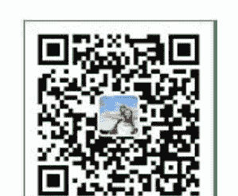

微信：mbook86

# 中华古籍库

1000000 册 高清影印古籍
珍版刻印 / 海外流传 / 家传手抄 / 民间失传

古籍善本、经史子集、史料笔记、古人文集、
民间收藏、传世家谱、各地方志、中医典籍、
四库全书、古禁毁书、内阁文库、图书集成、
丛书集成、四部丛刊、万有文库、四部备要、
二十四史、三国六朝文、明清和民国古籍史料
……

