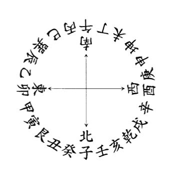

江蘇武進浩然談養吾編著
新加坡 張成春編纂

## 安親常識
玄空法鑑

## 地理小補
元運發微

合編

育林出版社印行

一代宗師談養吾肖像
第四代嫡傳弟子張成春珍藏

## 鐘序

新加坡張成春賢棣是李虔虛道長傳授談浩然（養吾）「兩元八運·玄空六法」：嫡傳第四代傳人；其師是上海佛海居士，因生前潛修佛學，澹泊名利，享壽一〇八歲，故隱其姓名。成春賢棣酷嗜術數，為了學藝，踏遍中國大陸、香港、台灣、東南亞各地，共拜師五十六位，精研三合三元地理、納甲九星、六十四卦（玄空大卦）；佛海居士親授章氏玄空暨李虔虛祖師授談養吾師祖發揚之玄空六法、《經義秘旨》（即蔣大鴻傳與駱士鵬，駱傳翁守仁，翁傳與吳朗軒，程明先授自駱士鵬後裔之玄空心法）；沈氏玄空、天星擇日、子平八字、六爻卦、大六壬、河南劉廣斌教授嫡傳奇門遁甲與劉氏神數、法奇門、七政四餘星宗命學、西洋高級占星術（Munting Astrology）。一九九六年十一月三十日來台灣南投縣竹山鎮，拜我為師，學習各種術數（親授只單傳入室嫡傳弟子，不授外人的許多「不傳之秘」）。
經過二十多年的苦學後，成春賢棣卓然有成，任職世界多處公司、集團之堪輿決策顧問，為人服務，準驗有徵，備受讚譽。
除了師授口訣、筆記手稿之外，成春賢棣不惜重資，極力蒐羅各種古今術數珍本秘笈，其藏書之富，堪媲石室金匱，世所罕匹。尤可貴者，他能飲水思源，痛心師祖談養吾因生逢亂世，抱憾以終，生前遺著且受剽掠、剽竄、詎枉扭曲，甚至用以沽譽釣銀，於是慨然將談氏所有遺著及所學淵源加以整理編纂，交由臺北【育林出版社】梓行，公之於世。前已刊行《玄空本義談養吾全集》、《新玄空紫白訣》及其師河南奇門世家第二十二世傳人劉廣斌教授所著的《劉氏神數》。劉教授書中公開推介他：「曾被譽為「五術之星」，既是我的嫡傳第一弟子，又是奇門宗師劉伯溫第二十三世唯一異姓新加坡傳人、國際劉氏奇門遁甲發展應用中心副理事長、劉氏數碼專科傳授學校副校長。」可見他受大師重視、信任的程度。今年仲秋後，數度來竹山，為所編纂之新書《新玄空紫白訣》與《安親常識·地理小補·玄空法鑑·元運發微合編》，問序於我。
《合編》是將李氏「兩元八運·玄空六法」相關及淵源資料薈萃一處的好書。對有心學習這派玄空地理學的讀者而言，是以微賈就能通過的津梁。再以《玄空本義談養吾全集》與《新玄空紫白訣》二書合參，必可登堂入室。
我僅就所知，略述本書之內容大概，並於閱稿之時，訂正烏焉成馬，魯魚亥豕之誤，重予標點，間加一二小註。
又，書中「玄」字，原著皆作「元」，蓋避清聖祖康熙「玄燁」之名諱也，今日民主時代已無禁忌，故悉改為「玄」字。
《安親常識》本名《地理常識》，是談養吾作於一九三七丁丑季春（時四十八歲）的遺著，坊間尚無正式刊行，只有少數手抄影印本。內容有：地理概論、風水意義、地理乃人之常識、說干支八卦方隅之由來、陰陽動靜、說葬、說龍穴砂水向、論陰陽宅立向、說物物一太極、元運辨、體用合論、求地難、卜地難、論結穴真假、論氣、辨形勢、發福憑證、山地結穴之不同、平洋結穴之不同、醫與地理之不同、地理引證、辨前後左右、論遠近取捨、相地不求虛榮、罪過辨、發有山運水運之別、急葬與簡葬勸言、陰陽宅之關係、理通則道合論，共二十八篇。泛論風水龍頭、理氣之真知灼見，字字珠璣，字理行間更露出其悲天憫人、澹泊耿直的胸襟。

《地理小補》，瀏江（湖南醴陵）劉杰（麓巖）著於同治八年（一八六九年），次年刊行，時二十六歲。麓巖生於道光二十五年乙巳（一八四五），幼年喪父，為安先靈，廣習各家地理之書，後游洞庭，遇蔬圃野人（時八十九歲）口授玄空六法，「始知真諦即在《辨正》一書中，特引而不發耳」，「爰著《地理小補》四卷，以闡明蔣氏《辨正》之義」。麓巖幼承母教，及長，樸素狷介，謹言慎行，守分隨緣，樂天知命，除攻讀科舉制藝外，周易、天文、地理、治法、軍策、理數之書，靡不涉獵，有心得者皆有著釋，《小補》之前著有《易義流液》、《三元捷報》二書。

《地理小補》是為了補充清初地理宗師蔣大鴻（平階）所著《地理辨正》之隱秘者而作，談養吾對本書極為推崇。其內容有：上卷／安先靈、遠庸術、訪明師、專理氣、驗墓宅、培心田、重地不重選擇，凡七篇；附辨借向謬說、重地不重房分二篇。中卷／《青囊經》三卷分剖節目補註並增讀法。《青囊經》相傳是黃石公授，赤松子述義。上卷古文名《天官篇》，郭璞名《氣感篇》，丘延翰名《理原論》；中卷古文名《天元金書符》；下卷古文名《堪輿篇》，郭璞名《神契篇》，丘延翰名《天元金書符》；下卷古文名《叢辰篇》。此為最原始的玄空基礎經典作品。下卷／玄空章、金龍章、雌雄章、挨星章、城門章、太歲章，附地理原述。此即《青囊序》、《青囊奧語》、《都天寶照經》中所提出的「玄空六法」。續篇／地理形勢本原論、或問（即答客問，凡九條）、地理戒例十一則、形勢理氣合用總論、附水法指偏歌（門生劉邦潛作，類似蔣大鴻門人姜垚所作之《平砂玉尺辨偽歌》）。麓巖嚴此書，於玄空理氣之秘奧處，還是隱藏訣竅，讀者須參閱《玄空本義談養吾全集》與《新玄空紫白訣》二書，庶幾有得。

《玄空法鑑》，濯江（四川崇慶）曾懷玉（輝山）著，道光十九年（一八三九年）由門人羅湘（乾伯）、陳書一（竹坡）梓行。這是最早公開「兩元八運・玄空六法」秘旨的書。曾懷玉於嘉慶七年壬戌（一八〇二年）得湖北荊門縣蓮池先生授以先天之學，始通玄空秘法之義，是集分為雌雄、元運、金龍、挨星四大綱領，計三十三圖：玄空圖、楊公雌雄圖、雌雄交媾圖、雌雄交媾生男女配九星圖、先天玄運圖、八卦變易圖、六龍圖、三般卦訣圖、三大卦全圖、取坎填離圖、金龍水口總圖、一宮至九宮金龍水口圖（八圖）、水口定卦五星圖（八圖）、九星大五行圖、挨星大交媾圖、九宮九星圖、中五立極圖、排父母總圖、後天排父母總圖（先天定父母總圖、後天排父母總圖），每圖均有簡約的注解，屬圖說類的著作。曾氏於卷首《述義》篇云：「蔣氏作《辨正》有功於楊公，然不肯直揭本原，使讀者猜想於疑似彷彿之間，按圖索驥，指鹿為馬，誤盡天下聰明才子，非徒自誤，且又誤人。則自有《辨正》以來，其禍於斯世，可勝言哉！」其實他的著作也是像蔣大鴻一般，不肯明言玄空秘法的訣竅，五十步笑一百步耳！

《元運發微》，廣東新會盧樸（作周）著。光緒二十四年戊戌（一八九八年）註說繪圖，民國三年甲寅（一九一四年）增改字句，民國十年辛酉（一九二一年）由其子伯寅、仲辰刊行，周年刊行《地理叢譚》。《發微》凡五篇：元運開始之積算、山水元運之分排、山水元運七言捷訣、山水元運之主管、山水龍神衰旺生死元運歌訣。《叢談》凡八篇：論葬墓、論潮連北廂社壇形勢（一九一〇年）、論漢鎮嶺南館財神殿方向、夏敷建書院文塔釋地評議（一九一一年）、與方默谷孝廉書論理氣、與仇景林書論新會龍勢（一九〇五年）、請整頓邑城形勢毋貽幹弱於枝議（一八九七年於澳門）、與陳友論建祠地段及趨避事宜十款書（一九〇〇年；看龍法、看局法、看基形、看屋形、看用羅經法、看八宅九星法、看外六事法、看天井放水法、看層間法）。本書無《地理叢譚》，讀者可自搜閱。

成春賢棣編纂三書問世，必然轟動中港台及東南亞各地的堪輿界，一則報答李虔虛道長、談養吾大師、佛海居士的師門深恩，使「兩元八運・玄空六法」古鏡重磨，再現光輝，使世人了解談養吾大師為玄空地學所付出的心血，明白其傳承的淵源真相；二則刺激以往學習章氏、沈氏玄空者，興起研究「玄空六法」的風潮，將「三元九運」與「兩元八運」兩派玄空互相比較，其不同（如元運、城門、水法零正，挨星、太歲等等）取其所長而用之。

二〇〇二壬午年寒露後五日

鍾義明記於台灣南投縣竹山佛心翠影書齋

## 陳序

張君成春為「李氏玄空六法」傳人，其師承由來，祖師李虔虛道長、第二代談養吾先生、第三代佛海居士單傳弟子，其名譽東南亞及世界各地，為人恭謙有禮，尊師重道，忠厚守信，重義豪爽。

自從眾知，張君是「李氏玄空六法」傳人，拜師者絡驛不絕，因受師訓，未能廣收門人，但張君亦因自己學藝歷程艱難，深知後學者的心境，今編纂著作「玄空本義」談養吾全集」、「新玄空紫白訣」、「安親常識、地理小補、玄空法鑑、元運發微」。這三本書是由【育林出版社 印行出版】。讀者如能細心詳讀，即可貫通玄空六法。對於愛好玄空法之讀者，受益無窮，其認知差別，只在於經驗應用而已。

目前張君擔任數十家公司之總顧問，業務煩忙，為著書之願，抽空將二十幾年來，為人造福之心得，整理成冊，只要一完成，即由【育林出版社 印行出版】，公諸於世，到時不用入門拜師，也可識得玄空六法真訣，可見其心胸多麼寬大。

張君雖是「李氏玄空六法」傳人，亦為「勵心門」祖師 林述三先生
第二代 林安邦先生、第三代 陳建利先生第一位嫡傳大弟子，研究三合、三元、九星、龍門八局、大易六十四卦陰陽宅、玄空經義秘旨、七政四餘天星擇日、子平八字、六爻卦、大六壬、奇門遁甲、各派擇日等學術、其學識淵博，為人天資聰穎，青年有為，潛心研究，五術有成，實為不可多得之門人，特抒所見，為張君成春著述之志，特綴數說以為介。

大三元陰陽宅天機館
通訊處：台北市延平北路二段一五○號二樓
西元二○○二年十月十日仲秋
陳建利 於台北

## 自序

自《玄空本義談養吾全集》由台北【育林出版社】出版（二○○一年十二月）後，接到許多國外各地讀者的來信，在信中感謝：由於「玄空六法」真訣的公開，讓他們找到了目標，不必再走冤枉路，不再徬徨無依；有的讀者表示：為了學習「玄空六法」已經花費了十幾年時光及巨額的冤枉錢，仍不得門徑，讀了《玄空本義談養吾全集》後才恍然大悟，讀者們並希望筆者能繼續公開出版有關「玄空六法」的相關書籍。
在盛情難卻之餘，筆者立即著手整理出《新玄空紫白訣》及師祖談養吾所著《安親常識》同時合篇清·劉麓巖《地理小補》、曾懷玉《玄空法鑑》、民國盧作周《元運發微》，這些都與「玄空六法」同氣連枝，脈絡相承的著作，交由台北【育林出版社】出版，回饋讀者。

由於先師上海佛海居士傳下師祖談養吾手稿數十本，皆是出版《本義》後所精心著作的精華，茲將《安親常識》先行付梓，後續再視情況機緣而定。

據先師言：師祖談養吾發現原先所習的章氏玄空有缺失，所以尋訪明師，從祖師李虔虛道長習得「玄空六法」以突破瓶頸，一掃心中懸疑未解者。今筆者誠心將「玄空六法」公之於世，俾使今後學習玄空地理者得以雙修章氏玄空與李氏玄空，並兩相比較，進而探驪得珠，用作濟世利人之寶筏，則善莫大焉！如此，則筆者師門幸甚，而習玄空地理的讀者也免於迷茫困惑矣！

最後要特別感謝恩師鍾義明先生為本書賜序推介，並敘明書內各篇作者及內容旨義之大綱，於「玄空六法」傳承淵源，究本歸根，按索脈絡，使師祖談養吾畢生研究玄空地理學的心血大白於天下，在術數發展史上得到應有的一代宗師地位，成春從恩師處獲得親授許多術數「不傳之秘」（只單傳入室嫡傳弟子，不授外人者），實今生最大幸事也。

張成春謹序於新加坡寓所
西元 二〇〇二年 歲次壬午 陽曆 十月八日
通訊處：BIK 707 HOUGANG AVE 2 #13 - 89 SINGAPORE 530707

## 出版序

此次張成春老師重編師祖談養吾手稿之一《安親常識》，次將《地理小補》一併整理，合篇付梓，《地理小補》內容雖與「玄空六法」有關，但其深隱真訣玄理之處太多，一般學者無法完全明瞭，因此張成春老師才不辭辛苦，秉承先師佛海居士悲天憫人的精神，歸納先師手錄口授的「玄空六法」一派的資料，讓真正有志於學習此道的讀者，不至於摸索無門，徒勞心神，往往枉費鉅資仍一無所得。

自《玄空本義談養吾全集》、《新玄空紫白訣》、《安親常識》、《地理小補》、《玄空法鑑》、《元運發微合篇》三本書出版後，「玄空六法」之精華已盡洩無遺，爾後成就端視學者本身的資質及努力思考、實行的程度而定。學者可將以往之實例套用，或前往各地印證有發達或已發達後復失敗之古墳及陽宅，考察追究為何會成功、為何會失敗？成功在何時、失敗在何時？等等問題。如此以過去為鑑，規劃未來，學力功深，心有定見，小則可為濟世救人之明師，大則可為企業、邦國之智囊師，於社稷功莫大焉！

如是堪輿同道業者，希望秉持有守有為「壁立千仞，無欲則剛；海納百川，有容乃大」的精神胸懷，來為人群服務；惟為人服務須重人品德，古聖賢一再告誡「為無德者造福，則會自損其德」，其後果是替人造福者承擔，有時還會貽害於子孫，希望習得玄空真法者戒之！慎之！

後續兩篇的《玄空法鑑》與《元運發微》是先天易卦及上下元運之運用精華，學者初讀可能會有疑惑不解，因此兩元八運與坊間流行的三元九運不同，但多讀幾遍，即可領悟兩派其實有類似之內涵似是而非，然後陰陽宅配合運用，用之於安家立業，定可無往不利，只要用心專研，必可精通，天下無難事，只怕有心人。

有福緣的讀者如能善用，《玄空本義談養吾全集》、《新玄空紫白訣》、《安親常識》、《地理小補》、《玄空法鑑》、《元運發微》這三本書的玄空理氣精髓來造福自己，進而幫助行善積德之家，乃是張成春老師出這三本書的最大心願。

本社再次感謝張成春老師一再提供能用以救世度人的術數珍貴藏書，由本社出版，公諸於世，本社當兢兢業業，一本摯誠，繼續為讀者發掘好書及稀世秘笈來出版，以回饋支持本社的社會各界賢達先進。

特別感謝竹山佛心翠影書齋鍾義明大師為本書審稿，並賜序文敘明玄空傳承淵源之真相，書內各篇之作者及內容旨義外，並加以改正梓誤之處，使讀者對本書有整體概念，知所指歸，克服古書的難讀性。鍾大師為當世玄空地理學界公認的奇才與今人尊敬的學者，本書與《新玄空紫白訣》均蒙賜序文並推介《玄空本義談養吾全集》，定可獲得世人的注目，激起研究「玄空六法」的新風潮。

通 訊 處：台 北 市 士 林 區 大 西 路 十 八 號
西 元 二 〇 〇 二 年 十 月 十 一 日
育林出版社謹致

## 安親常識目錄

- 鐘序 ……………………………… 五
- 陳序 ……………………………… 一三
- 自序 ……………………………… 一五
- 出版序 …………………………… 一八
- 安親常識自序 …………………… 二八
- 常識條例 ………………………… 二九
- 地理概論 ………………………… 三一
- 風水意義 ………………………… 三五
- 地理乃人之常識 ………………… 三七
- 說干支八卦方隅之由來 ………… 三九
- 陰陽動靜 ………………………… 四二
- 說葬 ……………………………… 四五
- 說龍穴砂水向 …………………… 四七
- 論陰陽宅立向 …………………… 四九
- 說物物一太極 …………………… 五〇
- 元運辨 …………………………… 五三
- 體用合論 ………………………… 五五
- 求地以平安爲福 ………………… 五七
- 求地難·卜地難 ………………… 五八
- 論結穴真假 ……………………… 六〇
- 論氣 ……………………………… 六一
- 論形勢 …………………………… 六二
- 發福憑證 ………………………… 六三
- 山地結穴之不同 ………………… 六四
- 平洋結穴之不同 ………………… 六五
- 醫與地理之不同 ………………… 六六
- 地理引證 ………………………… 六八
- 辨前後左右 ……………………… 七〇
- 論遠近取捨 ……………………… 七二
- 相地不求虛榮 …………………… 七四
- 罪過辨 …………………………… 七五
- 發有山運水運之別 ……………… 七六
- 急葬與簡葬勸言 ………………… 七八
- 陰陽宅之關係 …………………… 八一
- 理通則道合論 …………………… 八三

## 地理小補目錄

### 卷上

- 自序 ………… 九二
- 安先靈 ………… 一〇三
- 遠庸術 ………… 一〇六
- 訪明師 ………… 一〇八
- 專理氣 ………… 一一〇
- 驗墓宅 ………… 一一二
- 培心田 ………… 一一五

### 卷中

- 重地不重選擇 ………… 一一九
- 附辨借向謬說 ………… 一二四
- 重地不重房分 ………… 一二六
- 青囊經三卷分剖節目補註並 ………… 一二九
- 增讀法 ………… 一五八

### 卷下

- 玄空章 ………… 一五八
- 金龍章 ………… 一六二
- 雌雄章 ………… 一六六
- 挨星章 ………… 一七〇
- 城門章 ………… 一七四
- 太歲章 ………… 一七七
- 地理原述此敘明得地理源由 ………… 一七九
- 乃傳人禁戒之則 ………… 一八三
- 地理形勢本原論 ………… 一八三
- 或問 ………… 一九一
- 地理戒例十二則 ………… 二〇〇
- 形勢理氣合用總賦 ………… 二〇五
- 水法指偏歌 ………… 二一四
- 跋 ………… 二一八

## 玄空法鑑目錄

- 玄空圖 ………… 二三五
- 楊公雌雄圖 ………… 二三七
- 雌雄交姤圖 ………… 二三八
- 雌雄交姤生男女配九星圖 ………… 二三九
- 先天元運圖 ………… 二四〇
- 先天八卦變易圖 ………… 二四一
- 六龍圖 ………… 二四二
- 三般卦訣圖 ………… 二四三
- 三般卦全圖 ………… 二四三
- 三大卦全圖 ………… 二四四
- 取坎填離圖 ………… 二四五
- 金龍四大水口圖 ………… 二四六
- 八大金龍水口全圖 ………… 二四八
- 水口定卦五星圖 ………… 二六四
- 九星大五行圖 ………… 二六六
- 挨星大交姤圖 ………… 二六七
- 九宮九星圖 ………… 二六八
- 中五立極圖 ………… 二六九
- 排父母秘訣 ………… 二七〇
- 先天定父母總圖 ………… 二七一
- 後天排父母總圖 ………… 二七二
- 金龍水口解 ………… 二七三

## 安親常識

江蘇武進浩然談養吾編著
新加坡 張成春編纂

## 元運發微目錄

- 第一 元運開始之積算 ………… 二八二
- 第二 山水元運之分排 ………… 二八三
- 第三 山水元運七言捷訣 ……… 二八四
- 第四 山水元運之主管 ………… 二八六
- 第五 山水龍神衰旺生死元運歌訣 ………… 二八九

## 安親常識自序

詩云。哀哀父母。生我劬勞。父母之德。昊天罔極。孝思不匱。永錫爾類。子曰。生。事之以禮。死。葬之以禮。茲姑以葬之一事言之。葬者。藏也。古有四法。即水火土鳥是也。雖然。惟土葬沿用為最久而最妥。於人心為最安。我國之有地理學。由此而始。乃孝子仁孫之事。非以此謀後人之富貴也。即有之。亦出於山川之靈。非勉強也。非偶然也。所以鍾靈毓秀。地靈人傑。為我國千古哲理之銘言。今者時代久革。陰陽之理。言人人殊。信之而復疑之。惑之而又不免信之者。孰是孰非。無所適從。萬事可以一理明之。合乎天時地利人和。一理而已矣。此常識之所以作也。是為序。

民國二十六年丁丑季春江蘇武進浩然談養吾序於申江

## 常識條例

- 一 人為萬物之靈。生養死葬為人子應盡之義務。所謂百善孝為先是也。
- 一 擇地安親。亦為人人必盡之義務。葬者。藏也。不受風。不受水。地方和暖。形勢端正。四境清淨。三元齊對。即為吉地。
- 一 擇師為最難之一事。因識地者。大都一知半解。不肯研究者居多。求地者。聊盡子職。不加研究。大半假手於人。說是說非。一聽地師之便。危險孰甚。
- 一 葬以安為主。親安則子安。葬以得地為主。其他表面上之動作。趁家有無。與吉凶無關者。概可從簡。
- 一 葬有土壙、石壙、磚壙、灰壙等等。以地理論。最莫善於土壙。而以灰壙為最不合法。
- 一 墓上隙地。最好滿種松柏。以迎生氣。一則仍有生產。於民生仍有利益。且於觀瞻上。亦覺整齊。地理上亦有益無損。
- 一 祖宗安居之所。春秋佳節為子孫者。應常時到地拜掃。以慰先靈。而盡孝道。
- 一 朱子云。為人子者。不可不知地理。凡形勢各書。有圖說者。不妨看看。俾有常識。以免受愚。

## 地理概論

我國之有地理。由來久矣。大都推頌唐之楊筠松。晉之郭璞。實則其行用之法。與易理息息相通。推用伏羲先天。文王後天。蓋河洛生成之數。已闡發於楊郭之前矣。按諸青囊、天玉、寶照諸經文。皆採納於四庫書中。再按公劉遷豳。相陰陽觀流泉之說。亦已兆於唐晉之前。楊郭所以為後人推崇者。發前人之所未發。猶清之有蔣公大鴻氏也。地理辨正一書。經蔣氏詳註後。始成專書。蔣氏之前。青囊、天玉、寶照諸經。不過尚散集於四庫耳（鍾義明老師

江蘇武進浩然談養吾編著
新加坡 張成春編纂

註。四庫全書成於一七八二年。蔣大鴻作地理辨正時。尚無四庫全書）。無所謂地理也。蔣氏取其名。至今始有所謂蔣法是也。羅盤之有名蔣盤。楊盤者。亦由是始耳。實則無所謂楊。無所謂蔣也。三元三合。本同一流。合不離元。元不離合。皆為後人所杜撰耳。附會耳。鄙意。易之為道。放之彌於六合。卷之退藏於密。均莫能超其範圍也。捨易理而談地理者。偽法也。天地人。俗稱三元。合而言之。即為一。即天道。地理。人情是也。俗云。一德二運三風水。的為至言。世未有捨天道人情而專談地理者。不特於求地一事如此。立身社會。無不皆然。故世有闢風水為迷信者。知其一而不知其二也。非地理之無理。而可以害人。乃人不明地理之真理。而妄事苛求。不明天理人情之構結。而迷信地理。捨其本而求其末。有是理乎。世有地師者。猶百業之有技師。工程師耳。截長補短。自有專長。非外界人可擅主其事。易牙知味。伯樂知馬。猶其一也。朱子云。為人子者。不可不知醫。不可不知地理。因醫與地理。皆有孝道在焉。若以親之生。而付之庸醫。以親之死。而付之庸師。於心安乎。按。地理即風水。風水之為害。非指親之既死而言。當其生也。居處而無門窗。則受風。居處而無屋宇。則受水。非求乎華廈。求其安而已矣。親之當健康時也。雖有風之擊。水之侵。而為子者。即不為之障蔽。而親自身猶能避之趨之。既死也。則其所遺之軀。一聽人子之安置。韓子所謂。焚之亦可。沉之亦可。是也。而欲安既死之親心。人子之孝心。有何法乎。試以親之遺骸。置之於低窪之地。而沉泯於水。置之荒僻之鄉。而蕩擊於風。安乎。否乎。人非木石。人非鳥獸。世無此情。無此理也。世之有地理者。乃所以安親之心。安人子之心耳。非以親之遺骸。而求人子之富貴也。夫趨吉避凶。人之常情。欲親安子安。而勢必求吉地。求吉地而假手於庸碌之地師。以耳代目。將何以辨其地之為吉為凶也。高而不受風。低而不受水。無牛羊踐踏。穢濁之侵臨。藏而不蔽塞。露而不空曠。即吉地矣。可以安親心。可以盡子職。捨此莫由。生居屋宇。死求吉壤。陰陽一理以覓屋宇之目光。求先人之塋地。避風避水。藏風聚氣。合乎人情。合乎天地。可以決矣。

## 風水意義

風水。一名地理。又名陰陽。又名堪輿。名異而實同。各隨其各地之鄉土而稱之。講風水與地理者。似對於行道之地師所稱。講陰陽與堪輿者。似對於求地之稱。故世稱地師曰某陰陽某堪輿。稱求地理者曰某某有風水。故大發。某某風水不合。故此不利。某某迷信地理。某某講求地理。於此可分為兩說。合而言之。為安親而求地者。無非欲得山清水明。趨吉避凶之地可矣。為人覓地之陰陽地師。亦無非代人覓一山清水明。避風避水之地可矣。安置先人遺骸之所。通名為曰金井。又名之曰壙。又名之曰穴。高處築穴。四面受風而氣散。低處立穴。四面受水而氣寒。太高則獨。太低則孤。不高不低。則陰陽相和。不受風。不受水。合乎地之理。合乎天之道。人之情。即為之趨吉避凶。反之則親不安。而子不孝。不合乎天理人情。立身社會。其能造福於家者。鮮矣。此非風水地理之害人。乃人自悖乎天理人情。而人自造之孽。自受之害也。是故世未有孝其親而不昌者。孔子嘗云。生。事之以禮。死。葬之以禮。生。事之禮。非徒乎服勞奉養也。死。葬之禮。豈徒乎入土為安也。生。事之禮。不求乎山鋪海珍也。死。葬之禮。豈求乎真龍大地也。一坏清淨之土亦可也。死。葬之禮。程子云。中庸之道。是矣。求地而抱奢望。不自度德。安貪富貴。即謂迷信。行道之地師。不事講求天理人情。一味胡言亂語。滿口江湖習氣。迷信求地者。耳為之混。目為之淆。以致求吉地而反葬凶。可哂。亦復可歎。求地與為人卜地。其鑒諸。

## 地理乃人之常識

人在社會上。其實處處有地理。處處有風水。其關係。乃人人得而知之。往往在不知不覺之中。人人知所趨避。夏日冬風。人人知避。冬日夏風。人人知趨。此其一也。春夏之東南風。秋冬之西北風。人人知其為合時。反之。則人人知其為失時。其合時也。天氣晴朗。其失時也。天必陰雨。同為一風。不過其來之方向不同。即可辨其陰晴。由此可知氣之動靜。與來之方向。與四季時令。有密切關係存乎其間也。此非人人知所趨避。知所分辨之常識而何。一處有一處之趨避。一時有一時之關係。無論家居遠行。可說無地無風水。吉凶之關係。事無大小。理同一貫。衣也食也。夏革而冬裘。合乎時則吉也。反之則背乎時而為害也。冬溫而夏涼。合乎時。則舒適而養身。背之。則多病。求地一事。道同一轍。陽居宜乎高爽適舒。陰宅宜乎靜而清雅。世以風水名之者。實包含天時地利人和之代言詞也。以其氣之關係。與人生最為密切。利害切膚。纖些不能假借。得之吉氣。則百體適舒。遇事呈祥。得之凶氣。則百體欠安。萬事不成。朱子云。人子不可不知地理者。以地理亦為吾人之常識。處處所必需也。而惟父母祖宗為最緊要。最密切。最為應盡之責。簡言之。乃人人應知之常識也。然凡事太過則成迷。以理度之。無過不及。明乎天地自然之理。立身社會。誰曰不然。地理云乎哉。風水云乎哉。

## 說干支八卦方隅之由來

天覆地載。天圓地方。合而言之。即一混混沌沌之太極也。黃帝作指南車。而方隅定矣。萬物均有名詞。方隅之分。簡言之為東南西北。謂之四正。合四隅謂之八方。以八卦配之。乾屬西北。坎屬正北。艮屬東北。震屬正東。巽屬東南。離屬正南。坤屬西南。兌屬正西。此後天不易之方位也。先天乾南坤北。離東坎西。震東北巽西南。艮西北兌東南。此八卦對待之交媾也。易曰。天地定位。山澤通氣。雷風相薄。水火不相射是也。先天以八卦陰陽對待言。其數合九。後天以洛書言。其數合十。五十居中。縱橫合十五。又二十有五。先天陰陽交媾。父母生六子成爲八卦。六子相交。各為父母。而生六子。是謂體卦。即先天為體之意也。後天一二三四五六七八九。其氣流行。即後天為用之意。以混沌之太極。周天分為三百六十度。以十二支分配。每支得三十度。以子午卯酉為四正。四隅則在辰戌丑未。寅申巳亥之間。無支可以代稱。後人設法。以八干四維共十二支為二十四山。又謂二十四龍。以壬癸屬水。居子之左右。以甲乙屬木。居卯之左右。以丙丁屬火。居午之左右。以庚辛屬金。居酉之左右。四隅戌亥之界。而以乾卦來加入。丑寅之界。而以艮卦來加入。辰巳之界。而以巽卦來加入。未申之界。而以坤卦來加入。故四隅為乾巽艮坤。四正則已有子午卯酉之四支代之矣。毋須再用八卦之坎離震兌來代之。古人云。先天原來十二支。後天再用干與維。周天二十四字。每字佔十五度。不過乃方隅之代名詞耳。其實毫無作用。猶萬物各有名詞。同為圓頂方踵。稱之曰人可矣。後人以姓名別之者。俾人易於識別耳。周天方隅。亦猶是耳。說子午而知南北。說卯酉而知東西。說辰戌巳亥而知東南西北。說丑未寅申而知東北西南。其餘八干四維類推。地理有用羅經者。實則毫無作用。猶縫工之有尺。世之有權衡度量。聊以知其數量。世之有羅經二十四字。聊以知方隅耳。今人卜地。到處用羅經攤看。猶縫工之見布疋即用尺量。可發一笑。不知者。以為看地之法。即在羅經。執此者。往往以之欺人。而求地者。往往受其所欺。不知地理之合不合。在乎形氣。物料既配。則衣服自合。在乎物料。形氣既合。則風水自吉。物料既配。則衣服自合。一定之理也。方隅由此而分。羅經以定方隅也。十二支八干四維。由此而配。乃方隅之代名詞也。

## 陰陽動靜

## 圖隅方山四十二

周天三百六十度。以二十四字分配。每字得十五度。地理立向。即以此名之。先说坐後。次说向前。如朝南曰子午。朝北曰午子。朝東曰酉卯。朝西曰卯酉。其餘類推。偏左偏右曰兼向。餘倣此。

公劉相陰陽。觀流泉。楊公開篇說看雌雄。故稱今之地理家曰陰陽。陰陽者。動二氣也。天在上曰陽。地在下曰陰。山靜為陰。水動為陽。空處為陽。實處為陰。高處為陰。低處為陽。山龍以高山來龍處為陰。低處水聚為陽。平洋以實地為陰。河流。低田為陽。平原以高一寸為陰。低一寸為陽。此山龍。平洋。平原之陰陽也。山有山之陰陽。水有水之陰陽。山之陰陽。以高而硬直者為陰。生動曲屈。有起伏高低者為陽。硬直者為死氣。主凶。生動者為生氣。主吉。水之陰陽。以流動不停者為陽。蓄聚停滯者為陰。動則力大。靜則力小。大者發速。小者發遲。在城市無河流者。以街道為陽。以其氣之流動也。以房屋居住之所為陰。以其氣之靜而不動也。陽宅之陰陽。有宅外宅內之分。宅外看河流街道。及往來出入處為陽。宅內以門路為陽。牆壁不通處為陰。陰陽動靜。其高低遠近大小廣狹。務必相配。房屋高大。收氣必多。房屋小。收氣亦小。太過不及。即為之凶。其動靜方位。須與相合者為吉。與時相反者為凶。形勢之陰陽動靜。處處可見。所謂變頭是也。氣運之合與不合。有理可測。所謂理氣是也。變頭為外。理氣為內。察形勢之生動硬直。全憑目力。審理氣之消長。全憑心力。即所謂作法是也。作法人人不同。故聚訟千年。各是其是非者。理氣也。形勢則否。大都相同。因其有蹤可尋也。理氣則全憑學力。參以易理。方為正宗。非偽說之以子午卯酉屬陰。甲庚壬丙屬陽。專以八卦。十二支。十干分陰分陽也。外氣之陰陽易知。內氣之陰陽難辨也。

## 說葬

我國慣例。安親之具。大都用棺木。葬法處處不同。在山鄉與水鄉。各照習慣行之。山鄉大都掘土深葬。水鄉則培土淺葬。如年向方位不通者。暫厝之。又有用骨塔者。此風惟廣東省最多。其墓地隆隆而起者。佔地數畝。或數分數畝者。各隨其能力而為之。子孫繁衍者。保存可數百年。普通墳墓。亦不過數十年。即行湮沒。變遷極速。以風水上之說。所謂公應孫是也。至於太祖之墓地。如何大都漠視。往往不知去處。無從追查矣。以民生言。似尚無害於生産。近世公墓盛極一時。每畝約可五六十穴。以表面言之。似覺佔地是少。以實際言。恐較私墓為更廣也。何則因其集少成多。無變遷也。試以一鄉五十戶。五十年之統計。每戶做墓十個。五十年合共做墓二百五十個。每畝照公墓制。可容五十穴。計共佔地五畝。試以二百年計算。勢必佔地二十畝。永無變遷。則佔地愈多。對土地生產之利害。於此可以比擬。私墓則當時似覺佔地稍廣。而變遷較速。土地生產。較之為利。試以各個人之家譜追查。五十年中所湮沒者。其墳墓大抵多數變遷無存矣。所尚隆隆保存者。不過三數處耳。佔地之少。亦於此可知矣。為安親而以土地生產著想。私墓制固當設法。公墓制尚非徹底。我國民貧國弱。其害是否在於私墓之多佔地畝。抑係乎農產物之不改進。農力之不振作。地不盡其利。此事當嚴密研究之。未始非補助民生之一法也。鄙意既談生產。其法。最善莫如火葬。惟人為萬物之靈。孝乃出於天性。似有所不然。恐贊成者。一時不易也。

## 說龍穴砂水向

地理學猶植物學。地理上說龍。猶植物之根幹。說穴。猶植物之花蕊。說砂。猶植物之枝葉。說水。猶植物之得雨露。說向。猶植物之宜春宜夏宜秋宜冬也。地屬陰而天屬陽。故植物莫不向上生長。以天地自然之向在上也。我國西北高而東南低。西北多山。東南多海。地脈發源於帕米爾。東繫乎崑崙。簡言之。分為三大枝。黃河流域為之北龍。長江流域為之中龍。珠江流域為之南龍。水望東流。即地脈東行也。以上海之地脈言。左為瀏河。連河。蘇州河。右為黃浦及松江以南。嘉興以北諸大水。皆謂之界水。可知其脈。最近發源於松江之佘山。上至臨平超山。遠至杭州天目為其祖。上海一埠。猶植物之花。閘北滬南為其枝葉。浦東為其蓋而砂。所以為全世界人民會萃之所。以其龍力悠長。形勢開展也。水聚則氣聚。水洩則氣散。其最為鞏固者。惟為滬杭海塘。萬水會集。故戶口數百萬。立於三元不敗之地。惟滄海桑田。有所難測耳。

## 論陰陽宅立向

世俗以棺之後腳為向首。棺頭為坐山。此人造之坐向也。不知陰地之向。出於天然。棺即太極也。猶植物之種子。以天地自然之向為向。不以物之本體之向為向也。故鄙意向之方向不一。有在前在後。在左在右者。惟陽宅則朝南朝北。朝東朝西。完全出於人造。以其大門通人出入。即謂之向。然房屋過闊。則有偏左偏右之分。所謂隨間論間是也。向字象形。上陰下陽。中為太極。陰陽判然。世以太極定向者。謬矣。習慣云乎哉。

## 更多资料

↓↓↓

## 【中华古籍库】

↓ 点击链接 ↓

https://www.fozhu920.com/list/

珍版刻印 / 海外流传 / 家传手抄 / 民间失传

【易】【医】【道】【武】【文】【奇】【画】【书】

1000000+高清古书籍

## 打包下载

微信：mbook86

## 說物物一太極

物物有陰陽。即物物有一太極也。天為陽。地為陰。合而言之。即一太極也。男為陽。女為陰。陰中有陽。陽中有陰。合而言之。分而言之。各有一太極也。一鳥卵。一芥子。一太極也。萬物成體即有陰陽。成體即有一太極也。太極定而八卦分。八卦者。四正四隅。八方之氣也。國以中央為太極。省縣以省縣政府為太極。家以家長為太極。機關公司。以局長經理為太極。此太極之要領也。至風水上之作用。全以太極為主。如陰宅以放棺之所為太極。觀其八方空實動靜。高低遠近。以分吉凶。陽宅以家長居住之所為太極。觀宅外八方河流道路。高山實地。宅內門路。以定吉凶。陰地放棺即有太極。陽宅住人即有太極。有極即有八方。有八方動靜之氣。太極感受之。即有吉凶。無極即無主。無物。無八方消長之氣。雖有吉有凶。而與物無涉也。各人之太極。以各人床位為太極。以一日一夜停留較久也。外氣之動靜無關。以最近咫尺之出入門路氣口。分其吉凶。機關公司。以各個人之寫字台。賬桌為太極。亦以停留較久也。人即太極。非床與寫字台。賬桌為太極也。非以放棺。住房即太極。以棺中與住房中。為人之所在地。故以此為太極也。太極移動。則八方之方位。亦隨之而移動。如人在南。則門路在北。如人移位於原有門路之北。則原有之門路。在人之南方矣。聽人移動。如在夏令。取北方之氣則涼爽者。門路動氣宜在北。人之居住。勢必在門路動氣之南。如在冬令。人人知取南方之氣。以其陽和也。則門路氣口之動氣。勢必取其在我人之南方。一年四季之氣。人人知所趨避。則每元每運之氣。與此相同。吉與凶者。所受方位之氣。與時合不合也。合時則吉。失時則凶也。太極以此定。吉凶由此判。世俗以房屋之中宮為太極。又以大門偏左偏右為立向者。以棺木之偏左偏右為立向者。失其太極之本意矣。明乎人即一太極之意。向即陰陽動靜之意。乃可與言地理。乃可與言吉凶。

## 元運辨

世俗以六十年為一元。分上中下三元。三六一百八十年為一週。以花甲言則可。以陰陽卦理言則不可。每元六十年。分為三運。每運二十年。三元共分九運。以花甲言則可。以卦理言則亦不可也。天地間只有陰陽二氣。楊公云。養老看雌雄。龍分兩片陰陽取。陽為雄。屬天一片。為上元。陰為雌。屬地一片。為下元。人受天地陰陽二氣所化生。有陽有陰。陽不陽而陰不陰。陰陽相交而化生萬物。人為萬物之一。不過為萬物之靈。豈能獨自成元。而與天地相配。與陰陽相交。人與人交。而化生仍屬一人。故中元為人元之說。殊屬牽強。以習慣言之則可也。以八卦之卦理言。陽極於九。陰極於六。以此分配成爲天地兩片。各管九十年。絲毫不爽矣。殊非以花甲論短長。非以洛書九數論是非也。

## 體用合論

形勢為體。理氣為用。先天為體。後天為用。人所共曉。形勢有龍穴砂水。窩鉗乳突。交鎖織結之分。理氣則聚訟千年。各是其是非。總分之。曰三元。三合。然元與元不同。合與合不同。何為然。何為否。殊難分辨。經云。百二十家渺無訣。惟有天玉是真宗。其他概置不論。語云。福人得福地。一聽各個人德運而遇之可也。先天者。陰陽對待。千古不易。父母生六子。運之體也。六子生六子。運之星也。後天者。其數合十。八卦參錯。所謂流行之氣。隨氣以分吉凶也。知乎先天之體。先天之星。合以後天流行之氣。可以談地理之體用矣。今世有以後天之卦為星。顛倒順逆。即名之曰玄空挨星者。即章氏直解。與鄙前著路透。實驗。辨正新解等。及沈。榮。尤諸氏。如出一轍。閱者務宜注意及之。非可概言也。欲知真正之玄空。還以辨正本文。及小補爲的。

## 求地以平安爲福

語云。平安就是福。故求地葬親。以平安爲主。所謂親安則子安也。而往往假手於人。是安非安。在所不知。取捨之法。前已言之矣。總之。明乎風水二字之意義。知所趨避矣。山地有凹缺。或太高則受風。太低則受水。平洋以本身地形豐滿。形勢開展。四方無橋樑。房屋。水道。道路沖射爲吉。處地宜靜不宜雜。此入土爲安之旨也。若年久暴露。殊非人子之道。貪求大地。妄聽庸師。屢屢遷葬者。亦非孝意。人事之轉移。半由於本人之所作爲。非可概咎於風水也。風水之關係。固屬有因。而天人合德。地始有靈。設人求福地。福地無如許之多。福地少。福人固少。先求福人。再求福地。而地可靈。人可傑。先人自安。子孫自榮盛矣。

## 求地難・卜地難

求平安之地固難。為人卜平安之地殊非易。諺云。庸醫誤一命。庸師誤一門。以醫之庸不庸。識者尚多。地師則最易欺人。最易受其所欺。為先人計。又不得不聊盡子責。為慣例計。又不得不延師一卜。抑不知趨吉固不談。避凶實為當務之急。世以風水為迷信者。實指庸師言。指貪求大地者言。以其毫無學識。而為人卜地。求地者毫無地理常識。一意妄聽卜地者之妄談。非指導常安親求地。卜地延師。即謂之迷信也。按堪輿二字之意義。堪。天道也。輿。地道也。天文地理。乃世界公認之哲學也。世闢堪輿為迷信者。乃指不明堪輿之道。而即以堪輿為餬口者言。以其學識深奧。識者絕少。而最易欺人也。為安親而不延師。不卜地。固難為人卜地。而求平安地亦難。求形勢稍寬者更難。有龍穴砂水向。二者全合者更難。一髮千鈞。全繫乎作者之手。貪做循情者固非。逢地即下穴者亦非。求五者全合而下穴者。又不盡然。聊盡我心。聊盡人子之心而已。普通人求地似不難。富貴人求地似更難。為普通人卜地似不難。為富貴人卜地似更難。非覓地之難。人事之難也。然求地之難不難。在乎各個人之平常心與信仰心。卜地之難不難。在乎各個人之先有心地也。諺云。福地多從心地來。非全繫乎地師。實繫乎各個人之良心。與經驗學識。非繫乎貧賤富貴也。貧賤者得地。往往富貴。富貴者不得地。往往貧賤。得地不得地。非全繫乎地師。實繫乎各個人之先有心地也。諺云。福地多從心地來。非全繫乎地師。實繫乎各個人之良心。與經驗學識。非繫乎貧賤富貴也。貧賤者得地。往往富貴。富貴者不得地。往往貧賤。得地不得地。非全繫乎地師。實繫乎各個人之先有心地也。諺云。福地多從心地來。非全繫乎地師。實繫乎各個人之良心。與經驗學識。非繫乎貧賤富貴也。貧賤者得地。往往富貴。富貴者不得地。往往貧賤。得地不得地。非全繫乎地師。實繫乎各個人之先有心地也。諺云。福地多從心地來。非全繫乎地師。實繫乎各個人之良心。與經驗學識。非繫乎貧賤富貴也。貧賤者得地。往往富貴。富貴者不得地。往往貧賤。得地不得地。非全繫乎地師。實繫乎各個人之先有心地也。諺云。福地多從心地來。非全繫乎地師。實繫乎各個人之良心。與經驗學識。非繫乎貧賤富貴也。貧賤者得地。往往富貴。富貴者不得地。往往貧賤。得地不得地。非全繫乎地師。實繫乎各個人之先有心地也。諺云。福地多從心地來。非全繫乎地師。實繫乎各個人之良心。與經驗學識。非繫乎貧賤富貴也。貧賤者得地。往往富貴。富貴者不得地。往往貧賤。得地不得地。非全繫乎地師。實繫乎各個人之先有心地也。諺云。福地多從心地來。非全繫乎地師。實繫乎各個人之良心。與經驗學識。非繫乎貧賤富貴也。貧賤者得地。往往富貴。富貴者不得地。往往貧賤。得地不得地。非全繫乎地師。實繫乎各個人之先有心地也。諺云。福地多從心地來。非全繫乎地師。實繫乎各個人之良心。與經驗學識。非繫乎貧賤富貴也。貧賤者得地。往往富貴。富貴者不得地。往往貧賤。得地不得地。非全繫乎地師。實繫乎各個人之先有心地也。諺云。福地多從心地來。非全繫乎地師。實繫乎各個人之良心。與經驗學識。非繫乎貧賤富貴也。貧賤者得地。往往富貴。富貴者不得地。往往貧賤。得地不得地。非全繫乎地師。實繫乎各個人之先有心地也。諺云。福地多從心地來。非全繫乎地師。實繫乎各個人之良心。與經驗學識。非繫乎貧賤富貴也。貧賤者得地。往往富貴。富貴者不得地。往往貧賤。得地不得地。非全繫乎地師。實繫乎各個人之先有心地也。諺云。福地多從心地來。非全繫乎地師。實繫乎各個人之良心。與經驗學識。非繫乎貧賤富貴也。貧賤者得地。往往富貴。富貴者不得地。往往貧賤。得地不得地。非全繫乎地師。實繫乎各個人之先有心地也。諺云。福地多從心地來。非全繫乎地師。實繫乎各個人之良心。與經驗學識。非繫乎貧賤富貴也。貧賤者得地。往往富貴。富貴者不得地。往往貧賤。得地不得地。非全繫乎地師。實繫乎各個人之先有心地也。諺云。福地多從心地來。非全繫乎地師。實繫乎各個人之良心。與經驗學識。非繫乎貧賤富貴也。貧賤者得地。往往富貴。富貴者不得地。往往貧賤。得地不得地。非全繫乎地師。實繫乎各個人之先有心地也。諺云。福地多從心地來。非全繫乎地師。實繫乎各個人之良心。與經驗學識。非繫乎貧賤富貴也。貧賤者得地。往往富貴。富貴者不得地。往往貧賤。得地不得地。非全繫乎地師。實繫乎各個人之先有心地也。諺云。福地多從心地來。非全繫乎地師。實繫乎各個人之良心。與經驗學識。非繫乎貧賤富貴也。貧賤者得地。往往富貴。富貴者不得地。往往貧賤。得地不得地。非全繫乎地師。實繫乎各個人之先有心地也。諺云。福地多從心地來。非全繫乎地師。實繫乎各個人之良心。與經驗學識。非繫乎貧賤富貴也。貧賤者得地。往往富貴。富貴者不得地。往往貧賤。得地不得地。非全繫乎地師。實繫乎各個人之先有心地也。諺云。福地多從心地來。非全繫乎地師。實繫乎各個人之良心。與經驗學識。非繫乎貧賤富貴也。貧賤者得地。往往富貴。富貴者不得地。往往貧賤。得地不得地。非全繫乎地師。實繫乎各個人之先有心地也。諺云。福地多從心地來。非全繫乎地師。實繫乎各個人之良心。與經驗學識。非繫乎貧賤富貴也。貧賤者得地。往往富貴。富貴者不得地。往往貧賤。得地不得地。非全繫乎地師。實繫乎各個人之先有心地也。諺云。福地多從心地來。非全繫乎地師。實繫乎各個人之良心。與經驗學識。非繫乎貧賤富貴也。貧賤者得地。往往富貴。富貴者不得地。往往貧賤。得地不得地。非全繫乎地師。實繫乎各個人之先有心地也。諺云。福地多從心地來。非全繫乎地師。實繫乎各個人之良心。與經驗學識。非繫乎貧賤富貴也。貧賤者得地。往往富貴。富貴者不得地。往往貧賤。得地不得地。非全繫乎地師。實繫乎各個人之先有心地也。諺云。福地多從心地來。非全繫乎地師。實繫乎各個人之良心。與經驗學識。非繫乎貧賤富貴也。貧賤者得地。往往富貴。富貴者不得地。往往貧賤。得地不得地。非全繫乎地師。實繫乎各個人之先有心地也。諺云。福地多從心地來。非全繫乎地師。實繫乎各個人之良心。與經驗學識。非繫乎貧賤富貴也。貧賤者得地。往往富貴。富貴者不得地。往往貧賤。得地不得地。非全繫乎地師。實繫乎各個人之先有心地也。諺云。福地多從心地來。非全繫乎地師。實繫乎各個人之良心。與經驗學識。非繫乎貧賤富貴也。貧賤者得地。往往富貴。富貴者不得地。往往貧賤。得地不得地。非全繫乎地師。實繫乎各個人之先有心地也。諺云。福地多從心地來。非全繫乎地師。實繫乎各個人之良心。與經驗學識。非繫乎貧賤富貴也。貧賤者得地。往往富貴。富貴者不得地。往往貧賤。得地不得地。非全繫乎地師。實繫乎各個人之先有心地也。諺云。福地多從心地來。非全繫乎地師。實繫乎各個人之良心。與經驗學識。非繫乎貧賤富貴也。貧賤者得地。往往富貴。富貴者不得地。往往貧賤。得地不得地。非全繫乎地師。實繫乎各個人之先有心地也。諺云。福地多從心地來。非全繫乎地師。實繫乎各個人之良心。與經驗學識。非繫乎貧賤富貴也。貧賤者得地。往往富貴。富貴者不得地。往往貧賤。得地不得地。非全繫乎地師。實繫乎各個人之先有心地也。諺云。福地多從心地來。非全繫乎地師。實繫乎各個人之良心。與經驗學識。非繫乎貧賤富貴也。貧賤者得地。往往富貴。富貴者不得地。往往貧賤。得地不得地。非全繫乎地師。實繫乎各個人之先有心地也。諺云。福地多從心地來。非全繫乎地師。實繫乎各個人之良心。與經驗學識。非繫乎貧賤富貴也。貧賤者得地。往往富貴。富貴者不得地。往往貧賤。得地不得地。非全繫乎地師。實繫乎各個人之先有心地也。諺云。福地多從心地來。非全繫乎地師。實繫乎各個人之良心。與經驗學識。非繫乎貧賤富貴也。貧賤者得地。往往富貴。富貴者不得地。往往貧賤。得地不得地。非全繫乎地師。實繫乎各個人之先有心地也。諺云。福地多從心地來。非全繫乎地師。實繫乎各個人之良心。與經驗學識。非繫乎貧賤富貴也。貧賤者得地。往往富貴。富貴者不得地。往往貧賤。得地不得地。非全繫乎地師。實繫乎各個人之先有心地也。諺云。福地多從心地來。非全繫乎地師。實繫乎各個人之良心。與經驗學識。非繫乎貧賤富貴也。貧賤者得地。往往富貴。富貴者不得地。往往貧賤。得地不得地。非全繫乎地師。實繫乎各個人之先有心地也。諺云。福地多從心地來。非全繫乎地師。實繫乎各個人之良心。與經驗學識。非繫乎貧賤富貴也。貧賤者得地。往往富貴。富貴者不得地。往往貧賤。得地不得地。非全繫乎地師。實繫乎各個人之先有心地也。諺云。福地多從心地來。非全繫乎地師。實繫乎各個人之良心。與經驗學識。非繫乎貧賤富貴也。貧賤者得地。往往富貴。富貴者不得地。往往貧賤。得地不得地。非全繫乎地師。實繫乎各個人之先有心地也。諺云。福地多從心地來。非全繫乎地師。實繫乎各個人之良心。與經驗學識。非繫乎貧賤富貴也。貧賤者得地。往往富貴。富貴者不得地。往往貧賤。得地不得地。非全繫乎地師。實繫乎各個人之先有心地也。諺云。福地多從心地來。非全繫乎地師。實繫乎各個人之良心。與經驗學識。非繫乎貧賤富貴也。貧賤者得地。往往富貴。富貴者不得地。往往貧賤。得地不得地。非全繫乎地師。實繫乎各個人之先有心地也。諺云。福地多從心地來。非全繫乎地師。實繫乎各個人之良心。與經驗學識。非繫乎貧賤富貴也。貧賤者得地。往往富貴。富貴者不得地。往往貧賤。得地不得地。非全繫乎地師。實繫乎各個人之先有心地也。諺云。福地多從心地來。非全繫乎地師。實繫乎各個人之良心。與經驗學識。非繫乎貧賤富貴也。貧賤者得地。往往富貴。富貴者不得地。往往貧賤。得地不得地。非全繫乎地師。實繫乎各個人之先有心地也。諺云。福地多從心地來。非全繫乎地師。實繫乎各個人之良心。與經驗學識。非繫乎貧賤富貴也。貧賤者得地。往往富貴。富貴者不得地。往往貧賤。得地不得地。非全繫乎地師。實繫乎各個人之先有心地也。諺云。福地多從心地來。非全繫乎地師。實繫乎各個人之良心。與經驗學識。非繫乎貧賤富貴也。貧賤者得地。往往富貴。富貴者不得地。往往貧賤。得地不得地。非全繫乎地師。實繫乎各個人之先有心地也。諺云。福地多從心地來。非全繫乎地師。實繫乎各個人之良心。與經驗學識。非繫乎貧賤富貴也。貧賤者得地。往往富貴。富貴者不得地。往往貧賤。得地不得地。非全繫乎地師。實繫乎各個人之先有心地也。諺云。福地多從心地來。非全繫乎地師。實繫乎各個人之良心。與經驗學識。非繫乎貧賤富貴也。貧賤者得地。往往富貴。富貴者不得地。往往貧賤。得地不得地。非全繫乎地師。實繫乎各個人之先有心地也。諺云。福地多從心地來。非全繫乎地師。實繫乎各個人之良心。與經驗學識。非繫乎貧賤富貴也。貧賤者得地。往往富貴。富貴者不得地。往往貧賤。得地不得地。非全繫乎地師。實繫乎各個人之先有心地也。諺云。福地多從心地來。非全繫乎地師。實繫乎各個人之良心。與經驗學識。非繫乎貧賤富貴也。貧賤者得地。往往富貴。富貴者不得地。往往貧賤。得地不得地。非全繫乎地師。實繫乎各個人之先有心地也。諺云。福地多從心地來。非全繫乎地師。實繫乎各個人之良心。與經驗學識。非繫乎貧賤富貴也。貧賤者得地。往往富貴。富貴者不得地。往往貧賤。得地不得地。非全繫乎地師。實繫乎各個人之先有心地也。諺云。福地多從心地來。非全繫乎地師。實繫乎各個人之良心。與經驗學識。非繫乎貧賤富貴也。貧賤者得地。往往富貴。富貴者不得地。往往貧賤。得地不得地。非全繫乎地師。實繫乎各個人之先有心地也。諺云。福地多從心地來。非全繫乎地師。實繫乎各個人之良心。與經驗學識。非繫乎貧賤富貴也。貧賤者得地。往往富貴。富貴者不得地。往往貧賤。得地不得地。非全繫乎地師。實繫乎各個人之先有心地也。諺云。福地多從心地來。非全繫乎地師。實繫乎各個人之良心。與經驗學識。非繫乎貧賤富貴也。貧賤者得地。往往富貴。富貴者不得地。往往貧賤。得地不得地。非全繫乎地師。實繫乎各個人之先有心地也。諺云。福地多從心地來。非全繫乎地師。實繫乎各個人之良心。與經驗學識。非繫乎貧賤富貴也。貧賤者得地。往往富貴。富貴者不得地。往往貧賤。得地不得地。非全繫乎地師。實繫乎各個人之先有心地也。諺云。福地多從心地來。非全繫乎地師。實繫乎各個人之良心。與經驗學識。非繫乎貧賤富貴也。貧賤者得地。往往富貴。富貴者不得地。往往貧賤。得地不得地。非全繫乎地師。實繫乎各個人之先有心地也。諺云。福地多從心地來。非全繫乎地師。實繫乎各個人之良心。與經驗學識。非繫乎貧賤富貴也。貧賤者得地。往往富貴。富貴者不得地。往往貧賤。得地不得地。非全繫乎地師。實繫乎各個人之先有心地也。諺云。福地多從心地來。非全繫乎地師。實繫乎各個人之良心。與經驗學識。非繫乎貧賤富貴也。貧賤者得地。往往富貴。富貴者不得地。往往貧賤。得地不得地。非全繫乎地師。實繫乎各個人之先有心地也。諺云。福地多從心地來。非全繫乎地師。實繫乎各個人之良心。與經驗學識。非繫乎貧賤富貴也。貧賤者得地。往往富貴。富貴者不得地。往往貧賤。得地不得地。非全繫乎地師。實繫乎各個人之先有心地也。諺云。福地多從心地來。非全繫乎地師。實繫乎各個人之良心。與經驗學識。非繫乎貧賤富貴也。貧賤者得地。往往富貴。富貴者不得地。往往貧賤。得地不得地。非全繫乎地師。實繫乎各個人之先有心地也。諺云。福地多從心地來。非全繫乎地師。實繫乎各個人之良心。與經驗學識。非繫乎貧賤富貴也。貧賤者得地。往往富貴。富貴者不得地。往往貧賤。得地不得地。非全繫乎地師。實繫乎各個人之先有心地也。諺云。福地多從心地來。非全繫乎地師。實繫乎各個人之良心。與經驗學識。非繫乎貧賤富貴也。貧賤者得地。往往富貴。富貴者不得地。往往貧賤。得地不得地。非全繫乎地師。實繫乎各個人之先有心地也。諺云。福地多從心地來。非全繫乎地師。實繫乎各個人之良心。與經驗學識。非繫乎貧賤富貴也。貧賤者得地。往往富貴。富貴者不得地。往往貧賤。得地不得地。非全繫乎地師。實繫乎各個人之先有心地也。諺云。福地多從心地來。非全繫乎地師。實繫乎各個人之良心。與經驗學識。非繫乎貧賤富貴也。貧賤者得地。往往富貴。富貴者不得地。往往貧賤。得地不得地。非全繫乎地師。實繫乎各個人之先有心地也。諺云。福地多從心地來。非全繫乎地師。實繫乎各個人之良心。與經驗學識。非繫乎貧賤富貴也。貧賤者得地。往往富貴。富貴者不得地。往往貧賤。得地不得地。非全繫乎地師。實繫乎各個人之先有心地也。諺云。福地多從心地來。非全繫乎地師。實繫乎各個人之良心。與經驗學識。非繫乎貧賤富貴也。貧賤者得地。往往富貴。富貴者不得地。往往貧賤。得地不得地。非全繫乎地師。實繫乎各個人之先有心地也。諺云。福地多從心地來。非全繫乎地師。實繫乎各個人之良心。與經驗學識。非繫乎貧賤富貴也。貧賤者得地。往往富貴。富貴者不得地。往往貧賤。得地不得地。非全繫乎地師。實繫乎各個人之先有心地也。諺云。福地多從心地來。非全繫乎地師。實繫乎各個人之良心。與經驗學識。非繫乎貧賤富貴也。貧賤者得地。往往富貴。富貴者不得地。往往貧賤。得地不得地。非全繫乎地師。實繫乎各個人之先有心地也。諺云。福地多從心地來。非全繫乎地師。實繫乎各個人之良心。與經驗學識。非繫乎貧賤富貴也。貧賤者得地。往往富貴。富貴者不得地。往往貧賤。得地不得地。非全繫乎地師。實繫乎各個人之先有心地也。諺云。福地多從心地來。非全繫乎地師。實繫乎各個人之良心。與經驗學識。非繫乎貧賤富貴也。貧賤者得地。往往富貴。富貴者不得地。往往貧賤。得地不得地。非全繫乎地師。實繫乎各個人之先有心地也。諺云。福地多從心地來。非全繫乎地師。實繫乎各個人之良心。與經驗學識。非繫乎貧賤富貴也。貧賤者得地。往往富貴。富貴者不得地。往往貧賤。得地不得地。非全繫乎地師。實繫乎各個人之先有心地也。諺云。福地多從心地來。非全繫乎地師。實繫乎各個人之良心。與經驗學識。非繫乎貧賤富貴也。貧賤者得地。往往富貴。富貴者不得地。往往貧賤。得地不得地。非全繫乎地師。實繫乎各個人之先有心地也。諺云。福地多從心地來。非全繫乎地師。實繫乎各個人之良心。與經驗學識。非繫乎貧賤富貴也。貧賤者得地。往往富貴。富貴者不得地。往往貧賤。得地不得地。非全繫乎地師。實繫乎各個人之先有心地也。諺云。福地多從心地來。非全繫乎地師。實繫乎各個人之良心。與經驗學識。非繫乎貧賤富貴也。貧賤者得地。往往富貴。富貴者不得地。往往貧賤。得地不得地。非全繫乎地師。實繫乎各個人之先有心地也。諺云。福地多從心地來。非全繫乎地師。實繫乎各個人之良心。與經驗學識。非繫乎貧賤富貴也。貧賤者得地。往往富貴。富貴者不得地。往往貧賤。得地不得地。非全繫乎地師。實繫乎各個人之先有心地也。諺云。福地多從心地來。非全繫乎地師。實繫乎各個人之良心。與經驗學識。非繫乎貧賤富貴也。貧賤者得地。往往富貴。富貴者不得地。往往貧賤。得地不得地。非全繫乎地師。實繫乎各個人之先有心地也。諺云。福地多從心地來。非全繫乎地師。實繫乎各個人之良心。與經驗學識。非繫乎貧賤富貴也。貧賤者得地。往往富貴。富貴者不得地。往往貧賤。得地不得地。非全繫乎地師。實繫乎各個人之先有心地也。諺云。福地多從心地來。非全繫乎地師。實繫乎各個人之良心。與經驗學識。非繫乎貧賤富貴也。貧賤者得地。往往富貴。富貴者不得地。往往貧賤。得地不得地。非全繫乎地師。實繫乎各個人之先有心地也。諺云。福地多從心地來。非全繫乎地師。實繫乎各個人之良心。與經驗學識。非繫乎貧賤富貴也。貧賤者得地。往往富貴。富貴者不得地。往往貧賤。得地不得地。非全繫乎地師。實繫乎各個人之先有心地也。諺云。福地多從心地來。非全繫乎地師。實繫乎各個人之良心。與經驗學識。非繫乎貧賤富貴也。貧賤者得地。往往富貴。富貴者不得地。往往貧賤。得地不得地。非全繫乎地師。實繫乎各個人之先有心地也。諺云。福地多從心地來。非全繫乎地師。實繫乎各個人之良心。與經驗學識。非繫乎貧賤富貴也。貧賤者得地。往往富貴。富貴者不得地。往往貧賤。得地不得地。非全繫乎地師。實繫乎各個人之先有心地也。諺云。福地多從心地來。非全繫乎地師。實繫乎各個人之良心。與經驗學識。非繫乎貧賤富貴也。貧賤者得地。往往富貴。富貴者不得地。往往貧賤。得地不得地。非全繫乎地師。實繫乎各個人之先有心地也。諺云。福地多從心地來。非全繫乎地師。實繫乎各個人之良心。與經驗學識。非繫乎貧賤富貴也。貧賤者得地。往往富貴。富貴者不得地。往往貧賤。得地不得地。非全繫乎地師。實繫乎各個人之先有心地也。諺云。福地多從心地來。非全繫乎地師。實繫乎各個人之良心。與經驗學識。非繫乎貧賤富貴也。貧賤者得地。往往富貴。富貴者不得地。往往貧賤。得地不得地。非全繫乎地師。實繫乎各個人之先有心地也。諺云。福地多從心地來。非全繫乎地師。實繫乎各個人之良心。與經驗學識。非繫乎貧賤富貴也。貧賤者得地。往往富貴。富貴者不得地。往往貧賤。得地不得地。非全繫乎地師。實繫乎各個人之先有心地也。諺云。福地多從心地來。非全繫乎地師。實繫乎各個人之良心。與經驗學識。非繫乎貧賤富貴也。貧賤者得地。往往富貴。富貴者不得地。往往貧賤。得地不得地。非全繫乎地師。實繫乎各個人之先有心地也。諺云。福地多從心地來。非全繫乎地師。實繫乎各個人之良心。與經驗學識。非繫乎貧賤富貴也。貧賤者得地。往往富貴。富貴者不得地。往往貧賤。得地不得地。非全繫乎地師。實繫乎各個人之先有心地也。諺云。福地多從心地來。非全繫乎地師。實繫乎各個人之良心。與經驗學識。非繫乎貧賤富貴也。貧賤者得地。往往富貴。富貴者不得地。往往貧賤。得地不得地。非全繫乎地師。實繫乎各個人之先有心地也。諺云。福地多從心地來。非全繫乎地師。實繫乎各個人之良心。與經驗學識。非繫乎貧賤富貴也。貧賤者得地。往往富貴。富貴者不得地。往往貧賤。得地不得地。非全繫乎地師。實繫乎各個人之先有心地也。諺云。福地多從心地來。非全繫乎地師。實繫乎各個人之良心。與經驗學識。非繫乎貧賤富貴也。貧賤者得地。往往富貴。富貴者不得地。往往貧賤。得地不得地。非全繫乎地師。實繫乎各個人之先有心地也。諺云。福地多從心地來。非全繫乎地師。實繫乎各個人之良心。與經驗學識。非繫乎貧賤富貴也。貧賤者得地。往往富貴。富貴者不得地。往往貧賤。得地不得地。非全繫乎地師。實繫乎各個人之先有心地也。諺云。福地多從心地來。非全繫乎地師。實繫乎各個人之良心。與經驗學識。非繫乎貧賤富貴也。貧賤者得地。往往富貴。富貴者不得地。往往貧賤。得地不得地。非全繫乎地師。實繫乎各個人之先有心地也。諺云。福地多從心地來。非全繫乎地師。實繫乎各個人之良心。與經驗學識。非繫乎貧賤富貴也。貧賤者得地。往往富貴。富貴者不得地。往往貧賤。得地不得地。非全繫乎地師。實繫乎各個人之先有心地也。諺云。福地多從心地來。非全繫乎地師。實繫乎各個人之良心。與經驗學識。非繫乎貧賤富貴也。貧賤者得地。往往富貴。富貴者不得地。往往貧賤。得地不得地。非全繫乎地師。實繫乎各個人之先有心地也。諺云。福地多從心地來。非全繫乎地師。實繫乎各個人之良心。與經驗學識。非繫乎貧賤富貴也。貧賤者得地。往往富貴。富貴者不得地。往往貧賤。得地不得地。非全繫乎地師。實繫乎各個人之先有心地也。諺云。福地多從心地來。非全繫乎地師。實繫乎各個人之良心。與經驗學識。非繫乎貧賤富貴也。貧賤者得地。往往富貴。富貴者不得地。往往貧賤。得地不得地。非全繫乎地師。實繫乎各個人之先有心地也。諺云。福地多從心地來。非全繫乎地師。實繫乎各個人之良心。與經驗學識。非繫乎貧賤富貴也。貧賤者得地。往往富貴。富貴者不得地。往往貧賤。得地不得地。非全繫乎地師。實繫乎各個人之先有心地也。諺云。福地多從心地來。非全繫乎地師。實繫乎各個人之良心。與經驗學識。非繫乎貧賤富貴也。貧賤者得地。往往富貴。富貴者不得地。往往貧賤。得地不得地。非全繫乎地師。實繫乎各個人之先有心地也。諺云。福地多從心地來。非全繫乎地師。實繫乎各個人之良心。與經驗學識。非繫乎貧賤富貴也。貧賤者得地。往往富貴。富貴者不得地。往往貧賤。得地不得地。非全繫乎地師。實繫乎各個人之先有心地也。諺云。福地多從心地來。非全繫乎地師。實繫乎各個人之良心。與經驗學識。非繫乎貧賤富貴也。貧賤者得地。往往富貴。富貴者不得地。往往貧賤。得地不得地。非全繫乎地師。實繫乎各個人之先有心地也。諺云。福地多從心地來。非全繫乎地師。實繫乎各個人之良心。與經驗學識。非繫乎貧賤富貴也。貧賤者得地。往往富貴。富貴者不得地。往往貧賤。得地不得地。非全繫乎地師。實繫乎各個人之先有心地也。諺云。福地多從心地來。非全繫乎地師。實繫乎各個人之良心。與經驗學識。非繫乎貧賤富貴也。貧賤者得地。往往富貴。富貴者不得地。往往貧賤。得地不得地。非全繫乎地師。實繫乎各個人之先有心地也。諺云。福地多從心地來。非全繫乎地師。實繫乎各個人之良心。與經驗學識。非繫乎貧賤富貴也。貧賤者得地。往往富貴。富貴者不得地。往往貧賤。得地不得地。非全繫乎地師。實繫乎各個人之先有心地也。諺云。福地多從心地來。非全繫乎地師。實繫乎各個人之良心。與經驗學識。非繫乎貧賤富貴也。貧賤者得地。往往富貴。富貴者不得地。往往貧賤。得地不得地。非全繫乎地師。實繫乎各個人之先有心地也。諺云。福地多從心地來。非全繫乎地師。實繫乎各個人之良心。與經驗學識。非繫乎貧賤富貴也。貧賤者得地。往往富貴。富貴者不得地。往往貧賤。得地不得地。非全繫乎地師。實繫乎各個人之先有心地也。諺云。福地多從心地來。非全繫乎地師。實繫乎各個人之良心。與經驗學識。非繫乎貧賤富貴也。貧賤者得地。往往富貴。富貴者不得地。往往貧賤。得地不得地。非全繫乎地師。實繫乎各個人之先有心地也。諺云。福地多從心地來。非全繫乎地師。實繫乎各個人之良心。與經驗學識。非繫乎貧賤富貴也。貧賤者得地。往往富貴。富貴者不得地。往往貧賤。得地不得地。非全繫乎地師。實繫乎各個人之先有心地也。諺云。福地多從心地來。非全繫乎地師。實繫乎各個人之良心。與經驗學識。非繫乎貧賤富貴也。貧賤者得地。往往富貴。富貴者不得地。往往貧賤。得地不得地。非全繫乎地師。實繫乎各個人之先有心地也。諺云。福地多從心地來。非全繫乎地師。實繫乎各個人之良心。與經驗學識。非繫乎貧賤富貴也。貧賤者得地。往往富貴。富貴者不得地。往往貧賤。得地不得地。非全繫乎地師。實繫乎各個人之先有心地也。諺云。福地多從心地來。非全繫乎地師。實繫乎各個人之良心。與經驗學識。非繫乎貧賤富貴也。貧賤者得地。往往富貴。富貴者不得地。往往貧賤。得地不得地。非全繫乎地師。實繫乎各個人之先有心地也。諺云。福地多從心地來。非全繫乎地師。實繫乎各個人之良心。與經驗學識。非繫乎貧賤富貴也。貧賤者得地。往往富貴。富貴者不得地。往往貧賤。得地不得地。非全繫乎地師。實繫乎各個人之先有心地也。諺云。福地多從心地來。非全繫乎地師。實繫乎各個人之良心。與經驗學識。非繫乎貧賤富貴也。貧賤者得地。往往富貴。富貴者不得地。往往貧賤。得地不得地。非全繫乎地師。實繫乎各個人之先有心地也。諺云。福地多從心地來。非全繫乎地師。實繫乎各個人之良心。與經驗學識。非繫乎貧賤富貴也。貧賤者得地。往往富貴。富貴者不得地。往往貧賤。得地不得地。非全繫乎地師。實繫乎各個人之先有心地也。諺云。福地多從心地來。非全繫乎地師。實繫乎各個人之良心。與經驗學識。非繫乎貧賤富貴也。貧賤者得地。往往富貴。富貴者不得地。往往貧賤。得地不得地。非全繫乎地師。實繫乎各個人之先有心地也。諺云。福地多從心地來。非全繫乎地師。實繫乎各個人之良心。與經驗學識。非繫乎貧賤富貴也。貧賤者得地。往往富貴。富貴者不得地。往往貧賤。得地不得地。非全繫乎地師。實繫乎各個人之先有心地也。諺云。福地多從心地來。非全繫乎地師。實繫乎各個人之良心。與經驗學識。非繫乎貧賤富貴也。貧賤者得地。往往富貴。富貴者不得地。往往貧賤。得地不得地。非全繫乎地師。實繫乎各個人之先有心地也。諺云。福地多從心地來。非全繫乎地師。實繫乎各個人之良心。與經驗學識。非繫乎貧賤富貴也。貧賤者得地。往往富貴。富貴者不得地。往往貧賤。得地不得地。非全繫乎地師。實繫乎各個人之先有心地也。諺云。福地多從心地來。非全繫乎地師。實繫乎各個人之良心。與經驗學識。非繫乎貧賤富貴也。貧賤者得地。往往富貴。富貴者不得地。往往貧賤。得地不得地。非全繫乎地師。實繫乎各個人之先有心地也。諺云。福地多從心地來。非全繫乎地師。實繫乎各個人之良心。與經驗學識。非繫乎貧賤富貴也。貧賤者得地。往往富貴。富貴者不得地。往往貧賤。得地不得地。非全繫乎地師。實繫乎各個人之先有心地也。諺云。福地多從心地來。非全繫乎地師。實繫乎各個人之良心。與經驗學識。非繫乎貧賤富貴也。貧賤者得地。往往富貴。富貴者不得地。往往貧賤。得地不得地。非全繫乎地師。實繫乎各個人之先有心地也。諺云。福地多從心地來。非全繫乎地師。實繫乎各個人之良心。與經驗學識。非繫乎貧賤富貴也。貧賤者得地。往往富貴。富貴者不得地。往往貧賤。得地不得地。非全繫乎地師。實繫乎各個人之先有心地也。諺云。福地多從心地來。非全繫乎地師。實繫乎各個人之良心。與經驗學識。非繫乎貧賤富貴也。貧賤者得地。往往富貴。富貴者不得地。往往貧賤。得地不得地。非全繫乎地師。實繫乎各個人之先有心地也。諺云。福地多從心地來。非全繫乎地師。實繫乎各個人之良心。與經驗學識。非繫乎貧賤富貴也。貧賤者得地。往往富貴。富貴者不得地。往往貧賤。得地不得地。非全繫乎地師。實繫乎各個人之先有心地也。諺云。福地多從心地來。非全繫乎地師。實繫乎各個人之良心。與經驗學識。非繫乎貧賤富貴也。貧賤者得地。往往富貴。富貴者不得地。往往貧賤。得地不得地。非全繫乎地師。實繫乎各個人之先有心地也。諺云。福地多從心地來。非全繫乎地師。實繫乎各個人之良心。與經驗學識。非繫乎貧賤富貴也。貧賤者得地。往往富貴。富貴者不得地。往往貧賤。得地不得地。非全繫乎地師。實繫乎各個人之先有心地也。諺云。福地多從心地來。非全繫乎地師。實繫乎各個人之良心。與經驗學識。非繫乎貧賤富貴也。貧賤者得地。往往富貴。富貴者不得地。往往貧賤。得地不得地。非全繫乎地師。實繫乎各個人之先有心地也。諺云。福地多從心地來。非全繫乎地師。實繫乎各個人之良心。與經驗學識。非繫乎貧賤富貴也。貧賤者得地。往往富貴。富貴者不得地。往往貧賤。得地不得地。非全繫乎地師。實繫乎各個人之先有心地也。諺云。福地多從心地來。非全繫乎地師。實繫乎各個人之良心。與經驗學識。非繫乎貧賤富貴也。貧賤者得地。往往富貴。富貴者不得地。往往貧賤。得地不得地。非全繫乎地師。實繫乎各個人之先有心地也。諺云。福地多從心地來。非全繫乎地師。實繫乎各個人之良心。與經驗學識。非繫乎貧賤富貴也。貧賤者得地。往往富貴。富貴者不得地。往往貧賤。得地不得地。非全繫乎地師。實繫乎各個人之先有心地也。諺云。福地多從心地來。非全繫乎地師。實繫乎各個人之良心。與經驗學識。非繫乎貧賤富貴也。貧賤者得地。往往富貴。富貴者不得地。往往貧賤。得地不得地。非全繫乎地師。實繫乎各個人之先有心地也。諺云。福地多從心地來。非全繫乎地師。實繫乎各個人之良心。與經驗學識。非繫乎貧賤富貴也。貧賤者得地。往往富貴。富貴者不得地。往往貧賤。得地不得地。非全繫乎地師。實繫乎各個人之先有心地也。諺云。福地多從心地來。非全繫乎地師。實繫乎各個人之良心。與經驗學識。非繫乎貧賤富貴也。貧賤者得地。往往富貴。富貴者不得地。往往貧賤。得地不得地。非全繫乎地師。實繫乎各個人之先有心地也。諺云。福地多從心地來。非全繫乎地師。實繫乎各個人之良心。與經驗學識。非繫乎貧賤富貴也。貧賤者得地。往往富貴。富貴者不得地。往往貧賤。得地不得地。非全繫乎地師。實繫乎各個人之先有心地也。諺云。福地多從心地來。非全繫乎地師。實繫乎各個人之良心。與經驗學識。非繫乎貧賤富貴也。貧賤者得地。往往富貴。富貴者不得地。往往貧賤。得地不得地。非全繫乎地師。實繫乎各個人之先有心地也。諺云。福地多從心地來。非全繫乎地師。實繫乎各個人之良心。與經驗學識。非繫乎貧賤富貴也。貧賤者得地。往往富貴。富貴者不得地。往往貧賤。得地不得地。非全繫乎地師。實繫乎各個人之先有心地也。諺云。福地多從心地來。非全繫乎地師。實繫乎各個人之良心。與經驗學識。非繫乎貧賤富貴也。貧賤者得地。往往富貴。富貴者不得地。往往貧賤。得地不得地。非全繫乎地師。實繫乎各個人之先有心地也。諺云。福地多從心地來。非全繫乎地師。實繫乎各個人之良心。與經驗學識。非繫乎貧賤富貴也。貧賤者得地。往往富貴。富貴者不得地。往往貧賤。得地不得地。非全繫乎地師。實繫乎各個人之先有心地也。諺云。福地多從心地來。非全繫乎地師。實繫乎各個人之良心。與經驗學識。非繫乎貧賤富貴也。貧賤者得地。往往富貴。富貴者不得地。往往貧賤。得地不得地。非全繫乎地師。實繫乎各個人之先有心地也。諺云。福地多從心地來。非全繫乎地師。實繫乎各個人之良心。與經驗學識。非繫乎貧賤富貴也。貧賤者得地。往往富貴。富貴者不得地。往往貧賤。得地不得地。非全繫乎地師。實繫乎各個人之先有心地也。諺云。福地多從心地來。非全繫乎地師。實繫乎各個人之良心。與經驗學識。非繫乎貧賤富貴也。貧賤者得地。往往富貴。富貴者不得地。往往貧賤。得地不得地。非全繫乎地師。實繫乎各個人之先有心地也。諺云。福地多從心地來。非全繫乎地師。實繫乎各個人之良心。與經驗學識。非繫乎貧賤富貴也。貧賤者得地。往往富貴。富貴者不得地。往往貧賤。得地不得地。非全繫乎地師。實繫乎各個人之先有心地也。諺云。福地多從心地來。非全繫乎地師。實繫乎各個人之良心。與經驗學識。非繫乎貧賤富貴也。貧賤者得地。往往富貴。富貴者不得地。往往貧賤。得地不得地。非全繫乎地師。實繫乎各個人之先有心地也。諺云。福地多從心地來。非全繫乎地師。實繫乎各個人之良心。與經驗學識。非繫乎貧賤富貴也。貧賤者得地。往往富貴。富貴者不得地。往往貧賤。得地不得地。非全繫乎地師。實繫乎各個人之先有心地也。諺云。福地多從心地來。非全繫乎地師。實繫乎各個人之良心。與經驗學識。非繫乎貧賤富貴也。貧賤者得地。往往富貴。富貴者不得地。往往貧賤。得地不得地。非全繫乎地師。實繫乎各個人之先有心地也。諺云。福地多從心地來。非全繫乎地師。實繫乎各個人之良心。與經驗學識。非繫乎貧賤富貴也。貧賤者得地。往往富貴。富貴者不得地。往往貧賤。得地不得地。非全繫乎地師。實繫乎各個人之先有心地也。諺云。福地多從心地來。非全繫乎地師。實繫乎各個人之良心。與經驗學識。非繫乎貧賤富貴也。貧賤者得地。往往富貴。富貴者不得地。往往貧賤。得地不得地。非全繫乎地師。實繫乎各個人之先有心地也。諺云。福地多從心地來。非全繫乎地師。實繫乎各個人之良心。與經驗學識。非繫乎貧賤富貴也。貧賤者得地。往往富貴。富貴者不得地。往往貧賤。得地不得地。非全繫乎地師。實繫乎各個人之先有心地也。諺云。福地多從心地來。非全繫乎地師。實繫乎各個人之良心。與經驗學識。非繫乎貧賤富貴也。貧賤者得地。往往富貴。富貴者不得地。往往貧賤。得地不得地。非全繫乎地師。實繫乎各個人之先有心地也。諺云。福地多從心地來。非全繫乎地師。實繫乎各個人之良心。與經驗學識。非繫乎貧賤富貴也。貧賤者得地。往往富貴。富貴者不得地。往往貧賤。得地不得地。非全繫乎地師。實繫乎各個人之先有心地也。諺云。福地多從心地來。非全繫乎地師。實繫乎各個人之良心。與經驗學識。非繫乎貧賤富貴也。貧賤者得地。往往富貴。富貴者不得地。往往貧賤。得地不得地。非全繫乎地師。實繫乎各個人之先有心地也。諺云。福地多從心地來。非全繫乎地師。實繫乎各個人之良心。與經驗學識。非繫乎貧賤富貴也。貧賤者得地。往往富貴。富貴者不得地。往往貧賤。得地不得地。非全繫乎地師。實繫乎各個人之先有心地也。諺云。福地多從心地來。非全繫乎地師。實繫乎各個人之良心。與經驗學識。非繫乎貧賤富貴也。貧賤者得地。往往富貴。富貴者不得地。往往貧賤。得地不得地。非全繫乎地師。實繫乎各個人之先有心地也。諺云。福地多從心地來。非全繫乎地師。實繫乎各個人之良心。與經驗學識。非繫乎貧賤富貴也。貧賤者得地。往往富貴。富貴者不得地。往往貧賤。得地不得地。非全繫乎地師。實繫乎各個人之先有心地也。諺云。福地多從心地來。非全繫乎地師。實繫乎各個人之良心。與經驗學識。非繫乎貧賤富貴也。貧賤者得地。往往富貴。富貴者不得地。往往貧賤。得地不得地。非全繫乎地師。實繫乎各個人之先有心地也。諺云。福地多從心地來。非全繫乎地師。實繫乎各個人之良心。與經驗學識。非繫乎貧賤富貴也。貧賤者得地。往往富貴。富貴者不得地。往往貧賤。得地不得地。非全繫乎地師。實繫乎各個人之先有心地也。諺云。福地多從心地來。非全繫乎地師。實繫乎各個人之良心。與經驗學識。非繫乎貧賤富貴也。貧賤者得地。往往富貴。富貴者不得地。往往貧賤。得地不得地。非全繫乎地師。實繫乎各個人之先有心地也。諺云。福地多從心地來。非全繫乎地師。實繫乎各個人之良心。與經驗學識。非繫乎貧賤富貴也。貧賤者得地。往往富貴。富貴者不得地。往往貧賤。得地不得地。非全繫乎地師。實繫乎各個人之先有心地也。諺云。福地多從心地來。非全繫乎地師。實繫乎各個人之良心。與經驗學識。非繫乎貧賤富貴也。貧賤者得地。往往富貴。富貴者不得地。往往貧賤。得地不得地。非全繫乎地師。實繫乎各個人之先有心地也。諺云。福地多從心地來。非全繫乎地師。實繫乎各個人之良心。與經驗學識。非繫乎貧賤富貴也。貧賤者得地。往往富貴。富貴者不得地。往往貧賤。得地不得地。非全繫乎地師。實繫乎各個人之先有心地也。諺云。福地多從心地來。非全繫乎地師。實繫乎各個人之良心。與經驗學識。非繫乎貧賤富貴也。貧賤者得地。往往富貴。富貴者不得地。往往貧賤。得地不得地。非全繫乎地師。實繫乎各個人之先有心地也。諺云。福地多從心地來。非全繫乎地師。實繫乎各個人之良心。與經驗學識。非繫乎貧賤富貴也。貧賤者得地。往往富貴。富貴者不得地。往往貧賤。得地不得地。非全繫乎地師。實繫乎各個人之先有心地也。諺云。福地多從心地來。非全繫乎地師。實繫乎各個人之良心。與經驗學識。非繫乎貧賤富貴也。貧賤者得地。往往富貴。富貴者不得地。往往貧賤。得地不得地。非全繫乎地師。實繫乎各個人之先有心地也。諺云。福地多從心地來。非全繫乎地師。實繫乎各個人之良心。與經驗學識。非繫乎貧賤富貴也。貧賤者得地。往往富貴。富貴者不得地。往往貧賤。得地不得地。非全繫乎地師。實繫乎各個人之先有心地也。諺云。福地多從心地來。非全繫乎地師。實繫乎各個人之良心。與經驗學識。非繫乎貧賤富貴也。貧賤者得地。往往富貴。富貴者不得地。往往貧賤。得地不得地。非全繫乎地師。實繫乎各個人之先有心地也。諺云。福地多從心地來。非全繫乎地師。實繫乎各個人之良心。與經驗學識。非繫乎貧賤富貴也。貧賤者得地。往往富貴。富貴者不得地。往往貧賤。得地不得地。非全繫乎地師。實繫乎各個人之先有心地也。諺云。福地多從心地來。非全繫乎地師。實繫乎各個人之良心。與經驗學識。非繫乎貧賤富貴也。貧賤者得地。往往富貴。富貴者不得地。往往貧賤。得地不得地。非全繫乎地師。實繫乎各個人之先有心地也。諺云。福地多從心地來。非全繫乎地師。實繫乎各個人之良心。與經驗學識。非繫乎貧賤富貴也。貧賤者得地。往往富貴。富貴者不得地。往往貧賤。得地不得地。非全繫乎地師。實繫乎各個人之先有心地也。諺云。福地多從心地來。非全繫乎地師。實繫乎各個人之良心。與經驗學識。非繫乎貧賤富貴也。貧賤者得地。往往富貴。富貴者不得地。往往貧賤。得地不得地。非全繫乎地師。實繫乎各個人之先有心地也。諺云。福地多從心地來。非全繫乎地師。實繫乎各個人之良心。與經驗學識。非繫乎貧賤富貴也。貧賤者得地。往往富貴。富貴者不得地。往往貧賤。得地不得地。非全繫乎地師。實繫乎各個人之先有心地也。諺云。福地多從心地來。非全繫乎地師。實繫乎各個人之良心。與經驗學識。非繫乎貧賤富貴也。貧賤者得地。往往富貴。富貴者不得地。往往貧賤。得地不得地。非全繫乎地師。實繫乎各個人之先有心地也。諺云。福地多從心地來。非全繫乎地師。實繫乎各個人之良心。與經驗學識。非繫乎貧賤富貴也。貧賤者得地。往往富貴。富貴者不得地。往往貧賤。得地不得地。非全繫乎地師。實繫乎各個人之先有心地也。諺云。福地多從心地來。非全繫乎地師。實繫乎各個人之良心。與經驗學識。非繫乎貧賤富貴也。貧賤者得地。往往富貴。富貴者不得地。往往貧賤。得地不得地。非全繫乎地師。實繫乎各個人之先有心地也。諺云。福地多從心地來。非全繫乎地師。實繫乎各個人之良心。與經驗學識。非繫乎貧賤富貴也。貧賤者得地。往往富貴。富貴者不得地。往往貧賤。得地不得地。非全繫乎地師。實繫乎各個人之先有心地也。諺云。福地多從心地來。非全繫乎地師。實繫乎各個人之良心。與經驗學識。非繫乎貧賤富貴也。貧賤者得地。往往富貴。富貴者不得地。往往貧賤。得地不得地。非全繫乎地師。實繫乎各個人之先有心地也。諺云。福地多從心地來。非全繫乎地師。實繫乎各個人之良心。與經驗學識。非繫乎貧賤富貴也。貧賤者得地。往往富貴。富貴者不得地。往往貧賤。得地不得地。非全繫乎地師。實繫乎各個人之先有心地也。諺云。福地多從心地來。非全繫乎地師。實繫乎各個人之良心。與經驗學識。非繫乎貧賤富貴也。貧賤者得地。往往富貴。富貴者不得地。往往貧賤。得地不得地。非全繫乎地師。實繫乎各個人之先有心地也。諺云。福地多從心地來。非全繫乎地師。實繫乎各個人之良心。與經驗學識。非繫乎貧賤富貴也。貧賤者得地。往往富貴。富貴者不得地。往往貧賤。得地不得地。非全繫乎地師。實繫乎各個人之先有心地也。諺云。福地多從心地來。非全繫乎地師。實繫乎各個人之良心。與經驗學識。非繫乎貧賤富貴也。貧賤者得地。往往富貴。富貴者不得地。往往貧賤。得地不得地。非全繫乎地師。實繫乎各個人之先有心地也。諺云。福地多從心地來。非全繫乎地師。實繫乎各個人之良心。與經驗學識。非繫乎貧賤富貴也。貧賤者得地。往往富貴。富貴者不得地。往往貧賤。得地不得地。非全繫乎地師。實繫乎各個人之先有心地也。諺云。福地多從心地來。非全繫乎地師。實繫乎各個人之良心。與經驗學識。非繫乎貧賤富貴也。貧賤者得地。往往富貴。富貴者不得地。往往貧賤。得地不得地。非全繫乎地師。實繫乎各個人之先有心地也。諺云。福地多從心地來。非全繫乎地師。實繫乎各個人之良心。與經驗學識。非繫乎貧賤富貴也。貧賤者得地。往往富貴。富貴者不得地。往往貧賤。得地不得地。非全繫乎地師。實繫乎各個人之先有心地也。諺云。福地多從心地來。非全繫乎地師。實繫乎各個人之良心。與經驗學識。非繫乎貧賤富貴也。貧賤者得地。往往富貴。富貴者不得地。往往貧賤。得地不得地。非全繫乎地師。實繫乎各個人之先有心地也。諺云。福地多從心地來。非全繫乎地師。實繫乎各個人之良心。與經驗學識。非繫乎貧賤富貴也。貧賤者得地。往往富貴。富貴者不得地。往往貧賤。得地不得地。非全繫乎地師。實繫乎各個人之先有心地也。諺云。福地多從心地來。非全繫乎地師。實繫乎各個人之良心。與經驗學識。非繫乎貧賤富貴也。貧賤者得地。往往富貴。富貴者不得地。往往貧賤。得地不得地。非全繫乎地師。實繫乎各個人之先有心地也。諺云。福地多從心地來。非全繫乎地師。實繫乎各個人之良心。與經驗學識。非繫乎貧賤富貴也。貧賤者得地。往往富貴。富貴者不得地。往往貧賤。得地不得地。非全繫乎地師。實繫乎各個人之先有心地也。諺云。福地多從心地來。非全繫乎地師。實繫乎各個人之良心。與經驗學識。非繫乎貧賤富貴也。貧賤者得地。往往富貴。富貴者不得地。往往貧賤。得地不得地。非全繫乎地師。實繫乎各個人之先有心地也。諺云。福地多從心地來。非全繫乎地師。實繫乎各個人之良心。與經驗學識。非繫乎貧賤富貴也。貧賤者得地。往往富貴。富貴者不得地。往往貧賤。得地不得地。非全繫乎地師。實繫乎各個人之先有心地也。諺云。福地多從心地來。非全繫乎地師。實繫乎各個人之良心。與經驗學識。非繫乎貧賤富貴也。貧賤者得地。往往富貴。富貴者不得地。往往貧賤。得地不得地。非全繫乎地師。實繫乎各個人之先有心地也。諺云。福地多從心地來。非全繫乎地師。實繫乎各個人之良心。與經驗學識。非繫乎貧賤富貴也。貧賤者得地。往往富貴。富貴者不得地。往往貧賤。得地不得地。非全繫乎地師。實繫乎各個人之先有心地也。諺云。福地多從心地來。非全繫乎地師。實繫乎各個人之良心。與經驗學識。非繫乎貧賤富貴也。貧賤者得地。往往富貴。富貴者不得地。往往貧賤。得地不得地。非全繫乎地師。實繫乎各個人之先有心地也。諺云。福地多從心地來。非全繫乎地師。實繫乎各個人之良心。與經驗學識。非繫乎貧賤富貴也。貧賤者得地。往往富貴。富貴者不得地。往往貧賤。得地不得地。非全繫乎地師。實繫乎各個人之先有心地也。諺云。福地多從心地來。非全繫乎地師。實繫乎各個人之良心。與經驗學識。非繫乎貧賤富貴也。貧賤者得地。往往富貴。富貴者不得地。往往貧賤。得地不得地。非全繫乎地師。實繫乎各個人之先有心地也。諺云。福地多從心地來。非全繫乎地師。實繫乎各個人之良心。與經驗學識。非繫乎貧賤富貴也。貧賤者得地。往往富貴。富貴者不得地。往往貧賤。得地不得地。非全繫乎地師。實繫乎各個人之先有心地也。諺云。福地多從心地來。非全繫乎地師。實繫乎各個人之良心。與經驗學識。非繫乎貧賤富貴也。貧賤者得地。往往富貴。富貴者不得地。往往貧賤。得地不得地。非全繫乎地師。實繫乎各個人之先有心地也。諺云。福地多從心地來。非全繫乎地師。實繫乎各個人之良心。與經驗學識。非繫乎貧賤富貴也。貧賤者得地。往往富貴。富貴者不得地。往往貧賤。得地不得地。非全繫乎地師。實繫乎各個人之先有心地也。諺云。福地多從心地來。非全繫乎地師。實繫乎各個人之良心。與經驗學識。非繫乎貧賤富貴也。貧賤者得地。往往富貴。富貴者不得地。往往貧賤。得地不得地。非全繫乎地師。實繫乎各個人之先有心地也。諺云。福地多從心地來。非全繫乎地師。實繫乎各個人之良心。與經驗學識。非繫乎貧賤富貴也。貧賤者得地。往往富貴。富貴者不得地。往往貧賤。得地不得地。非全繫乎地師。實繫乎各個人之先有心地也。諺云。福地多從心地來。非全繫乎地師。實繫乎各個人之良心。與經驗學識。非繫乎貧賤富貴也。貧賤者得地。往往富貴。富貴者不得地。往往貧賤。得地不得地。非全繫乎地師。實繫乎各個人之先有心地也。諺云。福地多從心地來。非全繫乎地師。實繫乎各個人之良心。與經驗學識。非繫乎貧賤富貴也。貧賤者得地。往往富貴。富貴者不得地。往往貧賤。得地不得地。非全繫乎地師。實繫乎各個人之先有心地也。諺云。福地多從心地來。非全繫乎地師。實繫乎各個人之良心。與經驗學識。非繫乎貧賤富貴也。貧賤者得地。往往富貴。富貴者不得地。往往貧賤。得地不得地。非全繫乎地師。實繫乎各個人之先有心地也。諺云。福地多從心地來。非全繫乎地師。實繫乎各個人之良心。與經驗學識。非繫乎貧賤富貴也。貧賤者得地。往往富貴。富貴者不得地。往往貧賤。得地不得地。非全繫乎地師。實繫乎各個人之先有心地也。諺云。福地多從心地來。非全繫乎地師。實繫乎各個人之良心。與經驗學識。非繫乎貧賤富貴也。貧賤者得地。往往富貴。富貴者不得地。往往貧賤。得地不得地。非全繫乎地師。實繫乎各個人之先有心地也。諺云。福地多從心地來。非全繫乎地師。實繫乎各個人之良心。與經驗學識。非繫乎貧賤富貴也。貧賤者得地。往往富貴。富貴者不得地。往往貧賤。得地不得地。非全繫乎地師。實繫乎各個人之先有心地也。諺云。福地多從心地來。非全繫乎地師。實繫乎各個人之良心。與經驗學識。非繫乎貧賤富貴也。貧賤者得地。往往富貴。富貴者不得地。往往貧賤。得地不得地。非全繫乎地師。實繫乎各個人之先有心地也。諺云。福地多從心地來。非全繫乎地師。實繫乎各個人之良心。與經驗學識。非繫乎貧賤富貴也。貧賤者得地。往往富貴。富貴者不得地。往往貧賤。得地不得地。非全繫乎地師。實繫乎各個人之先有心地也。諺云。福地多從心地來。非全繫乎地師。實繫乎各個人之良心。與經驗學識。非繫乎貧賤富貴也。貧賤者得地。往往富貴。富貴者不得地。往往貧賤。得地不得地。非全繫乎地師。實繫乎各個人之先有心地也。諺云。福地多從心地來。非全繫乎地師。實繫乎各個人之良心。與經驗學識。非繫乎貧賤富貴也。貧賤者得地。往往富貴。富貴者不得地。往往貧賤。得地不得地。非全繫乎地師。實繫乎各個人之先有心地也。諺云。福地多從心地來。非全繫乎地師。實繫乎各個人之良心。與經驗學識。非繫乎貧賤富貴也。貧賤者得地。往往富貴。富貴者不得地。往往貧賤。得地不得地。非全繫乎地師。實繫乎各個人之先有心地也。諺云。福地多從心地來。非全繫乎地師。實繫乎各個人之良心。與經驗學識。非繫乎貧賤富貴也。貧賤者得地。往往富貴。富貴者不得地。往往貧賤。得地不得地。非全繫乎地師。實繫乎各個人之先有心地也。諺云。福地多從心地來。非全繫乎地師。實繫乎各個人之良心。與經驗學識。非繫乎貧賤富貴也。貧賤者得地。往往富貴。富貴者不得地。往往貧賤。得地不得地。非全繫乎地師。實繫乎各個人之先有心地也。諺云。福地多從心地來。非全繫乎地師。實繫乎各個人之良心。與經驗學識。非繫乎貧賤富貴也。貧賤者得地。往往富貴。富貴者不得地。往往貧賤。得地不得地。非全繫乎地師。實繫乎各個人之先有心地也。諺云。福地多從心地來。非全繫乎地師。實繫乎各個人之良心。與經驗學識。非繫乎貧賤富貴也。貧賤者得地。往往富貴。富貴者不得地。往往貧賤。得地不得地。非全繫乎地師。實繫乎各個人之先有心地也。諺云。福地多從心地來。非全繫乎地師。實繫乎各個人之良心。與經驗學識。非繫乎貧賤富貴也。貧賤者得地。往往富貴。富貴者不得地。往往貧賤。得地不得地。非全繫乎地師。實繫乎各個人之先有心地也。諺云。福地多從心地來。非全繫乎地師。實繫乎各個人之良心。與經驗學識。非繫乎貧賤富貴也。貧賤者得地。往往富貴。富貴者不得地。往往貧賤。得地不得地。非全繫乎地師。實繫乎各個人之先有心地也。諺云。福地多從心地來。非全繫乎地師。實繫乎各個人之良心。與經驗學識。非繫乎貧賤富貴也。貧賤者得地。往往富貴。富貴者不得地。往往貧賤。得地不得地。非全繫乎地師。實繫乎各個人之先有心地也。諺云。福地多從心地來。非全繫乎地師。實繫乎各個人之良心。與經驗學識。非繫乎貧賤富貴也。貧賤者得地。往往富貴。富貴者不得地。往往貧賤。得地不得地。非全繫乎地師。實繫乎各個人之先有心地也。諺云。福地多從心地來。非全繫乎地師。實繫乎各個人之良心。與經驗學識。非繫乎貧賤富貴也。貧賤者得地。往往富貴。富貴者不得地。往往貧賤。得地不得地。非全繫乎地師。實繫乎各個人之先有心地也。諺云。福地多從心地來。非全繫乎地師。實繫乎各個人之良心。與經驗學識。非繫乎貧賤富貴也。貧賤者得地。往往富貴。富貴者不得地。往往貧賤。得地不得地。非全繫乎地師。實繫乎各個人之先有心地也。諺云。福地多從心地來。非全繫乎地師。實繫乎各個人之良心。與經驗學識。非繫乎貧賤富貴也。貧賤者得地。往往富貴。富貴者不得地。往往貧賤。得地不得地。非全繫乎地師。實繫乎各個人之先有心地也。諺云。福地多從心地來。非全繫乎地師。實繫乎各個人之良心。與經驗學識。非繫乎貧賤富貴也。貧賤者得地。往往富貴。富貴者不得地。往往貧賤。得地不得地。非全繫乎地師。實繫乎各個人之先有心地也。諺云。福地多從心地來。非全繫乎地師。實繫乎各個人之良心。與經驗學識。非繫乎貧賤富貴也。貧賤者得地。往往富貴。富貴者不得地。往往貧賤。得地不得地。非全繫乎地師。實繫乎各個人之先有心地也。諺云。福地多從心地來。非全繫乎地師。實繫乎各個人之良心。與經驗學識。非繫乎貧賤富貴也。貧賤者得地。往往富貴。富貴者不得地。往往貧賤。得地不得地。非全繫乎地師。實繫乎各個人之先有心地也。諺云。福地多從心地來。非全繫乎地師。實繫乎各個人之良心。與經驗學識。非繫乎貧賤富貴也。貧賤者得地。往往富貴。富貴者不得地。往往貧賤。得地不得地。非全繫乎地師。實繫乎各個人之先有心地也。諺云。福地多從心地來。非全繫乎地師。實繫乎各個人之良心。與經驗學識。非繫乎貧賤富貴也。貧賤者得地。往往富貴。富貴者不得地。往往貧賤。得地不得地。非全繫乎地師。實繫乎各個人之先有心地也。諺云。福地多從心地來。非全繫乎地師。實繫乎各個人之良心。與經驗學識。非繫乎貧賤富貴也。貧賤者得地。往往富貴。富貴者不得地。往往貧賤。得地不得地。非全繫乎地師。實繫乎各個人之先有心地也。諺云。福地多從心地來。非全繫乎地師。實繫乎各個人之良心。與經驗學識。非繫乎貧賤富貴也。貧賤者得地。往往富貴。富貴者不得地。往往貧賤。得地不得地。非全繫乎地師。實繫乎各個人之先有心地也。諺云。福地多從心地來。非全繫乎地師。實繫乎各個人之良心。與經驗學識。非繫乎貧賤富貴也。貧賤者得地。往往富貴。富貴者不得地。往往貧賤。得地不得地。非全繫乎地師。實繫乎各個人之先有心地也。諺云。福地多從心地來。非全繫乎地師。實繫乎各個人之良心。與經驗學識。非繫乎貧賤富貴也。貧賤者得地。往往富貴。富貴者不得地。往往貧賤。得地不得地。非全繫乎地師。實繫乎各個人之先有心地也。諺云。福地多從心地來。非全繫乎地師。實繫乎各個人之良心。與經驗學識。非繫乎貧賤富貴也。貧賤者得地。往往富貴。富貴者不得地。往往貧賤。得地不得地。非全繫乎地師。實繫乎各個人之先有心地也。諺云。福地多從心地來。非全繫乎地師。實繫乎各個人之良心。與經驗學識。非繫乎貧賤富貴也。貧賤者得地。往往富貴。富貴者不得地。往往貧賤。得地不得地。非全繫乎地師。實繫乎各個人之先有心地也。諺云。福地多從心地來。非全繫乎地師。實繫乎各個人之良心。與經驗學識。非繫乎貧賤富貴也。貧賤者得地。往往富貴。富貴者不得地。往往貧賤。得地不得地。非全繫乎地師。實繫乎各個人之先有心地也。諺云。福地多從心地來。非全繫乎地師。實繫乎各個人之良心。與經驗學識。非繫乎貧賤富貴也。貧賤者得地。往往富貴。富貴者不得地。往往貧賤。得地不得地。非全繫乎地師。實繫乎各個人之先有心地也。諺云。福地多從心地來。非全繫乎地師。實繫乎各個人之良心。與經驗學識。非繫乎貧賤富貴也。貧賤者得地。往往富貴。富貴者不得地。往往貧賤。得地不得地。非全繫乎地師。實繫乎各個人之先有心地也。諺云。福地多從心地來。非全繫乎地師。實繫乎各個人之良心。與經驗學識。非繫乎貧賤富貴也。貧賤者得地。往往富貴。富貴者不得地。往往貧賤。得地不得地。非全繫乎地師。實繫乎各個人之先有心地也。諺云。福地多從心地來。非全繫乎地師。實繫乎各個人之良心。與經驗學識。非繫乎貧賤富貴也。貧賤者得地。往往富貴。富貴者不得地。往往貧賤。得地不得地。非全繫乎地師。實繫乎各個人之先有心地也。諺云。福地多從心地來。非全繫乎地師。實繫乎各個人之良心。與經驗學識。非繫乎貧賤富貴也。貧賤者得地。往往富貴。富貴者不得地。往往貧賤。得地不得地。非全繫乎地師。實繫乎各個人之先有心地也。諺云。福地多從心地來。非全繫乎地師。實繫乎各個人之良心。與經驗學識。非繫乎貧賤富貴也。貧賤者得地。往往富貴。富貴者不得地。往往貧賤。得地不得地。非全繫乎地師。實繫乎各個人之先有心地也。諺云。福地多從心地來。非全繫乎地師。實繫乎各個人之良心。與經驗學識。非繫乎貧賤富貴也。貧賤者得地。往往富貴。富貴者不得地。往往貧賤。得地不得地。非全繫乎地師。實繫乎各個人之先有心地也。諺云。福地多從心地來。非全繫乎地師。實繫乎各個人之良心。與經驗學識。非繫乎貧賤富貴也。貧賤者得地。往往富貴。富貴者不得地。往往貧賤。得地不得地。非全繫乎地師。實繫乎各個人之先有心地也。諺云。福地多從心地來。非全繫乎地師。實繫乎各個人之良心。與經驗學識。非繫乎貧賤富貴也。貧賤者得地。往往富貴。富貴者不得地。往往貧賤。得地不得地。非全繫乎地師。實繫乎各個人之先有心地也。諺云。福地多從心地來。非全繫乎地師。實繫乎各個人之良心。與經驗學識。非繫乎貧賤富貴也。貧賤者得地。往往富貴。富貴者不得地。往往貧賤。得地不得地。非全繫乎地師。實繫乎各個人之先有心地也。諺云。福地多從心地來。非全繫乎地師。實繫乎各個人之良心。與經驗學識。非繫乎貧賤富貴也。貧賤者得地。往往富貴。富貴者不得地。往往貧賤。得地不得地。非全繫乎地師。實繫乎各個人之先有心地也。諺云。福地多從心地來。非全繫乎地師。實繫乎各個人之良心。與經驗學識。非繫乎貧賤富貴也。貧賤者得地。往往富貴。富貴者不得地。往往貧賤。得地不得地。非全繫乎地師。實繫乎各個人之先有心地也。諺云。福地多從心地來。非全繫乎地師。實繫乎各個人之良心。與經驗學識。非繫乎貧賤富貴也。貧賤者得地。往往富貴。富貴者不得地。往往貧賤。得地不得地。非全繫乎地師。實繫乎各個人之先有心地也。諺云。福地多從心地來。非全繫乎地師。實繫乎各個人之良心。與經驗學識。非繫乎貧賤富貴也。貧賤者得地。往往富貴。富貴者不得地。往往貧賤。得地不得地。非全繫乎地師。實繫乎各個人之先有心地也。諺云。福地多從心地來。非全繫乎地師。實繫乎各個人之良心。與經驗學識。非繫乎貧賤富貴也。貧賤者得地。往往富貴。富貴者不得地。往往貧賤。得地不得地。非全繫乎地師。實繫乎各個人之先有心地也。諺云。福地多從心地來。非全繫乎地師。實繫乎各個人之良心。與經驗學識。非繫乎貧賤富貴也。貧賤者得地。往往富貴。富貴者不得地。往往貧賤。得地不得地。非全繫乎地師。實繫乎各個人之先有心地也。諺云。福地多從心地來。非全繫乎地師。實繫乎各個人之良心。與經驗學識。非繫乎貧賤富貴也。貧賤者得地。往往富貴。富貴者不得地。往往貧賤。得地不得地。非全繫乎地師。實繫乎各個人之先有心地也。諺云。福地多從心地來。非全繫乎地師。實繫乎各個人之良心。與經驗學識。非繫乎貧賤富貴也。貧賤者得地。往往富貴。富貴者不得地。往往貧賤。得地不得地。非全繫乎地師。實繫乎各個人之先有心地也。諺云。福地多從心地來。非全繫乎地師。實繫乎各個人之良心。與經驗學識。非繫乎貧賤富貴也。貧賤者得地。往往富貴。富貴者不得地。往往貧賤。得地不得地。非全繫乎地師。實繫乎各個人之先有心地也。諺云。福地多從心地來。非全繫乎地師。實繫乎各個人之良心。與經驗學識。非繫乎貧賤富貴也。貧賤者得地。往往富貴。富貴者不得地。往往貧賤。得地不得地。非全繫乎地師。實繫乎各個人之先有心地也。諺云。福地多從心地來。非全繫乎地師。實繫乎各個人之良心。與經驗學識。非繫乎貧賤富貴也。貧賤者得地。往往富貴。富貴者不得地。往往貧賤。得地不得地。非全繫乎地師。實繫乎各個人之先有心地也。諺云。福地多從心地來。非全繫乎地師。實繫乎各個人之良心。與經驗學識。非繫乎貧賤富貴也。貧賤者得地。往往富貴。富貴者不得地。往往貧賤。得地不得地。非全繫乎地師。實繫乎各個人之先有心地也。諺云。福地多從心地來。非全繫乎地師。實繫乎各個人之良心。與經驗學識。非繫乎貧賤富貴也。貧賤者得地。往往富貴。富貴者不得地。往往貧賤。得地不得地。非全繫乎地師。實繫乎各個人之先有心地也。諺云。福地多從心地來。非全繫乎地師。實繫乎各個人之良心。與經驗學識。非繫乎貧賤富貴也。貧賤者得地。往往富貴。富貴者不得地。往往貧賤。得地不得地。非全繫乎地師。實繫乎各個人之先有心地也。諺云。福地多從心地來。非全繫乎地師。實繫乎各個人之良心。與經驗學識。非繫乎貧賤富貴也。貧賤者得地。往往富貴。富貴者不得地。往往貧賤。得地不得地。非全繫乎地師。實繫乎各個人之先有心地也。諺云。福地多從心地來。非全繫乎地師。實繫乎各個人之良心。與經驗學識。非繫乎貧賤富貴也。貧賤者得地。往往富貴。富貴者不得地。往往貧賤。得地不得地。非全繫乎地師。實繫乎各個人之先有心地也。諺云。福地多從心地來。非全繫乎地師。實繫乎各個人之良心。與經驗學識。非繫乎貧賤富貴也。貧賤者得地。往往富貴。富貴者不得地。往往貧賤。得地不得地。非全繫乎地師。實繫乎各個人之先有心地也。諺云。福地多從心地來。非全繫乎地師。實繫乎各個人之良心。與經驗學識。非繫乎貧賤富貴也。貧賤者得地。往往富貴。富貴者不得地。往往貧賤。得地不得地。非全繫乎地師。實繫乎各個人之先有心地也。諺云。福地多從心地來。非全繫乎地師。實繫乎各個人之良心。與經驗學識。非繫乎貧賤富貴也。貧賤者得地。往往富貴。富貴者不得地。往往貧賤。得地不得地。非全繫乎地師。實繫乎各個人之先有心地也。諺云。福地多從心地來。非全繫乎地師。實繫乎各個人之良心。與經驗學識。非繫乎貧賤富貴也。貧賤者得地。往往富貴。富貴者不得地。往往貧賤。得地不得地。非全繫乎地師。實繫乎各個人之先有心地也。諺云。福地多從心地來。非全繫乎地師。實繫乎各個人之良心。與經驗學識。非繫乎貧賤富貴也。貧賤者得地。往往富貴。富貴者不得地。往往貧賤。得地不得地。非全繫乎地師。實繫乎各個人之先有心地也。諺云。福地多從心地來。非全繫乎地師。實繫乎各個人之良心。與經驗學識。非繫乎貧賤富貴也。貧賤者得地。往往富貴。富貴者不得地。往往貧賤。得地不得地。非全繫乎地師。實繫乎各個人之先有心地也。諺云。福地多從心地來。非全繫乎地師。實繫乎各個人之良心。與經驗學識。非繫乎貧賤富貴也。貧賤者得地。往往富貴。富貴者不得地。往往貧賤。得地不得地。非全繫乎地師。實繫乎各個人之先有心地也。諺云。福地多從心地來。非全繫乎地師。實繫乎各個人之良心。與經驗學識。非繫乎貧賤富貴也。貧賤者得地。往往富貴。富貴者不得地。往往貧賤。得地不得地。非全繫乎地師。實繫乎各個人之先有心地也。諺云。福地多從心地來。非全繫乎地師。實繫乎各個人之良心。與經驗學識。非繫乎貧賤富貴也。貧賤者得地。往往富貴。富貴者不得地。往往貧賤。得地不得地。非全繫乎地師。實繫乎各個人之先有心地也。諺云。福地多從心地來。非全繫乎地師。實繫乎各個人之良心。與經驗學識。非繫乎貧賤富貴也。貧賤者得地。往往富貴。富貴者不得地。往往貧賤。得地不得地。非全繫乎地師。實繫乎各個人之先有心地也。諺云。福地多從心地來。非全繫乎地師。實繫乎各個人之良心。與經驗學識。非繫乎貧賤富貴也。貧賤者得地。往往富貴。富貴者不得地。往往貧賤。得地不得地。非全繫乎地師。實繫乎各個人之先有心地也。諺云。福地多從心地來。非全繫乎地師。實繫乎各個人之良心。與經驗學識。非繫乎貧賤富貴也。貧賤者得地。往往富貴。富貴者不得地。往往貧賤。得地不得地。非全繫乎地師。實繫乎各個人之先有心地也。諺云。福地多從心地來。非全繫乎地師。實繫乎各個人之良心。與經驗學識。非繫乎貧賤富貴也。貧賤者得地。往往富貴。富貴者不得地。往往貧賤。得地不得地。非全繫乎地師。實繫乎各個人之先有心地也。諺云。福地多從心地來。非全繫乎地師。實繫乎各個人之良心。與經驗學識。非繫乎貧賤富貴也。貧賤者得地。往往富貴。富貴者不得地。往往貧賤。得地不得地。非全繫乎地師。實繫乎各個人之先有心地也。諺云。福地多從心地來。非全繫乎地師。實繫乎各個人之良心。與經驗學識。非繫乎貧賤富貴也。貧賤者得地。往往富貴。富貴者不得地。往往貧賤。得地不得地。非全繫乎地師。實繫乎各個人之先有心地也。諺云。福地多從心地來。非全繫乎地師。實繫乎各個人之良心。與經驗學識。非繫乎貧賤富貴也。貧賤者得地。往往富貴。富貴者不得地。往往貧賤。得地不得地。非全繫乎地師。實繫乎各個人之先有心地也。諺云。福地多從心地來。非全繫乎地師。實繫乎各個人之良心。與經驗學識。非繫乎貧賤富貴也。貧賤者得地。往往富貴。富貴者不得地。往往貧賤。得地不得地。非全繫乎地師。實繫乎各個人之先有心地也。諺云。福地多從心地來。非全繫乎地師。實繫乎各個人之良心。與經驗學識。非繫乎貧賤富貴也。貧賤者得地。往往富貴。富貴者不得地。往往貧賤。得地不得地。非全繫乎地師。實繫乎各個人之先有心地也。諺云。福地多從心地來。非全繫乎地師。實繫乎各個人之良心。與經驗學識。非繫乎貧賤富貴也。貧賤者得地。往往富貴。富貴者不得地。往往貧賤。得地不得地。非全繫乎地師。實繫乎各個人之先有心地也。諺云。福地多從心地來。非全繫乎地師。實繫乎各個人之良心。與經驗學識。非繫乎貧賤富貴也。貧賤者得地。往往富貴。富貴者不得地。往往貧賤。得地不得地。非全繫乎地師。實繫乎各個人之先有心地也。諺云。福地多從心地來。非全繫乎地師。實繫乎各個人之良心。與經驗學識。非繫乎貧賤富貴也。貧賤者得地。往往富貴。富貴者不得地。往往貧賤。得地不得地。非全繫乎地師。實繫乎各個人之先有心地也。諺云。福地多從心地來。非全繫乎地師。實繫乎各個人之良心。與經驗學識。非繫乎貧賤富貴也。貧賤者得地。往往富貴。富貴者不得地。往往貧賤。得地不得地。非全繫乎地師。實繫乎各個人之先有心地也。諺云。福地多從心地來。非全繫乎地師。實繫乎各個人之良心。與經驗學識。非繫乎貧賤富貴也。貧賤者得地。往往富貴。富貴者不得地。往往貧賤。得地不得地。非全繫乎地師。實繫乎各個人之先有心地也。諺云。福地多從心地來。非全繫乎地師。實繫乎各個人之良心。與經驗學識。非繫乎貧賤富貴也。貧賤者得地。往往富貴。富貴者不得地。往往貧賤。得地不得地。非全繫乎地師。實繫乎各個人之先有心地也。諺云。福地多從心地來。非全繫乎地師。實繫乎各個人之良心。與經驗學識。非繫乎貧賤富貴也。貧賤者得地。往往富貴。富貴者不得地。往往貧賤。得地不得地。非全繫乎地師。實繫乎各個人之先有心地也。諺云。福地多從心地來。非全繫乎地師。實繫乎各個人之良心。與經驗學識。非繫乎貧賤富貴也。貧賤者得地。往往富貴。富貴者不得地。往往貧賤。得地不得地。非全繫乎地師。實繫乎各個人之先有心地也。諺云。福地多從心地來。非全繫乎地師。實繫乎各個人之良心。與經驗學識。非繫乎貧賤富貴也。貧賤者得地。往往富貴。富貴者不得地。往往貧賤。得地不得地。非全繫乎地師。實繫乎各個人之先有心地也。諺云。福地多從心地來。非全繫乎地師。實繫乎各個人之良心。與經驗學識。非繫乎貧賤富貴也。貧賤者得地。往往富貴。富貴者不得地。往往貧賤。得地不得地。非全繫乎地師。實繫乎各個人之先有心地也。諺云。福地多從心地來。非全繫乎地師。實繫乎各個人之良心。與經驗學識。非繫乎貧賤富貴也。貧賤者得地。往往富貴。富貴者不得地。往往貧賤。得地不得地。非全繫乎地師。實繫乎各個人之先有心地也。諺云。福地多從心地來。非全繫乎地師。實繫乎各個人之良心。與經驗學識。非繫乎貧賤富貴也。貧賤者得地。往往富貴。富貴者不得地。往往貧賤。得地不得地。非全繫乎地師。實繫乎各個人之先有心地也。諺云。福地多從心地來。非全繫乎地師。實繫乎各個人之良心。與經驗學識。非繫乎貧賤富貴也。貧賤者得地。往往富貴。富貴者不得地。往往貧賤。得地不得地。非全繫乎地師。實繫乎各個人之先有心地也。諺云。福地多從心地來。非全繫乎地師。實繫乎各個人之良心。與經驗學識。非繫乎貧賤富貴也。貧賤者得地。往往富貴。富貴者不得地。往往貧賤。得地不得地。非全繫乎地師。實繫乎各個人之先有心地也。諺云。福地多從心地來。非全繫乎地師。實繫乎各個人之良心。與經驗學識。非繫乎貧賤富貴也。貧賤者得地。往往富貴。富貴者不得地。往往貧賤。得地不得地。非全繫乎地師。實繫乎各個人之先有心地也。諺云。福地多從心地來。非全繫乎地師。實繫乎各個人之良心。與經驗學識。非繫乎貧賤富貴也。貧賤者得地。往往富貴。富貴者不得地。往往貧賤。得地不得地。非全繫乎地師。實繫乎各個人之先有心地也。諺云。福地多從心地來。非全繫乎地師。實繫乎各個人之良心。與經驗學識。非繫乎貧賤富貴也。貧賤者得地。往往富貴。富貴者不得地。往往貧賤。得地不得地。非全繫乎地師。實繫乎各個人之先有心地也。諺云。福地多從心地來。非全繫乎地師。實繫乎各個人之良心。與經驗學識。非繫乎貧賤富貴也。貧賤者得地。往往富貴。富貴者不得地。往往貧賤。得地不得地。非全繫乎地師。實繫乎各個人之先有心地也。諺云。福地多從心地來。非全繫乎地師。實繫乎各個人之良心。與經驗學識。非繫乎貧賤富貴也。貧賤者得地。往往富貴。富貴者不得地。往往貧賤。得地不得地。非全繫乎地師。實繫乎各個人之先有心地也。諺云。福地多從心地來。非全繫乎地師。實繫乎各個人之良心。與經驗學識。非繫乎貧賤富貴也。貧賤者得地。往往富貴。富貴者不得地。往往貧賤。得地不得地。非全繫乎地師。實繫乎各個人之先有心地也。諺云。福地多從心地來。非全繫乎地師。實繫乎各個人之良心。與經驗學識。非繫乎貧賤富貴也。貧賤者得地。往往富貴。富貴者不得地。往往貧賤。得地不得地。非全繫乎地師。實繫乎各個人之先有心地也。諺云。福地多從心地來。非全繫乎地師。實繫乎各個人之良心。與經驗學識。非繫乎貧賤富貴也。貧賤者得地。往往富貴。富貴者不得地。往往貧賤。得地不得地。非全繫乎地師。實繫乎各個人之先有心地也。諺云。福地多從心地來。非全繫乎地師。實繫乎各個人之良心。與經驗學識。非繫乎貧賤富貴也。貧賤者得地。往往富貴。富貴者不得地。往往貧賤。得地不得地。非全繫乎地師。實繫乎各個人之先有心地也。諺云。福地多從心地來。非全繫乎地師。實繫乎各個人之良心。與經驗學識。非繫乎貧賤富貴也。貧賤者得地。往往富貴。富貴者不得地。往往貧賤。得地不得地。非全繫乎地師。實繫乎各個人之先有心地也。諺云。福地多從心地來。非全繫乎地師。實繫乎各個人之良心。與經驗學識。非繫乎貧賤富貴也。貧賤者得地。往往富貴。富貴者不得地。往往貧賤。得地不得地。非全繫乎地師。實繫乎各個人之先有心地也。諺云。福地多從心地來。非全繫乎地師。實繫乎各個人之良心。與經驗學識。非繫乎貧賤富貴也。貧賤者得地。往往富貴。富貴者不得地。往往貧賤。得地不得地。非全繫乎地師。實繫乎各個人之先有心地也。諺云。福地多從心地來。非全繫乎地師。實繫乎各個人之良心。與經驗學識。非繫乎貧賤富貴也。貧賤者得地。往往富貴。富貴者不得地。往往貧賤。得地不得地。非全繫乎地師。實繫乎各個人之先有心地也。諺云。福地多從心地來。非全繫乎地師。實繫乎各個人之良心。與經驗學識。非繫乎貧賤富貴也。貧賤者得地。往往富貴。富貴者不得地。往往貧賤。得地不得地。非全繫乎地師。實繫乎各個人之先有心地也。諺云。福地多從心地來。非全繫乎地師。實繫乎各個人之良心。與經驗學識。非繫乎貧賤富貴也。貧賤者得地。往往富貴。富貴者不得地。往往貧賤。得地不得地。非全繫乎地師。實繫乎各個人之先有心地也。諺云。福地多從心地來。非全繫乎地師。實繫乎各個人之良心。與經驗學識。非繫乎貧賤富貴也。貧賤者得地。往往富貴。富貴者不得地。往往貧賤。得地不得地。非全繫乎地師。實繫乎各個人之先有心地也。諺云。福地多從心地來。非全繫乎地師。實繫乎各個人之良心。與經驗學識。非繫乎貧賤富貴也。貧賤者得地。往往富貴。富貴者不得地。往往貧賤。得地不得地。非全繫乎地師。實繫乎各個人之先有心地也。諺云。福地多從心地來。非全繫乎地師。實繫乎各個人之良心。與經驗學識。非繫乎貧賤富貴也。貧賤者得地。往往富貴。富貴者不得地。往往貧賤。得地不得地。非全繫乎地師。實繫乎各個人之先有心地也。諺云。福地多從心地來。非全繫乎地師。實繫乎各個人之良心。與經驗學識。非繫乎貧賤富貴也。貧賤者得地。往往富貴。富貴者不得地。往往貧賤。得地不得地。非全繫乎地師。實繫乎各個人之先有心地也。諺云。福地多從心地來。非全繫乎地師。實繫乎各個人之良心。與經驗學識。非繫乎貧賤富貴也。貧賤者得地。往往富貴。富貴者不得地。往往貧賤。得地不得地。非全繫乎地師。實繫乎各個人之先有心地也。諺云。福地多從心地來。非全繫乎地師。實繫乎各個人之良心。與經驗學識。非繫乎貧賤富貴也。貧賤者得地。往往富貴。富貴者不得地。往往貧賤。得地不得地。非全繫乎地師。實繫乎各個人之先有心地也。諺云。福地多從心地來。非全繫乎地師。實繫乎各個人之良心。與經驗學識。非繫乎貧賤富貴也。貧賤者得地。往往富貴。富貴者不得地。往往貧賤。得地不得地。非全繫乎地師。實繫乎各個人之先有心地也。諺云。福地多從心地來。非全繫乎地師。實繫乎各個人之良心。與經驗學識。非繫乎貧賤富貴也。貧賤者得地。往往富

## 論結穴真假

氣之聚不聚，即知穴之真假。氣發於根幹，散於枝葉，聚於花蕊。猶人之一身，腦為主體，腹部為幹，手足為枝葉。氣聚於丹田，穴結於陰門，陰陽相交而化育。此以理言。如以形言，則上下左右，不偏不倚。觀其形之不偏不倚，即知氣之聚與不聚。觀地亦然。龍有長短，穴有高下，局有廣狹，穴有大小。局大則氣大，局小則氣小。大以成大，小以成小。種瓜得瓜，種豆得豆。其取裁之法，在乎心領神會。今世談穴者，大都花假。然欲盡我所欲，而盡得真穴者，有所難能矣。假而無害，得形得氣者居多。平安則有餘，非拘拘於真不真也。直而言之，得土即得氣，得氣即得穴。安親之道得矣。

## 論氣

氣有聚散之分，有寒暖之分。地理取其聚而暖，散則無情，寒則受殺。然有表裏之分，外表之聚散易見，土中之寒暖難測也。故山龍結穴，取其有砂有案；平洋結穴，取其有水抱繞。有砂有水，則氣聚而暖。此外氣之聚散也。內氣則看本身。經云：因形察氣，因氣求形。平地隆隆而起者，氣以成形也。山龍蛛絲馬跡，草蛇灰線者，皆氣也。有形則有氣，有氣則聚而暖。無形無氣，則或燥或濕，風蟲水煞，有所不免矣。

## 論形勢

形有高低大小，方圓尖直灣環之分。配以五行，土屬方而金屬圓，火屬尖而木屬直，水屬灣環。故地理有撥砂一法，取其相生，避其剋制。相生則吉，相剋則凶。又有配以九星者，實則不過其外表耳，與吉凶殊無實據。方圓尖直，實為形體上天然形勢，與所立坐向之五行，毫無理合也。形之關係在乎情，勢之關係在乎理。高山四面空曠，結穴宜藏者，勢也，理也。低處宜取乳突者，勢也，亦理也。作用之法，以形為表，以勢為裏。形勢相配，方合乎理。世之求地與卜地者，大都取其形，而忽於勢。不以形勢二字，分而言之也。

## 發福憑證

經云：水主財祿，山管人丁。山者，即坐後之來龍來脈也。又云：一代風光一節龍，龍來長短定枯榮。故欲知人丁之多寡，察其來脈之厚薄。來龍愈長，代數愈久，往往有千百年而人丁不替者，其明證也。觀夫花假之地，或受界水者，不數年而人丁絕滅矣。水宜聚而收，是故明堂寬廣者，財局必旺；散而不收者，反為敗財。又云：三陽水向盡源流，富貴永無休。三陽者，當面一卦也，即明堂之意。來水聚於向前，自可發富，而貴秀隨之矣。又云：水口石似人物形，定出擎天調鼎臣。故發貴之地，不在來龍，而在當面。如朝山挺秀，水口再有成體成星之用神，發貴無疑矣。世之研究地理者，察其已往，知其將來，為之益信。

## 山地結穴之不同

南龍地近熱帶，山皆粗燥，石多土少。長江流域，地屬溫帶，山水並秀，多土而肥嫩。北龍地近寒帶，山多雄厚。南部人多豪爽，待人接物，略帶硬直氣；中部人多靈秀，待人接物，略帶圓活氣；北部人多隆重，待人接物，略帶厚重氣。禀天地之氣，故其性體態，各地不同也。南龍山形帶粗，結穴取其窩鉗。如以看南龍之目光，至北龍點穴者，處處不同。北龍少水，有一點小水蓄聚，即能致富。北龍少峰，向得一乳之秀者，即能發貴。中南龍則不然，峰雖多，而非秀不貴；水雖多，而非聚不富。此其大概也。

## 平洋結穴之不同

山龍多山，論脈不論山；平洋多水，論水不論脈。如似山非山，似水非水之地，則兩者並重。多山之地，地多窪下者，不可以平洋論，絕對不能下穴。多水之鄉，地無起伏者，培土築穴，猶可召吉。有以水之來去口，及近水為用神者；以闊大三又有力處為用神者。岡龍則有起有伏，有送有迎，有龍有脈。龍穴砂水，字字有據，不可稍離也。平洋論向，與山地不同。山地大都騎龍立穴，向在當面者居多。至於平洋，則有坐水騎龍、向水攀龍、傍水倚龍三格。故其向未必在當面，有在前在後，在左在右者。此平洋立穴之大概也。

## 醫與地理之不同

朱子云：為人子者，不可不知醫，不可不知地理。以醫與地理，皆有孝道在焉。惟人人知醫，則藥石用之不盡；設或人人知地理，福地勢必無餘。以人人有父母，人人為後人之父母也。孝乃出於天性，人人同情。分而言之，知醫而醫己之父母，醫人之父母也；知地理而安己之父母，安他人之父母也亦可。為己而兼為人求發富發貴之地也則不可。醫可以謀生，地理則方便於善人也則可，以之謀生則不可。得地不得地，在乎各個人之福，非行地理者可以操縱。醫則望聞問切，施診用藥，全憑乎醫者一己，非病者可以參加。醫之驗不驗，在於一時；地理之驗不驗，在乎將來。故醫治一人，而人人共感；地理關乎一門，發福而無人感念。非人情之厚薄，乃事隔久遠，勢所必然也。故醫可以金錢求聘，地理則出於因緣。培心田得福地，遇明師，得福主，冥冥中自有天緣也。世有以地理操縱人事者，故行道者大都不發，遭天譴也。世有以醫濟世者，子孫繁盛，受天賜也。行地理而抱濟世心腸者，豈不能繁盛，天道無私也。行醫而以病家為兒戲者，豈無天譴，天道彰彰，在人自擇之。醫與地理者，其鑒諸。

## 地理引證

地理之關係，葬骨猶種植物，受日月之光輝，雨露之所滋，而發育開化。植於南則南，植於北則北。南則發揚早而開化先，北則寒凝而發育遲。地既不同，氣化各殊。又有地形高低懸殊者，如植樹於河邊，其根多產於陸地，其枝亦發於陸方。根深則葉茂，上下一氣，可斷言也。陰地則亦然。故地求其左右相稱，不偏不倚。一有偏倚，則房份參差。經云：左長右小，中管中房。為形家千古不易之理。故地理有一四七屬長，二五八屬中，三六九屬小之說。實則孟仲季是也。至丁財貴之明證，前已言之矣。地之方向固不同，葬之深淺亦各殊。天時之早遲，又大相逕庭。故地理有浮沉吞吐之葬法，有南北東西之卦氣。形勢理氣，缺一不可。地既得矣，運有上下元之分；運既得矣，葬有高低深淺之作法。老於相地者，有心人當可一目瞭然矣。

## 辨前後左右

諺云：左青龍，右白虎，前朱雀，後玄武。東方之氣屬木色青，震為龍，故曰青龍；南方之氣屬火色紅，離為雉，故曰朱雀；西方之氣屬金色白，兌為羊，故曰白虎；北方之氣屬水色黑，坎為豕，故曰玄武。理雖通順，實則東南西北，前後左右之代名詞耳，無所為龍，無所為虎也。今人不察，大都以為龍吉虎凶。既云龍虎之吉凶，何以未聞有人言雀武之吉與不吉也？言龍則並非真龍，言虎則並非真虎，乃左右之分耳。言前後左右，則無所謂吉，無所謂凶。合吉則左亦吉，右亦吉；合凶則左亦凶，右亦凶。總之前後左右之吉凶，不繫乎左右，不繫乎龍虎，繫乎陰陽動靜之合時不合時，非拘拘於龍虎也。繫乎江東江西，江南江北卦之合時與否也。按地理家有青龍白虎之說，有青龍宜高，白虎宜低之說者，不為無因。係以南北方向為標準。地理學發源於中華，我國西北高而東南低，水望東流，氣向東瀉。欲收水收氣，必取東方高矗，地理上所謂下砂是也。故我國城市去水口，往往有建築橋樑、廟宇、寶塔者，亦即此意。然非拘拘於左，不過居左方者其多數耳，實大地之形勢若是耳。若以此理而推之於東半球之西，則勢必取白虎高矗為吉矣。識者以為然乎否乎。

## 論遠近取捨

世之求地與卜地者，往往高談闊論，及於數百里、數十里地之遠山遠水，作為用神，以為為我所用者。不知地局之大小，收山與收水之遠近，自有一定之理。猶人之立身社會，豈有家人所不齒，而為社會國家所歡迎者？理同一轍。又如本人無絲毫經驗學識，而反能為經國大事者，世無此理。古人有云：一珠一泡山龍真，一勾一曲水龍神。皆指貼身之小者而言之。又云：主人有禮客尊重。故相地先看本身近處，再論遠拱。論近者，形也；遠者，勢也。有經天之才，方可幹經國之事。龍穴為主，砂水為客。龍真穴的，砂環水朝，四者俱備。即遠山遠水，有而不朝，或祇有近拱，而無遠朝，不愧為吉地。猶人之有經緯之才，雖無經國之會，不愧為清白君子，有何羞哉。

## 相地不求虚荣

相地以道德為主，不論待遇，不重禮金。不以人之貧賤而忽情，不以人之富貴而賣情，不以親戚故舊而用情，不以莫不相識而傷情。求地安親，乃人之常情。人望高，水望低，為世之同情。各隨其各個人之心緣而遇之。故楊公有救貧之號，賴公有布衣之稱。貧者，乏也，救各個人之所缺乏者；布衣者，素其行之意，不求榮譽之謂也。世之相地者，能以楊公、賴公懷抱為心；求地者，須以體察古人之心，體察今人。則相地者不涉江湖，求地者亦不涉迷信矣。

## 罪過辨

相地求地，二者最易造孽。相地者處處用情，一受金錢之包圍，逢地下穴，即成大罪。求地者以智巧，或以重金謀取他人之墓地，甚至毀滅古塚，亦不免於造孽矣。故意者為罪，沒世難贖；無意者為過，尚可原有。以地理之最易欺人，識者絕少。往往吉地可云其為凶地，凶地亦可名其為吉地。何吉何凶，無人識別。故窮而愈工者，絕不多談是非，一聽求地者之取決。不知者以為冷血，實則福人福地，自有天緣，非不可以人事操縱也。能若是，其罪尚少，然其過又恐有所不免。諺云：地理無公論。莫怪世之說地理家為江湖，說求地者為迷信也。

## 發有山運水運之別

人類發源於山地，上古茹毛飲血，漸以遊牧為業，逐水而生。故先發山，後發水。迄今數千年，水蒸氣發明，而水鄉成為繁榮地，即今之近海各口岸是也。今則空中旅行，漸次發明，水鄉復及於山鄉，亦一元來復之意。天地之氣，周而復始。人稟天地之氣以生，先聖以天地陰陽，象以卦爻，名之曰易，以其變化無極也。故萬事萬物，莫不可以易理言之。孔子尚云：加我數年，五十以學易。地理以卦理推算者，以天地之象，測天地之氣也。東西南北者，其有方之象；春夏秋冬者，其無形之氣。氣隨象行，象隨氣轉。所謂動則變，變則化也。象之動不變，氣隨之而變也。八卦方向，千古不易；氣運消長，無一息之停，乃道體之本然也。地理之有發水運與山運者，亦然。水運旺財，山運發丁。其卦氣長短，山水不同，即山有山之用法，水有水之用法是也。如上元初運，山水起運之點則一；中運交替，各有消長。非山水之不同，卦氣消長之不同也。有水發二十年弱，山發二十年強者。世俗有以水運論山，或山水同論者；有以九運同論也。純陽純陰，天地間無此卦理，易之云乎哉。

## 急葬與簡葬勸言

語云：萬物土中生，萬物土中滅。中原吃土還土，西北吃肉還肉。東土則有尚火化者，亦以入土為安。為簡省地畝，不害生產計，還以此法為是。惟習慣已深，一時改變，頗非易易。風水之說，姑置不論。然一般人先人逝世，甚有數十年不葬者，大都為金錢不敷，年復因循；或則貪求大地，以致久久不葬。此風於孝之一字，最為相悖。又有貪求榮譽，不惜耗費金錢，動輒數千金數萬金者，佔地之廣，在所不一。以金錢，而靡費於土木；以佔地太多，而有礙生產。兩者殊非人生本旨。故以急速為先，墓以簡單為上。急葬則無遷延暴露之罪，簡陋則無耗費地畝之害。急則事成，簡則易辦。子孫安則先人安。古制，人之身後，必建一墓地者，聊作紀念耳。其初則人少地廣，不在乎佔地之大不大；至生產之多寡，更在不談矣。今者人烟稠密，生產物供不應求，節省地畝，廣求生產，實為人生當務之急。故有提倡公墓制者，其佔地多寡，似較私墓為少。而試以滬埠一地言，已開闢者，不下七八處，合計地畝，不下數千百畝。隆隆而起者，差已告罄。此不過近十年之舉耳。可知此等辦法，於節省地畝，廣求生產，尚非徹底。允宜合力研究，究以何等辦法，乃為徹底。於各個人宗旨，為先人下葬，暫以急葬簡葬為是。如有小小隙地，一面多種樹木，以利生產；節省金錢，以辦民生事業，實亦一補偏之辦法也。以民生著想，墓地之利害，不在乎公與私，在乎節省金錢與地畝。私墓而用節省辦法，尚有利而無害。公墓佔地之多寡姑不論，建築工程之大小，亦置之不論。其保存年限，須加注意，務當研究及之。否則久久不變，於民生更有兼討也。

## 陰陽宅之關係

我國歷尚理學，不求物質，地理亦理學之一。陰宅之關係，云是血統；陽宅則不解。實則陰陽一理，乃得氣之關係耳。陽宅為吾人居住之所，甲住之，則受氣於甲；乙住之，則受氣於乙。不係乎主與客也。受氣不受氣，完全以動靜之方位，與氣運為斷。合時則吉，失時則凶。非俗說之以「坎五天生禍絕延六」論短長也，非東西命宮論是非也。完全以卦理消長之氣論之。至於陰宅，其所居留者遺骸，其所受之氣，亦復遺骸。吉則吉而凶則凶。與其子若孫，究因何故而發生關係？死者與生者，一屬陰，一屬陽。雖有血統之說，亦已兩不相關。何來發生吉凶？此事殊難索解。惟歷觀自古墓地之發不發，咸有憑證。其理論是否血統，抑係情感，抑或天地自然之精靈？物各有其主，所以發其後人也。不過因血統而發生情感者，其情易動，故以血統言。然情感之生，往往與血統毫無關係，其情尚較諸有血統者更重，而更容易動者，有之。若論天地自然之精靈，得其主而昌其子孫，亦為近理。天地無私，物各有其主。即其地尚無陰陽宅留存者，雖有其主，尚無其極。無極則無物，吉凶尚無其人。甲為極而甲當之，乙為極而乙當之，較為近理。天地無私，福人得福地之說，亦為近理。理以「大玄空」命名者，亦即天地自然之理。無極而太極，太極而物物一太極也。

## 理通則道合論

萬事萬物，莫不有理。理通則道合。巒頭以生動屈曲為合，理氣以合時不合時為合，理也。巒頭則眾長取獨短，眾高取獨低，眾低取獨高，老中取嫩，嫩中取老，皆理也。眾山多石而取有結土，眾水多蕩而取其環抱，情也。理氣則門類不一，有以納甲淨陰淨陽為用者，有以輔星撥砂為用者，有以三合長生為用者，有以洛書九數，貪巨祿文，飛挨為用者，有以六十四卦為用者。其他種種，不勝枚舉。理不通而道難合，非地理之正宗，乃福主之偶遇。可以安親，亦可以安子。如以理而言，以道而言，則難乎其為安矣。天地之廣，無如許之福地，無如許之福人也。語云：陰陽朦朧。誠然。

## 地理小補

清·湖南醴陵劉杰（麓嚴）編著
新加坡 張成春編纂

是書耑言理氣，似略形勢者何？源理氣說，係歸宗本，得係關路以革其弊耳。言理氣處，皆含有形勢，讀者自悟可知。蓋形勢理氣，天造地設，言生成之龍向，即有生成之砂水，非心能牽強。他為另外著山平總約，龍穴砂水向四卷，可以兩偕參觀焉。

醴陵麓嚴劉 杰似兒樵子識

書畫家，及禪家，皆有南北宗，二者殊途同歸，特致力有不同耳。地理家亦然。王禕（青巖叢錄）曰：葬事始於郭璞，後世傳其術者，分為二宗。一主星卦，陽山陽向，陰山陰向，不相乖錯，純取八卦五星，以定生剋之理。其法始於閩中，浙人傳之，至宋王伋乃大彰。一主形勢，專求龍穴砂水之相配，原其所起，即其所止，以定位向。其法肇於贛人，楊筠松、曾文辿，及賴太素輩，大江以南皆用之。二宗皆本於郭氏也。今按前法即今所謂理氣家，後法即今所謂巒頭家。據王氏之論，似楊曾專主形勢矣。考據（四庫全書）所錄之（疑龍經）、（撼龍經）、（青囊奧語）、（天玉經）、（寶照經），亦署筠松撰，亦似偏重巒頭。然（青囊序）署文辿撰，又皆為理氣之宗。然則楊曾蓋兼巒頭理氣而精之。

王氏謂皆本於郭氏，是景純為地理鼻祖，筠松其大宗也。景純著（葬書），謂葬以乘生氣。又曰葬者原其起，乘其止。乘風則散，界水則止。其義皆約而精，談形勢者宗之。然考（晉書本傳），璞從河東郭公，受（青囊中書）九卷，遂洞天文五行諸術。其門人趙載，嘗竊（青囊書），為火所焚。是（青囊）不始於楊曾，郭氏尤精理氣也。蓋嘗論之，形勢外也，理氣內也；形勢用也，理氣體也。內外體用，本屬一源第。外顯而內微，體先而用後，則理氣其尤要者歟。國朝蔣氏大鴻，著（地理辨正），以（青囊經序）、（青囊奧語）、（天玉寶照）諸經為宗，得理氣之傳者也。奈後之依託附會者，多假蔣氏之名，以售其偽，則別擇宜嚴矣。醴陵劉子麓巖，因妄先壤，儒業之暇，究心此道。凡青烏家言，無不畢覽。後得蔬圃野人日傳，始知真諦，即在辨正一書中，特引而不發耳。麓巖深慨乎群言淆亂，誤人匪淺，爰著（地理小補）四卷，以闡明蔣氏辨正之義。重理氣而形勢即在焉，語皆獨有心得。書成徵序於余。余惟郭氏葬書止一卷，後之附會者，增竄至二十篇。宋蔡文節公始刪其蕪雜，存八篇元。吳文正公又擇其至純者，為內篇。地書以偽亂真，自古然矣。麓巖好學，砥礪廉隅，事母鄭夫人至孝。憫孝子慈孫之葬其親者，或為俗術所誤也，故皆辭而闢之。以別擇之識，廣錫類之仁，其有益於人倫日用甚鉅。蓋由蔣氏以津迷，楊曾而足，為景純之羽翼者也。小補云乎哉。

欽加布政使銜告　雲南按察使司平江李元度次青序於湖南通志局。

子素諳陰陽家言，凡壬奇禽乙諸篇，幾經搜輯。但於地理一道，尚疑說不歸宗。每遇明師，未嘗不攝齋就正，而求其語有根柢，本本原原者蓋不多覯。辛未秋，由武陵學署回籍，適星沙旅中，遇醴陵劉君麓巖。座接塵談，種種確鑿。聞居平著作多編，天文易理，治策兵法，理數等，未遑逐覽。閱（地理小補）一書，由博反約，獨得師傳。出其所傳，以行於世，願以作度人之金針也。蓋自少孤無依，日展烏私，即思光啟門閭，務先妥先靈於泉壤。嗚呼陶士行之賢，成於截髮；吳孫鍾之祚，啟於種瓜。卒皆得卜兆之奇緣，慶流焉奕。以斯知天之報施不爽，當無負孝子仁人之用心矣。顧古今來，奇士不虛生於時，秘書不虛度於世。以故子房扶漢，先遇圯上之老翁；諸葛輔劉，早逢武當之道者。今麓巖因洞庭之遊，獲蔬圃野人口授，夫烏知非天假之錄乎。士君子言闡苞符學深變理，上之則文章發為經濟，次之則簡練以為揣摩。余甚願麓巖以英姿明敏，勵志前程。其所探索淵源，以見於世者，當何如乎？立德立功中立言，乃真立言之，大有資於先正也。小補云乎哉。

平江試用教諭 前署武陵訓導玉溪弟熊兆夢拜題

## 自序

地理雖一藝，而源本於理，非術數也。儒者，道通三才，理明一貫，不可不精思及之。況其為慎終送死，生民切要之務乎。余即少受經問事參考，復感先聖卜宅兆之言，即欲覓坏土以妥先靈。遂搜集古今秘囊，自秦漢晉唐宋元以來，凡立說者，無不蒐採漁獵。大都半在巒頭，半在理氣。言巒頭者，主龍穴砂水。龍要成星合格，起伏開列，迎送夾護，活動盤旋，脫換粗細，長短隱顯有情。穴要成星合格，聚氣藏風，坐金乘水，穴土印木，棄死挨生，禽鉗乳突，橫直平側，土石水泥，奇巧怪拙，及高下、左右、前後、樂應有情。砂要成星合格，高低平正，方圓尖直，彎抱秀麗，朝案拜拱，衛護關鎖有情。水要成星合格，曲折之元，環繞平聚，明暗朝揖有情。外及官鬼曜星，禽獸羅星，喝形倒杖，別無他秘。而言理氣曰，則紛如聚訟。有天卦、地卦、天父、地母、三合雙山、黃泉八殺、小玄空、大小中神、大小遊年、四經洪範、二氣五行、正氣五行、四大金龍、四大水口、東西四宅、夾竹、催官、輔星、納甲、穿山、透地、子父財官、三奇祿馬貴人、分金宿度、空亡差錯關煞，及撥砂生旺奴煞洩、河圖五子通運、紫白飛遁年宮、長生各種五行起例。外有浮砂斷、入門斷、都天斷、望龍斷、隔江斷、望宅斷、八仙過海斷、墳頭驗草斷、何知經、鬼靈經、覆墳經、開門放水經、透山光、隔山照、烙屋羅喉、橫天紫微、魁星斗杓、玉函挨星、三合火星、野馬跳澗之法，各有取用。言人人殊，實苦汎濫而無從折衷矣。

迨讀我清國初蔣大鴻先生辨正一書，集註青囊經序奧語，天玉寶照諸篇，始知前說皆非。但義隱言中，言存理外，未易窺測。苟無心授，雖索理窮言，終歸幻境。後得再辨、直解、補義、辨疏四帙，皆稱心授。而其法終究紛論不一。有以子午卯酉乾坤艮巽為天元卦，辰戌丑未甲庚壬丙為地元卦，寅申巳亥乙辛丁癸為人元卦。謂天元可兼人元，人元不可兼天元；地元獨用，即父母可帶子息，子息不可帶父母之義者。有以子午卯酉之山，辰戌丑未之山，宜乾坤艮巽之水；乾巽坤艮之山，宜子午卯酉之水；辰戌丑未之山，宜甲庚壬丙之水；甲庚壬丙之山，宜辰戌丑未之水；寅申巳亥之山，宜乙辛丁癸之水；乙辛丁癸之山，宜寅申巳亥之水者。有以一二三四為東四卦，六七八九為西四卦。東四卦得運，宜配西四卦之水；西四卦得運，宜配東四卦之水者。有以坎宜乾水，坤宜兌水，震宜艮水，巽宜離水，乾宜坎水，兌宜坤水，艮宜震水，離宜巽水，為催官水者。有以乾宜艮水，坎宜坤水，艮宜震水，震宜離水，巽宜兌水，離宜乾水，坤宜坎水，兌宜艮水，巽宜震水，兌宜坎水，為先後天合局者。有以坤宜乾水，艮宜兌水，兌宜艮水，巽宜震水，震宜巽水，離宜坎水，坎宜離水，乾宜坤水，坤宜艮水，震宜兌水，兌宜震水，巽宜乾水，乾宜巽水，為後天合局者。有以乾入坎，巽入艮，坎入震，艮入巽，坤入離，離入兌，兌入乾，震入坤，離入兌，兌入乾，震入坤，離入兌，兌入乾，震入坤，離入兌，兌入乾，震入坤，離入兌，兌入乾，震入坤，離入兌，兌入乾，震入坤，離入兌，兌入乾，震入坤，離入兌，兌入乾，震入坤，離入兌，兌入乾，震入坤，離入兌，兌入乾，震入坤，離入兌，兌入乾，震入坤，離入兌，兌入乾，震入坤，離入兌，兌入乾，震入坤，離入兌，兌入乾，震入坤，離入兌，兌入乾，震入坤，離入兌，兌入乾，震入坤，離入兌，兌入乾，震入坤，離入兌，兌入乾，震入坤，離入兌，兌入乾，震入坤，離入兌，兌入乾，震入坤，離入兌，兌入乾，震入坤，離入兌，兌入乾，震入坤，離入兌，兌入乾，震入坤，離入兌，兌入乾，震入坤，離入兌，兌入乾，震入坤，離入兌，兌入乾，震入坤，離入兌，兌入乾，震入坤，離入兌，兌入乾，震入坤，離入兌，兌入乾，震入坤，離入兌，兌入乾，震入坤，離入兌，兌入乾，震入坤，離入兌，兌入乾，震入坤，離入兌，兌入乾，震入坤，離入兌，兌入乾，震入坤，離入兌，兌入乾，震入坤，離入兌，兌入乾，震入坤，離入兌，兌入乾，震入坤，離入兌，兌入乾，震入坤，離入兌，兌入乾，震入坤，離入兌，兌入乾，震入坤，離入兌，兌入乾，震入坤，離入兌，兌入乾，震入坤，離入兌，兌入乾，震入坤，離入兌，兌入乾，震入坤，離入兌，兌入乾，震入坤，離入兌，兌入乾，震入坤，離入兌，兌入乾，震入坤，離入兌，兌入乾，震入坤，離入兌，兌入乾，震入坤，離入兌，兌入乾，震入坤，離入兌，兌入乾，震入坤，離入兌，兌入乾，震入坤，離入兌，兌入乾，震入坤，離入兌，兌入乾，震入坤，離入兌，兌入乾，震入坤，離入兌，兌入乾，震入坤，離入兌，兌入乾，震入坤，離入兌，兌入乾，震入坤，離入兌，兌入乾，震入坤，離入兌，兌入乾，震入坤，離入兌，兌入乾，震入坤，離入兌，兌入乾，震入坤，離入兌，兌入乾，震入坤，離入兌，兌入乾，震入坤，離入兌，兌入乾，震入坤，離入兌，兌入乾，震入坤，離入兌，兌入乾，震入坤，離入兌，兌入乾，震入坤，離入兌，兌入乾，震入坤，離入兌，兌入乾，震入坤，離入兌，兌入乾，震入坤，離入兌，兌入乾，震入坤，離入兌，兌入乾，震入坤，離入兌，兌入乾，震入坤，離入兌，兌入乾，震入坤，離入兌，兌入乾，震入坤，離入兌，兌入乾，震入坤，離入兌，兌入乾，震入坤，離入兌，兌入乾，震入坤，離入兌，兌入乾，震入坤，離入兌，兌入乾，震入坤，離入兌，兌入乾，震入坤，離入兌，兌入乾，震入坤，離入兌，兌入乾，震入坤，離入兌，兌入乾，震入坤，離入兌，兌入乾，震入坤，離入兌，兌入乾，震入坤，離入兌，兌入乾，震入坤，離入兌，兌入乾，震入坤，離入兌，兌入乾，震入坤，離入兌，兌入乾，震入坤，離入兌，兌入乾，震入坤，離入兌，兌入乾，震入坤，離入兌，兌入乾，震入坤，離入兌，兌入乾，震入坤，離入兌，兌入乾，震入坤，離入兌，兌入乾，震入坤，離入兌，兌入乾，震入坤，離入兌，兌入乾，震入坤，離入兌，兌入乾，震入坤，離入兌，兌入乾，震入坤，離入兌，兌入乾，震入坤，離入兌，兌入乾，震入坤，離入兌，兌入乾，震入坤，離入兌，兌入乾，震入坤，離入兌，兌入乾，震入坤，離入兌，兌入乾，震入坤，離入兌，兌入乾，震入坤，離入兌，兌入乾，震入坤，離入兌，兌入乾，震入坤，離入兌，兌入乾，震入坤，離入兌，兌入乾，震入坤，離入兌，兌入乾，震入坤，離入兌，兌入乾，震入坤，離入兌，兌入乾，震入坤，離入兌，兌入乾，震入坤，離入兌，兌入乾，震入坤，離入兌，兌入乾，震入坤，離入兌，兌入乾，震入坤，離入兌，兌入乾，震入坤，離入兌，兌入乾，震入坤，離入兌，兌入乾，震入坤，離入兌，兌入乾，震入坤，離入兌，兌入乾，震入坤，離入兌，兌入乾，震入坤，離入兌，兌入乾，震入坤，離入兌，兌入乾，震入坤，離入兌，兌入乾，震入坤，離入兌，兌入乾，震入坤，離入兌，兌入乾，震入坤，離入兌，兌入乾，震入坤，離入兌，兌入乾，震入坤，離入兌，兌入乾，震入坤，離入兌，兌入乾，震入坤，離入兌，兌入乾，震入坤，離入兌，兌入乾，震入坤，離入兌，兌入乾，震入坤，離入兌，兌入乾，震入坤，離入兌，兌入乾，震入坤，離入兌，兌入乾，震入坤，離入兌，兌入乾，震入坤，離入兌，兌入乾，震入坤，離入兌，兌入乾，震入坤，離入兌，兌入乾，震入坤，離入兌，兌入乾，震入坤，離入兌，兌入乾，震入坤，離入兌，兌入乾，震入坤，離入兌，兌入乾，震入坤，離入兌，兌入乾，震入坤，離入兌，兌入乾，震入坤，離入兌，兌入乾，震入坤，離入兌，兌入乾，震入坤，離入兌，兌入乾，震入坤，離入兌，兌入乾，震入坤，離入兌，兌入乾，震入坤，離入兌，兌入乾，震入坤，離入兌，兌入乾，震入坤，離入兌，兌入乾，震入坤，離入兌，兌入乾，震入坤，離入兌，兌入乾，震入坤，離入兌，兌入乾，震入坤，離入兌，兌入乾，震入坤，離入兌，兌入乾，震入坤，離入兌，兌入乾，震入坤，離入兌，兌入乾，震入坤，離入兌，兌入乾，震入坤，離入兌，兌入乾，震入坤，離入兌，兌入乾，震入坤，離入兌，兌入乾，震入坤，離入兌，兌入乾，震入坤，離入兌，兌入乾，震入坤，離入兌，兌入乾，震入坤，離入兌，兌入乾，震入坤，離入兌，兌入乾，震入坤，離入兌，兌入乾，震入坤，離入兌，兌入乾，震入坤，離入兌，兌入乾，震入坤，離入兌，兌入乾，震入坤，離入兌，兌入乾，震入坤，離入兌，兌入乾，震入坤，離入兌，兌入乾，震入坤，離入兌，兌入乾，震入坤，離入兌，兌入乾，震入坤，離入兌，兌入乾，震入坤，離入兌，兌入乾，震入坤，離入兌，兌入乾，震入坤，離入兌，兌入乾，震入坤，離入兌，兌入乾，震入坤，離入兌，兌入乾，震入坤，離入兌，兌入乾，震入坤，離入兌，兌入乾，震入坤，離入兌，兌入乾，震入坤，離入兌，兌入乾，震入坤，離入兌，兌入乾，震入坤，離入兌，兌入乾，震入坤，離入兌，兌入乾，震入坤，離入兌，兌入乾，震入坤，離入兌，兌入乾，震入坤，離入兌，兌入乾，震入坤，離入兌，兌入乾，震入坤，離入兌，兌入乾，震入坤，離入兌，兌入乾，震入坤，離入兌，兌入乾，震入坤，離入兌，兌入乾，震入坤，離入兌，兌入乾，震入坤，離入兌，兌入乾，震入坤，離入兌，兌入乾，震入坤，離入兌，兌入乾，震入坤，離入兌，兌入乾，震入坤，離入兌，兌入乾，震入坤，離入兌，兌入乾，震入坤，離入兌，兌入乾，震入坤，離入兌，兌入乾，震入坤，離入兌，兌入乾，震入坤，離入兌，兌入乾，震入坤，離入兌，兌入乾，震入坤，離入兌，兌入乾，震入坤，離入兌，兌入乾，震入坤，離入兌，兌入乾，震入坤，離入兌，兌入乾，震入坤，離入兌，兌入乾，震入坤，離入兌，兌入乾，震入坤，離入兌，兌入乾，震入坤，離入兌，兌入乾，震入坤，離入兌，兌入乾，震入坤，離入兌，兌入乾，震入坤，離入兌，兌入乾，震入坤，離入兌，兌入乾，震入坤，離入兌，兌入乾，震入坤，離入兌，兌入乾，震入坤，離入兌，兌入乾，震入坤，離入兌，兌入乾，震入坤，離入兌，兌入乾，震入坤，離入兌，兌入乾，震入坤，離入兌，兌入乾，震入坤，離入兌，兌入乾，震入坤，離入兌，兌入乾，震入坤，離入兌，兌入乾，震入坤，離入兌，兌入乾，震入坤，離入兌，兌入乾，震入坤，離入兌，兌入乾，震入坤，離入兌，兌入乾，震入坤，離入兌，兌入乾，震入坤，離入兌，兌入乾，震入坤，離入兌，兌入乾，震入坤，離入兌，兌入乾，震入坤，離入兌，兌入乾，震入坤，離入兌，兌入乾，震入坤，離入兌，兌入乾，震入坤，離入兌，兌入乾，震入坤，離入兌，兌入乾，震入坤，離入兌，兌入乾，震入坤，離入兌，兌入乾，震入坤，離入兌，兌入乾，震入坤，離入兌，兌入乾，震入坤，離入兌，兌入乾，震入坤，離入兌，兌入乾，震入坤，離入兌，兌入乾，震入坤，離入兌，兌入乾，震入坤，離入兌，兌入乾，震入坤，離入兌，兌入乾，震入坤，離入兌，兌入乾，震入坤，離入兌，兌入乾，震入坤，離入兌，兌入乾，震入坤，離入兌，兌入乾，震入坤，離入兌，兌入乾，震入坤，離入兌，兌入乾，震入坤，離入兌，兌入乾，震入坤，離入兌，兌入乾，震入坤，離入兌，兌入乾，震入坤，離入兌，兌入乾，震入坤，離入兌，兌入乾，震入坤，離入兌，兌入乾，震入坤，離入兌，兌入乾，震入坤，離入兌，兌入乾，震入坤，離入兌，兌入乾，震入坤，離入兌，兌入乾，震入坤，離入兌，兌入乾，震入坤，離入兌，兌入乾，震入坤，離入兌，兌入乾，震入坤，離入兌，兌入乾，震入坤，離入兌，兌入乾，震入坤，離入兌，兌入乾，震入坤，離入兌，兌入乾，震入坤，離入兌，兌入乾，震入坤，離入兌，兌入乾，震入坤，離入兌，兌入乾，震入坤，離入兌，兌入乾，震入坤，離入兌，兌入乾，震入坤，離入兌，兌入乾，震入坤，離入兌，兌入乾，震入坤，離入兌，兌入乾，震入坤，離入兌，兌入乾，震入坤，離入兌，兌入乾，震入坤，離入兌，兌入乾，震入坤，離入兌，兌入乾，震入坤，離入兌，兌入乾，震入坤，離入兌，兌入乾，震入坤，離入兌，兌入乾，震入坤，離入兌，兌入乾，震入坤，離入兌，兌入乾，震入坤，離入兌，兌入乾，震入坤，離入兌，兌入乾，震入坤，離入兌，兌入乾，震入坤，離入兌，兌入乾，震入坤，離入兌，兌入乾，震入坤，離入兌，兌入乾，震入坤，離入兌，兌入乾，震入坤，離入兌，兌入乾，震入坤，離入兌，兌入乾，震入坤，離入兌，兌入乾，震入坤，離入兌，兌入乾，震入坤，離入兌，兌入乾，震入坤，離入兌，兌入乾，震入坤，離入兌，兌入乾，震入坤，離入兌，兌入乾，震入坤，離入兌，兌入乾，震入坤，離入兌，兌入乾，震入坤，離入兌，兌入乾，震入坤，離入兌，兌入乾，震入坤，離入兌，兌入乾，震入坤，離入兌，兌入乾，震入坤，離入兌，兌入乾，震入坤，離入兌，兌入乾，震入坤，離入兌，兌入乾，震入坤，離入兌，兌入乾，震入坤，離入兌，兌入乾，震入坤，離入兌，兌入乾，震入坤，離入兌，兌入乾，震入坤，離入兌，兌入乾，震入坤，離入兌，兌入乾，震入坤，離入兌，兌入乾，震入坤，離入兌，兌入乾，震入坤，離入兌，兌入乾，震入坤，離入兌，兌入乾，震入坤，離入兌，兌入乾，震入坤，離入兌，兌入乾，震入坤，離入兌，兌入乾，震入坤，離入兌，兌入乾，震入坤，離入兌，兌入乾，震入坤，離入兌，兌入乾，震入坤，離入兌，兌入乾，震入坤，離入兌，兌入乾，震入坤，離入兌，兌入乾，震入坤，離入兌，兌入乾，震入坤，離入兌，兌入乾，震入坤，離入兌，兌入乾，震入坤，離入兌，兌入乾，震入坤，離入兌，兌入乾，震入坤，離入兌，兌入乾，震入坤，離入兌，兌入乾，震入坤，離入兌，兌入乾，震入坤，離入兌，兌入乾，震入坤，離入兌，兌入乾，震入坤，離入兌，兌入乾，震入坤，離入兌，兌入乾，震入坤，離入兌，兌入乾，震入坤，離入兌，兌入乾，震入坤，離入兌，兌入乾，震入坤，離入兌，兌入乾，震入坤，離入兌，兌入乾，震入坤，離入兌，兌入乾，震入坤，離入兌，兌入乾，震入坤，離入兌，兌入乾，震入坤，離入兌，兌入乾，震入坤，離入兌，兌入乾，震入坤，離入兌，兌入乾，震入坤，離入兌，兌入乾，震入坤，離入兌，兌入乾，震入坤，離入兌，兌入乾，震入坤，離入兌，兌入乾，震入坤，離入兌，兌入乾，震入坤，離入兌，兌入乾，震入坤，離入兌，兌入乾，震入坤，離入兌，兌入乾，震入坤，離入兌，兌入乾，震入坤，離入兌，兌入乾，震入坤，離入兌，兌入乾，震入坤，離入兌，兌入乾，震入坤，離入兌，兌入乾，震入坤，離入兌，兌入乾，震入坤，離入兌，兌入乾，震入坤，離入兌，兌入乾，震入坤，離入兌，兌入乾，震入坤，離入兌，兌入乾，震入坤，離入兌，兌入乾，震入坤，離入兌，兌入乾，震入坤，離入兌，兌入乾，震入坤，離入兌，兌入乾，震入坤，離入兌，兌入乾，震入坤，離入兌，兌入乾，震入坤，離入兌，兌入乾，震入坤，離入兌，兌入乾，震入坤，離入兌，兌入乾，震入坤，離入兌，兌入乾，震入坤，離入兌，兌入乾，震入坤，離入兌，兌入乾，震入坤，離入兌，兌入乾，震入坤，離入兌，兌入乾，震入坤，離入兌，兌入乾，震入坤，離入兌，兌入乾，震入坤，離入兌，兌入乾，震入坤，離入兌，兌入乾，震入坤，離入兌，兌入乾，震入坤，離入兌，兌入乾，震入坤，離入兌，兌入乾，震入坤，離入兌，兌入乾，震入坤，離入兌，兌入乾，震入坤，離入兌，兌入乾，震入坤，離入兌，兌入乾，震入坤，離入兌，兌入乾，震入坤，離入兌，兌入乾，震入坤，離入兌，兌入乾，震入坤，離入兌，兌入乾，震入坤，離入兌，兌入乾，震入坤，離入兌，兌入乾，震入坤，離入兌，兌入乾，震入坤，離入兌，兌入乾，震入坤，離入兌，兌入乾，震入坤，離入兌，兌入乾，震入坤，離入兌，兌入乾，震入坤，離入兌，兌入乾，震入坤，離入兌，兌入乾，震入坤，離入兌，兌入乾，震入坤，離入兌，兌入乾，震入坤，離入兌，兌入乾，震入坤，離入兌，兌入乾，震入坤，離入兌，兌入乾，震入坤，離入兌，兌入乾，震入坤，離入兌，兌入乾，震入坤，離入兌，兌入乾，震入坤，離入兌，兌入乾，震入坤，離入兌，兌入乾，震入坤，離入兌，兌入乾，震入坤，離入兌，兌入乾，震入坤，離入兌，兌入乾，震入坤，離入兌，兌入乾，震入坤，離入兌，兌入乾，震入坤，離入兌，兌入乾，震入坤，離入兌，兌入乾，震入坤，離入兌，兌入乾，震入坤，離入兌，兌入乾，震入坤，離入兌，兌入乾，震入坤，離入兌，兌入乾，震入坤，離入兌，兌入乾，震入坤，離入兌，兌入乾，震入坤，離入兌，兌入乾，震入坤，離入兌，兌入乾，震入坤，離入兌，兌入乾，震入坤，離入兌，兌入乾，震入坤，離入兌，兌入乾，震入坤，離入兌，兌入乾，震入坤，離入兌，兌入乾，震入坤，離入兌，兌入乾，震入坤，離入兌，兌入乾，震入坤，離入兌，兌入乾，震入坤，離入兌，兌入乾，震入坤，離入兌，兌入乾，震入坤，離入兌，兌入乾，震入坤，離入兌，兌入乾，震入坤，離入兌，兌入乾，震入坤，離入兌，兌入乾，震入坤，離入兌，兌入乾，震入坤，離入兌，兌入乾，震入坤，離入兌，兌入乾，震入坤，離入兌，兌入乾，震入坤，離入兌，兌入乾，震入坤，離入兌，兌入乾，震入坤，離入兌，兌入乾，震入坤，離入兌，兌入乾，震入坤，離入兌，兌入乾，震入坤，離入兌，兌入乾，震入坤，離入兌，兌入乾，震入坤，離入兌，兌入乾，震入坤，離入兌，兌入乾，震入坤，離入兌，兌入乾，震入坤，離入兌，兌入乾，震入坤，離入兌，兌入乾，震入坤，離入兌，兌入乾，震入坤，離入兌，兌入乾，震入坤，離入兌，兌入乾，震入坤，離入兌，兌入乾，震入坤，離入兌，兌入乾，震入坤，離入兌，兌入乾，震入坤，離入兌，兌入乾，震入坤，離入兌，兌入乾，震入坤，離入兌，兌入乾，震入坤，離入兌，兌入乾，震入坤，離入兌，兌入乾，震入坤，離入兌，兌入乾，震入坤，離入兌，兌入乾，震入坤，離入兌，兌入乾，震入坤，離入兌，兌入乾，震入坤，離入兌，兌入乾，震入坤，離入兌，兌入乾，震入坤，離入兌，兌入乾，震入坤，離入兌，兌入乾，震入坤，離入兌，兌入乾，震入坤，離入兌，兌入乾，震入坤，離入兌，兌入乾，震入坤，離入兌，兌入乾，震入坤，離入兌，兌入乾，震入坤，離入兌，兌入乾，震入坤，離入兌，兌入乾，震入坤，離入兌，兌入乾，震入坤，離入兌，兌入乾，震入坤，離入兌，兌入乾，震入坤，離入兌，兌入乾，震入坤，離入兌，兌入乾，震入坤，離入兌，兌入乾，震入坤，離入兌，兌入乾，震入坤，離入兌，兌入乾，震入坤，離入兌，兌入乾，震入坤，離入兌，兌入乾，震入坤，離入兌，兌入乾，震入坤，離入兌，兌入乾，震入坤，離入兌，兌入乾，震入坤，離入兌，兌入乾，震入坤，離入兌，兌入乾，震入坤，離入兌，兌入乾，震入坤，離入兌，兌入乾，震入坤，離入兌，兌入乾，震入坤，離入兌，兌入乾，震入坤，離入兌，兌入乾，震入坤，離入兌，兌入乾，震入坤，離入兌，兌入乾，震入坤，離入兌，兌入乾，震入坤，離入兌，兌入乾，震入坤，離入兌，兌入乾，震入坤，離入兌，兌入乾，震入坤，離入兌，兌入乾，震入坤，離入兌，兌入乾，震入坤，離入兌，兌入乾，震入坤，離入兌，兌入乾，震入坤，離入兌，兌入乾，震入坤，離入兌，兌入乾，震入坤，離入兌，兌入乾，震入坤，離入兌，兌入乾，震入坤，離入兌，兌入乾，震入坤，離入兌，兌入乾，震入坤，離入兌，兌入乾，震入坤，離入兌，兌入乾，震入坤，離入兌，兌入乾，震入坤，離入兌，兌入乾，震入坤，離入兌，兌入乾，震入坤，離入兌，兌入乾，震入坤，離入兌，兌入乾，震入坤，離入兌，兌入乾，震入坤，離入兌，兌入乾，震入坤，離入兌，兌入乾，震入坤，離入兌，兌入乾，震入坤，離入兌，兌入乾，震入坤，離入兌，兌入乾，震入坤，離入兌，兌入乾，震入坤，離入兌，兌入乾，震入坤，離入兌，兌入乾，震入坤，離入兌，兌入乾，震入坤，離入兌，兌入乾，震入坤，離入兌，兌入乾，震入坤，離入兌，兌入乾，震入坤，離入兌，兌入乾，震入坤，離入兌，兌入乾，震入坤，離入兌，兌入乾，震入坤，離入兌，兌入乾，震入坤，離入兌，兌入乾，震入坤，離入兌，兌入乾，震入坤，離入兌，兌入乾，震入坤，離入兌，兌入乾，震入坤，離入兌，兌入乾，震入坤，離入兌，兌入乾，震入坤，離入兌，兌入乾，震入坤，離入兌，兌入乾，震入坤，離入兌，兌入乾，震入坤，離入兌，兌入乾，震入坤，離入兌，兌入乾，震入坤，離入兌，兌入乾，震入坤，離入兌，兌入乾，震入坤，離入兌，兌入乾，震入坤，離入兌，兌入乾，震入坤，離入兌，兌入乾，震入坤，離入兌，兌入乾，震入坤，離入兌，兌入乾，震入坤，離入兌，兌入乾，震入坤，離入兌，兌入乾，震入坤，離入兌，兌入乾，震入坤，離入兌，兌入乾，震入坤，離入兌，兌入乾，震入坤，離入兌，兌入乾，震入坤，離入兌，兌入乾，震入坤，離入兌，兌入乾，震入坤，離入兌，兌入乾，震入坤，離入兌，兌入乾，震入坤，離入兌，兌入乾，震入坤，離入兌，兌入乾，震入坤，離入兌，兌入乾，震入坤，離入兌，兌入乾，震入坤，離入兌，兌入乾，震入坤，離入兌，兌入乾，震入坤，離入兌，兌入乾，震入坤，離入兌，兌入乾，震入坤，離入兌，兌入乾，震入坤，離入兌，兌入乾，震入坤，離入兌，兌入乾，震入坤，離入兌，兌入乾，震入坤，離入兌，兌入乾，震入坤，離入兌，兌入乾，震入坤，離入兌，兌入乾，震入坤，離入兌，兌入乾，震入坤，離入兌，兌入乾，震入坤，離入兌，兌入乾，震入坤，離入兌，兌入乾，震入坤，離入兌，兌入乾，震入坤，離入兌，兌入乾，震入坤，離入兌，兌入乾，震入坤，離入兌，兌入乾，震入坤，離入兌，兌入乾，震入坤，離入兌，兌入乾，震入坤，離入兌，兌入乾，震入坤，離入兌，兌入乾，震入坤，離入兌，兌入乾，震入坤，離入兌，兌入乾，震入坤，離入兌，兌入乾，震入坤，離入兌，兌入乾，震入坤，離入兌，兌入乾，震入坤，離入兌，兌入乾，震入坤，離入兌，兌入乾，震入坤，離入兌，兌入乾，震入坤，離入兌，兌入乾，震入坤，離入兌，兌入乾，震入坤，離入兌，兌入乾，震入坤，離入兌，兌入乾，震入坤，離入兌，兌入乾，震入坤，離入兌，兌入乾，震入坤，離入兌，兌入乾，震入坤，離入兌，兌入乾，震入坤，離入兌，兌入乾，震入坤，離入兌，兌入乾，震入坤，離入兌，兌入乾，震入坤，離入兌，兌入乾，震入坤，離入兌，兌入乾，震入坤，離入兌，兌入乾，震入坤，離入兌，兌入乾，震入坤，離入兌，兌入乾，震入坤，離入兌，兌入乾，震入坤，離入兌，兌入乾，震入坤，離入兌，兌入乾，震入坤，離入兌，兌入乾，震入坤，離入兌，兌入乾，震入坤，離入兌，兌入乾，震入坤，離入兌，兌入乾，震入坤，離入兌，兌入乾，震入坤，離入兌，兌入乾，震入坤，離入兌，兌入乾，震入坤，離入兌，兌入乾，震入坤，離入兌，兌入乾，震入坤，離入兌，兌入乾，震入坤，離入兌，兌入乾，震入坤，離入兌，兌入乾，震入坤，離入兌，兌入乾，震入坤，離入兌，兌入乾，震入坤，離入兌，兌入乾，震入坤，離入兌，兌入乾，震入坤，離入兌，兌入乾，震入坤，離入兌，兌入乾，震入坤，離入兌，兌入乾，震入坤，離入兌，兌入乾，震入坤，離入兌，兌入乾，震入坤，離入兌，兌入乾，震入坤，離入兌，兌入乾，震入坤，離入兌，兌入乾，震入坤，離入兌，兌入乾，震入坤，離入兌，兌入乾，震入坤，離入兌，兌入乾，震入坤，離入兌，兌入乾，震入坤，離入兌，兌入乾，震入坤，離入兌，兌入乾，震入坤，離入兌，兌入乾，震入坤，離入兌，兌入乾，震入坤，離入兌，兌入乾，震入坤，離入兌，兌入乾，震入坤，離入兌，兌入乾，震入坤，離入兌，兌入乾，震入坤，離入兌，兌入乾，震入坤，離入兌，兌入乾，震入坤，離入兌，兌入乾，震入坤，離入兌，兌入乾，震入坤，離入兌，兌入乾，震入坤，離入兌，兌入乾，震入坤，離入兌，兌入乾，震入坤，離入兌，兌入乾，震入坤，離入兌，兌入乾，震入坤，離入兌，兌入乾，震入坤，離入兌，兌入乾，震入坤，離入兌，兌入乾，震入坤，離入兌，兌入乾，震入坤，離入兌，兌入乾，震入坤，離入兌，兌入乾，震入坤，離入兌，兌入乾，震入坤，離入兌，兌入乾，震入坤，離入兌，兌入乾，震入坤，離入兌，兌入乾，震入坤，離入兌，兌入乾，震入坤，離入兌，兌入乾，震入坤，離入兌，兌入乾，震入坤，離入兌，兌入乾，震入坤，離入兌，兌入乾，震入坤，離入兌，兌入乾，震入坤，離入兌，兌入乾，震入坤，離入兌，兌入乾，震入坤，離入兌，兌入乾，震入坤，離入兌，兌入乾，震入坤，離入兌，兌入乾，震入坤，離入兌，兌入乾，震入坤，離入兌，兌入乾，震入坤，離入兌，兌入乾，震入坤，離入兌，兌入乾，震入坤，離入兌，兌入乾，震入坤，離入兌，兌入乾，震入坤，離入兌，兌入乾，震入坤，離入兌，兌入乾，震入坤，離入兌，兌入乾，震入坤，離入兌，兌入乾，震入坤，離入兌，兌入乾，震入坤，離入兌，兌入乾，震入坤，離入兌，兌入乾，震入坤，離入兌，兌入乾，震入坤，離入兌，兌入乾，震入坤，離入兌，兌入乾，震入坤，離入兌，兌入乾，震入坤，離入兌，兌入乾，震入坤，離入兌，兌入乾，震入坤，離入兌，兌入乾，震入坤，離入兌，兌入乾，震入坤，離入兌，兌入乾，震入坤，離入兌，兌入乾，震入坤，離入兌，兌入乾，震入坤，離入兌，兌入乾，震入坤，離入兌，兌入乾，震入坤，離入兌，兌入乾，震入坤，離入兌，兌入乾，震入坤，離入兌，兌入乾，震入坤，離入兌，兌入乾，震入坤，離入兌，兌入乾，震入坤，離入兌，兌入乾，震入坤，離入兌，兌入乾，震入坤，離入兌，兌入乾，震入坤，離入兌，兌入乾，震入坤，離入兌，兌入乾，震入坤，離入兌，兌入乾，震入坤，離入兌，兌入乾，震入坤，離入兌，兌入乾，震入坤，離入兌，兌入乾，震入坤，離入兌，兌入乾，震入坤，離入兌，兌入乾，震入坤，離入兌，兌入乾，震入坤，離入兌，兌入乾，震入坤，離入兌，兌入乾，震入坤，離入兌，兌入乾，震入坤，離入兌，兌入乾，震入坤，離入兌，兌入乾，震入坤，離入兌，兌入乾，震入坤，離入兌，兌入乾，震入坤，離入兌，兌入乾，震入坤，離入兌，兌入乾，震入坤，離入兌，兌入乾，震入坤，離入兌，兌入乾，震入坤，離入兌，兌入乾，震入坤，離入兌，兌入乾，震入坤，離入兌，兌入乾，震入坤，離入兌，兌入乾，震入坤，離入兌，兌入乾，震入坤，離入兌，兌入乾，震入坤，離入兌，兌入乾，震入坤，離入兌，兌入乾，震入坤，離入兌，兌入乾，震入坤，離入兌，兌入乾，震入坤，離入兌，兌入乾，震入坤，離入兌，兌入乾，震入坤，離入兌，兌入乾，震入坤，離入兌，兌入乾，震入坤，離入兌，兌入乾，震入坤，離入兌，兌入乾，震入坤，離入兌，兌入乾，震入坤，離入兌，兌入乾，震入坤，離入兌，兌入乾，震入坤，離入兌，兌入乾，震入坤，離入兌，兌入乾，震入坤，離入兌，兌入乾，震入坤，離入兌，兌入乾，震入坤，離入兌，兌入乾，震入坤，離入兌，兌入乾，震入坤，離入兌，兌入乾，震入坤，離入兌，兌入乾，震入坤，離入兌，兌入乾，震入坤，離入兌，兌入乾，震入坤，離入兌，兌入乾，震入坤，離入兌，兌入乾，震入坤，離入兌，兌入乾，震入坤，離入兌，兌入乾，震入坤，離入兌，兌入乾，震入坤，離入兌，兌入乾，震入坤，離入兌，兌入乾，震入坤，離入兌，兌入乾，震入坤，離入兌，兌入乾，震入坤，離入兌，兌入乾，震入坤，離入兌，兌入乾，震入坤，離入兌，兌入乾，震入坤，離入兌，兌入乾，震入坤，離入兌，兌入乾，震入坤，離入兌，兌入乾，震入坤，離入兌，兌入乾，震入坤，離入兌，兌入乾，震入坤，離入兌，兌入乾，震入坤，離入兌，兌入乾，震入坤，離入兌，兌入乾，震入坤，離入兌，兌入乾，震入坤，離入兌，兌入乾，震入坤，離入兌，兌入乾，震入坤，離入兌，兌入乾，震入坤，離入兌，兌入乾，震入坤，離入兌，兌入乾，震入坤，離入兌，兌入乾，震入坤，離入兌，兌入乾，震入坤，離入兌，兌入乾，震入坤，離入兌，兌入乾，震入坤，離入兌，兌入乾，震入坤，離入兌，兌入乾，震入坤，離入兌，兌入乾，震入坤，離入兌，兌入乾，震入坤，離入兌，兌入乾，震入坤，離入兌，兌入乾，震入坤，離入兌，兌入乾，震入坤，離入兌，兌入乾，震入坤，離入兌，兌入乾，震入坤，離入兌，兌入乾，震入坤，離入兌，兌入乾，震入坤，離入兌，兌入乾，震入坤，離入兌，兌入乾，震入坤，離入兌，兌入乾，震入坤，離入兌，兌入乾，震入坤，離入兌，兌入乾，震入坤，離入兌，兌入乾，震入坤，離入兌，兌入乾，震入坤，離入兌，兌入乾，震入坤，離入兌，兌入乾，震入坤，離入兌，兌入乾，震入坤，離入兌，兌入乾，震入坤，離入兌，兌入乾，震入坤，離入兌，兌入乾，震入坤，離入兌，兌入乾，震入坤，離入兌，兌入乾，震入坤，離入兌，兌入乾，震入坤，離入兌，兌入乾，震入坤，離入兌，兌入乾，震入坤，離入兌，兌入乾，震入坤，離入兌，兌入乾，震入坤，離入兌，兌入乾，震入坤，離入兌，兌入乾，震入坤，離入兌，兌入乾，震入坤，離入兌，兌入乾，震入坤，離入兌，兌入乾，震入坤，離入兌，兌入乾，震入坤，離入兌，兌入乾，震入坤，離入兌，兌入乾，震入坤，離入兌，兌入乾，震入坤，離入兌，兌入乾，震入坤，離入兌，兌入乾，震入坤，離入兌，兌入乾，震入坤，離入兌，兌入乾，震入坤，離入兌，兌入乾，震入坤，離入兌，兌入乾，震入坤，離入兌，兌入乾，震入坤，離入兌，兌入乾，震入坤，離入兌，兌入乾，震入坤，離入兌，兌入乾，震入坤，離入兌，兌入乾，震入坤，離入兌，兌入乾，震入坤，離入兌，兌入乾，震入坤，離入兌，兌入乾，震入坤，離入兌，兌入乾，震入坤，離入兌，兌入乾，震入坤，離入兌，兌入乾，震入坤，離入兌，兌入乾，震入坤，離入兌，兌入乾，震入坤，離入兌，兌入乾，震入坤，離入兌，兌入乾，震入坤，離入兌，兌入乾，震入坤，離入兌，兌入乾，震入坤，離入兌，兌入乾，震入坤，離入兌，兌入乾，震入坤，離入兌，兌入乾，震入坤，離入兌，兌入乾，震入坤，離入兌，兌入乾，震入坤，離入兌，兌入乾，震入坤，離入兌，兌入乾，震入坤，離入兌，兌入乾，震入坤，離入兌，兌入乾，震入坤，離入兌，兌入乾，震入坤，離入兌，兌入乾，震入坤，離入兌，兌入乾，震入坤，離入兌，兌入乾，震入坤，離入兌，兌入乾，震入坤，離入兌，兌入乾，震入坤，離入兌，兌入乾，震入坤，離入兌，兌入乾，震入坤，離入兌，兌入乾，震入坤，離入兌，兌入乾，震入坤，離入兌，兌入乾，震入坤，離入兌，兌入乾，震入坤，離入兌，兌入乾，震入坤，離入兌，兌入乾，震入坤，離入兌，兌入乾，震入坤，離入兌，兌入乾，震入坤，離入兌，兌入乾，震入坤，離入兌，兌入乾，震入坤，離入兌，兌入乾，震入坤，離入兌，兌入乾，震入坤，離入兌，兌入乾，震入坤，離入兌，兌入乾，震入坤，離入兌，兌入乾，震入坤，離入兌，兌入乾，震入坤，離入兌，兌入乾，震入坤，離入兌，兌入乾，震入坤，離入兌，兌入乾，震入坤，離入兌，兌入乾，震入坤，離入兌，兌入乾，震入坤，離入兌，兌入乾，震入坤，離入兌，兌入乾，震入坤，離入兌，兌入乾，震入坤，離入兌，兌入乾，震入坤，離入兌，兌入乾，震入坤，離入兌，兌入乾，震入坤，離入兌，兌入乾，震入坤，離入兌，兌入乾，震入坤，離入兌，兌入乾，震入坤，離入兌，兌入乾，震入坤，離入兌，兌入乾，震入坤，離入兌，兌入乾，震入坤，離入兌，兌入乾，震入坤，離入兌，兌入乾，震入坤，離入兌，兌入乾，震入坤，離入兌，兌入乾，震入坤，離入兌，兌入乾，震入坤，離入兌，兌入乾，震入坤，離入兌，兌入乾，震入坤，離入兌，兌入乾，震入坤，離入兌，兌入乾，震入坤，離入兌，兌入乾，震入坤，離入兌，兌入乾，震入坤，離入兌，兌入乾，震入坤，離入兌，兌入乾，震入坤，離入兌，兌入乾，震入坤，離入兌，兌入乾，震入坤，離入兌，兌入乾，震入坤，離入兌，兌入乾，震入坤，離入兌，兌入乾，震入坤，離入兌，兌入乾，震入坤，離入兌，兌入乾，震入坤，離入兌，兌入乾，震入坤，離入兌，兌入乾，震入坤，離入兌，兌入乾，震入坤，離入兌，兌入乾，震入坤，離入兌，兌入乾，震入坤，離入兌，兌入乾，震入坤，離入兌，兌入乾，震入坤，離入兌，兌入乾，震入坤，離入兌，兌入乾，震入坤，離入兌，兌入乾，震入坤，離入兌，兌入乾，震入坤，離入兌，兌入乾，震入坤，離入兌，兌入乾，震入坤，離入兌，兌入乾，震入坤，離入兌，兌入乾，震入坤，離入兌，兌入乾，震入坤，離入兌，兌入乾，震入坤，離入兌，兌入乾，震入坤，離入兌，兌入乾，震入坤，離入兌，兌入乾，震入坤，離入兌，兌入乾，震入坤，離入兌，兌入乾，震入坤，離入兌，兌入乾，震入坤，離入兌，兌入乾，震入坤，離入兌，兌入乾，震入坤，離入兌，兌入乾，震入坤，離入兌，兌入乾，震入坤，離入兌，兌入乾，震入坤，離入兌，兌入乾，震入坤，離入兌，兌入乾，震入坤，離入兌，兌入乾，震入坤，離入兌，兌入乾，震入坤，離入兌，兌入乾，震入坤，離入兌，兌入乾，震入坤，離入兌，兌入乾，震入坤，離入兌，兌入乾，震入坤，離入兌，兌入乾，震入坤，離入兌，兌入乾，震入坤，離入兌，兌入乾，震入坤，離入兌，兌入乾，震入坤，離入兌，兌入乾，震入坤，離入兌，兌入乾，震入坤，離入兌，兌入乾，震入坤，離入兌，兌入乾，震入坤，離入兌，兌入乾，震入坤，離入兌，兌入乾，震入坤，離入兌，兌入乾，震入坤，離入兌，兌入乾，震入坤，離入兌，兌入乾，震入坤，離入兌，兌入乾，震入坤，離入兌，兌入乾，震入坤，離入兌，兌入乾，震入坤，離入兌，兌入乾，震入坤，離入兌，兌入乾，震入坤，離入兌，兌入乾，震入坤，離入兌，兌入乾，震入坤，離入兌，兌入乾，震入坤，離入兌，兌入乾，震入坤，離入兌，兌入乾，震入坤，離入兌，兌入乾，震入坤，離入兌，兌入乾，震入坤，離入兌，兌入乾，震入坤，離入兌，兌入乾，震入坤，離入兌，兌入乾，震入坤，離入兌，兌入乾，震入坤，離入兌，兌入乾，震入坤，離入兌，兌入乾，震入坤，離入兌，兌入乾，震入坤，離入兌，兌入乾，震入坤，離入兌，兌入乾，震入坤，離入兌，兌入乾，震入坤，離入兌，兌入乾，震入坤，離入兌，兌入乾，震入坤，離入兌，兌入乾，震入坤，離入兌，兌入乾，震入坤，離入兌，兌入乾，震入坤，離入兌，兌入乾，震入坤，離入兌，兌入乾，震入坤，離入兌，兌入乾，震入坤，離入兌，兌入乾，震入坤，離入兌，兌入乾，震入坤，離入兌，兌入乾，震入坤，離入兌，兌入乾，震入坤，離入兌，兌入乾，震入坤，離入兌，兌入乾，震入坤，離入兌，兌入乾，震入坤，離入兌，兌入乾，震入坤，離入兌，兌入乾，震入坤，離入兌，兌入乾，震入坤，離入兌，兌入乾，震入坤，離入兌，兌入乾，震入坤，離入兌，兌入乾，震入坤，離入兌，兌入乾，震入坤，離入兌，兌入乾，震入坤，離入兌，兌入乾，震入坤，離入兌，兌入乾，震入坤，離入兌，兌入乾，震入坤，離入兌，兌入乾，震入坤，離入兌，兌入乾，震入坤，離入兌，兌入乾，震入坤，離入兌，兌入乾，震入坤，離入兌，兌入乾，震入坤，離入兌，兌入乾，震入坤，離入兌，兌入乾，震入坤，離入兌，兌入乾，震入坤，離入兌，兌入乾，震入坤，離入兌，兌入乾，震入坤，離入兌，兌入乾，震入坤，離入兌，兌入乾，震入坤，離入兌，兌入乾，震入坤，離入兌，兌入乾，震入坤，離入兌，兌入乾，震入坤，離入兌，兌入乾，震入坤，離入兌，兌入乾，震入坤，離入兌，兌入乾，震入坤，離入兌，兌入乾，震入坤，離入兌，兌入乾，震入坤，離入兌，兌入乾，震入坤，離入兌，兌入乾，震入坤，離入兌，兌入乾，震入坤，離入兌，兌入乾，震入坤，離入兌，兌入乾，震入坤，離入兌，兌入乾，震入坤，離入兌，兌入乾，震入坤，離入兌，兌入乾，震入坤，離入兌，兌入乾，震入坤，離入兌，兌入乾，震入坤，離入兌，兌入乾，震入坤，離入兌，兌入乾，震入坤，離入兌，兌入乾，震入坤，離入兌，兌入乾，震入坤，離入兌，兌入乾，震入坤，離入兌，兌入乾，震入坤，離入兌，兌入乾，震入坤，離入兌，兌入乾，震入坤，離入兌，兌入乾，震入坤，離入兌，兌入乾，震入坤，離入兌，兌入乾，震入坤，離入兌，兌入乾，震入坤，離入兌，兌入乾，震入坤，離入兌，兌入乾，震入坤，離入兌，兌入乾，震入坤，離入兌，兌入乾，震入坤，離入兌，兌入乾，震入坤，離入兌，兌入乾，震入坤，離入兌，兌入乾，震入坤，離入兌，兌入乾，震入坤，離入兌，兌入乾，震入坤，離入兌，兌入乾，震入坤，離入兌，兌入乾，震入坤，離入兌，兌入乾，震入坤，離入兌，兌入乾，震入坤，離入兌，兌入乾，震入坤，離入兌，兌入乾，震入坤，離入兌，兌入乾，震入坤，離入兌，兌入乾，震入坤，離入兌，兌入乾，震入坤，離入兌，兌入乾，震入坤，離入兌，兌入乾，震入坤，離入兌，兌入乾，震入坤，離入兌，兌入乾，震入坤，離入兌，兌入乾，震入坤，離入兌，兌入乾，震入坤，離入兌，兌入乾，震入坤，離入兌，兌入乾，震入坤，離入兌，兌入乾，震入坤，離入兌，兌入乾，震入坤，離入兌，兌入乾，震入坤，離入兌，兌入乾，震入坤，離入兌，兌入乾，震入坤，離入兌，兌入乾，震入坤，離入兌，兌入乾，震入坤，離入兌，兌入乾，震入坤，離入兌，兌入乾，震入坤，離入兌，兌入乾，震入坤，離入兌，兌入乾，震入坤，離入兌，兌入乾，震入坤，離入兌，兌入乾，震入坤，離入兌，兌入乾，震入坤，離入兌，兌入乾，震入坤，離入兌，兌入乾，震入坤，離入兌，兌入乾，震入坤，離入兌，兌入乾，震入坤，離入兌，兌入乾，震入坤，離入兌，兌入乾，震入坤，離入兌，兌入乾，震入坤，離入兌，兌入乾，震入坤，離入兌，兌入乾，震入坤，離入兌，兌入乾，震入坤，離入兌，兌入乾，震入坤，離入兌，兌入乾，震入坤，離入兌，兌入乾，震入坤，離入兌，兌入乾，震入坤，離入兌，兌入乾，震入坤，離入兌，兌入乾，震入坤，離入兌，兌入乾，震入坤，離入兌，兌入乾，震入坤，離入兌，兌入乾，震入坤，離入兌，兌入乾，震入坤，離入兌，兌入乾，震入坤，離入兌，兌入乾，震入坤，離入兌，兌入乾，震入坤，離入兌，兌入乾，震入坤，離入兌，兌入乾，震入坤，離入兌，兌入乾，震入坤，離入兌，兌入乾，震入坤，離入兌，兌入乾，震入坤，離入兌，兌入乾，震入坤，離入兌，兌入乾，震入坤，離入兌，兌入乾，震入坤，離入兌，兌入乾，震入坤，離入兌，兌入乾，震入坤，離入兌，兌入乾，震入坤，離入兌，兌入乾，震入坤，離入兌，兌入乾，震入坤，離入兌，兌入乾，震入坤，離入兌，兌入乾，震入坤，離入兌，兌入乾，震入坤，離入兌，兌入乾，震入坤，離入兌，兌入乾，震入坤，離入兌，兌入乾，震入坤，離入兌，兌入乾，震入坤，離入兌，兌入乾，震入坤，離入兌，兌入乾，震入坤，離入兌，兌入乾，震入坤，離入兌，兌入乾，震入坤，離入兌，兌入乾，震入坤，離入兌，兌入乾，震入坤，離入兌，兌入乾，震入坤，離入兌，兌入乾，震入坤，離入兌，兌入乾，震入坤，離入兌，兌入乾，震入坤，離入兌，兌入乾，震入坤，離入兌，兌入乾，震入坤，離入兌，兌入乾，震入坤，離入兌，兌入乾，震入坤，離入兌，兌入乾，震入坤，離入兌，兌入乾，震入坤，離入兌，兌入乾，震入坤，離入兌，兌入乾，震入坤，離入兌，兌入乾，震入坤，離入兌，兌入乾，震入坤，離入兌，兌入乾，震入坤，離入兌，兌入乾，震入坤，離入兌，兌入乾，震入坤，離入兌，兌入乾，震入坤，離入兌，兌入乾，震入坤，離入兌，兌入乾，震入坤，離入兌，兌入乾，震入坤，離入兌，兌入乾，震入坤，離入兌，兌入乾，震入坤，離入兌，兌入乾，震入坤，離入兌，兌入乾，震入坤，離入兌，兌入乾，震入坤，離入兌，兌入乾，震入坤，離入兌，兌入乾，震入坤，離入兌，兌入乾，震入坤，離入兌，兌入乾，震入坤，離入兌，兌入乾，震入坤，離入兌，兌入乾，震入坤，離入兌，兌入乾，震入坤，離入兌，兌入乾，震入坤，離入兌，兌入乾，震入坤，離入兌，兌入乾，震入坤，離入兌，兌入乾，震入坤，離入兌，兌入乾，震入坤，離入兌，兌入乾，震入坤，離入兌，兌入乾，震入坤，離入兌，兌入乾，震入坤，離入兌，兌入乾，震入坤，離入兌，兌入乾，震入坤，離入兌，兌入乾，震入坤，離入兌，兌入乾，震入坤，離入兌，兌入乾，震入坤，離入兌，兌入乾，震入坤，離入兌，兌入乾，震入坤，離入兌，兌入乾，震入坤，離入兌，兌入乾，震入坤，離入兌，兌入乾，震入坤，離入兌，兌入乾，震入坤，離入兌，兌入乾，震入坤，離入兌，兌入乾，震入坤，離入兌，兌入乾，震入坤，離入兌，兌入乾，震入坤，離入兌，兌入乾，震入坤，離入兌，兌入乾，震入坤，離入兌，兌入乾，震入坤，離入兌，兌入乾，震入坤，離入兌，兌入乾，震入坤，離入兌，兌入乾，震入坤，離入兌，兌入乾，震入坤，離入兌，兌入乾，震入坤，離入兌，兌入乾，震入坤，離入兌，兌入乾，震入坤，離入兌，兌入乾，震入坤，離入兌，兌入乾，震入坤，離入兌，兌入乾，震入坤，離入兌，兌入乾，震入坤，離入兌，兌入乾，震入坤，離入兌，兌入乾，震入坤，離入兌，兌入乾，震入坤，離入兌，兌入乾，震入坤，離入兌，兌入乾，震入坤，離入兌，兌入乾，震入坤，離入兌，兌入乾，震入坤，離入兌，兌入乾，震入坤，離入兌，兌入乾，震入坤，離入兌，兌入乾，震入坤，離入兌，兌入乾，震入坤，離入兌，兌入乾，震入坤，離入兌，兌入乾，震入坤，離入兌，兌入乾，震入坤，離入兌，兌入乾，震入坤，離入兌，兌入乾，震入坤，離入兌，兌入乾，震入坤，離入兌，兌入乾，震入坤，離入兌，兌入乾，震入坤，離入兌，兌入乾，震入坤，離入兌，兌入乾，震入坤，離入兌，兌入乾，震入坤，離入兌，兌入乾，震入坤，離入兌，兌入乾，震入坤，離入兌，兌入乾，震入坤，離入兌，兌入乾，震入坤，離入兌，兌入乾，震入坤，離入兌，兌入乾，震入坤，離入兌，兌入乾，震入坤，離入兌，兌入乾，震入坤，離入兌，兌入乾，震入坤，離入兌，兌入乾，震入坤，離入兌，兌入乾，震入坤，離入兌，兌入乾，震入坤，離入兌，兌入乾，震入坤，離入兌，兌入乾，震入坤，離入兌，兌入乾，震入坤，離入兌，兌入乾，震入坤，離入兌，兌入乾，震入坤，離入兌，兌入乾，震入坤，離入兌，兌入乾，震入坤，離入兌，兌入乾，震入坤，離入兌，兌入乾，震入坤，離入兌，兌入乾，震入坤，離入兌，兌入乾，震入坤，離入兌，兌入乾，震入坤，離入兌，兌入乾，震入坤，離入兌，兌入乾，震入坤，離入兌，兌入乾，震入坤，離入兌，兌入乾，震入坤，離入兌，兌入乾，震入坤，離入兌，兌入乾，震入坤，離入兌，兌入乾，震入坤，離入兌，兌入乾，震入坤，離入兌，兌入乾，震入坤，離入兌，兌入乾，震入坤，離入兌，兌入乾，震入坤，離入兌，兌入乾，震入坤，離入兌，兌入乾，震入坤，離入兌，兌入乾，震入坤，離入兌，兌入乾，震入坤，離入兌，兌入乾，震入坤，離入兌，兌入乾，震入坤，離入兌，兌入乾，震入坤，離入兌，兌入乾，震入坤，離入兌，兌入乾，震入坤，離入兌，兌入乾，震入坤，離入兌，兌入乾，震入坤，離入兌，兌入乾，震入坤，離入兌，兌入乾，震入坤，離入兌，兌入乾，震入坤，離入兌，兌入乾，震入坤，離入兌，兌入乾，震入坤，離入兌，兌入乾，震入坤，離入兌，兌入乾，震入坤，離入兌，兌入乾，震入坤，離入兌，兌入乾，震入坤，離入兌，兌入乾，震入坤，離入兌，兌入乾，震入坤，離入兌，兌入乾，震入坤，離入兌，兌入乾，震入坤，離入兌，兌入乾，震入坤，離入兌，兌入乾，震入坤，離入兌，兌入乾，震入坤，離入兌，兌入乾，震入坤，離入兌，兌入乾，震入坤，離入兌，兌入乾，震入坤，離入兌，兌入乾，震入坤，離入兌，兌入乾，震入坤，離入兌，兌入乾，震入坤，離入兌，兌入乾，震入坤，離入兌，兌入乾，震入坤，離入兌，兌入乾，震入坤，離入兌，兌入乾，震入坤，離入兌，兌入乾，震入坤，離入兌，兌入乾，震入坤，離入兌，兌入乾，震入坤，離入兌，兌入乾，震入坤，離入兌，兌入乾，震入坤，離入兌，兌入乾，震入坤，離入兌，兌入乾，震入坤，離入兌，兌入乾，震入坤，離入兌，兌入乾，震入坤，離入兌，兌入乾，震入坤，離入兌，兌入乾，震入坤，離入兌，兌入乾，震入坤，離入兌，兌入乾，震入坤，離入兌，兌入乾，震入坤，離入兌，兌入乾，震入坤，離入兌，兌入乾，震入坤，離入兌，兌入乾，震入坤，離入兌，兌入乾，震入坤，離入兌，兌入乾，震入坤，離入兌，兌入乾，震入坤，離入兌，兌入乾，震入坤，離入兌，兌入乾，震入坤，離入兌，兌入乾，震入坤，離入兌，兌入乾，震入坤，離入兌，兌入乾，震入坤，離入兌，兌入乾，震入坤，離入兌，兌入乾，震入坤，離入兌，兌入乾，震入坤，離入兌，兌入乾，震入坤，離入兌，兌入乾，震入坤，離入兌，兌入乾，震入坤，離入兌，兌入乾，震入坤，離入兌，兌入乾，震入坤，離入兌，兌入乾，震入坤，離入兌，兌入乾，震入坤，離入兌，兌入乾，震入坤，離入兌，兌入乾，震入坤，離入兌，兌入乾，震入坤，離入兌，兌入乾，震入坤，離入兌，兌入乾，震入坤，離入兌，兌入乾，震入坤，離入兌，兌入乾，震入坤，離入兌，兌入乾，震入坤，離入兌，兌入乾，震入坤，離入兌，兌入乾，震入坤，離入兌，兌入乾，震入坤，離入兌，兌入乾，震入坤，離入兌，兌入乾，震入坤，離入兌，兌入乾，震入坤，離入兌，兌入乾，震入坤，離入兌，兌入乾，震入坤，離入兌，兌入乾，震入坤，離入兌，兌入乾，震入坤，離入兌，兌入乾，震入坤，離入兌，兌入乾，震入坤，離入兌，兌入乾，震入坤，離入兌，兌入乾，震入坤，離入兌，兌入乾，震入坤，離入兌，兌入乾，震入坤，離入兌，兌入乾，震入坤，離入兌，兌入乾，震入坤，離入兌，兌入乾，震入坤，離入兌，兌入乾，震入坤，離入兌，兌入乾，震入坤，離入兌，兌入乾，震入坤，離入兌，兌入乾，震入坤，離入兌，兌入乾，震入坤，離入兌，兌入乾，震入坤，離入兌，兌入乾，震入坤，離入兌，兌入乾，震入坤，離入兌，兌入乾，震入坤，離入兌，兌入乾，震入坤，離入兌，兌入乾，震入坤，離入兌，兌入乾，震入坤，離入兌，兌入乾，震入坤，離入兌，兌入乾，震入坤，離入兌，兌入乾，震入坤，離入兌，兌入乾，震入坤，離入兌，兌入乾，震入坤，離入兌，兌入乾，震入坤，離入兌，兌入乾，震入坤，離入兌，兌入乾，震入坤，離入兌，兌入乾，震入坤，離入兌，兌入乾，震入坤，離入兌，兌入乾，震入坤，離入兌，兌入乾，震入坤，離入兌，兌入乾，震入坤，離入兌，兌入乾，震入坤，離入兌，兌入乾，震入坤，離入兌，兌入乾，震入坤，離入兌，兌入乾，震入坤，離入兌，兌入乾，震入坤，離入兌，兌入乾，震入坤，離入兌，兌入乾，震入坤，離入兌，兌入乾，震入坤，離入兌，兌入乾，震入坤，離入兌，兌入乾，震入坤，離入兌，兌入乾，震入坤，離入兌，兌入乾，震入坤，離入兌，兌入乾，震入坤，離入兌，兌入乾，震入坤，離入兌，兌入乾，震入坤，離入兌，兌入乾，震入坤，離入兌，兌入乾，震入坤，離入兌，兌入乾，震入坤，離入兌，兌入乾，震入坤，離入兌，兌入乾，震入坤，離入兌，兌入乾，震入坤，離入兌，兌入乾，震入坤，離入兌，兌入乾，震入坤，離入兌，兌入乾，震入坤，離入兌，兌入乾，震入坤，離入兌，兌入乾，震入坤，離入兌，兌入乾，震入坤，離入兌，兌入乾，震入坤，離入兌，兌入乾，震入坤，離入兌，兌入乾，震入坤，離入兌，兌入乾，震入坤，離入兌，兌入乾，震入坤，離入兌，兌入乾，震入坤，離入兌，兌入乾，震入坤，離入兌，兌入乾，震入坤，離入兌，兌入乾，震入坤，離入兌，兌入乾，震入坤，離入兌，兌入乾，震入坤，離入兌，兌入乾，震入坤，離入兌，兌入乾，震入坤，離入兌，兌入乾，震入坤，離入兌，兌入乾，震入坤，離入兌，兌入乾，震入坤，離入兌，兌入乾，震入坤，離入兌，兌入乾，震入坤，離入兌，兌入乾，震入坤，離入兌，兌入乾，震入坤，離入兌，兌入乾，震入坤，離入兌，兌入乾，震入坤，離入兌，兌入乾，震入坤，離入兌，兌入乾，震入坤，離入兌，兌入乾，震入坤，離入兌，兌入乾，震入坤，離入兌，兌入乾，震入坤，離入兌，兌入乾，震入坤，離入兌，兌入乾，震入坤，離入兌，兌入乾，震入坤，離入兌，兌入乾，震入坤，離入兌，兌入乾，震入坤，離入兌，兌入乾，震入坤，離入兌，兌入乾，震入坤，離入兌，兌入乾，震入坤，離入兌，兌入乾，震入坤，離入兌，兌入乾，震入坤，離入兌，兌入乾，震入坤，離入兌，兌入乾，震入坤，離入兌，兌入乾，震入坤，離入兌，兌入乾，震入坤，離入兌，兌入乾，震入坤，離入兌，兌入乾，震入坤，離入兌，兌入乾，震入坤，離入兌，兌入乾，震入坤，離入兌，兌入乾，震入坤，離入兌，兌入乾，震入坤，離入兌，兌入乾，震入坤，離入兌，兌入乾，震入坤，離入兌，兌入乾，震入坤，離入兌，兌入乾，震入坤，離入兌，兌入乾，震入坤，離入兌，兌入乾，震入坤，離入兌，兌入乾，震入坤，離入兌，兌入乾，震入坤，離入兌，兌入乾，震入坤，離入兌，兌入乾，震入坤，離入兌，兌入乾，震入坤，離入兌，兌入乾，震入坤，離入兌，兌入乾，震入坤，離入兌，兌入乾，震入坤，離入兌，兌入乾，震入坤，離入兌，兌入乾，震入坤，離入兌，兌入乾，震入坤，離入兌，兌入乾，震入坤，離入兌，兌入乾，震入坤，離入兌，兌入乾，震入坤，離入兌，兌入乾，震入坤，離入兌，兌入乾，震入坤，離入兌，兌入乾，震入坤，離入兌，兌入乾，震入坤，離入兌，兌入乾，震入坤，離入兌，兌入乾，震入坤，離入兌，兌入乾，震入坤，離入兌，兌入乾，震入坤，離入兌，兌入乾，震入坤，離入兌，兌入乾，震入坤，離入兌，兌入乾，震入坤，離入兌，兌入乾，震入坤，離入兌，兌入乾，震入坤，離入兌，兌入乾，震入坤，離入兌，兌入乾，震入坤，離入兌，兌入乾，震入坤，離入兌，兌入乾，震入坤，離入兌，兌入乾，震入坤，離入兌，兌入乾，震入坤，離入兌，兌入乾，震入坤，離入兌，兌入乾，震入坤，離入兌，兌入乾，震入坤，離入兌，兌入乾，震入坤，離入兌，兌入乾，震入坤，離入兌，兌入乾，震入坤，離入兌，兌入乾，震入坤，離入兌，兌入乾，震入坤，離入兌，兌入乾，震入坤，離入兌，兌入乾，震入坤，離入兌，兌入乾，震入坤，離入兌，兌入乾，震入坤，離入兌，兌入乾，震入坤，離入兌，兌入乾，震入坤，離入兌，兌入乾，震入坤，離入兌，兌入乾，震入坤，離入兌，兌入乾，震入坤，離入兌，兌入乾，震入坤，離入兌，兌入乾，震入坤，離入兌，兌入乾，震入坤，離入兌，兌入乾，震入坤，離入兌，兌入乾，震入坤，離入兌，兌入乾，震入坤，離入兌，兌入乾，震入坤，離入兌，兌入乾，震入坤，離入兌，兌入乾，震入坤，離入兌，兌入乾，震入坤，離入兌，兌入乾，震入坤，離入兌，兌入乾，震入坤，離入兌，兌入乾，震入坤，離入兌，兌入乾，震入坤，離入兌，兌入乾，震入坤，離入兌，兌入乾，震入坤，離入兌，兌入乾，震入坤，離入兌，兌入乾，震入坤，離入兌，兌入乾，震入坤，離入兌，兌入乾，震入坤，離入兌，兌入乾，震入坤，離入兌，兌入乾，震入坤，離入兌，兌入乾，震入坤，離入兌，兌入乾，震入坤，離入兌，兌入乾，震入坤，離入兌，兌入乾，震入坤，離入兌，兌入乾，震入坤，離入兌，兌入乾，震入坤，離入兌，兌入乾，震入坤，離入兌，兌入乾，震入坤，離入兌，兌入乾，震入坤，離入兌，兌入乾，震入坤，離入兌，兌入乾，震入坤，離入兌，兌入乾，震入坤，離入兌，兌入乾，震入坤，離入兌，兌入乾，震入坤，離入兌，兌入乾，震入坤，離入兌，兌入乾，震入坤，離入兌，兌入乾，震入坤，離入兌，兌入乾，震入坤，離入兌，兌入乾，震入坤，離入兌，兌入乾，震入坤，離入兌，兌入乾，震入坤，離入兌，兌入乾，震入坤，離入兌，兌入乾，震入坤，離入兌，兌入乾，震入坤，離入兌，兌入乾，震入坤，離入兌，兌入乾，震入坤，離入兌，兌入乾，震入坤，離入兌，兌入乾，震入坤，離入兌，兌入乾，震入坤，離入兌，兌入乾，震入坤，離入兌，兌入乾，震入坤，離入兌，兌入乾，震入坤，離入兌，兌入乾，震入坤，離入兌，兌入乾，震入坤，離入兌，兌入乾，震入坤，離入兌，兌入乾，震入坤，離入兌，兌入乾，震入坤，離入兌，兌入乾，震入坤，離入兌，兌入乾，震入坤，離入兌，兌入乾，震入坤，離入兌，兌入乾，震入坤，離入兌，兌入乾，震入坤，離入兌，兌入乾，震入坤，離入兌，兌入乾，震入坤，離入兌，兌入乾，震入坤，離入兌，兌入乾，震入坤，離入兌，兌入乾，震入坤，離入兌，兌入乾，震入坤，離入兌，兌入乾，震入坤，離入兌，兌入乾，震入坤，離入兌，兌入乾，震入坤，離入兌，兌入乾，震入坤，離入兌，兌入乾，震入坤，離入兌，兌入乾，震入坤，離入兌，兌入乾，震入坤，離入兌，兌入乾，震入坤，離入兌，兌入乾，震入坤，離入兌，兌入乾，震入坤，離入兌，兌入乾，震入坤，離入兌，兌入乾，震入坤，離入兌，兌入乾，震入坤，離入兌，兌入乾，震入坤，離入兌，兌入乾，震入坤，離入兌，兌入乾，震入坤，離入兌，兌入乾，震入坤，離入兌，兌入乾，震入坤，離入兌，兌入乾，震入坤，離入兌，兌入乾，震入坤，離入兌，兌入乾，震入坤，離入兌，兌入乾，震入坤，離入兌，兌入乾，震入坤，離入兌，兌入乾，震入坤，離入兌，兌入乾，震入坤，離入兌，兌入乾，震入坤，離入兌，兌入乾，震入坤，離入兌，兌入乾，震入坤，離入兌，兌入乾，震入坤，離入兌，兌入乾，震入坤，離入兌，兌入乾，震入坤，離入兌，兌入乾，震入坤，離入兌，兌入乾，震入坤，離入兌，兌入乾，震入坤，離入兌，兌入乾，震入坤，離入兌，兌入乾，震入坤，離入兌，兌入乾，震入坤，離入兌，兌入乾，震入坤，離入兌，兌入乾，震入坤，離入兌，兌入乾，震入坤，離入兌，兌入乾，震入坤，離入兌，兌入乾，震入坤，離入兌，兌入乾，震入坤，離入兌，兌入乾，震入坤，離入兌，兌入乾，震入坤，離入兌，兌入乾，震入坤，離入兌，兌入乾，震入坤，離入兌，兌入乾，震入坤，離入兌，兌入乾，震入坤，離入兌，兌入乾，震入坤，離入兌，兌入乾，震入坤，離入兌，兌入乾，震入坤，離入兌，兌入乾，震入坤，離入兌，兌入乾，震入坤，離入兌，兌入乾，震入坤，離入兌，兌入乾，震入坤，離入兌，兌入乾，震入坤，離入兌，兌入乾，震入坤，離入兌，兌入乾，震入坤，離入兌，兌入乾，震入坤，離入兌，兌入乾，震入坤，離入兌，兌入乾，震入坤，離入兌，兌入乾，震入坤，離入兌，兌入乾，震入坤，離入兌，兌入乾，震入坤，離入兌，兌入乾，震入坤，離入兌，兌入乾，震入坤，離入兌，兌入乾，震入坤，離入兌，兌入乾，震入坤，離入兌，兌入乾，震入坤，離入兌，兌入乾，震入坤，離入兌，兌入乾，震入坤，離入兌，兌入乾，震入坤，離入兌，兌入乾，震入坤，離入兌，兌入乾，震入坤，離入兌，兌入乾，震入坤，離入兌，兌入乾，震入坤，離入兌，兌入乾，震入坤，離入兌，兌入乾，震入坤，離入兌，兌入乾，震入坤，離入兌，兌入乾，震入坤，離入兌，兌入乾，震入坤，離入兌，兌入乾，震入坤，離入兌，兌入乾，震入坤，離入兌，兌入乾，震入坤，離入兌，兌入乾，震入坤，離入兌，兌入乾，震入坤，離入兌，兌入乾，震入坤，離入兌，兌入乾，震入坤，離入兌，兌入乾，震入坤，離入兌，兌入乾，震入坤，離入兌，兌入乾，震入坤，離入兌，兌入乾，震入坤，離入兌，兌入乾，震入坤，離入兌，兌入乾，震入坤，離入兌，兌入乾，震入坤，離入兌，兌入乾，震入坤，離入兌，兌入乾，震入坤，離入兌，兌入乾，震入坤，離入兌，兌入乾，震入坤，離入兌，兌入乾，震入坤，離入兌，兌入乾，震入坤，離入兌，兌入乾，震入坤，離入兌，兌入乾，震入坤，離入兌，兌入乾，震入坤，離入兌，兌入乾，震入坤，離入兌，兌入乾，震入坤，離入兌，兌入乾，震入坤，離入兌，兌入乾，震入坤，離入兌，兌入乾，震入坤，離入兌，兌入乾，震入坤，離入兌，兌入乾，震入坤，離入兌，兌入乾，震入坤，離入兌，兌入乾，震入坤，離入兌，兌入乾，震入坤，離入兌，兌入乾，震入坤，離入兌，兌入乾，震入坤，離入兌，兌入乾，震入坤，離入兌，兌入乾，震入坤，離入兌，兌入乾，震入坤，離入兌，兌入乾，震入坤，離入兌，兌入乾，震入坤，離入兌，兌入乾，震入坤，離入兌，兌入乾，震入坤，離入兌，兌入乾，震入坤，離入兌，兌入乾，震入坤，離入兌，兌入乾，震入坤，離入兌，兌入乾，震入坤，離入兌，兌入乾，震入坤，離入兌，兌入乾，震入坤，離入兌，兌入乾，震入坤，離入兌，兌入乾，震入坤，離入兌，兌入乾，震入坤，離入兌，兌入乾，震入坤，離入兌，兌入乾，震入坤，離入兌，兌入乾，震入坤，離入兌，兌入乾，震入坤，離入兌，兌入乾，震入坤，離入兌，兌入乾，震入坤，離入兌，兌入乾，震入坤，離入兌，兌入乾，震入坤，離入兌，兌入乾，震入坤，離入兌，兌入乾，震入坤，離入兌，兌入乾，震入坤，離入兌，兌入乾，震入坤，離入兌，兌入乾，震入坤，離入兌，兌入乾，震入坤，離入兌，兌入乾，震入坤，離入兌，兌入乾，震入坤，離入兌，兌入乾，震入坤，離入兌，兌入乾，震入坤，離入兌，兌入乾，震入坤，離入兌，兌入乾，震入坤，離入兌，兌入乾，震入坤，離入兌，兌入乾，震入坤，離入兌，兌入乾，震入坤，離入兌，兌入乾，震入坤，離入兌，兌入乾，震入坤，離入兌，兌入乾，震入坤，離入兌，兌入乾，震入坤，離入兌，兌入乾，震入坤，離入兌，兌入乾，震入坤，離入兌，兌入乾，震入坤，離入兌，兌入乾，震入坤，離入兌，兌入乾，震入坤，離入兌，兌入乾，震入坤，離入兌，兌入乾，震入坤，離入兌，兌入乾，震入坤，離入兌，兌入乾，震入坤，離入兌，兌入乾，震入坤，離入兌，兌入乾，震入坤，離入兌，兌入乾，震入坤，離入兌，兌入乾，震入坤，離入兌，兌入乾，震入坤，離入兌，兌入乾，震入坤，離入兌，兌入乾，震入坤，離入兌，兌入乾，震入坤，離入兌，兌入乾，震入坤，離入兌，兌入乾，震入坤，離入兌，兌入乾，震入坤，離入兌，兌入乾，震入坤，離入兌，兌入乾，震入坤，離入兌，兌入乾，震入坤，離入兌，兌入乾，震入坤，離入兌，兌入乾，震入坤，離入兌，兌入乾，震入坤，離入兌，兌入乾，震入坤，離入兌，兌入乾，震入坤，離入兌，兌入乾，震入坤，離入兌，兌入乾，震入坤，離入兌，兌入乾，震入坤，離入兌，兌入乾，震入坤，離入兌，兌入乾，震入坤，離入兌，兌入乾，震入坤，離入兌，兌入乾，震入坤，離入兌，兌入乾，震入坤，離入兌，兌入乾，震入坤，離入兌，兌入乾，震入坤，離入兌，兌入乾，震入坤，離入兌，兌入乾，震入坤，離入兌，兌入乾，震入坤，離入兌，兌入乾，震入坤，離入兌，兌入乾，震入坤，離入兌，兌入乾，震入坤，離入兌，兌入乾，震入坤，離入兌，兌入乾，震入坤，離入兌，兌入乾，震入坤，離入兌，兌入乾，震入坤，離入兌，兌入乾，震入坤，離入兌，兌入乾，震入坤，離入兌，兌入乾，震入坤，離入兌，兌入乾，震入坤，離入兌，兌入乾，震入坤，離入兌，兌入乾，震入坤，離入兌，兌入乾，震入坤，離入兌，兌入乾，震入坤，離入兌，兌入乾，震入坤，離入兌，兌入乾，震入坤，離入兌，兌入乾，震入坤，離入兌，兌入乾，震入坤，離入兌，兌入乾，震入坤，離入兌，兌入乾，震入坤，離入兌，兌入乾，震入坤，離入兌，兌入乾，震入坤，離入兌，兌入乾，震入坤，離入兌，兌入乾，震入坤，離入兌，兌入乾，震入坤，離入兌，兌入乾，震入坤，離入兌，兌入乾，震入坤，離入兌，兌入乾，震入坤，離入兌，兌入乾，震入坤，離入兌，兌入乾，震入坤，離入兌，兌入乾，震入坤，離入兌，兌入乾，震入坤，離入兌，兌入乾，震入坤，離入兌，兌入乾，震入坤，離入兌，兌入乾，震入坤，離入兌，兌入乾，震入坤，離入兌，兌入乾，震入坤，離入兌，兌入乾，震入坤，離入兌，兌入乾，震入坤，離入兌，兌入乾，震入坤，離入兌，兌入乾，震入坤，離入兌，兌入乾，震入坤，離入兌，兌入乾，震入坤，離入兌，兌入乾，震入坤，離入兌，兌入乾，震入坤，離入兌，兌入乾，震入坤，離入兌，兌入乾，震入坤，離入兌，兌入乾，震入坤，離入兌，兌入乾，震入坤，離入兌，兌入乾，震入坤，離入兌，兌入乾，震入坤，離入兌，兌入乾，震入坤，離入兌，兌入乾，震入坤，離入兌，兌入乾，震入坤，離入兌，兌入乾，震入坤，離入兌，兌入乾，震入坤，離入兌，兌入乾，震入坤，離入兌，兌入乾，震入坤，離入兌，兌入乾，震入坤，離入兌，兌入乾，震入坤，離入兌，兌入乾，震入坤，離入兌，兌入乾，震入坤，離入兌，兌入乾，震入坤，離入兌，兌入乾，震入坤，離入兌，兌入乾，震入坤，離入兌，兌入乾，震入坤，離入兌，兌入乾，震入坤，離入兌，兌入乾，震入坤，離入兌，兌入乾，震入坤，離入兌，兌入乾，震入坤，離入兌，兌入乾，震入坤，離入兌，兌入乾，震入坤，離入兌，兌入乾，震入坤，離入兌，兌入乾，震入坤，離入兌，兌入乾，震入坤，離入兌，兌入乾，震入坤，離入兌，兌入乾，震入坤，離入兌，兌入乾，震入坤，離入兌，兌入乾，震入坤，離入兌，兌入乾，震入坤，離入兌，兌入乾，震入坤，離入兌，兌入乾，震入坤，離入兌，兌入乾，震入坤，離入兌，兌入乾，震入坤，離入兌，兌入乾，震入坤，離入兌，兌入乾，震入坤，離入兌，兌入乾，震入坤，離入兌，兌入乾，震入坤，離入兌，兌入乾，震入坤，離入兌，兌入乾，震入坤，離入兌，兌入乾，震入坤，離入兌，兌入乾，震入坤，離入兌，兌入乾，震入坤，離入兌，兌入乾，震入坤，離入兌，兌入乾，震入坤，離入兌，兌入乾，震入坤，離入兌，兌入乾，震入坤，離入兌，兌入乾，震入坤，離入兌，兌入乾，震入坤，離入兌，兌入乾，震入坤，離入兌，兌入乾，震入坤，離入兌，兌入乾，震入坤，離入兌，兌入乾，震入坤，離入兌，兌入乾，震入坤，離入兌，兌入乾，震入坤，離入兌，兌入乾，震入坤，離入兌，兌入乾，震入坤，離入兌，兌入乾，震入坤，離入兌，兌入乾，震入坤，離入兌，兌入乾，震入坤，離入兌，兌入乾，震入坤，離入兌，兌入乾，震入坤，離入兌，兌入乾，震入坤，離入兌，兌入乾，震入坤，離入兌，兌入乾，震入坤，離入兌，兌入乾，震入坤，離入子先天六十四卦圓圖，排列二十四山。錯綜抽換者，有以甲癸申貪狼，坤壬乙巨門，子未卯祿存，巳戌乾文曲，巽辰亥武曲，艮丙辛破軍，丁庚寅左輔，午酉丑右弼，陽順陰逆，為挨山倒排父母者。有以子癸甲申貪狼，壬卯乙未坤巨門，乾亥辰巽巳戌武曲，酉辛丑艮丙破軍，寅午庚丁右弼，陽順陰逆，為挨水城門一訣。從文廉輪轉者，又以此訣，盡為山水挨用者。有以依上甲癸申二訣，不從九宮掌，而從羅經紅順黑逆挨用，以廉貞歸天池者。有以上元挨星，從午酉丑右弼，寅庚丁左輔，艮丙辛破軍；中元挨星，從辰巽亥武曲，巳戌乾文曲；下元挨星，從坤壬乙巨門，甲癸申貪狼，子未卯祿存起者。有以子午卯酉起申為貪，乙為巨，丙為破；寅申巳亥起甲為貪，壬為巨，艮為破；辰戌丑未起癸為貪，坤為巨，辛為破，為打劫煞者。有以亥卯未，巳酉丑，乾甲丁，巽庚癸，申子辰，寅午戌，坤壬乙，艮丙辛，從三合起星，以長生作貪狼，帝旺作武曲，沐浴作文曲之類者。有以破祿文廉要避，貪巨武輔弼要迎者。有以申子辰，寅午戌，為水火局；巳酉丑，亥卯未，為金木局；坤壬乙，艮丙辛，亦水火局之類者。有以子癸甲申，本宮起貪；乙辛丁，從巳起貪；坤艮，從午起貪；卯午酉，從巽起貪；丙壬庚，從戌起貪；丑未，從庚起貪；坤艮，從午起貪；寅從乙起貪；乾巽辰戌巳亥，從對面起貪者。有以巳巽酉辛乙辰子癸，從乾起貪；亥壬乾甲丙戊，從巽起貪；午丁從本位起貪；坤艮酉庚申，從坎起貪；丑未艮寅，從震起貪者。有以甲庚，從壬丙起貪；壬丙，從辰戌起貪；乾巽坤艮，從子午起貪；寅申，從巳亥起貪；巳亥，從丁癸起貪；寅申巳亥甲庚乾巽，或從本位起者。有以乙辛，從巳亥起貪；丁癸，從乙辛起貪；丑未，從壬丙起貪；辰戌，從庚甲起貪；子午，從卯酉起貪；卯酉從子午起貪；丁辰，或從本位起者。有以水龍從向起星，山龍從坐起星者。有以山之父母，輪到向上；去水之父母，輪到向上；向之父母，輪到山上；來水之父母，輪到山上。有以甲庚壬丙，乾坤艮巽，寅申巳亥，為陽出脈；子午卯酉，乙辛丁癸，辰戌丑未，為陰出脈。陽放在水上，陰放在山上；陽放在山上，陰放在水上。順逆各佈一局，為四十八局者。有以水之來去要陰星，一山兩用，順逆各佈一局，為四十八局者。有以水之來去要陰星，則山向必要陽星；水之來去要陽星，則山向必要陰星。有以上元貪巨祿，中元文廉武，下元破輔弼，要輪得到山到水，為得令者。有以先後天納甲合用，為乾山乾向水流乾之類者。有以挨得四文曲，為乾山乾向水流乾之類者。有以統運之氣為金龍者。有以辰戌丑未四大水口為金龍者。有以乙辛丁癸為金龍者。有以當令之星為金龍者。有以山上之星辰，即水裡之星辰，為雌雄者。

之水爲煞。退運之水爲吉者。有以當運之山。宜配失運之水者。有以上元離水。中元乾水。下元震水。爲五黃水。能領八方旺氣者。以上各說。皆受有秘本。皆稱蔣氏之真傳。矛盾已極。不知何者爲是。後遊洞庭之東。遇隱君子。號蔬圃野人者。年躋大耋。久謝塵緣。飄飄有仙氣。萍水促膝。議論出群。於此道。實得懸解。余恐當面錯過。請事以弟子禮者三。方荷允許。焚香受戒而後傳之。余恐知有真訣無秘本。口講指畫。惟在辨正一書。既歸。玩索三閱月。一旦豁然。向之辨正註。不能釋然者。靡不毫髮相貫。及歷證古今墓宅。正楊公所謂吉凶禍福如神見也。因思辨正一書。蔣公註無遺漏。言雖隱約。得訣者。自可顯然。何得復增再辨。直解。補義。辨疏。各說。與蔣註毫釐差千里。豈非畫蛇添足者乎。況蔣公有辨

偽原文。謂天律有禁。不得妄傳。苟非忠信廉潔之人。未許與聞一
二。而中人以下。走四方求衣食者。僕未嘗不憐之。然欲冒禁而傳
眞道。則未敢許也。至於僕之得傳者。有訣無書。貴在心得。非可
言罄。除辨正一書之外。別無秘本。何今之江湖行乞。忘忠信廉潔
四字。各懷秘本。皆稱蔣氏之真傳。豈蔣公既有辨偽原文。而復以
授若輩哉。嗚呼。蔣公之作辨正。原爲息邪說。而救正斯道者也。
今相去未遠。邪說肆行。蔣公有靈。能不落淚。余何人斯。敢與蔣
公大聲疾呼。披荊闢路。以正其道耶。然不爲明辨。則道卒不能正。
正躊躇間。友人忽進曰。不聞孟子云。楊墨之道不息。孔子之道不
著乎。是不得不大聲疾呼。將各偽說辭而闢之。偽說旣鋤。眞道乃
顯。愛於易義流液一書告竣後。復將地理闡明。以安先靈。遠庸術。

訪明師。專理氣。驗墓宅。培心田。重地不重選擇。重地不重房位
八篇。為地理入門之矩矱。以青囊經三卷。分剖節目。指明門逕。
庶學者得正途而入。不致誘於左道。以青囊序奧語。天玉寶照諸篇
中。所言玄空。言金龍。言雌雄。言挨星。言城門。言太歲者。集
論六章。法雖不敢盡筆。恐干造物之忌。而其理其逕。如道碑相指。
庶學者窮理得法。由逕得門。而辨正一書。不至淆亂。千百世孝子
慈孫。皆不至為邪說所禍矣。是書雖管見所及。可為辨正一小補焉。
故顏曰地理小補。書雖則小補。而儒者三才一貫之本業。慎終送死
之大事。胥於是乎在。

時
同治八年歲在己巳春月湖南醴陵麓嚴劉 杰似兒樵子自序

## 地理小補卷上

平江李次青先生鑒定

## 安先靈

地理之道大矣哉。讀孝經有卜其宅兆而安厝之語。程子謂。卜其宅
兆者。卜其地之美惡也。地之美者。則神靈安。子孫盛。若培植其
根。而枝葉自茂。況父祖子孫同氣。彼安則此安。彼危則此危。朱
子謂。葬之為言藏也。所以藏其祖考之遺體也。以子孫而藏祖考之
遺體。則必致其敬謹慎重之心。以為久遠安固之計。使其形體全。
而神靈守。則其子孫盛。而祭祀不絕。其或擇之不精。葬未協吉。

湖南醴陵劉 杰麓嚴著
新加坡 張成春編纂

則必有水泉螻蟻地風之屬。以賊其內。使其形神不安。而子孫亦有死亡絕滅之禍。未茲明訓。地理之關係甚重。且更非異術矣。為人子者不可不先知之。倘視為末務不究。一朝臨故。未免為庸術所欺。置親於水泉螻蟻地風之中。與委而棄之壑。狐狸食之。蠅蚋姑嘬之者何異。況人於親之生也。身體髮膚。無一不當保護。而親之沒也。奉親之體。使其形神若此。不但子孫遭死亡絕滅之禍。而於人子之孝安在。故重地理以安先靈。實人子極緊之事焉。先靈安則俯仰無遺憾。上可以盡送終之孝。下可以貽啟後之謀。正蔣公所謂子孫世澤。皆出其中。人道之所以終。即人道之所以始也。聖人聞物成務。未有大於此者。今天下之好地理者亦多矣。皆知以安先靈為務。而卒之。盡置先靈於水泉螻蟻地風之中者何故。大抵不得地理之實。

盡為庸術所欺。所以庸術之害。一日莫鋤。則一日貽害。姜氏云。焉得將書付祖龍。免使蒼生遭毒藥。誠哉是言也。故安先靈當以遠庸術為急務。

## 遠庸術

地而曰理。本理學也。非庸術也。自古周公卜洛。公劉遷豳。及子貢。子宓。孔林。諸賢之相陰陽觀流泉。與宋儒朱蔡夫子等。問相發明於性理書中。其來已久。即黃石公授赤松子之青囊經。晉郭璞之葬書。唐邱延翰傳羅經之用。楊筠松之奧語。天玉。寶照諸篇。曾求己之青囊序。蔣大鴻之天元五歌。皆未嘗不本性理。以闡明地理也。無如庸術蜂起。不識性理。各逞臆度。顛倒陰陽。變亂五行。著偽法而成書者。汗牛充棟。所以法遍糊泥。流傳後世。各執一說。彼此矛盾相爭。凡江湖行乞之流。諤諤自矜。或云某地得之。當出王侯將相。某地得之。當生仙聖理學。某地得之。發大富貴。某地

得之。發大丁財。一腔確據。令人趨信爭延。鄉里城市造葬家。無不敬奉。皆思得地安親。及觀得地者。十中鮮一。即稍得一者。皆緣遇之耳。或又有自矜知地。買幾本地書。窺一二淺說。及得一本抄傳。作為秘本。立論侈談。以為道在是矣。四處購地。卒致一家敗絕者。亦復不少。大凡不知地者。信憑於師。知地者。信憑於書。誰知師亦信憑於書。而書出庸俗。法出偽妄。誤人不覺。非遇中正明師莫能革其弊。若徒執延師看書得法。而不辨其為庸術以遠之。則終歸幻境。夫延師看書得法。處處有人。則在處皆地師。而富貴必似水流。何得反致富貴者少。貧賤者多。豈我會延師看書得法耶。凡好地理者。其家大半或絕或貧。而人皆不會延師看書得法。豈竟不將先靈妥厝。以為不絕不貧計耶。以此思之。庸術之遠。需明師之訪。又當急切也。

## 訪明師

吳文正公曰。得吉地無難。得明師為難。遇明師或易。識明師不易。今日得明師。明日即得真地矣。蔣大鴻先生曰。吉地在在有之。但人不識耳。若識之。則山河大地。佈滿黃金矣。觀二公之言。則真地易得。吉地亦多。而明師難得。明師不多也。明師問世一出。求之數千里。難逢一人。即逢之。亦易事難悅。儻忽略不察。則雖遇之。仍當面失之。何則。明師亦山川靈秀所生。不可多見。而為明師者。通三才一貫之理。明善惡賞罰之機。與天地鬼神相質。聖賢物我無間。矢忠信廉潔敬謹靜讓之懷。作誠意正心格物致知之學。雖不能為當代理學。亦可以稱山林名士。至卜地可以改天命。奪神功。使貧者富。賤者貴。愚者智。禍者福。絕者續。天者壽。特立獨行。或隱跡山林。以淑性為功。不輕洩於世。即或以道行世。非遇有德者不言。豈江湖行乞中。自許為明師者所可企歟。至於文正公。所謂明師之易得地。非明師果有道眼入地。而實明於理氣作用耳。今之言地者。皆謂龍穴砂水。外無別裁。而明師非不認龍穴砂水。其中剪裁妙用。人所莫知。故楊公有隨手拈來。皆是妙用之語。故明師不定在龍穴砂水上見。欲訪之遇之。不掃開一切庸術。所論龍穴砂水俗見。終不能識。古語云。世有楊曾。方識郭璞。未有淺陋而識高妙者也。明師在理氣作用。欲識明師當專理氣。

## 專理氣

理一也。極也。氣二也。陰陽也。陰陽二氣。生化無窮。不外一極之理以為歸。所謂理氣是也。生天地者。此理此氣。生萬物者。此理此氣。大而宇宙無不包。小而微忽無不納。非聖賢理學莫能洞其微。而凡言地理者。必不能外此求之矣。蓋地理之重專理氣者。原地處天中。塊然一物。周圍依天得所。元氣充塞。乃得懸空而不偏墜。山川形體。皆氣所結成。萬物生死。皆氣所轉運。故明師之言地。重理氣不重形勢者此也。若徒以山川之形取地。是猶以容貌取人。地理即人理。人之體。亦陰陽二氣所成也。富貴貧賤。智愚壽天。皆稟乎氣。看幾多富貴壽智。作大經濟之人。而容貌不堪。幾多貧賤天愚。為下流之人。而容貌爭羨。幾多吉福之地。而形勢醜拙。幾多凶禍之地。而形勢美麗。此其中皆氣寓之。豈庸術輩所能知。況人之體。與地之體。皆死物耳。人之體。有氣則生。無氣則沒。地之體。有氣則靈。無氣則絕。而又人依氣賴以立身。地依氣賴以生物。是人與地。同一氣同一理也。況陰陽之氣。無地不鍾。無地不毓。春生夏長。秋成冬藏。氣之運應。中外莫不皆然。不過有清濁厚薄。大小深淺之分。苟能深得其理。隨地求之。使其一團凝結。而成一箇太極。雖山水散漫。而生機有不期然自露者。若不深得其理。則陰自為陰。陽自為陽。陰陽不耦。雖山水團聚。焉有生化。所以禍福殊途。只問一髮。都在一氣一理中。儻視為誕妄。則靈驗昭昭。有所考證。故專理氣者。宜重驗墓宅。以分真偽。

## 驗墓宅

驗往知來。不易之理。前事者。後事之師。欲觀後事。當監前事。所以驗墓宅。為專理氣者之明徵。假使延一理氣之師。及得一理氣之法。看驗諸墓宅。有大小絲毫。百發百中者。而後可以據為實。如不符者。不可信也。或一二分。三四分。五六分相合。而又驗諸此。不驗諸彼者。亦不可信也。須再訪明師。拜求正授。即或不能遇明師而得正授。當擇其所延之師。所得之法。孰長孰短。去短從長。亦可免多誤。此驗墓宅一道。乃地理中一大明鏡。任他諸家理氣。及江湖庸術煽惑。自稱明師者。一絲形影莫逃。余之擇師得傳。常以此鏡為握。每遇侈談地理者。均不能瞞過。但驗墓宅中有三弊。

不可不察。有等術士。驗各種奇奇怪怪之事。令人驚倒。求其丁秀財官大本。與應某運某年大禍福。則無一靈。此一弊也。有等術士。先暗探人家虛實。使試之開口如神。及驗視他人墓宅不效。此二弊也。有等術士。獨驗一二三墳甚的。而至於祖山數十墳間。不能分其盛衰。此三弊也。皆不可信。或有稱以斷墳下穴。則斷不靈。此只可為術士者言。不可為真道者論。昔吳景鸞卜盧氏地。預知選妃。其後於前砂作九堆。臨選遂發九癢。世稱為九癢夫人祖地。董德彰下樂平汪氏祖地。預知半夜敲門送契來之應。劉永泰下永康徐侍郎祖地。預知一二代貧。三代有讀書。四五代為官。五六代科甲聯登之應。吳景鸞下朱夫子祖地。預知道學世流芳。及前有記云。當出一賢人。聰明如孔子。上古明師記驗。筆

莫盡言。須細心體認。而得地擇師授法。雖有覆驗以分真偽。其實

皆從心田中培來。

## 培心田

昔陶侃孝而牛眠應。滕公賢而佳城出。自古得吉地者。未有不自心田中培來。故諺云。有天理。即有地理。有心地。即有陰地。此言良不誣耳。人欲求吉地。當先培心田。大本既立。諸祥畢至。天佑人助。不勞而獲。若不培心田。祇圖人力。而冥中阻隔。使之顛倒。本訪明師。反遭庸術誤之。本求正道。反被邪說惑之。蓋吉地多奇怪隱拙。天留以賜善人。凶地多美麗顯露。天降以罰惡人。自古及今。未聞有吉地而惡人葬之。即偶遇。皆有間隔而不能葬。即葬之。天必絕其脈氣。而代卜者。亦必遭譴。昔范越鳳。獻白日飛仙之地。幸託長老。獻大地於薄德者。均被雷擊。或曰。如所言。則地理培

心田足矣。而訪明師。專理氣。似不重亦可。余曰。有此心田。自有此明師理氣報。無此心田。必無此明師理氣報。若徒重心田。而不重明師理氣報。豈心田能言地乎。不過有此心田。鬼神默召明師理氣。易訪易識耳。昔朱子祖地。乃吳景鸞偶合所指。非朱子祖有大德。焉能得此。或人子能十分孝思。訪明師。專理氣。卜地安親。得有此遇。亦未可知。苟徒思獲福。訪明師。專理氣。卜地安親。豈非一腔妄想。至欲培心田者。宜體貼感應篇。陰騭文。覺世經三篇。內教戒一切可行者。勉力行之。無起慳吝反悔心。且不得暴一寒十。若務名不實。反為得罪天地。然培心田者不一致。有先世種德。人人共仰。而後嗣復能繼承先志。奉行眾善。此可以得地者也。有先世作惡。人人其惡。而後嗣乃極力幹善。克蓋前愆。此亦可以

得地者也。惟有一等先世存心田。獲吉穴致富貴。而後人祇知坐享。不知繼續培植。或更造作惡孽。若此者現在之吉地。天且奪之。遑問繼起乎。如唐時李登陸仲錫。命本狀元。因犯淫過。削去官職。遂至潦倒終身。又有一等隱惡之人。卜地安親。待師極知隆禮。而又滿口仁義。師莫察出。為之獻地。不知為鬼神罪。如楊公本明師。洞察賞罰之機。在處州相一四代宰相地。有季姓者。官龍圖學士。待公優。欲獻之。是夜夢二卒拘至府。座上一神責之曰。汝妄指。必受天譴。楊受薄責。謝過出府。神復呼曰。不出一月。季有大罪。汝其識之。未幾季果被劾。棄世抄沒。又有仰思忠者。為六合府尹林克正福建卜地畢。林之姻迎之。仰隨獲一吉穴。將點。忽大雨阻之。是夜仰夢山神責之曰。

此人爲官貪虐。不能得此。汝若違天。必有大咎。仰覺異。私詢之。果爲考官賣舉。他惡不可屈指。乃託故辭去。後其家與巨室爭墳。搆成大訟。家業盡傾。由是觀之。爲明師者。可不慎歟。又朱文公令崇安。有小民謀佔大姓地。預埋暗碑數年。圖以強佔。訟官。公親勘之。果山明水秀。意必大姓佔村民也。及啟土驗界。又得暗碑。遂決意斷與村民。後公退隱。悉其情。始知大誤。復至其地。益見其美。乃拜天祝曰。此地不發。是無地理。此地若發。是無天理。是夜。天大雷雨。明日視之。塚已成深潭矣。壞心田佔吉地者。當爲炯鑒。然則心田一端。思得地者。所不可略也。

## 重地不重選擇

選擇一道。禮載內事柔。外事剛。趨吉避凶。不可不重。而吾必謂不重者。緣術士以無稽之說誤人。是不得不重地理而輕選擇。非輕選擇。實辨術士之用心耳。今之術士。統稱地理。而地理之正理。尚未夢見。只知看巒頭。以龍穴砂水。前照後樂。左環右抱爲是。看理氣。以長生。納甲。九星水法爲是。而水泉。螻蟻。地風之屬。不能考其的。富貴。貧賤。延絕之應。不能知其由。即選擇一道。又不肯論理看書。只遵師授之法。莫辨真偽。一切無稽之煞。概遵信用。每葬家延之。不問地之好歹。只說今年某山開。某山不開。即問地之好歹。不過前看巒頭理氣之法加之。總在某山開不開爲主。

開者即無地亦選日。不開者雖吉地亦棄之。或不開者雖不棄。使其停喪。有貧不能停者。使其借向。及觀其選日。首避亡命諸空亡沖剋等日。次避各祭主沖剋生命等日。次避山家正陰府。天皇地曜。天星燥火。消滅黃泉。李廣箭。日流太歲。某旬剋山等日。次避日家三喪重喪。破開重複等日。方合迎吉之法選課。而迎吉之法。真偽數十家。各有取用。非一筆能盡明之。以此選擇。若祭主生命少。猶有可卜。而祭主生命多。只有六十花甲。避得亡命。祭主。山家。日家等忌。所剩無多。焉能合得迎吉之法。其稍合迎吉之法者。而山向又不開。是一吉終難得就。只得久停不葬。緩延卜取。以此思之。似以父母血肉之軀。為子孫買富貴之計。況人死氣歸於天。形藏於地。焉可久停。是以先王制禮。天子七月而葬。諸侯五月而葬。

大夫三月而葬。士人踰月而葬。未必先王制禮。不知等忌。而使人陷於火坑者。必無是理。更可哂者。親殯時。惑於三喪重喪諸空亡日時。恐犯之。將袋米通書枕亡者頭。謂此術可延時日。不知生死有定數。豈術所能移。況大丈夫視死如歸。今以術行於親。是陷親不得為大丈夫也。或術不應。而正犯之。則喪親死甚薄。而憂此犯甚深。謂親死犯煞。子孫不能討衣食。及憂喪服之禍來。更有恐人談論。將殯時更改者。不孝之罪。自問何堪。試思三喪重喪諸空亡日時。誤犯者多。而靈者甚少。或有不犯。而亦有遭此禍者。人之禍福由命。豈一小說。可能奪我之命乎。此皆無稽之談。不可遵信。或有執俗說。稱湖南無好地。只要年月日時利者。人人附會。何不明理至此。若謂湖南無好地。歷朝人文蔚起。皆是山川靈秀所鍾。

豈年月日時之吉所能生者。若年月日時之吉。可以造富貴。無論天下。即以湖南言之。湖南一日之葬。不勝指屈。皆請地師選吉課。雖未能獲全吉。而次吉均得之。何以富貴少。而貧賤多乎。推論天下。亦莫不如是。即觀富貴家卜葬。延師甚眾。而師各出大手段爭色。選成大格大局。吉宿無所不迎。凶煞無所不避。而貧賤家卜葬。只憑一師所見。或極貧從權。若附會此說。則富貴者世世富貴。貧賤者代代貧賤。何得有富貴家得此吉課。而反致貧賤。貧賤家不得此吉課。而反致富貴者。以是觀之。果是年月日時耶。抑是地耶。為人子者。不可不察。然而年月日時非不重。而所重者。在於得地安親。不為道路。溝池。耕犁所及。不為水泉螻蟻地風所賊。不為貧賤殃絕所災。方可卜年月日時。又不可拘執三煞。太歲。五黃。

歲破。官符等煞。因而錯過吉地。即犯之。取天星吉辰。及制殺之法壓之。若亡命祭主。山家日家等忌。更不可拘信。

## 附辨借向謬說

楊公云。向首一生災福柄。自古明師明者。明此一向字。即諸家言理氣。法雖偽。亦是重此一向字。向得好。富貴福壽生焉。向一錯。外則貧賤禍絕。內則水蟻地風。絲毫偏正之間。災福或異。可不慎哉。今之術士。向首災福莫問。只說今年某山不開。宜借某向。不知借得著。可以無恙。若借不著。內以賊其骨。外以禍其家。大凡借向者。皆是橫立。借得著者少。借不著者多。誤害不淺。或曰借向從權耳。不過一年二年而已。何災福之速哉。不知災福有元運太歲。遲則一元半元。速則數月一二載。而水蟻之侵。更速如火。或曰山向不開奈何。不知山向不開。乃歲破。三煞。五黃所佔。取天星吉曜。及五行化煞之法。可以轉禍為福。惟望仁人孝子。莫信斯術。

## 重地不重房分

地理諸家論房位。有以左屬孟。中屬仲。右屬季。有以左屬孟。中屬仲。右屬季。有以胎養生沐屬孟。冠臨旺衰屬仲。病死墓絕屬季。有以乾坤艮巽。寅申巳亥屬孟。壬丙甲庚。子午卯酉屬仲。乙辛丁癸辰戌丑未屬季。有以震巽屬孟。坎離屬仲。艮兌屬季。各說不一。謂某位失陷。即損某子。而豈知房分在元空大卦。長少中男各有胎之訣。不似諸家泛論。今之泥諸家者。往往兄弟居多。爭執偏損。屢困親骸不葬。棄置一切吉地。而卒之誤葬凶地。同歸於盡。可不哀哉。更有先世祖父母。已安吉地。彼被術士一言偶中。某房不利。遂至改吉移凶。眾房同絕。或人眾執阻。竟致滅倫鬩訟。私盜喪良等禍。害人毒理之談。不可不辨。若執諸家以房分相地。宜四圍羅城山峰齊列。方均其位。如有一缺。則某房不利。楊公又有世人只愛周圍好。不知水亂山顛倒。枉作聰明害世人。福未到時禍先到之語。則取四圍不缺者。依諸家可均房分。而楊公則反以為禍。遵諸家耶。遵楊公耶。若遵楊公。既有禍。安有能均房分之理。況諸家俱無的旨。是不足信也。又隋文帝有曰。我祖地不吉。我不當為天子。我祖地若吉。我弟不當戰死。此言吉地房分之不均者。須識天傾西北。地陷東南。天地且有缺憾。何論房分乎。大凡不均房分者。中有天意。非人可強為。須培心田以俟之。若區區於此。陷親骸久久困。匪惟求房分之均而不得。且益致不孝無所禱也。更有一說。房分之出於玄空大卦者本有效。然亦祇效三十年前。不能效三十年後。

## 地理小補卷中

平江李次青先生鑒定

## 青囊經

此經原本黃石公授赤松子秘鑰。為地理理法之祖。類分化始。化機。化成三卷。理顯法微。非淺學所能悟入。其辨正所集曾公序。楊公奧語。天玉寶照四篇。皆發明此經精義。前蔣公補傳。理數全剖。而於地理作法。及三卷節目。均隱而不露。以致後人不得其門而入。邪說紛紛。由此起也。今特將地理作法。及三卷節目。剖明切指。更增讀法。庶學者不為邪說所誘耳。

湖南醴陵劉杰麓巖著
新加坡張成春編纂

假如得一吉地葬親。應發仲子。敗長子。三十年前效矣。至三十年後。或長子殁。得吉地葬之。則長房轉禍而為福矣。或仲子殁。得凶地葬之。則仲房福消而禍臨矣。或長房仍葬凶地。仲房仍葬吉地。則種豆獲豆。種瓜獲瓜。理自不爽。抑或並葬吉地。則前之禍者。不見其禍。前之福者。益見其福。總之房分之不均。皆由於心田之不一。俗云。一母生九子。連母十條心。孟子曰。禍福無不自己求之者。故房分之不均。實房分心田之不一。天公報應之所憑耳。夫吉地未必絕無十全。特以結十全者。數十百里。罕逢一穴。人必欲求吉地以均房分。惟有同心同德。各葆心田。培植本根底乎可得。而得又不在諸家泛論中。明玄空大卦者。可以知其微。不明玄空大卦者。亦憑心田。隨緣聽天。自有鬼神默護。如是則不求房分之均。而房分自均。特此辨明。偏重房分者。蓋反而內省諸。

讀青囊經。宜先講易。研考河圖洛書。一奇一耦。對待生成合化之數。太極兩儀四象。先後天八卦。錯綜抽換。中爻象義之理法。方有下手處。

讀青囊經。先觀三卷大旨。上卷化始。為天地開闢之道。中卷化機。為天地動靜之道。下卷化成。為天地生成之道。然後知地理理氣作用根源。

讀青囊經。又宜先訪明師。得受地理真法。而後知三卷節目。上卷首節。總起玄空大卦。雌雄配偶之道。次節指明玄空之法。三節指明雌雄之法。中卷首節。總起地理之道。源三才一貫。足明玄空雌雄。並起下挨星本源。次節指明挨星之法。三節總起玄空雌雄挨星合用之妙。四節總論玄空雌雄挨星靈應之理。下卷首節。總起玄空雌雄挨星合用之妙。四節總論玄空雌雄挨星靈應之理。下卷首節。總起玄空雌雄挨星合用之妙。四節總論玄空雌雄挨星靈應之理。下卷首節。總起玄空雌雄挨星合用之妙。四節總論玄空雌雄挨星靈應之理。下卷首節。總起玄空雌雄挨星合用之妙。四節總論玄空雌雄挨星靈應之理。下卷首節。總起玄空雌雄挨星合用之妙。四節總論玄空雌雄挨星靈應之理。下卷首節。總起玄空雌雄挨星合用之妙。四節總論玄空雌雄挨星靈應之理。下卷首節。總起玄空雌雄挨星合用之妙。四節總論玄空雌雄挨星靈應之理。下卷首節。總起玄空雌雄挨星合用之妙。四節總論玄空雌雄挨星靈應之理。下卷首節。總起玄空雌雄挨星合用之妙。四節總論玄空雌雄挨星靈應之理。下卷首節。總起玄空雌雄挨星合用之妙。四節總論玄空雌雄挨星靈應之理。下卷首節。總起玄空雌雄挨星合用之妙。四節總論玄空雌雄挨星靈應之理。下卷首節。總起玄空雌雄挨星合用之妙。四節總論玄空雌雄挨星靈應之理。下卷首節。總起玄空雌雄挨星合用之妙。四節總論玄空雌雄挨星靈應之理。下卷首節。總起玄空雌雄挨星合用之妙。四節總論玄空雌雄挨星靈應之理。下卷首節。總起玄空雌雄挨星合用之妙。四節總論玄空雌雄挨星靈應之理。下卷首節。總起玄空雌雄挨星合用之妙。四節總論玄空雌雄挨星靈應之理。下卷首節。總起玄空雌雄挨星合用之妙。四節總論玄空雌雄挨星靈應之理。下卷首節。總起玄空雌雄挨星合用之妙。四節總論玄空雌雄挨星靈應之理。下卷首節。總起玄空雌雄挨星合用之妙。四節總論玄空雌雄挨星靈應之理。下卷首節。總起玄空雌雄挨星合用之妙。四節總論玄空雌雄挨星靈應之理。下卷首節。總起玄空雌雄挨星合用之妙。四節總論玄空雌雄挨星靈應之理。下卷首節。總起玄空雌雄挨星合用之妙。四節總論玄空雌雄挨星靈應之理。下卷首節。總起玄空雌雄挨星合用之妙。四節總論玄空雌雄挨星靈應之理。下卷首節。總起玄空雌雄挨星合用之妙。四節總論玄空雌雄挨星靈應之理。下卷首節。總起玄空雌雄挨星合用之妙。四節總論玄空雌雄挨星靈應之理。下卷首節。總起玄空雌雄挨星合用之妙。四節總論玄空雌雄挨星靈應之理。下卷首節。總起玄空雌雄挨星合用之妙。四節總論玄空雌雄挨星靈應之理。下卷首節。總起玄空雌雄挨星合用之妙。四節總論玄空雌雄挨星靈應之理。下卷首節。總起玄空雌雄挨星合用之妙。四節總論玄空雌雄挨星靈應之理。下卷首節。總起玄空雌雄挨星合用之妙。四節總論玄空雌雄挨星靈應之理。下卷首節。總起玄空雌雄挨星合用之妙。四節總論玄空雌雄挨星靈應之理。下卷首節。總起玄空雌雄挨星合用之妙。四節總論玄空雌雄挨星靈應之理。下卷首節。總起玄空雌雄挨星合用之妙。四節總論玄空雌雄挨星靈應之理。下卷首節。總起玄空雌雄挨星合用之妙。四節總論玄空雌雄挨星靈應之理。下卷首節。總起玄空雌雄挨星合用之妙。四節總論玄空雌雄挨星靈應之理。下卷首節。總起玄空雌雄挨星合用之妙。四節總論玄空雌雄挨星靈應之理。下卷首節。總起玄空雌雄挨星合用之妙。四節總論玄空雌雄挨星靈應之理。下卷首節。總起玄空雌雄挨星合用之妙。四節總論玄空雌雄挨星靈應之理。下卷首節。總起玄空雌雄挨星合用之妙。四節總論玄空雌雄挨星靈應之理。下卷首節。總起玄空雌雄挨星合用之妙。四節總論玄空雌雄挨星靈應之理。下卷首節。總起玄空雌雄挨星合用之妙。四節總論玄空雌雄挨星靈應之理。下卷首節。總起玄空雌雄挨星合用之妙。四節總論玄空雌雄挨星靈應之理。下卷首節。總起玄空雌雄挨星合用之妙。四節總論玄空雌雄挨星靈應之理。下卷首節。總起玄空雌雄挨星合用之妙。四節總論玄空雌雄挨星靈應之理。下卷首節。總起玄空雌雄挨星合用之妙。四節總論玄空雌雄挨星靈應之理。下卷首節。總起玄空雌雄挨星合用之妙。四節總論玄空雌雄挨星靈應之理。下卷首節。總起玄空雌雄挨星合用之妙。四節總論玄空雌雄挨星靈應之理。下卷首節。總起玄空雌雄挨星合用之妙。四節總論玄空雌雄挨星靈應之理。下卷首節。總起玄空雌雄挨星合用之妙。四節總論玄空雌雄挨星靈應之理。下卷首節。總起玄空雌雄挨星合用之妙。四節總論玄空雌雄挨星靈應之理。下卷首節。總起玄空雌雄挨星合用之妙。四節總論玄空雌雄挨星靈應之理。下卷首節。總起玄空雌雄挨星合用之妙。四節總論玄空雌雄挨星靈應之理。下卷首節。總起玄空雌雄挨星合用之妙。四節總論玄空雌雄挨星靈應之理。下卷首節。總起玄空雌雄挨星合用之妙。四節總論玄空雌雄挨星靈應之理。下卷首節。總起玄空雌雄挨星合用之妙。四節總論玄空雌雄挨星靈應之理。下卷首節。總起玄空雌雄挨星合用之妙。四節總論玄空雌雄挨星靈應之理。下卷首節。總起玄空雌雄挨星合用之妙。四節總論玄空雌雄挨星靈應之理。下卷首節。總起玄空雌雄挨星合用之妙。四節總論玄空雌雄挨星靈應之理。下卷首節。總起玄空雌雄挨星合用之妙。四節總論玄空雌雄挨星靈應之理。下卷首節。總起玄空雌雄挨星合用之妙。四節總論玄空雌雄挨星靈應之理。下卷首節。總起玄空雌雄挨星合用之妙。四節總論玄空雌雄挨星靈應之理。下卷首節。總起玄空雌雄挨星合用之妙。四節總論玄空雌雄挨星靈應之理。下卷首節。總起玄空雌雄挨星合用之妙。四節總論玄空雌雄挨星靈應之理。下卷首節。總起玄空雌雄挨星合用之妙。四節總論玄空雌雄挨星靈應之理。下卷首節。總起玄空雌雄挨星合用之妙。四節總論玄空雌雄挨星靈應之理。下卷首節。總起玄空雌雄挨星合用之妙。四節總論玄空雌雄挨星靈應之理。下卷首節。總起玄空雌雄挨星合用之妙。四節總論玄空雌雄挨星靈應之理。下卷首節。總起玄空雌雄挨星合用之妙。四節總論玄空雌雄挨星靈應之理。下卷首節。總起玄空雌雄挨星合用之妙。四節總論玄空雌雄挨星靈應之理。下卷首節。總起玄空雌雄挨星合用之妙。四節總論玄空雌雄挨星靈應之理。下卷首節。總起玄空雌雄挨星合用之妙。四節總論玄空雌雄挨星靈應之理。下卷首節。總起玄空雌雄挨星合用之妙。四節總論玄空雌雄挨星靈應之理。下卷首節。總起玄空雌雄挨星合用之妙。四節總論玄空雌雄挨星靈應之理。下卷首節。總起玄空雌雄挨星合用之妙。四節總論玄空雌雄挨星靈應之理。下卷首節。總起玄空雌雄挨星合用之妙。四節總論玄空雌雄挨星靈應之理。下卷首節。總起玄空雌雄挨星合用之妙。四節總論玄空雌雄挨星靈應之理。下卷首節。總起玄空雌雄挨星合用之妙。四節總論玄空雌雄挨星靈應之理。下卷首節。總起玄空雌雄挨星合用之妙。四節總論玄空雌雄挨星靈應之理。下卷首節。總起玄空雌雄挨星合用之妙。四節總論玄空雌雄挨星靈應之理。下卷首節。總起玄空雌雄挨星合用之妙。四節總論玄空雌雄挨星靈應之理。下卷首節。總起玄空雌雄挨星合用之妙。四節總論玄空雌雄挨星靈應之理。下卷首節。總起玄空雌雄挨星合用之妙。四節總論玄空雌雄挨星靈應之理。下卷首節。總起玄空雌雄挨星合用之妙。四節總論玄空雌雄挨星靈應之理。下卷首節。總起玄空雌雄挨星合用之妙。四節總論玄空雌雄挨星靈應之理。下卷首節。總起玄空雌雄挨星合用之妙。四節總論玄空雌雄挨星靈應之理。下卷首節。總起玄空雌雄挨星合用之妙。四節總論玄空雌雄挨星靈應之理。下卷首節。總起玄空雌雄挨星合用之妙。四節總論玄空雌雄挨星靈應之理。下卷首節。總起玄空雌雄挨星合用之妙。四節總論玄空雌雄挨星靈應之理。下卷首節。總起玄空雌雄挨星合用之妙。四節總論玄空雌雄挨星靈應之理。下卷首節。總起玄空雌雄挨星合用之妙。四節總論玄空雌雄挨星靈應之理。下卷首節。總起玄空雌雄挨星合用之妙。四節總論玄空雌雄挨星靈應之理。下卷首節。總起玄空雌雄挨星合用之妙。四節總論玄空雌雄挨星靈應之理。下卷首節。總起玄空雌雄挨星合用之妙。四節總論玄空雌雄挨星靈應之理。下卷首節。總起玄空雌雄挨星合用之妙。四節總論玄空雌雄挨星靈應之理。下卷首節。總起玄空雌雄挨星合用之妙。四節總論玄空雌雄挨星靈應之理。下卷首節。總起玄空雌雄挨星合用之妙。四節總論玄空雌雄挨星靈應之理。下卷首節。總起玄空雌雄挨星合用之妙。四節總論玄空雌雄挨星靈應之理。下卷首節。總起玄空雌雄挨星合用之妙。四節總論玄空雌雄挨星靈應之理。下卷首節。總起玄空雌雄挨星合用之妙。四節總論玄空雌雄挨星靈應之理。下卷首節。總起玄空雌雄挨星合用之妙。四節總論玄空雌雄挨星靈應之理。下卷首節。總起玄空雌雄挨星合用之妙。四節總論玄空雌雄挨星靈應之理。下卷首節。總起玄空雌雄挨星合用之妙。四節總論玄空雌雄挨星靈應之理。下卷首節。總起玄空雌雄挨星合用之妙。四節總論玄空雌雄挨星靈應之理。下卷首節。總起玄空雌雄挨星合用之妙。四節總論玄空雌雄挨星靈應之理。下卷首節。總起玄空雌雄挨星合用之妙。四節總論玄空雌雄挨星靈應之理。下卷首節。總起玄空雌雄挨星合用之妙。四節總論玄空雌雄挨星靈應之理。下卷首節。總起玄空雌雄挨星合用之妙。四節總論玄空雌雄挨星靈應之理。下卷首節。總起玄空雌雄挨星合用之妙。四節總論玄空雌雄挨星靈應之理。下卷首節。總起玄空雌雄挨星合用之妙。四節總論玄空雌雄挨星靈應之理。下卷首節。總起玄空雌雄挨星合用之妙。四節總論玄空雌雄挨星靈應之理。下卷首節。總起玄空雌雄挨星合用之妙。四節總論玄空雌雄挨星靈應之理。下卷首節。總起玄空雌雄挨星合用之妙。四節總論玄空雌雄挨星靈應之理。下卷首節。總起玄空雌雄挨星合用之妙。四節總論玄空雌雄挨星靈應之理。下卷首節。總起玄空雌雄挨星合用之妙。四節總論玄空雌雄挨星靈應之理。下卷首節。總起玄空雌雄挨星合用之妙。四節總論玄空雌雄挨星靈應之理。下卷首節。總起玄空雌雄挨星合用之妙。四節總論玄空雌雄挨星靈應之理。下卷首節。總起玄空雌雄挨星合用之妙。四節總論玄空雌雄挨星靈應之理。下卷首節。總起玄空雌雄挨星合用之妙。四節總論玄空雌雄挨星靈應之理。下卷首節。總起玄空雌雄挨星合用之妙。四節總論玄空雌雄挨星靈應之理。下卷首節。總起玄空雌雄挨星合用之妙。四節總論玄空雌雄挨星靈應之理。下卷首節。總起玄空雌雄挨星合用之妙。四節總論玄空雌雄挨星靈應之理。下卷首節。總起玄空雌雄挨星合用之妙。四節總論玄空雌雄挨星靈應之理。下卷首節。總起玄空雌雄挨星合用之妙。四節總論玄空雌雄挨星靈應之理。下卷首節。總起玄空雌雄挨星合用之妙。四節總論玄空雌雄挨星靈應之理。下卷首節。總起玄空雌雄挨星合用之妙。四節總論玄空雌雄挨星靈應之理。下卷首節。總起玄空雌雄挨星合用之妙。四節總論玄空雌雄挨星靈應之理。下卷首節。總起玄空雌雄挨星合用之妙。四節總論玄空雌雄挨星靈應之理。下卷首節。總起玄空雌雄挨星合用之妙。四節總論玄空雌雄挨星靈應之理。下卷首節。總起玄空雌雄挨星合用之妙。四節總論玄空雌雄挨星靈應之理。下卷首節。總起玄空雌雄挨星合用之妙。四節總論玄空雌雄挨星靈應之理。下卷首節。總起玄空雌雄挨星合用之妙。四節總論玄空雌雄挨星靈應之理。下卷首節。總起玄空雌雄挨星合用之妙。四節總論玄空雌雄挨星靈應之理。下卷首節。總起玄空雌雄挨星合用之妙。四節總論玄空雌雄挨星靈應之理。下卷首節。總起玄空雌雄挨星合用之妙。四節總論玄空雌雄挨星靈應之理。下卷首節。總起玄空雌雄挨星合用之妙。四節總論玄空雌雄挨星靈應之理。下卷首節。總起玄空雌雄挨星合用之妙。四節總論玄空雌雄挨星靈應之理。下卷首節。總起玄空雌雄挨星合用之妙。四節總論玄空雌雄挨星靈應之理。下卷首節。總起玄空雌雄挨星合用之妙。四節總論玄空雌雄挨星靈應之理。下卷首節。總起玄空雌雄挨星合用之妙。四節總論玄空雌雄挨星靈應之理。下卷首節。總起玄空雌雄挨星合用之妙。四節總論玄空雌雄挨星靈應之理。下卷首節。總起玄空雌雄挨星合用之妙。四節總論玄空雌雄挨星靈應之理。下卷首節。總起玄空雌雄挨星合用之妙。四節總論玄空雌雄挨星靈應之理。下卷首節。總起玄空雌雄挨星合用之妙。四節總論玄空雌雄挨星靈應之理。下卷首節。總起玄空雌雄挨星合用之妙。四節總論玄空雌雄挨星靈應之理。下卷首節。總起玄空雌雄挨星合用之妙。四節總論玄空雌雄挨星靈應之理。下卷首節。總起玄空雌雄挨星合用之妙。四節總論玄空雌雄挨星靈應之理。下卷首節。總起玄空雌雄挨星合用之妙。四節總論玄空雌雄挨星靈應之理。下卷首節。總起玄空雌雄挨星合用之妙。四節總論玄空雌雄挨星靈應之理。下卷首節。總起玄空雌雄挨星合用之妙。四節總論玄空雌雄挨星靈應之理。下卷首節。總起玄空雌雄挨星合用之妙。四節總論玄空雌雄挨星靈應之理。下卷首節。總起玄空雌雄挨星合用之妙。四節總論玄空雌雄挨星靈應之理。下卷首節。總起玄空雌雄挨星合用之妙。四節總論玄空雌雄挨星靈應之理。下卷首節。總起玄空雌雄挨星合用之妙。四節總論玄空雌雄挨星靈應之理。下卷首節。總起玄空雌雄挨星合用之妙。四節總論玄空雌雄挨星靈應之理。下卷首節。總起玄空雌雄挨星合用之妙。四節總論玄空雌雄挨星靈應之理。下卷首節。總起玄空雌雄挨星合用之妙。四節總論玄空雌雄挨星靈應之理。下卷首節。總起玄空雌雄挨星合用之妙。四節總論玄空雌雄挨星靈應之理。下卷首節。總起玄空雌雄挨星合用之妙。四節總論玄空雌雄挨星靈應之理。下卷首節。總起玄空雌雄挨星合用之妙。四節總論玄空雌雄挨星靈應之理。下卷首節。總起玄空雌雄挨星合用之妙。四節總論玄空雌雄挨星靈應之理。下卷首節。總起玄空雌雄挨星合用之妙。四節總論玄空雌雄挨星靈應之理。下卷首節。總起玄空雌雄挨星合用之妙。四節總論玄空雌雄挨星靈應之理。下卷首節。總起玄空雌雄挨星合用之妙。四節總論玄空雌雄挨星靈應之理。下卷首節。總起玄空雌雄挨星合用之妙。四節總論玄空雌雄挨星靈應之理。下卷首節。總起玄空雌雄挨星合用之妙。四節總論玄空雌雄挨星靈應之理。下卷首節。總起玄空雌雄挨星合用之妙。四節總論玄空雌雄挨星靈應之理。下卷首節。總起玄空雌雄挨星合用之妙。四節總論玄空雌雄挨星靈應之理。下卷首節。總起玄空雌雄挨星合用之妙。四節總論玄空雌雄挨星靈應之理。下卷首節。總起玄空雌雄挨星合用之妙。四節總論玄空雌雄挨星靈應之理。下卷首節。總起玄空雌雄挨星合用之妙。四節總論玄空雌雄挨星靈應之理。下卷首節。總起玄空雌雄挨星合用之妙。四節總論玄空雌雄挨星靈應之理。下卷首節。總起玄空雌雄挨星合用之妙。四節總論玄空雌雄挨星靈應之理。下卷首節。總起玄空雌雄挨星合用之妙。四節總論玄空雌雄挨星靈應之理。下卷首節。總起玄空雌雄挨星合用之妙。四節總論玄空雌雄挨星靈應之理。下卷首節。總起玄空雌雄挨星合用之妙。四節總論玄空雌雄挨星靈應之理。下卷首節。總起玄空雌雄挨星合用之妙。四節總論玄空雌雄挨星靈應之理。下卷首節。總起玄空雌雄挨星合用之妙。四節總論玄空雌雄挨星靈應之理。下卷首節。總起玄空雌雄挨星合用之妙。四節總論玄空雌雄挨星靈應之理。下卷首節。總起玄空雌雄挨星合用之妙。四節總論玄空雌雄挨星靈應之理。下卷首節。總起玄空雌雄挨星合用之妙。四節總論玄空雌雄挨星靈應之理。下卷首節。總起玄空雌雄挨星合用之妙。四節總論玄空雌雄挨星靈應之理。下卷首節。總起玄空雌雄挨星合用之妙。四節總論玄空雌雄挨星靈應之理。下卷首節。總起玄空雌雄挨星合用之妙。四節總論玄空雌雄挨星靈應之理。下卷首節。總起玄空雌雄挨星合用之妙。四節總論玄空雌雄挨星靈應之理。下卷首節。總起玄空雌雄挨星合用之妙。四節總論玄空雌雄挨星靈應之理。下卷首節。總起玄空雌雄挨星合用之妙。四節總論玄空雌雄挨星靈應之理。下卷首節。總起玄空雌雄挨星合用之妙。四節總論玄空雌雄挨星靈應之理。下卷首節。總起玄空雌雄挨星合用之妙。四節總論玄空雌雄挨星靈應之理。下卷首節。總起玄空雌雄挨星合用之妙。四節總論玄空雌雄挨星靈應之理。下卷首節。總起玄空雌雄挨星合用之妙。四節總論玄空雌雄挨星靈應之理。下卷首節。總起玄空雌雄挨星合用之妙。四節總論玄空雌雄挨星靈應之理。下卷首節。總起玄空雌雄挨星合用之妙。四節總論玄空雌雄挨星靈應之理。下卷首節。總起玄空雌雄挨星合用之妙。四節總論玄空雌雄挨星靈應之理。下卷首節。總起玄空雌雄挨星合用之妙。四節總論玄空雌雄挨星靈應之理。下卷首節。總起玄空雌雄挨星合用之妙。四節總論玄空雌雄挨星靈應之理。下卷首節。總起玄空雌雄挨星合用之妙。四節總論玄空雌雄挨星靈應之理。下卷首節。總起玄空雌雄挨星合用之妙。四節總論玄空雌雄挨星靈應之理。下卷首節。總起玄空雌雄挨星合用之妙。四節總論玄空雌雄挨星靈應之理。下卷首節。總起玄空雌雄挨星合用之妙。四節總論玄空雌雄挨星靈應之理。下卷首節。總起玄空雌雄挨星合用之妙。四節總論玄空雌雄挨星靈應之理。下卷首節。總起玄空雌雄挨星合用之妙。四節總論玄空雌雄挨星靈應之理。下卷首節。總起玄空雌雄挨星合用之妙。四節總論玄空雌雄挨星靈應之理。下卷首節。總起玄空雌雄挨星合用之妙。四節總論玄空雌雄挨星靈應之理。下卷首節。總起玄空雌雄挨星合用之妙。四節總論玄空雌雄挨星靈應之理。下卷首節。總起玄空雌雄挨星合用之妙。四節總論玄空雌雄挨星靈應之理。下卷首節。總起玄空雌雄挨星合用之妙。四節總論玄空雌雄挨星靈應之理。下卷首節。總起玄空雌雄挨星合用之妙。四節總論玄空雌雄挨星靈應之理。下卷首節。總起玄空雌雄挨星合用之妙。四節總論玄空雌雄挨星靈應之理。下卷首節。總起玄空雌雄挨星合用之妙。四節總論玄空雌雄挨星靈應之理。下卷首節。總起玄空雌雄挨星合用之妙。四節總論玄空雌雄挨星靈應之理。下卷首節。總起玄空雌雄挨星合用之妙。四節總論玄空雌雄挨星靈應之理。下卷首節。總起玄空雌雄挨星合用之妙。四節總論玄空雌雄挨星靈應之理。下卷首節。總起玄空雌雄挨星合用之妙。四節總論玄空雌雄挨星靈應之理。下卷首節。總起玄空雌雄挨星合用之妙。四節總論玄空雌雄挨星靈應之理。下卷首節。總起玄空雌雄挨星合用之妙。四節總論玄空雌雄挨星靈應之理。下卷首節。總起玄空雌雄挨星合用之妙。四節總論玄空雌雄挨星靈應之理。下卷首節。總起玄空雌雄挨星合用之妙。四節總論玄空雌雄挨星靈應之理。下卷首節。總起玄空雌雄挨星合用之妙。四節總論玄空雌雄挨星靈應之理。下卷首節。總起玄空雌雄挨星合用之妙。四節總論玄空雌雄挨星靈應之理。下卷首節。總起玄空雌雄挨星合用之妙。四節總論玄空雌雄挨星靈應之理。下卷首節。總起玄空雌雄挨星合用之妙。四節總論玄空雌雄挨星靈應之理。下卷首節。總起玄空雌雄挨星合用之妙。四節總論玄空雌雄挨星靈應之理。下卷首節。總起玄空雌雄挨星合用之妙。四節總論玄空雌雄挨星靈應之理。下卷首節。總起玄空雌雄挨星合用之妙。四節總論玄空雌雄挨星靈應之理。下卷首節。總起玄空雌雄挨星合用之妙。四節總論玄空雌雄挨星靈應之理。下卷首節。總起玄空雌雄挨星合用之妙。四節總論玄空雌雄挨星靈應之理。下卷首節。總起玄空雌雄挨星合用之妙。四節總論玄空雌雄挨星靈應之理。下卷首節。總起玄空雌雄挨星合用之妙。四節總論玄空雌雄挨星靈應之理。下卷首節。總起玄空雌雄挨星合用之妙。四節總論玄空雌雄挨星靈應之理。下卷首節。總起玄空雌雄挨星合用之妙。四節總論玄空雌雄挨星靈應之理。下卷首節。總起玄空雌雄挨星合用之妙。四節總論玄空雌雄挨星靈應之理。下卷首節。總起玄空雌雄挨星合用之妙。四節總論玄空雌雄挨星靈應之理。下卷首節。總起玄空雌雄挨星合用之妙。四節總論玄空雌雄挨星靈應之理。下卷首節。總起玄空雌雄挨星合用之妙。四節總論玄空雌雄挨星靈應之理。下卷首節。總起玄空雌雄挨星合用之妙。四節總論玄空雌雄挨星靈應之理。下卷首節。總起玄空雌雄挨星合用之妙。四節總論玄空雌雄挨星靈應之理。下卷首節。總起玄空雌雄挨星合用之妙。四節總論玄空雌雄挨星靈應之理。下卷首節。總起玄空雌雄挨星合用之妙。四節總論玄空雌雄挨星靈應之理。下卷首節。總起玄空雌雄挨星合用之妙。四節總論玄空雌雄挨星靈應之理。下卷首節。總起玄空雌雄挨星合用之妙。四節總論玄空雌雄挨星靈應之理。下卷首節。總起玄空雌雄挨星合用之妙。四節總論玄空雌雄挨星靈應之理。下卷首節。總起玄空雌雄挨星合用之妙。四節總論玄空雌雄挨星靈應之理。下卷首節。總起玄空雌雄挨星合用之妙。四節總論玄空雌雄挨星靈應之理。下卷首節。總起玄空雌雄挨星合用之妙。四節總論玄空雌雄挨星靈應之理。下卷首節。總起玄空雌雄挨星合用之妙。四節總論玄空雌雄挨星靈應之理。下卷首節。總起玄空雌雄挨星合用之妙。四節總論玄空雌雄挨星靈應之理。下卷首節。總起玄空雌雄挨星合用之妙。四節總論玄空雌雄挨星靈應之理。下卷首節。總起玄空雌雄挨星合用之妙。四節總論玄空雌雄挨星靈應之理。下卷首節。總起玄空雌雄挨星合用之妙。四節總論玄空雌雄挨星靈應之理。下卷首節。總起玄空雌雄挨星合用之妙。四節總論玄空雌雄挨星靈應之理。下卷首節。總起玄空雌雄挨星合用之妙。四節總論玄空雌雄挨星靈應之理。下卷首節。總起玄空雌雄挨星合用之妙。四節總論玄空雌雄挨星靈應之理。下卷首節。總起玄空雌雄挨星合用之妙。四節總論玄空雌雄挨星靈應之理。下卷首節。總起玄空雌雄挨星合用之妙。四節總論玄空雌雄挨星靈應之理。下卷首節。總起玄空雌雄挨星合用之妙。四節總論玄空雌雄挨星靈應之理。下卷首節。總起玄空雌雄挨星合用之妙。四節總論玄空雌雄挨星靈應之理。下卷首節。總起玄空雌雄挨星合用之妙。四節總論玄空雌雄挨星靈應之理。下卷首節。總起玄空雌雄挨星合用之妙。四節總論玄空雌雄挨星靈應之理。下卷首節。總起玄空雌雄挨星合用之妙。四節總論玄空雌雄挨星靈應之理。下卷首節。總起玄空雌雄挨星合用之妙。四節總論玄空雌雄挨星靈應之理。下卷首節。總起玄空雌雄挨星合用之妙。四節總論玄空雌雄挨星靈應之理。下卷首節。總起玄空雌雄挨星合用之妙。四節總論玄空雌雄挨星靈應之理。下卷首節。總起玄空雌雄挨星合用之妙。四節總論玄空雌雄挨星靈應之理。下卷首節。總起玄空雌雄挨星合用之妙。四節總論玄空雌雄挨星靈應之理。下卷首節。總起玄空雌雄挨星合用之妙。四節總論玄空雌雄挨星靈應之理。下卷首節。總起玄空雌雄挨星合用之妙。四節總論玄空雌雄挨星靈應之理。下卷首節。總起玄空雌雄挨星合用之妙。四節總論玄空雌雄挨星靈應之理。下卷首節。總起玄空雌雄挨星合用之妙。四節總論玄空雌雄挨星靈應之理。下卷首節。總起玄空雌雄挨星合用之妙。四節總論玄空雌雄挨星靈應之理。下卷首節。總起玄空雌雄挨星合用之妙。四節總論玄空雌雄挨星靈應之理。下卷首節。總起玄空雌雄挨星合用之妙。四節總論玄空雌雄挨星靈應之理。下卷首節。總起玄空雌雄挨星合用之妙。四節總論玄空雌雄挨星靈應之理。下卷首節。總起玄空雌雄挨星合用之妙。四節總論玄空雌雄挨星靈應之理。下卷首節。總起玄空雌雄挨星合用之妙。四節總論玄空雌雄挨星靈應之理。下卷首節。總起玄空雌雄挨星合用之妙。四節總論玄空雌雄挨星靈應之理。下卷首節。總起玄空雌雄挨星合用之妙。四節總論玄空雌雄挨星靈應之理。下卷首節。總起玄空雌雄挨星合用之妙。四節總論玄空雌雄挨星靈應之理。下卷首節。總起玄空雌雄挨星合用之妙。四節總論玄空雌雄挨星靈應之理。下卷首節。總起玄空雌雄挨星合用之妙。四節總論玄空雌雄挨星靈應之理。下卷首節。總起玄空雌雄挨星合用之妙。四節總論玄空雌雄挨星靈應之理。下卷首節。總起玄空雌雄挨星合用之妙。四節總論玄空雌雄挨星靈應之理。下卷首節。總起玄空雌雄挨星合用之妙。四節總論玄空雌雄挨星靈應之理。下卷首節。總起玄空雌雄挨星合用之妙。四節總論玄空雌雄挨星靈應之理。下卷首節。總起玄空雌雄挨星合用之妙。四節總論玄空雌雄挨星靈應之理。下卷首節。總起玄空雌雄挨星合用之妙。四節總論玄空雌雄挨星靈應之理。下卷首節。總起玄空雌雄挨星合用之妙。四節總論玄空雌雄挨星靈應之理。下卷首節。總起玄空雌雄挨星合用之妙。四節總論玄空雌雄挨星靈應之理。下卷首節。總起玄空雌雄挨星合用之妙。四節總論玄空雌雄挨星靈應之理。下卷首節。總起玄空雌雄挨星合用之妙。四節總論玄空雌雄挨星靈應之理。下卷首節。總起玄空雌雄挨星合用之妙。四節總論玄空雌雄挨星靈應之理。下卷首節。總起玄空雌雄挨星合用之妙。四節總論玄空雌雄挨星靈應之理。下卷首節。總起玄空雌雄挨星合用之妙。四節總論玄空雌雄挨星靈應之理。下卷首節。總起玄空雌雄挨星合用之妙。四節總論玄空雌雄挨星靈應之理。下卷首節。總起玄空雌雄挨星合用之妙。四節總論玄空雌雄挨星靈應之理。下卷首節。總起玄空雌雄挨星合用之妙。四節總論玄空雌雄挨星靈應之理。下卷首節。總起玄空雌雄挨星合用之妙。四節總論玄空雌雄挨星靈應之理。下卷首節。總起玄空雌雄挨星合用之妙。四節總論玄空雌雄挨星靈應之理。下卷首節。總起玄空雌雄挨星合用之妙。四節總論玄空雌雄挨星靈應之理。下卷首節。總起玄空雌雄挨星合用之妙。四節總論玄空雌雄挨星靈應之理。下卷首節。總起玄空雌雄挨星合用之妙。四節總論玄空雌雄挨星靈應之理。下卷首節。總起玄空雌雄挨星合用之妙。四節總論玄空雌雄挨星靈應之理。下卷首節。總起玄空雌雄挨星合用之妙。四節總論玄空雌雄挨星靈應之理。下卷首節。總起玄空雌雄挨星合用之妙。四節總論玄空雌雄挨星靈應之理。下卷首節。總起玄空雌雄挨星合用之妙。四節總論玄空雌雄挨星靈應之理。下卷首節。總起玄空雌雄挨星合用之妙。四節總論玄空雌雄挨星靈應之理。下卷首節。總起玄空雌雄挨星合用之妙。四節總論玄空雌雄挨星靈應之理。下卷首節。總起玄空雌雄挨星合用之妙。四節總論玄空雌雄挨星靈應之理。下卷首節。總起玄空雌雄挨星合用之妙。四節總論玄空雌雄挨星靈應之理。下卷首節。總起玄空雌雄挨星合用之妙。四節總論玄空雌雄挨星靈應之理。下卷首節。總起玄空雌雄挨星合用之妙。四節總論玄空雌雄挨星靈應之理。下卷首節。總起玄空雌雄挨星合用之妙。四節總論玄空雌雄挨星靈應之理。下卷首節。總起玄空雌雄挨星合用之妙。四節總論玄空雌雄挨星靈應之理。下卷首節。總起玄空雌雄挨星合用之妙。四節總論玄空雌雄挨星靈應之理。下卷首節。總起玄空雌雄挨星合用之妙。四節總論玄空雌雄挨星靈應之理。下卷首節。總起玄空雌雄挨星合用之妙。四節總論玄空雌雄挨星靈應之理。下卷首節。總起玄空雌雄挨星合用之妙。四節總論玄空雌雄挨星靈應之理。下卷首節。總起玄空雌雄挨星合用之妙。四節總論玄空雌雄挨星靈應之理。下卷首節。總起玄空雌雄挨星合用之妙。四節總論玄空雌雄挨星靈應之理。下卷首節。總起玄空雌雄挨星合用之妙。四節總論玄空雌雄挨星靈應之理。下卷首節。總起玄空雌雄挨星合用之妙。四節總論玄空雌雄挨星靈應之理。下卷首節。總起玄空雌雄挨星合用之妙。四節總論玄空雌雄挨星靈應之理。下卷首節。總起玄空雌雄挨星合用之妙。四節總論玄空雌雄挨星靈應之理。下卷首節。總起玄空雌雄挨星合用之妙。四節總論玄空雌雄挨星靈應之理。下卷首節。總起玄空雌雄挨星合用之妙。四節總論玄空雌雄挨星靈應之理。下卷首節。總起玄空雌雄挨星合用之妙。四節總論玄空雌雄挨星靈應之理。下卷首節。總起玄空雌雄挨星合用之妙。四節總論玄空雌雄挨星靈應之理。下卷首節。總起玄空雌雄挨星合用之妙。四節總論玄空雌雄挨星靈應之理。下卷首節。總起玄空雌雄挨星合用之妙。四節總論玄空雌雄挨星靈應之理。下卷首節。總起玄空雌雄挨星合用之妙。四節總論玄空雌雄挨星靈應之理。下卷首節。總起玄空雌雄挨星合用之妙。四節總論玄空雌雄挨星靈應之理。下卷首節。總起玄空雌雄挨星合用之妙。四節總論玄空雌雄挨星靈應之理。下卷首節。總起玄空雌雄挨星合用之妙。四節總論玄空雌雄挨星靈應之理。下卷首節。總起玄空雌雄挨星合用之妙。四節總論玄空雌雄挨星靈應之理。下卷首節。總起玄空雌雄挨星合用之妙。四節總論玄空雌雄挨星靈應之理。下卷首節。總起玄空雌雄挨星合用之妙。四節總論玄空雌雄挨星靈應之理。下卷首節。總起玄空雌雄挨星合用之妙。四節總論玄空雌雄挨星靈應之理。下卷首節。總起玄空雌雄挨星合用之妙。四節總論玄空雌雄挨星靈應之理。下卷首節。總起玄空雌雄挨星合用之妙。四節總論玄空雌雄挨星靈應之理。下卷首節。總起玄空雌雄挨星合用之妙。四節總論玄空雌雄挨星靈應之理。下卷首節。總起玄空雌雄挨星合用之妙。四節總論玄空雌雄挨星靈應之理。下卷首節。總起玄空雌雄挨星合用之妙。四節總論玄空雌雄挨星靈應之理。下卷首節。總起玄空雌雄挨星合用之妙。四節總論玄空雌雄挨星靈應之理。下卷首節。總起玄空雌雄挨星合用之妙。四節總論玄空雌雄挨星靈應之理。下卷首節。總起玄空雌雄挨星合用之妙。四節總論玄空雌雄挨星靈應之理。下卷首節。總起玄空雌雄挨星合用之妙。四節總論玄空雌雄挨星靈應之理。下卷首節。總起玄空雌雄挨星合用之妙。四節總論玄空雌雄挨星靈應之理。下卷首節。總起玄空雌雄挨星合用之妙。四節總論玄空雌雄挨星靈應之理。下卷首節。總起玄空雌雄挨星合用之妙。四節總論玄空雌雄挨星靈應之理。下卷首節。總起玄空雌雄挨星合用之妙。四節總論玄空雌雄挨星靈應之理。下卷首節。總起玄空雌雄挨星合用之妙。四節總論玄空雌雄挨星靈應之理。下卷首節。總起玄空雌雄挨星合用之妙。四節總論玄空雌雄挨星靈應之理。下卷首節。總起玄空雌雄挨星合用之妙。四節總論玄空雌雄挨星靈應之理。下卷首節。總起玄空雌雄挨星合用之妙。四節總論玄空雌雄挨星靈應之理。下卷首節。總起玄空雌雄挨星合用之妙。四節總論玄空雌雄挨星靈應之理。下卷首節。總起玄空雌雄挨星合用之妙。四節總論玄空雌雄挨星靈應之理。下卷首節。總起玄空雌雄挨星合用之妙。四節總論玄空雌雄挨星靈應之理。下卷首節。總起玄空雌雄挨星合用之妙。四節總論玄空雌雄挨星靈應之理。下卷首節。總起玄空雌雄挨星合用之妙。四節總論玄空雌雄挨星靈應之理。下卷首節。總起玄空雌雄挨星合用之妙。四節總論玄空雌雄挨星靈應之理。下卷首節。總起玄空雌雄挨星合用之妙。四節總論玄空雌雄挨星靈應之理。下卷首節。總起玄空雌雄挨星合用之妙。四節總論玄空雌雄挨星靈應之理。下卷首節。總起玄空雌雄挨星合用之妙。四節總論玄空雌雄挨星靈應之理。下卷首節。總起玄空雌雄挨星合用之妙。四節總論玄空雌雄挨星靈應之理。下卷首節。總起玄空雌雄挨星合用之妙。四節總論玄空雌雄挨星靈應之理。下卷首節。總起玄空雌雄挨星合用之妙。四節總論玄空雌雄挨星靈應之理。下卷首節。總起玄空雌雄挨星合用之妙。四節總論玄空雌雄挨星靈應之理。下卷首節。總起玄空雌雄挨星合用之妙。四節總論玄空雌雄挨星靈應之理。下卷首節。總起玄空雌雄挨星合用之妙。四節總論玄空雌雄挨星靈應之理。下卷首節。總起玄空雌雄挨星合用之妙。四節總論玄空雌雄挨星靈應之理。下卷首節。總起玄空雌雄挨星合用之妙。四節總論玄空雌雄挨星靈應之理。下卷首節。總起玄空雌雄挨星合用之妙。四節總論玄空雌雄挨星靈應之理。下卷首節。總起玄空雌雄挨星合用之妙。四節總論玄空雌雄挨星靈應之理。下卷首節。總起玄空雌雄挨星合用之妙。四節總論玄空雌雄挨星靈應之理。下卷首節。總起玄空雌雄挨星合用之妙。四節總論玄空雌雄挨星靈應之理。下卷首節。總起玄空雌雄挨星合用之妙。四節總論玄空雌雄挨星靈應之理。下卷首節。總起玄空雌雄挨星合用之妙。四節總論玄空雌雄挨星靈應之理。下卷首節。總起玄空雌雄挨星合用之妙。四節總論玄空雌雄挨星靈應之理。下卷首節。總起玄空雌雄挨星合用之妙。四節總論玄空雌雄挨星靈應之理。下卷首節。總起玄空雌雄挨星合用之妙。四節總論玄空雌雄挨星靈應之理。下卷首節。總起玄空雌雄挨星合用之妙。四節總論玄空雌雄挨星靈應之理。下卷首節。總起玄空雌雄挨星合用之妙。四節總論玄空雌雄挨星靈應之理。下卷首節。總起玄空雌雄挨星合用之妙。四節總論玄空雌雄挨星靈應之理。下卷首節。總起玄空雌雄挨星合用之妙。四節總論玄空雌雄挨星靈應之理。下卷首節。總起玄空雌雄挨星合用之妙。四節總論玄空雌雄挨星靈應之理。下卷首節。總起玄空雌雄挨星合用之妙。四節總論玄空雌雄挨星靈應之理。下卷首節。總起玄空雌雄挨星合用之妙。四節總論玄空雌雄挨星靈應之理。下卷首節。總起玄空雌雄挨星合用之妙。四節總論玄空雌雄挨星靈應之理。下卷首節。總起玄空雌雄挨星合用之妙。四節總論玄空雌雄挨星靈應之理。下卷首節。總起玄空雌雄挨星合用之妙。四節總論玄空雌雄挨星靈應之理。下卷首節。總起玄空雌雄挨星合用之妙。四節總論玄空雌雄挨星靈應之理。下卷首節。總起玄空雌雄挨星合用之妙。四節總論玄空雌雄挨星靈應之理。下卷首節。總起玄空雌雄挨星合用之妙。四節總論玄空雌雄挨星靈應之理。下卷首節。總起玄空雌雄挨星合用之妙。四節總論玄空雌雄挨星靈應之理。下卷首節。總起玄空雌雄挨星合用之妙。四節總論玄空雌雄挨星靈應之理。下卷首節。總起玄空雌雄挨星合用之妙。四節總論玄空雌雄挨星靈應之理。下卷首節。總起玄空雌雄挨星合用之妙。四節總論玄空雌雄挨星靈應之理。下卷首節。總起玄空雌雄挨星合用之妙。四節總論玄空雌雄挨星靈應之理。下卷首節。總起玄空雌雄挨星合用之妙。四節總論玄空雌雄挨星靈應之理。下卷首節。總起玄空雌雄挨星合用之妙。四節總論玄空雌雄挨星靈應之理。下卷首節。總起玄空雌雄挨星合用之妙。四節總論玄空雌雄挨星靈應之理。下卷首節。總起玄空雌雄挨星合用之妙。四節總論玄空雌雄挨星靈應之理。下卷首節。總起玄空雌雄挨星合用之妙。四節總論玄空雌雄挨星靈應之理。下卷首節。總起玄空雌雄挨星合用之妙。四節總論玄空雌雄挨星靈應之理。下卷首節。總起玄空雌雄挨星合用之妙。四節總論玄空雌雄挨星靈應之理。下卷首節。總起玄空雌雄挨星合用之妙。四節總論玄空雌雄挨星靈應之理。下卷首節。總起玄空雌雄挨星合用之妙。四節總論玄空雌雄挨星靈應之理。下卷首節。總起玄空雌雄挨星合用之妙。四節總論玄空雌雄挨星靈應之理。下卷首節。總起玄空雌雄挨星合用之妙。四節總論玄空雌雄挨星靈應之理。下卷首節。總起玄空雌雄挨星合用之妙。四節總論玄空雌雄挨星靈應之理。下卷首節。總起玄空雌雄挨星合用之妙。四節總論玄空雌雄挨星靈應之理。下卷首節。總起玄空雌雄挨星合用之妙。四節總論玄空雌雄挨星靈應之理。下卷首節。總起玄空雌雄挨星合用之妙。四節總論玄空雌雄挨星靈應之理。下卷首節。總起玄空雌雄挨星合用之妙。四節總論玄空雌雄挨星靈應之理。下卷首節。總起玄空雌雄挨星合用之妙。四節總論玄空雌雄挨星靈應之理。下卷首節。總起玄空雌雄挨星合用之妙。四節總論玄空雌雄挨星靈應之理。下卷首節。總起玄空雌雄挨星合用之妙。四節總論玄空雌雄挨星靈應之理。下卷首節。總起玄空雌雄挨星合用之妙。四節總論玄空雌雄挨星靈應之理。下卷首節。總起玄空雌雄挨星合用之妙。四節總論玄空雌雄挨星靈應之理。下卷首節。總起玄空雌雄挨星合用之妙。四節總論玄空雌雄挨星靈應之理。下卷首節。總起玄空雌雄挨星合用之妙。四節總論玄空雌雄挨星靈應之理。下卷首節。總起玄空雌雄挨星合用之妙。四節總論玄空雌雄挨星靈應之理。下卷首節。總起玄空雌雄挨星合用之妙。四節總論玄空雌雄挨星靈應之理。下卷首節。總起玄空雌雄挨星合用之妙。四節總論玄空雌雄挨星靈應之理。下卷首節。總起玄空雌雄挨星合用之妙。四節總論玄空雌雄挨星靈應之理。下卷首節。總起玄空雌雄挨星合用之妙。四節總論玄空雌雄挨星靈應之理。下卷首節。總起玄空雌雄挨星合用之妙。四節總論玄空雌雄挨星靈應之理。下卷首節。總起玄空雌雄挨星合用之妙。四節總論玄空雌雄挨星靈應之理。下卷首節。總起玄空雌雄挨星合用之妙。四節總論玄空雌雄挨星靈應之理。下卷首節。總起玄空雌雄挨星合用之妙。四節總論玄空雌雄挨星靈應之理。下卷首節。總起玄空雌雄挨星合用之妙。四節總論玄空雌雄挨星靈應之理。下卷首節。總起玄空雌雄挨星合用之妙。四節總論玄空雌雄挨星靈應之理。下卷首節。總起玄空雌雄挨星合用之妙。四節總論玄空雌雄挨星靈應之理。下卷首節。總起玄空雌雄挨星合用之妙。四節總論玄空雌雄挨星靈應之理。下卷首節。總起玄空雌雄挨星合用之妙。四節總論玄空雌雄挨星靈應之理。下卷首節。總起玄空雌雄挨星合用之妙。四節總論玄空雌雄挨星靈應之理。下卷首節。總起玄空雌雄挨星合用之妙。四節總論玄空雌雄挨星靈應之理。下卷首節。總起玄空雌雄挨星合用之妙。四節總論玄空雌雄挨星靈應之理。下卷首節。總起玄空雌雄挨星合用之妙。四節總論玄空雌雄挨星靈應之理。下卷首節。總起玄空雌雄挨星合用之妙。四節總論玄空雌雄挨星靈應之理。下卷首節。總起玄空雌雄挨星合用之妙。四節總論玄空雌雄挨星靈應之理。下卷首節。總起玄空雌雄挨星合用之妙。四節總論玄空雌雄挨星靈應之理。下卷首節。總起玄空雌雄挨星合用之妙。四節總論玄空雌雄挨星靈應之理。下卷首節。總起玄空雌雄挨星合用之妙。四節總論玄空雌雄挨星靈應之理。下卷首節。總起玄空雌雄挨星合用之妙。四節總論玄空雌雄挨星靈應之理。下卷首節。總起玄空雌雄挨星合用之妙。四節總論玄空雌雄挨星靈應之理。下卷首節。總起玄空雌雄挨星合用之妙。四節總論玄空雌雄挨星靈應之理。下卷首節。總起玄空雌雄挨星合用之妙。四節總論玄空雌雄挨星靈應之理。下卷首節。總起玄空雌雄挨星合用之妙。四節總論玄空雌雄挨星靈應之理。下卷首節。總起玄空雌雄挨星合用之妙。四節總論玄空雌雄挨星靈應之理。下卷首節。總起玄空雌雄挨星合用之妙。四節總論玄空雌雄挨星靈應之理。下卷首節。總起玄空雌雄挨星合用之妙。四節總論玄空雌雄挨星靈應之理。下卷首節。總起玄空雌雄挨星合用之妙。四節總論玄空雌雄挨星靈應之理。下卷首節。總起玄空雌雄挨星合用之妙。四節總論玄空雌雄挨星靈應之理。下卷首節。總起玄空雌雄挨星合用之妙。四節總論玄空雌雄挨星靈應之理。下卷首節。總起玄空雌雄挨星合用之妙。四節總論玄空雌雄挨星靈應之理。下卷首節。總起玄空雌雄挨星合用之妙。四節總論玄空雌雄挨星靈應之理。下卷首節。總起玄空雌雄挨星合用之妙。四節總論玄空雌雄挨星靈應之理。下卷首節。總起玄空雌雄挨星合用之妙。四節總論玄空雌雄挨星靈應之理。下卷首節。總起玄空雌雄挨星合用之妙。四節總論玄空雌雄挨星靈應之理。下卷首節。總起玄空雌雄挨星合用之妙。四節總論玄空雌雄挨星靈應之理。下卷首節。總起玄空雌雄挨星合用之妙。四節總論玄空雌雄挨星靈應之理。下卷首節。總起玄空雌雄挨星合用之妙。四節總論玄空雌雄挨星靈應之理。下卷首節。總起玄空雌雄挨星合用之妙。四節總論玄空雌雄挨星靈應之理。下卷首節。總起玄空雌雄挨星合用之妙。四節總論玄空雌雄挨星靈應之理。下卷首節。總起玄空雌雄挨星合用之妙。四節總論玄空雌雄挨星靈應之理。下卷首節。總起玄空雌雄挨星合用之妙。四節總論玄空雌雄挨星靈應之理。下卷首節。總起玄空雌雄挨星合用之妙。四節總論玄空雌雄挨星靈應之理。下卷首節。總起玄空雌雄挨星合用之妙。四節總論玄空雌雄挨星靈應之理。下卷首節。總起玄空雌雄挨星合用之妙。四節總論玄空雌雄挨星靈應之理。下卷首節。總起玄空雌雄挨星合用之妙。四節總論玄空雌雄挨星靈應之理。下卷首節。總起玄空雌雄挨星合用之妙。四節總論玄空雌雄挨星靈應之理。下卷首節。總起玄空雌雄挨星合用之妙。四節總論玄空雌雄挨星靈應之理。下卷首節。總起玄空雌雄挨星合用之妙。四節總論玄空雌雄挨星靈應之理。下卷首節。總起玄空雌雄挨星合用之妙。四節總論玄空雌雄挨星靈應之理。下卷首節。總起玄空雌雄挨星合用之妙。四節總論玄空雌雄挨星靈應之理。下卷首節。總起玄空雌雄挨星合用之妙。四節總論玄空雌雄挨星靈應之理。下卷首節。總起玄空雌雄挨星合用之妙。四節總論玄空雌雄挨星靈應之理。下卷首節。總起玄空雌雄挨星合用之妙。四節總論玄空雌雄挨星靈應之理。下卷首節。總起玄空雌雄挨星合用之妙。四節總論玄空雌雄挨星靈應之理。下卷首節。總起玄空雌雄挨星合用之妙。四節總論玄空雌雄挨星靈應之理。下卷首節。總起玄空雌雄挨星合用之妙。四節總論玄空雌雄挨星靈應之理。下卷首節。總起玄空雌雄挨星合用之妙。四節總論玄空雌雄挨星靈應之理。下卷首節。總起玄空雌雄挨星合用之妙。四節總論玄空雌雄挨星靈應之理。下卷首節。總起玄空雌雄挨星合用之妙。四節總論玄空雌雄挨星靈應之理。下卷首節。總起玄空雌雄挨星合用之妙。四節總論玄空雌雄挨星靈應之理。下卷首節。總起玄空雌雄挨星合用之妙。四節總論玄空雌雄挨星靈應之理。下卷首節。總起玄空雌雄挨星合用之妙。四節總論玄空雌雄挨星靈應之理。下卷首節。總起玄空雌雄挨星合用之妙。四節總論玄空雌雄挨星靈應之理。下卷首節。總起玄空雌雄挨星合用之妙。四節總論玄空雌雄挨星靈應之理。下卷首節。總起玄空雌雄挨星合用之妙。四節總論玄空雌雄挨星靈應之理。下卷首節。總起玄空雌雄挨星合用之妙。四節總論玄空雌雄挨星靈應之理。下卷首節。總起玄空雌雄挨星合用之妙。四節總論玄空雌雄挨星靈應之理。下卷首節。總起玄空雌雄挨星合用之妙。四節總論玄空雌雄挨星靈應之理。下卷首節。總起玄空雌雄挨星合用之妙。四節總論玄空雌雄挨星靈應之理。下卷首節。總起玄空雌雄挨星合用之妙。四節總論玄空雌雄挨星靈應之理。下卷首節。總起玄空雌雄挨星合用之妙。四節總論玄空雌雄挨星靈應之理。下卷首節。總起玄空雌雄挨星合用之妙。四節總論玄空雌雄挨星靈應之理。下卷首節。總起玄空雌雄挨星合用之妙。四節總論玄空雌雄挨星靈應之理。下卷首節。總起玄空雌雄挨星合用之妙。四節總論玄空雌雄挨星靈應之理。下卷首節。總起玄空雌雄挨星合用之妙。四節總論玄空雌雄挨星靈應之理。下卷首節。總起玄空雌雄挨星合用之妙。四節總論玄空雌雄挨星靈應之理。下卷首節。總起玄空雌雄挨星合用之妙。四節總論玄空雌雄挨星靈應之理。下卷首節。總起玄空雌雄挨星合用之妙。四節總論玄空雌雄挨星靈應之理。下卷首節。總起玄空雌雄挨星合用之妙。四節總論玄空雌雄挨星靈應之理。下卷首節。總起玄空雌雄挨星合用之妙。四節總論玄空雌雄挨星靈應之理。下卷首節。總起玄空雌雄挨星合用之妙。四節總論玄空雌雄挨星靈應之理。下卷首節。總起玄空雌雄挨星合用之妙。四節總論玄空雌雄挨星靈應之理。下卷首節。總起玄空雌雄挨星合用之妙。四節總論玄空雌雄挨星靈應之理。下卷首節。總起玄空雌雄挨星合用之妙。四節總論玄空雌雄挨星靈應之理。下卷首節。總起玄空雌雄挨星合用之妙。四節總論玄空雌雄挨星靈應之理。下卷首節。總起玄空雌雄挨星合用之妙。四節總論玄空雌雄挨星靈應之理。下卷首節。總起玄空雌雄挨星合用之妙。四節總論玄空雌雄挨星靈應之理。下卷首節。總起玄空雌雄挨星合用之妙。四節總論玄空雌雄挨星靈應之理。下卷首節。總起玄空雌雄挨星合用之妙。四節總論玄空雌雄挨星靈應之理。下卷首節。總起玄空雌雄挨星合用之妙。四節總論玄空雌雄挨星靈應之理。下卷首節。總起玄空雌雄挨星合用之妙。四節總論玄空雌雄挨星靈應之理。下卷首節。總起玄空雌雄挨星合用之妙。四節總論玄空雌雄挨星靈應之理。下卷首節。總起玄空雌雄挨星合用之妙。四節總論玄空雌雄挨星靈應之理。下卷首節。總起玄空雌雄挨星合用之妙。四節總論玄空雌雄挨星靈應之理。下卷首節。總起玄空雌雄挨星合用之妙。四節總論玄空雌雄挨星靈應之理。下卷首節。總起玄空雌雄挨星合用之妙。四節總論玄空雌雄挨星靈應之理。下卷首節。總起玄空雌雄挨星合用之妙。四節總論玄空雌雄挨星靈應之理。下卷首節。總起玄空雌雄挨星合用之妙。四節總論玄空雌雄挨星靈應之理。下卷首節。總起玄空雌雄挨星合用之妙。四節總論玄空雌雄挨星靈應之理。下卷首節。總起玄空雌雄挨星合用之妙。四節總論玄空雌雄挨星靈應之理。下卷首節。總起玄空雌雄挨星合用之妙。四節總論玄空雌雄挨星靈應之理。下卷首節。總起玄空雌雄挨星合用之妙。四節總論玄空雌雄挨星靈應之理。下卷首節。總起玄空雌雄挨星合用之妙。四節總論玄空雌雄挨星靈應之理。下卷首節。總起玄空雌雄挨星合用之妙。四節總論玄空雌雄挨星靈應之理。下卷首節。總起玄空雌雄挨星合用之妙。四節總論玄空雌雄挨星靈應之理。下卷首節。總起玄空雌雄挨星合用之妙。四節總論玄空雌雄挨星靈應之理。下卷首節。總起玄空雌雄挨星合用之妙。四節總論玄空雌雄挨星靈應之理。下卷首節。總起玄空雌雄挨星合用之妙。四節總論玄空雌雄挨星靈應之理。下卷首節。總起玄空雌雄挨星合用之妙。四節總論玄空雌雄挨星靈應之理。下卷首節。總起玄空雌雄挨星合用之妙。四節總論玄空雌雄挨星靈應之理。下卷首節。總起玄空雌雄挨星合用之妙。四節總論玄空雌雄挨星靈應之理。下卷首節。總起玄空雌雄挨星合用之妙。四節總論玄空雌雄挨星靈應之理。下卷首節。總起玄空雌雄挨星合用之妙。四節總論玄空雌雄挨星靈應之理。下卷首節。總起玄空雌雄挨星合用之妙。四節總論玄空雌雄挨星靈應之理。下卷首節。總起玄空雌雄挨星合用之妙。四節總論玄空雌雄挨星靈應之理。下卷首節。總起玄空雌雄挨星合用之妙。四節總論玄空雌雄挨星靈應之理。下卷首節。總起玄空雌雄挨星合用之妙。四節總論玄空雌雄挨星靈應之理。下卷首節。總起玄空雌雄挨星合用之妙。四節總論玄空雌雄挨星靈應之理。下卷首節。總起玄空雌雄挨星合用之妙。四節總論玄空雌雄挨星靈應之理。下卷首節。總起玄空雌雄挨星合用之妙。四節總論玄空雌雄挨星靈應之理。下卷首節。總起玄空雌雄挨星合用之妙。四節總論玄空雌雄挨星靈應之理。下卷首節。總起玄空雌雄挨星合用之妙。四節總論玄空雌雄挨星靈應之理。下卷首節。總起玄空雌雄挨星合用之妙。四節總論玄空雌雄挨星靈應之理。下卷首節。總起玄空雌雄挨星合用之妙。四節總論玄空雌雄挨星靈應之理。下卷首節。總起玄空雌雄挨星合用之妙。四節總論玄空雌雄挨星靈應之理。下卷首節。總起玄空雌雄挨星合用之妙。四節總論玄空雌雄挨星靈應之理。下卷首節。總起玄空雌雄挨星合用之妙。四節總論玄空雌雄挨星靈應之理。下卷首節。總起玄空雌雄挨星合用之妙。四節總論玄空雌雄挨星靈應之理。下卷首節。總起玄空雌雄挨星合用之妙。四節總論玄空雌雄挨星靈應之理。下卷首節。總起玄空雌雄挨星合用之妙。四節總論玄空雌雄挨星靈應之理。下卷首節。總起玄空雌雄挨星合用之妙。四節總論玄空雌雄挨星靈應之理。下卷首節。總起玄空雌雄挨星合用之妙。四節總論玄空雌雄挨星靈應之理。下卷首節。總起玄空雌雄挨星合用之妙。四節總論玄空雌雄挨星靈應之理。下卷首節。總起玄空雌雄挨星合用之妙。四節總論玄空雌雄挨星靈應之理。下卷首節。總起玄空雌雄挨星合用之妙。四節總論玄空雌雄挨星靈應之理。下卷首節。總起玄空雌雄挨星合用之妙。四節總論玄空雌雄挨星靈應之理。下卷首節。總起玄空雌雄挨星合用之妙。四節總論玄空雌雄挨星靈應之理。下卷首節。總起玄空雌雄挨星合用之妙。四節總論玄空雌雄挨星靈應之理。下卷首節。總起玄空雌雄挨星合用之妙。四節總論玄空雌雄挨星靈應之理。下卷首節。總起玄空雌雄挨星合用之妙。四節總論玄空雌雄挨星靈應之理。下卷首節。總起玄空雌雄挨星合用之妙。四節總論玄空雌雄挨星靈應之理。下卷首節。總起玄空雌雄挨星合用之妙。四節總論玄空雌雄挨星靈應之理。下卷首節。總起玄空雌雄挨星合用之妙。四節總論玄空雌雄挨星靈應之理。下卷首節。總起玄空雌雄挨星合用之妙。四節總論玄空雌雄挨星靈應之理。下卷首節。總起玄空雌雄挨星合用之妙。四節總論玄空雌雄挨星靈應之理。下卷首節。總起玄空雌雄挨星合用之妙。四節總論玄空雌雄挨星靈應之理。下卷首節。總起玄空雌雄挨星合用之妙。四節總論玄空雌雄挨星靈應之理。下卷首節。總起玄空雌雄挨星合用之妙。四節總論玄空雌雄挨星靈應之理。下卷首節。總起玄空雌雄挨星合用之妙。四節總論玄空雌雄挨星靈應之理。下卷首節。總起玄空雌雄挨星合用之妙。四節總論玄空雌雄挨星靈應之理。下卷首節。總起玄空雌雄挨星合用之妙。四節總論玄空雌雄挨星靈應之理。下卷首節。總起玄空雌雄挨星合用之妙。四節總論玄空雌雄挨星靈應之理。下卷首節。總起玄空雌雄挨星合用之妙。四節總論玄空雌雄挨星靈應之理。下卷首節。總起玄空雌雄挨星合用之妙。四節總論玄空雌雄挨星靈應之理。下卷首節。總起玄空雌雄挨星合用之妙。四節總論玄空雌雄挨星靈應之理。下卷首節。總起玄空雌雄挨星合用之妙。四節總論玄空雌雄挨星靈應之理。下卷首節。總起玄空雌雄挨星合用之妙。四節總論玄空雌雄挨星靈應之理。下卷首節。總起玄空雌雄挨星合用之妙。四節總論玄空雌雄挨星靈應之理。下卷首節。總起玄空雌雄挨星合用之妙。四節總論玄空雌雄挨星靈應之理。下卷首節。總起玄空雌雄挨星合用之妙。四節總論玄空雌雄挨星靈應之理。下卷首節。總起玄空雌雄挨星合用之妙。四節總論玄空雌雄挨星靈應之理。下卷首節。總起玄空雌雄挨星合用之妙。四節總論玄空雌雄挨星靈應之理。下卷首節。總起玄空雌雄挨星合用之妙。四節總論玄空雌雄挨星靈應之理。下卷首節。總起玄空雌雄挨星合用之妙。四節總論玄空雌雄挨星靈應之理。下卷首節。總起玄空雌雄挨星合用之妙。四節總論玄空雌雄挨星靈應之理。下卷首節。總起玄空雌雄挨星合用之妙。四節總論玄空雌雄挨星靈應之理。下卷首節。總起玄空雌雄挨星合用之妙。四節總論玄空雌雄挨星靈應之理。下卷首節。總起玄空雌雄挨星合用之妙。四節總論玄空雌雄挨星靈應之理。下卷首節。總起玄空雌雄挨星合用之妙。四節總論玄空雌雄挨星靈應之理。下卷首節。總起玄空雌雄挨星合用之妙。四節總論玄空雌雄挨星靈應之理。下卷首節。總起玄空雌雄挨星合用之妙。四節總論玄空雌雄挨星靈應之理。下卷首節。總起玄空雌雄挨星合用之妙。四節總論玄空雌雄挨星靈應之理。下卷首節。總起玄空雌雄挨星合用之妙。四節總論玄空雌雄挨星靈應之理。下卷首節。總起玄空雌雄挨星合用之妙。四節總論玄空雌雄挨星靈應之理。下卷首節。總起玄空雌雄挨星合用之妙。四節總論玄空雌雄挨星靈應之理。下卷首節。總起玄空雌雄挨星合用之妙。四節總論玄空雌雄挨星靈應之理。下卷首節。總起玄空雌雄挨星合用之妙。四節總論玄空雌雄挨星靈應之理。下卷首節。總起玄空雌雄挨星合用之妙。四節總論玄空雌雄挨星靈應之理。下卷首節。總起玄空雌雄挨星合用之妙。四節總論玄空雌雄挨星靈應之理。下卷首節。總起玄空雌雄挨星合用之妙。四節總論玄空雌雄挨星靈應之理。下卷首節。總起玄空雌雄挨星合用之妙。四節總論玄空雌雄挨星靈應之理。下卷首節。總起玄空雌雄挨星合用之妙。四節總論玄空雌雄挨星靈應之理。下卷首節。總起玄空雌雄挨星合用之妙。四節總論玄空雌雄挨星靈應之理。下卷首節。總起玄空雌雄挨星合用之妙。四節總論玄空雌雄挨星靈應之理。下卷首節。總起玄空雌雄挨星合用之妙。四節總論玄空雌雄挨星靈應之理。下卷首節。總起玄空雌雄挨星合用之妙。四節總論玄空雌雄挨星靈應之理。下卷首節。總起玄空雌雄挨星合用之妙。四節總論玄空雌雄挨星靈應之理。下卷首節。總起玄空雌雄挨星合用之妙。四節總論玄空雌雄挨星靈應之理。下卷首節。總起玄空雌雄挨星合用之妙。四節總論玄空雌雄挨星靈應之理。下卷首節。總起玄空雌雄挨星合用之妙。四節總論玄空雌雄挨星靈應之理。下卷首節。總起玄空雌雄挨星合用之妙。四節總論玄空雌雄挨星靈應之理。下卷首節。總起玄空雌雄挨星合用之妙。四節總論玄空雌雄挨星靈應之理。下卷首節。總起玄空雌雄挨星合用之妙。四節總論玄空雌雄挨星靈應之理。下卷首節。總起玄空雌雄挨星合用之妙。四節總論玄空雌雄挨星靈應之理。下卷首節。總起玄空雌雄挨星合用之妙。四節總論玄空雌雄挨星靈應之理。下卷首節。總起玄空雌雄挨星合用之妙。四節總論玄空雌雄挨星靈應之理。下卷首節。總起玄空雌雄挨星合用之妙。四節總論玄空雌雄挨星靈應之理。下卷首節。總起玄空雌雄挨星合用之妙。四節總論玄空雌雄挨星靈應之理。下卷首節。總起玄空雌雄挨星合用之妙。四節總論玄空雌雄挨星靈應之理。下卷首節。總起玄空雌雄挨星合用之妙。四節總論玄空雌雄挨星靈應之理。下卷首節。總起玄空雌雄挨星合用之妙。四節總論玄空雌雄挨星靈應之理。下卷首節。總起玄空雌雄挨星合用之妙。四節總論玄空雌雄挨星靈應之理。下卷首節。總起玄空雌雄挨星合用之妙。四節總論玄空雌雄挨星靈應之理。下卷首節。總起玄空雌雄挨星合用之妙。四節總論玄空雌雄挨星靈應之理。下卷首節。總起玄空雌雄挨星合用之妙。四節總論玄空雌雄挨星靈應之理。下卷首節。總起玄空雌雄挨星合用之妙。四節總論玄空雌雄挨星靈應之理。下卷首節。總起玄空雌雄挨星合用之妙。四節總論玄空雌雄挨星靈應之理。下卷首節。總起玄空雌雄挨星合用之妙。四節總論玄空雌雄挨星靈應之理。下卷首節。總起玄空雌雄挨星合用之妙。四節總論玄空雌雄挨星靈應之理。下卷首節。總起玄空雌雄挨星合用之妙。四節總論玄空雌雄挨星靈應之理。下卷首節。總起玄空雌雄挨星合用之妙。四節總論玄空雌雄挨星靈應之理。下卷首節。總起玄空雌雄挨星合用之妙。四節總論玄空雌雄挨星靈應之理。下卷首節。總起玄空雌雄挨星合用之妙。四節總論玄空雌雄挨星靈應之理。下卷首節。總起玄空雌雄挨星合用之妙。四節總論玄空雌雄挨星靈應之理。下卷首節。總起玄空雌雄挨星合用之妙。四節總論玄空雌雄挨星靈應之理。下卷首節。總起玄空雌雄挨星合用之妙。四節總論玄空雌雄挨星靈應之理。下卷首節。總起玄空雌雄挨星合用之妙。四節總論玄空雌雄挨星靈應之理。下卷首節。總起玄空雌雄挨星合用之妙。四節總論玄空雌雄挨星靈應之理。下卷首節。總起玄空雌雄挨星合用之妙。四節總論玄空雌雄挨星靈應之理。下卷首節。總起玄空雌雄挨星合用之妙。四節總論玄空雌雄挨星靈應之理。下卷首節。總起玄空雌雄挨星合用之妙。四節總論玄空雌雄挨星靈應之理。下卷首節。總起玄空雌雄挨星合用之妙。四節總論玄空雌雄挨星靈應之理。下卷首節。總起玄空雌雄挨星合用之妙。四節總論玄空雌雄挨星靈應之理。下卷首節。總起玄空雌雄挨星合用之妙。四節總論玄空雌雄挨星靈應之理。下卷首節。總起玄空雌雄挨星合用之妙。四節總論玄空雌雄挨星靈應之理。下卷首節。總起玄空雌雄挨星合用之妙。四節總論玄空雌雄挨星靈應之理。下卷首節。總起玄空雌雄挨星合用之妙。四節總論玄空雌雄挨星靈應之理。下卷首節。總起玄空雌雄挨星合用之妙。四節總論玄空雌雄挨星靈應之理。下卷首節。總起玄空雌雄挨星合用之妙。四節總論玄空雌雄挨星靈應之理。下卷首節。總起玄空雌雄挨星合用之妙。四節總論玄空雌雄挨星靈應之理。下卷首節。總起玄空雌雄挨星合用之妙。四節總論玄空雌雄挨星靈應之理。下卷首節。總起玄空雌雄挨星合用之妙。四節總論玄空雌雄挨星靈應之理。下卷首節。總起玄空雌雄挨星合用之妙。四節總論玄空雌雄挨星靈應之理。下卷首節。總起玄空雌雄挨星合用之妙。四節總論玄空雌雄挨星靈應之理。下卷首節。總起玄空雌雄挨星合用之妙。四節總論玄空雌雄挨星靈應之理。下卷首節。總起玄空雌雄挨星合用之妙。四節總論玄空雌雄挨星靈應之理。下卷首節。總起玄空雌雄挨星合用之妙。四節總論玄空雌雄挨星靈應之理。下卷首節。總起玄空雌雄挨星合用之妙。四節總論玄空雌雄挨星靈應之理。下卷首節。總起玄空雌雄挨星合用之妙。四節總論玄空雌雄挨星靈應之理。下卷首節。總起玄空雌雄挨星合用之妙。四節總論玄空雌雄挨星靈應之理。下卷首節。總起玄空雌雄挨星合用之妙。四節總論玄空雌雄挨星靈應之理。下卷首節。總起玄空雌雄挨星合用之妙。四節總論玄空雌雄挨星靈應之理。下卷首節。總起玄空雌雄挨星合用之妙。四節總論玄空雌雄挨星靈應之理。下卷首節。總起玄空雌雄挨星合用之妙。四節總論玄空雌雄挨星靈應之理。下卷首節。總起玄空雌雄挨星合用之妙。四節總論玄空雌雄挨星靈應之理。下卷首節。總起玄空雌雄挨星合用之妙。四節總論玄空雌雄挨星靈應之理。下卷首節。總起玄空雌雄挨星合用之妙。四節總論玄空雌雄挨星靈應之理。下卷首節。總起玄空雌雄挨星合用之妙。四節總論玄空雌雄挨星靈應之理。下卷首節。總起玄空雌雄挨星合用之妙。四節總論玄空雌雄挨星靈應之理。下卷首節。總起玄空雌雄挨星合用之妙。四節總論玄空雌雄挨星靈應之理。下卷首節。總起玄空雌雄挨星合用之妙。四節總論玄空雌雄挨星靈應之理。下卷首節。總起玄空雌雄挨星合用之妙。四節總論玄空雌雄挨星靈應之理。下卷首節。總起玄空雌雄挨星合用之妙。四節總論玄空雌雄挨星靈應之理。下卷首節。總起玄空雌雄挨星合用之妙。四節總論玄空雌雄挨星靈應之理。下卷首節。總起玄空雌雄挨星合用之妙。四節總論玄空雌雄挨星靈應之理。下卷首節。總起玄空雌雄挨星合用之妙。四節總論玄空雌雄挨星靈應之理。下卷首節。總起玄空雌雄挨星合用之妙。四節總論玄空雌雄挨星靈應之理。下卷首節。總起玄空雌雄挨星合用之妙。四節總論玄空雌雄挨星靈應之理。下卷首節。總起玄空雌雄挨星合用之妙。四節總論玄空雌雄挨星靈應之理。下卷首節。總起玄空雌雄挨星合用之妙。四節總論玄空雌雄挨星靈應之理。下卷首節。總起玄空雌雄挨星合用之妙。四節總論玄空雌雄挨星靈應之理。下卷首節。總起玄空雌雄挨星合用之妙。四節總論玄空雌雄挨星靈應之理。下卷首節。總起玄空雌雄挨星合用之妙。四節總論玄空雌雄挨星靈應之理。下卷首節。總起玄空雌雄挨星合用之妙。四節總論玄空雌雄挨星靈應之理。下卷首節。總起玄空雌雄挨星合用之妙。四節總論玄空雌雄挨星靈應之理。下卷首節。總起玄空雌雄挨星合用之妙。四節總論玄空雌雄挨星靈應之理。下卷首節。總起玄空雌雄挨星合用之妙。四節總論玄空雌雄挨星靈應之理。下卷首節。總起玄空雌雄挨星合用之妙。四節總論玄空雌雄挨星靈應之理。下卷首節。總起玄空雌雄挨星合用之妙。四節總論玄空雌雄挨星靈應之理。下卷首節。總起玄空雌雄挨星合用之妙。四節總論玄空雌雄挨星靈應之理。下卷首節。總起玄空雌雄挨星合用之妙。四節總論玄空雌雄挨星靈應之理。下卷首節。總起玄空雌雄挨星合用之妙。四節總論玄空雌雄挨星靈應之理。下卷首節。總起玄空雌雄挨星合用之妙。四節總論玄空雌雄挨星靈應之理。下卷首節。總起玄空雌雄挨星合用之妙。四節總論玄空雌雄挨星靈應之理。下卷首節。總起玄空雌雄挨星合用之妙。四節總論玄空雌雄挨星靈應之理。下卷首節。總起玄空雌雄挨星合用之妙。四節總論玄空雌雄挨星靈應之理。下卷首節。總起玄空雌雄挨星合用之妙。四節總論玄空雌雄挨星靈應之理。下卷首節。總起玄空雌雄挨星合用之妙。四節總論玄空雌雄挨星靈應之理。下卷首節。總起玄空雌雄挨星合用之妙。四節總論玄空雌雄挨星靈應之理。下卷首節。總起玄空雌雄挨星合用之妙。四節總論玄空雌雄挨星靈應之理。下卷首節。總起玄空雌雄挨星合用之妙。四節總論玄空雌雄挨星靈應之理。下卷首節。總起玄空雌雄挨星合用之妙。四節總論玄空雌雄挨星靈應之理。下卷首節。總起玄空雌雄挨星合用之妙。四節總論玄空雌雄挨星靈應之理。下卷首節。總起玄空雌雄挨星合用之妙。四節總論玄空雌雄挨星靈應之理。下卷首節。總起玄空雌雄挨星合用之妙。四節總論玄空雌雄挨星靈應之理。下卷首節。總起玄空雌雄挨星合用之妙。四節總論玄空雌雄挨星靈應之理。下卷首節。總起玄空雌雄挨星合用之妙。四節總論玄空雌雄挨星靈應之理。下卷首節。總起玄空雌雄挨星合用之妙。四節總論玄空雌雄挨星靈應之理。下卷首節。總起玄空雌雄挨星合用之妙。四節總論玄空雌雄挨星靈應之理。下卷首節。總起玄空雌雄挨星合用之妙。四節總論玄空雌雄挨星靈應之理。下卷首節。總起玄空雌雄挨星合用之妙。四節總論玄空雌雄挨星靈應之理。下卷首節。總起玄空雌雄挨星合用之妙。四節總論玄空雌雄挨星靈應之理。下卷首節。總起玄空雌雄挨星合用之妙。四節總論玄空雌雄挨星靈應之理。下卷首節。總起玄空雌雄挨星合用之妙。四節總論玄空雌雄挨星靈應之理。下卷首節。總起玄空雌雄挨星合用之妙。四節總論玄空雌雄挨星靈應之理。下卷首節。總起玄空雌雄挨星合用之妙。四節總論玄空雌雄挨星靈應之理。下卷首節。總起玄空雌雄挨星合用之妙。四節總論玄空雌雄挨星靈應之理。下卷首節。總起玄空雌雄挨星合用之妙。四節總論玄空雌雄挨星靈應之理。下卷首節。總起玄空雌雄挨星合用之妙。四節總論玄空雌雄挨星靈應之理。下卷首節。總起玄空雌雄挨星合用之妙。四節總論玄空雌雄挨星靈應之理。下卷首節。總起玄空雌雄挨星合用之妙。四節總論玄空雌雄挨星靈應之理。下卷首節。總起玄空雌雄挨星合用之妙。四節總論玄空雌雄挨星靈應之理。下卷首節。總起玄空雌雄挨星合用之妙。四節總論玄空雌雄挨星靈應之理。下卷首節。總起玄空雌雄挨星合用之妙。四節總論玄空雌雄挨星靈應之理。下卷首節。總起玄空雌雄挨星合用之妙。四節總論玄空雌雄挨星靈應之理。下卷首節。總起玄空雌雄挨星合用之妙。四節總論玄空雌雄挨星靈應之理。下卷首節。總起玄空雌雄挨星合用之妙。四節總論玄空雌雄挨星靈應之理。下卷首節。總起玄空雌雄挨星合用之妙。四節總論玄空雌雄挨星靈應之理。下卷首節。總起玄空雌雄挨星合用之妙。四節總論玄空雌雄挨星靈應之理。下卷首節。總起玄空雌雄挨星合用之妙。四節總論玄空雌雄挨星靈應之理。下卷首節。總起玄空雌雄挨星合用之妙。四節總論玄空雌雄挨星靈應之理。下卷首節。總起玄空雌雄挨星合用之妙。四節總論玄空雌雄挨星靈應之理。下卷首節。總起玄空雌雄挨星合用之妙。四節總論玄空雌雄挨星靈應之理。下卷首節。總起玄空雌雄挨星合用之妙。四節總論玄空雌雄挨星靈應之理。下卷首節。總起玄空雌雄挨星合用之妙。四節總論玄空雌雄挨星靈應之理。下卷首節。總起玄空雌雄挨星合用之妙。四節總論玄空雌雄挨星靈應之理。下卷首節。總起玄空雌雄挨星合用之妙。四節總論玄空雌雄挨星靈應之理。下卷首節。總起玄空雌雄挨星合用之妙。四節總論玄空雌雄挨星靈應之理。下卷首節。總起玄空雌雄挨星合用之妙。四節總論玄空雌雄挨星靈應之理。下卷首節。總起玄空雌雄挨星合用之妙。四節總論玄空雌雄挨星靈應之理。下卷首節。總起玄空雌雄挨星合用之妙。四節總論玄空雌雄挨星靈應之理。下卷首節。總起玄空雌雄挨星合用之妙。四節總論玄空雌雄挨星靈應之理。下卷首節。總起玄空雌雄挨星合用之妙。四節總論玄空雌雄挨星靈應之理。下卷首節。總起玄空雌雄挨星合用之妙。四節總論玄空雌雄挨星靈應之理。下卷首節。總起玄空雌雄挨星合用之妙。四節總論玄空雌雄挨星靈應之理。下卷首節。總起玄空雌雄挨星合用之妙。四節總論玄空雌雄挨星靈應之理。下卷首節。總起玄空雌雄挨星合用之妙。四節總論玄空雌雄挨星靈應之理。下卷首節。總起玄空雌雄挨星合用之妙。四節總論玄空雌雄挨星靈應之理。下卷首節。總起玄空雌雄挨星合用之妙。四節總論玄空雌雄挨星靈應之理。下卷首節。總起玄空雌雄挨星合用之妙。四節總論玄空雌雄挨星靈應之理。下卷首節。總起玄空雌雄挨星合用之妙。四節總論玄空雌雄挨星靈應之理。下卷首節。總起玄空雌雄挨星合用之妙。四節總論玄空雌雄挨星靈應之理。下卷首節。總起玄空雌雄挨星合用之妙。四節總論玄空雌雄挨星靈應之理。下卷首節。總起玄空雌雄挨星合用之妙。四節總論玄空雌雄挨星靈應之理。下卷首節。總起玄空雌雄挨星合用之妙。四節總論玄空雌雄挨星靈應之理。下卷首節。總起玄空雌雄挨星合用之妙。四節總論玄空雌雄挨星靈應之理。下卷首節。總起玄空雌雄挨星合用之妙。四節總論玄空雌雄挨星靈應之理。下卷首節。總起玄空雌雄挨星合用之妙。四節總論玄空雌雄挨星靈應之理。下卷首節。總起玄空雌雄挨星合用之妙。四節總論玄空雌雄挨星靈應之理。下卷首節。總起玄空雌雄挨星合用之妙。四節總論玄空雌雄挨星靈應之理。下卷首節。總起玄空雌雄挨星合用之妙。四節總論玄空雌雄挨星靈應之理。下卷首節。總起玄空雌雄挨星合用之妙。四節總論玄空雌雄挨星靈應之理。下卷首節。總起玄空雌雄挨星合用之妙。四節總論玄空雌雄挨星靈應之理。下卷首節。總起玄空雌雄挨星合用之妙。四節總論玄空雌雄挨星靈應之理。下卷首節。總起玄空雌雄挨星合用之妙。四節總論玄空雌雄挨星靈應之理。下卷首節。總起玄空雌雄挨星合用之妙。四節總論玄空雌雄挨星靈應之理。下卷首節。總起玄空雌雄挨星合用之妙。四節總論玄空雌雄挨星靈應之理。下卷首節。總起玄空雌雄挨星合用之妙。四節總論玄空雌雄挨星靈應之理。下卷首節。總起玄空雌雄挨星合用之妙。四節總論玄空雌雄挨星靈應之理。下卷首節。總起玄空雌雄挨星合用之妙。四節總論玄空雌雄挨星靈應之理。下卷首節。總起玄空雌雄挨星合用之妙。四節總論玄空雌雄挨星靈應之理。下卷首節。總起玄空雌雄挨星合用之妙。四節總論玄空雌雄挨星靈應之理。下卷首節。總起玄空雌雄挨星合用之妙。四節總論玄空雌雄挨星靈應之理。下卷首節。總起玄空雌雄挨星合用之妙。四節總論玄空雌雄挨星靈應之理。下卷首節。總起玄空雌雄挨星合用之妙。四節總論玄空雌雄挨星靈應之理。下卷首節。總起玄空雌雄挨星合用之妙。四節總論玄空雌雄挨星靈應之理。下卷首節。總起玄空雌雄挨星合用之妙。四節總論玄空雌雄挨星靈應之理。下卷首節。總起玄空雌雄挨星合用之妙。四節總論玄空雌雄挨星靈應之理。下卷首節。總起玄空雌雄挨星合用之妙。四節總論玄空雌雄挨星靈應之理。下卷首節。總起玄空雌雄挨星合用之妙。四節總論玄空雌雄挨星靈應之理。下卷首節。總起玄空雌雄挨星合用之妙。四節總論玄空雌雄挨星靈應之理。下卷首節。總起玄空雌雄挨星合用之妙。四節總論玄空雌雄挨星靈應之理。下卷首節。總起玄空雌雄挨星合用之妙。四節總論玄空雌雄挨星靈應之理。下卷首節。總起玄空雌雄挨星合用之妙。四節總論玄空雌雄挨星靈應之理。下卷首節。總起玄空雌雄挨星合用之妙。四節總論玄空雌雄挨星靈應之理。下卷首節。總起玄空雌雄挨星合用之妙。四節總論玄空雌雄挨星靈應之理。下卷首節。總起玄空雌雄挨星合用之妙。四節總論玄空雌雄挨星靈應之理。下卷首節。總起玄空雌雄挨星合用之妙。四節總論玄空雌雄挨星靈應之理。下卷首節。總起玄空雌雄挨星合用之妙。四節總論玄空雌雄挨星靈應之理。下卷首節。總起玄空雌雄挨星合用之妙。四節總論玄空雌雄挨星靈應之理。下卷首節。總起玄空雌雄挨星合用之妙。四節總論玄空雌雄挨星靈應之理。下卷首節。總起玄空雌雄挨星合用之妙。四節總論玄空雌雄挨星靈應之理。下卷首節。總起玄空雌雄挨星合用之妙。四節總論玄空雌雄挨星靈應之理。下卷首節。總起玄空雌雄挨星合用之妙。四節總論玄空雌雄挨星靈應之理。下卷首節。總起玄空雌雄挨星合用之妙。四節總論玄空雌雄挨星靈應之理。下卷首節。總起玄空雌雄挨星合用之妙。四節總論玄空雌雄挨星靈應之理。下卷首節。總起玄空雌雄挨星合用之妙。四節總論玄空雌雄挨星靈應之理。下卷首節。總起玄空雌雄挨星合用之妙。四節總論玄空雌雄挨星靈應之理。下卷首節。總起玄空雌雄挨星合用之妙。四節總論玄空雌雄挨星靈應之理。下卷首節。總起玄空雌雄挨星合用之妙。四節總論玄空雌雄挨星靈應之理。下卷首節。總起玄空雌雄挨星合用之妙。四節總論玄空雌雄挨星靈應之理。下卷首節。總起玄空雌雄挨星合用之妙。四節總論玄空雌雄挨星靈應之理。下卷首節。總起玄空雌雄挨星合用之妙。四節總論玄空雌雄挨星靈應之理。下卷首節。總起玄空雌雄挨星合用之妙。四節總論玄空雌雄挨星靈應之理。下卷首節。總起玄空雌雄挨星合用之妙。四節總論玄空雌雄挨星靈應之理。下卷首節。總起玄空雌雄挨星合用之妙。四節總論玄空雌雄挨星靈應之理。下卷首節。總起玄空雌雄挨星合用之妙。四節總論玄空雌雄挨星靈應之理。下卷首節。總起玄空雌雄挨星合用之妙。四節總論玄空雌雄挨星靈應之理。下卷首節。總起玄空雌雄挨星合用之妙。四節總論玄空雌雄挨星靈應之理。下卷首節。總起玄空雌雄挨星合用之妙。四節總論玄空雌雄挨星靈應之理。下卷首節。總起玄空雌雄挨星合用之妙。四節總論玄空雌雄挨星靈應之理。下卷首節。總起玄空雌雄挨星合用之妙。四節總論玄空雌雄挨星靈應之理。下卷首節。總起玄空雌雄挨星合用之妙。四節總論玄空雌雄挨星靈應之理。下卷首節。總起玄空雌雄挨星合用之妙。四節總論玄空雌雄挨星靈應之理。下卷首節。總起玄空雌雄挨星合用之妙。四節總論玄空雌雄挨星靈應之理。下卷首節。總起玄空雌雄挨星合用之妙。四節總論玄空雌雄挨星靈應之理。下卷首節。總起玄空雌雄挨星合用之妙。四節總論玄空雌雄挨星靈應之理。下卷首節。總起玄空雌雄挨星合用之妙。四節總論玄空雌雄挨星靈應之理。下卷首節。總起玄空雌雄挨星合用之妙。四節總論玄空雌雄挨星靈應之理。下卷首節。總起玄空雌雄挨星合用之妙。四節總論玄空雌雄挨星靈

## 上卷經曰

天尊地卑。陽奇陰耦。一六共宗。二七同道。三八為朋。四九為友。五十同途。五兆生成。流行終始。

天地之始。始於無形。無形何測。有氣在焉。其氣何測。有理在焉。其理何測。有數在焉。其數何測。有象在焉。其象何測。有法在焉。大聖人作易。以法天地之道。以明陰陽之理。馬圖龜書。皆以昭象數之跡。故理明而數立。數立而象懸。象懸而法齊。法齊而理彰。理彰而萬物得有所定。是以陰陽萬物之準。皆由一理一法處之。豈地理一道可能外。且地理道出三才。理原一貫。法無二門。奚容立說紛紛。彼此爭訟。故此倡明理法之源。以開萬世之昧。

天地者。陰陽也。尊卑者。陰陽之序也。陰陽者。理也。奇耦者。數也。陰陽之理有對待。藉奇耦參伍之數。天一地二。天三地四。天五地六。天七地八。天九地十。似兄弟相得之象。而對待之。陰陽之理有交合。藉奇耦生成之數。一六共宗。二七同道。三八為朋。四九為友。五十同途。似夫婦配偶之象。而交合之。然對待之理。其數在生成。則有五行之兆焉。自闔闢之體立。則奇耦之數均。尊卑之序不混。天地之道大彰。自五行之兆成。則生成之數俱。天地之機自萌。陰陽之氣相感。序不混。則倫常不乖。道大彰。則綱紀永賴。機自萌。則造化疊出。氣相感。則終始流行。倫常不乖。則尊卑之序。萬世昭列。綱紀永賴。則天地之道。終古復周。造化疊出。則天地之機。無有窮止。終始流行。則陰陽之氣。無有休息。地理之源。演經立義。而玄空雌雄之理法。在所始也。

八體宏佈。子母分施。天地定位。山澤通氣。雷風相薄。水火不相射。中五立極。臨制四方。背一面九。三七居旁。二八四六。縱橫紀綱。

八體。即天地山澤雷風水火。八卦分配之體。宏佈八方之位。子母。亦天地山澤雷風水火之序。分施三路之間。此為先天卦位。本於河圖之數而作也。而一九三七二八四六。縱橫十五。綱紀不雜。為洛書之數。聖人以一坎二坤三震四巽五中六乾七兌八艮九離隸之。此為後天卦位。本於洛書之數而定也。中五者。河洛皆以五居中而立極也。極者。極也。陰陽八卦五行之根也。自中五立極。而四方方可臨制。四方臨制。方有四維界焉。八方立焉。八體佈焉。子母施焉。陰陽八卦之交感會焉。生成五行之化機萌焉。而玄空之理以此為根源。所謂玄空者。至玄至妙。至空至極。大而宇宙之間。生成佈滿。小而微忽之地。造化無窮。合大學中庸之道。一理相貫。當其無形之氣。其氣渾然已成。當其有形之體。其體秩然有象。氣無一息不流行。體無一息不交媾。有天地尊卑。陰陽闔闢之象。有剛柔老少。子母次序之列。而其法。自天地定位之後。陰陽迭更。奇耦錯綜。二五妙合。抽出日月以歸本位。然後風雷水火山澤。升降往來於兩大之間。其中中五立極。臨制四方。洛書一九、三七、二八、四六。縱橫十五之位。形氣變化。無有極極。真玄空也。學者會此真寶。始知其味無窮也。

陽以相陰。陰以含陽。陽生於陰。柔生於剛。陰德宏濟。陽德順昌。是故陽本陰。陰育陽。天依形。地附氣。此之謂化始。

氣之行於天者。陰陽也。質之具於地者。剛柔也。陰陽剛柔。一也。皆在一氣一質言之。陰陽乃無形之氣。藉剛柔之質而成體。剛柔乃有形之質。藉陰陽之氣而成性。陽剛陰柔。天地之大經也。蓋天之用在陰陽。陽貴而陰賤。陽之貴。不在陽而在陰。陰中之陽。乃真陽也。故陽在陰之中。陰為之含。陽為之相。非違論陽定為陰相。所云陽以相陰者。原陰中有真陽之相。陰以含陽者。原陽在陰中。即陽自陰始。陽自陰生。乃太極靜而動。動而生陽之謂。至陽動則陽司化育之權。陽之所司。陰以助之。故陽貴而陰賤也。而地之用在剛柔。天之陽貴陰賤。地必貴剛而賤柔。剛之貴亦不在剛而在柔。柔中有剛。乃得濟也。然剛在柔之中。必剛生於柔。而反言柔生於剛者。原謂無形之氣。至剛至陽。故能發育萬物。有形之質。至柔至陰。故能阜載萬物。無形之氣。雖至陽至剛。卻無形可見。雖剛亦柔矣。有形之質。雖至陰至柔。卻有形可見。雖柔亦剛矣。是以無形之柔氣。常依有形之剛質。有形之剛質。常附無形之柔氣。斯化育生機。終始勿極。正蔣公所謂。質生氣。氣還生質。故曰柔生於剛。則剛必資乎柔。斯剛柔相濟。地之質方俱。天之氣方行。而陰陽剛柔之德合矣。故陰之德。柔順端斂。能助乎陽。宏濟造化。陽之德。剛健中正。能親乎陰。順昌生育。由是則天地之道立矣。是故天地之道。陽常本於陰。即天之氣。常依地之形。而天非廓然之天也。陰常育乎陽。即地之形。常附天之氣。而地非塊然之地也。此所以為化始之道。而雌雄之源。交姤之情。陽剛陰柔之顯象也。雌無雄不配。雄無雌不偶。所言雌雄之法者。以剛柔成象之質。明陰陽剛柔交姤之道。而雌雄之旨得矣。想天之用在陰陽。而陰自為陰。陽自為陽。陰不可混陽。而自相乎陰。地之用在剛柔。而剛自為剛。柔自為柔。剛不可混柔。而自得乎柔。柔不可混剛。而自生乎剛。氣之陽德。必得陰以宏濟。氣之陰德。必得陽以順昌。是故。觀陽則不必更觀其陰。而知必有陽以配之。天之陰氣。必地之柔質以應之。天之陽氣。必地之剛質以應之。而天始有依。地之剛質。必天之陽氣以應之。地之柔質。必天之陰氣以應之。而地始可附。此皆釋雌雄之義也。上所謂尊卑奇耦。發雌雄之象。八卦子母發雌雄之序。雌雄有一定之所。無一定之隅。須識玄空大卦之源。陰陽剛柔之道。而後可得矣。此以上皆論天地無形之氣。為化始之氣。因氣窮理。因理窮數。因數窮象。因象立法。因法彰理。所以生天地者。此理。此法。生萬物者。亦此理。此法。理通一貫。法道三才。豈容地理家立說紛紛。彼此爭訟者耶。

## 中卷經曰

天有五星。地有五行。天分星宿。地列山川。氣形於地。形麗於天。因形察氣。以立人紀。

天地之機。機伏於形。有形寓無形之氣。成象成形。斯機動焉。大聖人畫卦作易。仰觀俯察。以立三才之道。推源立天之道。曰陰與陽。立地之道。曰柔與剛。立人之道。曰仁與義。陰陽成象。剛柔成質。仁義成德。雖道別三才。其理一貫。蓋陰陽之象。成於天者。天有五氣。凝精於上者。曰星。剛柔之質。成於地者。地有五氣。流結於下者。曰行。仁義之德。成於人者。人有五性。混合於中者。曰常。五星之情在天。分光列象。而星宿由是周羅。五行之質在地。成形列體。而山川由是佈滿。仁義之德在人。植紀整綱。而秀靈由是鍾毓。是故天有是象。而地即有是形。地有是形。而天即有是象。人稟天地形氣之所生。而人即有是德。有是德方與天地形氣無虧。然地非列宿之象。而形常麗乎列宿。天亦非山川之形。而氣常行乎山川。人非星宿山川之體。而德常配乎天地。天氣地形。兩相交感。而人寓乎形氣交感之間。則鍾靈毓秀以無窮矣。聖人因形之所呈。以察氣之所稟。察氣之所稟。以因形之所呈。即有是形。察是氣。有是氣。因是形。形也。氣也。合而一者也。若有是氣。而無是形。氣亦死氣。有是形。而無是氣。形亦死形。形氣感通。機萌無已。而人紀方立。地理之理。即人紀一端。人生受天之氣。依地之形。氣有陰陽。則形有雌雄。氣有來往。則形有順逆。氣有盛衰。則形有生死。氣有闔闢。則形有尊卑。氣有交姤。則形有配合。氣有促舒。則形有壽夭。氣有清濁。則形有善惡。氣有厚薄。則形有大小。此理既明。而地理之道得矣。

紫微天極。太乙之御。君臨四正。南面而治。天市東宮。少微西掖。太微南垣。旁照四極。四七為經。五德為緯。運幹坤輿。垂光乾紀。七政樞機。流通終始。

紫微垣居北。天之極也。太乙之御也。君之象也。南面而治天下。孔子所謂居其所。而眾星拱之。臨四正者。東有天市。西有少微。南有太微。帶本垣而為四正。以鎮四極。四極有四方。四方有蒼龍白虎朱鳥玄武四象。各帶七宿分野。而七宿即七政樞機。分布四方。每方各具一七政。總為二十八宿。以定天地之經。星宿之緯。雖佈四方。而蹠渾天三百六十度。已備八卦二十四山之象矣。自經星立極。而日月五星往來如緯。以成元象。正蔣公謂一經一緯。真陰真陽之交道也。於是七政流行。運則旋幹坤輿。地之體結東而安其中。光則大垂乾紀。天之體環周而固於外。此七政樞機。元氣流通。包羅六合。原無始終也。而挨星之法。由是而起。所謂挨星者。天之星宿。下臨於地。地之山川。上應於天。即天分星宿。地列山川。氣形於地。形麗於天之道也。然星宿之列象。其氣無歸。得北極之樞以統之。使氣一團凝聚不散。山川之成形。其質無定。得九疇之範以率之。使質一團凝聚不離。氣有所歸。質有所定。質定則氣歸。氣歸則質定。氣質混合。不散不離。真天地交泰。陰陽合德者也。想北極與九疇相配。乃天地陰陽自然之生成。北極七曜。載左右而增為九。混凝於氣者。則合為五星。九疇九宮。虛中五而含為十。混凝於氣者。則合為五星。九疇九宮。虛中五而含為十。混凝於氣者。則合為五星。九疇九宮。虛中五而含為十。混凝於氣者。則合為五星。九疇九宮。虛中五而含為十。混凝於氣者。則合為五星。九疇九宮。虛中五而含為十。混凝於氣者。則合為五星。九疇九宮。虛中五而含為十。混凝於氣者。則合為五星。九疇九宮。虛中五而含為十。混凝於氣者。則合為五星。九疇九宮。虛中五而含為十。混凝於氣者。則合為五星。九疇九宮。虛中五而含為十。混凝於氣者。則合為五星。九疇九宮。虛中五而含為十。混凝於氣者。則合為五星。九疇九宮。虛中五而含為十。混凝於氣者。則合為五星。九疇九宮。虛中五而含為十。混凝於氣者。則合為五星。九疇九宮。虛中五而含為十。混凝於氣者。則合為五星。九疇九宮。虛中五而含為十。混凝於氣者。則合為五星。九疇九宮。虛中五而含為十。混凝於氣者。則合為五星。九疇九宮。虛中五而含為十。混凝於氣者。則合為五星。九疇九宮。虛中五而含為十。混凝於氣者。則合為五星。九疇九宮。虛中五而含為十。混凝於氣者。則合為五星。九疇九宮。虛中五而含為十。混凝於氣者。則合為五星。九疇九宮。虛中五而含為十。混凝於氣者。則合為五星。九疇九宮。虛中五而含為十。混凝於氣者。則合為五星。九疇九宮。虛中五而含為十。混凝於氣者。則合為五星。九疇九宮。虛中五而含為十。混凝於氣者。則合為五星。九疇九宮。虛中五而含為十。混凝於氣者。則合為五星。九疇九宮。虛中五而含為十。混凝於氣者。則合為五星。九疇九宮。虛中五而含為十。混凝於氣者。則合為五星。九疇九宮。虛中五而含為十。混凝於氣者。則合為五星。九疇九宮。虛中五而含為十。混凝於氣者。則合為五星。九疇九宮。虛中五而含為十。混凝於氣者。則合為五星。九疇九宮。虛中五而含為十。混凝於氣者。則合為五星。九疇九宮。虛中五而含為十。混凝於氣者。則合為五星。九疇九宮。虛中五而含為十。混凝於氣者。則合為五星。九疇九宮。虛中五而含為十。混凝於氣者。則合為五星。九疇九宮。虛中五而含為十。混凝於氣者。則合為五星。九疇九宮。虛中五而含為十。混凝於氣者。則合為五星。九疇九宮。虛中五而含為十。混凝於氣者。則合為五星。九疇九宮。虛中五而含為十。混凝於氣者。則合為五星。九疇九宮。虛中五而含為十。混凝於氣者。則合為五星。九疇九宮。虛中五而含為十。混凝於氣者。則合為五星。九疇九宮。虛中五而含為十。混凝於氣者。則合為五星。九疇九宮。虛中五而含為十。混凝於氣者。則合為五星。九疇九宮。虛中五而含為十。混凝於氣者。則合為五星。九疇九宮。虛中五而含為十。混凝於氣者。則合為五星。九疇九宮。虛中五而含為十。混凝於氣者。則合為五星。九疇九宮。虛中五而含為十。混凝於氣者。則合為五星。九疇九宮。虛中五而含為十。混凝於氣者。則合為五星。九疇九宮。虛中五而含為十。混凝於氣者。則合為五星。九疇九宮。虛中五而含為十。混凝於氣者。則合為五星。九疇九宮。虛中五而含為十。混凝於氣者。則合為五星。九疇九宮。虛中五而含為十。混凝於氣者。則合為五星。九疇九宮。虛中五而含為十。混凝於氣者。則合為五星。九疇九宮。虛中五而含為十。混凝於氣者。則合為五星。九疇九宮。虛中五而含為十。混凝於氣者。則合為五星。九疇九宮。虛中五而含為十。混凝於氣者。則合為五星。九疇九宮。虛中五而含為十。混凝於氣者。則合為五星。九疇九宮。虛中五而含為十。混凝於氣者。則合為五星。九疇九宮。虛中五而含為十。混凝於氣者。則合為五星。九疇九宮。虛中五而含為十。混凝於氣者。則合為五星。九疇九宮。虛中五而含為十。混凝於氣者。則合為五星。九疇九宮。虛中五而含為十。混凝於氣者。則合為五星。九疇九宮。虛中五而含為十。混凝於氣者。則合為五星。九疇九宮。虛中五而含為十。混凝於氣者。則合為五星。九疇九宮。虛中五而含為十。混凝於氣者。則合為五星。九疇九宮。虛中五而含為十。混凝於氣者。則合為五星。九疇九宮。虛中五而含為十。混凝於氣者。則合為五星。九疇九宮。虛中五而含為十。混凝於氣者。則合為五星。九疇九宮。虛中五而含為十。混凝於氣者。則合為五星。九疇九宮。虛中五而含為十。混凝於氣者。則合為五星。九疇九宮。虛中五而含為十。混凝於氣者。則合為五星。九疇九宮。虛中五而含為十。混凝於氣者。則合為五星。九疇九宮。虛中五而含為十。混凝於氣者。則合為五星。九疇九宮。虛中五而含為十。混凝於氣者。則合為五星。九疇九宮。虛中五而含為十。混凝於氣者。則合為五星。九疇九宮。虛中五而含為十。混凝於氣者。則合為五星。九疇九宮。虛中五而含為十。混凝於氣者。則合為五星。九疇九宮。虛中五而含為十。混凝於氣者。則合為五星。九疇九宮。虛中五而含為十。混凝於氣者。則合為五星。九疇九宮。虛中五而含為十。混凝於氣者。則合為五星。九疇九宮。虛中五而含為十。混凝於氣者。則合為五星。九疇九宮。虛中五而含為十。混凝於氣者。則合為五星。九疇九宮。虛中五而含為十。混凝於氣者。則合為五星。九疇九宮。虛中五而含為十。混凝於氣者。則合為五星。九疇九宮。虛中五而含為十。混凝於氣者。則合為五星。九疇九宮。虛中五而含為十。混凝於氣者。則合為五星。九疇九宮。虛中五而含為十。混凝於氣者。則合為五星。九疇九宮。虛中五而含為十。混凝於氣者。則合為五星。九疇九宮。虛中五而含為十。混凝於氣者。則合為五星。九疇九宮。虛中五而含為十。混凝於氣者。則合為五星。九疇九宮。虛中五而含為十。混凝於氣者。則合為五星。九疇九宮。虛中五而含為十。混凝於氣者。則合為五星。九疇九宮。虛中五而含為十。混凝於氣者。則合為五星。九疇九宮。虛中五而含為十。混凝於氣者。則合為五星。九疇九宮。虛中五而含為十。混凝於氣者。則合為五星。九疇九宮。虛中五而含為十。混凝於氣者。則合為五星。九疇九宮。虛中五而含為十。混凝於氣者。則合為五星。九疇九宮。虛中五而含為十。混凝於氣者。則合為五星。九疇九宮。虛中五而含為十。混凝於氣者。則合為五星。九疇九宮。虛中五而含為十。混凝於氣者。則合為五星。九疇九宮。虛中五而含為十。混凝於氣者。則合為五星。九疇九宮。虛中五而含為十。混凝於氣者。則合為五星。九疇九宮。虛中五而含為十。混凝於氣者。則合為五星。九疇九宮。虛中五而含為十。混凝於氣者。則合為五星。九疇九宮。虛中五而含為十。混凝於氣者。則合為五星。九疇九宮。虛中五而含為十。混凝於氣者。則合為五星。九疇九宮。虛中五而含為十。混凝於氣者。則合為五星。九疇九宮。虛中五而含為十。混凝於氣者。則合為五星。九疇九宮。虛中五而含為十。混凝於氣者。則合為五星。九疇九宮。虛中五而含為十。混凝於氣者。則合為五星。九疇九宮。虛中五而含為十。混凝於氣者。則合為五星。九疇九宮。虛中五而含為十。混凝於氣者。則合為五星。九疇九宮。虛中五而含為十。混凝於氣者。則合為五星。九疇九宮。虛中五而含為十。混凝於氣者。則合為五星。九疇九宮。虛中五而含為十。混凝於氣者。則合為五星。九疇九宮。虛中五而含為十。混凝於氣者。則合為五星。九疇九宮。虛中五而含為十。混凝於氣者。則合為五星。九疇九宮。虛中五而含為十。混凝於氣者。則合為五星。九疇九宮。虛中五而含為十。混凝於氣者。則合為五星。九疇九宮。虛中五而含為十。混凝於氣者。則合為五星。九疇九宮。虛中五而含為十。混凝於氣者。則合為五星。九疇九宮。虛中五而含為十。混凝於氣者。則合為五星。九疇九宮。虛中五而含為十。混凝於氣者。則合為五星。九疇九宮。虛中五而含為十。混凝於氣者。則合為五星。九疇九宮。虛中五而含為十。混凝於氣者。則合為五星。九疇九宮。虛中五而含為十。混凝於氣者。則合為五星。九疇九宮。虛中五而含為十。混凝於氣者。則合為五星。九疇九宮。虛中五而含為十。混凝於氣者。則合為五星。九疇九宮。虛中五而含為十。混凝於氣者。則合為五星。九疇九宮。虛中五而含為十。混凝於氣者。則合為五星。九疇九宮。虛中五而含為十。混凝於氣者。則合為五星。九疇九宮。虛中五而含為十。混凝於氣者。則合為五星。九疇九宮。虛中五而含為十。混凝於氣者。則合為五星。九疇九宮。虛中五而含為十。混凝於氣者。則合為五星。九疇九宮。虛中五而含為十。混凝於氣者。則合為五星。九疇九宮。虛中五而含為十。混凝於氣者。則合為五星。九疇九宮。虛中五而含為十。混凝於氣者。則合為五星。九疇九宮。虛中五而含為十。混凝於氣者。則合為五星。九疇九宮。虛中五而含為十。混凝於氣者。則合為五星。九疇九宮。虛中五而含為十。混凝於氣者。則合為五星。九疇九宮。虛中五而含為十。混凝於氣者。則合為五星。九疇九宮。虛中五而含為十。混凝於氣者。則合為五星。九疇九宮。虛中五而含為十。混凝於氣者。則合為五星。九疇九宮。虛中五而含為十。混凝於氣者。則合為五星。九疇九宮。虛中五而含為十。混凝於氣者。則合為五星。九疇九宮。虛中五而含為十。混凝於氣者。則合為五星。九疇九宮。虛中五而含為十。混凝於氣者。則合為五星。九疇九宮。虛中五而含為十。混凝於氣者。則合為五星。九疇九宮。虛中五而含為十。混凝於氣者。則合為五星。九疇九宮。虛中五而含為十。混凝於氣者。則合為五星。九疇九宮。虛中五而含為十。混凝於氣者。則合為五星。九疇九宮。虛中五而含為十。混凝於氣者。則合為五星。九疇九宮。虛中五而含為十。混凝於氣者。則合為五星。九疇九宮。虛中五而含為十。混凝於氣者。則合為五星。九疇九宮。虛中五而含為十。混凝於氣者。則合為五星。九疇九宮。虛中五而含為十。混凝於氣者。則合為五星。九疇九宮。虛中五而含為十。混凝於氣者。則合為五星。九疇九宮。虛中五而含為十。混凝於氣者。則合為五星。九疇九宮。虛中五而含為十。混凝於氣者。則合為五星。九疇九宮。虛中五而含為十。混凝於氣者。則合為五星。九疇九宮。虛中五而含為十。混凝於氣者。則合為五星。九疇九宮。虛中五而含為十。混凝於氣者。則合為五星。九疇九宮。虛中五而含為十。混凝於氣者。則合為五星。九疇九宮。虛中五而含為十。混凝於氣者。則合為五星。九疇九宮。虛中五而含為十。混凝於氣者。則合為五星。九疇九宮。虛中五而含為十。混凝於氣者。則合為五星。九疇九宮。虛中五而含為十。混凝於氣者。則合為五星。九疇九宮。虛中五而含為十。混凝於氣者。則合為五星。九疇九宮。虛中五而含為十。混凝於氣者。則合為五星。九疇九宮。虛中五而含為十。混凝於氣者。則合為五星。九疇九宮。虛中五而含為十。混凝於氣者。則合為五星。九疇九宮。虛中五而含為十。混凝於氣者。則合為五星。九疇九宮。虛中五而含為十。混凝於氣者。則合為五星。九疇九宮。虛中五而含為十。混凝於氣者。則合為五星。九疇九宮。虛中五而含為十。混凝於氣者。則合為五星。九疇九宮。虛中五而含為十。混凝於氣者。則合為五星。九疇九宮。虛中五而含為十。混凝於氣者。則合為五星。九疇九宮。虛中五而含為十。混凝於氣者。則合為五星。九疇九宮。虛中五而含為十。混凝於氣者。則合為五星。九疇九宮。虛中五而含為十。混凝於氣者。則合為五星。九疇九宮。虛中五而含為十。混凝於氣者。則合為五星。九疇九宮。虛中五而含為十。混凝於氣者。則合為五星。九疇九宮。虛中五而含為十。混凝於氣者。則合為五星。九疇九宮。虛中五而含為十。混凝於氣者。則合為五星。九疇九宮。虛中五而含為十。混凝於氣者。則合為五星。九疇九宮。虛中五而含為十。混凝於氣者。則合為五星。九疇九宮。虛中五而含為十。混凝於氣者。則合為五星。九疇九宮。虛中五而含為十。混凝於氣者。則合為五星。九疇九宮。虛中五而含為十。混凝於氣者。則合為五星。九疇九宮。虛中五而含為十。混凝於氣者。則合為五星。九疇九宮。虛中五而含為十。混凝於氣者。則合為五星。九疇九宮。虛中五而含為十。混凝於氣者。則合為五星。九疇九宮。虛中五而含為十。混凝於氣者。則合為五星。九疇九宮。虛中五而含為十。混凝於氣者。則合為五星。九疇九宮。虛中五而含為十。混凝於氣者。則合為五星。九疇九宮。虛中五而含為十。混凝於氣者。則合為五星。九疇九宮。虛中五而含為十。混凝於氣者。則合為五星。九疇九宮。虛中五而含為十。混凝於氣者。則合為五星。九疇九宮。虛中五而含為十。混凝於氣者。則合為五星。九疇九宮。虛中五而含為十。混凝於氣者。則合為五星。九疇九宮。虛中五而含為十。混凝於氣者。則合為五星。九疇九宮。虛中五而含為十。混凝於氣者。則合為五星。九疇九宮。虛中五而含為十。混凝於氣者。則合為五星。九疇九宮。虛中五而含為十。混凝於氣者。則合為五星。九疇九宮。虛中五而含為十。混凝於氣者。則合為五星。九疇九宮。虛中五而含為十。混凝於氣者。則合為五星。九疇九宮。虛中五而含為十。混凝於氣者。則合為五星。九疇九宮。虛中五而含為十。混凝於氣者。則合為五星。九疇九宮。虛中五而含為十。混凝於氣者。則合為五星。九疇九宮。虛中五而含為十。混凝於氣者。則合為五星。九疇九宮。虛中五而含為十。混凝於氣者。則合為五星。九疇九宮。虛中五而含為十。混凝於氣者。則合為五星。九疇九宮。虛中五而含為十。混凝於氣者。則合為五星。九疇九宮。虛中五而含為十。混凝於氣者。則合為五星。九疇九宮。虛中五而含為十。混凝於氣者。則合為五星。九疇九宮。虛中五而含為十。混凝於氣者。則合為五星。九疇九宮。虛中五而含為十。混凝於氣者。則合為五星。九疇九宮。虛中五而含為十。混凝於氣者。則合為五星。九疇九宮。虛中五而含為十。混凝於氣者。則合為五星。九疇九宮。虛中五而含為十。混凝於氣者。則合為五星。九疇九宮。虛中五而含為十。混凝於氣者。則合為五星。九疇九宮。虛中五而含為十。混凝於氣者。則合為五星。九疇九宮。虛中五而含為十。混凝於氣者。則合為五星。九疇九宮。虛中五而含為十。混凝於氣者。則合為五星。九疇九宮。虛中五而含為十。混凝於氣者。則合為五星。九疇九宮。虛中五而含為十。混凝於氣者。則合為五星。九疇九宮。虛中五而含為十。混凝於氣者。則合為五星。九疇九宮。虛中五而含為十。混凝於氣者。則合為五星。九疇九宮。虛中五而含為十。混凝於氣者。則合為五星。九疇九宮。虛中五而含為十。混凝於氣者。則合為五星。九疇九宮。虛中五而含為十。混凝於氣者。則合為五星。九疇九宮。虛中五而含為十。混凝於氣者。則合為五星。九疇九宮。虛中五而含為十。混凝於氣者。則合為五星。九疇九宮。虛中五而含為十。混凝於氣者。則合為五星。九疇九宮。虛中五而含為十。混凝於氣者。則合為五星。九疇九宮。虛中五而含為十。混凝於氣者。則合為五星。九疇九宮。虛中五而含為十。混凝於氣者。則合為五星。九疇九宮。虛中五而含為十。混凝於氣者。則合為五星。九疇九宮。虛中五而含為十。混凝於氣者。則合為五星。九疇九宮。虛中五而含為十。混凝於氣者。則合為五星。九疇九宮。虛中五而含為十。混凝於氣者。則合為五星。九疇九宮。虛中五而含為十。混凝於氣者。則合為五星。九疇九宮。虛中五而含為十。混凝於氣者。則合為五星。九疇九宮。虛中五而含為十。混凝於氣者。則合為五星。九疇九宮。虛中五而含為十。混凝於氣者。則合為五星。九疇九宮。虛中五而含為十。混凝於氣者。則合為五星。九疇九宮。虛中五而含為十。混凝於氣者。則合為五星。九疇九宮。虛中五而含為十。混凝於氣者。則合為五星。九疇九宮。虛中五而含為十。混凝於氣者。則合為五星。九疇九宮。虛中五而含為十。混凝於氣者。則合為五星。九疇九宮。虛中五而含為十。混凝於氣者。則合為五星。九疇九宮。虛中五而含為十。混凝於氣者。則合為五星。九疇九宮。虛中五而含為十。混凝於氣者。則合為五星。九疇九宮。虛中五而含為十。混凝於氣者。則合為五星。九疇九宮。虛中五而含為十。混凝於氣者。則合為五星。九疇九宮。虛中五而含為十。混凝於氣者。則合為五星。九疇九宮。虛中五而含為十。混凝於氣者。則合為五星。九疇九宮。虛中五而含為十。混凝於氣者。則合為五星。九疇九宮。虛中五而含為十。混凝於氣者。則合為五星。九疇九宮。虛中五而含為十。混凝於氣者。則合為五星。九疇九宮。虛中五而含為十。混凝於氣者。則合為五星。九疇九宮。虛中五而含為十。混凝於氣者。則合為五星。九疇九宮。虛中五而含為十。混凝於氣者。則合為五星。九疇九宮。虛中五而含為十。混凝於氣者。則合為五星。九疇九宮。虛中五而含為十。混凝於氣者。則合為五星。九疇九宮。虛中五而含為十。混凝於氣者。則合為五星。九疇九宮。虛中五而含為十。混凝於氣者。則合為五星。九疇九宮。虛中五而含為十。混凝於氣者。則合為五星。九疇九宮。虛中五而含為十。混凝於氣者。則合為五星。九疇九宮。虛中五而含為十。混凝於氣者。則合為五星。九疇九宮。虛中五而含為十。混凝於氣者。則合為五星。九疇九宮。虛中五而含為十。混凝於氣者。則合為五星。九疇九宮。虛中五而含為十。混凝於氣者。則合為五星。九疇九宮。虛中五而含為十。混凝於氣者。則合為五星。九疇九宮。虛中五而含為十。混凝於氣者。則合為五星。九疇九宮。虛中五而含為十。混凝於氣者。則合為五星。九疇九宮。虛中五而含為十。混凝於氣者。則合為五星。九疇九宮。虛中五而含為十。混凝於氣者。則合為五星。九疇九宮。虛中五而含為十。混凝於氣者。則合為五星。九疇九宮。虛中五而含為十。混凝於氣者。則合為五星。九疇九宮。虛中五而含為十。混凝於氣者。則合為五星。九疇九宮。虛中五而含為十。混凝於氣者。則合為五星。九疇九宮。虛中五而含為十。混凝於氣者。則合為五星。九疇九宮。虛中五而含為十。混凝於氣者。則合為五星。九疇九宮。虛中五而含為十。混凝於氣者。則合為五星。九疇九宮。虛中五而含為十。混凝於氣者。則合為五星。九疇九宮。虛中五而含為十。混凝於氣者。則合為五星。九疇九宮。虛中五而含為十。混凝於氣者。則合為五星。九疇九宮。虛中五而含為十。混凝於氣者。則合為五星。九疇九宮。虛中五而含為十。混凝於氣者。則合為五星。九疇九宮。虛中五而含為十。混凝於氣者。則合為五星。九疇九宮。虛中五而含為十。混凝於氣者。則合為五星。九疇九宮。虛中五而含為十。混凝於氣者。則合為五星。九疇九宮。虛中五而含為十。混凝於氣者。則合為五星。九疇九宮。虛中五而含為十。混凝於氣者。則合為五星。九疇九宮。虛中五而含為十。混凝於氣者。則合為五星。九疇九宮。虛中五而含為十。混凝於氣者。則合為五星。九疇九宮。虛中五而含為十。混凝於氣者。則合為五星。九疇九宮。虛中五而含為十。混凝於氣者。則合為五星。九疇九宮。虛中五而含為十。混凝於氣者。則合為五星。九疇九宮。虛中五而含為十。混凝於氣者。則合為五星。九疇九宮。虛中五而含為十。混凝於氣者。則合為五星。九疇九宮。虛中五而含為十。混凝於氣者。則合為五星。九疇九宮。虛中五而含為十。混凝於氣者。則合為五星。九疇九宮。虛中五而含為十。混凝於氣者。則合為五星。九疇九宮。虛中五而含為十。混凝於氣者。則合為五星。九疇九宮。虛中五而含為十。混凝於氣者。則合為五星。九疇九宮。虛中五而含為十。混凝於氣者。則合為五星。九疇九宮。虛中五而含為十。混凝於氣者。則合為五星。九疇九宮。虛中五而含為十。混凝於氣者。則合為五星。九疇九宮。虛中五而含為十。混凝於氣者。則合為五星。九疇九宮。虛中五而含為十。混凝於氣者。則合為五星。九疇九宮。虛中五而含為十。混凝於氣者。則合為五星。九疇九宮。虛中五而含為十。混凝於氣者。則合為五星。九疇九宮。虛中五而含為十。混凝於氣者。則合為五星。九疇九宮。虛中五而含為十。混凝於氣者。則合為五星。九疇九宮。虛中五而含為十。混凝於氣者。則合為五星。九疇九宮。虛中五而含為十。混凝於氣者。則合為五星。九疇九宮。虛中五而含為十。混凝於氣者。則合為五星。九疇九宮。虛中五而含為十。混凝於氣者。則合為五星。九疇九宮。虛中五而含為十。混凝於氣者。則合為五星。九疇九宮。虛中五而含為十。混凝於氣者。則合為五星。九疇九宮。虛中五而含為十。混凝於氣者。則合為五星。九疇九宮。虛中五而含為十。混凝於氣者。則合為五星。九疇九宮。虛中五而含為十。混凝於氣者。則合為五星。九疇九宮。虛中五而含為十。混凝於氣者。則合為五星。九疇九宮。虛中五而含為十。混凝於氣者。則合為五星。九疇九宮。虛中五而含為十。混凝於氣者。則合為五星。九疇九宮。虛中五而含為十。混凝於氣者。則合為五星。九疇九宮。虛中五而含為十。混凝於氣者。則合為五星。九疇九宮。虛中五而含為十。混凝於氣者。則合為五星。九疇九宮。虛中五而含為十。混凝於氣者。則合為五星。九疇九宮。虛中五而含為十。混凝於氣者。則合為五星。九疇九宮。虛中五而含為十。混凝於氣者。則合為五星。九疇九宮。虛中五而含為十。混凝於氣者。則合為五星。九疇九宮。虛中五而含為十。混凝於氣者。則合為五星。九疇九宮。虛中五而含為十。混凝於氣者。則合為五星。九疇九宮。虛中五而含為十。混凝於氣者。則合為五星。九疇九宮。虛中五而含為十。混凝於氣者。則合為五星。九疇九宮。虛中五而含為十。混凝於氣者。則合為五星。九疇九宮。虛中五而含為十。混凝於氣者。則合為五星。九疇九宮。虛中五而含為十。混凝於氣者。則合為五星。九疇九宮。虛中五而含為十。混凝於氣者。則合為五星。九疇九宮。虛中五而含為十。混凝於氣者。則合為五星。九疇九宮。虛中五而含為十。混凝於氣者。則合為五星。九疇九宮。虛中五而含為十。混凝於氣者。則合為五星。九疇九宮。虛中五而含為十。混凝於氣者。則合為五星。九疇九宮。虛中五而含為十。混凝於氣者。則合為五星。九疇九宮。虛中五而含為十。混凝於氣者。則合為五星。九疇九宮。虛中五而含為十。混凝於氣者。則合為五星。九疇九宮。虛中五而含為十。混凝於氣者。則合為五星。九疇九宮。虛中五而含為十。混凝於氣者。則合為五星。九疇九宮。虛中五而含為十。混凝於氣者。則合為五星。九疇九宮。虛中五而含為十。混凝於氣者。則合為五星。九疇九宮。虛中五而含為十。混凝於氣者。則合為五星。九疇九宮。虛中五而含為十。混凝於氣者。則合為五星。九疇九宮。虛中五而含為十。混凝於氣者。則合為五星。九疇九宮。虛中五而含為十。混凝於氣者。則合為五星。九疇九宮。虛中五而含為十。混凝於氣者。則合為五星。九疇九宮。虛中五而含為十。混凝於氣者。則合為五星。九疇九宮。虛中五而含為十。混凝於氣者。則合為五星。九疇九宮。虛中五而含為十。混凝於氣者。則合為五星。九疇九宮。虛中五而含為十。混凝於氣者。則合為五星。九疇九宮。虛中五而含為十。混凝於氣者。則合為五星。九疇九宮。虛中五而含為十。混凝於氣者。則合為五星。九疇九宮。虛中五而含為十。混凝於氣者。則合為五星。九疇九宮。虛中五而含為十。混凝於氣者。則合為五星。九疇九宮。虛中五而含為十。混凝於氣者。則合為五星。九疇九宮。虛中五而含為十。混凝於氣者。則合為五星。九疇九宮。虛中五而含為十。混凝於氣者。則合為五星。九疇九宮。虛中五而含為十。混凝於氣者。則合為五星。九疇九宮。虛中五而含為十。混凝於氣者。則合為五星。九疇九宮。虛中五而含為十。混凝於氣者。則合為五星。九疇九宮。虛中五而含為十。混凝於氣者。則合為五星。九疇九宮。虛中五而含為十。混凝於氣者。則合為五星。九疇九宮。虛中五而含為十。混凝於氣者。則合為五星。九疇九宮。虛中五而含為十。混凝於氣者。則合為五星。九疇九宮。虛中五而含為十。混凝於氣者。則合為五星。九疇九宮。虛中五而含為十。混凝於氣者。則合為五星。九疇九宮。虛中五而含為十。混凝於氣者。則合為五星。九疇九宮。虛中五而含為十。混凝於氣者。則合為五星。九疇九宮。虛中五而含為十。混凝於氣者。則合為五星。九疇九宮。虛中五而含為十。混凝於氣者。則合為五星。九疇九宮。虛中五而含為十。混凝於氣者。則合為五星。九疇九宮。虛中五而含為十。混凝於氣者。則合為五星。九疇九宮。虛中五而含為十。混凝於氣者。則合為五星。九疇九宮。虛中五而含為十。混凝於氣者。則合為五星。九疇九宮。虛中五而含為十。混凝於氣者。則合為五星。九疇九宮。虛中五而含為十。混凝於氣者。則合為五星。九疇九宮。虛中五而含為十。混凝於氣者。則合為五星。九疇九宮。虛中五而含為十。混凝於氣者。則合為五星。九疇九宮。虛中五而含為十。混凝於氣者。則合為五星。九疇九宮。虛中五而含為十。混凝於氣者。則合為五星。九疇九宮。虛中五而含為十。混凝於氣者。則合為五星。九疇九宮。虛中五而含為十。混凝於氣者。則合為五星。九疇九宮。虛中五而含為十。混凝於氣者。則合為五星。九疇九宮。虛中五而含為十。混凝於氣者。則合為五星。九疇九宮。虛中五而含為十。混凝於氣者。則合為五星。九疇九宮。虛中五而含為十。混凝於氣者。則合為五星。九疇九宮。虛中五而含為十。混凝於氣者。則合為五星。九疇九宮。虛中五而含為十。混凝於氣者。則合為五星。九疇九宮。虛中五而含為十。混凝於氣者。則合為五星。九疇九宮。虛中五而含為十。混凝於氣者。則合為五星。九疇九宮。虛中五而含為十。混凝於氣者。則合為五星。九疇九宮。虛中五而含為十。混凝於氣者。則合為五星。九疇九宮。虛中五而含為十。混凝於氣者。則合為五星。九疇九宮。虛中五而含為十。混凝於氣者。則合為五星。九疇九宮。虛中五而含為十。混凝於氣者。則合為五星。九疇九宮。虛中五而含為十。混凝於氣者。則合為五星。九疇九宮。虛中五而含為十。混凝於氣者。則合為五星。九疇九宮。虛中五而含為十。混凝於氣者。則合為五星。九疇九宮。虛中五而含為十。混凝於氣者。則合為五星。九疇九宮。虛中五而含為十。混凝於氣者。則合為五星。九疇九宮。虛中五而含為十。混凝於氣者。則合為五星。九疇九宮。虛中五而含為十。混凝於氣者。則合為五星。九疇九宮。虛中五而含為十。混凝於氣者。則合為五星。九疇九宮。虛中五而含為十。混凝於氣者。則合為五星。九疇九宮。虛中五而含為十。混凝於氣者。則合為五星。九疇九宮。虛中五而含為十。混凝於氣者。則合為五星。九疇九宮。虛中五而含為十。混凝於氣者。則合為五星。九疇九宮。虛中五而含為十。混凝於氣者。則合為五星。九疇九宮。虛中五而含為十。混凝於氣者。則合為五星。九疇九宮。虛中五而含為十。混凝於氣者。則合為五星。九疇九宮。虛中五而含為十。混凝於氣者。則合為五星。九疇九宮。虛中五而含為十。混凝於氣者。則合為五星。九疇九宮。虛中五而含為十。混凝於氣者。則合為五星。九疇九宮。虛中五而含為十。混凝於氣者。則合為五星。九疇九宮。虛中五而含為十。混凝於氣者。則合為五星。九疇九宮。虛中五而含為十。混凝於氣者。則合為五星。九疇九宮。虛中五而含為十。混凝於氣者。則合為五星。九疇九宮。虛中五而含為十。混凝於氣者。則合為五星。九疇九宮。虛中五而含為十。混凝於氣者。則合為五星。九疇九宮。虛中五而含為十。混凝於氣者。則合為五星。九疇九宮。虛中五而含為十。混凝於氣者。則合為五星。九疇九宮。虛中五而含為十。混凝於氣者。則合為五星。九疇九宮。虛中五而含為十。混凝於氣者。則合為五星。九疇九宮。虛中五而含為十。混凝於氣者。則合為五星。九疇九宮。虛中五而含為十。混凝於氣者。則合為五星。九疇九宮。虛中五而含為十。混凝於氣者。則合為五星。九疇九宮。虛中五而含為十。混凝於氣者。則合為五星。九疇九宮。虛中五而含為十。混凝於氣者。則合為五星。九疇九宮。虛中五而含為十。混凝於氣者。則合為五星。九疇九宮。虛中五而含為十。混凝於氣者。則合為五星。九疇九宮。虛中五而含為十。混凝於氣者。則合為五星。九疇九宮。虛中五而含為十。混凝於氣者。則合為五星。九疇九宮。虛中五而含為十。混凝於氣者。則合為五星。九疇九宮。虛中五而含為十。混凝於氣者。則合為五星。九疇九宮。虛中五而含為十。混凝於氣者。則合為五星。九疇九宮。虛中五而含為十。混凝於氣者。則合為五星。九疇九宮。虛中五而含為十。混凝於氣者。則合為五星。九疇九宮。虛中五而含為十。混凝於氣者。則合為五星。九疇九宮。虛中五而含為十。混凝於氣者。則合為五星。九疇九宮。虛中五而含為十。混凝於氣者。則合為五星。九疇九宮。虛中五而含為十。混凝於氣者。則合為五星。九疇九宮。虛中五而含為十。混凝於氣者。則合為五星。九疇九宮。虛中五而含為十。混凝於氣者。則合為五星。九疇九宮。虛中五而含為十。混凝於氣者。則合為五星。九疇九宮。虛中五而含為十。混凝於氣者。則合為五星。九疇九宮。虛中五而含為十。混凝於氣者。則合為五星。九疇九宮。虛中五而含為十。混凝於氣者。則合為五星。九疇九宮。虛中五而含為十。混凝於氣者。則合為五星。九疇九宮。虛中五而含為十。混凝於氣者。則合為五星。九疇九宮。虛中五而含為十。混凝於氣者。則合為五星。九疇九宮。虛中五而含為十。混凝於氣者。則合為五星。九疇九宮。虛中五而含為十。混凝於氣者。則合為五星。九疇九宮。虛中五而含為十。混凝於氣者。則合為五星。九疇九宮。虛中五而含為十。混凝於氣者。則合為五星。九疇九宮。虛中五而含為十。混凝於氣者。則合為五星。九疇九宮。虛中五而含為十。混凝於氣者。則合為五星。九疇九宮。虛中五而含為十。混凝於氣者。則合為五星。九疇九宮。虛中五而含為十。混凝於氣者。則合為五星。九疇九宮。虛中五而含為十。混凝於氣者。則合為五星。九疇九宮。虛中五而含為十。混凝於氣者。則合為五星。九疇九宮。虛中五而含為十。混凝於氣者。則合為五星。九疇九宮。虛中五而含為十。混凝於氣者。則合為五星。九疇九宮。虛中五而含為十。混凝於氣者。則合為五星。九疇九宮。虛中五而含為十。混凝於氣者。則合為五星。九疇九宮。虛中五而含為十。混凝於氣者。則合為五星。九疇九宮。虛中五而含為十。混凝於氣者。則合為五星。九疇九宮。虛中五而含為十。混凝於氣者。則合為五星。九疇九宮。虛中五而含為十。混凝於氣者。則合為五星。九疇九宮。虛中五而含為十。混凝於氣者。則合為五星。九疇九宮。虛中五而含為十。混凝於氣者。則合為五星。九疇九宮。虛中五而含為十。混凝於氣者。則合為五星。九疇九宮。虛中五而含為十。混凝於氣者。則合為五星。九疇九宮。虛中五而含為十。混凝於氣者。則合為五星。九疇九宮。虛中五而含為十。混凝於氣者。則合為五星。九疇九宮。虛中五而含為十。混凝於氣者。則合為五星。九疇九宮。虛中五而含為十。混凝於氣者。則合為五星。九疇九宮。虛中五而含為十。混凝於氣者。則合為五星。九疇九宮。虛中五而含為十。混凝於氣者。則合為五星。九疇九宮。虛中五而含為十。混凝於氣者。則合為五星。九疇九宮。虛中五而含為十。混凝於氣者。則合為五星。九疇九宮。虛中五而含為十。混凝於氣者。則合為五星。九疇九宮。虛中五而含為十。混凝於氣者。則合為五星。九疇九宮。虛中五而含為十。混凝於氣者。則合為五星。九疇九宮。虛中五而含為十。混凝於氣者。則合為五星。九疇九宮。虛中五而含為十。混凝於氣者。則合為五星。九疇九宮。虛中五而含為十。混凝於氣者。則合為五星。九疇九宮。虛中五而含為十。混凝於氣者。則合為五星。九疇九宮。虛中五而含為十。混凝於氣者。則合為五星。九疇九宮。虛中五而含為十。混凝於氣者。則合為五星。九疇九宮。虛中五而含為十。混凝於氣者。則合為五星。九疇九宮。虛中五而含為十。混凝於氣者。則合為五星。九疇九宮。虛中五而含為十。混凝於氣者。則合為五星。九疇九宮。虛中五而含為十。混凝於氣者。則合為五星。九疇九宮。虛中五而含為十。混凝於氣者。則合為五星。九疇九宮。虛中五而含為十。混凝於氣者。則合為五星。九疇九宮。虛中五而含為十。混凝於氣者。則合為五星。九疇九宮。虛中五而含為十。混凝於氣者。則合為五星。九疇九宮。虛中五而含為十。混凝於氣者。則合為五星。九疇九宮。虛中五而含為十。混凝於氣者。則合為五星。九疇九宮。虛中五而含為十。混凝於氣者。則合為五星。九疇九宮。虛中五而含為十。混凝於氣者。則合為五星。九疇九宮。虛中五而含為十。混凝於氣者。則合為五星。九疇九宮。虛中五而含為十。混凝於氣者。則合為五星。九疇九宮。虛中五而含為十。混凝於氣者。則合為五星。九疇九宮。虛中五而含為十。混凝於氣者。則合為五星。九疇九宮。虛中五而含為十。混凝於氣者。則合為五星。九疇九宮。虛中五而含為十。混凝於氣者。則合為五星。九疇九宮。虛中五而含為十。混凝於氣者。則合為五星。九疇九宮。虛中五而含為十。混凝於氣者。則合為五星。九疇九宮。虛中五而含為十。混凝於氣者。則合為五星。九疇九宮。虛中五而含為十。混凝於氣者。則合為五星。九疇九宮。虛中五而含為十。混凝於氣者。則合為五星。九疇九宮。虛中五而含為十。混凝於氣者。則合為五星。九疇九宮。虛中五而含為十。混凝於氣者。則合為五星。九疇九宮。虛中五而含為十。混凝於氣者。則合為五星。九疇九宮。虛中五而含為十。混凝於氣者。則合為五星。九疇九宮。虛中五而含為十。混凝於氣者。則合為五星。九疇九宮。虛中五而含為十。混凝於氣者。則合為五星。九疇九宮。虛中五而含為十。混凝於氣者。則合為五星。九疇九宮。虛中五而含為十。混凝於氣者。則合為五星。九疇九宮。虛中五而含為十。混凝於氣者。則合為五星。九疇九宮。虛中五而含為十。混凝於氣者。則合為五星。九疇九宮。虛中五而含為十。混凝於氣者。則合為五星。九疇九宮。虛中五而含為十。混凝於氣者。則合為五星。九疇九宮。虛中五而含為十。混凝於氣者。則合為五星。九疇九宮。虛中五而含為十。混凝於氣者。則合為五星。九疇九宮。虛中五而含為十。混凝於氣者。則合為五星。九疇九宮。虛中五而含為十。混凝於氣者。則合為五星。九疇九宮。虛中五而含為十。混凝於氣者。則合為五星。九疇九宮。虛中五而含為十。混凝於氣者。則合為五星。九疇九宮。虛中五而含為十。混凝於氣者。則合為五星。九疇九宮。虛中五而含為十。混凝於氣者。則合為五星。九疇九宮。虛中五而含為十。混凝於氣者。則合為五星。九疇九宮。虛中五而含為十。混凝於氣者。則合為五星。九疇九宮。虛中五而含為十。混凝於氣者。則合為五星。九疇九宮。虛中五而含為十。混凝於氣者。則合為五星。九疇九宮。虛中五而含為十。混凝於氣者。則合為五星。九疇九宮。虛中五而含為十。混凝於氣者。則合為五星。九疇九宮。虛中五而含為十。混凝於氣者。則合為五星。九疇九宮。虛中五而含為十。混凝於氣者。則合為五星。九疇九宮。虛中五而含為十。混凝於氣者。則合為五星。九疇九宮。虛中五而含為十。混凝於氣者。則合為五星。九疇九宮。虛中五而含為十。混凝於氣者。則合為五星。九疇九宮。虛中五而含為十。混凝於氣者。則合為五星。九疇九宮。虛中五而含為十。混凝於氣者。則合為五星。九疇九宮。虛中五而含為十。混凝於氣者。則合為五星。九疇九宮。虛中五而含為十。混凝於氣者。則合為五星。九疇九宮。虛中五而含為十。混凝於氣者。則合為五星。九疇九宮。虛中五而含為十。混凝於氣者。則合為五星。九疇九宮。虛中五而含為十。混凝於氣者。則合為五星。九疇九宮。虛中五而含為十。混凝於氣者。則合為五星。九疇九宮。虛中五而含為十。混凝於氣者。則合為五星。九疇九宮。虛中五而含為十。混凝於氣者。則合為五星。九疇九宮。虛中五而含為十。混凝於氣者。則合為五星。九疇九宮。虛中五而含為十。混凝於氣者。則合為五星。九疇九宮。虛中五而含為十。混凝於氣者。則合為五星。九疇九宮。虛中五而含為十。混凝於氣者。則合為五星。九疇九宮。虛中五而含為十。混凝於氣者。則合為五星。九疇九宮。虛中五而含為十。混凝於氣者。則合為五星。九疇九宮。虛中五而含為十。混凝於氣者。則合為五星。九疇九宮。虛中五而含為十。混凝於氣者。則合為五星。九疇九宮。虛中五而含為十。混凝於氣者。則合為五星。九疇九宮。虛中五而含為十。混凝於氣者。則合為五星。九疇九宮。虛中五而含為十。混凝於氣者。則合為五星。九疇九宮。虛中五而含為十。混凝於氣者。則合為五星。九疇九宮。虛中五而含為十。混凝於氣者。則合為五星。九疇九宮。虛中五而含為十。混凝於氣者。則合為五星。九疇九宮。虛中五而含為十。混凝於氣者。則合為五星。九疇九宮。虛中五而含為十。混凝於氣者。則合為五星。九疇九宮。虛中五而含為十。混凝於氣者。則合為五星。九疇九宮。虛中五而含為十。混凝於氣者。則合為五星。九疇九宮。虛中五而含為十。混凝於氣者。則合為五星。九疇九宮。虛中五而含為十。混凝於氣者。則合為五星。九疇九宮。虛中五而含為十。混凝於氣者。則合為五星。九疇九宮。虛中五而含為十。混凝於氣者。則合為五星。九疇九宮。虛中五而含為十。混凝於氣者。則合為五星。九疇九宮。虛中五而含為十。混凝於氣者。則合為五星。九疇九宮。虛中五而含為十。混凝於氣者。則合為五星。九疇九宮。虛中五而含為十。混凝於氣者。則合為五星。九疇九宮。虛中五而含為十。混凝於氣者。則合為五星。九疇九宮。虛中五而含為十。混凝於氣者。則合為五星。九疇九宮。虛中五而含為十。混凝於氣者。則合為五星。九疇九宮。虛中五而含為十。混凝於氣者。則合為五星。九疇九宮。虛中五而含為十。混凝於氣者。則合為五星。九疇九宮。虛中五而含為十。混凝於氣者。則合為五星。九疇九宮。虛中五而含為十。混凝於氣者。則合為五星。九疇九宮。虛中五而含為十。混凝於氣者。則合為五星。九疇九宮。虛中五而含為十。混凝於氣者。則合為五星。九疇九宮。虛中五而含為十。混凝於氣者。則合為五星。九疇九宮。虛中五而含為十。混凝於氣者。則合為五星。九疇九宮。虛中五而含為十。混凝於氣者。則合為五星。九疇九宮。虛中五而含為十。混凝於氣者。則合為五星。九疇九宮。虛中五而含為十。混凝於氣者。則合為五星。九疇九宮。虛中五而含為十。混凝於氣者。則合為五星。九疇九宮。虛中五而含為十。混凝於氣者。則合為五星。九疇九宮。虛中五而含為十。混凝於氣者。則合為五星。九疇九宮。虛中五而含為十。混凝於氣者。則合為五星。九疇九宮。虛中五而含為十。混凝於氣者。則合為五星。九疇九宮。虛中五而含為十。混凝於氣者。則合為五星。九疇九宮。虛中五而含為十。混凝於氣者。則合為五星。九疇九宮。虛中五而含為十。混凝於氣者。則合為五星。九疇九宮。虛中五而含為十。混凝於氣者。則合為五星。九疇九宮。虛中五而含為十。混凝於氣者。則合為五星。九疇九宮。虛中五而含為十。混凝於氣者。則合為五星。九疇九宮。虛中五而含為十。混凝於氣者。則合為五星。九疇九宮。虛中五而含為十。混凝於氣者。則合為五星。九疇九宮。虛中五而含為十。混凝於氣者。則合為五星。九疇九宮。虛中五而含為十。混凝於氣者。則合為五星。九疇九宮。虛中五而含為十。混凝於氣者。則合為五星。九疇九宮。虛中五而含為十。混凝於氣者。則合為五星。九疇九宮。虛中五而含為十。混凝於氣者。則合為五星。九疇九宮。虛中五而含為十。混凝於氣者。則合為五星。九疇九宮。虛中五而含為十。混凝於氣者。則合為五星。九疇九宮。虛中五而含為十。混凝於氣者。則合為五星。九疇九宮。虛中五而含為十。混凝於氣者。則合為五星。九疇九宮。虛中五而含為十。混凝於氣者。則合為五星。九疇九宮。虛中五而含為十。混凝於氣者。則合為五星。九疇九宮。虛中五而含為十。混凝於氣者。則合為五星。九疇九宮。虛中五而含為十。混凝於氣者。則合為五星。九疇九宮。虛中五而含為十。混凝於氣者。則合為五星。九疇九宮。虛中五而含為十。混凝於氣者。則合為五星。九疇九宮。虛中五而含為十。混凝於氣者。則合為五星。九疇九宮。虛中五而含為十。混凝於氣者。則合為五星。九疇九宮。虛中五而含為十。混凝於氣者。則合為五星。九疇九宮。虛中五而含為十。混凝於氣者。則合為五星。九疇九宮。虛中五而含為十。混凝於氣者。則合為五星。九疇九宮。虛中五而含為十。混凝於氣者。則合為五星。九疇九宮。虛中五而含為十。混凝於氣者。則合為五星。九疇九宮。虛中五而含為十。混凝於氣者。則合為五星。九疇九宮。虛中五而含為十。混凝於氣者。則合為五星。九疇九宮。虛中五而含為十。混凝於氣者。則合為五星。九疇九宮。虛中五而含為十。混凝於氣者。則合為五星。九疇九宮。虛中五而含為十。混凝於氣者。則合為五星。九疇九宮。虛中五而含為十。混凝於氣者。則合為五星。九疇九宮。虛中五而含為十。混凝於氣者。則合為五星。九疇九宮。虛中五而含為十。混凝於氣者。則合為五星。九疇九宮。虛中五而含為十。混凝於氣者。則合為五星。九疇九宮。虛中五而含為十。混凝於氣者。則合為五星。九疇九宮。虛中五而含為十。混凝於氣者。則合為五星。九疇九宮。虛中五而含為十。混凝於氣者。則合為五星。九疇九宮。虛中五而含為十。混凝於氣者。則合為五星。九疇九宮。虛中五而含為十。混凝於氣者。則合為五星。九疇九宮。虛中五而含為十。混凝於氣者。則合為五星。九疇九宮。虛中五而含為十。混凝於氣者。則合為五星。九疇九宮。虛中五而含為十。混凝於氣者。則合為五星。九疇九宮。虛中五而含為十。混凝於氣者。則合為五星。九疇九宮。虛中五而含為十。混凝於氣者。則合為五星。九疇九宮。虛中五而含為十。混凝於氣者。則合為五星。九疇九宮。虛中五而含為十。混凝於氣者。則合為五星。九疇九宮。虛中五而含為十。混凝於氣者。則合為五星。九疇九宮。虛中五而含為十。混凝於氣者。則合為五星。九疇九宮。虛中五而含為十。混凝於氣者。則合為五星。九疇九宮。虛中五而含為十。混凝於氣者。則合為五星。九疇九宮。虛中五而含為十。混凝於氣者。則合為五星。九疇九宮。虛中五而含為十。混凝於氣者。則合為五星。九疇九宮。虛中五而含為十。混凝於氣者。則合為五星。九疇九宮。虛中五而含為十。混凝於氣者。則合為五星。九疇九宮。虛中五而含為十。混凝於氣者。則合為五星。九疇九宮。虛中五而含為十。混凝於氣者。則合為五星。九疇九宮。虛中五而含為十。混凝於氣者。則合為五星。九疇九宮。虛中五而含為十。混凝於氣者。則合為五星。九疇九宮。虛中五而含為十。混凝於氣者。則合為五星。九疇九宮。虛中五而含為十。混凝於氣者。則合為五星。九疇九宮。虛中五而含為十。混凝於氣者。則合為五星。九疇九宮。虛中五而含為十。混凝於氣者。則合為五星。九疇九宮。虛中五而含為十。混凝於氣者。則合為五星。九疇九宮。虛中五而含為十。混凝於氣者。則合為五星。九疇九宮。虛中五而含為十。混凝於氣者。則合為五星。九疇九宮。虛中五而含為十。混凝於氣者。則合為五星。九疇九宮。虛中五而含為十。混凝於氣者。則合為五星。九疇九宮。虛中五而含為十。混凝於氣者。則合為五星。九疇九宮。虛中五而含為十。混凝於氣者。則合為五星。九疇九宮。虛中五而含為十。混凝於氣者。則合為五星。九疇九宮。虛中五而含為十。混凝於氣者。則合為五星。九疇九宮。虛中五而含為十。混凝於氣者。則合為五星。九疇九宮。虛中五而含為十。混凝於氣者。則合為五星。九疇九宮。虛中五而含為十。混凝於氣者。則合為五星。九疇九宮。虛中五而含為十。混凝於氣者。則合為五星。九疇九宮。虛中五而含為十。混凝於氣者。則合為五星。九疇九宮。虛中五而含為十。混凝於氣者。則合為五星。九疇九宮。虛中五而含為十。混凝於氣者。則合為五星。九疇九宮。虛中五而含為十。混凝於氣者。則合為五星。九疇九宮。虛中五而含為十。混凝於氣者。則合為五星。九疇九宮。虛中五而含為十。混凝於氣者。則合為五星。九疇九宮。虛中五而含為十。混凝於氣者。則合為五星。九疇九宮。虛中五而含為十。混凝於氣者。則合為五星。九疇九宮。虛中五而含為十。混凝於氣者。則合為五星。九疇九宮。虛中五而含為十。混凝於氣者。則合為五星。九疇九宮。虛中五而含為十。混凝於氣者。則合為五星。九疇九宮。虛中五而含為十。混凝於氣者。則合為五星。九疇九宮。虛中五而含為十。混凝於氣者。則合為五星。九疇九宮。虛中五而含為十。混凝於氣者。則合為五星。九疇九宮。虛中五而含為十。混凝於氣者。則合為五星。九疇九宮。虛中五而含為十。混凝於氣者。則合為五星。九疇九宮。虛中五而含為十。混凝於氣者。則合為五星。九疇九宮。虛中五而含為十。混凝於氣者。則合為五星。九疇九宮。虛中五而含為十。混凝於氣者。則合為五星。九疇九宮。虛中五而含為十。混凝於氣者。則合為五星。九疇九宮。虛中五而含為十。混凝於氣者。則合為五星。九疇九宮。虛中五而含為十。混凝於氣者。則合為五星。九疇九宮。虛中五而含為十。混凝於氣者。則合為五星。九疇九宮。虛中五而含為十。混凝於氣者。則合為五星。九疇九宮。虛中五而含為十。混凝於氣者。則合為五星。九疇九宮。虛中五而含為十。混凝於氣者。則合為五星。九疇九宮。虛中五而含為十。混凝於氣者。則合為五星。九疇九宮。虛中五而含為十。混凝於氣者。則合為五星。九疇九宮。虛中五而含為十。混凝於氣者。則合為五星。九疇九宮。虛中五而含為十。混凝於氣者。則合為五星。九疇九宮。虛中五而含為十。混凝於氣者。則合為五星。九疇九宮。虛中五而含為十。混凝於氣者。則合為五星。九疇九宮。虛中五而含為十。混凝於氣者。則合為五星。九疇九宮。虛中五而含為十。混凝於氣者。則合為五星。九疇九宮。虛中五而含為十。混凝於氣者。則合為五星。九疇九宮。虛中五而含為十。混凝於氣者。則合為五星。九疇九宮。虛中五而含為十。混凝於氣者。則合為五星。九疇九宮。虛中五而含為十。混凝於氣者。則合為五星。九疇九宮。虛中五而含為十。混凝於氣者。則合為五星。九疇九宮。虛中五而含為十。混凝於氣者。則合為五星。九疇九宮。虛中五而含為十。混凝於氣者。則合為五星。九疇九宮。虛中五而含為十。混凝於氣者。則合為五星。九疇九宮。虛中五而含為十。混凝於氣者。則合為五星。九疇九宮。虛中五而含為十。混凝於氣者。則合為五星。九疇九宮。虛中五而含為十。混凝於氣者。則合為五星。九疇九宮。虛中五而含為十。混凝於氣者。則合為五星。九疇九宮。虛中五而含為十。混凝於氣者。則合為五星。九疇九宮。虛中五而含為十。混凝於氣者。則合為五星。九疇九宮。虛中五而含為十。混凝於氣者。則合為五星。九疇九宮。虛中五而含為十。混凝於氣者。則合為五星。九疇九宮。虛中五而含為十。混凝於氣者。則合為五星。九疇九宮。虛中五而含為十。混凝於氣者。則合為五星。九疇九宮。虛中五而含為十。混凝於氣者。則合為五星。九疇九宮。虛中五而含為十。混凝於氣者。則合為五星。九疇九宮。虛中五而含為十。混凝於氣者。則合為五星。九疇九宮。虛中五而含為十。混凝於氣者。則合為五星。九疇九宮。虛中五而含為十。混凝於氣者。則合為五星。九疇九宮。虛中五而含為十。混凝於氣者。則合為五星。九疇九宮。虛中五而含為十。混凝於氣者。則合為五星。九疇九宮。虛中五而含為十。混凝於氣者。則合為五星。九疇九宮。虛中五而含為十。混凝於氣者。則合為五星。九疇九宮。虛中五而含為十。混凝於氣者。則合為五星。九疇九宮。虛中五而含為十。混凝於氣者。則合為五星。九疇九宮。虛中五而含為十。混凝於氣者。則合為五星。九疇九宮。虛中五而含為十。混凝於氣者。則合為五星。九疇九宮。虛中五而含為十。混凝於氣者。則合為五星。九疇九宮。虛中五而含為十。混凝於氣者。則合為五星。九疇九宮。虛中五而含為十。混凝於氣者。則合為五星。九疇九宮。虛中五而含為十。混凝於氣者。則合為五星。九疇九宮。虛中五而含為十。混凝於氣者。則合為五星。九疇九宮。虛中五而含為十。混凝於氣者。則合為五星。九疇九宮。虛中五而含為十。混凝於氣者。則合為五星。九疇九宮。虛中五而含為十。混凝於氣者。則合為五星。九疇九宮。虛中五而含為十。混凝於氣者。則合為五星。九疇九宮。虛中五而含為十。混凝於氣者。則合為五星。九疇九宮。虛中五而含為十。混凝於氣者。則合為五星。九疇九宮。虛中五而含為十。混凝於氣者。則合為五星。九疇九宮。虛中五而含為十。混凝於氣者。則合為五星。九疇九宮。虛中五而含為十。混凝於氣者。則合為五星。九疇九宮。虛中五而含為十。混凝於氣者。則合為五星。九疇九宮。虛中五而含為十。混凝於氣者。則合為五星。九疇九宮。虛中五而含為十。混凝於氣者。則合為五星。九疇九宮。虛中五而含為十。混凝於氣者。則合為五星。九疇九宮。虛中五而含為十。混凝於氣者。則合為五星。九疇九宮。虛中五而含為十。混凝於氣者。則合為五星。九疇九宮。虛中五而含為十。混凝於氣者。則合為五星。九疇九宮。虛中五而含為十。混凝於氣者。則合為五星。九疇九宮。虛中五而含為十。混凝於氣者。則合為五星。九疇九宮。虛中五而含為十。混凝於氣者。則合為五星。九疇九宮。虛中五而含為十。混凝於氣者。則合為五星。九疇九宮。虛中五而含為十。混凝於氣者。則合為五星。九疇九宮。虛中五而含為十。混凝於氣者。則合為五星。九疇九宮。虛中五而含為十。混凝於氣者。則合為五星。九疇九宮。虛中五而含為十。混凝於氣者。則合為五星。九疇九宮。虛中五而含為十。混凝於氣者。則合為五星。九疇九宮。虛中五而含為十。混凝於氣者。則合為五星。九疇九宮。虛中五而含為十。混凝於氣者。則合為五星。九疇九宮。虛中五而含為十。混凝於氣者。則合為五星。九疇九宮。虛中五而含為十。混凝於氣者。則合為五星。九疇九宮。虛中五而含為十。混凝於氣者。則合為五星。九疇九宮。虛中五而含為十。混凝於氣者。則合為五星。九疇九宮。虛中五而含為十。混凝於氣者。則合為五星。九疇九宮。虛中五而含為十。混凝於氣者。則合為五星。九疇九宮。虛中五而含為十。混凝於氣者。則合為五星。九疇九宮。虛中五而含為十。混凝於氣者。則合為五星。九疇九宮。虛中五而含為十。混凝於氣者。則合為五星。九疇九宮。虛中五而含為十。混凝於氣者。則合為五星。九疇九宮。虛中五而含為十。混凝於氣者。則合為五星。九疇九宮。虛中五而含為十。混凝於氣者。則合為五星。九疇九宮。虛中五而含為十。混凝於氣者。則合為五星。九疇九宮。虛中五而含為十。混凝於氣者。則合為五星。九疇九宮。虛中五而含為十。混凝於氣者。則合為五星。九疇九宮。虛中五而含為十。混凝於氣者。則合為五星。九疇九宮。虛中五而含為十。混凝於氣者。則合為五星。九疇九宮。虛中五而含為十。混凝於氣者。則合為五星。九疇九宮。虛中五而含為十。混凝於氣者。則合為五星。九疇九宮。虛中五而含為十。混凝於氣者。則合為五星。九疇九宮。虛中五而含為十。混凝於氣者。則合為五星。九疇九宮。虛中五而含為十。混凝於氣者。則合為五星。九疇九宮。虛中五而含為十。混凝於氣者。則合為五星。九疇九宮。虛中五而含為十。混凝於氣者。則合為五星。九疇九宮。虛中五而含為十。混凝於氣者。則合為五星。九疇九宮。虛中五而含為十。混凝於氣者。則合為五星。九疇九宮。虛中五而含為十。混凝於氣者。則合為五星。九疇九宮。虛中五而含為十。混凝於氣者。則合為五星。九疇九宮。虛中五而含為十。混凝於氣者。則合為五星。九疇九宮。虛中五而含為十。混凝於氣者。則合為五星。九疇九宮。虛中五而含為十。混凝於氣者。則合為五星。九疇九宮。虛中五而含為十。混凝於氣者。則合為五星。九疇九宮。虛中五而含為十。混凝於氣者。則合為五星。九疇九宮。虛中五而含為十。混凝於氣者。則合為五星。九疇九宮。虛中五而含為十。混凝於氣者。則合為五星。九疇九宮。虛中五而含為十。混凝於氣者。則合為五星。九疇九宮。虛中五而含為十。混凝於氣者。則合為五星。九疇九宮。虛中五而含為十。混凝於氣者。則合為五星。九疇九宮。虛中五而含為十。混凝於氣者。則合為五星。九疇九宮。虛中五而含為十。混凝於氣者。則合為五星。九疇九宮。虛中五而含為十。混凝於氣者。則合為五星。九疇九宮。虛中五而含為十。混凝於氣者。則合為五星。九疇九宮。虛中五而含為十。混凝於氣者。則合為五星。九疇九宮。虛中五而含為十。混凝於氣者。則合為五星。九疇九宮。虛中五而含為十。混凝於氣者。則合為五星。九疇九宮。虛中五而含為十。混凝於氣者。則合為五星。九疇九宮。虛中五而含為十。混凝於氣者。則合為五星。九疇九宮。虛中五而含為十。混凝於氣者。則合為五星。九疇九宮。虛中五而含為十。混凝於氣者。則合為五星。九疇九宮。虛中五而含為十。混凝於氣者。則合為五星。九疇九宮。虛中五而含為十。混凝於氣者。則合為五星。九疇九宮。虛中五而含為十。混凝於氣者。則合為五星。九疇九宮。虛中五而含為十。混凝於氣者。則合為五星。九疇九宮。虛中五而含為十。混凝於氣者。則合為五星。九疇九宮。虛中五而含為十。混凝於氣者。則合為五星。九疇九宮。虛中五而含為十。混凝於氣者。則合為五星。九疇九宮。虛中五而含為十。混凝於氣者。則合為五星。九疇九宮。虛中五而含為十。混凝於氣者。則合為五星。九疇九宮。虛中五而含為十。混凝於氣者。則合為五星。九疇九宮。虛中五而含為十。混凝於氣者。則合為五星。九疇九宮。虛中五而含為十。混凝於氣者。則合為五星。九疇九宮。虛中五而含為十。混凝於氣者。則合為五星。九疇九宮。虛中五而含為十。混凝於氣者。則合為五星。九疇九宮。虛中五而含為十。混凝於氣者。則合為五星。九疇九宮。虛中五而含為十。混凝於氣者。則合為五星。九疇九宮。虛中五而含為十。混凝於氣者。則合為五星。九疇九宮。虛中五而含為十。混凝於氣者。則合為五星。九疇九宮。虛中五而含為十。混凝於氣者。則合為五星。九疇九宮。虛中五而含為十。混凝於氣者。則合為五星。九疇九宮。虛中五而含為十。混凝於氣者。則合為五星。九疇九宮。虛中五而含為十。混凝於氣者。則合為五星。九疇九宮。虛中五而含為十。混凝於氣者。則合為五星。九疇九宮。虛中五而含為十。混凝於氣者。則合為五星。九疇九宮。虛中五而含為十。混凝於氣者。則合為五星。九疇九宮。虛中五而含為十。混凝於氣者。則合為五星。九疇九宮。虛中五而含為十。混凝於氣者。則合為五星。九疇九宮。虛中五而含為十。混凝於氣者。則合為五星。九疇九宮。虛中五而含為十。混凝於氣者。則合為五星。九疇九宮。虛中五而含為十。混凝於氣者。則合為五星。九疇九宮。虛中五而含為十。混凝於氣者。則合為五星。九疇九宮。虛中五而含為十。混凝於氣者。則合為五星。九疇九宮。虛中五而含為十。混凝於氣者。則合為五星。九疇九宮。虛中五而含為十。混凝於氣者。則合為五星。九疇九宮。虛中五而含為十。混凝於氣者。則合為五星。九疇九宮。虛中五而含為十。混凝於氣者。則合為五星。九疇九宮。虛中五而含為十。混凝於氣者。則合為五星。九疇九宮。虛中五而含為十。混凝於氣者。則合為五星。九疇九宮。虛中五而含為十。混凝於氣者。則合為五星。九疇九宮。虛中五而含為十。混凝於氣者。則合為五星。九疇九宮。虛中五而含為十。混凝於氣者。則合為五星。九疇九宮。虛中五而含為十。混凝於氣者。則合為五星。九疇九宮。虛中五而含為十。混凝於氣者。則合為五星。九疇九宮。虛中五而含為十。混凝於氣者。則合為五星。九疇九宮。虛中五而含為十。混凝於氣者。則合為五星。九疇九宮。虛中五而含為十。混凝於氣者。則合為五星。九疇九宮。虛中五而含為十。混凝於氣者。則合為五星。九疇九宮。虛中五而含為十。混凝於氣者。則合為五星。九疇九宮。虛中五而含為十。混凝於氣者。則合為五星。九疇九宮。虛中五而含為十。混凝於氣者。則合為五星。九疇九宮。虛中五而含為十。混凝於氣者。則合為五星。九疇九宮。虛中五而含為十。混凝於氣者。則合為五星。九疇九宮。虛中五而含為十。混凝於氣者。則合為五星。九疇九宮。虛中五而含為十。混凝於氣者。則合為五星。九疇九宮。虛中五而含為十。混凝於氣者。則合為五星。九疇九宮。虛中五而含為十。混凝於氣者。則合為五星。九疇九宮。虛中五而含為十。混凝於氣者。則合為五星。九疇九宮。虛中五而含為十。混凝於氣者。則合為五星。九疇九宮。虛中五而含為十。混凝於氣者。則合為五星。九疇九宮。虛中五而含為十。混凝於氣者。則合為五星。九疇九宮。虛中五而含為十。混凝於氣者。則合為五星。九疇九宮。虛中五而含為十。混凝於氣者。則合為五星。九疇九宮。虛中五而含為十。混凝於氣者。則合為五星。九疇九宮。虛中五而含為十。混凝於氣者。則合為五星。九疇九宮。虛中五而含為十。混凝於氣者。則合為五星。九疇九宮。虛中五而含為十。混凝於氣者。則合為五星。九疇九宮。虛中五而含為十。混凝於氣者。則合為五星。九疇九宮。虛中五而含為十。混凝於氣者。則合為五星。九疇九宮。虛中五而含為十。混凝於氣者。則合為五星。九疇九宮。虛中五而含為十。混凝於氣者。則合為五星。九疇九宮。虛中五而含為十。混凝於氣者。則合為五星。九疇九宮。虛中五而含為十。混凝於氣者。則合為五星。九疇九宮。虛中五而含為十。混凝於氣者。則合為五星。九疇九宮。虛中五而含為十。混凝於氣者。則合為五星。九疇九宮。虛中五而含為十。混凝於氣者。則合為五星。九疇九宮。虛中五而含為十。混凝於氣者。則合為五星。九疇九宮。虛中五而含為十。混凝於氣者。則合為五星。九疇九宮。虛中五而含為十。混凝於氣者。則合為五星。九疇九宮。虛中五而含為十。混凝於氣者。則合為五星。九疇九宮。虛中五而含為十。混凝於氣者。則合為五星。九疇九宮。虛中五而含為十。混凝於氣者。則合為五星。九疇九宮。虛中五而含為十。混凝於氣者。則合為五星。九疇九宮。虛中五而含為十。混凝於氣者。則合為五星。九疇九宮。虛中五而含為十。混凝於氣者。則合為五星。九疇九宮。虛中五而含為十。混凝於氣者。則合為五星。九疇九宮。虛中五而含為十。混凝於氣者。則合為五星。九疇九宮。虛中五而含為十。混凝於氣者。則合為五星。九疇九宮。虛中五而含為十。混凝於氣者。則合為五星。九疇九宮。虛中五而含為十。混凝於氣者。則合為五星。九疇九宮。虛中五而含為十。混凝於氣者。則合為五星。九疇九宮。虛中五而含為十。混凝於氣者。則合為五星。九疇九宮。虛中五而含為十。混凝於氣者。則合為五星。九疇九宮。虛中五而含為十。混凝於氣者。則合為五星。九疇九宮。虛中五而含為十。混凝於氣者。則合為五星。九疇九宮。虛中五而含為十。混凝於氣者。則合為五星。九疇九宮。虛中五而含為十。混凝於氣者。則合為五星。九疇九宮。虛中五而含為十。混凝於氣者。則合為五星。九疇九宮。虛中五而含為十。混凝於氣者。則合為五星。九疇九宮。虛中五而含為十。混凝於氣者。則合為五星。九疇九宮。虛中五而含為十。混凝於氣者。則合為五星。九疇九宮。虛中五而含為十。混凝於氣者。則合為五星。九疇九宮。虛中五而含為十。混凝於氣者。則合為五星。九疇九宮。虛中五而含為十。混凝於氣者。則合為五星。九疇九宮。虛中五而含為十。混凝於氣者。則合為五星。九疇九宮。虛中五而含為十。混凝於氣者。則合為五星。九疇九宮。虛中五而含為十。混凝於氣者。則合為五星。九疇九宮。虛中五而含為十。混凝於氣者。則合為五星。九疇九宮。虛中五而含為十。混凝於氣者。則合為五星。九疇九宮。虛中五而含為十。混凝於氣者。則合為五星。九疇九宮。虛中五而含為十。混凝於氣者。則合為五星。九疇九宮。虛中五而含為十。混凝於氣者。則合為五星。九疇九宮。虛中五而含為十。混凝於氣者。則合為五星。九疇九宮。虛中五而含為十。混凝於氣者。則合為五星。九疇九宮。虛中五而含為十。混凝於氣者。則合為五星。九疇九宮。虛中五而含為十。混凝於氣者。則合為五星。九疇九宮。虛中五而含為十。混凝於氣者。則合為五星。九疇九宮。虛中五而含為十。混凝於氣者。則合為五星。九疇九宮。虛中五而含為十。混凝於氣者。則合為五星。九疇九宮。虛中五而含為十。混凝於氣者。則合為五星。九疇九宮。虛中五而含為十。混凝於氣者。則合為五星。九疇九宮。虛中五而含為十。混凝於氣者。則合為五星。九疇九宮。虛中五而含為十。混凝於氣者。則合為五星。九疇九宮。虛中五而含為十。混凝於氣者。則合為五星。九疇九宮。虛中五而含為十。混凝於氣者。則合為五星。九疇九宮。虛中五而含為十。混凝於氣者。則合為五星。九疇九宮。虛中五而含為十。混凝於氣者。則合為五星。九疇九宮。虛中五而含為十。混凝於氣者。則合為五星。九疇九宮。虛中五而含為十。混凝於氣者。則合為五星。九疇九宮。虛中五而含為十。混凝於氣者。則合為五星。九疇九宮。虛中五而含為十。混凝於氣者。則合為五星。九疇九宮。虛中五而含為十。混凝於氣者。則合為五星。九疇九宮。虛中五而含為十。混凝於氣者。則合為五星。九疇九宮。虛中五而含為十。混凝於氣者。則合為五星。九疇九宮。虛中五而含為十。混凝於氣者。則合為五星。九疇九宮。虛中五而含為十。混凝於氣者。則合為五星。九疇九宮。虛中五而含為十。混凝於氣者。則合為五星。九疇九宮。虛中五而含為十。混凝於氣者。則合為五星。九疇九宮。虛中五而含為十。混凝於氣者。則合為五星。九疇九宮。虛中五而含為十。混凝於氣者。則合為五星。九疇九宮。虛中五而含為十。混凝於氣者。則合為五星。九疇九宮。虛中五而含為十。混凝於氣者。則合為五星。九疇九宮。虛中五而含為十。混凝於氣者。則合為五星。九疇九宮。虛中五而含為十。混凝於氣者。則合為五星。九疇九宮。虛中五而含為十。混凝於氣者。則合為五星。九疇九宮。虛中五而含為十。混凝於氣者。則合為五星。九疇九宮。虛中五而含為十。混凝於氣者。則合為五星。九疇九宮。虛中五而含為十。混凝於氣者。則合為五星。九疇九宮。虛中五而含為十。混凝於氣者。則合為五星。九疇九宮。虛中五而含為十。混凝於氣者。則合為五星。九疇九宮。虛中五而含為十。混凝於氣者。則合為五星。九疇九宮。虛中五而含為十。混凝於氣者。則合為五星。九疇九宮。虛中五而含為十。混凝於氣者。則合為五星。九疇九宮。虛中五而含為十。混凝於氣者。則合為五星。九疇九宮。虛中五而含為十。混凝於氣者。則合為五星。九疇九宮。虛中五而含為十。混凝於氣者。則合為五星。九疇九宮。虛中五而含為十。混凝於氣者。則合為五星。九疇九宮。虛中五而含為十。混凝於氣者。則合為五星。九疇九宮。虛中五而含為十。混凝於氣者。則合為五星。九疇九宮。虛中五而含為十。混凝於氣者。則合為五星。九疇九宮。虛中五而含為十。混凝於氣者。則合為五星。九疇九宮。虛中五而含為十。混凝於氣者。則合為五星。九疇九宮。虛中五而含為十。混凝於氣者。則合為五星。九疇九宮。虛中五而含為十。混凝於氣者。則合為五星。九疇九宮。虛中五而含為十。混凝於氣者。則合為五星。九疇九宮。虛中五而含為十。混凝於氣者。則合為五星。九疇九宮。虛中五而含為十。混凝於氣者。則合為五星。九疇九宮。虛中五而含為十。混凝於氣者。則合為五星。九疇九宮。虛中五而含為十。混凝於氣者。則合為五星。九疇九宮。虛中五而含為十。混凝於氣者。則合為五星。九疇九宮。虛中五而含為十。混凝於氣者。則合為五星。九疇九宮。虛中五而含為十。混凝於氣者。則合為五星。九疇九宮。虛中五而含為十。混凝於氣者。則合為五星。九疇九宮。虛中五而含為十。混凝於氣者。則合為五星。九疇九宮。虛中五而含為十。混凝於氣者。則合為五星。九疇九宮。虛中五而含為十。混凝於氣者。則合為五星。九疇九宮。虛中五而含為十。混凝於氣者。則合為五星。九疇九宮。虛中五而含為十。混凝於氣者。則合為五星。九疇九宮。虛中五而含為十。混凝於氣者。則合為五星。九疇九宮。虛中五而含為十。混凝於氣者。則合為五星。九疇九宮。虛中五而含為十。混凝於氣者。則合為五星。九疇九宮。虛中五而含為十。混凝於氣者。則合為五星。九疇九宮。虛中五而含為十。混凝於氣者。則合為五星。九疇九宮。虛中五而含為十。混凝於氣者。則合為五星。九疇九宮。虛中五而含為十。混凝於氣者。則合為五星。九疇九宮。虛中五而含為十。混凝於氣者。則合為五星。九疇九宮。虛中五而含為十。混凝於氣者。則合為五星。九疇九宮。虛中五而含為十。混凝於氣者。則合為五星。九疇九宮。虛中五而含為十。混凝於氣者。則合為五星。九疇九宮。虛中五而含為十。混凝於氣者。則合為五星。九疇九宮。虛中五而含為十。混凝於氣者。則合為五星。九疇九宮。虛中五而含為十。混凝於氣者。則合為五星。九疇九宮。虛中五而含為十。混凝於氣者。則合為五星。九疇九宮。虛中五而含為十。混凝於氣者。則合為五星。九疇九宮。虛中五而含為十。混凝於氣者。則合為五星。九疇九宮。虛中五而含為十。混凝於氣者。則合為五星。九疇九宮。虛中五而含為十。混凝於氣者。則合為五星。九疇九宮。虛中五而含為十。混凝於氣者。則合為五星。九疇九宮。虛中五而含為十。混凝於氣者。則合為五星。九疇九宮。虛中五而含為十。混凝於氣者。則合為五星。九疇九宮。虛中五而含為十。混凝於氣者。則合為五星。九疇九宮。虛中五而含為十。混凝於氣者。則合為五星。九疇九宮。虛中五而含為十。混凝於氣者。則合為五星。九疇九宮。虛中五而含為十。混凝於氣者。則合為五星。九疇九宮。虛中五而含為十。混凝於氣者。則合為五星。九疇九宮。虛中五而含為十。混凝於氣者。則合為五星。九疇九宮。虛中五而含為十。混凝於氣者。則合為五星。九疇九宮。虛中五而含為十。混凝於氣者。則合為五星。九疇九宮。虛中五而含為十。混凝於氣者。則合為五星。九疇九宮。虛中五而含為十。混凝於氣者。則合為五星。九疇九宮。虛中五而含為十。混凝於氣者。則合為五星。九疇九宮。虛中五而含為十。混凝於氣者。則合為五星。九疇九宮。虛中五而含為十。混凝於氣者。則合為五星。九疇九宮。虛中五而含為十。混凝於氣者。則合為五星。九疇九宮。虛中五而含為十。混凝於氣者。則合為五星。九疇九宮。虛中五而含為十。混凝於氣者。則合為五星。九疇九宮。虛中五而含為十。混凝於氣者。則合為五星。九疇九宮。虛中五而含為十。混凝於氣者。則合為五星。九疇九宮。虛中五而含為十。混凝於氣者。則合為五星。九疇九宮。虛中五而含為十。混凝於氣者。則合為五星。九疇九宮。虛中五而含為十。混凝於氣者。則合為五星。九疇九宮。虛中五而含為十。混凝於氣者。則合為五星。九疇九宮。虛中五而含為十。混凝於氣者。則合為五星。九疇九宮。虛中五而含為十。混凝於氣者。則合為五星。九疇九宮。虛中五而含為十。混凝於氣者。則合為五星。九疇九宮。虛中五而含為十。混凝於氣者。則合為五星。九疇九宮。虛中五而含為十。混凝於氣者。則合為五星。九疇九宮。虛中五而含為十。混凝於氣者。則合為五星。九疇九宮。虛中五而含為十。混凝於氣者。則合為五星。九疇九宮。虛中五而含為十。混凝於氣者。則合為五星。九疇九宮。虛中五而含為十。混凝於氣者。則合為五星。九疇九宮。虛中五而含為十。混凝於氣者。則合為五星。九疇九宮。虛中五而含為十。混凝於氣者。則合為五星。九疇九宮。虛中五而含為十。混凝於氣者。則合為五星。九疇九宮。虛中五而含為十。混凝於氣者。則合為五星。九疇九宮。虛中五而含為十。混凝於氣者。則合為五星。九疇九宮。虛中五而含為十。混凝於氣者。則合為五星。九疇九宮。虛中五而含為十。混凝於氣者。則合為五星。九疇九宮。虛中五而含為十。混凝於氣者。則合為五星。九疇九宮。虛中五而含為十。混凝於氣者。則合為五星。九疇九宮。虛中五而含為十。混凝於氣者。則合為五星。九疇九宮。虛中五而含為十。混凝於氣者。則合為五星。九疇九宮。虛中五而含為十。混凝於氣者。則合為五星。九疇九宮。虛中五而含為十。混凝於氣者。則合為五星。九疇九宮。虛中五而含為十。混凝於氣者。則合為五星。九疇九宮。虛中五而含為十。混凝於氣者。則合為五星。九疇九宮。虛中五而含為十。混凝於氣者。則合為五星。九疇九宮。虛中五而含為十。混凝於氣者。則合為五星。九疇九宮。虛中五而含為十。混凝於氣者。則合為五星。九疇九宮。虛中五而含為十。混凝於氣者。則合為五星。九疇九宮。虛中五而含為十。混凝於氣者。則合為五星。九疇九宮。虛中五而含為十。混凝於氣者。則合為五星。九疇九宮。虛中五而含為十。混凝於氣者。則合為五星。九疇九宮。虛中五而含為十。混凝於氣者。則合為五星。九疇九宮。虛中五而含為十。混凝於氣者。則合為五星。九疇九宮。虛中五而含為十。混凝於氣者。則合為五星。九疇九宮。虛中五而含為十。混凝於氣者。則合為五星。九疇九宮。虛中五而含為十。混凝於氣者。則合為五星。九疇九宮。虛中五而含為十。混凝於氣者。則合為五星。九疇九宮。虛中五而含為十。混凝於氣者。則合為五星。九疇九宮。虛中五而含為十。混凝於氣者。則合為五星。九疇九宮。虛中五而含為十。混凝於氣者。則合為五星。九疇九宮。虛中五而含為十。混凝於氣者。則合為五星。九疇九宮。虛中五而含為十。混凝於氣者。則合為五星。九疇九宮。虛中五而含為十。混凝於氣者。則合為五星。九疇九宮。虛中五而含為十。混凝於氣者。則合為五星。九疇九宮。虛中五而含為十。混凝於氣者。則合為五星。九疇九宮。虛中五而含為十。混凝於氣者。則合為五星。九疇九宮。虛中五而含為十。混凝於氣者。則合為五星。九疇九宮。虛中五而含為十。混凝於氣者。則合為五星。九疇九宮。虛中五而含為十。混凝於氣者。則合為五星。九疇九宮。虛中五而含為十。混凝於氣者。則合為五星。九疇九宮。虛中五而含為十。混凝於氣者。則合為五星。九疇九宮。虛中五而含為十。混凝於氣者。則合為五星。九疇九宮。虛中五而含為十。混凝於氣者。則合為五星。九疇九宮。虛中五而含為十。混凝於氣者。則合為五星。九疇九宮。虛中五而含為十。混凝於氣者。則合為五星。九疇九宮。虛中五而含為十。混凝於氣者。則合為五星。九疇九宮。虛中五而含為十。混凝於氣者。則合為五星。九疇九宮。虛中五而含為十。混凝於氣者。則合為五星。九疇九宮。虛中五而含為十。混凝於氣者。則合為五星。九疇九宮。虛中五而含為十。混凝於氣者。則合為五星。九疇九宮。虛中五而含為十。混凝於氣者。則合為五星。九疇九宮。虛中五而含為十。混凝於氣者。則合為五星。九疇九宮。虛中五而含為十。混凝於氣者。則合為五星。九疇九宮。虛中五而含為十。混凝於氣者。則合為五星。九疇九宮。虛中五而含為十。混凝於氣者。則合為五星。九疇九宮。虛中五而含為十。混凝於氣者。則合為五星。九疇九宮。虛中五而含為十。混凝於氣者。則合為五星。九疇九宮。虛中五而含為十。混凝於氣者。則合為五星。九疇九宮。虛中五而含為十。混凝於氣者。則合為五星。九疇九宮。虛中五而含為十。混凝於氣者。則合為五星。九疇九宮。虛中五而含為十。混凝於氣者。則合為五星。九疇九宮。虛中五而含為十。混凝於氣者。則合為五星。九疇九宮。虛中五而含為十。混凝於氣者。則合為五星。九疇九宮。虛中五而含為十。混凝於氣者。則合為五星。九疇九宮。虛中五而含為十。混凝於氣者。則合為五星。九疇九宮。虛中五而含為十。混凝於氣者。則合為五星。九疇九宮。虛中五而含為十。混凝於氣者。則合為五星。九疇九宮。虛中五而含為十。混凝於氣者。則合為五星。九疇九宮。虛中五而含為十。混凝於氣者。則合為五星。九疇九宮。虛中五而含為十。混凝於氣者。則合為五星。九疇九宮。虛中五而含為十。混凝於氣者。則合為五星。九疇九宮。虛中五而含為十。混凝於氣者。則合為五星。九疇九宮。虛中五而含為十。混凝於氣者。則合為五星。九疇九宮。虛中五而含為十。混凝於氣者。則合為五星。九疇九宮。虛中五而含為十。混凝於氣者。則合為五星。九疇九宮。虛中五而含為十。混凝於氣者。則合為五星。九疇九宮。虛中五而含為十。混凝於氣者。則合為五星。九疇九宮。虛中五而含為十。混凝於氣者。則合為五星。九疇九宮。虛中五而含為十。混凝於氣者。則合為五星。九疇九宮。虛中五而含為十。混凝於氣者。則合為五星。九疇九宮。虛中五而含為十。混凝於氣者。則合為五星。九疇九宮。虛中五而含為十。混凝於氣者。則合為五星。九疇九宮。虛中五而含為十。混凝於氣者。則合為五星。九疇九宮。虛中五而含為十。混凝於氣者。則合為五星。九疇九宮。虛中五而含為十。混凝於氣者。則合為五星。九疇九宮。虛中五而含為十。混凝於氣者。則合為五星。九疇九宮。虛中五而含為十。混凝於氣者。則合為五星。九疇九宮。虛中五而含為十。混凝於氣者。則合為五星。九疇九宮。虛中五而含為十。混凝於氣者。則合為五星。九疇九宮。虛中五而含為十。混凝於氣者。則合為五星。九疇九宮。虛中五而含為十。混凝於氣者。則合為五星。九疇九宮。虛中五而含為十。混凝於氣者。則合為五星。九疇九宮。虛中五而含為十。混凝於氣者。則合為五星。九疇九宮。虛中五而含為十。混凝於氣者。則合為五星。九疇九宮。虛中五而含為十。混凝於氣者。則合為五星。九疇九宮。虛中五而含為十。混凝於氣者。則合為五星。九疇九宮。虛中五而含為十。混凝於氣者。則合為五星。九疇九宮。虛中五而含為十。混凝於氣者。則合為五星。九疇九宮。虛中五而含為十。混凝於氣者。則合為五星。九疇九宮。虛中五而含為十。混凝於氣者。則合為五星。九疇九宮。虛中五而含為十。混凝於氣者。則合為五星。九疇九宮。虛中五而含為十。混凝於氣者。則合為五星。九疇九宮。虛中五而含為十。混凝於氣者。則合為五星。九疇九宮。虛中五而含為十。混凝於氣者。則合為五星。九疇九宮。虛中五而含為十。混凝於氣者。則合為五星。九疇九宮。虛中五而含為十。混凝於氣者。則合為五星。九疇九宮。虛中五而含為十。混凝於氣者。則合為五星。九疇九宮。虛中五而含為十。混凝於氣者。則合為五星。九疇九宮。虛中五而含為十。混凝於氣者。則合為五星。九疇九宮。虛中五而含為十。混凝於氣者。則合為五星。九疇九宮。虛中五而含為十。混凝於氣者。則合為五星。九疇九宮。虛中五而含為十。混凝於氣者。則合為五星。九疇九宮。虛中五而含為十。混凝於氣者。則合為五星。九疇九宮。虛中五而含為十。混凝於氣者。則合為五星。九疇九宮。虛中五而含為十。混凝於氣者。則合為五星。九疇九宮。虛中五而含為十。混凝於氣者。則合為五星。九疇九宮。虛中五而含為十。混凝於氣者。則合為五星。九疇九宮。虛中五而含為十。混凝於氣者。則合為五星。九疇九宮。虛中五而含為十。混凝於氣者。則合為五星。九疇九宮。虛中五而含為十。混凝於氣者。則合為五星。九疇九宮。虛中五而含為十。混凝於氣者。則合為五星。九疇九宮。虛中五而含為十。混凝於氣者。則合為五星。九疇九宮。虛中五而含為十。混凝於氣者。則合為五星。九疇九宮。虛中五而含為十。混凝於氣者。則合為五星。九疇九宮。虛中五而含為十。混凝於氣者。則合為五星。九疇九宮。虛中五而含為十。混凝於氣者。則合為五星。九疇九宮。虛中五而含為十。混凝於氣者。則合為五星。九疇九宮。虛中五而含為十。混凝於氣者。則合為五星。九疇九宮。虛中五而含為十。混凝於氣者。則合為五星。九疇九宮。虛中五而含為十。混凝於氣者。則合為五星。九疇九宮。虛中五而含為十。混凝於氣者。則合為五星。九疇九宮。虛中五而含為十。混凝於氣者。則合為五星。九疇九宮。虛中五而含為十。混凝於氣者。則合為五星。九疇九宮。虛中五而含為十。混凝於氣者。則合為五星。九疇九宮。虛中五而含為十。混凝於氣者。則合為五星。九疇九宮。虛中五而含為十。混凝於氣者。則合為五星。九疇九宮。虛中五而含為十。混凝於氣者。則合為五星。九疇九宮。虛中五而含為十。混凝於氣者。則合為五星。九疇九宮。虛中五而含為十。混凝於氣者。則合為五星。九疇九宮。虛中五而含為十。混凝於氣者。則合為五星。九疇九宮。虛中五而含為十。混凝於氣者。則合為五星。九疇九宮。虛中五而含為十。混凝於氣者。則合為五星。九疇九宮。虛中五而含為十。混凝於氣者。則合為五星。九疇九宮。虛中五而含為十。混凝於氣者。則合為五星。九疇九宮。虛中五而含為十。混凝於氣者。則合為五星。九疇九宮。虛中五而含為十。混凝於氣者。則合為五星。九疇九宮。虛中五而含為十。混凝於氣者。則合為五星。九疇九宮。虛中五而含為十。混凝於氣者。則合為五星。九疇九宮。虛中五而含為十。混凝於氣者。則合為五星。九疇九宮。虛中五而含為十。混凝於氣者。則合為五星。九疇九宮。虛中五而含為十。混凝於氣者。則合為五星。九疇九宮。虛中五而含為十。混凝於氣者。則合為五星。九疇九宮。虛中五而含為十。混凝於氣者。則合為五星。九疇九宮。虛中五而含為十。混凝於氣者。則合為五星。九疇九宮。虛中五而含為十。混凝於氣者。則合為五星。九疇九宮。虛中五而含為十。混凝於氣者。則合為五星。九疇九宮。虛中五而含為十。混凝於氣者。則合為五星。九疇九宮。虛中五而含為十。混凝於氣者。則合為五星。九疇九宮。虛中五而含為十。混凝於氣者。則合為五星。九疇九宮。虛中五而含為十。混凝於氣者。則合為五星。九疇九宮。虛中五而含為十。混凝於氣者。則合為五星。九疇九宮。虛中五而含為十。混凝於氣者。則合為五星。九疇九宮。虛中五而含為十。混凝於氣者。則合為五星。九疇九宮。虛中五而含為十。混凝於氣者。則合為五星。九疇九宮。虛中五而含為十。混凝於氣者。則合為五星。九疇九宮。虛中五而含為十。混凝於氣者。則合為五星。九疇九宮。虛中五而含為十。混凝於氣者。則合為五星。九疇九宮。虛中五而含為十。混凝於氣者。則合為五星。九疇九宮。虛中五而含為十。混凝於氣者。則合為五星。九疇九宮。虛中五而含為十。混凝於氣者。則合為五星。九疇九宮。虛中五而含為十。混凝於氣者。則合為五星。九疇九宮。虛中五而含為十。混凝於氣者。則合為五星。九疇九宮。虛中五而含為十。混凝於氣者。則合為五星。九疇九宮。虛中五而含為十。混凝於氣者。則合為五星。九疇九宮。虛中五而含為十。混凝於氣者。則合為五星。九疇九宮。虛中五而含為十。混凝於氣者。則合為五星。九疇九宮。虛中五而含為十。混凝於氣者。則合為五星。九疇九宮。虛中五而含為十。混凝於氣者。則合為五星。九疇九宮。虛中五而含為十。混凝於氣者。則合為五星。九疇九宮。虛中五而含為十。混凝於氣者。則合為五星。九疇九宮。虛中五而含為十。混凝於氣者。則合為五星。九疇九宮。虛中五而含為十。混凝於氣者。則合為五星。九疇九宮。虛中五而含為十。混凝於氣者。則合為五星。九疇九宮。虛中五而含為十。混凝於氣者。則合為五星。九疇九宮。虛中五而含為十。混凝於氣者。則合為五星。九疇九宮。虛中五而含為十。混凝於氣者。則合為五星。九疇九宮。虛中五而含為十。混凝於氣者。則合為五星。九疇九宮。虛中五而含為十。混凝於氣者。則合為五星。九疇九宮。虛中五而含為十。混凝於氣者。則合為五星。九疇九宮。虛中五而含為十。混凝於氣者。則合為五星。九疇九宮。虛中五而含為十。混凝於氣者。則合為五星。九疇九宮。虛中五而含為十。混凝於氣者。則合為五星。九疇九宮。虛中五而含為十。混凝於氣者。則合為五星。九疇九宮。虛中五而含為十。混凝於氣者。則合為五星。九疇九宮。虛中五而含為十。混凝於氣者。則合為五星。九疇九宮。虛中五而含為十。混凝於氣者。則合為五星。九疇九宮。虛中五而含為十。混凝於氣者。則合為五星。九疇九宮。虛中五而含為十。混凝於氣者。則合為五星。九疇九宮。虛中五而含為十。混凝於氣者。則合為五星。九疇九宮。虛中五而含為十。混凝於氣者。則合為五星。九疇九宮。虛中五而含為十。混凝於氣者。則合為五星。九疇九宮。虛中五而含為十。混凝於氣者。則合為五星。九疇九宮。虛中五而含為十。混凝於氣者。則合為五星。九疇九宮。虛中五而含為十。混凝於氣者。則合為五星。九疇九宮。虛中五而含為十。混凝於氣者。則合為五星。九疇九宮。虛中五而含為十。混凝於氣者。則合為五星。九疇九宮。虛中五而含為十。混凝於氣者。則合為五星。九疇九宮。虛中五而含為十。混凝於氣者。則合為五星。九疇九宮。虛中五而含為十。混凝於氣者。則合為五星。九疇九宮。虛中五而含為十。混凝於氣者。則合為五星。九疇九宮。虛中五而含為十。混凝於氣者。則合為五星。九疇九宮。虛中五而含為十。混凝於氣者。則合為五星。九疇九宮。虛中五而含為十。混凝於氣者。則合為五星。九疇九宮。虛中五而含為十。混凝於氣者。則合為五星。九疇九宮。虛中五而含為十。混凝於氣者。則合為五星。九疇九宮。虛中五而含為十。混凝於氣者。則合為五星。九疇九宮。虛中五而含為十。混凝於氣者。則合為五星。九疇九宮。虛中五而含為十。混凝於氣者。則合為五星。九疇九宮。虛中五而含為十。混凝於氣者。則合為五星。九疇九宮。虛中五而含為十。混凝於氣者。則合為五星。九疇九宮。虛中五而含為十。混凝於氣者。則合為五星。九疇九宮。虛中五而含為十。混凝於氣者。則合為五星。九疇九宮。虛中五而含為十。混凝於氣者。則合為五星。九疇九宮。虛中五而含為十。混凝於氣者。則合為五星。九疇九宮。虛中五而含為十。混凝於氣者。則合為五星。九疇九宮。虛中五而含為十。混凝於氣者。則合為五星。九疇九宮。虛中五而含為十。混凝於氣者。則合為五星。九疇九宮。虛中五而含為十。混凝於氣者。則合為五星。九疇九宮。虛中五而含為十。混凝於氣者。則合為五星。九疇九宮。虛中五而含為十。混凝於氣者。則合為五星。九疇九宮。虛中五而含為十。混凝於氣者。則合為五星。九疇九宮。虛中五而含為十。混凝於氣者。則合為五星。九疇九宮。虛中五而含為十。混凝於氣者。則合為五星。九疇九宮。虛中五而含為十。混凝於氣者。則合為五星。九疇九宮。虛中五而含為十。混凝於氣者。則合為五星。九疇九宮。虛中五而含為十。混凝於氣者。則合為五星。九疇九宮。虛中五而含為十。混凝於氣者。則合為五星。九疇九宮。虛中五而含為十。混凝於氣者。則合為五星。九疇九宮。虛中五而含為十。混凝於氣者。則合為五星。九疇九宮。虛中五而含為十。混凝於氣者。則合為五星。九疇九宮。虛中五而含為十。混凝於氣者。則合為五星。九疇九宮。虛中五而含為十。混凝於氣者。則合為五星。九疇九宮。虛中五而含為十。混凝於氣者。則合為五星。九疇九宮。虛中五而含為十。混凝於氣者。則合為五星。九疇九宮。虛中五而含為十。混凝於氣者。則合為五星。九疇九宮。虛中五而含為十。混凝於氣者。則合為五星。九疇九宮。虛中五而含為十。混凝於氣者。則合為五星。九疇九宮。虛中五而含為十。混凝於氣者。則合為五星。九疇九宮。虛中五而含為十。混凝於氣者。則合為五星。九疇九宮。虛中五而含為十。混凝於氣者。則合為五星。九疇九宮。虛中五而含為十。混凝於氣者。則合為五星。九疇九宮。虛中五而含為十。混凝於氣者。則合為五星。九疇九宮。虛中五而含為十。混凝於氣者。則合為五星。九疇九宮。虛中五而含為十。混凝於氣者。則合為五星。九疇九宮。虛中五而含為十。混凝於氣者。則合為五星。九疇九宮。虛中五而含為十。混凝於氣者。則合為五星。九疇九

以禍福殊途。只問一髮。可不慎歟。地理三才一貫之心法。其本卷所云挨星。上卷所云玄空雌雄之理法妙用。皆在一形一氣。一止一蓄之中而形止氣蓄四字。乃三卷綱領。妙諦莫盡。非能畢洩。學者宜重思之。

氣感而應。鬼福及人。是故天有象。地有形。上下相須而成一體。此之謂化機。

自形止氣蓄之後。天之氣與地之形合一。則所葬之骨。亦與天地之形氣合一。合一則有感。有感則有應。其應則死骨蔭而生人福。若天之氣與地之形不交。則所葬之骨。亦與天地之形氣不交。不交則有感。有感則有應。其應則死骨朽而生人禍。或謂禍福之感。乃死骨自生。不知死骨無靈。借山川之靈以為靈。山川無主。借死骨之主以為主。以無靈之死骨。葬有靈之山川。則無靈而化為有靈。以無主之山川。藏有主之死骨。則無主而化為有主。山川有靈。無主不應。死骨有主。無靈不鍾。山川死骨。合成一體。所以氣感而應。鬼福及人。然山川何靈。得天地陰陽之氣所感以為靈。死骨何主。得天地陰陽之形所結而為主。山川之靈何以靈。其靈應禍福之機。死骨之主何以主。其主載禍福之柄。山川之氣。亦非有意生禍福。而禍福自有機而出焉。適與天地陰陽之氣。相遇於窅冥之中。夫有所流通焉。夫有所閉塞焉。遂使天地陰陽之氣與骨為一。而禍福乃勃然感爾。亦如天地生萬物。天地陰陽之氣。非有意生萬物。而萬物自有機焉。適與天地陰陽之氣。相值於恍惚之間。夫有所網繆焉。夫有所苞孕焉。遂使天地陰陽之氣與物爲一。而萬物亦勃然感爾。地理化機之道。交有如是。是故化機之道。原本天有象。列宿得天之氣而生於天。列宿與天爲一體也。地有形。山川得地之體而結於地。山川與地爲一體也。天之象。地之形。上下相須。合成一體。於渺冥之間。形氣交融。有不求而生機畢露者。此之謂化機。

## 下卷經曰

無極而太極也。理寓於氣。氣囿於形。日月星宿。剛氣上騰。山川草木。柔氣下凝。資陽以昌。用陰以成。陽德有象。陰德有位。天地之成。在於一氣一形。氣則化始。形則化機。始機合化。其化成矣。然氣之化始。始於無極。形之化機。機於太極。化始而後化機。即無極而太極也。故此指出無極而太極。總結上卷中卷。化始化機之道。蓋無極即太極也。太極即無極也。非太極之外。復有無極。言太極。則無極可知。所謂無極而太極者。無極乃太極渾然之性。本無有物。則無物不在其中。量包天地。無有極極。而太極乃無極所受之命。爲一理之源。萬化之祖。大而天地陰陽。統一太極。小而天地萬物。各具一太極。有一太極。即有一無極在焉。太極之化無窮。太極之源一本。所以理寓於氣。氣一極也。氣囿於形。形一極也。以至於天之日月星宿。剛氣上騰。剛一極也。地之山川草木。柔氣下凝。柔一極也。地之山川草木。資陽以昌。資一極也。天之日月星宿。用陰以成。用一極也。太極之象無盡。太極之位不一。當於陰陽有象有位之中立極。方以成德。德者一也。萬殊同歸於一也。以是知始機合化。化成之道。非化機之外。復有化始一道。有一化機。即有一化始在焉。言化機。則化始可知。化始者。即化機之氣也。化機者。即化始之形也。形無氣不動。氣無形不成。言形則氣即寓焉。言氣則形即寓焉。形氣不離。則始機合一。其化化生生。莫可終止。所謂無極而太極也。地理通此一竅。則化始化機。思過半矣。以上所云玄空。雌雄。挨星合用之妙。盡在於此。以下之城門太歲理法之源。亦在於斯。

地有四勢。氣從八方。外氣行形。內氣止生。乘風則散。界水則止。此承上太極而言。地無四勢。太極乘之為四勢。氣無八方。太極御之為八方。四勢乃河圖之形。八方乃洛書之氣。皆太極象位之主。一氣一形。極極無定。非玄空雌雄挨星立法。莫能定也。然定者四勢之外。各得陰陽配偶之形。八方之外。各得天地交會之氣。於是外氣行形。而更於四勢八方之內。形止氣生。方不為傳舍過客。所謂內氣止生者。乃四勢八方之形氣。皆招攝翕聚乎此。是一止。則無所不止。一生。則無所不生。真太極也。而止生之法。在於一風一水。風氣也。屬陽。水形也。屬陰。一陰一陽。一形一氣。宜得太極位置。方有界止。但風不可乘。乘風則散。水當宜界。界水則止。散則內氣不生。雖外有形氣。而莫能歸焉。止則內氣含蓄。縱外無形氣。亦可暫息焉。總宜得其位置之法。則止者自止。生者自生。即乘者不乘。界者可界。此城門一訣之源。即寶照所謂城門一訣最為良。識得五星城門訣。立宅安墳大吉昌也。所謂城門者。界止之地。如城而有門。可開可閉。開則形氣流通。閉則形氣止蓄。即乾坤闔闢之道。非俗以水口作城門。及入首作城門。明堂界合處。作城門之謬說也。城門緊要地。不可不慎。有似邦國。修築城牆。圍數萬生靈。止係一門衛之之義。古人立法取名。極為鄭重。城門一訣。在風水陰陽界合之間。陽公有父子雖親不肯說之語。豈筆所能盡露。其旨。學者須得明師授之。若不得此一訣。雖玄空雌雄挨星合法。皆不能濬發靈機矣。

是故順五兆。用八卦。排六甲。佈八門。推五運。定六氣。明地德。立人道。原終始。此之謂化成。

地理自城門之後。理稍定矣。而法尚未全。當審五星正變之形。立其體以辨美惡。所謂順五兆也。審八方衰旺之氣。立其應以識成敗遲速。所謂用八卦也。審六甲紀年之運。以下災祥。所謂排六甲也。審八方開闔之氣。以知生死。所謂佈八門也。此指明太歲一訣。即天玉所謂。更看太歲是何神。立地見分明也。所謂太歲者。乃禍福來去年命之道。使法不明。即得玄空雌雄挨星城門。可知禍福。而遲速年命之應。則不能知。此法明。而地理之妙用全矣。又貴選日授時。以旺龍氣。而選授之法甚廣。求其旺者。莫如推五運。定六氣。五運即五紀盈虛之歲。六氣即六候代謝之令。能明此。而得天地正旺之氣。以蔭龍氣。其福未有不速者也。於是五法俱備。五德俱全。而又選授合法。則地德明。而乾坤毓秀。山嶽鍾靈。聖賢豪傑。相繼而出。斯人道賴以立。天地賴以昌。聖人開物成務。未有大於此者。此之謂化成。

## 地理小補卷下

平江李次青先生鑒定

湖南醴陵劉杰麓巖著

新加坡張成春編纂

且自伏羲畫卦。而地理以傳。其見於經。則相陰陽。觀流泉。公劉之所以遷豳也。認涇渭。交華嵩。周公之所以卜洛也。自古聖地理之傳。皆源於性理中出。理之具於三才者。一而已。而以爲有天道人道之分者。則以或生於形氣之私。或源於性命之正。故天莫不有是形。則星辰轉運。寒暑往來之氣。莫不有是性。人亦莫不有是形。則日用倫常。仁義禮智信之氣。亦莫不有是性。地承天而載人。亦莫不有是形。則山峙川流。草木榮枯之氣。亦莫不有是性。是以地理之理。根於性理之一理也。余初亦不知地理之根於性理。以為地理之理。在形勢心目之辨。迨得授地理真道。而玄空。而金龍。而雌雄。而挨星。而城門。而太歲。山上水底。各有六法。始知辨正一書。楊曾所言。蔣姜所註者。與太極通書。皇極經世等書相印。是地理性理一也。若捨性理之理。而言地理之理。則地理有據。今之地理家。罔識性理之理。將玄空雌雄。金龍挨星。城門太歲。各逞臆見。諧語雜出。皆敷陳蔣姜之說。幾見從性理縫中透來者。惑世誣民。豈不痛哉。茲特將所受之玄空金龍。雌雄挨星。城門太歲。一理一法。漏洩一二。俾學者知正道有歸。不至為邪說所誘也。自後讀辨正蔣姜之註。不能得地理正道之門者。觀此以得之。觀此不能釋地理之疑者。讀辨正蔣姜之註以釋之。源此與辨正一書。相表裡者也。學者先尋得地理正大之門。而後方步地理之法。明地理之理。通性理之理。或先通性理之理。而後明地理之理。步地理之法。總之不得明師指點。從正道之門而入。雖聰明過人。未免不為旁左所欺也。即余今以掃開邪說。直指明正道之門。誠恐今而後。一法立。一弊生。亦須在學者見理之自明爾。

## 玄空章

玄空者。天地混然之氣也。本於無形。本於無物。求其無而其氣冥然無之。本於有形。本於有物。求其有而其體秩然有之。若有若無之間。大而天地萬物。小而萬物一物。無不包羅於中。而三大卦。從玄空而出。根於太極。兩儀、四象、八卦。八卦成列。以乾坤為父母。震巽坎離艮兌為子息。自乾坤定位。父母之氣已老而退焉。其代勞用事者。長男長女。配成風雷一卦。中男中女。配成水火一卦。少男少女。配成山澤一卦。八方流行。寒暑之往來通焉。三卦配成。各有六爻立體。其中二五之精。實乾坤父母之髓所凝結者。當二五妙合。以復乾坤本位。而後陰陽交錯。八體立焉。此所以抽爻換象之秘也。青囊經。所謂八體宏佈。子母分施。天地定位。山澤通氣。雷風相薄。水火不相射也。青囊序。所謂晉世景純傳此術。演經立義出玄空。又曰一生二分二生三。三生萬物是玄關。其水火一卦。得乾坤父母之中氣所生。雖次於雷風。而秉父母之權。猶家之董事焉。可為三卦中之父母也。八方升降。居天地正位。雷風得乾坤父母之初氣所生。雖長於水火。而不得父母之權。八方鼓動。祇可為水火助焉。故居水火之左。山澤得乾坤父母之末氣所生。祇可聽命於水火。而亦為水火助焉。故居水火之右。以此則水火乃三卦中之父母。雷風山澤又為三卦中之子息。而乾坤父母。則又為三卦之祖宗矣。三卦立成八體。本體則為正神。外體則為零神。正神為父母。零神爲子息。而三卦又各自爲祖宗矣。三卦有倫有序。用者宜一卦清純。不可混雜。故長男不可配中女少女。長女不能配中男少男。假使長男長女之局。而山水或錯入中男中女之局。或錯入少男少女之局。須看兩局相錯。孰少孰多。而後兩局並立。以何局爲正。或一局不錯。而誤作他局。誤兼他局者。能不背天地之造化。亂倫序之尊卑長幼乎。此玄空三大卦之真旨。出於先天太極五行八卦所由來。雖云三卦。而後天八卦。二十四山。無不盡藏於中。收山收水。各有作法取用。在得訣者明之。青囊奧語。所謂明玄空。祇在五行中。知此法不須尋納甲也。天玉經。所謂二十四龍管三卦莫與時師話。忽然知得便通仙。代代鼓驛闘。又曰。天地父母三般卦。時師未曾話。玄空大卦神仙說。本是此經訣。不識宗支但亂傳。開口莫胡言。又曰。卦內八卦不出位。代代人尊貴。又曰。龍行出卦無官貴。不用勞心力。又曰。要求父母三般卦。出卦家貧乏。此皆再四叮囑。三卦之不可混雜也。都天寶照經。所謂子午卯酉四山龍。坐向乾坤艮巽宮。辰戌丑未四山坡。甲庚壬丙葬墳多。寅申巳亥騎龍走。乙辛丁癸水交流者。此直剖三大卦八方之位次也。又曰。尋龍過氣尋三節。父母宗支要分別。孟山須要孟山連。仲山須要仲山接。干奇支耦細推詳。節節照定何脈良者。此重言三卦分別之一卦。宜清純一卦者也。學者得此真旨。而諸家所言玄空之謬。可不辨而自知矣。

## 金龍章

金龍乃乾陽。天之氣也。乾屬金而為天。純陽至健。以龍名之。至變窮化。無形可見。雖有玄空三大卦而招攝之。究之金龍不動。則陰陽不交。招攝無益。夫天地之生育萬物者氣也。氣以動為陽。以靜為陰。以動為生。以靜為死。動則可用。靜則不可用。金龍者。氣之動也。假使金龍不動。雖有玄空三大卦而招攝之。焉有資始資生之功。蓋金龍一動。陰陽虛實均剖。虛則相交。實則相見。相交則見於玄空三卦一奇一耦。兩兩配合。相見則見於血脈之外。一山一水。兩兩對待。青囊序。所謂先看金龍動不動。次察血脈認來龍。龍分兩片陰陽取也。然金龍之象無形。金龍之氣無著。金龍無一定之形。而確有一定之方。學者當求天玉經。辰戌丑未叩金龍。動得永不窮。若還借庫富後貧。自庫樂長春之處。細心體會。則江西一卦從來吉。八神四個一。江東一卦排龍位。八神四個二。南北八神共一卦之義。皆可明矣。所謂江西一卦者。卦起於西。戌之界也。江東一卦者。卦起於東。辰之界也。南北八神共一卦者。卦起於南。北。未丑之界也。雖從戊辰未丑之界。亦根據河圖之一二三四五六七八九來。其中一六共宗。二七同道。三八為朋。四九為友。學者深悉焉。其味無窮矣。其所謂江西江東南北之名者。天地四方之氣。為江水界之。四方之氣。有寒暖凝散厚薄之不同。其實皆乾坤父母一氣所化。故江西江東南北之卦。即父母祖宗之卦也。所云尊神云輔星。皆此卦。莫錯認為玄空三卦。青囊序。所謂乾坤艮巽號御街。四大尊神在內排也。都天寶照經。所謂子癸午丁天元宮。卯乙酉辛一路同。若有山水一同到。半穴乾坤艮巽宮。取得輔星成五吉。山中有此是真龍。又曰。子午卯酉四山龍。支兼干出盡豪雄。乙辛丁癸單行脈。半吉之時又半凶。坐向乾坤艮巽位。兼輔而成五吉龍也。而天玉經。所謂倒排父母蔭龍位。山向同流水者。源父母之卦。與三卦不同。彼卦要順者此卦要逆。彼卦要逆者此卦要順。須遇明師口訣。余不敢干造物忌焉。然父母之卦。乃金龍所動。江西江東南北卦中。統攝八方衰旺。而陰陽消長之道。山水配合之情。又在玄空三大卦中。必金龍所動之卦。與玄空三卦配用。則造化定矣。故觀金龍動自何卦。即知血脈出自何卦。動自何卦者。南北東西卦也。出自何卦者。玄空三大卦也。金龍之義無窮。金龍之動不一。要在高人施妙用。青囊奧語。所謂認金龍。一經一緯義不窮。動不動。直待高人施妙用也。學者得此真旨。而諸家所言金龍之謬。亦可不辨而自知矣。

## 雌雄章

雌雄。即陰陽也。揚公養老不云陰陽。而云雌雄者。源陰陽交媾無形。必藉雌雄交媾之情。而顯其象也。雌無雄不配。雄無雌不耦。雌雄配耦。而生機方萌。是善言陰陽者。必言雌雄。觀雌則不必更觀其雄。觀雄則不必更觀其雌。而知必有雌以配之。而知必有雄以配之。觀雄則不必更觀其雌。而知必有雌以配之。觀雌則不必更觀其雄。而知必有雄以配之。觀雄則不必更觀其雌。而知必有雌以配之。觀雌則不必更觀其雄。而知必有雄以配之。觀雄則不必更觀其雌。而知必有雌以配之。觀雌則不必更觀其雄。而知必有雄以配之。觀雄則不必更觀其雌。而知必有雌以配之。觀雌則不必更觀其雄。而知必有雄以配之。觀雄則不必更觀其雌。而知必有雌以配之。觀雌則不必更觀其雄。而知必有雄以配之。觀雄則不必更觀其雌。而知必有雌以配之。觀雌則不必更觀其雄。而知必有雄以配之。觀雄則不必更觀其雌。而知必有雌以配之。觀雌則不必更觀其雄。而知必有雄以配之。觀雄則不必更觀其雌。而知必有雌以配之。觀雌則不必更觀其雄。而知必有雄以配之。觀雄則不必更觀其雌。而知必有雌以配之。觀雌則不必更觀其雄。而知必有雄以配之。觀雄則不必更觀其雌。而知必有雌以配之。觀雌則不必更觀其雄。而知必有雄以配之。觀雄則不必更觀其雌。而知必有雌以配之。觀雌則不必更觀其雄。而知必有雄以配之。觀雄則不必更觀其雌。而知必有雌以配之。觀雌則不必更觀其雄。而知必有雄以配之。觀雄則不必更觀其雌。而知必有雌以配之。觀雌則不必更觀其雄。而知必有雄以配之。觀雄則不必更觀其雌。而知必有雌以配之。觀雌則不必更觀其雄。而知必有雄以配之。觀雄則不必更觀其雌。而知必有雌以配之。觀雌則不必更觀其雄。而知必有雄以配之。觀雄則不必更觀其雌。而知必有雌以配之。觀雌則不必更觀其雄。而知必有雄以配之。觀雄則不必更觀其雌。而知必有雌以配之。觀雌則不必更觀其雄。而知必有雄以配之。觀雄則不必更觀其雌。而知必有雌以配之。觀雌則不必更觀其雄。而知必有雄以配之。觀雄則不必更觀其雌。而知必有雌以配之。觀雌則不必更觀其雄。而知必有雄以配之。觀雄則不必更觀其雌。而知必有雌以配之。觀雌則不必更觀其雄。而知必有雄以配之。觀雄則不必更觀其雌。而知必有雌以配之。觀雌則不必更觀其雄。而知必有雄以配之。觀雄則不必更觀其雌。而知必有雌以配之。觀雌則不必更觀其雄。而知必有雄以配之。觀雄則不必更觀其雌。而知必有雌以配之。觀雌則不必更觀其雄。而知必有雄以配之。觀雄則不必更觀其雌。而知必有雌以配之。觀雌則不必更觀其雄。而知必有雄以配之。觀雄則不必更觀其雌。而知必有雌以配之。觀雌則不必更觀其雄。而知必有雄以配之。觀雄則不必更觀其雌。而知必有雌以配之。觀雌則不必更觀其雄。而知必有雄以配之。觀雄則不必更觀其雌。而知必有雌以配之。觀雌則不必更觀其雄。而知必有雄以配之。觀雄則不必更觀其雌。而知必有雌以配之。觀雌則不必更觀其雄。而知必有雄以配之。觀雄則不必更觀其雌。而知必有雌以配之。觀雌則不必更觀其雄。而知必有雄以配之。觀雄則不必更觀其雌。而知必有雌以配之。觀雌則不必更觀其雄。而知必有雄以配之。觀雄則不必更觀其雌。而知必有雌以配之。觀雌則不必更觀其雄。而知必有雄以配之。觀雄則不必更觀其雌。而知必有雌以配之。觀雌則不必更觀其雄。而知必有雄以配之。觀雄則不必更觀其雌。而知必有雌以配之。觀雌則不必更觀其雄。而知必有雄以配之。觀雄則不必更觀其雌。而知必有雌以配之。觀雌則不必更觀其雄。而知必有雄以配之。觀雄則不必更觀其雌。而知必有雌以配之。觀雌則不必更觀其雄。而知必有雄以配之。觀雄則不必更觀其雌。而知必有雌以配之。觀雌則不必更觀其雄。而知必有雄以配之。觀雄則不必更觀其雌。而知必有雌以配之。觀雌則不必更觀其雄。而知必有雄以配之。觀雄則不必更觀其雌。而知必有雌以配之。觀雌則不必更觀其雄。而知必有雄以配之。觀雄則不必更觀其雌。而知必有雌以配之。觀雌則不必更觀其雄。而知必有雄以配之。觀雄則不必更觀其雌。而知必有雌以配之。觀雌則不必更觀其雄。而知必有雄以配之。觀雄則不必更觀其雌。而知必有雌以配之。觀雌則不必更觀其雄。而知必有雄以配之。觀雄則不必更觀其雌。而知必有雌以配之。觀雌則不必更觀其雄。而知必有雄以配之。觀雄則不必更觀其雌。而知必有雌以配之。觀雌則不必更觀其雄。而知必有雄以配之。觀雄則不必更觀其雌。而知必有雌以配之。觀雌則不必更觀其雄。而知必有雄以配之。觀雄則不必更觀其雌。而知必有雌以配之。觀雌則不必更觀其雄。而知必有雄以配之。觀雄則不必更觀其雌。而知必有雌以配之。觀雌則不必更觀其雄。而知必有雄以配之。觀雄則不必更觀其雌。而知必有雌以配之。觀雌則不必更觀其雄。而知必有雄以配之。觀雄則不必更觀其雌。而知必有雌以配之。觀雌則不必更觀其雄。而知必有雄以配之。觀雄則不必更觀其雌。而知必有雌以配之。觀雌則不必更觀其雄。而知必有雄以配之。觀雄則不必更觀其雌。而知必有雌以配之。觀雌則不必更觀其雄。而知必有雄以配之。觀雄則不必更觀其雌。而知必有雌以配之。觀雌則不必更觀其雄。而知必有雄以配之。觀雄則不必更觀其雌。而知必有雌以配之。觀雌則不必更觀其雄。而知必有雄以配之。觀雄則不必更觀其雌。而知必有雌以配之。觀雌則不必更觀其雄。而知必有雄以配之。觀雄則不必更觀其雌。而知必有雌以配之。觀雌則不必更觀其雄。而知必有雄以配之。觀雄則不必更觀其雌。而知必有雌以配之。觀雌則不必更觀其雄。而知必有雄以配之。觀雄則不必更觀其雌。而知必有雌以配之。觀雌則不必更觀其雄。而知必有雄以配之。觀雄則不必更觀其雌。而知必有雌以配之。觀雌則不必更觀其雄。而知必有雄以配之。觀雄則不必更觀其雌。而知必有雌以配之。觀雌則不必更觀其雄。而知必有雄以配之。觀雄則不必更觀其雌。而知必有雌以配之。觀雌則不必更觀其雄。而知必有雄以配之。觀雄則不必更觀其雌。而知必有雌以配之。觀雌則不必更觀其雄。而知必有雄以配之。觀雄則不必更觀其雌。而知必有雌以配之。觀雌則不必更觀其雄。而知必有雄以配之。觀雄則不必更觀其雌。而知必有雌以配之。觀雌則不必更觀其雄。而知必有雄以配之。觀雄則不必更觀其雌。而知必有雌以配之。觀雌則不必更觀其雄。而知必有雄以配之。觀雄則不必更觀其雌。而知必有雌以配之。觀雌則不必更觀其雄。而知必有雄以配之。觀雄則不必更觀其雌。而知必有雌以配之。觀雌則不必更觀其雄。而知必有雄以配之。觀雄則不必更觀其雌。而知必有雌以配之。觀雌則不必更觀其雄。而知必有雄以配之。觀雄則不必更觀其雌。而知必有雌以配之。觀雌則不必更觀其雄。而知必有雄以配之。觀雄則不必更觀其雌。而知必有雌以配之。觀雌則不必更觀其雄。而知必有雄以配之。觀雄則不必更觀其雌。而知必有雌以配之。觀雌則不必更觀其雄。而知必有雄以配之。觀雄則不必更觀其雌。而知必有雌以配之。觀雌則不必更觀其雄。而知必有雄以配之。觀雄則不必更觀其雌。而知必有雌以配之。觀雌則不必更觀其雄。而知必有雄以配之。觀雄則不必更觀其雌。而知必有雌以配之。觀雌則不必更觀其雄。而知必有雄以配之。觀雄則不必更觀其雌。而知必有雌以配之。觀雌則不必更觀其雄。而知必有雄以配之。觀雄則不必更觀其雌。而知必有雌以配之。觀雌則不必更觀其雄。而知必有雄以配之。觀雄則不必更觀其雌。而知必有雌以配之。觀雌則不必更觀其雄。而知必有雄以配之。觀雄則不必更觀其雌。而知必有雌以配之。觀雌則不必更觀其雄。而知必有雄以配之。觀雄則不必更觀其雌。而知必有雌以配之。觀雌則不必更觀其雄。而知必有雄以配之。觀雄則不必更觀其雌。而知必有雌以配之。觀雌則不必更觀其雄。而知必有雄以配之。觀雄則不必更觀其雌。而知必有雌以配之。觀雌則不必更觀其雄。而知必有雄以配之。觀雄則不必更觀其雌。而知必有雌以配之。觀雌則不必更觀其雄。而知必有雄以配之。觀雄則不必更觀其雌。而知必有雌以配之。觀雌則不必更觀其雄。而知必有雄以配之。觀雄則不必更觀其雌。而知必有雌以配之。觀雌則不必更觀其雄。而知必有雄以配之。觀雄則不必更觀其雌。而知必有雌以配之。觀雌則不必更觀其雄。而知必有雄以配之。觀雄則不必更觀其雌。而知必有雌以配之。觀雌則不必更觀其雄。而知必有雄以配之。觀雄則不必更觀其雌。而知必有雌以配之。觀雌則不必更觀其雄。而知必有雄以配之。觀雄則不必更觀其雌。而知必有雌以配之。觀雌則不必更觀其雄。而知必有雄以配之。觀雄則不必更觀其雌。而知必有雌以配之。觀雌則不必更觀其雄。而知必有雄以配之。觀雄則不必更觀其雌。而知必有雌以配之。觀雌則不必更觀其雄。而知必有雄以配之。觀雄則不必更觀其雌。而知必有雌以配之。觀雌則不必更觀其雄。而知必有雄以配之。觀雄則不必更觀其雌。而知必有雌以配之。觀雌則不必更觀其雄。而知必有雄以配之。觀雄則不必更觀其雌。而知必有雌以配之。觀雌則不必更觀其雄。而知必有雄以配之。觀雄則不必更觀其雌。而知必有雌以配之。觀雌則不必更觀其雄。而知必有雄以配之。觀雄則不必更觀其雌。而知必有雌以配之。觀雌則不必更觀其雄。而知必有雄以配之。觀雄則不必更觀其雌。而知必有雌以配之。觀雌則不必更觀其雄。而知必有雄以配之。觀雄則不必更觀其雌。而知必有雌以配之。觀雌則不必更觀其雄。而知必有雄以配之。觀雄則不必更觀其雌。而知必有雌以配之。觀雌則不必更觀其雄。而知必有雄以配之。觀雄則不必更觀其雌。而知必有雌以配之。觀雌則不必更觀其雄。而知必有雄以配之。觀雄則不必更觀其雌。而知必有雌以配之。觀雌則不必更觀其雄。而知必有雄以配之。觀雄則不必更觀其雌。而知必有雌以配之。觀雌則不必更觀其雄。而知必有雄以配之。觀雄則不必更觀其雌。而知必有雌以配之。觀雌則不必更觀其雄。而知必有雄以配之。觀雄則不必更觀其雌。而知必有雌以配之。觀雌則不必更觀其雄。而知必有雄以配之。觀雄則不必更觀其雌。而知必有雌以配之。觀雌則不必更觀其雄。而知必有雄以配之。觀雄則不必更觀其雌。而知必有雌以配之。觀雌則不必更觀其雄。而知必有雄以配之。觀雄則不必更觀其雌。而知必有雌以配之。觀雌則不必更觀其雄。而知必有雄以配之。觀雄則不必更觀其雌。而知必有雌以配之。觀雌則不必更觀其雄。而知必有雄以配之。觀雄則不必更觀其雌。而知必有雌以配之。觀雌則不必更觀其雄。而知必有雄以配之。觀雄則不必更觀其雌。而知必有雌以配之。觀雌則不必更觀其雄。而知必有雄以配之。觀雄則不必更觀其雌。而知必有雌以配之。觀雌則不必更觀其雄。而知必有雄以配之。觀雄則不必更觀其雌。而知必有雌以配之。觀雌則不必更觀其雄。而知必有雄以配之。觀雄則不必更觀其雌。而知必有雌以配之。觀雌則不必更觀其雄。而知必有雄以配之。觀雄則不必更觀其雌。而知必有雌以配之。觀雌則不必更觀其雄。而知必有雄以配之。觀雄則不必更觀其雌。而知必有雌以配之。觀雌則不必更觀其雄。而知必有雄以配之。觀雄則不必更觀其雌。而知必有雌以配之。觀雌則不必更觀其雄。而知必有雄以配之。觀雄則不必更觀其雌。而知必有雌以配之。觀雌則不必更觀其雄。而知必有雄以配之。觀雄則不必更觀其雌。而知必有雌以配之。觀雌則不必更觀其雄。而知必有雄以配之。觀雄則不必更觀其雌。而知必有雌以配之。觀雌則不必更觀其雄。而知必有雄以配之。觀雄則不必更觀其雌。而知必有雌以配之。觀雌則不必更觀其雄。而知必有雄以配之。觀雄則不必更觀其雌。而知必有雌以配之。觀雌則不必更觀其雄。而知必有雄以配之。觀雄則不必更觀其雌。而知必有雌以配之。觀雌則不必更觀其雄。而知必有雄以配之。觀雄則不必更觀其雌。而知必有雌以配之。觀雌則不必更觀其雄。而知必有雄以配之。觀雄則不必更觀其雌。而知必有雌以配之。觀雌則不必更觀其雄。而知必有雄以配之。觀雄則不必更觀其雌。而知必有雌以配之。觀雌則不必更觀其雄。而知必有雄以配之。觀雄則不必更觀其雌。而知必有雌以配之。觀雌則不必更觀其雄。而知必有雄以配之。觀雄則不必更觀其雌。而知必有雌以配之。觀雌則不必更觀其雄。而知必有雄以配之。觀雄則不必更觀其雌。而知必有雌以配之。觀雌則不必更觀其雄。而知必有雄以配之。觀雄則不必更觀其雌。而知必有雌以配之。觀雌則不必更觀其雄。而知必有雄以配之。觀雄則不必更觀其雌。而知必有雌以配之。觀雌則不必更觀其雄。而知必有雄以配之。觀雄則不必更觀其雌。而知必有雌以配之。觀雌則不必更觀其雄。而知必有雄以配之。觀雄則不必更觀其雌。而知必有雌以配之。觀雌則不必更觀其雄。而知必有雄以配之。觀雄則不必更觀其雌。而知必有雌以配之。觀雌則不必更觀其雄。而知必有雄以配之。觀雄則不必更觀其雌。而知必有雌以配之。觀雌則不必更觀其雄。而知必有雄以配之。觀雄則不必更觀其雌。而知必有雌以配之。觀雌則不必更觀其雄。而知必有雄以配之。觀雄則不必更觀其雌。而知必有雌以配之。觀雌則不必更觀其雄。而知必有雄以配之。觀雄則不必更觀其雌。而知必有雌以配之。觀雌則不必更觀其雄。而知必有雄以配之。觀雄則不必更觀其雌。而知必有雌以配之。觀雌則不必更觀其雄。而知必有雄以配之。觀雄則不必更觀其雌。而知必有雌以配之。觀雌則不必更觀其雄。而知必有雄以配之。觀雄則不必更觀其雌。而知必有雌以配之。觀雌則不必更觀其雄。而知必有雄以配之。觀雄則不必更觀其雌。而知必有雌以配之。觀雌則不必更觀其雄。而知必有雄以配之。觀雄則不必更觀其雌。而知必有雌以配之。觀雌則不必更觀其雄。而知必有雄以配之。觀雄則不必更觀其雌。而知必有雌以配之。觀雌則不必更觀其雄。而知必有雄以配之。觀雄則不必更觀其雌。而知必有雌以配之。觀雌則不必更觀其雄。而知必有雄以配之。觀雄則不必更觀其雌。而知必有雌以配之。觀雌則不必更觀其雄。而知必有雄以配之。觀雄則不必更觀其雌。而知必有雌以配之。觀雌則不必更觀其雄。而知必有雄以配之。觀雄則不必更觀其雌。而知必有雌以配之。觀雌則不必更觀其雄。而知必有雄以配之。觀雄則不必更觀其雌。而知必有雌以配之。觀雌則不必更觀其雄。而知必有雄以配之。觀雄則不必更觀其雌。而知必有雌以配之。觀雌則不必更觀其雄。而知必有雄以配之。觀雄則不必更觀其雌。而知必有雌以配之。觀雌則不必更觀其雄。而知必有雄以配之。觀雄則不必更觀其雌。而知必有雌以配之。觀雌則不必更觀其雄。而知必有雄以配之。觀雄則不必更觀其雌。而知必有雌以配之。觀雌則不必更觀其雄。而知必有雄以配之。觀雄則不必更觀其雌。而知必有雌以配之。觀雌則不必更觀其雄。而知必有雄以配之。觀雄則不必更觀其雌。而知必有雌以配之。觀雌則不必更觀其雄。而知必有雄以配之。觀雄則不必更觀其雌。而知必有雌以配之。觀雌則不必更觀其雄。而知必有雄以配之。觀雄則不必更觀其雌。而知必有雌以配之。觀雌則不必更觀其雄。而知必有雄以配之。觀雄則不必更觀其雌。而知必有雌以配之。觀雌則不必更觀其雄。而知必有雄以配之。觀雄則不必更觀其雌。而知必有雌以配之。觀雌則不必更觀其雄。而知必有雄以配之。觀雄則不必更觀其雌。而知必有雌以配之。觀雌則不必更觀其雄。而知必有雄以配之。觀雄則不必更觀其雌。而知必有雌以配之。觀雌則不必更觀其雄。而知必有雄以配之。觀雄則不必更觀其雌。而知必有雌以配之。觀雌則不必更觀其雄。而知必有雄以配之。觀雄則不必更觀其雌。而知必有雌以配之。觀雌則不必更觀其雄。而知必有雄以配之。觀雄則不必更觀其雌。而知必有雌以配之。觀雌則不必更觀其雄。而知必有雄以配之。觀雄則不必更觀其雌。而知必有雌以配之。觀雌則不必更觀其雄。而知必有雄以配之。觀雄則不必更觀其雌。而知必有雌以配之。觀雌則不必更觀其雄。而知必有雄以配之。觀雄則不必更觀其雌。而知必有雌以配之。觀雌則不必更觀其雄。而知必有雄以配之。觀雄則不必更觀其雌。而知必有雌以配之。觀雌則不必更觀其雄。而知必有雄以配之。觀雄則不必更觀其雌。而知必有雌以配之。觀雌則不必更觀其雄。而知必有雄以配之。觀雄則不必更觀其雌。而知必有雌以配之。觀雌則不必更觀其雄。而知必有雄以配之。觀雄則不必更觀其雌。而知必有雌以配之。觀雌則不必更觀其雄。而知必有雄以配之。觀雄則不必更觀其雌。而知必有雌以配之。觀雌則不必更觀其雄。而知必有雄以配之。觀雄則不必更觀其雌。而知必有雌以配之。觀雌則不必更觀其雄。而知必有雄以配之。觀雄則不必更觀其雌。而知必有雌以配之。觀雌則不必更觀其雄。而知必有雄以配之。觀雄則不必更觀其雌。而知必有雌以配之。觀雌則不必更觀其雄。而知必有雄以配之。觀雄則不必更觀其雌。而知必有雌以配之。觀雌則不必更觀其雄。而知必有雄以配之。觀雄則不必更觀其雌。而知必有雌以配之。觀雌則不必更觀其雄。而知必有雄以配之。觀雄則不必更觀其雌。而知必有雌以配之。觀雌則不必更觀其雄。而知必有雄以配之。觀雄則不必更觀其雌。而知必有雌以配之。觀雌則不必更觀其雄。而知必有雄以配之。觀雄則不必更觀其雌。而知必有雌以配之。觀雌則不必更觀其雄。而知必有雄以配之。觀雄則不必更觀其雌。而知必有雌以配之。觀雌則不必更觀其雄。而知必有雄以配之。觀雄則不必更觀其雌。而知必有雌以配之。觀雌則不必更觀其雄。而知必有雄以配之。觀雄則不必更觀其雌。而知必有雌以配之。觀雌則不必更觀其雄。而知必有雄以配之。觀雄則不必更觀其雌。而知必有雌以配之。觀雌則不必更觀其雄。而知必有雄以配之。觀雄則不必更觀其雌。而知必有雌以配之。觀雌則不必更觀其雄。而知必有雄以配之。觀雄則不必更觀其雌。而知必有雌以配之。觀雌則不必更觀其雄。而知必有雄以配之。觀雄則不必更觀其雌。而知必有雌以配之。觀雌則不必更觀其雄。而知必有雄以配之。觀雄則不必更觀其雌。而知必有雌以配之。觀雌則不必更觀其雄。而知必有雄以配之。觀雄則不必更觀其雌。而知必有雌以配之。觀雌則不必更觀其雄。而知必有雄以配之。觀雄則不必更觀其雌。而知必有雌以配之。觀雌則不必更觀其雄。而知必有雄以配之。觀雄則不必更觀其雌。而知必有雌以配之。觀雌則不必更觀其雄。而知必有雄以配之。觀雄則不必更觀其雌。而知必有雌以配之。觀雌則不必更觀其雄。而知必有雄以配之。觀雄則不必更觀其雌。而知必有雌以配之。觀雌則不必更觀其雄。而知必有雄以配之。觀雄則不必更觀其雌。而知必有雌以配之。觀雌則不必更觀其雄。而知必有雄以配之。觀雄則不必更觀其雌。而知必有雌以配之。觀雌則不必更觀其雄。而知必有雄以配之。觀雄則不必更觀其雌。而知必有雌以配之。觀雌則不必更觀其雄。而知必有雄以配之。觀雄則不必更觀其雌。而知必有雌以配之。觀雌則不必更觀其雄。而知必有雄以配之。觀雄則不必更觀其雌。而知必有雌以配之。觀雌則不必更觀其雄。而知必有雄以配之。觀雄則不必更觀其雌。而知必有雌以配之。觀雌則不必更觀其雄。而知必有雄以配之。觀雄則不必更觀其雌。而知必有雌以配之。觀雌則不必更觀其雄。而知必有雄以配之。觀雄則不必更觀其雌。而知必有雌以配之。觀雌則不必更觀其雄。而知必有雄以配之。觀雄則不必更觀其雌。而知必有雌以配之。觀雌則不必更觀其雄。而知必有雄以配之。觀雄則不必更觀其雌。而知必有雌以配之。觀雌則不必更觀其雄。而知必有雄以配之。觀雄則不必更觀其雌。而知必有雌以配之。觀雌則不必更觀其雄。而知必有雄以配之。觀雄則不必更觀其雌。而知必有雌以配之。觀雌則不必更觀其雄。而知必有雄以配之。觀雄則不必更觀其雌。而知必有雌以配之。觀雌則不必更觀其雄。而知必有雄以配之。觀雄則不必更觀其雌。而知必有雌以配之。觀雌則不必更觀其雄。而知必有雄以配之。觀雄則不必更觀其雌。而知必有雌以配之。觀雌則不必更觀其雄。而知必有雄以配之。觀雄則不必更觀其雌。而知必有雌以配之。觀雌則不必更觀其雄。而知必有雄以配之。觀雄則不必更觀其雌。而知必有雌以配之。觀雌則不必更觀其雄。而知必有雄以配之。觀雄則不必更觀其雌。而知必有雌以配之。觀雌則不必更觀其雄。而知必有雄以配之。觀雄則不必更觀其雌。而知必有雌以配之。觀雌則不必更觀其雄。而知必有雄以配之。觀雄則不必更觀其雌。而知必有雌以配之。觀雌則不必更觀其雄。而知必有雄以配之。觀雄則不必更觀其雌。而知必有雌以配之。觀雌則不必更觀其雄。而知必有雄以配之。觀雄則不必更觀其雌。而知必有雌以配之。觀雌則不必更觀其雄。而知必有雄以配之。觀雄則不必更觀其雌。而知必有雌以配之。觀雌則不必更觀其雄。而知必有雄以配之。觀雄則不必更觀其雌。而知必有雌以配之。觀雌則不必更觀其雄。而知必有雄以配之。觀雄則不必更觀其雌。而知必有雌以配之。觀雌則不必更觀其雄。而知必有雄以配之。觀雄則不必更觀其雌。而知必有雌以配之。觀雌則不必更觀其雄。而知必有雄以配之。觀雄則不必更觀其雌。而知必有雌以配之。觀雌則不必更觀其雄。而知必有雄以配之。觀雄則不必更觀其雌。而知必有雌以配之。觀雌則不必更觀其雄。而知必有雄以配之。觀雄則不必更觀其雌。而知必有雌以配之。觀雌則不必更觀其雄。而知必有雄以配之。觀雄則不必更觀其雌。而知必有雌以配之。觀雌則不必更觀其雄。而知必有雄以配之。觀雄則不必更觀其雌。而知必有雌以配之。觀雌則不必更觀其雄。而知必有雄以配之。觀雄則不必更觀其雌。而知必有雌以配之。觀雌則不必更觀其雄。而知必有雄以配之。觀雄則不必更觀其雌。而知必有雌以配之。觀雌則不必更觀其雄。而知必有雄以配之。觀雄則不必更觀其雌。而知必有雌以配之。觀雌則不必更觀其雄。而知必有雄以配之。觀雄則不必更觀其雌。而知必有雌以配之。觀雌則不必更觀其雄。而知必有雄以配之。觀雄則不必更觀其雌。而知必有雌以配之。觀雌則不必更觀其雄。而知必有雄以配之。觀雄則不必更觀其雌。而知必有雌以配之。觀雌則不必更觀其雄。而知必有雄以配之。觀雄則不必更觀其雌。而知必有雌以配之。觀雌則不必更觀其雄。而知必有雄以配之。觀雄則不必更觀其雌。而知必有雌以配之。觀雌則不必更觀其雄。而知必有雄以配之。觀雄則不必更觀其雌。而知必有雌以配之。觀雌則不必更觀其雄。而知必有雄以配之。觀雄則不必更觀其雌。而知必有雌以配之。觀雌則不必更觀其雄。而知必有雄以配之。觀雄則不必更觀其雌。而知必有雌以配之。觀雌則不必更觀其雄。而知必有雄以配之。觀雄則不必更觀其雌。而知必有雌以配之。觀雌則不必更觀其雄。而知必有雄以配之。觀雄則不必更觀其雌。而知必有雌以配之。觀雌則不必更觀其雄。而知必有雄以配之。觀雄則不必更觀其雌。而知必有雌以配之。觀雌則不必更觀其雄。而知必有雄以配之。觀雄則不必更觀其雌。而知必有雌以配之。觀雌則不必更觀其雄。而知必有雄以配之。觀雄則不必更觀其雌。而知必有雌以配之。觀雌則不必更觀其雄。而知必有雄以配之。觀雄則不必更觀其雌。而知必有雌以配之。觀雌則不必更觀其雄。而知必有雄以配之。觀雄則不必更觀其雌。而知必有雌以配之。觀雌則不必更觀其雄。而知必有雄以配之。觀雄則不必更觀其雌。而知必有雌以配之。觀雌則不必更觀其雄。而知必有雄以配之。觀雄則不必更觀其雌。而知必有雌以配之。觀雌則不必更觀其雄。而知必有雄以配之。觀雄則不必更觀其雌。而知必有雌以配之。觀雌則不必更觀其雄。而知必有雄以配之。觀雄則不必更觀其雌。而知必有雌以配之。觀雌則不必更觀其雄。而知必有雄以配之。觀雄則不必更觀其雌。而知必有雌以配之。觀雌則不必更觀其雄。而知必有雄以配之。觀雄則不必更觀其雌。而知必有雌以配之。觀雌則不必更觀其雄。而知必有雄以配之。觀雄則不必更觀其雌。而知必有雌以配之。觀雌則不必更觀其雄。而知必有雄以配之。觀雄則不必更觀其雌。而知必有雌以配之。觀雌則不必更觀其雄。而知必有雄以配之。觀雄則不必更觀其雌。而知必有雌以配之。觀雌則不必更觀其雄。而知必有雄以配之。觀雄則不必更觀其雌。而知必有雌以配之。觀雌則不必更觀其雄。而知必有雄以配之。觀雄則不必更觀其雌。而知必有雌以配之。觀雌則不必更觀其雄。而知必有雄以配之。觀雄則不必更觀其雌。而知必有雌以配之。觀雌則不必更觀其雄。而知必有雄以配之。觀雄則不必更觀其雌。而知必有雌以配之。觀雌則不必更觀其雄。而知必有雄以配之。觀雄則不必更觀其雌。而知必有雌以配之。觀雌則不必更觀其雄。而知必有雄以配之。觀雄則不必更觀其雌。而知必有雌以配之。觀雌則不必更觀其雄。而知必有雄以配之。觀雄則不必更觀其雌。而知必有雌以配之。觀雌則不必更觀其雄。而知必有雄以配之。觀雄則不必更觀其雌。而知必有雌以配之。觀雌則不必更觀其雄。而知必有雄以配之。觀雄則不必更觀其雌。而知必有雌以配之。觀雌則不必更觀其雄。而知必有雄以配之。觀雄則不必更觀其雌。而知必有雌以配之。觀雌則不必更觀其雄。而知必有雄以配之。觀雄則不必更觀其雌。而知必有雌以配之。觀雌則不必更觀其雄。而知必有雄以配之。觀雄則不必更觀其雌。而知必有雌以配之。觀雌則不必更觀其雄。而知必有雄以配之。觀雄則不必更觀其雌。而知必有雌以配之。觀雌則不必更觀其雄。而知必有雄以配之。觀雄則不必更觀其雌。而知必有雌以配之。觀雌則不必更觀其雄。而知必有雄以配之。觀雄則不必更觀其雌。而知必有雌以配之。觀雌則不必更觀其雄。而知必有雄以配之。觀雄則不必更觀其雌。而知必有雌以配之。觀雌則不必更觀其雄。而知必有雄以配之。觀雄則不必更觀其雌。而知必有雌以配之。觀雌則不必更觀其雄。而知必有雄以配之。觀雄則不必更觀其雌。而知必有雌以配之。觀雌則不必更觀其雄。而知必有雄以配之。觀雄則不必更觀其雌。而知必有雌以配之。觀雌則不必更觀其雄。而知必有雄以配之。觀雄則不必更觀其雌。而知必有雌以配之。觀雌則不必更觀其雄。而知必有雄以配之。觀雄則不必更觀其雌。而知必有雌以配之。觀雌則不必更觀其雄。而知必有雄以配之。觀雄則不必更觀其雌。而知必有雌以配之。觀雌則不必更觀其雄。而知必有雄以配之。觀雄則不必更觀其雌。而知必有雌以配之。觀雌則不必更觀其雄。而知必有雄以配之。觀雄則不必更觀其雌。而知必有雌以配之。觀雌則不必更觀其雄。而知必有雄以配之。觀雄則不必更觀其雌。而知必有雌以配之。觀雌則不必更觀其雄。而知必有雄以配之。觀雄則不必更觀其雌。而知必有雌以配之。觀雌則不必更觀其雄。而知必有雄以配之。觀雄則不必更觀其雌。而知必有雌以配之。觀雌則不必更觀其雄。而知必有雄以配之。觀雄則不必更觀其雌。而知必有雌以配之。觀雌則不必更觀其雄。而知必有雄以配之。觀雄則不必更觀其雌。而知必有雌以配之。觀雌則不必更觀其雄。而知必有雄以配之。觀雄則不必更觀其雌。而知必有雌以配之。觀雌則不必更觀其雄。而知必有雄以配之。觀雄則不必更觀其雌。而知必有雌以配之。觀雌則不必更觀其雄。而知必有雄以配之。觀雄則不必更觀其雌。而知必有雌以配之。觀雌則不必更觀其雄。而知必有雄以配之。觀雄則不必更觀其雌。而知必有雌以配之。觀雌則不必更觀其雄。而知必有雄以配之。觀雄則不必更觀其雌。而知必有雌以配之。觀雌則不必更觀其雄。而知必有雄以配之。觀雄則不必更觀其雌。而知必有雌以配之。觀雌則不必更觀其雄。而知必有雄以配之。觀雄則不必更觀其雌。而知必有雌以配之。觀雌則不必更觀其雄。而知必有雄以配之。觀雄則不必更觀其雌。而知必有雌以配之。觀雌則不必更觀其雄。而知必有雄以配之。觀雄則不必更觀其雌。而知必有雌以配之。觀雌則不必更觀其雄。而知必有雄以配之。觀雄則不必更觀其雌。而知必有雌以配之。觀雌則不必更觀其雄。而知必有雄以配之。觀雄則不必更觀其雌。而知必有雌以配之。觀雌則不必更觀其雄。而知必有雄以配之。觀雄則不必更觀其雌。而知必有雌以配之。觀雌則不必更觀其雄。而知必有雄以配之。觀雄則不必更觀其雌。而知必有雌以配之。觀雌則不必更觀其雄。而知必有雄以配之。觀雄則不必更觀其雌。而知必有雌以配之。觀雌則不必更觀其雄。而知必有雄以配之。觀雄則不必更觀其雌。而知必有雌以配之。觀雌則不必更觀其雄。而知必有雄以配之。觀雄則不必更觀其雌。而知必有雌以配之。觀雌則不必更觀其雄。而知必有雄以配之。觀雄則不必更觀其雌。而知必有雌以配之。觀雌則不必更觀其雄。而知必有雄以配之。觀雄則不必更觀其雌。而知必有雌以配之。觀雌則不必更觀其雄。而知必有雄以配之。觀雄則不必更觀其雌。而知必有雌以配之。觀雌則不必更觀其雄。而知必有雄以配之。觀雄則不必更觀其雌。而知必有雌以配之。觀雌則不必更觀其雄。而知必有雄以配之。觀雄則不必更觀其雌。而知必有雌以配之。觀雌則不必更觀其雄。而知必有雄以配之。觀雄則不必更觀其雌。而知必有雌以配之。觀雌則不必更觀其雄。而知必有雄以配之。觀雄則不必更觀其雌。而知必有雌以配之。觀雌則不必更觀其雄。而知必有雄以配之。觀雄則不必更觀其雌。而知必有雌以配之。觀雌則不必更觀其雄。而知必有雄以配之。觀雄則不必更觀其雌。而知必有雌以配之。觀雌則不必更觀其雄。而知必有雄以配之。觀雄則不必更觀其雌。而知必有雌以配之。觀雌則不必更觀其雄。而知必有雄以配之。觀雄則不必更觀其雌。而知必有雌以配之。觀雌則不必更觀其雄。而知必有雄以配之。觀雄則不必更觀其雌。而知必有雌以配之。觀雌則不必更觀其雄。而知必有雄以配之。觀雄則不必更觀其雌。而知必有雌以配之。觀雌則不必更觀其雄。而知必有雄以配之。觀雄則不必更觀其雌。而知必有雌以配之。觀雌則不必更觀其雄。而知必有雄以配之。觀雄則不必更觀其雌。而知必有雌以配之。觀雌則不必更觀其雄。而知必有雄以配之。觀雄則不必更觀其雌。而知必有雌以配之。觀雌則不必更觀其雄。而知必有雄以配之。觀雄則不必更觀其雌。而知必有雌以配之。觀雌則不必更觀其雄。而知必有雄以配之。觀雄則不必更觀其雌。而知必有雌以配之。觀雌則不必更觀其雄。而知必有雄以配之。觀雄則不必更觀其雌。而知必有雌以配之。觀雌則不必更觀其雄。而知必有雄以配之。觀雄則不必更觀其雌。而知必有雌以配之。觀雌則不必更觀其雄。而知必有雄以配之。觀雄則不必更觀其雌。而知必有雌以配之。觀雌則不必更觀其雄。而知必有雄以配之。觀雄則不必更觀其雌。而知必有雌以配之。觀雌則不必更觀其雄。而知必有雄以配之。觀雄則不必更觀其雌。而知必有雌以配之。觀雌則不必更觀其雄。而知必有雄以配之。觀雄則不必更觀其雌。而知必有雌以配之。觀雌則不必更觀其雄。而知必有雄以配之。觀雄則不必更觀其雌。而知必有雌以配之。觀雌則不必更觀其雄。而知必有雄以配之。觀雄則不必更觀其雌。而知必有雌以配之。觀雌則不必更觀其雄。而知必有雄以配之。觀雄則不必更觀其雌。而知必有雌以配之。觀雌則不必更觀其雄。而知必有雄以配之。觀雄則不必更觀其雌。而知必有雌以配之。觀雌則不必更觀其雄。而知必有雄以配之。觀雄則不必更觀其雌。而知必有雌以配之。觀雌則不必更觀其雄。而知必有雄以配之。觀雄則不必更觀其雌。而知必有雌以配之。觀雌則不必更觀其雄。而知必有雄以配之。觀雄則不必更觀其雌。而知必有雌以配之。觀雌則不必更觀其雄。而知必有雄以配之。觀雄則不必更觀其雌。而知必有雌以配之。觀雌則不必更觀其雄。而知必有雄以配之。觀雄則不必更觀其雌。而知必有雌以配之。觀雌則不必更觀其雄。而知必有雄以配之。觀雄則不必更觀其雌。而知必有雌以配之。觀雌則不必更觀其雄。而知必有雄以配之。觀雄則不必更觀其雌。而知必有雌以配之。觀雌則不必更觀其雄。而知必有雄以配之。觀雄則不必更觀其雌。而知必有雌以配之。觀雌則不必更觀其雄。而知必有雄以配之。觀雄則不必更觀其雌。而知必有雌以配之。觀雌則不必更觀其雄。而知必有雄以配之。觀雄則不必更觀其雌。而知必有雌以配之。觀雌則不必更觀其雄。而知必有雄以配之。觀雄則不必更觀其雌。而知必有雌以配之。觀雌則不必更觀其雄。而知必有雄以配之。觀雄則不必更觀其雌。而知必有雌以配之。觀雌則不必更觀其雄。而知必有雄以配之。觀雄則不必更觀其雌。而知必有雌以配之。觀雌則不必更觀其雄。而知必有雄以配之。觀雄則不必更觀其雌。而知必有雌以配之。觀雌則不必更觀其雄。而知必有雄以配之。觀雄則不必更觀其雌。而知必有雌以配之。觀雌則不必更觀其雄。而知必有雄以配之。觀雄則不必更觀其雌。而知必有雌以配之。觀雌則不必更觀其雄。而知必有雄以配之。觀雄則不必更觀其雌。而知必有雌以配之。觀雌則不必更觀其雄。而知必有雄以配之。觀雄則不必更觀其雌。而知必有雌以配之。觀雌則不必更觀其雄。而知必有雄以配之。觀雄則不必更觀其雌。而知必有雌以配之。觀雌則不必更觀其雄。而知必有雄以配之。觀雄則不必更觀其雌。而知必有雌以配之。觀雌則不必更觀其雄。而知必有雄以配之。觀雄則不必更觀其雌。而知必有雌以配之。觀雌則不必更觀其雄。而知必有雄以配之。觀雄則不必更觀其雌。而知必有雌以配之。觀雌則不必更觀其雄。而知必有雄以配之。觀雄則不必更觀其雌。而知必有雌以配之。觀雌則不必更觀其雄。而知必有雄以配之。觀雄則不必更觀其雌。而知必有雌以配之。觀雌則不必更觀其雄。而知必有雄以配之。觀雄則不必更觀其雌。而知必有雌以配之。觀雌則不必更觀其雄。而知必有雄以配之。觀雄則不必更觀其雌。而知必有雌以配之。觀雌則不必更觀其雄。而知必有雄以配之。觀雄則不必更觀其雌。而知必有雌以配之。觀雌則不必更觀其雄。而知必有雄以配之。觀雄則不必更觀其雌。而知必有雌以配之。觀雌則不必更觀其雄。而知必有雄以配之。觀雄則不必更觀其雌。而知必有雌以配之。觀雌則不必更觀其雄。而知必有雄以配之。觀雄則不必更觀其雌。而知必有雌以配之。觀雌則不必更觀其雄。而知必有雄以配之。觀雄則不必更觀其雌。而知必有雌以配之。觀雌則不必更觀其雄。而知必有雄以配之。觀雄則不必更觀其雌。而知必有雌以配之。觀雌則不必更觀其雄。而知必有雄以配之。觀雄則不必更觀其雌。而知必有雌以配之。觀雌則不必更觀其雄。而知必有雄以配之。觀雄則不必更觀其雌。而知必有雌以配之。觀雌則不必更觀其雄。而知必有雄以配之。觀雄則不必更觀其雌。而知必有雌以配之。觀雌則不必更觀其雄。而知必有雄以配之。觀雄則不必更觀其雌。而知必有雌以配之。觀雌則不必更觀其雄。而知必有雄以配之。觀雄則不必更觀其雌。而知必有雌以配之。觀雌則不必更觀其雄。而知必有雄以配之。觀雄則不必更觀其雌。而知必有雌以配之。觀雌則不必更觀其雄。而知必有雄以配之。觀雄則不必更觀其雌。而知必有雌以配之。觀雌則不必更觀其雄。而知必有雄以配之。觀雄則不必更觀其雌。而知必有雌以配之。觀雌則不必更觀其雄。而知必有雄以配之。觀雄則不必更觀其雌。而知必有雌以配之。觀雌則不必更觀其雄。而知必有雄以配之。觀雄則不必更觀其雌。而知必有雌以配之。觀雌則不必更觀其雄。而知必有雄以配之。觀雄則不必更觀其雌。而知必有雌以配之。觀雌則不必更觀其雄。而知必有雄以配之。觀雄則不必更觀其雌。而知必有雌以配之。觀雌則不必更觀其雄。而知必有雄以配之。觀雄則不必更觀其雌。而知必有雌以配之。觀雌則不必更觀其雄。而知必有雄以配之。觀雄則不必更觀其雌。而知必有雌以配之。觀雌則不必更觀其雄。而知必有雄以配之。觀雄則不必更觀其雌。而知必有雌以配之。觀雌則不必更觀其雄。而知必有雄以配之。觀雄則不必更觀其雌。而知必有雌以配之。觀雌則不必更觀其雄。而知必有雄以配之。觀雄則不必更觀其雌。而知必有雌以配之。觀雌則不必更觀其雄。而知必有雄以配之。觀雄則不必更觀其雌。而知必有雌以配之。觀雌則不必更觀其雄。而知必有雄以配之。觀雄則不必更觀其雌。而知必有雌以配之。觀雌則不必更觀其雄。而知必有雄以配之。觀雄則不必更觀其雌。而知必有雌以配之。觀雌則不必更觀其雄。而知必有雄以配之。觀雄則不必更觀其雌。而知必有雌以配之。觀雌則不必更觀其雄。而知必有雄以配之。觀雄則不必更觀其雌。而知必有雌以配之。觀雌則不必更觀其雄。而知必有雄以配之。觀雄則不必更觀其雌。而知必有雌以配之。觀雌則不必更觀其雄。而知必有雄以配之。觀雄則不必更觀其雌。而知必有雌以配之。觀雌則不必更觀其雄。而知必有雄以配之。觀雄則不必更觀其雌。而知必有雌以配之。觀雌則不必更觀其雄。而知必有雄以配之。觀雄則不必更觀其雌。而知必有雌以配之。觀雌則不必更觀其雄。而知必有雄以配之。觀雄則不必更觀其雌。而知必有雌以配之。觀雌則不必更觀其雄。而知必有雄以配之。觀雄則不必更觀其雌。而知必有雌以配之。觀雌則不必更觀其雄。而知必有雄以配之。觀雄則不必更觀其雌。而知必有雌以配之。觀雌則不必更觀其雄。而知必有雄以配之。觀雄則不必更觀其雌。而知必有雌以配之。觀雌則不必更觀其雄。而知必有雄以配之。觀雄則不必更觀其雌。而知必有雌以配之。觀雌則不必更觀其雄。而知必有雄以配之。觀雄則不必更觀其雌。而知必有雌以配之。觀雌則不必更觀其雄。而知必有雄以配之。觀雄則不必更觀其雌。而知必有雌以配之。觀雌則不必更觀其雄。而知必有雄以配之。觀雄則不必更觀其雌。而知必有雌以配之。觀雌則不必更觀其雄。而知必有雄以配之。觀雄則不必更觀其雌。而知必有雌以配之。觀雌則不必更觀其雄。而知必有雄以配之。觀雄則不必更觀其雌。而知必有雌以配之。觀雌則不必更觀其雄。而知必有雄以配之。觀雄則不必更觀其雌。而知必有雌以配之。觀雌則不必更觀其雄。而知必有雄以配之。觀雄則不必更觀其雌。而知必有雌以配之。觀雌則不必更觀其雄。而知必有雄以配之。觀雄則不必更觀其雌。而知必有雌以配之。觀雌則不必更觀其雄。而知必有雄以配之。觀雄則不必更觀其雌。而知必有雌以配之。觀雌則不必更觀其雄。而知必有雄以配之。觀雄則不必更觀其雌。而知必有雌以配之。觀雌則不必更觀其雄。而知必有雄以配之。觀雄則不必更觀其雌。而知必有雌以配之。觀雌則不必更觀其雄。而知必有雄以配之。觀雄則不必更觀其雌。而知必有雌以配之。觀雌則不必更觀其雄。而知必有雄以配之。觀雄則不必更觀其雌。而知必有雌以配之。觀雌則不必更觀其雄。而知必有雄以配之。觀雄則不必更觀其雌。而知必有雌以配之。觀雌則不必更觀其雄。而知必有雄以配之。觀雄則不必更觀其雌。而知必有雌以配之。觀雌則不必更觀其雄。而知必有雄以配之。觀雄則不必更觀其雌。而知必有雌以配之。觀雌則不必更觀其雄。而知必有雄以配之。觀雄則不必更觀其雌。而知必有雌以配之。觀雌則不必更觀其雄。而知必有雄以配之。觀雄則不必更觀其雌。而知必有雌以配之。觀雌則不必更觀其雄。而知必有雄以配之。觀雄則不必更觀其雌。而知必有雌以配之。觀雌則不必更觀其雄。而知必有雄以配之。觀雄則不必更觀其雌。而知必有雌以配之。觀雌則不必更觀其雄。而知必有雄以配之。觀雄則不必更觀其雌。而知必有雌以配之。觀雌則不必更觀其雄。而知必有雄以配之。觀雄則不必更觀其雌。而知必有雌以配之。觀雌則不必更觀其雄。而知必有雄以配之。觀雄則不必更觀其雌。而知必有雌以配之。觀雌則不必更觀其雄。而知必有雄以配之。觀雄則不必更觀其雌。而知必有雌以配之。觀雌則不必更觀其雄。而知必有雄以配之。觀雄則不必更觀其雌。而知必有雌以配之。觀雌則不必更觀其雄。而知必有雄以配之。觀雄則不必更觀其雌。而知必有雌以配之。觀雌則不必更觀其雄。而知必有雄以配之。觀雄則不必更觀其雌。而知必有雌以配之。觀雌則不必更觀其雄。而知必有雄以配之。觀雄則不必更觀其雌。而知必有雌以配之。觀雌則不必更觀其雄。而知必有雄以配之。觀雄則不必更觀其雌。而知必有雌以配之。觀雌則不必更觀其雄。而知必有雄以配之。觀雄則不必更觀其雌。而知必有雌以配之。觀雌則不必更觀其雄。而知必有雄以配之。觀雄則不必更觀其雌。而知必有雌以配之。觀雌則不必更觀其雄。而知必有雄以配之。觀雄則不必更觀其雌。而知必有雌以配之。觀雌則不必更觀其雄。而知必有雄以配之。觀雄則不必更觀其雌。而知必有雌以配之。觀雌則不必更觀其雄。而知必有雄以配之。觀雄則不必更觀其雌。而知必有雌以配之。觀雌則不必更觀其雄。而知必有雄以配之。觀雄則不必更觀其雌。而知必有雌以配之。觀雌則不必更觀其雄。而知必有雄以配之。觀雄則不必更觀其雌。而知必有雌以配之。觀雌則不必更觀其雄。而知必有雄以配之。觀雄則不必更觀其雌。而知必有雌以配之。觀雌則不必更觀其雄。而知必有雄以配之。觀雄則不必更觀其雌。而知必有雌以配之。觀雌則不必更觀其雄。而知必有雄以配之。觀雄則不必更觀其雌。而知必有雌以配之。觀雌則不必更觀其雄。而知必有雄以配之。觀雄則不必更觀其雌。而知必有雌以配之。觀雌則不必更觀其雄。而知必有雄以配之。觀雄則不必更觀其雌。而知必有雌以配之。觀雌則不必更觀其雄。而知必有雄以配之。觀雄則不必更觀其雌。而知必有雌以配之。觀雌則不必更觀其雄。而知必有雄以配之。觀雄則不必更觀其雌。而知必有雌以配之。觀雌則不必更觀其雄。而知必有雄以配之。觀雄則不必更觀其雌。而知必有雌以配之。觀雌則不必更觀其雄。而知必有雄以配之。觀雄則不必更觀其雌。而知必有雌以配之。觀雌則不必更觀其雄。而知必有雄以配之。觀雄則不必更觀其雌。而知必有雌以配之。觀雌則不必更觀其雄。而知必有雄以配之。觀雄則不必更觀其雌。而知必有雌以配之。觀雌則不必更觀其雄。而知必有雄以配之。觀雄則不必更觀其雌。而知必有雌以配之。觀雌則不必更觀其雄。而知必有雄以配之。觀雄則不必更觀其雌。而知必有雌以配之。觀雌則不必更觀其雄。而知必有雄以配之。觀雄則不必更觀其雌。而知必有雌以配之。觀雌則不必更觀其雄。而知必有雄以配之。觀雄則不必更觀其雌。而知必有雌以配之。觀雌則不必更觀其雄。而知必有雄以配之。觀雄則不必更觀其雌。而知必有雌以配之。觀雌則不必更觀其雄。而知必有雄以配之。觀雄則不必更觀其雌。而知必有雌以配之。觀雌則不必更觀其雄。而知必有雄以配之。觀雄則不必更觀其雌。而知必有雌以配之。觀雌則不必更觀其雄。而知必有雄以配之。觀雄則不必更觀其雌。而知必有雌以配之。觀雌則不必更觀其雄。而知必有雄以配之。觀雄則不必更觀其雌。而知必有雌以配之。觀雌則不必更觀其雄。而知必有雄以配之。觀雄則不必更觀其雌。而知必有雌以配之。觀雌則不必更觀其雄。而知必有雄以配之。觀雄則不必更觀其雌。而知必有雌以配之。觀雌則不必更觀其雄。而知必有雄以配之。觀雄則不必更觀其雌。而知必有雌以配之。觀雌則不必更觀其雄。而知必有雄以配之。觀雄則不必更觀其雌。而知必有雌以配之。觀雌則不必更觀其雄。而知必有雄以配之。觀雄則不必更觀其雌。而知必有雌以配之。觀雌則不必更觀其雄。而知必有雄以配之。觀雄則不必更觀其雌。而知必有雌以配之。觀雌則不必更觀其雄。而知必有雄以配之。觀雄則不必更觀其雌。而知必有雌以配之。觀雌則不必更觀其雄。而知必有雄以配之。觀雄則不必更觀其雌。而知必有雌以配之。觀雌則不必更觀其雄。而知必有雄以配之。觀雄則不必更觀其雌。而知必有雌以配之。觀雌則不必更觀其雄。而知必有雄以配之。觀雄則不必更觀其雌。而知必有雌以配之。觀雌則不必更觀其雄。而知必有雄以配之。觀雄則不必更觀其雌。而知必有雌以配之。觀雌則不必更觀其雄。而知必有雄以配之。觀雄則不必更觀其雌。而知必有雌以配之。觀雌則不必更觀其雄。而知必有雄以配之。觀雄則不必更觀其雌。而知必有雌以配之。觀雌則不必更觀其雄。而知必有雄以配之。觀雄則不必更觀其雌。而知必有雌以配之。觀雌則不必更觀其雄。而知必有雄以配之。觀雄則不必更觀其雌。而知必有雌以配之。觀雌則不必更觀其雄。而知必有雄以配之。觀雄則不必更觀其雌。而知必有雌以配之。觀雌則不必更觀其雄。而知必有雄以配之。觀雄則不必更觀其雌。而知必有雌以配之。觀雌則不必更觀其雄。而知必有雄以配之。觀雄則不必更觀其雌。而知必有雌以配之。觀雌則不必更觀其雄。而知必有雄以配之。觀雄則不必更觀其雌。而知必有雌以配之。觀雌則不必更觀其雄。而知必有雄以配之。觀雄則不必更觀其雌。而知必有雌以配之。觀雌則不必更觀其雄。而知必有雄以配之。觀雄則不必更觀其雌。而知必有雌以配之。觀雌則不必更觀其雄。而知必有雄以配之。觀雄則不必更觀其雌。而知必有雌以配之。觀雌則不必更觀其雄。而知必有雄以配之。觀雄則不必更觀其雌。而知必有雌以配之。觀雌則不必更觀其雄。而知必有雄以配之。觀雄則不必更觀其雌。而知必有雌以配之。觀雌則不必更觀其雄。而知必有雄以配之。觀雄則不必更觀其雌。而知必有雌以配之。觀雌則不必更觀其雄。而知必有雄以配之。觀雄則不必更觀其雌。而知必有雌以配之。觀雌則不必更觀其雄。而知必有雄以配之。觀雄則不必更觀其雌。而知必有雌以配之。觀雌則不必更觀其雄。而知必有雄以配之。觀雄則不必更觀其雌。而知必有雌以配之。觀雌則不必更觀其雄。而知必有雄以配之。觀雄則不必更觀其雌。而知必有雌以配之。觀雌則不必更觀其雄。而知必有雄以配之。觀雄則不必更觀其雌。而知必有雌以配之。觀雌則不必更觀其雄。而知必有雄以配之。觀雄則不必更觀其雌。而知必有雌以配之。觀雌則不必更觀其雄。而知必有雄以配之。觀雄則不必更觀其雌。而知必有雌以配之。觀雌則不必更觀其雄。而知必有雄以配之。觀雄則不必更觀其雌。而知必有雌以配之。觀雌則不必更觀其雄。而知必有雄以配之。觀雄則不必更觀其雌。而知必有雌以配之。觀雌則不必更觀其雄。而知必有雄以配之。觀雄則不必更觀其雌。而知必有雌以配之。觀雌則不必更觀其雄。而知必有雄以配之。觀雄則不必更觀其雌。而知必有雌以配之。觀雌則不必更觀其雄。而知必有雄以配之。觀雄則不必更觀其雌。而知必有雌以配之。觀雌則不必更觀其雄。而知必有雄以配之。觀雄則不必更觀其雌。而知必有雌以配之。觀雌則不必更觀其雄。而知必有雄以配之。觀雄則不必更觀其雌。而知必有雌以配之。觀雌則不必更觀其雄。而知必有雄以配之。觀雄則不必更觀其雌。而知必有雌以配之。觀雌則不必更觀其雄。而知必有雄以配之。觀雄則不必更觀其雌。而知必有雌以配之。觀雌則不必更觀其雄。而知必有雄以配之。觀雄則不必更觀其雌。而知必有雌以配之。觀雌則不必更觀其雄。而知必有雄以配之。觀雄則不必更觀其雌。而知必有雌以配之。觀雌則不必更觀其雄。而知必有雄以配之。觀雄則不必更觀其雌。而知必有雌以配之。觀雌則不必更觀其雄。而知必有雄以配之。觀雄則不必更觀其雌。而知必有雌以配之。觀雌則不必更觀其雄。而知必有雄以配之。觀雄則不必更觀其雌。而知必有雌以配之。觀雌則不必更觀其雄。而知必有雄以配之。觀雄則不必更觀其雌。而知必有雌以配之。觀雌則不必更觀其雄。而知必有雄以配之。觀雄則不必更觀其雌。而知必有雌以配之。觀雌則不必更觀其雄。而知必有雄以配之。觀雄則不必更觀其雌。而知必有雌以配之。觀雌則不必更觀其雄。而知必有雄以配之。觀雄則不必更觀其雌。而知必有雌以配之。觀雌則不必更觀其雄。而知必有雄以配之。觀雄則不必更觀其雌。而知必有雌以配之。觀雌則不必更觀其雄。而知必有雄以配之。觀雄則不必更觀其雌。而知必有雌以配之。觀雌則不必更觀其雄。而知必有雄以配之。觀雄則不必更觀其雌。而知必有雌以配之。觀雌則不必更觀其雄。而知必有雄以配之。觀雄則不必更觀其雌。而知必有雌以配之。觀雌則不必更觀其雄。而知必有雄以配之。觀雄則不必更觀其雌。而知必有雌以配之。觀雌則不必更觀其雄。而知必有雄以配之。觀雄則不必更觀其雌。而知必有雌以配之。觀雌則不必更觀其雄。而知必有雄以配之。觀雄則不必更觀其雌。而知必有雌以配之。觀雌則不必更觀其雄。而知必有雄以配之。觀雄則不必更觀其雌。而知必有雌以配之。觀雌則不必更觀其雄。而知必有雄以配之。觀雄則不必更觀其雌。而知必有雌以配之。觀雌則不必更觀其雄。而知必有雄以配之。觀雄則不必更觀其雌。而知必有雌以配之。觀雌則不必更觀其雄。而知必有雄以配之。觀雄則不必更觀其雌。而知必有雌以配之。觀雌則不必更觀其雄。而知必有雄以配之。觀雄則不必更觀其雌。而知必有雌以配之。觀雌則不必更觀其雄。而知必有雄以配之。觀雄則不必更觀其雌。而知必有雌以配之。觀雌則不必更觀其雄。而知必有雄以配之。觀雄則不必更觀其雌。而知必有雌以配之。觀雌則不必更觀其雄。而知必有雄以配之。觀雄則不必更觀其雌。而知必有雌以配之。觀雌則不必更觀其雄。而知必有雄以配之。觀雄則不必更觀其雌。而知必有雌以配之。觀雌則不必更觀其雄。而知必有雄以配之。觀雄則不必更觀其雌。而知必有雌以配之。觀雌則不必更觀其雄。而知必有雄以配之。觀雄則不必更觀其雌。而知必有雌以配之。觀雌則不必更觀其雄。而知必有雄以配之。觀雄則不必更觀其雌。而知必有雌以配之。觀雌則不必更觀其雄。而知必有雄以配之。觀雄則不必更觀其雌。而知必有雌以配之。觀雌則不必更觀其雄。而知必有雄以配之。觀雄則不必更觀其雌。而知必有雌以配之。觀雌則不必更觀其雄。而知必有雄以配之。觀雄則不必更觀其雌。而知必有雌以配之。觀雌則不必更觀其雄。而知必有雄以配之。觀雄則不必更觀其雌。而知必有雌以配之。觀雌則不必更觀其雄。而知必有雄以配之。觀雄則不必更觀其雌。而知必有雌以配之。觀雌則不必更觀其雄。而知必有雄以配之。觀雄則不必更觀其雌。而知必有雌以配之。觀雌則不必更觀其雄。而知必有雄以配之。觀雄則不必更觀其雌。而知必有雌以配之。觀雌則不必更觀其雄。而知必有雄以配之。觀雄則不必更觀其雌。而知必有雌以配之。觀雌則不必更觀其雄。而知必有雄以配之。觀雄則不必更觀其雌。而知必有雌以配之。觀雌則不必更觀其雄。而知必有雄以配之。觀雄則不必更觀其雌。而知必有雌以配之。觀雌則不必更觀其雄。而知必有雄以配之。觀雄則不必更觀其雌。而知必有雌以配之。觀雌則不必更觀其雄。而知必有雄以配之。觀雄則不必更觀其雌。而知必有雌以配之。觀雌則不必更觀其雄。而知必有雄以配之。觀雄則不必更觀其雌。而知必有雌以配之。觀雌則不必更觀其雄。而知必有雄以配之。觀雄則不必更觀其雌。而知必有雌以配之。觀雌則不必更觀其雄。而知必有雄以配之。觀雄則不必更觀其雌。而知必有雌以配之。觀雌則不必更觀其雄。而知必有雄以配之。觀雄則不必更觀其雌。而知必有雌以配之。觀雌則不必更觀其雄。而知必有雄以配之。觀雄則不必更觀其雌。而知必有雌以配之。觀雌則不必更觀其雄。而知必有雄以配之。觀雄則不必更觀其雌。而知必有雌以配之。觀雌則不必更觀其雄。而知必有雄以配之。觀雄則不必更觀其雌。而知必有雌以配之。觀雌則不必更觀其雄。而知必有雄以配之。觀雄則不必更觀其雌。而知必有雌以配之。觀雌則不必更觀其雄。而知必有雄以配之。觀雄則不必更觀其雌。而知必有雌以配之。觀雌則不必更觀其雄。而知必有雄以配之。觀雄則不必更觀其雌。而知必有雌以配之。觀雌則不必更觀其雄。而知必有雄以配之。觀雄則不必更觀其雌。而知必有雌以配之。觀雌則不必更觀其雄。而知必有雄以配之。觀雄則不必更觀其雌。而知必有雌以配之。觀雌則不必更觀其雄。而知必有雄以配之。觀雄則不必更觀其雌。而知必有雌以配之。觀雌則不必更觀其雄。而知必有雄以配之。觀雄則不必更觀其雌。而知必有雌以配之。觀雌則不必更觀其雄。而知必有雄以配之。觀雄則不必更觀其雌。而知必有雌以配之。觀雌則不必更觀其雄。而知必有雄以配之。觀雄則不必更觀其雌。而知必有雌以配之。觀雌則不必更觀其雄。而知必有雄以配之。觀雄則不必更觀其雌。而知必有雌以配之。觀雌則不必更觀其雄。而知必有雄以配之。觀雄則不必更觀其雌。而知必有雌以配之。觀雌則不必更觀其雄。而知必有雄以配之。觀雄則不必更觀其雌。而知必有雌以配之。觀雌則不必更觀其雄。而知必有雄以配之。觀雄則不必更觀其雌。而知必有雌以配之。觀雌則不必更觀其雄。而知必有雄以配之。觀雄則不必更觀其雌。而知必有雌以配之。觀雌則不必更觀其雄。而知必有雄以配之。觀雄則不必更觀其雌。而知必有雌以配之。觀雌則不必更觀其雄。而知必有雄以配之。觀雄則不必更觀其雌。而知必有雌以配之。觀雌則不必更觀其雄。而知必有雄以配之。觀雄則不必更觀其雌。而知必有雌以配之。觀雌則不必更觀其雄。而知必有雄以配之。觀雄則不必更觀其雌。而知必有雌以配之。觀雌則不必更觀其雄。而知必有雄以配之。觀雄則不必更觀其雌。而知必有雌以配之。觀雌則不必更觀其雄。而知必有雄以配之。觀雄則不必更觀其雌。而知必有雌以配之。觀雌則不必更觀其雄。而知必有雄以配之。觀雄則不必更觀其雌。而知必有雌以配之。觀雌則不必更觀其雄。而知必有雄以配之。觀雄則不必更觀其雌。而知必有雌以配之。觀雌則不必更觀其雄。而知必有雄以配之。觀雄則不必更觀其雌。而知必有雌以配之。觀雌則不必更觀其雄。而知必有雄以配之。觀雄則不必更觀其雌。而知必有雌以配之。觀雌則不必更觀其雄。而知必有雄以配之。觀雄則不必更觀其雌。而知必有雌以配之。觀雌則不必更觀其雄。而知必有雄以配之。觀雄則不必更觀其雌。而知必有雌以配之。觀雌則不必更觀其雄。而知必有雄以配之。觀雄則不必更觀其雌。而知必有雌以配之。觀雌則不必更觀其雄。而知必有雄以配之。觀雄則不必更觀其雌。而知必有雌以配之。觀雌則不必更觀其雄。而知必有雄以配之。觀雄則不必更觀其雌。而知必有雌以配之。觀雌則不必更觀其雄。而知必有雄以配之。觀雄則不必更觀其雌。而知必有雌以配之。觀雌則不必更觀其雄。而知必有雄以配之。觀雄則不必更觀其雌。而知必有雌以配之。觀雌則不必更觀其雄。而知必有雄以配之。觀雄則不必更觀其雌。而知必有雌以配之。觀雌則不必更觀其雄。而知必有雄以配之。觀雄則不必更觀其雌。而知必有雌以配之。觀雌則不必更觀其雄。而知必有雄以配之。觀雄則不必更觀其雌。而知必有雌以配之。觀雌則不必更觀其雄。而知必有雄以配之。觀雄則不必更觀其雌。而知必有雌以配之。觀雌則不必更觀其雄。而知必有雄以配之。觀雄則不必更觀其雌。而知必有雌以配之。觀雌則不必更觀其雄。而知必有雄以配之。觀雄則不必更觀其雌。而知必有雌以配之。觀雌則不必更觀其雄。而知必有雄以配之。觀雄則不必更觀其雌。而知必有雌以配之。觀雌則不必更觀其雄。而知必有雄以配之。觀雄則不必更觀其雌。而知必有雌以配之。觀雌則不必更觀其雄。而知必有雄以配之。觀雄則不必更觀其雌。而知必有雌以配之。觀雌則不必更觀其雄。而知必有雄以配之。觀雄則不必更觀其雌。而知必有雌以配之。觀雌則不必更觀其雄。而知必有雄以配之。觀雄則不必更觀其雌。而知必有雌以配之。觀雌則不必更觀其雄。而知必有雄以配之。觀雄則不必更觀其雌。而知必有雌以配之。觀雌則不必更觀其雄。而知必有雄以配之。觀雄則不必更觀其雌。而知必有雌以配之。觀雌則不必更觀其雄。而知必有雄以配之。觀雄則不必更觀其雌。而知必有雌以配之。觀雌則不必更觀其雄。而知必有雄以配之。觀雄則不必更觀其雌。而知必有雌以配之。觀雌則不必更觀其雄。而知必有雄以配之。觀雄則不必更觀其雌。而知必有雌以配之。觀雌則不必更觀其雄。而知必有雄以配之。觀雄則不必更觀其雌。而知必有雌以配之。觀雌則不必更觀其雄。而知必有雄以配之。觀雄則不必更觀其雌。而知必有雌以配之。觀雌則不必更觀其雄。而知必有雄以配之。觀雄則不必更觀其雌。而知必有雌以配之。觀雌則不必更觀其雄。而知必有雄以配之。觀雄則不必更觀其雌。而知必有雌以配之。觀雌則不必更觀其雄。而知必有雄以配之。觀雄則不必更觀其雌。而知必有雌以配之。觀雌則不必更觀其雄。而知必有雄以配之。觀雄則不必更觀其雌。而知必有雌以配之。觀雌則不必更觀其雄。而知必有雄以配之。觀雄則不必更觀其雌。而知必有雌以配之。觀雌則不必更觀其雄。而知必有雄以配之。觀雄則不必更觀其雌。而知必有雌以配之。觀雌則不必更觀其雄。而知必有雄以配之。觀雄則不必更觀其雌。而知必有雌以配之。觀雌則不必更觀其雄。而知必有雄以配之。觀雄則不必更觀其雌。而知必有雌以配之。觀雌則不必更觀其雄。而知必有雄以配之。觀雄則不必更觀其雌。而知必有雌以配之。觀雌則不必更觀其雄。而知必有雄以配之。觀雄則不必更觀其雌。而知必有雌以配之。觀雌則不必更觀其雄。而知必有雄以配之。觀雄則不必更觀其雌。而知必有雌以配之。觀雌則不必更觀其雄。而知必有雄以配之。觀雄則不必更觀其雌。而知必有雌以配之。觀雌則不必更觀其雄。而知必有雄以配之。觀雄則不必更觀其雌。而知必有雌以配之。觀雌則不必更觀其雄。而知必有雄以配之。觀雄則不必更觀其雌。而知必有雌以配之。觀雌則不必更觀其雄。而知必有雄以配之。觀雄則不必更觀其雌。而知必有雌以配之。觀雌則不必更觀其雄。而知必有雄以配之。觀雄則不必更觀其雌。而知必有雌以配之。觀雌則不必更觀其雄。而知必有雄以配之。觀雄則不必更觀其雌。而知必有雌以配之。觀雌則不必更觀其雄。而知必有雄以配之。觀雄則不必更觀其雌。而知必有雌以配之。觀雌則不必更觀其雄。而知必有雄以配之。觀雄則不必更觀其雌。而知必有雌以配之。觀雌則不必更觀其雄。而知必有雄以配之。觀雄則不必更觀其雌。而知必有雌以配之。觀雌則不必更觀其雄。而知必有雄以配之。觀雄則不必更觀其雌。而知必有雌以配之。觀雌則不必更觀其雄。而知必有雄以配之。觀雄則不必更觀其雌。而知必有雌以配之。觀雌則不必更觀其雄。而知必有雄以配之。觀雄則不必更觀其雌。而知必有雌以配之。觀雌則不必更觀其雄。而知必有雄以配之。觀雄則不必更觀其雌。而知必有雌以配之。觀雌則不必更觀其雄。而知必有雄以配之。觀雄則不必更觀其雌。而知必有雌以配之。觀雌則不必更觀其雄。而知必有雄以配之。觀雄則不必更觀其雌。而知必有雌以配之。觀雌則不必更觀其雄。而知必有雄以配之。觀雄則不必更觀其雌。而知必有雌以配之。觀雌則不必更觀其雄。而知必有雄以配之。觀雄則不必更觀其雌。而知必有雌以配之。觀雌則不必更觀其雄。而知必有雄以配之。觀雄則不必更觀其雌。而知必有雌以配之。觀雌則不必更觀其雄。而知必有雄以配之。觀雄則不必更觀其雌。而知必有雌以配之。觀雌則不必更觀其雄。而知必有雄以配之。觀雄則不必更觀其雌。而知必有雌以配之。觀雌則不必更觀其雄。而知必有雄以配之。觀雄則不必更觀其雌。而知必有雌以配之。觀雌則不必更觀其雄。而知必有雄以配之。觀雄則不必更觀其雌。而知必有雌以配之。觀雌則不必更觀其雄。而知必有雄以配之。觀雄則不必更觀其雌。而知必有雌以配之。觀雌則不必更觀其雄。而知必有雄以配之。觀雄則不必更觀其雌。而知必有雌以配之。觀雌則不必更觀其雄。而知必有雄以配之。觀雄則不必更觀其雌。而知必有雌以配之。觀雌則不必更觀其雄。而知必有雄以配之。觀雄則不必更觀其雌。而知必有雌以配之。觀雌則不必更觀其雄。而知必有雄以配之。觀雄則不必更觀其雌。而知必有雌以配之。觀雌則不必更觀其雄。而知必有雄以配之。觀雄則不必更觀其雌。而知必有雌以配之。觀雌則不必更觀其雄。而知必有雄以配之。觀雄則不必更觀其雌。而知必有雌以配之。觀雌則不必更觀其雄。而知必有雄以配之。觀雄則不必更觀其雌。而知必有雌以配之。觀雌則不必更觀其雄。而知必有雄以配之。觀雄則不必更觀其雌。而知必有雌以配之。觀雌則不必更觀其雄。而知必有雄以配之。觀雄則不必更觀其雌。而知必有雌以配之。觀雌則不必更觀其雄。而知必有雄以配之。觀雄則不必更觀其雌。而知必有雌以配之。觀雌則不必更觀其雄。而知必有雄以配之。觀雄則不必更觀其雌。而知必有雌以配之。觀雌則不必更觀其雄。而知必有雄以配之。觀雄則不必更觀其雌。而知必有雌以配之。觀雌則不必更觀其雄。而知必有雄以配之。觀雄則不必更觀其雌。而知必有雌以配之。觀雌則不必更觀其雄。而知必有雄以配之。觀雄則不必更觀其雌。而知必有雌以配之。觀雌則不必更觀其雄。而知必有雄以配之。觀雄則不必更觀其雌。而知必有雌以配之。觀雌則不必更觀其雄。而知必有雄以配之。觀雄則不必更觀其雌。而知必有雌以配之。觀雌則不必更觀其雄。而知必有雄以配之。觀雄則不必更觀其雌。而知必有雌以配之。觀雌則不必更觀其雄。而知必有雄以配之。觀雄則不必更觀其雌。而知必有雌以配之。觀雌則不必更觀其雄。而知必有雄以配之。觀雄則不必更觀其雌。而知必有雌以配之。觀雌則不必更觀其雄。而知必有雄以配之。觀雄則不必更觀其雌。而知必有雌以配之。觀雌則不必更觀其雄。而知必有雄以配之。觀雄則不必更觀其雌。而知必有雌以配之。觀雌則不必更觀其雄。而知必有雄以配之。觀雄則不必更觀其雌。而知必有雌以配之。觀雌則不必更觀其雄。而知必有雄以配之。觀雄則不必更觀其雌。而知必有雌以配之。觀雌則不必更觀其雄。而知必有雄以配之。觀雄則不必更觀其雌。而知必有雌以配之。觀雌則不必更觀其雄。而知必有雄以配之。觀雄則不必更觀其雌。而知必有雌以配之。觀雌則不必更觀其雄。而知必有雄以配之。觀雄則不必更觀其雌。而知必有雌以配之。觀雌則不必更觀其雄。而知必有雄以配之。觀雄則不必更觀其雌。而知必有雌以配之。觀雌則不必更觀其雄。而知必有雄以配之。觀雄則不必更觀其雌。而知必有雌以配之。觀雌則不必更觀其雄。而知必有雄以配之。觀雄則不必更觀其雌。而知必有雌以配之。觀雌則不必更觀其雄。而知必有雄以配之。觀雄則不必更觀其雌。而知必有雌以配之。觀雌則不必更觀其雄。而知必有雄以配之。觀雄則不必更觀其雌。而知必有雌以配之。觀雌則不必更觀其雄。而知必有雄以配之。觀雄則不必更觀其雌。而知必有雌以配之。觀雌則不必更觀其雄。而知必有雄以配之。觀雄則不必更觀其雌。而知必有雌以配之。觀雌則不必更觀其雄。而知必有雄以配之。觀雄則不必更觀其雌。而知必有雌以配之。觀雌則不必更觀其雄。而知必有雄以配之。觀雄則不必更觀其雌。而知必有雌以配之。觀雌則不必更觀其雄。而知必有雄以配之。觀雄則不必更觀其雌。而知必有雌以配之。觀雌則不必更觀其雄。而知必有雄以配之。觀雄則不必更觀其雌。而知必有雌以配之。觀雌則不必更觀其雄。而知必有雄以配之。觀雄則不必更觀其雌。而知必有雌以配之。觀雌則不必更觀其雄。而知必有雄以配之。觀雄則不必更觀其雌。而知必有雌以配之。觀雌則不必更觀其雄。而知必有雄以配之。觀雄則不必更觀其雌。而知必有雌以配之。觀雌則不必更觀其雄。而知必有雄以配之。觀雄則不必更觀其雌。而知必有雌以配之。觀雌則不必更觀其雄。而知必有雄以配之。觀雄則不必更觀其雌。而知必有雌以配之。觀雌則不必更觀其雄。而知必有雄以配之。觀雄則不必更觀其雌。而知必有雌以配之。觀雌則不必更觀其雄。而知必有雄以配之。觀雄則不必更觀其雌。而知必有雌以配之。觀雌則不必更觀其雄。而知必有雄以配之。觀雄則不必更觀其雌。而知必有雌以配之。觀雌則不必更觀其雄。而知必有雄以配之。觀雄則不必更觀其雌。而知必有雌以配之。觀雌則不必更觀其雄。而知必有雄以配之。觀雄則不必更觀其雌。而知必有雌以配之。觀雌則不必更觀其雄。而知必有雄以配之。觀雄則不必更觀其雌。而知必有雌以配之。觀雌則不必更觀其雄。而知必有雄以配之。觀雄則不必更觀其雌。而知必有雌以配之。觀雌則不必更觀其雄。而知必有雄以配之。觀雄則不必更觀其雌。而知必有雌以配之。觀雌則不必更觀其雄。而知必有雄以配之。觀雄則不必更觀其雌。而知必有雌以配之。觀雌則不必更觀其雄。而知必有雄以配之。觀雄則不必更觀其雌。而知必有雌以配之。觀雌則不必更觀其雄。而知必有雄以配之。觀雄則不必更觀其雌。而知必有雌以配之。觀雌則不必更觀其雄。而知必有雄以配之。觀雄則不必更觀其雌。而知必有雌以配之。觀雌則不必更觀其雄。而知必有雄以配之。觀雄則不必更觀其雌。而知必有雌以配之。觀雌則不必更觀其雄。而知必有雄以配之。觀雄則不必更觀其雌。而知必有雌以配之。觀雌則不必更觀其雄。而知必有雄以配之。觀雄則不必更觀其雌。而知必有雌以配之。觀雌則不必更觀其雄。而知必有雄以配之。觀雄則不必更觀其雌。而知必有雌以配之。觀雌則不必更觀其雄。而知必有雄以配之。觀雄則不必更觀其雌。而知必有雌以配之。觀雌則不必更觀其雄。而知必有雄以配之。觀雄則不必更觀其雌。而知必有雌以配之。觀雌則不必更觀其雄。而知必有雄以配之。觀雄則不必更觀其雌。而知必有雌以配之。觀雌則不必更觀其雄。而知必有雄以配之。觀雄則不必更觀其雌。而知必有雌以配之。觀雌則不必更觀其雄。而知必有雄以配之。觀雄則不必更觀其雌。而知必有雌以配之。觀雌則不必更觀其雄。而知必有雄以配之。觀雄則不必更觀其雌。而知必有雌以配之。觀雌則不必更觀其雄。而知必有雄以配之。觀雄則不必更觀其雌。而知必有雌以配之。觀雌則不必更觀其雄。而知必有雄以配之。觀雄則不必更觀其雌。而知必有雌以配之。觀雌則不必更觀其雄。而知必有雄以配之。觀雄則不必更觀其雌。而知必有雌以配之。觀雌則不必更觀其雄。而知必有雄以配之。觀雄則不必更觀其雌。而知必有雌以配之。觀雌則不必更觀其雄。而知必有雄以配之。觀雄則不必更觀其雌。而知必有雌以配之。觀雌則不必更觀其雄。而知必有雄以配之。觀雄則不必更觀其雌。而知必有雌以配之。觀雌則不必更觀其雄。而知必有雄以配之。觀雄則不必更觀其雌。而知必有雌以配之。觀雌則不必更觀其雄。而知必有雄以配之。觀雄則不必更觀其雌。而知必有雌以配之。觀雌則不必更觀其雄。而知必有雄以配之。觀雄則不必更觀其雌。而知必有雌以配之。觀雌則不必更觀其雄。而知必有雄以配之。觀雄則不必更觀其雌。而知必有雌以配之。觀雌則不必更觀其雄。而知必有雄以配之。觀雄則不必更觀其雌。而知必有雌以配之。觀雌則不必更觀其雄。而知必有雄以配之。觀雄則不必更觀其雌。而知必有雌以配之。觀雌則不必更觀其雄。而知必有雄以配之。觀雄則不必更觀其雌。而知必有雌以配之。觀雌則不必更觀其雄。而知必有雄以配之。觀雄則不必更觀其雌。而知必有雌以配之。觀雌則不必更觀其雄。而知必有雄以配之。觀雄則不必更觀其雌。而知必有雌以配之。觀雌則不必更觀其雄。而知必有雄以配之。觀雄則不必更觀其雌。而知必有雌以配之。觀雌則不必更觀其雄。而知必有雄以配之。觀雄則不必更觀其雌。而知必有雌以配之。觀雌則不必更觀其雄。而知必有雄以配之。觀雄則不必更觀其雌。而知必有雌以配之。觀雌則不必更觀其雄。而知必有雄以配之。觀雄則不必更觀其雌。而知必有雌以配之。觀雌則不必更觀其雄。而知必有雄以配之。觀雄則不必更觀其雌。而知必有雌以配之。觀雌則不必更觀其雄。而知必有雄以配之。觀雄則不必更觀其雌。而知必有雌以配之。觀雌則不必更觀其雄。而知必有雄以配之。觀雄則不必更觀其雌。而知必有雌以配之。觀雌則不必更觀其雄。而知必有雄以配之。觀雄則不必更觀其雌。而知必有雌以配之。觀雌則不必更觀其雄。而知必有雄以配之。觀雄則不必更觀其雌。而知必有雌以配之。觀雌則不必更觀其雄。而知必有雄以配之。觀雄則不必更觀其雌。而知必有雌以配之。觀雌則不必更觀其雄。而知必有雄以配之。觀雄則不必更觀其雌。而知必有雌以配之。觀雌則不必更觀其雄。而知必有雄以配之。觀雄則不必更觀其雌。而知必有雌以配之。觀雌則不必更觀其雄。而知必有雄以配之。觀雄則不必更觀其雌。而知必有雌以配之。觀雌則不必更觀其雄。而知必有雄以配之。觀雄則不必更觀其雌。而知必有雌以配之。觀雌則不必更觀其雄。而知必有雄以配之。觀雄則不必更觀其雌。而知必有雌以配之。觀雌則不必更觀其雄。而知必有雄以配之。觀雄則不必更觀其雌。而知必有雌以配之。觀雌則不必更觀其雄。而知必有雄以配之。觀雄則不必更觀其雌。而知必有雌以配之。觀雌則不必更觀其雄。而知必有雄以配之。觀雄則不必更觀其雌。而知必有雌以配之。觀雌則不必更觀其雄。而知必有雄以配之。觀雄則不必更觀其雌。而知必有雌以配之。觀雌則不必更觀其雄。而知必有雄以配之。觀雄則不必更觀其雌。而知必有雌以配之。觀雌則不必更觀其雄。而知必有雄以配之。觀雄則不必更觀其雌。而知必有雌以配之。觀雌則不必更觀其雄。而知必有雄以配之。觀雄則不必更觀其雌。而知必有雌以配之。觀雌則不必更觀其雄。而知必有雄以配之。觀雄則不必更觀其雌。而知必有雌以配之。觀雌則不必更觀其雄。而知必有雄以配之。觀雄則不必更觀其雌。而知必有雌以配之。觀雌則不必更觀其雄。而知必有雄以配之。觀雄則不必更觀其雌。而知必有雌以配之。觀雌則不必更觀其雄。而知必有雄以配之。觀雄則不必更觀其雌。而知必有雌以配之。觀雌則不必更觀其雄。而知必有雄以配之。觀雄則不必更觀其雌。而知必有雌以配之。觀雌則不必更觀其雄。而知必有雄以配之。觀雄則不必更觀其雌。而知必有雌以配之。觀雌則不必更觀其雄。而知必有雄以配之。觀雄則不必更觀其雌。而知必有雌以配之。觀雌則不必更觀其雄。而知必有雄以配之。觀雄則不必更觀其雌。而知必有雌以配之。觀雌則不必更觀其雄。而知必有雄以配之。觀雄則不必更觀其雌。而知必有雌以配之。觀雌則不必更觀其雄。而知必有雄以配之。觀雄則不必更觀其雌。而知必有雌以配之。觀雌則不必更觀其雄。而知必有雄以配之。觀雄則不必更觀其雌。而知必有雌以配之。觀雌則不必更觀其雄。而知必有雄以配之。觀雄則不必更觀其雌。而知必有雌以配之。觀雌則不必更觀其雄。而知必有雄以配之。觀雄則不必更觀其雌。而知必有雌以配之。觀雌則不必更觀其雄。而知必有雄以配之。觀雄則不必更觀其雌。而知必有雌以配之。觀雌則不必更觀其雄。而知必有雄以配之。觀雄則不必更觀其雌。而知必有雌以配之。觀雌則不必更觀其雄。而知必有雄以配之。觀雄則不必更觀其雌。而知必有雌以配之。觀雌則不必更觀其雄。而知必有雄以配之。觀雄則不必更觀其雌。而知必有雌以配之。觀雌則不必更觀其雄。而知必有雄以配之。觀雄則不必更觀其雌。而知必有雌以配之。觀雌則不必更觀其雄。而知必有雄以配之。觀雄則不必更觀其雌。而知必有雌以配之。觀雌則不必更觀其雄。而知必有雄以配之。觀雄則不必更觀其雌。而知必有雌以配之。觀雌則不必更觀其雄。而知必有雄以配之。觀雄則不必更觀其雌。而知必有雌以配之。觀雌則不必更觀其雄。而知必有雄以配之。觀雄則不必更觀其雌。而知必有雌以配之。觀雌則不必更觀其雄。而知必有雄以配之。觀雄則不必更觀其雌。而知必有雌以配之。觀雌則不必更觀其雄。而知必有雄以配之。觀雄則不必更觀其雌。而知必有雌以配之。觀雌則不必更觀其雄。而知必有雄以配之。觀雄則不必更觀其雌。而知必有雌以配之。觀雌則不必更觀其雄。而知必有雄以配之。觀雄則不必更觀其雌。而知必有雌以配之。觀雌則不必更觀其雄。而知必有雄以配之。觀雄則不必更觀其雌。而知必有雌以配之。觀雌則不必更觀其雄。而知必有雄以配之。觀雄則不必更觀其雌。而知必有雌以配之。觀雌則不必更觀其雄。而知必有雄以配之。觀雄則不必更觀其雌。而知必有雌以配之。觀雌則不必更觀其雄。而知必有雄以配之。觀雄則不必更觀其雌。而知必有雌以配之。觀雌則不必更觀其雄。而知必有雄以配之。觀雄則不必更觀其雌。而知必有雌以配之。觀雌則不必更觀其雄。而知必有雄以配之。觀雄則不必更觀其雌。而知必有雌以配之。觀雌則不必更觀其雄。而知必有雄以配之。觀雄則不必更觀其雌。而知必有雌以配之。觀雌則不必更觀其雄。而知必有雄以配之。觀雄則不必更觀其雌。而知必有雌以配之。觀雌則不必更觀其雄。而知必有雄以配之。觀雄則不必更觀其雌。而知必有雌以配之。觀雌則不必更觀其雄。而知必有雄以配之。觀雄則不必更觀其雌。而知必有雌以配之。觀雌則不必更觀其雄。而知必有雄以配之。觀雄則不必更觀其雌。而知必有雌以配之。觀雌則不必更觀其雄。而知必有雄以配之。觀雄則不必更觀其雌。而知必有雌以配之。觀雌則不必更觀其雄。而知必有雄以配之。觀雄則不必更觀其雌。而知必有雌以配之。觀雌則不必更觀其雄。而知必有雄以配之。觀雄則不必更觀其雌。而知必有雌以配之。觀雌則不必更觀其雄。而知必有雄以配之。觀雄則不必更觀其雌。而知必有雌以配之。觀雌則不必更觀其雄。而知必有雄以配之。觀雄則不必更觀其雌。而知必有雌以配之。觀雌則不必更觀其雄。而知必有雄以配之。觀雄則不必更觀其雌。而知必有雌以配之。觀雌則不必更觀其雄。而知必有雄以配之。觀雄則不必更觀其雌。而知必有雌以配之。觀雌則不必更觀其雄。而知必有雄以配之。觀雄則不必更觀其雌。而知必有雌以配之。觀雌則不必更觀其雄。而知必有雄以配之。觀雄則不必更觀其雌。而知必有雌以配之。觀雌則不必更觀其雄。而知必有雄以配之。觀雄則不必更觀其雌。而知必有雌以配之。觀雌則不必更觀其雄。而知必有雄以配之。觀雄則不必更觀其雌。而知必有雌以配之。觀雌則不必更觀其雄。而知必有雄以配之。觀雄則不必更觀其雌。而知必有雌以配之。觀雌則不必更觀其雄。而知必有雄以配之。觀雄則不必更觀其雌。而知必有雌以配之。觀雌則不必更觀其雄。而知必有雄以配之。觀雄則不必更觀其雌。而知必有雌以配之。觀雌則不必更觀其雄。而知必有雄以配之。觀雄則不必更觀其雌。而知必有雌以配之。觀雌則不必更觀其雄。而知必有雄以配之。觀雄則不必更觀其雌。而知必有雌以配之。觀雌則不必更觀其雄。而知必有雄以配之。觀雄則不必更觀其雌。而知必有雌以配之。觀雌則不必更觀其雄。而知必有雄以配之。觀雄則不必更觀其雌。而知必有雌以配之。觀雌則不必更觀其雄。而知必有雄以配之。觀雄則不必更觀其雌。而知必有雌以配之。觀雌則不必更觀其雄。而知必有雄以配之。觀雄則不必更觀其雌。而知必有雌以配之。觀雌則不必更觀其雄。而知必有雄以配之。觀雄則不必更觀其雌。而知必有雌以配之。觀雌則不必更觀其雄。而知必有雄以配之。觀雄則不必更觀其雌。而知必有雌以配之。觀雌則不必更觀其雄。而知必有雄以配之。觀雄則不必更觀其雌。而知必有雌以配之。觀雌則不必更觀其雄。而知必有雄以配之。觀雄則不必更觀其雌。而知必有雌以配之。觀雌則不必更觀其雄。而知必有雄以配之。觀雄則不必更觀其雌。而知必有雌以配之。觀雌則不必更觀其雄。而知必有雄以配之。觀雄則不必更觀其雌。而知必有雌以配之。觀雌則不必更觀其雄。而知必有雄以配之。觀雄則不必更觀其雌。而知必有雌以配之。觀雌則不必更觀其雄。而知必有雄以配之。觀雄則不必更觀其雌。而知必有雌以配之。觀雌則不必更觀其雄。而知必有雄以配之。觀雄則不必更觀其雌。而知必有雌以配之。觀雌則不必更觀其雄。而知必有雄以配之。觀雄則不必更觀其雌。而知必有雌以配之。觀雌則不必更觀其雄。而知必有雄以配之。觀雄則不必更觀其雌。而知必有雌以配之。觀雌則不必更觀其雄。而知必有雄以配之。觀雄則不必更觀其雌。而知必有雌以配之。觀雌則不必更觀其雄。而知必有雄以配之。觀雄則不必更觀其雌。而知必有雌以配之。觀雌則不必更觀其雄。而知必有雄以配之。觀雄則不必更觀其雌。而知必有雌以配之。觀雌則不必更觀其雄。而知必有雄以配之。觀雄則不必更觀其雌。而知必有雌以配之。觀雌則不必更觀其雄。而知必有雄以配之。觀雄則不必更觀其雌。而知必有雌以配之。觀雌則不必更觀其雄。而知必有雄以配之。觀雄則不必更觀其雌。而知必有雌以配之。觀雌則不必更觀其雄。而知必有雄以配之。觀雄則不必更觀其雌。而知必有雌以配之。觀雌則不必更觀其雄。而知必有雄以配之。觀雄則不必更觀其雌。而知必有雌以配之。觀雌則不必更觀其雄。而知必有雄以配之。觀雄則不必更觀其雌。而知必有雌以配之。觀雌則不必更觀其雄。而知必有雄以配之。觀雄則不必更觀其雌。而知必有雌以配之。觀雌則不必更觀其雄。而知必有雄以配之。觀雄則不必更觀其雌。而知必有雌以配之。觀雌則不必更觀其雄。而知必有雄以配之。觀雄則不必更觀其雌。而知必有雌以配之。觀雌則不必更觀其雄。而知必有雄以配之。觀雄則不必更觀其雌。而知必有雌以配之。觀雌則不必更觀其雄。而知必有雄以配之。觀雄則不必更觀其雌。而知必有雌以配之。觀雌則不必更觀其雄。而知必有雄以配之。觀雄則不必更觀其雌。而知必有雌以配之。觀雌則不必更觀其雄。而知必有雄以配之。觀雄則不必更觀其雌。而知必有雌以配之。觀雌則不必更觀其雄。而知必有雄以配之。觀雄則不必更觀其雌。而知必有雌以配之。觀雌則不必更觀其雄。而知必有雄以配之。觀雄則不必更觀其雌。而知必有雌以配之。觀雌則不必更觀其雄。而知必有雄以配之。觀雄則不必更觀其雌。而知必有雌以配之。觀雌則不必更觀其雄。而知必有雄以配之。觀雄則不必更觀其雌。而知必有雌以配之。觀雌則不必更觀其雄。而知必有雄以配之。觀雄則不必更觀其雌。而知必有雌以配之。觀雌則不必更觀其雄。而知必有雄以配之。觀雄則不必更觀其雌。而知必有雌以配之。觀雌則不必更觀其雄。而知必有雄以配之。觀雄則不必更觀其雌。而知必有雌以配之。觀雌則不必更觀其雄。而知必有雄以配之。觀雄則不必更觀其雌。而知必有雌以配之。觀雌則不必更觀其雄。而知必有雄以配之。觀雄則不必更觀其雌。而知必有雌以配之。觀雌則不必更觀其雄。而知必有雄以配之。觀雄則不必更觀其雌。而知必有雌以配之。觀雌則不必更觀其雄。而知必有雄以配之。觀雄則不必更觀其雌。而知必有雌以配之。觀雌則不必更觀其雄。而知必有雄以配之。觀雄則不必更觀其雌。而知必有雌以配之。觀雌則不必更觀其雄。而知必有雄以配之。觀雄則不必更觀其雌。而知必有雌以配之。觀雌則不必更觀其雄。而知必有雄以配之。觀雄則不必更觀其雌。而知必有雌以配之。觀雌則不必更觀其雄。而知必有雄以配之。觀雄則不必更觀其雌。而知必有雌以配之。觀雌則不必更觀其雄。而知必有雄以配之。觀雄則不必更觀其雌。而知必有雌以配之。觀雌則不必更觀其雄。而知必有雄以配之。觀雄則不必更觀其雌。而知必有雌以配之。觀雌則不必更觀其雄。而知必有雄以配之。觀雄則不必更觀其雌。而知必有雌以配之。觀雌則不必更觀其雄。而知必有雄以配之。觀雄則不必更觀其雌。而知必有雌以配之。觀雌則不必更觀其雄。而知必有雄以配之。觀雄則不必更觀其雌。而知必有雌以配之。觀雌則不必更觀其雄。而知必有雄以配之。觀雄則不必更觀其雌。而知必有雌以配之。觀雌則不必更觀其雄。而知必有雄以配之。觀雄則不必更觀其雌。而知必有雌以配之。觀雌則不必更觀其雄。而知必有雄以配之。觀雄則不必更觀其雌。而知必有雌以配之。觀雌則不必更觀其雄。而知必有雄以配之。觀雄則不必更觀其雌。而知必有雌以配之。觀雌則不必更觀其雄。而知必有雄以配之。觀雄則不必更觀其雌。而知必有雌以配之。觀雌則不必更觀其雄。而知必有雄以配之。觀雄則不必更觀其雌。而知必有雌以配之。觀雌則不必更觀其雄。而知必有雄以配之。觀雄則不必更觀其雌。而知必有雌以配之。觀雌則不必更觀其雄。而知必有雄以配之。觀雄則不必更觀其雌。而知必有雌以配之。觀雌則不必更觀其雄。而知必有雄以配之。觀雄則不必更觀其雌。而知必有雌以配之。觀雌則不必更觀其雄。而知必有雄以配之。觀雄則不必更觀其雌。而知必有雌以配之。觀雌則不必更觀其雄。而知必有雄以配之。觀雄則不必更觀其雌。而知必有雌以配之。觀雌則不必更觀其雄。而知必有雄以配之。觀雄則不必更觀其雌。而知必有雌以配之。觀雌則不必更觀其雄。而知必有雄以配之。觀雄則不必更觀其雌。而知必有雌以配之。觀雌則不必更觀其雄。而知必有雄以配之。觀雄則不必更觀其雌。而知必有雌以配之。觀雌則不必更觀其雄。而知必有雄以配之。觀雄則不必更觀其雌。而知必有雌以配之。觀雌則不必更觀其雄。而知必有雄以配之。觀雄則不必更觀其雌。而知必有雌以配之。觀雌則不必更觀其雄。而知必有雄以配之。觀雄則不必更觀其雌。而知必有雌以配之。觀雌則不必更觀其雄。而知必有雄以配之。觀雄則不必更觀其雌。而知必有雌以配之。觀雌則不必更觀其雄。而知必有雄以配之。觀雄則不必更觀其雌。而知必有雌以配之。觀雌則不必更觀其雄。而知必有雄以配之。觀雄則不必更觀

## 挨星章

挨星者，天之星宿，下臨於地，地之山川，上應於天者也。天之星宿，即天之陽氣所化，其氣統於北極；地之山川，即地之陰氣所結，其氣含於洛書。北極七星，為中天之主，帶左右輔弼，而為九星。九星轉運，九氣化行，統載一元之運，終始勿極。洛書九宮，為法地之儀，數本十而虛中，合為九宮，亦九宮轉運，九氣化行，統分三元之運，循環無窮。是以北極與洛書合配，九星與九宮相齊，自貪至輔弼，自一至八九，有天地自然之造化，陰陽自然之生成也。況天之九星，混凝於氣者，則合為五星；地之九宮，混凝於氣者，則合為五行。五星五行，合則一也。所謂下臨於地，上應於天者。

地有九體，即洛書九氣之所結成者也，而九體即寓天上九星之氣。天有九重，即北極九星之氣所包含者也，而九重即含地下九氣之體。天之氣，地之體，上下一氣交應，無終始，亦無休息，八荒遍及，無微不至，所謂挨星者也。世之論挨星者，不考源由，妄以九星造成各種歌訣起例，而不知挨星之理，在洛書九宮八卦之推演莫盡，不過借九星為之綱，俾學者易於記取，不致排錯耳。即有明其理，明其法，在洛書中來者，或文曲之下抹煞廉貞，或左輔之下抹煞右弼，或以廉中寄宮，或以一星入中宮求其九星，排列廿四山者，則諸書莫究，豈非於挨星未嘗夢見乎？而各種挨星之謬，上卷序已明之，不復重辨。茲將挨星，漏洩一二為學者指南焉。挨星有挨山挨水兩法。挨山者，都天寶照經，有辰戌丑未地元龍，乾坤艮巽夫婦宗，甲庚壬丙葬墳多，若依此理無差謬，清貴聲名天下無，為官自有起身路，兒孫白屋出登科。寅申巳亥騎龍走，乙辛丁癸水交流，若有此山並此水，白屋科名發不休。昔日孫鍾扞此穴，從此聲名表萬秋。此重言得貪狼之氣所貴者。而挨水之法，在青囊奧語開首，坤壬乙巨門從頭出一節。蔣公註：坤壬乙，非盡巨門，而與巨門為一例者，源水裡有水裡之玄空大卦，雌雄挨星之不同。坤壬乙，即一二三之玄空，天元一卦也，而云巨門，乃挨星起例也。既屬一二三，何不以坎坤震，而以坤壬乙相配者，中有雌雄之義也。學者當訪明師口授，則山上水裡之法，方能了悉。蔣公畏天禁不洩，余安敢犯之？然發明此真旨，而諸家所言挨星之謬，亦可不辯而自明矣。

挨得位次之應，又有辰戌丑未四山坡，甲庚壬丙葬墳多，若依此理無差謬，清貴聲名天下無，為官自有起身路，兒孫白屋出登科。寅申巳亥騎龍走，乙辛丁癸水交流，若有此山並此水，白屋科名發不休。昔日孫鍾扞此穴，從此聲名表萬秋。此重言得貪狼之氣所貴者。而挨水之法，在青囊奧語開首，坤壬乙巨門從頭出一節。蔣公註：坤壬乙，非盡巨門，而與巨門為一例者，源水裡有水裡之玄空大卦，雌雄挨星之不同。坤壬乙，即一二三之玄空，天元一卦也，而云巨門，乃挨星起例也。既屬一二三，何不以坎坤震，而以坤壬乙相配者，中有雌雄之義也。學者當訪明師口授，則山上水裡之法，方能了悉。蔣公畏天禁不洩，余安敢犯之？然發明此真旨，而諸家所言挨星之謬，亦可不辯而自明矣。

## 城門章

城門者，即青囊經內氣止生之道也。地理自玄空、金龍、雌雄、挨星合用之後，而來龍砂水，分配消納，已無舛漏。然苟不得城門一法歸之，則玄空、金龍、雌雄、挨星等法，合得好來龍、好砂水，而坐下無主星，皆為過客矣。必得此城門一法，覓一個好主星，將玄空、金龍、雌雄、挨星等法所合得好來龍、好砂水之生氣，均招攝翕聚乎此，所謂內氣止生之道也。故城門乃地理極要之地，顧名思義如國之城垣，數萬生靈，祇係一門衛守。都天寶照經，有五星一訣非真術，城門一訣最為良，識得五星城門訣，立宅安墳大吉昌。可見城門一法，為玄空、金龍、雌雄、挨星諸法之歸宿。

都天寶照經，又有筠松寶照真秘訣，父子雖親不肯說，有人得遇是前緣，天下橫行陸地仙。可見城門之靈，城門之禁也。學者須在青囊序，龍分兩片陰陽取，水對三叉細認蹤，及天上星辰似織羅，水交三八要相遇，水發城門須要會，卻如湖裡雁交鵝之處，細心體會。而其法，在一風一水間。風，天之氣也，屬陽；水，地之形也，陰屬。一陰一陽為界，一形一氣所止，即所謂一雁一鵝相交也。蓋風不可乘，乘則散矣，焉有融結之理？水則宜界，界則止矣，方有生成之功。此不定在形勢上見，須遇明師指授，得三八真旨，方知點穴，不可分寸差移。授得三八真旨，又宜知聚氣藏神之勢，斯得城門法矣。都天寶照經，所謂若是砂曲星辰正，收得陽神定，斷然一葬便興隆，父發子傳榮。又曰穴見陽神三折朝，此地出官僚。又曰安墳最要看中陽，寬抱明堂水聚囊，出央結成玄字樣，朝來鸞鳳舞呈祥。外陽起眼人皆見，乙字彎身玉帶長。更有內陽坐穴法，神機出處覓仙方。此皆指明城門一訣，學者會此，而諸家所論城門之謬，亦不辨而自明矣。

## 太歲章

太歲者，即青囊經之用八卦，排六甲也。地理自玄空、金龍、雌雄、挨星、城門五法定後，而地理之妙用全矣。自相一地，稍有一法未到，或一法有二三分未合者，均禍不旋踵；合則諸福畢至。而禍福之來去久暫，必得太歲一法，方知某元某運年月之應。天玉經，所謂更看太歲是何神，立地見分明也。用八卦者，即洛書九氣，虛其中，而佈於八卦之位，亦不拘在八卦之位，謂某元某方得運之例，須在玄空挨星中審之。而排六甲者，有動靜兩法，均從坎宮起甲起子，動則在洛書中求之，靜則在八卦二十四山中求之。學者宜得明師相授，余不敢直洩也。而看太歲之法，又不在三元九氣、八卦二十四山中定局，而在龍穴砂水、羅城大小重數局面上看之。所以自古明師，立穴作記，有數百年後、數十年後、數年後，當出一某生命人，幹何事業，及家之禍福盛衰，無不應驗者，此道得也。如董德彰，下樂平汪氏祖地，預知半夜敲門送契來；劉永泰下永康徐侍郎祖地，預知一二代貧，三代讀書，四代為官，五六代科甲聯登。學者宜於此深味焉。

## 地理原述

此敘明得地理源由及傳人禁戒之則。

余因祚薄門衰，感宅兆一言，及程子培植其根，枝葉自茂之語，即欲覓坏土以妥先墳。故儒業之暇，究心此道，十有餘歲。其看書訪師，受作用之法者，百十餘家，彼此矛盾，無的旨也。迨遇我師疏圓野人，授以玄空、金龍、雌雄、挨星、城門、太歲六法，以盡龍穴砂水向五事，將法細勘辨正一書，果符楊曾之言，蔣姜之註，而又加乎古今墓宅，竟合青囊序，請驗一家舊日墳，十墳埋下九墳貧，若有一墳能發福，去水來山盡合情。及青囊奧語，勅君再把星辰辨，吉凶禍福如神見。又及天玉經，若還不信此經文，但覆古人墳等語。始知六法為楊曾之宗旨，蔣氏之心傳也。有驗往開來之道，有移取造化之功。寶照經，所謂陰陽若能得遇此，蚯蚓逢之便化龍。又曰欲求富貴頃時來，記取筠松真妙訣也。吾師蔬圃野人，十九歲，嗜好地理，即有出塵志；三十二歲，得長生術，物外雲遊，兼訪窮地理，楊公所云百二十家者，無不旁及之。六十七歲遊終南，方遇隱君子，授此六法，遍索四十餘年，可見得道之難也。余遇洞庭時，年已八十九矣，童顏鶴髮，飄飄若仙，逢人講因果，及忠孝節義，利物濟人，立品立命之事，一身祇臘破衲芒鞋竹杖而已。謂余曰：「我苦求此道，四十七年，足破履穿，得此傳後，歷證二十二年，外無傳人。非不欲傳，不得忠信廉潔敬謹靜讓者，恐為造物所忌。今遇子，莫非前緣？正寶照經有人得遇是前緣，天下橫行陸地仙也。傾囊授子，宜常記寶照經，千金難買此經文，福緣遇著無輕洩。天玉經，世人不知天機秘，洩漏有何益？汝今傳得地中仙，玄空妙難言。又曰：相逢大地能幾人，幾箇是知心？若還求地不種德，穩口深藏舌等語，銘佩終身焉。」語畢，飄然長往，莫知所之，然亦莫知為神人否也。自得傳後，尊師誓戒，不敢輕傳，尤不敢輕與舉地。即有相傳者，必其人心術正，品學端正，有忠信廉潔敬謹靜讓八字，常以隨緣守分，安命聽天，不妄語人，非至者不談；不妄點地，非德者不與；不江湖行乞，不欺詐於人；不負義忘師，不瞞心昧己；不貪淫貪酒，不自伐自矜；不盜葬強葬，不斬龍斬脈；不塞墓騎頭，不陰謀暗佔；不勸人改墳，不受人私賄；不葬封禁之山，不取非義之利；不刁唆詞訟，不讒害善良。常行利物濟人之事，常抱存誠養正之功。反此者，皆非余所傳也。自後或有無恥之徒，懷小補書一部，或懷秘訣幾本，稱曾得蔬圃野人之傳，或曾得余所傳，行詐行術，貽害匪淺。預此辨明，望遐爾君子，共爲留意焉。

## 地理小補續編

平江李次青先生鑒定

## 地理形勢本原論

世俗論形勢者，皆余上卷自序中，所論龍穴砂水之法，外別無秘旨。而不知余上卷自序中，所論龍穴砂水之法，皆形勢末節，不爲甚奧。若論形勢，當求形勢本源。余之重理氣，不重形勢者，非不重地理形勢，實重形勢之本源，不重形勢之末節也。若明得形勢本源之理，則不求形勢，而形勢自陳；不求形勢合理氣，而理氣自合。故特作形勢本源論一篇，其中秘竅有難盡言，須在學者之自悟耳。

湖南醴陵劉杰麓嚴著
新加坡張成春編纂

天體渾圓，包乎地外，周旋無定，元氣充塞，圍注地心，而地乃得懸空而不偏墜。地體沌方，處乎天中，周圍依天得所，地有空缺，天極周匝。此天包地外，地處天中，即所謂天地之大雌雄也。天南北低，則日月星辰羅列，望之如倚蓋；地東南低西北高，則山河川澤，望之若棋局。東南為地戶，故低而多水；西北為天門，故高而多山。崑崙之頂，起於天門（此天下發源之山地），尾閭之水，洩於地戶（此天下歸源之水也）。尾閭又為天地水谷，萬水歸焉，書所謂江漢朝宗於海也。此天地之一山一水配成天地之大形勢也。看天覆地載，二氣相涵，成一太極。天主動，渾圓者，動之機；地主靜，沌方者，靜之體。一動一靜，而太極分。動之始，則陽生焉；動之極，則陰生焉；靜之始，則柔生焉；靜之極，則剛生焉。一陰一陽，一柔一剛，天地之道盡矣。大動為太陽，小動為少陽；大靜為太陰，小靜為少陰。又大動為大剛，小動為少剛；大靜為大柔，小靜為少柔。或謂陰陽即剛柔也，何天之用在陰陽，地之用在剛柔？不知陰陽成象，剛柔成質。象成於天者，則有日月星辰；質成於地者，則有水火土石。是以太陽在天成象，日也；大剛在地成形，火也。太陰在天成象，月也；大柔在地成形，水也。少陽在天成象，辰也；少剛在地成形，石也。少陰在天成象，星也；少柔在地成形，土也。自日月星之外，高而遠者皆辰也；自水火石之外，廣而厚者皆土也。自日月星分之，則為寒暑；星辰別之，則為晝夜。天之交變盡矣。自水火分之，則為風雨；土石別之，則為雷露。地之變化亦盡於是。晝夜變物之形體，寒暑變物之性情，動植之感稟乎天者也；風雨化物之走飛，雷露化物之草木，生育之功資乎地者也。自形象言之，謂之天地；自性情言之，謂之乾坤。易曰大哉乾元，萬物資始；又曰至哉坤元，萬物資生。此天地合德，陰陽合配，即所謂雌雄交媾者也。人稟天地之德，陰陽之氣所生，暑寒晝夜無不變，雨風雷露無不化，性情形體無不感，飛走草木無不應。所以目善萬物之色，耳善萬物之聲，鼻善萬物之氣，口善萬物之味，心為萬物之靈也。故人者物之主，而聖者又人之至也。此性理之道，非此處宜言，略發數語，為取地者，宜從人理參破耳。自天地合德，陰陽分配以來，則乾坤位定，天地泰交，而五行俱，萬品齊，生生化化，化化生生，無有窮止。自五行俱，其氣上應於天者，結為東西南北之五星，化為春夏季秋冬之五序；中應於人者，結為尖圓肥瘦方之五體，化為仁義禮智信之五性；下應於地者，結為圓直曲尖方之五形，化為青紅黃白黑之五色。有生剋制化之功，有盈虛消長之理。正則五而變則九，化體成物，化氣成形，或聚或散，或順或逆，或密或疏，或平或險，或獨或兼，莫可盡態。而其氣交感於天地之間，散則為風，和則為雨，鬱則為霧，結則為雲，舒則為霞，凝則為露，肅則為霜，冽則為雪，戰則為雹，擊則為雷，燥則為電，駁則為虹。萬品流行，皆本乎此。此五行之體，立五行之氣，行一體一氣變化多端，取地者當善察之耳。若夫五方之風土不一，四時之寒暖燥濕，及人之言語嗜慾聲教有不同，水火土石，結為靈明至寶者，人跡罕至，有難述之。此五行之氣分別五方者也。聞四方溫厚之氣始於東北，盛於西南；四方嚴凝之氣，始於西南，盛於東北。溫厚之氣多生富貴，嚴凝之氣多出聖賢。溫厚者水也，東南之卑地也；嚴凝者山也，西北之高地也。正地理所云，水主財祿山人丁也。面四方者，東至泰遠，西至邠國，南至濮鈅，北至祝栗，謂之四極。四極之內有四荒，四荒之次有四海。東至日出為太平，太平之人仁；齊州以南戴日為丹穴，丹穴之人智；西至日入為大蒙，大蒙之人信；北戴斗極為崆峒，崆峒之人武。四方之性各異，皆四方之氣使之然耳。是故氣有清濁，則形分貴賤；氣有厚薄，則形分肥瘦；氣有消長，則形分大小；氣有順逆，則形分吉凶；氣有促舒，則形分美惡。此形氣之交，禍福所由感也。世俗以龍穴砂水稱地，幾能昧此本源。

形勢與理氣原無分途。蓋山自崑崙發脈，有一支萬派之象，必萬派歸於一支，而地方成；水自尾閭歸源，有萬派一支之象，必一支化為萬派，其地乃結。此形勢之秘訣，而亦形勢之捷訣也。學者當訪明師，指透箇中義理。第一要識行止，第二要識正偏，第三要識主奴，第四要識來往，第五要識前後，第六要識出納，第七要識性情，第八要識順逆，第九要識尊卑，第十要識風水。此十者龍穴砂水中之不可缺一也。而尋地之秘旨，又在大學之道，知止而後有定，定而後能靜，靜而後能安，安而後能慮，慮而後能得之理。總之論龍穴，論砂水，在於一天地之渾圓沌方而已。明得天地大雌雄，一山一水配成天地大形勢，及天地合德，陰陽分配，天地之大雌雄交媾，人理生育之道，與五行正變之體，一理萬化之氣，五方風土之感，形氣相交吉凶之理，於是形勢之道得矣。生面別開，庶不似庸術習見，必遇明人，方知此論奧義，否則局外摸索，難免買櫝還珠也。

## 或問

或問曰：「聞俯察有云，善斷墳者，必謬於葬。爾以驗墓宅為把握，豈不謬於葬歟？」余曰：「山川鍾靈毓秀，山川何秀？乃氣毓之。山川者地也，氣者理也。山川之氣，得理之清者，生一切吉祥；得氣之濁者，生一切凶惡。禍福絲毫之應，皆本於理。自古明師之明，明於一理。明於理者，則驗往知來，吉凶神見。俯察所論善斷墳者，必謬於葬，原闢後世術數邪說之意。所謂術數邪說者，即上卷自序中，浮砂斷之類，各有鬼效，而求其下穴無靈。假其術者，雖高人達士，亦不免為愚惑。所以俯察有是言也。大凡以驗墓宅為握，總以丁秀財官，某元某運某年某月某日生某人，禍福承應。而於發人陰私，墳分男女及正寢枉死，有何病症，與一切小小禍福，奇奇怪怪之事，或造葬定時，預知何物何事何人到，造葬後，預知何日主何物何事進納，種種詭談，不可聽信。若徒執俯察之言，不分辨真偽，豈不自誤？須於上卷驗墓宅章，細心領會之。」

或又問曰：「有驗墓宅，知官發京內何部之職，京外何郡之權，此何說也？祇聞雪心賦，有某郡某都，分野可斷之語，愚竊疑之。假如子屬齊地，得子上高峰，官必分發於齊；倘齊地人得子上高峰者，能不分發本省？」余曰：「京內何部設職，本於五行，金司刑，木司禮，水司工，火司兵，土司吏戶，而地理即以五行斷之。京外何郡得權，本於挨星之九星，所帶分野而斷者，非十二國分野定論。然出挨星之九星，所帶分野，亦有得本省之星者，能不分發本省？氣之造化，令人莫知。或葬後，使人出籍，待生其人而分發焉；或他省人葬之，在本省未落籍，生人在本省分發；或發武職學博之列，亦可以分發本省。」

或又問曰：「分發之說，實有驗歟？」余曰：「昔廖瑀為樂平許學士下祖地，時許寶文方幼，有知其他日為虔州太守，後言果驗。太守有祭廖瑀之文。吳景鸞金坑鉗記，有官職在梁州之語。此皆出於明師可考者。」

或又問曰：「有驗墓宅，能探泉源溪水，可分有地無地，及地之大小，文武科貴財祿，已葬未葬，此何說也？」余曰：「水是山家血脈之精，探者探其精也。其法有二，一看其氣，一嘗其味。余不敢筆洩，學者須得明師口授。昔樂平洪士良，同師吳景鸞，尋地官坑嶺下，良渴索泉，探謂師曰：『此結有貴地。』師隨探之，不但貴，尤有翰墨香，必生大賢。同至山巔，得其穴，後報朱氏，果出文公。」

或又問曰：「有驗墓宅，一山數十墳，同此一土一向，可分各墳盛衰，此又何說也？」余曰：「曾不問楊公有請驗一家舊日墳，十墳埋下九墳貧，若有一墳能發福，去水來山盡合情之語？此得地理之真傳者，方有此神。」

或又問曰：「上卷自序中，所闢浮砂斷等類，均是數術邪說，理固然矣。何以有靈？有靈斯亦有理。」余曰：「凡數術邪說，未嘗無理，不過左道耳。均可以一時論小小禍福，而於丁秀財官，大本均無與焉。若誤聽之，必受其害。」

或又問曰：「上卷自序中，所闢俗稱徽法蔣法，三合三元，諸家理氣，未必諸家理氣，無一真的者。況皆出明師之名，豈盡偽託明師之名乎？」余曰：「自古明師之傳，只有一理一法，何得雜出諸家，自相矛盾？是皆偽託明師之名。其中有可酌用者，三合之法，從坐上起長生，輪得生養旺三方水宜朝聚，臨死墓三方水宜去放，及黃泉八煞，夾竹梅花，與分金納音，起長生消水者可酌用也。其最害人者，乙丙交而趨戌，辛壬會而趨辰，斗牛納庚丁之氣，金羊收癸甲之靈，及丙丁乙酉屬火之大玄空，與七十二龍納音起長生之消水，八宅周書之安宅者，切不可信。用三元之法，其中紫白飛遯年宮，與從甲癸申貪狼掌上推排，宜收得令之水一訣，外及生旺奴煞洩，內有一二砂可合，否則均不能用焉。其最害者，乾入坎，坤入離之屬，及天元兼人元，地元獨用，與子午卯酉山，乾巽坤艮水之類，切切不可遵行。」

或又問曰：「世之儒士，不信地理，嘗持以袁子才與張司馬書，將地理辯駁，其所論皆有實跡，是何說也？」余曰：「才人多恃聰明，即非理言出，均令人俯首。子才之駁地理論實跡，未嘗不是，是才有餘而理莫到。如駁伊川先生，培植其根，枝葉自茂之語，子才謂父母肥，子孫瘦，父母壽，子孫夭，生前尚無補於枝葉，而況死後之枯髟。殊不知子孫在胞，則賴父母之精血以養肥瘦；自出胎，各有受命，則父母何由補？莫謂肥瘦壽夭不能補，即心性皆不能拘束。至父母死，雖枯髟無靈，則可為子孫之主，卜吉地葬之，雖枯髟無靈，而化為有靈矣。況山川之靈，可以發福，無主則福應誰家？今以子孫之主托之，則福及子孫矣。伊川真理學也，子才真不及。如駁漢延尉吳融，以人所封地葬母，人皆言必滅，而子孫反貴盛。殊不知地理之發蔭，不重在形勢，而重在理氣。人皆言必滅，形勢之不佳也；子孫反貴盛，理氣之合吉也。如藉隋文帝之言，我家墓田，若云不吉，我不當為天子；若云吉，我弟不當戰死。殊不知天傾西北，地缺東南，日月晦蝕，天地尚且有虧，何況吉穴？有幾能十全？房分有幾能均者？如駁上古王季之墓，為潔水之誓，而無損周家氣運；唐高祖起師，被長安留守發其祖墳，而卒成帝業。所鑿所發者，皆非帝業之地也。知周唐已得帝業之地，鬼神呵守外，無形勢可觀，葬亦不覺，應亦不覺，而成帝業人之祖宗，得此地者，不過一二塚，而諸祖未免無凶。

地。不扯住帝業之吉地者。文帝有曰。七世祖考。稍有一地不安。子孫不能發達。正此之謂。所以醫之發之皆凶地。天假之以成德者也。如駁蔡京酷嗜風水。葬父於杭之臨平。以錢塘江為水。越之秦望山為案。似乎大吉。而卒致全家灰滅。殊不知蔡京。生平所幹何事。任得其報否。而嗜風水祇知取形勢美觀。而不知理氣真作用。亦焉得不滅。如駁青囊一書。乃術者妄詞。殊不知青囊一書。本於易理。發於性理。豈術者所能撰也。如駁張說門左之地。村夫卜葬。俚斗書碑。泓師知其必貴。殊不知德緣所遇。天賜其福者。子才等等所駁。才有餘。而理莫到。為此辯明。以示不重地理者戒。或又問曰。爾著此書。專重理氣。未必形勢全可略乎。余曰。世之稱生殺人者。莫如醫地。醫之生殺人祇一。而地之生殺人。大而一族。小而一家。有謂醫之生殺人也。病在臟腑。三指證之。稍有一誤。生死攸分。而地之生殺人。有龍穴砂水形勢之辨。何以有殺人語。而殺人者。皆形勢未辨清。或時日誤之耳。不知善醫者。不視人之肥瘠。而察脈之生死。脈生者雖瘠。攻之不害。脈死者雖肥。補之莫瘳。而善地者。不視形之美惡。而察氣之吉凶。氣吉者。雖惡形亦吉。氣凶者。雖美形亦凶。地理醫理。理同一源。道之叢雜地有過於醫之百倍者。醫自王叔和脈經出。法顯理微。後之立說者。皆不外其法。即六朝高陽生偽訣興。今亦息矣。理法昭然。人反以此殺人者。因不精耳。地自黃石公青囊經出。理顯法微。後之立說者。皆不外於理。而法已無歸。人之以此殺人者。皆偽亂誤之耳。今余作此書。原重理氣。顯真道。辨偽亂。息邪說。庶千百世孝子忠臣。不為地理所禍。非有他意焉。

## 地理戒例十二則

地理何以有戒。即蔣公謂天律有禁也。大凡得地理之真者。不知其戒。難免造物所忌。江湖行乞。不知其戒。難免鬼神所愆。遍見地理家。大半或絕或貧。遭一切凶禍者。皆不知所犯地理之戒故耳。余今特為拈出十二則。為地理家不知者醒。

- 一得地理之真者。非遇忠信廉潔敬謹靜讓之人不可妄傳。雖骨肉親友亦然。倘傳非其人。能不干亂洩之罪。而不得地理之真者。尤切不可妄傳。並不可將書遺後。倘吉人信用。能不誤人誤世。倘子孫奉為家傳。能不害及子孫。

- 一得地理之真者。非遇積善之家。雖謝重金不可舉地。骨肉親友亦如之。倘舉與薄德之人。能不為天地所震。而不得地理之真者。尤切不可舉地。並亦不可自妄擇地。倘遇花假之穴。能不誤人害己。

- 一不可欺心。凡詐害者。或受人私賄。以是地謗為非地。非地譽為是地。或受人私賄。或因簡薄挾嫌。使其將吉地敗壞。害絕一家。大凡欺心即是欺天。縱目前得計。而終身與後嗣不顧。噫。何愚若是。

- 一遇有吉地。不得誇現於人。須訪有德者獻之。而亦看其緣分何如。若吉地之大者。更不可露洩。及自己痴圖逆天行葬。總之大德者。得大吉地。中德者。得中吉地。小德者。得小吉地。量德而施。庶合天地賞罰之道。

- 一有墓宅寺宇在前。不可後龍斬斷。及毀寺宇下穴。並不可使人鑿絕龍氣。

- 一人家吉穴。已葬未葬。不可陰地謀佔及盜葬強葬火葬。即他人謀已吉穴。已盜葬者。不可挖出揚骸。即謀佔強葬者。憑官理論。或勸彼葬之家。購買亦可。

- 一人家老墓。不必勸改。即房分兄弟。貴賤貧富不一。爭執求改者。當婉言勸慰。恐移吉葬凶。同歸於盡。或有德之家。實屬凶地。連年損丁破財。諸禍畢至。必先尋一吉穴。彼方可與改一二塚。切切不可貪金。移凶改吉。

- 一人家祖山。昭穆不可混犯。並不可騎頭塞墓。暗地偷擠相挨。而封禁之山。雖吉穴尚存。不可主葬。使人傷族滅倫。橫訟受禍。

- 一開穴有開出古塚。不可隨葬。宜另卜伴葬。並宜將古塚成墳。祭奠以安靈魂。

- 一落壙後築墳。此千萬年之固。在此一日。宜地師珍重。督令土工。不可草草。若子孫廣眾。可以息勞。或幼年孤哀。或隻身獨子。或鰥寡孤獨之人。任土工自若。為地師者。不極力為主。問心何安。

- 一酒色不可越量越分。人家欲得吉地。難得地師真言。始誘以酒。既迷以色。酒色後以道真言。

- 一心地宜培。有心地。方有陰地。若心地不培。縱有法眼。中有鬼神蒙阻。本吉地而誤認為凶地也。而培心地。當看感應陰隲覺世諸篇。可行者。儘力行之。力難行者。心及而已。

以上十二戒例之則。不特地師當戒。而內有數條。即思得地。與平時自居者。均宜守焉。一念之不忍。不知積多少陰功。一念之不留。不知造多少罪孽。善惡祇在一念之間。或出於無心。或出於有心。莫謂出於無心其罪輕。出於有心其罪重。出於無心者。因平日不檢束。任其放縱。雖無心亦有心也。出於有心者。因平日狡詐殘苛。不知內省。而有心為之。亦出於無心為之也。善惡不論有心無心。看其關係大小。雖自在冥杳之中。不知所為。天網恢恢。疏而不漏。人可不畏哉。

## 形勢理氣合用總賦

天地既判。山川始陳。陰陽象列。剛柔形生。陰陽盡天之象。剛柔盡地之形。陰陽剛柔以判。天地氣質而明。所以言理氣者。卒盡乎陰陽之道。言形勢者。卒盡乎剛柔之情。以陰合柔。以陽合剛。一理之並行不悖。相形論氣。相勢論理。先賢之作法彌精。未有耑形勢而理氣可略。耑理氣而形勢可輕。又未有耑形勢而形勢之偽妄雜出。耑理氣而理氣之矛盾相爭。蓋理氣以八體抽換為本。形勢以九星正變為衡。就八體抽換之氣。而求九星正變之形。山川之秀氣方清。形勢合理氣。自然之造化。理氣順形勢自然之生成。形勢理氣混合。陰陽剛柔相並。於是山川交蔭。福祿永貞。夫論形勢者。如山形高聳為剛。用之不動為柔。水形卑下為柔。用之流行為剛。論理氣者。如山氣溫厚為陽。用之嚴凝為陰。水氣澤潤為陰。用之流蕩為陽。凡山皆祖崑崙。分脈分枝。愈繁愈細。此剛而生柔也。凡水皆宗大海。同派同流。愈合愈廣。此柔而生剛也。崑崙大海。此形勢之大剛大柔。大海崑崙。亦理氣之大陰太陽。得如斯而無二致。究此理而悉萬端。形雖萬水千山。勢已盡於閭閻。理則萬殊一本。氣不外乎赤黃。須動中求靜。靜中求動。強中見弱。弱中見強。散者散。聚者聚。當明聚散之路。向者向。背者背。且識向背之方。雌雄貴宜交媾。順逆要在消詳。硬動死生莫泥形勢之取捨。減饒趨避。自將理氣之酌量。氣微形著。氣依形而成龍。水合山分。山得水而結地。山水知其融洽。毓秀鍾靈。形勢察於精微。理明法至。胎息孕育。明變化剝換之神。生旺休囚。審錯綜顛倒之義。入山尋水口。先查主令之辰。登穴看明堂。細究星峰之次。某山某水相交。何局何卦。克備賓主盡東南之美。骨肉同親。夫婦盡琴瑟之歡。糟糠不棄。立向貴迎官而就祿。高閣巍峨。作穴須聚氣以藏風。深閨淑媚。最喜眠弓一案。千百精神。更有對聳千重。十萬豪氣。直水牽牛。莫謂洩元不結。雄山馳馬。莫謂奔走難拴。後山萬仞之高。莫謂陽光已閉。前朝層級而下。莫謂元氣不全。山若粗橫。莫謂頑根不化。穴如醜惡。莫謂濁氣使然。總宜相形勢之美拙。合理氣之正偏。陽來陰受。陽受陰來。此陰陽不易之至理。水洽山融。水融山洽。此山水交配之真詮。自陰陽反逆。山水倒顛。陰陽配合。山水團圓。雖拙亦美。縱愚亦賢。何凶惡之可畏。已福澤而長綿。若夫水龍以水爲主。山龍以山爲宗。理氣之作法有異。形勢之取用相同。水龍要玄武之纏繞。山龍貴朱雀以逢迎。玄武妙在潛藏。百川蕩漾。朱雀又宜飛舞。萬朵芙蓉山氣悠長。側腦半棺超萬水。水神洽聚。平洋一塚勝千峰。貴龍真而穴正。貴水曲以砂重。怕風吹而水劫。怕假穴以花容。左降右伏。猶正宰以登堂。後應前呼。若大軍而行令。星以變換爲貴。九體排明。形以聳拔爲尊。五星出眾。金不金而土不土。縱有形勢非宜。巨不巨而貪不貪。雖合理氣無用。蓋武曲之水。不宜交廉貞而流。火星之城。不宜抱太陽而送。生剋制化之理。裁度由人。禍福斷驗之神。古今可證。子孫特達。不必問祖尋宗。將卒威嚴。自能行軍拔幟。知止而後有定。步脈根源。一卦而不相離。尋龍秘密。辭樓下殿。不離木火之星。束氣傳神。貫成巨武之質。到頭三節。穩著腳跟。一線穿針。高抬眼力。陰龍貫頂者。穴宜虛。陽龍入首者。穴宜實。莫泥前照後樂。左抱右環。莫泥乘水坐金。穴土印木。莫泥乳突窩鉗。莫泥死生順逆。風水界合。當求蟹眼蝦鬚。八國城門。惟問三叉。四勢源頭活潑。究一曲以朝來。水面平鋪。審交關之情緻。明暗朝揖之吉。遠近宜求。穿割箭射之凶。去來合避。山峯卓卓。看起伏於何方。衛護重重。認空虛於何地。闔闢乾坤定位。地軸天關。方圓尖秀聯明。聚精會意。四水歸四山。聚元氣一團。八門陷入風吹。靈光已滅。水口之山貴緊。緊則吉氣長留。抱身之砂宜彎。彎則元神不淺。若徒羅城周密。水口關欄。不知山水亂頹。陰陽滿缺。縱邀美麗之祥。難免災禍之裂。

八山臨塞者。氣無所融。八水橫流者。勢難所結。邊山邊水。南北太極成圖。四水四山。東西兩卦一穴。水外要四山來會。細尋朝對之分明。脈中得一穴為奇。的要左右之交別。乙辛丁癸之向。仔細方遷。辰戌丑未之山。酌量可決。不然禋祀無傳。蟻風共鑿。但求真正明師。方識元微秘訣。春光略露。誰能洞此微機。奧理宏深。豈易造其精切。更有怪形異相。我所取而人所棄。亦有曲水佳山。人謂奇而我謂拙。真龍有一端之失。未可言凶。大地多小節之疵。豈能謂劣。庸師不識。放大節而苛小疵。吉壤已遺。探真龍而遭偽脈。所以邀多福而反生諸殃。大都昧正言而惑信異說。過則勿憚改。當拜真師。擇焉而不精。誤為諸孽。認凶為吉。認吉為凶。擬富貴於茫茫之外。以是為非。以非為是。指禍福於渺渺之間。誤已誤人。

大半堪家遭貧絕。執書執見。平生與業更艱難。有謂地理浮茫。山川無語。豈知明師證案。今古可觀。富貴之宗。盡是明山秀水。貧賤之祖。許多劫水窮山。改天命奪神工。懷真授者訣宜慎。種心田獲陰地。探吉穴者志莫寒。禍福多自己求。吉人吉地。鬼神雖云呵守。半露半關。積德以遺子孫。自遇明人之引。作惡而罰宗嗣。終為盲術所奸。地書萬卷。各有能長。勿謂片言皆偽說。正道一輩。無從所考。乃求千里之達官。璞葬經鈞撼龍。開萬年之寶笈。蔣辨正。姜歌偽。度百世之金丹。他如蔡公之發微論。范氏之黑囊經。頭頭有道。金精之九星格。平階之歸厚錄。細細參看。形勢理氣不分。案之歷驗可考。理氣形勢合一。地之全璧方完。至理顯然在。明哲可能辨悉。微言奧矣。豈庸師所得盤桓。非出高超之見。孰造神化之端。謹賦斯言。已雪吾心之堂奧。惟祈後世。早妥吉壤而親安。

諸書均以形勢理氣。分為二途。尚形勢者。抹煞理氣。尚理氣者。抹煞形勢。彼此混爭。兩無的旨。即有以形勢理氣合用者。或在形勢上。將死羅經左牽右扯。或宜納某水吉。避某水凶。宜消某砂吉。避某砂凶。或泥某字來龍。須得某字立穴。或泥某字來水。須得某字去水。某字立向。方為合法。若有不合。雖好形勢棄之。不知真形勢。乃天造地設。有一定之龍。自有一定之向。一定之砂水。非人力勉強牽扯。真理氣乃古聖賢洞徹造化自然之理。順乎山水生成之道。無半點牽強造作。故有此形勢。自有此理氣寓之。有此理氣。自有此形勢合之。若不訪求明師。得此真理氣。則理氣自理氣。形勢自形勢。形勢理氣相反。焉有鍾毓之機。雖得有好形勢。能不遭理氣偽滯破之耳。故特作形勢理氣賦一篇。以雪盡我心。望學者不為諸形勢。諸理氣。諸形勢理氣合用之偽說所惑焉。

## 水法指偏歌

門生虞川劉邦濬附編

堪輿元竅妙無窮。俗術流傳各異蹤。借問學宗何法是。皆稱蔣氏說玄空。或推廉武與貪輔。四宅東西合五中。或論催官元大小。卦翻先後九星宮。或輪三運入仙訣。生旺奴煞洩交攻。水法紛紜難悉數。陰陽都失布衣宗。元空不類挨星掌。豈識關中雌與雄。昧向山巒尋消息。徒將水局說朦朧。談空直是真空手。八卦焉知一卦通。旺氣年年移步位。陽基陰宅一同論。陰陽未覓真元緒。祇論干支字黑紅。縱有師傳並秘本。枉詮真諦抱心胸。偶逢一二評堪驗。難與雲間辨正同。我師憫世心真切。分類編成著此文。猶慮庸師迷不返。命成俚句醒同羣。古今俗穴拘依靠。左右灣環向案均。愛好週迴昧顛倒。妄推八卦失清純。不知陽脈隨陽定。陰即向陰去求珍。立極圖能如本卦。兩儀四象具精神。空峯龍向到頭算。何慮九星不列陳。九星用配五行體。打劫七星自相循。珠寶火坑由此識。吉凶衰旺由此分。平洋細從來去認。山穴高低最有真。人地兼貪天兼輔。一元一卦一星辰。若明卦訣骨中髓。信手拈來皆妙技。日月同明廿七神。水火既濟知生死。內陽坐穴覓仙方。動靜城門此中視。南北東西點位裝。陰陽順逆同甘旨。三八品配更元元。富貴榮華知終始。卦卦挨排合吉神。何愁大地不我履。

推尋太歲亦卦爻。三卦一年專令主。周流甲子算無差。再合隅神氣候已。人雖俱讀此元文。那得勘明箇中理。蚯蚓相逢便化龍。庸庸之輩何能揣。徒觀未節勢之形。粉黛煙花誇樂只。離卻宗陽論吉凶。所言禍福皆非是。曾迷水法十餘年。判斷興衰略可恃。欲奪天心造化功。收消不識全山水。往來萍水遞相傳。百十餘家同失軌。幸遇我師不棄遺。一一指示開濛迷。使將辨正三思索。字字如珠句句奇。偶有不釋讀本註。其他解辨實支離。抽爻換象分體用。下卦起星有元機。山水陰陽相配對。玄空交會合雄雌。三般卦覓真根窟。北斗諸星任我麾。竊願同儔於此理。不知為不知為知。慎毋拘泥師傳秘。合得都天庶不疑。何必強辭並強解。通經覆古自無疵。勸君細玩書中語。切莫偏倚亂詆訾。自誤誤人害靡底。問心稍歉勿輕為。此書不厭百回讀。熟讀深思即是師。

## 跋

劉君麓巖。淥江名下士也。方年二十六歲。制藝外。通曉周易、天文、地理。治法軍策。理數書。稍得於心者。皆有著釋待梓。現又考性理醫宗。亦不難造其精焉。今以地理小補之刻。源蔣氏辨正一書。二百餘年發聾振聵。有福於生民者不少。近術家皆稱蔣授。彼此漁獵。若不急切救正。則地理偽亂又無歸矣。麓巖本理學之精。言發明師之秘授。闢盡邪說。將平日所講求者。而極揮之非。邀名地理。特不忍孝子忠臣爲術士所欺耳。聞麓巖幼失怙無內顧。親母鄭夫人。以紡績佐讀。寒暑勤勞不計。更慈而兼嚴。出入有義。訓以致麓巖成立。不事浮華。不務奢麗。不履邪徑。不交損友。常守分。隨緣樂天知命。不因窮達易之。其拘謹樸陋處。往往被人鄙笑。不辭前著三元捷報勸世。可見居恆持正學爲魯男子者也。余初識不甚介意。及察其言行謹慎。竟有修身立品之學。復以小補見示。兼閱易義流液一稿與各著釋。始知心懷大負。非時人所能易窺。詢得地理。因祚薄門衰單傳三代。感宅兆一言。欲覓坏土。以妥先靈。歷證古今墓宅方呈確見。蓋原來求此道。以庇本根。非挾其術。以謀壟斷。常緘口不露片言。余相知密得悉深。特寫生平。有可並舉者而跋之。

同治九年庚午菊秋月重節日東陵拔貢候選教諭
弟 李仲山謹跋
舉人 甫卿

## 玄空法鑑

清·四川灌江曾懷玉編著
新加坡
張成春編纂

## 玄空法鑑敘

天生神物。其名曰易。身色無恒。日十二變。聖人設卦觀象。取以名經。尚其變也。然則世之談地理。而託名於易者。多矣。其知變乎。曰否。知變化之道者惟玄空。玄空。行陰陽之氣者也。玄則未嘗不空。空則未嘗不玄。玄空固隨時隨地而變者。也知隨時隨地而變之玄空。則隨時隨地可捉玄空矣。而世之俗術。乃執大小之說以求之。妄也。執納甲。洪範。卦例。輔星。四經。三合。以求之、愈妄也。豈知變動不居。周流六虛。玄有活法。空有活機。太極動而生陽。靜而生陰。陰陽交而生旺集。所謂玄之一而神者。無非空之兩而化也。

## 玄空法鑑自敘

玄空大法。不明於世久矣。讀蔣氏辨正書。含糊隱約。不愜於心。竊慮其誤人。而奸詐之徒。因而託之。以射利而惑世也。乃舉生平所傳於師。所得於友者。摘其切要數條。以著於世。題曰玄空法鑑。欲人之易知也。一切幽深玄渺之說不存焉。欲人之易能也。一切迂迴曲折之法無取焉。世之仁人孝子。欲安其親而庇其根者。庶幾有所考鏡。而不為俗書之所誤。俗術之所惑也哉。

道光十九年首夏 灌江 曾懷玉紀略

江源輝山夫子。得先天之學於蓮池。參以當代名師手集法鑑一書。明玄空之出於易者。最精最微亦最確。夫子其神於坎離乎。夫上經首乾坤而終以坎離。天地一水火也。下經首咸恒。而終以既濟未濟。山澤風雷一水火也。總之。一六四九二七三八。以中五乘三元之氣。定其前後左右。有山收山。有水收水。則審運。辨象。定卦。分星。顛倒挨排。不出玄空中也。世之仁人孝子。誠精而求之。則知地理。即知易道。知易道即知天道。乃可以盡人道。天道也。地道也。人道也。一以貫之。湘竊有望於世之讀是書者。

門生羅 湘拜撰

## 題詞

玄空心法惟些子。莫向群書枉問津。
悟得先天眞妙訣。乾坤六子一家春。
乾遇巽時爲月窟。地逢雷起見天根。
天根月窟閒來往。三十六宮都是春。

## 題詞

青囊秘旨是玄空。三卦排來對不同。正運到山龍入相。
零神得位水成功。翻天倒地乾坤小。轉斗移星造化工。
始信先生參贊業。分明都在一圖中。

受業南海張復初

## 述義

玄空秘法非經師傳。難憑心悟。壬戌北上。舟次於荊門。蓮池先生。授以先天之學。始通其義。故此集以蓮池心法爲主。兼採當代名師秘傳。合爲一編。雖披肝露膽。天機未免漏洩太盡。然使此道昌明於世。而有益於人。雖違大戒。又何恤焉。此集分爲四大綱領。一雌一雄。一元運，一金龍。一挨星。採圖必精。集註甚約。不敢一字杜撰以誤人。楊公養老看雌雄。曾序首句。已說盡諸經道理。其訣只在交姤處生出妙用來。易緯云。易一名而含三義。玄空即變易之理。然錯綜其數。孔子已先言之矣。而世儒抵死不悟。何哉。

玄空大法。全以元運爲主。雌雄以此看。金龍以此認。血脈來龍以此審。下卦挨星以此定。五德之運。當王者貴。易所稱與時偕行者。非六龍乎。地理之道孰大於是。

曾序首揭金龍。經曰認金龍。一經一緯義不窮。此即元陽之氣也。而不得泛言陽氣者。以其從先天乾卦而來。故尊之曰金龍。其動大者。全卦純乾。則大用之。其動小者。一陽來復。則小用之。是下手第一著工夫。

地理得失決於定卦。金龍水口即定卦之標準。世傳蔣氏四十八局。尚非眞術。實照云。城門一訣始爲良。可知定卦。必以金龍水口爲主矣。

蔣氏不重挨星。而天玉謂。挨星爲最貴。奧語實照。言挨星者甚詳。蓮池心法。有龍上九星。水上九星。此集圖中。九星有二。一以先天爲主。一以後天爲用。各極甚妙。不可混看。

玄空大法。不過定卦挨星兩事。人知定卦。乃用挨星。而不知挨星以定卦。蓋挨星於定卦之後。所以察水。而挨星於定卦之前。所以辨氣察水。人知之。辨氣則知者懂矣。故有挨星不甚重之說。且有駁挨星而不用者。全不知挨星者也。

玄空最重者。用一卦法。蓮池心法。龍穴砂水向歸於一路。謂之不出卦。此卦非後天方位之卦。亦非先天八卦之卦。乃從先天化出。如甲癸申巽爲震卦。所謂先天卦氣也。歷來仙師相傳。羅經無紅黑字一盤。以陰陽妙用。不可以方位定也。自范宜賓造設紅黑字。每宮分出天地人三卦。學者易於入門。然此處已誤人不少。不知范盤紅黑字。乃後天卦位。認此爲不出卦。謬不止千里也。此作用中。第一件大事特爲揭出。地學以形勢爲體。理氣爲用。二者不可偏廢。形勢俗書汗牛充棟。不可入目。學者總宜以楊公九星爲主。疑龍撼龍二書。寇海門先生已刻於榮昌矣。金繩覺路。其功不小。茲不復贅。蔣氏作辨正。有功於楊公。然不肯直揭本原。使讀者猜想於疑似彷佛之間。按圖索驥。指鹿爲馬。誤盡天下聰明才子。非徒自誤。且又誤人。則自有辨正以來。其禍於斯世。可勝言哉。世上求衣食之輩。多托名於蔣氏。其敢於大言欺世者。實因蔣註無有明文。因得以飾知而行奸。踞傲其形。凶險其性。世家大族。不辨真偽。事之如父母。尊之如神明。不惜財帛。不顧屈辱。使置先人於泉壤之鄉。不數年而敗亡立至。吾見亦多矣。此輩真是可殺。然即殺之無救於禍。惟有痛哭而已。此法鑑所由作也。豈得已哉。讀書宜分別真偽。秦漢以上古書。（如素書素言之類）多後人偽造。姑不具論。晉唐而下。形勢偽書不能枚舉。凡論巒頭而雜入五行生剋者。（如赤霆傳之類）皆偽之尤者也。理氣偽書。不能枚舉。凡執方位而定陰陽夫婦者。（卦例三合之類）皆偽之尤者也。大約形勢。理氣。方位。三者宜分別清楚。三者混淆。即是偽書。蓮池先生云。山川之星體本於斗車。（此形勢之真者）善用先天者不用先天。善用後天者不用後天。（此理氣之真者）知此則真書可識。而偽書自見矣。

## 玄空法鑑敘

陰陽術數之學，儒者不屑道；天根月窟之理，知者不肯言。是二者皆過也，烏足以見聖賢之心，而大天地之量哉？上古聖人，仰觀天文，俯察地理，制為成憲以利用前民。其說散見於詩書，而精微之蘊，則於易發之。易曰：「天垂象，見吉凶，聖人則之。」「河出圖，洛出書，聖人則之。」作太極，序八卦，明闔闢，判柔剛，理氣象數，四德咸備。而猶慮人之昧於用也，顯揭之曰：「震一索而得男，謂之長男；巽一索而得女，謂之長女。」知用矣，而不知權，則用不精。又顯揭之曰：「參伍以變，錯綜其數。」言用矣，不可遺體。又顯揭之曰：「一陰一陽之謂道。」聖人於地理，可謂詳哉言之矣。慨自聖學失傳，方外之流竊其緒餘，以為修煉之訣。魏伯陽作參同契，敷衍其詞，以明仙佛宗旨。管郭楊曾師其意，以藝名於時，則道也而流於術矣。迨其後，以訛傳訛，宵小之輩居為奇貨，藉口於天珍地秘，非人不傳。此其心不獨為利也，且又為名。觀其著書立說，大都吞吐含糊，貌為艱深，使人莫測。於是偽書雜出，大道昏於長夜，而天下受其害者，慘於洪水矣。同事灌江輝山先生，疾偽術之亂真，憫斯人之昏執，手集玄空法鑑一書，發明三卦之宗旨，指點二卦之精微，而一卦之妙用和盤托出。不獨卦例諸書，得此可知其非；即三卦邪說，得此可證其偽。誠辨正後，不可少之書也。同道諸君子，推廣錫類之仁，捐貲付梓。行見是編一出，楊公正學復大明於世，賢豪英傑接踵而生，為聖天子輔翼休明，扶持景運，以綿福祚於無疆。此忠孝之大端也。法鑑之功，豈不偉哉。

宕渠愚弟楊蔚起拜撰

## 玄空圖

## 蓮池心法

河洛兩圖，先後二天，皆括其中。理氣象數，無一不備，故不另列。

## 楊公雌雄圖

易之為書也，冠六經。而玄空之圖傳於方外，儒者罕能通其義。竊嘗擬之於太極，而太極不足以盡之。蓋太極明其理，而玄空則致其用也。顛倒乾坤，轉移星斗，以先天明理氣而不用先天，以後天正方位而不用後天。在丹家，取坎填離，金木合併，以之成真不難，況地學乎哉？此所以變動不居，而精義入神，不可思議也。故曰玄空。

俗書解雌雄者，不曰陰陽，即曰夫婦，皆泛語也。殊不知曾公專為金龍言之，故曰雌雄。序文開章，即揭此句，大書特書，明楊公只此一法，並無二法也。

## 雌雄交媾圖

乾坤交而生六子，六子交而生二十四卦。上爻交，為山澤通氣；中爻交，為水火相濟；初爻交，為雷風相薄。交則易，易則變，自然之理也。

## 雌雄交媾生男女配九星圖

內層天卦，外層地卦。此即經四位起父母之法。江西一卦，卦起於東；江東一卦，卦起於西；南北一卦，交互而起。所謂顛倒者，此也；所謂倒排父母者，此也；所謂江南來龍江北望者，此也；所謂翻天倒地對不同者，此也；所謂子母公孫同此推者，此也。瞭此一圖，則天玉寶照諸書，一以貫之矣。此圖九星以先天為主。

## 先天元運圖

內層先天主水，外層後天主氣。龍山，山與水相對。天卦坎水旺於上元，地卦子未卯龍山應之而旺；天卦離水旺於下元，地卦午酉丑龍山應之而旺。天運於上主動，用以消水；地運於下主靜，用以格龍立穴。天卦江東掌上尋，水也；地畫八卦誰能會，山也；萬水盡從天上去，群龍皆向地中行。

## 八卦變易圖

後天長男代父，長女代母，乾坤老而不用。變卦之法，逐爻對換，惟主爻一變則三爻皆變，男女異位。艮兌上畫為主爻，乾坤坎離，以中畫為主爻，震巽以初爻為主爻。易言三索得男，三索得女，地學大原，實出於此。

## 六龍圖

認識立穴

朱雀發源生旺氣，脈來對面是真龍。坤壬乙辰山，用艮丙辛戌龍；坤壬乙辰龍，坐艮丙辛戌穴。少男少女，夫婦正配，餘倣此。子字出脈子字尋，莫教差錯丑與壬。

## 三般卦捷訣

後天 甲癸申巽 上元龍 震 先天 配寅丁庚乾 中元龍 巽 中輔水

上元龍 子卯未巳 坎 上元祿水 配午酉丑亥 下元龍 離 下弼水

上元龍 坤壬乙辰 艮 下元巨水 配艮丙辛戌 下元龍 兌 下破水

三卦體用，俱概括其中。看雌雄以此，認金龍審血脈以此，一切下卦挨星，無不以此。此圖可謂簡而捷，第一掌訣也。

## 三大卦全圖

合上，諸圖萃於一圖，玄空心法盡於此矣。內圖主動，為水裡龍神不上山，用以消水；外圖主靜，為山上龍神不下水，步龍收砂。江東先天，天一生水，先天乾卦；江西後天，地二成之，後天坤卦。

## 取坎填離圖

取他坎裡心中實，點化離宮腹內虛。此丹訣也，地理金龍實出於此。蓋變卦之法，三陰脫盡變為純乾，故稱為金龍。猶練丹者分陰化盡，轉為純陽，謂之金丹也。

## 金龍水口總圖

水口隨金龍而變。凡金龍動處，其山即乾，向上即坤。當元之局，以兌巽為水口；不當元之局，以艮震為水口。查本山先天卦變為乾，係屬何宮，八卦皆依其所變之爻而變。看兌巽二卦所在，即為本元水口。卦屬初爻，即在初爻；卦屬二爻，即在二爻；卦屬三爻，即在三爻。外元艮震水口同例。兌水口一卦而分兩局，左水來為順局，則用兌，兌反則為巽；故右水來為逆局，則用巽也。出元則用艮為順局，艮反則為震，故逆局用震也。四正之兌皆在右，四維之兌皆在左。

## 一宮金龍水口

先天坤卦，後天坎卦。壬子癸，左水出巽順排一九宮，右水出巽逆排一九宮。

運在一宮，先天坤卦，三爻皆變而為乾。以各宮三爻皆變例之，則兌在六宮，巽在八宮，為本元水口。凡龍運現在，及同元將天卦至，已至而旺氣未盡者皆同。惟四六兩宮不在此例。至於山運已過，下元兌巽亦已不旺，則惟尋生機之不息，而以乘時來復者用之。震艮之一陽乍動者是已。

壬山丙向，屬坤卦左旋之上爻，易乾之上爻，變為艮，星是巨門。龍來丙，用破軍。金龍動，則壬為乾，丙為坤。查本元，兌上爻出戌，巽上爻出丑，為本元水口。艮出辰，震出未，為外元水口。

子山午向，屬坤中爻，易乾中爻，變為坎，星是祿存。龍來午，用右弼。金龍動，則子為乾，午為坤。查本元，兌出乾，巽出艮，為正水口。艮出巽，震出坤，為下元水口。

癸山丁向，屬坤左旋之初爻，易乾初爻，變為震，星是貪狼。龍來丁，用左輔。金龍動，則癸即乾，丁即坤。查本元，兌之初爻在亥，巽之初爻在寅，為正水口。艮出巳，震出申，為外元水口。

## 二宮金龍水口

先天巽卦，後天坤卦。未坤申，右水出巽順排二八宮，左水出巽逆排二八宮。

運在二宮，為先天巽卦，初爻動而為乾。以八卦各動初爻例之，則兌在七宮，巽在九宮，為本元水口。震在一宮，艮在三宮，為外元水口。

未山丑向，屬先天巽之上爻，易震上爻，變為坎，星是祿存。龍來丑，用右弼。金龍動，則查本元，兌初爻在辛，巽初爻在丁，為本元水口。震初爻在癸，艮初爻在乙，為外元水口。乙辛丁癸皆全，三元不敗。

坤山艮向，先天巽之中爻，易震之中爻，變為艮，星是巨門。龍來艮，用破軍。金龍動，則查本元，兌中爻在酉，巽中爻在午，為本元水口。震中爻在子，艮中爻在卯，為下元水口。子午卯酉，四水俱全，三元不敗。

動，則查本元，兌上爻在庚，巽上爻在丙，為上元水口。震上爻在壬，艮上爻在甲，為外元水口。甲庚丙壬四水俱全，三元不敗。

申山寅向，先天巽之初爻，易震之初爻，變為震，星是貪狼。龍來寅，用左輔。金龍動，則查本元，兌初爻在辛，巽初爻在丁，為本元水口。震初爻在癸，艮初爻在乙，為外元水口。乙辛丁癸皆全，三元不敗。

## 三宮金龍水口

先天離卦，後天震卦。甲卯乙，右水出兌順排三七宮，左水出震逆排三七宮。

運在三宮，先天離卦，中爻動而為乾。以八卦各動中爻例之，則兌在八宮，巽在六宮，為上元水口。震在四宮，艮在二宮，為下元水口。

○天卦元水口。

甲山庚向，先天離上爻，易坎上爻，變為震，星是貪狼。龍來庚，用左輔。金龍動，則查本元，兌上爻在丑，巽上爻在戌，為當元水口。震上爻在辰，艮上爻在未，為外元水口。辰戌丑未水皆全，為四庫齊開，三元不敗。

卯山西向，先天離中爻，易坎中爻，變為坎，星是祿存。龍來酉，用右弼。金龍動，則查本元，兌之中爻在艮，為上元正水口；艮之中爻在坤，為外元正水口。巽變出戌，震變出辰。坎離中爻，均無震巽中爻正出之水口。

乙山辛向，先天離初爻，易坎初爻，變為艮，星是巨門。龍來辛，用破軍。金龍動，則查本元，兌初爻在寅，艮初爻在申，為正水口。巽初爻出亥，震初爻出巳。巽變出戌，震變出辰。

## 四宮金龍水口

先天兌卦，後天巽卦。辰巽巳，右水出震逆排四六宮。

運在四宮，為先天兌卦，上爻動而為乾。以八卦各變上爻例之，則兌在九宮，巽在七宮，為本元水口。震在三宮，艮在一宮，為外元水口。

辰山戌向，先天兌上爻，易艮上爻，變為艮，星是巨門。龍來戌，為破軍。金龍動，則查本元，兌之上爻在丙，巽之上爻在庚，為本元水口。震上爻在甲，艮上爻在壬，為外元水口。

巽山乾向，先天兌中爻，易艮中爻，變為震，星是貪狼。龍來乾，為左輔。金龍動，則查本元，兌之中爻在午，艮之中爻在子，為本元水口。震借乙，巽借辛，為水口。

巳山亥向，先天兌之初爻，易艮初爻，變為坎，星是祿存。龍自亥來，為右弼。金龍動，則查兌初爻在丁，巽初爻在辛，為本元水口。震初爻在乙，艮初爻在癸，為外元水口。

## 六宮金龍水口

先天艮卦，後天乾卦。戌乾亥，右水出震逆排四六宮。

運在六宮，先天艮，初二兩爻動而為乾。以八卦各變兩爻例之，則兌在一宮，巽在三宮，為本元水口。震在七宮，艮在九宮，為外元水口。

戌山辰向，先天艮兌上爻，變而成艮，星是巨門。龍來戌，為破軍。金龍動，則查本元，兌上爻在壬，巽上爻在甲，為本元水口。震上爻在庚，艮上爻在丙，為外元水口。

乾山巽向，先天艮兌中爻，變而成巽，星是左輔。龍來震，用貪狼。金龍動，則查本元，兌中爻在子，巽中爻在卯，為本元水口。艮在午，震在酉，為外元水口。

亥山巳向，先天艮兌初爻，變而成離，星是右弼。龍來坎，用祿存。金龍動，則查本元，兌初爻在癸，巽初爻在乙，為本元水口。艮在丁，震在辛，為外元水口。

## 七宮金龍水口

先天坎卦，後天兌卦。庚酉辛，右水出兌順排三七宮，左水出震逆排三七宮。

○天卦

運在七宮，為先天坎離，初上兩爻動而為乾。以八卦各變初上兩爻例之，則兌在二宮，巽在四宮，為本元水口。震在六宮，艮在八宮，為外元水口。

庚山甲向，先天坎離上爻變為巽，星是左輔。龍來震，用貪狼。金龍動，則查本元，兌上爻在未，巽上爻在辰，為本元水口。艮上爻在丑，震上爻在戌，為外元水口。

酉山卯向，先天坎離中爻變為離，星是右弼。龍來坎，為祿存。金龍動，則查本元，兌中爻在坤，巽借辰，為本元水口。艮在艮，震借戌，為外元水口。

辛山乙向，先天坎離，初爻變為兌，星是破軍。龍來艮，為巨門。金龍動，則查本元，兌初爻在申，巽初爻在巳，為本元水口。震初爻在亥，艮初爻在寅，為外元水口。

## 八宮金龍水口

先天震卦，後天艮卦。丑艮寅，右水出巽，左水出兌，順逆排二八宮。

運在八宮，先天震卦，中上兩爻變而為乾。以八卦各變兩爻例之，則兌在三宮，巽在一宮，為本元水口。震在九宮，艮在七宮，為外元水口。

丑山未向，先天震巽，上爻變為離，星是右弼。龍來坎，為祿存。金龍動，則查本元，兌上爻在甲，巽上爻在壬，為本元水口。震上爻在丙，艮上爻在庚，為外元水口。

艮山坤向，先天震巽，中爻變為兌，星是破軍。龍來艮，為巨門。金龍動，則查本元，兌中爻在卯，巽中爻在子，為本元水口。震中爻在午，艮中爻在酉，為外元水口。

寅山申向，先天震巽，初爻變為巽，星是左輔。龍來震，為貪狼。金龍動，則查本元，兌初爻在乙，巽初爻在癸，為本元水口。震初爻在丁，艮初爻在辛，為外元水口。

## 九宮金龍水口

先天乾卦，後天離卦。丙午丁，左右水出巽順排一九宮。

運在九宮，即先天乾卦，經歷七宮而復為純乾。以八卦照先天乾一兌二例之，則兌在四，巽在二，為本元水口。艮在六，震在八，為外元水口。

丙山壬向，先天乾坤，上爻變為兌，星是破軍。龍來艮，為巨門。金龍動，查本元，兌上爻在辰，巽上爻在未，為本元水口。震上爻在丑，艮上爻在戌，為外元水口。

午山子向，先天乾坤，中爻變為離，星是右弼。龍來坎，用祿存。金龍動，則查本元，兌中爻在巽，巽中爻在坤，為本元水口。震中爻在艮，艮中爻在乾，為外元水口。（坤借未出，艮借丑出。）

丁山癸向，先天乾坤，初爻變為巽，星是左輔。龍來震，為貪狼。金龍動，則查本元，兌初爻在巳，巽初爻在申，為本元水口。震初爻在寅，艮中爻在亥，為外元水口。（申借未出，寅借丑出。）

水口五星：貪狼子癸並甲申，未坤卯乙壬巨門，巽乾六位皆武曲，酉辛丑艮丙破軍，寅午庚丁四位上，右弼一星疊次臨。（古訣。）

## 水口定卦九星圖

## 九星大五行

## 挨星大交媾圖

離九艮八兌七乾六，巽四震三坤二坎一。離弼艮輔兌破乾武，巽文震祿坤巨坎貪。從離九起貪，倒排九宮。以上圖之貪移入坎。

從坎一起貪上行九宮。一九，二八，三七，四六，互翻。此先天對待之數。陽入陰，陰入陽，名大交媾，挨星之本原也。偽法不能知此，所以有山龍坐山起貪，平洋向上起貪之說。又有當元，有水無水翻法；不當元，有水無水翻法。而其所謂陰陽順逆，有隨羅經左右轉之，或用飛宮顛倒輪之，皆未夢見挨星者也。

## 中五立極圖

五者，土之數。金木水火皆麗乎土，無五，則河洛之數不成，先後二天之氣不通。故地理作用，皆從中五而起。其術不知此訣，八卦九星，用來皆錯，毫釐千里，貽禍無窮。經曰：「識掌模，太極分明必有圖。」此玄空之秘法也。

## 九宮九星圖

此九星，以後天為用。九宮本於洛書，九星出於北斗。以九星佈九宮，而理氣之作用神焉。楊公察巒頭以此，審理氣亦以此。全體大用，一圖括之矣。

## 排父母秘訣

天玉經曰：「更看父母下三吉，三般卦第一。」蓋龍有父母，山有父母，水有父母。龍、山、水，皆後天方位，其父母，則先天卦氣也。排父母有順逆二法訣，以後天方位入中宮起遁，卻將先天八卦順逆排去，看三吉落何宮。坐本龍先天之山，收本龍先天之水，乃作用中第一捷法。全圖即經四位起父母之義。父母居於兩頭，男女夾在中間，八方無一位不對待，無一位不交姤。非如偽法由坎至巽，巽至兌，謂之經四位也。

## 先天定父母總圖

## 後天排父母總圖

## 金龍水口解

水口必用兌。兌者，金龍之所從出也。蓋天地定位而後，山澤之氣不通，雖有男女之名，而無夫婦之實，何以宏生育，而成天地之功乎？自山澤一通，兌艮上爻交，而兌為純乾，艮為純坤；坎離中爻交，離為純乾，坎為純坤；震巽初爻交，巽為純乾，震為純坤。金龍出於兌，非其明徵乎？知金龍則知水口矣。天下之水歸於東南，兌位在焉。兌反則為巽，巽者，震之對，震反則為艮。故用兌而兼用巽震艮者，兌巽用於當元，而震艮用於失元。則以卦有反正，水有順逆，一山兩用，妙術出焉。訣曰：「知妙要，左右玄關同一竅。」言一山一竅而分兩局，神明變化而不窮，以水言也。世傳蔣氏四十八局，以山言，必是後人偽託，決非中陽之書。青囊序云：「先看金龍動不動，後察血脈認來龍。」奧語云：「認金龍，一經一緯義不窮。」不知金龍，則不知水口，定卦挨星，何所據而施妙用乎？易曰：「大哉乾元，萬物資始。」又曰：「乾道變化，各正性命。」又曰：「六位時成，時乘六龍以御天。」大哉金龍，與時偕行，與時偕極，非天下之至神，孰能與於斯？言地理而及此，至矣哉。此集因惜板費，故圖註約之又約，右條必不可少者，特於篇終補足，庶幾全璧矣。

## 玄空法鑑跋

地本實而不空，理至顯而非玄。玄空之說，奚為哉？不知地統於天，天本空也，故地之氣與天通；天本元也，故天之氣與地應。一通一應，闔闢相循，玄者非玄，空者非空矣。然一通一應，變動不居，則不玄而又至玄，不空而又至空矣。輝山先生法鑑之作，其即斯旨乎？觀其演圖晰義，曰雌雄，曰元運，曰金龍，曰挨星。執其實以求之，理本幽深也；遺其象以求之，理本幽深也；遺其象以求之，理本幽深也；遺其象以求之，理本幽深也；遺其象以求之，理本幽深也；遺其象以求之，理本幽深也；遺其象以求之，理本幽深也；遺其象以求之，理本幽深也；遺其象以求之，理本幽深也；遺其象以求之，理本幽深也；遺其象以求之，理本幽深也；遺其象以求之，理本幽深也；遺其象以求之，理本幽深也；遺其象以求之，理本幽深也；遺其象以求之，理本幽深也；遺其象以求之，理本幽深也；遺其象以求之，理本幽深也；遺其象以求之，理本幽深也；遺其象以求之，理本幽深也；遺其象以求之，理本幽深也；遺其象以求之，理本幽深也；遺其象以求之，理本幽深也；遺其象以求之，理本幽深也；遺其象以求之，理本幽深也；遺其象以求之，理本幽深也；遺其象以求之，理本幽深也；遺其象以求之，理本幽深也；遺其象以求之，理本幽深也；遺其象以求之，理本幽深也；遺其象以求之，理本幽深也；遺其象以求之，理本幽深也；遺其象以求之，理本幽深也；遺其象以求之，理本幽深也；遺其象以求之，理本幽深也；遺其象以求之，理本幽深也；遺其象以求之，理本幽深也；遺其象以求之，理本幽深也；遺其象以求之，理本幽深也；遺其象以求之，理本幽深也；遺其象以求之，理本幽深也；遺其象以求之，理本幽深也；遺其象以求之，理本幽深也；遺其象以求之，理本幽深也；遺其象以求之，理本幽深也；遺其象以求之，理本幽深也；遺其象以求之，理本幽深也；遺其象以求之，理本幽深也；遺其象以求之，理本幽深也；遺其象以求之，理本幽深也；遺其象以求之，理本幽深也；遺其象以求之，理本幽深也；遺其象以求之，理本幽深也；遺其象以求之，理本幽深也；遺其象以求之，理本幽深也；遺其象以求之，理本幽深也；遺其象以求之，理本幽深也；遺其象以求之，理本幽深也；遺其象以求之，理本幽深也；遺其象以求之，理本幽深也；遺其象以求之，理本幽深也；遺其象以求之，理本幽深也；遺其象以求之，理本幽深也；遺其象以求之，理本幽深也；遺其象以求之，理本幽深也；遺其象以求之，理本幽深也；遺其象以求之，理本幽深也；遺其象以求之，理本幽深也；遺其象以求之，理本幽深也；遺其象以求之，理本幽深也；遺其象以求之，理本幽深也；遺其象以求之，理本幽深也；遺其象以求之，理本幽深也；遺其象以求之，理本幽深也；遺其象以求之，理本幽深也；遺其象以求之，理本幽深也；遺其象以求之，理本幽深也；遺其象以求之，理本幽深也；遺其象以求之，理本幽深也；遺其象以求之，理本幽深也；遺其象以求之，理本幽深也；遺其象以求之，理本幽深也；遺其象以求之，理本幽深也；遺其象以求之，理本幽深也；遺其象以求之，理本幽深也；遺其象以求之，理本幽深也；遺其象以求之，理本幽深也；遺其象以求之，理本幽深也；遺其象以求之，理本幽深也；遺其象以求之，理本幽深也；遺其象以求之，理本幽深也；遺其象以求之，理本幽深也；遺其象以求之，理本幽深也；遺其象以求之，理本幽深也；遺其象以求之，理本幽深也；遺其象以求之，理本幽深也；遺其象以求之，理本幽深也；遺其象以求之，理本幽深也；遺其象以求之，理本幽深也；遺其象以求之，理本幽深也；遺其象以求之，理本幽深也；遺其象以求之，理本幽深也；遺其象以求之，理本幽深也；遺其象以求之，理本幽深也；遺其象以求之，理本幽深也；遺其象以求之，理本幽深也；遺其象以求之，理本幽深也；遺其象以求之，理本幽深也；遺其象以求之，理本幽深也；遺其象以求之，理本幽深也；遺其象以求之，理本幽深也；遺其象以求之，理本幽深也；遺其象以求之，理本幽深也；遺其象以求之，理本幽深也；遺其象以求之，理本幽深也；遺其象以求之，理本幽深也；遺其象以求之，理本幽深也；遺其象以求之，理本幽深也；遺其象以求之，理本幽深也；遺其象以求之，理本幽深也；遺其象以求之，理本幽深也；遺其象以求之，理本幽深也；遺其象以求之，理本幽深也；遺其象以求之，理本幽深也；遺其象以求之，理本幽深也；遺其象以求之，理本幽深也；遺其象以求之，理本幽深也；遺其象以求之，理本幽深也；遺其象以求之，理本幽深也；遺其象以求之，理本幽深也；遺其象以求之，理本幽深也；遺其象以求之，理本幽深也；遺其象以求之，理本幽深也；遺其象以求之，理本幽深也；遺其象以求之，理本幽深也；遺其象以求之，理本幽深也；遺其象以求之，理本幽深也；遺其象以求之，理本幽深也；遺其象以求之，理本幽深也；遺其象以求之，理本幽深也；遺其象以求之，理本幽深也；遺其象以求之，理本幽深也；遺其象以求之，理本幽深也；遺其象以求之，理本幽深也；遺其象以求之，理本幽深也；遺其象以求之，理本幽深也；遺其象以求之，理本幽深也；遺其象以求之，理本幽深也；遺其象以求之，理本幽深也；遺其象以求之，理本幽深也；遺其象以求之，理本幽深也；遺其象以求之，理本幽深也；遺其象以求之，理本幽深也；遺其象以求之，理本幽深也；遺其象以求之，理本幽深也；遺其象以求之，理本幽深也；遺其象以求之，理本幽深也；遺其象以求之，理本幽深也；遺其象以求之，理本幽深也；遺其象以求之，理本幽深也；遺其象以求之，理本幽深也；遺其象以求之，理本幽深也；遺其象以求之，理本幽深也；遺其象以求之，理本幽深也；遺其象以求之，理本幽深也；遺其象以求之，理本幽深也；遺其象以求之，理本幽深也；遺其象以求之，理本幽深也；遺其象以求之，理本幽深也；遺其象以求之，理本幽深也；遺其象以求之，理本幽深也；遺其象以求之，理本幽深也；遺其象以求之，理本幽深也；遺其象以求之，理本幽深也；遺其象以求之，理本幽深也；遺其象以求之，理本幽深也；遺其象以求之，理本幽深也；遺其象以求之，理本幽深也；遺其象以求之，理本幽深也；遺其象以求之，理本幽深也；遺其象以求之，理本幽深也；遺其象以求之，理本幽深也；遺其象以求之，理本幽深也；遺其象以求之，理本幽深也；遺其象以求之，理本幽深也；遺其象以求之，理本幽深也；遺其象以求之，理本幽深也；遺其象以求之，理本幽深也；遺其象以求之，理本幽深也；遺其象以求之，理本幽深也；遺其象以求之，理本幽深也；遺其象以求之，理本幽深也；遺其象以求之，理本幽深也；遺其象以求之，理本幽深也；遺其象以求之，理本幽深也；遺其象以求之，理本幽深也；遺其象以求之，理本幽深也；遺其象以求之，理本幽深也；遺其象以求之，理本幽深也；遺其象以求之，理本幽深也；遺其象以求之，理本幽深也；遺其象以求之，理本幽深也；遺其象以求之，理本幽深也；遺其象以求之，理本幽深也；遺其象以求之，理本幽深也；遺其象以求之，理本幽深也；遺其象以求之，理本幽深也；遺其象以求之，理本幽深也；遺其象以求之，理本幽深也；遺其象以求之，理本幽深也；遺其象以求之，理本幽深也；遺其象以求之，理本幽深也；遺其象以求之，理本幽深也；遺其象以求之，理本幽深也；遺其象以求之，理本幽深也；遺其象以求之，理本幽深也；遺其象以求之，理本幽深也；遺其象以求之，理本幽深也；遺其象以求之，理本幽深也；遺其象以求之，理本幽深也；遺其象以求之，理本幽深也；遺其象以求之，理本幽深也；遺其象以求之，理本幽深也；遺其象以求之，理本幽深也；遺其象以求之，理本幽深也；遺其象以求之，理本幽深也；遺其象以求之，理本幽深也；遺其象以求之，理本幽深也；遺其象以求之，理本幽深也；遺其象以求之，理本幽深也；遺其象以求之，理本幽深也；遺其象以求之，理本幽深也；遺其象以求之，理本幽深也；遺其象以求之，理本幽深也；遺其象以求之，理本幽深也；遺其象以求之，理本幽深也；遺其象以求之，理本幽深也；遺其象以求之，理本幽深也；遺其象以求之，理本幽深也；遺其象以求之，理本幽深也；遺其象以求之，理本幽深也；遺其象以求之，理本幽深也；遺其象以求之，理本幽深也；遺其象以求之，理本幽深也；遺其象以求之，理本幽深也；遺其象以求之，理本幽深也；遺其象以求之，理本幽深也；遺其象以求之，理本幽深也；遺其象以求之，理本幽深也；遺其象以求之，理本幽深也；遺其象以求之，理本幽深也；遺其象以求之，理本幽深也；遺其象以求之，理本幽深也；遺其象以求之，理本幽深也；遺其象以求之，理本幽深也；遺其象以求之，理本幽深也；遺其象以求之，理本幽深也；遺其象以求之，理本幽深也；遺其象以求之，理本幽深也；遺其象以求之，理本幽深也；遺其象以求之，理本幽深也；遺其象以求之，理本幽深也；遺其象以求之，理本幽深也；遺其象以求之，理本幽深也；遺其象以求之，理本幽深也；遺其象以求之，理本幽深也；遺其象以求之，理本幽深也；遺其象以求之，理本幽深也；遺其象以求之，理本幽深也；遺其象以求之，理本幽深也；遺其象以求之，理本幽深也；遺其象以求之，理本幽深也；遺其象以求之，理本幽深也；遺其象以求之，理本幽深也；遺其象以求之，理本幽深也；遺其象以求之，理本幽深也；遺其象以求之，理本幽深也；遺其象以求之，理本幽深也；遺其象以求之，理本幽深也；遺其象以求之，理本幽深也；遺其象以求之，理本幽深也；遺其象以求之，理本幽深也；遺其象以求之，理本幽深也；遺其象以求之，理本幽深也；遺其象以求之，理本幽深也；遺其象以求之，理本幽深也；遺其象以求之，理本幽深也；遺其象以求之，理本幽深也；遺其象以求之，理本幽深也；遺其象以求之，理本幽深也；遺其象以求之，理本幽深也；遺其象以求之，理本幽深也；遺其象以求之，理本幽深也；遺其象以求之，理本幽深也；遺其象以求之，理本幽深也；遺其象以求之，理本幽深也；遺其象以求之，理本幽深也；遺其象以求之，理本幽深也；遺其象以求之，理本幽深也；遺其象以求之，理本幽深也；遺其象以求之，理本幽深也；遺其象以求之，理本幽深也；遺其象以求之，理本幽深也；遺其象以求之，理本幽深也；遺其象以求之，理本幽深也；遺其象以求之，理本幽深也；遺其象以求之，理本幽深也；遺其象以求之，理本幽深也；遺其象以求之，理本幽深也；遺其象以求之，理本幽深也；遺其象以求之，理本幽深也；遺其象以求之，理本幽深也；遺其象以求之，理本幽深也；遺其象以求之，理本幽深也；遺其象以求之，理本幽深也；遺其象以求之，理本幽深也；遺其象以求之，理本幽深也；遺其象以求之，理本幽深也；遺其象以求之，理本幽深也；遺其象以求之，理本幽深也；遺其象以求之，理本幽深也；遺其象以求之，理本幽深也；遺其象以求之，理本幽深也；遺其象以求之，理本幽深也；遺其象以求之，理本幽深也；遺其象以求之，理本幽深也；遺其象以求之，理本幽深也；遺其象以求之，理本幽深也；遺其象以求之，理本幽深也；遺其象以求之，理本幽深也；遺其象以求之，理本幽深也；遺其象以求之，理本幽深也；遺其象以求之，理本幽深也；遺其象以求之，理本幽深也；遺其象以求之，理本幽深也；遺其象以求之，理本幽深也；遺其象以求之，理本幽深也；遺其象以求之，理本幽深也；遺其象以求之，理本幽深也；遺其象以求之，理本幽深也；遺其象以求之，理本幽深也；遺其象以求之，理本幽深也；遺其象以求之，理本幽深也；遺其象以求之，理本幽深也；遺其象以求之，理本幽深也；遺其象以求之，理本幽深也；遺其象以求之，理本幽深也；遺其象以求之，理本幽深也；遺其象以求之，理本幽深也；遺其象以求之，理本幽深也；遺其象以求之，理本幽深也；遺其象以求之，理本幽深也；遺其象以求之，理本幽深也；遺其象以求之，理本幽深也；遺其象以求之，理本幽深也；遺其象以求之，理本幽深也；遺其象以求之，理本幽深也；遺其象以求之，理本幽深也；遺其象以求之，理本幽深也；遺其象以求之，理本幽深也；遺其象以求之，理本幽深也；遺其象以求之，理本幽深也；遺其象以求之，理本幽深也；遺其象以求之，理本幽深也；遺其象以求之，理本幽深也；遺其象以求之，理本幽深也；遺其象以求之，理本幽深也；遺其象以求之，理本幽深也；遺其象以求之，理本幽深也；遺其象以求之，理本幽深也；遺其象以求之，理本幽深也；遺其象以求之，理本幽深也；遺其象以求之，理本幽深也；遺其象以求之，理本幽深也；遺其象以求之，理本幽深也；遺其象以求之，理本幽深也；遺其象以求之，理本幽深也；遺其象以求之，理本幽深也；遺其象以求之，理本幽深也；遺其象以求之，理本幽深也；遺其象以求之，理本幽深也；遺其象以求之，理本幽深也；遺其象以求之，理本幽深也；遺其象以求之，理本幽深也；遺其象以求之，理本幽深也；遺其象以求之，理本幽深也；遺其象以求之，理本幽深也；遺其象以求之，理本幽深也；遺其象以求之，理本幽深也；遺其象以求之，理本幽深也；遺其象以求之，理本幽深也；遺其象以求之，理本幽深也；遺其象以求之，理本幽深也；遺其象以求之，理本幽深也；遺其象以求之，理本幽深也；遺其象以求之，理本幽深也；遺其象以求之，理本幽深也；遺其象以求之，理本幽深也；遺其象以求之，理本幽深也；遺其象以求之，理本幽深也；遺其象以求之，理本幽深也；遺其象以求之，理本幽深也；遺其象以求之，理本幽深也；遺其象以求之，理本幽深也；遺其象以求之，理本幽深也；遺其象以求之，理本幽深也；遺其象以求之，理本幽深也；遺其象以求之，理本幽深也；遺其象以求之，理本幽深也；遺其象以求之，理本幽深也；遺其象以求之，理本幽深也；遺其象以求之，理本幽深也；遺其象以求之，理本幽深也；遺其象以求之，理本幽深也；遺其象以求之，理本幽深也；遺其象以求之，理本幽深也；遺其象以求之，理本幽深也；遺其象以求之，理本幽深也；遺其象以求之，理本幽深也；遺其象以求之，理本幽深也；遺其象以求之，理本幽深也；遺其象以求之，理本幽深也；遺其象以求之，理本幽深也；遺其象以求之，理本幽深也；遺其象以求之，理本幽深也；遺其象以求之，理本幽深也；遺其象以求之，理本幽深也；遺其象以求之，理本幽深也；遺其象以求之，理本幽深也；遺其象以求之，理本幽深也；遺其象以求之，理本幽深也；遺其象以求之，理本幽深也；遺其象以求之，理本幽深也；遺其象以求之，理本幽深也；遺其象以求之，理本幽深也；遺其象以求之，理本幽深也；遺其象以求之，理本幽深也；遺其象以求之，理本幽深也；遺其象以求之，理本幽深也；遺其象以求之，理本幽深也；遺其象以求之，理本幽深也；遺其象以求之，理本幽深也；遺其象以求之，理本幽深也；遺其象以求之，理本幽深也；遺其象以求之，理本幽深也；遺其象以求之，理本幽深也；遺其象以求之，理本幽深也；遺其象以求之，理本幽深也；遺其象以求之，理本幽深也；遺其象以求之，理本幽深也；遺其象以求之，理本幽深也；遺其象以求之，理本幽深也；遺其象以求之，理本幽深也；遺其象以求之，理本幽深也；遺其象以求之，理本幽深也；遺其象以求之，理本幽深也；遺其象以求之，理本幽深也；遺其象以求之，理本幽深也；遺其象以求之，理本幽深也；遺其象以求之，理本幽深也；遺其象以求之，理本幽深也；遺其象以求之，理本幽深也；遺其象以求之，理本幽深也；遺其象以求之，理本幽深也；遺其象以求之，理本幽深也；遺其象以求之，理本幽深也；遺其象以求之，理本幽深也；遺其象以求之，理本幽深也；遺其象以求之，理本幽深也；遺其象以求之，理本幽深也；遺其象以求之，理本幽深也；遺其象以求之，理本幽深也；遺其象以求之，理本幽深也；遺其象以求之，理本幽深也；遺其象以求之，理本幽深也；遺其象以求之，理本幽深也；遺其象以求之，理本幽深也；遺其象以求之，理本幽深也；遺其象以求之，理本幽深也；遺其象以求之，理本幽深也；遺其象以求之，理本幽深也；遺其象以求之，理本幽深也；遺其象以求之，理本幽深也；遺其象以求之，理本幽深也；遺其象以求之，理本幽深也；遺其象以求之，理本幽深也；遺其象以求之，理本幽深也；遺其象以求之，理本幽深也；遺其象以求之，理本幽深也；遺其象以求之，理本幽深也；遺其象以求之，理本幽深也；遺其象以求之，理本幽深也；遺其象以求之，理本幽深也；遺其象以求之，理本幽深也；遺其象以求之，理本幽深也；遺其象以求之，理本幽深也；遺其象以求之，理本幽深也；遺其象以求之，理本幽深也；遺其象以求之，理本幽深也；遺其象以求之，理本幽深也；遺其象以求之，理本幽深也；遺其象以求之，理本幽深也；遺其象以求之，理本幽深也；遺其象以求之，理本幽深也；遺其象以求之，理本幽深也；遺其象以求之，理本幽深也；遺其象以求之，理本幽深也；遺其象以求之，理本幽深也；遺其象以求之，理本幽深也；遺其象以求之，理本幽深也；遺其象以求之，理本幽深也；遺其象以求之，理本幽深也；遺其象以求之，理本幽深也；遺其象以求之，理本幽深也；遺其象以求之，理本幽深也；遺其象以求之，理本幽深也；遺其象以求之，理本幽深也；遺其象以求之，理本幽深也；遺其象以求之，理本幽深也；遺其象以求之，理本幽深也；遺其象以求之，理本幽深也；遺其象以求之，理本幽深也；遺其象以求之，理本幽深也；遺其象以求之，理本幽深也；遺其象以求之，理本幽深也；遺其象以求之，理本幽深也；遺其象以求之，理本幽深也；遺其象以求之，理本幽深也；遺其象以求之，理本幽深也；遺其象以求之，理本幽深也；遺其象以求之，理本幽深也；遺其象以求之，理本幽深也；遺其象以求之，理本幽深也；遺其象以求之，理本幽深也；遺其象以求之，理本幽深也；遺其象以求之，理本幽深也；遺其象以求之，理本幽深也；遺其象以求之，理本幽深也；遺其象以求之，理本幽深也；遺其象以求之，理本幽深也；遺其象以求之，理本幽深也；遺其象以求之，理本幽深也；遺其象以求之，理本幽深也；遺其象以求之，理本幽深也；遺其象以求之，理本幽深也；遺其象以求之，理本幽深也；遺其象以求之，理本幽深也；遺其象以求之，理本幽深也；遺其象以求之，理本幽深也；遺其象以求之，理本幽深也；遺其象以求之，理本幽深也；遺其象以求之，理本幽深也；遺其象以求之，理本幽深也；遺其象以求之，理本幽深也；遺其象以求之，理本幽深也；遺其象以求之，理本幽深也；遺其象以求之，理本幽深也；遺其象以求之，理本幽深也；遺其象以求之，理本幽深也；遺其象以求之，理本幽深也；遺其象以求之，理本幽深也；遺其象以求之，理本幽深也；遺其象以求之，理本幽深也；遺其象以求之，理本幽深也；遺其象以求之，理本幽深也；遺其象以求之，理本幽深也；遺其象以求之，理本幽深也；遺其象以求之，理本幽深也；遺其象以求之，理本幽深也；遺其象以求之，理本幽深也；遺其象以求之，理本幽深也；遺其象以求之，理本幽深也；遺其象以求之，理本幽深也；遺其象以求之，理本幽深也；遺其象以求之，理本幽深也；遺其象以求之，理本幽深也；遺其象以求之，理本幽深也；遺其象以求之，理本幽深也；遺其象以求之，理本幽深也；遺其象以求之，理本幽深也；遺其象以求之，理本幽深也；遺其象以求之，理本幽深也；遺其象以求之，理本幽深也；遺其象以求之，理本幽深也；遺其象以求之，理本幽深也；遺其象以求之，理本幽深也；遺其象以求之，理本幽深也；遺其象以求之，理本幽深也；遺其象以求之，理本幽深也；遺其象以求之，理本幽深也；遺其象以求之，理本幽深也；遺其象以求之，理本幽深也；遺其象以求之，理本幽深也；遺其象以求之，理本幽深也；遺其象以求之，理本幽深也；遺其象以求之，理本幽深也；遺其象以求之，理本幽深也；遺其象以求之，理本幽深也；遺其象以求之，理本幽深也；遺其象以求之，理本幽深也；遺其象以求之，理本幽深也；遺其象以求之，理本幽深也；遺其象以求之，理本幽深也；遺其象以求之，理本幽深也；遺其象以求之，理本幽深也；遺其象以求之，理本幽深也；遺其象以求之，理本幽深也；遺其象以求之，理本幽深也；遺其象以求之，理本幽深也；遺其象以求之，理本幽深也；遺其象以求之，理本幽深也；遺其象以求之，理本幽深也；遺其象以求之，理本幽深也；遺其象以求之，理本幽深也；遺其象以求之，理本幽深也；遺其象以求之，理本幽深也；遺其象以求之，理本幽深也；遺其象以求之，理本幽深也；遺其象以求之，理本幽深也；遺其象以求之，理本幽深也；遺其象以求之，理本幽深也；遺其象以求之，理本幽深也；遺其象以求之，理本幽深也；遺其象以求之，理本幽深也；遺其象以求之，理本幽深也；遺其象以求之，理本幽深也；遺其象以求之，理本幽深也；遺其象以求之，理本幽深也；遺其象以求之，理本幽深也；遺其象以求之，理本幽深也；遺其象以求之，理本幽深也；遺其象以求之，理本幽深也；遺其象以求之，理本幽深也；遺其象以求之，理本幽深也；遺其象以求之，理本幽深也；遺其象以求之，理本幽深也；遺其象以求之，理本幽深也；遺其象以求之，理本幽深也；遺其象以求之，理本幽深也；遺其象以求之，理本幽深也；遺其象以求之，理本幽深也；遺其象以求之，理本幽深也；遺其象以求之，理本幽深也；遺其象以求之，理本幽深也；遺其象以求之，理本幽深也；遺其象以求之，理本幽深也；遺其象以求之，理本幽深也；遺其象以求之，理本幽深也；遺其象以求之，理本幽深也；遺其象以求之，理本幽深也；遺其象以求之，理本幽深也；遺其象以求之，理本幽深也；遺其象以求之，理本幽深也；遺其象以求之，理本幽深也；遺其象以求之，理本幽深也；遺其象以求之，理本幽深也；遺其象以求之，理本幽深也；遺其象以求之，理本幽深也；遺其象以求之，理本幽深也；遺其象以求之，理本幽深也；遺其象以求之，理本幽深也；遺其象以求之，理本幽深也；遺其象以求之，理本幽深也；遺其象以求之，理本幽深也；遺其象以求之，理本幽深也；遺其象以求之，理本幽深也；遺其象以求之，理本幽深也；遺其象以求之，理本幽深也；遺其象以求之，理本幽深也；遺其象以求之，理本幽深也；遺其象以求之，理本幽深也；遺其象以求之，理本幽深也；遺其象以求之，理本幽深也；遺其象以求之，理本幽深也；遺其象以求之，理本幽深也；遺其象以求之，理本幽深也；遺其象以求之，理本幽深也；遺其象以求之，理本幽深也；遺其象以求之，理本幽深也；遺其象以求之，理本幽深也；遺其象以求之，理本幽深也；遺其象以求之，理本幽深也；遺其象以求之，理本幽深也；遺其象以求之，理本幽深也；遺其象以求之，理本幽深也；遺其象以求之，理本幽深也；遺其象以求之，理本幽深也；遺其象以求之，理本幽深也；遺其象以求之，理本幽深也；遺其象以求之，理本幽深也；遺其象以求之，理本幽深也；遺其象以求之，理本幽深也；遺其象以求之，理本幽深也；遺其象以求之，理本幽深也；遺其象以求之，理本幽深也；遺其象以求之，理本幽深也；遺其象以求之，理本幽深也；遺其象以求之，理本幽深也；遺其象以求之，理本幽深也；遺其象以求之，理本幽深也；遺其象以求之，理本幽深也；遺其象以求之，理本幽深也；遺其象以求之，理本幽深也；遺其象以求之，理本幽深也；遺其象以求之，理本幽深也；遺其象以求之，理本幽深也；遺其象以求之，理本幽深也；遺其象以求之，理本幽深也；遺其象以求之，理本幽深也；遺其象以求之，理本幽深也；遺其象以求之，理本幽深也；遺其象以求之，理本幽深也；遺其象以求之，理本幽深也；遺其象以求之，理本幽深也；遺其象以求之，理本幽深也；遺其象以求之，理本幽深也；遺其象以求之，理本幽深也；遺其象以求之，理本幽深也；遺其象以求之，理本幽深也；遺其象以求之，理本幽深也；遺其象以求之，理本幽深也；遺其象以求之，理本幽深也；遺其象以求之，理本幽深也；遺其象以求之，理本幽深也；遺其象以求之，理本幽深也；遺其象以求之，理本幽深也；遺其象以求之，理本幽深也；遺其象以求之，理本幽深也；遺其象以求之，理本幽深也；遺其象以求之，理本幽深也；遺其象以求之，理本幽深也；遺其象以求之，理本幽深也；遺其象以求之，理本幽深也；遺其象以求之，理本幽深也；遺其象以求之，理本幽深也；遺其象以求之，理本幽深也；遺其象以求之，理本幽深也；遺其象以求之，理本幽深也；遺其象以求之，理本幽深也；遺其象以求之，理本幽深也；遺其象以求之，理本幽深也；遺其象以求之，理本幽深也；遺其象以求之，理本幽深也；遺其象以求之，理本幽深也；遺其象以求之，理本幽深也；遺其象以求之，理本幽深也；遺其象以求之，理本幽深也；遺其象以求之，理本幽深也；遺其象以求之，理本幽深也；遺其象以求之，理本幽深也；遺其象以求之，理本幽深也；遺其象以求之，理本幽深也；遺其象以求之，理本幽深也；遺其象以求之，理本幽深也；遺其象以求之，理本幽深也；遺其象以求之，理本幽深也；遺其象以求之，理本幽深也；遺其象以求之，理本幽深也；遺其象以求之，理本幽深也；遺其象以求之，理本幽深也；遺其象以求之，理本幽深也；遺其象以求之，理本幽深也；遺其象以求之，理本幽深也；遺其象以求之，理本幽深也；遺其象以求之，理本幽深也；遺其象以求之，理本幽深也；遺其象以求之，理本幽深也；遺其象以求之，理本幽深也；遺其象以求之，理本幽深也；遺其象以求之，理本幽深也；遺其象以求之，理本幽深也；遺其象以求之，理本幽深也；遺其象以求之，理本幽深也；遺其象以求之，理本幽深也；遺其象以求之，理本幽深也；遺其象以求之，理本幽深也；遺其象以求之，理本幽深也；遺其象以求之，理本幽深也；遺其象以求之，理本幽深也；遺其象以求之，理本幽深也；遺其象以求之，理本幽深也；遺其象以求之，理本幽深也；遺其象以求之，理本幽深也；遺其象以求之，理本幽深也；遺其象以求之，理本幽深也；遺其象以求之，理本幽深也；遺其象以求之，理本幽深也；遺其象以求之，理本幽深也；遺其象以求之，理本幽深也；遺其象以求之，理本幽深也；遺其象以求之，理本幽深也；遺其象以求之，理本幽深也；遺其象以求之，理本幽深也；遺其象以求之，理本幽深也；遺其象以求之，理本幽深也；遺其象以求之，理本幽深也；遺其象以求之，理本幽深也；遺其象以求之，理本幽深也；遺其象以求之，理本幽深也；遺其象以求之，理本幽深也；遺其象以求之，理本幽深也；遺其象以求之，理本幽深也；遺其象以求之，理本幽深也；遺其象以求之，理本幽深也；遺其象以求之，理本幽深也；遺其象以求之，理本幽深也；遺其象以求之，理本幽深也；遺其象以求之，理本幽深也；遺其象以求之，理本幽深也；遺其象以求之，理本幽深也；遺其象以求之，理本幽深也；遺其象以求之，理本幽深也；遺其象以求之，理本幽深也；遺其象以求之，理本幽深也；遺其象以求之，理本幽深也；遺其象以求之，理本幽深也；遺其象以求之，理本幽深也；遺其象以求之，理本幽深也；遺其象以求之，理本幽深也；遺其象以求之，理本幽深也；遺其象以求之，理本幽深也；遺其象以求之，理本幽深也；遺其象以求之，理本幽深也；遺其象以求之，理本幽深也；遺其象以求之，理本幽深也；遺其象以求之，理本幽深也；遺其象以求之，理本幽深也；遺其象以求之，理本幽深也；遺其象以求之，理本幽深也；遺其象以求之，理本幽深也；遺其象以求之，理本幽深也；遺其象以求之，理本幽深也；遺其象以求之，理本幽深也；遺其象以求之，理本幽深也；遺其象以求之，理本幽深也；遺其象以求之，理本幽深也；遺其象以求之，理本幽深也；遺其象以求之，理本幽深也；遺其象以求之，理本幽深也；遺其象以求之，理本幽深也；遺其象以求之，理本幽深也；遺其象以求之，理本幽深也；遺其象以求之，理本幽深也；遺其象以求之，理本幽深也；遺其象以求之，理本幽深也；遺其象以求之，理本幽深也；遺其象以求之，理本幽深也；遺其象以求之，理本幽深也；遺其象以求之，理本幽深也；遺其象以求之，理本幽深也；遺其象以求之，理本幽深也；遺其象以求之，理本幽深也；遺其象以求之，理本幽深也；遺其象以求之，理本幽深也；遺其象以求之，理本幽深也；遺其象以求之，理本幽深也；遺其象以求之，理本幽深也；遺其象以求之，理本幽深也；遺其象以求之，理本幽深也；遺其象以求之，理本幽深也；遺其象以求之，理本幽深也；遺其象以求之，理本幽深也；遺其象以求之，理本幽深也；遺其象以求之，理本幽深也；遺其象以求之，理本幽深也；遺其象以求之，理本幽深也；遺其象以求之，理本幽深也；遺其象以求之，理本幽深也；遺其象以求之，理本幽深也；遺其象以求之，理本幽深也；遺其象以求之，理本幽深也；遺其象以求之，理本幽深也；遺其象以求之，理本幽深也；遺其象以求之，理本幽深也；遺其象以求之，理本幽深也；遺其象以求之，理本幽深也；遺其象以求之，理本幽深也；遺其象以求之，理本幽深也；遺其象以求之，理本幽深也；遺其象以求之，理本幽深也；遺其象以求之，理本幽深也；遺其象以求之，理本幽深也；遺其象以求之，理本幽深也；遺其象以求之，理本幽深也；遺其象以求之，理本幽深也；遺其象以求之，理本幽深也；遺其象以求之，理本幽深也；遺其象以求之，理本幽深也；遺其象以求之，理本幽深也；遺其象以求之，理本幽深也；遺其象以求之，理本幽深也；遺其象以求之，理本幽深也；遺其象以求之，理本幽深也；遺其象以求之，理本幽深也；遺其象以求之，理本幽深也；遺其象以求之，理本幽深也；遺其象以求之，理本幽深也；遺其象以求之，理本幽深也；遺其象以求之，理本幽深也；遺其象以求之，理本幽深也；遺其象以求之，理本幽深也；遺其象以求之，理本幽深也；遺其象以求之，理本幽深也；遺其象以求之，理本幽深也；遺其象以求之，理本幽深也；遺其象以求之，理本幽深也；遺其象以求之，理本幽深也；遺其象以求之，理本幽深也；遺其象以求之，理本幽深也；遺其象以求之，理本幽深也；遺其象以求之，理本幽深也；遺其象以求之，理本幽深也；遺其象以求之，理本幽深也；遺其象以求之，理本幽深也；遺其象以求之，理本幽深也；遺其象以求之，理本幽深也；遺其象以求之，理本幽深也；遺其象以求之，理本幽深也；遺其象以求之，理本幽深也；遺其象以求之，理本幽深也；遺其象以求之，理本幽深也；遺其象以求之，理本幽深也；遺其象以求之，理本幽深也；遺其象以求之，理本幽深也；遺其象以求之，理本幽深也；遺其象以求之，理本幽深也；遺其象以求之，理本幽深也；遺其象以求之，理本幽深也；遺其象以求之，理本幽深也；遺其象以求之，理本幽深也；遺其象以求之，理本幽深也；遺其象以求之，理本幽深也；遺其象以求之，理本幽深也；遺其象以求之，理本幽深也；遺其象以求之，理本幽深也；遺其象以求之，理本幽深也；遺其象以求之，理本幽深也；遺其象以求之，理本幽深也；遺其象以求之，理本幽深也；遺其象以求之，理本幽深也；遺其象以求之，理本幽深也；遺其象以求之，理本幽深也；遺其象以求之，理本幽深也；遺其象以求之，理本幽深也；遺其象以求之，理本幽深也；遺其象以求之，理本幽深也；遺其象以求之，理本幽深也；遺其象以求之，理本幽深也；遺其象以求之，理本幽深也；遺其象以求之，理本幽深也；遺其象以求之，理本幽深也；遺其象以求之，理本幽深也；遺其象以求之，理本幽深也；遺其象以求之，理本幽深也；遺其象以求之，理本幽深也；遺其象以求之，理本幽深也；遺其象以求之，理本幽深也；遺其象以求之，理本幽深也；遺其象以求之，理本幽深也；遺其象以求之，理本幽深也；遺其象以求之，理本幽深也；遺其象以求之，理本幽深也；遺其象以求之，理本幽深也；遺其象以求之，理本幽深也；遺其象以求之，理本幽深也；遺其象以求之，理本幽深也；遺其象以求之，理本幽深也；遺其象以求之，理本幽深也；遺其象以求之，理本幽深也；遺其象以求之，理本幽深也；遺其象以求之，理本幽深也；遺其象以求之，理本幽深也；遺其象以求之，理本幽深也；遺其象以求之，理本幽深也；遺其象以求之，理本幽深也；遺其象以求之，理本幽深也；遺其象以求之，理本幽深也；遺其象以求之，理本幽深也；遺其象以求之，理本幽深也；遺其象以求之，理本幽深也；遺其象以求之，理本幽深也；遺其象以求之，理本幽深也；遺其象以求之，理本幽深也；遺其象以求之，理本幽深也；遺其象以求之，理本幽深也；遺其象以求之，理本幽深也；遺其象以求之，理本幽深也；遺其象以求之，理本幽深也；遺其象以求之，理本幽深也；遺其象以求之，理本幽深也；遺其象以求之，理本幽深也；遺其象以求之，理本幽深也；遺其象以求之，理本幽深也；遺其象以求之，理本幽深也；遺其象以求之，理本幽深也；遺其象以求之，理本幽深也；遺其象以求之，理本幽深也；遺其象以求之，理本幽深也；遺其象以求之，理本幽深也；遺其象以求之，理本幽深也；遺其象以求之，理本幽深也；遺其象以求之，理本幽深也；遺其象以求之，理本幽深也；遺其象以求之，理本幽深也；遺其象以求之，理本幽深也；遺其象以求之，理本幽深也；遺其象以求之，理本幽深也；遺其象以求之，理本幽深也；遺其象以求之，理本幽深也；遺其象以求之，理本幽深也；遺其象以求之，理本幽深也；遺其象以求之，理本幽深也；遺其象以求之，理本幽深也；遺其象以求之，理本幽深也；遺其象以求之，理本幽深也；遺其象以求之，理本幽深也；遺其象以求之，理本幽深也；遺其象以求之，理本幽深也；遺其象以求之，理本幽深也；遺其象以求之，理本幽深也；遺其象以求之，理本幽深也；遺其象以求之，理本幽深也；遺其象以求之，理本幽深也；遺其象以求之，理本幽深也；遺其象以求之，理本幽深也；遺其象以求之，理本幽深也；遺其象以求之，理本幽深也；遺其象以求之，理本幽深也；遺其象以求之，理本幽深也；遺其象以求之，理本幽深也；遺其象以求之，理本幽深也；遺其象以求之，理本幽深也；遺其象以求之，理本幽深也；遺其象以求之，理本幽深也；遺其象以求之，理本幽深也；遺其象以求之，理本幽深也；遺其象以求之，理本幽深也；遺其象以求之，理本幽深也；遺其象以求之，理本幽深也；遺其象以求之，理本幽深也；遺其象以求之，理本幽深也；遺其象以求之，理本幽深也；遺其象以求之，理本幽深也；遺其象以求之，理本幽深也；遺其象以求之，理本幽深也；遺其象以求之，理本幽深也；遺其象以求之，理本幽深也；遺其象以求之，理本幽深也；遺其象以求之，理本幽深也；遺其象以求之，理本幽深也；遺其象以求之，理本幽深也；遺其象以求之，理本幽深也；遺其象以求之，理本幽深也；遺其象以求之，理本幽深也；遺其象以求之，理本幽深也；遺其象以求之，理本幽深也；遺其象以求之，理本幽深也；遺其象以求之，理本幽深也；遺其象以求之，理本幽深也；遺其象以求之，理本幽深也；遺其象以求之，理本幽深也；遺其象以求之，理本幽深也；遺其象以求之，理本幽深也；遺其象以求之，理本幽深也；遺其象以求之，理本幽深也；遺其象以求之，理本幽深也；遺其象以求之，理本幽深也；遺其象以求之，理本幽深也；遺其象以求之，理本幽深也；遺其象以求之，理本幽深也；遺其象以求之，理本幽深也；遺其象以求之，理本幽深也；遺其象以求之，理本幽深也；遺其象以求之，理本幽深也；遺其象以求之，理本幽深也；遺其象以求之，理本幽深也；遺其象以求之，理本幽深也；遺其象以求之，理本幽深也；遺其象以求之，理本幽深也；遺其象以求之，理本幽深也；遺其象以求之，理本幽深也；遺其象以求之，理本幽深也；遺其象以求之，理本幽深也；遺其象以求之，理本幽深也；遺其象以求之，理本幽深也；遺其象以求之，理本幽深也；遺其象以求之，理本幽深也；遺其象以求之，理本幽深也；遺其象以求之，理本幽深也；遺其象以求之，理本幽深也；遺其象以求之，理本幽深也；遺其象以求之，理本幽深也；遺其象以求之，理本幽深也；遺其象以求之，理本幽深也；遺其象以求之，理本幽深也；遺其象以求之，理本幽深也；遺其象以求之，理本幽深也；遺其象以求之，理本幽深也；遺其象以求之，理本幽深也；遺其象以求之，理本幽深也；遺其象以求之，理本幽深也；遺其象以求之，理本幽深也；遺其象以求之，理本幽深也；遺其象以求之，理本幽深也；遺其象以求之，理本幽深也；遺其象以求之，理本幽深也；遺其象以求之，理本幽深也；遺其象以求之，理本幽深也；遺其象以求之，理本幽深也；遺其象以求之，理本幽深也；遺其象以求之，理本幽深也；遺其象以求之，理本幽深也；遺其象以求之，理本幽深也；遺其象以求之，理本幽深也；遺其象以求之，理本幽深也；遺其象以求之，理本幽深也；遺其象以求之，理本幽深也；遺其象以求之，理本幽深也；遺其象以求之，理本幽深也；遺其象以求之，理本幽深也；遺其象以求之，理本幽深也；遺其象以求之，理本幽深也；遺其象以求之，理本幽深也；遺其象以求之，理本幽深也；遺其象以求之，理本幽深也；遺其象以求之，理本幽深也；遺其象以求之，理本幽深也；遺其象以求之，理本幽深也；遺其象以求之，理本幽深也；遺其象以求之，理本幽深也；遺其象以求之，理本幽深也；遺其象以求之，理本幽深也；遺其象以求之，理本幽深也；遺其象以求之，理本幽深也；遺其象以求之，理本幽深也；遺其象以求之，理本幽深也；遺其象以求之，理本幽深也；遺其象以求之，理本幽深也；遺其象以求之，理本幽深也；遺其象以求之，理本幽深也；遺其象以求之，理本幽深也；遺其象以求之，理本幽深也；遺其象以求之，理本幽深也；遺其象以求之，理本幽深也；遺其象以求之，理本幽深也；遺其象以求之，理本幽深也；遺其象以求之，理本幽深也；遺其象以求之，理本幽深也；遺其象以求之，理本幽深也；遺其象以求之，理本幽深也；遺其象以求之，理本幽深也；遺其象以求之，理本幽深也；遺其象以求之，理本幽深也；遺其象以求之，理本幽深也；遺其象以求之，理本幽深也；遺其象以求之，理本幽深也；遺其象以求之，理本幽深也；遺其象以求之，理本幽深也；遺其象以求之，理本幽深也；遺其象以求之，理本幽深也；遺其象以求之，理本幽深也；遺其象以求之，理本幽深也；遺其象以求之，理本幽深也；遺其象以求之，理本幽深也；遺其象以求之，理本幽深也；遺其象以求之，理本幽深也；遺其象以求之，理本幽深也；遺其象以求之，理本幽深也；遺其象以求之，理本幽深也；遺其象以求之，理本幽深也；遺其象以求之，理本幽深也；遺其象以求之，理本幽深也；遺其象以求之，理本幽深也；遺其象以求之，理本幽深也；遺其象以求之，理本幽深也；遺其象以求之，理本幽深也；遺其象以求之，理本幽深也；遺其象以求之，理本幽深也；遺其象以求之，理本幽深也；遺其象以求之，理本幽深也；遺其象以求之，理本幽深也；遺其象以求之，理本幽深也；遺其象以求之，理本幽深也；遺其象以求之，理本幽深也；遺其象以求之，理本幽深也；遺其象以求之，理本幽深也；遺其象以求之，理本幽深也；遺其象以求之，理本幽深也；遺其象以求之，理本幽深也；遺其象以求之，理本幽深也；遺其象以求之，理本幽深也；遺其象以求之，理本幽深也；遺其象以求之，理本幽深也；遺其象以求之，理本幽深也；遺其象以求之，理本幽深也；遺其象以求之，理本幽深也；遺其象以求之，理本幽深也；遺其象以求之，理本幽深也；遺其象以求之，理本幽深也；遺其象以求之，理本幽深也；遺其象以求之，理本幽深也；遺其象以求之，理本幽深也；遺其象以求之，理本幽深也；遺其象以求之，理本幽深也；遺其象以求之，理本幽深也；遺其象以求之，理本幽深也；遺其象以求之，理本幽深也；遺其象以求之，理本幽深也；遺其象以求之，理本幽深也；遺其象以求之，理本幽深也；遺其象以求之，理本幽深也；遺其象以求之，理本幽深也；遺其象以求之，理本幽深也；遺其象以求之，理本幽深也；遺其象以求之，理本幽深也；遺其象以求之，理本幽深也；遺其象以求之，理本幽深也；遺其象以求之，理本幽深也；遺其象以求之，理本幽深也；遺其象以求之，理本幽深也；遺其象以求之，理本幽深也；遺其象以求之，理本幽深也；遺其象以求之，理本幽深也；遺其象以求之，理本幽深也；遺其象以求之，理本幽深也；遺其象以求之，理本幽深也；遺其象以求之，理本幽深也；遺其象以求之，理本幽深也；遺其象以求之，理本幽深也；遺其象以求之，理本幽深也；遺其象以求之，理本幽深也；遺其象以求之，理本幽深也；遺其象以求之，理本幽深也；遺其象以求之，理本幽深也；遺其象以求之，理本幽深也；遺其象以求之，理本幽深也；遺其象以求之，理本幽深也；遺其象以求之，理本幽深也；遺其象以求之，理本幽深也；遺其象以求之，理本幽深也；遺其象以求之，理本幽深也；遺其象以求之，理本幽深也；遺其象以求之，理本幽深也；遺其象以求之，理本幽深也；遺其象以求之，理本幽深也；遺其象以求之，理本幽深也；遺其象以求之，理本幽深也；遺其象以求之，理本幽深也；遺其象以求之，理本幽深也；遺其象以求之，理本幽深也；遺其象以求之，理本幽深也；遺其象以求之，理本幽深也；遺其象以求之，理本幽深也；遺其象以求之，理本幽深也；遺其象以求之，理本幽深也；遺其象以求之，理本幽深也；遺其象以求之，理本幽深也；遺其象以求之，理本幽深也；遺其象以求之，理本幽深也；遺其象以求之，理本幽深也；遺其象以求之，理本幽深也；遺其象以求之，理本幽深也；遺其象以求之，理本幽深也；遺其象以求之，理本幽深也；遺其象以求之，理本幽深也；遺其象以求之，理本幽深也；遺其象以求之，理本幽深也；遺其象以求之，理本幽深也；遺其象以求之，理本幽深也；遺其象以求之，理本幽深也；遺其象以求之，理本幽深也；遺其象以求之，理本幽深也；遺其象以求之，理本幽深也；遺其象以求之，理本幽深也；遺其象以求之，理本幽深也；遺其象以求之，理本幽深也；遺其象以求之，理本幽深也；遺其象以求之，理本幽深也；遺其象以求之，理本幽深也；遺其象以求之，理本幽深也；遺其象以求之，理本幽深也；遺其象以求之，理本幽深也；遺其象以求之，理本幽深也；遺其象以求之，理本幽深也；遺其象以求之，理本幽深也；遺其象以求之，理本幽深也；遺其象以求之，理本幽深也；遺其象以求之，理本幽深也；遺其象以求之，理本幽深也；遺其象以求之，理本幽深也；遺其象以求之，理本幽深也；遺其象以求之，理本幽深也；遺其象以求之，理本幽深也；遺其象以求之，理本幽深也；遺其象以求之，理本幽深也；遺其象以求之，理本幽深也；遺其象以求之，理本幽深也；遺其象以求之，理本幽深也；遺其象以求之，理本幽深也；遺其象以求之，理本幽深也；遺其象以求之，理本幽深也；遺其象以求之，理本幽深也；遺其象以求之，理本幽深也；遺其象以求之，理本幽深也；遺其象以求之，理本幽深也；遺其象以求之，理本幽深也；遺其象以求之，理本幽深也；遺其象以求之，理本幽深也；遺其象以求之，理本幽深也；遺其象以求之，理本幽深也；遺其象以求之，理本幽深也；遺其象以求之，理本幽深也；遺其象以求之，理本幽深也；遺其象以求之，理本幽深也；遺其象以求之，理本幽深也；遺其象以求之，理本幽深也；遺其象以求之，理本幽深也；遺其象以求之，理本幽深也；遺其象以求之，理本幽深也；遺其象以求之，理本幽深也；遺其象以求之，理本幽深也；遺其象以求之，理本幽深也；遺其象以求之，理本幽深也；遺其象以求之，理本幽深也；遺其象以求之，理本幽深也；遺其象以求之，理本幽深也；遺其象以求之，理本幽深也；遺其象以求之，理本幽深也；遺其象以求之，理本幽深也；遺其象以求之，理本幽深也；遺其象以求之，理本幽深也；遺其象以求之，理本幽深也；遺其象以求之，理本幽深也；遺其象以求之，理本幽深也；遺其象以求之，理本幽深也；遺其象以求之，理本幽深也；遺其象以求之，理本幽深也；遺其象以求之，理本幽深也；遺其象以求之，理本幽深也；遺其象以求之，理本幽深也；遺其象以求之，理本幽深也；遺其象以求之，理本幽深也；遺其象以求之，理本幽深也；遺其象以求之，理本幽深也；遺其象以求之，理本幽深也；遺其象以求之，理本幽深也；遺其象以求之，理本幽深也；遺其象以求之，理本幽深也；遺其象以求之，理本幽深也；遺其象以求之，理本幽深也；遺其象以求之，理本幽深也；遺其象以求之，理本幽深也；遺其象以求之，理本幽深也；遺其象以求之，理本幽深也；遺其象以求之，理本幽深也；遺其象以求之，理本幽深也；遺其象以求之，理本幽深也；遺其象以求之，理本幽深也；遺其象以求之，理本幽深也；遺其象以求之，理本幽深也；遺其象以求之，理本幽深也；遺其象以求之，理本幽深也；遺其象以求之，理本幽深也；遺其象以求之，理本幽深也；遺其象以求之，理本幽深也；遺其象以求之，理本幽深也；遺其象以求之，理本幽深也；遺其象以求之，理本幽深也；遺其象以求之，理本幽深也；遺其象以求之，理本幽深也；遺其象以求之，理本幽深也；遺其象以求之，理本幽深也；遺其象以求之，理本幽深也；遺其象以求之，理本幽深也；遺其象以求之，理本幽深也；遺其象以求之，理本幽深也；遺其象以求之，理本幽深也；遺其象以求之，理本幽深也；遺其象以求之，理本幽深也；遺其象以求之，理本幽深也；遺其象以求之，理本幽深也；遺其象以求之，理本幽深也；遺其象以求之，理本幽深也；遺其象以求之，理本幽深也；遺其象以求之，理本幽深也；遺其象以求之，理本幽深也；遺其象以求之，理本幽深也；遺其象以求之，理本幽深也；遺其象以求之，理本幽深也；遺其象以求之，理本幽深也；遺其象以求之，理本幽深也；遺其象以求之，理本幽深也；遺其象以求之，理本幽深也；遺其象以求之，理本幽深也；遺其象以求之，理本幽深也；遺其象以求之，理本幽深也；遺其象以求之，理本幽深也；遺其象以求之，理本幽深也；遺其象以求之，理本幽深也；遺其象以求之，理本幽深也；遺其象以求之，理本幽深也；遺其象以求之，理本幽深也；遺其象以求之，理本幽深也；遺其象以求之，理本幽深也；遺其象以求之，理本幽深也；遺其象以求之，理本幽深也；遺其象以求之，理本幽深也；遺其象以求之，理本幽深也；遺其象以求之，理本幽深也；遺其象以求之，理本幽深也；遺其象以求之，理本幽深也；遺其象以求之，理本幽深也；遺其象以求之，理本幽深也；遺其象以求之，理本幽深也；遺其象以求之，理本幽深也；遺其象以求之，理本幽深也；遺其象以求之，理本幽深也；遺其象以求之，理本幽深也；遺其象以求之，理本幽深也；遺其象以求之，理本幽深也；遺其象以求之，理本幽深也；遺其象以求之，理本幽深也；遺其象以求之，理本幽深也；遺其象以求之，理本幽深也；遺其象以求之，理本幽深也；遺其象以求之，理本幽深也；遺其象以求之，理本幽深也；遺其象以求之，理本幽深也；遺其象以求之，理本幽深也；遺其象以求之，理本幽深也；遺其象以求之，理本幽深也；遺其象以求之，理本幽深也；遺其象以求之，理本幽深也；遺其象以求之，理本幽深也；遺其象以求之，理本幽深也；遺其象以求之，理本幽深也；遺其象以求之，理本幽深也；遺其象以求之，理本幽深也；遺其象以求之，理本幽深也；遺其象以求之，理本幽深也；遺其象以求之，理本幽深也；遺其象以求之，理本幽深也；遺其象以求之，理本幽深也；遺其象以求之，理本幽深也；遺其象以求之，理本幽深也；遺其象以求之，理本幽深也；遺其象以求之，理本幽深也；遺其象以求之，理本幽深也；遺其象以求之，理本幽深也；遺其象以求之，理本幽深也；遺其象以求之，理本幽深也；遺其象以求之，理本幽深也；遺其象以求之，理本幽深也；遺其象以求之，理本幽深也；遺其象以求之，理本幽深也；遺其象以求之，理本幽深也；遺其象以求之，理本幽深也；遺其象以求之，理本幽深也；遺其象以求之，理本幽深也；遺其象以求之，理本幽深也；遺其象以求之，理本幽深也；遺其象以求之，理本幽深也；遺其象以求之，理本幽深也；遺其象以求之，理本幽深也；遺其象以求之，理本幽深也；遺其象以求之，理本幽深也；遺其象以求之，理本幽深也；遺其象以求之，理本幽深也；遺其象以求之，理本幽深也；遺其象以求之，理本幽深也；遺其象以求之，理本幽深也；遺其象以求之，理本幽深也；遺其象以求之，理本幽深也；遺其象以求之，理本幽深也；遺其象以求之，理本幽深也；遺其象以求之，理本幽深也；遺其象以求之，理本幽深也；遺其象以求之，理本幽深也；遺其象以求之，理本幽深也；遺其象以求之，理本幽深也；遺其象以求之，理本幽深也；遺其象以求之，理本幽深也；遺其象以求之，理本幽深也；遺其象以求之，理本幽深也；遺其象以求之，理本幽深也；遺其象以求之，理本幽深也；遺其象以求之，理本幽深也；遺其象以求之，理本幽深也；遺其象以求之，理本幽深也；遺其象以求之，理本幽深也；遺其象以求之，理本幽深也；遺其象以求之，理本幽深也；遺其象以求之，理本幽深也；遺其象以求之，理本幽深也；遺其象以求之，理本幽深也；遺其象以求之，理本幽深也；遺其象以求之，理本幽深也；遺其象以求之，理本幽深也；遺其象以求之，理本幽深也；遺其象以求之，理本幽深也；遺其象以求之，理本幽深也；遺其象以求之，理本幽深也；遺其象以求之，理本幽深也；遺其象以求之，理本幽深也；遺其象以求之，理本幽深也；遺其象以求之，理本幽深也；遺其象以求之，理本幽深也；遺其象以求之，理本幽深也；遺其象以求之，理本幽深也；遺其象以求之，理本幽深也；遺其象以求之，理本幽深也；遺其象以求之，理本幽深也；遺其象以求之，理本幽深也；遺其象以求之，理本幽深也；遺其象以求之，理本幽深也；遺其象以求之，理本幽深也；遺其象以求之，理本幽深也；遺其象以求之，理本幽深也；遺其象以求之，理本幽深也；遺其象以求之，理本幽深也；遺其象以求之，理本幽深也；遺其象以求之，理本幽深也；遺其象以求之，理本幽深也；遺其象以求之，理本幽深也；遺其象以求之，理本幽深也；遺其象以求之，理本幽深也；遺其象以求之，理本幽深也；遺其象以求之，理本幽深也；遺其象以求之，理本幽深也；遺其象以求之，理本幽深也；遺其象以求之，理本幽深也；遺其象以求之，理本幽深也；遺其象以求之，理本幽深也；遺其象以求之，理本幽深也；遺其象以求之，理本幽深也；遺其象以求之，理本幽深也；遺其象以求之，理本幽深也；遺其象以求之，理本幽深也；遺其象以求之，理本幽深也；遺其象以求之，理本幽深也；遺其象以求之，理本幽深也；遺其象以求之，理本幽深也；遺其象以求之，理本幽深也；遺其象以求之，理本幽深也；遺其象以求之，理本幽深也；遺其象以求之，理本幽深也；遺其象以求之，理本幽深也；遺其象以求之，理本幽深也；遺其象以求之，理本幽深也；遺其象以求之，理本幽深也；遺其象以求之，理本幽深也；遺其象以求之，理本幽深也；遺其象以求之，理本幽深也；遺其象以求之，理本幽深也；遺其象以求之，理本幽深也；遺其象以求之，理本幽深也；遺其象以求之，理本幽深也；遺其象以求之，理本幽深也；遺其象以求之，理本幽深也；遺其象以求之，理本幽深也；遺其象以求之，理本幽深也；遺其象以求之，理本幽深也；遺其象以求之，理本幽深也；遺其象以求之，理本幽深也；遺其象以求之，理本幽深也；遺其象以求之，理本幽深也；遺其象以求之，理本幽深也；遺其象以求之，理本幽深也；遺其象以求之，理本幽深也；遺其象以求之，理本幽深也；遺其象以求之，理本幽深也；遺其象以求之，理本幽深也；遺其象以求之，理本幽深也；遺其象以求之，理本幽深也；遺其象以求之，理本幽深也；遺其象以求之，理本幽深也；遺其象以求之，理本幽深也；遺其象以求之，理本幽深也；遺其象以求之，理本幽深也；遺其象以求之，理本幽深也；遺其象以求之，理本幽深也；遺其象以求之，理本幽深也；遺其象以求之，理本幽深也；遺其象以求之，理本幽深也；遺其象以求之，理本幽深也；遺其象以求之，理本幽深也；遺其象以求之，理本幽深也；遺其象以求之，理本幽深也；遺其象以求之，理本幽深也；遺其象以求之，理本幽深也；遺其象以求之，理本幽深也；遺其象以求之，理本幽深也；遺其象以求之，理本幽深也；遺其象以求之，理本幽深也；遺其象以求之，理本幽深也；遺其象以求之，理本幽深也；遺其象以求之，理本幽深也；遺其象以求之，理本幽深也；遺其象以求之，理本幽深也；遺其象以求之，理本幽深也；遺其象以求之，理本幽深也；遺其象以求之，理本幽深也；遺其象以求之，理本幽深也；遺其象以求之，理本幽深也；遺其象以求之，理本幽深也；遺其象以求之，理本幽深也；遺其象以求之，理本幽深也；遺其象以求之，理本幽深也；遺其象以求之，理本幽深也；遺其象以求之，理本幽深也；遺其象以求之，理本幽深也；遺其象以求之，理本幽深也；遺其象以求之，理本幽深也；遺其象以求之，理本幽深也；遺其象以求之，理本幽深也；遺其象以求之，理本幽深也；遺其象以求之，理本幽深也；遺其象以求之，理本幽深也；遺其象以求之，理本幽深也；遺其象以求之，理本幽深也；遺其象以求之，理本幽深也；遺其象以求之，理本幽深也；遺其象以求之，理本幽深也；遺其象以求之，理本幽深也；遺其象以求之，理本幽深也；遺其象以求之，理本幽深也；遺其象以求之，理本幽深也；遺其象以求之，理本幽深也；遺其象以求之，理本幽深也；遺其象以求之，理本幽深也；遺其象以求之，理本幽深也；遺其象以求之，理本幽深也；遺其象以求之，理本幽深也；遺其象以求之，理本幽深也；遺其象以求之，理本幽深也；遺其象以求之，理本幽深也；遺其象以求之，理本幽深也；遺其象以求之，理本幽深也；遺其象以求之，理本幽深也；遺其象以求之，理本幽深也；遺其象以求之，理本幽深也；遺其象以求之，理本幽深也；遺其象以求之，理本幽深也；遺其象以求之，理本幽深也；遺其象以求之，理本幽深也；遺其象以求之，理本幽深也；遺其象以求之，理本幽深也；遺其象以求之，理本幽深也；遺其象以求之，理本幽深也；遺其象以求之，理本幽深也；遺其象以求之，理本幽深也；遺其象以求之，理本幽深也；遺其象以求之，理本幽深也；遺其象以求之，理本幽深也；遺其象以求之，理本幽深也；遺其象以求之，理本幽深也；遺其象以求之，理本幽深也；遺其象以求之，理本幽深也；遺其象以求之，理本幽深也；遺其象以求之，理本幽深也；遺其象以求之，理本幽深也；遺其象以求之，理本幽深也；遺其象以求之，理本幽深也；遺其象以求之，理本幽深也；遺其象以求之，理本幽深也；遺其象以求之，理本幽深也；遺其象以求之，理本幽深也；遺其象以求之，理本幽深也；遺其象以求之，理本幽深也；遺其象以求之，理本幽深也；遺其象以求之，理本幽深也；遺其象以求之，理本幽深也；遺其象以求之，理本幽深也；遺其象以求之，理本幽深也；遺其象以求之，理本幽深也；遺其象以求之，理本幽深也；遺其象以求之，理本幽深也；遺其象以求之，理本幽深也；遺其象以求之，理本幽深也；遺其象以求之，理本幽深也；遺其象以求之，理本幽深也；遺其象以求之，理本幽深也；遺其象以求之，理本幽深也；遺其象以求之，理本幽深也；遺其象以求之，理本幽深也；遺其象以求之，理本幽深也；遺其象以求之，理本幽深也；遺其象以求之，理本幽深也；遺其象以求之，理本幽深也；遺其象以求之，理本幽深也；遺其象以求之，理本幽深也；遺其象以求之，理本幽深也；遺其象以求之，理本幽深也；遺其象以求之，理本幽深也；遺其象以求之，理本幽深也；遺其象以求之，理本幽深也；遺其象以求之，理本幽深也；遺其象以求之，理本幽深也；遺其象以求之，理本幽深也；遺其象以求之，理本幽深也；遺其象以求之，理本幽深也；遺其象以求之，理本幽深也；遺其象以求之，理本幽深也；遺其象以求之，理本幽深也；遺其象以求之，理本幽深也；遺其象以求之，理本幽深也；遺其象以求之，理本幽深也；遺其象以求之，理本幽深也；遺其象以求之，理本幽深也；遺其象以求之，理本幽深也；遺其象以求之，理本幽深也；遺其象以求之，理本幽深也；遺其象以求之，理本幽深也；遺其象以求之，理本幽深也；遺其象以求之，理本幽深也；遺其象以求之，理本幽深也；遺其象以求之，理本幽深也；遺其象以求之，理本幽深也；遺其象以求之，理本幽深也；遺其象以求之，理本幽深也；遺其象以求之，理本幽深也；遺其象以求之，理本幽深也；遺其象以求之，理本幽深也；遺其象以求之，理本幽深也；遺其象以求之，理本幽深也；遺其象以求之，理本幽深也；遺其象以求之，理本幽深也；遺其象以求之，理本幽深也；遺其象以求之，理本幽深也；遺其象以求之，理本幽深也；遺其象以求之，理本幽深也；遺其象以求之，理本幽深也；遺其象以求之，理本幽深也；遺其象以求之，理本幽深也；遺其象以求之，理本幽深也；遺其象以求之，理本幽深也；遺其象以求之，理本幽深也；遺其象以求之，理本幽深也；遺其象以求之，理本幽深也；遺其象以求之，理本幽深也；遺其象以求之，理本幽深也；遺其象以求之，理本幽深也；遺其象以求之，理本幽深也；遺其象以求之，理本幽深也；遺其象以求之，理本幽深也；遺其象以求之，理本幽深也；遺其象以求之，理本幽深也；遺其象以求之，理本幽深也；遺其象以求之，理本幽深也；遺其象以求之，理本幽深也；遺其象以求之，理本幽深也；遺其象以求之，理本幽深也；遺其象以求之，理本幽深也；遺其象以求之，理本幽深也；遺其象以求之，理本幽深也；遺其象以求之，理本幽深也；遺其象以求之，理本幽深也；遺其象以求之，理本幽深也；遺其象以求之，理本幽深也；遺其象以求之，理本幽深也；遺其象以求之，理本幽深也；遺其象以求之，理本幽深也；遺其象以求之，理本幽深也；遺其象以求之，理本幽深也；遺其象以求之，理本幽深也；遺其象以求之，理本幽深也；遺其象以求之，理本幽深也；遺其象以求之，理本幽深也；遺其象以求之，理本幽深也；遺其象以求之，理本幽深也；遺其象以求之，理本幽深也；遺其象以求之，理本幽深也；遺其象以求之，理本幽深也；遺其象以求之，理本幽深也；遺其象以求之，理本幽深也；遺其象以求之，理本幽深也；遺其象以求之，理本幽深也；遺其象以求之，理本幽深也；遺其象以求之，理本幽深也；遺其象以求之，理本幽深也；遺其象以求之，理本幽深也；遺其象以求之，理本幽深也；遺其象以求之，理本幽深也；遺其象以求之，理本幽深也；遺其象以求之，理本幽深也；遺其象以求之，理本幽深也；遺其象以求之，理本幽深也；遺其象以求之，理本幽深也；遺其象以求之，理本幽深也；遺其象以求之，理本幽深也；遺其象以求之，理本幽深也；遺其象以求之，理本幽深也；遺其象以求之，理本幽深也；遺其象以求之，理本幽深也；遺其象以求之，理本幽深也；遺其象以求之，理本幽深也；遺其象以求之，理本幽深也；遺其象以求之，理本幽深也；遺其象以求之，理本幽深也；遺其象以求之，理本幽深也；遺其象以求之，理本幽深也；遺其象以求之，理本幽深也；遺其象以求之，理本幽深也；遺其象以求之，理本幽深也；遺其象以求之，理本幽深也；遺其象以求之，理本幽深也；遺其象以求之，理本幽深也；遺其象以求之，理本幽深也；遺其象以求之，理本幽深也；遺其象以求之，理本幽深也；遺其象以求之，理本幽深也；遺其象以求之，理本幽深也；遺其象以求之，理本幽深也；遺其象以求之，理本幽深也；遺其象以求之，理本幽深也；遺其象以求之，理本幽深也；遺其象以求之，理本幽深也；遺其象以求之，理本幽深也；遺其象以求之，理本幽深也；遺其象以求之，理本幽深也；遺其象以求之，理本幽深也；遺其象以求之，理本幽深也；遺其象以求之，理本幽深也；遺其象以求之，理本幽深也；遺其象以求之，理本幽深也；遺其象以求之，理本幽深也；遺其象以求之，理本幽深也；遺其象以求之，理本幽深也；遺其象以求之，理本幽深也；遺其象以求之，理本幽深也；遺其象以求之，理本幽深也；遺其象以求之，理本幽深也；遺其象以求之，理本幽深也；遺其象以求之，理本幽深也；遺其象以求之，理本幽深也；遺其象以求之，理本幽深也；遺其象以求之，理本幽深也；遺其象以求之，理本幽深也；遺其象以求之，理本幽深也；遺其象以求之，理本幽深也；遺其象以求之，理本幽深也；遺其象以求之，理本幽深也；遺其象以求之，理本幽深也；遺其象以求之，理本幽深也；遺其象以求之，理本幽深也；遺其象以求之，理本幽深也；遺其象以求之，理本幽深也；遺其象以求之，理本幽深也；遺其象以求之，理本幽深也；遺其象以求之，理本幽深也；遺其象以求之，理本幽深也；遺其象以求之，理本幽深也；遺其象以求之，理本幽深也；遺其象以求之，理本幽深也；遺其象以求之，理本幽深也；遺其象以求之，理本幽深也；遺其象以求之，理本幽深也；遺其象以求之，理本幽深也；遺其象以求之，理本幽深也；遺其象以求之，理本幽深也；遺其象以求之，理本幽深也；遺其象以求之，理本幽深也；遺其象以求之，理本幽深也；遺其象以求之，理本幽深也；遺其象以求之，理本幽深也；遺其象以求之，理本幽深也；遺其象以求之，理本幽深也；遺其象以求之，理本幽深也；遺其象以求之，理本幽深也；遺其象以求之，理本幽深也；遺其象以求之，理本幽深也；遺其象以求之，理本幽深也；遺其象以求之，理本幽深也；遺其象以求之，理本幽深也；遺其象以求之，理本幽深也；遺其象以求之，理本幽深也；遺其象以求之，理本幽深也；遺其象以求之，理本幽深也；遺其象以求之，理本幽深也；遺其象以求之，理本幽深也；遺其象以求之，理本幽深也；遺其象以求之，理本幽深也；遺其象以求之，理本幽深也；遺其象以求之，理本幽深也；遺其象以求之，理本幽深也；遺其象以求之，理本幽深也；遺其象以求之，理本幽深也；遺其象以求之，理本幽深也；遺其象以求之，理本幽深也；遺其象以求之，理本幽深也；遺其象以求之，理本幽深也；遺其象以求之，理本幽深也；遺其象以求之，理本幽深也；遺其象以求之，理本幽深也；遺其象以求之，理本幽深也；遺其象以求之，理本幽深也；遺其象以求之，理本幽深也；遺其象以求之，理本幽深也；遺其象以求之，理本幽深也；遺其象以求之，理本幽深也；遺其象以求之，理本幽深也；遺其象以求之，理本幽深也；遺其象以求之，理本幽深也；遺其象以求之，理本幽深也；遺其象以求之，理本幽深也；遺其象以求之，理本幽深也；遺其象以求之，理本幽深也；遺其象以求之，理本幽深也；遺其象以求之，理本幽深也；遺其象以求之，理本幽深也；遺其象以求之，理本幽深也；遺其象以求之，理本幽深也；遺其象以求之，理本幽深也；遺其象以求之，理本幽深也；遺其象以求之，理本幽深也；遺其象以求之，理本幽深也；遺其象以求之，理本幽深也；遺其象以求之，理本幽深也；遺其象以求之，理本幽深也；遺其象以求之，理本幽深也；遺其象以求之，理本幽深也；遺其象以求之，理本幽深也；遺其象以求之，理本幽深也；遺其象以求之，理本幽深也；遺其象以求之，理本幽深也；遺其象以求之，理本幽深也；遺其象以求之，理本幽深也；遺其象以求之，理本幽深也；遺其象以求之，理本幽深也；遺其象以求之，理本幽深也；遺其象以求之，理本幽深也；遺其象以求之，理本幽深也；遺其象以求之，理本幽深也；遺其象以求之，理本幽深也；遺其象以求之，理本幽深也；遺其象以求之，理本幽深也；遺其象以求之，理本幽深也；遺其象以求之，理本幽深也；遺其象以求之，理本幽深也；遺其象以求之，理本幽深也；遺其象以求之，理本幽深也；遺其象以求之，理本幽深也；遺其象以求之，理本幽深也；遺其象以求之，理本幽深也；遺其象以求之，理本幽深也；遺其象以求之，理本幽深也；遺其象以求之，理本幽深也；遺其象以求之，理本幽深也；遺其象以求之，理本幽深也；遺其象以求之，理本幽深也；遺其象以求之，理本幽深也；遺其象以求之，理本幽深也；遺其象以求之，理本幽深也；遺其象以求之，理本幽深也；遺其象以求之，理本幽深也；遺其象以求之，理本幽深也；遺其象以求之，理本幽深也；遺其象以求之，理本幽深也；遺其象以求之，理本幽深也；遺其象以求之，理本幽深也；遺其象以求之，理本幽深也；遺其象以求之，理本幽深也；遺其象以求之，理本幽深也；遺其象以求之，理本幽深也；遺其象以求之，理本幽深也；遺其象以求之，理本幽深也；遺其象以求之，理本幽深也；遺其象以求之，理本幽深也；遺其象以求之，理本幽深也；遺其象以求之，理本幽深也；遺其象以求之，理本幽深也；遺其象以求之，理本幽深也；遺其象以求之，理本幽深也；遺其象以求之，理本幽深也；遺其象以求之，理本幽深也；遺其象以求之，理本幽深也；遺其象以求之，理本幽深也；遺其象以求之，理本幽深也；遺其象以求之，理本幽深也；遺其象以求之，理本幽深也；遺其象以求之，理本幽深也；遺其象以求之，理本幽深也；遺其象以求之，理本幽深也；遺其象以求之，理本幽深也；遺其象以求之，理本幽深也；遺其象以求之，理本幽深也；遺其象以求之，理本幽深也；遺其象以求之，理本幽深也；遺其象以求之，理本幽深也；遺其象以求之，理本幽深也；遺其象以求之，理本幽深也；遺其象以求之，理本幽深也；遺其象以求之，理本幽深也；遺其象以求之，理本幽深也；遺其象以求之，理本幽深也；遺其象以求之，理本幽深也；遺其象以求之，理本幽深也；遺其象以求之，理本幽深也；遺其象以求之，理本幽深也；遺其象以求之，理本幽深也；遺其象以求之，理本幽深也；遺其象以求之，理本幽深也；遺其象以求之，理本幽深也；遺其象以求之，理本幽深也；遺其象以求之，理本幽深也；遺其象以求之，理本幽深也；遺其象以求之，理本幽深也；遺其象以求之，理本幽深也；遺其象以求之，理本幽深也；遺其象以求之，理本幽深也；遺其象以求之，理本幽深也；遺其象以求之，理本幽深也；遺其象以求之，理本幽深也；遺其象以求之，理本幽深也；遺其象以求之，理本幽深也；遺其象以求之，理本幽深也；遺其象以求之，理本幽深也；遺其象以求之，理本幽深也；遺其象以求之，理本幽深也；遺其象以求之，理本幽深也；遺其象以求之，理本幽深也；遺其象以求之，理本幽深也；遺其象以求之，理本幽深也；遺其象以求之，理本幽深也；遺其象以求之，理本幽深也；遺其象以求之，理本幽深也；遺其象以求之，理本幽深也；遺其象以求之，理本幽深也；遺其象以求之，理本幽深也；遺其象以求之，理本幽深也；遺其象以求之，理本幽深也；遺其象以求之，理本幽深也；遺其象以求之，理本幽深也；遺其象以求之，理本幽深也；遺其象以求之，理本幽深也；遺其象以求之，理本幽深也；遺其象以求之，理本幽深也；遺其象以求之，理本幽深也；遺其象以求之，理本幽深也；遺其象以求之，理本幽深也；遺其象以求之，理本幽深也；遺其象以求之，理本幽深也；遺其象以求之，理本幽深也；遺其象以求之，理本幽深也；遺其象以求之，理本幽深也；遺其象以求之，理本幽深也；遺其象以求之，理本幽深也；遺其象以求之，理本幽深也；遺其象以求之，理本幽深也；遺其象以求之，理本幽深也；遺其象以求之，理本幽深也；遺其象以求之，理本幽深也；遺其象以求之，理本幽深也；遺其象以求之，理本幽深也；遺其象以求之，理本幽深也；遺其象以求之，理本幽深也；遺其象以求之，理本幽深也；遺其象以求之，理本幽深也；遺其象以求之，理本幽深也；遺其象以求之，理本幽深也；遺其象以求之，理本幽深也；遺其象以求之，理本幽深也；遺其象以求之，理本幽深也；遺其象以求之，理本幽深也；遺其象以求之，理本幽深也；遺其象以求之，理本幽深也；遺其象以求之，理本幽深也；遺其象以求之，理本幽深也；遺其象以求之，理本幽深也；遺其象以求之，理本幽深也；遺其象以求之，理本幽深也；遺其象以求之，理本幽深也；遺其象以求之，理本幽深也；遺其象以求之，理本幽深也；遺其象以求之，理本幽深也；遺其象以求之，理本幽深也；遺其象以求之，理本幽深也；遺其象以求之，理本幽深也；遺其象以求之，理本幽深也；遺其象以求之，理本幽深也；遺其象以求之，理本幽深也；遺其象以求之，理本幽深也；遺其象以求之，理本幽深也；遺其象以求之，理本幽深也；遺其象以求之，理本幽深也；遺其象以求之，理本幽深也；遺其象以求之，理本幽深也；遺其象以求之，理本幽深也；遺其象以求之，理本幽深也；遺其象以求之，理本幽深也；遺其象以求之，理本幽深也；遺其象以求之，理本幽深也；遺其象以求之，理本幽深也；遺其象以求之，理本幽深也；遺其象以求之，理本幽深也；遺其象以求之，理本幽深也；遺其象以求之，理本幽深也；遺其象以求之，理本幽深也；遺其象以求之，理本幽深也；遺其象以求之，理本幽深也；遺其象以求之，理本幽深也；遺其象以求之，理本幽深也；遺其象以求之，理本幽深也；遺其象以求之，理本幽深也；遺其象以求之，理本幽深也；遺其象以求之，理本幽深也；遺其象以求之，理本幽深也；遺其象以求之，理本幽深也；遺其象以求之，理本幽深也；遺其象以求之，理本幽深也；遺其象以求之，理本幽深也；遺其象以求之，理本幽深也；遺其象以求之，理本幽深也；遺其象以求之，理本幽深也；遺其象以求之，理本幽深也；遺其象以求之，理本幽深也；遺其象以求之，理本幽深也；遺其象以求之，理本幽深也；遺其象以求之，理本幽深也；遺其象以求之，理本幽深也；遺其象以求之，理本幽深也；遺其象以求之，理本幽深也；遺其象以求之，理本幽深也；遺其象以求之，理本幽深也；遺其象以求之，理本幽深也；遺其象以求之，理本幽深也；遺其象以求之，理本幽深也；遺其象以求之，理本幽深也；遺其象以求之，理本幽深也；遺其象以求之，理本幽深也；遺其象以求之，理本幽深也；遺其象以求之，理本幽深也；遺其象以求之，理本幽深也；遺其象以求之，理本幽深也；遺其象以求之，理本幽深也；遺其象以求之，理本幽深也；遺其象以求之，理本幽深也；遺其象以求之，理本幽深也；遺其象以求之，理本幽深也；遺其象以求之，理本幽深也；遺其象以求之，理本幽深也；遺其象以求之，理本幽深也；遺其象以求之，理本幽深也；遺其象以求之，理本幽深也；遺其象以求之，理本幽深也；遺其象以求之，理本幽深也；遺其象以求之，理本幽深也；遺其象以求之，理本幽深也；遺其象以求之，理本幽深也；遺其象以求之，理本幽深也；遺其象以求之，理本幽深也；遺其象以求之，理本幽深也；遺其象以求之，理本幽深也；遺其象以求之，理本幽深也；遺其象以求之，理本幽深也；遺其象以求之，理本幽深也；遺其象以求之，理本幽深也；遺其象以求之，理本幽深也；遺其象以求之，理本幽深也；遺其象以求之，理本幽深也；遺其象以求之，理本幽深也；遺其象以求之，理本幽深也；遺其象以求之，理本幽深也；遺其象以求之，理本幽深也；遺其象以求之，理本幽深也；遺其象以求之，理本幽深也；遺其象以求之，理本幽深也；遺其象以求之，理本幽深也；遺其象以求之，理本幽深也；遺其象以求之，理本幽深也；遺其象以求之，理本幽深也；遺其象以求之，理本幽深也；遺其象以求之，理本幽深也；遺其象以求之，理本幽深也；遺其象以求之，理本幽深也；遺其象以求之，理本幽深也；遺其象以求之，理本幽深也；遺其象以求之，理本幽深也；遺其象以求之，理本幽深也；遺其象以求之，理本幽深也；遺其象以求之，理本幽深也；遺其象以求之，理本幽深也；遺其象以求之，理本幽深也；遺其象以求之，理本幽深也；遺其象以求之，理本幽深也；遺其象以求之，理本幽深也；遺其象以求之，理本幽深也；遺其象以求之，理本幽深也；遺其象以求之，理本幽深也；遺其象以求之，理本幽深也；遺其象以求之，理本幽深也；遺其象以求之，理本幽深也；遺其象以求之，理本幽深也；遺其象以求之，理本幽深也；遺其象以求之，理本幽深也；遺其象以求之，理本幽深也；遺其象以求之，理本幽深也；遺其象以求之，理本幽深也；遺其象以求之，理本幽深也；遺其象以求之，理本幽深也；遺其象以求之，理本幽深也；遺其象以求之，理本幽深也；遺其象以求之，理本幽深也；遺其象以求之，理本幽深也；遺其象以求之，理本幽深也；遺其象以求之，理本幽深也；遺其象以求之，理本幽深也；遺其象以求之，理本幽深也；遺其象以求之，理本幽深也；遺其象以求之，理本幽深也；遺其象以求之，理本幽深也；遺其象以求之，理本幽深也；遺其象以求之，理本幽深也；遺其象以求之，理本幽深也；遺其象以求之，理本幽深也；遺其象以求之，理本幽深也；遺其象以求之，理本幽深也；遺其象以求之，理本幽深也；遺其象以求之，理本幽深也；遺其象以求之，理本幽深也；遺其象以求之，理本幽深也；遺其象以求之，理本幽深也；遺其象以求之，理本幽深也；遺其象以求之，理本幽深也；遺其象以求之，理本幽深也；遺其象以求之，理本幽深也；遺其象以求之，理本幽深也；遺其象以求之，

## 玄空法鑑跋

地理以三卦爲宗。三卦以玄空爲主。玄空之旨不明。則三卦之用必舛。而地理之學不眞。中陽蔣氏辨正一書。其名不在楊曾下。惜其詞簡而義晦。閱者從暗中摸索。了無確處。故乾坤法竅。辨正補義。辨正直解。辨正解疑等書。接踵而起。人人言玄空。實人人不解玄空。而三卦之害。更甚於三合。爲可恨也。鄙性好談山水。每遇名勝。及前人名墓。不憚登涉。考證有年所矣。近以安厝二親窀穸。不敢委之庸師。欲探玄空之奧。以從事苦爲諸家所惑。莫定旨歸。幾欲廢書而退。壬辰適青城。輝山夫子。振鐸中川。謁誠請教。猥蒙不棄。辨其訛謬。示以眞詮。始知玄空的解。本儒家太極之精。即仙佛證道之原。實地理無上之義。歷來名師所密秘而不肯輕洩者。今且著爲成書。正告天下。天下讀青囊天玉而不得其解者。以圖證註。以註合圖。得此一篇。不啻迷津之寶筏。覺路之金。豈但有功於辨正。其造福於天下後世。不尤溥哉。幸與校讎之末。敢撮數語。以志授受有自云。

門生陳生一謹跋

棄邵子先天六十四卦圓圖不用。但重二十四向上去講。尚隔一山

## 元運發微

民國．廣東新會盧樸（作周）編著
新加坡
張成春編纂

## 元運發微序

堪輿之說。由來舊矣。或列爲占家。或列爲形家。漢書五行誌。顏師古註。引許慎曰。堪天道。輿地道。楊子法言曰。通天地人。曰儒。是堪輿。雖小道。則天時察地理。窮變化。審陰陽。固儒者。所有事也。安可以小道薄之哉。漢唐以後。學士溺於詞章。遺其實用。於是挾青烏之術以問世者。多出於市井浮薄之徒。理未探原。妄談形勝。沿訛襲謬。歧誤諸多。此輩爲飢寒所迫。升斗所驅。孔見穴知。曾可足怪。然而往哲之微言奧義。自是湮矣。東粵盧君作周，少負不羈之才，長馳通方之譽。博觀群籍。好古敏求。以爲仁人濟衆。孝子事親。不習堪輿。終多缺憾。於是錦囊秘要。金鎖真傳。悉意探求。博稽旁證。探其所學。直溯楊曾。晚近曲說。概從刊落。導源既正。析義斯精。所著元運發微一編。本河圖洛書之奧。窺太極兩儀之微。窮造化之機。緘協陰陽之消息。抒一己之特見。創前古所未聞。遂使後世之留心理氣者。一得是編。竟委窮源。如指諸掌。不可謂非夜行之燭。暗室之燈也。盧君此編之外。關於楊曾學說。評註。補義。積帙尚多。茲特其指南之先導。辭雖簡約。義則精詳。四言韻語。尤便記憶。夫以姚姒心傳。惟十六字。伯陽道德。亦數千言名論。固不在多也。君之哲嗣。伯寅。仲辰二生。皆余於癸卯、庚戌。典試時所取士。文章法律。有聲於時。余既稔習二生。因藉悉君之生平。暨讀其遺書。而知二生之發源有自。且屬望尤無窮也。因喜而爲之序

中華民國四年乙卯孟夏 通家弟長白達壽拜題

## 元運發微

新會盧 樸作周著

### 第一 元運開始之積算

元 一元十二萬九千六百年
會 一會一萬零八百年
運 一運三百六十年
世 一世三十年
年 一年十二月
月 一月三十日
日 一日十二時
時 一時八刻

內分十二會
內分三十運
內分三百六十年
內分三百六十月
內分三百六十日
內分三百六十時
內分九十六刻

正初刻
正初一刻
正初一刻
正初一刻
正初一刻
正初一刻
正初一刻
正初一刻
正初一刻
正初一刻
正初一刻
正初一刻
正初一刻
正初一刻
正初一刻
正初一刻
正初一刻
正初一刻
正初一刻
正初一刻
正初一刻
正初一刻
正初一刻
正初一刻
正初一刻
正初一刻
正初一刻
正初一刻
正初一刻
正初一刻
正初一刻
正初一刻
正初一刻
正初一刻
正初一刻
正初一刻
正初一刻
正初一刻
正初一刻
正初一刻
正初一刻
正初一刻
正初一刻
正初一刻
正初一刻
正初一刻
正初一刻
正初一刻
正初一刻
正初一刻
正初一刻
正初一刻
正初一刻
正初一刻
正初一刻
正初一刻
正初一刻
正初一刻
正初一刻
正初一刻
正初一刻
正初一刻
正初一刻
正初一刻
正初一刻
正初一刻
正初一刻
正初一刻
正初一刻
正初一刻
正初一刻
正初一刻
正初一刻
正初一刻
正初一刻
正初一刻
正初一刻
正初一刻
正初一刻
正初一刻
正初一刻
正初一刻
正初一刻
正初一刻
正初一刻
正初一刻
正初一刻
正初一刻
正初一刻
正初一刻
正初一刻
正初一刻
正初一刻
正初一刻
正初一刻
正初一刻
正初一刻
正初一刻
正初一刻
正初一刻
正初一刻
正初一刻
正初一刻
正初一刻
正初一刻
正初一刻
正初一刻
正初一刻
正初一刻
正初一刻
正初一刻
正初一刻
正初一刻
正初一刻
正初一刻
正初一刻
正初一刻
正初一刻
正初一刻
正初一刻
正初一刻
正初一刻
正初一刻
正初一刻
正初一刻
正初一刻
正初一刻
正初一刻
正初一刻
正初一刻
正初一刻
正初一刻
正初一刻
正初一刻
正初一刻
正初一刻
正初一刻
正初一刻
正初一刻
正初一刻
正初一刻
正初一刻
正初一刻
正初一刻
正初一刻
正初一刻
正初一刻
正初一刻
正初一刻
正初一刻
正初一刻
正初一刻
正初一刻
正初一刻
正初一刻
正初一刻
正初一刻
正初一刻
正初一刻
正初一刻
正初一刻
正初一刻
正初一刻
正初一刻
正初一刻
正初一刻
正初一刻
正初一刻
正初一刻
正初一刻
正初一刻
正初一刻
正初一刻
正初一刻
正初一刻
正初一刻
正初一刻
正初一刻
正初一刻
正初一刻
正初一刻
正初一刻
正初一刻
正初一刻
正初一刻
正初一刻
正初一刻
正初一刻
正初一刻
正初一刻
正初一刻
正初一刻
正初一刻
正初一刻
正初一刻
正初一刻
正初一刻
正初一刻
正初一刻
正初一刻
正初一刻
正初一刻
正初一刻
正初一刻
正初一刻
正初一刻
正初一刻
正初一刻
正初一刻
正初一刻
正初一刻
正初一刻
正初一刻
正初一刻
正初一刻
正初一刻
正初一刻
正初一刻
正初一刻
正初一刻
正初一刻
正初一刻
正初一刻
正初一刻
正初一刻
正初一刻
正初一刻
正初一刻
正初一刻
正初一刻
正初一刻
正初一刻
正初一刻
正初一刻
正初一刻
正初一刻
正初一刻
正初一刻
正初一刻
正初一刻
正初一刻
正初一刻
正初一刻
正初一刻
正初一刻
正初一刻
正初一刻
正初一刻
正初一刻
正初一刻
正初一刻
正初一刻
正初一刻
正初一刻
正初一刻
正初一刻
正初一刻
正初一刻
正初一刻
正初一刻
正初一刻
正初一刻
正初一刻
正初一刻
正初一刻
正初一刻
正初一刻
正初一刻
正初一刻
正初一刻
正初一刻
正初一刻
正初一刻
正初一刻
正初一刻
正初一刻
正初一刻
正初一刻
正初一刻
正初一刻
正初一刻
正初一刻
正初一刻
正初一刻
正初一刻
正初一刻
正初一刻
正初一刻
正初一刻
正初一刻
正初一刻
正初一刻
正初一刻
正初一刻
正初一刻
正初一刻
正初一刻
正初一刻
正初一刻
正初一刻
正初一刻
正初一刻
正初一刻
正初一刻
正初一刻
正初一刻
正初一刻
正初一刻
正初一刻
正初一刻
正初一刻
正初一刻
正初一刻
正初一刻
正初一刻
正初一刻
正初一刻
正初一刻
正初一刻
正初一刻
正初一刻
正初一刻
正初一刻
正初一刻
正初一刻
正初一刻
正初一刻
正初一刻
正初一刻
正初一刻
正初一刻
正初一刻
正初一刻
正初一刻
正初一刻
正初一刻
正初一刻
正初一刻
正初一刻
正初一刻
正初一刻
正初一刻
正初一刻
正初一刻
正初一刻
正初一刻
正初一刻
正初一刻
正初一刻
正初一刻
正初一刻
正初一刻
正初一刻
正初一刻
正初一刻
正初一刻
正初一刻
正初一刻
正初一刻
正初一刻
正初一刻
正初一刻
正初一刻
正初一刻
正初一刻
正初一刻
正初一刻
正初一刻
正初一刻
正初一刻
正初一刻
正初一刻
正初一刻
正初一刻
正初一刻
正初一刻
正初一刻
正初一刻
正初一刻
正初一刻
正初一刻
正初一刻
正初一刻
正初一刻
正初一刻
正初一刻
正初一刻
正初一刻
正初一刻
正初一刻
正初一刻
正初一刻
正初一刻
正初一刻
正初一刻
正初一刻
正初一刻
正初一刻
正初一刻
正初一刻
正初一刻
正初一刻
正初一刻
正初一刻
正初一刻
正初一刻
正初一刻
正初一刻
正初一刻
正初一刻
正初一刻
正初一刻
正初一刻
正初一刻
正初一刻
正初一刻
正初一刻
正初一刻
正初一刻
正初一刻
正初一刻
正初一刻
正初一刻
正初一刻
正初一刻
正初一刻
正初一刻
正初一刻
正初一刻
正初一刻
正初一刻
正初一刻
正初一刻
正初一刻
正初一刻
正初一刻
正初一刻
正初一刻
正初一刻
正初一刻
正初一刻
正初一刻
正初一刻
正初一刻
正初一刻
正初一刻
正初一刻
正初一刻
正初一刻
正初一刻
正初一刻
正初一刻
正初一刻
正初一刻
正初一刻
正初一刻
正初一刻
正初一刻
正初一刻
正初一刻
正初一刻
正初一刻
正初一刻
正初一刻
正初一刻
正初一刻
正初一刻
正初一刻
正初一刻
正初一刻
正初一刻
正初一刻
正初一刻
正初一刻
正初一刻
正初一刻
正初一刻
正初一刻
正初一刻
正初一刻
正初一刻
正初一刻
正初一刻
正初一刻
正初一刻
正初一刻
正初一刻
正初一刻
正初一刻
正初一刻
正初一刻
正初一刻
正初一刻
正初一刻
正初一刻
正初一刻
正初一刻
正初一刻
正初一刻
正初一刻
正初一刻
正初一刻
正初一刻
正初一刻
正初一刻
正初一刻
正初一刻
正初一刻
正初一刻
正初一刻
正初一刻
正初一刻
正初一刻
正初一刻
正初一刻
正初一刻
正初一刻
正初一刻
正初一刻
正初一刻
正初一刻
正初一刻
正初一刻
正初一刻
正初一刻
正初一刻
正初一刻
正初一刻
正初一刻
正初一刻
正初一刻
正初一刻
正初一刻
正初一刻
正初一刻
正初一刻
正初一刻
正初一刻
正初一刻
正初一刻
正初一刻
正初一刻
正初一刻
正初一刻
正初一刻
正初一刻
正初一刻
正初一刻
正初一刻
正初一刻
正初一刻
正初一刻
正初一刻
正初一刻
正初一刻
正初一刻
正初一刻
正初一刻
正初一刻
正初一刻
正初一刻
正初一刻
正初一刻
正初一刻
正初一刻
正初一刻
正初一刻
正初一刻
正初一刻
正初一刻
正初一刻
正初一刻
正初一刻
正初一刻
正初一刻
正初一刻
正初一刻
正初一刻
正初一刻
正初一刻
正初一刻
正初一刻
正初一刻
正初一刻
正初一刻
正初一刻
正初一刻
正初一刻
正初一刻
正初一刻
正初一刻
正初一刻
正初一刻
正初一刻
正初一刻
正初一刻
正初一刻
正初一刻
正初一刻
正初一刻
正初一刻
正初一刻
正初一刻
正初一刻
正初一刻
正初一刻
正初一刻
正初一刻
正初一刻
正初一刻
正初一刻
正初一刻
正初一刻
正初一刻
正初一刻
正初一刻
正初一刻
正初一刻
正初一刻
正初一刻
正初一刻
正初一刻
正初一刻
正初一刻
正初一刻
正初一刻
正初一刻
正初一刻
正初一刻
正初一刻
正初一刻
正初一刻
正初一刻
正初一刻
正初一刻
正初一刻
正初一刻
正初一刻
正初一刻
正初一刻
正初一刻
正初一刻
正初一刻
正初一刻
正初一刻
正初一刻
正初一刻
正初一刻
正初一刻
正初一刻
正初一刻
正初一刻
正初一刻
正初一刻
正初一刻
正初一刻
正初一刻
正初一刻
正初一刻
正初一刻
正初一刻
正初一刻
正初一刻
正初一刻
正初一刻
正初一刻
正初一刻
正初一刻
正初一刻
正初一刻
正初一刻
正初一刻
正初一刻
正初一刻
正初一刻
正初一刻
正初一刻
正初一刻
正初一刻
正初一刻
正初一刻
正初一刻
正初一刻
正初一刻
正初一刻
正初一刻
正初一刻
正初一刻
正初一刻
正初一刻
正初一刻
正初一刻
正初一刻
正初一刻
正初一刻
正初一刻
正初一刻
正初一刻
正初一刻
正初一刻
正初一刻
正初一刻
正初一刻
正初一刻
正初一刻
正初一刻
正初一刻
正初一刻
正初一刻
正初一刻
正初一刻
正初一刻
正初一刻
正初一刻
正初一刻
正初一刻
正初一刻
正初一刻
正初一刻
正初一刻
正初一刻
正初一刻
正初一刻
正初一刻
正初一刻
正初一刻
正初一刻
正初一刻
正初一刻
正初一刻
正初一刻
正初一刻
正初一刻
正初一刻
正初一刻
正初一刻
正初一刻
正初一刻
正初一刻
正初一刻
正初一刻
正初一刻
正初一刻
正初一刻
正初一刻
正初一刻
正初一刻
正初一刻
正初一刻
正初一刻
正初一刻
正初一刻
正初一刻
正初一刻
正初一刻
正初一刻
正初一刻
正初一刻
正初一刻
正初一刻
正初一刻
正初一刻
正初一刻
正初一刻
正初一刻
正初一刻
正初一刻
正初一刻
正初一刻
正初一刻
正初一刻
正初一刻
正初一刻
正初一刻
正初一刻
正初一刻
正初一刻
正初一刻
正初一刻
正初一刻
正初一刻
正初一刻
正初一刻
正初一刻
正初一刻
正初一刻
正初一刻
正初一刻
正初一刻
正初一刻
正初一刻
正初一刻
正初一刻
正初一刻
正初一刻
正初一刻
正初一刻
正初一刻
正初一刻
正初一刻
正初一刻
正初一刻
正初一刻
正初一刻
正初一刻
正初一刻
正初一刻
正初一刻
正初一刻
正初一刻
正初一刻
正初一刻
正初一刻
正初一刻
正初一刻
正初一刻
正初一刻
正初一刻
正初一刻
正初一刻
正初一刻
正初一刻
正初一刻
正初一刻
正初一刻
正初一刻
正初一刻
正初一刻
正初一刻
正初一刻
正初一刻
正初一刻
正初一刻
正初一刻
正初一刻
正初一刻
正初一刻
正初一刻
正初一刻
正初一刻
正初一刻
正初一刻
正初一刻
正初一刻
正初一刻
正初一刻
正初一刻
正初一刻
正初一刻
正初一刻
正初一刻
正初一刻
正初一刻
正初一刻
正初一刻
正初一刻
正初一刻
正初一刻
正初一刻
正初一刻
正初一刻
正初一刻
正初一刻
正初一刻
正初一刻
正初一刻
正初一刻
正初一刻
正初一刻
正初一刻
正初一刻
正初一刻
正初一刻
正初一刻
正初一刻
正初一刻
正初一刻
正初一刻
正初一刻
正初一刻
正初一刻
正初一刻
正初一刻
正初一刻
正初一刻
正初一刻
正初一刻
正初一刻
正初一刻
正初一刻
正初一刻
正初一刻
正初一刻
正初一刻
正初一刻
正初一刻
正初一刻
正初一刻
正初一刻
正初一刻
正初一刻
正初一刻
正初一刻
正初一刻
正初一刻
正初一刻
正初一刻
正初一刻
正初一刻
正初一刻
正初一刻
正初一刻
正初一刻
正初一刻
正初一刻
正初一刻
正初一刻
正初一刻
正初一刻
正初一刻
正初一刻
正初一刻
正初一刻
正初一刻
正初一刻
正初一刻
正初一刻
正初一刻
正初一刻
正初一刻
正初一刻
正初一刻
正初一刻
正初一刻
正初一刻
正初一刻
正初一刻
正初一刻
正初一刻
正初一刻
正初一刻
正初一刻
正初一刻
正初一刻
正初一刻
正初一刻
正初一刻
正初一刻
正初一刻
正初一刻
正初一刻
正初一刻
正初一刻
正初一刻
正初一刻
正初一刻
正初一刻
正初一刻
正初一刻
正初一刻
正初一刻
正初一刻
正初一刻
正初一刻
正初一刻
正初一刻
正初一刻
正初一刻
正初一刻
正初一刻
正初一刻
正初一刻
正初一刻
正初一刻
正初一刻
正初一刻
正初一刻
正初一刻
正初一刻
正初一刻
正初一刻
正初一刻
正初一刻
正初一刻
正初一刻
正初一刻
正初一刻
正初一刻
正初一刻
正初一刻
正初一刻
正初一刻
正初一刻
正初一刻
正初一刻
正初一刻
正初一刻
正初一刻
正初一刻
正初一刻
正初一刻
正初一刻
正初一刻
正初一刻
正初一刻
正初一刻
正初一刻
正初一刻
正初一刻
正初一刻
正初一刻
正初一刻
正初一刻
正初一刻
正初一刻
正初一刻
正初一刻
正初一刻
正初一刻
正初一刻
正初一刻
正初一刻
正初一刻
正初一刻
正初一刻
正初一刻
正初一刻
正初一刻
正初一刻
正初一刻
正初一刻
正初一刻
正初一刻
正初一刻
正初一刻
正初一刻
正初一刻
正初一刻
正初一刻
正初一刻
正初一刻
正初一刻
正初一刻
正初一刻
正初一刻
正初一刻
正初一刻
正初一刻
正初一刻
正初一刻
正初一刻
正初一刻
正初一刻
正初一刻
正初一刻
正初一刻
正初一刻
正初一刻
正初一刻
正初一刻
正初一刻
正初一刻
正初一刻
正初一刻
正初一刻
正初一刻
正初一刻
正初一刻
正初一刻
正初一刻
正初一刻
正初一刻
正初一刻
正初一刻
正初一刻
正初一刻
正初一刻
正初一刻
正初一刻
正初一刻
正初一刻
正初一刻
正初一刻
正初一刻
正初一刻
正初一刻
正初一刻
正初一刻
正初一刻
正初一刻
正初一刻
正初一刻
正初一刻
正初一刻
正初一刻
正初一刻
正初一刻
正初一刻
正初一刻
正初一刻
正初一刻
正初一刻
正初一刻
正初一刻
正初一刻
正初一刻
正初一刻
正初一刻
正初一刻
正初一刻
正初一刻
正初一刻
正初一刻
正初一刻
正初一刻
正初一刻
正初一刻
正初一刻
正初一刻
正初一刻
正初一刻
正初一刻
正初一刻
正初一刻
正初一刻
正初一刻
正初一刻
正初一刻
正初一刻
正初一刻
正初一刻
正初一刻
正初一刻
正初一刻
正初一刻
正初一刻
正初一刻
正初一刻
正初一刻
正初一刻
正初一刻
正初一刻
正初一刻
正初一刻
正初一刻
正初一刻
正初一刻
正初一刻
正初一刻
正初一刻
正初一刻
正初一刻
正初一刻
正初一刻
正初一刻
正初一刻
正初一刻
正初一刻
正初一刻
正初一刻
正初一刻
正初一刻
正初一刻
正初一刻
正初一刻
正初一刻
正初一刻
正初一刻
正初一刻
正初一刻
正初一刻
正初一刻
正初一刻
正初一刻
正初一刻
正初一刻
正初一刻
正初一刻
正初一刻
正初一刻
正初一刻
正初一刻
正初一刻
正初一刻
正初一刻
正初一刻
正初一刻
正初一刻
正初一刻
正初一刻
正初一刻
正初一刻
正初一刻
正初一刻
正初一刻
正初一刻
正初一刻
正初一刻
正初一刻
正初一刻
正初一刻
正初一刻
正初一刻
正初一刻
正初一刻
正初一刻
正初一刻
正初一刻
正初一刻
正初一刻
正初一刻
正初一刻
正初一刻
正初一刻
正初一刻
正初一刻
正初一刻
正初一刻
正初一刻
正初一刻
正初一刻
正初一刻
正初一刻
正初一刻
正初一刻
正初一刻
正初一刻
正初一刻
正初一刻
正初一刻
正初一刻
正初一刻
正初一刻
正初一刻
正初一刻
正初一刻
正初一刻
正初一刻
正初一刻
正初一刻
正初一刻
正初一刻
正初一刻
正初一刻
正初一刻
正初一刻
正初一刻
正初一刻
正初一刻
正初一刻
正初一刻
正初一刻
正初一刻
正初一刻
正初一刻
正初一刻
正初一刻
正初一刻
正初一刻
正初一刻
正初一刻
正初一刻
正初一刻
正初一刻
正初一刻
正初一刻
正初一刻
正初一刻
正初一刻
正初一刻
正初一刻
正初一刻
正初一刻
正初一刻
正初一刻
正初一刻
正初一刻
正初一刻
正初一刻
正初一刻
正初一刻
正初一刻
正初一刻
正初一刻
正初一刻
正初一刻
正初一刻
正初一刻
正初一刻
正初一刻
正初一刻
正初一刻
正初一刻
正初一刻
正初一刻
正初一刻
正初一刻
正初一刻
正初一刻
正初一刻
正初一刻
正初一刻
正初一刻
正初一刻
正初一刻
正初一刻
正初一刻
正初一刻
正初一刻
正初一刻
正初一刻
正初一刻
正初一刻
正初一刻
正初一刻
正初一刻
正初一刻
正初一刻
正初一刻
正初一刻
正初一刻
正初一刻
正初一刻
正初一刻
正初一刻
正初一刻
正初一刻
正初一刻
正初一刻
正初一刻
正初一刻
正初一刻
正初一刻
正初一刻
正初一刻
正初一刻
正初一刻
正初一刻
正初一刻
正初一刻
正初一刻
正初一刻
正初一刻
正初一刻
正初一刻
正初一刻
正初一刻
正初一刻
正初一刻
正初一刻
正初一刻
正初一刻
正初一刻
正初一刻
正初一刻
正初一刻
正初一刻
正初一刻
正初一刻
正初一刻
正初一刻
正初一刻
正初一刻
正初一刻
正初一刻
正初一刻
正初一刻
正初一刻
正初一刻
正初一刻
正初一刻
正初一刻
正初一刻
正初一刻
正初一刻
正初一刻
正初一刻
正初一刻
正初一刻
正初一刻
正初一刻
正初一刻
正初一刻
正初一刻
正初一刻
正初一刻
正初一刻
正初一刻
正初一刻
正初一刻
正初一刻
正初一刻
正初一刻
正初一刻
正初一刻
正初一刻
正初一刻
正初一刻
正初一刻
正初一刻
正初一刻
正初一刻
正初一刻
正初一刻
正初一刻
正初一刻
正初一刻
正初一刻
正初一刻
正初一刻
正初一刻
正初一刻
正初一刻
正初一刻
正初一刻
正初一刻
正初一刻
正初一刻
正初一刻
正初一刻
正初一刻
正初一刻
正初一刻
正初一刻
正初一刻
正初一刻
正初一刻
正初一刻
正初一刻
正初一刻
正初一刻
正初一刻
正初一刻
正初一刻
正初一刻
正初一刻
正初一刻
正初一刻
正初一刻
正初一刻
正初一刻
正初一刻
正初一刻
正初一刻
正初一刻
正初一刻
正初一刻
正初一刻
正初一刻
正初一刻
正初一刻
正初一刻
正初一刻
正初一刻
正初一刻
正初一刻
正初一刻
正初一刻
正初一刻
正初一刻
正初一刻
正初一刻
正初一刻
正初一刻
正初一刻
正初一刻
正初一刻
正初一刻
正初一刻
正初一刻
正初一刻
正初一刻
正初一刻
正初一刻
正初一刻
正初一刻
正初一刻
正初一刻
正初一刻
正初一刻
正初一刻
正初一刻
正初一刻
正初一刻
正初一刻
正初一刻
正初一刻
正初一刻
正初一刻
正初一刻
正初一刻
正初一刻
正初一刻
正初一刻
正初一刻
正初一刻
正初一刻
正初一刻
正初一刻
正初一刻
正初一刻
正初一刻
正初一刻
正初一刻
正初一刻
正初一刻
正初一刻
正初一刻
正初一刻
正初一刻
正初一刻
正初一刻
正初一刻
正初一刻
正初一刻
正初一刻
正初一刻
正初一刻
正初一刻
正初一刻
正初一刻
正初一刻
正初一刻
正初一刻
正初一刻
正初一刻
正初一刻
正初一刻
正初一刻
正初一刻
正初一刻
正初一刻
正初一刻
正初一刻
正初一刻
正初一刻
正初一刻
正初一刻
正初一刻
正初一刻
正初一刻
正初一刻
正初一刻
正初一刻
正初一刻
正初一刻
正初一刻
正初一刻
正初一刻
正初一刻
正初一刻
正初一刻
正初一刻
正初一刻
正初一刻
正初一刻
正初一刻
正初一刻
正初一刻
正初一刻
正初一刻
正初一刻
正初一刻
正初一刻
正初一刻
正初一刻
正初一刻
正初一刻
正初一刻
正初一刻
正初一刻
正初一刻
正初一刻
正初一刻
正初一刻
正初一刻
正初一刻
正初一刻
正初一刻
正初一刻
正初一刻
正初一刻
正初一刻
正初一刻
正初一刻
正初一刻
正初一刻
正初一刻
正初一刻
正初一刻
正初一刻
正初一刻
正初一刻
正初一刻
正初一刻
正初一刻
正初一刻
正初一刻
正初一刻
正初一刻
正初一刻
正初一刻
正初一刻
正初一刻
正初一刻
正初一刻
正初一刻
正初一刻
正初一刻
正初一刻
正初一刻
正初一刻
正初一刻
正初一刻
正初一刻
正初一刻
正初一刻
正初一刻
正初一刻
正初一刻
正初一刻
正初一刻
正初一刻
正初一刻
正初一刻
正初一刻
正初一刻
正初一刻
正初一刻
正初一刻
正初一刻
正初一刻
正初一刻
正初一刻
正初一刻
正初一刻
正初一刻
正初一刻
正初一刻
正初一刻
正初一刻
正初一刻
正初一刻
正初一刻
正初一刻
正初一刻
正初一刻
正初一刻
正初一刻
正初一刻
正初一刻
正初一刻
正初一刻
正初一刻
正初一刻
正初一刻
正初一刻
正初一刻
正初一刻
正初一刻
正初一刻
正初一刻
正初一刻
正初一刻
正初一刻
正初一刻
正初一刻
正初一刻
正初一刻
正初一刻
正初一刻
正初一刻
正初一刻
正初一刻
正初一刻
正初一刻
正初一刻
正初一刻
正初一刻
正初一刻
正初一刻
正初一刻
正初一刻
正初一刻
正初一刻
正初一刻
正初一刻
正初一刻
正初一刻
正初一刻
正初一刻
正初一刻
正初一刻
正初一刻
正初一刻
正初一刻
正初一刻
正初一刻
正初一刻
正初一刻
正初一刻
正初一刻
正初一刻
正初一刻
正初一刻
正初一刻
正初一刻
正初一刻
正初一刻
正初一刻
正初一刻
正初一刻
正初一刻
正初一刻
正初一刻
正初一刻
正初一刻
正初一刻
正初一刻
正初一刻
正初一刻
正初一刻
正初一刻
正初一刻
正初一刻
正初一刻
正初一刻
正初一刻
正初一刻
正初一刻
正初一刻
正初一刻
正初一刻
正初一刻
正初一刻
正初一刻
正初一刻
正初一刻
正初一刻
正初一刻
正初一刻
正初一刻
正初一刻
正初一刻
正初一刻
正初一刻
正初一刻
正初一刻
正初一刻
正初一刻
正初一刻
正初一刻
正初一刻
正初一刻
正初一刻
正初一刻
正初一刻
正初一刻
正初一刻
正初一刻
正初一刻
正初一刻
正初一刻
正初一刻
正初一刻
正初一刻
正初一刻
正初一刻
正初一刻
正初一刻
正初一刻
正初一刻
正初一刻
正初一刻
正初一刻
正初一刻
正初一刻
正初一刻
正初一刻
正初一刻
正初一刻
正初一刻
正初一刻
正初一刻
正初一刻
正初一刻
正初一刻
正初一刻
正初一刻
正初一刻
正初一刻
正初一刻
正初一刻
正初一刻
正初一刻
正初一刻
正初一刻
正初一刻
正初一刻
正初一刻
正初一刻
正初一刻
正初一刻
正初一刻
正初一刻
正初一刻
正初一刻
正初一刻
正初一刻
正初一刻
正初一刻
正初一刻
正初一刻
正初一刻
正初一刻
正初一刻
正初一刻
正初一刻
正初一刻
正初一刻
正初一刻
正初一刻
正初一刻
正初一刻
正初一刻
正初一刻
正初一刻
正初一刻
正初一刻
正初一刻
正初一刻
正初一刻
正初一刻
正初一刻
正初一刻
正初一刻
正初一刻
正初一刻
正初一刻
正初一刻
正初一刻
正初一刻
正初一刻
正初一刻
正初一刻
正初一刻
正初一刻
正初一刻
正初一刻
正初一刻
正初一刻
正初一刻
正初一刻
正初一刻
正初一刻
正初一刻
正初一刻
正初一刻
正初一刻
正初一刻
正初一刻
正初一刻
正初一刻
正初一刻
正初一刻
正初一刻
正初一刻
正初一刻
正初一刻
正初一刻
正初一刻
正初一刻
正初一刻
正初一刻
正初一刻
正初一刻
正初一刻
正初一刻
正初一刻
正初一刻
正初一刻
正初一刻
正初一刻
正初一刻
正初一刻
正初一刻
正初一刻
正初一刻
正初一刻
正初一刻
正初一刻
正初一刻
正初一刻
正初一刻
正初一刻
正初一刻
正初一刻
正初一刻
正初一刻
正初一刻
正初一刻
正初一刻
正初一刻
正初一刻
正初一刻
正初一刻
正初一刻
正初一刻
正初一刻
正初一刻
正初一刻
正初一刻
正初一刻
正初一刻
正初一刻
正初一刻
正初一刻
正初一刻
正初一刻
正初一刻
正初一刻
正初一刻
正初一刻
正初一刻
正初一刻
正初一刻
正初一刻
正初一刻
正初一刻
正初一刻
正初一刻
正初一刻
正初一刻
正初一刻
正初一刻
正初一刻
正初一刻
正初一刻
正初一刻
正初一刻
正初一刻
正初一刻
正初一刻
正初一刻
正初一刻
正初一刻
正初一刻
正初一刻
正初一刻
正初一刻
正初一刻
正初一刻
正初一刻
正初一刻
正初一刻
正初一刻
正初一刻
正初一刻
正初一刻
正初一刻
正初一刻
正初一刻
正初一刻
正初一刻
正初一刻
正初一刻
正初一刻
正初一刻
正初一刻
正初一刻
正初一刻
正初一刻
正初一刻
正初一刻
正初一刻
正初一刻
正初一刻
正初一刻
正初一刻
正初一刻
正初一刻
正初一刻
正初一刻
正初一刻
正初一刻
正初一刻
正初一刻
正初一刻
正初一刻
正初一刻
正初一刻
正初一刻
正初一刻
正初一刻
正初一刻
正初一刻
正初一刻
正初一刻
正初一刻
正初一刻
正初一刻
正初一刻
正初一刻
正初一刻
正初一刻
正初一刻
正初一刻
正初一刻
正初一刻
正初一刻
正初一刻
正初一刻
正初一刻
正初一刻
正初一刻
正初一刻
正初一刻
正初一刻
正初一刻
正初一刻
正初一刻
正初一刻
正初一刻
正初一刻
正初一刻
正初一刻
正初一刻
正初一刻
正初一刻
正初一刻
正初一刻
正初一刻
正初一刻
正初一刻
正初一刻
正初一刻
正初一刻
正初一刻
正初一刻
正初一刻
正初一刻
正初一刻
正初一刻
正初一刻
正初一刻
正初一刻
正初一刻
正初一刻
正初一刻
正初一刻
正初一刻
正初一刻
正初一刻
正初一刻
正初一刻
正初一刻
正初一刻
正初一刻
正初一刻
正初一刻
正初一刻
正初一刻
正初一刻
正初一刻
正初一刻
正初一刻
正初一刻
正初一刻
正初一刻
正初一刻
正初一刻
正初一刻
正初一刻
正初一刻
正初一刻
正初一刻
正初一刻
正初一刻
正初一刻
正初一刻
正初一刻
正初一刻
正初一刻
正初一刻
正初一刻
正初一刻
正初一刻
正初一刻
正初一刻
正初一刻
正初一刻
正初一刻
正初一刻
正初一刻
正初一刻
正初一刻
正初一刻
正初一刻
正初一刻
正初一刻
正初一刻
正初一刻
正初一刻
正初一刻
正初一刻
正初一刻
正初一刻
正初一刻
正初一刻
正初一刻
正初一刻
正初一刻
正初一刻
正初一刻
正初一刻
正初一刻
正初一刻
正初一刻
正初一刻
正初一刻
正初一刻
正初一刻
正初一刻
正初一刻
正初一刻
正初一刻
正初一刻
正初一刻
正初一刻
正初一刻
正初一刻
正初一刻
正初一刻
正初一刻
正初一刻
正初一刻
正初一刻
正初一刻
正初一刻
正初一刻
正初一刻
正初一刻
正初一刻
正初一刻
正初一刻
正初一刻
正初一刻
正初一刻
正初一刻
正初一刻
正初一刻
正初一刻
正初一刻
正初一刻
正初一刻
正初一刻
正初一刻
正初一刻
正初一刻
正初一刻
正初一刻
正初一刻
正初一刻
正初一刻
正初一刻
正初一刻
正初一刻
正初一刻
正初一刻
正初一刻
正初一刻
正初一刻
正初一刻
正初一刻
正初一刻
正初一刻
正初一刻
正初一刻
正初一刻
正初一刻
正初一刻
正初一刻
正初一刻
正初一刻
正初一刻
正初一刻
正初一刻
正初一刻
正初一刻
正初一刻
正初一刻
正初一刻
正初一刻
正初一刻
正初一刻
正初一刻
正初一刻
正初一刻
正初一刻
正初一刻
正初一刻
正初一刻
正初一刻
正初一刻
正初一刻
正初一刻
正初一刻
正初一刻
正初一刻
正初一刻
正初一刻
正初一刻
正初一刻
正初一刻
正初一刻
正初一刻
正初一刻
正初一刻
正初一刻
正初一刻
正初一刻
正初一刻
正初一刻
正初一刻
正初一刻
正初一刻
正初一刻
正初一刻
正初一刻
正初一刻
正初一刻
正初一刻
正初一刻
正初一刻
正初一刻
正初一刻
正初一刻
正初一刻
正初一刻
正初一刻
正初一刻
正初一刻
正初一刻
正初一刻
正初一刻
正初一刻
正初一刻
正初一刻
正初一刻
正初一刻
正初一刻
正初一刻
正初一刻
正初一刻
正初一刻
正初一刻
正初一刻
正初一刻
正初一刻
正初一刻
正初一刻
正初一刻
正初一刻
正初一刻
正初一刻
正初一刻
正初一刻
正初一刻
正初一刻
正初一刻
正初一刻
正初一刻
正初一刻
正初一刻
正初一刻
正初一刻
正初一刻
正初一刻
正初一刻
正初一刻
正初一刻
正初一刻
正初一刻
正初一刻
正初一刻
正初一刻
正初一刻
正初一刻
正初一刻
正初一刻
正初一刻
正初一刻
正初一刻
正初一刻
正初一刻
正初一刻
正初一刻
正初一刻
正初一刻
正初一刻
正初一刻
正初一刻
正初一刻
正初一刻
正初一刻
正初一刻
正初一刻
正初一刻
正初一刻
正初一刻
正初一刻
正初一刻
正初一刻
正初一刻
正初一刻
正初一刻
正初一刻
正初一刻
正初一刻
正初一刻
正初一刻
正初一刻
正初一刻
正初一刻
正初一刻
正初一刻
正初一刻
正初一刻
正初一刻
正初一刻
正初一刻
正初一刻
正初一刻
正初一刻
正初一刻
正初一刻
正初一刻
正初一刻
正初一刻
正初一刻
正初一刻
正初一刻
正初一刻
正初一刻
正初一刻
正初一刻
正初一刻
正初一刻
正初一刻
正初一刻
正初一刻
正初一刻
正初一刻
正初一刻
正初一刻
正初一刻
正初一刻
正初一刻
正初一刻
正初一刻
正初一刻
正初一刻
正初一刻
正初一刻
正初一刻
正初一刻
正初一刻
正初一刻
正初一刻
正初一刻
正初一刻
正初一刻
正初一刻
正初一刻
正初一刻
正初一刻
正初一刻
正初一刻
正初一刻
正初一刻
正初一刻
正初一刻
正初一刻
正初一刻
正初一刻
正初一刻
正初一刻
正初一刻
正初一刻
正初一刻
正初一刻
正初一刻
正初一刻
正初一刻
正初一刻
正初一刻
正初一刻
正初一刻
正初一刻
正初一刻
正初一刻
正初一刻
正初一刻
正初一刻
正初一刻
正初一刻
正初一刻
正初一刻
正初一刻
正初一刻
正初一刻
正初一刻
正初一刻
正初一刻
正初一刻
正初一刻
正初一刻
正初一刻
正初一刻
正初一刻
正初一刻
正初一刻
正初一刻
正初一刻
正初一刻
正初一刻
正初一刻
正初一刻
正初一刻
正初一刻
正初一刻
正初一刻
正初一刻
正初一刻
正初一刻
正初一刻
正初一刻
正初一刻
正初一刻
正初一刻
正初一刻
正初一刻
正初一刻
正初一刻
正初一刻
正初一刻
正初一刻
正初一刻
正初一刻
正初一刻
正初一刻
正初一刻
正初一刻
正初一刻
正初一刻
正初一刻
正初一刻
正初一刻
正初一刻
正初一刻
正初一刻
正初一刻
正初一刻
正初一刻
正初一刻
正初一刻
正初一刻
正初一刻
正初一刻
正初一刻
正初一刻
正初一刻
正初一刻
正初一刻
正初一刻
正初一刻
正初一刻
正初一刻
正初一刻
正初一刻
正初一刻
正初一刻
正初一刻
正初一刻
正初一刻
正初一刻
正初一刻
正初一刻
正初一刻
正初一刻
正初一刻
正初一刻
正初一刻
正初一刻
正初一刻
正初一刻
正初一刻
正初一刻
正初一刻
正初一刻
正初一刻
正初一刻
正初一刻
正初一刻
正初一刻
正初一刻
正初一刻
正初一刻
正初一刻
正初一刻
正初一刻
正初一刻
正初一刻
正初一刻
正初一刻
正初一刻
正初一刻
正初一刻
正初一刻
正初一刻
正初一刻
正初一刻
正初一刻
正初一刻
正初一刻
正初一刻
正初一刻
正初一刻
正初一刻
正初一刻
正初一刻
正初一刻
正初一刻
正初一刻
正初一刻
正初一刻
正初一刻
正初一刻
正初一刻
正初一刻
正初一刻
正初一刻
正初一刻
正初一刻
正初一刻
正初一刻
正初一刻
正初一刻
正初一刻
正初一刻
正初一刻
正初一刻
正初一刻
正初一刻
正初一刻
正初一刻
正初一刻
正初一刻
正初一刻
正初一刻
正初一刻
正初一刻
正初一刻
正初一刻
正初一刻
正初一刻
正初一刻
正初一刻
正初一刻
正初一刻
正初一刻
正初一刻
正初一刻
正初一刻
正初一刻
正初一刻
正初一刻
正初一刻
正初一刻
正初一刻
正初一刻
正初一刻
正初一刻
正初一刻
正初一刻
正初一刻
正初一刻
正初一刻
正初一刻
正初一刻
正初一刻
正初一刻
正初一刻
正初一刻
正初一刻
正初一刻
正初一刻
正初一刻
正初一刻
正初一刻
正初一刻
正初一刻
正初一刻
正初一刻
正初一刻
正初一刻
正初一刻
正初一刻
正初一刻
正初一刻
正初一刻
正初一刻
正初一刻
正初一刻
正初一刻
正初一刻
正初一刻
正初一刻
正初一刻
正初一刻
正初一刻
正初一刻
正初一刻
正初一刻
正初一刻
正初一刻
正初一刻
正初一刻
正初一刻
正初一刻
正初一刻
正初一刻
正初一刻
正初一刻
正初一刻
正初一刻
正初一刻
正初一刻
正初一刻
正初一刻
正初一刻
正初一刻
正初一刻
正初一刻
正初一刻
正初一刻
正初一刻
正初一刻
正初一刻
正初一刻
正初一刻
正初一刻
正初一刻
正初一刻
正初一刻
正初一刻
正初一刻
正初一刻
正初一刻
正初一刻
正初一刻
正初一刻
正初一刻
正初一刻
正初一刻
正初一刻
正初一刻
正初一刻
正初一刻
正初一刻
正初一刻
正初一刻
正初一刻
正初一刻
正初一刻
正初一刻
正初一刻
正初一刻
正初一刻
正初一刻
正初一刻
正初一刻
正初一刻
正初一刻
正初一刻
正初一刻
正初一刻
正初一刻
正初一刻
正初一刻
正初一刻
正初一刻
正初一刻
正初一刻
正初一刻
正初一刻
正初一刻
正初一刻
正初一刻
正初一刻
正初一刻
正初一刻
正初一刻
正初一刻
正初一刻
正初一刻
正初一刻
正初一刻
正初一刻
正初一刻
正初一刻
正初一刻
正初一刻
正初一刻
正初一刻
正初一刻
正初一刻
正初一刻
正初一刻
正初一刻
正初一刻
正初一刻
正初一刻
正初一刻
正初一刻
正初一刻
正初一刻
正初一刻
正初一刻
正初一刻
正初一刻
正初一刻
正初一刻
正初一刻
正初一刻
正初一刻
正初一刻
正初一刻
正初一刻
正初一刻
正初一刻
正初一刻
正初一刻
正初一刻
正初一刻
正初一刻
正初一刻
正初一刻
正初一刻
正初一刻
正初一刻
正初一刻
正初一刻
正初一刻
正初一刻
正初一刻
正初一刻
正初一刻
正初一刻
正初一刻
正初一刻
正初一刻
正初一刻
正初一刻
正初一刻
正初一刻
正初一刻
正初一刻
正初一刻
正初一刻
正初一刻
正初一刻
正初一刻
正初一刻
正初一刻
正初一刻
正初一刻
正初一刻
正初一刻
正初一刻
正初一刻
正初一刻
正初一刻
正初一刻
正初一刻
正初一刻
正初一刻
正初一刻
正初一刻
正初一刻
正初一刻
正初一刻
正初一刻
正初一刻
正初一刻
正初一刻
正初一刻
正初一刻
正初一刻
正初一刻
正初一刻
正初一刻
正初一刻
正初一刻
正初一刻
正初一刻
正初一刻
正初一刻
正初一刻
正初一刻
正初一刻
正初一刻
正初一刻
正初一刻
正初一刻
正初一刻
正初一刻
正初一刻
正初一刻
正初一刻
正初一刻
正初一刻
正初一刻
正初一刻
正初一刻
正初一刻
正初一刻
正初一刻
正初一刻
正初一刻
正初一刻
正初一刻
正初一刻
正初一刻
正初一刻
正初一刻
正初一刻
正初一刻
正初一刻
正初一刻
正初一刻
正初一刻
正初一刻
正初一刻
正初一刻
正初一刻
正初一刻
正初一刻
正初一刻
正初一刻
正初一刻
正初一刻
正初一刻
正初一刻
正初一刻
正初一刻
正初一刻
正初一刻
正初一刻
正初一刻
正初一刻
正初一刻
正初一刻
正初一刻
正初一刻
正初一刻
正初一刻
正初一刻
正初一刻
正初一刻
正初一刻
正初一刻
正初一刻
正初一刻
正初一刻
正初一刻
正初一刻
正初一刻
正初一刻
正初一刻
正初一刻
正初一刻
正初一刻
正初一刻
正初一刻
正初一刻
正初一刻
正初一刻
正初一刻
正初一刻
正初一刻
正初一刻
正初一刻
正初一刻
正初一刻
正初一刻
正初一刻
正初一刻
正初一刻
正初一刻
正初一刻
正初一刻
正初一刻
正初一刻
正初一刻
正初一刻
正初一刻
正初一刻
正初一刻
正初一刻
正初一刻
正初一刻
正初一刻
正初一刻
正初一刻
正初一刻
正初一刻
正初一刻
正初一刻
正初一刻
正初一刻
正初一刻
正初一刻
正初一刻
正初一刻
正初一刻
正初一刻
正初一刻
正初一刻
正初一刻
正初一刻
正初一刻
正初一刻
正初一刻
正初一刻
正初一刻
正初一刻
正初一刻
正初一刻
正初一刻
正初一刻
正初一刻
正初一刻
正初一刻
正初一刻
正初一刻
正初一刻
正初一刻
正初一刻
正初一刻
正初一刻
正初一刻
正初一刻
正初一刻
正初一刻
正初一刻
正初一刻
正初一刻
正初一刻
正初一刻
正初一刻
正初一刻
正初一刻
正初一刻
正初一刻
正初一刻
正初一刻
正初一刻
正初一刻
正初一刻
正初一刻
正初一刻
正初一刻
正初一刻
正初一刻
正初一刻
正初一刻
正初一刻
正初一刻
正初一刻
正初一刻
正初一刻
正初一刻
正初一刻
正初一刻
正初一刻
正初一刻
正初一刻
正初一刻
正初一刻
正初一刻
正初一刻
正初一刻
正初一刻
正初一刻
正初一刻
正初一刻
正初一刻
正初一刻
正初一刻
正初一刻
正初一刻
正初一刻
正初一刻
正初一刻
正初一刻
正初一刻
正初一刻
正初一刻
正初一刻
正初一刻
正初一刻
正初一刻
正初一刻
正初一刻
正初一刻
正初一刻
正初一刻
正初一刻
正初一刻
正初一刻
正初一刻
正初一刻
正初一刻
正初一刻
正初一刻
正初一刻
正初一刻
正初一刻
正初一刻
正初一刻
正初一刻
正初一刻
正初一刻
正初一刻
正初一刻
正初一刻
正初一刻
正初一刻
正初一刻
正初一刻
正初一刻
正初一刻
正初一刻
正初一刻
正初一刻
正初一刻
正初一刻
正初一刻
正初一刻
正初一刻
正初一刻
正初一刻
正初一刻
正初一刻
正初一刻
正初一刻
正初一刻
正初一刻
正初一刻
正初一刻
正初一刻
正初一刻
正初一刻
正初一刻
正初一刻
正初一刻
正初一刻
正初一刻
正初一刻
正初一刻
正初一刻
正初一刻
正初一刻
正初一刻
正初一刻
正初一刻
正初一刻
正初一刻
正初一刻
正初一刻
正初一刻
正初一刻
正初一刻
正初一刻
正初一刻
正初一刻
正初一刻
正初一刻
正初一刻
正初一刻
正初一刻
正初一刻
正初一刻
正初一刻
正初一刻
正初一刻
正初一刻
正初一刻
正初一刻
正初一刻
正初一刻
正初一刻
正初一刻
正初一刻
正初一刻
正初一刻
正初一刻
正初一刻
正初一刻
正初一刻
正初一刻
正初一刻
正初一刻
正初一刻
正初一刻
正初一刻
正初一刻
正初一刻
正初一刻
正初一刻
正初一刻
正初一刻
正初一刻
正初一刻
正初一刻
正初一刻
正初一刻
正初一刻
正初一刻
正初一刻
正初一刻
正初一刻
正初一刻
正初一刻
正初一刻
正初一刻
正初一刻
正初一刻
正初一刻
正初一刻
正初一刻
正初一刻
正初一刻
正初一刻
正初一刻
正初一刻
正初一刻
正初一刻
正初一刻
正初一刻
正初一刻
正初一刻
正初一刻
正初一刻
正初一刻
正初一刻
正初一刻
正初一刻
正初一刻
正初一刻
正初一刻
正初一刻
正初一刻
正初一刻
正初一刻
正初一刻
正初一刻
正初一刻
正初一刻
正初一刻
正初一刻
正初一刻
正初一刻
正初一刻
正初一刻
正初一刻
正初一刻
正初一刻
正初一刻
正初一刻
正初一刻
正初一刻
正初一刻
正初一刻
正初一刻
正初一刻
正初一刻
正初一刻
正初一刻
正初一刻
正初一刻
正初一刻
正初一刻
正初一刻
正初一刻
正初一刻
正初一刻
正初一刻
正初一刻
正初一刻
正初一刻
正初一刻
正初一刻
正初一刻
正初一刻
正初一刻
正初一刻
正初一刻
正初一刻
正初一刻
正初一刻
正初一刻
正初一刻
正初一刻
正初一刻
正初一刻
正初一刻
正初一刻
正初一刻
正初一刻
正初一刻
正初一刻
正初一刻
正初一刻
正初一刻
正初一刻
正初一刻
正初一刻
正初一刻
正初一刻
正初一刻
正初一刻
正初一刻
正初一刻
正初一刻
正初一刻
正初一刻
正初一刻
正初一刻
正初一刻
正初一刻
正初一刻
正初一刻
正初一刻
正初一刻
正初一刻
正初一刻
正初一刻
正初一刻
正初一刻
正初一刻
正初一刻
正初一刻
正初一刻
正初一刻
正初一刻
正初一刻
正初一刻
正初一刻
正初一刻
正初一刻
正初一刻
正初一刻
正初一刻
正初一刻
正初一刻
正初一刻
正初一刻
正初一刻
正初一刻
正初一刻
正初一刻
正初一刻
正初一刻
正初一刻
正初一刻
正初一刻
正初一刻
正初一刻
正初一刻
正初一刻
正初一刻
正初一刻
正初一刻
正初一刻
正初一刻
正初一刻
正初一刻
正初一刻
正初一刻
正初一刻
正初一刻
正初一刻
正初一刻
正初一刻
正初一刻
正初一刻
正初一刻
正初一刻
正初一刻
正初一刻
正初一刻
正初一刻
正初一刻
正初一刻
正初一刻
正初一刻
正初一刻
正初一刻
正初一刻
正初一刻
正初一刻
正初一刻
正初一刻
正初一刻
正初一刻
正初一刻
正初一刻
正初一刻
正初一刻
正初一刻
正初一刻
正初一刻
正初一刻
正初一刻
正初一刻
正初一刻
正初一刻
正初一刻
正初一刻
正初一刻
正初一刻
正初一刻
正初一刻
正初一刻
正初一刻
正初一刻
正初一刻
正初一刻
正初一刻
正初一刻
正初一刻
正初一刻
正初一刻
正初一刻
正初一刻
正初一刻
正初一刻
正初一刻
正初一刻
正初一刻
正初一刻
正初一刻
正初一刻
正初一刻
正初一刻
正初一刻
正初一刻
正初一刻
正初一刻
正初一刻
正初一刻
正初一刻
正初一刻
正初一刻
正初一刻
正初一刻
正初一刻
正初一刻
正初一刻
正初一刻
正初一刻
正初一刻
正初一刻
正初一刻
正初一刻
正初一刻
正初一刻
正初一刻
正初一刻
正初一刻
正初一刻
正初一刻
正初一刻
正初一刻
正初一刻
正初一刻
正初一刻
正初一刻
正初一刻
正初一刻
正初一刻
正初一刻
正初一刻
正初一刻
正初一刻
正初一刻
正初一刻
正初一刻
正初一刻
正初一刻
正初一刻
正初一刻
正初一刻
正初一刻
正初一刻
正初一刻
正初一刻
正初一刻
正初一刻
正初一刻
正初一刻
正初一刻
正初一刻
正初一刻
正初一刻
正初一刻
正初一刻
正初一刻
正初一刻
正初一刻
正初一刻
正初一刻
正初一刻
正初一刻
正初一刻
正初一刻
正初一刻
正初一刻
正初一刻
正初一刻
正初一刻
正初一刻
正初一刻
正初一刻
正初一刻
正初一刻
正初一刻
正初一刻
正初一刻
正初一刻
正初一刻
正初一刻
正初一刻
正初一刻
正初一刻
正初一刻
正初一刻
正初一刻
正初一刻
正初一刻
正初一刻
正初一刻
正初一刻
正初一刻
正初一刻
正初一刻
正初一刻
正初一刻
正初一刻
正初一刻
正初一刻
正初一刻
正初一刻
正初一刻
正初一刻
正初一刻
正初一刻
正初一刻
正初一刻
正初一刻
正初一刻
正初一刻
正初一刻
正初一刻
正初一刻
正初一刻
正初一刻
正初一刻
正初一刻
正初一刻
正初一刻
正初一刻
正初一刻
正初一刻
正初一刻
正初一刻
正初一刻
正初一刻
正初一刻
正初一刻
正初一刻
正初一刻
正初一刻
正初一刻
正初一刻
正初一刻
正初一刻
正初一刻
正初一刻
正初一刻
正初一刻
正初一刻
正初一刻
正初一刻
正初一刻
正初一刻
正初一刻
正初一刻
正初一刻
正初一刻
正初一刻
正初一刻
正初一刻
正初一刻
正初一刻
正初一刻
正初一刻
正初一刻
正初一刻
正初一刻
正初一刻
正初一刻
正初一刻
正初一刻
正初一刻
正初一刻
正初一刻
正初一刻
正初一刻
正初一刻
正初一刻
正初一刻
正初一刻
正初一刻
正初一刻
正初一刻
正初一刻
正初一刻
正初一刻
正初一刻
正初一刻
正初一刻
正初一刻
正初一刻
正初一刻
正初一刻
正初一刻
正初一刻
正初一刻
正初一刻
正初一刻
正初一刻
正初一刻
正初一刻
正初一刻
正初一刻
正初一刻
正初一刻
正初一刻
正初一刻
正初一刻
正初一刻
正初一刻
正初一刻
正初一刻
正初一刻
正初一刻
正初一刻
正初一刻
正初一刻
正初一刻
正初一刻
正初一刻
正初一刻
正初一刻
正初一刻
正初一刻
正初一刻
正初一刻
正初一刻
正初一刻
正初一刻
正初一刻
正初一刻
正初一刻
正初一刻
正初一刻
正初一刻
正初一刻
正初一刻
正初一刻
正初一刻
正初一刻
正初一刻
正初一刻
正初一刻
正初一刻
正初一刻
正初一刻
正初一刻
正初一刻
正初一刻
正初一刻
正初一刻
正初一刻
正初一刻
正初一刻
正初一刻
正初一刻
正初一刻
正初一刻
正初一刻
正初一刻
正初一刻
正初一刻
正初一刻
正初一刻
正初一刻
正初一刻
正初一刻
正初一刻
正初一刻
正初一刻
正初一刻
正初一刻
正初一刻
正初一刻
正初一刻
正初一刻
正初一刻
正初一刻
正初一刻
正初一刻
正初一刻
正初一刻
正初一刻
正初一刻
正初一刻
正初一刻
正初一刻
正初一刻
正初一刻
正初一刻
正初一刻
正初一刻
正初一刻
正初一刻
正初一刻
正初一刻
正初一刻
正初一刻
正初一刻
正初一刻
正初一刻
正初一刻
正初一刻
正初一刻
正初一刻
正初一刻
正初一刻
正初一刻
正初一刻
正初一刻
正初一刻
正初一刻
正初一刻
正初一刻
正初一刻
正初一刻
正初一刻
正初一刻
正初一刻
正初一刻
正初一刻
正初一刻
正初一刻
正初一刻
正初一刻
正初一刻
正初一刻
正初一刻
正初一刻
正初一刻
正初一刻
正初一刻
正初一刻
正初一刻
正初一刻
正初一刻
正初一刻
正初一刻
正初一刻
正初一刻
正初一刻
正初一刻
正初一刻
正初一刻
正初一刻
正初一刻
正初一刻
正初一刻
正初一刻
正初一刻
正初一刻
正初一刻
正初一刻
正初一刻
正初一刻
正初一刻
正初一刻
正初一刻
正初一刻
正初一刻
正初一刻
正初一刻
正初一刻
正初一刻
正初一刻
正初一刻
正初一刻
正初一刻
正初一刻
正初一刻
正初一刻
正初一刻
正初一刻
正初一刻
正初一刻
正初一刻
正初一刻
正初一刻
正初一刻
正初一刻
正初一刻
正初一刻
正初一刻
正初一刻
正初一刻
正初一刻
正初一刻
正初一刻
正初一刻
正初一刻
正初一刻
正初一刻
正初一刻
正初一刻
正初一刻
正初一刻
正初一刻
正初一刻
正初一刻
正初一刻
正初一刻
正初一刻
正初一刻
正初一刻
正初一刻
正初一刻
正初一刻
正初一刻
正初一刻
正初一刻
正初一刻
正初一刻
正初一刻
正初一刻
正初一刻
正初一刻
正初一刻
正初一刻
正初一刻
正初一刻
正初一刻
正初一刻
正初一刻
正初一刻
正初一刻
正初一刻
正初一刻
正初一刻
正初一刻
正初一刻
正初一刻
正初一刻
正初一刻
正初一刻
正初一刻
正初一刻
正初一刻
正初一刻
正初一刻
正初一刻
正初一刻
正初一刻
正初一刻
正初一刻
正初一刻
正初一刻
正初一刻
正初一刻
正初一刻
正初一刻
正初一刻
正初一刻
正初一刻
正初一刻
正初一刻
正初一刻
正初一刻
正初一刻
正初一刻
正初一刻
正初一刻
正初一刻
正初一刻
正初一刻
正初一刻
正初一刻
正初一刻
正初一刻
正初一刻
正初一刻
正初一刻
正初一刻
正初一刻
正初一刻
正初一刻
正初一刻
正初一刻
正初一刻
正初一刻
正初一刻
正初一刻
正初一刻
正初一刻
正初一刻
正初一刻
正初一刻
正初一刻
正初一刻
正初一刻
正初一刻
正初一刻
正初一刻
正初一刻
正初一刻
正初一刻
正初一刻
正初一刻
正初一刻
正初一刻
正初一刻
正初一刻
正初一刻
正初一刻
正初一刻
正初一刻
正初一刻
正初一刻
正初一刻
正初一刻
正初一刻
正初一刻
正初一刻
正初一刻
正初一刻
正初一刻
正初一刻
正初一刻
正初一刻
正初一刻
正初一刻
正初一刻
正初一刻
正初一刻
正初一刻
正初一刻
正初一刻
正初一刻
正初一刻
正初一刻
正初一刻
正初一刻
正初一刻
正初一刻
正初一刻
正初一刻
正初一刻
正初一刻
正初一刻
正初一刻
正初一刻
正初一刻
正初一刻
正初一刻
正初一刻
正初一刻
正初一刻
正初一刻
正初一刻
正初一刻
正初一刻
正初一刻
正初一刻
正初一刻
正初一刻
正初一刻
正初一刻
正初一刻
正初一刻
正初一刻
正初一刻
正初一刻
正初一刻
正初一刻
正初一刻
正初一刻
正初一刻
正初一刻
正初一刻
正初一刻
正初一刻
正初一刻
正初一刻
正初一刻
正初一刻
正初一刻
正初一刻
正初一刻
正初一刻
正初一刻
正初一刻
正初一刻
正初一刻
正初一刻
正初一刻
正初一刻
正初一刻
正初一刻
正初一刻
正初一刻
正初一刻
正初一刻
正初一刻
正初一刻
正初一刻
正初一刻
正初一刻
正初一刻
正初一刻
正初一刻
正初一刻
正初一刻
正初一刻
正初一刻
正初一刻
正初一刻
正初一刻
正初一刻
正初一刻
正初一刻
正初一刻
正初一刻
正初一刻
正初一刻
正初一刻
正初一刻
正初一刻
正初一刻
正初一刻
正初一刻
正初一刻
正初一刻
正初一刻
正初一刻
正初一刻
正初一刻
正初一刻
正初一刻
正初一刻
正初一刻
正初一刻
正初一刻
正初一刻
正初一刻
正初一刻
正初一刻
正初一刻
正初一刻
正初一刻
正初一刻
正初一刻
正初一刻
正初一刻
正初一刻
正初一刻
正初一刻
正初一刻
正初一刻
正初一刻
正初一刻
正初一刻
正初一刻
正初一刻
正初一刻
正初一刻
正初一刻
正初一刻
正初一刻
正初一刻
正初一刻
正初一刻
正初一刻
正初一刻
正初一刻
正初一刻
正初一刻
正初一刻
正初一刻
正初一刻
正初一刻
正初一刻
正初一刻
正初一刻
正初一刻
正初一刻
正初一刻
正初一刻
正初一刻
正初一刻
正初一刻
正初一刻
正初一刻
正初一刻
正初一刻
正初一刻
正初一刻
正初一刻
正初一刻
正初一刻
正初一刻
正初一刻
正初一刻
正初一刻
正初一刻
正初一刻
正初一刻
正初一刻
正初一刻
正初一刻
正初一刻
正初一刻
正初一刻
正初一刻
正初一刻
正初一刻
正初一刻
正初一刻
正初一刻
正初一刻
正初一刻
正初一刻
正初一刻
正初一刻
正初一刻
正初一刻
正初一刻
正初一刻
正初一刻
正初一刻
正初一刻
正初一刻
正初一刻
正初一刻
正初一刻
正初一刻
正初一刻
正初一刻
正初一刻
正初一刻
正初一刻
正初一刻
正初一刻
正初一刻
正初一刻
正初一刻
正初一刻
正初一刻
正初一刻
正初一刻
正初一刻
正初一刻
正初一刻
正初一刻
正初一刻
正初一刻
正初一刻
正初一刻
正初一刻
正初一刻
正初一刻
正初一刻
正初一刻
正初一刻
正初一刻
正初一刻
正初一刻
正初一刻
正初一刻
正初一刻
正初一刻
正初一刻
正初一刻
正初一刻
正初一刻
正初一刻
正初一刻
正初一刻
正初一刻
正初一刻
正初一刻
正初一刻
正初一刻
正初一刻
正初一刻
正初一刻
正初一刻
正初一刻
正初一刻
正初一刻
正初一刻
正初一刻
正初一刻
正初一刻
正初一刻
正初一刻
正初一刻
正初一刻
正初一刻
正初一刻
正初一刻
正初一刻
正初一刻
正初一刻
正初一刻
正初一刻
正初一刻
正初一刻
正初一刻
正初一刻
正初一刻
正初一刻
正初一刻
正初一刻
正初一刻
正初一刻
正初一刻
正初一刻
正初一刻
正初一刻
正初一刻
正初一刻
正初一刻
正初一刻
正初一刻
正初一刻
正初一刻
正初一刻
正初一刻
正初一刻
正初一刻
正初一刻
正初一刻
正初一刻
正初一刻
正初一刻
正初一刻
正初一刻
正初一刻
正初一刻
正初一刻
正初一刻
正初一刻
正初一刻
正初一刻
正初一刻
正初一刻
正初一刻
正初一刻
正初一刻
正初一刻
正初一刻
正初一刻
正初一刻
正初一刻
正初一刻
正初一刻
正初一刻
正初一刻
正初一刻
正初一刻
正初一刻
正初一刻
正初一刻
正初一刻
正初一刻
正初一刻
正初一刻
正初一刻
正初一刻
正初一刻
正初一刻
正初一刻
正初一刻
正初一刻
正初一刻
正初一刻
正初一刻
正初一刻
正初一刻
正初一刻
正初一刻
正初一刻
正初一刻
正初一刻
正初一刻
正初一刻
正初一刻
正初一刻
正初一刻
正初一刻
正初一刻
正初一刻
正初一刻
正初一刻
正初一刻
正初一刻
正初一刻
正初一刻
正初一刻
正初一刻
正初一刻
正初一刻
正初一刻
正初一刻
正初一刻
正初一刻
正初一刻
正初一刻
正初一刻
正初一刻
正初一刻
正初一刻
正初一刻
正初一刻
正初一刻
正初一刻
正初一刻
正初一刻
正初一刻
正初一刻
正初一刻
正初一刻
正初一刻
正初一刻
正初一刻
正初一刻
正初一刻
正初一刻
正初一刻
正初一刻
正初一刻
正初一刻
正初一刻
正初一刻
正初一刻
正初一刻
正初一刻
正初一刻
正初一刻
正初一刻
正初一刻
正初一刻
正初一刻
正初一刻
正初一刻
正初一刻
正初一刻
正初一刻
正初一刻
正初一刻
正初一刻
正初一刻
正初一刻
正初一刻
正初一刻
正初一刻
正初一刻
正初一刻
正初一刻
正初一刻
正初一刻
正初一刻
正初一刻
正初一刻
正初一刻
正初一刻
正初一刻
正初一刻
正初一刻
正初一刻
正初一刻
正初一刻
正初一刻
正初一刻
正初一刻
正初一刻
正初一刻
正初一刻
正初一刻
正初一刻
正初一刻
正初一刻
正初一刻
正初一刻
正初一刻
正初一刻
正初一刻
正初一刻
正初一刻
正初一刻
正初一刻
正初一刻
正初一刻
正初一刻
正初一刻
正初一刻
正初一刻
正初一刻
正初一刻
正初一刻
正初一刻
正初一刻
正初一刻
正初一刻
正初一刻
正初一刻
正初一刻
正初一刻
正初一刻
正初一刻
正初一刻
正初一刻
正初一刻
正初一刻
正初一刻
正初一刻
正初一刻
正初一刻
正初一刻
正初一刻
正初一刻
正初一刻
正初一刻
正初一刻
正初一刻
正初一刻
正初一刻
正初一刻
正初一刻
正初一刻
正初一刻
正初一刻
正初一刻
正初一刻
正初一刻
正初一刻
正初一刻
正初一刻
正初一刻
正初一刻
正初一刻
正初一刻
正初一刻
正初一刻
正初一刻
正初一刻
正初一刻
正初一刻
正初一刻
正初一刻
正初一刻
正初一刻
正初一刻
正初一刻
正初一刻
正初一刻
正初一刻
正初一刻
正初一刻
正初一刻
正初一刻
正初一刻
正初一刻
正初一刻
正初一刻
正初一刻
正初一刻
正初一刻
正初一刻
正初一刻
正初一刻
正初一刻
正初一刻
正初一刻
正初一刻
正初一刻
正初一刻
正初一刻
正初一刻
正初一刻
正初一刻
正初一刻
正初一刻
正初一刻
正初一刻
正初一刻
正初一刻
正初一刻
正初一刻
正初一刻
正初一刻
正初一刻
正初一刻
正初一刻
正初一刻
正初一刻
正初一刻
正初一刻
正初一刻
正初一刻
正初一刻
正初一刻
正初一刻
正初一刻
正初一刻
正初一刻
正初一刻
正初一刻
正初一刻
正初一刻
正初一刻
正初一刻
正初一刻
正初一刻
正初一刻
正初一刻
正初一刻
正初一刻
正初一刻
正初一刻
正初一刻
正初一刻
正初一刻
正初一刻
正初一刻
正初一刻
正初一刻
正初一刻
正初一刻
正初一刻
正初一刻
正初一刻
正初一刻
正初一刻
正初一刻
正初一刻
正初一刻
正初一刻
正初一刻
正初一刻
正初一刻
正初一刻
正初一刻
正初一刻
正初一刻
正初一刻
正初一刻
正初一刻
正初一刻
正初一刻
正初一刻
正初一刻
正初一刻
正初一刻
正初一刻
正初一刻
正初一刻
正初一刻
正初一刻
正初一刻
正初一刻
正初一刻
正初一刻
正初一刻
正初一刻
正初一刻
正初一刻
正初一刻
正初一刻
正初一刻
正初一刻
正初一刻
正初一刻
正初一刻
正初一刻
正初一刻
正初一刻
正初一刻
正初一刻
正初一刻
正初一刻
正初一刻
正初一刻
正初一刻
正初一刻
正初一刻
正初一刻
正初一刻
正初一刻
正初一刻
正初一刻
正初一刻
正初一刻
正初一刻
正初一刻
正初一刻
正初一刻
正初一刻
正初一刻
正初一刻
正初一刻
正初一刻
正初一刻
正初一刻
正初一刻
正初一刻
正初一刻
正初一刻
正初一刻
正初一刻
正初一刻
正初一刻
正初一刻
正初一刻
正初一刻
正初一刻
正初一刻
正初一刻
正初一刻
正初一刻
正初一刻
正初一刻
正初一刻
正初一刻
正初一刻
正初一刻
正初一刻
正初一刻
正初一刻
正初一刻
正初一刻
正初一刻
正初一刻
正初一刻
正初一刻
正初一刻
正初一刻
正初一刻
正初一刻
正初一刻
正初一刻
正初一刻
正初一刻
正初一刻
正初一刻
正初一刻
正初一刻
正初一刻
正初一刻
正初一刻
正初一刻
正初一刻
正初一刻
正初一刻
正初一刻
正初一刻
正初一刻
正初一刻
正初一刻
正初一刻
正初一刻
正初一刻
正初一刻
正初一刻
正初一刻
正初一刻
正初一刻
正初一刻
正初一刻
正初一刻
正初一刻
正初一刻
正初一刻
正初一刻
正初一刻
正初一刻
正初一刻
正初一刻
正初一刻
正初一刻
正初一刻
正初一刻
正初一刻
正初一刻
正初一刻
正初一刻
正初一刻
正初一刻
正初一刻
正初一刻
正初一刻
正初一刻
正初一刻
正初一刻
正初一刻
正初一刻
正初一刻
正初一刻
正初一刻
正初一刻
正初一刻
正初一刻
正初一刻
正初一刻
正初一刻
正初一刻
正初一刻
正初一刻
正初一刻
正初一刻
正初一刻
正初一刻
正初一刻
正初一刻
正初一刻
正初一刻
正初一刻
正初一刻
正初一刻
正初一刻
正初一刻
正初一刻
正初一刻
正初一刻
正初一刻
正初一刻
正初一刻
正初一刻
正初一刻
正初一刻
正初一刻
正初一刻
正初一刻
正初一刻
正初一刻
正初一刻
正初一刻
正初一刻
正初一刻
正初一刻
正初一刻
正初一刻
正初一刻
正初一刻
正初一刻
正初一刻
正初一刻
正初一刻
正初一刻
正初一刻
正初一刻
正初一刻
正初一刻
正初一刻
正初一刻
正初一刻
正初一刻
正初一刻
正初一刻
正初一刻
正初一刻
正初一刻
正初一刻
正初一刻
正初一刻
正初一刻
正初一刻
正初一刻
正初一刻
正初一刻
正初一刻
正初一刻
正初一刻
正初一刻
正初一刻
正初一刻
正初一刻
正初一刻
正初一刻
正初一刻
正初一刻
正初一刻
正初一刻
正初一刻
正初一刻
正初一刻
正初一刻
正初一刻
正初一刻
正初一刻
正初一刻
正初一刻
正初一刻
正初一刻
正初一刻
正初一刻
正初一刻
正初一刻
正初一刻
正初一刻
正初一刻
正初一刻
正初一刻
正初一刻
正初一刻
正初一刻
正初一刻
正初一刻
正初一刻
正初一刻
正初一刻
正初一刻
正初一刻
正初一刻
正初一刻
正初一刻
正初一刻
正初一刻
正初一刻
正初一刻
正初一刻
正初一刻
正初一刻
正初一刻
正初一刻
正初一刻
正初一刻
正初一刻
正初一刻
正初一刻
正初一刻
正初一刻
正初一刻
正初一刻
正初一刻
正初一刻
正初一刻
正初一刻
正初一刻
正初一刻
正初一刻
正初一刻
正初一刻
正初一刻
正初一刻
正初一刻
正初一刻
正初一刻
正初一刻
正初一刻
正初一刻
正初一刻
正初一刻
正初一刻
正初一刻
正初一刻
正初一刻
正初一刻
正初一刻
正初一刻
正初一刻
正初一刻
正初一刻
正初一刻
正初一刻
正初一刻
正初一刻
正初一刻
正初一刻
正初一刻
正初一刻
正初一刻
正初一刻
正初一刻
正初一刻
正初一刻
正初一刻
正初一刻
正初一刻
正初一刻
正初一刻
正初一刻
正初一刻
正初一刻
正初一刻
正初一刻
正初一刻
正初一刻
正初一刻
正初一刻
正初一刻
正初一刻
正初一刻
正初一刻
正初一刻
正初一刻
正初一刻
正初一刻
正初一刻
正初一刻
正初一刻
正初一刻
正初一刻
正初一刻
正初一刻
正初一刻
正初一刻
正初一刻
正初一刻
正初一刻
正初一刻
正初一刻
正初一刻
正初一刻
正初一刻
正初一刻
正初一刻
正初一刻
正初一刻
正初一刻
正初一刻
正初一刻
正初一刻
正初一刻
正初一刻
正初一刻
正初一刻
正初一刻
正初一刻
正初一刻
正初一刻
正初一刻
正初一刻
正初一刻
正初一刻
正初一刻
正初一刻
正初一刻
正初一刻
正初一刻
正初一刻
正初一刻
正初一刻
正初一刻
正初一刻
正初一刻
正初一刻
正初一刻
正初一刻
正初一刻
正初一刻
正初一刻
正初一刻
正初一刻
正初一刻
正初一刻
正初一刻
正初一刻
正初一刻
正初一刻
正初一刻
正初一刻
正初一刻
正初一刻
正初一刻
正初一刻
正初一刻
正初一刻
正初一刻
正初一刻
正初一刻
正初一刻
正初一刻
正初一刻
正初一刻
正初一刻
正初一刻
正初一刻
正初一刻
正初一刻
正初一刻
正初一刻
正初一刻
正初一刻
正初一刻
正初一刻
正初一刻
正初一刻
正初一刻
正初一刻
正初一刻
正初一刻
正初一刻
正初一刻
正初一刻
正初一刻
正初一刻
正初一刻
正初一刻
正初一刻
正初一刻
正初一刻
正初一刻
正初一刻
正初一刻
正初一刻
正初一刻
正初一刻
正初一刻
正初一刻
正初一刻
正初一刻
正初一刻
正初一刻
正初一刻
正初一刻
正初一刻
正初一刻
正初一刻
正初一刻
正初一刻
正初一刻
正初一刻
正初一刻
正初一刻
正初一刻
正初一刻
正初一刻
正初一刻
正初一刻
正初一刻
正初一刻
正初一刻
正初一刻
正初一刻
正初一刻
正初一刻
正初一刻
正初一刻
正初一刻
正初一刻
正初一刻
正初一刻
正初一刻
正初一刻
正初一刻
正初一刻
正初一刻
正初一刻
正初一刻
正初一刻
正初一刻
正初一刻
正初一刻
正初一刻
正初一刻
正初一刻
正初一刻
正初一刻
正初一刻
正初一刻
正初一刻
正初一刻
正初一刻
正初一刻
正初一刻
正初一刻
正初一刻
正初一刻
正初一刻
正初一刻
正初一刻
正初一刻
正初一刻
正初一刻
正初一刻
正初一刻
正初一刻
正初一刻
正初一刻
正初一刻
正初一刻
正初一刻
正初一刻
正初一刻
正初一刻
正初一刻
正初一刻
正初一刻
正初一刻
正初一刻
正初一刻
正初一刻
正初一刻
正初一刻
正初一刻
正初一刻
正初一刻
正初一刻
正初一刻
正初一刻
正初一刻
正初一刻
正初一刻
正初一刻
正初一刻
正初一刻
正初一刻
正初一刻
正初一刻
正初一刻
正初一刻
正初一刻
正初一刻
正初一刻
正初一刻
正初一刻
正初一刻
正初一刻
正初一刻
正初一刻
正初一刻
正初一刻
正初一刻
正初一刻
正初一刻
正初一刻
正初一刻
正初一刻
正初一刻
正初一刻
正初一刻
正初一刻
正初一刻
正初一刻
正初一刻
正初一刻
正初一刻
正初一刻
正初一刻
正初一刻
正初一刻
正初一刻
正初一刻
正初一刻
正初一刻
正初一刻
正初一刻
正初一刻
正初一刻
正初一刻
正初一刻
正初一刻
正初一刻
正初一刻
正初一刻
正初一刻
正初一刻
正初一刻
正初一刻
正初一刻
正初一刻
正初一刻
正初一刻
正初一刻
正初一刻
正初一刻
正初一刻
正初一刻
正初一刻
正初一刻
正初一刻
正初一刻
正初一刻
正初一刻
正初一刻
正初一刻
正初一刻
正初一刻
正初一刻
正初一刻
正初一刻
正初一刻
正初一刻
正初一刻
正初一刻
正初一刻
正初一刻
正初一刻
正初一刻
正初一刻
正初一刻
正初一刻
正初一刻
正初一刻
正初一刻
正初一刻
正初一刻
正初一刻
正初一刻
正初一刻
正初一刻
正初一刻
正初一刻
正初一刻
正初一刻
正初一刻
正初一刻
正初一刻
正初一刻
正初一刻
正初一刻
正初一刻
正初一刻
正初一刻
正初一刻
正初一刻
正初一刻
正初一刻
正初一刻
正初一刻
正初一刻
正初一刻
正初一刻
正初一刻
正初一刻
正初一刻
正初一刻
正初一刻
正初一刻
正初一刻
正初一刻
正初一刻
正初一刻
正初一刻
正初一刻
正初一刻
正初一刻
正初一刻
正初一刻
正初一刻
正初一刻
正初一刻
正初一刻
正初一刻
正初一刻
正初一刻
正初一刻
正初一刻
正初一刻
正初一刻
正初一刻
正初一刻
正初一刻
正初一刻
正初一刻
正初一刻
正初一刻
正初一刻
正初一刻
正初一刻
正初一刻
正初一刻
正初一刻
正初一刻
正初一刻
正初一刻
正初一刻
正初一刻
正初一刻
正初一刻
正初一刻
正初一刻
正初一刻
正初一刻
正初一刻
正初一刻
正初一刻
正初一刻
正初一刻
正初一刻
正初一刻
正初一刻
正初一刻
正初一刻
正初一刻
正初一刻
正初一刻
正初一刻
正初一刻
正初一刻
正初一刻
正初一刻
正初一刻
正初一刻
正初一刻
正初一刻
正初一刻
正初一刻
正初一刻
正初一刻
正初一刻
正初一刻
正初一刻
正初一刻
正初一刻
正初一刻
正初一刻
正初一刻
正初一刻
正初一刻
正初一刻
正初一刻
正初一刻
正初一刻
正初一刻
正初一刻
正初一刻
正初一刻
正初一刻
正初一刻
正初一刻
正初一刻
正初一刻
正初一刻
正初一刻
正初一刻
正初一刻
正初一刻
正初一刻
正初一刻
正初一刻
正初一刻
正初一刻
正初一刻
正初一刻
正初一刻
正初一刻
正初一刻
正初一刻
正初一刻
正初一刻
正初一刻
正初一刻
正初一刻
正初一刻
正初一刻
正初一刻
正初一刻
正初一刻
正初一刻
正初一刻
正初一刻
正初一刻
正初一刻
正初一刻
正初一刻
正初一刻
正初一刻
正初一刻
正初一刻
正初一刻
正初一刻
正初一刻
正初一刻
正初一刻
正初一刻
正初一刻
正初一刻
正初一刻
正初一刻
正初一刻
正初一刻
正初一刻
正初一刻
正初一刻
正初一刻
正初一刻
正初一刻
正初一刻
正初一刻
正初一刻
正初一刻
正初一刻
正初一刻
正初一刻
正初一刻
正初一刻
正初一刻
正初一刻
正初一刻
正初一刻
正初一刻
正初一刻
正初一刻
正初一刻
正初一刻
正初一刻
正初一刻
正初一刻
正初一刻
正初一刻
正初一刻
正初一刻
正初一刻
正初一刻
正初一刻
正初一刻
正初一刻
正初一刻
正初一刻
正初一刻
正初一刻
正初一刻
正初一刻
正初一刻
正初一刻
正初一刻
正初一刻
正初一刻
正初一刻
正初一刻
正初一刻
正初一刻
正初一刻
正初一刻
正初一刻
正初一刻
正初一刻
正初一刻
正初一刻
正初一刻
正初一刻
正初一刻
正初一刻
正初一刻
正初一刻
正初一刻
正初一刻
正初一刻
正初一刻
正初一刻
正初一刻
正初一刻
正初一刻
正初一刻
正初一刻
正初一刻
正初一刻
正初一刻
正初一刻
正初一刻
正初一刻
正初一刻
正初一刻
正初一刻
正初一刻
正初一刻
正初一刻
正初一刻
正初一刻
正初一刻
正初一刻
正初一刻
正初一刻
正初一刻
正初一刻
正初一刻
正初一刻
正初一刻
正初一刻
正初一刻
正初一刻
正初一刻
正初一刻
正初一刻
正初一刻
正初一刻
正初一刻
正初一刻
正初一刻
正初一刻
正初一刻
正初一刻
正初一刻
正初一刻
正初一刻
正初一刻
正初一刻
正初一刻
正初一刻
正初一刻
正初一刻
正初一刻
正初一刻
正初一刻
正初一刻
正初一刻
正初一刻
正初一刻
正初一刻
正初一刻
正初一刻
正初一刻
正初一刻
正初一刻
正初一刻
正初一刻
正初一刻
正初一刻
正初一刻
正初一刻
正初一刻
正初一刻
正初一刻
正初一刻
正初一刻
正初一刻
正初一刻
正初一刻
正初一刻
正初一刻
正初一刻
正初一刻
正初一刻
正初一刻
正初一刻
正初一刻
正初一刻
正初一刻
正初一刻
正初一刻
正初一刻
正初一刻
正初一刻
正初一刻
正初一刻
正初一刻
正初一刻
正初一刻
正初一刻
正初一刻
正初一刻
正初一刻
正初一刻
正初一刻
正初一刻
正初一刻
正初一刻
正初一刻
正初一刻
正初一刻
正初一刻
正初一刻
正初一刻
正初一刻
正初一刻
正初一刻
正初一刻
正初一刻
正初一刻
正初一刻
正初一刻
正初一刻
正初一刻
正初一刻
正初一刻
正初一刻
正初一刻
正初一刻
正初一刻
正初一刻
正初一刻
正初一刻
正初一刻
正初一刻
正初一刻
正初一刻
正初一刻
正初一刻
正初一刻
正初一刻
正初一刻
正初一刻
正初一刻
正初一刻
正初一刻
正初一刻
正初一刻
正初一刻
正初一刻
正初一刻
正初一刻
正初一刻
正初一刻
正初一刻
正初一刻
正初一刻
正初一刻
正初一刻
正初一刻
正初一刻
正初一刻
正初一刻
正初一刻
正初一刻
正初一刻
正初一刻
正初一刻
正初一刻
正初一刻
正初一刻
正初一刻
正初一刻
正初一刻
正初一刻
正初一刻
正初一刻
正初一刻
正初一刻
正初一刻
正初一刻
正初一刻
正初一刻
正初一刻
正初一刻
正初一刻
正初一刻
正初一刻
正初一刻
正初一刻
正初一刻
正初一刻
正初一刻
正初一刻
正初一刻
正初一刻
正初一刻
正初一刻
正初一刻
正初一刻
正初一刻
正初一刻
正初一刻
正初一刻
正初一刻
正初一刻
正初一刻
正初一刻
正初一刻
正初一刻
正初一刻
正初一刻
正初一刻
正初一刻
正初一刻
正初一刻
正初一刻
正初一刻
正初一刻
正初一刻
正初一刻
正初一刻
正初一刻
正初一刻
正初一刻
正初一刻
正初一刻
正初一刻
正初一刻
正初一刻
正初一刻
正初一刻
正初一刻
正初一刻
正初一刻
正初一刻
正初一刻
正初一刻
正初一刻
正初一刻
正初一刻
正初一刻
正初一刻
正初一刻
正初一刻
正初一刻
正初一刻
正初一刻
正初一刻
正初一刻
正初一刻
正初一刻
正初一刻
正初一刻
正初一刻
正初一刻
正初一刻
正初一刻
正初一刻
正初一刻
正初一刻
正初一刻
正初一刻
正初一刻
正初一刻
正初一刻
正初一刻
正初一刻
正初一刻
正初一刻
正初一刻
正初一刻
正初一刻
正初一刻
正初一刻
正初一刻
正初一刻
正初一刻
正初一刻
正初一刻
正初一刻
正初一刻
正初一刻
正初一刻
正初一刻
正初一刻
正初一刻
正初一刻
正初一刻
正初一刻
正初一刻
正初一刻
正初一刻
正初一刻
正初一刻
正初一刻
正初一刻
正初一刻
正初一刻
正初一刻
正初一刻
正初一刻
正初一刻
正初一刻
正初一刻
正初一刻
正初一刻
正初一刻
正初一刻
正初一刻
正初一刻
正初一刻
正初一刻
正初一刻
正初一刻
正初一刻
正初一刻
正初一刻
正初一刻
正初一刻
正初一刻
正初一刻
正初一刻
正初一刻
正初一刻
正初一刻
正初一刻
正初一刻
正初一刻
正初一刻
正初一刻
正初一刻
正初一刻
正初一刻
正初一刻
正初一刻
正初一刻
正初一刻
正初一刻
正初一刻
正初一刻
正初一刻
正初一刻
正初一刻
正初一刻
正初一刻
正初一刻
正初一刻
正初一刻
正初一刻
正初一刻
正初一刻
正初一刻
正初一刻
正初一刻
正初一刻
正初一刻
正初一刻
正初一刻
正初一刻
正初一刻
正初一刻
正初一刻
正初一刻
正初一刻
正初一刻
正初一刻
正初一刻
正初一刻
正初一刻
正初一刻
正初一刻
正初一刻
正初一刻
正初一刻
正初一刻
正初一刻
正初一刻
正初一刻
正初一刻
正初一刻
正初一刻
正初一刻
正初一刻
正初一刻
正初一刻
正初一刻
正初一刻
正初一刻
正初一刻
正初一刻
正初一刻
正初一刻
正初一刻
正初一刻
正初一刻
正初一刻
正初一刻
正初一刻
正初一刻
正初一刻
正初一刻
正初一刻
正初一刻
正初一刻
正初一刻
正初一刻
正初一刻
正初一刻
正初一刻
正初一刻
正初一刻
正初一刻
正初一刻
正初一刻
正初一刻
正初一刻
正初一刻
正初一刻
正初一刻
正初一刻
正初一刻
正初一刻
正初一刻
正初一刻
正初一刻
正初一刻
正初一刻
正初一刻
正初一刻
正初一刻
正初一刻
正初一刻
正初一刻
正初一刻
正初一刻
正初一刻
正初一刻
正初一刻
正初一刻
正初一刻
正初一刻
正初一刻
正初一刻
正初一刻
正初一刻
正初一刻
正初一刻
正初一刻
正初一刻
正初一刻
正初一刻
正初一刻
正初一刻
正初一刻
正初一刻
正初一刻
正初一刻
正初一刻
正初一刻
正初一刻
正初一刻
正初一刻
正初一刻
正初一刻
正初一刻
正初一刻
正初一刻
正初一刻
正初一刻
正初一刻
正初一刻
正初一刻
正初一刻
正初一刻
正初一刻
正初一刻
正初一刻
正初一刻
正初一刻
正初一刻
正初一刻
正初一刻
正初一刻
正初一刻
正初一刻
正初一刻
正初一刻
正初一刻
正初一刻
正初一刻
正初一刻
正初一刻
正初一刻
正初一刻
正初一刻
正初一刻
正初一刻
正初一刻
正初一刻
正初一刻
正初一刻
正初一刻
正初一刻
正初一刻
正初一刻
正初一刻
正初一刻
正初一刻
正初一刻
正初一刻
正初一刻
正初一刻
正初一刻
正初一刻
正初一刻
正初一刻
正初一刻
正初一刻
正初一刻
正初一刻
正初一刻
正初一刻
正初一刻
正初一刻
正初一刻
正初一刻
正初一刻
正初一刻
正初一刻
正初一刻
正初一刻
正初一刻
正初一刻
正初一刻
正初一刻
正初一刻
正初一刻
正初一刻
正初一刻
正初一刻
正初一刻
正初一刻
正初一刻
正初一刻
正初一刻
正初一刻
正初一刻
正初一刻
正初一刻
正初一刻
正初一刻
正初一刻
正初一刻
正初一刻
正初一刻
正初一刻
正初一刻
正初一刻
正初一刻
正初一刻
正初一刻
正初一刻
正初一刻
正初一刻
正初一刻
正初一刻
正初一刻
正初一刻
正初一刻
正初一刻
正初一刻
正初一刻
正初一刻
正初一刻
正初一刻
正初一刻
正初一刻
正初一刻
正初一刻
正初一刻
正初一刻
正初一刻
正初一刻
正初一刻
正初一刻
正初一刻
正初一刻
正初一刻
正初一刻
正初一刻
正初一刻
正初一刻
正初一刻
正初一刻
正初一刻
正初一刻
正初一刻
正初一刻
正初一刻
正初一刻
正初一刻
正初一刻
正初一刻
正初一刻
正初一刻
正初一刻
正初一刻
正初一刻
正初一刻
正初一刻
正初一刻
正初一刻
正初一刻
正初一刻
正初一刻
正初一刻
正初一刻
正初一刻
正初一刻
正初一刻
正初一刻
正初一刻
正初一刻
正初一刻
正初一刻
正初一刻
正初一刻
正初一刻
正初一刻
正初一刻
正初一刻
正初一刻
正初一刻
正初一刻
正初一刻
正初一刻
正初一刻
正初一刻
正初一刻
正初一刻
正初一刻
正初一刻
正初一刻
正初一刻
正初一刻
正初一刻
正初一刻
正初一刻
正初一刻
正初一刻
正初一刻
正初一刻
正初一刻
正初一刻
正初一刻
正初一刻
正初一刻
正初一刻
正初一刻
正初一刻
正初一刻
正初一刻
正初一刻
正初一刻
正初一刻
正初一刻
正初一刻
正初一刻
正初一刻
正初一刻
正初一刻
正初一刻
正初一刻
正初一刻
正初一刻
正初一刻
正初一刻
正初一刻
正初一刻
正初一刻
正初一刻
正初一刻
正初一刻
正初一刻
正初一刻
正初一刻
正初一刻
正初一刻
正初一刻
正初一刻
正初一刻
正初一刻
正初一刻
正初一刻
正初一刻
正初一刻
正初一刻
正初一刻
正初一刻
正初一刻
正初一刻
正初一刻
正初一刻
正初一刻
正初一刻
正初一刻
正初一刻
正初一刻
正初一刻
正初一刻
正初一刻
正初一刻
正初一刻
正初一刻
正初一刻
正初一刻
正初一刻
正初一刻
正初一刻
正初一刻
正初一刻
正初一刻
正初一刻
正初一刻
正初一刻
正初一刻
正初一刻
正初一刻
正初一刻
正初一刻
正初一刻
正初一刻
正初一刻
正初一刻
正初一刻
正初一刻
正初一刻
正初一刻
正初一刻
正初一刻
正初一刻
正初一刻
正初一刻
正初一刻
正初一刻
正初一刻
正初一刻
正初一刻
正初一刻
正初一刻
正初一刻
正初一刻
正初一刻
正初一刻
正初一刻
正初一刻
正初一刻
正初一刻
正初一刻
正初一刻
正初一刻
正初一刻
正初一刻
正初一刻
正初一刻
正初一刻
正初一刻
正初一刻
正初一刻
正初一刻
正初一刻
正初一刻
正初一刻
正初一刻
正初一刻
正初一刻
正初一刻
正初一刻
正初一刻
正初一刻
正初一刻
正初一刻
正初一刻
正初一刻
正初一刻
正初一刻
正初一刻
正初一刻
正初一刻
正初一刻
正初一刻
正初一刻
正初一刻
正初一刻
正初一刻
正初一刻
正初一刻
正初一刻
正初一刻
正初一刻
正初一刻
正初一刻
正初一刻
正初一刻
正初一刻
正初一刻
正初一刻
正初一刻
正初一刻
正初一刻
正初一刻
正初一刻
正初一刻
正初一刻
正初一刻
正初一刻
正初一刻
正初一刻
正初一刻
正初一刻
正初一刻
正初一刻
正初一刻
正初一刻
正初一刻
正初一刻
正初一刻
正初一刻
正初一刻
正初一刻
正初一刻
正初一刻
正初一刻
正初一刻
正初一刻
正初一刻
正初一刻
正初一刻
正初一刻
正初一刻
正初一刻
正初一刻
正初一刻
正初一刻
正初一刻
正初一刻
正初一刻
正初一刻
正初一刻
正初一刻
正初一刻
正初一刻
正初一刻
正初一刻
正初一刻
正初一刻
正初一刻
正初一刻
正初一刻
正初一刻
正初一刻
正初一刻
正初一刻
正初一刻
正初一刻
正初一刻
正初一刻
正初一刻
正初一刻
正初一刻
正初一刻
正初一刻
正初一刻
正初一刻
正初一刻
正初一刻
正初一刻
正初一刻
正初一刻
正初一刻
正初一刻
正初一刻
正初一刻
正初一刻
正初一刻
正初一刻
正初一刻
正初一刻
正初一刻
正初一刻
正初一刻
正初一刻
正初一刻
正初一刻
正初一刻
正初一刻
正初一刻
正初一刻
正初一刻
正初一刻
正初一刻
正初一刻
正初一刻
正初一刻
正初一刻
正初一刻
正初一刻
正初一刻
正初一刻
正初一刻
正初一刻
正初一刻
正初一刻
正初一刻
正初一刻
正初一刻
正初一刻
正初一刻
正初一刻
正初一刻
正初一刻
正初一刻
正初一刻
正初一刻
正初一刻
正初一刻
正初一刻
正初一刻
正初一刻
正初一刻
正初一刻
正初一刻
正初一刻
正初一刻
正初一刻
正初一刻
正初一刻
正初一刻
正初一刻
正初一刻
正初一刻
正初一刻
正初一刻
正初一刻
正初一刻
正初一刻
正初一刻
正初一刻
正初一刻
正初一刻
正初一刻
正初一刻
正初一刻
正初一刻
正初一刻
正初一刻
正初一刻
正初一刻
正初一刻
正初一刻
正初一刻
正初一刻
正初一刻
正初一刻
正初一刻
正初一刻
正初一刻
正初一刻
正初一刻
正初一刻
正初一刻
正初一刻
正初一刻
正初一刻
正初一刻
正初一刻
正初一刻
正初一刻
正初一刻
正初一刻
正初一刻
正初一刻
正初一刻
正初一刻
正初一刻
正初一刻
正初一刻
正初一刻
正初一刻
正初一刻
正初一刻
正初一刻
正初一刻
正初一刻
正初一刻
正初一刻
正初一刻
正初一刻
正初一刻
正初一刻
正初一刻
正初一刻
正初一刻
正初一刻
正初一刻
正初一刻
正初一刻
正初一刻
正初一刻
正初一刻
正初一刻
正初一刻
正初一刻
正初一刻
正初一刻
正初一刻
正初一刻
正初一刻
正初一刻
正初一刻
正初一刻
正初一刻
正初一刻
正初一刻
正初一刻
正初一刻
正初一刻
正初一刻
正初一刻
正初一刻
正初一刻
正初一刻
正初一刻
正初一刻
正初一刻
正初一刻
正初一刻
正初一刻
正初一刻
正初一刻
正初一刻
正初一刻
正初一刻
正初一刻
正初一刻
正初一刻
正初一刻
正初一刻
正初一刻
正初一刻
正初一刻
正初一刻
正初一刻
正初一刻
正初一刻
正初一刻
正初一刻
正初一刻
正初一刻
正初一刻
正初一刻
正初一刻
正初一刻
正初一刻
正初一刻
正初一刻
正初一刻
正初一刻
正初一刻
正初一刻
正初一刻
正初一刻
正初一刻
正初一刻
正初一刻
正初一刻
正初一刻
正初一刻
正初一刻
正初一刻
正初一刻
正初一刻
正初一刻
正初一刻
正初一刻
正初一刻
正初一刻
正初一刻
正初一刻
正初一刻
正初一刻
正初一刻
正初一刻
正初一刻
正初一刻
正初一刻
正初一刻
正初一刻
正初一刻
正初一刻
正初一刻
正初一刻
正初一刻
正初一刻
正初一刻
正初一刻
正初一刻
正初一刻
正初一刻
正初一刻
正初一刻
正初一刻
正初一刻
正初一刻
正初一刻
正初一刻
正初一刻
正初一刻
正初一刻
正初一刻
正初一刻
正初一刻
正初一刻
正初一刻
正初一刻
正初一刻
正初一刻
正初一刻
正初一刻
正初一刻
正初一刻
正初一刻
正初一刻
正初一刻
正初一刻
正初一刻
正初一刻
正初一刻
正初一刻
正初一刻
正初一刻
正初一刻
正初一刻
正初一刻
正初一刻
正初一刻
正初一刻
正初一刻
正初一刻
正初一刻
正初一刻
正初一刻
正初一刻
正初一刻
正初一刻
正初一刻
正初一刻
正初一刻
正初一刻
正初一刻
正初一刻
正初一刻
正初一刻
正初一刻
正初一刻
正初一刻
正初一刻
正初一刻
正初一刻
正初一刻
正初一刻
正初一刻
正初一刻
正初一刻
正初一刻
正初一刻
正初一刻
正初一刻
正初一刻
正初一刻
正初一刻
正初一刻
正初一刻
正初一刻
正初一刻
正初一刻
正初一刻
正初一刻
正初一刻
正初一刻
正初一刻
正初一刻
正初一刻
正初一刻
正初一刻
正初一刻
正初一刻
正初一刻
正初一刻
正初一刻
正初一刻
正初一刻
正初一刻
正初一刻
正初一刻
正初一刻
正初一刻
正初一刻
正初一刻
正初一刻
正初一刻
正初一刻
正初一刻
正初一刻
正初一刻
正初一刻
正初一刻
正初一刻
正初一刻
正初一刻
正初一刻
正初一刻
正初一刻
正初一刻
正初一刻
正初一刻
正初一刻
正初一刻
正初一刻
正初一刻
正初一刻
正初一刻
正初一刻
正初一刻
正初一刻
正初一刻
正初一刻
正初一刻
正初一刻
正初一刻
正初一刻
正初一刻
正初一刻
正初一刻
正初一刻
正初一刻
正初一刻
正初一刻
正初一刻
正初一刻
正初一刻
正初一刻
正初一刻
正初一刻
正初一刻
正初一刻
正初一刻
正初一刻
正初一刻
正初一刻
正初一刻
正初一刻
正初一刻
正初一刻
正初一刻
正初一刻
正初一刻
正初一刻
正初一刻
正初一刻
正初一刻
正初一刻
正初一刻
正初一刻
正初一刻
正初一刻
正初一刻
正初一刻
正初一刻
正初一刻
正初一刻
正初一刻
正初一刻
正初一刻
正初一刻
正初一刻
正初一刻
正初一刻
正初一刻
正初一刻
正初一刻
正初一刻
正初一刻
正初一刻
正初一刻
正初一刻
正初一刻
正初一刻
正初一刻
正初一刻
正初一刻
正初一刻
正初一刻
正初一刻
正初一刻
正初一刻
正初一刻
正初一刻
正初一刻
正初一刻
正初一刻
正初一刻
正初一刻
正初一刻
正初一刻
正初一刻
正初一刻
正初一刻
正初一刻
正初一刻
正初一刻
正初一刻
正初一刻
正初一刻
正初一刻
正初一刻
正初一刻
正初一刻
正初一刻
正初一刻
正初一刻
正初一刻
正初一刻
正初一刻
正初一刻
正初一刻
正初一刻
正初一刻
正初一刻
正初一刻
正初一刻
正初一刻
正初一刻
正初一刻
正初一刻
正初一刻
正初一刻
正初一刻
正初一刻
正初一刻
正初一刻
正初一刻
正初一刻
正初一刻
正初一刻
正初一刻
正初一刻
正初一刻
正初一刻
正初一刻
正初一刻
正初一刻
正初一刻
正初一刻
正初一刻
正初一刻
正初一刻
正初一刻
正初一刻
正初一刻
正初一刻
正初一刻
正初一刻
正初一刻
正初一刻
正初一刻
正初一刻
正初一刻
正初一刻
正初一刻
正初一刻
正初一刻
正初一刻
正初一刻
正初一刻
正初一刻
正初一刻
正初一刻
正初一刻
正初一刻
正初一刻
正初一刻
正初一刻
正初一刻
正初一刻
正初一刻
正初一刻
正初一刻
正初一刻
正初一刻
正初一刻
正初一刻
正初一刻
正初一刻
正初一刻
正初一刻
正初一刻
正初一刻
正初一刻
正初一刻
正初一刻
正初一刻
正初一刻
正初一刻
正初一刻
正初一刻
正初一刻
正初一刻
正初一刻
正初一刻
正初一刻
正初一刻
正初一刻
正初一刻
正初一刻
正初一刻
正初一刻
正初一刻
正初一刻
正初一刻
正初一刻
正初一刻
正初一刻
正初一刻
正初一刻
正初一刻
正初一刻
正初一刻
正初一刻
正初一刻
正初一刻
正初一刻
正初一刻
正初一刻
正初一刻
正初一刻
正初一刻
正初一刻
正初一刻
正初一刻
正初一刻
正初一刻
正初一刻
正初一刻
正初一刻
正初一刻
正初一刻
正初一刻
正初一刻
正初一刻
正初一刻
正初一刻
正初一刻
正初一刻
正初一刻
正初一刻
正初一刻
正初一刻
正初一刻
正初一刻
正初一刻
正初一刻
正初一刻
正初一刻
正初一刻
正初一刻
正初一刻
正初一刻
正初一刻
正初一刻
正初一刻
正初一刻
正初一刻
正初一刻
正初一刻
正初一刻
正初一刻
正初一刻
正初一刻
正初一刻
正初一刻
正初一刻
正初一刻
正初一刻
正初一刻
正初一刻
正初一刻
正初一刻
正初一刻
正初一刻
正初一刻
正初一刻
正初一刻
正初一刻
正初一刻
正初一刻
正初一刻
正初一刻
正初一刻
正初一刻
正初一刻
正初一刻
正初一刻
正初一刻
正初一刻
正初一刻
正初一刻
正初一刻
正初一刻
正初一刻
正初一刻
正初一刻
正初一刻
正初一刻
正初一刻
正初一刻
正初一刻
正初一刻
正初一刻
正初一刻
正初一刻
正初一刻
正初一刻
正初一刻
正初一刻
正初一刻
正初一刻
正初一刻
正初一刻
正初一刻
正初一刻
正初一刻
正初一刻
正初一刻
正初一刻
正初一刻
正初一刻
正初一刻
正初一刻
正初一刻
正初一刻
正初一刻
正初一刻
正初一刻
正初一刻
正初一刻
正初一刻
正初一刻
正初一刻
正初一刻
正初一刻
正初一刻
正初一刻
正初一刻
正初一刻
正初一刻
正初一刻
正初一刻
正初一刻
正初一刻
正初一刻
正初一刻
正初一刻
正初一刻
正初一刻
正初一刻
正初一刻
正初一刻
正初一刻
正初一刻
正初一刻
正初一刻
正初一刻
正初一刻
正初一刻
正初一刻
正初一刻
正初一刻
正初一刻
正初一刻
正初一刻
正初一刻
正初一刻
正初一刻
正初一刻
正初一刻
正初一刻
正初一刻
正初一刻
正初一刻
正初一刻
正初一刻
正初一刻
正初一刻
正初一刻
正初一刻
正初一刻
正初一刻
正初一刻
正初一刻
正初一刻
正初一刻
正初一刻
正初一刻
正初一刻
正初一刻
正初一刻
正初一刻
正初一刻
正初一刻
正初一刻
正初一刻
正初一刻
正初一刻
正初一刻
正初一刻
正初一刻
正初一刻
正初一刻
正初一刻
正初一刻
正初一刻
正初一刻
正初一刻
正初一刻
正初一刻
正初一刻
正初一刻
正初一刻
正初一刻
正初一刻
正初一刻
正初一刻
正初一刻
正初一刻
正初一刻
正初一刻
正初一刻
正初一刻
正初一刻
正初一刻
正初一刻
正初一刻
正初一刻
正初一刻
正初一刻
正初一刻
正初一刻
正初一刻
正初一刻
正初一刻
正初一刻
正初一刻
正初一刻
正初一刻
正初一刻
正初一刻
正初一刻
正初一刻
正初一刻
正初一刻
正初一刻
正初一刻
正初一刻
正初一刻
正初一刻
正初一刻
正初一刻
正初一刻
正初一刻
正初一刻
正初一刻
正初一刻
正初一刻
正初一刻
正初一刻
正初一刻
正初一刻
正初一刻
正初一刻
正初一刻
正初一刻
正初一刻
正初一刻
正初一刻
正初一刻
正初一刻
正初一刻
正初一刻
正初一刻
正初一刻
正初一刻
正初一刻
正初一刻
正初一刻
正初一刻
正初一刻
正初一刻
正初一刻
正初一刻
正初一刻
正初一刻
正初一刻
正初一刻
正初一刻
正初一刻
正初一刻
正初一刻
正初一刻
正初一刻
正初一刻
正初一刻
正初一刻
正初一刻
正初一刻
正初一刻
正初一刻
正初一刻
正初一刻
正初一刻
正初一刻
正初一刻
正初一刻
正初一刻
正初一刻
正初一刻
正初一刻
正初一刻
正初一刻
正初一刻
正初一刻
正初一刻
正初一刻
正初一刻
正初一刻
正初一刻
正初一刻
正初一刻
正初一刻
正初一刻
正初一刻
正初一刻
正初一刻
正初一刻
正初一刻
正初一刻
正初一刻
正初一刻
正初一刻
正初一刻
正初一刻
正初一刻
正初一刻
正初一刻
正初一刻
正初一刻
正初一刻
正初一刻
正初一刻
正初一刻
正初一刻
正初一刻
正初一刻
正初一刻
正初一刻
正初一刻
正初一刻
正初一刻
正初一刻
正初一刻
正初一刻
正初一刻
正初一刻
正初一刻
正初一刻
正初一刻
正初一刻
正初一刻
正初一刻
正初一刻
正初一刻
正初一刻
正初一刻
正初一刻
正初一刻
正初一刻
正初一刻
正初一刻
正初一刻
正初一刻
正初一刻
正初一刻
正初一刻
正初一刻
正初一刻
正初一刻
正初一刻
正初一刻
正初一刻
正初一刻
正初一刻
正初一刻
正初一刻
正初一刻
正初一刻
正初一刻
正初一刻
正初一刻
正初一刻
正初一刻
正初一刻
正初一刻
正初一刻
正初一刻
正初一刻
正初一刻
正初一刻
正初一刻
正初一刻
正初一刻
正初一刻
正初一刻
正初一刻
正初一刻
正初一刻
正初一刻
正初一刻
正初一刻
正初一刻
正初一刻
正初一刻
正初一刻
正初一刻
正初一刻
正初一刻
正初一刻
正初一刻
正初一刻
正初一刻
正初一刻
正初一刻
正初一刻
正初一刻
正初一刻
正初一刻
正初一刻
正初一刻
正初一刻
正初一刻
正初一刻
正初一刻
正初一刻
正初一刻
正初一刻
正初一刻
正初一刻
正初一刻
正初一刻
正初一刻
正初一刻
正初一刻
正初一刻
正初一刻
正初一刻
正初一刻
正初一刻
正初一刻
正初一刻
正初一刻
正初一刻
正初一刻
正初一刻
正初一刻
正初一刻
正初一刻
正初一刻
正初一刻
正初一刻
正初一刻
正初一刻
正初一刻
正初一刻
正初一刻
正初一刻
正初一刻
正初一刻
正初一刻
正初一刻
正初一刻
正初一刻
正初一刻
正初一刻
正初一刻
正初一刻
正初一刻
正初一刻
正初一刻
正初一刻
正初一刻
正初一刻
正初一刻
正初一刻
正初一刻
正初一刻
正初一刻
正初一刻
正初一刻
正初一刻
正初一刻
正初一刻
正初一刻
正初一刻
正初一刻
正初一刻
正初一刻
正初一刻
正初一刻
正初一刻
正初一刻
正初一刻
正初一刻
正初一刻
正初一刻
正初一刻
正初一刻
正初一刻
正初一刻
正初一刻
正初一刻
正初一刻
正初一刻
正初一刻
正初一刻
正初一刻
正初一刻
正初一刻
正初一刻
正初一刻
正初一刻
正初一刻
正初一刻
正初一刻
正初一刻
正初一刻
正初一刻
正初一刻
正初一刻
正初一刻
正初一刻
正初一刻
正初一刻
正初一刻
正初一刻
正初一刻
正初一刻
正初一刻
正初一刻
正初一刻
正初一刻
正初一刻
正初一刻
正初一刻
正初一刻
正初一刻
正初一刻
正初一刻
正初一刻
正初一刻
正初一刻
正初一刻
正初一刻
正初一刻
正初一刻
正初一刻
正初一刻
正初一刻
正初一刻
正初一刻
正初一刻
正初一刻
正初一刻
正初一刻
正初一刻
正初一刻
正初一刻
正初一刻
正初一刻
正初一刻
正初一刻
正初一刻
正初一刻
正初一刻
正初一刻
正初一刻
正初一刻
正初一刻
正初一刻
正初一刻
正初一刻
正初一刻
正初一刻
正初一刻
正初一刻
正初一刻
正初一刻
正初一刻
正初一刻
正初一刻
正初一刻
正初一刻
正初一刻
正初一刻
正初一刻
正初一刻
正初一刻
正初一刻
正初一刻
正初一刻
正初一刻
正初一刻
正初一刻
正初一刻
正初一刻
正初一刻
正初一刻
正初一刻
正初一刻
正初一刻
正初一刻
正初一刻
正初一刻
正初一刻
正初一刻
正初一刻
正初一刻
正初一刻
正初一刻
正初一刻
正初一刻
正初一刻
正初一刻
正初一刻
正初一刻
正初一刻
正初一刻
正初一刻
正初一刻
正初一刻
正初一刻
正初一刻
正初一刻
正初一刻
正初一刻
正初一刻
正初一刻
正初一刻
正初一刻
正初一刻
正初一刻
正初一刻
正初一刻
正初一刻
正初一刻
正初一刻
正初一刻
正初一刻
正初一刻
正初一刻
正初一刻
正初一刻
正初一刻
正初一刻
正初一刻
正初一刻
正初一刻
正初一刻
正初一刻
正初一刻
正初一刻
正初一刻
正初一刻
正初一刻
正初一刻
正初一刻
正初一刻
正初一刻
正初一刻
正初一刻
正初一刻
正初一刻
正初一刻
正初一刻
正初一刻
正初一刻
正初一刻
正初一刻
正初一刻
正初一刻
正初一刻
正初一刻
正初一刻
正初一刻
正初一刻
正初一刻
正初一刻
正初一刻
正初一刻
正初一刻
正初一刻
正初一刻
正初一刻
正初一刻
正初一刻
正初一刻
正初一刻
正初一刻
正初一刻
正初一刻
正初一刻
正初一刻
正初一刻
正初一刻
正初一刻
正初一刻
正初一刻
正初一刻
正初一刻
正初一刻
正初一刻
正初一刻
正初一刻
正初一刻
正初一刻
正初一刻
正初一刻
正初一刻
正初一刻
正初一刻
正初一刻
正初一刻
正初一刻
正初一刻
正初一刻
正初一刻
正初一刻
正初一刻
正初一刻
正初一刻
正初一刻
正初一刻
正初一刻
正初一刻
正初一刻
正初一刻
正初一刻
正初一刻
正初一刻
正初一刻
正初一刻
正初一刻
正初一刻
正初一刻
正初一刻
正初一刻
正初一刻
正初一刻
正初一刻
正初一刻
正初一刻
正初一刻
正初一刻
正初一刻
正初一刻
正初一刻
正初一刻
正初一刻
正初一刻
正初一刻
正初一刻
正初一刻
正初一刻
正初一刻
正初一刻
正初一刻
正初一刻
正初一刻
正初一刻
正初一刻
正初一刻
正初一刻
正初一刻
正初一刻
正初一刻
正初一刻
正初一刻
正初一刻
正初一刻
正初一刻
正初一刻
正初一刻
正初一刻
正初一刻
正初一刻
正初一刻
正初一刻
正初一刻
正初一刻
正初一刻
正初一刻
正初一刻
正初一刻
正初一刻
正初一刻
正初一刻
正初一刻
正初一刻
正初一刻
正初一刻
正初一刻
正初一刻
正初一刻
正初一刻
正初一刻
正初一刻
正初一刻
正初一刻
正初一刻
正初一刻
正初一刻
正初一刻
正初一刻
正初一刻
正初一刻
正初一刻
正初一刻
正初一刻
正初一刻
正初一刻
正初一刻
正初一刻
正初一刻
正初一刻
正初一刻
正初一刻
正初一刻
正初一刻
正初一刻
正初一刻
正初一刻
正初一刻
正初一刻
正初一刻
正初一刻
正初一刻
正初一刻
正初一刻
正初一刻
正初一刻
正初一刻
正初一刻
正初一刻
正初一刻
正初一刻
正初一刻
正初一刻
正初一刻
正初一刻
正初一刻
正初一刻
正初一刻
正初一刻
正初一刻
正初一刻
正初一刻
正初一刻
正初一刻
正初一刻
正初一刻
正初一刻
正初一刻
正初一刻
正初一刻
正初一刻
正初一刻
正初一刻
正初一刻
正初一刻
正初一刻
正初一刻
正初一刻
正初一刻
正初一刻
正初一刻
正初一刻
正初一刻
正初一刻
正初一刻
正初一刻
正初一刻
正初一刻
正初一刻
正初一刻
正初一刻
正初一刻
正初一刻
正初一刻
正初一刻
正初一刻
正初一刻
正初一刻
正初一刻
正初一刻
正初一刻
正初一刻
正初一刻
正初一刻
正初一刻
正初一刻
正初一刻
正初一刻
正初一刻
正初一刻
正初一刻
正初一刻
正初一刻
正初一刻
正初一刻
正初一刻
正初一刻
正初一刻
正初一刻
正初一刻
正初一刻
正初一刻
正初一刻
正初一刻
正初一刻
正初一刻
正初一刻
正初一刻
正初一刻
正初一刻
正初一刻
正初一刻
正初一刻
正初一刻
正初一刻
正初一刻
正初一刻
正初一刻
正初一刻
正初一刻
正初一刻
正初一刻
正初一刻
正初一刻
正初一刻
正初一刻
正初一刻
正初一刻
正初一刻
正初一刻
正初一刻
正初一刻
正初一刻
正初一刻
正初一刻
正初一刻
正初一刻
正初一刻
正初一刻
正初一刻
正初一刻
正初一刻
正初一刻
正初一刻
正初一刻
正初一刻
正初一刻
正初一刻
正初一刻
正初一刻
正初一刻
正初一刻
正初一刻
正初一刻
正初一刻
正初一刻
正初一刻
正初一刻
正初一刻
正初一刻
正初一刻
正初一刻
正初一刻
正初一刻
正初一刻
正初一刻
正初一刻
正初一刻
正初一刻
正初一刻
正初一刻
正初一刻
正初一刻
正初一刻
正初一刻
正初一刻
正初一刻
正初一刻
正初一刻
正初一刻
正初一刻
正初一刻
正初一刻
正初一刻
正初一刻
正初一刻
正初一刻
正初一刻
正初一刻
正初一刻
正初一刻
正初一刻
正初一刻
正初一刻
正初一刻
正初一刻
正初一刻
正初一刻
正初一刻
正初一刻
正初一刻
正初一刻
正初一刻
正初一刻
正初一刻
正初一刻
正初一刻
正初一刻
正初一刻
正初一刻
正初一刻
正初一刻
正初一刻
正初一刻
正初一刻
正初一刻
正初一刻
正初一刻
正初一刻
正初一刻
正初一刻
正初一刻
正初一刻
正初一刻
正初一刻
正初一刻
正初一刻
正初一刻
正初一刻
正初一刻
正初一刻
正初一刻
正初一刻
正初一刻
正初一刻
正初一刻
正初一刻
正初一刻
正初一刻
正初一刻
正初一刻
正初一刻
正初一刻
正初一刻
正初一刻
正初一刻
正初一刻
正初一刻
正初一刻
正初一刻
正初一刻
正初一刻
正初一刻
正初一刻
正初一刻
正初一刻
正初一刻
正初一刻
正初一刻
正初一刻
正初一刻
正初一刻
正初一刻
正初一刻
正初一刻
正初一刻
正初一刻
正初一刻
正初一刻
正初一刻
正初一刻
正初一刻
正初一刻
正初一刻
正初一刻
正初一刻
正初一刻
正初一刻
正初一刻
正初一刻
正初一刻
正初一刻
正初一刻
正初一刻
正初一刻
正初一刻
正初一刻
正初一刻
正初一刻
正初一刻
正初一刻
正初一刻
正初一刻
正初一刻
正初一刻
正初一刻
正初一刻
正初一刻
正初一刻
正初一刻
正初一刻
正初一刻
正初一刻
正初一刻
正初一刻
正初一刻
正初一刻
正初一刻
正初一刻
正初一刻
正初一刻
正初一刻
正初一刻
正初一刻
正初一刻
正初一刻
正初一刻
正初一刻
正初一刻
正初一刻
正初一刻
正初一刻
正初一刻
正初一刻
正初一刻
正初一刻
正初一刻
正初一刻
正初一刻
正初一刻
正初一刻
正初一刻
正初一刻
正初一刻
正初一刻
正初一刻
正初一刻
正初一刻
正初一刻
正初一刻
正初一刻
正初一刻
正初一刻
正初一刻
正初一刻
正初一刻
正初一刻
正初一刻
正初一刻
正初一刻
正初一刻
正初一刻
正初一刻
正初一刻
正初一刻
正初一刻
正初一刻
正初一刻
正初一刻
正初一刻
正初一刻
正初一刻
正初一刻
正初一刻
正初一刻
正初一刻
正初一刻
正初一刻
正初一刻
正初一刻
正初一刻
正初一刻
正初一刻
正初一刻
正初一刻
正初一刻
正初一刻
正初一刻
正初一刻
正初一刻
正初一刻
正初一刻
正初一刻
正初一刻
正初一刻
正初一刻
正初一刻
正初一刻
正初一刻
正初一刻
正初一刻
正初一刻
正初一刻
正初一刻
正初一刻
正初一刻
正初一刻
正初一刻
正初一刻
正初一刻
正初一刻
正初一刻
正初一刻
正初一刻
正初一刻
正初一刻
正初一刻
正初一刻
正初一刻
正初一刻
正初一刻
正初一刻
正初一刻
正初一刻
正初一刻
正初一刻
正初一刻
正初一刻
正初一刻
正初一刻
正初一刻
正初一刻
正初一刻
正初一刻
正初一刻
正初一刻
正初一刻
正初一刻
正初一刻
正初一刻
正初一刻
正初一刻
正初一刻
正初一刻
正初一刻
正初一刻
正初一刻
正初一刻
正初一刻
正初一刻
正初一刻
正初一刻
正初一刻
正初一刻
正初一刻
正初一刻
正初一刻
正初一刻
正初一刻
正初一刻
正初一刻
正初一刻
正初一刻
正初一刻
正初一刻
正初一刻
正初一刻
正初一刻
正初一刻
正初一刻
正初一刻
正初一刻
正初一刻
正初一刻
正初一刻
正初一刻
正初一刻
正初一刻
正初一刻
正初一刻
正初一刻
正初一刻
正初一刻
正初一刻
正初一刻
正初一刻
正初一刻
正初一刻
正初一刻
正初一刻
正初一刻
正初一刻
正初一刻
正初一刻
正初一刻
正初一刻
正初一刻
正初一刻
正初一刻
正初一刻
正初一刻
正初一刻
正初一刻
正初一刻
正初一刻
正初一刻
正初一刻
正初一刻
正初一刻
正初一刻
正初一刻
正初一刻
正初一刻
正初一刻
正初一刻
正初一刻
正初一刻
正初一刻
正初一刻
正初一刻
正初一刻
正初一刻
正初一刻
正初一刻
正初一刻
正初一刻
正初一刻
正初一刻
正初一刻
正初一刻
正初一刻
正初一刻
正初一刻
正初一刻
正初一刻
正初一刻
正初一刻
正初一刻
正初一刻
正初一刻
正初一刻
正初一刻
正初一刻
正初一刻
正初一刻
正初一刻
正初一刻
正初一刻
正初一刻
正初一刻
正初一刻
正初一刻
正初一刻
正初一刻
正初一刻
正初一刻
正初一刻
正初一刻
正初一刻
正初一刻
正初一刻
正初一刻
正初一刻
正初一刻
正初一刻
正初一刻
正初一刻
正初一刻
正初一刻
正初一刻
正初一刻
正初一刻
正初一刻
正初一刻
正初一刻
正初一刻
正初一刻
正初一刻
正初一刻
正初一刻
正初一刻
正初一刻
正初一刻
正初一刻
正初一刻
正初一刻
正初一刻
正初一刻
正初一刻
正初一刻
正初一刻
正初一刻
正初一刻
正初一刻
正初一刻
正初一刻
正初一刻
正初一刻
正初一刻
正初一刻
正初一刻
正初一刻
正初一刻
正初一刻
正初一刻
正初一刻
正初一刻
正初一刻
正初一刻
正初一刻
正初一刻
正初一刻
正初一刻
正初一刻
正初一刻
正初一刻
正初一刻
正初一刻
正初一刻
正初一刻
正初一刻
正初一刻
正初一刻
正初一刻
正初一刻
正初一刻
正初一刻
正初一刻
正初一刻
正初一刻
正初一刻
正初一刻
正初一刻
正初一刻
正初一刻
正初一刻
正初一刻
正初一刻
正初一刻
正初一刻
正初一刻
正初一刻
正初一刻
正初一刻
正初一刻
正初一刻
正初一刻
正初一刻
正初一刻
正初一刻
正初一刻
正初一刻
正初一刻
正初一刻
正初一刻
正初一刻
正初一刻
正初一刻
正初一刻
正初一刻
正初一刻
正初一刻
正初一刻
正初一刻
正初一刻
正初一刻
正初一刻
正初一刻
正初一刻
正初一刻
正初一刻
正初一刻
正初一刻
正初一刻
正初一刻
正初一刻
正初一刻
正初一刻
正初一刻
正初一刻
正初一刻
正初一刻
正初一刻
正初一刻
正初一刻
正初一刻
正初一刻
正初一刻
正初一刻
正初一刻
正初一刻
正初一刻
正初一刻
正初一刻
正初一刻
正初一刻
正初一刻
正初一刻
正初一刻
正初一刻
正初一刻
正初一刻
正初一刻
正初一刻
正初一刻
正初一刻
正初一刻
正初一刻
正初一刻
正初一刻
正初一刻
正初一刻
正初一刻
正初一刻
正初一刻
正初一刻
正初一刻
正初一刻
正初一刻
正初一刻
正初一刻
正初一刻
正初一刻
正初一刻
正初一刻
正初一刻
正初一刻
正初一刻
正初一刻
正初一刻
正初一刻
正初一刻
正初一刻
正初一刻
正初一刻
正初一刻
正初一刻
正初一刻
正初一刻
正初一刻
正初一刻
正初一刻
正初一刻
正初一刻
正初一刻
正初一刻
正初一刻
正初一刻
正初一刻
正初一刻
正初一刻
正初一刻
正初一刻
正初一刻
正初一刻
正初一刻
正初一刻
正初一刻
正初一刻
正初一刻
正初一刻
正初一刻
正初一刻
正初一刻
正初一刻
正初一刻
正初一刻
正初一刻
正初一刻
正初一刻
正初一刻
正初一刻
正初一刻
正初一刻
正初一刻
正初一刻
正初一刻
正初一刻
正初一刻
正初一刻
正初一刻
正初一刻
正初一刻
正初一刻
正初一刻
正初一刻
正初一刻
正初一刻
正初一刻
正初一刻
正初一刻
正初一刻
正初一刻
正初一刻
正初一刻
正初一刻
正初一刻
正初一刻
正初一刻
正初一刻
正初一刻
正初一刻
正初一刻
正初一刻
正初一刻
正初一刻
正初一刻
正初一刻
正初一刻
正初一刻
正初一刻
正初一刻
正初一刻
正初一刻
正初一刻
正初一刻
正初一刻
正初一刻
正初一刻
正初一刻
正初一刻
正初一刻
正初一刻
正初一刻
正初一刻
正初一刻
正初一刻
正初一刻
正初一刻
正初一刻
正初一刻
正初一刻
正初一刻
正初一刻
正初一刻
正初一刻
正初一刻
正初一刻
正初一刻

### 第三 山水元運七言捷訣

天元九八七六水。寅亥申巳雙金水。
地元四三二一水。赤白青蛇黑豬尾。

又
天元一二三四山。金木土水蛇尾關。
地元六七八九山。午卯子酉頭四干。

附註：天元以九八七六為水旺運。
九運至庚寅止。
八運至辛亥止。
七運至壬申止。
六運至癸巳止。
寅亥申巳為四地支。庚辛天干為雙金。壬癸天干為雙水也。地元以四三二一為水旺運。
四運至丁巳止。
三運至辛巳止。
二運至乙巳止。
一運至癸亥止。

丁巳為赤蛇。辛巳為白蛇。乙巳為青蛇。癸亥為黑豬。至此為止。故曰尾也。天元地元之山運。可以類推。參考前圖便明。

### 第四 山水元運之主管

山運從地母起。上元甲子年一白坎。即先天一白坤位。坤為地。為母。故曰地母卦也。
水運從天父起。上元甲子年九紫離。即先天九紫乾宮。乾為天。為父。故曰天父卦也。

凡一百八十年為三元甲子。實分兩元。每元九十年。天元九十年。地元九十年。上元九十年陽卦管水。陰卦管山。為君子道長。小人道消。下元九十年陰卦管水。陽卦管山。為小人道長。君子道消。故上元九十年陰陽對向。下元九十年陰陽背行。凡陽爻管九年。陰爻管六年。故每四個卦。則管九十年也。

山運
上元 甲子至辛巳十八年。一白坎即地母坤。管山運十八年。（坤陰爻用六。每爻管運六年。）
上元 壬午至乙巳廿四年。二黑坤即長女巽。管山運廿四年。
上元 丙午至己巳廿四年。三碧震即中女離。管山運廿四年。
中元 庚午至癸巳廿四年。四綠巽即少女兌。管山運廿四年。

### 第五 山水龍神衰旺生死元運歌訣

玄空大卦。父天母地。大德曰生。大哉時義。
水龍山龍。群分類聚。八卦四神。長幼有序。
乾統三男。坤統息女。親上親下。各從其類。
水從天降。山從地起。用九用六。乾坤數理。
陽水陰山。青囊宗旨。交會雌雄。兩相對峙。
水上龍神。上元起例。朱雀發源。乾南正位。
甲子庚寅。二十七載。統臨專臨。九紫旺矣。
辛卯以後。長子代父。八白震男。辛亥而止。
壬子壬申。中男管事。七赤坎西。運廿一歲。

以上天元九十年。山運俱陰卦。用事爲得位得時。大吉。
水運
上元
甲子至庚寅廿七年。九紫離即天父乾。管水運廿七年。（陽爻用九。每爻管運九年。）
上元
辛卯至辛亥廿一年。八白艮即長男震。管水運廿一年。
上元
壬子至壬申廿一年。七赤兌即中男坎。管水運廿一年。
中元
癸酉至癸巳廿一年。六白乾即少男艮。管水運廿一年。
以上天元九十年。水運俱陽卦。用事爲得位得時。上吉。

中元九年。仍七赤水。六白艮男。癸酉癸巳。
廿一韶光。少男運水。四個陽奇。江東卦體。
九十年華。三陽盡美。中元甲午。下元癸亥。
這九十年。陽山陰水。理數俱逆。天地運否。
所以下元。遜上元耳。東南少女。甲午丁巳。
二十四年。四綠運是。戊午辛巳。下元運水。
三碧東離。旺到中女。壬午乙巳。二黑巽繼。
俱廿四齡。長幼倒置。越十八年。丙午癸亥。
正北一白。地母坤位。坤母旋乾。翻天倒地。
又轉上元。周而復始。百八十年。三元甲子。
二十四爻。流行不已。山上龍神。與水相對。

西卦陰神。坤巽離兌。六畫四畫。陰卦耦數。
四個管山。分排龍位。是謂江西。為四個二。
上元一白。甲子辛巳。十八青春。坤母旺氣。
所傳長女。壬午乙巳。長女代母。年二十四。
西南方卦。二黑巽是。丙午己巳。中元六載。
三碧離宮。東山旺氣。少女四綠。庚午癸巳。
三女管山。年各廿四。此九十年。陰山陽水。
兩片東西。陰陽正位。甲午以後。背而馳矣。
甲午甲寅。二十一歲。疾行先長。少男不弟。
六白艮山。龍元旺氣。乙卯乙亥。下元十二。
七赤坎山。時乎旺矣。丙子丙申。八白運氣。

東北震男。山龍用事。丁酉癸亥。下元運尾。
三九廿七。乾南九紫。百八十年。一十五紀。
東西二卦。山水對配。乾南尊天。坤北卑地。
戴九履一。為父母位。四耦四奇。陰陽對對。
管水管山。各司其事。此理不明。枉談地理。
一坎九離。三震七兑。父母子息。紛紛擬議。
試讀青囊。開章首句。天尊地卑。如何定位。
陽奇陰耦。是何意義。一六共宗。何卦位置。
兌澤艮山。如何通氣。君臨四方。立極中五。
八方向臨。中極何主。何位旺衰。何時生死。
綱領條目。毫釐千里。陰陽二宅。同中有異。

分道揚鑣。同車異軌。一以貫之。生旺則喜。
山龍水龍。亦復云爾。光緒戊戌。節屆冬至。
註說繪圖。闡明經義。民國甲寅。增改字句。
待訪知音。匡子不逮。古岡潮溪。作周盧氏。

國家圖書館出版品預行編目資料

| 安親常識 地理小補 玄空法鑑 元運發微合編 |
| :--- |
| 談養吾編著；張成春編纂. -- 初版-- 臺北市 : 育林, 2002 [民91] |
| 面 : 公分 |
| ISBN 957-8774-71-0(精裝) |
| 1. 堪輿 |
| 294 91021908 |

## 安親常識 地理小補
玄空法鑑 元運發微 合編

版權所有・翻印必究

著作者 江蘇武進浩然談養吾
編纂者 新加坡 張成春
發行人 李炳堯
出版者 育林出版社
地 址 台北市士林區大西路18號
電 話 (02)28820921
傳 真 (02)28820744
郵政劃撥帳戶 16022749 陳雪芬帳戶
登記證 局版台業字第5690號
承印者 欣緯彩色製版有限公司
電 話 (02)29527705
電腦排版 冠玟股份有限公司
電 話 (02)89219122
特 價 新台幣一二〇〇元

二〇〇二年十二月初版
本書如有缺頁、破損、倒裝請寄回更換

歡迎至門市選購
地址：台北市士林區大西路18號1樓
電話：(02)28820921

# 中华古籍库

1000000 册 高清影印古籍
珍版刻印 / 海外流传 / 家传手抄 / 民间失传

古籍善本、经史子集、史料笔记、古人文集、
民间收藏、传世家谱、各地方志、中医典籍、
四库全书、古禁毁书、内阁文库、图书集成、
丛书集成、四部丛刊、万有文库、四部备要、
二十四史、三国六朝文、明清和民国古籍史料
……