## 新玄空紫白訣

香港易齋求是趙景義著述
新加坡
張成春編纂

育林出版社印行

# 鐘序

玄空地理在民國以後，承續前清六大派——滇南派（范宜賓著《乾坤法竅》）、無常派（章仲山著《地理辨正直解》、《心眼指要》、《陰陽二宅錄驗》、《臨穴指南》）、蘇州派（朱小鶴著《地理辨正補》）；上虞派（端木國瑚著《地理元文》）；湘楚派（尹一勺著《四秘全書》）；廣東派（蔡岷山著《辨正求真》）——在中港台三地廣為流行的是：

- 1. 無常派：沈祖縣（迭民）與江志伊（迂生／莘農太史）、申聽禪（笙詩／吹薌子）、王則先編著《沈氏玄空學》、《地理疑義答問》、《玄空古義四種通釋》、《玄空捷訣》；尤雪行（惜陰／演本法師）、榮柏雲著《宅運新案》、《二宅實驗》、《人間天眼指南》；劉訓昇著《陰陽學》；談浩然（養吾）著《大玄空路透》、《大玄空實驗》、《辨正新解》：孔昭蘇（聖裔）著《孔氏玄空寶鑑》。

- 2. 廣東派：吳師青著《地學鐵骨秘》；孔昭蘇著《孔氏玄空寶鑑》內言「三星排龍訣」；劉禮讓著《三元地理一脈真傳》內言山龍挨星、水龍挨星；王亭之（談錫永）著（由弟子整理）《中州派玄空學》內言「三星排龍訣」與無常派的「天心正運」山水飛星。

此外，尚有繼承張心言（綺石，著《地理辨正疏》）的六十四卦「易盤派」及楊藏華《乾坤國寶》、《劈破荊山》、《總斷黃金策》的「先後天派」。

其中原本屬於無常派的談養吾卻在四十歲後改變了方向，對外宣稱他以前所學的章仲山派大玄空並不完美，自從一九二九年在河南澠池縣遇江西修道人李虔虛道長傳授玄空古義真訣，乃恍然大悟，覺今是而昨非。繼之於一九三〇年三月登報啟事，向以往購買他的三本著作研習章氏大玄空者致歉，並開始招生函授「玄空六法」講義。

談養吾生於光緒十六年庚寅（一八九〇年），江蘇武進橫林五柏塘人。父談晉三，十九歲承父命從章仲山的嫡傳姻親楊九如習「天心正運」大玄空（三元九運山水飛星）。一九一九年至上海任職交通部上海電報局，後任江蘇電政監督及局長。之前在鄉下從事教育工作。一九二二年在上海成立「三元奇術研究社」，一九二三至一九二五年連續出版《大玄空路透》、《大玄空實驗》、《辨正新解》三部書。一九二五年轉入新聞報，任編輯部事宜。一九三六年李虔虛道長卒。一九三七年春刊行《重註辨正心法講義》，並開始編註《地理辨正玄空述義》。一九三八年目疾加劇，諸小兒尚在求學，父母年屆古稀，一門十餘口，生活艱泊。（一九二八年至一九三八年任職北京交通部駐上海電料管理局一年，之前一年任職安徽全省捲煙特稅一年。）一九四一年一月二日兒子談國光與黃氏女結婚，時父妻倆在。一九四三年著《大玄空六法本義》即《玄空本義談養吾全集》，一九四六年開始接受購書預約，因八十部書的印刷費一千元太昂貴，預購款無寄到，以致遲遲不能出版，拖到一九四八年得香港趙求是（景羲）的心擘劃而得以出版。據聞一九三七年七月七日蘆溝橋事變，日軍侵華北，八月十三日上海軍變，十一月十二日上海被日軍佔領，之後至晚年的談養吾，為了養家活口，專致於研究學術，又備受兵燹蹂躪，苦況可想而知。

有人說：談氏宣揚李虔虛道長的「兩元八運」、「玄空六法」，捨棄原先所習的「三元九運」，是由於發現缺失，無法突破之故。據我所知，談養吾是一個性格狷介，不會攀龍附鳳的人。甘於澹泊寂寞，畢生惟以研究術數為志事，為追求真理，付出全部心血。為人看地造福，潤金隨緣隨意，不計多寡，對家鄉父老尤多照顧。

反觀當時大力宣揚章氏玄空的沈瓞民、申聽禪、江志伊、尤雪行、榮柏雲等人，之前都曾經向談養吾學習請益過，談師也誠意傾囊相授，後來卻個個離開他自立門戶，站在他的肩膀上，叫他情何以堪？當時的談養吾沒有顯赫的家世，又不善於逢迎趨奉，只能表現不忮不求的學者風範。

一九二五年，江志伊（一八五八—一九二九，安徽旌德人。一八九八年中進士，官翰林院編修，出知貴州思南府事，民國後辭官歸鄉任教職，是很有名的相墓家）與大名鼎鼎的沈竹礽之子沈瓞民（時為督學）著手校編《沈氏玄空學》，次年刊行。一九二七年三月，榮柏雲（一九八六年生，八字乙未·己丑·壬申·己酉，江蘇無錫梁溪人，為上海「三樂農業社」社長，師尤雪行，號懺悔學人）著《二宅實驗》刊行；一九二八年冬，雪行（一八七三年生，八字癸酉·甲寅·乙卯·吉時，梁溪人，號惜陰居士，後在新加坡出家，法號演本）刊行《宅運新案》四冊（沈祖縣稱之為「活易經」）。這些書刊行後，風行海內外，一時洛陽紙貴。

談養吾在學術研究良心的立場，希望彌補章氏玄空的缺失，於是招生函授新「玄空六法」，使習玄空地理者有所比較，各取其長。

談養吾仙逝後，一九七三年香港的趙景羲（一九○○年生）著述《紫白訣》，在「河圖陽奇陰偶陽順陰逆」一節內說：「予遍觀陰陽地理書籍，不下數十種，皆未見此圖。予與談養吾於李虔虛老道士得此圖，然後於玄空術始通，於今已四十年矣！李師於民十九歸普陀山，當時年已逾百，自大戰後已各不通音問矣！」又於「合五合十天運周流六虛」一節之末謂：「本圖北京大學名學者杭辛齋先生經三世而未明，至民十八始由李師虔虛處得之。本圖雖濂溪亦不能用，宋明清人多不識也。」（見《三元玄空紫白訣》，一九九四・四月，增訂版，育林出版社印行。）

趙景羲就是《玄空本義談養吾全集》研究錄一一五「覆香港文咸東街道趙求是函」（一九四八年六月十九日）的趙求是。當時他只是寫信向談養吾請教玄空地理問題及幫忙策劃出版之事，後來慢慢向談養吾「挖」秘訣。著書時故意模糊焦點，把自己拉抬到與談養吾平起平坐的地位，又故意貶低易學大師杭辛齋及宋朝大理學家周敦頤（濂溪先生），藐視「宋明清人多不識也」，以七十四歲的古稀高齡猶如狂妄自大，實令人不敢領教！其師祖李虔虛道長何年歸天亦不知（因各不通音問），尤可見其蔑視師道！

談養吾一生可說是命與運蹇，生不逢時，不但生前奔波動盪，坎坷不安；身後留下的嘔心瀝血著作，又被某些不肖之徒剽掠剽竊，用以沽名釣銀。命敗？時敗？現在幸而有他的第四代嫡傳弟子張成春出來替他討回公道。（所謂第四代嫡傳是指李氏玄空的李虔虛道長為祖師，傳談養吾→佛海居士→張成春。佛海居士傳授張成春章氏玄空與李氏玄空六法。最後，張成春又因奇緣從佛海居士得到蔣大鴻傳與駱士鵬，駱傳翁守仁，翁傳與吳朗軒，程明先授自駱士鵬後裔的《經義秘旨》玄空心法。）

張成春賢棣是新加坡人，一九五二年壬辰生，熱愛術數。為了拜師學藝，遍訪中國大陸、香港、台灣及東南亞各地的五術名師，前後共拜過五十六位師傅學習三合、三元、納甲九星、六十四卦即玄空大卦、無常派章氏玄空與沈氏玄空、李虔虛道長與談養吾玄空六法、《經義秘旨》——即駱士鵬玄空等各家各派地學；七政四餘星宗命學、子平八字、六爻卦、大六壬、河南劉廣斌教授嫡傳奇門遁甲、法奇門、西洋高級占星術（Munting Astrology）且不惜鉅資蒐購古今術數名著秘笈，其間歷盡艱辛。一九九六年十一月三十日，他僕僕風塵，遠從新加坡輾轉來台灣，到竹山拜我為師，親授只單傳入室嫡傳弟子，不授外人的許多術數，「不傳之秘」。歷經二十餘星霜的磨鍊，成春賢棣學而有成，抱濟世之心擔任世界各地多家公司堪輿及決策顧問職。施術準驗，備受各界人士讚譽。茲因飲水思源，「吃果子拜樹頭」，不忍見師祖談養吾的遺著被不肖鼠輩及有心之人剽掠剽竄，竄改訛毀或作賤圖利，慨然將多年苦心蒐羅整理完備的談氏遺作，公之於世。已編纂出版《玄空本義談養吾全集》（育林出版社，二○○一年十二月初版），接著是這本《新玄空紫白訣》。

聽說香港術數界流傳一句話：「台灣的鍾義明說談養吾的「玄空六法」是假的。」在此，我要鄭重聲明及澄清一番：

- 1. 三十年前，關於李氏「兩元八運」的「玄空六法」及談養吾的著作，在台灣坊間根本沒有。至一九七八年十二月始見李獻堂著《玄空摘秘》、《樓宅真機》出版（瑞成書局），一九八○年二月陳世範出版《地理辨正白話註釋》（集文書局）；另外，羅桂成著《唐宋陰陽五行論集》（台灣文源書局有限公司，一九八三年四月初版）內有小部分簡略敘述李、章二派玄空；集文書局出版《辨正談氏新解》（一九八五年二月）卷末附有《玄空六法綱要》；陳夢國著《玄空如意理氣正宗入門深造》（金陵文化股份有限公司．中國絕學11，一九九三年九月出版）。以上諸著述，於「玄空六法」的內容與運用，不具系統性、普遍性的完整資料；亦即只是支離不全的片段或隱藏要訣，使研習者如墜入五里霧中，茫茫然不知所終。

- 2. 趙景羲著的《玄空紫白訣》，並未廣為流傳，且其內容不完整，且零亂拉雜，手抄影印字跡潦草或無標點，殊難閱讀。趙景羲本人的知名度不夠。書中所舉的李虔虛、談養吾在一九七三至一九八三年間，志在修行，與世無爭，當時坊間極少有其資訊流傳，所以在台灣極少有人知道李、談二人之名字與著述。

- 3. 談養吾在運用章氏玄空時，印證有缺失之處，無法突破，因此再尋訪明師，幸遇李虔虛道長口授玄空古義、六法秘訣，方得以解決之前遭遇的困惑。但由於他從章氏玄空轉入李氏玄空的過程太快，使以前學習或已慣用章氏玄空的人，因不曉得談養吾研究玄空學的心路歷程，所以會覺得太突兀，難以適應及接受事實，有茫然不知所從之感。

在資料不足的情況下，我的確曾懷疑過——是不是「有人」冒談養吾之名著書以欺世，打擊大名滿天下的沈氏玄空？所謂「假的」，是指此而言；也是基於前述三點因素而產生的懷疑。

如今有談養吾嫡傳第四代弟子的張成春賢棣站出來，公開豐富而完整的談氏資料（已公開及未公開的遺著）。相信世人會對談養吾有較客觀、深入的認知，還他一個公道，給予他在術數發展史上應有一代宗師的地位。

其實，據我所知，談氏的「玄空六法」理論非是他或李虔虛道長所創，而是將之發揚。早在道光十九年（一八三九）夏，灌江（四川崇慶）曾懷玉（輝山）即著《元空法鑑》公開重要的基礎學理。曾氏自言是一八〇二年至湖北荊門拜蓮池先生為師，得傳玄空秘訣。其弟子有羅湘（乾伯）、張復初、陳書一（竹坡）、陳汝霖（同菴）。而民初來台傳授《乾坤國寶》的江西地師楊藏華秘本內也有行用後天卦數，年分用先天爻數（陽爻一爻九年，陰爻一爻六年）的「推靈氣算地運秘訣」，但其運是三元九運，不是「兩元八運」，其五黃中運自甲午起癸丑止共二十年，六、七、八、九運再從甲寅年起依先天艮、坎、震、乾卦爻陰陽算年分。

學術研究是自由的、兼容並蓄的，我本人雖宗章氏、沈氏玄空，但也會配合其他派別的訣竅使用，所以我不會限制、禁止門人去研究與我觀念不同的風水派別。真理一定要經過長期的實證考驗才能顛撲不破，決不是一般江湖術士，自我吹噓，驚駭世俗的花招雜耍。在瓦釜雷鳴，黃鐘毀棄的末世，我相信李虔虛道長傳授談養吾的「兩元八運・玄空六法」必定能夠激起另一股玄空地理的新潮，成為與沈氏玄空並行不背的濟世寶筏。如此，談養吾研究學術的苦心孤詣必受到世人的敬仰，在術數發展史上被定位為一代宗師級的巨擘，世世代代受人頂禮膜拜。

《新玄空紫白訣》的內容雖是趙景羲論述或摘錄古人著作構成，但其本源是來自談養吾的「玄空六法」，因此可把這部書當作研習談氏「玄空六法」的參考資料。

- 一、玄空數理元運：是「六法」的基礎知識。
- 二、《紫白訣》：一九六九年作，言山水零正、雌雄動的妙用，陽宅休咎、趨吉避凶的法則。
- 三、《紫白訣》：一九七三年作，分每運零正、八門選擇，記三、四、六、七運陽宅之實驗，使後學者能按圖索驥，自己判斷陽宅的吉凶。後附「談水法與辰戌丑未叩金龍在香港」、「略談過去與未來之元運」二篇。
- 四、八宮山水感應：言挨星之八宮卦象。學者可參閱《說卦傳》、《荀九家逸象》、《虞氏逸象》、《來氏補象》、《玄空斷法總訣》、《河洛生剋吉凶斷》、《流年九星斷》、《九星衰旺生死秘斷》及拙著《玄空地理斷訣彙解》。
- 五、玄空巒頭秘竅：分三十四節扼要解說龍穴砂水四科。巒頭形勢為風水之體，理氣挨星為風水之用，肉眼與心眼相輔相成，不可偏廢也。
- 六、《天元五歌》：此歌及蔣大鴻於順治十六年（一六五七）偕門人周積賢入浙江紹興（時四十歲）為當地望族呂相烈、呂洪烈兄弟之母卜葬藏後，作贈呂氏兄弟者，乃第四歌，論陽宅。趙景羲把它當作無極子的弟子，大謬也。

按：無著禪師就是目講禪師（俗多作幕講師），俗家姓王名卓，字立如，福建泉州人，法號法心，其靈骨塔在寧波南門外柳亭庵後竹林中，石塔上寫「七十二代目講禪師」，康熙年間尚存。無著禪師是元末明初人，蔣大鴻是明末清初人，其間相距三百年，怎有可能成為師徒？蔣大鴻之師無子，生平不詳，或謂為「竺翁」，又號龍陽子；傳蔣大鴻水龍法的師父是吳天柱。《玄空秘旨》的作者有二說：宋朝吳景鸞或明初目講師；註有舊註、章仲山註、鮑士選註三家。我另有多種秘本。

- 七、《玄空六法》：當是得之於談養吾於上海函授的講義，讀者對照《談養吾全集》卷一、卷二即知。
- 八、《玄機賦》：源出吳景鸞《三元一機》，明朝黃一鳳（時鳴，四川峽江人）稱為《玄髓經》。此篇與以下的《飛星賦》、《河洛生剋吉凶斷》、《八宅天元賦》、《龍到頭口訣》、《玄關同竅歌》：：，俱自《增廣沈氏玄空學》（一九三二年版）錄出。時紫白的用法錯誤，筆者已指出並加註正確的起例。
- 九、《玄空秘旨》：亦自《增廣沈氏玄空學》錄出，讀者可參閱拙著《玄空地理斷訣彙解》卷四。
- 十、《九星紫白訣》：古今《紫白訣》的版本、註解，至少有二十家以上。此為乾隆十六年（一七五一年）姚廷鑾（字瞻旂，號餐霞道人）所出版《陽宅集成》卷三《陽宅全秘》之版本。姚為松江華亭人，與蔣大鴻是同時代、同鄉人。在傳世的版本中，是早期而完善的《紫白訣》版本。

成春賢棟還擁有談養吾的《安親常識》（本名《地理常識》、清朝劉杰（麓巖）的《地理小補》（一八六九年版，談養吾與劉雨農、錢漢平對此書極推崇）等等珍貴的善本，希望他能繼續整理出版，與此道的知音分享。

二〇〇二年十月四日寒露前四日

鍾義明記於台灣南投縣竹山佛心翠影書齋天欲破曉之時

# 劉序

新加坡張成春先生爲人老誠持重，和藹可親，待人接物，恭敬有禮，對師長尊敬有加，倫常隨侍，對後輩提攜更是不留餘力。

張成春先生是余嫡傳第一大弟子，又是奇門遁甲宗師劉伯溫第二十一世唯一異姓傳人，「同時也是國際劉氏奇門遁甲發展應用中心」副理長、「劉氏數碼專科傳授學校」副校長。對中國傳統術數有獨到的研究，特別對風水地理研究造詣精深，曾踏遍中國大陸、香港、台灣、東南亞各地，拜師參學無數（前後共拜師五十六位），集衆家之長，聚五術亦於身（三合、三元、九星，玄空大卦即六十四卦法、龍門八局、章氏玄空、李氏玄空六法、《經義秘旨》—即駱士鵬玄空法、七政四餘星宗命理、星擇日，西洋高級占星術、子平八字、六爻卦、大六壬、奇門遁甲、法門），曾被譽為【五術之星】。

最近編纂《新玄空紫白訣》（及已出版之《玄空本義談養吾全集》及將出版之《安親常識、地理小補、玄空法鑑、元運發微合編》）交由台北【育林出版社】梓行，以加惠有志研習「玄空六法」之學者，誠屬堪輿界之一大福音。

張成春先生學有專精成就，目前應許多大企業集團聘請擔任首席堪輿及決策顧問，由於規劃施用，佳效有徵，備受各界人士讚譽。

余期望他能宏揚術數於國際，造福人群。

奇門遁甲宗師劉伯溫第二十二世傳承
劉廣斌 謹序
西元 二〇〇二 年 中秋
序於中國河南商水縣委
聯繫地址：中國·河南商水行政路中段一號
郵政編碼：466100

# 自序

此次重編纂《新玄空紫白訣》，本意在讓世人瞭解「玄空六法」內容及應用方法，讓後學者更能明確知道玄空的奧義妙竅，不是蒙著神秘的面紗，或無從摸索的。

原著作的文字書寫潦草，且有遺漏，讓很多讀者難以閱讀，如丈二金剛摸不著頭，因此特加整理，加註補全，並將其他著作全部整理歸納在其中，讓有心學習的人不需再費神去尋找。原著書內的《紫白訣》只有一個版本，經筆者增入另一篇趙氏未公開的版本，予以合編，整理成帙，使讀者能擁有完整的研習資料，且脈絡清楚，眉目明晰。筆者又據師傅手抄本將欠缺的「太歲」及「城門」二法一併補全，如此庶無赤水遺珠之憾。

讀者若能將【育林出版社】所出版的《玄空本義談養吾全集》及《新玄空紫白訣》等書融會貫通，即可瞭解「玄空六法」之奧秘，筆者計畫將陸續出版「玄空六法」相關系列的叢書，如此一來，「玄空六法」於焉已齊備，讀者苟能用心學習，持之有恆，亦可精通。

現今因緣成熟，筆者本利益眾生的心願，故將師祖之遺作及其他有關「玄空六法」之著作公之於世，讓有緣者自我研習，一樣可以得到「玄空六法」之真訣。敬祈各界賢達先進，不吝指教。

最後要特別感謝恩師鍾義明先生為本書撰寫內容豐富的長序，文內敘明「玄空六法」師承淵源之真相，還給師祖談養吾一個公道，使世人瞭解師祖畢生為玄空地理學所付出的心血，肯定師祖在玄空地理學發展史上確有一代宗師風範的定位，且當之無愧。恩師鍾義明先生為當今玄空地理學發展所作的貢獻，有目共睹，成春從恩師處獲得親授許多術數「不傳之秘」（只單傳入室嫡傳弟子，不授外人者），是今生最大的幸事。

張成春謹序於新加坡寓所

西元 二〇〇二 年 歲次 壬午 陽曆 十月 六日

通訊處：BIK 707 HOUGANG AVE 2 #13-89 SINGAPORE 530707

# 出版序

月有陰晴圓缺，人有旦夕禍福，此事自古難全，然而趨吉避凶，乃人類共同的心理，若懂得運用先人的智慧結晶，以個人的自由意志和主動，適當的作為，去俟命、立命，進而為人造福增慧，此乃一大福報。

「玄空六法」第四代嫡傳弟子—新加坡張成春老師，拜師參學無數，集各家之大成。茲逢機緣承蒙張老師不棄，將此書重新編纂由本社付梓，俾後輩之學者，能有齊全之資料參研，期望利益諸多社會人群。

張成春老師目前藏書無數，稀世珍本有逾百套，都是前人的寶貴智慧結晶，另有數十卷實例手稿，俟有機緣再予整理成冊，由本社陸續出版。

此次出版《新玄空紫白訣》的目的，乃期望在堪輿之領域，能有靈驗之印證及有突破之運用，對有心學習「玄空六法」但摸不著門徑的學者而言，不啻是一大福音。

張成春老師為發揚中國的五術，使其薪傳繩繩繼繼，特將前人的著作，重新整理，完整搜編，公開給愛好五術的同道。其中並特加解析，將其奧義微旨井然披露。

相信張成春老師煮海鑄山的治學精神與虔誠無私的胸懷，必將為世人認同讚許，而且為師門之光，本社與有榮焉。

特別感謝竹山佛心翠影書齋鐘義明大師為本書審稿，並賜序文敘明玄空傳承淵源真相，間加訂正標註及書內各篇之來源、旨義，使本書如明珠出塵，瑩灼再現。鐘大師乃當世玄空地理學界公認的奇才與令人尊敬的學者，識見淵博，治學嚴密，其為玄空地理發展傳承所作的貢獻，早享譽於世，有口皆碑。本書承蒙賜長序並推介前所出版之《玄空本義談養吾全集》，是二書及下一本《安親常識、地理小補、玄空法鑑、元運發微合編》問世後，定受世人矚目，「玄空六法」之不興，可拭目以待也。

西 元 二〇〇 二 年 十 月 三 日

通訊處：台北市士林區大西路十八號 TEL：（〇二）二八八二〇九二一

育林出版社謹致

# 目錄

- 鐘序 …… 〇〇一
- 劉序 …… 〇一七
- 自序 …… 〇一九
- 出版序 …… 〇二一
- 目錄 …… 〇二三
- 第一章 玄空數理元運
  - 河圖陽奇陰偶陽順陰逆 …… 〇三七
  - 九六相倚 …… 〇三九
  - 合五合十天運周流六虛 …… 〇四〇

## 新玄空紫白訣

## 第二章 紫白訣 (一)

- 上下元水法一片 ………… 四三
- 一、二運圖 ………… 四四
- 三、四運圖 ………… 四五
- 六、七運圖 ………… 四六
- 八、九運圖 ………… 四七
- 卦氣相通圖、辰戌界氣圖 ………… 四八
- 五十居中圖、陰陽交感圖 ………… 四九
- 先後天相應星運陰陽年圖 ………… 五〇
- 中五立極縱橫十五圖 ………… 五一
- 談立極 ………… 五二
- 六運偶逆佈山水圖表 ………… 五四
- 七運圖順排山水七奇單故順排 ………… 五五
- 五黃居中制四六隨流行之氣風臨八宮 ………… 五六
- 太歲圖 ………… 五八
- 四正四隅圖 ………… 五九
- 廿四山三合 ………… 六〇
- 古代大屋之式樣 ………… 六一
- 近代摩天大廈 ………… 六二
- 廣州與北京地圖 ………… 六三
- 太歲一神圖 ………… 六四

## 第三章 紫白訣 (二)

- 紫白訣 (一) ………… 二六
- 陰陽來往中五立極圖 ………… 〇六六
- 六運右旋山水圖 ………… 〇六八
- 七運右旋山水圖 ………… 〇六九
- 先後體用相應圖 ………… 〇七〇
- 香港實用圖 ………… 〇七一
- 近代摩天大廈定極略圖 ………… 〇七三
- 談七運山水二神之因應 ………… 〇七五
- 紫白訣 ………… 〇八九

## 第四章 八宮山水感應

- 紫白訣 (二) ………… 一二四
- 談水法與辰戌丑未叩金龍在香港 ………… 一六〇
- 略談過去與未來之六運 ………… 一六四
- 八宮山水感應 ………… 一七五
- 乾宮山水感應 ………… 一七五
- 坤宮山水感應 ………… 一七七
- 震宮山水感應 ………… 一七八
- 巽宮山水感應 ………… 一八一
- 坎宮山水感應 ………… 一八四
- 離宮山水感應
- 艮宮山水感應
- 兌宮山水感應
- 地軸偏斜圖

## 第五章 玄空巒頭秘竅

- 論全龍
- 論山谷平洋龍
- 論初中盡龍之幹枝
- 論飛龍與橫龍
- 論五勢十龍局
- 論纏龍護龍身之砂
- 論形勢
- 論氣脈
- 論分个字水分八字
- 論頂
- 論峽
- 論束咽
- 論出脈
- 論化生腦
- 論四真
- 論圓暈
- 論穴星 ………… 二一八
- 論大明堂 ………… 二一九
- 論小明堂 ………… 二二〇
- 撼龍九星變穴 ………… 二二一
- 論陰陽龍穴解 ………… 二二二
- 論五星總論 ………… 二二六
- 相穴法 ………… 二二七
- 論太極 ………… 二二八
- 論兩儀與四象 ………… 二三〇
- 砂水總論 ………… 二三一
- 釋金魚水 ………… 二三二
- 釋蝦鬚水 ………… 二三二
- 釋蟹眼水 ………… 二三三
- 釋人中水 ………… 二三三
- 釋蟬翼砂 ………… 二三四
- 釋牛角砂 ………… 二三五
- 釋三龍水與毯簷分合 ………… 二三六
- 巒頭裁穴總論 ………… 二三六

## 第六章 天元五歌

- 天元五歌 ………… 二四六
- 玄空秘旨 ………… 二六八

## 第七章 玄空六法

- 統論說要 ………… 二九七
- 第一法 玄空訣 ………… 三〇五
- 第二法 雌雄訣 ………… 三一五
- 第三法 金龍訣 ………… 三二一
- 第四法 挨星訣 ………… 三二六
- 第五法 城門訣 ………… 三三一
- 第六法 太歲訣 ………… 三三四

## 第八章 玄機賦陰陽二宅同斷

- 玄機賦陰陽二宅同斷 ………… 三三七
- 飛星賦 ………… 三四一
- 河洛生剋吉凶斷 ………… 三四六
- 八宅天元賦 ………… 三四九
- 龍到頭口訣 ………… 三五四
- 玄關同竅歌 ………… 三五五
- 八卦掌訣排山掌訣 ………… 三五六
- 年上紫白吉星歌 ………… 三五七
- 上元甲子六十年紫白圖 ………… 三五八
- 中元甲子六十年紫白圖 ………… 三五九
- 下元甲子六十年紫白圖 ………… 三六〇
- 月上紫白吉星歌 ………… 三六〇
- 子午卯酉年月上紫白圖 ………… 三六一
- 辰戌丑未年月上紫白圖 ………… 三六一
- 寅申巳亥年月上紫白圖 ………… 三六二
- 日上紫白吉星歌 ………… 三六三
- 日上紫白逆行圖 ………… 三六四
- 日上紫白順行圖 ………… 三六六
- 時上紫白吉星歌 ………… 三六八
- 時上紫白順逆行圖 ………… 三六九
- 太歲 ………… 三七一
- 七煞 ………… 三七一
- 年三煞 ………… 三七二
- 月三煞 ………… 三七二

## 第九章 玄空秘旨

………… 三七五

## 第十章 九星紫白訣

- 紫白訣上篇 ………… 四一五
- 紫白訣下篇 ………… 四三五

## 第一章 玄空數理元運

香港易齋求是趙景羲著述
新加坡 張成春編纂

### 河圖陽奇陰偶陽順陰逆

乾坤二五交媾而生坎離。
陽自下而上，陰自上而下。

經云：一六共宗、二七同道、三八為朋、四九為友、五十居中。
天一生水，地六成之。天三生木，地八成之。天二生火，地七成之。天四生金，地九成之。五十居中，臨制四方。

玄空數理元運

河圖洛書以乾坤二卦而生六子，故陽氣自下而上，陰含陽，故參贊化育，而萬物化生，是以河洛陰陽之氣，周流六虛、陽左轉，陰右旋，順逆迴旋，嚴凝之氣盛於辰，是太陽纏辰，秋分而嚴凝。至春分溫厚之氣盛於戌，而溫厚至。冬至太陽丑而一陽生，夏至太陽未而陰生，嚴凝退而溫厚生，故陽起一終九，陽氣自下而上，陰起四終六，故陰氣自上而下。一三五七九奇數順，四二十八六偶逆數，五十居中，臨制四方，主宰八宮。是以乾坤之卦氣，生成之數，一六能通四九，二七可通三八，一六不通三八，二七亦不通四九。幕講禪師云：坎離通震巽、艮兌合乾坤，亦寓意於此生成之數也。予遍觀陰陽地理書籍不下數十種，皆未見此圖，予與談養吾於李虔虛老道士得此圖，然後於玄空術始通，於今已四十年頭，李師於民十九歸普陀山，當時年已逾百，自大戰後已各不通音問矣。

### 九六相倚

易於理數，以理通物，以數行權，故非理不通，非數不行，故易用九、用六，陽曆以三百六十五天又四分之一為一週，而只用三百六十以取其整，三百六十分四股，每股九十是弧之數，弦每股六十，分二十四節，每股六節，每節十五日，是以陽用弧，陰用弦，定二十四節氣，亦三百六十。

玄空數理元運

### 合五合十合十五天運周流六虛

一三五七九陽順，陰逆起四二十八六，所以成一六、二七、三八、四九、五十居中、臨制四方，周流六虛。

此亦為乾坤二卦之乾飛坤伏，坤著乾藏，換象抽爻，皇極經世邵子云：大易雖始自乾坤，終言歸妹，數有盡，而理無窮，五行以剋為生，故火能生土，萬物皆生於土，而萬物全數盡亦皆歸於土，是以一運之初為午運，中天二三四為上午，萬物至冬而藏，九六盡而天地閉，易之歸妹乃水火未濟，乾坤毀於灰燼，上帝雖有好生之德，亦難為眾生乞命。

究竟午運之運在何時止，邵子未有明示。總之，至理無窮，而數有盡。噫！天數何時窮，自非凡俗所知。

本圖北京大學名學者杭辛齋先生，經三世而未明，至民十八，始由李師虔虛處得之，本圖雖濂溪亦未能用，宋明清人多不識也。

### 玄空數理元運

| 運 | 時間範圍 | 共幾年 |
|---|---|---|
| 一運 | 清同治三年甲子至光緒七年辛巳 (公元一八六四年至一八八一年) | 共十八年 |
| 二運 | 光緒八年壬午至光緒卅一年乙巳 (公元一八八二年至一九○五年) | 共廿四年 |
| 三運 | 光緒卅二年丙午至民國十八年己巳 (公元一九○六年至一九二九年) | 共廿四年 |
| 四運 | 民國十九庚午至民國四十二癸巳 (公元一九三○年至一九五三年) | 共廿四年 |
| 五運 | 民國四十三甲午至民國六十三甲寅 (公元一九五四年至一九七四年) | 共廿一年 |
| 六運 | 民國六十四乙卯至民國八十四乙亥 (公元一九七五年至一九九五年) | 共廿一年 |
| 七運 | 公元一九九六年至二○一六年 (民國八十五丙子至民國一○五年丙申) | 共廿一年 |
| 八運 | 公元二○一七年至二○四三年 (民國一○六丁酉至民國一三二癸亥) | 共廿七年 |
| 九運 | 公元二○四四年至二○六三年 | 共二十年 |

下元

上元

極皇

巽四兌 五 艮六乾

震三離 坎七兌

坤二巽 震八艮

坎一坤 乾九離

一運十八年二運二十四年三運二十四年四運二十四年一共九十年上元
六運二十一年七運二十一年八運二十一年九運二十一年一共九十年下元
皇極居中以應八方，如民主之主席位，亦井田法之公位。
此名排山掌式，楊公以示黃妙應，亦上下二片陰陽交媾也。
每一三元共一百八十年。八個運，先天為主，後天為用，上元九十年、下
元九十年。自軒轅黃帝六十一年用甲子起，至本甲子已達七十七週甲子。

### 玄空數理元運

上元水法一片

辰戌界氣

下元水法一片

一運為水火卦氣
以水火卦為父母

二運為山澤卦氣
坤壬乙辰為父母卦

### 玄空數理元運

三運為雷風卦
以乾寅庚丁為父母卦

四運為乾坤一卦
以子午卯酉為父母卦

### 玄空數理元運

八運為山澤卦氣，以艮為山
艮丙辛戌是山澤通氣為父母

## 新玄空紫白訣

六運為天地卦氣
以乾坤艮酉午為父母卦

九運水火卦氣
子午卯酉是父母卦

七運為山澤，本卦以兌為澤，
當以艮丙辛戌為父母正神

### 玄空數理元運

### 先天生成五十居臨制四方

### 陰陽交感圖

## 新玄空紫白訣

生成之氣，卦氣可通與不可通，一六通四九，二七三八可通，可通者生，不通者死吊謝。

辰戌界氣，春夏秋冬，此五行相乘，乘剋也。

## 新玄空紫白訣

### 先天後天相應星運陰陽年圖

圖解
外圖為後天為用，內圖為體，外圓坎一為一運，先天坤六陰爻，故一運為一十八年，二運坤，先天巽，二陽一陰爻，故星運廿四年。
先天之體不動，後天之用常動，乃天以無形之氣動有形之形。
本圖乃陽奇一三五七九，陰偶四二十八六之生成數法，亦數學家之二元算法。

### 玄空數理元運

### 乃主席虛位為皇極所臨，此正民主之井田，為八宮選輪，故曰挨星。

### 中五立極縱橫十五圖

本圖為軒轅黃帝，民主井田取法，以中五為極，陽奇順排八宮，陰偶數中虛線逆佈八宮為一運，一乃奇數，故順排以一白坎之一入中宮，二順排到乾、三臨兌、四臨艮、五在離、六臨坎本宮、七在坤，極在離、六臨坎本宮、七在坤，八在震，九在巽也。二運偶數，偶逆佈，二運時以二入中宮逆飛，三出宮臨巽，四到震，五黃到本宮，依逆線逆佈八宮，中五

## 新玄空紫白訣

### 談立極

極者，訣所謂城門也。訣云，城門一訣最為奇，無論陰陽二宅，皆以城門為用，此極隨氣而立，亦玄空秘旨云，一天星斗運用正在中央，九曜干支旋轉由乎北極，體用之樞紐在此極，一國國都乃一國之極，一省省極在省會，蓋此處乃行政中央，非在一地之中央，乃行政中樞也。如中國在北京，英在倫敦，美在華盛頓，而中國之隨氣立極在黃河與渤海灣，英國則在泰晤士河，華盛頓則在其東出之河與密士瑟河，徵之以往，自驗將來，一河之長短，每一灣曲峽處，其隨氣之極，自有應時之興替，陽宅以行門之大門，此總氣口，隨流行之氣而立極，如圖之東西對門而居，西口則旺上元，東口則旺下元，茲以二次世界大戰為例，當二次大戰時，適逢天運四綠巽管事，德國以萊茵河為幹河，水出乾，乾為四綠巽運之死神，日本東京水向丁未入海，此時午為反吟，衰死臨襲，德日兩國皆以堅甲利兵，而向世界作戰，率皆亡國，而英之泰晤士，及華盛頓，水皆東流入海，故能戰勝強敵，自甲午以後匆匆廿年已過，泰晤士與華盛頓之幹河皆為衰氣臨襲，美有越戰之失，英亦有殖民地離叛，人雖聰明亦難逃氣運也。每一運皇極所臨之方為樂宮，皇極對宮為囚宮，書云，沖起樂宮，如入寶山；沖起囚宮，如入火坑。另取一墳地之水口，又當以卦氣為重，司馬頭陀曰，一六通四九，二七通三八，二七三八與一六四九不通，卦氣不通，運過敗絕，不可不慎。

玄空數理元運

### 六運偶逆佈山水圖表

卯又為桃花，不利少年，老者犯腎病，壯者事業不利，已述在紫白訣中。

六運後天之乾，為天地一卦，以乾艮酉午後天四宮為零神，故坤震巽為正神，正山零水是不易之法，天運自一九五四年甲午起星運廿一年，至一九七四年甲寅止，以乾之先天為艮，艮二陰一陽乃廿一年，乙卯歲次入天運七運。

六運時以坎震之子卯最凶，乾兌最旺，坎一而飛星又一到，名為伏吟，巽為皇極之對宮，為背黃亦凶，子

### 玄空數理元運

參看紫白。

若反用為九七之會，大凶，宜避用，午為桃花之門，又屬病門，不宜行

### 七運圖順排山水七奇單故順排

七運七之後天為兌卦，為山澤卦，在數為奇，故順排，以七入中順飛，八到乾，九到兌，一到艮，二到離。故以乾兌艮離四宮為正神之山，亦靜方宜靜不宜動，動則咎，以震為皇極，亦名大金龍位，坎坤巽皆屬零神，亦水神方，宜動不宜靜，靜則死喪衰臨

七運共廿一年皇極在震，合十在巽，求名利之在震，求財在巽，巽宮星運合十，坎宮則為運星臨宮利名，西宮

## 新玄空紫白訣

### 五黃居中臨制四方隨流行之氣飛臨八宮

### 掌山排

坎一白色。貪狼。又名文昌。又為桃花。
坤二黑色。巨門。又名財庫。又為病符。
震三碧色。祿存。人身手足。壯勇鬥狠。
巽四綠色。文曲。屬桃花。又為文星。
乾六白色。武曲。屬財庫。人身頭。老人。
兌七赤色。破軍。桃花。少女。又與午方交流。為桃花。得運文星。
艮八白色。輔星。財庫。少男。
離九紫色。弼星。中女。與酉會流。桃花文星。

| 乾 | 兌 | 艮 | 離 |
|---|---|---|---|
| 六 | 七 | 八 | 九 |
| 中 | | | |
| 五 | | | |
| 立 | | | |
| 極 | | | |
| 四 | 三 | 二 | 一 |
| 巽 | 震 | 坎 | |
| 文 | 祿 | 巨 | 貪 |
| 五 | 三 | 二 | 一 |
| 廉 | | | |
| 六 | 七 | 八 | 九 |
| 武 | 破 | 輔 | 弼 |

### 玄空數理元運

### 太歲圖

七運自一九七五乙卯年起至一九九四年甲戌年共廿一年以後入八運

六運自一九五四甲午年起至一九七四甲寅年止共廿一年入七運由乙卯起

### 玄空數理元運

### 四正子午卯酉 四隅乾坤艮巽

| 方位 | 天干地支 | 卦象 | 五行 | 人體 |
|---|---|---|---|---|
| 正北 | 壬子癸 | 坎卦屬水 | 水 | 腎心 |
| 正南 | 丙午丁 | 離卦屬火 | 火 | 眼 |
| 東北 | 丑艮寅 | 艮卦屬土 | 土 | 脾 |
| 正東 | 甲卯乙 | 震卦屬木 | 木 | 手足 |
| 東南 | 辰巽巳 | 巽卦屬木 | 木 | 肝膽 |
| 西南 | 未坤申 | 坤卦屬土 | 土 | 胃腹 |
| 正西 | 庚酉辛 | 兌卦屬金 | 金 | 肺 |
| 西北 | 戌乾亥 | 乾卦屬金 | 金 | 頭肺 |

## 新玄空紫白訣

## 廿�山三合：

子辰申，壬坤乙，癸庚巽，丑巳酉，艮丙辛，寅午戌，亥卯未，乾甲丁。此為二十四山之三合，按照流年十二太歲之子丑寅卯辰巳午未申酉戌亥之十二流神，旺則旺隨，衰亦衰隨，如向子，逢太歲子年，則照旺神到，有時逢三合之申子辰，亦名會旺，如逢午年太歲沖亦旺，又如子向逢丑年亦旺，流神到宮、沖宮、三合，均能會旺，或會衰，其衰旺皆以正神山，零神水，合得元運為準，山神到山，則丁貴，若正神落水，則傷丁，零神水上山，則破財，水神在水，則發財兼添人口。

吾粵古代屋式多用此式，或三便、五便，皆不離此式，如用右廊為大門，則左門是便門，如此總氣，則在右廊為總氣口，不論其屋之向何，若起數必在總氣口，該屋之興替，全在左右之氣口，而不在大廳之口，若分居則在各廳之口，另起數矣。玄空秘旨云：一到分房宅氣移，亦一物一極之謂也。

### 玄空數理元運

### 玄空數理元運

大地以入海處取極，每一河流，每一灣角轉峽處，又另立一極。

北京以無河為護身河，黃河為幹河，渤海海灣為總氣口，渤海之氣運，大氣口總其成。

### 六三

## 新玄空紫白訣

近代摩天大廈多為一梯二伙，對門而居，約如上圖，乃對門而居之宅，東口與西口各星運之不同，西口發於上元，東口則發下元也。

### 六二

## 新玄空紫白訣

### 太歲一神，旺則旺隨衰則衰隨

眾煞之主，亦為聚旺之鄉，如酉寅戌為零神時，行午酉寅戌路，旺則隨之愈旺，太歲一神空六法之一，書云：惟有太歲為最貴。六合者：子丑、寅亥、戌辰酉、巳申、午未。三合：辰、亥卯未、戌寅午、酉巳丑。沖：子午沖等，惟有太歲到門旺，亦六合、三合、六沖而旺、衰，仍視該地外六事而定，毫厘不差。

## 第二章 紫白訣（一）

我國素以堪輿為術家，不知易之理，有天文地理數學之妙用，亦吾儒治世之學。習地理之學，必讀萬卷書以明心，行萬里路覆古人墳，以及市鎮帝京之興亡以傳眼，萬里歸來始可以言地理，非膚淺市井之輩可與之談興替，古來大地有鬼神所司，非至時不用，若積德之家，丁財之地得一氣，承時一至兩代之富裕，點點小地隨手拈來，天地四時皆春，求地不積德，穩口深藏舌。

香港易齋求是趙景義著述
新加坡 張成春編纂

紫白訣（一）

六五

六四

## 新玄空紫白訣

### 紫白訣（一）

岡州易齋觀潮叟詮釋

紫白訣，乃發明星運之用，為陽宅之精蘊，闡發殆盡，其應如響，坊間尚無刻本，間有手抄者，其字句魯魚亥豕，勢所難免，自明迄清，歷數百年，句多舛錯。原無作者姓名，有云目講禪師作，或云王思山作，又有云為明相國冷謙集門下術士所作。篇中語多奧旨，惟從無註解。訣中要旨取法，八門惟此訣，有時淺而易知，有時藏秘不露，餘用四一有年，見其文句精警，詞語清麗，固是前代文人術士之心血，有雅潤之氣，而無市井術士之俗俚，細心體認其下篇，自四一同宮以下，配以玄空秘旨，山水零正。雌雄動靜之妙用也，陽宅休咎，趨吉避凶之法則，此訣有陰陽大全，陰陽二宅。餐霞道人與近世沈氏玄空二人，曾編入其作本，惟皆無實用，解釋未能摩其秘竅，近世建築摩天之大廈，必以玄空物物一極徵之。再用四一同宮調度飛臨，求名求丁在龍身上之正神，求利當在向首一星，其中文章之慶，科名之顯，附鳳登雲，意中事耳。古之集斯術者，多重科名而鄙求利，須知名利相輔，而立有名而利未必至，而有利自然享名，要之萬事尊物非財不行，若無財如有舟無水，無水舟又何以行之哉，二十世紀各國通商競技，只求利而名自至矣，時逢己酉年已古稀，偶於寓所北窗風雨之夜，搦筆記其過去徵驗，使後學於陽宅按圖索驥，亦趨吉避凶之一法云耳。

黃曆 七十八己酉 一九六九仲春

古岡易齋於香江初稿

紫白訣（一）

六六

六七

## 新玄空紫白訣

### 圖極立五中往來陽陰

### 紫白訣（一）

### 圖水山旋右運六

六運為天地一卦，乾艮酉午為零神一卦，坎坤震巽為正神一卦，六運自公元一九五四年甲午起至一九七四年甲寅止，共廿一年，乙卯年入七運計算。過去之六運，以子為六運之一白最凶，以子卯向為重臨，是為反吟，多犯桃色，中年退財，老年罹患腎病，尤以子卯交流，如子房，卯方有窗，其光交感，多應夫婦諍訟，離異之事。

### 六八

### 六九

## 新玄空紫白訣

### 七運左旋山水圖

七運，若求名當艮坤，以艮坤在七運為三奇同臨，曲昌齊到，故名先至。如辛山乙向，乙門得艮峰照朝，如坎向之艮峰拱亦然。若零正倒置是陰陽差錯，假如卯山西向在七運，必犯火災，人口冷退，又如子山午向亦零正倒置，午為中女，坤為老陰，婦女多病，其他應在紫白訣中。

七運兌入中為山澤通氣一卦，七是奇數，運行左旋，先天在癸，一陽二陰爻，故運數廿一年。自一九七五年至一九九四年止。本運辛乙為父母卦，皇極在乙可以致名利，若辰向當應魚鹽大利，利市三倍。以巽方在七運為合十。古哲言巽水一勺發於下元。

### 先後體用相應圖

先天之體不動，後天之體常動，易以無形之氣動有形之形。先天之坤在於坤六爻皆偶，故用者六。乾用九，三九二十七，一運之先天坤得數二十八年，以其三六一十八也，其餘皆本此法。陽奇陰偶數，本二元算法。近代物理原子皆出於此，科學哲理本數理同源。

### 紫白訣（一）

七一

七〇

## 新玄空紫白訣

### 香港實用圖

香港在一八四一年開埠，此時天運皇極在離，荃灣海峽乾上之動，適為生成之水，所以上環一帶為旺氣所動。及至三運皇極在兌，石塘咀得西環金龍之動氣，此時全國及東南亞達官貴人在此笙歌夜夜，以及至一九四一為天運六白管事，西北乾上兌上喪死臨襲，以至易幟。查本港潮汛以皇后像為中心，潮漲則急水門之潮先至皇后像。

### 近代摩天大廈定極略圖

### 紫白訣（一）

### 走廊

### 七三

### 七二

### 談七運山水二神之因應

時在公曆一九七五以後，歲次乙卯，天運交入七赤，當元為山澤通氣一卦，七為奇數，七赤為主席，分佈八方，皇極挨次到震，七赤入中，八飛出乾，九紫到兌，一白臨艮，二黑在離，統之為正神，亦即七運四山神，正神方宜正、宜靜、宜有高樓、崎閣或朝或照拱。宜背坐，不宜作行門，如有橋樑、通路，池沼、水路、水光、陰巷沖、均謂正神下水，經云，正神百步始成龍，水短亦遭凶，之謂在定向時，必審度四正神方，其山峰明朗。高樓亭台高峙，有情，方謂之正神，居正位，人口安定，所謂山管人丁，水管財，假若正神居水，人口自必冷退，茲將四神下水每卦分談，如八白到乾而乾西北方為大門，或通衢街道沖正大門，多損少壯人口。以艮為少男。又或老人頭病，值年則有手足損傷。乾為陽之終，若山斜水反，聞冷水聲響，亦犯絕嗣或暗啞，凡此背時，每多襟懷不寬，若乾方之坐山明秀，或

吾粵城鎮鄉村之古老大屋。每多用此式，與近代興建之洋樓式樣不同，但在城鄉仍多用，新舊並用，如本圖示古時屋多不堅而亦不加樓，若用舊式而加建層樓亦可，惟其興替皆在東西二口總管其衰旺。

## 新玄空紫白訣

朝照拱抱有情，正神居正方，在七運八白飛臨，書云，六八武科發跡，流年丑寅戌亥之年矣。再論零神，乾之對方為巽。巽在七運為六白飛臨，在數為合十，在陰陽屬老陽配長女。又為乾巽，後天之夫婦卦為正配偶，在七當元，本卦居零神方，應作行門、通路、走廊、草地、水池、河流、平地、魚塘、窗戶，若寫字樓，案檯亦宜以巽向為宜。巽為風。物之善，入者莫如風，故風無物不被與。故前哲云，求富莫過於七運。取巽以巽水一勺能救貧。為近利市，三倍魚鹽之利。若乾山巽水在七運，如陰基又得艮午之峰照。穴秀麗端明。應有少年科第，兄弟聯芳之應。七運以坤壬乙辰為父母卦。以乙辰聯位，每應兄弟之秀，亦可出技藝工科，以巽為繩直，又若秀水形如娥眉，出美貌女兒且貞芳，又每因妻女得財，年月吉星飛臨，自有奇驗，反之在七運巽方有高山，形態凶惡，哀死臨襲，為殘忍之敗退，以乾居西北為肅殺之氣，作奸犯科，男盜女娼，又無信義，鰥寡孤獨，故七運切勿取巽山乾向，兼有水反山斜之局，若形優美當元亦不發，乃先因

後發，為陽宅局不取，乾巽為四隅卦，稟氣淺薄，故易進必易退，若在七運擇乾山巽向之陽宅，固可以易進。若貪山水之美麗，洋房之優良，而擇居之，反之亦易退。此物理之必然矣，不可不慎哉。

兌庚酉辛為七運之正神，又辛為七運父母卦，為四正神之首，亦七運之主席也。宜有山端正，兌為澤為少陰星，名破軍，五行屬金，居西方，挨星為艮丙辛與坤壬乙，為山澤通氣一卦為少女，苟若七運山水得時，以坐西向東，而又取得辛山乙向。後龍聳拔有情，自應官班高超，為直言官吏，亦應烈士或說客或文貴，每多顯貴，若不慎而擇庚酉辛方為水口、通路、行門、戶內房門、窗戶，謂之正神下水，亦即謂之入火坑，又謂之沖起囚宮化作灰，而七運之兌，乃皇極之背，皇極亦即五黃，夫五黃只可向之，不能坐之，坐之，則生嗔。而七運之兌方有死氣黑色，每運五黃對方皆有此氣。生人切勿撞之，若在七運時行走庚酉辛門路者，人口冷退事業衰敗，一切皆如六運之巽方門路衰敗，此方為破軍，老人多犯肺病，少者亦如之，

紫白訣（一）

七六

七七

## 新玄空紫白訣

婦女有為長舌、女巫、道士、孤寡、潑辣之婦，不貞或文武受誣，文章無價。若山水二神各居零正，辛山乙向，震為七運之大金龍，又為零神之首，經云，金龍動，當代發富翁。

七運五黃在震，皇極在乙，以乙為父母卦，坤壬乙辰為三般卦，亦山澤通氣一卦，是為少子當權，七赤兌入中，兌下元主席自八飛出乾，順挨分佈八方，以取吉凶悔吝。震居三數，星名祿存，色碧，五行屬木，正東，為帝出乎震，乃甲卯乙，先天離，人事居長，身體為手足，挨星對宮乃艮丙辛戌之正神。以陰宅論，七運辛山乙向，得坤壬辰水環繞，又得艮丙辛戌山照朝拱，為破軍與輔弼同元。亦即乾龍乾山水朝乾，乾峰出狀元之訣有

些山水是三元不敗之局，按七運之乙向門樓房或高樓大廈，無論何層均以大門為立極，即本層自己一層之大門取極，以決休咎，列圖於下以資引用。取極之各家不同，吾得訣後。用之數十年陽陰宅第，端的不差，參以太歲法，其中休咎毫厘不爽，國之極在都，邑之極在城，村之極在閭。家之極

在大門，又分其水在何處，配以太歲十二神吉凶立斷。再以現在大國，如美、英、華三國之極，以徵本術之妙用，古訣云，富貴貧賤在水神。水是山家血脈精，吾國建都北平，以黃河出口為一極，總極在渤海夾頸。取之渤海灣為北平照神。美國之總極在密士悉河口取之，華盛頓東流則配以六神休咎。英國以泰晤士河總取之，以倫敦建都於河畔。故無需其他。法國在歐洲之三角洲。為歐洲肥美地帶，民性浮奢，此地理使然，巴黎當以巴

黎河取極，自乾出巽窠氣薄弱，所以政權動盪不定。日本東京當以東京灣立極，惟審之輿圖。 一邊繞午，一邊出坤，如此曰為島嶼之國，艮坤亦四隅卦氣，故民性漓薄，其發動大戰亦在四運之午水。所謂午水朝堂是沐浴。浪蕩江湖。以此鬧禍。

夫極也者，以無形之氣動有形之山水。體用相應是謂金龍。有體無用。是易之亢龍有悔，必先定體，金龍大氣一到。乃體得其用。金龍始動也。假如國都。文化政令在都。此後天之人為焉。其國之興替。乃金龍所到之處

紫白訣（一）

七八

七九

## 新玄空紫白訣

乃富貴貧賤之水神，如北平之於渤海。英倫之泰晤士河。香港之鯉魚門。急水門，南京之崇明，楊子江口，粵之珠江口虎門。中山縣之橫門等。從此海門在經緯線定之，本世紀人物之興發，瞭如指掌毫不差，觀此立極之水神，必詳究之，然後有準，又如每商埠總口為一極，街口一極，一居處始是此處主人之極，乃徵易之物，物有極，如大樹一株，幹一極，枝一極。葉又一極。城門一法此為正法，粵人取陽宅之法，多在宅中央立庚。以定一宅氣運。取城門又在外口戶前簷下立羅庚吊線，以取城門水口，此偽法也。如近代建築物，某一層應在一層總氣口立極，此法之正宗。山川河流為古往今來之極。亦天定勝人之極。作都、建國、築城、造宮室皆為後天人定勝天之極。宮室、樓房，一樓有一樓之極，一室之極，如近世之商市，一樓分居幾宅，則經云，一到分房宅氣移，此又可徵花葉之分極矣，在此猶望多覆古墳，古宅以證古訣。

震為雷七運零神，陰陽二宅神煞談，概震祿存位居長，七運時七為下元之首，若在七運，於震上有得時之山水，圓拱端正水照有情，可出文武大員，經略、安邦、定國之士，以其為龍，為玄黃，有斬伐之權，應富有文略之士，水秀蓄滯，敵國之富。以其居下元之首。七赤為正神，若以艮丙辛秀峰高插。雲表兼以廉貪作祖乃將相，亦應運而出，以其為車又甲為十干之首。多產英俊之兒，以甲癸申作三般卦，甲卯乙上有秀水凝蓄，癸申上更有麗水環繞，雖勾搭小地或村居茅舍逢此金龍氣到。更逢流年美好亦家業興隆，經云，且看田家豐盈者也。因時機偶合宜，如水源諸蓄於下元初交，有驟富之應。以其銳進為蕃，究如獲鮮也。若七運震上無平舉倉板。反而有凶惡之背。山頂斜腳歪。應橫霸之徒。探頭小竊。峰砂反背、側面，有騙子流氓徒之輩。以其為萑葦荻蘆之類，是盜匪。淵薮雖能見水，但水背而見曲路，應跛足。若七運，向在前有尖秀之峰揖翠。此時本失時。乃文筆變畫筆。若外朝，又可變刀筆，圈內無容量，只見琴台將壇。失令反為僧尼道具，若寅上有風門剪凹，家罹瘋疾或癇疾，以其色斑而決躁。先天

紫白訣（二）

八〇

八一

## 新玄空紫白訣

為離，離為日月，若樹竹蔽塞堂局，又有目疾。大氣中水中有火，火中有水，如七運坐震向兌，而兌上有強烈之水光，必犯火災。所謂九七參途，常遭回祿之災。雖七運震上為零神，而適逢向上有崩紅，若三又遇七臨，每多損財更遭官非，以三碧亦好勇鬥狠之神，又震屬四正，稟氣深厚，鐘氣悠久有三元不敗也。

艮山坤向，七運飛星為一坎，文昌星臨宮。中宮七向首為四綠文曲，山向及中宮乃下元三奇之局求名最佳之局。以一四七之局，只一四七運。能同臨宮山向。本質少男卦，亦山澤通氣。而有風雷之象，能生旺臨宮朝拱有情。黃甲登第，牙笏符形亦可催官，以挨星正神七運是艮丙辛戌，艮為輔星，為天市，先天是震，所以有風之雷象，若峰巒挺拔，功名不亞於震。巽申水，起用於上元二運，若陰陽倒置，取坤山艮向或申寅或未丑。皆謂之水神上山，又為入火坑之局。有此山向或水口行門，謂之陰陽相乘，又是衰死臨襲，財丁易退。以其為本元一白到宮。在九星是貪狼屬文星。在

得令時是文章有價，但本宮在七運臨向是桃花煞，犯此，老者犯腎病，少者天，壯者夫妻每多乖離，而又退財。以艮本性土，其色白，飛星坎到宮，在色素言，是謂之反吟。以本性土剋飛星坎水，謂之剋出。經云，生出剋出名為退，家中財寶盡如灰。男多奸謀女不堅貞，應文乞貧道之應。坤方七運星是四，四綠巽為文曲星，坤為老陰，色黑，運星巽屬木，坤老陰屬土，剋入，經云，生入剋入名為進，家中財寶積如山。七運艮之零神在坤，坤之本名巨門，後天數排二七運，挨星父母卦是坤壬乙辰，為山澤通氣一卦。易傳有為布、為金、為吝嗇、為富有，包含六十四卦之象。故靜翕凝聚。量廣容眾性順而生物。本宮在二運時最能發富，以其時飛星為皇極。故多富。在本元七運飛星為四綠臨宮，多名重於利。以文曲星到宮，坤能翕聚求富應取坤，求名必取申山寅向，若言休咎必以三合六沖之太歲法判決。求名應以四一同到乃有科名之顯，此星斷之法也。以言外六事在乾兌艮離方。七運乾當秀峰高聳或高樓閣相照應，則此第宅自有奇逢妙應。若

紫白訣（一）

八二

八三

## 新玄空紫白訣

乾方有水光照宅，老者多病，而少者肺病。此劍鋒煞又有金劫。若庚酉辛有水光、通路、窗戶或有陰巷強侵襲，最為少壯之害，以下元之酉乃桃花落、咸池之煞，午亦為桃花煞。苟有此戶門窗及通路皆宜蓋蔽以避之。兌上水光，九七之會。亦犯火災。午上高峰亦可發科，在正神言是合火生土，在水光言是桃花動矣。總以七運在乾艮酉午方不宜見沖路、水光，尤以寅方不可見風凹、剪凹、落陷有之文人落魄。逆水朝來能驟富。如未坤申有逆朝之水宜有上蓋之砂，若無上蓋又必驟來驟去之勢。若坤壬乙辰四零神上見通路、窗戶、露台、水光皆可獲福，言丙六事先得大門，是未坤申得當元生旺之氣到門，始可以言廳房也。主婦之房最關重要，亦必取坤壬乙辰之房門，乃能獲福。若大門辰，房得未之房。而主命屬庚金，能易於發福。若有門戶，又有此主人，是謂之門生主。假如遇門戶而主人命係失時，亦能輕輕避過，但主人衰運一交旺。亦發達如潮至。雖得生旺之大門，而主房及廳上神座背時，不能收當元，金龍之氣自減等。且常有疾厄。以

坤卦坤為地，本元正神為艮是山地剝，在七運時剝復也。七赤入中。二飛到離，離是乾坤中女乃陰神滿地，亦紫白一局，七赤當元之正神。九之星名為右弼，乃南極斗標五，五行屬火。色紫，此坎離局，乃天地正氣。在七運丙山壬向為負棟入南離。亦驅車朝北闕。時間頒詔頻來。正大地多朝北，氣勢滂薄，年期悠遠，運自積厚。其人體為目，為大腹（腸胃屬之），亦生旺正神之局。若山勢端拱，又艮戌正方拱照，又居龍墀位，多產名公臣卿，本宮之先天是乾，離體出自坤，如此後山端正，自有英明之遇。午酉為帝王所居，亥是天門，艮之丑，丑戌乃四罡之地，夾有紫氣常有崇尚佛道之徒。若以七運之宅，不妨擇未向，午向亦為保壽宮。午峰聳拔秀圓能出名醫，兼有壽翁，蓋紫光為萬物生氣。吾鄉有一村，自建村以來，民家貧乏，適有地師經過，指村人先立社壇，取午峰為拱照。廿年後各家均僑美發起。建立宗祠，不十年由醫生而至欽賜進士出身。終身享威名（查此醫生在二運上元發生）離之卦象中虛如牢獄，在七運動之

紫白訣（二）

八四

八五

## 新玄空紫白訣

又犯胎墜。又若離方空虛，又見水光，更逢四七流年同（即二四七九）到宮，是謂之陰神滿地成群，紅粉色場中作樂，正是午酉逢而江湖花柳，多犯淫亂，妖尼花僧。年月火星飛臨亦火災，在七運陽宅廚房之食水喉。要避此此位，若動以水喉，多犯墜胎。若鄉村家園之水井要避之，要以九星八宮氣運，每運星移轉斗轉瞬間。正轉零而零又轉正，陰陽遇隙一息間事耳，總以宜避為良。

壬子癸坎卦。易坎為水，水深其色玄揚之，則其色白。先天坤卦，陰之首領，後天坎星名貪狼。九星之領袖。亦上元之統領，挨星為子卯申辰三合。於子卯未而已亦來合，七運以壬乙坤辰為父母爻，乃七赤當元。離之零神壬子癸，既為七赤離之零神，該方自應有秀水。本位之星是文昌。若水流屈曲有情亦可文章有價，能驟富貴。以星貪則無物不濫取，若水來急湍，雖氣運生旺飛臨驟發，亦進銳退速，若城市陽宅第取得大門在壬子癸方，如午子一局，坎象一陽夾二陰之中，其曲直矯輮如弓輿。陽匿陰中，性狠

而外柔，掩而隱伏多性貪，若斯人在該地出生，又逢一四七運之時，該處人物多性貪如狼，如時下高樓第宅取此行門，內六事宅主居室更取得卯之內門，則其居主雖運衰亦能進展，所謂轉移造化者在此也。坎離一卦亦二五交媾，是天根月窟，以其本體得乾坤一索。故稟氣深厚謂大氣。俄羅斯之大水波羅的海之口朝北出西洋，故俄人多陰貪狠毒。民性多貪，以其地多山貪而狠，外柔實而內詭狠，此形勢影響使然。假如海洋島國得形勢，又屬浮蕩欺詐矣。如高樓外口卯坤巽者，名為重重生入。富豪立至，以天心靡常，雖得逆水之朝，而上砂蓋及下手地戶不收，以至砂凶水惡。究以貪狠為咸池桃花之地。其大氣一退，此中人物自有流氓蕩婦浪子妖姬豪強，男多不育，女墮淫娼。其感應又每除形態而應，如坎上雖平鋪，但有路如繩或又石尖樹木蔽塞，多應交通失慎目疾腎病，正是氣感而應。鬼福及人，細心體認，休咎冥冥中自有主宰。若得乙辰申夾又有艮丙戌峰拱朝，山水一元亦可三元不敗之局。又如一局丙壬兼午子之陰山，按照挨星之法以艮

紫白訣（一）

八六

八七

## 新玄空紫白訣

辛戌為山澤一卦，惟真戌上得秀麗之廉貞照穴，但在庚上又見水光，查斯穴墓丙年生人科第，庚年生則文天潦倒一生，惟其聰明又勝於丙年生噫。天地造物何其妙玄若是哉。

### 紫白訣

四一同宮、準發科名之顯，九七穿途、常遭回祿之災、二五交加而損主，亦且病重，三七疊臨而被盜，更見官司。

本段總提九星之運用，分別九星飛臨星判之吉凶，先運元後太歲。

註：九星之四是巽卦，居東南辰巽巳方，為文曲星。屬木。為風，風是最動之物，無物不被，無隙不入。一為坎居正北，壬子癸方屬水，水為無時不動之物。一是貪狼文昌星，坎是上元之首，巽為中元之領。四一之會，乃昌曲之會故發科名之顯。不論山向，總以正零照裝，得運元之一到巽或四到一會宮，便謂之同宮。原有坎巽一四運星之四一會固佳。如運屆六白時，一白到坎四綠到兌，兌為六運零神，坎為六運正神，若得正神在正位，零神在零位，又逢流年四一之到，故然係名利獲至。假若六運而取酉山卯向，酉山雖得運星之四緣到，反為不吉。因此零正顛倒犯上山下水，無論陰陽二宅皆若是。陽宅更有子窗名為浪漫桃花，壯年人事業敗退，時有桃色糾擾，或夫妻諍話，老年亦有腎病纏擾不休。在陽宅故如此陰宅尤為奇驗。

茲列底盤式於後：

| | | |
|---|---|---|
| 492 | 357 | 816 |
| 729 | 864 | 315 |

六運式。在六白運如取午山子向或丙山壬向皆為山神下水水神上山又犯伏吟。以子午卯酉為天地之四大沐浴，又是大敗水。若七赤運臨，又以午酉為桃花水矣。玄空秘旨曰午西逢而江湖花柳現，時之高樓大廈每多三面臨窗或兩面有窗。如六運午門為旺門，又逢酉上有窗，乃昌曲互臨斯為美。六苟在六白運時大門在坎。子為伏吟為桃花，其家運更有甚於上述之感應，因坎巽為物之最敏感，無堅不摧無物不與被，故有此應。在香港舉一宅以徵零正倒置之禍，以證天心，所謂天命靡常富貴之家每多損德，應多作慈善公益以補天心。積善之家半為祖宗積德，出世後始得名師以葬其先骸，查香港於二次大戰後，時為四運，在巴丙頓道有一巨宅，一梯二宅。宅取巽山乾向，向上急水。門逆水朝堂，在四運之巽山乾向本屬零正倒裝。而兩宅皆不行，走前門亦不行。走艮坤門因在後街落車，行走巽方門路。自丙戌年勝利歸來。後十年間二宅皆財至百萬而發，不旋踵而甲午已至。此時天運已星移斗轉。皇極由巽轉乾，如此以行走巽門之旺氣已退，辰巽巳方自必衰死臨襲，右方之主人因商業失敗，又死妻及長媳卒，至遁入空門剃度為僧。而左宅主亦一洋行總經理及代理商，旋因桃花女色，幾年間亦一敗塗地。此時乾上之旺氣，隨金龍澎湃而至，所行走之大門，又衰死臨襲，是謂之煞困。有此局勢，每多人口財帛冷退。以其後門巽，巽陰長女，以此所喪二人皆屬女性。又以四隅稟氣太薄，故驟發驟敗。經云：求地不種德。穩口深藏舌。信然氣運之不吾欺矣。四運時乾之水亦為煞水，每逢流年七九之到，必犯火災，以水中有火，而火中亦有水。如香港西區之石塘咀。為酒樓貨倉林立，而煤氣鼓，以及永安倉，亦於此時大火，死傷百餘人。以急水門在乾方，青洲峽水出正西。故爾香港在三運時，西區一帶商業及人物為空前發達，以三運皇極在兌，當時全港之酒家樓集中該區。而俱樂部亦多至百餘所，集東南亞中之富豪笙歌夜夜，從廿四年至民十八年。政府循國際禁娼開始。瞬息間風消雲散。以旺氣已退則人去樓空矣。

坎一其色白，九星名貪狼。性貪如狼，態度無常。二陰夾剛，陽居中，故性險狠。每博取他人之物為己物，無論其居原位或運星飛臨，皆不脫其本性。山水二神氣固然重要，而形勢亦屬轉移氣運之妙法。所謂造化在手在指顧間耳。茲舉六運一陽宅以徵其驗，其宅在香港西區，樓身向艮而行巽方。自交四運後入居，適為世界不景，該為投機者，然事業有成，添加人口，雖日治艱苦歲月亦不斷前進。及至民四十二癸巳以後，天運入六白，一切星運易位，屆時巽上衰死臨蔭，以投機故乃敗。至甲午後予為其改用正面之艮門，或因其人能積德，不旋踵乃復元。又舉一陰墓以實徵驗，有某墳在新界，穴法故然無氣，於四運時下子山午向，至勝利家已零替，時在壬辰，予為扦荃灣華人墳場，取辰山戌向收盡六運大金龍旺氣，旋而該主母氏又仙逝。葬香港仔華人墳場。十年後亦財至百萬，於此可徵氣之轉移，富貴貧賤，如影隨形。若論四之感應，巽為四，為文曲，為風，為少陰，又為長女，為雞木，九星為文輔星（輔財星）。其感應有為繩直、上、白、高長、進退、果、臭。其於人也，為寡髮、為廣顙（高額）、多白眼（三白眼），風能善入。無物不被。陰伏於重陽之下，積鬱不散。故臭、垢、鮑魚不利賓以臭故也。巽為乾一索於坤而得巽，乾所有盡屬於巽。乃為金玉。是故利莫利於巽。乃市利三倍。

在四一同宮。本例如一運當元，四綠到艮，若坤艮之居宅，行走艮門。流年之一四飛臨，皆可獲福。若在該屋所產男女，多聰明、秀麗，應少年科第。若陽場山水朝有情，能出經略人才。以巽出於乾而得乾，而四又為繩直。當運時，多精藝之人。假如有秀水環繞向上娥眉秀獻，應出美女。亦得妻財，以其善入如風，以少男配長女。假若旺運一過，以少男而遇長女，又懼內，亦懼壽短之禍。以此四隅之地稟氣薄，旺生一退，門庭冷落。若一四七運時。乾巽一局雖稟氣四隅，但能悠久。如二運下乾一白飛臨，乾上既得運，元之文昌臨山，又得生成之一六，取功名既要一四，而又逢生成其中顯達更速。如其顯者於二運下，乾山巽向，一地形勢朝逆，下後在澳門承辦煙賭成當地巨富，而又是巨紳。在當運時發出名法官，並有舉人。至三運雖有幾宅式微，至四運幾十年間人丁過百，其中亦仍能撐持門面者。至若其失運時，該人自己死於錢債，而至吊頸亡，以其為繩。婦女尤為不堪設想，正肉食朱門蕩婦淫娃，並非奇事亦意料中。

巽水之所以能救貧者，以其居魚鹽之地，為利市三倍。而貪文又為桃花，失元多應蕩檢逾閑之輩。巽水能救貧，亦可添家聲，故君子不言利。坎一陽二陰，剛陽在天，地為水。在人身為血，乾坤二五媾精而得坎離，為天根月窟。中氣堅實以中陽爻實，故心腎堅強乃能好色。在得氣時文昌是宣教之職，聖賢教主文豪名士名醫，才子之應。又如大地北山南向，其水自東來向西出海之局多出窮儒，蓋通儒多不言利。如新會江門地勢自北街之水逆自江門白沙村出銀洲湖乃自東流西者。白沙陳獻章，東會黎湛枝皆貧儒，雖得又必美好之形勢以配之。若陽宅尤須審定陰陽動靜，雌雄虛實、以定零正、正方宜陽動實等居正、零方宜靜陰虛等居零、雌雄自有金龍之氣以動之，天心一動九星八卦皆空，以祿文廉之失時者，秘旨云，見祿存瘟疫必發，遇文曲而蕩子無歸。值廉貞而火災頻見。逢破軍則身體多虧。四墓非吉貴乎剪裁。四生非凶，卦內卦外自由我取，要知禍福因由妙在天心，皆言失時之。四一由生旺衰死以判決休咎。陽居場地必擇襟山帶河，氣勢雄厚大江大河涓滴流水不通風。亂流如織錦個個元運也亨通。各國各地之三角洲，如巴黎英倫吾國之蘇州，粵之南順等皆亂流如織錦，此衰彼旺而且水之優美每多聰明俊秀之士。若論連雲第宅，其門只論生旺。如大宗祠一座。若建包金，休咎則在左右兩門，若只正門可以在正門論元運。書云，來去二門曰死生門，是一門出入，其云乃指出之總口，假如本口現值衰死，金龍之氣一到便生浪子，亦能創業興家。經云，以無形之氣動有形之形，九星八卦皆空，旋轉由乎北斗，天地以四正為骨幹，故氣運最能久遠。驅車朝北闕，時間頒詔頻來，負棟入南離，佇看廳堂再煥。均指南北二神之左右安排。梁耀樞未第前，廣東知台倪尚忠在琶洲建文閣，在三元宮之巽上，而三元宮乃朝南局，每晨在閣頂上鳴鐘，若干年後而梁乃及第，尤有奇驗者，在三元宮入頭門有一橫額「斗耀南樞」，而梁之號曰斗南，梁之及第已種因於掛額建閣時，此實信而有徵矣。吾粵孫總理之出生中山翠亨村。全村之屋皆背山朝海，而總理故居一宅背海山向，向上高峰特朝，而其祖墳在後山。戌山辰向，午上高峰抱穴特照。向正大嶼之雙峰。橫門海口密鎖不見，鼠肉結穴，後龍有艮坤高峰護龍。總理於民元壬子為臨時大總統。是年七赤入中，一四在夾峰，乃富貴應在龍身上，查此幹龍自新會虎兕經厓門渡海入斗門。經神灣起雙峰入五桂嶺，佈大雲水帳。然後入翠亨，所以出大貴，大地必有廉作祖。

九七參途。常遭回祿之災。

註：七是先天火數，九為後天火數。此星若在零正顛倒時而正神又有水光映照。火患為均易之水中火而火中亦有水雙臨故為禍。而單臨亦忌此中乾兌上之失時。水光更加利害，前篇已言之詳矣。若村居或城市。凡遇七九之火星映照常遭火災，苟若光照簷前更要避之。又如街樓上為橋樑三角街口沖正亦罹火患兼有肺病。以七為肺金。

### 二五交加。而損主亦且病重。

註：二屬坤卦為黑色，五黃是廉貞為每運之皇極五行，二卦皆屬土為黃色。在七色中每一色之混雜皆有變化，而黑和黃色為純黑再不能變化是為死色，故損人口否則亦病重。假能零正正裝五黃是明黃，可添加丁口財祿均有。以皇極為可向不可坐，向之獲福坐之生嗔，所以廉貞煞亦戊己煞，犯之最凶。苟以往之六運以巽為死方，假如又二五之到，又如午上二到，以坐午向子零正倒置，若逢流年五到亦為二五交加多有此應，此神之臨宮，每多吉則隨吉凶亦凶隨。震雖為七運大金龍，在六運之上旬，若逢年月之二五飛臨此門，亦為戊己煞所襲，不如意常侵，若丙午己酉以後，其廉貞之氣已過，自可漸漸進步，從凶門之為患，以初交之太歲為烈，下半旬之太歲雖欠吉，亦多避過也，辰巳門六運亦然。

### 三七疊臨。而被盜更見官災。

註：三碧為祿存凶星為蚩尤，七赤是破軍赤色，二星合聚是群賊聚首，宜靜不宜動，動則生殃。如村居西卯或午子，向震上適為本運三七中一星飛臨。又逢年月之三七飛臨，其陽宅之大門又為該運之零正顛倒，多遭盜竊賊劫之事，且惹官訟是非。昔有一寺觀於二運時行走艮門此時零神在坤，忽於流年九紫入中。流神七赤到震。當時震上為高山當時水神已上山，該山忽因大雨連綿，於一夜間崩一崩紅，乃遭賊劫，該方丈不肯將財物交出，賊毆擊老方丈。以方丈年老不堪一擊而身亡，因此引起官府懷疑，而盡捕全寺僧侶歸案，經數年賊因他案落網破案，眾僧歸寺。

蓋一白為官星之慶，牙笏文章四綠為文昌之祥，天輔太乙還宮復位故佳，交互疊臨為美。是故三九六六三。惟乾離震攀龍有慶。而二五八之間亦可鰲聲。

註：本段申明四一之妙用，而佈及九宮。如震乾若三運之震山門乾門是四一飛臨之山水，故有攀龍之慶，若二五八之間如坤艮山向。得四一飛臨，亦可鰲聲。又如士子之考試所住之屋四一同臨，適有一窗窗外正方或左右方為是年文昌文曲飛臨，而該方有高峰，用該考生案桌納之，考前在此溫習多獲善，此法多能得天庇。

一七七四四一在坤艮中附鳳為祥，而四七一之房均堪振羽。

註：坤艮本二五八為中氣，但在一四七運時均堪振羽。蓋一七、七四、四一、凡此運皆可附鳳為祥。坤艮雖屬四隅裏氣薄弱，但一運則四七同臨。又如七運四一臨山向，所以七赤運臨求名在艮坤，若論公位要分形勢。

八二三五五八在兌巽坎登雲足賀，而三六九之屋俱足題名。

註：自四一同宮。其中言文昌文曲云祥慶曰附鳳云振羽云登雲，題名一連串，反復言四一同宮之妙。一四運在坤艮，三六九運之乾離震，二五八運氣之在兌巽坎皆取同到之四一，分昌曲之臨宮，以定名利。八宮八運一四之飛臨，假本運一到山或到向必候流年之四一到，便是四一同宮。荷在兌巽坎方原位，底盤逢月白日白之同到，亦能獲福。予曾覆一中票者之住宅，該宅在澳門，坐艮向坤，在四運當元，本七赤臨坤，年白未臨，而適斯年月白臨至，杯卜開票之日白臨坤。而該宅主竟中聯榜彩萬餘元。至此住屋必先取零正。經云，正神正位裝撥水入零堂乃正確玄空法則。再言二八運時，二入中逆行震飛出巽四到震一入乾，八運入中逆排亦乾離震得一四七飛臨，並非順飛之兌巽坎取零正之法。經云，陽從左邊團團轉陰從右路轉相通。此陰陽者以一三七九為陽奇，四二八六為陰偶，陽入中順出乾。若陰二六四八入中，自逆出巽，分佈八宮。若零正不能定位則文章錦繡又何用哉。近人有用九運者。每運二十年。五運時子山午山西向卯向均為旺山旺向，若此又何有零正之分。夫正神為山雖百步之短亦要取山乃為正神。水撥之入零堂若正神方有水，經云，水短亦遭凶，零神不問長和短。吉凶不同斷。蓋山水乃實物不能用卦氣而轉。其陰陽以男是男是女是女。經又云，那些子乃此真陰陽也。又有三元取運者。雖知三元是九星調遞之用。分六甲為上下兩元，元即是陰陽，而陰陽只有二片，並舉三角左是陽右便陰，以人身論自五官皆二片，亦太極。陰陽又何來以三元，三角係用以計陰陽之數。易以陽盡於九陰盡於六。故易之數乃用九六，因而先天為體後天為用，體不動用常動，所以陽爻九年陰爻六年。七運論。兌之先天是坎，坎二陰爻一陽爻二陰爻用六。六二一十二。一陽爻陽用九加陽爻之九合之為二十一年。其他之運亦分陰陽計。五黃為皇極居中之虛位，八卦分任入中為主席。如七運入中宮主理一切者。七赤任之，故云，八卦九星皆空。旋轉由乎北斗。如近世之用九運者，有所謂兼線又有所謂直達線。四六運不下乾巽地，諸如此等等皆以偽傳，偽者。吾昔曾親往中山荔山覆黃槐森太史之祖地。土名石山巽山乾向，向後黃太史乃出生，少年科第，查太史出繼長房其伯父，其兄德森應以長出繼方合鄉例，而德森為聰明而槐森性純，其父乃以之出繼。殊不知該墓得癸峰照穴，按癸之挨星為震所發科甲乃在長房也。又如運頭及運尾。若乾巽論宜一運下葬之，可發至四七運，如陽居可以遷出陰宅必要小。九龍城有一旺廟向坤四運時為全港之冠，及戰後臨來不旋踵而門庭冷落氣運使之然也，無論佛堂社廟皆不能逃此劫。假如宗廟及公眾地氣脈雄厚，以及八宮山水配合得宜，於失運時輕輕渡過，得運時自可發跡。

遇殺退以無嫌逢生旺則益利。非獨運與局可以參觀，抑且年與月猶須並論。

註：本段自四一同宮。至此極讚四一同宮到宮與到方之妙用，更提出看法。局運年月俱當並重，若正零合，則到山及到向二者得四一之妙用。總要靜心觀摩，多覆古今第宅鎮村墳塋。故前哲云，且看農家豐盈者也，因時機偶合宜可知氣運之重要。

住宅以局方為主，層間以圖為君。嘗考坤局兌流，左輔運臨而科名獨盛。艮山庚水巨門運至而甲第聯芳。下元癸卯坎局之中宮。發科歲在甲寅，兌上之六門入泮。

故白衣求官秀士請舉推之亦異其方，而下僚求陞歷官思起作之亦有妙法。

註：本段總括四一妙用，能起廢官之深意，若考試必先求一四。有一局兌山震向近河，二水會合在艮方流去，二黑運四到震，戊戌年亦得年白四到，主人應大拜宰相。鼎甲之宅墓，雖龍局砂水美麗而氣運未至，亦可順適。若陽宅改革如入煞，於三年前或一年以前遷出可以免禍。

第以殺旺須求生旺，或山堆大塔龍極旺，加意制殺不如化殺為貴。鐘樓鼓閣局山生旺施工。

註：本段總結提下一節之制殺化殺，殺宜化不宜制，化之則歸，制之則生嗔。易曰吉凶悔吝生乎動，動則吉凶生焉。如原野未經開發，未有居民至，地老天荒亦不知吉凶之何屬，動之建以樓亭臺閣居以人民，設以官吏自有吉凶生焉，每一運有其陰陽零正雌雄之生旺休囚。最著莫如南京之秦淮河，元相知此地有天子氣，乃鑿秦淮，本欲洩之，殊不料明太祖後建都於此。凡建文閣必擇本元運之四方或旺方動之，衰死方勿動。建文塔除前法外。尤以寅甲方建之（寅甲有高峰文人得意）。吾鄉有一村曾在寅甲建文閣，越幾年而前村中舉。殊不知前村向北塔之位，前村近而後村遠，正衰神近而旺神遠。又有一村，其村有術者在鄉村於二運初，在該村乾方鑿一魚塘建一閘，又在艮方建一石橋。二運尾二村械鬥，死傷過半，後此術者亦絕嗣，此不種德之報。

若夫七赤為先天火數。九紫為後天火星，旺宮單遇動始為殃。殺處重逢靜亦思慮或為廉貞疊加，如都天加臨至今動靜患火惟均。

註：七赤先天二七屬火，後天南離午丁為九紫火。但在殺方靜之不動自無肆虐，若廉貞及都天戊己殺，如五黃加臨於七九之上。謂紅羅紅舌，雖在吉方亦宜靜以待五黃三煞之交替，若動之為殃，凡都天戊己三殺加臨謂之群醜會集，靜則相安動則惡應，若遇正神方之門路宜用八卦瓦盆載水，內用五銅錢分五方置門楣上以消此殺多能應驗平安。以杜其取意五黃土廉貞火用金以依土之母水以制火之災，所謂母愛子便忘祟，若在向上動土或山洪崩裂，宜蔽避。予見一家其年適眾殺群集向上，忽然山洪暴發，惟該主正當運鴻，在二黑加臨之月，忽有鄉親自鄉來投其家，係來醫病者，寄住其家不十天而死亡。誠哉數之奇也，關殺之應有如此者。

是故亥壬之方，水路宜通不宜閉，通而閉之，登時作祟。右弼之池井，可鑿不可填，鑿後填之，隨手生嗔。廟宇刷紅，在一白吉方，尚主瘟火。樓台叢閣，當七赤旺地旺，豈免炎災。

註：若居鄉村荒郊之北方屬水宜通，南離不宜池井，以五行論故如此。但以兩儀論則又不然，兩儀是北山南水但有時村居亦有應驗，若市鎮如鱗疊居則鮮有此徵驗，惟廟宇之刷紅色其左右居民皆不宜以戶窗向之。

建鐘樓於殺地，不特亢旱常遭。造高塔於火宮，須知生旺難拘。但逢二星同到必然萬室成灰。巽方庚子造書，樓坎艮二局盡燬。坤局之界無侵，已上丙午興傑閣，巽中離兌俱焚，艮上遠方始免。愛知明證，可以避禍。

五黃關煞不拘臨方到間，常損人口，二黑病符也無論小限流年多生疾病五主孕婦受災，黃遇黑時出寡婦。二主宅母多毒，黑遇黃時出鰥夫。運已退，廉貞到處皆非一，總之宜避為良。運若未交巨門交會病方深，必遷之始吉。

註：現代市鎮建摩天大樓，危樓傑閣無處不是，本段問題以鄉村感應為最，如廣州花塔感應每由八方，居旺方固吉利，居殺方固宜靜止之，以上數節皆以五行因應在空野，村莊亦宜選擇市區又無須過拘束矣。總言之，中宮流年九星飛臨，元運之零正，陰陽動靜，雌雄生死，息息相關，習之，習之，多覆古今宅第之興替，其中休咎，自應如桴鼓。

註：五黃關殺是戊己煞亦名廉貞殺，五黃戊己廉貞皆屬土，而廉貞帶均為每一流年之煞神，應上文之二五交加，遇二五交加在門首。逢運如已退，多有土腹脾胃之病，若黃在而遇黑到多犯男丁，若黑在而遇黃到自有剋女，男作鰥夫之事，可避則避之為良。

夫蚩尤碧色好勇鬥狠之神，破軍七赤名肅殺劍鋒之象，是以交劍殺與多劫掠門牛煞起犯官非，七逢三到生財豈知財到招盜，三遇七臨生病那知病癒遭官。運至何處穿心，然而殺星遇旺終遭劫賊，身強不畏反吟，但因旺神已退遂罹官，要知息刑弭盜何須局外搜求，欲識卻病延年全在星中討論。

註：蚩尤屬三碧震卦，七赤號破軍乃肅殺之氣，交劍殺七遇六劍鋒之謂，多為劫掠事。門牛殺為木剋土。金剋木七逢三到及三遇七臨均常有此奇妙之遇，欲求息刑弭盜並卻病延年，全在星中討論籌劃之，全在星中之零正動靜，亦吉凶悔吝生乎動，本段之吉凶全在動靜。

更言武曲青龍喜逢左輔善曜，六八主武科發跡，不亦韜略榮身，八六文事參軍更兼異途擢用，旺生一遇為生死去，雙臨亦利。

註：六白乾是武曲，左輔八白艮俱吉曜。六遇八為土來生金主武科，八遇六主文事參軍，如在局為生。或六或八到已吉，如在局為死為退。則六八亦吉，故雙臨亦利，局雖吉若八為左右夾照。而逢此六八吉曜飛臨，如六遇八八遇六雙臨亦利。

九紫雖司喜氣，然六會九長房血病，七九之會大凶，四綠固號文昌，然八會四而小口殞生，三八之逢更惡。

註：九紫雖喜神屬後天之火，六白乾金乃八卦之首，在人事為首長，為老人或長房，在身體屬首部心部血分，七赤為酉金亦火金相剋，兌歸少女，午酉皆咸池沐浴之地，不特受災在少女，而中女亦受害，運星顛倒失氣更罹火患桃花劫，男女皆有之，四綠雖文昌吉星，若會八白少男木來剋土，乃有少男殞或犯癆瘵病，三八亦木來剋土其

## 新玄空紫白訣

害更惡。惟衡其輕重在乎形勢，其所占之種類。仍以卦氣卦象為斷，如震目手足。兌目肺。巽為風。艮手足。而兌又屬口舌等，老年中年少所應，因氣感之不同，自有感應之各異。老者多心腎，中年辭詁，少年離異。

八逢九紫吉曜，須知婚喜重來，六遇輔星可以尊榮不次，如遇會合之道，盡同四一之中。

註：八白輔星屬土，紫曜火星。輔土遇火來生土。若一三七九之運逢八輔飛離門，婚喜與尊榮同來意中事也。六遇八星乃土來生金，二喜曜會合，故能喜氣重重，此言在當運。言苟在失運時又有老陽同少陽一室，亦若群陰集居，又污流泛濫之弊，亦主淫亂。

欲求嗣續，惟取生神加紫白至，論幣藏猶宜旺星在，飛星死退生臨，妙手難挽巧天機。

註：九紫一白皆吉曜主添丁口，惟作法必取生神加紫白，生神到門到房到床，年取紫白到床，經云，重重生入如入寶山。用河洛推出該主人命生年屬何卦象。假如屬木或取生或取比和。細心體認。小心佈置。床之頭以枕正腳零。生者多男。更兼添財帛。

二黑飛乾逢八白而財源大進，遇九紫而螽斯蟄蟄，三碧臨庚逢一白丁口頻添，交二黑青蚨闐闐先旺丁後旺財，於中可見先旺財後旺丁，於理易詳。

註：上節求嗣續必取生神加臨，若遇死去之星辰生神奚當死退之生神，如六運皇極對面巽上便是四運之生神，及至六運此星辰已死退，生氣已絕又何由生。

二黑飛乾逢八白而財源大進，一運時二黑飛乾乃乾坤一卦，二土生乾金逢流年八白臨乾，土生金流神生入，而坤又是財庫，故財源大進，遇流神九紫入乾合十五，不但火不剋乾而能火生土，土金亦謂之重重生入，以應上句之旺星在飛星遇九紫則添丁，乃應上句生神加紫白，此取斷於陰陽二氣。

坎宅三碧飛兌，三碧木遇流年一白水到，亦兌上之三碧木逢生而添丁，亦應生神加紫白句，此句只取流神之紫白，如生星先到旺星後到，先發丁而後發財，若旺星先到生星後到，自必先旺財後旺丁。

此二段總結生旺先後加臨。

木逢一白為生，八白同臨雖添丁而不育，火星層遇白運為財宮，官累不休必是年逢戊亥。故遇殺未可言殺，須求化殺生權，逢生未可言生，然猶懼恩星受制。

註：恩星是印星，若印星受剋，制乃華而不實。木以一白為生神，若逢八白土如此一白水為土所剋。火以木為恩可發財，遇一白運或流神水能制火，而火墓絕於戊亥，故流年逢戊亥又有妨，因財惹官非。

逢煞未可言殺，若遇水煞當以土制，但制太過又恐生嗔。在水情形乃以化殺為妙，用木洩而化，以水為木之母，母未有不慈其子。此化殺生權之妙法，雖不生權亦有其姻緣在也。又如遇水煞，土剋木洩而火退過甚，亦云恩星受制，務以遠近動靜為的。八宮剋類推。

但方曜宜配局配山更配層星，乃喜門星必合山兼合層數，尤合方位為佳。

註：方曜八宮飛星宜配山向並行門之運星，使之生旺合乎零正層間。古代建層多某進深，近代則以層高為主，層數是現代之房間必使之生旺。

（本段徵幹枝葉花各具一極，更求生旺臨房間為佳。）

蓋在方論方，原有星宮生剋之辨，復配以山之生死，局之旺衰層之退殺何如，而方曜之生剋得失自見，就間論間固有河圖配合之殊。再合以層之恩難，山之父子局之財官奚若，而間星之制化聿彰。

註：生剋化制與恩難父子財官，總言比我者旺，旺當以時生我者旺，以時洩我者退（財丁冷退）。剋我者死。此法乃南華僧發明。取法於恩難父子財官，於陽宅尤以粵之三間兩廊屋式為驗。秘旨云，門為宅骨路為筋。筋骨交連血肉均。若是吉門行惡路。酸漿入酪不堪斟。論陽宅必以目講師之玄空秘旨為主，紫白不過流年之吉凶耳。

蓋論方者以局山層同到。觀其得運失運而吉凶懸殊，論間者以運年星疊至，徵其得氣失氣而休咎異途。如八卦乾方屬金。逢二黑土飛臨此號。星宮之喜入三層。則木來剋土而財少，入兌局則星列生宮而人興。更逢九紫入木之元。斯為得運而財丁並茂兼主科名。如河圖四層金逢書四綠木，此圖剋書之局。入兌局則文昌破體而出孤。入坤局又土重埋金而出寡。若以一層入坎之間。始為得氣而科甲傳名亦增丁口。

註：得運全在零正。得體不拘於河圖之生剋。吾國自唐以來無論城鄉民宅皆以層進建築。甚少高樓大廈式。若高樓大廈定休咎。必以物物一極為的。如河圖之水一火二木三金四土五乃適用於古式宅第。在近代之建築。如蜂窠疊建。取物物一極以定休咎為陰陽之正法。若樓之高低。測其外六事之感應以二樓露台所見，如此上三四樓。又如彼其中取捨自有玄機。高樓之取極。一單位之總氣口一極。廳房各具有獨立之極。

局為體山為用，山為體運為用，體用一元天地動靜。山為君，層為臣。君臣合德鬼神感驚。局雖交運而闘八方。六事亦懼戊己廉貞疊加，山雖逢元而死退方之惡煞猶懼。巡羅天罡加臨。蓋吉凶原由星判而隆替。乃由運分局。運興屋運敗。可從局論。山運敗局運興可從局論。

紫白訣（一）

一六

一一七

註：本篇名調遞賦。又名紫白訣。自四一同宮至本段只言九星之調遞。未嘗言零正陰陽動靜。至此用君臣以代陰陽合德鬼神感驚。關於前人著述每感於因果不欲直寫。而用停叩倒擊筆法。以待後學之穎悟。殊不知各有各人靈感不同。則施術自異。古籍言唐時楊公以後偽術已有百二十家，各執己見。害多益少。本節之山層。局運體用與替錯縱之言論，皆零正陰陽動靜顛倒而來。至於都天。廉貞戊己巡羅天罡等等關煞。無需計較。總以零正到向到山為常。而理亦有變者。變而得體取富貴如拾芥。茲述一墳以實本篇。坐艮向坤，巽上有峰照穴，按照常理本穴於六運時只可發一科第，查其前局兩水雖合。但淺小夾緊，言財就算當運亦不能發財，而且六運艮山坤向為零正顛倒之局，但其艮方一大坑洞。終年有水。若逢雨水季節艮上之湖水滾滾蓄聚成湖，而墳主下元六運財至百萬為一方之富翁，又得當地政府勳御，此所以謂之氣感而應，鬼福及人，此變法也。神而明之在作者心靈手敏耳。

### 發明星運之用，啟迪後起之賢，神而明之存乎其人。

註：古來帝王大地，歷朝以來每每可遇不可求，而得之皆小財丁之地，必以求地要種德，若求地不種德，穏口深藏舌。

紫白訣（二）

一一九

一一八

## 第三章 紫白訣（二）

香港易齋求是趙景羲著述
新加坡 張成春編纂

紫白訣，本名調遞賦，有上下二冊，上冊言天星，不適用於陰陽宅選擇，本下冊專言九星調遞，發明星運之用，專論陰陽飛星吉凶，為陽宅精蘊，闡發殆盡，其應如響，坊間尚無刻本，間有手抄者，亦字句魯魚亥豕。勢所難免，自明迄清，歷數佰年，句多舛錯，亦無作者姓名，有云目講禪師作，或云王思山作，又有云明相國冷謙，集門下術者，作此上下二篇，其中語多奧妙，時師多未能用，皆因其未識六法，欲善用此篇四一同宮，必熟習零正，陰陽、動靜之玄空，用之於陽宅，或陽場都邑，其間興替，如影隨形，細看此法之奧妙處，皆玄空，而亦有玄空秘旨之法在其中，近因求發達者心急，因此將紫白訣之吉凶，趨避法編出，俾能於個中趨吉避凶，前人每日因果之說，不敢說此中之秘，惟有福者自信之，易云，禍福無不自己求之者，吾用此訣有年，其應如響，若能勤求其奧，摩其秘竅，則近世之摩天大廈，與古代平房，皆一以貫之，惟玄空六法，皆以一物一極，分零正，別陰陽，則紫白訣四一同宮之驗，星辰飛度，求名求利，求丁更驗，山管人丁，水管財為一定法則，求名求丁在正神之山，求財利在零神之水，用四一臨宮，調度飛臨，其中文章之慶，科名之顯，附鳳登雲，意中事耳。古者集斯術者，多在文人，重科名而鄙市僧之求利。要知有名未必達利，但富者在近世自然名歸，名乃輔而行。總以五行以水為首，亦萬物非財不行，仰觀宇宙，其星球之無水者，則無生物。所以五行以水為先，世人亦以水為財。無論大商埠，及平民小戶，其中興衰，以此覆之，毫釐未爽，前於己酉曾寫一篇，略嫌秘奧，茲分每運零正，八門選擇，條列於後。偶於北角北窗，適逢壬子風雨之夜，搦筆記其紫白吉凶過去之玄妙，

此篇記自三四六七運之實驗者，庶使後學按圖索驥。於陽宅，自能自決其宅之吉凶。至於陰宅，自非行萬里路，讀萬卷書，多覆古墳，所能道其隻字。此篇，亦趨吉避凶之法云耳。

黃曆七十七癸丑春 一九七三年

易齋趙景羲謹識

紫白訣（二）

一二三

四一同宮，準發科名之顯，九七穿途，常遭回祿之災，二五交加而損主，亦且病重，三七疊臨而被盜，更見官司。
本段總提九星之運用，分別九星飛臨，星判吉凶，先用運元，後用太歲，但首要以零正為主。

註：四在九星屬巽卦，居東南方，辰巽巳位，屬木，號文曲，為風，易風與水，為最動之物，風乃無物不被，無隙不入。一為文昌之首，亦上元統領，為坎卦，屬水，居正北方，壬子癸位，水乃無時不動之物，坎巽屬夫婦，巽亦統領中元，四一會合，亦水生木之生數也。昌曲乃文星，所以準發科名。如三運時，三居中順佈八宮，四到乾，一臨震，如流年九入中，一飛乾，為四一同宮，但三運乾屬零神，在此宮若水法佳，或由武職發財，以其為零神方，若在震、甲卯方，有尖秀高峰，又遇流年六白入中，則考試，或得科名，欲求此數，先分清零正，後佈八宮，然後以太歲法，用九星分佈，以求四一之到宮，正神方無論在龍上，或朝或臨，皆能應驗，若能四一同到，山到山，水到水，巽坎會合，如運屆四綠，本皇極居巽，但底盤原本還是巽四，在此向上有秀麗朝峰，逢太歲之一到，名為四一同宮，可顯科名，或峰內有池沼，當可名利雙至矣。如運屆六白管事，四綠到兌，一白到坎，若坎方有水，或水口、池沼，為空地，則犯伏吟，六白運本為正神方，宜高山樓閣，高地，反之則犯伏吟，自屬敗耗，人口冷退，少年婚姻不遂，中年事蹕蹬，老年多罹腎病，若坎方有高山照拱有情，環迴拱抱，每逢流年之四到，自必名利雙至，又假如六運，取西山卯向，本星已零正顛倒，其照拱又何能啟用，正是山神下水，水神上山，財丁冷退，無論陰陽二宅，皆在此數內。

紫白訣（二）

一二五

一二四

又如近代高樓，其行門在卯（甲卯乙），而主人房亦用卯門，但坎方有大窗，又或卯門，而主人之坎門，此俗語所謂浪漫桃花，每多犯此事，此在香港幾十年，在高樓大廈之經驗，陰陽二宅皆有此奇驗，試列盤式於後，底 492 357 816 六 729 864 315，此天地之四大沐浴，未可輕犯，又曰三刑，六害之地，又如七運屆臨，則星移斗轉，八宮自移，其星盤之零正，又不同日而語矣。此時午西又反零為正，在此時若用午西門路，玄空秘旨云：午西逢而江湖花柳。最近高樓大廈多三面大窗，正是有利亦有害，因此不能長享富貴耳。反之六運時，南向行西門，為與運星合十，亦為文昌到向，均主文星顯達，茲舉香港一巨宅以證之，所謂天命靡常，富貴之家。每多損德，必多慈善公益，以補天心，庶幾其可乎。香港西區巴丙頓道，其前向上乾，樓梯分二伙，惟該宅不用坤門，而用後門之巽門，當大戰勝利後，正是巽為皇極，故其行走巽上門，極其發達，在甲午六白交臨時，壬申流年，已損人口，及甲戌流年其主已報窮，其子媳等染癌疾而告終，丙子以後主人遁跡空門為僧，嗟嗟氣運之嚴，豈不可畏，假如該主人能及時行善，或又有陰宅之扶持，又何至家散，是故四隅之宅可以驟發，亦可驟敗，不可不慎哉。查本港在開埠時，至三運時皇極在兌，而西灣青州海峽，正屬在兌出口，故石塘咀之大坑，當時亦向乾流，是以西區一帶，在三運時，所有酒樓皆集中於西區，而東南亞及國內京滬，富商官紳一概集中於石塘，俱樂部大小超過百間，妓館更集中於此達千以上，廿四年中，笙歌夜夜，至民十八年三運屆滿，民十九年庚午天運轉入四綠巽管事，香港政府為應國際之要求，下令禁娼，不旋踵而酒樓妓館散星，以旺氣已退故耳。

坎一，屬水，其色白，在九星名貪狼，又號文昌，夫狼性貪，態度無常，以其卦象二陰夾一陽，剛陽在中，二陰在外，故其性陰狠，每每搏取他人之物，無論居原位，或星臨八宮，當運時，自有此應，皆不脫狼之本性，氣故重要，而形勢亦屬轉移氣運大關鍵，楊救貧先師有言，積德之家，遇名師轉衰為旺，指顧間事耳。茲引一宅以證，某宅向艮而行巽門，四運時入居，雖在日治時代，各人皆困苦，而該宅主左宜右有，及至一九五四年甲午六運交臨時，一切星移斗轉，巽為衰死臨襲之方，不旋踵，因抄業而一敗塗地，因其人在日治能體恤僑胞，在無意中遇予，予乃閉其巽方門，而改用艮上門，其睡房亦改艮方門，曾見其於十年間，又復舊觀。又有羅氏家墳在新界何東橋近馬會處，在四運取子山午向，四運午向為伏吟，其地故無氣，更犯伏吟，予為遷荃灣公地，此時未交六運，尚在四運尾，取辰山戌向，收正荃灣乾方旺水，十數年間，財至百萬，亦因其母墳在香港仔，亦取六白午向旺向，其住宅為擇乾向之門，以此陰陽合德，乃一發如雷耳。

四為巽，為少陰，為文曲，又為長女，為木、為雜木，在九星為輔星，亦名財庫，其感應有為繩直，上、為白眼，高長，進退，果、臭，其於人也。寡髮，廣顙，多白眼（三四白），為風能善入，又無物不被，卦象陰伏於重陽之下，積鬱不散，故臭垢，鮑魚不利賓以臭故也，乾一索於坤而為巽，乾之所有盡為巽索，乃為金、為金玉，是故，利莫利於巽，乃魚鹽之利，利市三倍，以此先哲有言，巽水一勺亦可救貧，此水大利於四七兩運，以四為皇極，七為合十，故可救貧。

在四一同宮例中，一四七運居坤艮，陽宅每逢流年一四七入中時，坐向與中宮，皆逢一四七同到，皆可獲福，男多俊秀，女多妍麗，尤利科名，若陰宅或陽場，山朝水繞，能出經略人才，以坤為地，而乾入巽，四又繩直，當運時，多精藝奇才，若向上娥眉當運時，為娥眉獻秀能出美女，在男亦每每得妻財，以其善入，以少男配長女，假如旺運一去，又陽居宅地以少男配長女，又多短壽之福，因此乃四隅之氣，稟氣太薄，故云旺生一退，門庭冷落。

乾巽一局，雖在四隅，其尚能悠久，為二運一白飛乾，運元一白文昌駕臨山，又得一六之生成，既得生成，又逢文昌，其中顯達更速，某顯者在新會故鄉，朝逆局乾山巽向，一運尾葬，二運時在澳門承辦煙賭，成巨富，發名法官，兼三名舉人，至三運時，其間雖有零替者，而卦象為繩直，其主卒，因他業之敗而至吊死，但至四運時，他家尚有能支持門面，在當地為耆紳，查此地最慘者為三運，此時向上適為二黑臨巽，正是陰神滿地成群，紅粉場中作樂，在婦女尤為受害，查該家有婦女幾人纏樑而亡身，蕩婦淫娃，以朱門貴婦出而為娼，所以巽為風，風善變，在失元時亦多文妖，貪文二星又為桃花，得意時，有台閣之氣，失氣時有上述之應，坎卦象二陰夾一陽，在天地為水，在人身為血脈，乾坤二卦，水火二氣媾精，而成坎離二氣，是為二五媾精，此坎離是天根月窟，中爻為陽，中氣堅實，以中爻實故也，在人身坎屬心腎，心腎堅強是好色，在得氣為文昌，文昌乃宣教之職，聖賢、教主、文豪、名士、名醫、才子之應，又如大地自北朝南，水自東向西流，兌宮為文奎之地，但歸西流，多出窮儒，為吾邑大儒陳白沙，家鄉乃水自東而出，查該地有白沙陳獻璋，東會黎湛枝，及近代梁啟超，皆出自該地，凡擇陰陽二地，不論鄉都大邑，先論其形勢，首看峰巒之照對，次察水法之來去，經云：富貴貧賤在水神，水是山家血脈真，此是陰陽、動靜、雌雄、虛實，此八法判定，然後密審零正，零正乃天地自然動靜之正氣，山神居正方，零神即水神，居動方，反之則為零正顛倒，又名陰陽差錯，亦反乎自然之氣，其雌雄者，亦陰陽山水之別稱，本不動，自然之氣到，則金龍動，天心一動，九星八卦皆空，如祿文廉之失時，秘旨云：見祿存、瘟疫必發，遇文曲，則蕩子無歸，值廉貞，而火災頻見，見破軍，則身體多虧，四墓非吉，貴乎剪裁，挨排得宜，亦可保三元之氣運，四生非凶，卦內休咎由我取，要知禍福因由，妙在天心掌籥，皆四一之失元，由生旺以致衰死，憑此定休咎。

陽居地場，必擇襟帶山河氣勢雄厚，明堂廣大，大江大河，望之流水不通，正是門前容萬馬，水口不通舟，亂流如織錦，個個元運皆亨通，每一大塊土地，有大河者，必有一三角洲，如歐洲之巴黎，英國倫敦，吾國蘇滬，粵之南順中新，皆亂流織錦，此衰彼旺，山之秀不如水之美，有麗水多出聰明俊秀之士，若論第宅連雲，如每村之宗祠，無包金者，其氣口則在大門口，有包金者，其氣口則在包金總口，判定休咎，則在總口，元運之調遞，端在此口，秘旨云：來去二口死生門，所謂二者出一元數，入又一元數，故云來去，乃指出入之總口，假如六運之巽門，本皇極之對宮，六白運屆，本屬死門，但一交七運，衰死已去，生旺隨來，時在乙卯，天運七赤當元，該宮飛臨之運星為乾，乾乃下元之首，在此時此地，為數之合十，在卦象則屬乾巽正配，底盤為巽四，既可得名，亦可得利，過去雖為浪子，至此亦能回頭創業，此乃無形之動有形之形，所以書云：九星八卦皆空，旋轉由乎北斗，徵之以往，可驗未來，中國北京之渤海，江蘇之蘇州，浙江之杭州，美國之密士瑟河流，近百年歷史，其間地方之興替，與人事之變化，真有如一幅浮世繪圖，又如香港來去二口者亦然，如孫中山翠亨村故居，全村皆朝海，祇中山故居乃坐空朝滿，反身朝逆，猶有奇者，其祖山用左擊之峰照穴，乃午峰，而陽宅朝逆，則該在右亦午峰，其祖墳戌山辰向，與香港大嶼相照，本身橫門密鎖，孫總理於壬子年，登基臨時大總統位，查自五桂入穴以來，為艮坤夾峙，是年七赤入中，四一則在夾時之峰，此時天運為三碧運初交，三運之運星，為七赤飛臨於九紫之上，書云：七逢九紫，慶喜重來，翠亨村乃五桂幹出，出自新會虎兕，渡崖門，渡海經古井入斗門，再渡海經中山之神灣入五桂，橫佈幾十里，龍棲鳳閣而入翠亨，結孫穴後，出唐家灣，渡九洲入大嶼，經由坪洲上太平山，為盡龍盡結。

九七參途，常遭回祿之災。

註：九為後天之火，七乃先天之火，按在零止顛倒之運，正神方而有水光者，火患為均，如乾兌方，在四運時，此二方皆正神，但此二方皆有水光，或照水，逢流年之七九臨方，每多火患，雙臨應忌，單臨亦忌，若村居或城市，街道三角，為行人沖擊之方，每逢七九之臨，若非火患，亦不如意事常有，又如橋樑或簷前水光，均屬吉凶悔吝主乎動，七屬金亦主肺病。

二五交加而損主，亦且病重。

註：屬坤卦，其色黑，五黃為黃色，為廉貞火之變體，坤之位在西南，五黃則無定方，在七色中，五黃之黃色，為黑色所侵入，再不能變屬別論，仍視水光，沖擊之氣為定，其他八門皆然。

其他色，故屬死色，乃犯人口死亡，否則亦病重，如六運當元，五黃在乾，遇流年之二黑臨巽，又零正倒置，行走巽門，如此謂之二五交加，故有此應，假如正神正位裝，撥水入零堂，在六運時行走巽山乾門，反添財祿人口，其他各書所謂戊己殺，又云廉貞煞，均屬此二五煞也。又如七運當元，二黑運星到離，名為陰神滿地，又流星七赤飛臨，則屬成群，紅粉場中作樂，又為七運向上為兌，運星九紫臨兌，亦屬九七參途。如又遇流星九紫入中，二黑臨兌，均屬二五交加，凡零正倒置之煞門，每每初交時為禍最烈，若運尾又屬別論，仍視水光，沖擊之氣為定，其他八門皆然。

三七疊臨而被盜，更見官災。

註：三碧震卦為祿存，是蚩尤，好勇鬥狠之神，七赤是破軍，屬兌卦，若遇二星同臨，是群賊連群結隊，宜靜不宜動，動則生殃，如村店子午向，震上適為三七二星臨宮，又逢零正顛倒，多遭賊盜，劫擄之事，劫後兼遭官非，皆有一寺觀於二運時，行走艮門，適於流年九紫入中，七赤臨震，當時震上為高山，此處為水神上了山，忽因大雨，該處山泥崩瀉，動了三七之賊氣，乃遭賊劫，該方丈不肯將財交出，而賊毆方丈至死，當時有司疑僧眾有私，遂將全體僧眾捕入牢，後因他案將賊歸案，乃將僧侶盡釋歸寺。

蓋一白為文昌之慶（文昌官星），牙笏文章，四祿為文昌之祥，天輔太乙，還宮復位故佳，交互疊臨為美，是故三九、九六、六三，惟乾離震，攀龍有慶，而二五八之間，亦可釐聲。

註：本段乃申明四一之妙用，而佈及九宮，如震乾，若三運之震山，乾門是四一飛臨之山水，故有攀龍之慶，如二五八之間，如坤艮山水，得四一飛臨，亦釐聲，又如七運山向，所以七赤運臨，求名於艮山坤向，以七為少女，艮是少男，有老陰合之，名利可求也。

合正零，而其房門或書案，或案上窗戶得外之高樓，有四一飛臨其處，考前能用此案，招納昌曲之氣，自是名列前茅，文章得意。

一七、七四、四一，在艮坤中，附鳳為祥，而四七一之房，均堪振羽。

註：艮坤之中氣，為二五八之中氣，四七運均能意振羽，蓋一七、七四、四一，凡此運附鳳為祥，坤艮雖為四隅，稟氣薄弱，但一逢運到四七同臨，又如七運山向，所以七赤運臨，求名於艮山坤向，以七為少女，艮是少男，有老陰合之，名利可求也。

八二、二五、五八，在兌巽坎，登雲足賀，而三六九之屋，俱早題名。

註：自四一同宮至此，其中言文昌文曲，云祥慶，曰附鳳，云振羽，云登雲，曰題名，一連串反覆言四一之妙用，一四運在坤艮，三六九運在乾離震，二五八運在兌巽坎，皆取運星與流星四一同到，分昌

## 新玄空紫白訣

曲之臨宮，以定名利之應，假如本運一到山或到向，必候流年之四一飛臨，然後此無形之氣乃能動有形之山川，詳其月白與日白之飛臨，自必毫厘不爽，曾覆一中票之住宅，該宅在澳門，艮山坤向，運星七赤臨坤，年白未至亦可獲福，而適斯年月白臨門，中杯卜聯榜票，獲鉅彩萬餘元，以該屋得撥水入零堂，旺山旺向故也。再言二運當元，二入中逆排，四到震，一到艮，三到乾，故曰乾離震，八運入中逆排，九飛巽，七飛乾，一到震，四到離，所以云，二八運在乾離震，此排運之法，經云：陽從左邊團團轉，陰從右路轉相通，乃陽奇陰偶，一三七九，為陽順挨，二四六八為陰偶逆排，每運若零正反置，雖有錦繡文章驚海內，十個赴試九個回，亦八個卦只有一個通，並無用五為運，蓋乃五黃主席，其位為虛設，正如民主團之主席，選出何人，則何人入主中宮，用八門則太歲極準，用九運者，每九宮九運，則反吟伏吟，自屬不知，真如痴人說夢，用九運者，每星入中皆順佈八宮，不分陰陽，不分順逆，如此何能分每年春分秋分，近日時人多用此偽法，正是禍福無門，惟人自招，有福者，自能遇名師，作惡者，自遇偽法之師，在正神方雖水短亦遭凶，零神不問長和短，吉凶不同斷，蓋山水為有質之實物，不能如沈氏用卦氣以變其質，以氣能化，質不能變。又有以三元，每六十年為一元，上中下三元，殊不知陰陽只有兩片，並無三角，先天為體不動，後天為用，則周流不息，乃真那些子之陰陽也，以此陽爻九陰爻六，為易數不易之真理，如七運，後天兌、先天巽為二陰一陽，故七運二十一年，總以兩元，上元九十年，下元九十年，合之為一百八十年，中五為皇極，此為虛設，周挨八宮，故云九宮八卦皆空，旋轉由乎北斗，如近世之用沈氏玄空者，子旺午亦旺，有所謂直達線，四六運不下乾巽地者，因此在日治時，吾曾親往中山斗門荔枝山村，觀黃槐森太史祖地，適是巽山乾向，後龍空虛，向上乾峰尖秀，查是四運所下者，於六運時，少年科甲，此為零正反用之證，向上崖海一湖水，湖外為新會古井，筍尖朝穴，所以能科甲者，在零正反用之效，尤有奇者，黃太史居次，其大伯無子，以俗例長兄無子，應以長子出繼方合，因黃太史少年聰穎不及其兄，其父乃不捨得用長子入繼其兄，改用次子出繼，吾細察其龍上有震峰照穴，因此科甲應在長房，蓋挨星癸屬震卦，以此一地可徵玄空之真法，又九龍舊城，有侯王廟，該廟西南坤向，其於戰前四運，開始旺盛，此時該處大約有食物館百餘座，及至甲午以後，天運交入六白時，於一二年間，門前車馬，冷落稀疏，又如黃大仙祠南向，戰後尚冷落，於甲午後，漸交興盛，廿年間，經各信士修建，畫棟雕樑。

遇煞退以無賺，逢生旺則益利，非獨運與局，可以參觀，抑且年與月，猶須並論。

### 須並論。

註：自四一同宮至此，極讚四一到宮，與臨方之妙用，更提出看法，運（零正）與年月（太歲法）俱當並重，得四一之妙用，總要靜心觀摩，多覆古今第宅，察其興替，及塋墓村莊，均未能出此法則，故前哲云，且看農家無盈者，也因時機偶合宜，其云遇退云云，如東方震門，本於七運為大金龍皇極，於六運之半，原已交生，故云無賺。

蓋宅以局方為主，層間以圖為君，嘗考坤局兌流東，左輔運臨，而科名獨盛，艮山庚水，巨門運至，而甲第聯芳，下元癸卯，坎局之中宮發科，歲在甲寅，兌上之六門入泮。

註：主宅應以局方為主，局為全局之統領，方乃論向之謂也，亦山向之謂，坤局兌流，其主體在兌，左輔運，乃八白運，八白運乃六白臨兌，向雖不旺而水旺，亦可發科，正富貴貧賤在水神，若艮山震水，巨門運至二運，甲第聯芳，以二運四到震，下元癸卯（一入中），坎局之中宮發科，歲在甲寅（四臨兌）所以兌上之六門入泮，年與月故當並論。

故白衣求官，秀士請舉，推之亦異其方，而下僚求陞，廢官思起，作之亦有妙法。

註：本段總括四一妙用，能起廢官之深意，若考試，必先求四一之到，有一局兌山震向，近河二水會合，在艮方流去，二黑運臨，四綠到震，戊戌年四綠到，主人應大拜宰相，鼎甲之墓宅，雖能龍局砂水美麗，而氣運未至，亦可順適，若陽宅改門向，於煞到前一年，或三年前改向，遷出庶幾，庶可避免禍。

第以殺旺須求生旺，或山堆大塔，龍極旺，加意制殺不如化殺為貴，鐘樓鼓閣，局山生旺施工。

註：本段總提下一段之制殺化殺，殺宜化不宜制，化之則歸，制之則嗔，易曰吉凶悔吝生乎動，動則吉凶生焉，如原野未發，未住居民，地老天荒，又何吉凶之可言，動之以城市村莊，樓臺池沼，居之以人民，設以官吏，其間自有賢愚不肖，吉凶自生焉，每運自有零正之分，動之而見吉凶者，最著莫如南京，秦淮河為耶律楚材，見金陵為王氣所鍾，欲將秦淮河疏通，以洩王氣，殊不料，明太祖乃建都於此，凡建塔閣，必在當元之正神方，仍以上下元之生旺方為主，吾鄉曾於寅甲山崗建文閣，此山崗約離大祠四里，而鄰村林家大祠則比較近約一里，隔二年，林家有子弟入學又中舉，此乃旺神近之驗，又一村於二運，在乾方鑿魚塘一口，又於艮方建一橋，不數年二姓械鬥，雙方毀屋死傷極大，用此法卒以絕其嗣，所以云，用此術要種德。

若夫先天七赤火數，九紫為後天火星，旺宮單遇，動始為殃，煞處重逢，靜亦肆虐，或為廉貞疊加，至都天加臨，至今動靜，火患惟均。

註：七赤先天二七屬火，後天南離午丁，為九紫火，但在煞方靜之不動，自不能肆虐，若戊己都天廉貞加臨，在七九之上，謂之紅羅紅舌，雖亦宜靜之以待時，五黃三殺交替，始用事，否則動則罹殃，若遇衰門，又遇都天廉貞加臨，避之之法，宜用瓦盆內藏銅錢五枚，分五方，貯以水置門楣上，以消此煞，多能應驗，平安渡過，取意在用土金水相生，以母不離其子，子不離母之意，倘若遇樓閣紅燈，及崩紅決堤，更宜蔽掩之，予見一家適該年忽諸煞群集向上，忽然山洪暴崩，當時該宅主，正鴻運當頭，而該年之月白適又逢二黑加臨，此時有鄉親，自鄉來借住此宅，往求醫理，不旋踵而死亡，關煞之應有為此。

是故亥壬之方，水路宜通，不宜閉之，通而閉之登時作祟，右弼之池井可鑿不可填，鑿後填之，隨手生嗔，廟宇刷紅，雖在一白吉方，尚主瘟火，樓臺傑閣，當七殺旺地，豈免災殃。

註：若村居鄉莊，如北方壬亥之地，宜通不宜塞，南離午丁之地，為右弼之星垣，宜通不宜閉，宜井位通地脈之氣，以右弼在天為天醫星，兩儀定形為北水南山，雖村居亦宜以零正律之，以定開鑿之法，但山洪崩裂見紅及廟宇之刷紅，左右居店，宜掩蔽以避災殃。

建鐘樓於煞地，不特亢旱常遭，造高塔於火宮，須知生旺難拘，但逢二星同到，必然萬室成灰，巽方庚子造書樓，坎艮二局盡燬，坤局之界無侵，已上興傑閣，巽中離兌俱焚，艮上遠方始免，爰知明證，可以避禍。

註：見代市區建設摩天大廈，處處摩天高樓，但物物一極，每層有每層之太極，其中之興替，多自街口，或每一段之河流而定，本段說明何方有煞，則蔽而掩之，此在村莊古式鄉村，民居而言之耳，總以煞方宜靜，旺方宜動之，每年流年休咎，不離零正，陰陽、動靜、雌雄生死息息相關，亦宜多覆前人第宅，應如桴鼓。

五黃關煞，不拘臨方到間，常損人口，二黑病符，無論小限流年，多生疾病，五主孕婦受災，黃遇黑時出寡婦，二主宅多毒，黑遇黃時出鰥夫，運如已退，廉貞到處災不一，總之宜避為良，運如未交，巨門交會病方深，必然遷之始吉。

註：本段接上節而言，總以零正倒置，五黃關煞，宜進為良。

夫蚩尤碧色，好勇鬥狠之神，破軍七赤名肅殺，劍鋒之象，是以交劍殺，與多殺戮，鬥牛煞起犯官非，七逢三到生財，豈知財到招盜，三遇七臨生病，那知病癒遭官，運至何處穿心，然而殺星遇旺，終遭賊劫，身強不畏反吟，但因旺神已退，遂罹官，要知息刑強盜，何須局外搜求，欲識卻病延年，全在星中討論。

註：震卦為三碧，蚩尤狠星，七赤兌卦，為肅殺之星，七遇六為劍鋒之象，鬥牛殺，三遇二八，為木剋土，本段已在上文二五交加，三七疊臨段詳言，其中休咎，全在動靜，星中運籌策劃。

更言武曲青龍，喜逢左輔吉曜，六八主武科發跡，不亦韜略榮身，八六文事參軍，更兼異途擢用，旺生一遇為生，死去雙臨亦利。

註：武曲為乾卦屬六，左輔屬艮卦吉曜，二星會合，有武科發跡，否則亦以韜略榮身，八六二星有文事參軍，此節最留意係零正之所用，山神在山，乃能應驗，武曲輔星皆吉曜，必要山神在山，勿被當屆水神臨宮，其云雙臨，六八與八六齊臨也。

九紫雖司喜氣，然六會九而長房血病，七九之會大凶，四綠固號文昌，然八遇四而小口殞生，三八之逢更惡。

註：九紫為喜神，後天之火，六白乾金，乃諸卦首領，在人事為首長，在家族屬老父長兄，在身體屬頭部心部，七赤為酉金，為火金相剋，兌又為少女，而午酉皆咸池桃花之地，老者不獨受災，而遇陰神滿地，少女中女皆蒙其害，四綠固號文昌，失元時八遇之而殞小口，以八為少男，或犯癆瘵，三八乃木剋土，在乎形勢，以權衡輕重，仍以卦氣，卦象為據，震目手足，兌曰肺，巽為風，艮手足筋絡，而兌又屬口舌，老年少年男女所應，視乎環境之各異，老者在心腎，少者在事業婚姻。

八逢九紫吉曜，須知婚喜重來，六遇輔星，可以尊榮不次，如遇會合之道，盡在四一之中。

註：本段皆言相生之道，八九火土相生，六八土金相生，若一三七九運限，逢八左輔右弼臨離宮，多婚喜與尊榮，六遇八為土生金，此皆言得運之應，以乾兌雖夫婦在失元時，老陽少陰一室，尤甚於群陰集居，若污流泛濫，亦主淫亂。

欲求嗣續，惟取生神加紫白，至論幣藏，猶宜旺星，在飛星死退生臨，妙手難挽天機。

註：求嗣續九紫一白，當求生神之到，大門、房門、床，皆取生神加臨，所謂重重生入，首正腳零，經云為入寶山，又要以河洛推出該房男主之生年屬何卦，小心佈局及一索得男，至言幣藏，當在合十生神臨門，否則妙手亦難挽天機。

二黑飛乾，逢八白而財源大進，遇九紫而鑫斯蟄蟄，三碧臨庚，逢一白丁口頻添，交二黑青蚨闐闐，先旺丁後旺財，於中可見，先旺財後旺丁，於理易詳。

註：上節求嗣續，必取生神，加臨紫白，若遇死去之生神，係當死退之生神，為六運遇皇極之對宮，巽宮便是死去之生神，此神在四運為生，至六運已經死去，生氣已絕，二黑飛乾，逢八白而財源大盛，生入，而坤乃未庫，艮為丑庫，丑未庫開，故財源大進，遇九紫火飛乾時，不但離火不剋金，而有九六合十五之妙用也。離火生坤土，土生乾金，重重生入，書云如入寶山，此為上文之生神加紫白，以坎宅三碧臨兌，三碧木遇流年，一白水到兌，亦為三碧木，逢一白為生神，而添丁，此亦為生神加紫白，此只取流年之紫白加臨，如生星先到，旺星後到，先發丁後發財，若旺星先到，生星後到，自是先旺財後旺丁。

（此二段總結生旺先後加臨之應驗。）

木逢一白為生，八白同臨，雖添丁而不育，火星屢遇，白運為財宮，官累不休，必是年逢戊亥，故遇殺未可言殺，須求化煞生權，逢生未可言生，猶死恩星受制。

註：恩星生我為印星，若印星受剋，乃華而不實，花不結子之謂，木以一白水為生神，適為流神八白艮土臨宮，謂之印星被剋，火以木為恩印星，雖在一白運，或流神水能制火，而火之墓在戌，乃火之絕地，故戊亥流年，又恐因財而惹官非。

遇殺未可言殺，若遇水煞當以土制，但制之太過又恐生嗔，看水之情形，乃以化殺為妙用，木以洩之，以水為木母，母未有不慈其子，此化之妙法，最好能化煞生權，雖不生權，亦有生機在，又如遇水煞，以土剋木洩，而火退過甚，亦云恩星受制，務以遠近動靜為的，八宮生剋類推。

但生旺曜宜配局配山，更配層星，乃喜門星必合山，兼合層數，尤合方位為佳。

> 註：方曜八宮，其飛星宜配山配向，與總行門之運星，使之生旺合乎零正，層間乃古代大宅，每一大宅第多六七進深，三四便道，近代新建築以立體層數為主，正合易之每幹一極，枝一極，葉一極，此為物物一極之定律。

本段徵明幹枝葉花物各一極，各自生存（生旺到則存，死退則枯）。

蓋在方論方，原有星宮生剋之辨，復配山之生死，局之旺衰，層之退殺何如，而方曜之生剋得失自見，就問論間，固有河圖配合之殊，再合以層之恩難，山之父子，局之財宮奚若，而問星之制化聿彰。

> 註：本段總結子父財官，恩難生剋制化，其中玄妙之道，總言之玄空之法，先定零正，以比我旺，旺當時，生我者，待時而旺，剋我者死，洩我者退，丁財冷退。本法乃南華高僧，自恩難父子財官，取法以傳於容先生，風行於南順中新，造福人群，不知幾許，尤粵之三間兩廊為驗，秘旨云，門為宅骨，路為筋，筋骨交連血肉均，若是吉門行惡路，酸漿入酪不堪斟。論陽宅必以目講禪師之玄空秘旨為主，紫白流年飛星乃太歲之實用，以判吉凶。

蓋論方者，以局山層同到，觀其得運失運，而吉凶懸殊，論間者以運年星疊至，徵其得氣失氣，而休咎異途，如八宮乾方屬金，逢二黑土飛臨，此號星宮之喜，入三層則木來剋土，而財少，入兌局則星列生宮而人興，更逢九紫入木之元，斯為得運，而財丁並茂，並主科名，如河圖四層金，洛書四綠木，此河圖剋洛書之局，入兌局則文昌破體而出孤，入坤局又土重埋金而岀寡，若以一層入坎局震之間，始為得氣，而科甲傳名，亦增丁口。

> 註：論得運乃言零正得位，河圖之生剋乃其次耳，吾國以漢唐以來，海禁未開，無論城鎮都邑，有者大廈未有高樓，所以河圖之論層間，水一、火二、木三、金四、土五之古例，古例適用村中之莊大屋，連雲式，或三間兩廊式，如近世之高樓大廈，如蜂巢疊建，必要取一物一極之大玄空，然後休咎有準，為陰陽之正法，如樓之層次高低，則測其外六事環境因應，以決興替，其中取捨，自有玄機，若高樓之總氣口為總極，主房為次極，以互相生旺為佳，反之則吉凶參半，多不能全美，其他一房一極，假如分租自又以書云，一到分房宅氣移，各有所主矣。

局為體，山為用，山為體，運為用，體用一元，天地動靜，山為君，層為臣，君臣合德，鬼神感應，局雖交運而關八戶六事，亦惟戊己廉貞疊加，山雖逢元，而死退方之惡曜，猶懼巡羅天罡加臨，蓋吉凶原由星判，而隆替乃由運分，局運興、屋運敗，可以從局論，山運敗，屋運興，可從山論。

> 註：本段自四一同宮起，名紫白訣，原名調遞賦，自起至此只九星之調遞，未嘗言零正陰陽動靜雌雄，至此段只用君臣二字以代，用陰陽合德代零正之得位，若陰陽合德，鬼神感驚，其應為響，前人感於因果，每每言不盡意，深藏不露，只旁叩側擊筆法，以待後學之穎悟者，發掘其中之秘旨，殊不知易本換象，各人有各人之感悟，至此則施術時，又各持己見，用河圖者，用五行者，用形勢者，各演其奇，唐時先師楊筠松已感慨而言，云偽術已有一百二十家，各持己見，各立門戶，至今猶甚，迷於此者，每害多利小，俗云十個先生門前遇，留亦錯，不留亦錯，信哉此言也。本段之山層、局運、體用、興替、錯縱，反覆以言，係以待知機，此掩蔽零正而不言，用陰陽、顛倒、錯縱、動靜等以代之，此亦古人之苦心，不能厚非。至於都天戊己即太歲法，廉貞是五黃，巡羅天罡等等為關煞，更無須急著意計較，無論陰陽二宅，在初用時，必要山正向零，以免於即敗，到山到向為常理，而亦有取變者，茲述一取變之墳以結本篇，語云大富大貴有鬼神所司，非厚德之家不易得，若小康者俯仰間，隨手可拾，但也要視其家之積德也，予曾見有一墳，坐艮向坤，巽上高峰照穴，本穴為銀則形，又為兩金扛水形，向上明堂甚淺，又無長流水，其於三運尾時登穴，按照常理坤向本於四運發家，殊不知交四運時，其家破產，至四運尾，六運交臨，其家昆仲皆發，吾意以如此反常，細查之，其地大坑之長流水在後龍，有一大坑湖，長年有水，而本山為兩金形，山勢極小，一登穴頂，即見後湖，此墳乃證明零正之妙用，查四運時，零神在坤，而大水湖在艮，所以敗，至六運零神在艮，艮上有水湖，而巽上高峰，亦應正神方，故能名利，氣感而應，鬼福及人，此變法神而明之，在作者心靈手敏，亦主者之福澤。

發明星運之用，啟迪後起之賢，神而明之，存乎其人。

註：星運及每運之年數，先天為體，後天為用，體不動而常住，體用相因，而用常動，周旋於六虛而不息，息則九六盡，而天地閉矣，坎一運，坎之先天在坤，坤六爻皆陰，陰偶，偶起四終六，故陰之用在六，是以一運時，其星運得運，年一十八年，六運時，運年二十一年，以先天之艮即後天之乾方，艮之爻三為一陽二陰，二陰二六是一十二，加一陽爻九年，合之為二十一年，此為正確之星運運年，故帝相王侯之大地，皆有鬼神所司，亦非時不現，非時不用，茲舉一中地，實為鬼神所司者，新會有一奇地，初為張姓葬，葬後於旬日，其塔忽突起於墳面，而張姓又再擇吉葬原處，於旬日又突出於墳面，於當夜忽發一夢，有一老翁在床前，對張姓曰，吾乃某山山神，吾今示爾，該地乃某鄉陳某祖地，爾即訪陳某為之安葬，張於明天即往某鄉訪陳某，但遍訪未有其人，於臨去時在橫水渡中詢渡夫，渡夫云，吾即陳葵甫，張即將葬山事告陳，陳某之隔日即往察看該地，隨後由陳家葬其先翁，後陳以農起家，二妻十九子，其中有三名舉人，十九子在生時，其子孫已達二百餘人，其中有二人曾當縣長，吾少時到香港，尚見十九叔之面，當時十九乃南北行一名買賣手，此可見雖中地，亦以積德，然後得之，非偶然也。

敬告習此術者，若為他人作地，必要以正心誠意而作，假如來者，以前本為仇家，但而今他忽來求爾作地，必以正心誠意而作之，為之種福，與他人作福，即與自己積德，切勿作害人之心，害人乃害己耳，數之環循，非不能曲節。予於此又有一證明，吾少時墟中忽來術者到，而斯時有一歸國僑商，急於求子，求術者施術，術者又來借錢，借之又借，僑商卒不應，術者怒，即往該僑商先墳前施術，三日後其妻忽早產，而全壚皆驚此術者，無人敢請。後於鄉渡中遇賊劫，為流彈所中，遂不治而斃於異地。此又以不良之心，應有之果，謹之慎之，乃違此囑。

黃曆七十七癸丑仲春

易齋趙景義書記

時年七十四於香港北角寓次北窗

### 談水法與辰戌丑未叩金龍在香港

經曰富貴貧賤在水神，水是山家血脈真。又云三陽水向盡源流，富貴永無休。又辰戌丑未叩金龍，動得永不窮。三句皆言零正，陰陽、動靜、雌雄變化之妙機，識山形水勢，而不識此八法，徒談玄空，玄空即此八法，上文叩字，乃候而問之之意，動字最要留意，天地間最能動者，惟水而已，流行之氣到，動則萬物皆生，流行之氣未至，為死雌雄，萬物感之皆死，試談歐洲之萊茵河，當德意志最強時，為天運三運，萊茵河水向西北乾方入海，至二次大戰，旺神已去，乾衰死臨襲，其戰敗時，正值四運，又言日本，東京之海口，水向南離入海，此正上元水法，日自維新以後，有吞沒全亞洲之勢，查其戰敗時，正是四運之乙酉，戰後南離有生氣，所以工業特旺，而為經濟強國，德國亦然耳，以香港之龍勢而言，香港本島自大嶼山上太平山，凡龍乃自梅嶺入廣州，東莞寶安，嫡一大合，珠江水入海後，為大小冷汀山，來之入青衣島而入港海，聚於皇后像前，港島根據廣東山脈，乃自西而東行，自雷州入海南五指嶺，渡海而入茂名，奔馳經虎兜入中山，兩渡龍樓鳳閣，一結安南王，次結孫總理鄉地，經唐家灣渡海自分流入角，直上大嶼，急水門之水，皆冷汀洋入岬，盡收珠江之水，香港自開埠以來，其初集結於水坑口，當時商場自水坑口向西發展，二運終結，水坑口之壬氣已退，三運時水坑口之娼寮妓寨，奉命遷石塘咀，當時石塘咀之興盛，集中國以及東南亞之富商，該地成不夜天，查三運時大金龍在兌，而青州峽，適為兌水，急水門乃乾水生旺水，所以當時石塘咀之盛，有由來也，至一九四一年港島淪日，查此時為天運四運，港府自民十九禁娼，斯時石塘咀花事已至荼蘼。至民三十年，一九四一，流年辛巳，二次大戰已爆發，而急水門乃衰死之方，亦居戌乾亥位，日寇到時為辛巳年十月，十月亦亥。

## 新玄空紫白訣

月攻擊交綏，以至陷港，百載繁華，以為易幟，勝利後石塘咀一帶常發生大火，易云，水中有火，火中有水，此時天星，三碧飛臨乾上，勝利後石塘咀，永安倉庫發生大火，及煤汽鼓爆炸，種種不如意事皆在四運發生，煞水照臨，正是火中有水，水中有火之徵，至一九五四年，四運已退，六白交臨，而石塘咀一帶之衰敗已久之局，因天星四綠飛臨兌上，又有生氣，以此六運面目又改觀，其天定勝人也。信已乎，在四運時敗退，而六運又再臨，此亦上元之氣矣。以香港一地而論，總係全收珠江之水，其中亦以一六三八，為最佳，在六運當中，其最顯著者，全港當以建築為最，但以不利事見者，當以銀行擠提，及暴動為顯，銀行擠提在一九六五年，本年流年乙巳，香港仔鴨脷洲，水口出巽，而且此處離急水門遠，而廣東信托銀行，行址正在香港仔，向正鴨脷洲之海口，其起事時在正月，暴動在一九六七年，其起事地點在旺角，旺角此時正是衰神近，而旺神遠，由青衣島之出口巽水，沖擊旺角海之坤水，此局內之衰死臨襲，故有一九六七之暴動也，而究竟大水口生旺交臨，轉瞬則息，而中環之高樓大廈皆乾上之旺水，為辰戌丑未金龍動所至矣，所謂富貴貧賤，端視乎金龍動不動也，正是金龍動，當代見富翁；欲取功，能有獨秀峰。香港之水法，完全合乎辰戌丑未動金龍，急水門是戌，鯉魚門是辰，中環以艮向為主，旺角深水涉以未照為主，為此足徵為辰戌丑未水法，世之業此術多不察，終日以卦爻象向盲中索取，現居港地，陰基固無從尋覓，以吾所見，若能得一陽宅安居，亦可順境二十年，玄空秘旨云：「且看農家無盈者，亦因時機偶合宜」云云。

紫白訣（二）

七十七癸丑 一九七三 於香港北角寓次時年七十四

一六三

一六二

## 新玄空紫白訣

### 略談過去與未來之元運

番清之末葉，丙午公元一九〇六年時，天運交入三運時，三碧當元，運元為二十四年，至民十八止，本運皇極臨兌，乾艮離三星為輔星，當時中國適逢朝末，渤海灣亦衰死臨襲，英之泰晤士河衰死之氣，乃有第一次世界大戰之劫，斯時香港適居旺生之地，青州海峽由兌入海，而急水門亦自乾方引大陸之氣入岬，以此香港自南北行以西，商行發達，兼以石塘花事，為華南之冠，酒樓妓館，笙歌夜夜，集東南亞並華南之富商巨賈於一隅，而港中巨商縉紳，亦集居於港島之西，予於戰前，曾覆此中巨宅，多行走西及西北之門，及至民十八交脫，庚午起政府以妓館為世界污點，乃實行禁娼，自此以後石塘風月成為歷史陳跡，庚午後入四綠巽管事，流行之氣為偶數，皇極在巽，而香港亦有因世界不景氣之波及，永樂街以西之舖戶零落不堪，因此時旺氣自皇后像以東向東移，當時因中國被日侵，各省豪富避港，因此北角一帶有小上海之稱，惟在此運死神在急水門，水光斜照，照正西灣一帶，日寇侵港時，其登陸之部，正由此處登陸，以易之水火兩卦，火中有水，水中有火，故凡失運之水，其水光映照處，必犯火災，當戰後復員時，西灣發生之大火驚人，及至一九五四甲午天運，又隨流行而入六白乾運，其時皇極之氣在乾，則艮酉午亦隨之，以港九而論，珠江河入海後，以外伶仃洋之伶仃山，趕珠江之水入岬，而聚於港海，荃灣自西北引珠江之水入岬，由昂船洲向東南入港海，於一九五四年時，適交六運，以九龍旺角一地，面為西南坤灣，坤氣適於是年交衰，而此巽氣又屬死氣，所以是年暴動由此處起事，但六運港島之旺氣，仍由西北入港，所以以上中環一帶，吸收急水門之氣，自一九五四以後，巍樓傑閣參天，雖亦人事，然亦天運使然矣，以予經手無論住宅或寫字間，皆取乾艮酉午門，一切皆順利，其間劫數最重者，尤以東南之巽門，以巽在皇極之對宮，

### 紫白訣（二）

一六四

一六五

## 新玄空紫白訣

死氣臨襲，有某紳之宅，原本行東南方門，經予改用西北門，改用後，其擁有之地產起價，因該宅由後便巽門進屋，則利便門於前門，卒至行後門之巽門，於後其主婦卒跳樓自殺，此蓋亦巽之死氣有以至之，坎門為反吟，多傷人口財，亦冷退，此過去之實驗。

時在一九七五年乙卯以後，天運星行，為七赤兌運，七赤入中主席，七赤乃山澤通氣一卦，山澤在七運，以辛乙為父母卦，七在數為奇數，七入中順排八宮，八到乾，九到兌，一到艮，二到離，三到坎，四到坤，五到震，是則七運皇極在震，六到巽，此流行之氣分佈八宮，為七運之運盤，以後之陰陽二宅亦可以按圖索驥，雖或未能飛騰，亦安居樂業，若依此法以求陽宅，若遇宅主行運，則財丁疊至，雖遇宅主失運，亦能平平渡過，此為數十年之經驗，幸毋忽視之，本元七運，為東一片，以皇極在震，亦即大金龍在震，以乾兌艮離，為本運正神，該處宜靜宜坐山，此為下元七運之正神方，坎坤震巽，此四宮為零神方，宜動、宜水口、宜池沼、宜陽宅之

行門，此為下元七運零神之一片，每一運之交臨正零二神最分清楚，正神在陰宅為坐山，或得乾艮酉午方高山拱照，若陽宅宜坐正神，外事宜有乾艮酉午之高樓傑閣映照，在陽宅宜行走乙辛丁癸四門，又此四方或通路，或見水光街巷通衢，大道尤易見財丁，反之若行走乾艮酉午門路，名為水神上山，人丁冷退，若水神在山方，名為山神下水，以山管人丁水管財例，山神方有水，犯丁口冷退，水神方有山，名水神上山破財，故經云，山神百步始成龍，水短亦遭凶，註：經云，此正神方若見水，雖小雖短，若太歲一臨此水方亦必遭凶，以水日夜皆動，故休咎易見，零神不論長和短，吉凶不同斷，以零神雖有水，惟吉凶又以太歲一神為主，故吉凶亦以此水秀麗與凶惡而論，假如正神方雖有高山高樓嶄闊，但其形勢不正而凶惡，背斜脊沖，亦所不取，又如雖行零神方門路，但向上有反背之水，傾斜之路，屋脊尖角，亦所不取，因流神之太歲一到，亦難免遭凶，又有背零向正之局，亦能生旺，如七運之屋形背坤向艮，本為零正倒置，但坤須有水，

紫白訣（二）

一六七

一六六

## 新玄空紫白訣

而能行走巽門，坤方有通路，亦可得生旺之氣入宅，自常取變，自變取常，在作者心領神會，眼靈手敏，則轉禍福於指掌之間。

自一九七五年乙卯以後，天運入七赤，略談其卦氣之因應，本以驗之於前，而後驗之於後，其陽宅行走乾艮酉午門路，六運二十一年中，如日在中天，其旺氣於一九七四歲次甲寅，旺氣已隨流行之氣過，此西四宅衰死臨襲，行走此方門路名為山神下水，以乾門西北方，若在此方更通路，每多老人不壽，少壯損殞，以本運七赤八艮到乾，八為少男，故損少男，或老者頭病，少者眼目失明，以乾之先天在離，離為眼目，若該方山斜水反，兼聞冷水響聲，或瘡啞，尤恐絕嗣，此背時之地，若在此出生，每多襟懷不寬，若乾方山明水秀朝拱有情者，是謂六遇八，而武科發跡，應在戊亥丑寅年，乾之對宮為巽，巽在七運為合十之零神，運星六白臨宮，而配以底盤之巽四，為正配之夫婦，宜行走巽之東南門，若主房之門亦能取得此門尤佳，或內六事之水喉，或動物按於此處，以推動其旺氣，亦可彌補以助，巽方

陰陽宅能得此水，前哲云巽水一勺能救貧，以巽為風，無物不被，故得魚鹽之利，而利市三倍焉，若陰陽二宅乾山巽向，向上得秀麗水照，又得午上秀峰照拱，有少年科第，兄弟聯芳之應，亦可出技藝巧手之師，以巽在易為繩直，又巽為長女，若向上有蛾眉秀峰獻秀，出貞芳貴婦，亦可因妻得財，假如巽上有凶惡之奇峰，形態凶斜，此衰死之峰，為殘忍之敗退，因本坐之乾有肅殺之氣，雖屬旺向，名山斜水反，背竄傾斜，亦所不取，恐有作奸犯科背叛之徒，男盜女娼，背信忘義之人，又有鰥寡孤獨，所以山為體，運為用，無論陰陽二宅必先論形勢，然後論運，有運如無形勢，正如朽木何能彫出美景，故七運雖以乾巽為吉向，以其速發者，因辰戌丑未，為天地庫，但究竟居四隅之地，稟氣太薄，如無他山之助，其來如潮，其退亦如潮，蓋吾國背西北面東南，以地球面積亦莫不如此，故云其進銳，其退速矣。

七運九到兌，兌之辛為本運父母卦，七赤亦本運之皇極，入宮為主席，此

### 紫白訣（二）

一六八

一六九

## 新玄空紫白訣

挨星最民主之法則，辛酉庚，宜有端正之山，或朝或拱，星名破軍，五行屬金，居西正方，挨星三合為艮丙辛，對宮坤壬乙，為山澤通氣一卦，屬少陰，氣勢滂薄，若山水得時，取得坐西向東，兼用辛山乙向，經云，取得父母三般卦，此是真神話，乙為七運皇極大金龍，若得艮丙辛戊，高峰朝拱，官班高超，出直言官吏，說客烈士、文貴、名律師及名作家，假如在此運逢庚酉辛之門向，或水口或大門，通路或房門，房門在西而午上有窗，或西便窗，而午又有窗，午酉之空氣交流，其光亦交感者，以子卯午酉為天地咸池，如有此窗戶必犯桃花，夫婦諱詰反目離異肺病，人事失調，事業失敗冷退等等，此謂沖囚宮，訣云，沖起囚宮如入火坑，財帛化灰，如行走辛庚酉門戶，以七運運星九紫臨宮，九陰神底盤，七亦陰神，是名陰神滿地成群，紅粉場中妄樂，七又為先天火數，若此處有水光，則犯火災，紫白訣云，七九之會大凶，此先後天之火星，二星同在一宮，故云大凶，而兌又震之對宮，此處之光為死光，氣為死氣，陰宅若有氣可以不動，

以待下運，如陽宅宜遷避，或改行門以避此衰死之氣也，兌對宮為震，震乙卯甲，為本運皇極，亦本運東四宮最旺之宮，此大金龍方，如本運有此乙卯甲之向，經云，正神正位裝，撥水入零堂，此乃七運正位零神方，又云，金龍動當代出卿公。又云，當出富翁，如近代香港之大廈，動氣亦隨零神而入宅，但能取坎坤震巽之門，尤以乙卯甲門為最旺，亦最發財丁，最宜主房能取得震方門，否則亦要取得坎坤巽門，名為重疊生入，經云，會有旺神，家積千箱，四宮生旺連珠，最為奇驗，其名利之來，亦如六運之乾，此門亦俗云五鬼運財來之門也，若有此水口在本運，所有水向，坎坤震巽之向皆發，前哲云，入山尋水口，此水口即金龍動之水口，玄空秘旨云，一天星斗，發用正在中央，九曜干支，旋轉由乎北極，顛之倒之，轉禍福於指掌之間，此北極者，即每一元運之皇極，本運皇極在震，震碧色，數為三，星名祿存，在甲方三運時，乃三之父母卦，原屬祿存，卯挨貪狼，乙挨輔星，而七運以輔星為父母卦，在陰宅取線時必要分清星體，

### 紫白訣（二）

一七〇

## 新玄空紫白訣

如陽宅得乙方門更佳，其如甲卯亦皆得丁財之旺盛，本運之艮山坤向，取名易於求利，因七赤入中，四一同臨山向，以昌曲二星為文星，故利薄而名重，若行坤門，艮上有高樓或高峰，最利士子考試，以艮山坤向，合以中宮為一四七，三奇星同臨，文昌文曲同照，若行走巽坎震門戶，得艮上高峰拱照，亦利試場，假如反此以立坤山艮向，是陰陽差錯，亦數之相乘，而不相生，艮屬少男，又在東北方，財退最速，殞損少壯，坤又為老陰，以昌曲倒置文章，正是十個赴試九個回也。以艮上運為一，坎屬水，艮屬土，名為剋出，家中財寶盡如灰，故亦犯桃花劫殺，本運之午山子向，此運亦為旺山旺向，子方為運星三到，三為本運之主星，最能財利，坎之挨星以丙壬為父母卦，宜取丙山壬向，若陽宅則壬子癸皆宜，最要者水口不可由丑方出，或放丑水，因艮與坎卦氣不通，其他山水形勢，亦如各宮，必取秀麗朝拱有情，反在七運立子山午向，坎山離向，陰陽倒置，以運星二黑坤到離，二黑病符也，亦陰神也。若逢四七之流神飛臨，亦名陰神

滿地成群，必犯桃花淫亂之事，此老陰，尤忌桃花。亦有隨母出嫁之事，若在西方有窗，氣光交流亦然，此皆江湖浪子，房帳不潔常有，正是不堪聞問矣。在人身，亦犯心腎眼目之疾。茲述一地以述本篇，午方有大井，土人名為為桃花井，在七九運陰神主管時，此處幾條街之女子多因私奔而出家逃亡，最奇者五十以上之老婦，亦偷漢而致改嫁，在此運時，此幾條街無守節之寡婦。又中山有一村，子午山向，但在中間有一魚塘，而此處前後之屋，亦犯此事。若在午方有水影映照簷前，亦犯此煞，又有姑媳相欺之事，妖訛長舌等應。在此八宮已略談其休咎，如欲再深詣者，細看玄空秘旨，則八宮人事之因應自如桴鼓，其感應自不能出八卦之象也。

紫白訣（二）

一七三

## 第四章 八宮山水感應

香港易齋求是趙景羲著述
新加坡 張成春編纂

### 八宮山水感應

### 乾宮山水感應

乾宮山水以挨星為體，從流行之氣為用，此非後天戊乾亥之乾，乃挨星子卯申辰之乾，即經云，乾龍乾向水朝乾，乾峰出狀元，乾於後天為純陽，亦老陽星，居武曲位，數在後天為六，屬奇偶為偶數，五行為金，其色白，居西北，氣肅殺，妙象天象父，體圓而運動不息，有為君，為父，為天，純粹為玉，純金、為剛、寒之凝為冰，陽生於午，故先天居午，挨星子卯

## 新玄空紫白訣

申辰（原卦復位），故寒冰在子，為陽之始也。大赤在午，故陽九終於午，象見艮馬，老馬、健馬、老將變為瘠馬，健者身斑駁也，乾道變化為木果，圓之在上者，漢荀九集名家易傳，有為直、為龍、為衣、為言，來子補註，為郊、為帶、為旋、為知、為富、為大、為頂、為武、故名武曲。

該方有得時之山水，在正神方之龍或朝照峰形端方，多應文武大貴，務以形態端正而定，若居零神方，得秀水環抱有情，更可發富，以後天西北之乾，為天門應運，當為神仙府第，帝王之府（子午向以午為龍樞），不可以老陽棄之，崑崙入中國之龍，是戊乾亥龍，故能統一中國之王者，多在戊亥年應運而生。

該方山水若背時，若山正水灣，當可依時渡過，若山斜水反，又聞流水聲響者，從其寒冰之象，多祿懷不寬，更犯瘖啞（以其為言），若遇山斜路背橋沖，兼有絕嗣之憂（陽之終也）後天之戊，又為地網，每多文妖，而挨星之子卯，本屬咸池，故多犯無禮之淫亂。

### 坤宮山水感應

坤宮坤為地，為老陰，後天數二，屬偶，其色黑，五行土，九星居巨門，居後天西南未坤申方，挨星在午酉寅戌老母之父母宮，易傳有為布、為金、為吝嗇，為均，為子母牛，為大輿、為文、為眾、為柄，其於地為黑，故名二黑，地東西南北，為經緯，故稱布帛也。六十四升為一釜，坤卦乃包含六十四卦之象，乃數盡於六，六亦內含乾之偶，故量廣而容眾，其於地氣靜翕凝聚，故不動乃吝嗇，其於地動則闊，於物不擇善惡，皆涵之從生，故為均，其性順，故萬物能生，生生相繼，是為子母牛，地廣大力厚能載萬物，故稱大輿，輿乃承天之大，坤卦三爻皆陰，亦為文，數皆偶成群為眾，柄者特威之權，乃極陰，故黑，荀九家有為壯，為迷，為方，為囊，為黃，為裳，為帛，來子補註，有為末，為小，為能，為戶，為明，為敦，故稱巨門，先天為巽。

該方山水得時，秀如旌纛，男鎮帥府，女作后妃之象，如圭璧拱照，若端

## 新玄空紫白訣

正雖小，亦應甲第巡案，又應豪賢之寡母，以其為寡宿之星，卦居天地定位，亦善持家致富，苟挨星衰死臨襲，水遇汪洋飛蕩，婦人有孀居孤寡，兼形抱花掀裙獻花之狀，鮮有不淫亂者，經云，午酉逢而江湖花柳，坤為父母卦，挨星在午酉寅戌四宮，午酉二宮為咸池，若形孟缽山形端正，應出高僧道士，若形胡蘆，亦可出名醫，以午為南極，催官篇云，坤方汪洋蕩入懷，高堂悲無窮，以其性順廣大博厚，故又能傳佈道德，以其經緯四方，故能登帥府，以能翕聚，亦可發大富，其挨星之戌方，能有水聚者，尤驗，以戌為庫也。

### 震宮山水感應

震宮，震為雷，星名祿存，少陽數居三，其色碧，五行屬木，居正東，後天甲卯乙，先天離卦，人事為長房，身體在足，挨星在後天甲癸申巽成三合，有為玄、為黃、為龍、為敷、為大塗、為長子、為決躁、為蒼筤竹、為萑葦、為其於馬也。為善鳴，為馵足（足有白斑），為作足、為的顙，其於稼也。為究健、為蕃鮮、震者動也。雷起地，故下動上，為龍物之動，自下而上，乾坤一交而得震巽，色兼天地，故其色玄黃而成碧，敷當車字而震動也，車動物也。此震雷作車，卦象上空虛，一陽橫於下，有若舟車之象，故剝卦君子得輿，小人得剝廬，陽剝於上，有剝廬之象，陽主於下，則為震，有得輿之象，且從大塗，從作馵足，而車誤作敷也。明矣，一奇動於內，而二偶開張，四通八達，是以稱大塗，蒼色乃東方天將亮時之色，蒼筤竹萑葦蘆荻也。竹蘆葦皆下，本實而上，幹虛也。此亦陽下陰上之象，上爻仰盂，故為馬善鳴也。爾雅馬左足白斑，曰馵，震居東方為左，故稱馵，作者兩足皆物，一陽動於下，故為作足，類額部也。的亦白色，的類者白額也。陽剛震動勢必前進，故其極而言究，健然後能究震，進則為臨，為泰，為三畫之純陽，故為健究，蕃者，究其陽之所生物，帝出乎震，齊乎

紫白訣（二）

一七九

一七八

## 新玄空紫白訣

巽，相見乎離，品物咸亨，萬物蕃盛，是以為蕃，為究，鮮謂魚，震錯巽，故為魚利市三倍，書秦庶鮮食乃魚肉也。老子之有才治大國，若烹小鮮，大小為用，究健，究蕃者，一陽之前進也。究鮮乃陽之對待，漢荀九家有為王、為鵠、為鼓、為雷、來子補註有定皆為升，踴為奮，為官、為園春耕、為東、為老、為竹筐，震祿存位，二偶一奇故曰震。

該方有得時之山水，圓拱、尖秀、端正、朝拱有情，應出文武經略幹員，有安邦定國之人才，以其為龍，又為玄黃，有斬伐權，形若如幄，威達龍墀，應有富志略之士，水若秀蓄，富堪敵國，以其居下元之首，七赤運時，震居皇極，書云，巽水一勺能救貧，楊筠松先師曾利用此水。若峰插雲表，或又廉貞作祖，自有出將入相座麾軍旅之慨，以其為車，多產英武之兒，甲乃天干之首，若在正神時，得甲癸申三合朝拱，雖勾搭小地，田頭灣角，亦有市井豪傑之應，若龍自乾方發脈，又為乾納甲，多應少年甲科衣紫袍絳，故震卦之坐甲癸申巽之正神，而向庚丁寅乾者，必要上元初啟用，必

速發丁財，若水源滀蓄，乃應於下元七運初交，亦有驟富之應，以其銳進、為蕃究，如獲鮮也。時背零正倒置衰死臨襲，兼以形態凶惡，頂斜腳歪，應有橫行霸惡之徒，探頭出小竊，反背側面，流氓騙子，以其為萑葦荻蘆之類，為盜匪之淵藪，路曲水背橋沖，有跛足，尖秀有情，若在衰死時，文筆變畫筆，琴案將壇，失令為僧尼道具，若風門剪凹，家罹瘋疾，「俗說寅甲凹風吹，多癲瘋疾，以其決躁，色斑卦為雷也」三碧本好勇鬥狠之夫，得時者，則以坎離為日月稟氣，深厚亦可三元不敗，失時則橫行鄉里，每犯法作奸。

### 巽宮山水感應

巽為風，少陰，星名文曲，數列四，其色綠，後天位居東南，辰巽巳方，先天兌，人事為長女，五行屬木，雉木，挨星在後天丁庚寅乾，有為風，為長女，為繩直，為上、為白、為高、為長、為進退、為不果、為臭，其

紫白訣（二）

一八〇

一八一

## 新玄空紫白訣

於人也。為寡髮，廣顙多白眼，為近利市三倍，其究為躁，卦巽入也，物善入者莫如木，故無上不穿，氣之善入者莫如風，風無物不被，坤一索於乾而得震巽，故為長女，木為曲直繩，直者從繩以直上也。引繩之直以取木之曲也。巽德之制，故能上巧而制器，伏羲圓圖為取巽錯震，居東北為青，居西南為白，蓋木青而金白，陽長陰短，陽高陰卑，二陽一陰，而陽居其上，陰居其下，故為長為高，風行無度，故為進為退，風向或東或西，故為不果，臭味以風而傳，陰潛伏於重陽之下，鬱積不散，故氣味臭，垢鮑不利賓，以臭故也，寡髮乃血之餘，血少髮不榮，廣顙闊額也，故女于廣顙闊額者多寡居，陽氣上盛，眼之白屬陽，黑為陰，是離為目，巽白在上，一黑沈於下，故為白眼，巽本乾體（挨星亦乾），乃為金玉，利莫利於巽，坤一索於乾而得巽，故巽本體乾，乾之所有盡入於巽，故巽性善入，是故魚獲之利，市利三倍，近者如市交易，有三倍利焉，巽錯震，其究為躁，卦亦如震，其究為健老，震巽以亢言剛柔之始，故挨得乾四位，以其

體乾庚丁三合，漢荀九家有為楊為鶴，來子補註有為浚，為魚、為草茅、為宮人、為老婦。

該方山水得時，零正合位，又秀麗端朝，應少年科第，有兄弟聯芳，才居翰苑，若雙峰挺秀，或單朝照，能出經略人才，從其巽出於乾而得乾，亦經所謂乾向乾朝之例，其妙象如繩直，應時有技術超群人物，亦以其為風無物不被，故無物不通能為上為進，若娥眉秀水來朝，女兒美貌貞芳，又每因妻得財，以其善人如風，若逢金龍大動，年月吉星飛臨，俗云有五鬼運財來之應，故云巽水一勺能救貧，背時失令，兼以形態凶險，砂飛水反，衰死臨襲，亦為殘忍之敗退，以乾庚為西北肅殺之氣，其進銳其退必速，其間予歷觀此等墓宅，如近代之賭商等，有數家其進時之速，以及其退時之急，誠屬驚人，其中男盜女娼，作奸犯科，又為最無信義之人，以其為三白眼，以其白眼又多左道扭計之輩，以其廣顙，故鰥寡孤獨，因其後天稟氣薄，故易進而易退，得時如風之被物，失時亦如風毀物，凡屬此等宅

紫白訣（二）

一八三

## 新玄空紫白訣

墓，若其人能積德，到時自然遷徙，如陽宅最宜遷避，於蘭林云，凡此等棄氣太薄之墓地，其人物每多刻薄成性者。

### 坎宮山水感應

坎為水、為少陽，星名貪狼，九星居首，數亦居首，五行屬水，居正北方之坎宮，後天為壬子癸，水之深其色玄，揚之則白，故坎一白，先天坤為陰卦之統領，亦三元數之統領也。號文昌，為宣化之始，乃上元最吉之星，挨星從子卯未，巳亦從之，而從子午為父母卦，乾坤二卦則居中宮，有為溝為瀆，為隱伏，為矯輮，為輪，其於人也。為加憂、為心痛、為耳、為腎血，其於馬也。為美脊丞心下首，為薄蹄，為曳，其於輿也。為多眚、為通、為月、為盜，其於木也。為堅多心，坎之一陽爻在內，故為水，二陰爻夾之，故為溝瀆，陽潛匿於二陰之中，故其性狠而外柔，掩而隱伏，矯者直使之曲，輮者曲而使直，以水流能曲直，其矯輮曲直為輿，皆水之能曲直使之然也。其象陽匿陰中，心危慮深遠，坎中陽爻實故也。為心氣使之，至天地為水，在人身為血，二五爻交媾而得坎離，為天地之天根月窟，而八卦中每爻亦各有天根月窟，其本體皆得自乾坤二卦之抽爻換象而來也。坤一索於乾而得坎，故通月者水之精，乃從其類，以陽伏陰中，故盜竊之徒多出於此，以其性狠而貪，故稱貪狼，性之狠莫如狼，剛伏於陰中，故陰狠而人不知，漢荀九家有為沬，為涂，為宮、為律、為可、為楝、為叢棘、為蒺藜、為桎梏，來子補註有為孕、為酒、為臀、為淫、為幽、為河、為浮。

該方有得時之山水，山拱水灣，為諸星領袖，貪狼本圓形又兼尖秀，亦可在廉貞位，惟貪則圓秀，廉則尖秀，貪可頂圓，廉宜石尖矣，貪廉之分在圓與尖，若能拔聳如笏拱朝，或為廉而作少祖，書云大地必有廉作祖，為官貽可達三公，多騰達顯貴，星號文昌，又為宣教之治，教主文豪之祖地，或陽居，多在此等地，佛、耶、回以及吾國道祖，儒宗、宣聖、片祖之出

紫白訣（二）

一八四

一八五

生地，皆不能離此星，亦為此星抽爻換象而來也。若子未卯之秀水秀峰，多出名醫，亦有才子顯官之應，又有顯富之應，以其性貪無物不取，能急富之謂，如中國每朝德政之宣化，皆得力於子卯，以英吉利近世之雄，亦皆得其幹河，泰晤士河水出於震卯方也。二十四山四十八局，以子午卯酉，得中氣最厚，子之先天是坎，卯酉乃後天日月，亦挨星之坎離，故云中氣厚也。此卦乃得中天之氣獨厚，若八宮裁度得宜，亦為三元不敗，而且龍墀在午，亦王者之居，但水雖得令，如無午酉秀峰特朝，人多詭詐奸滑，貪得無厭，以貪性近此故也。背時之山水，更兼山斜水反，反弓沖漏，其進也銳，其退也尤速，正是世事每如潮進退，此星在咸池方桃花之宮，失令多犯遊子不歸，淫蕩消化，若有路形如繩或如刀，有犯自縊之禍，砂背水反犯少亡，砂背又有隨母改嫁之事，以本宮為父母宮，又多女性，男多不育，女多墮落於娼，如沖漏亦犯小產，如為樹竹掩蔽，又有瞽瞎之疾，探頭出小竊，又有流氓、蕩子、妖姬、豪強、小偷，若水口出丑，亦犯嗣

絕，以一三之卦氣不通，若當令又得午酉峰之正照，亦能得忠貞之士，斯為山水卦氣之感應，予歷覆名山古寺，皆驗無差，此天地之氣，雖道與佛，亦不能逃八宮之氣也。

### 離宮山水感應

離為火，少陰，星名右弼，數居九、五行屬火，位居正南，丙午丁方，色紫，先天乾，卦體坤，再索於乾，故居中女，挨星得午酉亥丑，八卦坎離為中氣，是一九運為最悠久，故能厚，有為中女、為日、為電、為甲胄戈兵，其於人也。為大腹、為目、為竅、為蟹螺蚌龜之類，其於木也。為科上槁，火上麗、木能生火，故為火之精，電火之光，甲胄外堅，如離之象，戈兵上銳，其象中虛，故為大腹，稱血火就燥，先天乾外剛而內柔，故為合，木之科，乃科竅之象，其勢炎上，荀九家有為牡牛，來子補註，有為苦，為朱、為三焚、為泣、為歌、為號、為墉、為城、為南、為不育、為

紫白訣（二）

一八七

一八六

該方山水得時，山形端正朝拱，環抱有情，又兼生旺臨宮，本宮乃龍墀階位，如琴台將壇，多產名公巨卿，卦合既濟，亦先天乾位，離之休得自坤索於乾，端方自有英明之遇，午酉亥為帝者居所，八宮以坎離之氣最厚，故氣運悠久，亥臨天皇星座，應出奇特人物，丑在四罡之地，而夾離宮紫氣，故崇尚佛道，亦能超出為得道之僧，若該方相乘背時，衰死臨宮，砂飛水反，為子午沖射，自遠離鄉井，雖此地結穴，亦要創家園，反射有徒流之禍，而午丁為南極保壽之宮，右弼又為天醫之位，亦出名醫，而有壽翁，蓋紫光為萬物生氣，故出名醫，以其為兵戈，流行之氣相乘，又有瞽目強盜，遇石尖或水斜水射，遇流年火星飛臨，每犯火災、卦體中虛、象牢獄、墮胎，若年月二四七九諸陰神臨襲，午又為咸池桃花，必犯淫亂，少年吐血，妖尼花僧、蕩婦、巫妓，故秘旨云陰神滿地成群，紅粉場中耍樂，又云，午酉逢而江湖花柳。

### 艮宮山水感應

艮為山，為少陽，星名左輔，數居八，五行土，色白，後天在東北丑艮寅方，挨星，挨星兌卦，兌為澤，山澤一卦，居艮丙辛戌位，有為徑，為小石、為門闕、為果樹、為昏闇、為寺、為指、為鼠狗、為黔喙，其於木也，為堅多節，山止於地，故為山，其象一陽於外，不通大塗，後天艮體與震反比，故徑路小石，剛在坤之上，故亦小石，上爻連下爻時，形虛如門，木植實生，果草蔓生曰蔬，成蔬果，實皆在上，昏人掌宮中門禁，止之應出應入，艮外剛內柔，故為昏，能止於物，故為指，狗亦為此能，鼠牙鳥喙，其剛在齒黔黑色也。狗鼠鳥之剛在前，艮陽在上，故木堅多節，苟九家有為虎、為鼻，為狐，來子補註為床、為終、為宅、為丘、為江、為廬、為篤、為葦、為章、為尾，輔星又為天市，先天為震。

該方山水得時，為山澤通氣，雖屬少男，蓋山澤之通氣，其磅礴亦為震巽，

紫白訣（二）

一八八

一八九

風雷之氣，生旺臨宮時，山水朝拱有情，應黃甲登第，若筍形牙笏，亦可催官，以挨星為艮丙辛三合，零正與坤壬乙相對，山澤通氣，功名成就，不亞於震巽之風雷，甲癸申之起用，應於上元一運，其能悠久，艮丙辛則應起用於下元初六白乾時其用一也。奎婁二宿為文章之府，有應王謝同儕，若形如庫櫃，兼蓄水渚聚秀麗，亦可富堪敵國，祿食萬鍾，能聚財富，又兼得山水之生成，其氣運悠久不替，以其溫厚。而又兼嚴凝，若辰戌丑未有水或同來，可稱三元不敗，書云，辰戌丑未動金龍，動得求不窮，坤艮在二八運時，亦有救貧之號，以輔星財帛之宮，若得壬峰特朝，艮丙水灣抱朝拱，可富而致貴，丙又為祿馬，在二運宜高秀，八運亦宜秀麗水，若陰陽相乘，背令喪死臨襲，而又山斜水反，每多不忠通奸，背主忤逆，盜竊奸詐，以其為狗鼠之象，財丁則最易冷退，以山澤之氣磅礴而來，亦磅礴而退，探頭側照或石尖，在朝為佞臣，在野為虎狼，細謀亡身而及其親，以其內剛外柔，性不堅貞，得時文筆自應文名蔚起，背時則文筆變畫

筆，又或欺公健訟，以其一陽橫於外，不通大塗，又有文丐及貧僧流氓之徒。

### 兌宮山水感應

兌為澤、為少陰、星名破軍，數居七，其色赤，五行屬金，居西方後天庚酉辛方，挨星三合於坤壬乙，與艮丙辛對為山澤一卦，有為少女，為巫、為口舌、為毀折、為附決，其於地也。為剛鹵、為妾、為羊、為澤、為渚水、物之濁而見於外亦稱澤，兌之陰見於外故為澤，坤三索於乾而得兌，為少女，女巫擊鼓婆婆為歌為舞之神也。通乎幽者乃言悅，神而通之而顯者，以其口舌悅於人也。令在正秋酉正位，萬物蕭條，葉落實收，故為毀為折，以言其時也。柔附於剛，而剛亦決於柔，故為附決，以言其勢也。兌酉之金堅剛之物，故為剛鹵，西方乃赤鹵之地，兌居正西，為鹹池，少女從姊為妹故為妾，內狠外悅故為羊，荀九家有為常，為輔，為頰，來子

紫白訣（二）

一九一

一九〇

補註有為笑、為五、為食、為跛、為股、為西、先天坎。

該方山水得時，山水有情拱照穴，或後龍聳拔，水秀灣渚聚蓄，或遠照澄清，兼逢生旺臨方，星為破軍正體，本星多居水口，另旺龍旺峰，官班高超，直言官吏，亦應烈士，或說客，名法律家，言勝於筆，詩詞歌舞，皆能名揚，亦應文貴，若與流行之氣相乘，背時失令，又主流亡徙流遠地，水若得令，山彎如娥眉秀麗，女作貴婦，亦或因女致富，由女致顯貴，多田莊，經云，乙辛丁癸田莊地，又或由航海發達，或營鹽業致富，此又為天市之地，天醫之方，片言折獄，亦得高壽，書云，辛入乾宮流百萬富，以此兩宮多同元，若背時失令衰死臨襲，財丁冷退，有妖巫道士，寡孤潑辣婦人，室女不貞，娼妓暗啞崩口，或文武受誣，斬戳冤獄，文章無價，以其文筆背時，此又天乙太乙方位，逢旺則有片言九鼎之力，形勢凶惡更不逢時，亦有流賊之應。

### 地軸偏斜圖

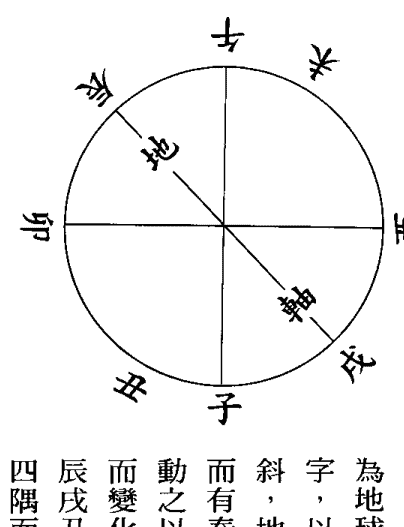

地軸偏斜於西北二十三度半，子午卯酉為地球之正中，辰戌丑未為軸之中心十字，以西北多山，東南多海，因軸心偏斜，地球之自轉公轉乃發生風雲雨露，而有春夏秋冬，動之以溫厚則嚴凝至，動之以嚴凝則溫厚至，潮汎漲落，因之而變化，零度起於北，故一運自坎而起，辰戌丑未為四隅之中點，故溫厚嚴凝隨四隅而變化，故陰陽二宅於定線時，古人多避而不取，實因子午地球之正中，易受風雷暴襲，而線取正中，更

人多取兼線，而不取子午及各宮，所謂正線，近有沈氏者師章仲山者，其云玄空，乃有所謂直達線者，即取子午正線矣，凡各宮之正中即空亡線，

紫白訣（二）

一九三

一九二

不能接上下元之氣，其來也銳，其退也更速，古先師不取正，而取兼實經驗之作也。取兼則左旋右旋皆能接氣，觀圖自明矣，地球之自轉公轉，亦均隨夏至冬至而左旋，凡此皆溫厚嚴凝，隨軸心之偏斜，而發揮天地之秘，造物之玄之又玄，於此可略見其端倪矣。

大易雖始自乾，終言歸妹，未濟以水火為歸，天地之生於火，而亦歸於火，故九六盡，則乾坤毀於灰燼，是故元龍有悔，上帝亦難為乞命之神，是以生成一四開而見文運，九六盡而天地閉，其九六之盡於何時，午運中天之始於何時，邵康節亦未敢言，恐洩天機之秘。

## 第五章 玄空巒頭秘竅

香港易齋求是趙景義著述
新加坡 張成春編纂

### 論全龍

全龍有洲之全，有國之全，一地之全，高山之龍，祖宗欲其聳拔，少祖欲其端正雄偉，主頂欲其圓聳朝己，過峽欲緊密，行度欲活潑有勢，穴場欲其隈聚，明堂欲其寬敞不散，枝腳欲其蕃衍，蓋迎欲其重疊，護從欲其眾多，案應欲其秀峙，印峽羅帶欲其秀麗，羅城水口欲其緊密，此高山看龍之要訣，夫龍之行，如木臥地中，祖宗者木之根，帳乃木之枝，正出乃木之幹，輔纏乃木之條，結穴者乃花之結子，入頂乃花之蒂，穴中藏金乃花之心，大小八字乃花之瓣，三分三合，花中之雨露。

玄空巒頭秘竅

一九四

一九五

註：論全龍者，有千里之外，亦有龍樓鳳閣之勢，落殿即結而其氣運必短，全龍必以襟江帶湖，消清煞氣為三元大地，會於外而結微茫核中。

### 論山谷平洋龍

高山谷最要開堂藏風，平洋最要得水，而水亦首要環聚藏風，而山谷亦以得水為要，無論平洋山谷，水必要環聚，不能流奔湍急，紆迴而來，匯聚堂前，紆迴屈曲而去，山谷貴有仰掌之明堂，以蓄穴中真氣，外砂關鎖牢固，水乃收之而蓄，若一級低一級，奔馳傾瀉而去，雖凹亦凶，所謂流水之去，最忌傾瀉之狀也。風雖藏而水不聚，則生氣無蓄，此所以必先得水，至於平洋雖不怕風，尤忌水反，然而竹管小坑，窺斜小路，箭風吹穴，尤所深忌，蓋平洋地之坑風，亦高山之凹風，凹風如剪口，尚能登穴即見，

平洋之坑風，稍一大意，即為所蔽，風之吹穴，故最忌者，故平洋之地必有平地帳護之，平地之來，亦要束咽，四面之砂，亦緊護到穴，使穴不受風，若散緩護托不全，又為坑風所劫，雖得水亦不結，此陰陽之學，俗名之為風水者，以藏風兼得水，為初步進階，高山人皆知避風，而平洋之風，世人每每忽之，特此詳及，然而平洋亦以陰陽合德，與高山無異，惟高山為立體，形峻窄，界水明，故其龍人易識，平地勢成眠臥，形闊大而水界微茫，其穴難明，故欲知平地，先看高山，其理一也。蓋五星立體者高山也。五星臥體者平地也。至於起頂開帳過峽束咽出脈等無不同，平地亦異，古人圖格，雖謂高山平地一樣看，自可了然心目，但南北不同，平地亦異，北方勝於水，南方勝於山，山勝當求之水，所謂低一寸為山，此扦穴之要法為千古不變，穴以在二水將合之中，在一水灣抱之內，以開脈出乳為正，平間微局為鉗形之局，兩旁微低者為水界，水界外微高者為護砂，鉗口外低平之外，又有微高者為案，具此四者，平洋

玄空盤頭秘竅

一九七

一九六

乃可落手，斯為正穴，後湊微起作頂，對正圓淨之乳，左右開脈之護砂，高不至傷龍，低至不可脫脈，使生氣能蓄以乘，局得收當前之水，此扦穴之要訣，若一向界水不明，脈脊不起，鉗口不開，明堂不開朗，交角左右太極不成，坦為牛皮者，斯乃假穴，一貫云，平穴雖有開鑿濬流，亦必因勢利導之，使原勢仍存，不能無中生有，若能不傷原勢，詳審之而平洋得矣，若傷原勢，其真氣已失，則不作穴，雙湖云，平洋之龍，雖落平洋，亦心有蛛絲馬跡，斷續作墩阜，雖於伏盤旋處，得其歸結，亦必微托之肩，蟬翼之砂，蝦鬚之分，方是真到頭真結穴，微微湧起，鋪毯褥，左右開鉗局，最忌鋪展過大，真氣渙散，難聚局中，北方之地要看水，南方之地要看山，亦以北方高亢，南方低陷故耳，蓋二水將合之中，一水灣抱之內，至此可見平洋之地穴，亦不在太窮太盡之處，墩阜起伏，續斷而至，而星珠浮漚之類，大盤旋轉折則結，而螺旋也。帳幕幔護，則穴不受風，謂之龍盡頭，氣自秀矣。

### 論初中盡龍之幹枝

凡全盛生氣之真龍，必有三停，開帳佈幕以後，在祖宗發脈處，城廓已全，即開局結穴，以其生氣盛極，此發嶂之地謂之初中龍，行至中途，氣脈仍未盡，忽龍低過渡，另作祖勢，山迴水抱，乃就本身開局結地，此腰之中結也，故名中龍，若山水交會，氣脈似盡未盡，但前後回顧無不合度，此亦為山水之大會，故名盡結，香港澳門皆似此龍也。然而初中龍雖雄大，去脈欠端巧伶俐，過峽亦欠迎送，其在中龍結地必輕，中龍結穴既大，則來脈端巧伶俐，過峽成形迎送，去脈必緩懶，此餘氣送迎城廓耳。在其初中龍中龍作穴，必經盡龍作地既大，是必來處眾咸備，諸煞潛藏，山水大會，以成吉地，其初中龍中龍結穴必經，此皆在身上作穴，若分劈另作祖宗，則又有幹中之支，支中之幹又作別論。

玄空巒頭秘義

一九八

一九九

### 論飛龍與橫龍

飛龍在高山作穴，不得平洋之水，然結處龍體盤旋，坐穴中自成一家堂局，寬則有四五畝，狹亦有一畝半之堂，如三腳金鐘頂上穴，丹鼎爐門，主體木星之節等均取材於飛龍，蓋其勢既逆，但求內肚能以容左右盤旋之真氣，不必盡拘於收納外水入懷也。且龍勢高峻，穴前必有小明堂，此真氣之聚，其受氣堅固，不必忌穴前深坑，如品字形之燕子樑上穴，又如上面聚有小湖，此地名昂天湖，有坪無水，名仰天祿，蓋天之雨露為澤而為祿，所謂承露天盤也。至於橫龍又有凹腦天財之穴，以其如兩金扛水形，此穴又不必拘後龍之鬼，但後必仰瓦為真，以氣湧於前仰瓦於後，正物理使然，蓋前既氣湧而垂乳，後又拖鬼，恐為行龍之撓掉，真氣不聚又屬假地。

證註：中山容家祖地，為後仰瓦氣湧前，前有深坑，惟盡收新中西江之水，大富之地。新會三江壁上掛燈，橫龍穴前企壁，人丁過萬。

### 論五勢十龍局

五勢者，正、側、順、逆、迴，十局者五勢之各有順逆二局也。勢，乃舉大勢而言。以大局之大江水分順逆也，若大勢能押砂水而歸懷內，過堂而與隨龍之水隨堂逆合於水上者，為逆局也。主得水多而力重，若上砂作案欄。順水抱穴，而懷內水，與隨龍隨堂二水，順合於水下者為順局，主得水少而力輕，若龍勢大，力亦不減，必順過穴腕為妙，或得順案逆水而上，又不概以順局論也。正勢者主龍自北而發，朝峰在南而至，為正受穴也。側勢者主勢自西發，轉南而結，朝照之峰亦自西而發，向北作穴朝，即橫受穴也。順龍者主龍順水而下，朝山逆水而上，即順受穴也。迴勢者，即

濾水張家之馬凳，亦如燕子樑上穴。此皆坐穴不見穴前深坑。鶴山蔡家狀元大地，亦三腳金頂上穴，坐穴不見穴前深坑。

玄空巒頭秘竅

二〇一

顧祖受穴，隨龍者，以去龍作照，此隨龍在後湧灣。

### 論纏龍護龍身之砂

纏護即旁龍，正龍之輕重，甚關重要，亦辨正龍貴賤之正法，蓋纏護不密則孤單，孤單未免為風或水所劫，經曰，若是真龍正面來，身雖屈曲頂不歪，撈掉卻是蜈蚣腳，兩回成雙對面著，一心一意戀穴場，並不斜反顧瞻別，真龍定然有迎送，夾從纏護無空缺，龍若無纏又無送，縱有真龍不堪用，纏護愈多愈有氣，眾山眾水來會聚，渾如大將坐軍帳，羅列隊伍俱整備，若是纏護北面走，一邊撈掉一邊有，頂面常顧真龍身，不敢拋離處處行，若纏龍穿心作帳，渡峽分明，又步步顧主，苟非生氣全盛之龍，不能有此局，故曰正龍落處無蹤跡，妙不可言，纏龍迴顧貴無敵，但纏龍有此亦必結地。

### 論形勢

龍之神態氣概，每見於形勢之間，故頭圓而長者木形也，頭尖而銳者火形石頂也。頭平方而正者土形也。頭圓而矮者金形也。金之高大者太陽形也。金之低平者太陰金也。或生波浪曲折者水之形也。卓然豎立起者，乃立之形，凝然坐而安者坐之形，儼然倒臥於地為眠之形也，形之分五行，以此觀之，山水之形雖千變萬化，要不外在此形勢而已矣。

### 論氣脈

山水之微妙，無過於氣與脈，脈在有形無形中，但必寓於形然後為脈，而氣乃屬無形，而無形之氣亦必依有形之脈以行於地也，故龍勢出帳渡峽，其間分水止脊者，此龍行之脈，於微茫中細察自可認出其運氣於脈中以行，

玄空巒頭秘竅

二〇三

二〇二

龍行到頭略露一線，此所謂蛛絲馬跡，而分水清楚者此正受穴之脈，而隨脈者乃正氣也。脈行自當避風，若脈行而風乘之者，則其真氣不行，謂之有脈無氣，此最要留意，水劫之則氣脈俱絕，此有花無果之地，此為絕地矣，不可不細心察看也。

### 論分個字水分八字

夫個字者，乃龍之起頂開帳出脈也。蓋一枝之山，其發祖分龍處，必先起峰頂，頂旁兩肩，開帳拖脈是「個」字之「人」字，自頂下有脈，穿帳中出是「個」字之「丨」中脈也。發頂四顧，局勢寬廣，上之「丿」發天門，抵水以護堂，下「丶」發地戶關水以抱局，凡祖宗少祖父母過峽等處，多作個字、必須於起頂處，轉節處，分劈處，仔細詳審，若是落直「丨」出者，便是正個字脈，若從「人」去者，便非止脈，若「丨」短而「人」

長者，乃正龍之「個」字，「丨」長而「人」短者，乃護龍之「個」字也，蓋正脈每藏於絡中，而「人」兩旁以護之，故正龍之「丨」恒短於「人」字獨護龍之脈，每每先行而為正龍之衛護，所謂貴人之出，必前呼後擁，所以「個」字之中，必結穴於灣抱之內，而灣抱穴前者又得二三重也最妙。至於行龍之頂，多不作「個」，此不可泥，然一枝龍有兩重「個」字者，或三四五「個」者，有二三「個」疊川者，亦有「個」字之中，轉身作「個」，若不疊川而實疊川者，蓋山若疊川直行，則頂正腳齊，其為「個」字易識，但山行每每轉折，未免頂斜腳擺，故「個」字少相疊川，且或邊大邊小，邊長邊短，邊有邊無，邊趨前，邊趨後，龍以「個」非「個」必須仔細詳認，方為的正龍穴，故人字相對正脈，從中出者，乃梧桐枝，正真「個」字者，上節起頂，發脈左邊，下節發右邊，此葭蒹芍藥草「個」字也，三者皆正龍之「個」字，若楊柳枝，則右有「丿」而左無「丶」字，左邊有「丿」而

玄空巒頭秘竅

二〇四

二〇五

右無「丿」者，或上「丿」少，下水「丿」多，下水「丿」少，上水「丿」多，或上水「丿」長，下水「丿」短，下水「丿」長，上水「丿」短，此皆隨龍護砂也。之「个」字，偏「个」字也，一邊險峻，一邊坦夷，仰身之「个」字，後拖鬼，前開口者，伏身之「个」乃行龍之變體，似「个」非「个」而「个」在其中矣，一邊趨前一邊趨後，舞蹈之，「个」前垂乳後仰瓦，仰天之「个」，然而行龍雖分「个」字，則左右兩肩，皆如牛角之彎，所見皆為我用，而無一砂之背，去水分八字，則兩畔界水，自如衣領之合，而無一水之斜流，蓋自祖出轎穿帳渡峽，以至入首成穴，凡三分三合，莫不交會於穴前，此胡矮仙以「个」字訓其子，楊筠松看尖圓，屬師乘金相水，朱子雌雄相食，皆「个」字中八字中之玄妙也。

### 論頂

夫頂有祖山之頂，有本山之頂，如人之百會穴，乃百脈所朝之地，至尊，登頂而望，四面山水朝拱，勝於穴中所見，蓋穴乃子孫，必祖宗尊貴，而後子孫藉厚蔭，理之必然也。故祖頂必端正嚴聳秀麗，本山之頂，如人之額準，居面之中，亦即五嶽之中，宜開面分个字，而脈絡瀉下入準頭法令如兩水會唇，方顯「个」字分明，故本頂貴端正圓淨，若脈脊從頂尖即分明兩邊水路，是「个」破腦，非成龍之地，故曰貫頂，若從腦上抽星峰不現頭是也。且大地祖墳頂多有天池，天湖以蔭真龍氣脈，蓋地氣恒翠於頂，天氣下降地氣上升，二氣交感，水由以生，生氣不竭，池湖亦不乾，且池湖之旁亦多結地，亦有隨龍之池湖，越深則龍氣愈真，蓋受八方朝拱，發福宏厚，此足以觀山頂之力量矣。

玄空巒頭秘竅

二〇六

二〇七

### 論峽

山之有峽，乃龍之脫胎換骨，跌斷過脈處也。凡龍之渡峽轉脈，則以前之環境已經隨峽脈變化，凡大力量之龍，於跌斷過脈時，必另起祖峰，亦如父母與子女分居，兩肩橫開帳幔，脈從帳中出脈，故曰出帳，出峽或前後或半山邊，或跌斷至地，池湖穿過，高過低過，正過、偷過、橫過、斷過、長過、短過、大過、小過、遠過、近過、闊過、窄過，又有雙脈過，渡水石脈過、飛脈石樑過，過雖不同，其理皆一貫，龍之過峽，即交會，總不離送迎，陽來陰受，陰過要陽接，此陰陽交媾之象，最為緊要，平地過者，要水界分明，高山過者，忌劍脊鰭尾，池湖過者，要出中切忌邊行，平田過者要分流，慎防水劫，高過者要避風，低過者以不傷氣為主，正過而有個字送，橫過要護纏，斷過則有界水，偷過則有蛛絲獸蹄鳥跡，微茫做引導，短過無粗腫之脈，大過自有關峽，小過而扛送，遠過要有包藏，近過要有分脊，闊過要懶慢散，雙脈過而中有水露，渡水過而有石樑，斯為美矣，若奇巧異常，有美泉秀石尤貴，美泉氣之精，若陽過而陰不媾，陰過而陽不接，此單雄單雌為獨陰孤陽，無生生化化之妙，或平過而無蛛絲馬跡，高山過而無陰陽交媾，池湖過而脈從邊出，此賤脈也。平田過而脈為水界劫，高過而脈受風吹，低過純陽不化死板，正過兩腳槍刺竹，橫過而反手翻花，斷過而遭水劫，偷過而無草蛇灰線，長過而無蜂腰鶴膝，大過關峽太遠，小過扛送無情，遠過不扛不護，近過無脊無分，中過有漏不補，石樑水不分流，雖或有脈有護，而低不接脈，有峽而遠不及脅，邊長邊短，邊有邊無，邊吉邊凶，皆不融結，多為假花偽穴，何以知峽之輕重，賦云，凡遇峽處見池湖，聚為第一，見田坂為第二，見坦窩草坪石田為第三，或有泉池而脈從中出，名曰養蔭，雙池名為聚貴，單池則力減，或池崩塘鴻漏，反生禍矣，何以知穴落遠近，峽乃龍之樞紐，造化胚胎，龍欲住而結穴，峽中露情，如人之受胎，亦胎息孕育之至理，其大小中結，有胎中預知男女，穴落遠近，凡短過而直，此去不遠必結，其力量必厚，就在一二節便住也。名峽長寬闊，過脈之形或屈曲擺動，非為吉脈，但不受風寒，再分峽分帳，分配陰陽，轉成吉地，另創一局，在此結地，賦云，從低小來而去高大者，陽太盛則氣旺於頂，行度必遠，如來高大，而去地低小乃絕嗣之地，何以知穴之偏正高低，凡峽短狹而脈正過者，穴結必正，過脈偏左，穴亦結左，偏右穴右，亦有龍從左來，而穴結右，龍自右來，穴結左者，此在巒頭從二三節上，觀四面之相因。又有脈正出而忽斜過者，穴亦正出而斜，脈側出而正過者，穴亦側出而正，透頂出脈穴居腳下者，腳下出脈，穴居頂上，脈低過者，氣凝在上，結穴蓋吞，脈過高者，氣流在下，穴結粘綴，脈不高不低者，穴亦如之，融結為中，此以巒頭後一節龍論，勢相因也。凡峽正過，主正去結穴，必作太陽金星等穴，若峽側過橫過，亦主側結橫結，必作轉度，仙宮、天財、等穴，若峽兩星左右枝腳前後相交，名曰迎送峽，又曰鴛鴦峽，必結正穴，或迴龍顧祖，此等專論峽之正過，側過、橫過，而辨星穴正側橫之，受穴也。何以預知砂之長短有無，凡過峽處兩邊有砂，環抱俱長，到穴左右兩砂亦長，或左長右短，或左短右長，或左有右無，左無右有，或一股生，或一股死，到穴之兩砂均亦如之，或孤單過者穴亦孤單，如此穴受風，此乃絕地，雖有真氣，亦偏枯於房份，大抵過峽之形，與出穴之形無異，所謂禽逐禽而結禽，獸逐獸而結獸，出身不離祖宗，是也。何以預知陰結陽，凡穴星後跌斷來氣之脈，或陽中有陰，謂之血包精而坤道成，前面必結窩鉗之穴，有如男子之勢象，或陰中有陽，謂之精包血而乾道成，前面必結乳突之穴，有如女子陰戶，此專論穴星後一節之脈，精血相貫，應驗無差，另二三節之低小者，此陽氣低伏，脈漸漸而息，去三五里即止，參合一訣，應驗無差，何以辨峽之陰陽，曾云過峽星體出脈之處，形如覆掌陰也。星體接脈如仰掌也。名曰陰過陽接，又名此陰陽峽，即胎伏龍，雌雄交媾也。若陽來陰受，雌雄不順，雖有配合，與胎前伏後相左者，雌雄雖會不媾，必再過一峽，順乎陰陽，方合龍格，至於峽脈要陰中陽，陽中陰，乃為精血交媾，然後成胎息孕之體，陰陽配合，前面必有融結，若陰陽雖交而不順，雖有胎息之孕，亦難於育，至此又要前去尋求，再過一峽轉之脈，分配陰陽，方結穴也。若一向峽星與脈俱不陰陽交媾，全無交媾扛送，此等獨陽孤陰，只可作神壇廟寺，要託於此處，精血駁雜，難以預護，何以預知房分之禍福，凡遇星辰，成五吉者，為福胎，成四凶者，為禍胎，大忌賊風吹穴，或劫脈，何謂賊，賊不見之謂也。如吹背吹峽，有此真氣散無力，必有禍應，如左邊無砂遮護，脈受風劫定損在一四七房，右邊無砂遮護，脈受風吹，定損三六九房，若脈形犯劫殺，二五八房受殃，至於左右有凶砂，凶水，來劫本峽，房分禍福亦如之，如此過峽砂水前面縱有好穴，搏龍傳代，亦必立見禍殃，經云，過峽與受胎同，在胎有病，嬰必瘦弱，胎中無病，子必清奇，峽土，穴亦土，峽石，穴亦石，但必求石中土，此一氣相乘，原無二致，何以驗方向之吉凶，有一定之龍，有一定之向，有一定之局，亦有一定之線，惟立向總以玄空六法星運為主，青囊經云，卯山卯向卯源水，富與石崇比，乾龍乾山水流乾，乾峰出狀元，朝頭狀元拜相，朝尾狀元歸鄉，巒頭必與玄空星運配合，然後完美，證之以往，此法無差，何以知其處，凡見池湖過者，逢池湖則住，田坵過者，逢田坵則住，又若草坪草窩各穴脈，亦各適其類而住，旗鼓龜蛇，亦逢類而住，經云，生子生孫巧相似也。又有一等凶龍，全無跌斷過峽，直到穴場，雖有屈曲奔走之勢，然無峽則無脫卸，殺氣未除，不知者，貪其勢雄星美，誤下必主禍凶，若脈落平地，脫盡殺氣，變駁而作穴者，不在此論，然平地峽與山峽無異，只看斷水處分為準繩，若肯心傳峽中訣，汗牛充棟，括無餘義，尋地之法，全在此篇，神而明之，存乎其人焉。

### 論束咽

咽者，少峽中束氣之處也，如人之喉咽，蓋龍之將入穴，必先結咽作蜂腰，如人之束氣，喉咽之而呼吸，最為緊要，尋个字以認其頂，尋結咽以認其喉，蓋咽不束，真氣不入穴，得頂識氣之始起，得喉識氣之伏，由喉以循求真氣，其中心之穴不遠矣。

### 論出脈

出脈者，自主頂出之脈，直到本穴之星脈也，廖氏曰穴後落脈要中出，左出者輕，右出更輕，夫脈之入穴，至中至正，則專受正氣，因為吉矣，左無別，右經者何也。蓋左逆右順，所謂左右出者，乃陰陽兩理，蓋指逆水出者為左，順水出為右而已，故凡脈隨順出，不問其左右，以其從順水出故名右出，反此名為左出，又凡脈有脊出者為陰，窩出者為陽，陰結有胎，如雞心、水泡、懸乳，皆其正也，順也。此宜球簷扞之，如轉度、鼠肉流劍，是側出逆脈也。宜架折扞倚粘也，陽結看窩，如掌心，開口合角，皆正出順脈也。宜就球簷扞之，如扁大（註扁大臨弦出），扁大必求之弦口，皮刀、轉褶是側出脈逆脈也。宜架折扞倚撞也（註湊入休傷腦，拖出忌溜牙），粗雄向側求，扞球藏滴水，此皆扞毬簷倚撞之妙法。

### 論化生腦

星穴自頂而下，至腦門微微隱起，謂之化生腦，直下於額，又一度化生，在穴回顧不見頂額，以穴在命宮也。如此其穴方真，不然其腦門假額自偽，而穴則一偽矣，此扞穴之妙法則，凡尋穴之法，近看細嫩之頂，詳審其化生不化生，化化生生，束咽頂顧方真，此化腦之能引生氣入穴，千里尋龍在此入穴，化生已成，細察其入脈之路，腦下三丫，混沌隱微，此个字之中乃成功之所，為安身立命之處，捲簷天心十道，金魚水，八字會，蟬翼砂，蝦鬚、蟹鉗，在此處皆一一出現於眼前，尋龍者切切記之。

### 論四真

穴星上承頂星，八字个字，乃上有分，下對合水尖為一直，蝦鬚、蟹鉗，左右直砂相對，為一橫、一直一橫，為天心十道，此處為安全之地，不可忽略，十字上有生氣，微微滴落，此真氣也。天心有隱隱隆隆之象，遠視則現，近視似無，左右之蟬翼，亦有影無形之狀，夾輔其中，此真砂，十字上下有有影無形之真水，上有分下有合，若遇此者，最好於大雨時登穴審觀，天道雖秘，至此亦難逃法眼，由此內乘生氣，葬經云，葬乘生氣者，此生氣也。外接真水，真水者，穴前有合之真水，在此前後左右之間，四真齊備，可以乘生矣。

### 論圓暈

圓暈似水泡，所以驗生氣之有氣無氣，氣有正變，奇變之妙，暈泡亦必要貫頂，串連个字之一為的，蓋氣自地中，流行不息，故有三陽，明堂以水界之，氣逢水界則止，故云乘風則散，界水則止，因有上分下合之水，其氣自止，是以成圓暈而結穴也。尋暈之法，有案朝案，相頂之下貫，或相其个字之一，若自主而下，抑串旁而至，體認既真，然後登穴，細看明堂合水，案上之峰，獨山向中，不朝陰（脊也），以朝嚮為聚，二峰朝中，以二金聚中，三峰亦朝中，仍審其小聚何處，以得水為宜，而个字一下，必有逆水，圓暈以對堂之中正而結也。若平地圓暈，雖被鋤破，而个字一，依然尚在，明堂朝案，自能使用，至於平地之蟬翼等尚可補之，只圓暈真，則真氣在泡內也。補砂則可五年客土，亦原土，惟圓量及自地中真氣而來，在後天不能加減。

### 論穴星

富貴貧賤在水神，水是山家血脈真，故五星皆以水而住，無不隨水而來，隨水而住，穴有九星，星分九體，九星九體皆繫乎五行，其中正正變奇怪，而皆含得水之意，九星者，太陽、太陰、金水、紫氣、天財，此五吉正結，天罡、孤曜、掃蕩、燥火，此四雖凶，亦可裁穴，為騎形坐煞，扶金剪火，開孤截蕩，皆自常中而變，而由變轉常，此又高手之裁法，九星者中有九體，上貫頂下垂乳，龍處均配三停者，垂乳穴也。重龍重虎，雙擊穴也。平地仰臥者平面穴也。三者皆正體，開口穴者下無乳也。本體穴者，無龍虎砂也。單股穴者，有龍無虎，或有虎無龍也。側腦穴者不須貫頂也。沒骨者，無頂腦也。弓腳穴者，龍虎長短也。六者皆變而結穴也。捉月在斷山，漱石在石山，必求石中之土，斬關在過處，走珠在獨山，騎龍在脊，求仰掌，藏圭在田心，求前前浪聚，鼎爐在山頂，求三腳之來氣，回龍在曠野，看朝之抱，此皆奇形怪穴，自變歸常，惟九星之正變皆要得水之涵注，即可取也。

### 論大明堂

前哲云，明堂容萬馬，水口不通舟，此言明之闊且寬而緊也。又曰有人識得明堂法，五百年前一問生，何知之解也。蓋明堂不徒有寬平模樣，乃砂與水相合而成者，是砂水二者，明堂之實用也。故凡明堂中砂逆水、水逆砂，則明堂用也。明堂最大之砂，以龍抱虎為太極正法，反是則明堂不固，明堂善惡，砂水順逆而已矣，然案內之明堂不若龍虎內尤切。

### 論小明堂

小明堂者，穴前略有平處，可容人側臥者也。勢來形止之地，必有小明堂，方能聚氣，所謂水接堂氣者此也。堂氣者何，小明堂內真交合之氣也。非此則的穴不全，曰歇時必有小明堂，氣止水交方是穴，知此則尋穴之法，深淺可定矣。

註：李默齋先生所謂縮動平攔，就是此平字可容人側臥，亦為平也。內外明堂之龍虎砂，最要莫如雌雄真交，否則後天用人工補之，亦須以順其氣，其在中山麻子鄉與何家作地，地名出水象，此地之先乃大小明堂，皆青龍抱白虎，隨後乃由他移龍補虎，乃發出小攬，何家大族，丁貴兩全之地也。

### 撼龍九星變穴

貪狼作穴在乳頭，巨門作穴窩中求，武曲結穴釵鉗覓，祿廉疏齒犁鏵頭，文曲穴來坪裏作，高處亦是掌心落，破軍作穴似戈矛，兩旁左右手皆收，定有兩山皆護轉，不然一水過橫流，輔星正穴燕巢仰，若在高山掛燈樑，落在低平雞巢是，縱有圓頭亦四象，此是博換尋穴星，尋穴隨龍細辨別，龍若真兮穴亦真，龍不真兮少真穴，尋龍雖易裁穴難，只為時人昧剝山，剝龍換骨星變易，識得疑龍穴不難，古人望龍知正穴，蓋將識龍尋換節，識得龍家換骨星，富貴至今無歇滅。

註：古人以穴從龍結，故隨龍覓穴，是以古人望龍而知穴，然穴之從龍，亦有二種，有從應星結穴者，穴之正也。有曰間星多，而隨間星結者，穴之變也。此詳疑龍經變星篇。

本篇出楊公山法全書，亦千變萬化不離此九星變化，若在粵之沿海地區，尤須詳玩此九變，以粵之海灣多，則剝換多，渡一海灣一剝換，轉一星一剝換也。

### 論陰陽龍穴解

經云，陽龍下了陽穴絕，陰龍下了陰穴滅，陽穴陰頂可安墳，陰龍陽穴可裁折，此龍反伏吟，星穴亦以陰陽交會為體，定穴開線其次也。金木火三星剛而燥陽而結者凶，水土二星柔而濕者，具陰濕，凡金星巒頭陽龍也。如出正體，生乳生突，重見金星者，謂之純陽也。無生化真氣不住，主孤寡敗絕，金宜開口，量金用斗是也。金星大開窩鉗，宜開口生水，為陰穴，微窩，微鉗，或小口皆吉，主富貴延綿，若窩若窩鉗太大，鉗口不收，又為從純龍，老陰無生生之氣，亦屬冷窩，亦為絕敗之地，大富大鉗中，必要生水泡，名乳突，為太陰生出少陽之穴，故倒杖故倒杖訣云，頑金打破口中裁，葬在土皮去不來，打破球簷尋活脈，若還硬塊實難埋，此頑金必開小口，方可打開以開金取水之法裁穴，語云，金星不開口，神仙難下手，不外乎要動，若無小口又不開平面，純是硬塊，如鐘如釜，是祿存星，非太陽星也，最為兇惡，訣云，金星只宜開小窟，大窟中宜突水泡，若然窟突不分明，硬面禍來侵，純則要動，動則生氣至，不動生氣不至。

凡木星巒頭陽龍也。如出正體，不開枝腳，重見本穴，謂之孤陽。無生化主敗絕，宜爆節泡或微窩鉗，節泡復生小口，皆為吉地，以陽中有陰，有生生之義，水從木星為官不絕，泡節之動為水，若開大節大窩大鉗，為陰龍，老陰無生育之義，必在大窩大鉗中再變，或乳或突，是老陰生少陽之穴，陰陽相配大吉穴也。若直木參天，無節泡窩鉗，生氣不能買入，有星無穴，不可扦，此絕敗之地，老幹不化之謂，若橫木倒地只看節，芽口亦吉，至直木或眠木，其來或長百數十丈，到頭開小口，或至半途爆一小節亦可，此為陽龍陰穴，但要微微束咽或彎，帶些水星波浪，此動也。名水木蘆鞭，屬大貴地也。有伏頭參拜之地，訣云，木星不宜下陽穴，純陽必主絕，木直能開口，便為奇陰穴，不問疑也。

凡純土巒頭，陰龍也。如開口成水窩（土剋水）謂之純陰無化生，主黃腫敗絕，若出正體不開枝腳無變，亦不取穴，必要正面中，生出小突泡，為化金體謂之土生金，乃陰龍陽穴，陰陽相配是以有生氣，或下之小突，復開小口，是土生金，金生水，此大丁地，或土星大開窩鉗，體用皆陰，此陰中之陰，不可扞，必大窩大鉗中，現出小窩小突，此亦吉穴，主出肥矮富豪之人，若不動生突泡，是生氣不入，不可誤扞，訣云，土星不可扞水穴，下後黃腫人丁絕，若扞土中金星穴，富貴旺兒孫。

凡水星巒頭，陰龍也。在五星屬二凶之一，在九星為文曲，為掃蕩波浪，屬四凶之一，巒頭之辨原凶神，本無可用，物以窮則變，變則通，總以其動中變，變使能化，中間生出乳突，轉為金體，是子母相生，變為陽穴，是金之剛生濟水之柔，穴取陽能配水之陰，庶幾化凶為吉，每多大富地出豪富，此亦初代發福大地，至傳至水星，多流浪飄蕩，淫亂無禮，此等予曾探覆富豪之祖地，只係一個運即已敗退，而且男盜女娼也。

水星若不生窩突開鉗，直開水穴，謂之陰中陰，無生化之義，訣云，水星不宜下水穴，下後人丁絕，好尋陽頂配巒頭，富貴永無休。

凡火星，在星為廉貞，屬二凶之一，為燥火，純陽龍也。廉貞只可作祖峰，此四凶之一龍脈不宜扞葬，以至剛之體，至燥之性，最為凶煞，又謂之亢龍，無生化之氣，主傷人口，無論任何元運，不宜扞穴，此為凶絕之地。

若能轉水變星名水火既濟，即開口出窩，是剛中柔，庶幾化煞生權，變化之機，乃陽來陰受，若朝對合法，主出邊帥，但必要廉貞火頂變化多節，方為大吉，若龍行太速，此陰地也。每有殺戮之事，而至抄滅，不可不慎。

以上九星五體，皆取動字，若陽純陰純，皆反吟伏龍之地，地忌扞葬。

### 論五星總論

火土金水木，為五星正體，火尖而聳石頂，此為龍祖之峰，如乾卦乃亢龍有悔之象，但經云，大地若無廉作祖為官也，不到三公，土木火為三凶星，火入而剛燥，金入而熔，木入則腐，水入而濁，土入而枯，故無穴法可取，若配此金木土三吉，可結富貴大地，水星為至柔之體，火乃至剛，不能作穴，惟水有金救，則金相融，轉凶為吉，在九星中以金水名者亦結吉穴，但水體浪蕩，流連忘返，太過死犯淫亂，客死他鄉，葬經云，乘金相水，穴土卯木，而不言火者，吳草廬蔡牧堂，釋火為祖龍，謂不結穴也。且歷覽古墳，火星結穴甚少，夫以水能濟火雖結作，亦不能全美，況純火之地，豈可妄作扦葬用之，雖神廟亦不能作落，何況士庶之家，幸勿妄為。

### 相穴法

堪輿陰陽之術，千里尋龍結在一席，又曰十年尋龍一年點穴，蓋以穴為藏骨之所，是地理緊關元竅，決不可毫厘差謬，經云，望勢尋龍易，登山點穴難，若還差一指，如隔萬重山，千里至此只求一席，一席中求一線，故凡點穴，五星上文已詳，穴場必先於本身斬木刈草，使星體畢現，蟬翼浮出，然後在小明堂上，或案山上對穴詳審，定巒頭為陽中陰，或陰中陽，務求有生生化化之氣入穴方可下手，詳察五吉或四凶，經云，江南來龍江北望，西江龍云望江東，楊公此語，巒頭與理氣並用也。前朝後枕龍虎，此四處無論正側斜歪結地，皆不能脫離天心十道，論相穴場，先論四勢，玄武不顧空勞萬山獻（後枕），朱雀開口，詁辯家不寧，白虎含屍當代敗，青龍斷臂子孫稀，認穴之法總不離陰來陽受，陽來陰逆，或倒杖、或乘胎、或乘氣、或放、或送，亦不外乘生氣，認清楚此一著工夫，認穴的確，自無差錯，穴場既定，然後審龍虎之高低，故云，左右高時在高處，左右低時低處尋，再看案山高低，案不可過高而壓目，低不可過低而脫胸，又曰朝，若高時高處取，朝若低時低處求，若無案而有匯聚，即為朱雀當潮，此又不拘高案，以有潮匯於前，遠水同高山看，低近水與同低山看，雖龍看龍虎與案山高低扦葬，惟三停之穴，可以上下移之，若大地融結天然一穴，乃毫不可移，雖有進退之法乃在毯簷之間耳，即龍虎與案山高低，亦不為緊，開毯簷須審來脈之緩急，乘胎就息法扦之，俾棺脈相接，葬經所謂葬乘生氣之要訣，乃葬法之本，亦有先探土法，塔金乘脈，而陽局則納八方朝應，因真氣與穴場各異也。

### 論太極

太極為陰陽之本體，訣云，隱隱隆隆彷彿佛，細看似有形，粗觀則無形。

又云，外氣行形，內氣止生，此處氣量內之外氣，氣藏土內，故曰止生，內氣必得外氣形模，使內之生氣自止，穴場既定於圓量之中，是謂太極氣量之中，上水分下水合，此水非源泉之水，乃高一寸為山，低一寸是水，穴場斬木刈草以後，最好於大雨到察，自見其中分合之水，此水聚於小明堂中，如此生氣內聚，故云，生生化化之氣，無論大結小結，皆有此氣，或稱之為羅紋土宿毯簷，有靈光一現，法眼自見矣，若無此真跡是為偽穴，凡京都大邑外極則大，如魚之在水，魚大則量大，魚小則量小，亦地理中物理使然，若欲證此登少祖自見矣，外圍愈大，真氣愈厚，所謂三極要分流也。

出煞水在內量，必要左外右內而出，若倒轉太極，則外氣無由貫入，及此乃煞水，煞水當元生事，外明堂亦宜陰陽配，否則其一代以後，輪到水口，必有大劫，亦水口砂反，僧尼居之謂也。

### 論兩儀與四象

太極既定，兩儀自分，兩儀者陰陽也，凡圓量肥起者，是陰穴也。圓量瘦陷者，為陽穴者也。是兩儀之穴，皆當用饒減之法，若圓量上肥起，下瘦弱，或下肥上瘦，左右肥瘦不一，此皆二氣相交感，不問龍之陰陽，皆可用也。惟二氣交感，則取陰陽會之中，此乃升降聚會之所，而不用饒減之法，又或陰多陽小，謂之老陰少陽，亦宜挨生，皆當用饒減之法以扦之，否則多不壽之人，朱子曰天地各物各具有陰陽，陽自下而上，陰自上而下，是謂乾坤二氣之合，此周濂溪之兩儀圖極詳解，陰主靜，陽主動，在量內皆有邊靜邊動，或上動下靜，陰陽吞吐之微茫水法，法眼自見，至於四象，則自兩儀生出之，四象者，太陽、少陰、太陰、少陽，必要陰陽相配，純陽不取。純陰亦不取，必老陽少陰，老陰亦配少陽，然後有生生化化之義，亦必挨生棄死始可以使生氣止，所謂界水則止，其陰陽交媾，則其內氣又何能外洩，四象之理，屬之太極甚微，屬之穴形則甚顯，以顯闡微，執象以符理，自可於此中得之矣。

### 砂水總論

砂水者，量員外之金魚水，蝦鬚水、蟹眼水、蟬翼砂、牛角砂，有水則有砂，有砂自有水以界之，人中水出煞水，皆乾流之水，高一寸為砂，低一寸為水，此所謂山嶺也，穴形既定太極量，兩儀四象之象，自有真砂真水以關真氣入穴，是謂生氣內斂，有生生化化，若無真砂夾輔，真水界氣，則真氣外溢，生氣散漫，不能融聚，何能結地，凡此等真砂水，有一於此便可扦穴，砂水緊夾不離，外氣不侵，內氣不洩，故能融結。

## 新玄空紫白訣

### 釋金魚水

經云，金魚不合，枉用九曲來朝。此外氣侵內氣洩之，謂金魚水係自懸乳之下，其兩邊必有兩水交送，氣脈隨量下至乳盡處而交合，謂之金魚水合，此是雌雄媾合於內，以束生氣，上分下合自然分明，有似金魚吸水，從兩腮而入，自口中吐出。

### 釋蝦鬚水

蝦鬚水者，突穴下之水，二短鬚合尖向前，二長鬚一左一右抱於尾後，有似蝦游水時，二鬚合於前，二鬚拱於後，其鬚游水時，亦分陰陽，前合後拱，以包裹其身，故突穴要看蝦鬚水，細究物理，詳釋字義當自得之。

### 釋蟹眼水

窩穴下之水，蟹有兩眼，以窩形兩角如鉗，穴於窩弦，或穴在窩心，其四面環繞，有似蟹眼豎於眶中，而四圍水繞也。鉗穴蟹眼水，若鉗形穴，在腦上，鉗之兩腳之空槽處為水，所謂高一寸低一寸，故窩鉗二穴之結要看蟹眼水，若臨田近水之窩鉗穴，穴下有長春之蟹眼者，最發富豪，且能長久。

### 釋人中水

人中水者，為在唇上之人中，唇上之槽，蓋此槽可露水，故以為人中水者，槽之下唇皮微起，此人中本體也。故凡龍氣旺盛，有分兩脈合氣而結乳突之穴，乳突之上，兩脈並來，巒中一水微茫夾帶雙脈入球，上球微茫突起以塞槽嚨之水，貫氣入穴，乳突之下，必有口唇，又有如人中之狀，故名人中水，倒杖云，能明掩口人中水，朝是凡夫暮是仙，惟此水在者，名曰雙箸夾楊梅，此穴有雙氣貫穴，亦名曰玉箸夾饅頭，最發人丁，若應簪頭秀麗，功名之發多雙至。

### 釋蟬翼砂

蟬翼亦形象，而取斯名，蟬鳴其鳴時，動左則停右，動右則左停，陽曰左，陰曰右，此形薄而小，惟亦分邊厚邊薄，邊短邊長，遠觀似無，近看似有，故取義於蟬之翼，此砂雖薄，但包過圓暈，以關真氣，又名暗翼，龍自右來趨左，要左砂明收左水，龍自左水趨右，要右砂明收右水，收此水入穴以養柩，以蟬翼藏於體內而不外露，陰陽者即股大股小，邊暗邊明，又或邊長邊短，其中進退變態，似難盡拘定。

### 釋牛角砂

水義於水牛角之左右灣環，內抱穴場，故凡穴場兩邊有微茫突起之水界，外隔水為砂，是名牛角砂，此借形為名，夫蟬翼者薄，牛角則高起而灣環內抱，其形如牛角，故云，窩內沖融。平坦之上，名曰土宿，土宿者何，在牛角之內恰似牛角，又曰羅紋，如人之指之羅紋，夫羅紋必有中心之一的，此就是真氣之的，此不外以物理證之，使後學者易於尋覓。雪心賦云，無三叉脈出，只見兩片牛角夾一點蟹眼水，窩臚結是也。

以上砂水為撼龍疑龍所未言，粵之欖鎮李默齋先生地仙也。專用動靜，並以砂水以尋穴端的無差，所著闢徑集傳世，觀大龍則以縮、動、平、攔四法，而觀山川之變化，入穴則以注重於蟬翼，蝦鬚等生物砂水而定穴場，致於圓暈、羅紋、土宿以及微茫二字之真義，上分下合之金魚水幾法，必多覆古人墳，仍須名師指，始分得其中奧妙，否則對書了然，登山朦然，徒勞無益也。

### 釋三龍水與毯簷分合，龍虎明肩、暗翼、纏護大明堂。

襟江帶河之大龍，必有千百里之流，大三合水總匯於大明堂，如粵之廣州市，新會縣城潮州府城，皆有三龍水，小者一龍之真地亦要水，匯龍亦所以養龍也。纏龍亦護龍耳，隨龍之水總會於大堂，上龍以後入穴時，又有毯簷，弦棱，窩突之別，蓋真龍之出，本有隨龍水護龍砂外，其云毯者，下弦合水，如簷水滴斷，其不云珠而云毯者，乃形容也。若脈陽來而緩，當進簷而湊毯，陰脈來而急，當進毯而就簷，其進退之法，端視當地的耳，然其名一不，有各上分，有名上員，又有名界土，名曰毯，又曰孩兒頭，名淋頭、名羅紋、名曰上分下合，又曰下合、又曰交合、又曰下尖，又曰止腳、又曰小明堂、又曰蔭腮、又曰合襟、又云下腸、又曰葬口、各師各立名目，各出奇名，總難盡述，總而言之，以毯簷之名為最通，亦我粵人之最多人識者，故曰簷毯可盡此說，至分合之水，亦在金魚、蝦鬚、蟹眼之謂，至雌雄相食，即小水入大水，內之小明堂有水，中明堂亦有此水，尤以大明堂有此水者，多能出大富豪，反之陰陽不交，雌雄不相食而離折及弓，謂之失經緯也。穴與明堂皆盡於此，三分三合又有分別，如穴之毯上分水為第一節，又為一龍水分合，此一分合，乃真氣入毯之證，為融結之第一證，亦地理之玄竅也。至巒頭沒過脈分水為第二次分，亦曰二龍水，此水為界外氣，送內氣之分合，前至龍虎咀，內關真氣，外止外氣，在此交會名二合，亦謂之雌雄交會二龍水合，第三在後龍，第三節龍星後過脈分水為第三水分，又謂之三龍水，此水界送脈到穴，總會於龍虎砂纏護砂內，為龍虎交會，此亦為雌雄相食之大會，為第三合，但此三大合交會不常，小三會一枝龍之交則常見，若在祖峰或少祖起而大會於堂者，則都會、省會則有之，在陰宅之三會前後難定，或合於中堂，纏護內為正格，此屬順水局，其次合者，或交於青龍為左合，或交會於白虎，名右合襟，此為逆水局，最為上格，地理以逆能長久，若橫收逆水尤佳，葬經云，後倚三龍，前觀三龍水，此之謂也，又曰三分三合，相土乘金之謂也。兩片兩翼、相水鑑印之謂，有此三合三分，雖小亦真，大則大結，中則中結，有等雖田牙，亦得此三分三合者氣運最長，丁財眾多，至於都會及省府縣會者，多三會四會者，並幹門大會全龍，如省垣之大會在白鵝潭，以虎門為第四會，以西樵為右幹，東樵為左纏護之幹門，以九洲海為五會，以大嶼為幹門砂峰也。古人又有以倒杖法裁穴，又云倒杖，為楊公口傳，倒杖者何，即放棺之所，枕與向之一的，惟柩之淺與深，前與後，端視乎圓量、金魚、毬簷、蟬翼，斟酌裁定，後人之謂倒杖法，亦江西另一派之託詞耳，不必拘拘於此也。

### 巒頭裁穴總論

魚尾擺開，看後樂前朝之勢，扛腰雙下，認橫扞直就之情，莫道無腳，或面、橫看其從，休言是木是金，動中取穴（裁穴之法諸家皆以動取），順受直受，何拘對定天心，旁求側求，尤須消詳乎，龍虎、橫擔橫落，無龍劫當有龍，直向直扞，有氣須安無氣，橫山湊脊處，曰鬥斧，直山扞落處，曰入蒼，拋鞭須認節，進刺要離根，反手粘高骨，沖天打額門，側栽如把傘，平視合提盆，擺出情難緩，橫勢飛合翻，扁大臨弦出（動處），粗雄側處求（難動處），打尖休動骨（動中求靜），點鼻莫傷唇，五直宜橫下，三停向影尋，腕籃扞鼠肉，側耳聽龍吟，牛鼻防牽水，魚腮要合襟，四真者，龍真、穴真、砂真、水真也。三法者，高不鬥煞，低不犯冷，閃不離脈，是也。何謂真龍，細看量頂一線之脈，如絲、如帶，若隱、若顯，貫入穴中，此真龍。何謂真穴，真穴葬口上下之間，有毬有簷，如覆如仰，生氣融結，是真穴也。何謂真砂，蟬翼、金魚、牛角是也。乳穴不用蟬翼，蔽塞於後則氣寒，穴口須牛角以固其氣，無則其氣下散，二者為真砂也。乳穴亦有金魚乾水嚨以毓真氣，何謂真水，金魚生水，則慮割腳，乾水則夾合，以蝦鬚、蟹眼、金魚為真水，圓暈上若無蟬翼，以分蝦鬚，則界水淋頭，穴下與金魚之合，則去氣割腳，蝦鬚若無，苟有真氣，可於定穴後人工裁結，胎腹經曰，真龍既降，自有真砂真水纏護，天心湧凸此是真穴也。

又曰立穴之法，審真砂之現應，砂關兩路，水對三叉，合此則四真，能關住生氣矣，毯若破則鬥煞，蓋脈強氣雄，但不知饒減脈緩而過於吞，是之謂破毯而犯冷矣，蓋柔而不知吞縮，或脈急而過於吐，同一弊也。寧傷其穴，莫傷其龍，傷穴冷退，傷龍致凶，兩皆不宜，此可知吞吐毯簷之不可不慎也。欲無離脈之弊，則土有蓋金分金，不可不印正中作穴，弊可免矣，欲得挨閃之法，則來不可不相，旁有夾金，不可不審，到則有先到後到，不可不辨，氣之先到，不可不有股明股暗，不可不審，到則有先到後到，不可不辨，氣之先到，不可不挨，挨閃得宜，氣可乘矣。收砂收水，乃葬法之主，挨左右，隨砂水住，胡矮仙曰，兩片三叉穴自然，杖隨斜側枕自然，尖員迎接分強弱，個字之中玄又玄，不拘明界與暗界，氣先到時須先挨，能會明暗挨閃法，前左右任君裁，可得偏正挨閃之理，則裁穴自得矣，書曰，龍無脈不成，脈無氣不現，脈現穴自現，細軟活動者為脈，脈愛其清，若有若無者為氣，氣愛其壯，識龍可以認脈，識脈可尋氣矣，尋能真氣自可點穴，氣為靜中之動，要以流暢為真，軟薄為佳，察之以甘肥為美，其現亦不一，有穴後，穴中現者，為湊毯，穴下現者就氣，左右現者挨生，上觀其來，下審其受，左右細看，勿被瞞過，陽來取珠，陰來就窩，扞頂休傷腦，居窩莫傷唇，更有騎龍法，不是神仙難辨別，騎龍必要催官轉，催官不轉莫安墳，又曰騎龍須三塊瓦，一瓦不全莫尋墳，又曰騎龍神仙掌中心，兩邊牛角轉氣迴，又曰騎龍本身無龍虎，不拘水幾多，坐穴掌心不見退，騎龍之穴不拘元運，而且年代悠長，自穴後以下，本身之水歸掌心，兩邊盆覆瓦束氣，穴後之瓦仰以尋氣，故云三塊瓦。前砂不拘美惡，但坐穴不見，若左右有隨龍水夾護，在催官以外三叉會合襟更佳，其運更悠長，若只一枝幹出，或幹出之枝，總有結作，惟最重要穴後圓量貫穴，天心水聚，如人之掌仰起，不拘元運也亨通。風水之義，以避風得水為上，本篇乃於閒中憶述其中梗概，使學者易於入手，若再深入則以青囊經、疑龍經、撼龍為正宗。若尋求小康之地，此篇亦可補。亂請不學無術之輩，為市井流氓所欺。以巒頭論，寧可亂葬，不可亂信。亂葬則隨人之福而遇，亂信則瞭在鼓裏。此術於唐時，楊公已云，偽說一百二十家，時至今日，更難約計也，可不慎哉！

### 求地不種德

### 穩口深藏舌

## 第六章 天元五歌

予編此書時，年已九九以外，正乃視茫茫，而聽渺渺，對於文字斟酌，難免有魯魚亥豕錯漏白字之病，觀吾書者，在不明時，務請讀上下句推敲，自然瞭然個中真理，尋得妙趣，請毋見笑老朽糊塗為幸，關於本篇之實驗，乃經予數十年之證驗，用時照零正取法，毫厘不爽，用事請必正心誠意為，予馨香祝禱也。

香港易齋求是趙景義著述
新加坡 張成春編纂

### 天元五歌

### 序

地理之學不外乎形、理、氣三者皆備，始可以談風水陰基與陽宅，皆基於此玄空之秘，雖熟讀之，亦必多觀前哲手澤。若巒頭，前哲有言，讀十年書，行萬里路未易尋龍，而十年尋龍，一年點穴，言其精也。而學者有從耳得來者，有從心得來者，從耳得來者，口授之學，人之道也，僅識其用之所以然，如樹之枝葉。從心得來者，乃神授之學，天之道，盡識其體之所以然，如得樹之根本。口授之學，一蹴可至；神授之學，心領神會，猝難企及。仙凡之界，亦自此而分焉，巒頭理氣盡寓於此。其於易之象數，與天地同流，與鬼神合德，與四時合序，與萬物同體，勿忘勿助之間，無在無不在之妙，不疾不徐，運與道俱，而窮神達化，其易之變化無窮乎！數有盡，而理無窮，故邵子云：九六盡而天地閉。此神數非吾輩所欲知，而陰陽玄空之學亦當習焉。僅識以期後學云耳。

黃曆七十七屆庚申夏 易齋於北角南窗（時年九庚）

### 天元五歌

易之步九宮，自一起亦八十一步，是以陽起一終九。

故一六、二七、三八、四九、五十居中，此玄空之奧秘中秘。

洛書九位圖象 陽剛九數

周圍三角分三重，中一重九，次內一重三九二十七，外一重五九四十五，若自上而下亦如之，凡八十一。

河圖象地 陰六數圖

中含六角，亦分三層，中一重六，次內一重二六一十二，外一重三六一十八，除中心凡三十六，若自下而上作三重亦如之，若一物一極為五十有五。亦如是陰起四終六，故一六居，亦河圖之陰中有陽。

### 天元五歌

### 原著無著大士禪師

### 蔣大鴻錄

### 本歌訣專用於陽宅

清朝國師錄出，世所少見於道，咸開始傳出，若不識玄空秘旨用零正以分其向背，鮮能取驗。

蔣大鴻為無極子弟子。（無極子乃無著大士，後稱禪師。）

人生最重是陽基，

卻與墳墓福力齊，

宅氣不寧招禍咎，

骨理真穴貴難明，

建國定都關治亂，

築城置鎮繫安危，

試看田家豐盈者，

半是陽基偶合宜。

> 註：陽宅陰基其興替之原理同，用零正而取用之技術，各有少異，陰基繫血統，其子孫雖居千里以外，其蔭則一，為永久興衰所關，陽居則不然，不論氏族男女同居期，或是同屋分房，感慶雖同，而每一房隨流行則各異，其興替隨流行之氣，其一物一極，以各房建極。

建國立都，其旺衰關乎一國之隆替，而文化經濟亦受影響，一城市之氣運亦然，每一縣城之形不美，鮮能點翰林者。試看田家之豐盈，多因田舍茅棚，適逢流行之氣到，合得生旺天心最平等，自天子以至庶人無貴賤一也，以中國建都於北平，總以渤海向東入海，黃河新口，天津市無定河皆歸渤海，以下元氣運，乾為下元之首。

陽居擇地水龍同，

不用前篇議論重，

但比陰基宜闊大，

不爭秀麗喜粗雄，

大江大河收氣厚，

涓流滴水也關風，

若得亂流如織錦，

不分元運也亨通。

> 註：歷據各國大都會名城皆擇平洋闊大之區。語云陽宅一片，陰宅一線，一片言其廣大粗雄深厚，源遠流長，形勢緊密，自然收得大江大河之氣，入岫自然，氣運悠遠，陰宅一線，故云一席地，亦能結構以成。我國平津滬漢粵，亦大聚大結之地，亂流織錦者，如蘇之無錫，浙之南潯，湖之洞庭，粵之南番，中順皆港，又分歧亂流織錦，每產俊秀人物。所謂衰旺多憑水，永保其禎，乃亂流此衰彼旺，其重如此。

宅龍動地水龍裁，

尤重三門八卦排，

只取三元生旺氣，

引他入室是胞胎，

一門乘旺二門囚，

少有嘉祥不可留，

兩門交慶一門來，

大事歡欣少事愁。

> 註：動地之動字，指空曠及街巷，此為動氣之處，此動地之動氣皆當水論。故古人有黃白二氣之論，據有水光蕩漾，名曰白氣，空曠草坡，田隴街巷，名曰黃氣，黃白其動則一也。三門者，前後門、內門，前後門二門在注意外來黃白二氣，凡宅外街道溝渠在前門者，在前門立極，將所來之氣收歸局內，為生旺則吉，如衰死便凶，如十字街口，一方坐南向北，一方坐北南向，如南向之居屋二間，自收到東南氣或西南氣，北向者為西北氣或東北氣，必要細觀之，看其氣是否能到入宅，此不能拘拘於某運生旺則吉，衰死則凶，如一運以乾兌艮離為生旺，四運以巽震坤坎為生旺，七運以震坎巽坤為生旺，有仍以零正取生旺，故陽宅論氣不論其向，蓋陽宅以人為極，中廳取中，睡房以睡房門取極，辦公室亦以其門取極，案檯必收得其門生氣旺氣，若倉庫無人地帶，則歸無極。如一門乘旺，二門衰死，為衰多旺少，鮮有嘉祥，若二門乘旺一門衰，亦必獲咎，必重重生入，如近代之樓，其主房及大門，必取生旺，若取有衰死之氣則不住人，空之，如正門不吉，鮮能獲吉。

### 三門先把正門量，

### 後門房門一樣裝。

> 註：本節重申陽宅之得失，在門不在形之向何方，假如屋式向東而行門在南或行北，不論城市鄉村或高樓大廈，皆在入屋第一門先立極，然後察其極外之動氣，及其街道走廊溝渠及街閘來氣。如七運向北門，入門後由西轉入廳，而房門又向南出，此一門生二門衰，鮮不獲咎，若正門衰死而分租，又各自在其房取極，其生旺者禎祥，其衰死者獲咎，所謂物物一極，不能執著於一也，其他之遊年天醫，及門光尺八宅皆不及玄空也。

- 別有旁門及側戶，
一通外氣即分張，
設若便門無好位，
一門獨出始為強，

> 註：每宅必自正門總氣定，頭門之生旺，以總論其宅興衰。如正門乘旺，旁門側戶皆無生旺之氣，惟正門乘旺，只有閉其通外衰死之門，以留生旺之門，以迎外來生旺之氣，若便門當旺，正門當衰，只留旺門封裏，陽宅之把握天機，全在行門，語云有旺門無衰屋。

門為宅骨路為筋，

筋骨交連血肉均，

若是吉門行惡路，

酸漿入酪不堪斟。

> 註：門為宅骨，為全宅動氣之主管內外六事，皆兼貫通全宅之道，門之高低，大小路之長短，曲直闊窄，其氣之交流，引到生旺或衰死，為全宅興衰所繫，亦即俗云內六事，門之高低，及路之闊窄，直曲引到何氣，以比例定之，不可過亦不可不及，務必使之平，過與不及皆不宜用，在上元應取外之離兌巽之外氣，並內亦宜之，下元以收得內外之乾震艮之道路，旺氣為吉，反之乃如酸漿入酪，何堪用之也。

內路常兼外路看，

宅深內路抵門欄，

外路迎神並界氣，

迎神界氣兩重關，

> 註：內路外路有連帶關係，而在市鎮為尤重，外路即門以外之大街小巷，內路門以內之走廊，尤郊外小水會大水，內必兼外，先看外路之生氣足不足，內路歸何卦，合得生旺，若市鎮之樓宇，其生氣在街頭，而住在街尾，此內氣接不到街口之生旺，街衰死之氣侵襲，徒得屋內之生旺，總以生旺重重生入，否則流行之氣，轉眼已是星移斗轉，物換星移矣，只有本宅之生旺，雖可召吉，亦如上言流行之氣不能留，遷避為宜，故云兩重關也。

更有風門通八氣，

牆空屋闕勢難避，

若遇祥風福頓增，

若遇煞風殃立至。

> 註：風門者言其形也，在鄉村乃外旁之凹風形，乃兩山之中夾凹，或遠山與近山，兩山遠近合之亦有如一丫，亦謂之凹，名之風門。在市鎮裡，則橫街小巷，或陰巷，或斜，或侵背，或正面來，皆曰風門，以其有風自此吹來，若市鎮隔一街界氣亦可召吉，予歷見此等風門，其力極大。若上元運為下元衰氣侵，其家之衰退尤速，如下元運為上元卦氣之門戶，衰氣侵入亦然，如上元能接上元之旺生氣，下元運能收得下元將生之旺生氣，名曰祥風，皆以玄空取捨，上元離坤兌巽，下元以乾艮震坎，分配於玄空廿四山中也。

磊磊高高為嶠星，

樓台殿宇一同評，

或在身旁或遠應，

能迴八風到家庭，

嶠壓旺方能受蔭，

嶠壓凶方鬼氣侵。

> 註：上節言空，本節則言實，凡獨聳之高樓、文閣、台塔、教堂、或殿宇、巍樓均作山龍論，或近身或遠應均作正神論，若上元之在乾艮震坎，下元之坤離巽兌，其催官尤驗，反之則生鬼氣即其壓正神，自召吉禎，如反之壓在零神方，則鬼氣侵，欲除此威脅，在零神方開門以消除，或開窗亦可，引生旺以入宅，自可消除之，仍要審其輕重。

沖橋沖路莫輕猜，

須與元龍一例排，

沖起樂宮無價寶，

沖起囚宮化作灰。

> 註：橋與路動氣之最，動者而又最勁，每有人來往之孔道曰沖者，由正面，或右、或左、正左右而來皆曰沖，城市鄉村莊之廈宅，沖有太過中和之分，凡此衝與風門大同小異耳，若路沖，其間合得元運玄空有五鬼運財來，至失運時亦有運去。樂宮速發，一遇囚空化作灰，所謂元龍者，乃當元之龍，故云一例如四運遇巽坤震坎四樂宮，其中尤以巽坤為正四運，屬上元，轉眼星移斗轉，一交六運此四宮入囚，其中亦以巽坤，其去勢之速如雷，非人事可以挽回，因巽四終，乃上元之氣終，至七運震坎乃正樂宮，巽坤乃輔之而已，吾新會有二村，被對村之人用橋沖，幾年遇囚，此二村莊卒至滅他遷，亦所謂其來也速，其去也速，觀於潮汐，則自了然矣。

宅前逼近有奇峰，

不分衰旺皆成空，

抬頭咫尺巍峨起，

泰山壓倒有何功。

> 註：奇者懷石嶙嶙，此言形勢之凶惡，若太近屋前或左右，雖有元運當旺，因其太近，不能迴旋八方之旺入宅，故曰終成空局，若太逼近，雖秀亦無用，如上節之樂囚，苟遇囚何堪設想。

村居曠蕩無關鎖，

地水兼門一同取，

城巷稠居地水稀，

路衝門嶠並司權。

> 註：鄉村之氣曠蕩不收，曰無關鎖者，非水口之關鎖與否，地廣水多，關氣因之散漫，不若市鎮之街稠密，故曰地之作法，無論村莊市鎮，全以遠近虛實為主，宅地水兼門一同取者，此須細看其氣入岫不入岫，猶陰宅之水入懷不入懷，地上之氣亦當水論，故曰兼門，嶠星之形，市區多村莊少，若市區之街道，仍作黃白論，嶠星則分生旺，自不待言。

一到分房宅氣移，

## 新玄空紫白訣

一門恆作兩門推，
有時內路作外路，
入房私門是握機，
當辨親疏並遠近，
抽爻換象出神奇。

註：分房氣宅氣移句，乃玄空作法與他家不同，為玄空作之最上乘法。如北方之院一家分數屋同一總門出入，而每一房之宅氣各建其極，如今市區一樓入門後，分居而住，自是各有其極也，如粵之大屋，中一大廳，東西分主各屋分居，其間之氣各殊，而所收生旺各異，假如在市區東向之房旺於四七運，西出之房旺於三六，故分房各有各主，亦各人建極不同，又如樓六七層亦然，或用應形以就氣口。此抽爻換象法極之，斗標極重要，斗一動八方之氣其旋轉由乎中央，即算術之二元數法，一動皆動也。

### 論屋神祠理最嚴，
古人營屋廟為先。

註：古人建都立城或村莊，如建都以天壇之立，都市以城以隍廟以定一方之主宰，村莊以社壇或廟，皆該方之主，先觀形勢後研理氣，凡威靈顯赫之廟宇，香火鼎盛綿綿，幽冥清淨，若古廟冷寺，必肅散不收，此為形家必論之理，可知形體不動為主，理氣流行之氣為用，廟為萬象香火，宗祠則又為其子姓獨有，吾眼見新會一村，當時全村皆窮，適有陰陽家過，而該村有一耆老在村口榕樹下休息，而該陰陽家亦在休息，而老者奉茶獻煙，陰陽家感其誠，即曰在某處立社壇，在某處建祠，他云二十年後能財貴並美，果然該村出一名醫，當清光緒皇奉召到京賜進仕，而村人自此多往美國，此坐甲向庚，而甲峰特聳於後。

### 天元五歌

二五八

二五九

## 新玄空紫白訣

夫婦內房尤特重，
陰陽配合宅根源。

註：玄空六法，至此已極盡玄妙，以夫婦為人倫之始，五倫亦以夫婦為先，生育後則父子兄弟而子孫，孫子繼綿不絕，此夫婦為全宅奧樞，亦作主星論，凡房之門路外氣必要收得生旺之氣，房門及床位亦必收得房門之旺，故以床為極，以陰陽相生，雌雄相見，床頭在正神方，走廊收得生旺，門口為大金龍，必能產俊秀之兒郎，如七運得震坎最佳，而坤巽乃上元之氣雖旺亦不用，又如八運以乾坎艮之房亦佳。

八宅因門坐向空，
三元衰旺定真蹤，
運遇遷移宅氣改，
有家興廢巧相逢。

註：坐向空者，俗云空亡線之謂、八宅乃地盤二十四山周天三佰六拾度，每宮十五度，上七度半，下七度半，如子山午向前不兼壬後不兼癸，名曰向空，此所謂單線者，宜於神壇社廟空門之線，世俗人家不宜用此線，青囊經雖有雙山雙向之旨，而陰陽二宅，總以避之為宜，如形局因砂水關係，一度二度亦要兼，因地球界氣其軸心係在戊辰分界，其不取空亡者，三元之氣雖發，但其向空，運遇遷移斗杓一轉，如子午乾巽，如坐上下交運，其敗最慘，一過運忽遇當旺，運之人入住亦大發，故云巧相逢，此乃前為鬼屋不吉，後至者大吉。

此是周公真八宅，
無著大士流傳的，
天醫福德莫安排，
只好遊年定時日，
逢興鬼絕更昌隆，

### 天元五歌

二六〇

二六一

## 新玄空紫白訣

遇替生延皆困迫。

註：無著大士（後稱禪師）按：即明初之目講禪師，法號法心，俗家名王卓，字立如，福建泉州人。（鍾義明老師語）乃清朝國師蔣大鴻之上師，無著又名無極子，八宅始於周公劉遷豳，蔣氏得無著大士衣缽真傳，始明玄空秘奧，坊間陰陽家，地理書汗牛充棟，甚少見用玄空者，此周公八宅之秘訣，乃易之為道，換言之，皆本玄空三般大卦演變六法，世人之用天醫福德，遊年卦例而論八宅，皆江湖術士騙食法，皆以挨星為言，因時代之沿革，屋宇之形式，代有更改，而易以不變應萬變，其取極則一也，天氣乃流行之氣旋轉，日月遷移自有其律，地不分南北，其興替皆在到某地之氣如此，而其地亦如此。如坎宅遊年卦，以艮為五鬼，有門路則凶，坤為絕命，有門路亦凶，永遠皆如此論斷，殊不知艮坤各有其流行之氣，其生旺衰死，皆在玄空卦內推，如一六、二七、三八、四九、真偽立分，必

玄空卦之秘。

太歲煞神若加臨，
禍福當關如霹靂，
門內間間有宅神，
值辰值星交互測，
此是遊年剖斷機，
不識三般總虛擲。

註：太歲為每年之歲君，子年即太歲臨子，午年太歲臨午，若遇太歲加臨，旺則旺隨，衰則衰隨，其中六合三合皆有影響，旺則禎吉，衰則獲咎，紫白訣以及秘旨，皆以零正而定其生旺衰死，亦一物一極之秘，故南北東西各有所受流行之氣，其卦象之變，尤如乾首、坤腹、震足、艮筋絡、故其宅之有病人，變象之卦氣最驗，天地萬物皆感其極，亦地球之東西人物，各其極，亦如最小者，莫如一花一

### 天元五歌

二六三

二六二

## 新玄空紫白訣

葉，亦各有花之極，而葉又另一極也。

間星層數論高低，
間架先天卦數推，
雖有書傳皆不驗，
漫勞大匠用心機。

註：第宅之形式，古今不同，日新月異，本節內外六事兼及，有平房有幾進深者，或高幾層，或十層，此要外六事之不生我，同類而克同類，秘旨已詳解，內六事亦以生旺之門路而定生旺，逢生旺則生旺，逢衰死則衰死，外六事在露台觀之，外之高樓崎閣影響最大，零方反居正方，名水神上山獲咎，正方反居零方，名山神落水，人口或疾病，犯重者或死，在此環境必細觀，其外六事或遠或近，觀其氣之入宅與否，前文已盡及。

山龍宅法有何功，

四面山圍亦辨風，
或有山溪來配合，
兼風兼水兩相從，
若論來龍休論絕，
結龍藏穴不藏宮，
縱使皇宮並都會，
只審陽開不審龍。

註：論平洋與山居，山居以緊密形勢平坦緊密，山溪水之來合得生旺，水口之出，屈之不見，外六事之峰巒，環繞有情，八風不漫侵，避風得水。若平洋以包涵廣大，寬宏遠大，開陽之謂，故云只取開陽，以納東西南北之氣，只求得當元生旺氣到門入宅，故勿論來龍，若山居則要認龍，以中和為主，緩急相稱，若來勢急速，不開坦，又不緊密有情，如居之，雖居生旺中，但其形勢已不取，所云風兼水

### 天元五歌

二六四

二六五

## 新玄空紫白訣

者，不論山居與平洋，皇都或城鎮，山居取緊密，平洋聚居，人口眾多，必取其所，所謂明堂容萬馬水口不通舟，陽宅陰宅總不能離平字。

俗言龍去結陽基，
此是時師俗見庸，
欲取陽居穫家福，
山居不如澤居榮。

註：澤居形勢廣大，山居逼狹，四面休囚，若形勢好，用之為陰宅則可，雖得生旺亦不過一二代。若澤居人口繁盛，洋場廣闊能聚稠密之人，時師每取龍脈而騙人。

陰居蔭骨及兒孫，
陽宅氤氳養此身，
偶爾僑居並客館，

奄堂香火有神靈，
關著三元論氣轉，
吉凶如響不容情，
透明此卷天元歌，
一到人間識廢興。

註：本節統論全篇大意，陰宅關係血統，其子孫雖遠居，亦可澤蔭，陽宅雖僑居客館，亦能感應。若能熟讀此卷天元歌，所有人之興廢，便瞭如指掌也。

予於五十得紫白訣、玄空秘旨、天元五歌，經半個世紀後，歷觀村莊以及平房高樓大廈，其間興廢莫不在三般大卦以內，但其得失中，首以積德為先。先哲云，求地不種德，穩口深藏舌。予見有強梁之輩在此宅，居此已發，忽而遷居即敗，此心田積德有關也，正是禍福無門惟人自招耳。

七十七庚申夏古岡易齋註於觀潮山館。

### 天元五歌

二六六

二六七

## 新玄空紫白訣

### 玄空秘旨

## 目講禪師原著

不知變易 但知不易，九星八卦皆空，不識三般那識兩片。
凡屬五行盡錯，顛之倒之，轉禍福於指掌之間。
左挨右挨，辨禍福於毫茫之際。
一天星斗，運用正在中央。
九曜干支，旋轉由乎北極。

註：目講禪師已於本章盡將玄空挨星，左旋右轉，盡在五行之中，三般大卦皆空，可知顛顛倒，三般大卦旋轉，由乎北極斗杓，先天無時不定，先天為體，後天為用，乃七星之大氣無時不動，亦即地球之本體，故作動挨星，本自太陽，太陽動，則七色自旋轉，由斗杓七色之變化，分春分，秋分，乃六氣所由生，非呆板之五行，何知挨星妙用，以乾坤二五妙合而生六子，抽爻換象而為父母六子，每

房亦生六子，八卦八八六十四卦，至三百八十四爻，父母年老乃各居後房，故雷風長子出掌東南水火，次子則掌南北，少子山澤，分守東北與西南，而挨星分中宮之主，上元一二三四入主，下元六七八九入主，中宮老父母，仍居該入主後房，榮應一切，此雖八卦之抽爻換象，亦人倫之次序，於一百八十年中，分房入主，周而復始，是之謂挨星，乃云陰陽，此只二片，此陰則彼陽，此陰陽交替，每卦之父母爻得之，轉禍福於毫茫之間，只有活潑之三般卦，若山水之勢，湊合一四七之水火，山澤，風雷，應一四七之山，亦可三元不敗，兩片者，乃上下兩元，故坎離雖云水火，至挨星中央換象，又非水火，上元之山應下元之水，下元之山應上元之水，秩序整齊不紊，首句變易者，乃活活潑潑之挨星，故其年位，分先天為體，先天不動，後天常動，此正陰陽之四時變化，玄空之作法，其重中

央，中央者此一處之奧樞也，茲舉吾華之奧樞，則先論河北之渤海，

### 玄空秘旨

二六九

二六八

## 新玄空紫白訣

以黃河為幹河，故其中央之動在渤海，以此亦論北京在何處，惟必中樞之動處，其間興替影響於中樞，毫厘未爽，故書云衰旺多憑水權衡也，天星在是，故每之主宰興衰者，全在斗杓之星移斗轉，二十四山向不論陰陽二宅，依之入中，山到山，水到水，廉貞一星，隨斗杓建極，禍福皆隨極變化，毫厘未爽，星雖名貪巨祿文廉武破輔弼，但隨氣建極，八卦九星皆其代名詞，最寶貴者，在陰陽變化，玄空之作法。

夫婦相逢於道路，
卻嫌阻隔不通情，
兒孫盡在於門庭，
猶恐兕頑非孝義。

註：乾坤震巽坎離艮兌為真夫婦，挨星亦求人事得失，名雖夫婦，如乾坤，老陰而配艮少，又二卦一線，陰陽失調，此謂之相見不相識，

卦氣相乘，乃相見不相識，有形有有形之相乘，無形有無形之相乘，配不配，無形之配，有形之配，山川之配，無形者，流行之氣運，必有有形之山水，雌雄山水相會，然後待無形之氣到，如此陰陽相見是為生，雌雄乃稱合法，經云，因形察氣，以立人紀。

卦爻亂雜異姓同居，
吉凶相併螟蛉為嗣。

註：爻乃有玄空中之卦爻，有形之亂雜，乃山川，如入穴之砂水，青龍方在內，白虎方在外，此有形之亂雜，四方山水凶惡，如玄武不顧，青龍斷擊，白虎開口，此四方之凶惡，又如朱雀開口，乃三般卦之應山而水，應水而山，亦有龍凶水吉，此不能以人工補造化，又合生旺之氣，若生旺之氣未至，吉水不吉，小者可用後天人工補，又合生旺之氣，若生旺之氣未至，雌雄未動，此待時而動，否則有螟蛉或異姓同居之犯，或脫原脈冷塚，或入穴之脈受傷，皆有此應。

### 玄空秘旨

二七一

二七〇

## 新玄空紫白訣

山風值而泉石膏盲，午酉逢江湖花柳。
星連奎壁，啟八代之文章。
胃入斗牛，積千箱之玉帛。
雞交鼠而傾瀉，必犯徒流。
雷出地而相沖，定遭桎梏。

> 註：山是艮，巽是風，非二十四山，乃玄空中之山風，如四運以巽卦為正神之，乾寅庚丁有高峰嶠閣正照，應出文秀人才，若乾寅方有反斜山水，其中人才雖有，高蹈作山之林客。午酉逢而江湖花柳，如七運應以震巽坎坤為零神，遇行西門之屋，而南方又有大窗，空氣交流，此論二十四山之地支，仍以挨星之離兌為主，午酉本屬一卦，但所居之地，此處或有傾斜之水，而午酉又為天地咸池之地，亦山而水，所以江湖流浪，居無定址，拈花惹草。星屬丙，丙為辛，壁而奎，奎乃文章之府，雖以此指名，實為八運之巽震坤坎，若辛戊

同照在上元二運，下元八運，自必有卓越文章之人才出現也。胃入斗牛，胃是酉，斗為丑，牛為癸，皆指上元之離卦，若上元初得此秀水朝拱，積千箱之玉帛，此間惟牛宿之纏度屬癸，仍為丑之宮度，故仍為離卦，此云甲癸申必要在上元初交，故一二三運，上元難西鼠子為一正一零，若逢三運，遇鼠坎有沖射，或傾斜之水，有徒流或腎病漏病，震為雷，坤為地，失令時有相沖形，定遭桎梏，此言形態之惡，以應時令。

火若剋金兼化木，數經回祿之災。
土能制水復生金，定主田莊之富。
木見火而生聰明奇士，火生土而生產愚頑魯鈍夫。
無室家之相依，奔走東西道路。
鮮姻緣之作合，寄食於南北人家。

> 註：火為玄空之火，挨星離火，兼化木者，指形勢之象，失時令而有此

### 玄空秘旨

二七三

## 新玄空紫白訣

見形之水，必有回祿之災，土為艮坤，挨星之土，其性厚重，曰能制水者，此為當令之山形，圓整之山峰巒，開面照拱兼配秀水，田莊之富可必，若六運逢子癸反弓之水，而形勢凶惡反射，有回祿之災，見木為玄空得令之，震巽於三六運時，有尖秀之峰，拱照穴場或陽居大門，定生聰明奇士，若龍真穴的亦可奪魁，火為玄空之火，即離卦得令，有圓整之庫阜，雖火能土相生，亦出愚頑，雖富亦出愚鈍之輩，凡夫相乘，失令有無家室之依，浪子寄食於南北人家，以其失卻禮之本，故東食西宿，亦猶泉石膏盲，雖有智慧亦不能見用於世。

男女多情，無媒而苟合。

陰陽相見遇仇讎則反無情。

惟正配一交，有夢熊蘭之兆。

得干神之雙至，多折桂之英。

註：男女亦陰陽之謂，山水傾斜在形勢之不正，側頭反背，皆猶男女不貞之情，若更遇立向陰陽差錯，如上元三運見子卯水斜，子卯為咸池水，陽居尤驗，六運亦然，如七運見午酉水，如陽居此處之窗戶，男女無媒妁而苟合，陰陽相見本吉，既云相見自宜吉，惜仇讎，有反斜之水法，男女自多苟合，以流行玄空之氣，配之多驗，故相見反若仇讎，故苟合離異，皆多犯此，如六運取甲庚兼酉卯，子午兼癸丁亦雙至，申寅兼艮坤此皆雙至，若巽六運宜兼巳亥，取一六共宗，免犯出卦之差，發回家本支也。

陰神滿地成群，紅粉場中作樂。

火曜聯珠相遇，青雲路上逍遙。

非類相從家多淫亂，姻親相合世出賢良。

註：水屬陽，但逢陰卦乃為陰卦，如二四七九之挨星，見歪斜之水衰氣，自有蕩子淫娃之應，如七運之離卦，到逢四七年火曜，言形態尖秀

### 玄空秘旨

二七四

二七五

## 新玄空紫白訣

之山峰，聯珠朝照，牙笏滿床，金榜雁塔題名，此應運必至，如七運隔水有此甲庚山向，向上聯珠尖秀如牙笏，必有青雲得路，如不隔水，只許窮功名，亦不許富，若此陰陽倒置，已非其類，而相從豈不淫亂，七運之運盤，已有七九，又如六運逢子卯水沖（無禮之刑），犯入咸池，名為滾浪桃花，若此六運得子卯巽方照拱，遠方火曜聯珠亦屬名，又如六運遠方如艮丙辛戌遠照，家出賢良，以應下一運相配。

負棟入南離，佇看廳堂再奐。
驅車朝北闕，時聞丹詔頻來。
全無生氣入門，糧蹇一宿。
會有旺神到穴，富積千箱。

> 註：負者背負物也，棟者大樑之材，貪狼直之棟樑，入南離，向南行，而離為上元初交之大金龍，驅車朝北闕，闕乃朝廷大門，此兩句原為形理並論，非特不葬，亦有非人不葬，有直如棟樑之少祖貪狼星峰，向得上元南離之秀水，乃上元一二三運，必佇立廳堂之美輪美奐，推車乃推前之意，朝者觀瞻之貌，北闕是朝廷門戶，有此貪狼少祖，向上又得如北闕之門戶，乃指下元七八九運，下元乾艮坎得艮丙辛之山朝照峰，甲癸申秀之水朝照，丹詔之頻來無疑，以其山水得宜，自有此應，下四句指，全為衰死之氣臨變定必敗，如形態得宜，流行旺氣一到，亦可發也，負棟驅車，乃聯形理也。形勢雖好，亦必要流行之氣，然後發也。

相剋而相有濟之功，先天之乾坤大定。
相生而有相凌之害，後天之金水交併。

> 註：先天之生成數，本相生而相剋由無而有，六子各為父母，一生一成，而又一生一剋，流行不息，相生相乘而來流行之氣，河圖洛書之一六、二七、三八、四九奇偶相通，此可知不係乎五行之相生相剋之

### 玄空秘旨

二七六

二七七

## 新玄空紫白訣

妙用，用之在生成合十，挨星之取捨不係乎五行之俗說，挨星有挨星生成之五行，用法之奧妙。

木傷土而金位重重，禍須有救。

火制金而水神疊疊，災亦能禳。

土濁水而木旺無妨。

金伐木而火焚無忌。

註：本節以下皆五行自然之理，生剋制化亦如人之五官，亦如藥物化學之製造，莫不有其自然之次序，地理之五行尖圓曲直方者言形，寒暑溫涼者言其氣，其曰木傷土者，如二運二黑入主，艮屬土，坤方不動，而實幸遇震方（乙或不動）而巽方（辰方大動），此亦解土之困，兌方亦大動，以金位重重（兌乃上元山澤氣，亦下一運大金龍）土能生金，雖屬將生未來之旺氣，以其土金，母子相依亦可救土之困，火制金而水神疊疊，乾金為六運之大金龍，而乾方滿實既不動，

兼受午酉亦不動（離火制金），陰陽相乘本為不吉，而得癸方之水神，又兼得卯方之水神大動（甲卯乙為七運金龍），金雖受災有此生神，禍災之來，皆能禳解，土濁水而木旺無妨，水對火為一九運亦即午子，而向上子實而不動，水既濁實而不動，此水雖濁，但得卯乙方之木旺，得旺方零神之旺氣，亦可召吉，金伐木而火焚無忌，如七運向上震方不動，而離方之丙火大動（丙火之大金龍），亦可召吉，如八運艮宮不動，震宮反大動（三八為朋），辛戌方亦大動（同卦亦吉），均召吉禎，本宮雖不動，若同卦皆大動，其用一也，白氣動固吉，雖收不到白氣，黃氣亦可，不限於五行生剋，旺神一動便可召吉，苟皆相乘則無論矣。

忌神旺而制神衰，乃入室以操戈。

吉神衰而旺凶神旺，直開門而揖盜。

註：忌神旺而制神衰，乃入室以操戈，吉神衰，乃衰之氣在近，而制神

### 玄空秘旨

二七八

二七九

## 新玄空紫白訣

遠生旺，無力制衰氣，近而強大，即所謂入室以操戈，如四運乾山巽向，向上有過堂水，但自午上大動而來，此制神衰，忌神力強自是獲咎，而財丁大退，因角度太近，午自巽上相接太近，故吉神衰，句語近而意，若巽山乾向，在六運本是旺山旺向，但於子上有街，或橋來，亦是此等結論，如陽宅巽乾向，行正門者，於子上有街，或橋冷巷沖來，其害一也，因子乃伏吟水。

重重剋入立見死亡，位位生來連添喜氣。

不剋我而剋我同類，多鰥寡孤獨之人。

不生我而生我家人，定出俊秀聰明之士。

註：重重乃位位，陰宅之來龍水口，處處水口不得生旺之氣，陽宅自必論間，如內六事之戶戶大小門及總門井灶，內六事之樓亭臺閣等，其生旺之氣方，得不到生旺為衰死之氣，臨宮到方，立見死亡，若位位生來喜氣，鮮有不連添，如六運之乾寅艮兌離方，得兩方之暗

拱水，又得午方大水暗拱，又或得甲方遠水照拱，均我位位生來，不剋我而剋我同類，句同類者，乃當元之氣，家人者，為將來之氣，如水火一卦以乾坤山澤為家人，二運山澤主事，不剋我而剋我同類者，如六運得卯山酉向，午方得不到秀水，而反為山凶，是剋我同類，或寅方有凶惡之凹風，多鰥寡孤獨之人，又或六運有壬乙峰秀亦六之家人，用得用失，得在目前之加減生乘，以取得生旺，必取得當元之生旺。

為父所剋男不生兒，為母所傷女得難嗣。

後人不肖，因生方之反背無情。

賢嗣承宗，緣生方之朝拱端嚴。

註：乾坤為六子之父母，六子分房，又自各為父母，生生不息，在玄空中，各有父母子息，非拘拘於乾坤也曰剋曰傷，亦非拘拘於五行之生剋與否，如一運之坎山得子水，名之為父所剋，又云沖破父母爻，

### 玄空秘旨

二八〇

二八一

## 新玄空紫白訣

九運應得水於坎，反得山，均作如是，鮮此零正陰陽倒置，如四運六運應有七運之正神端正與否，而知下一代兒孫之賢愚於斯取驗，若丙辛戌方山峰偏斜反背，時屆七運佳兒亦變不肖。

我剋彼而竟遭其辱，為財帛以喪身。我生之而反受其殃，因難產而致死。

> 註：本節應注意山水之太過與不及，衰死之星應靜而勿動，按於山上高峰山龍實地，生旺之星應靜而動反靜撥於水裡，使其有自然生氣到堂入穴，苟強弱差等，犯入則獲咎，雖如此言，仍以零正，向背美惡，美善為旨，如下元六運卯山西向，未坤申，有高峰本吉，而此峰反背，飽面不化，而且客高強惡欺主反受殃，又如六運之得午水，本合吉水生旺，但因山細水洪迎面沖來，迫近穴場亦反受殃，因財帛以喪身，其云受傷身喪者，乃總言陰陽差錯，又形勢凶惡，每一運皆然，每一星亦皆如是，觀不拘拘於六運，此節乃舉例耳。

腹多水而膨脹，足見金而踡跚。

巽宮水路纏乾，主有懸樑之厄。

兌位明堂破震，定主吐血之災。

風行地而硬直難當，室有欺姑之婦。

火燒天而張牙相爭，家生悖父之兒。

> 註：以下皆玄空挨星卦位，腹為坤屬午酉寅之方，卦逢正神居，而此處反多不良窪池水塘，不通流之死水，多土腹蠱脹病，或胃痛病震足以此等位，若見碎如爛頭之石，破軍之形，亦每多足疾矣，巽為繩索，若自巽纏乾，若為水或路，恐有此纏繞恐有懸樑之厄，兌方之艮丙辛方屬口，又為金，屬肺，破震者，震為木，屬肝，主血，明堂沖破，主吐血，兌上有硬直塍，自震方沖來，射破震之明堂，有此應，乃金去剋木，風行地乃雜木來剋老陰，若遇硬直難當之山塍，火燒天者，天乾也。若見自庚乾沖午酉坤宮，自有室有欺姑之婦，火燒天者，天乾也。

### 玄空秘旨

二八三

## 新玄空紫白訣

午酉亥丑之方，童山兼石峰形勢，犯入子卯申辰，必生悖父之兒，木強剋土，火炎制金，故有是應，總以陰陽二宅，必以形理氣而配三般大卦，可用則用之，不可者避之，全在作者之心靈手敏，雖身體髮膚，毫厘可見也。

兩局相關必生孿子。

孤龍單結定有獨夫。

註：兩局及孤龍均指局之形態而言，局者如坎艮雙水口，如九運葬辛乙酉卯局，坎遠而艮近，流年丁丑辛丑每產孿兒，孤龍指行龍勢孤窄夾，而外無護砂，故有此應，而且亦不能作穴。

坎宮高聾而耳聾。

離位相殘而目瞎。

兌缺陷而唇亡齒寒。

艮破碎而筋枯臂折。

山地被風吹，還生癲疾。

雷風因金死定主刀兵。

註：坎主腎屬耳，離為日月，屬目，兌為口舌，艮為筋絡手等，但皆以玄空取斷，非後天之呆板位，高而敵塞不通，日久有耳聾，或腎病，曰傷殘乃尖而不秀，形勢凶惡破碎乃不圓整之謂，或疊而不正，或崩紅歪石皆有此應，蓋為目，為眼目，致有目瞎，兌為口舌，屬口，此方凹陷，山形水勢有破崩缺凹，其形如崩口之崩紅形模，亦有亡唇缺齒之患，艮為山為筋，此方如斷崩破碎，及重嶺跛狀，或反背山勝風吹，有筋枯臂斷之患，癲疾之見，山地者坤艮為地，巽為風山地被風吹，乾寅午酉戌之方有山凹，而山形有風吹，筋枯臂折之，因此凹風俗說寅甲漏風，多見癲瘋，或近代血壓爆血管之類，每多見之，以上之應，尤以寅甲戌最烈，幾乎為必見之事，反棺覆櫬亦有之，以其為凹風故也，雷風因金死者，以三四運時木星主事，乾

玄空秘旨

二八四

二八五

六兌七兩卦，應撥歸水裡或平地，自然召吉，若有尖石不秀，懷凶態之峰，是謂震巽之雷風，因受金神所制，剋制太過，每因受刀兵之災。

家有少亡，只為沖殘子息卦。

庭無耆老，都因攻破父母爻。

> 註：子息卦者，以乾坤為老父母，而生六子，每亦各為父母，各有其父母爻，又有其子息爻，如一運之父母，以乾坤為父母爻，二運山澤卦，以雷風為子息，三運以雷風為父母主事，又以下一屆巽為子息，四運戊辰山澤為父母，六運乾坤雷風一卦，以乾坤一卦為父母，以一屆兌卦艮兌為子息，若是下屆運子息爻之方位，被山洪沖崩，或正神被凹風吹，氣勢沖殘，定有少亡之痛，又如父母爻被攻，其庭焉有耆老，自難永壽，此乃因形象察勢，以當元流行之氣而定，因氣求形，數理象不能分離也，世有以每宮之中爻為父母者，非也，皆不識玄空三般之六法，故耳必形氣合一，以六氣決休咎，其響斯應。

漏道在坎，遺精洩血。

破軍居巽位，顛病癲狂。

開口筆插於離方，名落孫山。

離鄉砂飛於艮位，定亡驛旅之中。

> 註：漏道其義是傾瀉或直流，在有遺洩之病，開口筆插即煙囪，煙囪若形對沖，或側照勢凶惡，自有狂病，如陰宅見有破爛披頭之象，山峰居零神方，多出狂士，多口出狂言致命，因其失令，故名落孫山必矣，形如破軍者，言山形也，必失令，乃見得令時，多出盜賊矣，離鄉砂者，又或本主以外，其形反弓，不顧本主皆而不適居，七運之乾寅庚丁之方，重則驛旅亡身，輕亦離鄉，總言其家有在外死亡，若或在外開戶者，亦言其離鄉，天下萬事萬物不離易理之中。

金水多情，貪花戀酒。

木金相交，背負義忘恩。

震庚會局，文臣而兼武職之將。

丁丙朝乾，貴客而有耆耄之壽天。

天市合丙坤，富堪敵國。

離壬會子癸，喜產多男。

註：本節乃秘旨之秘，必熟讀書，多覆古人墳，然後可以見景生靈，金水多情者，五行中之相生，金木乃相剋，此為情理之常，要知地理即性理，務必神機領會，悟徹玄機，如此始得其中橐籥，語云讀萬卷書不如行萬里路，誠哉斯言，斯言正是使人規矩，不能使人巧，於玄空尤甚，星相醫卜雖賴天才，地理之作法尤切需金水，係指兌坎二卦，兌屬金，在人事為少女，星屬山澤破軍，坎屬水，為中男，星屬貪狼，如一白坎運在得運時，應文賢武貴，在水蕩漾多致富，仍以細察之緩急形勢雖佳而流急，其財來自不正，如賭商或石崇者，正急來亦急去，若失元必貪花戀酒，雖得運致富，以貪狼之獲物，不擇手段，而少女之戀酒貪花，亦如磁之吸鐵焉，如其水蕩漾於死水池沼之間，每有男妓之見，兌水居金位，得運時文人兼武職之貴，失元時多因女色而破財，或被婦女操縱家政，而破其家，覆於古墳多驗，而觀今之二宅亦多驗，作者細心觀摩，亦有善惡之因果存焉，其來也，貪而濫，其去也亦濫，此必然之理矣，兌水巽水金相反，應發辛辣以亡家，傾國多情形態，大都在水木金相剋，曰木金相反，三七時逢零正倒置相反，多背義以忘恩，以震巽兩卦失時最易反面無情，兩個星辰均可以作賊也。震庚合會亦四六運之子午卯酉局，如卯震龍結甲山庚向，得子峰特朝，或辰峰特照，六運必文人兼武職，他如辰龍乾水，子龍得丁水，均為震庚會局，在其他亦可取，七運庚山甲向亦然，總以玄空合法為的，丁丙朝乾句此特點，乾丁丙乃南極仙翁，故壽而耆耄，以此一龍生旺，龍取六水，

六一生成之數，乃一六共宗之數，故一運之發也，六運亦發，四六以乾坤為父母，故經云乾龍乾向水流乾，乾峰出狀元，子龍午向辰峰，或巽卯特照，六運屆內，定卜富貴鼎盛天市，上句艮為天市，丙辛戊同屬，坤壬乙山澤乃真夫婦之姤合，為二八運之龍向水，故經云乙辛丁癸田莊盛，故云富堪敵國，坤艮向正，下元補救最高手法，一如上元初甲癸申也，離壬會子癸，句句正指一九水火兩卦之威力，水火卦氣氣運最悠久，以其先後天皆是乾坤坎離兩大父母，兩者俱全，故有是應，目講師雖未言考之以往，是可徵之將來，皆無不驗，陰陽變化，禍福無不自己，求之者積善而矣。

四生有合文人旺。

四旺無沖田宅饒。

丑未換局而出僧尼。

震巽失宮而生賊丐。

南離北坎位中央，

長庚啟明交戰四國。

健而動動非佳兆。

止而靜靜不宜。

富並陶朱，定是堆金積玉。

貴比王謝總緣喬木扶疏。

辛比庚而辛更精神。

甲附乙而甲並靈秀。

癸為元龍壬號紫，

昌盛有所攸司。

丙臨文曲。

丁近傷官，人財因之耗乏。

註：本篇言四生四旺，係借用長生三合之名詞，十二宮有四生四旺四長生，是寅申巳亥此呆板方位要之，不在四生四旺，而暗示子午卯酉支神之性理，丑未本為成始成終之氣，曰合曰沖曰文人曰饒富，總而言之，富貴而已，但事無全美，在此要審度，其右挨左挨，其兼左兼右，全在作者審其流行之氣，如一運之子山，既得巳峰收不到午水酉丑之水有貴秀之文人，而田莊之富則無，得山而不得水，故人才清貴而貧，又曰四運子山午向上有秀峰，亦只清寒之客，不得田莊之富饒，又如六運卯山西向，巽方落陷，饒富可得，欲青一襟而不可能也，丑未為濕寒之氣，曰換局乃形氣兼言，亦言虛實之得令失令，其形之似某物，自然應見何等人物，非拘拘於僧尼，換局者，係指失令之謂，震巽乃雷風一卦，失元多出叛賊之流，以二卦本體屬於蚩尤，賊輩好勇鬥狠之夫，巽號文曲，又曰奎星，失令文筆變畫筆，無賴文人文丐，南離北坎句，此句係指玄空大卦，乾坤二卦，二五妙合媾精，而生六子，抽爻換象，先天之乾坤，為後天之坎離，後天之震兌，亦先天之坎離，皆玄之，父母卦健而動，止靜乃形氣之作法，遠近虛實在此必細心研究，應動而動，動之太過，非佳兆也，應止而靜，靜死寂亦不宜也，此中變化全在作者心領神會而已，求富必在秀水，貴在挺拔秀峰，辛比庚句，以下乃言卦氣清純不雜，其富貴昌盛攸關，甲為一卦，乙又另一卦，故曰甲益靈秀，癸為元龍，以甲癸辛申為震卦，故號元龍，丙臨文曲，丁近傷官，言丙為兌卦，丁是巽木，曰近者（離近未也），故六神有我生者為傷食，若此夾雜卦氣，而逢失令，故人才及財冷退，因之耗乏，本節與寶照經之干支八卦方位理氣息息相通，參之自知，目講師與楊筠松係一脈相承，本節盡觀山玩水之妙諦，自有其真宰，後學者應注意，必要胸中爛熟，所謂駕以就熟，道庶幾自能生巧。

### 玄空秘旨

見祿存，瘟疫必發。

遇文曲，蕩子無歸。

值廉貞而火災頻見。

逢破軍而身體多虧。

四墓非凶，陽木陰土歸剪裁。

四生非吉，卦內卦外由我取。

要知禍福因由，妙在天心囊囊篇。

註：本節申明玄空六法，以太歲一法判定禍福，釐定吉凶，其曰瘟疫無歸火災，皆以時令虛實而感應流行之氣，四生四旺吉固非吉，凶亦非凶，其中吉凶非在四生四旺，而在零正太歲流行之氣，若文曲水或路，遇失元應於辰巳流年，或賭蕩化消，以致不歸，又如廉貞火尖與水尖沖射，審其方位在何宮，以定流年太歲如臨，流年即戊己煞，或加紫白，必要卦氣之生旺衰死以決休咎，天心者，乃由每運以至年月日時，不識天心零正斗杓之轉移，談紫白何用，天心既定，則進退自有，年月日時之三合，自有其卦氣之感應，瞭如指掌，其間如何，亦如電影顯像，紫白亦其中之法耳。

積德自有牛眠地。

作惡必為天不容。

## 第七章 玄空六法

### 統論說要

老子云：玄之又玄，眾妙之門，玄為無極而太極，是謂玄空，其曰玄空者，實取義於無極生太極也，太極者一也。故一生二，是陰陽之相對。一生三，三生天地是玄關，由無極而太極，自一生二，二生三，三生天地，天地是乾坤，乾坤交而生六子，六子配而在天為雷風水火，在地為山澤，是謂玄空三般，得三般亦即三位一體，包含天地萬物，動植飛潛，皆在三般之中，而成三般大卦，玄者無端倪，無徵兆，乃至極之無，真之更真，自無而有，是為太極，萬物之未兆，太空以外諸恆星，一切在包為無極，玄空既兆自成太極，一切有形無形，有色無色，莫不出入於此門，故曰一生二、二生三、三生天地是玄關，玄空之名，聞之熟矣，人人皆曰玄空，蔣大鴻之地理辨正，首揭玄空之真義，其實用之法，各是其是，非其非，劉氏小補略見妙諦，至如朱小鶴，張心言等，更不待言矣，蔡眠山尤不著頭腦，近蘇人某氏之玄空，尤為自欺欺人，略舉一條以見真偽，玄空在地理言，以零正而定水山，正神為山，零神為水，此乃千古不易之道，零正者，亦即陰陽之實體，山水二物之代表名耳，其云子山午向可，午山子向亦可，以卦爻之衰旺而使零正易位，顛倒陰陽，噫有是乎，不分山水，又有以六十四山，論生剋制化，均稱楊蔣之嫡傳，皆以大玄空名於世，一旦求之於二宅之興替卜驗，皆似是而非，自圓其說，殊令學者無所適從，殊不知玄空之真義，乃包含人之未出世而至入世，經人生之歷程，而至沒世，一整里程表，名曰玄空，亦無不可，其六法之初索曰玄空，再索曰雌雄，再索曰挨星，此為一片，既入世後，曰金龍，即人生之發軔，曰城門，為人生建基之業之時，曰太歲，為過程中之吉凶悔吝，如影之隨形。應氣變化，毫厘不爽，此學自黃石公授赤松子，自周秦以下，代有傳人，若黃帝之井田法，太王遷豳，文武都豐鎬，周公卜洛，皆法於斯術，降至元明朝代，元相以金陵為王氣所鍾，為胡元久據中原計，疏秦淮河以洩王氣，殊不知玄空之最要者為動靜，正是以無形之氣而動有形之體，朱明遂建都於此，自黃石公授青囊。張良得之為王者師，漢唐以後，管郭楊曾，哲人輩出代有傳人，惜唐時，一行禪師，造滅蠻經，偽書叢出，至於今日年湮代遠，真者不知其為真，偽者亦不其為偽，皆稱曰大玄空，究玄空之誰屬，正乃天地無言，惟智者自知之耳，求其言者，只在無形之氣與有形之山水而已，驗之以往，真者自見其真，而偽者立見其偽，真者過其家，而知其家之興衰，入其村，而知此村於何時出富貴人物，入其國，而知其國之盛衰，此先天為體，後天為用之正理，所以難得薪傳，亦必要讀萬卷書，行萬里路，理氣巒頭一以貫之，然後得以放之則彌六合，收之則藏於密也，近代之人，常以此學為迷信之說，不知此純屬物理學之最講究者，論陽宅，則為吸取太陽之七色，其四方之動靜虛實，乃根據太陽七色之生死方向，以定坐向取捨，論陰宅，葬經已明白指示，葬，乘生氣，此又正是地質家之考據，各具妙法，立地之佈局分勢，取天心正法，饒減虛補，何莫非物理之力學，其於俯仰觀察，向背順逆，則又天文學也。取山水之交合，陰陽之交媾，此又氣象學也。無極太極八卦九宮兩片三元，則又數學之運用，出神入化，全在術者，要之地理之學不外乎物理，地質、天文、氣象、數學，融匯而運用之，此皆自然科學之妙用，指地理為迷信者，皆未深透於以上諸科學，謂為迷信，正是所見未廣耳，在地理言，匯通於以上諸學，其興替則繫於零正二神，二神得令，吉凶未有不應，如桴鼓者，此民間用事固如此，要之立國建都，建邦分野，能卜卜世年，以占興替，每一山川之感應，人物之表率，端視其星臨宮分，自見忠奸賢愚矣。識者自有瞭如指掌，是則社會學，又不可少之學問，梁任公有云：大陸民性純厚，富於保守，海島民性機智，富於冒險，此皆依據地理環境，歷史之考據，亦地理之必然也。地理不外形與氣，動不動，皆天氣之動，以無形之天氣，動有形之山水，論形勢不外乎向背有情，則生氣融聚，配以天氣之生旺衰死，及時則生，失時則死，天地間事事物物，不外乎數理象，感應消長，其動也。非山水之動，乃無形之氣動，觀日形，每日之移易，自辰至戌，無時不動，色素之變易，亦無時不變也。故人類本一種矣，因地方之陰陽不同，色素自異，以此人種隨氣候而變化，言語又因河流而變易也。動物之如此，植物之輪葉，亦皆如此，時人又以赤道日漸南移，其用二十八宿者，每隨歲差而變易其法，孰不知歲差之一事，南針之定陰陽又一事，兩不相涉，人居地球上，如球之懸於空中，然寒暑一至，四維感應，故一氣當元，八宮易位，寒暑自知之矣，寒暑既易成功者退，未來者進，如一家之長幼有序，長子退，中子進，中子退，少子進，依序輪挨，是挨星之於人事也。亦猶萬物之新陳代謝耳，近世文明強國談民主政治，雖其法近於易之抽爻換象，惟仍近於包辨色彩，易之抽換，則屬於輪挨，法自勝於民選，八方皆有入主中宮之機會，其久漸，則視陰陽之數以定之，各宮依序輪挨，井然有素，地理之於天氣亦然，假金龍之未動，不應使之動，天地、雷風、水火、山澤、為夫婦之正配，乃祥瑞之氣，假如乾兌艮離坎坤亦陰陽之交媾，唯偶一不慎，每致戾氣，積戾為災，乃必然之道，所以玄空之抽爻換象，首重父母爻，亦順序之意云爾，春苗、夏實、秋收、冬藏，皆取溫厚之氣為生，避嚴凝肅殺之氣，以順天地之序，以故人生休咎，窮通得失，皆隨流行之氣變化，人之不自知耳；故君子居易以俟命，造化主宰，序順則毋災戾，惟小人行險以僥倖，陰陽差錯災禍隨之，故易之要樞，在中宮，五十不變，隨氣建極，中宮一動，八宮易位，隨氣變化，五十者皇極也。雖不動，而隨陰陽消長，則無時不動，乃自一至九，皆實位也。一前加○無極，九後加○無極，全數皆動，非一九之動，乃無極之動，能使陰陽消長，新陳代謝，皆無極之動，使之然也。孔子云：假我數年，五十以學易之句，世每以其年歲喻之，何癡人之說夢哉！此暗示人能知五十之變化，陰陽之消長，而後能成完人。人能如此可以無大過矣。世人每多誤解，五十變化無窮，五十即戊己，其妙用處，有餘則減，不足則加，循環無端，往來不斷。自一至九為陽一片；自四至六為陰一片，夏至陰生則四至六，冬至陽生一至九，以六甲而分兩元，上下古今，無出此數。吾於民初於公餘即研求斯道，孜孜不倦凡三十餘年，坊間刻本，搜羅盡有，尤於沈氏玄空，經十餘年登山涉水，以覆古今墓穴，其間有驗有不驗。至中山黃梁都黃槐森太史之祖墳，及香港新界大埔趙氏之祖墳，此兩墳正與其理相反。黃氏之墳巽山乾向於沈氏之數五運葬；趙氏之墳酉山卯向，於三運葬，依據沈氏玄空為山神下水，水神上山，人財兩退者，但黃氏葬後，不特丁財兩旺，而黃槐森由翰林偏修而至廣西巡撫，趙氏之墓葬後，丁財兩旺，財至千萬以外，準此以觀編，非得新傳，又何能登堂入室？後得武進談師養吾得自李師虔虛之玄空真理歸，而往覆古今名人祠墓，其興替毫厘不爽，推而至東西各國之氣運，多能偶合。此陰陽真理，在此末世，能南來吾手，此亦數之未絕。惟我儒之易不談怪異，故用物證以引易理，用淺法說明之，分六法以記，只求通而達用，不計文字工劣。住屋與葬墳，為人生所必辦之要事，希後學不為時師所惑，有厚望焉。是為之記。

皇紀七十七乙未 公曆一九五五年七月一日

求是趙景義初稿於香港寓次

#### 第一法 玄空

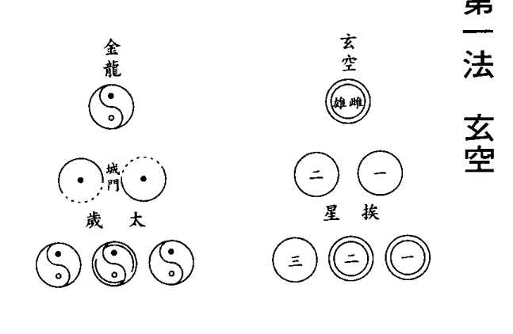

- 一索：玄空為人物之形象。
- 二索：雌雄為人類之男女。
- 三索：挨星為人類之生產。

- 金龍為人之精神。
- 城門為雌雄之精神。
- 太歲為萬物之造化

#### 玄空訣

伏羲畫八卦，本諸無物，而形之有象也。易曰，易有太極，是生兩儀，又曰天地定位，山澤通氣，雷風相薄，水火不相射，乃以無物而形諸有物而成象，太極本無方位，而形相交相射，又定位通氣，由無而有，有生於無，無而為有，天地體本混沌，所謂無而為有，由氣而物，由物而形，自物歸無，萬物皆動，而萬物亦歸於靜，所以云有而無，一而已矣，自無而有，此玄空也，太極也，無形之數，自一至十，形而成數，自一至九，居中者五十，五為陽以待陰之動，玄空乃指數之虛實而言，亦指陰陽而言，於卦刻之言玄空者，皆言一九，皆未言十，而皇極以五十居中，五非十不動，十非五不行，此陰陽之定理，在數理言，自一至九皆實位，至十則進位，如此一二三四五六七八九，皆隨之而進，進則全數皆動，已非本來面目，全數既動，則八宮自自然易位，自陰陽而至人物，以物移星轉，皆隨星轉移其環境，易曰不動無以生吉凶，動則吉凶生焉，孔子曰五十以學易，此五十也。又易曰參伍所以齊一，五十乃參伍齊一之象，五為陽居中，十為陰亦居中，對待者一九之謂，非參伍則不動，非對待則陰陽不交，乾坤交而生六子，雷風坎離艮兌，始一終九，老少有別，長幼有序，順序配合，為自然之交媾，是為天地祥瑞之氣，自然貞吉，易曰元亨利貞，若老陰少陽，老陽少陰，陰陽雖對，而為戾氣所鍾，終必獲咎，但爻見乎象，聖人雖不談怪異，乃在爻象見矣，太極圖似無物，以○觀之則象已見矣，玄空之先天圖○（寓意十之形，亦太始自無而有，坤卦自上而下之意也）實有物象似無物，一為有之始而尚未見諸外，一為無而實有物含於內（一九）周子曰無極而太極，為玄空無物而有象也。老子曰玄之又玄，眾妙之門，雲無而有形諸於用，實有其時，始一終九，非時不動，動則陰陽交媾，玄之又玄，空而又空，無物有象，而○已含一至九也。先天之象，有老少對待，言之於體，其情自見，萬物之生，男女之媾，皆無極而太極，未動則無極情未生，既動則情自生而太極生焉，故曰玄空，而太極者亦太陽一物耳，故地球上之萬物皆感太陽之氣而生，人感其七色七氣而生七情六慾，是以萬物皆生於土（自無生有），萬物亦歸於土（自有而無）土者中央戊己之謂也。五十之謂也。太陽七色為生生不息，亦剋剋無窮，萬物以人為領袖，故其象立，人之種類族種雖繁，其色不外七，皆本乎乾坤，山澤，風雷，水火，自無極，太極，兩儀四象八卦，六十四卦，三百八十四爻，以至大而無外，皆無極始，八卦雖成，若無太陽以動其自然之氣，雷風山澤水火，無從運化，不能一時或息，息則天地閉，每一運、一年、一月、一日、一時，各有其陰陽，息息相關，不可須臾離，太極自外及內，萬物以小及大，云內則小至無內，云外則大至無外，皆三才一體之象，故曰玄空（三位一體之玄空），放之則彌六合，卷之則藏於密，是真玄空，故一幹一極，一枝一極，一葉一極，言其內何有於內，故物物有太極，尤佛氏物物一太極。

香港易齋求是趙景羲著述
新加坡 張成春編纂

## 新玄空紫白訣

玄空二字，既包含太極陰陽，繫之以無形，確乎有象，繫之有象，似亦無體而體已在其中，自一以前為○，九以後亦○，此所謂萬物皆生於土，萬物皆歸於土，○極至則動，○不至則依然未動，○故有極則動，動則生，消至極則長，長至極則消，天地自然之排佈，觀於一日之陰陽消長如此，觀一月一年一運之陰陽消長亦如此，何必求之奇門異術，自欺欺人乎，其圖示：天地定位，山澤通氣，雷風相薄，水火不相射，其中自一至九，陰陽對待，老少同堂，天理地理數理同源，皆大玄空也。人身亦一玄空也，鳥獸魚蟲各有其玄空，山川亦自有其玄空，此皆物物一極之寓意，玄空之理無窮，陰陽之消長往來亦無窮，先天具不動之體，後天有不息之數，人事之數，吉則吉隨，凶則凶隨，遇吉則愈動而愈吉，遇凶則愈動而愈凶，吉則動，凶則靜之，此數理之補天功，陰晴露雨，活潑自然之理，乾坤交生六子，玄空之體具矣，是以山峙水流，山靜水動，地理之理寓矣，經曰先天為體，體有體之安排，乾統三男震坎艮，坤統三女巽離兌，母統九十年為上元，父統九十年為下元，共之為三元壹佰八十年，列為東西二片，先天對待，自乾坤交而生六子，始有老少一九，有老少其序自列，列圖以觀○一二三四五六七八九，以極起以極終，方隅未備後天為用，以流行之氣動之，而有東西南北，各自歸其本位，一二三四坎坤震巽，為東一片，上元主管，六七八九，乾兌艮離，為西一片，下元主管，上元水龍，當以坤元主管，六七八九，乾兌艮離，為西一片，下元水龍，當以乾震坎艮為之，以應乾統坤統之數，乃千古不移之法則，絲毫不亂，一三五七九，四二十八六為陰陽生成數之秩序，乾震坎艮乃一六三八，坤巽離兌二七四九，以成後天之發用，五十居中，五非十不動，十非五不行，是五居動方，以陽性屬動，十居內為正，為靜，愈靜而愈貞，先天之體不動，後天之用常動，動之與時相合，謂之生，與時相背，謂之乘，生者陰陽和而後生，乘者多寡不均。相生則吉相乘則凶，萬物後天有形之體皆待無形之氣而生，是謂有生於無。而成玄空，易道取中和，故曰致中和天地地位焉，萬物育焉。

### 玄空六法

#### 萬物起於無極終於無極圖

本圖互為消長中五立極，一六共宗，五加一為六，六退一還五，故五十皆不動，十亦不動，動者乃無形之氣在動，非五十之動，故南北有極，東西無極，生成之數，連環不絕。

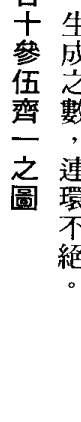

#### 合五合十參伍齊一之圖

一二三四東一片，為上元，六七八九西一片，為下元，非五十無以發用，一三五七九，陽中有陰，四二八六陰內含陽，各不能離，相與為用，一四、二三、六九、七八、皆參伍而齊一。

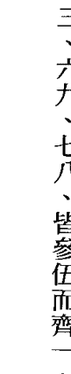

#### 對待合十之圖

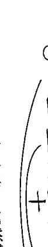

#### 對待通氣，南北有極，東西分居，自然歸極之圖

#### 縱橫十五發用之圖

縱橫十五，後天發用，先天生成各有其序，坤統四九七以居內，乾統一八三以居外。

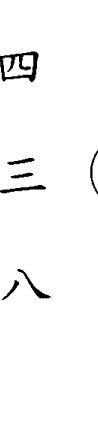

### 玄空六法

#### 易九六相倚，陰陽消長之圖

九七五三一
四二十八六

陽氣自下而上，一六三八一片，四九二七一片，陰氣自上而下，五十居中，故易數，乾用九坤用六，先後天用九六，乃能相倚相應，陽極於九與中宮消五，則陰生，陰極於六與中宮消五，則陽生，此之謂生成。

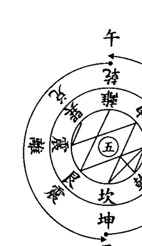

先天之體不動，動者為流行之氣，以不變之體應萬變，用萬物化生不息剋無窮，溫厚之氣運，而嚴凝之氣化陰生陽消，陽長則陰消，運行不息，龍水相應。

#### 第二法 雌雄

#### 雌雄訣

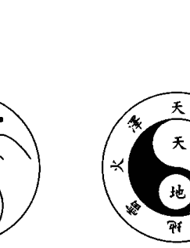

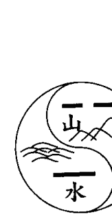

有形之山水交會本尚靜物，無形之氣一到，則山水之雌雄自然交會，此之謂合時交媾天地地位焉，萬物育焉。

### 玄空六法

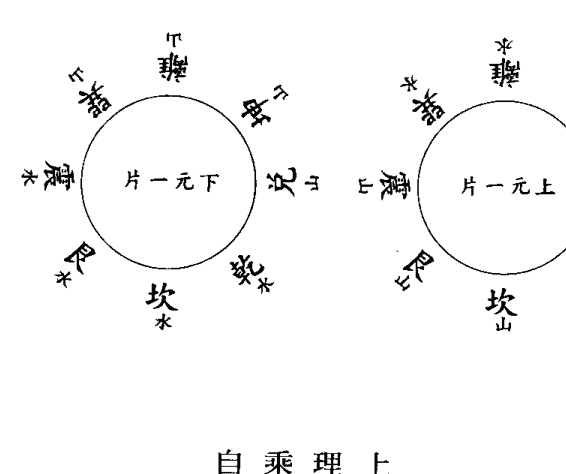

上下兩元山水交會，古今中外皆同一理，上元一運當以離為旺水大金龍，乘流行之氣而動，坤兌巽之氣，下元自當反是。

### 玄空六法

雌雄者陰陽也，其不名陰陽，而名之曰雌雄，是有雌雄之名，蓋有有形無形之別，山川者有形之謂，流行之氣乃無形也，言其象並言其氣，天有無形之陰陽，地有有形之山川，互相交媾，山川之形雖交，無形之氣不至，無以至生育（金龍未動，葬亦不發）必也天氣下降，地氣上昇，乃宇宙之交媾，山靜水動，山峙水流，此形體之交媾，山川之大小強弱乃其形，剛柔動靜乃其情，陰陽迭替育化，陰陽天地之交，雷風雨露動之，天地之交，無時不交，而萬物無時不生，山川之交亦無時不交，但有剛柔動靜東西南北之分，媾有其時有其序，是謂和，和而後化育，若陰陽不分，大小不稱，動靜不配（八宮山水），剛柔不均，天氣雖至，雌原為雌，雄原為雄，氣已至，形已具，雖交亦無取，以其八宮剛柔動靜皆不配當令無形之氣，是以無取，故相地者，必實地考驗，多覆古人墳墓，必見有內氣止生之形，葬經云，葬乘生氣，然後外氣行形之雌雄，內含有形生氣（此生氣，乃地脈之生氣，如無死脈也），外應流行之天氣（一二三四六七八九）之氣，此首

要之條件，世之相地者多不知此，而妄談卦爻，徒亂人意耳，雖知此玄空術乃數學之一種，凡算學必有其公式，有公式而不言公式，文章錦繡，何有於實用，言形體必須實學，孔子曰，吾不如老圃之謂也，言氣必有其時，冬葛夏裘可乎，人皆知其不可也，形體之陰陽亦有其序，太極之陰陽必分合清楚，左股居外，右股居內，內氣乃能止生，外砂關鎖愈多愈密愈佳，但水口之砂亦必合陰陽之序列，乃得歷代久遠，苟有一節反嬌，其傳代至此，必獲敗咎，若此太極之陰陽差錯，名之曰死口，死口者，吸入之氣為死氣，當代便零替矣。經曰雌雄交會合玄空，正此之謂也。又曰，玄空卦內推，陰陽相見兩為難，正一山一水何足論，經文明白宣示，所云生死之氣，非人目及儀器可能測度，乃流行之氣，動生成之數所變化也，每一運必有大雌雄，謂之父母卦為全運之主宰，正是經乾坤為父母，父母生六子，六子為父母、六子生六子，此每一階層各自有其父母，其他謂之三吉，一切交替皆與大父母同進退，既有其時，又有其序，時則春苗夏實秋收冬藏，序則曾祖父身，井然不紊，成功者退，未來者進。

雌雄者，陰陽對待，動靜虛實之稱，以言乎體，則有一動一靜，一山一水，一虛一實，一左一右。皆名之曰雌雄，以言乎用，則有一六、三八、二七、四九，各有其流行之氣，時至則交，雌雄之真會也，書云，楊公養老看雌雄，看此雌雄也，其用法乃用養老之法，養者云其生，老者云其將死也，生者則用，死者則不用，看無形之氣，氣交是生，生則萬物化育，何令通云夫婦相逢於道路，卻嫌阻隔不通情，皆言有形之山川雖具，而當令之氣不至，亦猶夫婦之相見，不通其情，夫婦雖交，非時不育，乃天經地義也，雖畜犬，亦非同季不交，此季者時也，惟天地之間，有君子小人文野之別，此又生乘之數所產生，生者中和之氣，自生君子，乘者乖戾之氣，自生小人，故與時相合，應時興發，其中奧妙，全在作者心靈目巧，足力心力經驗，斟酌用事，龍穴砂水向，自有其陰陽虛實、而應八方流行之氣，書卷乃使人規矩，未能使人巧，故有讀萬卷書行萬里路，始可以談，否則徒自欺耳，經云，斜正受來陰陽取，此言天心，合雌雄之矩度，此言形勢相配，陰陽合位，世人之奢風談水者，必言某仙家秘傳，某度線發狀元宰輔，乾龍結午山，皆不知時之進退，無異夜半談日中在天，自欺欺人，誠可憐哉，雌雄之真義，乃陰中有陽，陽中有陰，亦易之火中有水，水中火，純陽者孤，純陰者絕，皆不能有生育之義，右砂左砂有形者，本身之氣口有時或須要用人工改作，此正天地留有以待，中山何家，連平顏家，等祖地，均係倒交亂真，經名師之改造，經幾朝而未替，以其龍真穴的，如璞中之玉，琢之即見真，猶宇宙之原子，或超原子能，宇宙初開，經已備矣，其非時不見，亦非時不用，每年之驚蟄立秋，無論調至何日，蟲非蟄不鳴，葉非秋不落，一蟲一葉之微，尚且知真氣候，人何不知乎。

#### 第三法 金龍

#### 金龍訣

經云先看金龍動不動，次察血脈認來龍，龍分兩片陰陽取，水到三叉細認蹤，此章為空玄之綱領，分運認龍審氣定穴，古往今來盛衰，皆在此章發表無遺，此處不通，玄空、雌雄、挨星、城門、太歲皆未可談，其云先看兩字，乃首要樞紐，動、動字，包含有形之山川，而應無形之氣，始得謂之動，未定穴以前，先要審氣運，名曰金龍，金者至剛至健之氣，猶人身之於精神，其有精神則生，無則死，剛健之氣活動貫注全身，萬事可作，乾為剛健之氣，又為諸卦之領袖，金又為貨幣之最貴重，曰金龍乃言其貴重也，而金龍又為兩片之物，上元一片，下元一片，上元坤統為陰，下元乾統為陽，陰陽有名而無位，故曰陰陽活潑之物，龍分兩片，乃先天之體，取後天為用，一二三四為上元，以陰主靜，靜主內，此正神之位也，陽主動，動居外，此零神方也，山靜水動，有形自然交會，金龍之氣未至，山亦山，水亦水，無形之氣至，金龍一動，自有其方位，自有其長少，乾剛之氣動，以乾三爻純陽，乃名曰龍，龍陽物，陽始一終九，逢十則變，算術之二元算法，由○而一而二而三，皆符無極太極兩儀之法則，數之加減，皆不離○極，四時之氣，必至極而後變，以此溫厚起於子，子終於未，嚴凝則生，循環無端，賴之以變化者，中五之極，中之皇極，即戊己，金木水火，皆賴中五以生，故云萬物皆生於土，萬物皆化於土，皇極居中，雖非五十不動，但無時不動，動之者溫厚之氣，溫厚終則嚴凝始，消長有時，如潮信候，動之以無形，用之以山水，兩兩相對，形體雖具，不動何時，如潮信候，動之以無形，用之以山水，兩兩相對，形體雖具，不動何時，如潮信候，動之以無形，用之以山水，兩兩相對，形體雖具，不動何時，如潮信候，動之以無形，用之以山水，兩兩相對，形體雖具，不動何時，如潮信候，動之以無形，用之以山水，兩兩相對，形體雖具，不動何時，如潮信候，動之以無形，用之以山水，兩兩相對，形體雖具，不動何時，如潮信候，動之以無形，用之以山水，兩兩相對，形體雖具，不動何時，如潮信候，動之以無形，用之以山水，兩兩相對，形體雖具，不動何時，如潮信候，動之以無形，用之以山水，兩兩相對，形體雖具，不動何時，如潮信候，動之以無形，用之以山水，兩兩相對，形體雖具，不動何時，如潮信候，動之以無形，用之以山水，兩兩相對，形體雖具，不動何時，如潮信候，動之以無形，用之以山水，兩兩相對，形體雖具，不動何時，如潮信候，動之以無形，用之以山水，兩兩相對，形體雖具，不動何時，如潮信候，動之以無形，用之以山水，兩兩相對，形體雖具，不動何時，如潮信候，動之以無形，用之以山水，兩兩相對，形體雖具，不動何時，如潮信候，動之以無形，用之以山水，兩兩相對，形體雖具，不動何時，如潮信候，動之以無形，用之以山水，兩兩相對，形體雖具，不動何時，如潮信候，動之以無形，用之以山水，兩兩相對，形體雖具，不動何時，如潮信候，動之以無形，用之以山水，兩兩相對，形體雖具，不動何時，如潮信候，動之以無形，用之以山水，兩兩相對，形體雖具，不動何時，如潮信候，動之以無形，用之以山水，兩兩相對，形體雖具，不動何時，如潮信候，動之以無形，用之以山水，兩兩相對，形體雖具，不動何時，如潮信候，動之以無形，用之以山水，兩兩相對，形體雖具，不動何時，如潮信候，動之以無形，用之以山水，兩兩相對，形體雖具，不動何時，如潮信候，動之以無形，用之以山水，兩兩相對，形體雖具，不動何時，如潮信候，動之以無形，用之以山水，兩兩相對，形體雖具，不動何時，如潮信候，動之以無形，用之以山水，兩兩相對，形體雖具，不動何時，如潮信候，動之以無形，用之以山水，兩兩相對，形體雖具，不動何時，如潮信候，動之以無形，用之以山水，兩兩相對，形體雖具，不動何時，如潮信候，動之以無形，用之以山水，兩兩相對，形體雖具，不動何時，如潮信候，動之以無形，用之以山水，兩兩相對，形體雖具，不動何時，如潮信候，動之以無形，用之以山水，兩兩相對，形體雖具，不動何時，如潮信候，動之以無形，用之以山水，兩兩相對，形體雖具，不動何時，如潮信候，動之以無形，用之以山水，兩兩相對，形體雖具，不動何時，如潮信候，動之以無形，用之以山水，兩兩相對，形體雖具，不動何時，如潮信候，動之以無形，用之以山水，兩兩相對，形體雖具，不動何時，如潮信候，動之以無形，用之以山水，兩兩相對，形體雖具，不動何時，如潮信候，動之以無形，用之以山水，兩兩相對，形體雖具，不動何時，如潮信候，動之以無形，用之以山水，兩兩相對，形體雖具，不動何時，如潮信候，動之以無形，用之以山水，兩兩相對，形體雖具，不動何時，如潮信候，動之以無形，用之以山水，兩兩相對，形體雖具，不動何時，如潮信候，動之以無形，用之以山水，兩兩相對，形體雖具，不動何時，如潮信候，動之以無形，用之以山水，兩兩相對，形體雖具，不動何時，如潮信候，動之以無形，用之以山水，兩兩相對，形體雖具，不動何時，如潮信候，動之以無形，用之以山水，兩兩相對，形體雖具，不動何時，如潮信候，動之以無形，用之以山水，兩兩相對，形體雖具，不動何時，如潮信候，動之以無形，用之以山水，兩兩相對，形體雖具，不動何時，如潮信候，動之以無形，用之以山水，兩兩相對，形體雖具，不動何時，如潮信候，動之以無形，用之以山水，兩兩相對，形體雖具，不動何時，如潮信候，動之以無形，用之以山水，兩兩相對，形體雖具，不動何時，如潮信候，動之以無形，用之以山水，兩兩相對，形體雖具，不動何時，如潮信候，動之以無形，用之以山水，兩兩相對，形體雖具，不動何時，如潮信候，動之以無形，用之以山水，兩兩相對，形體雖具，不動何時，如潮信候，動之以無形，用之以山水，兩兩相對，形體雖具，不動何時，如潮信候，動之以無形，用之以山水，兩兩相對，形體雖具，不動何時，如潮信候，動之以無形，用之以山水，兩兩相對，形體雖具，不動何時，如潮信候，動之以無形，用之以山水，兩兩相對，形體雖具，不動何時，如潮信候，動之以無形，用之以山水，兩兩相對，形體雖具，不動何時，如潮信候，動之以無形，用之以山水，兩兩相對，形體雖具，不動何時，如潮信候，動之以無形，用之以山水，兩兩相對，形體雖具，不動何時，如潮信候，動之以無形，用之以山水，兩兩相對，形體雖具，不動何時，如潮信候，動之以無形，用之以山水，兩兩相對，形體雖具，不動何時，如潮信候，動之以無形，用之以山水，兩兩相對，形體雖具，不動何時，如潮信候，動之以無形，用之以山水，兩兩相對，形體雖具，不動何時，如潮信候，動之以無形，用之以山水，兩兩相對，形體雖具，不動何時，如潮信候，動之以無形，用之以山水，兩兩相對，形體雖具，不動何時，如潮信候，動之以無形，用之以山水，兩兩相對，形體雖具，不動何時，如潮信候，動之以無形，用之以山水，兩兩相對，形體雖具，不動何時，如潮信候，動之以無形，用之以山水，兩兩相對，形體雖具，不動何時，如潮信候，動之以無形，用之以山水，兩兩相對，形體雖具，不動何時，如潮信候，動之以無形，用之以山水，兩兩相對，形體雖具，不動何時，如潮信候，動之以無形，用之以山水，兩兩相對，形體雖具，不動何時，如潮信候，動之以無形，用之以山水，兩兩相對，形體雖具，不動何時，如潮信候，動之以無形，用之以山水，兩兩相對，形體雖具，不動何時，如潮信候，動之以無形，用之以山水，兩兩相對，形體雖具，不動何時，如潮信候，動之以無形，用之以山水，兩兩相對，形體雖具，不動何時，如潮信候，動之以無形，用之以山水，兩兩相對，形體雖具，不動何時，如潮信候，動之以無形，用之以山水，兩兩相對，形體雖具，不動何時，如潮信候，動之以無形，用之以山水，兩兩相對，形體雖具，不動何時，如潮信候，動之以無形，用之以山水，兩兩相對，形體雖具，不動何時，如潮信候，動之以無形，用之以山水，兩兩相對，形體雖具，不動何時，如潮信候，動之以無形，用之以山水，兩兩相對，形體雖具，不動何時，如潮信候，動之以無形，用之以山水，兩兩相對，形體雖具，不動何時，如潮信候，動之以無形，用之以山水，兩兩相對，形體雖具，不動何時，如潮信候，動之以無形，用之以山水，兩兩相對，形體雖具，不動何時，如潮信候，動之以無形，用之以山水，兩兩相對，形體雖具，不動何時，如潮信候，動之以無形，用之以山水，兩兩相對，形體雖具，不動何時，如潮信候，動之以無形，用之以山水，兩兩相對，形體雖具，不動何時，如潮信候，動之以無形，用之以山水，兩兩相對，形體雖具，不動何時，如潮信候，動之以無形，用之以山水，兩兩相對，形體雖具，不動何時，如潮信候，動之以無形，用之以山水，兩兩相對，形體雖具，不動何時，如潮信候，動之以無形，用之以山水，兩兩相對，形體雖具，不動何時，如潮信候，動之以無形，用之以山水，兩兩相對，形體雖具，不動何時，如潮信候，動之以無形，用之以山水，兩兩相對，形體雖具，不動何時，如潮信候，動之以無形，用之以山水，兩兩相對，形體雖具，不動何時，如潮信候，動之以無形，用之以山水，兩兩相對，形體雖具，不動何時，如潮信候，動之以無形，用之以山水，兩兩相對，形體雖具，不動何時，如潮信候，動之以無形，用之以山水，兩兩相對，形體雖具，不動何時，如潮信候，動之以無形，用之以山水，兩兩相對，形體雖具，不動何時，如潮信候，動之以無形，用之以山水，兩兩相對，形體雖具，不動何時，如潮信候，動之以無形，用之以山水，兩兩相對，形體雖具，不動何時，如潮信候，動之以無形，用之以山水，兩兩相對，形體雖具，不動何時，如潮信候，動之以無形，用之以山水，兩兩相對，形體雖具，不動何時，如潮信候，動之以無形，用之以山水，兩兩相對，形體雖具，不動何時，如潮信候，動之以無形，用之以山水，兩兩相對，形體雖具，不動何時，如潮信候，動之以無形，用之以山水，兩兩相對，形體雖具，不動何時，如潮信候，動之以無形，用之以山水，兩兩相對，形體雖具，不動何時，如潮信候，動之以無形，用之以山水，兩兩相對，形體雖具，不動何時，如潮信候，動之以無形，用之以山水，兩兩相對，形體雖具，不動何時，如潮信候，動之以無形，用之以山水，兩兩相對，形體雖具，不動何時，如潮信候，動之以無形，用之以山水，兩兩相對，形體雖具，不動何時，如潮信候，動之以無形，用之以山水，兩兩相對，形體雖具，不動何時，如潮信候，動之以無形，用之以山水，兩兩相對，形體雖具，不動何時，如潮信候，動之以無形，用之以山水，兩兩相對，形體雖具，不動何時，如潮信候，動之以無形，用之以山水，兩兩相對，形體雖具，不動何時，如潮信候，動之以無形，用之以山水，兩兩相對，形體雖具，不動何時，如潮信候，動之以無形，用之以山水，兩兩相對，形體雖具，不動何時，如潮信候，動之以無形，用之以山水，兩兩相對，形體雖具，不動何時，如潮信候，動之以無形，用之以山水，兩兩相對，形體雖具，不動何時，如潮信候，動之以無形，用之以山水，兩兩相對，形體雖具，不動何時，如潮信候，動之以無形，用之以山水，兩兩相對，形體雖具，不動何時，如潮信候，動之以無形，用之以山水，兩兩相對，形體雖具，不動何時，如潮信候，動之以無形，用之以山水，兩兩相對，形體雖具，不動何時，如潮信候，動之以無形，用之以山水，兩兩相對，形體雖具，不動何時，如潮信候，動之以無形，用之以山水，兩兩相對，形體雖具，不動何時，如潮信候，動之以無形，用之以山水，兩兩相對，形體雖具，不動何時，如潮信候，動之以無形，用之以山水，兩兩相對，形體雖具，不動何時，如潮信候，動之以無形，用之以山水，兩兩相對，形體雖具，不動何時，如潮信候，動之以無形，用之以山水，兩兩相對，形體雖具，不動何時，如潮信候，動之以無形，用之以山水，兩兩相對，形體雖具，不動何時，如潮信候，動之以無形，用之以山水，兩兩相對，形體雖具，不動何時，如潮信候，動之以無形，用之以山水，兩兩相對，形體雖具，不動何時，如潮信候，動之以無形，用之以山水，兩兩相對，形體雖具，不動何時，如潮信候，動之以無形，用之以山水，兩兩相對，形體雖具，不動何時，如潮信候，動之以無形，用之以山水，兩兩相對，形體雖具，不動何時，如潮信候，動之以無形，用之以山水，兩兩相對，形體雖具，不動何時，如潮信候，動之以無形，用之以山水，兩兩相對，形體雖具，不動何時，如潮信候，動之以無形，用之以山水，兩兩相對，形體雖具，不動何時，如潮信候，動之以無形，用之以山水，兩兩相對，形體雖具，不動何時，如潮信候，動之以無形，用之以山水，兩兩相對，形體雖具，不動何時，如潮信候，動之以無形，用之以山水，兩兩相對，形體雖具，不動何時，如潮信候，動之以無形，用之以山水，兩兩相對，形體雖具，不動何時，如潮信候，動之以無形，用之以山水，兩兩相對，形體雖具，不動何時，如潮信候，動之以無形，用之以山水，兩兩相對，形體雖具，不動何時，如潮信候，動之以無形，用之以山水，兩兩相對，形體雖具，不動何時，如潮信候，動之以無形，用之以山水，兩兩相對，形體雖具，不動何時，如潮信候，動之以無形，用之以山水，兩兩相對，形體雖具，不動何時，如潮信候，動之以無形，用之以山水，兩兩相對，形體雖具，不動何時，如潮信候，動之以無形，用之以山水，兩兩相對，形體雖具，不動何時，如潮信候，動之以無形，用之以山水，兩兩相對，形體雖具，不動何時，如潮信候，動之以無形，用之以山水，兩兩相對，形體雖具，不動何時，如潮信候，動之以無形，用之以山水，兩兩相對，形體雖具，不動何時，如潮信候，動之以無形，用之以山水，兩兩相對，形體雖具，不動何時，如潮信候，動之以無形，用之以山水，兩兩相對，形體雖具，不動何時，如潮信候，動之以無形，用之以山水，兩兩相對，形體雖具，不動何時，如潮信候，動之以無形，用之以山水，兩兩相對，形體雖具，不動何時，如潮信候，動之以無形，用之以山水，兩兩相對，形體雖具，不動何時，如潮信候，動之以無形，用之以山水，兩兩相對，形體雖具，不動何時，如潮信候，動之以無形，用之以山水，兩兩相對，形體雖具，不動何時，如潮信候，動之以無形，用之以山水，兩兩相對，形體雖具，不動何時，如潮信候，動之以無形，用之以山水，兩兩相對，形體雖具，不動何時，如潮信候，動之以無形，用之以山水，兩兩相對，形體雖具，不動何時，如潮信候，動之以無形，用之以山水，兩兩相對，形體雖具，不動何時，如潮信候，動之以無形，用之以山水，兩兩相對，形體雖具，不動何時，如潮信候，動之以無形，用之以山水，兩兩相對，形體雖具，不動何時，如潮信候，動之以無形，用之以山水，兩兩相對，形體雖具，不動何時，如潮信候，動之以無形，用之以山水，兩兩相對，形體雖具，不動何時，如潮信候，動之以無形，用之以山水，兩兩相對，形體雖具，不動何時，如潮信候，動之以無形，用之以山水，兩兩相對，形體雖具，不動何時，如潮信候，動之以無形，用之以山水，兩兩相對，形體雖具，不動何時，如潮信候，動之以無形，用之以山水，兩兩相對，形體雖具，不動何時，如潮信候，動之以無形，用之以山水，兩兩相對，形體雖具，不動何時，如潮信候，動之以無形，用之以山水，兩兩相對，形體雖具，不動何時，如潮信候，動之以無形，用之以山水，兩兩相對，形體雖具，不動何時，如潮信候，動之以無形，用之以山水，兩兩相對，形體雖具，不動何時，如潮信候，動之以無形，用之以山水，兩兩相對，形體雖具，不動何時，如潮信候，動之以無形，用之以山水，兩兩相對，形體雖具，不動何時，如潮信候，動之以無形，用之以山水，兩兩相對，形體雖具，不動何時，如潮信候，動之以無形，用之以山水，兩兩相對，形體雖具，不動何時，如潮信候，動之以無形，用之以山水，兩兩相對，形體雖具，不動何時，如潮信候，動之以無形，用之以山水，兩兩相對，形體雖具，不動何時，如潮信候，動之以無形，用之以山水，兩兩相對，形體雖具，不動何時，如潮信候，動之以無形，用之以山水，兩兩相對，形體雖具，不動何時，如潮信候，動之以無形，用之以山水，兩兩相對，形體雖具，不動何時，如潮信候，動之以無形，用之以山水，兩兩相對，形體雖具，不動何時，如潮信候，動之以無形，用之以山水，兩兩相對，形體雖具，不動何時，如潮信候，動之以無形，用之以山水，兩兩相對，形體雖具，不動何時，如潮信候，動之以無形，用之以山水，兩兩相對，形體雖具，不動何時，如潮信候，動之以無形，用之以山水，兩兩相對，形體雖具，不動何時，如潮信候，動之以無形，用之以山水，兩兩相對，形體雖具，不動何時，如潮信候，動之以無形，用之以山水，兩兩相對，形體雖具，不動何時，如潮信候，動之以無形，用之以山水，兩兩相對，形體雖具，不動何時，如潮信候，動之以無形，用之以山水，兩兩相對，形體雖具，不動何時，如潮信候，動之以無形，用之以山水，兩兩相對，形體雖具，不動何時，如潮信候，動之以無形，用之以山水，兩兩相對，形體雖具，不動何時，如潮信候，動之以無形，用之以山水，兩兩相對，形體雖具，不動何時，如潮信候，動之以無形，用之以山水，兩兩相對，形體雖具，不動何時，如潮信候，動之以無形，用之以山水，兩兩相對，形體雖具，不動何時，如潮信候，動之以無形，用之以山水，兩兩相對，形體雖具，不動何時，如潮信候，動之以無形，用之以山水，兩兩相對，形體雖具，不動何時，如潮信候，動之以無形，用之以山水，兩兩相對，形體雖具，不動何時，如潮信候，動之以無形，用之以山水，兩兩相對，形體雖具，不動何時，如潮信候，動之以無形，用之以山水，兩兩相對，形體雖具，不動何時，如潮信候，動之以無形，用之以山水，兩兩相對，形體雖具，不動何時，如潮信候，動之以無形，用之以山水，兩兩相對，形體雖具，不動何時，如潮信候，動之以無形，用之以山水，兩兩相對，形體雖具，不動何時，如潮信候，動之以無形，用之以山水，兩兩相對，形體雖具，不動何時，如潮信候，動之以無形，用之以山水，兩兩相對，形體雖具，不動何時，如潮信候，動之以無形，用之以山水，兩兩相對，形體雖具，不動何時，如潮信候，動之以無形，用之以山水，兩兩相對，形體雖具，不動何時，如潮信候，動之以無形，用之以山水，兩兩相對，形體雖具，不動何時，如潮信候，動之以無形，用之以山水，兩兩相對，形體雖具，不動何時，如潮信候，動之以無形，用之以山水，兩兩相對，形體雖具，不動何時，如潮信候，動之以無形，用之以山水，兩兩相對，形體雖具，不動何時，如潮信候，動之以無形，用之以山水，兩兩相對，形體雖具，不動何時，如潮信候，動之以無形，用之以山水，兩兩相對，形體雖具，不動何時，如潮信候，動之以無形，用之以山水，兩兩相對，形體雖具，不動何時，如潮信候，動之以無形，用之以山水，兩兩相對，形體雖具，不動何時，如潮信候，動之以無形，用之以山水，兩兩相對，形體雖具，不動何時，如潮信候，動之以無形，用之以山水，兩兩相對，形體雖具，不動何時，如潮信候，動之以無形，用之以山水，兩兩相對，形體雖具，不動何時，如潮信候，動之以無形，用之以山水，兩兩相對，形體雖具，不動何時，如潮信候，動之以無形，用之以山水，兩兩相對，形體雖具，不動何時，如潮信候，動之以無形，用之以山水，兩兩相對，形體雖具，不動何時，如潮信候，動之以無形，用之以山水，兩兩相對，形體雖具，不動何時，如潮信候，動之以無形，用之以山水，兩兩相對，形體雖具，不動何時，如潮信候，動之以無形，用之以山水，兩兩相對，形體雖具，不動何時，如潮信候，動之以無形，用之以山水，兩兩相對，形體雖具，不動何時，如潮信候，動之以無形，用之以山水，兩兩相對，形體雖具，不動何時，如潮信候，動之以無形，用之以山水，兩兩相對，形體雖具，不動何時，如潮信候，動之以無形，用之以山水，兩兩相對，形體雖具，不動何時，如潮信候，動之以無形，用之以山水，兩兩相對，形體雖具，不動何時，如潮信候，動之以無形，用之以山水，兩兩相對，形體雖具，不動何時，如潮信候，動之以無形，用之以山水，兩兩相對，形體雖具，不動何時，如潮信候，動之以無形，用之以山水，兩兩相對，形體雖具，不動何時，如潮信候，動之以無形，用之以山水，兩兩相對，形體雖具，不動何時，如潮信候，動之以無形，用之以山水，兩兩相對，形體雖具，不動何時，如潮信候，動之以無形，用之以山水，兩兩相對，形體雖具，不動何時，如潮信候，動之以無形，用之以山水，兩兩相對，形體雖具，不動何時，如潮信候，動之以無形，用之以山水，兩兩相對，形體雖具，不動何時，如潮信候，動之以無形，用之以山水，兩兩相對，形體雖具，不動何時，如潮信候，動之以無形，用之以山水，兩兩相對，形體雖具，不動何時，如潮信候，動之以無形，用之以山水，兩兩相對，形體雖具，不動何時，如潮信候，動之以無形，用之以山水，兩兩相對，形體雖具，不動何時，如潮信候，動之以無形，用之以山水，兩兩相對，形體雖具，不動何時，如潮信候，動之以無形，用之以山水，兩兩相對，形體雖具，不動何時，如潮信候，動之以無形，用之以山水，兩兩相對，形體雖具，不動何時，如潮信候，動之以無形，用之以山水，兩兩相對，形體雖具，不動何時，如潮信候，動之以無形，用之以山水，兩兩相對，形體雖具，不動何時，如潮信候，動之以無形，用之以山水，兩兩相對，形體雖具，不動何時，如潮信候，動之以無形，用之以山水，兩兩相對，形體雖具，不動何時，如潮信候，動之以無形，用之以山水，兩兩相對，形體雖具，不動何時，如潮信候，動之以無形，用之以山水，兩兩相對，形體雖具，不動何時，如潮信候，動之以無形，用之以山水，兩兩相對，形體雖具，不動何時，如潮信候，動之以無形，用之以山水，兩兩相對，形體雖具，不動何時，如潮信候，動之以無形，用之以山水，兩兩相對，形體雖具，不動何時，如潮信候，動之以無形，用之以山水，兩兩相對，形體雖具，不動何時，如潮信候，動之以無形，用之以山水，兩兩相對，形體雖具，不動何時，如潮信候，動之以無形，用之以山水，兩兩相對，形體雖具，不動何時，如潮信候，動之以無形，用之以山水，兩兩相對，形體雖具，不動何時，如潮信候，動之以無形，用之以山水，兩兩相對，形體雖具，不動何時，如潮信候，動之以無形，用之以山水，兩兩相對，形體雖具，不動何時，如潮信候，動之以無形，用之以山水，兩兩相對，形體雖具，不動何時，如潮信候，動之以無形，用之以山水，兩兩相對，形體雖具，不動何時，如潮信候，動之以無形，用之以山水，兩兩相對，形體雖具，不動何時，如潮信候，動之以無形，用之以山水，兩兩相對，形體雖具，不動何時，如潮信候，動之以無形，用之以山水，兩兩相對，形體雖具，不動何時，如潮信候，動之以無形，用之以山水，兩兩相對，形體雖具，不動何時，如潮信候，動之以無形，用之以山水，兩兩相對，形體雖具，不動何時，如潮信候，動之以無形，用之以山水，兩兩相對，形體雖具，不動何時，如潮信候，動之以無形，用之以山水，兩兩相對，形體雖具，不動何時，如潮信候，動之以無形，用之以山水，兩兩相對，形體雖具，不動何時，如潮信候，動之以無形，用之以山水，兩兩相對，形體雖具，不動何時，如潮信候，動之以無形，用之以山水，兩兩相對，形體雖具，不動何時，如潮信候，動之以無形，用之以山水，兩兩相對，形體雖具，不動何時，如潮信候，動之以無形，用之以山水，兩兩相對，形體雖具，不動何時，如潮信候，動之以無形，用之以山水，兩兩相對，形體雖具，不動何時，如潮信候，動之以無形，用之以山水，兩兩相對，形體雖具，不動何時，如潮信候，動之以無形，用之以山水，兩兩相對，形體雖具，不動何時，如潮信候，動之以無形，用之以山水，兩兩相對，形體雖具，不動何時，如潮信候，動之以無形，用之以山水，兩兩相對，形體雖具，不動何時，如潮信候，動之以無形，用之以山水，兩兩相對，形體雖具，不動何時，如潮信候，動之以無形，用之以山水，兩兩相對，形體雖具，不動何時，如潮信候，動之以無形，用之以山水，兩兩相對，形體雖具，不動何時，如潮信候，動之以無形，用之以山水，兩兩相對，形體雖具，不動何時，如潮信候，動之以無形，用之以山水，兩兩相對，形體雖具，不動何時，如潮信候，動之以無形，用之以山水，兩兩相對，形體雖具，不動何時，如潮信候，動之以無形，用之以山水，兩兩相對，形體雖具，不動何時，如潮信候，動之以無形，用之以山水，兩兩相對，形體雖具，不動何時，如潮信候，動之以無形，用之以山水，兩兩相對，形體雖具，不動何時，如潮信候，動之以無形，用之以山水，兩兩相對，形體雖具，不動何時，如潮信候，動之以無形，用之以山水，兩兩相對，形體雖具，不動何時，如潮信候，動之以無形，用之以山水，兩兩相對，形體雖具，不動何時，如潮信候，動之以無形，用之以山水，兩兩相對，形體雖具，不動何時，如潮信候，動之以無形，用之以山水，兩兩相對，形體雖具，不動何時，如潮信候，動之以無形，用之以山水，兩兩相對，形體雖具，不動何時，如潮信候，動之以無形，用之以山水，兩兩相對，形體雖具，不動何時，如潮信候，動之以無形，用之以山水，兩兩相對，形體雖具，不動何時，如潮信候，動之以無形，用之以山水，兩兩相對，形體雖具，不動何時，如潮信候，動之以無形，用之以山水，兩兩相對，形體雖具，不動何時，如潮信候，動之以無形，用之以山水，兩兩相對，形體雖具，不動何時，如潮信候，動之以無形，用之以山水，兩兩相對，形體雖具，不動何時，如潮信候，動之以無形，用之以山水，兩兩相對，形體雖具，不動何時，如潮信候，動之以無形，用之以山水，兩兩相對，形體雖具，不動何時，如潮信候，動之以無形，用之以山水，兩兩相對，形體雖具，不動何時，如潮信候，動之以無形，用之以山水，兩兩相對，形體雖具，不動何時，如潮信候，動之以無形，用之以山水，兩兩相對，形體雖具，不動何時，如潮信候，動之以無形，用之以山水，兩兩相對，形體雖具，不動何時，如潮信候，動之以無形，用之以山水，兩兩相對，形體雖具，不動何時，如潮信候，動之以無形，用之以山水，兩兩相對，形體雖具，不動何時，如潮信候，動之以無形，用之以山水，兩兩相對，形體雖具，不動何時，如潮信候，動之以無形，用之以山水，兩兩相對，形體雖具，不動何時，如潮信候，動之以無形，用之以山水，兩兩相對，形體雖具，不動何時，如潮信候，動之以無形，用之以山水，兩兩相對，形體雖具，不動何時，如潮信候，動之以無形，用之以山水，兩兩相對，形體雖具，不動何時，如潮信候，動之以無形，用之以山水，兩兩相對，形體雖具，不動何時，如潮信候，動之以無形，用之以山水，兩兩相對，形體雖具，不動何時，如潮信候，動之以無形，用之以山水，兩兩相對，形體雖具，不動何時，如潮信候，動之以無形，用之以山水，兩兩相對，形體雖具，不動何時，如潮信候，動之以無形，用之以山水，兩兩相對，形體雖具，不動何時，如潮信候，動之以無形，用之以山水，兩兩相對，形體雖具，不動何時，如潮信候，動之以無形，用之以山水，兩兩相對，形體雖具，不動何時，如潮信候，動之以無形，用之以山水，兩兩相對，形體雖具，不動何時，如潮信候，動之以無形，用之以山水，兩兩相對，形體雖具，不動何時，如潮信候，動之以無形，用之以山水，兩兩相對，形體雖具，不動何時，如潮信候，動之以無形，用之以山水，兩兩相對，形體雖具，不動何時，如潮信候，動之以無形，用之以山水，兩兩相對，形體雖具，不動何時，如潮信候，動之以無形，用之以山水，兩兩相對，形體雖具，不動何時，如潮信候，動之以無形，用之以山水，兩兩相對，形體雖具，不動何時，如潮信候，動之以無形，用之以山水，兩兩相對，形體雖具，不動何時，如潮信候，動之以無形，用之以山水，兩兩相對，形體雖具，不動何時，如潮信候，動之以無形，用之以山水，兩兩相對，形體雖具，不動何時，如潮信候，動之以無形，用之以山水，兩兩相對，形體雖具，不動何時，如潮信候，動之以無形，用之以山水，兩兩相對，形體雖具，不動何時，如潮信候，動之以無形，用之以山水，兩兩相對，形體雖具，不動何時，如潮信候，動之以無形，用之以山水，兩兩相對，形體雖具，不動何時，如潮信候，動之以無形，用之以山水，兩兩相對，形體雖具，不動何時，如潮信候，動之以無形，用之以山水，兩兩相對，形體雖具，不動何時，如潮信候，動之以無形，用之以山水，兩兩相對，形體雖具，不動何時，如潮信候，動之以無形，用之以山水，兩兩相對，形體雖具，不動何時，如潮信候，動之以無形，用之以山水，兩兩相對，形體雖具，不動何時，如潮信候，動之以無形，用之以山水，兩兩相對，形體雖具，不動何時，如潮信候，動之以無形，用之以山水，兩兩相對，形體雖具，不動何時，如潮信候，動之以無形，用之以山水，兩兩相對，形體雖具，不動何時，如潮信候，動之以無形，用之以山水，兩兩相對，形體雖具，不動何時，如潮信候，動之以無形，用之以山水，兩兩相對，形體雖具，不動何時，如潮信候，動之以無形，用之以山水，兩兩相對，形體雖具，不動何時，如潮信候，動之以無形，用之以山水，兩兩相對，形體雖具，不動何時，如潮信候，動之以無形，用之以山水，兩兩相對，形體雖具，不動何時，如潮信候，動之以無形，用之以山水，兩兩相對，形體雖具，不動何時，如潮信候，動之以無形，用之以山水，兩兩相對，形體雖具，不動何時，如潮信候，動之以無形，用之以山水，兩兩相對，形體雖具，不動何時，如潮信候，動之以無形，用之以山水，兩兩相對，形體雖具，不動何時，如潮信候，動之以無形，用之以山水，兩兩相對，形體雖具，不動何時，如潮信候，動之以無形，用之以山水，兩兩相對，形體雖具，不動何時，如潮信候，動之以無形，用之以山水，兩兩相對，形體雖具，不動何時，如潮信候，動之以無形，用之以山水，兩兩相對，形體雖具，不動何時，如潮信候，動之以無形，用之以山水，兩兩相對，形體雖具，不動何時，如潮信候，動之以無形，用之以山水，兩兩相對，形體雖具，不動何時，如潮信候，動之以無形，用之以山水，兩兩相對，形體雖具，不動何時，如潮信候，動之以無形，用之以山水，兩兩相對，形體雖具，不動何時，如潮信候，動之以無形，用之以山水，兩兩相對，形體雖具，不動何時，如潮信候，動之以無形，用之以山水，兩兩相對，形體雖具，不動何時，如潮信候，動之以無形，用之以山水，兩兩相對，形體雖具，不動何時，如潮信候，動之以無形，用之以山水，兩兩相對，形體雖具，不動何時，如潮信候，動之以無形，用之以山水，兩兩相對，形體雖具，不動何時，如潮信候，動之以無形，用之以山水，兩兩相對，形體雖具，不動何時，如潮信候，動之以無形，用之以山水，兩兩相對，形體雖具，不動何時，如潮信候，動之以無形，用之以山水，兩兩相對，形體雖具，不動何時，如潮信候，動之以無形，用之以山水，兩兩相對，形體雖具，不動何時，如潮信候，動之以無形，用之以山水，兩兩相對，形體雖具，不動何時，如潮信候，動之以無形，用之以山水，兩兩相對，形體雖具，不動何時，如潮信候，動之以無形，用之以山水，兩兩相對，形體雖具，不動何時，如潮信候，動之以無形，用之以山水，兩兩相對，形體雖具，不動何時，如潮信候，動之以無形，用之以山水，兩兩相對，形體雖具，不動何時，如潮信候，動之以無形，用之以山水，兩兩相對，形體雖具，不動何時，如潮信候，動之以無形，用之以山水，兩兩相對，形體雖具，不動何時，如潮信候，動之以無形，用之以山水，兩兩相對，形體雖具，不動何時，如潮信候，動之以無形，用之以山水，兩兩相對，形體雖具，不動何時，如潮信候，動之以無形，用之以山水，兩兩相對，形體雖具，不動何時，如潮信候，動之以無形，用之以山水，兩兩相對，形體雖具，不動何時，如潮信候，動之以無形，用之以山水，兩兩相對，形體雖具，不動何時，如潮信候，動之以無形，用之以山水，兩兩相對，形體雖具，不動何時，如潮信候，動之以無形，用之以山水，兩兩相對，形體雖具，不動何時，如潮信候，動之以無形，用之以山水，兩兩相對，形體雖具，不動何時，如潮信候，動之以無形，用之以山水，兩兩相對，形體雖具，不動何時，如潮信候，動之以無形，用之以山水，兩兩相對，形體雖具，不動何時，如潮信候，動之以無形，用之以山水，兩兩相對，形體雖具，不動何時，如潮信候，動之以無形，用之以山水，兩兩相對，形體雖具，不動何時，如潮信候，動之以無形，用之以山水，兩兩相對，形體雖具，不動何時，如潮信候，動之以無形，用之以山水，兩兩相對，形體雖具，不動何時，如潮信候，動之以無形，用之以山水，兩兩相對，形體雖具，不動何時，如潮信候，動之以無形，用之以山水，兩兩相對，形體雖具，不動何時，如潮信候，動之以無形，用之以山水，兩兩相對，形體雖具，不動何時，如潮信候，動之以無形，用之以山水，兩兩相對，形體雖具，不動何時，如潮信候，動之以無形，用之以山水，兩兩相對，形體雖具，不動何時，如潮信候，動之以無形，用之以山水，兩兩相對，形體雖具，不動何時，如潮信候，動之以無形，用之以山水，兩兩相對，形體雖具，不動何時，如潮信候，動之以無形，用之以山水，兩兩相對，形體雖具，不動何時，如潮信候，動之以無形，用之以山水，兩兩相對，形體雖具，不動何時，如潮信候，動之以無形，用之以山水，兩兩相對，形體雖具，不動何時，如潮信候，動之以無形，用之以山水，兩兩相對，形體雖具，不動何時，如潮信候，動之以無形，用之以山水，兩兩相對，形體雖具，不動何時，如潮信候，動之以無形，用之以山水，兩兩相對，形體雖具，不動何時，如潮信候，動之以無形，用之以山水，兩兩相對，形體雖具，不動何時，如潮信候，動之以無形，用之以山水，兩兩相對，形體雖具，不動何時，如潮信候，動之以無形，用之以山水，兩兩相對，形體雖具，不動何時，如潮信候，動之以無形，用之以山水，兩兩相對，形體雖具，不動何時，如潮信候，動之以無形，用之以山水，兩兩相對，形體雖具，不動何時，如潮信候，動之以無形，用之以山水，兩兩相對，形體雖具，不動何時，如潮信候，動之以無形，用之以山水，兩兩相對，形體雖具，不動何時，如潮信候，動之以無形，用之以山水，兩兩相對，形體雖具，不動何時，如潮信候，動之以無形，用之以山水，兩兩相對，形體雖具，不動何時，如潮信候，動之以無形，用之以山水，兩兩相對，形體雖具，不動何時，如潮信候，動之以無形，用之以山水，兩兩相對，形體雖具，不動何時，如潮信候，動之以無形，用之以山水，兩兩相對，形體雖具，不動何時，如潮信候，動之以無形，用之以山水，兩兩相對，形體雖具，不動何時，如潮信候，動之以無形，用之以山水，兩兩相對，形體雖具，不動何時，如潮信候，動之以無形，用之以山水，兩兩相對，形體雖具，不動何時，如潮信候，動之以無形，用之以山水，兩兩相對，形體雖具，不動何時，如潮信候，動之以無形，用之以山水，兩兩相對，形體雖具，不動何時，如潮信候，動之以無形，用之以山水，兩兩相對，形體雖具，不動何時，如潮信候，動之以無形，用之以山水，兩兩相對，形體雖具，不動何時，如潮信候，動之以無形，用之以山水，兩兩相對，形體雖具，不動何時，如潮信候，動之以無形，用之以山水，兩兩相對，形體雖具，不動何時，如潮信候，動之以無形，用之以山水，兩兩相對，形體雖具，不動何時，如潮信候，動之以無形，用之以山水，兩兩相對，形體雖具，不動何時，如潮信候，動之以無形，用之以山水，兩兩相對，形體雖具，不動何時，如潮信候，動之以無形，用之以山水，兩兩相對，形體雖具，不動何時，如潮信候，動之以無形，用之以山水，兩兩相對，形體雖具，不動何時，如潮信候，動之以無形，用之以山水，兩兩相對，形體雖具，不動何時，如潮信候，動之以無形，用之以山水，兩兩相對，形體雖具，不動何時，如潮信候，動之以無形，用之以山水，兩兩相對，形體雖具，不動何時，如潮信候，動之以無形，用之以山水，兩兩相對，形體雖具，不動何時，如潮信候，動之以無形，用之以山水，兩兩相對，形體雖具，不動何時，如潮信候，動之以無形，用之以山水，兩兩相對，形體雖具，不動何時，如潮信候，動之以無形，用之以山水，兩兩相對，形體雖具，不動何時，如潮信候，動之以無形，用之以山水，兩兩相對，形體雖具，不動何時，如潮信候，動之以無形，用之以山水，兩兩相對，形體雖具，不動何時，如潮信候，動之以無形，用之以山水，兩兩相對，形體雖具，不動何時，如潮信候，動之以無形，用之以山水，兩兩相對，形體雖具，不動何時，如潮信候，動之以無形，用之以山水，兩兩相對，形體雖具，不動何時，如潮信候，動之以無形，用之以山水，兩兩相對，形體雖具，不動何時，如潮信候，動之以無形，用之以山水，兩兩相對，形體雖具，不動何時，如潮信候，動之以無形，用之以山水，兩兩相對，形體雖具，不動何時，如潮信候，動之以無形，用之以山水，兩兩相對，形體雖具，不動何時，如潮信候，動之以無形，用之以山水，兩兩相對，形體雖具，不動何時，如潮信候，動之以無形，用之以山水，兩兩相對，形體雖具，不動何時，如潮信候，動之以無形，用之以山水，兩兩相對，形體雖具，不動何時，如潮信候，動之以無形，用之以山水，兩兩相對，形體雖具，不動何時，如潮信候，動之以無形，用之以山水，兩兩相對，形體雖具，不動何時，如潮信候，動之以無形，用之以山水，兩兩相對，形體雖具，不動何時，如潮信候，動之以無形，用之以山水，兩兩相對，形體雖具，不動何時，如潮信候，動之以無形，用之以山水，兩兩相對，形體雖具，不動何時，如潮信候，動之以無形，用之以山水，兩兩相對，形體雖具，不動何時，如潮信候，動之以無形，用之以山水，兩兩相對，形體雖具，不動何時，如潮信候，動之以無形，用之以山水，兩兩相對，形體雖具，不動何時，如潮信候，動之以無形，用之以山水，兩兩相對，形體雖具，不動何時，如潮信候，動之以無形，用之以山水，兩兩相對，形體雖具，不動何時，如潮信候，動之以無形，用之以山水，兩兩相對，形體雖具，不動何時，如潮信候，動之以無形，用之以山水，兩兩相對，形體雖具，不動何時，如潮信候，動之以無形，用之以山水，兩兩相對，形體雖具，不動何時，如潮信候，動之以無形，用之以山水，兩兩相對，形體雖具，不動何時，如潮信候，動之以無形，用之以山水，兩兩相對，形體雖具，不動何時，如潮信候，動之以無形，用之以山水，兩兩相對，形體雖具，不動何時，如潮信候，動之以無形，用之以山水，兩兩相對，形體雖具，不動何時，如潮信候，動之以無形，用之以山水，兩兩相對，形體雖具，不動何時，如潮信候，動之以無形，用之以山水，兩兩相對，形體雖具，不動何時，如潮信候，動之以無形，用之以山水，兩兩相對，形體雖具，不動何時，如潮信候，動之以無形，用之以山水，兩兩相對，形體雖具，不動何時，如潮信候，動之以無形，用之以山水，兩兩相對，形體雖具，不動何時，如潮信候，動之以無形，用之以山水，兩兩相對，形體雖具，不動何時，如潮信候，動之以無形，用之以山水，兩兩相對，形體雖具，不動何時，如潮信候，動之以無形，用之以山水，兩兩相對，形體雖具，不動何時，如潮信候，動之以無形，用之以山水，兩兩相對，形體雖具，不動何時，如潮信候，動之以無形，用之以山水，兩兩相對，形體雖具，不動何時，如潮信候，動之以無形，用之以山水，兩兩相對，形體雖具，不動何時，如潮信候，動之以無形，用之以山水，兩兩相對，形體雖具，不動何時，如潮信候，動之以無形，用之以山水，兩兩相對，形體雖具，不動何時，如潮信候，動之以無形，用之以山水，兩兩相對，形體雖具，不動何時，如潮信候，動之以無形，用之以山水，兩兩相對，形體雖具，不動何時，如潮信候，動之以無形，用之以山水，兩兩相對，形體雖具，不動何時，如潮信候，動之以無形，用之以山水，兩兩相對，形體雖具，不動何時，如潮信候，動之以無形，用之以山水，兩兩相對，形體雖具，不動何時，如潮信候，動之以無形，用之以山水，兩兩相對，形體雖具，不動何時，如潮信候，動之以無形，用之以山水，兩兩相對，形體雖具，不動何時，如潮信候，動之以無形，用之以山水，兩兩相對，形體雖具，不動何時，如潮信候，動之以無形，用之以山水，兩兩相對，形體雖具，不動何時，如潮信候，動之以無形，用之以山水，兩兩相對，形體雖具，不動何時，如潮信候，動之以無形，用之以山水，兩兩相對，形體雖具，不動何時，如潮信候，動之以無形，用之以山水，兩兩相對，形體雖具，不動何時，如潮信候，動之以無形，用之以山水，兩兩相對，形體雖具，不動何時，如潮信候，動之以無形，用之以山水，兩兩相對，形體雖具，不動何時，如潮信候，動之以無形，用之以山水，兩兩相對，形體雖具，不動何時，如潮信候，動之以無形，用之以山水，兩兩相對，形體雖具，不動何時，如潮信候，動之以無形，用之以山水，兩兩相對，形體雖具，不動何時，如潮信候，動之以無形，用之以山水，兩兩相對，形體雖具，不動何時，如潮信候，動之以無形，用之以山水，兩兩相對，形體雖具，不動何時，如潮信候，動之以無形，用之以山水，兩兩相對，形體雖具，不動何時，如潮信候，動之以無形，用之以山水，兩兩相對，形體雖具，不動何時，如潮信候，動之以無形，用之以山水，兩兩相對，形體雖具，不動何時，如潮信候，動之以無形，用之以山水，兩兩相對，形體雖具，不動何時，如潮信候，動之以無形，用之以山水，兩兩相對，形體雖具，不動何時，如潮信候，動之以無形，用之以山水，兩兩相對，形體雖具，不動何時，如潮信候，動之以無形，用之以山水，兩兩相對，形體雖具，不動何時，如潮信候，動之以無形，用之以山水，兩兩相對，形體雖具，不動何時，如潮信候，動之以無形，用之以山水，兩兩相對，形體雖具，不動何時，如潮信候，動之以無形，用之以山水，兩兩相對，形體雖具，不動何時，如潮信候，動之以無形，用之以山水，兩兩相對，形體雖具，不動何時，如潮信候，動之以無形，用之以山水，兩兩相對，形體雖具，不動何時，如潮信候，動之以無形，用之以山水，兩兩相對，形體雖具，不動何時，如潮信候，動之以無形，用之以山水，兩兩相對，形體雖具，不動何時，如潮信候，動之以無形，用之以山水，兩兩相對，形體雖具，不動何時，如潮信候，動之以無形，用之以山水，兩兩相對，形體雖具，不動何時，如潮信候，動之以無形，用之以山水，兩兩相對，形體雖具，不動何時，如潮信候，動之以無形，用之以山水，兩兩相對，形體雖具，不動何時，如潮信候，動之以無形，用之以山水，兩兩相對，形體雖具，不動何時，如潮信候，動之以無形，用之以山水，兩兩相對，形體雖具，不動何時，如潮信候，動之以無形，用之以山水，兩兩相對，形體雖具，不動何時，如潮信候，動之以無形，用之以山水，兩兩相對，形體雖具，不動何時，如潮信候，動之以無形，用之以山水，兩兩相對，形體雖具，不動何時，如潮信候，動之以無形，用之以山水，兩兩相對，形體雖具，不動何時，如潮信候，動之以無形，用之以山水，兩兩相對，形體雖具，不動何時，如潮信候，動之以無形，用之以山水，兩兩相對，形體雖具，不動何時，如潮信候，動之以無形，用之以山水，兩兩相對，形體雖具，不動何時，如潮信候，動之以無形，用之以山水，兩兩相對，形體雖具，不動何時，如潮信候，動之以無形，用之以山水，兩兩相對，形體雖具，不動何時，如潮信候，動之以無形，用之以山水，兩兩相對，形體雖具，不動何時，如潮信候，動之以無形，用之以山水，兩兩相對，形體雖具，不動何時，如潮信候，動之以無形，用之以山水，兩兩相對，形體雖具，不動何時，如潮信候，動之以無形，用之以山水，兩兩相對，形體雖具，不動何時，如潮信候，動之以無形，用之以山水，兩兩相對，形體雖具，不動何時，如潮信候，動之以無形，用之以山水，兩兩相對，形體雖具，不動何時，如潮信候，動之以無形，用之以山水，兩兩相對，形體雖具，不動何時，如潮信候，動之以無形，用之以山水，兩兩相對，形體雖具，不動何時，如潮信候，動之以無形，用之以山水，兩兩相對，形體雖具，不動何時，如潮信候，動之以無形，用之以山水，兩兩相對，形體雖具，不動何時，如潮信候，動之以無形，用之以山水，兩兩相對，形體雖具，不動何時，如潮信候，動之以無形，用之以山水，兩兩相對，形體雖具，不動何時，如潮信候，動之以無形，用之以山水，兩兩相對，形體雖具，不動何時，如潮信候，動之以無形，用之以山水，兩兩相對，形體雖具，不動何時，如潮信候，動之以無形，用之以山水，兩兩相對，形體雖具，不動何時，如潮信候，動之以無形，用之以山水，兩兩相對，形體雖具，不動何時，如潮信候，動之以無形，用之以山水，兩兩相對，形體雖具，不動何時，如潮信候，動之以無形，用之以山水，兩兩相對，形體雖具，不動何時，如潮信候，動之以無形，用之以山水，兩兩相對，形體雖具，不動何時，如潮信候，動之以無形，用之以山水，兩兩相對，形體雖具，不動何時，如潮信候，動之以無形，用之以山水，兩兩相對，形體雖具，不動何時，如潮信候，動之以無形，用之以山水，兩兩相對，形體雖具，不動何時，如潮信候，動之以無形，用之以山水，兩兩相對，形體雖具，不動何時，如潮信候，動之以無形，用之以山水，兩兩相對，形體雖具，不動何時，如潮信候，動之以無形，用之以山水，兩兩相對，形體雖具，不動何時，如潮信候，動之以無形，用之以山水，兩兩相對，形體雖具，不動何時，如潮信候，動之以無形，用之以山水，兩兩相對，形體雖具，不動何時，如潮信候，動之以無形，用之以山水，兩兩相對，形體雖具，不動何時，如潮信候，動之以無形，用之以山水，兩兩相對，形體雖具，不動何時，如潮信候，動之以無形，用之以山水，兩兩相對，形體雖具，不動何時，如潮信候，動之以無形，用之以山水，兩兩相對，形體雖具，不動何時，如潮信候，動之以無形，用之以山水，兩兩相對，形體雖具，不動何時，如潮信候，動之以無形，用之以山水，兩兩相對，形體雖具，不動何時，如潮信候，動之以無形，用之以山水，兩兩相對，形體雖具，不動何時，如潮信候，動之以無形，用之以山水，兩兩相對，形體雖具，不動何時，如潮信候，動之以無形，用之以山水，兩兩相對，形體雖具，不動何時，如潮信候，動之以無形，用之以山水，兩兩相對，形體雖具，不動何時，如潮信候，動之以無形，用之以山水，兩兩相對，形體雖具，不動何時，如潮信候，動之以無形，用之以山水，兩兩相對，形體雖具，不動何時，如潮信候，動之以無形，用之以山水，兩兩相對，形體雖具，不動何時，如潮信候，動之以無形，用之以山水，兩兩相對，形體雖具，不動何時，如潮信候，動之以無形，用之以山水，兩兩相對，形體雖具，不動何時，如潮信候，動之以無形，用之以山水，兩兩相對，形體雖具，不動何時，如潮信候，動之以無形，用之以山水，兩兩相對，形體雖具，不動何時，如潮信候，動之以無形，用之以山水，兩兩相對，形體雖具，不動何時，如潮信候，動之以無形，用之以山水，兩兩相對，形體雖具，不動何時，如潮信候，動之以無形，用之以山水，兩兩相對，形體雖具，不動何時，如潮信候，動之以無形，用之以山水，兩兩相對，形體雖具，不動何時，如潮信候，動之以無形，用之以山水，兩兩相對，形體雖具，不動何時，如潮信候，動之以無形，用之以山水，兩兩相對，形體雖具，不動何時，如潮信候，動之以無形，用之以山水，兩兩相對，形體雖具，不動何時，如潮信候，動之以無形，用之以山水，兩兩相對，形體雖具，不動何時，如潮信候，動之以無形，用之以山水，兩兩相對，形體雖具，不動何時，如潮信候，動之以無形，用之以山水，兩兩相對，形體雖具，不動何時，如潮信候，動之以無形，用之以山水，兩兩相對，形體雖具，不動何時，如潮信候，動之以無形，用之以山水，兩兩相對，形體雖具，不動何時，如潮信候，動之以無形，用之以山水，兩兩相對，形體雖具，不動何時，如潮信候，動之以無形，用之以山水，兩兩相對，形體雖具，不動何時，如潮信候，動之以無形，用之以山水，兩兩相對，形體雖具，不動何時，如潮信候，動之以無形，用之以山水，兩兩相對，形體雖具，不動何時，如潮信候，動之以無形，用之以山水，兩兩相對，形體雖具，不動何時，如潮信候，動之以無形，用之以山水，兩兩相對，形體雖具，不動何時，如潮信候，動之以無形，用之以山水，兩兩相對，形體雖具，不動何時，如潮信候，動之以無形，用之以山水，兩兩相對，形體雖具，不動何時，如潮信候，動之以無形，用之以山水，兩兩相對，形體雖具，不動何時，如潮信候，動之以無形，用之以山水，兩兩相對，形體雖具，不動何時，如潮信候，動之以無形，用之以山水，兩兩相對，形體雖具，不動何時，如潮信候，動之以無形，用之以山水，兩兩相對，形體雖具，不動何時，如潮信候，動之以無形，用之以山水，兩兩相對，形體雖具，不動何時，如潮信候，動之以無形，用之以山水，兩兩相對，形體雖具，不動何時，如潮信候，動之以無形，用之以山水，兩兩相對，形體雖具，不動何時，如潮信候，動之以無形，用之以山水，兩兩相對，形體雖具，不動何時，如潮信候，動之以無形，用之以山水，兩兩相對，形體雖具，不動何時，如潮信候，動之以無形，用之以山水，兩兩相對，形體雖具，不動何時，如潮信候，動之以無形，用之以山水，兩兩相對，形體雖具，不動何時，如潮信候，動之以無形，用之以山水，兩兩相對，形體雖具，不動何時，如潮信候，動之以無形，用之以山水，兩兩相對，形體雖具，不動何時，如潮信候，動之以無形，用之以山水，兩兩相對，形體雖具，不動何時，如潮信候，動之以無形，用之以山水，兩兩相對，形體雖具，不動何時，如潮信候，動之以無形，用之以山水，兩兩相對，形體雖具，不動何時，如潮信候，動之以無形，用之以山水，兩兩相對，形體雖具，不動何時，如潮信候，動之以無形，用之以山水，兩兩相對，形體雖具，不動何時，如潮信候，動之以無形，用之以山水，兩兩相對，形體雖具，不動何時，如潮信候，動之以無形，用之以山水，兩兩相對，形體雖具，不動何時，如潮信候，動之以無形，用之以山水，兩兩相對，形體雖具，不動何時，如潮信候，動之以無形，用之以山水，兩兩相對，形體雖具，不動何時，如潮信候，動之以無形，用之以山水，兩兩相對，形體雖具，不動何時，如潮信候，動之以無形，用之以山水，兩兩相對，形體雖具，不動何時，如潮信候，動之以無形，用之以山水，兩兩相對，形體雖具，不動何時，如潮信候，動之以無形，用之以山水，兩兩相對，形體雖具，不動何時，如潮信候，動之以無形，用之以山水，兩兩相對，形體雖具，不動何時，如潮信候，動之以無形，用之以山水，兩兩相對，形體雖具，不動何時，如潮信候，動之以無形，用之以山水，兩兩相對，形體雖具，不動何時，如潮信候，動之以無形，用之以山水，兩兩相對，形體雖具，不動何時，如潮信候，動之以無形，用之以山水，兩兩相對，形體雖具，不動何時，如潮信候，動之以無形，用之以山水，兩兩相對，形體雖具，不動何時，如潮信候，動之以無形，用之以山水，兩兩相對，形體雖具，不動何時，如潮信候，動之以無形，用之以山水，兩兩相對，形體雖具，不動何時，如潮信候，動之以無形，用之以山水，兩兩相對，形體雖具，不動何時，如潮信候，動之以無形，用之以山水，兩兩相對，形體雖具，不動何時，如潮信候，動之以無形，用之以山水，兩兩相對，形體雖具，不動何時，如潮信候，動之以無形，用之以山水，兩兩相對，形體雖具，不動何時，如潮信候，動之以無形，用之以山水，兩兩相對，形體雖具，不動何時，如潮信候，動之以無形，用之以山水，兩兩相對，形體雖具，不動何時，如潮信候，動之以無形，用之以山水，兩兩相對，形體雖具，不動何時，如潮信候，動之以無形，用之以山水，兩兩相對，形體雖具，不動何時，如潮信候，動之以無形，用之以山水，兩兩相對，形體雖具，不動何時，如潮信候，動之以無形，用之以山水，兩兩相對，形體雖具，不動何時，如潮信候，動之以無形，用之以山水，兩兩相對，形體雖具，不動何時，如潮信候，動之以無形，用之以山水，兩兩相對，形體雖具，不動何時，如潮信候，動之以無形，用之以山水，兩兩相對，形體雖具，不動何時，如潮信候，動之以無形，用之以山水，兩兩相對，形體雖具，不動何時，如潮信候，動之以無形，用之以山水，兩兩相對，形體雖具，不動何時，如潮信候，動之以無形，用之以山水，兩兩相對，形體雖具，不動何時，如潮信候，動之以無形，用之以山水，兩兩相對，形體雖具，不動何時，如潮信候，動之以無形，用之以山水，兩兩相對，形體雖具，不動何時，如潮信候，動之以無形，用之以山水，兩兩相對，形體雖具，不動何時，如潮信候，動之以無形，用之以山水，兩兩相對，形體雖具，不動何時，如潮信候，動之以無形，用之以山水，兩兩相對，形體雖具，不動何時，如潮信候，動之以無形，用之以山水，兩兩相對，形體雖具，不動何時，如潮信候，動之以無形，用之以山水，兩兩相對，形體雖具，不動何時，如潮信候，動之以無形，用之以山水，兩兩相對，形體雖具，不動何時，如潮信候，動之以無形，用之以山水，兩兩相對，形體雖具，不動何時，如潮信候，動之以無形，用之以山水，兩兩相對，形體雖具，不動何時，如潮信候，動之以無形，用之以山水，兩兩相對，形體雖具，不動何時，如潮信候，動之以無形，用之以山水，兩兩相對，形體雖具，不動何時，如潮信候，動之以無形，用之以山水，兩兩相對，形體雖具，不動何時，如潮信候，動之以無形，用之以山水，兩兩相對，形體雖具，不動何時，如潮信候，動之以無形，用之以山水，兩兩相對，形體雖具，不動何時，如潮信候，動之以無形，用之以山水，兩兩相對，形體雖具，不動何時，如潮信候，動之以無形，用之以山水，兩兩相對，形體雖具，不動何時，如潮信候，動之以無形，用之以山水，兩兩相對，形體雖具，不動何時，如潮信候，動之以無形，用之以山水，兩兩相對，形體雖具，不動何時，如潮信候，動之以無形，用之以山水，兩兩相對，形體雖具，不動何時，如潮信候，動之以無形，用之以山水，兩兩相對，形體雖具，不動何時，如潮信候，動之以無形，用之以山水，兩兩相對，形體雖具，不動何時，如潮信候，動之以無形，用之以山水，兩兩相對，形體雖具，不動何時，如潮信候，動之以無形，用之以山水，兩兩相對，形體雖具，不動何時，如潮信候，動之以無形，用之以山水，兩兩相對，形體雖具，不動何時，如潮信候，動之以無形，用之以山水，兩兩相對，形體雖具，不動何時，如潮信候，動之以無形，用之以山水，兩兩相對，形體雖具，不動何時，如潮信候，動之以無形，用之以山水，兩兩相對，形體雖具，不動何時，如潮信候，動之以無形，用之以山水，兩兩相對，形體雖具，不動何時，如潮信候，動之以無形，用之以山水，兩兩相對，形體雖具，不動何時，如潮信候，動之以無形，用之以山水，兩兩相對，形體雖具，不動何時，如潮信候，動之以無形，用之以山水，兩兩相對，形體雖具，不動何時，如潮信候，動之以無形，用之以山水，兩兩相對，形體雖具，不動何時，如潮信候，動之以無形，用之以山水，兩兩相對，形體雖具，不動何時，如潮信候，動之以無形，用之以山水，兩兩相對，形體雖具，不動何時，如潮信候，動之以無形，用之以山水，兩兩相對，形體雖具，不動何時，如潮信候，動之以無形，用之以山水，兩兩相對，形體雖具，不動何時，如潮信候，動之以無形，用之以山水，兩兩相對，形體雖具，不動何時，如潮信候，動之以無形，用之以山水，兩兩相對，形體雖具，不動何時，如潮信候，動之以無形，用之以山水，兩兩相對，形體雖具，不動何時，如潮信候，動之以無形，用之以山水，兩兩相對，形體雖具，不動何時，如潮信候，動之以無形，用之以山水，兩兩相對，形體雖具，不動何時，如潮信候，動之以無形，用之以山水，兩兩相對，形體雖具，不動何時，如潮信候，動之以無形，用之以山水，兩兩相對，形體雖具，不動何時，如潮信候，動之以無形，用之以山水，兩兩相對，形體雖具，不動何時，如潮信候，動之以無形，用之以山水，兩兩相對，形體雖具，不動何時，如潮信候，動之以無形，用之以山水，兩兩相對，形體雖具，不動何時，如潮信候，動之以無形，用之以山水，兩兩相對，形體雖具，不動何時，如潮信候，動之以無形，用之以山水，兩兩相對，形體雖具，不動何時，如潮信候，動之以無形，用之以山水，兩兩相對，形體雖具，不動何時，如潮信候，動之以無形，用之以山水，兩兩相對，形體雖具，不動何時，如潮信候，動之以無形，用之以山水，兩兩相對，形體雖具，不動何時，如潮信候，動之以無形，用之以山水，兩兩相對，形體雖具，不動何時，如潮信候，動之以無形，用之以山水，兩兩相對，形體雖具，不動何時，如潮信候，動之以無形，用之以山水，兩兩相對，形體雖具，不動何時，如潮信候，動之以無形，用之以山水，兩兩相對，形體雖具，不動何時，如潮信候，動之以無形，用之以山水，兩兩相對，形體雖具，不動何時，如潮信候，動之以無形，用之以山水，兩兩相對，形體雖具，不動何時，如潮信候，動之以無形，用之以山水，兩兩相對，形體雖具，不動何時，如潮信候，動之以無形，用之以山水，兩兩相對，形體雖具，不動何時，如潮信候，動之以無形，用之以山水，兩兩相對，形體雖具，不動何時，如潮信候，動之以無形，用之以山水，兩兩相對，形體雖具，不動何時，如潮信候，動之以無形，用之以山水，兩兩相對，形體雖具，不動何時，如潮信候，動之以無形，用之以山水，兩兩相對，形體雖具，不動何時，如潮信候，動之以無形，用之以山水，兩兩相對，形體雖具，不動何時，如潮信候，動之以無形，用之以山水，兩兩相對，形體雖具，不動何時，如潮信候，動之以無形，用之以山水，兩兩相對，形體雖具，不動何時，如潮信候，動之以無形，用之以山水，兩兩相對，形體雖具，不動何時，如潮信候，動之以無形，用之以山水，兩兩相對，形體雖具，不動何時，如潮信候，動之以無形，用之以山水，兩兩相對，形體雖具，不動何時，如潮信候，動之以無形，用之以山水，兩兩相對，形體雖具，不動何時，如潮信候，動之以無形，用之以山水，兩兩相對，形體雖具，不動何時，如潮信候，動之以無形，用之以山水，兩兩相對，形體雖具，不動何時，如潮信候，動之以無形，用之以山水，兩兩相對，形體雖具，不動何時，如潮信候，動之以無形，用之以山水，兩兩相對，形體雖具，不動何時，如潮信候，動之以無形，用之以山水，兩兩相對，形體雖具，不動何時，如潮信候，動之以無形，用之以山水，兩兩相對，形體雖具，不動何時，如潮信候，動之以無形，用之以山水，兩兩相對，形體雖具，不動何時，如潮信候，動之以無形，用之以山水，兩兩相對，形體雖具，不動何時，如潮信候，動之以無形，用之以山水，兩兩相對，形體雖具，不動何時，如潮信候，動之以無形，用之以山水，兩兩相對，形體雖具，不動何時，如潮信候，動之以無形，用之以山水，兩兩相對，形體雖具，不動何時，如潮信候，動之以無形，用之以山水，兩兩相對，形體雖具，不動何時，如潮信候，動之以無形，用之以山水，兩兩相對，形體雖具，不動何時，如潮信候，動之以無形，用之以山水，兩兩相對，形體雖具，不動何時，如潮信候，動之以無形，用之以山水，兩兩相對，形體雖具，不動何時，如潮信候，動之以無形，用之以山水，兩兩相對，形體雖具，不動何時，如潮信候，動之以無形，用之以山水，兩兩相對，形體雖具，不動何時，如潮信候，動之以無形，用之以山水，兩兩相對，形體雖具，不動何時，如潮信候，動之以無形，用之以山水，兩兩相對，形體雖具，不動何時，如潮信候，動之以無形，用之以山水，兩兩相對，形體雖具，不動何時，如潮信候，動之以無形，用之以山水，兩兩相對，形體雖具，不動何時，如潮信候，動之以無形，用之以山水，兩兩相對，形體雖具，不動何時，如潮信候，動之以無形，用之以山水，兩兩相對，形體雖具，不動何時，如潮信候，動之以無形，用之以山水，兩兩相對，形體雖具，不動何時，如潮信候，動之以無形，用之以山水，兩兩相對，形體雖具，不動何時，如潮信候，動之以無形，用之以山水，兩兩相對，形體雖具，不動何時，如潮信候，動之以無形，用之以山水，兩兩相對，形體雖具，不動何時，如潮信候，動之以無形，用之以山水，兩兩相對，形體雖具，不動何時，如潮信候，動之以無形，用之以山水，兩兩相對，形體雖具，不動何時，如潮信候，動之以無形，用之以山水，兩兩相對，形體雖具，不動何時，如潮信候，動之以無形，用之以山水，兩兩相對，形體雖具，不動何時，如潮信候，動之以無形，用之以山水，兩兩相對，形體雖具，不動何時，如潮信候，動之以無形，用之以山水，兩兩相對，形體雖具，不動何時，如潮信候，動之以無形，用之以山水，兩兩相對，形體雖具，不動何時，如潮信候，動之以無形，用之以山水，兩兩相對，形體雖具，不動何時，如潮信候，動之以無形，用之以山水，兩兩相對，形體雖具，不動何時，如潮信候，動之以無形，用之以山水，兩兩相對，形體雖具，不動何時，如潮信候，動之以無形，用之以山水，兩兩相對，形體雖具，不動何時，如潮信候，動之以無形，用之以山水，兩兩相對，形體雖具，不動何時，如潮信候，動之以無形，用之以山水，兩兩相對，形體雖具，不動何時，如潮信候，動之以無形，用之以山水，兩兩相對，形體雖具，不動何時，如潮信候，動之以無形，用之以山水，兩兩相對，形體雖具，不動何時，如潮信候，動之以無形，用之以山水，兩兩相對，形體雖具，不動何時，如潮信候，動之以無形，用之以山水，兩兩相對，形體雖具，不動何時，如潮信候，動之以無形，用之以山水，兩兩相對，形體雖具，不動何時，如潮信候，動之以無形，用之以山水，兩兩相對，形體雖具，不動何時，如潮信候，動之以無形，用之以山水，兩兩相對，形體雖具，不動何時，如潮信候，動之以無形，用之以山水，兩兩相對，形體雖具，不動何時，如潮信候，動之以無形，用之以山水，兩兩相對，形體雖具，不動何時，如潮信候，動之以無形，用之以山水，兩兩相對，形體雖具，不動何時，如潮信候，動之以無形，用之以山水，兩兩相對，形體雖具，不動何時，如潮信候，動之以無形，用之以山水，兩兩相對，形體雖具，不動何時，如潮信候，動之以無形，用之以山水，兩兩相對，形體雖具，不動何時，如潮信候，動之以無形，用之以山水，兩兩相對，形體雖具，不動何時，如潮信候，動之以無形，用之以山水，兩兩相對，形體雖具，不動何時，如潮信候，動之以無形，用之以山水，兩兩相對，形體雖具，不動何時，如潮信候，動之以無形，用之以山水，兩兩相對，形體雖具，不動何時，如潮信候，動之以無形，用之以山水，兩兩相對，形體雖具，不動何時，如潮信候，動之以無形，用之以山水，兩兩相對，形體雖具，不動何時，如潮信候，動之以無形，用之以山水，兩兩相對，形體雖具，不動何時，如潮信候，動之以無形，用之以山水，兩兩相對，形體雖具，不動何時，如潮信候，動之以無形，用之以山水，兩兩相對，形體雖具，不動何時，如潮信候，動之以無形，用之以山水，兩兩相對，形體雖具，不動何時，如潮信候，動之以無形，用之以山水，兩兩相對，形體雖具，不動何時，如潮信候，動之以無形，用之以山水，兩兩相對，形體雖具，不動何時，如潮信候，動之以無形，用之以山水，兩兩相對，形體雖具，不動何時，如潮信候，動之以無形，用之以山水，兩兩相對，形體雖具，不動何時，如潮信候，動之以無形，用之以山水，兩兩相對，形體雖具，不動何時，如潮信候，動之以無形，用之以山水，兩兩相對，形體雖具，不動何時，如潮信候，動之以無形，用之以山水，兩兩相對，形體雖具，不動何時，如潮信候，動之以無形，用之以山水，兩兩相對，形體雖具，不動何時，如潮信候，動之以無形，用之以山水，兩兩相對，形體雖具，不動何時，如潮信候，動之以無形，用之以山水，兩兩相對，形體雖具，不動何時，如潮信候，動之以無形，用之以山水，兩兩相對，形體雖具，不動何時，如潮信候，動之以無形，用之以山水，兩兩相對，形體雖具，不動何時，如潮信候，動之以無形，用之以山水，兩兩相對，形體雖具，不動何時，如潮信候，動之以無形，用之以山水，兩兩相對，形體雖具，不動何時，如潮信候，動之以無形，用之以山水，兩兩相對，形體雖具，不動何時，如潮信候，動之以無形，用之以山水，兩兩相對，形體雖具，不動何時，如潮信候，動之以無形，用之以山水，兩兩相對，形體雖具，不動何時，如潮信候，動之以無形，用之以山水，兩兩相對，形體雖具，不動何時，如潮信候，動之以無形，用之以山水，兩兩相對，形體雖具，不動何時，如潮信候，動之以無形，用之以山水，兩兩相對，形體雖具，不動何時，如潮信候，動之以無形，用之以山水，兩兩相對，形體雖具，不動何時，如潮信候，動之以無形，用之以山水，兩兩相對，形體雖具，不動何時，如潮信候，動之以無形，用之以山水，兩兩相對，形體雖具，不動何時，如潮信候，動之以無形，用之以山水，兩兩相對，形體雖具，不動何時，如潮信候，動之以無形，用之以山水，兩兩相對，形體雖具，不動何時，如潮信候，動之以無形，用之以山水，兩兩相對，形體雖具，不動何時，如潮信候，動之以無形，用之以山水，兩兩相對，形體雖具，不動何時，如潮信候，動之以無形，用之以山水，兩兩相對，形體雖具，不動何時，如潮信候，動之以無形，用之以山水，兩兩相對，形體雖具，不動何時，如潮信候，動之以無形，用之以山水，兩兩相對，形體雖具，不動何時，如潮信候，動之以無形，用之以山水，兩兩相對，形體雖具，不動何時，如潮信候，動之以無形，用之以山水，兩兩相對，形體雖具，不動何時，如潮信候，動之以無形，用之以山水，兩兩相對，形體雖具，不動何時，如潮信候，動之以無形，用之以山水，兩兩相對，形體雖具，不動何時，如潮信候，動之以無形，用之以山水，兩兩相對，形體雖具，不動何時，如潮信候，動之以無形，用之以山水，兩兩相對，形體雖具，不動何時，如潮信候，動之以無形，用之以山水，兩兩相對，形體雖具，不動何時，如潮信候，動之以無形，用之以山水，兩兩相對，形體雖具，不動何時，如潮信候，動之以無形，用之以山水，兩兩相對，形體雖具，不動何時，如潮信候，動之以無形，用之以山水，兩兩相對，形體雖具，不動何時，如潮信候，動之以無形，用之以山水，兩兩相對，形體雖具，不動何時，如潮信候，動之以無形，用之以山水，兩兩相對，形體雖具，不動何時，如潮信候，動之以無形，用之以山水，兩兩相對，形體雖具，不動何時，如潮信候，動之以無形，用之以山水，兩兩相對，形體雖具，不動何時，如潮信候，動之以無形，用之以山水，兩兩相對，形體雖具，不動何時，如潮信候，動之以無形，用之以山水，兩兩相對，形體雖具，不動何時，如潮信候，動之以無形，用之以山水，兩兩相對，形體雖具，不動何時，如潮信候，動之以無形，用之以山水，兩兩相對，形體雖具，不動何時，如潮信候，動之以無形，用之以山水，兩兩相對，形體雖具，不動何時，如潮信候，動之以無形，用之以山水，兩兩相對，形體雖具，不動何時，如潮信候，動之以無形，用之以山水，兩兩相對，形體雖具，不動何時，如潮信候，動之以無形，用之以山水，兩兩相對，形體雖具，不動何時，如潮信候，動之以無形，用之以山水，兩兩相對，形體雖具，不動何時，如潮信候，動之以無形，用之以山水，兩兩相對，形體雖具，不動何時，如潮信候，動之以無形，用之以山水，兩兩相對，形體雖具，不動何時，如潮信候，動之以無形，用之以山水，兩兩相對，形體雖具，不動何時，如潮信候，動之以無形，用之以山水，兩兩相對，形體雖具，不動何時，如潮信候，動之以無形，用之以山水，兩兩相對，形體雖具，不動何時，如潮信候，動之以無形，用之以山水，兩兩相對，形體雖具，不動何時，如潮信候，動之以無形，用之以山水，兩兩相對，形體雖具，不動何時，如潮信候，動之以無形，用之以山水，兩兩相對，形體雖具，不動何時，如潮信候，動之以無形，用之以山水，兩兩相對，形體雖具，不動何時，如潮信候，動之以無形，用之以山水，兩兩相對，形體雖具，不動何時，如潮信候，動之以無形，用之以山水，兩兩相對，形體雖具，不動何時，如潮信候，動之以無形，用之以山水，兩兩相對，形體雖具，不動何時，如潮信候，動之以無形，用之以山水，兩兩相對，形體雖具，不動何時，如潮信候，動之以無形，用之以山水，兩兩相對，形體雖具，不動何時，如潮信候，動之以無形，用之以山水，兩兩相對，形體雖具，不動何時，如潮信候，動之以無形，用之以山水，兩兩相對，形體雖具，不動何時，如潮信候，動之以無形，用之以山水，兩兩相對，形體雖具，不動何時，如潮信候，動之以無形，用之以山水，兩兩相對，形體雖具，不動何時，如潮信候，動之以無形，用之以山水，兩兩相對，形體雖具，不動何時，如潮信候，動之以無形，用之以山水，兩兩相對，形體雖具，不動何時，如潮信候，動之以無形，用之以山水，兩兩相對，形體雖具，不動何時，如潮信候，動之以無形，用之以山水，兩兩相對，形體雖具，不動何時，如潮信候，動之以無形，用之以山水，兩兩相對，形體雖具，不動何時，如潮信候，動之以無形，用之以山水，兩兩相對，形體雖具，不動何時，如潮信候，動之以無形，用之以山水，兩兩相對，形體雖具，不動何時，如潮信候，動之以無形，用之以山水，兩兩相對，形體雖具，不動何時，如潮信候，動之以無形，用之以山水，兩兩相對，形體雖具，不動何時，如潮信候，動之以無形，用之以山水，兩兩相對，形體雖具，不動何時，如潮信候，動之以無形，用之以山水，兩兩相對，形體雖具，不動何時，如潮信候，動之以無形，用之以山水，兩兩相對，形體雖具，不動何時，如潮信候，動之以無形，用之以山水，兩兩相對，形體雖具，不動何時，如潮信候，動之以無形，用之以山水，兩兩相對，形體雖具，不動何時，如潮信候，動之以無形，用之以山水，兩兩相對，形體雖具，不動何時，如潮信候，動之以無形，用之以山水，兩兩相對，形體雖具，不動何時，如潮信候，動之以無形，用之以山水，兩兩相對，形體雖具，不動何時，如潮信候，動之以無形，用之以山水，兩兩相對，形體雖具，不動何時，如潮信候，動之以無形，用之以山水，兩兩相對，形體雖具，不動何時，如潮信候，動之以無形，用之以山水，兩兩相對，形體雖具，不動何時，如潮信候，動之以無形，用之以山水，兩兩相對，形體雖具，不動何時，如潮信候，動之以無形，用之以山水，兩兩相對，形體雖具，不動何時，如潮信候，動之以無形，用之以山水，兩兩相對，形體雖具，不動何時，如潮信候，動之以無形，用之以山水，兩兩相對，形體雖具，不動何時，如潮信候，動之以無形，用之以山水，兩兩相對，形體雖具，不動何時，如潮信候，動之以無形，用之以山水，兩兩相對，形體雖具，不動何時，如潮信候，動之以無形，用之以山水，兩兩相對，形體雖具，不動何時，如潮信候，動之以無形，用之以山水，兩兩相對，形體雖具，不動何時，如潮信候，動之以無形，用之以山水，兩兩相對，形體雖具，不動何時，如潮信候，動之以無形，用之以山水，兩兩相對，形體雖具，不動何時，如潮信候，動之以無形，用之以山水，兩兩相對，形體雖具，不動何時，如潮信候，動之以無形，用之以山水，兩兩相對，形體雖具，不動何時，如潮信候，動之以無形，用之以山水，兩兩相對，形體雖具，不動何時，如潮信候，動之以無形，用之以山水，兩兩相對，形體雖具，不動何時，如潮信候，動之以無形，用之以山水，兩兩相對，形體雖具，不動何時，如潮信候，動之以無形，用之以山水，兩兩相對，形體雖具，不動何時，如潮信候，動之以無形，用之以山水，兩兩相對，形體雖具，不動何時，如潮信候，動之以無形，用之以山水，兩兩相對，形體雖具，不動何時，如潮信候，動之以無形，用之以山水，兩兩相對，形體雖具，不動何時，如潮信候，動之以無形，用之以山水，兩兩相對，形體雖具，不動何時，如潮信候，動之以無形，用之以山水，兩兩相對，形體雖具，不動何時，如潮信候，動之以無形，用之以山水，兩兩相對，形體雖具，不動何時，如潮信候，動之以無形，用之以山水，兩兩相對，形體雖具，不動何時，如潮信候，動之以無形，用之以山水，兩兩相對，形體雖具，不動何時，如潮信候，動之以無形，用之以山水，兩兩相對，形體雖具，不動何時，如潮信候，動之以無形，用之以山水，兩兩相對，形體雖具，不動何時，如潮信候，動之以無形，用之以山水，兩兩相對，形體雖具，不動何時，如潮信候，動之以無形，用之以山水，兩兩相對，形體雖具，不動何時，如潮信候，動之以無形，用之以山水，兩兩相對，形體雖具，不動何時，如潮信候，動之以無形，用之以山水，兩兩相對，形體雖具，不動何時，如潮信候，動之以無形，用之以山水，兩兩相對，形體雖具，不動何時，如潮信候，動之以無形，用之以山水，兩兩相對，形體雖具，不動何時，如潮信候，動之以無形，用之以山水，兩兩相對，形體雖具，不動何時，如潮信候，動之以無形，用之以山水，兩兩相對，形體雖具，不動何時，如潮信候，動之以無形，用之以山水，兩兩相對，形體雖具，不動何時，如潮信候，動之以無形，用之以山水，兩兩相對，形體雖具，不動何時，如潮信候，動之以無形，用之以山水，兩兩相對，形體雖具，不動何時，如潮信候，動之以無形，用之以山水，兩兩相對，形體雖具，不動何時，如潮信候，動之以無形，用之以山水，兩兩相對，形體雖具，不動何時，如潮信候，動之以無形，用之以山水，兩兩相對，形體雖具，不動何時，如潮信候，動之以無形，用之以山水，兩兩相對，形體雖具，不動何時，如潮信候，動之以無形，用之以山水，兩兩相對，形體雖具，不動何時，如潮信候，動之以無形，用之以山水，兩兩相對，形體雖具，不動何時，如潮信候，動之以無形，用之以山水，兩兩相對，形體雖具，不動何時，如潮信候，動之以無形，用之以山水，兩兩相對，形體雖具，不動何時，如潮信候，動之以無形，用之以山水，兩兩相對，形體雖具，不動何時，如潮信候，動之以無形，用之以山水，兩兩相對，形體雖具，不動何時，如潮信候，動之以無形，用之以山水，兩兩相對，形體雖具，不動何時，如潮信候，動之以無形，用之以山水，兩兩相對，形體雖具，不動何時，如潮信候，動之以無形，用之以山水，兩兩相對，形體雖具，不動何時，如潮信候，動之以無形，用之以山水，兩兩相對，形體雖具，不動何時，如潮信候，動之以無形，用之以山水，兩兩相對，形體雖具，不動何時，如潮信候，動之以無形，用之以山水，兩兩相對，形體雖具，不動何時，如潮信候，動之以無形，用之以山水，兩兩相對，形體雖具，不動何時，如潮信候，動之以無形，用之以山水，兩兩相對，形體雖具，不動何時，如潮信候，動之以無形，用之以山水，兩兩相對，形體雖具，不動何時，如潮信候，動之以無形，用之以山水，兩兩相對，形體雖具，不動何時，如潮信候，動之以無形，用之以山水，兩兩相對，形體雖具，不動何時，如潮信候，動之以無形，用之以山水，兩兩相對，形體雖具，不動何時，如潮信候，動之以無形，用之以山水，兩兩相對，形體雖具，不動何時，如潮信候，動之以無形，用之以山水，兩兩相對，形體雖具，不動何時，如潮信候，動之以無形，用之以山水，兩兩相對，形體雖具，不動何時，如潮信候，動之以無形，用之以山水，兩兩相對，形體雖具，不動何時，如潮信候，動之以無形，用之以山水，兩兩相對，形體雖具，不動何時，如潮信候，動之以無形，用之以山水，兩兩相對，形體雖具，不動何時，如潮信候，動之以無形，用之以山水，兩兩相對，形體雖具，不動何時，如潮信候，動之以無形，用之以山水，兩兩相對，形體雖具，不動何時，如潮信候，動之以無形，用之以山水，兩兩相對，形體雖具，不動何時，如潮信候，動之以無形，用之以山水，兩兩相對，形體雖具，不動何時，如潮信候，動之以無形，用之以山水，兩兩相對，形體雖具，不動何時，如潮信候，動之以無形，用之以山水，兩兩相對，形體雖具，不動何時，如潮信候，動之以無形，用之以山水，兩兩相對，形體雖具，不動何時，如潮信候，動之以無形，用之以山水，兩兩相對，形體雖具，不動何時，如潮信候，動之以無形，用之以山水，兩兩相對，形體雖具，不動何時，如潮信候，動之以無形，用之以山水，兩兩相對，形體雖具，不動何時，如潮信候，動之以無形，用之以山水，兩兩相對，形體雖具，不動何時，如潮信候，動之以無形，用之以山水，兩兩相對，形體雖具，不動何時，如潮信候，動之以無形，用之以山水，兩兩相對，形體雖具，不動何時，如潮信候，動之以無形，用之以山水，兩兩相對，形體雖具，不動何時，如潮信候，動之以無形，用之以山水，兩兩相對，形體雖具，不動何時，如潮信候，動之以無形，用之以山水，兩兩相對，形體雖具，不動何時，如潮信候，動之以無形，用之以山水，兩兩相對，形體雖具，不動何時，如潮信候，動之以無形，用之以山水，兩兩相對，形體雖具，不動何時，如潮信候，動之以無形，用之以山水，兩兩相對，形體雖具，不動何時，如潮信候，動之以無形，用之以山水，兩兩相對，形體雖具，不動何時，如潮信候，動之以無形，用之以山水，兩兩相對，形體雖具，不動何時，如潮信候，動之以無形，用之以山水，兩兩相對，形體雖具，不動何時，如潮信候，動之以無形，用之以山水，兩兩相對，形體雖具，不動何時，如潮信候，動之以無形，用之以山水，兩兩相對，形體雖具，不動何時，如潮信候，動之以無形，用之以山水，兩兩相對，形體雖具，不動何時，如潮信候，動之以無形，用之以山水，兩兩相對，形體雖具，不動何時，如潮信候，動之以無形，用之以山水，兩兩相對，形體雖具，不動何時，如潮信候，動之以無形，用之以山水，兩兩相對，形體雖具，不動何時，如潮信候，動之以無形，用之以山水，兩兩相對，形體雖具，不動何時，如潮信候，動之以無形，用之以山水，兩兩相對，形體雖具，不動何時，如潮信候，動之以無形，用之以山水，兩兩相對，形體雖具，不動何時，如潮信候，動之以無形，用之以山水，兩兩相對，形體雖具，不動何時，如潮信候，動之以無形，用之以山水，兩兩相對，形體雖具，不動何時，如潮信候，動之以無形，用之以山水，兩兩相對，形體雖具，不動何時，如潮信候，動之以無形，用之以山水，兩兩相對，形體雖具，不動何時，如潮信候，動之以無形，用之以山水，兩兩相對，形體雖具，不動何時，如潮信候，動之以無形，用之以山水，兩兩相對，形體雖具，不動何時，如潮信候，動之以無形，用之以山水，兩兩相對，形體雖具，不動何時，如潮信候，動之以無形，用之以山水，兩兩相對，形體雖具，不動何時，如潮信候，動之以無形，用之以山水，兩兩相對，形體雖具，不動何時，如潮信候，動之以無形，用之以山水，兩兩相對，形體雖具，不動何時，如潮信候，動之以無形，用之以山水，兩兩相對，形體雖具，不動何時，如潮信候，動之以無形，用之以山水，兩兩相對，形體雖具，不動何時，如潮信候，動之以無形，用之以山水，兩兩相對，形體雖具，不動何時，如潮信候，動之以無形，用之以山水，兩兩相對，形體雖具，不動何時，如潮信候，動之以無形，用之以山水，兩兩相對，形體雖具，不動何時，如潮信候，動之以無形，用之以山水，兩兩相對，形體雖具，不動何時，如潮信候，動之以無形，用之以山水，兩兩相對，形體雖具，不動何時，如潮信候，動之以無形，用之以山水，兩兩相對，形體雖具，不動何時，如潮信候，動之以無形，用之以山水，兩兩相對，形體雖具，不動何時，如潮信候，動之以無形，用之以山水，兩兩相對，形體雖具，不動何時，如潮信候，動之以無形，用之以山水，兩兩相對，形體雖具，不動何時，如潮信候，動之以無形，用之以山水，兩兩相對，形體雖具，不動何時，如潮信候，動之以無形，用之以山水，兩兩相對，形體雖具，不動何時，如潮信候，動之以無形，用之以山水，兩兩相對，形體雖具，不動何時，如潮信候，動之以無形，用之以山水，兩兩相對，形體雖具，不動何時，如潮信候，動之以無形，用之以山水，兩兩相對，形體雖具，不動何時，如潮信候，動之以無形，用之以山水，兩兩相對，形體雖具，不動何時，如潮信候，動之以無形，用之以山水，兩兩相對，形體雖具，不動何時，如潮信候，動之以無形，用之以山水，兩兩相對，形體雖具，不動何時，如潮信候，動之以無形，用之以山水，兩兩相對，形體雖具，不動何時，如潮信候，動之以無形，用之以山水，兩兩相對，形體雖具，不動何時，如潮信候，動之以無形，用之以山水，兩兩相對，形體雖具，不動何時，如潮信候，動之以無形，用之以山水，兩兩相對，形體雖具，不動何時，如潮信候，動之以無形，用之以山水，兩兩相對，形體雖具，不動何時，如潮信候，動之以無形，用之以山水，兩兩相對，形體雖具，不動何時，如潮信候，動之以無形，用之以山水，兩兩相對，形體雖具，不動何時，如潮信候，動之以無形，用之以山水，兩兩相對，形體雖具，不動何時，如潮信候，動之以無形，用之以山水，兩兩相對，形體雖具，不動何時，如潮信候，動之以無形，用之以山水，兩兩相對，形體雖具，不動何時，如潮信候，動之以無形，用之以山水，兩兩相對，形體雖具，不動何時，如潮信候，動之以無形，用之以山水，兩兩相對，形體雖具，不動何時，如潮信候，動之以無形，用之以山水，兩兩相對，形體雖具，不動何時，如潮信候，動之以無形，用之以山水，兩兩相對，形體雖具，不動何時，如潮信候，動之以無形，用之以山水，兩兩相對，形體雖具，不動何時，如潮信候，動之以無形，用之以山水，兩兩相對，形體雖具，不動何時，如潮信候，動之以無形，用之以山水，兩兩相對，形體雖具，不動何時，如潮信候，動之以無形，用之以山水，兩兩相對，形體雖具，不動何時，如潮信候，動

## 新玄空紫白訣

古代最民主之法則，太陽為萬物之母，水亦萬物之根源，五行金木火土，水乃日夜不停之物，以此零神取水，應靜反動者不吉，應動反靜者亦凶，此數不離理，理不離數，體用兼施，自無不驗。

經云，辰戌丑未叩金龍，叩者問而候之之謂也，前句注重看字，此句著重叩字，據字義之妙用處，叩有其聲未見其人，故曰叩者候也，不言子午卯酉，而言辰戌丑未，其意在夏冬之交，自辰至未為嚴凝之氣，自丑至戌為溫厚之氣，辰戌丑未為冬夏之界，上元未與辰為金龍，戌與丑為下元之金龍，此當令之氣，未對為丑，辰對為戌，未辰為嚴凝之氣，時當下元，應叩此溫厚之氣，辰當夏初，戌為秋末，故曰溫厚也，候金龍之氣至，至則動，其動也，嚴凝亦吉，溫厚亦吉，叩而不動，此蟄龍也，蟄伏於胎息之中，使之動，災害立至，方其靜也，為正為實，動而居水，經曰，正神入水，其煞立至，所以云其家立敗，故叩而未至，不可用，生氣一至，金龍自動，施雲雨於宇宙，普澤萬方，龍而曰金，有乾乾剛健之氣地理之精義，

貴在體用兼施，立宅安墳之取用，必有其龍之雌雄，剛健之氣，乘時而動，方可取用，若蟄龍猶在胎息，如樹種果仁之芽豈能動之，動則天折、故天地留有以待，名師秘而未宣、非留亦非不宣，時之未至也，故曰上律天時，下襲水土，皆言時之要也，年月日時運，皆有嚴凝溫厚之氣候，每日晝夜，午前日光照東壁，午後日光照西壁，若辰而叩戌之氣候，候河之清，人壽幾何，必也叩其至而後用，既用之後，推五運定六氣，排六甲佈八門，有一定之公式，絲毫不能苟，太陽之主宰，周流六虛，無時或息，人物之棲息於地球。有感東氣而生，亦有感東氣而滅絕，氣無固定，感受各異，如北水南流，東西各居，又如一宅之北座南向，其分居東西兩宅，興廢自有數焉，此光陰之損益，亦卦氣之損益矣，自然演變未用之前，天定勝人，既用以後，人亦可勝天，故趨避之法，不可不講求，俗云有旺門無衰屋，旺門者，人為之旺門，趨避之法人為之，大者可安定社會，小者可優生裕財，其看叩，認其奧處在叩，叩乃無形之認。

玄空六法

三二四

三二五

## 新玄空紫白訣

#### 第四法 挨星

#### 挨星訣

本章為玄空最主要之傳秘妙法，亦千古不傳之秘，得其竅者，勿洩漏天機秘。

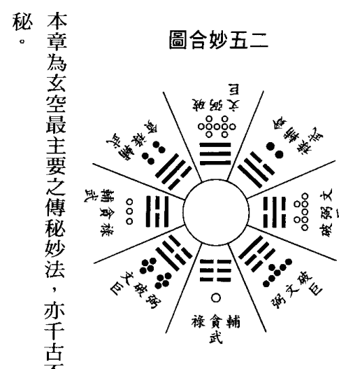

#### 古口訣

坤壬乙，巨門從頭出
艮丙辛，位位是破軍
巽辰亥，盡是武曲位
甲癸申，貪狼一路行

挨者輪也，挨星者，由此至彼之謂，舉凡堪輿術士必曰挨星，坊間刻本，本本皆曰仙傳家秘，無從法式，自唐時楊公至今，相距千年至二千年，楊公云當時偽法已一百二十家，至於今日，何止恆河沙數，學道非難，得真理為難，無他，惟求實驗而已，經云，惟有挨星為最貴，洩漏天機秘，又曰先天羅經十二支，後天再用干與維，八干四維輔支位，子母公孫同此推，此皆挨星之術語，先天乾坤，父母交而生六子，乃成先天八卦，抽爻換象，各自為父母，再生子息，又各自為父母，子母于焉以成，由誠意正心修身齊家治國平天下，又云三生天地是玄關，其云識得父母三般卦，會者傳天下，又曰二十四龍管三卦，此三般抽爻換象而來也，訣曰坤壬乙，其不言甲癸申者，以坤統上元故也。從頭出者，以頭頂為艮丙辛，此山澤一卦也，二運時坤主其政，上元一運以癸為長男，故甲癸申，坎離為父母，震巽為用，此古人用訣之法，由先天後天體用抽出，試演於下，坎離一卦，以子午為父母，先天乾坤，乾一索于坤而得震，再索得坎，三索得艮，以壬子

玄空六法

三二七

三二六

癸後天居之，坤一索於乾得巽，再索得離，三索得兌，此三般卦之演，一九運時，中子主事，父母居中子家內，以主持一切，此雖卦理亦倫理也，二運坤壬乙一三角，其不言山澤而言坤者，以少子初經世面，故母權仍重，惟二偶數，陰從右路轉相通，坤仍在二黑位，卦氣則山澤，而主其事者老母也，倫理之常也。以坤壬乙，皆挨星之少陽艮卦也，三七運臨又當以震巽二卦為父母卦，書云，正神正位裝，撥水入零堂，震卦甲癸申，氣勢磅礴，其來也不可遏止，書止，書訣云，貪狼一路行，此一字正為訣，瞻矣，其云一者，乃指一運時，應用於甲癸申三山之謂，若至三運時，當運啟用，有其發也如雷，其敗也如灰，人事滄桑，當代發而當代敗，為名師所不取，此自乃補救之用法，亦打劫之妙用，巽辰亥句，直指四六二運之直達，其云，盡是武曲位，乃直指兩運皆以武巨為父母，以東南海闊無垠，環境兇惡，又在少陽少陰之宅，非老父母居中主持，又何能負此人人事倥傯之地，故必以乾坤為父母矣，此挨者輪也，正倫常之次序，父母年老退隱，但仍

居各房之內，以六子不能同時當事，每人有其應任之次序，位置年期有一定之規則，任滿則離，未來則進，以廉貞為中央，曰帝座，又曰星，此皇極乃虛設，正民主之模範，堯之禪舜，舜之禪禹，皆本其法，此皇極者，乃萬人之皇極，非私有之物，其星當令，自必入主中樞，臨制四方，任滿則退，歸於原籍，又何有於爭，其生旺休囚，自寓於中，運隨氣至，交替有時，旋轉由乎中央，中五皇極，只有名及位，未有其星，虛位也，不云八卦而云六子，蔣大鴻云，經四位而起父母，一四七之三般卦也，所謂經四位，長者轄乎江東，少者轄乎江西，中子貫通南北，代行父權，南北一卦，乃子息卦中父母卦，得中氣最厚，年曆最長，享年悠遠三卦皆有興替，最神者以甲癸申補救之法，而運用北斗七星打劫法之妙，經有四個一，此句顯示風雷一卦，卦氣雄奇磅礴，又云四個二，此句示山澤卦，又云南北八神共一卦，此句暗示水火一卦，應一九運之用法，此處反覆將三般卦山水取捨，直白指出，局之興替，山水前後左右包括已盡，衰旺在水神，亦

玄空六法

三二八

三二九

已曉白指出，其衰旺何以在水神，蓋六子以水為天地之體，世間未有一物能常動有如水者，首四句釋山澤之妙用，每卦分四宮，皆三般妙用之三角，甲癸申巽，震卦之氣，子卯巳未，坎卦之氣，不出卦者，以其同氣，故云一家，山配山，水配水，龍頭水口山向，皆取同卦，則無敗蹟，雖城門向首，皆取合時合氣，而二三節龍犯出卦之忌，其家必有零然之敗，或又有損折房份之事，作穴者尤為必要，此卦佈形三角，取萬物三角原體，天地間動之水及礫石，皆三角之形，以太陽之體三角，世人取三角之用，只知其然不知其所以然者，當在太陽之本體，其主要固在時，故有坤壬乙，為上元水法，甲癸申，為下元水法，審察一地之興衰，能避衰就旺，全在作者之心靈手敏，而福德尤為首要，始能天心巧合焉耳。

#### 第五法 城門

#### 城門訣

城以鎖氣，門以通氣，經曰：八國城門鎖正氣，八國言其周密之象，城門言其通氣之所，有周密而無空缺，則陰陽不分，動靜不明，全空缺而無周密，則氣散而不收，經曰：高山頂上空無穴，無城無門，故不結穴，又曰：乘風則散，界水則止，此內外二氣合而言之也。曰城言其外圍也，曰門言其內口也。內為最近之所，關乎近代，穴之收氣與否，交媾與否，全憑乎此，惟在實地考證，是城非城，是門非門，老於相地者，自能一言立曉，茲以陽宅喻之，則更為明顯，入其屋，必由大門，入其室，必由房門，居城市者入其家，必先由城門，有入必有出，故輿道之入其穴，入其極也。所以山必有徑，經曰城門一訣，惟此而已。

玄空六法

三三一

三三〇

#### 城門形氣圖

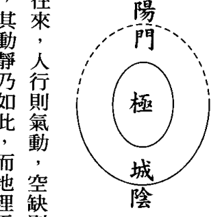

經云：地有四勢，氣從八方，實為辨城門之要旨，四勢之圍闢，八方之動靜，以最相象最密切之城門，作為比擬，所以云城門一訣最為良，識得五星城門訣，立宅安墳大吉昌也。城垣四圍皆密，惟城門之門可通往來，人行則氣動，空缺則風來，乃形氣自然之理，蓋言人力所為之城門，其動靜乃如此，而地理天然之勢，亦無不皆然，乘風則散，界水則止一也。城門關係全城啟閉，穴地乘風界水，關係生氣之聚散，經云：千里來龍住是也。住之之義，即在有城無城，有門無門之間判之，世人往往不從四勢八方著意，以為城門另有口訣，或從九氣中空際著想，或從掌模上挨排出來，捨近就遠，殊可發噱，古云一訣者，乃以形勢上之動靜，與挨星上之生死為言也。通氣之所，關係最重，或在前後，或在左右，其吉凶禍福，或在上元，或在下元，或在現在將來，均以城門斷之，無有不驗

者，所以有同一旺龍，城門在左，則發而致福，城門在右，則敗而致禍者，合得正神則禍，合得零神則福者，實為立宅安墳之大關鍵，所謂訣者，如此而已矣，而尤以山龍為最顯著，平洋則則寬而散，較山地為隱約，關係則相等也。務在閱歷上著眼，惟今世擇地，地少人多，大都以得脈為先，至城門之大小有無，非可拘泥矣，然猶陽居之不論華廈蓬簷，其形式上必各有其門戶，或則堅強而雅，或則簡陋而俗，聊勝於無而已，在人隨地剪裁之可也。

玄空六法

三三三

三三二

## 新玄空紫白訣

#### 第六法 太歲

#### 太歲訣

太極者，流行之氣也。一索再索三索，各人所得之造化休咎也。易曰，夫大人，與天地合其德，與日月合其明，與四時合其序，與鬼神合其吉凶，大人謂五，天位五，地位一，地理曰太歲者，亦天地人三才一氣相通之義也。值年值月，有以十二支神方位推求者，如子年在正北，午年在正南，子年以申子辰方之形氣，午年以寅午戌方之形氣，相求吉凶，經云，但看太歲是何神，立地見分明，成敗定斷何公位，三合年中，蓋又曰，太歲吉則助吉，凶則助凶，要知此吉此凶，非太歲之吉凶，乃形勢方位，參以理氣中之吉凶也。年有二十四氣，氣有溫厚嚴凝之不同，辰戌丑未為天地四方之界，界所有分，氣亦各殊，立宅安墳能迎其合時得令之氣，經稱叩金龍永

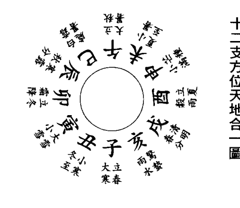

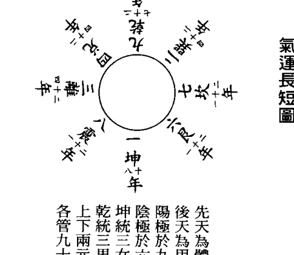

不窮者，即此四方之動氣，亦太歲之一也。六法惟太歲為最繁瑣，為用多端，不勝枚舉，他如大運小運之推算，當以八卦之陰陽二爻為主，有數十

玄空六法

三三四

三三五

年數百年者，局小則以小運推之，局大則以大運推之，此亦太歲之一也。又有推以某年某命關於某房者，亦一法也。總之形氣相參，方有應驗。經云推五運定六氣者，以一年之太歲推求之也。六法惟太歲最為繁雜，須與上述五法，相提並論，為斷驗吉凶之要訣，十二支神之值年，太陽之纏度，紫白之飛加，到宮對沖，三合六合，均與挨星城門等法，息息相通，殊非三言兩語可以了解，總之以氣運論，以年月論，均可名之曰太歲，地理以太歲一法附於六法之中者，因與立宅安墳，最有關係，當其未成之先，及已成之後，現在及將來，其吉凶利害，均可推求而得之，世以太歲為另一神名者誤矣，實則支辰八卦之方位，與氣運氣候之消長往來，隨山形水勢之靈秀，互相感應耳，經曰：氣感而應，於焉可證，冬至而葭灰飛，立秋而枯葉落，天時地理之關於人事亦然，經云：鬼福及人，語云親安則子安，木本水源，氣物之相感乃如此。

## 第八章 玄機賦（陰陽二宅同斷）

香港易齋求是趙景義著述
新加坡
張成春編纂

玄機賦 陰陽二宅同斷

大哉居乎，成敗所繫。危哉葬也，興廢攸關。氣口（即城門）司一宅之樞，龍穴樂三吉之輔。陰陽雖云四路（四山四水合上下兩元也），宗支只有兩家（一陰一陽）。數列五行，體用恩仇始見，星分九曜，吉凶悔吝斯章。宅神不可損傷（靜以待動），用神最宜健旺（即龍穴之入首），值難不傷，蓋因難歸閒地（即水之低平無動作處）。逢恩不發，祇緣恩落仇宮（即不當令處，或向水被宮神所剋）。一貴當權，諸凶懾服（龍神得生旺，雖剋亦吉）。眾凶剋主，獨力難支（立穴雖吉，若龍水皆不當令，又遇諸星來剋，故獨力

難支）。火炎土燥，南離何益乎艮坤。水冷金寒，坎癸不滋乎乾兌（炎燥寒冷太過也，皆不當元之數）。然四卦之互交，因取生旺（山水品配又得元也）。八宮之締合，自有假真（真假於來情辨之）。地天為泰，老陰之土生老陽（土生金也）。若坤配兌女，庶妾難投寡母之歡心（蓋純陰也）。澤山為咸少，男之情屬少女（下元大發）。若艮配純陽，鰥夫豈有發生之機兆（品配必審乎時），乾兌託假鄰之誼（山水皆可相兼），坤艮通偶爾之情（二八為配，取比肩）。雙木成林，雷風相薄（此後天也亦如先天）。中爻得配，水火相交（坎離中爻互易，即天地交泰之理）。木為火神之本（木生火也），水為木氣之元（水生木也）。巽陰就離風散則火易熄滅（宜審元運）。震陽生火，雷奮而火愈光明（即棟入南離之義）。震與坎為乍交，離與巽可暫合（皆得相生之義，惟非正配偶然而已）。坎為生氣，得巽木曰附攬聯歡（即上元車驅北闕之義）。乾乏元神，用兌金曰傍城假主（乾不當元，而兌當令亦得生旺）。風行地上，決定傷脾（土受傷也，風為木脾為土）。火照天門，必當

吐血（金主肺，被火剋，故吐血也）。木見戊朝，莊生難免鼓盆之歎（巽為長女，乾金剋之，故主剋妻）。坎流坤位，買臣常遭婦賤之羞（坎為中男，坤土剋之，即我不剋而反剋我，主遭婦辱，故以朱買臣為證）。艮非宜也，筋傷股折（艮主股肱筋絡，如受木剋即有傷折之應）。兌不利歟，唇亡齒寒（兌主唇齒，若受金剋，故主唇亡齒寒）。坎宮缺陷而墮胎，離位巖巖而損目（二方以形勢言，坎為當元，離失元也）。輔臨丁丙，位列朝班（應在下元）。名揚科第，貪狼木在巽宮（即四一同宮之義）。職掌兵權，武曲峰當庚兌（應在下元）。乾首坤腹，八卦推詳。（即乾為首，坤為腹，離為目，坎為耳，兌為口，震為足，巽為股，艮為手之類）。癸足丁心，十干類取（甲頭，乙項，丙肩，丁心，戊腸，己脾，庚臍，辛股，壬脛，癸足此十干之應也）。子疝氣，丑脾肝，寅背肺，卯目手、辰背胸，巳面齒、午心腹，未脾腸，申咳嗽，酉背肺，戌頭項，亥肝腎此十二支之應也。參合八卦其應如響。）木入坎宮，鳳池身貴（應

在上元，此亦四一同宮之義）。金居艮位，烏府求名（應在下元）。金取土培，火宜木相。

### 飛星賦

（賦一作斷）

是篇未詳作者姓名，篇中言吉者從略，言凶者特詳，是補玄空秘旨之未備，欲人知所避也，惟須知九宮摩盪隨時變易，若呆板輪流，不啻毫釐千里矣。周流八卦，顛倒九疇，察來彰往，索隱探幽，承旺承生得之足喜，逢衰逢謝失則堪憂，人為天地之心，凶吉原自主易有災祥之變，避趨本可預謀，小人昧理妄行，禍由已作，君子待時始動，福自我求（此節發明吉凶得失，惟人自召之故）。試看復壁揜身（坤為積土，有牆壁之象，又為身。震犯坤土，故主土擊。篇中借用六十四卦名，以明山與向之飛星也。下仿此）壯途躓足（壯大壯也，震為足，乾為行人，乾金剋震木，故跌倒也）。

同人車馬馳驅（乾為馬，為遠，為行人，離日剋之，故有此象）小畜差徭勞碌（巽為命令，乾為大人，乾剋巽，故有差徭勞碌之象）乙辛兮家室分離（乙即震，為主為夫、為反、為出。辛即兌，為妻妾，為少女，為毀折。震兌對待沖剋，故有此應），辰酉兮闈幃不睦（辰即巽，為長女，酉即兌，兌為少女，兌巽相剋，故主闈幃不睦）寅申巳觸曾聞虎咥象人（參宿為白虎在申宮，寅宮亦有尾虎，寅申沖，沖則動，再遇流年巳火弔來寅刑巳，已刑申三刑，會自有咥人之象，又象取坤虎艮山巽風，然事不常見下，故取象於犬傷）壬申排庚最異龍摧屋角（震為龍，坎為雲，為雨，兌為澤，震坎相生，雲從龍象，兌來沖剋龍飛騰，象主有龍陣摧屋，然事亦非常見下，故取象於蛇），或被犬傷（艮為狗，逢三刑以獮犬斷，若坤為主，則斷牛傷）或逢蛇毒（解見上又巽為蛇，必弔太歲到向方，斷傷人，否則見蛇而已）青樓染疾，只因七弼同黃（兌為少女，為賊妾，離為心，為目，心悅少女，淫象也，五黃性毒，故主患楊梅瘡毒）寒戶遭瘟，緣自三廉夾綠。

玄機賦陰陽二宅同斷

三四一

三四〇

（震為虫，中立性毒，巽風爽之，故瘟又有風疹）。

赤紫兮致災有數（七赤為先天大數，九紫乃後天火星，二星相併，水如沖動，災必驟發，洩之反不見殃，火性炎烈故也）黑黃兮，釀疾堪傷（二黑在一二運為天醫，餘運為病符，若與五黃同到，疾病損人）交至乾坤吝心不足（乾為金，坤為吝嗇，故吝而無厭）同來震巽，味事無常（震為出，巽為人，出入不當，故因循誤事）戊未僧尼自我，有緣何益（戊為僧，未為尼，失時相生何益）乾坤神鬼與他相剋非祥（乾為神，坤為鬼，剋則有鬼神指責）當知四蕩一淫，淫蕩者扶之歸正（四為風，故蕩水趨下須扶，蓋得時吉，失時凶，此四為主，非一為主也）須識七剛三毅，剛毅者，制則生殃（凡三七皆不可剋制，剋制則其禍尤烈），碧綠風魔，他處廉貞莫見（雷風相薄本主癲病，疊五黃則立應）紫黃毒藥，鄰宮兌口休營（火味苦，五性毒，故為毒藥，若兌金貪五土之生，則毒藥入口矣，嗜煙者如之）酉辛年戊己吊來，喉間有疾（兌為喉舌，逢五黃必生喉症）子癸歲廉貞飛到，

陰處生瘡（一為腎，故云陰處，五黃主膿血，故有生瘡之象）。

豫（雷地也）擬食停（坤為脾胃，木剋之，脾胃受傷。故食停）。臨（地澤也）云洩痢（澤金洩坤腹之氣，澤性注下，故主痢）頭響兮六三（乾為首，震為聲，雷性上騰故頭鳴，大抵肝陽上升等症）。乳癰兮四五（四為乳，五膿血），火暗而神志難清（火為神，若離宮幽暗主神昏此兼氣色，斷下仿此）風鬱而氣機不利（在天為風，在人為氣，巽宮窒塞，故有此應）切莫傷，夫坤肉震筋豈堪損乎，離心艮鼻（此言方位，不可有惡形）震之聲，色，向背當明（向背，指形勢言）乾為寒，坤為熱，往來切記（往來指形勢及門路言，遇乾坤雙至必患三陰病）須識乾爻門向，長子癡迷（乾爻戊戌也，乾為知為健，失時則癡迷矣）誰知坤卦庭中，小兒憔悴（二為病符，若飛到東北方，主少男病，凡乾坤二卦，以老父老母斷，十有八九驗，因六子當事故也）因星度象，木反側兮，無仁（反側指形說，震為仁）以象推星，水欹斜兮，失志（坎為志，欹斜亦指

形言）砂形破碎，陰神值而淫亂無羞（陰神陰卦也、二四九七是），水勢斜沖陽卦憑，則是非牽累（陽卦一三六八也），巽如反臂，總憐流落無歸（四綠到處砂形如臂，向外反抱者，主流落他鄉，因風性飄蕩故也）乾若懸頭，更痛遭刑莫避（懸頭，斷頭砂也，遭刑殺戮也）七有葫蘆之異，醫卜興家（七為刑，有除惡之象，故為醫，洪範七稽疑，故為卜，葫蘆砂形，如葫蘆也）七逢刀盞之形，屠沽居肆（刀盞，砂形也，七乃西方金，故為屠，又為口舌，故為沽也）旁通推測，木工因斧鑿，三宮觸類引伸鐵匠緣鉗錘七地（此憑砂之形象以斷。千變萬化總在形與星也）至若蛾眉魚袋衰卦非宜，猶之旗鼓刀鎗，用不合法，反主盜賊也）。

赤為形曜，那堪射弩水方，碧本賊星，怕見探頭山位（射弩水，探頭山最凶，若七三臨之禍更甚）。

若夫申尖興訟（尖者，尖峰也，在一九為文筆，在四為畫筆，在申為詞訟筆）辰碎遭兵（辰乃天罡，破碎非宜），破近文貞秀麗，乃溫柔之本（一四雜七，其弊如此）。赤連碧紫聰明，亦刻薄之萌（三九雜七，姑聰明而漸刻薄，兩卦夾雜之弊如此）五黃飛到三叉尚嫌多事（用法俱合流年，五黃到三叉尚有小疵）。太歲推來向首尤屬堪驚（承氣雖吉、太歲到向，猶恐損人）。

豈無騎線遊魂，鬼神入室（騎線如巳丙丁未等騎線之向也，離魂如乾離坎坤艮巽震兌是也，若遊魂失運鬼神畫見，九運用巳丙向，堂中黑暗，承巳氣多丙氣少，堂中午後或見鬼神，人不敢居，或疑堂下有伏屍，不知非也，乃卦氣使然耳）。

更有空縫合卦，夢寐牽情（空縫乃一卦之空縫，如丙午辰巽等是也，合卦如乾坤坎離是也，見此則人嘗用心於無用之地，夢寐繁懷，若用騎線向，較空縫尤甚），寄食依人原卦情之戀養，拋家背父見星性之貪生（承上騎線空縫而言，如九運亥壬門向，申庚宅向，外卦承乾氣，亥九喜生壬五為懋養，養者養之也，內承兌氣，庚七喜受坤二之生，即為貪生，生者生我也，養，養者養之也，內承兌氣，庚七喜受坤二之生，即為貪生，生者生我也，養，養者養之也，內承兌氣，庚七喜受坤二之生，即為貪生，生者生我也，養，養者養之也，內承兌氣，庚七喜受坤二之生，即為貪生，生者生我也，養，養者養之也，內承兌氣，庚七喜受坤二之生，即為貪生，生者生我也，養，養者養之也，內承兌氣，庚七喜受坤二之生，即為貪生，生者生我也，養，養者養之也，內承兌氣，庚七喜受坤二之生，即為貪生，生者生我也，養，養者養之也，內承兌氣，庚七喜受坤二之生，即為貪生，生者生我也，養，養者養之也，內承兌氣，庚七喜受坤二之生，即為貪生，生者生我也，養，養者養之也，內承兌氣，庚七喜受坤二之生，即為貪生，生者生我也，養，養者養之也，內承兌氣，庚七喜受坤二之生，即為貪生，生者生我也，養，養者養之也，內承兌氣，庚七喜受坤二之生，即為貪生，生者生我也，養，養者養之也，內承兌氣，庚七喜受坤二之生，即為貪生，生者生我也，養，養者養之也，內承兌氣，庚七喜受坤二之生，即為貪生，生者生我也，養，養者養之也，內承兌氣，庚七喜受坤二之生，即為貪生，生者生我也，養，養者養之也，內承兌氣，庚七喜受坤二之生，即為貪生，生者生我也，養，養者養之也，內承兌氣，庚七喜受坤二之生，即為貪生，生者生我也，養，養者養之也，內承兌氣，庚七喜受坤二之生，即為貪生，生者生我也，養，養者養之也，內承兌氣，庚七喜受坤二之生，即為貪生，生者生我也，養，養者養之也，內承兌氣，庚七喜受坤二之生，即為貪生，生者生我也，養，養者養之也，內承兌氣，庚七喜受坤二之生，即為貪生，生者生我也，養，養者養之也，內承兌氣，庚七喜受坤二之生，即為貪生，生者生我也，養，養者養之也，內承兌氣，庚七喜受坤二之生，即為貪生，生者生我也，養，養者養之也，內承兌氣，庚七喜受坤二之生，即為貪生，生者生我也，養，養者養之也，內承兌氣，庚七喜受坤二之生，即為貪生，生者生我也，養，養者養之也，內承兌氣，庚七喜受坤二之生，即為貪生，生者生我也，養，養者養之也，內承兌氣，庚七喜受坤二之生，即為貪生，生者生我也，養，養者養之也，內承兌氣，庚七喜受坤二之生，即為貪生，生者生我也，養，養者養之也，內承兌氣，庚七喜受坤二之生，即為貪生，生者生我也，養，養者養之也，內承兌氣，庚七喜受坤二之生，即為貪生，生者生我也，養，養者養之也，內承兌氣，庚七喜受坤二之生，即為貪生，生者生我也，養，養者養之也，內承兌氣，庚七喜受坤二之生，即為貪生，生者生我也，養，養者養之也，內承兌氣，庚七喜受坤二之生，即為貪生，生者生我也，養，養者養之也，內承兌氣，庚七喜受坤二之生，即為貪生，生者生我也，養，養者養之也，內承兌氣，庚七喜受坤二之生，即為貪生，生者生我也，養，養者養之也，內承兌氣，庚七喜受坤二之生，即為貪生，生者生我也，養，養者養之也，內承兌氣，庚七喜受坤二之生，即為貪生，生者生我也，養，養者養之也，內承兌氣，庚七喜受坤二之生，即為貪生，生者生我也，養，養者養之也，內承兌氣，庚七喜受坤二之生，即為貪生，生者生我也，養，養者養之也，內承兌氣，庚七喜受坤二之生，即為貪生，生者生我也，養，養者養之也，內承兌氣，庚七喜受坤二之生，即為貪生，生者生我也，養，養者養之也，內承兌氣，庚七喜受坤二之生，即為貪生，生者生我也，養，養者養之也，內承兌氣，庚七喜受坤二之生，即為貪生，生者生我也，養，養者養之也，內承兌氣，庚七喜受坤二之生，即為貪生，生者生我也，養，養者養之也，內承兌氣，庚七喜受坤二之生，即為貪生，生者生我也，養，養者養之也，內承兌氣，庚七喜受坤二之生，即為貪生，生者生我也，養，養者養之也，內承兌氣，庚七喜受坤二之生，即為貪生，生者生我也，養，養者養之也，內承兌氣，庚七喜受坤二之生，即為貪生，生者生我也，養，養者養之也，內承兌氣，庚七喜受坤二之生，即為貪生，生者生我也，養，養者養之也，內承兌氣，庚七喜受坤二之生，即為貪生，生者生我也，養，養者養之也，內承兌氣，庚七喜受坤二之生，即為貪生，生者生我也，養，養者養之也，內承兌氣，庚七喜受坤二之生，即為貪生，生者生我也，養，養者養之也，內承兌氣，庚七喜受坤二之生，即為貪生，生者生我也，養，養者養之也，內承兌氣，庚七喜受坤二之生，即為貪生，生者生我也，養，養者養之也，內承兌氣，庚七喜受坤二之生，即為貪生，生者生我也，養，養者養之也，內承兌氣，庚七喜受坤二之生，即為貪生，生者生我也，養，養者養之也，內承兌氣，庚七喜受坤二之生，即為貪生，生者生我也，養，養者養之也，內承兌氣，庚七喜受坤二之生，即為貪生，生者生我也，養，養者養之也，內承兌氣，庚七喜受坤二之生，即為貪生，生者生我也，養，養者養之也，內承兌氣，庚七喜受坤二之生，即為貪生，生者生我也，養，養者養之也，內承兌氣，庚七喜受坤二之生，即為貪生，生者生我也，養，養者養之也，內承兌氣，庚七喜受坤二之生，即為貪生，生者生我也，養，養者養之也，內承兌氣，庚七喜受坤二之生，即為貪生，生者生我也，養，養者養之也，內承兌氣，庚七喜受坤二之生，即為貪生，生者生我也，養，養者養之也，內承兌氣，庚七喜受坤二之生，即為貪生，生者生我也，養，養者養之也，內承兌氣，庚七喜受坤二之生，即為貪生，生者生我也，養，養者養之也，內承兌氣，庚七喜受坤二之生，即為貪生，生者生我也，養，養者養之也，內承兌氣，庚七喜受坤二之生，即為貪生，生者生我也，養，養者養之也，內承兌氣，庚七喜受坤二之生，即為貪生，生者生我也，養，養者養之也，內承兌氣，庚七喜受坤二之生，即為貪生，生者生我也，養，養者養之也，內承兌氣，庚七喜受坤二之生，即為貪生，生者生我也，養，養者養之也，內承兌氣，庚七喜受坤二之生，即為貪生，生者生我也，養，養者養之也，內承兌氣，庚七喜受坤二之生，即為貪生，生者生我也，養，養者養之也，內承兌氣，庚七喜受坤二之生，即為貪生，生者生我也，養，養者養之也，內承兌氣，庚七喜受坤二之生，即為貪生，生者生我也，養，養者養之也，內承兌氣，庚七喜受坤二之生，即為貪生，生者生我也，養，養者養之也，內承兌氣，庚七喜受坤二之生，即為貪生，生者生我也，養，養者養之也，內承兌氣，庚七喜受坤二之生，即為貪生，生者生我也，養，養者養之也，內承兌氣，庚七喜受坤二之生，即為貪生，生者生我也，養，養者養之也，內承兌氣，庚七喜受坤二之生，即為貪生，生者生我也，養，養者養之也，內承兌氣，庚七喜受坤二之生，即為貪生，生者生我也，養，養者養之也，內承兌氣，庚七喜受坤二之生，即為貪生，生者生我也，養，養者養之也，內承兌氣，庚七喜受坤二之生，即為貪生，生者生我也，養，養者養之也，內承兌氣，庚七喜受坤二之生，即為貪生，生者生我也，養，養者養之也，內承兌氣，庚七喜受坤二之生，即為貪生，生者生我也，養，養者養之也，內承兌氣，庚七喜受坤二之生，即為貪生，生者生我也，養，養者養之也，內承兌氣，庚七喜受坤二之生，即為貪生，生者生我也，養，養者養之也，內承兌氣，庚七喜受坤二之生，即為貪生，生者生我也，養，養者養之也，內承兌氣，庚七喜受坤二之生，即為貪生，生者生我也，養，養者養之也，內承兌氣，庚七喜受坤二之生，即為貪生，生者生我也，養，養者養之也，內承兌氣，庚七喜受坤二之生，即為貪生，生者生我也，養，養者養之也，內承兌氣，庚七喜受坤二之生，即為貪生，生者生我也，養，養者養之也，內承兌氣，庚七喜受坤二之生，即為貪生，生者生我也，養，養者養之也，內承兌氣，庚七喜受坤二之生，即為貪生，生者生我也，養，養者養之也，內承兌氣，庚七喜受坤二之生，即為貪生，生者生我也，養，養者養之也，內承兌氣，庚七喜受坤二之生，即為貪生，生者生我也，養，養者養之也，內承兌氣，庚七喜受坤二之生，即為貪生，生者生我也，養，養者養之也，內承兌氣，庚七喜受坤二之生，即為貪生，生者生我也，養，養者養之也，內承兌氣，庚七喜受坤二之生，即為貪生，生者生我也，養，養者養之也，內承兌氣，庚七喜受坤二之生，即為貪生，生者生我也，養，養者養之也，內承兌氣，庚七喜受坤二之生，即為貪生，生者生我也，養，養者養之也，內承兌氣，庚七喜受坤二之生，即為貪生，生者生我也，養，養者養之也，內承兌氣，庚七喜受坤二之生，即為貪生，生者生我也，養，養者養之也，內承兌氣，庚七喜受坤二之生，即為貪生，生者生我也，養，養者養之也，內承兌氣，庚七喜受坤二之生，即為貪生，生者生我也，養，養者養之也，內承兌氣，庚七喜受坤二之生，即為貪生，生者生我也，養，養者養之也，內承兌氣，庚七喜受坤二之生，即為貪生，生者生我也，養，養者養之也，內承兌氣，庚七喜受坤二之生，即為貪生，生者生我也，養，養者養之也，內承兌氣，庚七喜受坤二之生，即為貪生，生者生我也，養，養者養之也，內承兌氣，庚七喜受坤二之生，即為貪生，生者生我也，養，養者養之也，內承兌氣，庚七喜受坤二之生，即為貪生，生者生我也，養，養者養之也，內承兌氣，庚七喜受坤二之生，即為貪生，生者生我也，養，養者養之也，內承兌氣，庚七喜受坤二之生，即為貪生，生者生我也，養，養者養之也，內承兌氣，庚七喜受坤二之生，即為貪生，生者生我也，養，養者養之也，內承兌氣，庚七喜受坤二之生，即為貪生，生者生我也，養，養者養之也，內承兌氣，庚七喜受坤二之生，即為貪生，生者生我也，養，養者養之也，內承兌氣，庚七喜受坤二之生，即為貪生，生者生我也，養，養者養之也，內承兌氣，庚七喜受坤二之生，即為貪生，生者生我也，養，養者養之也，內承兌氣，庚七喜受坤二之生，即為貪生，生者生我也，養，養者養之也，內承兌氣，庚七喜受坤二之生，即為貪生，生者生我也，養，養者養之也，內承兌氣，庚七喜受坤二之生，即為貪生，生者生我也，養，養者養之也，內承兌氣，庚七喜受坤二之生，即為貪生，生者生我也，養，養者養之也，內承兌氣，庚七喜受坤二之生，即為貪生，生者生我也，養，養者養之也，內承兌氣，庚七喜受坤二之生，即為貪生，生者生我也，養，養者養之也，內承兌氣，庚七喜受坤二之生，即為貪生，生者生我也，養，養者養之也，內承兌氣，庚七喜受坤二之生，即為貪生，生者生我也，養，養者養之也，內承兌氣，庚七喜受坤二之生，即為貪生，生者生我也，養，養者養之也，內承兌氣，庚七喜受坤二之生，即為貪生，生者生我也，養，養者養之也，內承兌氣，庚七喜受坤二之生，即為貪生，生者生我也，養，養者養之也，內承兌氣，庚七喜受坤二之生，即為貪生，生者生我也，養，養者養之也，內承兌氣，庚七喜受坤二之生，即為貪生，生者生我也，養，養者養之也，內承兌氣，庚七喜受坤二之生，即為貪生，生者生我也，養，養者養之也，內承兌氣，庚七喜受坤二之生，即為貪生，生者生我也，養，養者養之也，內承兌氣，庚七喜受坤二之生，即為貪生，生者生我也，養，養者養之也，內承兌氣，庚七喜受坤二之生，即為貪生，生者生我也，養，養者養之也，內承兌氣，庚七喜受坤二之生，即為貪生，生者生我也，養，養者養之也，內承兌氣，庚七喜受坤二之生，即為貪生，生者生我也，養，養者養之也，內承兌氣，庚七喜受坤二之生，即為貪生，生者生我也，養，養者養之也，內承兌氣，庚七喜受坤二之生，即為貪生，生者生我也，養，養者養之也，內承兌氣，庚七喜受坤二之生，即為貪生，生者生我也，養，養者養之也，內承兌氣，庚七喜受坤二之生，即為貪生，生者生我也，養，養者養之也，內承兌氣，庚七喜受坤二之生，即為貪生，生者生我也，養，養者養之也，內承兌氣，庚七喜受坤二之生，即為貪生，生者生我也，養，養者養之也，內承兌氣，庚七喜受坤二之生，即為貪生，生者生我也，養，養者養之也，內承兌氣，庚七喜受坤二之生，即為貪生，生者生我也，養，養者養之也，內承兌氣，庚七喜受坤二之生，即為貪生，生者生我也，養，養者養之也，內承兌氣，庚七喜受坤二之生，即為貪生，生者生我也，養，養者養之也，內承兌氣，庚七喜受坤二之生，即為貪生，生者生我也，養，養者養之也，內承兌氣，庚七喜受坤二之生，即為貪生，生者生我也，養，養者養之也，內承兌氣，庚七喜受坤二之生，即為貪生，生者生我也，養，養者養之也，內承兌氣，庚七喜受坤二之生，即為貪生，生者生我也，養，養者養之也，內承兌氣，庚七喜受坤二之生，即為貪生，生者生我也，養，養者養之也，內承兌氣，庚七喜受坤二之生，即為貪生，生者生我也，養，養者養之也，內承兌氣，庚七喜受坤二之生，即為貪生，生者生我也，養，養者養之也，內承兌氣，庚七喜受坤二之生，即為貪生，生者生我也，養，養者養之也，內承兌氣，庚七喜受坤二之生，即為貪生，生者生我也，養，養者養之也，內承兌氣，庚七喜受坤二之生，即為貪生，生者生我也，養，養者養之也，內承兌氣，庚七喜受坤二之生，即為貪生，生者生我也，養，養者養之也，內承兌氣，庚七喜受坤二之生，即為貪生，生者生我也，養，養者養之也，內承兌氣，庚七喜受坤二之生，即為貪生，生者生我也，養，養者養之也，內承兌氣，庚七喜受坤二之生，即為貪生，生者生我也，養，養者養之也，內承兌氣，庚七喜受坤二之生，即為貪生，生者生我也，養，養者養之也，內承兌氣，庚七喜受坤二之生，即為貪生，生者生我也，養，養者養之也，內承兌氣，庚七喜受坤二之生，即為貪生，生者生我也，養，養者養之也，內承兌氣，庚七喜受坤二之生，即為貪生，生者生我也，養，養者養之也，內承兌氣，庚七喜受坤二之生，即為貪生，生者生我也，養，養者養之也，內承兌氣，庚七喜受坤二之生，即為貪生，生者生我也，養，養者養之也，內承兌氣，庚七喜受坤二之生，即為貪生，生者生我也，養，養者養之也，內承兌氣，庚七喜受坤二之生，即為貪生，生者生我也，養，養者養之也，內承兌氣，庚七喜受坤二之生，即為貪生，生者生我也，養，養者養之也，內承兌氣，庚七喜受坤二之生，即為貪生，生者生我也，養，養者養之也，內承兌氣，庚七喜受坤二之生，即為貪生，生者生我也，養，養者養之也，內承兌氣，庚七喜受坤二之生，即為貪生，生者生我也，養，養者養之也，內承兌氣，庚七喜受坤二之生，即為貪生，生者生我也，養，養者養之也，內承兌氣，庚七喜受坤二之生，即為貪生，生者生我也，養，養者養之也，內承兌氣，庚七喜受坤二之生，即為貪生，生者生我也，養，養者養之也，內承兌氣，庚七喜受坤二之生，即為貪生，生者生我也，養，養者養之也，內承兌氣，庚七喜受坤二之生，即為貪生，生者生我也，養，養者養之也，內承兌氣，庚七喜受坤二之生，即為貪生，生者生我也，養，養者養之也，內承兌氣，庚七喜受坤二之生，即為貪生，生者生我也，養，養者養之也，內承兌氣，庚七喜受坤二之生，即為貪生，生者生我也，養，養者養之也，內承兌氣，庚七喜受坤二之生，即為貪生，生者生我也，養，養者養之也，內承兌氣，庚七喜受坤二之生，即為貪生，生者生我也，養，養者養之也，內承兌氣，庚七喜受坤二之生，即為貪生，生者生我也，養，養者養之也，內承兌氣，庚七喜受坤二之生，即為貪生，生者生我也，養，養者養之也，內承兌氣，庚七喜受坤二之生，即為貪生，生者生我也，養，養者養之也，內承兌氣，庚七喜受坤二之生，即為貪生，生者生我也，養，養者養之也，內承兌氣，庚七喜受坤二之生，即為貪生，生者生我也，養，養者養之也，內承兌氣，庚七喜受坤二之生，即為貪生，生者生我也，養，養者養之也，內承兌氣，庚七喜受坤二之生，即為貪生，生者生我也，養，養者養之也，內承兌氣，庚七喜受坤二之生，即為貪生，生者生我也，養，養者養之也，內承兌氣，庚七喜受坤二之生，即為貪生，生者生我也，養，養者養之也，內承兌氣，庚七喜受坤二之生，即為貪生，生者生我也，養，養者養之也，內承兌氣，庚七喜受坤二之生，即為貪生，生者生我也，養，養者養之也，內承兌氣，庚七喜受坤二之生，即為貪生，生者生我也，養，養者養之也，內承兌氣，庚七喜受坤二之生，即為貪生，生者生我也，養，養者養之也，內承兌氣，庚七喜受坤二之生，即為貪生，生者生我也，養，養者養之也，內承兌氣，庚七喜受坤二之生，即為貪生，生者生我也，養，養者養之也，內承兌氣，庚七喜受坤二之生，即為貪生，生者生我也，養，養者養之也，內承兌氣，庚七喜受坤二之生，即為貪生，生者生我也，養，養者養之也，內承兌氣，庚七喜受坤二之生，即為貪生，生者生我也，養，養者養之也，內承兌氣，庚七喜受坤二之生，即為貪生，生者生我也，養，養者養之也，內承兌氣，庚七喜受坤二之生，即為貪生，生者生我也，養，養者養之也，內承兌氣，庚七喜受坤二之生，即為貪生，生者生我也，養，養者養之也，內承兌氣，庚七喜受坤二之生，即為貪生，生者生我也，養，養者養之也，內承兌氣，庚七喜受坤二之生，即為貪生，生者生我也，養，養者養之也，內承兌氣，庚七喜受坤二之生，即為貪生，生者生我也，養，養者養之也，內承兌氣，庚七喜受坤二之生，即為貪生，生者生我也，養，養者養之也，內承兌氣，庚七喜受坤二之生，即為貪生，生者生我也，養，養者養之也，內承兌氣，庚七喜受坤二之生，即為貪生，生者生我也，養，養者養之也，內承兌氣，庚七喜受坤二之生，即為貪生，生者生我也，養，養者養之也，內承兌氣，庚七喜受坤二之生，即為貪生，生者生我也，養，養者養之也，內承兌氣，庚七喜受坤二之生，即為貪生，生者生我也，養，養者養之也，內承兌氣，庚七喜受坤二之生，即為貪生，生者生我也，養，養者養之也，內承兌氣，庚七喜受坤二之生，即為貪生，生者生我也，養，養者養之也，內承兌氣，庚七喜受坤二之生，即為貪生，生者生我也，養，養者養之也，內承兌氣，庚七喜受坤二之生，即為貪生，生者生我也，養，養者養之也，內承兌氣，庚七喜受坤二之生，即為貪生，生者生我也，養，養者養之也，內承兌氣，庚七喜受坤二之生，即為貪生，生者生我也，養，養者養之也，內承兌氣，庚七喜受坤二之生，即為貪生，生者生我也，養，養者養之也，內承兌氣，庚七喜受坤二之生，即為貪生，生者生我也，養，養者養之也，內承兌氣，庚七喜受坤二之生，即為貪生，生者生我也，養，養者養之也，內承兌氣，庚七喜受坤二之生，即為貪生，生者生我也，養，養者養之也，內承兌氣，庚七喜受坤二之生，即為貪生，生者生我也，養，養者養之也，內承兌氣，庚七喜受坤二之生，即為貪生，生者生我也，養，養者養之也，內承兌氣，庚七喜受坤二之生，即為貪生，生者生我也，養，養者養之也，內承兌氣，庚七喜受坤二之生，即為貪生，生者生我也，養，養者養之也，內承兌氣，庚七喜受坤二之生，即為貪生，生者生我也，養，養者養之也，內承兌氣，庚七喜受坤二之生，即為貪生，生者生我也，養，養者養之也，內承兌氣，庚七喜受坤二之生，即為貪生，生者生我也，養，養者養之也，內承兌氣，庚七喜受坤二之生，即為貪生，生者生我也，養，養者養之也，內承兌氣，庚七喜受坤二之生，即為貪生，生者生我也，養，養者養之也，內承兌氣，庚七喜受坤二之生，即為貪生，生者生我也，養，養者養之也，內承兌氣，庚七喜受坤二之生，即為貪生，生者生我也，養，養者養之也，內承兌氣，庚七喜受坤二之生，即為貪生，生者生我也，養，養者養之也，內承兌氣，庚七喜受坤二之生，即為貪生，生者生我也，養，養者養之也，內承兌氣，庚七喜受坤二之生，即為貪生，生者生我也，養，養者養之也，內承兌氣，庚七喜受坤二之生，即為貪生，生者生我也，養，養者養之也，內承兌氣，庚七喜受坤二之生，即為貪生，生者生我也，養，養者養之也，內承兌氣，庚七喜受坤二之生，即為貪生，生者生我也，養，養者養之也，內承兌氣，庚七喜受坤二之生，即為貪生，生者生我也，養，養者養之也，內承兌氣，庚七喜受坤二之生，即為貪生，生者生我也，養，養者養之也，內承兌氣，庚七喜受坤二之生，即為貪生，生者生我也，養，養者養之也，內承兌氣，庚七喜受坤二之生，即為貪生，生者生我也，養，養者養之也，內承兌氣，庚七喜受坤二之生，即為貪生，生者生我也，養，養者養之也，內承兌氣，庚七喜受坤二之生，即為貪生，生者生我也，養，養者養之也，內承兌氣，庚七喜受坤二之生，即為貪生，生者生我也，養，養者養之也，內承兌氣，庚七喜受坤二之生，即為貪生，生者生我也，養，養者養之也，內承兌氣，庚七喜受坤二之生，即為貪生，生者生我也，養，養者養之也，內承兌氣，庚七喜受坤二之生，即為貪生，生者生我也，養，養者養之也，內承兌氣，庚七喜受坤二之生，即為貪生，生者生我也，養，養者養之也，內承兌氣，庚七喜受坤二之生，即為貪生，生者生我也，養，養者養之也，內承兌氣，庚七喜受坤二之生，即為貪生，生者生我也，養，養者養之也，內承兌氣，庚七喜受坤二之生，即為貪生，生者生我也，養，養者養之也，內承兌氣，庚七喜受坤二之生，即為貪生，生者生我也，養，養者養之也，內承兌氣，庚七喜受坤二之生，即為貪生，生者生我也，養，養者養之也，內承兌氣，庚七喜受坤二之生，即為貪生，生者生我也，養，養者養之也，內承兌氣，庚七喜受坤二之生，即為貪生，生者生我也，養，養者養之也，內承兌氣，庚七喜受坤二之生，即為貪生，生者生我也，養，養者養之也，內承兌氣，庚七喜受坤二之生，即為貪生，生者生我也，養，養者養之也，內承兌氣，庚七喜受坤二之生，即為貪生，生者生我也，養，養者養之也，內承兌氣，庚七喜受坤二之生，即為貪生，生者生我也，養，養者養之也，內承兌氣，庚七喜受坤二之生，即為貪生，生者生我也，養，養者養之也，內承兌氣，庚七喜受坤二之生，即為貪生，生者生我也，養，養者養之也，內承兌氣，庚七喜受坤二之生，即為貪生，生者生我也，養，養者養之也，內承兌氣，庚七喜受坤二之生，即為貪生，生者生我也，養，養者養之也，內承兌氣，庚七喜受坤二之生，即為貪生，生者生我也，養，養者養之也，內承兌氣，庚七喜受坤二之生，即為貪生，生者生我也，養，養者養之也，內承兌氣，庚七喜受坤二之生，即為貪生，生者生我也，養，養者養之也，內承兌氣，庚七喜受坤二之生，即為貪生，生者生我也，養，養者養之也，內承兌氣，庚七喜受坤二之生，即為貪生，生者生我也，養，養者養之也，內承兌氣，庚七喜受坤二之生，即為貪生，生者生我也，養，養者養之也，內承兌氣，庚七喜受坤二之生，即為貪生，生者生我也，養，養者養之也，內承兌氣，庚七喜受坤二之生，即為貪生，生者生我也，養，養者養之也，內承兌氣，庚七喜受坤二之生，即為貪生，生者生我也，養，養者養之也，內承兌氣，庚七喜受坤二之生，即為貪生，生者生我也，養，養者養之也，內承兌氣，庚七喜受坤二之生，即為貪生，生者生我也，養，養者養之也，內承兌氣，庚七喜受坤二之生，即為貪生，生者生我也，養，養者養之也，內承兌氣，庚七喜受坤二之生，即為貪生，生者生我也，養，養者養之也，內承兌氣，庚七喜受坤二之生，即為貪生，生者生我也，養，養者養之也，內承兌氣，庚七喜受坤二之生，即為貪生，生者生我也，養，養者養之也，內承兌氣，庚七喜受坤二之生，即為貪生，生者生我也，養，養者養之也，內承兌氣，庚七喜受坤二之生，即為貪生，生者生我也，養，養者養之也，內承兌氣，庚七喜受坤二之生，即為貪生，生者生我也，養，養者養之也，內承兌氣，庚七喜受坤二之生，即為貪生，生者生我也，養，養者養之也，內承兌氣，庚七喜受坤二之生，即為貪生，生者生我也，養，養者養之也，內承兌氣，庚七喜受坤二之生，即為貪生，生者生我也，養，養者養之也，內承兌氣，庚七喜受坤二之生，即為貪生，生者生我也，養，養者養之也，內承兌氣，庚七喜受坤二之生，即為貪生，生者生我也，養，養者養之也，內承兌氣，庚七喜受坤二之生，即為貪生，生者生我也，養，養者養之也，內承兌氣，庚七喜受坤二之生，即為貪生，生者生我也，養，養者養之也，內承兌氣，庚七喜受坤二之生，即為貪生，生者生我也，養，養者養之也，內承兌氣，庚七喜受坤二之生，即為貪生，生者生我也，養，養者養之也，內承兌氣，庚七喜受坤二之生，即為貪生，生者生我也，養，養者養之也，內承兌氣，庚七喜受坤二之生，即為貪生，生者生我也，養，養者養之也，內承兌氣，庚七喜受坤二之生，即為貪生，生者生我也，養，養者養之也，內承兌氣，庚七喜受坤二之生，即為貪生，生者生我也，養，養者養之也，內承兌氣，庚七喜受坤二之生，即為貪生，生者生我也，養，養者養之也，內承兌氣，庚七喜受坤二之生，即為貪生，生者生我也，養，養者養之也，內承兌氣，庚七喜受坤二之生，即為貪生，生者生我也，養，養者養之也，內承兌氣，庚七喜受坤二之生，即為貪生，生者生我也，養，養者養之也，內承兌氣，庚七喜受坤二之生，即為貪生，生者生我也，養，養者養之也，內承兌氣，庚七喜受坤二之生，即為貪生，生者生我也，養，養者養之也，內承兌氣，庚七喜受坤二之生，即為貪生，生者生我也，養，養者養之也，內承兌氣，庚七喜受坤二之生，即為貪生，生者生我也，養，養者養之也，內承兌氣，庚七喜受坤二之生，即為貪生，生者生我也，養，養者養之也，內承兌氣，庚七喜受坤二之生，即為貪生，生者生我也，養，養者養之也，內承兌氣，庚七喜受坤二之生，即為貪生，生者生我也，養，養者養之也，內承兌氣，庚七喜受坤二之生，即為貪生，生者生我也，養，養者養之也，內承兌氣，庚七喜受坤二之生，即為貪生，生者生我也，養，養者養之也，內承兌氣，庚七喜受坤二之生，即為貪生，生者生我也，養，養者養之也，內承兌氣，庚七喜受坤二之生，即為貪生，生者生我也，養，養者養之也，內承兌氣，庚七喜受坤二之生，即為貪生，生者生我也，養，養者養之也，內承兌氣，庚七喜受坤二之生，即為貪生，生者生我也，養，養者養之也，內承兌氣，庚七喜受坤二之生，即為貪生，生者生我也，養，養者養之也，內承兌氣，庚七喜受坤二之生，即為貪生，生者生我也，養，養者養之也，內承兌氣，庚七喜受坤二之生，即為貪生，生者生我也，養，養者養之也，內承兌氣，庚七喜受坤二之生，即為貪生，生者生我也，養，養者養之也，內承兌氣，庚七喜受坤二之生，即為貪生，生者生我也，養，養者養之也，內承兌氣，庚七喜受坤二之生，即為貪生，生者生我也，養，養者養之也，內承兌氣，庚七喜受坤二之生，即為貪生，生者生我也，養，養者養之也，內承兌氣，庚七喜受坤二之生，即為貪生，生者生我也，養，養者養之也，內承兌氣，庚七喜受坤二之生，即為貪生，生者生我也，養，養者養之也，內承兌氣，庚七喜受坤二之生，即為貪生，生者生我也，養，養者養之也，內承兌氣，庚七喜受坤二之生，即為貪生，生者生我也，養，養者養之也，內承兌氣，庚七喜受坤二之生，即為貪生，生者生我也，養，養者養之也，內承兌氣，庚七喜受坤二之生，即為貪生，生者生我也，養，養者養之也，內承兌氣，庚七喜受坤二之生，即為貪生，生者生我也，養，養者養之也，內承兌氣，庚七喜受坤二之生，即為貪生，生者生我也，養，養者養之也，內承兌氣，庚七喜受坤二之生，即為貪生，生者生我也，養，養者養之也，內承兌氣，庚七喜受坤二之生，即為貪生，生者生我也，養，養者養之也，內承兌氣，庚七喜受坤二之生，即為貪生，生者生我也，養，養者養之也，內承兌氣，庚七喜受坤二之生，即為貪生，生者生我也，養，養者養之也，內承兌氣，庚七喜受坤二之生，即為貪生，生者生我也，養，養者養之也，內承兌氣，庚七喜受坤二之生，即為貪生，生者生我也，養，養者養之也，內承兌氣，庚七喜受坤二之生，即為貪生，生者生我也，養，養者養之也，內承兌氣，庚七喜受坤二之生，即為貪生，生者生我也，養，養者養之也，內承兌氣，庚七喜受坤二之生，即為貪生，生者生我也，養，養者養之也，內承兌氣，庚七喜受坤二之生，即為貪生，生者生我也，養，養者養之也，內承兌氣，庚七喜受坤二之生，即為貪生，生者生我也，養，養者養之也，內承兌氣，庚七喜受坤二之生，即為貪生，生者生我也，養，養者養之也，內承兌氣，庚七喜受坤二之生，即為貪生，生者生我也，養，養者養之也，內承兌氣，庚七喜受坤二之生，即為貪生，生者生我也，養，養者養之也，內承兌氣，庚七喜受坤二之生，即為貪生，生者生我也，養，養者養之也，內承兌氣，庚七喜受坤二之生，即為貪生，生者生我也，養，養者養之也，內承兌氣，庚七喜受坤二之生，即為貪生，生者生我也，養，養者養之也，內承兌氣，庚七喜受坤二之生，即為貪生，生者生我也，養，養者養之也，內承兌氣，庚七喜受坤二之生，即為貪生，生者生我也，養，養者養之也，內承兌氣，庚七喜受坤二之生，即為貪生，生者生我也，養，養者養之也，內承兌氣，庚七喜受坤二之生，即為貪生，生者生我也，養，養者養之也，內承兌氣，庚七喜受坤二之生，即為貪生，生者生我也，養，養者養之也，內承兌氣，庚七喜受坤二之生，即為貪生，生者生我也，養，養者養之也，內承兌氣，庚七喜受坤二之生，即為貪生，生者生我也，養，養者養之也，內承兌氣，庚七喜受坤二之生，即為貪生，生者生我也，養，養者養之也，內承兌氣，庚七喜受坤二之生，即為貪生，生者生我也，養，養者養之也，內承兌氣，庚七喜受坤二之生，即為貪生，生者生我也，養，養者養之也，內承兌氣，庚七喜受坤二之生，即為貪生，生者生我也，養，養者養之也，內承兌氣，庚七喜受坤二之生，即為貪生，生者生我也，養，養者養之也，內承兌氣，庚七喜受坤二之生，即為貪生，生者生我也，養，養者養之也，內承兌氣，庚七喜受坤二之生，即為貪生，生者生我也，養，養者養之也，內承兌氣，庚七喜受坤二之生，即為貪生，生者生我也，養，養者養之也，內承兌氣，庚七喜受坤二之生，即為貪生，生者生我也，養，養者養之也，內承兌氣，庚七喜受坤二之生，即為貪生，生者生我也，養，養者養之也，內承兌氣，庚七喜受坤二之生，即為貪生，生者生我也，養，養者養之也，內承兌氣，庚七喜受坤二之生，即為貪生，生者生我也，養，養者養之也，內承兌氣，庚七喜受坤二之生，即為貪生，生者生我也，養，養者養之也，內承兌氣，庚七喜受坤二之生，即為貪生，生者生我也，養，養者養之也，內承兌氣，庚七喜受坤二之生，即為貪生，生者生我也，養，養者養之也，內承兌氣，庚七喜受坤二之生，即為貪生，生者生我也，養，養者養之也，內承兌氣，庚七喜受坤二之生，即為貪生，生者生我也，養，養者養之也，內承兌氣，庚七喜受坤二之生，即為貪生，生者生我也，養，養者養之也，內承兌氣，庚七喜受坤二之生，即為貪生，生者生我也，養，養者養之也，內承兌氣，庚七喜受坤二之生，即為貪生，生者生我也，養，養者養之也，內承兌氣，庚七喜受坤二之生，即為貪生，生者生我也，養，養者養之也，內承兌氣，庚七喜受坤二之生，即為貪生，生者生我也，養，養者養之也，內承兌氣，庚七喜受坤二之生，即為貪生，生者生我也，養，養者養之也，內承兌氣，庚七喜受坤二之生，即為貪生，生者生我也，養，養者養之也，內承兌氣，庚七喜受坤二之生，即為貪生，生者生我也，養，養者養之也，內承兌氣，庚七喜受坤二之生，即為貪生，生者生我也，養，養者養之也，內承兌氣，庚七喜受坤二之生，即為貪生，生者生我也，養，養者養之也，內承兌氣，庚七喜受坤二之生，即為貪生，生者生我也，養，養者養之也，內承兌氣，庚七喜受坤二之生，即為貪生，生者生我也，養，養者養之也，內承兌氣，庚七喜受坤二之生，即為貪生，生者生我也，養，養者養之也，內承兌氣，庚七喜受坤二之生，即為貪生，生者生我也，養，養者養之也，內承兌氣，庚七喜受坤二之生，即為貪生，生者生我也，養，養者養之也，內承兌氣，庚七喜受坤二之生，即為貪生，生者生我也，養，養者養之也，內承兌氣，庚七喜受坤二之生，即為貪生，生者生我也，養，養者養之也，內承兌氣，庚七喜受坤二之生，即為貪生，生者生我也，養，養者養之也，內承兌氣，庚七喜受坤二之生，即為貪生，生者生我也，養，養者養之也，內承兌氣，庚七喜受坤二之生，即為貪生，生者生我也，養，養者養之也，內承兌氣，庚七喜受坤二之生，即為貪生，生者生我也，養，養者養之也，內承兌氣，庚七喜受坤二之生，即為貪生，生者生我也，養，養者養之也，內承兌氣，庚七喜受坤二之生，即為貪生，生者生我也，養，養者養之也，內承兌氣，庚七喜受坤二之生，即為貪生，生者生我也，養，養者養之也，內承兌氣，庚七喜受坤二之生，即為貪生，生者生我也，養，養者養之也，內承兌氣，庚七喜受坤二之生，即為貪生，生者生我也，養，養者養之也，內承兌氣，庚七喜受坤二之生，即為貪生，生者生我也，養，養者養之也，內承兌氣，庚七喜受坤二之生，即為貪生，生者生我也，養，養者養之也，內承兌氣，庚七喜受坤二之生，即為貪生，生者生我也，養，養者養之也，內承兌氣，庚七喜受坤二之生，即為貪生，生者生我也，養，養者養之也，內承兌氣，庚七喜受坤二之生，即為貪生，生者生我也，養，養者養之也，內承兌氣，庚七喜受坤二之生，即為貪生，生者生我也，養，養者養之也，內承兌氣，庚七喜受坤二之生，即為貪生，生者生我也，養，養者養之也，內承兌氣，庚七喜受坤二之生，即為貪生，生者生我也，養，養者養之也，內承兌氣，庚七喜受坤二之生，即為貪生，生者生我也，養，養者養之也，內承兌氣，庚七喜受坤二之生，即為貪生，生者生我也，養，養者養之也，內承兌氣，庚七喜受坤二之生，即為貪生，生者生我也，養，養者養之也，內承兌氣，庚七喜受坤二之生，即為貪生，生者生我也，養，養者養之也，內承兌氣，庚七喜受坤二之生，即為貪生，生者生我也，養，養者養之也，內承兌氣，庚七喜受坤二之生，即為貪生，生者生我也，養，養者養之也，內承兌氣，庚七喜受坤二之生，即為貪生，生者生我也，養，養者養之也，內承兌氣，庚七喜受坤二之生，即為貪生，生者生我也，養，養者養之也，內承兌氣，庚七喜受坤二之生，即為貪生，生者生我也，養，養者養之也，內承兌氣，庚七喜受坤二之生，即為貪生，生者生我也，養，養者養之也，內承兌氣，庚七喜受坤二之生，即為貪生，生者生我也，養，養者養之也，內承兌氣，庚七喜受坤二之生，即為貪生，生者生我也，養，養者養之也，內承兌氣，庚七喜受坤二之生，即為貪生，生者生我也，養，養者養之也，內承兌氣，庚七喜受坤二之生，即為貪生，生者生我也，養，養者養之也，內承兌氣，庚七喜受坤二之生，即為貪生，生者生我也，養，養者養之也，內承兌氣，庚七喜受坤二之生，即為貪生，生者生我也，養，養者養之也，內承兌氣，庚七喜受坤二之生，即為貪生，生者生我也，養，養者養之也，內承兌氣，庚七喜受坤二之生，即為貪生，生者生我也，養，養者養之也，內承兌氣，庚七喜受坤二之生，即為貪生，生者生我也，養，養者養之也，內承兌氣，庚七喜受坤二之生，即為貪生，生者生我也，養，養者養之也，內承兌氣，庚七喜受坤二之生，即為貪生，生者生我也，養，養者養之也，內承兌氣，庚七喜受坤二之生，即為貪生，生者生我也，養，養者養之也，內承兌氣，庚七喜受坤二之生，即為貪生，生者生我也，養，養者養之也，內承兌氣，庚七喜受坤二之生，即為貪生，生者生我也，養，養者養之也，內承兌氣，庚七喜受坤二之生，即為貪生，生者生我也，養，養者養之也，內承兌氣，庚七喜受坤二之生，即為貪生，生者生我也，養，養者養之也，內承兌氣，庚七喜受坤二之生，即為貪生，生者生我也，養，養者養之也，內承兌氣，庚七喜受坤二之生，即為貪生，生者生我也，養，養者養之也，內承兌氣，庚七喜受坤二之生，即為貪生，生者生我也，養，養者養之也，內承兌氣，庚七喜受坤二之生，即為貪生，生者生我也，養，養者養之也，內承兌氣，庚七喜受坤二之生，即為貪生，生者生我也，養，養者養之也，內承兌氣，庚七喜受坤二之生，即為貪生，生者生我也，養，養者養之也，內承兌氣，庚七喜受坤二之生，即為貪生，生者生我也，養，養者養之也，內承兌氣，庚七喜受坤二之生，即為貪生，生者生我也，養，養者養之也，內承兌氣，庚七喜受坤二之生，即為貪生，生者生我也，養，養者養之也，內承兌氣，庚七喜受坤二之生，即為貪生，生者生我也，養，養者養之也，內承兌氣，庚七喜受坤二之生，即為貪生，生者生我也，養，養者養之也，內承兌氣，庚七喜受坤二之生，即為貪生，生者生我也，養，養者養之也，內承兌氣，庚七喜受坤二之生，即為貪生，生者生我也，養，養者養之也，內承兌氣，庚七喜受坤二之生，即為貪生，生者生我也，養，養者養之也，內承兌氣，庚七喜受坤二之生，即為貪生，生者生我也，養，養者養之也，內承兌氣，庚七喜受坤二之生，即為貪生，生者生我也，養，養者養之也，內承兌氣，庚七喜受坤二之生，即為貪生，生者生我也，養，養者養之也，內承兌氣，庚七喜受坤二之生，即為貪生，生者生我也，養，養者養之也，內承兌氣，庚七喜受坤二之生，即為貪生，生者生我也，養，養者養之也，內承兌氣，庚七喜受坤二之生，即為貪生，生者生我也，養，養者養之也，內承兌氣，庚七喜受坤二之生，即為貪生，生者生我也，養，養者養之也，內承兌氣，庚七喜受坤二之生，即為貪生，生者生我也，養，養者養之也，內承兌氣，庚七喜受坤二之生，即為貪生，生者生我也，養，養者養之也，內承兌氣，庚七喜受坤二之生，即為貪生，生者生我也，養，養者養之也，內承兌氣，庚七喜受坤二之生，即為貪生，生者生我也，養，養者養之也，內承兌氣，庚七喜受坤二之生，即為貪生，生者生我也，養，養者養之也，內承兌氣，庚七喜受坤二之生，即為貪生，生者生我也，養，養者養之也，內承兌氣，庚七喜受坤二之生，即為貪生，生者生我也，養，養者養之也，內承兌氣，庚七喜受坤二之生，即為貪生，生者生我也，養，養者養之也，內承兌氣，庚七喜受坤二之生，即為貪生，生者生我也，養，養者養之也，內承兌氣，庚七喜受坤二之生，即為貪生，生者生我也，養，養者養之也，內承兌氣，庚七喜受坤二之生，即為貪生，生者生我也，養，養者養之也，內承兌氣，庚七喜受坤二之生，即為貪生，生者生我也，養，養者養之也，內承兌氣，庚七喜受坤二之生，即為貪生，生者生我也，養，養者養之也，內承兌氣，庚七喜受坤二之生，即為貪生，生者生我也，養，養者養之也，內承兌氣，庚七喜受坤二之生，即為貪生，生者生我也，養，養者養之也，內承兌氣，庚七喜受坤二之生，即為貪生，生者生我也，養，養者養之也，內承兌氣，庚七喜受坤二之生，即為貪生，生者生我也，養，養者養之也，內承兌氣，庚七喜受坤二之生，即為貪生，生者生我也，養，養者養之也，內承兌氣，庚七喜受坤二之生，即為貪生，生者生我也，養，養者養之也，內承兌氣，庚七喜受坤二之生，即為貪生，生者生我也，養，養者養之也，內承兌氣，庚七喜受坤二之生，即為貪生，生者生我也，養，養者養之也，內承兌氣，庚七喜受坤二之生，即為貪生，生者生我也，養，養者養之也，內承兌氣，庚七喜受坤二之生，即為貪生，生者生我也，養，養者養之也，內承兌氣，庚七喜受坤二之生，即為貪生，生者生我也，養，養者養之也，內承兌氣，庚七喜受坤二之生，即為貪生，生者生我也，養，養者養之也，內承兌氣，庚七喜受坤二之生，即為貪生，生者生我也，養，養者養之也，內承兌氣，庚七喜受坤二之生，即為貪生，生者生我也，養，養者養之也，內承兌氣，庚七喜受坤二之生，即為貪生，生者生我也，養，養者養之也，內承兌氣，庚七喜受坤二之生，即為貪生，生者生我也，養，養者養之也，內承兌氣，庚七喜受坤二之生，即為貪生，生者生我也，養，養者養之也，內承兌氣，庚七喜受坤二之生，即為貪生，生者生我也，養，養者養之也，內承兌氣，庚七喜受坤二之生，即為貪生，生者生我也，養，養者養之也，內承兌氣，庚七喜受坤二之生，即為貪生，生者生我也，養，養者養之也，內承兌氣，庚七喜受坤二之生，即為貪生，生者生我也，養，養者養之也，內承兌氣，庚七喜受坤二之生，即為貪生，生者生我也，養，養者養之也，內承兌氣，庚七喜受坤二之生，即為貪生，生者生我也，養，養者養之也，內承兌氣，庚七喜受坤二之生，即為貪生，生者生我也，養，養者養之也，內承兌氣，庚七喜受坤二之生，即為貪生，生者生我也，養，養者養之也，內承兌氣，庚七喜受坤二之生，即為貪生，生者生我也，養，養者養之也，內承兌氣，庚七喜受坤二之生，即為貪生，生者生我也，養，養者養之也，內承兌氣，庚七喜受坤二之生，即為貪生，生者生我也，養，養者養之也，內承兌氣，庚七喜受坤二之生，即為貪生，生者生我也，養，養者養之也，內承兌氣，庚七喜受坤二之生，即為貪生，生者生我也，養，養者養之也，內承兌氣，庚七喜受坤二之生，即為貪生，生者生我也，養，養者養之也，內承兌氣，庚七喜受坤二之生，即為貪生，生者生我也，養，養者養之也，內承兌氣，庚七喜受坤二之生，即為貪生，生者生我也，養，養者養之也，內承兌氣，庚七喜受坤二之生，即為貪生，生者生我也，養，養者養之也，內承兌氣，庚七喜受坤二之生，即為貪生，生者生我也，養，養者養之也，內承兌氣，庚七喜受坤二之生，即為貪生，生者生我也，養，養者養之也，內承兌氣，庚七喜受坤二之生，即為貪生，生者生我也，養，養者養之也，內承兌氣，庚七喜受坤二之生，即為貪生，生者生我也，養，養者養之也，內承兌氣，庚七喜受坤二之生，即為貪生，生者生我也，養，養者養之也，內承兌氣，庚七喜受坤二之生，即為貪生，生者生我也，養，養者養之也，內承兌氣，庚七喜受坤二之生，即為貪生，生者生我也，養，養者養之也，內承兌氣，庚七喜受坤二之生，即為貪生，生者生我也，養，養者養之也，內承兌氣，庚七喜受坤二之生，即為貪生，生者生我也，養，養者養之也，內承兌氣，庚七喜受坤二之生，即為貪生，生者生我也，養，養者養之也，內承兌氣，庚七喜受坤二之生，即為貪生，生者生我也，養，養者養之也，內承兌氣，庚七喜受坤二之生，即為貪生，生者生我也，養，養者養之也，內承兌氣，庚七喜受坤二之生，即為貪生，生者生我也，養，養者養之也，內承兌氣，庚七喜受坤二之生，即為貪生，生者生我也，養，養者養之也，內承兌氣，庚七喜受坤二之生，即為貪生，生者生我也，養，養者養之也，內承兌氣，庚七喜受坤二之生，即為貪生，生者生我也，養，養者養之也，內承兌氣，庚七喜受坤二之生，即為貪生，生者生我也，養，養者養之也，內承兌氣，庚七喜受坤二之生，即為貪生，生者生我也，養，養者養之也，內承兌氣，庚七喜受坤二之生，即為貪生，生者生我也，養，養者養之也，內承兌氣，庚七喜受坤二之生，即為貪生，生者生我也，養，養者養之也，內承兌氣，庚七喜受坤二之生，即為貪生，生者生我也，養，養者養之也，內承兌氣，庚七喜受坤二之生，即為貪生，生者生我也，養，養者養之也，內承兌氣，庚七喜受坤二之生，即為貪生，生者生我也，養，養者養之也，內承兌氣，庚七喜受坤二之生，即為貪生，生者生我也，養，養者養之也，內承兌氣，庚七喜受坤二之生，即為貪生，生者生我也，養，養者養之也，內承兌氣，庚七喜受坤二之生，即為貪生，生者生我也，養，養者養之也，內承兌氣，庚七喜受坤二之生，即為貪生，生者生我也，養，養者養之也，內承兌氣，庚七喜受坤二之生，即為貪生，生者生我也，養，養者養之也，內承兌氣，庚七喜受坤二之生，即為貪生，生者生我也，養，養者養之也，內承兌氣，庚七喜受坤二之生，即為貪生，生者生我也，養，養者養之也，內承兌氣，庚七喜受坤二之生，即為貪生，生者生我也，養，養者養之也，內承兌氣，庚七喜受坤二之生，即為貪生，生者生我也，養，養者養之也，內承兌氣，庚七喜受坤二之生，即為貪生，生者生我也，養，養者養之也，內承兌氣，庚七喜受坤二之生，即為貪生，生者生我也，養，養者養之也，內承兌氣，庚七喜受坤二之生，即為貪生，生者生我也，養，養者養之也，內承兌氣，庚七喜受坤二之生，即為貪生，生者生我也，養，養者養之也，內承兌氣，庚七喜受坤二之生，即為貪生，生者生我也，養，養者養之也，內承兌氣，庚七喜受坤二之生，即為貪生，生者生我也，養，養者養之也，內承兌氣，庚七喜受坤二之生，即為貪生，生者生我也，養，養者養之也，內承兌氣，庚七喜受坤二之生，即為貪生，生者生我也，養，養者養之也，內承兌氣，庚七喜受坤二之生，即為貪生，生者生我也，養，養者養之也，內承兌氣，庚七喜受坤二之生，即為貪生，生者生我也，養，養者養之也，內承兌氣，庚七喜受坤二之生，即為貪生，生者生我也，養，養者養之也，內承兌氣，庚七喜受坤二之生，即為貪生，生者生我也，養，養者養之也，內承兌氣，庚七喜受坤二之生，即為貪生，生者生我也，養，養者養之也，內承兌氣，庚七喜受坤二之生，即為貪生，生者生我也，養，養者養之也，內承兌氣，庚七喜受坤二之生，即為貪生，生者生我也，養，養者養之也，內承兌氣，庚七喜受坤二之生，即為貪生，生者生我也，養，養者養之也，內承兌氣，庚七喜受坤二之生，即為貪生，生者生我也，養，養者養之也，內承兌氣，庚七喜受坤二之生，即為貪生，生者生我也，養，養者養之也，內承兌氣，庚七喜受坤二之生，即為貪生，生者生我也，養，養者養之也，內承兌氣，庚七喜受坤二之生，即為貪生，生者生我也，養，養者養之也，內承兌氣，庚七喜受坤二之生，即為貪生，生者生我也，養，養者養之也，內承兌氣，庚七喜受坤二之生，即為貪生，生者生我也，養，養者養之也，內承兌氣，庚七喜受坤二之生，即為貪生，生者生我也，養，養者養之也，內承兌氣，庚七喜受坤二之生，即為貪生，生者生我也，養，養者養之也，內承兌氣，庚七喜受坤二之生，即為貪生，生者生我也，養，養者養之也，內承兌氣，庚七喜受坤二之生，即為貪生，生者生我也，養，養者養之也，內承兌氣，庚七喜受坤二之生，即為貪生，生者生我也，養，養者養之也，內承兌氣，庚七喜受坤二之生，即為貪生，生者生我也，養，養者養之也，內承兌氣，庚七喜受坤二之生，即為貪生，生者生我也，養，養者養之也，內承兌氣，庚七喜受坤二之生，即為貪生，生者生我也，養，養者養之也，內承兌氣，庚七喜受坤二之生，即為貪生，生者生我也，養，養者養之也，內承兌氣，庚七喜受坤二之生，即為貪生，生者生我也，養，養者養之也，內承兌氣，庚七喜受坤二之生，即為貪生，生者生我也，養，養者養之也，內承兌氣，庚七喜受坤二之生，即為貪生，生者生我也，養，養者養之也，內承兌氣，庚七喜受坤二之生，即為貪生，生者生我也，養，養者養之也，內承兌氣，庚七喜受坤二之生，即為貪生，生者生我也，養，養者養之也，內承兌氣，庚七喜受坤二之生，即為貪生，生者生我也，養，養者養之也，內承兌氣，庚七喜受坤二之生，即為貪生，生者生我也，養，養者養之也，內承兌氣，庚七喜受坤二之生，即為貪生，生者生我也，養，養者養之也，內承兌氣，庚七喜受坤二之生，即為貪生，生者生我也，養，養者養之也，內承兌氣，庚七喜受坤二之生，即為貪生，生者生我也，養，養者養之也，內承兌氣，庚七喜受坤二之生，即為貪生，生者生我也，養，養者養之也，內承兌氣，庚七喜受坤二之生，即為貪生，生者生我也，養，養者養之也，內承兌氣，庚七喜受坤二之生，即為貪生，生者生我也，養，養者養之也，內承兌氣，庚七喜受坤二之生，即為貪生，生者生我也，養，養者養之也，內承兌氣，庚七喜受坤二之生，即為貪生，生者生我也，養，養者養之也，內承兌氣，庚七喜受坤二之生，即為貪生，生者生我也，養，養者養之也，內承兌氣，庚七喜受坤二之生，即為貪生，生者生我也，養，養者養之也，內承兌氣，庚七喜受坤二之生，即為貪生，生者生我也，養，養者養之也，內承兌氣，庚七喜受坤二之生，即為貪生，生者生我也，養，養者養之也，內承兌氣，庚七喜受坤二之生，即為貪生，生者生我也，養，養者養之也，內承兌氣，庚七喜受坤二之生，即為貪生，生者生我也，養，養者養之也，內承兌氣，庚七喜受坤二之生，即為貪生，生者生我也，養，養者養之也，內承兌氣，庚七喜受坤二之生，即為貪生，生者生我也，養，養者養之也，內承兌氣，庚七喜受坤二之生，即為貪生，生者生我也，養，養者養之也，內承兌氣，庚七喜受坤二之生，即為貪生，生者生我也，養，養者養之也，內承兌氣，庚七喜受坤二之生，即為貪生，生者生我也，養，養者養之也，內承兌氣，庚七喜受坤二之生，即為貪生，生者生我也，養，養者養之也，內承兌氣，庚七喜受坤二之生，即為貪生，生者生我也，養，養者養之也，內承兌氣，庚七喜受坤二之生，即為貪生，生者生我也，養，養者養之也，內承兌氣，庚七喜受坤二之生，即為貪生，生者生我也，養，養者養之也，內承兌氣，庚七喜受坤二之生，即為貪生，生者生我也，養，養者養之也，內承兌氣，庚七喜受坤二之生，即為貪生，生者生我也，養，養者養之也，內承兌氣，庚七喜受坤二之生，即為貪生，生者生我也，養，養者養之也，內承兌氣，庚七喜受坤二之生，即為貪生，生者生我也，養，養者養之也，內承兌氣，庚七喜受坤二之生，即為貪生，生者生我也，養，養者養之也，內承兌氣，庚七喜受坤二之生，即為貪生，生者生我也，養，養者養之也，內承兌氣，庚七喜受坤二之生，即為貪生，生者生我也，養，養者養之也，內承兌氣，庚七喜受坤二之生，即為貪生，生者生我也，養，養者養之也，內承兌氣，庚七喜受坤二之生，即為貪生，生者生我也，養，養者養之也，內承兌氣，庚七喜受坤二之生，即為貪生，生者生我也，養，養者養之也，內承兌氣，庚七喜受坤二之生，即為貪生，生者生我也，養，養者養之也，內承兌氣，庚七喜受坤二之生，即為貪生，生者生我也，養，養者養之也，內承兌氣，庚七喜受坤二之生，即為貪生，生者生我也，養，養者養之也，內承兌氣，庚七喜受坤二之生，即為貪生，生者生我也，養，養者養之也，內承兌氣，庚七喜受坤二之生，即為貪生，生者生我也，養，養者養之也，內承兌氣，庚七喜受坤二之生，即為貪生，生者生我也，養，養者養之也，內承兌氣，庚七喜受坤二之生，即為貪生，生者生我也，養，養者養之也，內承兌氣，庚七喜受坤二之生，即為貪生，生者生我也，養，養者養之也，內承兌氣，庚七喜受坤二之生，即為貪生，生者生我也，養，養者養之也，內承兌氣，庚七喜受坤二之生，即為貪生，生者生我也，養，養者養之也，內承兌氣，庚七喜受坤二之生，即為貪生，生者生我也，養，養者養之也，內承兌氣，庚七喜受坤二之生，即為貪生，生者生我也，養，養者養之也，內承兌氣，庚七喜受坤二之生，即為貪生，生者生我也，養，養者養之也，內承兌氣，庚七喜受坤二之生，即為貪生，生者生我也，養，養者養之也，內承兌氣，庚七喜受坤二之生，即為貪生，生者生我也，養，養者養之也，內承兌氣，庚七喜受坤二之生，即為貪生，生者生我也，養，養者養之也，內承兌氣，庚七喜受坤二之生，即為貪生，生者生我也，養，養者養之也，內承兌氣，庚七喜受坤二之生，即為貪生，生者生我也，養，養者養之也，內承兌氣，庚七喜受坤二之生，即為貪生，生者生我也，養，養者養之也，內承兌氣，庚七喜受坤二之生，即為貪生，生者生我也，養，養者養之也，內承兌氣，庚七喜受坤二之生，即為貪生，生者生我也，養，養者養之也，內承兌氣，庚七喜受坤二之生，即為貪生，生者生我也，養，養者養之也，內承兌氣，庚七喜受坤二之生，即為貪生，生者生我也，養，養者養之也，內承兌氣，庚七喜受坤二之生，即為貪生，生者生我也，養，養者養之也，內承兌氣，庚七喜受坤二之生，即為貪生，生者生我也，養，養者養之也，內承兌氣，庚七喜受坤二之生，即為貪生，生者生我也，養，養者養之也，內承兌氣，庚七喜受坤二之生，即為貪生，生者生我也，養，養者養之也，內承兌氣，庚七喜受坤二之生，即為貪生，生者生我也，養，養者養之也，內承兌氣，庚七喜受坤二之生，即為貪生，生者生我也，養，養者養之也，內承兌氣，庚七喜受坤二之生，即為貪生，生者生我也，養，養者養之也，內承兌氣，庚七喜受坤二之生，即為貪生，生者生我也，養，養者養之也，內承兌氣，庚七喜受坤二之生，即為貪生，生者生我也，養，養者養之也，內承兌氣，庚七喜受坤二之生，即為貪生，生者生我也，養，養者養之也，內承兌氣，庚七喜受坤二之生，即為貪生，生者生我也，養，養者養之也，內承兌氣，庚七喜受坤二之生，即為貪生，生者生我也，養，養者養之也，內承兌氣，庚七喜受坤二之生，即為貪生，生者生我也，養，養者養之也，內承兌氣，庚七喜受坤二之生，即為貪生，生者生我也，養，養者養之也，內承兌氣，庚七喜受坤二之生，即為貪生，生者生我也，養，養者養之也，內承兌氣，庚七喜受坤二之生，即為貪生，生者生我也，養，養者養之也，內承兌氣，庚七喜受坤二之生，即為貪生，生者生我也，養，養者養之也，內承兌氣，庚七喜受坤二之生，即為貪生，生者生我也，養，養者養之也，內承兌氣，庚七喜受坤二之生，即為貪生，生者生我也，養，養者養之也，內承兌氣，庚七喜受坤二之生，即為貪生，生者生我也，養，養者養之也，內承兌氣，庚七喜受坤二之生，即為貪生，生者生我也，養，養者養之也，內承兌氣，庚七喜受坤二之生，即為貪生，生者生我也，養，養者養之也，內承兌氣，庚七喜受坤二之生，即為貪生，生者生我也，養，養者養之也，內承兌氣，庚七喜受坤二之生，即為貪生，生者生我也，養，養者養之也，內承兌氣，庚七喜受坤二之生，即為貪生，生者生我也，養，養者養之也，內承兌氣，庚七喜受坤二之生，即為貪生，生者生我也，養，養者養之也，內承兌氣，庚七喜受坤二之生，即為貪生，生者生我也，養，養者養之也，內承兌氣，庚七喜受坤二之生，即為貪生，生者生我也，養，養者養之也，內承兌氣，庚七喜受坤二之生，即為貪生，生者生我也，養，養者養之也，內承兌氣，庚七喜受坤二之生，即為貪生，生者生我也，養，養者養之也，內承兌氣，庚七喜受坤二之生，即為貪生，生者生我也，養，養者養之也，內承兌氣，庚七喜受坤二之生，即為貪生，生者生我也，養，養者養之也，內承兌氣，庚七喜受坤二之生，即為貪生，生者生我也，養，養者養之也，內承兌氣，庚七喜受坤二之生，即為貪生，生者生我也，養，養者養之也，內承兌氣，庚七喜受坤二之生，即為貪生，生者生我也，養，養者養之也，內承兌氣，庚七喜受坤二之生，即為貪生，生者生我也，養，養者養之也，內承兌氣，庚七喜受坤二之生，即為貪生，生者生我也，養，養者養之也，內承兌氣，庚七喜受坤二之生，即為貪生，生者生我也，養，養者養之也，內承兌氣，庚七喜受坤二之生，即為貪生，生者生我也，養，養者養之也，內承兌氣，庚七喜受坤二之生，即為貪生，生者生我也，養，養者養之也，內承兌氣，庚七喜受坤二之生，即為貪生，生者生我也，養，養者養之也，內承兌氣，庚七喜受坤二之生，即為貪生，生者生我也，養，養者養之也，內承兌氣，庚七喜受坤二之生，即為貪生，生者生我也，養，養者養之也，內承兌氣，庚七喜受坤二之生，即為貪生，生者生我也，養，養者養之也，內承兌氣，庚七喜受坤二之生，即為貪生，生者生我也，養，養者養之也，內承兌氣，庚七喜受坤二之生，即為貪生，生者生我也，養，養者養之也，內承兌氣，庚七喜受坤二之生，即為貪生，生者生我也，養，養者養之也，內承兌氣，庚七喜受坤二之生，即為貪生，生者生我也，養，養者養之也，內承兌氣，庚七喜受坤二之生，即為貪生，生者生我也，養，養者養之也，內承兌氣，庚七喜受坤二之生，即為貪生，生者生我也，養，養者養之也，內承兌氣，庚七喜受坤二之生，即為貪生，生者生我也，養，養者養之也，內承兌氣，庚七喜受坤二之生，即為貪生，生者生我也，養，養者養之也，內承兌氣，庚七喜受坤二之生，即為貪生，生者生我也，養，養者養之也，內承兌氣，庚七喜受坤二之生，即為貪生，生者生我也，養，養者養之也，內承兌氣，庚七喜受坤二之生，即為貪生，生者生我也，養，養者養之也，內承兌氣，庚七喜受坤二之生，即為貪生，生者生我也，養，養者養之也，內承兌氣，庚七喜受坤二之生，即為貪生，生者生我也，養，養者養之也，內承兌氣，庚七喜受坤二之生，即為貪生，生者生我也，養，養者養之也，內承兌氣，庚七喜受坤二之生，即為貪生，生者生我也，養，養者養之也，內承兌氣，庚七喜受坤二之生，即為貪生，生者生我也，養，養者養之也，內承兌氣，庚七喜受坤二之生，即為貪生，生者生我也，養，養者養之也，內承兌氣，庚七喜受坤二之生，即為貪生，生者生我也，養，養者養之也，內承兌氣，庚七喜受坤二之生，即為貪生，生者生我也，養，養者養之也，內承兌氣，庚七喜受坤二之生，即為貪生，生者生我也，養，養者養之也，內承兌氣，庚七喜受坤二之生，即為貪生，生者生我也，養，養者養之也，內承兌氣，庚七喜受坤二之生，即為貪生，生者生我也，養，養者養之也，內承兌氣，庚七喜受坤二之生，即為貪生，生者生我也，養，養者養之也，內承兌氣，庚七喜受坤二之生，即為貪生，生者生我也，養，養者養之也，內承兌氣，庚七喜受坤二之生，即為貪生，生者生我也，養，養者養之也，內承兌氣，庚七喜受坤二之生，即為貪生，生者生我也，養，養者養之也，內承兌氣，庚七喜受坤二之生，即為貪生，生者生我也，養，養者養之也，內承兌氣，庚七喜受坤二之生，即為貪生，生者生我也，養，養者養之也，內承兌氣，庚七喜受坤二之生，即為貪生，生者生我也，養，養者養之也，內承兌氣，庚七喜受坤二之生，即為貪生，生者生我也，養，養者養之也，內承兌氣，庚七喜受坤二之生，即為貪生，生者生我也，養，養者養之也，內承兌氣，庚七喜受坤二之生，即為貪生，生者生我也，養，養者養之也，內承兌氣，庚七喜受坤二之生，即為貪生，生者生我也，養，養者養之也，內承兌氣，庚七喜受坤二之生，即為貪生，生者生我也，養，養者養之也，內承兌氣，庚七喜受坤二之生，即為貪生，生者生我也，養，養者養之也，內承兌氣，庚七喜受坤二之生，即為貪生，生者生我也，養，養者養之也，內承兌氣，庚七喜受坤二之生，即為貪生，生者生我也，養，養者養之也，內承兌氣，庚七喜受坤二之生，即為貪生，生者生我也，養，養者養之也，內承兌氣，庚七喜受坤二之生，即為貪生，生者生我也，養，養者養之也，內承兌氣，庚七喜受坤二之生，即為貪生，生者生我也，養，養者養之也，內承兌氣，庚七喜受坤二之生，即為貪生，生者生我也，養，養者養之也，內承兌氣，庚七喜受坤二之生，即為貪生，生者生我也，養，養者養之也，內承兌氣，庚七喜受坤二之生，即為貪生，生者生我也，養，養者養之也，內承兌氣，庚七喜受坤二之生，即為貪生，生者生我也，養，養者養之也，內承兌氣，庚七喜受坤二之生，即為貪生，生者生我也，養，養者養之也，內承兌氣，庚七喜受坤二之生，即為貪生，生者生我也，養，養者養之也，內承兌氣，庚七喜受坤二之生，即為貪生，生者生我也，養，養者養之也，內承兌氣，庚七喜受坤二之生，即為貪生，生者生我也，養，養者養之也，內承兌氣，庚七喜受坤二之生，即為貪生，生者生我也，養，養者養之也，內承兌氣，庚七喜受坤二之生，即為貪生，生者生我也，養，養者養之也，內承兌氣，庚七喜受坤二之生，即為貪生，生者生我也，養，養者養之也，內承兌氣，庚七喜受坤二之生，即為貪生，生者生我也，養，養者養之也，內承兌氣，庚七喜受坤二之生，即為貪生，生者生我也，養，養者養之也，內承兌氣，庚七喜受坤二之生，即為貪生，生者生我也，養，養者養之也，內承兌氣，庚七喜受坤二之生，即為貪生，生者生我也，養，養者養之也，內承兌氣，庚七喜受坤二之生，即為貪生，生者生我也，養，養者養之也，內承兌氣，庚七喜受坤二之生，即為貪生，生者生我也，養，養者養之也，內承兌氣，庚七喜受坤二之生，即為貪生，生者生我也，養，養者養之也，內承兌氣，庚七喜受坤二之生，即為貪生，生者生我也，養，養者養之也，內承兌氣，庚七喜受坤二之生，即為貪生，生者生我也，養，養者養之也，內承兌氣，庚七喜受坤二之生，即為貪生，生者生我也，養，養者養之也，內承兌氣，庚七喜受坤二之生，即為貪生，生者生我也，養，養者養之也，內承兌氣，庚七喜受坤二之生，即為貪生，生者生我也，養，養者養之也，內承兌氣，庚七喜受坤二之生，即為貪生，生者生我也，養，養者養之也，內承兌氣，庚七喜受坤二之生，即為貪生，生者生我也，養，養者養之也，內承兌氣，庚七喜受坤二之生，即為貪生，生者生我也，養，養者養之也，內承兌氣，庚七喜受坤二之生，即為貪生，生者生我也，養，養者養之也，內承兌氣，庚七喜受坤二之生，即為貪生，生者生我也，養，養者養之也，內承兌氣，庚七喜受坤二之生，即為貪生，生者生我也，養，養者養之也，內承兌氣，庚七喜受坤二之生，即為貪生，生者生我也，養，養者養之也，內承兌氣，庚七喜受坤二之生，即為貪生，生者生我也，養，養者養之也，內承兌氣，庚七喜受坤二之生，即為貪生，生者生我也，養，養者養之也，內承兌氣，庚七喜受坤二之生，即為貪生，生者生我也，養，養者養之也，內承兌氣，庚七喜受坤二之生，即為貪生，生者生我也，養，養者養之也，內承兌氣，庚七喜受坤二之生，即為貪生，生者生我也，養，養者養之也，內承兌氣，庚七喜受坤二之生，即為貪生，生者生我也，養，養者養之也，內承兌氣，庚七喜受坤二之生，即為貪生，生者生我也，養，養者養之也，內承兌氣，庚七喜受坤二之生，即為貪生，生者生我也，養，養者養之也，內承兌氣，庚七喜受坤二之生，即為貪生，生者生我也，養，養者養之也，內承兌氣，庚七喜受坤二之生，即為貪生，生者生我也，養，養者養之也，內承兌氣，庚七喜受坤二之生，即為貪生，生者生我也，養，養者養之也，內承兌氣，庚七喜受坤二之生，即為貪生，生者生我也，養，養者養之也，內承兌氣，庚七喜受坤二之生，即為貪生，生者生我也，養，養者養之也，內承兌氣，庚七喜受坤二之生，即為貪生，生者生我也，養，養者養之也，內承兌氣，庚七喜受坤二之生，即為貪生，生者生我也，養，養者養之也，內承兌氣，庚七喜受坤二之生，即為貪生，生者生我也，養，養者養之也，內承兌氣，庚七喜受坤二之生，即為貪生，生者生我也，養，養者養之也，內承兌氣，庚七喜受坤二之生，即為貪生，生者生我也，養，養者養之也，內承兌氣，庚七喜受坤二之生，即為貪生，生者生我也，養，養者養之也，內承兌氣，庚七喜受坤二之生，即為貪生，生者生我也，養，養者養之也，內承兌氣，庚七喜受坤二之生，即為貪生，生者生我也，養，養者養之也，內承兌氣，庚七喜受坤二之生，即為貪生，生者生我也，養，養者養之也，內承兌氣，庚七喜受坤二之生，即為貪生，生者生我也，養，養者養之也，內承兌氣，庚七喜受坤二之生，即為貪生，生者生我也，養，養者養之也，內承兌氣，庚七喜受坤二之生，即為貪生，生者生我也，養，養者養之也，內承兌氣，庚七喜受坤二之生，即為貪生，生者生我也，養，養者養之也，內承兌氣，庚七喜受坤二之生，即為貪生，生者生我也，養，養者養之也，內承兌氣，庚七喜受坤二之生，即為貪生，生者生我也，養，養者養之也，內承兌氣，庚七喜受坤二之生，即為貪生，生者生我也，養，養者養之也，內承兌氣，庚七喜受坤二之生，即為貪生，生者生我也，養，養者養之也，內承兌氣，庚七喜受坤二之生，即為貪生，生者生我也，養，養者養之也，內承兌氣，庚七喜受坤二之生，即為貪生，生者生我也，養，養者養之也，內承兌氣，庚七喜受坤二之生，即為貪生，生者生我也，養，養者養之也，內承兌氣，庚七喜受坤二之生，即為貪生，生者生我也，養，養者養之也，內承兌氣，庚七喜受坤二之生，即為貪生，生者生我也，養，養者養之也，內承兌氣，庚七喜受坤二之生，即為貪生，生者生我也，養，養者養之也，內承兌氣，庚七喜受坤二之生，即為貪生，生者生我也，養，養者養之也，內承兌氣，庚七喜受坤二之生，即為貪生，生者生我也，養，養者養之也，內承兌氣，庚七喜受坤二之生，即為貪生，生者生我也，養，養者養之也，內承兌氣，庚七喜受坤二之生，即為貪生，生者生我也，養，養者養之也，內承兌氣，庚七喜受坤二之生，即為貪生，生者生我也，養，養者養之也，內承兌氣，庚七喜受坤二之生，即為貪生，生者生我也，養，養者養之也，內承兌氣，庚七喜受坤二之生，即為貪生，生者生我也，養，養者養之也，內承兌氣，庚七喜受坤二之生，即為貪生，生者生我也，養，養者養之也，內承兌氣，庚七喜受坤二之生，即為貪生，生者生我也，養，養者養之也，內承兌氣，庚七喜受坤二之生，即為貪生，生者生我也，養，養者養之也，內承兌氣，庚七喜受坤二之生，即為貪生，生者生我也，養，養者養之也，內承兌氣，庚七喜受坤二之生，即為貪生，生者生我也，養，養者養之也，內承兌氣，庚七喜受坤二之生，即為貪生，生者生我也，養，養者養之也，內承兌氣，庚七喜受坤二之生，即為貪生，生者生我也，養，養者養之也，內承兌氣，庚七喜受坤二之生，即為貪生，生者生我也，養，養者養之也，內承兌氣，庚七喜受坤二之生，即為貪生，生者生我也，養，養者養之也，內承兌氣，庚七喜受坤二之生，即為貪生，生者生我也，養，養者養之也，內承兌氣，庚七喜受坤二之生，即為貪生，生者生我也，養，養者養之也，內承兌氣，庚七喜受坤二之生，即為貪生，生者生我也，養，養者養之也，內承兌氣，庚七喜受坤二之生，即為貪生，生者生我也，養，養者養之也，內承兌氣，庚七喜受坤二之生，即為貪生，生者生我也，養，養者養之也，內承兌氣，庚七喜受坤二之生，即為貪生，生者生我也，養，養者養之也，內承兌氣，庚七喜受坤二之生，即為貪生，生者生我也，養，養者養之也，內承兌氣，庚七喜受坤二之生，即為貪生，生者生我也，養，養者養之也，內承兌氣，庚七喜受坤二之生，即為貪生，生者生我也，養，養者養之也，內承兌氣，庚七喜受坤二之生，即為貪生，生者生我也，養，養者養之也，內承兌氣，庚七喜受坤二之生，即為貪生，生者生我也，養，養者養之也，內承兌氣，庚七喜受坤二之生，即為貪生，生者生我也，養，養者養之也，內承兌氣，庚七喜受坤二之生，即為貪生，生者生我也，養，養者養之也，內承兌氣，庚七喜受坤二之生，即為貪生，生者生我也，養，養者養之也，內承兌氣，庚七喜受坤二之生，即為貪生，生者生我也，養，養者養之也，內承兌氣，庚七喜受坤二之生，即為貪生，生者生我也，養，養者養之也，內承兌氣，庚七喜受坤二之生，即為貪生，生者生我也，養，養者養之也，內承兌氣，庚七喜受坤二之生，即為貪生，生者生我也，養，養者養之也，內承兌氣，庚七喜受坤二

## 新玄空紫白訣

如是者主寄食依人拋家而去也，壬亥門向又為空縫合卦）總之助吉助凶，年星推測（流年九星入中宮，弔動運盤，足以助吉，亦足以助凶也），還看應先應後，歲運經營（吉凶先後不一，年星與運氣一一推排，自知先後之應，故曰歲運經營）。

### 河洛生剋吉凶斷（錄元合會通）

### 河圖

一六水生旺，為文秀，為榜首，為才藝，聰明。剋煞為淫佚，為寡婦，為濁水、為飄蕩。

二七火生旺，為橫財，巨富，為多女。剋煞為吐血，為墮胎，難產，為天亡，橫禍。

三八木生旺，為文才，為元魁，為多男。剋煞為少亡，為自縊、為絕嗣。

四九金生旺，為巨富、為好義、為多男。剋煞為刀兵，為孤伶，為自縊。

五十土生旺，為驟發，為多子孫。剋煞為瘟瘧為孤孀，為喪亡。此層數之大略也，然五行臨間，喜水金木忌火土以火土興廢靡常，不耐久長故也。

一六生震巽，旺坎剋離，煞午，二七生艮坤，旺離，剋乾兌，煞乾，三八生離。旺震巽，剋坤艮，煞坤，仿此推之。

### 洛書

一白水為中男，為魁星，生旺，少年科甲，名播四海，多生聰明，智慧男子。剋煞刑妻，瞎眼，天亡，飄蕩。

二黑土為老陰，生旺，發田財，旺人丁，不產文士。正應武貴，妻奪夫權，陰謀鄙吝。剋煞，寡婦相傳，產難。刑耗，腹疾，惡瘡。

三碧木為長男，生旺，財祿豐盈，興家創業，貢監成名，長房大旺。剋煞，癲魔，哮喘，殘疾，刑妻，是非，官訟。

四綠木為長女，為文昌，生旺，文章名世，科甲聯芳，女子容貌端妍，聯姻貴族。剋煞，瘋哮。自縊，婦女淫亂，男子酒色，破家飄流絕滅。

五黃土為戊己大煞，不論生剋俱凶，宜安靜，不宜動作，年神並臨，即損人丁，輕則災病，重則連喪至五數止，季子昏迷，癡呆，孟仲官訟，淫亂。

六白金為老陽，生旺，威權震世，武職勳貴，巨富多丁。剋煞，刑妻孤獨，寡母守家。

七赤金為少女，生旺，發財旺丁，武途仕宦，小房發福。剋煞，盜賊，離鄉。投軍。橫死牢獄，口舌，火災損丁。

八白土為少男，生旺，孝義忠良，富貴綿遠，小房福洪。剋煞小口損傷，瘟瘡膨脹。

九紫火為中女，生旺，文章科第，驟至榮顯，中房受蔭，易廢易興。剋煞，吐血，癲癇，目疾，產死，回祿，官災。

### 八宅天元賦

### 蔣大鴻著

元天垂象，九霄開梵氣之中，大地炳靈九野，兆坤維之紀，龍馬以河圖啟瑞，神龜以洛書效珍，剖混沌之先機，昭乾坤之大法，自然妙化，至人因之建都邑，以御萬邦，授室廬以綏兆姓，明堂九室，見於月令之文，方井八家，考之徹田之制（此段統論象數之始）粵稽黃帝始創宮室，我祖文公，愛營洛邑，當時著為憲令，後世遵為遺規，生民日用，而不知聖人先知而不議，秦火之後，典籍蕩然，千聖不傳之心，一線寄諸哲士，黃石授之圯上，乃出青囊，蕭相功成未央，大開北闕，逮於管郭微言莫稽比，乃楊曾正術始顯，嗣後偽書雜出，異軌爭馳，家造滅蠻之經，人排掌中之卦詞，能害志偽且亂真，斯固世道之衰微，抑亦天機之隱秘，不得雲陽之訣，豈知目講之傳（此統論地理之流傳，而歸重於無極得傳於目講為正宗，目講為吉安劉達僧之高弟，無極實得目講之傳以續楊曾之續者也）。萬世洪荒一朝剖破（統結以上二段），坐山定宅，宅既不真，東西分宮，宮亦全謬，五鬼六害豈皆絕命之神，生氣天醫不盡延年之路，貪狼巨門高聳未是吉星，廉貞破軍昂頭詎真凶曜，欲執遊年訣法，斷無取驗機關（此辨宅書之非），要明八宅之真，先識九宮之數，年分甲子運轉三元，上元一白為君，坤震為輔，中元四綠居首。五六相承七赤，下元艮離衰旺（此指氣數之真，是天元賦正文，前後皆發明此秘）。春榮秋落莫尋出運之龍，陽往陰來須遇本宮之水，正偏曲直惟貴格清，廣狹淺深只求位的（此示人以入用之形），形局之模糊猶可，方隅之雜亂難言，曠野平原端取流神結體關廂，村鎮多將衢路分蹤，城隅依城為憑，山谷傍山立局，高樓峻宇矯星借插於鄰家，堰壩橋樑動氣，交沖乎輒跡牆，垣皆能障蔽，竹木亦可攔當（此言氣之所到，以而形受），總之，水為引氣之神，察其來又看兜抱，風多動氣之力，性主散，須用遮攔，呼吸須辨陰陽，化機總歸一局，風之所送，即是水之所交，陽之所噬亦即陰之所吸，交類牝牡，如影隨形，應若宮商似響斯答，水氣在土膚之上，當以光交，風氣來空虛之中，但隨質取光交，親憑目覩，質取變有多端，若逢空缺即為來，一有遮攔旋作止，辨明止來二氣，方知噓吸真機（此言風水二者，分道揚鑣殊途同歸），更有宅神尤多妙用，權衡內外變化吉凶，蓋內氣是宅內之方隅，外氣是宅外之風水，內外俱凶，成廢宅，內外俱吉，是仙宮，外凶內吉，謹許小康，外吉內凶，難除瑕玷，此言曠野一家之宅，非言城市比屋之居（論曠野居宅，但辨吉凶二氣，凡宅皆同，俱宜分清者也）。若夫接宇連甍，尤重升堂入室，略陳矩矱，以備推求，大體先論宅形機括，更看門路四方正直，備有八宮扁闊直長，偏居二卦，一曲須論首尾，三灣亦取兩頭，長短消除，廣狹轉變，均齊方正，有左衰右旺之時，缺曲偏斜，辨此濁彼清之界，卦有定理，格不一方（此論接宅法，而一曲首尾三灣兩頭二語，尤千古傳心之秘，最宜詳玩之也），假如震兌橫若几樣，二卦適均，艮坤折若磐形，兩宮並至，試問門開何地，乃知氣入之源，嚴搜內室何方，始定歸根之路，若門通前後，則卦不一家，更臥室居中，則氣收兩舍（此論形異，則氣別也），向兼寅甲，坐雜亥壬，東房富則西方必貧，南枝榮則北枝定萎，察重輕於門路，測深淺於卦爻，析繫乃彰合居不判（此分一宅榮枯，而以出卦無爻為戒也），欲較門之力量，亦辨宅之形模，方宅四周，門通八國，如其曲折難以推移，坤向深沈，兌離二門皆不應，正南重疊，巽坤兩戶總無憑，門若居中左右截然分氣，門如旁啟，一邊獨領真情，全憑內路之曲折，直長引神入室，並審旁門之有無純雜，漏氣，奪胎，總之多門不如一門之專精，遠路豈同近路之親切，總門統一家之隆替，房門辨夫婦之安危（此論門路），別有男女弟昆驗分居之房，閨下至婢妾媵媵據所授之一塵，萬花谷裏豈無一樹先零，數罟池中亦有鯨魚漏網（此論大小男女，主奴之房室），宅大則所招之勢必遠，宅小則所受之氣亦微，總求領氣為樞機，細審真方分順逆（此論大宅小宅收氣之厚薄），改一門頓分枯苑，移一巷立判災祥，拆屋添房，看取東宮西舍，整新換舊須知旺位衰方（此論修改之法），陽宅氣從門入，儘有失元之地，改一旺門便能起衰得元之地，行一衰門便至減福，尺寸之間，不可不慎也，凡開門當問其起造之年是何時，用飛星掌訣審明某方最旺，宜開門，而所開之門，又必與目前最旺之運相合，方可起衰，若但知門旺而本宅所造之元運在衰或剋或洩之方，反見凶煞所謂改門宜從旺方開旺門也）或彼家吉而此家凶。或昨日興而今日替，其機可畏，其理難明，歎內食之終，迷遇真詮而罔覺，有宅於此，吾所共疑，何，祖父顯而未祚中微，何，舊主傾而更姓驟起，亦有弟肥兄瘦，豈無主弱奴強，遇人不識氣機，輒議全無宅法，不見芳春綠蔭隕，秋霜而自凋，譬諸大旱赤苗沛甘霖而立起，吉人趨其景運，薄祚遭其衰時，實有天心適時，地脈此理，捷於影響至人，秘而不傳（此示人審運以趨吉避凶，宮室不同與生人之命相似也），世重葬經每輕宅相，夫反氣入骨固人道報本之常，經立命安身亦孝子守身之務，祖先實以後昆為血脈，邱墓反以住宅為安危，其理甚微不可不察，且死者已枯之骨非歷久而不榮，生人食息之場隨呼吸而立，應欲求朝瘁暮榮之術，須識移宮換宿之奇，歷試不渝，吾言若契（此以陰宅比論）將此重任慎簡其人，苟非同天地之心，何以通造化之妙，接圖索驥難悉端倪，觸類引伸粗陳大概，省察之機寓乎目變化之巧，因乎心書不盡言，言不盡意，果精其術真堪羽翼斯民克守遺規，庶以延長世澤，至理不易，上士何由傳之，下愚天道無私，祖父豈敢貽其孫子，我滋懼矣，尚慎旃哉（總結通篇）。魏柏鄉相國家藏有傳家得一錄，蔣公得之武夷道人，始著此賦，其發明天元精奧，全豹可窺視，五歌更為細密，同志者宜寶之。

### 龍到頭口訣

### 無極子作

先看來脈與來窟，天地陰陽從此出，猶如萬物及嬰孩，便是根莖父母值，行至前途交會時，合得吉機再莫移，正此結胎孕育處，非是來山遇水住，五行一一細推詳，河洛成空何脈良，亦有周圍成太極，三元不敗真消息，

陰中有陽陽中陰，值著之時滿地金，堪歎世人無知識，反將龍神當棄物，只向穴中所見收，下之遭毒實堪憂，可曉城門即內氣，胚胎根蒂因此至，穴主外氣惟行形，內氣止處處處春，不諳此為玄妙訣，何名月窟與天根，天根金雞月窟兔，為何一行顛倒佈，蓋緣內氣是始初，東西移位猶天梭，更言南北天地界，氣行到此方極太，陰反陽時陽反陰，陰陽之氣在裏興，勸君檢點與中義，二十四方方方治，非呆東兮西只西，天南地北不遷移，不遷移，不遷移，處處見天機。

此訣自圖書發秘中錄出，原註無甚發明，故刪去未錄，然挨星之法，本集已詳，此篇固無須註釋也。

### 玄關同竅歌

### 司馬頭陀作

此篇自消遣集，地理辨正補中錄出 玄者令星以當運之星入中也，關者天根以山向挨得之星入中也，竅者城門亦以挨得之星入中也。

知妙道玄關一訣最為良之義）漫說天星並納甲，且將左右問原因，先觀水到向何流，玄關造化此中求，內外玄關同一竅（內外即山向飛星，城門亦同，故云同竅），綿綿富貴永無休，一竅通關作大謀（以城門之星入中也），玄關交媾亦堪求，若是玄關俱不嬌，局堪圖畫沒來由，重重生氣入關中，連逢三五位三公，轉關一節逢生旺，便知世代出豪雄，不論陰陽純與雜，猶嫌墓氣暗相攻，其間造化真玄奧，不與時師道，吾今數語吐真情，不誤世間人。

### 八卦掌訣

（图片）

### 排山掌訣

（图片）

### 年上紫白吉星歌

年上吉星論甲子，逐年星逆中宮始，上中下作三元彙，一上四中七下使。

推算法：上元甲子年，一白入中，中元甲子年，四綠入中，下元甲子年，七赤入中。如上元甲子年一白入中，二黑到乾，三碧到兌，四綠到艮，五黃到離，六白到坎，七赤到坤，八白到震，九紫到巽。乙丑年九紫入中，丙寅年八白入中，丁卯年七赤入中，戊辰年六白入中，己巳年五黃入中，庚午年四綠入中，辛未年三碧入中，壬申年二黑入中，癸酉年又為一白入中，周而復始，中下兩元照此例推（凡起法，從中宮起，年順數，星則逆行）。

### 上元甲子六十年紫白圖

（图片）

### 下元甲子六十年紫白圖

（图片）

### 中元甲子六十年紫白圖

（图片）

### 月上紫白吉星歌

旺年八白中宮得，墓是五黃生是黑，逐月逆星次第行，一週之內可推測。

推算法：子午卯酉為旺年，正月起八白，辰戌丑未為墓年，正月起五黃，寅申巳亥為生年，正月起二黑，俱從中宮起，隨月星逆數。凡子午卯酉年，正月八白入中，二月七赤入中，至十月仍八白入中，周而復始。辰戌丑未年，正月五黃入中，寅申巳亥年正月二黑入中，論上中下三元均依此類推。

凡年月紫白於開山立向，修方最忌者五黃一星，切不可犯，犯則諸事不利，此外九星有吉有凶，於開山立向修方均無妨礙，惟在配合玄空飛星定其衰旺，生死合其五行生剋而已。

（图片）

（图片）

### 寅申巳亥年月上紫白圖

（图片）

### 日上紫白吉星歌

冬至立春一白遊（雨水清明），七赤乃為逑（穀雨芒種），四綠真堪羨，逐日順星半載流（此半年逐日星順行），夏至立秋九紫是（處暑寒露），三碧行悠悠臨（霜降），六白直臨（大雪），逐日逆星半歲周（此半年逐日星逆行），順逆俱從甲子起中宮，次第定真籌，星飛順逆知方位，白紫之星四吉優。

推算法：從中宮起例陽局逐日星順行，陰局逐日星逆行。如陽局逢甲子日則一白在中，乙丑則二黑在中，丙寅則三碧在中，丁卯則四綠在中，陰局逢甲子日則九紫在中，乙丑則八白在中，丙寅則七赤在中，丁卯則六白在中，以此推之，而六十日中何日何星在中宮見矣，要知是日吉星之方，即從中宮陰陽照飛，如陽局甲子日一白在中，則二黑在乾，三碧在兌，四綠在艮，五黃在離，六白在坎。陰局甲子日九紫在中，則一白在巽，二黑在震，三碧在坤，餘類推。

### 日上紫白逆行圖

夏至、處暑、霜降（甲子、乙丑、丙寅、丁卯、戊辰、己巳、庚午、辛未、壬申、癸酉、甲戌、乙亥、丙子、丁丑、戊寅、己卯、庚辰、辛巳。）

小暑、白露、立冬（壬午、癸未、甲申、乙酉、丙戌、丁亥、戊子、己丑、庚寅、辛卯、壬辰、癸巳、甲午、乙未、丙申、丁酉、戊戌、己亥。）

大暑、秋分、小雪（庚子、辛丑、壬寅、癸卯、甲辰、乙巳、丙午、丁未、戊申、己酉、庚戌、辛亥、壬子、癸丑、甲寅、乙卯、丙辰、丁巳）

立秋、寒露、大雪（戊午、己未、庚申、辛酉、壬戌、癸亥。）

| 九紫 | 三碧 | 六白 | 中 | 乾 | 兌 | 艮 | 離 | 坎 | 坤 | 震 | 巽 |
| :--- | :--- | :--- | :--- | :--- | :--- | :--- | :--- | :--- | :--- | :--- | :--- |
| 八白 | 二黑 | 五黃 | 巽 | 中 | 乾 | 兌 | 艮 | 離 | 坎 | 坤 | 震 |
| 七赤 | 一白 | 四綠 | 震 | 巽 | 中 | 乾 | 兌 | 艮 | 離 | 坎 | 坤 |
| 六白 | 九紫 | 三碧 | 坤 | 震 | 巽 | 中 | 乾 | 兌 | 艮 | 離 | 坎 |
| 五黃 | 八白 | 二黑 | 坎 | 坤 | 震 | 巽 | 中 | 乾 | 兌 | 艮 | 離 |
| 四綠 | 七赤 | 一白 | 離 | 坎 | 坤 | 震 | 巽 | 中 | 乾 | 兌 | 艮 |
| 三碧 | 六白 | 九紫 | 艮 | 離 | 坎 | 坤 | 震 | 巽 | 中 | 乾 | 兌 |
| 二黑 | 五黃 | 八白 | 兌 | 艮 | 離 | 坎 | 坤 | 震 | 巽 | 中 | 乾 |
| 一白 | 四綠 | 七赤 | 乾 | 兌 | 艮 | 離 | 坎 | 坤 | 震 | 巽 | 中 |

### 日上紫白順行圖

冬至、雨水、穀雨（甲子、乙丑、丙寅、丁卯、戊辰、己巳、庚午、辛未、壬申、癸酉、甲戌、乙亥、丙子、丁丑、戊寅、己卯、庚辰、辛巳。）

小暑、驚蟄、立夏（壬午、癸未、甲申、乙酉、丙戌、丁亥、戊子、己丑、庚寅、辛卯、壬辰、癸巳、甲午、乙未、丙申、丁酉、戊戌、己亥。）

大寒、春分、小滿（庚子、辛丑、壬寅、癸卯、甲辰、乙巳、丙午、丁未、戊申、己酉、庚戌、辛亥、壬子、癸丑、寅甲、乙卯、丙辰、丁巳。）

立春、清明、芒種（戊午、己未、庚申、辛酉、壬戌、癸亥。）

| 一白 | 二黑 | 三碧 | 四綠 | 五黃 | 六白 | 七赤 | 八白 | 九紫 |
| :--- | :--- | :--- | :--- | :--- | :--- | :--- | :--- | :--- |
| 七赤 | 八白 | 九紫 | 一白 | 二黑 | 三碧 | 四綠 | 五黃 | 六白 |
| 四綠 | 五黃 | 六白 | 七赤 | 八白 | 九紫 | 一白 | 二黑 | 三碧 |
| 中 | 巽 | 震 | 坤 | 坎 | 離 | 艮 | 兌 | 乾 |
| 乾 | 中 | 巽 | 震 | 坤 | 坎 | 離 | 艮 | 兌 |
| 兌 | 乾 | 中 | 巽 | 震 | 坤 | 坎 | 離 | 艮 |
| 艮 | 兌 | 乾 | 中 | 巽 | 震 | 坤 | 坎 | 離 |
| 離 | 艮 | 兌 | 乾 | 中 | 巽 | 震 | 坤 | 坎 |
| 坎 | 離 | 艮 | 兌 | 乾 | 中 | 巽 | 震 | 坤 |
| 坤 | 坎 | 離 | 艮 | 兌 | 乾 | 中 | 巽 | 震 |
| 震 | 坤 | 坎 | 離 | 艮 | 兌 | 乾 | 中 | 巽 |
| 巽 | 震 | 坤 | 坎 | 離 | 艮 | 兌 | 乾 | 中 |

### 時上紫白吉星歌

生日坤宮旺日中，艮宮墓日子時通（寅申巳亥為生日，從坤宮起子時，子午卯酉為旺日，從中宮起子時，辰戌丑未為墓日，從艮宮起子時），陽陰一九君須記（如子時例，冬至陽局係一白，夏至陰局係九紫），順逆陰陽星異蹤（陽局星順，陰局星逆，此定法也。惟時上吉星不然），時逆陰陽無二議（不論陰陽局，時上星俱逆行，如陽局生日一白子時在坤，丑時在坎，寅時在離。陰局九紫子時在中，丑時在巽，寅時在震，俱逆行也。如此推去，便知時中吉星矣），吉星卦位掌中同

> 鐘義明老師註：此法誤。當依陳希夷《玉鑰匙》之法，冬至後為陽局，子午卯酉四旺日子時從一宮（坎）起，辰戌丑未四墓日子時從七宮（兌）起，寅申巳亥四生日子時從四宮（巽）起；夏至後為陰局，子午卯酉四旺日子時從九宮（離）起，辰戌丑未四墓日從三宮（震）起，寅申巳亥四生日從六宮（乾）起。陽局順行，陰局逆行。

### 時上紫白順逆行圖

| 冬夏 | 至至 | 用用 |
| :--- | :--- | :--- |
| 生日 | 墓日 | 旺日 |
| 卯辰巳 | 午未申 | 子丑寅 |
| 午未申 | 酉戌亥 | 卯辰巳 |
| 酉戌亥 | 子丑寅 | 午未申 |
| 子丑寅 | 卯辰巳 | 酉戌亥 |

| 一一 | 二九 | 三八 |
| :--- | :--- | :--- |
| 白白 | 黑紫 | 碧白 |
| 中 | 巽 | 震 |
| 坤 | 坎 | 離 |
| 艮 | 兌 | 乾 |

| 四七 | 五六 | 六五 |
| :--- | :--- | :--- |
| 綠赤 | 黃白 | 白黃 |
| 七四 | 八三 | 九二 |
| 赤綠 | 白碧 | 紫黑 |
| 艮 | 兌 | 乾 |
| 中 | 巽 | 震 |
| 坤 | 坎 | 離 |

| 離 | 艮 | 兌 |
| :--- | :--- | :--- |
| 乾 | 中 | 巽 |
| 震 | 坤 | 坎 |
| 坎 | 離 | 艮 |
| 兌 | 乾 | 中 |
| 巽 | 震 | 坤 |
| 坤 | 坎 | 離 |
| 艮 | 兌 | 乾 |
| 中 | 巽 | 震 |
| 震 | 坤 | 坎 |
| 巽 | 震 | 坤 |

### 太歲

子年在子方，丑年在丑方推之，亥年則在亥方。
太歲為一年主宰，掌一年吉凶，宜坐不宜向，避之為吉，犯則禍大且久。如子年立子山午向，即為坐太歲。午山子向即為向太歲，修子方即為動太歲，能不坐，不向，不動最佳，否則坐之，動之，須看年月有吉神方可，語云，若要貴修太歲，其中蓋有玄妙，切勿輕犯。

### 七煞

子年在午方，丑年在未方推之，亥年則在巳方。
七煞即歲破，切不可犯，否則須看年月有太陽及貴人祿馬等吉神飛到方可，否則其凶立見。

### 年三煞

申子辰水局在巳午未，寅午戌火局在亥子丑，亥卯未木局在申酉戌，巳酉丑金局在寅卯辰。
年煞宜向不宜坐，如子年立巳午未三山，即為坐煞，立丙丁二山，即為夾煞，立亥壬子癸丑五山，即為犯煞，雖有吉神方臨，不能化解，不得已向之無妨，然須有吉神到向方可。

### 月三煞

正五九月煞在亥子丑，二六十月煞在申酉戌，三七十一月煞在巳午未，四八十二月煞在寅卯辰。
月煞按月遷移，宜向不宜坐，犯則凶禍立見，遲則一月，速則旬日，

如正月立亥子丑三山，為坐煞，立壬癸二山為夾煞，立巳丙午丁未五山為向煞，修亥子丑方為動煞，雖有吉神均不能解，不得已向之無妨，然須有吉神到向方可。

## 第九章 玄空秘旨

香港易齋求是趙景羲著述
新加坡 張成春編纂

玄空秘旨（按此篇有三註本；舊註本及鮑士選註本，均題宋吳景鸞著；章仲山註本，題明目講僧著。玩其理論，實與玄機賦同，或本吳景鸞作，而目講傳之歟？茲將原註、鮑註列於句下，章註則附於每段之後，其字句不同處，亦逐一註明，讀者參證之可也。）

不知來路（章作變易）焉知入路（章作但知不易）盤中（章作九星）八卦皆空

原註：開章最重來脈來源與入首，入首即五行城門一訣之義，故為至要，若呆拘於室向謬曰，此是一卦而實非此一卦也，故曰盤中八卦皆空。

## 新玄空紫白訣

鮑註：來路者，理氣之根，宅之大門，地之來脈，水之三叉是也。入路者，領氣之訣，即宅之門路，墓之明堂是也，識得理氣之根，方知領氣之訣，盤是羅盤也。盤中八卦方位，隨時倒轉換，南不是離，北不是坎，東非卯，而西非酉，故曰八卦皆空，空即玄空之謂也。

### 未識內堂（章作不識三般）焉識外堂（章作那識兩片）局裏（章作凡屬）五行盡錯

原註：受外來立極之所，名曰內堂，不解玄空者，不知內堂所受之氣皆外來之氣，則局裏之五行皆錯矣。

鮑註：內堂旺神也，當加諸向首外堂砂水方位也，當挨之卦內，明得立向挨加之法，砂水方能取用，若拘定二十四字，則毫釐差而千里謬矣，故曰盡錯。

### 乘氣脫氣（章作顯之倒之）轉禍福於指掌之間

原註：以排山掌訣挨運令之興衰也。

鮑註：氣者生旺之氣也，得卦中生旺之氣則福，不得卦中生旺之氣則禍，天地之氣以生旺衰洩分吉凶，故陰陽二宅重在乘氣也。

### 左挨右挨辨吉凶於毫芒之際

原註：吉凶即在本卦左右雜與不雜，該順該逆之分。

鮑註：生旺衰洩之氣，兩宮同至，或挨左以乘其吉，或挨右以避其凶，即毫芒幾微，不宜夾雜，一夾一雜即龍神交戰矣。

### 一天星斗運用只在中央

原註：即先看龍從何來，來路從何至，陽宅以路為入氣與水從何入口，便將來脈來路之卦入中宮取用。

鮑註：中央中宮也，如天之北辰，眾星環拱，八方從中宮而定，中宮由山向來，而識得此訣，方知運用之妙。

### 玄空秘旨

千瓣蓮花根蒂生於點滴（章作九曜干支旋轉由乎北極）

原註：來脈來源即山向之根蒂，所謂月窟天根者此也。

鮑註：山川之氣騰而為雲，降而為雨，故曰水為氣母，凡墓宅收得吉卦之水，即吸得山川之吉氣，如蓮花之根蒂，生於點滴之水也。

章註：此言玄空大卦，陰陽五行，縱橫顛倒變化不測，毫釐千里，甚屬元微，目講恐讀書無所適從，又將眾星旋轉之機以示之，謂眾星之所以旋轉也，其機在乎北極陰陽之，所以顛倒也，其樞在乎三般，讀者當細細揣之，則縱橫顛倒之機，隨時變易之理，自可得而知之矣。

### 夫婦相逢於道路卻嫌阻隔不通情

原註：若來脈來源一雜他卦，則我該納何氣，不能得何氣矣，故云阻隔，或山水皆從一卦來，經曰夫婦同行脈路明，須認流郎別處尋，蓋水須對宮之卦為配也。

鮑註：夫向之吉方也，宜有水，婦山之吉方也，宜有山，苟無山水以應之，是為阻隔不必上山下水也。

### 兒孫盡在於門庭猶忌（章作恐）凶頑非孝義

原註：一卦管三山，雖在一宮之內，而脈有左右之分，須知用此爻則吉，彼爻則凶，即子癸為吉，壬子凶，三字真假在其中，故用之各別，蓋人元為順子，地元為逆子，天可兼人地，而地不能兼天，猶父母之帶子息，是一卦純清。

鮑註：山向吉方有砂水以應之固佳，然猶忌情頑形劣，不能端拱朝揖，他日子孫雖盛，必難望其孝順也。

章註：相逢者，即山上水裏陰陽相見，配合生生之謂也，相見而得其所，自有福祿之蔭，相見而不得其所，便是禍咎之根，用法即得是方或逢形勢反背，水法傾流，似是而非，定有阻隔凶頑之更變矣。

此節及下文，總言山上水裏挨星，得失之元微，其中奧妙，全在說卦以推氣，用卦以明理繫辭，以辨吉凶，因形察氣，因氣求形，以推休咎也。

### 卦爻雜亂異姓同居吉凶相併螟蛉為嗣

原註：總結上文，雜亂之應也。

鮑註：山水界乎吉凶，二卦之門是為雜亂，故有異姓同居之應，向上排來已有吉水，山上排來又有凶巒，更無一吉砂朝拱，有財無丁，宜其螟蛉為嗣也。

章註：出卦則卦氣雜亂，雜亂即龍神交戰，交戰雜亂自有此應。雜亂指干支方位而言，相併挨星反伏而言，所謂用得即是相見，用失便謂反吟。

### 山風值而泉石膏盲

原註：艮被巽剋也。

鮑註：艮止巽伏，故有山林之癖，篇中凡言吉者皆得運，凶者皆失運，人丁指山上言，財祿指水裏言。

### 午酉逢而江湖花酒（章作柳）

原註：午酉雖屬同元，而火能剋金，雖無大礙，亦不免好花好酒之應。

鮑註：離為目為心，為喜，兌為悅，為妾，為少女，皆陰柔卦，故有柔媚之象，如八運丙向，主敗風俗，淫蕩花酒，又有成癆瘵者，蓋癆瘵亦好色之所致也。

### 虛（章作星）聯奎壁啟八代之文章

原註：虛壬也，奎木壁水在乾戌之間，其中水木相生，雖居金土之位，而有制有化，故有八代文人之應，蓋一元而兼兩元，所謂一六共宗也。

鮑註：星日離也，文明之宿，奎壁，乾也，圖書宿之，六運而直接七八九曰聯，故有八代文章之應，其吉全在一聯字，但六兼九反嫌火金相燥矣。

### 胃入斗牛積千箱之玉帛

原註：胃土在酉庚之位，入於艮丑，斗木金牛之位，在下元主富，胃兌也，斗牛艮也，艮為天市垣，又七八相生，故有巨富之應，入者言輔星，當飛在水口三叉也。

### 雞交鼠而傾瀉必犯徒流

原註：雞酉也，鼠子也，若酉金到子，雖屬相生，苟不當元，而又傾瀉，必犯徒流破敗，以水冷金寒也，輕則聾耳有病。

鮑註：傾瀉散邊奔流也，兌為刑，坎為陷，坎水流而不返，故有充軍之象，交字宜玩味之。

### 雷出地而相沖定遭桎梏

原註：雷震木也，地坤土也，土被木剋，若出元，必遭桎梏之刑。

鮑註：坤為刑，為小人，震為木，為正直，出字作剋字辨，震木剋坤土，故有桎梏之象，沖指水言。

章註：艮為山，上也，陽在上，則止，巽為風，入也，陰在下，則伏，止者不事王侯，高尚之士也，伏者山林隱逸，不求聞達於諸侯者也，止伏相投，自有泉石之癖，離為火，為目，為心，性喜流動，兌為金，為少女，為妾，性愛嬌奢，離應也，一陰附於陽，則喜，兌說也，少陰出於陽，則說離兌相逢，故江湖花柳之應，也是應日司文章翰墨之神，纏於奎壁，定卜文才傑出，胃為土主倉廩五穀之府，纏於斗牛，定致千箱之積，兌如加坎或傾瀉奔流，一過歲君徒流不免，震若交坤，或相沖相射，年逢三碧，桎梏難逃。

### 火（章增若字）剋金兼化木數驚（章作經）回祿之災

鮑註：此即七與九會也，七為先天火數，九為後天火數，若不當元或山上龍神下水，水裏龍神上山，或七九山在三四運內，或七九運水該三四，反而在山，山本七九反在水，或七九而並有三四配到，或龍運夾雜，或陽宅興工動作，皆主有回祿之災也。

鮑註：九七同宮，又遇流年一白飛到，則火災立見，蓋丁壬化木，一九相激也。

### 土（章增能字）制水復生金自（章作定）主田莊之富

原註：土本剋水，有金木化則金水生，而土又生金，故主田莊之富，雖不當元，亦無礙也。

鮑註：一六相生，遇流年坤艮加來，似嫌剋制一白，不如生金無水，反有田莊之應，乾為金玉，坤為山，為大業，坎為納也。

### 木見火而生聰明奇士

原註：木火通明乃文明之象，雖不當元仍生聰敏之子。

鮑註：山上排來是震巽，水裏排來遇離火，木火通明故出秀士。

### 火見土而出愚鈍頑夫

原註：火炎土燥，雖當元亦主生頑鈍愚夫，更何況出元也。

鮑註：坤為冥晦，為迷，為愚，離坤相生，而火炎土燥，故頑鈍，嘗見有九運立丙向，丁未坤方有高山，出蠢子，幾不辨菽麥。

### 無室家之相依奔走於東西道路

原註：有山而無水界氣，故東西奔走無定所，其應如此。

鮑註：有陽無陰，無所歸宿，故至奔走勞碌。

### 鮮姻緣之作合，寄食於南北人家

原註：南北為諸卦之首，倘本卦無特朝之水為配，若南北有水合得圖書之秘，亦主小富小貴。

章註：此節專言生剋制化之理，妙在山水峰巒，五星九星正變之象，辨別清楚再辨玄空，隨時變易之機，往來進退之理，認識分明，當補者補，當瀉者瀉，制化得宜，自能得心應手，稍有偏勝，定見榮枯，理之必然者也。如火金相制，當扶水以剋之或培土以洩之，乃是扶金旺水之至理，若反以木助火，火藉風而愈熾，木生火而愈旺，回祿難逃，土剋水則水自涸，得金曜重重洩土，旺水自有田莊之富，所謂強者宜洩，弱者宜扶，即同意，火由木出，相得則木火通明，定生聰明俊士，土本火生，太過則火炎土燥，自產頑愚之子，男以女為室，女以男為家，無家無室，是言孤陰孤陽，無所依靠，故主奔走寄食於東西南北也。

### 男女多情無媒妁則為私約（章作合）

原註：若山水無從中用，不合圖書之秘，雖山水有情，只為私約，若中五立極之所，猶仲家黃婆為媒之義。

鮑註：多情是有砂形舞袖抱肩挨背之，砂形既不潔，復界於陰陽兩卦之間，故有私約之應。

### 陰陽相見遇冤仇而反無冤（章作情）（鮑云情當作猜）

原註：山水各得其位，當元合令，雖是相剋，而反有相濟之功。

鮑註：冤仇，即上山下水，即陰陽正配，亦屬無情。

### 非（章作惟）正配而一，交有夢蘭之兆

### 得干神之雙至多折桂之英

原註：坐下雖無龍氣，倘得外山與我所蓄明堂來水合配圖書，亦主妾生子而發貴，

鮑註：九一三四七八為正配，兼之固吉，一二三六七八九雖非正配，若用得合宜，必產佳兒夢蘭，鄭穆公事見在傳。

章註：干神以四正卦言，如震之甲乙是也。雙至言山上水裏俱吉，總以不出卦為重，既不出卦，則山非一山，水非一水，用又合宜，故多折桂，折桂者捷秋闈也，四維卦亦可謂干神。

章註：多情言山形水勢相得之情，媒妁謂立穴定向之得宜，如立穴定向少有差錯，猶男女不用媒妁便為私合，陰陽雖得相見，遇反伏沖剋，上山下水顛倒誤用反恩為仇，定見災殃，雙至即干支去品配得宜，山上水裏排來都吉之，謂此即青囊，所謂四神第一者是也。

### 陰神滿地成群紅粉場中空（章本無）快樂

原註：山本陰質，仍得陰星，水亦得陰神，雖多妻妾，只有空樂而無子。

鮑註：陰神二四七九也，陰宅疊見於向首砂水，陽宅重遇於門方向首，皆主好色。

### 火曜連珠相值青雲路上白（章本無）逍遙

原註：山得陽星，水亦得陽星，雖貴而不富。

鮑註：火曜尖秀之峰，即文筆也，連珠一六二七三八四九九一一四等是也，遇文筆之砂，挨以官貴之星，故發貴。

### 非類相從家多淫亂

原註：水若反弓，雖相合，而亦主淫。

鮑註：非一九二六三四七八之正配，即為非類相從雜亂也，故有此應亦兼砂不潔言。

### 雌雄配（章作相）合世出賢良

原註：山迎水抱，雌雄正配，故人亦正。

鮑註：山上之陽，遇水裏之陰，水裏之陽，遇山上之陰，是為配合，故有出賢良之應。

章註：四七九二為陰神，諸星重疊於水口三叉，或值門方向首，男女貪淫。火曜即尖秀挺拔之峰，排立於主山朝案用，又得一六連珠之妙，自能早登科第，得志於當時也，所云相從相合者，總言山上水裏之玄空，及方位干支清純錯雜之應驗耳。

### 棟（章作負棟）入南離驪（章作婷）見廳堂再（章作更）煥

原註：九紫運龍從卯乙來脈坐午山子向兼丁癸，則九紫運當驟發，木生火尤速也，此為龍來三，九逆去為穴，應主八十年之富貴。

鮑註：三九而逢流年巽至，有廳堂再煥之象，巽為棟，震為喜笑，離為光明也。

### 車驅（章作驅車朝）北闕時聞丹詔頻來

原註：一白一運龍從巽來，立坎山離向，即向四三三二龍逆去，四子均榮貴之義。

鮑註：一六而逢年上坤來，有丹詔之應，坤為車為國為書，乾為君，坎為三歲。

### 苟（章作全）無生氣入門糧艱（章作蹇）一宿

原註：入首一節應初年，若入首值衰敗，則家無隔宿之糧，或用順排父母，主代代人才消退。

鮑註：陰宅水上排來，全無生旺。陽宅向首門路，入逢衰敗，故有此應。

### 會有旺星到穴富積千鍾（章作箱）

原註：入首生旺水為救，水之剋入，正龍之生入也。

鮑註：會者，二三處吉水會於向也，如果屈曲朝來大富。

章註：負者排也，挨也，挨排震木，加於離火出乎震者，復相見乎離，故有廳堂之再煥，乾金排於坎水，成乎地者，又生乎天，天生地生不息，定主丹詔頻來，無生氣有旺神，總言宜生不宜剋，宜旺不宜衰，此亦趨吉避衰之最要者也。

### 相剋而有相濟之功先天之乾坤大定

原註：先天之氣，惟以生旺衰敗為主，若山水皆得生旺，雖相剋無礙也。

### 相生而有相凌之害後天之金木（章作水）交併

原註：若山水不合，各有生旺，雖相生而亦主凶，便以後天金木相剋斷之。

章註：此言河洛先後天陰陽變易之機，五行顛倒之氣，顛倒變易相剋相生，及陰陽五行自然之理，且先天主體，後天主用，為體者不可用言，為用者不可以體言，所謂先後天八卦，體用咸明者此也。

鮑註：平視後天卦有方位無對待，豎看先天卦有對待無方位，以地面視之，天在上，地在下，故高者乾，而低者坤，天之黃道，高於午，低於子，故乾南而坤北，日生於東，月出於西，故離東而坎西，此先天對待之象也，洛書坎離二卦，勢常違而情常親，故有相濟之功，究之先天本屬乾坤，洛書坎兌金水相生，先天則為坎坤，非對待卦也，玄空妙用無與先天，此獨牽言者示人，以對待之象也。

### 木傷土而金位重重難禍（章作禍須）有救

原註：木剋土以金制之，故云禍有救。

### 火剋金而水神疊疊災不（章作亦）能侵（章作禳）

原註：火有制，水故不為害。

### 土困（章作涸）水而木旺無妨金伐木而火焚何忌

原註：以木制土，以火制金也。

章註：此節申言生剋制化得宜之妙，必須形氣兼看，方得制化之精微，如形合而氣不合，或氣合而形不合，稍有偏勝制化，雖得亦見榮枯，理勢之必然也。

鮑註：玄空之法，不以生剋為吉凶，而以得時失時為吉凶，得時者，生我吉，剋我亦吉，失時者，生我凶，剋我尤凶，如艮交震巽，七運無礙，破武遇弱無貪反吉，貪若兼反凶，尤須震巽，文兼武破要用弼星，此因時補救之人也。

### 吉神衰（章作忌神旺）而忌神旺（章作制神弱）乃入室而（章作以）操戈

原註：吉不當令，故有操戈之暴，若山下水，水上山，兩相沖剋，亦如此斷。

### 凶神旺（章作吉神衰）而吉神衰（章作凶神旺）直門開而揖盜

原註：復接上二句制神失令，忌神當令，猶開門揖盜，何所用耶。

章註：剋我者，謂之忌神，制神即剋制我之神也，旺者強也，衰者弱也，制剋無權，定見操戈之患，吉不敵凶，自有揖盜之災，要之一貴當權，諸凶咸服，眾凶剋主，獨力難支，此亦扶生制剋之法也。

鮑註：忌神凶神三七也，忌神言山上排龍，凶神言水裏排龍，旺謂強旺，非生旺也，制神吉神主當元生旺說，生旺方之山水弱，而小三之方之山水強而大，其應如此。

### 重重剋入立見消（章作死）亡

原註：既不當令，又遇重重相剋，故有立見消亡之禍。

鮑註：剋入指衰敗之氣，言陰宅向首峰巒，三叉水口皆遇衰敗，立見傷丁。陽宅向首門路，俱屬衰敗，先破財後傷丁。

### 位位生來連添財喜（章作喜氣）

原註：若更當元，又重重生入，美之愈美，故有連添財喜之慶

鮑註：生生旺也，陰陽二宅向首水口門路等，疊見生氣旺神，故主添丁發財。

### 不剋我而我剋（我剋章作剋我同類）多出鰥寡孤獨之人

原註：他既不來剋我，而我反去剋他，亦猶生出剋出之義

鮑註：剋衰敗也，水上排來，雖得一二吉神，山上排龍俱屬剋氣，出鰥寡孤獨，是指山地言。

### 不生我而我生（我生章作生我家人）乃生俊秀聰明之子

原註：不生我，而自相生，雖不當元，亦生俊秀聰明之子，至當令時必發矣。

鮑註：生生旺也，水上排來得一二吉星，山上排來不止一二吉星，故主生聰明之子。合上文參觀，可見人丁為重，我向首也，同類家人，左右二爻也。

章註：生則不剋，剋則不生，陰陽五行自然之理也。所云位位重重，指門方水口而言，門方水口有生入剋入之利害，同類家人，指干支卦爻而言，干支卦爻有正剋旁剋之吉凶，一生一剋，一正一旁應驗各殊，讀者當察五行性情，山水之形勢，去來得失之間，趨生避死，迎旺去衰，自無死傷，孤寡之患矣。

### 為父所剋男不招兒

原註：被當令陽星所剋或破碎，皆有此患。

### 被母傷女不成（章作難得）嗣

原註：生旺處被水沖斷，或衰敗方有岡路直沖，則女不能成蔭。

鮑註：此四語指兩卦夾雜言，如乾雜震巽，即為父所剋，三四夾七即為母所傷，金剋木長子難招，土剋水仲子必亡，木剋土三男有厄是也。

### 後人不肖因生方之反背無情

原註：言生旺方來龍反背而去，或生旺水去反跳者皆是。

### 賢嗣承宗緣生位之端拱（章作方）朝揖

原註：生位有情，端拱朝揖，雖不當元亦生賢嗣。

鮑註：旺主當時生主將來，故後嗣全賴生方之山，端拱朝揖，不可反背無情。

章註：木受金傷，長子雖招，水被土剋，次子無嗣，皆指玄空而言，非

### 我剋彼而反（章作竟）遭其辱因（章作為）財帛以喪身

原註：水木以剋我為旺，而我反去剋他，故有因財帛喪身之應。

鮑註：山形乖戾勢或逼近，適山上之星剋制水裏之星，一失運必有是應。

### 我生之而反被（章作受）其災（章作殃）為（章作因）難產以致死

原註：我不當令，而反生彼，彼不當令，反以生旺之星下水，故有此應。

章註：生之太過，反主死傷，剋之太急，反遭其辱，均由形氣乖戾之故，所謂過猶不及者此也。

### 腹多水而膨脹

原註：坤為腹，遇坎水重重，不當令者應。

### 足以（章作見）金而蹣跚

原註：震為足，被金剋而不當令，故有蹣跚之應。

鮑註：坤為腹，坎為水，土敗不能制水，故主腹疾。震為足，遇六七剋之，故主足跛。

### 巽路（章作宮）水宮（章作路）纏乾為（章作主有）懸樑之犯（章作厄）

原註：或水或路，巽乾相沖，乾為首，巽為索，如不當元，故有懸樑之厄。

### 兌位明堂破震主（章作定生）吐血之災

原註：明堂聚水處也，兌以震為明堂，兌在下元，陰陽相反，兩敵為難，兌為口、為血、為肺，震為肝，兌被震水沖破，肺肝兩傷故有吐血之應。

鮑註：山得三、水得七，恰逢向首也。

### 風行地而硬直難當室有欺姑之婦

原註：坤為老母如姑，巽為長女如婦，形來硬直，如值失令，以巽木剋坤土，故家有欺姑之婦也，如當元則力減等。

### 火燒天而張牙相鬥家生罵父之兒

原註：乾為天，為父，離為火，來剋其形，更加張牙相鬥之狀，必生罵父之逆子，失元者應。

章註：坤為腹為土，土衰不能制水，自有膨脹之病。震為足、為木、為肝，肝主血，受乾兌金剋，則木壞肝傷、主足跛、吐血之證。巽為長女，坤為老母，風行地，則坤母受制於巽女，更兼形勢硬直無情，故有欺姑之婦。乾為天，為父、為金，乾金受剋於離火，更張牙不遜之勢，必生不孝之兒，此種大關風化，全在立穴定向之際，斟酌得宜，苟能挽逆為順，實有功於名教也。

此節總言相剋之利害，腹脹、吐血、欺姑、罵父皆形氣相剋之應驗也，讀者當細心參考，務宜兼形兼氣，方得九星八卦精微耳。

### 兩局相關必生雙（章作孿）子

原註：即靜一局，動一局，皆得當時生旺，或辛戌二峰連在六七運中，乙辰二峰連在三四運中，亦生雙子，此即支兼午出之義。

### 孤龍單結定主（章作有）獨夫

原註：如乙辛丁癸之類，惟一字上來脈懦弱，故主單傳。

章註：兩局指承氣收水而言，孤單指地氣形勢而言，此節專言龍水闊狹厚薄之應。

鮑註：孿子雙產也，兩局相關，兩卦會局也，如立向在陰陽交界或兩卦騎縫處，必一吉一凶，兩局皆吉，故生孿子，兩局皆凶，亦應禍不單行，一吉一凶，有見吉，不見凶，有吉凶並見者，須細細詳之方準，孤龍一吉之龍也，不能兼他卦補救，故有獨夫之應。

### 坎宮高塞而耳聾

原註：下元坎方高塞，應主耳聾。

### 離位摧殘而目瞎

原註：上元離位摧殘或建廁，皆主損目墮胎。

### 兌缺陷而唇亡齒寒

原註：下元兌方缺陷，或水沖敗，皆主缺唇音啞口喉諸病。

### 艮傷殘（章作破碎）而筋枯臂折

原註：艮為脾、為背，為手、為足，為鼻，下元艮位傷殘，故有臂折筋枯之應。

### 山地被風（章作風吹）還生風（章作癘）疾

原註：山艮地坤皆屬土，若失元而被巽木來剋，故有風疾之應。

### 雷風金伐（章作因金死）定被刀傷（章作兵）

原註：震雷巽風皆屬木，若失元而被金剋，定主刀斧之傷，或遭兵慘。

章註：坎耳、離目、艮手、震足皆無形氣以占休咎，所言卦理是玄空變易之卦理，非南北坎之定位，讀者切勿誤會，如坎方高塞，定

## 新玄空紫白訣

主耳聾，離位傷殘，必多目疾，兌取象於口，缺陷則唇亡齒寒，艮取象於身、破碎則筋枯臂折，艮坤為土，巽風吹劫，風疾難逃，震巽為木，乾兌金傷，刀兵必至，種種均由縱橫、顛倒、相沖、相射形氣之所應也。

家有少亡只為沖殘子息卦

原註：我生者為子息，若子息位被沖傷破損，每主少亡。

庭無耄耋（章作者老）多因剋（章作攻）破父母爻

原註：生我者為父母者，父母卦位破碎，則家無耄耋，或中元乾位損者，亦如是。

章註：乾坤為父母，六卦為子息，此八卦之父母也，諸卦自為母，三爻為子息，此一卦之父母也，玄空之父母子息，則又以變易干支者為父母，何位何宮倒地翻天者，為子息沖殘攻破，言生氣之受剋耳。

鮑註：如乾卦乾為父母，戊亥為子息，乾坤為父母，震巽為長，坎離為仲，艮兌為季，俱為子息，父母被損，家無耄耋，子息破損，室有少亡，衝殘攻破，皆言受剋也。

漏道在坎宮遺精泄血

原註：遺精、泄血、腎經下體之病也，上元坎方有漏道，則男主遺精，女主泄血也。

破軍居巽位癲痰狂

鮑註：破軍非兌卦也，言欹斜破碎，形似金星，巽上逢之，故出癲狂也。

開口筆插離方必落孫山之外

原註：離主文明峰，宜尖秀，故曰文筆官星，倘破碎而開口，雖有文而不中，故有落孫山之應。

離鄉砂見艮位（章作龍）定遭（章作亡）驛路之亡（章作中）

原註：艮為山，為岩壁，倘此方有反背、離鄉砂，更遇失元，主流亡於外，或山腳驛路之旁。

鮑註：砂形外反抱，曰離鄉，艮為徑路，此砂見於艮位，故主客死他鄉。

章註：水分兩處曰漏道，非分瀆、分枝之謂也、坎為水為腎，主精血，是方有水傾瀉奔流，便是腎氣不固，自有遺精泄血之病，其餘顛病瘋狂皆言因形察氣之法。

### 金水多情貪花戀酒

原註：坎為中男，兌為少女，主男女多情，坎為水、為酒，兌為金、為媚，水性淫蕩，值失元之時，故有貪花戀酒之應。

### 水（章作木）金相反背義忘恩

原註：上文七運而用一白，此則一運而用七赤，為運之相反失令，金主義，故曰背義忘恩，無所取用。

鮑註：金兌也，水坎也，木震也，兌為少女、為密、坎為淫，為酒多情，如砂有抱肩抱背等形，木為仁，金為義，相反形向外也，此皆形體不整，故有此應。

### 震庚會局文臣而兼武將之權

原註：震甲為文士，庚為武將，若上元震山、庚水、庚峰、向水兼收，即三陽水向，盡源流之義，下元兌山、震水、甲峰亦主文武全備，失元不應，謂為金木交拼。

鮑註：山三水七，或山七水三得時，皆有此應。

### 丁丙朝乾貴客而有耆耄之壽

原註：下元九八七六，逆排父母、主八十年之久，故主貴壽，上元不應。

鮑註：離為南極，主壽，為貴客，山上六，水遇九，得時者應。

### 天市合丙坤富堪敵國

原註：天市艮也，合丙坤即二二九八進氣，或坤山坤向坤水流之類，故曰富堪敵國也。

鮑註：八九排在水上，又二來合十故有此應。

### 離壬會子癸喜產多男

原註：離水至壬而止，子癸進氣，即支兼干出，最豪雄也，在上元主多男丁盛。

鮑註：離為喜，九一為正配，故主多男也。

章註：金水多情，木金相反，是言玄空之金木，非言西金東木之方位，震為天祿，庚號武爵，玄空會合，文武全才，丁為南極，丙為太微，果真情朝拱，主貴而多壽，艮為天市，本主財祿，又得火土相扶，故富可敵國，離壬子癸，會成既濟，主多男之慶，然必體得其體，用得其用，方有是徵，若拘於呆法者，百無一得也。

### 四生有合人文旺

原註：上元一二三四之山、有九八七六之水，配成合十之數，下元六七八九之山，有四三二一之水，配合一六二七三八四九生成之數，主旺人文。

### 四旺無沖田宅饒

原註：四旺即上元九八七六，下元四三二一之水，無有沖破，故主田宅富饒，如失運即有山上龍神下水之患。

鮑註：寅申巳亥四生方之山，挨著吉星，主旺人文，子午卯酉四旺方之水，挨著生旺，主饒田宅，雖為臨穴之大旨，實挨星進一層法也。

丑未換局而出僧尼震巽失宮而生賊丐（二語舊本無，今照章本增入）

鮑註：坤為寡艮為闌寺，故出僧尼，震為守，為草莽，動而不正，有賊象，巽為近市利，卑而不正有丐象，二語當兼形體言。

### 南離北坎位極中央（章作天）

原註：南北為中天主極之所，八卦之父母其力最厚，能管諸方，故配合之道，以天地為定位也。

鮑註：坎離二卦得乾坤之中氣，合時者至貴。

### 長庚啟明交戰四國

原註：長庚西也，啟明東也，東在天地之左，為陽，為生，主晝，即日之東昇，昇則處處皆得陽明生旺之氣，西在天地之右，為陰，為死，主夜，即日之降也，則處處皆昏暗陰慘矣，四面八方此陽彼陰，此陰彼陽，山水匹配交媾之義準此。

鮑註：兌為長庚，震為啟明，合時用之，主出武略之人。

健而動順而動（三字章本無）動非佳兆

原註：健者龍也，順者水也，若龍水皆得時令之陽，陽為生旺、宜於龍脈之主動，水本靜也，受時令之陰氣今亦反陽，是獨陽不生矣，故曰非佳兆也。

止而靜順而靜（三字章本無）靜亦（章作岡）不宜

原註：脈之止處，亦得時令之陰氣，蓋入首最要生旺，而與水皆陰是孤陰不生也，故曰不宜。

鮑註：乾健，坤順，艮止，巽入，不宜衝動，宜安靜，此以動靜審吉凶。

富並陶朱斷是堅金遇土（章作堆金積玉）

原註：下元六七之山而遇坤水，為水之生入，主富，或六七之山而遇艮水亦然，此即六七八之山一片是也。

貴比王謝總緣喬木扶桑（章作疏）

原註：即上元震山而配兌水或艮水，主富貴，即三四輔扶是也。

辛比庚而辛要（章作更）精神

原註：辛庚雖屬同卦，然有順有逆，所用不同，故有遇庚固吉，而遇辛更精神百倍也。

甲附乙而甲亦（章作益）靈秀

原註：此言震卦一宮，總要從父母而來，即三陽一宮之義也。

鮑註：辛庚皆兌，甲乙俱震，四向各有所宜，辛略勝庚，甲不遜乙，合下壬癸丙丁方，言羅經立向隨時不同，舉四正以例四維，學者融會貫通之可也。

癸為元龍壬號紫氣昌盛各得有因（章作有攸司）

原註：癸旺本宮，壬順對位，名有順逆，不同元有六甲之辨，故曰各得有因也。

鮑註：癸壬各有宜用之時，非癸向為吉，壬為凶，亦非壬向為吉，癸為凶也，故曰昌盛各有攸司也。

丙臨文曲丁近傷官人財因之耗乏

原註：丙雜巳，已為文曲，丁雜未，以火生土為傷官，龍水有犯此者，人財有耗乏之應，龍雜主丁，水雜主財也。

鮑註：五運丙向，四運丁向，皆人財耗散之局傷官五黃也，近鄰近也。

章註：有合無沖，即彼此生生，無沖射反伏也，東木西金南離北坎，言四生四時各得其宜也，健動止靜，謂干友卦爻，清純者為靜止，錯雜者為動健，論山水，則以形動者為動，形靜者為靜，所謂行乎不得不行，止乎不得不止，氣勢兩兼方是真動真止，王謝陶朱皆言砂水峰巒，體用兼得之妙，甲乙庚辛不拘，來山去水方位干支須歸一路，如丙雜巳，丁入未，不知挨星妙用，而又出卦，自有偏枯耗散之病矣。

見祿存瘟 必發遇文曲蕩子無歸

原註：此二句總結上文，若龍水雜此，應於三碧四綠運中。

值廉貞而頓見火災

原註：值五黃運在中央為土，在外即廉貞火也。

逢破軍而多虧身體

原註：火剋金也，以上皆因夾雜之故，至其元而應。

鮑註：祿存三也，文曲四也，廉貞五也，破軍七也，非時而向上逢之，其應如此，向可忽乎哉。

四墓非吉陽土陰土之所裁（章作貴剪裁）

原註：四墓辰戌丑未乃戊己寄旺之所，陽戊寄未辰，陰己寄丑戌，四墓有生旺時，便以為龍，有衰敗時便為濁水，俗師止知用於水，而不知亦有叩金龍之動時也，惟犯乙辛丁癸之位，則每多消索，用者須知所忌耳。

### 四生非凶卦內卦外卦由我取

原註：四生本吉非凶，若在卦內則吉，卦外則凶，無有一定，總以得時為吉，悖時則凶，惟在人之合令取用，配合圖書而已。

鮑註：辰戌丑未四墓支向，俗謂不吉，然有時大吉，寅申巳亥四生支向，俗謂無凶，然有時大凶，皆須以運為準，且四墓四生最易出卦，有雜乙辛丁癸，甲庚壬丙而凶者，亦有兼之而反吉者，學者須辨明卦內卦外，然後取用之可也。

若知禍福緣由（章作因）妙在天心橐籥

原註：此尾句以結通篇大旨。

鮑註：橐治器喻砂水也籥管籥喻九星也，道德經云，天地之間其猶橐籥乎，註云，橐者外櫺以受籥也，籥者內管以鼓橐也，由是觀之，必橐籥兩備，方能造福，故曰妙在天心橐籥，天心即天心正運之一卦也，識得天心，方能持籥以尋橐，因橐以核籥，以此卜陰陽兩宅可無遺憾矣，學者勉之。

### 章註：

此節專辨諸星之應驗，必須測氣象，辨九星察形勢，看遠近再推五行生剋制化之理，吉凶消長之機，而言得言失言禍、言福，自能百不失一，陰土陽土者，借庫自庫之謂，卦內卦外者得失之謂，讀者須從天心顛倒之間裁取得失，自無不當矣。

青囊萬卷總不出體用二字，體有山水之分，用有得失之辨，體有移步之不同，用有隨時之更變，用必依形而顯休咎，體必因氣而見吉凶，要知體無用不靈，用無體不驗，必須形氣兩兼，默參九星生剋之理，以推休咎，方得體用之精微，此秘旨言體言用，縷析條分，闡發精詳，無微不入，非深得青囊之奧，河洛之理者，焉能道其隻耶。

## 第十章 九星紫白訣

### 紫白訣上篇

（錄華亭姚廷鑾陽宅全秘）

姚云：此篇無作者姓氏，或云目講，或云王思山作無可佐證也。篇中頗多奧旨，陽宅精蘊闡發殆盡，應驗如神。惜世無刻本，抄錄者字多舛錯，愛為細心校讎，逐句詮釋，庶作者精義大白，讀者亦不至有誤解錯用之弊也。

紫白飛宮辨生旺退殺之用，三元氣運判盛衰興廢之時。

註：紫白洛書九星也，以排山掌訣飛佈八方，如坎宅一白入中，二黑乾、三碧兌、四綠艮、五黃離、六白坎、七赤坤、八白震、九紫巽，入宅均以本宅入中，照此飛去。九星各有五行，一白水、二黑五黃八白土、三碧四綠木、六白七赤金、九紫火、八方飛星來生中宮為生、乾宅遇二黑五黃八白土是，與中宮比和為旺，乾宅遇七赤金是，中宮去生八方為退，乾宅遇一白水是，八方來剋中宮為殺，乾宅遇九紫火是，中宮去剋八方為死，乾宅遇三碧四綠木是，三元即上中下三元，得元運則興盛，失元運則衰廢。

生旺宜興運，未來而仍替，退殺當廢運，方交而尚榮，總以氣運為之君，而吉凶隨之變化。

註：此二節總攝通篇大旨，而歸重於元運，如一白水遇六七金為生，遇一水為旺，然未交金水元運，則水不得令，仍衰廢而替，遇三四木為退，遇二八土為殺，然正交金水元運，則一白得令，即退殺不作廢論，君主也。無論生旺退殺，總以三元氣運為主，得元則吉失元則凶，故云隨之變化也。

以圖運論體，書運論用，此法之常也。以圖運參書，書運參圖，此法之變也。

註：此節總提書圖二運，下文逐一承明之，河圖之運即下文五子運也，八宅坐定之星為體，由宅星飛佈八方為用，洛書之用，即下文上中下三元大小運也，以圖書五行參合而論，有時用圖兼書，有時用書兼圖，或重或輕常變互用之法也。

河圖之運，以甲丙戊庚壬五子，配水火木金土五行，五子分元，五行定運秩然不紊。

註：河圖之數一六水，二七火、三八木、四九金、五十土、一生一成順按其序，甲子中十二年為水運，丙子十二年為火運，戊子十二年為木運，庚子十二年為金運，壬子十二年為土運秩然不紊也。

凡屋層與間值水數者，喜金水運值木數者，嫌金火運，火金土數，依此類推。

推。

註：屋之一層六層，一間六間者為水數，值庚子十二年金運為生，甲子十二年水運為旺，戊子十二年木運為退，壬子十二年火運為死，其二層七層，二間七間為火數，三層八層，三間八間為木數，四層九層，四間九間為金數，五層十層，五間十間為土數，值五子運俱喜生旺而忌剋洩。

生運發丁而漸榮，旺運發祿而驟富，退必冷退絕嗣，殺則橫禍官災死，主損丁，吉凶常半應，如桴鼓，圖運有然。

註：此三節申明圖運論體句，五行屋數，遇五子運來生者，發丁而榮顯，比和者發貴而發財，屋生運者為退，主貧窮夭絕，運來剋屋，則禍生不測，官事連綿，屋剋運者為死，但比運來剋屋為輕，故吉凶互見也。

九星遇此喜忌亦同，木星金運宅逢劫盜之凶，火曜木元人沐恩榮之喜，書可參圖蓋如是也。

註：此一節申明書可參圖句。此字指圖運言，以洛書之九星遇河圖之五運，其喜生旺比和，忌死退剋殺，亦同上文所云，木星四句正申明此句之意，洛書三四木星遇河圖庚子金運，木被金剋，故逢劫盜，洛書九紫火星遇河圖戊子木運，木能生火，故沐恩榮，木星火曜，洛書五行也，金運木元河圖五行也。洛書之吉凶參用，河圖之元運，所謂書可參圖也。

洛書之運上元一白，中元四綠，下元七赤，各管六十年，謂之大運，上元一二三，中元四五六，下元七八九，各管二十年謂之小運。

註：上元運一白統管六十年，而前二十年二黑管，後二十年三碧管。中元運四綠統管六十年，而前二十年小運亦四綠管，中二十年五黃管，後二十年六白管。下元運七赤統管六十年，而前二十年小運亦七赤管，中二十年八白管，後二十年九紫管。

管，上中下三元共一百八十年，九星則一白至九紫，周而復始也。元運既分更宜論局，如八山上元甲子甲戌二十年，得一白龍穴，一白方砂水，一白方居住，名元龍，主運發福非常，至甲申甲午二十年得二黑，龍穴二黑方，砂水二黑方，居住名旺星，當運發福亦同一元，如是三元可知。

> 註：三元之運，生旺退殺俱由此別，然吉凶應驗均在局上，局者，龍穴砂水方位也。如上元前二十年，大小運俱一白司令，若住屋龍穴砂水皆一白為元龍，主運發福無量，元三元也，龍龍穴也，一白龍遇一白運，則一白專主不雜他運，故曰主運，如中二十年小運是二黑司令，往屋之龍穴砂水皆二黑，其發福與和一白者同，上元前中二司十年如是，後二十年可知，上元如是，中下二元亦可知矣。

二者可得兼，或當一白司令，而震巽受元運之生，四綠乘時，而震巽合元運之旺，此方居住亦慶吉祥。

> 註：言主運不可得，或一白運震巽受生氣，四綠運震巽受旺氣，住震巽方之屋，亦主獲福。

先天之坎在兌，後天之坎在坤，上元之坤兌未可言衰，先天之巽在坤，後天之巽在兌，中元之兌坤亦可云旺，此卦之先後天運可合論者也。

> 註：此四節申明書之運論用句，兌金坤土值上元一白水運，則金生水為退氣，土剋水為死氣，不知先天之坎在後天兌位，後天之坎在先天坤位，則兌雖值後天退氣，而先天之坎在先天坤位，坤雖值後天死氣，而先天之巽在先天巽在先天兌位，兌雖被中元木剋，而先天巽木卻是得令，後天巽之在先天兌位，坤雖被中元木剋，而先天巽木正值司令，是中元木運，坤兌亦遇先天之吉，故可云旺，玩先後天卦位圖自明。

一白司上元而六白同旺，四綠主中元，而九紫均興，七赤居下元而二黑並發，此即河圖一六共宗，二七同道，三八為朋，四九為友之義，圖可參書，不信然乎。

註：此一節申明圖可參書句。洛書一白管上元。則一白為主，而水得運。河圖一六共宗，一旺則六亦旺，是河圖之一六可參用，上元一白之水運矣，二七三八四九五十可以類推。

或局未得運而局之生旺，財方有六事得地者，發福亦同，水為上山次之，高樓殿塔亭台之屬又其次也。再論其山與山之六事，如門路井灶之類，次論其層與層之六事，或行大運，或行小運俱可富榮，否則佈置六事合山與層，及其間數生旺，則關殺俱避，若河洛二運未交，僅可小康而已。

註：此一即承上專論其局句意，而歸重於河洛二運局之六事，外六事也。凡屋外橋廟山水之屬，皆是山層間之外六事也。門戶井灶之屬皆是，須從局上山上飛佈九宮，生旺為禍，剋洩為福，如六事排在局山層間之生旺方，不犯關殺，一交河洛二運發福非常，未交運則僅小康，若非在關殺方，不交運猶可，苟一得運，則興災作禍，銳不可當者，不可不知也。

夫八門之加臨，非一九星之吊替，多方納音支干之管殺，有統臨專臨之名，而入中太歲之為旺為生，最宜詳審，管山星宿之穿宮，有逆龍順飛之例，而入中禽星之或生或剋尤貴同參。

註：此一節乃將下文諸訣，總提在前，以後逐一分疏之。何謂統臨，即三元六甲也，六甲雖同三元之泊宮，則異中宮之支干，納音亦異。

註：六甲者，甲子、甲戌、甲申、甲午、甲辰、甲寅也。三元俱有六甲，而泊宮各不同，上元甲子泊坎宮，中元甲子泊巽宮，下元甲子泊兌宮，支干納音者即下文，上元已已入中，納音木，中元壬申入中，納音金之類。

如上元一白坎，於本宮起甲子，逆數至中宮，得己已木音也。中元四綠巽，於本宮起甲子，逆數至中宮，得壬申金音也。下元七赤兌，於本宮起甲子，逆數至中宮，得丙寅火音也。每十年一易，此其異也。

註：上元坎上起甲子，離乙丑，艮丙寅，兌丁卯，乾戊辰，中己巳，為大林木，故木音。中元巽上起甲子，震乙丑，逆數至中為壬申，為鋒金，故金音。下元兌上起甲子，乾乙丑，逆數至中，為丙寅，為爐中火，故火音也，十年一易，詳下節。

如上元甲子十年己已在中宮，甲戌十年則己卯，中元甲子十年壬申在中宮，甲戌十年則壬午。

註：上元六甲俱從坎上起甲子，逆輪至中宮，故甲子至癸酉十年為己巳入中，甲戌至癸未十年為己卯入中，其甲申，甲午、甲辰、甲寅、每甲俱如是推，中元六甲俱從巽上起甲子，逆輪至中宮，故甲子至癸酉十年俱壬申入中宮，甲戌至癸未十年俱壬午入中，其甲申，甲午、甲辰、甲寅、每甲俱如是推、下元六甲俱從兌上起甲子，不言下元者省文也。

每甲以中宮納音，復以所泊宮星與八山論生比，此所謂統臨之名也。

註：此四節申明統臨之名句。

中宮納音著，即己巳入中納音木之類，所泊宮星者，即上元甲子泊坎，中元甲子泊巽之類，論生比者將入中宮星之納音並此宮所泊星之納音與八山論其生，比如上元甲子己巳入中，納音木是泄坎山也。上元甲子坎上泊甲子，納音金是生坎山也。舉此一例，則各元各甲入中，宮星納音，各山泊宮星納音，八山較生比之法，可類推矣。

何謂專臨，即六甲旬飛到八山之干支也。三元各以本宮所泊，隨宮逆數至本山得何干支，即以此干支入中宮順佈，以論八山生旺則吉，剋殺則凶。

註：每甲十日是，故為甲旬，八山干支，每元各異，要將本宮所泊干支，逐丙寅艮之類，三元所治之干支，如上元甲子旬，甲子坎乙丑離，一逆數看，係何干支到山，入中順飛與八山主剋何如。如上元甲子泊在坎，隨宮數去，乙丑離、丙寅艮、丁卯兌，如此逆挨數至坎上得癸酉，即以癸酉入中順佈，則甲戌乾，乙亥兌，丙子艮順排一周，看山係何山，值何干支，即以所值干支之納音，與八山較生剋，生山者吉，剋山者凶。

又當與本宮原坐星殺合論，或為生見生或為生見殺或為旺見生，或為旺見退禍福霄壤，一一參詳，此所謂專臨之名也。

註：此二節申明專臨之名句。

如上元甲子在坎，是甲子為原坐星，由坎逆數到坎為癸酉，遂以癸酉入中，順飛到坎為戊寅，即以戊寅與原坐甲子合論生剋，如前飛來泊宮之坐星，與此山為生，而後飛到之星，與山又相生，是為生見生，如相剋則為生見殺，若前飛來泊宮之坐星與此山為旺，而後飛來到之星與山又相生，是為旺見生，如被坐星相剋，是為旺見退，生旺退殺，禍福有霄壤之分，不可不細審也。

統臨專臨皆善，吉莫大焉，統臨不善而專臨善，不失為吉，統臨善而專臨不善，不免於凶，然凶猶未甚也，若統臨專臨皆不善斯，凶禍之來莫可救矣。

註：此一節總述統臨，專臨，而尤歸重於專臨。

至於流年干支亦入中宮順飛，以考八山生旺，如其年不得九星之吉，而得歲音之生旺，則修動亦獲吉徵。

此一節申明太歲入中二句。

如甲子年，甲子入中，乙丑乾，丙寅兌，順飛八山，將其納音與八山較生旺，如坎山屬水，甲子納音金，為金生水吉，乙丑乾，乾上係坎山二黑方，土生金為洩氣，餘可類推，八山俱有流年九星入中，從中宮順飛八方，各有生旺退殺之辨，倘此年到山之星不吉，而太歲干支之納音，與山或生或旺，則修理動作亦可獲吉也。

禽星穿宮，當先明二十四山入中之星，巽角（木），辰亢（金），乙氐（土），卯房（日），甲心（月），尾（火），寅箕（水），艮斗（木），丑牛（金），癸女（土），子虛（日），壬危（月），室（火），亥壁（水），乾奎（木），戌婁（金），辛胃（土），酉昴（日），庚畢（月），申觜（火），坤參（水），未井（木），丁鬼（金），午柳（土），丙星（日），巳張（月），翼（火），辰軫（水）。

## 新玄空紫白訣

（金），辛胃（土），酉昴（日），庚畢（月）觜（火），申參（水），坤井（木），未鬼（金），丁柳（土），午星（日），丙張（月）翼（火），巳軫（水）各以坐出所值之禽星入中順佈，以論生剋，但山以辰戌分界，定其陰陽，自乾至辰為陽山，陽順佈，自巽至戌為陰山，陰逆行，星生宮者，動用與分房吉，星剋宮者，動用與分房凶。

> 註：此一節申明管山星宿句。

流年之禽星，則以值年之星入中宮，陽年順飛，陰年逆飛，而修造之休咎於此可考。

> 註：此一節申明每年禽星二句。

流年禽星是本年所值之禽星也，其起例以日月火水木金土七宿順排，周而復始，即知值年為何宿又以虛、鬼、箕、畢、氐、奎、翼七宿，周而復始，即知值年及管事之宿矣，如上元甲子年畢宿值年，畢月烏是太陰禽也。又如庚寅年胃宿值年，胃土雉是土禽也。凡太陽禽值年，虛宿管事，太陰禽值年，鬼宿管事，火禽值年，箕宿管事，水禽值年，畢宿管事，木禽值年，氐宿管事，金禽值年，奎宿管事，土禽值年，翼宿管事也。陽年者，於寅辰午申戌，陰年者，丑卯巳未酉亥是。

八門加臨者，乾山起艮坎山起震，艮則加巽，震則從離，巽從震，離從乾，坤從坤，兌從兌，以起休門，順行八宮分房安床，獨取開休生為三吉。

> 註：八門，奇門也。休、生、傷、杜、景、死、驚、開為八門，八門五行為隨八卦而起，休隸坎屬水，生隸艮屬土，傷隸震屬木，杜隸巽屬木，景隸離屬火，死隸坤屬土，驚隸兌屬金，開隸乾屬金，加臨者，加於八山也。乾山從艮上起休，震生、巽傷、離杜、坤景、兌死、乾驚、坎開、坎山從震上起休，艮山巽上起休，震山離上起休，巽震起，離乾起，坤坤起，兌兌起俱順佈八宮，以開休生三門為最吉，分房安床必取諸此。

又有三元起法，上元甲子起乾，順行四維，乾艮巽坤周而復始，中元甲子起坎，順行四正，坎震離兌，下元甲子起艮，順行四維艮坤乾。

> 註：四維四偶之方也。每年起法只就四維不用四正，上元甲子年乾上起休，乙丑年艮上起休，而寅年巽上起休，丁卯年坤上起休是也。惟每年輪法，仍兼用八方，如上元甲子年乾上起休，坎生、艮傷，震杜，巽景，離死，坤驚，兌開是也。周而復始者，每年起法如上元甲子乾上起休，至丁卯起坤為一周，戊辰又從乾起，休己巳艮上起休為復始，其輪法即干支陰山陽山，陽順佈，陰逆行也。中元甲子坎上起休，輪法照上元，下元甲子艮上起休，輪法照上中元。

論流年係何宮起休門，亦論其山之陰陽順逆，如寅甲為陽，陽主順，乙卯為陰，陰主逆，但取門（奇門也）生宮，宮門比和為吉，宮剋門次之，宮生門則凶門，剋宮則大凶。

> 註：此三節申明八門加臨句。

八宮是起休之法，在分二十四宮之陰陽，以為順逆排去。就震宮一局論之，震分甲卯乙三山，如本年當年震上起休，則甲卯乙三山俱起休門，但其中甲係陽干為陽山主順，則震休，巽生、屬傷、坤杜、兌景、乾死、坎驚、艮開、乙係陰干，卯係陰支，為陰山主逆，則震休，艮生、坎傷、乾杜、兌景、坤死、離驚、巽開、若奇來生宮得生氣，如休到木宮之類，宮與門此和得旺氣，如休到土宮之類次凶，宮去生門為洩氣，如休到水宮之類，皆吉宮去剋門為死氣，如休到金宮之類主凶，門來剋宮為殺氣，如休到火宮之類大凶。

九星吊替者，如三元九星入中飛佈，均謂之吊，而年替年，月替月，層替方，門替間，皆以替名。

自此以下五節，俱申明九星吊替多方句，此節又總提吊替各法。

如上元甲子年，一白入中宮，輪至子上，乃歲支係六白，即以六白入中，飛佈八方，視其生剋，而支上復得二黑，是年替年也。

> 註：此一節申明年替年句。

子隸坎宮一白入中，坎上飛到六白，子係甲年之支，故以歲支之六白入中，而坎又飛到二黑，是以年替年之法也。

又如子年三月，六白入中宮，輪至辰上三月建係五黃，即以五黃入中宮，輪見八方伏位，而月仍復四綠，是月替月也。

> 註：此一節申明月替月句。

三月建辰，子年三月六白入中，七乾、八兌、九艮、一離、二坎、三坤、四震、五巽、辰隸巽宮，以月支五黃入中，周圍輪佈，而月支辰巽上，仍係四綠到宮，是以月替月之法也。月白每年起法，訣曰四仲之年，正月八白入中，二月七赤入中，三月六白入中，四五黃入中，五月四綠入中，六月三碧入中，七月二黑入中，八月一白入中，九月九紫入中，十月八白入中，十一月七赤入中，十二月六白入中，每月逆數九星，寅申巳亥為四孟年，正月八白入中，二月七赤入中，三月六白入中，四五黃入中，五月四綠入中，六月三碧入中，七月二黑入中，八月一白入中，九月九紫入中，十月八白入中，十一月七赤入中，十二月六白入中，每月逆數九星，辰戌丑未四季年，正月二黑入中，二月一白入中，三月九紫入中，四月八白入中，五月七赤入中，六月六白入中，七月五黃入中，八月四綠入中，九月三碧入中，十月二黑入中，十一月一白入中，十二月九紫入中，每月逆數九星，凡此星入中，則當令不可動其原坐本方，和五黃入中，不作乾坤艮巽，蓋五黃入中，四面八方此月俱不宜動作也。此名暗箭殺，為伏吟，即大月建，犯必損人，此殺最烈，紫白太陽大臘俱不可解，雖隔河亦忌，神殺之凶，此為最矣。

如二層屋，下元辛亥年，五黃入中，六白到乾，以六白入中輪佈八方論生剋，是層替方也。

> 註：此一節申明層替方句。

又二層屋二黑居中，如開離門，則六白為門星，辛亥年五黃入中，見九紫到門剋原坐金星，復以九紫入中，輪數八方，而六白到坤，及七間是門替間也。

> 註：此一節申明門替間句。

此用九星分層，故層屬二黑，以二黑入中，六白到離，開離門，則六白為門星，下元辛亥年，年白五黃入中，九紫到離，離門原坐星是六白，今流年飛九紫到離來剋原坐金星，即以九紫入中，一到乾，二到兌，艮、離、坎、坤逐一挨去，坤上得六白矣，九紫入中，即從第一間起九紫，二間一白，三間二黑、四、五、六、七、挨去，第七間是六白，此以門替間之法也。

> 此河圖之妙用，運令之災祥，無不可以預決矣。

> 註：此節一總結河圖運令之妙。

### 紫白訣下篇

> （訣，一作斷，一作賦，宅譜指要，元合會通錄之，又有鮑士選註本，茲仍錄姚以較諸家註解為詳也。）

四一同宮，準發科名之顯，九七合轍（合轍一作穿途）常招回祿之災，二五交加，罹死亡並生疾病（原作而損主，亦且重病），三七疊至，被劫盜更見官災。

> 註：此節總提九星同宮，分別吉凶。

四綠一白同到曰同宮，如坎宅一白入中，流年又四綠入中，坎宅艮方是四綠，流年又一白到艮，巽宅四綠入中，流年又一白到中宮，巽宅一白到坤，流年又四綠到坤均為四一同宮，一白為官星，一作魁星，四綠為文昌，故發貴，九紫七赤同入中宮，或同到方位，名曰合轍，九紫為後天火星，七赤是先天火數，故主火災。二黑與五黃同入中宮，或同到方位，曰交加，二黑為病符，五黃為廉貞，故主死亡疾病，三碧七赤同入中宮，或同到方位，曰疊至，三碧為蚩尤，七赤為破軍，故主盜訟。

蓋四綠為文昌之神，職司祿位（原作天輔太乙）一白為官星之應，主宰文章（原作牙笏文章）還宮復位固佳，交互疊逢亦美。

> 註：一白之宅與方，流年又一白到四綠之宅與方流年四綠到，名為還宮復位，一白之宅與方流年遇四綠到，四綠之宅與方流年遇一白到，名為交互疊逢，餘可類推。

故三九、九六、六三、惟乾離震攀龍有慶，而二五八之位（位原作間）亦可蜚聲。

> 註：三九、三碧九紫也，震宅三碧入中，乾方是一白，離宅九紫入中，乾方是四綠遇流年九紫入中，乾方是一白，遇流年三碧入中，乾方是四綠遇流年九紫入中，乾方是一白，遇流年三碧入中，乾方是四綠遇流年九紫入中，乾方是一白，遇流年三碧入中，乾方是四綠遇流年九紫入中，乾方是一白，遇流年三碧入中，乾方是四綠遇流年九紫入中，乾方是一白，遇流年三碧入中，乾方是四綠遇流年九紫入中，乾方是一白，遇流年三碧入中，乾方是四綠遇流年九紫入中，乾方是一白，遇流年三碧入中，乾方是四綠遇流年九紫入中，乾方是一白，遇流年三碧入中，乾方是四綠遇流年九紫入中，乾方是一白，遇流年三碧入中，乾方是四綠遇流年九紫入中，乾方是一白，遇流年三碧入中，乾方是四綠遇流年九紫入中，乾方是一白，遇流年三碧入中，乾方是四綠遇流年九紫入中，乾方是一白，遇流年三碧入中，乾方是四綠遇流年九紫入中，乾方是一白，遇流年三碧入中，乾方是四綠遇流年九紫入中，乾方是一白，遇流年三碧入中，乾方是四綠遇流年九紫入中，乾方是一白，遇流年三碧入中，乾方是四綠遇流年九紫入中，乾方是一白，遇流年三碧入中，乾方是四綠遇流年九紫入中，乾方是一白，遇流年三碧入中，乾方是四綠遇流年九紫入中，乾方是一白，遇流年三碧入中，乾方是四綠遇流年九紫入中，乾方是一白，遇流年三碧入中，乾方是四綠遇流年九紫入中，乾方是一白，遇流年三碧入中，乾方是四綠遇流年九紫入中，乾方是一白，遇流年三碧入中，乾方是四綠遇流年九紫入中，乾方是一白，遇流年三碧入中，乾方是四綠遇流年九紫入中，乾方是一白，遇流年三碧入中，乾方是四綠遇流年九紫入中，乾方是一白，遇流年三碧入中，乾方是四綠遇流年九紫入中，乾方是一白，遇流年三碧入中，乾方是四綠遇流年九紫入中，乾方是一白，遇流年三碧入中，乾方是四綠遇流年九紫入中，乾方是一白，遇流年三碧入中，乾方是四綠遇流年九紫入中，乾方是一白，遇流年三碧入中，乾方是四綠遇流年九紫入中，乾方是一白，遇流年三碧入中，乾方是四綠遇流年九紫入中，乾方是一白，遇流年三碧入中，乾方是四綠遇流年九紫入中，乾方是一白，遇流年三碧入中，乾方是四綠遇流年九紫入中，乾方是一白，遇流年三碧入中，乾方是四綠遇流年九紫入中，乾方是一白，遇流年三碧入中，乾方是四綠遇流年九紫入中，乾方是一白，遇流年三碧入中，乾方是四綠遇流年九紫入中，乾方是一白，遇流年三碧入中，乾方是四綠遇流年九紫入中，乾方是一白，遇流年三碧入中，乾方是四綠遇流年九紫入中，乾方是一白，遇流年三碧入中，乾方是四綠遇流年九紫入中，乾方是一白，遇流年三碧入中，乾方是四綠遇流年九紫入中，乾方是一白，遇流年三碧入中，乾方是四綠遇流年九紫入中，乾方是一白，遇流年三碧入中，乾方是四綠遇流年九紫入中，乾方是一白，遇流年三碧入中，乾方是四綠遇流年九紫入中，乾方是一白，遇流年三碧入中，乾方是四綠遇流年九紫入中，乾方是一白，遇流年三碧入中，乾方是四綠遇流年九紫入中，乾方是一白，遇流年三碧入中，乾方是四綠遇流年九紫入中，乾方是一白，遇流年三碧入中，乾方是四綠遇流年九紫入中，乾方是一白，遇流年三碧入中，乾方是四綠遇流年九紫入中，乾方是一白，遇流年三碧入中，乾方是四綠遇流年九紫入中，乾方是一白，遇流年三碧入中，乾方是四綠遇流年九紫入中，乾方是一白，遇流年三碧入中，乾方是四綠遇流年九紫入中，乾方是一白，遇流年三碧入中，乾方是四綠遇流年九紫入中，乾方是一白，遇流年三碧入中，乾方是四綠遇流年九紫入中，乾方是一白，遇流年三碧入中，乾方是四綠遇流年九紫入中，乾方是一白，遇流年三碧入中，乾方是四綠遇流年九紫入中，乾方是一白，遇流年三碧入中，乾方是四綠遇流年九紫入中，乾方是一白，遇流年三碧入中，乾方是四綠遇流年九紫入中，乾方是一白，遇流年三碧入中，乾方是四綠遇流年九紫入中，乾方是一白，遇流年三碧入中，乾方是四綠遇流年九紫入中，乾方是一白，遇流年三碧入中，乾方是四綠遇流年九紫入中，乾方是一白，遇流年三碧入中，乾方是四綠遇流年九紫入中，乾方是一白，遇流年三碧入中，乾方是四綠遇流年九紫入中，乾方是一白，遇流年三碧入中，乾方是四綠遇流年九紫入中，乾方是一白，遇流年三碧入中，乾方是四綠遇流年九紫入中，乾方是一白，遇流年三碧入中，乾方是四綠遇流年九紫入中，乾方是一白，遇流年三碧入中，乾方是四綠遇流年九紫入中，乾方是一白，遇流年三碧入中，乾方是四綠遇流年九紫入中，乾方是一白，遇流年三碧入中，乾方是四綠遇流年九紫入中，乾方是一白，遇流年三碧入中，乾方是四綠遇流年九紫入中，乾方是一白，遇流年三碧入中，乾方是四綠遇流年九紫入中，乾方是一白，遇流年三碧入中，乾方是四綠遇流年九紫入中，乾方是一白，遇流年三碧入中，乾方是四綠遇流年九紫入中，乾方是一白，遇流年三碧入中，乾方是四綠遇流年九紫入中，乾方是一白，遇流年三碧入中，乾方是四綠遇流年九紫入中，乾方是一白，遇流年三碧入中，乾方是四綠遇流年九紫入中，乾方是一白，遇流年三碧入中，乾方是四綠遇流年九紫入中，乾方是一白，遇流年三碧入中，乾方是四綠遇流年九紫入中，乾方是一白，遇流年三碧入中，乾方是四綠遇流年九紫入中，乾方是一白，遇流年三碧入中，乾方是四綠遇流年九紫入中，乾方是一白，遇流年三碧入中，乾方是四綠遇流年九紫入中，乾方是一白，遇流年三碧入中，乾方是四綠遇流年九紫入中，乾方是一白，遇流年三碧入中，乾方是四綠遇流年九紫入中，乾方是一白，遇流年三碧入中，乾方是四綠遇流年九紫入中，乾方是一白，遇流年三碧入中，乾方是四綠遇流年九紫入中，乾方是一白，遇流年三碧入中，乾方是四綠遇流年九紫入中，乾方是一白，遇流年三碧入中，乾方是四綠遇流年九紫入中，乾方是一白，遇流年三碧入中，乾方是四綠遇流年九紫入中，乾方是一白，遇流年三碧入中，乾方是四綠遇流年九紫入中，乾方是一白，遇流年三碧入中，乾方是四綠遇流年九紫入中，乾方是一白，遇流年三碧入中，乾方是四綠遇流年九紫入中，乾方是一白，遇流年三碧入中，乾方是四綠遇流年九紫入中，乾方是一白，遇流年三碧入中，乾方是四綠遇流年九紫入中，乾方是一白，遇流年三碧入中，乾方是四綠遇流年九紫入中，乾方是一白，遇流年三碧入中，乾方是四綠遇流年九紫入中，乾方是一白，遇流年三碧入中，乾方是四綠遇流年九紫入中，乾方是一白，遇流年三碧入中，乾方是四綠遇流年九紫入中，乾方是一白，遇流年三碧入中，乾方是四綠遇流年九紫入中，乾方是一白，遇流年三碧入中，乾方是四綠遇流年九紫入中，乾方是一白，遇流年三碧入中，乾方是四綠遇流年九紫入中，乾方是一白，遇流年三碧入中，乾方是四綠遇流年九紫入中，乾方是一白，遇流年三碧入中，乾方是四綠遇流年九紫入中，乾方是一白，遇流年三碧入中，乾方是四綠遇流年九紫入中，乾方是一白，遇流年三碧入中，乾方是四綠遇流年九紫入中，乾方是一白，遇流年三碧入中，乾方是四綠遇流年九紫入中，乾方是一白，遇流年三碧入中，乾方是四綠遇流年九紫入中，乾方是一白，遇流年三碧入中，乾方是四綠遇流年九紫入中，乾方是一白，遇流年三碧入中，乾方是四綠遇流年九紫入中，乾方是一白，遇流年三碧入中，乾方是四綠遇流年九紫入中，乾方是一白，遇流年三碧入中，乾方是四綠遇流年九紫入中，乾方是一白，遇流年三碧入中，乾方是四綠遇流年九紫入中，乾方是一白，遇流年三碧入中，乾方是四綠遇流年九紫入中，乾方是一白，遇流年三碧入中，乾方是四綠遇流年九紫入中，乾方是一白，遇流年三碧入中，乾方是四綠遇流年九紫入中，乾方是一白，遇流年三碧入中，乾方是四綠遇流年九紫入中，乾方是一白，遇流年三碧入中，乾方是四綠遇流年九紫入中，乾方是一白，遇流年三碧入中，乾方是四綠遇流年九紫入中，乾方是一白，遇流年三碧入中，乾方是四綠遇流年九紫入中，乾方是一白，遇流年三碧入中，乾方是四綠遇流年九紫入中，乾方是一白，遇流年三碧入中，乾方是四綠遇流年九紫入中，乾方是一白，遇流年三碧入中，乾方是四綠遇流年九紫入中，乾方是一白，遇流年三碧入中，乾方是四綠遇流年九紫入中，乾方是一白，遇流年三碧入中，乾方是四綠遇流年九紫入中，乾方是一白，遇流年三碧入中，乾方是四綠遇流年九紫入中，乾方是一白，遇流年三碧入中，乾方是四綠遇流年九紫入中，乾方是一白，遇流年三碧入中，乾方是四綠遇流年九紫入中，乾方是一白，遇流年三碧入中，乾方是四綠遇流年九紫入中，乾方是一白，遇流年三碧入中，乾方是四綠遇流年九紫入中，乾方是一白，遇流年三碧入中，乾方是四綠遇流年九紫入中，乾方是一白，遇流年三碧入中，乾方是四綠遇流年九紫入中，乾方是一白，遇流年三碧入中，乾方是四綠遇流年九紫入中，乾方是一白，遇流年三碧入中，乾方是四綠遇流年九紫入中，乾方是一白，遇流年三碧入中，乾方是四綠遇流年九紫入中，乾方是一白，遇流年三碧入中，乾方是四綠遇流年九紫入中，乾方是一白，遇流年三碧入中，乾方是四綠遇流年九紫入中，乾方是一白，遇流年三碧入中，乾方是四綠遇流年九紫入中，乾方是一白，遇流年三碧入中，乾方是四綠遇流年九紫入中，乾方是一白，遇流年三碧入中，乾方是四綠遇流年九紫入中，乾方是一白，遇流年三碧入中，乾方是四綠遇流年九紫入中，乾方是一白，遇流年三碧入中，乾方是四綠遇流年九紫入中，乾方是一白，遇流年三碧入中，乾方是四綠遇流年九紫入中，乾方是一白，遇流年三碧入中，乾方是四綠遇流年九紫入中，乾方是一白，遇流年三碧入中，乾方是四綠遇流年九紫入中，乾方是一白，遇流年三碧入中，乾方是四綠遇流年九紫入中，乾方是一白，遇流年三碧入中，乾方是四綠遇流年九紫入中，乾方是一白，遇流年三碧入中，乾方是四綠遇流年九紫入中，乾方是一白，遇流年三碧入中，乾方是四綠遇流年九紫入中，乾方是一白，遇流年三碧入中，乾方是四綠遇流年九紫入中，乾方是一白，遇流年三碧入中，乾方是四綠遇流年九紫入中，乾方是一白，遇流年三碧入中，乾方是四綠遇流年九紫入中，乾方是一白，遇流年三碧入中，乾方是四綠遇流年九紫入中，乾方是一白，遇流年三碧入中，乾方是四綠遇流年九紫入中，乾方是一白，遇流年三碧入中，乾方是四綠遇流年九紫入中，乾方是一白，遇流年三碧入中，乾方是四綠遇流年九紫入中，乾方是一白，遇流年三碧入中，乾方是四綠遇流年九紫入中，乾方是一白，遇流年三碧入中，乾方是四綠遇流年九紫入中，乾方是一白，遇流年三碧入中，乾方是四綠遇流年九紫入中，乾方是一白，遇流年三碧入中，乾方是四綠遇流年九紫入中，乾方是一白，遇流年三碧入中，乾方是四綠遇流年九紫入中，乾方是一白，遇流年三碧入中，乾方是四綠遇流年九紫入中，乾方是一白，遇流年三碧入中，乾方是四綠遇流年九紫入中，乾方是一白，遇流年三碧入中，乾方是四綠遇流年九紫入中，乾方是一白，遇流年三碧入中，乾方是四綠遇流年九紫入中，乾方是一白，遇流年三碧入中，乾方是四綠遇流年九紫入中，乾方是一白，遇流年三碧入中，乾方是四綠遇流年九紫入中，乾方是一白，遇流年三碧入中，乾方是四綠遇流年九紫入中，乾方是一白，遇流年三碧入中，乾方是四綠遇流年九紫入中，乾方是一白，遇流年三碧入中，乾方是四綠遇流年九紫入中，乾方是一白，遇流年三碧入中，乾方是四綠遇流年九紫入中，乾方是一白，遇流年三碧入中，乾方是四綠遇流年九紫入中，乾方是一白，遇流年三碧入中，乾方是四綠遇流年九紫入中，乾方是一白，遇流年三碧入中，乾方是四綠遇流年九紫入中，乾方是一白，遇流年三碧入中，乾方是四綠遇流年九紫入中，乾方是一白，遇流年三碧入中，乾方是四綠遇流年九紫入中，乾方是一白，遇流年三碧入中，乾方是四綠遇流年九紫入中，乾方是一白，遇流年三碧入中，乾方是四綠遇流年九紫入中，乾方是一白，遇流年三碧入中，乾方是四綠遇流年九紫入中，乾方是一白，遇流年三碧入中，乾方是四綠遇流年九紫入中，乾方是一白，遇流年三碧入中，乾方是四綠遇流年九紫入中，乾方是一白，遇流年三碧入中，乾方是四綠遇流年九紫入中，乾方是一白，遇流年三碧入中，乾方是四綠遇流年九紫入中，乾方是一白，遇流年三碧入中，乾方是四綠遇流年九紫入中，乾方是一白，遇流年三碧入中，乾方是四綠遇流年九紫入中，乾方是一白，遇流年三碧入中，乾方是四綠遇流年九紫入中，乾方是一白，遇流年三碧入中，乾方是四綠遇流年九紫入中，乾方是一白，遇流年三碧入中，乾方是四綠遇流年九紫入中，乾方是一白，遇流年三碧入中，乾方是四綠遇流年九紫入中，乾方是一白，遇流年三碧入中，乾方是四綠遇流年九紫入中，乾方是一白，遇流年三碧入中，乾方是四綠遇流年九紫入中，乾方是一白，遇流年三碧入中，乾方是四綠遇流年九紫入中，乾方是一白，遇流年三碧入中，乾方是四綠遇流年九紫入中，乾方是一白，遇流年三碧入中，乾方是四綠遇流年九紫入中，乾方是一白，遇流年三碧入中，乾方是四綠遇流年九紫入中，乾方是一白，遇流年三碧入中，乾方是四綠遇流年九紫入中，乾方是一白，遇流年三碧入中，乾方是四綠遇流年九紫入中，乾方是一白，遇流年三碧入中，乾方是四綠遇流年九紫入中，乾方是一白，遇流年三碧入中，乾方是四綠遇流年九紫入中，乾方是一白，遇流年三碧入中，乾方是四綠遇流年九紫入中，乾方是一白，遇流年三碧入中，乾方是四綠遇流年九紫入中，乾方是一白，遇流年三碧入中，乾方是四綠遇流年九紫入中，乾方是一白，遇流年三碧入中，乾方是四綠遇流年九紫入中，乾方是一白，遇流年三碧入中，乾方是四綠遇流年九紫入中，乾方是一白，遇流年三碧入中，乾方是四綠遇流年九紫入中，乾方是一白，遇流年三碧入中，乾方是四綠遇流年九紫入中，乾方是一白，遇流年三碧入中，乾方是四綠遇流年九紫入中，乾方是一白，遇流年三碧入中，乾方是四綠遇流年九紫入中，乾方是一白，遇流年三碧入中，乾方是四綠遇流年九紫入中，乾方是一白，遇流年三碧入中，乾方是四綠遇流年九紫入中，乾方是一白，遇流年三碧入中，乾方是四綠遇流年九紫入中，乾方是一白，遇流年三碧入中，乾方是四綠遇流年九紫入中，乾方是一白，遇流年三碧入中，乾方是四綠遇流年九紫入中，乾方是一白，遇流年三碧入中，乾方是四綠遇流年九紫入中，乾方是一白，遇流年三碧入中，乾方是四綠遇流年九紫入中，乾方是一白，遇流年三碧入中，乾方是四綠遇流年九紫入中，乾方是一白，遇流年三碧入中，乾方是四綠遇流年九紫入中，乾方是一白，遇流年三碧入中，乾方是四綠遇流年九紫入中，乾方是一白，遇流年三碧入中，乾方是四綠遇流年九紫入中，乾方是一白，遇流年三碧入中，乾方是四綠遇流年九紫入中，乾方是一白，遇流年三碧入中，乾方是四綠遇流年九紫入中，乾方是一白，遇流年三碧入中，乾方是四綠遇流年九紫入中，乾方是一白，遇流年三碧入中，乾方是四綠遇流年九紫入中，乾方是一白，遇流年三碧入中，乾方是四綠遇流年九紫入中，乾方是一白，遇流年三碧入中，乾方是四綠遇流年九紫入中，乾方是一白，遇流年三碧入中，乾方是四綠遇流年九紫入中，乾方是一白，遇流年三碧入中，乾方是四綠遇流年九紫入中，乾方是一白，遇流年三碧入中，乾方是四綠遇流年九紫入中，乾方是一白，遇流年三碧入中，乾方是四綠遇流年九紫入中，乾方是一白，遇流年三碧入中，乾方是四綠遇流年九紫入中，乾方是一白，遇流年三碧入中，乾方是四綠遇流年九紫入中，乾方是一白，遇流年三碧入中，乾方是四綠遇流年九紫入中，乾方是一白，遇流年三碧入中，乾方是四綠遇流年九紫入中，乾方是一白，遇流年三碧入中，乾方是四綠遇流年九紫入中，乾方是一白，遇流年三碧入中，乾方是四綠遇流年九紫入中，乾方是一白，遇流年三碧入中，乾方是四綠遇流年九紫入中，乾方是一白，遇流年三碧入中，乾方是四綠遇流年九紫入中，乾方是一白，遇流年三碧入中，乾方是四綠遇流年九紫入中，乾方是一白，遇流年三碧入中，乾方是四綠遇流年九紫入中，乾方是一白，遇流年三碧入中，乾方是四綠遇流年九紫入中，乾方是一白，遇流年三碧入中，乾方是四綠遇流年九紫入中，乾方是一白，遇流年三碧入中，乾方是四綠遇流年九紫入中，乾方是一白，遇流年三碧入中，乾方是四綠遇流年九紫入中，乾方是一白，遇流年三碧入中，乾方是四綠遇流年九紫入中，乾方是一白，遇流年三碧入中，乾方是四綠遇流年九紫入中，乾方是一白，遇流年三碧入中，乾方是四綠遇流年九紫入中，乾方是一白，遇流年三碧入中，乾方是四綠遇流年九紫入中，乾方是一白，遇流年三碧入中，乾方是四綠遇流年九紫入中，乾方是一白，遇流年三碧入中，乾方是四綠遇流年九紫入中，乾方是一白，遇流年三碧入中，乾方是四綠遇流年九紫入中，乾方是一白，遇流年三碧入中，乾方是四綠遇流年九紫入中，乾方是一白，遇流年三碧入中，乾方是四綠遇流年九紫入中，乾方是一白，遇流年三碧入中，乾方是四綠遇流年九紫入中，乾方是一白，遇流年三碧入中，乾方是四綠遇流年九紫入中，乾方是一白，遇流年三碧入中，乾方是四綠遇流年九紫入中，乾方是一白，遇流年三碧入中，乾方是四綠遇流年九紫入中，乾方是一白，遇流年三碧入中，乾方是四綠遇流年九紫入中，乾方是一白，遇流年三碧入中，乾方是四綠遇流年九紫入中，乾方是一白，遇流年三碧入中，乾方是四綠遇流年九紫入中，乾方是一白，遇流年三碧入中，乾方是四綠遇流年九紫入中，乾方是一白，遇流年三碧入中，乾方是四綠遇流年九紫入中，乾方是一白，遇流年三碧入中，乾方是四綠遇流年九紫入中，乾方是一白，遇流年三碧入中，乾方是四綠遇流年九紫入中，乾方是一白，遇流年三碧入中，乾方是四綠遇流年九紫入中，乾方是一白，遇流年三碧入中，乾方是四綠遇流年九紫入中，乾方是一白，遇流年三碧入中，乾方是四綠遇流年九紫入中，乾方是一白，遇流年三碧入中，乾方是四綠遇流年九紫入中，乾方是一白，遇流年三碧入中，乾方是四綠遇流年九紫入中，乾方是一白，遇流年三碧入中，乾方是四綠遇流年九紫入中，乾方是一白，遇流年三碧入中，乾方是四綠遇流年九紫入中，乾方是一白，遇流年三碧入中，乾方是四綠遇流年九紫入中，乾方是一白，遇流年三碧入中，乾方是四綠遇流年九紫入中，乾方是一白，遇流年三碧入中，乾方是四綠遇流年九紫入中，乾方是一白，遇流年三碧入中，乾方是四綠遇流年九紫入中，乾方是一白，遇流年三碧入中，乾方是四綠遇流年九紫入中，乾方是一白，遇流年三碧入中，乾方是四綠遇流年九紫入中，乾方是一白，遇流年三碧入中，乾方是四綠遇流年九紫入中，乾方是一白，遇流年三碧入中，乾方是四綠遇流年九紫入中，乾方是一白，遇流年三碧入中，乾方是四綠遇流年九紫入中，乾方是一白，遇流年三碧入中，乾方是四綠遇流年九紫入中，乾方是一白，遇流年三碧入中，乾方是四綠遇流年九紫入中，乾方是一白，遇流年三碧入中，乾方是四綠遇流年九紫入中，乾方是一白，遇流年三碧入中，乾方是四綠遇流年九紫入中，乾方是一白，遇流年三碧入中，乾方是四綠遇流年九紫入中，乾方是一白，遇流年三碧入中，乾方是四綠遇流年九紫入中，乾方是一白，遇流年三碧入中，乾方是四綠遇流年九紫入中，乾方是一白，遇流年三碧入中，乾方是四綠遇流年九紫入中，乾方是一白，遇流年三碧入中，乾方是四綠遇流年九紫入中，乾方是一白，遇流年三碧入中，乾方是四綠遇流年九紫入中，乾方是一白，遇流年三碧入中，乾方是四綠遇流年九紫入中，乾方是一白，遇流年三碧入中，乾方是四綠遇流年九紫入中，乾方是一白，遇流年三碧入中，乾方是四綠遇流年九紫入中，乾方是一白，遇流年三碧入中，乾方是四綠遇流年九紫入中，乾方是一白，遇流年三碧入中，乾方是四綠遇流年九紫入中，乾方是一白，遇流年三碧入中，乾方是四綠遇流年九紫入中，乾方是一白，遇流年三碧入中，乾方是四綠遇流年九紫入中，乾方是一白，遇流年三碧入中，乾方是四綠遇流年九紫入中，乾方是一白，遇流年三碧入中，乾方是四綠遇流年九紫入中，乾方是一白，遇流年三碧入中，乾方是四綠遇流年九紫入中，乾方是一白，遇流年三碧入中，乾方是四綠遇流年九紫入中，乾方是一白，遇流年三碧入中，乾方是四綠遇流年九紫入中，乾方是一白，遇流年三碧入中，乾方是四綠遇流年九紫入中，乾方是一白，遇流年三碧入中，乾方是四綠遇流年九紫入中，乾方是一白，遇流年三碧入中，乾方是四綠遇流年九紫入中，乾方是一白，遇流年三碧入中，乾方是四綠遇流年九紫入中，乾方是一白，遇流年三碧入中，乾方是四綠遇流年九紫入中，乾方是一白，遇流年三碧入中，乾方是四綠遇流年九紫入中，乾方是一白，遇流年三碧入中，乾方是四綠遇流年九紫入中，乾方是一白，遇流年三碧入中，乾方是四綠遇流年九紫入中，乾方是一白，遇流年三碧入中，乾方是四綠遇流年九紫入中，乾方是一白，遇流年三碧入中，乾方是四綠遇流年九紫入中，乾方是一白，遇流年三碧入中，乾方是四綠遇流年九紫入中，乾方是一白，遇流年三碧入中，乾方是四綠遇流年九紫入中，乾方是一白，遇流年三碧入中，乾方是四綠遇流年九紫入中，乾方是一白，遇流年三碧入中，乾方是四綠遇流年九紫入中，乾方是一白，遇流年三碧入中，乾方是四綠遇流年九紫入中，乾方是一白，遇流年三碧入中，乾方是四綠遇流年九紫入中，乾方是一白，遇流年三碧入中，乾方是四綠遇流年九紫入中，乾方是一白，遇流年三碧入中，乾方是四綠遇流年九紫入中，乾方是一白，遇流年三碧入中，乾方是四綠遇流年九紫入中，乾方是一白，遇流年三碧入中，乾方是四綠遇流年九紫入中，乾方是一白，遇流年三碧入中，乾方是四綠遇流年九紫入中，乾方是一白，遇流年三碧入中，乾方是四綠遇流年九紫入中，乾方是一白，遇流年三碧入中，乾方是四綠遇流年九紫入中，乾方是一白，遇流年三碧入中，乾方是四綠遇流年九紫入中，乾方是一白，遇流年三碧入中，乾方是四綠遇流年九紫入中，乾方是一白，遇流年三碧入中，乾方是四綠遇流年九紫入中，乾方是一白，遇流年三碧入中，乾方是四綠遇流年九紫入中，乾方是一白，遇流年三碧入中，乾方是四綠遇流年九紫入中，乾方是一白，遇流年三碧入中，乾方是四綠遇流年九紫入中，乾方是一白，遇流年三碧入中，乾方是四綠遇流年九紫入中，乾方是一白，遇流年三碧入中，乾方是四綠遇流年九紫入中，乾方是一白，遇流年三碧入中，乾方是四綠遇流年九紫入中，乾方是一白，遇流年三碧入中，乾方是四綠遇流年九紫入中，乾方是一白，遇流年三碧入中，乾方是四綠遇流年九紫入中，乾方是一白，遇流年三碧入中，乾方是四綠遇流年九紫入中，乾方是一白，遇流年三碧入中，乾方是四綠遇流年九紫入中，乾方是一白，遇流年三碧入中，乾方是四綠遇流年九紫入中，乾方是一白，遇流年三碧入中，乾方是四綠遇流年九紫入中，乾方是一白，遇流年三碧入中，乾方是四綠遇流年九紫入中，乾方是一白，遇流年三碧入中，乾方是四綠遇流年九紫入中，乾方是一白，遇流年三碧入中，乾方是四綠遇流年九紫入中，乾方是一白，遇流年三碧入中，乾方是四綠遇流年九紫入中，乾方是一白，遇流年三碧入中，乾方是四綠遇流年九紫入中，乾方是一白，遇流年三碧入中，乾方是四綠遇流年九紫入中，乾方是一白，遇流年三碧入中，乾方是四綠遇流年九紫入中，乾方是一白，遇流年三碧入中，乾方是四綠遇流年九紫入中，乾方是一白，遇流年三碧入中，乾方是四綠遇流年九紫入中，乾方是一白，遇流年三碧入中，乾方是四綠遇流年九紫入中，乾方是一白，遇流年三碧入中，乾方是四綠遇流年九紫入中，乾方是一白，遇流年三碧入中，乾方是四綠遇流年九紫入中，乾方是一白，遇流年三碧入中，乾方是四綠遇流年九紫入中，乾方是一白，遇流年三碧入中，乾方是四綠遇流年九紫入中，乾方是一白，遇流年三碧入中，乾方是四綠遇流年九紫入中，乾方是一白，遇流年三碧入中，乾方是四綠遇流年九紫入中，乾方是一白，遇流年三碧入中，乾方是四綠遇流年九紫入中，乾方是一白，遇流年三碧入中，乾方是四綠遇流年九紫入中，乾方是一白，遇流年三碧入中，乾方是四綠遇流年九紫入中，乾方是一白，遇流年三碧入中，乾方是四綠遇流年九紫入中，乾方是一白，遇流年三碧入中，乾方是四綠遇流年九紫入中，乾方是一白，遇流年三碧入中，乾方是四綠遇流年九紫入中，乾方是一白，遇流年三碧入中，乾方是四綠遇流年九紫入中，乾方是一白，遇流年三碧入中，乾方是四綠遇流年九紫入中，乾方是一白，遇流年三碧入中，乾方是四綠遇流年九紫入中，乾方是一白，遇流年三碧入中，乾方是四綠遇流年九紫入中，乾方是一白，遇流年三碧入中，乾方是四綠遇流年九紫入中，乾方是一白，遇流年三碧入中，乾方是四綠遇流年九紫入中，乾方是一白，遇流年三碧入中，乾方是四綠遇流年九紫入中，乾方是一白，遇流年三碧入中，乾方是四綠遇流年九紫入中，乾方是一白，遇流年三碧入中，乾方是四綠遇流年九紫入中，乾方是一白，遇流年三碧入中，乾方是四綠遇流年九紫入中，乾方是一白，遇流年三碧入中，乾方是四綠遇流年九紫入中，乾方是一白，遇流年三碧入中，乾方是四綠遇流年九紫入中，乾方是一白，遇流年三碧入中，乾方是四綠遇流年九紫入中，乾方是一白，遇流年三碧入中，乾方是四綠遇流年九紫入中，乾方是一白，遇流年三碧入中，乾方是四綠遇流年九紫入中，乾方是一白，遇流年三碧入中，乾方是四綠遇流年九紫入中，乾方是一白，遇流年三碧入中，乾方是四綠遇流年九紫入中，乾方是一白，遇流年三碧入中，乾方是四綠遇流年九紫入中，乾方是一白，遇流年三碧入中，乾方是四綠遇流年九紫入中，乾方是一白，遇流年三碧入中，乾方是四綠遇流年九紫入中，乾方是一白，遇流年三碧入中，乾方是四綠遇流年九紫入中，乾方是一白，遇流年三碧入中，乾方是四綠遇流年九紫入中，乾方是一白，遇流年三碧入中，乾方是四綠遇流年九紫入中，乾方是一白，遇流年三碧入中，乾方是四綠遇流年九紫入中，乾方是一白，遇流年三碧入中，乾方是四綠遇流年九紫入中，乾方是一白，遇流年三碧入中，乾方是四綠遇流年九紫入中，乾方是一白，遇流年三碧入中，乾方是四綠遇流年九紫入中，乾方是一白，遇流年三碧入中，乾方是四綠遇流年九紫入中，乾方是一白，遇流年三碧入中，乾方是四綠遇流年九紫入中，乾方是一白，遇流年三碧入中，乾方是四綠遇流年九紫入中，乾方是一白，遇流年三碧入中，乾方是四綠遇流年九紫入中，乾方是一白，遇流年三碧入中，乾方是四綠遇流年九紫入中，乾方是一白，遇流年三碧入中，乾方是四綠遇流年九紫入中，乾方是一白，遇流年三碧入中，乾方是四綠遇流年九紫入中，乾方是一白，遇流年三碧入中，乾方是四綠遇流年九紫入中，乾方是一白，遇流年三碧入中，乾方是四綠遇流年九紫入中，乾方是一白，遇流年三碧入中，乾方是四綠遇流年九紫入中，乾方是一白，遇流年三碧入中，乾方是四綠遇流年九紫入中，乾方是一白，遇流年三碧入中，乾方是四綠遇流年九紫入中，乾方是一白，遇流年三碧入中，乾方是四綠遇流年九紫入中，乾方是一白，遇流年三碧入中，乾方是四綠遇流年九紫入中，乾方是一白，遇流年三碧入中，乾方是四綠遇流年九紫入中，乾方是一白，遇流年三碧入中，乾方是四綠遇流年九紫入中，乾方是一白，遇流年三碧入中，乾方是四綠遇流年九紫入中，乾方是一白，遇流年三碧入中，乾方是四綠遇流年九紫入中，乾方是一白，遇流年三碧入中，乾方是四綠遇流年九紫入中，乾方是一白，遇流年三碧入中，乾方是四綠遇流年九紫入中，乾方是一白，遇流年三碧入中，乾方是四綠遇流年九紫入中，乾方是一白，遇流年三碧入中，乾方是四綠遇流年九紫入中，乾方是一白，遇流年三碧入中，乾方是四綠遇流年九紫入中，乾方是一白，遇流年三碧入中，乾方是四綠遇流年九紫入中，乾方是一白，遇流年三碧入中，乾方是四綠遇流年九紫入中，乾方是一白，遇流年三碧入中，乾方是四綠遇流年九紫入中，乾方是一白，遇流年三碧入中，乾方是四綠遇流年九紫入中，乾方是一白，遇流年三碧入中，乾方是四綠遇流年九紫入中，乾方是一白，遇流年三碧入中，乾方是四綠遇流年九紫入中，乾方是一白，遇流年三碧入中，乾方是四綠遇流年九紫入中，乾方是一白，遇流年三碧入中，乾方是四綠遇流年九紫入中，乾方是一白，遇流年三碧入中，乾方是四綠遇流年九紫入中，乾方是一白，遇流年三碧入中，乾方是四綠遇流年九紫入中，乾方是一白，遇流年三碧入中，乾方是四綠遇流年九紫入中，乾方是一白，遇流年三碧入中，乾方是四綠遇流年九紫入中，乾方是一白，遇流年三碧入中，乾方是四綠遇流年九紫入中，乾方是一白，遇流年三碧入中，乾方是四綠遇流年九紫入中，乾方是一白，遇流年三碧入中，乾方是四綠遇流年九紫入中，乾方是一白，遇流年三碧入中，乾方是四綠遇流年九紫入中，乾方是一白，遇流年三碧入中，乾方是四綠遇流年九紫入中，乾方是一白，遇流年三碧入中，乾方是四綠遇流年九紫入中，乾方是一白，遇流年三碧入中，乾方是四綠遇流年九紫入中，乾方是一白，遇流年三碧入中，乾方是四綠遇流年九紫入中，乾方是一白，遇流年三碧入中，乾方是四綠遇流年九紫入中，乾方是一白，遇流年三碧入中，乾方是四綠遇流年九紫入中，乾方是一白，遇流年三碧入中，乾方是四綠遇流年九紫入中，乾方是一白，遇流年三碧入中，乾方是四綠遇流年九紫入中，乾方是一白，遇流年三碧入中，乾方是四綠遇流年九紫入中，乾方是一白，遇流年三碧入中，乾方是四綠遇流年九紫入中，乾方是一白，遇流年三碧入中，乾方是四綠遇流年九紫入中，乾方是一白，遇流年三碧入中，乾方是四綠遇流年九紫入中，乾方是一白，遇流年三碧入中，乾方是四綠遇流年九紫入中，乾方是一白，遇流年三碧入中，乾方是四綠遇流年九紫入中，乾方是一白，遇流年三碧入中，乾方是四綠遇流年九紫入中，乾方是一白，遇流年三碧入中，乾方是四綠遇流年九紫入中，乾方是一白，遇流年三碧入中，乾方是四綠遇流年九紫入中，乾方是一白，遇流年三碧入中，乾方是四綠遇流年九紫入中，乾方是一白，遇流年三碧入中，乾方是四綠遇流年九紫入中，乾方是一白，遇流年三碧入中，乾方是四綠遇流年九紫入中，乾方是一白，遇流年三碧入中，乾方是四綠遇流年九紫入中，乾方是一白，遇流年三碧入中，乾方是四綠遇流年九紫入中，乾方是一白，遇流年三碧入中，乾方是四綠遇流年九紫入中，乾方是一白，遇流年三碧入中，乾方是四綠遇流年九紫入中，乾方是一白，遇流年三碧入中，乾方是四綠遇流年九紫入中，乾方是一白，遇流年三碧入中，乾方是四綠遇流年九紫入中，乾方是一白，遇流年三碧入中，乾方是四綠遇流年九紫入中，乾方是一白，遇流年三碧入中，乾方是四綠遇流年九紫入中，乾方是一白，遇流年三碧入中，乾方是四綠遇流年九紫入中，乾方是一白，遇流年三碧入中，乾方是四綠遇流年九紫入中，乾方是一白，遇流年三碧入中，乾方是四綠遇流年九紫入中，乾方是一白，遇流年三碧入中，乾方是四綠遇流年九紫入中，乾方是一白，遇流年三碧入中，乾方是四綠遇流年九紫入中，乾方是一白，遇流年三碧入中，乾方是四綠遇流年九紫入中，乾方是一白，遇流年三碧入中，乾方是四綠遇流年九紫入中，乾方是一白，遇流年三碧入中，乾方是四綠遇流年九紫入中，乾方是一白，遇流年三碧入中，乾方是四綠遇流年九紫入中，乾方是一白，遇流年三碧入中，乾方是四綠遇流年九紫入中，乾方是一白，遇流年三碧入中，乾方是四綠遇流年九紫入中，乾方是一白，遇流年三碧入中，乾方是四綠遇流年九紫入中，乾方是一白，遇流年三碧入中，乾方是四綠遇流年九紫入中，乾方是一白，遇流年三碧入中，乾方是四綠遇流年九紫入中，乾方是一白，遇流年三碧入中，乾方是四綠遇流年九紫入中，乾方是一白，遇流年三碧入中，乾方是四綠遇流年九紫入中，乾方是一白，遇流年三碧入中，乾方是四綠遇流年九紫入中，乾方是一白，遇流年三碧入中，乾方是四綠遇流年九紫入中，乾方是一白，遇流年三碧入中，乾方是四綠遇流年九紫入中，乾方是一白，遇流年三碧入中，乾方是四綠遇流年九紫入中，乾方是一白，遇流年三碧入中，乾方是四綠遇流年九紫入中，乾方是一白，遇流年三碧入中，乾方是四綠遇流年九紫入中，乾方是一白，遇流年三碧入中，乾方是四綠遇流年九紫入中，乾方是一白，遇流年三碧入中，乾方是四綠遇流年九紫入中，乾方是一白，遇流年三碧入中，乾方是四綠遇流年九紫入中，乾方是一白，遇流年三碧入中，乾方是四綠遇流年九紫入中，乾方是一白，遇流年三碧入中，乾方是四綠遇流年九紫入中，乾方是一白，遇流年三碧入中，乾方是四綠遇流年九紫入中，乾方是一白，遇流年三碧入中，乾方是四綠遇流年九紫入中，乾方是一白，遇流年三碧入中，乾方是四綠遇流年九紫入中，乾方是一白，遇流年三碧入中，乾方是四綠遇流年九紫入中，乾方是一白，遇流年三碧入中，乾方是四綠遇流年九紫入中，乾方是一白，遇流年三碧入中，乾方是四綠遇流年九紫入中，乾方是一白，遇流年三碧入中，乾方是四綠遇流年九紫入中，乾方是一白，遇流年三碧入中，乾方是四綠遇流年九紫入中，乾方是一白，遇流年三碧入中，乾方是四綠遇流年九紫入中，乾方是一白，遇流年三碧入中，乾方是四綠遇流年九紫入中，乾方是一白，遇流年三碧入中，乾方是四綠遇流年九紫入中，乾方是一白，遇流年三碧入中，乾方是四綠遇流年九紫入中，乾方是一白，遇流年三碧入中，乾方是四綠遇流年九紫入中，乾方是一白，遇流年三碧入中，乾方是四綠遇流年九紫入中，乾方是一白，遇流年三碧入中，乾方是四綠遇流年九紫入中，乾方是一白，遇流年三碧入中，乾方是四綠遇流年九紫入中，乾方是一白，遇流年三碧入中，乾方是四綠遇流年九紫入中，乾方是一白，遇流年三碧入中，乾方是四綠遇流年九紫入中，乾方是一白，遇流年三碧入中，乾方是四綠遇流年九紫入中，乾方是一白，遇流年三碧入中，乾方是四綠遇流年九紫入中，乾方是一白，遇流年三碧入中，乾方是四綠遇流年九紫入中，乾方是一白，遇流年三碧入中，乾方是四綠遇流年九紫入中，乾方是一白，遇流年三碧入中，乾方是四綠遇流年九紫入中，乾方是一白，遇流年三碧入中，乾方是四綠遇流年九紫入中，乾方是一白，遇流年三碧入中，乾方是四綠遇流年九紫入中，乾方是一白，遇流年三碧入中，乾方是四綠遇流年九紫入中，乾方是一白，遇流年三碧入中，乾方是四綠遇流年九紫入中，乾方是一白，遇流年三碧入中，乾方是四綠遇流年九紫入中，乾方是一白，遇流年三碧入中，乾方是四綠遇流年九紫入中，乾方是一白，遇流年三碧入中，乾方是四綠遇流年九紫入中，乾方是一白，遇流年三碧入中，乾方是四綠遇流年九紫入中，乾方是一白，遇流年三碧入中，乾方是四綠遇流年九紫入中，乾方是一白，遇流年三碧入中，乾方是四綠遇流年九紫入中，乾方是一白，遇流年三碧入中，乾方是四綠遇流年九紫入中，乾方是一白，遇流年三碧入中，乾方是四綠遇流年九紫入中，乾方是一白，遇流年三碧入中，乾方是四綠遇流年九紫入中，乾方是一白，遇流年三碧入中，乾方是四綠遇流年九紫入中，乾方是一白，遇流年三碧入中，乾方是四綠遇流年九紫入中，乾方是一白，遇流年三碧入中，乾方是四綠遇流年九紫入中，乾方是一白，遇流年三碧入中，乾方是四綠遇流年九紫入中，乾方是一白，遇流年三碧入中，乾方是四綠遇流年九紫入中，乾方是一白，遇流年三碧入中，乾方是四綠遇流年九紫入中，乾方是一白，遇流年三碧入中，乾方是四綠遇流年九紫入中，乾方是一白，遇流年三碧入中，乾方是四綠遇流年九紫入中，乾方是一白，遇流年三碧入中，乾方是四綠遇流年九紫入中，乾方是一白，遇流年三碧入中，乾方是四綠遇流年九紫入中，乾方是一白，遇流年三碧入中，乾方是四綠遇流年九紫入中，乾方是一白，遇流年三碧入中，乾方是四綠遇流年九紫入中，乾方是一白，遇流年三碧入中，乾方是四綠遇流年九紫入中，乾方是一白，遇流年三碧入中，乾方是四綠遇流年九紫入中，乾方是一白，遇流年三碧入中，乾方是四綠遇流年九紫入中，乾方是一白，遇流年三碧入中，乾方是四綠遇流年九紫入中，乾方是一白，遇流年三碧入中，乾方是四綠遇流年九紫入中，乾方是一白，遇流年三碧入中，乾方是四綠遇流年九紫入中，乾方是一白，遇流年三碧入中，乾方是四綠遇流年九紫入中，乾方是一白，遇流年三碧入中，乾方是四綠遇流年九紫入中，乾方是一白，遇流年三碧入中，乾方是四綠遇流年九紫入中，乾方是一白，遇流年三碧入中，乾方是四綠遇流年九紫入中，乾方是一白，遇流年三碧入中，乾方是四綠遇流年九紫入中，乾方是一白，遇流年三碧入中，乾方是四綠遇流年九紫入中，乾方是一白，遇流年三碧入中，乾方是四綠遇流年九紫入中，乾方是一白，遇流年三碧入中，乾方是四綠遇流年九紫入中，乾方是一白，遇流年三碧入中，乾方是四綠遇流年九紫入中，乾方是一白，遇流年三碧入中，乾方是四綠遇流年九紫入中，乾方是一白，遇流年三碧入中，乾方是四綠遇流年九紫入中，乾方是一白，遇流年三碧入中，乾方是四綠遇流年九紫入中，乾方是一白，遇流年三碧入中，乾方是四綠遇流年九紫入中，乾方是一白，遇流年三碧入中，乾方是四綠遇流年九紫入中，乾方是一白，遇流年三碧入中，乾方是四綠遇流年九紫入中，乾方是一白，遇流年三碧入中，乾方是四綠遇流年九紫入中，乾方是一白，遇流年三碧入中，乾方是四綠遇流年九紫入中，乾方是一白，遇流年三碧入中，乾方是四綠遇流年九紫入中，乾方是一白，遇流年三碧入中，乾方是四綠遇流年九紫入中，乾方是一白，遇流年三碧入中，乾方是四綠遇流年九紫入中，乾方是一白，遇流年三碧入中，乾方是四綠遇流年九紫入中，乾方是一白，遇流年三碧入中，乾方是四綠遇流年九紫入中，乾方是一白，遇流年三碧入中，乾方是四綠遇流年九紫入中，乾方是一白，遇流年三碧入中，乾方是四綠遇流年九紫入中，乾方是一白，遇流年三碧入中，乾方是四綠遇流年九紫入中，乾方是一白，遇流年三碧入中，乾方是四綠遇流年九紫入中，乾方是一白，遇流年三碧入中，乾方是四綠遇流年九紫入中，乾方是一白，遇流年三碧入中，乾方是四綠遇流年九紫入中，乾方是一白，遇流年三碧入中，乾方是四綠遇流年九紫入中，乾方是一白，遇流年三碧入中，乾方是四綠遇流年九紫入中，乾方是一白，遇流年三碧入中，乾方是四綠遇流年九紫入中，乾方是一白，遇流年三碧入中，乾方是四綠遇流年九紫入中，乾方是一白，遇流年三碧入中，乾方是四綠遇流年九紫入中，乾方是一白，遇流年三碧入中，乾方是四綠遇流年九紫入中，乾方是一白，遇流年三碧入中，乾方是四綠遇流年九紫入中，乾方是一白，遇流年三碧入中，乾方是四綠遇流年九紫入中，乾方是一白，遇流年三碧入中，乾方是四綠遇流年九紫入中，乾方是一白，遇流年三碧入中，乾方是四綠遇流年九紫入中，乾方是一白，遇流年三碧入中，乾方是四綠遇流年九紫入中，乾方是一白，遇流年三碧入中，乾方是四綠遇流年九紫入中，乾方是一白，遇流年三碧入中，乾方是四綠遇流年九紫入中，乾方是一白，遇流年三碧入中，乾方是四綠遇流年九紫入中，乾方是一白，遇流年三碧入中，乾方是四綠遇流年九紫入中，乾方是一白，遇流年三碧入中，乾方是四綠遇流年九紫入中，乾方是一白，遇流年三碧入中，乾方是四綠遇流年九紫入中，乾方是一白，遇流年三碧入中，乾方是四綠遇流年九紫入中，乾方是一白，遇流年三碧入中，乾方是四綠遇流年九紫入中，乾方是一白，遇流年三碧入中，乾方是四綠遇流年九紫入中，乾方是一白，遇流年三碧入中，乾方是四綠遇流年九紫入中，乾方是一白，遇流年三碧入中，乾方是四綠遇流年九紫入中，乾方是一白，遇流年三碧入中，乾方是四綠遇流年九紫入中，乾方是一白，遇流年三碧入中，乾方是四綠遇流年九紫入中，乾方是一白，遇流年三碧入中，乾方是四綠遇流年九紫入中，乾方是一白，遇流年三碧入中，乾方是四綠遇流年九紫入中，乾方是一白，遇流年三碧入中，乾方是四綠遇流年九紫入中，乾方是一白，遇流年三碧入中，乾方是四綠遇流年九紫入中，乾方是一白，遇流年三碧入中，乾方是四綠遇流年九紫入中，乾方是一白，遇流年三碧入中，乾方是四綠遇流年九紫入中，乾方是一白，遇流年三碧入中，乾方是四綠遇流年九紫入中，乾方是一白，遇流年三碧入中，乾方是四綠遇流年九紫入中，乾方是一白，遇流年三碧入中，乾方是四綠遇流年九紫入中，乾方是一白，遇流年三碧入中，乾方是四綠遇流年九紫入中，乾方是一白，遇流年三碧入中，乾方是四綠遇流年九紫入中，乾方是一白，遇流年三碧入中，乾方是四綠遇流年九紫入中，乾方是一白，遇流年三碧入中，乾方是四綠遇流年九紫入中，乾方是一白，遇流年三碧入中，乾方是四綠遇流年九紫入中，乾方是一白，遇流年三碧入中，乾方是四綠遇流年九紫入中，乾方是一白，遇流年三碧入中，乾方是四綠遇流年九紫入中，乾方是一白，遇流年三碧入中，乾方是四綠遇流年九紫入中，乾方是一白，遇流年三碧入中，乾方是四綠遇流年九紫入中，乾方是一白，遇流年三碧入中，乾方是四綠遇流年九紫入中，乾方是一白，遇流年三碧入中，乾方是四綠遇流年九紫入中，乾方是一白，遇流年三碧入中，乾方是四綠遇流年九紫入中，乾方是一白，遇流年三碧入中，乾方是四綠遇流年九紫入中，乾方是一白，遇流年三碧入中，乾方是四綠遇流年九紫入中，乾方是一白，遇流年三碧入中，乾方是四綠遇流年九紫入中，乾方是一白，遇流年三碧入中，乾方是四綠遇流年九紫入中，乾方是一白，遇流年三碧入中，乾方是四綠遇流年九紫入中，乾方是一白，遇流年三碧入中，乾方是四綠遇流年九紫入中，乾方是一白，遇流年三碧入中，乾方是四綠遇流年九紫入中，乾方是一白，遇流年三碧入中，乾方是四綠遇流年九紫入中，乾方是一白，遇流年三碧入中，乾方是四綠遇流年九紫入中，乾方是一白，遇流年三碧入中，乾方是四綠遇流年九紫入中，乾方是一白，遇流年三碧入中，乾方是四綠遇流年九紫入中，乾方是一白，遇流年三碧入中，乾方是四綠遇流年九紫入中，乾方是一白，遇流年三碧入中，乾方是四綠遇流年九紫入中，乾方是一白，遇流年三碧入中，乾方是四綠遇流年九紫入中，乾方是一白，遇流年三碧入中，乾方是四綠遇流年九紫入中，乾方是一白，遇流年三碧入中，乾方是四綠遇流年九紫入中，乾方是一白，遇流年三碧入中，乾方是四綠遇流年九紫入中，乾方是一白，遇流年三碧入中，乾方是四綠遇流年九紫入中，乾方是一白，遇流年三碧入中，乾方是四綠遇流年九紫入中，乾方是一白，遇流年三碧入中，乾方是四綠遇流年九紫入中，乾方是一白，遇流年三碧入中，乾方是四綠遇流年九紫入中，乾方是一白，遇流年三碧入中，乾方是四綠遇流年九紫入中，乾方是一白，遇流年三碧入中，乾方是四綠遇流年九紫入中，乾方是一白，遇流年三碧入中，乾方是四綠遇流年九紫入中，乾方是一白，遇流年三碧入中，乾方是四綠遇流年九紫入中，乾方是一白，遇流年三碧入中，乾方是四綠遇流年九紫入中，乾方是一白，遇流年三碧入中，乾方是四綠遇流年九紫入中，乾方是一白，遇流年三碧入中，乾方是四綠遇流年九紫入中，乾方是一白，遇流年三碧入中，乾方是四綠遇流年九紫入中，乾方是一白，遇流年三碧入中，乾方是四綠遇流年九紫入中，乾方是一白，遇流年三碧入中，乾方是四綠遇流年九紫入中，乾方是一白，遇流年三碧入中，乾方是四綠遇流年九紫入中，乾方是一白，遇流年三碧入中，乾方是四綠遇流年九紫入中，乾方是一白，遇流年三碧入中，乾方是四綠遇流年九紫入中，乾方是一白，遇流年三碧入中，乾方是四綠遇流年九紫入中，乾方是一白，遇流年三碧入中，乾方是四綠遇流年九紫入中，乾方是一白，遇流年三碧入中，乾方是四綠遇流年九紫入中，乾方是一白，遇流年三碧入中，乾方是四綠遇流年九紫入中，乾方是一白，遇流年三碧入中，乾方是四綠遇流年九紫入中，乾方是一白，遇流年三碧入中，乾方是四綠遇流年九紫入中，乾方是一白，遇流年三碧入中，乾方是四綠遇流年九紫入中，乾方是一白，遇流年三碧入中，乾方是四綠遇流年九紫入中，乾方是一白，遇流年三碧入中，乾方是四綠遇流年九紫入中，乾方是一白，遇流年三碧入中，乾方是四綠遇流年九紫入中，乾方是一白，遇流年三碧入中，乾方是四綠遇流年九紫入中，乾方是一白，遇流年三碧入中，乾方是四綠遇流年九紫入中，乾方是一白，遇流年三碧入中，乾方是四綠遇流年九紫入中，乾方是一白，遇流年三碧入中，乾方是四綠遇流年九紫入中，乾方是一白，遇流年三碧入中，乾方是四綠遇流年九紫入中，乾方是一白，遇流年三碧入中，乾方是四綠遇流年九紫入中，乾方是一白，遇流年三碧入中，乾方是四綠遇流年九紫入中，乾方是一白，遇流年三碧入中，乾方是四綠遇流年九紫入中，乾方是一白，遇流年三碧入中，乾方是四綠遇流年九紫入中，乾方是一白，遇流年三碧入中，乾方是四綠遇流年九紫入中，乾方是一白，遇流年三碧入中，乾方是四綠遇流年九紫入中，乾方是一白，遇流年三碧入中，乾方是四綠遇流年九紫入中，乾方是一白，遇流年三碧入中，乾方是四綠遇流年九紫入中，乾方是一白，遇流年三碧入中，乾方是四綠遇流年九紫入中，乾方是一白，遇流年三碧入中，乾方是四綠遇流年九紫入中，乾方是一白，遇流年三碧入中，乾方是四綠遇流年九紫入中，乾方是一白，遇流年三碧入中，乾方是四綠遇流年九紫入中，乾方是一白，遇流年三碧入中，乾方是四綠遇流年九紫入中，乾方是一白，遇流年三碧入中，乾方是四綠遇流年九紫入中，乾方是一白，遇流年三碧入中，乾方是四綠遇流年九紫入中，乾方是一白，遇流年三碧入中，乾方是四綠遇流年九紫入中，乾方是一白，遇流年三碧入中，乾方是四綠遇流年九紫入中，乾方是一白，遇流年三碧入中，乾方是四綠遇流年九紫入中，乾方是一白，遇流年三碧入中，乾方是四綠遇流年九紫入中，乾方是一白，遇流年三碧入中，乾方是四綠遇流年九紫入中，乾方是一白，遇流年三碧入中，乾方是四綠遇流年九紫入中，乾方是一白，遇流年三碧入中，乾方是四綠遇流年九紫入中，乾方是一白，遇流年三碧入中，乾方是四綠遇流年九紫入中，乾方是一白，遇流年三碧入中，乾方是四綠遇流年九紫入中，乾方是一白，遇流年三碧入中，乾方是四綠遇流年九紫入中，乾方是一白，遇流年三碧入中，乾方是四綠遇流年九紫入中，乾方是一白，遇流年三碧入中，乾方是四綠遇流年九紫入中，乾方是一白，遇流年三碧入中，乾方是四綠遇流年九紫入中，乾方是一白，遇流年三碧入中，乾方是四綠遇流年九紫入中，乾方是一白，遇流年三碧入中，乾方是四綠遇流年九紫入中，乾方是一白，遇流年三碧入中，乾方是四綠遇流年九紫入中，乾方是一白，遇流年三碧入中，乾方是四綠遇流年九紫入中，乾方是一白，遇流年三碧入中，乾方是四綠遇流年九紫入中，乾方是一白，遇流年三碧入中，乾方是四綠遇流年九紫入中，乾方是一白，遇流年三碧入中，乾方是四綠遇流年九紫入中，乾方是一白，遇流年三碧入中，乾方是四綠遇流年九紫入中，乾方是一白，遇流年三碧入中，乾方是四綠遇流年九紫入中，乾方是一白，遇流年三碧入中，乾方是四綠遇流年九紫入中，乾方是一白，遇流年三碧入中，乾方是四綠遇流年九紫入中，乾方是一白，遇流年三碧入中，乾方是四綠遇流年九紫入中，乾方是一白，遇流年三碧入中，乾方是四綠遇流年九紫入中，乾方是一白，遇流年三碧入中，乾方是四綠遇流年九紫入中，乾方是一白，遇流年三碧入中，乾方是四綠遇流年九紫入中，乾方是一白，遇流年三碧入中，乾方是四綠遇流年九紫入中，乾方是一白，遇流年三碧入中，乾方是四綠遇流年九紫入中，乾方是一白，遇流年三碧入中，乾方是四綠遇流年九紫入中，乾方是一白，遇流年三碧入中，乾方是四綠遇流年九紫入中，乾方是一白，遇流年三碧入中，乾方是四綠遇流年九紫入中，乾方是一白，遇流年三碧入中，乾方是四綠遇流年九紫入中，乾方是一白，遇流年三碧入中，乾方是四綠遇流年九紫入中，乾方是一白，遇流年三碧入中，乾方是四綠遇流年九紫入中，乾方是一白，遇流年三碧入中，乾方是四綠遇流年九紫入中，乾方是一白，遇流年三碧入中，乾方是四綠遇流年九紫入中，乾方是一白，遇流年三碧入中，乾方是四綠遇流年九紫入中，乾方是一白，遇流年三碧入中，乾方是四綠遇流年九紫入中，乾方是一白，遇流年三碧入中，乾方是四綠遇流年九紫入中，乾方是一白，遇流年三碧入中，乾方是四綠遇流年九紫入中，乾方是一白，遇流年三碧入中，乾方是四綠遇流年九紫入中，乾方是一白，遇流年三碧入中，乾方是四綠遇流年九紫入中，乾方是一白，遇流年三碧入中，乾方是四綠遇流年九紫入中，乾方是一白，遇流年三碧入中，乾方是四綠遇流年九紫入中，乾方是一白，遇流年三碧入中，乾方是四綠遇流年九紫入中，乾方是一白，遇流年三碧入中，乾方是四綠遇流年九紫入中，乾方是一白，遇流年三碧入中，乾方是四綠遇流年九紫入中，乾方是一白，遇流年三碧入中，乾方是四綠遇流年九紫入中，乾方是一白，遇流年三碧入中，乾方是四綠遇流年九紫入中，乾方是一白，遇流年三碧入中，乾方是四綠遇流年九紫入中，乾方是一白，遇流年三碧入中，乾方是四綠遇流年九紫入中，乾方是一白，遇流年三碧入中，乾方是四綠遇流年九紫入中，乾方是一白，遇流年三碧入中，乾方是四綠遇流年九紫入中，乾方是一白，遇流年三碧入中，乾方是四綠遇流年九紫入中，乾方是一白，遇流年三碧入中，乾方是四綠遇流年九紫入中，乾方是一白，遇流年三碧入中，乾方是四綠遇流年九紫入中，乾方是一白，遇流年三碧入中，乾方是四綠遇流年九紫入中，乾方是一白，遇流年三碧入中，乾方是四綠遇流年九紫入中，乾方是一白，遇流年三碧入中，乾方是四綠遇流年九紫入中，乾方是一白，遇流年三碧入中，乾方是四綠遇流年九紫入中，乾方是一白，遇流年三碧入中，乾方是四綠遇流年九紫入中，乾方是一白，遇流年三碧入中，乾方是四綠遇流年九紫入中，乾方是一白，遇流年三碧入中，乾方是四綠遇流年九紫入中，乾方是一白，遇流年三碧入中，乾方是四綠遇流年九紫入中，乾方是一白，遇流年三碧入中，乾方是四綠遇流年九紫入中，乾方是一白，遇流年三碧入中，乾方是四綠遇流年九紫入中，乾方是一白，遇流年三碧入中，乾方是四綠遇流年九紫入中，乾方是一白，遇流年三碧入中，乾方是四綠遇流年九紫入中，乾方是一白，遇流年三碧入中，乾方是四綠遇流年九紫入中，乾方是一白，遇流年三碧入中，乾方是四綠遇流年九紫入中，乾方是一白，遇流年三碧入中，乾方是四綠遇流年九紫入中，乾方是一白，遇流年三碧入中，乾方是四綠遇流年九紫入中，乾方是一白，遇流年三碧入中，乾方是四綠遇流年九紫入中，乾方是一白，遇流年三碧入中，乾方是四綠遇流年九紫入中，乾方是一白，遇流年三碧入中，乾方是四綠遇流年九紫入中，乾方是一白，遇流年三碧入中，乾方是四綠遇流年九紫入中，乾方是一白，遇流年三碧入中，乾方是四綠遇流年九紫入中，乾方是一白，遇流年三碧入中，乾方是四綠遇流年九紫入中，乾方是一白，遇流年三碧入中，乾方是四綠遇流年九紫入中，乾方是一白，遇流年三碧入中，乾方是四綠遇流年九紫入中，乾方是一白，遇流年三碧入中，乾方是四綠遇流年九紫入中，乾方是一白，遇流年三碧入中，乾方是四綠遇流年九紫入中，乾方是一白，遇流年三碧入中，乾方是四綠遇流年九紫入中，乾方是一白，遇流年三碧入中，乾方是四綠遇流年九紫入中，乾方是一白，遇流年三碧入中，乾方是四綠遇流年九紫入中，乾方是一白，遇流年三碧入中，乾方是四綠遇流年九紫入中，乾方是一白，遇流年三碧入中，乾方是四綠遇流年九紫入中，乾方是一白，遇流年三碧入中，乾方是四綠遇流年九紫入中，乾方是一白，遇流年三碧入中，乾方是四綠遇流年九紫入中，乾方是一白，遇流年三碧入中，乾方是四綠遇流年九紫入中，乾方是一白，遇流年三碧入中，乾方是四綠遇流年九紫入中，乾方是一白，遇流年三碧入中，乾方是四綠遇流年九紫入中，乾方是一白，遇流年三碧入中，乾方是四綠遇流年九紫入中，乾方是一白，遇流年三碧入中，乾方是四綠遇流年九紫入中，乾方是一白，遇流年三碧入中，乾方是四綠遇流年九紫入中，乾方是一白，遇流年三碧入中，乾方是四綠遇流年九紫入中，乾方是一白，遇流年三碧入中，乾方是四綠遇流年九紫入中，乾方是一白，遇流年三碧入中，乾方是四綠遇流年九紫入中，乾方是一白，遇流年三碧入中，乾方是四綠遇流年九紫入中，乾方是一白，遇流年三碧入中，乾方是四綠遇流年九紫入中，乾方是一白，遇流年三碧入中，乾方是四綠遇流年九紫入中，乾方是一白，遇流年三碧入中，乾方是四綠遇流年九紫入中，乾方是一白，遇流年三碧入中，乾方是四綠遇流年九紫入中，乾方是一白，遇流年三碧入中，乾方是四綠遇流年九紫入中，乾方是一白，遇流年三碧入中，乾方是四綠遇流年九紫入中，乾方是一白，遇流年三碧入中，乾方是四綠遇流年九紫入中，乾方是一白，遇流年三碧入中，乾方是四綠遇流年九紫入中，乾方是一白，遇流年三碧入中，乾方是四綠遇流年九紫入中，乾方是一白，遇流年三碧入中，乾方是四綠遇流年九紫入中，乾方是一白，遇流年三碧入中，乾方是四綠遇流年九紫入中，乾方是一白，遇流年三碧入中，乾方是四綠遇流年九紫入中，乾方是一白，遇流年三碧入中，乾方是四綠遇流年九紫入中，乾方是一白，遇流年三碧入中，乾方是四綠遇流年九紫入中，乾方是一白，遇流年三碧入中，乾方是四綠遇流年九紫入中，乾方是一白，遇流年三碧入中，乾方是四綠遇流年九紫入中，乾方是一白，遇流年三碧入中，乾方是四綠遇流年九紫入中，乾方是一白，遇流年三碧入中，乾方是四綠遇流年九紫入中，乾方是一白，遇流年三碧入中，乾方是四綠遇流年九紫入中，乾方是一白，遇流年三碧入中，乾方是四綠遇流年九紫入中，乾方是一白，遇流年三碧入中，乾方是四綠遇流年九紫入中，乾方是一白，遇流年三碧入中，乾方是四綠遇流年九紫入中，乾方是一白，遇流年三碧入中，乾方是四綠遇流年九紫入中，乾方是一白，遇流年三碧入中，乾方是四綠遇流年九紫入中，乾方是一白，遇流年三碧入中，乾方是四綠遇流年九紫入中，乾方是一白，遇流年三碧入中，乾方是四綠遇流年九紫入中，乾方是一白，遇流年三碧入中，乾方是四綠遇流年九紫入中，乾方是一白，遇流年三碧入中，乾方是四綠遇流年九紫入中，乾方是一白，遇流年三碧入中，乾方是四綠遇流年九紫入中，乾方是一白，遇流年三碧入中，乾方是四綠遇流年九紫入中，乾方是一白，遇流年三碧入中，乾方是四綠遇流年九紫入中，乾方是一白，遇流年三碧入中，乾方是四綠遇流年九紫入中，乾方是一白，遇流年三碧入中，乾方是四綠遇流年九紫入中，乾方是一白，遇流年三碧入中，乾方是四綠遇流年九紫入中，乾方是一白，遇流年三碧入中，乾方是四綠遇流年九紫入中，乾方是一白，遇流年三碧入中，乾方是四綠遇流年九紫入中，乾方是一白，遇流年三碧入中，乾方是四綠遇流年九紫入中，乾方是一白，遇流年三碧入中，乾方是四綠遇流年九紫入中，乾方是一白，遇流年三碧入中，乾方是四綠遇流年九紫入中，乾方是一白，遇流年三碧入中，乾方是四綠遇流年九紫入中，乾方是一白，遇流年三碧入中，乾方是四綠遇流年九紫入中，乾方是一白，遇流年三碧入中，乾方是四綠遇流年九紫入中，乾方是一白，遇流年三碧入中，乾方是四綠遇流年九紫入中，乾方是一白，遇流年三碧入中，乾方是四綠遇流年九紫入中，乾方是一白，遇流年三碧入中，乾方是四綠遇流年九紫入中，乾方是一白，遇流年三碧入中，乾方是四綠遇流年九紫入中，乾方是一白，遇流年三碧入中，乾方是四綠遇流年九紫入中，乾方是一白，遇流年三碧入中，乾方是四綠遇流年九紫入中，乾方是一白，遇流年三碧入中，乾方是四綠遇流年九紫入中，乾方是一白，遇流年三碧入中，乾方是四綠遇流年九紫入中，乾方是一白，遇流年三碧入中，乾方是四綠遇流年九紫入中，乾方是一白，遇流年三碧入中，乾方是四綠遇流年九紫入中，乾方是一白，遇流年三碧入中，乾方是四綠遇流年九紫入中，乾方是一白，遇流年三碧入中，乾方是四綠遇流年九紫入中，乾方是一白，遇流年三碧入中，乾方是四綠遇流年九紫入中，乾方是一白，遇流年三碧入中，乾方是四綠遇流年九紫入中，乾方是一白，遇流年三碧入中，乾方是四綠遇流年九紫入中，乾方是一白，遇流年三碧入中，乾方是四綠遇流年九紫入中，乾方是一白，遇流年三碧入中，乾方是四綠遇流年九紫入中，乾方是一白，遇流年三碧入中，乾方是四綠遇流年九紫入中，乾方是一白，遇流年三碧入中，乾方是四綠遇流年九紫入中，乾方是一白，遇流年三碧入中，乾方是四綠遇流年九紫入中，乾方是一白，遇流年三碧入中，乾方是四綠遇流年九紫入中，乾方是一白，遇流年三碧入中，乾方是四綠遇流年九紫入中，乾方是一白，遇流年三碧入中，乾方是四綠遇流年九紫入中，乾方是一白，遇流年三碧入中，乾方是四綠遇流年九紫入中，乾方是一白，遇流年三碧入中，乾方是四綠遇流年九紫入中，乾方是一白，遇流年三碧入中，乾方是四綠遇流年九紫入中，乾方是一白，遇流年三碧入中，乾方是四綠遇流年九紫入中，乾方是一白，遇流年三碧入中，乾方是四綠遇流年九紫入中，乾方是一白，遇流年三碧入中，乾方是四綠遇流年九紫入中，乾方是一白，遇流年三碧入中，乾方是四綠遇流年九紫入中，乾方是一白，遇流年三碧入中，乾方是四綠遇流年九紫入中，乾方是一白，遇流年三碧入中，乾方是四綠遇流年九紫入中，乾方是一白，遇流年三碧入中，乾方是四綠遇流年九紫入中，乾方是一白，遇流年三碧入中，乾方是四綠遇流年九紫入中，乾方是一白，遇流年三碧入中，乾方是四綠遇流年九紫入中，乾方是一白，遇流年三碧入中，乾方是四綠遇流年九紫入中，乾方是一白，遇流年三碧入中，乾方是四綠遇流年九紫入中，乾方是一白，遇流年三碧入中，乾方是四綠遇流年九紫入中，乾方是一白，遇流年三碧入中，乾方是四綠遇流年九紫入中，乾方是一白，遇流年三碧入中，乾方是四綠遇流年九紫入中，乾方是一白，遇流年三碧入中，乾方是四綠遇流年九紫入中，乾方是一白，遇流年三碧入中，乾方是四綠遇流年九紫入中，乾方是一白，遇流年三碧入中，乾方是四綠遇流年九紫入中，乾方是一白，遇流年三碧入中，乾方是四綠遇流年九紫入中，乾方是一白，遇流年三碧入中，乾方是四綠遇流年九紫入中，乾方是一白，遇流年三碧入中，乾方是四綠遇流年九紫入中，乾方是一白，遇流年三碧入中，乾方是四綠遇流年九紫入中，乾方是一白，遇流年三碧入中，乾方是四綠遇流年九紫入中，乾方是一白，遇流年三碧入中，乾方是四綠遇流年九紫入中，乾方是一白，遇流年三碧入中，乾方是四綠遇流年九紫入中，乾方是一白，遇流年三碧入中，乾方是四綠遇流年九紫入中，乾方是一白，遇流年三碧入中，乾方是四綠遇流年九紫入中，乾方是一白，遇流年三碧入中，乾方是四綠遇流年九紫入中，乾方是一白，遇流年三碧入中，乾方是四綠遇流年九紫入中，乾方是一白，遇流年三碧入中，乾方是四綠遇流年九紫入中，乾方是一白，遇流年三碧入中，乾方是四綠遇流年九紫入中，乾方是一白，遇流年三碧入中，乾方是四綠遇流年九紫入中，乾方是一白，遇流年三碧入中，乾方是四綠遇流年九紫入中，乾方是一白，遇流年三碧入中，乾方是四綠遇流年九紫入中，乾方是一白，遇流年三碧入中，乾方是四綠遇流年九紫入中，乾方是一白，遇流年三碧入中，乾方是四綠遇流年九紫入中，乾方是一白，遇流年三碧入中，乾方是四綠遇流年九紫入中，乾方是一白，遇流年三碧入中，乾方是四綠遇流年九紫入中，乾方是一白，遇流年三碧入中，乾方是四綠遇流年九紫入中，乾方是一白，遇流年三碧入中，乾方是四綠遇流年九紫入中，乾方是一白，遇流年三碧入中，乾方是四綠遇流年九紫入中，乾方是一白，遇流年三碧入中，乾方是四綠遇流年九紫入中，乾方是一白，遇流年三碧入中，乾方是四綠遇流年九紫入中，乾方是一白，遇流年三碧入中，乾方是四綠遇流年九紫入中，乾方是一白，遇流年三碧入中，乾方是四綠遇流年九紫入中，乾方是一白，遇流年三碧入中，乾方是四綠遇流年九紫入中，乾方是一白，遇流年三碧入中，乾方是四綠遇流年九紫入中，乾方是一白，遇流年三碧入中，乾方是四綠遇流年九紫入中，乾方是一白，遇流年三碧入中，乾方是四綠遇流年九紫入中，乾方是一白，遇流年三碧入中，乾方是四綠遇流年九紫入中，乾方是一白，遇流年三碧入中，乾方是四綠遇流年九紫入中，乾方是一白，遇流年三碧入中，乾方是四綠遇流年九紫入中，乾方是一白，遇流年三碧入中，乾方是四綠遇流年九紫入中，乾方是一白，遇流年三碧入中，乾方是四綠遇流年九紫入中，乾方是一白，遇流年三碧入中，乾方是四綠遇流年九紫入中，乾方是一白，遇流年三碧入中，乾方是四綠遇流年九紫入中，乾方是一白，遇流年三碧入中，乾方是四綠遇流年九紫入中，乾方是一白，遇流年三碧入中，乾方是四綠遇流年九紫入中，乾方是一白，遇流年三碧入中，乾方是四綠遇流年九紫入中，乾方是一白，遇流年三碧入中，乾方是四綠遇流年九紫入中，乾方是一白，遇流年三碧入中，乾方是四綠遇流年九紫入中，乾方是一白，遇流年三碧入中，乾方是四綠遇流年九紫入中，乾方是一白，遇流年三碧入中，乾方是四綠遇流年九紫入中，乾方是一白，遇流年三碧入中，乾方是四綠遇流年九紫入中，乾方是一白，遇流年三碧入中，乾方是四綠遇流年九紫入中，乾方是一白，遇流年三碧入中，乾方是四綠遇流年九紫入中，乾方是一白，遇流年三碧入中，乾方是四綠遇流年九紫入中，乾方是一白，遇流年三碧入中，乾方是四綠遇流年九紫入中，乾方是一白，遇流年三碧入中，乾方是四綠遇流年九紫入中，乾方是一白，遇流年三碧入中，乾方是四綠遇流年九紫入中，乾方是一白，遇流年三碧入中，乾方是四綠遇流年九紫入中，乾方是一白，遇流年三碧入中，乾方是四綠遇流年九紫入中，乾方是一白，遇流年三碧入中，乾方是四綠遇流年九紫入中，乾方是一白，遇流年三碧入中，乾方是四綠遇流年九紫入中，乾方是一白，遇流年三碧入中，乾方是四綠遇流年九紫入中，乾方是一白，遇流年三碧入中，乾方是四綠遇流年九紫入中，乾方是一白，遇流年三碧入中，乾方是四綠遇流年九紫入中，乾方是一白，遇流年三碧入中，乾方是四綠遇流年九紫入中，乾方是一白，遇流年三碧入中，乾方是四綠遇流年九紫入中，乾方是一白，遇流年三碧入中，乾方是四綠遇流年九紫入中，乾方是一白，遇流年三碧入中，乾方是四綠遇流年九紫入中，乾方是一白，遇流年三碧入中，乾方是四綠遇流年九紫入中，乾方是一白，遇流年三碧入中，乾方是四綠遇流年九紫入中，乾方是一白，遇流年三碧入中，乾方是四綠遇流年九紫入中，乾方是一白，遇流年三碧入中，乾方是四綠遇流年九紫入中，乾方是一白，遇流年三碧入中，乾方是四綠遇流年九紫入中，乾方是一白，遇流年三碧入中，乾方是四綠遇流年九紫入中，乾方是一白，遇流年三碧入中，乾方是四綠遇流年九紫入中，乾方是一白，遇流年三碧入中，乾方是四綠遇流年九紫入中，乾方是一白，遇流年三碧入中，乾方是四綠遇流年九紫入中，乾方是一白，遇流年三碧入中，乾方是四綠遇流年九紫入中，乾方是一白，遇流年三碧入中，乾方是四綠遇流年九紫入中，乾方是一白，遇流年三碧入中，乾方是四綠遇流年九紫入中，乾方是一白，遇流年三碧入中，乾方是四綠遇流年九紫入中，乾方是一白，遇流年三碧入中，乾方是四綠遇流年九紫入中，乾方是一白，遇流年三碧入中，乾方是四綠遇流年九紫入中，乾方是一白，遇流年三碧入中，乾方是四綠遇流年九紫入中，乾方是一白，遇流年三碧入中，乾方是四綠遇流年九紫入中，乾方是一白，遇流年三碧入中，乾方是四綠遇流年九紫入中，乾方是一白，遇流年三碧入中，乾方是四綠遇流年九紫入中，乾方是一白，遇流年三碧入中，乾方是四綠遇流年九紫入中，乾方是一白，遇流年三碧入中，乾方是四綠遇流年九紫入中，乾方是一白，遇流年三碧入中，乾方是四綠遇流年九紫入中，乾方是一白，遇流年三碧入中，乾方是四綠遇流年九紫入中，乾方是一白，遇流年三碧入中，乾方是四綠遇流年九紫入中，乾方是一白，遇流年三碧入中，乾方是四綠遇流年九紫入中，乾方是一白，遇流年三碧入中，乾方是四綠遇流年九紫入中，乾方是一白，遇流年三碧入中，乾方是四綠遇流年九紫入中，乾方是一白，遇流年三碧入中，乾方是四綠遇流年九紫入中，乾方是一白，遇流年三碧入中，乾方是四綠遇流年九紫入中，乾方是一白，遇流年三碧入中，乾方是四綠遇流年九紫入中，乾方是一白，遇流年三碧入中，乾方是四綠遇流年九紫入中，乾方是一白，遇流年三碧入中，乾方是四綠遇流年九紫入中，乾方是一白，遇流年三碧入中，乾方是四綠遇流年九紫入中，乾方是一白，遇流年三碧入中，乾方是四綠遇流年九紫入中，乾方是一白，遇流年三碧入中，乾方是四綠遇流年九紫入中，乾方是一白，遇流年三碧入中，乾方是四綠遇流年九紫入中，乾方是一白，遇流年三碧入中，乾方是四綠遇流年九紫入中，乾方是一白，遇流年三碧入中，乾方是四綠遇流年九紫入中，乾方是一白，遇流年三碧入中，乾方是四綠遇流年九紫入中，乾方是一白，遇流年三碧入中，乾方是四綠遇流年九紫入中，乾方是一白，遇流年三碧入中，乾方是四綠遇流年九紫入中，乾方是一白，遇流年三碧入中，乾方是四綠遇流年九紫入中，乾方是一白，遇流年三碧入中，乾方是四綠遇流年九紫入中，乾方是一白，遇流年三碧入中，乾方是四綠遇流年九紫入中，乾方是一白，遇流年三碧入中，乾方是四綠遇流年九紫入中，乾方是一白，遇流年三碧入中，乾方是四綠遇流年九紫入中，乾方是一白，遇流年三碧入中，乾方是四綠遇流年九紫入中，乾方是一白，遇流年三碧入中，乾方是四綠遇流年九紫入中，乾方是一白，遇流年三碧入中，乾方是四綠遇流年九紫入中，乾方是一白，遇流年三碧入中，乾方是四綠遇流年九紫入中，乾方是一白，遇流年三碧入中，乾方是四綠遇流年九紫入中，乾方是一白，遇流年三碧入中，乾方是四綠遇流年九紫入中，乾方是一白，遇流年三碧入中，乾方是四綠遇流年九紫入中，乾方是一白，遇流年三碧入中，乾方是四綠遇流年九紫入中，乾方是一白，遇流年三碧入中，乾方是四綠遇流年九紫入中，乾方是一白，遇流年三碧入中，乾方是四綠遇流年九紫入中，乾方是一白，遇流年三碧入中，乾方是四綠遇流年九紫入中，乾方是一白，遇流年三碧入中，乾方是四綠遇流年九紫入中，乾方是一白，遇流年三碧入中，乾方是四綠遇流年九紫入中，乾方是一白，遇流年三碧入中，乾方是四綠遇流年九紫入中，乾方是一白，遇流年三碧入中，乾方是四綠遇流年九紫入中，乾方是一白，遇流年三碧入中，乾方是四綠遇流年九紫入中，乾方是一白，遇流年三碧入中，乾方是四綠遇流年九紫入中，乾方是一白，遇流年三碧入中，乾方是四綠遇流年九紫入中，乾方是一白，遇流年三碧入中，乾方是四綠遇流年九紫入中，乾方是一白，遇流年三碧入中，乾方是四綠遇流年九紫入中，乾方是一白，遇流年三碧入中，乾方是四綠遇流年九紫入中，乾方是一白，遇流年三碧入中，乾方是四綠遇流年九紫入中，乾方是一白，遇流年三碧入中，乾方是四綠遇流年九紫入中，乾方是一白，遇流年三碧入中，乾方是四綠遇流年九紫入中，乾方是一白，遇流年三碧入中，乾方是四綠遇流年九紫入中，乾方是一白，遇流年三碧入中，乾方是四綠遇流年九紫入中，乾方是一白，遇流年三碧入中，乾方是四綠遇流年九紫入中，乾方是一白，遇流年三碧入中，乾方是四綠遇流年九紫入中，乾方是一白，遇流年三碧入中，乾方是四綠遇流年九紫入中，乾方是一白，遇流年三碧入中，乾方是四綠遇流年九紫入中，乾方是一白，遇流年三碧入中，乾方是四綠遇流年九紫入中，乾方是一白，遇流年三碧入中，乾方是四綠遇流年九紫入中，乾方是一白，遇流年三碧入中，乾方是四綠遇流年九紫入中，乾方是一白，遇流年三碧入中，乾方是四綠遇流年九紫入中，乾方是一白，遇流年三碧入中，乾方是四綠遇流年九紫入中，乾方是一白，遇流年三碧入中，乾方是四綠遇流年九紫入中，乾方是一白，遇流年三碧入中，乾方是四綠遇流年九紫入中，乾方是一白，遇流年三碧入中，乾方是四綠遇流年九紫入中，乾方是一白，遇流年三碧入中，乾方是四綠遇流年九紫入中，乾方是一白，遇流年三碧入中，乾方是四綠遇流年九紫入中，乾方是一白，遇流年三碧入中，乾方是四綠遇流年九紫入中，乾方是一白，遇流年三碧入中，乾方是四綠遇流年九紫入中，乾方是一白，遇流年三碧入中，乾方是四綠遇流年九紫入中，乾方是一白，遇流年三碧入中，乾方是四綠遇流年九紫入中，乾方是一白，遇流年三碧入中，乾方是四綠遇流年九紫入中，乾方是一白，遇流年三碧入中，乾方是四綠遇流年九紫入中，乾方是一白，遇流年三碧入中，乾方是四綠遇流年九紫入中，乾方是一白，遇流年三碧入中，乾方是四綠遇流年九紫入中，乾方是一白，遇流年三碧入中，乾方是四綠遇流年九紫入中，乾方是一白，遇流年三碧入中，乾方是四綠遇流年九紫入中，乾方是一白，遇流年三碧入中，乾方是四綠遇流年九紫入中，乾方是一白，遇流年三碧入中，乾方是四綠遇流年九紫入中，乾方是一白，遇流年三碧入中，乾方是四綠遇流年九紫入中，乾方是一白，遇流年三碧入中，乾方是四綠遇流年九紫入中，乾方是一白，遇流年三碧入中，乾方是四綠遇流年九紫入中，乾方是一白，遇流年三碧入中，乾方是四綠遇流年九紫入中，乾方是一白，遇流年三碧入中，乾方是四綠遇流年九紫入中，乾方是一白，遇流年三碧入中，乾方是四綠遇流年九紫入中，乾方是一白，遇流年三碧入中，乾方是四綠遇流年九紫入中，乾方是一白，遇流年三碧入中，乾方是四綠遇流年九紫入中，乾方是一白，遇流年三碧入中，乾方是四綠遇流年九紫入中，乾方是一白，遇流年三碧入中，乾方是四綠遇流年九紫入中，乾方是一白，遇流年三碧入中，乾方是四綠遇流年九紫入中，乾方是一白，遇流年三碧入中，乾方是四綠遇流年九紫入中，乾方是一白，遇流年三碧入中，乾方是四綠遇流年九紫入中，乾方是一白，遇流年三碧入中，乾方是四綠遇流年九紫入中，乾方是一白，遇流年三碧入中，乾方是四綠遇流年九紫入中，乾方是一白，遇流年三碧入中，乾方是四綠遇流年九紫入中，乾方是一白，遇流年三碧入中，乾方是四綠遇流年九紫入中，乾方是一白，遇流年三碧入中，乾方是四綠遇流年九紫入中，乾方是一白，遇流年三碧入中，乾方是四綠遇流年九紫入中，乾方是一白，遇流年三碧入中，乾方是四綠遇流年九紫入中，乾方是一白，遇流年三碧入中，乾方是四綠遇流年九紫入中，乾方是一白，遇流年三碧入中，乾方是四綠遇流年九紫入中，乾方是一白，遇流年三碧入中，乾方是四綠遇流年九紫入中，乾方是一白，遇流年三碧入中，乾方是四綠遇流年九紫入中，乾方是一白，遇流年三碧入中，乾方是四綠遇流年九紫入中，乾方是一白，遇流年三碧入中，乾方是四綠遇流年九紫入中，乾方是一白，遇流年三碧入中，乾方是四綠遇流年九紫入中，乾方是一白，遇流年三碧入中，乾方是四綠遇流年九紫入中，乾方是一白，遇流年三碧入中，乾方是四綠遇流年九紫入中，乾方是一白，遇流年三碧入中，乾方是四綠遇流年九紫入中，乾方是一白，遇流年三碧入中，乾方是四綠遇流年九紫入中，乾方是一白，遇流年三碧入中，乾方是四綠遇流年九紫入中，乾方是一白，遇流年三碧入中，乾方是四綠遇流年九紫入中，乾方是一白，遇流年三碧入中，乾方是四綠遇流年九紫入中，乾方是一白，遇流年三碧入中，乾方是四綠遇流年九紫入中，乾方是一白，遇流年三碧入中，乾方是四綠遇流年九紫入中，乾方是一白，遇流年三碧入中，乾方是四綠遇流年九紫入中，乾方是一白，遇流年三碧入中，乾方是四綠遇流年九紫入中，乾方是一白，遇流年三碧入中，乾方是四綠遇流年九紫入中，乾方是一白，遇流年三碧入中，乾方是四綠遇流年九紫入中，乾方是一白，遇流年三碧入中，乾方是四綠遇流年九紫入中，乾方是一白，遇流年三碧入中，乾方是四綠遇流年九紫入中，乾方是一白，遇流年三碧入中，乾方是四綠遇流年九紫入中，乾方是一白，遇流年三碧入中，乾方是四綠遇流年九紫入中，乾方是一白，遇流年三碧入中，乾方是四綠遇流年九紫入中，乾方是一白，遇流年三碧入中，乾方是四綠遇流年九紫入中，乾方是一白，遇流年三碧入中，乾方是四綠遇流年九紫入中，乾方是一白，遇流年三碧入中，乾方是四綠遇流年九紫入中，乾方是一白，遇流年三碧入中，乾方是四綠遇流年九紫入中，乾方是一白，遇流年三碧入中，乾方是四綠遇流年九紫入中，乾方是一白，遇流年三碧入中，乾方是四綠遇流年九紫入中，乾方是一白，遇流年三碧入中，乾方是四綠遇流年九紫入中，乾方是一白，遇流年三碧入中，乾方是四綠遇流年九紫入中，乾方是一白，遇流年三碧入中，乾方是四綠遇流年九紫入中，乾方是一白，遇流年三碧入中，乾方是四綠遇流年九紫入中，乾方是一白，遇流年三碧入中，乾方是四綠遇流年九紫入中，乾方是一白，遇流年三碧入中，乾方是四綠遇流年九紫入中，乾方是一白，遇流年三碧入中，乾方是四綠遇流年九紫入中，乾方是一白，遇流年三碧入中，乾方是四綠遇流年九紫入中，乾方是一白，遇流年三碧入中，乾方是四綠遇流年九紫入中，乾方是一白，遇流年三碧入中，乾方是四綠遇流年九紫入中，乾方是一白，遇流年三碧入中，乾方是四綠遇流年九紫入中，乾方是一白，遇流年三碧入中，乾方是四綠遇流年九紫入中，乾方是一白，遇流年三碧入中，乾方是四綠遇流年九紫入中，乾方是一白，遇流年三碧入中，乾方是四綠遇流年九紫入中，乾方是一白，遇流年三碧入中，乾方是四綠遇流年九紫入中，乾方是一白，遇流年三碧入中，乾方是四綠遇流年九紫入中，乾方是一白，遇流年三碧入中，乾方是四綠遇流年九紫入中，乾方是一白，遇流年三碧入中，乾方是四綠遇流年九紫入中，乾方是一白，遇流年三碧入中，乾方是四綠遇流年九紫入中，乾方是一白，遇流年三碧入中，乾方是四綠遇流年九紫入中，乾方是一白，遇流年三碧入中，乾方是四綠遇流年九紫入中，乾方是一白，遇流年三碧入中，乾方是四綠遇流年九紫入中，乾方是一白，遇流年三碧入中，乾方是四綠遇流年九紫入中，乾方是一白，遇流年三碧入中，乾方是四綠遇流年九紫入中，乾方是一白，遇流年三碧入中，乾方是四綠遇流年九紫入中，乾方是一白，遇流年三碧入中，乾方是四綠遇流年九紫入中，乾方是一白，遇流年三碧入中，乾方是四綠遇流年九紫入中，乾方是一白，遇流年三碧入中，乾方是四綠遇流年九紫入中，乾方是一白，遇流年三碧入中，乾方是四綠遇流年九紫入中，乾方是一白，遇流年三碧入中，乾方是四綠遇流年九紫入中，乾方是一白，遇流年三碧入中，乾方是四綠遇流年九紫入中，乾方是一白，遇流年三碧入中，乾方是四綠遇流年九紫入中，乾方是一白，遇流年三碧入中，乾方是四綠遇流年九紫入中，乾方是一白，遇流年三碧入中，乾方是四綠遇流年九紫入中，乾方是一白，遇流年三碧入中，乾方是四綠遇流年九紫入中，乾方是一白，遇流年三碧入中，乾方是四綠遇流年九紫入中，乾方是一白，遇流年三碧入中，乾方是四綠遇流年九紫入中，乾方是一白，遇流年三碧入中，乾方是四綠遇流年九紫入中，乾方是一白，遇流年三碧入中，乾方是四綠遇流年九紫入中，乾方是一白，遇流年三碧入中，乾方是四綠遇流年九紫入中，乾方是一白，遇流年三碧入中，乾方是四綠遇流年九紫入中，乾方是一白，遇流年三碧入中，乾方是四綠遇流年九紫入中，乾方是一白，遇流年三碧入中，乾方是四綠遇流年九紫入中，乾方是一白，遇流年三碧入中，乾方是四綠遇流年九紫入中，乾方是一白，遇流年三碧入中，乾方是四綠遇流年九紫入中，乾方是一白，遇流年三碧入中，乾方是四綠遇流年九紫入中，乾方是一白，遇流年三碧入中，乾方是四綠遇流年九紫入中，乾方是一白，遇流年三碧入中，乾方是四綠遇流年九紫入中，乾方是一白，遇流年三碧入中，乾方是四綠遇流年九紫入中，乾方是一白，遇流年三碧入中，乾方是四綠遇流年九紫入中，乾方是一白，遇流年三碧入中，乾方是四綠遇流年九紫入中，乾方是一白，遇流年三碧入中，乾方是四綠遇流年九紫入中，乾方是一白，遇流年三碧入中，乾方是四綠遇流年九紫入中，乾方是一白，遇流年三碧入中，乾方是四綠遇流年九紫入中，乾方是一白，遇流年三碧入中，乾方是四綠遇流年九紫入中，乾方是一白，遇流年三碧入中，乾方是四綠遇流年九紫入中，乾方是一白，遇流年三碧入中，乾方是四綠遇流年九紫入中，乾方是一白，遇流年三碧入中，乾方是四綠遇流年九紫入中，乾方是一白，遇流年三碧入中，乾方是四綠遇流年九紫入中，乾方是一白，遇流年三碧入中，乾方是四綠遇流年九紫入中，乾方是一白，遇流年三碧入中，乾方是四綠遇流年九紫入中，乾方是一白，遇流年三碧入中，乾方是四綠遇流年九紫入中，乾方是一白，遇流年三碧入中，乾方是四綠遇流年九紫入中，乾方是一白，遇流年三碧入中，乾方是四綠遇流年九紫入中，乾方是一白，遇流年三碧入中，乾方是四綠遇流年九紫入中，乾方是一白，遇流年三碧入中，乾方是四綠遇流年九紫入中，乾方是一白，遇流年三碧入中，乾方是四綠遇流年九紫入中，乾方是一白，遇流年三碧入中，乾方是四綠遇流年九紫入中，乾方是一白，遇流年三碧入中，乾方是四綠遇流年九紫入中，乾方是一白，遇流年三碧入中，乾方是四綠遇流年九紫入中，乾方是一白，遇流年三碧入中，乾方是四綠遇流年九紫入中，乾方是一白，遇流年三碧入中，乾方是四綠遇流年九紫入中，乾方是一白，遇流年三碧入中，乾方是四綠遇流年九紫入中，乾方是一白，遇流年三碧入中，乾方是四綠遇流年九紫入中，乾方是一白，遇流年三碧入中，乾方是四綠遇流年九紫入中，乾方是一白，遇流年三碧入中，乾方是四綠遇流年九紫入中，乾方是一白，遇流年三碧入中，乾方是四綠遇流年九紫入中，乾方是一白，遇流年三碧入中，乾方是四綠遇流年九紫入中，乾方是一白，遇流年三碧入中，乾方是四綠遇流年九紫入中，乾方是一白，遇流年三碧入中，乾方是四綠遇流年九紫入中，乾方是一白，遇流年三碧入中，乾方是四綠遇流年九紫入中，乾方是一白，遇流年三碧入中，乾方是四綠遇流年九紫入中，乾方是一白，遇流年三碧入中，乾方是四綠遇流年九紫入中，乾方是一白，遇流年三碧入中，乾方是四綠遇流年九紫入中，乾方是一白，遇流年三碧入中，乾方是四綠遇流年九紫入中，乾方是一白，遇流年三碧入中，乾方是四綠遇流年九紫入中，乾方是一白，遇流年三碧入中，乾方是四綠遇流年九紫入中，乾方是一白，遇流年三碧入中，乾方是四綠遇流年九紫入中，乾方是一白，遇流年三碧入中，乾方是四綠遇流年九紫入中，乾方是一白，遇流年三碧入中，乾方是四綠遇流年九紫入中，乾方是一白，遇流年三碧入中，乾方是四綠遇流年九紫入中，乾方是一白，遇流年三碧入中，乾方是四綠遇流年九紫入中，乾方是一白，遇流年三碧入中，乾方是四綠遇流年九紫入中，乾方是一白，遇流年三碧入中，乾方是四綠遇流年九紫入中，乾方是一白，遇流年三碧入中，乾方是四綠遇流年九紫入中，乾方是一白，遇流年三碧入中，乾方是四綠遇流年九紫入中，乾方是一白，遇流年三碧入中，乾方是四綠遇流年九紫入中，乾方是一白，遇流年三碧入中，乾方是四綠遇流年九紫入中，乾方是一白，遇流年三碧入中，乾方是四綠遇流年九紫入中，乾方是一白，遇流年三碧入中，乾方是四綠遇流年九紫入中，乾方是一白，遇流年三碧入中，乾方是四綠遇流年九紫入中，乾方是一白，遇流年三碧入中，乾方是四綠遇流年九紫入中，乾方是一白，遇流年三碧入中，乾方是四綠遇流年九紫入中，乾方是一白，遇流年三碧入中，乾方是四綠遇流年九紫入中，乾方是一白，遇流年三碧入中，乾方是四綠遇流年九紫入中，乾方是一白，遇流年三碧入中，乾方是四綠遇流年九紫入中，乾方是一白，遇流年三碧入中，乾方是四綠遇流年九紫入中，乾方是一白，遇流年三碧入中，乾方是四綠遇流年九紫入中，乾方是一白，遇流年三碧入中，乾方是四綠遇流年九紫入中，乾方是一白，遇流年三碧入中，乾方是四綠遇流年九紫入中，乾方是一白，遇流年三碧入中，乾方是四綠遇流年九紫入中，乾方是一白，遇流年三碧入中，乾方是四綠遇流年九紫入中，乾方是一白，遇流年三碧入中，乾方是四綠遇流年九紫入中，乾方是一白，遇流年三碧入中，乾方是四綠遇流年九紫入中，乾方是一白，遇流年三碧入中，乾方是四綠遇流年九紫入中，乾方是一白，遇流年三碧入中，乾方是四綠遇流年九紫入中，乾方是一白，遇流年三碧入中，乾方是四綠遇流年九紫入中，乾方是一白，遇流年三碧入中，乾方是四綠遇流年九紫入中，乾方是一白，遇流年三碧入中，乾方是四綠遇流年九紫入中，乾方是一白，遇流年三碧入中，乾方是四綠遇流年九紫入中，乾方是一白，遇流年三碧入中，乾方是四綠遇流年九紫入中，乾方是一白，遇流年三碧入中，乾方是四綠遇流年九紫入中，乾方是一白，遇流年三碧入中，乾方是四綠遇流年九紫入中，乾方是一白，遇流年三碧入中，乾方是四綠遇流年九紫入中，乾方是一白，遇流年三碧入中，乾方是四綠遇流年九紫入中，乾方是一白，遇流年三碧入中，乾方是四綠遇流年九紫入中，乾方是一白，遇流年三碧入中，乾方是四綠遇流年九紫入中，乾方是一白，遇流年三碧入中，乾方是四綠遇流年九紫入中，乾方是一白，遇流年三碧入中，乾方是四綠遇流年九紫入中，乾方是一白，遇流年三碧入中，乾方是四綠遇流年九紫入中，乾方是一白，遇流年三碧入中，乾方是四綠遇流年九紫入中，乾方是一白，遇流年三碧入中，乾方是四綠遇流年九紫入中，乾方是一白，遇流年三碧入中，乾方是四綠遇流年九紫入中，乾方是一白，遇流年三碧入中，乾方是四綠遇流年九紫入中，乾方是一白，遇流年三碧入中，乾方是四綠遇流年九紫入中，乾方是一白，遇流年三碧入中，乾方是四綠遇流年九紫入中，乾方是一白，遇流年三碧入中，乾方是四綠遇流年九紫入中，乾方是一白，遇流年三碧入中，乾方是四綠遇流年九紫入中，乾方是一白，遇流年三碧入中，乾方是四綠遇流年九紫入中，乾方是一白，遇流年三碧入中，乾方是四綠遇流年九紫入中，乾方是一白，遇流年三碧入中，乾方是四綠遇流年九紫入中，乾方是一白，遇流年三碧入中，乾方是四綠遇流年九紫入中，乾方是一白，遇流年三碧入中，乾方是四綠遇流年九紫入中，乾方是一白，遇流年三碧入中，乾方是四綠遇流年九紫入中，乾方是一白，遇流年三碧入中，乾方是四綠遇流年九紫入中，乾方是一白，遇流年三碧入中，乾方是四綠遇流年九紫入中，乾方是一白，遇流年三碧入中，乾方是四綠遇流年九紫入中，乾方是一白，遇流年三碧入中，乾方是四綠遇流年九紫入中，乾方是一白，遇流年三碧入中，乾方是四綠遇流年九紫入中，乾方是一白，遇流年三碧入中，乾方是四綠遇流年九紫入中，乾方是一白，遇流年三碧入中，乾方是四綠遇流年九紫入中，乾方是一白，遇流年三碧入中，乾方是四綠遇流年九紫入中，乾方是一白，遇流年三碧入中，乾方是四綠遇流年九紫入中，乾方是一白，遇流年三碧入中，乾方是四綠遇流年九紫入中，乾方是一白，遇流年三碧入中，乾方是四綠遇流年九紫入中，乾方是一白，遇流年三碧入中，乾方是四綠遇流年九紫入中，乾方是一白，遇流年三碧入中，乾方是四綠遇流年九紫入中，乾方是一白，遇流年三碧入中，乾方是四綠遇流年九紫入中，乾方是一白，遇流年三碧入中，乾方是四綠遇流年九紫入中，乾方是一白，遇流年三碧入中，乾方是四綠遇流年九紫入中，乾方是一白，遇流年三碧入中，乾方是四綠遇流年九紫入中，乾方是一白，遇流年三碧入中，乾方是四綠遇流年九紫入中，乾方是一白，遇流年三碧入中，乾方是四綠遇流年九紫入中，乾方是一白，遇流年三碧入中，乾方是四綠遇流年九紫入中，乾方是一白，遇流年三碧入中，乾方是四綠遇流年九紫入中，乾方是一白，遇流年三碧入中，乾方是四綠遇流年九紫入中，乾方是一白，遇流年三碧入中，乾方是四綠遇流年九紫入中，乾方是一白，遇流年三碧入中，乾方是四綠遇流年九紫入中，乾方是一白，遇流年三碧入中，乾方是四

## 新玄空紫白訣

承上六三，言乾宅六白入中，將六白加第一間上，數至八間是四綠，流年遇三碧入中，將三碧加第一間上，數至八間是一白，故八間內四一同宮。震宅六白流年仿此，亦可發科名，即二五八之間，亦逢四一可以發科名。

## 新玄空紫白訣

第六間，承上五八，言五黃局五黃入中，將五黃加第一間上，數至第六間是一白，流年遇入中，將八白加第一間上，數至第六間是四綠，故六間內四一同宮，艮宅與五黃流年仿此。俱足題名者，言三六間，與兌巽坎俱主發貴也。

遇退殺可無嫌，逢生旺而益利，年與運固須並論，運與局尤貴參觀。

註：此極贊四二星到方到間之妙。而又提出看法，局運年俱當並重，絕云局者向首承氣之局也。

運氣雙分大小，年月加會辨三元。

註：如上元一白管運六十年，此大運也。前甲子甲戌二十年，小運亦是，一白是運，宜分大小也。各元類推，每歲交接加會，要辨明上中下三元之星，各有不同，如同一甲子，上元在坎，中元在巽，下元在兌之類。

但住宅以局方為主，層間以圖運為君。

故坤局兌流左輔運臨，科名獨盛，艮山庚水巨門運至，甲第流芳，下元癸卯坎局之中宮發科，歲在壬寅，兌宅之六門之泮。

註：住宅由局方上論，九星是以局方為主也。談云，水在離宮為坎局，在兌宮為震局，蓋朝南為坎宅，朝西為震宅，宅論坐山也。層與間之得運失運，以河圖五子運為君，五子運者，即甲子十二年水，丙子十二年火，戊子十二年木，庚子十二年金，壬子十二年土，比較生剋，以判吉凶。

坤局二黑入中，兌上是四綠左輔八白也。交八運兌上飛至一白，是四一同宮，故科名獨盛，艮山八白入中，兌上是一白，巨門二黑也。交二運兌上飛到四綠，亦四一同宮，故甲第流芳，下元癸卯年四綠入中，坎局本一白入中，是年又四綠入中，是四一同宮，故主發科，兌宅七赤入中，六白飛到巽，是巽為六門，下元壬寅年，五黃入中，四綠到巽，故曰兌宅之六門入泮，此言四六同到，六曲武曲會合亦妙，但只入泮，不能發科者，未得一四同宮故也。

此白衣求官秀士赴舉，推之各有其法，而下僚求陞廕官思起作之亦異其方。

> 註：此以上總申明上文四一同宮之意。

求官重一白官星，求名重四綠文昌，方法各有不同。

> 註：殺位強盛，當於龍局，宅生旺之方堆高，蓋生方高則洩殺氣，旺方高則助主山，但言龍者，省文也。

制殺不如化殺為貴，鐘樓鼓閣局山生旺施工。

> 註：此二節總提下文各殺必須制化之意。

如坎局以土為殺，金為生，水為旺，遇土殺，當於金水二方，起金水星體之樓閣，或用宅主金水之年命，或用金水年月日時，則土來生金，貪生忘剋，兩水比和，身強自不畏剋，雖不與殺為敵，殺自不能為害，此化殺之謂也。

七赤為先天火數，九紫為後天火星，旺宮單遇動始為殃，煞處重逢靜亦肆虐。

> 註：先天之數二七為火，故七赤為先天火數，九紫隸屬離，離象為火，故九紫為後天火星，俱主火患，如局山旺方，七赤九紫只到一位，動作則火發，不動則無虞，在局山殺方，而又二星同到，即不動作，亦主火發也。

或為廉貞疊至，或為都天加臨，即有動靜之分，均有火災之患。

> 註：廉貞五黃也。都天十二戊己最凶，紅羅，紅舌主火，如七赤九紫上，五黃又到者，都天又臨，眾煞相聚，是為群醜會集，無論動與不動，均有災火。

是故亥壬方之水路宜通，通者閉之，則登時作祟，右弼方之池塘可鑿，鑿者填之，則隨手生殃。

> 註：亥壬二宮屬水，水可制火，故不可閉，閉則火無水制，右弼九紫方也，火方有水，所以制火，故不可填。

廟宇刷紅在一白煞方，尚主瘟火，樓臺簷簷當七赤旺地，豈免炎災。

> 註：廟宇紅色屬火，在一白方似乎有制，豈知一白是局山上煞地，煞地見火，水不能制，故瘟火不免，七赤在旺地，已主發火災，若於七赤上高造樓閣，火災烏雲免哉。

建鐘樓於煞地，不特九旱常遭，造高塔於火宮，須知生旺難恃，但一宮而二星同到，必片刻而萬室全灰。

> 註：局山之煞地已是凶方，又建鐘樓鐘鳴，則催動殺氣，不但患火，且犯訟病，九紫七赤本是火宮，雖在局山生旺之方，但高聳則火星強盛，況塔形尖利，又是火形生旺，何可恃乎，若九紫七赤會於一處，火災之慘，遍地皆紅。

巽方庚子造高樓，坎艮二局俱焚，而坤局之界不犯。

> 註：庚子中元也。是年四綠入中，七赤飛艮，九紫飛坎，一白飛坤，巽方本九紫火星之位，造高樓則火動，艮之七赤為先天火數，坎之九紫為後天火宮，流年飛到之星最重，故坎艮俱焚也。坤上流年是一白飛到，水能制火，故可不犯此，就坎離定位，分八方方隅也。

> 註：此以上總申明前九七合轍句意。

丙午中元也，是年七赤入中，故中宮被火剋，九紫到兌，故兌亦被火剋，二黑到離，二亦先天火數，故離亦與火比旺，巽方本九紫火宮，於此造閣，所謂動始為殃也，艮上流年一白到，可制火星，故遠則可免，此亦就坎離定位分方隅也。

已上丙午與傑閣，巽中離兌皆爐，而艮局遠方不侵，知此明徵不難避禍。

正煞為五黃，不拘臨方到間，人口常損，病符為二黑，無論流年小運，疾病叢生，五主孕婦受災，黃遇黑時，出寡婦，二主宅母多痾，黑逢黃至，出鰥夫。

> 註：五黃中央土為正關煞，故最凶，二黑隸坤為病符星，故主病，五黃為陽土，二黑為陰土，主肚腹，故孕婦應災，黃上加黑，陰壓陽也。故出寡。二黑隸坤，坤為老母，故應宅母，黑上加黃，陽壓陰也。故出鰥。

運如已退，廉貞逢處，災售不一，總以避之為良，運若未交，巨門交會病方深，必然遷之始吉。

> 註：廉貞五黃也。已失生旺運時遇之，災難畢至，惟避為良，巨門二黑也，未交生旺運時，見之病不能免，惟遷始吉。

此以上總申明前三五交加句意。

蚩尤碧色好勇鬥狠之神，破軍赤名肅殺劍鋒之象，是以交劍殺與多劫掠，門牛殺起惹官刑，七逢三到生財，豈識財多被盜，三遇七臨生病，那知病癒遭官。

> 註：三碧為蚩尤喜鬥爭，七赤為破軍主肅殺，七赤遇六白為金見金，名交劍煞，三碧遇坤艮為木剋土，名鬥牛殺，三碧木來被七赤金剋我，剋為財，但七赤是賊星，故主被盜，三碧木遇七赤金來剋，剋我則病，三碧喜戰鬥，故又遭官訟。

運至何處穿心，然煞星旺臨終遭劫賊，身強不畏反伏，但助神一去遂見官災。

> 註：三七對沖曰穿心殺，旺者如三碧值木運，七赤值金運，煞遇旺為得令，故劫賊在所難免，反吟與穿心煞同，即對宮相遇也。若三又見三，七又見七為伏吟，助神，助局宅之神也。助神去，則身弱而煞旺，官災必不能脫矣。

此以上總申明前三七疊臨句意。

要知息刑弭盜，何須局外搜求，欲識癒病延年，全在星中討論。

> 註：此節總提吉凶，總在局星上見。

更言武曲青龍，喜逢左輔善曜，六八武科發跡，否亦韜略榮身，八六文士參軍，或則異途擢用，旺生一遇已吉，死退雙臨乃佳。

> 註：武曲六白，左輔八白，俱為吉宿，六遇八主發武，八遇六主發文。如在局上為旺，為生，或六或八有一星到即吉，如在局上為死為退，則六八同到始佳。

九紫雖司喜氣，然六會九而長房血證，七九之會尤凶，四綠固號文昌，然八會四而小口損，三八之逢更惡。

> 註：六白金遇九紫火剋，故主血證，六白屬乾，又為老父故應長男，七赤金遇九紫火剋，理應少女災，六白是吉星逢剋已凶，七赤是破軍惡曜，故尤凶，八白土三碧木剋，亦主小口不利，四綠是吉星逢剋已凶，三碧是祿存惡曜，故更惡也。

八逢紫曜婚喜重來，六遇輔（八白）星尊榮不次，如遇會合之道，盡同一四之中。

> 註：八白本吉星，九紫又喜曜，九紫火來生八白土，故主婚喜重來，六白本吉宿，八白又喜曜，八白土來生六白金，故主不次之擢。會合四之中。謂二星同度也，吉星同度其吉徵與四一同宮者同也。

欲求嗣續，紫白惟取生神至，論帑藏，飛星宜得旺氣。

> 註：紫白吉曜生神主發丁，如九紫火來生土，一白水來生木，六白金來生水，八白土來生金，均為生神，加紫白故發丁，飛來旺星皆紫白吉曜，旺星來主發財帛。

二黑飛乾逢八白而財源大進，遇九紫則瓜瓞綿綿，三碧臨庚逢一白而丁口頻添，交二黑則倉箱濟濟，先旺丁後旺財，於中可見，先旺財後旺丁，於理易詳。

> 註：此以上申明前息刑弭盜句意。

坎宅二黑飛乾，二黑土也。遇流年八白土亦到乾，土見土為旺，八白又為吉曜，故主發財，二黑土遇九紫火來生，九紫是吉曜，故發丁。坎宅三碧飛兌，三碧木也，遇流年一白水亦到兌，水生木為生，一白又吉曜，故發丁。三碧木去剋二黑土，我剋為財，故交二運主發財，此數句均應上節四句而言，凡生星先到，旺星後到，則先發丁而後旺財，旺星先到，生星後到。則先旺財，而後發丁。

木間逢一白為生氣，添丁不育，必因星到艮，坤火層遇木運為財宮，官累不休，必是年逢戌亥，故遇煞未可言煞，須求化煞為權，逢生未可言生，猶懼恩星受制。

> 註：一白水生間一白為子星，主生子，又遇八白土來剋，故主添丁不育，木運能生火層，故發財但火墓於戌絕於亥，故交戌亥年主官災，如遇水為煞，則用木洩之，用土剋之，所謂化煞為權也，遇水為恩，或土剋之，木洩之，火退之，所謂恩星受制也，餘類推。

但方曜宜配局，配坐山，更配層星，乃善鬥星必合山，合層數，尤合方位為佳。

> 註：凡八方飛到之星，要與局山層上配合生旺，各間輪到之星，要與山層方上配合生旺。

蓋在方論方，原有星宮生剋之辨，復配以山之生死，局之旺衰，層之退殺，而方曜之得失始彰。

> 註：在方論方者，言就本方之星論生剋也，如本方為坎遇六白七赤飛到，金來生水為生遇，二黑八白星到，土來剋水為剋，八方皆然，或生或剋必須辨之，以方星與山局層較論，生旺則得，剋洩則失。

就間論間，固有河圖配合之，殊再合以層之恩難，山之父子，局之財官，而間星之制化聿著。

> 註：就間論間者言，就本間之星論生剋，以河圖之數與之配合，如一間水二間火之數，水間遇金水星吉，遇土木星凶，更以層山局與間星較論，生我者為恩，剋我者為難，生我者為父，我生者為子，我剋者為財，剋我者為官，如遇剋殺退洩，則用制化之法。

論方者以局山層同到，觀其得運失運而吉凶懸殊。

> 註：將方與局山層飛到之星，和河洛二運，觀其得失，得運則吉，失運則凶，大相懸殊也。

論問者以運年月疊至，徵其得氣失氣而休咎迥別。

> 註：將此間看值河洛何運，年星又值何星，其星在生旺運中，則得氣，在剋洩運中，則失氣，得氣主休，失氣主咎，兩途分判，各不相同。

八卦六白屬金，九星二黑屬土，此號老父配老母，入三層則木來剋土而財少，入兌局則星到生宮而人興，更逢九紫入土木之元，斯得運而主科名，財丁並茂。

> 註：河圖八卦方位，乾位西北屬金，洛書二黑屬土，二黑到乾，土來生金，故善乾金，喜二黑來生矣，若乾宅屋造三層屬木，二黑飛到卻被木剋，不能生金，故主財少，兌局屬金，二黑飛到，則土來生金，主發丁，故人興。九紫屬火，元運值木，木生火，為運生星，元運值土，火生土為星生，運星相生，所以丁財貴均發也。

河圖四間屬金，洛書四綠屬木，此為河圖剋洛書，入兌方則文昌破體而出孤，入坤局則土重埋金而出寡，若以一層入坎震之鄉，為得氣而增丁口，科甲傳名。

> 註：此以上總論層間星之吉凶。

河圖水一，火二、木三、金四、第四間屬木，是河圖之金剋洛書之木而又在兌方，兌屬金，金又剋木、四綠為文昌被剋，則體破，四綠位巽為樺木，受兌剋，兌為女，女強則剋夫，而樺木受災，故出孤，四間金屋在坤局，坤為土，土重埋金，土勢強矣，坤為老母，勢強剋夫故出寡，一層屬水，若在坎方則水見水為旺，在震方則水屬生木，方為生屬方，互為生旺，始為得氣，發丁發貴，理必然也。

局為體山為用同，山為體運為用，體用一元合天地之動靜。

> 註：先看局，就局上分別山之吉凶，是局為體山為用也。先看山，由山上分別運之與山生旺退洩何如，是山為體，運為用也。體主靜，用主動，局山能合生旺，則體用合一矣，得天動地靜之道也。

山為君層為臣，層為君間為臣，君臣合德動，神鬼之驚疑。

> 註：君主也。臣輔也。先以坐山為主，某山應配幾層，是層從山而定者也。則山為君，層為臣，先以層為主，幾層應配幾間，是間從層而定者也。則層為君，間為臣，君臣合德者，山與層相生，旺而不剋洩，層與間亦然，是君臣合德矣，鬼神有不見而驚異者哉。

局雖交運，而八方六事，亦懼廉貞戊己疊加，山雖逢元，而死位退方，猶懼巡羅天罡助虐。

> 註：局雖交生旺元運，而局上八方有六事，如流年戊己廉貞凶星重疊而臨亦懼，六事宜分內外，內六事在宅內，如門戶井灶床房等，外六事在宅外，如橋樑殿塔亭台等，凡望見、照著者皆是，雖曰六實不止於六也。戊己每年用五虎遁至戊己三方為戊己煞，如甲己之年丙作首，甲子年寅上丙寅，卯上丁卯，辰上戊辰是戊煞，己上己巳是己煞，廉貞五黃也。山雖交生旺元運，而山之死退方有巡羅天罡遇太歲泊宮即是。巡山羅喉是也。天罡是奇門內之惡星，其法每年從辰上起子逆行，惡煞加臨，最可懼也，巡羅每年太歲為建，對宮為破，破為河魁，

蓋吉凶原由星判，而隆替乃由運分，局運興局運敗，從局召吉，山運敗，屋運興，從屋徵祥。

> 註：此上以總論局山宜並重。

星之吉者主吉，凶者主凶，星果吉矣，而又得生旺元運，則其吉愈隆，星雖吉矣，而值死退之元運，則雖吉仍替，其局得元運而興，屋失元運而敗，則從局而捨屋，山失元運而敗，局得元運而興，則從局而捨山。

發明星運之用，啟迪後起之賢，神而明之，存乎其人也

> 註：此節總收通篇大旨而示叮嚀告誡之意。

### 九星紫白訣

四四〇

四四一

妙，但只入泮，不能發科者，未得一四同宮故也。

此白衣求官秀士赴舉，推之各有其法，而下僚求陞廕官思起作之亦異其方。

> 註：此以上總申明上文四一同宮之意。

求官重一白官星，求名重四綠文昌，方法各有不同。

> 註：殺位強盛，當於龍局，宅生旺之方堆高，蓋生方高則洩殺氣，旺方高則助主山，但言龍者，省文也。

制殺不如化殺為貴，鐘樓鼓閣局山生旺施工。

> 註：此二節總提下文各殺必須制化之意。

如坎局以土為殺，金為生，水為旺，遇土殺，當於金水二方，起金水星體之樓閣，或用宅主金水之年命，或用金水年月日時，則土來生金，貪生忘剋，兩水比和，身強自不畏剋，雖不與殺為敵，殺自不能為害，此化殺之謂也。

七赤為先天火數，九紫為後天火星，旺宮單遇動始為殃，煞處重逢靜亦肆虐。

> 註：先天之數二七為火，故七赤為先天火數，九紫隸屬離，離象為火，故九紫為後天火星，俱主火患，如局山旺方，七赤九紫只到一位，動作則火發，不動則無虞，在局山殺方，而又二星同到，即不動作，亦主火發也。

或為廉貞疊至，或為都天加臨，即有動靜之分，均有火災之患。

> 註：廉貞五黃也。都天十二戊己最凶，紅羅，紅舌主火，如七赤九紫上，五黃又到者，都天又臨，眾煞相聚，是為群醜會集，無論動與不動，均有災火。

是故亥壬方之水路宜通，通者閉之，則登時作祟，右弼方之池塘可鑿，鑿者填之，則隨手生殃。

> 註：亥壬二宮屬水，水可制火，故不可閉，閉則火無水制，右弼九紫方也，火方有水，所以制火，故不可填。

廟宇刷紅在一白煞方，尚主瘟火，樓臺簷簷當七赤旺地，豈免炎災。

> 註：廟宇紅色屬火，在一白方似乎有制，豈知一白是局山上煞地，煞地見火，水不能制，故瘟火不免，七赤在旺地，已主發火災，若於七赤上高造樓閣，火災烏雲免哉。

建鐘樓於煞地，不特九旱常遭，造高塔於火宮，須知生旺難恃，但一宮而二星同到，必片刻而萬室全灰。

> 註：局山之煞地已是凶方，又建鐘樓鐘鳴，則催動殺氣，不但患火，且犯訟病，九紫七赤本是火宮，雖在局山生旺之方，但高聳則火星強盛，況塔形尖利，又是火形生旺，何可恃乎，若九紫七赤會於一處，火災之慘，遍地皆紅。

巽方庚子造高樓，坎艮二局俱焚，而坤局之界不犯。

> 註：庚子中元也。是年四綠入中，七赤飛艮，九紫飛坎，一白飛坤，巽方本九紫火星之位，造高樓則火動，艮之七赤為先天火數，坎之九紫為後天火宮，流年飛到之星最重，故坎艮俱焚也。坤上流年是一白飛到，水能制火，故可不犯此，就坎離定位，分八方方隅也。

> 註：此以上總申明前九七合轍句意。

丙午中元也，是年七赤入中，故中宮被火剋，九紫到兌，故兌亦被火剋，二黑到離，二亦先天火數，故離亦與火比旺，巽方本九紫火宮，於此造閣，所謂動始為殃也，艮上流年一白到，可制火星，故遠則可免，此亦就坎離定位分方隅也。

已上丙午與傑閣，巽中離兌皆爐，而艮局遠方不侵，知此明徵不難避禍。

正煞為五黃，不拘臨方到間，人口常損，病符為二黑，無論流年小運，疾病叢生，五主孕婦受災，黃遇黑時，出寡婦，二主宅母多痾，黑逢黃至，出鰥夫。

> 註：五黃中央土為正關煞，故最凶，二黑隸坤為病符星，故主病，五黃為陽土，二黑為陰土，主肚腹，故孕婦應災，黃上加黑，陰壓陽也。故出寡。二黑隸坤，坤為老母，故應宅母，黑上加黃，陽壓陰也。故出鰥。

運如已退，廉貞逢處，災售不一，總以避之為良，運若未交，巨門交會病方深，必然遷之始吉。

> 註：廉貞五黃也。已失生旺運時遇之，災難畢至，惟避為良，巨門二黑也，未交生旺運時，見之病不能免，惟遷始吉。

此以上總申明前三五交加句意。

蚩尤碧色好勇鬥狠之神，破軍赤名肅殺劍鋒之象，是以交劍殺與多劫掠，門牛殺起惹官刑，七逢三到生財，豈識財多被盜，三遇七臨生病，那知病癒遭官。

> 註：三碧為蚩尤喜鬥爭，七赤為破軍主肅殺，七赤遇六白為金見金，名交劍煞，三碧遇坤艮為木剋土，名鬥牛殺，三碧木來被七赤金剋我，剋為財，但七赤是賊星，故主被盜，三碧木遇七赤金來剋，剋我則病，三碧喜戰鬥，故又遭官訟。

運至何處穿心，然煞星旺臨終遭劫賊，身強不畏反伏，但助神一去遂見官災。

> 註：三七對沖曰穿心殺，旺者如三碧值木運，七赤值金運，煞遇旺為得令，故劫賊在所難免，反吟與穿心煞同，即對宮相遇也。若三又見三，七又見七為伏吟，助神，助局宅之神也。助神去，則身弱而煞旺，官災必不能脫矣。

此以上總申明前三七疊臨句意。

要知息刑弭盜，何須局外搜求，欲識癒病延年，全在星中討論。

> 註：此節總提吉凶，總在局星上見。

更言武曲青龍，喜逢左輔善曜，六八武科發跡，否亦韜略榮身，八六文士參軍，或則異途擢用，旺生一遇已吉，死退雙臨乃佳。

> 註：武曲六白，左輔八白，俱為吉宿，六遇八主發武，八遇六主發文。如在局上為旺，為生，或六或八有一星到即吉，如在局上為死為退，則六八同到始佳。

九紫雖司喜氣，然六會九而長房血證，七九之會尤凶，四綠固號文昌，然八會四而小口損，三八之逢更惡。

> 註：六白金遇九紫火剋，故主血證，六白屬乾，又為老父故應長男，七赤金遇九紫火剋，理應少女災，六白是吉星逢剋已凶，七赤是破軍惡曜，故尤凶，八白土三碧木剋，亦主小口不利，四綠是吉星逢剋已凶，三碧是祿存惡曜，故更惡也。

八逢紫曜婚喜重來，六遇輔（八白）星尊榮不次，如遇會合之道，盡同一四之中。

> 註：八白本吉星，九紫又喜曜，九紫火來生八白土，故主婚喜重來，六白本吉宿，八白又喜曜，八白土來生六白金，故主不次之擢。會合四之中。謂二星同度也，吉星同度其吉徵與四一同宮者同也。

欲求嗣續，紫白惟取生神至，論帑藏，飛星宜得旺氣。

> 註：紫白吉曜生神主發丁，如九紫火來生土，一白水來生木，六白金來生水，八白土來生金，均為生神，加紫白故發丁，飛來旺星皆紫白吉曜，旺星來主發財帛。

二黑飛乾逢八白而財源大進，遇九紫則瓜瓞綿綿，三碧臨庚逢一白而丁口頻添，交二黑則倉箱濟濟，先旺丁後旺財，於中可見，先旺財後旺丁，於理易詳。

> 註：此以上申明前息刑弭盜句意。

坎宅二黑飛乾，二黑土也。遇流年八白土亦到乾，土見土為旺，八白又為吉曜，故主發財，二黑土遇九紫火來生，九紫是吉曜，故發丁。坎宅三碧飛兌，三碧木也，遇流年一白水亦到兌，水生木為生，一白又吉曜，故發丁。三碧木去剋二黑土，我剋為財，故交二運主發財，此數句均應上節四句而言，凡生星先到，旺星後到，則先發丁而後旺財，旺星先到，生星後到。則先旺財，而後發丁。

木間逢一白為生氣，添丁不育，必因星到艮，坤火層遇木運為財宮，官累不休，必是年逢戌亥，故遇煞未可言煞，須求化煞為權，逢生未可言生，猶懼恩星受制。

> 註：一白水生間一白為子星，主生子，又遇八白土來剋，故主添丁不育，木運能生火層，故發財但火墓於戌絕於亥，故交戌亥年主官災，如遇水為煞，則用木洩之，用土剋之，所謂化煞為權也，遇水為恩，或土剋之，木洩之，火退之，所謂恩星受制也，餘類推。

但方曜宜配局，配坐山，更配層星，乃善鬥星必合山，合層數，尤合方位為佳。

> 註：凡八方飛到之星，要與局山層上配合生旺，各間輪到之星，要與山層方上配合生旺。

蓋在方論方，原有星宮生剋之辨，復配以山之生死，局之旺衰，層之退殺，而方曜之得失始彰。

> 註：在方論方者，言就本方之星論生剋也，如本方為坎遇六白七赤飛到，金來生水為生遇，二黑八白星到，土來剋水為剋，八方皆然，或生或剋必須辨之，以方星與山局層較論，生旺則得，剋洩則失。

就間論間，固有河圖配合之，殊再合以層之恩難，山之父子，局之財官，而間星之制化聿著。

> 註：就間論間者言，就本間之星論生剋，以河圖之數與之配合，如一間水二間火之數，水間遇金水星吉，遇土木星凶，更以層山局與間星較論，生我者為恩，剋我者為難，生我者為父，我生者為子，我剋者為財，剋我者為官，如遇剋殺退洩，則用制化之法。

論方者以局山層同到，觀其得運失運而吉凶懸殊。

> 註：將方與局山層飛到之星，和河洛二運，觀其得失，得運則吉，失運則凶，大相懸殊也。

論問者以運年月疊至，徵其得氣失氣而休咎迥別。

> 註：將此間看值河洛何運，年星又值何星，其星在生旺運中，則得氣，在剋洩運中，則失氣，得氣主休，失氣主咎，兩途分判，各不相同。

八卦六白屬金，九星二黑屬土，此號老父配老母，入三層則木來剋土而財少，入兌局則星到生宮而人興，更逢九紫入土木之元，斯得運而主科名，財丁並茂。

> 註：河圖八卦方位，乾位西北屬金，洛書二黑屬土，二黑到乾，土來生金，故善乾金，喜二黑來生矣，若乾宅屋造三層屬木，二黑飛到卻被木剋，不能生金，故主財少，兌局屬金，二黑飛到，則土來生金，主發丁，故人興。九紫屬火，元運值木，木生火，為運生星，元運值土，火生土為星生，運星相生，所以丁財貴均發也。

河圖四間屬金，洛書四綠屬木，此為河圖剋洛書，入兌方則文昌破體而出孤，入坤局則土重埋金而出寡，若以一層入坎震之鄉，為得氣而增丁口，科甲傳名。

> 註：此以上總論層間星之吉凶。

河圖水一，火二、木三、金四、第四間屬木，是河圖之金剋洛書之木而又在兌方，兌屬金，金又剋木、四綠為文昌被剋，則體破，四綠位巽為樺木，受兌剋，兌為女，女強則剋夫，而樺木受災，故出孤，四間金屋在坤局，坤為土，土重埋金，土勢強矣，坤為老母，勢強剋夫故出寡，一層屬水，若在坎方則水見水為旺，在震方則水屬生木，方為生屬方，互為生旺，始為得氣，發丁發貴，理必然也。

局為體山為用同，山為體運為用，體用一元合天地之動靜。

> 註：先看局，就局上分別山之吉凶，是局為體山為用也。先看山，由山上分別運之與山生旺退洩何如，是山為體，運為用也。體主靜，用主動，局山能合生旺，則體用合一矣，得天動地靜之道也。

山為君層為臣，層為君間為臣，君臣合德動，神鬼之驚疑。

> 註：君主也。臣輔也。先以坐山為主，某山應配幾層，是層從山而定者也。則山為君，層為臣，先以層為主，幾層應配幾間，是間從層而定者也。則層為君，間為臣，君臣合德者，山與層相生，旺而不剋洩，層與間亦然，是君臣合德矣，鬼神有不見而驚異者哉。

局雖交運，而八方六事，亦懼廉貞戊己疊加，山雖逢元，而死位退方，猶懼巡羅天罡助虐。

> 註：局雖交生旺元運，而局上八方有六事，如流年戊己廉貞凶星重疊而臨亦懼，六事宜分內外，內六事在宅內，如門戶井灶床房等，外六事在宅外，如橋樑殿塔亭台等，凡望見、照著者皆是，雖曰六實不止於六也。戊己每年用五虎遁至戊己三方為戊己煞，如甲己之年丙作首，甲子年寅上丙寅，卯上丁卯，辰上戊辰是戊煞，己上己巳是己煞，廉貞五黃也。山雖交生旺元運，而山之死退方有巡羅天罡遇太歲泊宮即是。巡山羅喉是也。天罡是奇門內之惡星，其法每年從辰上起子逆行，惡煞加臨，最可懼也，巡羅每年太歲為建，對宮為破，破為河魁，

蓋吉凶原由星判，而隆替乃由運分，局運興局運敗，從局召吉，山運敗，屋運興，從屋徵祥。

> 註：此上以總論局山宜並重。

星之吉者主吉，凶者主凶，星果吉矣，而又得生旺元運，則其吉愈隆，星雖吉矣，而值死退之元運，則雖吉仍替，其局得元運而興，屋失元運而敗，則從局而捨屋，山失元運而敗，局得元運而興，則從局而捨山。

發明星運之用，啟迪後起之賢，神而明之，存乎其人也

> 註：此節總收通篇大旨而示叮嚀告誡之意。

四四三

四四二

四四五

四四四

四四六

四四七

四四八

四四九

四五〇

四五一

四五三

四五二

四五五

四五四

### 更多资料

↓↓↓

### 【中华古籍库】

↓ 点击链接 ↓

https://www.fozhu920.com/list/

珍版刻印 / 海外流传 / 家传手抄 / 民间失传

【易】【医】【道】【武】【文】【奇】【画】【书】

1000000+高清古书籍

### 打包下载

微信：mbook86

### # 中华古籍库

1000000 册 高清影印古籍

珍版刻印 / 海外流传 / 家传手抄 / 民间失传

古籍善本、经史子集、史料笔记、古人文集、
民间收藏、传世家谱、各地方志、中医典籍、
四库全书、古禁毁书、内阁文库、图书集成、
丛书集成、四部丛刊、万有文库、四部备要、
二十四史、三国六朝文、明清和民国古籍史料
……

