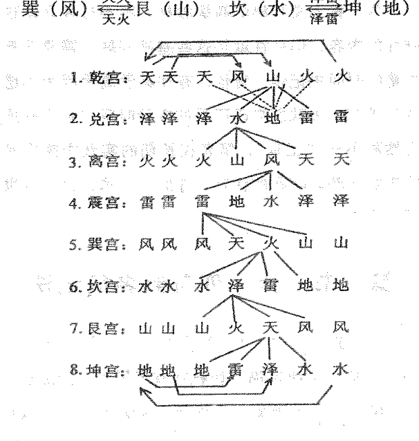
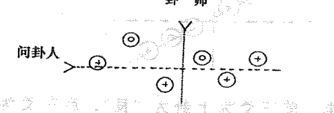
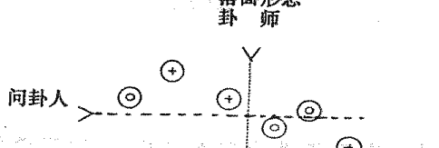
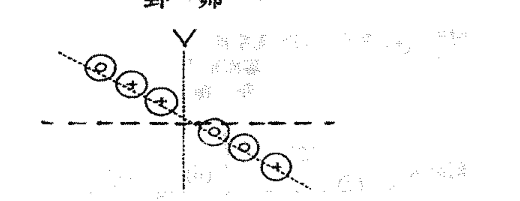
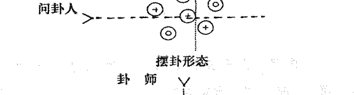
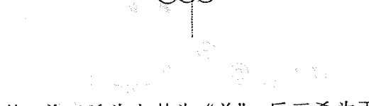
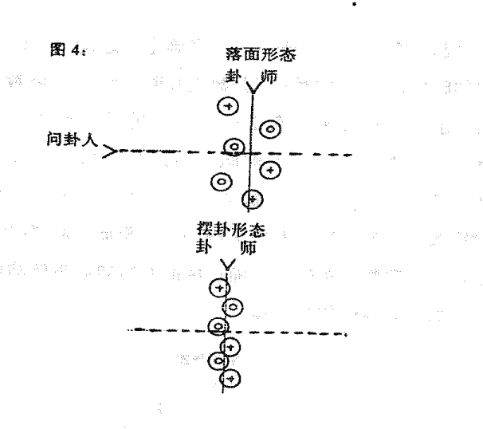
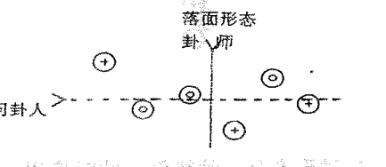
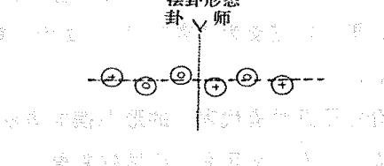

# 六爻卦例說明

张成达 著

中國哲學文化協進會出版

书　名：六爻卦例说明
作　者：张成达
总　监：Alex Cho
编　辑：袁偲珍
植字排版：万宝国际发展公司
电　话：(852)81046178
出版人：曹展硕
出　版：中国哲学文化协进会
九龙旺角亚皆老街43-49号雅佳楼6字47号
电　话：(852)26183861　26188861
传　真：(852)26181277
网　址：www.168k.com 或 www.zhouyi.net
电子邮箱：168@168k.com
印　刷：彩艺印刷公司
发　行：利源书报社
九龙旺角洗衣街245-251号地下
23818251
国际书号：962-7943-57-6
定　价：(港币)150元
(人民币)32.00元

版权所有
本书任何部分之文字及图片未经出版人
书面许可，不得以任何方式抄袭或翻印。

## 前 言

自古以来八卦预测的起卦方法主要是以三个铜钱摇六次而成卦。当今易学界大多感到八卦预测的准确率不尽人意，不少易学高手穷尽毕生精力，不断探索，革新技法，虽取得一些可喜成绩，但预测的准确率始终难以满足广大求测者日益见涨的需求，究其原因，除了八卦预测理论本身不足及卦师的实战经验和水平外，其中原因之一，直接与起卦方法有关。易友们知道，古人对起卦时的要求十分严格，起卦时要求净身、洗手、心诚和意念，这些要求看似有点神秘，其实他的主要目的是为了促使问卦人在起卦时口念一致“祝语”，保证传递信息时的磁路不杂。现代起卦，没有那么多严格规定，只要做到意念集中即可；而传统中以三钱摇六次而成卦的起卦方法，问卦人意念期较长，卦场环境动态（如人员走动、喧闹、车辆噪音干扰等），前几次摇卦一般能意念专注，后几次可能受环境冲击而意念不专，一卦六爻，如初爻至三爻、四爻成象时意念集中，而后两爻若意念不专而成象，这只是虚象，这样取出的卦象体现的信息必有一部分失真。试想，依此断卦能有令人满意的准确率吗？笔者为此困惑多年，预测实战中常常感觉到起卦时的客观状态对预测效果及准确率的直接影响，为了解决这一问题，笔者通过长期的探索，实践，对传统的三钱起卦法进行了大胆的革新，运用时空原理探索出一种以六钱一次成卦的独摇卦法。

此法意念期仅用一分钟即可成卦。因意念期短，能使问卦人意念存想专一，减少卦场环境影响，提高成卦的信息磁路的传递效率。以测卦时辰确定动爻，因动爻唯一，爻象集中，易于提取信息，信息体现明确；断事准确率明显提高。笔者采用独摇卦法在长期的实战运用中切身感受到，此法操作容易，预测效率高，对问卦人意念存想的事项预测准确，并能以此为主线较为准确的推断问卦人所关心的其他事项，极易实现一卦多断、测来意与断终身。随着社会的进步，人们对预测的要求不再是满足于一事一测。时代要求“一卦多断”的技术必须尽快得以提高、完善，以服务于大众。笔者的独摇卦法应能切中时宜。为了促进六爻预测技术的进步，笔者愿意毫无保留的公示此法于易学界，以求与同道共研、共进、共享。

## 序

这本书中引用的例子全部是我从实践中得到验证了的，我希望通过对这些例子的讲解，把六爻的预测技法与理论展示给大家，以期大家从中能得到启发和收益。因此，在我选用卦例时力求做到不重复使用，预测内容也尽量涉及到各个方面。比如测天气、婚姻、财运、射覆、疾病、考试、风水、宇宙探索、性格、职业、出行、比赛、找人、寻物、官司等等。我写这本书只是想给大家提供一种断卦思路，至于每个分类预测的详尽技法非三言两语不能讲清，若要详细讲解，恐怕每项内容都可以写成一本书，因此不可能面面俱到。

我认为掌握一种断卦的方法关键在于开拓思路，思路打开了，从来没有遇到过的情形也可以分析出来，若死记硬背所谓卦口诀，在短时期内是不可能提高断卦技法的，有些口诀恐怕几年之内都遇不到相对应的卦例，那又如何去验证口诀的真伪以及准确率的高低呢？更甚至有些口诀，无论是看我写的书或是其他预测书时，尽量是学习重点放在解卦的思路上，这样才能使自己的预测水平提高的快些。

六爻方面的古典著作很多，书中讲述的东西未必都是正确的，若死记硬背生搬硬套书中的内容，你的断卦水平就很难在短时间内提高。例如《卜筮全书》，该书在讲述疾病章节时指出：“火鬼动，必是呕吐逆多吐”，而且还振振有词地解释到：“火性炎上，鬼主饮食，故占病遇火鬼动冲克外永远不会冲克财爻，更何况火鬼呢？”

再比如《卜筮正宗》中何知章一节讲“何知人家失了牛，五爻丑鬼落空愁”，意思是讲只要卦中五爻官鬼丑土落空亡，就可以断此人家的牛丢失了。为什么呢？其理由为五爻按分断法为牛，丑又表示牛，官鬼主盗贼，落空表示丢失，作者没曾想过，丑土永远不会排列在第五爻上。再比如《易隐》朝廷占章中讲君臣的关系时，以五爻为天子四爻为公卿大臣，把这个概念套在卦中，说什么“四生合五者，撼诚报主也”，“五持父动克四者，忠言逆耳也”。作者就不曾想想，所有的六十四卦只有四爻克五爻生四爻的情况，书中讲的规律根本不能成立，诸如此类断卦口诀者书中还有很多。如果一个学易者在读书时不能分辨这些口诀的对与错，而是一味地去背诵，即使所有的古典六爻书能倒背如流，断卦水平能提高什么程度呢？

当然我讲的理论并不就可以说是千真万确真理，实践中也有断错卦的时候，但至少我讲到的内容是实话，都是我实践中得到多次验证的东西。我认为易经是一种经验学，也是一门玄学，大家只有通过自己的灵感不断地去悟，才能发现更多的规律，才能更加断出准确的卦来。这本书最根本的目的就是让大家在六爻预测层次上有一个质的飞跃。

如果大家在阅读此书时，若对某些断语感到难以理解时，请自己揣悟，因一部分卦涉及到更深层次的“六爻移神辨爻法”，而这一法是一个很大的体系，非三言两语能够讲清，有机缘再讲。

## 目 录

- 前 言 …………………………………………………… (1)
- 序 ……………………………………………………… (1)
- 第一章 卦由谁来摇 …………………………………… (1)
- 第二章 进神辨义 ……………………………………… (14)
- 第三章 退神辨义 ……………………………………… (21)
- 第四章 活用空亡 ……………………………………… (29)
- 第五章 月破辨义 ……………………………………… (41)
- 第六章 妙用三合局 …………………………………… (55)
- 第七章 半合辨义 ……………………………………… (66)
- 第八章 六合辨义 ……………………………………… (72)
- 第九章 六冲辨义 ……………………………………… (81)
- 第十章 长生十二宫秘法 ……………………………… (91)
- 第十一章 隔山化爻 …………………………………… (117)
- 第十二章 游魂辨义 …………………………………… (125)
- 第十三章 归魂辨义 …………………………………… (133)
- 第十四章 飞伏的秘密 ………………………………… (141)
- 第十五章 三刑辨义 …………………………………… (153)
- 第十六章 返吟辨义 …………………………………… (164)
- 第十七章 伏吟辨义 …………………………………… (171)
- 第十八章 论方局在六爻中的用法 ……………………………… (179)
- 第十九章 装卦方法点窍 ……………………………………… (185)
    - 第一节 六十四卦卦名简记法 …………………………… (185)
    - 第二节 装卦点窍 ……………………………………… (187)
- 第二十章 独摇起卦方法 ……………………………………… (194)
- 第二十一章 测来意与一卦多断 ……………………………… (201)
    - 第一节 测来意 ……………………………………… (202)
    - 第二节 一卦多断 ……………………………………… (203)
- 第二十二章 断终身与流年运气 ……………………………… (209)
    - 第一节 断终身运气 ……………………………………… (209)
    - 第二节 断流年运气 ……………………………………… (212)
- 第二十三章 三限、大限、小限的取用与应期 ……………… (215)
    - 第一节 三限、大限、小限的取用 ……………………… (215)
    - 第二节 应期 ……………………………………… (223)
- 第二十四章 分类预测 ……………………………………… (225)
    - 第一节 财运预测 ……………………………………… (225)
    - 第二节 事业(工作)、官运预测 ………………………… (228)
    - 第三节 考学预测 ……………………………………… (232)
    - 第四节 婚姻预测 ……………………………………… (234)
    - 第五节 疾病、伤残预测 ……………………………… (237)
    - 第六节 官讼、牢狱预测 ……………………………… (240)
    - 第七节 父母预测 ……………………………………… (244)
    - 第八节 子女预测 ……………………………………… (246)

## 第一章 卦由谁来摇

学习预测最忌朝秦暮楚，不能从始到终。有的人学习六爻预测，学上一段时间后觉得六爻取卦不如奇门、六壬等方法多而灵活，只靠来人时间、方位、报数等就可以演课，推断事情的前前后后。尤其是求测人不能到场时，六爻所采用的来人摇卦法就显得无能为力，无法预测了。于是又去学奇门、六壬等，有的人干脆把梅花易数的取卦方式用到六爻上来，以弥补其不足。从取卦角度来看，似乎手法出现了多样性，但就其信息量来说却减去了许多。首先梅花易数卦只有一个动爻，六十四卦中的各个卦最多只有六种变化，合起来为三百八十四种课变，因此它不得不从互卦、综卦、错卦、倒卦等中去寻求变化提取信息。而用投掷钱币得到的六爻卦课每天就有四千零九十六种变化，再加上来人占问的事件不同，以及性别年龄的差异，来人问卦时年月日的不同，其变化就更多了，至少有几百万种乃至上千万种变化，其容纳的信息量之大是可想而知的。因此，我不主张用梅花易数的取卦方式来套在六爻预测上，何况二者装卦的形式有本质的不同。梅花易数先定外卦后定内卦，而六爻则从初爻开始往上装卦，二者有很大的区别。

虽然有些卦用梅花易数的方法提取，用六爻的方法去断有时也有应验，但毕竟因动爻的变化受到限制，而使其信息量也减少了许多，很难出现诸如伏吟、反吟、三合等课式，使吉凶和应期的准确性也受到了影响，因此最好使用摇卦的形式来取卦。

那么当求测人因时间紧迫，或距离很远不方便来时，如何解决取卦的问题，这便是我在这里要向大家讲述的内容。六爻预测以前一直采用的是来人摇卦的形式，诸书一再强调心诚则灵，让求测的人在摇卦时专心地想自己要测的事，即便如此，仍有卦不应验的时候，于是就归咎于求测的人心不诚等等。实际上卦不应验有多种情况，有预测师判断失误的时候，也有预测人动念太多使卦不能集中地反映要问的时候，当然也不排除六爻预测的某些理论本身不足有待于完善，有待于发现更多的规律。

多年来我通过长期的实践发现，六爻预测关键在于求测者的念头如何，只要他动了预测的念头，不管心里有没有要问的重要事情，从摇出的卦象中总能推断出一些符合其本人的情况来。而这时对摇卦来说只是成了一种提取卦象的形式，无论谁来摇卦都行，无所谓摇卦时非得要求求测者本人心中必须想求测的事情。因此，当远方有人通过电话或书信等要求你为他预测的时候，无论是他本人摇卦还是预测师摇卦，或者是让预测师身边的人代替摇卦都行，丝毫不会影响断卦的准确性，摇卦时也无须再想为谁摇卦，测何事，照直用摇出的卦下断语即可，断卦时取用神的方法依旧不变。其机理可能是一种意念传递或信息场在起作用。近年来，有人提出摇卦时有什么密咒可提高摇卦的准确性，以此兜售，骗人钱财，实不足信。八卦预测的原理与鬼神毫无关系，而是一种宇宙全息原理。因此，摇卦时也无须祈祷，举行什么仪式，更无须念什么密咒。下面我举一些我实践中以各种形式摇出的卦而得验的例子，大家就可以做一个深刻的了解。

例，己卯年丁丑月己卯日，我的一位大学同学突然打电话来，请我去小聚一下，并说有一位名叫相马一成的日本客人想见见我，于是我前去赴约。原来那位日本人是我同学多年的朋友，对中国的文化很感兴趣，听说我懂易占，遂想了解一下易占是怎么回事。通过我简单的讲解之后，他提出来要占一课看看，于是我就递给了他三枚铜钱让他摇卦，得天泽履卦。

```
勾陈 兄弟戌土'
朱雀 子孙申金'世
青龙 父母午火'
玄武 兄弟丑土'''
白虎 官鬼卯木'应
螣蛇 父母巳火'
```

卦出来后我问他要想测什么，他说也没有什么具体要问的事，让我随便看看。我根据卦中信息给他推了如下几条。

①我见子孙持世，因子孙为快乐之神，断其一生无忧无虑是个乐天派。

②子孙又为艺术之星，申金空亡，金空则鸣，入墓于月令，如醉如痴之象，于是断他喜欢艺术，而且非常痴迷，小有名气。临朱雀，很喜欢唱歌。

③卦名为天泽履，有行走的意思，世爻在第五爻，五爻为道路，人在旅途奔走之象，初爻为脚，临驿马合世，我断他是个闲不住的人，一年四季到处周游世界各地。

④卦中官鬼无原神，又是子孙持世，父母爻两现，我断他一生无官运，没有固定工作，不属于某一个单位管束，是一个自由人。

⑤财伏世下但休囚，我断他身边常不缺钱花，但并不是一个非常富有的人。

⑥子孙持世得月来生，官鬼临应爻，世克应爻，断他一生没什么病灾，反能为别人着想，为别人减除痛苦带去欢乐。

以上断命全部正确。原来他没有固定的工作，是一个自由摄影家，每年有多一半时间在各地拍摄有关民俗、风土人情的内容，然后在日本发表；其作品很受人们的欢迎。他的经济主要来源就是靠摄影，挣下钱后又全部花在创作作品上。

由此例可知，来人并没有强烈的预测心态和具体的事要问，照样可以从他摇出的卦中反映出其本人的一些情况来，关键在于如何断卦。

再例，戊寅年庚申月丁酉日韩先生打电话来想让我前去给他看一下家宅不安之原因，说实在的，大热的天，烈日当头，我才懒的去呢。于是我便对他说：“过二、三分钟你再打电话来，我不去也能测”。于是放下电话，随手摇了一卦得风雷益变水泽节卦。

| 六神 | 本卦 | 变卦 |
| :--- | :--- | :--- |
| 青龙 | 兄弟卯木○ | 应父母子水 |
| 玄武 | 子孙巳火 | |
| 白虎 | 妻财未土”世 | |
| 螣蛇 | 妻财辰土”世 | |
| 勾陈 | 兄弟寅木× | 兄弟卯木 |
| 朱雀 | 父母子水 | |

断卦思路：世爻空亡，又临螣蛇坐卧不安之象，同时世爻又是妻财可以代表妻子，子孙巳火空亡可以代表孩子，说明妻子和孩子也处于一种不安的状态。我一看卦，卦中已反映出他要问的事情，心里就有了把握。

不一会儿，他打来电话问结果如何？我便对他讲：“你家最近很不顺，你们全家都处于一种不安的状态，情绪很不稳定”。我见卦中兄弟爻两动克世爻之财，便断他最近破了财。六爻兄弟临应爻青龙来克，应为外乡他处，青龙为探亲访友，二爻为宅，勾临木动为修造之象，于是我断：第一你最近到外地的一个亲戚家走了一道，第二你家里近日改造修建时移动过木制东西，由于这些原因造成了你家宅不安。

以上断语果然被我言中。他告诉我说：最近住在外地的老丈人病了，于是开车一家三口前去探病，由于病情较重，妻子留下照顾老人，自己开车带孩子回家，半路撞倒一辆摩托车，幸好人没伤着，赔了5千多元才算了事。前两天，家中想接电线，移动过组合家具。结果小孩回家，打开门后，嫌家中闷热便没关门往里走，谁知门突然自动关闭，当转身开门时，门却无论如何也打不开，吓坏了孩子，赶紧打电话叫回他，发现门朝外被反锁了。这种可能是极小的。

此卦虽然是我摇卦，但在推断时却如同当他本人摇的卦一样取用神来断，照样符合实际情况。

再例，戊寅年癸亥月乙酉日，我和好友段建业在另一朋友处闲聊时，有一书店工作的女士（辛丑年生人）欲问婚姻情况，我摇卦得天风姤变风地观卦。

| 六神 | 本卦 | 变卦 |
| :--- | :--- | :--- |
| 玄武 | 父母戌土' | |
| 白虎 | 兄弟申金' | |
| 螣蛇 | 官鬼午火○应 | 父母未土 |
| 勾陈 | 子孙酉金○ | 官鬼丑土 |
| 青龙 | 妻财卯木 | |
| 朱雀 | 官鬼巳火”世 | |

断卦思路：以官为用。卦中官鬼午火逢空，原神不上卦伏于二爻亥水下，官受月建和卦中子孙亥水克制，又内卦反吟，一看就知婚姻不好，正闹矛盾。首先我见其官鬼午火空亡又与化出父母爻未土相合，书云：“冲空则实”，“逢合须要冲开”，甲子年该女虚岁24正是适婚年龄，子水冲实官鬼，又冲开午未之合，同时又与世爻丑土相合，丑为父母文书，青龙临之，必主喜庆之事，丑土即可视为结婚证书，太岁合之表示该年得到，遂断其1984年结婚，果验。

第一句断语得到了证实，我便心里有了数，继续寻找其他信息。我又见卦中子孙亥水与月令构成亥亥自刑，又临胎位动而化鬼化绝（二爻为胎位），胎爻午火又空，不利子女的信息很强，于是断她曾流产过，内卦反吟，有反复之象，断她流产不止一次。果流产两次。

卦中官鬼午火动而生世爻，我断她丈夫对她很好，但卦中夫星官鬼午火空而受克，内卦反吟，没有财爻救援，于是断她目前正闹离婚，而且闹得不可开交。子孙亥水临二爻朱雀，二爻为宅，朱雀主口舌，动而克官鬼，我断她几乎天天在家和丈夫吵架。这卦官鬼受克很厉害且逢空亡，但官鬼仍在夫位（应爻为夫位），且与代表结婚证书的父母爻未土相合，说明还没有离异，然未土空亡，说明丈夫手中拿着的只是张名存实亡的结婚证。因内卦反吟，我断她闹了好几次都没离成。

断到这里我稍停顿了一会儿，她显示出一副急不可待的样子，问我能不能离？我把前面的推断一一证实之后，又到卦中去寻找新的信息。说实在的，如此糟糕的卦，婚姻肯定无法维持，但我为了证实还有没有其他信息可挖掘，不急着告她最后的结果继续分析。

世临青龙，青龙主美貌和好色，此女长得姿色的确不错，无须看卦，直接看其本人即可证实。

然此卦为天风姤变风地观卦，爻辞中有“女壮，勿用娶女”之说，丑土见日辰酉金为沐浴，虽为女人，也属于“好色”之行列。二爻为生殖器之爻位，子孙爻又主之，此处为官鬼的忌神，且动化官鬼，官鬼主病，于是我断到：“你丈夫有病，不能与你同床，1996年你有了外遇。”此因卦中本已有官鬼，宅爻中却又化出一个官鬼来，岂非引“郎”入室？应期的判断理同甲子年，因1996年为丙子年，冲实了官鬼，同时这个男的在一个劲地催她与丈夫离婚。因为子孙亥水临朱雀发动，朱雀为讲话之意，何况亥水又为世爻临官之地，说明她身边临着个官人，还有一个男人加速了这场婚姻的变化。谁知她对我的断语矢口否认，说她没有外遇。

奇怪了，卦中这么强烈的信息，怎么会没有外遇呢。我只好对她说：“看来我的思路不对，出现了错误，这个卦没必要再往下推了，再推就不准了。”她一听我的话就着急了；“我和那个男人交往并不深，是他一直在追我，我可没有主动去找他！”

“哪个男人？”我在装傻。

“就是你刚才说的第三者。”她终于坦白了。不管两人交往深不深，那是人家的隐私，只要证明我的推论不要不着边际，差的太远就行了。在场的人有好几个，让一个女士当着许多人的面承认这些事也够难为情的了。我最后告诉说她下个月将和丈夫离婚，十有八九要通过法院才离成。

此因下个月为子月，子水冲开午未之合，其丈夫就与结婚证脱离了关系，官鬼空亡，其应期也为冲空实之。因克官鬼的子孙亥水临着朱雀，朱雀又主官司口舌，世爻见女水为临官，说明她面临着一场官司，她问的是婚姻，要想离婚，不通过法院怎么能行呢。最后她通过法院于1998年子月离婚。

第一例为求测者本人摇卦，且是在没有具体要问的事的条件下摇的卦。第二例为求测人不在场，通过电话求测，我摇出来的卦。第三例为求测者在场，而用我摇出的卦推的。摇这些卦时，虽然情形不同，但都得到了验证，说明几种方法都行。求测者在摇卦时是否专心在想着自己要问的事，无须再去争论，因为有些卦是我摇出来的。我在为别人摇卦时，脑子里什么也不想，只要别人开口求测随便拿起铜钱一摇即可。这说明古人说的“心诚则灵”并不成立。说实在的，我断卦并不可达到百分之百，也遇到过求测者心很诚没有应验的时候。易学预测到底是一种什么机理，还需要有更多有识之士献身于这个事业，通过长期的实践证明。下面我再举另外一种摇卦的形式，即由求测者和预测师之外的第三者摇出的卦得到验证的例子。

庚辰年己卯月辛卯日，电视上播出日本首相小渊惠三病倒的消息，日本的武藤女士正在我家，问其吉凶如何？当时我让在场的另一个客人摇卦得天火同人变火风鼎卦。

| 六神 | 本卦 | 变卦 |
| :--- | :--- | :--- |
| 螣蛇 | 子孙戌土'应 | |
| 勾陈 | 妻财申金○ | 子孙未土 |
| 朱雀 | 兄弟午火' | |
| 青龙 | 官鬼亥水'世 | |
| 玄武 | 子孙丑土× | 官鬼亥水 |
| 白虎 | 父母卯木○ | 子孙丑土 |

断卦思路：以应爻为用神。应爻受日月之克，卦中又有父母卯木发动克之，病重而危。应临六爻，六爻主头，子孙主血管，忌神又临白虎发动，白虎主血，此又为离宫卦，离为火也主血，是头部血管出了问题。临螣蛇，螣蛇主狭窄、回缩，乃因头部血管突然收缩而引起。戌土见卯为死地，三卯克用，至少有三处脑血管已坏死。忌神克中带合，病的阴影很难除去。

四爻原神午火空亡，四爻主心脏，午火也主心脏，空而不生用神，说明其心脏供血不足。五爻妻财申金动而化出子孙未土，申为用神长生之地，五爻主口、鼻等五官，妻财主呼吸，子孙主医疗。说明医院采取了吸氧救助措施。卦中子孙多现，说明医院采用了各种手段。

二爻子动化官，子孙在二爻主生殖器，官鬼为病，说明小便也出了问题，子孙也为医药，动而化官，同时也是医疗有副作用的信息。辰月用神合处逢冲，又入墓为凶，巳月用临绝地，卦中克制忌神的申金被合，忌神卯木无制为最后期限，很难出此月。

妻财申金被合，一口气上不来就完了。因此断其辰月若是不凶巳月必凶。后小渊惠三果于巳月壬申日去世。

以上讲述了在各种情形下取卦的例子，大家不妨在实践中去大胆地应用，一定能够提高大家的六爻预测的水平和加深对易学的认识。

信款地址：河南省新乡市第二百货大楼四楼李瑞青（收）
邮 编：453000
电 话：13083801808
网 址：www.ej315.com
www.yj315.com

## 第二章 进神辨义

进神之义，诸书无不在讲其吉凶和应期，如何化进，何时化进等等，这仅仅是用神最基本的看法，其实进神中还隐藏着更多含义在里面。预测水平的高低，许多微妙的断语就是靠这些对基本概念理解程度的不同体现出来的。

进神有前进、发展、上进、努力、上层次、不断地，一个劲地、扩大、膨胀、发直、变大、浮肿、兴奋、上台阶、远去、强硬，成长等诸多含义，贵在预测者视卦的情况和预测内容灵活变通。用得恰当，往往能说到求测人的心坎上去，若只以吉凶来看，断出的卦就显得平淡无奇。

下面我举上几个我实践中的例子，希望大家从这些例子中反复细心揣摩，悟出其中的深刻含义来。

例，戊寅年丁巳月己未日，某中学校长带来一位年近五十的男子，想要测一下工作。我让其摇卦得火泽睽变火天大有卦。

| 六神 | 本卦 | 变卦 |
| :--- | :--- | :--- |
| 勾陈 | 父母巳火' | |
| 朱雀 | 兄弟未土" | |
| 青龙 | 子孙酉金'世 | |
| 玄武 | 兄弟丑土 × | 兄弟辰土 |
| 白虎 | 官鬼卯木' | |

断卦思路：以官鬼爻为用神。官鬼休囚入墓，又子孙持世，工作不利之象，于是我断其面临着下岗问题。

四爻为人事，克制官鬼的子孙临之，子孙长生在月建，得日辰生扶而旺相，人事部门逼迫让其下岗。月为领导，长生中带克，领导也想让他下岗。日为同事，生助子孙，有些同事也盼着他下岗。二爻丑土动化进神，增强了子孙的力量，虽然空亡，但被日辰冲实，不能算空，丑为四爻的墓库，墓库有管制之义，即可以理解为管人事的，化进神而生忌神子孙，可以断管人事的在一个劲地催他下岗。再拖也拖不到年底。因为丑土空亡，丑月实空。子孙持世临青龙，快乐之象，我断其下岗对他来说，未必不是件好事，心理能想得开。

结果他告诉我，领导已找他谈话，劝其办早退手续，不过自己非要继续干也行。因单位留岗名额有限，若自己坚持要留，就会影响其他人，所以别人巴不得自己早退。自己原本就有去做生意的念头，只是工作多年，一下子舍不得离开单位，犹豫不定，为此，人事部门催促了好几次，让他赶快下决心，决定自己的去留。经我预测其高高兴兴地回单位办退休手续去了。

再例，戊寅年丁巳月己巳日，马女士，（己酉年生）占问婚姻得雷地豫变泽水困卦。

| 六神 | 本卦 | 变卦 |
| :--- | :--- | :--- |
| 勾陈 | 妻财戌土” | |
| 朱雀 | 官鬼申金× | 官鬼酉金 |
| 青龙 | 子孙午火’应 | |
| 玄武 | 兄弟卯木” | |
| 白虎 | 子孙巳火× | 妻财辰土 |
| 螣蛇 | 妻财未土”世 | |

断卦思路：女测婚以官鬼为用。今文书之爻父母子水卦中不现，伏于初爻之下，又绝在日月，连结婚证书的影子也没有，说明还没有结婚。

卦中日月动爻皆合官鬼，合为会合、见面之象。官临朱雀长生于世爻，朱雀主讲话，说明有人给她提亲。长生之爻临五爻，五爻为尊位，为父母长辈，说明给她提亲说媒的大多是长辈。官动化进，见了一个又一个。然子孙临日月，卦中有子孙发动，皆不能成。我见夫位临应爻忌神午火，断她婚姻为老大难。世临螣蛇，古怪之象，断她性格与众不同，脑中想法无法让一般人接受。

她说光是这个月提亲的就有三四个，她想修行，甚至有出家的念头，若有男的真心喜欢她，就大力支持她修行，即使结了婚暂时也不能过夫妻生活。因此前来相亲的男子一听这话，都一一一个退缩而去。

再例，庚辰年癸未月壬申日，朋友段建业和王开宇一起与我研易，说到六爻的射覆问题时，段建业让我推一推他口袋里装的一样是什么东西，于是我摇卦得雷水解变泽困卦。

| 六神 | 本卦 | 变卦 |
| :--- | :--- | :--- |
| 白虎 | 妻财戌土” | |
| 螣蛇 | 官鬼申金×应 | 官鬼酉金 |
| 勾陈 | 子孙午火’ | |
| 朱雀 | 子孙午火” | |
| 青龙 | 妻财辰土‘世 | |
| 玄武 | 兄弟寅木” | |

断卦思路：以应爻为用。应临官鬼为变幻莫测之物，临螣蛇更主之。官鬼化进神，该物能膨胀，往大里鼓。世爻为物之性质，财和青龙临之，主此物能吃。官鬼申金见月建未土为冠带之地，说明此物有包装。与日相并，物非一个。此卦属震宫，震为木，属于植物类的东西。用临螣蛇，其色为黑里透黄的褐色物。用神为盂（寅申巳亥），主物带点尖。

断完后，他掏出口袋里的东西，原来是装在塑料袋中的几个胖大海。

再例，丙子年癸巳月乙巳日，离石市某男测婚，自摇得泽风大过变乾为天卦。

| 六神 | 本卦 | 变卦 |
| :--- | :--- | :--- |
| 玄武 | 妻财未土× | 妻财戌土 |
| 白虎 | 官鬼酉金’ | |
| 螣蛇 | 父母亥水‘世 | |
| 勾陈 | 官鬼酉金’ | |
| 朱雀 | 父母亥水’ | |
| 青龙 | 妻财丑土×应 | 父母子水 |

断卦思路：以妻财爻为用神。世爻为水，水主智，临螣蛇，诡秘之象，我断他是个“人精”。六爻妻财未土发动化进神，临玄武克世，玄武主性感，断有一个长得不错的女孩在一个劲地追他。初爻妻财丑土发动，临青龙主美貌，世爻原神，入墓，我又断还有一个很漂亮的女孩让你魂不守舍，但她没有追求你的意思，因丑土动被变爻子水合不克世爻，故不追求他。

世爻月破临驿马，卦变六冲，我说他这山望着那山高，意马心猿和哪个也成不了。果皆验。

再例，己卯年丙子月丁未日刘女士占金戒指丢失可找回？自摇得雷泽归妹变兑卦。

| 六神 | 本卦 | 变卦 |
| :--- | :--- | :--- |
| 青龙 | 父母戌土”应 | |
| 玄武 | 兄弟申金× | 兄弟酉金 |
| 白虎 | 官鬼午火’ | |
| 螣蛇 | 父母丑土”世 | |
| 勾陈 | 妻财卯木’ | |
| 朱雀 | 官鬼巳火’ | |

断卦思路：以财爻为用神。世爻丑土得动爻长生，日再冲之为暗动，暗动而生忌神兄弟，为自己丢失。父母主衣服，持世身为穿之，暗动生忌神兄弟是把金戒指放在衣服口袋中丢失的。

财在二爻，二爻为宅，临勾陈，勾陈为衙门，办公室。说明是在办公地方丢失的。五爻兄动临玄武克财，玄武为暗昧之事，五爻为道路，入墓于父母丑土，父母又主房室建筑，是楼中之路，五爻就成了走廊，这说明金戒指是从衣服口袋中掉到单位的走廊里被捡走了。兄动化进神，戒指已不在捡到人的手上，已经转移了。卦变六冲，失物难回。

她说在单位洗手时嫌不方便就把戒指放在口袋中，当想起时已找不到了，因为她一直没离开过办公楼，很可能是在掏东西时带出来掉到了走廊里。她找过多次都没有找到。

信款地址：河南省新乡市第二百货大楼四楼李瑞青（收）
邮 编：453000
电 话：13083801808
网 址：www.ej315.com
www.yj315.com

## 第三章 退神辨义

退神与进神的意思相反，也是在预测中经常遇到的一种现象。

退神有退缩、退却、害怕、衰退、衰弱、软弱、倒退、后退、淘汰、萎缩、返回、减弱、胆小、畏惧、报废、失效、退化、退悔等诸多含义，根据六亲或预测内容的不同而灵活多变。请看以下几个例子。

例，己卯年丙寅月乙卯日，某男占搞运煤发财否？自摇得天地否变泽地萃卦。

| 六神 | 本卦 | 变卦 |
| :--- | :--- | :--- |
| 玄武 | 父母戌土○应 | 父母未土 |
| 白虎 | 兄弟申金' | |
| 螣蛇 | 官鬼午火' | |
| 勾陈 | 妻财卯木"世 | |
| 朱雀 | 官鬼巳火" | |
| 青龙 | 父母未土" | |

断卦思路：以财爻为用神。此卦六合，财临日月持世，乍一看有财可得，殊不知财无原神，子孙子水空而不上卦，伏于初爻父母未土之下，死于日辰，飞又克伏，飞神为父母，初爻为脚力为车，必因车而折本。

我见卦中六爻父母动而化退，又被日月克伤，父母主车，休因为旧车，化退为淘汰、报废的车，临玄武来合世爻，玄武为暧昧之神，是偷着用报废了的车搞运输。此卦无财可发，若坚持要做必会因修车或罚款而损大财。

最后该人是否去搞运煤，因无反馈信息，不得而知。但当时告诉我的确是用五千元买了一辆已报废的车想偷着搞运输。

再例，己卯年丁卯月甲子日，化二建的张某求测自己的病摇得泽天夬变雷天大壮卦。

| 六神 | 本卦 | 变卦 |
| :--- | :--- | :--- |
| 玄武 | 兄弟未土" | |
| 白虎 | 子孙酉金○世 | 子孙申金 |
| 螣蛇 | 妻财亥水' | |
| 勾陈 | 兄弟辰土' | |
| 朱雀 | 官鬼寅木'应 | |
| 青龙 | 妻财子水' | |

断卦思路：以世爻为用神。世爻月破死于日辰，休囚动而化退，凶兆。白虎主病也主丧。子孙为快乐之神，今临世爻破而化退，断其因病心情沉闷，不高兴，情绪一天比一天低落，我劝他应该看开些，否则非常不利。

我见二爻官鬼寅木临朱雀，木主肝胆，因为阳爻，阳为腑，朱雀主炎症，断其有胆囊炎。世临白虎动而化退，白虎主伤灾，以退神为应期，断其壬申年有伤灾。他说壬申年因公受伤，去年因胆囊炎到医院检查，医生拍了片子，看到肝部有个阴影说他有肝癌。

我说木虽然也可以主肝，但这个卦中肝的信息不强，肝上不应该有问题。他告诉我，后来又到其他医院化验过肝功能，没发现有什么问题，可是医生说他有肝癌的那句话老是从他脑海中消失不掉，半年来情绪每况愈下。

庚辰年他的一位邻居来我这里时告诉我，去年我给测过的那个姓张的已于己卯年死了。到底没有从悲观的情绪中解脱出来，实在是可惜。

再例，丙子年癸巳月乙巳日，耿女士（丙午年生）测与某男感情，自摇得山泽损变山雷颐卦。

| 六神 | 本卦 | 变卦 |
| :--- | :--- | :--- |
| 玄武 | 官鬼寅木'应 | |
| 白虎 | 妻财子水" | |
| 螣蛇 | 兄弟戌土" | |
| 勾陈 | 兄弟丑土" | |
| 朱雀 | 官鬼卯木○ | 官鬼寅木 |
| 青龙 | 父母巳火' | |

断卦思路：以官鬼为用神。卦中官鬼两现，为两个男的。应为夫位，静而不动，卯木独发，以动爻为重。故断她要问的男人不是自己的丈夫，而是另有其人。

此卦父母巳火临日，书云：“父母临日定婚期”，说明此女已于己巳年结婚。官鬼卯木动来克世，乃是追我之象，然临朱雀也主口舌，卯木为世爻死地，可见二人因争吵的很厉害，把关系弄得很僵。相处时遇卦中用神动而化退，为退去之象，分手后化退又有找回来之象。卯木动而与四爻兄弟戌土相合，兄弟和世爻六亲属性相同，为和其他女人结合之象。从这些迹象分析，我断她以前曾搞过一个对象，是这个男的追的她，但后来因俩人争吵不和，无法相处，男的便离她而去，与另一个女的结婚，现在很可能这个男的又找上门来了。

她说我断得很对，是己巳年结的婚。前些日子回老家时，遇到了以前的男友。俩人当时因常吵架而分手，后来各自结婚。因现在那个男的和老婆关系不好，整日为婚姻家庭痛苦，她对他便产生了怜悯之心，说了些安慰的话，谁知原来的男友误解了意思，以为旧梦可以重温，又找上门来，她不知如何是好，故而求测。

再例，丙子年甲午月丙子日，日本的久保女士（戊申年生）测婚得泽天夬变雷地豫卦。

| 六神 | 世应 | 六亲 | 本卦 | 变卦 |
| :--- | :--- | :--- | :--- | :--- |
| 青龙 | | 兄弟未土 | | |
| 玄武 | 世 | 子孙酉金○ | | 子孙申金 |
| 白虎 | | 妻财亥水 | | |
| 螣蛇 | | 兄弟辰土○ | | 官鬼卯木 |
| 勾陈 | 应 | 官鬼寅木○ | | 父母巳火 |
| 朱雀 | | 妻财子水○ | | 兄弟未土 |

断卦思路：以官鬼为用神。1995年为乙亥年，官鬼寅木遇长生，该年有过对象。三爻兄弟辰土动而化出官鬼卯木，三爻为间爻，间爻为媒，兄弟主朋友，断其1995年辰月朋友给她介绍过一个男友。她听完后，感觉到很惊奇，说断得很准，真有这么回事。

卦中初爻子水为太岁入爻，动而生官鬼寅木，我断她今年又出现一个男友。世爻动而生子水，子水动而生官鬼，是她在追求对方。世爻空亡且临玄武，空亡为不安、战战兢兢，玄武主偷偷摸摸，所以断其为暗恋。因世爻动而化退，断其胆子太小，不敢明追。

官鬼临应爻，应爻为他处，又临驿马，说明这个男的为远方之人。官鬼寅木动而与妻财亥水相合，说明那个男的另有所爱。

结果推断全部正确，她说自己非常喜欢一个男的，是中国人，正在北京上大学，她知道对方有女朋友，因此不敢追，向对方讲明自己的心思，很是苦恼。

后听人说她于1999年结婚，定居中国，乃应世爻旬空，此年冲实。不过与她结婚的是否是那个暗恋的男友，因再未见久保女士，不得而知。

再例，丙子年己亥月丙寅日，市总工会某女士测病得泽风大过变雷风恒卦。

| 六神 | 本卦 | 变卦 |
| :--- | :--- | :--- |
| 青龙 | 妻财未土 | |
| 玄武 | 官鬼酉金○ | 官鬼申金 |
| 白虎 | 父母亥水世 | |
| 螣蛇 | 官鬼酉金 | |
| 勾陈 | 父母亥水 | |
| 朱雀 | 妻财丑土应 | |

断卦思路：以世爻为用神。世爻亥水临月虽然旺相，但空而不受原神之生，原神官鬼动而化退，金主肺，临五爻，五爻也主肺，化退，为肺功能退化，呼吸系统有病。官鬼临玄武本为肺结核之象，然日辰为寅，金临绝地，有向肺癌变化的倾向。

子孙午火为医药，不上卦，伏于世爻亥水之下，飞去克伏，医药无效。世爻父母空亡，父母为脉，空亡，为脉搏虚浮之象，非气功锻炼难愈。

其本人果是肺部难受，经常咳嗽，十指指甲乌黑，说明已有癌变。后未再见面，不知吉凶结果如何。

再例，辛巳年丁酉月癸未日，某男测父病得天火同人变泽火革卦。

| 六神 | 本卦 | 变卦 |
| :--- | :--- | :--- |
| 白虎 | 子孙戌土○应 | 子孙未土 |
| 螣蛇 | 妻财申金 | |
| 勾陈 | 兄弟午火 | |
| 朱雀 | 官鬼亥水世 | |
| 青龙 | 子孙丑土 | |
| 玄武 | 父母卯木 | |

断卦思路：以父母爻为用神。父母卯木休囚月破，入墓于日，必凶。用神休囚遇死、墓，绝之一者必为癌症。用神被酉金冲破，忌神又在五爻，为肺的爻位，肺癌无疑。

卯木月破，99年己卯实破，断其父亲的病得于99年。六爻为医院，应爻为医生，子孙白虎临之其意更强，动而合用，曾积极治疗过。但子孙戌土动而化退，因父亲病重，医生已没有信心治疗。

果然是肺癌，99年得病，虽多方面治疗，无明显效果，医生也说没有希望，现已出院回家疗养。

信款地址：河南省新乡市第二百货大楼四楼李瑞青（收）
邮 编：453000
电 话：13083801808
网 址：www.ej315.com
www.yj315.com

## 第四章 活用空亡

熟悉六爻的人都知道，空亡在预测中很灵验，每卦都需要查找。古人对空亡的论说很多，什么真空、假空、动空、冲空、填空、援空、无故自空、有散而空、墓空、绝空、害空、安空、破空等等，名堂十分繁多。但几乎所有的论述，绝大多数只是从用神吉凶的角度去论空亡，很少有人论及空亡本身所具有的含义。如果要把一个卦要论述得非常细微，断到人的心坎上去，就必须对卦中每一个信息点都有深刻的理解才行。空亡除过主吉凶和应期之外，还有更深刻的含义，空亡有虚空、不在、失去、虚妄、不安、终结、虚假、缺少、低洼、洞穴、空间等诸多含义，根据卦象和所测事件的不同而灵活多变。通过长期的实践，我在这方面积累了丰富的例子，现举例如下，以期大家从每个例子中去领略理解空亡的妙用。

例，丁丑年辛亥月庚午日，博物馆的王先生测参加公务员考试结果如何？自摇得水风井变巽为风卦。

| 六神 | 本卦 | 变卦 |
| :--- | :--- | :--- |
| 螣蛇 | 父母子水× | 兄弟卯木 |
| 勾陈 | 妻财戌土’世 | |
| 朱雀 | 官鬼申金” | |
| 青龙 | 官鬼酉金’ | |
| 玄武 | 父母亥水’应 | |
| 白虎 | 妻财丑土” | |

断卦思路：官鬼为名次，父母为成绩，以官鬼和父母为用神。

此卦父母爻两现，又得月建帮比为旺，说明这次考试成绩还不错。世爻临勾陈空亡，心理没有把握，很让他牵挂这次考试的结果。官鬼爻也为两现，可兼而看之。金在亥月休囚，又被日辰午火克伤，榜上无名之象，动爻又为官星死地，根本没有扭转的余地。

父母又主录取名单或通知书，亥水空亡，录取通知单上没有他的名字，自刑，很可能是自己造成的。卦变六冲，此事不了了之。

来考试成绩下来后，他的分数考了第一名，然而他在考试填写自己名字的代码时，不小心写错了代码，成绩作废，未被录取。

再例，丙子年癸巳月丙午日，李某（男，20多岁）测婚得山水蒙变天风姤卦。

| 六神 | 本卦 | 变卦 |
| :--- | :--- | :--- |
| 青龙 | 父母寅木' | |
| 玄武 | 官鬼子水× | 妻财申金 |
| 白虎 | 子孙戌土×世 | 兄弟午火 |
| 螣蛇 | 兄弟午火× | 妻财酉金 |
| 勾陈 | 子孙辰土' | |
| 朱雀 | 父母寅木"应 | |

断卦思路：以财爻为用神。应为妻位，父母寅木临之，父母为结婚证书，空亡表示没有结婚。

财爻不上卦，说明他生活中没有女人，所以此卦当为找对象的卦。

世爻动而去生财爻，说明是其本人去追求别人。父母爻也主主婚人，空亡表示没有媒人参与。

妻财酉金伏在世爻子孙戌土之下，说明他追求的女子离他很近。书云：“三爻四爻为乡”，更何况妻财酉金长生在月令巳火，世爻也得月令生之，生从同处来，故断他目前正追求着一个女孩子，这个女孩子是他的老乡。

应爻空亡，对方不是真心。妻财不在卦中，女孩老是躲着他，应克世，女的心里不愿意和他搞对象，他只是单方面追求人家。三爻兄动化财，这个对象是强行搞出来的，临螣蛇，螣蛇主缠绕，乃是死缠住人家不放。财爻受日月之克，卦中又有兄弟午火发动，应爻空亡，不成之象。

推断果然正确，是他在追人家，女孩和他是老乡关系，女孩死活不愿意，老躲着他，最后未成。

再例，丙子年癸巳月戊午日，某男测钢材生意如何？得天风姤变风地卦。

断路：以财爻为用神。初看此卦，妻财寅木休囚不上卦，又死于日辰，原神亥水也衰而月破，无财之象。

然世爻父母丑土为金库，临勾陈，勾陈主建筑房屋，父母也主建筑房屋，故父母丑土可延伸为存放钢材的库房。空亡，说明他放钢材的库中是空的。做钢材生意不可能没有存货，应理解为没有货物积压。应为顾客生世爻，顾客盈门之象，临玄武，玄武主暧昧，说明还有人走后门呢。

故断其钢材生意很好，货都存不住，供不应求，甚至还有人托关系向他买钢材。

子孙亥水月破，乙亥年填实即不破，断他1995年就已发了大财，结果完全正确。这便是卦需要活断的地方。若他做的不是钢材一类的金属生意，恐怕这个卦就不能断发财了。

再例，乙亥年壬午月戊寅日测当地本日天气如何？得雷风恒变雷天大壮卦。

| 六神 | 六亲 | 爻位 |
| :--- | :--- | :--- |
| 朱雀 | 妻财戌土 | 应 |
| 青龙 | 官鬼申金 | |
| 玄武 | 子孙午火 | |
| 白虎 | 官鬼酉金 | 世 |
| 螣蛇 | 父母亥水 | |
| 勾陈 | 妻财丑土 | × |

断卦思路：六亲各有所主，视卦中动静而断。财爻发动主晴，然动而化出父母主雨，乃是晴转阴有雨之象。官鬼申金得财爻发动生助，日辰冲之为暗动，申金空亡，金空则鸣，必有雷声，然为暗动，官鬼又衰，雷声必小。何时晴转阴，因卦中财爻动而逢合，必在未时冲开财爻，开始转阴，至申酉时官鬼实空生助父母，雷声渐起而下雨。

结果14点25分小雨飘来，申时转毛毛细雨，远处有雷声，但不见闪电，酉时转中雨。

再例，戊寅年己未月丁丑日，清徐县某女测打官司，得雷火丰卦。

| 六神 | 六亲 | 爻位 |
| :--- | :--- | :--- |
| 青龙 | 官鬼戌土 | 上爻 |
| 玄武 | 父母申金 | 五爻（世） |
| 白虎 | 妻财午火 | 四爻 |
| 螣蛇 | 官鬼亥水 | 三爻 |
| 勾陈 | 官鬼丑土 | 二爻（应） |
| 朱雀 | 子孙卯木 | 初爻 |

断卦思路：以看世应生克为主。父母主状子，父母持世她告别人，为原告。空亡，非真心要把对方如何，临玄武，玄武主内心，空亡又主不安，故断其上告对方后心里处于一种不安的状态。官鬼两现，以月破为主，官鬼丑土临二爻，二爻为宅，临勾陈主田地、建筑，是因为房产打官司。应临二爻，乃应人占宅，是对方占了她的地基、地盘。应生世，对方有求和之象，世空不受生，原告不答应。

至申月应爻出月不破，世爻出空受生，接受对方条件。所有推断果验。

再例，戊寅年甲子月己亥日，刘女士测身体状况得离为火卦。

| 六神 | 六亲 | 六爻 |
| :--- | :--- | :--- |
| 勾陈 | 兄弟巳火 | 世 |
| 朱雀 | 子孙未土 | |
| 青龙 | 妻财酉金 | |
| 玄武 | 官鬼亥水 | 应 |
| 白虎 | 子孙丑土 | |
| 螣蛇 | 父母卯木 | |

断卦思路：以世爻为用神。官鬼亥水得日月帮比极旺，临三爻冲克世爻，三爻为肾，水也主肾，乃是肾水过旺而引起肾病。世临勾陈，勾陈主肿胀，说明因病身上发肿。

官鬼临月必是久病。久病遇六冲卦本为凶兆，好在世爻空亡，为避空之地，世爻受官鬼冲克减弱，不至于发展严重。因水为忌神，世爻绝在亥水，所以本人不喜喝水，财为屎尿临四爻，四爻为厕所，所以一喝水就要上厕所。秋冬水旺，这两个季节病情最严重。

女人三爻为阴，水旺临玄武，玄武主难言之隐，寒症，其本人应有宫寒症，白带多。世在六爻，六爻为空而不受原神之生，又离卦主血，原神卯木临螣蛇，螣蛇主少，故断其头部供血不足。

结果以上推断全部正确，她说自己有肾病三年，多方治疗无效，身上到处是肿块。问我有无什么好方法治疗？我从卦中推出一种体外调治的方法，不到一个星期她的病就好了。

再例，丁丑年戊申月癸卯日，我单位某男测婚得泽地萃卦。

| 六神 | 六亲 | 六爻 | 世应 |
| :--- | :--- | :--- | :--- |
| 白虎 | 父母未土 | | |
| 螣蛇 | 兄弟酉金 | | 应 |
| 勾陈 | 子孙亥水 | | |
| 朱雀 | 妻财卯木 | | |
| 青龙 | 官鬼巳火 | | 世 |
| 玄武 | 父母未土 | | |

断卦思路：以妻财爻为用神。妻财临日生世，目前有对象且对方愿意交往。用神为卯木，子午卯酉为圆，木主修长，该女是个属兔的，长得圆脸、身材修长。

用神虽然生世，但不宜被月建克伤，应爻暗动克之，应为他人，酉月怕有变故，对象被他人夺走。世临青龙空亡，空不受生，青龙为喜，乃是空欢喜一场。

以上推断不幸言中。

再例，丁丑年甲申月乙未日，冶金学校某男单位抓阄分房，测会不会抓上直对楼梯的房子，因他不想要对着楼梯的房子。摇得风水涣变天水讼卦。

| 六神 | 六亲 | 爻辞 |
| :--- | :--- | :--- |
| 玄武 | 父母卯木 | ' |
| 白虎 | 兄弟巳火 | '世 |
| 螣蛇 | 子孙未土 | × |
| 勾陈 | 兄弟午火 | " |
| 朱雀 | 子孙辰土 | '应 |
| 青龙 | 父母寅木 | " |

断卦思路：以父母爻为用神。父母爻两现，以月破初爻父母寅木为用。用在初爻，房子在一层，临木在靠东面。

五爻为道路，临白虎其意更强，这里可以理解为楼梯。世爻临之空亡，卦言求测者的房子不对楼梯。

下午回去后抓阄，果然抓的是一层的东面，没有对着楼梯。

再例，丁丑年丙午月辛丑日，博物馆某男测与老婆吵架结果如何？得雷泽归妹变地泽临卦。

| 六神 | 六亲 | 爻辞 | 变爻 |
| :--- | :--- | :--- | :--- |
| 玄武 | 父母戌土 | "应 | |
| 白虎 | 兄弟申金 | " | |
| 螣蛇 | 官鬼午火 | ○ | 父母丑土 |
| 勾陈 | 父母丑土 | "世 | |
| 朱雀 | 妻财卯木 | ' | |
| 青龙 | 官鬼巳火 | ' | |

断卦思路：以妻财爻为用神。二爻妻财卯木临朱雀空亡，二爻为宅，空亡主不在，老婆已生气不在家。应为女家，用神合应，又为归魂卦，归魂有回家之意，老婆已回娘家。

官鬼午火发动，虽泄用神之气，但用神无克，又为归魂卦，归魂不出家，老婆没有离开这个家庭的意思。用神空亡，出空即回。

他老婆果然是和他吵架后回了娘家，住了几天后，气消了一些又回来了。

再例，丁丑年丙午月己亥日，某女测儿子考高中如何？得泽地萃变火地晋卦。

| 六神 | 六亲 | 爻辞 | 变爻 |
| :--- | :--- | :--- | :--- |
| 勾陈 | 父母未土 | × | 官鬼巳火 |
| 朱雀 | 兄弟酉金 | ○应 | 父母未土 |
| 青龙 | 子孙亥水 | × | |
| 玄武 | 妻财卯木 | " | |
| 白虎 | 官鬼巳火 | "世 | |
| 螣蛇 | 父母未土 | " | |

断卦思路：父母为成绩，官鬼为名次，以官鬼父母为用。父母两现，以六爻发动的父母未土为用，月建生合，又自动化回头生，考题熟而成绩佳。官鬼巳火持世，得月帮扶日冲之为暗动。

官鬼持世本佳，但不宜空亡，日辰冲中带克。火主二数，冲中带克只能冲起一半的力量不能全部冲实，故断其儿子平常学习用功，这次考试成绩也觉得不错，但就是怕差一分考不上。

过一段时间，我和段建业正在一饭店吃饭，适逢此女进去，见面就笑着对我说：“本来我儿子考上高中后要请你吃饭，谁让你算得太对，我儿子差一分没考上，我不请你吃饭了。”

通信地址：河南省新乡市第二百货大楼四楼李瑞青（收）
邮　　编：453000
电　　话：13083801808
网　　址：www.cj315.com
www.yj315.com

## 第五章 月破辨义

月破的用法除过用来判断吉凶和应期之外和空亡一样，里面还包含有更深层的意思。一般人只懂得以月破断吉凶应期，而不知月破乃是一个极为丰富的信息源。了解了这一点并掌握了它，就会使预测水平有一个质的飞跃，跨入六爻高层次预测的门槛。

月破有破败、破坏、铲除、去掉、分离、裂缝、缝隙、裂痕、伤口、腐烂、打碎、粉碎、开口子、溃烂，折断，闹矛盾等诸多含义。

一个卦出来后，如果单纯地按正常的吉凶生克去断就会遗漏掉许多宝贵的信息，使一个原本很丰富、复杂地反映事情的卦变得平淡无奇，只有深刻地认识六爻中每一种现象的深层含义，才能使自己的断卦水平迈向高层次。现举几个有关月破的例子，以便大家对月破有一个新的认识。

例，乙亥年癸未月丁卯日，汾阳县某妇女测女儿婚姻，得水火既济变水雷屯卦。

| 六神 | 六亲 | 爻辞 |
| :--- | :--- | :--- |
| 青龙 | 兄弟 | 子水"应 |
| 玄武 | 官鬼 | 戌土' |
| 白虎 | 父母 | 申金" |
| 螣蛇 | 兄弟 | 亥水○世 |
| 勾陈 | 官鬼 | 丑土" |
| 朱雀 | 子孙 | 卯木' |
| | | 官鬼辰土 |

断卦思路：以官鬼爻为用神。世爻空亡，不安之象，临螣蛇，烦躁之象，动而化墓，被困之象，故而断其因女儿的婚事心烦意乱，很苦恼发愁。

世应比和，无媒难成。子孙入墓于月建官鬼，我断其女儿不会搞对象也为此发愁。卦中官鬼两现，戌土空亡，1994年为甲戌，断其女儿此年曾吹掉一个对象。丑土月破，断其女儿这个月又吹掉一个对象。

以上推断全部应验。卦中世爻动而化出官鬼，断其本年亥月又可出现一个男朋友，但必须是大人撮合而成。后结果如何，因无信息反馈，不得而知。

再例，丙子年丙申月壬午日，我单位同事测胃病如何？得天雷无妄变风水涣卦。

| 六神 | 本卦 | 变卦 |
| :--- | :--- | :--- |
| 白虎 | 妻财戌土' | |
| 螣蛇 | 官鬼申金' | |
| 勾陈 | 子孙午火○世 | 妻财未土 |
| 朱雀 | 妻财辰土" | |
| 青龙 | 兄弟寅木× | 妻财辰土 |
| 玄武 | 父母子水○应 | 兄弟寅木 |

断卦思路：以世爻为用神。世爻子孙午火值日，卦中又有原神发动相生无妨。世爻为火，原神兄弟寅木居二爻，月破临青龙，月破主溃烂，青龙主痛。三爻主胃，静而不动，对用神无害，胃上无病之象。而原神寅木月破，应以此处为病灶。二爻比三爻低，临木，木为细长物，应为胃部下面的幽门、十二指肠，当为此二处有病，而不是胃病。月破为幽门、十二指肠溃疡。子孙持世，现在正在接受治疗。父母临应克世爻，父母为医院，应爻为医生，说明治疗时有副作用。原神月破，出月不破，需到下个月方能痊愈。

果然不是胃病，是幽门和十二指肠溃疡，他怕我不知道这些脏腑的名称故而说成是胃病，治疗时确有副作用。

另外，此卦中还反映出该男有父母遗传的哮喘病，1998年曾发作过一次，留下一个思考的空间，请大家自己分析一下。

再例，丁丑年甲辰月丁丑日，某女挺着大肚子来问生孩子，摇得山雷颐卦。

| 六神 | 六亲 | 爻位 |
| :--- | :--- | :--- |
| 青龙 | 兄弟寅木 | |
| 玄武 | 父母子水 | |
| 白虎 | 妻财戌土 | 世 |
| 螣蛇 | 妻财辰土 | |
| 勾陈 | 兄弟寅木 | |
| 朱雀 | 父母子水 | 应 |

断卦思路：以子孙爻为用神。子孙巳火伏在父母子水之下，虽然飞神克伏，但飞神被日月克制，休囚无妨。

世爻为求测者本人，临白虎月破，主将要临盆。世为子孙墓库，可以延伸为子宫，正是身怀孩子之象，被本月月建冲破，表示本月要生。子孙入库破而得出，一定顺产。子孙休囚，又在巽宫，巽为女，生女孩的可能性大。

后于本月庚子日巳时顺产一女婴。此例应子孙胎日用神出现时而生。

再例，丁丑年乙巳月丁巳日，某女测在路边摆地摊如何？得地天泰变雷天大壮卦。

| 六神 | 世应 | 六亲 | 卦爻 | 变爻 |
| :--- | :--- | :--- | :--- | :--- |
| 青龙 | 应 | 子孙 | 酉金 | |
| 玄武 | | 妻财 | 亥水 | |
| 白虎 | | 兄弟 | 丑土 × | 父母午火 |
| 螣蛇 | 世 | 兄弟 | 辰土 | |
| 勾陈 | | 官鬼 | 寅木 | |
| 朱雀 | | 妻财 | 子水 | |

断卦思路：以财爻为用神。财爻两现，初爻为地，妻财临之而空，五爻路，妻财亥水临之月破日破，代表道路的白虎又临忌神兄弟丑土旺动，明现不能在路边摆地摊，财临月破，摆之必破财。

结果不听，租地摊搞夜市，连租金也挣不够，损失数百元后收摊。

再例，庚辰年甲申月丁酉日刚交节令十几分钟后，我被请到医院，阳曲县一老妇测病得泽天夬变泽火革卦。

| 六神 | 六亲 | 爻辞 | 变爻 |
| :--- | :--- | :--- | :--- |
| 青龙 | 兄弟 | 未土 | |
| 玄武 | 子孙 | 酉金'世 | |
| 白虎 | 妻财 | 亥水' | |
| 螣蛇 | 兄弟 | 辰土' | |
| 勾陈 | 官鬼 | 寅木○应 | 兄弟丑土 |
| 朱雀 | 妻财 | 子水' | |

断卦思路：以世爻为用神。世爻被日月帮扶旺相，有病无妨。官鬼寅木独发，克伤六爻元神未土，六爻主头，临青龙主痛，断其有头疼病。三爻辰土元神空不生世，辰为水库，为膀胱、为肾，断其肾虚，官鬼寅木在二爻临勾陈克元神，勾陈主肿胀，二爻为腿，断其腿上发肿，得的是肾水浮肿。

我见其躺在床上正在输液，输液为液体属水，水生仇神官鬼，无益于用神，断其在医院输液，病情不见好反而一天比一天严重。每天的凌晨3～7点为寅卯时，正是仇神旺时，断其此时间内病情最严重。辰时元神出空，生助用神，断其早上7点以后身上的浮肿自然减轻。

二爻为宅，木鬼临勾动，主修筑、建造，寅木对应于98年，断其家院子98年盖了房子。官鬼临勾陈在宅爻发动，其病与风水有关。木临二爻，断其院子有树，化出丑土为东北，树在东北方向。寅木月破，见日上酉金为胎地，断院子东北方向的树刚长出地面就分杈，象个分开大腿倒立的人。

因所断当场应验，病人对我十分信赖，在我的建议下，她拔掉输液管，择日出院，后告知其调整方法，一个星期后再被请到她家看时，浮肿已基本消失。村里的人们都觉得奇怪，病在床上躺了半年了，突然近几天精神好转，能满村子转悠了。

再例，庚辰年壬午月己酉日，北京易友王开宇来我这里交流，因手中打火机突然爆炸，测吉凶，摇得风天小畜变水天需卦，我判断如下。

| 六神 | 六亲 | 世应 |
| :--- | :--- | :--- |
| 勾陈 | 兄弟卯木○ | 父母子水 |
| 朱雀 | 子孙巳火 | |
| 青龙 | 妻财未土 | 应 |
| 玄武 | 妻财辰土 | |
| 白虎 | 兄弟寅木 | |
| 螣蛇 | 父母子水 | 世 |

断卦思路：以世爻为用神。世爻临月破，但得日生，并无大凶之兆。

初爻为脚力，此爻临父母，父母主车，乃是骑车之象，父母临月破，乃是由子水胎地午火冲破的，为车胎放炮之象，子水月破，当应实破，故断其四天后的子日，他骑的自行车轮胎将会爆胎。

另外世爻为子水，子为肚子（十二地支所主见拙著《六爻预测疾病新探》一书），临破，主拉肚子。卦中兄弟卯木动而来刑，兄弟主风，木也主风，在巽宫更主风，必因风寒受凉肚子不舒服。

父母主衣服，持世，穿衣之象，但见日辰酉金为沐浴，又为脱衣之象，综合这些信息，子日还防肚子受凉拉稀。

结果推断内容在子日全部得到验证，自行车后胎放炮，且本人受凉而拉肚子。这一天坏了的还有自行车的脚蹬子，此也因初爻为脚，临月破之故，此是后话。

当时他又问及一卦多断之法，请我从此卦中再断一些信息出来。我又断到，他家院子里有一棵大树，树上开着一个洞。他感到很惊奇，说是我断的很对，问我是如何断出来的？我说这很简单，和窗户纸一样，一点就破。二爻为宅，寅木临之为院子里有树，空亡为树上开洞。他恍然大悟。

再例，戊寅年己未月己巳日，在举办周易预测股票培训班上，一位来自某铜厂姓马的学员提出想利用此次机会为其母测病，摇得泽火革变泽天夬卦。我当即把卦列在黑板上，以此为例为学员们讲解六爻断卦的过程。

| 六神 | 六亲 | 爻辞 |
| :--- | :--- | :--- |
| 勾陈 | 官鬼 | 未土" |
| 朱雀 | 父母 | 酉金' |
| 青龙 | 兄弟 | 亥水'世 |
| 玄武 | 兄弟 | 亥水' |
| 白虎 | 官鬼 | 丑土× |
| 螣蛇 | 子孙 | 卯木'应 |

断卦思路：我当堂断到：“测母病以父母爻为用神。父母酉金居五爻，得月建生扶，又长生于日辰，用神旺相，病无大碍。

此卦属于坎宫之卦，坎为水，主肾、膀胱、血液、尿等方面的疾病，具体是什么病需从卦中生克关系来分析。首先看官鬼未土居六爻，为用神之原神，日月动爻并未损伤未土，虽然官鬼主病，在这里却不可以以官鬼未土为病。古人说神兆基于动，此卦只有一个动爻，二爻官鬼丑土月破，动化回头克。卦的关键就在这里。官鬼丑土为用神之原神，动而化出子孙寅木回头克，二爻主生殖器，子孙也主生殖器，必因此方面的疾病而痛苦，结合卦宫含义，只有尿可以和这个部位联系起来，说明他母亲内分泌失调。尿上面出了问题。到底是什么病？”我问这位学员。

“是糖尿病。”他答到。

我接着分析到：“这个二爻也可以主腿，临白虎，白虎主跌打损伤，官鬼丑土月破，说明是腿部骨头裂缝，骨折了。同时说明是这个月受的伤，有没有这回事？”

“对，我母亲这个月是骨折了。”

我又继续分析：“官鬼在二爻临白虎，白虎主道路，被化出子孙寅木克伤，子孙也主道路，但二爻为宅，乃为房中宅中之路，卦属坎宫，坎为陷，有高低不平之象，说明是在楼梯上摔伤的，对不对？”

“对！”他惊奇地回答。

“世爻为亥水，可以定楼房之坐向，旬空被冲，以反向而断，当为坐南朝北，也就是说，他家住的楼房单元门是朝北开着的。”

“一点也没错！”

“看房子可以以父母爻为用神。父母为酉金，五行数为四数，居第五爻，可以断他家不是住在第四层就是住在第五层。你家到底是住在第几层？”我问他。

“第四层。”他笑了。

“二爻官鬼丑土被变爻子孙寅木克伤，寅卯三八真，说明他母亲是在第三层的楼梯上摔伤的，是不是这回事？”

“是，是。”他连连点头。

“丑土月破，子月合之，你母亲的腿子月就会痊愈，但此爻动化回头克，糖尿病就很难说了。”

分析到这里，我停住了讲解。

课堂上一片惊叹之声，学员们坚定了学习六爻的决心。

由此看来，推卦的思路非常重要，但同时还必须熟悉每个六爻细节的深层次含义，才能把一个卦推得十分具体。

再例，戊寅年庚申月辛卯日，也是这个股票培训班上的学员求测的例子。此例为该学员儿媳占搬家选日子摇出来的卦。为地雷复变震为雷卦。

螣蛇　　　　　子孙酉金”

勾陈　　　　　妻财亥水”

朱雀　　　　　兄弟丑土×应　父母午火

青龙　　　　　兄弟辰土”

玄武　　　　　官鬼寅木”

白虎　　　　　妻财子水’世

断卦思路：以世爻为主，世爻若休囚被克，以生世爻日为搬迁日，若过旺则选入墓或克世爻之日。此例世爻虽得月建生扶，但因卦中兄弟丑土动来克世，应以生世爻之日搬迁为佳，故为其选定申日搬家。

此卦官鬼临二爻，说明是公家的房子，临月破，断其儿媳为因房子要拆而搬家。

此卦世爻临白虎，子孙酉金在卦中暗动，且是由子孙的胎地卯木临日冲动的，白虎主临盆，更何况月建子孙冲破二爻胎位，故断其儿媳正在怀孕，快要生孩子了。

应爻动而化出父母，应为他人，父母主房子，乃是别人腾出的房子。六合变六冲，居住不久，为临时居住一段时间。此卦六合，又名为复，乃重叠之象，断其儿媳要搬去居住的为楼房。父母为房屋，伏于二爻之下，二爻为宅爻，宅下伏宅，临玄武为阴暗之象，说明该楼房还有地下室。父母临火，火主二数，搬去要住的房子在第二层。

主卦六合，子孙又入墓，必主难产。子孙临月旺相，定其男女看动爻。兄弟丑土阴动变阳，卦又变入震宫，当主生男。子孙入墓，当应冲开，故断为未日生。甲午旬中乙未日因三爻子孙原神辰土空亡，且为子孙养地，养地空亡不会生下来。当于甲辰旬中的丁未日生孩子，后于丙申日搬家，于戊申日生下一个男孩，生时难产。生小孩的日期虽然误差了一天，但以上的其他推断却丝毫不差，全部符合实际情况。可见六爻并非只能一事一断，也充分体现了六爻信息容纳量是很大的，关键在你掌握的如何，而且我相信，这些卦中一定还有其他信息存在，只是我没有断出而已。

## 第六章 妙用三合局

诸书以三合论吉凶应期，乃是三合最基本的用法，再往深里讲，三合还有许多更奥妙的用法，如果用得恰到好处，往往会产生玄妙惊人的效果。

三合中包含了共同、一起、会合、会聚，聚集、合作，合伙、合并、团结、群体、集体、等诸多含义，其含义的取舍，当以三合局中中间地支的六亲来辨别意思。同时再结合卦宫和六神，其含义就会更加丰富多彩。比如三合财局，若妻财当饮食讲，就可以理解为会餐、烩菜，杂粮、一起吃饭等等。若妻财当花草树木讲，就可以理解为丛林、树林、森林、草原、花卉展、草坪、菜园，花圃等。若妻财当钱讲，可理解为凑钱、募集钱、共同出资、集资、攒钱等。关键是你对妻财爻怎么理解，要根据所测的内容而灵活多变，千万不可生搬硬套。下面举几例我实践中的例子，以供大家参考。

例，丙子年壬辰月己亥日，胡某测与某女约会，女方赴约否？得风天小畜变风水涣卦。

| 六神 | 本卦 | 变卦 |
| :--- | :--- | :--- |
| 勾陈 | 兄弟卯木 | |
| 朱雀 | 子孙巳火 | |
| 青龙 | 妻财未土"应 | |
| 玄武 | 妻财辰土○ | 子孙午火 |
| 白虎 | 兄弟寅木 | |
| 螣蛇 | 父母子水○世 | 兄弟寅木 |

断卦思路：以财爻为用神。卦中财爻两现，当以发动的妻财辰土为用神。虽然旬空，但临月动化回头生，动不为空，旺不为空，用神动而克世爻，书云；“用神克世人必来”，该女一定会赴约，此是最基本的断法。

但当时我见财爻世爻皆动，且半会成局虚一待用，既然是约会，必须具备三个条件方能成事。即男女双方和约会地点。因卦中财爻辰土代表女方，世爻代表求测人，而三合局中所缺的另外一个地支则为约会地点无疑。于是我说：“你俩约会既不是她来找你，也不是你去找她，而是俩人都出动，约定在一个地方见面，这个地方就在现在的西南方向，大约离这里 700 多米远，估计在并州饭店那一片。”胡某惊奇地说：“这个卦真准，我们约定的地方正是并州饭店门口。”后此女果然赴约。

此卦虚一待用的为申金，申金为西南又为7数，根据断卦时周围的环境，不可能是70米7里，距此700米处正是市中心的广场，因三合局为父母，父母主房屋建筑，三合又有合并之义，在卦中这些信息的提示下，我突然想到那里有个并州饭店，就脱口而出了断语，竟然应验得十分奇巧，这便是巧用三合局断出来的，如果你不知道三合局的这些用法，这个卦很可能断得平淡无奇了。

再例，丁丑年丙午月甲申日，朋友段建业欲接盲人命理师郝金阳先生来省城，问出行情况，得风火家人变风地观卦。

| 六神 | 本卦 | 变卦 |
| :--- | :--- | :--- |
| 玄武 | 兄弟卯木’ | |
| 白虎 | 子孙巳火’应 | |
| 螣蛇 | 妻财未土” | |
| 勾陈 | 父母亥水○ | 兄弟卯木 |
| 朱雀 | 妻财丑土”世 | |
| 青龙 | 兄弟卯木○ | 妻财未土 |

断卦思路：郝先生为民间江湖中人，一生以算命为业，故以子孙爻为用神（后拜郝师傅为师，拜师后再测则以父母爻为用神，此是后话）。应爻子孙巳火旺相生世爻，人必能接来。巳火虽与日辰作合，然卦中子水动而冲之，为合处逢冲，无妨。

此卦不吉者，卦中兄弟卯木三合成局克世，所幸世爻旺相，卯木休囚不成大凶。书云：“兄动有阻”父母为车，卯木为父母爻死地，在初爻，初爻为脚力，乃是出行受阻之象，故断此次去接郝先生恐怕会在一个三岔路口堵车。

次日，驱车前去接郝先生，车到半路的一个三岔路口，正逢一大群人聚众闹事，堵塞交通，不能前进，遂改道而行，于当天把郝先生接到省城。

再例，庚辰年丙戌月甲子日，在北京一日本人测事业得火风鼎变火雷噬嗑卦。

| 六神 | 本卦 | 变卦 |
| :--- | :--- | :--- |
| 玄武 | 兄弟巳火' | |
| 白虎 | 子孙未土"应 | |
| 螣蛇 | 妻财酉金' | |
| 勾陈 | 妻财酉金○ | 子孙辰土 |
| 朱雀 | 官鬼亥水○世 | 父母寅木 |
| 青龙 | 子孙丑土× | 官鬼子水 |

断卦思路：以官鬼为用神，兼看财爻。官鬼持世，日来帮扶，又得财爻发动生之，事业前程似锦。官鬼持世与化出父母同爻相合，所干的公司是自己的。

世爻空亡，95年乙亥实空，事业就开始起步。明年辛巳，冲实世爻。又巳酉丑三合成财局生世，2001年将是三处来财。

他说自己现有两个公司，每年收入几千万，从明年起打算开个私人侦探所，现在已经开始筹办。也就是所谓的第三个公司，正应三处来财。

他又问婚姻如何？我见卦中财爻两现，世爻见酉金为沐浴，断他是个花心的人，身边女人多的是，已和好几个女的同居。根本不愁找不到老婆，关键是和哪个女的结婚的问题。世爻空亡，2001年冲实，又会成三合财局，是其婚期。

后结果如何，因无再见此人，不得而知。

再例，己卯年己巳月甲申日，王某测妻子事业流年如何？得地火明夷变离为火卦。

| 六神 | 本卦 | 变卦 |
| :--- | :--- | :--- |
| 玄武 | 父母酉金× | 妻财巳火 |
| 白虎 | 兄弟亥水” | |
| 螣蛇 | 官鬼丑土×世 | 父母酉金 |
| 勾陈 | 兄弟亥水’ | |
| 朱雀 | 官鬼丑土” | |
| 青龙 | 子孙卯木’应 | |

断卦思路：以世爻官鬼丑土为用神兼看二爻官鬼丑土。官鬼临朱雀与螣蛇，朱雀主文书，螣蛇主技艺，且官鬼又为父母之墓库，父母也主文书，乃是管文书之象，故断他爱人是老师或者是图书管理员。他说是老师。

我见官鬼发动，官鬼又代表工作，表示工作有变动，外卦巳酉丑三合父母局，父母为工作单位，因他爱人是老师，这里的父母就代表他爱人的学校了。于是我接着讲，“你爱人的学校有个大的变动，今年学校要扩大，要把其他学校兼并过来。因此，你爱人的工作也就跟着发生变化。”这便是从三合局中提取来的信息。

他笑着回答：“我问的正是此事，不知兼并后她是教高中还是教初中？”此卦官鬼丑土两现，外卦第四爻当为高中，第二爻当为初中。因世爻在四爻，且此处官鬼发动，他爱人工作变动后应该是教高中。

果然应验。

再例，戊寅年丙辰月丁亥日，李女士测侄儿耳聋病能治好否？有好方法否？摇得火泽睽变山风蛊卦。

| 六神 | 本卦 | 变卦 |
| :--- | :--- | :--- |
| 青龙 | 父母巳火' | |
| 玄武 | 兄弟未土" | |
| 白虎 | 子孙酉金○世 | 兄弟戌土 |
| 螣蛇 | 兄弟丑土× | 子孙酉金 |
| 勾陈 | 官鬼卯木' | |
| 朱雀 | 父母巳火○应 | 兄弟丑土 |

断卦思路：以子孙酉金为用神。用神为金，见日辰亥水为病地，金主声音，声音有病，耳聋听不到声音，卦符合病情。

用神得月来合必是久病。合神为养地，胎在官鬼卯木，此乃先天性耳聋之信息。酉金入墓，且代表五官的第五爻原神未旬空，不能生金，即为产生不了声音。说明耳聋比较严重。

子孙持旺发动，化回头生，说明也曾求医看过此病。临白虎，主做过手术，但化出原神戌土月破，手术必然失败。若问解法，子孙为医药，卦中巳酉丑三合子孙金局，合金可以理解为把金属的东西会聚过来，磁石即可以把铁等吸过来，同时又具有治疗耳聋的功能，遂嘱其将磁石放入水中，烧成水喝或许有效。

问之，其侄儿果然是天生耳聋，曾做过手术，不但没有治好，反而把耳膜弄破了。后喝磁石水后，稍有好转。

再例，戊寅年丁巳月乙亥日，测本日到小暑期间世界各地有无地震？我摇卦得泽地萃变天风姤卦。

（预测地为太原）

| 六神 | 本卦 | 变卦 |
| :--- | :--- | :--- |
| 玄武 | 父母未土 × | 父母戌土 |
| 白虎 | 兄弟酉金'应 | |
| 螣蛇 | 子孙亥水' | |
| 勾陈 | 妻财卯木 × | 兄弟酉金 |
| 朱雀 | 官鬼巳火 × 世 | 子孙亥水 |
| 青龙 | 父母未土" | |

断卦思路：测地震取用神有几种方法。一看螣蛇爻，发动必有地震；二看勾陈爻，因勾陈司田土建筑，发动大地和楼房必震动也为地震的信息；三看官鬼爻，官鬼主灾祸，若测地震，官鬼发动必主地震；四看妻财爻，妻财爻为克父母者，因父母主土地建筑，父母受克，大地建筑必有损伤，同时妻财发动必生官鬼，故此也为地震信息之一。

有的书上讲地震看青龙和辰土，认为青龙和辰土为大蛇，这是毫无易学八卦理论依据的。是没有理解古人螣蛇主地震真正的含义，地震与龙蛇毫无关系，螣蛇之所以上地震，是因为螣蛇具有惊异变异之义。而且也不必拘泥于坤宫，任何一个卦都可以反映出地震与否的信息来。按地震信息爻辨地震有无、地震方位，当以预测地为中心分辨。

上述例子中财临勾陈发动，官鬼又发动，即为地震信息。卦中亥卯未三合财局，临勾陈动而克父母爻，说明最近地震集中频繁。内卦反吟，反复之象，说明有些地方的地震不止一次。

初爻父母未土受亥卯未财局之克，未为西南，在坤宫也主西南，说明西南方向有震。因财爻合局，又长生在日辰，力量较大，故震级不会太小。

震级求法，取地震爻乙卯，乙的范围先天数为8，卯为6，再与地震方位卦数西南坤8相加，总和为22。然后把22除以3，商为7.3。故西南方向的地震为7.3级。官鬼巳火持世发动，世爻在内可主我国，说明我国境内也有地震。官鬼临月地震主要发生在本月即本日～芒种期间。然下月官鬼也旺，不排除下月发生地震的可能。

官鬼巳火虽然发动，兄弟酉金受克，但酉金旬空，空不受克，所以太原以西的西部地区必无地震。官鬼巳火主东南，但被日辰冲之克之，又化出亥水，为反吟，即为反方向有呻吟之象，当为西北方向有地震。官鬼为乙巳，乙数为8，巳数为4，再加上西北方位卦数1，总和为13。

13除以2为6.5，西北方向有6.5级左右的地震。

地震日期有三个。财爻卯木入墓于六爻未土，丑日冲开有可能有地震。财爻卯木动化回头克，辰日合住酉金，卯木再无克制，也为应期。官鬼巳火化回头冲克，寅日合住亥水之冲，官鬼既不再受冲克，又临长生之地。因此，这三个日子地震的可能性最大。

结果巳月丙子日新疆皮山、墨玉之间同一天内发生6.2级和5.5级地震两次。巳月丁丑日阿富汗，巴基斯坦附近发生7.1级地震，午月乙巳日土耳其发生6.3级地震。

此次预测在应期上虽然稍有些误差，但就地震方位和震级来说，还是比较正确的，若大家按着这个思路去研究，一定会有更大的突破。

信款地址：河南省新乡市第二百货大楼四楼李瑞青（收）
邮　　编：453000
电　　话：13083801808
网　　址：www.ej315.com
　　　　　www.yj315.com

## 第七章 半合辨义

提到六爻中的半合局，大家可能都会想到虚一待用这个概念，但这仅仅是其应期的用法，而并非半合本身的含义。其实半合本身还有另外一层意思，我通过实践证明了这一点。半合局具有一半、一部分、兼职、分心，分神，勉勉强强、牵挂，没有全部投入、中途等等意思。

例，丁丑年甲辰月壬寅日，因文物旅行社人手不够，求我帮忙带一批俄罗斯客人到五台山一浑源一大同一线去旅游。我摇卦测此行吉凶，得雷风恒变震为雷卦。

| 六神 | 本卦 | 变卦 |
| :--- | :--- | :--- |
| 白虎 | 妻财戌土”应 | |
| 螣蛇 | 官鬼申金” | |
| 勾陈 | 子孙午火’ | |
| 朱雀 | 官鬼酉金○世 | 妻财辰土 |
| 青龙 | 父母亥水○ | 兄弟寅木 |
| 玄武 | 妻财丑土× | 父母子水 |

断卦思路：以世爻为用神，看世爻吉凶。此卦世爻得日月生合又动化回头生，不会有大凶。然官鬼朱雀临世爻发动，必有口舌之争。

五爻官鬼申金暗动，临螣蛇，螣蛇主惊异，变异，路上将有麻烦事发生。世爻与妻财爻半合，有一半是因为钱财的问题。

结果在五台山区旅游完后，由于下雨从五台山到浑源的路段遭到破坏，不能通车，临时决定放弃去浑源，改走五台山一应县一大同一线，客人对此十分不满，与我发生争吵，说他们掏的是去浑源的钱，有一部分人去过应县，不想花钱看重复的内容。我告诉他们我是临时给旅行社帮忙，改变路线也是与旅行社联系后才决定的，最后还是改变了路线，旅行社答应给客人退还一部分钱此事才得以解决。

事情发生后才悟得五爻暗动之应。五爻主道路，乃是路线发生变化。

再例，丁丑年乙巳月丁卯日，贾女士测财运得地天蹇变地泽临卦。

| 六神 | 本卦 | 变卦 |
| :--- | :--- | :--- |
| 青龙 | 子孙酉金"应 | |
| 玄武 | 妻财亥水" | |
| 白虎 | 兄弟丑土" | |
| 螣蛇 | 兄弟辰土○世 | 兄弟丑土 |
| 勾陈 | 官鬼寅木' | |
| 朱雀 | 妻财子水' | |

断卦思路：以妻财为用神。此卦初看财爻休囚，亥水旬空月破，又兄弟持世发动，无财可求。

然细看子孙酉金暗动生助财爻，世爻又为财库，发动，财尽归库为我所有，一看便知此人挣钱手段高强是挣大钱之人。

世应相合，必与人合伙求财，一明动一暗动，一明一暗配合默契。于是我断其1992年壬申财逢长生之年起步，1993年癸酉开始与人联手开创事业，表面一个人单干，实则暗中有人帮助，财运很佳。1994年甲戌，虽然为克财之年，但卦中财爻入墓，此年被太岁冲开，与1993年相比只是稍差一点而已，仍应获财不少。1995年乙亥，卦中财爻亥水实空实破，财运也佳。1996年丙子与世爻半合，虽然也发了大财，但挣下的钱只拿回来一半。1997年丁丑，兄值太岁，财必受阻，南方为火地既克福神子孙又助忌神兄弟，告知其本年求财不利，尤其不要到南方去求财。

此女果然近几年财运很佳，从 1992 年开始起步尝到甜头后，1993 年正式成立公司，靠丈夫审批房地产规划的职权，揽下许多业务，一明一暗，每年进财都在一二百万。最奇的是如我所断，1996 年她挣到的钱刚刚要回来一半。说她进入 1997 年以来，到目前为止公司还没做成一笔业务，这两天湖南有个项目正想前去投资。我劝其最好不要搞，然而贾女士求财心切，不听我劝告，结果投资进去二十多万元未获一利，因无法搞下去不得不撤了回来。

再例，戊寅年甲子月戊子日，梁先生测己卯年财运如何？得地天泰变地水师卦。

| 六神 | 本卦 | 变卦 |
| :--- | :--- | :--- |
| 朱雀 | 子孙酉金"应 | |
| 青龙 | 妻财亥水" | |
| 玄武 | 兄弟丑土" | |
| 白虎 | 兄弟辰土○世 | 父母午火 |
| 螣蛇 | 官鬼寅木' | |
| 勾陈 | 妻财子水○ | 官鬼寅木 |

断卦思路：以妻财爻为用神。世爻虽是兄弟，但为财库，为财归我象，故断其很会挣钱，财运佳。世爻与财爻半合，财又临日月，断其现在已有一半的把握，而且是几个项目，多处进财，此因一个世爻去和三个子水。世爻动而化空，明年午月即可见财。

他正好同好几家房地产开发公司签定了合同，明年阳历6月等楼房盖好后，由他的公司安装室内卫生洁具。正是卦中对应的午月。

再例，丁丑年丙午月甲申日，某男测妻带小孩回娘家，何日得见小孩？摇得天山遁变天风姤卦。

| 六神 | 本卦 | 变卦 |
| :--- | :--- | :--- |
| 玄武 | 父母戌土' | |
| 白虎 | 兄弟申金'应 | |
| 螣蛇 | 官鬼午火' | |
| 勾陈 | 兄弟申金' | |
| 朱雀 | 官鬼午火×世 | 子孙亥水 |
| 青龙 | 父母辰土" | |

断卦思路：以子孙爻为用神。世爻逢空，心不在焉。世爻动而化出子孙亥水，必会见面。此卦财不上卦，伏于世爻之下，世爻与财爻寅木半合，一半心思在妻子，未必是在独思小孩。卦中世爻空亡，必待出空。

后于丙申日妻子带小孩回家。

再例，己卯年壬申月丁巳日，长治市某男测侄儿出事吉凶，得山地剥变风地观卦。

| 六神 | 本卦 | 变卦 |
| :--- | :--- | :--- |
| 青龙 | 妻财寅木' | |
| 玄武 | 子孙子水×世 | 官鬼巳火 |
| 白虎 | 父母戌土" | |
| 螣蛇 | 妻财卯木" | |
| 勾陈 | 官鬼巳火"应 | |
| 朱雀 | 父母未土" | |

断卦思路：以子孙爻为用神。子孙临玄武动而化官鬼化绝，玄武主偷盗，动而化官鬼与官鬼相见，故应为因偷盗被公安人员抓获。子孙得月建生扶，并非带凶之兆，然而，子孙绝在官鬼，又卦中官鬼，临勾陈，拘留牢狱难免。

子孙持世与月建半合成局，我断其侄儿等于他的半个儿。

果然其侄儿因偷摩托车被抓，自己无子女，侄儿为其顶门，等于半个儿。

## 第八章 六合辨义

六合有两种情况，一为卦合；二为爻合。合有会合、相见、缠绵、绊住、挽留、留住、拖累、牵挂、停留、愈合、和好、相好、和合、补充、填充、合作、覆盖、重叠、叠压、折叠、连接等诸多含义，因测的事情不同而解释不一。如何使用得恰到好处，贵在自悟。

例，丁丑年戊申月甲申日，在易学讲座课上当讲到六爻射覆时，一学员手持一个喝水的保温瓶让我测杯中所放何物？得火泽睽变火雷噬嗑卦。

| 六神 | 本卦 | 变卦 |
| :--- | :--- | :--- |
| 玄武 | 父母巳火' | |
| 白虎 | 兄弟未土" | |
| 螣蛇 | 子孙酉金'世 | |
| 勾陈 | 兄弟丑土" | |
| 朱雀 | 官鬼卯木○ | 官鬼寅木 |
| 青龙 | 父母巳火'应 | |

断卦思路：以应爻为用神。应临父母乃文书之象，二爻朱雀动而生之也为文书之象，日月双双与用神相合，乃重叠之象，合中带刑，重叠不规则。综合上述信息，断其保温杯内放着一团叠起来的写有文字的纸。结果打开保温杯后，里面放着卷成卷的一百元钱。

再例，辛巳年辛丑月丙戌日，五台县某女测事业得水山蹇变艮为山卦。

| 六神 | 本卦 | 变卦 |
| :--- | :--- | :--- |
| 青龙 | 子孙子水 × | 妻财寅木 |
| 玄武 | 父母戌土 ○ | 子孙子水 |
| 白虎 | 兄弟申金 "世 | |
| 螣蛇 | 兄弟申金 ' | |
| 勾陈 | 官鬼午火 " | |
| 朱雀 | 父母辰土 "应 | |

断卦思路：以官鬼为用神，兼看财爻。官鬼休囚入墓，工作不顺心，工作碍手碍脚，才能得不到充分发挥，工作上没有主动权。

官生应爻，是替别人做事。财爻休囚不上卦，被父母戌土合住，父母为工作单位，合则为绊，工作上半天连钱的影子也见不上，单位不给工资。子孙发动克官。

鬼，自己想辞掉现在的工作。果如所测，他在一个个人的旅行社任副经理，但说了话不算数，工作才能得不到发挥，由于旅行社内几个副经理互相排挤、斗争，致使旅行社不景气，工作四个月了还没拿到工资，打算另到别处工作。

更例，丁丑年己酉月乙亥日，因老家同学聚会而回家乡。其间，有一位二十多年没有见面的同学听说我懂易经，求测家宅得雷天大壮卦。

| 玄武 | 兄弟戊土" |
| 白虎 | 子孙申金" |
| 螣蛇 | 父母午火'世 |
| 勾陈 | 兄弟辰土' |
| 朱雀 | 官鬼寅木' |
| 青龙 | 妻财子水'应 |

断卦思路：以父母爻为用神，兼看二爻。世爻为坐山，父母午火持世，为坐南朝北之宅。二爻临官鬼，官鬼主公家、政府，所住房子为公家的。财临日生之，又父母持世，已用钱买下归自己所有。

日辰合二爻宅爻，重叠之象，为楼房。卦得六冲，不吉之象，此宅不宜住人。朱雀临官鬼寅木入宅，寅木为火长生之地，朱雀又主火灾，故断此宅发生过火灾。三爻为门，兄弟临之，兄弟也主门，三爻与月建作合，又临勾陈为勾绊之象，断其门不好用。

五爻为人，子孙申金空亡临白虎，白虎主流产、堕胎，断其若已生下小孩住进此宅则无事，若未生小孩住进去后，必有流产之事发生。

六冲卦乃不久之象，二爻为宅受月建之克，又被卦中子孙申金冲克，断此宅已住不久，将要拆掉。卦中冲克宅爻的六亲子孙申金在第五爻，五爻主道路，子孙也主道路，临白虎，白虎也主道路，故断此宅拆掉后不是重新盖楼，而是要扩建马路，占了此地，将来这座楼所在的位置将变成道路。因申金空亡，断此事将发生在1998戊寅年的申月。

原来这位同学也懂易经，他说他也看过六爻方面的书，但从来没有应验过，没想到从一个卦中可以断出这么多事来。他住的房子的确是一座坐南朝北的二层楼房，他家住在一层。原来为公家的房子，后来房改时自己买下。住进去后发生过一次火灾，门很不好用，开开关不上，关上开不开。他是生下小孩后才搬进去的，到预测时为止，妻子还没有发生过流产小孩的事情。已有传闻说要扩建马路，该房正在其扩建范围内。后来信告知果然于1998年7月（申月）县里下达了搬迁通知，开始拆迁。同年其妻怀孕因超生，流产小孩。

再例，庚辰年壬午月丁巳日，某邮政局的王女士测问自己所管的帐上缺了一笔钱，结果如何？得山泽损变风雷益卦。

| 六神 | 本卦 | 变卦 |
| :--- | :--- | :--- |
| 青龙 | 官鬼寅木’应 | |
| 玄武 | 妻财子水× | 父母巳火 |
| 白虎 | 兄弟戌土” | |
| 螣蛇 | 兄弟丑土”世 | |
| 勾陈 | 官鬼卯木○ | 官鬼寅木 |
| 朱雀 | 父母巳火’ | |

断卦思路：以财爻为用神。财爻子水月破绝于日辰，又动而化绝，此笔钱很难找回。财爻绝在父母，父母主文书，临玄武主丢失，火主二数，是丢失了两张帐单。财爻为水，水主一数，乃是一千元左右。兄弟持世旺相，本人破财之象，财爻月破，世爻为丑土合之，即为不破，这笔钱只能自己掏钱补上。

果然是帐上有一千元的数目核对不上，本人也怀疑是把票单丢失了。最后查不到短缺之钱的下落，只好自认倒霉自己补上。

当时断完此卦后，她又问到自己的婚姻。我见此卦官鬼在宅爻动而化退，断其到家的丈夫留不住，已远离自己而去。世爻丑土为子孙墓库，子孙伏于世爻之下，临螣蛇主艺术，但空亡，丑又为腹，故断其体内没有一点艺术细胞。兄弟持世，本主有朋友，但空亡反断，断其没有什么朋友，世爻临螣蛇，螣蛇主怪异，断其性格孤僻，结果皆验。并告说我丈夫已于1999年和自己离婚。

再例，丙子年己亥月癸酉日，某医院的赵女士测婚得天泽履变泽水困卦。

| 白虎 | 兄弟戌土○ | 兄弟未土 |
| 螣蛇 | 子孙申金'世 | |
| 勾陈 | 父母午火' | |
| 朱雀 | 兄弟丑土" | |
| 青龙 | 官鬼卯木'应 | |
| 玄武 | 父母巳火○ | 官鬼寅木 |

断卦思路：以官鬼爻为用神。官鬼卯木临应爻，应为夫位，必为其夫。临青龙，乃好色之徒。

月生日冲为暗动，与兄弟爻戌土相合，兄弟为同类，女子测婚可理解为女性，乃是丈夫有外遇之象。

兄弟戌土生世爻，与丈夫相好的女子比求测人年龄大。官鬼暗动合兄弟戌土，兄弟戌土也动而合官鬼，俩人互相追求，一拍即合。戌土空亡，1994年甲戌填实，此事应发生在1994年。

父母月破又死在日辰，父母为结婚证书，说明已解除婚姻关系，然父母巳火临玄武合世爻，且动而化出官鬼，玄武主私自、暗中，说明她又私订盟约，和另外一个男人同居，卦变六合，二人可成，文书月破，出月不破，即可成。

赵女士果然因丈夫有外遇于1994年离婚，目前有一个男的与自己同居，后于庚子月二人正式结婚。

再例，庚辰年癸未月癸未日，与北京易友王开宇一起研易，当谈及六爻断人的长相形貌时，他提出试测一卦，看从一个卦中可以反映出多少信息来，遂让测他认识的一个女孩子，摇得水泽节卦。

| 白虎 | 兄弟子水” |
| 螣蛇 | 官鬼戌土’ |
| 勾陈 | 父母申金”应 |
| 朱雀 | 官鬼丑土” |
| 青龙 | 子孙卯木’ |
| 玄武 | 妻财巳火’世 |

断卦思路：因此卦为专测某人外貌特征，故以世爻为被测对象。卦得六合，该女为丰满之人。

世爻为巳火，寅申巳女为尖，此女为瓜子脸。临玄武，又为六合卦，此女长得很性感，很能吸引人。

五爻官鬼临腾蛇，五爻为面，土主鼻子，官鬼主有毛病，腾蛇主疤痕，故断鼻子处有疤。五爻戌土为火库，火主眼睛，入墓库为官鬼，必主眼睛近视。眼镜以父母爻为用神，父母申金空亡，不受五爻所生，主虽然近视也没有戴眼镜。

四爻为胸，父母临之更主胸，子孙为乳房，父母申金为子孙绝地，子孙又衰，断此女乳房小。父母在四爻可主乳罩，临勾陈主又鼓又大，但空亡，说明里面是空的，故断此女乳房虽小，戴的乳罩却很大。

世爻为火主眼睛，遇六合为双眼皮，火在内卦，为内双眼皮。

三爻丑土月破，有分瓣之象，又为阴爻主背后，故丑土为屁股，日冲之为动，故断其在走路时屁股一扭一扭的。结果所断皆验。

借款地址：河南省新乡市第二百货大楼四楼李瑞青（收）
邮　　编：453000
电　　话：13083801808
网　　址：www.ej315.com
　　　　　www.yj315.com

## 第九章 六冲辨义

六冲和六合一样，也有两种情形，一为卦冲，一为爻冲。六冲有冲开、冲动、冲散、分离、起伏、动荡、不安、乱撞、撞见、拆散、插入、穿入、对峙、打架、冲突、打斗、闹矛盾、不和、挑拨、波动、不整齐等意思。也是应用很广、拓宽断卦思路的重要信息源。

例，庚辰年癸未月丁丑日，太铁王先生测工作得风泽中孚变巽为风卦。

| 六神 | 主卦 | 变卦 |
| :--- | :--- | :--- |
| 青龙 | 官鬼卯木′ | |
| 玄武 | 父母巳火′ | |
| 白虎 | 兄弟未土″世 | |
| 螣蛇 | 兄弟丑土× | 子孙酉金 |
| 勾陈 | 官鬼卯木′ | |
| 朱雀 | 父母巳火○应 | 兄弟丑土 |

断卦思路：以官鬼爻为用神。卦中官鬼卯木两现，又有两重父母，官鬼代表工作，父母代表工作单位，为兼职之象。官鬼父母皆衰，说明本人所在单位和兼职单位都不景气。

世爻为官鬼墓库，又临白虎，白虎为威严之象，说明此人很有魄力，工作管理能力强，是个有官职的人。然官鬼休囚，克世，官运不通。

世爻所临的卦中官鬼父母不动，自己所在的原工作单位虽不景气，但还比较稳定。应为他处，应上父母发动，说明他兼职的地方将有变动。父母巳火为财之绝地，经济效益比较差。应爻父母化兄弟丑土，三爻兄弟动化子孙酉金，此为隔山化爻，等于父母巳火化子孙酉金，酉金为火之死地，可见兼职单位正面临着危机。隔爻为兄弟丑土，又卦中不见财爻，乃因经济效益不好而引起的。化出子孙酉金为财之原神，又隔爻合财（丑土和伏神子水），化出之爻巳酉丑在变卦中会局，乃为集资筹款欲图发展。然子孙酉金空亡，资金难筹，最终导致破产。

世爻临白虎，白虎主凶悍之象，说明本人脾气不好，又白虎主病，世爻为官鬼墓库，官鬼为病，乃是体内有病之象。世爻旺相暗动，又得巳火生助，有生无克为过旺，以火为病，以水为喜，故断其为肝火旺。卦中不见水，水主肾，为肾虚。

兄动化子，兄主破费，子为医药，说明为看病花钱买药。依火旺为病，断其所服之药为清凉解毒之药。子孙空亡且不上卦，目前已经停服。

三爻丑土临螣蛇发动，三爻为床，螣蛇主梦，丑土动而合伏神财爻子水，财主饮食，故断其晚上常做找水喝的梦。兄弟丑土发动冲世爻，世爻暗动冲兄弟丑土，为与人冲突之象，临白虎，白虎为打架斗殴，断其晚上还做与人打架的梦。

王先生果然为身兼两职，本单位效益不好，兼职单位现在也危机重重。他在兼职单位为部门经理，由于资金运转不好，公司打算开展股份制经营，但他看不到公司的前景有什么转机，犹豫不定，正考虑入不入股的问题。自讲脾气不好，医生说他肝火旺，曾吃过清热解毒药，现已停服。晚上的确常做找水喝的梦，常梦见自己拿着刀子追杀别人。腰有些不太好。

再例，丙子年己亥月辛酉日，长治市李先生测其叔叔家风水，得水地比变坤为地卦。

| 螣蛇 | 妻财子水”应 | |
| 勾陈 | 兄弟戌土○ | 妻财亥水 |
| 朱雀 | 子孙申金” | |
| 青龙 | 官鬼卯木”世 | |
| 玄武 | 父母巳火” | |
| 白虎 | 兄弟未土” | |

断卦思路：以二爻为主线，看卦中六亲生克吉凶。二爻宅爻生五爻人爻，看似吉宅，但宅爻父母巳火月破，又死于日辰，衰而入墓于动爻戌土，此宅不吉。

三爻官鬼卯木长生在月建，得日辰冲之为暗动，暗克五爻人爻，对人不利。三爻为门，日辰酉金为子孙，子孙主道路，酉为西，故断有一条大道自西而来直冲大门。

父母爻破而入墓，妻财空亡而兄弟发动克之，此宅不利于一家之主和女人居住，住之必生大病。父临巳火月破而入墓，一家之主若有病必为心脏病，女人应胸积水。太岁入爻，财爻旺相，女人有病无妨，而长辈、一家之主则危险。戌月不凶，本月必凶。

断完后李先生告诉我，其叔叔家的大门确实有一条大道自西向东直冲之，其叔叔已于戌月因心肌梗死而亡。

再例，戊寅年辛酉月乙酉日，某单位王先生测到某婚姻介绍所请求介绍对象成否？得地泽临变山泽损卦。

| 玄武 | 子孙酉金× | 官鬼寅木 |
| 白虎 | 妻财亥水"应 | |
| 螣蛇 | 兄弟丑土" | |
| 勾陈 | 兄弟丑土" | |
| 朱雀 | 官鬼卯木'世 | |
| 青龙 | 父母巳火' | |

断卦思路：以妻财爻为用神。子孙乃生财爻之六亲，子孙即为婚姻介绍所。

财临应爻得日月动爻生助为吉，然不宜世爻月破日破。应生世爻，能介绍来女的。财爻亥水见三重酉金，酉金为水之沐浴败地，又沐浴之地的动爻临玄武，玄武主淫乱，水在旺乡，乃花街之女，介绍来的女的为残花败柳。

子孙酉金冲克世爻，以六亲转换法，世爻为应爻之财，婚姻介绍所是冲着王先生的财，想敲竹杠。此卦卦身在丑，卦身所生之爻床帐又恰为子孙酉金，恐因男女关系被索财。子孙酉金动化官鬼，官鬼为其绝地，官鬼主公家，这个婚姻介绍所将来会被公家取缔。

王先生前去登记，戌日介绍来一女子，与女子见面，当天女子就主动提出与他同居。第二天女子又以自己的自行车破旧而想换一辆新车为由，向王先生索取三百元钱。亥子日同居两日后，又说自己欠原丈夫一笔钱，原丈夫不断追问要钱，若拿一千元为其还债，将终身跟随王先生。王先生见情况不妙，断绝与该女往来。

后来才知道该婚姻介绍所为非法机构，专与一些三陪小姐联手，合谋骗人钱财而被取缔。

再例，丙子年癸巳月己巳日，某厂厂长李先生测与某女关系如何？得乾为天变泽天夬卦。

| 勾陈 | 父母戌土○世 | 父母未土 |
| 朱雀 | 兄弟申金 | |
| 青龙 | 官鬼午火 | |
| 玄武 | 父母辰土应 | |
| 白虎 | 妻财寅木 | |
| 螣蛇 | 子孙子水’ | |

断卦思路：以财爻为用神。财爻寅木休囚，元神又绝于日月，卦得六冲，冲即为散，此为二人分手之象。

世爻为财爻养地，此女为李先生所养之情妇。世爻动而化退，乃有退悔之心。卦身为巳火，卦身所主之爻床帐两现，一为辰土临应爻，应为妻位，说明李先生为已婚之人。一为戌土动而化退，不再与该女同居。

世爻空亡，心无定见，犹豫不决。财克世爻，此女有心来找，然原神遇绝，用神休囚不动，不敢来。用神临白虎，白虎主哭泣，此女正在家哭泣。子孙为快乐之神，父母当头发动克之，子孙又在绝地，说明和此女在一起没有快乐。

李先生告知，几天前和自己原来相好的一位女人分手，因感到和她在一起没有一丝快乐。刚告说要和她分手，她就哭了，央求俩人继续往来，但他没有理会，几天过去了，那个女的也没找上门来。

再例，丁丑年丁未月辛巳日，侯先生测单位失盗情况？得离为火变火天大有卦。

| 螣蛇 | 兄弟巳火’世 | |
| 勾陈 | 子孙未土” | |
| 朱雀 | 妻财酉金’ | |
| 青龙 | 官鬼亥水’应 | |
| 玄武 | 子孙丑土× | 父母寅木 |
| 白虎 | 父母卯木’ | |

断卦思路：以财爻为用神。财爻旺相，所失物品为大物品。卦在离宫，财临朱雀，失物与文书有关的东西。

二爻丑土发动，财爻入墓于二爻丑土，二爻为宅，东西是放在室办、办公室内。子孙丑土月破，门窗已破，动化父母回头克，临玄武主偷盗，父母主车，寅为东北，贼人是从东北方向把门窗弄破进去的，用偷走东西。

官鬼为盗贼，被日冲之，盗贼被惊。财爻空亡，原神破而化回头克，卦得六冲，又是忌神兄弟持世，失物难回。

最后侯先生告知，单位东北方向的大门被人撬开，贼人由此进去，把院子里一个办公室用品和写字台、沙发等全部盗走，门也被撬得稀巴烂。因盗走的东西又大又多，估计用车作案的可能性大。后未找到失物。

再例，丙子年己亥月丙寅日，某女测她家房子风水得风泽中孚变巽为风卦。

| 六神 | 六亲 | 爻辞 | 变爻 |
| :--- | :--- | :--- | :--- |
| 青龙 | 官鬼卯木 | | |
| 玄武 | 父母巳火 | | |
| 白虎 | 兄弟未土 | 世 | |
| 螣蛇 | 兄弟丑土 | × | 子孙酉金 |
| 勾陈 | 官鬼卯木 | | |
| 朱雀 | 父母巳火 | ○应 | 兄弟丑土 |

断卦思路：以父母为房子，二爻为宅，看卦整体动静生克之吉凶。父母爻两现，以初爻发动的父母巳火为用。父母巳火月破，所问的房子是一个走风漏气的旧房子。

勾陈临木鬼在二爻，房子改造过。三爻、四爻为门，三爻动而冲四爻，家中有两门相对，兄弟持世，卦中又有兄弟发动，两门相对必破财。

子孙申金不上卦，病于月，绝于日，墓于飞爻，受动爻父母巳火之克，此宅必利孩子。住此房子，小孩必得病，若测病，用神休囚，遇死、墓、绝之一者，病人多得肿瘤。今子孙不旺，遇墓绝，其子必有肿瘤之类的病。

果然是旧房子，有门与门相对。自觉风水不好，请一走江湖的看过，把房子大加改造无效，还被骗去几万元之多，小孩得脑瘤，住院手术又花去许多。

信款地址：河南省新乡市第二百货大楼四楼李瑞青（收）
邮编：453000
电话：13083801808
网址：www.ej315.com
www.yj315.com

## 第十章 长生十二宫秘法

各种预测术中不少都涉及到长生于十二宫这个问题，因预测方法体系不同，观点也不一致。其实长生十二宫正确的叫法应是五行生灭十二状态。关于长生十二宫在六爻预测中的用法，古人只重生旺墓绝，余皆弃之不用，实为对六爻预测信息资源的一大浪费。这是因为古人把长生十二宫当作衡量用神吉凶的标准来看它造成的。生旺墓绝固然对用神的吉凶有所影响，然长生十二宫真正的用途在于辨义，而不在于辨吉凶，吉凶主要是由五行生克决定。《卜筮正宗》等书中曾简单地讲述过，胎养墓等的含义，而我们在预测中面对的事件却复杂纷繁，只有拓宽各种信息源，才能使预测达到高层次，对所测事情做出细微的判断。

我在长期的实践中破译了长生十二宫的真正用法，反复使用，十分应验，今写入书中，泄其之密，以飨有缘之士。其实大家在看我前面列举的卦例中，应该意识里面已经渗透进了这方面的用法。

- **长生**：其包含有出生、生长、来源、起点、帮助、依靠、靠山、哺育、源泉、根子、原始、苏醒、获救、救助、产生、寻找、得到、发生、吃饭等意思。
- **沐浴**：含有洗澡、入水、裸体、淫乱、淫亵、脱衣、恩泽、好处、有利，暴露、光秃秃、光溜、光滑、享受、坦诚、大小便、睡觉、破败、难看、无耻、滋润、照顾等意思。
- **冠带**：含有穿衣、整装、和衣、打扮，包装、装饰、衣服、升级、荣誉、戴帽、入伍、遮盖、外表、高贵等意思。
- **临官**：含有公家的、官府、有病、灾祸、有男人在身边，离死不远、巴结当官的、阿谀奉迎、出仕、当官、拍马屁、有官运、有地位、公务员、自力更生、自我努力、成长、快要成功、国营、危险等意思。
- **帝旺**：含有荣发、发达、得意、精神、兴奋、神气、有力、雄壮、高大、擅长、强大、辉煌、欣欣向荣、腾达、有权、极限、高潮、顶点等意思。
- **衰**：含有无力、软弱、衰弱、弱小、不景气、弱智、败落、力小、倒霉、退缩、没靠山、弱点、胆小、虚弱、矮小、无能、没本事、不学无术、高不成低不就、不敢反抗等意思。
- **病**：含有疾病、病灶、瘟神、讨厌、憎恨、仇人、仇视、不足之处、缺点、欠缺、毛病、弱点、漏洞、把柄、要害、心病、腐败、问题等意思。
- **死**：含有死亡、钻牛角尖、不灵活、不能变通、滞留、终结、完蛋、认死理、一条道走到黑、没有余地、不景气、无生气、无活力、呆板、笨拙、想不开、心胸狭窄、无退路、寂静、安静、可怕等意思。
- **墓**：含有包容、收藏、埋藏、关闭、收拾、存放、管理、管制、属于、控制、操纵、指挥、包含、囊括、陷阱、不自由、入迷、受管束、隐藏、保护、护卫、围栏、仓库、权限、昏沉、糊涂、黑暗、不流畅、不通畅、结束、阻力、堵塞等意思。
- **绝**：含有无退路、危险、绝地、绝境、悬崖、分手、断绝、背水一战、失望、心灰意冷、死心、无可救药、无能为力、无情、冷酷、不通融、停止、消失、无影无踪等意思。
- **胎**：含有怀胎、酝酿、初步打算、计划、形成、先天的、与生俱来的、天生的、本性难移，初级、勾连、牵挂、操心，想法、幼稚、弱小，年龄小、起步等。
- **养**：含有出生、生长、寄托、收养、休养、疗养、休息、依靠、营养、滋养、扶助、怀疑、不放心、不踏实、心虚、操心、不安、过继，培养、养育，弱小、扶持等意思。

以上含义的取舍根据卦中动变和测事内容的不同，贵在灵活多变。通过下面列举诸例，以便逐步认识长生十二宫的用法，对其有一个深刻的了解。

例丁丑年壬子月壬辰日贾先生测妻怀孕如何？得天泽履变天水讼卦。

| 六神 | 六亲 | 卦爻 | 世应 |
| :--- | :--- | :--- | :--- |
| 白虎 | 兄弟戌土 | | |
| 螣蛇 | 子孙申金 | | 世 |
| 勾陈 | 父母午火 | | |
| 朱雀 | 兄弟丑土 | | |
| 青龙 | 官鬼卯木 | | 应 |
| 玄武 | 父母巳火 | ○ | 官鬼寅木 |

## 断卦思路：以子孙爻为用神。子孙申金持世，已怀孕孩子。子孙胎爻卯木临二爻胎位，也为怀孕之兆，月建子水生胎爻官鬼卯木，子水为卯木沐浴之地，胎儿毛发未成，刚怀孕。

此卦子孙申金死于月建，又得父母发动克之，不吉。父母巳火和变爻官鬼寅木与子孙申金构成三刑，恐怕此胎难以生下。子孙为阳爻，阳爻发动，卦又在艮宫，为男孩。究其死因，子孙死在子水，且刑胎爻卯木，子水为财，怕是妻子要把胎儿堕掉。

六爻兄弟戌土得父母巳火生助，日辰冲之为暗动，暗动克财，财不上卦，入墓于日，绝于动爻父母巳火，卦变游魂，二人有分手的信息。父母为结婚证书，临玄武为私定盟约，入墓于暗动之爻戌土，拿不出结婚证书。财伏世下，入墓，也为金屋藏娇之象。说明是没有领结婚证，所谓的妻子只是同居的对象而已。戊寅年子孙遇绝，又成三刑，防之。

这位贾先生果然是未婚同居，女方怀孕。后到戊寅年卯月，二人因口舌矛盾，女方执意要分手，私自堕胎，不欢而散。怀孕的是个男孩。

再例，戊寅年丁巳月辛巳日，某单位王先生测流年运气得火山旅变离为火卦。

| 六神 | 六亲 | 世应 |
| :--- | :--- | :--- |
| 螣蛇 | 兄弟巳火 | 官鬼亥水 |
| 勾陈 | 子孙未土 | |
| 朱雀 | 妻财酉金 | 应 |
| 青龙 | 妻财申金 | 父母午火 |
| 玄武 | 兄弟午火 | |
| 白虎 | 子孙辰土 | 世 |

断卦思路：以世爻为用神。子孙持世临白虎，子孙为士兵，白虎主刀枪，卦在离宫，离为甲胄，故断其在公安部门任职。世爻动而化回头克，父母主文书，为有人告他的状。临初爻手下人，临白虎，白虎主道路，卯木为驿马（巳酉丑马在亥卯未，非一般书中所讲的马只在亥），所以告他的人为手下一司机。卯木为世爻死地，往死里告他，不达目的不罢休。二月为卯，断此事发生在二月。辰月为土，帮比世爻，三月以后得到了缓和。巳月世爻得生，断有人帮着开脱，目前危机已过。然化出卯木无制，恐亥月卯木得生，那个人又有了撑腰的，再次反攻。

倒算告之。需积极解决此事，不能高枕无忧。

以上推断果然正确，王先生在公安部门的某下属单位任书记，由于手下司机求他办事，未给办理就怀恨在心，告他贪污公款。事件发生在二月份。因各司法部门有老关系，都极力为其开脱，故到四月份已平安无事。他听我劝告，把自己侵吞的公款全部退还。然时至亥月，对方再次告他，司法部门认为公款虽然已退，也还得追究刑事责任，王先生于是外逃，至今未归。

再例，戊寅年戊午月丙午日，贾女士测工作如何？得地泽临卦。

青龙　　　　　子孙酉金”世
玄武　　　　　妻财丑土”应
白虎　　　　　兄弟卯木”
螣蛇　　　　　兄弟卯木”
勾陈　　　　　官鬼巳火”世
朱雀　　　　　父母未土”

断卦思路：以官鬼爻为用神。官鬼持世有工作，逢空无心工作。官在二爻临勾陈，二爻为宅，以古代论法，勾陈为衙门，今论为机关工作人员。

官鬼休囚死于日月，工作无发展前途。应临玄武，为官鬼长生之地，想向外谋求发展。然世爻空不受生，亥水也衰，工作动不了。

贾女士最后告诉我她在某法院工作，以上所测很符合本人目前情况。

再例，戊寅年乙卯月庚午日，罗先生问友流年？得艮变山地剥卦。

| 六神 | 世应 | 六亲 | 爻辞 | 变爻 |
| :--- | :--- | :--- | :--- | :--- |
| 螣蛇 | 世 | 官鬼 | 寅木 | |
| 勾陈 | | 妻财 | 子水 | |
| 朱雀 | | 兄弟 | 戌土 | |
| 青龙 | 应 | 子孙 | 申金○ | 官鬼卯木 |
| 玄武 | | 父母 | 午火 | |
| 白虎 | | 兄弟 | 辰土 | |

断卦思路：以兄弟爻为用神。兄弟辰戌两现，以逢空者戌土为用。兄弟临朱雀，被月建官鬼克制，又得官鬼持世，太岁入爻，今年朋友有官司缠身。

子孙申金发动，去生长财爻子水，子水被日冲为暗动，财爻暗动又去生官，说明此官司为因一系列的问题而牵扯出来的。卦中子孙申金临青龙动而化出官鬼，子孙为娱乐之意，青龙主色情，官鬼主灾祸，正应“子孙发动化官鬼，乐极生悲”。说明是因女人或男女关系引发的。这个青龙也主财，因财爻暗动生官鬼，还应有经济方面的问题。

日干为庚，甲戊庚牛羊，贵人在丑未，丑土既可以合住子水，使子水不再生忌神官鬼，又可以使申金入墓，不再生助财爻，也可以帮比戌土，故需找一个属牛的人可帮助解决此事。否则，用神帝旺在于水，帝旺之爻暗动生助忌神，经济方面的问题会越搞越大。今用神旬空，尚在避空之地，辰月冲实，用神入墓，牢狱之灾必至。

罗先生当时告诉我他的朋友是因为经济案件被收审了，但与女人之事无关。当日下午罗先生又来到我这里，说上午测的很对，他的朋友是因为与自己同居的女人闹矛盾，被那个女人告发，卷入经济案的，其实也没有贪污什么。后找了一个属牛的帮助解决了此事。

再例戊寅年己未月庚辰日，某焦碳厂测风水得风泽中孚变天水讼卦。

螣蛇 官鬼卯木
勾陈 父母巳火
朱雀 兄弟未土×世 父母午火
青龙 兄弟丑土
玄武 官鬼卯木
白虎 父母巳火○应 官鬼寅木

断卦思路：工厂测风水，因经济效益和工人安全为首位，故应以财爻为主。兄弟未土持世发动，兄弟为门，又世爻为坐山，发动以反向断，为坐丑向未。世为鬼库门不正，兄弟动化父母临朱雀，又破财又有官司口舌。

财爻休囚不上卦，伏于绝神巳火之下，经济效益不佳。初爻为小口，在工厂代表工人，同时财爻也代表工人，初爻为财爻绝地，财不归位，工人们不愿来工厂上班。财临绝地又入墓，工厂工人有伤灾。初临白虎，初爻为脚，白虎主跌打损伤，工人会发生腿脚方面的伤灾。又财爻入墓于日，有死亡事件发生。

其问因何死亡？我见卦中财临勾陈，勾陈司田土，断工人死亡与被土方压住有关。求测者反馈，工厂门朝西南开，工厂经济效益不好，目前处于半停产状态，工厂内的确发生过死伤事件，受伤者一为腿，一为脚，还有一个被塌下来的煤压在里边窒息而死的。后根据卦中生克情况进行了风水调整。

再例，戊寅年甲子月癸巳日，某中医学校贾先生问小孩身体如何？得风火家人变巽卦。

| 六神 | 六亲 | 本卦 | 变卦 |
| :--- | :--- | :--- | :--- |
| 白虎 | 兄弟卯木 | | |
| 螣蛇 | 子孙巳火'应 | | |
| 勾陈 | 妻财未土" | | |
| 朱雀 | 父母亥水 | | |
| 青龙 | 妻财丑土×世 | | 父母亥水 |
| 玄武 | 兄弟卯木○ | | 妻财丑土 |

断卦思路：以子孙爻为用神。子孙巳火月克临日，衰旺力量相当。卦中父母主亥水虽然暗动克用，但有丑土动而制之，元神卯木动而解之，说明小孩的身体状况还是比较良好。

子孙巳火临五爻加螣蛇被月建子水所克，五爻为五官，火主眼睛，螣蛇主怪异，故断小孩的眼睛有些异样。卦在巽宫，巽为白眼多人，故断小孩白眼珠多。因忌神月建为巳火胎地，故断为先天性的。

结果贾先生告说我小孩为天生的吊白眼，老是向上翻白眼珠子。

再例，戊寅年甲子月乙未日长治市某男测何时有子？得雷天大壮变乾为天卦。

| 六神 | 六亲 | 世应 |
|---|---|---|
| 玄武 | 兄弟戌土 × | 兄弟戌土 |
| 白虎 | 子孙申金 × | 子孙申金 |
| 螣蛇 | 父母午火世 | 父母午火 |
| 勾陈 | 兄弟辰土 | 兄弟辰土 |
| 朱雀 | 官鬼寅木 | 官鬼寅木 |
| 青龙 | 妻财子水应 | 妻财子水 |

断卦思路：以子孙爻为用神。子孙死于月建，外卦伏吟，忌神父母持世，世爻月破，六冲卦变六冲卦，皆为凶象，无子之兆。子孙申金为世爻病地，又外卦伏吟，断其想要孩子这个问题一直是他的一块心病，为此非常痛苦。

三爻兄弟辰土为子孙元神，又为子孙养地，又三爻主生殖器部位，空亡不生用神，为生理上有问题。辰为水库，水为财，财为精液（其意见《六爻预测疾病新探》一书），故辰土即为精囊。

空亡，精于数量少，难以使妻子怀孕。终身难有子女。

另外，世爻入墓于六爻，六爻为头，入墓主昏沉之象，临玄武，主头晕，断其有头晕症。二爻官鬼为元神，二爻为肠，临寅木也主肠，入墓于日辰不能生世爻，为肠梗阻。子孙临白虎冲克，子孙为医药，白虎为手术，故断其因肠梗阻做过手术。

结果此男告诉我，他已结婚好几年了，妻子一直不怀孕。二人到医院一检查是因为他本人精子太少造成的。以前曾有严重的头晕症，97年吃中医才治好。曾做过肠梗阻手术。

再例，戊寅年乙丑月丙子日，我到易友王易中家做客，他拿出一个卦来让我看，说是当天早上一个病人问病的卦例。为山水蒙变地水师卦。

| 六神 | 本卦 | 变卦 |
| :--- | :--- | :--- |
| 青龙 | 父母寅木 O | 父母卯木 |
| 玄武 | 官鬼子水" | |
| 白虎 | 子孙戌土"世 | |
| 螣蛇 | 兄弟午火" | |
| 勾陈 | 子孙辰土' | |
| 朱雀 | 父母寅木”应 | |

断卦思路：以世爻为用神看。我断这个人是头部脑血管出了问题引起头痛。王易中先生马上证实这个人是因头部血栓引起头痛不止。并问我是如何断的。我讲了我的断卦思路。

世爻为子孙戌土，子孙为血管，戌为火库，火主血，也有血管之意，临白虎，白虎主血，其意思更强烈。今六爻父母寅木独发，寅为世爻戌土病地，动而克世，必为病灶，父母主头，六爻也主头，必主病在头部，六爻临青龙，青龙主痛故断之。

再例，己卯年丙寅月丙申日天津市黄先生占流年得泽山咸变火山旅卦。

青龙 父母未土×应 官鬼巳火
玄武 兄弟酉金○ 父母未土
白虎 子孙亥水’
滕蛇 兄弟申金’世
勾陈 官鬼午火”
朱雀 父母辰土”

断卦思路：围绕世爻，分析卦中动静。世爻被月建妻财冲破，又财不上卦，兄动卦中，财不如意，为财所困，事业不顾心。

五爻兄弟临玄武动化父母未土，兄为比助世爻之六亲，父母为财库，玄武为欺骗，暗中。故断其虽然多得朋友帮助，却也被朋友拖累，从他身上套财，哄骗他。财入应爻墓库，应为他人，故有些人拿了他的钱财而要不回来。

世爻被财冲破，财不上卦，又入墓于六爻，财主屎尿，断其有便秘。世临螣蛇，螣蛇主心烦意乱，噩梦惊恐，临三爻，三爻为床更主之，六爻原神父母未土被月建克伤，且动而化出官鬼，六爻主头，头必有病，未为世爻冠带之地，临青龙主头痛，头上好像戴着个“紧箍咒”，故断其神经衰弱，头疼失眠睡不好觉。

结果黄先生告诉我近年来靠朋友帮忙挣了二十多万元，但朋友们见他有了钱便向他借款，只借不还。自己又有神经衰弱，睡眠不好，大便经常拉不下。上述所断全部正确。

再例，己卯年丁卯月戊辰日，王某测其老婆儿子吉凶如何？得火泽睽变乾为天卦。

朱雀 父母巳火× 子孙申金
青龙 兄弟未土× 子孙申金
玄武 子孙酉金世
白虎 兄弟丑土× 兄弟辰土
螣蛇 官鬼卯木
勾陈 父母巳火应

断卦思路：以妻财和子孙为用神。妻财子水不上卦，伏于五爻兄弟未土之下，飞来克伏，财爻又死于月建，入墓于日，忌神丑土动而化进神克之，凶象重重。再看子孙酉金，被月冲破，入墓于丑土，但得兄弟未土生之，又有日辰生合，不至于大凶。

妻财子孙皆入墓，失去自由之象。财受官鬼墓库未土克制，官为公安，墓库为公安局。有人狱之象，再看子孙爻，被月建官鬼冲破，以这些信息而断，妻子儿子双双人狱。

是因何事妻子儿子双双入狱的呢？财爻被兄弟未土克伤，《易隐》中讲，未土为药材，临青龙，青龙为中毒（其意见拙著《六爻预测疾病新探》一书），未土临青龙就可以理解为毒药，故断妻子儿子因贩毒而入狱。

财爻衰极，月建刑之，断其妻为死刑，而子孙爻有重重生扶，凶中有救，断其儿子判刑轻些。

此人之妻和儿子果然是因贩毒而于98年末月乙卯日双双被捕入狱，经过到处奔走找人，花去3万多元，后妻被判无期徒刑，儿子被判坐牢十年，但被上级法院驳回，认为判刑太轻，让重新审判。后结果如何，没有反馈。

再例，己卯年丁卯月甲戌日，孙女士测流年运气如何？得地山谦变雷天大壮卦。

| 六神 | 六亲 | 本卦 | 变卦 |
| :--- | :--- | :--- | :--- |
| 玄武 | 兄弟酉金 | | |
| 白虎 | 子孙亥水 | 世 | |
| 螣蛇 | 父母丑土 | × | 官鬼午火 |
| 勾陈 | 兄弟申金 | | |
| 朱雀 | 官鬼午火 | × 应 | 妻财寅木 |
| 青龙 | 父母辰土 | × | 子孙子水 |

断卦思路：流年卦先看世爻之吉凶同时又有占来意的一面。其法有：①看初爻，初爻为心事。②看世爻之胎爻，胎爻也为心事。③看动爻，神兆基于动，动爻是事物的发端和反映。④看所缺六亲和空破之六亲，此为病爻，因天机尽泄于有病处。

此卦初爻父母辰土临青龙发动，青龙主财帛，父母主房屋、店，财不上卦，又世之胎爻官鬼午火动而化财，故知其主要是问财，想开摊做生意。卦中子孙持世，为资本、资金，财爻临月有气，但世爻子孙亥水受丑土、辰土两重发动来克，再加上日辰来克，故断其今年虽然有财，但不宜大量投资，否则必血本无归。

财临朱雀，是想做与食品、饮食有关的生意。她说，自己已买了地皮，打算建厂做口服液、饮料和蘑菇方面的生意。

断到这里，她突然提出说可以不可给她弟弟看看流年运气。我见官临朱雀成三合局来克兄弟爻，又兄弟申金临勾陈入墓，便直断其弟弟已被公安局抓起来了。她忙问能不能放出来？她这一问，证实了我判断的正确性。我告诉她需要找一个属鸡的和属猪的出力帮忙才行。她说自己属猪，母亲属鸡，家里只有这两个人可以帮忙。

她又问婚姻，我问其生年，她说是59年生人，卦中子孙亥水持世，官鬼入墓，又变为六冲卦，婚姻肯定不好。但官鬼旺相临应爻夫位，且在宅爻，故断其还没离婚。卦中子孙持世，世克应爻，为晚婚之象。卦中父母临日，书云：“父母临日，婚期可定”，即以父母爻定婚期。四爻父母丑土动而化出官鬼，辛丑年其虚岁27岁，符合晚婚的年龄，故断其85年结婚。92年—96年为金水旺地，子孙爻得助，断其这几年婚姻不和。应爻官下伏财，又动而化出一财，为两财夹一官，断其丈夫有外遇，身边有两个女人。她说所断皆对。

接着她又问自己的身体。我见子孙亥水持世，被日辰戌土克伤，五爻为五官，水主口、喉咙，断其有咽喉炎。二爻官鬼午火旺而克元神，卦在兑宫主肠，午火主小肠，二爻也为肠之爻位，朱雀主炎症，断其有肠炎。四爻丑土动而克世，四爻心胸，父母主胸口，化出官鬼为病，午火临之为心脏，临螣蛇，不安之象，同时丑土又为世爻衰地，世爻临白虎，白虎主血，故断其心脏供血不足，心脏衰竭，经常心慌。又六爻元神空破，不生世爻，有头晕现象。世临白虎，白虎主凶悍，主其脾气不好。所断疾病皆验。

她又问父亲。我见父母丑土月克日刑，动化官鬼，入墓于初爻辰土，断其父已不在人世。父母临金库，在四爻，当为胸部、呼吸系统有病。因丑土动而化鬼，父母辰土日破，断其父亲是在93年（癸酉，应合破）或97（丁丑）年去世的。最后，她告诉我其父亲是93年因上呼吸道癌去世的。

再例，己卯年庚午月乙巳日，长治市某男测婚得风水涣变泽水困卦。

玄武 父母卯木○ 人爻子孙未土
白虎 兄弟巳火′世
螣蛇 子孙未土× 官鬼亥水应
勾陈 兄弟午火″
朱雀 子孙辰土′应
青龙 父母寅木″

断卦思路：以财爻为用神。财爻酉金不上卦，伏于四爻子孙未土之下，被日月克伤，不吉。卦中虽有子孙未土动而去生，但财爻无根，子孙未土又动而化日破，被父母卯木克制，婚姻不利的信息很明。

此卦世爻虽为兄弟，但巳火却为财爻长生之地，财为女人，故可以理解为娶媳妇。子孙未土为财爻冠带之地，动而生财爻，可以理解为穿上衣服去找相对象或娶新娘。此也因未土本身就年有衣服的意思（见《易隐》）。未土得日月生扶旺相，为新衣，日月为未土胎养之地也主未土为新衣，此卦显示出一幅要娶新娘的景象。

然此卦用神衰而被克，婚姻不成的信息很强。财爻伏藏，怕是连新娘的影子也见不上。更何况三爻兄弟临门，很难把媳妇娶进门。

六爻父母空亡，动而化墓临玄武，父母主结婚证书，空表示没有，入木表示拿不出来，玄武主暗，表示私定盟约，故断其未领结婚证，只是定了婚。卦中父母动而生忌神兄弟克元神子孙，没有领结婚证是此婚不成的关键。

父母可主老人、双亲，父母卯木为财爻胎地，表示财爻为父母卯木的胎，此父母卯木当以女方的父母看，也可以断主要是对方的父母反对而不成。

综合上述信息，我断到怕是你穿好新衣，摆好酒席要娶新娘了，但你只定了婚，没有领结婚证，因对方父母反对，关键时刻未成亲，可能连新娘的影子也没见到，白虎临世，白虎主哭泣，为此事痛哭一场。结果所断完全正确。他告诉我他和那个女的只定了婚没有领结婚证。这种不领结婚证而举行婚礼的情况当地很平常。当他家摆好酒席，敲锣打鼓走了60多里去迎亲时，竟吃了闭门羹，对方把大门一关说是不嫁姑娘了。结果连新娘的影子也没见到，气得自己痛哭了一场。

再例，庚辰年庚辰月壬子日，我友赵先生问妻子怀孕得艮为山变水火既济卦。

| 六神 | 世应 | 六亲 | 卦爻 | 变爻 |
| :--- | :--- | :--- | :--- | :--- |
| 白虎 | 世 | 官鬼 | 寅木 ○ | 妻财子水 |
| 螣蛇 | | 妻财 | 子水 × | 兄弟戌土 |
| 勾陈 | | 兄弟 | 戌土 | |
| 朱雀 | 应 | 子孙 | 申金 | |
| 青龙 | | 父母 | 午火 | |
| 玄武 | | 兄弟 | 辰土 × | 官鬼卯木 |

断卦思路：以子孙爻为用神。子孙申金临三爻，日辰生之有气。三爻为子宫，子孙临之旺相主怀孕。二爻为胎位，父母午火得世爻寅发动生助，日辰冲之为暗动。胎位临青龙暗动，青龙主喜、孕，也主怀孕之象。

然而，此卦元神辰土虽临月建却动而化回头克，子孙死于财爻子水，绝于世爻，此小孩难以出世。世爻动而绝之，自己不想要，临白虎，白虎为血神主流产，想流产掉小孩。子孙死于妻财，又世爻动化妻财，妻财动化子孙元神戌土，此为隔山化爻（详见隔山化爻章）。化出的子孙元神月破，流产小孩的决心已定。此处隔爻为妻财，是因为妻子的原因要流产掉小孩。初爻元神临月化回头克，打算在本月之内流产掉。因卯木空亡，在三、四天内不会去做流产。

结果他告诉我的确如此。妻子已经怀孕一个月，因公司要安排妻子到深圳去工作一年，工资很高，机会难得，所以打算流产掉小孩。因近日忙碌，没有时间，打算过几天去做人流。

再例，庚辰年辛巳月乙丑日，一个被旁边人称呼为校长的郭先生测事业如何？得风水涣卦。

玄武　父母卯木'
白虎　兄弟巳火'世
螣蛇　子孙未土"
勾陈　兄弟午火"
朱雀　子孙辰土应
青龙　父母寅木

断卦思路：以官鬼为用。官鬼亥水不上卦，旬空月破日克，世爻又为官鬼绝地，我根据这些情况断他与官运无缘，走行政无官可求。

世爻兄弟持世，临月临白虎，白虎主刀枪，离宫为甲胄，断其为当兵出生。世爻为财爻长生之地，断其挣钱是一把好手。因世爻为兄弟，静而不动，断其挣钱是流动的，打一枪换一个地方就可以挣钱，若连续不动，固定在某个地方就会陪钱。求财宜往西北、西方、北方，一到南方就破财。

结果他告诉我断的很对，其本人是部队转业军人，前几年做装潢生意，虽然东奔西跑，但却挣了不少钱。今年开始不想再跑，坐下来做生意，谁知开了三个店没有一个获利的，我问他人们称之为校长是怎么回事？他说那是他挣了钱办了一座希望学校所给的名誉校长。自己这几年主要是在西部和西北部挣了些钱，到南方做过几次，生意一次也没做成，还弄丢了几回钱。

再甲，庚辰年辛巳月壬申日，青海某男通过因特网

## 求问侄儿（99年生）的病如何？得天泽履变雷火丰卦。

白虎 兄弟戌土 ○ 　 兄弟戌土
腾蛇 子孙申金 ○ 世 　子孙申金
勾陈 父母午火 　 　
朱雀 兄弟丑土 × 　 妻财亥水
青龙 官鬼卯木 ○ 应 　兄弟丑土
玄武 父母巳火 　

断卦思路上：以子孙爻为用神。子孙申金长生在月，临日辰为旺，小孩无性命之忧。兄弟戌土居六爻为用神之元神，空而不生用神，六爻主头又戌土为用神衰地，衰者弱也，小孩为弱智。

子孙申金入墓于三爻丑土，三爻为床，卧床之象，又二爻官鬼发动化出墓库，二爻为腿，为小孩腿上有病不能行走。官鬼为用神胎地，为先天性的。子孙为金，主声音，六爻空而不生用神，且金爻入墓，墓库临朱雀，乃是小孩不会讲话。

外卦伏吟，小孩只是啼哭不止。综合卦想来看，为先天性脑瘫。子孙持世，正在就医，用神入墓，住在医院。此病难愈。

对方反馈，推断很对，为孩子治病已花去20多万元了，再无能力治下去，打算杀死这个孩子。

我告戒他万万不可如此，这是违法的，大人有生孩子的权利，却没有剥夺孩子生命的权利，杀死孩子不但要受到判刑坐牢的惩罚，而且对将来再生下的孩子也不利。

借款地址：河南省新乡市第二百货大楼四楼李瑞青（收）
邮　　编：453000
电　　话：13083801808
网　　址：www.ej315.com
www.yj315.com

## 第十一章 隔山化爻

隔山化爻是六爻预测中一个鲜为人知的概念，也是术家秘密内传，不愿外泄的一个心法。隔山化爻一般只用于辨意思，而不定吉凶。

所谓隔山化爻乃是指某动爻的变爻和另一动爻的六亲相同即为隔山化爻。这个变爻与另一动爻相同的六亲称之为隔爻。动爻为事情之开端，隔爻为事情的原因、情由，隔爻所化出的变爻为事情发展的趋势与结果。

根据隔爻与动爻的上下位置，又分为顺逆两种，隔爻在上者为顺隔，反之为逆隔。顺隔主事情发展顺利，关节一环扣一环，逆隔则为主观性的，中途有阻力、波折。不过大家切记，隔山化爻只用来辨别意思，吉凶以用神的衰旺为准则。为了使大家能更好地理解掌握这一用法，现举例如下：

例，庚辰年庚辰月己酉日我友畅先生说，有一个人问病因不便前来，遂让病人摇了一卦，拿来让我分析，卦为火地晋变泽地萃卦。

勾陈 官鬼 巳火O 父母未土
朱雀 父母未土 × 兄弟酉金
青龙 兄弟酉金 '世
玄武 妻财卯木"
白虎 官鬼巳火'
螣蛇 父母未土"应

断卦思路：以世爻为用神。世爻临日又得月建生合，卦中火土发动连续相生为过旺，此病不好。

卦属乾宫，乾主头，官在六爻动而生助原神父母未土，六爻为头也主病在头部。细看此卦，六爻官鬼巳火动化父母未土，五爻父母未土化兄弟酉金，此为隔山化爻，此卦隔爻为父母，父母未土临五爻，五爻比头部（六爻）稍低为脖子，是脖子上有问题，父母未土为财库，财主血液，财爻空亡，是脖子部位血液不流通造成的。官鬼临勾陈，勾陈主肿胀，因巳火为未土原神，后盾力量，故断主要是有肿块或增生造成的。

官鬼巳火隔父母未土化兄弟酉金，等于官化兄，官化兄为手脚之伤，在外卦多主手臂，故断因脖子上的病影响了胳膊和手，世爻临兄弟酉金青龙。青龙主痛，断其胳膊痛得很厉害。此隔山化爻为逆隔，故此病灶很麻烦，不好治疗。五爻阴爻发动，病灶正在向内部发展。

畅先生告诉我，这是他的一位朋友摇的卦，由于脖子颈椎增生，胳膊活动都不灵便了。每天痛得难以忍受。因增生在颈椎内侧而无法做手术，现正到处乱求医呢。

再例，庚辰年壬午月丙申日易友梁先生在电话中问某男测怀孕如何？得风天小畜变火天大有卦。

青龙 兄弟卯木
玄武 子孙巳火○ 妻财未土
白虎 妻财未土×应 官鬼酉金
螣蛇 妻财辰土′
勾陈 兄弟寅木′
朱雀 父母子水′世

断卦思路：以子孙爻为用神。子孙巳火得月建帮比旺相，子孙胎爻子水持世，胎爻又得长生，已怀孕之象，然胎爻子水月破，子孙巳火空亡，又动而化财爻未土，财爻未土动而化官鬼酉金，此为隔山化鬼，我说这个孩子生不下来。

子孙巳火临玄武，玄武为暗昧之象，财爻未土为世爻养地，我断这个孩子不是他和老婆怀的，是与另一个暗养的女人怀的。隔爻为财，这个女人不想要小孩，逆隔，她决定要流产。

梁先生电话里回答：“你断的非常对，请问你是怎样断出怀孕的不是他老婆呢？”我说：“卦象所示，非三言两语能说清楚，有机会再细讲解。”其实当时用的就是隔山化爻。

再例，庚辰年壬午月辛亥日，我单位孟先生测近日财运如何？得风山渐变火水未既卦。

螣蛇 官鬼卯木○应 勾陈 父母巳火○
兄弟未土
朱雀 兄弟未土× 子孙酉金○世
青龙 子孙申金○世 父母午火×
玄武 父母午火× 兄弟辰土○
白虎 兄弟辰土

断卦思路：以财爻为用神。财爻子水不上卦伏于五爻之下，且为月破，飞爻发动绝之，又卦中兄弟旺相发动，子孙世爻动化回头克，无财之象。

子孙申金持世，申金为隔爻，动而去生财，必为以中间人的身份去求财。五爻父母巳火动而化兄弟未土，兄弟未土又动而化子孙酉金，此为隔山化爻。而兄弟未土动化子孙酉金，子孙申金动而化父母午火也为隔山化爻。子孙申金动而化父母午火，父母午火动而化兄弟辰土，这又是一层隔山化爻，且皆为逆隔。求财见隔山化爻本为隔着人求财，此卦三层隔山化爻，故断此次求财中间人隔了好几层，中间人太多求不到财。

应爻空亡，对方犹豫不定，财不上卦，目前连钱的影子也没见到，此事难成。果然完全符合实际情况。

再例，丙子年癸巳月丁巳日，某女测考试结果如何？得火水未既变山风蛊卦。

| 六神 | 本卦 | 变卦 |
|---|---|---|
| 青龙 | 兄弟巳火'应 | |
| 玄武 | 子孙未土" | |
| 白虎 | 妻财酉金 O | 子孙戌土 |
| 螣蛇 | 兄弟午火 X 世 | 妻财酉金 |
| 勾陈 | 子孙辰土’ | |
| 朱雀 | 父母寅木” | |

断卦思路：以官鬼父母为用神。官鬼亥水不上卦伏于三爻兄弟午火之下，月破日破。父母寅木虽临朱雀，却休囚、死于世爻午火，考试结果肯定不好。

世爻兄弟午火动而化妻财酉金，妻财酉金动而化子孙戌土，世爻代表本人，妻财爻主学习差或不罕学习，子孙为测考试之忌神，以此隔山化爻可断为主要自己不用功学习，顺理成章当然不会考试通过。此卦虽为顺隔，也因用神凶而事难。

再例，丙子年丙申月壬午日测近期内有无地震？得风水涣变天山遁卦。

白虎 父母卯木’
螣蛇 兄弟巳火’世
勾陈 子孙未土 × 兄弟午火
朱雀 兄弟午火 × 妻财申金
青龙 子孙辰土 ○应 兄弟午火
玄武 父母寅木”

断卦思路，看螣蛇、勾陈、官鬼和财爻动静情况。

此卦官鬼亥水和财爻酉金虽然不上卦，但子孙未土临勾陈发动应主有地震。

勾陈在巽宫动，巽为东南，东南方向有震。卦中子孙未土动而化兄弟午火，兄弟午火动而化妻财酉金，酉金旬空且为逆隔，地震的力量等传到地面时，已被化去不少力量，近于零（空亡），震级不会太大。二爻子孙辰土动化兄弟午火，兄弟午火动化妻财申金，此为顺隔，二爻为宅，且为地震爻子孙未土的墓库，可以减弱其力量，说明发生地震的地方的建筑抗震能力强，能承受得起地震。两层隔山化爻一顺一逆，楼房的抗震力量和地震力量相互抵消，不会造成危害。

子孙未土动化回头生，卦中又有午火动而来生合，午火临日，当在本日午时地震的可能性大。

地震爻子孙临辛未，辛为7数，未为8数，地震方位为巽主5数，相加总和为20数，用20除以4数，商为5数，故这次地震为5级左右。结果于当日午时日本的栗驹町发生4点9级地震。

再例，壬午年甲辰月乙卯日，河南易又在网上问合伙求财如何？得火风鼎变泽风大过卦。

玄武 兄弟巳火○ 子孙未土
白虎 子孙未土×应 妻财酉金
螣蛇 妻财酉金’
勾陈 妻财酉金’
朱雀 官鬼亥水’世
青龙 子孙丑”

断卦思路：以财爻为用神。卦中财爻两现得月生日冲，暗动生世为吉，兄弟虽动，但元神同动，成连续相生，有财可得。

外卦兄弟巳火动化子孙未土，子孙未土动化妻财酉金，此为隔山化爻。在六爻预测中，兄动化早为合伙求财的标志，此卦隔着隔爻子孙未土化财，可以断定不是俩个人合伙，而是中间还隔着一个人。未土为父母墓库，父母为文书，中间人是个与管文书、手续有关的人。

他反馈，果然是中间还有一个人，非要白占一股不可。因为他的哥哥在政府部门工作，正是管办理手续的。求财结果如何，因无反馈不得而知。

## 第十二章 游魂辨义

游魂卦的用法是附和在用神吉凶的情况下去辨别意思的。无论是主卦和变卦遇到游魂卦时，都可以从中分辨提取信息，从而达到预测的目的。

游魂卦根据所测的事情不同其意思也有所变化。用于测病，多主病情不稳定、病人心绪不宁、精神状态不佳、发呆、魂不守舍、生命垂危、奄奄一息、昏迷不醒、疾病反复等。断语分量轻重以用神衰旺来判断。此外游魂卦还有边缘、分离、情绪不稳定、心情不安，外出、远去、心不在焉、乐不思蜀、留恋忘返、东游西转、兴趣转移、见异思迁、常不回家、逃跑、不服管教、移情别恋、胆小、迷恋、记忆力减退、如醉如痴、身在曹营心在汉、犹豫不决、向外发展等含义。用之恰到好处，常常能把事情的细节和求测人的内心世界清楚地判断出来，是预测时不可缺少的参考依据。

例，丁丑年癸丑月己巳日，应县某男测婚得山雷颐变风火家人卦。（求测人22岁）

勾陈 兄弟寅木'
朱雀 父母子水"
青龙 妻财戌土×世 官鬼酉金
玄武 妻财辰土× 父母亥水
白虎 兄弟寅木"
螣蛇 父母子水'应

断卦思路：以妻财爻为用神。卦中财爻两现，妻财戌土持世，说明已有对象。动而化沐浴又临青龙，说明二人已有肉体关系。而父母临玄武入墓于动爻辰土，也反映出同居关系。

然而此卦世爻空亡，乃心不在焉之象，又卦遇游魂必移情别恋，欲分手另追求别人。三爻辰土妻财发动，与世爻妻财戌土相冲，乃又出现了一女，对现有对象造成危机之象。妻财辰土临玄武，新出现的女的长得性感、妖艳，世爻入墓于辰土，本人被那个女的迷住了。今兄弟寅木休囚不克财爻，明年兄弟值太岁，与现在女友必会分手。

其果然已有女友，于丙子年相识，不久就发生两性关系，后又出现一个女的，遂于1998年与原女友分手和另一个女的相好。

再例，戊寅年乙卯月丁巳日，太原某男测与某女搞对象，将来能成夫妻否？得天风姤变泽风大过卦。

青龙 父母戌土 O 父母未土
玄武 兄弟酉金’
白虎 官鬼午 火’应
螣蛇 兄弟酉金 ’
勾陈 子孙亥水 ’
朱雀 父母丑 土”世

断卦思路：以妻财爻为用神。此卦妻财寅木不在卦中，伏于二爻子孙亥水之下，财爻虽有月建帮比，但元神子孙亥水休囚死于月建，绝于日辰，又被戌土发动克之，世爻又空，必难成夫妻。

财不上卦，二人见面少。世空遇游魂，内心起伏不定。财伏二爻临勾陈，二爻为宅，勾陈主办公室，对方是个坐办公室的。元神死绝休囚又变游魂，二人必将分手。巳月元神在绝地，冲去飞神亥水必散。

后果于巳月分手。

再例，丁丑年癸丑月丙辰日，报上刊登美国于1月8日发射探测器，测月球有无水。我见此消息摇一卦测其结果，得水天需变泽地萃卦。

| 六神 | 本卦 | 变卦 |
|---|---|---|
| 青龙 | 兄弟子水” | |
| 玄武 | 官鬼戌土’ | |
| 白虎 | 父母申金×世 | 兄弟亥水 |
| 螣蛇 | 官鬼辰土○ | 子孙卯木 |
| 勾陈 | 子孙寅木○ | 妻财巳火 |
| 朱雀 | 兄弟子水○应 | 官鬼未土 |

断卦思路：以财爻为用神。因财主饮食，故测水以财为用。

今财爻午火不在卦中，伏于三爻官鬼辰土之下。财爻午火休囚，原神也很微弱，又卦中申子辰会局克财爻，说明月球表面根本就没有一点水，卦遇游魂，月球引力小，耗散大，月球上很难有水珠形成。

后探测结果，果然没有在月球表面找到水。

再例，戊寅年甲寅月己酉日，某人测朋友的女儿走失吉凶如何？得风水涣变天水讼卦。

勾陈 父母卯木
朱雀 兄弟巳火'世
青龙 子孙未土×兄弟午火
玄武 兄弟午火"
白虎 子孙辰土'应
螣蛇 父母寅木"

断卦思路：以子孙爻为用神，子孙未土辰土两现，以动爻未土为用，兼看辰土。

六爻父母卯木暗动克子孙，其女儿受大人之气而出走。子孙未土动而合兄弟午火，不是一个人出去的，应有同伴相随。子孙临应爻，到了外地。

初爻为脚力，逢父母空亡，不是走着去的，是坐车外出的。外卦动而化乾到了西北方向，子孙临青龙动而逢合，为贪恋之象。卦变游魂，乐不思蜀，现在她一点也不想家，子孙见日建酉金为沐浴之地，又用临青龙，乃是到某一个能游泳、玩耍的地方去了。子孙动化午火回头生，在外很安全，合处逢冲，丑日一定会回来。

后来朋友女儿果于丑日回来，说是心情不好和朋友一块到北部一百多里以外的温泉去洗澡、散心了。

再例，戊寅年戊午月乙酉日，某女测前去相亲结果如何？得天水讼变风水涣卦。

玄武 子孙戌土’
白虎 妻财申金’
螣蛇 兄弟午火○世 子孙未土
勾陈 兄弟午火”
朱雀 子孙辰土’
青龙 父母寅木”应

断卦思路：以官鬼爻为用神。官鬼亥水不上卦，伏在三爻兄弟午火之下。官鬼见日辰酉金为沐浴之地，对方很重视这次相亲，专门梳洗打扮了一番。

官鬼临勾陈，对方是个老实人，官鬼伏而不现，卦遇游魂，对方胆子小，一见女的就魂不附体，不敢看，这次相亲怕是连对方的脸都看不到。世爻临螣蛇空亡，你心里七上八下，心情较乱，动化子孙未土，怕你不愿意对方。

后此女前去相亲，对方果然梳洗打扮了一番，但由于对方胆小，吓得连头也没敢抬，直至相亲结束也没看清对方长得啥样子，嫌对方太老实，不愿意。

再例，己卯年戊辰月丙午日，测喂养的鹦鹉飞走会回来否？得乾变水天需卦。

青龙 父母戊土O世 子孙子水
玄武 兄弟申金'
白虎 官鬼午火O 兄弟申金
螣蛇 父母辰土'应
勾陈 妻财寅木'
朱雀 子孙子水'

断卦思路：以子孙爻为用神。子孙子水月克日冲，卦中又有父母爻发动克之，世克用神难同之象，卦变游魂，早不知飞到何处去了。

后果未回。

再例，壬午年壬子月丁巳日，一友测到某地办培训班如何？得风泽中孚卦。

青龙 官鬼卯木'
玄武 父母巳火'
白虎 兄弟未土"世
螣蛇 兄弟丑土"
勾陈 官鬼卯木'
朱雀 父母巳火 应

断卦思路：目的为财以财爻为用，子孙生财为学员。此卦财爻空亡不现，忌神持世，无利可图。

子孙申金伏藏休囚，没有学员，又卦为游魂主忘记，此去不但无财，还要把东西忘在那里。果然没有招收到学员，回来时把手机的充电器忘在那里了。

通信地址：河南省新乡市第二百发大棋牌李振青（收）
邮编：453000
电话：13083801808
网址：www.csj315.com
邮箱：www.my315.com

## 第十三章 归魂辨义

归魂与游魂一样，无论是主卦还是变卦都可以用采提取含义。也是根据所测内容的不同而取舍意思。万万不可离开用神的吉凶而独用归魂断之。

归魂卦用于测病常主在家治疗，病好的慢，病人苏醒，恢复精神，恢复记忆、神情好转、能认得人、情绪稳定、回光返照、无药可救、形在神离、病人如行尸走肉、植物人等，断语轻重依病情而下。除此之外，归魂卦还有回归，回家，思念、想家，不愿意出门，闭门在家、行走不远、回心转意、恢复正常、高涨、回落、吸引力、向心力、收敛、总结、返回、懒惰、保守、收缩，本性等含义。

归魂在实际的预测中常常有验，关键在于如何使用得恰倒好处。

例，戊寅年戊午月甲寅日，某女测于出国考试可通过否？得雷天大壮变火天大有卦。

玄武 兄弟戌土× 父母巳火
白虎 子孙申金”
滕蛇 父母午火’世
勾陈 兄弟辰土’
朱雀 官鬼寅木’
青龙 妻财子水’应

断卦思路，以官鬼和父母爻为用神。此卦初看官鬼临日父母临月，又是父母持世，官父皆旺没有问题。然六爻戌土临玄武发动，玄武主暧昧之象，父母爻入墓，乃为隐瞒成绩之象。五爻子孙申金因得戌土生之，日冲为暗动。必因人做手脚而通不过考试。

又卦变归魂，归魂不出疆，出国难成。

后果差20分未能出成国，但本人觉得分数有些不对，却又无可奈何。

再例，戊寅年壬戌月戊申日，某女测夫运得雷泽归妹卦。

朱雀 父母戊土”应
青龙 兄弟申金”
玄武 官鬼午火’
白虎 父母丑土”世
螣蛇 妻财卯木’
勾陈 官鬼巳火’

断卦思路：以官鬼爻为用，兼看其他六亲生克。官鬼巳火，午火用神两现，可兼而看之。此卦初爻官鬼与日相刑，休囚入墓于月建成土，元神空而受克，又官鬼临勾陈，勾陈主牢狱，其夫一定是在狱中受刑。

另一官鬼临玄武，玄武主偷盗、诈骗，定是因此而入狱的。日临兄弟来刑，兄弟主朋友，日也为朋友，因受朋友的拖累而犯刑。

此女告知，其夫因受朋友的勾引，伙同他人一起抢钱已被关入监狱。

我见卦为归魂卦，官鬼元神在二爻，二爻为家，元神为一个人的内心世界，断其丈夫虽在狱中却十分挂念家中，怕有越狱的思想，让其劝丈夫安心接受教育求得减刑，早日出狱。

谁知道其夫于己卯年越狱逃跑回家又被抓回，不但没有减刑，反而加了刑。正应卯木空亡，出空回家。

再例，戊寅年癸亥月甲戌日，化工厂的贾女士测终身运气如何？得地泽临变雷泽归妹卦。（62年生人）

| 玄武 | 子孙酉金" |
| 白虎 | 妻财亥水"应 |
| 螣蛇 | 兄弟丑土× | 父母午火 |
| 勾陈 | 兄弟丑土" |
| 朱雀 | 官鬼卯木'世 |
| 青龙 | 父母巳火' |

断卦思路：终身卦需综合而看，事业看官鬼和父母爻，婚姻看官鬼和应爻，孩子看子孙爻，父母看父母爻，身体看世爻等。

先看事业，官鬼持世在二爻，得月建亥水生之为旺，说明事业顺心。二爻为宅，官鬼临之为室内工作，雨打不着日晒不上。官鬼长生在月又与日合，月为领导，日为同事，说明得领导重用提携，和同事能和睦相处。

再看婚姻家庭，官鬼与世爻同在一爻，世应相生，说明夫妻二人同心不分你我。官在二爻持世，婚姻来的早。83年癸女和应爻地支正配，是官鬼的长生地，说明这一年就已经动婚了。但父母巳火临绝、岁破，结不成婚。86年丙寅，值太岁合应，正式谈恋爱有象，卦中卯木官鬼与日相合，88年冲开合官鬼的地支，断其88年结婚。应临白虎，白虎主生气、斗欧，丈夫脾气不好。

财临应爻且在第五爻，应为夫位，财为钱财，五爻为一家之主，家中男人掌财。财虽临月旺相，但卦中兄弟发动，攒不住钱，财来财去。

次看孩子，子孙酉金空亡入墓，曾流产过。子孙酉金临玄武入墓于动爻丑土，玄武主内、忧郁，入墓则难动，又卦变归魂，其小孩性格内向，发懒，不爱动。墓库临螣蛇，入墓主人迷，如醉如痴，螣蛇主怪异，孩子有怪癖。子孙生应爻，孩子和丈夫感情好。

再看老人，父母巳火月破入日墓，临阳爻主父亲，断其父亲已不在人世。父母元神逢合，93年癸酉，合处逢冲，又为父母巳火死地，断其父亲是93年去世的。

再看其本人身体，卦宫在坤，坤为土主脾胃，财为世爻元神，财主饮食，兄弟爻卦中发动克之，断其脾胃不好。财临白虎受克，白虎主血，财也为血液，断其血液循环不好。六爻子孙空亡入墓，且临玄武，子孙为快乐，空而入墓则不快乐，玄武主晕眩，断其有头昏现象。

断其性格，世爻被合，又卦变归魂，其性格为保守型，以上推断全部正确。

再例，戊寅年癸亥月戊寅日，化工厂赵女士测母亲病得雷天大壮变火天大有卦。

| 朱雀 | 兄弟戌土× | 父母巳火 |
| 青龙 | 子孙申金” | |
| 玄武 | 父母午火’世 | |
| 白虎 | 兄弟辰土’ | |
| 腾蛇 | 官鬼寅木’ | |
| 勾陈 | 妻财子水’应 | |

断卦思路：以父母为用神。卦得六冲，身体不安。

父母午火入墓于六爻，六爻为头，又卦为归魂，整日头脑昏沉没精神。卦在坤宫，坤为腹，用神临火，火主炎症，说明腹中有炎症，寒暖失调。

父母午火临四爻受月建之克，午火为心脏，四爻又为心脏的爻位，其母亲应有心脏病。用神得日生，不是很严重。

其母病症果如所测。说是已神经衰弱二十年，有轻微的心肌炎。

再例，己卯年丁卯月甲子日，太原某女测婚得风水涣变天水讼卦。（乙巳年生人）

| 六神 | 六亲 | 世应 |
| :--- | :--- | :--- |
| 玄武 | 父母卯木 | |
| 白虎 | 兄弟巳火 | 世 |
| 螣蛇 | 子孙未土 × | 兄弟午火 |
| 勾陈 | 兄弟午火 | |
| 朱雀 | 子孙辰土 | 应 |
| 青龙 | 父母寅木 | |

断卦思路：以官鬼为用神。官鬼亥水空亡不在卦中，伏于三爻兄弟午火之下。此卦卦身在辰土，闺房为水，与官鬼爻相同，空而不现卦中，乃是无婚之象。

世爻为官鬼绝地，月建为官鬼死地，卦中忌神子孙未土发动化回头生，同时又有兄弟午火暗动生助，诀云：“官临死绝，老困娇娘”，又卦变归魂，归魂不出家，乃是终身在娘家守老之象。

此女从20岁起不知见过多少男的，始终没成一个，就连恋爱的机会都没有过。心灰意懒打算独守终身。后索取其八字为乙巳乙酉己丑己巳，观其八字也为终身无婚之人。

信款地址：河南省新乡市第二百货大楼四楼李瑞青（收）
邮　　编：453000
电　　话：13083801808
网　　址：www.ej315.com
　　　　　www.yj315.com

## 第十四章 飞伏的秘密

古人对飞伏的关系总结出四种情况。即①飞来生伏得长生；②伏来生飞名曰泄气；③飞来克伏名曰伤身；④伏来克飞名曰出暴。更详细的论法在则没有，且基本上是从吉凶的角度去论述二者之间的关系的。

然而从实践中来看，那种机械地描述二者之间关系的理论远远不够解释实际生活中复杂的事件，只有灵活巧妙地辨别二者之间的关系，才能使卦技达到很高的境界。下面所举的例子是我实践中的一点心得，希望通过这些例子，能够使大家从中悟出些道理来。

例，丙子年壬辰月乙酉日，崔女士才测夫何日归？得火山旅变艮为山卦。

玄武 兄弟巳火’
白虎 子孙未土”
螣蛇 妻财酉金’O应 子孙戌土
勾陈 妻财申金’
朱雀 兄弟午火”
青龙 子孙辰土”世

断卦思路：以官鬼爻为用神。官鬼亥水不上卦伏于三爻妻财申金之下，官鬼不现，又卦名火山旅，有外出之象，所以其丈夫是出走的。

卦中子孙辰土持世，为克用神之六亲，断其与丈夫吵架、是骂了丈夫而迫使丈夫出走的。崔女士说确实是这样。三天前（癸未日）因夫妻发生争执，她骂了句“你滚吧！”然后转身到厨房去洗碗，等出来后已不见丈夫的踪影。到现在已三天了，连个电话都没打回家。

我见自：鬼亥水得日生之，卦中又有财爻酉金发动生助，且伏于长生之地，告知其丈夫在外平安，不用担心。

那么她的丈夫去什么地方了呢？官鬼亥水伏于艮宫之下，艮为东北，应该是去了东北方向。官伏财下，财为女人，说明丈夫在东北方向的一个女人家里。飞神妻财申金为官鬼亥水长生之地，长生说明此女对其丈夫特别好。艮为止，有定居之意，可以引申为老家，三爻为乡，又为兄弟的爻位，综合以上信息而断，她的丈夫很可能是回了老家住在他姐姐家里。

谁知催女士说丈夫回了老家倒是有可，因为丈夫的老家在东北方向。但说是住在姐姐家里是绝对不可能的，因为她丈夫根本就没有姐姐。

我说没有姐姐就不好说了，反正她丈夫住在一个女人家里，而且这个女人对她丈夫特别好。这一说催女士急了，追问我二人是什么关系？我说我断的是姐弟关系，你说他没有姐姐，这下我也说不清了。我见卦逢六合用神又旺，其丈夫一定会回来，用神伏藏逢出现，丁亥日有可能回来。若不回来就应癸巳日冲之。于是就说：他们是什么关系，20日你丈夫有可能回来，等回来后问他吧。”

结果其丈夫于丁亥日亥时回来了，说是心情不好回老家在他姐姐家住了几天。二人结婚几年了，她竟然不知道丈夫还有个姐姐。

再例，丁丑年乙巳月壬于日，张先生测手机丢失得天山遁卦。

白虎 父母戌土
螣蛇 兄弟申金’应
勾陈 官鬼午火’
朱雀 兄弟申金’
青龙 官鬼午火”世
玄武 父母辰土”

断卦思路：以财爻为用神。用神妻财寅木不上卦伏于二爻官鬼午火之下，虽然空亡，但得日辰生扶，又临青龙伏世爻之下来生世爻，失物可回。

官鬼在卦中暗动，手机是被人偷的。官鬼两现，偷手机的是两个人。官鬼午火临世爻，官临月建，都是内部人或熟悉的人所为的信息，子孙临日冲官鬼，子孙为公安人员，说明已经报案了。

公安人员正在寻找偷盗者。

官鬼午火飞爻暗动，泄用神之气，说明偷了手机的人还在偷偷地使用手机。从电信局查看后果然发现有人还一直用着手机。经公安人员多方查证，于未月找到了用手机的人，原来是与张先生同住一个院子的邻居。但那人死活不承认手机是偷来的，说是从一个别人手里买的。而且也不承认有同伙作案。

再例，己卯年己巳月庚辰日，占问羊肉可吃否？得天山遁变天地否卦。这是朋友段建业99年下乡扶贫时摇得的卦。趁回省城之机拿来让我分析。

+   螣蛇 父母戌土'
勾陈 兄弟申金'应
朱雀 官鬼午火'
青龙 兄弟申金○ 妻财卯木
玄武 官鬼午火"世
白虎 父母辰土"

断卦思路：财为饮食，羊肉属于食品故以财爻为用神。首先看财爻与世爻的生克关系，财爻寅木虽然不上卦，但财爻生世爻，此肉可吃。不过此卦问得有些奇怪，除非是怀疑羊肉变质或问卦人有什么忌口看能不能吃羊肉才会有此问。

此卦中只有一个动爻，古人云：“神兆基于动”，卦的关键就在这里。卦中兄弟申金发动化妻财卯木，一般在断财运时有几种解释，其中一中解释是兄动化财为意外之财。想到这里我便断该羊肉是捡来的。妻财寅木伏于官鬼午火之下，何况主卦名又为天山遁，有藏匿之象，说明羊肉不是在一眼能看到的地方捡到的。

官鬼为死尸，飞爻午火为用神妻财寅木死地，故断此羊肉为死羊肉。单从羊肉本身很难判断是死羊肉，肯定捡到的是一只整羊。子孙为动物，此卦中可以代表羊。子孙子水不上卦伏于初爻父母辰土之下，飞神辰土为水库，蓄水之象，可以理解为水池、水潭等，临白虎，白虎主道路，是路边的一个水池，卦中水不旺相，月为水之绝地，说明池子里几乎没有水。又外卦为乾，乾主高大，内卦为艮，艮为山，合起来可以理解为高山。进一步可以推断羊是在高山上路边的一个干涸的水池里捡的。

卦中兄弟申金临青龙发动，兄弟申金为子孙元神和长生之地，青龙主饮食，有羊吃东西之象。

然动而化出妻财卯木为子孙死地，又兄动化财在断病时为强行饮食，在这里可以理解为羊吃饱了还在吃，结果吃多撑死了。

我把以上的推断讲出来后，段先生说我的分析基本正确。该羊肉为整只羊，是在高山上路边的一个旱井里捡的。下乡扶贫的人在和老乡一起闲谈时，一个老乡告诉他们这个村子里的某某家前两天死了一只羊，那人出门时见羊还在院子里吃草，可是回家后发现羊不知什么原因躺在地上死了。因不明羊的死因，于是就把羊扔到了山路边的一个旱井里。段先生占了一课后说是羊肉能吃，于是几个人前去从旱井里取回那只羊，把羊肉和老乡们煮着吃了。段先生当时虽然没有吃，但是吃了羊肉的人也平安无事。

他一说到旱井我恍然大悟，古人对初爻为井早有论述，那是用在测家宅时的分爻断法，我未曾想到山上也有井，于是就没往那里想，由此可知，古人的分爻达法很有参考价值，贵在预测时如何变通。

再例，丁丑年已酉月乙亥日，中阳县的李先生测家宅得地火明夷卦。

+   玄武 父母酉金”
白虎 兄弟亥水”
螣蛇 官鬼丑土”世
勾陈 兄弟亥水’
朱雀 官鬼丑土”
青龙 子孙卯木’应

断卦思路：以二爻为家宅，看卦中整体生克情况。首先看世爻，世爻为坐向。也代表求测人。

世爻丑土静而不动，又无日月冲之，此房为坐北朝南。因亥子丑为北方。此卦卦名为地火明夷，地在上火在下为太阳入地之象，卦中不见火的五行，又代表房子的六亲父母酉金临玄武，玄武主暗，说明此宅光线不好，阳光照射少。

世爻临官鬼螣蛇，官鬼螣蛇，皆主不安，入住此宅心情不得安宁。二爻为宅，五爻为人，二爻临官鬼克五爻，此宅不利住人。宅爻临朱雀，朱雀主口舌，口舌是非难免。财不上卦，断其老婆常不在家。财爻午火伏于兄弟亥水之下，亥水旺相，飞来克伏名曰伤身，坎宫卦主血，三爻女人为阴，断其老婆有妇科病，月经不调。三爻为门，为财爻绝地，断他老婆连这个门也不想进。

李先生的房子果然是坐北朝南，因地势较低，周围房子盖得高，影响光线，几乎看不到阳光。

老婆的确有妇科病，月经不调。二人经常吵架，现在老婆已回娘家三个月了，嚷着要离婚。

再例，乙亥年戊子月辛卯日，苏先生测婚得雷山小过变雷风恒卦。

螣蛇 父母戌土”
勾陈 兄弟申金”
朱雀 官鬼午火’世
青龙 兄弟申金’
玄武 官鬼午火 × 子孙亥水
白虎 父母辰土”应

断卦思路，以妻财为用神。同时再看世应的情况。此卦财爻虽不上卦，但得月生日扶为旺相。

又世爻生应，初看乃是婚姻美满之卦，然世爻空亡、月破，又卦为游魂卦，苏先生的婚姻就得画个问号。

卦中父母戌土与日辰相合，书云：“父母临日合日，婚期已定”，1982年为壬戌，正是父母戌土所值之年，父母代表结婚证书，从苏先生的年龄来看，此年二十多岁，正是适婚年龄，故断其1982年结婚。

但此卦财爻不现，世爻空破，又为游魂卦，必主离异。92年壬申，93年癸酉，皆是克用神之年，不利于婚姻，皆可能为离婚之年。而兄弟申金日爻，又为用神绝地，故断其 92 年离异。

妻财卯木临玄武伏于二爻官鬼午火之下，月为财爻沐浴之地，玄武之暧昧、淫乱，官鬼为男人，又书云：“财伏鬼下女必有男在家”，世爻已是正夫，今又有一官鬼爻入宅，此象为第三者插足的信息很浓。然飞神官鬼午火空破，又主是一种假象，非真有男人进家。综合以上信息，我断其因怀疑老婆有外遇，实际却没有，结果致使二人离婚。

财爻卯木得月生，月又为沐浴之地，临玄武，断其老婆长得漂亮、性感，身材也高大，只是脸稍微发黑或有痣。

最后苏先生告诉我他老婆是歌舞团的演员，长得个高，很漂亮，脸不黑但有痣。他们是 82 年结的婚，92 年离异的。离婚的主要原因是怀疑有第三者插足，但其实没有。不过不是他怀疑老婆，而是老婆怀疑他。因为此事，老婆神经失常，补偿了 8 万元后离婚。

当时在场的人很多，大部分是苏先生的朋友，或许是苏先生要面子故意说反了，或许是我真的断错了。后来从房子里出来后，他的一位朋友悄悄告诉我说我断的很对，但到底谁真谁假已无法从苏先生那里得到证实。

乙亥年丙戌月庚寅日，我单位某武警测自行车丢失得雷水解变泽水困卦。

螣蛇 妻财戊土”
勾陈 官鬼申金×应 官鬼酉金
朱雀 子孙午火’
青龙 子孙午火”
玄武 妻财辰土’世
白虎 兄弟寅木”

断卦思路，以父母爻为用神兼看财爻。父母子水不上卦伏于初爻兄弟寅木之下，月建克之，不得日辰生扶休囚，丢失的是一辆旧车子。飞神为用神病地，车子满身是毛病。官鬼发动，车子是被人偷走了。世爻妻财辰土月破日克，元神午火又空，破财之象，车子难以找回。

果然是一辆破旧的自行车，被人偷走没有找回。

再例，丁丑年甲辰月甲辰日，与自己一同出来打工的老乡突然不见了，几天过还不见其踪影，担心而问之如何？得水风井变天水讼卦。

| 玄武 | 父母子水× | 妻财戌土 |
| 白虎 | 妻财戌土’世 | |
| 螣蛇 | 官鬼申金× | 子孙午火 |
| 勾陈 | 官鬼酉金○ | 子孙午火 |
| 朱雀 | 父母亥水’应 | |
| 青龙 | 妻财丑土” | |

断卦思路，以兄弟爻为用神。兄弟寅木不上卦，伏在二爻父母亥水之下，虽不得日月生助，但外卦父母子水与官鬼申金日月构成三合水局生之，无凶。

用伏应下，此人已到了外地。伏在巽卦下，巽为东南，在东南方。飞神为用神长生之地，是其出生的地方。问求测人老家是否在东南方向，回答说是。如此可以推断其极有可能是回了老家。

当日午时，接到电话，得知回了老家。

信款地址：河南省新乡市第二百货大楼四楼李瑞青（收）
邮 编：453000
电 话：13083801808
网 址：www.ej315.com
www.yj315.com

## 第十五章 三刑辨义

三刑自古以来是六爻预测中争论的焦点，大抵有三种观点。①以三刑为凶；②三刑附和于用神，虽为凶，但不起决定性的作用；③三刑不应验。

我从长期的实践来看，三刑在预测中是有用的。确确实实只凭三刑不能定事情的吉凶，但可以参看用神的衰旺来用它辨别意思。三刑多主不好的一面，有的凶的程度深，有的程度轻些，轻重较量全在用神。

以前有人把三刑分成四类，即无礼之刑、无恩之刑、恃势之刑、自刑等。但论及到具体概念却有些混乱，诸书说法不一。我从实践中证明寅巳申三刑为恃势之刑，三个地支中只要有两个地支相见就有刑的意思在里面，但三者全见更验。因寅巳申分别为火、金、水的长生点，遇之多因居功自傲、飞扬跋扈而招来祸端，或因有后台撑腰，不可一世而落于不利之地，或因念及自己对别人有恩而与人为难等。丑戌未三刑为无恩之刑，因三者五行皆为同性，犹如兄弟绝情没有恩义，同室操戈。多主恩将仇报、以德抱怨、同事亲戚之间发生矛盾，或受朋友之害。子卯相刑为无礼之刑，多主意料之外的、说不清理由的、非出自本意而造成危害。辰见辰、午见午、酉见酉，亥亥或辰午酉亥相见为自刑。自刑多为自作自受、因果报应、自找倒霉、搬起石头砸自己的脚，聪明反被聪明误。

三刑以吉凶为轻，辨义为重。三刑有受刑、刑事、刑名、犯刑、指责、刁难、受罪、受伤、伤害、牵连、拖累、添乱、添麻烦、痛苦、憎恨、破坏、闹矛盾、口舌、倒霉、斗争、找茬、相残、谋害、嫉妒、作怪、难受、阴险等意思。根据相互之间的生克关系，月破、空亡、以及所临的六神等灵活而多变。

例，戊寅年甲寅月壬午日，自占本年年运得天山遁变水火既济卦。

| 白虎 | 父母戌土○ | 子孙子水 |
| 螣蛇 | 兄弟申金'应 | |
| 勾陈 | 官鬼午火○ | 兄弟申金 |
| 朱雀 | 兄弟申金’ | |
| 青龙 | 官鬼午火”世 | |
| 玄武 | 父母辰土× | 妻财卯木 |

断卦思路，以世爻为用神，综合看卦中的动静。妻财寅木虽不上卦，但临月生世，又伏世下，财运尚可。官鬼得月生日扶而无克，工作无忧。初爻父母动而化财，初爻为脚力，父母为操劳，乃辛苦求财之象。

不吉之处为四爻官鬼午火发动与世爻构成自刑。官动化兄，古人云：“官兄互化，防手脚之伤”，自刑为自己伤害自己。官化兄在外卦，当为手受伤。六爻为医院，父母临白虎其信息更强，发动而使世爻入墓，乃是入院之象。今官鬼午火化出申金空亡，申月出空当防，断完此卦我一直牢牢记在心理，进入申月后凡是刃器皆不去动。谁知一日家中来了许多客人，厨房的事太多忙不过来，我把此事早忘在了脑后，本欲进厨房帮忙，结果一进厨房什么也没干，拿起刀来下稀里糊涂直接把中指头切了一块，指甲被切三分之一，于是放下刀忙去医院包扎，三月有余方愈。

后来细看此卦，方悟得其中奥妙。世爻入墓于六爻，六爻为头，用神入墓，入醉入痴，乃是脑子稀里糊涂，该有此劫。世爻在二爻自刑，二爻为厨房，临青龙，青龙主饮食，在厨房受伤的信息卦中已有显示，可惜当初没看出来。虽然挨了一刀，但对卦的理解却进了一层。

再例，丁丑年乙巳月庚申日，某男测一亲戚家的孩子吉凶如何？得水雷屯卦。

+   滕蛇 兄弟子水”
勾陈 官鬼戌土’应
朱雀 父母申金”
青龙 官鬼辰土”
玄武 子孙寅木”世
白虎 兄弟子水’

断卦思路：以子孙爻为用神。用神休囚临玄武与日月构成三刑，玄武主偷盗、诈骗，断其亲戚家的孩子因偷盗或诈骗已犯刑入狱。元神空亡，用神休囚，一下很难出来。

果然是因偷盗和诈骗入狱被劳改。

再例，戊寅年丙辰月丁亥日，某女测婚姻得地山谦变雷火丰卦。

青龙 兄弟酉金”
玄武 子孙亥水”世
白虎 父母丑土× 官鬼午火
螣蛇 兄弟申金’
勾陈 官鬼午火”应
朱雀 父母辰土× 妻财卯木

断卦思路：以官鬼爻为用神。此卦子孙亥水旺相持世，官鬼午火空亡休囚，婚必不佳。闺房亥水临世，而且官鬼午火入宅爻，当有男人在家。然父母丑土动而化空，入墓于辰土，初爻父母辰土又动化回头克，乃是无结婚证这象，为与人非法同居。

官鬼临应，应为夫位，虽是丈夫，却因空亡为名誉夫妻。官下伏财男必有女在家。同居之男为有妇之夫。世爻亥水如日相同，为自刑，造成这种婚姻状态是自找的。

子孙持世，二人已有小孩。四爻丑土动而化官，城与97年相对应，官鬼为男人，二人是97年认识同居的。父母辰土临朱雀发动，使世爻入墓，此女还沉醉在承诺与她结婚的谎言里，化妻财卯木回头克，又官下伏藏的卯木，对应于1999年，该年出现，这个的田的老婆会发现此事，打破与该男结婚的梦想。

测完后，此女告知，自己原来在歌厅工作，是97年该男来歌厅时认识同居的。现在生下孩子已五个月了，对方确实为有家室的男人，但该男答应和老婆离婚，然后和她结婚。后来结果如何，因无反馈信息，不得而知。

再例，丙子年癸巳月癸亥日，某老妇测晚年生活状况如何？得水地比变风泽中孚卦。

| 六神 | 本卦 | 变卦 |
|---|---|---|
| 白虎 | 妻财子水×应 | 官鬼卯木 |
| 螣蛇 | 兄弟戌土 | |
| 勾陈 | 子孙申金 | |
| 朱雀 | 官鬼卯木′世 | |
| 青龙 | 父母巳火× | 官鬼卯木 |
| 玄武 | 兄弟未土× | 父母巳火 |

断卦思路：以世爻为用综合而看。官鬼持世，财临日而生世爻，日月为天、为政府，晚年经济来源靠公家。子孙申金为忌神，子女靠不上，子孙临阴爻，尤其是女儿。

应为夫位，空亡临白虎化鬼，空主无，白虎主丧，官鬼主死亡，然官鬼持世又为有丈夫，综合这些信息，断其原丈夫已死，又嫁了一个男的。应爻生世，现在的男的对她很好。然应爻空亡，生世爻的力量小，又生中带刑，官鬼见月上巳火为病地，断其现在的丈夫身体不好，不但得不上什么照顾，还受其拖累。

官鬼在三爻，三爻为床，初爻动而官鬼入墓，初爻为脚，断其丈夫因病在床不能下地走路。同时，世爻与官鬼同爻也入墓于初爻，断其因受丈夫的拖累，不能到处乱跑，初爻动而化父母巳火，二爻父母巳火动化官鬼卯木，此为隔山化爻，其本人必为丈夫的病操劳，将来也会累出毛病。

测完后此妇告知，自己原有工作，现已退休，晚年主要是靠退休金生活。有个女儿不肖，已不往来，原来的丈夫以病故，现在又结了婚。如今的丈夫对她的确很好，但这一段时间，丈夫因病手术，不能下地，躺在床上，每天要伺候照顾他。

再例，丙子年丙申月庚子日，郊区某农民测财运得风泽中孚变风天小蓄卦。

螣蛇　官鬼卯木′
勾陈　父母巳火′
朱雀　兄弟未土″世
青龙　兄弟丑土×　　兄弟辰土
玄武　官鬼卯木′
白虎　父母巳火′应

断卦思路：以财爻为用神。财爻子水不上卦伏在五爻父母巳火之下，此卦初看，兄弟未土持世，兄弟丑土又在卦中发动化进神，不利求财，但如此思考即错了。

此卦财虽伏藏，却得月生日扶很旺，飞神父母巳火空亡，古人云：“飞下伏神易于引拔”，世爻虽为兄弟却不旺，此种结构乃是发猛财、不义之财的卦。

于是我断到：92、93年财运相当不错，94年不好，稍微差些，但95、96年财运很好。尤其是今年发财更大，这个月就有大财发，发的是水上的财，而且是一种意想不到的财。我见兄弟丑土发动于世爻冲中带刑，去合财爻于水，断有人找你麻烦，想抢走此财，但抢不走。

结果判断很正确。原来此人92年就开始发财了，兄弟8人，只有他发了财，全部靠他，花他的钱。

除94年外这几年都很好。今年他又开始养鱼，村子里养鱼的人很多，自己在这方面没有经验，边看边学。鱼要养到明年（97年）才能长成得利。前些时，突然下暴雨，发了大水，鱼池被洪水淹没，本以为这下完了，谁知大水退后，别人鱼池里的鱼跑了个精光，而他的鱼池里却是满满的大鱼。原来洪水把鱼池连成一片的时候，别人池子里的鱼都跑到他的池子里了。他这个月光卖鱼就挣了40多万元。周围养鱼的人和他闹事，说他池子里的鱼是他们的，但鱼身上又没有标记，哪能分清？那些人最后自认倒霉。

再例，乙亥年己丑月庚午日，某妇女测子吉凶？得风地观变水雷电卦。

```
螣蛇　妻财卯木○　　子孙子水
勾陈　官鬼巳火'
朱雀　父母未土"世
青龙　妻财卯木"
玄武　官鬼巳火"
白虎　父母未土×应　子孙子水
```

断卦思路：以子孙爻为用神。此卦子孙子水不上卦，伏于初爻父母子水之下，用神被月克日冲，元神不见，难以生扶，加之飞爻父母未土临白虎动而来克，凶多吉少。

卦中六爻卯木发动与子孙子水相刑，刑主刑事、犯刑，临螣蛇，腾蛇主捆绑，其子一定是犯了罪，被公安抓起来了。应临白虎克之，白虎主刀枪，乃是被枪决之象。此卦用神子水伏藏，96年逢出现被克定凶。现飞爻未土月破，96年午月合破是其应期。

其自果然是犯刑入狱，被判死刑缓期两年执行。也就是说按当时的情况，其子在98年才会被枪决。谁知96年遇上严打，其子被重新审判，于巳月被枪决。比预测的时间提前了一个月，应了用神遇绝。

再例，丁丑年丙午月乙酉日，我单位某武警测每天学习用的外语书不见了问能否找到？得风天小蓄变水天需卦。

```
玄武　兄弟卯木○　　父母子水
白虎　子孙巳火'
螣蛇　妻财未土"应
勾陈　妻财辰土'
朱雀　兄弟寅木'
青龙　父母子水'世
```

断卦思路：以父母爻为用神。用神父母子水虽然月破，但得日生，又是持世，为不失之象。此卦六爻兄弟临玄武发动与用神相刑，玄武主暗中，偷偷地，刑为指责，坑害，兄弟为同事，依据这些信息断为是同事对他有意见，对他不满把他的书藏起来了。

父母子水在初爻，书被藏在比较低的地方。父母月破，书有破损。见日为沐浴，沐浴为脱衣之象，根据用神月破，可以引申理解为书上包的书皮被人扯掉了。

结果当日酉时，他在值班室的柜子最底层一团棉花下找到了书，原来包的书皮被人扯掉了。

信款地址：河南省新乡市第二百货大楼四楼李瑞青（收）
邮编：453000
电话：13083801808
网址：www.ej315.com
www.yj315.com

## 第十六章 返吟辨义

返吟是六爻预测中经常遇到的现象，遇之多主事情反复无常、事体不安、动而不止、时好时坏、事情发展不顺利等。返吟多以凶论，偶尔凶中带吉。

返吟用于测病，主病情反复，病而愈，愈而病，病难去根、复发再犯，病情不稳定、病人心神不宁、辗转于床等。除此之外，返吟还有更换、徘徊、犹豫不定、七上八下、扭动、歪曲、翻动、回头、回马枪、后悔、反悔、波动、起伏、颠簸、跳跃、摇晃、摇摆不定、出尔反尔、自食其言、不守信誉、心烦意乱、思绪万千、卷土重来、轮回等。其所含各种意思贵在实际应用中灵活变通，不可生搬硬套。

例，丁丑年庚戌月戊戌日，文物局某男才测摘对象得雷地豫变雷风恒卦。

```
朱雀　妻财戌土"
青龙　官鬼申金"
玄武　子孙午火'应
白虎　兄弟卯木×　　官鬼酉金
螣蛇　子孙巳火×　　父母亥水
勾陈　妻财未土"世
```

断卦思路：以妻财爻为用神。此卦妻财未土持世旺相，说明已经搞上了对象。元神子孙巳火发动生用神，巳火空亡，巳月填实，是巳月搞上的。

妻财未土临勾陈持世，勾陈主国营、办公室，这个女的和他一样都在机关单位上班。卦得六合，用神又为土爻，此女个头不高，临勾陈，长得有些胖。应爻为对方家庭，入墓于日月，日月为财，乃为财所困之象，对方家庭不富裕，没有钱。

此卦内卦返吟，主事体反复。兄弟卯木发动克用神但被日合，酉月冲开为应，断其酉月曾和对象闹矛盾。酉月冲开兄弟卯木的同时也克制兄弟卯木，再加上子孙巳火发动解兄弟之克，成连续相生，故虽然闹了矛盾不久就和好了。

妻财旺相持世，又是六合卦，此婚可成。二爻子孙巳火化父母亥水回头冲克，98年戊寅，合主亥水使其不冲克元神，领了结婚证书就没问题了。

以上所断皆验，二人于98年酉月结婚。

再例，丙子年甲午月乙未日，某人测去找厂长办事如何？得风火家人变地山谦卦。

| 六神 | 六亲 | 本卦 | 变卦 |
|---|---|---|---|
| 玄武 | 兄弟 | 卯木○ | 官鬼酉金 |
| 白虎 | 子孙 | 巳火○应 | 父母亥水 |
| 螣蛇 | 妻财 | 未土" | |
| 勾陈 | 父母 | 亥水' | |
| 朱雀 | 妻财 | 丑土"世 | |
| 青龙 | 兄弟 | 卯木○ | 妻财辰土 |

断卦思路：以官鬼和应爻为用神，看世应生克情况。此卦应爻动而生世，前去求其办事，对方肯定答应。官鬼不上卦，伏于三爻之下，世临财爻暗动，官鬼入墓于世爻，此领导会为此人拿去的礼物动心。卦中两兄发动，办事必有破费。

但初爻兄动化财，又遇青龙为喜，乃是此处破财，他处得财之象。此卦外卦返吟，不是找厂长不在，需要找两次，就是办完事后会有些后悔。

此人告知，他拿一条烟去找厂长办事，厂长一点也没犹豫就答应了，办完事后觉得没费丝毫力气就把事办成，后悔白送烟了一条烟。

再例，丁丑年辛亥月壬戌日，某女测与某男关系得风天小蓄变地天泰卦。

| 六神 | 本卦 | 变卦 |
|---|---|---|
| 白虎 | 兄弟卯木○ | 官鬼酉金 |
| 螣蛇 | 子孙巳火○ | 父母亥水 |
| 勾陈 | 妻财未土"应 | |
| 朱雀 | 妻财辰土' | |
| 青龙 | 兄弟寅木' | |
| 玄武 | 父母子水'世 | |

断卦思路：以官鬼爻为用神。三爻辰土得巳火生助，日冲之为暗动，使父母子水入墓，父母临玄武入墓为非法同居之象。说明该男与该女不是夫妻，只是同居关系。

此卦官鬼酉金不上卦，伏于三爻妻财辰土之下，飞伏相合。三爻辰土暗动生用神，此女在背地里给这个男的不少钱。三爻为床，临财暗动与用神相生合，二人的关系是建立在金钱基础上的。

应爻为世爻之养地，对方是她暗中养的男人。

应爻临财克世，对方给自己造成很大的经济压力。世爻空亡，求测人心理犹豫不决，不知如何是好。外卦返吟，想来想去没结果，很后悔和这个男的发展成这种关系。卦变六合，二人很难一下断绝关系。

此女所问之男果然是她养的一个小白脸。每过一段时间，那个男的就以各种借口问她要钱，每年因此耗财十几二十万元，因今年来自自的生意不好，想与此男断绝关系，可此男死缠着她不放。

再例，壬午年辛亥月戊申日，某男电话求测老婆哪一天生孩子？我摇得风雷益变地泽临卦。

| 螣蛇 | 兄弟卯木○应 | 官鬼酉金 |
| 勾陈 | 子孙巳火○ | 父母亥水 |
| 朱雀 | 妻财未土" | |
| 青龙 | 妻财辰土"世 | |
| 玄武 | 兄弟寅木× | 兄弟卯木 |
| 白虎 | 父母子水' | |

断卦思路：以子孙爻为用神。外卦返吟，主反复难生。断其妻几次有要生的迹象也没有生下来。

用神子孙巳火月破，本月难生，需出月不破，到子月才能生下来。

子孙月破，日合之，又有元神动化进神生助，小孩生下来后一定很健康。看何日生，因子孙月破需合破、实破才会生，故不是子月的巳日就是申日。子孙为阳爻，虽然发动，但衰而难化阴爻，定生男孩。

他说妻子住院已7天了，早已过了预产期。一会儿肚痛要生，叫来医生后又没有生的动静，可医生走后又出现肚痛要生，就这样已来回折腾了一个星期了。后于子月庚申日剖腹产生下一个男孩。

壬午年庚戌月辛未日，某男测父亲病得天风姤变天地否卦。

| 螣蛇 | 父母戌土' |
| 勾陈 | 兄弟申金' |
| 朱雀 | 官鬼午火'应 |
| 青龙 | 兄弟酉金○ | 妻财卯木 |
| 玄武 | 子孙亥水○ | 官鬼巳火 |
| 白虎 | 父母丑土"世 |

断卦思路，以父母爻为用神。用神两现，以空亡父母戌土为用神兼看初爻父母丑土。用神得日月比扶旺相，虽不可以断马上为凶，但内卦返吟，元神根弱而被日合绊住不吉。

用神在六爻空不受生，六爻主头，卦在乾宫也主头，是头部有病。六爻也主手，初爻为脚，临白虎，白虎主病，手脚也有病。内卦返吟，其病时好时坏。三爻为床，动而泄用神之气化出忌神，又见返吟，每天翻来复去睡不好觉。子孙为医药，动化元神，主要是靠药物维持。今用神空亡，防丙戌年用神实空为凶。

他说他父亲主要是高血压和甲亢，手脚麻木发抖，晚上失眠睡不好觉，每天靠吃安眠药维持。

信款地址：河南省新乡市第二百货大楼四楼李瑞青（收）
邮编：453000
电话：13083801808
网址：www.ej315.com
www.yj315.com

## 第十七章 伏吟辨义

伏吟和返吟一样多为凶兆，预测中每每有验。近年来有人提出纳甲法有误，认为乾震二卦纳支一样，进行了改造，乃是不知卦之妙处。正因为乾震纳支一样才会出现伏吟现象，若是六爻失去了伏吟这一现象，就会使六爻的信息减少许多。

我在实践中为人预测遇到伏吟，借其义而断十分应验。用于测病，伏吟多主病人卧床痛苦、腹中难受，呻吟不断、病灶转移，内部变化、痛在深处、有苦说不出、有病在家、心理沉闷、郁郁寡欢等。此外，伏吟还主内部变动、内部移动、罗嗦、口吃、腹鸣、啼哭、悲伤、痛心、自言自语，说胡话、说梦话、自责、徘徊不前、原地踏步等。这里只是列举大概，根据卦象的反映不同，还可以自行把握推演出其他意思。

例，戊寅年甲寅月癸未日，某女士测儿子将来考高中如何？得雷天大壮变地雷复卦。

```
白虎　兄弟戌土"
螣蛇　子孙申金"
勾陈　父母午火○世　兄弟丑土
朱雀　兄弟辰土○　　兄弟辰土
青龙　官鬼寅木○　　官鬼寅木
玄武　妻财子水'应
```

断卦思路：以官鬼父母为用神。此卦宫鬼临月，父母得生，父母持世，官动来生看是吉象，但不宜内卦伏吟，子孙月破旬空。子孙旬空主小孩神情恍惚，临螣蛇主小孩性格孤僻。子孙被月建官鬼冲破，官鬼为名次，说明其小孩学习太差，在学校排不上名次。

父母午火为子孙忌神，动而化出子孙墓库，父母为文书，墓库主如醉如痴，其小孩痴迷于课外书。子孙临驿马又在五爻，驿马主奔跑，五爻为道路，小孩常逃学。内卦伏吟，原地徘徊之象，断其小孩考高中一次考不上，需留级或补考。

测完后此女告知，其于确实是不用功学习，整天沉迷于武打小说。后庚辰年考高中，其子就在考试的前一天出走了，赶找回来时，考试时间已过。

再例，戊寅年丙辰月癸巳日，某老妇（是年86岁）测流年如何？得地天泰变水雷屯卦。

```
白虎　子孙酉金"应
螣蛇　妻财亥水×　　兄弟戌土
勾陈　兄弟丑土"
朱雀　兄弟辰土○世　兄弟辰土
青龙　官鬼寅木○　　官鬼寅木
玄武　妻财子水
```

断卦思路：以世爻为用神。太岁入爻克世，今年有灾。但世临月建，得日生扶，即使有灾也轻。

世居三爻临朱雀，内卦伏吟，三爻为床，伏吟见朱雀，乃卧床痛苦呻吟之象。内卦二爻动克世爻，二爻为腿，怕是腿脚出问题。忌神临青龙，青龙主痛，因腿痛而行走不便。同时青龙又主饮食，二爻也为肠，三爻临土又主胃，世爻临之受克，为肠胃有病之象。财为屎尿入基于世爻，乃是大便在体内不下之象，必有便秘或尿不出。论及寿命，元神父母伏藏，虽有亥水发动克之，但被太岁合住，贪生忘克，又用神旺相，本年决无性命之忧。忌神动而被合，防申月冲开不利。

测后老妇自述，自己有便秘的毛病，常常大便难下。当年腿部莫名其妙地发肿，行走不便，治疗了一个多月才好，但因上了年纪，本人忘了是几月腿肿的，只记得是在后半年。

再例，乙亥年癸巳月丙辰日，前去取订做的衣服，裁缝不在，摇一卦看何时来取时在？得雷水解变天泽履卦。

| 六神 | 本卦 | 变卦 |
|---|---|---|
| 青龙 | 妻财戌土× | 妻财戌土 |
| 玄武 | 官鬼申金×应 | 官鬼申金 |
| 白虎 | 子孙午火' | |
| 螣蛇 | 子孙午火" | |
| 勾陈 | 妻财辰土'世 | |
| 朱雀 | 兄弟寅木× | 子孙巳火 |

断卦思路，裁缝以应为用，衣服以父母为用。外卦伏吟，同一个地方去两次或办一件事去两次才可办成之象。应爻得日而生，动而生父母，衣服定能取上，不会被骗。

父母伏藏，衣服不在明处挂着，用神入墓于日，世爻与日相同，衣服归我之象，当日能取到衣服。父母子水伏于初爻，飞神动而泄气，飞为子水病地，衣服做的不好有毛病。兄弟临朱雀动，必有口舌之争。父母子水伏而空亡，午时冲出冲实，午时去取定在。

午时去取时取上，裁缝从柜台底下拿出。因做的不合适与其发生争执，重新修改后取走。

再例，丙子年癸巳月甲寅日，我单位某武警丢失钱问能找到否？得天山遁变雷山小过卦。

| 玄武 | 父母戊土○ | 父母戊土 |
| 白虎 | 兄弟申金○应 | 兄弟申金 |
| 螣蛇 | 官鬼午火' | |
| 勾陈 | 兄弟申金' | |
| 朱雀 | 官鬼午火"世 | |
| 青龙 | 父母辰土" | |

断卦思路：以财爻为用神。此卦妻财寅木不上卦，伏在世爻官鬼午火之下，外卦乾数一，内卦艮数七，再加上用神的爻位，合起来为十，断其丢失了一百元钱。

财伏世下，又临日生世爻，没有破财的迹象。外卦伏吟，钱只是移动了位置而已。二爻为宅，财伏二爻之下，又是伏吟卦，钱虽然移动了位置，但没有出了房间。

财爻伏藏，又卦名遁，有藏匿之象，钱在一眼看不到的地方。内卦为艮，其象很象一个桌子，又用神为木，主木器，临朱雀，有文书之象，断钱在办公室的写字台下。

他马上回到办公室在写字台下找到了丢失的一百元钱。

再例，丙子年庚子月壬午日，某男测小儿病得火雷噬嗑变乾为天卦。

| 六神 | 本卦 | 变卦 |
|---|---|---|
| 白虎 | 子孙巳火' | |
| 螣蛇 | 妻财未土×世 | 官鬼申金 |
| 勾陈 | 官鬼酉金' | |
| 朱雀 | 妻财辰土× | 妻财辰土 |
| 青龙 | 兄弟寅木×应 | 兄弟寅木 |
| 玄武 | 父母子水' | |

断卦思路：以子孙爻为用神。子孙巳火虽有月克，但得日比扶，又有卦中寅木动而生之，子孙临日不药而愈，无须就医。

五爻妻财未土发动化出官鬼申金，妻财主饮食，官鬼主病，临螣蛇主惊吓，五爻为食道、气管，小孩定是吃东西时呛了食道或气管而受了惊吓。化出官鬼空亡休囚，不是什么病。内卦伏吟，小儿只是啼哭不止。初爻忌神虽然暗动，但有未土辰土两重制服，元神又发动化解，定然无事。

小儿果然是吃奶时呛了一下，啼哭不止，疑是肺炎结果不是。

再例，丁丑年丁未月辛未日，某女测工作调动得风天小畜变天雷无妄卦。

| 螣蛇 | 兄弟卯木' | |
| 勾陈 | 子孙巳火' | |
| 朱雀 | 妻财未土×应 | 子孙午火 |
| 青龙 | 妻财辰土○ | 妻财辰土 |
| 玄武 | 兄弟寅木○ | 兄弟寅木 |
| 白虎 | 父母子水'世 | |

断卦思路：以官鬼爻为用神。此卦官鬼酉金不上卦，伏于三爻妻财辰土之下，虽得日月相生旺相，但伏而被合，又化六冲，难以调动。

应临朱雀克世，有人说她的坏话。内卦伏吟，工作欲调不成，原地打转，内心十分痛苦。世临白虎，白虎主不高兴，自己为此事非常生气。

在单位处境正如所测，工作没调动成，后于壬午年内退。

信款地址：河南省新乡市第二百货大楼四楼李瑞青（收）
邮编：453000
电话：13083801808
网址：www.ej315.com
www.yj315.com

## 第十八章 论方局在六爻中的用法

所谓方局即寅卯辰东方木局，巳午未南方火局，申酉戌西方金局，女子丑北方水局。四柱预测中经常用到，而所有的古典六爻书中从来就没有人提到过方局在六爻中的用法。

方局到底在六爻中能否应用？因古人没有先例，今人只能在实践中证明。我通过长期的实践发现，方局在六爻中是可以用的。不过方局对用神的吉凶并不产生作用，而是借用方局来丰富六爻的信息源。方局因三者相见同成一气，故方局有同事、朋友、同学、伙伴等含义，表现出一种会聚、势力、团伙的关系。具体方局取法，静卦，旺相之静爻、日月皆可入局，若有动爻，只有日月，动爻可入局，静爻则不可。

己卯年戊辰月辛丑日，某女在电话中测开饭店如何？我摇得水风井卦。

```
螣蛇　父母子水"
勾陈　妻财戌土'世
朱雀　官鬼申金"
青龙　官鬼酉金'
玄武　父母亥水'应
白虎　妻财丑土"
```

断卦思路，开店目的是挣钱，故以财爻为用神。卦中财爻两现，以月破持世之爻为用神。此卦虽然日月都是妻财，但用神月破，元神休囚不在卦中，定难赢利。

二爻为店，父母临之，其意更强。父母休囚，店面不大。应临二爻，乃为应入飞宅，古人在断风水时谓之有异姓人同居，此为开店，当断有异姓人入店，合伙开店之象。我见三、四、五爻申酉戌相连成方局，故断乃是三人开店，合伙人是一个单位的。此因世爻临勾陈，勾陈为办公室之意。

她说，单位不景气下岗了，三个同事一商量，打算一起开个饭店。我劝其别开，但最后还是开了，结果午月因拓宽马路，店面被拆，连投资进去的本钱都没回来。

再例，戊寅年庚申月壬辰日，某女测婚得山风蛊变山水蒙卦。（63年生人）

```
白虎　兄弟寅木'应
螣蛇　父母子水"
勾陈　妻财戌土"
朱雀　官鬼酉金○世　子孙午火
青龙　父母亥水'
玄武　妻财丑土"
```

断卦思路：官鬼持世旺相，乃是已婚之人。官鬼酉金独发，动而逢值、逢合，在结合年龄段推断当为88年戊辰结婚。子孙巳火伏藏，伏藏应出现，89年已巳生孩子。

然声鬼酉金发动化回头克，应爻夫位月破，婚姻很难到头。卦中官鬼与日上辰土相合，妻财戌土暗动生官鬼，乃是因为第三者插足造成的。世爻、暗动之爻与月建申金成申酉戌方局，我断插入她家庭的第三者是她的同学。此因世爻临朱雀，有文书、学习之意。戌土暗动生官鬼，她的同学是在94年甲戌偷偷和她男人好上的。应爻夫位月破，95年乙亥合破，又代表结婚证书的父母亥水入墓于日，表示亥水所值之年把结婚证书收藏起来了，故断她已于95年离异。

本年应爻实破，虽有对象，但为官鬼绝地难成。今官鬼酉金与日相合，98年已卯冲开，当有再婚之喜，但官鬼动化回头克，化空，很难有如意婚姻。

断完后问之，其夫果然是被常去她家的同学勾跑了，88年结婚，89年生儿子，94年丈夫外遇，95年和她离异。98年虽有介绍对象的，但不合心意未成，对99年判断，后无反馈，不知结果。

再例，庚辰年癸未月乙未日，我与段建业和王开宇二位朋友去佛教圣地五台山游玩，在住处有一女问其母房子何时可以盖好？得风水涣卦。

| 玄武 | 父母卯木' |
| 白虎 | 兄弟巳火'世 |
| 螣蛇 | 子孙未土" |
| 勾陈 | 兄弟午火" |
| 朱雀 | 子孙辰土'应 |
| 青龙 | 父母寅木" |

断卦思路：以父母爻为用神，父母为房屋，元神为地皮、地基。我见元神官鬼亥水不在卦中，马上为其母亲连地基还没批下。本年亥月批下，次年巳月动工盖房。此因用神休囚需要长生，元神伏藏逢出现。亥水出现生父母爻，父母爻为手续、地基，地基才可批下。世爻空亡，元神伏藏，巳月世爻出空，冲起亥水，临勾陈生父母而盖房。

应临二爻。二爻为宅爻，此也为应入飞宅。根据所问母亲盖房之事来看，应为他人，应临宅爻当可理解为她母亲现在住的房子是别人的。五爻为道路，兄弟巳火临白虎生二爻宅爻，巳火必为去其母亲住处的必经之路。巳火空亡，路空为桥，断到其母亲家要经过一座桥。巳火为水之绝地，桥下不流水。

水库辰土临宅爻，水为官鬼，官鬼为神佛，官鬼的墓库即可理解为寺庙。断其母亲现在的住处附近有一座寺庙。六爻卯木、宅爻辰土与初爻寅木成东方木局，所有爻位被上下二木相夹，断其母亲现在的住周围树林一片，房子掩映在树丛中。父母爻入墓于日月，日月为子孙，子孙为僧道，断其母已归依佛门。宅爻临朱雀，每天家中佛声不断。

世爻代表求测者本人，临火空亡，五爻为五官，火为眼睛，阳爻为左，断其左眼近视。世爻临驿马，又在五爻，本人为漂泊他乡之人。官鬼亥水休囚，再参考其年龄，92，93年官鬼得生，当在这两条内结婚。（后告知为93年结婚）子孙辰土空亡，94年甲戌冲实，94年生孩子。闺房休囚不上卦，官鬼又伏藏，现在和丈夫很少同床。

应爻为房东、邻居，辰土为膀胱，空亡存不住水，断其母亲的房东有尿频现象，一天上好几次厕所。

以上推断全部应验。

信款地址：河南省新乡市第二百货大楼四楼李瑞青（收）
邮编：453000
电话：13083801808
网址：www.ej315.com
www.yj315.com

## 第十九章 装卦方法点窍

作为一种六爻预测的高级教材，本不打算介绍这些基础性的内容，但往往就是这些基础问题，需要花费我们大量的时间去记他、背他，有些易学高手因为不愿为那些基础东西去耽搁自己研易的宝贵时间，在实战操作中仍然离不开“工具”，笔者在长期的实践中摸索到一些解决学习基础问题的诀窍，在此向大家推介，以助易友们一臂之力。

### 第一节 六十四卦卦名简记法

六十四卦分八宫，每一宫有八卦，八宫首卦可不记，每宫后七卦有规律可循，如乾宫有天风姤、天山遁、天地否、风地观、山地剥、火地晋、火天大有，可以每卦前一字排序：天天天风山火火；如离宫有火旅、火山鼎、火水未济、山水蒙、风水涣、天水讼、天火同人，排序为：火火火山风天天，余仿此。按八宫排序如下：

每宫前三字与后两字相对，五行相克，中间两字相对，五行相克，其对应关系是：

乾（天）\(\frac{\text{风山}}{\text{风山}}\) 离（火） 兑（泽）\(\frac{\text{水地}}{\text{水地}}\) 震（雷）
巽（风）\(\frac{\text{天火}}{\text{天火}}\) 艮（山） 坎（水）\(\frac{\text{泽雷}}{\text{泽雷}}\) 坤（地）



姤、遁、否、观、剥；晋、大有
困、萃、咸、蹇、谦、小过、归妹
旅、鼎、未济、蒙、涣、讼、同人
豫、解、恒、升、井、大过、随
小畜、家人、益、无妄、噬嗑、颐、蛊
节、屯、既济、革、丰、明夷、师
贲、大畜、损、睽、履、中孚、渐
复、临、泰、大壮、夬、需、比

请易友们按图思意，去提炼六十四卦中能找到的规律，确实可大大地简化读卦方法，提高记读效率，笔者初学卦技时，就是以此法解决记读问题的，在此向易友们介绍，以供参考。相信易友中间会有更简单、更有效的记读方法，望能推出，以便交流。

### 第二节 装卦点窍

一、纳地支：
八宫卦分阳四宫、阴四宫，乾、坎、艮、震四卦为阳四宫，巽、离、坤、兑为阴四宫。

1. 八首卦纳支：

阳四宫隔位顺排：乾{午/子} 坎{申/寅} 艮{戌/辰} 震{午/子}

如乾卦：初爻纳子、二爻纳寅、三爻纳辰、四爻纳午、五爻纳申、上爻纳戌，余仿此。

阴四宫隔位逆排：巽{亥/丑} 离{酉/卯} 坤{丑/未} 兑{亥/巳}

如巽卦：初爻纳丑、二爻纳亥、三爻纳酉、四爻纳未、五爻纳巳、上爻纳卯，余仿此。

2. 56 别卦纳支：

上卦按本宫卦的上卦地支纳支，下卦按本宫卦的下卦地支纳支。如“天风姤”卦，上卦属乾宫卦的上卦，四爻纳午、五爻纳申、上爻纳戌；下卦为巽卦，初爻纳丑、二爻纳亥、三爻纳酉；余仿此。

二、配六亲：

1. 主卦：以主卦所属本宫卦之五行为我配六亲，我生者为子孙，我克者为妻才，克我者为官鬼；生我者为父母，同我者为兄弟。

2. 变卦：以主卦五行为我配六亲。

### 三、寻宫认世法点窍：

实战中一卦既成，首先必须知道卦属何宫，才能配六亲。在确定世、应之后，才能进断卦。为了在实战中简化操作，节省时间，人们在不断的探求寻宫认世的法窍，诸书有少披露；其法各异，其中有的方法也算简单实用，但据我所知，过去披露的一些方法，离不开一些需要背读的“口诀”。笔者独悟一种法窍，此法不需死记硬背，任何一卦，从爻变起，逐步向上变，变到八宫的首卦为止，即能很快识读世、应和宫属。下面分别以说明：

1. 天风姤：

父母戌土
兄弟申金
官鬼午火 应 初爻阴变阳
兄弟酉金
子孙亥水
父母丑土 世

初爻变后，上下卦为“乾”，仅初爻变，卦即变乾宫，故知初爻为世，四爻为应。

2. 雷水解：

妻才戊土
应 官鬼申金
子孙午火 初爻阴变阳
子孙午火 二爻阳变阴
世 妻才辰土
兄弟寅木

初、二爻变后，上下卦为“震”，可知卦属震宫。故知二爻为世，五爻为应。

3. 水火既济：

兄弟子水
官鬼戌土 初爻阳变阴
父母申金 二爻阴变阳
兄弟亥水 三爻阻变阴
宫鬼丑土
子孙卯木

初二、三爻变后，上下卦为“坎”，卦属坎宫，故知三爻为世，上爻为应。

4. 火泽睽：

| | | |
|---|---|---|
| | 父母巳火 | |
| | 兄弟未土 | 初爻阳变阴 |
| 世 | 子孙酉金 | 二爻阳变阴 |
| | 兄弟丑土 | 三爻阴变阳 |
| | 官鬼卯木 | 四爻阳变阴 |
| 应 | 父母巳火 | |

初二、三、四爻变后，上下卦均为“艮”，变至四爻卦属艮宫，故知四爻为世，初爻为应。

5. 泽天夬：

兄弟未土
世 子孙酉金 初爻阳变阴
妻才亥水 二爻阳变阴
兄弟辰土 三爻阳变阴
应 官鬼寅木 四爻阳变阴
妻才子水 五爻阳变阴

初、二、三、四、五爻变后，上下卦均为“坤”，可知卦属坤宫，故知五爻为世、二爻为应。

6. 山雷颐：

| | 兄弟寅木 | |
|---|---|---|
| | 父母子水 | 初爻阳变阴 |
| 世 | 妻才戌土 | 二爻阴变阳 |
| | 妻才辰土 | 三爻阴变阳 |
| | 兄弟寅木 | 四爻阴变阳 |
| 应 | 父母子水 | 五爻阴变阳 |

此卦为游魂卦。初爻变至五爻仍不知卦属何宫，从五爻下游再变四爻，卦变巽宫故知四爻为世，初爻为应。

7. 雷泽归妹：

| 应 | 父母戌土 | |
|---|---|---|
| | 兄弟酉金 | 初爻阳变阴 |
| | 官鬼午火 | 二爻阳变阴 |
| 世 | 父母丑土 | 三爻阴变阳 |
| | 妻财卯木 | 四爻阳变阴 |
| | 官鬼巳火 | 五爻阴变阳 |

此卦为归魂卦。从初至五爻变后，仍不知卦变何宫，再下变四爻也未同宫，故从三爻再变至初爻、卦属兑宫，可知三爻为世上爻为应。

笔者在多年的实战中运用此法寻宫认世，操作得心应手，无背读“口诀”之累，大大地提高于实战速度，值此推出，希望易友从中受益。

## 第二十章 独摇起卦方法

古今以来，易学界延用的起卦方法各式各样，其哲理无穷，笔者的独摇起卦法也是其中一种，从以此法，用于实战以来，笔者有效地为无数的人进行过一卦多断以示吉凶。这种方法的运用，为推动本人“一卦多断”技术的进步与完善，其功莫大。在此，笔者愿以此法献给同道。

起卦时，问卦人将六个铜钱置于手掌心，双手合扣，默想自己所要测问的主要事项，意念一分钟，摇钱数次，抬手下抛，铜钱在落面所呈现的形态，即是问卦人自己应有的吉凶信息的客观体现。不同的问卦人起卦时铜钱在落面所呈现形态各界、千姿百态。铜钱落面形态纷杂，如何摆卦和识读是关键。摆卦不能随意，随意摆出的卦象决不能体现你自己的吉凶信息。摆卦要按严格的规则进行，读卦时，以铜钱字面为阳爻，无字面为阴爻，以问卦人前面三爻为上卦，后三爻为下卦。下面以几种主要的铜钱落面形态介绍摆卦和读卦方法：

图示：⊕—字面 ⊙—无字面

图 1：
落面形态
卦 师



摆卦形态
卦 师


读卦：前三爻为上卦为“巽”，后三爻为下卦为“离”，成卦“风水家人”。

图 2：
落面形态
卦 师



摆卦形态
卦 师



读卦：前三爻为上卦为“艮”，后三爻为下卦为“巽”，成卦“山风蛊”。

图 3：

落面形态
卦 师



摆卦形态
卦 师



读卦：前三爻为上卦为“兑”，后三爻为下卦为“震”，成卦“泽雷随”。



读卦：这种形态是一种特例，此时应以卦师前方三爻为上卦，即：前三爻为“离”，后三爻为“震”，成卦“火雷噬嗑”。

以上介绍了几种有代表性的形态摆卦方法，还有一些特殊形态，如有两钱重叠，或两钱重叠上下微错，有多个铜线重叠相错时又如何摆卦，这些留在课堂实地演示具体阐述更方便。通过以上几个典型图例及以后在课堂上将演示的几种特例的介绍，相信易友们会很快悟出这种起卦规则。一卦既成，再来确定卦之动爻：测卦当时的时辰数＋上卦数＋下卦数之和除以六，以余数为动爻，余1为初爻动，余2为二爻动等等。和之数被整除，以六爻为动爻，不够除，则以和之数为动爻，卦数：乾1、兑2、离3、震4、巽5、坎6、艮7、坤8，时辰数以子为1数、丑为2数……，至此，独爻起卦法已进行了完整的描述。下面运用前面的知识举例演练：

如一人申时起卦，得：





读卦：前卦为“离”，后为“震”，成卦“火雷噬嗑”。

动爻：(离3＋震4＋时9) ÷ 6＝16÷2＝6…4，即四爻动。

主卦“火雷噬嗑”

| 爻位 | 六亲 | 五行 | 爻变 | 备注 |
| :--- | :--- | :--- | :--- | :--- |
| 世 | 妻才未土 | 土 | 初爻阳变阴 | 游魂卦 |
| | 兄弟酉金 | 金 | 二爻阴变阳 | 可知卦 |
| | 妻才辰土 | 土 | 三爻阴变阳 | 属巽宫 |
| 应 | 兄弟寅木 | 木 | 四爻阳变阴 | 五爻为世 |
| | 父母子水 | 水 | 五爻阴变阳 | |

变卦“山雷颐”

| 爻位 | 六亲 | 五行 | 爻变 | 备注 |
| :--- | :--- | :--- | :--- | :--- |
| | 兄弟寅木 | 木 | | 游魂卦 |
| | 父母子水 | 水 | | 可知卦 |
| 世 | 妻才戌土 | 土 | 初爻阴变阳 | 属巽宫 |
| | 妻才辰土 | 土 | 二爻阴变阳 | 四爻为世 |
| | | | 三爻阴变阳 | |
| | 兄弟寅木 | 木 | 四爻阴变阳 | 初爻为应 |
| | | | 五爻阴变阳 | |
| 应 | 父母子水 | 四爻再变阴 | | |

独摇起卦法以其全貌展示在易友们面前，相信此法能为大家的学习和研究有所助益，接下来就是和易友们共同讨论、学习断卦技术。

信款地址：河南省新乡市第二百货大楼四楼李瑞青（收）
邮 编：453000
电 话：13083801808
网 址：www.cj315.com
www.yj315.com

## 第二十一章 测来意与一卦多断

测来意与一卦多断是断卦技术的最高层次，长期以来易学界不少志士为他苦苦探索、攀登，正是由于他们的努力和推动，才使得这门技术日趋成熟、完善，特别在近几年，运用于实战者越来越多，然而要较好地掌握和运用这些技术并不是十分容易的事，首先要有扎实的六爻课基本功，对五行生克，刑冲合原理必须深刻理解，同时还应尽可能的有一些医学、经商、法律、人际知识。在此基础上融会贯通，实战中灵活运用，才会收到出神入化的效果。笔者在多年的实战中，经历了大量的测来意与一卦多断的卦例，提炼和掌握了一些方法，有一些心得，在此介绍给大家，以便共同学习、提高。

### 第一节 测来意

古人给我们留下了一个“何知章”。实践证明“何知章”应用于断来意，我们只能把他作和断卦的一个提示。今人有的用“何知章”与卦身为出发点以断来意笔者试用过，累试少验。还有的主张以动爻为核心，抓住1、动爻，2、卦病，3、六神这三点断来意，此法较之先进，但不够全面，用之应验不高。笔者在实践中经过长期的摸索、总结，认为测来意应从以下方面入手：

1. 首重世爻、伏爻、动爻，世爻是一卦之主，是自己，伏爻是原卦的本来面目，动爻有阴动阳动之别，动必有因，多爻动则应把与世爻关系最密切的作为切入点。
2. 重视旬空、月破之爻及病爻，病爻即卦太旺太衰之爻，它往往体现了卦的综合信息，不可忽视，旬空、月破也是病，既然是病，必有信息体现。
3. 参考外因，所谓外因就是测卦当时的外部条件，如：正、二月测卦，有问求职、打工的可能；秋冬测卦，有问当兵之事；青、中年妇女多有问婚姻之事；中、壮年男人多声问事业、财运、官运之事等等。还有人逢喜事精神爽，愁容满面忧事多，这些人的表面特征也要重视。对以上各项并非要条条作为出发点去考虑，这样会思路不明，应首先对卦中进行综合分析，结合实际重点考虑，根据卦中动态逐步缩小范围，明确主攻方向，结合外因，以定来意。

### 第二节 一卦多断

一卦多断是一事一测的继承和发扬，无疑是断卦技术的一种进步，在实战中存在一个方法问题，成卦之后不能首先介入多数，应以问卦人所关心的主要事项进行重点分析推断，断准之后，再以此为主线逐步向多视角延伸，顺藤摸瓜，触类旁通，一件一件的拿准，以实现有效的一卦多断。

一、断卦程序

卦一起出，首先应对卦中进行系统分析，而分析必须延着一定思路进行，笔者的分析方法一般是按以下步骤进行：

第一步：看卦象。八个卦所代表的物象十分丰富，我们应尽可能熟记、多记，掌握得越多，分析思路愈开阔。看卦象，即是看所要测的事与所呈卦象有无必然联系，卦象与所测事项无必然联系，则不必硬套，可进入下步分析。

第二步：找出用神、原神、忌神和泄神；查出旬空、暗动之爻。旬空之爻是分析卦时的一个重要出发点，也是分析吉凶应期的依据，暗动之爻与动爻一样是卦中的动态源。

第三步：分析卦中动态。卦中独爻发动，这个动爻就是卦中的重点，分析动爻与所测事项有何联系。卦有多爻发动，则要全面分析动爻与世爻、用神、原神、忌神及动爻与动爻之间的关系，由此分析与所测事项带来的联系。

第四步：看日、月与卦的作用关系。日、月是衡量卦爻旺衰的依据，他也决定所测事项的现状与应期。有人认为，卦与四柱原局一样，卦象一出，富贵贫贱吉凶已定，月、日好比大运流年，其作用再好也改变不了既定的吉凶层次。笔者认为这种论点有一定道理，可以在实践中加以总结，应用。

第五步：定应期

二、六亲通变

六亲通变即是飞宫法，以世爻为核心，生世者为父，父克者为母，父比者为叔伯，与世比和者为兄弟，兄克者为嫂，世克者为妻，妻克者为情人，妻生者为女，克女者为婿，世生者为子，子克者为媳，子生者为孙，媳生者为孙女，孙克者为孙媳等等。由此来取用神，可知卦中六个爻均是用神，只是根据断卦需要重点不同而已。

断卦时，六亲通变是有条件的，测自己的事，如测财运、官运、疾病等不需通变，测与自己无关的事，如测兄弟、领导、父母事等。须判准卦中真六亲，若无，则需六亲通变。卦无真六亲又无伏神者需通变。

卦之六亲有真假之分，分辨真假六亲应：

1. 分清卦爻阳支阴支，子寅辰午申戌为阳支、丑卯巳未酉亥为阴支，阳见阳，阴见阴为同性，阳见阴，阴见阳为异性。
2. 分清爻位之阴阳属性，亦是阳见阳为同性等。
3. 以卦宫定真亲，主卦无真亲，可以变卦之卦宫定真亲。

在一卦多断的操作过程中，六爻都是用神，尤其涉及到通变法时，有时一个爻位要反复使用，穿插使用，既是此的用神，也当彼的用神，这就要求我们多角度多方位去思考，灵活变通，力戒死板。

三、诸爻持世诀、六亲发动诀

1. 世爻旺相最为强，作事亨通大吉昌，
   谋望诸般皆遂意，用神生合妙难量，
   旬空月破逢非吉，克害刑冲迁不良。
2. 父母持世主身劳，求嗣妾众也难招，
   官动财旺宜赴试，财摇谋利莫心焦，
   占身财动无贤妇，又恐区区寿不高。
3. 子孙持世事无忧，求名切记坐当头，
   避乱许安失可得，官讼从今了便休，
   有生无克诸般吉，有克无生反见愁。
4. 官爻持世事难安，占身不病也遭官，
   财物时时忧失脱，功名最喜世当权，
   入墓愁疑无散日，逢冲转祸变成欢。
5. 财爻持世益财荣，兄若交重不可逢，
   更迁子孙明暗动，利身克父丧文风，
   求官问讼宜财托，动变兄官万事凶。
6. 兄弟持世莫求财，官兴须虑祸将来，
   朱雀并临防口舌，如摇必定损妻财，
   父母相生身有寿，化官化鬼有奇灾。
7. 父动当头克子孙，病人无药主昏沉，
   姻亲子息应难得，买卖劳心利不存，
   观望行人书信动，论官下状理先分，
   士人科举登金榜，失物逃亡要诉讼。
8. 子孙发动伤官鬼，占病求医身便痊，
   行人买卖身康泰，婚姻喜美是前缘，
   产妇当生子易养，词讼私和不到官，
   谒贵求名休进用，劝君守分听乎天。
9. 官鬼从来克兄弟，婚姻未就生疑滞，

## 第二十二章 断终身与流年运气

用六爻法预测终身运气，古今预测名家都很重视，在断终身的起卦方法上，有用年月日时起卦的，有用摇钱起卦法起卦的。在开篇已经讲到，笔者的独摇起卦法是极易实现断终身的，断卦时加上问卦人的生年支，十分容易推断人一生的吉凶祸福。

### 第一节 断终身运气

以八卦预测终身运气，主要看世爻，再结合生年支而断，占终身最喜年支临卦爻（此称命爻）。
命爻与世爻相生相合者，一生吉顺；相冲相克者终身不吉。世爻、命爻得年月日生合者吉，逢刑冲克破者凶。

世爻、命爻临父母爻，或化父，求财辛苦，不利子女；世爻、命爻临财爻、子孙爻或化财，化子孙者吉。若临官、兄或化官化兄，则家业衰败。

年月日，动爻助鬼伤克世爻、命爻者，多因女色、钱财而生祸，太岁冲克世爻、命爻、多生疾病灾厄。两爻随鬼入墓灾祸不断，世爻入墓，主人愚笨，作事不聪，更是做多而成少。

世爻最喜旺相，忌休囚，忌合处逢冲，遇刑冲克害者必贫贱无成。遇死墓绝而无吉神救助者，必贫贱夭折。他爻生世必富贵，世生他爻必贫贱。世临财旺相必富，旺兄持世必贫。世爻临墓入墓，到老求谋无成。世克衰才，虽有钱，但不多；世克衰官，虽有官，但不大。

世爻是自己，应爻为妻子，相冲相克，终身反目，相生相合必然白头到老。世空旺相常有病难，世空衰弱必定早夭，若再逢日辰动爻冲克者，即使不早夭，终身作事百无一成。

旺官持世，逢五爻动生，或旺父持世迁五爻动生，必富贵显达。旺官持世得财生，或旺父持世得官生都主高官厚禄。但官旺持世无财生，只是一时之富。持世旺官动而化墓绝，先贵后贱；死绝官鬼持世动而化生旺，或动而化回头生，则先贫贱而后荣贵。

世爻强旺无帮扶，靠个人奋斗。世衰得生扶，有贵人。亲朋提拔而发迹。要知道谁人欺，看克世之爻，要知道谁人帮，观生世之爻。

卦逢六冲，谋事皆散。卦遇六合，多做多成且交际广泛。

父空者无住所或文凭低，官空无官或无夫。财空者无钱或无妻。子孙空者子孙不吉或绝后。世爻冲克父母爻主幼失双亲。

总之，断终身运气。必以世爻为核心，世爻宜旺，逢生合，年月日动爻生世者吉，逢刑冲克害，空破者不吉，并结合命爻参断，推断六亲吉凶时，分别以六亲为用神，用神宜旺相，逢生合，忌刑冲克害、空破伤用神。

### 第二节 断流年运气

问年运吉凶，以年月日对世爻的生克冲合而断，尤以年月对世爻的作用关系为主。动爻刑冲克害世爻无救者。断凶，动爻生合世爻者断吉，但由动爻引发的吉凶，应察旺衰，若动爻衰而伤旺世，则无大害。

年、月、日临官爻生合世爻，工作顺利，事业如意，可有升迁之喜。

年、月、日临父母爻生合世爻，必得长辈提拔，或有文上之喜。

年、月、日临兄弟爻生合世爻，必得兄弟朋友之助，或与朋友兄弟关系融洽。

年、月、日临子孙生合世爻，有婚姻产育之喜，或得子孙贤孝，敬重。

年、月、日临财爻生合世爻，必有升官发财之喜，或得妻之助益。

年、月、日临官鬼伤克世爻，或持官不动，遭年月日来冲动者，有不测之灾。

年、月、日临父母伤克世爻，必因长辈、房产、舟车、坟墓、衣服等而至灾。

年、月、日临兄弟伤克世爻，必因兄弟、朋友争斗而引取口舌官非或破财。

年、月、日临财爻伤克世爻，必因贪财好色而至灾，或破财。

年、月、日临子孙伤克世爻，若世旺，是因酒色而至灾；世弱，则可能因酒色而亡。

子孙动而化官，或官动化子来伤克世爻，再加父母同动，必因酒色引取官讼牢狱，临青龙断酒，临玄武断色。

总而言之，断流年运气，以世爻为主，世爻旺相逢生合则吉，衰弱或遇伤克不吉，年月日对世爻的生合，伤克是断吉凶的主要依据，尤重太岁的作用。

欲看一年的财运、官（事业）运如何，一看持世爻，财、官持世，旺相无伤或逢生扶则吉，或衰弱，但逢生扶亦吉；遇伤克必凶，二看用神，如财爻为用神旺或逢生扶，生合世爻则吉，伤克世爻不吉，财爻衰而逢生扶，生合世爻亦吉。衰而受伤克，即使生合世爻亦无用，官运同理，断六亲吉凶，应分别以六亲为用神，用神宜旺不宜衰，宜生扶忌伤克，看用神与世爻的作用关系定吉凶。

## 第二十三章 三限、大限、小限的取用与应期

### 第一节 三限、大限、小限的取用

在断终身卦时，可把人的一生分三限，即初限、中限、末限，各管三十年，而每一大限管五年，这样就如同批四柱用大运一样，能够明断人一生的命运轨迹。限运之法，古“火珠林”一书中略有介绍，今人出书论此法的不多，近年有少数书中见有介绍，但所论不详。笔者过去曾学习研究过用限运断终身卦的方法，自觉有一些收益和体会，为了让这一技法不再为少数人所有，让他广为人用，笔者愿竭尽自己所学，系统地向大家介绍。

#### 三限、大限的确定

按终身卦推断人一生，分三限进行，初限管三十年，中限管三十年，末限管三十年，每一大限管五年吉凶。取限方法要明确两点：

1.  行限程序：首先给主卦六爻配天干，即乾纳甲壬、坤纳乙癸、艮纳丙、兑纳丁、坎纳戊、离纳己、震纳庚、巽纳辛，再按世爻配天干的阴阳定顺逆，从世爻取限，阳世上推，阴世下行，每一爻管五年。
2.  确定取限岁数：以世爻天干数加应爻天干数之和为起限岁数，按水一、火二、木三、金四、土五之数而取。

上面讲到，行限之法分初限、中限、末限，初限行限从主卦世爻开始，推行30年后而至中限，再行30年而至末限，中限与末限仍是以卦之世爻取限，但中限与末限行限时所依据之卦又以主卦状态的不同而异，有以下两种情况：

1.  主卦有动爻：以主卦为初限，变卦为中限，互卦为末限。行限从主卦世爻按阳世上推，阴世下行起限，行30年后从变卦世爻起限，又行30年，再从互卦世爻起限，再行30年，若行限90年而不止，再回到主卦世爻依次下行即可。下面举例说明：

例如：一人测终身得“天山遁”卦，初爻动变为“天火同人”卦，互卦为“天风姤”卦。

| 主卦：天山遁 | 变卦：天火同人 | 互卦：天风姤 |
| :--- | :--- | :--- |
| 23-27 岁壬戌土 | 48-52 岁壬戌土 应 | 88-92 岁壬戌 |
| 18-22 岁壬申金 应 | 43-47 岁壬申金 | 83-87 岁壬申金 |
| 13-17 岁壬午火 | 38-42 岁壬午火 | 78-82 岁壬午 应 |
| 8-12 岁丙申金 | 33-37 岁己亥水 世 | 73-77 岁辛酉金 |
| 3-7 岁丙午火 世 | 28-32 岁己丑土 | 68-72 岁辛亥水 |
| 28-32 岁丙辰土 × | 23-27 岁己卯木 | 63-67 岁辛丑土 世 |

取限岁数：（壬）1 +（丙）2 = 3，3 岁取限，主卦世爻为阳干，阳世上推。

2.  主卦为静卦：主卦无动爻时；以主卦取初限管三十年，以求测者出生时辰得卦取中限管三十年，再以其人占卦时的时辰得卦，取末限管三十年。生时卦与占时卦的起卦方法介绍如下：

    1）、生时卦起卦法：如丁丑年二月十五日午时生人，从丑上起正月顺数至二月在寅上，又从寅上起初一日，顺数至十五日在辰上，再从辰上起子时，顺数至午时坐戌上，午属离，戌属乾，得卦“火天大有”。

    2）、占时卦起卦法：此人壬午年九月二十二日申时占卦，从午上起正月顺数到九月在寅上，寅上起初一日，顺数至二十二日在亥上，再从亥上起子时顺数至申时坐未，申属坤，未属坤，得“坤”卦。

    此人摇得“天山遁”卦，以摇卦为第一卦，生时卦为第二卦，占时卦为第三卦，一卦管三十年，共管九十年，三限行限：

    主卦：天山遁 生时卦：火天大有 占时卦：坤

    | 壬戌土 23-27 岁 应 | 己丑土 48-52 岁 世 | 癸酉金 63-67 岁 |
    |---|---|---|
    | 壬申金 18-22 岁 | 己亥水 43-47 岁 | 癸亥水 88-92 岁 |
    | 壬午火 13-17 岁 | 己酉金 38-42 岁 | 癸丑土 83-87 岁 |
    | 丙申金 8-12 岁 世 | 甲辰土 33-37 岁 应 | 乙卯木 78-82 岁 |
    | 丙午火 3-7 岁 | 甲寅木 28-32 岁 | 乙巳火 73-77 岁 |
    | 丙辰土 28-32 岁 | 甲子水 23-27 岁 | 乙未土 68-72 岁 |

    取限数：（丙）2 +（壬）1 = 3，3 岁取限，世爻天干为阳，阳世上推。

#### 二、小限取法

取小限即在取好大限之后，配合流年，流日而断卦，他是用来配合大限，流年断当年吉凶的一个重要因素。其作用不可忽视。

小限仍从世爻上起，阳世上推，阴世下行，每一爻管一年。主卦有动爻时，从主卦轮回推三十年，变卦轮回推三十年，再以互卦轮回推三十年。主卦无动爻时，即由主卦不断地轮回推下去。如上例“天山遁”卦，世爻丙午取一岁，三爻丙申取二岁，四爻壬午取三岁，五爻壬申取四岁，上爻壬戌取五岁，初爻丙辰取六岁，二爻丙午（世）取七岁……，这样周而复始的推下去。这点与取大限之法不同，不需再取生时卦和占时卦。

大限、小限的取法已介绍到此，笔者在介绍这些方法时，是尽量的争取把他阐述清楚，希望易友们能有所领悟。

#### 三、限爻的用法

人生的吉凶祸福以及六亲情况都能以终身卦断出，何时吉，何时凶，及各阶段行运如何，是何吉凶，看限爻可求结论。那么怎样运用限爻来断卦呢？

一看世爻、限爻的旺衰；二看世爻、限爻与太岁间的生克关系；三看动爻及空爻对限爻、世爻的影响；四看占卦时的年月日时对限爻、世爻的生合、帮扶，刑冲克害；五看限爻与世爻、动爻及用爻之间的作用关系。

凡大限、小限旺相临吉神，财福者吉，遇死墓绝，逢刑冲克害或临凶神者主凶。

限爻生合世爻者吉，克伤世爻者凶。限爻安静，此限内平稳，发动则易生灾凶。限爻逢空亡，为虚浮无根，此限内可能飘泊无定，谋多成少。

大象休囚根基不厚，但若限爻旺相临吉神，同样可以发福。若限爻无气又遭刑冲克害，即使大象旺相，根基丰厚，亦主不吉。

限爻遇伤克或临空墓死绝，但发动化回头生，此为凶中有救，虽有祸端，终无大害。

大限爻的吉凶必由流年太岁引发，其吉凶才能体现。若限爻临死墓绝，再遇流年太岁至限爻衰弱，凶灾必至，限爻遇太岁而旺，若世爻亦旺并临吉神，其年财、官运必通。

灾应何人，吉应何人的判断方法是：

一看世爻、限爻临何六亲；二看是何吉凶神临世爻、限爻。若限爻临太岁旺相，无克伤，又临吉神，可断：一是限爻六亲得利而发达。二是断自己亨通吉利。限爻临父母爻即父母得利。限爻值子孙即子孙得利，发达。限爻值兄弟即兄弟运吉。限爻值妻才即是妻子，得利有喜。若限爻临太岁凶，并逢伤克，临凶神，一是断限爻所值六亲有灾，二是断自己不吉。

总之，限爻值休囚，必多疾病或凶灾，限爻值吉神遇凶无害，凶神临限爻，祸来必重。专看限值之六亲，可知祸福之来因。

例：子年，卯月酉日占终身，得“水地比”之“风地观”卦。

| 主卦水地比 | 变卦：风地观 | 互卦：山地剥 |
| :--- | :--- | :--- |
| 腾蛇 23-27 岁戊子 × 应 | 58-62 岁辛卯官 | 93-97 岁丙寅官 |
| 勾陈 28-32 岁戊戌兄 | 63-67 岁辛巳父 | 68-72 岁丙子才世 |
| 朱雀 33-37 岁戊申子 | 38-42 岁辛未兄世 | 73-77 岁丙戌兄 |
| 青龙 8-12 岁乙卯官世 | 43-47 岁乙卯官 | 78-82 岁乙卯官 |
| 玄武 13-17 岁乙巳父 | 48-52 岁乙巳父 | 83-87 岁乙巳父应 |
| 白虎 18-22 岁乙未兄 | 53-57 岁乙未兄应 | 88-92 岁乙未兄 |

取限数：（戊）5 + （乙）3 = 8，8 岁取限，世爻为阴干，阴世下行。

断：该卦从八岁开始行卯限运，卯（空）临日建绝地，又有子水之刑，限内家境不好，生活艰辛，身体不佳，但子刑卯。又生卯，故学习用功，成绩好，其中申、酉，戌、子流年生活尤苦。13岁行巳限，巳火泄世卯，受动爻子水之克，运亦不顺，生活艰难。23岁行子限，限爻子水得日建之生，生世爻，此运吉顺，有工作学业之喜，尤以亥子年吉。但因子生卯带刑，间有不顺和烦心事发生。38岁行未限，卯动生巳火而不克未，连续相生，运内事业进步，工作成就达历史最佳。43岁行卯限，限爻卯木临上爻卯动帮扶，生巳火而不克未土，事业上名气有加，但申、酉流年不吉。48岁行巳运，巳火临日建病地，泄卯官，生未兄，运内应多有不吉，必有破财，寅、卯流年有灾，因寅刑巳，巳坐坤宫又为阴爻，故其母有灾。卯年因太岁临三爻克世（未）生巳火，事业不顺，此限为大不吉之运。53岁行未运，未临世爻又有二爻巳火之生，虽卯动，但生巳火而贪生不克未，断此运吉顺，尤以文上事业吉。以下从略……

### 第二节 应期

断应期是断卦的最重要一环。确定应期必以世爻，用神为主，看何爻生世，克世，生用克用。还要根据事情的轻重、大小、远近来定，远应年月，近应日时，灵活应用，忌硬套，宜活推。

1.  用神安静，当以逢冲之日应事。用神静空逢合，必出旬逢冲之日应事。用神旬空安静，须出旬逢冲之日应事。用神静空逢冲，待出旬逢合之日应事。
2.  用神发动，待逢合之日应事。用神发动，逢冲，旬空谓之冲实，本日应事。用神被动爻合住或化合者，须到冲合，冲开合我之爻之日应事。用神旬空发动，以出旬值日断之。用神旬空发动被合，以出旬逢冲日断。
3.  用神伏藏，当以透出之日应事。用神入墓于日辰者，冲用之日应事。用神自化入墓者，冲开墓库之日应事。
4.  用神月破，须出月值日或逢合之日应事。用神绝于日辰或化绝于爻者，逢长生之日应事。
5.  用神休囚，须生旺之日应事。用神有气旺相发动，合日应事。用神得时旺动而又遇生扶者，为之太旺，当以墓库月日断之。

应期断法较多，须抓住以下主要几条：

1.  用神休囚，生旺之期应事
2.  用神无气，旺相之期为应
3.  用神安静，冲动之期为应
4.  用神遇合，冲开之期为应
5.  用神受制，制杀之期为应
6.  用神旬空，出空之期为应
7.  用神伏藏，出现之期为应
8.  用神月破，出月值日或逢合之期为应
9.  用神得时旺，动而又遇生扶，以入墓之期为应
10. 用神有气发动合日，或日临动，或日生世者，本日为应

## 第二十四章 分类预测

以八卦预测的内容繁多，因本教材是以独摇卦法断来意、断终身与一卦多断为主体，故分类预测只以人们最为关心的主要几项分别介绍。

### 第一节 财运预测

测求财，一般以财爻为用神，子孙爻为原神，兄弟爻为忌神，世爻是自己，是求财之人。用神与世爻之间的作用关系尤为重要，有时也要兼看应爻。子孙爻虽为求财之源，但不宜太多，财爻持世，求财有望，但也不可太多，多则必乱，物极必反，反而不利求财。

官虽为护财之神，但宜静不宜动，动则耗财。更不宜鬼持世，持世有祸。父母为辛苦之神，父持世，求财必辛苦难得。兄为劫财之神，凡遇兄持世，求财不利；但宜合伙，忌有贪心，属财来财去之象，防有口舌之争。兄持世，财临月日旺而伏世下，可求财。六冲卦，伏吟。反吟卦不利求财。

#### 一、生意求财

测生意财运，以财爻、子孙爻和世爻为主分析，世爻宜旺，旺则表示求财者力足，有能力做生意。财爻旺相则财多，做生意必获大利。子孙旺代表财源不断，生意能持久。若世衰财旺，可得一度之财，世旺财衰，只能保本，无利可言。子孙爻无用或逢伤克，生意难久。

售货、进货。世空卖不成，应空无人买。外卦财动，远处发卖，内卦财动，近地发卖。财持世或世化退，也宜近处发卖。财动货易脱。进货，财衰主价低，财旺价高。若财旺而伏，则价高难买。财动变衰，先贵后贱，财衰动而化旺，则先贱后贵。财旺逢冲或月日生合财者，价上涨。兄又动，价下落。财旺，冲兄之日价上涨。

#### 二、合伙求财

合伙求财看世应，世生应，内卦生外卦，他人得利。世克应，内克外，自己得利。世应比和，或逢六合，合作称心如意。世应相冲，两情不协。世空我悔，应空他悔。世应俱空，双方退悔，世应相合，但有月日刑克，必有人从中挑拨干扰。应临财化兄，化退，对方欲抽去资金。合伙求财的财运如何，分析方法与生意求财相同。应重点抓住财爻与世爻来分析。

#### 三、空手求财

依靠技能求财，以官爻、财爻、世爻为主分析，官爻代表技能，旺相则技高，世爻为自己，财爻代表财之大小。最喜卦中出现官化财，求财必大吉，官旺动生合世爻亦吉，财旺助官更吉。看求财方位，一是世爻旺相所克之方，二是生助世爻之方。墓库之方忌往。

#### 四、讨债

测讨债首看应爻，应为对方，世应比和债易讨，应爻克冲刑伤世爻，债难讨，应爻生合世爻，但卦中无财，对方想还却无钱。应爻临财旺相刑克伤世爻，对方有钱故意不还。索之过急，须防意外。应爻临兄鬼而伤克世爻，对方多说好话，但心怀恶念，难讨回。应爻临兄动，且财逢空，破，绝时，钱多被骗去。应逢空，欠债人避而不见。应爻入墓遇绝者，欠债人非逃及病或亡。若财动助应克世者，欠债人有钱，却存心赖帐不还。卦中鬼化鬼，鬼化财，须动官方才能讨回。世下伏财爻，对方想用物资抵债，以何物抵债，用八卦和地支推断。

### 第二节 事业（工作）、官运预测

预测事业，一般分为预测近期的工作，职务有无变动、升迁，以及终身名气，官运如何。

#### 一、事业（工作）、官运预测

1.  在职人员占问：自己占问事业，以官爻为用神，看世爻旺衰。世用均宜旺相，不宜衰弱，更不宜破，空、绝，有一爻空破则不吉。世爻临太岁或月建，又逢官爻持世，官运必大吉。卦中无动爻伤克，必高升。

    父母爻持世，五爻临官旺动来生扶；或官爻持世，五爻临财动旺来生扶，定是平步青云。官爻持世或官动来生合世爻，官旺不空，不受月日动爻伤克，主事业顺利，工作称心。官爻旺相生合世爻，又得财动生官爻，必名利双收。

    官爻动化子孙爻，其职务恐被他人取代。官动化退神，是职务名气下降之象，官爻持世，或官爻伏于世下，不空不破，此时即使工作遇到麻烦，但绝无撤职之虑。官爻动克世爻，或世爻随鬼入墓，或世爻动而化凶，皆为工作坎坷不宁，被动。官爻冲克世爻无制，必有大祸临头。兄爻动化官鬼，又冲克世爻，主同事间不睦，是他欺我之象，世爻克兄弟，则为我欺他。

    预测工作顺利与否，职务能否升迁，必与上级对自己的看法有关，古以太岁代表最高领导，月建代表直接领导，通过太岁月建对官爻、世爻的生克关系，即可知上级的态度。太岁临父母，官爻又旺，必得上级赏识，月建临官爻升迁有望。

### 第二节 工作、事业、官运预测

古问工作、事业、官运忌子孙爻发动，卦逢子孙旺动，或化回头生，或子动化进神，轻者丢官降级，重者不仅丢官，还有坐牢之忧，若卦中子动，财亦动，反而对事业有利。卦中官爻衰弱，有旺财相生是用钱买官。

财爻是官爻的原神，兄弟发动克财爻，工作多犯小人，还有口舌相侵。兄动化子孙，或兄子同动，不但工作不顺，还多耗钱财，加薪无望，降薪可能。

父母爻代表文书、证书、任务书等。父母爻宜旺忌衰。年月临父爻，搞科研者必出成果，写文章者作品必能发表，待任命者可得任命书。

事业预测中，日辰的作用也较重要，日辰冲克世爻必遭指责。如：兄弟持世受日克，因与同事口舌而至祸。财爻持世受日克，因贪财好色而遭指责。子孙持世受日克，因贪酒、行乐误事而至祸。父母持世受日克，因工作压力难任而至工作不利，官鬼持世受日克，因同事妒嫉，恶言而至灾。但只要世爻旺相则无大害。

#### 2. 无工作者占问工作

无职者求测工作，因父母爻为文书、信息、单位，应取父母爻为用神。求职，找工作。父母爻旺相，生合世爻，并不受月日动爻伤克者，求职有望，信息即到，若父母爻衰弱，临空破墓绝，或受月日动爻伤克者，求职不利。难有希望。

#### 二、调动及辞职退休预测

##### 1. 调动：
- 卦逢驿马星及世爻发动是工作变动的体现
- 卦中伏马星，在马星逢值旺相，或马星受冲时必动
- 卦中马星临太岁发动，当年必有变动
- 世爻发动或暗动，不逢合时，变动必成
- 世爻旺相安静，逢年、月冲动，变动即成

##### 2. 辞职退休判断
求测升职、官运以官爻为用神，而占问辞职退休喜子孙持世，子孙动来伤克官爻有利辞职退休，若遇官爻生合世，还得留任。

退休辞职时间的确定方法：一、以卦身确定，即从占卦月建开始逆数至卦身，得几数，即在几月内退职。二、在官鬼爻遭克绝之时即为退职时间。

### 第三节 考学预测

测考学，卦中六爻喜静不喜动，用神宜旺相，不宜空破，生世合世为吉。以官爻为第一用神，官鬼主名气，代表考运，故宜旺相，宜月日生扶，不宜休囚受克，忌空破。父母爻为第二用神，父母爻主文书。代表考试成绩，也代表考学信息，宜旺相，月日生扶，不宜休囚受克，更不宜空破。世爻代表自己的身体状况，宜强旺，忌空破，宜静忌发动。凡世爻空破或发动，主考生心中无底，不踏实，缺乏自信心。若世衰或泄气，主身衰有病，精神低靡。至于子孙爻为忌为用，这是影响预测考学准确率的关键点，也是历来有争论的一点，争论的交点在于自测与代占这两种情况下，对子孙爻的看法，一种观点是，无论自测与代占均以子孙爻为忌，因子孙是克官鬼的。另一种观点为自测以官父为用神，代占以子孙爻为用神，笔者倾向于，在长辈代占考学时，应结合以上两种方法全面分析，不可偏执其一。但自测与代占毕竟有所区分。

#### 一、自测考学

自测考学，以官父为用神，财爻、子孙爻为忌神。笔者近年来对高考考生进行过数次考学预测实践，一个考生要完整地通过高考考学的考验，必须既过成绩关，又要考运通。

看考试运气，应先看官爻，后看父爻，官父两旺，考学有望。官父得月日生扶，临考的三天又助官父，必然考学顺意。官旺父衰，运好成绩差。父旺官弱，须看世爻，世旺，有望录取。世弱，可能落榜。

看成绩，以父母爻为成绩。父母爻得月日生扶，尤其是临考三天又助父母爻，必主成绩优异，进重点大学有望。若虽父旺，但遇伤克，主成绩发挥不理想，可进一般大学，若官爻受克，可能落榜或进专科。

考学录取情况预测：录取过程包括填报志愿。上线投档和校方录批的各个阶段。以考生成绩过线为前提，重点看官爻，因官爻代表考学运气。官爻旺而无伤，录取必顺。官弱逢生扶，特别是临录期间又生助官爻，虽成绩刚上线，但录取如愿，甚至有意外之喜。官弱、录取院校不如愿，官弱而受制，虽成绩过线，也有落榜的可能。官旺而受伤克，特别是临录时间又伤克官爻者，虽高分，也有落榜之险。

#### 二、长辈代占考学

代占考学，既看子孙爻，又看官父爻。子孙爻不空不破为吉。以此为前提，再看官父爻，官父有气利考学。有人提出代占考学，只要子孙爻不空不破，父动克子看父爻，兄动生子看子孙。父旺子旺考学必能高中。笔者曾以这条规律指导过一些考学预测，均能应验。但一定要记住，他只能用于代占考学。

例（见例8，例9）

### 第四节 婚姻预测

笔者在预测实践中，关注到求测婚姻的人群逐年有加，这是因为随着时代的前进，人们的生活理念：婚姻观念也在改变。婚姻是家庭的基础，婚姻吉顺。则家庭前景美好，生活幸福。婚姻不利，难言家庭前景，生活少乐，甚者，改变家庭结构。由此可见，婚姻预测是人们必须重视的内容。

#### 一、有利婚姻预测

测婚姻，世应相生婚易成。世空自己不实，应空对方有变。世应皆空，双方无意成婚，虽成婚也是后悔莫及。

应化进神婚易成。应化退是退婚之兆。男测婚，世生应男求女。女占婚，世生应，女求男。

六爻安静婚姻和谐。卦逢六神变合，其婚先散后成。日辰临父，合父婚期已定。间爻动生合世爻，得媒人之力。卦逢两父必有两家争婚。男测婚，世爻宜阳，应爻宜阴，女占婚世爻宜阴，应爻宜阳，叫阴阳得位，夫妻和合。

男测婚以妻财爻为用神，子孙爻为原神，兄弟爻为忌神。女测婚以官爻为用神，财爻为原神，子孙爻为忌神。用神旺相生合世爻，不逢月日。动爻伤克，则婚吉。

卦中世爻为自己，应爻为对方家庭。应爻旺相生合世爻，主对方家庭许婚。同时，还主对方家庭兴旺。应克世，主对方家庭拒婚。若应衰，则对方家庭状况不佳。

测婚，以卦中用神爻为主。参看应爻。用神发动化进神，主对方家资丰厚，化退神，则家资衰败，用神旺相是富家之人，衰弱必是贫家之子。

世应化退神，必退婚；化进神主退而又成。世应比和，用爻又同居一宫，必是亲上加亲。用神生世合世，世爻旺相者，婚姻必能白头到老。

#### 二、不利婚姻预测

占婚，最怕卦逢六冲，逢冲必散。六合变六冲，先合而后散。男占，财持世，女占，官持世，此为阴阳反错，必有妻夺夫权。不论男女、卦遇纯阴或纯阳，婚姻必定难成。

卦中兄弟临玄武，占者须防诈骗，官动化官，求婚大不利，婚姻应急停，以防灾祸。

官伏财下，男必为有妇之夫。财伏官下，女定是有夫之妇。世爻化退或化冲，婚后必然背配偶而寻欢。卦中财世皆动，且两爻相合，主婚前已同居。官爻临玄武动来生合财爻，应防女方有外遇。或有他人插足。卦中官爻两重，财爻两现，再婚之象，或各有所欢。间爻动生合世应者，有人从中破坏。

女占，遇官空夫不死则离，或是无用之人。官爻宜静，官动不遇官非就是婚变。官爻休囚，空破墓绝者，绝不能与丈夫白头到老。

无论男女，卦中官爻两现临旺地而无财爻，忌成婚，成婚不死则生离。财星伏而受克子罕，妻必死。官星伏而受克又空，夫必死。兄爻持世，财动化兄、化鬼、化回头克，必有悲剧发生。兄持虎动，丧妻之兆。财动化鬼、鬼动化财、财动化兄、兄动化财，不丧夫必伤妻。

占婚，财、官、父、兄不宜发动，财动不和公婆；官动不和妯娌；父动不和子侄；兄动不和夫妻。

### 第五节 疾病、伤残预测

疾病和伤残信息通过六爻预测是完全可以预知的。疾病和伤残也是人生之灾，因为它直接影响和危害着人的生命过程。故此，学习和研究这项技术十分有意义。

#### 一、疾病预测。

测病，必须选准用神。自测病，以世爻为用神。代占，应取代表病人的六亲为用神。

如问父母病以父爻为用神；问夫病以官爻为用神；问妻病以财爻为用神等等。问朋友病则以应爻为用神。

官鬼爻为忌神（占父母、丈夫除外），为病根。忌官爻持世，官持世病难根治。子孙爻为福神，子孙持世病易除。喜子孙旺动，子孙旺动病即愈（测丈夫、父母除外）。

用神宜旺，喜逢月、日动爻生扶：忌衰弱，忌月日动爻克制。用神忌入三墓（即随鬼入日墓、动墓、化墓），忌回头克。近病逢合，病体缠绵难愈。久病逢合病即稳定。近病逢冲即愈，逢空亦吉。久病逢冲必危，逢空亦凶。

卦象出现：1、两鬼夹世或夹“用”，2、官爻多居艮卦和坤卦之中，这两种情况可能有癌症潜伏。

病源看官鬼所临五行：
- 1. 官爻属水，病在肾脏或泌尿系统。
- 2. 官爻属木，病在肝胆。
- 3. 官爻属火，病在心脏或血液循环系统。
- 4. 官爻属土，病在脾胃和消化系统。
- 5. 官爻属金，病在肺部（肺为呼吸系统）。

卦中六爻代表人的各部位，何爻最弱受克，此为病症。

#### 二、伤残预测

伤残信息一般多数应在年运卦和终身卦里，测事卦中体现的不一定是伤灾，应具体分析。卦呈现伤残信息，多种多样，归纳起来主要有以下几条：
- 1. 世爻衰弱遇忌神临月日动爻来冲克者；世爻旺相重叠，再逢太岁临世爻者（旺极）；世爻旬空月破被日辰克制，再遇太岁临忌神克制者；世爻随鬼入墓衰而无救者，必主伤残之灾。
- 2. 官鬼持世发动化子孙回头克，再逢太岁临子孙克世，或太岁冲世者；兄弟持世动化鬼回头克，再逢太岁临鬼克世，或太岁冲动世爻者；金爻为忌临虎动克世爻者，必主伤残。
- 3. 卦遇兄化兄、兄化鬼、鬼化兄、鬼化鬼，如有太岁引发，必有手脚之伤。
- 4. 出行，如卦中逢五爻临官鬼动化回头克，必主交通事故。鬼动化进神事大，鬼动化退神事轻。鬼化伏吟车上出事。鬼临蛇在五爻动主重大事故。

### 第六节 官讼、牢狱预测

诉讼是人们维护自身权益的重要手段。预防犯罪不仅是司法当局的职责，也是我们每个公民的责任。这就是我们学习和研究官讼、牢狱预测技术的目的所在。

#### 一、官讼预测

占官讼，世爻代表占问者自己；应爻代表对方；官爻代表法官；父母爻代表诉状、案卷材料；财爻代表理由、道理；间爻代表证人。

分析诉讼的胜负条件，首看世爻应爻谁旺，再看卦中动爻与月建对谁有利，还须看官爻生合谁、冲克谁。卦中世爻旺相发动克应爻，或世动化进神，化回头生，又得月日生助，必能胜诉。

世爻空破，或动而化退神，或化回头克，主我方心虚胆怯，不想坚持诉讼，结果不利。世爻不逢动爻生合，反遭月日克制，不利诉讼，应以化解矛盾为上策，硬碰必然败诉。

官爻持世自己失理，应爻临鬼对方无理。世下伏鬼，案件不易了结。世爻发动化官鬼，必因诉讼而生祸端。

世应相冲必成讼。旺世冲衰应，是我欺他，旺应冲衰世是他欺我。应爻动化进，化回头生，对方来势凶猛。应爻虽旺动化进，化回头生，只要不逢月日动爻生助，必然虎头蛇尾，避其锋芒无大凶。

世应比和，虽表面矛盾大，但双方均有和解之意。世应比和逢子孙发动，可能私下讲和，逢官爻发动，虽双方有和解之意，恐官方不允。世爻旬空自己想和解，应爻旬空对方想和解。世动或应动，为对方在策划谋略，活动频繁。世生应我求和，应生世他求和。

月建为靠山，应爻临月建为对方有靠山；世爻临月建为我方有靠山。日辰也有较强作用。卦中官爻克世，若逢日辰冲克官爻，诉讼有解救，占者遇之，可减免刑罚。日辰或月建生合世爻，必有贵人相助。若日辰生助官爻，主诉讼时间较长，迟迟不判。

在世应自身条件均等情况下，官爻克世我败诉，官爻克应他败诉。卦无父母爻，材料不全或无诉状，难定案。世临财爻我有理，应临财爻他有理。官父两旺克世爻，我无理，败诉无疑。官父两旺生世爻，我有理，必占主动，胜讼有望。间爻生合世爻是证人对我有利；间爻生合应爻，证人对他有利。若官爻或月日建冲克间爻，必是法庭不相信证人证词。子孙爻为福神，卦遇子孙旺动，或子孙持世，均不成讼。

#### 二、牢狱预测

牢狱之灾的标志的判断，入狱时间及出狱时间的预测是牢狱预测的全部内容。分别论述如下：

##### (一)、牢狱之灾的主要标志。
- 1. 世爻或用爻均逢月日动爻来冲克而无救者；世爻或用神入墓，动而化墓，随鬼入墓者：世爻或用神旺极无制又带刑者；世爻发动化官回头克无救者，必有牢狱之灾。
- 2. 官鬼持世遭子孙爻临月日动爻，伤克无救者；官爻持世动化旺子孙回头克无救者：兄弟爻持世，遇官鬼临月日动来伤克无救者；子孙持世动化回头克带刑无救者，必主牢狱之灾。
- 3. 虎临官鬼动来伤克世爻、命爻者可能重判死罪。
- 4. 卦遇乱冲乱击，逢世爻或用爻与子爻同遭伤克的情况下，必被重判入狱。

##### （二）入狱时间预测
预测入狱时间，应以世爻、用神受伤的时间来判断。世爻。用神在何爻受伤克，即为何日入狱。如世用临寅、巳，即在寅、巳日入狱。世用遇动爻刑害，刑害之时入狱。如世用临酉，动爻是酉，即在酉日入狱。世用临戌，动爻是酉，即是酉日入狱，余类推。

##### （三）出狱时间预测
卦中官爻动克世爻用神的，在官爻衰绝，或受冲而世爻用神生旺的年月日出狱。

世爻用神旺相的，在世爻用神逢值的年月日出狱：世爻用神休囚衰弱的，在生旺之年月日出狱。

世爻用神入墓的，在冲墓之年月日出狱：世爻用神临死绝的，逢长生之年月日出狱。

### 第七节 父母预测

预测父母，以内卦父母爻为用神，外卦父母爻是外六亲长辈。若内卦无父母爻，取内卦伏爻（父母）为用神。内卦既无父母爻又无伏神，即用飞宫法取用神。以世爻为核心，生世之爻为父，父克之爻为母亲。阳宫阳爻为真父。阳宫阴爻为继父。阴宫阴爻为真母，阴宫阳爻为继母。

父母爻旺相安静临月日，不遭伤克，一生必然安稳，健康，长寿。父母爻衰弱有气，发动化进神，化回头生，不逢伤克，是长寿之象。

父母爻弱而有气，得官爻临月日生扶者，是高官贵显之人，得财官同动来生助，或得官爻动化进神，化回头生扶，主富贵。

父母爻衰弱，又遭伤克者，主祖业凋败，父母体弱多病，贫穷灾多。父母爻临死墓绝，再逢伤克者，主双亲早亡或疾病缠身，或伤残灾不断。

父母爻衰弱逢空，主双亲无力，或少年伤克父母或离祖过房；父母爻衰空，又逢财爻动克，少年克双亲，或双亲残疾无治。父母爻不空不衰，遇财爻动克，双亲无大害，只是父子不睦。

父母爻受克伏藏又空，父母必死无疑，先死父或先亡母，须分真父真母而断。父母爻被动爻冲克须反断，阳动伤克阴者，先死母；阴动伤克阳者先死父。阳动伤克阳者先死母，阴动伤克阴者先死父。

飞宫父母临财爻，并处死墓绝地，或逢年月日来伤克，或被世爻伤克者；则明示父母在占卦之前已亡，判断死期，先看飞宫父母临何限爻，再看何年伤克此限爻，伤克此限爻之年即是死期。

流年太岁动来伤克父母爻，当年父母有灾；月建来伤克父母爻，当月有灾。

### 第八节 子女预测

子女情况是人们特别是为人父母最为关心的内容。其内容包括子女优劣，有子无子，生男生女等等。子女预测也必然为人所重视。

#### 一、子女优劣及有子无子预测

测有无子女以子孙爻为用神，参看胎爻。卦中子孙爻，胎爻均有者，必有子女。子孙爻，胎爻均无，则必无子女。

子孙爻，胎爻伏藏，安静衰弱者得子较晚。子孙爻旺相发动者，得子必早。子孙爻旺相，在子孙临胎养之年得子。子孙爻衰弱，在子孙爻逢值之年或兄爻逢值之年得子。

世应不空，而子孙，胎爻空绝者，是命中无儿女。应爻逢空而世不空者，是妻子命中无儿女。卦遇子孙爻动变官爻，或官动变子孙，均主无子女。

子孙爻旺空，在冲空填实之年得子。卦有父母，又化父母来生合世爻者，必然重拜父母，成他人之子。卦有子孙又他宫化出子孙与世爻生合者，必有抱养之子。子孙爻从他宫化出，必是抱养之子。

子孙爻休囚，动化鬼化父，是亡子之兆。父母持世，子女多灾有伤损。子孙爻旺相，子女必肥易养。

子孙爻动化进神，化回头生，不逢伤克，子女必多。子女多少按子孙爻五行数推：即用水一、火二、木三、金四、土五之数计。旺相加倍，休囚如数。囚死减半。空绝无子。

卦遇六合，主子女聪明俊秀，才华出众。世爻临青龙，生合子孙爻，或子孙临青龙生合世爻，子女必好学上进。子孙爻临太岁，只要官爻无伤，子女志向必大，必将成栋梁之材。世爻临吉神旺相，逢子孙爻生扶者，主有能干之子来共成大业。财爻动化子孙来生合世爻，必有贤德之子。子孙持世，儿女必然孝顺。

世爻旺相，逢子孙爻克世者，定是悖逆不孝之子。子孙爻动而化凶。月破，官旺与兄爻合，或子孙爻动变临玄武，或与玄武相合，此子一定不肖。

#### 二、生男生女预测

子孙爻旺相临阳爻者生男。子孙爻休囚临阴爻者生女。子孙爻发动阳变阴生女，阴变阳生男，阴变阴生女。

卦有两子孙爻旺动，其中一爻变阳宫阳爻，另一爻变阴宫阴爻者，主双生，一男一女。若两子孙爻均为阳变阳，主双生男；阴变阴主双生女。两子孙爻均为阴变阳爻主双生男；阳变阴爻主双生女。

子孙爻安静不动，则取卦包断生男生女。所谓卦包，是子孙爻属阳爻而初爻上爻属阴爻，即称阴包阳，生男。若子孙爻属阴，而初爻上爻属阳，此为阳包阴，生女。无卦包者，以子孙爻阴阳所属而断。子孙爻属阳生男，属阴生女。

主、变卦均无子孙爻，可以动爻分男女。阳动变阴生女，阴动变阳生男。两爻动取上动爻断，三爻动取中动爻断。

卦无子孙爻，也无动爻者，取伏藏子孙爻断，伏子属阳生男，属阴生女。伏爻无子孙者，取互卦子孙爻断。子孙爻属阳生男，属阴生女。

## 更多资料

↓↓↓

--------------------------------------------------

## 【中华古籍库】

↓ 点击链接 ↓

https://www.fozhu920.com/list/

珍版刻印 / 海外流传 / 家传手抄 / 民间失传

【易】【医】【道】【武】【文】【奇】【画】【书】

1000000+高清古书籍

## 打包下载


微信：mbook86

## 中华古籍库

1000000 册 高清影印古籍
珍版刻印 / 海外流传 / 家传手抄 / 民间失传

古籍善本、经史子集、史料笔记、古人文集、
民间收藏、传世家谱、各地方志、中医典籍、
四库全书、古禁毁书、内阁文库、图书集成、
丛书集成、四部丛刊、万有文库、四部备要、
二十四史、三国六朝文、明清和民国古籍史料
……

