# 周易文化研讨暨拜师会文集

# 易道

主编：张成达
副主编：张品

# 目 录

# 第一部分 序 篇
- 序 言
- 周易文化研讨暨拜师会主持人欢迎词
- 在周易文化研讨暨拜师会上的讲话

# 第二部分 易术研讨篇
- 怎样速断八字
- 根据十神生克推断八字
- 例解古典名著中的秘诀
- 浅谈从势格局之应用
- 读“活看八字原局”有感
- 命理学的平衡与流通
- 感悟六爻
- 活断六爻 灵验惊人 ........................ 136
- 感应断卦三例................................ 151
- 六爻卦例赏析................................ 154
- 未曾拜师胜拜过............................ 161
- 阴宅怎样立向、收水、定局、分金 ...... 166
- 入坟断吉凶................................ 179
- 阳宅风水速断实例 ........................ 187
- 神奇的符咒................................ 197
- 画符验例................................ 201
- 谈谈我对趋吉避凶治病救人的感受 ...... 204
- 用神符消灾灵验例 ........................ 210
- 谁说学易难于登天 拜上明师造福人间. 216
- 浅论易学的科学发展观 .................... 222
- 浅谈《周易》与阴阳“五术” ............ 227

## 第三部分 随感诗歌篇 ........................ 231
- 十月金秋传喜讯................................ 231
- 一代宗师 桃李满天 ........................ 235
- 赞阴阳鱼................................ 238
- 易灵风采美名传................................ 240

## 第四部分 易灵风采篇 ........................ 241
- 张成达先生简介................................ 241
- 易灵派创始人张成达任命掌门弟子 ...... 243
- 掌门弟子李长秋简介 ........................ 244
- 掌门弟子李长秋代表弟子们表决心 ...... 246
- 弟子来信选登................................ 247
- 易灵派首批入门弟子名录 .................... 252
- 后 记................................ 257
- 题词集锦

# 第一部分 序 篇

## 序 言

我与张成达先生是在一次会议上相识的。交谈中深为他的务实求真、心胸豁达、知无不言、言无不尽的治学精神所感染。在先生的作品中，也随处可以感觉到其做学问的朴实、认真，没有虚张声势的自吹自擂，也找不到丝毫的恃才自傲。虽已年至古稀，历经沧桑，但对弘扬易学文化仍满怀激情，正因如此，他的许多作品都受到读者好评。

张先生在2008年10月3至5日所主办的“周易文化研讨暨拜师会”我因故未能参加，深感遗憾。据说此会开得非常成功，其特点有二：一是会议内容丰富。这次学术研讨涉猎范围较广，涵盖面较宽，演讲者都毫不保留地把绝招密法献给大家，对八字、六爻、阴阳宅、画符等都有精辟的论述，使与会者受益匪浅；二是开阔了眼界，树立了信心。张先生要求易灵派的弟子们要站在太极的高度俯瞰世界，俯瞰人生，俯瞰易占界。要在易占界树立两座丰碑：追求高尚易德的丰碑，追求高超易术的丰碑。弟子们表示一定不辜负师父的教导和期望，让两座丰碑永驻易占界，永驻人民的心中。

会后，张先生把记录会议全貌的录像带刻成12张光盘，并出文集，名为《易灵》。当我看过光盘与书的小样后，感概颇深，足见张先生传易之诚恳，用心之良苦。

此书融多种术数实战技法于一书，内容丰富而新颖，给人以智慧，教人以方法，体现了编者苦心孤诣，为弘扬易学文化而孜孜不倦的情怀。通览全书内容，让人看到的似乎是在一座传统文化的舞台上，一个个易学实战者的精彩表演，无论你是初学还是小有名气的学者，都不能不为这种竞技形式而叫好。

世无神仙，占无百验，虽然此书反映的表现形式和内容具有让人叫好的一面，但任何一种民族文化都不可避免带有历史及表现形式的局限，全面肯定或否定都有失偏颇。这里只是说：该书体现的是原貌，是每位研易用易者的经验展示，原汁原味，未加任何修饰，可以使读者扩展思路，触类旁通。本书的宗旨重在让易学文化为现实生活服务。各种文化的发展与传播都离不开现实生活。如今，有了百花齐放的好形势、好环境，弘扬优秀的国学文化，创建和谐社会，坚持科学发展观已成为社会发展的必然。

我们的祖先既然能够仰观天文、俯察地理、中达人事而写周易，那么，今人更应该用天时、地利、人和来达成美好愿景，天人合一，古今常理不变。基于此，愿为此书说上几句，是为序。

张国易
戊子年冬月于长春

张国易先生简介：中国注册环境文化副高级评估师、中国易学文化专家委员会副主任委员、世界堪舆科学研究院常务院长、北京联合大学应用经济与管理研究所周易经济决策教授、中国信息科技集团公司经营决策高级顾问、吉林省钜星企业策划有限公司董事长。

地址：吉林省长春市南关区解放大路998号财富广场B座1505室
邮编：130022
电话：0431-85868849
手机：13704362935

## 周易文化研讨暨拜师会主持人欢迎词

刘 静 安

各位领导、各位女士、各位先生、各位朋友：

在鲜花盛开的季节，我们播种理想；在硕果累累的金秋时节，我们收获希望。今天，易灵派创始人张成达先生在磐石市风景秀丽的浩水山庄举办周易文化研讨暨拜师会，在此，我代表张先生对风尘仆仆、追星赶月，不远千里，来自全国各地的师友们表示热烈的欢迎。磐石市文体局的领导、市人大的领导应邀莅临会议，让我们以热烈地掌声表示欢迎和谢意!莅临会议的还有吉林市周易研究会的领导；松原市周易研究会的领导；山西省吕梁市周易研究会的领导。让我们对他们表示热烈欢迎，道一声你们辛苦了!

先生们、朋友们，周易文化是中华民族优秀传统文化的瑰宝，是世界历史上独一无二的宝贵的非物质文化遗产，是一门诠释人与自然的尖端科学，是我们中华民族的骄傲和自豪。

张成达先生是磐石市著名的文化学者。他从事戏剧创作工作四十年，是吉林省戏剧家协会会员，磐石市文体局创作室主任，磐石市剧协副主席。他在磐石这块肥沃的文化田野上辛勤耕耘，编写并上演了十几出大型戏剧，多次在省市获奖。为了深入体悟戏剧的底蕴，他开始学习易经，后来悟上了预测。为了亲自体悟符咒是否灵验，他不惜花学费，拜明师学法。通过实践证明符咒确实是极其灵验的大法而绝不是虚无主义者所说的封建迷信。为了使周易文化得到更好地传承和发扬光大，他曾多次举办易经预测讲习班，所主讲的《纳甲断卦法》录像带，现已刻成VCD光盘，由吉林音像公司出版，发行于国内外。所编著的《八字预测讲座》《八字速断点窍》《六爻活断点窍》《阴宅实用点窍》《阳宅风水十日成》《六壬金口诀大揭秘》等著作受到了易友们的好评。十几年来，他在《易海方舟》《易学研究》《易数之友》《太极文化》等刊物上发表了《杂谈选取用神》《道与法》《我对符咒的几点体悟》《准确率是检验数术高低的唯一标准》《卦要活起活断》《我对测来意的几点感悟》《易德高尚是真宗》《不伦不类的从弱格》等数十篇论文，得到易友们的赞赏。由于研易成果显著，被聘为吉林市周易研究会副会长，哈尔滨古易经研究所研究员、客座教授，香港哲学文化协进会理事，香港中美易经学会、易海方舟编委会顾问。国内远到广州，国外远至日本、美国、马来西亚等地，有的参加张先生的函授、面授班，有的专门请张先生批命、看阴阳宅。

## 在周易文化研讨暨拜师会上的讲话

张成达

师友们，今天大家从五湖四海走到一起，欢聚一堂，讲经论法，感悟易经，交流经验，这是修来的缘份，是千载难逢的最好机遇。也是周易文化研究的一个重要里程碑。张先生将在这次会议上举行拜师仪式，圆了易灵派弟子多年的梦想。张先生将为入门弟子赐法号、发证书，任命易灵派的掌门弟子，共商易术传承发展之大计。张先生将毫无保留地把自己几十年潜心研究易术的成果传授给大家，张先生的道友与弟子也将在会上把自己的绝招密法奉献给大家，会后将编成文集赠送给与会者，以表纪念。让我们对张先生和道友、弟子们这种无私传道的精神致以崇高的敬意和衷心的感谢！

各位朋友，大家上午好！

今天是我有生以来最高兴的一天，也是最难忘的一天。六十多位易术学者从全国十几个省、市、自治区，不远几千里来这里参加会议，共研易道。有磐石市原文体局主管局长、我们离退休老干部书记刘静安先生做会议主持人，有磐石市文化新闻出版和体育局赵局长莅临指导，有吉林市周易研究会江山会长、有松原市周易研究会张峰会长，特别是山西省吕梁市周易研究会孙仲元会长从千里之外光临会议，我非常地激动，在此，我深鞠一躬，表示热烈的欢迎与感谢！

下面，让我们以热烈的掌声欢迎易灵派掌门人，我们尊敬的师父张成达先生讲话。

朋友们，我自1992年举办六爻、八字、阴阳宅、画符等函面授班以来，至今已有十六个年头了。在这十六年中，有许多学员要拜我为师，还有些崇敬我的读者也要拜我为师。但有很多人至今未见过面，徒弟之间更是互不相认，不能互相往来。我今年已经六十九岁了，在有生之年我希望师徒相会，为入门弟子赐法号、发证书，共商发展易术之大计。今天，这个愿望终于实现了！我们欢聚在这里共同感悟周易真谛，共同切磋占筮玄机，共叙友情，畅谈未来，这真是人生最大的幸事呀！

下面我就本人所要创立的易灵派谈谈看法。

# 一、本派为什么叫易灵派

首先要灵验。周易之所以被尊为群经之首，其最主要的原因就是断事灵验。从古至今，人们都希望了解自己的未来，也就是说希望掌握自己的命运。大到国家的命运，小到每个人的命运都能够把握，都能够感知，这是周易的最基本的作用，也是周易在古代被推崇的主要原因。如何能达到这一目的，就要求有个灵验的前提条件。换句话说，如果不灵验，指示的未来命运都是错误的，那就失去了最原始的初衷，也就再无人去信奉了，也就失传了。本派叫易灵派，其主要含义之一就是灵验，无论六爻、八字、阴阳宅、金口诀，准确率是唯一的标准。

其次要灵感。要想有这个灵感，最主要的要做到天人合一。天人合一是中国古代文化的精髓，可以说是道家和易学家追求的最高境界。灵感就是达到天人合一的必要条件，可以说是入门的基础。易学的灵感主要来自于对易学的体悟，我们体悟的越深，这个灵感就会随时随地闪现在脑海中。易灵派的灵感不追求那种所谓“神仙”给你的“加持”，或者有什么特殊的人生机遇得到的。我们要深刻体悟易经的真谛，从中得到灵感。

再次要灵活。灵活就是在掌握了预测方法之后要灵活运用。我在1993年写的《易经预测讲座》一书中就提出“卦要活起活断”，之后又写了《感应断卦法》一书，进一步指出要“灵活通变”。法无定法，无法法也。只有灵活通变才能达到善易者不占的境地，才能成为与大道融合的预测高手。

最后要灵巧。其实，灵巧与灵活区别不大，可以在一块来说明，但我之所以专门把这个灵巧拿出来单独说，是有我的目的。我这些年教授学员，感慨很多，有很多学员学习太不灵巧，专门的死抠死学，比如有学员问：“老师，干支丙子的丙坐下的应当是胎位，可你在书里的某页某行却说丙火坐下死绝之地，这我可闹不懂了，请你给解答一下。”我说：“火长生在寅，绝在亥，是不是？”他说：“是。”我说：“亥是水，子也是水，火被水克者死，所以我说丙火死绝在子。”他说：“哦，我明白了。”再比如传授画符，我在传授的方法上有“用左手将香点燃”这句话。有人问：“老师，我的左手有伤抬不起来，用右手点香行不行？”我说：“怎么不行，能把香点着就行呗。”人常说师父领进门，修行在个人，千万不要死抠这些不太重要的东西。易占绝不是数学公式，一加一就必须等于二。易经好比是一株大树，我们在学习的时候要首先掌握树干，然后再掌握树枝，最后去掌握树叶。我们有的人却弄反了，先去死抠树叶，这叫作茧自缚。总之，学习易占一定要灵巧，要抓住纲去学，纲举才能目张。

以上就是我称本派为易灵派的主要原因。

# 二、易灵派的宗旨：

四句话：不离基地，采撷众华，开拓创新，自成一家。

不离基地：

要知道，任何一种易占理论的形成往往要经过数百年几代人的努力才能流传，我们的古先哲们都是些虚怀若谷有学识的人，他们所传承下来的筮法是经得起检验的。作为初学者首先要掌握古法，要在传统文化土壤中深深地扎下根，然后再开花结果。

现在有些创新法的人往往首先否定古法，那是因为他功底不扎实，根本没有学好。谁要想叫我去否定古法那是不可能的，因为我在实践中体悟到古法是准确无误的，没断准那是因为预测师的水平不够，莫给古法抹黑。有很多否定古法的人是属于“墙头芦苇，头重脚轻根底浅；山间竹笋，嘴尖皮厚腹中空”。我们千万不能学这种人，古人所留下的宝贵遗产是非常有价值的，是受联合国保护的，千万不能随意丢弃。

采撷众华：

我们要博览群书，要把古今中外所有好的东西全部拿过来为我所用。还要向各派学习，向江湖上的先生学习。在这方面我是不惜花学费的，比如《阴宅镇破大全》，那是从已故的一位老先生后代人手中花一千元钱买的手抄本。再比如我整理的《盲师算命法》，1994年，张庆先老先生给我讲完后，我给老先生五百元钱，以后每年的三节都去看他，每次都给一百元钱。学“受持秘法”给传授的先生二百元钱，还请他下了两次饭店……

总之，我们要象蜜蜂采蜜那样，发现好的东西不惜花一切代价把它学过来。我跟好多人讲，若发现有人看面相过三关，我认可花一万元钱学习。尽管现在大多是独生子女，学断子女几个，兄弟多少已无意义，但我还是愿花高价学来这门绝技，可惜至今未碰到有缘人。据说此派的门规很严格，必须爷爷传孙子，姥姥传外孙女。这叫什么规矩呀，那要是无孙子，无外孙女，不就失传了吗？带到棺材里多可惜呀！从经济收入的角度看，这种小家子气，永远赚不到大钱。

我易灵派不搞那种清规戒律，要做到有什么传什么，要向有缘人捧出一颗真诚的心。

开拓创新：

对于古法，我们要遵循既不弃古，又不泥古的原则，要大胆创新，要坚持百花齐放，百家争鸣的原则。但创新的前提是要对古法有深入的研究，要有深厚的功底。

我十分支持创新，唯其创新易术才能得以发展。但是，创新必须首先经过实践检验，千锤百炼后，成功者流传百世，失败者汲取教训，再创新路。但有些人却不然，他们首先发出广告，神吹自己的招法新、奇、特，是“新体系、新突破、新大法、新秘法”，高价举行函面授班。最让人不能容忍地是：待参加函面授班后，顿时悔恨交加。有的新法是东拼西凑的大杂烩，有的竟是些胡编乱造的旁门拙道，花大价钱却买了一场闹心。最可悲地是发觉上当，已经晚矣，那神吹“创新”的人早把钱揣进了腰包。这叫什么创新，分明是在行骗！

我们易灵派绝不做这种坑崩拐骗的事情，我们一定要在传统的基础上探讨新路，寻求发展。

自成一家：

关键在于怎样才能成家。

## 1、要站在太极的高度

要弄清这个问题，还得从最根本的“八卦演变图”谈起。

我们都知道；无极生太极，太极生两仪，两仪生四象，四象生八卦……

易占界很多人是站在两仪（阴阳）的角度来看待占卜的。需知，在两仪的前边还有阴阳未分的太极，在太极的前边还有无极，最高层次之法当是“无法”，即“法无定法，无法法也”。

当您站在这样的高度上，有了更深层次的认识后，再去俯瞰人生，俯瞰易占界，才能有所发现，有所作为。才能有了火眼金睛，才能识破骗子的嘴脸，不至于上当受骗。

## 2、要追求高尚的易德

（1）要谦虚谨慎。德有多高，易有多高，这是每一个研习命学的人都知晓的常理。在中国几千年的文化传承中，凡卓有成就者，无不虚怀若谷，谨慎学风。易经那么伟大，创易之人连名都不留，而如今有的学易之人却非常狂妄，真让先人扼腕叹惜呀！

（2）要以诚待人，做到知无不言，言无不尽。有些人在其著书中，多处压扣子、卖关子、留后手，这种恶劣的学风，是近几年从港台吹进大陆易学界的。我曾在《易海方舟》的刊物上发表了“此种学风应当废止”的文章，指出压扣子、卖关子、留后手的做法，是为了引诱后学者上钩，这种卑劣的行径应当废止。

## 3、要端正学习态度

近几年来，许多易占爱好者受骗后才来参加我的函、面授班。听了他们或伤心或愤怒的倾述后，我十分同情。这些上当者，除了有些人的骗术确实高明外，初学者本身也有一些弱点，最典型的是追求速成的心理。

我认为，无论学习哪种本领，都需要一个循序渐进的过程，这也是最基本的客观规律。其实这种追求速成的心理是一种投机心理，是学习态度本身不端正，幻想不经过刻苦的学习，一下子就达到全掌握的目的。正因为有这种学习态度，有的人就抓住了你的弱点，披上了佛门的袈裟、穿上了道袍，戴上了博士帽，称自己是什么“居士”“道长”“神仙”“博士”，或者拿出“大师”“泰斗”“世界名人”“中国名人”的假招牌，这些东西都不是国务院颁发的，都是某些人为了赚钱搞的花架子。这些年我坚持这样一个原则：凡花钱买证书我一律不买，我的那几个证书我都是一分钱没花，都是人家赠送给我的。今年7月21日至24日吉林市周易研究会召开的国际风水研讨会上发的证书我认为很有价值，因为此研究会是国家批准的，是官办的。那证书上盖的是政府主管部门的公章。

总之，在易术的学习上千万不要有投机取巧的心态，一定要脚踏实地。路要一步一步地走，饭要一口一口地吃，学易要一点一滴地学。易学永无止境，要活到老学到老。

易灵派要在易占界树立两座丰碑：追求高尚易德的丰碑；追求高超易术的丰碑。

我对本次研讨会也有自己的准则：

- 1、不要抬高自己，贬低他人。

有些人曾上过当受过骗，一肚子苦水想要在会上诉一诉，此会不安排这样的讲述。要谈骗子是怎样行骗，怎样坑人，我知道的更多，能讲一天一夜，但此会不去谈他。更不要谈我如何如何高，在博大精深的易学面前，我还是个刚刚起步的小学生，我每天都在三省吾身，每天都在学习。

必须说明的是，我前面唾弃的是以创新为名进行行骗者，绝不是否定新法。来参加本会的也有很多学过新法的，你们尽可以在会上演讲新的收获，供大家学习参用。

此次会只传经验，不搞辩论，不争论某新法与某古法如何如何，就是要坦诚地交心、交流经验。

- 2、演讲者要知无不言，言无不尽。

不能只说我推断的如何如何神。凡例必须讲为什么那样推断的，让与会者学点实实在在的东西。凡在演讲中压扣子、卖关子、留后手者，均被视为不光彩。

我们要尽量做到我心中有你，你心中有我，我感动着你，你感动着我。让我们心心相印，同气相求。畅所欲言，倾心交流。让每个与会者都有所感悟，有所收获，高兴而来，满载而归。

谢谢大家！

2008年10月3日

# 第二部分 易术研讨篇

## 怎样速断八字

张成达

### 一、依运限速断

1、四柱主年龄：

年柱：主管1岁——16岁的运气。

若循环三刑或自刑刑入此期限，则应在本人有伤病等灾祸，重则死亡。若年柱被干克或支冲，则该人在16岁前其祖父母病危或死亡。

月柱：主管17岁——32岁之运气。

若循环三刑或自刑刑入此期限，则应在本人有伤病等灾祸，重则死亡。若年柱被干克或支冲，则该人在32岁前其父、母亲病危或死亡。

如果在32岁前遇到与月柱天克地冲则本人凶。命书讲：“月令提纲不可冲，冲则十命九为凶”。如果在32岁后遇到与月柱天克地冲，因运限已过，本人的凶险则减量，要考虑父母或兄弟有凶险。

日柱：主管33岁——48岁之运气。

若循环三刑或自刑刑入此期限，则应在本人有伤病等灾祸，重则死亡。若日柱被干克或支冲，则与配偶生离或死别，日支遭冲尤验。

时柱：主管49岁——66岁之运气。

若循环三刑或自刑刑入此期限，则应在本人有伤病等灾祸，重则死亡。

算命先生常讲“时柱主寿元”，就是说断寿元要注意看时柱。

若日柱被干克或支冲，则要注意子女有伤病之灾。

2、还有一种看法是：

年柱主少年时期，月柱主青年时期，日柱主中年时期，时柱主晚年时期。

掌握运限很主要，尤其断应期必用。

比如有一朋友在庚辰年丙戌月生一小男孩，我看此造年月柱天克地冲，年柱主16岁以前，我就跟他说，丙戌年要注意伤病之灾。此子在生下一个月后得脑瘫而亡。

### 二、依星、宫、运速断

星指六亲。所谓六亲，就是指父母、兄（姊）弟（妹）、妻妾（女指夫）、子女。

1、星

正印：为母星。

偏印：继母或养母。

正财：为妻星。

偏财：为父或妾。

比劫：为兄弟姊妹星。

官杀：女命为夫星。

食伤：为子女星。

如何看六亲，就得调换个角度，用现代的词就是来个“坐标转换”。由以日元为主改为以某“亲”为主，以此为轴心去查看生命力的旺衰，再结合大运判断吉凶祸福。

下面举个父早丧的命造来谈：

判断父早丧，就要以偏财为轴心去审视他的生命力是否枯竭。

男命 戊辰 癸亥 丁亥 壬寅
3岁起运 甲子

八字里有一层火，四层水，二层土，一层木，唯独无金（无父星）。于是我们就要紧紧地抓住这个要害，以金为轴心来分析一下他的父亲是否能存活。八个字里有四层当令之水，明现有水多金沉之患，还有一层丁火克，一层寅木耗，唯一的希望就寄托在戊辰土来帮扶它一把。可是辰为水库，只顾蓄水不顾生金，戊土又去与癸水合火，由生它变成克它。由此看来，父星纯属生命力枯竭。3岁大运甲子，流年庚午，岁运天克地冲，当庚金父星一出现便凶灾立至，遭车祸而亡。

2、宫

年柱：祖上宫；参看父母。

月柱：父母宫；参看兄弟。

日柱：夫妻宫（干为自己，支为妻妾）。

时柱：子女宫。

江湖算命先生有个歌诀：

年看祖上兴废事，
月看父母定留存。
日柱本是夫妻诀，
时上时下看子孙。

如果没有星，即以宫断。例如四柱没有妻星，即以妻宫而断其妻妾，妻宫为喜神（日主所喜用之神），妻必贤美；妻宫为忌神，必乏内助之力。

以上要结合四柱、食神参断：

（1）比如伏吟：

辛丑 辛丑 甲寅 乙亥

此造年月伏吟，32岁前有一劫，实际做牢。

（2）逢冲：

年月逢冲必离祖业，日时逢冲妻子遭殃。

3、运（指大运）

初运：参看父母。

中运：参看夫妻、兄弟。

晚运：参看子女。

### 三、依十神速断

#### （一）依十神特性速断：

有很多命书上讲论正偏官、论正偏印等，比如柱中只有正官，是正气官星，大多是在政府部门当官的。柱中只有七杀，是偏官，在公检法工作或是军人，如果做买卖，属武行，即倒买倒卖。这些论述很值得参用，我这里不摘录，请大家自己找书看。

#### （二）从我所整理的《盲师算命法》上抄几段：

1、从大象看：

食神太过，孤芳自赏，清源洁流。

伤官之象，贫寒之家。（从年月看）

财官之象，富贵之家。（从年月看）

年伤官月伤官，贫寒之家。

日伤官时伤官，男为贼女为娼。

男（张先生命造）

己巳 丁丑 丙寅 壬辰

食神太过，年伤官月伤官，出身于贫寒之家。

2、论羊刃：

年上见刃主败财，祖业前生没带来。
地土田蚕难保守，吃穿自己去安排。
月上羊刃对败财（对方和自己都败财），足者（手足）兄弟两不来。
要是求财白费力，凭空掉下是非来。
日上羊刃也不强，主者女人有大灾。
纵然若是克不去，金凤分飞情可哀。
时上羊刃更败财，生下儿女祸害钱。
纵然攒下金银馆，剩下一个也是难。

3、论伤官：

年上伤官最不强，不克父亲克亲娘。
父母之命克不动，劳劳碌碌受张忙。
月上伤官十不全，弟兄无有主孤单。
弟兄纵有无依靠，弟不忍来兄不宽。
日上伤官最可愁，夫妻不能白了头。
八字造就无更改，铁打之人也犯愁。
时上伤官也不高，终朝每日把心操。
命上无儿也无女，纵有儿女也难招。

命书云：伤官旺盛原乃凶，比劫助之祸不轻。财星缓和衣禄丰，正印制之寿如松。又有“伤官佩印，贵不可言”之说。

#### （三）注意某星坐基的死绝：

四大绝：

水绝于巳；火土绝于亥；木绝于申；金绝于寅。

断功名：

正官坐绝，难有功名。

七杀坐绝，妻妾奸淫。

断吉凶：

父星死绝，父死，

母星死绝，母亡。

正官死绝，夫死

正财死绝，妻亡。

子绝子死，

兄绝兄亡。

比如癸巳，癸水坐下死绝之地。癸如果是正官，可断难当官；如果是七杀，可断妻妾奸淫。

癸水如果死绝（指地支全无根气、无一丁点生扶），是正官夫死，是正财妻亡，是父星父丧，是母星母逝……，

比如下面这个女命：

女命 己亥 庚午 己丑 辛未

1岁运 辛未 壬申 癸酉 甲戌 乙亥 丙子

庚申年结婚，很早就离婚，夫在甲申年车祸死。甲是夫星，坐下申金死绝之地，死去。

总之，死绝是断克父克母克妻克子最简捷之法。

### 四、依寒、暖、旺、衰、枯，刑、冲、合、会、墓速断

只要您把寒、暖、旺、衰、枯，刑、冲、合、会、墓、绝这十一个字用活，您就会批八字，批久了，就会速断。

我先讲“依寒暖燥湿速断”

关于怎样活看寒暖燥湿，我在《八字预测讲座》中有详细例解，这里不赘，只谈怎样依寒暖燥湿速断。

首先要掌握以下法则：

1、掌握什么是寒湿、暖燥

西北为寒、为湿，东南为暖、为燥；北为最寒、最湿，南为最暖、最燥。

2、注意看月令

月令是提纲，必须重视。如：火长夏天注意燥，水长夏天注意枯；火生冬季注意衰，水生冬季注意寒。

3、注意看五行众与寡

凡某五行多者均得的是过旺症，易寻药以去之；凡某五行少者均得的是过衰症，易寻药以补之（关于“病药说”我在第二章里详解）。

生在夏天的火与未戌二土如果多，谓过燥。如果只有一、二点水（注意独象），那就是偏枯，就容易出病；生在冬天的水与丑辰二湿土如果多，谓过寒。如果只有一、二点火，那就容易出病。其它五行的众与寡与此同看。

4、注意看有根与无根

比如壬水生在夏天，坐下是辰土，辰土是水库，谓有根；坐下是申金，申金是壬水的长生，谓有根；坐下是子水，子水是壬水的劫财，谓有根，这就是命书上所说的“暖之至而寒有根”，再遇寒便会发荣；如无根，只好以“无寒为宜”断了，再见水，就会凶祸立至；

比如丙火生在冬天，坐下是戌土，戌土是火库，谓有根；坐下是寅木，寅木是丙火的长生，谓有根；坐下是午火，午火是丙火的劫财，谓有根，这就是命书上所说的“寒虽甚而暖有气”，再遇暖便会发荣；如无根，只好以“无暖为美”断了，再见火，就会凶祸立至；

5、注意从燥土与湿土中找病

未戌为燥土，丑辰为湿土。火生夏天遇丑辰二湿土而不烈（尤其是丑土），如遇未戌二燥土，则助火之燥烈，就会出“病”；水生冬季遇未戌二燥土而敌寒，如遇丑辰二湿土，则助水之寒凝，就会出“病”。下面举例谈谈我是怎样依寒暖燥湿速断的。

1、她是苦命人

女命 61年12月22日寅时生

辛丑 辛丑 乙丑 戊寅

3岁起运 壬寅 癸卯 甲辰 乙巳 丙午 丁未

这个命造，是我一个远方文友的小妍，己卯年冬，他让我看看能不能当上文学家。

我看过八字后说：她当不上知名的作家，登不上大雅之堂。做为业余爱好还是可以的，文章能在县一级的小报上发表一下就不错了。

他有些不服气，摇着头说：不会像你说的那样吧？她找过好多人算命，都说她财多，官旺，有出息，有作为，能出大名。

我说：批八字不能只看财官，必须首先看阴阳，最能体现阴阳的当属寒暖燥湿四个字。你看她这个八字，乙木是日主，代表她本人，生在丑月，地冻天寒，一层丑土就够招架的了，她这八字里一挨排三个；天干上二辛金一乙木也是阴物，只有戊土和寅木属阳。八字里不见火，这是本八字的致命弱点，在寒冬腊月，湿木是引不起来寅中所藏那点丙火的。虽然有四层财，二层官，因为无火，就没有生发之机。由于太寒，显示出她这个人不热情，对人生冷漠。柱中无食伤，食伤主灵气，她没这个灵气。没食伤有印也行，印还不明透，在丑里藏着呢，藏藏掖掖地能有多大的来气。一个无生发之机的人怎么能当上名扬四海的作家呢？

他还有些不信服，说：你还能不能从她这个八字里看出点别的？

显然是在检验我的水平。我说：试试看吧。她父亲有离婚之兆；她的母亲不是她父亲的头一个妻子，她是偏房所生；她母亲的寿命也不会太高，很可能在她二十岁左右就去世了；她有一个儿子，可能是剖腹产……

他听到这里，忍不住了，抢话说：老弟你真行啊，这几条说的都贴谱。她父亲是个医生，娶她母亲是第三房。她父亲被打成右派后和她母亲离了婚。她亲姐俩，母亲到她继父那又生了一个女儿，在她二十多岁时就去世了。她确实有个儿子，是不是剖腹产没跟我说过……你身上是不是有灵仙，要不然咋能批到这个份上？

我说：我哪有什么神了、仙了，这都是书上讲的。你看，年月都是辛丑，这在批命上叫伏吟，伏吟反吟泪淋淋。年月宫主父母，双临七杀，显示出父母有灾；八字中明现二个辛金偏官，在丑中暗藏三个辛金偏官，官星“明暗交集”，离婚之兆。再看他母亲，命书有“偏官偏印偏财重叠，必然偏庶”，偏庶就是偏房、小妾。她这个命造，二个辛金是偏官，三个丑土是偏财，丑中藏的三个癸水是偏印，与命书所说正对号。三个癸水偏印藏在三个丑土里，从年上往下数，数到时支这个丑土和她最近，丑中癸水好比是她的母亲，是第三个，她是第三房所生也符合命理；母星在库中，寿必短，母星一露面就有被克的危险。3岁大运壬寅，天干见壬水正印，因为她是偏房生，正印不是她母亲，无妨。13岁——22岁行癸卯运，癸水是偏印，是她母亲，从丑中一出来就容易夭亡，所以我断在她二十岁左右母亲故去。

他问：你怎么断出她有个儿子，还是剖腹产呢？

我说：我推断几男几女也没多大把握，这是凭灵感瞎蒙的。时支寅中藏的丙火是子女星，得寅木长生，丙属阳，当是男孩；寅木是乙木的羊刃，刃是什么？是刀子，在时支，有拿刀在下腹手术的意思。我还看出一条没跟你说呢，你们俩的缘份明年就尽了。

他说：你说说道理。

我说：道理很简单，明年庚辰，天干见正官，乙庚一合，就把真正的丈夫合到手了，把你这样的偏官就踹了。

他感叹地说：看起来批八字确实是科学，绝不该把它当封建迷信乱批一气。

2、瞧这一家子

男命 49年11月13日酉时生

己丑 丙子 丙申 丁酉

8岁起运 乙亥 甲戌 癸酉 壬申

94年（甲戌）春，此造之妻来我家批命，首先让我批批她的丈夫。

我一看这八字：地支丑、子、申、酉，金寒水冷土冻，天干两丙一丁虚浮无气，气浊神枯（我在前面已经讲了，火生冬天应注意是否有根，无根则容易衰竭）。

这是个贫贱之命，正如“身弱论”所说：丙火无根，子申同见，无制无主，此生贫贱。38岁行壬申运，天干丁壬化水（妻从夫化），壬丙冲战，地支申子拱水，逼克日主。45岁流年癸酉，金水猖狂，日主有克无生，必有凶灾。

我说：你爱人去年（93年）冬天出了大祸。

她听后一愣神。问：能大到什么程度？

我说：不死也得剥层皮。

她流着泪说：去年出差带了一万元钱要买狗，谁能想到他在旅店中被人杀害了。

我问：是什么时间？

她说：11月14号

我一查万年历，农历是十月初一，即癸亥月己亥日。

能断出她丈夫死，她信服了。于是，让我把她和她的一女一儿全批了一遍。此妇的八字是：

女命 51年12月1日申时生

辛卯 庚子 壬寅 戊申

3岁起运 辛丑 壬寅 癸卯 甲辰 乙巳

壬水生在子月，够寒冷的了，还有三金生，日主太旺了，柱中无火（只有寅木中藏点丙火），阴盛阳衰，对于女命来说，属严重克夫。查看宫位，寅申冲，夫宫寅木被申金冲刑。细看官星，只有时干上一个孤零零的戊土偏官，寅申一冲，寅中的戊土也随着摇动，最严重的是没有火（火为财）来卫护。

43岁行乙巳大运，天干乙木是伤官，地支与夫宫构成寅巳申三刑，流年癸酉，天干戊癸合，夫星被合变，地支酉金助申金冲克夫宫寅木，夫星还能存活吗？

我在这里提醒您：女命凡是柱中不见财的，均有克夫的信息，因为财是官星的原神，无原神，官必孤。

她女儿的八字：

女命 76年12月10日亥时生

丙辰 辛丑 乙酉 丁亥

8岁起运 庚子 己亥 戊戌 丁酉 丙申

此造地支辰丑酉亥够湿寒的了，丑土偏财为父，自坐冷库，够凄惨的了。18岁行己亥大运，己土父星在大运天干重见（我在第三章详讲“独者怕重见”）。癸酉年，增加了金水之力，金多泄土，水多土流，父死是情理之中的事了。

她儿子的八字：

男命 79年12月23日丑时生

庚申 戊寅 壬子 辛丑

8岁起运 己卯

壬水生在寅月，余寒未尽。八字里不见明火（只有寅中藏有丙火），也够阴湿的了。丙火为父，遭地支子水克、丑土晦、申金泄，四面楚歌。全靠寅木为救星，寅还遭申冲，自身受伤，无力去顾及其子（火）的死活。14岁流年癸酉，增加了金水的力量，猛克父星之火，癸酉年又与大运己卯天克地冲，其父难逃此劫。

3、此人是夭命

男命 1968年9月24日子时

戊申 癸亥 戊子 壬子

8岁起运 甲子 乙丑 丙寅

丙子年，一位易友来电话问：张老师，这个八字今年能怎么样？

我说：这是个夭命，今年得重病，九死一生。

他说：他得了尿毒症，正在医院抢救。张老师，我看这个八字属弃命从财格，您看对不对？

我说：可以那么看。

他说：从财格应当发大财，你怎么还断他是夭命呢？

我说：从财格也要具体命造具体分析，像这样金水过旺的命造，就以泄土之气断。你看，八个字有五层当令的旺水，年干戊土与癸水不能化火生土，只好顺申金去生水，日主戊土怎能抵住那么多金水的耗泄呢？整个八字中，无一点火星，见火则有害，28岁行丙寅运，运转东南，灾难降临。丙子年是29岁，天干复见丙火，地支又见子水，水火交战，必有凶灾。因为八字里没有牢狱之灾的信号，所以我断他有病。

对于从格，我在批命中体悟出：没有几个能富贵的（我将在第二章“依旺衰速断”详述），您不妨在实践中试试看。

4、小时父母就离了婚

靠算命吃饭的王先生是我的好朋友，我们俩一见面就有唠不完的嗑。有一天，他拿出下面这个只有年月二柱的命造，让我看看父母情况。

女命 丁巳 丙午

我看过后说：父母感情不和，有离婚之兆。

他说：对。年月独象，无制无化，你就可直断父二婚。此造年月一片火海，无制无化，阳盛阴衰，父必二婚。

说来也巧，事隔几天便有一男来我处批命，他的八字是：

男命 58年5月30日子时生

戊戌 己未 甲午 甲子

8岁起运 庚申 辛酉 壬戌 癸亥 甲子

月令提纲是己未（先看月令），年柱是戊戌，年月二柱是清一色的四层土，属独象、无制无化，脑子里便闪出了“父必二婚”的信息。细一看那独居时支的子水印星（注意众与寡），遭午冲，午临旺月，午胜子败，再加上年月那四层旺土（财星）之克，正应“印落死绝之地，幼岁母离”。

我说：在你小的时候，父母就离婚了。

他说：是的。在我三岁的时候，父亲就把我母亲抛弃了。我本应姓牛，后来母亲嫁给姓刘的，我也改做姓刘了。

5、他有牢狱之灾

男命 72年11月21日早6时10分

壬子 壬子 辛卯 辛卯

3岁起运 癸丑 甲寅 乙卯

己卯年酉月，我应蛟河市周易研究会的邀请，讲授“怎样看贫富寿天”。散会后，一女学员拿此八字问我：张老师，这是我弟弟的八字，你看看怎样？

我说：这个人没正事，好结交些不三不四的人，容易因女人的事而犯法，尤其是2月、5月、8月。

她说：今年已经让派出所拘留三次了，为往出保他，花去一万多，把我爸都愁坏了。张老师，对这个八字我有个问号一直弄不明白，辛金生在子月，为从儿格。日时支两个卯木，谓儿又生儿。虽然时干上还有个辛金，命书上不是说“从儿不管身强弱，只要我儿又生儿”吗？你看这八字从得多干净，本当是富贵命，他怎么会那样呢？

我说：看命不能死背教条，这个八字有个致命的弱点你得注意，那就是缺火。金生冬月，地冻天寒，怎么去生水？水又怎么能去生木？一个无生发之机的命造怎么能有正事呢？原柱有二卯，乙卯大运又来了两个，今年是己卯年，又添个卯木，卯木是辛金的偏财，这么多偏财围着那无根的弱金，能擎受得住吗？能不出事吗？

6、此人贪财好色

庚辰年春，一位五十多岁的女人来我家，让我批批下面这个男命：

男 1937年10月19日丑时生

丁丑 辛亥 壬子 辛丑

4岁起运 庚戌 己酉 戊申 丁未 丙午 乙巳

她说：请先生首先说说这个人的性格咋样？

我说：他人品不行，用四个字就可以概括：贪财好色。

她说：太对了！

解：壬生亥月，地支亥子丑会个大水局，还有二辛生助，金水太过且寒。全靠年支上那点丁火暖局，丁壬合，火气变质，丁火是财，日主壬水去合，显然是奔财用劲。34岁后一路南方火运，财来的太猛，能不贪财好色吗？

问：还能看出点什么？

我说：他克妻，恐怕早已不在人世了。

答：对，他妻子97年（流年丁丑，他61岁）就病故了。

解：前面已经分析此造金水太过且寒，一点丁火独居年干，亥中甲木无从引助，丁火岌岌可危。

7、心胸狭窄，乖僻固执

男命 70年7月5日午时生

庚戌 癸未 戊午 戊午

1岁起运 甲申 乙酉 丙戌 丁亥 戊子 己丑

丙子年秋，我一位朋友拿来此造，说他女儿正和他谈恋爱，让我看看这小伙子行不行。

我一看日元是戊土，心里就有种不适之感（凭日干看性格我在《八字预测讲座》教材中有详述）。再一看生在未月，明现四层燥土，还有两层午火生扶，太燥了。

我说：这个人心胸狭窄，乖僻固执，就象人常说的“小性子，好叽叽”。

他说：不会那样吧。他是医科大学毕业，在医院当医生，能那么没有涵养吗？

我说：我是按八字看的，但愿他不象我说的那个样子。

他说：你看他俩能不能过长远了？

我细看那八字：正财癸水坐下未土绝地，天干有二戊克合，虽有庚金贴生，也难抵地支那一片燥烈的火土，不离婚还不得克死呀。说：按八字看，今年要是结婚，后年（戊寅）就有离婚的危险。

戊寅年夏，我在路上碰上这位朋友，他唉声叹气地跟我说：你说的那两条全应了。我女儿前年（丙子年）和他结婚，今年（流年戊寅）春天就离了。这小子才叽叽呢，心眼就象针鼻那么大，谁跟他也处不了。

依寒暖燥湿看性格是最直观的一种方法：过寒的命造往往是待人冷漠无情；过燥的命造往往是性急心焦。

8、家庭穷困，结婚要晚

男命 67年4月24日寅时生

丁未 乙巳 丙申 庚寅

9岁起运 甲辰 癸卯 壬寅 辛丑 庚子 己亥

95年，家住长春的一位学员来我家面授，他拿出此造，我批了如下几条：

- （1）一身傲气，目中无人。自己觉得很有学问，实际上啥也悟不进去，得到了一知半解的就满足了。他坐不住板凳，脚飘，好走动；
- （2）有工作，当不上官，很象是个老师；
- （3）腿受过伤，眼睛也有毛病，视力不好；
- （4）家庭出身很穷，父母身体欠佳；

他忍不住了，打住了我的话，说：张老师，这几条批的都对。你先别往下说了，一条一条地给我解释解释为什么这样断。你先说说头一条吧。

我说：这个八字的要害是火炎土燥。你看，丙火日主生在立夏后，得禄于巳月（按格局派的说法叫“建禄生提月”，我在第二章有详解），还有丁火帮，寅、乙二木生，日主过旺，旺则易克易泄。命中只有庚申二金，因无水，庚财十分孤单。丙火属猛烈之火，能欺霜傲雪，生在夏天，更加不可一世，所以断他目中无人。食伤主聪明、秀气，此造未土伤官，因太燥，秀气难以流行。

他说：你断他好走动是不是根据他有驿马星？

我说：我历来不相信神煞，没看那个。我根据的是寅## 巳申三刑，刑则动。你想想看，一个坐不住板凳的人，怎么能潜下心来悟学问。

他说：那第二条是根据什么断的呢？

我说：丙火得禄，还有印生，禄是什么？是官禄，靠吃皇粮过日子。

他说：柱中偏财庚金支藏干透，偏财属外财，那你咋不断他是做买卖的呢？

我说：因为此造没有食伤生财。

他说：咋没有，那不有未土伤官吗？

我说：未土伤官居年支，与庚申金远隔，未是燥土，不能生金。财无源，怎能做买卖，就是做了，也得赔。

他说：咋断出他不能当官呢？

我说：八字里无官星，孤财又受火的熏烤，怎么能当官？不能做买卖，又不能当官，那就得是一般的职员了。

他说：这倒对，他是长春中医学院的教师。那第三条你是根据啥断的呢？

我说：非常简单，寅巳申三刑，日时支寅申相冲，腿能不受过伤吗？丙火太烈，眼睛能不出毛病吗？

他说：他眼睛是有毛病，右眼睛受过伤，几近失明，戴眼镜。

我说：断他家里穷、父母身体不好也很简单。你看年月二柱，木生火旺，一点金水之气也没有。父母呆在火笼子里，能富足吗？身体能健康吗？

他说：他家里是很困难，父母都是工人，经常开不出资。他父亲头好几年就得了脑血栓，全仗他母亲照顾。我这次来，他母亲再三嘱咐我，请你给看看他啥时候能结婚，都29岁了还没媳妇，当老人的很着急。

我说：他的婚姻要晚，38岁前就是结了婚，也容易离。你看，29岁行壬寅大运，寅木直冲妻宫，那还不得离？这八字必须行带湿土的金运，才能财喜称心。39岁后行辛丑运，丑为湿土，才能养住那金财。说一千道一万，这个八字缺憾就缺憾在那个未土上，未为燥土，才惹出了这么多麻烦。假如此命中有个丑土或辰土，那可就是另一番景象了。因为火生夏天遇丑、辰二湿土而不烈，金就能得以护卫、生发。

## 9、婚后才三天妻子就跑了

男命 1977年4月初8午时生

丁巳 乙巳 壬午 丙午

7岁起运 甲辰 癸卯 壬寅 辛丑 庚子

此造的母亲来求我算命，说她的儿子结婚才三天妻子就跑了，也不知道为啥，真愁死人了。

我问：他俩吵架了？

她说：没有。对象是他们自己处的，原先两人好的像一个人似的，谁能想到结婚后第二天她媳妇就撅嘴。问儿子为啥闹矛盾儿子不说，问媳妇更是哑口无言，只是掉眼泪。我寻思是不是住的房子有啥说道。

我说：你先别急，等我看过八字再说。

我一看这八字有六层当令之火，还有乙木生助，火太烈，一点壬水被旺火熬干。命书有“壬是膀胱癸肾藏”之说，便对她讲：你儿媳走不是因为房子。

她问：那因为啥？

我说：你的儿子肾太虚，妻子不满意。

她说：怪不得他总说腰疼，迷糊。你看她媳妇还能不能回来了？

我说：难回来。抓紧给你儿子治病吧，若不然媳妇就是回来也留不住。

## 10、已经离俩，担心老三

男命 58年4月23日亥时生

戊戌 戊午 戊午 癸亥

9岁起运 己未 庚申 辛酉 壬戌 癸亥 甲子

这样的八字还用细分析是否得令、得地、得势吗？一搭眼就能看出那四层土、五层火是又燥又旺啊。时支上那癸亥二水能在这样恶劣的环境里生存下去吗？天干上那三个老戊土争合正财癸水，那微弱的小水能抗住那三个强盗的威逼吗？做为男命，属极克妻。

我对批命者说：你这一辈子，结婚离婚，离婚结婚，再结婚再离婚……

他笑了，说：我成人贩子了。先生批的不错，我已经离俩了，你看这第三个能不能过长远？

他来批命时是42岁（流年己卯）。我一看44岁到49岁行戊土运，原局有四个戊土就够招架的了，这又添了一个，就是不离也得克个半死。我说：你44到48岁这五年还有离婚的危险。

他说：你看在哪年？

庚辰、辛巳这二年不要紧，因为天干有金养着那水。45岁（流年壬午）就该闹别扭了，天干见壬水，为戊土的偏财，他有了外遇。地支三午相会，午午午自刑，自己要找事。46岁流年癸未，天干又见癸水（独物怕重见），戊癸争合，地支未土克绝亥水，午与未合，妻宫被合动，妻不离也得有伤病之灾。

我说：你得注意马年（壬午），很可能因为你有外遇而引起家庭纠纷。要是不注意，到了羊年（癸未）就容易离。

写到这里我不禁要说上一句：朋友，您要是掌握了这样的大法，还用再去背那些“赤黄马独卧”等死套路吗？

## 11、一搭眼就断妻死

男命 47年11月18日子时

丁亥 壬子 壬午 庚子

7岁起运 辛亥 庚戌 己酉 戊申 丁未 丙午

此人当过村支书，后来到乡政府抓多种经营，这期间自己开个大理石厂发了点财。他酷爱批命术，看了好多书，听说我有些研究，特意来会友。

他写出八字，说：我这可是子午双包格。

我说：我看八字不论格，全凭阴阳生死断。你这个八字的可贵之处是水火两气，有水火既济之象。《三命通会》讲子午双包都是贵命，你要是只盯住“贵”字就容易把“贱”字忽略了，最起码他没讲你是严重克妻之命。

他问：能克到什么程度？

我说：还不得克死呀。

他问：在哪年？

我说：92年就危险。

他说：还是你厉害呀，没取用神、没看大运就断得严实合缝。你快说说，是根据啥断的？

我说：说复杂了这叫场态批命，说简单了就是看多与少。八字里六层当今之水，谓太多太过，在这个场里，火是难站住脚的。火是妻财，八字里天干一个丁，地支一个午，没有木，缺原神，就显得太少、太孤单了。天干丁壬合，妻星合坏，地支子午冲，妻子遭失。92年流年壬申，天干三壬去克合那点丁火，地支申子拱水，加大了水克火的力度，你妻子还能存活吗？

我在这里提醒你个既平常又准确的法术：“凡男命日主旺不见食伤的，均有克妻克父克子之患”，因为食伤是财的原神，无食伤则财无依托。遇到这类的命造，您就开口直断，保您十有九准。

## 12、无子之命

女命 64年10月初7丑时

甲辰 乙亥 癸亥 癸丑

1岁起运 甲戌 癸酉 壬申 辛未 庚午 己巳

这是个远方易友来电话让我断子女情况，我对这种事非常厌烦，一则我的水平不高，一旦断错了有违易德；二则怕说重了给对方增加思想负担；三则怕时辰不准，又无法推敲。她再三肯求，我只好违心地给个说法了。

我说：这是个无儿子之命。

她说：要是有呢？

我说：有也占不住。

她说：我有个儿子，7岁时洗澡淹死了。张先生，你是根据什么断的？

我说：水生冬天，一点火气也没有，太湿太寒哪。命书不是说“金寒水冷无子”嘛。

## 13、他这辈与妻子无缘

男命 1935年7月初5戌时生

乙亥 癸未 辛亥 戊戌

9岁起运 壬午 辛巳 庚辰 己卯 戊寅 丁丑 丙子

此人姓齐，家住离我市20多里路的农村，白天到街上蹲在道边算卦，晚上回去给村委会看房子。要论卦技，蹲在道边上那七八个先生没一个能比过他的，可是论买卖，却顶数他差，有时甚至一天到晚不开胡。为什么呢？因为他的穿戴实在太脏、太破，整个城里他是第一了。戴顶小破帽，披件破衣服，往道边一堆萎，如同乞丐一样。我对江湖上的先生向来尊重，他们也很不容易，能凭一技之长混碗粥喝，总比要饭吃强吧，因此他们也都拿我当朋友，我一去，都很高兴地和我探讨卦技、命理。一天，这位齐先生便拿出此造让我断断。

我说：这个人克妻克子。

他问：能克到什么程度？

我说：有妻必离，有子难留。

旁边有位先生沉不住气了，说：齐先生，你就实话实说，别难为张老师了。

我说：没关系，探讨命理不怕丢面子。这个命造的实际情况到底什么样？

那人说：这就是齐先生的八字。他一辈子没说上媳妇，可能还是个真童子呢。媳妇没说上不要紧，把孩子都耽误了。这个八字我们研究好几年了，你看，乙木偏财坐下亥水，亥水还支藏干透，妻星子星都不弱。再说了，两个亥中藏有两个甲木正财，未中还藏一个乙木偏财，明的暗的都有，不但应该有妻子，还应当犯桃花才对，怎么就能连个媳妇都混不上呢？张老师，你是根据啥断他克妻克子呢？

我说：这个八字的病全在这三个燥土上。你看，时支戌土克合月干癸水，癸水受伤；月支当令的未土直克年支亥水，时支戌土直克妻宫亥水，三个燥土正印克制那三个子星伤官，伤官本是财星的原神，伤官受制，妻财必遭殃。他一辈子没结婚，是不是跟这三个无情的燥土有关。假如换上一个辰土或丑土，恐怕就不会是这个样子了。

那人点头说：有点道理。

## 14、为什么双目失明？

男命 1967年10月24日巳时生

丁未 辛亥 癸巳 丁巳

这个八字是个瞽目算命先生，对他为什么双目失明我百思不得其解，多年来每逢遇到批命高手我都请他们给算一算，他们几乎都这样批断：癸水日主坐贵（坐贵就是日主坐下是天乙贵人），属日贵格（命书规定日贵格有癸巳、癸卯、丁亥、丁酉四日），癸日坐向巳宫，财官双美。生在亥月，得令，还有辛金生扶，日主不弱。四层财，支藏干透，财有根气，未土官星虽然一位，有财卫不算孤独，寒暖适中，是个富贵之命。其实他是个典型的苦命人，胎带来的双目失明，跟盲人琴师学过弹三弦，后又拜师学算命。直到28岁才娶了个离过婚的妻子，不到一年妻子病故，又隔了一年，父亲得胰腺癌上吊而死。后又娶了个患过精神病的妻子，动不动就犯病，至今无子无女。靠算命也只能维持糊口，富贵何来？咱暂且不分教富贵贫贱，单就为什么双目失明我多年来煞费苦心也没找到答案。有一天，我批了个与他仅差一字就相同的命造，才使我忽然眼前一亮。请看看这个命造：

丁未 辛亥 癸巳 丙辰

这个命造与前造的时支仅换一个辰字，命运就完全不同了。此人大专毕业，在党校工作。原因是辰土能蓄水养金，与水火有情，使水火争战偃旗息鼓。

由此我站在寒暖燥的角度再细看前一个命造：八字的病全在未土，如无此燥土，则有水火济既之象，有了这个燥物，则水被强行阻止，无法流通。水不流通，则拼命与火交战，导致他双目失明。

## 15、读任铁樵、韦千里自造有感

我反复看过任铁樵、韦千里二先师自批自造后，有些体悟，谈出来或许对您能有所启迪。

任铁樵先生是与另一命造对比来谈的，故先将该造抄录如下：

癸丑 戊午 丙午 壬辰

丁巳 丙辰 乙卯 甲寅 癸丑 壬子

此造火长夏天，旺之极矣。戊癸合而化火为忌，还喜壬水通根身库；更妙年支坐丑，足以晦火养金而蓄水，则癸水仍得根，虽合而不化也。不化反喜其隔，则不抗乎壬水。是以乙卯甲寅运，克土卫水，云程直上；至癸丑运，由琴堂而迁州牧；及壬子运，由治中而履黄堂，名利裕如。

铁樵自造：

癸巳 戊午 丙午 壬辰

丁巳 丙辰 乙卯 甲寅 癸丑 壬子

此铁樵自造，火亦长夏天，与前造只换一丑字，天渊之隔。丑乃北方之湿土，能晦丙火之烈，能收午火之焰，又能蓄水藏金。巳乃南方之旺火，癸临绝地，杯水舆薪，喜其混，不喜其清。彼则戊癸合而不化，此则戊癸合而必化，不但不能助杀，抑且化火为劫，反助阳刃猖狂。巳中庚金，无从引助，壬水虽通根身库，总之无金资助，清枯之象。兼之运走四十载木火，生助劫刃之地，所以上不能继父志以成名，下不能守田园而创业，骨肉六亲直同画饼，半生事业亦似浮云。至卯运，壬水绝地，阳刃逢生，遭骨肉之变，以致倾家荡产。

千里自造：

辛亥 辛卯 庚子 庚辰

9岁起运 庚寅 己丑 戊子 丁亥 丙戌 乙酉

识者咸谓憾之无火。然春金固非当令。乏土之生。则且无根。纵天干庚辛林立。子平真诠云：得三比肩，不如得一长生禄刃。可见徒多比劫，而日元无气。非是真强。又亥卯会成木局，子辰会成水局，水与木皆有挫于金。火能熔金，有火固可显达，无火则一寒儒耳。然寒弱之金，逢微火当可得志，逢巨火则不胜其克，或且因贵显而惹祸殃，此孔子所谓过犹不及是也。若云水木两局，财星甚旺，亦滴天髓所谓何知其人富，财气通门户。无如身不任财，难免富贵贫人之讥，正合我今日之笔耕终夕，砚田苦涩者也。然则富贵皆无大望，我将永自韬养矣。尝以身弱之命与身强之命相较，同走好运，同处美境，而其速度与份量，大相悬殊，身强者每远过于身弱者，此余屡试不爽。故益信拙造之身弱，恐终其身不过尔尔也。查行运，方今行丑字，尚属顺利。将来戊字或更进一步，子运恐厄于病，但盖头属戊，当无生命之危。丁运少济，亥运伏枥。丙运以下，老更无为矣。

对上述命造的自批，我有如下体悟：

- 1、象铁樵那样火长夏天的命造，必须注意是否有丑辰二湿土，如无，则非贫即贱。铁樵之命所以不如前造，是因为无丑土去养癸水。
- 2、象铁樵那样火长夏天的命造有金则必须有水，有水则必须有金，否则将是清贫之命；
- 3、千里先师的命造，天干一片金气，地支还有辰土，这已经够旺的了。虽有子辰拱水，土的本气是不变的，怎么能以身弱论呢？此造之病不在于旺衰，而在于过湿。假如把辰土换一戊土，那将会是鹏程万里了。

我无意在这里争辩旺衰，只是想通过此造说明一个很重要的问题：不论男女，均嫌日主旺，犯旺便减贵气，男主克妻克父，女主克夫克子。因为旺气被日主占有，其它星必然衰弱。懂得了这个道理，还用去死背那些“比劫克父、比劫克妻、比劫克子”等死法吗？

因为时间有限，我今天就讲“寒暖”二字，至于“旺、衰、枯、刑、冲、合、会、墓、绝”这九个字，我在《八字速断点窍》一书中有详解，有兴趣的话您可以看看。

## 根据十神生克推断八字

张 彦

遵照张成达老师安排，在此谈谈根据十神生克推断命局吉凶。

为什么要讲这个问题呢？因为我看到有些易友学易十几年，尽管对有些名作背得滚瓜烂熟，讲起理论滔滔不绝，但拿来一个八字还是感到茫然和无奈，有时说上三五分钟就没词儿了，究其原因就是没有掌握好十神的含义和十神生克所造成的。

全面正确地掌握十神所代表的含义和所代表的人、事、物，以及十神间生克制化、刑冲合害的作用关系，就能够准确地、全面地、多角度地判断命局，提取方方面面的信息。以先天八字为体判断出命局的各种垂象，再以大运、流年为用，就会推演出千姿百态的人生画卷。用最简单的话说就是四个字——十神、生克。你知道这四个字所代表的内容越多你就越有话说，你就不会茫然。

为什么简单地概括为四个字呢？因为易学离不开阴阳，离不开五行，八字就用十个天干，十二个地支组成，可以统统归纳为“官杀、比劫、食伤、正偏印、正偏财”十神。十神之间的作用关系在天干表现为生克制化，在地支表现为刑冲合害，其实质还是一种生克关系，只不过是把生克关系细化了而已。所以说“十神、生克”四个字必须悟透。

下面我从四个方面谈谈个人看法：

### 一、生克的内容和实质

- 1、生包括四方面内容：
  （1）从感情、思想上说，感情好，关系密切；
  （2）行为上说，是帮助、支持、给予；
  （3）从事物上说是转化、传递；
  （4）从另一个角度也是索取、盗泄；
  还有很多，我们各位易友可在实践上挖掘。

- 2、克包括四方面内容：
  （1）有益之克是约束、指导；
  （2）无益之克是指责、挑剔；
  （3）仇人、敌对关系是打击、打倒；
  （4）从经济上来讲，是占有、夺取。

### 二、十神所代表的内容

- 1、官杀
  官职工作名声损，领导压力兄朋分。
  官非病灾小人近，耗泄钱财贫贱人。

- 2、财星
  钱财工资和资产，身体利润经营权。
  色欲物欲享受懒，财色招灾多穷断。

- 3、印星
  思维学业和工作，文书房子和汽车。
  辛劳懒散财耗破，空想厌学与沉默。

- 4、食伤
  才华技艺和欢乐，旅游运动想的多，
  变化投资放荡说，犯官口舌病灾祸。

- 5、比劫
  兄弟帮助或合伙，口舌是非争斗多，
  劫财劫色贼盗过，克父克妻财耗破。

### 三、根据十神相生推断八字

#### 1、财星生官杀

乾造：癸卯 癸亥 壬午 庚戌

##### A、财星生官杀体现人及六亲信息

如是女人体现：

- （1）父亲（或婆婆）对丈夫感情好，帮助丈夫；
- （2）其他女人对丈夫好，或支持丈夫工作；
- （3）丈夫有文化，有靠山、旺夫、荣夫；
- （4）丈夫能挣到钱；
- （5）父亲（或婆婆）有食伤性格。

如是男人可体现：

- （1）妻子（或父亲）对子女好，或帮助大或溺爱；
- （2）妻子（或女友）爱别的男人；
- （3）妻子（或父亲）有食伤性格；
- （4）妻子（或父亲）施加压力，怕老婆，父管的严；
- （5）子女能挣到钱；
- （6）子女有文化，有靠山有出息。

##### B、财星生官杀为喜所体现的事

- （1）官职：因父或妻而贵，因财而贵；
- （2）工作：父亲妻子或女人帮助找工作，工作与钱财有关，花钱买的工作，工作与经营管理有关；
- （3）名声：因钱财而扬名；
- （4）领导：与领导关系融洽。肯花钱给领导送礼；
- （5）压力：父亲、妻子、女人给自己压力，促使自己有上进心，有奋斗力，有责任心；
- （6）官非口舌：在工作中，管理过程难免有口舌是非争端；
- （7）病灾：有急或慢性病，因治病而耗费钱财；
- （8）小人：在工作过程中，常遇小人妨碍工作，但无大碍。主要你成为别人的小人----管制他人；
- （9）耗泄钱财：你为官，官泄别人之财，是别人向你送财物，你不但有权而且能获得钱财；
- （10）贫贱人：开始贫困，或白手起家。古称：白衣荣显。

##### C、财星生官杀为忌所体现的事

- （1）官职：因钱财或女人而引起上级处分，官方制裁；
- （2）工作：工作累或挣钱少，为财所困。因钱财或女人影响工作；
- （3）名声：不是有名气的人。或因财因色而丢名誉；
- （4）领导：单位领导对你不好，领导对你有压力，或许领导耗泄你钱财；
- （5）压力：不是父亲，妻子引起压力就是钱财产生压力；
- （6）官非：容易因财因色引出官非口舌，招灾惹祸；
- （7）病灾：因财遭灾，因挣钱累坏身体。因治病而耗费钱财；
- （8）小人：凡财生杀为忌必是败家子，是把钱财给小人，男人多与黑社会勾连；
- （9）耗泄钱财，把钱花在子女身上，花在丈夫身上。被偷盗，被人借去不还。被官府耗泄；
- （10）贫贱人：财官为忌，身弱不能担反而无钱无官贵。一生为钱财所困，为生活而奔波，所以是一个贫贱之人。

#### 2、官杀生印星

##### A、官杀生印星体现人及六亲信息

如果是女人体现：

- （1）得丈夫、男人的好处，得夫力；
- （2）丈夫、男人的观点思想传递及影响自己；
- （3）丈夫与日主的母亲感情融洽；
- （4）丈夫有食伤性格；
- （5）母亲有印的性格。

如果是男人体现：

- （1）子女爱日主的母亲，他们感情好；
- （2）子女有食伤性格；
- （3）母亲有文化、靠山、有工作；
- （4）母亲能得到官方或男人的利益；
- （5）母亲能得到子女的帮助。

##### B、官杀生印为喜所体现的事

- （1）思维：日主逻辑思维强，思路清晰慎密，有智慧，有谋略；
- （2）学业：印能生到日主学业有成，官方承认的文凭。生不到日主，行印运时还能学习，是领导、官方让学习、深造；
- （3）工作：工作单位好，是官办的单位，多为吃皇粮的。多为政府机关人员。也是官气通身；
- （4）文书、房子和汽车：一生与文印、房子、汽车有缘；
- （5）辛劳：印乃辛苦劳碌之神，代表勤勤恳恳工作，任劳任怨，不辞辛苦；
- （6）懒散：不太追求物质享受，满足于精神享受；
- （7）财耗破：官生正印的人大多为清官，不贪。比较讲良心（印）管（官）束自己，为人正派。较之财生官之人钱少；
- （8）多学少成。用自己的思维知识化解了困难、压力，化解了小人，完成了本职工作，能够够尊敬他人，并得到他人信任。

##### C、官杀生印为忌所体现的事

- （1）思维：思想消极，不思进取，无奋斗力无上进心；
- （2）学业：印也主学业，为忌又逢生，反主不爱学业，厌烦学习。对老师、家长的教育有逆反心理；
- （3）工作：无好工作或工作累。多为服务性质工作；
- （4）文书：在签定合同、文书、担保方面要特别慎重，容易上当受骗吃亏；
- （5）房子、汽车：在买卖房屋上，座汽车上都要小心，因是你的忌神最易吃亏遭灾。且住新房时多背债；
- （6）辛劳懒散：一生比较辛苦劳累，奔波劳碌。可是又不爱干体力活，在物质生活上无多大追求；
- （7）财耗破：印多为忌生活条件都不算很好，因为印多必克食伤，食伤乃财之原神，是财源被劫之象，生活很难巨富；
- （8）多学少成：学的知识很多，广而不精，半途而废，虎头蛇尾，都与生活无补，都用不上；
- （9）保护：不爱去冒险，自我保护意识很强；
- （10）沉默：不爱说话，寡言少语，尤其不爱与生人交谈。

#### 3、印枭生日主

##### A、印枭生日主体体现人及六亲的信息

- （1）印为喜用日主有印星的正面性格；
- （2）印为喜用时，一生遇见的贵人大多是父母辈之人；
- （3）印为喜用时，日主多得母亲、长辈的帮助，且关系密切；
- （4）偏印为喜用也可能多得爷爷的帮助；
- （5）印为忌日主有印星的负面性格：孤独、冷漠、不愿与人交往；
- （6）印重会觉得有压抑感。心情不快乐，抑制自由和欢乐；
- （7）母亲长辈好心办坏事，对日主过于溺爱；
- （8）母亲有食伤性格。

##### B、印枭生日主为喜用所体现的事

- （1）思维：逻辑思维强，思路清晰，冷静，深思熟虑而后行事；
- （2）学业：爱学习，积极努力，学业有成，是有知识有文凭之人，或有写作能力；
- （3）工作：有较好的工作，或文秘或文教卫生系统工作；
- （4）文书房子和汽车：与此有缘，或能得到文秘、房子汽车之利，居住条件较好；
- （5）辛劳懒散：是非体力劳动者，但也劳心劳神，不能享清闲之福；懒于追求太多的物质享受，满足于精神享受；
- （6）财耗破：印耗财，印为用虽不缺钱，但也无太多的钱；
- （7）多学少成保护默：有学识，自我保护意识较强，不爱去冒险。说话很有分寸，很慎重，尤其对不认识的人少言寡语。

##### C、印枭生日主为忌所体现的事

- （1）思维：逻辑思维不强，思路不清，缺乏全局意识，有时顾此失彼。胸无大志。不思进取，得过且过；
- （2）学业：不喜欢学习，厌烦学习，学的东西多转化不了，必无高学历；
- （3）工作：工作不好，没有好单位，多为服务性质工作；
- （4）文书：厌烦文职工作，对老师、长辈、父母的教育有逆反心理。在文书合同上易吃亏；
- （5）房子、汽车：居住场所不会太好，多次搬家。买卖房屋时也易吃亏，坐车时要慎重，要注意安全；
- （6）辛劳懒散：一生辛苦劳累，难享清福，对钱财名誉不甚追求。
- （7）财耗破：印把财源克住，必一生财来财去无大积蓄；
- （8）多学少成：啥都想学，啥都不挣钱，没恒心，什么都不精；
- （9）保护默：自我保护意识强，不爱冒险；
- （10）挑食，身体不胖或不佳。

#### 4、日主生食伤

##### A、日主生食伤体现人及六亲的信息

- （1）为喜用日主有食伤的正面性格；
- （2）女命子女有印星的性格。有文化有工作有出息；
- （3）日主有生有泄长相秀美；
- （4）食为喜用日主有口福；
- （5）为忌则体现伤官的负面性格；
- （6）伤官在月上兄弟上顶下踹；
- （7）伤官在日支，女命不伤夫也不和；
- （8）伤官在时支，男命伤子女，或子女不孝；
- （9）伤官重，不克夫，夫也是懦弱无能；
- （10）女命常指责、挑剔丈夫。

##### B、日主生食伤为喜用所体现的事

- （1）才华技术：日主才华横溢，气质不凡。或有一技之长；
- （2）欢乐：日主性格外向，好动，好吃喝玩乐；
- （3）旅游运动：日主喜欢旅游，喜欢外出活动，也喜欢各种运动。不喜欢静，好热闹；
- （4）想的多：食伤主形象思维，形象思维特别活跃，想象丰富，有联想；
- （5）投资：敢于投资，大多数投资都能挣到钱；
- （6）变化：思想感情、工作、朋友都好变化；
- （7）放荡：生活不拘小节，易有婚外情；
- （8）说：语言表达能力强，能说会道；
- （9）犯官口舌：不但敢于顶撞领导，而且不爱遵守规章制度。一生经常发生口舌争端；
- （10）病灾祸：伤官所在的位置易有病。

##### C、日主生食伤为忌所体现的事

- （1）才华：看似有才华，脑子也很灵活，但是生不逢时，英雄无用武之地；
- （2）技艺：心灵手也巧，也有些技艺，就是不精发挥不出来；
- （3）欢乐：好吃喝玩乐，玩物丧志；
- （4）旅游运动：好旅游也好运动，但易出灾；
- （5）想的多：追求名利，很在乎他人对自己的评价。记恨心强，以牙还牙，有报复心；
- （6）变化：感情、思想、朋友、工作常变；
- （7）投资：总想投资干点啥，但挣不到多少钱。挣的少赔的多，多数赶不上点儿；
- （8）放荡说：思想开放，求刺激，不拘小节。说话尖刻，好伤人家自尊心而得罪人；
- （9）犯官口舌：不服领导，顶领导，不守规矩。伤官生劫财的多为桃花无赖，一生常有口舌；
- （10）病灾：甲、丁日生人多数神经衰弱。劫财透出伤官也透出皆为忌而旺，没有伤灾病灾也有官灾。

#### 5、食伤生财

##### A、食伤生财体现的人及六亲信息

- （1）为喜时，子女有食伤的正面性格；
- （2）子女与父亲或婆婆感情好；
- （3）子女孝顺他们的外公、或奶奶，常常帮助他们。生也是泄，给命主的娘家爹或命主的婆婆；
- （4）子女常常付出钱财；
- （5）为忌时子女有食伤的负面性格；
- （6）子女耗费钱财，一生生活都不宽裕；
- （7）父亲或妻子有单位，有文化，有靠山；
- （8）父亲或妻子有印的性格。

##### B、食伤生财为喜所体现的事

- （1）才华：日主才华横溢，靠才华能干一番事业；
- （2）技艺：命主有技艺在身，靠技艺能挣到钱；
- （3）欢乐：日主性格外向，好热闹，好欢乐。或是日主挣的是别人吃喝玩乐的钱；
- （4）旅游运动：日主喜欢旅游，喜欢运动或是挣旅游运动方面的钱；
- （5）想的多：命主劳心，想方设法开创事业，想法挣钱；
- （6）变化、投资：经常变化各种方式挣钱，或寻找不同渠道挣钱。大多数投资都有回报；
- （7）放荡：日主思想比较开放，不拘小节。或许挣的是放荡方面的钱；
- （8）口才：日主表达能力强，能说会道，靠说挣钱。食伤代表说，财也代表广义上的女人，是日主向女人说好话—即泡女人；
- （9）犯官口舌：命主指责领导，不重视法纪。也敢于挣官方限制方面的钱，或是敢于偷漏税；
- （10）病灾祸：因病灾祸而破财。

##### C、食伤生财为忌所体现的事

- （1）才华：空有才华，一生为财所困，奔波劳碌；
- （2）技艺：虽然有点技艺，但都用不上，不挣钱。
- （3）欢乐：虽然生活条件不太好，但还好吃喝玩乐；
- （4）旅游运动：好旅游也好运动，但易遭灾破财；
- （5）想的多：欲望色望大。别人对自己好坏想的特别多；
- （6）变化投资：一生工作多变，朋友、思想也多变。一生投资成功率低，赔的多挣的少；
- （7）放荡说：虽然生活条件不行，但泡女人却大方。虽然能说会道，但都用不到正地方；
- （8）犯官口舌：钱财或女人一生必引出官非口舌；
- （9）病灾祸：多为精神衰弱，或伤官五行的病；
- （10）财得食生而旺，身弱必无高等学历。

### 四、根据十神相克推断八字

#### 1、比劫克财：

##### A、比劫克财体现的人与六亲信息

- （1）父亲、妻子与兄弟姐妹关系不融洽，有矛盾；
- （2）父亲、妻子身体弱，多病，克的重夭亡；
- （3）因父亲、妻子或女人破财；
- （4）受父亲、妻子拖累；
- （5）当财星重有比劫适当克制时，父或妻反为官贵；
- （6）当财星重比劫为用时，兄弟姐妹有钱；
- （7）当财星轻比劫重时兄弟姐妹贫困；
- （8）因兄弟姐妹而破财，因朋友、同行、合伙人而破财；
- （9）妻子、女友被夺；
- （10）兄弟姐妹多，累坏父亲身体；
- （11）女命财多身弱也能得到公公的帮助。

##### B、比劫克财为喜所体现的事（比劫分财）

- （1）兄朋帮助：与兄弟姐妹朋友关系好，能得到他们的帮助和支持；
- （2）兄弟姐妹朋友支持自己钱财；
- （3）兄弟姐妹朋友帮助自己找工作；
- （4）合伙：财多身弱之人，适合合伙做生意或搞工业，这样可以增加比劫的力量，是合伙挣钱之象；
- （5）合伙之人是自己同辈或长辈为宜；
- （6）口舌是非：当自己有口舌是非、争斗时能得到兄弟姐妹朋友帮忙；
- （7）劫财劫色：财多身弱之人，当行比劫岁运，能获得很多财产，抢来很多的买卖，能平地崛起而致富。财色同源，也能获得女友或情人；
- （8）女命比劫为用也能干一番事业，能成为一个女中豪杰，女强人。

##### C、比劫克财为忌所体现的事（群比争财）

- （1）兄朋：因兄弟姐妹，朋友而破财；
- （2）同事同行同龄人把自己的钱财劫夺；
- （3）帮助：兄弟姐妹对命主没有帮助，反而耗泄自己钱财；
- （4）合伙：一生不能与人同伙做生意，合伙必吃亏。如合伙投资，最后结果都是自己吃亏；
- （5）口舌是非：与同事同志同行易产生矛盾而影响工作；
- （6）争斗多：劫财透出之人胆子大，争强好胜，最易引起争斗；
- （7）劫财劫色遭贼盗：一生容易因钱财或女人引出灾祸。本人或妻子有遭偷盗之象；
- （8）财不是被冲克而是合克，是钱财被人借去不还或妻子、女友被夺；
- （9）克父克妻：财轻劫重多数克父克妻，轻则体弱多病，重则短寿；
- （10）财耗破：哪个柱的财被劫，哪个限运必破大财。尤其是盖头截脚之柱。

#### 2、财星克印：

##### A、财星克印所体现人与六亲的信息

- （1）父亲与母亲不和；
- （2）母亲与妻子不和；
- （3）财星偏旺是母亲身体不好或早亡。如果财星太旺，印星在日时柱，也可能父早夭；
- （4）财太旺印衰弱是父亲钱少而穷；
- （5）如印星偏旺，财能制助印星，是父母有权有钱，肯定能借父母光的人，多为干部子女；
- （6）身弱不担财是妻管严；
- （7）身弱不担财是受父亲拖累；
- （8）因父亲、妻子、女人影响工作；
- （9）把钱花在母亲身上；
- （10）不爱听母亲、长辈、老师的话。

##### B、财星克印为喜所体现的事（用财损印）

- （1）思维：印为思维，克为管束，是管束自己认真学习，有进取心。或是父亲约束自己，促使自己进步；
- （2）学业：印多为忌是厌烦学习，被克制是喜欢学习，学业有成。也有花钱学习的，也有在父亲监督下学习之象；
- （3）工作：父亲或女人帮助找工作。工作与钱财有关。花钱找工作；
- （4）文书（文印）：因文书文印之事而挣钱，挣文教卫生、文学艺术、技术方面的钱；
- （5）房子、汽车：花钱买房子、买汽车，在房子汽车方面挣钱；
- （6）辛劳懒散：一生不能享清福，比较劳累；
- （7）财耗破：财受益本命，一生中靠钱财能摆平很多事事非非；
- （8）一生喜欢学习，知识面广，比较有名气；
- （9）印也为良心，为人正派，讲原则不做损人利己之事。

##### C、财星克印为忌所体现的事（财星坏印）

- （1）思维：印为思维，被克是逻辑思维不强，对事物分析判断有误，思想僵化，想问题不全面；
- （2）学业：不爱学习，学业受挫，没有高等学历。也是记忆力不好。因钱财或父亲而读书中断；
- （3）工作：印主工作，被克是工作受挫或下岗，工作地点常变。工作单位不好，效益差；
- （4）因经济问题丢官丢工作，或因女人丢官丢工作；
- （5）文书房子和汽车：担保、合同要小心吃亏。房子不好或住处多变，易有车祸；
- （6）辛苦懒散财耗破：一生比较辛苦，一生难聚财，财来财去。因为财星坏印终为贫困；
- （7）多学少成：也想学点啥，但无恒心，多数半途而废；
- （8）印主良心，被财克，认钱不认良心。同情心少，缺乏换位思考，只考虑自己，不考虑他人处境。

#### 3、印克食伤：

##### A、印克食伤所体现人与六亲信息

- （1）母亲与子女不和；
- （2）母亲贫穷（印与食伤严重失衡时）；
- （3）母亲有钱（印与食伤平衡时）；
- （4）母亲或长辈限制自己的才华、技艺发展；
- （5）母亲不叫自己投资、放荡；
- （6）母亲不叫自己犯官；
- （7）偏印克伤官是爷爷与奶奶不和；
- （8）子女有官职或者女婿有能力（食伤旺，印能克住时）；
- （9）子女身体不好或早夭（印太旺食伤弱时）；
- （10）偏印为长辈、爷爷、老师，克食伤是被老师、爷爷、长辈体罚（食伤为用时）。

##### B、印克食伤为喜所体现的事（伤官配印）

- （1）才华：伤旺有印制或食多变。伤时有印制必定才华横溢，就是我们常说的伤官配印。二者有一占在月令提纲上定能有名气；
- （2）技艺：虽然食伤重，也逢印制，既使不逢月令提纲也能有技艺在身，是靠口靠说靠讲演靠技艺挣钱之象；
- （3）欢乐：当印旺时不太好欢乐，印制不住时就好吃喝玩乐；
- （4）旅游运动：当印旺时不爱旅游运动，制不住时爱旅游运动；
- （5）想的多：思维能力强，既有逻辑思维，又有形象思维，为人聪明，有智慧，想问题全面；
- （6）变化：思想活跃，变化快，随机应变能力强。有创新精神，求鲜求异，一般不会人云亦云；
- （7）投资放荡说：印为思考，又为长辈母亲，克是约束也就是自己约束自己，或长辈约束自己；不能随意投资，不要放荡，不要乱说话；
- （8）犯官口舌病灾祸：自己（或长辈）约束自己不要与领导矛盾，不准违纪违法，不要与人犯口舌，不要招灾惹祸。

##### C、印克食伤为忌所体现的事（枭神夺食）

- （1）才华：四柱中有食伤是有才华，被旺印克住是展现不出来。也就是说有些才华、水平，但由于自己某种思想或母亲长辈的限制影响了才华的发挥和展现，错过了机会；
- （2）技艺：有技艺，但是不精，用不上，英雄无用武之地；
- （3）欢乐：食伤虽为自由欢乐，但被克反感到思想压抑，高兴时少，忧愁时多；
- （4）旅游运动：在运气不好的年月旅游运动就易出灾；
- （5）想的多：也总想要干点儿啥但总不如意。最后都是空想，被抑制住了；
- （6）变化、投资、放荡说：食伤主变化，主投资，主放荡，主说。当被制住时，则不会变化，人就呆板。投资不成功。放荡不成，成亦招灾。想说，还有压抑感；
- （7）犯官口舌病灾祸：食伤轻而印枭太重，也体现命主孤独冷漠，对长辈、老师、官方有逆反心理，再逢忌神岁运也易犯官非口舌。因五行失衡而有病伤灾。

#### 4、食伤克官杀：

##### A、食伤克官杀所体现人与六亲信息

**女命：**

- （1）官为夫星，弱而被克是丈夫身体不好，重则生离死别；
- （2）夫星弱被克也代表丈夫懦弱无能，不成器；
- （3）克也是挑剔，指责，是命主常挑剔指责丈夫；
- （4）食伤为子女，是子女与丈夫关系不融洽；
- （5）官又为灾祸，是因子女而引起灾祸。

**男命：**

- （1）官为子女星，弱而被克是子女身体不佳，重则生离死别；
- （2）子女懦弱无能，无出息，不成器，不孝顺；
- （3）子女因放荡，因违法乱纪而招灾；
- （4）如果杀旺，有食适当克制，主子女有官职，且多主武职；
- （5）官杀旺，有食伤克制是因才华、技艺而扬名。

##### B、食伤克官杀为喜所体现的事（食伤制杀）

- （1）官职：当日主、比劫加上食（或伤）与官杀力量相当时，或身太弱，食伤与官杀力量相当时必有官职；
- （2）工作：食伤制杀多为武职，军警、司法、纪检及带大盖帽之类的工作。用印化杀多为政府机关人员；
- （3）名声：官亦为名声、名誉。群众口碑较好，书中有“伤官合杀名扬天下，食神制杀，英雄独压万人”之说；
- （4）领导：总体上说领导中贵人多，但小字辈的是最得力的贵人，最支持你工作，帮你化解很多矛盾、困难；
- （5）压力：工作常有压力，很复杂，但关键时刻总有贵人帮助减轻压力，甚至化险为夷；
- （6）兄朋：兄弟姐妹和睦，有事能相互帮助，平辈人中朋友最多且得力；
- （7）官非病灾小人近：口舌是非、言来语去经常发生，实为辛苦、劳心、费脑。官为慢性病，杀为急性病。工作要得罪人，所以命主也有小人，也制小人。只不过小人起不了大作用。命局体现是小人有制之象，或自己用口，用智慧制住小人之象。

##### C、食伤克官杀为忌所体现的事（伤官见官）

- （1）官职：一般地说官杀为官职，被克为无官之象。如果身旺，官杀为用，虽被克如行官旺运或财运泄食伤生官也可有官职，运过官职被夺；
- （2）工作：官亦为工作，被克是无好工作，事业无成。或失去工作，下岗；
- （3）名声损：官为名声、名气、名誉，被克是名声受损，名声不佳。官员是群众口碑不好，剥官、被批斗、被群众打骂等；
- （4）领导压力：与领导不和，指责领导，抗上。工作压力大困难多；
- （5）兄朋分：兄弟姐妹团结，同情，但谁也帮不上谁。朋友不少，多为短期朋友，真朋友、长期朋友少；
- （6）官非：官代表法律意识，道德意识，被克则缺乏法律意识，道德观念，做事胆大妄为、不计后果，逢忌岁运有官灾；
- （7）病灾：官杀之位或它所克之位有伤病灾；
- （8）耗泄钱财贫贱人：如身旺、有财星泄食伤生官杀不但不贫贱还可以发财，发贵。如身弱日主食伤的力量与官杀力量严重失衡，食伤触犯官杀旺性，日主被克泄交加不仅贫穷且有灾祸，则构成伤官见官为祸百端之象。

#### 5、官杀克日主：

##### A、官杀克日主所体现人与六亲的信息

- （1）官杀克日主为忌则体现官杀的负面性格；
- （2）官杀克日主为喜则体现官杀的正面性格；
- （3）官为喜用的女命得丈夫利益；
- （4）官为忌的女命受丈夫拖累；
- （5）官为忌的女命是丈夫防自己，不是自己身体不好就是运气不好，工作不如意，甚至短寿；
- （6）官为忌的女命与丈夫感情不好；
- （7）官杀为忌男命与子女感情不融洽，想法不一致；
- （8）官杀为喜的男命与子女关系好，子女孝顺，能帮助自己，多得子女利益。

##### B、官杀克日主为喜用所体现的事（用官约身）

- （1）官职：有官职、有权利之人；
- （2）工作：有正式工作单位，工作较好；
- （3）名声：办事光明正大，为人正派，群众口碑好。有上进心，有责任感；
- （4）领导压力：领导对自己负责任，约束自己，对自己要求高。压力大小看日主旺衰，一般日主旺之人工作压力不大，日主弱之人当官累，压力大；
- （5）兄朋分：平辈同事看似朋友多，实则竞争对手多。真正朋友是上级、是领导；
- （6）官非小人近：因是领导，工作中难免口舌是非，言来语去，费心劳神，常去克制小人；
- （7）病灾：官克日主为慢性病，杀克日主为重病；
- （8）耗泄钱财：上级领导也耗泄他的钱财，他也耗泄下级的钱财。官为用，自然会来财，不是贫贱之人。

##### C、官杀克日主为忌所体现的事（官鬼克身）

- （1）官职：没有官职，是平民百姓；
- （2）工作：无好工作、工作累、不如意，事业无成；
- （3）名声：没名气、没名望。性格懦弱，被人欺负；
- （4）领导：领导不但不重视自己，而且看不起命主；
- （5）压力：工作压力大，家庭生活压力也大，命主活得累。男命来自子女压力，女命来自丈夫男人的压力；
- （6）兄朋分：兄弟姐妹关系虽好，但都无实力、力不从心，谁也帮不了自己。朋友虽有，都不得势，帮不上啥；
- （7）官非病灾小人近：如身官相战时有官灾。官杀克身都有病。命主周围小人多，无能之人多；
- （8）耗泄钱财：官杀克日主是伤病灾而耗费钱财，因工作因劳累而累坏身体泄财、或因官非遭钱；
- （9）贫贱人：官杀为忌日主不能担就是压力，是困难是伤病灾。尤其是财生杀，越旺灾祸越大，必是贫贱劳苦之人。

## 例解古典名著中的秘诀

### 梁柱豹

每个人的心中都有这样一个愿望：在给人论命时，一语击中要害、直点主题，使求测者惊叹不已，心悦诚服，这就是我们想得到的直断秘法。世上真有这样的秘法吗？答案是肯定的。所谓的秘法就是靠我们在学习研究古代先人留下来的歌赋，再通过实践，不断总结，只有这样才能得到，才能为已所用。下面，本人将这几年的学习体会向在座的各位老师、易友做一下汇报。由于本人的文化水平有限，可能让在座各位失望，请多包涵。

一、《渊海子平》中《继善篇》云：丙临申位逢阳水，难获延年。己入亥宫见阴木，终为损寿。庚值寅而遇丙，主旺无危。乙遇巳而见辛，身衰有祸。

这四句赋文很值得我们学习和应用。

（张彦简介：男，1947年11月生人，毕业于吉林林学院。在吉林省磐石市烟筒山镇政府工作，现任社区主任。1990年开始学易，学过各类姓名学、风水学，特别是对八字研究的较多，发表过很多八字方面的文章。）

1、丙临申位逢阳水，难获延年。

其意是：丙火日元若临申或申月，再行壬申、壬辰、壬子大运主夭亡。丙火见申金为财，见壬水为七杀，杀得财生，逞旺攻身是不美。命局中若没有甲乙寅印绶化杀生

### 一、《五行生克赋》云：“丙临申位逢阳水，难获延年”。

其意是：丙火日元坐申，大运或流年逢壬、子阳水者，也就是七杀逢旺、逢值，有生命危险。

实例：

乾造：一九八二年九月二十四日巳时生。

壬戌 辛亥 丙申 癸巳

十岁起运 壬子 癸丑

这是李洪成先生在吉林市“首界周易与风水研讨大会”上举的实例。当李先生在黑板上写出此四柱后，我就对坐在我身边的张成达老师说：“此子可能贪了官司或因病住进医院”。后得到李洪成先生的证实，此子在丙戌年因吸毒被公安强行戒毒，送进戒毒所。此造是典型的“丙临申位逢阳水，难获延年”。有些人不仅要问：癸丑大运，丙戌流年，丙火日元没有逢上阳水，是阴水，怎么会有刑灾呢？依本人看此子染上毒应在壬子大运中。壬子大运是七杀，杀来克身，是犯了法。而癸丑大运是官星，官者管也，所以才被管了起来。他为什么没有被克死，是因为年支中有食神制杀之故。年柱为祖上宫，食神为祖母，可以说其子的祖母很有本事，可能是一个当大官的，这是本人的愚见，无法得到证实。我想能花高价请李洪成批命，可见不是一般人。

### 二、己入亥宫见阴木，终为损寿。

其意是：己亥日元，大运或流年逢乙、卯阴木者，也就是七杀逢旺、逢值，有生命危险。

古例：

坤造 庚戌 辛巳 己亥 乙亥

十岁起运：庚辰，己卯

这是三十年代著名电影名星阮玲玉女士的命造，她在二十六岁乙亥年自杀而亡。二十六岁正走己卯大运，流年乙亥与大运半合木局，形成官杀混杂的局面，且流年与原命的二个亥形成了三个亥冲一个巳，大运卯又与年柱戌构成六合，生身的印星几乎灭绝，日元己土原本就克泄交加，且大运流年又与原命局合成阴木，正应“己入亥宫见阴木，终为损寿”。

### 三、庚值寅而遇丙，主旺无危。

庚寅日主而逢柱中有丙火，若庚金多见而无灾。寅居艮位，火多则生土，取杀印暗生之意。我的经验是：凡日主是庚寅的，在童年时都有九死一生的经历，但却大难不死。

### 四、乙遇巳而见辛，身衰有祸。

意思是乙巳，乙酉日主，或乙木生于巳、酉二月，柱中又见辛金多而透干，乃是乙木衰而杀旺，若没有印绶化杀和比劫敌杀者，是祸患无穷之命。

实例：

乾造 一九五七年八月十七日酉时生。

丁酉 己酉 乙酉 乙酉。

一岁起运：戊申 丁未 丙午 乙巳 甲辰

此造是一位区教育局局长。2002年春节刚过，我姐夫打来电话问此人今年运气如何，我排完八字后说：“此人今年有性命之忧，要特别注意。”我姐夫又问：“你看正月初七(丁巳日)这天怎么样？”我分析后说：此人恐怕已经不在了。他说：“初七这天因车祸而亡。”

此造乙木生于酉月，地支一字连，只有乙木帮身，日主极弱，又不见印绶生身，只能取丁火食神制杀为用，且乙木之性喜阳不喜阴，即火为用。四十一岁交甲辰大运，大运辰土财星泄火生杀，用神被伤，七杀无制，直克日主，死于壬午年壬寅月丁巳日戊申时。

### 五、《寸金搜髓论》云：“女命若也伤官旺，坐下伤官会骂夫，朝暮喃喃口不绝，百年终见带刑孤”。

实例：
坤造 己亥 癸酉 癸卯 壬戌
8岁起大运：甲戌 乙亥 丙子 丁丑 戊寅。

此造癸水日主，坐下虽不是伤官，而是食神。本人的愚见是：法是死的，用法是活的。女命以官为夫，以伤官为害。反之以七杀为夫则是以食神为忌星。对于以正官为夫者是“坐下伤官会骂夫”，那么同理以七杀(偏官)为夫者，当是“坐下食神会骂夫”。此女对丈夫非常刻薄，非打即骂。丁丑大运，甲申流年，其夫患白血病而亡，正应在了“百年终见带刑孤”。

实例：
坤造 癸丑 壬戌 甲午 乙丑
此造是一个典型的“坐下伤官”。我排完八字后对其女说：你经常骂丈夫。她默认，没有反驳。

### 六、《五行生克赋》云：活木忌埋根之铁。

何为活木，是说乙木生于寅卯之月。比如乙卯日主逢命局中天透地藏木者为活木，是有生机之象。如果地支见强金，必有短命之忧，这是因为活木最忌顽铁埋根，戕贼生机，是断其根系。如果命局中不见火来制金，则必在行金旺之乡而亡，如若有水与火来通关则另当别论。

实例：
女命 庚申 戊寅 乙亥 癸未
十岁起大运 丁丑 丙子

我的一个朋友打电话求测，当时没有说问什么事，只是让我看看此女的命怎样。我排完八字后，按《造化原钥》云：“乙木独忌金水多见，阴浓湿重，根损枝萎，顽铁埋根，戕生机。”此造乙木日元，坐下亥水，生于寅月，应为活木，独喜丙、癸。四柱不见明丙，只有寅中暗藏，又被申金冲破，是明显的“活木忌埋根之铁”。最忌庚金逢旺。丁丑运，庚金入墓又逢丁火之克无事。交丙子运，又遇庚辰流年，与原局构成申子辰三合水局，增加命局的湿气，水多木浮。加之原局乙木之根已伤，全局无一点生气，是大凶之象。于是我电话告之，此女今年大凶，要特别小心。我的朋友说：已经出事了，前几天发生车祸坠入松花江里，尸体到现在还没有找到。出事之女，是我朋友的亲侄女。

看她什么时有危险。我对她说：“你从23岁起一直病魔缠身”，她说：“对了!我从参加工作以后，就上了七年班，始终休病假，一直到退休”。当时是农历二月份，我悄悄对她女儿说：“活不过芒种”。后来听说其母没有活到端午节就走了。

### 七、八字先天无财星，易患肝病。

在五行定性上，我们知道，大地(地球)五行为土，因为大地生万物，也包括生我们人类，所以我们可以将大地视为母亲即印星，由此可排演出：“土”生的五行为“金”，在命理上就是比劫与日主。“金”所生五行为“水”，则水便是食、伤。“水”生者是“木”，为财星，“木”所生的是“火”，为官星，这就是自然五行与十神的定位。柱中无财星为何易患肝胆之病，从以五行十神定位中我们知道“木”五行的十神定位是“财”，四柱无财星就是自然五行“木”出了问题，木为肝胆，由此推出四柱缺财，易有肝胆之病。

### 八、四肢寒冷，定是冬生无火。

实例：
坤造：戊戌 癸亥 甲辰 乙丑
此造在让我批命时，我第一句就直断她四肢手脚经常怕冷，她说：“完全对”。命局中不见明火，又生于冬季，正是“四肢寒冷，定是冬生无火”。

实例：
坤造 壬午 壬子 丙辰 丁亥
胎元 丁卯
8岁起大运 辛亥 庚戌 己酉 戊申 丁未 丙午
此造先天无财，得肝癌，死于丙午大运、丙戌流年、辛巳月。在医院住院时，此人已是肝癌晚期，其女让我看

### 九、暗疾难愈，定是身犯自刑。

四柱中有辰、午、酉、亥自刑的人，身体上都有难以治愈的暗疾、暗伤或留有某种疾病的后遗症。
实例；
坤造：丁未 甲辰 丙辰 癸巳
八岁起运：乙巳、丙午、丁未、戊申、乙酉。
此女让我批命，我排出八字后问她：“你身体上的某一个部位有暗疾，或者因患某种疾病没有治愈留有后遗症。”她说：“是的。”但她没有说出在什么部位，我也没有追问。可能是她难以启齿吧。此造正应了辰与辰自刑。
实例：

乾造 丙午 甲午 乙巳 庚辰
本造年柱丙午，月柱甲午，午与午自刑，幼年时眼睛受外伤导至一只眼睛失明。

### 十、从女命中看其丈夫爱赌博

古诗云：女子咸池日上加，聪明守义不奸邪。却愁夫婿多颠倒，赌博忽悠也破家。

实例：
坤造 丁酉 甲辰 辛亥 丁酉
辛金日主坐亥为淋浴，淋浴也是咸池。丈夫好赌麻将，做什么事业都失败。

### 十一、从男命中看本身爱赌博

男命中比劫星多的人较喜欢赌博，且又好色。

实例：
乾造 乙未 己丑 己丑 乙亥
此造是我单位的领导，比劫星多显，不但爱赌博还好色，包情妇。

还有一种说法，命中比劫星多的男子，不但自己的钱财被他人劫，有时候自己也会去劫别人的钱。日支妻宫坐劫财，会有打老婆的倾向。

### 十二、从八字看出生环境

日干为我，即“太极”，以此为中心定点，有了定点才有其他的方向。

天干是外表，也就是前方、上方。
地支是内星，也就是后方、下方。
年、月柱属过去，也就是后方。
日、时柱属未来，也就是前方。

实例：
坤造 戊戌 癸亥 甲辰 乙丑
当时断她出生地门前偏左侧有一个水沟，非常正确。
癸亥月柱，为阴水，水量必小，且又受年柱戊戌之克，应断水沟或水渠。月柱为门户，月干为左方，所以有此一断。

### 十三、怎样从八字中看房屋漏水

天干的水被地支的木吸下来，等于水会从上面泄下来，因此住的地方不管搬到哪里，十家有九家的屋子会漏水或者被水所困。如癸卯壬寅为年柱、月柱者，特别是癸卯为年柱的生人，更易被水所困，本人就有同感。我就是癸卯年出生，从小时起我家的房子就漏雨。等到我自建房的时候，防水没有搞好，还是漏雨。搬进楼房住应该没事了吧，可是有一次楼上没有关水龙头，把我家给淹了，真是不管搬到什么地方，始终为水所困。

### 十四、寒冬土冻，人的性情有固执、孤僻、执拗、木讷之象。

实例一：
乾造 乙未 己丑 乙丑 乙亥

实例二：
乾造 乙丑 戊子 戊申 己未
此二人固执、孤僻、执拗、木讷，完全符合上边的断语，这条断语非常管用。

### 十五、弟兄排位的看法

关于兄弟姐妹排位，是郭耀宗生先在《四柱命理预测学》一书中提出来的。书上有歌诀，还有解释。但很难理解，使人越看越糊涂。我在张成达老师的授意下对其歌诀进了反复研究，最后终于弄清楚。现将此方法公布如下：

1、日主为阳干，不管长生于阳支和阴支，全都逆时针数。例如：丙火长生于寅，寅为阳支，故应逆时针数，丙寅为老大，丙子为老二，丙戌为老三，依此类推。如庚金长生于巳，巳为阴支，也应逆时针数。故庚辰为老大，庚寅为老二，庚子为老三，依此类推。
2、日主为阴干，不管长生于阳支或是阴支，全部顺时针数。例如：乙木长生于午，午为阳支，故应顺数。乙未为老大，乙酉为老二，乙亥为老三，依此类推。又如丁火长生于酉，酉为阴支，也应顺时针数。故丁酉老大，丁亥为老二，丁丑为老三，依此类推。
3、在原命局中，还得看长生的地支有无受伤，如丁火长生于酉，看年柱或月柱有无卯字，如有则冲破长生，看两支神冲力情况而定，看卯酉谁的力量大，当酉胜了卯时，丁酉则为大，反之，如卯败时则有伤兄的可能，就是本为二胎却为老大。

4、实例：丁丑 甲辰 庚寅 丁亥
日主庚寅，庚金长于巳，应逆数，庚辰为老大，庚寅为老二。但寅能刑巳，长生被伤，即长子有克，庚寅实为二胎，但克兄却为老大了。
从弟兄的排位中也能看出克兄长的信息：长生受到克、冲、刑、破、害都是兄长有克的标志。

### 十六、精命者要善有胎元

所谓胎元，就是人类受胎之月份。《渊海子平》中载道：“先推胎息之位，次断变息之理，精命者不可不用此例也。”书中只讲到了胎元的起法及其重要性，没有说明用法。纵观全书所列举的命例中，也没有一例用胎元的。这是古人先贤的忽视还是故弄玄虚?答案是肯定的，胎元是有用的，只不过是被推命者所忽略罢了。
近期看了台湾宋英成所著的《命卜、斗数、谈世情》一书得到了启发。书中有一节“招师为生”所举一例命造：
男一九五三年十月二十一日丑时生。
八字：癸巳 癸亥 壬午 辛丑
命宫：丙辰。胎元：甲寅。
大运：壬戌、辛酉、庚申、己未、戊午、丁巳。
此人学历：台湾省中兴大学毕业。事业：在交通部附属机构当公务员，迄今已有11年资历。婚姻：未婚，预定在甲戌年秋结婚。

这里，我们且不论书中所举此例的目的，就本造而言，断有学历、有事业未免太牵强，要说是晚婚尚可。壬水日元生亥月为禄旺，身旺喜克、泄、耗。本造无有燥土，而时支只有湿土丑，丑蓄水不止水。用泄必用甲木，而甲深藏亥中。用耗必用火，原局中巳午火均被制。像这样一个用神不真的八字怎么会断出有学历和事业呢?令人百思不得其解。但宋先生还是道出了端倪，奥妙就在“先推胎息之由，次断变息之理，精命不可不用”。将本造胎元加入命局来分析，则是另一番景象了。本造胎元甲寅，通根坐禄，又是食神。可解命局之水火相战之势，使其五行流通。食神亦可代表学业，食神生财亦可代表事业。此命例在宋先生所著的《命理宝鉴》中论道：“胎元为甲寅，甲为日元壬水之食神坐禄，很有口福。”但从癸巳造这个八字来看，因为巳亥冲，偏财受损，父亲应该早逝，但其父目前尚健在，殊不知胎元甲寅有通关转化的作用……如此看来，胎元在本造中所起的作用是不可忽视的。

在宋先生的《命卜、斗数、谈世情》一书中还有一例用了胎元。

女命：一九六九年四月三日巳时生，大运每逢乙庚二年处暑交脱。

己酉 己巳 癸巳 丁巳
命宫：辛未。胎元：庚申。
大运：庚午 辛未 壬申 癸酉 甲戌 乙亥

对此造宋先生的分析是：“癸水日元生于四月小满后，正是水绝之时，年月七杀竟透，时干丁火偏财盘根，根通三巳，火炎土燥，满盘财杀结党为忌，要是没有强旺的印星来转化，恐怕癸水会被熬干。年支酉金偏印固然可化杀生身，但酉金的气血奄奄一息，应以弃命从官杀论，否则岂不成夭残之命。笔者认为要以正格论命，取劫印扶日元为用，因为她的胎元庚申为印星，临官有力。”书中又说：“因为她的胎元正印坐临官之地，且子息星不见，原局土燥火炎，时支三重伏吟，妒合一酉，此皆妨害子息，好在走壬申运能润土培木，尚能得子故要小心。”宋先生为此造论命时，两次用到了胎元。从而不难看出胎元对论命的重要性。

下面举一本人在实践中所遇到的命造。

男：一九二二年十二月二十八日早子时生。
八字为 壬戌 癸丑 丁亥 庚子
八岁起运 甲寅 乙卯 丙辰 丁巳 戊午 己未
庚申 辛酉 壬戌
胎元：甲辰。

书云：“丁火旺而不烈，衰而不穷”。此造丁火日元生于腊月，天寒地冻。地支亥子丑会杀，天干官从杀势，且财星党杀，日元衰弱，四面楚歌。好在日元通根年支戊土火库中，还算有根，有根就不能从杀，只能用戊土制杀止水为用。命喜木火和燥土，忌金化伤生杀使杀星加重。

但此造六十八岁交庚申忌神大运到现在甲申年，身体硬朗，思路敏捷，还能给人论命，令人不解。后来我对照本造的胎元才发现其中的奥秘。此造胎元甲辰，甲为日元的正印，有化杀生身之功。有人不仅要问，水旺木浮怎么能生丁火呢?书云：“出世肯做浮木”。这里说的浮木指的是甲木，子是儿子，指的就是丁火。庚申大运财星化伤生杀，若无胎元甲木化杀生身，很难说没有性命之忧。

此是一位易学前辈的命造，我们在彼此交谈中，他说：“我的八字用神是戊土，所以才活到现在。”我反问道：“那么你走庚申大运财化伤官生杀时，没有性命之忧又做何解释?”他没法回答。

根据以往对胎元的研究应用，本人有以下几点体会：

1、胎元同样起扶抑、通关、病药的作用，可以与原局结合论命，同样受大运、流年影响。
2、胎元干支同样要天覆地载，如是喜用，获福不浅；如是忌神，则另当别论。
3、在论从格时要特别注意胎元。日元如得胎元扶助或通根于胎元，日元很难相从。

4、在对六亲生克中把握不准时，不妨看一下胎元。如古法胎元与命局配合而与实际情况不符时，胎元可前后挪一个月看实际是否相符。

5、胎元的起法，说法不一。宋英成在《命理宝鉴》中以出生日逆推266天，是266天的日柱还是月柱没讲清楚。本人以为应以266天所在的月令干支，因为胎元是受胎的月份。

### 十七、秋冬官星逢刃伤，存金去火贵无疑。

这句秘诀是出自《渊海子平》的《挈要捷驰玄妙诀》一文中。我在读到此诀时，怎么也不理解其中的含意。后来经过很长时间的揣摩，终于解开其中的真正意义。

那么“秋冬官星逢刃伤，存金去火贵无疑”该如何理解呢?“秋冬”指秋季和冬季；“官星”是指正官和七杀；刃是阳刃；伤是指伤官和食神。那么这里的金是指什么呢?应该是指日主。“去”是指克去或冲去。

火是指官杀而言。如此理解应该是：庚辛为日元，生于秋季或冬季，命局中又逢日主的阳刃和伤官，又现官杀虚浮无根又无扶者，反而是以去官杀取富贵。

按阴阳五行八字论命法的原则，以庚辛为日主如生于秋季，命局中见阳刃(不单指阳刃，临官禄旺也在此列)和伤食者，再逢官杀衰绝无气者，方可论秋季官星逢刃伤。日主逢阳刃本最喜制扶，然七杀无根且又逢食伤克制，怎么能去克阳刃呢?不但不能取官杀为用，反以官杀为忌而去之，格取清奇反而富贵。此正应古赋所云：“金白水清，此辈宜登科第。”

如庚辛为日元生于冬季，命局中见阳刃、伤官和食神者，再逢官杀虚浮无根气，方可论冬季官星逢刃伤，同样是去官杀而取富贵。有人不仅要问，冬季水冷金寒，应取火调候为急，正所谓“金水伤官喜见官”。此乃只知其一不知其二。冬季伤官固然是以调候为急，其是死法。应取任铁樵所疏《滴天髓》一书中“寒暖”之说为正理，其说：“寒虽甚，要暖有气，暖虽至，要寒有根，则能生成万物。若寒甚而暖无气，暖至而寒无根，必无生成之妙也，是以过于寒者，反以无暖为美；过于暖者，反以无寒为宜也，盖寒极暖之机，暖极寒之兆也，所谓阴极则阳生，阳极则阴生，此天地自然之理也。”

书中举例乾造：己酉 丙子 庚辰 甲申
大运：乙亥 甲戌 癸酉 壬申 辛未 庚午

此造寒金冷水，土冻木凋，火临绝。所谓寒甚而暖无气，反以无暖为美。所以初运乙亥，北方水地，有喜无忧。甲戌暗藏丁火，为丙火之根，刑丧破耗。运克去丙火，入申得禄。癸酉运财业日增。辛未运转南方，丙火得地生根，破耗多端。庚午运寅年，木火齐来不禄。

上例正应“秋冬官星逢刃伤，存金去火贵无疑”。此句秘诀重点在于官杀虚浮无根气，日主伤官都强旺方有此论，反之另当别论。总之，秘诀是死的，用法则是活的。

### 十八、岁运星宫同参论六亲

首先来了解一下八字中的星和宫。所谓的星是八字中的十神变通星。即正官、偏官（七杀）、正印、偏印、正财、偏财等等。宫是指八字中的年月日时四柱和胎元所代表的具体位置。

#### 1、六亲星

《渊海子平》云：“夫六亲者，父母、兄弟、妻财和子孙是也。”六亲之间的关系是一种生克关系，所以可以直接用十神通变星来演绎。即：

- 生我者——母亲（印），这个“我”不分男命女命。
- 我生者——子女（食、伤），这个“我”只限女命。
- 克我者——丈夫（官），这个“我”只限女命。
- 我克者——妻子（财），这个“我”只限男命。
- 同我者——兄弟姐妹（劫、比），这个“我”不分男命女命。

以上五种六亲关系，都是直接由生克关系引伸而来的，但还未包括“父亲”和男命“子女”所属的十神通变星。“父亲”和男命“子女”这两种六亲变通星，是间接产生的。六亲十神，先有母，再由母推父。按人生论理，生我者母，而非父。但凡胎生，皆由母体出，父只负受精之责而已。以生克间接推之：父克母，男克女，代入十神，母是正印，克（阴阳相克）正印者乃偏财，故偏财代表父。

六亲的“生我”和“我生”，皆指生育，直接与母有关。我生者伤食，“我”就是母亲，伤食就是子女，故“食伤”是女命的子女。男命以何星代表子女？也是采用间接法推之：男命子女是妻所生，妻是财，财生官杀，故宫杀是男命子女。

父母星不论男命女命，都以“偏财”为父，“印”为母。兄弟星也不论男女命，都是“劫比”，只是阴阳有别，男以同性“比”为兄弟，异性“劫”为姐妹；女性以同性“比”为姐妹，异性“劫”为兄弟。妻星、夫星以及子女星，男女所用的十神各不相同。女命见异性“伤”为女，同性“食”为子。在六亲与十神的认定上《滴天髓》与《渊海子平》有不同之处。根据本人的经验，还是应以《渊海子平》为准。

#### 2、四柱宫位划分和所代表的六亲位置

年柱：为根。是祖上宫，看上一代的祖父母（女命看公公、父亲）。

月柱：为苗。是父母宫，看父母、兄弟姐妹（女命看妯娌），同时也代表同事。

日柱：为花。是夫妻宫，看本身、配偶和平辈。

时柱：为果。是子女宫，看下一代的子孙。

胎柱：为先天宫，看遗传体制（女命看婆婆、母亲）。

#### 3、命局中六亲星不现如何取定？

（1）《三命通会》有这样的论断：“明干有时明干取，明干无时暗中求是也。”这就是说，天干出现时就以天干为准，天干没有出现就想办法从别处寻找，可以从地支的藏元中寻找。比如癸水为母亲星，但柱中无癸水而有只有壬水，则以壬水偏印为母亲星。

（2）在原命局中，没有六亲出现，则重点参看宫位，看宫位所临是喜神还是忌神对日主所产生的关系来论吉凶。六亲没有出现，则不能看六亲的吉凶祸福。

#### 4、六亲推断

八字论命，凡涉及自身、父母、配偶以及子女六亲者，都可以用星宫同参的方法来推断。古经云：“以年柱为祖业，月为父母兄弟门户，日为妻妾己身，时为子息，须看四柱之中父母兄弟妻子星居何地，论旺相休囚而言吉凶。”

八字论命不可强推六亲，应取干透明显，且有病者来推断。这是因为“独则易取，乱则难明”和“吉凶尽现于有病之中”。所谓“病”就是旺相休囚和刑冲克害。例如甲木偏财为父亲星，天干明透，则应取甲木父星为太极点，看其所临何宫何位，看其在原命局中旺衰情况，如甲木坐长生、禄马贵人之地，则主父亲富贵福寿荣耀。反之坐刑冲衰败之地者，便可断其父贫贱，寿命不长，不得善终。

## 浅谈从势格局之应用

易正国

对于从势格局，《滴天髓》一书是这样论断的：日主无根，四柱财官食伤并旺，不分强弱，又无劫印生扶日主，又不能从一神而去，惟有和解之可也。视其财官食伤之中何者强旺，则从旺者之势。如三者均停，不分强弱，须行财运以和之，引通食伤之气，助其财官之势则吉；行官杀运次之；如行比劫印绶，必凶无疑。

此论非常精辟，经张成达老师指点，我熟读了数遍，并且屡用屡验。下面举几个批过的命造：

乾造：癸丑 甲子 庚子 丙子
八岁运：癸亥 壬戌 辛酉

此命造丁亥年农历二月份让我批断他的运程，我看日主庚金生在十一月水冷金寒，天干丙火坐下死绝之地，地支三重子水盗泄太过，虽有年支丑印之根，因子丑合化水成功，丑印失效。官杀财伤同见，且官杀与伤官交战，必用木通关为用。辛酉运庚日主见酉根，无根之金怕见根。命书云：有根逢生则起，无根逢生则死。丁亥流年、大运、流年与原局形成亥子丑水局，使水更旺，水多则金沉木漂，当有生死大灾，我劝他今年要多加小心。尤其农历七月以后，结果还没有到七月（死于农历六月份），因赌钱欠下几十万服毒自尽。

乾造 己丑 壬申 丙子 壬辰
2岁运 辛未 庚午 己巳 戊辰 丁卯 丙寅 乙丑

此造在庚辰年找我批命时，我说，你这辈子很是穷困，今年有离婚之兆。他说是的，我在一个乡镇造纸厂上班，下岗后，每月才能开三四百元钱。我妻子今年跟别人跑了，我是来请你给看看她能不能回来了。我说，她不能回来了。

此造丙火日主无根，财、官杀、伤食俱全，正符合从势之格局，必用财以化解官伤交战之势。看行运，走的全是东南木火之地，财绝官衰，那还有不穷困的。庚辰年。天干透出偏财，遭丙火回克，地支子辰会水，妻宫克身，所以我断有离婚之危。52岁行丙寅忌神运，寅申冲刑，喜用之财受伤，所以我断其妻子不能回来。

我们在批命时不能一看到这样的命造就断穷困潦倒，也有发大财的。比如下面的命造：

男命 壬子 戊申 丙子 壬辰
5岁运 己酉 庚戌 辛亥 壬子 癸丑 甲寅

此造原局日主无根，财、官杀、食伤俱全，正符合从弱之格局。2004甲申年找我批命时，我开口就说你是个大款。他说，你怎么能看出来我有钱呢？我说，拿我们批命的话来说你这叫从势格，从格必以格断。你所以能发财，是因为大运走的好。你这个八字行金运第一好，行水运第二好，行土运第三好，因为原局是火生土，土生金，金生水。现在走的是亥运，是第二好的大运，甲申流年地支又见喜用之金，所以发财。他说，你看我能有多少钱？我说，至少有几百万元。他说他开个金店，有七百万元的资产。他说他所以来找我批命，是因为有的算命先生说他今年有血光之灾。我说，你今年无灾，喜用神到位怎么会有灾呢？不但甲申年无灾，一直到现在也没发生什么灾祸，而且金店的生意一年比一年好。

（易正国简介：1972年生，湖南浏阳人，自幼丧父，生活坎坷。1994年开始接触周易，爱好四柱、六爻。2000年拜张成达老师为师以来，得到老师耐心的指导，卦艺有很大的提高，现对六爻和四柱有一定的造诣。）

## 读“活看八字原局”有感

黄汉坤

易学爱好者都有同感：“八字易学难精”。看老师批八字容易，甚至看得懂，看得津津有味。但一碰到自己来学批八字，看了半天说不上一两句，说上几句也是客户听不懂的“子丑寅卯、食伤吐秀、文昌贵人、身强喜金水、身弱忌火土”等等，这些术语无疑对客户来说是对牛弹琴毫无收获的语言。张成达老师在《八字预测讲座》和《八字速断点窍》两书中很中肯地道出“活看原局”的关键性，书中列举了大量的范例值得我们细读，并加以融会贯通，举一反三，在实践中膨胀延伸应用，作为学生就不会辜负张老师的一番心愿了。

一个人的八字是一个信息元，它包含了人生百态。要破译它离不开五行生克制化、刑冲合害和五行取象类化进行推理，说具体就是命局的旺衰喜忌、用神向悖、十神组合、五行取象、转换太极点、结合现实生活的自然法则进行推测，把一个枯燥无味的八字注入活生生的信息垂象，演变出一个人吉凶祸福的模拟轨迹。

一个四柱只有八个字，怎样从一个组合中推理出不同的人、事、物呢？这必须在打好命理基础上，熟悉五行、十神、六亲、虚实、明暗、远近、组合等来取象，有时不用喜忌也能预测出很多原局事象，正如张老师所说不能死抠用神，从特异处找病、找容与不容或从墓库空亡、反吟伏吟等获取信息。其次张老师书中所提的“活用五行”，我们应用时思维再膨胀就可以看出多层次多方位的信息了。如财生官的组合，可以推理出用金钱买官、在儿子上花费、在家怕妻子、因财生官出口舌、因财产生压力、因员工带来麻烦或因钱财之事受领导排斥、名声受影响、意外事故、生病破财等信息；女命还有为丈夫（男人）花钱、为丈夫买官、为丈夫投资办厂、帮丈夫当老板等。在实际操作中再把目光放远，灵活转换太极点，同时结合喜忌，做到“横看成岭侧成峰，远近高低各不同”，这时就感受到了命理的美妙和无穷的魅力。

如乾造 丙申 癸巳 戊戌 丁巳
2岁起运 甲午 乙未 丙申 丁酉 戊戌 己亥

这位客户是私营厂长，去年他和我的朋友到我家闲谈一些产品市场营销的问题，闲聊中我的朋友问我研读张老师的讲座有何收获，我说：“很好”。这位厂长听说我对批命有所爱好就说；“你帮我看看好吗？”我说：“可以，就让你见笑见笑吧”。我把八字排好后就说：“你文凭不高，你能得内助之妻但妻多病，夫妻之间你脾气较倔强，你妻子的娘家在村镇的热闹处，妻子或你自己兄弟姐妹有伤残或夭折，你子女有过房弃养或夭折，你自己可能拜过干娘，身体方面多加注意肾病或血压”。说到这里他不禁说“太妙了”。他和身边的朋友异口同声要我解说五行信息。我用命理解说如下：本局印旺身旺，食伤生财兼调候为用。

1、火炎土燥喜癸水通根年支申金合身调候应急，癸水正财代表妻子，故有内助之妻。但张老师在书中说“看容与不容”，此造火炎土燥很难容水吧。
2、日支坐比肩且有火炎土燥之性，故有对妻倔强。
3、妻宫戌为火库，戌人元藏有戊、辛、丁，丁为灯光，戊为干旱之地或道路，日支戌且得时支巳火生，日支地理环境代表前面，故为前面有道路宽敞就推理出热闹处（实际他妻子娘家当时前面是当地买卖柴草的小集市）。
4、戌为妻宫又为比肩墓库，比肩代表兄弟姐妹，入墓就推理出有伤（实际双方兄弟姐妹都有伤）。
5、申金为食神为子女星，申金被丙火盖头又被巳火合，合就是合走的意（实际有二位女儿被弃养）。
6、印为忌紧贴生身不吉组合，故为小学毕业。
7、此八字印星重重且正偏印都透出，本人有拜干娘，还有他家族的宗教信仰不同（印代表文凭、母亲、宗教信仰等等）。
8、本局火炎土燥不容水，水在命理上代表肾和血液等，故断他要注意肾和血压（实际肾肥大）。
9、因本命印旺忌官杀再生印的恶性组合，恰好本命无官杀，故应官杀上吉，故一生当过国营罐头厂厂长，现为自办厂。随后应了他的要求帮他看看最近几年的运气。如果这些信息得到对方反馈，又把我们学习的理论得到进一步验证，又增强我们的推理信心。因此活看原局景象是分析命运吉凶的关键一步。

乾造 乙未 辛巳 乙亥 壬午

先天垂象：乙木生于四月炎夏之地，身弱喜水滋润。原局有巳午未合火局，月日支巳亥冲，年柱乙木比肩自坐墓库且天干辛金紧临相克。我说，你父亲勤勤恳恳，白手起家，且父亲身体较差（因比肩占父宫，比肩克财之象）。你兄弟有伤病或牢狱之灾（比肩坐墓且辛金克，墓表示牢狱、医院、坟墓、运气墓墓沉沉等）；你文凭不高或母亲有受伤之象（巳亥冲，印星受伤，印代表文凭、母亲、权力等）；你子女有灾（巳午未合食伤局，食伤代表子女，合会多风险）。

在谈话中得知他在丙子大运壬午年，二儿子从楼上摔下受重伤，癸未年其母亲也从楼上跌伤骨折，乙酉年其三弟得了一场大病。此外该命主问我，他头发稀少是什么命理原因，我说年柱代表头部，乙木在年柱被月干辛金所克吧。原来他也是易学爱好者，从此我们也成为朋友。

2005年6月晚上9点多钟镇政府朋友打来电话说：“好友，你现在帮我看一下八字好吗？”我说什么紧事即时要看，他说：“这几天肚子疼的很厉害，医生说是急性肠胃炎，打吊瓶时会好转，但第二天又发作，反反复复真折腾苦了”。“噢，那好吧”，随后我看了他的八字：

乾造 丁未 丁未 癸卯 辛酉

八字中酉卯冲，孤零零的卯木不堪有后盾的酉金一击，卯木伤（命中卯木代表是肝胆、四肢、头发等，卯木在地支代表内部），又碰巧2005年乙酉年与时柱天克地刑，酉酉相刑，气及在酉，二酉冲一卯而引发，我对他说：“看来不是肠胃病，恐怕是肝胆病吧，你马上到医院去查一查，以免延误治疗。”第二天他到医院检查后打电话给我说：“医院检查出来是胆结石，胆囊炎，真感谢你啦！”作为易学爱好者能为朋友排忧解难多快乐呀！

以上是我学习张成达老师八字著作关于“活看原局”的一些体会，诚恳希望得到张老师的指正。

地址：广东省揭阳市惠来县葵潭镇长兴里二巷一号
邮编：515200
手机：13417616618
宅电：0663-6255355

## 命理学的平衡与流通

王一禅

“周易研讨暨拜师会”胜利召开的喜讯传来，我万分高兴，振臂欢呼。

三千多年来，在人类社会进化的历史长河中，具有顽强生命力的古老文化易经——四柱命理学，犹如青松翠柏历经酷暑和寒冬，仍然默默地为大地披着绿装。特别是沐浴着八十年代改革开放的春风，易经命理学这一传统文化的复苏和发展，就更显得格外的生机勃勃。

这次盛会的召开，必将把易经八卦、风水、命理学这一古老的文化，同现代自然科学与社会科学紧密结合，在精神文明与物质文明的社会实践中，结出了丰硕之果。多年来，易学研究为构建和谐社会，发展社会主义市场经济起到不可估量的推动作用。“易灵派”在易学研究上做出了巨大贡献，在易占界树立起高尚易德与高超易术的两座丰碑。“易灵派”宗师张成达先生，为繁荣和挖掘中华民族传统文化培养了一批批易学人才。

我是张成达老师的学员，现已过花甲，易名王一禅。在近二十余年的业余玄学爱好中，对易经八卦、风水学和命理学竭尽了全部精力。下面，我为老师主办的“周易研讨暨拜师会”提供一篇论文，其目的敬请大师审核阅批，期盼入选研讨会文集，吾因年事已高身体不佳，不能前往赴会接受教诲，还望老师见谅海涵。我的论文题目是——命理学的平衡与流通。

### 一、平衡与流通是命理学的根本

平衡就是中和平稳，既不过强也不过弱；流通就是流动畅通，既不停滞更不逆反。有了平衡才有流通，没有平衡就没有流通，这是宇宙天体，世界人生，自然界万事万物运动发展变化的原则。命理研究也是如此，同样必须遵守平衡流通的原则，五行干支是平衡流通的载体，五行之气是平衡流通的实质。人生八字岁运干支有了平衡流通、五行之气就可以生和，生和为顺则吉，就有好的命运；反之，失去了平衡流通、五行之气就会互相克战，克战为逆则凶，就会遭来凶险灾祸，给人生带来不幸。因此顺与逆、生和与克战是一个命局吉凶祸福的主要起因，也更是我们命理研究的主要内容和断命的重要玄机。

《滴天髓》《渊海子平》等命理著作已经有了精辟地论述，可后学者仍然未能引起足够重视。目前绝大多数命理学者，都是单凭看旺衰、取用神、查喜忌来判断吉凶祸福。可是，有些命局的用神喜忌偏偏就不那么明显，这就很不容易全面把握断命水准。更有一些气势欠佳的特殊命造和介于普通格局与特殊格局之间的命造，其用神喜忌相当不稳定，往往都是跟随着岁运的变化而变化，因此在实际批命中经常出现，明明是用神流年却反而祸事连天，明明是忌神流年却反而好事不断的反常现象，其主要原因就是因为前者虽然是用神，但它却影响了命局的流通而失去平衡；后者虽然是忌神，但它却有助于流通，起了平衡命局的作用，这一主要断命技巧没有被很好的利用。由此可见，仅仅通过用神喜忌论命，还是不能很好地全面拓宽所有的命局，这种单一用神喜忌论也是不够全面的，因为用神仅能代表日主在某一方面的优势和成就，忌神也仅能代表某一方面的不利和灾祸。鉴于此，我们要充分认识到平衡在论命中的重要地位。“一个命局是否具备平衡流通五行生和的条件，或失去平衡流通五行克战出凶的这一法则”。这条法则不仅简单快捷，且百试百验，当您完全领会和掌握以后，断命水平便会迅速提升到一个相当高的层次。

#### （一）平衡、失衡与制衡

如何从八字岁运中看平衡？一看阴阳：干支阴阳平等，既不纯阳也不纯阴，既不阴多阳少也不阳多阴少。二看五行：干支五行木火土金水齐全，某五行既不要过多也不要缺少。三看岁运：用流年大运干支对照命局，遵循阴阳制化五行生克规律，详细分析在动态命局中发生的新变化。平衡是药可治命中之病，一个好命局好岁运，它的阴阳五行干支平均分布，都是在有序而清纯、和谐而统一、紧密而畅通地互相联系，从中保持着这种平衡状态；反之，就是“失衡”，失衡是命中之病，为了医治这种不平衡之病，那么这种求平衡之药，往往要从岁运干支来补充实现。这种补充的办法又叫做“制衡”，故曰制衡是治失衡之病的良方。然而，这个良方就是采取抑扶取用神的方法，通过制衡的手段，就可以治失衡之病，实现平衡之目的。

如何从八字整体上看平衡?首先要抓住平衡点，就是把日主一方的势力，即助我生我的五行，与日主对方势力，即克泄耗我的五行，进行双方势力的比较，如果基本相同就是趋于平衡，如果出现反差，就会出现我强他弱或他强我弱的现象，那就是趋于失衡。其次就是要注意，虽然我弱但是对方不强，虽然我强但是对方也不太强的一种形态，这种形态也是整体看平衡的一种好办法。

命局只存在相对的平衡而不存在绝对的平衡。五行之间的数量基本相等，或两种五行双方相对的势力基本相当，他们之间就能互相制约而不去克战。如果五行之气力量不等，或两种五行双方力量出现一强一弱，那么强五行就要制伏弱五行，弱五行就要奋起反抗，于是双方就会发生克战，其结果仍然是强者胜弱者败，灾祸就由此而生，这是普通格局的基本规律。对于特殊格局来说，他们的特点都是针对某五行的主导气势及其特殊性而言，因为它势力强大，你就得顺着它而不能惹它，顺就是从，从旺从弱都是如此。所以顺其势则吉，逆其势则凶，讲的就是这个道理。因此这种采取顺势不取逆势的方法，也是特殊格局的一种特殊平衡方式，同时也可以说顺势是一种超级平衡状态，它能维持一种五行专旺的气势以求生和。逆势则是两种五行的失衡与犯怒，失衡与犯怒就要克战，克战就会出凶。小战小凶，大战大凶，同普通格局一样，大病大难危亡之祸就会降临。

#### （二）流通、阻隔与通关

如何从八字岁运中看流通？一看源头：“无源之水是干水”。某五行得生得助，有生源就是有源头，那么此五行之气就是有源之水，流泻千里而不干。二看渠道：“无渠之水是散水”。某五行缺少我生之五行，中断了水流就是无渠之水，只有得我生之五行有泄路才会有流通渠道，那么此五行之道就是有渠之水，流泻千里而不散。三看流向；“无向之水是死水”。某五行在得生得我之生，生生不息而又能停止的地方，这个地方的五行就是流向，那么此五行之气就是有流向之水，流泻千里而不死。这时某五行便形成了一个有源头（亦称发），有渠道（亦称流），有流向（亦称用），即有发、有流、有用、又有制衡、又有救援的规律，如财官印、食财官印，官印比食财，皆是各类不同的流通规律。故《滴天髓》曰：“孤官不贵，必取财印以为辅；孤财不富，必用官印以为佐”，就是这个流通的道理。流通是药可以治命中之病，一个好命局好岁运，它的五行干支都是互相联系、互相沟通、川流不息地运动变化着，永远保持一个流通有情的状态。如果反之就叫“阻隔”，阻隔就是命中之病，为了医治这种不流通之病，那么这种求流通之药，往往要从岁运干支来补充实现。这种补充的方法又叫做“通关”，故曰通关是治阻隔之病的良方。

#### （三）剖析实际命例

乾造：甲寅 丙寅 庚辰 己卯（1974年生人，九岁运）

此造命主甲申年31岁。出生以来一直是体弱多病，无文化，口吃结巴，无缘娶妻生子，更谈不上成家立业，至今仍然靠父母抚养，过着现实人生不应有的这种孤独生活。如果从命理上找原因，我们看他八字的组合就一目了然。此造干支不正是阳多阴少、五行偏废，木多旺极，火缩金缺，土崩水干，即失衡又阻隔的典型命例吗？因此才落得个身居农村，虚度半生年华前途渺茫的下场。故曰：命是一尺难求一丈。

乾造：庚戌 乙酉 己亥 丙寅（1970年生人，八岁运）

此造命主甲申年35岁。出生以来、一路顺风、幸福安康，大学毕业，娶贤妻生贵子，有官职又经商，处事精明强干，拥有一定财富，目前固定资产可达一千多万元。如果从命理上来分析，请看八字的组合便会一目了然。此造干支不正是四阳四阴等分，戌土、酉金、亥水、寅木、丙火、日主，阴阳五行之气紧贴有序顺次相生的平衡流通吗？因此命主方能身居省城，开创半生业绩前途无量。粗看日主太弱、克泄交加、大业难成，细看正是向日主而生、在印比处打住、财官有情的大流通，方才成全命主的丰功伟业。故曰：人生有命，富贵在天。

乾造：丁未 戊申 辛未 癸巳（1967年生人，9岁运）

大运乙巳，流年庚辰。

此造命主2000年34岁，三十年来一帆风顺渡过人生，可是偏偏在庚辰年一次救人抢险中，却被歹徒连刺四刀身亡。如果深究其命理所在根源，他的八字岁运组合更是另有特色：每个命局里都有它自己的要害部位，你看年干丁火、月干戊土、日干辛金、时干癸水、运干乙木，不正是五行之气流通有情、紧贴有序、循环相生的大流通吗？可是好景不长，真是点背，偏偏遇上了庚辰年，岁君庚金得辰生、直接合克大运乙木、中断流通，这时五行之间互相克战，流通之癸水便越过乙木去克丁火，在这种状态下将会产生两种新的变化；一种水旺火弱则火五行有灾，另一种水弱火旺则犯火怒金五行有灾。在此我们可以把类似这种庚金合克乙木的现象叫做截流，它比一般阻隔的危害程度要加大许多倍。因此我们从中可以得到这样一个结论：当天干或地支形成一种日主受益、财官明显、顺序相生的大小流通时，如果某五行被岁运合克破时，命主将会发生各类不幸之灾或伤身之祸。此造便是犯火怒金受克，日主归西的真实写造。故曰：马有转纲之病，人有旦夕祸福，不必怨天忧人，全是命中注定。

乾造：甲寅 戊辰 甲申 乙丑（1974年生人，8岁运）

大运辛未，流年甲申。

此造命主甲申年31岁，无正当职业，在本年九月中旬因酒后闹事，贤妻管他不服，便手持木棒猛打头部，其妻当场死亡，被公安机关收捕入狱，受到法律的制裁。如果从命理上查找原因，仍然还是整个命局五行之气失衡与阻隔所造成的。请看岁运命六柱，以日主甲木一方为核心的比劫林立势大力强；对方以辛金为代表的财官势力更强，明显形成了金木对阵的战局。其中由于太岁引发，地支无水通关、木土中断流通，甲木率众围克戊土，三甲克一戊。其后果在金木土克战之中，一是木动克土、比劫破财而丧妻；二是金动克木，日主不服而坐牢。故曰：大祸从天降，死妻又坐牢。是福没有祸，是祸躲不过。

乾造：庚寅 辛巳 丙辰 壬辰（1950年生人，5岁运）

大运丁亥，流年甲申。

该命主是在2004甲申年正月前来找我测命。当时他自己说他曾经看过许多命书，都记载人生55岁那年流年与年柱天克地冲，其中有一部分人将会发生程度不同的灾难，只有少数人逢凶化吉，他说他正好是55岁很担心，前来找我测一测当年吉凶如何。于是我便慎重的推算：太岁引发命局寅巳申三刑、辰辰自刑对命主不利，特别是大运亥水冲克月柱巳火用神，太岁申金冲克年柱寅木喜神，喜用神同时受伤必将发生一场灾祸不可！我刚要开口直断却又忽然联想起以前的教训，接着我便又重新详细的分析喜用神到底有力无力，有伤无伤，有救无救的真实情节。过一阵后我终究在沉思中排除了三刑六冲，并及时的在岁运命中发现在申金、亥水、寅木、巳火、辰土，即财官印比食有序相生的平衡大流通。巳火是命中用神，用神绝处逢生，又由于大流通的形成，使干支中的合冲刑害之气尽皆化归于大流通的平衡之中，焉能不吉，何凶之有！于是我便告诉他，要放心不必多虑，本年无灾无难。后来一直到年末我才想起这一命例，便委派我的学员前去拜访并侧面了解一下实际情况，反馈说：本年确实平安吉祥，什么灾险也未曾发生过，一切人事正常，生意也很兴隆。

当前易海鱼龙混杂，著书立说纷云，有的认为命局不能通大运之关，大运不能通太岁之关，只有流年太岁可以通关，我看未必尽皆如此。通过此命例就可以悟出并证实：在某个干支旺相得力时，只要有生克路线皆可通关的道理。该命造的生克路线即是：申金生亥水不去冲寅木，大运通太岁之关；寅亥合，亥水生寅木不去冲巳火，命局通大运之关；寅刑巳，寅木紧贴生巳火，巳火用神力，紧贴生辰土，同时日主丙火得助由弱变强，故无灾无难。

总之，真正的命理精髓就是平衡与流通，平衡与流通能把握整体命局的阴阳制化五行生克，它既能体现出天干地支互相联系，圆满无缺，生化有情对命局无利的一面，又能体现出失衡阻隔、合冲刑害破，克害无情对命局不利的一面。所以，只有在把握并发挥平衡流通这一主导气势和力量作用的同时，去分析岁运命中的阴阳五行生克变化，方能准确无误地推断和指导人生命运。因此平衡与流通才是命理学的根本。

### 二、平衡流通大法在从势格局中的运用

陈素庵《命理约言》曰：“日主无根，势屈不堪培植，他神满局，党多难以降伏，贵达权以通变……”故从势格局（或从弱格局）多以命局岁运克泄耗太重，日主无根无气，不得不降伏他神为特点：或满盘食伤而从儿，满盘才财而从财，满盘官杀而从官，或食伤生财，才财生官杀，形成了纯真而又从其一种或二种五行相生的上品富贵从势格局。然而从势格局还有许多在命局岁运中，往往都是食伤、才财、官杀三者夹杂交错出现的命造，这种命理组合方式表现得特别复杂多变，吉凶祸福上中下品很难分辨。多年来，对于许多命理学研究者都是为之头痛，百思不解其理，给批命立说都带来了很大难题。之所以如此，虽然有的权威性命理大师已经提出：从势格局只能从其一种五行，或两种相生一气之五行，对从其克泄耗三种五行的命理组合，应视为日主弱的普通格局。但是我们在多年批命实践中照此技法批命，仍然是漏洞百出，吉凶不验。其实这种全盘否定、避重就轻、避难就简的理论观点，是完全违背命理学客观规律的。

笔者在多年命理实践中发现，对于具备克泄耗三种五行“日主无根、势屈不堪培植”的命造，仍然还是要以传统命理从势格局的条件批断为原则，并根据平衡流通的高层次批命大法，采取区别真从与假从，即“从势得真”或“从而不从”的批命技巧，进行审视从势格局，方能简捷而准确的批断命主祸福吉凶。

#### （一）岁运命从势得真平衡流通富贵命例

坤造：戊戌 戊午 壬午 乙巳（1958年生人，9岁运）

大运：丁巳 丙辰 乙卯 甲寅 癸丑 壬子

此造乃四川省绵阳市仇甫全先生在《易医资讯》2006年第四期18页所谈命例。

命主实际是某大企业老板娘，富有九千多万资产，由于事业大成，40岁前后被评选为当地市人大常委委员，并兼任市工商联副会长，成为当地名副其实的首富女士。

高层次命理分析：该造命局不仅只是日主壬水无根，无生无助，一片克泄耗，方算从势格得真，而获如此富贵更重要的是还应看到壬水——乙木——巳午火——戊戌土，依次相生、五行之气生和不悖而有情的平衡流通在发挥美好的作用，这样便形成了一个有源头、有渠道、有流向，而又是从势格局最喜的“泄流”之主导气势，才会使命局从势格得真，给日主从势而“贵达权以通变”奠定了好的基础。

既然有好的命局从势得真，还得有好的大运流年同时从势得真，方能成就命主的丰功伟业。

9岁至18岁大运丁巳，与命局形成一条有乙木并——巳午火并——戊戌土打住，即木火土依次相生的平衡流通渠道，在发挥好的作用。

19至28岁大运丙辰与命局形成一条有乙木并——巳午火通关——戊辰戊土打住，即木火土依次相生的平衡流通渠道，在发挥好的作用；

29至38岁大运乙卯，39至48岁大运甲寅，形成木火土依次顺泄的平衡流通渠道，同时在发挥好的作用。

49至58岁大运癸丑，虽然癸水比助日主为凶，但有戊癸合化火，癸水生乙木，形成一条水木火土依次顺泄的平衡流通渠道，同样在发挥好的作用。

流年亦按此理推论，同时把握住“从势得真生和则吉，从而不从克战则凶，流通顺泄化险为夷”的平衡流通技巧，便会审视出该造命岁运命克泄耗三种五行从势格得真，命主富贵人生的美好前程。

#### （二）命局从势克战而岁运不从克战夭折命例

坤造：癸丑 壬戌 丁亥 庚子
6岁大运：癸亥 甲子 乙丑
流年：丙子（24岁）

此造乃云南省巍山县郭又兴先生《易医资讯》2006年第四期10页命例。

命主实际是一位风姿绰约、亭亭玉立的女子，想不到这样一位面若桃花、眼含秋水、青春光彩照人的姑娘，竟然生成一个夭折的八字；她正在筹备结婚期间，噩耗传来，1996年（丙子）农历10月（己亥）廿十三日（甲戌）突然跌倒，七窍流血不治身亡。

高层次批命法：不能仅仅只看命局日主丁火无根，无生无助，一片克泄耗即视为从势格得真的一面。更重要的一面还应看到丑戌土——壬癸水——丁火——庚金，即食伤克官杀、官杀克比劫、比劫克才财，五行之气克战无情，失衡现象在发挥坏的作用。这样一来命局内部五行之气交错夹杂互相混战，对日主有害无益，不仅使命局从势格无法从真，而且还促使日主四面楚歌，克泄耗五行虎视眈眈，命主随时都有发生大病大难夭亡的凶险遭遇，就看大运流年如何兑现了。

16岁大运甲子，虽然有甲木生扶日主为忌，但是有甲子本柱相生“通关泄水”化杀生身的流通有利条件，尚且暂缓和矛盾以避凶。但是究竟存在日主只有生流从假，并无泄流从真的不利因素，最易加大“从而不从、生扶无力、克战有灾”的失衡阻隔不良隐患，故在本大运十年内，预示命主将有凶险横祸夭亡之灾降临。

24岁流年丙子，岁运命形成“子、子、子”循环三同的不良信息密码，又“亥子丑”三会水局，于是整个命造水势滔滔、气焰嚣张，运干甲木漂浮无用。在此强大水势面前本应还以从势得真而论，可是偏偏岁君丙火与日主丁火联合一处、自持清高，“从而不从、助身无力”，不但不会救援日主，反而却惹怒以壬子为代表的汹涌澎湃之水盖头截脚而来，合丁克丙、水大火熄，于是日主和岁君便被淹没在汪洋大海之中，结果命主在当年水旺之月入墓之日暴病身亡。

#### （三）从而不从有流通泄路化险为夷命例

乾造：癸丑 壬戌 丁酉 己酉
7岁大运：辛酉 庚申 己未 戊午
流年：壬午（30岁）。

此造乃全国出名的某公司预测大师在他的《现代四柱例题解》一书中所举的命例。

这位大师在他的书中有这样一段批语：按传统方法定格局，应为从势格或从弱格。那么壬午年日主有强根应以凶断。可是不然！此命主该年却被提拔为全国知名的房产公司总经理，……从势格只能从其一种五行，或二种相生一气之五行，此命若按从势格论且从了三种五行——官、食、财，这不能算从势格，应视为日主弱的普通格局；喜木火印比，忌克泄耗，故壬午年有太岁午火生助方有提拔之喜。

在多年命理实践中已经证实，以上批语乃非理也！高层次大法审视命局却认为：绝不能把一个同时具备三种克泄耗五行而日主从势的特殊格局，视为日主弱的普通格局来批断，否则便是将“日主无根、势屈不堪培植”的从势格局，与日主有根、得气、势弱尚喜生扶之日主弱的普通格局混为一谈。这样势必造成是非不清、真假难辨、无法下手批命的混乱局面，因此仍然还要按照传统方法认定从势格局进行批命才对。

该造命局、大运、特别是流年又有午火强根，为何确定从势格局得真而命主大吉呢？

一者日主丁火无根，无生无助，“他神满局，党多难以降伏，贵达权以通变”故为从势格局得真。

二者命局克泄耗三种五行力量基本均衡，虽然有丑戌土克制壬癸水之弊，但是又有二酉金紧贴相邻，形成丑戌土去生二酉金不克壬癸水，贪生忘克之平衡流通气势，化解土水克战之危。

三者大运己未食伤生才财从势得真，并引发命局通过地支形成土金紧贴相生的平衡流通气势在发挥好的作用。

四者流年壬午，岁君壬丁五合、贪合忘克，免去盖头克战之弊。太岁午火虽然为日主强根之隐患，看似日主从势而又得助则凶，但是高层次断命还应看到：太岁午火在岁运命地支中尚有午未合、未丑戌三刑、酉酉戌半合的生克路线，形成了一条既有源头，又有流向，火土金连续相生的流通渠道在发挥好的作用，这样日主根气午火之凶象便在平衡流通气势中化干戈为玉帛，逢凶转吉。

因此，命主方能少年得志，青云直上，四海名扬，成就大业。

总之，通过以上实际命例的推演，可以从中得出这样一个结论：在具备克泄耗三种五行的从势格局中，只有岁运命三者全都具备克泄耗条件者为“从势得真”格局，亦叫从真或真从；而命局从势得真，岁运却生扶不从者为“从而不从”格局，亦叫从假或假从。从势得真格局并不全为上品，要注意区分五行干支有平衡流通气势，生和不悖而有情则吉；与五行干支无平衡流通气势，刑冲克战而无情则凶的两种弱势。从而不从格局并不全为下品：要注意区分岁运生扶有力，日主自旺扶起得势而生和有情则吉，与岁运生扶无力，日主不服又无流通泄路而克战无情则凶的两种倾向。并在日主所从克泄耗三种五行力量基本相当的情况下，最喜岁运命食伤、才财、官杀连续依次相生出现，求得以平衡流通为主导的五行气势，可以发挥美好的作用。而在三种五行力量不相当的情况下，最忌三种五行交错夹杂出现，或财弱不能通关而食伤制官杀，或从而不从才财去坏印，官杀制比劫，而又无流通泄路救援的失衡阻隔五行气势，埋藏着对日主有害无益的隐患。今后我们命理学工作者，在具备克泄耗三种五行条件的从势格局中，只要能很好地运用“平衡流通大法”批断命主祸福，便会一目了然，立断吉凶，再也不是一件难事了。

作者系黑龙江省易经研究会研究员
联系方式：黑龙江省宝清县工商行政管理局
邮编：155600
电话：0469-5413545 13555119545

## 感悟六爻

张品

感悟，就是有所感触而领悟。研易者必须经过理论与实践的反复磨砺，不断感悟，最终才能登上易学的神秘殿堂。

我研易十二年，对六爻的感悟颇深，下面从五个方面来谈谈自己是如何感悟六爻的。

### 一、谈谈个人修养问题

个人修养对提高六爻预测技术有影响吗？回答是肯定的。关于这个问题，先贤有过很多这方面的论述，告诫预测者如何对待、引导和指导求测者趋吉避凶。

我想简要从三个方面论述：

-   1、用心感悟

六爻是大宗之法，其应用之广众人皆知。很多易友都是最先接触六爻，然而又都纷纷转向其他方向研究，有些人学习六爻很多年，越学越感到迷失方向了，就我个人体会，熟练掌握六爻，非下苦功不可。六爻预测术博大精深，要熟读和用心感悟《卜筮正宗》、《增删卜易》等古典著作，当今著作要首推张成达老师的《六爻活断点窍》一书，尤其是歌诀部分，通俗易懂，朗朗上口，断事灵验。李洪成、曲炜等传统六爻著作也是极具推广价值的教科书。学易者不要好高骛远急于求成。这里要提醒初学者，不要相信那些什么有无基础都行、包你几天甚至几分钟就能掌握预测技术的鬼话！需知，学易研易是一辈子的事业，要经历厚积薄发的过程。记住，如果走错了方向，停止也是进步。

### 2、职业操守

树立良好的职业道德，禁止故弄玄虚和骗财骗色。不要卷入门派之争。目前的易学界，出现了百花齐放百家争鸣的喜人局面，但有些人百家争鸣过头了，相互诋毁和人身攻击，更有甚者不是搞学术研究，而是闭门造车杜撰卦例，别有用心。我们要远离是非之争，潜心钻研和实践。

在预测中，要注意用词准确，留有余地，同时也要禁止玩文字游戏，含糊其辞、闪烁其词两头堵。再有要注意求测者心态，《黄金册》·《千金赋》最后一句说“筮必诚心，何妨子日”。有些人只记住了“何妨子日”，即什么时候摇卦都行，却忽视了“筮必诚心”，大大降低了预测准确性，从而丧失了研易的信心。

### 3、加深修养

研易者要广泛涉猎自然科学和社会科学的各个分支学科，出色的预测师应该是一名合格的心理医生，对前来占卜求测的人要正确引导。有些事情已经既成事实了，没有必要人为去挽救。要记住，有缘才可度，不必勉强无缘客。下面就有一个很好的例子：

2003年8月23日，单位王女士求测合伙养鹿前景如何，摇卦得《泽山咸》变《泽风大过》。

申月 己巳日（戊亥）

父母未土、、伏寅财应 父母未土、、

兄弟酉金、 兄弟酉金、

子孙亥水、 子孙亥水、

兄弟申金、 世 兄弟酉金、

官鬼午火× 子孙亥水

父母辰土、、 父母未土、

#### 断：

-   1、世应相生，合伙挺投缘，对方比较主动。事实是与大姑姐合伙，没有什么说道。
-   2、兄弟旺相持世求财难。
-   3、财爻不上卦，伏在父母爻未土之下为泄气，不利求财。
-   4、财爻月克日休囚无生克权，子孙爻虽暗动但逢空仍不吉。

综上，不可投资，当心破财。

这是一个破财信息十分明朗的卦，她说现在已经购进鹿了，不可能停下来了。我感到问题严重，应该制止，但又拿不准，于是就向张老师请教，张老师听了我的分析后说，你断的很正确。我又对张老师说，人家已经投资了，应该制止啊。张老师告诫我，凡事要顺其自然，我们算卦尽到责任就行了，不可勉强为之，一句话提醒了我。我十分善意地劝她，能停止最好。

我的同事没有改变原来的计划，最终养鹿赔了钱。

### 二、学会借鉴经典卦例

很多初学六爻的易友，看别人的精彩卦例羡慕不已，轮到自己就无从下手了。会欣赏，不会应用。其实借鉴经典卦例也是一个很好的学习方法。我在初学时期，就是死记硬背经典卦例，然后对号入座，实践证明，这一招还真的很奏效。

魏某的妻子丢失一枚金戒子，丢失好几天了，就是找不到，求测能否找到，摇卦得《地雷复》卦。

亥月 戊子日（午未）
子孙酉金、、
妻财亥水、、
兄弟丑土、、应
兄弟辰土、、
官鬼寅木、、
妻财子水 、 世

#### 断：

-   1、测饰品取妻财爻为用神，今财爻两现，临月建、日辰，处在执政期间，很旺，卦爻安静，且卦遇六合为物不失之象，断物不失。
-   2、物落何处呢？一枚戒子安静未动，是未出家门之象。在农村家庭，无非就是箱子立柜、桌椅板凳等家具，也有可能放在衣物之内。而此卦与李洪成老师《具体断六爻讲义》中第490页，有一个找存款单的卦例极其相似，李老师的卦是《坤为地》，此卦《地雷复》是何等相似！本卦主卦外观酷似农村的地立柜，我随即告诉他，在你家的地立柜找吧，因财爻位于初爻和五爻，把最底层和齐肩高的位置作为重点查找对象。

当晚六时许，魏某来电话反馈，果然在地立柜之中找到了戒子，具体位置也吻合，在最上面第二个隔板上，与肩部高度基本一致。事后我也分析了，为什么应在五爻亥水呢？因为用神两现，世爻代表用神，表示物能否丢失，而另一个用神就表示所处具体位置了。

此卦如果不是参照经典卦例断，无论如何也不能说得那么具体，此卦只能告诉人家物不失，在屋内西北方找，因财爻是亥子水嘛，别的就说不具体了。

### 三、不能忽视外应作用

外应在断卦中起到至关重要的作用，扑捉外应是有规律和章法的，不是随心所欲胡乱联想。有些专著有详细论述，我就不再重复了，这里我要特别推荐参考张成达老师《通灵感应断卦》一书，希望易友们对外应引起关注。我的体会是，外应能够佐证你断卦思路是否正确，起到相互印证的作用。

例：有一次同事求测买楼房，看能否成交。他对我讲，这个楼房在水库旁边，依山傍水，风景优美，他和妻子已

### 四、留心求测者的来意

测来意应该属于高层次断卦了，许多易友往往望而生畏。其实测来意并不难，如果你用心体会，相信会很快抓住要领，直到得心应手。这个能力一定要培养，测来意技术直接影响你的断卦水平，因为你在断来意的时候，也悄悄地进行了思路矫正。如果来意正合乎卦理，那么你所断的结论也就八九不离十了，大家想想是不是这个道理？

卦例一：刘女士前来求测，我说你先别吱声，让我看看再说。摇卦得《火地晋》变《雷山小过》卦。

酉月 甲午日（辰巳）

| 官鬼巳火 0 | 父母戌土、、 玄武 |
| 父母未土、、 | 兄弟申金、、 白虎 |
| 兄弟酉金 、世 | 官鬼午火 、 螣蛇 |
| 妻财卯木 × | 兄弟申金 、 勾陈 |
| 官鬼巳火、、 | 官鬼午火、、 朱雀 |
| 父母未土、、应 | 父母辰土、、 青龙 |

分析：
看看来意。
我见卦中财爻和官鬼爻发动，便问：求财吗？答：不求财。
哦，那问题就在官爻上了，接着问：是不是找当官的办点儿事？答：就是这个想法，你看能帮上忙吗？我说，不能。
我又详细看看卦，财爻化兄弟是因财竞争，临勾陈必是土地房产等方面的信息。又问：“是土地房产方面的事吧？而且有竞争的。”回答说正是想找当官的帮助买房，因为这房子是公家的，便宜，竞买的比较多。

### 2、看看信息

冲二爻者为路，问：“路在北面？”答：“正是。”
张老师书中说：四爻兄弟临腾蛇，邻居厕所坑害人。
问：“邻居厕所离得很近吧？”回答：“可不，紧挨着墙外。”

书中还说：日月动爻冲三爻，人走旁门非正门。问：“走旁门吧？”答：“是的，大门在西，开在小路的旁边。”

官爻巳火临朱雀，问：“此房或附近发生过火灾吧？”
答：“发生过，烧过一个柴火垛。”二爻巳火没有发动，如果发动就更甚了。

#### 3、直断结果：

官鬼入变爻之墓，你想求的那个当官的无心帮你。
果验。

卦例二：李女士求测，我先看看她究竟想测什么，摇卦得《雷地豫》卦。

癸未年 戊月 丁丑日（申酉）

| 财爻戌土、、 | 青龙 |
| 官鬼申金、、 | 玄武 |
| 子孙午火 、 应 | 白虎 |
| 兄弟卯木、、 | 螣蛇 |
| 子孙巳火、、 | 勾陈 |
| 妻财未土、、世 伏子父 | 朱雀 |

#### 1、看看来意

我见此卦安静，世爻暗动，自身有想法。父母爻伏在世爻下，莫非与父母爻相关？便问：“你求测工作吗？”
答：“想出国打工。”思路正确。

#### 2、查看信息

应爻午火在外卦，方位是南方，问：“去南方，很远是不是？”答：“新加坡。”哦，也对。

出国需要护照，父母爻代表护照，没有护照不能出国。
现在父母爻伏在世爻之下受克，原神官鬼申金空亡且入日墓，这是得不到护照之象。

卦逢六合是难以出行、出国之象。
综上，断不能出国。果验。

### 五、在实践中提高易技

很多易友热衷于为他人预测，其实生活中有很多事情可以自己预测，而有的事情必须要预测。日常生活中小到看电视的足球、篮球娱乐节目，大到家庭投资理财买房置地职务升迁，如买基金、炒股票期货以及投资房地产，还有日常琐事如天气变化、家人出行和归来等等。这些事例虽然小，但能够检验你的技术，不断修正你的错误思维，久而久之，你就会磨练成为功力深厚的预测者了。

卦例一：我想去同学家找其帮助搞点儿存款，不知能否办成，摇卦得《风地观》变《火山旅》。

亥月 辛卯日（午未）

| 妻财卯木、 | 官鬼巳火、 |
| 官鬼巳火O | 父母未土、、 |
| 父母未土× 世 | 兄弟酉金、 |
| 妻财卯木× | 兄弟申金、 |
| 官鬼巳火、、 | 官鬼午火、、 |
| 父母未土、、应 | 父母辰土、、 |

断：

测出行，世空应空必然不能成功。大象不宜去。

测出行拜见同学，取应爻为用神，应爻也为目的地。今应爻逢空，恐怕是不在家，或者是在家也见不到；世爻为自己，与日月成三和局，也为绊住和去不成之象。象这种情况如果硬要去，一是不吉，二是去了也办不成事。

为了验证本卦的准确性，决定以身试卦。因为同学与我家仅二桥之隔，约2公里路程，骑自行车也就10多分钟，反正吃过晚饭也没啥事儿，就当溜达了。当我骑自行车离他家门口儿不远时，发现他家院子有很多人，院内还摆放六七台摩托车，肯定是家里来了不少客人，这种情况根本办不了事，于是打道回府。

卦例二：单位同事涉嫌一起诈骗案件，上级来人连夜查账，所有内勤人员都得待命，不得私自回家。时值晚六时，妻子来电话说今晚可能回不了家了，将近七点时我摇卦求测，看今晚能否回家，何时回家。摇卦得《山天大畜》变《地天泰》卦。

卯月 甲申日（午未）

| 官鬼寅木O | 子孙酉金、、 |
| 妻财子水、、应 | 妻财亥水、、 |
| 兄弟戌土、、 | 兄弟丑土、、 |
| 兄弟辰土 、 | 兄弟辰土 、 |
| 官鬼寅木 、世 | 官鬼寅木 、世 |
| 妻财子水 、 | 妻财子水 、 |

断：

1、妻财为用神受年月官鬼刑，说明是因官事牵连不得脱身，但日辰生用神，有归来之象。

2、用神两现，外卦移位于内卦，有归来之象。

3、世爻暗动泄用神，有归来之象。

4、既然有归来之象，何时回呢？戌时用神受克不能归，亥时用神临旺能回来，值午分，午冲用神（旺待合，静待冲），用神动必归，应在亥时午分，即晚10点10分能够动身回家。单位离家是15分钟的路程，应该是10点25分到家。

实际是10点28分到家，妻子说，10点10分往家走的，在小卖店逗留了三五分钟。与预测结论吻合。

以上是摇卦的体会，下面再谈谈善易者不占之例。有一次，朋友们去一个饭店聚一聚，这个饭店的名字是我给起的，叫“天兴酒店”，寓意天天兴旺之意，这是一个二层小楼的酒店，吃饭之间，有个朋友问老板娘，你们饭店多少人啊，我说：“老板娘你先别回答，让我猜猜看。”老板娘笑呵呵地说：“那你就猜猜看吧，”我说：“你们饭店应该是五个人对不？”她说：“对啊。”“哦，那你们是楼上住三个人，楼下住两个人对不？”她说：“太对了，楼上是我家三口人，楼下是二个服务员。”其实我也是第一次去吃饭，也不了解饭店情况，我为什么猜对了呢？朋友发问的时候，我头脑中突然想到店名的“兴”字正好像这个二层小楼，上面三点应该是三人，下面两点正好是二个人，符合扑捉信息的规则。从数学概率角度分析，假使这个酒店有3-6人的话，那么猜对的概率仅为25%，即便是一次就猜对是五人，那么楼上楼下在人数的分布方法，就有六种可能，猜对的概率仅为16.7%。如果同时猜对二个事件，仅有4%的概率，换言之，二十五次能够猜中一次。可见灵感断卦不是靠运气，而是起卦要符合信息扑捉规则。

张老师有一句话一直在鼓励着我，那就是凡事要大胆地合理地推测，别怕失败，所以我才敢直断。生活中有很多的事例，不是没有想到，有时是胆怯和怕丢面子。这种思想是难以提高自己断卦技术的。我们现在有些易友在刚刚学习断卦时，应验率很高，而时间长了却不敢说了，正如张老师评价的那样，初生牛犊不怕虎，长出犄角反怕狼。我们想一想，是不是我们顾及和计较的太多了，我们学易研易一定要放下包袱和架子。

以上仅仅是从宏观上，从五个方面简要阐述了自己学易的体会，其实要掌握这门技术，绝不是仅凭这几招就能完全领会的，要不断地在实践中摸索。虽然我前面没有提到基础知识部分，但并不是说基础就不重要了，恰恰相反，精彩卦例都是由一个个小的技巧堆砌组合而成的。一定要记住死法，用好活法。多实践、勤思考、不耻下问。

路漫漫其修远兮，吾将上下而求索。因为有了预测，我们可以少走弯路，因为有了预测，我们的生活变得丰富多彩。愿我们在生命的长河中不断探索，带着谋略行动，向着目标出发，汗水才能串成珍珠，在平凡中铸就生命中那耀眼的光环。我坚信，易学的明天一定会因为我们的改变而改变，因为我们的精彩而精彩。

最后，祝张成达老师身体健康，创作出更多经典著作，祝本次研讨会圆满成功，祝各位易友大易有成、万事如意！

（张品简介：男，1964年9月出生，吉林省伊通县银行职员，本科学历，经济师。1985年考入银行，在银行专业方面，先后在《吉林金融研究》《吉林农村金融》等报刊发表过多篇论文。1997年开始研易，2003年春参加张成达老师六爻和阴阳宅风水函授班。）

## 活断六爻 灵验惊人

李长秋

尊敬的张成达老师，尊敬的各位易友：
我今天向大家汇报的题目是：活断六爻，灵验惊人。
八卦预测学体系经历了漫长岁月的演变，产生了诸多预测之术，如：时间起卦法、奇门遁甲预测法等等。古老的蓍草起卦法，后来发展为以钱代蓍法，即被称为八卦预测中的大宗之法——六爻预测法。
我在学习六爻预测法的初期，虽然读了好多书，也看了很多卦，但断起卦来仍然疑惑重重，不知从何处入手。在漫长的研易之路上，我有幸拜读了张成达老师的著作《六爻活断点窍》，并与张老师结下不解的师徒之缘。下面，我以张老师断卦理论为指导，把在实践应用中的几个卦例，向张老师以及各位作以汇报（卦例之中没有特殊注明出处的均引用张成达老师的断语，在此不一一注释），不当之处还望各位不吝赐教。

### 一：断阳宅

卦例一：2008年3月2日，朋友的亲属占阳宅风水，摇卦得《雷泽归妹》变《火泽睽》卦。
戊子年 甲寅月 辛丑日（辰巳空）

| 父母戊土× 应 | 官鬼巳火、螣蛇 |
| 兄弟申金、、 | 父母未土、、勾陈 |
| 官鬼午火、伏亥子 | 兄弟酉金、朱雀 |
| 父母丑土、、世 | 父母丑土、、青龙 |
| 妻财卯木、 | 妻财卯木、玄武 |
| 官鬼巳火、 | 官鬼巳火、白虎 |

1、申金兄弟为月破，辰巳空
2、根据卦象，我对此卦作了如下析断：
（1）“你生活得很累、很辛苦，但苦中有乐，常与烟酒为伴”。他说：“是。主要是精神疲劳，我有烟酒嗜好”（父母爻持世临青龙）。
（2）“你家的住宅是坐北向南，大门开在西南方，院子是旧房的老院子。”他说：“是老宅子，翻改重建也有十五、六年了，大门在院子的西南角，听人家说走的是死门”。（未土与世爻相冲为门向，又五爻为路，且“六爻多动带土木，不是新宅是旧宅。”）
（3）“2001年你家应有口舌不顺之事，与你儿子有关。”他说：“儿子在上海为人打工开车，因为老板拖欠工资不给，他跟人家打了一仗，后经公家处理开了工资。现在已不在上海，在青岛开车。是2001年还是2002年我记不清了，印象是快割麦子的时候。”（卦中以亥水代表子孙，伏藏官爻午火之下，官爻午火临朱雀旺相，2001年辛巳流年太岁巳火助午火冲亥水，“卦中有父而无子，住宅虚耗嗣不强。”）
（4）2000年以来你虽然死灾没有，但也小病不断，2004年、2005年都有因病灾而破财的事情发生。他说：“2001、2002年儿子不顺和人打架破财，2004年秋天我得肾结石做手术，看病花钱破了财，2005年春天得疝气又做手术，又花钱，反正没有清静的时候，现在绝症还没有发现”。（此卦五爻申金为人临月破，日辰丑土是墓，此为一不吉；外卦为震木为人，内卦为兑金为宅，宅克人主病连绵有破财耗家之象，此为二不吉；2004、2005年太岁申酉金入卦旺相临勾陈劫财，故有此断）。
（5）你休息不好，常做恶梦。
他说：“是的，十天有九天做梦，梦里很清晰，白天全忘记了。连做梦的事也能看出来，你还真行”（上爻代表占者的头部临螣蛇在震宫中动。戌土父母，化鬼化空之故。“螣蛇主惊恐，发动宅不宁”）。
（6）你堂屋的西头，也就是你院子的西北角又开了一个小门，开门的时间应该是2001年。他说：“我一直身体不好，岁数又大了，孩子过得也不富裕。2001年春天，我在堂屋西间往外又开了个门，卖点烟酒糖茶日用百货，多少挣点零花钱。”（世爻临日建丑土刑上爻戌土，临螣蛇动化鬼化空，故有此断）。

次日求测者来车接我去他家看阳宅并求化解。到他家后，实地堪察与卦中反映的信息一致。只是正对小卖部的门有一水泥电线杆，上缠密密麻麻的电线从东北向西南方向擦门而过，这个信息在卦上已经反映出来，只是当时我未断出。

卦例二：某女占娘家弟弟宅院吉凶，摇卦得《山火贲》变《坤为地》。

戊子年 甲寅月 辛丑日（辰巳空）

| 官鬼寅木○ | 子孙酉金、、 | 螣蛇 |
| 妻财子水、、 | 妻财亥水、、 | 勾陈 |
| 兄弟戌土、、应 | 兄弟丑土、、 | 朱雀 |
| 妻财亥水○ 伏申子 | 官鬼卯木、、 | 青龙 |
| 兄弟丑土、、 | 父母巳火、、 | 玄武 |
| 官鬼卯木○世 | 兄弟未土、、 | 白虎 |

该卦是六合卦变成了六冲卦。占风水宜六合，合则藏风聚气，家道兴旺，冲则风走气泄，主灾祸耗财。但要想把此卦断得准确还是有难度的，我试着断了如下几条：

（1）“你娘家弟弟的宅院是凶宅，座落的环境不好，如果没说错的话，他家宅子西南、西北和东北方都有坟地，是否是这样？”他说：“2001年春，我在自家的责任田里盖了新房，西南方有坟，西北方有坟，这我知道，东北方是否有坟我不知道，东南方向的坟最多，出他家门不远就能看到（宅院大门为巽门，初爻卯木官鬼入未墓，未土坐坤宫鬼门之地为坟，卦中戌土、丑土和未土为同类，故我断为坟）。”
（2）“2003年你弟弟出了大祸，应有破身之灾，此灾是否已发生？”他说：“农历2003年7月13日我弟弟死在牢狱中。他在上海开车与货主打起架来，伤了人家，被判刑一年，还没等出狱就病死在里面了”（断其弟弟有破身之灾依据是：鬼爻旺而无制，必克兄弟。“六爻上下俱官鬼，鬼旺之时人俱亡。”见《宅经大全》，又“虎临鬼爻动，家人有灾殃”。卦中亥卯未合鬼局，兄弟被合进局为鬼，又有丑土临玄武化空，皆主其求测人的弟弟之凶灾信息）。
（3）“你姐妹较多应四—五人。”他说：“是这样，我有两个姐姐，一个弟弟。”（兄弟爻旺相，主兄弟姐妹多）
（4）“你弟弟在建房打地基时，有无不净之物被挖出？”她说：“挖出一块棺材板，未见尸首”（初爻为宅之根基，虎临鬼化墓，鬼为尸首，房基下应该有坟）。
（5）你弟弟家有小孩夭折之事出现吗？她说：“没有，我小侄身体不好，我生两男孩，头一胎生下不过周岁就夭折了。这和我弟弟的房子有关系吗？”（“初临鬼父加白虎，动伤佣人与子婴”）。

求测人占的是弟弟的阳宅风水，阳宅座落在周围是坟地的死亡场中，导致了其弟弟的不幸短命。卦中反映的信息是准确的，其弟的阳宅实际是坐北朝南，院门开在东南的巽位（如果按古人的推断理据，则较难找到对应点，这些留待以后再探究）。

### 二、断阴宅

实践证明，张成达老师《六爻活断点窍》中关于阴宅风水的占断方法和理论，具有很强的可操作性，其准确率很高。

卦例一：2007年夏，闫某占祖坟风水，摇卦得《泽雷随》。

丁亥年 丙午月 癸巳日（午未空）

| 妻财未土、、应 | 白虎 |
| 官鬼酉金、 | 螣蛇 |
| 父母亥水、伏午子 | 勾陈 |
| 妻财辰土、、世 | 朱雀 |
| 兄弟寅木、、 | 青龙 |
| 父母子水、 | 玄武 |

纵观此卦，虽然亥水父母临太岁入卦，日月临巳午火，财爻居世爻和应爻受日生月生旺相，该卦是个静卦，“凡占坟墓静为强，若遇发动大不良”。爻位之间保持相对的安静，故后人应为安宁无事。应爻为案山，上爻为水口，逢空临虎，则说明案山和水口受损害，逢流年太岁填实为吉，世爻辰土临朱雀旺相，占坟墓以世爻为坐山，说明坐山气势生旺高大。青龙爻为左山，在月日休囚，在年受生，故龙砂弱，地势不高；白虎爻为右山，临空虎砂弱。

如果从卦象分析：外卦为兑金，内卦为震木，外卦克内卦，外卦代表人，内卦代表坟，故应作吉论。据此做出如下判断：

1、你家祖坟的水口或者是向的右侧，地势较低洼，坟地左侧地势稍高一些，东面有树。
2、祖坟座落的位置较四周高。
3、你是凭口才说教起家致富的。
4、该祖坟之后嗣人丁不旺。
5、2000年如果离家求财去东方的话，该年的财运不错，2002、2003年财要更旺，并有添人进口之喜事。

这时求测者抢过我的话，一口气道出原委。他说：“我家祖坟的大向是东北，周围稍低，祖坟占据的地方高。前方是人家的地，去年春天人家拉土在前边右侧挖去一层，地势低洼了。坟地的左边我栽了几棵树，你说有树，说的很对。我1999年去了上海帮人联系运输活，到2000年纯收入7万多块钱，你说我凭嘴挣钱一点不错。2001年初我自己买了车，年底又买一辆车。2002年与朋友搞房地产，挣点钱但钱没到手。2003年房地产我挣200多万元，汽车运输纯收入33万元，真是时来运转了和你算的一样。

“我父亲哥两个，伯父有一子在东北，其子有一男一女；我父亲就我一根独苗，我有一子，原来的儿媳得脑瘤死了，生有一女孩。现在的儿媳和我儿子有一子。”

我针对求测者的疑问作了一一解释，闫某满意而去。

卦例二：某中学退休教师岳某喜欢风水，他知我学习六爻和风水学常与我联系。2007年10月5日中午，我正要吃午饭，他来电话说：“我本家哥哥86岁，昨天病故，他前妻少亡已60多年了，坟头早已不见，现在需要找到以便合葬，你有啥招吗？”我说：“让他的长子在坟地摇个卦，我试试看吧。”这是子寻前母尸骨，摇卦得《水雷屯》变《水山蹇》卦。

丁亥年 己酉月，壬申日（戌亥空）

| 六神 | 本卦 | 变卦 | 六神 |
| :--- | :--- | :--- | :--- |
| 白虎 | 兄弟子水、、 | 兄弟子水、、 | 白虎 |
| 螣蛇 | 官鬼戌土、应 | 官鬼戌土、 | 螣蛇 |
| 勾陈 | 父母申金、、 | 父母申金、、 | 勾陈 |
| 朱雀 | 妻财辰土× | 父母申金、 | 朱雀 |
| 青龙 | 子孙寅木、、世 | 妻财午火、、 | 青龙 |
| 玄武 | 兄弟子水○ | 官鬼辰土、、 | 玄武 |

占前母尸骨，按张成达老师“活断阴宅”理论，以官鬼爻为亡人，父母爻为棺材为坟墓、为长辈是对的，卦中官鬼爻或父母爻如果处空亡绝破之地，则很难找到先人的尸骨。据此我作了以下三条判断：

1、以申金父母为棺材，月助日临，说明棺材申金旺相有气，该日能找到先人的尸骨，但正处午时申金受克，告之申时应能找到。
2、卦中申子辰合成水局生世爻，似乎是先人在冥冥之中荫佑后代子孙一样，也是能找到前母尸骨的信息。
3、以求测者摇卦的地方为中心，先人尸骨在西南方向的申位，距离10~14米。

当天下午四时整，岳某打来电话告诉我：上午七时，几个劳力为找到尸骨，在坟地挖寻五个多小时没找到，下午三点十分申时开始，按你说的方位，找到了迷失了几十年的老坟，棺材基本完整还没有完全腐烂，从棺材的中心到摇卦的位置整好14米。

卦例三：2006年11月4日，嘉祥县孟姑集乡刘先生找迷失多年的祖父坟。耗费很多财力和人力也没找到，特意请我去坟地现场指导，令其摇卦得《山天大畜》变《山水蒙》卦。

丙戌年 戊戌月 丁酉日（辰巳空）

| 官鬼寅木、 | 官鬼寅木、 | 青龙 |
| 妻财子水、、应 | 妻财子水、、 | 玄武 |
| 兄弟戌土、、 | 兄弟戌土、、 | 白虎 |
| 兄弟辰土○伏申子 | 父母午火、、 | 螣蛇 |
| 官鬼寅木、世伏午父 | 兄弟辰土、 | 勾陈 |
| 妻财子水○ | 官鬼寅木、、 | 朱雀 |

根据该卦的动变组合我断了三条，来检验该卦反映的信息是否准确：

1、“你爷爷是否排行老大？死于肝胆消化系统的毛病上？”他说：“没错，你说的很对。”

判断理据：
（1）父母爻午火为祖坟，伏藏于官爻之下，正是祖坟藏而不露，迷失之象，寅木鬼官为尸骨为魂魄，在卦中是同宫同位，故断是其爷爷的坟。午火伏藏于乾宫，乾为老父为大，又官爻临勾陈为病，官为寅木对应人体的肝胆消化系统，故有此断。其父属马的我未断出，是求测者告诉我的，看来这是一种全息的反映。
（2）“你家比较清贫，没钱还好过点，一有钱便生病或者口舌不顺，破财之事多有发生。”刘说：“还真让你说对了。有点钱不是老人有病就是孩子有病”。我说：“你肝胆也不好，应注意检查一下，以便预防和治疗。他说：“我身体基本上没问题，就是有轻微胆结石。”

### 三、断疾病灾祸

我县某中学肖某夫妇在2007年11月14日求测儿子运势，摇卦得《水风井》变《水山蹇》卦。

丁亥年 辛亥月 壬子日（寅卯空）

| 父母子水、、 | 父母子水、、 | 白虎 |
| 妻财戌土 、世 | 妻财戌土 、 | 螣蛇 |
| 官鬼申金、、伏午子 | 官鬼申金、、 | 勾陈 |
| 官鬼酉金 、 | 官鬼申金 、 | 朱雀 |
| 父母亥水○ 应 | 子孙午火、、 | 青龙 |
| 妻财丑土、、 | 妻财辰土、、 | 玄武 |

求测人摇完卦一言不发，心神不安地等待着我的分析结果。

1、我说：“你儿子是在校读书的学生，小孩善解人意通情达理富有正义感，长得很标致，是个好孩子。可惜，这孩子命运不济有大灾啊。” 肖某说：“孩子在县一中读书，品学兼优，正象你说那样善解人意，回到家里不是读书就是帮他妈料理家务。你说的大灾能否闯过这个关口？”

我说：“恕我直言，今年腊月当是性命攸关啊。”话音刚落，肖妻再也控制不住泪水了。

推断理据：

父母占儿子运势，卦中亥水父母爻临青龙是学校，而且是正规有名气的学校。父母爻化出午火之子孙，所以我断其子是正在读书的学生。子孙临青龙孩子长得俊秀，亥水化午火，午火又生世爻，世爻是求测人，所以此学生是善解人意、通情达理、孝敬父母的好孩子。

推断肖某儿子有大灾理由是：子孙爻午火受太岁、月令、日辰重克，用神入艮宫鬼门之地，原神逢空又藏而不露，这不是无解的死灾、大灾吗？

2、我说：“你的孩子得的是血液或肾脏的毛病？患病的时间是2005秋天？” 肖某说：“是血癌，发现后即入院治疗，时间是2005年8月初，现在已经花了56万元，债台高筑，还救不了孩子的命。”

判断理据：

2005年流年官鬼酉金临太岁，即流年太岁酉金是子孙午火的死地，故该年患病。

3、我说：“今年腊月难过。”肖某说：“大夫早已不让住院了，并告诉最多有两个月的存活时间。现在已经出院回家了，孩子的病和我家的祖坟有关吗？”

我说：“有关系，但能否确定，只有到实地勘察后才能知道。”第三天，我和肖某去他家的坟地作了勘察，阴宅的外部环境和卦中的对应关系准确无误。事实证明，阴宅风水对人的后天作用是巨大的。

反馈情况是：肖某的儿子于2007年腊月死亡。

关于疾病的占断，在古今的专著里面是以“官鬼爻”为病，所以官鬼爻逢空，衰弱受克为吉。如果占父母病而父母爻衰弱的话官鬼原神受克，对父母而言绝非好事。此外还有妻占丈夫之病；自己占身体疾病如官爻持世是旺好呢还是衰弱吉呢？古书乃至当今的某些大师都未讲清楚，此类的话题争议颇多，令人一片迷茫。

张老师《六爻活断点窍》关于“活断病症”是这样阐述的：“以官鬼爻为病，官鬼爻属木是肝有病，官鬼爻属火是心有病，官鬼爻属土是脾胃有病，官鬼爻属金是肺有病，官鬼爻属水是肾有病。”书中还说，“在具体占断中，还要注意通变，除以官爻为病外，凡刑、冲、克世或用神者亦主病”尤其是后面的精辟的断卦论述，可谓是极具价值的经验总结。

我在学习和应用六爻预测的过程中，越来越感觉到，张成达老师之六爻预测的精髓就是在于一个“活”字上，活断的基础就是必须熟练掌握六爻预测的基本理论和技法，在预测过程中还要善于思考，要有所思悟，作到活学活用，最终达到灵验的目的。

# 感应断卦三例

王二波

## 一、感应推断阳宅

二个月前，一位中年男士请我去为他家看风水。当我走进他家附近，首先看到他家东面有一条小河，河水源源不断地向北流去，于是我对他说：“你于1999年发了一笔大财。”他问我：“干什么发的财？”我说与木有关。他信服地点点头说：“我那年做木材生意，确实赚了一笔钱。”这时我到了他家大门口儿，看见门口儿两侧各栽一棵松树，长得很高，也很茂盛。我继续说：“你以前工作很是春风得意，顺风顺水啊。”他问我是做什么工作，这时我们边走边说到了房前，只见他家房子西面窗下放着一盆已经腐烂的苹果，这时我说：“你是一位领导，以前工作无忧，一帆风顺，不过2005年起就不行了，因腐败下了台，直至今年春季还有小人攻击你。”这时来到了他家的房子后面（即北方），我发现了一片虽说面积不算太大，但却长得很茂密的树林，于是，我告诉他：“你家的男孩曾经得过与肾脏有关的血液病。”至此，他对我的断事已经佩服得五体投地了，说出了事情的真相。他2005年以前任本村村长，群众拥护，上级信任，工作很有成绩。2004年秋因其亲属做生意找他借钱，他挪用了一笔公款，有些早就想取代他的几个人乘机将他推下台，并且今年春季还找乡经管站查他的帐。他说他儿子得过较轻的尿毒症，虽然治愈了，也花了不少钱。他诚恳地让我给调理了风水，我答应了他的请求。

我的断卦思路是：

1、水流源源不断乃是财源，东方为卯，故断1999年发了一笔财。
2、门前树木茂盛，树木代表工作，所以说该人以前工作顺利无忧。
3、果实为领导，现已腐烂，我断其因腐败而下台，时间应在2005年。
4、北方为坎水，为男孩，又为肾，一片茂密的树林来泄水，所以断其得过与肾有关的病。

## 二、感应预测寻人

一天我去早市里买东西，刚往回返，朋友就打来电话说：“你给我测一下，你嫂子不见了。”这时我正走在停车场附近，并排几十辆大小汽车停在那里，我对他说：“嫂子昨天半夜走的吧？”他说：“不错，是昨天我同朋友喝酒，回来很晚，因忘了给孩子交英语培训费，我们俩便吵了起来，等我醒来喝水时，你嫂子不见了，她去哪了？什么时间能回来？”这时我又看见一辆汽车开始启动，并缓缓向南开去。于是我告诉他不要着急，说嫂子去了北边娘家了，今天下午三点左右就能回来。果然下午三点多朋友打电话告诉我说：“今天下午三点多她弟弟把他送回来。他们正准备去酒店，并请我同去，顺便劝劝嫂子。”

在预测此事时，我用了以下感应：

1、车为坎水，为黑色，为北方，所以断其黑天夜里向北方走的；
2、汽车启动，暗示她不会呆在那里，有动的迹象，向南方开去，南方为离火，为三，所以断其下午三点可回；
3、停车场代表一个大家庭，大小车辆象征孩子与大人，所以断回娘家了。

此事全凭以上物象摄取感应。

## 三、感应预测疾病

一天，我去饭店午餐，买了一盒水饺回来，坐在桌前打开饭盒盖，又拿起酱油壶，正往碟子倒酱油之际，手机铃声响了。一位朋友在电话中说他父亲病重，让我给测一下病情。我说“你父亲是脑出血，”（反馈正确）又接着说：“恐怕凶多吉少，六天必见分晓。”结果第六天在医院去世。

分析：

1、酱油壶为圆为头，酱油为血液，故断为脑出血。
2、酱油为水为六，所以应在六天。

（王二波简介：男，吉林省舒兰市人，曾于2005年跟邓海一学习俏梅花预测术，2007年跟张成达学习批八字和感应断卦，2008年又跟黄鉴学习易魂断卦法。）

# 六爻卦例赏析

马跃

大家好!很高兴今天能够站在这里与大家就学易心得进行交流，也诚挚地感谢张老师给我们提供这样一次难得的学习机会!

我2001年开始学易，开始主要是学习四柱，全靠自学，教材就是那书摊上买来的书，总以为把书上的断语全都背会就可以学会批八字。就这样有近一年的时间学会了基础知识。书倒是看了一些，感觉没有什么提高，拿到八字不知从何下手，没有明师指点全靠自己摸索，学习很艰难。这个现状到了2002年8月份得到扭转，我无意间看到本张老师所著的《八字速断点窍》（盗版的，是我妹在书摊上买来的），看了后才知以前自己死背那些断语是没有什么大用处的，背的再多也不会批八字的。批八字要活，不能拘于死法。此后我先后参加了张老师举办的八字、六爻、阴阳宅和画符函授班，我对“六爻、八字”应用最多，现就六爻方面谈谈我的一点体会，向老师和各位易友汇报，不足之处肯请指正。

## 卦例一：某男占财运

癸未年 乙卯月 丙午日（寅卯）

《巽为风》 《天风姤》
兄弟卯木 、世 妻财戌土 、 青龙
子孙巳火 、 官鬼申金 、 玄武
妻财未土 × 子孙午火 、 白虎
官鬼酉金 、应 官鬼酉金 、 螣蛇
父母亥水 、 父母亥水 、 勾陈
妻财丑土 、、 妻财丑土 、、 朱雀

兄弟持世不利求财，世爻空亡，说明本人心中无底空落落的。摇得六冲卦求财根本就是无财可求，虽说妻财未土动而化子孙午火相生，但临白虎动而要克二爻父母亥水。《巽为风》有车象，第二日丁未日妻财未土临日，直克父母亥水，亥居阳爻、为父亲，断他父亲有车祸之灾，果然晚上骑摩托撞在路边铁架上受重伤。

## 卦例二：某男占年运

甲申年 庚午月 甲子日（戌亥）

《兑为泽》

| 父母未土、、世 | 玄武 |
| 兄弟酉金、 | 白虎 |
| 子孙亥水、 | 螣蛇 |
| 父母丑土、、应 | 勾陈 |
| 妻财卯木、 | 朱雀 |
| 官鬼巳火、 | 青龙 |

我当时根据卦象断：今年办什么事都不顺，尤其要注意农历七、八月，会因为少女之事而引起口舌争端。

实际上是九月份时，女朋友的妹妹与邻居发生口舌争斗，女朋友也被牵扯在内，被派出所关了一晚上。此男跑前跑后疏通关系才把人保出来。

十月份与此女朋友结婚，可是年底就离婚了。为什么会这样呢？我想兑为喜悦，兑也为毁拆。

## 卦例三：2008年4月26日，我的熟人龙海梅来我家问卦，她与别人合伙接了个门面，已交了一万元的定金，她心里没底，过来想摇一卦看这个生意能不能做。如不能做她也就放手，因为连房费一下就得近三十万元，她心中实在没底。

戊子年 丙辰月 丙申日（辰巳）

《风火家人》 《地泽临》

| 兄弟卯木 ○ | 兄弟卯木 、、 | 青龙 |
| 子孙巳火 ○ 应 | 子孙巳火 、、 | 玄武 |
| 妻财未土 、 | 妻财未土 、、 | 白虎 |
| 父母亥水 、、 | 妻财丑土 、、 | 螣蛇 |
| 妻财丑土 × 世 | 兄弟卯木 、 | 勾陈 |
| 兄弟卯木 、 | 子孙巳火 、 | 朱雀 |

实际上我把卦排的有点错，之后才发现，心中有些担心，但事后反馈却正确。

妻财持世临月令，在日休囚，卯木巳火同时发动，旺相，但不宜化回头克，要破财的征兆。

六爻兄弟发动克世，但伏吟，外卦伏吟，说明对方的生意不好急着想推出去。

最主要的是应爻子孙巳火空亡，又被日辰申金合住，休于月令。子孙代表的是顾客，没有顾客那也就无财可求，这个生意做不起来。

事后反映另外一个合伙人又找了个神婆问了一次，也得到绝不能做这个生意的劝告，那一万元押金也就打水漂了。

## 卦例四：妻子的女同事求测谈对象成否。

乙酉年 辛巳月 丙午日（寅卯）

《风火家人》 《乾为天》

| 兄弟卯木 、 | 妻财戌土 、 | 青龙 |
| 子孙巳火 、应 | 官鬼申金 、 | 玄武 |
| 妻财未土 × | 子孙午火 、 | 白虎 |
| 父母亥水 、伏酉官 | 妻财辰土 、 | 螣蛇 |
| 妻财丑土 ×世 | 兄弟寅木 、 | 勾陈 |
| 兄弟卯木 、 | 父母子水 、 | 朱雀 |

变卦六冲，变卦为结果，说明今年办事都不会顺利。

官鬼酉金不上卦，也就是说谈对象不会成功，虽说临太岁，但只能说该年一直会在谈对象。而且会有另外一个女人同她争对象，她不会争过对方。

实际上她处了个对象是以前的同学，处的差不多了，不想此男被另外一个女人缠住而无法与她定婚，一气之下而分手。

## 卦例五：某女求测财运。

戊子年 丙辰月 癸未日（申酉）

《水火既济》 《地泽临》

| 兄弟子水 、、应 | 父母酉金 、、 | 白虎 |
| 官鬼戌土 0 | 兄弟亥水 、、 | 螣蛇 |
| 父母申金 、、 | 官鬼丑土 、、 | 勾陈 |
| 兄弟亥水 0 世 伏午财 | 官鬼丑土 、、 | 朱雀 |
| 官鬼丑土 × | 子孙卯木 、 | 青龙 |
| 子孙卯木 、 | 妻财巳火 、 | 玄武 |

断：兄弟持世临朱雀发动化官鬼丑土回头克，用神妻财午火又伏于世爻之下受克，说明无财可求，又要防口舌是非。

卦中官鬼爻克世爻，本人要当心不要上别人的当，尤其是男的一定要当心。

没想到的是此妇的丈夫于6月28日（五月二十五）下午3点左右突发心肌梗塞而亡。我听了消息再翻开卦例一看，心中别提多后悔，此卦已经明白无误地向我们说明了其夫有大灾的信息，可是我当时一直就在财上动心思，这么明显的信息竟然被忽视了。

现在分析下：官鬼丑土化回头一不吉，日辰未土与官鬼丑未戌三刑二不吉，原神妻财午火伏于兄弟亥水之下，为飞来克伏遭殃，原神用神都被克，官鬼那还有不遭大祸的。午火为心，被亥水克，应在心脏有毛病。

## 卦例六：某男测运气。

丁亥年 丁未月 丙午日（寅卯）

《火雷噬嗑》 《雷水解》

| 子孙巳火 0 | 妻财戌土 、、 | 青龙 |
| 妻财未土 、、世 | 官鬼申金 、、 | 玄武 |
| 官鬼酉金 、 | 子孙午火 、 | 白虎 |
| 妻财辰土 、、 | 子孙午火 、、 | 螣蛇 |
| 兄弟寅木 × 应 | 妻财辰土 、 | 勾陈 |
| 父母子水 0 | 兄弟寅木 、、 | 朱雀 |

这个卦我当时没断出他女儿生病的情况，是6月份生的病，病在头上。

子孙巳火动入戌墓，被太岁亥水冲克，幸好日辰相拱，无生命之忧，巳火在六爻为头，头上有病，应该是农历四月份犯病。

以上几则卦例，有的事先能够准确预测出结果，也有没有预测察觉到的。但事情的结果与卦象吻合，真是“爻不妄动，卦不妄成”啊，因此，只要我们善于分析、思考和总结，就能够提高我们的预测技术。以上分析，不对之处还望各位易友加以指正。

（马跃简介：男，1972年2月4日生，中专学历，1993年在延安市百货公司工作，后单位改制在市风景林场聘为工益性职工。2002年开始学易，2003年开始先后参加张成达老师画符、六爻、八字、阳宅和阴宅函授班。）

# 未曾拜师胜拜过

张彦忠

在易学界，我是一个无名小卒。数年前，结识了张成达老师，在这期间，深受其影响，才学会了走“路”，这个路包括易术之路和易德之路。

写此文章，绝非有意宣传吹嘘张老师，而是肺腑之言，是一个饱经坎坷磨难的一个学易者的真实故事。

由于自己没有正式工作，预测水平又不高，收入甚微。我和妻子近几年又多次为疾病困扰，至今还过着俭朴颠簸的生活。即使这样，对于一个从小生长在农村的我，也心满意足，其乐融融，因为我在学易的道路上，有张老师为我点亮了一盏指路明灯，在易学的土壤里让我不知疲倦地播种、耕耘和收获着。

我于2001年曾在《易友园地》发表过几篇文章及自己编写的《劝世篇》，意在告诫一些所谓的大师及易友，人间正道是沧桑，不要玩假大空，不要骗人。也谈了自己学易之苦，深受其害，欲拜学费少的真师。但寥寥数语未起作用，相反，借易之名骗人之风，愈刮愈烈，导致今天很多人谈易色变，嗤之以鼻。还好，群众的眼睛是亮的，经过轰轰烈烈的“易热”之后，人们分辨是非的能力增强，上当受骗的人逐渐减少了。在这期间我学到了人生的道理，悟出了人生的真谛，说白了就是学会了走路。教我学会走路的人就是张老师。相识了这么多年我与张老师之间还是没有正式的名份，他老人家一直称呼我“彦忠”，我虽口口声声叫张老师，但是却从来没有得到张老（这是呢称）的认可。

数年前，在饱受学易拜师之骗后，囊中羞涩，立志不再碰易之时，张老连续给我写信，劝我不要放弃，苦学易术，将来必成有用之才。并且还向我承诺，今后需要什么资料，以及他写的书，尽管向他索取，分文不收。就这样，又燃起了我研易的烈火。直至今日，张老免费提供给我的资料及书籍已近千元之多，我不明白这是不是师父呢？可是我却没有拜过他，没有交过一分钱的拜师费，我们之间更没有牛皮合同。这一切，也只是在悄悄地顺理成章地进行着。今天，我在这里要大声呐喊，问问在座的每位易友，谁遇见过这样的易师，这样的易友呢？古人云，人生逢一知己足矣。此话不假，如果我遇不到张老的话，现在我又是什么样呢？我现在很愧疚，因为我在易界没有做出什么成绩，但我却很知足，我学会了走路。我真的希望我们这些初出茅庐、乳臭未干的后生，能多遇见象张老这样的真师。然而，千里马常有，而伯乐不常有啊。

我们在每期的报刊中都能看到，学易为了造福人类、造福社会，可是凭心而论，我们是如何做的呢？扪心自问，我们是否惭愧呀？我们收徒之后，是否教会了你的徒弟先学会走路呢？尤其是现在的易界，相互攻击、谩骂、相互揭短，屡见不鲜。看看吧！我们都做了些什么呀！给国家和社会带来了什么？让子孙后代如何评论呢？人非圣贤，孰能无过，更何况我们是在搞“地下活动”，研究一个人类未揭开的迷，未知的领域将来是否能真正冠上科学之名的易术啊！

说到研易，我非常佩服那些马前炮预测者，哪怕是错误的，总比马后炮强的多！总比靠察言观色套话蒙人的大师强的多！最近成功发射的载人航天飞船，是世人的骄傲。可成功的背后又有多少酸甜苦辣呀！我们研易的人能与之相比吗？能说研易是人类的幸事吗？我们只是沧海一粟。古人说的好：未学易先修德。如果我们还是一味顾我们个人的“成果”，个人的“经济”，不顾他人的死活，我们会成为千古罪人的！虽然邓小平曾说过：允许一部分人先富起来，但也有先人说过：君子爱才，取之有道呀！

本人无能，学易混沌，不敢设擂、应擂，只是深爱易术，也深深感受学易之甘甜。有此美意之时，使我惦念的总是张老的身体，您老人家已六十有九了，还在伏案苦读、研究和著书，使晚辈惭愧莫及。写到此，眼湿鼻酸，无以言表。我今天所说明的是，学易并非要先拜高价师傅，我

## 阴宅怎样立向、收水、定局、分金

张成达

### 一、立向

- 1、要熟记24山向

掌握“二十四山向”很重要，因为在使用罗盘时，讲究“天盘立向收水”、“人盘消砂”、“地盘格龙”，都离不开这个顺序。

在实际应用中，又经常运用十二山向，称“双山五行”。

- 2、记住双山五行

天干、地支两个字同处一宫，合为一个名，分别称为双山，所以叫“双山五行”。请看：双山五行图

读法是：壬子、癸丑、艮寅、甲卯、乙辰、巽巳、丙午、丁未、坤申、庚酉、辛戌、乾亥。

记住坐山和向山的简便方法是记住地支相冲。比如寅山申向，是寅申相冲，双山五行便是艮山坤向，寅山申向。

- 3、通晓一卦管三山

风水学中，初时只论东、西、南、北四正方，称谓四卦。后又纳入西北、东北、东南、西南四隅方，形成八方，融入八卦。再在八卦中每卦纳入三山，就形成廿四山。四正方之中，阳天干在头，中气在正，阴天干在后，如坎宫，壬-子-癸；震宫，甲-卯-乙；离宫，丙-午-丁；兑宫，庚-酉-辛。四隅则为四库在头，隅为中，四生在尾。如乾宫，戌-乾-亥；艮宫，丑-艮-寅；巽宫，辰-巽-巳；坤宫，未-坤-申。

- 4、立向

首先要掌握“五行与十二宫”：长生、沐浴、冠带、临官、帝旺、衰、病、死、墓、绝、胎、养。这十二宫用来比喻天下万事万物产生、发展、衰败、消亡的整个过程。

5、地支十二宫分六个宫可立向，六个宫不可立向。
可立向的六个宫是：生、旺、墓、养、死、绝。
不可立向的六个宫是：沐浴、冠带、临官、衰、病、胎。

有人会问：衰、胎可立向啊。《地理五诀》讲：衰不立向，胎不立向。但在另册，在后四十向之中，又提到“立衰向沐浴消水法，胎向当面出水法”，就是说不在常用的四十八向之内。那四十向的要求非常严格，差一分一毫也不行，很难做到。

6、要想会立向，必须掌握以下的基础知识：
（1）掌握四生、四旺、四墓、四养、四死、四绝。
四生：寅申巳亥
四旺：子午卯酉
四墓：辰戌丑未
四养仍然是：辰戌丑未
怎么查四养呢？长生前边那位就是养位。
比如火长生在寅，寅前边那位是丑，丑便是火局的养向。
比如水长生在申，申前边那位是未，未便是水局的养向。
比如金长生在巳，巳前边那位是辰，辰便是金局的养向。
比如木长生在亥，亥前边那位是戌，戌便是木局的养向。

四死（指阳干）：子、午、卯、酉
阳干：庚金死在子，甲木死在午，壬水死在卯，丙火死在酉
查法：看前边那位是谁的墓库。比如子，子前边是丑，丑是金库，子便是庚金死位。
阴干：阴干在阳干的死处逢生：即阳死阴生。
阴干：辛金长生在子，乙木长生在午，癸水长生在卯，丁火长生在酉

四绝：寅申巳亥。
金绝于寅，
木绝于申。
水绝于巳，
火绝于亥。

（2）要掌握三合局
寅午戌火局，
申子辰水局。
巳酉丑金局，
亥卯未木局。
掌握三合局就能立出三个向。
比如寅午戌火局，寅是火局的长生向，简称生向，午是火局的帝旺向，简称旺向，戌是火局的墓向。即立出三个向。
戌也是木局的养向，立出四个向了。
长生向分正生向与自生向。
比如火局，寅是火局的正生向。
请注意绝处逢生，申金绝于寅，寅又是金局的自生向，立出五个向了。
旺向分正旺向与自旺向。
比如火局，午是火局的正旺向。
请注意死处逢旺，甲木死于午，午又是木局的自旺向，立出六个向了。
以上所讲的就是可立的生、旺、墓、养、死、绝六个向。
每一个向包括金、木、水、火四个向，四六便是24个向。加上双山五行，便是48向。

### 二、水法

你要记住地理师常讲的这句话：登山观水口，入穴看明堂，始知四库，方是阴阳。
水指水源、水流。风水学认为：山不能无水，无水则气散，无水则地不养万物。这就是地师常讲的“山主富贵，水主财”的道理。中国风水学有谓“地理之道，山水而已”。水被视为“地之血脉，穴之外气”，风水之法，得水为上。未看山时先看水，有山无水休寻地，吉地不可无水。

- 1、要记住右水到左与左水到右。
怎么分右水到左与左水到右呢？阴阳先生要背靠茔地的坐山，面向茔地的朝山。凡水从你的右手往左手方流淌的，就叫右水到左；凡水从你的左手往右手方流淌的，就叫左水到右。
右水到左或左水到右，四十八向有个统一的规律，凡生向，必须是右水到左，凡是旺向必须是左水到右。凡是养向必须是右水到左；凡是墓向必须是左水到右。
进山时要首先弄明白水是右水到左还是左水到右。

- 2、水分近水与远水
在明堂前的水为近水，在案山与朝山间的流水为远水。这两股水的流向最好同步，即右水到左或左水到右。如果不同步，以近水为准。

- 3、怎样定水口：
近水，看两水的交叉处。
远水，看水从山的那一面流去，看不见的地方。

### 三、怎样定四局，即龙水怎样配合

定四局有两种办法：

1、从水口定局；
金局：癸丑、艮寅、甲卯；
水局：乙辰、巽巳、丙午；
木局：丁未、坤申、庚酉；
火局：辛戌、乾亥、壬子；

我告诉你在背这四局时的诀窍：你就注意“墓库”。金墓在“丑”；木墓在“未”；水墓在“辰”；火墓在“戌”。知道了这个方法你就好记了。比如这个“金局”吧，“丑”不就是“金”库吗？癸丑、艮寅、甲卯都与这个“丑库”有联系，他们就属金局里的。其它三局仿此。在背诵的时候，可按所临之库在前的方法，即：“癸丑、艮寅、甲卯；乙辰、巽巳、丙午；丁未、坤申、庚酉；辛戌、乾亥、壬子”。

请注意：在用罗盘调向时，凡水口在癸丑、艮寅、甲方的，均属金局；凡水口在乙辰、巽巳、丙午方的，均属水局；凡水口在丁未、坤申、庚酉方的，均属木局；凡水口在辛戌、乾亥、壬子方的，均属火局。

2、从向上定局
用三合局来统领四局。
比如申子辰水局，凡申向、子向，辰向均属水局。申为水局的正生向，子为水局的正旺向，辰为水局的墓向。

3、四十八向的出水有个死规定：
凡生向、旺向，水均从本局本库出。比如申向、子向，均从辰库出，因为辰为水的本库。凡养向与墓向，水均从绝处出。比如辰为金局的养向，水必须右水到左出巽，因为水绝于巳。比如辰为水局的墓向，则必须左水到右出巽，因为巳为水的绝处。

请注意，水必须从天干出，要“万水尽从天上去”。

下面讲龙水怎样配合

古人有首歌诀：阳从左边转，阴从右路通。若人识得阴阳局，何愁大地不相逢？

“阳从左边转，阴从右路通”是什么意思呢？在地理风水中，采取的是阳顺阴逆的方法。

水为阳，只用“甲、丙、庚、壬”四阳干：
甲木，长生在亥；丙火，长生在寅；庚金，长生在巳；
壬水，长生在申。

这四位阳天干均顺时针方向数。比如甲木，长生在亥、沐浴在子、冠带在丑、临官在寅、帝旺在卯、衰在辰、病在巳、死在午、墓在未、绝在申、胎在酉、养在戌。其它三阳干仿此。这就是书上所说的“左旋顺起论水”。

龙为阴，只用“乙、丁、辛、癸”四阴干。
乙木，长生在午；丁火，长生在酉；辛金，长生在子；
癸水，长生在卯。

这四位阴天干均逆时针方向数。比如乙木，长生在午、沐浴在巳、冠带在辰、临官在卯、帝旺在寅、衰在丑、病在子、死在亥、墓在戌、绝在酉、胎在申、养在未。其它三阴干仿此。这就是书上所说的“右旋逆起论龙。”

地理师在择墓营穴时，必用此法决定“四局龙水配合”。如不合此法则视为不合局，凶祸立至。

金局：斗牛纳丁庚之气，金局龙水配合图。
水局：辛壬会而聚辰，水局龙水配合图。
木局：金羊收癸甲之灵，木局龙水配合图。
火局：乙丙交而趋戌，火局龙水配合图。

下面讲解“斗牛纳丁庚之气，金局龙水配合”：

“斗牛纳丁庚之气”是什么意思？“斗”是形容词，“牛”就是地支“丑”，“丑”是金库，前面我已经讲了，属“金局”。“纳丁庚之气”，丁是丁火，指的是“龙”。“庚”是庚金，指的是“水”，所以才称为“金局龙水配合图”。

庚水从巳上起长生（前面已经讲过，庚金属阳金，从巳上起长生），顺数。沐浴在午、冠带在未、临官在申、帝旺在酉、衰在戌、病在亥、死在子、墓在丑、绝在寅、胎在卯、养在辰。

丁龙从酉上起长生（前面已经讲过，丁火属阴火，从酉上起长生），逆数。沐浴在申、冠带在未、临官在午、帝旺在巳、衰在辰、病在卯、死在寅、墓在丑、绝在子、胎在亥、养在戌。

凡金局，龙从庚酉方来（丁龙从长生来），水从癸丑方去（庚水依墓库收）；龙从巽巳方来（从帝旺来），水从癸丑方去；龙从丙午方来（从临官来），水从癸丑方去，都是吉相，它们分别表示金局生龙、旺龙、临官龙入首。而龙从甲方来（丁龙从病方来），从艮寅方来（从死方来），从壬子方来（从绝方来），尽管水也是从癸丑方去，但却是凶相，它们分别表示病龙、死龙、绝龙入首。

古人在立向时，以龙定向，比如龙从庚、西方来，西是丁龙的长生，谓生龙入首，宜立巽、巳向，因为巳是庚水的长生，即长生龙立水的长生向。假如龙从巽、巳方来，已是丁龙的帝旺，宜立庚、酉向，因为酉是庚水的帝旺，即帝旺龙立水的帝旺向。这就是地理书上所说的“元关通窍，满局生旺”。什么叫“元关通窍”呢？元即是向；关即是龙；窍既是水口。如果龙得生旺，水也得生旺，叫做满局生旺，这是最理想的立向。龙水同归一库，如男女交媾，从此生男长女，化生万物，这才是阴阳之大道。

在实际操作中，以龙定向不好使，必须先定向然后再看龙从何处入首。这就是说用向来统领龙，而不是用龙来统领向。

龙的入首要看坐山最高处的第一个凹处。

下面举二个例子：

一、我的学生杨小迪去喜安屯村给人家看阴宅，有一位当地先生向他提出个问题：一阴宅右水到左出丁未，立酉向，此坟立过后家中祸事不断，到底是为什么？

二、我的弟子吕美春从东山看一个座坟，未山丑向，右水到左出乾（亥）。龙从辰方来，是属什么局？是否合局？

### 四、释解分金

分金法其实是一种平衡原理，地理的造化是没有绝对的平衡，如何使其互相平衡就是分金法的应用。在我们给人评风水时，看到左边比右边好时，就认为长房好，次房差，中间好即明堂和案山好就认为中房好，这个道理即是风水不变的道理，如何使其平衡就是分金法的应用。

分金法主要是应用在修山坟，现代的住宅绝大多数是政府规划建造的，坐向并不是随意立的，只有在修山坟才能用得上分金法。在观阳宅风水中，罗盘因为受环境影响，也难测量出是何分金，一些不规则的阴宅也难测量出是何分金。在观风水时，分金法仅作参考，不能作为断风水的主要依据，主要在修建山坟时或一些可随意立向的住宅才能应用。

二十四山共占360度，每一山占15度，分居五子，每一子（分金）占3度，故称120分金。当建造住宅或山坟时，坐线在哪一分金上就是用这个分金。但有的门派讲兼向，其实也是分金之用，本属同一理。如坐子山午向，坐子兼壬，用丙子分金，当立向偏近哪一边，就是兼那边的坐山，但是没有丙子分金兼癸的，当用庚子或壬子分金时，就用兼癸了，兼向与分金是同一种用法，只是门派不同说法各异罢了。其中最为流行的则是三合派分金法，下面就谈谈如何应用。

三合派的分金，每一山只用两个分金，在罗盘上均有标示。如下图：

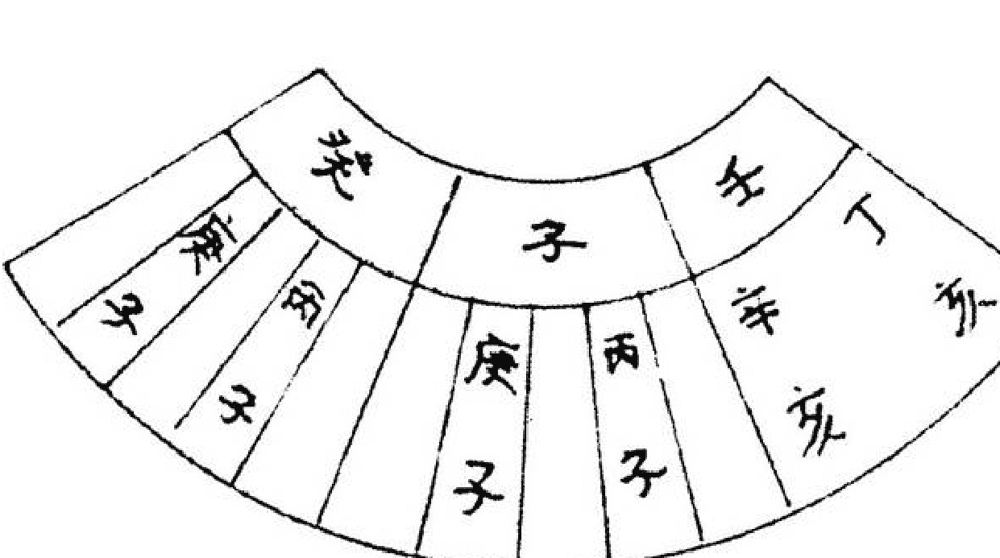

此图的子山只用丙子与庚子分金，是用一左一右，不用中间和两边的，余仿此。

按风水房份的排法讲：左为一四七，右为三六九，中间为二五八。即左青龙为长房，右白虎为次房，中间的明堂与案山为中房。

二十四坐山，按照周天三百六十度算，每一坐山为15度，每一分金占3度，每一坐山分成三等份，即5度，为一个房份，如下图：

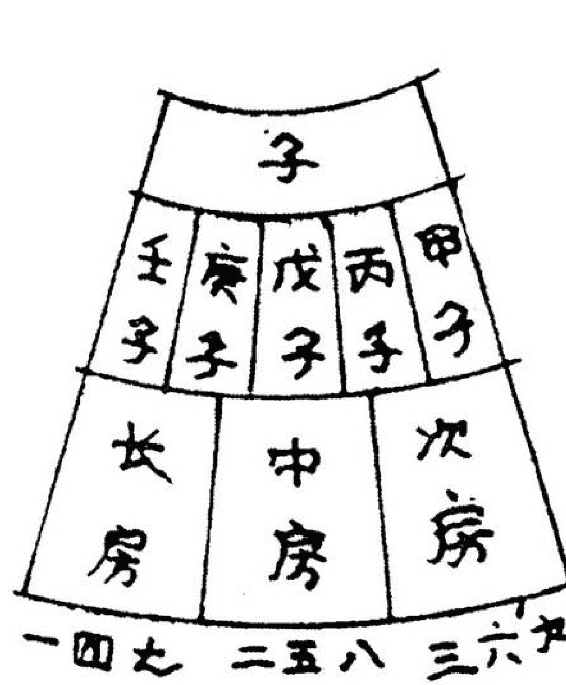

由上图可以看出甲子为次房，后一度为中房，戊子全为中房，庚子前一度为中房，后二度为长房，壬子全为长房。

如用中间的分金，中房明显全占，于是就用左和右的两个分金。当修坟或建宅都先看青龙方和白虎方哪边最好，如坐子山午向的阴宅，水都聚到左边或左边比较秀丽，利长房，如再用庚子分金，即长房把气全占，二房与三房都会有不同程度的损伤，就应用右边的分金，俗话讲是分点气给次房那面。右边好就用左边的分金，左边好就用右边的分金。

阴阳先生在实际操作中，通用如下的分金方法：以仙命纳音五行与分金的干支纳音五行相比较，以生助仙命纳音五行，或纳音五行克分金五行为好，切忌分金五行克或泄纳音五行。

有人在定坐向吉凶时，还用下法：

以向山为上卦，以坐山为下卦起卦，比如子山午向，午向为离为上卦，子山为坎为下卦，得火水未济卦。假如坟主是壬午年出生，纳音为杨柳木。未济卦属离宫，属火，纳音木生离火，此坐向泄坟主之气，不利。假如坟主是甲申年出生，纳音为泉中水，纳音水克离火，为凶。假如坟主为丙戌年生人，纳音为屋上土，离火生土，卦生坟主，吉……

我认为此说太繁杂，仅作参考吧。

## 入坟断吉凶

宋付官

今天，我给易灵派送十个字：易理加灵感，断卦赛神仙。我的演讲题目是：入坟断吉凶。

### 一、先天为体 后天为用

2006年农历四月份的一天，一行七人领我到山上为其家父选一坟茔。当走到一坟地时，岁数大的老者用手指这块坟茔问：“老先生，你看这坟咋样?这家后人有三男二女。”我掏出罗盘测度一下，知道了向口和八宫方位，回答道：“这坟地不错，三个儿子都为官，科长级，两个女儿都有钱。”还没等我把话说完，其中一个男的问：“你看哪个最有钱?”我说老姑娘最有钱，有上亿资产。”其中有人议论说：“她办好几个厂子，那能没有钱吗？”问话的老者开了腔：“能说出这姑娘办几个厂子吗?这坟地为什么这么好?”我回答：“二姑娘办四个厂子。”“太对了”一片赞叹声。这块坟，向口前30米处有案山，三个儿子必当官。东南巽方有两棵摇钱树，它很粗，一个人都搂不过来，树上长满了榆树钱，并且这两棵树在没葬这坟之前就有。东南巽位后天为长女方位，先天为兑是老姑娘之位，既然这两棵树在没葬坟之前就有，而且两棵树正合先天兑2之数，以先天为体之说，说明老姑娘最有钱。为什么断办四个厂子呢?因东南巽后天为四数。这正应先天为体，后天为用之理。

### 二、姓吃姓活断

去年一天，其父子领我去红旗岭东山看他家的祖坟。一个坟地两盔坟，前一个坟碑上刻李姓，后一个坟碑上刻田姓，前后坟距离不过一米远。姓田的小伙子领我去的。我说：“后一盔坟姓田的是你们家的?”他说：“是的，这是我爷爷奶奶坟。”我直断：“这姓李坟没有之前，你们家挺好过，自从姓李家葬坟之后，你们家连年破财，老婆也难留住。”小伙子说：“这几年破财20多万，我跟我媳妇离婚五年了，至今我还跟儿子一起过。”又问：“你看我父母咋样?”我往西北瞧了一眼，10米处有一个大坑，走近一看，能有2米深。西方、西南方有小树并有鸟窝，地势比东稍高。看完后我分析说：“你母亲说了算，有工作有钱，你父亲头有病，不是脑淤血，就是脑血栓。”小伙子说：“我母亲是老师，因我爸患脑血栓病八年了，我妈退休伺候他。”今年正月姓田的小伙子告诉我，他爸已走了。

田李二姓为姓吃姓：

- 1、从谐音上分析“田李”为“甜李子”。李家李子甜，劫田家的果。
- 2、从字形意分析：李为木，田为土，木克土，又克了田家的妻财。
- 3、两个坟头距离不过一米远，所以连年破财又丢妻。

西北为乾，为父，为首，为头。父亲头部有个大坑。一下雨就积水，又淌不出去，水为血液，故得脑血栓。

### 三、水破天心无儿女

天心水，穴前明堂正中之处的溪流、湖泊、池沼等水叫天心水。

天心水要融聚，叫水聚天心，主富显贵。天心水最忌穿、插、射、冲、反、背，称水破天心。古人云：“为人无子水破天心。”有一家坟，溪水穿堂直过，这叫水破天心。便直断：“此坟后人破财又无儿女。”

### 四、红泉不可立穴

有一家坟葬在红泉旁，以为离水近可得财，却不知可得一种共性病：心脏病、肺病、吐血、脑淤血病症。这家后人说：“我们大人小孩都有心脏病。怎么办？“此坟必迁。”为什么?红泉，泉水泛红，红主心，心脏能没病吗?所以说，红泉、冷泉、矿泉、涌泉、没泉、黄泉、漏泉、瀑布泉，不可求穴。只有甘泉可立穴，甘泉富贵长寿。

### 五、游鱼断官

望见游鱼也可断：大鱼在小鱼后，代代出官员；大鱼若在小鱼前，为官不久长。东方游鱼甲乙上，紫衣出和尚。南方游鱼丙丁位，灰袋一代官。西方游鱼极是好，金鱼紫金袍。北方游鱼打网人，常被雨淋身。

有家坟，前方有水库又有案山。水库西方有游鱼，大鱼在后小鱼在前，大鱼后边也有小鱼。坟周围有大树、小树。有藤蔓缠绕着，我断道：“你们家都为官，但犯官司口舌，官不稳。你看，有藤蔓缠树，有小鱼落在大鱼后边所至。化解一下可破官灾。”

### 六、后天破先天

这家坟坐北朝南，离方有一大水库，西北方也有一大水库，西北方水流向离方。我对这家主人说：“你家女人心脏不好，眼睛有问题。”他反馈说：“先生你说的对，我妻子双眼几乎看不见东西了。这与坟有关系吗?”“有”，我回答说，“西北水流向离方，这叫后天破先天。西北后天为乾，离方先天为乾，先天乾水流向后天乾方叫消水，后天乾水流向先天乾方叫亡水，合称消亡水，犯消亡水丁财两败。你家西北后天乾水流向先天南方乾方，叫亡水。西北的水克南方火，火主心主目，离为中女为妻，所以妻子有心脏病和眼疾。俗语云：“亥方发大水，妻子双瞎眼。”就是这个道理。

### 七、枕棺石

打圹常见的有土穴、石穴、沙穴、泥穴、泉穴五种。这五种穴又按五行之形体来划分即金星穴、木星穴、水星穴、土星穴、火星穴五种。凡金穴皆按窝钳乳突找穴位。乳突穴以得五色土为贵，窝钳穴以得石为贵。窝钳穴中的白平石名叫龙口枕棺石，它的作用能使后人坐官长久。

有这么一家，叫我去验坟。一到坟地，我发现这块厚度半尺，比大菜板大的白色枕棺石。我便问：“这块白石原来就有吗?”“不是，三年前为父亲下葬打墓挖出来的。”我便直断：“你是当官的，官不稳，常被调动还挨整。”他说：“那怎么办？”我画了一道旺官符破土符连同枕棺石一同埋在了坤方。

### 八、一官二鬼做县令

风水中的官星，亦称官山。杨公在《撼龙经》中说道：“问君如何谓之官，朝山背后逆拖山。”但官山不宜高大以夺主势，不宜探头高傲留个不孝骂名，以回顾穴场呼应有情为妙。

鬼星是龙脉结穴之山背后拖撑的小山。但鬼山不宜过长、过大、探头歪斜、欺夺主势，以贴身抱拦为佳。

前官后鬼相照应，葬坟后代官星照。有鬼只是聪明子，有官无鬼纵使为官巡检名。

- 一官一鬼出簿尉，一官二鬼做县令。
- 一官三鬼知州位，一官四鬼提刑人。
- 一官五鬼为谏议，一官六鬼宰相位。

我见一坟地龙真穴的山环水抱，靠山后有一乐山（鬼山），不大不小，是秀峰，向前100米有河水，河岸有一笔架山，张口就说：“你家有做县官的。”反馈道：“我二哥就是。”

### 九、老三是高官

河南省平地多。有一姓王的叫我断一下他家祖坟，他说他哥三个，看看哪个最好。此坟在一平地中间，周围有地埂子，东北方位30米远有一小房，走近一看是个防旱抽水灌溉的水房。我灵机一动，东北是子卦，坤艮不正是生儿女的官位吗，生子必要水，山管人丁，水主财，财必生官，官必生印，官印在哪儿，这长方形的水井房不正是一块方印吗?东北方为老三方位，立断：“老三财大又当官。”来者是老大说：“我三弟是一个厅的副厅长。”

### 十、靠山有个大窟窿

红土有一坟地，爷爷奶奶坟，父亲坟，壬山丙向。靠山是一个大山沟直达向口。

这家后代有七个儿子一个女儿，看完坟后铁口直断：“犯官司，二儿、五儿凶多吉少，很难站住。”七儿子回答说：“我二哥、五哥都死了，你看怎么死的？”“得病死的”一个肝病，一个精神病。”解析：“靠山为山沟，沟深气多，形成风，木生风，木主肝胆。老二因肝胆而死，风由坐山吹向向口，向口为老五位。老五为“风”病而死。

### 十一、马星怕伤害

今年春天去双阳验一坟，午山子向，朝山是马山，因水泥厂需石头，就把马山石头给采了下来，整三年了。我便说：“你们家今年有伤灾。”“你看谁有伤灾？”“我问你们都属啥?”小伙说：“我属羊，我爸属兔，我妈属猴。”我说：“你有伤灾，你爸有刑灾。”“我爸折了两根肋条骨，你看咋折的？”我回答：“被马踢的”“太对了!”

为什么这么断呢?今年为戊子年，鼠当令，马山被破坏，当然要报复，子未相害，小伙子左胳膊受伤，子卯相刑，子午相冲，当然父亲被马踢了，又动了手术，这就叫作“马星怕伤害”。

### 十二、龙目不可坐

龙虎头上葬一坟，死的死来贫的贫。这条断语太含糊。葬书的四镇十坐穴法论述的十分详尽。其中一镇龙头，可坐龙耳、龙鼻，龙额、龙鬣，而避龙目、龙角、龙齿、龙唇。《葬经》曰：“鼻额吉昌，角目灭亡，耳致侯王，唇死兵伤。”

有一家坟葬在龙鼻上，两个儿子都考上了重点大学；有一家坟葬在龙眼上，就是龙头湿漉漉的穴位，儿子跳楼身亡，龙目不可坐呀！

### 十三、漏胎与露胎

我去哈尔滨验一家坟，后离玄武山太远，左青龙，右白虎又在坟的大后边，龙虎砂不过穴，这叫漏胎。胎，穴也。漏胎，墓穴没有龙虎拱护，使穴场之生气外泄。立断：“你们家不但买卖生意做不成，破大财不算，还招惹是非。”回答：都对。

红石有一家找我问问，他三个儿子连没了两个，是不是与祖坟有关系。

走进深山，到了墓地，站在碑前向四周一望，群山都在脚下，我脱口而出：“这是天穴。”东家说：“我父亲说这是天穴，儿子能当官，可现在呢，官没当上，儿子倒没了，这是为什么？”我是这样分析的：穴分天穴、人穴、地穴三种。天穴位于山顶，人穴位于山腰，地穴位于山脚。这三穴都得有砂水环抱，丁财才能两旺。特别是天穴不能高于玄武、青龙、白虎三山，高出，谁来保护你，这不叫露胎吗，成了孤家寡人了，孤阳不生，能不绝丁吗？

如果天穴低于玄武、青龙、白虎三山，并受三山拱护，那不但不绝丁，后代还真能当官呀！你家祖坟葬于天穴，高于护山，这叫露胎，怎能不伤丁？怎么办？必迁！

（宋付官简介：男，大专文化，中学教师，2001年正式退休。学易12年，开展批八字、起名、看风水、出灵等业务，并获得“高级风水命理师”资格证书。）

## 阳宅风水速断实例

谭森源

我学习四柱、六爻和风水预测已经13年了，每次遇到一个四柱、六爻和风水的具体卦例，都不能快速直断，切中要害。今年春天，有幸拜读张成达老师的著作——《通灵感应断卦法》和《教您速断八字》，读后感到内容很好。

后来向张老师请教了一些四柱、六爻和风水方面的问题，张老师的解答令我茅塞顿开。后来我又参加了张老师的四柱和风水函授班，直断能力显著提高。在此，我向尊敬的张老师表示深深的谢意！下面，我用实例向张老师和各位易友汇报一下我的学习成果，不妥之处请大家指正。

### 一、风水速断图解九例

#### 例一、贲门癌、腹积水

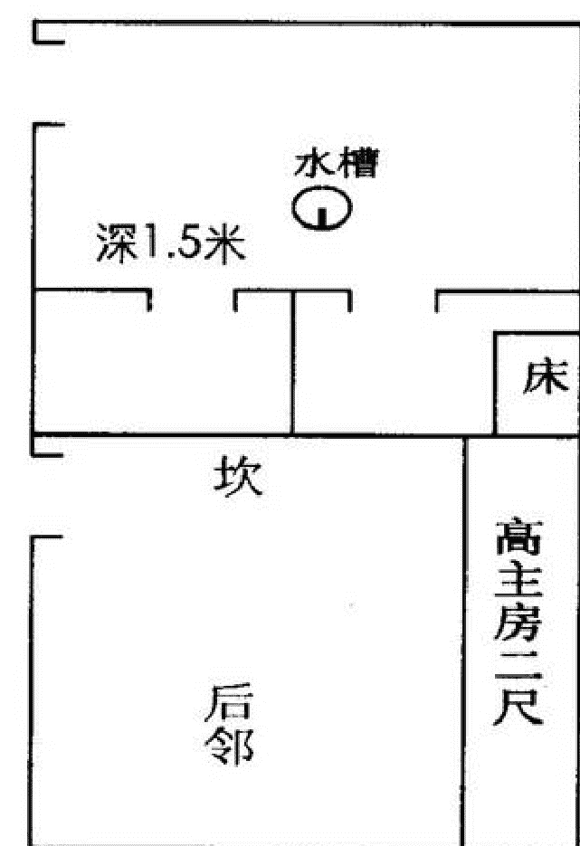

解：坎宅巽门、院中有一水槽，水槽中有一水龙头，长年有水，院中主戊己土，为腹部，有水，土克水，为腹积水，贲门与胃有关为贲门癌，己卯命住乾位，乾为老年人。为房主，巽门含辰巽巳三山与乾宫对冲辛巳年应。乾宫临房高二尺逼压宫乾为头主头晕血压高。

#### 例二、阳宅宫位空缺主不利

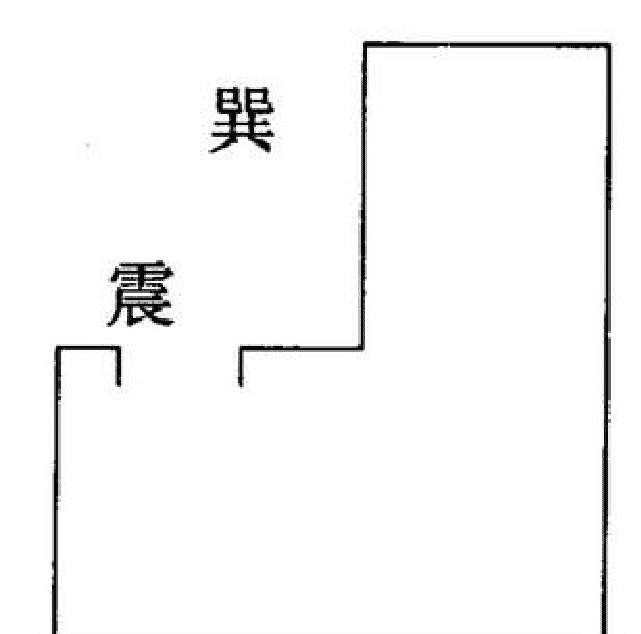

解：震巽宫空缺肢体不灵活，呼吸道疾病。震为长子、为足，巽为风、为绳直、为右肩、为呼吸，有空缺故不利长子，四肢不灵便，呼吸道有病，脖颈硬直活动不便。

#### 例三、中宫太极点受冲，人身伤亡

俯视图（下）：

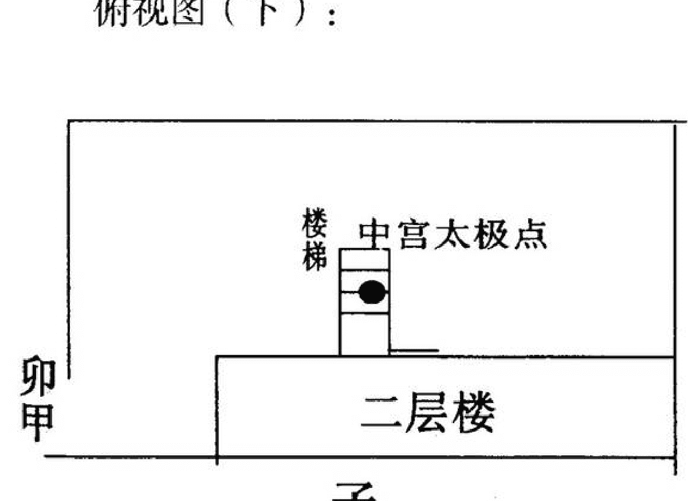

侧面图（下）：

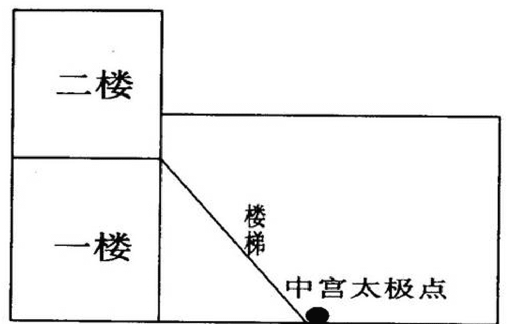

解：此宅为一工厂，院子东西长，主房坐北向南，在主楼房正中有一楼梯，向正南延伸而下，正冲中宫太极点，属大凶，楼梯属水泥墙结构，从东向西看，形似一三角尖刀，直插中宫。中宫为太极点最怕冲，中宫为腹部，为戊己土，主人身伤亡。楼梯由坎子位而下，应在子年，门在甲卯位，主正月、二月。实戊子年二月一青年刚进厂工作七天，被机器绞伤手臂而死。

#### 例四、乾位受克，兑震相战，主头晕腿肿

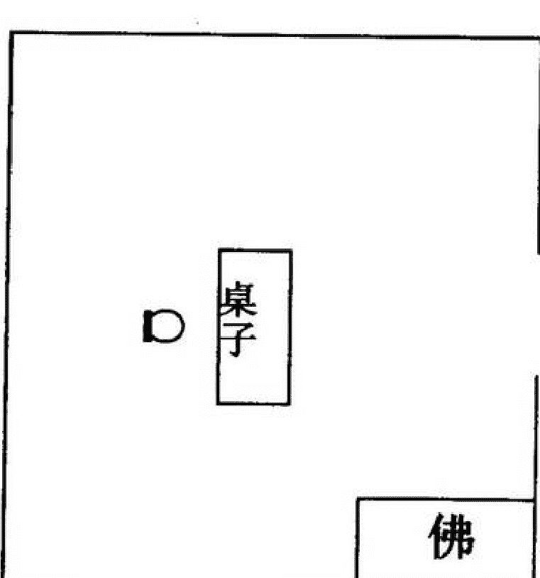

解：此预测馆坐东向西，开兑门，主人坐震宫，兑震相克，不利主人腿脚，震为足。乾位供佛为火克金，乾为头被火克，主头痛。乾为右腿，被火克，主腿肿，从整体看乾兑克震，主腿足病，皆应验。

#### 例五、房宅艮宫受路冲，伤少年儿童。

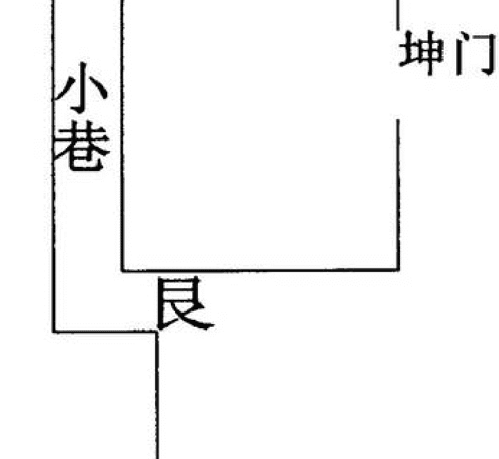

解：此宅东北艮位，有一条巷道，正冲艮位，艮主少年儿童，此宅一六岁男孩被车撞死。

#### 例六、犯割脚水主车祸伤残

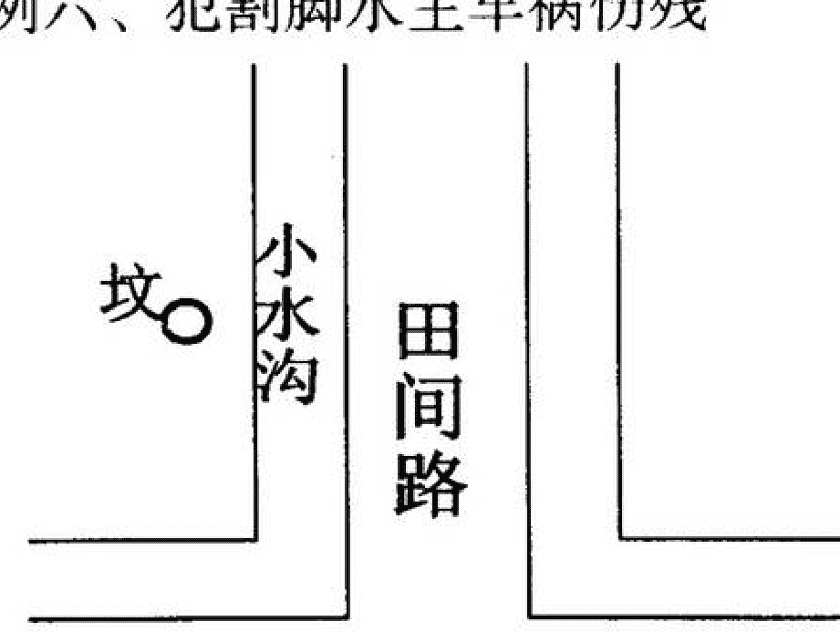

解：坟距水沟只5米，犯割脚水，一30岁男子死于车祸。

#### 例七、明堂紧逼又断头，财来财去人受伤

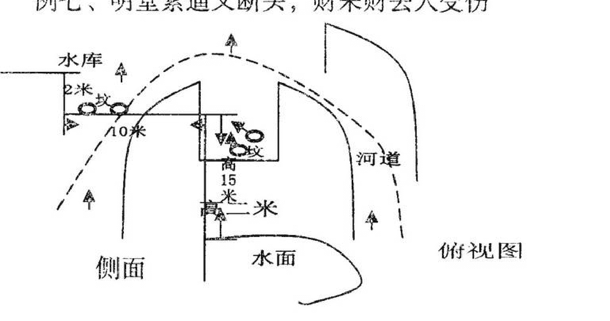

解：此坟明堂面积小，向前形成垂直的峭壁，无路可走，明堂地平面垂直距下水面15米，主财来财去人定伤残，应验。

#### 例八、峦头不吉，分金犯空亡，寿短又神精病

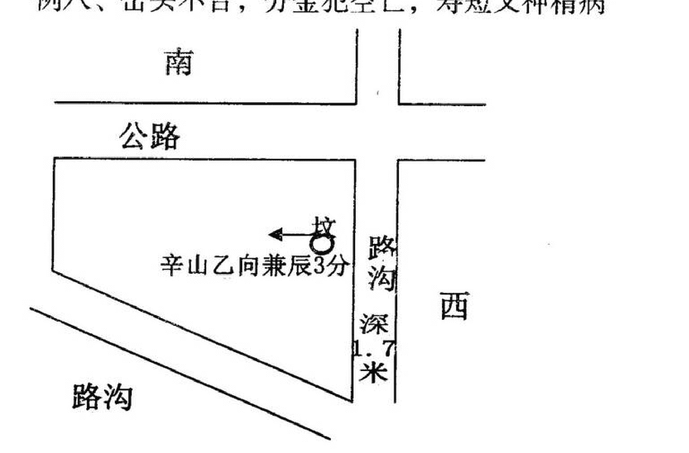

解：此坟辛山乙向兼辰3分，为金局胎养向，右水到左出艮寅方吉，实地向前无水，不合局，凶。如用地盘正针立向不符三合风水水法凶，地盘正针立辛山乙向兼辰犯大空亡主精神病，坐山后有一条直旱水沟为坐山空，主人寿短，实此坟主兄弟三人，老大42岁，腹积水而死，老二63岁，脑血栓而死，老三脑血栓，半身不遂，死时54岁，妹妹精神病，老大之女亦神精病。

#### 例九、明堂向口犯煞，绝人丁。

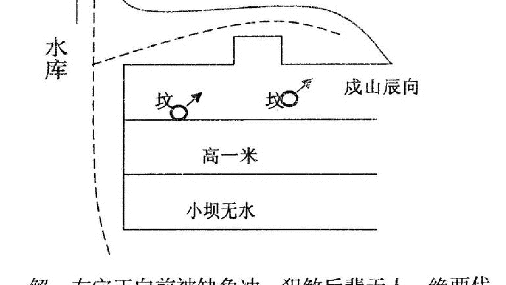

解：右穴正向前被缺角冲，犯煞后辈无人。绝两代，第三代有两个儿子（第一、二代都抱养他人之子）。左坟与此坟立向一样，人盘立戌山辰向，右凸处做虎砂，左有龙砂，左水到右包坟，主出高官（实此处出一局长财富上千万）。

### 二、结合八字进行风水调理

乾造；丙午 壬辰 庚子 辛巳

8岁交大运。

解：天河水命，命中有两金、两水、三火、一土、缺木。

1、怎样取用神：如按旺衰论，庚生在辰月得印生、得辛助当旺论。当用食泄、官克、财耗为用神。印比为忌。但在实际流年大运中每到食旺金旺年就破财不顺，如甲午年癸酉年。乙未运，辛巳年父病故。丙子年本人因病住院一月余，高烧持继不退误诊为肝硬化晚期。丙申运乙酉年单位水灾停产，（水为食神为用神）。本人破财三万元。戊子年单位破产，本人辞职自谋职业。此发生不顺的年皆为比肩、食神旺年。实与命局用神不符。

2、如按病药取用论，局在金水旺与火相战，当取木为通关用神，火为喜神。实际命主在甲午、乙未大运，戊寅、己卯、甲戌、戊辰流年木火土旺时皆有财喜之事。

总之旺衰取用与病药取用要结合并用，否则很难取准用神把命断准。

### 3、风水与命理调整

四柱命局喜用、忌神定准后，阳宅布局就要结合命局喜用进行布局。图解如下

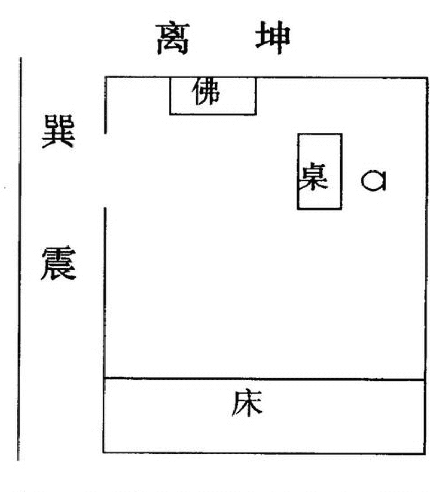

解：根据命局喜用神为木火。所以阳宅选择坐西向东兑宅（阳宅三要定宅法），选巽门，巽为木。佛位设在离宫，离为火，办工桌安放在坤宫，坤为土，门用绿色，绿为木。招牌用绿底红字红为火。招牌名字数理用火土木数（命名为名成真起名馆）。按本命局今年为戊子年，丙申大运为金水忌神旺年，当为破财年。但经命理风水调理后财运稳定，易学技术进步很快。命主于2008年10月3日，参加了由张成达老师主办的周易文化研讨会暨拜师会，荣幸地被张成达先生收为弟子。

上面的例子就是本人的命造和风水调理实例，供大家参考，不当之处请指正。

我通过参加张成达老师的函授培训，给我体会最深刻的是张老师《八字预测讲座》中的关于怎样取用神部分，讲的很好。在《百家批终身命运集》一书中，张老师批命四例中的论六亲很精彩。讲义材料中论星、宫、运极具参考价值，古今命书中也有论著，但没有实例，填补古今之空白。《通灵感应断卦法》《六爻活断点窍》中所谈断卦方法也是经验之谈。风水方面所讲的“阴宅怎样立向、收水、定局、分金”等也为古今所未见，又填补了一项空白。总之，张老师的讲义有很多实用的好东西，本人绝无吹捧之意，易友读后方知真假。

张成达老师的书含金量最高之处是精细而不保守，人们常说字如其人、书如其人、文如其人，文品可透视人品，从张成达老师的著作中，你会真正体会到他是一位德艺双修、德高望重的名符其实的一代宗师。各位易友，我们跟随张老师一起学习和研究中华民族的传统周易文化，一定能够掌握和应用这门技术，为社会和谐和民众福祉奉献力量。

最后祝张老师身体健康，桃李满天下！
祝各位易友学易有成，万事如意！

## 神 奇 的 符 咒

孟庆华

斗转星移，随着艮宫八运的到来，易学有了突飞猛进的发展。百花齐放、百家争鸣，易经这古老的中国文化，从神圣而又神秘的殿堂走向了民间，走进了百折不挠、勇敢探索的各位易经学子心间。本次“周易文化研讨会”是恩师张成达先生高尚易德和高超易技的再现，是恩师以博大的胸怀将多年研易用心血凝成的精华对弟子们的倾注，是恩师对弟子们谆谆教导和殷切希望，是恩师为他的弟子们能在易学界出类拔萃，提供了一个清新而广阔的空间，更是易坛上永远绚丽多彩的奇葩。

很难得能有这次向各位老师学习并汇报我多年来学易体会的机会，我汇报的题目叫神奇的符咒。

在易学实践中发现，求测者有很多身心痛苦，我深为不能为他们排忧解难而不安。一个偶然的机会，看到了师父的广告，当时我的家庭很不幸，母亲瘫患在床，丈夫长年重病，家境窘迫，负债累累。我怀着忐忑不安的心情拨通了张老师的电话，我说我很想挣钱，我周围的人们很需要我，师父得知我的情况，当即就讲，你需要什么书我马上给你寄去，而且一分钱也不收。我当时感激之情觉得用任何语言表达都是苍白无力的，师父的高尚品德在我人生的转折点以至于后半生都是一盏明灯照亮着我，学易先做人，这就是我随师父学易的第一个体会。

### 一、品德是符咒之魂

人以德为本，研易的人是专为他人排忧解难的。只有德易双馨，才能增强能量，使一张写着朱砂字的纸充满活力。写符的人心静如水，全神贯注地做些礼节和礼仪的准备工作，并不是迷信，而是对宇宙、对大自然、对一切生灵的尊重和敬仰，是调解精气神，达到天人合一的一种境界。这就是所说的沟通神秘能量场，进而产生神秘能量，这种精神是不偏离易经轨道的。

### 二、精神是人之灵魂

精神是一个形象的形容词，是内心世界、体魄状况的外在流露。精神在中医学上就是肾的基本概念，肾主骨、骨生髓、髓补脑，大脑补上来了，人的精神头儿就来了。神同时也是心的神明，心肾相交为水火既济，心肾不交为火水未济。新生儿为什么不长牙，是因为他的肾功能不发达所为，包括小孩多动症，都是肾功能不发达的表现。年轻人为什么有胆量，并不意味着年轻人肝胆大，而是肾功能发达，相对的老年人胆子要比年轻人小些，因为老年人的肾脏在逐渐衰退。从五行上讲，恐惊伤肾是很有科学道理的。有了紧急情况，人就要有应急反应，精神高度紧张，人的自卫本能，大脑突然释放大量能量来应对紧急情况，这样肾就要紧急产生能量生髓补脑，这就是恐惊伤肾的原理。

既然惊恐伤肾，吓着自然要补肾，在师父的众多符样中，我选取了属于水性的符样来补肾治惊吓，结果很灵验，无一失手。

### 三、神奇的治惊吓符咒

张老师在《亲传符样》里有三道专治惊吓的符样，我经常用的是“拘魂符”，这道符不管大人小孩，百用百灵。

最佳时间：大家都知道亥时以后水旺，水旺就补肾，晚九点以后用此符效果更佳，民间常用一碗水放根钢针，晚上放在被惊吓患者的头上是很有道理的，金生水，水补肾嘛。

### 四、尊师重道的神秘力量

这个题目与我讲的易德有关，你尊师重道就能产生良好气场或者说能量场。有的小孩吓着了，来到我家直打蔫，等到晚上又太晚，我就在手心里写上这道符对准小孩的百会穴默念几遍师父助弟子解灾，一会就见效，小孩不藏病，有精神头就下地玩了，我家邻居的小孩吓着，家长就领小孩说让孟奶奶摸摸头，摸摸就好了，其实并不是我有什么能量，而是师父的功德。

尊师重道还有更神秘的力量，小孩高烧不退用黄纸剪个圆形、五角形、六边形，用朱砂写上符别在头芯上退烧奇快，易医同源，这也非常符合五行生克原理，实践中我更多应用的就是黄帝内经和易经的结合，利用符咒解决一些看似很小都很难用药治愈的杂症。

在浩瀚的易海中，我只是个努力拼搏，不致于溺水的搏击者，事业中的点滴收获都是师父传道授业解惑的结果。今天，有幸在师父的家乡结识这么多易学同仁，易林高手，能够给我启迪和教导，是我学易路上的一个新的里程碑。在今后的事业中我会用执著、坚持、诚信去探寻易经的未解之迷，我决不辜负恩师的教诲，相信下次我们再相会，我会向大家汇报的一定是崭新的课题和成就，让我们不负师恩，共创辉煌！

（孟庆华简介：女，1953年元旦出生在东北小镇——黑龙江省讷河市，儿时度过国难饥荒之岁月，少年受父亲右派下放的牵连，青年逢文革上山下乡走与工农相结合的道路，破碎了大学之梦。酷爱古诗文。甲戌年下海经商，经当地算卦先生指点：未来能当大老板，结果赔个一塌糊涂，从此走上了漫长的学易之路……）

## 画 符 验 例

王常山

我是一名信道的爱好者，通过学习张成达老师的符咒以后，深刻地认识到要正确运用符咒为人排忧解患，必须建立在高尚的易德之上，去修养修炼，达到一定境界，去提取宇宙空间信息，转化为自己的能量。具备了这个能量，就能给别人查病，因病施法，有什么灾就用什么符咒去解决，这也是我们易灵派要达到天人合一的境界。

下面列举一个我在日常生活中，使用张老师的召调符召回行人时，显现神奇功效的事例，让您体会一下符咒的魅力。

2007年农历腊月初一，我在平顶山火车站一公里附近的一个庙上值班，在烧香时，有一个河南许昌烧香道友对我说：“我有一件事想求你帮帮忙，想个啥办法解决解决。”我说道：“你说说，我看看能不能帮上忙。”道友说：“我娘家侄女在上个月（即农历十一月）十九日要结婚，男方的彩礼都送来了。这两个孩子感情一直不错，男的是民警，两个家庭也都很满意这桩婚事，可眼看就要到结婚的时候了，女孩子好像中邪似的，不辞而别去广州了。家人给打电话关机，前去广州住地找她，她躲起来就是不见面。她的父母就这一个闺女，把俺娘家嫂子都快给气神经了。求你想个办法叫她回来。”

当时我对她说，这闺女在广州和一个比她大的男人在一起脱不了身。对方说是的。

我就按照张老师教的画符程序，给对方画了七道“召调人符”，并告诉她具体操作方法：夜晚子时，洗手漱口，插上七柱香，跪下祷告，上一道符，祷告一遍，口中默默念着她的名字，让她回来，你祷告七遍，一共上七七四十九根香，这说明圆满了。同时，你再把她过去穿过的鞋子，不管是什么鞋子，再使用我另外画的召调人符，一个鞋子里面放一个，鞋根朝上，鞋尖朝下，把新钉子用白酒和朱砂蘸一下，把鞋子钉在门后。我又画了四十九道“婚姻和合符”，并按照张老师教的使用方法去用。我对道友说，只要你配合好，一定能起效果，五天后有音信，七天不回来十天一定回来。如果信息到位，一定要把情况反馈给我。

结果就在用符的第八天上午，我接到了道友打来的电话。她对我说这个符太灵啦！我使用符咒第五天，闺女就来电话了，说在那里心焦麻乱的，坐立不安，很着急，一心想要回来。用符后第七天就回来了，闺女回来后对家人说，在那里整天魂不守舍，没有心思呆下去。

道友的娘家侄女已于今年农历三月份和原来送彩礼的男朋友结婚了，他们全家人对我特别感激。

我给别人解灾、驱除邪病、镇宅、夫妻和睦、求子以及考学等方面广泛应用符咒。这里再讲一个发生在我身边的一个真实事例，有位女子今年37岁，因为和丈夫言语不合而分居了，在职工宿舍居住。最近遭邪了，每天晚上睡觉在梦里，都有男的找她，把她闹得睡不好觉，筋疲力尽，也不能上班，她和朋友找到我，让我给她解灾，我给她画了张老师传授给我的“达成心愿”的三道符。把符用红布缝制成香囊一样的，随身佩戴不离身体。同时告诉她要郑重一些，尊敬一些，这都是对神的尊敬，她都一一照办了。当符戴上一个星期以后，她给我打电话说，佩戴的第一天没有什么感觉，第二天就很快入睡了，再也没有男的来骚扰她了。我对她说，这些男的真有像你丈夫的吗？你还记得梦中是什么地方吗？她说记得，在平顶山橡胶厂外一块空地有一个坟墓，坟墓旁有高压杆。我说有一个办法，不知道你愿意试不，在桃树的东南角砍一根桃木，用刀把桃木砍成一尺长，共五根，它再闹你的时候，你就把桃木插在坟的四周和中间，以消除他完成罪业后再来报复。

以上是我在现实生活中运用符咒的二个例子，您可以透过这个表面现象，更加深刻体会符咒的神奇。希望更多有缘有德的易友掌握这门技术，造福社会，造福苍生，为构建和谐文明社会贡献绵薄之力。

## 谈谈我对趋吉避凶治病救人的感受

马英利

### 一、本人学习易经简介

我是1978年当兵，在大连陆军学院上学期间，有健身气功的科目。在部队十年期间先后学过张延生的数术、顾阿水的内劲一指禅功，黄仁忠的空劲功，王立平的灵宝通智能内功术，1982年在沈阳和刘汉文师傅学习禅密功，1983年毕业后被借用在沈阳军区装甲兵部干休所教老干部练气功。同年部队派我去嵩山少林寺向海灯法师学习强身健体功，又学了一些法术，1987年在部队要转业期间，义务为家乡父老乡亲传授强身健体的防病术，得到市委市政府的好评，应分到乡政府工作的我，被破格分到市里工商局，爱人是农民也被安排到市技术监督局（公务员），并同时给我一套楼房是和市领导住一个楼。在此期间，先后学习了邵伟华的六爻，黄鉴的易魂，戴永长八字、六爻、风水，牛成姓名学，玄觉真宗的世道天机，杨家成的符法，张泊姓名学，盘崇昌的龙骨髓八字、姓名学，潘统觉的符咒，吕文艺的吕氏八字、六爻、风水，郝建朋、唐雍智、杜彦霖等玄空风水，以上这些学习全是函授。面授的课程有咱们本门师傅张成达的六壬金口诀、符咒、六爻、八字、风水，向梦孙的姓名学，刘晖的晨曦风水，飞龙道人董天生的太公奇门，同门师兄弟教我的有河洛风水、黄极十三千、黄氏地域八卦奇门，我学习易经预测术太杂了，回过头来看一看自己在生活中能实用并有准确性的东西当属海灯法师和师父张成达所传授的易术。其特点是不隐晦、简单、实用，真正能为百姓造福。

### 二、学习海灯法师、刘汉文禅师和师父张成达老师所传授的符咒有感

1982年在沈阳向刘汉文师父学习禅密功，他教的招法里面有“轰、嘿、哈”咒语并用次声发，在83年去嵩山少林寺问海灯法师禅宗和密宗是否有这个咒语，这样一问，海灯法师让我给他做，他一看我运用得非常好，是真传，就又教我一些好用的招法，其中有以下这两法：

#### 1、动态惊吓治疗法

先让患者平卧背向天，施术者先从后背到脚整体按摩松弛肌肉三到五次，再发咒语：“轰、嘿、哈”，用“次声”震动施术者的全身，感应患者也发三到五次后，从患者的尾骨开始一节一节往上拎脊柱，达到脊柱有响声为最好。施术者用双手按摩患者脊柱的同时，再次发一遍“轰、嘿、哈”的次声音就结束，一次就好，重者两次。对臆病，也就是说医院检查没有病，就是没有精神，身体疲乏，用此法七天就全愈。

#### 2、不用画符的符咒治疗法

调动真魂通灵（是虚我）去周游日、月、星、辰、山、海、天、云，在用“次声”发“轰、嘿、哈”震动自我感应（虚我）达到身体出现电、麻等一种好似飘飘然而未飘飘然等感觉后，印在大脑中的这个“图”向对方是给人治疗的一种方法，虽然有效但不系统，只对几种小病的效果好。后来我把师父张成达所传的“祛病符”同用效果很好。我给人治疗的病症有肝硬化、脾胃虚弱、妇女体质虚症等。经过把这三位师父所传的招法结合到一起用，对治疗疾病非常有效。

### 三、十六尊罗汉治病法（海灯法师所传）

利用活动子时，说话、看电视等条件不限，只要空气新鲜仿照佛家十六尊罗汉的动作去做，就能治好很多种疑难杂症，这是在1983年沈阳军区装甲兵部队把我送到嵩山少林寺向海灯法师学习健身和治病法时学的这一招。开始学时有些半信半疑，以为做这些动作治疗疑难杂症不可能吧，回来后到部队教干休所里的老军官，只要他们能坚持做3个月以上病都好了。我转业回到讷河期间，用此法帮助人们去病不全有效，我考虑可能是部队老干部福份大而家乡的父老乡亲可能有阴性物质干扰，我对没有效果的人，用师父张成达所传的通灵感应断法，飞龙道人董天生师父所传的太公奇门，玄觉真宗师父所传的世道天机，用这三种方法进行预测，若其中有两种方法预测结果一致，我就根据发病的原因去对症治疗。现我用师父的通灵感应断卦法列举一实例来说明我的体会（在黑板上画图）。如农历庚辰年十二月十七日申时一少女腿部有伤要求治疗，少女为二数兑金，做上卦，年月日时相加得3数为离火做下卦，年月日时相加得1数为初爻动，主卦体卦是兑金，用卦是离火。用克体虽药无功凶，象征少女被火烧，互卦的体卦为乾金，用卦为巽木。从五行看，木可以生火，火可以克金。本卦中的离火可克金，互卦中巽木又助火克金，这说明克体三卦较盛。互卦中的巽木被互卦中乾金和主卦中的兑金所克，巽为股，少女大腿有伤，从变卦看，下卦艮土，上卦兑金。土生金，兑金可以得生，最终少女有救。从主卦、互卦、变卦中的体卦有三金，为体党多体势盛。病情是否有阴性物质存在，我用邵雍归纳的不同类型占卦中的体用要则失推断，书说：用生体即愈。邵雍归纳的八经卦生克体的可能后果推断，书中说：艮生体有东北方之财或山田之喜或因山林田土获财，物当安稳。鬼谷变爻法：初爻动脚部疾病如关节炎症。我应用体用生克之法的依据是：(1)体克用，吉而迟。(2)用克体，凶。(3)用生体有进益之喜。(4)本卦吉，变卦凶，为先吉后凶。(5)此处受生，他处受克，为生中逢吉。(6)受克逢生，为有救。此病什么时间能好，我用的方法是：震巽木春季卦气旺。离火夏季卦气旺。乾兑金秋季卦气旺。坎水冬季卦气旺。坤、艮土，三、六、九、十二月卦气旺。所以我当天用二斤白酒点燃，边用酒火点击伤痛的同时，在自己的思维中把师父张成达所传的“治牙痛符”的“弓止弓止”形象出来，整体打向伤病部位，这位腿部伤痛的的少女一次治愈，对疑难杂症的患者运用海灯法师和咱们本门师父张成达所传授的符咒，同时运用3个月基本全愈。

### 四、鱼骨卡喉治疗方法

我用盘子一个，接上无根水，右手中指伸直其他四指弯回手心，按住劳宫穴，在水上方写着：“鱼龙得水”，患者把水喝下，鱼骨15分钟后就化掉了。我用这种方法在盘子里用手写师父张成达所传的“祛病符”。治疗妇女手脚怕冷、肾寒、胃弱有效的方法是：在盘子里放半两白酒，治疗男人便秘、肝阳上亢、脾胃不合、肝瘀有效的方法是：盘子里放上无根水或白酒，用上述手法，手在盘子上方空写此符后让患者喝下去，重者七天，轻者三天即愈。我想海灯法师教的在盘子里写上“鱼龙得水”能治“鱼骨卡喉”，我正在试验治疗妇女手脚怕冷、肾寒、胃弱，用盘子放上无根水，空写一个“火”或多个“火神”试验有效果。治疗男人便秘、肝阳上亢、脾胃不合、肝瘀，用盘子也放上无根水，空写一个“水”或多个“水神”在试验也有效果。我对其他类型病，有时用太阳神、月亮神形象出来打向患者也好用。有时用盘子放上水或酒空写太上老君噫急如律令也好用。我的做法只要不收钱，让患者到寺庙自愿施舍，一般病症连续七天就好了。

我从部队转业回到家乡二十一年来的期间，为人预测、治病从未收过钱，患者实在非要答谢，我分别捐到当地和我去外地开会时的寺庙。

### 五、在阴宅里做催官、催财、催桃花的几点体会

近三年我为人在阴宅做催官、催财21例，有省部级、有县市级、还有贫民百姓，有武汉黄石市、黑龙江省哈尔滨市、滨县、阿城、讷河市、莫力达瓦旗、乌兰浩特、白城等城市。首先到坟地，早、中、晚看地气走向，趴在地上听地音，看阴宅土的颜色，草丛长势和类别来定此阴宅做催官、催财是否有效，看地气、听地音、看土质、草的长势的方法是：

1.  看地气：在坟地坐山和向口各500米处，当太阳刚要升起时看在阴宅那里的地气走向，如山和向的地气走向是一个方向为做催官、催财可用。如山和向的地气在阴宅处打圈圈为最好。
2.  听地音：距阴宅山和向各方的一米处，把耳朵放在棉垫子上，听地下有两种声音，一种是嗞嗞嗞，好似放电，能量强可用。另一种是嗡嗡嗡能量小，不可用，要求要夜深人静时做。
3.  看草型：如阴宅的一侧或一方有老厂子、刺菜、碱草长得好，如长势茂盛，草型品种多、光滑可用；土硬、板、死、反润不好，不可用。
4.  看土质：土不论黄、黑、褐色等土，只要土像有油似的，很顺序、规整等可用。

以上四种方法都是做催官、催财的有效方法。这就是民间所说的藏风聚气的能量，如能量大，3个月见效，能量小，1至3年见效。

我计划在2009年出三本书，第一本书是“新法符咒治疗阴性物质干扰病”，第二本书是“几种方法合治疑难杂症病”或“预测有无阴性物质干扰病”。第三本书是“阴宅催官、催财、催桃花的有效方法实例解”，希望能够得到有缘人的帮助。

## 用神符消灾灵验例

张国才

我是甲申年出生，1990年开始师从邵伟华学易。十八年来，足迹遍及大江南北，先后拜访过很多易学界知名学者，探求易学真谛。用二句话可以概括我的艰辛，那就是走了八九千里路，花了二三万元钱。也是本人愚钝，进步甚微。二年前，我在长春市盘若寺附近的书摊上，买到了盗版的张成达老师的书，我发现张老师的书句句真话，招招灵验，越学越过瘾。

这里，我要感谢盗版者，因为盗版者把张老师的联系电话印在书上了。我按照书上提供的电话号与张老师取得了联系。在向张老师学习的二年时间里，预测技术有了显著提高。尤其在使用符咒驱除疾患方面，通过自己的亲身体会，感到很灵验，然后就为家人和身边朋友排忧解患。

下面，我汇报一下自己向张老师学易过程中三个灵验的卦例，与各位分享，不当之处请多多指正。

### 卦例一：王某调运

戊子年 己未月 戊辰日（戊亥）

《坎为水》 《泽地萃》

兄弟子水、、世 官鬼未土、、 朱雀
官鬼戌土、 父母酉金、 青龙
父母申金 × 兄弟亥水、 玄武
妻财午火、、应 子孙卯木、、 白虎
官鬼辰土 0 妻财巳火、、 腾蛇
子孙寅木、、 官鬼未土、、 勾陈

她本来是想求测财运，摇卦后我判断如下：

1.  “你现在运行低谷无财可发，没有财运，有桃花运恶鬼缠身。”她承认；“你在你爱人之外还有男人。”她点头；“但这不是你主要的问题。主要的问题是你陷入恶鬼缠身的环境里。你晚上睡觉一群恶鬼合围住你和你唠嗑，挺热烈，一唠到鸡叫，现在已经有一月了吧？”她说有已经有二个月了。
2.  “群鬼中有家鬼外鬼。刚开始是在去年冬天，你父亲的，有一家鬼常来，今年四月份又有外鬼跟着来。”
3.  “四月份以后开始跟你唠嗑，现在是无话不唠。”

她说对。

此卦是明显的恶鬼缠身，宅中鬼语。王某身高1.62米，体重仅仅37公斤，一副病态，如果再这样下去，那就会有性命之忧了。于是，我决定用符咒将鬼打跑，打鬼救人。

用符：禳中鬼语符

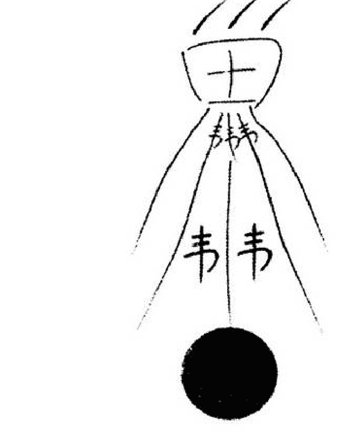

注，涂黑的圆圈里面原来书写“帝令”二字，后来用朱砂，也可用朱砂与白芨一起搅拌，然后在字上涂黑的。

咒语：幽灵幽魂，何事奔忙，我奉帝令，命发四方，如逆我行，剑到立亡。

信息反馈：未月辰日戌时用符，当晚睡觉安静，鬼魅逃离，次日，饮食正常，至今一月有余，夜间睡觉从未有鬼魅说话之事，一起恢复正常了。

### 卦例二：王老太太测病

戊子年 戊午月 癸巳日（午未）

《火天大有》 《地天泰》

官鬼巳火 0应 兄弟酉金、、
父母未土、、 子孙亥水、、
兄弟酉金 0 父母丑土、、
父母辰土 、世 父母辰土 、
妻财寅木 、 妻财寅木 、
子孙子水 、 子孙子水 、

断：

1.  世爻辰土在午月未日生助旺相；
2.  虽然旺相，但浑身难受，嗓子还疼；
3.  摇卦得知，上爻巳火官鬼伏戌土父母鬼魂要钱；
4.  四爻酉金动露出午火鬼，也是合伙要钱；
5.  特点：这些鬼都躲在神佛后面作祟；
6.  我思考后决定用符，一带一升符水喝下。

用符：禳符

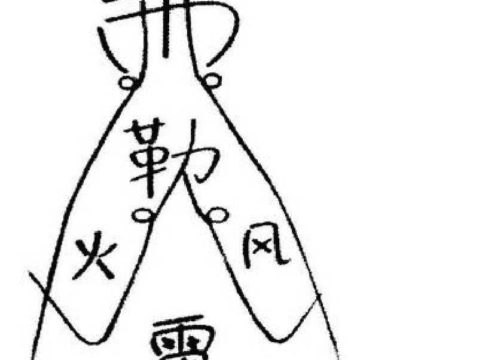

咒语：神仙归位，小鬼回家，莫来扰民，切记心中，如若不办，汝将镇之。

信息反馈：第二天嗓子不疼，身体舒服。

### 卦例三：张先生求测病情

丁亥年 癸卯月 乙巳日（寅卯）

| 《山火贲》 | 《山天大畜》 | |
|---|---|---|
| 官鬼寅木 、 | 官鬼寅木、 | 玄武 |
| 妻财子水、、 | 妻财子水、、 | 白虎 |
| 兄弟戌土、、应 | 兄弟戌土、、 | 腾蛇 |
| 妻财亥水 、 | 兄弟辰土 、 | 勾陈 |
| 兄弟丑土 × | 官鬼寅木 、 | 朱雀 |
| 官鬼卯木 、世 | 妻财子水 、 | 青龙 |

断：

1.  寅木为胆，卯木为肝，子水为膀胱。从官鬼爻卯木临月建上看，应该是旺相，是重病，病人已卧床，腹部和睡眠之症看似很重（各项指标均超）。
2.  细看卦象，二爻丑土动化寅木官鬼，世爻卯木官鬼为肝，寅木为胆。寅卯为兄弟，从病情上看，寅卯为兄弟家鬼缠身。理由是有要求迁坟的信息（上卦为艮为山）。
3.  “鬼旺病发狂”非常对路。
4.  卦中子孙未现伏在三爻亥水之下，有日月建巳火冲起申金引拔，申金子孙为医药。巳日算卦笔者为医生之说。
5.  官鬼狂为隔药之说，必拿下才能解决问题。决定用符。

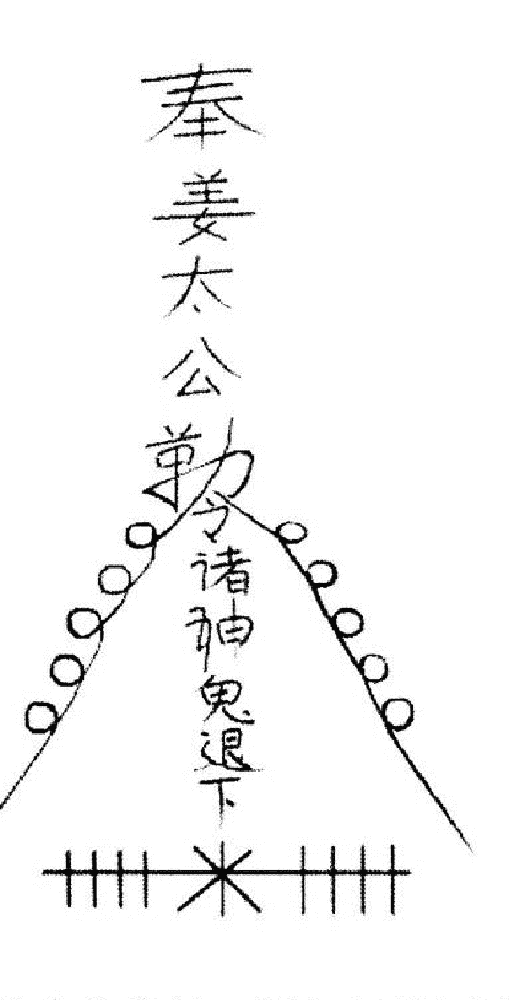

咒语：太上有令命我行，手挟天雷镇诸煞，吾方吾谛护我形，役使六丁兼六甲，诸煞凶神违我令，将尔永镇泰山石。

信息反馈：用符第二天病情明显减轻，医生也感到奇怪，一周后各项指标接近正常。半月后出院，至现在，完全恢复正常。

## 谁说学易难于登天 拜上明师造福人间

丑速临

今天，我能荣幸地参加这个研讨会和拜师仪式，目睹易灵派的风采，使我获益匪浅，必将成为我学易征程上的新起点和加油站。我要开足马力向前奔，早日圆上我运用周易为人间谋福祉，为社会增和谐，为中华民族伟大复兴添砖加瓦的梦想。现在，我汇报一下学易情况，诚望赐教。

### 一、漫长的学易之路，终于使我走上了正道

1996年冬，我退二线后，学气功接触到阴阳五行等传统文化，听说周易能预测人生吉凶祸福，并能趋吉避凶。1998年初，我就买了周易之类的书看起来，接着就参加当地师傅办的培训班。之后，一发不可收，见书就买，逢人就学，手不离书，口不离易，废寝忘食，如痴如迷，读书百部以上，投资三万余元，历经十年寒窗之苦。八字、六爻、梅花易、阳宅、阴宅、画符、解灾等都学了，确实有收获。预测准确率也上来了，但阴阳宅越学越糊涂了，解灾也能搞些，因胆小不敢迈步。预测虽准的多，错的少，但也很费力，白天测，晚上睡不着觉，心里总觉得没底。加之社会上相当一部分人认为周易是迷信，只好偷偷摸摸地搞，觉得长了也不是个事呀。我犹豫了，徘徊了，彷徨了，想弃易而安享晚年。

就在这时，也就是2007年底，意外的喜事来了，先后收到张成达师父的二封信函，越看越爱看，感觉真切实实在，使我振作起来，先后把师父编著的八字、六爻、画符、阴阳宅这一套书都买了，并参加了函授班学习，而今迈步从头越。从今年二月到九月底，用八个月时间初步学会批八字、断六爻、画符、会解灾和调理阴阳宅。这次来就是想得到师父的真传，使本人成为易灵派一个名符其实的弟子。为弘扬易灵派的为民谋福祉，理法至简，易技精良，易德高尚的优良传统而做出自己的努力。

### 二、易灵派的理与法，大道至简，一学就会，一用就灵

我从今年二月开始边学边用，到现在八个月了，效果可观，不仅能预测，还能逢凶化吉。求财二例，见效二例。求官六例，已升官五例，其余一例农历十一月可成。高考四例，全考上了，一本的三人，二本的一人，考高中二例全考上公费了。解灾31例(这里还有生命关口之灾)，现在只发现一例有惊无险，因为还没到年底，有待验证。

现在用几个例子进一步说明一下：

1.  2008年6月24日，一位51岁的女士找我， 我一看八字，便说“你为肺病来的”，她说“对，我连去沈阳医大三次也没确诊”。我叫她摇一卦，又看了八字，事情明白了。她既有实病，又有虚病，要两手治。她欠阴债，犯五鬼，真童子，这些办了，又给画了消灾符、护身符、祛病符戴上。办了以后，精神了，再去沈阳医大当即就确诊为“间质性肺炎”，是个难治的病。她去北京协和医院治疗一个月。在同类病中，有的发高烧不止，有的长期治疗不见效的病例屡见不鲜。而她好的最快，现在出院养了一段后经复查，一切指标正常。
2.  一位29岁女士家住辽宁省海城市，在上海打工。今年7月22日，专程找我批八字、摇卦，我说你整宿睡不着觉，想寻死。她说太对了，到医院怎么也治不好。我又接着说，您家供的佛和保家仙，安放的不对，又是真童子，送了替身和五鬼，画了消灾符、护身符，又摆放和佩戴蛇马羊生肖，半个月后高高兴兴回上海上班去了。
3.  一位57位的女士，今年2月27日找我摇卦，我说你近日有病，灾重。4月15日，她从沈阳来电话，叫我救她，她说摇完卦第三天就发病了，在陆军总医院做完脑垂瘤摘除。手术很成功，已花了四万多元，还得花四、五万元才能去根，就是呕吐，不能吃东西。大夫说这病跟手术无关。她是领一堂神仙的人，她犯五鬼，真童子，照送不误。给她画消灾符两道（喝、戴），第二步的那四、五万元没花，逐渐地好了。
4.  今年正月初三，一位53岁的男士测年运，摇得《坤》之《师》卦，世爻酉金月囚日冲为暗动，被动爻巳火合克，五爻为亥水，被巳火父母爻冲，断他四五月份有车祸。大正月，我嘴没说，却给他画二道消灾符，身上、车上各一道。5月7日，（戊午月辛巳日）三个巳火财爻冲一个亥爻，对方一个三轮车迎面撞来，他的车、人无事，而三轮车翻了，有惊无险，如不戴符，后果不堪设想。
5.  梅河口市二十八岁男青年是个以工代干的团支部书记，参加某单位一把手(正科级)应聘。有两位竞争对手，这三个人年龄、学历等各方面条件都相同，但那两位都已经是副科级，有的已任副职多年，均比他优越。这里有笔试一项，给他画一道考试及格符，对这三个人，评委打分项项都一样，唯他笔试分数比那两人多0.3分，当上了一把手。
6.  一个19岁的女孩参加今年高考，平时他和一个同学考试成绩总是相近，给她画一道考试必胜符，一道消灾符，高考分数568分，加上校考20分，被东北大学一本科学校录取。她那个没戴符的同学514分，走了个二本院校。
7.  一个40岁的女士卖服装，生意不错，就是年年破财，有一次就破了八千多元。我给她画一道“招财进宝大有利市符”，戴上头一个月，就得到多发600多元的货。
8.  今年农历八月二十日晚，我的小孙子叫我算算他家的房门钥匙丢没丢。按阳历牌9月19日“一和儿”装的六爻卦，我说没被人偷去，不用张罗换钥匙。在你家北边挨水或最下抽屉里圆盘中。第二天早上，又复查一下，钥匙或应在北面腰部高的位子放着。当晚星期五，我说现在找不着，明天也找不着，星期天不用找就出来了。果然，他奶奶在北面壁厨腰部高地方找裤子穿，钥匙正好在这条黑（水）裤子上面了。
9.  我二孙子高考分数356，他在这之前参加了“辽大”影视数码制作艺术专业校考。900多人，合格100人中有他。第二次在100人考出30人中也有他。在这30人中就录取8人，就看文化课分数了，他与父母和我都发愁了。一天下午，我去西郊桥溜达，坐在公园凳子上，面朝一条从北向南的马路心里一动，我二孙子能考上不？这时一辆红色奥迪轿车从北向南又上了一座大桥后向右转往沈阳方面畅通无阻的去了，向南为朱雀主文，天空万里无云，宜于升迁，红色为喜庆，往沈阳方面去了，就是辽大方位。于是，我就断定能考上，果然被辽大一本录取了，因为加上他的专业250分，经折合后总分为585分。
10. 为展示易灵派的风采，还对二个北京奥运中国能不能都拿第一？“神七”发射飞行能不能成功？台湾领导人选举，马英九能不能选上？这四卦都应验了。唯陈水扁，我断必绳之以法，尚须验证。The request was rejected because it was considered high risk

## 浅论易学的科学发展观

赵成虎

易为群经之首，为大道之源，为万物之根本。《周易》是中华民族勤劳智慧的结晶，是我国历史文化的一块化石。它具有哲学性、历史性和政治性，是不断发展的，它来源于实践。

“人更三圣，世历三古”。早在六千五百年前，人类的祖先伏羲氏，在长期的生产生活中，秉其聪明智慧，仰观俯察于天地，分析鸟兽之飞行，龟甲之花纹，综合万物之情理，天长日久，灵感激发，一画开天，反映宇宙真理，集万象于其中，始作八卦，用蓍草演占诸事无不应验。文王勤政爱民，为商纣拘囚七年，为救民于水火，研羲皇之所画，系之以辞，把历史背景纳入其中，暗示殷周奴婢起义伐纣。

孔子博学，精六艺，重礼仪，敏而好学，晚年研易撰述十翼，从此“天、人、地”三才有机组合在一起。

人类社会不断地进步与发展，《周易》逐渐成为人们精神支柱，无论是在政治，军事，数学，物理，仿生，哲学等学科都加以应用。《周易》之所以珍贵，被世人称为“天下第一奇书”，是因为它的真理性之存在。它内容丰富多彩，具有真正而又不可斗量的研究价值和使用价值，历经数千年源远流长，自强不息。为此不知有多少人致力于易学研究和实践。象古代周公、孔子、诸葛孔明、邵康节等历代先圣先贤，现代德高望重的许多易学名家，他们都是易界师表，安邦治国栋梁，文人志士。他的化民之危险，解民之疾苦，为易学发展作出突出成绩。像《孙子兵法》、《文心雕龙》、《奇门遁甲》、《卜筮正宗》、《梅花易数》等历史名著，他们观天象预测社会发展，勘测地理风水，以干支定命运吉凶等方面都作出了很大贡献。

万法归易，易学家认为《周易》是一部百科全书，它包罗万物万象，自然界无不归藏其中，“象—数—理”中蕴藏着自然界的基本规律。它揭示了世界的本质是物质的是运动变化的，矛盾是相互对立的，万物具有普遍联系性。其中“象”指八卦中乾、坎、艮、震、巽、离、坤、兑所代表方位，万物万象及金水木火土五行属性，如“乾”代表西北方位(后天八卦)，为天、为圆、为君、为父、为玉、为金、为寒、为冰、为大赤、为良马、为老马、为木果、为龙、为直、为衣、为言等，五行为金，为阳性，“数”指的是卦数、大衍之数、洛书数、自然数、五行数，“理”是易理，即万物阴阳平衡，五行生克制化。孔子曰：“是故易有太极，太极生两仪，两仪生四象，四象生八卦，八卦定吉凶，吉凶生大业。”那么太极由无极而生，常言说万事从“O”开始，“O”应该为无极数。老子曰：“道生一，一生二，二生三，三生万物。”道者，一阴一阳也。从而定出奇数为阳，偶数为阴。万物诞生由雷击始于震，在风中成长于巽，采取阳光于离，吸取营养于坤，金秋结果于兑，败落于乾，归藏于坎，准备再次生发于艮，周而复始，新旧更替，生生不息。易学具有广泛的科学使用价值。人类对它的探求越来越深刻，不断发现它，了解它，其中大衍之数被现代西方称之为“中国余数定理”。微积分的发明者，德国数学家莱布尼茨，经过几年的功夫，终于从研究太极八卦中发明了二进制，因此《周易》被他称之为“流传于宇宙间所有科学最古老的纪念物”。物理学家爱因斯坦，从太极图案得到启示，总结出“大圆小圆”学说，把周易称之为“宇宙方程式”。在医学上运用万物的阴阳平衡生克制化之易理，为人类健康所做的贡献是不言而喻的，事实充分证明了它的真正价值和科学地位。难怪瑞士心理学家尤尔·古斯塔认为“《周易》是一个取之不尽，用之不竭的智慧源泉”。

易学是不断发展的，应以科学发展观点评论它。从奴隶社会、封建社会发展到有中国特色的社会主义社会，易学也在不断发展和完善。从羲皇观鸟兽之文，客观主动的发明了用蓍草排列组合成先天八卦，再到文王后天的八八六十四卦推演，易学从单纯占卜吉凶为主，发展到在政治、军事、数学、物理、仿生、医学、电子计算机具体运用等，都说明了这一点。虽然现在易学方面众多的易学爱好者致力于易学研究，取得很大成绩。但是，人们对博大精深的《周易》研究还是肤浅的，象大海之一滴、九牛之一毛。给人增加了神奇感，加以崇拜。八卦太极图被韩国设计在国旗上，成为韩国民族的象征。这都说明《周易》神奇而伟大，易学研究的发展也促进了科学生产力的发展，祖国各项事业，离不开易学。北京奥运会整体设计，开幕时间的确定，神州七号航天发射技术，包括航天员选取，生肖都为马，意在“天马行空”，无不符合易理。我国实行改革开放建设有中国特色的社会主义国家，提出了“一个中心，两个基本点”。以发展经济为中心，加强物质文明建设和精神文明建设，二者相辅相成。两个基本点就象太极图中的两个阴阳点，刚柔相济。失去任何一个基本点就是阴阳失调，经济中心就不可能顺利发展，社会就不会稳定。

“以人为本，以德治国”是讲三才的有机组合，即“天时、地利、人和”。“天时”指我国发展大好形势，“地利”指我国地大物博，“人和”指和谐社会，社会实践充分证明了《周易》理论的客观实在性。

在人们社会生产生活的实践中，往往出现很多科学技术无法解决的难题，却被易学知识轻松地加以解决，因而一些人不解其义，便执着地相信它。易学包蕴自然界万物原理，用科技无法去解释，有时感到神奇，不可思议，甚至视为封建迷信。因为《周易》产生历经的社会环境、社会制度、生产方式都有所不同，生产力水平高低，决定着不同的世界观，难免存有一些与现实不相符的东西，这也是无可厚非的。比如：孔子的“天尊地卑”与我国今天提倡地“男女平等”就是两个社会的世界观。这就要求易学爱好者，在学易研易用易时，做到具体问题具体分析，取其精华去其糟粕。且不可恣意扭曲历史文化遗产，要以正确地态度去认真学习，不断地探求易学真谛，用实践去检验真理的方法去破除迷信，解放思想。

要树立科学发展观，科学技术是第一生产力，要珍惜这用血与泪谱写而成的历史文化遗产。遵循“三个代表”重要思想，“始终代表中国先进文化的前进方向”。立足于“构建和谐社会”的伟大实践，把易学发展成为健康向上、丰富多彩的社会主义文化，要以高尚的人格、求真务实的精神和慈悲之心服务社会，造福民众，齐心协力，共同构建和谐社会。

## 浅谈《周易》与阴阳“五术”

赵体兴

道家讲：无极生太极，太极生两仪，两仪生四象，四象生八卦，八卦演化出万事万物。老子曰：“道生一，一生二，二生三，三生万物。”“万物扶阴抱阳。”把阴阳作为宇宙，世界上最重要的特性——两仪乃阴阳也！

凡积极的事物都属阳，如：日、天、男、外、大、上、进等都属于阳，凡消极的事物都属于阴，如地、月、女、内、小、下、退等属于阴。《内经·生气通天论》曰：“阴者藏精而起极也；阳者，卫外而固也。”“藏精卫外”说的是阴阳对道家修炼和人的功用，即阴阳双方不但是矛盾的统一，而且互为其根，阳根于阴，阴根于阳，无阴则阳不存在，尤阳则阴不存在，阴阳之间互依互存，相互为用，其源于太极，即“一阴一阳谓之道”规律。阴阳学说是中国古代哲学的最基本概念，也是《周易》的基本思维方式。

古人把阴阳消长中量的变化可转成质的变化，作为世界万物发展的最根本的法则。先哲们就是以阴阳两个符号开始，创造一个庞大的根深叶茂的易学体系，“阴阳”的交替变化，产生了五种基本物质，即金、木、水、火、土，称为五行。宇宙间、世界万事万物都是由五种基本物质组成的。

《周易》之内涵代表了中华民族文化最根本的精神，其外延反映了《周易》对中华文化极其广泛影响。

《周易》被道家奉为三玄之冠；儒家称《周易》为“群经之首”，《四库全书》说，易道广大，旁及天文、地理、兵法、历法、算学、医学等无所不包。不仅是一部占卜、哲学、历史、科学之书，而且是包罗万象的百科全书。因此，易学是一门无边无际的学问，是一门特别高深的学问。道教创建于东汉顺帝时期公元126年-144年之间，沛人（今江苏沛县）张道陵在四川鹤鸣山修道，精究阴阳五行，感应天地人三才之灵气，精心炼志数十年，著作道书二十四篇，感动老子，授以三天正坛，命名为天师，后人尊称张道陵天师。张天师以鹤鸣山为中心，设立二十四坛，奉老子为道祖，尊称太上老君，以老子五千言为主要经典创立了道教。自此为始，道教人中精究（炼）阴阳易术者，人才辈出。张天师以伐诛邪伪，整理鬼煞之气，有“坛设天地动，法施鬼神惊”之气势（详细法则此不论述）。

道家修得正果的陈抟（俗称养生学家）精通周易，可聚寰宇之气，采日月之精华，易运自身“周天”打通自身经脉，与大自然溶为一体，练就独特的龟息法，寿达三百六十余高龄。道家先委任制修炼高深者修成正果，不但能延年益寿，广释善德，即能扶佐明主安邦治国，使国泰民安，天下太平，次者济世救贫。历代圣贤如姜子牙、诸葛亮、刘伯温等数不胜数，精通《周易》者用来安邦治国，可使国泰民安，国富民强，富裕昌盛，风调雨顺。用来行兵布阵打仗，可以以少胜多，以寡胜强，战无不胜，攻无不克。概运用《周易》之功效也。

当代研易用易大家，出类拔萃，响彻寰宇，声誉世界，也是层出不穷。他们以数十年如一日坚韧不拔的毅力，以积极奋发向上的精神，把“周易”这颗无形而深奥的种子，播撒到华夏大地，甚至跨出国门传播到世界。他们用精深的易理数术，为中华以及国内外侨胞，破译解难，化煞调理，都起到预期的良好效果，为祖国争得了崇高的荣誉，为把祖国建设成为一个美好和谐社会做出了杰出的贡献。

笔者研易时间不短，但是易术进步迟缓。可能是缘份所至，或是神灵的感应，2007年7月份，我去易友李长秋府上，见他正在孜孜不倦地读张成达老师所著《六爻活断点窍》等一些书籍。由于我求学若渴，当即借得张老师著作回家细读品味。读张老师的书后，使我茅塞顿开，如获至宝，深知张老师不但是一位精通《周易》，而且精通五术之高人。是位阴阳风水师，预测命理师，还是一位精通道术的化解（利用灵符、阵法）调理师。可见张老师道家功夫之高深！可称是一位精通五术，德易双修易艺渊博高深的《周易》圣贤之士。记得有位精《周易》的先贤名家曾经说过：“究易者不通五术，而难言其精也。”张老师的阴阳风水直观断法，综合百家之长，形成了易灵派独具一格之预测与策划易学理论，运用这些理论，即能够分辨善恶，论人事定吉凶。

张老师的八字命理学有自己独到的见解，对批命术运用自如，预测者所问伤残疾病，生老病死，官财妻妾，子女婚姻，无一不应验，无不拍手叫绝。

在运用张老师“六爻活断点窍”理论占测风水时，一卦摇出，即如亲临其境，龙穴砂水向、来龙去脉、八宫方位、哪高哪低、是吉是凶、某年某月主事等断验如神，百发百中。

以上展示在易友面前的浅述只是笔者一家之言。因才疏浅薄，错误及不当之处敬请良师易友多加指点。我一定会虚心接受，取长补短，以益后进。我希望广大易友精诚团结，携手并进，认真学易研易用易，为追求高尚的易德，追求高超的易术，为中华民族建立和谐美好的社会贡献力量！

# 第三部分 随感诗歌篇

## 十月金秋传喜讯

——周易文化研讨暨拜师会侧记

金秋十月，秋高气爽，日丽风和，枫叶染红了山谷，银镰收割着希望。磐石市浩水山庄迎来了全国十几个省市周易文化的研究者、学者和易友。2008年10月3日至5日，由吉林市周易研究会副会长张成达先生主办的“周易文化研讨暨拜师会”在这里隆重召开。

吉林市、松原市、山西省吕梁市等周易研究会的领导应邀莅临会议。吉林市周易研究会会长江山发表热情洋溢的讲话，并向张成达先生赠送“一代宗师”的字幅。

## 千里迢迢，学经悟道

十几年来，张成达先生寻师访友，研经悟道，博览群书，采撷众华，开拓创新，著书立说。他高尚的易德，精深的易术，吸引了众多国内外易学爱好者和研究者参加他的函授和面授学习班。这次，共有64人到会听先生讲课，有57人拜张成达先生为师。来自内蒙古巴林右旗的张彦忠在张先生函授教学指导下，通过十年来的刻苦学习，易学理论和实践经验有了显著长进。他身患严重的腰肩盘脱出症，行走坐卧都十分困难。但他毅然放弃治疗，千里迢迢来到磐石。他说：“我就是爬，也要爬到张老师身边。”黑龙江省讷河市的孟庆华，几年前，在母亲去世、丈夫有病、经济十分困难的情况下学习易占，得到张先生分文不取的指导，从此命运青睐了这位不屈的女性。为报达老师的恩德，她克服很多困难赶来参加会议……这样感人的事例举不胜举。

## 感悟真谛，切磋玄机

为了开好这次研讨会，年近七旬的张成达先生带病做了大量的筹备工作。他与全国各地的弟子们联系，要求凡是在会上作学术交流的必须有讲稿，必须由他先审阅。要求做到不压扣子、不卖关子、不留后手，要捞干的、讲真的、说实话的。他不但这样严格要求弟子们，也在严格要求自己。此会他讲了“怎样速断八字”和“阴宅怎样立向、收水、定局、分金”，每一课都是经过精心准备的，尽量做到深入浅出，直指要害，让与会者听了入耳、入脑、入心。有很多人说：“听张老师的讲课真有与君一席谈，胜读十年书的感受。老师给我们传的是真经，一点就破，一说就透，解开了我们的很多疑团，太感谢他了”。

这次学术研讨涉猎范围较广，涵盖面较宽，各地易术高手都展示了自己的研易成果，毫不保留地把研经悟道的绝招密法献给大家，从不同角度满足了易友们的愿望和要求。有的易友深有感触地说：“以前全国各地的易学会没少参加，钱也没少花，可是都没有磐石这次会议效果这么好”。

为了做到理论和实践相结合，张成达先生在10月5日上午讲完理论课后，下午就领弟子们上山看阴宅，现场讲解怎样使用罗盘、怎样立向、怎样定水口、怎样看龙入首、怎样看四灵、龙水怎样配合……大家收获很大，都说这次磐石没白来，没呆够。

## 拜师结缘，丰碑永驻

没有比较就没有鉴别。近几年来，许多易占爱好者受骗上当后才来参加张成达先生的函面授学习班，在张先生的指导下，他们的易德、易术水平不断地提高，并学有所用。易友们都有找到了方向、看到了希望、增强了信心的感觉，他们纷纷提出拜师的愿望。张先生愿意在有生之年把自己研易成果毫无保留地传承给大家，同时也愿意有掌门弟子接班，使中华民族的传统文化得到更好地继承和发展。

2008年10月5日，这是张成达先生所创建的易灵派最具历史意义的一天，它向易学界庄严宣告易灵派诞生了！上午10点，拜师仪式在浩水山庄隆重举行。张先生神采奕奕，精神焕发，为56名入门弟子赐法号、发证书，入门弟子向师父行三鞠躬大礼，与师父合影留念。张先生还任命山东省巨野县的李长秋为掌门弟子。

张先生要求易灵派的弟子们要站在太极的高度俯瞰世界，俯瞰人生，俯瞰易占界。要谦虚谨慎，以诚待人，刻苦学习，勇攀高峰。要在易占界树立两座丰碑：追求高尚易德的丰碑，追求高超易术的丰碑。弟子们表示一定不辜负师父的教导和期望，自觉肩负起传承和弘扬中华民族优秀传统文化的历史使命，更好地服务人民、造福人民，让两座丰碑永驻易占界，永驻人民的心中。

刘静安
2008年10月9日
（本文作者系原磐石市文体局副局长、本次研讨暨拜师会主持人）

## 一代宗师 桃李满天

——参加张成达老师“周易文化研讨暨拜师会”有感
吕东阳

2008年10月3日，我们吉林市易学会一行五人，在会长江山带领下，来到磐石市浩水山庄参加张成达老师主办的“周易文化研讨暨拜师会”，感触颇深，很受教育。特提笔谈一点感想，以表对张老师的敬意。

会议由磐石市原文化局主管局长刘静安主持。前两天由张老师和他的学员们汇报讲演，十分精彩，各有特色，第三天上午张老师主讲阴宅风水，下午又带领弟子们上山实践，讲解阴宅怎样立向收水定局分金，大会开的即严肃认真，又热情洋溢，形式新颖，别具风格，有声有色，取得了很好的效果，这是国内一次难得的易学盛会。

会上，学员们在汇报讲演的过程中，真实地反应出大家对张老师的一片感激之情。张老师在多年的教学中，真心实意地对待每一位学员，帮助很多人走出困境，解决了难题，有的学员家住偏远的山区，经济条件比较困难，还想学易，张老师就免费函授，免费邮教材。张老师这种无私奉献的精神，感动着他的学员。有的学员要来开会时却身患病痛，但他表示就是爬也要爬来，因为几年的函授教学一直是通信和电话，还没见过恩师的面，所以这次拜师会无论如何也要来。他的汇报讲演掌声阵阵，十分感人，体现了一片真诚。在学员中，有三十几岁的青年人，也有七十多岁高龄的退休老干部；有来自偏远山区的农民；也有来自北京等大城市工作的易学者；有现役军队干部，也有原来什么也不懂的家庭妇女；有来自遥远的广西，也有来自黑龙江边境，大家从祖国的四面八方聚集到磐石市的浩水山庄，可见张成达老师的凝聚力非同一般。

张老师在多年的学易过程中，吃了很多苦头，走了很多弯路，到处拜师学易，也花了很多冤枉钱。在研易实践过程，有时为了求证一个观点，解决一个难题，他跑遍很多山山水水和村落，有说不尽的艰辛。所以他在传易教学过程中，非常理解大家的心情，体谅学员的难处，想出各种办法帮助大家解决困难，采取了函授和面授相结合的方式，对经济条件困难又想学易的学员少收学费或者免费邮寄资料，使学员非常感激，因此和学员们结下了深厚的友情，这是无法用金钱来衡量的。每个学员上台讲演汇报之前都向张老师深深鞠躬的同时，使我们感受到学员们对老师的那份尊敬和爱戴之情。

通过这次大会，能真实地感受到张老师为人正派，易德高尚，他能把自己多年辛辛苦苦积累的宝贵经验，毫不保留的教给学员，让大家尽快学到真本领，他还把他已经破解的难题用自己的语言告诉大家，让你一看就会，一听就懂，一学就通，并且在实践中运用起来非常灵验，得心应手，使学员们少走弯路，所以在这次会上，有五十六名学员光荣的成为张成达“易灵派”的弟子。同时弟子们纷纷表示，在今后的易学实践中，像老师那样，用高尚易德高超易术为社会服务。

张老师多年来虽然取得很多的荣誉，但他从不炫耀自己，没有架子，平易近人、谦虚好学，是一位受人爱戴的师长，堪称一代宗师。我们吉林市易学文化研究会为能有这样的副会长而骄傲和自豪。最后，祝愿张老师身体健康，培养出更多优秀的学员和弟子，让桃李满天，为易学文化发展，为传承祖国易学文化，构建和谐社会做出更大的贡献。

（吕东阳先生简介：东北电力大学教授，吉林市易学文化研究会常务副会长，吉林市东阳易学工作室主任，香港国际易经研究会常务副会长。）

## 配乐诗朗诵

## 赞 阴 鱼

吕东阳

一个小小的图案，
记载了几千年的文化，
一个简单的符号，
蕴藏着一个伟大的学说。
它指导着人类的社会实践，
推演着五行制化生克。
它用博大的胸怀深奥的易理，
揭示了宇宙，把万物万象包罗。
它用宏大的思想告诉我们，
变化才是宇宙的正果。
它教我们如何保护自然、尊重自然，
顺应自然、与自然磨和。
啊！阴阳鱼，
它是中华民族文化的源头，
它是世界文化史上的奇楷模。
它穿越了遥远的时空，
它跨过了悠悠的长河。

古人用它占卦卜筮，
我们用它指导现代生活。
皇帝用它把握江山，
君臣用它辅佐社稷。
科学家用它发明计算机二进制，
天文学家用它研究宇宙和星宿。
军事家用它指挥作战，
医学家用它诊断脉搏，
企业家用它开发项目和产品，
政治家用它把握政策和原则。
工人用它指导生产和建设，
农民用它指导农时和耕作。
它像太阳又像月亮，
它像地球又像宇宙银河，
它的理论，
像流不尽的甘露，
它的思想，
像不熄灭的圣火。
它给了我们无穷无尽的智慧，
它激励我们向无限的空间发现探索。
它伟大而又深奥，神化而又莫测，
它是中华民族一首骄傲的历史赞歌。

## 易灵风采美名传

赵伟兴

探求易理数十年，
茫茫苍苍知谁边。
喷薄腾跃易灵人，
访拜明师天赐缘。

字字珠玑是真言，
师恩情厚重如山。
真言点窍三五句，
茅塞顿开润心田。

遥祝恩师身康健，
桃李满天春满园。
科学发展兴大业，
易灵风采美名传。

# 第四部分 易灵风采篇

## 张成达先生简介

张成达先生从事戏剧创作工作四十年，是吉林省戏剧家协会会员，剧作家，磐石市文体局创作室主任，磐石市剧协副主席。几十年来，编写并上演了十几出大型戏剧，多次在省市获奖。为了深入体悟戏剧的底蕴，他开始学习《易经》，后来悟上了预测。为了亲自体悟符咒是否灵验，不惜花学费，拜明师传法。通过实践证明符咒确实是极其灵验的大法，而绝不是常人所说的封建迷信。为了不误后学并使易占发扬光大，曾多次举办易经预测讲习班，所主讲的《纳甲断卦法》录像带（现已刻成影碟）由吉林音像公司出版，发行于国内外。所编著的《八字预测讲座》《八字速断点窍》《六爻活断点窍》《阴宅实用点窍》《阳宅风水十日成》《六壬金口诀大揭秘》等教材受到了易友们的好评。十几年来，在《易海方舟》《易学研究》《易数之友》《太极文化》等刊物上发表了《杂谈选取用神》《答易友问》《道与法》《我对符咒的几点体悟》《准确率是检验数术高低的唯一标准》《卦要活起活断》《我对测来意的几点感悟》《易德高尚是真宗》《不伦不类的从弱格》等数十篇论文，得到了易友们的赞赏。由于研易成果显著，被聘为吉林市周易研究会副会长、哈尔滨古易经研究所研究员、客座教授、香港中国哲学文化协进会理事、香港中美易经学会和《易海方舟》编委会顾问。国内远到广州、香港、台湾，国外远至新加坡、韩国、日本、美国、马来西亚等，有的参加他的函、面授班，有的请他批命、看阴阳宅。

2008年10月3日至5日，由他主办的“周易文化研讨暨拜师会”在磐石市浩水山庄隆重召开，共有64人到会听他讲课，他创建的易灵派宣告成立，有56人拜他为师，成为易灵派首批入门弟子。吉林市周易研究会会长江山向他赠送“易道兴行，桃李天下”和“一代宗师”的字幅。

地址：吉林省磐石市兴源小区六单元三楼一号
邮编：132300
姓名：张成达
电话：0432—5226764
手机：13644321993
网址：天之道易经网（www.5226764.com）

## 易灵派创始人张成达任命掌门弟子

朋友们：
我对选拔易灵派掌门弟子是费过一番苦心的。我的选拔标准是：一、易德好；二、易术高；三、有组织领导才能。这三条看似简单，能做到也很不容易。我经过反复地考虑，决定任命山东省巨野县的李长秋为掌门弟子。

我是于2005年与长秋结识的，几年的来往中我觉得他对六爻与阳宅有较深的造诣。2007年8月，长秋和赵成虎、许兆新参加哈尔滨秦伦诗先生召开的第十回国际易经大会后，来磐石看望我，并给我一千元钱。我那时是得肺癌手术后不久，满头白发，满脸沧桑，在我生死悠关时，长秋从千里之外来看望我，我很受感动。当他们要购教材时，我说：“长秋，你已经给了我一千元钱，购教材我就不要钱了。”长秋说：“那不行。那钱是我给您用做保养身体的，购教材该多少钱给多少钱，一分也不能少。”长秋这种慷慨精神，很有山东大汉的豪爽气概。关于长秋给我这一千元钱是否在大会上说出来，我经过了反复地考虑，说出来怕造成花钱买官之不良后果。我思来想去还是要在大会上公开讲出来，因为给我这钱不是什么买官，而是沉甸甸的情感。再说掌门弟子并不是什么官，而是付出，是奉献。我相信在我百年之后，长秋会把易灵派的精神传承下去。

我任命李长秋为易灵派掌门弟子，赐法号玄秋。

师 张成达

2008年10月5日

## 掌门弟子李长秋简介

李长秋，男，1957年10月生，山东省巨野县人，高中毕业。1980年参加商业工作，自修大学课程获得大专文凭。1993年所在单位破产，下岗失去工作后自谋职业，在亲友的帮助下勉强度日。

父亲从事教育工作多年，学生众多，深受社会敬重，于1980年退休。小时常听父亲教诲：“周易八卦不是封建迷信，是古老的科学。你爷爷懂八卦六爻占事，凡乡邻有疑难烦事求他占断无不准验。易医同源，他自学中医，医病救人，被人称颂……”

爷爷八卦测事、医病救人的故事深深印在他的脑海中，受祖父影响，他自幼酷爱易学，从1989年开始利用业余时间学易、研易、用易，至今近20年，尤为注重易学的应用和研究，在理论和实践应用中取得了可喜的成绩。他连续三次出席了在首都北京人民大会堂举办的周易风水文化论坛，被中国传统文化委员会等多家单位聘请为顾问，曾先后被东方河洛研究文化中心、中国国际周易联合会、中国周易研究院等众多研易学术组织聘为会员、理事、秘书长等职。

2004年，李长秋应邀参加了由中国建设部建筑文化中心、中国国际周易联合会等在首都北京人民大会堂新闻厅联合举办的“首届中国建筑风水文化与健康地产发展国际论坛”大会，并被中国国际周易联合会聘为理事。

2005年7月参加了在北京人民大会堂举办的“中国传统产业文化领袖峰会”，在这次会议上获得由中国企业文化促进会传统文化委员会颁发的中国传统产业文化贡献个人奖项的奖杯、证书、聘书，不久被《中国国学文化》杂志聘为编委。

2004年初春，他在河南省一书摊上购得张成达老师的易学著作《六爻活断点窍》一书，2005年和张成达老师取得联系后，又拜读了张老师的其他易学著作，受益颇多。

2007年8月，受邀参加了在哈尔滨举办的“第十回世界易经大会”，会议结束后，去磐石市看望张成达老师，当时张老师正处在手术后身体恢复时期，恐影响他健康，易学疑难问题未及深谈。

李长秋运用易学原理为多家厂矿企业调理、策划、布局风水，均产生较好的效果，使一些行将倒闭亏损的企业起死回生，赢得了用户的广泛信任和好评，在易学应用领域做出了积极贡献。已发表的主要作品有《风水与健康》《实践是真理之母》《中国风水学之科学内涵》《六爻与疾病》《水晶与风水》《中国易经预测学原理浅析》《中国古老汉字的能量》等。

2008年10月3日，张成达老师主办的“周易文化研讨暨拜师会”在磐石市如期隆重召开。在这次会议上终于实现拜张成达老师为师父的愿望，并被推举为易灵派掌门弟子。

## 掌门弟子李长秋代表弟子们表决心

敬爱的恩师，易灵派的易友们，大家好！

今天，师父举行拜师仪式，我们十分荣幸地成为师父的入门弟子，这真是我们的福分和缘分。今天是我们一生中最难忘，最值得纪念的一天，它是我们人生的新起点，他将给我们的人生创造新的辉煌。

我们的师父易德高尚，易术高超，不愧是当代易经研究的楷模，不愧是我们尊敬的一代宗师，我们能成为师父的弟子，成为易灵派的一员，感到无比的荣幸和自豪。

尊敬的师父，作为易灵派的掌门弟子，我代表在座的师兄师弟向您表示我们的心愿：

- 1、遵循易灵派“不离基地，采撷众华，开拓创新，自成一家”的宗旨，坚持易灵派“不抬高自己，不贬低他人，追求易德高尚”的原则，决不离经叛道，做您的忠实弟子。
- 2、尊重师父，忠诚于师父，积极努力，向师父为易灵派树立的“追求高尚易德，追求高超易术”的两座丰碑攀登进取。
- 3、遵纪守法，科学用易，为易灵派争光添彩。
- 4、与人为善，待人以诚，运用易灵派之易学技能服务社会，为建设和谐社会做出积极的贡献。

易灵派掌门弟子 李长秋
2008年10月5日

## 弟子来信选登

历时三天的“周易文化研讨暨拜师会”，与会者怀着依依惜别的心情离去。回到家后，很多弟子来信诉说感慨，今选录几篇，以示心音。

### 1、张靖立来信

师父：

您好！

终生感谢磐石一聚，庆幸得以领略阴阳大道。虽因基础不固，有些课听之吃力，然总能领教大家风采。尤其山上一席真传，更是铭刻于心，您不辞辛苦为会议所做大量工作，使会议圆满成功，弟子们从内心发出一片赞颂之声。

家乡朋友闻知弟子已被您收下为徒，并赐法号，都替弟子高兴，以为得遇明师也。

弟子将为光大易灵派，不辱师门不懈努力。

谨致

顺安！

内蒙古弟子 玄立再拜
2008年10月15日

### 2、王清正来信

尊敬的师父、师母您好：

自十月六日分别，已有数日，不知师父在这次会议期间是否辛苦着了，极为惦念。

我们看到师父在这次会议期间的辛苦、劳累，让每个人深受感动，由于我的文化水平有限，我真的不知用什么样的词语向师父表达，我只能向您道一声：“师父，您辛苦了，祝您永远健康长寿，万事顺心”。

我原来仅是在您处购买过很多资料，只知道师父写的每句话都是真招，在实践中非常好使好用，得到宝书爱不释手。这次有幸在磐石总算能与师父见了面，看到师父的一行一动，一言一语，我只能用一句话表达：易德高尚，易技高超，不愧为一代宗师。我和我的师兄弟们一致认为，您是当今易学界德性最高的一位易学名家。

我今后定要认真学习师父的各科真言，更要学习您的高贵易德品质，永远不会忘记与师父分别时您对我的嘱咐“回去好好干”。决不辜负您的一片期望。

最后，吉林的天气凉了，您在日常生活中定要保重贵体。您的健康长寿是弟子们最大的福份。

师父有事尽管吩咐，来信告知。

此致

叩拜！

河北沧州弟子 玄正
2008.10.10

### 3、赵成虎来信

师父您好！

磐石一别已有十余日。只因弟子近日散事太多，未能及时给您老人家问安，非常报歉，请师父多多谅解！

短短几天，深得师父教诲，收获不少，加之众师兄弟们经验之谈，可以说满载而归。弟子从小性懒，学而无成。1980年涉入江湖，三教九流，五行八道，无所不好，求师不明，学艺不精。历经坎坷二十几年，走遍大江南北，饱受江湖之冷暖，世态之炎凉，读过不少书，掌握了不少技艺，访过不少明师，总认为略知一二，凭自己三寸不烂之舌，混口饭吃足矣。去年和李长秋去哈尔滨开会之余，一个天赐的机会有缘结识了您老人家，实现了多年来闻其大名想见其人的愿望。你那平易近人，倾心的谈吐，感动了我。更加出乎弟子意料的是凭一面之识竞送我一套资料。回家后，我如饥似渴地读完了您的书，如获至宝，爱不释手，真正体会到“真传一张纸，假传万卷书”。你老人家打破了常言说的“予人千金，不授一技”“给人十吊钱，不把艺来传”的陈陋保守的观念，令我佩服之极。师父您才不愧为德高望众，为人师表。也唯有师父您不怕“一个徒弟一只虎，十个徒弟把路堵”。这才是高人，才是明师。今天我才有幸拜您为师，只恨相识太晚。现在每天都在拜读师传之书，恨不能象电脑一样，把知识下载到自己脑子里。易学的博大精深，感悟其中法理，谈何容易，茫然失措时，师父给我点了窍。弟子今年四十有五，生性愚钝，但弟子有决心，更加努力学习，不负师望。

师父，弟子远隔千里，不能经常去您老人家身边聆听您的教诲，孝敬您，望师父多保重身体！

此致

鞠躬！

山东巨野弟子 玄虎

2008年10月19日

封面设计：张一帆

校对：刘静安 张品

内部交流 严禁盗卖

## 中华古籍库

1000000 册 高清影印古籍
珍版刻印 / 海外流传 / 家传手抄 / 民间失传

古籍善本、经史子集、史料笔记、古人文集、
民间收藏、传世家谱、各地方志、中医典籍、
四库全书、古禁毁书、内阁文库、图书集成、
丛书集成、四部丛刊、万有文库、四部备要、
二十四史、三国六朝文、明清和民国古籍史料
……