## 河洛阴阳宅堪舆班教材

张成达 著

内部资料 切勿外传

# 目 录

- 第一章 开篇论堪舆 ………………………………………… (1)
- 第二章 阴宅河洛基础 ……………………………………… (5)
- 第三章 峦 头………………………………………………… (12)
- 第四章 理气………………………………………………… (40)
- 第五章 实例分析…………………………………………… (60)
- 第六章 河洛阳宅风水基础………………………………… (72)
- 第七章 阳宅立向分金……………………………………… (90)
- 第八章 阳宅的室内布局…………………………………… (98)
- 第九章 阳宅室外水法 ……………………………………… (103)
- 第十章 阳宅室外星峰布局 ………………………………… (106)
- 第十一章 阳宅布局星盘秘图 ……………………………… (111)
- 第十二章 阳宅秘要 ………………………………………… (125)
- 第十三章 阳宅堪舆实例解析 ……………………………… (127)
- 第十四章 河洛日课基础 …………………………………… (132)
- 第十五章 河洛择日方法 …………………………………… (144)
- 第十六章 选择秘要 ……………………………… (157)
- 第十七章 日课操作运用 …………………………… (165)
- 第十八章 日课选评实例 …………………………… (168)
- 第十九章 选墓点窍 ………………………………… (177)
- 第二十章 出灵点窍 ………………………………… (231)
- 第二十一章 安葬点窍 ……………………………… (255)
- 第二十二章 择日点窍 ……………………………… (273)
- 第二十三章 鲁班尺凶吉珍传 ……………………… (296)

# 第一章 开篇论堪舆

堪舆学在我国已有数千年的历史渊源。古往今来，大家对“堪舆”的评价，是仁者见仁，智者见智：实在是微妙而又复杂。因时、因地、因人而异，视它为哲学者有之，视之为迷信者有之，种种原因不知从何说起。

那么，我们就先谈谈“堪舆”一词的由来吧！堪舆之词最早见于汉代《史记·日者传》，而《汉书艺文志》所载的书目中，有《堪舆金匮》十四卷，可见堪舆学在汉代已相当发展，堪舆的含义，东汉许慎解释为：“堪，天道，舆，地道也。”天道是指天文：而地道是指地理。这与《易系辞传》所谓“仰以观于天文，俯以察于地理”之意相近。

在堪舆学上，仰观天文（日月星辰之运行）少，而俯察地理（山川水土的形势）多，故而堪舆又称之为地理。所以历代的堪舆书籍，以地理为名的甚多，例如《地理正宗》、《地理天机会元》、《地理精义》等等。相对来说，以风水为名的堪舆书籍则甚为罕见，只有元代朱震享所撰的《风水问答》一卷及清代袁培松的《风水本义》一卷，寥寥数本而已。可见风水只是俗称，正名应为堪舆或地理。

那么，为何称堪舆或地理为风水呢？这主要是受晋人郭璞《葬经》的影响。经曰：“气乘风则散，界水则止”。古人聚之使不散，行之使有止，故谓之风水。原来堪舆学最重视“生气”，“生气”忌风喜水，因为有风则气散，故忌风；而水则可使生气凝聚，故喜水。因为堪舆学特别注重藏风聚水，故称之为风水学也是名副其实的。

“生气”无形无象，如何能知其所在而迎之用之呢？在风水学上，有“峦头”和“理气”两种推算生气的方法。峦头是看山水的形势来判断生气的所在，大致来说，山环水抱，山明水秀的地方，大多是生气“聚而不散；行而有止”的好风水之地。理气是根据阴阳两宅坐向及五行八卦相生相克的原理来推算，生气所在，籍以趋吉避凶。

堪舆学可分阴宅和阳宅两种，阴宅是指埋葬死者的坟墓，而阳宅是指人居住的房屋。两宅风水的原理基本上是相同的，但因死人坟墓与生人住宅的性质不同，故此在应用的技术法上当然会有所差别。

堪舆学是经过数千年不断演变而成的，最初只不过是一种生活经验。上古时代，人类从游牧而进化至定居的阶段以后，便开始注意选择适合自己居住的地理环境，建造适合自己居住的房屋，这些生活经验的累积便是风水学的雏形。初时，我们的祖先建屋，是以安全为大前提，故此多选择地势较高，不易受洪水或猛兽威胁的地方定居；有些为了避免受风雨的侵袭，于是选择了背风向阳的地方居住，这些纯粹是生活经验的积累，但后人却渐渐地把这些生活经验与阴阳五行，八卦九星，河洛术数结合在一起，演变成一门玄妙而又精深的专门学问。

至于堪舆学的形成年代，我们认为应在春秋战国阴阳家盛行的时期：但有文献可考的，则在汉代。真正承先启后，建立风水学规模的是唐宋时期的杨、曾、廖、赖四大家。其中以杨筠松（字救贫）的声望最高，元、明、清三代均名家辈出，不能一一列举；近三百年间，对风水学有重要影响的，有蒋大鸿及康基田师徒等。而本门河洛风水正源于杨公之流，康基田在廉州之支流，历代单传至今，已有九代。此脉传承如下：

康基田→陆辉邦→文子师→施异轸→凌祯松→李祥光→韦法旺→朱玉明→农振酚→吴培志。

本人随恩师学艺十五年，方得河洛之真谛。今幸逢盛世，百业俱兴：才有河洛绝学献世之机。希望有缘得此真诀的后继者秘而用之，造福众生，服务社会，为人类的文明与进步作出新的贡献；也不负本人泄秘之过。

# 第二章 阴宅河洛基础

本教材只传授河洛阴宅堪舆秘法，阴宅堪舆主要分为峦头，星峰布局，水法，理气分金四个组成部分。以峦头为基础，理气，消砂纳水为后天之用。下面分章节逐一阐述，至于堪舆的基础知识请参照阳宅教材，在此不再重述。

## 一、先后天合图

河图辨阴阳之媾，洛书识甲运之兴衰；
先天八卦察气用于穴中，后天八卦现形用于象外。

## 二、先后天八卦说

先天八卦，从太极，两仪，四象而分，阴阳有老少之异。阳生于子极于午，故乾居正南，阳极则一阴生，故巽居西南。阴盛必包阳，故坎居正西，阴盛阳渐消，故艮居西北，阴生于午极于子，故坤居正北，阴极则一阳生，故震居东北，阳盛必包阴，故离居正东：阳盛阴渐消，故兑居东南。

后天八卦，取流行而成一岁之功，变先天之体，而显其用者也，乾居西北，坤居西南，因老而退休，处于无用之地。以天之北极在亥，而乾以纯阳居之，地之南极在申，而坤以纯阴居之。而震为长男用事，居青宫以司春令。有长男以代父，又不可无长女以代母。故巽即次之，而居东南，以阴木助阳木而资生也。离为中女，坎为中男，用代先天之乾坤，而居正南正北，以离得一阴而中虚，坎得一阳而中实，皆阴阳中之正气，故与诸卦之上下杂禀者异。兑为少女居正西，以金之弱质，乃阴气不能自生者，左附乾，右依坤，资父母生旺之气，以生之。艮为少男，也似土之薄气。然艮阳与兑阴之弱质者不同。犹能依人成事。故居东北，时当贞下起元之会，水将尽而木将继之候也。木得土有生息之机，有培养之益。故附长男协成一岁之功。非良其孰能任之。

## 三、九星本于洛书

天锡洪范即龟背听献之文，五点黄色现于背上则知五黄在中央。由五而六，右足上大点白色现于西北则知六白为乾。由六而七，右傍七点赤色现于正西则知七赤为兑，由七而八左足上八点白色现于东北则知八白为艮。由八而九，前戴九点紫色现于正南则知九紫为离。由九而一，后履一点白色现于正北，则知一白为坎。由一而二，右肩上二点黑色现于西南，则知二黑为坤。由二而三，左片三点碧色现于正东，则知三碧为震。由三而四，左肩上四点绿色现于东南，则知四绿为巽，周而复始。

说明：此章节内容摘自于历代师祖抄本，仅作大家了解之用，有兴趣者可自行参照；非必修之课程。

## 四、河洛总论 地理赋

大凡看地者，先观水口城门，关拦周密，内有真龙融结，罗星龟蛇，狮象中藏，乃为上格之龙也，若有华表日月捍门，实结富贵之地，北辰七星镇锁，禁口勿言，五百年间，方能葬一，王侯门户，狮子石柱，王侯之府，倒壁破墙，贫贱之家，若见水口成星，即可寻龙跟踪，贵龙重重开帐，出脉中抽，贱龙叠叠无星，牵连贯顶，真龙行度，必有护带蝉翼，假龙出身枝脚直硬无顾，肌长而硬者，乃是鹅头鸭颈。臃肿粗顽，此脉断无结作，脉细短促，乃为极贵之龙，大地无廉贞作祖，为官不列三公，小地无砂收水，发福不传于子孙，宝殿龙楼，即出王侯天子，御屏御座，宰相文臣，紫气太阳，巨门金水，贵人护结，文贵格也，燥火天罡，孤曜太阳，随行剑戟，武贵格也，五星九星相聚，理学文贤，太阳覆金土屏，巨富格也，文曲行龙不变，定主人邪淫乱，若转木火土金，反为富贵，五星生人，富享千秋，若开御皆。王侯宰相，联珠逆生，亦主翰苑，五星归垣，定出圣人天子，星穴克倒少祖，必生犯上之人，龙若克倒穴星，定出孤寒之子，太阴金水土，出人科甲聪明，宝盖御屏，英才显达，锦帐贪狼正秀。乃为顶上之龙，玉尺金水芦鞭，可比神童贵子，屏帐俱齐，状元及第，祖宗毓秀，有帐无屏，亦不发甲，有屏无帐，亦不开科，贵人后在帐内，能为朝上之官，出帐贵人，定主太尊之贵，梅花九脑，科甲蝉联，云锦仙桥。名登雁塔。帐翼横抱数十里，当代公卿，楼屏开挣数百里，为官极品，三台宝盖，父子必定同科，九脑芙蓉，兄弟联登科甲，寻龙须寻峡隘而顿跌，俯仰可追寻，送少迎多，行龙不远。来多去少，穴必近前，小地若树上挂枝，结在尽头，大地若闺中美女，多宿腰间，硬直不可安插，饮硬不宜下葬，清奇定有大结，秀嫩不可虚生，窝钳定要弓脚，乳凸必须开腮。骑龙定然回抱有情，铺毡束气为真，逆局只要挡砂，下臂关拦为聚，远砂观其形势，近护取其有情，砂局最忌飞斜，交牙关拦为妙，龙真穴的，不怕平阳，局中紧闭必定发富，穴登少祖，当代登科，穴下铺毡，亦能发福，莫信旱局无水不发，应有巨富之财，莫谓高山压穴欠丁，定发丁人千百，有丁无财。当寻仓库之龙，有财无丁，莫葬孤寒之穴，地之兴败，在于龙身旺弱，不论气运，论穴下脉长受劫，发福难凭，身龙短度为佳，定能久享，开山立向，罗经消纳，多端无灵，执泥合局长生，误了人间大地，常忌黄泉八煞，丢去贵地真龙，莫晓分金挨星进退。岂能消砂纳水之功，未明三盘贯串，不知立向功夫，富贵出在龙身上，切勿贪峰而误向。先观峦头理气为首，左右门前两旁，用心玩索穴星，然后立向于先天，夫妇正配诀法，审其何字坐山，详其何字立向，依水立向为正诀，出煞化煞为权，远者应迟。近者应速，葬地吉凶祸福，有准无差，寻龙点穴，贵于目巧而心灵，修补明堂漏泻，必要月池断开，口诀验明，断法如神，切勿泄漏天机，误传不肖。

诗题：风水人间不可无，全凭阴阳两相扶，
求地若然无种德，再生吴郭也难图。

# 第三章 峦头

阴阳宅的堪舆主要分为峦头，理气两部份，以峦头决定宅穴的格局，而理气是在峦头的基础上决定宅穴的吉凶，因此，于阴阳宅的堪舆中必须从峦头着手，以便定出宅众的格局。然后通过理气的手段准确点穴。

峦头即山川形势，山祖宗山、少祖山、父母山、星峰、过峡、帐库、青龙、白龙、来水、去水所织成的堂局形成优或劣、吉或凶的格局。峦头包括龙、穴、砂、水四个组成部份。

## 第一节 龙法

山脉的走向为起伏跌盈、蜿蜒曲折、龙腾虎跃之状，其势如龙，故称之为“龙脉”。龙藏山川灵气，龙行则气行，龙止则气聚：龙气旺则人丁盛，龙贵则官高，龙弱则丁衰、龙贱则贫困。

龙法分为八个部分：山峦形态、祖宗少祖父母山、龙的种类，龙的名称、龙的迎送、入首龙、要、寻龙。

### 五行分类形态

### 一、山峦的形态

以九星分类的山峦形态：即贪狼、巨门、禄存、文曲、廉贞、武曲、破军、左辅、右弼等九星。

### 九星分类形态

### 二、祖山

祖山包含太祖山、祖宗山、少祖山、父母山。龙脉之源，必有雄伟山峦谓之太祖，龙脉长驱而行，又起高大星峰曰之祖宗，复行将及结作处再起高峰，此是少祖，玄武顶后一节便是父母山，见下图：

### 三、龙的种类

1、生龙；
生龙者，自祖山发足而来，起伏顿跌如蛇行龙舞，星峰磊落，生气活现，为大吉之龙，主旺人丁，世代富贵。

2、强龙：
强龙者，势如猛虎出山、龙腾苍海，星峰迂回，枝脚牢固，后有祖宗，气势轩昂，为富贵之吉龙。

3、顺龙：
顺龙者，枝脚顺出，星峰顺布，尊卑有聚，上下照应，左右环抱有情，眷恋不忘，主富贵绵远，子孙孝顺，多福多寿，此龙最贵。

4、逆龙：
逆龙者，星峰侧立，枝脚逆行，龙虎不卫，望前忽后，此为凶暴、忤逆、盗寇、刑害之凶龙。

5、进龙：
进龙者，自祖而来节节高盖起伏低昂，精神俊异，如凤览云海。主文华弈世、富贵双全，发福悠长之吉龙。

6、退龙：
退龙者，行度退后，始小终大。后龙渐低，穴星反高，此为一发即退之凶龙。

7、伤龙：
伤龙者，虽然星峰秀丽，过峡周密、枝脚桡掉，格局不凡，但因开山凿石，挖井开路，建庙立宅而破坏龙脉，辗池龙气，为凶败废疾，少亡孤寡之凶龙。

8、死龙：
死龙者，粗顽臃肿，峰峦模糊，枝脚硬直如木无枝，生气绝然，纵似有形，亦为贫苦、下贱、死绝之龙。

9、病龙：
病龙者，体虽似美丽有瑕疵，禀气偏驳，美中不纯，枝脚边有边无、边生边死、边园边缺，或星峰美恶不一，此为病龙，祸福各半，好事不周。

10、弱龙：
星峰骨瘦，枝脚短缩，筋骨裸露，飘散不在，倾斜无依，浮而无光，形似鹅头鸭颈。败柳残花。此龙多遭风袭水劫，不能融汇。纵似有形亦为虚伪之绪，主孤贫伶仃，疾苦困扰。

11、劫龙：
劫龙者，龙身分劈零散，枝体不全，顺反无形，尖钝又锉、高低不整，长短无度，主盗贼侵劫、疾患官灾之凶龙。

12、杀龙：
杀龙者，枝体恶峻险恶，粗犷露骨或尖利破碎。或臃肿僵直，无跌顿过峡、杀气显露，主凶狠嗜杀而惨灭。

13、福龙：
福龙者，祖宗高贵，离祖以来护从众随而行，其枝脚虽柔和，即有仓有库，其星峰虽不挺拔却不粗不恶，为发福悠远、富贵安宁之吉龙。

### 四、龙的名称

龙的名称是根据山脉的形状而定名，如人字形、个字形、品字形、王字形等，如下各图：

### 五、龙的迎送

送者，于祖宗而下，左右开帐如翼，气势轩昂，朝前之帐即为送也。
迎者亦为逆。反手双双并两肋，迎接来龙面轮祖，虽逆而无害。

### 六、龙的入首

不论千里来龙，自太祖、祖宗、少祖山而来，总有转关之处，都有人首之脉，尤其父母山之后的一来细脉，至关重要，此为龙之入首，在勘察风水时，必须看其人首之阴阳、吞吐、浮沉及人首之方位，祥其何字入首，何家收入，方可开山立向。人首之脉宜藏风聚气，忌伤损、风吹气散，砂杆水射、硬直无护。

### 七、龙的十要

1、要得龙脉：穴中无脉则气不到，龙脉如丝如带、若隐若现、屈曲活动滴人穴中为脉。
2、要乘气：乘气者连接气脉，覆盖气从下而升，平仰窝气从上而降。
3、要识龙意：龙得窠得楼好藏风，得水得砂“龙好住”，水走龙行，水交龙止。
4、要审龙变：高山变平洋，平洋忽生泡，低变高，高变低，老变嫩，阳生阴，阴生阳，变化无穷。
5、要知龙势：生强顺逆进退是也。
6、要看龙星：龙带尊星，覆钟、仓库、芙蓉、金木水火土。贪巨录文廉武破辅弼等形象之类。
7、要察龙咽：龙咽即束气，是龙的咽喉，长则气散，短则气聚。
8、要看龙峡：龙之一路索连，忽跌断，三脉而起，星峰之处送迎护脉。阔过峡过，或吉或凶，或远或近结。
9、要论龙格：龙的贵贱之格，如飞鹅，个字、天梯形为富贵之格；反之鹅头鸭颈、灰色死鳝形为贫困之格。
10、要知龙法：龙法皆在理气之中。

各门各派的峦头理论基本相同，本教材着重突出河洛阴宅堪舆秘诀，故对峦头方面只作简单的介绍，另望学员选购有关峦头书籍作参改。

### 八、寻龙

寻龙的方法有三：

（一）顺寻：
1、先看祖宗是何山，次着玄星是否尊严，然后登祖宗辨认干支之龙，干龙穿帐过峡，迎送重重；支龙分脉旁落，福行无盖帐峡。
2、沿干龙节节退寻至少祖父母山，审其龙脉之贵贱，穴星之前有无分水与堂局。
3、看四势是否环卫或背向及宾主之关系。
4、察堂局之贵贱和水的聚散，然后定穴。

（二）逆寻：
逆寻之法，即从堂局之小或朝案之外观看周围环境，辨别何山为主，主山立星是否尊严，有无统管一局之意，然后步步走近穴星。于明堂中央或近案，细察穴晕（太极），最后点穴对正天心，毫无差错。

（三）侧寻：
侧寻，即在结穴之两傍或河流之手，去水口。寻找穴星，根据好收的转向或水城的环抱，砂若抱左，于左结穴，砂如抱右，于右结穴，然后步玉局是见左右之砂盘旋，即可点穴。

# 更多资料

↓↓↓

# 【中华古籍库】

↓ 点击链接 ↓

https://www.fozhu920.com/list/

珍版刻印 / 海外流传 / 家传手抄 / 民间失传

【易】【医】【道】【武】【文】【奇】【画】【书】

1000000+高清古书籍

# 打包下载

微信：mbook86

## 第二节 穴法

1、何为“穴”？
穴是龙气之库。自祖发脉而来，龙腾气行，起伏顿跌，山环水绕，自然形成太极园晕，不受风吹水射之藏风聚气的气区称之为穴。

2、穴的作用：
穴是人类防风避雨的栖身之地，也是我们祖先回归大自然的最佳地理环境的选择，此栖身之地便是藏风聚气之处，古往今来，人们充分利用此所聚之气于阳宅及阴宅中发挥其阴阳平衡的作用。

3、穴的特征：
穴的特征为四势四顾，穴前铺毡、吐唇、穴旁开腮角，穴后喜束咽，上分下合，左右盘旋，形成园整的太极穴晕、或窠、或钳、有动有静，边厚取边薄等特征。

### 4、穴的种类

穴分为四种类型，即窝、钳、乳、突四种。

(1) 窝穴——其形如燕窝、鸡窝、锅底、旋螺、金盘、铜锣、灯盏之状，无论深窝、浅窝、阔窝、狭窝、窝中如实，深浅阔狭不宜太过，太过则为忌，其穴不论高肖岗洋皆有之，一般居高岗为谊。(如图)

(2) 钳穴——钳即钗钳、虎口、合谷、双臂、弓脚，平原高山皆有。钳穴有曲直长短之别，曲者左右脚弯，直者左右脚直（切忌硬直）。长者左右脚长但不宜太长，过长者则堂气无收；短钳不宜太短，太短则扶脉不周。（如图）

以上窝钳两种穴乃气脉之潜藏，须具抽弓、峨嵋之案，或揽脚之砂方为吉穴。

(3) 乳穴——其穴有垂乳、乳头、鸡心、悬胆、鱼泡、紫气等，亦有大小二变之格，高山平原皆有之。

(4) 突穴——即泡穴，平原居多、高山较少，如覆钟、鹅龙珠等，其格分为二正二变之格。乳突之穴必须园厚、开腮、撑角方为吉穴。(如图)

### 5、定穴

定穴是寻龙的最终目的，亦是峦头功夫的精深之处。定穴之法多种多样，有太极定穴、两仪定穴、四势定穴等不可尽述，但不管何法，总离不开山环水抱，藏风聚气，穴后束咽，穴前平坦，局中紧密，得水而止。

下面介绍几种常用的定穴方法：

(1) 太极定穴——太极晕：站在穴场细察穴星，可是一个隐隐约约的园圈。粗看有形，细看无形；远看似有，近看则无；侧看欲露，正看模糊，上分下合，高一寸为砂，低一寸为水；上对峦头，下对合口，前对案山，下就明堂，左右分龙虎；定穴十道于天心。

(2) 两仪（阴阳）定穴：

地理以山为阴，水为阳；穴之阴阳，肥凸阳，瘦陷为阴；左瘦为阳，右瘦为阴。

不论高山平洋，立穴须有形影，口角，窝实，有弦有棱，蟹眼毡唇，边明边暗，边厚边薄为阴阳交感，定穴于半阴半阳之间。

口角：虾于穴的两边向内弯曲的地块，亦称蝉翼砂、暇须，从牛角两边排出来陷微的水路，有界明穴场之用。

蟹眼：穴星下两个微突的角形地块，为定穴正偏之依据。

金鱼：穴下小丘或石头苞，且下方有泉水，且四季不枯。

毡唇：穴下平垣，大者为毡，小则为唇。

(3) 三势定穴：

按人的三种姿势定穴，即立，坐，卧三种。

立势，山如人立，头俯、身耸、气往上浮，穴晕高，多结天穴。坐势，山如坐，身屈，头不俯不仰，气脉中藏，结穴腰间或尽头。卧势，山如躺卧，身爷，气下坠，结穴于浮头之下，多结中岗之地，高岗平洋均有之。

(4) 三停定穴：

三停定穴，即以天地人（上中下）定之，砂高穴高，砂低结地穴，不高不低结人穴。

(5) 四杀定穴：

四杀即：藏杀、压杀、闪杀、脱杀。

藏杀：来龙悠扬缓和不硬宜、不尖利，结穴自然，为撞法。

闪杀：落脉直而尖利，四势中聚、立穴宜倚法。

压杀：穴脉失利，急硬之形，穴宜居离处，为盖法。

脱杀：来脉急，山势雄伟，四势下聚，宜粘法。

(6) 饶减法：

饶减法：边伸边缩，或龙或虎收水的逆朝，青龙作案枕右，顺逆收右山之水。白虎作案，穴枕左，收左山来水。

(7) 诸身定穴法：

诸身定穴，以人身各部位之动静处定穴，如顶门、百会、咽喉、胸部等。

### 6、证穴法

证穴是以佐证之物来证明来龙结穴的真假，其分别有朝山、明堂、水势、鬼乐山、龙虎、缠、唇毡、天心十道、分合、宾主等为依据。

(1) 朝山证穴：朝山高、穴居高，朝山低，穴随之而低，近朝结天穴，远朝穴低下；左秀穴向左，右应穴向右，背向穴不真。

(2) 明堂证穴：明堂园正，开朗水聚，结真穴，切忌倾泻、侧倒，明堂偏左则向左、偏右则向右。

(3) 水势证穴：水正聚穴居正，水聚左穴居左，水聚右穴居右，顺水穴低，逆水穴居高。

(4) 鬼乐证穴：鬼乐居左穴靠右，鬼乐居右穴靠左。

(5) 唇毡证穴：凡穴前铺唇毡是为结穴之处。

(6) 龙虎证穴：虎高穴高，龙虎低穴即低，左有情倚左，右有情倚右，左压偏右，右压偏左。

(7) 天心十道证穴：即以穴为中心，配合四势之应（前后左右）以十字木星为是也。

## 第三节 砂法

砂法在峦头工夫里面，是最繁杂的科目，它的类形，是随着方位的变化和形象的不同而有不同的名称。其作用是护龙卫穴与收水之用，吉凶是以星形体的美恶而定吉凶；肥园正主富，尖而秀主贵。斜臃肿为贱，消砂之法以最高为难，面向朝斜为真。

### 一、砂的种类：

砂的种类大体上分为四种：前朱雀，后玄武，左青龙、右白虎（前后左右为四势）。

(1) 前为朱雀，近而小者为案，远而大者作朝，近而多者穴不露，明堂不旷，气脉窝藏，真朝面向，假朝背面，横为案山，直作停棺，弯为峨眉，若无朝山则以水秀为贵。

(2) 后为玄武，即穴后山峦，系穴之主，近者为父母，远者为祖宗，枕左右之星为鬼乐，高大作龙楼；开争为迎送，抱护为盖帐，不可尽述。

(3) 龙虎砂是穴两旁的护卫，护卫周密，穴不受风，左为青龙，右为白虎，青龙粗壮高仰，白虎低伏训服为宜。龙虎硬直堂气不收，凹陷破损为不吉之象。

### 二、砂的名称

砂的名称常以星体、动植物的名称起名，如北辰、狮象、日月、文笔，天马、大尊贵人等诸如此类。

### 三、砂的吉凶

吉砂，清奇秀嫩，护龙抱穴，左右盘旋，前后峰拥，山山回转，朝案分明，肥园正主富；尖丽主贵，四势层层高大吉。

凶砂：粗蠢歪斜而破碎，反面、直射、顺水飞，虽有落脉而主不顾，虽有龙虎而不扶，或有朝宗而背向，皆为凶砂。

### 四、砂的作用

砂的作用是护龙，卫穴与水的作用。龙穴若无砂，则孤寒受风，气散不聚；倘若无砂收水，则倾流散荡，发福不传于子孙。若有反面，六亲不和，各走东西，所以龙穴必须得砂秀为贵。

## 第四节 水法

水者，龙之血脉、地之血气筋脉之流通者，风水学中，水的地位居半，可知水法的重要性，故古今明师于堪与中有“未看山，先看水，有山无水休葬地。”之说。

“山管人丁，水管财”，为此，人们对水法非常重视。天地自然之原则：两山必夹一水，两水必夹一山，水会龙尽，水交即龙止，水飞走则生气散，水融注则内气聚，水虽有大小、远近、深浅、急缓、动静之象，但总要以来者屈曲，去者盘桓、横者绕抱，登穴观之。需不直冲，不峻急，不湍激，不反弓反路，不陡地倾泻，不直来直往，不割不穿，宜以顾穴有情环绕缠抱，有依依眷恋不舍之情，此为吉水格局。水凶，可助穴之旦盛，水吉，纵然穴具一格亦力无用之局！

### 1、水源

立于穴前明堂观水来源，水源需深长，如此龙气旺盛，发福悠久，反之，龙气短促，发福必不长远。

### 2、水到局

局者，明堂谓之，水来满流入穴前空地方为吉，若水来到穴前空地反排而出为不到堂，或水流前穴，但无下关阻拦，或不肯流至下砂拦截之处，此为无益之象，故水以到堂为贵，其水大小则不必拘坭。

### 3、水出口

水到明堂而出，必须弯环屈曲，迂回深聚为宜。水出直而急，浅而峻则凶，若有罗星、游鱼、北辰、华表捍门关拦重叠之砂为美。

### 4、朝水

朝水，即朝穴而来之水，若屈曲蜿蜒而来谓之有情水，为吉。反之，急直冲射、湍怒有声即为凶也。

### 5、去水

穴前见水，直流而去，谓之去水，此水极凶，若去水迂回、关栏锁抱或山势关截高固，去水不见，亦有富贵之福。

### 小结

峦头部份仅介绍到此，于地理堪与学术中，峦头是基础，以峦头为体，在此基础上，通过理气的手段而准确确定出穴位。故理气为用。峦头理论及准则，各门各派基本相同，因本教材篇幅所限，望缺乏峦头知识的学员自购有关峦头书籍以便打好峦头基础。

# 第四章 理气

“理气”以“立向乘气”，为点穴之法。所寻之龙以脉为主，一龙之中只有一、二脉为用；穴以向为尊，穴吉而向不顺亦为不佳；水以向而定。依水立向方为准则：向以局而定，只贪向而失形，此局亦为不美，有局而无形不应作穴。

理气主要分三个部份：立向、消砂、纳水。此三个步骤即是点穴的具体方法，完成了三个步骤，就可结束点穴的过程，所点之穴的吉凶尽在此过程的正确与否。

## 第一节 立向

立向的方法系根据山川龙势、砂环水聚之结作处，为龙收蓄气之地，然后以河洛的独特的法定出葬穴的坐山与朝向。

立向是点穴的最关键的环节，穴的吉凶决定主家的祸福，而立向的好与坏是该穴吉凶的决定因素。

立向的前题就是根据峦头部份龙、穴、砂、水的原则，选择结作处，于结作之处，用河洛秘法作具体的立向，而立向的妙处在于分金。分金即在定其立向时，罗盘的指针于二十四山中为正指坐向，或偏左偏右便是也。指针正指坐向为正针，指针偏左偏右为兼线。例如：一穴坐北向南，指针正指于午二字，此穴即为“子山午向”，若指针往右偏三度时，即为“子山午向兼丙壬”；若指针往左偏三度时，为之“子山午向兼丁癸”；若指针正指南北二字偏左或偏右不超出二度时谓之正针；正针或指针正指两字（两山）之间的分界线或偏左右二度之内者为“空亡线”。

上述可见，分金分为正针、兼线。在定其坐向时，不同的坐向以不同的分金来定其吉凶。故于二十四个坐山方位，有宜正针不怕空亡，有可兼和不可兼之分，可兼者则兼，不可兼者不能兼。古今各派对于分金吉凶各有各的准则，互相之间亦有相同和相反之处，而河洛法的分金吉凶，更有其独到之处，具体参看河洛分金吉凶表。

阴宅的立向分金秘诀：

- 1、向有可兼者，兼而夫妇正配大吉。可兼之诀：
戌乾壬子子癸兼，
丑艮寅甲乙辰先；
巳丙丁未坤申合，
庚酉原来是后天。

- 2、向有不可兼者，兼而阴阳驳杂者凶。
辛戌乾亥亥壬家，癸丑艮寅怕虎牙。
甲卯卯乙休相见，辰巽巽巳莫逢他。
丙午午丁双曜杀，未坤庚申乱如麻。
西方辛上不宜动，此是夹杀定无差。

有关解决内容请参照阳宅，在此不再重述。立向之法非常关键，立向已错，龙穴砂水全错。俗云：“向不绝人水绝人，水不绝人向绝人”。由此可见立向分金是何等重要。

### 河洛二十四山坐向分金表

- 1、壬山丙向兼亥巳：少男配少女，房房均发，巳酉丑年丁财两旺。
- 2、壬山丙向兼子午：阴阳驳杂，寅午戌年丁财渐退，火灾血光之祸。
- 3、子山午向正针：为夫妇正配线，寅午戌年富贵丁财俱发。
- 4、子山午向兼癸丁：二女同居，主生淫乱，难产，多刑，残废，僧道之人。
- 5、子山午向兼壬丙：阴阳驳杂，先吉后凶，寅午戌年主犯兼贞凶灾。
- 6、癸山丁向兼丑未：长男配少女之美，亥卯未年丁财昌盛，生人高寿。
- 7、癸山丁向兼子午：二女同居，为孤阴则不生，寅午戌年主出盲目之人，又拐女骗男，不认父母。
- 8、丑山未向兼癸丁：长男配少女之美，亥卯未年丁财昌盛，父母，兄弟团圆房房皆发，永远吉利。
- 9、丑山未向兼艮坤：长男配老母。亥卯未年损伤少年，家财渐退。
- 10、艮山坤向兼丑未：老母配长男，亥卯未年克子刑妻，绝后。
- 11、艮山坤向兼寅申：阴阳配合，房房皆发，申子辰年丁财大旺。
- 12、寅山申向兼艮坤：阴阳相配，申子辰年人财昌盛，房房皆发。
- 13、寅山申向兼甲庚：二男同居，申子辰年主出强盗游荡之子。家财渐退。
- 14、甲山庚向兼寅申：二男同居，主出强盗，败绝。
- 15、甲山庚向兼卯酉：长男配少女之美，巳酉丑年富贵双全。
- 16、卯山酉向兼甲庚：少女配长男，巳酉丑年主出聪明之子，男聪女秀，财蓄俱旺。
- 17、卯山酉向兼乙辛：二女同居，巳酉丑年官灾临门，多损秀女。
- 18、乙山辛向正针：富贵双全。
- 19、乙山辛向兼卯酉：二女同居，巳酉丑年官事临门，损女口。
- 20、乙山辛向兼辰戌：二女同居，寅午戌年丁财两败，绝嗣。
- 21、辰山戌向兼乙辛：二女同居，克妻绝嗣。
- 22、辰山戌向兼巽乾：先天配后天，房房皆发，寅午戌年丁财大旺。
- 23、巽山乾向兼辰戌：老天配后天，房房皆发，寅午戌年丁财两旺。
- 24、巽山乾向兼巳亥：老父配长男，独阳则不长，亥卯未年吐血痨病，男女少年亡，又出众寡之人。
- 25、巳山亥向正针：不怕空亡，富贵双全。
- 26、巳山亥向兼巽乾：长男配老父，主出众寡淫乱，亥卯未年应之。
- 27、巳山亥向兼丙壬；虽阴阳配合，为犯文曲星，亥卯未年生痨病，财散，少年亡。
- 28、丙山壬向兼巳亥：犯文曲星，三房先绝，后应长房，当祸败绝。
- 29、丙山壬向兼丙壬：中男配中女，申子辰年丁财大旺，功名远大。
- 30、午山子向兼丙壬：中男配中女，申子辰年丁财两旺。
- 31、午山子向兼丁癸：为水火不相射，房房皆发，申子辰年丁财两旺。
- 32、丁山癸向兼午子：为水火不相射，申子辰年丁财并发，功名荣达。
- 33、丁山癸向兼未丑：犯廉贞，巳酉丑年刀伤药毒身亡之患，先应三房，子孙有黄肿之病，随娘出嫁不认宗。
- 34、未山丑向兼丁癸：虽是少女配中男，但犯廉贞星，巳酉年丁财大败。
- 35、未山丑向兼坤癸：为少男配少女，得山泽通气，人杰地灵，巳酉丑年丁财昌盛，牛羊满栏。
- 36、申山寅向兼坤艮：犯破军，又犯八杀，寅午戌年防虎伤雷击之患，家业大退。
- 37、申山寅向兼庚甲；为老父配中女，先后天夫妇相逢之乐，房房皆发，丁财两旺，万事享通，寅午戌年应之。
- 38、坤山艮向兼未丑：少男配少女，为山泽通气之格，七运旺丁旺财，富贵双全。
- 39、坤山艮向兼申寅：此分金犯八杀又破，寅午戌年犯火灾。
- 40、庚山甲向兼申寅：老父配中女，寅午戌年丁财大旺，百事享通，功成名就。
- 41、庚山甲向兼酉卯：二男同居，主出游荡之子，满门孤寡，阴阳驳杂，亥卯未年主必败绝。
- 42、酉山卯向宜正针：不怕空亡，亥卯未年丁财两旺。
- 43、酉山卯向兼辛乙：犯阴阳差错，主克妻伤子，出游荡之人，家业大退。
- 44、辛山乙向兼戌辰：阴阳配合，申子辰年添丁进财，忠孝贤良，广进田庄。
- 45、辛山乙向兼酉卯：犯阴阳差错，为老母配长男，巳酉丑年主出淫乱之人。
- 46、戌山辰向兼辛乙：先天配天后，阴阳相配之美，娶妻得外家之财，申子辰年应之。
- 47、戌山辰向兼乾巽：为阴阳驳杂，文曲受破军之祸，主出强盗淫乱之人，申子辰年见之。
- 48、乾山巽向宜正针：不怕空亡，大富大贵。
- 49、乾山巽向兼戌辰：犯文曲受破军之祸，主出强盗淫乱，后败绝。
- 50、乾山巽向兼亥巳：为二女同居，子孙游荡淫乱，长房少妇守寡，败绝离乡，老父行乞。
- 51、亥山巳向兼乾巽：为二女同居，主家财渐退，女人堕胎产亡，出众寡之人，又犯官司，久后必绝。
- 52、亥山巳向兼壬丙：少女配少男，为山泽通气，巳酉丑年丁财两旺。

## 第二节 消砂（星峰布局）

砂：是指穴的前后左右之山脉、山峰，龙穴如真，其前后左右之山必然相应；若砂不护主，此穴非真。两旁环抱之山，左为青龙，右为白虎，前后左右山峰；朝拜者吉、反背者或尖射者凶。青龙、白虎、星峰虽护卫朝拜有形，尚不可作吉祥而论，须以该穴的坐山来定其所处的方位及吉凶，此为消砂之法，亦称显峰布局。星峰即山脉中较高的峰峦，群峰之中以最高者为论，山外有山，以近者为星。各星峰所处的方位，直接关系到主家的富贵贫贱及子孙后代。鉴此可说，星峰布局是决定阴宅吉凶的主要因素。

河洛星峰布局之法在于消纳、调整各方位星峰的吉凶，此法绝妙仅有，其秘诀就在一掌之中。

首先，需测定穴的前后左右各星峰所处的八卦二十四山之方位，然后查出该山位所属后天八卦的何卦位，便可知各星峰相对应的河洛神数，此神数由1起至9止。将9个数（1、2、3、4、5、6、7、8、9）划分为三个组，第一组：1、2、3或3、2、1；第二组：4、5、6或6、5、4；第三组：7、8、9或9、8、7。

以上九个数古人借喻九个天星，即北斗七星与太阴太阳。

于后天八卦中有乾艮坎震离巽坤兑八个卦位，一卦管三山，即乾管戌乾亥，艮管丑艮寅、坎管壬子癸、震管甲卯乙、离管丙午丁、巽管辰巽巳、坤管未坤申、兑管庚酉辛。

各卦的洛书数为坎一、坤二、震三、巽四、五中、乾六、兑七、艮八、九离。

阴宅星峰的吉凶就是运用河洛起例的方法及其颠倒顺逆的秘诀来推断。

神数起例方法：一从二起、二从三起、三从四起、四从五起、六从七起、七从八起、八从九起、九从一起。（一至九之数为河洛数，代表各卦在九宫掌中的宫位，五中为中宫土）。

神数起例：按2、8、1、4、3、9、7、6顺走九宫掌，一数落一宫。

起例之宫为坐山所属之卦宫，如艮山，艮为八，按以上起例方法：一从二起，二从三起，三从四起，四从五起，六从七起，七从八起，八从九起，艮山即应从九离宫起例。

又按神数起例法：2、8、1、4、3、9、7、6的次序顺行九宫时，2应属于离宫，8落坎宫、1落坤宫、4落震宫、3落巽宫、9为中宫、7落乾宫、6落兑宫。

(凡是坐山数与中宫相同，8艮为9数)。

至此，已得知各星所落之卦宫，然而，一卦管三山，三山的吉与凶各不相同，如何更具体地分出各山的吉凶？

具体方法如下：

- 1、首先需知九星所属的吉凶：

依1为吉数。2为吉数。3为凶数。4为吉凶取半参之数。5为凶数。6为吉数。7为凶数。8、9为吉数。（具体参看河洛神数的含义表）。

- 2、需知二十四山分为二组，即四正、四隅，
四隅：乾坤艮巽甲庚丙壬戌戌丑未十二坐山。
四正：子午卯酉乙辛丁癸寅申巳亥十二坐山。
四隅从吉数起。（以坐山而定）
四正从凶数起。（以坐山而定）

按以上艮山一例，2落离宫，8落坎宫；1落坤宫，4落震宫，3落巽宫，9落中宫，2落乾宫，6落兑宫。

根据九个神数分三个组：
2属第一组：从吉起应排为123，从凶星起应排为321。
8属第三组，从吉星起应排为987，从凶星起应排为789。
1属第一组，从吉星起应排为123，从凶星起应排为321。
4属第二组，从吉星起应排为654，从凶星起应排为456。为456。

3属第一组，其排法与1、2数相同。

9属第三组，其排法与8相同。

7属第三组，其排法与9数相同。

6属第二组，其排法与4数相同。

现再结合上述艮山一例，艮山属艮卦，查四正四隅，艮山为四隅，应从吉星排起，具体方法是：

根据落宫的神数，如本例，2落离宫，2属第一组，第一组123三个数，艮山从吉起，将此三个数按吉星起，顺时针分别排进离卦所管的丙午丁三个山位，即丙山为1、午山为2、丁山为3；8属坎宫，8属第三组，从吉星排起为987，分别排进坎卦所管的壬子癸三山位，即壬山为9，子山为8，癸山为7（参看下图）。

## 河洛阴阳宅堪舆班教材

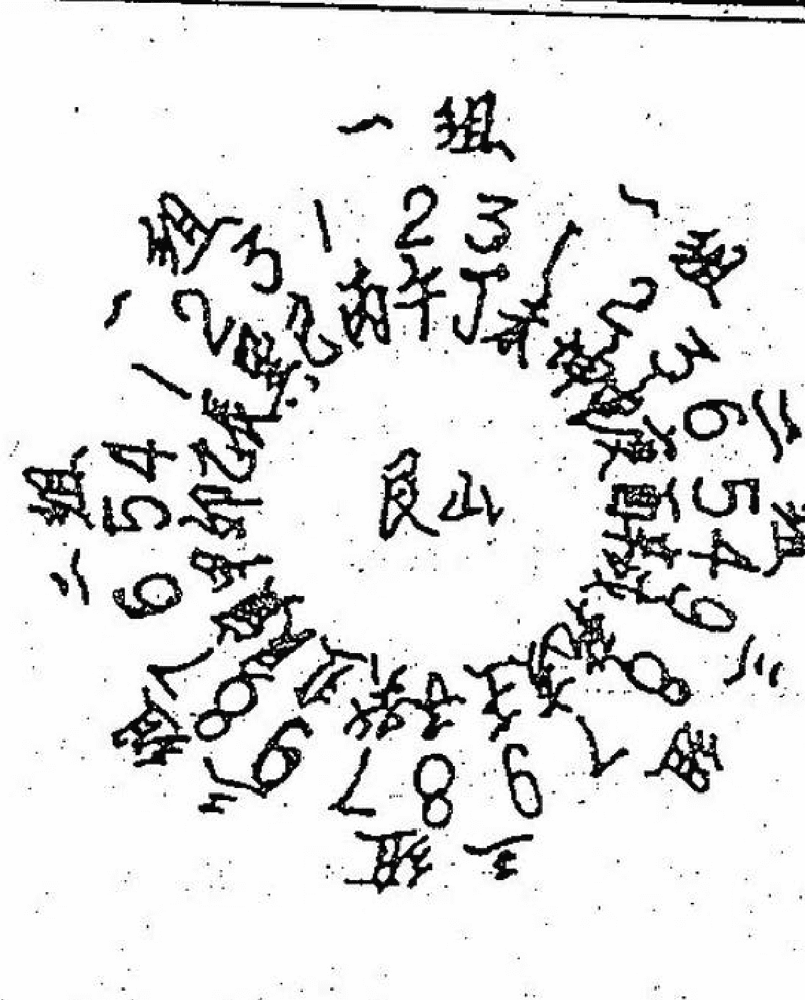

各种数已排进二十四山之中，再查看下面神数含义，更可知各星峰的吉凶。

## 例二，寅山申向

寅山居艮卦，艮为八，在九宫掌中起，“八从九起”，即从离宫起例为2，同样按“28143976”的顺序顺行各宫如图所示：

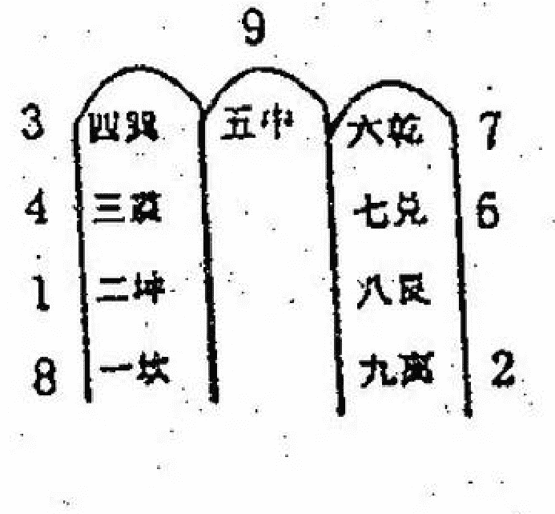

在九宫掌中看出各种数所落进的卦宫，然后查出。寅山为四正之山，应将各组神数，从凶星排起，分配到二十四山中，由此，各星峰的吉凶便可一目了然。
（详见下图）

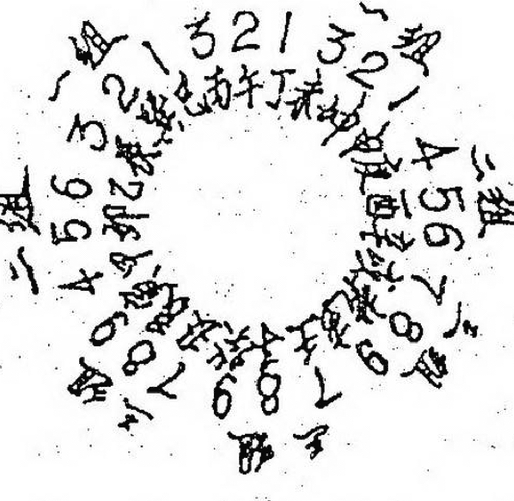

由以上两例可见，艮山与寅山虽同一个卦位，但由于四正四隅之分，故使各山的吉凶有别，此为倾倒顺逆的独特方法。乃谓消砂之法，在硝砂过程中，如有星峰处于大凶方位，即应调整立向，将凶星纳进最吉的方位，倘若无法调整，大部份星峰为凶方时，此为假穴，非结作之地！注意：星峰应以高大成星形的为准。

## 第三节 纳水

俗话说：“上等先生看星斗，中等先生察水口，下等先生满山走”。此话一言道破水法在地理堪舆中的重要性，水法与穴相符，说明此穴为龙尽气聚之真穴。

水势已于峦头部份“水法”章节中介绍，本节的纳水之法就是如何将有情之水纳入堂局，使其于吉方而来调其凶方而去。来水须宽、畅、顺、聚，去水要窄小关拦。水法是阴宅立向的主要因素，水之曲直清浊深浅与聚散决定其穴地之贵贱，而地的贵贱不外乎河洛水法，若配合龙水相见，先后天之夫妇相逢，方为尽美。

河洛水法以坐山收水，见面为真，以八卦纳甲为大。

用翻卦掌法为主。

- 1、八卦纳甲；
乾纳甲，坤纳乙，艮纳丙、巽纳辛，震纳庚辛卯未，坎纳癸子申辰，离纳壬寅午戌，兑纳丁巳酉丑。

- 2、起法：
首先运用翻卦掌将各个洛书神数分布各宫，然后对照纳甲法定出水口的吉凶。凡是在向上之水。不可作凶而论。

翻卦掌例口诀：“中起中止，边起边止”。起例数序：8、6、7、5、1、2、3、4、。也可起：辅武破廉贪巨录文。

例如：子山午向，甲水流来，水聚堂前午方，流出辛方之例，用翻卦掌和纳甲之法，子山为坎卦之所纳。甲水为乾卦之纳，午水为离卦之纳，辛水出口为巽卦所纳。因子山为坎卦所纳，坎是翻卦掌的无名指之根，是为中起中止；即坎宫起8数，坤宫得6数，震宫得7数，兑宫得5数，乾宫得1数，甲水来是乾宫所纳故甲水也得1数为吉；午水是离宫所纳，离得2数，故午水是为2数，财星大聚于堂前，是为合局。辛方水口是为巽宫所纳，巽得4数，故辛水也得4数，是为凶水流出为合局。子山午向得甲水1数，午向得2数之水，是为丁财二照之地。如下图所示：

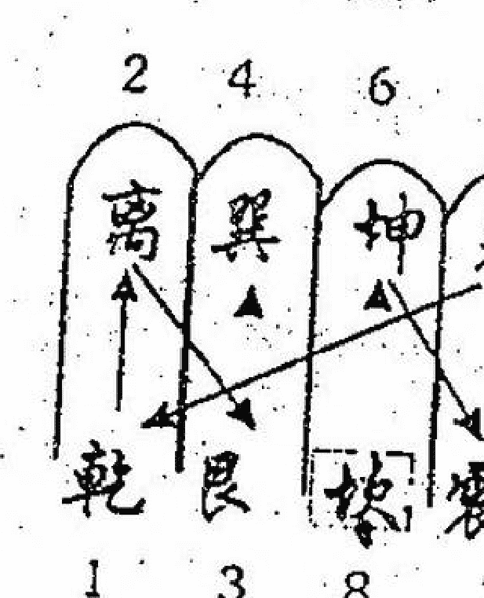

## 第四节 阴宅龙法的神数布局

富贵贫贱出于龙身，然而，地之吉凶，全在立向、消峰、龙水之相见为贵。如果立向错误，龙穴砂水皆空，龙法之应用只寻入首之龙所在字位，所属河洛神数之吉凶。而河洛数之运算方法与“第二节星峰布局”基本相似，所不同之处在于起例方法不同。采取逆行法。

起例数序：2、8、1、4、3、9、7、6。

起法：一从九起，九从八起。八从七起，七从六起，六从起五，四从起三起，三从二起，二从一起，逆走九宫掌，每宫排一个数码（注释：一即一坎，九即九离，一卦管三山，余数类推）。

例如：坎卦，子山午向，癸龙入首，子山是属子午卯酉乙辛丁癸寅申巳亥十二坐山，凶数先行。一从九起，逆行九宫掌，求得离为2数，丙午丁排3、2、1，艮为8数，丑艮寅排7、8、9，兑为7数，庚酉辛排7、8、9，乾为4数，戌乾亥排4、5、6，中宫与坎宫同出，壬子癸排3、2、1，巽宫9数辰巽巳排7、8、9已排，震宫7数甲卯乙排7、8、9，坤宫6数，未坤申排4、5、6。这样则可得如癸龙入首之河洛数为1，属于吉数，点穴时可以使用。

# 第五章 实例分析

例一：
韦姓祖坟、丑龙人首，立壬山丙向兼亥巳分金，甲峰高耸，庚峰金星面向，丙向覆钟圆丰，壬方玄武笔架行龙，戌乾之方金星相连，丁方文笔扦天，甲方来水，丙向大聚，流出申方，又有坤申之大江水逆朝，穴星峦头得贵形，内堂周密，外堂宽平园净，聚水，左边凹坳犯乙风扫射龙身扫荡，路缠龙脉之嫌，此地曾出贡生十余人，至今富不竭。
分析此地：韦氏祖坟，丑龙立壬山有交合。甲庚丑方均行9数弼星拱山，壬方玄武笔架得6数武曲，为官贵。戌乾得1、2之贪巨财星为库。丁方文笔扦天是为4数文曲星本不为吉，但幸得众星之扶助，且形美，合此山的峦头布局。故主出文学之士，甲方来水，得6数吉格。向上之水，不算吉凶，若全盘皆吉向水应吉，若立向等布局差错，向水应凶。流出申水，是为流破2数财星，但又逢坤申之大江财水逆朝，名为小河吞大河，穴星内堂，外堂及星峰布局大部分都合格局，故穴地为，富贵丁财之吉地。

然而，龙身扫荡。主必出疯狂，路缠龙脉主必有服毒缢死之灾。

例二：
曹姓祖坟，壬峰起祖耸云霄，癸穴可看到，父母少祖、太祖之峰，步步升高如登天梯一样，气势雄伟非凡左右龙虎紧抱，周围罗城叠叠，丑龙入首立壬山丙向兼亥巳，穴下有天池，穴前数百亩农田被穴下毡唇余气挡住不见田源。只见远朝之山，似乎沾近龙虎。是属天花局势。甲庚丙壬均有丈峰参拜，面前万马奔腾。是当代远近闻名的富贵名坟。

此地立星尊严，穴登少祖，必为公卿，丑龙入首得9数乃君之宰，四面高山之应，穴下有天池之水，是为大富大贵之地，庚甲峰得9数，壬丙之峰得6数，均为官贵之数故此地必任高官富贵双全，而其当代三荣贵是为壬山，时值下元七运，1984年至2003年，富贵并临。

例三：
黄姓阴宅，癸峰起祖，壬龙入首，立甲山庚向。乾峰木星直立，顶上有水，午峰土星高大，庚峰金星开面朝拜，辰峰癸峰左右扶穴，内堂小溪斜流出坤方，又有坤申之三合大江暗朝，堂局窝平园形，周围群峰从近到远重重叠至外围城近接于天空，此地是现代亿万富翁之宝地，但也非尽吉也。仙贤云：“大地大嫌，小地小嫌”欲求尽美之地，除非寻遍长江南北，但无德之人，即使走遍全球也不会遇上吉地。

分析此地：黄姓祖坟，壬龙入首，立甲山庚向，喜收乾、午庚辰之峰气且纳坤申1、2数远暗朝，主必飘洋而贵，大发巨富，但癸峰之扶穴犯7数，配合水上之官星，似官而非官也，因官星之众，故必富贵发达。

例四：成姓阴宅例
此地在广西大明山，吉祥之气的东北方，今上林县，大丰镇，曾发千万富翁，官达入朝之贵，是当代远近闻名的富贵名墓。后因信时师重修改向，抽爻差错，一败涂地，人财两空，罢官失职，贪财淫乱，只因改向之故也！

观成姓祖坟，立星尊严，如鹤立于鸡群，独霸一方。坤峰起祖，有如辞楼下殿。穿帐过峡，迎送重量重，来龙二十余节不出卦，尊星耸立，狮子、玉尺、相笔俱全，左右参拜，四势全趋，局中紧紧，气势非常之宏伟。巽脉转关，乾龙入首，后靠尖丽秀峰，高达十余丈，形如将军回朝之状。辛方之水，滔滔逆朝。内水口出辰方。穴星小圆如灵龟出水之形。逆结回龙顾祖，大富大贵。

成坟原立艮山坤向兼寅申，明卦第六爻，癸酉分金，未坤发脉得左辅右弼（8、9之数）且见贪巨之贵（1、2之数），后天之坤脉立坤向，得净阴净阳，后天之巽脉转关，立先天之巽向亦得净阳，后天之乾龙入首，立坤向为夫妇正配。乾艮巽乃天元龙立天元向，美不尽言。且得艮峰辅星拱山，坤峰得2数巨门星正照，辛水得6数为武曲水逆朝，内水口出辰，面向癸，排出3数录存之凶方，先天震山巽向为夫妇相逢。雷风相薄局之格。辰辛水口为一四七管局艮坤二宫为二五八管局，坤向之下元七运值龙楼临宫，时值下元七运（1984—2003年）兑卦管局），坤壬乙龙穴砂水向逢之大吉，申子辰年青云直上，丁财两旺，大富大贵。至八运（2004年—2023年）艮宫管局仍富贵不竭，唯有辛酉二方之砂有形如美女献花之状，且有贪淫之砂插入花心之嫌，淫乱之事实再难免，可幸得众星照临。并无大碍，可算大吉之地。只可惜信时师改向差错，吉地变凶矣。

福主于公元一九九四年农历四月二十五日信时师重修改向，立丑山未兼艮坤，坐随卦第五爻丁酉分金犯绝线。辛酉之淫砂受文曲之祸，必破财而淫乱，坟堂两侧修建扶砂卫墓，挡住辰水口，不见其流去，而见巽水流出，因巽乃贪狼吊辅星之位。故断主损丁，失职，按河洛九星之法，与卦爻比较，此地立丑山未向，龙穴砂水皆凶，且日课又犯杀，逢亥卯未年凶星抬头，必然出事！

可见伪师之法，只用后天去掉先天何能为人造福？不懂河洛九星顺逆，怎知杀峰可畏？不知杀水混来怎知杀水混去？不明三盘贯串（指的是龙砂水而非天地人三盘）。不知立向功夫！只用左水倒右，右水倒左，长生水法等之谬，害人非浅，不访真师，自为高明，吉地变凶也，实在可悲！亡灵地下何安？以辅弼星变文破，罪在时师，亦在本姓人之福薄也！

例五、冯敏昌祖坟：
座落在十万大山吉祥之气的下段酉峰起祖（龙头大岭）高入云霄，似龙楼凤阁。楼屏开争横抱数百里，穿帐过峡，迎送重重，有如九龙九凤，九虎送龙之象。左右山峦叠起，气势磅礴，龙行起伏顿跌至龙王大岭而突起高雄，玉尺、将笔俱全，再至仙轿岭所抽出之脉是天马行龙，向东方伸展，至狮子星望楼台，立星尊严，独霸一方。如鹤立于鸡群，蜿蜒曲折，壬龙入首父母之山金星开面，龙虎盘旋，形如美女献花之状，局中紧闭，明堂聚水，宝剑作案，向上尊星耸立。青龙砂之端有一石笋作宰相之笔堂侧有墨砚，乙辰之方榜砂叠起，丙巽方尊星参拜，子午卯酉，乾坤艮巽之方均有高大秀峰朝拜。自然形成天然气象。

此地原文乾山巽向正针，曾出冯敏昌身入翰林，后为天子师（乾隆皇帝之老师），后因竖碑，改立辛戌亡凶之界。榜砂犯7数破军受3数录存之祸。戌峰4数文邪不正，坤峰犯5数廉贞独火，丙峰参拜星犯7数破军，巽水亦犯7数破军，龙穴砂水皆空，须知无贵人扶持。故主出人无所不为，出忠耿者，只敏昌翰林公一人而已。而后出奸之理是为4、7之数所犯，不乏淫乱者有之，疯癫者有之，疾患者有之，意外者有之，种种凶灾，皆因改向之误也。

## 富贵贫贱之地

十富：
一富明堂宽 二富主相迎
三富龙降虎伏 四富朱雀悬钟
五富五山高耸 六富四水归堂
七富山山转角 八富岑岑园来
九富龙高虎伏 十富水口关销

十贵：
一贵青龙双拥 二贵龙虎高耸
三贵月眉清秀 四贵旗鼓园峰
五贵砚前笔架 六贵官法伏钟
七贵园生白虎 八贵砚笔青龙
九贵屏风走马 十贵水口重重

十贫：
一水口不锁 二水口空亡
三城门破漏 四水破直流
五四水不应 六背后仰瓦
七水破天心 八潺潺水笑
九四顾不应 十孤脉独龙

十败：
一、八风扫穴 二、朱雀清索
三、青龙反飞 四、水口分流
五、摆头摇尾 六、前后穿风
七、山飞水走 八、左右背穴
九、山崩山裂 十、有主无宾

## 金言断

龙怕孤单穴怕寒，砂怕斜飞水怕反。
青龙白虎忌凹缺，水口城门只怕宽。
更恐明堂倾斜倒，家中冷淡不兴旺。

## 九星分房

贪兴长子巨兴中 武曲三房家必隆
文败中房录败少 破廉长子受孤寒

## 罗盘的选择与操作方法

### 罗盘的选择：

罗盘主要选用杨盘或蒋盘为宜，其特征是有分野地点，河洛术数，九星六十四卦，384爻位。合河洛堪舆学之应用。以下为选择罗盘的几点要求：

- 1、磁针平直，转动灵活。
- 2、天心十道线之四角均成 90 直角。
- 3、内园盘转动灵活又不宜太松。
- 4、外方盘成平行四边形。

### 操作方法

罗盘的操作方法先观察地理是否符合风水格局，然后才进行操作，在操作时，把周围的铁器，手机之类等排除，以免磁力指南针受到影响，调正罗盘成水平，再转动内盘使指南外与天池底红线重合，则可测定龙穴砂水的方向。

## 河洛神数所代表的含义

1 数：出聪明之子，妻贤子孝，广置田庄，易生男丁；忠良辈出之大吉数，可作催丁之用。

2 数：多近官贵，忠厚取长寿，妇女勤俭持家，生意顺利，事业发达；六畜兴旺，财源广进。阴宅得星峰或水逆朝，若大运临之则大富大贵。此数为财星之数。大吉之数。

3 数：主绝嗣无后或男丁稀少，多生女孩。夫妻不能白头到老，子女生离死别。易发生车祸，痨症、癌症、自缢，产亡等血光之灾。是大凶之数。

4数：主赌博、淫乱，虚伪多诈，不务正业，欠债，胡思乱想，事业难成，易出骗子，疯狂，聋哑痴呆，手足不全或瘫痪之症，易出现蛇咬、犬伤、水厄，火灾。还出教师、医生、理发师、歌唱家等技校艺之人和三教九流之辈，若配合得当，在文学、艺术和科研上大有作为。为吉凶参半之数。

5数：主是非不息，灾祸频临，疾病缠身，服药或火灾而亡身，又出叛逆无礼之子，无贵人护持，常受旁人攻击欺负，冷眼对待，忍气吞声。为大凶之数。

6数：主富贵双全。延年益寿，获得众信，贵人多助。家中儿女多才多艺，显亲扬名，子孙代代富贵，出端庄俊秀之人，办事、工作、经营、生产顺利，可升官晋职，主贵。为上吉之数。

7数：主是非官讼，六亲不和，易出吸毒，赌博、盗贼、抢劫之辈。子孙忤逆，夫妻父母了女之间常发生口角之争，出贪心之人，挥霍无度，不务正业，事业无成，为败家退财之凶数。

8数：主官贵，儿子孝顺，忠厚夺取诚实，事业有成，衣食不缺，乃君之师，君之宰辅，大吉之数。

9数：含义同8数。

# 第六章 河洛阳宅风水基础

## 第一节 基本知识

学习河洛风水术必须从基础知识开始，如此方可明了河洛风水理论之源由，现场运用时才能灵活掌握，快速推断。基础知识包括理气、阴阳五行。天干地支、先后天八卦及方位，二十四山、先天配后天和六亲关系……。

### 河图

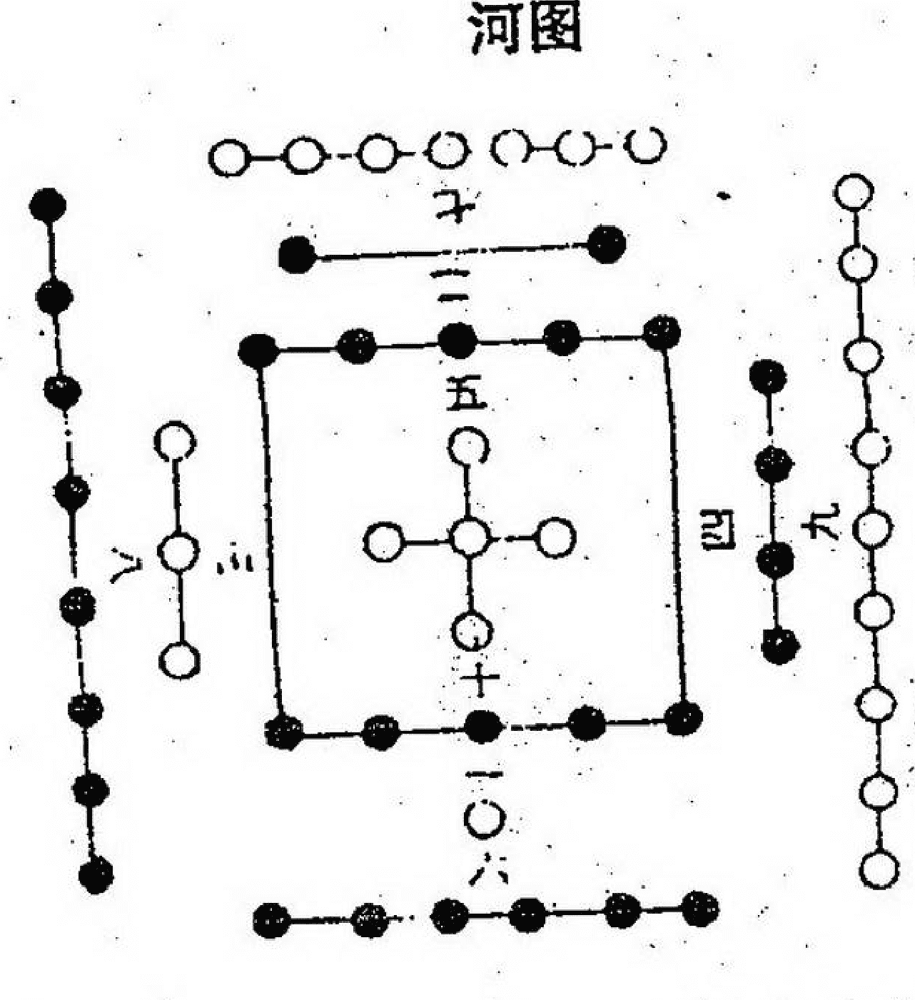

### 洛 书

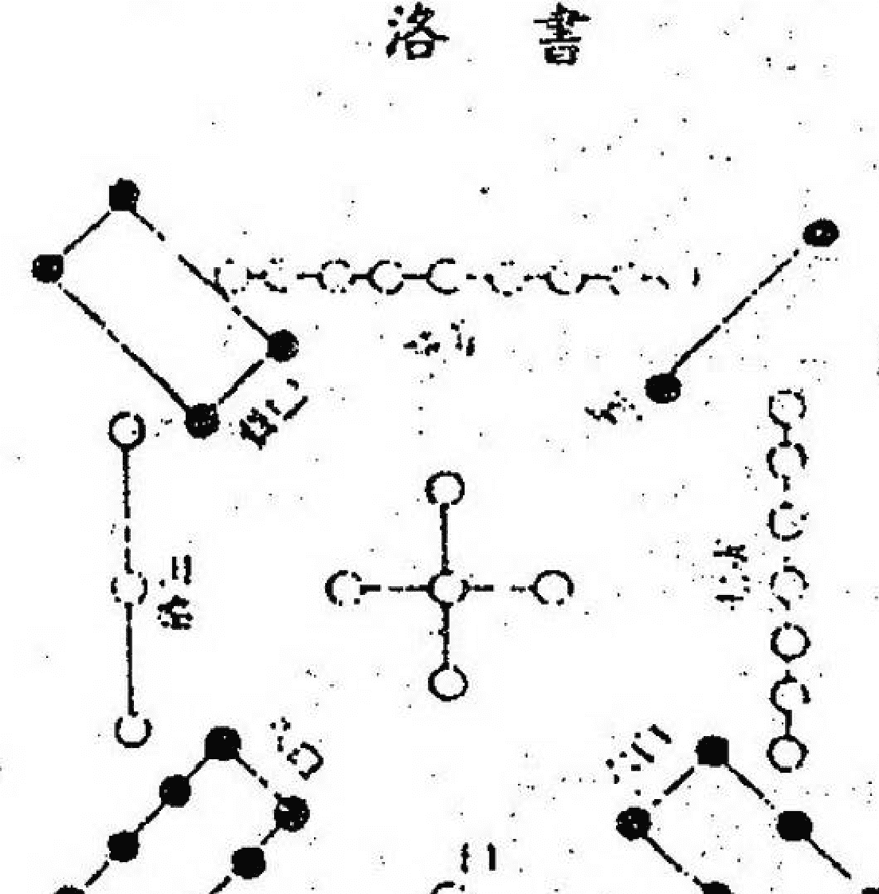

### 先天八卦配洛书数

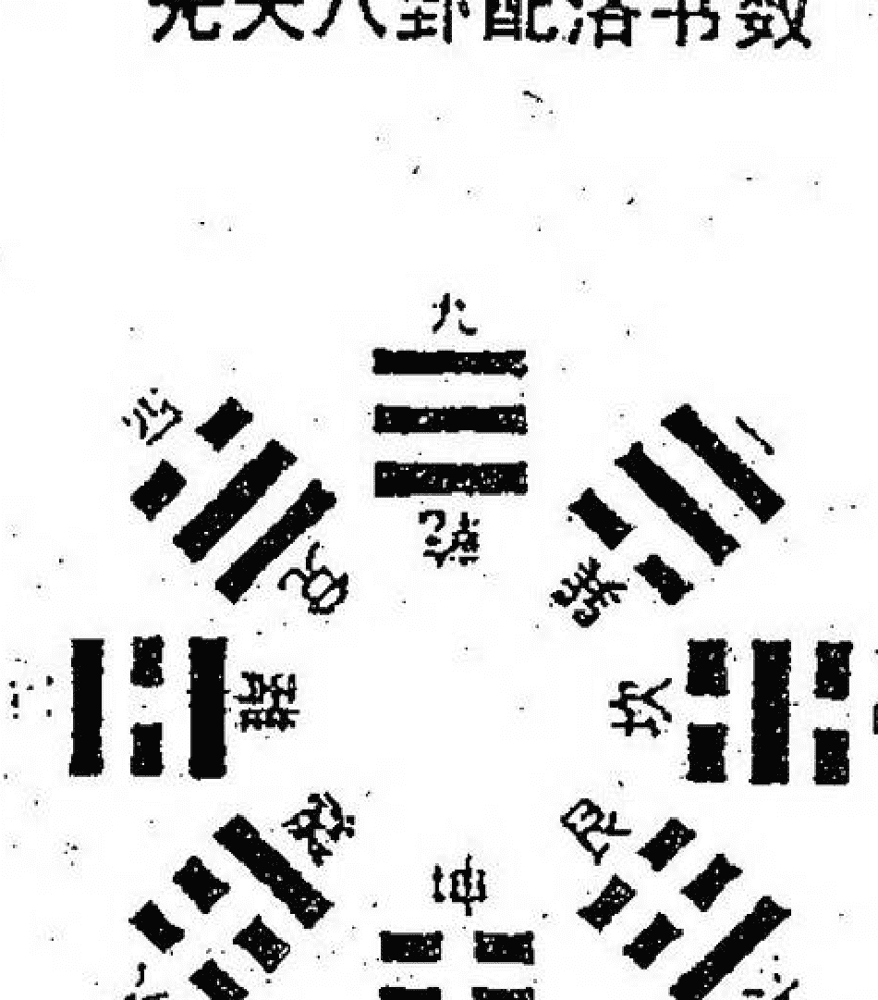

### 后天八卦配洛书数

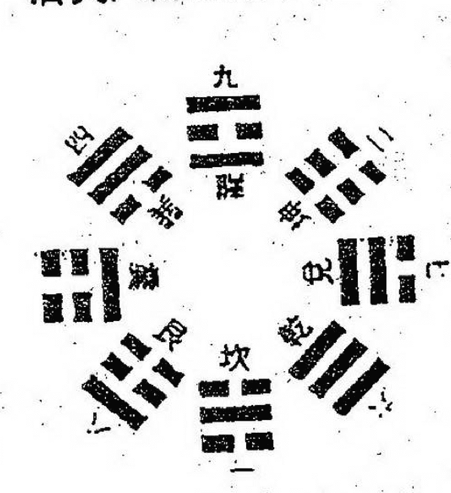

### 一、八卦符号、名称、五行、方位、六亲关系

乾三连（天）乾卦、属金、西北方、为老父。
兑上缺（泽）兑卦、属金、西方、为少女。
离中虚（火）离卦、属火、南方、为中女。
震仰盂（雷）震卦、属木、东方、为长男。
巽下断（风）巽卦、属木、东南方、为长女。
坎中满（水）坎卦、属水、北方、为中男。
艮覆碗（山）艮卦、属土、东北、为少男。
坤六断（地）坤卦、属土、西南方，为老母。

### 二、先天八卦配洛书数

一坤、二巽、三离、四兑、五中、六艮、七坎、八震、九乾。

### 三、后天八卦配洛书数

一坎、二坤、三震、四巽、五中、六乾、七兑、八艮、九离。

### 四、先天八卦配后天八卦

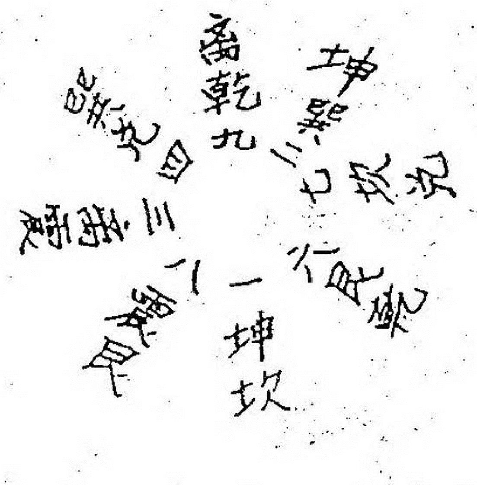

先天卦配后天卦歌诀；
六乾离九是朝宗，冲宫坎脉一和通；
天三地八为朋友，天七地四气相通；
离九来龙定震穴，原由地八是乾宫；
坎水朝时来到兑，巽龙入脉是坤宫；
后天来龙先天向，生成推照互相融。
谁人识得斯真诀，何愁大地不相逢。

### 五、八卦分阴阳

四阳：乾、坤、坎、离。

四阴：震、巽，艮、兑。

阳主动、主施、主夫、主开阔、主平、主爷。

阴主静、主受、主妇、主狭窄、主覆、主柔。

### 六、五行

金、木、水、火、土。

### 五行相生

木生火、火生土、土生金、金生水、水生木。

### 五行相克

木克土、土克水、水克火、火克金、金克木。

### 七、十天干

甲、乙、丙、丁、戊、己、庚、辛、壬、癸。

### 十天干阴阳五行

甲阳木、丙阳火、戊阳土、庚阳金、壬阳水。
乙阴木、丁阴火、己阴土、辛阴金、癸阴水。

### 八、十二地支

子、丑、寅、卯、辰、巳、午、未、申、酉、戌、亥。

### 十二地支阴阳五行

寅阳木、午阳火、辰戌阳土、申阳金、子阳水。
卯阴木、巳阳火、丑未阴土、酉阴金、亥阴水。

### 九、二十四山

地理风水学中，论方位时，均以八卦方位及二十四山来表示，八卦方位分法，每个卦位为45度，此为粗略划分法，如较明细的划分，应分为二十四山，每卦管三山。每山占15度。

- 坎卦管：壬、子、癸三山。
- 艮卦管：丑、艮、寅三山。
- 震卦管：甲、卯、乙三山。
- 巽卦管：辰、巽、巳三山。
- 离卦管：丙、午、丁三山。
- 坤卦管：未、坤、申三山。
- 兑卦管：庚、酉、辛三山。
- 乾卦管：戌、乾、亥三山。

如下图所示（后天八卦）

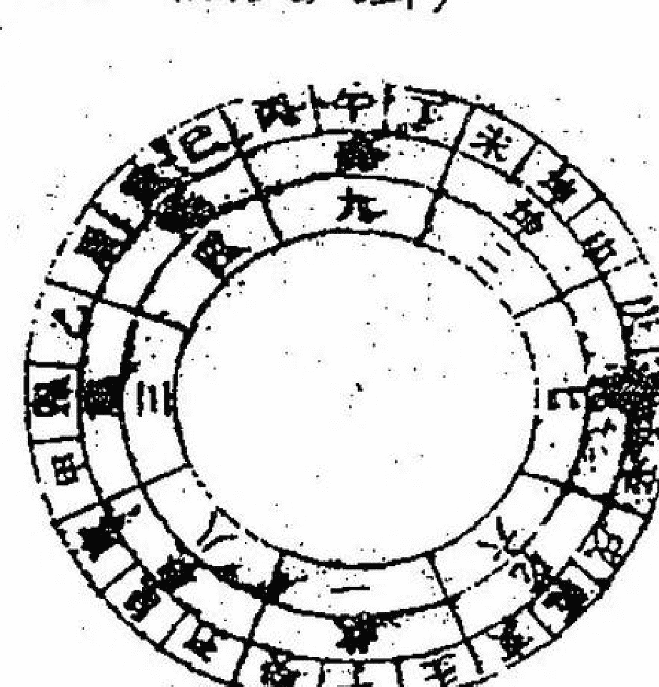

## 第二节 河洛阳宅挨星掌法

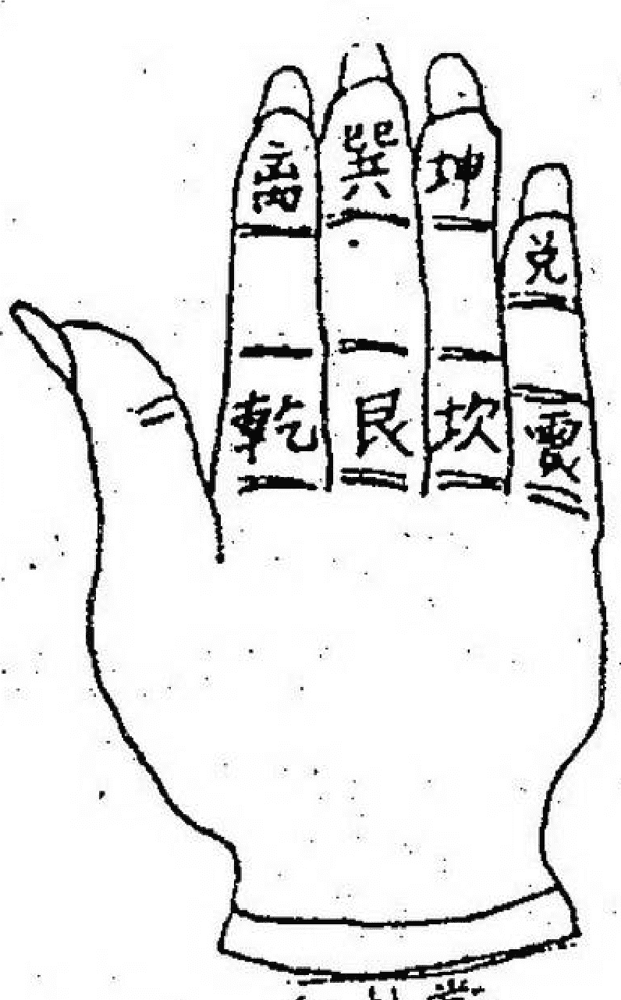

翻卦掌

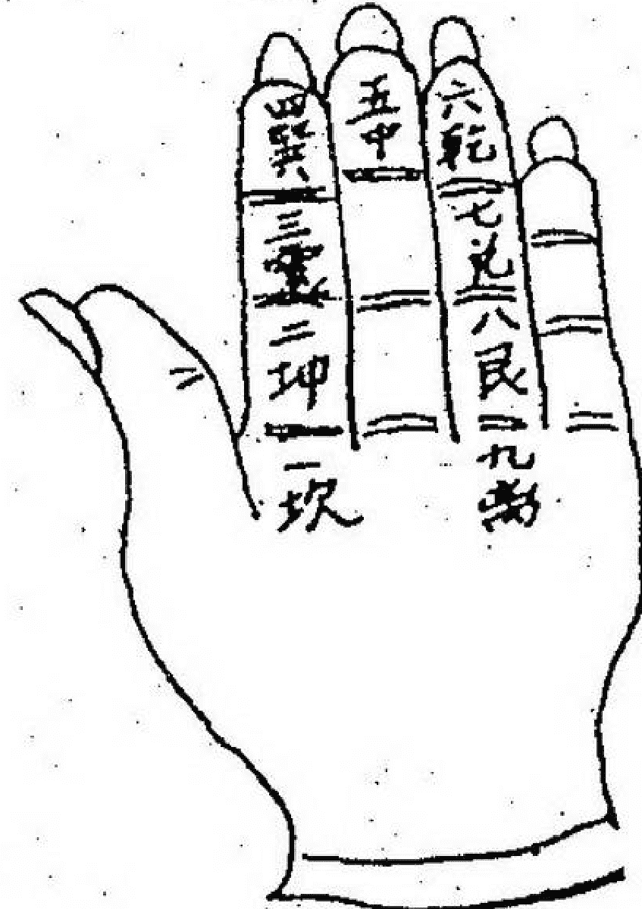

## 第三节 罗盘的使用方法

河洛堪舆所使用的罗盘以蒋盘为宜（蒋大鸿所创），无蒋盘亦可用三合盘来代替。

罗盘外形有两种：一种是方盘（四方形）；另一种是圆盘（圆形）。应选用方盘，因圆盘误差太大。

罗盘的转动部份称作“内盘”。

罗盘中央的小园称作“天池”。

罗盘上面的红十字线称为“天心十道践”。

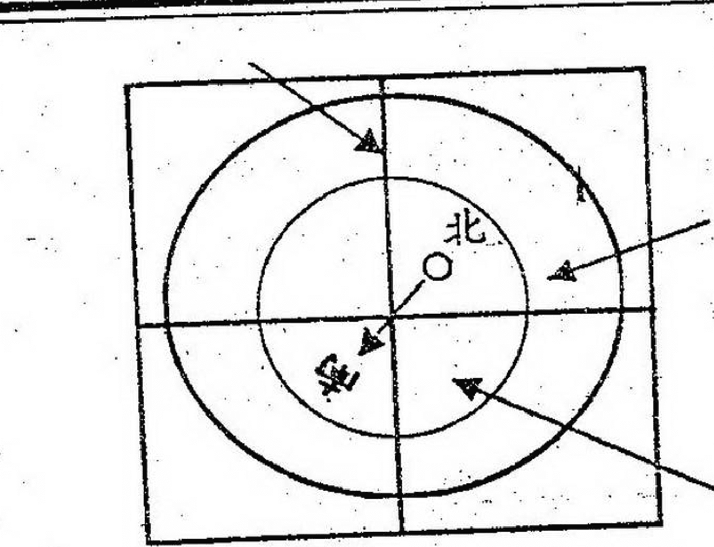

### 一、罗盘在阳宅堪舆中的作用

用以测定阳宅坐向分金及室内布局、室外星峰、水法布局的二十四山方位：

### 二、测定坐向与分金

一幢房子或一个套间，先看其坐的方位，然后于屋前墙壁用罗盘测其准确的坐向和分金，例如：一幢

## 河洛阴阳宅堪舆班教材

坐北朝南的房子，就应把罗盘标明“北”字的一边靠于墙边，使罗盘的边沿与墙壁平衡，然后拨转罗盘，使其指针的两端指南北二字并与底线重合，再看红十字线，以南北向的那根红线南端所指的卦位为向。其分金需看兼线，后面已作分金的具体介绍。

测定室内布局、室外星峰、来水去水的卦位：
测定了阳宅的坐向分金后，近一步需定出室内各设施的布局、室外星峰、水法布局的外位及具体坐山。在勘测之前必须找出该宅的中宫（中心点），然后将罗盘置于中宫，将罗盘调到上述所测定的坐向。看其内盘二十四山的方位，每山占15度，将每山两旁的边线延伸到室外，凡处于两边线以内的室内设施、室外星峰、来水去水均属此山的方位，再运用河洛的秘诀推断其吉凶及主家所发生或尚未发生的吉凶诸事。具体方法于第后章讲述。

### 三、定中宫图例：

## 第四节 河洛神数

### 一、河洛神数分组

河洛神数：1、2、3、4、5、6、7、8、9。

第一组：一、二、三、或三、二、一

第二组：六、五、四、或四、五、六

第三组：九、八、七、或七、八、九

### 二、河洛神数的含义

一数：河洛五行属水，北斗属天枢，九星属贪狼，星峰为木星；形象直。含义：出聪明之子，妻贤子孝；广置田庄，婚姻顺利，易生男丁；忠良辈出之大吉数，可作摧丁之用。

二数：河洛五行属火，北斗为天璇，九星属巨门，星峰为土星；形象方、平。含义：多近官贵，忠厚长寿，妇女勤俭持家，生意顺利，事业发达；六畜兴旺，财源广进。阳宅开门、作灶可摧财救贫，阴宅得星峰或水逆朝，若大运临之则大富大贵。此数为财星之数，上上之吉。

三数：河洛五行属木，北斗为天玑，九星属禄存，星峰金土变，形象粗。含义：主绝嗣无后或男丁稀少，多生女孩。夫妻不能白头到老，子女生离死别。易发生车祸、痔症、癌症、枪杀、自缢、产亡等血光之灾。是大凶之数。

四数：河洛五行属金，北斗属天权，九星属文曲，星峰属水。主赌博，淫乱，虚伪多讹，不务正业、欠债，胡思乱想，事业难成，易出骗子，疯狂，聋哑痴呆，手足不全或瘫痪之症，易出现蛇咬、犬伤、水厄，火灾。还出教师、医生、理发师、歌唱家等技艺之人和三教九流之辈，若配合得当，在文学、艺术和科研上大有作为。为吉凶参半之数。

五数：河洛五行属土，北斗为玉衡，九星为廉贞，星峰属火。主是非不息，灾祸频临，疾病缠身，服药或火灾而亡身。又出叛逆无礼之子，无贵人护持，常受旁人攻击欺负，冷眼对待，“忍气吞声”。为大凶之数。

六数：河洛五行属水，北斗为开阳，九星属武曲，星峰属金，含义：主富贵双全，延年益寿，获得众信，贵人多助。家中儿女多才多艺，显亲扬名，子孙代代富贵，出端庄俊秀之人。办事、工作、经营、生产顺利，可升官晋职，主贵。为上吉之数。

七数：河洛五行属火，北斗为遥光，九星为破军，星峰金变。含义：主是非官讼，六亲不和，易出吸毒，赌博、盗贼、抢劫之辈。子孙忤逆，夫妻父母子女之间常发生口角之争，出贪心之人，挥霍无度，不务正义，事业无成，为败家退财之凶数。

八数：河洛五行为木，北斗属左辅，九星为辅星，星峰双金相连。含义：主官贵，儿子孝顺，忠厚诚实，事业有成，衣食不缺，乃君之师，君之宰辅，大吉之数。

九数：河洛五行为金，北斗属右弼，九星为弼星，星峰双全大小相连。含义同八数。

# 第七章 阳宅立向分金

阳宅的立向是以山川形势为主，次要察其何龙入首，详其何字立向，观其何字为水口，明其何字为山峰。然后按河洛的原理，男卦来立女卦向，收男卦水；阴阳相配，向要净阴净阳，依水而立，立向于先天。天地人三元大卦不得混杂，先后天之相见，阳龙阳向，阴龙阴向为要，但在文字上很难表达；看起来似乎自相矛盾，活用起来如鱼得水。河洛秘旨变化无穷，博大精深；若不口传心授，百思不得其解。在此只能列出大体的分金，便于学员初步运用，若要仔细分析爻位与度数，须待面授时方能领悟。

## 一、阳宅的立向分金秘诀

1、向有可兼者，兼而夫妇正配线大吉。可兼之诀。

戌乾 壬子 子癸 兼
丑艮 寅甲 乙辰 先
巳丙 丁未 坤申 合
庚酉 原来 是后 天

解决：“戌乾壬子子癸兼”即戌向可兼乾或乾向可兼戌。壬向兼子或子向兼壬。子向兼癸，以下依次类推二字为一组。是可兼之线。

例如辰山戌向兼巽乾是可兼者，对照后面的 52 条分金，吉凶条例（见 22 条）辰山戌兼巽乾，先天配后天，房房皆发，寅午戌年丁财两旺。

2、向有不可兼者，兼而阴阳驳杂者凶。

辛戌乾亥亥壬家，癸丑艮寅怕虎牙。
甲卯卯乙休相见，辰巽巽巳莫逢他。
丙午午丁双暗杀，未坤庚申乱如麻。
西方辛上不宜动，此是夹杀定无差。

解决：“辛戌乾亥亥壬家”即辛向不能兼戌，戌向不能兼辛；乾向不能兼亥，亥向不能兼乾；亥向不能兼壬，壬向不能兼亥。例如，乙山辛向兼辰戌是不可兼之线（见第 20 条分金断语。）

西方辛上不宜动，即是辛向左右不宜兼。

立向之法、非常关键，立向错了，龙穴砂水全盘皆错。书云：“向不绝人水绝人，水不绝人向绝人”。所以立向分金至关重要。

## 二、二十四山分金断语

1、壬山丙向兼亥巳：少男配少女，房房均发，巳酉丑年丁财两旺。
2、壬山丙向兼子午：阴阳驳杂，寅午戌年丁财渐退，火灾，血光之祸。
3、子山午向正针：为天地定位，水火不相射之格。又得先后天之夫妇相逢，寅年戌年富贵丁财俱发。
4、子山午兼癸丁：二女同居主生淫乱、产亡、多刑、残废、僧道之人。
5、子山午兼壬丙：阴阳驳杂，先吉后凶，寅午戌年主犯廉贞凶灾。
6、癸山丁兼丑未：长男配少女之美，亥卯未年丁财昌盛，出人高寿。
7、癸山丁兼子午：二女同居，为孤阴则不生，寅午戌年主出盲目之人，又拐女骗男，不认父母。
8、丑山未兼癸丁：长男配少女之美，亥卯未年丁财昌盛，父母、兄弟和睦、房房皆发，永远吉利。
9、丑山未兼艮坤：长男配老母，亥卯未年损伤少年，家财渐退。
10、艮山坤兼丑未：老母配长男，亥卯未年克子刑妻，绝后。
11、艮山坤向兼寅申：净阴、净阳，房房皆发，申子辰年丁财大旺。
12、寅山申向兼艮坤：净阴净阳，申子辰年人丁昌盛房房皆发。
13、寅山申向兼甲庚：二男同居，申子辰年主出强盗游荡之子，家财渐退之后必绝。
14、甲山庚向兼寅申：二男同居，主出强盗，败绝。
15、甲山庚向兼卯酉：长男配少女之美，巳酉丑年富贵双全。
16、卯山西兼甲庚：少女配长男，巳酉丑年主出聪明之子，男聪女秀，财畜俱旺。
17、卯山西兼乙辛：二女同居，孤阴则不生，巳酉卯年官灾临门，多损女人。
18、乙山辛向正针：富贵双全，丁财两盛。
19、乙山辛兼卯酉：二女同居，巳酉丑年破败官事重见，主损女口。
20、乙山辛兼辰戌：二女同居，寅午戌年丁财两败，之后必绝。
21、辰山戌向兼乙辛：二女同居，克妻绝嗣。
22、辰山戌向兼巽乾：先天配后天，房房皆发，寅午戌年丁财大旺。
23、巽山乾向兼辰戌：先天配后天，房房皆发，寅午戌年丁财两旺。
24、巽山乾向兼巳亥：老父配长男，独阳则不长，亥卯未年吐血痨病，男女少年亡，又出孤寡之人。
25、巳山亥向正针：左右不宜兼，富贵双全。
26、巳山亥向兼巽乾：长男配老父，主出众寡淫乱，亥卯未年应之。
27、巳山亥向兼壬丙：虽阴阳配合为犯4数文曲星，亥卯未年生痨病，财散、少年亡。
28、丙山壬向兼巳亥犯：文星，三房先绝，后应长房当祸败绝。
29、丙山壬兼午子：中男配中女，申子辰年丁财旺盛，功名远大。
30、午山子兼丙壬：中男配中女、申子辰年丁财两旺。
31、午山子兼丁癸：净阴净阳，房房皆发，申子辰年丁财两旺。
32、丁山癸向兼午子：净阴净阳，申子辰年丁财并发，功名荣达。
33、丁山癸向兼未丑：犯五数，巳酉丑年刀伤药毒身亡之患，先应三房，子孙有黄肿之病，随娘出嫁不认宗。
34、未山丑向兼丁癸：虽是阴阳相配，但犯廉贞受禄存之祸，巳酉丑年丁财大败。
35、未山丑兼坤艮：为少男配少女，得山泽通气，人杰地灵，巳酉丑年丁财昌盛，六畜兴旺。
36、申山寅向兼坤艮：又犯八杀，寅午戌年防兽伤电击之患，家业大退。
37、申山寅向兼庚甲：老父配中女，先后天夫妻相逢之乐，房房皆发，丁财两旺，万事亨通，寅午戌年或逢大运行到更佳。
38、坤山艮向兼未丑：少男配少女，为山泽通气之格，七运旺丁旺财，富贵双全。
39、坤山艮兼申寅：此分金犯八杀，又犯破禄，寅午戌年防火雷之灾。
40、庚山甲向兼申寅：老父配中女，灾午戌年，丁财大旺，百事亨通，功成名就。
41、庚山甲兼酉卯：二男同居，主出游荡之子，满门孤寡，阴阳驳杂，亥卯未年主必败绝。
42、酉山卯向宜正针：左右不宜兼，亥卯未年，丁财两旺。
43、酉山卯向兼辛乙：犯阴阳差错，主克妻伤子，出游荡之人，家业大退。
44、辛山乙兼酉卯：犯阴阳差错，为长男配老母之线，巳酉丑年主出淫乱之人。
45、辛山乙向兼戌辰；净阴净阳，申子辰年添丁发财，忠孝贤良，广进田庄。
46、戌山辰向兼辛乙：净阴净阳，娶妻得外家之财，申子辰年应之。
47、戌山辰向兼乾巽：为阴阳驳杂，文曲受破军之祸，主出强盗淫乱之人，申子辰年见之。
48、乾山巽向正针：净阴净阳，先天乃山泽通气之格，大富大贵。
49、乾山巽向兼戌辰：犯文曲破军之祸，主出强盗淫乱，后败绝。
50、乾山巽向兼亥巳：为二女同居，多生女、子孙游荡淫乱，长房少妇守寡，败绝离乡，老父行乞。
51、亥山巳向兼乾巽：二女同居，主丁财渐退，女人堕胎产亡，出众寡之人，又犯官司，之后必绝。
52、亥山巳向兼壬丙：小男小女分金，为山泽通气，巳酉丑年丁财两旺。

# 第八章 阳宅的室内布局

阳宅的室内布局是在室外环境布局的前题下，测好坐向分金，定出中宫，然后按河洛数的吉凶而定，吉者，开门、安床、作灶。凶者放水、排污。其原理是：大门是人的主要通道，当人从门进出之时会产生一种无形力量（气的流通），从大门而进，如果大门开在生气之方，定会使人的身心健康，事业有成，若开于死气之方，必使人疾病缠身，意外之灾。同样，床、灶也不例外，因床是人休息之所，灶乃人之食源；门统全家，灶管全户，床应个人。纳吉则吉，纳凶则凶。只要看熟后的二十四个图，富贵贫贱，生死病残，一目了然，若有缘面授即可于掌上掐指速推吉凶祸福。

阳宅的室内布局，包括公司、厂房、办公楼、餐馆和住宅的室内设计，其布局主要是建筑构造，门、窗、床、灶：办公桌、收银台、卫生间等的方位，或吉或凶是根据河洛神数而定。初学者在没有峦头基础的情况下，只要运用以下之法，便可鉴定出阳宅的吉凶。

## 一、河洛数推算方法

推算方法只要懂得后天八卦方位，然后用翻卦掌，“中起中落，弦起弦散”的规律起神数，即坐山（一卦管三山）起8数、对宫起1数。以8、1、2、3、4、5、6、7为序。

## 二、后天八卦方位：

- 乾卦：统戌乾亥三山（西北方）。
- 坤卦：统未坤申三山（西南方）。
- 震卦：统甲卯乙三山（正东方）。
- 巽卦：统辰巽巳三山（东南方）。
- 坎卦：统壬子癸三山（正北方）。
- 离卦：统丙午丁三山（正南方）。
- 艮卦：统丑艮寅三山（东北方）。
- 兑卦：统庚酉辛三山（正西方）。

## 三、翻卦掌（即后天八卦在手上排列）

伸出左手，从左手食指端顺排离巽坤兑（上），指根顺排乾及坎震（下）

口诀：
上兑下震小指排，无名指安坤与坎；
中指巽上艮底回，上离下乾归食指；
一卦既定余翻来。

## 四、八卦互翻

乾兑二宫互翻，震离二宫互翻；
坎巽二宫互翻，坤艮二宫互翻。
如以戌山辰向为法例，戌即乾宫所管。乾与兑翻，是弦起弦散，乾为8，对宫为1，震2，坤3，坎4，巽5，艮6，离7，如开卯门、卯是震宫统管，震得2数，见神数含义，2数是催财之数大吉。

例二、坤卦（未坤申三山）中起中落，坤起8数，艮1，巽为2，乾为3，离为4，震为5，兑6，坎为7。

坤与艮互翻如此例坤山开乾门，或作乾灶，因乾得3数，看3数为凶，主人丁稀少或见血光之灾。若卫生间在巽方，图中巽为2数是财数之位，主败位。巽方若开门、作灶，床位等，即发巨富。所以河洛神数取吉数而催福，避凶数而消灾。若是善用此理，配合山川形势与元运、流年，断吉凶祸福，应验如神。

# 第九章 阳宅室外水法

水法是阳宅立向的重要依据，水的利与害直接影响到人的健康和事业的兴衰，在都市可以路作水论。水的形状清浊来去之方，都有吉凶之别，要准确鉴定，须待口传心授方通其窍。河洛之法变化无穷，在书面上很难表达，如先后天之相见，龙水之相会，阴阳之颠倒，等等之秘窍，只有心授意会才能全面贯通。

## 一、室外水法：

室外水法是以坐山收水，八卦纳甲为主。

## 二、八卦纳甲：

乾纳甲，坤纳乙，艮纳丙，巽纳辛，震纳庚亥卯未，坎纳癸申子辰，离纳壬寅午戌。兑纳丁巳酉丑。

## 三、起法：

“中起中落，弦起弦散”。用翻卦掌起法。大体上与室内布局之法相同，不同的是，水法以纳甲为主。

例如，壬山丙向，庚水来，水出丑之例，即壬山是离卦所纳，庚水是震卦所纳，故，壬山从离起8数，对宫震为1数（见1数含义）。假如，兑丁巳酉丑之来水，则为2数，坎纳癸申子辰为3数。坤乙为4数。艮丙为5数。巽辛为6数。乾甲为7数。此壬山庚水得1数合局，但水出丑方，2数，是流破财星，若立子山全盘皆吉。

例二，艮山坤向，乾水来，坤申逆朝，曾发富贵，丁财大旺，出官十余人。后因重建，立向差错，原吉水变凶。丁财贵全败；后出盗贼，淫乱，颠狂者有之，甚至代代少妇守寡，而且多数死于他乡。

此例原立艮山坤向的水法，即从艮宫起8数，坤为1数，申是坎卦所纳为2数。兑为3数，震为4数，离为5数，乾为6数，巽为7数，由此可知，艮山收坤水得1数，主旺人丁，申水得2数是旺财，乾水得6数，是官贵。故艮山所收之水为丁财贵俱全。最后改立寅山申向，犯3数易见血光，坤水犯4数，主淫邪，乾水犯7数主盗贼。所以水的吉凶全在立向之收纳与消放，不知水法，怎能立向布局？为何同样的位置，同样的来水，原立艮山，发富发贵，改立寅山会丁财二空，丢官失职而出强盗之人；这是水法的作用。

# 第十章 阳宅室外星峰布局

阳宅室外星峰布局主要是测量住宅周围高山大楼所对应的河洛神数。即北斗七与太阴太阳（天星）亦称九星、其星之排列顺序始于1而终于9，共成9个星座，在天成象，在地成形，地理家在勘察风水时，把天星列为9个数码，即1、2、3、4、5、6、7、8、9，以察天气、峰气、龙气和水气，一般的地理师无法考究。先贤云：“上等先生看星斗，中等先生察水口，下等先生满山走。”从此可以看出“星斗”之重要。

神数起例：

一从二起，二从三起，三从四起，四从五起，六从七起，七从八起，八从九起，九从一起。

注释：一数指一次，管壬子癸三山；二数指二坤，管未坤申三山。……用九宫掌起法。

## 起数顺序：

2、8、1、4、3、9、7、6、一卦一位

顺走九宫掌

例如，壬子癸三山为坎卦，洛书数为一，按起例之诀，一从二起，即坎卦壬子癸三山，皆从二坤起数，坤宫起2，震宫得8，巽宫得1。中宫4，乾宫得3，兑宫9，艮宫得7，离宫得6，坎宫无数码是坐山：按中宫之数，此例中宫是4，故坎宫也是4数（中宫与坐山同宫）。

例二、未坤申三山，属坤卦，洛书数为二数，按例法，二从三起，即震卦得2数。巽卦得8数。中宫得1数。乾宫得4数，兑宫得3数，艮宫得9数，离宫得7数。坎宫得6数，坤宫无神数，是坐山与中宫同宫。为一数。

根据以上两例，九宫八卦所得的神数，配入二十四山，定出各方的高山或大厦所应的吉凶。但上图之九宫八卦所得之数只有8个数码，如何配入二十四山呢？

1、首先把河洛的9个数码分为三组
第一组为1、2、3数。第二组为4、5、6数，第三组为7、8、9数。
2、把以上三组之数分别排入九宫掌

一卦管三山。如果掌图卦宫得1数，则此宫配第一组，1、2、3，若卦宫得2数又是配第一组1、2、3、卦宫得3数亦配第一组1、2、3、卦宫得4数或5数或6数此卦均配第二组4、5、6.卦宫得7数或8数或9数此外即配7、8、9。

三、河洛数配八卦二十四，有吉起和凶起之分，其起法是以每一组而论，吉先起者，每卦排1、2、3、6、5、4，9、8、7。

凶起者每卦排3、2、1、4、5、6、7、8、9。

二十四山何山吉起，何山凶先起？

乾坤艮巽甲庚丙壬辰戌丑未十二坐山吉数先行。

（四隅与每卦头一字）。

子午卯酉乙辛丁癸寅申巳亥十二坐山凶数先行。

（四正与每卦的末尾一字）注壬子癸，壬是头一字，癸是末尾一字。

四隅吉数起
顺时针行

四正凶数起
顺时针行

此两图皆属二坤统管，按上例二从三起。

# 第十一章 阳宅布局星盘秘图

秘图共分六层，每层含义如下（以壬山为例，由内向外看）：

1、中间之字代表坐山，壬山代表坐北朝南的坎卦三山之一。
2、第一层为洛书数，是用来推算龙穴砂水之吉凶。
3、第二层后天八卦，是用来推算阳宅的开门放水、收纳星峰。
4、第三层为二十四山，立向，定龙穴砂水的字位。
5、第四层为室内布局的河洛神数，用于鉴定阳宅开门放水的吉凶。
6、第五层神数，主要是看室外的水法、如公路、流水。
7、第六层神数，用于鉴定室外前后左右的大楼星峰所应的二十四山方位，用所得的洛书数断吉凶。

以下为鉴定阳宅二十四山室内外布局秘图，便于初学者对照使用。

## 河洛阴阳宅堪舆班教材

# 第十二章 阳宅秘要

阳宅之屋形以端肃，气象豪雄，护从整肃者为贵宅，墙垣周密，四壁光明，天井明洁，规格翕聚者为富宅。如南北皆堂，东西异向，势如争竞，左右雄昂者为忤逆宅。屋小而高孤，正屋无依，四周无护者为孤寒宅。东倒西歪，风吹雨泼者为病痛宅。屋宇不整，四壁破碎，椽头露齿者为零丁宅。基地太高，屋前深后陷，四水不聚，荡无收拾者为贫穷宅。房屋黑暗太阔，或太狭者为妖怪宅。

阳宅宅基造形应以前窄后宽，前低后高为吉，诀曰：前窄后宽富贵如山，前宽后窄失印逃走，前低后高世出英豪。凡阳宅有前窄后宽如棺材形者，主发横财最验，有前高后低者谓之过头屋，主长幼昏迷及出孤寡。阳宅须基址方正，入眼美观为吉，如太高大或太卑小，或东拉西扯，东盈西缩为不吉，定主损丁破财。

阳宅以受浮气为主，次论坐卦之旺，但看其开门如何，若一路之门，皆在本元当旺之方，即断其吉；而不必拘老八宅之吉凶。如在本元旺方，以受生旺之气，即使五鬼六煞之方也可开门，不但无凶，反而皆吉。故杨公云：二十四山皆旺，二十四山皆吉。

宅之有门，犹人之有口，门为一宅进气之所，最关紧要。大门为重，小门次之；外门为重，内门又次之，门必与宅配，配合吉则吉，配合凶则凶。若专以八宅论之，少有灵验，俗师每谓门宜开青龙，不宜开白虎；不知白虎也有最吉之门，青龙也有最凶之方。不识变通，拘守伪书，固为乱道，即稍知元运，而得其秘本，物而不化，也未咸当。故阳宅秘钥泄尽机关，而不善会者，终非良师。

总之，开门引气必先看门外之气如何，故上元乾兑艮离之门，不必尽凶，下元乾兑艮离之门不必尽吉，得诀之人可意会之。有关诸多论述及应用将于面授时点破玄机。

# 第十三章 阳宅堪舆实例解析

### 例一、王姓阳宅例

此宅立乾山巽向正针，后靠重重叠起，乾峰起祖，酉龙入首，甲水逆朝，左右盘旋，局中紧闭，丑艮山高耸，坤方高楼面向，巽方伏钟（金星山）正对，庚山秀丽、开甲门、放丁水，作灶于艮方。长男局级干部，次男大发巨富，少男文教局工作。是房房均发丁财贵寿之吉宅。

分析此例，立乾山巽向正针，对照 52 条分金鉴定，是房房皆发之线、乾峰起祖于室外布局为 8 数，属富贵双全，（酉脉入首，外层得 5 数，是为病痛，但立巽向合兑龙兑向，面授分解）。甲水第五层得 8 数主富贵，丑艮峰第 6 层得 8、9 数大吉。坤方大楼第 6 层得2数为财星，主发巨富。巽向之方第6层得8数，主富贵。庚山秀丽，第6层得1数主旺丁，开甲门，第四层得2数是财门。（一般之法为五鬼门）放丁水，看第四层是7，合消水。作艮灶看第四层为6数，是官贵之数，又得左右龙虎重重环抱是为旺丁之吉兆；所以此宅为大吉之宅。

### 例二，罗姓楼宇：

坐酉山卯向兼庚甲分金、壬、子、卯酉丙、未之方均有大楼之应，丑方有楼尖射入怀，甲方众公路交会点。开寅门、未方作灶、丙方作卫生间楼宇宏伟非凡。初建时曾获小财，但进新居不久，宅主便车祸身亡；长男吸毒抢劫，被判刑入牢，次男少男，事业不成，而且好色，原有数10万的家产全部败光，何故？请看以下分析。

此楼宇，坐酉山卯向兼庚甲是犯阴阳差错之线，主出游荡之子，家业大退。其初建时所获之财是子卯之峰2数财星照临，这是流年的引化，是发福不久（面授解）宅主身亡之理，是壬峰3数受丙方7数之祸，故必损家主，察壬峰和丑峰皆得3数，少男必绝嗣无后，未峰4数，是淫乱之峰，主好游荡。再看寅门是犯3数，为绝体见血而亡。丙方作卫生间是2数财星，不能排水，若是排水，主必破财。故断此宅主出游荡之子，丁败两败，有意外之灾。

### 例三、

此楼宇立辰山戌向是在街道的中段没到前后左右特起的大厦，也没有屋角。道路反射，是一般的楼宇，开戌门，未方有灶，丙方、艮方、子方、均有床。卫生间在甲。判断如下：

戌门是5数，为是非疾病之门，但因左右邻舍同类，祸福共担，虽有是非之意，可不妨碍。未方之灶，是全家人的食源，得2数财星，主发财富，妻子贤孝，事业兴旺。丙方之床，近贵得众信，可摧官，艮方之床得7数，出人好争论，出逆子，耗财。子方之床得1数，主出人清秀旺人丁，甲方卫生间得3数合消水，河洛3数是九星之录存书云：录存流尽配金鱼，为之大吉。其宅的不足之处是为艮方之床位，若能调理，败家之子定变富贵之郎。

### 例四、某公司办公楼，坐午山子向兼丁癸分金，

子癸方有高楼对应，后有排楼自近至远一层比一层高，楼的东方有道路，西方平宽，是市的主要通道，近接数道交点，前面宿舍区内有球场、花园，西边置卫生间于庚方。东方开大门（园之中心定天心十道）办公楼的大门朝北，在办公楼巽方、坤方都有有卫生间，总经理的办公桌在戌方（办公楼室内小太极）。分析此例，此办公楼立向分金正确，得子癸1、2之数，旺丁财，东方门为1数旺丁。但因西方的卫生间是2数财星，不宜排水，巽方卫生间6数，是官贵方，忌去水，办公桌居戌方7数，下不和，主散财多官讼。

鉴定如下，该公司员工众多、经理粗暴，管理不善，不得众信，连年官讼、经济方面入不敷出，员工工资无法发放。欠贷款数十万余。基本上处于瘫痪状态。在经理的请求之下，最后经本人的精心策划，把东方的大门堵塞，改为西方之庚门，公共卫生间改为坤方，办公楼的两个卫生间，只用坤方的卫生间，把巽方的卫生间锁好不用。老总的办公台搬往震方。二个多月后，生意渐渐兴旺、管理方法得到进一步的改善，半年之后所有的债务全部还清，至今人力、物力、财力非常可观，成为实力强大获得众信的公司。

### 例五、某餐馆、坐北朝南，立壬山丙向兼亥巳分金、南方、东方开大门，交通方便、大门之外，停放车辆宽阔，灶于壬子方，卫生间在乾方，收款柜在巽方、开业以来一直顾客满座，财源滚滚。后来扩大经营，往西边多租用一间面积相称的楼宇，使用不久，店主发生了许多灾祸，生意渐渐清淡，不到一个月亏损甚久。

这是因为该餐馆的中宫已经改变，原乾方的卫生间变成壬子方，壬子河洛8数是属富贵之位，难怪店主败得如此凄惨。

# 第十四章 河洛日课基础

### 一、五行生克

1、五行相生：木生火、火生土、土生金、金生水、水生木。

2、五行相克：金克木、木克土、土克水、水克火、火克金。

3、五行旺相休囚死

春：木旺，火相，水休，金囚，土死。

夏：火旺，土相，木休、水囚，金死。

秋：金旺，水相，土休，火囚，木死。

冬：水旺，木相，金休，土囚，火死。

### 二、天干地支

1、十天干：甲、乙、丙、丁、戊、己、庚、辛、壬、癸。

2、天干五行方位，甲乙东方木，丙丁南方火，戊己中央土，庚辛西方金，壬癸北方水。

3、天干化合：甲与己合化土，乙与庚合化金，丙与辛合化水，丁与壬合化木，戊与癸合化火。

4、天干相冲：甲庚相冲，乙辛相冲、壬丙相冲，癸丁相冲。

5、天干配六神：甲乙为青龙，丙丁为朱雀，戊为勾陈，己为滕蛇，庚辛为白虎，壬癸为玄武。

6、十干分阴阳：甲丙戊庚壬为阳，乙丁己辛癸为阴。

7、十二地支：子、丑、寅、卯、辰、巳、午、未、申、酉、戌、亥。

8、十二地支分阴阳：子、寅、辰、午、申、戌属阳。丑、卯、巳、未、酉、亥属阴。

9、地支方位五行：寅卯东方木，巳午南方火，申酉西方金，亥子北方水，辰戌丑未四季土。

10、地支六合：子与丑合，寅与亥合，卯与戌合，辰与酉合，午与未合，巳与申合。

11、地支六冲；子午相冲，丑未相冲、寅申相冲，卯酉相冲，辰戌相冲，巳亥相冲。

12、地支与生肖：子鼠、丑牛、寅虎、卯兔、辰龙、巳蛇、午马、未羊、申猴、酉鸡、戌狗、亥猪。

13、地支与时辰（两小时为一个时辰）

子时：23点—1点 丑时：1—3点
寅时：3—5点 卯时：5—7点
辰时：7—9点 巳时：9—11点
午时：11—13点 未时：13—15点
申时：15—17点 酉时：17—19点
戌时：19—21点 亥时：21—23点

14、十二月建配二四节气

正月立春雨水为寅月（交了惊蛰节属卯月）

二月惊蛰春分为卯月（即惊蛰之后，清明之前）

三月清明谷雨为辰月（清明之后，立夏之前）

四月立夏小满为巳月（立夏之后，芒种之前）

五月芒种夏至为午月（芒种之后小暑之前）

六月小暑大暑为未月（小暑之后，立秋之前）

七月立秋处暑为申月（立秋之后，至白露之前）

八月白露秋分为酉月（白露之后，寒露之前）

九月寒露霜降为戌月（寒露之后、立冬之前）

十月立冬小雪为亥月（立冬之后、小寒之前）

十一大雪冬至为子月（大雪之后、小寒之前）

十二月小寒大寒为丑月（小寒之后，立春之前）

注解：凡择日须按二十四节气为主、每一个月管二个节气，如辛巳年正月十二日，丑时才立春。所以十二日丑时之前不能算是今年辛巳年，而是属于去年庚辰年。己丑月所管。交了立春才算是辛巳年。

### 六十甲子

甲子、乙丑、丙寅、丁卯、戊辰、己巳、庚午、辛未、壬申、癸酉、甲戌、乙亥、丙子、丁丑、戊寅、己卯、庚辰、辛巳、壬午、癸未、甲申、乙酉、丙戌、丁亥、戊子、己丑、庚寅、辛卯、壬辰、癸巳、甲午、乙未、丙申、丁酉、戊戌、己亥、庚子、辛丑、壬寅、癸卯、甲辰、乙巳、丙午、丁未、戊申、己酉、庚戌、辛亥、壬子、癸丑、甲寅、乙卯、丙辰、丁巳、戊午、己未、庚申、辛酉、壬戌、癸亥。

### 三、十天干布五方定位

甲卯乙正东方、丙午丁正南方、庚酉辛正西方、戊己正中央土。

八方定位：
东震、西兑、南离、北坎为四正
乾坤展巽为四隅。

先天八卦方位乾南 坤北 离东 坎西 震东北
巽西南 艮西北 兑东南

后天八卦方位：
东震、西兑、南离、北坎、乾西北、巽东南、艮东北、坤西南

### 先天配后天歌诀

六乾离九是朝宗，坤宫坎脉一和通；天三地八为朋友；天七地四气相通；
离九来龙定震穴；原由地八是乾宫；
坎水朝时来到兑，巽龙人脉是坤宫；
后天来龙先天向，生成推照互相融，
谁人识得斯真诀；何愁大地不相逢。

### 先天配后天洛书数

注释：先天之乾居于南离，先天之坤居于北坎。先天之震居于东北……。河洛择日以先天五行为主，如后天之坎卦则以先天之坤卦论。

河洛先天卦数五行方位表

| 先天卦数 | 方位 | 五行 | 洛数 |
| :--- | :--- | :--- | :--- |
| 一坤 | 正北方 | 水 | 1 |
| 二巽 | 西南方 | 火 | 2 |
| 三离 | 正东方 | 木 | 3 |
| 四兑 | 东南方 | 金 | 4 |
| 六艮 | 西北方 | 水 | 6 |
| 七坎 | 正西方 | 火 | 7 |
| 八震 | 东北方 | 木 | 8 |
| 九乾 | 正南方 | 金 | 9 |

注解：正北方为先天之坤卦属水，故开山立向方位均以水山而论如壬子癸（先天坤）为水山、当以水为体，日课为用，用生体为吉，用克体则凶。

### 后天八卦配二十四山（一卦管三山）

- 一坎管壬子癸三山，居北方属水；
- 二坤管未坤申三山，居西南属土；
- 三震管甲卯乙三山，居正东属木；
- 四巽管辰巽巳三山，居东南属木；
- 六乾管戌乾亥三山，居西北属金；
- 七兑管庚酉辛三山，居正西属金；
- 八艮管丑艮寅三山，居东北属土；
- 九离管丙午丁三山，居正南属火。

一般方法：即正五行。

### 四、河洛神数配六亲

乾九数为老父、坤一数为老母；
震八数为长男，巽二数为长女；
坎七数为中男，离三数为中女；
艮六数为少男，兑四数为少女。

### 五、排日课之四柱

日课四柱的排法，同一般四柱之法，您可查万年历或用流星赶，但必须注意节令。因许多书中均有介绍，故不作赘叙，是将月时起例表列出，供参考。

### 年起月例

甲己之年丙作首、乙庚之岁戊为头、丙辛之岁从庚起，丁壬壬寅顺行流，便有戊癸何方寻，甲寅之上好追求。

注解：甲年和乙年之正月为丙寅，二月为丁卯、三月戊辰月、四月……依此类推。
乙庚和庚年之正月为戊寅、二月己卯、三月庚辰、四月……

### 年上起月表

| 年\月 | 甲己 | 乙庚 | 丙辛 | 丁壬 | 戊癸 |
|---|---|---|---|---|---|
| 正月 | 丙寅 | 戊寅 | 庚寅 | 壬寅 | 甲寅 |
| 二月 | 丁卯 | 己卯 | 辛卯 | 癸卯 | 乙卯 |
| 三月 | 戊辰 | 庚辰 | 壬辰 | 甲辰 | 丙辰 |
| 四月 | 己巳 | 辛巳 | 癸巳 | 乙巳 | 丁巳 |
| 五月 | 庚午 | 壬午 | 甲午 | 丙午 | 戊午 |
| 六月 | 辛未 | 癸未 | 乙未 | 丁未 | 己未 |
| 七月 | 壬申 | 甲申 | 丙申 | 戊申 | 庚申 |
| 八月 | 癸酉 | 乙酉 | 丁酉 | 己酉 | 辛酉 |
| 九月 | 甲戌 | 丙戌 | 戊戌 | 庚戌 | 壬戌 |
| 十月 | 乙亥 | 丁亥 | 己亥 | 辛亥 | 癸亥 |
| 十一月 | 丙子 | 戊子 | 庚子 | 壬子 | 甲子 |
| 十二月 | 丁丑 | 己丑 | 辛丑 | 癸丑 | 乙丑 |

### 日上起时法

甲己还加甲、乙庚丙作初，丙辛从戊起，丁壬庚子居，戊癸何方发，壬子是真途。

注解：凡甲日或己日的子时都是甲子，丑时乙丑，寅时为丙寅。
乙年或庚年，子时起丙子，丑时丁丑依此类推。

### 日上起月表

| 日\时 | 甲己 | 乙庚 | 丙辛 | 丁壬 | 戊癸 |
|---|---|---|---|---|---|
| 子 | 甲子 | 丙子 | 戊子 | 庚子 | 壬子 |
| 丑 | 乙丑 | 丁丑 | 己丑 | 辛丑 | 癸丑 |
| 寅 | 丙寅 | 戊寅 | 庚寅 | 壬寅 | 甲寅 |
| 卯 | 丁卯 | 己卯 | 辛卯 | 癸卯 | 乙卯 |
| 辰 | 戊辰 | 庚辰 | 壬辰 | 甲辰 | 丙辰 |
| 巳 | 己巳 | 辛巳 | 癸巳 | 乙巳 | 丁巳 |
| 午 | 庚午 | 壬午 | 甲午 | 丙午 | 戊午 |
| 未 | 辛未 | 癸未 | 乙未 | 丁未 | 己未 |
| 申 | 壬申 | 甲申 | 丙申 | 戊申 | 庚申 |
| 酉 | 癸酉 | 乙酉 | 丁酉 | 己酉 | 辛酉 |
| 戌 | 甲戌 | 丙戌 | 戊戌 | 庚戌 | 壬戌 |
| 亥 | 乙亥 | 丁亥 | 己亥 | 辛亥 | 癸亥 |

# 第十五章 河洛择日方法

洛河的择日方法与别派的方法截然不同，其他门派特定出各种吉神与凶神，吉神到位即为福禄富贵，凶神临位破败灾祸临头，又以吉神制化以求消灾解难化煞。而所忌神煞一百多种，应用起来非常繁琐，应验率极低。

河洛择日法非常简单而又灵验，其方法主要是确定了坐山之后，运用两个掌法结合年寻月，年寻日，月寻时的方法推算出所需选择的月日时来，然后求出日课神数，以五行生克制化来选评日课，其判断吉凶祸福。灵验目睹其法诀如下：

## 一、河洛五行法诀

一坤六艮水源深，二巽七坎火方寻
三离震八东方木，四兑九乾尽属金
戊五己十中央土，河洛之数八方寻

注释：“一坤六艮水源深”，（河洛一六为水）先天之一坤是后天之坎卦，坎卦统管壬子癸山，故壬子癸山属水。
先天之六艮是后天乾宫，乾宫戌乾亥三山属水。
“二巽七坎火方寻”（河洛二七为火）
先天巽为后天坤卦，即未坤申三山属火。
先天七坎为后天七兑，即庚酉辛三山属火。
“三离震八东方木”
先天三离是在后天之定位，即甲卯乙三山五行属木，先天八震是为后天之艮宫，即丑艮寅三山五行属木。
“四兑九乾尽属金”
先天四兑是后天巽卦，即辰巽巳三山五行属金，
先天九乾是后天南离丙午丁三山、五行属金。
戊五己十属中央土。

## 二、河洛先天方位五行所属

坤艮二卦属水。巽坎二卦属火。离震二卦属木。
兑乾二卦属金。中央属土。
一六为水、二七为火。三八为木、四九为金、五十为土。

河洛择日，以河洛先天五行为主、山家方位为体，为我。日课为用、为他。生我者为恩，同我者为旺，我克他为财，克我者为克，我生他为泄气。

## 三、河洛择日秘诀

日月常加戊，时时建破军，
谁能解此诀，吉凶断奇真。

## 四、演算秘法

太岁起戊顺行程，地支周流九宫停。
年月日从太岁起，时从月建便知情。
注解：日和月均从太岁起戊，时从月建起戊。

## 五、起例

以戊亥子丑寅卯辰巳午未申酉为序
寻年寻月、寻日、寻时的神数，主要运用十二地支掌求出卦宫，例如，甲子年丙寅月作乾山巽向的寻法。即从太岁子上起戊，亥在丑，子在寅，丑在卯，寅月止在辰，辰字则属辰巽巳卦为巽宫，见图
再运用巽卦入九宫掌，起例以破辅弼贪巨录文廉武为序，但要牢记九是所属的河洛数，如下：
破是代表7数，辅为8，弼为9贪为1，巨为2，录为3，文为4，廉为5，武为6数。见掌图
乾山巽向为后天之乾卦，乾卦之先天为六艮、先天艮卦属水故乾山以水而论，当飞星乾卦得弼星时，为他生我为恩。

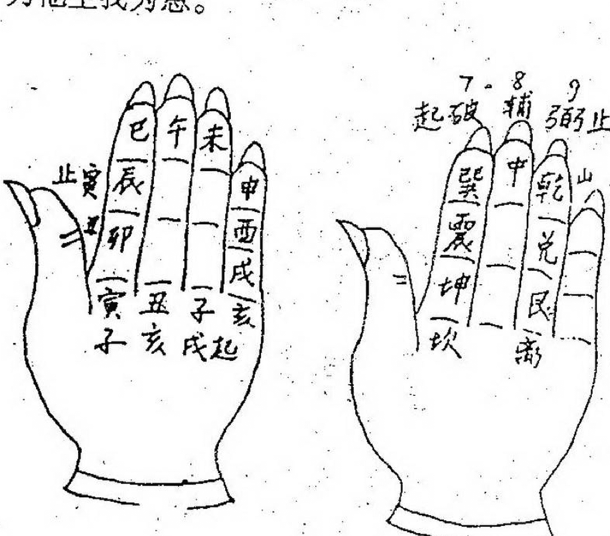

### 例二

昔杨公葬课，用四戊午并葬子山午向、后来子孙富贵绵长，例法即从地支掌午（太岁）上起戌，顺行十二地支掌至寅上是年（月）午止在寅位，即丑艮寅卦，河洛九星术数入九宫掌，艮上起破军，离为辅，坎为弼星，子山午向为后天之坎卦，坎卦之先天为一坤，先天一坤属水，弼星九数属金，故子山午向为水山，得日课弼星九数之金生山，是为恩星到山。课式：

```
戊午  戊午  戊午  戊午
    弼    弼    弼
    九    九    九
    金    金    金
```

## 六、河洛择日步骤

第一步：首先定出坐山分金，与后天八卦方位。
第二步：按以上之法例进行，年寻月、年寻日、月寻时的法则，周流十二支掌，加戌顺行，找出所止之字。看此字属何卦宫所管。
第三步：在九宫掌上，寻找止字宫起破军顺游九宫掌，至坐山之后天八卦，定出神数。
第四步：看坐山所属的先天五行与课柱月日时的河洛神数之关系。或生，或助、或克或泄定出课格。
最后反复查看河洛神数的九条凶杀、确定山家是否犯杀。才能进行成河洛的择吉与评鉴。

以下特设年寻月、年寻日、月寻时一览表。
五子：即甲子、丙子、戊子、庚子、壬子、统称五子，如何看法？
直看金木水火土为先天五行、所属日之体。
一坎二坤三震四巽五中、六乾七兑八艮九离为九宫后天八卦，卦管三山。
横看十二地支为月日时
例如：五子年见坎山得4数，五子年用亥日，坎山为9数，月日4、9为金生坎水。用亥时，寅月用时辰在此表不能查，须看五寅年找亥得4数，是为月日时恩星临山，名为三恩星之吉格。千万注意日课不可带杀。

## 七、河洛五行数所属

以下特设年寻月、年寻日、月寻时一览表。

### 五子年寻月、日或五月寻时表

| 月日时 | 寅 | 卯 | 巳 | 午 | 未 | 申 | 酉 | 戌 | 亥 | 子 | 丑 |
|---|---|---|---|---|---|---|---|---|---|---|---|
| 水一坎 | 4 | 4 | 8 | 6 | 6 | 1 | 2 | 2 | 7 | 9 | 9 |
| 火二坤 | 5 | 5 | 9 | 7 | 7 | 2 | 3 | 3 | 8 | 1 | 1 |
| 水三震 | 6 | 6 | 1 | 8 | 8 | 3 | 4 | 4 | 9 | 2 | 2 |
| 金四巽 | 7 | 7 | 2 | 9 | 9 | 4 | 5 | 5 | 1 | 3 | 3 |
| 土五中 | 8 | 8 | 3 | 1 | 1 | 5 | 6 | 6 | 2 | 4 | 4 |
| 水六乾 | 9 | 9 | 4 | 2 | 2 | 6 | 7 | 7 | 3 | 5 | 5 |
| 火七兑 | 1 | 1 | 5 | 3 | 3 | 7 | 8 | 8 | 4 | 6 | 6 |
| 木八艮 | 2 | 2 | 6 | 4 | 4 | 8 | 9 | 9 | 5 | 7 | 7 |
| 金九离 | 3 | 3 | 7 | 5 | 5 | 9 | 1 | 1 | 6 | 8 | 8 |

### 五丑年寻月、五丑年寻日、五丑月寻时表

| 月日时 | 寅 | 卯 | 巳 | 午 | 未 | 申 | 酉 | 戌 | 亥 | 子 | 丑 |
|---|---|---|---|---|---|---|---|---|---|---|---|
| 水一坎 | 4 | 8 | 6 | 6 | 1 | 2 | 2 | 7 | 9 | 9 | 5 |
| 火二坤 | 5 | 9 | 7 | 7 | 2 | 3 | 3 | 8 | 1 | 1 | 6 |
| 水三震 | 6 | 1 | 8 | 8 | 3 | 4 | 4 | 9 | 2 | 2 | 7 |
| 金四巽 | 7 | 2 | 9 | 9 | 4 | 5 | 5 | 1 | 3 | 3 | 8 |
| 土五中 | 8 | 3 | 1 | 1 | 5 | 6 | 6 | 2 | 4 | 4 | 9 |
| 水六乾 | 9 | 4 | 2 | 2 | 6 | 7 | 7 | 3 | 5 | 5 | 1 |
| 火七兑 | 1 | 5 | 3 | 3 | 7 | 8 | 8 | 4 | 6 | 6 | 2 |
| 木八艮 | 2 | 6 | 4 | 4 | 8 | 9 | 9 | 5 | 7 | 7 | 3 |
| 金九离 | 3 | 7 | 5 | 5 | 9 | 1 | 1 | 6 | 8 | 8 | 4 |

### 五寅年寻月、五寅年日、五寅月寻时表

| 月日时 | 寅 | 卯 | 巳 | 午 | 未 | 申 | 酉 | 戌 | 亥 | 子 | 丑 |
|---|---|---|---|---|---|---|---|---|---|---|---|
| 水一坎 | 8 | 6 | 6 | 1 | 2 | 2 | 7 | 9 | 9 | 6 | 4 |
| 火二坤 | 9 | 7 | 7 | 2 | 3 | 3 | 8 | 1 | 1 | 6 | 5 |
| 水三震 | 1 | 8 | 8 | 3 | 4 | 4 | 9 | 2 | 2 | 7 | 6 |
| 金四巽 | 2 | 9 | 9 | 4 | 5 | 5 | 1 | 3 | 3 | 8 | 7 |
| 土五中 | 3 | 1 | 1 | 5 | 6 | 6 | 2 | 4 | 4 | 9 | 8 |
| 水六乾 | 4 | 2 | 2 | 6 | 7 | 7 | 3 | 5 | 5 | 1 | 9 |
| 火七兑 | 5 | 3 | 3 | 7 | 8 | 8 | 4 | 6 | 6 | 2 | 1 |
| 木八艮 | 6 | 4 | 4 | 8 | 9 | 9 | 5 | 7 | 7 | 3 | 2 |
| 金九离 | 7 | 5 | 5 | 9 | 1 | 1 | 6 | 8 | 8 | 4 | 3 |

### 五卯年寻月、五卯年寻日、五卯日寻时表

| 月日时 | 寅 | 卯 | 辰 | 巳 | 午 | 未 | 申 | 酉 | 戌 | 亥 | 子 | 丑 |
|---|---|---|---|---|---|---|---|---|---|---|---|---|
| 一坎 | 6 | 6 | 1 | 2 | 2 | 7 | 9 | 9 | 5 | 4 | 4 | 8 |
| 二坤 | 7 | 7 | 2 | 3 | 3 | 8 | 1 | 1 | 6 | 5 | 5 | 9 |
| 三震 | 8 | 8 | 3 | 4 | 4 | 9 | 2 | 2 | 7 | 6 | 6 | 1 |
| 四巽 | 9 | 9 | 4 | 5 | 5 | 1 | 3 | 3 | 8 | 7 | 7 | 2 |
| 五中 | 1 | 1 | 5 | 6 | 6 | 2 | 4 | 4 | 9 | 8 | 8 | 3 |
| 六乾 | 2 | 2 | 6 | 7 | 7 | 3 | 5 | 5 | 1 | 9 | 9 | 4 |
| 七兑 | 3 | 3 | 7 | 8 | 8 | 4 | 6 | 6 | 2 | 1 | 1 | 5 |
| 八艮 | 4 | 4 | 8 | 9 | 9 | 5 | 7 | 7 | 3 | 2 | 2 | 6 |
| 九离 | 5 | 5 | 9 | 1 | 1 | 6 | 8 | 8 | 4 | 3 | 3 | 7 |

### 五辰年表

| 月日时 | 寅 | 卯 | 辰 | 巳 | 午 | 未 | 申 | 酉 | 戌 | 亥 | 子 | 丑 |
|---|---|---|---|---|---|---|---|---|---|---|---|---|
| 一坎 | 6 | 1 | 2 | 2 | 7 | 9 | 9 | 5 | 4 | 4 | 8 | 6 |
| 二坤 | 7 | 2 | 3 | 3 | 8 | 1 | 1 | 6 | 5 | 5 | 9 | 7 |
| 三震 | 8 | 3 | 4 | 4 | 9 | 2 | 2 | 7 | 6 | 6 | 1 | 8 |
| 四巽 | 9 | 4 | 5 | 5 | 1 | 3 | 3 | 8 | 7 | 7 | 2 | 9 |
| 五中 | 1 | 5 | 6 | 6 | 2 | 4 | 4 | 9 | 8 | 8 | 3 | 1 |
| 六乾 | 2 | 6 | 7 | 7 | 3 | 5 | 5 | 1 | 9 | 9 | 4 | 2 |
| 七兑 | 3 | 7 | 8 | 8 | 4 | 6 | 6 | 2 | 1 | 1 | 5 | 3 |
| 八艮 | 4 | 8 | 9 | 9 | 5 | 7 | 7 | 3 | 2 | 2 | 6 | 4 |
| 九离 | 5 | 9 | 1 | 1 | 6 | 8 | 8 | 4 | 3 | 3 | 7 | 5 |

### 五巳年表

| 月日时 | 寅 | 卯 | 辰 | 巳 | 午 | 未 | 申 | 酉 | 戌 | 亥 | 子 | 丑 |
|---|---|---|---|---|---|---|---|---|---|---|---|---|
| 一坎 | 1 | 2 | 2 | 7 | 9 | 9 | 5 | 4 | 4 | 8 | 6 | 6 |
| 二坤 | 2 | 3 | 3 | 8 | 1 | 1 | 6 | 5 | 5 | 9 | 7 | 7 |
| 三震 | 3 | 4 | 4 | 9 | 2 | 2 | 7 | 6 | 6 | 1 | 8 | 8 |
| 四巽 | 4 | 5 | 5 | 1 | 3 | 3 | 8 | 7 | 7 | 2 | 9 | 9 |
| 五中 | 5 | 6 | 6 | 2 | 4 | 4 | 9 | 8 | 8 | 3 | 1 | 1 |
| 六乾 | 6 | 7 | 7 | 3 | 5 | 5 | 1 | 9 | 9 | 4 | 2 | 2 |
| 七兑 | 7 | 8 | 8 | 4 | 6 | 6 | 2 | 1 | 1 | 5 | 3 | 3 |
| 八艮 | 8 | 9 | 9 | 5 | 7 | 7 | 3 | 2 | 2 | 6 | 4 | 4 |
| 九离 | 9 | 1 | 1 | 6 | 8 | 8 | 4 | 3 | 3 | 7 | 5 | 5 |

### 五午年表

| 月日时 | 寅 | 卯 | 辰 | 巳 | 午 | 未 | 申 | 酉 | 戌 | 亥 | 子 | 丑 |
|---|---|---|---|---|---|---|---|---|---|---|---|---|
| 一坎 | 2 | 2 | 7 | 9 | 9 | 5 | 4 | 4 | 8 | 6 | 6 | 1 |
| 二坤 | 3 | 3 | 8 | 1 | 1 | 6 | 5 | 5 | 9 | 7 | 7 | 2 |
| 三震 | 4 | 4 | 9 | 2 | 2 | 7 | 6 | 6 | 1 | 8 | 8 | 3 |
| 四巽 | 5 | 5 | 1 | 3 | 3 | 8 | 7 | 7 | 2 | 9 | 9 | 4 |
| 五中 | 6 | 6 | 2 | 4 | 4 | 9 | 8 | 8 | 3 | 1 | 1 | 5 |
| 六乾 | 7 | 7 | 3 | 5 | 5 | 1 | 9 | 9 | 4 | 2 | 2 | 6 |
| 七兑 | 8 | 8 | 4 | 6 | 6 | 2 | 1 | 1 | 5 | 3 | 3 | 7 |
| 八艮 | 9 | 9 | 5 | 7 | 7 | 3 | 2 | 2 | 6 | 4 | 4 | 8 |
| 九离 | 1 | 1 | 6 | 8 | 8 | 4 | 3 | 3 | 7 | 5 | 5 | 9 |

### 五未年表

| 月日时 | 寅 | 卯 | 辰 | 巳 | 午 | 未 | 申 | 酉 | 戌 | 亥 | 子 | 丑 |
|---|---|---|---|---|---|---|---|---|---|---|---|---|
| 一坎 | 2 | 7 | 9 | 9 | 5 | 4 | 4 | 8 | 6 | 6 | 1 | 2 |
| 二坤 | 3 | 8 | 1 | 1 | 6 | 5 | 5 | 9 | 7 | 7 | 2 | 3 |
| 三震 | 4 | 9 | 2 | 2 | 7 | 6 | 6 | 1 | 8 | 8 | 3 | 4 |
| 四巽 | 5 | 1 | 3 | 3 | 8 | 7 | 7 | 2 | 9 | 9 | 4 | 5 |
| 五中 | 6 | 2 | 4 | 4 | 9 | 8 | 8 | 3 | 1 | 1 | 5 | 6 |
| 六乾 | 7 | 3 | 5 | 5 | 1 | 9 | 9 | 4 | 2 | 2 | 6 | 7 |
| 七兑 | 8 | 4 | 6 | 6 | 2 | 1 | 1 | 5 | 3 | 3 | 7 | 8 |
| 八艮 | 9 | 5 | 7 | 7 | 3 | 2 | 2 | 6 | 4 | 4 | 8 | 9 |
| 九离 | 1 | 6 | 8 | 8 | 4 | 3 | 3 | 7 | 5 | 5 | 9 | 1 |

### 五甲年表

| 月日时 | 寅 | 卯 | 辰 | 巳 | 午 | 未 | 申 | 酉 | 戌 | 亥 | 子 | 丑 |
|---|---|---|---|---|---|---|---|---|---|---|---|---|
| 一坎 | 7 | 9 | 9 | 5 | 4 | 4 | 8 | 6 | 6 | 1 | 2 | 2 |
| 二坤 | 8 | 1 | 1 | 6 | 5 | 5 | 9 | 7 | 7 | 2 | 3 | 3 |
| 三震 | 9 | 2 | 2 | 7 | 6 | 6 | 1 | 8 | 8 | 3 | 4 | 4 |
| 四巽 | 1 | 3 | 3 | 8 | 7 | 7 | 2 | 9 | 9 | 4 | 5 | 5 |
| 五中 | 2 | 4 | 4 | 9 | 8 | 8 | 3 | 1 | 1 | 5 | 6 | 6 |
| 六乾 | 3 | 5 | 5 | 1 | 9 | 9 | 4 | 2 | 2 | 6 | 7 | 7 |
| 七兑 | 4 | 6 | 6 | 2 | 1 | 1 | 5 | 3 | 3 | 7 | 8 | 8 |
| 八艮 | 5 | 7 | 7 | 3 | 2 | 2 | 6 | 4 | 4 | 8 | 9 | 9 |
| 九离 | 6 | 8 | 8 | 4 | 3 | 3 | 7 | 5 | 5 | 9 | 1 | 1 |

### 五酉年表

| 月日时 | 寅 | 卯 | 辰 | 巳 | 午 | 未 | 申 | 酉 | 戌 | 亥 | 子 | 丑 |
|---|---|---|---|---|---|---|---|---|---|---|---|---|
| 一坎 | 9 | 9 | 5 | 4 | 4 | 8 | 6 | 6 | 1 | 2 | 2 | 7 |
| 二坤 | 1 | 1 | 6 | 5 | 5 | 9 | 7 | 7 | 2 | 3 | 3 | 8 |
| 三震 | 2 | 2 | 7 | 6 | 6 | 1 | 8 | 8 | 3 | 4 | 4 | 9 |
| 四巽 | 3 | 3 | 8 | 7 | 7 | 2 | 9 | 9 | 4 | 5 | 5 | 1 |
| 五中 | 4 | 4 | 9 | 8 | 8 | 3 | 1 | 1 | 5 | 6 | 6 | 2 |
| 六乾 | 5 | 5 | 1 | 9 | 9 | 4 | 2 | 2 | 6 | 7 | 7 | 3 |
| 七兑 | 6 | 6 | 2 | 1 | 1 | 5 | 3 | 3 | 7 | 8 | 8 | 4 |
| 八艮 | 7 | 7 | 3 | 2 | 2 | 6 | 4 | 4 | 8 | 9 | 9 | 5 |
| 九离 | 8 | 8 | 4 | 3 | 3 | 7 | 5 | 5 | 9 | 1 | 1 | 6 |

### 五戊年表

| 月日时 | 寅 | 卯 | 辰 | 巳 | 午 | 未 | 申 | 酉 | 戌 | 亥 | 子 | 丑 |
|---|---|---|---|---|---|---|---|---|---|---|---|---|
| 一坎 | 9 | 5 | 4 | 4 | 8 | 6 | 6 | 1 | 2 | 2 | 7 | 9 |
| 二坤 | 1 | 6 | 5 | 5 | 9 | 7 | 7 | 2 | 3 | 3 | 8 | 1 |
| 三震 | 2 | 7 | 6 | 6 | 1 | 8 | 8 | 3 | 4 | 4 | 9 | 2 |
| 四巽 | 3 | 8 | 7 | 7 | 2 | 9 | 9 | 4 | 5 | 5 | 1 | 3 |
| 五中 | 4 | 9 | 8 | 8 | 3 | 1 | 1 | 5 | 6 | 6 | 2 | 4 |
| 六乾 | 5 | 1 | 9 | 9 | 4 | 2 | 2 | 6 | 7 | 7 | 3 | 5 |
| 七兑 | 6 | 2 | 1 | 1 | 5 | 3 | 3 | 7 | 8 | 8 | 4 | 6 |
| 八艮 | 7 | 3 | 2 | 2 | 6 | 4 | 4 | 8 | 9 | 9 | 5 | 7 |
| 九离 | 8 | 4 | 3 | 3 | 7 | 5 | 5 | 9 | 1 | 1 | 6 | 8 |

### 五亥年表

| 月日时 | 寅 | 卯 | 辰 | 巳 | 午 | 未 | 申 | 酉 | 戌 | 亥 | 子 | 丑 |
|---|---|---|---|---|---|---|---|---|---|---|---|---|
| 一坎 | 5 | 4 | 4 | 8 | 6 | 6 | 1 | 2 | 2 | 7 | 9 | 9 |
| 二坤 | 6 | 5 | 5 | 9 | 7 | 7 | 2 | 3 | 3 | 8 | 1 | 1 |
| 三震 | 7 | 6 | 6 | 1 | 8 | 8 | 3 | 4 | 4 | 9 | 2 | 2 |
| 四巽 | 8 | 7 | 7 | 2 | 9 | 9 | 4 | 5 | 5 | 1 | 3 | 3 |
| 五中 | 9 | 8 | 8 | 3 | 1 | 1 | 5 | 6 | 6 | 2 | 4 | 4 |
| 六乾 | 1 | 9 | 9 | 4 | 2 | 2 | 6 | 7 | 7 | 3 | 5 | 5 |
| 七兑 | 2 | 1 | 1 | 5 | 3 | 3 | 7 | 8 | 8 | 4 | 6 | 6 |
| 八艮 | 3 | 2 | 2 | 6 | 4 | 4 | 8 | 9 | 9 | 5 | 7 | 7 |
| 九离 | 4 | 3 | 3 | 7 | 5 | 5 | 9 | 1 | 1 | 6 | 8 | 8 |

# 第十六章 选择秘要

### 三十六课吉凶断语

- 1. 三恩星；上吉；丁财贵寿可摧、摧宫发福久远，吉祥，忌带杀。
- 2. 三旺星：上吉；相配摧丁、发富发贵，忌带杀。
- 3. 三财星；上吉；不忌带杀，百日内进财，摧丁贵。
- 4. 三贪星（为三个1数）：上上之吉，丁财贵可摧，发福最速。
- 5. 三泄星凶，官非退财，损六畜。
- 6. 三克星：大凶，月内损丁破财。
- 7. 二恩一旺，富贵久远，丁财双进，上吉。
- 8. 二恩一财；吉，主进小财。
- 9. 二恩一克；上吉、摧丁发福悠久。
- 10. 二恩一泄：吉，主清静平安。
- 11. 二旺一恩：吉，丁财双进。
- 12. 二旺一财：吉、主进财。
- 13. 二旺一克：官司是非，争讼败财，吉凶参半。
- 14. 二旺一泄：平安。
- 15. 二财一恩：丁财贵寿、大吉（小财）。
- 16. 二财一旺：百日内主近小财兼旺人丁。
- 17. 二财一克；大凶，先得小财。后是非官司，损丁退财。
- 18. 二财一泄；损丁退财畜，百日内应凶。
- 19. 二克一恩凶，口舌、损丁。退财、疾病。
- 20. 二克一旺：病痛，争讼，损丁，退财。
- 21. 二克一泄；大凶，是非退财、病痛延久，终不利。
- 22. 二克一财：大凶，大破财，官司非损丁。
- 23. 二泄一恩：吉，平安。
- 24. 二泄一财：官非、退财、百事不顺。
- 25. 二泄一旺：损六畜是非退财、前吉后凶。
- 26. 二泄一克；凶，损丁破财官非。
- 27. 恩旺泄；吉，小旺丁财。
- 28. 恩旺财：大吉，富贵，丁财大旺，永久吉祥。
- 29. 恩旺克：平安。
- 30. 恩财泄：有小财。
- 31. 恩财克：是非争讼退财。
- 32. 恩泄克：疾病退财，不利，小凶。(平安)
- 33. 旺财克：凶，官非退财，久则损丁。
- 34. 旺财泄；吉，有小财，若分金或布局不对则无财。
- 35. 财克泄：凶，主退财病痛，日久不吉。
- 36. 旺克泄：凶，是非官司口舌退财。

以上 36 课格切忌不可带杀，若有带杀定损丁退财无疑。

## 二、数理神杀

河洛数神杀只忌九杀、（以数为主年月日时）①岁破杀②年三杀③月三杀④三元月建杀⑤三元月建月杀⑥上中、下元五黄杀⑦月五黄杀⑧大月建杀⑨小月建杀。（此九杀之诀全在手掌之中，面授时，口传心授）如下神杀表格请学员对照应用：

①②岁破杀：与三元月建同

| 年 | 子 | 丑 | 寅 | 卯 | 辰 | 巳 | 午 | 未 | 申 | 酉 | 戌 | 亥 |
|---|---|---|---|---|---|---|---|---|---|---|---|---|
| 杀 | 9 | 2 | 2 | 7 | 6 | 6 | 1 | 8 | 8 | 3 | 4 | 4 |

③年三杀 巳酉丑年忌3数，申子辰年忌9数。
寅午戌年忌1数，亥卯未年忌7数。

④月三杀：

| 年\月 | 正 | 二 | 三 | 四 | 五 | 六 | 七 | 八 | 九 | 十 | 十一 | 十二 |
|---|---|---|---|---|---|---|---|---|---|---|---|---|
| 子 | 6 | 6 | 2 | 4 | 4 | 9 | 8 | 8 | 3 | 1 | 1 | 5 |
| 丑 | 9 | 5 | 7 | 7 | 3 | 2 | 2 | 6 | 4 | 4 | 8 | 9 |
| 寅 | 3 | 5 | 5 | 1 | 9 | 9 | 4 | 2 | 2 | 6 | 7 | 7 |
| 卯 | 2 | 2 | 7 | 6 | 6 | 1 | 8 | 8 | 3 | 4 | 4 | 9 |
| 辰 | 4 | 9 | 8 | 8 | 3 | 1 | 1 | 5 | 6 | 6 | 2 | 4 |
| 巳 | 3 | 2 | 2 | 6 | 4 | 4 | 8 | 9 | 9 | 5 | 7 | 7 |
| 午 | 9 | 9 | 4 | 2 | 2 | 6 | 7 | 7 | 3 | 5 | 5 | 1 |
| 未 | 6 | 1 | 8 | 8 | 3 | 4 | 4 | 9 | 2 | 2 | 7 | 6 |
| 申 | 3 | 1 | 1 | 5 | 6 | 6 | 2 | 4 | 4 | 9 | 8 | 8 |
| 酉 | 4 | 4 | 8 | 9 | 9 | 5 | 7 | 7 | 3 | 2 | 2 | 6 |
| 戌 | 2 | 6 | 7 | 7 | 3 | 5 | 5 | 1 | 9 | 9 | 4 | 2 |
| 亥 | 3 | 4 | 4 | 9 | 2 | 2 | 7 | 6 | 6 | 1 | 8 | 8 |

⑤三元月建月杀：

| 年\月 | 正 | 二 | 三 | 四 | 五 | 六 | 七 | 八 | 九 | 十 | 十一 | 十二 |
|---|---|---|---|---|---|---|---|---|---|---|---|---|
| 子 | 6 | 6 | 2 | 4 | 4 | 9 | 8 | 8 | 3 | 1 | 1 | 5 |
| 丑 | 8 | 4 | 6 | 6 | 2 | 1 | 1 | 5 | 3 | 3 | 7 | 8 |
| 寅 | 4 | 6 | 6 | 2 | 1 | 1 | 6 | 3 | 3 | 7 | 8 | 8 |
| 卯 | 2 | 2 | 7 | 6 | 6 | 1 | 8 | 8 | 3 | 4 | 4 | 9 |
| 辰 | 1 | 6 | 5 | 5 | 9 | 7 | 7 | 2 | 3 | 3 | 8 | 1 |
| 巳 | 6 | 5 | 5 | 9 | 7 | 7 | 2 | 3 | 3 | 8 | 1 | 1 |
| 午 | 9 | 9 | 4 | 2 | 2 | 6 | 7 | 7 | 3 | 5 | 5 | 1 |
| 未 | 7 | 2 | 9 | 9 | 4 | 5 | 5 | 1 | 3 | 3 | 8 | 7 |
| 申 | 2 | 9 | 9 | 4 | 5 | 5 | 1 | 3 | 3 | 8 | 7 | 7 |
| 酉 | 4 | 4 | 8 | 9 | 9 | 5 | 7 | 7 | 3 | 2 | 2 | 6 |
| 戌 | 5 | 9 | 1 | 1 | 6 | 8 | 8 | 4 | 3 | 3 | 7 | 5 |
| 亥 | 9 | 1 | 1 | 6 | 8 | 8 | 4 | 3 | 3 | 7 | 5 | 5 |

⑥上中下元五黄杀：

上元：1846 至 1923 年

| 数 | 1 | 2 | 3 | 4 | 5 | 6 | 7 | 8 | 9 |
|---|---|---|---|---|---|---|---|---|---|
| 年 | 乙丑 | 丙寅 | 丁卯 | 戊辰 | 己巳 | 庚午 | 辛未 | 壬申 | 甲子 |
| | 甲戌 | 己亥 | 丙子 | 丁丑 | 戊寅 | 己卯 | 庚辰 | 辛巳 | 癸酉 |
| | 癸未 | 甲申 | 乙酉 | 丙戌 | 丁亥 | 戊子 | 己丑 | 庚寅 | 壬午 |
| | 壬辰 | 癸巳 | 甲午 | 乙未 | 丙申 | 丁酉 | 戊戌 | 己亥 | 辛卯 |
| | 辛丑 | 壬寅 | 癸卯 | 甲辰 | 乙巳 | 丙午 | 丁未 | 戊申 | 庚子 |
| | 庚戌 | 辛亥 | 壬子 | 癸丑 | 甲寅 | 乙卯 | 丙辰 | 丁巳 | 己酉 |
| | 己未 | 庚申 | 辛酉 | 壬戌 | 癸亥 | | | | 戊午 |

中元 1924—1983 年

| 数 | 1 | 2 | 3 | 4 | 5 | 6 | 7 | 8 | 9 |
|---|---|---|---|---|---|---|---|---|---|
| 年 | 戊辰 | 己巳 | 庚午 | 辛未 | 壬申 | 癸酉 | 甲戌 | 乙亥 | 丁卯 |
| | 丁丑 | 戊寅 | 己卯 | 庚辰 | 辛巳 | 壬午 | 癸未 | 甲申 | 丙子 |
| | 丙戌 | 丁亥 | 戊子 | 己丑 | 庚寅 | 辛卯 | 壬辰 | 癸巳 | 乙酉 |
| | 乙未 | 丙申 | 丁酉 | 戊戌 | 己亥 | 庚子 | 辛丑 | 壬寅 | 甲午 |
| | 甲辰 | 乙巳 | 丙午 | 丁未 | 戊申 | 己酉 | 庚戌 | 辛亥 | 癸卯 |
| | 癸丑 | 甲寅 | 乙卯 | 丙辰 | 丁巳 | 戊午 | 己未 | 庚申 | 壬子 |
| | 壬戌 | 癸亥 | | | | 甲子 | 乙丑 | 丙寅 | 辛酉 |

下元1984—2043年

| 数 | 1 | 2 | 3 | 4 | 5 | 6 | 7 | 8 | 9 |
|---|---|---|---|---|---|---|---|---|---|
| 年 | 辛未 | 壬申 | 甲子 | 乙丑 | 丙寅 | 丁卯 | 戊辰 | 己巳 | 庚午 |
| | 庚辰 | 辛巳 | 癸酉 | 甲戌 | 乙亥 | 丙子 | 丁丑 | 戊寅 | 己卯 |
| | 己丑 | 庚寅 | 壬午 | 癸未 | 甲申 | 乙酉 | 丙戌 | 丁亥 | 戊子 |
| | 戊戌 | 己亥 | 辛卯 | 壬辰 | 癸巳 | 甲午 | 乙未 | 丙申 | 丁酉 |
| | 丁未 | 戊申 | 庚子 | 辛丑 | 壬寅 | 癸卯 | 甲辰 | 乙巳 | 丙午 |
| | 丙辰 | 丁巳 | 己酉 | 庚戌 | 辛亥 | 壬子 | 癸丑 | 甲寅 | 乙卯 |
| | | | 戊午 | 己未 | 庚申 | 辛酉 | 壬戌 | 癸亥 | |

⑦月五黄杀

| 正 | 二 | 三 | 四 | 五 | 六 | 七 | 八 | 九 | 十 | 十一 | 十二 |
|---|---|---|---|---|---|---|---|---|---|---|---|
| 8 | 9 | 1 | 2 | 3 | 4 | 5 | 6 | 7 | 8 | 9 | 1 |
| 2 | 3 | 4 | 5 | 6 | 7 | 8 | 9 | 1 | 2 | 3 | 4 |
| 5 | 6 | 7 | 8 | 9 | 1 | 2 | 3 | 4 | 5 | 6 | 7 |

⑧大月建杀

| 正 | 二 | 三 | 四 | 五 | 六 | 七 | 八 | 九 | 十 | 十一 | 十二 |
|---|---|---|---|---|---|---|---|---|---|---|---|
| 8 | 7 | 6 | 5 | 4 | 3 | 2 | 1 | 9 | 8 | 7 | 6 |
| 2 | 1 | 9 | 8 | 7 | 6 | 5 | 4 | 3 | 2 | 1 | 9 |
| 5 | 4 | 3 | 2 | 1 | 9 | 8 | 7 | 6 | 5 | 4 | 3 |

⑨小月建杀

| 正 | 二 | 三 | 四 | 五 | 六 | 七 | 八 | 九 | 十 | 十一 | 十二 |
|---|---|---|---|---|---|---|---|---|---|---|---|
| 5 | 6 | 7 | 8 | 9 | 6 | 2 | | | | | |
| 9 | 1 | 2 | 3 | 4 | 5 | 6 | 7 | 8 | 9 | 1 | 2 |

以上之诀，以下之例学者谨记，切要不可带杀，若是带杀俱损丁财，请谨慎择选。

# 第十七章 日课操作运用

例如：公元二〇〇一年农历八月十九日，寅时乾巽向之课例。

- 一、首先运用河洛先天五行确定乾山五行属水局乃择日之体。
- 二、根据以上章节之法，排出四柱（课格）
辛巳 丁酉 辛丑 庚寅
- 三、应用河洛之法（太岁寻月、太岁寻日、月上手时）之法，在四柱的下方、记上河洛神数，问洛五行、体用关系如下。

| 辛巳 | 丁酉 | 辛丑 | 庚寅 |
| :---: | :---: | :---: | :---: |
| 9 | 2 | 5 | 神数 |
| 金 | 火 | 土 | 五行 |

恩 财 克 体用关系

- 四、查看、巳年河洛神数带杀表（九条杀）定出课柱是否犯杀、共犯杀多少，是犯何杀并排于四柱课格之下方，便于选评。
- 1、查岁破杀
巳年6数带杀，课中无6数，故不犯杀。
- 2、查三元月建同上。
- 3、查看年三杀表格，巳年忌3数，课中无3数，故不犯杀。
- 4、查看月三杀，直看巳年横推八月之交点是9数，课中月柱为9数，故9数犯三杀，不可用。
- 5、查看三元月建杀表格。
巳年八月是忌3数，课中无3数是不带杀。
- 6、查看上中下元五黄杀表格。
今年2001年为下元、辛巳年，2数带杀，故月柱犯五黄杀。但2数属火，乾山属水，是体克用，为财不忌带杀。
- 7、查看月五黄表格。
巳年八月忌9数，课中月柱是9数，故为犯杀。
- 8、查看大月建表格。
巳年八月忌4数，课中无4数，故不犯月建杀。
- 9、查看小月建表格。
辛巳年属阴年，横推直查八月是7数，课中无7数，故不犯小月建。

以上日课共犯二条杀，即月犯五黄杀、三杀。然后进行日课之选择评鉴。

此课按常规之法，是为满盘禄之课、乾山属金，得巳酉丑合金局，助山。本应是吉课，但运用本门之法则不管常规之日课如何。只看课式及所犯之杀，课式为恩财克。主凶，官非退财损丁，加之犯杀，大凶、不能用。

# 第十八章 日课选评实例

例一、一九八七年春，本人在钦州市为人造福时，一位先生（福主之亲友）同本人探讨，他说：“老师？今天我能有缘认识你，是我的荣幸，你的大名在几年前我就听到了。你对日课评鉴非常准确、所以我特来拜访，现在带一日课来、想请师傅把吉凶告知。”此时、我看他没恶意便为他评鉴。

此日课是太坪村地师为黄姓选择的葬课、课择于一九八六年农历八月十九日，乙丑时下葬，福地立乾山巽向兼戌辰分金，福主年命乙丑、相主年命戌辰、儿子年命庚子，课式：

丙寅：丁酉 己巳 乙丑
5 6 3

土 水 木
克 旺 泄
三 小
元 月
五 建
黄 杀
杀

鉴定如下：

此课按照一般方法来看，课为天上三奇乙丙丁之贵格，丙丁猪鸡位，丙禄又到巳，巳酉丑合金局辅山，乙丑主命得课中三奇，相主戊辰命与酉作合，儿子之命又得课中天合地合、属满盘禄贵之课，扶山旺主格，原择先生鉴定为人财两旺富贵双全上上之吉课。

然而，按本门之方法鉴定：此课却属极凶之课，使用后主一百日内必损丁退财，易见血光之灾。

事实果然应验，根据来测者所述：葬后不满三个月，福主就死了一个儿子，年仅二十七岁是未婚青年。八六年在广西百色地区打工时与人发生争执，被群殴致死，其父闻讯后因气血攻心也呜呼哀哉。可见一般日课之法确实害人非浅。

例二，冯姓宝宅立辛山乙向，课择于一九八一年农历十一月二十日寅时行墙进砖之课：

课式

辛酉 庚子 丁卯 壬寅

8 6 1 小

木 水 水月

恩 克 克建

杀

分析此课：辛山属后天之兑卦，兑卦之先天卦位是七坎，按本门之法“二巽七坎火方寻”七坎即属火，故辛山乙向为火山，河图洛书之法，山家为体，日课为用，上课之用得8数。3、8为木是生我火，日时得1、6数是水为水克我。故名为二克一恩，凶，主口合是非退财。再观四柱课格所得之洛数是否犯杀，今时辰1数犯小月建是为带杀之课，二克一恩又带杀，主必损丁退财无疑！所断之事，果真如此。一个多月后落成，隔了十余天入新宅，住了七十余天就死了二个男丁，一个年龄二十一岁一个十二岁，此后立即搬迁不敢居住。鉴定之时，冯某泪流满面，泣不成声地说：“这课日子是我表叔择的，我们之间无冤无仇，他为什么要害我呢？我不明白……。”

本人也为他伤感，便安慰冯某道：“这不是你表叔害你，他已尽心尽力为你择日，只怪他学艺不精、未得真传、实乃伪书害人也！”

在冯某的哀求下，我便为他调理布局另择良课，一幢闲置三年之久的新楼从此得到生机。现在宅主开办酒厂赚了一些钱，三儿子到广东打工娶了媳妇已生贵子，实乃丁财两盛。

例三，梁姓，荣造华厦立巽山乾向，课择于一九八三年农历十月初七日寅时、落砖脚，课格如下：

```
癸亥 癸亥 癸卯 甲寅
      1    7    8
      泄    克    财
      月   三三
      三   杀元
      杀    月
            建
杀
```

此课为天干三朋，癸水生巽之木山，卯亥半合木，理应是吉课，但因河洛术数犯杀，主大凶。巽山先天属金，时辰8数虽为财到山之意，但扶旺七数之杀，日柱7数火星又带双杀克山，月令1数三杀，泄山之元气，为时克泄之凶课，注定败夫财，而损丁口。书云：课柱凶杀重重者，凶灾立见，号令一出，无药可求，择选之时，慎之谨之。事实的确如此，奠基不久就败了大财，70天左右宅之归西。

例四，雷姓祖坟立子山午向坐坤卦第一爻乙未，仙命壬戌。

抽线、福主命甲申，相主命甲申，男癸卯，次男壬子，少男甲寅。

吉课择于一九八三年农历十月二十七日亥时安葬仙骸大吉。

课式：癸亥 癸亥 癸亥 癸亥
7 7 7 7
财 财 财 财
还宫 戊辰 戊辰 戊辰 戊辰

此课为天地同流之格，年月日时得巨门财星临山之课，配合之坐山、先天得天地定位，后天为水火不相射，洛数得2、7之火临宫最妙！又有后天之午水大聚局中，是为摧财之格，故断百日之内必进巨财，乙峰独秀，7运官贵，8运财官并临，是为丁财贵可摧之课，事实应验无差！85年长子任小学教师的提升到大队当干部、几年后在镇政府工作，现为县级干部，后来次子、小子均考入大学、安葬二十余天之后，福主接工程赚了一大笔钱，至今辉煌腾达，房房皆发。

例五，施姓用课于一九七八年五月二十日，葬子山午向第一爻乙未分金变爻，庚子爻位是与古代名师杨筠松的葬课毫无差异，后来4个儿子，皆任高官，子孙大富大贵。日课格为。

```
戊午 戊午 戊午 戊午
9 9 9 9
恩 恩 恩 恩
翻卦：癸亥 癸亥 癸亥 癸亥
```

分析以上之课：此课之俗术年月日时，均犯三杀，岁破之大凶，四戊土又克子山之水，本应为凶，但为何不杀而速呢？这是河洛之使然！河洛之术那同民俗之法？河洛之妙，先天为体，后天为用，妙就在此。而一般方法，只用后天，去掉先天，就等于人无父母，理气无峦头一样，哪有发福之理？河洛之法，观后天之坎卦，立子山，是为先天之坤卦统管，河洛卦数，一坤属水，洛数得四九作友之金，生一坤之水，是为恩星临山，还宫得二七同道之火临一坤之水，为财官并临，一卦纯清之格，乃上上之大吉也。

例六，王某，世界贸易公司，前后左右众大楼面向有情，公司大楼坐丙向壬兼午子，得净阴净阳，线为夫妇正配，立泽天夬卦，第三爻甲辰分金、甲、庚、丙、壬、乾、坤、子、午、丑之高楼，耸立而朝拜，众公路会聚于乾方，前后大海，横门在庚方，另有三座金融大楼呼应。择于2000年庚辰岁，农历六月十一日壬辰时，早晨7时58分新钟，开业大富大贵！

课格：

庚辰 癸未 辛未 壬辰

8 8 8

财 财 财

此课是在峦头的基础上，通过河洛的室内布局及河洛之择吉为一体的精心设计，非同俗师之法。课为年月日时星临山，壬向与坤峰时值七运用事，为巨见巨之贵。丙山之先天卦位，属乾九、河洛四九为金；喜得3、8为朋友之木星，是我山家五行，克卦气五行得之星者为财，故主速发巨富，同年7、8月份，大获巨财，至今财源滚滚！

例七，潘姓祖坟，酉龙入首，艮水入堂，立乾山巽向，坐地山谦卦第六爻癸酉分针，富贵双全房房皆发，发福甚速。

李姓阳宅、癸龙入脉，丁方来水，流出辰方，立戌山辰向，兼乾巽坐艮卦第四爻丙子分金，开坤门放卯水一败涂地。

以上两课皆用于一九四〇年农历二月三十日辰时之日课，课格如下：

```
庚辰 庚辰 庚辰 庚辰
 7    7    7    7
```

此乃相同课式，为何有天壤之别、吉凶之殊，其中原由特面授分解。

## 地师须记妨杀师日时

四季杀师日：
春逢辰戊正堪尤，夏逢卯酉不要求；
秋遇丑未师莫犯，冬逢子午亦堪愁。

杀师例：
正月巳日卯时妨，二月午日巳时当；
三月未日丑时忌，四月申日辰不良；
五月酉日子时妨，六月戌日未时藏；
七月亥日酉时妨，八月子日戌时当，
九月丑日午时妨，十月寅日申不良；
十一月卯日亥时是；十二月辰日寅时真
以上之时日，地师牢记在心，若犯必不利。

# 第十九章 选墓点窍

### 一、看形势

在一个深秋的季节，我和易友去选墓。在乘车去往山上的途中，易友问“老师，您能不能简要地告诉我，选择一个好的茔地，得掌握哪些东西呢？

我说，您就记住五个字：“龙、穴；沙、水、向”。先贤看地理，先取龙气，龙气旺则人丁盛；二收水聚，水聚则财富；三取砂秀，砂秀则官高；四取局贤，局贤则悠久。

易友从汽车玻璃往外看，指着一个山问：老师，您看，可不可以在那座山上选茔地？

我看了看那山说：不行，那是个孤山。孤阳不生，孤阴不长嘛。

于是我们俩分头从汽车的玻璃向外面寻视着。
易友又指着一山问道：我看这挺好，你看呢？
我说：这座山龙脉不好，是条死龙。
他问：怎么能说它是死龙呢？
我说：你看，这条山脉蠢直僵硬，毫无生发之机，所以说它是死龙，择墓最忌讳这样的龙脉了。

易友指着前面一个山说：老师，你看，前面那几个山挺够局势，前有朝山，后有靠山，左有青龙，右有白虎。是不是叫汽车停下来，咱进山去看看。

我说：不用进山里看，你记住我这句话：“选茔地先从外面看形势”。不是有那么首古诗吗？“横看成岭侧成峰，远近高低各不同，不识庐山真面目，只缘身在此山中”。这就是说，如果你不从外面看大的形势，一头就钻进山里去寻找小的龙脉，往往会事倍功半的。

易友问：你能不能简单说说，怎样看形势呢？
我说：这个问题不难答，《管氏地理指蒙》《郭璞古本葬经》等书都有详细论述，你可以找书看看。简要地说形与势就是：

形，概指近观的、小的、个体性的、局部性的，一般在百尺以内，但非草芥之形。

势，概指远观的、大的、群体性的、总体性的，一般以千尺为率，但非过远过大之势。

地理师们曾总结出这样几句话，我看很有道理：

- 大地看气魄，小地看精神。
- 众山皆大，小者为尊，
- 众山皆小，大者为尊。
- 山秀水动，进山寻龙，
- 山陋水死，劳而无功。
- 以水定局，以龙定向。
- 有水大晌为煞地，
- 有水不动为死地
- 有水微动为生地。

回过头来咱再看看你说的这座山，从车上就能看出它不行。你看，后面的坐山巨齿狼牙，怪石嶙峋，坐山凶。左边的青龙开了石厂，属青龙被破坏，龙破则主男人有刑伤。

还有一个最大的毛病是山的周围无水。看地理风水也离不开阴阳二字。山为静，属阴，水为动，属阳。阳为夫，阴为妇，夫与妇缺一不可，且要夫妇恩爱为尚。只有山而无水，好比是夫妇不交，终无孕。只有山水相交真气聚，夫妇相交孕始生。若是山飞水走，二气不交，属地不真，不可取。只有山静水动，砂交水会，龙真穴确，四山环抱，堂局端正，藏风聚气，才是好茔地。

易友问：“老师，你能不能告诉我，要学会这门科学得从哪里着手呢？”

我说：首先得从基础知识学起。

易友说：那你就简要地给我讲讲好不好？

我诚挚地说：在传统勘舆学中，选择风水分很多流派，方式方法又极多，致使我在学习时，面临许多困惑，走过许多弯路。后经拜访名师，又跟随多位地理师实地择墓点穴，深深感到只有龙、穴、砂、水、向这五大原则，才是勘舆学的精髓。

易友说：关于这方面的书，我看了很多，使我最头痛的是哪一本书都没有把怎样使用谈明白，问了许多江湖上的风水先生，他们太保守，秘而不传。想去参加风水面授班吧，要价都在三至五千元，再加上差旅费，少说得一万元，我现在又没有这笔钱，真够愁人的。

我说：江湖上的风水先生靠此术吃饭，所以他们是不会轻易外传的。我和他们不一样，是迷于研究此道。虽然不算精通，但可以把所知道的东西全部告诉你。

他说：就说基础知识那部分吧，我就有很多问号。
于是我便一一地回答了他所提的疑问。

### 二、基础知识点窍

我对易友说：“五行总论”“九宫水法歌”“风水论”“八山总论”“十恶不善”“地理总论”等，这些东西你必须理解，记熟。

易友皱了皱眉头说：老师，这些东西乱糟糟的，你能不能告诉我一些简捷的学法？

我说：你首先得知道“二十四山向”，按下面这个图去理会：

图一：二十四山向图

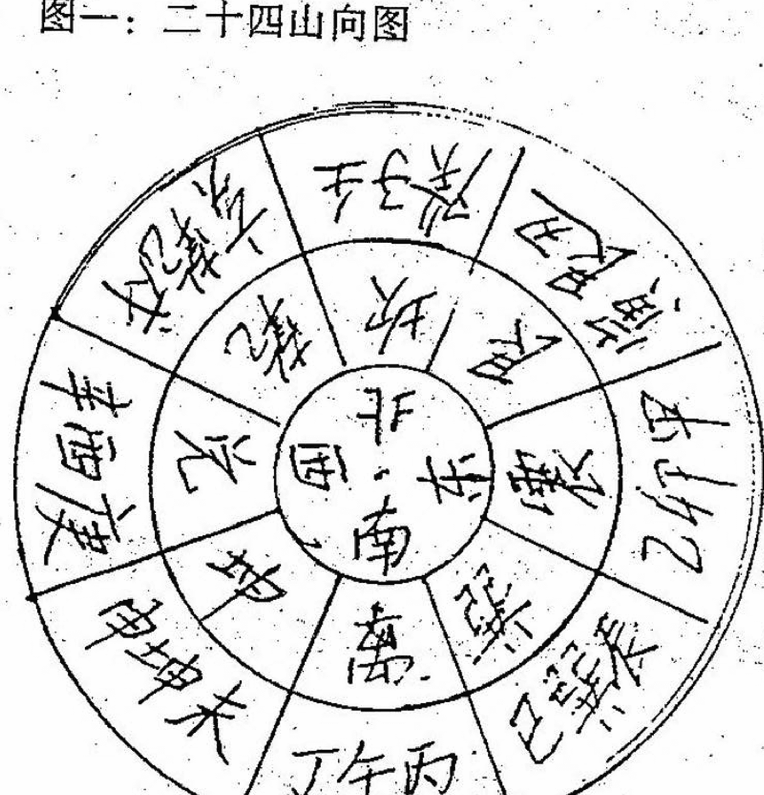

学习地理风水，您首先得掌握八卦的方位，阴阳五行的生克之理，最好是先学六爻或批八字，因为只有掌握了这些最基本的知识，学习阴阳宅风水才能得心应手。

风水学中，初时只论东、西、南、北四正方，称谓四卦。后又纳入西北、东北、东南、西南四隅方，形成八方，融入八卦。再在八卦中每卦纳入三山，就形成廿四山。四正方之中，阳天干在头，中气在正，阴天干在后，如坎宫，壬—子—癸；震宫，甲—卯—乙；离宫，丙—午—丁；兑宫，庚—酉—辛。四隅则为四库在头，隅为中，四生在尾。如乾宫，戌—乾—亥；艮宫，丑—艮—寅；巽宫，辰—巽—巳；坤宫，未—坤—申。

掌握这“二十四山向”很重要，因为在使用罗盘时，讲究“天盘定水”、“人盘消砂”、“地盘格龙”，都离不开这个顺序。

在实际应用中，又经常运用十二山向，称“双山五行”。

天干、地支两个字同处一宫，合为一个名，分别称为双山，所以叫“双山五行”。请看：

图二：双山五行图

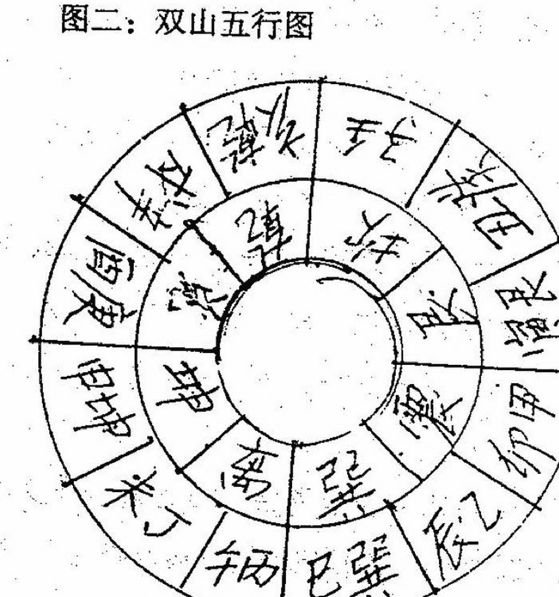

读法是：壬子、癸丑、艮寅、甲卯、乙辰、巽巳、丙午、丁未、坤申、庚酉、辛戌、乾亥。

要参看此图去理解“三合五行”：

天干乾、甲、丁，合地支亥、卯、未为一宫，木局，名贪狼木星。

天干艮、丙、辛，合地支寅、午、戌为一宫，火局，名廉贞火星。

天干巽、庚、癸，合地支巳、酉、丑为一宫，金局，名武曲金星。

天干坤、壬、乙，合地支申、子、辰为一宫，水局，名文曲水星。

易友问：地支“亥卯未”合木局我知道，那“乾甲丁”怎么也成木了呢？”

答：请看《双山五行图》。乾坐支亥，甲坐支卯，丁坐支未，是亥卯未这三个合成木局的地支把“乾甲丁”这三个天干给合过来的。

问：贪狼木星、廉贞火星、武曲金星、文曲水星怎么列到这里来了呢？

答：这是个死套数。贪狼星属木，凡见到“乾、甲、丁，亥、卯、未”字的，均称贪狼星，余仿此。

还有的书上是这样套用的：

- 巽巳（称武曲金星）
- 丙午（称廉贞火星）
- 丁未（称贪狼木星）
- 坤申（称文曲水星）
- 庚酉（称武曲金星）
- 辛戌（称廉贞火星）
- 乾亥（称贪狼木星）
- 壬子（称文曲水星）
- 癸丑（称武曲金星）
- 艮寅（称廉贞火星）
- 甲卯（称贪狼木星）
- 乙辰（称文曲水星）

对于贪狼、廉贞、五黄、六白等星煞是民间风水师《金锁玉关》派（为民间流传的风水术，假借河图，洛书，测定阴阳二宅）常用的，在本勘舆派中很少应用，理解既可；大可不必耗心费神。

> 问：“四长生五行”里的“左旋顺起论水”与“右旋逆起论龙”我越看越糊涂，请给讲讲，好吗？”

答：您首先得知道“五行与十二宫”：长生、沐浴、冠带、临官、帝旺、衰、病、死、墓、绝、胎、养。这十二宫用来比喻天下万事万物产生、发展、衰败、消亡的整个过程。

在地理风水中，采取的是阳顺阴逆的方法。

水为阳，只用“甲、丙、庚、壬”四阳干：

甲木，长生在亥，丙火，长生在寅；庚金，长生在巳；壬水，长生在申。

这四位阳天干均顺时针方向数。比如甲木，长生在亥、沐浴在子、冠带在丑、临官在寅、帝旺在卯、衰在辰、病在巳、死在午、墓在未、绝在申、胎在酉、养在戌。其它三阳干仿此。这就是书上所说的“左旋顺起论水”。

龙为阴，只用“乙、丁、辛、癸”四阴干。

乙木，长生在午；丁火，长生在酉；辛金，长生在子；癸水，长生在卯。

这四位阴天干均逆时针方向数。比如乙木，长生在午、沐浴在巳、冠带在辰、临官在卯、帝旺在寅、衰在丑、病在子、死在亥、墓在戌、绝在酉、胎在申、养在未。其它三阴干仿此。这就是书上所说的“右旋逆起论龙。”

这段解释您必须重视，因为地理师在择墓营穴时，必用此法决定“四局龙水配合”的旺衰（后面还有详解）。

### 三、寻龙点窍

易友说：请老师首先从理论上给我讲讲龙。
答：龙就是山脉。土为龙之肉，石为龙之骨，草为龙之毛，穴有五色者为龙之心肝脾肺肾。地师择穴首先要讲究龙，认为只有龙才能为墓穴带来生动之气。龙由山脉来体现，砂也是断断续续、星星点点的山，二者如何区别呢？从外形看，龙有源、有头，而砂大多数是孤立的，或是龙身上再凸起的小山。龙大多躯干雄浑粗大，形貌圆净，又连绵起伏，而砂则相对弱小，或孤立存在。

龙按大的区域分为三种：山野之龙，平冈之龙，平地之龙。平地亦可寻龙，虽脉落平洋，可微辩体势，“高一寸为山，低一寸为水”。

中国风水学的峦头法，根据中国的地理地质特点和位置，将山脉的走向分为五势：

1. 正势：由北向南；
2. 侧势：由西向东；
3. 逆势：逆水朝上；
4. 顺势：顺水朝下；
5. 回势：山首回顾于山尾。

中国风水学的峦头法，又根据山脉的起伏和形态，将山脉概括为九种状态，也就是九种龙：

1. 回龙；形势蟠旋，回首舐尾，如回头之虎；
2. 腾龙：形势高远，险峻耸立，如仰天大壶；
3. 降龙：形势耸秀，峻峭高危，如从天而降；
4. 生龙：形势拱辅，生动活泼；
5. 飞龙：形势奋翔，如雁腾鹰举，双翼开张；
6. 卧龙：形势蹲踞，安稳停蓄，如虎屯象驻；
7. 隐龙：形势磅礴，脉理隐延，如浮排铺毡；
8. 出洋龙：形势腾跃，蜿蜒欲出，如出林之兽；
9. 领群龙：形势依随，稠众环合，如走鹿驱羊，游鱼飞鸽。

五势、九龙是对山脉的宏观概括，本身并无截然的吉凶区别，选择中还要配合阴阳五行学说来推断。

地师寻龙先寻祖与宗，分太祖太宗少祖少宗，以至父母（皆指龙脉而言）。龙有直龙、横龙、骑龙、迴龙之别。龙之贵贱，成因于来龙之祖山。

易友问：龙分太祖、太宗、少祖、少宗以至父母，这一大串辈份，怎么去寻找呢？

答：要想按书本上所论及的去寻根排辈那可就太难了。比如东北，龙脉的太祖当是长白山了，再往下去论资排辈，就是坐上直升飞机去寻查也不一定能弄明白。若非古代的皇帝，谁能耗此巨资去扯这个？

问：请您告诉我什么叫祖山？什么叫帐？什么叫开帐？什么叫穿帐？

答：龙的根脉（龙的起源处）为“祖山”。

祖山下延长与分出的支脉为“帐”（起围护作用）。

开帐，又叫开张，指龙身到达某处后伸张成两支，这两支叫脚，左边的称为龙砂，右边的称为虎砂，古人认为这两个枝脚是墓穴最重要的屏帐。

穿帐，指龙脉前行中的一种形态。它与束气、过峡不同。所谓帐，有帐幔的意思，帐幔一般是平缓而舒张的。可以想象，所谓穿帐，应是龙脉通过一片平川或田地之类。

问：什么叫峡？什么叫穴？什么叫砂？

答：祖山转延下一个又一个山峦（龙脉）的“低凹处”为“峡”；而峡再延伸到低尽之处叫做“穴”；穴附近的自然物（山石等）叫做“砂”；穴后所靠的山叫“少祖山”，也叫“穴后靠山”、“乐山”、“鬼砾”等。这就是说，少祖山后的那座山就为祖山。如果祖山后再有什么太祖太宗等，那当然是最好不过了。假如穴后只有一座靠山（少祖山），亦可择墓，不过富贵的程度有所减弱。

问：什么叫明堂？什么叫案山？什么叫朝山？什么叫向？

答：穴前附近的朝向为明堂；明堂前的朝向为案山，案山要低小形美，如：玉儿、横琴、眼弓、蛾眉、三分、笔架、天马、龟蛇、金箱、玉印、书简、席帽等；案山前往远处看所朝对的山叫朝山，朝山要有情朝拱，特异众山而独秀；穴前明堂所朝对之方向为向。穴、明堂和案山最好是能像一把扇子，穴为扇底，案山为扇面。

问：什么叫束气？

答：龙脉延伸过程中比较狭窄或低矮之处叫做束气。束是约束、收束的意思。这种约束是更加雄起的预备阶段，只有束气的龙，冲过约束之处才更加威武雄壮，所以束气是地相家观察龙脉生动与否的依据之一。

问：什么叫结蒂？
答：蒂是果实的意思，结蒂就是结果，是山脉蜿蜒、束气、冲腾的结果，也就是结穴之处。选择这样的地方做为墓穴，是借助了龙的生气。结蒂，通常称为结穴。

问：什么叫峦头？
答：峦头就是山头，指龙身结蒂耸起的山头。

问：“穴有四灵”怎么看？
答：“穴有四灵”就是：左青龙、右白虎、前朱雀、后玄武。穴左所分支的山脉叫青龙；穴右所分支的山脉叫白虎。
穴前的案山叫朱雀；穴后的少祖山叫玄武。请看下图：

图三：龙脉全图

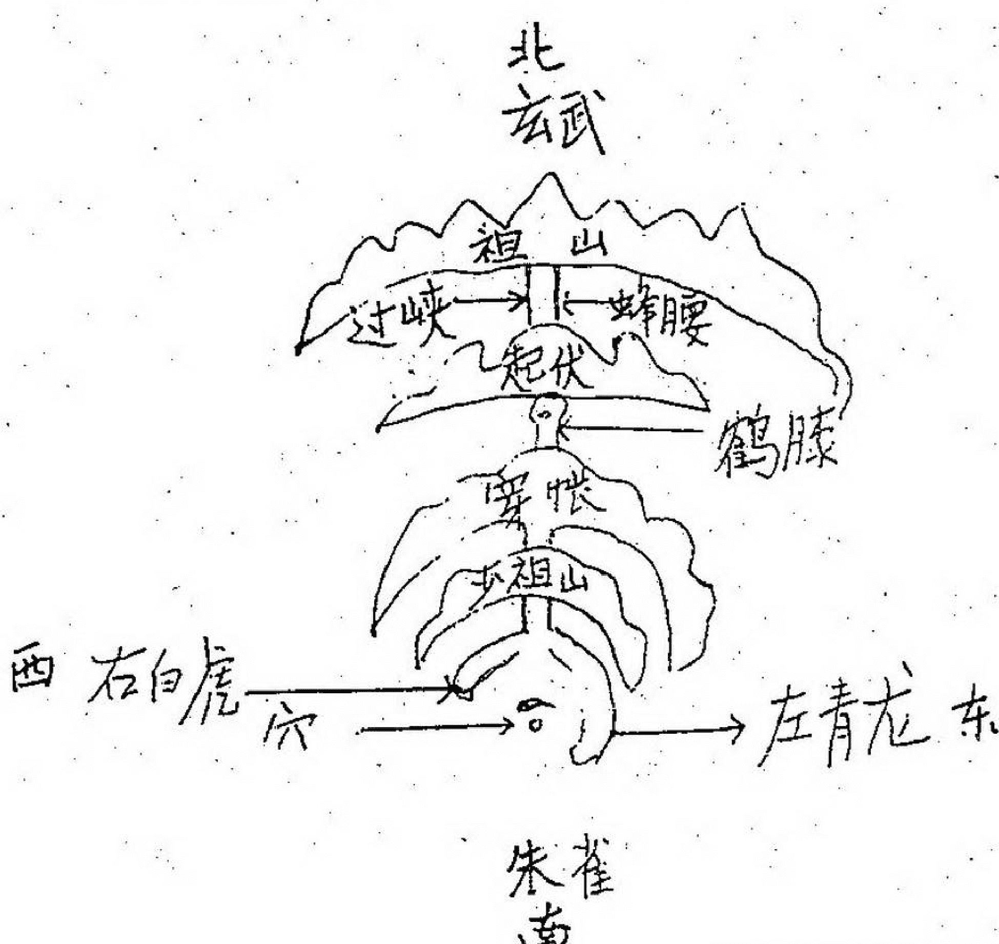

掌握了上述这些要领很重要，凡新采茔地或覆验旧坟（在未用罗盘以水检验向之吉凶前），你站在穴位上，前后左右放眼望去，前有案山、朝山，后有靠山，左有青龙，右有白虎，且符合吉的要求又不遭破坏者，均属合格的上乘之墓。

假若青龙遭破坏，主男人有灾；白虎遭破坏主女人或家人有牢狱血光之灾；案山或朝山遭破坏，主有口舌之患；靠山（少祖山）低小或遭破坏，主无人帮扶、自闯家业或长辈有损。

至于什么“龙的十大崩洪胍”“看龙十要诀”“龙穴四美”“贪、富、贵、贱四龙论”“论龙三式”“来龙入首五格”“寻龙入式歌十二例”“杨筠松七般凶龙”等，诸书皆有论述，您自己看自己悟吧。

易友说；你说的这些我都看过，我还有几个地方弄不明白。请问什么叫“白虎探头”？

答：龙与虎的要求是：龙要高，虎要矮；龙要长，虎要短。假如反过来，白虎高且长，压过了青龙，就谓之“白虎探头”，主虎欺龙，阴欺阳，女欺男，凶，不可取。

问：什么叫龙、虎反弓？

答：阴宅要求龙虎相抱，谓之有情。假如龙或虎向外裂去，就叫反弓，谓无情，必弃之不用。

问：什么叫青龙钻怀？什么叫白虎捶胸？

答：按地理风水要求，龙虎相抱为有情。但是，抱的太过也主凶。龙抱的太过谓“青龙钻怀”；虎抱的太过谓“白虎捶胸”。

### 四、寻穴点窍

易友说：老师，在寻穴前，麻烦你还是先从理论上给我讲讲。

我说：我看过很多书，唯《寻穴证》谈得最好。

点穴先寻穴征，凡真龙结穴处，必有明显之佐证。在穴前者则为朝山美，明堂正，水势旺，三者当推朝山为最要。穴前之山叫朝，以与案有情为主，朝山高，则穴宜高，朝山低，则穴易低，朝山近恐被凌压，穴宜上聚。朝山低，恐防气散，宜就下砂寻穴。明堂有小中大之别，小明堂在园晕下，若见平正可容人倒卧者，方是真穴。中明堂在龙虎之间，要取其交会。大明堂在案山前，立穴要向融聚水势处。凡有真龙结穴处，必有潮源水合聚交会。以上为穴前之佐证。在穴后者，要乐山势鬼撑，龙虎有情拱夹，在穴下者，唇毯要平正，在四旁者，要界水分明，以上为真龙的穴之佐证。若能于此明辨而审察之，点穴必无差错。至于穴忌，只在形气之间，盖看地取形势，葬者乘生气，气囿于形，故点穴必先因形察，则穴之十五忌自能晓然。何谓十五忌，既：粗恶、峻急、单寒、臃肿、凹凸、笑露、瘦削、破面、虚耗、疙头、散漫、尖细、幽冷、荡软、顽硬等。总而言之，十五忌皆就形论气，所当注意者，来龙有高山平地之分，看法因之各异。总之，不论高山平地，若犯一忌，则为绝地，误用之，轻者主贫贱，重则人丁灭绝，祸患百端，必须慎之。

地理师曾指点我说：点穴时要注意“倒杖”。什么叫“倒杖”？指的是如何选好棺木安放的前后左右高低等相对位置，也就是穴点。它还要看来龙是阴是阳，还要看这个点是突是窟，如果不符合“阳来阴受”、“阴来阳受”的原则，那就得凑靠，直至最后符合阴阳承受为止。

易友问：“阳来阴受”与“阴来阳受”是什么意思？

答：地理家根据结穴处的不同形态分为阳龙和阴龙。阳落指边高中低，像人仰伸手掌，手心稍凹之状，称“阳落有窝”。阴落边低中高，像人手面朝下而背部有凸起之状，称“阴落有脊”。阳落者为雄龙，阴落者为雌龙。雄龙结雌穴、雌龙结雄穴，谓之“阳来阴受”、“阴来阳受”。

地理家还讲究“开穴验生气”。地理家认为：穴挖下去，最好要有五色之土，为大吉之象，如果全是石子石块，这个穴点就不好。

地理师还指点我说：点穴时要注意木取节、火取焰、金取窝、土取角，也就是书上所说的“土角流金”。

易友问：木取节是什么意思？
答：木指木形穴，出自蛇形山。
易友说：有的书上讲蛇形山主凶，不可点穴。
答：我指的蛇形山是指象龙形，很细小的象小蛇那样的山不可取。山属木形，要从“节”上点穴。所谓“节”，就是龙有起有伏，有弓有弯，这一弓一弯，必然出“节”，在龙一弓身的那山包下边（节）去寻穴，穴气旺，拿现代的话说就是“有力度”。

易友问：那“火取焰”又是什么意思呢？
我说：什么是火形穴，什么是木形穴，什么是金形穴，什么是土形穴，书上讲得特别细，你自己去看就能明白。关于火取焰，我得跟你解释一下，不能取火苗的最高处，要取刚点燃那个部位。在点穴时，要认定“结穴”处，是否结穴的关键是“藏风聚气”四个字。

易友问：平川地择穴与山地有哪些不同？
答：平川地（也称平洋地）择穴与山地择穴的不同处有：

1. 山地择穴讲究坐满朝空，而平川地择穴则讲究坐空朝满。
2. 山地择穴，穴要低；而平川地择穴，则穴要高。因为平川本来就低洼，水气太大，再葬得低，地下水冲毁骨骸，哪里还谈得上什么萌福？
3. 山地以山为龙，而平川地带没有高岗，往往以水为龙。这样，所谓的龙、水，实际上都由水来代替了，这也就是书上所说的“龙随水转”。
4. 高一寸为山。平川地带难得有山，所以在这种地方，哪怕是比平地高出一点，能令人感觉得出，既可以做为来龙看待。

说来也巧，我边说边从车里往外看，突然发现面前这座山很俊秀、于是让司机停车，要进山去寻龙点穴。

我指着那山对易友说：你看，这座山很象龟形。
易友惊喜地说：象，真象个王八样。
司机插嘴说：这地方我熟悉，本地管它叫王八盖山。

我叹惜地说：这样的风水宝地，怎么就没有人在此葬坟呢？

司机说：本地人都认为，要是在王八盖顶上立坟，那不成死王八头了吗？

我说：看起来不懂地理风水真是误事呀！传授我的地理师讲，龟形山属八大名墓山形之一。

我这易友很认真，立即问：什么样的山属“八大名墓山形”呢？

我说：龙形山、虎形山、蛇形山、龟形山、莲花山、牛形山、马形山。

易友指着那山说：“张老师，你看，那王八头顶上好象有一座坟、那个穴点的咋样？

## 河洛阴阳宅基奥班教材

我说：那是个外行所为，哪有把穴点在王八头上的？

易友问：那你说在哪几点穴好呢？

我眺望着那山说：最好是在龟盖下伸出脖子那个地方，那地方有力度，又藏风聚气。

于是我带易友奔那山去，来个实地择墓点穴。

### 五、看砂点窍

易友随我边往王八盖山上走边问：老师，请给讲讲什么叫砂？

我说：前面我已经提到了，“砂”就是穴的前后左右之山。

地理家把砂分出多种，常用的有以下几种：

- 1、本身之砂：指穴地处的砂。穴虽是一点，但这数尺之地，本身也有凸凹不平。
- 2、物象之砂：指与某些事物相类似，比如笏砂、笔砂、旗砂、鼓砂等。
- 3、杀刀牙刀：杀刀是指来龙本身所带的细瘦尖峭的小峰，形如刀。地理家认为龙有杀刀主出武官，能冲锋陷阵，拜爵封侯。如果杀刀与龙体断离而为砂，就称为牙刀。
- 4、龙虎排衙：指青龙、白虎二砂位置相对，高低不分，如同二衙役执杖相视。这神砂形不好。虽然左龙右虎，但形象如各不相让，反而伤穴内之气。

在实践中，也按五行的原则将砂山的形状归纳为：木形山，头圆身直；金形山，头圆足阔；火形山，头尖足平；水形山，头平生浪；土形山，头平体秀。常用的有如下五种山形：

- 1、三峰形：常名三尖、三台山、笔架山、三峰山；
- 2、双峰形：常名天马山、马鞍山；
- 3、单峰形：常名华盖山、金星山；
- 4、单尖形：常名文笔山、锡帽山、琅琊山；
- 5、扁平形：常名玉几山。

在这里我要向你说明的是：地理中的砂，除龙、虎、鬼（穴后的山）等固定位置、不可缺少的砂之外，其它杂砂名目甚多。有的主吉，有的主凶；有的主富贵，有的主贫贱。砂的优劣，主要看它的格局、方位、形状、向背等。

我在这里提醒你，《地理五诀》上的“八山总论”一节你必须背熟，因为它是验坟的依据（怎样覆验旧坟，我在“安葬点窍”中还将详述）。

“八山总论”是以八卦的卦象来论的。乾为父，乾山高大，男寿长；坤为母，坤山高大女寿高；离为中女，又为目，巽山高大压穴，主出瞎子；兑为少女，兑山高大压穴，主出哑巴、跛脚之人；巽为长女，巽山高大双登科；坎属中男，不可低陷，如低陷，主男有灾，女人易小产、堕胎；艮为少男，艮山高大，肥满，人丁大旺、发横财。如若低陷，多生疯疾。

左有风吹长房受苦、伤兄弟；右有风吹小房贫寒；玄武方有喷头煞，主出横事。

易友问：书上所讲的乾山、坤山等，到底按先天八卦还是按后天八卦来定方位呢？

答：李非先生在为《地理五诀》一书注解此论时，把方向弄错了，他是按先天八卦来定方位的。据我考证，所有的地师均用后天八卦来定方位。还有一个考证方法就是：以罗盘的地盘格龙、立向，其地盘所标示的是后天八卦。

易友点头说：你这一讲我算明白了。还有一个问题，我是百思不得其解。书上说的“贵人山”是从穴的坐干寻查，还是从向的天干寻查呢？

答：您首先得背熟“天乙贵人歌诀”：

- 甲戊兼午羊，乙己鼠猴乡。
- 丙丁猪鸡位，壬癸兔蛇藏。
- 庚辛逢虎马，此是贵人方。

贵人山是从向的天干寻查。比如：壬山丙向，不能认壬起贵人，必须从丙起贵人。按歌诀“丙丁猪鸡位”，那么贵人山就在亥与西方。等一会到了王八盖山上我再给你详细解释。

问：那么怎样去查禄山呢？

答：丙火禄在寅，禄山就在寅方呗。查其它禄山的方法仿此。

### 六、四局定水点窍

我对易友说：你要记住地理师常讲的这句话：登山观水口，入穴看明堂，始知四库，方是阴阳。

水指水源、水流。观水实际是考察地上地下水源和水流的形态及水质。风水学认为：山不能无水，无水则气散，无水则地不养万物。大山脉能“迎风生气”，山环能“聚气藏气”，水能“载气纳气”，这就是地师常讲的“山主富贵、水主财”的道理。中国风水学有谓“地理之道，山水而已”。水被视为“地之血脉，穴之外气”，山之骨肉皮毛既石土草木，皆以水为血脉而贯通。觅龙点穴，全赖水证。龙非水送，无以明其来；穴非水界，无以观其止。风水之法，得水为上。未看山时先看水，有山无水休寻地，吉地不可无水。

咱初步看，这座龟形山的龙脉是相当好了；在进山前，必须把水的情况好好审视一下。

我指着王八盖山说：你看，这个龟形山的左右各有一山，左为青龙，右为白虎，青龙长、白虎短，龙虎相抱。咱再往前方看，在朝山前有一条河。”我问司机，“那条河是怎么个走向？”

司机说：是从东往西流。

我兴奋地说：太好了！此水保证能合上局。

易友说：老师，关于书上所说的“四局定水”，我反复看那“龙水配合图”，却怎么看也弄不明白阴龙、阳水是怎么个用法。

我说：这个“四局定水”，我当初也伤不少脑筋。后经明师指点，才恍然大悟。此节非常重要，假如不懂“四局定水”，就无法立向，就不配做个地师。

古书对此四局有首歌诀，实战中的地师也经常挂在嘴上，现抄录如下：

> 阳从左边转，阴从右路通。
> 若人会得阴阳局，何愁大地不相逢？

下面我就详细地向你讲解必须掌握的金、水、木、火四局，首先需掌握怎样来分这“四局”，请看下边的“四局定水图”

### 图四：四局定水图

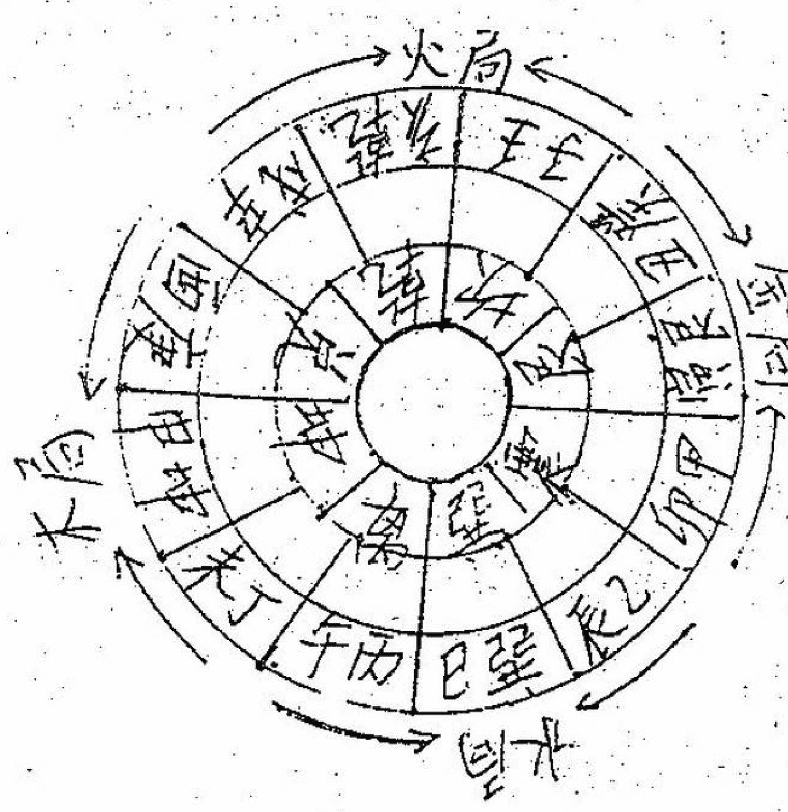

金局：癸丑、艮寅、甲卯；
水局：乙辰、巽巳、丙午；
木局：丁未、坤申、庚酉；
火局：辛戌、乾亥、壬子

易友问：这四局与“三合五行”有什么区别？
答：此四局与“三合五行”完全不是一码事，必须单独熟记。

问：癸丑、艮寅、甲卯怎么成金局了呢？

答：地理风水就是这么定的。我告诉你在背这四局时的诀窍：你就注意“墓库”金墓在“丑”；木墓在“未”；水墓在“辰”；火墓在“戌”；知道了这个方法你就好记了。比如这个“金局”吧，“丑”不就是“金”库吗？癸丑、艮寅、甲卯都与这个“丑库”有联系，他们就属金局里的。其它三局仿此。在背诵的时候，可按所临之库在前的方法，即：“癸丑、艮寅、甲卯；乙辰、巽巳、丙午；丁未、坤申、庚酉；辛戌、乾亥、壬子”。

请注意：在用罗盘调向时，凡见癸丑、艮寅、甲方的，均属金局；凡见乙辰、巽巳、丙午方的，均属水局；凡见丁未、坤申、庚酉方的，均属木局；凡见辛戌、乾亥、壬子方的，均属火局。

下面我详细给您讲这四局：

### 金局

斗牛纳丁庚之气，金局龙水配合图

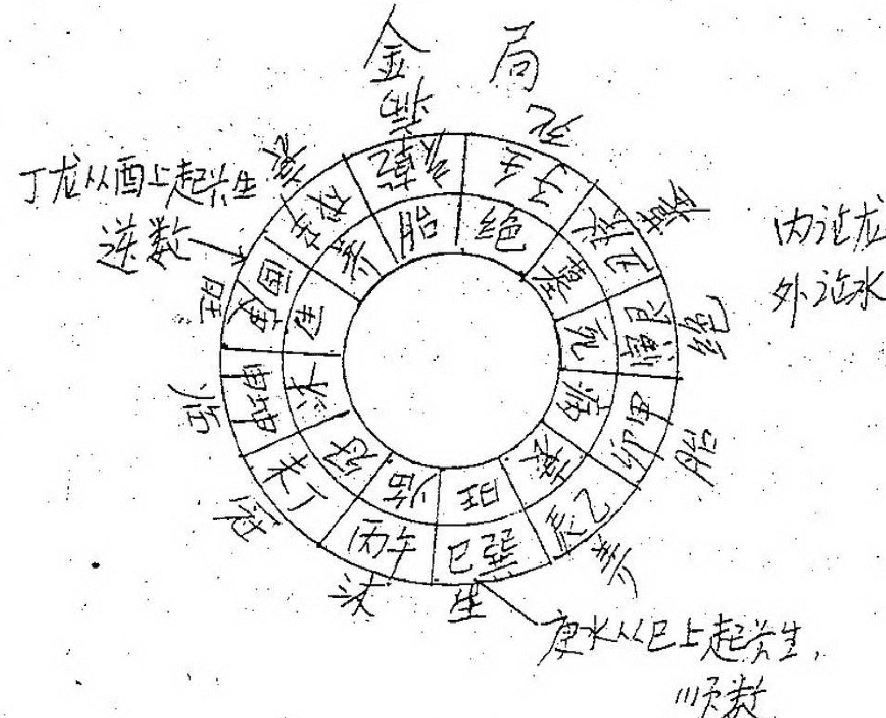

易友问：“斗牛纳丁庚之气”是什么意思？
答：“斗”是形容词，“牛”就是地支“丑”，“丑”是金库，前面我已经讲了，属“金局”；“纳丁庚之气”，丁是丁火，指的是“龙”。“庚”是庚金，指的是“水”，所以才称为“金局龙水配合图”。
请注意看图：内论龙，外论水。
丁龙从酉上起长生（前面已经讲过，丁火属阴火，从酉上起长生），逆数。沐浴在申、冠带在未、临官在午、帝旺在巳、衰在辰、病在卯、死在寅、墓在丑、绝在子、胎在亥、养在戌。

庚水从巳上起长生（前面已经讲过，庚金属阳金，从巳上起长生），顺数。沐浴在午、冠带在未、临官在申、帝旺在酉、衰在戌、病在亥、死在子、墓在丑、绝在寅、胎在卯、养在辰。

凡金局，龙从庚酉方来（丁龙从长生来），水从癸丑方去（庚水依墓库收）；龙从巽巳方来（从帝旺来），水从癸丑方去；龙从丙午方来（从临官来），水从癸丑方去，都是吉相，它们分别表示金局生龙、旺龙、临官龙入首。而龙从甲卯方来（丁龙从病方来），从艮寅方来（从死方来），从壬子方来（从绝方来），尽管水也是从癸丑方去，但却是凶相，它们分别表示病龙、死龙、绝龙入首。

在立向时，必须掌握“龙生水旺与水旺龙生”。如龙从庚、酉方来，酉是丁龙的长生，谓生龙入首，宜立巽、巳向，因为巳是庚水的长生，即长生龙立水的长生向。假如龙从巽、巳方来，巳是丁龙的帝旺，宜立庚、酉向，因为酉是庚水的帝旺，即帝旺龙立水的帝旺向。这就是地理书上所说的“元关通窍，满局生旺”。什么叫“元关通窍”呢？元既是向；关既是龙；窍既是水口。如果龙得生理，水也得生旺，叫做满局生旺，这是最理想的立向。龙水同归一库，如男女交媾，从此生男长女，化生万物，这才是阴阳之大道。

### 水局

辛壬会而聚辰，水局龙水配合图

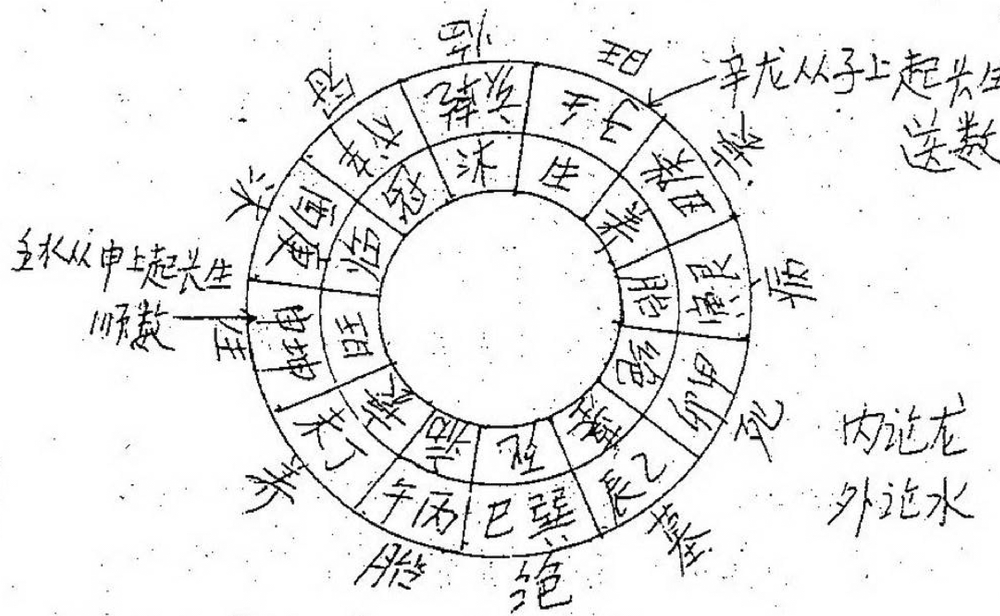

易友问：“辛壬会而聚辰”是什么意思？

答：“辰”是水库，前面我已经讲了，属“水局”。辛是辛金，指的是“龙”。“壬”是壬水，指的是“水”，所以才称为“水局龙水配合图”。

请注意看图：内论龙、外论水：

辛龙从子上起长生（前面已经讲过，辛金属阴金，从子上起长生），逆数。沐浴在亥、冠带在戌、临官在酉、帝旺在申、衰在未、病在午、死在巳、墓在辰、绝在卯、胎在寅、养在丑。

壬水从申上起长生（前面已经讲过，壬水属阳水，从申上起长生），顺数。沐浴在酉、冠带在戌、临官在亥、帝旺在子、衰在丑、病在寅、死在卯、墓在辰、绝在巳、胎在午、养在未。

凡水局，龙从壬子方来（辛龙从长生来），水从乙辰方去（壬水依墓库收）；龙从坤申方来（从帝旺来），水从乙辰方去；龙从辛戌方来（从冠带来），水从乙辰方去，都是吉相，因为它们分别表示水局生龙、旺龙、冠带龙入首。而龙从丙午方来（从病方来），从巽巳方来（从死方来），从甲卯方来（从绝方来），尽管水也从乙辰方去，但却是凶相，因为它们分别表示水局病龙、死龙、绝龙。

在立向时，必须掌握“龙生水旺与水旺龙生”。如龙从壬、子方来，于是辛龙的长生，谓生龙入首，宜立坤、申向，因为申是壬水的长生，即长生龙立水的长生向。假如龙从坤、申方来，申是辛龙的帝旺，宜立壬、子向，因为子是壬水的帝旺，即帝旺龙立水的帝旺向。这就是地理书上所说的“元关通窍，满局生旺”。

### 木局

金羊收癸甲之灵，木局龙水配合图

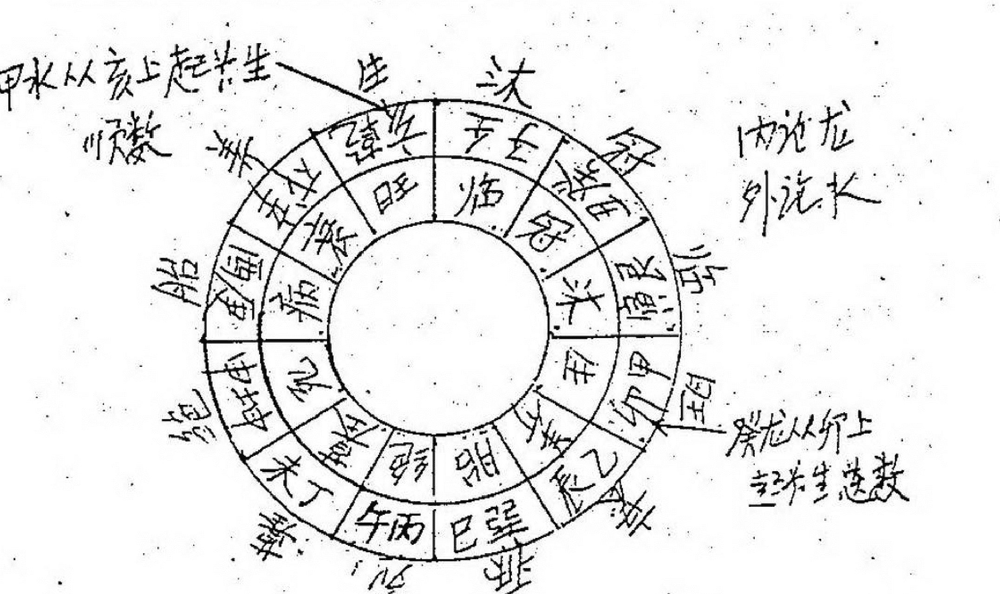

易友问：“金羊收癸甲之灵”是什么意思？

答：“金”是形容词，“羊”就是地支“未”，“未”是木库，前面我已经讲了，属“木局”。“收癸甲之灵”，癸是癸水，指的是“龙”；“甲”是甲木，指的是“水”。所以才称为“木局龙水配合图”。

请注意看图，内论龙，外论水。

癸龙从卯上起长生（前面已经讲过，癸水属阴水，从卯上起长生），逆数。沐浴在寅、冠带在丑、临官在子、帝旺在亥、衰在戌、病在酉、死在申、墓在未、绝在午、胎在巳、养在辰。

甲水从亥上起长生（前面已经讲过，甲木属阳木，从卯上起长生），顺数。沐浴在子、冠带在丑、临官在寅、帝旺在卯、衰在辰、病在巳、死在午、墓在未、绝在申、胎在酉、养在戌。

凡木局，龙从甲卯方来（癸龙从长生来），水从丁未方去（甲水依墓库收）；龙从乾亥方来（从帝旺来），水从丁未方去；龙从癸丑方来（从冠带来），水从丁未方去，都是吉相，它们分别表示木局生龙、旺龙、冠带龙入首。而龙从庚酉方来（癸龙从病方来），从坤申方来（从死方来），从丙午方来（从绝方来），尽管水也是从丁未方去，但却是凶相，因为它们分别表示木局病龙、死龙、绝龙入首。

在立向时，必须掌握“龙生水旺与水旺龙生”。如龙从甲、卯方来，卯是癸龙的长生，谓生龙入首，宜立乾、亥向，因为亥是甲水的长生，即长生龙立水的长生向。假如龙从乾、亥方来，亥是癸龙的帝旺，宜立甲、卯向，因为卯是甲水的帝旺，即帝旺龙立水的帝旺向。这就是地理书上所说的“元关通窍，满局生旺”。

### 火局

乙丙交而趋戌，火局龙水配合图

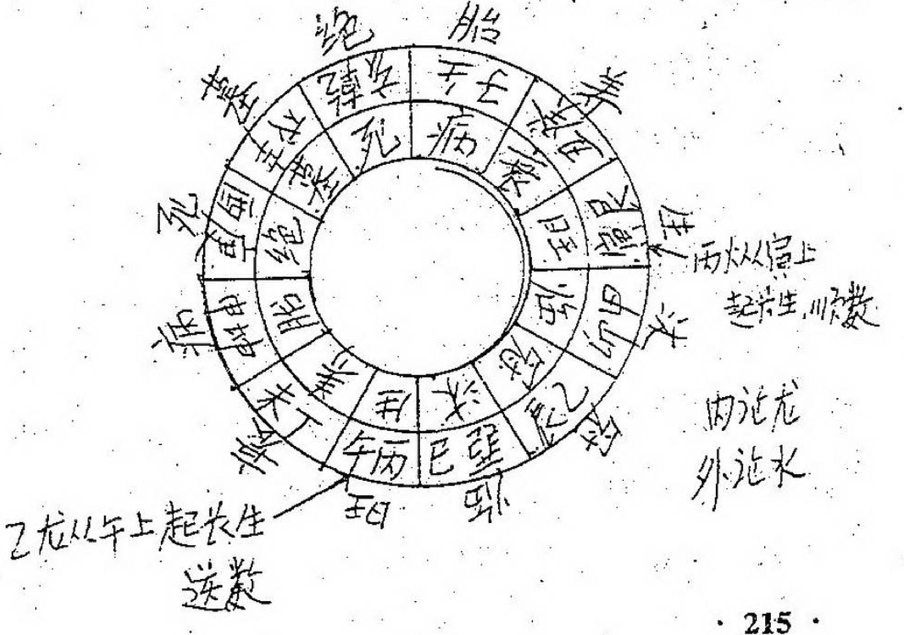

易友问：“乙丙交而趋戌”是什么意思？

答：“戌”是火库，前面我已经讲了，属“火局”；“乙丙交而趋戌”，乙是乙木，指的是“龙”；“丙”是丙火，指的是“水”，所以才称为“火局龙水配合图”。

请注意看图：内论龙，外论水。

乙龙从午上起长生（前面已经讲过，乙木属阴木，从午上起长生），逆数。沐浴在巳、冠带在辰、临官在卯、帝旺在寅、衰在丑、病在子、死在亥、墓在戌、绝在酉、胎在申、养在未。

丙水从寅上起长生（前面已经讲过，丙火属阳火，从寅上起长生），顺数。沐浴在卯、冠带在辰、临官在巳、帝旺在午、衰在未、病在申、死在酉、墓在戌、绝在亥、胎在子、养在丑。

凡火局，龙从丙午方来（乙龙从长生来），水从辛戌方去（丙水依墓库收）；龙从艮寅方来（从帝旺来），水从辛戌方去；龙从乙辰方来（从冠带来），水从辛戌方去，都是吉相，因为它们分别表示火局生龙、旺龙、冠带龙入首。而龙从壬子方来（乙龙从病方来），从乾亥方来，从庚酉方来，尽管也是从辛戌方去，但却是凶相，因为它们分别表示火局病龙、死龙、绝龙入首。

在立向时，必须掌握“龙生水旺与水旺龙生”。如龙从丙、午方来，午是乙龙的长生，谓生龙入首，宜立艮、寅向，因为寅是丙火的长生，即长生龙立水的长生向，也叫“收长生水到堂会旺”，水再从辛戌方去，叫做“生来会旺”。假如龙从艮、寅方来，寅是乙龙的帝旺，宜立丙午向，因为午是丙水的帝旺，即帝旺龙立水的帝旺向，也叫“收帝旺水到堂迎生”，水再从辛戌方去，叫做“旺去迎生”。这就是地理书上所说的“元关通窍，满局生旺”。

请注意：所有的地理师都把此四图画在纸上，随身携带。在用罗盘调向时，把图纸往地上一放，参用：

易友问：什么叫水上堂与不上堂？

答：上堂是指水从左到右或从右到左流经明堂之前。地理书中常说的“左水到右”、“右水到左”都是指水上堂。一般说来，水聚堂前表示富贵之象，但如果没有水聚于明堂，只要不冲生破旺，也不致有凶祸，只是福力浅薄。

易友问：什么叫“左水到右与右水到左”？

答：“左水到右”指来水过堂后，向另一方而流出。具体来说，穴左的来水须向右流出，叫做“左水到右”，反之叫做“右水到左”。以火局为例，请对照图看，其立向的生、旺之方在艮、寅和丙、午，而墓、绝之方在辛戌和乾亥，右边水来过堂，如果仍从右出，右边没有墓库，那就冲破了生旺，而水却不能归库。其实地理家反复强调的水从何方来，到何方去，无非就是这么一个简单的道理，可惜很多人一到水、向问题上便一片茫然。

易友说：怎样才能掌握“水从左到右与从右到左”？

答：这也是个死规矩，请你对照图看。

凡立四局长生向，需右水到左，虽无禄可迎，可取局内长生、官旺水到堂归库。假若左水到右，则冲长生向。经云：“射破长生向，少差而就绝。”

凡立四局旺向，需左水到右，迎禄、借禄，并取局内长生官旺水到堂归库。若右水到左，则破旺位，须转立方向，方可立穴。经云：“冲伤旺位，针一转以从生。”如旺向水不能归于正库，则取衰方出，其余皆不宜立向。

凡立四局墓向，需左水到右，迎禄、借禄，并取左右长生官旺水到堂归库。若右水到左，则冲墓位，亦主财禄空虚。如立乙、辛、丁、癸天干向者，水可当心直出，百步转拦，归乾、坤、艮、巽而去。如立辰、戌、丑、未地支向者，此乃借禄，水不可当心直出，须从乾、坤、艮、巽而去，又不可当面朝来，亦有变当心直出辰、戌、丑、未，有情出煞而去。

凡立四局乙、辛、丁、癸养向，右水到左不迎禄，取局内长生、官旺水到堂，出左方乾、坤、艮、巽而去，凡四局养向，乙、辛、丁、癸为小神，甲、庚、丙、壬为中神，乾、坤、艮、巽为大神。小神流入中神，中神流入大神，谓之禄马上街，主出公卿。必须中神水来交合方旺。

凡四局立自旺向，需左水到右，迎禄、借禄，取向上长生、官旺、禄水到堂，即借向左右旁乙、辛、丁、癸四库消之。此系向上衰方。经云：“推有衰方可去来。”但需曲折，不宜直出。如见直出，一发便衰，劫宜隐隐而去为妙。

以上四局，各有生、旺、墓、养及化生化旺诸向。此所谓“葬乘生气，认水立向。”

凡局中子、午、卯、酉沐浴方有水来者，俱要拨在甲、庚、丙、壬，主发秀贵。如甲、庚、丙、壬水略带三分子、午、卯、酉者，名为赦文带桃花纹。虽发秀贵，男女淫乱，主凶。

凡消水之处，须拨在乙、辛、丁、癸而合襟，得反照穴，三房应福。如从辰、戌、丑、未方者，须拨在乾、坤、艮、巽绝位而出。亦有生、旺、墓正局向，或变在甲、庚、丙、壬胎位而去。如立向水不归库，终归败绝。

易友问：书上讲的有几十种立向法，我也记不住哇。

答：莫说初学者记不住，当了几十年地师的都挑选最主要的记在我上面所讲的四局旁边，在定向时放在地上参看，你为啥不能模用？

易友问：地理书上在立向时，往往提到“兼壬三分”、“兼亥三分”等，是什么意思？

答：这是分金概念。以火局长生向为例，“立艮兼寅三分，立寅向兼艮三分”，请对照图看：艮、寅是相邻两山，依每山分金十分，那么艮、寅各有十分分金。由于天地二盘相差半格，所以认水和立向这两套活动间存在着误差，不可能内外盘完全重合。所以所说的立艮向，也就是指艮向占七分，又兼有相邻的寅向三分，算做一向。为什么艮占七而寅占三，而不是艮占六而寅占四呢？因为罗盘外圈还有火坑、孤虚、煞曜。避开这点，只能采用兼金的办法。分金中常说的“三七加减”、“二八加减”，就是对此而言。一般占分金多的为本向，比如艮七分寅三分，细说就是艮向，而笼统地说就是艮寅向。再看图，艮左邻丑，为什么不说艮七分兼丑三分呢？因为立向要受双山五行的限制，艮、寅为一双山，而丑与癸为一双山。

### 七、立向点窍

立向，是龙、穴、砂、水的大都会。也就是说，在地理堪舆的五要素中，向是总括全局的一个要素。就龙来说，立了向，才有所谓生龙、旺龙、死龙、绝龙；就穴来说，立了向，才会有生气之穴和无生气之穴；就砂来说，立了向，才会有得位的砂和不得位的砂；就水来说，立了向，才有所谓杀人冲禄的黄泉和救贫济富的明秀水。这就好比砖瓦、灰、木，立向就好比定出建筑图式，图画得好，好砖固然更宜使用，但坏木也未必不可补救而用。同样道理，倘若图画得不好，即使是砖、瓦、灰、木样样精良，仍可能建起来便倒塌，不能为人所用。因此说，立向是总括全局的重要因素。

依水立向为阴宅地理唯一要旨，因为定向先要摆罗盘，看水口。水从何处来，何方出，审辩清楚，然后定向。所以有山向相同，因水口各异，立向也随之改变，往往有一山而定十数向。

要论立向，必须熟知《十二水口吉凶断法》，因书上讲的较细，我这里不赘。

向法虽不尽至此，如果能掌握双山十二向、十二水口之吉凶，其余皆可类推而知。

易友说：书本上这些东西虽然讲得很明白，我还是想着看你到底怎样操作，那样才能心领神会。

真是上天不负有心人，当年的腊月，一位局长的父亲故去，他一看就相中了这个王八盖山，于是我便找这位易友跟随我上山安葬。

我把携带的图往地上一放，摆正罗盘，一边调向，一边对易友讲解。

我对易友说：你看这个图，再看罗盘，这个图和罗盘是一样的。

这个山是坐北朝南，你放眼往前看，水从乙辰方来，向巽巳、丙午、丁未、坤申、庚酉、辛戌方流去，最后归戌库。按前面我讲的“四局定水”，水口在戌。当属火局。那就看：《火局龙水配合图》

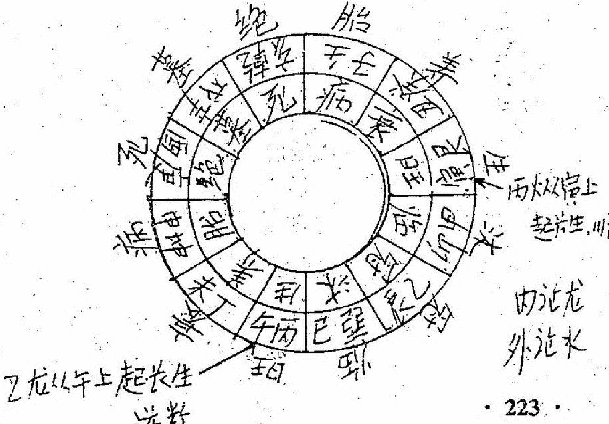

## 河洛阴阳宅堪舆班教材

1、用罗盘调午向（这就是地师说的“壬山丙向，子山午向”）。丙水长生在寅，顺数，沐浴在卯、临官在辰、冠带在巳、帝旺在午……收局内乙辰冠带水、巽巳临官水，并本位丙午帝旺水出辛戌正库，为正旺向。

2、龙队艮寅右来，谓旺龙入首。

易友问：请详细说说怎么看“旺龙入首”？

答：甲木长生在亥，巳木长生在午，火局龙为乙木，乙龙从午起长生，逆数，沐浴在巳、冠带在辰、临官在卯、帝旺在寅，龙从艮寅来，自然当是“旺龙入首”，这就是书上所说的“生来会旺正旺向”。

3、在远处的午向上有一座火形山，谓三台山。

请注意：风水师有“阳宅打凹，阴宅打高”之说。就是说，阳宅要往山的凹处打向，阴宅要往山的尖上打向。反之，他就是个“老外”。

4、以丙向起“天乙贵人”。“丙丁猪鸡位”，在穴的西方恰巧有一座山，谓贵人山。

易友说：听说“桃花煞”既主淫邪又主破败，请给讲讲。

答：其实“桃花煞”是指立向与流水犯煞的，请看歌诀：

- 亥卯未，鼠子当头忌；
- 巳酉丑，跃马南方走。
- 申子辰，鸡叫乱人伦，
- 寅午戌，兔从茅里出：

大意是：立亥、卯、未向，水从子方流来，因为木长生在亥、沐浴在子，故称桃花煞；立巳酉丑向，水从午方流来，因为金长生在巳，沐浴在午，故称桃花煞；立申子辰向，水从酉方流来，因为水长生在申，沐浴在酉，故称桃花煞；立寅午戌向，水从卯方流来，火长生在寅，沐浴在卯，故称桃花煞。

如果立亥卯向，水从未向流走，叫做破煞，也是桃花煞；同样，立巳、酉向，水从丑向流走；立申子向，水从辰向流走；立寅午向，水从戌向流走，都属于自破桃花煞。

易友说：请给讲一下“龙上八煞”，好吗？

答：请背熟歌诀：

坎龙坤兔震山猴，
巽鸡乾马兑蛇头。
艮虎离猪为煞曜，
冢宅逢之一旦休。

其意是：

- 坎方来龙不立辰（龙）向；
- 坤方来龙不立卯（兔）向；
- 震方来龙不立申（猴）向；
- 巽方来龙不立酉（鸡）向；
- 乾方来龙不立午（马）向；
- 兑方来龙不立巳（蛇）向；
- 艮方来龙不立寅（虎）向；
- 离方来龙不立亥（猪）向。

易友问：李非先生在注解《地理直指原真》一书中说，地理所忌有若干煞方，这些煞方是由罗盘格定后才确定下来，而且主要是指水而言。如果流水正好从规定的煞方流来，既称为黄泉大煞。这“龙上八煞”是在立向时要躲避的，是指八个方向的流水而言。既坎方来龙忌辰向流水；坤方来忌卯向流水；震方来龙忌申向流水；巽方来龙忌酉向流水；乾方来龙忌午向流水，兑方来龙忌巳向流水；艮方来龙忌寅向流水；离方来龙忌亥向流水。你对此论有何看法？

答：李先生此论我不敢苟同。因为在用罗盘立向时，有明确规定：天盘收水；地盘认龙、立向；人盘消砂。“龙上八煞”，是指龙与向所忌。李先生把此忌看成是龙与水所忌是错误的，“八大黄泉”才是龙与水所忌。

请你注意看，以上所说的“龙上八煞”均属“龙与向相克”，并不是李先生所说的“龙与水相克”。

易友问：什么叫坎方、坤方、震方、巽方、乾方、兑方、艮方、离方来龙呢？

答：关于方位，我在前面“二十四山向”中已经讲明。

请注意，在实际操作中，用的是“后天八卦方位”，既离南坎北、震东兑西。罗盘的地盘上有明确的标识。

问：有的龙从坎方出，却往东拐一下，又往南拐去，这一下就把我闹糊涂了，到底怎样具体确定从哪方来龙呢？

答：这个问题问得好，不经明师指点，只凭书本是弄不明白的。我告诉你，以穴后那个“过峡”（低凹处）来确定，这个“过峡”在罗盘地盘的什么方位上就属从什么方来龙。

问：书上常讲“龙入首”，从什么地方看这个“入首”呢？

答：上面讲的穴后那个“过峡”就叫龙入首，也叫“来龙”。

问：什么叫阴龙？什么叫阳龙呢？

答：在龙与水这一概念中，水为阳，龙为阴。在龙本身的概念中，凡以脉之左旋者为阳，右旋者为阴。凡阳龙之脉起于寅、申、巳、亥，顺时针从右往左旋，为阳龙；凡阴龙之脉起于子、午、卯、酉，逆时针从左往右旋，为阴龙。

易友说：老师，听说在立向时还须注意“八大黄泉”，请给讲解一下。

答：请背熟歌诀：

庚丁坤上是黄泉，
乙丙须防巽水先。
甲癸向中忧见艮，
辛壬水路怕当乾。

解：

庚丁坤上是黄泉；

立庚、丁二向，从罗盘看，在坤向上见有水，既为黄泉煞。同样道理，立坤向，而庚、丁二方见有水流去，也为黄泉，因为向水不相融合。坤向见丁水犯破军，见庚水犯廉真。廉真主吐血、为贼，破军主赌博、官司，所以两者相犯，必主凶灾。

乙丙须防巽水先，

立乙、丙二向，从罗盘看，在巽向上见有水，既为黄泉煞。同样道理，立巽向，而乙、丙二方有水流去，也是黄泉煞。乙见巽犯禄存，主赌博、败家。

甲癸向中忧见艮：

立甲、癸二向，从罗盘看，在艮向上见有水，既为黄泉煞。同样道理，如果立艮向，而甲、癸二方有水流去，也为黄泉。因为艮向见癸水犯禄存，主败家、溺死，故为凶向。

辛壬水路怕当乾：

立辛、壬二向，从罗盘看，在乾向上见有水，既为黄泉煞。同样道理，立乾向，而辛、壬两方有水流去，也是黄泉煞。乾见辛犯廉真，主疫死，故为凶向。

易友问：在用罗盘立向时，有癸丑、乙辰、丁未、辛戌四库方，该怎样定？

答：罗盘指针要避开地支辰、戌、丑、未，而运用天干癸、乙、丁、辛，那四库方主要是用于收水的。

问：在格定子山午向时，罗盘指针直指向上的那个“午”吗？

答：这是不可以的。罗盘有正针与缝针之分。子山直对午向，属正针，除了修庙和皇上修金銮殿，其它均不可用，只可在缝针中选用。这是属罗经范畴，我在另一个教材里将详解。

已经是腊月了，北方正是地冻三尺、滴水成冰的严冬季节。但在打墓时，此地却不必用镐刨，用锹挖土时往外冒热气。当有人把喝过的酒瓶子往地上一扔时，瓶嘴却扎进土层，直直地立在那里，可见这个墓穴藏风聚气到何种程度，在场的人无不交口称赞。

# 第二十章 出灵点窍

生死为人生两件大事，生为起点，死为终结。自古以来，华夏民族一直非常讲究礼仪，所谓慎终追远，身后哀荣，对丧葬祭奠礼仪尤为重视。做为一个合格的风水师，则必须懂得这些法术。

### 一、临终搬铺

俗以死于睡床之上，冥魂将被吊在床上，不得解脱，只有死在家中最好的地方才得安宁。故将临终之人由卧室搬到厅堂临时铺设的板床上。与此同时应为临终之人擦洗身体，更换寿衣。寿衣绝对禁止用皮毛制品，恐来世转为兽。

如果临危之人是在医院，临终搬铺一节自然免去。但擦身、更换寿衣依然，最后送入太平房。

### 二、小殓

初终，为死者放入咽口钱（最好能在临终之前），为死者修容（理发、刮脸、简单化妆），两手放入打狗干粮（馒头、糕点之类），用烧纸把手包好，两脚换上装老鞋，用绳绊好，整理妥当后、用黄或白布从头到脚盖好，在终铺前，应放倒头饭、各种祭品、香烛，点燃油灯。在丧盆内先烧三斤二两烧纸钱，这些纸灰要特殊包好，入殓时放入棺内。如移尸太平间，一切同上，只是烧纸钱、点油灯等项，视太平间之规而定。

### 三、挂孝报丧

丧家在大门悬挂烧纸制做的岁头纸（一大串烧纸），纸数要比岁数多两张，比如故去之人是六十岁，纸数为62张。在做纸串时，最上面用一张纸，最下边用一张纸，表示天上一张、地下一张之意，中间用几张纸不限：亡男挂在门左，亡女挂在门右。也可在大门外张贴讣告，在白纸上写明死者生卒年月日时。

送浆水：每当人吃饭之前，戴孝之人先去庙上送水、酒、饭之类的祭品，回来后再吃饭。

哭道报庙十八场：就是一个时辰应一遍哭。

### 四、守铺

在大殓出殡之前，丧家亲属昼夜轮流守护在死者停铺侧，看住油灯，不让火灭，间断烧纸或上香，严禁猫狗之类动物靠近终铺。

### 五、指明路

死后的第一个晚上需要指明路，长子手持扁担，扁担一头吊一串纸钱，站在凳子上，指西南方连喊三声：“××，往西南光明大道走哇。”

如无扁担，可用高粱杆或木棍代替。

指明路地点一般在灵铺附近，或附近的路口。

### 六、棺材前灵头怎么写？

要求是男写单字，女写双字。比如故去的是母亲，写“故母于秀芹之灵位”，此是八个字，属双。比如故去的是父亲，可写“故先父孙志洁之灵位”，此是九个字，属单。

### 七、大殓

死后24小时内，由风水师择吉时开光。

开光时，让长子拿起倒头饭中间的那根棍，不用蘸灯油（象征性地），随风水师念下面的开光歌：

- 开眼光，明亮亮。
- 开鼻光，闻麝香，
- 开咀光，吃八方。
- 开耳光，听四方。
- 开心光，亮堂堂。
- 开手光，抓钱粮。
- 开脚光，上天堂。

开光后，取下咽口钱，由长子捧头，次子捧脚，众人帮忙，移入棺内。

在开光、移尸过程中，一定要在用遮布挡光情况下进行。四个人扯着白布或被单四角，把尸首遮上，避免阳光照射。

入殓后封棺，其子女、亲属晚辈等，跪在棺材两侧，木匠开始钉钉（俗称煞扣）。木匠在左边钉钉，众人喊：“××呀，往右躲钉。”木匠在右边钉钉，众人喊：“××呀，往左边躲钉。”

待棺封好后，木匠最后一斧把寿钉钉在棺盖前边（要求是男左女右）。钉好后，把咽口钱挂在钉上。

### 八、入棺出灵禁忌

- 正、四、七、十月，忌属虎、猴、蛇、猪。
- 二、五、八、十一月，忌属鼠、马、鸡、兔。
- 三、六、九、十二月，忌属龙、狗、牛、羊。

### 九、守灵

大殓之后需要在家停棺，一般要停放七日，现在多数是第三天出殡（从死后那天算起）。大殓后至出殡期间，家人要守护或睡卧在棺旁草垫上，以表孝忱，叫做“守灵”。其亲友可在室内搞些活动，叫“坐夜”。

通常情况下，凡停灵在家的，都要搭设灵棚，要在寿材头摆设祭品、倒头饭、油灯，挂挽帐，摆花圈。

此期间凡来拜祭者，不论其辈数高低，守灵的都要还礼。

如遗体停放在太平间，丧者应在家里设灵堂守灵。灵堂设置所需物品：灵牌、遗像、供品、香烛、纸钱等。

灵堂用供品：

道家摆五供：鸡、鸭、鱼、肉、蛋。

佛家摆四果：苹果、香蕉、大枣、橘子。

摆道家的还是摆佛家的或佛道两家同时摆，由风水师决定。

竹筷子五双。

酒盅五个。

馒头十个，分两摞。

香一扎。

关于灵牌怎么写，请参照前面“棺材前灵头怎么写”。

关于孝带的扣怎么扎：男的结在左边，女的结在右边。

### 十、怎样写挽幛

挽幛又叫祭幛，用素色的双幅绸、毛料等较好的布料制成，通常是长2米，宽1.5米左右。其格式如下：

幛右侧为对死者的称号，左侧为送挽幛的具名，幛中央为挽幛词，均用墨笔写在白色的长条或菱形纸块，缝贴挽幛上。一般采用直行书写的形式。

过去在写挽幛时，要在左侧具名的右上角加上“阳居”二字，就连右侧的“○府”都得用红纸写黑字，其余则用白纸写蓝字，以表示“○府”和送挽幛的人是生人，做到生死分明，否则便会是失礼而遭到非议。现今已不这样讲究了，甚或不用“○府”二字。

死者称号和送挽幛者具名必须符合礼仪要求，相互匹配。列：

> ○府尊岳父○○老人千古
> 松 柏 长 青
> 子婿○○○率外孙○○敬挽

挽幛词一般多用四个字的词组，但也有在幛中央吊一个白纸黑字的大“奠”字，还有在幛中央写联语的。挽幛词语很多，虽然都是褒扬、吊唁，但仍有区别，用时要根据死者的身世及与生者关系等具体情况，选择切合的词语：

通用挽幛：

- 松柏常青 英魂常在 含笑九泉 流芳百世
- 永垂不朽 万古流芳 浩气常存 遗爱千秋

### 十一、怎样写挽联

挽联和其它哀悼文一样，在写法上有着严格的规律，挽联为上下两个半联，要求上下半联字数相等，结构对偶，文字平仄相对，讲究声调、节奏、韵律。在使用上，挽联分为丧家自挽和哀挽别人两类，由于与死者的关系不同，死者生前的身份、处境等具体情况不同，撰写的内容也应各不相同，不能混用，以免失礼或落人笑柄。

通用挽联：

丹心照日月，
正气炳乾坤。

寿终德望在，
身去音容存。

高风传乡里，
亮节照后人。

松柏常耸翠，
金柳动哀情。

痛心伤永逝，
挥泪忆深情。

挽男丧通用：

毕生正直无私，
一世勤劳可风。

椿形已随云气散，
鹤声犹带月光寒。

人间未遂青云志，
天上先成白玉楼。

挽女通用：

青山永志芳德，
绿水长吟雅风。

瑶池旧有青鸾舞，
绣幕今看白鹤翔。

良操美德千秋仰，
亮节高风万世存。

身似芳兰从此逝，
心如浩月几时回。

挽父通用：

百呼不醒慈父梦，
千载难忘养育恩。

深恩未报羞为子，
饮泣难消欲断肠。

思亲蜡尽情无尽，
望父春归人未归。

挽母通用：

人间慈母去，
天上慧星沉。

思亲唯有泪，
救母痛无方。

母魂已逝空增泣，
儿泪常流难报恩。

挽兄弟通用：

风悲梧叶留残血，
雨促荆花恨落红。

雁阵霜寒悲折翼，
鹤原露冷痛孤飞。

挽夫通用：

裂肺撕肝儿寻父，
捶胸顿足妻哭郎。

每思田园共笑语，
难禁空房独泪流。

挽妻通用：

户悲凄风冷，
楼空苦雨寒。

想见和颜唯有泪，
欲闻笑语杳无声。

惨听秋风吹落叶，
愁看冷月照空帏。

### 十二、送行（俗称送大纸）

送行是在出灵的头一天晚上，要把所扎的纸活，如马、牛、岁纸、衣物等，送到庙上去烧。这里要强调的是：长子用条笤托着岁头纸、亡命牌。后退着绕棺材左转三圈、右转三圈。之后，才能往庙上去。

在往庙上去之前，由风水先生念“路引”（也称“路引马票”，用墨水写在烧纸上），其写法如下：

> 南瞻部州共和国 省 市 乡 村居民 世（这个“世”字指六十岁以前故去的，在“灵幡”一节中有详述）故××，生于 年 月 日 时，于 年 月 日 时寿终正寝，赴阴间冥界。随身携带珠宝器皿无数，钱财若干，白马（或牛）一匹（或一头），牵马童一位，名唤得用。沿途各关卡、哨所、庙宇、村庄、河边、柳岸，以及一切强神恶鬼等不得任意抢劫、掠夺、扣压，一律放行。
>
> 转勒令
> ××年××月××日

念完此“路引”后，将它装在马褡子里，随马走，确保一路平安。

在往庙上走的路上，要求长子手托着岁头纸、亡命牌倒退着走。

到庙上后，马或牛头向西南，由长子指明路，女儿给亡人（亡命牌）洗脸、梳头、照镜子等，后将所带之物全部焚烧。

回来后，还要“摆祭吃零”。由风水先生主持，“喊月台”，令孝子们全跪在棺前，由孝子一样一样地上食物，摆放在棺前的桌子上。

此后开始最后一次烧纸（多数在亥时），要多烧。

### 十三、出殡

出殡一定要择吉日吉时。我在《择日点窍》中示有“十七不出灵，十八不安葬”，俗有忌双日下葬。遇到特殊情况，风水师有时也择不出好日子，时间拖长了又违入土为安之大理。硬要下葬呢，又恐死者不安，活者遭祸。在这种情况下，可采用趋吉避凶之法。最好的方法是“禳镇重丧法”：

用白纸造函一个，用黄纸朱砂书写四字，置函内，放在棺上，同出大吉。如怕风刮跑，可以拿着，在下葬时同棺材一起埋或火化。

朱书四字的规则是：

- 1、2、6、9、12月，朱书：六庚天刑；
- 3月，朱书：六辛天刑；
- 4月，朱书：六壬天刑；
- 5月，朱书：六壬天狱；
- 7月，朱书：六甲天福；
- 8月，朱书：六乙天德；
- 10月，朱书：六丙天成；
- 11月，朱书：六丁天明。

倒头饭由谁来拿？

有姑爷的让姑爷拿，没有姑爷的由儿子拿。

烧的纸灰怎么处理？

把烧的纸灰包起来，放在被褥一起，到火化场或茔地一起烧掉。

灵车开动前，由长子跪在车前摔丧盆。

注：凡提到由“长子”所做之事，如死者无子，可由侄儿、女婿代替。

灵车起动后不能停。

每逢过桥或岔路口都要扔钱，到墓地时要把纸钱全部扔完。

纸钱用纸应分生葬与熟葬：生葬用黄烧纸；熟葬用红纸。

### 十四、灵幡

如今殡仪馆、花圈店随处可见。因有很多经营者不懂有关“灵幡”方面的知识，常常搞得不伦不类，让生者耻笑，亡者不安。为正本清源，现把师传之秘诀摘录如下：

#### （一）、怎样从灵幡上区分出所故之人的年岁大小？

凡不超过60岁故去的，在“故”字前写“世”字；

凡60——70岁故去的，在“故”字前写“耆”字；

凡70——80岁故去的，在“故”字前写“耄”字；

凡80——90岁故去的，在“故”字前写“期颐”二字。

比如某人之父是48岁故去的，其灵幡应写“世故”显考……内行的人一看“故”字前这个“世”字，便知此人是60岁之前故去的。

#### （二）、怎样从灵幡上区分出所故之人是男是女？

1、在引魂幡中间及两边的飘带最下边来区分。要求是：男剪箭头，女剪凹。男在最下边剪出五个箭头；女在最下边剪出五个豁口。

2、引魂幡中间飘带的中间，要“男剪圆形、女剪方形”。男为乾为天，女为坤为地，取天圆地方之意。男剪13个圆形；女剪14个方形。男属阳，剪单；女属阴，剪双。

#### （三）、怎样写灵幡：

灵幡两边飘带所写的字，最后一个字必须占上“生”。

比如下面这个灵幡的飘带：

金童前引路乘龙东去
玉女送西方驾鹤西游

解：

上一联“金童前引路乘龙东去”，是九个字。从“金”字起“生”，童字念“旺”，“前”字念墓，“引”字念绝，再从“路”字起，往下念“生旺墓绝”，念到最后那个“去”字便占上“生”。

用此法查下一联，最后一个字也占“生”。

灵幡中间的飘带所写的最后一个字，要求男占“生”，女占“旺”。

比如故父名叫周永生，终年56岁，可写成：世故显考周公讳永生之引魂幡

从“世”字起生，“故”字念旺，“显”字念墓，“考”字念绝。再从“周”字起，往下念“生旺墓绝”，念到最后那个“幡”字，便占上“生”。

如果姓名是两字。就在“引魂幡”三字中间加个“宝”字，既“引魂宝幡”。

女占“旺”，仿此法。

比如故母名叫孙桂芳，终年55岁，可写成：世故显妣周门孙氏桂芳之引魂幡。

如果姓名是两字，就在“引魂幡”三字中间加个“宝”字，既“引魂宝幡”。

新葬（俗称生葬）用黄烧纸。

覆葬（俗称熟葬）用红纸。

灵幡要由长子打。

### 十五、净宅

如死者死在家中，需除殃净宅，以保活着的人安康。出殡后，家中留一男长者，负责打开所有门窗。风水师用五谷杂粮扔打落殃处，同时念“洒五谷粮咒”。

殃落处：

男用天干；女用地支。

男用天干歌诀：

甲在锅台乙巽间，
丙丁自在瓦二三。
戊日不离停灵地，
己日还在炕床前。
庚辛在于西北角，
壬癸还在水器边。

女用地支歌诀：

寅窗卯门辰在墙，
巳时洋沟午未梁。
申酉在碾戌亥灶，
子丑二时在厅堂。

打过之后，把杂物皆扫地出门。

洒五谷粮咒：

一酒洒天殃，
天蓬道路昌；
二酒洒地殃，
地殃化吉祥；
男殃并女殃，
洒着齐消亡；
三酒洒鬼殃，栖尽诸妖魔，急急离此方；
天圆地方，律令九章，
吾奉天蓬大师助我斩殃。

## 十六、净宅镇符

故者属横死，如淹死、车祸、吊死等，需在出灵后，将“净宅镇符”贴于房四角镇宅（请注意，画符必需经师传，如擅自书写，易遭祸殃）。
净宅镇符（画法附后）

## 十七、火葬俗礼

尸体入殓后，运到火化场。入炉前，在吊唁室，子女亲属站在尸体两边，其余人员一一走过，瞻仰遗容，然后送入火炉。此时既可焚烧牛、马、衣物等。
骨灰出炉之后，装入红布袋。骨灰盒四角垫硬币，把装好骨灰的红布袋放在硬币上，封妥后，骨灰盒由长子捧着，直系亲属跟随，到燃烧区设灵台，摆放祭品，烧纸钱，最后，晚辈由长子带头，按序列磕头告别，取下孝带，在火上熏烤，最后把骨灰盒寄存。
寄存号码也有吉凶之分，以1、3、5、6、7、8层为好，此吉祥数由风水师摘选。

接尸车在离开火化场时，应用烧纸熏烤轮胎。

## 十八、死后祭典活动

死后要烧头七、三七、五七、百日、周年、三周、十周年，以示孝子之心。

上述祭典活动，都要烧纸钱，摆供品。

立坟的上垄地；火化的，搬出骨灰盒。

天数的计算都要从死的那天起为第一天。

三天园坟，园坟从下葬之日为第一天。

园坟要修整新坟，在坟前用红砖搭迎风门，坟上要用高粱杆搭上三道梁，把咽口钱栓在主梁上。

## 十九、丧葬祭品

自古以来，男死烧纸马（供死者骑乘）；女死烧牛（替死者喝脏水），马由儿子，牛由女儿出钱定做。

烧纸钱是必不可少的，究竟何种钱有用其说法不一。用纸捏子或大钱打印的纸钱是一种零用钱，一个大钱只有一文，可买一个烧饼，价码虽小，必不可少。阴票（冥币）面额大，携带方便，也是可用。再有一种，天朝地府通用币，乃是佛家研制而成，后有用胶版自印，据说是管用的。至于用人民币或股票在纸上一比划的纸钱，显然是无效的。还有用烧纸制冰箱、彩电、轿车、大哥大者，实为可笑。

# 第二十一章 安葬点窍

传统丧葬祭典礼仪现今在广大农村及部分城镇居民中仍然流行。保存着若干古代习俗，它包括有丧、葬、祭三个方面。我在这一章中专门讲风水师是怎样进行安葬的。

## 一、写碑文的规矩

男要逢单字；女要逢双字。
比如：故父的名字叫王洪彦，可写“世故显考王洪彦之墓”。共九个字，逢单。
如果名字叫两字王洪，按上面那样刻碑文就不能逢单字。可用王“讳”（请注意：男用讳，女用智）洪。或用之“灵”墓这个‘灵’字，将所缺之字添上。
女逢双可效仿上例。

## 二、安葬

安葬分新葬（俗称生葬）与覆葬（俗称熟葬）之分。

我首先讲生葬。

生葬必须选墓营穴。墓穴一定会有善有不善，有佳有不佳，地理家的职责便在于弃恶取善。

### （一）十恶不善

- 1、龙犯劫煞反逆

主要是看龙脉过峡之处（什么叫过峡，在“选墓点窍”中已详解）是否被恶石劫断，这就好比是人行途中，遭强盗劫夺，必伤和气而带煞气。因此，观龙脉要保束气而避煞气，否则便会为家族招来败家戮身的惨祸，这也是十恶之首恶。

- 2、龙犯剑脊直硬

剑脊，指龙身挺直，毫无屈曲蜿蜒之生气，只有蠢粗硬直之死气，这样的龙脉，万不可点穴，以此点穴，必有杀伤之厄。

- 3、穴犯凶砂恶水

砂有吉凶，水也有吉凶。比如恶石缠岩，便是凶砂，湍流瀑布，便是恶水。墓穴左近不可倚傍这样的砂水。

- 4、穴犯风吹气散

墓穴最忌恶风。凡穴地前后左右有恶风，则大灾小祸会随之而至。

- 5、砂犯探头、槌胸

探头、槌胸，均指穴旁有山如探头状、槌胸状，都是不吉之象。

- 6、砂犯反背无情

砂的形状有拱穴、有背穴，由此而判定有情与无情。

- 7、水犯冲射反弓

射胁、反弓，指水旁冲或折流。无柔曼之形，有凶恶之状，因此为凶相。

- 8、水犯黄泉大煞

关于“黄泉煞”，我在《选墓点窍》中已经讲明，这里不赘。择向要考虑到水流的方位，不可相克，否则既成大煞，会有天亡绝嗣之祸。

- 9、向犯冲生破旺

生、旺、死、绝四位，生旺为吉位，若是冲破了生旺，便是凶相。

- 10、向犯闭煞退神

穴旁流水要流动，停蓄也要归库，水最终不归库，便是凶相。择穴而不立向，失去了相应的神位，没有神护佑，自然不能发富发贵。

### （二）坟有五不葬

- 1、气以生动，童山（山无草木）不可葬；
- 2、气因势来，断山不可葬；
- 3、气因土行，石山不可葬；
- 4、气以势止，过山不可葬；
- 5、气以龙会，独山不可葬。

### （三）十不葬粗顽

一不葬粗顽丑石，
二不葬急水争流，
三不葬穷源绝境，
四不葬孤独山头。
五不葬神前庙后，
六不葬左右休囚；
七不葬山岗撩乱，
八不葬风水悲愁。
九不葬坐下低软，
十不葬龙虎尖头。

### （四）坟有十不向

- 1、不向流水直去，
- 2、不向万丈高山。
- 3、不向青龙赤石，
- 4、不向白虎过堂。
- 5、不向斜飞破碎，
- 6、不向外山无案。
- 7、不向面前逼窄，
- 8、不向山凹崩缺。
- 9、不向大山高压，
- 10、不向山飞水走。

### （五）坟有十忌

- 一忌后头不来，
- 二忌前面不开。
- 三忌朝水反弓，
- 四忌凹风扫穴。
- 五忌龙虎直去，
- 六忌直射横冲。
- 七忌淋头割脚，
- 八忌白虎回头。
- 九忌龙虎相背，
- 十忌水口不关。

### （六）风水房位吉凶断法

对于生葬，风水先生必须熟知“风水房位吉凶”的断法。

在实际应用中，1、4、7以穴左边的青龙及砂（山）断吉凶；2、5、8以穴右边的白虎及砂断吉凶；3、6、9以穴前面的案山断吉凶。

### （七）房位排法：

房位排法的规则是：同辈人排在一行，即1、2、3、4、5、6、7、8、9，……

必须强调的是：老大叫“报名堂”，老二叫“顶脚”。老大的妻位排在左边；老二的妻位排在右边；老二以后不管哥几个，其妻位均排在右边。

至于距离，地师通常是采用“方五斜七”的办法，即方位五尺与斜位七尺。请看下图：

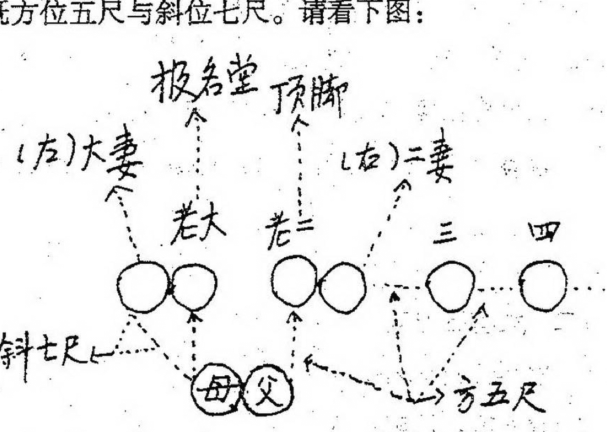

下面讲熟葬：

做为一个德高望重的风水师，首先要慎重对待已葬过的旧坟应改与不应改，绝不要为了赚钱而损德性。

### （一）坟有三不可改

- 1、开坟见龟蛇生气物，则不可改。

我在这里向您讲一个真实的故事：有一户人家在迁旧坟破土时，见到一只蛇伏在坟旁，由于不懂此规矩，将蛇打死。结果在烧纸时，突然来了一股怪风，将正在燃烧的纸吹向山中，引起漫山大火，动用一百多人才将火扑灭。风水先生及迁坟者，共被罚款二十多万元，这沉痛的教训当警之。

- 2、土中有温暖气或乳气或如雾气不可改。

- 3、紫藤交合棺不可改。此是祥瑞之兆，改必遭殃。

### （二）坟有五必改

- 1、坟墓无故自陷；
- 2、坟上草木枯死；
- 3、淫乱风声，六畜死绝；
- 4、男女忤逆颠狂、劫盗；
- 5、刑伤人口、妇人不孕、家财耗散、官事不休。

此五种旧坟必速改。

### （三）验坟一目了然歌：

左砂顺水长房离，
右砂顺水三子去。
外有山峰在水边，
离乡背井方成贵。
明堂倾斜二子难，
左肩受白四七寒。
右肩受白六九单，
入首太急五房虚。
主星低陷又受煞，
定断五八绝宗嗣。
明堂蠢粗带伶丁，
见斜流入财耗空。
砂平硬直，身亡家破。
龙虎擎拳，一家狠恶。
何知人家贫又贫？
山陋水深射阴风。
何知人家富又富？
峦峰磊落皆朝拱。
何知人家贵又贵？
文笔尖峰相朝对。

### （四）看老坟秘诀

老坟即是旧墓。如果遇有棺附葬或添建工程，必请堪舆家验看风水，关系更大于看地。看老坟法是先看墓之前后左右，次看穴前之水大水小，即于水口中立一标杆，然后看坟顶中间，置罗盘于穴上，用外盘缝针，看坟前水口交于何处，归库不归库，再用长线牵开。细看在天干或地支上几分，有无触犯黄泉大煞，有则必须纠正。次看立向生旺还是衰绝，次看来龙从何字入首，究是生龙与死龙，龙水相配合是否成局。次看贵人，得位则发贵，不得位则不发。次看生方有无山水，有者人丁旺，若在旺方主大富，天柱山高，主有寿。对于贵穴、富穴、贫穴、贱穴，一一看遍，然后依法判定吉凶。有些富贵家之旧墓，为了壮观、摆阔，往往于穴之前后，遍筑围墙。殊不知龙要生气活泼为真，一筑墙垣，龙身受困，气脉阴塞，名叫困龙，纵有兴旺之气，亦不发迹，甚至反吉为凶，猝起大祸。受此害者屡见不鲜，必慎之为宜。

### （五）辨知坟中男女秘诀

1、从坟上的草看：
此法多用于验孤坟。从坟头上拔下一棵草，注意看草根。如果草的根须多，草根向右弯，此坟葬的是女人；如果草根就是一根茎，草根向左弯，则此坟葬的是男人。

2、从坟前所烧的纸灰看：
墓中公婆事难明，可将坟纸去搜寻。黄白是男乌是女，坟纸红露刀枪亡。白点必定投水死，黄斑黄肿长病死，红斑产难家中死，青红树打死，赤黄墙打死，黄纹自缢亡，黑纹离乡被打死，交红是相杀亡。坟头无纸是孤贫，纸乌又水湿，骨骸乌又烂。

## 三、迁坟

1、让迁坟者准备如下物品：

红砖一块，用于镇太岁，用朱砂往烧纸上画“镇太岁符”（请注意，画符必经师传，如不经师传，擅自抄画，易遭灾祸）：

镇太岁符

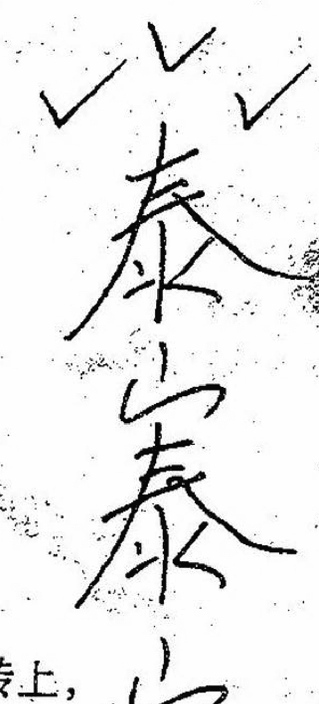

将此符贴在砖上，

红纸四张，用于扎灵幡及纸钱；

红手套一双，用于拣尸骨时戴；

大萝卜一个，用于拣完尸骨后添坑；

红布、白布各六尺六寸，用于拣尸骨时遮蔽阳光；

筷子一双，用于给两个棺材樘桥；

小木板四个，长3寸，宽1、2寸，事先分别写好“元、亨、利、贞”四个字，用于趋吉；

塑料纸牌中的一万、老千各一张，要用刀刮去牌上人的脸及身子，用于避凶。

高粱一把，用于净墓。

馒头四个（或四块蛋糕），用于垫棺材。

2、破土

先让长子在要遗弃的坟头上挖一锹土，放在一边。然后帮工们才能开始挖坟破墓。

四立前18天，土王用事，不宜动土，用此破土咒可化解。

> 破土咒
天园地方，
律令九章。
吾今破土，
普扫不祥。
金镐玉戟，
万事吉昌。
土公土母，
闪在一旁。

3、拣尸骨

把六尺红布与六尺白布同时打开，遮蔽阳光，开始拣尸骨。

往做好的小寿材里拣骨时，故去的是男，由长子（带上红手套）拣；故去的是女，由女儿（带上红手套）拣。

尸骨拣全后（如果埋葬年久已无尸骨，装走一锹土亦可，意到阴魂既到之意），由长子把先挖出去的那锹土撮回坟坑里。

将准备好的那个萝卜扔进坑去（一个萝卜顶一个坑之意）。

撒上几把高粱，便可以装上小棺材起灵。

4、安葬

(1) 打墓

墓的大小要留出安放棺材的空间。

(2)、破土文

在破土前，要焚烧由风水先生事先写好的“破土文”。

破土文要根据死者不同身份书写不同的词语，下面是我在为丧家故父所写的“破土文”，以供参用。

> 当庄山神、土地神、城隍等南瞻部州，中国 省 市 乡 村 屯居民世故显考 府君赴阴司冥界，迁阴宅于 村 沟 山之贵方宅地，多有打忧，惊动冒犯众位神灵，望乞恕罪海涵。

诸位神灵，左邻右舍及本地一切强神恶鬼等不得任意侵袭威逼、欺凌，一律宽厚容纳，不得有误。

特勒令。

××市、县冥府。

下元年 月 日

(3) 破土

由长子先挖第一锹土放在一边（留待第三天园坟时，由长子撮起，放到坟顶上）。

(4) 墓打好后就不能再下去人用脚踩。

(5) 风水师让长子拿起那块贴好符的红砖，向太岁方走到离穴一百米处，待用罗盘调准方向后，让其埋在那里。埋的时候，砖要留出半截，贴符的那面冲穴外（也就是冲太岁方）。

(6) 太岁方位

关于太岁的方位，有两种说法：

有的风水师认为在值年太岁的方位。比如虎年在寅方，兔年在卯方……

有的风水师却不这样认为，请看歌诀：

- 寅午戌年在乾方；
- 亥卯未年在坤方；
- 申子辰年巽中藏；
- 巳酉丑年在艮乡。

到底怎么用，由风水师选定。

(7) 坟底要用锹撮土，做出两道横杠。

(8) 把四个木牌放进坟的四角上，先放带“元”字的牌（假如坟墓是坐北朝南，先从西北角乾方放带“元”字的牌。其它方向怎么放，由风水师决定），依次放“亨、利、贞”。

也有摆放七个铜钱的（无铜钱用硬币代替），左边放四个，右边放三个。

(9) 把老千、九万放在坟底，要面冲上放。

(10) 安放棺材的四个角，每角放一个馒头（也可用蛋糕代替）。

(11) 棺材放进坟里后，风水先生开始用罗盘调向口。

(12) 向口调好后，把准备好的那双筷子用红布缠上，横放在两个棺材上（用于故父母同时下葬），谓之楹桥。

(13) 由长子先往棺材上扔一锹土，然后开始添坟。

(14) 在添坟时，风水师应用一树棍在向口处插一个记号，留待三天园坟时，家人立迎风门。

(15) 坟添好后开始立碑。

(16) 碑立好后，让家人在碑前摆好供品。

5、举行仪式：

风水师让亡者亲属跪在碑前（不立碑跪在坟前），进行“喊月台”（此是师传之行话，凡不明此语者，皆属未经明师所传）。

“喊月台”由风水师根据不同的死者编出不同的词语，所用之词与祭文很相似，要以简明扼要之词表达悲哀沉痛之情。比如故父姓刘，我曾编出如下的词语来“喊月台”。

> 呜呼，刘父，年仅六十有三。孝子贤孙，跪在坟前，虞具素礼，以示祭典。

> 呜呼，刘父，偶染癌症，一病亡身。号天泣血，泪洒沾尘。深知刘父，毕世艰辛。创家立业，俭朴忠信。处世有道，克己恭人。至生后辈，爱护如珍。抚养教育，严格认真。感天动地，英名永存。魂游冥府，百喊不闻。哭断肝肠，情何以伸。今日祭典，略表寸心；化悲为俭，化痛为勤。继承遗志，兴家立身。刘父九泉有灵，来尝来品。呜呼哀哉，尚飨！（“尚飨”是望亡人歆享之词。尚，是希望之意；飨，是设牲礼以供品尝）

风水师命亲属向亡者礼拜，三叩首。

# 第二十二章 择日点窍

自古以来，吉日选择有佛、儒、道等诸学派，流传下来的就有《玉匣记》《万宝楼》《宝镜图》《敖头通书》《灵棋经》《协记辨方》等书，对怎样选择良辰吉日法门甚多，且相互矛盾。再加上市面上所见的新版书，多属外行的书商们印制，校对极差，漏洞百出，使人无所适从。今把采颉众家之长，结合多年实践总结出来最实用之法奉献给您。

## 一、分辨黄道日与黑道日

黄道日与黑道日共十二位，称建星，也称十二神，其顺序是：

建太岁、除青龙、满丧门、平六合、定官符、执小耗、破大耗、危朱雀、成白虎、收瘟神、开吊客、闭病夫。

简单的记法是：建除满平定，执破危成收，开闭。
十二建星既是每月的月建，正月建寅，二月建卯，……依此类推。查月建同排四柱一样，以节为准，即：立春、惊蛰、清明、立夏、芒种、小暑、立秋、白露、寒露、立冬、大雪、小寒。

最简捷的歌诀是：
春雨惊春清谷天，
夏满忙夏暑相连。
秋处露秋寒霜降，
冬雪雪冬小大寒。

解一：怎样分黄道与黑道，请看《歌诀》：
建满平收黑，除危定执黄。
成开皆大用，闭破不相当。
这就是说：逢建、满、平、收、闭、破之日为黑道日；逢除、危、定、执、成、开之日为黄道日。
择日首先要选择黄道吉日，不选黑道凶日。

江湖上在运用黄道与黑道日上有所变通，现将歌诀录于下，供您参用：

- 建宜出行收嫁娶，
- 定宜上梁满修仓。
- 破除疗病执宜捕，
- 危利安床闭丈量。
- 成开所遇均大吉，
- 平日做事总平常。

解二：怎样寻查某建星：

关键得知道从何处起“建太岁”。我告诉您：从某月所值的地支起。比如正月地支为寅，那么就从寅日起“建太岁”，以下顺数，卯日则为除青龙，辰日则为满丧门，巳日则为平六合，午日则为定官符，未日则为执小耗，申日则为破大耗，酉日则为危朱雀，戌日则为成白虎，亥日则为收瘟神，子日则为开吊客，丑日则为闭病夫……其它月份以此类推。下面举二个例子来解释：

1、98年12月从哪日起“建太岁”：
查《万年历》（盲人先生则靠死记，从掌上查），12月初一是己巳，初二是庚午，初三是辛未，初四是壬申，初五是癸酉，初六是甲戌，初七是乙亥，初八是丙子。初八以前都没见到本月的月建“丑”字，故都不能起“建太岁”。直到初九丁丑日地支才见到“丑”，那就从丁丑日起“建太岁”（请记住，必须见到本月值日的地支才能起建太岁）。接下来顺数，初十则是除青龙，十一则是满丧门，十二则是平六合，十三则是定官符，十四则是执小耗，十五则是破大耗，十六则是危朱雀，十七则是成白虎，十八则是收瘟神，十九则是开吊客，二十则是闭病夫。二十一日为己丑日，地支又见月建丑，再重新起“建太岁”，顺推到“闭病夫”为止。

2、怎样查99年正月初一的建星：
正月建寅，从立春那天起才为寅月。
99年属年前打春，是98年12月19日立春，19日是丁亥、20日是戊子、21日是己丑，这三天的地支都不是寅，不能起“建太岁”。22日是庚寅，地支见到本月值日之星“寅”，那就从此日（庚寅）起“建太岁”，23日则为除青龙，24日则为满丧门，25日则为平六合，26日则为定官符，27日则为执小耗，28日则为破大耗，29日则为危朱雀，30日则为成白虎，数到99年正月初一则为“收瘟神”。

有人会问：常在《万年历》上看到有两个“建建、满满、平平、收收”等二个建星并列，是怎么回事？

我告诉您：凡某建星遇到换“节”那天，就要重复使用一次。

比如98年12月18建星是“收”，可是19日建星还是“收”，为什么呢？因为19日是立春，属换节，则重复使用。

请注意：这个问题很重要，如果不明白，仍按建星排例顺序去查，就会把黄道与黑道日弄错。

## 二、天月二德日择法

1、天德日查法：

歌诀

正丁二申宫，三壬四辛同。
五亥六甲上，七癸八寅逢。
九丙十居乙，子巳丑庚中。
天德之日无忧祸，逢凶化吉得安宁。

解：天德贵人以月来定。正月，日干见丁；二月，日支见申；三月，日干见壬；四月，日干见辛；五月，日支见亥；六月，日干见甲；七月，日干见癸；八月，日支见寅；九月，日干见丙；十月，日干见乙；十一月，日支见巳；十二月，日干见庚。

2、月德日查法：

歌诀
寅午戌月在丙，亥卯未月在甲。
申子辰月在壬，巳酉丑月在庚。
月德之日主和顺，万事通达喜盈盈。

解：月德贵人以月来定。寅午戌月，日干见丙；亥卯未月，日干见甲；申子辰月，日干见壬；巳酉丑月，日干见庚。

3、天月德合日查法

天月德合日为二者的干支相合之日，其吉庆程度比天、月德次之。

## 三、不择禁忌日

1、忌三煞日

三煞日是：劫煞 灾煞 岁煞

寅午戌 亥 子 丑

申子辰 巳 午 未

亥卯未 申 酉 戌

巳酉丑 寅 卯 辰

解：此三煞日以生年地支定：

凡生年地支占寅午戌的，不择亥子丑日，因为寅午戌见亥为劫煞，见子为灾煞，见丑为岁煞。

凡生年地支占申子辰的，不择巳午未日，因为申子辰见巳为劫煞，见午为灾煞，见未为岁煞。

凡生年地支占亥卯未的，不择申酉戌日，因为亥卯未见申为劫煞，见酉为灾煞，见戌为岁煞。

凡生年地支占巳酉丑的，不择寅卯辰日，因为巳酉丑见寅为劫煞，见卯为灾煞，见辰为岁煞。

2、忌月忍日

## 河洛阴阳宅堪舆班教材

## 歌诀

初五、十四、二十三，
老君炉里不炼丹。

解：初五、十四、二十三这三天为月忍日，故此三天不择。

### 3、忌红咀朱雀日

## 歌诀

初一不嫁娶，
初九不上梁。
十七不出灵，
十八不安葬，
二十五不搬家。

解：关于红咀朱雀日的吉凶，请看歌诀：

红咀朱雀丈二长，
眼似流星口吐光。
等闲无事伤人命，
万里飞来会过江。
切记切记君切记，
十个犯着九个亡。

初一嫁娶重嫁娶，
初九上梁放耗光。
十七安葬重安葬，
二十五搬家人口伤。

### 4、四忌日

春兔、夏马、秋鸡、冬鼠。每月丁丑日。

### 5、忌绝日

每月交节前头一天属绝日，不择。

### 6、忌岁破日

凡日辰冲克太岁为岁破日，不择。如甲子年庚午日，子午相冲，不择。

### 7、忌月破日

凡日辰冲克月令为月破日，不择。如丙寅月壬申日，寅申相冲，不择。

8、不择与生肖相冲日。比如来择日的人生肖是辰，不择戌日，因为辰戌相冲嘛。

## 四、分辨吉凶时

### （一）吉凶时查法

1、十二神顺序：
择吉凶时也分十二神，其顺序是：
青龙 明堂 天刑 朱雀 金贵 天德 白虎
玉堂 天牢 玄武 司命 勾陈

2、记此顺序歌诀：
青龙明堂与天刑
朱雀金贵天德神。
白虎玉堂与天牢，
玄武司命并勾陈。

3、十二神吉凶查法
请看歌诀：
青龙明堂吉，
天刑朱雀凶。
金贵天德吉。
天牢玄武凶。
玉堂司命吉，
白虎勾陈凶。

4、吉时起法
青龙是第一位吉神，那么从什么时辰起呢？请看

## 歌诀：

子午寻申位，
卯酉起于寅。
寅申子上起，
丑未戌上寻。
辰戌龙位上，
巳亥午上存。

解：凡逢子日或午日，从申时起青龙；逢卯日或酉日，从寅时起青龙；逢寅日或申日从子时起青龙；逢丑日或未日从戌时起青龙；逢辰日或戌日从辰时起青龙；逢巳日或亥日，从午时起青龙。青龙起出后，按十二神的排例顺序顺数，既可知某时的吉凶了。

下面演习一例，比如逢子日寻查吉凶时：

按歌诀“子午寻申位”，逢子或午日就从申时起青龙，接下来顺数，酉的便是明堂，戌时便是天行，亥时便是朱雀，子时便是金贵，丑时便是天德，寅时便是白虎，卯时便是玉堂，辰时便是天牢，巳时便是玄武，午时便是司命，未时便是勾陈，然后再按“十二神吉凶查法”就可分出某时吉与某时凶了。

还有人用于月上起日：逢子月或午月从申日起青龙，酉日为明堂……其查法与查吉时同。

### （二）凶时查法

1、忌时干克日干
以辛卯日为例。
辛卯日的12个时辰是：
戊子 己丑 庚寅 辛卯 壬辰 癸巳 甲午
乙未 丙申 丁酉 己亥

在这12个时辰中，克日干辛金的是丙申与丁酉二个时辰，此二时为凶。最凶者是阳克阳与阴克阴，那么丁酉时当是最凶的了，因为时干丁火属阴，直克阴日干辛金，属阴克阴，地支还是卯酉相冲，属天克地冲。

2、忌择绝时
比如日支是寅卯，木长生在亥，绝于申，那么就当忌择申时。

## 五、财神、喜神、福神查法

1、财神查法：

歌诀

甲艮乙坤丙丁兑，
戊己财神坐坎位。
庚辛正东壬癸南，
此是财神正方位。

解：日干逢甲，财神在艮（东北方）；日干逢乙，财神在坤（西南方）；日干逢丙丁，财神在兑（西方）；日干建戊、己，财神在坎（北方）；日干逢庚、辛，财神在东方；日干逢壬、癸，财神在南方。

2、喜神查法：

歌诀

甲己在艮乙庚乾，
丙辛坤位喜神安。
丁壬本在离宫坐，
戊癸原来在巽间：

解：日干逢甲己，喜神在艮（东北方）；日干逢乙庚，喜神在乾（西北方）；日干逢丙辛，喜神在坤（西南方）；日干逢丁壬，喜神在离（正南方）；日干逢戊癸，喜神在巽（东南方）。

3、福神查法：

歌诀

甲己正北是福神，
丙辛西北乾宫存，
乙庚坤位戊癸艮，
丁壬巽上妙追寻。

## 六、奇门择日法

1、日干生日支为宝日，大吉。
2、日支生日干为义日，次吉。
3、日干支比和为和日，次吉。
4、日干克日支为制日，平日。
5、日支克日干为伐日，凶日。

## 歌诀

制日中平伐日凶，
宝义和日吉相同。
天干克地须言制，
地犯天干伐最凶。
天干生支实为宝，
支生天干义本平。
相比原来为和日，
此是干支生克名。

## 七、江湖上常用的吉凶日

江湖上对于择日所用之法真可谓五花八门、举不胜举，我仅摘取一部分。由于有些方法不符合五行生克之理，仅供参考吧。

### （一）结婚吉凶日

#### 1、四绝离日

立春立夏前一日离，
立秋立冬前一日绝。
春分秋分前一日绝，
夏至冬至前一日离。

注：我在前面已经讲了，凡换节的前一日属“绝”日，不择。

#### 2、嫁娶离别日

正月丙子二癸丑，
三月丙申四丙辰。
五六丁巳八庚辰，
冬月癸巳九辛未。
十腊两月丙午日，
千万注意免遭心。
嫁娶要是遇此日，
夫妻反目要离分。

### （二）出行吉凶日

#### 1、方位上的禁忌

歌诀
丑不南行酉不东，
龙虎西方属大凶。
亥子北方大失散，
卯日不可西北行。
马猴西南遭官事，
蛇羊不可东北行。
戌日莫往东南走，
文王出马一场空。

解：丑，既指逢丑日；酉，既指逢酉日；龙，指辰日；虎，指寅日；马，指午日；猴，指申日；蛇，指巳日；羊，指未日。

有人会问：酉日不东行可以理解，因为卯酉相冲；丑日不往南去也可以理解，属丑午相害；那么龙（辰）日往西属辰与酉合，马（午）日往西南（未申坤方）属午与未合，逢合怎么反倒凶了呢？

答：我看此说也不符合五行生克之理。原书就是这么写的，仅供参考吧。

#### 2、忌日

初一忌西行，初八忌万方。
十五东行凶，晦日北不利。

#### 3、出行吉日

正月子午二未申，
三月申酉是吉辰。
四月子卯是好日，
五月寅申更为根。
六月未日相当好，
七月午未又加申。
八月酉亥九子午，
十月子亥酉趁心。
冬寅子日十二亥，
出行查找要认真。
己巳之日不可用，
千万注意心内存。

### （三）搬家禁忌

对于搬家择日还有以下几点说道：
搬家以带水之日为吉，少用带火之日。
注：关于上述的“水”与“火”，有人以日支定，有人以日干支纳音来定，到底怎么用，无有定法，仅供参用吧。

宅坐东不择巳酉丑金日；宅坐西不择亥卯未木日；宅坐南不择申子辰水日；宅坐北不择寅午戌火日。

### （四）移锅吉凶日

建破移锅家长病，
除危移锅母又亡。
收满移锅遭官事，
平定移锅损客商。
执闭移锅损牛羊，
成开移锅大吉昌。
世人识得移锅法，
到老安宁少祸殃。

### （五）亥灶吉凶日

建破方家长，除危母先亡，
成满害儿孙，执闭损牛羊。
定开多财气，平收进田庄，
八凶君莫犯，四吉最为良。

这就是说，以定、开、平、收四日为吉日，其它日则为凶日。

有人会问：你前面讲的“平、收”是黑道日，这里又说是吉日，到底怎样用呢？

答：在择日时，多数人以我所讲的黄道日与黑道日为准。江湖上的朋友在传给我此法时，告诉我只供择安灶参用。

### (六) 十恶大败日

1、甲辰乙巳与壬申，
丙申丁亥及庚辰。
戊戌癸亥加辛巳，
己丑都来十位神。

注：此十恶大败多用于结婚忌日。原因是此十干无禄。如甲辰旬中甲禄在寅，因甲辰旬中空寅卯，属禄空，故不择。其它以此类推。

2、真十恶大败日
甲己年三月戊戌真，
七月癸亥十丙申。
冬月丁亥大败日，
百事忌之要当心。
乙庚年四月为壬申，
九月乙已是败神。
丙辛年三月是辛巳，
十月甲戊九庚辰。
戊癸年六月己丑日，
牢记心中十位神，
世人要遇大败日，
躲过凶险免伤心。
丁壬之年全不忌，
师人牢牢记在心。

### (七) 杨公忌日

正月十三，二月十一，
三月初九，四月初七。
五月初五，六月初三，
七月初一、二十九日、
八月二十七，九月二十五，
八月二十三，冬月二十一，
腊月十九是忌日。
先人留下十三日，
举动须防有损失。
便要妄动去求利，
不遭火盗主凶事。
婚姻嫁娶不长久，
难得到头终不吉、
凡人出入遇此日，
劳劳碌碌得损失。
安葬倘若遇此日，
后代子孙得无食。

## 八、怎样择日

对于择日，说道太多，要完全循规蹈矩，根本就选不出几个好日子，真让人头疼。下面谈谈我是怎样择日的，供您参用；

1、首先选黄道吉日：开业吉日，宜成、满、开；买卖交易，宜执、成；安床，宜定、成。

2、择与生年地支三合、六合日为上吉。

3、不择此教材之“三”所列的“禁忌日”。

4、有时因特殊情况必须择日，但又碰不上吉日时，可以天德、月德或天月德合日择之。

有人专以贵人、神煞、二十八宿择日，我不赞赏，故不录。

# 第二十三章 鲁班尺凶吉珍传

九天玄女十三度，鲁班分八度，张良分九度，三项共计当中带凶，准之取验取财，福禄大吉。
当要为此，其余无所取官门，土遮人家居之义门，照准开之量法，仕官家门发福。
门左量到右天云字与人家共墙莫与人家造门照一家祸福利宜之取相符也。

## 尺度吉凶

(凡建星、开门、作灶、不论长阔高都按此尺度吉者用之，则获利也)。

| 尺寸 | 吉凶 | 说明 |
| :--- | :--- | :--- |
| 1 寸 | 凶 | 疾病 |
| 2 寸 | 凶 | 招灾，囚狱，死人 |
| 3 寸 | 凶 | 离散、瘟疫 |
| 4 寸 | 吉 | 契事，才学，出贵，长寿，艺术，官职 |
| 5 寸 | 吉 | 招财，十喜，富贵，横财 |
| 6 寸 | 凶 | 退财，孤寡，盗贼，麻衣，穷苦 |
| 7 寸 | 凶 | 十恶，自瘟，风瘟，好淫，争竞，徒失 |
| 8 寸 | 凶 | 失自，损人，不孝，疮火，孝服，疾病 |
| 9 寸 | 吉 | 大富，兴旺，富贵，人口，好义，得财 |
| 10 寸 | 吉 | 生财，出贵，命如，庄产，子孙 |
| 11 寸 | 凶 | 招灾，囚狱，死人，花酒，暗杀，争讼 |
| 12 寸 | 凶 | 麻服，瘟疫，酒色，失明，艰难，监绝，屠杀 |
| 13 寸 | 吉 | 文武，财富 |
| 14 寸 | 吉 | 天禄，横财，大富 |
| 15 寸 | 凶 | 孤寡，盗贼，麻衣，孝服 |
| 16 寸 | 凶 | 不孝，疫毒，长病，争竞，徒失，疮灾 |
| 17 寸 | 凶 | 损人，疫毒，不孝，长病，争竞，徒失，疮灾 |
| 18 寸 | 吉 | 生财，出贵，命如，财神，庄产，子孙 |
| 19 寸 | 凶 | 病 |
| 20 寸 | 凶 | 好淫，囚狱，死人，花酒，暗杀，争讼 |
| 21 寸 | 凶 | 离散，瘟零，酒色，验尸，失明，艰难 |
| 22 寸 | 吉 | 招财，贵人，文武，财富 |
| 23 寸 | 吉 | 横财，大富，天禄 |
| 24 寸 | 凶 | 孤寒，寡，盗贼 |
| 25 寸 | 凶 | 灾，瘟零，退财，孤寡，盗贼，麻衣 |
| 26 寸 | 凶 | 损人，不孝，疮毒，长病，争竞，徒失，疮灾 |
| 27 寸 | 吉 | 大富，旺兴，富贵，好义，得财，人口 |
| 28 寸 | 凶 | 病 |
| 29 寸 | 凶 | 招灾，囚狱，死人，花酒，暗杀 |
| 30 寸 | 凶 | 瘟零，酒色，失明，艰难 |
| 31 寸 | 吉 | 招财，贵人，文武，财富 |
| 32 寸 | 吉 | 长寿，天禄，横财，大富 |
| 33 寸 | 凶 | 孤寡，盗贼 |
| 34 寸 | 凶 | 杀死，突灾，瘟灾，退财，孤寡，盗贼，麻衣 |
| 35 寸 | 凶 | 失自，损人，不孝，疮毒，长病，争竞，瘟灾，孝服 |
| 36 寸 | 吉 | 大富，兴旺，富贵，人口，好义，得财 |
| 37 寸 | 凶 | 病 |
| 38 寸 | 凶 | 好淫，招灾，囚狱，死人，花酒，暗杀 |
| 39 寸 | 凶 | 离散，瘟零，酒色，失明，艰难，盐绝 |
| 4 尺 | 吉 | 富贵，招财，贵人，文武，财富，进业，艺术，官职 |
| 4.1 尺 | 吉 | 才学，出贵，长寿，天禄，横财，大富，进财，孝弟 |
| 4.2 尺 | 凶 | 突灾，瘟灾，退财，孤寡，盗贼，麻衣，贫苦 |
| 4.3 尺 | 吉 | 天禄，横财 |
| 4.4 尺 | 凶 | 失自，损人，不孝，疮毒，长病，争竞，徒失，疮灾 |
| 4.5 尺 | 吉 | 生财，贵人，命如，财神，庄产，子孙 |
| 4.6 尺 | 凶 | 长病 |
| 4.7 尺 | 凶 | 好淫，招灾，囚狱，死人，花酒，暗杀 |
| 4.8 尺 | 凶 | 瘟零，酒色，艰难，卦绝 |
| 4.9 尺 | 吉 | 十喜，富贵，招财，文武，贵人，财富，进业，艺术，官职 |
| 5 尺 | 吉 | 长寿，天禄，横财，大富 |
| 5.1 尺 | 凶 | 退财，孤寡，盗贼，麻衣，贫苦 |
| 5.2 尺 | 凶 | 杀死，突灾，瘟零，退财，盗贼，麻衣 |
| 5.3 尺 | 凶 | 暗杀，十恶，争讼，自杀，囚狱，好淫，灾 |
| 5.4 尺 | 吉 | 兴旺，富贵，人口，好义，得财 |
| 5.5 尺 | 凶 | 病 |
| 5.6 尺 | 凶 | 好淫，招灾，囚狱，死人，花酒，暗杀 |
| 5.7 尺 | 凶 | 离散，瘟零，酒色，失明，暗杀 |
| 5.8 尺 | 吉 | 富贵，招财，贵人，文武，财富，艺术，官职 |
| 5.9 尺 | 吉 | 长寿，天禄，横财，大富 |
| 6 尺 | 凶 | 孤寡，盗贼，麻衣，贫苦 |
| 6.1 尺 | 凶 | 杀死，突灾，瘟灾，孤寡，盗贼，麻衣，疾 |
| 6.2 尺 | 凶 | 不孝，疮毒，长病，争竞，徒失，疮，孝服 |
| 6.3 尺 | 吉 | 大富，兴旺，富贵，人口，好义，得财 |
| 6.4 尺 | 凶 | 病 |
| 6.5 尺 | 凶 | 好淫，招灾，囚狱，死人，花酒，暗杀 |
| 6.6 尺 | 凶 | 离散，瘟零，花酒，失明，艰难，卦绝 |
| 6.7 尺 | 凶 | 富贵，招财，贵人，文武，财富，进业，艺，官 |
| 6.8 尺 | 吉 | 天禄，横财，大富 |
| 6.9 尺 | 凶 | 退财，孤寡，盗贼，麻衣，贫苦 |
| 7 尺 | 凶 | 长病，争竞 |
| 7.1 尺 | 凶 | 失自，招灾，不孝，疮毒，长病，争竞，疮灾 |
| 7.2 尺 | 吉 | 大富，兴旺，富贵，人口，好义，得才 |
| 7.3 尺 | 凶 | 病 |
| 7.4 尺 | 凶 | 风疾，好淫，招灾，囚狱，死人，花酒 |
| 7.5 尺 | 凶 | 离散，瘟零，酒色，失明，艰难，卦绝 |
| 7.6 尺 | 吉 | 招财，贵人，文武，财富 |
| 7.7 尺 | 吉 | 富贵，招财，贵人，文武，财富，进业，艺术 |
| 7.8 尺 | 凶 | 孤寡，盗贼，麻衣 |
| 7.9 尺 | 凶 | 突灾，瘟灾，退财，孤寡，盗贼，麻衣，贫 |
| 8 尺 | 凶 | 损人，不孝，疮毒，长病，争竞，徒失，疮灾 |
| 8.1 尺 | 吉 | 大富，兴旺，富贵，人口，好义，得财 |
| 8.2 尺 | 凶 | 囚狱，死人，花酒，暗杀，争讼，十恶 |
| 8.3 尺 | 凶 | 风疾，好淫，招灾，囚狱，死人，花酒 |
| 8.4 尺 | 凶 | 好淫，瘟零，酒色，失明，艰难，卦绝 |
| 8.5 尺 | 吉 | 招财，贵人，文武，财富 |
| 8.6 尺 | 吉 | 昌盛，十喜，富贵，招财，贵人，文武，富贵，艺，官 |
| 8.7 尺 | 凶 | 招灾，退财，孤寡 |
| 8.8 尺 | 凶 | 招灾，退财，孤寡 |
| 8.9 尺 | 凶 | 损人，不孝，疮毒，长病，争竞，徒失 |
| 9 尺 | 吉 | 兴旺，富贵，人口，好义，得财 |
| 9.1 尺 | 凶 | 病 |
| 9.2 尺 | 凶 | 招灾，囚狱，死人，花酒，暗杀，争讼，十恶 |
| 9.3 尺 | 凶 | 失明，瘟零，离散，酒色，艰难，卦绝，验尸 |
| 9.4 尺 | 吉 | 昌盛，十喜，富贵，招财，贵人，文武，财富，进财，艺官 |
| 9.5 尺 | 吉 | 天禄，横财，大富 |
| 9.6 尺 | 吉 | 才学，出贵，长寿，天禄，大富，官禄，进财，孝弟 |
| 9.7 尺 | 凶 | 疮毒，长病，争竞，徒失 |
| 9.8 尺 | 凶 | 退财 |
| 9.9 尺 | 吉 | 大富，兴旺，富贵，人口，好义，得财 |
| 10 尺 | 吉 | 全上条 |
| 11 尺 | 凶 | 好淫，招灾，囚狱，死人，花酒，暗杀 |
| 12 尺 | 吉 | 昌盛，十喜，富贵，招财，进业，艺术，官职 |
| 13 尺 | 吉 | 才学，出贵，长寿，天禄，横财，大富，进业，艺，官 |
| 14 尺 | 凶 | 退财，孤寡，盗贼，麻衣 |
| 15 尺 | 吉 | 出贵，长寿，天禄，横财，大富 |
| 16 尺 | 凶 | 孤寡，盗贼，麻衣 |
| 17 尺 | 吉 | 长寿，天禄，横财，大富 |
| 18 尺 | 吉 | 大富，横财，天禄，长寿，出贵，财兴 |
| 19 尺 | 吉 | 大富，兴旺，富贵，人口，好义，得财 |
| 20 尺 | 吉 | 生财，出贵，命如，庄产，子孙，生财 |
| 21 尺 | 凶 | 病 |
| 22 尺 | 凶 | 好淫，囚狱，死人，花酒，暗杀 |
| 23 尺 | 凶 | 瘟灾，退财，孤寡，盗贼，麻衣 |
| 24 尺 | 吉 | 招财，文武，财富 |
| 25 尺 | 吉 | 出贵，长寿，天禄，横财，大富 |
| 26 尺 | 凶 | 孤寡，盗贼，麻衣 |
| 27 尺 | 凶 | 长病 |
| 28 尺 | 凶 | 风疾，离散，招灾，囚狱，死人，花酒，暗杀 |
| 29 尺 | 吉 | 招财，出贵 |
| 30 尺 | 吉 | 病 |
| 31 尺 | 凶 | 病 |
| 32 尺 | 凶 | 好淫，囚狱，死人，花酒，暗杀 |
| 33 尺 | 凶 | 瘟灾，退财，孤寡，盗贼，麻衣 |
| 34 尺 | 吉 | 富贵，招财，贵人，文武，财富 |
| 35 尺 | 吉 | 大富，兴旺，富贵，人口，好义，得财 |
| 36 尺 | 吉 | 生财，出贵，命如，庄产，子孙 |
| 37 尺 | 凶 | 风疾，好淫，招灾，囚狱，死人，花酒，暗杀 |
| 38 尺 | 凶 | 好淫，离散，瘟零，酒色，失明，艰难，卦绝 |
| 39 尺 | 吉 | 十喜，富贵，贵人，文武，财富，进业，艺术，官职 |
| 40 尺 | 吉 | 大富，兴旺，富贵，人口，好义，得财 |
| 41 尺 | 凶 | 病 |
| 42 尺 | 凶 | 瘟灾，退财，孤寡，盗贼，麻衣，贫苦 |
| 43 尺 | 凶 | 瘟零，酒色，风疾 |
| 44 尺 | 吉 | 出财，出贵，命如，财禄，庄产，子孙 |
| 45 尺 | 凶 | 死人，花酒，失明，暗杀，争讼，囚狱，招灾 |
| 46 尺 | 凶 | 瘟零，酒色，失明，艰难，离散，卦绝 |
| 47 尺 | 凶 | 招灾，突灾，死人，花酒，暗杀，争讼，十恶 |
| 48 尺 | 吉 | 富贵，贵人，招财，文武，财富，进业，艺术，官职 |
| 49 尺 | 吉 | 十喜，富贵，招财，贵人，文武，财富，进业，艺术，官职 |
| 50 尺 | 吉 | 生财，出贵，命如，财神，庄产，子孙 |
| 51 尺 | 吉 | 全上条 |
| 52 尺 | 凶 | 瘟零，退财，盗贼，麻衣，贫苦 |
| 53 尺 | 吉 | 出贵，招财，贵人，文武，财富，进业，艺术，官职 |
| 54 尺 | 吉 | 才学，出贵，横财，大富，官禄，进财，孝悌 |
| 55 尺 | 吉 | 十喜，富贵，招财，贵人，文武，财富，进业 |
| 56 尺 | 凶 | 损人，不孝，疮毒，长病，争讼，徒失，疮灾 |
| 57 尺 | 凶 | 退财，孤寡 |
| 58 尺 | 凶 | 退财 |
| 59 尺 | 凶 | 不孝，疮毒，长病 |
| 60 尺 | 吉 | 大富，兴旺，贵人，富贵，人口，好义，得财 |
| 61 尺 | 凶 | 病 |
| 62 尺 | 凶 | 招灾，囚狱，死人，花酒，暗杀 |
| 63 尺 | 凶 | 离散，瘟零，酒色 |
| 64 尺 | 吉 | 贵人，文武，财富 |
| 65 尺 | 吉 | 天禄，横财 |
| 66 尺 | 凶 | 孤寡，盗贼，麻衣，贫苦 |
| 67 尺 | 凶 | 长病 |
| 68 尺 | 凶 | 损人，不孝，长病 |
| 69 尺 | 吉 | 大富，兴旺，富贵，人口，好义，得财 |
| 70 尺 | 吉 | 生财，出贵，命如，庄产，子孙 |
| 71 尺 | 凶 | 病 |
| 72 尺 | 凶 | 招灾，囚狱，死人，花酒，暗杀，争讼 |
| 73 尺 | 凶 | 招灾，好淫，囚狱，死人，花酒，暗杀，争讼 |
| 74 尺 | 吉 | 贵人，文武，财富 |
| 75 尺 | 凶 | 孤寡，盗贼，麻衣，贫苦 |
| 76 尺 | 吉 | 契事，才学，出贵，长寿，天禄，横财，大富，孝悌 |
| 77 尺 | 凶 | 杀死，突灾，瘟灾，退财，孤寡，盗贼，麻衣 |
| 78 尺 | 凶 | 不孝，疮毒，长病，争竞，徒失，病灾，疮灾，孝服 |
| 79 尺 | 吉 | 大富，兴旺，人口，好义，得财，富贵 |
| 80 尺 | 吉 | 全上条 |
| 81 尺 | 凶 | 病 |
| 82 尺 | 凶 | 好淫，招灾，囚狱，死人，花酒，暗杀 |
| 83 尺 | 凶 | 离散，瘟零，酒色 |
| 84 尺 | 吉 | 富贵，招财，贵人，文武，财富 |
| 85 尺 | 吉 | 才学，出贵，长寿，天禄，横财，大富 |
| 86 尺 | 凶 | 孤寡，盗贼，麻衣，贫苦 |
| 87 尺 | 凶 | 离散，瘟零，花酒，失明，艰难，卦绝 |
| 88 尺 | 凶 | 失自，疮毒，损人，不孝，长病 |
| 89 尺 | 吉 | 大富，兴旺，生财，出贵，命如，财神 |
| 90 尺 | 吉 | 大富，兴旺，富贵，人口，好义，得财 |
| 91 尺 | 吉 | 病 |
| 92 尺 | 凶 | 风病，好淫，招灾，囚狱，死人，花酒，暗杀 |
| 93 尺 | 凶 | 好淫，离散，瘟零，酒色，艰难，卦绝 |
| 94 尺 | 吉 | 十喜，富贵，招财，贵人，文武，财富，进业，艺术，官职 |
| 95 尺 | 吉 | 才学，出贵，长寿，天禄，横财，大富，进业，招财 |
| 96 尺 | 凶 | 瘟零，退财，孤寡，盗贼，麻衣，贫苦 |
| 97 尺 | 凶 | 不孝，疮毒，长病，争竞，徒失 |
| 98 尺 | 凶 | 离散，瘟零，酒色，失明，徒失，艰难 |

## 河洛阴阳宅堪舆班教材

99尺吉，契事，才学，出贵，长寿，天禄，横财，大富，进业，孝悌
100尺凶，死人，囚狱，花酒，暗杀
（十丈）
以上尺寸，吉凶均注明
以下单言吉利之尺寸，方便查找：
4.9尺吉，十喜，富贵，招财，文武，贵人，财富，进业，艺术，官职
5尺吉，长寿，天禄，横财，大富
5.4尺吉，兴旺，富贵，人口，好义，得财
5.8尺吉，富贵，招财，贵人，文武，财富，艺术，官职
5.9尺吉，长寿，天禄，横财，大富
6.3尺吉，大富，兴旺，富贵，人口，好义，得财
6.7尺凶，富贵，招财，贵人，文武，财富，进业，艺，官
6.8尺吉，天禄，横财，大富
7.2尺吉，大富，兴旺，富贵，人口，好义，得财
7.6尺吉，招财，贵人，文武，财富
7.7尺吉，富贵，招财，贵人，文武，财富，进业，艺术
8.1尺吉，大富，兴旺，富贵，人口，好义，得财
8.5尺吉，招财，贵人，文武，财富
8.6尺吉，昌盛，十喜，富贵，招财，贵人，文武，富贵，艺，官
9尺吉，兴旺，富贵，人口，好义，得财
9.4尺吉，昌盛，十喜，富贵，招财，贵人，文武，财富，进财，艺官
9.5尺吉，天禄，横财，大富
9.6尺吉，才学，出贵，长寿，天禄，大富，官禄，进财，孝弟
9.9尺吉，大富，兴旺，富贵，人口，好义，得财
一丈吉，大富，兴旺，富贵，人口，好义，得财
1.2丈吉，昌盛，十喜，官贵，招财，进业，艺术，官职
1.3丈吉，才学，出贵，长寿，天禄，横财，大富，进业，艺术，官职
1.5丈吉，出贵，长寿，天禄，横财，大富
1.7丈吉，长寿，天禄，横财，大富
1.8丈吉，才学，出贵，长寿，天禄，横财，大富
1.9丈吉，大富，兴旺，富贵，人口，好义，得财
2丈吉，生财，出贵，命如，庄产，子孙。
以此吉度尺寸，凡造屋，开大门，房门，窗眼，猪屋，牛屋，鸡屋等都可照此用之而获吉利。

## 建灶之例

查：灶长5尺吉，长寿，天禄，横财，大富
4尺吉，富贵，招财，贵人，文武，财富，进业，艺术
灶高1.8尺吉，生财，出贵，命如，财神，庄产，子孙
灶面阔1.8尺吉，全上条。
灶口高5寸吉，招财，十喜，大富，大贵
阔4寸吉，契事，才学，出贵，长寿，艺，官
总之不论长，阔，高均参照书中尺寸，取吉者用之，便获吉利也。

## 建房屋丈量法

- 1、屋位长阔均量到包皮为准
- 2、屋高度从地面量到峰山顶为准
- 3、门口高度从地面量至门头底为准
- 4、门口阔度，量至两边砖为准

此外行条安装也有讲究，在一边望上去，从水古木点至正梁只能见单数，不能见双数，此是用进退二字向上点的之也，从水古木点至正梁进者为吉。（如下图所示）

所以古老屋全瓦面行条木，总是21行，17行，13行，9行，没有11行，15行，19行的。
相传鲁班尺乃九天玄女和张良尺度之结精，后人均用鲁班尺，除造形角度外，更重要的在于吉凶，故凡建筑而至木匠和地理择吉者无不谨记鲁班尺之尺寸，所以此本数据便是鲁班尺，如果用市尺则每尺加五分，用公尺则要35公分才符合鲁班尺一尺之标准。
为取得吉利，人们也巧用度数来计算，以9寸为一度，所为九九进是也，但受局限，如按此本尺寸就不受局限。
然而现代建筑大屋，多是钢筋水泥结构了，虽无峰山瓦面，究其理也应按楼面计算高度，其长、阔、高也按包皮至顶为准。
建猪、鸡、牛屋或加工作坊等，不论瓦房或水泥结构，用鲁班尺算寸取吉用之，也获吉利。
这是鲁班先师传落，信不信由自己了。

兹介绍各行业吉利方位如下：
饮食店，餐厅宜北方，门店，酒巴，饮食店，酒廊等，关驶在于北，关将地用做客厅则吉，东南有凸则生意兴隆。
烧卤店，炸鸡店等用火的生意厨房在东或南则吉，倘若只定用火则南最佳。
食品店……鱼店，海产物批发店，把客厅建在东南位，用陈列台箱子之地在正中，四隅则吉。
加工食品店，在南或东南造凸则吉，南西则摆商品，陈列台和客人用的椅子等即可，人口最好设在东南、南东。
清果业……把新的货品摆在北、南则吉，主生意兴隆，人口设在东、东南，南或西北则吉。
西店业（西餐）……西店点面包店把入口设置于东南则吉，但开闭门不可中线，四隅线，至于糖果公司，办公室可建筑于东南与南有凸则为吉相。
面货店、杂货店……把柜台置于北、西、东、南、北在一方即可。
服饰店……入口在东南则大吉，其次饮厅是东南或西北。
园艺店，花店……若不设在北，西东也可，花店将入口置于东，东南则吉，若不设于北，西东亦可，但照四隅线上是禁忌，要避免，园艺店也一样把入口置于东。厂则将火气的位置设于南的方位。
加工业……加工店，木工工厂在南东台北西建凸吉，倘若南西与西有入口则置台等。
电器行，将客进的门建在东与南，东南则吉，但人出入口，开闭门若在正中线上，四隅线上大凶，总之客厅的门建在南，北，西或东，在南造凸，在北或西东南再另造一个凸则有大吉相。
钟表店，贵金属商品……在东北，北西在一处造凸，若规模大则造二方面的凸，即使小店也要造一方凸，出入口在东，南东，南则吉。
以上各商家可参考。

## 中华古籍库

1000000册 高清影印古籍
珍版刻印 / 海外流传 / 家传手抄 / 民间失传
古籍善本、经史子集、史料笔记、古人文集、
民间收藏、传世家谱、各地方志、中医典籍、
四库全书、古禁毁书、内阁文库、图书集成、
丛书集成、四部丛刊、万有文库、四部备要、
二十四史、三国六朝文、明清和民国古籍史料
……