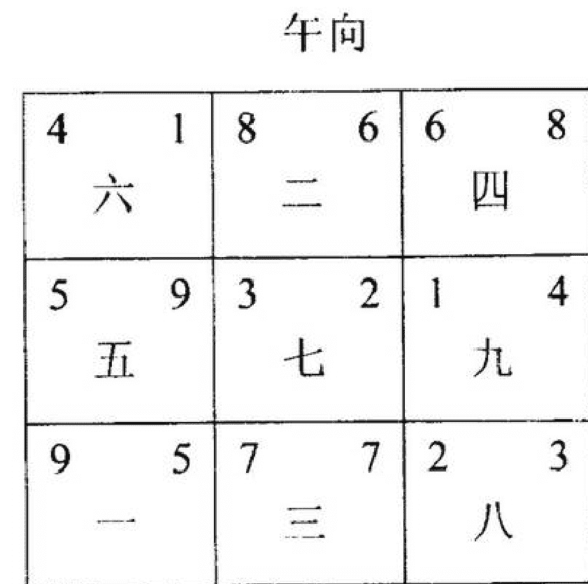
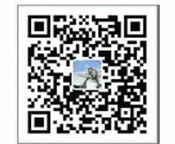

# 玄空风水勘宅实例精解

张成达著

# 前言

通过以上对玄空风水“法理精解”“断事精解”“布局与化煞精解”的讲解，我想您已经能够推断吉凶。为了使您进一步掌握玄空风水的直断与化煞方法，下面我例解“十大注意”，您反复揣摩后定能融会贯通，成为玄空派合格的风水师。

张成达

2009年2月1日

# 一、要注意以坐向推断吉凶

例1、玄空风水学有一句话：“旺局看坐向，衰局看中宫。”这是判断飞星吉凶的重要原则。例如：
七运甲山庚向替卦

| 巽 | 离 | 坤 |
|---|---|---|
| 4 6 六 | 9 2 二 | 2 4 四 |
| 震 | | 兑 |
| 3 5 五 | 5 7 七 | 7 9 九 |
| 艮 | 坎 | 乾 |
| 8 1 一 | 1 3 三 | 6 8 八 |

1、坐山震宫：飞星组合“3”与“5”数，山盘飞星“3”属木，下元七运七赤为旺星，三碧为煞气之星。向盘飞星“5”属土，五黄土力量很大，三碧木难以克制，反而有土重木折之厄。震为长男，此房屋易损男丁，不利长子成长。

2、向方兑宫：向盘“九”是九紫火星，九紫火为未来元运的旺气，因此说这个房屋不得旺向。向方兑宫飞星组合分别是“9”与“7”。《紫白诀》七赤为先天火数，九紫为后天火星，此二星组合有火灾的危险，同时主酒色、淫乱、血病、血光之灾。

向盘旺星“7”数飞到中宫，属入囚。向盘旺星为财星，财星入囚，说明此房屋不利财运，当运即败财。

山盘旺星“7”数飞到向方兑宫，属丁星下水，主损丁。

3、衰宅看中宫，现在我们再分析中宫飞星组合含义：

中宫山盘飞星五黄，向盘飞星七赤。向盘旺星七赤进入中宫，变成了入囚，不但不能发挥旺财作用，反而变破财之象，中宫飞星五七组合含义，七赤金为口，得五黄土相生，毒自口入，有象征吸毒之象。

实际情况，宅主原来是在一家公司当会计。94年由于与朋友赌博输掉五千多元钱，妻子和他吵架，一时想不开服药自杀。

例2、有一亲友，六运起了甲山庚向之房屋，坤申方来水，艮寅方出水，当时由于经济困难，用泥砖盖瓦房。

## 六运甲山庚向宅命盘

| 辰 | 丙 | 未 |
|---|---|---|
| 5 9 五 | 9 4 一 | 7 2 三 |
| 甲 山 | | 庚向 |
| 6 1 四 | 4 8 六 | 2 6 八 |
| 1 5 九 | 8 3 二 | 3 7 七 |
| 丑 | 壬 | 戌 |

该宅是旺山旺向之宅，主发丁发财。所以，自建了此宅后，日子一天比一天好。到了90年，成为当地首家种农作物致富户。

由于子女大了，有了钱想把原旧房拆掉重建。于丁丑农历三月，拆除旧房，重新破土动工建新宅，其宅命盘如下：

## 七运甲山庚向宅命盘

| 辰 | 丙 | 未 |
|---|---|---|
| 4 8 六 | 9 4 二 | 2 6 四 |
| 3 7 五 | 5 9 七 | 7 2 九 |
| 8 3 一 | 1 5 三 | 6 1 八 |
| 丑 | 壬 | 戌 |

显然这是上山下水格局，主损丁破财。
丁丑年3入中。农历三月，亦是3入中。
年月紫白星盘如下：

| 辰 | 丙 | 未 |
|---|---|---|
| 22 | 77 | 99 |
| 11 | 33 | 55 |
| 66 | 88 | 44 |
| 丑 | 壬 | 戌 |

显然，年月五黄煞飞到向，亦成“紫黄毒药，临宫兑口休尝”格局，又加上“二五交加，惟死亡并生疾病”。
这还不算，宅主还在庚向建了一座厕所。在使用厕所的几天，宅主因病入院，医治无效死去。
出了事后，找我去化解，但我说：“今后是否继续退财，我不敢保证。我只能化解一下五黄，保证不再有病和损丁。”
处理：把厕所拆掉，建一座假山，解决丁星下水之病。在假山基座底下埋六枚五帝钱，用以化解五黄煞。

# 二、要注意以气口推断吉凶

房屋门口是纳气和人进出最频繁的地方，此方带动的气流自然会影响整个房屋的宅运。
我们在为人看风水时，首先要分析房屋的大门在飞星盘上的位置。
房屋“大门”要开在向盘的生旺之方，忌开在退、衰、死煞方。

在判断“门户”风水吉凶时，不可执一而论，不要认为所有的“门户”在生旺之方的都为吉利，设在衰败之方位的都会破财遭灾。实际上生旺之星会因生克关系使旺气变质，同样衰败之星会因飞星组合妥当，反而给主家带来滚滚财源。分析阳宅风水吉凶，就是要灵活应变。

为了使您能尽快熟悉“门户”与飞星组合吉凶关系，下面举几个实例。

例1、给黄小姐勘宅。此房屋七运壬山丙向下卦。

| 巽 | 离 | 坤 |
|---|---|---|
| 2 3 六 | 7 7 二 | 9 5 四 |
| 1 4 五 | 3 2 七 | 5 9 九 |
| 6 8 一 | 8 6 三 | 4 1 八 |
| 震 | | 兑 |
| 艮 | 坎 | 乾 |

飞星盘上中宫飞星组合，实际也就是黄小姐住宅中心的飞星组合。

飞星盘上巽宫飞星组合就是该住宅大门的方位。巽宫的飞星组合是：运星六、山星二、向星三。

此住宅是七运楼，七为当旺之星，八和九为远旺之星，六、五、四分别为衰、败、绝凶星。三、二、一为起衰无用之星，一般不用飞星本质吉凶，只论其五行生克关系。

通过分析后，我们知道该宅大门巽宫飞星组合都不是旺与远旺之星。唯有运星六为衰气，山向星为无用之星，只论生克不论吉凶。

六白乾为金，二黑坤为土，三碧震为木，山星和向星二与三组合，实际木克土关系。在飞星组合含义中，二与三称为斗牛杀，多主是非口舌破财之事。二黑坤在人事上代表老母，于人体上代表脾胃，老母有胃脾之病与皮肉之伤。运星六白乾金，乾代表家父。金克木，三碧震木代表长男。通过分析，此宅大门方位各个飞星构成相克关系，土生金，金克木，木克土，换一种说法就是父母与子女相克，家门不和之象。

例2、卓达服装城，七运局，子山午向下卦

| 巽 | 4 1 六 | 8 6 二 | 6 8 四 | 坤 |
|---|---|---|---|---|
| 震 | 5 9 五 | 3 2 七 | 1 4 九 | 兑 |
| 艮 | 9 5 一 | 7 7 三 | 2 3 八 | 乾 |

午向
子山

此宅运局向首门全部封死，气口门留在艮宫位。

观察分析后对老板讲，目前你已经负债经营，自从开此服装加工厂后日落西山，一天不如一天。老板讲是的，旧客户货款催不回来，你看是什么原因。

此厂负债的原因就在门口上，不是聚财门，是衰气门。再者老板的办公室在巽宫位也不合宜，也是不聚财的原因。

此宅运局，气口在艮位，门为绿色。向星为五黄煞气，一入门口，前有一屏风，上贴一个大红“福”字，屏风两旁有两棵盆栽大雪松，同时生旺九紫，使五黄煞气凶气倍增。如此气口，焉有生财之理。

办公室在巽宫，办公桌在巽位，老板坐在衰气位，理不直，气不壮，外债又如何收入财柜。

受朋友委托，既来之则化解处理之。化解处理如下：

- （1）把气口的绿颜色门换成白色铝合金门，气口通道的地面刷成白颜色。
- （2）屏风为水银玻璃，去掉上面大红“福”字，再用锡箔纸把水银玻璃面全部粘贴，屏风处放置一颗大水晶球（在和老板座谈时，发现其办公桌上有颗直径30公分左右的水晶球，心想此球则能排上用场）。以上两条，运用白金泄五黄土气，水晶球化煞气之五行原理，而二者合一化解五黄之煞气，使运盘星一白与山星九紫则有能力动作。因一九合十为吉气故。
- （3）把巽宫办公桌移到坤方，使坤位八白向星发挥作用。
- （4）同时在坤位置放一鱼缸，放入八尾黑色金鱼，起催动八白财气之作用。
- （5）置购化煞物品齐备后，择日同时进行。

经调解后，其服装生意做的很好。

例3、成女士家宅，七运宅，子山午向下卦。

午向

| 巽 | 4 1 六 | 8 6 二 | 6 8 四 | 坤 |
|---|---|---|---|---|
| 震 | 5 9 五 | 3 2 七 | 1 4 九 | 兑 |
| 艮 | 9 5 一 | 7 7 三 | 2 3 八 | 乾 |

子山

乙酉年春，成女士计划承租一座饭庄，邀笔者看承租后经济效益如何。

此宅运为子山午向，门气口在乾宫位，楼梯直冲门口。

在宅内查看完毕，对成女士讲道，你丈夫是否发生过诉讼是非之事，其丈夫紧接着问，你看是哪年？答：1999年。哪年此讼灾结束的？答：2004年。听其语气，估计论断是对的。成女士解释到，1999年其丈夫与他人合伙做生意，供货方的货款不知去向，但其丈夫为参与者，不为主谋，属于连带，

几次被其供货方辖区公安部门传讯，2004年上半年被警方拘禁后案情大白，贷款有了下落，于去年十月份无罪释放。

此宅运局气口乾宫，二三双星组合，《紫白诀》云：“斗牛杀起惹官刑。”楼梯口直冲乾宫气口煞气，兆应已显。一进门口便有一个大红“福”字，旺起二黑土煞气。1999年一白入中宫，二黑飞临乾宫，楼梯气口煞气冲起“二三”斗牛煞，官非祸起。衰气口看中宫，中宫山向立极飞星亦为二三斗牛煞，2004年五黄飞临中宫，其丈夫必被拘禁。是年六白到乾宫门气口，化解二黑煞气，又逢运盘八白左辅善曜相助，官非化解。六白为乾、为官方、为吉星，又可谓有贵人相助，逢凶化吉。

门口能惹起祸端，夫妻俩甚是惊讶。在夫妻俩要求下，对此宅做了化解处理。

例4、某局办公楼，七运宅，子山午向下卦

午向

| 巽 | 4 1 六 | 8 6 二 | 6 8 四 | 坤 |
|---|---|---|---|---|
| 震 | 5 9 五 | 3 2 七 | 1 4 九 | 兑 |
| 艮 | 9 5 一 | 7 7 三 | 2 3 八 | 乾 |

子山

此办公楼为二十世纪九十年代初建造，宅门气口在艮宫方位。

此楼建后第一任局长调走时，已患疾病。第二任局长工作到甲申年，因工作劳累，面容憔悴，疾病缠身，已无法工作，不得已住院治疗。后听别人讲单位风水有问题，得病乱投医，硬着头皮把笔者请到单位。因工作故经常出入此单位办公楼，对此楼格局是比较熟悉的，主要对这位局长的办公室多看了几眼。然后，便对他讲，请找十二枚乾隆年间铜钱，九月份你的病情必大有好转。

此宅运局大门气口在艮位，办公室空调亦在艮位，艮位为五九双星飞至之位，《玄空秘旨》云：“我生之而反被其灾。”五黄煞星宜静不宜动，动者必生祸端。其单位艮气口每天人车如流，引动五黄煞气。办公室空调机在艮位，冬季热风，夏季冷风，空调的震动引发五黄煞气的透出。此两处用六枚铜钱化泄五黄煞气，局长之病必大有好转。这几年中，笔者用铜钱化解五黄几十起案例，都有很好效果。

九月份见到这位局长时，脸上气色正常，体重也增加了七、八斤。

例5、某局封某办公室，七运宅局，酉山卯向下卦

离

| 巽 | 1 6 六 | 5 1 二 | 3 8 四 | 坤 |
|---|---|---|---|---|
| 卯向 | 2 7 五 | 9 5 七 | 7 3 九 | 酉山 |
| 艮 | 6 2 一 | 4 9 三 | 8 4 八 | 乾 |

坎

其办公室门口开在震宫卯位，办公桌置在坎位子方。分析后，余讲了以下三条：

- 1、其原来脾气急躁，不爱学习，从入住此办公室后，也开始斯文起来，爱看书、读报、学习。

办公桌置在子方，四九双星飞临，四绿为文昌星，九紫为离卦，为学习，为文章，木火通明主聪明。其入住此办公室后，研究发明一项专利，国外几家公司正与其洽谈购买此专利权。

- 2、去年有口舌是非，为桃色新闻，但最后又平息。

气口在卯方，甲申年三碧蚩尤恶煞客星飞临，与二黑土形成二三斗牛煞。《紫白诀》云：“斗牛煞起惹官刑。”虽然三碧飞来，但本宫二七双星又合火局，三碧蚩尤又来生火，可化解平息。是什么原因引起呢？曰：为桃花。该楼出入口在巽宫位，一六双星飞临，一六合化水局，直克办公室气口二七火局。一六合化水，但为衰水，衰水为淫，又落巽宫，主女性方面因由。二七合火，克向星七赤，七赤八运为衰星，七赤为兑卦，为女，为口舌，所以断定其有桃色新闻。事实是，甲申年因婚外恋起风波被免职，半年后又重新起用了。

- 3、肝火旺盛，脾胃不调，脑袋昏沉，腰部酥软，肾水不足。

门气口二七合火，克办公桌坐位四九金而兆应身体病症。二七双星飞临震宫位，震为肝，为腰部，病星二黑飞临，五黄煞亦临运星，可断为肝火旺盛，脾胃不调。气口二七衰火克坐位四九金。九紫为离卦，为脑，断定其脑部昏沉。四九合金生泄坎宫水，导致肾水不足，腰膝酥软。

分析论断此三条后，得其结论为全部正确。

例6、某轧钢厂，七运建，午山子向下卦

| 巽 | 1 4 六 | 6 8 二 | 8 6 四 | 坤 |
|---|---|---|---|---|
| 震 | 9 5 五 | 2 3 七 | 4 1 九 | 兑 |
| 艮 | 5 9 一 | 7 7 三 | 3 2 八 | 乾 |
| | | 子向 | | |

韩某的朋友与人合伙承租经营某轧钢厂（名谓厂，实为一个车间）搞冶炼，因被合作者骗走资金

而停业。后韩某想独自经营，于甲申秋季请笔者前去查看企业布局。

此企业为七运午山子向，东边、南边为平地，西边、北边为高地，大门在坎宫子位，一出门便为高岸，形成逼压宫势。出大门往正西（企业西北乾宫）上坡后到南北大道而出。企业厂房坐南侧，厂房东头（巽宫、空地）置一变压器。

看后分析告诉韩某，此企业不宜承租经营，理由如下：

- 1、此企业大门为衰气口，双七飞星会向，向星七赤水龙上山为败财，双七飞星组合，《紫白诀》云：“破军赤名，肃杀剑锋之象”。且门前为逼压宫势，为人财两败之局。
- 2、此企业大门虽在坎宫，但出门后往西上坡路口处方为企业纳气口，此纳气口在企业乾宫位，三二飞星组合。此纳气口收的败财之煞气，焉有进财之吉气。
- 3、据此两点，此企业建后随即破产，后又对外承租则都未获得经济效益，其中你的朋友败北尔最了解个中原因。门口向星七赤与乾宫坡位纳气口山星三碧组合为衰星克出，为凶。《玄空秘旨》云：“木金相反，背恩忘义”。你的朋友今年被合作伙伴骗走三十多万元后而致企业倒闭，且正符合此飞星组合之义。

为使韩某放弃承租此企业计划，又举例说明该企业不但为衰宅，还且又为凶宅运。

- 4、今年六月，年客星五黄入中，月客星六白入中，年客星、月客星六白、七赤飞临乾宫纳气口，年客星六白与纳气口山星三碧组合，《秘本》云：“三逢六，患在长男”，《玄空秘旨》云：“雷风金伐，定为刀伤”。年客星六白与月客星七赤同会乾宫纳气口，《竹节赋》云：“蛇惊梦里，皆缘内兑外乾”。句句典语切中，六月份一电工到该企业查看变压器时，触电身亡。变压器置放在企业巽宫位，四一双星组合，月客星五黄飞临巽宫变压器位，五黄为戊己大煞，克则为凶，巽宫一白生四绿，四绿在巽宫为伏吟，伏吟为回归本位为旺，年客星四绿亦飞临，助起四绿力量来克伐五黄煞，变压器为煞气，五黄又为火兆应在变压器上，透出五黄煞气，《玄空秘旨》云：“我克彼而反遭其辱，因财帛以丧身”。

韩某听毕以上几点释义，故放弃承租该企业计划。

例7、魏姓饭庄，七运宅，子山午向下卦

丙子年秋，朋友魏某找到笔者，讲前几年经商挣了点钱，准备进城承租一个饭庄，请笔者规划饭庄布局。

此饭庄为某单位办公楼。一楼为门市临大街，坐子午向，对外承租，朋友计划承租三间门市经营饭庄。

三间门市经营饭庄，应作为一整体立太极来布局。三间门市三个门，东侧间门口开在巽宫位，一四双星组合，向星一白为三元辅星，但不为当运令星，亦不可取。西侧间门口开坤宫吉星莅临，为财星到，应堵其中间、东侧门，开坤宫未方作为此饭庄纳财气口。同时，收银台亦设在纳气口位，使其

增旺财星。《玄机赋》云：“金居艮位，乌府求名”。

魏某按笔者对其饭庄布局。在择日动工装修时曾有人路过私语：此饭庄怎在“绝命”败财处开门纳气，真可谓无知矣。魏某听到后则问笔者是否如此，笔者讲到，不假，是这样，但这是八宅派一家之言，余用的是玄空学法则，请您放心，开业后不久便有分晓。

饭庄装饰完毕，笔者为其择日开业，尔后，饭庄每天座无虚席，有的客人来后无坐也要等候吃上一桌可口饭菜，甚至有很多都是提前预定席桌。魏某前后经营此饭庄四年，收入200余万元到手，后用此笔款又投入一个新的经营项目。

# 三、要注意结合形煞推断吉凶

例1、某村韩、杨二家宅，六运宅，子山午向下卦。

巽 午向 坤

| 1 2 五 | 6 6 一 | 8 4 三 |
|---|---|---|
| 9 3 四 | 2 1 六 | 4 8 八 |
| 5 7 九 | 7 5 二 | 3 9 七 |

震 兑

艮 子山 乾

村庄内一条河流横贯东西，南北岸各一条路。为行走方便，架起四座桥梁，其中两座桥梁北岸左右住有农户。杨家与韩家分别住在两座桥梁北边乾宫位，两家相距百余米，宅院为六运宅造，子山午向，宅门留在巽宫方，桥梁石栏尖角形成45度角，煞气直冲巽位宅门口，致两家一死一伤二位女性。

此宅运局，巽宫气口位一二双星组合临至。阳宅重气口，气口向星为重。向口二黑为病符星，克山星一白为克出衰星，向星二黑五行属土，主女，气口位为巽位，巽主女，桥梁煞气冲气口，产生动应，凶祸必应在女性身上。韩姓宅主妻子在八十年代末，被机器轧断一条腿，抢救及时，保住了一条性命，但造成了终生残废。杨姓宅主之长女在九十年代初期被汽车撞伤，造成下部瘫痪，于乙酉年春去世。伤亡的二位女性年龄都在三十岁左右。

例2、农村某宅，七运造，酉山卯向宅命盘如下：

巽 离 坤

| 1 6 六 | 5 1 二 | 3 8 四 |
|---|---|---|
| 2 7 五 | 9 5 七 | 7 3 九 |
| 6 2 一 | 4 9 三 | 8 4 八 |

卯向 酉山

艮 坎 乾

此宅乾、兑、坤方有山，坎、艮两方为邻居，午方为厢房。只有震、巽两方可开门。巽方有路，路以外百米有一池塘。

初时开卯门，本位门。添了两丁，种蘑菇得了点钱，算是万元户，首家致富。购得手扶拖拉机运石头，因为89年正兴基建，逐渐发家。

有一天，开车被罚款，本来是小事，不值得大

惊小怪，因为宅主拥有十万家产，罚100元钱不是等于捐款？但宅主心胸狭窄，想不通，认为是风水出了问题，请风水师来看。风水师是八宅派的，说：“震、巽属木，门开在震方，绝命金克木，处死地，现在被罚是小事，今年还要有车祸呢！马上改在巽方，六煞水生巽木，得生，虽然六煞为凶，但凶星生门，为吉门。离方五鬼为灶，不吉，马上搬到乾方生气，否则凶祸立见。”风水师讲得有声有色。

宅主害怕得要死，马上请风水师择一吉日，欢天喜地地封了一千元钱利市，作门在巽方。

大家看宅命盘便知，巽方向星3为衰星，见水已属不吉。再有，外面的路交叉象绳索状，属于“巽宫水路缠乾”格局，因为六为乾，为天，为首。绳索缠首，则为上吊。农历六月建门口，流月六入中，五黄星飞到巽方。建成后，结帐，因收支不合，老婆怀疑其私自收藏钱给其父母用，夫妻吵架。男的一气之下，打了老婆一巴掌，老婆气愤离家，当夜不归。其老婆越想越不是味道：“十年恩爱夫妻，当初你穷酸象个乞儿，我如花似玉，就是看中你为人嫁给你的。如今钱有了，家亦富了，小孩大了，你居然忘却了恩爱！”遂写了遗书，当夜上吊自杀。宅

主第二天回来，看到了小孩在哭，邻居围满，已知事情不妙。老婆已死，悔不该打她。

其实，并不是因为打一巴掌而造成的，而是：巽宫水路缠乾，当有悬梁之厄。

例3、某乡镇供销社商品楼，七运宅，子山午向下卦

| 巽 | 4 1 六 | 8 6 二 | 6 8 四 | 坤 |
|---|---|---|---|---|
| 震 | 5 9 五 | 3 2 七 | 1 4 九 | 兑 |
| 艮 | 9 5 一 | 7 7 三 | 2 3 八 | 乾 |
| | | 子山 | | |
| | | 午向 | | |

此宅运局，双七令星会坐，属旺丁不旺财之局，但此商品楼前后环境各异，此楼开正午向门，门前有一条宽30米左右水泥马路，直冲门向而来，门气口离宫向星六白为衰气星，煞气冲衰星，不但无财可得，反而对宅主易发祸事。楼宅后为低洼田地（比

### 例4、某处长家宅，七运宅，子山午向下卦

| 巽 | 4 1 六 | 8 6 二 | 6 8 四 | 坤 |
|---|---|---|---|---|
| 震 | 5 9 五 | 3 2 七 | 1 4 九 | 兑 |
| 艮 | 9 5 一 | 7 7 三 | 2 3 八 | 乾 |
| | | 子山 | | |

甲申年秋，一王姓朋友介绍，到国际和平医院某处长家作客。席间，某处长谈起其爱人经常头晕、心慌、全身乏力，在本院检查也查不出病因，到其它大医院也查不出结果，身体有病，无法上班，则提前退休。某处长讲，可否从宅上看看是什么原因所造成的。饭后喝茶时，笔者对其宅各屋看了一遍。其宅为子山午向下卦七运宅，处长夫妻二人卧室在宅居的坤位上。笔者对处长讲，家中近几年经济收入不错，处长讲，还算过得去。原由是坤宫八白生气星临位故。抬头看卧室屋顶中央有盏红灯罩，这盏红灯罩就是你爱人心慌气短、头晕、无力的根由。月余后，王某告诉笔者，当天下午，处长就换掉了红灯罩，十几天后，处长爱人的疾患不知不觉就消失了，多年的疾病，摘掉一个红灯罩，身体就康复了，真是不可思议。

物物有太极。宅居（院）有大太极，每个房间有小太极，这是玄空学的论断原则。此宅卧室中央的太极为中宫，二三斗牛煞飞临，三碧木生红色灯，红色灯生旺二黑土。身体中央为心脏部位，中宫二黑为病符星，二黑病符星兆应在心脏部位上，则使其爱人患心慌气短、头晕、无力的病疾。有科学家研究表明，当代人类患病，有相当大的比例是由种种信息所致，称谓信息病，就是现代发达的医学技术亦是束手无策，在患者的疾病面前，显示出现代医学技术的无奈性。

# 四、要注意以上山下水推断吉凶

例 1、七运子山午向兼

| 巽 | 午向 | 坤 |
|---|---|---|
| 3 1 六 | 7 6 二 | 5 8 四 |
| 4 9 五 | 2 2 七 | 9 4 九 |
| 8 5 一 | 6 7 三 | 1 3 八 |
| 艮 | 子山兼 | 乾 |

1996 年，一朋友一块宅基地，子山午向，前面是高山，且有房屋挡住。后面是一所学校操场，低洼地。此为颠山倒水之宅基。我即弃正向不要，用子山午向兼向，用替卦起星，得如上所示的“上山下水”飞星盘。正好山星到向方高处，向星旺星到坐方低处，适得其所，为旺丁旺财宅。

例 2、同学工作之余，看准市场，构筑一幅生财蓝图——开办鱼种场，养的是名贵的热带七彩鱼。

一下子投资二十多万，租了一块便宜的空地，盖起 400 多平方米的简易砖瓦房，自己设计温室系统，大干加苦干，干了几个月终于搞成了。

但并不象原先计划那样：一个月可孵化万条鱼花。养了几个月鱼种，产了卵，可就是难孵出鱼花。我帮其堪鱼场是他开办后五个月的事了。

原来，他的鱼场是甲山庚向，没有选日课开工和开业，只凭自己想象去干。看一下宅命盘：

七运甲山庚向宅命盘

| 巽 | 丙 | 坤 |
|---|---|---|
| 4 8 六 | 9 4 二 | 2 6 四 |
| 3 7 五 | 5 9 七 | 7 2 九 |
| 8 3 一 | 1 5 三 | 6 1 八 |
| 艮 | 壬 | 乾 |

甲山 庚向

显然为“上山下水”局，为败局，主损丁破财。莫说发财，不出事就算“大吉利”了。

坐山“三七叠至，被劫盗更见官灾”，向首二七合化火，九七合辙，均为不吉。更不吉者为中宫，957组合，叫做“紫黄毒药入兑口”，凶狠无比。幸好，该同学在中宫立了一关帝像，略起化煞作用。

我作如下处理：

- 1、选紫白星八入中的吉日，把六枚乾隆钱挂在中宫。
- 2、在坐山设一“财神”位，以铜像为准，造吉日开光、安置。
- 3、在辰方置一圆形鱼缸，养金鱼八条，旺偏财。
- 4、在坐山、中宫、向首一条线上不要养鱼。

作好布局后，同学的朋友又请我去看他的小鱼场，面积只有30多平方米，我还未入房间，在门口一测，为辛山乙向兼，我说：“你的鱼场好呀！旺山旺向，一旺顶百煞，虽然957入中，但为旺宅，又是养鱼，鱼缸中有水，故无妨。你这个房屋肯定养鱼赚了大财，大发了。”同学马上领我入鱼场观看，一缸缸的鱼花，发得够多的，真旺呀！同学说：“你这门学问太利害了，不由得人不相信。”我说：“要是在中宫挂六枚五帝钱化煞会更旺，只嫌房子太小了，发展有限。”

帮同学的鱼场进行调整后半个多月，传来喜讯：“发了”。也就是说，鱼卵能孵化成小鱼了。

例 3、一易友，学了风水，知其朋友家为 89 年建的甲山庚向（请参看上图），犯了上山下水，怕其友会有大凶，叫我千万抽空去帮他朋友看一下。

经罗盘一量，真真实实为甲山庚向，但我进宅时，经过损七损八的路才到家门，我已注意到住宅的形势。原来，宅前有一栋国营百货商店大楼，离宅前方还不到3米，把此宅完完全全挡住。宅的后方是低洼地，且在后面做厨房，做水产生意，长期用水活鱼的。这是真真正正的“颠山倒水”局。我断：“搬入此宅，生意很好，发了不少财。但人经常有病，因89年2入中，二五交加之故。95年五黄入中，又主破财伤灾。明年二黑入中，亦要非常注意（衰局论中宫）。”

这真是：上山下水原为凶，颠山倒水发了财。

# 五、要注意以中宫推断吉凶

例 1、某宅，无人居住，只供香火。经勘宅为丙午（1966）年建，庚山甲向兼申寅 5 度，其宅为六运庚山甲向替卦

| 巽 | 丙 | 坤 |
|---|---|---|
| 8 7 五 | 3 2 一 | 1 9 三 |
| 9 8 四 | 7 6 六 | 5 4 八 |
| 4 3 九 | 2 1 二 | 6 5 七 |
| 艮 | 壬 | 乾 |
| 甲向 | | 庚山 |

财星 6 入囚，为败局。玄空飞星中有：“旺局看坐向，衰局看中宫”。

- 1、中宫 7、6、6，犯了交剑杀，又名剑锋杀，在中宫有气，故定有杀身之灾。1968 丙寅年正月，流年紫白星五黄入中，正月二黑入中，二五交加，惟死亡并生疾病。土生金，激起了剑锋杀，故户中父子被杀。因乾六为父，七兑为少，故为父子。
- 2、中宫乾为老父，兑为少女，老父与少女同宫，可想而知。1984 年，7 入中宫，为阴多阳少，故引发了一老翁强奸一少女，被绳之以法。
- 3、六主讼诉，七主口舌是非。766 同宫，定主讼诉之事。1986 年丙寅之年，五黄入中，因建房时占用人家土地而引起争讼，败诉。

凡遇流年 6、7、2、5 入中，均主多事。

例 2、六运丑山未向宅命盘

| 巽 | 离 | 未向 |
|---|---|---|
| 8 2 五 | 4 7 一 | 6 9 三 |
| 7 1 四 | 9 3 六 | 2 5 八 |
| 3 6 九 | 5 8 二 | 1 4 七 |
| 丑山 | 坎 | 乾 |
| 震 | | 兑 |

从宅命盘可以看出，六运丑山未向为上山下水，属于损丁破财之宅，怎能住人？坐山、向首均为 3、6、9，三碧木生九紫火，九紫火克旺星 6 白金，财、丁均被克，必有伤、病之灾。

金被克，主肺病。所以入宅后，宅主肺病不断，家中钱财耗尽，还欠了一身债。

在不得已的情况下，95 年又请了风水师看宅，又请巫婆算命，他们均说中宫中了邪，要修中宫。现将 95 年紫白星盘列于下：

| 巽 | 离 | 未向 |
|---|---|---|
| 4 | 9 | 2 |
| 3 | 5 | 7 |
| 8 | 1 | 6 |
| 震 | | 兑 |
| 丑山 | 坎 | 乾 |

向、中、坐形成 258 一条线，95 年修中宫，犯了五黄煞，五黄不可犯，犯则有灾。

修了中宫，犯了五黄煞，不但宅主有灾抱病在床，而且宅母、少主均有病灾。真是屋漏又遭连阴雨，犯了五黄病难消。

该宅主向我提出怎么化解？我说；“损丁破财难以化解，唯能化病。在中宫埋五帝钱六枚即可。”

# 六、要注意以年月飞星断吉凶

例 1、七运戌山辰向下卦：

| 辰向 | 离 | 坤 |
|---|---|---|
| 9 7 六 | 4 2 二 | 2 9 四 |
| 1 8 五 | 8 6 七 | 6 4 九 |
| 5 3 一 | 3 1 三 | 7 5 八 |
| 震 | | 兑 |
| 艮 | 坎 | 戌山 |

该宅为旺山旺向，我断其住进后发了大财。实际情况是：宅主原为某厂职工，85 年下海做生意，从小生意发展到大生意，后变成了百万老板。

84 年 9 月七工建房，流年紫白星 7 入中，新历 9 月，农历 8 月，一白入中，其甲子年酉月紫白星盘如下：

| 辰 | 丙 | 未 |
|---|---|---|
| 69 | 25 | 47 |
| 58 | 71 | 93 |
| 14 | 36 | 82 |
| 甲 | | 庚 |
| 丑 | 壬 | 戌山 |

从上面的星盘不难看出八白与二黑土到戌方，与原五黄二黑土组成四土，为土多金埋，把丁星七赤埋于坐山，再说二五交加，惟死亡并生疾病，这是一凶。

87 年和 96 年这两年有大灾，为什么？因为这两年四入中，五到乾。紫白星如下：

| 辰 | 丙 | 未 |
|---|---|---|
| 3 | 8 | 1 |
| 2 | 4 | 6 |
| 7 | 9 | 5 |
| 甲 | | 庚 |
| 丑 | 壬 | 戌山 |

流年五与向星五相会，犯了五黄大煞，土重埋金。

此宅厕所又在乾宫，犯了丁星下水，主损丁损主。

实际情况：87 年宅主得了大病，差点起不来。96 年农历八月，开摩托车回老家，归途中被撞死。

本来立得旺山旺向，是繁花似锦的世界，旺丁旺财好风光。但是却被年月飞到山方的五黄煞制住，丁星又犯下水，即使获得了钱财，凶灾亦是难免。

例 2、某局办公楼，七运宅，午山子向下卦

| 巽 | 午山 | 坤 |
|---|---|---|
| 1 4 六 | 6 8 二 | 8 6 四 |
| 9 5 五 | 2 3 七 | 4 1 九 |
| 5 9 一 | 7 7 三 | 3 2 八 |
| 震 | | 兑 |
| 艮 | 子向 | 乾 |

该单位办公楼宅院为离山坎向，办公楼坐南边，坎向位为公共汽车站候车室，乾宫与艮宫留两个门口，以便长途客运汽车进院候检。自办公楼建后，一正局长患病身亡，一施工队队长突然死亡。经旁人提醒，局里办公地点迁徙他处，局下属几个科室仍在此楼办公。此后，又有一正科长暴病去逝。

此办公楼宅院，单位领导曾多次请有关地师前往相宅，但都未有说出切中要害的原因来。作为某一领导的朋友，笔者也曾为其宅院查找死亡原由，现分析如下：

该单位办公楼宅院乾宫位为主要门口，单位售货员上下班、公共汽车进站都由此门进入。乾宫位二三双星组合，此宅门为凶气口。

单位向首前为 307 国道，乾宫门口对面为石太铁路三车道地道桥，其中东车道直冲此门口，地道桥路口川流车辆带动的煞气冲动宅门口双星组合的煞气，致使宅院内有关人员蒙难。

一九九三年（癸酉），七赤入中，八白客星飞到乾宫，与三碧蚩尤星组合，《紫白诀》云：“四绿固号文昌，然八会四而小口殒生，三八之逢更恶”，《秘本》云：“八逢三四，损由小口”，小口虽未殒生，然此年该单位局长患癌症。一九九四年（甲戌），六白入中，七赤客星飞临乾宫与三碧星组合，《紫白诀》云：“三七叠至，被劫盗，更见官灾”。是年十月五黄入中，六白飞临乾宫，与年客星七赤组合，重重煞星飞来组合，地道桥外应路之煞气冲起门口组合的煞星，该单位局长十月份去逝。

一九九五年（乙亥）五黄入中，六白客星飞临乾宫，三月九紫入中，月客星一白飞临乾宫。山星三碧与年客星六白组合，《摇鞭赋》云：“鬼入雷门损长子”。年客星六白与月客星一白飞临组合，《摇鞭赋》云：“水淫天门内乱殃”。是年三月，该单位一名三十多岁施工队队长，猝死在院内一女职工宿舍中。连续两年，该单位两位正职干部死亡，新上任局长于丁丑年迁徙办公，但单位下属几个科室仍旧在此楼宅办公。

二OO三年（癸未）正月，在此楼院中一名五十一岁站长患病突然死亡。癸未年六白入中，七赤飞临乾宫，山星三碧与七赤年客星组合，《摇鞭赋》云：“龙争虎斗要伤长”。正月五黄入中，六白月客星飞临乾宫，年月客星七赤六白飞临组合，《紫白诀》云：“交剑杀与多劫掠”。五十而知天命，却应在玄空煞气劫难中。

该单位建此楼院后，前后十年内共计死亡五人，其中两人虽未死在该楼院内，但也多于此有因，因都属该单位人员。

该单位另一个门口在艮宫，为出口，向星九紫生五黄山星为生出泄气，亦为凶。《玄空秘旨》云；“我生之而反被其灾，为难产以致死。”

一个单位两个门口，且又都为凶气口，如若没有外应煞气冲起，只不过有口舌官刑而已。地道桥车道凶煞外应直冲乾宫门口，致使此楼院单位连伤无数之人，使国家、单位、家庭遭受重大损失。

# 七、要注意以反吟伏吟推断吉凶

例1、王女氏2003年5月开的小吃店，从开业起就不景气，到了2004年后更是无人光顾，其夫还要同她闹离婚，她很是上火。经朋友介绍，请我去给看看。用罗盘测后，其宅运盘如下：

七运卯山西向下卦

| 巽 | 离 | 坤 |
|---|---|---|
| 6 1 六 | 1 5 二 | 8 3 四 |
| 卯山 | 7 2 五 | 5 9 七 | 3 7 九 | 酉向 |
| 2 6 一 | 9 4 三 | 4 8 八 |
| 艮 | 坎 | 乾 |

此宅运虽为到山到向格局，但此局犯反吟。她的小吃店在一楼，可向首前的五层大楼距店很近，形成逼压蔽塞之势，主丁衰财败。坐山有一大道，在阳宅该当水看。有山则吉，见水则凶，主寡居，所以丈夫要同她离婚。

此店在七运为到山到向格局，所以买卖还能维持。到了 2004 年进入八运，山向均变为衰败之局，所以买卖越来越糟。

我建议她把店门改在乾宫，因为乾宫八白生气向星临位。并让她在向首入门处安放鱼缸，养八条金鱼，使向星见水，旺起财星。

经调整后，买卖逐渐看好。

例 2 、某君 1986 年建坐庚向甲兼酉卯，地势坐高向低，而且向上有水发光，列出其宅命盘如下：

## 七运庚山甲向兼酉卯宅命盘

| 巽 | 丙 | 坤 |
|---|---|---|
| 6 4 六 | 2 9 二 | 4 2 四 |
| 5 3 五 | 7 5 七 | 9 7 九 |
| 1 8 一 | 3 1 三 | 8 6 八 |

1996 年为其堪宅，测后我断几点：

- 1、此宅全盘伏吟，病灾不断。
- 2、当旺财星上山，莫名其妙破财。
- 3、当旺丁星入囚，故损丁或根本无丁。向上地卦 5 见水，5 与 7 相通，为丁星下水，亦主损丁。
- 4、巽宫水路缠乾，当有悬梁之厄。

> 对方答曰：“家人经常有病，有病则退财，辛苦赚来钱财不够花费。生了三个女儿，无男儿，因农村计生紧，老婆被逼去结扎，想不通去上吊，幸好发现得早而未成灾。现在捡了一个男孩养，还算聪明，身体好。请您帮我想个办法，解决我目前之困境吧！”

我用下列办法进行布局：

- 1、在坐山空地（有一亩地之大）挖一鱼塘养鱼，既可旺财，亦有鱼吃，一举两得。
- 2、向首起十尺高围墙挡住巽宫缠水及向首聚水。
- 3、在丑方开门，符合城门诀，又为近旺财星，主进财。

布局后一年多，宅主好似换了个人，财大气粗了。

# 八、要注意以“紫黄毒药”断吉凶

例 1、一亲友，82 年农历八月造辰山戌向宅，五子皆添孙，皆大欢喜！个个人均称赞，此宅多子孙多福！但 95 年，一媳妇因风流之事服毒自杀。现将宅命盘于下：

六运辰山戌向宅命盘

| 辰山 | 离 | 坤 |
|---|---|---|
| 6 6 五 | 1 2 一 | 8 4 三 |
| 7 5 四 | 5 7 六 | 3 9 八 |
| 2 1 九 | 9 3 二 | 4 8 七 |
| 甲 | | 庚 |
| 巽 | 坎 | 戌向 |

壬戌年紫白星盘

| 巽 | 离 | 坤 |
|---|---|---|
| 8 | 4 | 6 |
| 7 | 9 | 2 |
| 3 | 5 | 1 |
| 艮 | 坎 | 乾 |

宅命盘旺山，主添丁，丁星大旺。犯上山，主破财，财即妻，故主损妻。

凡上山之局，一般看作衰局。衰局兼看中宫。中宫向星 7 入囚，主 7 运即败。流年 9 入中宫，与命盘组成“紫黄毒药”，正合《飞星断》中的：“紫黄毒药，临宫兑口休尝”格局。即凡见 957 在一起（包括流年紫白星）者，主有毒灾，命好则轻，命差则重。

为什么在 95 年发生服毒自杀之事呢？因为 95 年五黄到中宫，引起中宫之共震作用。听说是三少主在外开车，经常与一群女子风流，三少媳在家无聊，与旧情人鬼混，事情暴露后，夫妻吵了一架，三少媳关起门来服了一瓶农药。待打开门人来，全身已变黑，中毒身亡。

例 2、1997 年冬，应易友之邀为其堪宅，用罗盘测量，得乙卯之间的空亡线，每幅墙均踏空亡。我即说：“此为凶宅，住不得，住了主灾祸不断。”宅主说：“自入宅之后，我爱人和小儿子一直在痛苦中渡过，特别是小儿子，神经痛，无药可治，经常在病床中打滚，可怜呀！”

乙卯之间空亡线，无卦可排，但不管是乙辛还是卯酉，七运宅命盘均为 957 入中，957 组合是最大的凶煞，叫做“紫黄毒药入口”，主凶祸死亡。七为少女，因家中无少女，故少男亦受此煞之害。易友问我，有什么化解办法，我说：“只能化凶煞，不能旺财，至少我现在还未有把空亡旺起来的本事”，遂嘱其用乾隆钱六枚挂在中宫附近，暂作化煞。待找好新房后，再搬家吧！如不搬家，永无宁日。

# 九、要注意以黑黄二煞推断吉凶

例 1、某住宅楼一易友叫我堪宅，用罗盘测量后，得子山午向兼癸丁替卦

| 巽 | 午 | 坤 |
|---|---|---|
| 3 1 六 | 7 6 二 | 5 8 四 |
| 4 9 五 | 2 2 七 | 9 4 九 |
| 8 5 一 | 6 7 三 | 1 3 八 |
| 卯 | | 酉 |
| 艮 | 子山兼癸 | 乾 |

从这个宅命盘可以看出，犯上山下水，属于败局。幸好户主把前面阳台卦起，堆了不少假山，子山上又有厨房，洗菜池正好在坐山，能“收山出煞”，这样财源不断，老板做生意不断进财。

95 年入宅，入宅后不久，宅主骑摩托车到外地做生意，回来的路上被迎面而来的大卡车撞死。我们再来分析一下流年紫白星：

五黄入中，形成二五交加，惟死亡并兼疾病。坐山及向首均为 76 交剑杀，虽然无气，但衰局以中宫为主，得中宫所生，所以有撞车事故。

有人会问，其它楼层有没有事故？有。听说二楼有生癌症死的，三楼有高压锅爆炸几次的，亦有家中被盗的。他住在五楼，最严重。反正发生的事情不少。

例 2、某局下属单位一刘姓办公室，五运宅，子山午向下卦。

乙酉年春，经朋友介绍，笔者为其预测开办一个新的服务项目的经济效益。

该单位办公楼为五十年代后期建造，虽为旧楼，但不失装饰后的华丽色彩。该办公楼楼院门口开在震宫位，其办公室为内外并排三个单间，办公桌置人在东间乾宫位，办公室门口开在巽宫位。分析布局后，回答其以下几个问题：

1、单位为财政负担职工工资、经费开支，为服务行业，但不以盈利为目的。可单位在完成服务、供给任务外，利用业务上的方便，开办第三产业，收入颇丰。尤其在最近两年（进入八运）小金库积蓄不少资金，自主支出的资金尤为方便（办公桌置在乾宫位，向星八白进入八运，为旺财，为五运之偏财，九紫火为八运生气星曜，生入八白财星，八白财星生六白乾金，乾为首，为领导，为领导所掌握之资金。所以断定其上任后几年来，三产收入源源不断进入小金库。该负责人讲到，是这样，除完成好本职工作外，利用工作之便，组织单位人员又搞了第三产，收益相当不错，此办公楼就是用第三产收入搞的装修。

2、身体健康状况欠佳，尤其症状在脑袋上，有失眠现象，并且脑部经常昏沉。其听后，马上讲到，是这样，每天脑袋不清楚，发沉、发昏，所以这一个时期，连酒都不敢多喝，这是什么原因所致？曰：是你办公室门口所影响。

门口开在巽宫位，二黑病星飞临，直克一白向星，一白先天为乾，乾为首，为脑袋；巽为气、为经络、为神经，二黑病符星克一白，形成动应，致使病症反映在脑部上。

3、甲申年七月份有官司口舌。

甲申年其因经济问题被检察机关立案侦察，后多方活动，免于刑事处分。此事件是如何分析出来呢？此单位门口留在震宫位，二三双星飞临，二黑为坤土，三碧为震木，木来克土，相克相斗。三碧乃蚩尤煞，为凶猛好斗狠之星。为此断定必有官司口舌之灾。甲申年，五黄入中，三碧飞临震宫，七月三碧亦飞临震宫，所以应期在去年七月。

# 十、要注意综合推断吉凶

例 1、某乡镇织布厂，五运宅，子山午向下卦

| 巽 | 午向 | 坤 |
|---|---|---|
| 2 1 四 | 6 5 九 | 4 3 二 |
| 3 2 三 | 1 9 五 | 8 7 七 |
| 7 6 八 | 5 4 一 | 9 8 六 |
| 震 | 子山 | 乾 |

此宅运局为旺山旺向局，但企业大门气口开在坤方，向星为三碧，为财星，但为死气衰星，《玄空秘旨》云：“震巽失宫而生贼乞。”贼乞不生财，则为损失，断定自企业建造后，就未有盈利时机。三碧为坤土，三碧为震木，木来克土，相克相斗。三碧乃蚩尤煞，为凶猛好斗狠之星。为此断定必有官司口舌之灾。甲申年，五黄入中，三碧飞临震宫，七月三碧亦飞临震宫，所以应期在去年七月。

碧为蚩尤凶煞星，飞到气口，必伤人，四绿为绳索，所以为上吊自杀。断伤亡二人者，气口为坤为二。气口坤为母、为布，临衰星，断定产品质量不过关。气口四绿为山星为人为衰星，断定企业职工素质低下。

断老板头部疼痛，离宫山星六白在八运为衰星，离宫向星为五黄煞，运盘为九紫火，五九合为紫黄毒药，又坐山坎宫山星亦为五黄煞，克一白水，五黄煞飞到坐向坎宫，一白者为骨为血液，一白先天为乾为头部，断定头部经常疼痛、昏沉。气口三碧向星为震为车，震宫二三斗牛煞，断其汽车易损。

断其家内姐弟二人灾患，是由巽宫与坎宫为依据论断的（该老板承租此企业后，买断企业所有权。所以，以此企业为家宅论断）。巽宫位有台变压器临二黑煞气位。癸未年五黄煞飞临巽宫位，与二黑病符相会，克一白水，巽宫为长女，一白为先天乾卦，为头部，断其家内长女精神紊乱。坎宫为中男，山星五黄煞飞临，衰之向星四绿克五黄山星为兆应。癸未年二黑病星又飞临坎宫，“二五交加，伤及壮丁”，所以断此家内伤及一位中男。

### 例2、某水泥企业，七运局，午山子向下卦。

| 巽 | 午山 | 坤 |
|---|---|---|
| 1 4 六 | 6 8 二 | 8 6 四 |
| 9 5 五 | 2 3 七 | 4 1 九 |
| 5 9 一 | 7 7 三 | 3 2 八 |
| 艮 | 子向 | 乾 |

庚辰年筹建该水泥厂负责人因劳累过度患癌症，事业未果，中年早逝。王姓朋友因工作亲自介入继续筹建该水泥厂，企业前后共计投资九千多万元，壬午年企业开始运行投入生产。至甲申年底，该水泥企业未见效益，资金短缺，陷入困境，其也一筹莫展，身心疲劳，入进医院。住院前邀笔者对企业困境进行分析，征求意见。企业午山子向，开坎宫门。

1、产品质量不过关，成本高。

产水泥关键部位在烧成原料的立窑，但立窑建在震宫位，九紫五黄相合为毒药，窑中之炎助起九紫，生旺五黄凶煞，造成半成品质量不合格的重要因素，增加半成品配比度方能合格，则又提升新产品成本数。

2、企业中层领导管理水平低，员工素质差。

此宅局双七会向，企业建在山坡上，出大门就下坡，再往前便是落差几十米的平原地带，使山星下水。山星主人丁，七运七赤为旺星，旺星下水变衰为不吉，是造成企业售货员水平素质低下的原因。

3、企业投资大、效益不明显。

王姓朋友在本市是位德高望重之人，对企业有丰富的管理经验。七赤令星到向得水，主财旺，筹建企业期间很快就融资、筹资九千多万元。投产后壬午、癸未两年经济效益比较明显，且抱有乐观态度。而进入甲申年后，七运转入八运，向口七赤变为衰星、凶星，效益明显逆转。资金不到位，设备运转不正常，产品成本加大，一系列问题出现，使企业进入困境。进入八运，坐山向星八白为当令旺星，但离宫位为一架高山，使财星上山，吉凶转换，也是企业效益不景气的主要原因。

4、企业办公室楼建在兑宫一四双星组合的衰位。

此办公楼为子山午向，午位开门，为厂址最低洼处，比厂房地基相差十几米。向口前七、八米处为高岸，虽向首八白山星上山，但必竟为向口形成逼压形势，直接影响企业老板身体健康。出门口便向左转，再向北出办公楼艮宫位，艮宫九紫五黄飞星组合在纳气口位，向口、气口使此楼形成一座衰宅，前任老板早逝，现任老板身心疲劳，于此办公楼选址有直接相关因素。

5、企业大门气口为正子午线，主不吉、

笔者下罗经反复测量，企业大门为正子午向，不向左右偏一分一刻。前贤谓道，正子午向为天地定位大卦，只宜皇宫、祠庙而用，一般宅居用之则主凶。按玄空五行大卦，则为两条阴阳不交之凶线，犯之主祸千重。

6、建议此企业与办公楼改建向方气口。

企业为七运午山子向，其它方位无法开门，只有艮位九紫飞临处，九紫飞星在八运为生气旺星，向前低洼位为水，使生气向飞星下水，使九紫发挥旺财作用，开气口时对五黄稍作化解，便为吉气纳财门。

办公楼为七运子午向，避开午向门前逼压煞气方，在坤宫未方重新开气口，坤宫八白进入八运为当令旺星，向前低洼，并有蓄水池，使八白向星下水，亦充分发挥八白旺财作用。此建议王某讲可能研究考虑。但种种原因，王某对提出的建议一直未做处理。丙戌年5月份该企业因严重亏损停产。7月份某大公司承租，10月份企业又开始亏损。

### 例3、某单位家属院，七运宅，子山午向下卦。

| 巽 | 午向 | 坤 |
|---|---|---|
| 4 1 六 | 8 6 二 | 6 8 四 |
| 5 9 五 | 3 2 七 | 1 4 九 |
| 9 5 一 | 7 7 三 | 2 3 八 |
| 震 | 子山 | 乾 |

某单位一位李姓领导为笔者朋友。甲申年春一日中午饭后，到其单位宅院家中品茶聊天儿，其问及家宅时，余讲到，先说此宅院，如讲对，再谈汝家，可否？此宅院为子山午向，大门气口留在乾宫位。

1、此宅院，尤其是你们领导子女，学习成绩不佳。

该宅院巽宫一四双星飞临，为文昌位。但巽宫位建一座锅炉房，为煞气兆应一四文昌之位，主不吉，则此影响子女学习成绩。

2、领导班子成员内部貌合神离，有不团结之现象。其各位夫人之间也经常有意见。

宅院气口在乾宫位，三二双星组合飞临，为斗牛煞。二黑为坤母，三碧为蚩尤好勇斗狠之星，木来克土，相克相斗之象。

以上两条的分析，得到主人肯定。

3、本人现在工作不安心想调动，但最近几年想调到其它单位的愿望则不可能实现。

夫妻卧室在艮宫，艮宫中山星九紫在七运中为难星，生五黄为生出、为泄气，此谓工作被动，泄气为走的因素，又五黄大煞克运星一白，一白先天为乾，为工作，为官职，相克亦表明工作不如意，也有走的因素，但又为山，为止，为不动。

4、妻子身体有脾胃虚弱，头部昏沉，左腿无力等症状。

艮为土、为脾、为腿，艮宫九紫五黄煞组合为毒药，所以应在脾胃、腿上，艮宫为左，应在左腿上，九紫为后天离卦为女、为火、为首、为心脏，运星一白克九紫，九紫又生出五黄，表症就出现在头部位上。

以上两条分析，亦得到主人肯定。

5、建议夫妻卧室迁到坤宫位，儿子因学习不佳可在巽宫位做文昌催吉布局动作。几个月后，宅主告诉，几次和领导申请工作暂不动，妻子症状消失，儿子学习成绩则明显上升。

### 例4、某一洗浴中心，下元七运子山午向下卦

| 巽 | 午向 | 坤 |
|---|---|---|
| 4 1 六 | 8 6 二 | 6 8 四 |
| 5 9 五 | 3 2 七 | 1 4 九 |
| 9 5 一 | 7 7 三 | 2 3 八 |
| 震 | 子山 | 乾 |
| 艮 | | 乾 |

甲申年春二月，此老板计划承租某一洗浴中心，邀笔者到洗浴中心看风水，且问承租后的经济效益。

此洗浴中心为子山午向，门口留在震宫位，离宫位不远处有一座二十米多高天线信号接收塔，在离宫位有一个游泳池。

看后对老板讲，此洗浴中心从投资建后，经济效益不佳，都以亏损而中断承包期。老板讲，是这样，前几任承包者都未有挣钱，所以我承租的价位就低了很多。阳宅重气口，此门口在震宫位，九五双星飞临，九紫在七运虽为远生旺星，但又为“难星”，不为吉星，《玄空秘旨》云：“我生之反被其灾，为难产以致死亡”。门口向星生出山星，为衰、煞气位，何来经济效益。

又对老板讲到，此中心不但效益不佳，还出过凶灾、横事。老板讲，你又看对了，去年在游泳池淹死一男少年，你是怎么知道的？

此洗浴中心宅院外离宫位有一高大线塔，为凶煞，离宫位又建有一游泳池，六八飞星临至，八为生旺之山星，山上龙神下水，又增添一凶兆。线塔凶煞、龙神下水临离宫而显兆应，必有凶灾祸事发生。癸未年六白客星入中，一白客星飞临离宫位，一八双星组合，《摇鞭赋》云：“水淹鬼户，小儿死”。

分析论断以上两条后对老板讲，此洗浴中心要慎重考虑，如若承租，须作宅局处理后方可经营运作。

在以后一年时间里，未听到老板的经营信息。到甲申年十二月初，老板突然光顾笔者家中，面带沮丧之气色讲，你上次走后，马上就办了承租手续，开张营业，一年来分文未挣，承租期为三年，现在中止合同还得蒙受很大损失，目前进退两难，你一定要帮助渡过难关。

无奈，看在朋友的关系上，对其洗浴中心做了化解，尔后，又未听到化解后的效果信息。乙酉年四月中旬的一个晚上，其老板又突然打来电话，说企业最近几天效益又急剧下降，你看怎么办？余说，别着急，慢慢讲。

其讲到，春节前，自你给作了风水处理，中心效益几天后就明显上升，扭转了开业后无经济效益的状况，当时我还认为洗浴中心在春节前是旺期，结果春节后效益一直不错，可最近十几天效益下降，我才发现门口的化解物品不知被谁偷走了。

笔者讲，只好再购化解物品，择日重新布局再做处理。

震宫位九紫五黄双星组合，九紫生五黄，助起五黄煞气力量来克洗浴中心用神之水，土克水，使水不能生财，在门气口用六枚铜钱化解五黄煞气，使水不再受克，而又利用五黄煞气生金，使金成为水之原神，增进水之生财力量而旺财。

地址 吉林省磐石市兴源小区六单元三楼一号
邮编 132300
电话 0432 – 5226764
手机 13644321993
网址 天之道易经网（www.5226764.com）

注：主要参考书有；
沈氏著《沈氏玄空学》
梁超著《玄空风水学讲义》
朱祖夏著《阳宅实用风水讲义》
韩少清著《玄空风水精论》
林国雄著《玄空飞星风水》

# 更多资料

↓↓↓

--------------------------------------------------

## 【中华古籍库】

↓ 点击链接 ↓

[https://www.fozhu920.com/list/](https://www.fozhu920.com/list/)

珍版刻印 / 海外流传 / 家传手抄 / 民间失传

【易】【医】【道】【武】【文】【奇】【画】【书】

1000000+高清古书籍

### 打包下载

微信：mbook86

--------------------------------------------------

古籍库 www.fozhu920.com

### 中华古籍库

1000000 册 高清影印古籍
珍版刻印 / 海外流传 / 家传手抄 / 民间失传

古籍善本、经史子集、史料笔记、古人文集、
民间收藏、传世家谱、各地方志、中医典籍、
四库全书、古禁毁书、内阁文库、图书集成、
丛书集成、四部丛刊、万有文库、四部备要、
二十四史、三国六朝文、明清和民国古籍史料
……

