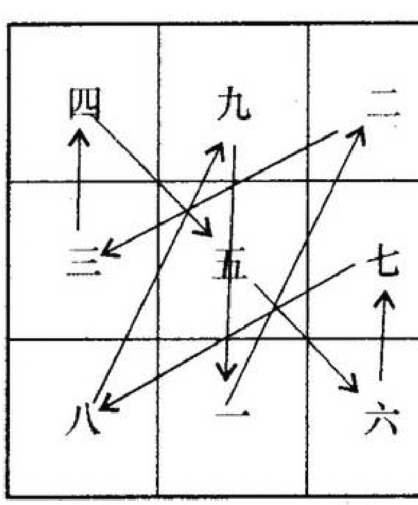
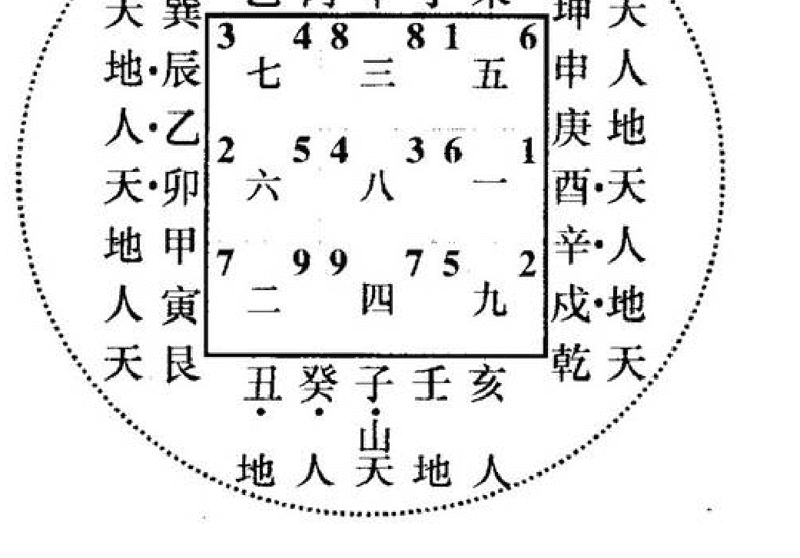

# 玄空飞星速通法

张成达著

对于玄空风水，很多爱好者都想探索此道之秘，于是买了许多书进行研读，可惜无一书能把那些乱糟糟的飞星怎么个飞法讲得透彻明了，只好望书兴叹，从此停学。我的弟子钱建安和面授学员方明辉所讲的“飞星法”简捷易懂，今把它公布于世，保您看过后茅塞顿开，步入玄空之门。

## 一、玄空风水之来源

玄空风水之理来自河图与洛书。河图主先天不变之气。洛书主后天变化之气。

## 二、简解洛书

洛书之图：戴九履一，左三右七，二四为肩，六八为足，五居中央。
其称谓是：坎一白、坤二黑、震三碧、巽四绿、中五黄、乾六白、兑七赤、艮八白、离九紫。
简称为：
一白、二黑、三碧、四绿、五黄、六白、七赤、八白、九紫
一坎、二坤、三震、四巽、五中、六乾、七兑、八艮、九离。

洛书八卦元旦盘：

| 巽 | 离 | 坤 |
|---|---|---|
| 四绿 | 九紫 | 二黑 |
| 震 三碧 | 五黄 | 七赤 兑 |
| 八白 | 一白 | 六白 |
| 艮 | 坎 | 乾 |

## 三、飞星运行规律

从一飞到二（从坎飞到坤），从二飞到三（从坤飞到震），从三飞到四（从震飞到巽），从四飞到五（从巽飞到中），从五飞到六（从中飞到乾），从六飞到七（从乾飞到兑），从七飞到八（从兑飞到艮），从八飞到九（从艮飞到离），从九飞到一（从离飞到坎）。

请看图一：飞星运行图

在飞的时候，还要分清顺飞与逆飞：

- 顺飞：1→2→3→4→5→6→7→8→9
- 逆飞：9→8→7→6→5→4→3→2→1

在具体操作时，某星入中宫，就从中宫开始飞
中宫→乾（西北）→兑（西）→艮（东北）→
离（南）→坎（北）→坤（西南）→震（东）→巽（东南）→中宫

## 四、飞星阴阳属性

阳星：甲、丙、庚、壬，乾、坤、艮、巽，
寅、申、巳、亥
阴星：乙、丁、辛、癸，辰、戌、丑、未，
子、午、卯、酉
阳星顺飞、阴星逆飞。

## 五、天人地三龙

一卦分三山，每一山有地元龙、天元龙、人元龙之说。
地元龙：
阳：甲丙庚壬。阴：辰戌丑未。
天元龙：
阳：乾坤艮巽。阴：子午卯酉。
人元龙：
阳：寅申巳亥。阴：乙丁辛癸。
在取星时，要取用天对天，人对人，地对地（后面有详解）。

## 六、九星的吉凶

一白吉星，六白吉星，主生气。
当运之星为旺，比如现在是八运，八艮入中宫主事，当旺，下一运是九离，离则次旺。
五黄与二黑主凶。
在断吉凶时，要注意年月煞，年月五黄，太岁，岁破。

## 七、详解运星、坐星、向星

请看图二：八运子山午向全图

释解：

1. 外圈的虚线表示河图，主无形之气。
2. 首先立运星，在书写运星时要用大写的汉字，此图中间写的是下元八运。
3. 元旦盘外是二十四山向，其中点上黑点的星属阴，未点黑点的星属阳。在二十四山外标有天人地三龙。
4. 次立山星。演习一下子山（坐山）是怎么飞的：

子居坎宫，属阴，飞的时候当逆数。但取用飞星时却有个说道，不能用子去飞。那么用什么星去飞呢？子所居的运星是四。四属四绿星，居巽宫，当去巽宫查。子是天元龙，对巽宫的天元龙是巽，那么就取巽。将巽入中宫，用阿拉伯数字4写在运星四的左侧。巽属阳，要顺飞。按“飞星运行规律”：从中飞到六（从4飞到乾，写上5），从六飞到七（从乾飞到兑，写上6），从七飞到八（从兑飞到艮，写上7），从八飞到九（从艮飞到离，写上8），从九飞到一（从离飞到坎，写上9），再从一飞到二（从坎飞到坤，写上1），从二飞到三（从坤飞到震，写上2），从三飞到四（从震飞到巽，写上3），从四飞到五（从巽飞到中，又回到4）。

5. 再次立向星。演习一下午向（向星）是怎么飞的：

午向居离宫，属阴，飞的时候当逆数。但取用飞星时却有个说道，不能用午去飞。那么用什么星去飞呢？午所居的运星是三。三属三碧星，居震宫，当去震宫查。午是天元龙，对震宫的天元龙是卯，那么就取卯。将卯入中宫，用阿拉伯数字3写在运星四的右侧。卯属阴，要逆飞。按“飞星运行规律”：从中飞到六（从3飞到乾，写上2），从六飞到七（从乾飞到兑，写上1），从七飞到八（从兑飞到艮，写上9），从八飞到九（从艮飞到离，写上8），从九飞到一（从离飞到坎，写上7），再从一飞到二（从坎飞到坤，写上6），从二飞到三（从坤飞到震，写上5），从三飞到四（从震飞到巽，写上4），从四飞到五（从巽飞到中，又回到3）。其它运星、坐星与向星的飞法仿此。

## 八、释解兼线

兼线，亦称兼向、替卦、变卦。
首先背熟歌诀：

- 子癸甲申贪狼行，（一）
- 坤壬乙卯未巨门。（二）
- 乾巽六位皆武曲，（六）
- 艮丙辛酉丑破军。（七）
- 若问寅午庚丁上，
- 一律挨来是弼星。（九）

以图二的子山午向为例：
八运的子山为4，午向为3。
挨星便多了个麻烦，必须依上述的歌诀而定。
比如子山兼壬或兼癸，坐山就不是4，要按兼线法，其查法是：四绿巽卦居子山，巽卦包括辰巽巳三山，按天元、人元、地元则取巽。再看歌诀的“巽”，是“六”（乾巽六位皆武曲嘛），那么坐山则写上6，巽属阳，顺飞。
比如午向兼丙或兼丁，向山就不是3，要按兼线法，其查法是：三碧震卦居午向，震卦包括甲卯乙三山，按天元、人元、地元则取卯。再看歌诀的“卯”，是“2”（坤壬乙卯未巨门嘛），那么向山则写上2，卯属阴，逆飞。

# 更多资料

↓↓↓

--------------------------------------------------

# 【中华古籍库】

↓ 点击链接 ↓

https://www.fozhu920.com/list/

珍版刻印 / 海外流传 / 家传手抄 / 民间失传

【易】【医】【道】【武】【文】【奇】【画】【书】

1000000+高清古书籍

# 打包下载

微信：mbook86

# 中华古籍库

1000000 册 高清影印古籍
珍版刻印 / 海外流传 / 家传手抄 / 民间失传

古籍善本、经史子集、史料笔记、古人文集、
民间收藏、传世家谱、各地方志、中医典籍、
四库全书、古禁毁书、内阁文库、图书集成、
丛书集成、四部丛刊、万有文库、四部备要、
二十四史、三国六朝文、明清和民国古籍史料
……

