# 通灵感应断

张成达 张百君 著

中国哲学文化协进会出版

# 通灵感应断

作　者：张成达　张百君
编　辑：袁思珍
植字排版：万宝国际发展公司
电　话：(852)81046178
出版人：曹展硕
出　版：中国哲学文化协进会
地　址：九龙旺角亚皆老街 43－49 号雅佳楼
电　话：(852)26183861　26188861
传　真：(852)26181277
印　刷：彩艺印刷公司
发　行：利源书报社
定　价：38.80 元

版权所有　翻版必究

# 前 言

通灵感应断我认为是极高层次的断卦方法，这种认识源于对易经的体悟，比如“八卦演变图”：
无极生太极，太极生两仪，两仪生四象，四象生八卦……

易学界很多人（包括某些教授）是站在两仪（阴阳）的角度著书立说的，过可笑地是竟有人用唯物变正法去释解易经。诚然，易经包容唯物变正法，但其精神实质当是“心易”。易占界更是可悲，多数“大师们”是站在两仪（阴阳）的角度编写卜筮之书，甚至有人自吹为最高层次的绝法。需加，在两仪的前边还有阴阳未分的太极，在太极的前边还有空空白白的无极，最高层次之法应该站在无极之上，当是“无法”，即“法无定法，无法法也”。

学习易占是一个“从无到有，再从有到无”的过程。就是说，我们在没学习易占前脑袋里是一片空白，学习后，头脑里则装满了死法，就象电脑里储存数字一样，需要的时候才能够调出来。当这些死法烂熟于心并反复运用后，能达到运用自如，即“善易者不占”（从有到无）的境地，那就是最高级的了，这就是本书的底蕴。

多年来，我就是站在这样的一个高度上去体悟易占，去著书立说的。在本书中，我尽力做到从初级到高级，带领您一步一步地进入易占最高级的殿堂，使卜筮能通神。

长子张百君和次子张玄宗是我的得力助手。百君从90年开始研习易卦与梅花易数占法，有很深的造诣，此书中的很多易理与卦例均出自他下，百宗则在佛道上进入禅境，曾在国家级气功刊物上发表了“庄子养生主与佛禅修练”“庄子逍遥游与道丹修练”等文章，受到了专家们的好评，在四柱预测上也很有实力。是否象我所说的这样，有兴趣者可在我的网站上与他们谈心，一谈便知高低。

张成达
2004年12月11日

# 目 录

- 前言
- 第一章 基础知识
    - 第一节 启蒙节要
        - 一、掌握太极、两仪、四象、八卦
        - 二、熟知父母六子
        - 三、记住先天八卦数
        - 四、心装实用八卦图
        - 五、背熟六十四卦
    - 第二节 感悟卦象的神蕴
        - 一、感悟卦象
        - 二、感悟爻象
        - 三、感悟爻位之象
        - 四、感悟八卦之情
- 第二章 感应起卦与变卦法
    - 第一节 感应起卦法
        - 一、起卦必用的基础知识
        - 二、起卦方法
    - 第二节 感应变卦法
        - 一、加时求变卦法
        - 二、总数求变卦法
        - 三、外应求变卦法
        - 四、随机变卦法
        - 五、感应变卦
- 第三章 有卦感应断
    - 第一节 梅花易数断卦法
        - 一、本卦、互卦、变卦之法
        - 二、体用生克之法
        - 三、动爻断卦之法
        - 四、卦气旺衰之断法
        - 五、推断应期之法
        - 六、通解古例
        - 七、实占例解
    - 第二节 易经断卦法
        - 一、卦象断
        - 二、卦位断
        - 三、爻位断
        - 四、卦辞断
        - 五、动爻断
        - 六、综合断
- 第四章 无卦感应断法
    - 第一节 无卦感应断指要
        - 一、对六十四卦的内蕴要有深层的感悟
        - 二、对“卦象”要有深度的理解
        - 三、要熟读系辞和十翼
        - 四、掌握《周易》断卦的特点
        - 五、对“三要”与“十应”烂熟于心
    - 第二节 卦要活起活断
    - 第三节 “测来意”也要通灵
    - 第四节 无卦感应断实例选
        - 一、凭外应断例
        - 二、凭图象断例
- 第五章 分类占断
    - 一、占身命
        - （一）升官子故去
        - （二）腿伤妻又离
        - （三）断错后悔晚
    - 二、占求财
        - （一）当日就得财
        - （二）炒股赚了钱
        - （三）世应俱空空欢喜
        - （四）世应值兄忌放债
        - （五）兄鬼发动必主凶
        - （六）刑合克合见乖违
        - （七）卦无子孙财无根
    - 三、占婚姻
        - （一）男占两财主再娶
        - （二）刑冲克害如刀锉
        - （三）财伏鬼下有男人
        - （四）间爻逢空媒人虚
        - （五）兄多争财婚难成
    - 四、占病症
        - （一）用临三刑人鬼乡
        - （二）抓住要害定死期
        - （三）鬼伏空亡防不测
    - 五、占出行
        - （一）车上遇歹徒
        - （二）出国必遭难
    - 六、占行人
        - （一）女儿明日归
        - （二）卜筮拾零
    - 七、占失物
        - （一）摩托不能丢
        - （二）钥匙能找到
        - （三）钱被家人偷
    - 八、占官讼
        - （一）明年能出狱
        - （二）丈夫必坐牢
    - 九、占功名
        - （一）后年必升官
        - （二）参军走不成
        - （三）硬走苦难言
        - （四）调转难成功
        - （五）还是难调成
        - （六）无官白花钱
        - （七）下岗莫上火
        - （八）单位不景气
    - 十、占子女
        - （一）解析古例
        - （二）无子之命
        - （三）身怀有孕
        - （四）占婚断子
        - （五）遗腹之婴
    - 十一、占阳宅
        - （一）依爻位断
        - （二）依六亲断
        - （三）依世应断
        - （四）依六神断
    - 十二、占阴宅
        - （一）此地可葬
        - （二）苦不堪言
        - （三）子亡妻死
    - 十三、占趋避
        - （一）必须远走高飞
        - （二）白虎开口要吃人
        - （三）惊梦女人的红裙子
- 附言

# 第一章 感应断卦基础知识

感应断卦是在充分熟悉和掌握了《周易》的内蕴后，在人的大脑中所产生出的一种超前感知能力。要想具备这个能力，有两种修行法门，即理人与行人两种方法。所谓行人，是指学习感应断卦之人在学习理论知识之外，更应注重自身的心性修养，每天都应修养道德，体悟人生之理，韬光养晦，精气内敛，正气常住，这样才能真正体悟易经的内在神蕴。所谓理人，对于感应断卦者来说，就是要学习周易、研究周易、体悟周易，做到真正地掌握周易中所蕴含的各种规律。当一个人在修养上已经与周易的精神实质相符合，在思维方法上也与周易中所体现的人生哲理相融通时，就会于不知不觉中，在人的大脑中产生一种感应，现代科学将这种感应称为第六感应，一旦人们产生了这种感应，就可以感知过去、现在和未来所发生的一切。

易经，到底包括哪些内容呢？

现在通行的《易经》实际包括两个部分。第一部分称为易经，即易的本身，含六十四卦、卦形、卦名、卦辞、爻题及爻辞。第二部分称为“易传”，含“彖、象、系辞、文言、说卦、序卦、杂卦”七个题目，即十篇文章，又称为“十翼”。

那么，怎样学习《易经》才能无师自通呢？下面，我把最简捷的入门技法告诉您，力求起到画龙点睛、指点迷津的作用。

## 第一节 启蒙节要

### 一、掌握太极、两仪、四象、八卦

请看太极、两仪、四象、八卦演变图

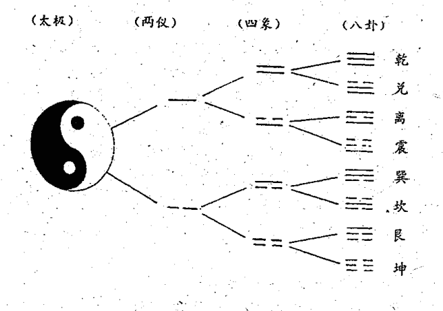

#### 太极：

太极是一种阴阳未分的原始混沌状态，它是世界的开始，万物的根基，物质世界的一切变化都以此为源头。

#### 两仪：

关于两仪，大多数人的看法是指阴阳。

“两仪”的符号称爻，其图形为：

- 阳爻——
- 阴爻— —

爻分阳爻（——）和阴爻（— —）两类，阳爻根据所处的环境不同，可以寓意着是加、上、坚定、积极、进取、刚健，是天和男性的象征；阴爻则表示减、下、温和、消极、退守、柔弱、隐藏，是地和女性的象征。

阳爻和阴爻在性质上是相反的，是互相对立的。而美国易学家钟启禄先生则认为“阳和阴是两个相对存在的不同体”。

天地万物皆是从无到有，有即为两仪，易学上所说的“天尊地卑，乾坤定矣”，也就是哲学上所说的矛与盾，即指任何事物都具有两面性。有了天与地的划分，用图形来表示，便为太极图中的阴阳两仪，此时只存在阴阳两条鱼之形，而无鱼之眼。阴阳两仪都是成对出现的，所谓独阴不生，孤阳不长，就是指这个意思。有阴必有阳，有什么样的阴；必有一个与此阴相对的阳的存在，万物都是由阴阳构成的。比如说我们常把精神比作阴，而将肉体比作阳，将具有阳刚之气的人比作阳人，而将那些善于计谋或谋划之人比作阴人。古代人将计谋称为阴谋，如《黄帝阴符经》一书，实际是最早的计谋书或兵书，这是一种从阴阳角度来看人的一种方法。还有一种方法，那就是纯从阴阳成对出现的角度来分析世界，比如现代的科学家们二直认为我们现在所能认识的世界物质都是阳物质，按照阴阳相对而生的理论，可以预知在这个世界上必然存在着与此阳物质相对应存在的阴物质即物理学上所说的反物质或暗物质。前几年全世界的科学家利用美国的航天飞船到太空中去寻找这个反物质，但可惜的是因科学实验手段的原因没能测出反物质，但人类对反物质的探索却没有因此而停止。除了反物质，天文学家们用阴阳成对出现的理论推测出在银河中必然存在一个与太阳系相对的恒星体系，他们也一直致力于寻找这个阴太阳的存在位置，这些都是阴阳成对出现理论在科学上的应用。在感应断卦上，这一理论仍然有其独特的应用。比如静为阴动为阳，“不动不占”即是说万事万物处在阴的状态时，我们无从知晓它所具有的形态，只有当其动即处于阳的状态时，我们才能发现其形态。

将阴阳从横向的角度来看，阴阳是此长彼消的运动体，从纵向的角度来看，阴阳是相互转换，相辅相成的，正如佛家所说的“种善因得善果，种恶因必得恶果”。对于感应断卦者来说，也应持这样一种观点片如，有一天，一位先生打电话来求测，不是测他自己，而是为他的一位朋友求测命运，我说你的这位朋友将不久于人世，这位先生一听，马上又接着让我看看时间，我说一个月内。一个月后，这位先生打电话来告诉我说那个人因与人斗殴被人一拳打在太阳穴上当场死亡。为何有此断，因那位死者姓殷，且是独于，电话打来时，我正在体悟这“独阴不生”的奥秘，于是我问打电话的先生，他的朋友是不是姓殷，是不是独生于，他说是，于是断其不生。

#### 四象：

四象在卦形上的体现，就是两仪的一极阳爻上分别再生出一阳一阴，这样就形成老阳 ==（又叫太阳）和少阴 ==，两仪的另一极阴爻上再分别生出一个一阴，从而形成少阳 ==，老阴 ==（又叫太阴）。

“阴中有阳，阳中有阴”，阴阳是相互融合，相互包容的，对于这种情况，用阴与阳的图形来表示，便成为太极图中的阴阳两条鱼，这两条鱼已有了两只明亮的眼睛，喻为阴中有阳，阳中有阴。阴阳不仅是相对的，而且．是相互包容的，这便为四象，将其分解开来便如上图，分为老阳、少阴，少阳、老阴，且分别用不同的符号加以表示，在太极图中，许多人都将少阴比拟为阴鱼的尾巴部分，这是不对的，我们知道老阳之时，少阴始生，所以，在太极图中少阴应该是阳鱼的眼睛，而少阳则是阴鱼的眼睛。

四象也可以理解为四向，即东南西北四个方向，四方到底是什么，现代科学也无法证实，但它却是实实在在的，一正如《金刚经》所说南北上下虚空空名存而实有，在易经上便将此虚无的事物用四象这样一个有形的东西来表示。

四象从横向的角度来看，可以表现任何事物都不可能只是由一个阴或一个阳来组成，它都是阴阳的结合体，所谓阴中含阳，阳中必含阴，这是生活的辩证法，也是感应断卦者必须具备的思维方法。比如，当我们给一个人的性格来定位时，我们不可能绝对地说因为这个人人品好，他的一生绝对不可能做坏事。事实上是再伟大的人，同样有犯错误的时候，伟人之所以是伟人，不是因为他天生的伟大，而是因为他阳的时候多、阴的时候少而已。

四象从纵向的角度来看，任何一个事物不可能是永远保持一种态势，它都是在不断地变化发展的，这不断地变化发展过程，正是阴阳相互交融的过程。那么如何用图形来描绘这样一个复杂的变化发展过程呢？这就是四象。一个事物的发展过程可以粗略用四象这种图形来表示，即事物之初为少阳，及至壮年为老阳，老阳之时一阴而生，视为少阴，此时阳气渐衰，阴气日长，直到老阴，老阴之时而一阳又生，如此循环往复，周而复始，这是从事物的生命过程来理解。比如我们常说某某人少年老成，某某人是老顽童。对于感应断卦者来说，当你给人进行一生命运预测时，运用的正是这个过程。比如，有一位集团公司的老总十年前找我求测命运，我便告之：你前五年事业已达一生中的项峰，今后必须激流勇退，你不退也得退，所谓“物壮则老，是谓不道”，正是因为这一退，才保你后五年的平安。后果如我所测。去年他打电话来告诉我说，如果他当年不退，去年一定和其他人一样进监狱，因为公司莫名倒闭，引起上级管理者和公司员工的愤怒，结果公司的几个头头都被捕入狱，唯独他得以幸免，而且员工们一致请求他出山，重振公司。他半夜打电话问我是否出山，我告之不可，原因是公司有公司的生命成长过程，个人有个人的生命成长过程，当一个公司处于倒闭时，正如一个人行将就木之时，任何一个医生都不可能将其挽回，再加上你个人的命运也不允许你做此工作，重归田园是好的选择。他听我之言，仍然过着田园的生活，最后那家有名的大公司以倒闭而终其一生。

#### 八卦：

四象进一步再生阴阳而生成八卦，是象征宇宙中八种最基本现象的符号。

八卦是一种三爻卦，共有八个，《周礼》称为“经卦”，又称“单卦”、“小成之卦”等。

八卦都有一定的卦形。卦名、象征物和既定的象征意义。

为了帮助人们背诵八卦方便，宋人有一首“八卦取象”歌，其歌诀是：

- ☰ 乾三连（乾卦的三个爻画是连接的）
- ☷ 坤六断（坤卦的三个爻画是断裂的）
- ☳ 震仰盂（震卦的卦形象一个口朝上的盂）
- ☶ 艮覆碗（艮卦的形状好象一个倒放的碗）

☲ 离中虚（离卦的中爻是一根虚线）

☵ 坎中满（坎卦的中爻是一条实线）

☱ 兑上缺（兑卦上面的一个爻画有缺口）

☴ 巽下断（巽卦下面的一个爻画是断开的）

八卦又称八宫，分阳四宫和阴四宫。阳四宫是：乾、坎、艮、震；阴四宫是：巽、离、坤、兑。同时又给八卦配以五行，即乾、兑属金；坤、艮属土；震、巽属木；离属火；坎属水。

请注意：必须背熟八卦，因为它是基础的基础。

在易占中，八卦十分重要。比如占问某人学识如何，得离卦，可断该人是草包肚子，没什么学问，因为“离中虚”嘛！若得坎卦就不同了，可断此人有学问，“坎中满”嘛！若是有人拿着个扣着的碗求你占断吉凶，可起艮卦，“艮覆碗”嘛！……假如你连八卦都不会，怎么去起卦，更不用说进行易占了。

四象的符号只能代表一个事物的两个点，这两个点连接起来也不过是一条线，人类观察事物，描绘一个事物，必须用面来描绘。正象绘画，人只能在一个面上去画，不可能在点和线上作画。有人说那有人在一根发丝上可以刻上《金刚经》，一根发丝在显微镜下仍是一个面，并不是一个线。为了能更好地描绘一个事物，周文王将四象进一步划分，又增加了一个点，这样就形成了八卦。有人说八卦表示三维空间的事物，其实不然。“八卦一小成”，八卦只是表示事物的某一个面。当我们描绘或描述一个具体的事物时，我们一般都是一个侧面一个侧面地说或画。而这个侧面一般都是某一事物的特性。为什么会这样说呢？比如，离象眼睛（目），离的外面两个阳爻象征眼眶，而中间的阴爻则象征眼珠子，这是最漂亮的眼睛。当然，不仅离象征眼睛，巽卦同样可以象征眼睛，只是这个眼睛与离卦的眼睛不同，这是一种细长的单眼皮的，而且多白眼仁的眼睛；震卦是一种什么样的眼睛呢，这是一种眼袋很深且眼球乱动的眼睛。“八卦小成”是说八卦只能代表事物的某一侧面，并不能从整体上为我们描绘出一个三维立体的事物，八卦是二维空间即一个面状的事物，它不是三维空间的立体事物，这样我们才能通过对八卦的理解来分析事物的某一侧面的特性。关于这一点，我在后面的“八卦取象”里会详细地解释。

### 三、熟知父母六子

“父母六子”之说，是以家庭的父母子女关系比拟八卦的内在变化与衍生规律。乾、坤二卦为阴阳之本，万物之始祖，而震、坎、艮和巽、离、兑六卦，乃至六十四卦，均出自乾、坤二卦，就如同家庭一样，有父母然后有子女，有子女然后有子子孙孙，这是世间万物的衍生变化规律，子女继承父母的基因，所以具有父母的一些特点。我们常将这种现象称为遗传，这种血缘的遗传现象，在易经里便以父母六子来加以表示，使我们一看便知。

#### 请见《父母六子》表

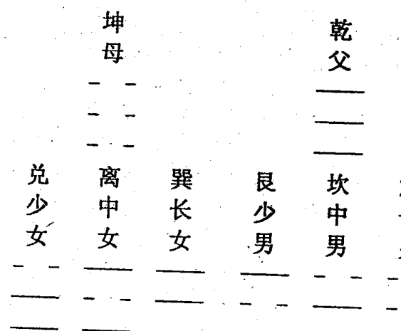

“父母六子”即乾父、坤母、震长男、坎中男、艮少男、巽长女、离中女、兑少女。震一索而得长男，巽一索而得长女，可见长子如父，长女如母是千古不变的易理。父母六子又揭示了这样一种易理，即八卦以独阴或独阳在八卦中所处的位置来反映一卦的性质与外在的形象。比如震卦，一阳复来，外包两阴；我们不以两阴来论该卦的性别，而以此独阳来决定此卦的性质与形象，一阳复来，万物复苏，正如春雷一声震醒，所以为震。其它六子依此。这里反映了一种卦位理论，在具体断卦时，可以依卦中阴阳爻的不同位置而断。如一次在一农家乐与朋友们玩得正高兴之时，突然听到一声不祥之音，朋友们笑问我能否测一测为什么，我说可以。静下来之后，头脑中突现天地否卦，声音从东方传来，于是断四爻动。我说：午后时分，当有一女在西北方被车撞破胸部而亡，此女孩为长女。朋友们皆笑不信。吃完中午饭，忽见农家乐里的人都向村外的马路上跑，一问，有人说刚才一辆解放车撞死了一个女孩子，样子很惨。朋友们一脸惊讶地看着我，那种眼神是被感应卦的神奇所震惊。至此以后，再没有人考验我卦算得准不准，也再也没有人说易经算命是迷信了。

对于此父母六子必须记住，因为在易占中必用。比如按人的年岁起卦，如果老人是男的，起乾卦；是女的，起坤卦；是长男，起震卦；是长女，起巽卦……假如你没有掌握“父母六子”，便无法按年岁起卦，更谈不上断卦了。

### 三、记住先天八卦数

先天八卦数是“乾一、兑二、离三、震四、巽五、坎六、艮七、坤八”，此先天八卦数必须记住，因为在易占中必用。比如用33两字起卦，可起离卦，因为离卦的卦数是三。又比如占行人几天能回来得兑卦，你可断二日内回来，因为兑卦的卦数为二。

### 四、心装实用八卦图

在易占中，用“先天八卦数”和“后天八卦方位”是宋朝大易学家邵康节先生发明创造的，他在《梅花易数》中，还把干支纳入“八卦方位图”中，图中天干地支排列，即是时空方位的标志，又是阴阳五行旺衰和生克的标志。

#### 实用八卦图

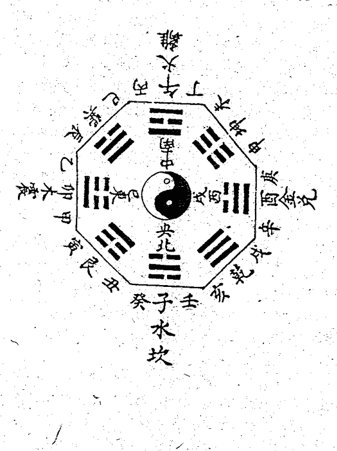

此《实用八卦图》必须牢记心中，因为在易占中，尤其在感应断卦的起卦与断卦中必用。在背诵此图时，不但要记住八卦方位，还要记住与理解十二地支：

子（鼠、水），丑（牛、土），寅（虎、木），卯（兔、木），辰（龙、土），巳（蛇、火），午（马、火），未（羊、土），申（猴、金），酉（鸡、金），戌（犬、土），亥（猪、水）。

此为后天八卦。它与先天八卦的区别在于，先天八卦以乾坤定南北，坎离定东西，以此四极为基础，再辅以兑、巽、震、艮为四隅，构成了一种适合于万物初始时的方位与状态。那时大地初定位，四时初行，万物尚未生成。但随着时间的推移，地球的运动状态发生了变化，为了适应符合这种变化状态，易学家们发明了后天八卦图，此八卦图将乾坤放在西北与西南。而将离居南位，坎居北位，震主东方，兑主西方，形成了一种新的八卦方位图，这种方位图是现今地球，乃至宇宙状态的真实比拟，生活在这样环境之中的万事万物，都与此图相符合。因此，感应断卦者在有卦而占之阶段，多用此以断卦，其效若神明附体，准确无误。

断卦者应头脑中藏有此图。断卦时，可将此图比拟成一切事物，其大可如大地无端，其小则可小于掌心，甚而至于细胞、分子之类，正所谓“其大无外，其小无内”，“藏诸形，显诸用”。可以这样说，面相学、阴阳宅、奇门遁甲等术皆以此为根基。比如相面，一次有一人来求测，我看其脸孔的左侧有一伤痕，便说：你是长子。家住东方，你家房子东面有两棵大树，左边的那株高大，另一棵根部露在外面，树干上有一虫洞。你这个人肝火太旺，驴脾气，最近不敢发怒了，浑身无力，不思茶饭，病在肝，信我话赶紧到医院去住院。第二天他真的到医院去，一检查，肝硬化晚期。这个断卦方法就是应用的后天八卦图。

上面的例子不光是用后天的八卦图。对于感应断卦者来说，他的头脑中应该有一个八卦方位图，他看世间的任何事物都应以此八卦图来划分。这是一个形象思维法，也是感应断卦最基本的思维方法。易者象也，这就是说，若要理解易经，学会运用易经，就必须掌握形象思维方法，没有形象思维，没有逻辑思维的人，绝对学不好易经，也无法成为真正的预测大师。运用八卦方位图来进行预测是所有预测中最神奇最简单最容易掌握的预测方法。在运用八卦方位图时，不能只把事物的整体看成一个八卦方位，这是粗略的法子。试想，如果我们把中国大地看成是一个八卦方位，那整个东北地区仅用一个艮卦来表示，虽然这样可以大略地看出东北人、东北土地、东北事物的一个粗略的概貌，但你很难通过一个艮卦而区分出辽宁人与吉林人或与哈尔滨人之间的细微差别，为了能更详细地区分这些细小的差别，我们同样可以将八卦方位图放在东北三省的大地上，这样就会发现，辽宁省沈阳市属八卦中的离卦，而黑龙江省在最北方为坎卦，离为阳，所以称为沈阳，沈阳人心地善良热情，沈阳的女人是最具东北特色的人，“东北人都是活雷锋”，那说的正是沈阳人。再往细分，我们同样可以将八卦方位图放在沈阳的地域上，这样我们一下就能区分出沈阳市的城南与铁西的差别。再进一步细分可以看出一个或某几个区的差别，再细分可以看出一个单位的差别，如此无穷无尽地细分下去，直至一个人的一段指甲一根发丝。这也正是为什么现在有人可以从一个人的耳朵或食指的第二指节来看病治病的原因。因为，一只耳朵可以看成一个八卦，每一个八卦对应着身体的一部分。一节指节也可以看成一个完整的八卦方位图，每一个八卦同样代表着身体的一部分。但他们的断病或治病方法尚存在一些问题，因为这种方法虽然符合所谓的“全息理论”，但是他们却忽略了一个重要的问题，即每一卦所处的客观环境之不同。比如，处于左耳的离卦与处于右耳的离卦，二者虽同为离卦，但其细微之处却有差别；处于耳上的离卦与处于眼睛上的离卦，二者虽同是离卦，但二者确是存在着许多的不同，这一点，对于想成为真正的预测大师的人是不可不深究的。佛说：“一粒沙中有一个三千大千世界，而三千大千世界也如一粒沙或一粒微尘”，其实质也正与此理相同。一粒沙离不开世界，是客观的实在，而世界同样也离不开一微尘，一粒沙中含有一个大的八卦方位图，在这个大的八卦方位图里，包含有无数个小的八卦方位图，这种包含和对应关系与三千大千世界的八卦方位是完全等同的。这就是我们可以运用八卦方位图来进行预测的原理，这种预测法应用起来很简单又很实用。

八卦的色泽在起卦和断卦中也经常运用，比如一人穿红色衣服可起离卦，穿黑色衣服可起坎卦等。

八卦所代表的色泽是：离为红色；坎为黑色；震为青与绿色；兑为白色；巽为蓝色；艮为棕色；坤为黄色；乾为大赤色。

八卦所代表的颜色属纯正的，比如离代表红色，这是一种纯正的红色，没有任何夹杂；坎为黑色，是一种纯正的黑色。颜色也是一种象，是预测者必须掌握的知识。断卦之时，可以正推，也可以逆推。比如有一天我到一位中医朋友的诊所去，正巧有一位女同志找那位中医朋友看病，中医朋友摸完脉之后，回头问我是否能用感应断卦法看出她的病，我说可以，我断她心火过旺，眼干腰疼，表面上看是腰有病，而实质是病在心经，应从泄心火入手施以药疗，三日必愈。中医朋友点头表示同意。何以有此神断，当时便是以女病人服饰的颜色而断。她上身穿一件红色的外套，里为黑色衬衣，于是起火水未济之卦，水火不相容，中医讲心肾阴阳不交，她一手扶腰，说明腰痛，下意识地整理红色外套，说明其心火旺盛，阳盛则阴衰，所以，治病当从泄心火入手，这是逆用之法。顺用之法则更多更普遍。比如，一日一卦友说有人给他介绍一女朋友，现在我们一起测一测，看看能否测准，于是我们几人各用自己之法进行预测，我用的是感应断卦法，时正值傍晚时分，一抹晚霞映红了半边天，我当时起得离卦，于是开口断这个女孩子上身穿一件红色的外套，眼睛很是漂亮，办事充满热情等，这就是用的顺法。由此可见，断卦之法实可分为顺逆之法，但不论顺逆，作为感应断卦者来说都必须在心里熟练掌握八卦所代表的意义，这样才能左右顺逆进行预测。

### 五、背熟六十四卦

将八卦上下两两相重，就构成了六十四组各不相同的六画卦，这就是六十四卦。

六十四卦的排列顺序有两种：

1、通行本六十四卦的排列顺序：

卦名及卦象符号：

| 乾 | 坤 | 屯 | 蒙 | 需 | 讼 | 师 | 比 |
|---|---|---|---|---|---|---|---|
| 小畜 | 履 | 泰 | 否 | 同人 | 大有 | 谦 | 豫 |
| 随 | 蛊 | 临 | 观 | 噬嗑 | 贲 | 剥 | 复 |
| 无妄 | 大畜 | 颐 | 大过 | 坎 | 离 | 咸 | 恒 |
| 遁 | 大壮 | 晋 | 明夷 | 家人 | 睽 | 蹇 | 解 |
| 损 | 益 | 夬 | 姤 | 萃 | 升 | 困 | 井 |
| 革 | 鼎 | 震 | 艮 | 渐 | 归妹 | 丰 | 旅 |
| 巽 | 兑 | 涣 | 节 | 中孚 | 小过 | 既济 | 未济 |

六十四卦这样排列是有深刻意义的，它表露出事物产生、发展诸阶段的转化过程。

要想理解周易，熟悉六十四卦卦名及其顺序是十分必要的，我们可利用宋人朱熹《周易本义》中记载的“卦名次序歌”来帮助记忆，这个“卦名次序歌”是这样的：

乾坤屯蒙需讼师，
比小畜兮履泰否。
同人大有谦豫随，
蛊临观兮噬嗑贲。
剥复无妄大畜颐，
大过坎离三十备。
咸恒遁兮及大壮，
晋与明夷家人睽。
蹇解损益夬姤萃，
升困井革鼎震继。
艮渐归妹丰旅巽，
兑涣节兮中孚至。
小过既济兼未济，
是为下经三十四。

古人的这个歌诀对现代人来说比较拗口（古韵与今韵变化较大），且歌诀中衬字、无意义字较多，初学者容易把非卦名字误为卦名。有人根据今韵特点，将古歌诀中衬字、非卦名字一律删去，只留卦名，依长短句，创一易经词牌。对记忆易经顺序或许有一定帮助：

乾坤屯蒙，
需讼师比，
小畜履泰否。
同人大有谦豫随，
蛊临观、噬嗑贲。
剥复无妄大畜颐，
大过坎离。
咸恒遁，
大壮晋明夷。
家人睽蹇解损益，
夬姤萃，升困井革鼎，
震艮渐，归妹丰旅。
巽兑涣节中孚，
小过既济未济。
上阙为上经，下阙为下经。
此节请参看《序卦传》。

2、《京房易传》对六十四卦的分宫排列：

#### 乾宫八卦：

乾为天☰，天风姤☴，天山遁☶，天地否☷，风地观☴，山地剥☶，火地晋☲，火天大有☲

#### 兑宫八卦：

兑为泽☱，泽水困☱☵，泽地萃☱☷，泽山咸☱☶，水山蹇☵☶，地山谦☷☶，雷山小过☳☶，雷泽归妹☳☱

#### 离宫八卦：

离为火☲，火山旅☲☶，火风鼎☲☴，火水未济☲☵，山水蒙☶☵，风水涣☴☵，天水讼☰☵，天火同人☰☲

#### 震宫八卦：

震为雷☳，雷地豫☳☷，雷水解☳☵，雷风恒☳☴，地风升☷☴，水风井☵☴，泽风大过☱☴，泽雷随☱☳

#### 巽宫八卦：

巽为风☴，风天小畜☴☰，风火家人☴☲，风雷益☴☳，天雷无妄☰☳，火雷噬嗑☲☳，山雷颐☶☳，山风蛊☶☴

#### 坎宫八卦：

坎为水☵，水泽节☵☱，水雷屯☵☳，水火既济☵☲，泽火革☱☲，雷火丰☳☲，地火明夷☷☲，地水师☷☵

#### 艮宫八卦：

艮为山☶，山火贲☶☲，山天大畜☶☰，山泽损☶☱，火泽睽☲☱，天泽履☰☱，风泽中孚☴☱，风山渐☴☶

#### 坤宫八卦：

坤为地☷，地雷复☷☳，地泽临☷☱，地天泰☷☰，雷天大壮☳☰，泽天夬☱☰，水天需☵☰，水地比☵☷

八卦，按五行分为八个宫，八宫只有八个卦象，那么其它五十六个卦象是怎样产生出来的呢？这是大家所关心的。

八卦是物象的标志，也是阴阳二气旺衰与五行生克的标志。阴阳的规律是“变”，可以说是变化无穷，因此，其它五十六个卦象，都是由八首卦变出来的。

例：乾宫八卦变法如下：

| 乾为天 | 天风姤 | 天山遁 | 天地否 |
|---|---|---|---|
| ☰ | ☰☴ | ☰☶ | ☰☷ |
| ☰ | ☰☴ | ☰☶ | ☰☷ |
| ☰ | ☰☴ | ☰☶ | ☰☷ |
| ☰ | ☰☴ | ☰☶ | ☰☷ |
| ☰ | ☰☴ | ☰☶ | ☰☷ |
| ☰ | ☰☴ | ☰☶ | ☰☷ |

风地观 山地剥 火地晋 火天大有

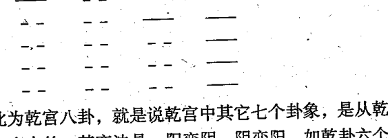

此为乾宫八卦，就是说乾宫中其它七个卦象，是从乾卦中变出来的，其变法是：阳变阴，阴变阳。如乾卦六个爻都是阳爻，变时从最下面那个爻开始，自下往上变。乾卦初爻由阳爻变为阴爻，变出《天风姤》卦；乾卦二爻由阳爻变为阴爻，变出《天山遁》卦；乾卦第三爻由阳爻变为阴爻，变出《天地否》卦；乾卦第四爻由阳爻变为阴爻，变出《风地观》卦；乾卦第五爻由阳爻变为阴爻，变出《山地剥》卦；《山地剥》卦第四爻由阴爻变为阳爻，变出《火地晋》卦；《火地晋》卦初爻、二爻、三爻都是阴爻，全变为阳爻，变出《火天大有》卦。至此，乾宫八个卦俱全。

八宫变法，都有一个共同的规律，从首卦初爻开始，有阳爻就变为阴爻；有阴爻就变为阳爻，每变一爻，就变出个新的卦象。从初爻往上变到第五爻为止，第六爻就不变了，然后反过来变已经变出新卦的第四爻，如前面的《山地剥》卦；第四爻由阴爻变阳爻，变出《火地晋》卦，接下去把《火地晋》卦下卦的三个爻全变（阴爻全变阳爻），这样就变出《火天大有》卦。以上是乾宫八卦变法，其它宫的变法仿此。“八卦一小成，六十四卦则万物成。”这是说八卦只能代表事物的某一侧面，不能完全表达事物的全部特性，只有将两个八卦重叠后形成了六爻卦之后，才能将世间万事万物的发展变化表达清楚。为什么只有六爻卦才能表达一个完整的事物，这是因为每一个单独的八卦只能表示出事物的某一个侧面，而一个六爻卦是由五个八卦组成的，我们不能象其它易赋图书所说的那样去理解，以为一个六爻卦是由上下两个卦组成的，这样理解是不全面的。其实一个六爻卦里包含有五个八卦（上卦、下卦、内互卦、外互卦和内外互卦所组成新的卦体），这五个八卦分别起着不同的作用，代表着事物的不同侧面。人类观察事物，描绘事物一般都是三维空间，一个三维空间包括六个面，即上下前后左右。但我们在说明事物时，一般都只说出它的几个显著的特点就可以表达清楚，而不必将所有的侧面都一一列出，这正象画简笔画或漫画一样，寥寥几笔就能勾勒出一个活生生的事物。我们预测也应该这样，而不能象盲人摸象，只见树木不见森林，只以八卦来断其一点，而应用六爻卦来断出事物的全貌，这就是为什么说只有当六十四卦时才可以称为万物成的道理。

背熟六十四卦，不仅要熟记卦名，对于感应断卦者来说，更为重要的是要熟记、理解六十四卦的卦名和卦象，最好的记忆方法是采用如山水蒙、水地比、风泽中孚之类，这样记忆的好处是当我们起卦之时，很容易就能想出六爻卦的卦象，长时间地训练后，在我们的头脑中就会形成一个个完整的六十四卦卦象，这样就不用随时拿个笔画卦，然后再观卦解卦。

熟记六十四卦的顺序，对于感应预测也是非常实用的，有的时候我们可以不用求取动爻，而只用六十四卦的顺序来进行预测。比如，有一次我在一个卦友处帮场子，当时有一个求测者，看样子对易经略知一二，他不停地提问题，搞得我的卦友招架不住，我于是接着卦友刚起过的屯卦开始预测。我说：你虽然年纪很大，但不久前刚刚走亲，你的女友是一个有孩子的离婚女人，她因为生活需要而不得不与你成亲，但用不了多久，她的那位进监狱的前夫会与你打官司，官司没成却动起了手，现在你正处于进退两难之地。你来问卦就应该相信易经，相信为你算卦的人，这样才能得出正确的结果，你现在这样来考验卦师，肯定得不到准确的判断。他一听便赶紧赔不是，说自己确实是学过一点易经，也正如我所测的那样，因帮助一女子，她为表示感激决定嫁给我，我们正要结婚时，她的前夫从监狱出来了，与我打了一架，结果双方闹到法院，法官说她若与我结婚就犯了重婚罪，除非她与前夫先离婚，现在能做的是她只能与前夫协议离婚，我因此来问，看是否能好合好散？我说不打不相识，打过之后，他气消了，双方一定会好合好散，你就放心回去处理吧，没问题。他满意而归，后果如所测。所以这样预测就是应用的六十四卦的顺序，屯卦之后是蒙卦，蒙之后是需，需之后是讼，讼之后则是师，而师之后必然是比，所谓比乐师忧，没有忧则不会来求测，即来求测则必有忧，所以有此断。

## 第二节 感悟卦象的神蕴

所谓八卦之象，又称为卦象，是古人根据八卦的特性比拟万物的特点后所总结出来的。

“圣人立象以尽意，设卦以尽情伪，系辞焉以尽其言，变而通之以尽利，鼓之舞之以尽神。”八卦有象，通过对象的理解可以设出其意义所在，可以说，有什么样的象，就有什么样的意，有什么样的本质特性，就会有什么样的形象，这就是圣人设卦立象的本意。通过对八卦之象与意的理解，我们可以不断提高预测水平，这也是现代哲学上所讲的“透过现象看本质”的基本原理。易经预测学、命理学、相学、风水学以及国外的星相学等，都是透过现象看本质原理的应用，就是西方的实验科学也都是透过现象来研究事物的本质。

“象”是研究易经的基础。《周易》将天下万物归纳为八种基本物质，用八卦之象以类万物之情。八卦的卦象，是用以表示客观事物的形象；卦、爻辞是用以讲述客观事物的实质。卦象，有取卦形的、有取卦理的、有取卦义的，八卦就是借助卦象而生其义，去“感而遂通”。如果没有直观能感觉到的事物形象，就无法进行观察、分析、体会、总结出事物的规律性，就无法进行易占。

### 一、感悟卦象

对八卦之象，在《说卦传》中讲得很明白，是战国时代人们对“易象”的整理与介绍，现摘录于下：

“乾，健也；坤，顺也；震，动也；巽，入也；坎，陷也；离，丽也；艮，止也；兑，说也。

“乾为马，坤为牛，震为龙，巽为鸡，坎为豕，离为雉，艮为狗，兑为羊。

“乾为首，坤为腹，震为足，巽为股，坎为耳，离为目，艮为手，兑为口。

“乾，天也，故称乎父；坤，地也，故称乎母。震一索而得男，故谓之长男。巽一索而得女，故谓之长女。坎再索而得男，故谓之中男。离再索而得女，故谓之中女。艮三索而得男，故谓之少男。兑三索而得女，故谓之少女。

“乾为天，为圆，为君，为父，为玉，为金，为寒，为冰，为大赤，为良马，为老马，为瘠马，为驳马，为木果。

“坤为地，为母，为布，为釜，为吝啬，为均，为子母牛，为大舆，为文，为众，为柄，其与地也为黑。

“震为雷，为龙，为玄黄（黄黑色），为虩（布施，施舍的意思），为大涂（大道），为长子，为决躁，为苍筤竹（小青竹），为萑苇，其于马也，为善鸣，为馵足（后左腿白色的马），为作足（脚步快速的马），为的颡（白脑门的马）。其于稼也为反生（指花生、土豆、洋芋等），其究为健，为蕃鲜。

“巽为木，为风，为长女，为绳直，为工，为白，为长，为高，为进退，为不果，为臭。其于人也，为寡发，为广颡，为多白眼，为近利市三倍，其究为躁卦。

“坎为水，为沟渎，为隐伏，为矫柔（车轮的外框），为弓轮。其于人也为加忧，为心病。为耳痛，为血卦，为赤。其于马也，为美脊，为亟心，为下首，为薄蹄，为曳（水摩地而流）。其于舆也为多眚，为通，为月，为盗。其于木也为坚多心。

“离为火，为日，为电，为中女，为甲胄，为戈兵。其与人也为大腹，为乾卦，为鳖，为蟹，为赢，为蚌，为龟。其于人也，为科上槁（枝干枯槁的树木）。

“艮为山，为径路，为小石，为门阙，为果蔬（指瓜类果实）。为阍寺，为指，为狗，为鼠，为黔啄之属。其于木也为坚多节。

“兑为泽，为少女，为巫，为口舌，为毁折。为附决（附在树枝上坠落的果实）。其于地也为刚卤，为妾，为羊。

八卦卦象在感应断卦中必用，因此将根据多种书所整理出的“实用卦象”附于此：

#### 乾卦：

象意：君尊统治，高傲自慢。向上、老成、活动、积极、迈进、决断、威严、坚固、发光、激烈、扩大、任性、惩罚、愤怒、侵略、制裁、强制、冷酷、轻视、压仰、专横、独霸。

人物：父亲、祖父、夫、家长、君王、圣人、英雄、统治者、独裁者、掌权者、总统、首相、议员、元老、厂长、经理、书记、主席、会长、名人、专家、官吏、军官、律师、一把手等。

人体：首、胸部、大肠、骨、右足、右下腹、精液、男性生殖器等。

病象：头部疾病、胸部疾病、骨病、硬化性疾病、老病、旧病、伤寒之病、变化异常之病、急性暴病、结肠疾病等。

#### 坎卦：

象意：哭泣、漂泊、暗昧、不安、欺诈、狡狯、疑惑、劳碌、失掉、贼盗、算计等。

人物：中年男子、暧昧、偷盗、逃亡者、亡命徒、黑社会、黑帮、黑教、诈骗者、诱惑者、恶人、病人、酒鬼等。

人体：肾脏、膀胱、血、耳、腰、背脊骨、肛门、泌尿系统、生殖器等。

病象：肾冷水泄、消渴症、出血症、性病、遗精、心脏病、拉肚子、水肿症，腰背疾病、生殖器疾病等。

#### 艮卦：

象意：应固、安居、沉着、冷静、慎守、顽固、隐蔽、困苦、阻滞、静止、主观、界限、独立等。

人物：为少男、僧尼、警卫、奴仆、矿工、石匠、守门员、训犬者、狱吏、犯人、偏激者等。

人体：为手、鼻、手背、脚背、脾胃、趾、乳房、颧骨等。

病象：鼻、手、脚、背之病，脾胃之病、虚胀、凸起的炎病、肿瘤、麻木病、关节病、结石症、气血不通等症。

#### 震卦：

象意：霸道、追求、紧迫、攻克、移动、上升、虚惊、性色、冲突、显示、勇敢、兴起、狂乱等。

人物：为长男、警察、军人、法官、飞行员、驾驶员、狂人、说大话吹牛者、舞蹈演员、足球爱好者、神经过敏的人、壮士等。

人体：足、腿、脚、肝胆、左肩背等。

病象：精神病、狂躁症、羊痫风、惊吓症、肝火病、腿病、外伤等。

#### 巽卦：

象意：直爽、附和、交涉、捷报、号令、奔波、薄情、悭吝、幻觉、忙碌、优疑、轻浮、扫荡、烦躁、空虚、多欲等。

人物：为长女、长媳、僧尼、仙道、气功师、商人、教师、指挥官、能工巧匠、传令兵、忧柔寡断的人、头发细长而直的人、下肢无力之人、交际人员等。

人体：头发（细、直、稀少）、神经、气管、血管、呼吸器官、胆、筋、股、左肩、肠道、食道、肝等。

病象：伤风感冒、中风、传染病。坐骨神经痛、抽筋、风瘫、风湿性疾病、喘息、左肩痛、神经炎、胯股病等。

#### 离卦：

象意：晋升、虚荣、焦躁、文书、文章、影像、明察、排斥、轻浮、显示、自满、抗上、撒谎、华丽、鲜艳、磊落、礼仪等。

人物：中女、美人、贵族、文人、学者、演员、明星、多情者、幻想者、抗上的人、虚伪者、侦察员、战士等。

人体：眼、心脏、乳房、小肠。

病象：眼病、心脏病、火伤、烫伤、乳房疾病、发烧、小便黄、血液病、妇科病、囊肿、肥大症等。

离中虚，心不实不可交，火不宜太旺，太旺则有火灾，心肾受损（包括心神、心脑血管）。

#### 坤卦：

象意：正直、勤劳、忍耐、吝啬、沉默、怯弱、依赖、贫贱、虚耗、疑惑、迟缓、忧柔寡断等。

人物：祖母、母亲、后母、女主人、寡妇、阴气盛之人、忠厚之人、大腹之人、皇后、妃、臣、大众、顾问、农民、俗人、助手、凡人、泥瓦工等。

人体：腹部、脾、胃、肉、右肩。

病象：腹部疾病（胃肠及消化不良、腹痛）、浮肿、皮肤病、慢性病、中气虚、癌病、晕症等。

#### 兑卦：

象意：雄辩、讲演、告知、魅力、议论、吵闹、趣味、娱乐、叹息、商量、叫卖、音乐、毁谤、淫滥、欢快等。

人物：为少女、巫师、讲师、解说员、牙科医生、娼妓、妾、非处女、耍娇的人、小人、刑官、媒人、破坏者等。

人体：口、舌、牙齿、咽喉、肺、气管、右胁、肛门。

病象：口腔内疾病（口、齿、咽、喉等）、咳嗽、痰喘、胸痞、尿道口、肛门疾病、性病、外伤、气管病等。

### 二、感悟爻象

爻是构成卦的最基本的单位，有阳“———”爻和阴“— —”爻两种。

爻在卦中，从下往上数，不可反之，其位置顺序好列是初、二、三、四、五、上，阳爻（———）称做九，阴爻（— —）称做六，阳爻按其爻位顺序有初九、九二、九三、九四、九五、上九；阴爻按其爻位顺序有初六、六二、六三、六四、六五、上六。

在六十四卦中，纯阳卦和纯阴卦只有乾、坤两卦（见乾、坤两卦“爻用九、六”图）。

#### 爻用九、六图

| 乾卦 | - | - | 坤卦 |
| --- | --- | --- | --- |
| 上九 | - | - | 上六 |
| 九五 | - | - | 六五 |
| 九四 | - | - | 六四 |
| 九三 | - | - | 六三 |
| 九二 | - | - | 六二 |
| 初九 | - | - | 初六 |

为什么爻用九、六，《周易》古筮法中说九为阳数之极，六为阴数之极，极则生变，变则通。

系辞曰：“一阴一阳之谓道”。“爻也者，效此者也”。又曰：“夫乾，确然示人易矣；夫坤，隤然示人简矣。”因此，为了区分阴阳之间的差别，古人用“————”代表阳，表示一切具有阳性之质的事物，比如正、光明、刚健、高尚、完美、运动、变化等等一切阳性事物；而用“— —”代表阴，表示一切具有阴性之质的事物，比如负、黑暗、柔弱、卑下、不完美、静止等一切阴性的事物。又不但能表达对立统一的一切事物的发展变化，而且是最简单明了的表达方法。因为一阴一阳之谓道，这个道是在不断变化发展的，为了简单迅速的反映这一阴一阳的变化规律，古人发明了使用爻来描述道的变化，只有用这种符号才能真正地表达清楚这一变化规律。

“圣人有以见天下之动，而观其会通，以行其典礼，系辞焉以断其吉凶，是故谓之爻。爻也者，效天下之动者也。”由此可见，易往往是通过爻之属性推断事物的变化规律的，同时，还可反映这些规律到底对我们生存和发展有些什么影响。爻象动乎内，而吉凶见乎外，这就是说爻之变化是在卦内变化，卦内的爻的变化却能象征现实生活中的各种吉凶现象，这就是一切预测方法的最本质的原理，其根本原因是世界上的各种变化虽然无穷无尽，但是古人却用八八六十四卦即三百八十四爻的形象符号来分别代表不同的变化，它可以将世界上千差万别的事物的变化发展规律，用这有限的符号表达出来，我们预测之人只要熟悉这些符号，观这些符号的变化就可以做到不出户而知天下的神人境界。感应断卦法也正是建立在这样的预测原理基础之上，先从有卦开始预测，最后达到无卦的境界，其预测之效用可通鬼神。对六十四卦的理解是始于对爻象的理解，只有对爻象有了充分的理解后，才能对每一个六爻卦象有一个深刻的理解，这样不断地训练自己的形象思维，才能达到最终的感应卦象的能力。系辞说：“爻有等，故曰物”，意思是说爻是通过不同的类型表达方式，反映了事物的发展变化，不但能从抽象方面表达，而且也是具体实物的表达。“六爻相杂，唯其时物也”，因六十四卦中的每一卦都是由六个爻来组成的，但不管这六个爻是如何的错杂，它都是反映了一定的时间条件下的具体事物。“爻象以情言”，这是说爻不但能反映具体事物的表面情状，而更主要的是反映了事物的本质特征，它所反映的是某一事物的最本质最具代表性的性质和特征。

总之，爻不但能从事物的总体规律上进行抽象的表达，而且更重要的是能从不同范围、不同层次及不同位置上的具体的实物进行具体的表达。范围、层次、位置、角度、状态的不同，表达的具体内容也不相同。这时所表达的是在一定特定的时间条件下的具体实物。而同一实物，在不同时间条件下，它所处的范围、层次、位置、角度、状态也可以不相同。也就是说，爻在卦中处的位置、角度、状态不一样，是反映了同一具体实物在特定范围（系统）内不同时间的规律。比如，一天晚上，一位女同志占问夫病如何，得地雷复卦，我断其夫必死，后果如所测。当时有一位朋友在场，他记住了我所断的过程。到了晚上又有一位女同志来问其父病如何，巧得很，也得了地雷复卦，我的朋友笑着说：这卦我也会断，看来其父必死。那位女同志一听眼泪就下来了，我赶紧说：先别哭，你父七日内必愈，这次病好了之后，你父还有九年阳寿。她听了之后方才止住哭声，转悲为喜高兴而去。我的朋友不解地问：上午得同一卦，你断其必死，现在同样是地雷复卦，为什么这个年纪大的反而会活。我说：卦虽相同，但时间变卦不同，前卦变为山雷颐卦，上变山为坟，重重土下压一阳，显为死人之象，且卦六爻变，六爻为极为亢，物极必亡，所以断其必死。现在同为地雷复卦，但二爻变，环境时间都与前者不同，变卦为临，复为一阳来复，现阳气升发进入二爻，为阳长病消之象，所以，断其七日必愈，所谓七日来复，断其九年阳寿，七加二为九数，现在他六十四，九年后他七十三岁必亡，俗语有云“七十三、八十四，阎王不请自己去”，他难逃此劫。

有许多科学家、数学家运用各种数学方法和概率统计方法对易经进行统计运算，最后得出易经不过几千上万种变化，这是不懂易经预测奥妙之人的机械推断。易经虽然只有六十四卦，三百八十四爻，推衍后也不过上万种变化，但是若考虑到特定时间、特定环境的变化在内，那这种变化就不是用数字能表示得了的，这就是为什么古人常将易经称为变易的道理。考察每一卦不能只从那六个爻或一卦中所包含的四个八卦去理解，而应将这一卦放在不同时间不同地点不同环境情况和条件下去认真地分析研究和比较，这样才能得出易经预测的神奇所在。

### 三、感悟爻位之象

##### 1、像形之象

什么叫“像形之象”呢？以鼎卦为例：

火风鼎

- - - 上九 鼎铭
- - - 六五 鼎耳
- —— 九四
- —— 九三 鼎腹
- —— 九二
- - - 初六 鼎足

鼎卦之所以称鼎，就是因为组成该卦的六个爻画具有“鼎”的形象。初六爻象“鼎足”；九二爻、九三爻、九四爻象“鼎腹”；六五爻象“鼎耳”；上九爻象“鼎铭”。

##### 2、爻位之象

在每卦的六个爻画中，古人以初爻为元士，第二爻为大夫，第三爻为公侯，第四爻为诸侯，第五爻为天子，第六爻为宗庙。见图：

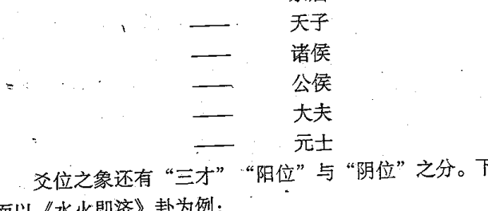

爻位之象还有“三才”“阳位”与“阴位”之分。下面以《水火既济》卦为例：

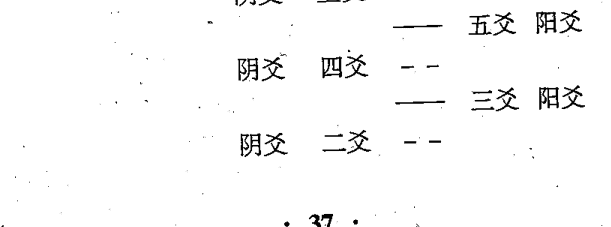

—— 初爻 阳爻

六个爻画的排列顺序自下而上。这六个爻画，古人又分为天、地、人三部分，上两爻为天，中间两爻为人，下两爻为地，天地即分，人在当中，称之为三才。六爻之中每个爻画的位置又有“阳位”“阴位”之分，单数为阳（初爻、三爻、五爻所在的位置），双数为阴（二爻、四爻、上爻所在的位置）。若是阳爻居阳位，阴爻居阴位，称“得正”或“得位”，主吉祥；反之，若是阳爻居阴位，阴爻居阳位，称“不正”或“失位”，主不利。在六十四卦中，只有《水火既济》卦为全卦的爻位“得正”。

此外，古人在解卦、分析六爻画时，还经常运用“承”“乘”“比”“应”“据”“中”的关系，易学家们在注解经文、阐述易象时，经常运用这些关系来分析每卦的卦义。

**承：**

“承”一般指一卦的卦体中，若阳爻在上，阴爻在下，则此阴爻对于上面的阳爻称做“承”，即阴爻承阳爻。

以《风山渐》卦为例：

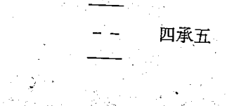

二承三

在这个卦体中，初六爻、六二爻为阴爻；九三爻为阳爻；六四爻为阴爻；九五爻、上九爻为阳爻，就有六二爻对于九三爻来说为“二承三”，六四爻对于九五爻来说为“四承五”。

古人在运用“承”的关系分析卦象时，并不拘泥于上面所列举的那样单一。若卦体中一个阴爻在下，数个阳爻在上，则下面的这一阴爻对于上面的几个阳爻都可以称做“承”。在一个卦体中若几个阴爻在下，一个阳爻在上，则下面的这几个阴爻对于上面的阳爻也都可以称做“承”。

**乘：**

“乘”与“承”正好相反，一般指一卦的卦体中若阴爻在上，阳爻在下，则此阴爻对下面的阳爻称之为“乘”。

以《地天泰》卦为例：

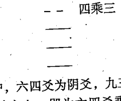

在这个卦体中，六四爻为阴爻，九三爻为阳爻，六四爻的爻位在九三爻之上，即为六四爻乘九三爻，古人称“四乘三”。当然，几个连续的阴爻在阳爻之上也可称做“乘”。

**比：**

指一卦的卦体中其相邻的两爻有一种相亲密的关系。如初爻与二爻，二爻与三爻，三爻与四爻，四爻与五爻，五爻与上爻，均为相邻，都可以称“比”。若相邻两爻一爻为阴，一爻为阳，较善于得“比”。

**应：**

在一卦的卦体中，初爻与四爻，二爻与五爻，三爻与上爻之间，有着一种呼应的关系，这种关系称做“应”。

以《天地否》卦为例：

上九 ——
九五 ——
九四 ——
- - 六三应上九
- - 六二应九五
- - 初六应九四

在这一卦体中，初六爻“应”九四爻，六二爻“应”九五爻，六三爻“应”上九爻，其它卦同此。

**据：**

在一卦的卦体中，一般指阳爻立于阴爻之上，则此阳爻对于下面的爻称做“据”。

以《火水未济》卦为例：

上九 —— 上据五
六五 - -
九四 —— 四据三
六三 - -
九二 —— 二据初
初六 - -

在这卦的卦体中，九二爻在初六爻之上，就是九二爻“据”初六爻，称“据初”。九四爻在六三爻之上，就是九四爻“据”六三爻，称“四据三”。上九爻在六五爻之上，就是上九爻“据”六五爻，称“上据五”。

**中：**

又称“居中”，“得中”，“处中”等。一般指一卦卦体中的第二爻与第五爻，因为第五爻居外卦之中，第二爻居内卦之中。

以《风地观》卦为例：

九五 —— 五爻得中
- -
- -
六二 - - 二爻得中
- -

在这一卦体中，六二爻居内卦坤卦的正中，九五爻居外卦巽卦的正中，称“得中”。

##### 3、互体之象

在一卦的六个爻画中，头尾不用，即初爻、上爻不用，而用二、三、四、五四个爻。卦体中的二爻、三爻、四爻三个爻画组成一个新的经卦，称做“下互卦”或“内互卦”；由三爻、四爻、五爻三个爻画组成的新经卦，称做“上互卦”或“外互卦”。这种由上下两卦交互组成的新卦象，称做“互卦”“互体”或“互体之象”，表示事物内部发展中的状态。

以《泽雷随》卦为例：

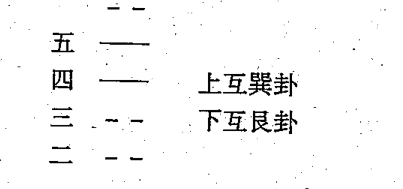

在这一卦体中，除内卦为震外卦为兑外，由二爻、三爻和四爻组成艮卦，再由三爻、四爻和五爻组成巽卦。这样《随》卦之中因互体又出了“艮”“巽”两个经卦之象。

由于使用“互体之象”，这样就可以在一卦的六个爻画中生出五个卦象。如上面的《随》卦，内卦为“震”，外卦为“兑”，又加上由二爻、三爻和四爻互成的艮卦和由三爻、四爻与五爻互成的“巽”卦，而内外互卦又组成一个新卦体“渐”卦。

##### 4、连互之象

连互之象指一卦中依次排列的爻画相互连接产生出新的卦体，其法有“五画连互”和“四画连互”两种。

**五画连互：**

指在一卦中把初爻和五爻看成一个新的卦体，把二爻至上爻又看成一个新的卦体。

以《风雷益》卦为例：

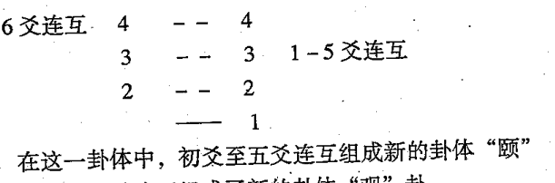

在这一卦体中，初爻至五爻连互组成新的卦体“颐”卦，二爻至上爻连互组成了新的卦体“观”卦。

**四画连互：**

在一个卦体中，用初爻至四爻，二爻至五爻和三爻至上爻各爻交互连成一个新的六爻卦体。

仍以《风雷益》卦为例：

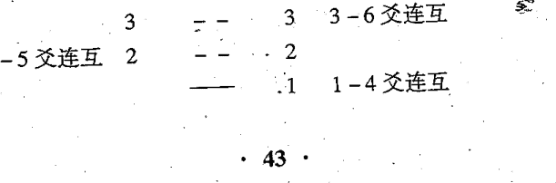

在这个卦体中，用初爻至四爻连互，组成新的卦体“复”卦；二爻至五爻连互，组成了新的卦体“剥”卦；三爻至六爻连互，组成了新的卦体“渐”卦。

##### 5、反对之象

“反对之象”指将一个六画之象颠倒过来，这样就成了另一个新的卦体，又称“倒象”“反象”“反易”。

以《山风蛊》变《泽雷随》卦为例：

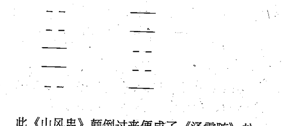

此《山风蛊》颠倒过来便成了《泽雷随》卦。

《周易》六十四卦，除乾卦、坤卦、坎卦、离卦、大过卦、颐卦、小过卦、中孚卦共八卦的六画之象颠倒之后不变外，其余的五十六卦实际是由二十八卦颠倒而来的。

##### 6、旁通之象

“旁通之象”就是把一卦的六爻之画全部相对应的反变过去组成一个新的卦体，也就是阴爻变成阳爻，阳爻变成阴爻，这样的阴阳互变，称做“旁通”，也叫“错象”。

以《天地否》变《地天泰》卦为例：

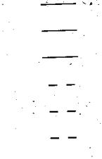

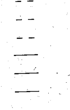

此《天地否》卦阴爻变成阳爻，阳爻变成阴爻，则变出了新的卦体《地天泰》卦。

##### 7、上下易象

“上下易象”指把一个六爻卦的上下两经卦互换，也称“两象易”“交易卦”“交错卦”。

以《泽天夬》变《天泽履》卦为例：

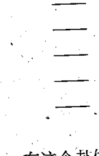

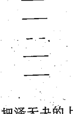

在这个卦体中，把泽天夬的上卦兑拿到下边来，把下卦乾拿到上边去，组成一个新的卦体履卦。

以上所谈的“爻、位”之法，在具体占断中且不可拘于死的格式。只有根据当时的具体情况，进行具体的分析，才能灵活准确地推断出吉凶祸福。

### 四、感悟八卦之情

八卦性情是八卦的本质，八卦取象都以此为根本。八卦的象是一种外在的形，如果离开了其内在的情是没有任何意义的，只有当象与情结合在一起时，才能够构成一个完整的意义，而感应断卦者在与易道相感应时，主要的是与八卦的情相感应，一旦人的思维情感与八卦的情相互感应时，才能够真正的实现与万事万物的变化相互交流与沟通。由此可见，若论八卦之象，是万不能离开八卦中每一卦的真性情的。八卦之性情是：“乾，健也；坤，顺也；震，动也；巽，入也；坎，陷也；离，丽也；艮，止也；兑，说也”。

乾之性情主健，一切健康、健壮、健美、健全、健硕、伟健等等与此性情相似的事物都可以用乾来表达，而当我们看到一个乾卦时，也应想到这样一些具有“健”这一特性的事物。

坤之性情为顺，顺是除了被动的性情之外，尚有一种积极的性情，被动的性情即顺从之意，而积极的性情则是指主动去随顺，诚如佛家所说的随顺一切众生之意，坤为地为母为牛等都是具有顺从本性的特征。而对于有些事物，若用外在的形象去论，则可能为八卦中的某一卦，但若论该事物的性情，则具有顺从的性格，这类人或事物往往是为了实现自己的目的而主动地去随顺。比如无心插柳而柳成阴的柳树，在其随顺方面来说，就具有坤顺的性格，而其外在形象却是巽卦。

震的性情主动，一切运动的事物、变化发展的事物都可以用震来表示。

巽的性情主入，入是无孔不入的入，这个入是动词，具有入特性的事物，除了具有深入、嵌入、镶上、敷上等等，一切附着之状态，将两个或三个事物相接在一起的称为入以外，它还有表示一种动态的入，即入的过程，如表示进退、出入、来回等等这样反向运动的特性。

坎的性情主陷，陷落、陷入，凡是一阳入于两阴之中，即内刚外柔的事物都具有这种陷的性情。

离的性情主丽，美丽有光亮的事物。

艮的性情主止，阻止、阻力、阻碍等。

兑的性情主说，古代为说字现代为悦字，秋天果实成熟之后的那种喜悦，一种无法用言语来表达的发自事物本身的喜悦，是一种温柔恬静之美。

从上面的解说可以看出，古人取象并不是单纯地只论八卦外在的形象，而是参之以八卦的性情，这样看象可以扩大八卦取象的范围，使八卦更具有与万物相符契的特性。比如，对于马这种形象，古人并不只是以乾为马，震也可为马，坎也可为马象，只是每一卦所代表的马的形象是完全不同的。由此可知，对于想要掌握感应断卦方法的人，他必须得用心去体悟八卦的性情与形象，只有将二者融会贯通，才能真正掌握感应断卦的方法。

比如牡丹之占，巳年三月十六日卯时，邵康节先生与客人共观牡丹，时值花开其盛。客人问：“花盛如此，亦有数乎（不测之祸）？”先生说：“莫不有数。”客人问可测算否，先生遂推演。得姤之鼎，上卦乾变离。先生断曰：此花明日午时，当为马所践毁。众客愕然不信。次日午时，果有贵官来观牡丹，二马相争至花间驰骤，花尽为之践毁。对于这二马若细断之，可知一马为乾马，一马为离马，乾为公马，离为母马，公马见到母马，于是相互追逐，结果将花践毁。

# 第二章 感应起卦与变卦法

起卦是易经预测的起点，变卦是事物发展变化的终点。一切断卦方法都以起卦为始，如果不会起卦，则无法进入下一步的依卦而断，而一切断卦方法都在最后要以所起之卦为依据，所预测的内容应与所起之卦所包含的内在信息相符合，只有这样，才能实现先知先觉的预测，也才能将事物预测准确。如果预测时所起的卦不准确，则卦中所包含的信息必然与所测之事不相符合，依这样的卦进行占断，其结果可想而知。所以，经过对许多易经预测者失败的事例进行归纳后发现，他们之所以失败就是因为对起卦不重视，或不能准确地起卦。因此，对于感应断卦者来说，他所要掌握的占断方法中，最需熟练掌握的就是起卦，可能每一位易经预测者都认为自己的起卦方法、起卦水平是没有问题的，其实不然，可以肯定地说，如果你的预测准确度不高，那多半是因为起卦能力不足所致。

## 第一节 感应起卦法

起卦是一种能力，它有一些必须满足的要求，只有满足了这些要求所起出的卦，才能真正包含指导我们进行正确断卦的所有信息。起卦第一个要求是准确，第二个要求是快速，第三个要求是无虑。实现起卦准确有一个原则，即不动不占，只有当事物起了变化（事动），心灵有所感应（心动）。此时所起之卦必然是一个准确无误的包含有一切信息的卦，是一个符合准确原则的卦。快速是因为事物初起，变化不复杂，心有所感，思虑未起之时，只有此时起卦，才不会夹杂求测者、断卦者个人的意向。为什么我们现在不用古代的方法，而取之以铜钱或梅花易数起卦法，其主要原因就在于此。但对于六爻的铜钱法，每见预测者要求摇铜钱时一定要想一想所求测之事然后再摇，预测者的目的是怕求测者夹杂自己的想法，但他却忽略了另外一个问题，即时间问题。你想，求测者每摇一次只能求取一爻，一共要摇六次，这六次所花费的时间虽然不算长，但求测的心每一瞬间会发生几万次的变化，这样得出的卦里必然会包含求测者的种种意念，也因此六爻断卦法的准确度总是受到一定的影响。所以，对于感应断卦者来说，能否快速的起卦将决定他预测准确度的高低。比如有一天，我与两位易友同时在看亚洲杯足球赛，当时是土库曼与沙特的比赛，一位易友说：土库曼队身穿黄色球衣，黄五行属土，沙特队穿绿色球衣，绿五行属木，五行木克土，所以断沙特队胜；另一位是六爻高手，他拿出大钱自己摇了起来。我说：土与沙同为土性，二者不分轻重，平局。若用二队的名字的字数起卦可知都为五，数字相同，仍为平局。我们算完了，那位六爻高手才摇完卦，他说：卦遇世应相克，世为木，应为土，动变为土，土旺木衰，二者无法判断哪一方更旺，所以断其为平局。后果以平局收场，双方都没进球。

感应断卦起卦法除了要参用《梅花易数》的起卦方法以外，还有许多种不同的起卦方法。我们一般是先用《梅花易数》的起卦方法来训练自己，当这些起卦方法纯熟之后，再去练习其它的方法，直到最后达到随机起卦的境界。所谓随机，是说用自己的无为去感知万事万物的发展变化，对周围所发生的一切细微的变化都可以加以感知，并对感知的事物加以放大，通过对放大的事物变化的观察，来把握事物变化发展的本质。

《梅花易数》是北宋著名易学家邵康节发明创造的，他舍弃古代繁杂的“揲蓍法”，创立了“按年、月、日、时起卦”、“按来人方位起卦”等诸多起卦方法，使易占非常灵活。他的易学以探讨大地万物的运动变化和阴阳消长为其哲学旨趣，以上其象数及体用生克为中心预测未来的事变，这种发明对我国易学研究和发展贡献极大，是我国和国外研究易学预测的重要参考书。其最大的贡献不只是体用互变之学说，而是将起卦的方法由过去的繁琐简化为灵活与巧妙，使易经预测更适合实际的需要。为使您掌握起卦技法，在此不照搬原书，根据我的体验进行讲解。

### 一、起卦必用的基础知识

1、用先天八卦数

凡起卦，则以“伏羲八卦顺序”（即先天八卦数）为准，也就是乾一、兑二、离三、震四、巽五、坎六、艮七、坤八。这个“数”不能只理解为现在的数字或数学中的单纯的“数”，古人认为的数含有万事万物的理在内，可以说是各种变化发展的理（规律）的一种高度的概括。

因为古人认为乾代表壹，而不是现在的一，现在人称壹为一的大写，其实不然，在古人看来壹字包含有很多的意思，数字一只是其中的一种而已。

2、用后天八卦方位

用先天八卦数配后天八卦方位是邵雍在易占中的重大发明，先天八卦方位与后天八卦方位二者有着很大的不同，为什么邵雍选择后天八卦方位，那是因为他经过对天体星象的观察发现，宇宙是在不断地发展变化的，我们所处的方位也随着宇宙的变化而发生了变化，先天八卦方位是在易经发明的那个时代而存在的，而宋朝时，他认为此时的方位已经处于后天的八卦方位，所以，他认为易经断卦应顺天应时，随机而动，不可泥于古人。后天八卦的方位是：离南、坎北、震东、兑西、巽东南、坤西南、艮东北、乾西北。

3、用十二地支

请参看第一章的《实用八卦图》。这主要是为了将时间与空间结合起来而采用的方法，也是将易经的八卦与阴阳五行学说联系起来的纽带。十二地支为子、丑、寅、卯、辰、巳、午、未、申、酉、戌、亥，其中亥子五行属水，寅卯五行属木，巳午五行属火，申酉五行属金，丑辰未戌五行属土。

4、用八宫所属五行

乾兑金、坤艮土、震巽木、坎水、离火。

此外还运用“八卦色泽”等。关于八卦的色泽，我在第一章已经讲述，这里不赘。

### 二、起卦方法

1、按年、月、日、时起卦

以年、月、日为上卦，年、月、日加时为下卦，又以年月日时为总数取动爻。

年数从子起一数、丑年为二数、寅年为三数、卯年为四数、辰年为五数、巳年为六数、午年为七数、未年为八数、申年为九数、酉年为十数、戌年为十一数、亥年为十二数。

月数以寅（正月建寅）起一数（这一点要十分注意，月数不以子为一数，以寅为一数），卯为二月二数，辰为三月三数，巳为四月四数，午为五月五数，未为六月六数，申为七月七数，酉为八月八数，戌为九月九数，亥为十月十数，子为十一月十一数，丑为十二月十二数。

日数以某日的数为准，即初一便是一数；初五便是五数，二十五便是二十五数，直至三十日为三十数。

时以子为一数，丑为二数……直至亥时为十二数。

凡起卦，不问数多少，则以八作卦。如一数为乾卦，二数为兑卦，三数为离卦，四数为震卦，五数为巽卦，六数为坎卦，七数为艮卦，八数为坤卦。超过八数，即用八除，其余下的数作卦，如一八除不尽，再除二八、三八……直至除尽八数。

爻以六除，以年月日时的总数用六除，一六除不尽，再除二六三六……直至除尽。

为什么卦以八除呢？因卦有八方，故除以八；为什么爻以六除呢？因卦有六爻，故除以六。

起卦：凡数都用八除，以余数作卦。余三，是离卦；余七，是艮卦；被八除尽的，仍以八数作卦，即是坤卦。数小于八或不够被八除的，仍以原数作卦。如原数是四，即是震卦；原数是六，即是坎卦，余仿此。

求动爻：凡数都用六除，余数为动爻，余一数即一爻动，余二数即二爻动，余三数即三爻动，余四数即四爻动，余五数即五爻动，若被六除尽，仍以六作动爻，即六爻动。数小于六或不够六除的，仍以原数作动爻。原数是一，即初爻动，原数是四，即四爻动。余仿此。

例：己巳年，辰月，初六，午时

解：巳年，以子为一数起，巳年是六数；辰月，以寅（正月）起一数，辰月（三月）是三数；初六，日数即为六；午时，以子起一数，午时是七数。

运算：（年6＋月3＋日6）÷8＝15÷8余7，上卦为艮卦。

（年6＋月3＋日6＋时7）÷8＝22÷8余6，下卦为坎卦。

上下两卦相重是《山水蒙》卦，即所求之卦。

求动爻：

（年6＋月3＋日6＋时7）÷6＝22÷6余4。即四爻动。《蒙》卦由下往上数，第四爻是阴爻“--”，变为阳爻“—”，爻变卦亦变，变卦是《火水未济》卦。

2、按方位起卦

该起卦方法包括两个方面，一则包括来人的形象，如老人（男）为乾卦，老人（女）为坤卦，长男为震卦，长女为巽卦等。二则包括方位，如来自南方为离卦，来自北方为坎卦等。在起卦运算时，以来的人为上卦，以其所处的方位为下卦。以上两卦数加时数的总和除六为动爻。

例：中午，南方来一老人（男）

解：

老人为乾，上卦是乾卦。

南方为离，下卦是离卦。

上下两卦相重为《天火同人》卦。

求动爻：

上卦乾为一数；下卦离为三数；中午为午时，其数是七，三数相加除以六是：

（1+3+7）÷6=11÷6余5 第五爻动，变卦为《离》卦。

3、按字的笔画和字数起卦

按数字起卦，字迹必须清晰，若潦草不清则不可用。如字迹清晰明显，则取其笔画。具体起卦法如下：

（1）一字起卦

每个字由不同的笔画组成，但总体可分为上下、左右、内外等。字分上下者，上部笔画数为上卦，下部笔画数为下卦。字分左右者，取左部笔画为上卦，右部笔画为下卦。字分内外者，取外部笔画为上卦，内部笔画为下卦。

关于如何查笔画，众说纷纭，有人说用繁体字，比如耳刀则按繁体字耳字六画算（也有人说左耳用阜字为八画，右耳用邑字为七画）；有人说按现在规定写法计算，甚至去查字典来验证是否准确；还有人说以笔画书写方向转折变化计算。那么，到底怎样来算笔画呢？我认为大可不必那么拘禁，字写出来后，繁体字也好，简化字也罢，凡见折、勾都算笔画（甚至谁写出字后便让谁算笔画都可以），因为在那个时间他就是那么想的，就要那么写，那就是卦象。如果又去想繁体字是多少笔画，又去查字典进行验证，那就把场破坏了，把灵感中断了；断起卦来反倒不准。比如子字，按字典应当是三画，如按折、勾都算画便是五画（勾算一画）。又如口字，按字典是三画，如按折、勾都算画便是四画（折算一画），这样运算起来非常方便。我在实践中用这种方法起卦，断卦准确率也很高。

测姓名则必须用繁体字，因为姓名的先天数是固定的。

一字起卦例解：

字分上下：

如“空”字，上部“穴”笔画是六，下部“工”笔画是三，坎六离三，相重得《水火既济》卦。

字分左右：

如“快”字，左部三画为离卦，右部五画为巽卦，相重得《火风鼎》卦。

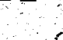

字分内外：

如“团”字，外部“口”字四画为震卦，内部“才”四画为震卦，相重为《震为雷》卦。

（2）二字起卦

二个字起卦，二字平分，一个字一卦，前字的笔画数为上卦，后字的笔画数为下卦。

（3）三个字起卦

前面一个字为上卦，后面两个字为下卦。

例：“青云志”三个字

前一个字“青”十画，除八画余二为兑卦。后二字“云志”相加为十四画，除八余六为坎卦，上下相重为《泽水困》卦。

为什么上卦笔画少而下卦却笔画多呢？古人讲“天清地浊，天高地厚”。

（4）多字起卦

凡三字以上至几十字，都可以用来起卦，字成偶数则平分，前面的部分为上卦，后面的部分为下卦。字数为奇数，则前一部分少一个字为上卦，后部分多一个字为下卦。

字数起卦求动爻：以字数笔画总数除六，取余数为动爻。

（5）按字形起卦

这是梅花易数中对测字术的应用，对于不同人写出的字体与字形，我们可以将它们分为八种类型，分别代表不同的卦。

4、按脸色起卦

凡按脸色起卦，青色、绿色的起《震》卦，蓝色的起《巽》卦，红色的起《离》卦，大赤色的起乾卦，黄色的起《坤》卦，棕色的起《艮》卦，白色的起《兑》卦，黑色的起《坎》卦。

5、按实物起卦

世间见到的东西，无论是什么，绝大多数是可以用数来计量的。凡可数之物，即以此数除八，取余数作上卦，再用时辰数除八，取余数配作下卦，以卦数加时辰数总和除六，取余数为动爻。

例：辰时见五只羊。
五只羊，直接按五数起卦作上卦为《巽》卦。
辰时五数，直接按五数起卦作下卦为《巽》卦。
上下两卦相重，为《巽》卦。
求动爻：巽卦上下均为5数，辰时也为5数，即
(5 + 5 + 5) ÷ 6 = 15 ÷ 6余3，
第三爻为动爻，变作《风水涣》卦。

6、按声音起卦

凡是听到的声音，如动物的鸣叫，人发出的声音及各种动作之声。天地自然之声等，都可以用来起卦。一声为一数，二声为二数，三声为三数，四声为四数……听到的声音之数除以八作为上卦，以声音之数加时辰之数的总和除八作为下卦，再以总数除六求动爻。同时，也可以声音数作上卦，声音之方作为下卦。

例：东方鸟叫三声，其时为卯。
方法一：

鸟叫三声，三为离，上卦是《离》卦。
卯时数为四，与声音数三，共得七数，下卦为《艮》卦。
上下两卦相重，为《火山旅》卦。

方法二：
鸟叫三声，上卦为《离》卦。
东方为震，下卦为《震》卦。
上下两卦相重，为《火雷噬嗑》卦。

7、按丈尺起卦

丈尺之物，以丈数为上卦，尺数为下卦，含丈、尺之数取动爻，其寸不计。尺寸起卦时，以尺数为上卦，寸数为下卦，含尺寸之数取动爻，分数不计。

8、按观人起卦

凡是为别人占卦，其方法有多种，可灵活运用。有根据所听到的声音起卦的方法；有用观察来占问的人的年龄性别起卦的方法；有根据身体部位起卦的方法；有根据来人手拿物体起卦的方法；有根据服装颜色起卦的方法；有根据年、月、日、时起卦的方法，有根据书写来意起卦的方法……

根据问卦人的声音起卦的方法是：如果说的是一句话，就按他所讲出来的字数分别起卦。如果说两句话，就用第一句话的字数确定上卦，用第二句话的字数确定下卦。话讲的很多，就只用开始的一句作上卦，末尾的一句做下卦，其余的话都不用。

根据人的年龄性别起卦的方法是：如果老人确定为《乾》卦：少女来问卦，便确定为《兑》卦之类。

根据身体部位起卦的方法是：如果头动便起《乾》卦；足动就确定为《震》卦；如果眼睛动就确定为《离》卦……

根据来人手拿物体起卦的方法是：看来问卦的人手中偶而拿什么东西，如果是金、玉及圆物等类东西便起《乾》卦；如果是土、瓦及方物之类的东西便起《坤》卦……

根据服装颜色起卦的方法是：如果来问卦的人穿青色衣服便起《震》卦；穿红色衣服便起《离》卦……

书写来意的方法是：根据他所写的字起卦。

总之，对任何人的一举一动、周围环境、接触的事物等，都可以随时起卦。

9、随机起卦法

随机起卦法是在将前面所列举的起卦方法都能熟练掌握之后，才能开始运用的一种起卦方法。起卦之时，不必拘泥于外物的形状、数量、动变，随机而动。比如可用声音作上卦，而用别的事物作下卦。比如一日到公园锻炼，忽见一鸟从眼前飞过而发惊叫之声，同时见眼前的树枝摇动一下，于是以兑为上卦，巽为下卦，得大过之井卦。还比如有一次在一饭店吃饭，服务员走到我近前时，手中的酒杯不慎掉到地上摔得粉碎，声音清脆，于是得泽地萃卦，取声音之脆的谐音为卦。还有一次出行，眼前忽起一旋风，在眼前徘徊，于是得水雷屯卦，取徘徊不进之意。系辞云：“像其物宜”，随机起卦关键在于意象的结合，有其意象即可，不可泥于百分之百的相象。

10、感应起卦法

感应起卦法比随机起卦更高一个层次，当心忽动，头脑中立刻闪现出一卦，便以此卦断，其神无比。这种起卦法不依任何外物，只用预测者的心灵感应，对预测者的道德修养要求极高，犹如禅定中的定功，平时内心清静不动，如同止水，稍有风吹草动，内心必起微澜，总之是用心去感应万物。

这种例子非常之多，可以说不胜枚举。一天，电话一接通，对方便迫不及待地问：你看我侄子能在哪？我头脑中当时一下闪现出天火同人之卦，我断其侄子在城市南方的一家网吧里，正与他的伙伴们玩电脑。那家网吧在城乡结合处，因为三爻动，爻辞为“同人于野”。他骑自行车到城市南方的结合处的一家网吧里一看，果不其然，他的侄子正与同学们玩得热火朝天。

这里还需要罗嗦几句，在易占实践中也不要拘泥于这些死法，况且起卦方法还不仅仅是这些。这一点，我在后面“卦要活起活断”一节中还要进一步论述。

## 第二节 感应变卦法

易经预测者一般都将注意力集中在如何断卦上，而忽略了如何起卦和如何变卦。一个预测的过程可以简单地划分为起卦、变卦与断卦这样三个过程，变卦则是这三个过程中不可缺少的。因为通过对变卦的观察，我们可以发现事物发展的主要方向，以及发展变化的结果。通过对变卦与主卦的变化关系，我们可以发现事物发展变化的过程，为断卦提供足够的信息资源，可以说没有变卦，事物发展变化的过程难以定性，因此，感应断卦者非常重视变卦。变卦的方法有许多种，概括起来不外以下几种方法。

### 一、加时求变卦法

将起卦时的总数加上时间之数，然后以6除之，得余数为动爻。这种方法是梅花易数中常用的求变卦方法，一般的易经预测者都已掌握。这里我所要讲的是，所加的时间可以是日，也可以是月，最主要的是用时辰之数，而时辰之数主要以时辰所属的地支数为准。为什么要加时呢？目的是将卦之变化与时间融合在一起，因为事物的发展变化都是随时间的变化而变化，是一个时空的转移。又为什么以加时辰为主呢？这主要是为了与当下的时空相对接，这样就会将当下所包含的所有信息都在变卦中加以反映。

### 二、总数求变卦法

此法与加时求变卦法大同小异，就是将所获得的上下卦数之和除以六，所得之余数为动爻。此法与加时起卦法一样都只能求取一个动爻，六爻卦中包含的两个八卦只能有一卦发生变化，这是梅花易数的便捷方法，同时也是梅花易数最大的缺点与不足。因为每次只能有一个动爻，一个六爻卦只能有六种变化，六十四卦一共只有三百八十四种变化，而易经的变卦应该是每个六爻卦有六十四种变化，六十四卦共有四千零九十六种变化，可见梅花易数只占易经总变卦数的十分之一。所以常有人说：梅花易数预测准确度不如纳甲法高，其原因正在于此。《焦氏易林》将易经的所有变化都包含在其中，所以，对于感应断卦者来说，当我们修习完梅花易数这种入门功夫之后，就应该将注意力转移到《焦氏易林》上，从中可以体悟到许多易象方面的知识。但《焦氏易林》的变卦许多人不知如何求取，所以，很少有人用此法预测。为了避免只求一个动爻的变卦，下面三种求变卦法，是我在实际应用中常用的变卦方法，这些方法不仅可以用梅花易数断卦，也可以用焦氏易林断卦。

### 三、外应求变卦法

外应是指预测者在具体预测之时，因周围环境的变化而产生的感应或心理上的变化。当我们在预测时，心是处于一种绝对纯净的状态，只要外界环境发生哪怕是一点细微的变化，都会在心里产生一种感应，这种感应我们称之为外应。外应求卦法正是建立在这种感应的基础上，具体求变卦的方法是，当预测者起好卦之后，内心受外界的感应，于是依外界所提供的信息再起一卦，将此卦作为变卦，与主卦参详推断，这样求得的变卦往往更能代表事物真正的发展变化方向。如有一次一人来求测自己最近的时运，我当时起了一卦得火泽睽。突然，电话叫了起来，于是又得泽火革作为变卦。参看二卦，我发现二卦虽然相反，但全为女人之卦，而求测者是两个男人中的一个，于是说：你最近因女人而惹事端，两个月之内工作将有变化，预计将会失业半年。那个人当时就笑了，说：先生，你说我两个月之内工作将有变化，应该不错，但因女人而惹事端应该不对，如果我的工作能有什么变化，那肯定是因为女人，因为我的老板就是女的，她上个月告诉我，不出两个月将会提升我为公司办公室主任，我怎么会失业呢？我说：卦上反映的比我说的还严重，办公室主任肯定是当不上，停职是肯定的，而且你还要小心因另外的女人发生不必要的官司，卦断到这儿，双方都不愉快，我是为了维护易经预测的尊严，而他是为了自己的自信心，结果他不高兴地走了。过了半年后，有一天他又来找我，进门后先向我道歉，然后说：您测得太准了，上次回去后，我虽然不信，但心里还是非常小心，生怕哪一天我不注意得罪领导，谁知人算不如天算。两个月后的一天，我的老板突然将我叫去大骂了我一通，然后就将我停了职，过了一段时间后，我才知道，原来我的情人以为我跟老板有染，就跑到老板的老公那里去闹，结果……唉！我现在已经不在原来的单位了，昨天派出所的人叫我去录口供，才知道我过去的一个情人犯了法，她交待后，将我也牵涉进去，我心里没底，所以来找您，想请您看看，我有没有什么事？我说：还以上次断的卦为准，变卦为革，现在工作已变，且只你一人来测，所以，你放心的回去吧，没事了，你过去的那个情人是与另外一男人一起犯的事儿，现在那个男人跑了，她不好交待，只好拿你顶替，回去吧，没事的。他千恩万谢地走了。后派出所查出果与他无关，于是平安过日于。

### 四、随机变卦法

随机变卦法主要在随顺；当我们起好了主卦之后，求得了一个变卦，我们常会遇到两种情况，一种情况是通过反复对主卦变卦的观察与推断，我们仍无法做出准确的判断；另一种情况是当我们按照主卦与变卦占断出一个结果后，求测者往往都会接着问下一个问题，而且会不停地这样问下去，这种情况最为常见。所以，六爻预测者一般都会说：一事一问，卦只能断一事，若问它事，须再起一卦断之。其实，要想解决这两个难题，只有运用随机起卦。

随机起卦的方法是，当我们起完主卦后，可以依上述介绍的几种方法求取动爻，确定变卦，当发现主卦变卦无法作出准确的占断时，可以再以变卦为主卦，依上述的求变卦方法重新求取一变卦，直到内心能够做出准确的占断时为止。这种方法对于初学者，以及那些对卦象不是很熟悉的预测者来说是比较实用的，而采取同样的求变卦方法可以从容地应对求测者不断的提问。比如有这样一个卦例，有一次，一人打电话来求测他最近想与一个人合伙作生意行不行？我当时随机起了一卦为天火同人，加时求动爻，得变卦为乾，二爻动，我说：可以，但不长久。他问为什么？我说：因分配不均而心生疑虑，所以不长久。他问：你能看出我们合伙作什么生意吗？再求变卦得同人，我断其作股票等投资生意，他说是，于是接着又问：“你看一看我的合伙人多大了？我又接着变卦，这次不能再用加时起卦了，采用外应起卦法，我刚好看到33这个数字，于是告诉他这个女人已经33岁了，他惊讶地在电话那头喊了起来，“那你再看看她的婚姻如何？”得大壮卦，我说她独身一人。就这样他不停地问，我不停地求变卦，事无不验。

### 五、感应变卦法

感应变卦法是求变卦的最高境界，要求预测者必须具有一定的静功修养，至少应达到“定”的境界，这样才能感应到世间万物变化发展的规律。当起得主卦之后，不必刻意去应用上面的方法求取变卦，而只须将思虑定在内心上，感应到什么就将什么作为变卦。这种方法应用起来就象有神灵在指点一样神乎其神！

# 第三章 有卦感应断法

有卦感应断法是在充分掌握了“梅花易数断卦法”和“易经断卦法”之后，在实际预测中对所得之卦加以感应占断的一种方法，这种感应断卦法可以说是一种综合占断法，既用象数，也用易理，是象数理预测的大综合。我首先讲“梅花易数断卦法”。

## 第一节 梅花易数断卦法

《梅花易数》断卦方法的主要特点是注重体用生克，是将八卦之象扩展为五行之象，从而观察卦中的五行生克而断吉凶，它比较注重本卦、互卦、变卦及体用的五行生克等关系，它最大的发展在于：它要求预测者在断卦时不能只注意卦，而应将自己的感官充分展开，注意周边环境所发生的一切，并充分利用环境所提供的信息，帮助自己来准确占断，它把这种方法称为外应。下面分别进行讲解。

### 一、本卦、互卦、变卦之法

成卦之后，有本卦、互卦、变卦之分。其中本卦与变卦都分有上卦和下卦，而互卦则分内互卦和外互卦（也称上互卦、下互卦）。

关于什么是“互卦”，在第一章中已详细论述。这里要强调是《梅花易数》分“体之互与用之互”。如体卦在下，则下互为体之互，上互为用之互；体卦在上，则上互为体之互，下互为用之互。《乾》《坤》二卦无互卦。

如占得《随》之《屯》卦

| 本卦 | 互卦 | 变卦 |
|---|---|---|
| 用卦 —— | ——上互卦巽—— | —— |
| —— | —— | —— |
| —— | —— | —— |
| 体卦 —— | ——下互卦艮—— | —— |
| —— | —— | —— |

1、《泽雷随》卦为本卦。下卦震为体卦，上卦兑为用卦。
2、《艮》卦为下互卦，也称内互卦。若分体用，则是“体之互”。
3、《巽》卦为上互卦，也称外互卦。若分体用，则是“用之互”。
4、《水雷屯》卦为变出之卦。

在占断时，通常的用法是以本卦主事情的开始，互卦主中间状态，变卦主事情的结果，这一点同《纳甲断卦法》的“动为始，变为终”很相似。

### 二、体用生克之法

体用关系就是以重卦的上下卦来区分确定，体卦为己方为求占之人，用卦为他人或事。这一点和《纳甲断卦法》的世、应关系很相似，《纳甲》也是以世方为己，应方为他人，在占断时，如果不用动爻，则以内卦为体，外卦为用，这一点和易经占法的“内贞外悔”很相似。

在这里要强调说明：《梅花易数》的体用关系不格守《易经》的“内贞外梅”，它以动爻来确定体用，即动爻所在的经卦为用。如动爻在内卦，则内卦为用，外卦为体；如动爻在外卦，则外卦为用，内卦为体。这就是说体用随着动爻而使“内贞外梅”颠倒。试举例说明：

如占得《随》之《革》卦

| 本卦 | 变卦 |
|---|---|
| 体卦 | |
| - - 动爻在三爻，在内卦 | |
| 用卦 | |

从这个卦例可以看出：动爻在内卦，则内卦为用，外卦为体，把《易经》的“内贞外梅”变为“外贞内梅”了。

具体占断时，要先分体用，然后依体用所属五行的生克比和来判断事物的吉凶祸福，下面讲一下在占断时如何运用“体用生克”：

体克用，诸事吉，用克体，诸事凶。体生用有耗损之患，用生体有进益之喜。体用比和，则百事顺遂。生体多者则愈吉，克体多者则愈凶。用吉变凶，先吉后凶；用凶变吉，先凶后吉。受此处之生，得他处之克，则生中逢克。受此处之克，得他处之生，则克处逢生。受克逢生为之有救，受克无生为之无救。

#### 1、体用比和

比和卦就是上下卦五行属性相同。比和卦有乾、坎、艮、震、巽、离、坤、兑、履、夬、谦、剥、恒、益共十四卦。凡遇比和诸事吉。

#### 2、先吉后凶

先吉后凶是事情先好后坏，如《遁》之《同人》卦。《遁》卦上卦为乾为金为体，下卦为艮为土为用（下卦一爻动，故下卦为用，上卦为体），用土生体金为吉。但《艮》卦初六爻动，变成《同人》卦，上卦乾体之金，受变卦离用之火克之，故为先吉后凶。

#### 3、先凶后吉

先凶后吉就是先坏后好的意思。如《同人》之《遁》卦。《同人》卦上卦乾金为体，下卦离火为用，是离火克乾金，为用克体不吉。但离卦初九爻动，变成《遁》卦，上卦乾金之体得变卦艮用之土生之，故为先凶后吉之象。

#### 4、体党用党

党者，体党用卦之同类的意思。如体卦是金，互体、变体也是金，为体党多。用卦是金，互体、变体也是金，为用党多。体党多，体势盛；用党多，则体势衰。例如《大壮》之《夬》卦。此卦内乾为体，外震为用。《乾》属金，内互、外互是乾，兑还属金，变成《夬》卦的兑、乾亦属金，故体党（金）多，体势盛，而用衰。反之则用党盛，体党衰。

《梅花易数》有关生体与克体之卦讲得较细，请参看《梅花易数》，这里不作选录。

### 三、动爻断卦之法

成卦之后，都有动爻，而且按《梅花易数》起卦只有一个动爻，动爻的断卦方法如下：

1、通过动爻的爻辞判断吉凶。其法同《易卦占法》的“动爻断”。
2、通过动爻变生、变克、变比和判断吉凶。如起得《乾》卦，上下比和，事快而吉；但九二爻动，变成《同人》卦，是上乾为体，下离为用，成火克金，用克体，反而不顺了，可断为事情先吉后凶。
3、通过动爻判断行人去向及方向的变化。如起得《姤》卦，九三爻动，则下卦是巽，是用卦，是行人。因九三爻动，巽卦变为坎卦，巽为东南，坎为北方，可断为：此人先去东南方，后又去了北方。

### 四、“卦气旺衰”之断法

卦中含五行，五行有旺衰，五行随四季流变，故在不同的季节中有旺有衰。如春季震、巽木旺；夏季离火旺；秋季乾、兑金旺；冬季坎水旺；四季之坤、艮土旺。春木、夏火、秋金、冬水都应时令而卦气旺，应时之卦虽有它卦相克，亦无大害。衰者，如春季木克土，故坤艮土衰；夏季火克金，故乾，兑金衰；秋季金克木，故震巽木衰；冬季水克火，故离火衰；四季之土克水，故坎水衰。

预测时，体卦宜旺盛，气旺又逢生，则吉利。总的来说，体卦宜受他卦之生。不宜受他卦之克。他卦者，谓用卦、互卦、变卦。如乾、兑金体之卦，直受坤、艮土卦之生；坤、艮土体之卦，宜受离火之生；离火体卦，宜受震、巽木之生等。无论是体卦、用卦、互卦、变卦，都同样随季节得进令而旺。若体卦衰则不吉，如若逢克体之卦则凶更甚。体卦虽衰而有生体之卦，则衰势可得缓解，分析卦时要适时辨证。若生体之卦气旺，则体卦之气弱亦无妨；克体之卦气衰，则体卦受损不大等。

此节的要点在于掌握“五行旺相休囚死”，其捷径是背熟歌诀：春土、夏金、秋树木，三冬逢火是真休囚，辰、戌、丑、未土，以水为休囚。抓住了这一环节，便不难理解卦气旺衰的要义及生克关系了。

### 五、推断应期之法

吉凶应验之期，自古以来极为重视，论述颇多。有的依卦象定应验之期；有的依卦数定应验之期；有的依卦爻定应验之期……现将《梅花易数》中常见的方法列出，供各位读者参究。

#### 1、卦象定应验之期：

乾兑卦，则应于庚辛及五金之日，或乾为戌亥之年月日时，兑为酉时。震巽则应于甲乙及五木之日，或震取卯，巽取辰。坤艮则应于戊己及五土之日，坤取辰、戌，艮取丑、未。坎则应于壬癸及五水之日，取亥子。离应于丙丁及五火之日，取巳午。

乾、兑卦属金，故成事和应事于“庚辛及五金之日”。“五金之日”是指五行中的金日，例如庚、辛、申、酉在五行中都属金，所以乾兑二金卦的成事和应事的日期，可断在庚日、辛日、申日、酉日，或者断在庚年、辛年、申年和酉年，庚月，辛月、申月和酉月。因戌亥的位置在乾宫，故乾卦除了应以上的年、月、日、时，还可以应在戌、亥年、月、日、时。

震、巽二卦属木，故应事或成事的时间在：甲、乙、寅、卯年、月、日、时。震还可以应卯，巽还可以应在辰年、月、日、时。

坤、艮二卦五行属土，故应事或成事的时间在戊、己、辰、戌、丑、未年、月、日、时，或者坤应辰、戌，艮应丑、未。

坎卦五行属水，故应事或成事的时间在壬、癸、亥、子年、月、日、时。

离卦五行属火，故应事或成事的时间在丙、丁、巳、午年、月、日、时。

#### 2、卦数定应验之期：

正应：

正应者，则以体用二卦之数定应期。例如上卦乾，下卦坎，乾一，坎六为七数，可定七年、七月、七日、七时。

主、互、变三卦数定应期；

如主卦《讼》为七数，互卦《家人》为八数，变卦《否》为九数，三数相加共为二十四，则应期可定为二十四年、月、日、时。

#### 3、以生体之卦定应验之期：

有生体之卦，则吉，事应之必速。便看生体之卦，于卦数和卦的时序决断应验之日期。

如坎为用，生体，坎为六数，可定六年、月、日、时。坎卦的时序是一六，可定一六年、月、日、时。生体是互卦，则渐渐成。生体是变卦，稍稍迟。若有生体之卦，又变出克体之卦，则事有阻难，为好中不足。如有克体之卦，无生体之卦，事不成。有生体而无克体，则事吉。

#### 4、动静应期：

凡断迟速之应期，必看来问者之动静，以决应期迟速。故行走中间卦者，则应速，以成卦之数，中分而取其半。如起得《巽》卦；为数十。用二除之，应期为五。

立者问卦，可定应期为半迟半速。《巽》卦为十，半迟为十二天半，半速为七天半。

坐者问卦，以其卦数定之，《巽》为土，应期定为十。

卧着问卦更迟，以其卦数加一倍。例如《巽》卦为十可定应期为二十。

动吉者，应吉之速，如动中带喜笑者之意。动而凶者，应凶之速，如动中悲苦之意。不动而应者，吉凶之未见。如来问卦者，无任何喜悲之情，从表面上看不见所问之事是吉是凶，只有起卦之后才知道。

八卦，其大无外，其小无内，远取诸物，近取诸身。应验之期，远应年月，近应日时，故断应期，必根据实际情况决之。不分事大事小，物之长久，一概而论，必有差错。

### 六、通解古例

如果你仔细玩味并领悟了前面所讲的精髓，我敢说您便初步掌握了《梅花易数》的起卦与断卦方法。下面再解剖一些邵康节先生的卦例，供您参考。

#### 1、观梅占（年、月、日、时占例）

辰年十二月十七日申时，邵康节先生偶观梅花，见两只雀鸟争一枝叶而坠地，先生说：“不动不占，不因事不占。今二雀争枝坠地，怪也。”逐以当时的年、月、日、时起卦占断。

起卦：

辰年五数，十二月十二数，十七日十七数，申时九数。则：

(1)、年月日数相加：(5+12+17) ÷ 8 = 34 ÷ 8……余2
取其余数2为上卦是《兑》卦。

(2)、年月日时数相加：(34+9) ÷ 8 = 43 ÷ 8……余3
取其余数3为下卦是《离》卦。
即主卦是上兑下离为《泽火革》卦。

(3)、年月日时总数除以六求动卦：(43 ÷ 6) ……余1
取其余数1为动爻，即主卦初爻由阳变阴，得变卦为《泽山咸》卦。

| 主卦泽火革 | 变卦泽山咸 |
| :--- | :--- |
| -- | -- |
| 上互乾—— (为体，属金) —— | ——上互乾 |
| —— | -- 下互巽 |
| 下互巽—— (为用，属火) —— | -- |
| —— 初爻动变” | -- |

分析：

主卦上卦为兑，下卦为离，根据动爻初又变，因此上卦兑为体卦，下卦离为用卦。兑在五行中属金，离在五行中属火，火克金，则兑金有损。从互卦看，下互卦为巽木，巽木是离火之互卦，木生火，则克体之卦气更盛，故凶。判断女子有伤（离火克兑金，兑为少女）。互卦代表事物的内在关系，女子如何伤的呢？上互卦为乾金，下互卦为巽木，金克木，木有损。乾为老人，巽为股又为左股，故少女为老人逐（克）之而伤左股。

从变卦看，下卦变为艮土，上卦兑金为体，土生金是用生体，当知少女虽伤不至大凶，不幸之中有吉。艮卦有止的意思，故少女也只伤股而止。

故断：明晚当有女子折花，园丁逐之，女子失惊，坠地，遂伤其股，但不至凶危。

关键解惑：此卦所以推断是女子折花而伤，关键在于二鸟争而坠地的外应的提示作用，若无此外应是无法断出这一结果的。

#### 2、牡丹占

己年三月十六日卯时，邵康节先生与客人共观牡丹，时值花开其盛。客人问：“花盛如此，亦有数乎（不测之祸）？”先生说：“莫不有数。”客人又问可测算否，先生遂推演。

起卦：

巳年为六数，三月三数，十六日十六数，卯时四数。
年月日数相加：（6＋3＋16）÷ 8＝25÷8……余1
取其余数1做上卦，为《乾》卦。
年月日时数相加：（25＋4）÷ 8＝29÷8……余5
取其余数5做下卦，为《巽》卦。
主卦上乾下巽为《姤》卦。

求动爻：
年月日时总数除以6：（29÷6）……余5
取其余数5为动爻，即主卦《姤》卦的第五爻由阳爻变阴爻，变卦为上离下巽的《火风鼎》卦。

主卦天风姤
变卦火风鼎

—— 为用属金
—— 五爻动变
上互乾——
下互乾——
——
- - 为体属本

——
- -
——上互兑
——下互乾
——
- -

分析：
主卦《姤》第五爻动，则下巽为体卦，上乾为用卦，乾金克巽木，用克体不吉。巽体代表所测牡丹花。
从互卦看，上下互卦均为乾金，三金克一木，卦中没有生气。而乾为马，所以牡丹必为马所践毁。践毁之期看克体之卦，克体之卦为乾，乾数一，故明日。

从变卦看，巽木生离火，为体生用不吉，牡丹必毁无救。变卦上卦乾变为离，离为午时之象，花毁明日午时。
故断：此花明日午时，当为马所践毁。众客愕然不信。次日午时，果有贵官来观牡丹，二马相争至花间驰骤，花尽为之践毁。

关键解惑：盛极必衰这是万事万物不易之理，今花开而盛，衰期将至，衰有多种，有渐衰，有外物所伤等等。今有人突问此花之命运，可见衰必由外而至。何以又断为马所践，一定是当时有马的外应出现，否则也可断为金属之器所伤。

#### 3、邻夜扣门借物占（闻声占例）

冬夕酉时，先生方拥炉。有人敲门，初敲一声而止，继而又敲五声，并说要借东西。先生回答，请来人不要说出借什么东西，遂让其子测算，看借何物。

起卦：
以先敲门一声，直接起为上卦，一数为乾卦；以后敲门五声直接起为下卦，五数为巽。故主卦上乾下巽为《姤》卦。

求动爻：
上卦乾一数加下卦巽五数再加酉时10数除以八：
(1 + 5 + 10) ÷ 6 = 16……余4。
取其余数4为动爻，即主卦《姤》卦的第4爻动，第四爻由阳爻变阴爻，变成《巽为风》卦。

主卦天风姤
—— 为用属金
——
上互乾—— 四爻动变
下互乾——
——
—— 为体属木

变卦巽为风
——
——
-- 上互离
—— 下互兑
——
--

断：
从主卦上看，上卦及中间两互卦都为金，下卦为巽木。从变卦看。上下两卦均为巽木，故断所措之物为金木之物。又以乾金短，巽木长，是借斧也。儿子断定借锄。先生说：非也，以数起卦又须明理，只以卦推之，借锄借斧都可以，但以理推之就不同了。夕晚人们从田里回来是不会借锄的，必然是借斧用于劈柴的，故推数又需明理。

我在这里进一步强调一下这个“理”字。要想使占卜运用自如；必须用理去阐释它。如果只论数而不论理，那就会陷人一偏之见，而不能达到灵验的目的。如为饮食占问得“震”卦，那“震”卦的物象为龙，从道理上讲，龙是一种不可得到的神物，就应该用鲤鱼之类的卦象去代替龙的卦象。又如占天时得“震”卦，从道理上讲，冬天哪里有雷声呢？应该用“风撼震动”的卦象去代替雷声的卦象。只有对具体情况作具体分析，才是完全把握了占卜的奥秘。

#### 4、老人有忧色占（端法占例）

己丑日卯时，偶在途行，有老人往巽方向去，见有忧色。问其有什么担忧之事，老人答：“无”。觉得此事奇怪，因而测之。

起卦：

以老人属乾为上卦，巽方为下卦，得主卦为上乾下巽之《姤》卦。

求动爻：

以《姤》卦上卦乾一数加下卦巽五数再加卯时四数除以六：

```
(1 + 5 + 4) ÷ 6 = 10 ÷ 6 ……余 4
```

取其余数 4 为动爻，即主卦《姤》卦的第四爻动，变成《巽》卦。

| 主卦天风姤 | 变卦巽为风 |
| --- | --- |
| —— 为用属金 | —— |
| —— | —— |
| 上互乾 —— 四爻动变 | - - 上互离 |
| 下互乾 —— | —— 下互兑 |
| —— | —— |
| - - 为体属木 | - - |

此卦单从卦象来看，与上一卦的“敲门占”是一样的，但起卦占断的因素不同，因此分析判断的结果也不相同。

分析：

《天风姤》卦的九四爻辞（注重爻辞断）曰：“包无鱼，凶”主卦《姤》卦一阴居下与五阳爻相遇，其趋势“扶阴灭阳”。《象传》言：“无鱼之凶，远民也。”是说与初六（阴）要持疏远，不可亲近。“包无鱼”就是说不能去占有“鱼”，若去占有，等于引导阴柔上进去消灭阳刚，阴爻已至四位，阳爻也就快完了，故“凶”。卦中四爻动，那么“凶”是一定的了。从卦象看，乾是老人，乾变为巽，巽为风为鱼，风则失去控制，鱼则为阴物，参照九四爻辞，因鱼得祸。而《姤》卦全卦都与婚姻有关，所以老人赴吉席，因鱼骨鲠而亡。

以五行论卦，也可得出同样的结果。主卦中巽为体，乾为用，用克体不吉，看其互卦，均为乾金，三金克一木，毫无生气。从变卦看，四爻动，上卦乾变为巽，巽又当驯服，顺从讲，指出事情的发生是必然的，巽又当出人讲，故告诫老人防出人有祸。

为什么断五日呢？因乾一、巽五、卯时数四，卦数共得十数。其时老人在途中，其应必速，故以卦数中分其半为五。

故断：

告诉老人，五日内要谨慎，出人恐有重祸。果然，五日内老人去赴吉席，因鱼骨鲠而亡。

#### 5、少年有喜色占

壬申日，午时，有少年从离方来，喜形于色，问有何喜，答曰：“没有”。遂而占之。

起卦：

以少年属艮为上卦，离方为下卦，故主卦艮上离下为《山火贲》卦。

求动爻：

以上卦艮七加下卦离三再加午时数七，用六除之：
(7 + 3 + 7) ÷ 6 = 17 ÷ 6……余 5
取其余数 5 为动爻，即主卦《贲》卦的第五爻动，变成《风火家人》卦。

| 主卦山火贲 | 变卦风火家人 |
| --- | --- |
| —— 为用属土 | —— 为用属木 |
| - - 五爻动变 | —— |
| - - | - - |
| —— | —— |
| - - | - - |
| —— 为体属火 | —— 为体属火 |

分析：

主卦《贲》卦是一个讲婚姻配偶迎亲情况的专卦。六五爻辞曰：“贲于丘园，束帛戋戋。”《象》曰：“六五之日，有喜也。”就是说男方到妇方去下聘礼，送上一束束的布帛，堆成一堆。变卦《家人》卦，是指男女组成家庭之事，所以说少年近日内有喜事。

以五行生克论之，主卦中离火为体，艮土为用，火生土，体生用为泄气，但也有男去求女之意。变卦上巽下离，木生火，即用生体吉，故少年必有喜事。卦中除艮为少年外，其余体用卦均为女人，故为婚姻之事。

因少年有喜色，问之不知，故以上卦艮七加下卦离三再加午时七数为期，断定十七日必有聘币之喜，是期果然定亲。

#### 6、鸡悲鸣占

甲申，卯时，有鸡鸣于乾方，声极悲怆，因而占之。

起卦：

鸡属巽为上卦，乾方为下卦，故主卦上巽下乾为《风天小畜》卦。

求动爻：

以上卦巽五加下卦乾一再加卯时四数，用六除之：
(5 + 1 + 4) ÷ 6 = 10 ÷ 6……余 4，故四爻动。

取其余数四为动爻，即主卦《小畜》卦。第四爻动，变成《乾为天》卦。

分析：

《小畜》六四爻辞曰：“有孚，血去惕出。”这里血是泛指有忧患，惕是说要提高警惕，即闻鸡悲鸣，含有杀鸡之义。从主卦的卦体来看，乾金克巽木也含有杀鸡之义。从互卦来看，下互卦为兑金，金党多而盛。上互卦为离火，而巽为鸡，有烹饪之象。变卦乾卦为纯阳之象，说明主卦六四之阴爻必为纯阳所灭。《乾》为纯金，巽木毫无生气，说明此鸡必死无疑。

为什么说此鸡十日内当烹？闻鸡鸣而未见鸡，以主卦的上下卦数乾一巽五加时辰四数而定，共为十数，所以说此鸡十日内当烹。果然，十日后有客人到，馔此鸡待客。

#### 7、牛哀鸣占

癸卯日，午时，有牛鸣于坎方，声极悲，因而占之。

起卦：

牛属坤为上卦，坎方为下卦，故主卦上坤下坎为《地水师》卦。

求动爻：

以上卦坤八加下卦坎六再加午时七数，用六除之：
(8 + 6 + 7) ÷ 6 = 21 ÷ 6 余 3。故三爻动。

取其余数三为动爻，即主卦《师》卦第三爻动，变成《地风升》卦。

主卦地水师

变卦地风升

- - 为体，属土
上互坤 - -
下互震 - - 三爻动变
——为用，属水
- -

- -
- - 上互震
——下互兑
——
- -

分析：
《师》卦六三爻辞曰：“师或与尸，凶。”坤卦为体（即牛的体卦），互卦震及变卦巽木均克体（木克土），加上牛哀鸣无生气。

故断：
此牛二十一日内（坤8加坎6加时数7）必遭屠杀。后二十日，果然有人将此牛买去杀了，犒赏大众。

以上所释解的卦例。只能作为实战的参考，且不可泥古不化，照搬教条。天下的理没有形式没有痕迹，看不见，摸不着，假借卦象以显示它们的意义。然而卦象所规定的是不变的理。这不变的理没有变通的“道”来协调它就行不通。周易呀，无非是变易而已。如果我们今天观看梅花得到了“革”卦，还会有女子折花的事情出现吗？如果我们今天测算牡丹又得到了“姤”卦，那么还能是牡丹为马所践毁吗？况且兑卦的卦象又何止于女子，乾卦的卦象又何止于马呢？占卜吉凶是需要变通的，得变通之法的关键就在于心中有“变易”的原则。只有掌握了“变通之法”，才能灵活运用“感应断卦”。

### 七、实占例解

#### 1、占功名

要点：以体为主，用为名。体克用，名可成，但成迟；用克体，名不可成。体生用，名不就或因名有丧；用生体，名易成，或因名有得。体用比和，功名称意。欲知成名之日，要详看生体之卦气。欲知任职的地方，可根据变卦来决断。若无克体之卦，则名易就，只看卦体时序之类，以定日期。若在任占卜，最忌见克体之卦。如卦有克体者，即居官见祸，轻则受责罚，重则削官罢职。其日期，以克体之卦断之。

我的好友郑大成在省司法局工作，想调动一下，来电话问是否可行。我按来电话的时间起卦：

壬午年 己酉月 丙戌日 癸巳时
7 8 9 6

上卦：（7 + 8 + 9 = 24 ÷ 8 除尽，以 8 数坤为上卦。
下卦：24 + 6 = 30 ÷ 8 余 6，以 6 数坎为下卦。
上下卦相重，得地水师卦。
求动爻：30 ÷ 6 除尽，6 爻动，变山水蒙卦。

主卦地水师 变卦山水蒙

- - 6 爻动变
- - 为用，属土
上互坤 - -
下互震 - -
——为体，属水
- -

分析：
1、坎为体，坤为用，主卦坤土克坎水，用克体，一不吉。
2、变卦艮土克坎水，又是用克体，二不吉。
3、互卦二坤土克坎体，二震木泄坎体，三不吉。
4、师卦属忧虑之卦（比乐师忧嘛），蒙卦属蒙昧以求，卦象本身就不吉。
终上分析，我告诉他调转不能成功，硬是要去，那是飞蛾扑火，自讨苦果。
他信了我的话没有调动，且在原单位工作得很舒心。

癸未年庚午日下午7点37分，社保局局长常发打来电话，说社保要改革，问能否继续当局长。
我按庚午起卦：庚为7数，做上卦，为艮卦；午为7数，做下卦，亦为艮卦。其主卦上下均为艮，得艮为山卦。
上下卦数加时数（7点37分为戌时，戌为11数）

除以 6 求动爻：

7 + 7 + 11 = 25 ÷ 6，余 1，初爻动，变卦为山火贲。

主卦艮为山 变卦山火贲

—— ——

- - 为体属土 - -

上互震 - - - - 上互震

下互坎—— ——下互坎

- - 为用属土 - -

- - 初爻动变 ——变卦离火

我看主卦均是艮土，体用比和，变卦离火生体卦艮土，且艮为山为高官之象，离为火为丽为明，就告诉他说能继续当局长。后果如我所断。

#### 2、占官讼

要点：把体卦作为自己，把用卦作为对方和诉讼的应验。

体卦应该旺盛，用卦应该衰弱。体卦宜用卦资生，不宜资生用卦。用卦宜资生体卦，不宜克制体卦。

体卦克用卦，我赢；用卦克体卦，我输。体卦资生用卦，不是失理，就是因官司而有所丢失。用卦资生体卦，不仅仅是有理，还会因为打官司而获利。体用比和，打官司最有利，不仅有人支持帮助，而且一定会与对方变为和顺团结。

我表弟在吉林市供电公司工作，表弟妻突然打电话说表弟被检察院收审，问有没有什么事。

壬午年 丙午月 丁巳日 丙午时
7 5 8 7

上卦：（7+5+8=20÷8余4，以4数震为上卦。
下卦：20+7=27÷8余3，以3数离为下卦。
上下卦相重，本当得雷火丰卦。
但我却弄颠倒了，把震卦排在下边，把离卦排在上边，得火雷噬嗑卦。
求动爻：27÷6余3，3爻动，变离卦。

主卦火雷噬嗑 变卦离为火
—— ——
- - 为体属火 - -
上互坎—— —— 上互兑
下互艮- - 3爻动变 —— 下互巽
- - 为用属木 - -
—— ——

分析：
1、离为体为火，临年月日时四火，旺盛；震为用为木，临年月日时四火，体囚，一吉。
2、用卦震生体卦离，二吉。
3、卦变比和，三吉。

4、上互卦坎克体卦离火，下互卦艮泄离火之气。谓有是非。被收审。

但变卦上互卦兑被离体所克，下互卦巽生助离体火。这就预示着虽有险陷而向好的方面转化，

终上述分析，我答：不必担心，无大事。

弟妹说：那我就放心了。

反馈：表弟遭诬告而被收审，后经朋友帮忙，说明事实真相，第二天便被放了出来。但不象“要点”所谈：“用卦资生体卦，不仅仅是有理，还会因为打官司而获利。”事后不但未获什么利，还请帮忙人吃顿饭，花去五百多元钱。

注：此卦按死规定却起错了，但却应验。请不要大惊小怪，卦要活起活断嘛！

壬午年12月5日午时，我的函授学员赵新天来电话，说他的妻子因宣传法轮功而被判劳动教养，问能否提前释放回家过年。

壬午年 癸丑月 庚辰日 壬午时
7 12 5 7

上卦：(7 + 12 + 5 = 24 ÷ 8 除尽，以 8 数坤为上卦。

下卦：24 + 7 = 31 ÷ 8 余 7。以 7 数艮为下卦。

上下卦相重，得地山谦卦。

求动爻：31 ÷ 6 余 1，1 爻动，变明夷卦。

主卦地山谦 变卦地火明夷

- -
- - 为体属土
上互震 - -
下互坎 ——
- - 为用属土
- - 初爻动变

- -
- -
- - 上互震
—— 下互坎
- -
—— 变卦离

分析：
按正常断：
1、主卦坤与艮均属土，谓比和，有和好之意。
2、变卦离用生坤体，吉相。当断能出狱。
可我却断不能出狱：
1、卦中二坤一艮，土太厚，又有变卦离火生，土太旺，谓土厚压人，
2、初爻阴爻动变阳爻，有出狱见阳光之兆。但变卦明夷，有“明入地中”之意。这就是说，变来变去仍属“难见阳光”。
3、坤为文书。土太厚、太旺，谓抗上，不服天朝管，不愿老老实实地交待问题。
我对他说：春节前难出狱。
他说：她被判劳教一年半，按正常出狱当是公历2003年3月8日。
我看看万年历、3月8日当是乙卯月壬午日，“木旺疏土生火，人地中那个火明现于日辰，才有出狱之喜。

后果如我所断。他信服了，并参加了我的六爻、八字、阴宅、阳宅、画符等全部函授。

#### 3、占婚姻

要点：以体为主，用为婚姻。用生体，婚易成，或因婚有进益之喜。体生用，婚难成，或因婚有损耗之忧。体克用可成，但成之迟。用克体不可成，成亦有害。体用比和，婚姻吉利。

占婚姻，体卦为所占之家，用卦为婚约之家。体卦旺，则此家门户胜；用卦旺，则对方家资盛。用生体，会因婚姻而得财，或对方有亲附相就之意；体生用，则无嫁奁之资，或前去求婚方得和谐解决。若体用比和，则双方情投意合，天缘良配。

乾卦，象征长相端正，身材颀长。坎卦，象征淫邪黝黑，嫉妒奢侈。艮卦象征肤色黄，多乖巧。震卦，象征美貌冷艳，但难亲近。巽卦，象征毛发稀少，相貌丑陋，内心贪婪。离卦，象征身材矮小，皮肤红，性欲失常。坤卦，象征面貌丑陋，大腹便便，皮肤黄色。兑卦，象征修长苗条，皮肤白，着人喜欢。

孤阴不生，孤阳不长。男女相婚，彼此倾心，阴阳相合，方为吉祥。因此，八卦占测婚姻，无论男女，遇纯阳、孤阴之卦，古人皆视为不妙。

六十四卦中。天风姤卦辞曰：“女壮，勿用娶女。”有一女（一个阴爻）而遇五男（五个阳爻）之象。情敌如此之多，自然不堪为妻。风天小畜卦象辞有“夫妻反目，不能正室”之说。因此，凡占婚姻遇此二卦，古人皆视为大忌。

古人预测婚姻，都是根据所得之卦的卦象、爻辞、五行、体用等关系综合推断吉凶的，运用时涉及范围较广，因而推论起来也较复杂。春秋时晋献公预测嫁出伯姬一例便是典型。

当时，占卜专家史苏占得的卦是雷泽归妹，上六爻动，变为火泽睽卦。于是断为“嬴败姬”，“侄其从姑”，结果是对晋不利的。

从卦象五行分析，归妹外卦为震，属木，居东方，晋国居秦国东方，代表晋国。内卦为兑，属金，居西方。秦国居晋国西方，在此代表秦国，秦为金，克晋之木，为秦胜晋。秦姓为嬴，晋姓为姬，所以说“嬴败姬”。震为长子，为兄；兑为少女，为妹。上卦震木生变卦离火，下卦兑少女象征变卦离卦的姑妈，离卦象征兑卦少女的侄子。震木晋国即然为兑少女所居的秦国战胜，离子失去父母的依靠，只有依从嫁至秦国的兑少女——姑妈。所以说“侄其从姑”。

后来的事实是：晋惠公的儿子圉曾被当作人质居留秦国，这时的秦穆公夫人正是圉的姑妈。

古人遇到有变爻的卦时，体用一般审看变卦（也叫之卦），上文判别秦晋的方位，是根据本卦的实际情况按卦理区分的。如果依据通例，将变卦按体用关系来分，变卦睽，内卦兑金为体，代表晋国；外卦离火为用，代表秦国，结局仍是秦败晋。

从归妹的上六爻辞：“女承筐，无实；士刲（刺杀）羊，无血；无攸利”来看，也是女人拿着筐去采频繁的祭菜，却没有收获，男人杀羊而没有见血的不吉之象。归妹卦辞说：“征凶，无攸利。”

因此，这桩婚姻的结局无论怎么看，都可断为于晋不利。

壬申年某日，一易友执此卦问我：张老师，今年5月1日，一男求测婚姻能否成，我按5、1二字起卦，5数为巽，做上卦，1数为乾，做下卦，得风天小畜卦。当时是辰时，我按辰数5做动爻，这样起卦是否可以？

我说：可以。

他说：那为什么没断准呢？我怀疑这样起卦不灵。

我细看他所摆出的卦象：

| 主卦风天小畜 | 变卦山天大畜 |
| :--- | :--- |
| ——五爻动变 | ——变卦艮 |
| 上互离 - - 为用属木 | - - 上互震 |
| 下互兑 —— | —— 下互兑 |
| ——为体属金 | —— |

我问：你是怎样断的？

他说：我看主卦乾金克巽木，为体克用，婚能成，但成迟。变卦艮土生乾金，为用生体，婚易成。于是我断婚能成。没想到刚处了一个月那女的就说啥也不干了，又跟别人处上了。您看我断的有毛病吗？

我说：按体用生克断没毛病。但，断卦不能死抠教条，要活断。风天小畜这个卦属密云不雨，阴阳不交之象，占婚凡得此卦，皆以不顺断。我们都知道，天风姤卦属“五阳争一阴”，有五个男人去追求一个女人之兆。风天小畜也是五个阳爻及一个阴爻，仍属五阳争一阴。那么多男人去追求这个女人，能成吗？成了也难长远。

他问：您看这个女的是干什么工作的？
我说：很可能是三陪小姐。
他说：对，太对了。
我们俩会心地笑了。

壬午年5月，我二弟从吉林打来电话，说要给一位朋友介绍个对象，问他俩是否合婚，能不能成。

我一看台历，是18日，便用1做上卦，用8做下卦，得天地否卦。

此时是8点。

求动爻：（18＋8）÷6＝26÷6，余2，2爻动，变天水讼卦。

请注意：此卦未按上下卦数加时数求动爻，而按18（18日数）加时数求的动爻。

主卦天地否
——为体属金

上互巽——
下互艮 - -

- -二爻动变
- -为用属土

变卦天水讼

——上互巽
- -下互离

——
- -变卦坎

我说：这个女人年岁也太大了（用卦坤为老母）。
二弟说：她61岁，我那个朋友63岁，男比女大两岁。他俩合不合婚哪？
我说：合婚（大两岁无冲无相害）。
他问：能不能成？
我说：能成（主卦坤土生乾金，用生体，有女求男之象；变卦乾金生坎水，有男喜女之意）。
他问：这个女人怎样？
我说：长的不白，面逞黄色（坤主黄），心地很善良（坤为柔顺），有妇科病（坎为血病），但不严重（坎水临五月不旺）。
后来此老男老女果成婚配，情投意合，相敬如宾，我那做大媒的弟弟很是得意。

2004年11月19日，我正在修正此书，忽听新疆一男打来电话，让我算算离婚后能否复婚。
他说：张老师，用我给你打电话的时间起卦，还是我

#### 4、占求财

要点：以体为主，用为财。体克用，有财；用克体，无财。体生用，财有损耗之忧；用生体，有进益之喜。体用比和，财利快意。欲知得财之日，生体之卦气定之。欲知破财之日，以克体之卦气定之。

我的老顾客唐小琴在磐石开个《无名居酒家》，生意很好，她打来电话说要去大连开个大酒家如何，让我给拿个主意。

甲申年 丙寅月 壬申日 甲辰时
9 1 4 5

上卦：(9+1+4=14÷8余6，以6数坎为上卦。
下卦：14+5=19÷8余3，以3数离为下卦。
上下卦相重，得水火既济卦。
求动爻：19÷6余1，初爻动。变水山蹇卦。

主卦水火既济 变卦水山蹇
- - - -
——为体属水
上互离 - - - -上互离
下互坎—— ——下互坎
- -为用属火 - -变卦艮
——初爻动变 - -

分析：
1、坎为体为水，离为用为火，水克火，为我去求财。按常规断谓“体克用，有财。”
2、不宜变卦艮土克制体卦坎水。
3、水山蹇卦有“艰险”之兆。
4、上下互卦在水火交战，预示着处境艰难。
5、大连在我处的东南方，生助变卦艮土而克坎体。

终上述分析，我告诉她不要去，要是去了不但赚不到钱，还会有很多口舌是非。

她听了我的话没有去大连开店。

2003年11月12日辰时，自占今日是否有信来，是否有汇款？

癸未年 甲子月 壬子日 甲辰时
8 11 12 5

上卦：(8+11+12=31÷8余7，以7数艮为上卦。
下卦：31+5=38÷8余4，以4数震为下卦。
上下卦相重，得山雷颐卦。
求动爻：36÷6除尽，6爻动，变地雷复卦。

| 主卦山雷颐 | 变卦地雷复 |
| --- | --- |
| ——六爻动变 | - -变卦坤 |
| - -为用属土 | - - |
| 上互坤 - - | - -上互坤 |
| 下互坤 - - | - -下互坤 |
| - - | - -为体属木 |
| —— | —— |

分析：
1、主卦震木克艮土，为休克用；变卦震木克坤土，亦为体克用。按古法断当有财可求。但我看土太厚，土多木折，且寅卯木空亡，故断无汇款来。
2、坤主信，当断有信来。有几封信呢？我看变卦坤8数，但被震木所克制，故减半，断有四封信。

傍晚打开信箱一看，有五封信；有一位我曾批过终身命运的同志从广州邮来两盒桂圆，以示感谢；有我妹妹汇来200元钱，让我转给别人的。

于是我又分析这个卦：坤主信，断有信是正确的，但数目未断对。如果按变卦坤，再加上内外互卦四个坤，那不正是五封信吗？

体克用当有财可求，经我断没有汇款来（虽有二百元汇款，但不属于给我的）是正确的。但桂圆虽属物，也属钱。如果进一步分析：震木长在坤土上，坤有果实之象，断有树上结的果实邮来，那才叫高手呢！

#### 5、占失物

要点：以体为主，用为失物。体克用，可寻，迟得；用克体，不可寻。体生用，物难见；用生体，物易寻。体用比和，物不失。又以变卦为失物所在。如变卦是乾，则见于西北或官府楼阁之所，或金石之旁。或园器之中，或高亢之地。变卦是坤，则见于西南方，或田野之所，或仓库之处，或稼穑之处，或土窑穴藏之所，或瓦器方器之中。震则寻于东方，或山林之所，或众棘之内，或钟鼓之旁，或闹市之地，或大途之所。巽则易于东南方，或山林之所，或寺观之旁，或菜蔬之园，或舟车之间，或木器之内。坎则寻于北方，多藏于水边，或渠井沟溪之处，或酒醋之边，或鱼盐之地。离则寻于南方，或在厨房之内，或在炉火之旁，或在向阳窗户之上，或在空房之中。艮则寻于东北方，或山林之内，或近路边，或在岩石旁，或藏土穴内。兑则寻于西方，或在泽畔，或败垣破壁之内，或藏于废弃水井与残损池沼之中。

丁丑年4月9日，我的一位老顾客打来电话，说她的金项链不知放在了什么地方，到处翻也没找到，问能不能丢失，到什么地方去找。

我一看台历，是4月9日，便用4做上卦，用9做下卦，得雷风恒卦。

我看一眼手表，正是3点。

求动爻：(4+9+3) ÷ 6 = 16 ÷ 6，余4，4爻动，变地风升卦。

| 主卦雷风恒 | 变卦地风升 |
| :--- | :--- |
| - - 为用属木 | - - 变卦坤 |
| - - | - - |
| 上互兑——四爻动变 | - - 上互震 |
| 下互乾—— | ——下互兑 |
| —— | —— |
| - - 为体属木 | - - |

分析：
1、体用均是木，比和，“体用比和，物不失”。
2、体卦为巽，巽有书柜、书架之象。
3、变卦为坤，坤主失物之所。坤有衣服之象，位居西南。

我回答说：项链不能丢。你家西南方有没有书柜或组合柜？

她说：有个组合柜。

我说；到组合柜上面去找，可能用布或衣服包着呢。

20 分钟后她打来电话说。张老师，你真神了，项链果然在组合柜上面找到了。我用个帽头包着放在那里，时间长了就忘记了。

丙子年一天；早上 6 时左右，市医院李医生到我家。咳声叹气地说钥匙丢了，家里的、单位的一大堆钥匙，要是找不到可就遭了。

他坐在我的西北方，起乾卦。

求动爻：上下卦均是乾，为 2 数。加 6 时 6 数，等于 8 ÷ 6，余 2，2 爻动，变天火同人卦。

主卦乾为天
——为体属金
——
上互乾——
下互乾——
——二爻动变
——为用属金

变卦天火同人
——
——
——上互乾
——下互巽
- -
——变卦离

我说：钥匙不能丢（体卦用卦均是乾，体用比和。虽变卦离火克乾体，因体党金众，难克破）。叫你爱人拿去了（变卦离为失物之所。在内卦，是家里人；离为中女，为他爱人）。

他说：她说她没拿。
我说；就是她拿去了，叫她到办公桌的抽屉里去找（离中虚，有抽屉之象）。
他说：她都找了，说没有。
我说：叫她到办公桌下边的抽屉里去找（离在内卦，为下边），要仔细找。
8点多钟，他打来电话说：钥匙果然是他爱人拿去了，压在办公桌下边抽屉里一个盒子下面。

癸未年12月19日巳时，哈尔滨一位女同志看过我的盗版书，她打来电话，说她的装璜部被盗，价值五千元钱，问能否破案。

癸未年 乙丑月 戊子日 丁巳时
8 12 19 6
上卦：（8+12+19=39÷8余7，以7数艮为上卦。
下卦：39+6=45÷8余5，以5数巽为下卦。
上下卦相重，得山风蛊卦。
求动爻：45÷6余3，3爻动，变山水蒙卦。

主卦山风蛊 变卦山水蒙
- - 为体属土 - -
上互震 - - - - 上互坤
下互兑——3爻动变 - - 下互震
——为用属木 ——
- - - - 变卦坎

分析：
1、艮为体，属土。巽为用，属木，木克土，用克体，失物难寻。
2、巽为风，为“无孔不入”；有盗贼深藏之象。
3、变卦坎水泄体卦艮土，物难见。坎为盗贼，泄体，丢失之兆。
4、电话中说她看过我的盗版书，取这个“盗”字为外应，我不知是谁盗的书，她怎能知是谁盗的物？

于是我告诉她不能破案，失物找不到。后来她打来电话说果如我所断，案子没有破，丢的东西也没找到。她信服了，还参加了我的六爻与八字函授。

#### 6、占走失

要点：
以体卦为主，用卦为外出之人。体卦克制用卦，归期迟缓；用卦克制体卦，人不归。体卦生用卦，人在旅途未归；用卦生体卦，即将归回。体卦与用卦比和，归期就在眼前。

还有一种方法，就是将用卦作为断判人在旅途盈旺的根据。用卦逢生，预示人在旅途顺利愉快。逢衰弱且受到克制，预示人在旅途遭殃。震卦多为不安宁，艮卦多有险阻，坎卦有危险灾难，兑卦预示纷争。

2002年5月7日10时左右，我的函授学员尹佳成打来电话，说他嫂子因和哥哥打架离家出走，求我测测吉凶。

壬午年 丙午月 丙辰日 癸巳时
7 5 7 6

上卦：(7+5+7=19÷8余3，以3数离为上卦。
下卦：18+6=25÷8余1，以1数乾为下卦。
上下卦相重，得火天大有卦。
求动爻：25÷6余1，初爻动，变火风鼎卦。

主卦火天大有 变卦火风鼎
—— ——
- -为体属火 - -
上互兑—— ——上互兑
下互乾—— ——下互乾
——为用属金 ——
——初爻动变 - -变卦巽

分析：
1、体卦离火临年、月、时旺相。用卦乾金有互卦四个乾兑金相助，党重，但不旺，体卦足以克制党重的乾兑之金（体卦克制用卦，归期要迟缓）。
2、变卦巽木生助离火，有归来之意。
我告诉他：此人往东南（巽为东南）方去了，离家不远（巽在内卦初爻），5天左右（巽为5数）能回来。

2003年8月16日8时左右，一友人打来电话，说她亲戚家11岁的女孩从学校走出，到现在未回，家里人都急坏了，求我测测吉凶。

癸未年 辛酉月 戊子日 壬戌时
8 8 16 11

上卦：(8+8+16=32÷8除尽，以8数坤为上卦。
下卦：32+11=43÷8余3，以3数离为下卦。
上下卦相重，得地火明夷卦。
求动爻：43÷6余1，初爻动，变地山谦卦。

主卦地火明夷 变卦地山谦
- - - -
- - 为体属土 - -
上互震 - - - - 上互震
下互坎—— ——下互坎
- - 为用属火 - -
——初爻动变 - -

按常规断：用卦离火生助体卦坤土，“用卦生体卦，即将归回”。变卦艮与体卦坤比和，“体卦与用卦比和，归期就在眼前”。当断无患，行人即归。

但我却断：有死亡的危险。

问：在什么方向？
答：在东方。
问：是山上还是水里？
答：有山也有水。叫她的家人到刘菜籽水库（在我市东边）附近去找找吧。

结果：此女孩和其它二个同学去刘菜籽水库洗澡，她进去就没出来。

我为什么要这样断呢？断卦不能拘于死法呀！

1、“明夷”卦有“明入地中，凤凰垂翼”之象，“明夷者，伤也。”我在实践中体悟到：凡得此卦，皆有伤损。尤其是女人，难逃此劫。不信您就试试看。
2、主卦、变卦三个阳爻被群阴所围，最要命的是初爻那个阳爻变成阴爻，变卦艮土，土里埋人，有阳间人去阴朝之象。故断“有死亡的危险”。
3、变卦艮，艮为山；主卦用互卦和变卦用互卦均见坎，坎为水，所以我断：“有山也有水”。
4、变卦的用卦见艮，艮主东北，本来当断去东北方向找人，但我却断去东方找。因为主卦与变卦的上互卦均为震木，既克制体卦坤土，又克制变出的用卦艮土，克制的地方就应当是行人受害的方位。

#### 7、占疾病

要点：以体为病人，用为病症。体卦宜旺不宜衰。体宜逢生，不宜见克。体克用，病宜安；体生用，病难愈。体克用，勿药有喜。用克体，药无功效。体用比和，易于安好。如果体卦被克制，而卦气旺盛，病体可能转安。体卦遇克而卦气更衰，就很难存活。要想知道能否转危为安，可以从生体之卦推察。想详知病危日期，可依据克体之卦来定夺。要想推知药物的寒热湿燥的属性，就应当详细审察生体之卦。如离卦生扶体卦，就适宜服用热性药物；若坎卦生扶体卦，就适宜服用凉性药物；如艮卦生扶体卦，就适宜温补；乾卦、兑卦生扶体卦，就以服用凉性药物最为适宜。

有人问；乾上坤下，占测疾病怎样推断呢？邵康节先生回答说：乾上坤下，初六爻发动，便是生扶病体之意。初爻动，变卦为震木，上互卦为巽，下互卦为艮，艮坤二土生体，都是生成之义。体卦乾金克震巽木，都为无灾。病体逢生扶之卦旺相之日即可痊愈。

又问：第二爻动，又怎样断呢？答道：六二爻动，变卦为坎水，为体卦泄气；败坏金体（乾属金），乾金进入坎水之乡。上互卦为巽，下互卦为离，巽为风，离为火，风煽火炉，都为克制体卦之义。再看占测时节，如克体之卦旺相，即为焚烧尸体的征兆，可决断为必死无疑。依照春夏秋冬四季的推论，可察见更详细的道理。

又答道：第三爻动，下卦坤土变为艮土，都有生扶病体之象。不看互卦，断定为吉无疑。

又答道：第四爻动，上卦乾金变为巽木，坤土生扶乾金为泄体，巽木克坤土，都有害于病体。即使下互卦为坤，有比和之言，也于事无补，断为大凶。而且巽木有扛尸出殡的义理，乾金有砖块砌木之象。因此可断为修饰遗容、准备后事。

又答道：第五爻动，乾金变离卦，反而能够生扶病体；下互卦艮土与变卦离火都是生扶体卦的象征，可视为生扶病体的吉利因素。但是，重要的是考察征兆的吉凶，如征兆吉祥，则为吉上之吉；如征兆为凶，病人就只有迁延时日以待死期。这样推断是明确无疑的。

又答道：第六爻动，上卦乾金变兑金，坤土生兑金，为泄体之象。上互卦巽木克坤土，下互卦艮土比和坤土，一凶一吉。病人（坤土）即便不死也必遇危险。

其它卦皆可仿此推断。只要遵循易的规律，便没有不应验的。

晋代人顾士群的母亲病重，请当时的预测名家郭璞推测一下吉凶。占得归妹之随卦。郭璞当即断说：老太太秋季必定死亡。母对于仁慈，按五行推断母应属木，卦象为震，八卦配五常为“木仁、金义、火礼、水智、中央土信”，震居东方为木。从归妹和随卦两卦的卦象看，外卦震变兑卦，内兑卦变震卦，震为木为母，兑为金克木。秋季兑金旺，震木处于死地，又被金克，所以断为难过秋季。依据本卦出现变爻时体用（贞悔）关系看之卦的通则分析，之卦泽雷随，内卦震木为体，代表士群之母，外卦兑金为用，代表病症。病症兑金克制震木，到秋季金旺木死时，仍然无法救助，必死无疑。

壬申年丁巳日，我的妻侄来我家，说他的女儿得鼠疮，讨了好多医生，花了很多钱也没治好，让我给算算能不能治好，到哪方去医治。

我按丁巳起卦：丁为4数，做上卦，为震卦；巳为6数，做下卦，为坎卦。其主卦上震下坎为雷水解卦。

上下卦数加时数（11时）除以6求动爻；
4+6+11=21÷6，余3，3爻动，变卦为雷风恒。

主卦雷水解 变卦雷风恒
- - 为体属木 - -
上互坎—— ——上互兑
下互离 - - 3 爻动变 ——下互乾
—— ——变卦巽
- - 为用属水 - -

我看主卦坎水生体木，变卦巽木与体卦震木比和，就告诉他说病能治好，去你家的东南方（变卦巽为东南）找医生。

妻侄信了我的话，去他家东南方的红旗岭镇找个老中医，只花了五元钱的药费就把病治好了。

壬午年 6 月 25 日巳时，我的外甥打来电话说父亲得脑出血病突然摔倒，我按当时的年、月、日、时起卦推断吉凶。

壬午年 丁未月 癸卯日 丁巳时
7 6 25 6

1、年月日时加：（7 + 6 + 25）÷ 8 = 38 ÷ 8 ……余 6
取其余数 6 为上卦是《坎》卦。
2、年月日时总数除以六求动爻：（44÷6）……余2
取其余数2为动爻，即主卦2爻由阴变阳，得变卦为《水泽节》卦。

主卦水雷屯 变卦水泽节
——为体属水
上互艮 - -
下互坤 - -
- - 2爻动变
——为用属木
- - 上互艮
- - 下互震

我当时看变卦兑金生坎体，便断“无大凶，申酉日见强。”（要想知道能否转危为安，可以从生体之卦推察嘛）

此断极错，当日未时便去世了。

经反思，错断的原因如下：
1、体卦坎水死绝于年（午）、月（未）、日（卯）、时（巳），毫无生气，属卦气衰极。
2、主卦坎水生用卦震木，本来就虚损的病体，怎能敌住耗泄？
3、变卦兑金虽生体，但兑金亦死绝于年、日、时，亦无生气。
4、互卦见三土一木，那死绝无气的坎体，怎能经得住如此克泄？
5、卯日冲克酉金谓冲死，未时克制坎体，死于当日未时是情理之中的了。

看起来不能死抠体用生克，还得综合去考察（比如卦气旺衰）才能断得准确无误。

## 第二节 易经断卦法

易经断卦法，主要是凭借卦中所呈现出的各种因素，这些因素是卦象、卦位、卦辞、爻辞等，这些因素找到的越多，对找到的诸因素之间关系分析得越透彻，推断出的结论就越具有准确性和可信性。不过在实际占断时，切不可拘守于统一的、不变的法则和规范，灵活地据辞占断或据象占断或据位占断或据辞、象、位等进行综合占断，均须视其具体情况而定。但无论据何占断，都不能离开综合性和灵活性，这一点我在后面“无卦感应断”中还要详细论述。

### 一、卦象断

卦象，是易占中用处最广、运用率最高的一个因素。“象”含有现象、意象、法象等。关于“卦象”，我在前面已经详细论述，为启发您运用卦象进行占断，下面举几个我在实践中应验的卦例：

有一天，一个炒股大户突然来电话求测当日股票趋势如何，当时电子钟的分针正从11点51分跳到11点52分，不动不占，于是以52求卦，得风泽中孚。我断说：今日股市呈两头高中间低的趋势，你现在所处的状态是不上不下，进退两难，若想今日逃出，只有等到收盘前，以11元7角的价格出手。为什么会断当日股市两头高中间低的走势，那是依据风泽中孚的总体卦象来断的。中孚卦初爻、二爻与五爻、六爻为四个阳爻，而中间的三爻、四爻为阴爻，四阳夹二阴，故断为中间低两头高之象。

一天晚上，一位女同志占问夫病如何，得《复》卦。我说：“此人必死”，果验。此卦完全凭卦象断。《复》卦为五阴（土），下面埋着一阳（人），即土里埋人。

朋友刘长林占问能否从股长提拔为处长，得《屯》卦。我看过卦象之后说：“你现在当股长有一种憋闷、压抑的感觉，想提拔是很困难的，你争取调到一个新的单位吧！”《屯》卦上卦为坎、为水。下卦为震、为龙，很象一条龙卧在盂里，震仰盂嘛！盂上盖着盖（震上有坎，坎的阳爻有盖象），但还能冒出点水（因为阳爻之上有一阴爻），显现出“龙居浅水”之象。在这种事态下，自然活得较累，又很难提拔。后来果如我所测，处长没当上，调到另一个单位去了。

我的朋友占分配给他的住房是否顺利，是否理想，得《艮》卦。我说：“不顺利，不理想。不理想在哪层高给你哪层，且光线又不太好。”他当时还有些不服气，心想：“我是县级干部，还能不给个理想的楼层？”后来果然如我所断。开始时，给七楼（是最高层），又经过一番周折才调到六楼。这一下子他服气了，认为易占真灵验。这个卦我就是按卦象断的，艮为山嘛，其象是山上有山，楼上起楼，有两座山挡着，那光线还能充足吗？

### 二、卦位断

卦位指组成重卦的两个单卦在重卦中的位置。《周易》中的六十四卦都是由两个单卦重迭而成的重卦，它们是这样表示事物的：

上外左前远往大……
下内右后近来小……

上卦表示上，下卦表示下；还有左为上，右为下；上卦又为外卦，表示外面的事物。下卦为内卦，表示内部的事情。若内卦为自己，外卦就是与外单位、外人的关系；外卦为前，内卦为后；外卦为远、往，内卦为近、来，表示一个事物由远到近及上下左右的全部系统。若能把这些卦象、爻位之间的关系综合起来应用分析，一个卦虽然是六个爻，但在观察事物时从上下、内外、前后各个角度都观察到了，再判断这个事物能不准确吗？概括起来，六十四卦中单卦与单卦可以表达以下几种关系：

1、上下关系：例如蒙卦，是由艮卦与坎卦组成的，上艮下坎。艮为山，坎为水，表示山下有泉水。又艮为少男，坎为艰为险，表示少男处于艰险之地等。

2、内外关系：例如明夷卦，内卦为离表示文明，外卦为坤，坤为柔顺。表示“内文明而外柔顺”。又坤为地，离为火为明，又有“明入地中”之意。

3、前后关系：例如需卦，下卦为乾，上卦为坎，坎为险，乾为健。《传》曰：“需，须也，险在前也，刚健而不陷。”意思是说前边有险，在时间顺序上为将来。按出现卦的顺序，乾是已经出现的象，已有刚健之身，所以

### 三、爻位断

爻位就是重卦的六个爻在卦中的位次。具体的爻位又代表以下的意义：

- 1、一、三、五为阳爻；二、四、六为阴爻。即奇数为阳，偶数为阴。
- 2、五、六爻象征天道的阴阳，五为阳，六为阴；三、四爻象征人道；一、二爻象征地道的阴阳，一为阳，二为阴。
- 3、五爻为天位，二爻为地位，三爻为人位。天位又为君位，夫位；地位又为臣位，妻位。
- 4、上位、中位，下位、同位：重卦有两个单卦组成，单卦的三个爻中，上爻为上位，中爻为中位，下爻为下位。在重卦中，一、四爻都为下位，二、五爻都为中位，三、六爻都为上位，因此又称一爻与四爻同位，二爻与五爻同位，三爻与六爻同位。

六十四卦，每卦六爻，每爻各有其象，各有其位。根据爻象及爻位的不同，不同的卦有不同的势态。

- 1、用柔相应：表示卦中阴阳两种力量处于平衡状态，具体有：
  - (1) 五柔应一刚；如《比》卦，五爻为阳位，恰又是阳爻，因五位是君位、天位，尽管其它五爻都是阴爻，亦为相应，象征臣民服从君主。
  - (2) 五刚迎一柔：如小畜卦，四爻为阴位、阴爻，此为上下君子辅佐一个小人之象。
  - (3) 同位相应：初爻与四爻，二爻与五爻，三爻与上爻，这三对同位爻各有一阴一阳，谓之同位相应。如《恒》卦，初爻阴四爻阳，二爻阳五爻阴，三爻阳六爻阴，此卦象征大地阴阳相应，国家君臣相应，家庭男女相应。
  - (4) 同位敌应：初爻与四爻，二爻与五爻，三爻与六爻中，或都是阳爻，或都是阴爻，刚与刚对立，柔与柔对立，为同位敌应。如《艮》卦，此卦象征上下不能合作。
- 2、刚柔相胜：卦中阴阳力量不平衡，不是阳胜阴，就是阴胜阳。
  - (1) 刚胜柔：如《夬》卦；一个阴爻在上位，此上六一个爻为柔，下边五刚连成一片，则能改变柔，象征众君子能战胜一个小人。
  - (2) 柔胜刚：如《剥》卦，上九一个爻为刚，下五柔连成一片，刚势孤弱，柔势众强。柔能改变刚，象征众小人能胜一君子。
- 3、刚柔位当：阳爻居阳位，阴爻居阴位，谓之刚柔位当，表示人的才德与他所处的地位相当。
- 4、刚柔位不当：阳爻居阴位，阴爻居阳位，谓之刚柔位不当。表示人的才德与他所处的地位不适应。
- 5、刚柔得中：中为中位，即卦中二、五两爻。阳居中位，为刚得中；阴居中位，为柔得中。可象征人有正中的道德，为吉兆。刚柔得中有下列几种情况：
  - (1) 刚得中：卦中只有一个阳爻居上卦中位或下卦中位。如《比》卦，五爻为上卦中位、阳位，只有九五一个阳爻，可象征君得正道。
  - (2) 柔得中：卦中只有一个阴爻居上卦中位或下卦中位。如《同人》卦，二爻阴爻，象征臣民得正中之道。
  - (3) 双刚得中：卦中的两个中位都是阳爻，如《中孚》卦，二爻五爻都是阳爻，象征人以刚健之德守中正之道。
  - (4) 双柔得中：卦中的两个中位都是阴爻。如《小过》卦，二爻与五爻都是阴爻，象征才能弱者得正中之道。
  - (5) 刚柔分中：卦中一个阳爻居上卦中位，一个阴爻居下卦中位。如《观》卦，五为阳位，正是阳爻；二爻为阴位，恰是阴爻，此为刚柔分中，象征君臣各居其位，各守中正之道。
- 6、刚柔居尊位：卦中的第五爻为天位、君位，因此也称尊位，阳爻在五爻，谓刚居尊位，阴爻在五爻谓柔居尊位。如《需》卦，是刚居尊位；《大有》卦，是柔居尊位。
- 7、刚柔居上位：卦中第六爻为上位。六爻是阳爻为刚居上位，刚在尊位之上，到了极限。六爻是阴爻，又为柔居上位，象征人处在极其穷困的境地。人尊贵到极限要骄傲，人穷困到了极点要改变地位，都将朝相反的方向转化。
- 8、刚柔居下位：卦中第一爻为下位。初爻是阳爻，为刚居下位；初爻是阴爻，为柔居下位。居下位象征人或事物处在低下的地位，但存在着向高处发展的可能。
- 9、柔承刚：阴爻在阳爻之下为柔承刚。象征柔顺者顺从刚健者，为吉。
- 10、柔乘刚：阴爻在阳爻之上为柔乘刚，象征柔弱者凌驾于强盛者之上，此属于反常现象，为不吉。

### 四、卦辞断

卦辞断是指以卦辞作为主要依据进行占断。下面举几个我在实践中占筮的卦例：

我的易友王东辉是磐石铝铂厂生产科科长。黑龙江省有个铝铂厂欲招聘他当副厂长，并给他高工薪及住房等。是走还是留，他拿不准主意，找我给他算一算，得《水山蹇》卦。我根据卦辞：“蹇，难也，险在前也。利西南，不利东北。”

我说：“你不要去。坎卦为艰为险，前面有险阻。且黑龙江在我处东北，更为不利。这是个飞雁衔芦之卦，像个大雁叼着芦苇顶风而飞，太艰难了。要是去了，只有坏处没有好处。”他听了我的话暂时没有去。后来他经不住诱惑，给了厂长的职务，他便去了。他的下场非常惨，我至今不敢想，他当了厂长后，磐石铝铂厂的几个朋友到他厂借了80万元，说买卖赚钱后便还给他。此钱借出后，迟迟不还，东辉被撤掉了厂长职务。他一股火，得了癌症，死了。他妻子因此而上火，也死了。至今，朋友借这80万元钱也没有还，咳，人哪！……

壬申年冬，我申请举办“易经讲习班”，其手续需要“成人教育中心批”。一位姓尤的女同志问我：“你会算卦吗？”我说：“凡是懂易经的人都会算卦。”她随后便把男同志都撵出去，要我单独为她算一算，得《火水未济》卦。我说：“你的婚姻不顺，正在跟你爱人闹离婚。”她说：“对。”又问我：“你看他有没有外遇？”我说：“他有，你也有。”她脸红了，又问我：“你看我们能不能离婚？”我说：“你们双方要都有所节制，不往绝路上逼就不能离；否则，就有离婚的危险。”此断是根据《未济》卦的卦辞：“亨。小狐汔济。濡其尾，无攸利。”

《未济》卦有三艮之象（六与五爻象艮、四与三爻象艮、二与初爻象艮），三艮为三个小狐狸。三个小狐狸小爪搭在车后（下坎为车）过河（坎又为水、为河），能不能不湿了尾巴吗？

### 五、动爻断

动爻断就是以动爻的爻辞进行推断。在古代的一些篇例中，较为普遍的是用某个爻动的爻辞进行占断。至于大易学家朱熹在《易学启蒙》中提出的“二动四静”“三动三静”“四动二静”“五动一静”“六爻俱动”的占法有些牵强附会，仅能做易占的参考。

我在讲课中有的学员问：“要出现多爻动怎么去占断呢？”

这个问题关键在于起卦。古代的揲蓍法有时出现多爻动，但由于时代的发展，此法已不实用。我在前面讲的《梅花易数》的起卦方法只有一个动爻，不存在多爻动的问题。至于我在第二章讲的“感应变卦法”则是引导您活断，不在此范畴之内。下面举几个我在实践中的卦例：

我的一位朋友打算让妻子每月花一千八百元租个房子开典当店，房子都租好了，让我算一下能否赚钱，得《师》卦。三爻动，变《升》卦。

他很喜爱易经，家里有不少易经书。我说：“你找‘地水师卦’。由于三爻动，你念念三爻的爻辞就能知道此买卖该不该做。”他一看三爻辞，顿时大惊。三爻辞是：“师或舆尸，凶。”我解释说：“下坎为尸，为棺材，内互震为舆，车的意思。上坤为死，三爻失位（阴占阳位），不能与上六爻应，阴遇阴得敌。师为众，为争战，仗打败了，一车一车的尸首往回拉。当然了，我们不能照搬原辞，不能说你要做个买卖就得一车接一车的往回拉死尸。就是说，不吉利吧！”他听了我的话，房子退了，典当铺没有开。后来别人租此房子开了商店，每月连房费都挣不够。

某单位的三把手和一把手不和，他打算把一把手整掉，占得《复》卦，上六爻动，变《颐》卦。

《复》卦的上六爻辞为：“迷复。凶。有灾眚。用行师终有大败。以其国君凶。至于十年不克征。”坤在动爻卦内，坤为小人，为死丧。上六爻不能承阳，故有反君之道，国君受威胁，其根基动摇，故凶。

我根据爻辞告诉他：“还是和为贵，忍为高。要是想整他，后患无穷。他可能垮台，但你也没有好结果，最后是两败俱伤。”他信了我的话，主动找一把手谈心，后来两人还交上了朋友。

### 六、综合断

综合占断就是对上述的种种断法“卦象、卦位、卦辞、爻辞”等进行综合分析、判断，以便对所求问的事预测得更全面更准确。

易经通过六爻卦之象、八卦之象、爻象以表达事物内在的含义，用爻辞来发挥卦中所包含的信息。对于学易之人，应该采用变通的方法，感应其内在的神蕴，将卦象卦辞与当今的事物相互感应联通，所谓鼓之舞之，这样才能达到通神的境界。

下面例举长子张百君在实践中的两个卦例：

某日，有二女求占，问失物能否找到，她们不告诉我是什么东西丢了，显然是有意看看我是否能断出来，得《蒙》之《剥》卦。

《蒙》卦之象为一个带蓬的车，下坎为车，上艮为蓬象，三三艮覆碗嘛！现在二爻变，坎变为坤，阳爻变阴爻，车象失（爻象断）。所以我说：“你车去了，是一个面包车。”她们很震惊，马上求我给看看能否找到。

我看着卦象慢慢地告诉她们：你们的车刚买来两天，因为二爻动，二爻，两天，晚上（坎为黑为暗）把车停在楼房（艮为楼房）下面的马路（坤为路）上，忘了锁车门（艮为门，震为倒艮，为反门，没有锁门），被坏人（坎为贼）偷（艮为手为偷）走。开车的是个年轻人，艮为少男，二十岁左右，整个卦象看好像年轻人手握方向盘（震为动）在开车，这个人原来与你家人很熟悉，三爻与六爻相应嘛！后来把他得罪了，上艮下震两相对峙，所以他险陷（坎）中伸手（艮）把车偷走了。现在他把车藏了起来，互见覆卦，一阳在内被群阴所围，故被掩藏，现在很难找到。你虽然报官（二爻求五爻，五爻为官位），但五爻为阴，不得位，又为柔，不卖力气，不认真去查找。而且六爻为阳，五阴承六阳，官与此人有来往。等过去十二天（坤8+震4=12）之后，车在马路上被你找到，因为剥卦一阳爻在上，下五全是阴爻，艮为静，坤也为静，象车在宽广的马路或田野上停着。等找到时，只剩一个蓬（艮象）了。

他们又问我在哪个方向。我说：“开始在北边（坎为北），现在已藏在东方（震为东），将来会在西南方（坤为西南）找到。”我断卦后的第十三天（主卦艮7+坎6=13），在城郊的路旁发现，可叹珍贵的部件全部被盗走，只剩个空壳了。

我的一位同学的母亲来我家作客，看我在专研易经便说：“想不到你这么年轻就搞上封建迷信了。”我向她讲了一些易经不是迷信是科学的道理，她带着半信半疑的神态说：“你算算我姑爷的身体怎么样？最近要干什么？要是算准了，我就服你。”得《兑》卦。三爻动，变《夬》卦。

我说：“你想让我测的是你二姑爷（兑二），最近夫妻吵了架。内互卦见离，离为甲胄，为兵戈，兑为口舌，两个人动手打了起来。他心里有火，离为火嘛！他感冒了。现在还在咳嗽，兑为气管，巽为气、为陨落，显然是出气困难。而且血压低，离为心脏为血，巽为低，好头晕。离为头，兑上缺。显然是头脑较简单。最近因为心里有气常常好发脾气，毁坏东西（兑为毁折、残破），如眼镜（离，有外实内虚的眼镜之象）之类外实内虚的东西。”她禁不住插嘴说：“太对了！昨晚不小心把BB机摔坏了。你看看他因为什么上火？”我说：“他想（离为心，心想）开饭店（兑为口，有吃饭象），且《兑》卦，是想‘兑’个饭店。三爻动，爻辞讲：‘来兑，凶。’‘来兑’，你来‘兑’饭店，不吉利。三爻阴爻居阳位，与上爻不相应，不能与对方达成协议，现在变成三爻去应上六爻，乾为钱，花钱主动去求人家，原先对方表示同意，但由于官方插手，四爻、五爻同为阳爻，阳遇阳为敌。卦变《泽天夬》，有神剑斩蛟之象，决断之意，属汉高祖斩白蛇一刀两断。你姑爷因此事告吹而上火。你告诉他不要上火，从卦象上看饭店就是开成了也不吉利，也得赔钱。”她惊奇地说：“八卦太神了，就像你看到一样，我算服了。”

以上，我举了那么多“法”，并不是让大家钻进“法”里墨守成规。从我所举的例中您不难看出，有的以体用断，有的以互卦断，有的以卦象断，有的以卦辞断，有的以爻辞断，有的以象、辞、爻筹兼备来断，总之是“法无定法，无法法也。”种种卦例只能做参考，只是引导您通向“道”与“神”的阶梯，如果通过我的讲解给您一些感悟和启发，那将是我最大欣慰。系辞传讲“形而上者谓之道，形而下者为之器。”学习易经，如果只据守死法，那便违背了易经是变易的准则，便会失于偏颇，永远是形以下的器了。但“无法”，并不是说不要方法技巧，如果连最基本的方法都不能掌握，那可是永远与“道”无缘了，更不可能妙悟易经预测的“神”。当您将“法”烂熟于心，并不断去体验、开悟，那您才能逐步达到“善易者不占”的境地，成为一个与大“道”暗合的预测高手。

# 第四章 无为感应断法

《周易大传》曰：“古者伏羲氏之王天下也，仰则观象于天，俯则观法于地，观鸟兽之文与地之宜，近取诸身，远取诸物，于是始作八卦，以通神明之德，以类万物之情。”这里解释了伏羲为什么要画八卦，以及如何分类的，也为此解释了研究易经预测的基本思路，即预测之法就是近取诸身，明白身边所发生的生活哲理。远取诸物，观察外在事物的形象和各种表现形态，以透过表面现象观察事物的本质。

“神也者，妙万物而为言者也。”“阴阳不测之谓神。”这里所说的神就是我们所能掌握和了解大自然本身的规律性。当你掌握这种规律的时候，感到大自然的一切都是很神般的，一旦你掌握了这种规律，把它们分门别类地归纳起来，这些规律性就明显地出现在你的面前了，同时你在熟类旁通，举一反三的时候，它又会出现不可思议的效应。因此易经说：“利用出入，民咸用之，谓之神。”这里的“感”即感应的意思，人们不知道万事万物的变化发展规律，但我们可以用心神去感应它，认识它，这样就谓之神。

为了通神明之德，预测者必须修炼以养性，修是什么？

## 第一节 无招胜有招指要

“无招胜有招”我认为是最高层次的剑术方法，就是要达到《系辞传》所说的“感而遂通”的境界，我称之为“通灵感应剑”。要做到这一点是十分不容易的，但也绝不是“此路不通”。要想做到“无招胜有招”，必须掌握以下几个环节：

这就是感应剑的最高境界所在。

变化所现，感应即求测者的内心所现，命运所现，万事万物的发展变化。因此，欲修习感应断法之人，首先必须做到：

感应即判，纯净的心神去与众生相接通，而无需起卦断卦，感应于静，纯净的心神去与众生相接通，而无需起卦断卦，感应于静其心神，当心神宁静之时，其外表必然显现出一种独特的气质，这种气质我将其称为佛，有了这种气质，人才可能放弃自我的存在，而随顺众生，不与众生相抵拒，只要能通于情，不能太世情，往往之人是无法与神相通的，因为各种外在因素的影响，能神人相通的，能象将发现，神明之悟是一种与习易经观察出本质的。

### 一、对六十四卦的内蕴要有深层的感悟

对六十四卦，必须反复学习，反复感悟，力求做到在思维方法上与易经的预测思维方法相通。在形象化方面将世间的各种象与易象相符契，这样我们就会在不觉中建立起感应通易的基础，有了这个基础，在我们的头脑中就会产生一种感知力。如果读古文有困难，也可读《白话易经》之类的书。

有些时候在感应预测时，根本用不着去起卦，而可以直接用六十四卦的卦名来进行占断。比如，一天一人求测，他不说测什么，只说家里有事，现正在闹心，我当时正在看易经，且正读到大过一卦。我说你家房子有问题，房梁要断，因此而烦心。他说是，今天早晨起来忽然发现房子正梁因昨晚上雪被压弯了。大过卦之象曰：“大过，大者过也，栋桡，本末弱也。刚过而中，巽而说行，利有攸往，乃亨。大过之时大矣哉。”栋桡，意思是说由于房盖太重所以房屋正梁被压弯了。

在易占中，有时凭卦义就可以断卦。比如一人占求婚得《震》卦，震为雷，为动，雷声大雨点稀，有声无形，可断：婚姻难成。再比如占交易得《兑》卦，兑为口舌，为小人，为毁折，可断此买卖犯口舌，有小人从中作梗，就是做了也得赔钱。再比如占身命得《节》卦，此卦有“三男共妻，子不认父，翁不可知”之义。上卦的坎为中男，内互卦的震为长男，外互卦的艮为少男，下卦的兑为少女，其义是长男、中男、少男三个男人共同追逐一个少女（三男共妻），那还有不乱套的？可断她婚姻不专一或有外遇等等。我谈这些，不是让大家死搬教条，主要是想强调一下感悟六十四卦内蕴的重要性，并借此来开拓您的思路。

### 二、对“卦象”要有深度的理解

前面已经讲过，想要学会易占，熟悉卦象十分重要，可以说不懂卦象就无法进行“感应断”。

> 系辞云：“作结绳而为网罟，以佃以渔，盖取诸《离》。包牺氏没，神农氏作，斫木为耜，揉木为耒，耒耨之利，以教天下，盖取诸《益》。日中为市，致天下之民，聚天下之货，交易而退，各得其所，盖取诸《噬嗑》。神农氏没，黄帝、尧、舜氏作，通其变，使民不倦，神而化之，使民宜之。《易》穷则变，变则通，通则久。是以“自天佑之，吉无不利”。黄帝、尧、舜垂衣裳而天下治，盖取诸《乾》、《坤》。刳木为舟，剡木为楫，舟楫之利，以济不通，致远以利天下，盖取诸《涣》。服牛乘马，引重致远，以利天下，盖取诸《随》。重门击柝，以待暴客，盖取诸《豫》。断木为杵，掘地为臼，杵臼之利，万民以济，盖取诸《小过》。弦木为弧，剡木为矢，弧矢之利，以威天下，盖取诸《睽》。上古穴居而野处，后世圣人易之以宫室，上栋下宇，以待风雨，盖取诸《大壮》。古之葬者，厚衣之以薪，葬之中野，不封不树，丧期无数。后世圣人易之以棺椁，盖取诸《大过》。上古结绳而治，后世圣人易之以书契，百官以治，万民以察，盖取诸《夬》。”

这一段是说在观卦时，不能只考虑将每一卦分成上下两卦，或只看其中之一爻，而应先对六爻卦的整体进行观察，体悟其中所包含的特殊形象。结绳以网，以网捕鱼，这样的发明创造可能改变人类的生存状态，发明者不是凭空想象，而是通过对离卦的体悟得到的，八卦之离外阳而内阴，形如中空，而将两个离卦重在一起，可以发现其形正如一个个网眼，而中间两阳爻则如鱼被网网住的样子。再比如契的发明，上古之人结绳以记事，到黄帝时期，一位易学大师根据《夬》卦的形象，在金属（青铜器）上刻上不同的条纹以作兵符或传达命令的符契，最后发展到在不同的金属物品上刻上相应文字来记录重大的事情。总之通过对卦象的体悟，不仅可以提高我们预测时的观象能力，发展我们的形象思维能力，而且还可以使我们发明创造出一些改变社会的新物象。

如果一时记不住全部卦象，可以先挑重点记。拿乾卦为例，最起码得记住乾为天、为健、为首、为马、为金、为君王、为父、为西北等等，然后在易占的实践中逐渐丰富起来，并有所发挥创造。仍以乾卦为例，在断官讼时，可以把它看成是公安人员；在断打斗时，可以把它看成一把锋利的刀，乾属金嘛！在测器物时，还可以把它看成一面大镜子，乾有镜象；还可以把它看成是园物，天园地方嘛！

为说明掌握“爻位与卦象”的重要性，现以乾卦为例：

#### 乾为天爻位与卦象

- 上九 —— 亢龙有悔
- 九五 —— 飞龙在天
- 九四 —— 或跃在渊
- 九三 —— 终日乾乾
- 九二 —— 见龙在田
- 初九 —— 潜龙勿用

如果占功名得初九爻动，可根据“潜龙勿用”的爻辞，断功名无望；如果占升迁，可断不能被提拔；如果占调转工作，可断暂时动不了；如果占考学，可断难以考上，因为“潜龙勿用”的爻辞其义在“潜伏的龙是没有太大用处的，是龙你盘着点，是虎你卧着点。”如果九五爻动，可根据“飞龙在天”的爻辞断功名有望，因为九五爻居尊位，天子之位，龙在天上腾飞，那还能没有希望吗？

关于如何用卦象进行易占，我在前面“卦象断”一节中已经阐述，并列举了一些卦例，这里只是进一步强调。

“卦象”对于无卦感应断来说是多么的重要。

### 三、要熟读系辞和十翼

“翼”是翅膀的意思，“十翼”的意思就如同原来的经文是老虎的话，又加上了翅膀，如虎添翼了，老虎要是再插上了翅膀，那将会飞的更高，看的更远。

在学习《易经》时，要同时学习“十翼”。当你对“十翼”有了一定的感悟后再反过来读上下经，就会更好地理解《易经》的全部内容。

从哲学的角度看，“十翼”谈的是世界观和方法论。但从易占的角度看，它又是启发你如何断卦的。如《系辞》说：“易无思也，无为也，寂然不动，感而遂通天下之故。”当你进行易占时，也必须无思无为，寂然不动，不带任何主观意识，静下心来，凭瞬间感应信口断来就准。否则，你带有一定的主观意识，你总是往好了想，往好处说，就违背了“无思无为，寂然不动”，就很难断准。当然了，你给讨厌的人占断时也不许带有敌意，那也是注入了主观意识，也很难断准。

我们在断卦时，也可以“仰则观象于天，俯则观法于地”嘛！比如一人在占谋望时，天空突然霹雷闪电，可断“谋望不亨”，霹雷闪电就很凶嘛！如果一人占出行，天空中突然阴云密布，可起《坎》卦，坎为水，为艰、为险、为陷，可断：凶多吉少……“远取诸物”，比如在给一个人占断亲人病情如何时，突然有一只乌鸦悲鸣着飞来，可断：此人病危。假如乌鸦飞走，又飞来了喜悦的小燕子，可断：病人转危为安。“近取诸身”，在占断时即可观察求占者的面相、神色，又可根据围观者的喜怒哀乐悲恐惊而断其吉凶。这样就可能“通神明之德，类万物之情”。为进一步说明学习“十翼”的重要性，下面举两个我的易友王国富先生在易占中应验的卦例：

有一天夜半，突然有人敲门求占，说：“家里的毛驴跑县城里来了，能不能找到，上什么地方找。”答：“在南头大车店的槽子旁吃草呢，你去牵吧！”这卦断的多快，连门都没开就把求占者打发走了。求占者到大车店一看，毛驴果然在槽头吃草呢！这一卦根本没起卦，是受系辞传“方以类聚，物以群分”的启发，凭感应而断。你想想，毛驴进县城能去饭店喝酒吗？能去电影院看电影吗？能去卡拉OK跳舞吗？凭着气味它也得去大车店找他的同伙呀！臭味相投嘛！

壬申年冬月，一位四十岁左右的男人求占，得《离》之《蛊》卦。问：“求问什么事？”求占者不语，意思是“求问啥事算卦先生还不知道？”答：“那我就按卦上所告诉的说说。你打算带个娘们到南方倒卖鱼，这个娘们中溜个，面呈红色，带个眼镜，性情较急躁。要是信我的话你就别去了。你去南方买鱼，小心上当受骗，你要是带娘儿们住旅店，容易掉进公安人员的网兜里把你抓起来，罚你的款，就是把鱼运回来了还得赔钱。”求占者无言以对，扔下一张50元的酬金转身就走。此卦为什么断他去南方倒卖鱼呢？是受《系辞传》“作结绳而为网罟，以佃以渔，盖取诸离”的启发。“作结绳而为网罟”，古人制绳做网，用来打猎捉鱼。网罟大概是采用了《离》卦“网目相连而物能附着于其上”的象，上下两个阴爻有网象；去南方，离为南；带个娘儿们，离为中女；面呈红色，离为红色；她带眼镜，离有眼镜之象，两个阳爻为实，中间的阴爻为虚，很象眼镜；离者，丽也，在夏天可做“丽”看；离为火，冬天火休囚，作“网罟”看，有“飞禽入网，财散人离”之含义。《山风蛊》这个卦有“三虫吸血，女惑男，风落山”之象，故断他带娘儿们去南方倒卖鱼得赔钱。

### 四、掌握《周易》断卦的特点

关于“易卦占法”，我在前面已经讲述，这里进一步强调《周易》断卦的特点，意在启发您把卦断活，逐步进入感应断。

我认为《周易》与《梅花易数》断卦的不同点是：它不注重五行生克，而注重卦象、卦辞、爻位、爻辞等。为说明这个看法举一古例：

金国南侵时，南宋占筮前途吉凶，占者根据变出的《泽雷随》卦得出“我有震威，敌当毁折”的结论。此卦如果用“五行生克”来断，内为贞，为我方；外为悔，为敌方，内震为木，外兑为金，只能得出“兑金克震木，我受敌毁”的凶象。如果在《周易》占断中过分地强调“内贞外悔、五行生克”，便容易混同于《梅花易数》的体用生克，就容易捆住手脚，而限制灵感的发挥。

我这里讲述的“不注重体用生克”，并不是说绝对不用，古例中也有用贞悔及五行生克来断卦的。

我的长子张百君善于用“周易断卦”的特点进行推断，下面摘录二个他在实践中的卦例，供易友们参考。

一位在海南出任一家大公司的经理，有一天来占问一笔买卖能否谈成，得《地天泰》卦。

我说：“买卖能做成，但要费一番口舌。”为什么断买卖能做成呢？《泰》卦卦辞为：“泰者，通也。”互卦见兑，有口舌之争，故断要费一番口舌。我忽然间扫了一眼卦象，一种不适的感觉涌上心头，我说：“形势不妙，有人要来整治你，你要下台，但没什么大事，只是换个地方而已。”没过几天，他便被停职查办，原因是有一个被他炒鱿鱼的副经理告他有贪污受贿行为，查了一个月，最后被调到化工部门当副经理。为什么又看了一眼卦象便产生一种不适的感觉呢？乾为天为官、为问卦之人，本该居上，现反入地（坤为地）中，故有下台之象。为什么说有人要整治他呢？互卦见巽震，震为动。又震为倒艮，艮为手，为小人，有小人在背地里伸手。二爻与五爻相应，五爻为尊位，为这一部的最高长官，现为阴爻，是个女同志。坤为老女人，说明有一位五十多岁的领导从中帮他，这位女领导个子不高，腹部较胖。面呈黄色……

九三年六月七日上午，与几个崇信佛教的日本朋友谈论《易经》，她们说在日本《姓名学》被崇为“圣学”。我说：“姓名学”是由中国传入日本被你们发扬光大了。但根在中国，它源于《易经》。”她们点头称是，并给出一个日本名字让我占断，起得《剥》之《观》卦。

五爻动，“剥”之五爻辞为：“贯鱼，以宫人宠，无不利。”“贯鱼”，把鱼穿成一串；“以宫人宠”，五爻尊位，被宫人所崇敬。我说：“这位女人被这么多人所崇敬，很了不起。一定是尼庵之主。”她们点头称是，又问我现在怎样。我看看九五爻象，结合《观》卦卦辞，断说：“此人已仙逝，你们以非常隆重的礼节为她送葬。她是非常平静，含笑而死。”日本朋友当场叹服易经之伟大，连口称赞我已得大智慧果。剥卦五爻“象辞”：“以宫人宠，终无尤也。”观卦主要是讲祭祀过程，供果已放好，人们站在祭坛下面望着，宫人即女人们一个接一个地走过来朝拜。终，寿终，寿终而无忧虑，既然是得道之人，自然能看透生死，所以无忧。

几位日本友人先拿个已故的道友考过我之后，便诚心让我测测她们现在的主持“大岛仙子”身体怎样，起得《风火家人》变《山火贲》卦。

“家人”，象一家人一样，此人和蔼可亲。五爻动，身居尊位而可亲，内卦离，丽也，美丽，此人长得很美，离为目，眼睛好看，离中虚，脸形看来是中间凹一些，通常所说的“挖苦脸”。佛讲无心，讲空静，离中虚，所以说此人修行得很好，是一得道高人。

看身体，此人心脏不好，离为心，内卦为离，上互卦也为离，两离中间夹坎水，坎为陷，坎中实，心脏内瓣膜肥大。上卦为巽，巽下断，为缺，居左，则左心房先天不全。现在的病情发生了变化，引起变化的原因是起于一个意外事故，从卦象上看，上互卦为震为动，下互卦为坎为车为河，艮为门，坐车出门，艮又为寺院，这个寺院周围环境很美，有树木（震），有水（坎），有栅栏（离），有山（艮），这样一个美丽的地方。不幸的是，五爻阳爻动到二爻阴爻（从上掉下来之象），而且三二爻是艮震倒象，显然是从山坡上滚下来摔了一跤。他们插话说：“太对了。她是到一个寺院去讲法，不小心从台阶上滚下来。”我接着说：“从此血液（离为红色，坎为水，红水是血液）流（震为动）进骨骼（艮为骨又为止）里停止了！骨骼里淤了血。贲卦六五爻辞云：‘贲于丘园，束帛戋戋。吝，终吉。’束帛，她摔倒后用布包起来。“吝”，她根本没在意，用很少的布包扎。但从此却埋下了祸根，血入于骨而损坏（坎为坏死），怕是得了骨癌。二爻与五爻同性相敌，且二爻居离中位，她自己心里也知道没法治。变卦的初爻、二爻、四爻、五爻均为阴爻，三爻为阳爻，为众阴奉阳，说明周围的人都关心她，但她自己却没信心（震为君子与艮病相对），看样子活不过阴历七月（艮数为七），而且死对于修佛之人来说是件大好事，生就是死，死就是生，所以爻辞讲“终吉”，寿终是好事。

她们听说活不过七月很悲伤。一再要求我仔细看看能否有救，她们说每天都在祈祷，求佛不要让她老人家离去，并问我这样做能不能有效。我看她们很是伤心，便安慰她们说：“她是得道之人，是活佛，再加上你们给予的好的意念，说不定真会出现奇迹。但你们也不必动心，涅槃是修佛的最高境界，即使人死去了，但她老人家的精神却会永远活在你们心中。所以说，她并不会死，这就是佛的观点。”经我这一番开导，她们才恢复正常。

由此，我们不得不赞叹易经的广大包容，不得不感谢先哲们呕心沥血为我们留下的宝贵财富，做为一个继承先哲遗志的炎黄子孙，心中怎能不感到无比地欣慰和自豪呢？

总之，卦上所包含的信息，你只要感应到了就可以随口道来，不必夹杂自己的后天的判断，你所说的一定是非常之准确的，这一点千万要牢记。在预测之时，千万不要用自己所掌握的价值观去判断，怀疑卦中所包含的信息的准确性。比如有一次断一个人的身高，我就是加了后天的判断而失败。当时是夫妻俩人来找我预测他的儿子的情况，记得当时所起的卦是震卦，我断他儿子是家里的独子，至少是两代单传，这个孩子将来发展不一般，一定能考上大学，而且是在东方的比较有名气的大学，说话嗓门高，唱歌也好听。说这些时，夫妻俩频频点头，突然孩子的爸爸问：先生，你说的都对，我儿子今年刚考到华东师范大学，易经真的很准，那你能不能看看我儿子的身高？震卦应该说他儿子一定是个大高个，但我当时突然内心起疑，因我见此夫妻二人的身高都不足一米六，一对身材矮小的夫妻怎么可能生养出身高在一米八左右的儿子呢？有了这一怀疑，我犹豫了半天，最后说：你儿子比你们高不了多少，身材不算高。他们又让我再仔细看一看，我仍然没有从这生活的常理中跳出来，坚持认为不高。结果可想而知，我断错了。事后总结，我觉得世俗之人都依自己的价值观、世俗观来判断事物。而易经预测之人是不能有任何世俗的价值观的，一旦在预测时参杂进这种观点，那是无论如何断不准的。这也正是为什么许多易经爱好者初学预测时准确度极高，而一旦掌握熟练之后却再也断不准的真正原因。在现实生活中，常遇到一些易友抱怨说：我怎么会断不准自己以及自己所熟悉的人呢？”原因也正是于此。对于与自己相关的人或事，我们的内心一般都会从好的方面去想，卦象不过是为了证明自己心中的美好愿望，这根本不是在依卦而断，完全是依自己的世俗之心去断。

所以，对于易经预测者来说，要想提高预测的准确性，就必须修养自己，清除掉自己的分别心，这样才能依卦而断，而不会依己愿而断。

### 五、对“三要”与“十应”烂熟于心

在易占中，取其外应而引发灵感进行推断是十分重要的，必须引起重视。为说明此论，试举一古例：

有一人遇八卦大师而求测今后运气，大师让他写个字，他便写了一个“鼠”字。大师以字起卦，将笔画分两半，上卦为《坎》，下卦为《艮》，得《蹇》卦。上下卦数相加除以六求动爻，一爻动，变成《既济》卦。大师刚排好卦，忽见外应，便弃卦告知求测者：“你今生大富大贵，吃不尽用不完。”求测者闻之，赠以卦礼，高兴而走。

旁有一做生意者，看其写“鼠”得大富大贵之命，他也照写求测。八卦大师正要测算，又见有外应，便大声说：“你如贪财，有死无生；如不贪财，死里逃生。”做生意者听后顿时生气，指着大师的鼻子吼道：“你胡说八道，刚才一人写‘鼠’字，你断他大富大贵，我写‘鼠’字，却无吉全凶。”继而骂骂咧咧，不给卦礼，挑起货担，气愤而走。过了一会儿，做生意者空身一人惊慌而回，跪在大师脚下感激救命之恩。他说：“算完卦后，进山不久，突然从树中杀出数十条大汉，手持刀斧向我挥来，幸大师叫我不要贪财，我才丢下货担，得以逃脱，保得小命一条。”

旁之观者有几人目睹过两人同在一个时辰，同写一个“鼠”字，前者吉而后者凶，应验如神，不知究竟。故问八卦大师推断的根由。

大师说：“前一人写‘鼠’字，卦象刚成，来了几个挑着大米的人，一个老鼠怎么能吃完，所以断其今生今世大富大贵。而后一个人‘鼠’字刚写完，有一人挑了一担猫来，猫为鼠之大敌，为猫之食。一个老鼠遇到这么多的猫哪有不死之理，但因老鼠为贪财之畜，故叫之不要贪财方有死里逃生之本。”

从此卦例中可以看出在占断时取其外应是何等的重要。邵康节先生在“三要”与“十应”中为我们提供了宝贵的经验，如能潜心领悟，定会有极大的收益。

#### 1、理解“三要”

《易》包罗万象，无所不有，无所不尽。“三要”的应用在于对事和物的直观或直感的反映判断，见吉兆言吉，见凶兆言凶，这就需要有丰富的经验，渊博的知识。

由于经常运用，故将“三要灵应篇”的译文修录于下：

所谓三要，就是运用耳、目、心三种器官的关键所在。所谓灵应，就是灵妙而且能够应验的意思。耳朵能够听，眼睛能够看，心灵能够思考，而万物的道理都不能离开视觉听觉独立存在于人的感觉之外。占卦决疑的时候，应该先净其心，然后才能悉心思虑，静观万物而听其声音。这里的净心不同于一般所说的静心，一般人所说的静心，是努力将心平静下来，平静下来的心虽然也可以感知一些事物的变化，但仍不彻底。试想，我们一方面努力使自己的心静止下来，而另一方面又要去感知周围事物的变化，这不是矛盾吗？因此，我提出要净心，这个净是纯净之意，即对于易经预测者来说，他首先应该做到心地纯洁一尘不染，只有这样才能感应到万事万物的发展和变化。

一旦一个人的内心毫无染著时，他的七窍就会特别的灵敏，周围环境哪怕是有一丝一毫的变化都能感应出来（常见有一些气功师给人测病时，有用手掌的，有用所谓天目的，但不管用什么，我知道他所用的都是感应，因为练功之人练的就是心净，而一旦气功师有了些名气之后，他就再也测不准了，为什么？这是因为他的心因有了名气的牵挂而不再纯净了）。

所以，当一个人的内心纯净之后，他就能知晓吉凶，见其形状是善还是恶，观察其道理是祸还是福，都可以作为占卜的应验。其效果有如空谷的回声、有如形影相随，清楚明白，一目了然。其道理出于周易的“远取诸物，近取诸身”的方法。

本来天高地厚，万物分散，各不相同，阴浊阳清，五气顺布，祸福都不能逃离其必然性，吉凶都有它本来的征兆。人作为万物的灵明，心是人的一身的主宰，眼睛主管物体的形状与颜色，耳朵接收外界发出的声音，耳、目、心三者总管万物，万物皆备于心中。

以上是大地万物之灵，而耳、目、心三者是大地万物之灵的关键，所以叫做主要。

因此，遇到吉物而且顺利就有吉祥，见到凶的标志就不免于凶，见到物事当成功，见到缺物事必败坏，这个道理非常简单明白，还有什么可疑呢？

以上是见物而应的原则，总起来说，就是见吉则吉，遇凶则凶。

因此，出现云开日出的现象，事情必然争添光辉；占卦时出现烟雾障碍天空，物必然失去本色；占卦时突然出现狂风飘荡，必然遇到震雷般的惊吓；占卦时突然明月当面，则适于接近清光之处；占卦时突然下雨，必然蒙承恩泽。

以上是仰观天文以验人事的法则。

重山是阻隔的象征；重泽是侵润的象征；水流是事情通顺的象征；土积是事情停滞的象征；石头是意志坚强的象征；沙粒是散漫撒手的象征；浪激是恐惧的象征；坡崩是田土丢失的象征；旱沼的旁边象征着心力耗散殆尽；枯林的下边象征相貌衰老。

以上是俯察地理以验人事的法则。

占卦时恰逢不同种类的人的到来，实在是为事体的应验。所以光荣的官僚、显达的官僚，可以拜谒其尊贵；富裕的商人和巨大的买卖，可以问占财富；儿童哭得泪流满面，则是忧于孙的象征；官吏狱卒叫喊，当心官讼；两个男人两个女人，是重婚的象征；一个和尚一个道士、是独处幽居的象征；妇女笑声和悦，是明喜相逢的征兆；女子牵连相逢，是阴私被揭发的征兆；遇见木匠，标志着门庭即将改换；遇到宰夫，标志着骨肉分离；遇到猎人，标志着将获得野外的财；见到打渔的人，标志着在水边有利可取；见到怀孕的妇女，标志着事情隐发于内部；见到瞎子，标志着忧虑的根源在心中。

以上是根据人的种类的特征进行人事推测应验的情况。

至于摇手而不做的、掉头而不肯的、擦眼睛而打喷嚏的，是标志着刚刚哭泣过的；抓脑袋而弹污垢的，心中有忧愁；足头倒置的，表示远途爬涉劳累到了极点；双臂交叉的，表示有所丢失；手指弯曲的，表示多有阻节；嘘气的，表示悲痛忧思；舌头掉出口中的，表示有是非；背向而来的，表示要防预闪嫌。偶而攘臂的，表示争夺有所获得；偶而下膝跪拜的，表示屈仰而求。

以上是根据人体的各种部位各种姿态进行预测情况。

如果碰到小孩授书，标志有词讼之端；主人鞭打仆人，是将有责罚的象征；讲论经书、历史，标志着事情徒劳无益；语欢歌唱词曲，标志着谋为见于悠扬；见到赌博的人，标志着将为财而争斗；遇到题写匾额的，标志将有文书之事；偶遇携带物品的，标志着受到别人提携；恰巧碰到挽手的，标志着遇事牵连。

以上是根据人事预测的情况。

占卦时，如果遇到舟船在水中航行，标志着将凭借舟船的接引而远行；遇到车马登途，标志着将借助车马的运载而往；遇到张弓挟箭的人，标志着必将受到领荐；遇到持刀执刀的人，则必须求助于快的地方；遇到披甲操戈的人，标志着可以截断刚强的把柄，可以打败强有力的劲敌；遇到巢丝的人，标志着事物繁沉；遇到围棋的人，标志着眼目众多；遇到桩花刻果的人，标志着没有好的结果；遇到画影描形的人，标志着将为桩点之类的事；络绎将成，可以问职；笔墨俱在，可以求文；遇到偶而倒伞的人，标志着将退位权；遇到忽然走到镜旁的人，标志着可以赴诏；遇到抱有贵重器物的人，标志着将有特别的作为；遇到背负大木材的，标志着将有不少的财进；遇到升斗等量具，标志着应三思而行；遇到尺剪等工具，标志着可以裁度量体而用；遇到踢球的人，标志着有人举报揭发；遇到开锁的，标志着遇事顺畅；遇到补锅修灶的人，标志着不能经久耐用；遇到磨镜的人，标志着可以重新振奋；遇到磨斧子的，标志着迟钝可以变成利刃；遇到快刀砍木的时候，标志着事物进展顺利，但要损伤财物；遇到裁衣服的人，标志着破后才能成功；遇到造瓦器的人，标志着成功之后便会破败；遇到下棋的人，标志着取得胜利全靠计谋；遇到张网捕鱼的人，标志着模之以空；遇到拿斧头锯子的人，终恐怕有所伤害；遇到洗壶的人，恐怕有饮酒之乐；遇到拂扇的人，标志着相招的意思；遇到穿污衣的人，标志着将有人前来谋害。

以上是根据人所拿器物进行预测的情况，也就是“远取诸物”的意思。

虽然谈草木没有知觉没有情感，但也都是用来预测的根据。所以，苓芝、兰花、兰草，是植物中祥瑞的象征。松柏为经久坚硬的象征。遇到椿树、松树，标志着长生不老。看到蘑菇苗，标志着朝生暮死，为疾病为生育问卦得此，标志即将死亡。看到树叶飘零，标志着即将衰败。看到根与核流落丢失，标志着将受到牵连。看到奇葩异花，标志着只开花不结果。看到吉美果实，表示将有好的造化。

以上是根据草木进行预测的情况。

至于飞禽走兽，则是最好的预测根据。所以，乌鸦叫鸣，标志着灾祸临头。喜雀鸣叫，标志着喜事临门。鸿雁标志着朋友来信。蛇虫象征着有人暗算。老鼠吃衣服，标志着有小口的灾害。麻雀在屋檐下噪鸣，预告有远行的客人到来。狗斗架，恐怕有盗贼出现。鸡斗，预示有喧闹争吵。有人牵羊出现，预示喜庆临门。遇到骑马的出现，表示将出人顺利。出现猿猴攀木，是身心不定的标志。看到鲤鱼出水，标志着变化很大。用绳子拴马，表示疾病很重，架陷飞禽，表示人未脱离困境。

以上是根据飞禽走兽的种类和情态进行预测的情况。

酒是忘记忧愁的食品饮料，药是去病延年的物品。因此，酒杯忽然破败，则预示着将乐极悲生。在道路上遇到医师，表示难中得救。藤萝一类的东西，表示可以依仗。虎豹一类的动物，表示可以施展威力。遇见耕田锄地的时候，预示事情势必翻转。遇到破竹抛竿的时候，预示事情进展顺利，势如破竹。春天的花秋天的月，表示虽无实而鞠累。夏天的棉冬天的葛，虽然有用，但却表示背时。天凉时摇扇，多表示为丢失抛捐。天晴时打伞，预示着渐逢闲废。泡影电光，标志着虚幻难以实现。蛛丝网与蚕茧，标志着巧计刚刚成功。

以上是根据各种不同的物体进行预测的情况。

如果见到物体的形状和不同的物体，便可以推知出是什么字。所以石逢皮，就确定为“破”字。人旁边有木，就确定为“休”字。笠飘流在水边，就确定为“泣”字。火进入山林，就确定为“焚”字。三女表示有奸私之忧，三牛有奔走之忧。一木两火，荣耀之光。一水四鱼，鳏寡之象。人继牛倒，防失脱。人言犬中，象征有狱囚的忧患。一斗入空门者，象征争斗。两丝挂白木者，象征快乐幸福。

人立于门中，象征诸事有闪。二人夹木，象征所问必来。

以上是根据测字预测的情况。

又有根据物名，用同音的方法取其意义进行预测的情况。例如看到“鹿”，便预示可以占问俸禄，“禄”与“鹿”音同。看到“蜂”，便可以说“封”。“梨”表示分离，“桃”象征逃亡。看到“李”则表示问讼得理。碰到“官”，象征问名得官。“鞋”为百事和谐的象征，“磕”象征各种事物都可以合并。难于详细举例，在于各人自己变通。

以上是根据自己所见进行预测的情况，是所谓“近取诸身”的意思。要研究观察分析别人的方法，必须弄懂《系辞传》下面的这段话：“将要背叛主人的人所谈的总有几分惭愧的成分，将要怀疑别人的人其话语总是吱吱唔唔的，善良的人话不多，急躁的人话语多，诬蔑好人的人说话没有定准，丧失了方寸的人说话委屈。”

以上是根据说话的情态动静进行预测的情况，是所谓“近取诸身”的意思。

以上预测方法还必须结合五行、八卦进行综合预测。所占的卦吉善，上述应验吉善，终归为吉善。所占的卦凶险，而上述应验物凶，终归为凶。卦与应相矛盾，卦吉应凶、卦凶应吉，事情的结局为吉凶参半。明白了五行、八卦体用生克的道理，观察事物动静的玄机，事事相关，物物相连，这就是五行、八卦与克应的道理，灵活地掌握更有赖于多动脑筋，玄机又在于老师的传授。纵使万象纷繁复杂，惟有一理可以融会贯通，务必要相机而发，须要在事情发生的时刻详细审查。

以上是占卜的道理，关键在于灵活通变，要想灵活就要学会感应，只有感应才能通晓变化的规律。

神奇玄妙啊占卜之术！东方朔覆射，能知事物的隐微细节；诸葛亮在马前，能定吉凶于顷刻之间；皇甫谧端坐的神妙；李淳风鸟雀的占法，虽然所用的方法不同，但道理却是一样的。

以上讲耳、目、心三要灵应的妙用。

这些方法可以同鬼神奇妙相契合，可以会同灵龟之灵验。

#### 2、通晓十应：

所谓十应即十种预测应验的方法。断卦的最终目的是为了趋吉避凶，最关键的是要知道吉事或凶事到来的日期。对于预测者来说，准确地断出吉事凶事所发生的日期，也正像医生能否准确断定病源一样，可以对症下药，真正实现趋与避的目的。确定应期的方法有很多种，关于梅花易数确定应期的方法我在前面已讲过，这里所谈的“十应”，是想强调感应断卦者应以此为模式，不断加以练习，以培养感应断卦的能力。

关于“十应”，《梅花易数》一书讲得较细，这里只拣主要的谈一谈。

凡占断，都将体卦视为主卦，用卦视为事物的应卦。体卦既然为主，用卦、互卦、变卦就都处在辅助的位置上，只做为吉凶休咎祸福的参考系数，然而今天占此一卦，体、用、互、变卦综合决断如此，明日复得此卦，体卦、用卦和以前相同，这样该是如何决断呢？那就要参考十应之说，而后论断了。所谓十应之说，是根据事物的不同情况来决断，有正应、互应、变应、方应、日应、外应、大时应、地理应、人事应，此十应之理，占断之际，耳闻、目见、心思以决吉凶。

##### (1) 正应
正应就是用体用二卦进行决断。
##### (2) 互应
互应就是用互卦来判断吉凶。
##### (3) 变应
变应就是用变卦来决断吉凶。
##### (4) 方应
方应就是以方位决断吉凶。以体卦为主，看来预测之人在何方，看其方位宜生体，或与体卦比和则吉；如是克体之卦则凶，体卦生之不吉；

方位是后天八卦方位，即离南、坎北、震东、兑西、巽东南、乾西北、艮东北、坤西南。论吉凶，看来占之人

在何方位，而以用卦参详。如坎为用卦，宜在坎、震、巽之位（指占断的人），两卦比如，震、巽为木，水生木（用水生来占断的人所在方位的木）即用生体（将来占断的人当作体）；在离位（指来占断的人所在方位）为火，水（仍以坎为用）克火，用克体则不吉。若离为用卦，宜在离与坤、艮之位（指来占断的人），用火生土（用火生占断的人所在方位的土）。在乾、兑之位则不吉（来人为体，用火克金）。其余以此类推。

凡体卦宜在主卦之方位或生之方位，不宜受用卦克也。

另外，方位卦气旺衰也要分清，水从坎北方来，为坎卦气旺，若从坤艮来则坎之卦气衰。火从南方来，为离卦气旺，若从北方来则离之卦气衰。

##### (5) 日应
日应就是当日之应的意思。以体卦为主看所测属何卦，及体卦与本日卦气旺衰如何。体卦宜生，宜比和，不宜克体，亦不宜体卦克他卦。本日所属卦气，如寅卯木、巳午火、申酉金、亥子水、辰戌丑未土是也。

##### (6) 刻应
刻应就是此时此刻随所闻所见吉凶之兆，以为吉凶之应。运用耳、目、心来直接判断。

##### (7) 外应
预测之际，偶见外来物，即看其物属何卦。如火得离

卦，水得坎卦等。如见老人、马、金玉、园物等则得乾卦，见老妇、牛、土器、瓦物则得坤卦等。

##### (8) 天时应
预测之际。晴天为离，雨雪为坎，风为巽，雷为震等。如离为体卦宜晴，坎为体卦宜雨，巽为体卦宜风，震为体卦宜雷，火见雷宜比和。又如，天无云明朗之际，为乾之时，乾兑为体，则比和为吉，坎为体，则逢生大吉；坤、艮为体，则泄气；震巽为体，则见克而不吉。又如，晴朗日中为离之时；坤艮为体则吉。雨雪为坎之时，震巽为体则吉，离为体则不吉。雷风为震巽之时，离为体则吉，坤艮为体则不吉。

##### (9) 地理应
预测之际，要看清周围地理环境。

茂树秀竹之间为震巽之地，离与震巽为体则吉，以应木生火，用生体及比和；坤艮为体则凶。以应木克土，用克体之义。

在江河溪间，池沼之上为坎之地，震巽与坎为体则吉，以应水生木，用生体及比和；离为体则不吉，以应水克火，用克体之义。

窑、电、炉火为离之地，坤艮与离为体则吉，以应火生土，用生体及比和；乾兑为体则不吉，以应火克金，用克体之义。

岩穴、土、瓦为坤艮之地，乾兑与坤艮为体则吉，以

应土生金，用生体及比和；坎为体则不吉，以应土克水，用克体之义。

金玉之处，为乾兑之地，坎与乾兑为体则吉，以应金生水，用生体及比和；震为体则不吉，以应金克木，用克体之义。

##### (10) 人事应
预测之际，偶遇人事之吉为吉，偶遇人事之凶则凶。如闻笑语，主有吉庆之事；遇哭泣，主有悲愁之事。又以人事之属于卦者论之，老人为乾，老妇为坤，少男为艮，少女为兑等，并看此人事之卦与体卦生克及比和以决吉凶。

要想做到“无卦感应断”，除掌握上述的要点外，还必须对求占者所呈现的各种“兆”：面象、动作、表情、时间、方位、语言、声音等等，一瞬间有敏锐的感悟，并立即灵活断卦。

要达到通灵感应断的境界，必须对上述的要求每日参悟之，以培养自己的感应力。

有人会说：妈呀，掌握这些东西可太难了。朋友，我们是搞真学问的人，搞真学问就得下苦功夫。孔子读易可以做到“韦编三绝”，邵雍更是将易经爻辞写于墙壁之上，视之三年而不辍，然后才有梅花易数。可见学易之人，没有此种功夫是不可能达到登堂入室境界的。

## 第二节 卦要活起活断

有很多易友登门或来信询问：“为什么有的人按年月日时起卦不纯用地支而选用天干了”“为什么得出同样一卦但算法却各异呢？”……

我的体验是：卦要活起活断，一切依感应。

古代的起卦与断卦方法是古代大师总结出来的精华，非常宝贵，我们必须认真学习，熟练应用。但在具体运用中，只能做参考，切不可照搬先哲的框框来套现实的预测。

《易经》讲：“屡迁变动不居，周流六虚，上下无常，刚柔相易，不可为典要，唯变所适”。这就是说《易》的变化是有规律的，“唯变所适”，指要根据具体情况具体问题而具体分析、具体认识，如死般套数，六十四卦岂不成了只能回答 64 个问题了吗？

“易无思也，无为也，寂然不动。感而遂通……”是指在观察一件事情之前，“无思也，无为也”，即没有任何想法也没有任何主观意识，没有任何追求，“寂然不动”，冷静下来，“感而遂通”，即你在瞬间感应到什么，顺口而说，就非常准确。

为说明这一点，我首先讲“怎样灵活起卦”：

要想做到“灵活起卦”，必须首先学会《梅花易数》的起卦方法。我这里再强调一下：“灵活起卦”还要打破“梅易”中的条条框框，凭灵感随意起卦，用久了，自然就能进入“无卦”状态。

比如按年月日时起卦，大可不必完全按“梅易”中的年月日数相加除以8做上卦，年月日时数相加除以8做下卦。假如求测者问2001年吉凶如何，2001年流年辛巳，以天干辛做上卦，从甲开始起1数，顺数至辛为8数。8除以8为0，为坤卦，那么就以坤为上卦；以地支巳做下卦，从地支子起一数，数至巳为6数，为坎卦，那么就以坎做下卦，得“地水师”卦。求动爻有二种方法，一种是以时辰定动爻，比如寅时，从子数至寅为3数。就定3爻动；另一种方法是以上下卦的卦数总和除以6做动爻。比如《地水师》卦。上卦为坤8数，下卦为坎6数，总和为14数，除以6余2，就以2做动爻。

假如求测者问戊寅月如何，可照上述方法起卦，得《风火家人》卦。

假如求测者问己卯日如何，可照上述方法起卦，得《水雷屯》卦。

假如求测者是庚辰年生人，可照上述方法起卦，得《山风蛊》卦。

再比如按数字起卦，也不必拘于“梅易”所规定的方法。假如有人问吉凶如何，您一看手表是12点过4分，其数字是124。那么就以1做上卦，以2加4等于6做下卦，得《天水讼》卦。求动爻的方法与上面所述同。还可用1做上卦，用2做下卦，用4做动爻。总之要打破一切条条框框，凭灵感随意起卦。

有人会问：这么随意起卦能断准吗？我告诉您：越是凭灵感起卦准确率就越高。因为易卦神秘就神秘在潜在的精神，而不在于某些外在的固定的法则。

下面举一些我在实践中的卦例进行分解；

壬申年10月20日，我写的大型评剧《关东风流女》参加省会演，上面通知22日省巡回评奖团来观摩评奖，我心一动，用22日起卦得《兑》卦。预测能否得奖，得几等奖。《兑》卦为说，为悦，正是唱戏的热闹景象；故断：能得奖，得二等奖（兑卦的卦数为2），果验。在这一卦中，没有套用《梅花易数》按年月日时起卦的固定章法。

我的一位朋友让我算算孩子能否考上一中（一中是重点高中）。我说：“你写两个字吧。”他说：“我就写他的姓名行不行？”我说：“行。”他写出“李陶然”三个字。我说：“你自己查笔画。”他查出李字是7画，我起上卦为《坤》，他又查出“陶”字是12画，“然”字也是12画。我刚要起卦，他忙说陶字不对，改成11画。我按陶11+然12起下卦，也为《艮》，然后用主卦上下两《艮》卦数相加（7+7）除以6求动爻，二爻动，变成《蛊》卦，主卦比和，《艮》属山上有山，高的意思，《艮》还有山外有山、人外有人之意，说明她考试成绩不错。但不是上等，还有比她高的。体互震木克体，用互坎水生震木，又变卦巽木回头克体，克势较重。我说：“按

孩子的分数考不上一中。”他说：“一中初步定573分就录取，她打了574分。”我说：“你最后看。要是按分数能考上，说明我断错了，我请你喝酒；要是没考上，说明我断对了，你请我喝酒。”他说：“行，一言为定。”后来录取分数线长到574分，最后以575分录取。他不但请我喝顿酒，还到处宣传“易经神，张成达算的准。”此卦的起法若按查笔画的规范根本对不上号，再说我也没按姓名三字笔画总数相加除六取动爻，而只用主卦的上下卦数相加除以六。从此卦例看，这样起卦断卦也很准。如果完全照搬死法，那还有什么发明创造而言呢？

一天，有位姓杨的约我到他家给他算算倒卖狗能否赚钱。我一进院，见石头砌的狗窝上搭张狗皮。我对杨说：“你这个买卖做不成。如果硬要做也得赔钱。”他信了我的话没有去做。后来他告诉我说去买狗的地方其价格比本地还高，那还有不赔钱的。此断是受“拆字”的启发。石上搭个皮为“破”字，那他还能干成？还能赚钱？

壬申年12月，一求占者的母亲由于生气逃走，所有的亲友家都找遍了也没有找到，请我给算一算死没死，若是死了死在河里还是山上，什么时候能找到。我问：“您贵姓？”他说：“姓王。”我说：“这个人已经死了，死在山沟里，上面还盖着一层东西。正月十一能见到尸首。”因为王字与“亡”同音，是死的意思。王字“土”上有一横，意味着死在山上并盖有一层东西之象。王字从

上往下是“一十一”，因此断正月十一能找到。果然正月十一有人上山打柴，发现雪下盖着个尸体。这个断法，也没有拘泥于固定章法。

辛未年冬，一陌生人慕名来找我求卜，得《同人》卦。断：“你偷了公家的铜线，公安人员在追查别人时，无意中遇上你这个事，要罚你一千元钱。”求占者听了此断心服口服。他说：“我偷了厂里的电缆线，用别人的塑料袋装着，在公安人员查找那个人丢失的塑料袋时，发现了我偷的电缆线。”

待求占者走后，有位初学易经的朋友问我：“同人卦”的卦象非常好，是君臣相会，和睦相处，你为啥断他盗窃而又犯事了呢？”

答：“卦要活断。同人卦说的是有利于君子的卜问。他是小人，不在此例。他进门时，面呈土色，这样的人不犯官讼就是有病（面相术也用上了）。再按卦象来断：上卦乾为公安人员，下卦离是飞禽入网，财散人离（离卦夏天可断为丽也，冬季火休囚，可断为网罟），他掉进了公安人员的网罟里。乾卦属金为大赤，是赤色的金属，因此判断是铜线。内互卦是《天风姤》有“不期而遇”的意思，我才断定是公安人员在追查别的事而无意中遇上了他偷的东西。

一九九一年，苏联局势发生了急剧地变化，戈尔巴乔夫能否下台成为人们关注的问题。12月14日午时（辛未

年庚子月戊午日戊午时），在电视里看到戈氏讲话，立即起卦，以戈氏为乾，做上卦，以东北方艮为下卦，得《遁》之《否》卦（乾一加艮七再加午时七数除以六余三，为三爻动）。

从卦象上看，遁卦属豹隐南山，遁者，退也；否卦属阴阳不交，为小人所阻，事业将由盛转衰；遁卦三爻（动爻）辞：被拖累而不能决然隐退，就象身染重病，情形危险。故断：本月17日内（主卦、互卦、变卦的总数为17）下台。

我怕不把握，又用年月日时起卦。得《丰》之《革》卦。

从卦象看，雷火丰属日中见斗，走背阴道；泽火革属革去故也，亦示退下去之象。

我担心此卦还不把握，又用《纳甲法》推算第一卦：

| 庚子月 | 戊午日 |
| :--- | :--- |
| (午) | (子丑) |
| 父戊、 | 雀 |
| 兄申、应 | 青 |
| 官午、 | 玄 |
| 兄申○化卯财 | 虎 |
| 官午、、世 | 蛇 |
| 父辰、、 | 勾 |

断：

1、世爻午火月破日生。
2、冬季火处死地，又临子月的旺水克制。
3、黄金策云：“事阻隔兮，间发”。间爻兄临虎动，可见阻力很凶。

结论：无论怎样断，戈氏气数已尽，属无可奈何花落去，必下台。

我举这个卦例是想说明：在进行易占时，怎样起卦都可以，并要有自信心，凭当时的瞬间感应去推断就准确，大可不必反来复去地进行验证，那样做反倒容易使您模棱两可，无法判断。

有一天晚上我回家，孩子告诉我：“有个姓于的找你，让你给算算他的孩子能不能考上高中。”我问：“是什么样的人？”他说：“我也没看着，他站在门外听说你没在家就走了。”我取其“没进来门”的外应断考不上。第二天我询问出此人叫于佩和，是我的一位老同事，我对他说：“你的孩子考不上。”后来果然如我所断。这个卦断得多简单，连占问人的面都没看着，门都没进来。

这种断法即属于“无卦感应断”。

## 第三节 “测来意”也要通灵

任何一种占断，均需要掌握测来意之法，感应断卦也不例外。今将拙作《六爻活断点窍》一书中“测来意”一章摘过来，供您参用。

关于测来意，古人只在《卜筮正宗》一书中给我们留下一篇“何知章”。比如“何知人家父母疾，白虎临爻兼刑克。”意思是卦中的父母爻临白虎，又遭刑冲克害，可知他父母有病。“何知人家父母殃，财爻发动杀神伤。”意思是财爻发动父母就要倒霉。

令人遗憾地是，有不少预测高手都说：“凭何知章测来意不好使。”我在实践中也有同感，因为它所注重的是神煞。黄金策云：“是故吉凶神煞之多端，何如生克制化之一理。”这就是说，不但在断卦中要注重生克制化，在测来意时也应注意生克制化，且不可舍本求末，以偏盖全。我的这个看法是从失败中悟到的，也可以说是吃一堑长一智吧。

有一天，我的一位学员拿出摇得的《山水蒙》变《山地剥》卦，带有考试的意味让我猜测他最近发生了什么事。

己巳月 丙申日

| (亥) | (辰巳) |
| :--- | :--- |
| 父寅、 | 青 |
| 官子、、 | 玄 |
| 于戌、、世 | 白 |
| 兄午、、 | 腾 |
| 子辰○巳兄 | 勾 |
| 父寅、、应 | 朱 |

成卦后，我很认真地按“纳甲”及“何知章”进行推断：戊土子孙持世，月生，又长生于日，事无忧（卜筮歌诀讲‘子孙持世事无忧嘛’）。虽有寅木父母爻暗动克之，因有间爻子孙发动阻之无妨。又卦中父母爻两现，加之勾陈朱雀动主田土与文章之事。我说：“因土地与文书之事发生了口舌之争。”他说：“不对，前几天发生了车祸，把左腿摔骨折了”我当时脸就红了，汗从额上冒了出来，他要请我喝酒我都没去。这一卦断得十分上火，一直后悔了好几天。我反复想：假如我不死抠六亲与神煞，卦成后立即按卦象断，肯定能言中。因为卦中艮为山为车，坎为水为车，变出的坤为地还为车，加之坎卦阳爻变阴爻，很有车翻土里之象。二爻为肱，又居阳爻，为左腿，阳变阴，左腿摔骨折当是情理之中的事了。

我几经失败，几经羞愧，不能不对“何知章”产生怀疑：用它测来意为什么屡遭挫折呢？思来想去，恍然顿

悟：以神煞测来意太偏狭了。经过多年探索，我对测来意有如下的感悟：

### 1、凭卦意测来意

卦成之后，来意已含在其中，这也许就是神示吧。93年8月，我从长春录制《纳甲断卦法》录像带（现已刻成影碟）回磐石，在大街上遇到我念初中时的老师米玉东（他也很热爱易占）。他说：“吉林音像公司能给你出摇卦方面的录像带，说明你有了一定的水平，那你看看我现在怎么样？”我说：“你正在跟领导闹别扭。”他笑了，说：“哎呀，你真神了，这几天正和单位一个领导闹掰了。”我说：“从你这个人看，一辈子老老实实的，不能跟领导闹纠纷；但卦上却反映了出来。”这个卦起得非常简单，他是我的老师，年近六十，上卦起“乾”，他问卦时站在我的北方，下卦起“坎”，得《天水讼》卦。讼，争讼的意思，有“天道西往，水脉东流，天水相违之象，从鹰逐兔之意。”又“乾”为领导，故断同领导闹矛盾。

### 2、凭卦象测来意

学习易占，熟悉卦象十分重要，如果不能把卦象烂熟于心，“就无法灵活地进行易占，更谈不到凭卦象测来意了。

凭借卦象、卦辞、爻辞测来意，是古今预测大师经常运用的。就拿《梅花易数》来说吧，邵康节先生在测来意时也非常注重卦象分析。比如在“观梅占”中，他是依据“兑为少女，巽为股，乾为老人”的卦象而断“少女为老人逐之而伤左股”。在“牡丹占”中，他依据乾为马的卦象而断“牡丹为马所践踏”。测来意最明显的卦例是“邻夜扣门借物占”，父子俩同时测借什么东西。他们根据乾属金、巽属木的卦象，推断是借金木之物。

3、凭感应测来意。

我认为，这是最高最活也是最难掌握的一种方法。要想做到这一点，必须反复背诵六十四卦的卦辞、爻辞，必须把卦象烂熟于心，也就是说，必须把六十四卦的内蕴记在脑海里，溶化在血液中。只有这样，才能达到“感而遂通”的境地。在易占中，还须留神求占者的喜怒哀乐悲恐惊，如求占者面呈土色，可断他求问官讼或疾病之类的事；如求占者无意中掉了东西，可断他问失物之类的事；如求占者左额（位居面上巽位）上有个明显的痞子，可断他胆有病，……总之，求占者的一举一动都在向你传达信息，你抓住其独特的一点，凭瞬间感应信口说来，就能言中。下面举几个我在实践中的例子：

一天，我去某单位办事，一位熟人抱着膀问我：“你看我最近发生了什么事？”我说：“你丢东西了。”他笑着说：“你真成仙儿了，你看着我丢钱了是咋的？”这个卦是受《梅花易数》“交臂必有失”的启发而断的。他问卦时双手交叉在胸前，抱着膀，故断他丢东西了。

有一天，我在大街上看算卦先生们算卦，一位四十多岁的男子手里拎个包，领着两个女儿求占，成卦之后，算卦先生问：“求问什么事？”他说：“先生从卦上说吧。”我插嘴说：“你求问行人的事，出走的是你的大女儿。”这一下子不但他惊讶，连围观的人都很吃惊（我这句话说出后很后悔，因为这是江湖上所忌讳的，我也从来不讨这个厌）。等他走后，算卦先生问我：“你是根据啥断的？”我说：“他领两个女儿来求占，我就感觉到是找姑娘，又起得《天泽履》卦。他四十多岁，是长男，本该起“震”卦，但他长得挺老相，所以我起了“乾”卦，乾为天为大，故断是大女儿。

我上面所谈的，只是我在实践中的点滴感悟，仅供易友们参考。必须说明的是，我并没有否定“何知章”，那是古人留下的经验之谈，有的时候碰上了也很好使。

## 第四节 无卦感应断实例选

无卦感应断实例我在前面已经讲了一些，为加深您的印象、启发您的思维，再谈出一些例子。

无卦感应断还分为二个档次，一是凭外应断，二是凭图象断。

### 一、凭外应断例

#### 1、人事例

一日，我正在听歌曲《在水一方》，忽然一朋友打来电话求测。他问：我能否提升？我说：很难。他说：最近单位有个机会，领导对我也有所表示，说心里话我也有这个能力。我说：确实有机会，但结果不是你，花钱找关系都没有用，因为那个职位只能是“在水一方”，看得见，却摸不着。因为是自己的朋友，他不是很相信，所以想了很多办法。花了不少钱，最后那个位置始终空在那里，领导就是不提他。此为感应断卦之外应法，不用起卦，因事感应而已。

我的一个易友，是忘年之交，他今年刚参加完职称英语等级考试，就迫不及待地跑到我家，刚开门，边往屋里走边问：张老师，我能不能及格？我说：没问题。他说：真的，你一定要好好地给我测一测，我感觉只能有五十分左右。我说：你已经告诉了我，肯定能及格，因为你已经进了屋了。他听了之后，想了想，然后哈哈大笑说：确实，确实，感应断卦法，我已经进门了。但是过了三个月成绩还没有下来，他又忍不住了。有一天我正在厨房里，他打电话过来，说：张老师，怎么现在还没有消息，有人让我参加培训班，你给我看看我到底是参加还是不参加？我当时急着从厨房里跑出来，手里竟握着一头大蒜，我说：算了，不用参加。他说：那就是说我考及格了？我说：没问题，你咋不相信我呢！过了没几天，他在电脑里查到了自己的成绩，刚刚及格，他高兴地请我喝了顿酒。

从这个卦例可以看出，预测者对求测者的提问一定要听清。就像此例，如果他第二次打电话问我考试能不能过关，那得到的结果可能就是另外一回事。但偏偏当时他问是否去参加培训，我手里握着大蒜，当然是“算（蒜）了，不用参加了”。所以，感应断卦者一定要听清求测者当下所问之事，然后才能进行占断。

一天，有一位多年未见的朋友来访，当她听说我会预测时，便非常之不信，有意考教我一番。她说：你能测出我最近的公务员考试能不能考上，考多少名吗？我说：你说出一个数字，我给你测。她想了半天，最后说：我选5。我说：你这次考试肯定考不上，名次第五。她大笑说：不可能，瞎说，我考得非常好，我来时，一位内部朋友说我考上没问题。我说：你别笑得太早了，如果这次考试招五个人，你肯定没问题，现在只招一个人，而你考第五，要能录取才是怪事。她仍是不信，她说：明天我回去就知道结果了。结果第二天，她刚到家就急忙打电话来说：你算得太准了，我真的考了第五名，与第一名只差五分，这一年的复习白费了。

这就是没有起卦的例子，只以她写的数字5来进行占断，一切以感应到的内容为主。但是要想达到这样的境界，是必须在学会各种各样的起卦断卦方法，且能熟练应用之后，才能在大脑中产生一种感应力，有了这种感应能力之后，许多时候是不需求测者做出任何作为或行动，我们只需以头脑中的感应随口说出。这样的预测没有求测者的误导（求测者一般都会下意识地掩藏自己真实的意图，往往顾左右而言它，这对预测者来说是一种误导），也没有预测者的主观思索和推导，这纯是一种感应，这样感应出来的东西是最准确的东西，也是所有预测者想要达到的境界。

#### 2、股票例

记得在93年，我从成都坐飞机回东北，坐在我身边的是一位国内知名大公司的总经理，他看我在看易经预测方面的书，过了北京之后，他主动与我攀谈。他说：我对易经预测不了解，也不相信，因为那是迷信。我说：我是已经着迷了，所以很信，你现在不信，不要紧，你可以出个题目，我用易经来测，用实证让你相信。他说：你看现在股市怎么样？我说：要下跌，一直跌到底，是那种直线下跌。他当然不信。但后来事实证明我测对了，他托人到处找我，从此相信易经预测的神奇。为什么会做出那样的判断，因为当他问时，飞机正在下降，准备着陆。外应如此强烈，股市不跌才是怪事。

还有一次，大概是2001年，一天，我正在写书，有人打电话过来，是成都的一位求测者，她问：股市能不能大涨？我说：不仅不能大涨，马上要大跌，手中有票尽快出货。她说：一位政府朋友让我大量买入，说马上要大涨。我说：信我还是信他，你自己选择。她禁不住诱惑，买了十万元，结果股市大跌，从此步入熊途。何以如此占断，是因为她提出问题时，我不小心将桌上的笔碰掉地上，大跌之象，根本不必起卦。

#### 3、足球例

那是2003年的一天，有一位南方人打电话来求测一场足球的胜负。他问：意大利球队布雷西亚与罗马队的比赛谁能赢？我断：“布雷西亚一定能胜。”他说：不会吧，布雷西亚倒数第三，罗马队今年能争冠，从赔率看也不可能。我说：你今天既然打电话来问我，就应该相信我，我不是很懂足球，但天下万事的变化都不可能超出易经的变化，我断布雷西亚一定能胜。说完我挂断了电话。对于此种将信将疑的求测者，只能用事实去证明。第三天，他打电话来说：真是对不起，张老师，我没有信你的，我还是用赔率的结果，花了五万元买罗马队胜出。结果全赔进去了，易经预测真这么神奇吗？今天我想请您测一下AC米兰与罗马队的赛果，行吗？我说：上次是因你不信易经预测，所以给你测了一下，今天我既然知道你是在赌球，不再会给你测了，易经预测是为人趋吉避凶，不是用来赌博的。我只是想告诉你，易经预测确是神出鬼没，超出常人所能想象的范围。说完，我挂断了电话。我为什么会如此肯定布雷西亚一定能赢，是因为当时我的小孙子正在电脑上玩挖雷游戏，新的一周刚开始，他用鼠标一点，“轰”地雷炸了，他只好重新开始。地雷爆炸了，马能幸免吗？所以断布雷西亚一定胜出。

#### 4、病患例

有一大我到一个朋友家里做客，正谈话间进来一人，我的心先是一颤，接着腰椎一紧，我只好换了一个坐姿。主人介绍说是他的一个亲戚，想请我给他测一测。我说：不用测，你尽快到医院去查一下心脏。另外，你的腰椎曾受过伤。他说：我年轻时腰摔伤过，但心脏没发现有什么事。我说：你检查了以后再说。后来他根本没当回事。直到去年，我的朋友来告诉我说他的那个亲戚死于心肌梗塞。

下面举二个全用后天八卦方位图断病的例子，读者自可以看出其玄妙之处。

##### 例一：

九十年代气功大师看病非常流行，我从未练过气功，但人们都尊称我为大师，原因是我可以给那些所谓的大师们看病。比如有一次我去参加一个气功集会，许多老气功师们给这个抓病气，给那个除附体，我看不惯，便用我所学的断卦方法给那些气功师们看病。第一个光头老气功师，他满面红光，光头特亮，浑身上下挂了许多佛家的念珠，一看便象一个修炼得非常好的老和尚。我走过去说：“大师，你的功夫练得有问题呀！”他一听满眼的不服气。我说：“你最近静功练得多，心脉气盛，每日午时，常有心慌之扰，两眼干涩，头项百会穴有些麻而痒……”刚说到这儿，他双手合什，一定要拜我为师。我为什么会断这么准，是因为我正要起卦时，一只小飞虫正巧落在他那油光锃亮的脑门上，并且慢慢地向百会穴爬去。将后天八卦图原封不动地贴在他的脑袋上，可以看出小虫正落在离位，离为心为目为火为女为静，所以断他静功练多了，入境不深，对人生尚未悟透而一味求静，必然心火气盛，午时火旺，心必烦躁不安。小虫不飞走而向百会爬去，小周天之气应从脑后经百会向印堂穴而运行，现其气逆行，他练的功怎么能好。

##### 例二：

一日出行游玩，路遇一算命者，他一定要给我算。我说：我也是学易之人，不必算了。他说：那你给我算一卦，若算对了，我拜你为师。我说：我不算卦，只预测病症。他说：那更好，你给我预测预测，看我有什么病。我说：你腰痛，右脚在10年前受过伤，现有骨质增生，下雨天最难受，20年前你得过肺病，是右肺的下边出现了病症，看样子是结核病，一病2年，后来在一个老中医的医治下，吃了20付中药治好了，直到现在也没有再犯。你10年前开始学算卦，你的老师比你年纪稍大一点，有一只眼睛瞎了，走路好躬腰，说话声音豁亮，圆圆的脑袋上一根头发也没有，看样子是个出家人。还用我再往下测吗？他说：不用了，不用了，老师，我服你了，你是高人，能指点我一下吗？我说：可以，这不算什么，此为实用八卦图法，你右手扶腰，右脚踩了一下地。将实用八卦直接贴到你的全身，则你的右手为兑，右脚为乾，兑为肺，右手（兑）动，动必有因，主你肺有病，兑先天数为2，乾先天数为1为10，所以断你20年前得过肺病，再将右肺以八卦方位图进行划分，兑卦、乾卦在右侧之下。乾与兑卦可以组成履卦，履卦三爻为阴爻，为结核。结核若想痊愈，必须是三爻之阴变阳爻。再说乾卦，乾卦为老人为中医。兑与乾可组成“夬”卦，为变化为转折，兑为说为算卦，乾为头为圆，为阳气为虚，所以断其老师为秃子，为出家人。

#### 5、杂占例

某日，一人求测，断为：你家祖坟刚被挖。他说：我家祖坟是刚被挖，你能不能看出我家祖坟周围的环境如何。我说：可以，你家祖坟前有一小路，右侧有一水塘，坟修得很高大，太显眼，最近这里被房地产公司征地，所以不得动坟。他说：确是这样。

为什么会有此断，原因是我见他脸的左下角处有一包，包被他挤过，上面正流出鲜血，这个位置正好是艮卦的地方，艮主山主坟，所以，断其坟被挖。右侧是嘴，又是坎水，所以右侧有一水塘。艮为山为高，为房地产公司。

### 二、凭图象断例

凭图象断就是当求占者求问事时，不需要任何外应，心中一动，双眼一闭。在脑海中立即闪现出图象来，这可是最灵验亦是最高级之法了。下面举几个我在实践中的断例：

有一次，我在沈阳的大街上遇到一位江湖术士，道人打扮，经常在某一公园或路上行走之时，见人便给人预测，见到我便要给我测算。我说：先生，我也是学易经预测之人，你还是给其他人测吧。他说：我已经给你测了，所以你当付我卦钱。我笑了，说：那我也给你测一下吧，算是补偿。你五年前开始行走江湖，至今已赚了九万五千元，你的家住在沈阳东方，离沈阳市不出三百里，你的老师是一位修佛之人，而你却道家打扮，对不起你的老师。你家有三男一女，女儿最大，二儿子身有残疾。还用我再测吗？他双手打揖，尊我为师。我说：你已经有师傅，我只教你感应之法，回去自己修炼即可。我告诉他所用的就是图象断卦之法，根本不需要起卦，而只依脑中所闪现出的图象随口说出，但却准确异常。

95年一天，我的一位文友来我家作客，说他儿子考大学，报的是南开大学（在天津市，位居我家南方）和哈尔滨工大（在哈尔滨市，位居我家北方），让我测测哪个大学能录取。我当时在脑里闪现出了松花江在流动（松花江位居北方），于是我断能被哈工大录取，果验。

今年5月的一天，我去农村（牛心乡北砬子屯）串亲。一位屯亲想让儿子去铁矿（就在北砬子屯的后山上）当工人，让我算算行不行。我的脑里闪现出这样一副凄惨景象：一车老板赶着牛车，牛毛了，车翻了，把老板轧在车下，满脸淌血……我对屯亲说：千万别去当工人，要是去了，有被轧死的危险。我那位屯亲迫于生计，还是让孩子去铁矿当了下井工人。10月，传来了恶耗，屯亲的儿子在井下作业，突然掉下一块大矿石把他活活砸死，那景象让人惨不忍睹……

我想，有人看过此书可能说：妈呀，这哪里是算卦，这不成仙了吗？咱是凡夫俗子，怎能做得到？

我告诉您：只要您能潜下心来，按此书所示去修习，肯定能通神，最低能成半仙儿。

# 第五章 分类占断

分类占断有很多书阐释得较细，但初学者仍有“老虎吃天，无从下口”之惑。我这里摘其最简洁的“要点”，力求使您顿开茅塞。并根据我的体验编成“歌诀”，分解实践中的卦例，供您参考。

## 一、占身命

要点：首先看世爻，因为世为身。自占或代占都如此。然后再依据其它爻的旺衰去推断其它人或事。

### 歌诀

凡占身命，要以世爻为重，
查看旺衰，推断福禄吉凶。
世旺有助，必主有福有寿，
世衰受制，非天即是贫穷。
世爻入墓，此人痴呆愚笨，
世居空位，终身做事无成。
卦逢六合，一生通达如意，
若遇六冲，做事有始无终。
女子遇合，轻浮淫荡之象；
男子逢合，多主俊秀聪明。
安静无病，其人家门和睦，
乱动冲克，必主残伤亲情。
子死妻空，刑妻丧子之兆，
贵临禄到，一生衣禄丰盈。
官动持世，必然难为兄弟，
兄弟持世，必然克害妻宫。
财动持世，必然刑伤父母，
父动持世，必然子孙难兴。
子动持世，有福却损官运，
咸池临身，多主出身贫穷。
白虎持世，狠毒刚愎自用，
玄武临身，为人卑吝奸雄。

### （一）升官子故去

癸巳月 己丑日
（午未）

男占身命，得《兑》之《讼》卦

父未×世化戌父
兄酉、
子亥。
父丑、、应
财卯、
官巳○化寅才

1、父母持世、化进神，虽旬空，动不为空；又丑未相冲为土旺，不为空。此人较操劳（父母持世主身劳），有文才（父母临日建发动）。
2、原神巳火官爻动，化寅木回头生，官运亨通（官鬼主官运）。
3、夫妻关系不很好，有再娶之象（世应相冲，卦中财爻两现，在后面“占婚姻”一节中详细阐述）。
4、子孙爻虽临月建，但不宜日辰和应爻土来克，更甚者是世爻未土化戌土动克。故断其子体弱，有早天之兆。
5、此人已年升官，应实破之年；但不幸的是他的男孩故去，此应火生土克亥水子孙，又亥水子孙绝于巳。亥水属阳，又居阳位，故断是男孩。

### （二）腿伤妻又离

壬戌月 乙亥日
（申酉）
一男同志求占，得《颐》之《小畜》卦

兄寅、
父子×化巳子
财戌、、世
财辰×化辰财
兄寅×化寅兄
父子、应

我同市文联秘书长去印刷厂取文联办的刊物，印刷厂的同志听说我会算卦便围上来，要是不结算，刊物就拿不走，于是我就开算。我那天喝点酒，借酒劲说话也冲。卦成之后我说：“你离过婚又娶的妻子。”答：“是。”我又说：“你在今年正二月受过意外之伤。”答：“是。今年二月在修仓房时掉下来，把腿摔折了。”仅此两条，就把在场的人震住了。

1、世临月建，虽遭兄弟爻动克，无大害。
2、内卦伏吟，主家里有不悦之事。
3、卦变《小畜》，主夫妻反目。卦中财爻多现，有再婚之象，且辰土财爻伏吟，又遭兄弟寅木动克，必离婚；
4、卦中见化兄伏吟，又二爻为股，故断腿受伤。应正二月的原因是旺木克世之故。

### （三）断错后悔晚

己巳月 丁亥日
（午未）

占内弟家发生什么事，得《明夷》之《复》卦

父酉、、
子亥、、
官丑、、世
兄亥○化辰官伏午才
官丑、、
子卯、应

我的朋友刘刚知道我在专研易经，故意来考考我。那时我还刚入门。再加上他东拉西扯的干扰我，此卦没断准。等他说出内弟妻已被人杀害后，我再仔细看卦，后悔得一宿没睡好觉。

1、《明夷》卦的卦象为：凤凰垂翼，女主人有灾。
2、妻财爻午火伏在亥水兄爻下，为“飞来克伏反伤身”。火绝于亥，其妻应在绝地。
3、妻财午火被月日双克，又绝于月日；
4、妻财午火处死地，又逢空亡。

要是这样断，他内弟妻还能有活路吗？查看“家里发生什么事”能少了妻财吗？我悔恨的是：妻财不现，为什么不伏上去推断呢？

## 二、占求财

占求财和占买卖有不同之处，下面分述。

### 1、占求财

要点：以财爻为用神。喜财旺、身旺、福旺。

### 歌诀

财旺福旺终如意，
财空福绝难称心。
生合世爻财易得，
世去克财反难寻。
父兄皆动无财象，
财福俱无枉劳神。
兄弟持世难求利，
兄多反不克财身。
兄弟化鬼刑克世，
无财可求口舌临。
鬼若化财克世吉，
财若化鬼祸临身。

### （一）当日就得财

己巳月
戊戌日
(辰巳)
占求财，得《益》卦

兄卯、应
子巳、
财未、、
财辰、、世
兄寅、、
父子、

这是我的一个同事求占。卦成之后，我说：“今天就有财。”他说：“我今天不作买卖，哪来的财呢？”后来他告诉我：晚上七点多钟（戌时）上街散心，发现面前有一条崭新的毛料裤子，过去十多个人也没拣。他拣来后交到派出所还没人去领取。

为什么断“当日就有财”呢？
（1）以辰土财爻为用神，得月生临日；
（2）辰土虽旬空，日辰冲之为暗动，不为空，又日带财神冲世。

### 2、占买卖

要点：注意世应。喜世应相生合，忌世应相冲克，世应俱空买卖难成。

黄金策云：“世为己，应为人。大宜契合。”世为自己，为我方，应为他人及做买卖的场所。

黄金策又云：“世空已有悔，应空他不实。”

### 歌诀

占做买卖看世应，
忌相冲克宜合生。
世空应空各有悔，
世应俱空一场空。
岁持兄鬼财耗损，
若临财世宜财荣。
日辰动爻若合财，
必被他人握手中。
欲知何人六亲定，
父主尊长同辈兄。
世应值兄忌放债，
兄鬼间发必主凶。
应落空亡难索债，
福旺持世六畜兴。

### （二）炒股赚了钱

戊午月 甲戌日
（申酉）

一人占炒股票，得《艮》之《益》卦

官寅、世
财子×化巳父
兄戌、、
子申○应化辰兄
父午、、
兄辰×化子才

断这个卦很麻烦，一要看股票升跌，二要看此人是否有财运。

看股票升跌看财爻，财爻旺，股票升；财爻衰，股票跌。

1、看世爻：世爻寅木被应爻申金冲克，卦得六冲，不吉。
2、申子辰三合水局生世，吉兆。
3、兄弟辰土生子孙申金，子孙申金生妻财子水，子水又生世爻寅木，形成连续相生的格局，且应爻申金贪生忘克，财爻生世为财来寻我，吉兆。
4、午月财临月破，破三合局，股票跌价，本人也无财可求。
5、立秋后金旺，股票回升，财爻原神申金旺相，有财之兆。至亥、子、丑月财爻子水临月建，必有大的收获。

益。

占此卦之人是在深圳做买卖的“大款”。他按我所示的仅炒股票就盈利36万元，他很感激我。

有易友看过我的教材后来信问：“有的卦师写出有关炒股的专著，在著作中说能从八卦中测出开盘指数多少，收盘指数多少，以象数理论测定板块，以五行生克测定能量及上升和下跌点数……张老师是否有这样的绝招？”

答：这不是什么绝招，纯属异想天开。那种精细程度，八卦绝对做不到。有人写了名叫《股谎》的文章进行批驳，我很赞赏。必须说明的是：如果不是为了欺骗读者，纯属搞学术研究，我还是支持的。

### （三）世应俱空空欢喜

巳亥月 戊戌日
（巳） （辰巳）

占合伙倒卖木材能否赚钱，得《大有》卦

官巳、应
父未、、
兄酉、
父辰、世
财寅、
子子、

1、世空，说明自己有悔意。世爻辰土与戌日相冲为暗动，动不为空，说明他还有意去做。
2、应空又临月破，说明对方心不实。

我说：“此买卖能做成，因为寅木财爻临月生合，又得原神子水子孙临月建生扶；但是，你得不到利。”

占断后他领人去联系木材交易，买卖谈成后便把他甩掉，白搭了些酒菜钱。

此断正应“世空应空各有悔，世应俱空一场空。”

### （四）世应值兄忌放债

庚申月 辛巳日
（寅） （申酉）

占借出去的钱能否还，得《噬嗑》之《睽》卦

| 于巳、腾蛇 |
| 财未、、世勾陈 |
| 官酉、朱雀 |
| 财辰、、青龙 |
| 兄寅×应化卯兄玄武 |
| 父子、白虎 |

1、应上兄弟寅木发动，化进神克世。
2、寅木虽临月破，动不为破。出月不破。
3、兄临玄武动，必主官非。

我说：“你不但钱难要回来，还得打官司。”

此断正应“世应值兄忌放债，兄鬼间发必主凶。”

### （五）兄鬼发动必主凶

辛酉月 丙寅日
（卯） （戌亥）

占开胶合板厂如何，得《比》之《升》卦

财子、、应
兄戌○化亥财
子申、、
官卯×世化酉子
父巳×化亥财
兄未、、

1、《比》居坤宫属土，《升》居震宫属木，卦变回头克，凶兆。
2、官鬼卯木持世，化出酉金回头克，又临癸酉年、辛酉月，构成“三酉冲克一卯”，大凶兆。

我说：“你无财可求是小事，本月不要出门，要防车祸（坎和坤均有车象），尤其是不要往西去。”

他信了我的话，八月未乘车出差。我又给他画道符带上，以化此灾。此卦正应“兄鬼发动必主凶。”

### （六）刑合克合见乖违

戊申月 辛酉日
（寅） （子丑）

有位函授学员来信说：一人占合伙求财，得《复》之《兑》卦，我不知怎样断，请老师给断一下。

| 子酉、、 | 腾蛇 |
| 财亥×化酉子 | 勾陈 |
| 兄丑×应化亥 | 朱雀 |
| 兄辰、、 | 青龙 |
| 官寅×化卯 | 玄武 |
| 财子、世 | 白虎 |

断：

1、先从卦象看：《地雷复》属六合卦，《兑为泽》属六冲卦，即六合变六冲。占求财喜六合卦。《复》卦有反复之意，《兑》卦为说为悦亦为毁折。如此可断：在求财过程中反来复去，先好后坏，先合后散。《兑》卦有吃的含义，那就可以断他可能要开个饭店。
2、再从世应看：
先看世爻。财爻持世利求财（歌诀有“财爻持世宜财荣”之说）。看看财爻旺或衰。此子水财爻临月日双生，五爻还有个亥水财爻化出酉金助之，属世旺，可断此人有能力，财旺，有财可求。
再看应爻。应临丑土，长生在月，休囚于日，无火生助，丑土不旺，可断此人能力不强。
卦中世应克合。有世爻拿钱去找应爻合伙做买卖之意。卦书有“刑合克合终见乖违”之说，就是说，在合伙求财中要加应方的小心，避免上当受骗。
3、从间爻看：
官鬼寅木在二爻发动，化进神。虽然月破日克，因为发动，还是有力度的，是会待时而进的。官鬼能制兄，亦能泄财。卦中的显示是：克应泄世，这就要提醒求财者注意官方或鬼（小偷之类）。
4、从六兽断：
世爻子水临白虎，此人长得黑瘦、漂亮、单眼皮（子水特性）。大眼睛、圆脸（白虎特性）。
应爻丑土临朱雀，可断此人可能是属牛的（丑为牛），尖嘴猴腮（朱雀特性）。
间爻寅木中等个（休囚于月日，否则可断高个，本主高）。临玄武，玄武为欺为盗，可断此人可能是黑社会的。
5、从空亡看：
此卦世空、应空。卦书有“世空已有悔，应空他不实”之说。此卦世应俱空，故可断：双方心不实，合伙难成。

根据以上的分析，可断：

1、此人有财可求（财旺临世）。虽有月日双生，又有卦中财爻相助，因为有兄弟制，官鬼泄。不算太旺，不为太过。如果太过将有损，则不利求财。
2、不宜合伙：因为卦象六合变六冲。世应克合。还有一点暗机必须注意：卦中世爻子水拿钱（临财）给应爻丑土兄弟（子丑合），那个丑兄拿钱（化出亥水之财）给鬼（亥去生卯官）。
3、宜做与金（财的原神）水（水为财）有关的买卖，不宜与土（临兄）木（临鬼）火（冲财）有关的买卖，不宜开饭店（饭店属火）。宜往西、西北，不宜往东、东南。

### （七）卦无子孙财无根

乙亥年 戊子月 庚子日
（午） （辰巳）

一人占开饭店能否挣钱；得《天地否》卦

父戌、应
兄申、
官午、世
财卯、、
官巳、、
父未、、伏子子

丙子年末，靠算命吃饭的沈先生执此卦问我：张老师，这是我去年冬天断的卦。我看这个卦是六合卦，而且财爻持世，年、月、日都是财的原神子孙，可以说是“三传生世”，于是我断她能挣钱。没想到今年干了一年，却赔了一万来元钱。我反复琢磨不得其解，请您从卦中给看看为什么。

我说：《天地否》虽然是六合卦，有“天地不交，阴阳闭塞”之象。

他说：卦象倒是不太好。但这个卦是她亲自摇得的，还是应该按纳甲法断。此卦财爻持世，本该“宜财荣”，况且还有年、月、日都是子孙，应该发大财才对。

我详细看看此卦，忽然眼前一亮，说：你看，卦中有子孙爻吗？

他说：卦中倒是没有。

我说：此卦的要害就在这里。看卦要注意外因与内因，卦内的六个爻是内因，年、月、日、时属外因，外因是通过内因而起作用的。卦中没有子孙爻，卯财孤零零的老哥一个就呈现出清枯之象。子水子孙伏在父母爻未土下，谓“飞来克伏反伤身”。开饭店子孙爻属于顾客，这个店里没有顾客，怎么能挣钱？

他说：那年、月、日不都是子孙吗？不比卦里的硬多了吗？

我说：就开饭店来说，年、月、日所代表的是外部环境，展示出工商、税务等部门对她不错，能给她以关照。但是这些人大部分是只讲吃喝不愿给钱的，能挣到他们的钱吗？

他想了想，说：有点道理。

## 三、占婚姻

要点：

取用神：男占以妻财爻为用神；女占以官鬼爻为用神。

看卦象：卦得咸、恒、节、泰婚姻合顺；得睽、革、坎、离及八纯、游魂卦均有离婚之兆。

看世应：男以应爻为百岁之妻。女以应爻为夫。世应相生相合为美，若遇刑、冲、克、害主凶；六合卦吉，六冲卦凶。

财官多现：男占财多，女占官多，均主再娶再嫁或婚不专一，有外遇之类。

财官空亡：男占财空主妻死，女占官空主夫丧。

男占忌兄弟持世：兄克财。

女占忌子孙持世：子克官。

##### 歌 诀

男占妻财为用神，
女占官鬼为用神。
男占妻，世宜阳，
女占官，世宜阴。
阴阳失位婚不顺，
世应生合情意深。
子孙持世克夫主，
兄弟持世克妻身。
世动男家有进退，
应动女家心不贞。
男占财世主妻失，
女占卦身忌鬼临。
男占两财主再娶，
女占两官主再婚。
男占财空主妻死，
女占官空夫难存。
财伏空鬼望门寡，
临虎动克丧夫君。
财伏墓下主生离，
财伏鬼下有男人。
刑冲克害如刀挫，
八纯游魂闹离婚。
咸恒节泰鱼得水，
睽革坎离两离分。
夫妻反目小畜卦，
姤卦五阳争一阴。
男才女貌如何看，
用居爻位五行分。
金人洁白德高雅，
木人秀丽修长身。
土人墩厚面色黄，
水人黑丑节不贞。
火人焦燥须发少，
五行旺衰细区分。

### （一）男占两财主再娶

巳亥月 甲午日
（巳） （辰巳）
男占婚。得《颐》卦

兄寅、
父子、、伏巳子
财戌、、世
财辰、、伏酉官

### （二）刑冲克害如刀锉

占此卦是一位大夫。我在中庭观物，很多天相道我会迎面撞上来求占，大多数得的都是平常之卦，唯独此卦有些异样。我说：“你和你妻子离婚又重娶。”他说：“对。”我又说：“你可有没有小孩？”他说：“对。”都出这两条，在场的人无不惊讶。

1、男占婚“阴爻持世主妻失”，此卦是戌土财爻持世。
2、男占婚世居阳位，应居阴位为得位，为佳。此卦世居阴位阳爻，应居阳位阴爻，为“阴阳颠倒婚不顺”。
3、占婚以世应相生相合为美，此卦世爻戌土应爻子水，又仅官金与世爻土相害，属“刑冲克害如刀锉”。
4、卦中是现辰、戌两个财爻，属“男占两财主再娶”，且仅官与辰戌合，故断他离婚重娶。

卦中子孙日久不见，仅在爻母爻子水下，为“飞来克伏伏受伤”。日久子孙爻又临月破、日空，属“子死妻空伏受伤”。故断他没有子嗣。

戊申月 辛巳日
（寅） （申酉）

女占婚，得《晋》之《小过》卦

兄巳○戌子
子孙、应
财酉、
财酉、
官鬼○世化午兄
子丑、

1、《小过》卦属“飞鸟遗音之卦，上逆下顺之象”，且《小过》是游魂卦，“八纯游魂离婚姻”。
2、亥水官鬼持世发动，夫心有变动，“世动男家有进退”。
3、应上未土子孙世爻交亥水官鬼，主婿不知顺，“相冲克害刀婚”嫌！
4、官鬼暗动发动，有走动之兆。
5、元神巳火兄发动，生助忌神未土克官鬼水。

此时是在汉阴县举办“易经预测学术报告会”当场推断的。我当场将上述的卦意对占问的女同志说：“你婚姻不顺，有离婚之象。”她问：“哪年离婚？”我说：“逢巳年。”她插话说：“我89年离的婚。”我说：“正对，89年正是己巳年。”听众报以热烈地掌声。

### （三）财伏鬼下有男人

辛酉月 辛卯日
（卯） （午未）
女占婚，得《遁》之《蹇》卦

| 父戌○化子子 | 腾蛇 |
| 兄申、应 | 勾陈 |
| 官午○化申兄 | 朱雀 |
| 兄申、 | 青龙 |
| 官午、、世伏寅财 | 玄武 |
| 父辰、、 | 白虎 |

我看过卦象后对这位女同志说：“你外面还有男朋友。”她说：“我长的这样丑还能有那事？”我说：“你婚后不合，有离婚之兆。”她装出一本正经地样子说：“我俩从来不吵架，结婚后都没红过脸。”我说“你要是这么说我就没法断了，不过卦上是这么反映出来了。后来我把编的歌诀逐条地和它所占的卦来对号。

1、“女占官空夫难存。”你这个卦官鬼爻午火临空亡。
2、“女占两官主再婚。”你这个卦官鬼爻两现。
3、“财伏鬼下有男人。”你这个卦妻财寅木伏在官鬼午火之下。

4、她问：“你看哪年离婚？”我说：“逢亥年，因为火绝于亥。往后看是后年，往前推是癸亥年，也就是83年。”她可能是受了感动，当我说了实话：“我已经离婚十一年了。”我说：“对，正是癸亥年。”她说：“我和他结婚以前已经离过一次婚。”我说：“正对，‘财伏鬼下有男人’，就是这个意思。”

学友卢会生读过我的教材后，对两个占婚的卦不知怎样断，我觉得他的疑问带有普遍性，故把我们的问答公开，供易友们参看。

### （四）间爻逢空媒人虚

辛未月 辛未日
（丑） （戌亥）

男占与一女交朋友能否成婚，得《雷火丰》卦

| 官戌、、 | 腾蛇 |
| 父申、、世 | 勾陈 |
| 财午、 | 朱雀 |
| 兄亥、 | 青龙 |
| 官丑、、应 | 玄武 |
| 子卯、 | 白虎 |

1、首先看财爻（用六亲转换的方法，以财爻为用神），午火财爻与月日未土合，卦中还有戌土与丑土二官，官多主男友多。在断卦时你就可以说：这个女人处过三四个男朋友，其中有一个属狗的谈黄了（戌官属狗，逢空，空主黄了。我在断卦时经常这样用，您不妨一试）。这个男人长得细高，菱形脸，圆眼睛（临腾蛇，主形象，象蛇样）；现在还跟两个男友处得火热（午财与月日的未官合）。要问属啥的？你就可以说是属羊的（未为羊）。由于午与未合，与世申金无情，此其难成一。
2、应为百岁之妻，应上本当居财星，现在却居丑土官，且月日又破，临玄武，主虚假，此其难成二。
3、世居阳位阴爻，还不能算阴阳和谐。

故可断：此婚不能成。

问：女方家找的媒人说没意见，要相处，可是拖了一段时间又变了，从卦中怎么能看出来？

答：应爻丑土生世，有要相处之意；但间爻亥水空；间爻为媒，主媒人说话虚假不实。

### （五）兄多争财婚难成

甲戌月 戊戌日
（辰） （辰巳）

男占婚能否成，得《泰》之《需》卦。

子酉、、应 朱雀
财亥×戌兄 青龙
兄丑、、 玄武
兄辰、世 白虎
官寅、 腾蛇
财子、 勾陈

问：按您教材中讲“咸恒节泰鱼得水”看，《泰》为六合卦，是否可据此判断此婚能成？

答：我在教材中再三讲“卦要活起活断”。初学时必须学会诸多死法，但在具体推断时还是要坚持一个“活”字。就拿这个卦来说吧：

1、我在教材中有“咸、恒、节、泰鱼得水”之词，就是说遇到这样的卦首先给你个婚姻合顺之兆，但是不能拘于死法呀！不能说凡是遇到这样的卦就必断成婚，还得灵活地去分折。此卦主卦得“地天泰”，是六合卦，有合顺之象；但变卦《需》是游魂卦，这就又给你个先合后游荡之兆。
2、此卦辰土兄弟持世，月破日破又空，属实破，你就可以断本人不同意。他要是问你为什么？你就可以说因为女方已有男朋友，也可能嫌她破身了。因为间爻亥水妻财动化出戌土回头克，戌土临月日，有三个兄弟爻在争这个财爻（女人）。临青龙，青龙主酒色之事。
3、站在女方的角度看（看财爻，财爻代表女方）；现在有三个男人在追她，虽然脾气不太好（回头克），但追求得很热烈，能力又很强（戌土临月日，旺，主能力强）；待有人介绍给辰土世爻后，能处几天（亥水入辰墓），时间一长了就发现这个人虽然长得肥头大耳（辰土临白虎，象虎样），但是能力却比不上原来处的那几个（辰土月日双破，又空，主能力不够），再加上那戌土男友一逼迫（辰戌冲），这个女人就会甩掉了他而投入其他男人怀中去了（辰土争夺不过戌土人）。

故可断：此婚难成。

回信问：您用六兽去推断那个人的长象有的地方对不上号，是什么原因，

答：上次回答的两个卦，意在使您在断卦时要展开飞翔的翅膀，把卦断活。从来信上看您已理解了我的意思，我很高兴。至于以六兽去断人的长象，那只是告诉您一个方法，不要硬去对号。

## 四、占病症

要点：取用神。
以官鬼爻为病：官鬼爻属木是肝有病；官鬼爻属火是心有病；官鬼爻属土，是脾胃有病；官鬼爻属金是肺有病；官鬼爻属水是肾有病。

在具体占断中，还要注意通变。除以官鬼爻为病外，凡刑、冲、克世或用神者亦主病。

以子孙爻为大夫、医药。子孙爻旺相，生合用神，主大夫热心，药物有效；反之，主病难医。

以财爻为饮食。财爻不上卦或死墓绝空，主病人茶饭懒进。

六冲六合：近病逢冲即愈，久病逢冲即死；久病逢合即愈，近病逢合即死。六冲变六冲是断病中的最凶之兆。

下面的《爻位与疾病图》，可在占断中参考、运用。

### 爻位与疾病图

- 上爻 头
- 五爻 心
- 四爻 胁
- 三爻 腰
- 二爻 腿股
- 初爻 足

##### 歌 诀

断病先须看主象，
若遇生扶病无妨。
克害刑冲病沉重，
用神有扶忌太刚。
遇绝化绝呈死兆，
绝处逢生危转康。
子孙空绝药无效，
世临福神最为良。
父动克子为大忌，
用临三刑人鬼乡。
卦中无鬼病难疗，
鬼着旺相主发狂。
世爻坐鬼难安泰，
随鬼入墓必死亡。
鬼化长生病难愈，
用动化鬼难久长。
鬼伏空亡防不测，
卦逢伏吟主悲伤。

### （一）用临三刑人鬼乡

庚戌月 乙酉日
（辰） （午未）

妻占夫久病，得《大壮》之《姤》卦

（仇神） 兄戌 × 化戌兄
（忌神） 子申 × 化申子
父午、世
兄辰、
（用神） 官寅、
（原神） 财子○应化丑兄

这是我非常要好的朋友领他的女同学来求占。我这位朋友也很喜欢研究易经，卦成之后，我很为难，沉思良久才对我的朋友说：“你来了我不能说假话，此人难过本月，准备后事吧！”他的女同学当时就哭了。我安慰她说：“哭也没用，他的寿元已到，谁也救不了他的命。”问：“哪天最危险？”我说：“本月就是危险期，难逃过二十、二十一这两天。”

1、卦逢六冲，“久病逢冲即死”，凶兆。
2、外卦伏吟，“卦逢伏吟主悲伤”。即主她丈夫在医院哭泣呻吟之声，又主病如膏肓，凶兆。
3、忌神子孙临月生日建，动克处死地的用神官鬼寅木，仇神兄弟动生忌神子孙，凶上加凶。
4、子孙申金克用、刑用，药物对他也不起作用。
5、原神子水发动生助用神寅木，理当临危有救，不料子与丑作合，贪合忘生，原神也不起作用。
6、二十（未日）是用神寅木入墓，二十一（申日）逢绝，因此我断难过二十、二十一这两天。

后来，此人十八（巳日）便故去。十八日故去的原因是逢“寅巳申”三刑之日，正应“用临三刑人鬼乡”。

### （二）抓住要害定死期

己卯年 丙寅月 丙申日
（申） （辰巳）

女儿占父久病住院能否死，得《大过》之《乾》卦

财未 ×化戌财
官酉、
父亥、世
官酉、
父亥、
财丑 ×应化子父

己卯年四月，靠摇卦为生的易友老赵执此卦说：张老师，我今天来拜访你，就是想请你断断这个卦。

我说：这是正月摇的卦，现在已经是四月了；肯定已经有了结果。你就说说你是咋断的吧。

他说：以官鬼爻为病，官爻酉属金，应得肺病，可是此人却得的是胃癌。

我说：以官鬼爻为病是死套路，在具体占断中还是应该活用六亲。这个卦以亥水父爻为父，官鬼酉金是亥水的原神，不能以官鬼爻为病看，克父爻的财爻才是病。

他说：我看寅月与申日相冲，……

我打住他的话说：月与日不能以相冲论，因为月日同功同权。

他说：这个卦游魂变六冲，久病逢冲即死，再加上双重财爻发动克用，我断此人必死无疑。

我说：我同意你这个断法。

他说：在摇卦那几天她父亲就处于临危状态，她打电话把远方的亲戚朋友都叫来了。她来摇卦的目的是想问问近日能不能死。若是能死，就叫亲友们在这等着。若是不能死，就让亲友们回去。我断此人十天内必死，逢巳日难逃。因为巳亥冲，寅巳申三刑。于是，她就把亲友们留了下来。可是正月没死，二月没死，一直到三月才死。这期间，摇卦之人着急，我更着急。我可不是咒谁，他咋就不死呢？

我仔细分析卦后说：这个卦的要害有三点：一是用神亥水，月合日生，属临危有救；二是官鬼酉金原神，虽死于月，但是临日辰，原神有气；三是财爻发动虎视用神，因为有酉金原神接应，用神不伤。必待这三方都无救才是死期。辰月，用神亥水入墓，呈现死兆。这一入墓不要紧，原神酉金想生也生不了。辰月，辰与酉合，原神酉金贪合忘生，不能去生亥水。辰月，那早已凶狂的财爻辰戌丑未土来个大聚会，那无酉金接应的用神亥水可就招架不住了，所以死在三月。

他想了想说：嗯，符合卦理。

### （三）鬼伏空亡防不测

甲戌年 乙亥月 庚子日
（午） （辰巳）

子占母病危能否死，得《风天小畜》卦

兄卯、
子巳、
财未、、应
财辰、伏酉官
兄寅、伏亥父
父子、世

一函授学员来电话说：张老师，这个卦我没断好，上老火了。
我说：你是咋断的？
他说：我看这个卦父母爻子水代表他母亲，临亥月子日旺相，就断亥子月没事，当防丑月，没想到此人在酉日就故去了。
我说：世爻子水不属他母亲，代表的是摇卦者。再说，子水居阳爻，按卦理应该代表他父亲。

他说：那么哪个爻代表他母亲呢？
我说：伏在寅木下那个亥水代表他母亲。
他说：卦中有父母爻怎么还找伏神呢？
我说：六亲分“真六亲”与“假六亲”，卦中那个子水父母爻属于假的。

他说：这下我可糊涂了，怎么还有真假之分呢？
我说：这种分法来自《易隐》那本书。书中讲，本宫的六亲属真六亲，它宫的六亲属假六亲。《风天小畜》这个卦来自《巽》卦，内卦是《乾》，属它宫内卦，因此那个子水父爻为假六亲，而伏上的那个亥水父母才属真亲。真假六亲还有“内六亲、外六亲”之分，在内卦属内六亲，代表自己的父母、妻财、兄弟、姐妹，在外卦属外六亲，代表外公、外婆、表兄、表弟等。您看，他的母亲不现，是不是就有“没了”的意思？这是死亡的原因之一。其二是：卦中无原神，原神官鬼属于魂，魂儿都没了，人还能活吗？我编的歌诀中不是有“鬼伏空亡防不测”吗？那个酉金的官鬼不是伏在辰土下吗？辰土不是空亡吗？原神不现，逢值便是应期，卦就这么怪。

他说：这种断法是挺怪。

我说：《易隐》书中有比这种断法还怪的呢。倘若以子水为父，还可以按“飞宫”断。“我克者为妻财”，子水所克者就应该是父亲之妻，即子孙巳火为他母亲。若是这么看，他母亲可就没救了。巳火绝于月、日，又逢空亡，必死无疑。

他说：我明白了，谢谢老师指点。

## 五、占出行

要点：注重世爻。
出行宜世爻发动。
得归魂卦难动身。
卦逢合有事绊住。

鬼地墓乡不要去：克世之地为鬼地，世墓之地为墓乡。也有看应爻是否是鬼地或墓乡。

##### 歌 诀

出行世爻要兴旺，
最怕空亡与刑伤。
世伤应位无阻挡，
应克世爻阻塞强。
子孙发动伴侣好，
鬼受兴旺歹徒狂。
出行最宜世爻动，
卦得归魂难出疆。
世动变鬼行有厄，
兄动持世防不良。
宜去财方与父向，
最忌鬼地与墓乡。
水世西方为父向，
土世北水为财方。
金世南方为鬼地，
火世戌方为墓乡。
八纯应空君莫往，
驿马发动越重洋。

### （一）车上遇歹徒

乙亥年 壬午月 丙子日
（子） （申酉）

女占买卖何时盈利，得《师》之《困》卦

| 父酉、、应 | 青 |
| 兄亥×化酉父 | 玄 |
| 官丑×化亥兄 | 虎 |
| 财午、、世（暗动） | 蛇 |
| 官辰、 | 勾 |
| 子寅、、 | 朱 |

此妇开个卖服装的床子，买卖一直不怎么好，问什么时候能扭亏为盈。
这个卦还用细看吗？一搭眼就能看出买卖萧条。午火财爻持世，本当宜财荣，但断卦不能死背歌诀呀！午财临月建，旺，好现象。临日冲，为暗动，本人也在积极努力去干。但不宜亥水兄爻发动化回头生，更不宜丑鬼发动来泄身。兄弟是什么？是同伙，是竞争对手，斗不过这帮奸商。官鬼是什么？是上级管她的人员，总是在刮她的货物，罚她的款。应爻是什么？是顾客，应落空，哪有人来买东西呀！世临腾蛇，主虚惊，她每天都在胆战心惊中度过。

我说：你的买卖这二个月（巳午二月）还能持平，立秋后（申酉月）要赔钱，到了冬天（亥子丑月）就更得亏损。

她叹了口气，说：那咋办哪？

我说：我建议你兑出去。最好在这个月往外兑，要是拖到立秋以后恐怕兑不上好价钱。

她摇了摇头说：兑也难，干也难哪。

我说：我劝你兑出去，还不光是买卖不好，还要注意去进货时遇上强盗。八月（酉）十月（亥）这二个月最好别出远门，尤其不要往西方和北方去。要特别注意酉月亥日。亥月酉日。

她说：做买卖能不出去进货吗？再说了，我进货全在车上托运，不可能遇上棒子手。

我说：按卦上看，盗贼就是在车上行抢。

有易友会问：五爻为路，坤卦为车，为什么不断是车祸呢？

此卦确有车祸之兆。但我当时看见兄动临玄武，玄武为盗贼。化出的酉金为刀，有盗贼持刀抢劫之象。丑鬼在四爻动，临白虎，是一帮强盗，狐假虎威。

她走了，心情很沉重。

她走后，我的心里更沉重：是不是说得过份了，给她造成了思想负担。我反复看那卦，觉得给她指出防灾还是对的。

春节前，她又来算卦。进门就先道过：我上次没听你的劝告，差点送了命。9月17号那天乘汽车去吉林（居磐石北方）进货。在返回的时候，汽车在半道上出了故障。晚上十点来钟，上来一伙歹徒，连抢钱带抢货，不给就动刀子。我不让他们翻兜，前胸还挨了两刀，出的血把衣服都染红了。

我查看万年历，阳历9月17号正是乙酉月辛亥日。

### （二）出国必遭难

戊午月 丙辰日
（子） （子五）

一人占劳务输出，得《坎》之《需》卦

兄子、、世
官戌、
父申、
财午×应化辰官（墓）
官辰、
驿马←子寅×化子兄（化破、化空）

此卦应验后，使我的一位老同学“改观换魂”。我这位老同学在乡镇级小学当校长，携其内弟到我家串门儿，见我在专研“易占”，带有讥讽的语气说：“哎呀老同学，想不到你这唯物主义者，堂堂的剧作家却搞上了封建迷信了！”我听了心里很难过，连这位小学校长都被灌输得如此愚昧，不能不令人感到国人的悲哀。我说：“易经预测是科学，绝不是什么封建迷信。孔子他老人家比你我强百倍吧，他五十而研易，达到了韦编三绝的程度，给我们留下了‘十翼’。前些年我也和你一样不知这里的奥妙，后来给亲戚朋友占断了许多准确的事情以后，才使我感到易经确实很了不起。毛主席说：‘你要想知道梨子的滋味便亲口尝一尝’，这话是很有道理的。你要想知道‘易占’到底是不是封建迷信，最好先学习学习，尝尝到底是什么滋味，不要人家喊叫‘封建迷信’你也跟着去喊，那多有失咱这知识分子的人格。”他脸红了，说：“那你给我小舅子（即内弟）算一算能不能出国，出国好不好，要是算准了我就服，”

他内弟很诚心地摇出此卦。
首先断能不能出国。

断调转工作及出国要注意看是否临“驿马”（又叫马星）。

### 驿马歌诀

- 申子辰，马在寅，
寅午戌，马在申。
亥卯未，马在巳，
巳酉丑，马在亥。

记驿马的简便方法是：与三合局头一位地支相冲的地支就是驿马。

查是否有“驿马”看日主的地支。该卦是“丙辰”日占断，“申子辰马在寅”，寅是马星。然后看卦中有没有寅，有寅便有马星；无寅，便无马星。此卦初爻寅木是马星，且发动，说明“马星在动”。

故断：“能出国”。他说：“你看什么时候出国？”我说：“七月（临申月）。”因为申月与马星寅相冲，如同快马加鞭跑得更快。他说：“对，已经定下来七月出国给人家打鱼，你看能赚多少钱？”我说；“赚不着钱，而且去也不吉，弄不好还得丧命，要是信我的话就别去。”他说：“那怎么行，三年能争五万元呀！这三年熬下来，够花一辈子的。”我说：“就是能赚五十万元也不能去。人人都想发财，可是没财运硬求是不行的。”

1、世临月破，旬空，又墓于辰日，凶兆（世临兄动防不良）。

2、世与应相冲，世为兄，应为财，世爻子水去冲克应上财爻，为“我去求财处处难”。

3、应上财爻化出辰土官鬼，为“财若化鬼祸临身”。

4、细看卦象，我心里更加不安，坎为水，变出的《水天需》外卦还是水，是一片汪洋啊！《坎》卦为艰、为险、为陷，又坎为尸象。变出的内卦《乾》有船象，呈现出船坠海底，尸首漂在海面之兆。

故再三劝他不要去。可叹他们没听我的劝告（可能心里还认为是封建迷信），终于在七月出国打鱼。

一年后，我的同学来见我，后悔得直拍大腿，唉声叹气地说：“老同学，我的肠子都悔青了！……”他向我讲述了事情的真相：在一个漆黑的夜晚，他内弟等三人睡在小船上，过来个大船把小船撞翻，三人一同坠入海中，连尸首都没找到，家里得到的只是一纸“死亡通知书”。

我的同学表示：“往后我也下工夫学学易经。”我说：“这就对了。等你尝尝易占是啥滋味后你就会认识到这确实是科学，绝不是封建迷信。”

## 六、占行人

要点：取用神。根据占卜者与行人之间的关系，确定出用神。

动克世速回，静生身归迟，黄金策云：“速则动而克世，缓则静而生身”。

被合有事绊住。

空破墓绝，凶。

##### 歌 诀

占断行人并不难，
取准用神是关键。
动而克世人速回，
静而生身归来晚。
世爻旬空用不空，
行人很快就回转。
世爻应爻皆空亡，
反主行人不回还。
用神发动化进神，
行人归期在眼前。
用神发动化退神，
中途反复暂留连。
用神伏在官爻下，
官司所阻病伤残。
用神伏在兄爻下，
口舌风波所阻拦。
用神伏在父爻下，
长辈挽留文书难。
用神伏在财爻下，
钱财女色把身缠。
用神伏在子爻下，
酒色娱乐与游玩。
六合归魂人离近，
六冲游魂人去远。
靠近世爻人离近；
远离世爻人去远。
用在内卦人离近，
用在外卦人去远。
本宫内卦在本县，
他宫外卦别府间。
要问人往何处去，
用居五行仔细看：
用居亥字去西北，
用居未字去西南。
假若丑动化出午，
先去东北后去南。
世爻冲合用与应，
派人寻觅才回还。
在何场所看卦象，
乾震城市坤田园。
艮在山上兑寺庙，
巽在山林坎水边。

### （一）女儿明日归

辛亥月 乙卯日
（巳） （子丑）
母占女儿何时归，得《中孚》卦

官卯、
父巳、
兄未、、世
兄丑、、伏申子
官卯、
父巳、应

这是我的邻居，夜半敲门求问。我断说：“你的女儿住在男朋友家，明日九时后回来，你放心，保证没有事。”

1、子孙申金用神不现，伏在兄爻丑土之下，谓“飞来生伏得长生”，无事。

2、用神申金墓于飞神丑土，又三爻为门户，住在男朋友家。

3、丑居东北，去东北方。丑属艮宫，艮为山，男朋友个高。艮又为手，又为倒震，震为木，用手做木工活，故断她这个男朋友是个木匠。

4、断明日（辰日）九时（巳时）回的原因是：辰为丑土的墓日，伏神申金得生，易出现，又巳（父母爻）与申（子孙爻）合，主母女相见。

### （二）卜筮拾零

在六爻占断中，有很多筮法不被当代的预测师所重视，而这些筮法在实战时又很灵验。比如“占行人”，我在多年的实战中有新的体悟，曾写了《卜筮拾零》一文在内刊发出，现摘录于下，供您在占筮中参用：

1、方向：
（1）看用神所属五行定方向（这是通用的一种断法）。
如用神是午火，安静，去南方；如午火发动变出酉金，先往南行，后转向西方。
（2）用爻安静，以所临卦象定方向。
（3）用爻发动，以变爻定方向。
（4）独发之爻亦可定方向。
（5）六爻安静，卦无主象，则以应爻所居卦象定方向。

2、远近：
（1）用爻在本宫内卦，人在本地，或在宗族之中。初爻在邻里，二爻在乡党……在什么场所参看卦象。
（2）用爻在本宫外卦，人去本府别县。
（3）用爻在他宫内卦，人在外乡镇交界处。
（4）用爻在他宫外卦，人在别府州县。若在六爻，向远方逃去。总之，在内卦近，在外卦远。
（5）用爻靠近世爻近，远离世爻远。
（6）六合卦与归魂卦近，六冲卦与游魂卦远。

有不少易友来电话问：“什么是本宫内卦、外卦？什么是它宫内卦、外卦？”我在这里解释一下：

我们都知道，八卦分八个宫，每宫里有八个卦，这八个卦中的内卦或外卦与本宫卦相同，即可称为本宫内卦或本宫外卦。卦中与本宫卦不同的内卦或外卦，就称为它宫内卦或它宫外卦。例如《火天大有》卦属乾宫，它的内卦为乾，本宫是乾，故该内卦就是本宫内卦。它的外卦是离，离卦不属乾宫，故此离卦就为它宫外卦。其它仿此。

例一：

| 丁酉月 | 己丑日 |
| :---: | :---: |
| (卯) | (午未) |

母占子何日归，得《涣》之《小畜》卦。

才酉、
官亥、世
子丑、
兄午×化辰
子辰、应
父寅×化子

此卦用神多现，如何取用？子为男，属阳，取阳爻辰土为用。

辰土用爻安静，以其所在的坎卦定方向，坎为北，往北方去了。

辰土用爻在他宫内卦（风水涣卦属离宫，用爻在坎卦，坎卦属坎宫，故为在他宫），人在本县与外乡镇的交界处。

当日戌时归（用神临日辰，静逢冲）。

应验情况：实际上是往北去了。在离县城三十来里路的水边玩耍。

例二：

癸巳　　　丙寅
（巳）　　（戌亥）

儿占母何日归，得《复》卦

子酉、
才亥、
兄丑、应
兄辰、
官寅、（伏巳父）
才子、世

此卦用神父母爻巳火不现，伏在寅木官爻下，以应爻所居的卦象断方向，应爻丑土居坤，坤为西南，去西南方了。

坤属本宫外卦，去至县外。卦逢六合，不会太远，80里以内（坤为8）。

亥日归（卦逢六合，合处逢冲；巳火伏藏，亦需逢冲）。

应验情况：实际上是去西南的朝阳镇，距本县六十多里。

3、应期：
断应期有好多方法，我这里专谈几个不常见的。

（1）占亲人逢墓日归

丙戌 庚辰
（辰） （申酉）

母占女儿何日归，得《蹇》之《谦》卦。

子子、
父戌○化亥子
兄申、世
兄申、
官午、
父辰、应

我看用神子水入日墓，便对问卦人说：“你女儿今天七点以后就有回。”果然在当日戌时（冲开辰墓）归。

（2）人动墓冲墓归

己卯　　　丙申
（酉）　　（辰巳）

父占子何日归，得《萃》之《夬》卦

父未、
兄酉、应
子女、
才卯×化辰父
官巳×世化寅财
父未×化子子

此子戊戌日归，为什么？
以亥水子孙为用神，人动爻辰墓，戌日冲开则归。

（3）入世墓值墓日归

丁酉 己酉
(卯) (寅卯)

子占父何日归，得《井》之《蹇》卦

父子、
才戌、世
官申、
官酉、
父亥○应化午
才丑、、

以亥水父母爻为用神，动化出午火，午火墓于世爻戌土，有在戌日归家之象。

应验情况：戌日辰时归（辰时冲开戌墓）。

4、生死：
我对“用神无故动入空亡必死，不死也有大难”之说屡用屡验。例：

丙申 甲申
(寅) (午未)

兄占妹何日归，得《讼》之《姤》卦

子戌、
才申、
兄午、世
兄午×化酉
子辰、
父寅、应

这是一位易友在电话中考我的卦例，我说：“这个人有死亡的危险，不死也得剥层皮。”他听后很惊讶，告诉我此人上姨家串门，由于河涨水，被淹死了。

兄占妹以动爻午火为用神，甲申日午未空。此午火没有遭受月日及卦中的动爻刑克，属无故动入空亡；故必死。

## 七、占失物

要点：以财爻为用神。

以官鬼爻为盗贼。卦中无官鬼或官鬼爻空亡，没有被盗。鬼入墓，盗贼深藏。日来克鬼，贼心惊疑。日辰与鬼相合，必有窝藏之主。

断盗贼方向：以鬼爻所居五行断。如鬼爻属木从东方来，鬼爻属水从北方来，……

以子孙爻为公安人员，旺相，破案有利；休囚，则相反。

### 失物可寻之象：

- 1、用神旺相安静，持世或生合世爻，失物可寻。
- 2、用神在本宫内卦，无伤无破，失物未出家门。
- 3、用神宜静不宜动，动则地点有变，不宜寻找；静则地点未变，宜于寻找。
- 4、世应相生相合，非人偷，物不失。尤其是应爻生世爻，主失物可寻。

### 失物难寻之象：

- 1、用神无故旬空或发动化空或死、墓、绝无气，物难寻。
- 2、鬼爻发动或用爻化鬼，为别人所偷，难以寻找。
- 3、用爻伏而休囚，难寻。
- 4、用爻在外卦、外宫发动，失物在外转移不定，难以寻找。

##### 歌 诀

失物以财为用神，
丢失禽畜用于孙。
子孙持世物不失，
财逢墓空难找寻。
世应比和是虚惊，
财在内卦问家人。
失物最怕财化鬼，
鬼要化财物尚存。
父兴兄动物难找，
子动财静必回门。
以官鬼爻为盗贼，
子孙爻为捕贼人。
鬼在阳爻为男性，
鬼居阴爻是女人。
鬼爻五行论形状，
确定面貌看六神。
要问鬼从何方来，
鬼爻五行仔细分：
鬼爻属木东方来，
鬼爻属火南来人。
鬼爻属金从西人，
鬼爻属水北方人。
要问鬼往何处去，
动出之爻是贼身。
寻贼踪迹看外卦，
后天八卦方位分：
外卦为乾西北间，
外卦为坎北方寻。
外卦为艮去东北，
外卦为震东方寻。
外卦为巽去东南，
外卦为离南方寻。
外卦为坤去西南，
外卦为兑西方寻。
欲问失物藏何处，
要从财爻入墓分。
财爻属金物在丑，
财属水土物在辰。
财爻属木物在未，
财爻属火戌宫存。
卦遇八纯贼逃远，
亲戚是贼遇归魂。
欲问何时能破案，
克害刑冲鬼日辰。

### （一）摩托不能丢

巳巳月　　　庚辰日
（巳）　　　（申酉）
占摩托车被盗，得《渐》之《蹇》卦

| 官卯○应化子才 | 腾蛇 |
| 父巳 | 勾陈 |
| 兄未、 | 朱雀 |
| 子申、世 | 青龙 |
| 父午、 | 玄武 |
| 兄辰、 | 白虎 |

这是我的一位朋友为他的一位朋友求占。

1、官鬼卯木在外卦动，化出财爻回头生，物不失之象（鬼要化财物尚存嘛）。
2、鬼从东来（卯木居东），往北去（子水居北）。鬼临腾蛇，此贼身长而瘦；腾蛇又主鬼心惊。
3、卦得归魂，是他亲戚家人所偷。
4、子孙申金临青龙持世，物能找回来。
5、巳月子孙申金处死地，又空亡，公安人员办案无力。七月（申）子孙申金临月建，物归原主，果验。

在这里必须强调说明一下：若按古法，丢失车船、衣帽、锦缎、布匹等物则以父母爻为用神。此卦巳午火临月建，本月即可物归原主。我认为丢失车船、衣帽、锦缎、布匹等物，归根到底丢失的都是钱财，因此取财为用神。如果看车的质量好坏，看父母爻。父母爻衰弱无气，此车破旧不堪。父母爻空破，或临玄武、腾蛇，此车是从黑道上弄来的。

### （二）钥匙能找到

丁未 甲午
（丑） （辰巳）

占钥匙丢失能否找到，得《坤》之《随》卦

| 子酉、世 | 玄 |
| 财亥×化酉子 | 虎 |
| 兄丑×化亥财 | 蛇 |
| 官卯、应 | 勾 |
| 父巳、 | 朱 |
| 兄未×化子财 | 青 |

我和剧作家汪兴汉先生是老同事，我们共同经受过文化大革命的战斗洗礼，感情甚厚。2002年6月16日，汪姨从吉林市打来电话，说开屋门的钥匙丢了，想不起来是开门时忘拿下来，还是放在什么地方。如果是忘拿下来，被别人得去，问题可就严重了，家里就有被盗的危险，市里经常发生这样的案件。汪嫂很上火，打电话时嗓子都哑了。她用人民币摇得此卦，让我给算算。

这个卦的用神非常难取，因为古书上从未见过占断丢钥匙的卦例。如果按“庇护我者”，当取父母爻为用神；如果按“被我所驱使之物”，当以财爻为用神。我当时分析：钥匙所管辖的是钱，汪嫂怕丢的也是钱财，于是决定取财爻为用神。我经过详细分析卦象后对汪嫂说：“嫂子您不要上火，钥匙没有忘在门上，没有被别人拿去，家里的钱财不能被别人偷去。是您自己忘了放在什么地方。”

她问：“从卦上看放在了什么地方？”
我说：“很可能在装衣服的柜子里。”
她问：“在什么方位？”
我说：“在西南方。”
她问：“什么时候有找到？”
我说：“后天或大后天，顶晚七天以内。”并再三嘱告她不要着急上火。

解：

1、此卦子孙酉金持世，物不失之象。
2、官鬼卯木安静，墓于月，囚于日，不能被盗。
3、亥水财爻化出酉金回头生，吉兆。
4、丑土兄弟与未土兄弟均动化出财爻，兄弟不克自己化出的财，亦是吉兆。
5、后天（申日），大后天（酉日），子孙临旺，生助财爻，有可能找到钥匙。到了庚子日，财爻动化出的亥水财出现，临旺，所以断顶晚七天以内能找到。
6、关于方位，我以财爻的原神酉金来定的。酉金爻静，居坤宫，因此断物在西南方。
7、坤卦有衣服之象，又在外卦，高处，所以断物可能在衣柜里。

这个卦断完以后，我很焦急，因为汪嫂满身的病，如果钥匙找不到，她会承受不住的。再说了，如果钥匙被别人拿去了，她家被盗了，那可就后患无穷了。我在焦急之中，于6月18日巳时，按时间起了一卦，得《蛊》之《大畜》卦。按《梅花易数》断：此卦主卦用木克体，变卦酉金为泄气，物难找回。再按“纳甲”排出卦看：

乙未 丙申
（丑） （辰巳）

兄寅、应（暗动） 青
父子、、 玄
财戌、、 虎
官酉、世 蛇
父亥、 勾
财丑×化子父 朱

我越看这个卦，心里越没底：鬼爻持世临腾蛇，主惊恐不安。鬼临日辰，旺，可能钥匙被外人拿去。丑财化父，子与丑合，其钥匙很可能被一年长者拿去。临朱雀动，要有口舌之争……于是，我却失眠了。您看，真是哪碗饭也不容易吃，断一个没挣钱的卦却失眠了。既然已经断过了，就得挺着了。

一直盼到庚子日，汪嫂来电话了。她很高兴地说：“成达呀，太感谢你了，我的钥匙今天找到了。若不是信得着你，我这些日子可怎么熬哇！”

于是我长出了一口气，悬着的心总算落了地。

汪兄抢过电话说：“成达呀，你其它方面都算对了，就是方向不对，是在东方找到的。你好好研究一下，为什么不在西南方却在东方。”

我研究如下：

1、按子孙酉金居坤卦就断在西南方是肯定不对了。
2、如按财墓方位，水财墓在辰，当是东南方，也不对。
3、卦中亥卯未会木局，卯木“虚一待用”，当在东方。
4、子孙酉金冲卯鬼，失物的“鬼”当在东方。

在此，我要回答一个许多初学者困惑不解的问题。有许多函授学员来信问：六爻、梅花易数、奇门遁甲等多种占断，在断卦时究竟以哪个为主？

答：用什么方法占断就以什么方法为主。因为每种方法都有明确的信息定位，如果什么方法都用，很难对上号，反倒使人眼花缭乱，难以定论。

问：有人说“多卦断一事信息同步，非常神。”您是怎么看？

答：玩玩倒是可以，毫无实用价值。

### （三）钱被家人偷

丙寅月 庚子日
（申） （辰巳）

### 女占丢钱能否找到，得《益》之《中孚》卦

| 六爻 | 六神 |
|---|---|
| 兄卯、应 | 蛇 |
| 子巳、 | 勾 |
| 财未、、 | 朱 |
| 财辰、、世伏酉官 | 青 |
| 兄寅×化卯兄 | 玄 |
| 父子、 | 白 |

我对求占者说：你丢了五百元钱（财世居辰字，辰为五数）

她说话大嗓门（辰人好斗）：对。

我说：钱叫你家里的同辈人拿去了（财世在内卦，“财在内卦问家人嘛”。兄爻在内卦动，临玄武）。

她问：这个人是男是女？

我说：是个男子。

她问：有多高？

我说：1米70以上（寅卯木临月建日生，个高）。

她问：有多大岁数？

我说：是个中年男子，30岁左右（寅卯木旺，年青）。

她问：长的什么样？

您看，断一卦多不容易，有的时候能让人抠得你六门到底。我说：短园脸，挺黑的（寅本与玄武特性）。

她问：在我家什么方向？

我说：东边（寅卯木居东）。

她问：离我家多远？

我说：离你家很近，好象在一个院里，住在你们家的东厢房（二爻为宅，寅本居二爻，三爻辰为门，寅木在门里）。

她那大嗓门更高了，震得我耳朵嗡嗡的：断的太棒了，我就怀疑他。他是我远房的姑表弟，农村的，要在街里租房子串糖葫芦卖，我就把东厢房租给了他。昨天我去市场买菜没锁门，钱在挂的衣服里，肯定是叫他进屋给拿去了，贼偷方便嘛。你看能不能要回来？

我说：够呛，证据不足（财子均休囚、空亡）。

她说：我要是报官呢？

我说：恐怕官方不理（制兄的官爻不现，官不理）。叫你爱人去跟他谈或许还有希望。

她反问一声：他？……

我细看看卦，“酉金官爻不现，伏在辰上下，辰与酉合，死于月，囚于日”，立即觉得此断不妥。说：你爱人太老实，全听你的，斗不过他。

她说：你算说对喽。那个死熊，一脚踢不出个屁来。我回去就根问那小子。

她气冲冲地走了。

我想：她去问也要不出来（辰衰寅旺）。

在断此卦时，易友老孙在场。待求占者走后他问：张老师，你那歌诀上明明写着“以官鬼爻为盗贼”，为什么此断却以兄爻为盗贼呢？

答：高层次断法必须掌握六亲转换原理（有的称太极点转换，有的称座标转换）。此卦财支持世（财为用神同断），那克财的兄爻就是官鬼。

问：你的歌诀说“子孙爻为捕贼人”，此卦为什么却以官鬼爻为捕贼人呢？

答：这也属六亲转换法，制寅木的酉金就为“子孙”。

问：寅木兄爻居阴位，本当断是个女贼，你为啥断是男贼呢？

答：我看寅本属阳，居震卦，震为中男，所以断是男贼。

他笑了，说：我今天没白来，又学一招。

## 八、占官讼

要点：取用神，注重看世应。

世为己，应为对方（不分原告被告），相生相合为合好，相克、相冲、相刑为争讼。官司输赢看世爻与应爻相对比哪个力量大，哪个旺。哪个力量大，哪个旺，哪个胜；哪个力量小，哪个败。世应任力较量接近时，关键看爻间向着哪方。生旺方哪方胜；克哪方哪方败。世克应不一定我胜，应克世，也不一定定他胜，是他败我之象。

世人墓，人败之象；世爻变鬼，因官司丧命。对此神说，在实战中要灵活运用：

1、自占，世人墓有人墓之象。化占，则需看用神，用神入墓才有人败之象。
2、自占，世爻变鬼，有因官司丧命之兆。化占，则需看用神，用神变鬼方有因官司丧命之兆。是否命，还要看世或用神旺衰，用神绝无气或遭克重才能以丧命断。
3、世爻临兄旺相应爻衰败，官司照打能赢。
4、如果是父母爻持世，动化鬼回头生，官司对我有利，不能以丧命断。

以官鬼爻为执法机关：无官爻，官家不理；官爻多现，多方干涉；官克世，我不利；官不应，他不理。

以父母爻为状子：父爻生世，对我有利；应爻无父爻，主证据不足，他方有利。

以财爻为理由：临世或生世我用神，我有理，略能应，对方不能打起来，官司打不起来。

以兄爻为理：临世来克世，虽有理而官不听。若兄动克动，对方有理。

答自己辩解。

237

以子孙交为贵人：子孙持世，官事了解。

以间爻为证人：间爻空亡无人做证。若间爻发动、克谁，主证词不利，生谁则证词利于谁。若兄弟在间爻，此官司牵连的人多。发动冲克世爻，证人向我勒索财物；冲克应爻，则向对方勒索财物。

##### 歌 诀

占讼在重看世应，
世应强弱定输赢。
世强我胜他必败，
应强他胜我受刑。
应为对头实死绝，
世为原告诉长生。
相生相合终和好，
世应比和居官兆。
相克相冲战讼象，
世应世各遭凶风。
应动他方多机变，
世空我方破息争。
几度词兴才能成，
兄在间爻必干众，
理直气壮看财生。
卦无子孙无人救，
消散讲和福要兴。
罪名轻重问官鬼，
旺则罪重衰则轻。

### （一）明年能出狱

戊午月　　　　壬午日
（子）　　　　（申酉）

父占于官讼事，得《蒙》之《颐》卦

父寅、
官子、、
子戌、、世
兄午、、
子辰○化寅父
父寅×应化子官

1、子孙持世，受月日双生，吉相（占讼注重看世应）。
2、应上寅木化出子水回头生，动克世爻戌土，正月被捕入狱（正月建寅；寅木旺）。
3、父母为状子，克世，对我不利；又父母重叠，需多次诉讼。
4、明年（戌年）七月（申月）子孙临太岁，戌土长生在申，又寅申相冲，冲去应上对头，出狱。

这是我的一位老友为其子占断吉凶。按卦理本月就该了解，因用神子孙临世爻，又受月、日双生，应上寅木虽动却处休囚之地。但因摇卦时我这位老朋友太紧张，双手颤抖，铜钱落地两次，取其外应，故断明年申月出狱。

在断挂中，取外应很重要，有时只凭外应就可以推断吉凶，并且准确率很高。

### （二）丈夫必坐牢

己酉月 丁未日
（卯） （寅度）

女占夫能否坐牢，得《睽》之《损》卦

| 父巳、 | 龙 |
| 见未、、 | 玄 |
| 子酉○世戌兄 | 虎 |
| 兄丑、、 | 蛇 |
| 官卯、 | 勾 |
| 父巳、应 | 朱 |

92年，我在举办六爻面授班时，一学员执此卦说：摇这个卦的是一位三十多岁的妇女，她的丈夫被抓起来了，让我断断能不能判刑。

我问：你是怎么断的？

他说：我断不能判刑。

我说：为什么这样断呢？

他说：此卦子孙持世，你不是说“以子孙爻为贵人，子孙持世，官事了解嘛。”

我说：卦要活起活断，不能死搬教条。火泽睽这个卦本身就蕴含着凶意：志不相得，作事乖违，口舌相争，财散人离。这是个“猛虎陷井之卦，二女同居之象”。

他问：怎能看出是二女同居呢？

我说：上卦离属中女，下卦兑属少女，两卦相重，中女和少女并在一起，就叫二女同居。

他点了点头。

我问他：女占夫，子孙待世，克不克夫？

他说：克。

我说：子孙临月建日生，旺不旺？

他说：旺。

我说：子孙为公安人员，公安人员旺说明什么？

他说：说明她丈夫要挨收拾。

我说：对。女占以官鬼为夫。此卦官鬼卯木月破、入日墓又逢空，说明什么？

他说：月破，本月要倒霉；人日墓，有蹲监狱之象；逢空，他丈夫不能和她在一起生活了。

我说：这么断就对了呗。

他问：你看能判几年？

我说：还不得判个七八年哪。

他说：对。她丈夫偷了人家的荷兰猪，价值一万多元，被判了八年徒刑。你为什么断要判他七、八年呢？

我说：官鬼卯木月破、人日墓、逢空，必待实破。出空、值旺之年月才能得救。因此断卯年才能出狱，因为只有卯年才能治好那三样病。

## 九、占功名

要点：以官鬼或父母爻为用神（我在实践中凡父母持世则以父母爻为用神，其余则均以官鬼为用神），自占或代占均如此。

官鬼爻为官职。

父母爻为文书官印，也叫印星。

##### 歌 诀

父为印绶，有气旺相得志，
官鬼兴隆，定居高位之官。
父母空亡，休望上司差选，
官爻隐伏，莫思官位升迁。
岁君合世，承奉天恩雨露，
日月冲财，刑害世爻丧权。
五爻生世，喜得凌云之志，
卦克世爻，必主官职不安。
世动逢空。任政难以久远，
世动克鬼，求名枉费机关。
卦静世空，离退休休之兆；
身空无救，当虑命丧九泉。
兄爻化鬼，同僚纷争不睦，
子孙爻重，面临削职罢官。
土爻持世，修理城垒之仕，
火爻持世，出任文职官员。
水爻持世，巡守江滨之职，
金爻持世，执掌生杀大权。
木爻持世，主管工科司建，
官职大小，皆随旺衰而言。

### （一）后年必升官

癸未月　　　丙申日
（丑）　　　（履巳）

占官运，得《噬嗑》之《睽》卦

子巳、
财未、、世
官酉、
财辰、、
兄寅×应化卯兄
父子、

我的这位老同学在市里当局长，90年（庚午）在竞选市长中落选，他很上火。
我为他占断后劝他说：“你官运很好，但运势不到，官印拿不到手。92年（壬申）一定升官。”

1、官鬼酉金为用神，临月生日建，吉相。
2、应上兄弟寅木发动克世，说明在竞选中争夺之势很激烈。
3、父母子水印星临太岁（庚午）冲，印星受制。最不利的是子水印星生应爻寅木，官印送到别人手里。
4、92年（壬申）升官。酉官用神临太岁生，子水印星又长生在申，冲去兄爻寅木必升官，果验。

### （二）参军走不成

壬子月          甲戌日
（午）          （申酉）
父占子去参军能否走，得《泰》之《归妹》卦

子酉、、应 玄
财亥、、 虎
兄丑×化午父 蛇
兄辰○世丑兄 勾
官寅、 朱
财子、 青

92年冬的一个晚上，我正在六爻面授班上讲课，进来父子三人（父子加兄弟），拿出此卦让我断其儿子参军能否去成，他们显然是来考我。说实话，我那时的水平还很低，最怕有人在课堂上难为我，没想到越怕越出鬼。再想起前几天发生的事；更让我寒心。一位过去曾在曲艺团说书的黄某（他会点六爻、阴宅，我们是很要好的文友），竟偷偷地在我办班的门外听了几次，多次对文联张主席（我们都是朋友）说：“张成达才学了几天摇卦，他能办班，真是太阳从西边出来了。”张主席跟我说过后，再也不理他，认为此人德性不好。我越想越来了勇气，尽量在学员面前展示出关东男子的气概，毫不犹豫地开始断卦。

我说：你儿子走不成。
他说：要是花钱呢，
我说：拿多少钱得搭进去多少钱。
他说：主卦地天泰，泰者通也（他显然懂些易占）。

我说：断卦不能死背教条。此卦泰者通不假，但是变卦呢？变成雷泽归妹，归妹卦有“杀羊不见血，两手摇空筐’之意。这就告诉你最后是啥也得不到，两手抱个空筐。

他说：你的看法不对。此卦我已经找西门王先生断过了，他说肯定能走。

由于躲避搞封建迷信，王先生以掌破鞋为名，行其算卦之实，在磐石较有名气。我在学算卦时，没少去请教他。来者说出他，显然是在将我的军。

我说：既然王先生已经断过了，你为什么还拿来叫我断？

他说：你能办班，说明你有水平，我是信得着你才来的。你说说我儿子为啥走不成吧。

我说：你儿子要去参军，属于要走动，卦书讲“动值合而绊住”。此卦主卦六合，有被绊住之象。变卦得归妹，属归魂卦，卦书讲“出行宜世动，归魂不出疆嘛”。

他说：此卦世爻不是发动了吗？那不正是走动之象吗？

我说：此卦是你摇得的，世爻能代表你儿子吗？那不是代表你吗？代表你要拿钱去走后门。化退神，最后人家把你送的钱给你退回来了。用神酉金子孙空，即表明你儿子不愿去，又表明去的地方是空的，没他的位置。酉金人动墓丑，丑是世爻，代表你，是你的儿子动入了你的怀里，没离开你的身边。总之一句话，你儿子走不了，让最后的结果见证吧。

后来他的儿子果然没走成，我们俩从此成了易友，我还发展他加入了吉林市周易研究会，成为一名会员。

### （三）硬走苦难言

丙戌月 癸丑日
（辰） （子丑）

占问工作调转事，得《困》之《屯》卦

父未、、
兄酉、
子女○应化申兄
官午、、
父辰○化寅财
财寅×世化子子

我弟弟要往吉林市里调转工作。他任教三十余载，独尊唯物，小视易占。在弟妻的催促下，无可奈何地摇出此卦。

1、按卦象分析：《困》属六合卦。黄金策云：“动值合而绊住。”调转工作属动，遇六合主有事绊住。
2、《困》卦属金，克世爻寅木，不安之兆。“卦克世爻，必主官职不安”嘛！
3、以官鬼午火为用神，墓于月，遭日克又绝于日，虽有寅木动生，如同树无根而生不起。
4、官印父母爻动化寅木回头克；仇神子孙亥水生助忌神寅木克制父母辰土，印星受害甚重。
5、取其摇卦时“无可奈何”地样子，外应呈现出走或留都处于无可奈何的境地。我劝他说：“你调转工作很困难，而且就是调去了也不好，要是信我的话就别张罗调转了。”他没有信我的劝告，在接收单位还没有落实的情况下就把家搬到吉林去。夫妻两因此事上了不少火，哭了好几场，弟妻动不动就埋怨他：“要是信大哥的话就好了，何必自找罪遭呢！”

### （四）调转难成功

甲戌月 庚子日
（辰） （辰巳）

这是一位易友来信求问，他自占调转工作能否成，得《贲》之《剥》卦

官寅、
财子、、
兄戌、、应
财亥○化卯官
兄丑、、伏午父
官卯○世化未见

我推断如下：

1、占调转工作得六合卦，难动，卦书有“动值合而绊住”之说。
2、世爻官鬼卯本月休日生，但不宜人动墓，难成。
3、原神亥水才爻月克临日，可持平；但不宜化卯官，泄气，有破财去走后门之兆。
4、父母爻主工作单位，卦中父爻午火不现，伏在丑土兄弟爻下，伏去生非为泄气。且人月墓，日冲为冲死，不属暗动。这就是说：无您的工作位置。

结论：难调成。

### （五）还是难调成

甲戌月　　　戊申日
（辰）　　　（寅卯）

这位易友接到我的回信后又摇了一卦，还是占工作有否调成，得《损》之《剥》卦

官寅、应
财子、、
兄戌、、
兄丑、、世
官卯○化巳父
父巳○○化未兄

我推断如下：

1、卯木官星月休日克，加之逢空，不吉。
2、官星卯木合月，化出的巳火合日，有绊住之象。
3、父爻巳火动而合日，亦是难成之兆。
4、六爻官星寅木空，有想借调您而无位置之象。
5、您想从山西往北京谓，世爻卯官在二爻动，在内卦，还是个外调无望之象。

结论：我看还是难调成。
结果至今未调成。

### （六）无官白花钱

壬子　　　　庚戌
（午）　　　（寅卯）

占能否升官，得《贲》之《颐》卦

官寅、　　　蛇
财子、、　　勾
兄戌、、应　朱
财亥○化辰兄　青
兄丑、、伏午父　玄
官卯、世　　白

求占者说：我从来不信这玩艺，这是头一回来算卦。
我说：信与不信属个人追求，无可挑剔。
他说：听说你算的准，我是慕名来的。
我说：我学艺不精，不一定算准。实话实说，从卦上看你当不上官。
他说：我要是花钱呢？
我说：花多少钱扔进去多少钱，要我看这个钱你还是不花为好。
他说：能不能提升，这几天就能定下来。
我说：那好，请你给我个信。你要是提升了，就说明我算错了。
他很扫兴地走了。
没过半月，他来电话说果然没有提升。由于听了我的话没有花钱去买官，没搭上钱，表示感谢。

解：

1、按卜筮歌诀：“功名最喜世当权。”此卦官鬼卯木持世，本应利功名。但，卦中鬼爻月生，日囚，其要害是临世空亡，主无官之象。
2、官的原神亥水财爻动化辰墓，不但不能去生卯木，反有拿钱送给别人（辰兄）之象、所以我断：“花多少钱扔进去多少钱”。
3、父母爻午火不现，月破、人日墓。父母爻主官印、官位，显示出无他的位置，掌不了太印。

### （七）下岗莫上火

甲辰　　　　　甲寅
（戌）　　　　（子丑）

此人在街道办事处工作，领导让她下岗，她不服气。占能否还回去，得《井》之《大过》卦。

父子、、　　　　　玄
财戌、世　　　　　虎
官申×化女父　　　蛇
官酉、伏午子　　　勾
父亥，应　　　　　朱
财丑、、　　　　　青

1、看卦象，《井》卦有“珠隐深潭”之象，这就是说，是个宝珠也得在深水里埋着。《大过》主有大的过错。白虎，跃跃欲试。我说：“领导让你下岗，你和领导吵起来了？”

她说：“干了好几架了。我的工作样样好，能力又强，为啥偏让我下去，这不是整我吗？”

2、因为她说“工作能力强”，于是我便盯住了世爻。因为看工作能力强弱，首看世爻。世爻旺，说明能力强，精明能干；世爻衰，则说明无能力或滥竽充数。此卦戌土财爻持世，月破、日克，说明她能力不强。因为她是我的回头客，很熟，便直言不讳地说：“从卦上看，你的能力并不比别人强。”她说。“这你可看错了，我咋不强呢？啥工作我都拼命干，只是头儿看我不顺眼，一到评优的时候就给了别人。”我说：“要不你就不是正式职工（从世爻衰败看）。咱俩是老朋友了，请您实话实说。”她说：“我原来是运输社的职工，单位黄了后，我按街道招聘的规定考取了上岗证。”我明白了，原来她是属于临时工。

3、我说：“你回不去了。”
她说：“为啥？”

看工作境况需看日、月及应爻。因为月、日代表外部环境，应爻代表所在单位的处境。此卦世爻月破、日克，说明外部环境对她不利，正处于全国改革、下岗的大趋势。应爻父母亥水人月建辰墓，合日辰寅木，说明单位不景气（入墓），人员多（寅为兄弟，为求占者的同属），问爻官鬼申金独发，生应爻亥水，又动化出亥水父母爻并人应爻，说明领导已把她所分担的工作交给了对方。

4、她说：“市人大常委会副主任是我的亲戚，我找他说情，单位的头儿敢不让我回去？”
我说：“他不能替你说话。”
她说：“为啥？”

我说：“他表面答应下来，真要叫真时却不能给你办。”

六爻子水父母爻属人大常委会、政协之类的官员。卦中子水空亡，怎么能真心去为她办实事？

后来她去找此人，此人果然推拖没给办，她也就带着一肚子怨气下岗了。

### （八）单位不景气

壬子月 丙辰日
（午） （子丑）

一人占单位及工作情况，得《既济》之《屯》卦

| 兄子、、应 | 青 |
| 官戌、（暗动） | 玄 |
| 父申、、 | 虎 |
| 兄女○世化辰官 伏午财 | 蛇 |
| 官丑、、 | 勾 |
| 子卯、 | 朱 |

我正在整理此书时，一函授学员来电话问：张老师，我摇了一卦，占单位和我自己的工作情况，我不知怎样断，请给解答一下。

我说：占单位及工作情况的要点是：

## 十、占子女

占子女包括有无子女。子女优劣、受孕情况、生男生女、生产情况等。

取用神：古今卦书对此项推断如何取用神说法不一，至使后学者无法所依，无所适从。在此节中，我想尽量对取用神谈得透彻明了，以提高推断的准确率。

下面分别论述：

### 1、有无子女

#### 要点：

取用神：绝大多数的卦书均以胎爻和子孙爻同时为用神，我则专以子孙爻为用神。因为胎爻只主受孕的情况，与有无子女关系不大。

看子孙爻旺相与衰弱。旺相，有子。且子女有初息；衰弱，则子女无初息；死墓绝空则难有子女。

##### 歌 诀

- 子旺持世临青龙，子贤孝敬，
- 子孙克世临玄武，悖逆无情。
- 子旺无伤临贵马，儿肥显贵，
- 子衰有克遭刑冲，儿瘦无能。
- 父爻持世又发动，伤残子嗣，
- 财动化子生合世，子俊聪明。
- 有父化父生合世，重拜父母，
- 有子化子生合世，抱养螟蛉。
- 世应不空子空绝，命中无子，
- 子爻伏藏衰而静，有子晚成。
- 子衰逢空动化空，空做儿梦，
- 子动化墓又化绝，绝处逢生。
- 官动化子子化官，无子之命，
- 父动化子子化父，有子难成。
- 世爻不空应落空，妻命无子，
- 世落空亡主有病，医治方成。

### (一) 解析古例

申月 丁丑日
(寅) (申酉)
测有子否，得《革》之《夬》卦

官未、、
父酉、、
兄亥、世
兄亥、
官丑 × 化寅子
子卯、应

原断如下：取子孙卯木为用神，临申月用神处死地，二爻官鬼发动变子孙寅木，变出的子孙寅木又遭月破，纯属无子女之象。求占者问有无办法化解，告知只有多做善事，多积阴德，可能会有子。后果此人的确做了许多善事，修桥补路，施药施棺，救济穷人，样样都干。几年后果然连得二子，并在临终时告诉儿子要多做善事，多积阴德，我不是这样，都不会有你们。

剖析：对此卦例，很多现代出书的卦师都原文抄录。我觉得很有必要解剖一下，以免以讹传讹。

(1) 此卦不能断无子。丑官化出寅子，月破，日休。但不空不绝，不能以终生无子论，只能断有一子难占住。尤其是卯子，虽在月令处死地，日休，但因有亥水生扶，亥水还长生在月建，子星根固。卯子居阳爻阳位，理当生男孩。按断子孙数目的规则：“水一火二木三金四土五”，用神子孙临卯木当有三子，因鬼化子失去一子，故得二子。

（2）劝其多做善事是出于易德的需要，这与子息之有无毫无关系。古谚语有“曹孟德多奸诈子孙满堂”之说。您看，曹操那么不积德行善仍然子孙一大堆，原因是他属于多子多孙之命。

### （二）无子之命

壬子月 癸亥日
（午） （子丑）
女占何时得子，得《升》之《师》卦

官酉、、
父亥、、
财丑、、世伏午子
宫西○化午子
父女、
财丑、、应

求占者说：我今天来，就是请先生看看我的子女情况。

我反复看过这个卦后，说：你现在还没有生过孩子吧？

她愣了愣神儿，说：我已经结婚八年了，还没有孩子，愁死我了。请先生好好给我看看，哪年才能有？

我很为难地说：要按卦上看，恐怕你这辈子难有孩子。

她问：为什么？

我说：你经血不调。

她说：别光说我，你再看看他呢？

我说：你爱人身体不怎么好，很可能是肾虚，精子有问题。

她说：这一条你算说对了。他成年腰腿疼，我们俩十天半月才能到一块办回事儿，他连十分钟都挺不住。

解：

(1) 子孙爻不现，伏在丑土财爻下，“伏去生飞为泄气。”丑土空亡，“伏居空地事与愿违。”更为严重地是：破于月、死于日，莫说卦中没有本来生，就是有木，死火也难以复原。再加上鬼动化子，父母爻亥子水太旺，故断无子之命。

(2) 世爻属占卦人，空亡，又无火来生助，属于彻底空。歌诀讲：“世落空亡主有病”，故断她有妇科病。

(3) 女占应空主丈夫有病，此卦不但世爻空，应爻丑土也落空。再加上父母爻水太旺，至使官星酉金泄气太过，故断丈夫身体虚弱。

### 2、受孕情况

要点：受孕主要看是否身怀有孕、胎位正与不正。是活胎还是死胎。是逆生还是顺生等与“做胎”有关的信息，因此专以胎爻为用神（不看子孙爻）较为符合卦理。

如卦中六爻上下及年月日时皆无胎爻者，虽有子孙爻亦为无孕。卦中虽无动爻但有化出者，眼下无胎，后必有胎。惟遇胎爻出现旺动，便为有胎。若卦中无胎，子孙又空，是命中所招无子。

关于怎么查胎爻，说法不一。邵伟华先生在《周易与预测学》中说以日干查。如日干是壬癸水，水长生在申，胎在午。而“黄金策”则以宫推。比如乾兑宫卦，子孙属水，水长生在申，胎在午，则午为胎爻。我在实践中用“黄金策”的查法。

##### 歌 诀

- 卦遇六合，胎全吉利，
- 卦逢六冲，小产在即。
- 胎临勾陈，怀孕显露，
- 胎临青龙，怀孕隐蔽。
- 鬼旺刑冲，堕胎漏去。
- 因何堕漏，详审卦理：
- 胎遇龙空，发动虚喜。
- 胎临虎鬼，因病至死。
- 临父劳伤，玄武色欲。
- 雀虎欧斗，腾蛇惊悸。
- 流产应期，卦藏玄机：
- 白虎发动，青龙空日，
- 胎爻被冲，父鬼值日。
- 胎空死绝，小产无疑。

### （三）身怀有孕

壬辰月 乙卯日
（戌） （子丑）

一妇占是否怀孕，得《泰》卦

| 爻位 | 爻辞 | 六神 |
| :--- | :--- | :--- |
| 上六 | 子西、、应（暗动） | 玄 |
| 六五 | 财亥、、 | 虎 |
| 六四 | 兄丑、、 | 蛇 |
| 六三 | 兄辰、世伏卯胎 | 勾 |
| 六二 | 官寅、 | 朱 |
| 初九 | 财子、 | 青 |

我说：你已经身怀有孕，在上个月有的。
她说：我这两天有些反映，恶心，总要吐，我想可能是有了。

我说：再过二个月就该显怀了。
她说：你看是男孩还是女孩？
我说：很可能是女孩。
她说；能不能平安生产？
我说：能。保您平平安安生个大胖姑娘。

解：

（1）《泰》卦属《坤》宫，金为子孙，金长生在巳，胎在卯，卯为胎爻。
世爻为占卦人，卯胎伏在世爻下，临日辰，故断已经身怀有孕。卯月胎旺，故断二月怀孕。

（2）胎临勾陈，易显怀，“胎临勾陈，怀孕显露嘛”。

（3）断生男生女看子孙爻。此卦子孙酉金月生日冲为暗动，酉居阴爻，故断可能是女孩。

（4）卦得六合，六爻安静。世爻临月建，胎爻临日辰，子孙爻临月生，三者皆无破无伤，故断生产平安。

### 3、生男生女

要点：
生男生女指的是子嗣性别，与“做胎”无关，因此取子孙爻为用神较为符合卦理。

> 《增删卜易》云：“子动化子孙，或卦中子孙多动，或临旺相之子孙动者，他爻又变出旺相之子孙，皆准双胎。”《卜筮元龟》云：“子孙两旺定是双胎。……内有一衰者，一死一生，一阴一阳者，一女一男。六爻静，先看卦包，阴包阳生女，若阳包阴生男。阴包阳：坎卦、大过、小过、咸、恒卦是也。阳包阴：离卦、中孚、颐、损卦是也。六爻既静，若无卦包，须看子孙，值阳为男，值阴为女，卦有动爻者，虽有卦包而不用。……先看动爻，一爻动者，阳动为女，阴动为男，两爻动者看上爻，三爻动者看中爻，多爻动者可再测。”

##### 歌 诀

- 子囚临阴当生女，
- 子旺临阳当生男。
- 阳动变阴主生女，
- 阴动变阳主生男。
- 两阳变阴双生女，
- 两阴变阳双生男。
- 两子同动是双生，
- 变阴生女阳是男。
- 两子一衰并一旺，
- 一死一生细查看。
- 卦无子爻看伏藏，
- 伏阴生女阳生男。

### （四）占婚断子

辛巳月          戊午日
(女) (子丑)

一男占何时动婚，却断出已有一男一女，得《解》卦：

- 财戌、、
- 官申、、应
- 子午、
- 子午、、
- 财辰、世
- 兄寅、、伏子胎

96年，我去省里（长春市）开戏剧创作工作会议，文友们都知道我会摇卦。批八字，茶余饭后常常找我算命取乐（其实算命是很严肃的事，文友们却不以为然）。白城地区创作室的洪小飞领来一位男子（新到创作室的年青创作员，我不认识），约二十五六岁的样子。

洪小飞说：张老兄，我给你介绍介绍，他是新到我们创作室的，叫刘奇。都二十八了，还没说上媳妇，你给算算啥时候能搞上对象。算对了请你喝酒。

刘奇装出很认真的样子摇出此卦。

我越看卦象越生气，说：小飞，易卦不妄成，神爻岂乱发，你怎么能拿摇卦开玩笑呢？

洪小飞说：没有没有，哪敢在大仙面前说假话。你看他摇卦时多认真、心多诚。你给说说，算好算赖没关系，我们保证不笑话你。

我说：你说他还没结婚？

洪小飞说：不但没结婚，连个女友都没混上。

我说：你别瞎说了。他不但结了婚，按卦上看已经有了两个孩子，还是双胞胎，很可能是一男一女。并且他妻子还堕过胎。

刘奇忍不住了，挠起大拇指说：准，准，真准！我那两个孩子确实是双胞胎，后来我老婆没加小心又怀上了。为了计划生育，刮下去了。

刘奇是写东北二人转的，于是信口说出如下的顺口溜：妙，妙，妙，八卦真奇妙！能算生儿育女，能知道啥时候和老婆睡觉。

解：

- (1) 卦中午火子孙爻两现，临月日旺，无破无伤。一阴一阳。故断已经有了二个孩子，并且是一男一女。“子囚临阴必生女。子旺临阳必生男”嘛。
- (2) 子水为胎爻，墓于财爻辰土，说明妻子怀过胎。子胎绝于月，日冲力冲死。又临空亡。属实空，故断妻子堕过胎。

### 4、生产情况

要点：取用神。

#### 关于取用神有三种方法：

(1) 财为产母，胎为胞胎，福为儿女。三者皆喜，月建日辰动爻生合扶助，则产母安，胞胎稳，子宜养。若见刑冲克害，产母多灾，胞胎不安，所生子亦难养。化入死墓空绝；太凶之兆。

(2) 取世爻为母，应爻为子。
世爻生应爻对子有利，应爻生世爻对母有利。
世爻克应爻对子有凶，应爻克世爻对母有凶。世应比和母子均吉利。
世爻应爻都不空，母子皆全。
世爻发动应爻落空者，不利胎儿，只是虚喜。
世爻落空应爻发动者，立即就要生产。
内卦为乾、兑、坎、离者，主顺生。
内卦为坤、艮、震、巽者，主逆生。

(3) 初爻为产母，二爻为胞胎，三爻看生产难易，四爻看丈夫情况，五爻是接生大夫，六爻代表公姑情况。

对于这三种取用神方法，我认为第一种符合卦理，后二种方法只可参用。

#### 生产期的判断：

生产期的确定，远则定月，近则定日。一般有如下规律：

远则在胎爻空亡之旬内生产，近则在冲青龙。冲白虎、冲胎爻之旬内生产，或兄弟爻所值之日生产。

子孙爻在内卦旺相发动者，则在子孙爻处胎养之日生产。

子孙爻在内卦衰弱发动者，则在子孙爻临长生之日生产。

子孙爻伏藏者，在子孙爻出现值日之时生产。

子孙爻落空入墓者，在冲空填实和冲墓之日生产。

子孙爻发动者，在逢合逢值之日生产。

子孙爻临绝者，在子孙爻的长生之日生产。

子孙爻旺相而安静者，在逢值逢冲日生产。

白虎临兄弟发动者。在兄弟爻值日生产。

胎爻临勾陈土者，要过月才能生产。胎爻临玄武水者，不出月就要生产。

##### 歌 诀

- 财为产妇，喜见扶持，
- 财化子孙，无药有喜。
- 死墓绝空，财福大忌，
- 胎福二爻，最怕冲击。
- 虎为血神，值子动破。
- 龙为喜气，动临产期。
- 财子发动，父兄亦动，
- 刑冲克害，母子危机。
- 日月生扶，临危有救。
- 父鬼合子；难产无疑
- 游魂官空，背爹落地。
- 宫空官伏，遗腹之子。
- 财动化鬼。化空墓绝，
- 无助无扶，母命归西。
- 子动化鬼；化空墓绝，
- 无助无扶，必损子女。

### （五）遗腹之婴

壬子月　　　乙百日
（午）　　　（午未）
男占妻临产吉凶；得《谦》之《升》卦

| 六爻 | 爻辞 | 六神 |
| :--- | :--- | :--- |
| 兄酉、、 | | 玄 |
| 子亥、、世 | | 虎 |
| 父丑、、 | | 蛇 |
| 兄申、 | | 勾 |
| 官午×应化亥子伏卯才 | | 朱 |
| 父辰、、 | | 青 |

这天中午，我正在吃饭，此男敲门进屋。他面逞土色，神情惶惶不安，求占妻子生产如何。
我仔细看过卦后说：我对妇女生产研究的不精，不敢轻易地下结论。

他说：先生你能看出啥就说啥，即然来了。就是信得过你。

我说：从卦上看，你不是她的丈夫。如果是，可能是她丈夫死后才嫁给你的。

他愣了一下，问：还能看出什么？

我说：她怀孕时身体一直不佳。很可能在今天跟别人吵了架，被人打了后才要临产的。

他点了点头问：有没有危险？”

我说：不要紧。她属临危有救，很可能要剖腹产。

他问：什么时辰最好？，

我说：亥时最好。。

他说：你断的这几条都对。她丈夫死后便和我相好，没想到让我妻子知道了、今天早晨我妻子去找她会气，把她打了，然后她就觉病，现在住院了。

解：

- 1、官鬼午火月破逢空，故断此男不是她的丈夫，“官空宦伏，遗腹之子嘛”。
- 2、卯财伏在鬼下，怀胎时有病之兆。
- 3、卯财临朱雀，有口舌之争。“雀虎欧斗，腾蛇惊悖嘛”。
- 4、酉日冲卯，被打之象。酉为兄，兄弟爻值日是产期。
- 5、酉属金，有刀象，故断可能剖腹产。
- 6、亥水子孙临月建日生，旺相。亥水是财的原神，卯财又临子月，故断妻财临危有救。
- 7、断女时生产的推理是：子孙临旺，解卯酉之冲。

## 十一、占阳宅

要点：

住宅风水的好坏，主要看卦中六爻的生克制化，再看吉神助吉，凶种逞凶的情况。

测家宅要子孙爻，妻财爻，官鬼爻，父母爻，兄弟爻均上卦并临年月日为佳，否则定有不足破败。

以内卦（内三爻）为宅，外卦（外三爻）为人，内卦克外卦为宅克人，主病连绵、事多端，不吉。外卦克内卦为人克宅，主修屋建新房，或整旧更新。内卦生外卦为宅生人大吉，外卦生内卦为人生宅，经常有破耗。内外卦比和主大吉。内卦旺相主屋多，外卦旺相主人丁多而又兴旺。内卦外卦都旺相，主屋多人也多。

二爻为宅，五爻为人。二爻五爻相生相合或比和吉利。五爻临子孙妻财，又得二爻生合比和夏吉。二爻五爻相冲相克不吉。宅克人爻住不稳，人克宅爻住无事。

合二爻者为门，冲二爻者为路。冲合之爻不论是否上卦，都以此论。如《天风》卦，二爻亥水为宅，寅与亥合，以寅为门。已冲亥，以已为路。卦中本来无寅已二爻，只要与二爻合冲者即是。其它以此类推。

测宅，卦中无水者，房屋周围沟流不道。卦中无土者，是平地上建造的高楼。卦中无火者，香火、来人冷落，厨灶破败失修。卦中无金者，家资贫穷或无人居住。卦中无木者，主床榻桌椅破损。

六爻俱安静。卦逢六合，人宅均安宁。卦逢三刑六冲不吉。六爻多动带土木，不是新建之宅，而是修旧之屋。六爻多动带水火，常有水火之灾。

卦中有坎主有水，遇艮主有山，逢震则有路。

占宅遇八纯卦。游魂卦，主祸事连绵。测得游魂卦主住处不定，测得游魂卦变归魂卦，是迁出后又返回居住。

下面从多角度多侧面详细分解。

### （一）依爻位断

翻旧宅，取初爻代表宅基。水井、佣人，二爻代表宅舍、厨灶，三爻代表门、床，四爻代表房中门，门户，五爻代表路、人，六爻代表栋梁、墙壁。

初爻旺相，宅在乡村，吉利。二爻旺相，住宅地方较好。三爻旺相，住宅在城市里。四爻旺相，住宅在大城市。五爻旺相，住宅在京都。上爻旺相，宅在山河中。

#### 初爻：

##### 歌 诀

- 初为根基与水井，
- 临财子吉临鬼凶。
- 初爻临土水井浊，
- 临木有树水清盈。
- 临鬼空亡破废残，
- 临火枯干临金清。
- 若临辰戌丑未土，
- 残宅遭受月日冲。
- 初临鬼父加白虎，
- 动伤佣人与子婴。
- 若临官鬼之墓库，
- 原有古墓在地中。（注）
- 初临亥子加白虎，
- 桥梁就在附近横。
- 好桥必定临时子，
- 坏桥必定是逢冲。

（注）如得震巽宫卦。金为官鬼，金鬼墓在丑，若丑临于初爻则宅下必有古墓。

#### 2爻：

##### 歌 诀

- 二为厨灶与客厅；
- 父母持世旺则宁。
- 二临妻财子孙旺，
- 家道昌隆衣足丰。
- 官旺二爻临青龙，
- 无破无伤主功名。
- 二临父兄子财官，
- 囚死破损旺则兴。
- 二爻火鬼临朱雀，
- 须防火灾常发生。
- 二爻鬼临寅卯木，
- 厨灶之上有梁横。
- 二爻落空宅荒废，
- 白虎加刑主大凶。
- 二临财官被冲破，
- 夫妻反目少恩情。

#### 3爻：

### 歌诀

- 三爻为床亦为门，
- 三爻临鬼神堂存。
- 如临金鬼神堂破，
- 木带青龙神堂新。
- 三临财子青龙吉，
- 门庭清洁人欢欣。
- 三爻四爻是兄弟，
- 屋少门多钱耗损。
- 月日动爻冲三爻，
- 人走旁门非正门。
- 倘若四爻克三爻，
- 门门相对为穿心。
- 太岁生合门向吉，
- 若遭刑冲门凶损。
- 三临虎鬼齐发动，
- 口舌是非缠满身。

#### 4爻：

##### 歌 诀

- 四箱子孙青龙吉，
- 鬼加玄武门破损。
- 四与二爻相生合，
- 房中之门个个新。
- 四居官鬼临朱雀，
- 官非讼事常临门。
- 四居于兄临玄武，
- 宅遭池塘沼泽浸。
- 四居兄弟临腾蛇，
- 邻居茅厕坑害人。
- 四居月破休囚地，
- 宅无大门有破门。
- 四临腾蛇再发动，
- 惊梦怪异不离身。

#### 5爻：

##### 歌 诀

- 五为人爻二为宅，
- 五克二爻人安逸。
- 福神居之多和美，
- 官鬼临之主分离。
- 若遭白虎来动克，
- 惊恐疾病实难医。
- 五爻临水宅近水，
- 生合世二有水曲。
- 五临兄弟墙内坑，
- 生合世爻路适宜。
- 五冲世爻谓路杀，
- 其路直长逞凶机。
- 五爻居财合官鬼，
- 财鬼两旺得贤妻

#### 上爻：

##### 歌 诀

- 上临卦身或持世，
- 离祖成家祖业稀。
- 财落空亡妻无力，
- 再遇冲破呈死机。
- 上爻父母若属木，
- 阳为桥梁土为壁。
- 旺临青龙是新宅，
- 死绝临虎是破居。

### （二）依六亲断

古有：测房屋，以初爻代表佣人、子女。二爻代表妻妾。三爻代表兄弟。四爻代表母亲。五爻代表父亲。六爻代表祖上。

此种六亲分法有违卦理，不可信。《卜筮正宗》“辟《易林补遗》家宅之谬”一文；我很赞赏。

#### 1、父母爻：

##### 歌 诀

- 父母卦中主道路，
- 代表坟墓与桥梁。
- 父爻变出或多现，
- 定然两处有住房。
- 卦无父母或空亡；
- 难得祖屋或经商。
- 父母爻为宅之基，
- 财动克之不安康。
- 父在初爻一层房，
- 在二三爻同数房。
- 在四五爻楼层高，

#### 2、兄弟爻

歌诀
兄爻发动克妻财，
离婚再娶妻有灾。
兄爻发动又无制，
多出忤逆之后代。
两姓兄弟卦中看，
世应被兄来隔开。（注一）
兄爻有隔而同宫，
是亲兄弟莫疑猜。（注二）

（注一）如《火地晋》卦，世爻酉金，应爻未土，被申金兄弟隔开，说明有两姓兄弟。

（注二）如《天山遁》卦，二爻午火持世，五爻申金为应，第四爻午火虽在两申爻兄弟中间，但申金同属乾宫，故是亲兄弟。其它仿此。

#### 3、官鬼爻

歌诀
官世财生主吉利，
财动化子钱财聚。
鬼逢太岁临贵马，
蹬金步玉上天梯。
鬼旺无制生怪异，
生世生身却为吉。
有鬼无财多病疾，
有财无鬼多耗失。
鬼临虎动灾祸至，
子动制鬼则无虞。
世爻逢空莫妄动，
官鬼交重莫移居。
鬼兄同动刑克世，
破财官非受人欺。
鬼在坤艮宫发动，
定是祖坟呈凶机。

#### 4、妻财爻

歌诀
财子旺相又安稳，
定是富宅与豪门。
财子旺动伤父母，
克阳伤父阴母亲。
鸡与鼠交相合，
先同居而后成婚。
鸡与鼠交相冲克，
夫寡妇目成仇人。
鸡交发动刑克世，
日辰合世主再婚。
鸡临腾蛇与应合，
带刀利刃杀夫君。
应生财爻谈妻妾，
财合世应寻外人。

#### 5、子孙爻

占宅子孙为福神。
无子嗣官满临门。
子临宅爻生合世，
家道兴隆日日新。
子孙发动刑官职，
子落空亡损后人。
子伏财身异姓子，
子绝伤妨无子孙。

### （三）依世应断

世应相生相合言，婚成。
相冲相刑。
世爻落空为不利，
世人墓难迁徙。
内凶外旺宜搬走，
内旺外凶动不宜。
世应比合或临宅，
晃动化兄见两门立。
世爻官鬼在二爻，
不是祖屋借房居。
世应临财破三合；
再建官多必争妻。
世应外卦与宅同，
不动临宅动分居。（注一）
应临之爻同宅交，
异姓同居或寄居。（注二）
世临日辰动克应。
他人被杀呈凶兆。
应临日辰动克世，
他人杀我要注意。

（注一）如《明夷》卦，世临正土在四爻，为在外卦或临外宅。动则主离祖居，不动则主借宅。

（注二）如《剥》卦。应爻巳火属宅爻（二爻为宅），谓“应临之爻同宅爻”。再如《井》卦，应爻亥水居宅交，谓“应宅之交”，应宅之交，亦称“宅之交”，主与外人同居，若日辰同临，为凶居。

### （四）论六神断

看六神有二种方法：一是东青龙、西白虎、南朱雀、北玄武。勾陈腾蛇在中间；二是左青龙、右白虎。前者后来者居上，后者居下。

有人提出于腊用“一”而合葬“二”，这种看法有些牵强。因为“一”指的是六神居人的方位；“二”则是实用之法。因为每个阴、阳宅的坐向不同，如只用“一”，那么青龙与白虎便乱套了。

#### (1) 青龙:

歌诀
龙动宜迁徙，
如临财子吉。
和官并月日，
官明必升叙。
和贵临宅交，
此宅最吉利。
青龙临月建，
婚姻亦享喜。

#### (2) 朱雀:

歌诀
朱雀临鬼动，
旬内口舌开。
朱雀逢空绝，
官司牢狱来。
朱雀临月日，
发动防火灾。
朱雀外卦动，
文书音讯来。

#### (3) 勾陈：

歌诀
勾阵临财动，
克世财兴隆。
勾陈临月日，
田园必广增。
勾陈临月建，
鬼动宅不宁。
勾陈玄武动，
女人多有凶。

#### (4) 腾蛇：

歌诀
腾蛇主惊恐，
发动宅不宁。
临鬼做恶梦，
临世常虚惊。
巨鬼内走动，
小儿离家中。
临鬼外卦动，
须防盗贼凶。
腾蛇临月建，
牵连是非生。

#### (5) 白虎：

歌诀
白虎临子孙，
长房难安康。
白虎冲青龙。
丈夫已死亡。
虎并年月日，
发动必主丧。
虎临鬼爻动，
家人有灾殃。

#### (6) 玄武：

歌诀
玄武主淫滥。
临财妻妾贱。
玄武临兄弟，
池塘来侵犯。
迁移临玄武，
防贼来偷占。
玄武合咸池，
阴私事不断。

#### 1、此宅难发财

戊申月　　　丙寅日
（寅）　　　（戌女）
一人占买房做买卖能否赚钱，得《讼》之《坎》卦

| 子戌○化子宫 | 龙 |
| 财申、 | 玄 |
| 兄午○世化申财 | 虎 |
| 兄午、、 | 蛇 |
| 子辰、 | 勾 |
| 父寅、、应 | 朱 |

求占者是我的回头客，她想买楼开店，让我给拿主意。我断了如下几条：
我说：你要买的是一楼，并且是新楼，连房门都是新的。
她说：对。
我说：楼的前面人来人往，挺热闹。
她说：楼前是咱市最有名的文化广场，人可多了，要不我能打算在那里买楼嘛。
我说：你这个门市房的前面有个房门很高很大，门前还摆个老虎狮子之类的东西。
她说：紧靠东边是水利局的办公楼，东北方是水利局的大门，门两旁放有两个石狮。
我说：这个房子的西南有条弯弯曲曲的大路。
她说：对，是条环城路。
我说：西北方向也有条路。
她说：对。
我说：这个房子坐东向西。
她想了想说：不对。是坐南向北。
我说：这个房子你买不成，要是买了可就沾到手里了。
她说：为啥？
我说：不但挣不到钱，还得常有破耗，烦恼之事。
她听后不死心，非叫我亲自去看看。
于是她打个车，我们去看此宅：
此楼是新盖的，坐南向北。楼的最前面是文化广场，一到晚上，许多人到此消闲。白天却无几个人。
本宅的东北方是水利局的大门，门前卧着两个很大的石狮。本宅的门被此大门压在里边。
宅前是园林管理处的二层小楼，将本宅的前面挡住。
本宅的西边是一字排开的门市房，只有一户《足疗按摩中心》开业，冷冷清清。最西面是一条环城公路。
我说：这样一个憋死牛的地方能做买卖吗？
她说：我考虑文化广场那么多人来玩，能不有人来买东西吗？
我说：到广场来的人都是浮来站去的，玩完就回家了，谁还有心思到你这里来买东西。再说这个犄角之地，谁能走过来？要信我的话，这个房不能买。
她听了我的建议，决定不买此宅。一解：
- (1) 依六亲断，父母爻寅木居初爻，故断是一楼，“父在初爻一层房嘛”。父母爻临日辰，故断是新楼。四爻午火动生二爻辰土，故断门是新的，“四与二爻相生合，房中之门个个新嘛”。
- (2) 《讼》卦外卦属金，临月建，旺，故断宅前面人多，热闹。
- (3) 三爻午火为门，四爻午火兄弟亦为门，四爻在外卦，为前面。四爻动，临白虎，故断有虎或狮子之类的物件。
- (4) 五爻为路。申亦为路，申的方位居西南，临玄武。故断西南方位有条弯弯曲曲的路。
- (5) 卦书讲“冲为路”，此卦二爻辰土与戌冲，戌便为路。戌属西北，故断西北方也有条路。
- (6) 二辰上与酉合，卦书讲“合为门”。酉居西，故断坐东向西。实际上此楼却是坐南向北，与卦书所言不符。如果反过来看，坐西向东也不对。（注：我用此法推断，屡占不验，有待在实践中进一步检验。）
- (7) 此卦游魂变六冲，即主冲散（买不成），又主祸事连绵虽然辰土（宅）生申金（人）吉，但因兄弟午火持世，旺（寅午戌会火），外卦金生内卦水，属外生内（人生宅），故断常有破耗烦恼之事。

#### 2、楼窄不能买

戊申月 己卯日
（寅） （申酉）
一人占买楼做生意如何，得《乾》之《夬》卦

| 父戌○世化未父 | 勾 |
| 兑申、 | 朱 |
| 官午、 | 青 |
| 父辰、应 | 玄 |
| 财寅、 | 虎 |
| 子子、 | 蛇 |

我说：此房是楼上有楼。
她说：对。我要买的是一楼加二楼。
我说：房门是冲西北开的。，她想了想说：不是冲西北，是冲正西。
我说：这个房你买不成，买到手也赚不到钱。
她说：为啥？
我说：你和房东与邻居关系都搞不好。想挣点辛苦钱却很难挣着。
她不死心，非叫我跟她去看看。
我心想：我一去就更买不成了。
此楼坐东向西，门前是南北贯通的一条大路，房宅是很窄小的二层屋。
我问她：你买这个房打算做什么买卖7
她说：我想开小吃店。
我说：这个小屋只有二米宽，去掉摆饭桌连进人都困难，能开小吃店吗？
她说：开个旅店行不行？
我说：这个二层房只能装璜出二三个房间，就算天天客满，能赚出本钱吗？
她无言以对。
我说：信我的话，别买了，免得把本钱都搭进去。
她服了，决定不买此宅。
解：
- (1) 父母爻居三爻与上爻，呈现出楼上有楼之象。
- (2) 二爻寅木为宅，寅与亥合，合为门，亥居西北，故断门冲西北。实际上此宅门冲正西，可见“合为门”还是不验。
- (3) 卦得六冲变《夬》卦。六冲，逢冲必散；《夬》卦有汉高祖斩白蛇一刀两断之意；父母爻持世，戌土发动化未土，谓化退神，故断此房买不成。
- (4) 世为己，应为房东与邻里，世应冲，故断和房东与邻里关系搞不好。
- (5) “父母持世主身劳”，此卦父母爻持世，故断挣辛苦之钱。财爻寅木与子孙爻子水均不旺，此卦喜水木，忌火土，开饭店属火，故断难挣着钱。
- (6) 我属龙（辰），与世爻戌土冲，所以断我去看房就更买不成了。

#### 3、买房必后悔

甲辰月 甲寅日
（戌） （子丑）
占买房开食杂店如何，得《复》之《震》卦

| 子酉、、 | 玄 |
| 财亥、、 | 虎 |
| 兄丑×应化午父 | 蛇 |
| 兄辰、、 | 勾 |
| 官寅、、 | 朱 |
| 财子、世 | 青 |

我说：这个房子是你亲戚家的。
她说：对，是我弟弟的房子。
我说：房子前面有茅厕、水坑之类的东西，不洁净。
她想了想说：茅厕倒是没有，可能有水坑吧。
我说：住在这个房子里的人总是好作恶梦，
她说：这个事我弟弟倒是没说。不过弟妻总是不愿在家住，上外面做买卖去了。
我说：这个房子你别买了，买到手后挣不着钱。
她有些不服气，说：我弟弟在这个房子里开十多年小卖店了，生意可好了。
我说：我不能听你的；还得按卦上断。他今年买卖不能好，明年更要糟。
她说：今年买卖倒是不咋的。我弟妻上外边去做买卖，想把这个房子卖了。我打算花三万元钱买过来，你看能不能买成，
我说：按卦上看买不成，你要是硬买，最后还得闹翻了。
解：
- (1) 此卦父母爻不现，是应上兄弟化出父母爻，故断是亲戚家的房子。
- (2) 断房前有茅厕水坑之类；一是因为四爻居兄弟临腾蛇发动，“四居兄弟临腾蛇，邻居茅厕坑害人。”二是因为五爻亥水临白虎，与世爻子水比合，亥水又与二爻寅合，“五爻临水宅近水，生合世二有水曲嘛。”
- (3) 断房子里的人总好作恶梦，是因为“四临腾蛇再发动，惊梦怪异不离身。”
- (4) 世爻子水墓于月，囚于日，又逢空。加之子丑合，有世爻拿钱送（合）到兄弟（应方）手之兆。故断买到手后挣不着钱。
- (5) 子水财爻在壬午年临破，在癸未年受克，故断壬午、癸未年买卖不会好。
- (6) 主卦六合（‘地雷复’为六合卦），变六冲（‘震为雷’为六冲卦），有先好后坏。先合后散之兆，故断买不成，要是硬买还得闹掰了。

此妇不甘心。四月，又来我家让我再给算算，摇得《晋》之《予》卦。

| 乙巳月 | 庚子日 |
| :--- | :--- |
| (亥) | (辰巳) |

| 官巳○化戌父 | 蛇 |
| 父未、、 | 勾 |
| 兄酉、世 | 朱 |
| 财卯、、 | 青 |
| 官巳、、 | 玄 |
| 父未、、应 | 白 |

我说：这个卦与你上次占的比较合拍。你要是买到手必然破财官非，住这个房子是不会安稳的。
解：
这个卦我着重看二点：
一看动爻。此卦六爻官鬼临腾蛇发动克世，“鬼兄同动刑克世，破财官非受人欺。腾蛇主惊恐，发动宅不宁。”
二看世爻。此卦兄弟酉金持世，月克日休，再加上官鬼爻临月动克，内外受制，说明她无能力承受这个房子。
她很诚肯地说：我下岗了，儿子都二十来岁了在家呆着，也得找个事干哪。
我说：你这个想法倒是对的。但是也不该盲目买店，不能自我苦吃呀！
她说：我弟弟这个房子是十年前花五千块钱买的，那时候他没有钱，是我给拿的。可是现在我要花三万元买过来，我兄弟媳妇说啥也不干，非得要四万二，你说多气人哪！张老师，我求求你，你去给我讲讲价。要是四万元能打破，哪怕是三万二三我也要。
你看，算卦还算出了麻烦。我在她的哀求下，不得不去做她的“说客”。她打个车，来到房子附近时，她躲在一边，我去她弟弟家交谈。
待我看过房子，又和她弟弟谈过后，便坦诚地对她说：我跟你弟弟谈了，少四万元不卖。这个宅，后面那间房是住人的，前面那个小卖店是后接出来的。房子后面低前面高，一到下雨时那水就往房子里淌。房前是个臭水坑，连雨天跟本进不去人。象这样离市区很远的凶宅，莫说是四万元，就是三万元也不该买。你现在住的是暖气楼，搬到这样的破房子里，几天就该闹心了。若是遇到气压低，还不得让烧煤的炉子熏着哇。要是买到手，后悔可就晚了，那后悔药可千万买不得呀！
她愣了愣神儿，说：我弟弟一家人有好几回差点被熏死。张老师，谢谢你的指点，这个破房子我不买了。

#### 4、夜半见鬼影

庚辰年 己丑月 戊子日
（未） （午未）
女占住宅吉凶，得《剥》之《渐》卦

| 财寅、 | 朱 |
| 子子×世化巳官 | 青 |
| 父戌、、 | 玄 |
| 财卯×化申兄 | 虎 |
| 官巳、、应 | 蛇 |
| 父未、、 | 勾 |

此妇来占卦时，两眼无神，面无血色。
卦成后，我问：想占问什么事？
她说：你看看我住的房子咋样？
我说：你是租别人家的旧房子做生意。
她说：是。
> （父母爻为房子，我看初爻临月破，逢空亡，与四爻构成丑未戌三刑。“若临辰戌丑未土，残宅遭受月日冲。卦无父母或空亡，难得祖屋或经商。”）
我说：这个房子住的不是你们一家人，还有别姓人居住。
她说：对，我们合伙宰大鹅，二家租的房子，但不在一个屋里住。
> （二爻为宅，应临巳火与宅同。“应临之爻同宅爻，异性同居或寄居。”）
我说：这个房子可不怎么好，晚上常作恶梦，甚至有鬼闹事，吓得你们睡不好觉。
> （鬼在坤卦中，居阴爻，休囚于年月，遭日冲为冲死，临腾蛇。）
她一愣神儿，说：你接着往下说。
我说：很可能是个女子，常常在夜间出现在房中。
> （财爻卯木遭申金动克，临白虎，必有屈死的冤魂。）
她一拍大腿，说：太对了，我就是为这事来看看是不是房子真的有问题。我们做的是宰大鹅的生意，白天忙活一天，晚上忙活半宿。后半夜刚想睡点觉，一个女鬼就出来闹。一开始是我女儿看见一个披头散发、穿着带血衣裳的女子来抱她（子水子孙化巳鬼，巳火属红色），吓得爹一声妈一声地叫吼。后来是我丈夫看见（卯木生巳火），再后来我也看见了（世爻子水刑卯鬼）。弄得我们一家三口丧打游魂的，一到晚上就心惊肉跳。
我说：这个房子不太平，赶快搬家吧。
她说：不行啊。租这个房的房费很便宜，再说我们已经交了一年的房费，现在才住不到三个月。要是退了，房主也不能退房费呀。先生能不能想点办法给调理调理？
于是我画了一道“镇宅平安符”贴于房门，又给每人画道“消灾符”戴在身上，从此再不见鬼影。
有易友会问：为什么同样是鬼在内卦，有的断能升宫，有的却断是鬼闹事呢？
我的体悟有四点：
- (1) 看鬼爻旺与衰。旺者有功名，衰者为鬼魂。“衰者为鬼旺者神嘛。”
- (2) 看鬼爻居阳爻还是居阴爻。居阳爻者为官；居阴爻者为鬼。
- (3) 看是不是居坤艮二卦，居此二阴卦者有地下埋尸之患。
- (4) 看鬼爻是否过旺，过旺亦有鬼闹事之忧。

## 十二、占阴宅

要点：
测坟墓以世爻代表坐山。世爻生旺有气。主坐山高而厚实，世爻处死墓绝胎，说明坐山低小微薄。
测坟墓以世爻为穴，世爻所冲之爻代表穴向。如卦中世爻临丑为穴，丑冲未，未爻就为穴向。穴向得年月日来生合，其后嗣必然升官就禄，是吉利穴向。穴向若遭年月。日刑冲克害，或临空败死绝，其穴向必凶。
测坟墓取应爻与朱雀为案山。应爻带朱雀有两重案山。应爻临朱雀旺相，而世爻衰弱者，此坟坐山低，案山高。应爻临朱雀处死墓绝胎衰弱，而世爻旺相者，此坟坐山高大，案山低小。应爻临朱雀生世合世爻，此坟案山端正有情。应临朱雀旬空发动。主案山不正，再带杀逢冲，必然奇斜破相。
测坟墓取间爻代表明堂。间爻旺相，主明堂宽阔。间爻休囚，明堂一定窄小。间爻安静者，主明堂聚窝。间爻发动者，明堂遭泄泻。间爻临月建者，明堂较大能容万马。间爻临空墓绝胎，主明堂紧缩狭小。
测坟墓以勾陈代表来龙。勾陈爻生合世爻，来龙有情而吉利。勾陈爻受冲克，为来龙受伤损，主不吉。勾陈爻带贵人禄马，又得年月日动爻生扶者，来龙吉利，后嗣定出官贵。勾陈爻发动或落空亡者，此坟定是依山浅葬。勾陈在坤艮卦中临官鬼发动，主地下藏有邪怪不吉之物。
测坟墓左山为青龙，右山为白虎。在预测时，以青龙爻代表青龙山，以白虎爻代表白虎山。青龙山白虎山旺相，主青龙、白虎山高大；休囚，主低小有缺凹；处绝地，主没有青龙、白虎山；青龙爻、白虎爻临妻财子孙吉神者，主二山端正。园尖、秀丽；青龙爻、白虎爻临兄弟、官鬼凶神者，主二山倾斜，奇怪无情；青龙爻白虎爻生合世爻，或青龙爻白虎爻临案山爻，主二山拱抱有情；青龙爻白虎爻相冲者，叫龙虎相斗；青龙爻克白虎爻，叫龙强虎弱；白虎爻克青龙爻，为虎强龙弱；青龙爻白虎爻发动，主穴场左右有行人道路；青龙爻白虎爻临官鬼之墓逢空亡，穴场已破而无用。
测坟墓取玄武爻代表靠山。玄武临金爻，后山园而秀美。玄武临木爻，后山高耸而立；临水爻，后山弯弯曲曲，若发动克世，则走水无情；临火爻，后山奇尖；临土爻，后山寒冷，有路。玄武临空发动，后山不周正。
测坟墓取上六爻代表水口。六爻生世合世，主水口有情。六爻临贵人禄马、青龙、妻财子孙者，水口重重关锁而吉。六爻受刑冲克害世爻，为来水直射穴心，叫水煞，主大凶。水在间爻发动，有腰带环绕之水。卦中无水爻者，就用玄武爻来判断水口。玄武爻生旺，是汪洋大水。玄武爻衰空或处死墓绝胎者，水流而不大。玄武爻囚死者，是停留蓄藏的死水。
测已葬之坟墓取世爻为穴，取官鬼爻为亡人，取父母爻为棺材、坟墓、家长，取兄弟爻为幼辈或兄弟，取妻财爻为产业钱财（男占为妻）取子孙爻为后嗣。官鬼爻落空亡，亡人尸体已经腐烂毁灭。官鬼爻处绝败之地，是荒坟无气，无人管理。官鬼爻旺相逢空，此坟已遭破坏，但尸骨还存在。卦中无官鬼爻或官鬼爻在游魂卦中发动，叫魂不入墓，是无用之坟。卦中无子孙爻，或子孙爻临空绝，或父母爻持世旺相发动，均是出独子之坟。卦中父母爻动化子孙，子孙爻动化父母或父母爻动化父母均主克损后嗣之忧。
测未葬穴与已葬穴的判断方法有不同处。未葬穴取世爻为主山，二爻为正穴，腾蛇爻为旁穴，父母爻为坟地。二爻临空破绝者，此处没有正穴。腾蛇爻空破绝者，主没有旁穴。卦中无子孙爻者，主此地风水散乱。卦中无兄弟爻者，此地绝不藏风聚气，没有龙脉。卦中无父母爻者，主没有结穴。卦中无官鬼爻者，此穴绝对无气。卦中无妻财爻者，山上没有树木，子孙贫穷不显贵。二爻临白虎遭月破，此处原有古墓。二爻临官鬼落空，定是无用的废穴。二爻临官鬼之墓，此处有旧坟。
测人与穴的吉凶关系有二种方法：
- 1、以卦象断：取内卦代表坟地，外卦代表人。内卦外卦均旺相，一定是地灵人杰。内卦外卦都衰弱

### 占坟墓

或落空者，主财丁消损。内卦克外卦主人丁遭损失，外卦克内卦应作吉祥推。内卦生外卦，子孙后嗣一大堆；外卦生内卦，后代必然平常。

用外卦来断何房发达，何房枯衰，其规律如下：

外卦为乾坤，父母包举众房，房房吉凶相同。如外卦是乾坤而受内卦生之，则众房皆吉利。

外卦为震巽，吉凶在长房。如外卦受内卦生之，则长房吉利；如克之，则主长房受损。

外卦为坎离，吉凶在二房。如外卦受内卦生之，则二房吉利；如克之，则主二房衰败。

外卦为艮兑，吉凶在中房、三房。如外卦受内卦生之，则中房、三房吉利；克之，则中房三房不利。

2、以卦爻断：取二爻代表坟地，五爻代表人。

二爻旺相是吉地，主兴隆。五爻旺相主人丁茂盛。

二爻休囚，此坟地不会发福。五爻衰弱，人丁必然稀少。如五爻落空，是绝后无丁。

五爻克二爻为人克地，此坟经修改培植为吉。二爻克五爻为地克人，主人丁牲畜灾危多端。

二爻五爻相生相合比和时，人地皆吉。

预测迁坟宜忌：取内卦和二爻代表尸骨，取外卦和五爻代表所迁的坟地。

青龙在外卦发动宜搬迁；白虎在外卦发动不宜搬迁。

内卦衰弱逢空宜搬迁；内卦旺相有气不宜搬迁。

官鬼爻发动化子孙爻宜搬迁；妻财爻发动化官鬼爻不宜搬迁。

世爻官鬼爻遭刑害，又发动变生合者，主搬迁后亨通。

财爻官鬼爻动化破败者，主搬迁后消耗败退。

官鬼爻发动者，可以搬迁。父母爻发动者，一定要搬迁。

财爻动化财爻、父母爻动化父爻、鬼爻动化鬼爻、兄爻动化兄爻等，均宜搬迁。

游魂卦化归魂卦，六冲卦化六合卦，均主犹豫不决。

官鬼爻发动逢冲逢合者，搬迁要受人阻止。

官鬼爻发动又被日辰冲克者，想搬迁，但无经济实力。

### 歌诀

凡占坟墓静为强，
若遇发动大不良。
鬼爻不动亡人吉，
世爻变鬼必遭殃。
破家只因财化鬼，
鬼动化财损妻房。
财爻发动化财爻，
妻奴分散与逃亡。
鬼动化兄兄化鬼，
兄弟姐妹遭克伤。
见爻发动化兄弟，
家门争斗多荒唐。
兄动化财财化兄，
克妻伤妾甚凶狂。
父动化父儿夭折，
子动化子子有殃。
父爻旺相为吉地，
空破墓绝嗣凄凉。
卦无父母或空绝，
多出孤儿苦难当。
卦无财爻或空绝，
男人克妻守空房。
卦无官鬼或空亡，
多出寡妇泪汪汪。
卦无兄弟或空绝，
多出单传之儿郎。
冲破临身难发福，
合神持世主荣昌。
三合六合气风聚，
世冲六冲飞沙狂。
世衰化生凶变吉，
旺化绝破凶中藏。

### （一）此地可葬

癸酉年 庚申月 己巳日
（寅） （戌女）

一人占新选个茔地，是否可葬？得《噬嗑》卦

| | |
|---|---|
| 子巳、 | 勾 |
| 财未、、世 | 朱 |
| 官酉、 | 青 |
| 财辰、、 | 玄 |
| 兄寅、、应 | 虎 |
| 父子、 | 蛇 |

我对来人说：此地原来有坟墓，现在已经荒废了。
他说：是。此坟原来是地主家的。土地改革后，他们的后代人在外地出息了，有当官的，有做买卖的，早就把坟迁走了。我觉得这是块宝地，就打算把我父亲的坟迁到这里来。
我详细地审过卦后说：这个地的龙脉象一条大蛇一样奔驰而来。
他说：对，龙脉确实象条大蛇，挺活跃的。
我说：左边的青龙山高大，右面的白虎山较小。
他说：是。
我说：这块宝地既旺财，也旺丁，可以安葬。不过，原来的结穴处已经无气了，不要按原地安葬。你跟阴阳先生讲，要在原穴旁边偏北的地方点穴。

他按我所指点的照办。三年后，日子一天比一天富裕，儿子还考上了大学。

解：

1、我前面已经讲过：测未葬穴与已葬穴的判断方法有不同处。未葬穴取世爻为主山。二爻为正穴，腾蛇爻为旁穴，父母爻为坟地。

此卦二爻寅木遭月破、临白虎，所以我断此地原来有坟墓“二爻临白虎遭月破，此处原有古墓嘛”。

2、二爻为正穴，所居寅木遭年克、月破、日囚，所以我断此穴已经无气了。

3、测坟地，勾陈爻代表龙脉。此卦子孙巳火临勾陈，所以我断龙脉象条大蛇（巳为蛇）一样活跃。

4、酉金青龙克寅木白虎，酉金临年月，旺；寅木休囚无力，所以我断龙强虎弱。

5、此地有如下吉利处：
（1）此卦安静不动，无冲克，吉（凡占坟墓静为强嘛）。
（2）父兄子财官全，无缺憾。看子孙，巳火临日辰；看财，未上有日生，子孙巳火贴生；看官，酉金临年月；看父，子水有年月生。唯独兄弟寅木死绝无气，最喜子水贴生，谓临危有救。
（3）内卦居震，属木；外卦居离，属火。木生火，内生外，属坟生人，吉。
所以我断此坟旺子、旺财，可葬。

6、腾蛇为旁穴，临父爻子水，就是说子水旁穴生旺有气，所以我建议他弃原穴向往北面点穴。

### （二）苦不堪言

壬午年 癸丑月 癸未日
（未） （申酉）
自占坟墓吉凶，得《咸》之《小过》卦

| 父未、、应 | 虎 |
| 兄酉○化申兄 | 蛇 |
| 子亥、 | 勾 |
| 兄申、世 | 朱 |
| 官午、、伏卯财 | 青 |
| 父辰、、 | 玄 |

六年前，我对阴宅风水还没有进行深入研究。我的易友赖先生（曾参加我的六爻面授班）在阴阳宅方面已经名声大振，吉林、长春等地不少大款请他去看阴阳宅，于是我便请他为我父母安坟。那坟地从表面上看，左有青龙，右有白虎，前有水流，后有靠山。周围的松林郁郁葱葱，当时看还是很不错的。于是我们哥儿们便同意将坟安在此山。安葬后，我的另一位好友（祖传阴阳先生）再三跟我说此坟不合局，不吉。两位好友对此地看法截然相反，这使我不得不认真地去探索，于是我便下苦功专研阴宅。在学习研究中，越来越感到此坟不吉，给赖先生打电话问了几次此坟属什么局？什么水（指旺衰）？什么向（指旺衰）？……赖先生却烦了，说：“你若是信不着我，就把收你那几百块钱退回去！”从此后，我只好有苦自往肚里咽。这就是说，对于自家坟地的吉凶我已经心中有数。在写此书时，我特意占一卦，以验证六爻卦是否和实际情况同步。让我们来分析卦吧。

1、占坟以世爻为坐山、为穴。此卦世爻申金，年克、入月墓、日生、逢空亡。综合起来看，世爻休囚无力。因有日生，还算有气。实际情况是坐山矮小无靠。

2、占坟以六神青龙为左青龙山，白虎为右白虎山。此卦青龙居官爻午火，临丑月死绝无气。好在临午年、与日辰未土合，还算未僵死。白虎临未土，年生、月破。并日辰，虎虽有破坏，但很旺兴。实际情况是虎旺龙弱。

3、推断此坟吉凶：

（1）看子嗣：

亥水子孙死于年、遭月日双克，最喜申酉金原神生扶。可叹申酉金休囚逢空，自身难保，哪有闲心去生水呢？卦中明告很难旺丁。

（2）看妻财：
财爻不上卦，卯木之财伏在午火官鬼爻下，伏去生飞，名泄气。更可叹地是死于年、囚于月、墓于日。别说财爻不上卦，就是明现于卦中，还有什么财气可言吗？财伏鬼下临青龙，还用我说会发生什么闹心的事吗？

（3）看兄弟：兄爻发动化退临空，兄弟间能和睦吗？最可叹地是：几十年从穷困中奋斗出来的兄弟姐妹，如今却闹得离心离德，互不相让。真个是“兄爻发动化兄弟，家门争斗多荒唐呀！”

让我们再来分析一下这个茔地：
首先以四局定水：水从巽巳方来，左水到右入申方，归于戌库。因为占“申”字，属本局（关于四局定水我在《阴宅实用点窍》中有详解）。
木局则是甲水癸龙。甲水长生在亥，顺数，数至巳则是“病”字。龙从巽巳方来，属“病水”过堂。水口在申，属于绝水。入戌库，为借库消水。
此地龙从亥方来，癸龙长生在卯，逆数，数至亥则是旺龙。
此坟丑山未向。因为水长生在亥，定向的旺衰也从亥上起长生，顺数，那么数至未则是墓向。
如此看来，龙还是可以的（旺龙入首）。但病水与墓向是绝对不可以的。阴宅讲“山看人丁水看财”，那“病水”财从何来？那“墓向”怎能旺丁？如果按“长生四子中旬半”的歌诀去查，查到“墓”字是什么情况，我真是不敢往后去想。
当年弟弟们知道我在研究易占，他们信得过我才定下这个墓地。如今我明知此地不吉却无法开口，真让我苦不堪言哪！

### （三）子亡妻死

乙亥年 己丑月 壬子日
（未） （寅卯）
男占坟墓吉凶，得《丰》之《困》卦

| 官戌、、 | 虎 |
| 父申×世化酉父 | 蛇 |
| 财午、 | 勾 |
| 兄亥○午财 | 朱 |
| 官丑×应辰官 | 青 |
| 子卯○化寅子 | 玄 |

这位男子四十多岁。两眼呆滞，说话嘶哑，一边摇卦一边咳声叹气，从外应上已经告诉我此坟不吉。
说不吉偏打不吉上来，占坟地喜静不喜动，此卦四个爻发动，我就首先盯住这四个动爻。
我也打了个咳声，说：这个坟地我不好讲话。
他说：先生能看到啥就说啥，要是求奉承我就不来了。

我说：你的男孩出事了，在92年或93年遇到车祸，为此事还打了一场官司。

他愣了下神，说：卦上能看出这种事？

我说：你就说对不对吧。如果不对，往下就不好断了。

他说：我那儿子可乖了，没想到命短。92年让汽车撞一回，撞个半死。93年八月，被汽车活活轧死了。他被轧在车下，推出去能有一百多米，那个王八蛋司机还跑了。我报了官，一年后才把司机抓住，打了二年官司，司机家穷，只认判刑，包不起钱。

这是因为父母申金在五爻发动化酉金。外卦震为车，兑为铁器，为开口的轮胎。父母爻为车，五爻为路，临腾蛇，必在路上有虚惊缠绕之怪事。子孙居阳爻必是男孩，卯化寅，化退神，退是什么？是退走了。化空，空是什么？是没了。临玄武，必有官非。“父动化父儿夭折，子动化子子有殃嘛。”

我说：你妻子恐怕也……我实在不愿再说下去。

他说：难道这都是天意？自从儿子死后，她天天哭，想儿子想疯了。后来，后来她跳水库里淹死了。

午火财爻年克，月囚，日冲不属暗动，为冲死。卯木化退化空，不能生助午火，加之兄动化财（兄动化财财化兄，克妻伤妾甚凶狂），妻子还能存活吗？午火遭亥水克，子水冲，确有水淹之象。

至于穴不吉（世为穴，临蛇发动），亡人不安（官鬼爻发动），我都没有跟他讲；只是说：这个坟地太凶了，赶快另选个茔地吧。

## 十三、占趋避

人生存在世界上，难免发生祸患。做为一个易占爱好者，有责任帮助人们避祸防灾，多做善事。

避祸防灾的要点是：官鬼爻为灾为祸，子孙爻为防灾解难的吉神。

官鬼爻宜休囚、空破、伏藏、安静。官鬼爻发动，宜动而化空、化子孙、化退神。最忌官鬼爻旺相发动而克世爻，或官鬼爻动化回头生、化进神，更忌三合官鬼局克世爻，逢之必有灾祸。

子孙爻不宜落空、伏藏、休囚、入墓，也不宜化官鬼。宜旺而生合世爻，宜发动而化进神，化回头生。

六甲空亡也不可忽视，卦中父母爻空亡，注意父母的身体有病。妻财爻空亡，注意盗贼破财之事与妻妾的身体状况。子孙爻空亡，应防小儿病患及外伤。

### 歌诀

防灾官鬼为祸殃，
鬼居五行细审详：
倘若鬼临申酉金，
丧事征战铁器伤。
倘若鬼临寅卯木，
砍伐工匠木器伤。
倘若鬼临亥子水，
江河水并与池塘。
倘若鬼临巳午火，
雷电火灾须提防。
鬼临辰戌丑未土，
山崩地裂采矿伤。
兄动化鬼刑克世，
兄妹朋友起祸殃。
财动化鬼刑克世，
妻妾奴婢买卖行。
子动化鬼刑克世，
子孙医药六畜伤。
父动化鬼刑克世，
尊长车船坟与房。
朱雀临鬼口舌事，
青龙临鬼酒色狂。
腾蛇临鬼惊恐病；
白虎临鬼舞刀枪。
玄武临鬼盗贼骗，
勾陈临鬼摔跌伤。
防灾必须子孙旺，
世爻旬空谓避殃。
鬼动内卦出外躲，
鬼动外卦莫出疆。
六冲变冲必出外，
直去生世子临方。
最忌鬼地鬼克用，
避开鬼动五行方。

### （一）必须远走高飞

辛巳年 辛卯月 丙戌日
（酉） （午未）
占医疗事故死了人是否躲避？得《明夷》之《升》卦

| 父酉、、 | 青 |
| 兄亥、、 | 玄 |
| 官丑、、世 | 虎 |
| 兄亥、伏午财 | 蛇 |
| 官丑×化亥兄 | 勾 |
| 子卯○应化丑官 | 朱 |

求占人惶惶不安，摇卦时双手颤抖，一脸倒霉相。

易卦十分怪，越不走运越出倒霉卦。《明夷》者，伤也。属“凤凰垂翼之卦，出明入暗之象”。

我说：你犯官灾了吧？是因为医药或牲畜之事引起的。

此断是根据鬼爻持世临白虎，日刑，遭子孙爻临月建动克。“子动化鬼刑克世，子孙医药六畜伤嘛。”

一语道破天机，他便向我讲了实情。原来他是位在乡镇开办卫生所的个体医生。一个从山东来这里打工的农民得了重病，到医院治疗没钱，他便免费给治疗，没想到一支青霉素还未打完，患者却口吐白沫，浑身抽搐。他急忙把患者送往医院抢救，可是刚到医院，患者却死了。患者打工所在的单位给其家属打去电话，家属来了一大帮（其中有村长，有屯亲）。他向死者家属讲了实情，愿意拿二万元钱和解。可是死者家属说什么也不干，必须索赔十万元，不给便手持大棒去他家闹事（白虎临鬼舞刀枪）。并要告他偿命。

我在断卦时坚持一个德字，对那些地痞无赖绝不给出主意。可是这位占卦人确属有失误，也确有值得同情的地方，于是我便按卦中所示开断。

我说：你赶快远走高飞，要是不躲出去，肯定得被抓起来。不但得罚款，还得判刑。

《明夷》属游魂卦，游荡之象。《升》卦有“灵鸟翔翔”，向外飞之意。此卦鬼在内卦动（鬼动内卦出外躲），初爻子孙还动化出官鬼，且临朱雀。而在外卦的世爻却无克、无伤，所以我劝他要远走高飞。如果呆在家里（内卦为宅），临月建发动的卯木直克丑世，必有牢狱之灾。二爻鬼化兄，夺财之患。财为理，午火财爻不现。伏在亥水爻下受克。虽有月建生扶，却入日墓。如果打起官司，原本有理也讲不出理来。

我劝他说：你若是觉得心里不平衡，就把打算给的二万元钱留下来。

他说：看来我是得逃走了。东边有我亲侄，我往东去行不行？

我说：往东去不行。如果去，你那亲侄不但不能帮你的忙，还得败露在他的手里。

他说：先生看我往哪方去好？

我说：往南去，南方是生你之地，最好是你妻子的亲戚家。

我在断卦时有一位面授学员在场。待求占者走后他问我：老师，你不是说“子孙爻为防灾解难的吉神”嘛，往东方去不正是子孙所临的方位，你为啥却不让他去呢？

我说：此卦世爻是啥？

他说：官鬼丑土呗。

我说：是什么爻克世？

他说：子孙卯木呗。

我说：那子孙卯木就变成了世爻的鬼。东方在五行上属啥？

他说：属木。

我说：卯木临月建克世就够凶狠了，再去东方岂不是凶上加凶吗？本为子孙，亲侄能帮他忙吗？卦在信息定位上是死的，但在实战中必须变通。

学员听后点了点头。

### （二）白虎开口要吃人

占要去铁矿打工，得《井》之《比》卦

| 壬申年 | 丁未月 | 戊子日 |
| :--- | :--- | :--- |
| | (丑) | (午未) |
| 父子、、 | | 朱 |
| 财戌、世 | | 青 |
| 官申、、伏午子 | | 玄 |
| 官酉○化卯兄 | | 虎 |
| 父亥○应化巳子 | | 蛇 |
| 财丑、、 | | 勾 |

求占者是我的一位屯亲。他家的北山上有人开了铁矿，雇用临时工人下矿井开采铁矿石，他打算和儿子俩去应招。

我详细审此卦，越看越觉得凶险：

1、《井》卦属珠藏深渊之卦，守静安常之象。就是说，是龙得盘着，是虎得卧着，千万不能轻举妄动。
2、世在五爻，在外卦。应居二爻，在内卦，有从外面下矿井之象。
3、这个矿井可太凶险了：
（1）酉化卯、亥化巳，卦变反吟，“伏吟反吟泪淋淋”。
（2）内卦为巽，巽属木，遭酉金动克。酉金动化出卯木，木上有铁（酉金也可当铁看）。金旺木弱，矿里的拱架抵抗不住那旺铁的砍压，有塌方之危。
（3）官鬼酉金动化出兄弟，临虎动，有猛虎开口要吃人之象，必出血光之灾。
（4）父爻亥水化巳火为化绝，临腾蛇，有车翻（父母爻为车）绳断（腾蛇有绳象）之兆。

我对他说：信我的话，你千万不要去采矿石。要是去了，到七、八月份就有被矿石砸伤的危险（倘若鬼临申酉金，丧事征战铁器伤）。

他说：能那么严重吗？

我说：我还没敢往重了说呢，按卦上看，连命都难保住。

他说：那矿上工薪给的高，每月能挣一千多块呀。

我说：我不能听你的，得按卦上看。卦中戌土财爻虽临月建，因为没有原神火之生助，就没有生气。本来就挣不到钱，还得去溜须矿上的老板（戌财生申酉金官星）。别看老板说得挺好，实际上不能按时给你们开工资（官星申酉金耗泄戌财）。月建属于你占卦时的外部环境，那未土之财不是你的，是老板的，只能说明老板有钱。

他打了个咳声说：儿子眼看要结婚了，光指望种那点地，拿什么给他说媳妇呀。

我说：那也不能拿命去换哪。

他说：我去不行，让我儿子去咋样？

我说：他去就更危险了。午火子孙伏在鬼爻下，临空亡，临玄武，遭子日冲克，还有父爻亥水动克。要是去了，还不得因为受重伤而打官司呀。

他很不认可地走了。

戊申月，铁矿出了事故，矿井塌方砸死二人，五人受重伤，其中就有我那位屯亲。

我到医院去看他时，他已经苏醒过来，满脸流泪对我讲：太吓人了，太惨了，我的肋条骨被砸折了四根，都死过去了又救活了，差点没送了命。多亏信了你的话，没让儿子去。儿子要是被砸得缺胳膊少腿的，我这辈子还有什么活头哇。

### （三）惊梦女人的红裙子

戊寅年 丙辰月 癸巳日
（戊） （午未）

某男晚上常常梦见一女人挥舞着红裙子，哗哗下起大雨，浇得他无法入睡，便闻名前来占问吉凶，得《蛊》之《损》卦

| 兄寅、应 | 虎 |
| 父子、、 | 蛇 |
| 财戌、、 | 勾 |
| 官酉○世化丑财 | 朱 |
| 父亥、 | 青 |
| 财丑×化巳子 | 玄 |

这个卦很好断。蛊卦有三虫吸血，女惑男风落山之象。让我们来查看一下他周围有多少女人（看财爻）：月建辰财合世，贴身戌财生世，世动而化出丑财之墓，入于初爻丑财之库。有这么多女人围着他，吸他的血，可见这个酒色之徒真够招架的。

我想，得先夸奖他几句：你在92年之后发了财（92年流年壬申，身旺能任财），现在是大款。

他说：大款倒谈不上，不过不缺钱花。

我说：你的情人太多了。

他说：你看能有几个？

我说：还不得有四五个（按财爻数查出来的）。

他说：你说少了，有十二个（财旺逢生需加倍）。

他现出得意洋洋地架式，不以为耻，反以为荣，这就是当代中国某些暴发户的特色。真让人感到悲哀呀！

我说：我劝你以后远女人、忌酒色，不然的话，伤身事小，恐怕还要引起官灾（鬼化财回头生，临朱雀）。

他不以为然，摇头晃脑地说：官灾？不可能，有钱什么事都能摆平。

对这样不可一世的人，我还能说什么呢？

四月，出了一桩轰动全市的丑闻：一男去情人家作爱，被情人之夫用刀将生殖器割掉（俗称阉了）。

此男就是那位求占者，真是飞蛾扑火，自找罪遭哇。

# 附言

我是吉林省戏剧家协会会员，剧作家，吉林市周易研究会理事，哈尔滨古易经研究所客座教授，香港中美易经学会、易海方舟编委会顾问。所著六爻、八字、阴阳宅风水等教材受到广大易友的好评，所主讲的《纳甲断卦法》录像带（现刻成影碟）发行于国内外。现举办函授与面授班：一、六爻函授班：包教包会，学费三百元（包括《六爻活断点窍》教材与VCD光盘）。

单购《六爻活断点窍》100元；单购《纳甲断卦法》VCD光盘（二盘，120分钟）一百二十元。教您怎样起卦、怎样装卦、怎样断卦；单购“送五鬼”秘法20元。

新著《通灵感应断》一书，50元，教您凭感应断卦的高层次之法。

二、八字函授班：包教包会，随时答疑，学费四百元（包括全部教材）。

单购《八字预测讲座》教材80元；单购为趋吉避凶而“送替身”秘法20元。

单购《八字速断点窍》高级教材100元；单购《百家批终身命运集》50元。

新著《八字答疑》50元。包括用神、行运、推时辰、求财、婚姻、职业等多种答疑。

# 更多资料

# 【中华古籍库】

↓ 点击链接 ↓

https://www.fozhu920.com/list/

珍版刻印 / 海外流传 / 家传手抄 / 民间失传

【易】【医】【道】【武】【文】【奇】【画】【书】

1000000+高清古书籍

# 打包下载


微信：mbook86

# 中华古籍库

1000000 册 高清影印古籍
珍版刻印 / 海外流传 / 家传手抄 / 民间失传

古籍善本、经史子集、史料笔记、古人文集、
民间收藏、传世家谱、各地方志、中医典籍、
四库全书、古禁毁书、内阁文库、图书集成、
丛书集成、四部丛刊、万有文库、四部备要、
二十四史、三国六朝文、明清和民国古籍史料
……

