# 阳宅风水十日成

张成达 著

# 前 言

阳宅风水的流派太繁杂了，致使许多爱好者寻不到真经，越学越糊涂。然而今人往往舍本求末，杂七杂八的东西搞得自己茫然不知所措，却又偏偏认为复杂的就是好的，其实大谬矣！

多年来，我一直在努力地寻求一种即简便又准验的方法以正本清源。

经过多年反复实践，反复验证，将总结出的精髓融于此书，创出十天即可学会学通阳宅风水的新书——《阳宅风水十日成》。为何曰此名？其意在：您经过十天的学习，就能成为一名合格的阳宅风水师。

有人会问：您这书是属哪派的？是玄空派还是金锁玉关派？是峦头派还是理气派？……我告诉您：哪派都是，又哪派都不是。因为我剔除了各派的糟粕，又提取出各派的精华，可以说不离祖传，采撷众华，经过实证，自成一家。我这家可称为“大易派”，是以易经八卦的神蕴而扩展出来的；也可以称为“易灵派”，因为只要您掌握了八卦原理，就能够分阴阳、辨善恶、论人事、定吉凶。

此派一扫宅命理气、玄空、飞星之说，以纵观大象，面求宅命之真意，应用起来快捷、准确、实用，给风水学注入了新鲜空气。

大道至简，此派风水的神奇就在于它化繁就简，直取机要。只要您能把各类形煞、八卦方位、八卦卦象运用娴熟，就能灵活地勘宅，迅速地推断出吉凶祸福。比如，可以铁口直断富贵、损财、官司口舌、伤病灾、凶死、丧夫亡妻、出盗贼、出火灾、神鬼侵扰……

为使此著成为风水师的工具书，特详述了怎样依形煞断、怎样依方位断、怎样定向、怎样开门放水、怎样布局、怎样选住楼房、怎样确定财位、怎样确定各房人丁吉凶、怎样速断应期……

总之，我所创出即简捷又实用的阳宅风水术，是有别于古今的新一派，希望此术能为社会谋福，为大众服务。

张成达
2005年7月15日

# 目 录

- 前言
- 第一日 阳宅风水指路
  - 一、苦苦寻找真经
  - 二、沈氏玄空学是臆造出来的
  - 三、“飞星理论”的两大基础错误
  - 四、从“风水故事”中得到的启发
- 第二日 基础知识必备
  - 第一节 启蒙节要
    - 一、握太极、两仪、四象、八卦
    - 二、熟知父母六子
    - 三、心装实用八卦图
    - 四、记住八卦色泽
  - 第二节 感悟卦象的神蕴
  - 第三节 掌握“二十四山向”
- 第三日 熟记吉凶歌诀
  - 一、阳宅六煞歌诀
  - 二、房宅外形吉凶断诀
  - 三、阳宅内形吉凶断诀
  - 四、断阳宅吉凶歌诀
  - 五、房屋住绝断诀
  - 六、何知经
- 第四日 查形煞断吉凶
  - 第一节 从宅外看形煞
    - 一、从宅基与宅形看形煞
    - 二、从道路看形煞
    - 三、从围墙看形煞
    - 四、从池塘看形煞
    - 五、从庭院看形煞
    - 六、从其它方面看形煞
  - 第二节 从宅内看形煞
    - 一、直断厨灶十三忌
    - 二、直断睡床十一忌
- 第五日 依方位断吉凶
  - 第一节 怎样选择房宅中心点
  - 第二节 怎样测定方位
  - 第三节 怎样定向
  - 第四节 怎样开门放水
  - 第五节 什么样的房宅不宜开门
  - 第六节 怎样从方位断吉凶
    - 一、依“正中线与四隅线”断吉凶
    - 二、依“四灵”断吉凶
    - 三、依八卦方位断吉凶
- 第六日 住宅布置法
  - 第一节 怎样选住楼房
  - 第二节 如何确定财位
  - 第三节 五行布置法
    - 一、水为用神布置法
    - 二、火为用神布置法
    - 三、木为用神布置法
    - 四、金为用神布置法
    - 五、土为用神布置法
- 第七日 速诊宅病
  - 一、依形煞速诊
  - 二、依八山及廿四山方位速诊
  - 三、依宅坐向与宅主属相速诊
  - 四、从各房人丁吉凶定位速诊
  - 五、从向与水吉凶速诊
  - 六、速诊应期
- 第八日 铁口直断吉凶祸福
  - 一、直断富贵
  - 二、直断损财
  - 三、直断官司口舌
  - 四、直断伤病灾
  - 五、直断凶死
  - 六、直断死小口
  - 七、直断丧夫亡妻
  - 八、直断出盗贼
  - 九、直断出火灾
  - 十、直断神鬼侵扰
- 第九日 安神点窍
  - 一、神佛有高低之分
  - 二、供奉神佛有禁忌
  - 三、怎样安神
  - 四、怎么改变不吉的神坛摆设
- 第十日 凶煞化解法
  - 第一节 怎样摆放吉祥物
    - 一、公鸡的摆放
    - 二、龙的摆放
    - 三、狮子的摆放
    - 四、龟的摆放
    - 五、狗的摆设
    - 六、马的摆设
    - 七、鱼缸的摆设
    - 八、植物的摆设
  - 第二节 多种化煞方法
    - 一、怎样化解犯太岁
    - 二、怎样化解岁破
    - 三、怎样化解大门形煞
    - 四、怎么改造厕所
    - 五、怎么改造厨房
    - 六、怎么改造楼梯
    - 七、怎么改造窗户
    - 八、怎么改变孩子的房间
    - 九、怎么改变卧室方位
    - 十、怎么改造住宅上大下小
    - 十一、怎么改造住宅缺角
    - 十二、怎么改造住宅凸出部位
    - 十三、怎么改造不好的钢筋混凝土住宅
    - 十四、怎么改造不好的庭院水池
    - 十五、怎么改造不好的地基
    - 十六、怎么改造三角形土地上的住宅
    - 十七、怎么改造三面受到道路包围的住宅
    - 十八、怎么改造不好的住宅空间
    - 十九、怎么改变呈凶相的镜子与玻璃
- 附 录 本人勘宅实例选
  - 一、房上有利剑凶死泪涟涟
  - 二、凶煞在门前必然出伤残
  - 三、慧眼识优劣 以理服世人
  - 四、动土做恶梦安抚得顺遂
  - 五、主人发了财儿子坐大牢
  - 六、择优弃劣精选店铺
  - 七、调整布局变凶为吉
  - 八、风水宜人财官双美
- 附 言

# 第一日 阳宅风水指路

## 一、苦苦寻找真经

我们都知道，目前有关阳宅风水的派别又多又杂又乱，据我所知就有：

- 峦头派：包括形煞派、形象派、形法派等。
- 理气派：包括八宅派、命理派、三合派、翻卦派、飞星派、五行派、玄空大卦派、八卦派、九星飞泊派、奇门派、阳宅三要派、廿四山头派、星宿派、金锁玉关派……

自 92 年起，某先生就神吹“金锁玉关”，一哄声地办了很多传授班，一时间给人感到唯此派才是最高的阳宅风水。到了 99 年，有人看出了玄空之法是冷门，便在自办的内刊小报上大肆吹捧玄空，于是又掀起了玄空热。此二派被炒得沸沸扬扬，可以说红遍了大江南北。由于某些人大搞商业炒作，其它派则被贬为古旧派，无人问津。

到底哪派是宝法呢？我苦读各派之书，拜访诸多高人，以求证真经。在经过反思之后，对某些派别提出如下质疑：

### 1、定位各不相同

在阳宅风水多种流派中，各派有各派的说法，各派有各派的吉凶定位。比如《八宅明镜》中的“玉辇经”与“金锁玉关”所定的吉凶之法就相互矛盾，仅举“壬子癸”三山所定的吉凶相对照：

“玉辇经”所定的吉凶：

在玉辇经中，分别以廿四山向配廿四个吉凶神煞。戊乾亥山从巳起长生，数到壬则“旺蚕”，数到子则“进田”，数到癸则“哭泣”……

《金锁玉关》则规定：

- 壬水没儿郎，先绝是二房。
  形如一箭去，小口命难长。
  形如葫芦样，亦主腰胱伤。
  四季澄清蓄，尤主淋卵囊。
- 子水一条沟，流去不回头。
  无子身外逃，凶死一笔勾。
  形如小米袋，妇女把命休。
- 癸水妇不育，常为夫羞辱。
  静亦主黄鹄，孤灯独伴宿。
  形若不齐正，犹被流放逐。
  形若一条枪，毒死夫常哭。

同是二个名著，所定吉凶之法则各异。在壬向，“玉辇经”定“旺蚕”，而“金锁玉关”则定“二房先绝”等诸多凶事；在子向，“玉辇经”定“进田”，而“金锁玉关”则规定“无子、凶死”等诸多凶事；在癸向，“玉辇经”定“哭泣”，而“金锁玉关”则定“妇不育、夫死”等凶事。

由此看来，只有癸向相同，二书都说不吉。而壬、子二向则恰恰相反，一个说主吉，一个说主凶。这让后学者到底听谁的呢？到底孰是孰非呢？

关于《金锁玉关》，吕文艺先生提出如下之不足；“没有定量标准”“约百分之四十没有使用条件”“对几个事物与几个方位的多项组合格局讲得少”“事物的形态大小讲得少”……

这么多的缺陷，怎么竟能被吹得神乎其神呢？据说，有一位神吹此法的先生，用此法为人勘宅改运，竟要价二十万元。结果，改运不久，此家便出了车祸，弄得家破人亡，到处找这位大师，要将他绳之以法。此先生从此便隐姓埋名，东躲西藏，不敢露面。

有曾参加过《金锁玉关》面授班的学员对我讲：“此法把山与水的吉凶定得太死板、太牵强，不适用。”我完全赞同他的看法。

### 2、飞星吉凶定位各不相同

下面再把飞星派与八宅派的飞星盘进行比较，就更能看出其中的谬误。只以坎宅为例：

飞星派的规定是：乾位为二黑，属杀气；坎位为六白，属生气；艮位为四禄，属退气；震位为八白，属杀气；巽位为九紫，属死气；离位为五黄，属关杀；坤位为七赤，属生气；兑位为三碧，属退气。

八宅派的规定是：乾位为六煞；坎位为伏位；艮位为五鬼；震位为天医；巽位为生气；离位为延年；坤位为绝命；兑位为祸害。

我们看看，此二派所定的飞星盘有多个相反之处。那么，到底谁是正确的呢？

我看均有问题，因此此二派均有臆造之嫌。

下面再谈谈红得发紫的玄空派的“玄空飞星”：一白在坎为贪狼，二黑在坤为巨门，三碧在震为禄存，四禄在巽为文昌，五黄中央为廉贞，六白在坎为武曲，七赤在兑为破军，八白在艮为左辅，九紫在离为右弼。

九星顺飞：中宫→乾(西北)→兑(西)→艮(东北)→离(南)→坎(北)→坤(西南)→震(东)→巽(东南)→中宫

九星逆飞：中宫→巽(东南)→震(东)→坤(西南)→坎(北)→离(南)→艮(东北)→兑(西)→乾(西北)→中宫

易位之法：易位之法，是玄空大卦之法。按洛书图易位(互换)后便是：

坎之一飞到对面之离方，离之五飞到对面之坎方，震之三飞到对面之兑方，兑之七飞到对面之震方，巽之四飞到对面之乾方，乾之六飞到对面之巽方，艮之八飞到对面之坤方，坤之二飞到对面之艮方。

试问：为什么要这样“顺飞”“逆飞”“易位飞”等等的乱飞呢？这种飞法符合易理吗？

我们都知道，北斗七星(加左辅右弼为九星)在天体上是固定的，它们照在地上的某个方位也是固定的，是不会随意乱飞的。如此飞来飞去岂不属臆造？

下面这个故事是我的读者张异讲的，我想您听后也会毛骨悚然。

十年前，一位自称为玄空大卦的72代传人，被吉林市许某请他来用玄空大卦安坟，要价十五万元。当时许某家资上千万元，对于这点钱自然不在话下，只是期望为父母安放个好茔地，以求后代发福。这位传人双腿瘫痪，要用人抬着去看茔地。此地安在松花江外的一个山上，每一块砖瓦都需用船运过去，然后再运到山上，坟安排完毕，许先生共花去二十五万元。谁知十年后，许先生不但没有求来好运，竟破败得分文皆无，一贫如洗。想找这位传人算账，却无影无踪。

无论从理论还是实践，怎能让我相信“玄空”大法呢？

### 3、宅卦与命卦不合逻辑

八宅派把房宅的吉凶分为宅卦与命卦，我首先说说宅卦。宅分东四宅和西四宅，这样一分，便有很多宅不能立正向。比如坐东向西的震宅，只能立正北坎向(按八宅派是天医方)、东南巽向(按八宅派是延年)与正南离向(按八宅派是生气方)。震坐正东但绝不能立正西向(按八宅派是绝命)。这就是说，只能立歪向，不能立正向。好不容易盖一回房子却不能立正向，岂不遗憾？

再说命卦。命卦是这样求出来的：

计算男命卦的公式是：100减去出生年份再除以九。

计算女命卦的公式是：出生年份减去四再除以九。

利用上述两条公式，便可以获得一个余数，如果没有余数，便把余数视为9。

上述公式所说的出生年份，是仅取个位数与十位数的。例如一九四五年出生的人，便要以45代入公式内，一九八六年出生的人，则以86代入公式。兹举出两个例子供读者参考。

例一 一九三六年出生的男性：

100减去36除以9，得余数一，一数属坎，故其人为坎卦命。

例二 一九四0年出生的女性：

40减去4除以9，无余数，则余数视作9，9数属离，故其人为离卦命。

按规定，把余数视为该人的命卦：一属坎、二属坤、三属震、四数巽、六属乾、七属兑、八属艮、九属离。如果余数是五，则男性属坤，女数属艮。

凡事要动脑筋想一想，我们不禁要问：男女命卦为什么要这样求呢？符合易理吗？这不是纯属臆造吗？

对于这种臆造出来的东西，我们为什么还要一代接一代地去恪守它呢？

## 二、沈氏玄空学是臆造出来的

田济华先生在“欢迎争鸣”一文中写道：

关于“北斗七星打劫”，时下之人均以《沈氏玄空学》一书所载的双星会向，离宫要相合之廿四局为“真打劫”，坎宫相合的廿四局为“假打劫”，这是沈先生的一家之言，不足为式。大家把沈先生所发明的真、假打劫四十八局与三运丙山壬向、午山子向两图比较一下，便可知沈式和章式所说的打劫之法是不同的。古语说得好：“人非圣贤，孰能无过？”沈氏虽然以其饱学、聪明才智作了长篇大论，但终是不得要害，其说是凭其私智硬造出来的，其四十八局中，只有几句偶合打劫，习《沈氏玄空学》的读者要知道：沈先生习玄空并无师承，其所凭借者，只是一本从章云谷、章其涣(仲山之子孙)处抄来的“阴阳二宅录验”而已，其学理需要进一步的实践检验，不可全信也！笔者唯恐误天下之人，特写出来，愿能引起争鸣，使得真术早日出现。

象这样一本“抄来的、需要进一步检验”的书，我实在是不敢信以为真经。

## 三、“飞星理论”的两大基础错误

吕文艺先生在《地理命理求真》内刊中登出了“传统风水学——飞星理论的两大基础错误”一文我很赞赏，现摘录于下。

(一)“传统风水学——飞星理论”的第一大错误就是：“九星的五行属性定性和吉凶定性”错误。

1、在传统风水学中，“八宅派”之“八门九星诀”里将九星的五行属性和吉凶定性为：生气贪狼木星上吉，天医巨门土星次吉，祸害禄存土星次凶，文曲六煞水星次凶，延年武曲金星次吉，廉贞五鬼火星次凶，绝命破军金星大凶，左辅木星小吉，右弼木星小吉。

2、在传统风水学中，“玄空风水学”把九星的五行属性和吉凶定为：一白水星大吉，二黑土星次凶，三碧木星小凶，四绿木星平，五黄土星大凶，七赤金星次凶，八白土星大吉，九紫火星小吉。

上述两种理论却在各个星的“五行属性定性和吉凶定性”上互相矛盾。

对“北斗七星”来说，其每一颗星的“五行属性和吉凶定性”也只能是唯一的而绝对不能是多选的。这种多选就充分证明：“传统风水学——九星理论”之“九星的五行属性和吉凶定性”的理论是错误的，是不能准确地用来解决风水学的问题和不能准确的用来进行风水勘察调理的！

(二)“传统风水学——飞星理论”的第二大错误就是：“九星飞布规则”的错误。

1、“八宅风水学”之“八门九星诀”，“九星的飞布”是以“门”为起点，以“门”所在的宫位之卦从卦之初爻依次翻排各宫位之九星，其“歌诀”是“一害二绝三生气，上下六煞初二医，二爻三爻为五鬼，全变延年是大吉”。很显然，某一个方位上的“落宫九星”不是固定的，而是周流变化的。

2、“玄空风水学”之“九星飞布”理论更是繁杂。按照玄空飞星理论，“子山午向”逢“八运”，同是乾宫西北方位，“子山午向时落宫九星是九五二，而壬山丙向时落宫九星是九三四”，仅仅因为坐向的不相同，其各个方位的落宫九星就有天壤之别。

我们知道：北斗星的组成图案像一把勺子，如果把地球表面当成一个平面，那么北斗星每一颗星在地面上投影的方向都是固定不动的。因为北斗星才是房子的主宰。如果北斗星跟随着房子坐向而运动，那北斗星还能决定房子的吉凶祸福吗？那不就变成了房子是北斗星的主宰了吗？一句话，八宅风水的“门转星移”和玄空风水的“向移星挪移”理论是完全不符合天文学的。

## 四、从“风水故事”中得到的启发

98年，梁超先生赠我一册自印的《居住建筑风水学》，其中在“风水故事”一节中讲了几个实例，读后很有同感，现将“自家做风水”摘录于下：

我家的房子是总公司1989年分配给我的，是两房一厅，建筑面积为65平方米，整栋楼坐北向南，子山午向兼癸丁，属于坎宅。我所住的单元坐东向西，属震宅，开兑门。如果按八宅派，坎命兑门，则属祸害门，但却是门主相生，亦算吉。厨房在东北方，为五鬼方位，艮门，门主灶不配，凶。灶位坐五鬼向绝命方，为绝命，亦是不吉。床铺坐天医向祸害亦主凶。如果按八宅派一家之言，就是凶宅了。但是，我自搬进这个住宅后，无论在哪方面都很顺利，原因是什么呢？

我采取“舍鱼而取熊掌”的方法，只求宅命相配。其它由于建筑设计的原因，暂时不去理会它。自看八字，三月土虚，日主为金，日主弱，财多财旺，要比劫帮身，印绶相生才为吉。所以我在装饰房子时，择金旺之日动工，地面为白色花岗岩，连厨房、厕所全部都铺上，在门口处，铺上一块岑红花岗岩。窗帘南面全部采用黄色的，与众不同，取其南方火旺，黄色属土，火旺生土，土旺生金，添补我八字中金之不足，这样就可以胜任财官。

所以我认为，看风水不是单方面的，要多方面结合才行。“八宅派”“飞星派”所言的方位，只是一家之言，学易之人，要懂得变通和取舍。

读者朋友们，通过上述的论证我们该明白、该清醒了，真是：医道不明，误杀一人，地理不明，误杀满门。对传统风水学不能盲从，不能盲信，不能盲用啊！

# 第二日 基础知识必备

## 第一节 启蒙节要

一、掌握太极、两仪、四象、八卦

请看太极、两仪、四象、八卦演变图

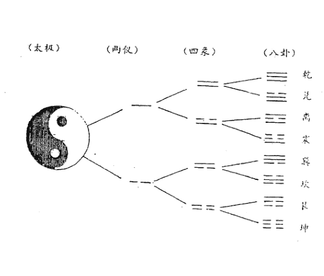

太极：

太极是一种阴阳未分的原始混沌状态，它是世界的开始，万物的根基，物质世界的一切变化都以此为源头。

两仪：

关于两仪，大多数人的看法是指阴阳。

“两仪”的符号称爻，其图形为：

阳爻——

阴爻- -

爻分阳爻(——)和阴爻(- -)两类，阳爻根据所处的环境不同，可以意味着是加、上、坚定、积极、进取、刚健，是天和男性的象征；阴爻则表示减、下、温和、消极、退守、柔弱、隐藏，是地和女性的象征。

四象：

四象在卦形上的体现，就是两仪的一极阳爻上分别再生出一阳一阴，这样就形成老阳==(又叫太阳)和少阴==，两仪的另一极阴爻上再分别生出一阳一阴，从而形成少阳==，老阴==(又叫太阴)。

“阴中有阳，阳中有阴”，阴阳是相互融合，相互包容的，对于这种情况，用阴与阳的图形来表示，便成为太极图中的阴阳两条鱼，这两条鱼已有了两只明亮的眼睛，喻为阴中有阳，阳中有阴。阴阳不仅是相对的，而且是相互包容的，这便为四象，将其分解开来便如上图，分为老阳、少阴，少阳、老阴，且分别用不同的符号加以表示，在太极图中，许多人都将少阴比拟为阴鱼的尾巴部分，这是不对的，我们知道老阳之时，少阴始生，所以，在太极图中少阴应该是阳鱼的眼睛，而少阳则是阴鱼的眼睛。

八卦：

四象进一步再生阴阳而生成八卦，是象征宇宙中八种最基本现象的符号。

八卦是一种三爻卦，共有八个，《周礼》称为“经卦”又称“单卦”、“小成之卦”等。

八卦都有一定的卦形、卦名、象征物和特定的象征意义。

为了帮助人们背诵八卦方便，宋人有一首“八卦取象”歌，其歌诀是：

- 乾三连（乾卦的三个爻画是连接的）
- 坤六断（坤卦的三个爻画是断裂的）
- 震仰盂（震卦的卦形象一个口朝上的盂）
- 艮覆碗（艮卦的形状好像一个倒放的碗）
- 离中虚（离卦的中爻是一根虚线）
- 坎中满（坎卦的中爻是一条实线）
- 兑上缺（兑卦上面的一个爻画有缺口）
- 巽下断（巽卦下面的一个爻画是断开的）

八卦又称八宫，分阳四宫和阴四宫。阳四宫是：乾、坎、艮、震；阴四宫是：巽、离、坤、兑。同时又给八卦配以五行，即乾、兑属金；坤、艮属土；震、巽属木；离属火；坎属水。

请注意：必须背熟八卦，因为它是此派阳宅风水基础的基础。

二、熟知父母六子

“父母六子”之说，是以家庭的父母子女关系比拟八卦的内在变化与衍生规律。乾、坤二卦为阴阳之本，万物之始祖，而震、坎、艮和巽、离、兑六卦，乃至六十四卦，均出自乾、坤二卦，就如同家庭一样，有父母然后有子女，有子女然后有子子孙孙，这是世间万物的衍生变化规律，子女继承父母的基因，所以具有父母的一些特点。我们常将这种现象称为遗传，这种血缘的遗传现象，在易经里便以父母六子来加以表示，使我们一看便知。

请见《父母六子》表

易学家邵康节先生发明创造的，他在《梅花易数》中，还把干支纳入“八卦方位图”中，图中天干地支排列，即是时空方位的标志，又是阴阳五行旺衰和生克的标志。

| 坤母 | 乾父 |
|---|---|
| -- | — |
| -- | — |
| -- | — |

实用八卦图

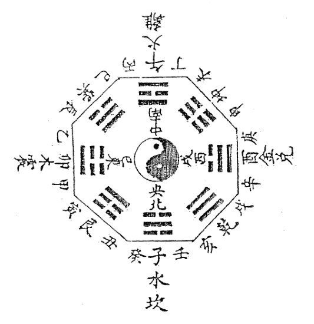

| 兑 | 离 | 巽 | 艮 | 坎 | 震 |
|---|---|---|---|---|---|
| 少女 | 中女 | 长女 | 少男 | 中男 | 长男 |
| -- | — | — | — | -- | -- |
| — | -- | — | — | — | — |
| — | — | -- | -- | — | — |

“父母六子”即乾父、坤母、震长男、坎中男、艮少男、巽长女、离中女、兑少女。

对于此父母六子必须记住，因为在此派阳宅风水中必用。

三、心装实用八卦图

在易占中，用“先天八卦数”和“后天八卦方位”是宋朝大

此《实用八卦图》必须牢记心中，因为在此派阳宅风水中必用。在背诵此图时，首先要要记住八卦方位：坎正北；离正南；震正东；兑正西；乾西北，巽东南，艮东北，坤西南。

还要记住与理解十二地支：
子(鼠、水)，丑(牛、土)，寅(虎、木)，卯(兔、木)，辰(龙、土)，巳(蛇、火)，午(马、火)，未(羊、土)，申(猴、金)，酉(鸡、金)，戌(犬、土)，亥(猪、水)。

四、记住八卦色泽

八卦的色泽在阳宅的趋吉避凶中经常运用，所以必须牢记。

八卦所代表的色泽是：离为红色；坎为黑色；震为青与绿色；兑为白色；巽为蓝色；艮为棕色，坤为黄色，乾为大赤色。

## 第二节 感悟卦象的神蕴

所谓八卦之象，又称为卦象，是古人根据八卦的特性比拟万物的特点后所总结出来的。

> “圣人立象以尽意，设卦以尽情伪，系辞焉以尽其言，变而通之以尽利，鼓之舞之以尽神。”

八卦有象，通过对对象的理解可以推求出其意义所在，可以说，有什么样的象，就有什么样的意，有什么样的本质特性，就会有什么样的形象，这就是圣人设卦立象的本意。通过对八卦之象与意的理解，我们可以不断提高预测阳宅吉凶的水平，这也是现代哲学上所讲的“透过现象看本质”的基本原理。

### 卦象：

对八卦之象，在《说卦传》中讲得很明白，是战国时代人们对“易象”的整理与介绍，现摘录于下：

> “乾，健也；坤，顺也；震，动也；巽，入也；坎，陷也；离，丽也；艮，止也；兑，说也。

> “乾为马，坤为牛，震为龙，巽为鸡，坎为豕，离为雉，艮为狗，兑为羊。

> “乾为首，坤为腹，震为足，巽为股，坎为耳，离为目，艮为手，兑为口。

> “乾，天也，故称乎父；坤，地也，故称乎母。震一索而得男，故谓之长男。巽一索而得女，故谓之长女。坎再索而得男，故谓之中男。离再索而得女，故谓之中女。艮三索而得男，故谓之少男。兑三索而得女，故谓之少女。

> “乾为天，为圆，为君，为父，为玉，为金，为寒，为冰，为大赤，为良马，为老马，为瘠马，为驳马，为木果。

“坤为地，为母，为布，为釜，为吝啬，为均，为子母牛，为大舆，为文，为众，为柄，其于地也为黑。

“震为雷，为龙，为玄黄(黄黑色)，为勇(布施，施舍的意思)，为大涂(大道)，为长子，为决躁，为苍筤竹(小青竹)，为萑苇，其于马也，为善鸣，为馵足(后左腿白色的马)，为作足(脚步快速的马)，为的颡(白脑门的马)。其于稼也为反生(指花生、土豆、洋芋等)，其究为健，为蕃鲜。

“巽为木，为风，为长女，为绳直，为工，为白，为长，为高，为进退，为不果，为臭。其于人也，为寡发，为广颡，为多白眼，为近利市三倍，其究为躁卦。

“坎为水，为沟渎，为隐伏，为矫輮(车轮的外框)，为弓轮。其于人也，为加忧，为心病，为耳痛，为血卦，为赤。其于马也，为美脊，为亟心，为下首，为薄蹄，为曳(水摩地而流)。其于舆也，为多眚，为通，为月，为盗。其于木也，为坚多心。

“离为火，为日，为电，为中女，为甲胄，为戈兵。其于人也，为大腹，为乾卦，为鳖，为蟹，为赢，为蚌，为龟。其于人也，为科上槁(枝干枯槁的树木)。

“艮为山，为径路，为小石，为门阙，为果蓏(指瓜类果实)，为阍寺，为指，为狗，为鼠，为黔喙之属。其于木也，为坚多节。

“兑为泽，为少女，为巫，为口舌，为毁折，为附决(附在树枝上坠落的果实)。其于地也为刚卤，为妾，为羊。

八卦卦象在此派阳宅风水中必用，因此将根据多种书所整理出的“实用卦象”附于此：

### 乾卦：

象意：君尊统治，高傲自慢。向上、老成、活动、积极、迈进、决断、威严、坚固、发光、激烈、扩大、任性、惩罚、愤怒、侵略、制裁、强制、冷酷、轻视、压抑、专横、独霸。

人物：父亲、祖父、夫、家长、君王、圣人、英雄、统治者、独裁者、掌权者、总统、首相、议员、元老、厂长、经理、书记、主席、会长、名人、专家、官吏、军官、律师、一把手等。

人体：首、胸部、大肠、骨、右足、右下腹、精液、男性生殖器等。

病象：头部疾病、胸部疾病、骨病、硬化性疾病、老病、旧病、伤寒之病、变化异常之病、急性暴病、结肠疾病等。

### 坎卦：

象意：哭泣、漂泊、暗昧、不安、欺诈、狡狯、疑惑、劳碌、失掉、贼盗、算计等。

人物：中年男子、暧昧、偷盗、逃亡者、亡命徒、黑社会、黑帮、黑教、诈骗者、诱惑者、恶人、病人、酒鬼等。

人体：肾脏、膀胱、血、耳、腰、背脊骨、肛门、泌尿系统、生殖器等。

病象：肾冷水泄、消渴症、出血症、性病、遗精、心脏病、拉肚子、水肿症、腰背疾病、生殖器疾病等。

### 艮卦：

象意：贞固、安居、沉着、冷静、慎守、顽固、隐蔽、困苦、阻滞、静止、主观、界限、独立等。

人物：为少男、僧尼、警卫、奴仆、矿工、石匠、守门员、训犬者、狱吏、犯人、偏激者等。

人体：为手、鼻、手背、脚背、脾胃、趾、乳房、颧骨等。

病象：鼻、手、脚、背之病，脾胃之病，虚胀、凸起的炎病、肿瘤、麻木病、关节病、结石症、气血不通等症。

### 震卦：

象意：霸道、追求、紧迫、攻克、移动、上升、虚惊、性色、冲突、显示、勇敢、兴起、狂乱等。

人物：为长男、警察、军人、法官、飞行员、驾驶员、狂人、说大话吹牛者、舞蹈演员、足球爱好者、神经过敏的人、壮士等。

人体：足、腿、脚、肝胆、左肩背等。

病象：精神病、狂躁症、羊痫风、惊吓症、肝火病、腿病、外伤等。

### 巽卦：

象意：直爽、附和、交涉、捷报、号令、奔波、薄情、悭吝、幻觉、忙碌、忧疑、轻浮、扫荡、烦躁、空虚、多欲等。

人物：为长女、长媳、僧尼、仙道、气功师、商人、教师、指挥官、能工巧匠、传令兵、优柔寡断的人、头发细长而直的人、下肢无力之人、交际人员等。

人体：头发(细、直、稀少)、神经、气管、血管、呼吸器官、胆、筋、股、左肩、肠道、食道、肝等。

病象：伤风感冒、中风、传染病、坐骨神经痛、抽筋、风瘫、风湿性疾病、喘息、左肩痛、神经炎、胯股病等。

### 离卦：

象意：晋升、虚荣、焦躁、文书、文章、影象、明察、排斥、轻浮、显示、自满、抗上、撒谎、华丽、鲜艳、磊落、礼仪等。

人物：中女、美人、贵族、文人、学者、演员、名星、多情者、幻想者、抗上的人、虚伪者、侦察员、战士等。

人体：眼、心脏、乳房、小肠。

病象：眼病、心脏病、火伤、烫伤、乳房疾病、发烧、小便黄、血液病、妇科病、囊肿、肥大症等。

离中虚，心不实不可交，火不宜太旺，太旺则有火灾，心肾受损(包括心神、心脑血管)。

### 坤卦：

象意：正直、勤劳、忍耐、吝啬、沉默、怯弱、依赖、贫贱、虚耗、疑惑、迟缓、优柔寡断等。

人物：祖母、母亲、后母、女主人、寡妇、阴气盛之人、忠厚之人、大腹之人、皇后、妃、臣、大众、顾问、农民、俗人、助手、凡人、泥瓦工等。

人体：腹部、脾、胃、肉、右肩。

病象：腹部疾病(胃肠及消化不良、腹痛)、浮肿、皮肤病、慢性病、中气虚、癌病、晕症等。

### 兑卦：

象意：雄辩、讲演、告知、魅力、议论、吵闹、趣味、娱乐、叹息、商量、叫卖、音乐、毁谤、淫滥、欢快等。

人物：为少女、巫师、讲师、解说员、牙科医生、娼妓、妾、非处女、耍娇的人、小人、刑官、媒人、破坏者等。

人体：口、舌、牙齿、咽喉、肺、气管、右肋、肛门。

病象：口腔内疾病(口、齿、咽、喉等)、咳嗽、痰喘、胸痞、尿道口、肛门疾病、性病、外伤、气管病等。

## 第三节 掌握“二十四山向”

有人讲，阳宅所运用的二十四山向是从阴宅中借鉴过来的。由于在实际操作中经常运用，所以必须掌握。

请看二十四山向图

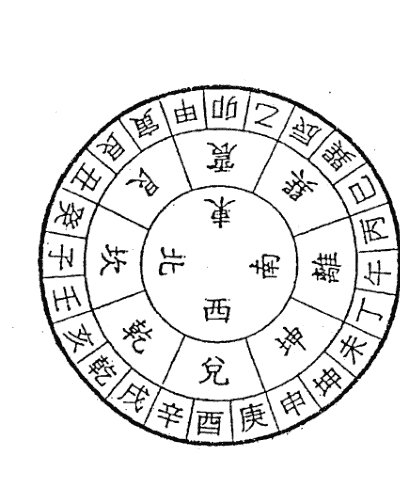

风水学中，初时只论东、西、南、北四正方，称谓四正卦。后又纳入西北、东北、东南、西南四隅方，称谓四隅卦，这样就形成八方，融入八卦。再在八卦中每卦纳入三山，就形成廿四山。四正方之中，阳天干在头，中气在正，阴天干在后，如坎宫，壬-子-癸；震宫，甲-卯-乙；离宫，丙-午-丁；兑宫，庚-酉-辛。四隅则为四库在头，隅为中，四生在尾。如乾宫，戊-乾-亥；艮宫，丑-艮-寅；巽宫，辰-巽-巳；坤宫，未-坤-申。

掌握这“二十四山向”很重要，因为在使用罗盘时，立向、收水、消砂、格龙，都离不开这个顺序。

在实际应用中，又经常运用十二山向，称“双山五行”。

天干、地支两个字同处一宫，合为一个名，分别称为双山，所以叫“双山五行”。请看：

二十四山向图

### 双山五行图

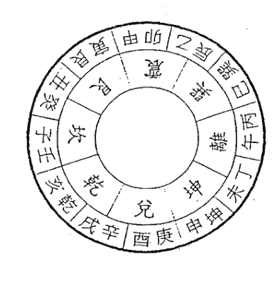

读法是：壬子、癸丑、艮寅、甲卯、乙辰、巽巳、丙午、丁未、坤申、庚酉、辛戌、乾亥。

要参看此图去理解“三合五行”：

天干乾、甲、丁，合地支亥、卯、未为一宫，木局。

天干艮、丙、辛，合地支寅、午、戌为一宫，火局。

天干巽、庚、癸，合地支巳、酉、丑为一宫，金局。

天干坤、壬、乙，合地支申、子、辰为一宫，水局。

易友问：地支“亥卯未”合木局我知道，那“乾甲丁”怎么也成木了呢？”

答：请看《双山五行图》。乾坐支亥，甲坐支卯，丁坐支未，是亥卯未这三个合成木局的地支把“乾甲丁”这三个天干给合过来的。

### 双山五行图

# 第三日 熟记吉凶歌诀

关于阳宅的形煞，传统阳宅书籍中编了许多歌诀，我在这里提醒您不可小视，因为这些歌诀是有很实用价值的。如能认真熟背，细细地体悟，久而久之便能随心所欲，凭灵感进行开口直断。

## 一、阳宅六煞歌诀

对于庭院的凶煞，《八宅明镜》“阳宅六煞”一节谈得较细，故抄录于下：

- 前高后低谓之过头屋，出孤寡。
- 屋后两旁有直屋，谓推车煞（房屋两旁不能隔开正房再建两间并列的房屋，这样的建筑从上往下看，正屋像车厢，两旁侧屋像车轮，如推车之形，认为这样就会把财宝福气推走，主贫穷衰落）。
- 前后平屋中起高楼，二姓招郎。
- 前正屋后边，不论东、西、南、北、中央，或一间、二间乱起，谓埋儿煞。
- 四边多有屋，中间天井出入，又无端门，谓扛尸煞。

> 注：（天井又叫明堂，俗称当院，必须方正平稳，不可高低偏斜。天井不可一字型，主人财清退，再起楼台主罪犯。天井不宜太深太长，主孤寡。凡前屋有楼，后屋无楼，大凶。明堂内乱石、假山之类主心痛咳嗽。天井不可缺折，左畔若缺男不利，右边崩陷女先伤。明堂之中有小屋名埋儿煞，生小儿难育，明堂斜路，子孙悖逆。天井如棋盘样，桌子样，方而浅者佳，以方圆匀静为吉。如掌心富贵，平如镜大发。明堂平又正，衣禄天然定）。

- 屋后有直屋，谓直射煞。
- 左右屋低，中高，谓冲天煞。
- 前后两进，两旁厢房中堂如口字，四檐屋角相对，谓埋儿煞。
- 厅屋三间，中间一间装屏门，两旁对一步者，谓停丧煞。
- 在宅中心建房叫停尸房，又叫小儿煞，如安锅灶更凶。
- 不论前后，檐下水滴在阶檐上者，谓主血症。
- 屋前如有梁木，搭板暗中檐架者，谓穿心煞。
- 屋后白虎边另有一间横屋，谓投河煞。
- 厅后高轩又有正屋如工字样，谓工字煞。
- 不论前后，门首或楹柱，或墙垛，或屋尖当门者，谓孤独煞。
- 前后两进，有一边侧厢者，谓亡字煞。
- 如屋大梁上又加八字木者，出忤逆。
- 不论前后天井，两旁如有山对照，谓金字煞，在西方更甚。

如一层前后翻轩皆可作正面，主夫妻、兄弟不和。

门前四面围墙中开一门，东、西两家俱从一门出入，路如火字形，不宜。

房门上转轴透出，主生产不易。

一家连开三门如口字，多口舌。

两门对面，谓相骂门，主家不和。这种格局叫做“斗门煞”，宅基较低或门较小的一家将被斗倒，使其事业退败，极易引起双方格斗，疑神疑鬼。

前檐滴后檐，两层屋相连，不宜。

面前左右有小塘，水满时或东放西、西放东，谓之连泪眼，不宜。

卧房前不宜堆假山、土山，谓坠胎煞。

乱石当门，谓磊落煞。

住宅前有森林，主怪物入门。

住屋前后有寺庙，不宜。

禄存方向不宜有树藤满缠者，谓之缠颈树。

面前有路，川字形，不宜。

山尖中开门，名穿煞，大忌。

床横有柱，名悬针煞，主损小口。

四周均是墙，一屋居中，绕屋可走一圈，叫囚宅。四方被团团封住，没有出路的住宅，以及四面皆水也叫落囚。

凡宅院之内，无论从哪一方面也不能有路穿过，穿过就叫穿心宅。

一座房数间互相通就叫穿心房。如五间堂屋，两头两间各有挎耳房，均有门，五间之中有主房门，内中各间再互相通，名穿心房，主疾病损财。

正堂前方或后方盖小屋者叫补针房，主破财、疾病、火盗。

正房背后盖小屋叫暗箭房，主损家长、破钱财、伤六畜、招贼盗等，大凶。

## 二、房宅外形吉凶断诀

《阳宅十书》把“房宅外形吉凶断”编成了歌诀，下面把有实用价值部分整理于下，并加上注释。

宅形左短右边长，君子居之大吉昌，
家内钱财丰盛富，只恐次后少儿郎。

注：宅外形右长左短，钱财富而子孙少。

右短左长不堪居，生财不旺人口稀，
此宅必定子孙愚，先有田蚕后贫脊。

注：宅外形右短左长，人财两虚。

丑寅空缺聚钱资，此是人间大吉居，
家豪富贵长保守，子孙荣华得逸居。

注：丑寅指东北艮位，如果有空缺主聚财。此种讲法只能参用，“八卦象数风水”则认为艮方有缺损少男(艮为少男)。

巳辰不足却为良，居此家豪大吉昌，
若是安庄终有利，子孙兴旺足牛羊。

注：辰巳指东南巽位，如果有空缺则主吉利。此种讲法只能参用，“八卦象数风水”则认为巽方有缺损长女(巽为长女)。

仰目之地出贤良，庶人居之富无量，
子孙印授封官职，光显门庭第一乡。

注：仰目指长方形宅地，吉。

中央高大号圆丘，修宅安坟在上头，
人口平安多富贵，住之辈辈出公侯。

注：在中央高大的圆丘上建宅，吉。

坎兑两边道路横，定主先吉后有凶，
人口资财初一胜，不过十年一场空。

注：坎(北)兑(西)有道路纵横，先吉后凶。

住宅修在涯水头，定主其地不堪修，
牛羊尽死人逃去，造宅安家见祸由。

注：宅建在水源之上，凶。

前狭后宽居之稳，富贵平安旺子孙，
资财广有人口吉，金珠财宝满家门。

注：宅地前窄后宽，吉。

前宽后狭似棺形，住进此宅不安宁，
资财破尽人口死，悲啼呻吟有叹声。

注：宅地前宽后窄，凶。

西南坤地有丘坟，此宅居之渐渐荣，
若是安庄并造屋，儿孙辈辈主兴隆。

注：宅的西南有丘冈，吉。

住宅卯地有丘坟，后来居之定灭门，
愚师不辨吉凶理，年久坟前缺子孙。

注：住宅的东边有丘坟，凶。

西高东下向北扬，正好修土兴盖庄，
后代资财石崇富，满宅家眷六畜强。

注：西高东低、北面向山的开阔地，大吉。

住宅方圆四面平，地师观之好兴工，
不论宫商角徵羽，家豪富贵旺人丁。

注：四面皆平的地方，各种姓氏的人都可以居住，吉。

此宅观灵取之强，只因辰已有池塘，
儿孙旺相家资盛，兴小败长有官防。

注：东南方位有池塘，小口兴、大人败，且宜遭官讼。

左边水来射午宫，先初富贵后贫穷，
明师断尽吉凶事，左边大富右边穷。

注：从左边来水冲射离宫，先富后穷。

住房正北有丘坟，明师安庄定有名，
君子居之出官禄，庶人居之家道荣。

注：正北有丘坟，吉。

住宅西边有水池，人若居之最不宜，
牛羊耗损人不旺，先富后穷师当知。

注：宅西边有水池，凶。

住宅前后有丘林，凡事未通不称心，
家财破败终无吉，常有官灾又伤身。

注：前后有丘坟，凶。

西北乾宫有水池，安身甚是不相宜，
不逢喜事多悲泣，初虽富财终残疾。

注：宅西北有水池，凶。

住宅乾地有丘陵，修宅安庄渐渐兴，
女人入宫为妃后，子孙代代做公卿。

注：西北方有丘冈，吉。

后边有山可安庄，家财盛茂人最强，
若居此地人丁旺，子孙万代有余粮。

注：宅的北面有山，吉。

前后高山两相宜，左右两边有沙地，
田财广有人多喜，寿命延长彭相齐。

注：前后有高山，左右有沙地，主人富贵长寿。

东北丘坟在艮方，成家立业有何妨，
修造安庄终归吉，富贵荣华世世昌。

注：东北方有丘冈，吉。

住宅左右水长渠，久后儿孙福禄齐，
禾麦钱财常富贵，儿孙聪俊胜祖基。

注：宅的左右有水渠，主富贵、子孙聪俊。

住宅东面有大山，又孤又寡又贫寒，
频遭口舌多灾难，百事先成后来难。

注：宅的东面有大山，凶。

## 三、阳宅内形吉凶断诀

《阳宅十书》“阳宅内形吉凶断”也很有实用价值，故亦摘录如下：

二树生来在屋旁，楼台屋宇起瘟殃，
奸淫妇女招邪怪，入屋敲门动几场。
树庙门前怎奈何，招瘟动火祸来磨，
都天太岁年来少，死官非事又多。
青松郁郁竹漪漪，气色光容好住基，
人丁大旺家豪富，积银堆金着紫衣。
北房两头都有房，宅中老少常遭殃，
暗风血风并黄肿，咳嗽生风瘟疫狂。
北房西头接小房，定主三年哭两场，
虽主家道多兴旺，后惹官事常灾殃。
旧房远年两露多，东则见西号星堂，
官口舌频频有，更有年年见火光。
单侧双侧房，必定见乖张，
全家频受苦，禳压可消殃。
家中暗算房，活计不荣昌，
频频贼盗量，灾祸不可当。
再插焦尾房，家长必遭殃，
火光频频有，阴旺主伤阳。
若盖露骨房，老者病着床，
数年频频苦，不免卖田庄。
莫盖晒尸房，人口病着床，
服药全无效，阴小必损伤。
屋头丁字房，官司口舌殃，
破财多怪异，频频见火光。
青龙插尾共披头，一年六度长子愁，
钱财破散人疾病，时时殃怪至门头。
若盖披头房，横死不可当，
丧事频频有，家中必遭殃。
白虎披头及畔哭，阴人小口病先殂，
重重灾害每相至，耗散钱财命皆无。
南房两头接小房，阴人亲妇病难防，
田蚕失散损小口，官灾贼盗主火光。
只有一北房，男旺女遭殃，
钱财主破散，年年有不祥。
凡有露肘房，宅中定不昌，
阳人频频患，长子亦卧床。
莫盖水字房，阴人有灾伤，
多服蛊毒死，一年两度亡。
莫盖王字房，家长必遭殃，
肿气并脚疾，阴人必损伤。
拆屋一半瘫患房，官事连连不可当，
阳屋必定伤男子，阴屋必定女人殃。
阳盛阴衰不可当，田蚕六畜多主伤，
男子从来个个旺，女人恶死患风疮。
阴盛阳衰最不强，女人兴旺儿不长，
盗贼官事都无数，绝了后代少儿郎。
白虎畔边哭，妇人多主孤，
太岁不合局，钱财耗散无，
鬼魅交加有，妻病定难除，
男女多寿短，家人日见无。
青龙举其头，居家多有愁，
男女绝离散，奴婢尽逃流，
哭声终不断，五载并三愁，
不惟伤人口，又损马与牛。
玄武插其尾，贼盗年起，
居官失其财，逃亡走奴婢，
女有多不孝，不宜生家计。
灾祸时时至，六畜自然死。
朱雀垂其翅，家宅多不利，
口舌纷纷有，破财及官事，
奴婢尽逃亡，父子不相义，
中女必定灾，火光频频至。
腾蛇举其头，居家多有忧，
六畜家财散，疾病事不休。
莫盖小字房，家人有灾殃，
人口多有病，一年两度亡。
莫盖焦尾房，人口必受殃，
阳房伤男子，阴屋女人伤。
宅修工字房，家长必遭殃，
脚肿并气疾，女人亦克伤。
若见人家两直屋，必主钱财时不足，
名为龙虎必齐直，损财少亡无衣禄。
住宅莫住过头屋，前高后低二姓族，
住者多损少年郎，招瘟动火连年哭。
住房莫住孤寡屋，主有寡女二三人，
一纪十六年间有，遭瘟动火败伶仃。
住房中高前后低，主有孤寡在其居，
又主钱财多耗散，名为四水不回归。
住房莫住白虎头，必主小房衣食愁，
幼时孤寡必损败，便见原因在里头。
住房莫住青龙头，必主长房衣食愁，
再加孤寡主长败，出去不回空倚楼。
冲天浇地两头低，三年两度损男女，
又主扛尸并处死，太岁当门无改移。
若得人家四屋夹，中门天井埋儿杀，
当防产难及招瘟，眼疾纷纷气疾发。
住宅一木又一木，孤寡临门来得速，
更主同宗二姓人，气疾眼患有定数。
住宅中门有小房，人丁损死主哭泣，
又名埋儿杀现身，主有寡妇二三娌。
堂前门廊不可空，窗棂梁隔须分清，
中堂不可架直屋，停尸之房多不利。
白虎头上莫开口，白虎开口人口伤，
杀名吞啖难养人，产妇常常病在床。
先造两廊不造堂，儿孙争斗不可当，
公婆父母禁不住，兄弟各路行别方。
碾磨必须居左腹，右腹搅动白虎肠，
主生病疾绞肠痛，出入褊窄结肚肠。
白虎衔尸最不良，儿孙岂得长？
朱雀之水分两开，灾祸日日来。
水城斜走去如飞，儿孙主窜移。
家业漂流难保守，人丁渐渐稀。
青龙头去反如飞，家破及人离。
宅后有水流，凶祸日无休。
莫认为吉取，定主伤家母。
交加水射而无情，其家抄枯没人丁。
前头流水似叉斜，退败定无家，
右边池湖如刀枪，儿孙主杀伤。
青龙如枪来射身，儿孙遭官刑。
屋边二口水通风，子孙终是受贫穷。
水如卷舌最堪悲，退败人丁总不宜。
丑低投军号阵中，艮低师巫残病人。
寅低狼伤并虎咬，他乡外死甲上坑。
卯地有水伤眼目，乙辰有水患秃风。
巽地坑宫官司败，阳短阴长暗藏风。
午丙有坑火星显，未丁坑下痨嗽人。
西方坑下家贫窘，戊亥蛇腰招贼侵。
壬子有湾绝后嗣，祸福外同在掌中。

## 四、断阳宅吉凶歌诀

龙神抱体足堪夸，富贵达京华。
束龙神弯抱过门前，富贵足田园，
青龙头水方抱身，家富出高官。
带水缠身，家中好积金。
屋前屋后有池兜，富贵永无忧。

## 五、房屋住绝断诀

屋后落脉强急，中子绝。前山逼压，一代过了主绝。四向高压，损丁亦绝。青龙高压，长房绝。白虎高压，三房绝。左边杀来长子绝，右边杀来，三子绝。逼压主丁稀，宽阔世昌荣。左右两边无救山，虽然一发也主绝，不绝定离乡。右巷杀冲定招婿，左巷杀冲长换妻。后巷冲来人丁死，前巷冲来动官方，四面冲来人枯死，做贼逃军上法场。左陷男瞎眼，右陷女无光。前陷主缺唇，后陷主少亡。左庙人长病，右庙出花娘。前庙遭牢狱，后庙官乃忙。左池中不利，右池出花娘。前池人发福，后池女奸情。前树人丁少，后树家豪富。

## 六、何知经

《阳宅十书》所谈“何知经”很有实用价值，故抄录于下：

- 何知人家贫了贫，山走山斜水反身。
- 何知人家富了富，圆峰磊落皆朝护。
- 何知人家贵了贵，文笔秀峰当案起。
- 何知人家出富豪，一山高了一山高。
- 何知人家破败时，一山低了一山低。
- 何知人家出孤寡，琵琶侧扇孤峰斜。
- 何知人家少年亡，前也塘兮后也塘。
- 何知人家吊颈死，龙虎颈上有条路。
- 何知人家二姓居，一边山有一边无。
- 何知人家少子孙，前后两旁高过坟。
- 何知人家主离乡，一山主窜过明堂。
- 何知人家出军枪，枪山坐在面前伸。
- 何知人家被贼偷，一山走出一山钩。
- 何知人家忤逆有，龙虎山头或开口。
- 何知人家被火烧，四边山脚似芭蕉。
- 何知人家女淫乱，门对坑窝水有返。
- 何知人家常发哭，面前有个鬼神屋。
- 何知人家不旺财，只少源头活水来。
- 何知人家不久年，有一边兮无一边。
- 何知人家受孤栖，水走明堂似簸箕。
- 何知人家修善果，面前有个香炉山。
- 何知人家会做师，排符山头有香炉。
- 何知人家出跏跛，前后金星齐带火。
- 何知人家致死来，停尸山在面前排。
- 何知人家有残疾，只因水带黄泉入。
- 何知人家宅少人，后头有龙无气脉。
- 仔细相山并相水，推断祸福灵如见。

# 第四日 查形煞断吉凶

在阳宅风水中，除上述推断吉凶的方法外，还有很多直观的推断方法，这些方法不受任何条框所限，只要您掌握这些“形煞”的特点，便可以开口直断，且条条言中。

## 第一节 从宅外看形煞

### 一、从宅基与宅形看形煞

建筑基地的选择有四大原则是必须遵守的：

1. 住在平地近水处者，以得水为上。
2. 住在平地而不近水者。此时应将地图拿来，就平地部分的等高线，以较高处为建地。且要注意不可建在死胡同(死巷或死路)的尽端，否则容易发生火灾及招惹官司。
3. 住在山上，建筑地点的选择上，要注意有无“藏风聚气”。绝不可建在山脊(山的棱线部分)或山谷的出入口，否则居住的人容易罹患各种疾病。住宅若建在四周均有高山之处不吉，主人丁稀少。若南方有高山，此家必出迂腐的读书人。
4. 住在乡下或郊外，后傍山，前临平地，正坐山腰，有山来朝，除了特别注意“藏风聚气”外，正对的山体、水流等，则须仔细评断。

在基地的选择上，还要注意“土质松软”“湿气过重”“地下有污水”“年久废墟之地”“庙宇佛寺的遗址”“曾为刑场、古战场遗址”“曾经发生过火灾之地”等，不可选用。

评断住宅基地的吉凶以院子围墙为准，无围墙者以住宅平面图为准。

住宅基地某部“缺角”属于凶相，一家人在社会上的运势将会减弱。所谓的“缺角”，就是指住宅基地一边长度的三分之二以内有缩进去的现象。下面详谈缺角部位的吉凶。

1. 如果西北方欠缺不足，有损贵气。在宅相上，西北方多被视为父位，在易经上以乾代表老父，乾为天，为太阳，因此会使居住者失其祖产，事业难以获得成功，并易得呼吸器官方面的疾病。
2. 住宅基地东南方(属巽卦，主中女)有缺，会导致业务不振，对生儿育女不利，而且多使中女横遭意外不幸。
3. 宅基地西南方有缺角。在宅相上西南方为主妇之位，故西南方有缺角，将使主妇流于懒散，易流于行为放荡，招人议论，并易得胃肠之病。
4. 宅基地东北(属艮卦，主少男)欠缺，这种宅相，对于少男最为不利，使之诸事不顺，难以施展抱负，此屋多得不到优秀的继承人，严重者甚至香火难以传承，并且易得消化系统疾病。
5. 住宅基地或屋形南北两方有缺，经常会招惹官司。
6. 住宅基地或屋形独东方部位有凹陷，会有经营不景气、衣食不足的倾向。
7. 住宅基地或屋形独西方部位有缺陷则属大凶。暗示着疾病缠身，难以积聚钱财，多是非争端，千万不能居住。
8. 住宅基地或屋形东西两方有凹陷，必庸庸碌碌过一生。
9. 住宅基地或屋形独南方(属离卦，离中虚)部位有缺陷，会使居住者的虚荣心增强，家庭中经常有争吵事件，不得安宁。
10. 住宅基地或屋形北方(属坎卦，坎为水，为艰、为险、为陷)陷入属大凶，灾祸不断。
11. 住宅基地或屋形四角都欠缺属大凶，绝对不能居住。
12. 住宅基地或屋形前宽后窄呈倒梯形，钱财难聚。
13. 住宅基地或屋形前窄后宽呈正梯形，必定富贵。
14. 宅基地前低后高属大吉；反之，前高后低则不吉。
15. 住宅基地或屋形右长左短，其子非孤即贫。
16. 住宅基地或屋形左长右短，损及妻儿。
17. 住宅基地或屋形南北呈长方形大吉，居住的人即富且贵，多子孙，生活愉快。
18. 住宅基地或屋形东西呈长方形则不吉，尤其如南北两方再陷入更凶，会导致居住者有气喘的毛病。
19. 住宅基地或屋形呈三角形者，若前尖后宽叫做倒田笔，人财两损，尤其容易引起女人带来的祸害。后尖前宽，叫做火星拖尾，属大凶，家人可能有自杀或罹患绝症。三角形土地，不管在哪一方面都会带来最坏的后果。三角形土地的特色，是给予居住者精神及脑部方面的打击，以致不能做完善的思考，生意方面也会蒙受打击。
20. 住宅基地或屋形属方形居之吉，有家财万贯的吉兆。
21. 鬼门方向有凸出的土地，将使精神方面受到影响。

以住宅风水来说，土地最理想的形状是六对四的长方形。凡是不符合这种规定的土地，多少都会有一些问题。尤其是建地的东北与西南，也就是说，在表鬼门与里鬼门(从建地的中心看)的方位“凸出”的话，将变成凶相。原则上，所谓的“凸出”在住宅风水上属于吉相，然而，在鬼门方向的“凸出”物，则属于凶相。例如，无事面临烦恼，或者因为过分固执而遭到失败。

### 二、从道路看形煞

1. 住宅前面有路向住宅呈圆弧状环绕，大利此家，富贵长久。
2. 住宅门前道路如呈圆弧状向外弯去(谓反弓路)，暗导此家出孤儿寡妇(意指父亡夫逝)，女淫滥，官司败诉，生意失败。
3. 住宅近处有十字路交叉点在西南方，暗导此家妇女性欲强，喜欢性行为，严重者则淫滥。
4. 住宅近处有十字路相交在东北方，影响此家生育，严重者则没有子嗣。
5. 住宅门右边有十字路直冲，直经门前横路又呈向下弯曲弧形，会导致家人自杀、钱财散失、遭遇诉讼。
6. 道路直冲大门。这种格局谓“暗箭煞”，古有“暗箭射人凶”的说法。容易造成意外伤残、破财、官讼。有一户人家，门前有道路直冲大门，一天傍晚，一辆汽车(司机喝醉了酒)从对面直冲而来，恰逢男主人站在门外，这辆汽车硬是把男主人从门外撞进屋里，当时便昏死过去，后经抢救及时，才保住了性命。
7. 门前道路或空地成扇形，扇面朝本宅。此种格局将使家中烦恼纷纷，男有风疾女有阴。
8. 住宅门前若有交叉路，交叉路两旁又各有池塘，此宅大凶，可能引起家内人口减损、人多生疾。
9. 三面受到道路(指公共的道路，并非指私人小路)包围的基地属凶相。一家人会频频发生事故或受伤。例如，骑着脚踏车，却从一旁突然冒出个老人来，为了闪避而使自己摔倒骨折，或者从阶梯上摔下来受伤等等。

### 三、从围墙看形煞

研究阳宅学，墙是很重要的单元，《宅谱大成》对宅墙(包括“照壁”和“看墙”)的吉凶说：

一道墙当一重山。宅四周有墙，墙多则气厚，然亦有吉有凶；墙如弓抱，进田掘窖；墙路抱来，常足钱财；墙似曲尺，朝内发迹；围墙回绕，进宝安然；前墙包围，丁蓄家肥；下水墙富而昌，上水墙缺粟粮；墙横冲与直冲，出人遭凶；独脚“照壁”，孤寡忧戚；墙作燕尾，忤逆谤诽；天中作“照壁”，损儿孙，家长溺；墙作雀舌，官非哽咽；堂前“照壁”高压，妇掌权，丁财乏；砖墙剥落，土墙疮癞，更加瘟疫；“看墙”过高，逼遮嗷嗷；“看墙”两窗，被贼偷香；墙卷龙头，妖怪悲愁；宅壁穿隙，妇人毒螫；“看墙”包过座屋，耗财失奴仆；两堂对向间隔壁，弟兄妯娌常冲击；墙射中宫，家无主东；墙缺露气，人财渐菲；篱墙冲屋，口舌伤腹；墙头门，常被人论；墙向外，财散人害；墙路头垂，仆逃人欺；土墙冲屋角，刀兵之凶，小射小伤，大射大凶；墙头砖破，事事坎坷；对墙尖角，官差来捉；墙头开指，兄弟口舌；墙射右，妇女凶；墙射左，男子空；墙角射后，口疮毒入；墙角射前，目疾连连；墙缝中来，损伤破财；射左损长男，射右小儿当；门前张手墙，忤逆财物伤；左右横冲，小口婢凶。

1. 围墙上不可开大窗，开大窗名叫朱雀开口，易惹是生非，麻烦无穷。
2. 围墙前面宽后面窄而尖，呈三角形者，是大凶宅。可能引起家人自杀或罹患绝症。
3. 围墙前面尖而后面宽长，名叫退田笔。居此者钱财不进，经营生意大败。
4. 若有别人家围墙呈角部分或屋角正对家宅者，叫泥尖煞。若角对左边，则主男人不利；若对右边，则主女人不利，家人的经济与精神生活大受破坏。
5. 围墙上若有古式檐盖，不可过宽。宽两尺者，姨太太当权，宽过四五尺，呈回廊状者，将招惹官司。
6. 四周围墙除门外，要保持完整，不可缺崩，尤其在东北方位更不可有缺口，否则将经常上法院、上医院。
7. 四周围墙不可过高(有人防小偷，将围墙筑得过高)，否则居住人好似困兽，将导致穷困。
8. 四周围墙不可过低，更不可有缺损。否则家中将有跛足女人。
9. 围墙不可紧逼家屋，否则易有压迫感，抑郁难伸。
10. 若建独栋住宅，千万不要先筑围墙，否则犯“囚”字，不是住人无法兴旺，就是建筑横遭波折，迟迟不能完工。
11. 牌楼若比住宅屋顶高，则对女主人不利，有官将会被降职。此外，易遭火灾或遭盗贼。
12. 住宅围墙年代久远，不可让它滋长缠藤，否则此家不断吃官司。有人特别喜欢让墙壁缠满藤叶，在视觉上可带有滋润与诗意，殊不知如此一来，屋内充满阴气，精神上更遭阴扰。
13. 两家门墙相对，较低的一家一定衰退。
14. 住宅大门左右两墙不可大小不同，否则左边大则有换妻可能；右边大则主人寿不长。

### 四、从池塘看形煞

在阳宅学上，对房宅周围开池塘，大都以为不吉。如在房前开池塘，一来因为有水光反射伤害眼睛，二来容易造成儿童意外灾害，凡有此等环境，则称之为“血盆照镜”。但在稍远处开半月塘，且弧形向外，并有照壁遮拦，则不作此论。《阳宅十书》曰：“凡宅前不许开新塘，主绝无子，谓之‘血盆照镜’。门稍远可开半月塘。”

- 1、喷水池、游泳池或池塘，形状圆满，圆心微微突起，如倒盖的锅子。这种格局据《宅谱大成》上讲，能增加居住者的财运。
- 2、喷水池、游泳池或池塘，四方水浅，并向建筑物微微倾斜内抱（圆方朝前）。这种格局据《宅谱大成》上讲，是为大吉大利的。如此才能藏风聚气，增加居住者的好运气，有发横财的暗导力。
- 3、喷水池、游泳池或池塘，形如一条手臂抱住一个水盆。这种格局叫做“抱盆金形”。此格局将使居住者发生眼部疾病，对孕妇亦有不利的影响。
- 4、喷水池、游泳池或池塘，水深污沟。这种格局称为“汤胸孤曜形”。水深不见底，容易使小孩落水死亡，且水质污沟，易积聚秽气，易患肺痨症。所以古人评断这种格局时都说：“深水涝病，代代少亡，溺水死。”
- 5、喷水池、游泳池或池塘，呈葫芦形。这种格局风水学上称之为“葫芦明堂”。将为居住者带来不幸的命运，也易对身体健康发生不利的影响。
- 6、喷水池、游泳池或池塘，如上弦月形，弧形部分正对屋子。这种格局叫做“反张金形”，将造成居住者的家庭关系不够和谐，也使财运减弱变坏。
- 7、喷水池、游泳池或池塘，呈“匮幸金形”。这种风水格局会使居住者的家业波动性增大，只宜从事变动性极大的行业者居住。
- 8、住宅门前若有池塘，池塘外形有尖角，尖角正对家门。这种格局可能导致家人眼睛出毛病。
- 9、住宅门前排水沟的流水，由左向右流（以人站屋内向外看为准）可大发，由右向左流者将大败。排水隐藏地下无法判断时，以雨水的流向为准。

### 五、从庭院看形煞

- 1、庭院不可设置水池。庭院有水池，会导致视力不佳、烦恼重重、家族不和、疾病缠身等凶事。因为此庭院池中的水会腐败，对人体的健康会有不良的影响。同时有很多不能超生的幽灵，大都偏爱集结于水池旁，随时都会引起灾害。
- 2、庭石不易摆放太多。在庭院里适当的点缀着一些庭石，对增进庭院的风雅有很大的帮助。不过，庭石的数量、形状以及石子的因缘，有时会招来凶相。一旦庭石里面混入一些奇异的石头（外形象人或者禽兽），那就会导致灾祸连连。庭石一旦附有游灵，随时会发生凶相。不仅会引起精神异常等症状，甚至会碰到突发事故，或者是莫名其妙地受到伤害。住宅大门前切忌有长石当道，否则对家中小孩不利，易招惹性命之灾。长石当门偏左，男孩罹难；偏右，女孩遭殃。若有石头成横卧状态放置者，此家人会经常患病。若有石头成方形，家犬喜欢咬人惹事。住宅大门内或室内也绝不可有成堆石头，因它可引起家中孕妇流产或发生疾病。
- 3、庭院不可种树。住宅若有庭院，切莫在中庭种花木，否则不测祸事或不明疾病接踵而至。事实上就有许多富贵人家在中庭种植花木，因此一年到头总是往医院报到。比如像石榴树、桃树、梨树、梅树、杏树等，树虽不大，但仍为祸，尤其是遇上宅向的树的方位搭配不当，家人必有人吐血。门前若有大树，如果树已腐空，将引起家人内脏的疾病。门前若有大树上缠着各种藤，可能潜伏是非、官司、争吵、自杀等危机。门前千万不要有枯树。若树枝枯烂，将引起家人有四肢的毛病。即使不是大树，不管是直立的或倒在地上的，均会对家人有损而无益。如有，最好连根拔掉。有一户人家在西北方位有一株杨树，树上长满了节疤，此家人均患有头上长疮的毛病。因为西北为乾，乾为头嘛。门前的大树若是露出根来，不管方位吉凶，都会招来家人严重的健康伤害或是母亲守寡。
- 4、不可在庭院造凉亭。富豪人多喜欢在广阔庭院造凉亭，此凉亭绝不可建设连家门的回廊，否则居住家庭终年不得安宁。造在池塘中的水亭，也不能太靠近住宅，否则灾祸接踵而至。住宅四周若为气派建造各种奇亭，种植厅花异卉，固然美观，但是家人健康将无法保障，钱财也不能固守。
- 5、不可将溪水引入庭院。将溪水引入庭院大凶。不光是引入庭院不吉，紧贴屋后亦不吉。有一户农家，本来日子过得很好，夫妻和睦，钱财有余。可是在66年修渠道时，渠水紧贴房后流过，从此夫妻闹离婚，家业也一败如灰。

### 六、从其它方面看形煞

- 1、建筑物旁大桥切割而来。这种格局不利住家的安宁与居住者的健康。
- 2、住宅外面有桥冲来。此家将会散尽家财。
- 3、住宅前有沟，上伏桥板。此家人精神生活将受到打忧。
- 4、若有木桥从住宅西北方直冲而来。此屋不可居住，否则家败财散，人不长寿。
- 5、一栋大楼的四角方位上，恰各有较低建筑物所在。这种格局叫做“露足煞”，有乌龟缓缓行动之象，只宜工作性质奔波性较大者居住。
- 6、一整体建筑群，唯某家比四周高而突出。这种格局风水上称做“露风煞”。易令居住者不安，有压迫感，家道会日渐衰落，难以聚财。
- 7、一整体建筑群四邻房屋皆高大，唯某家低下而卑小。此种格局被称做“四害煞”，居久自然心胸不能开阔，疾病不断。
- 8、四邻房屋或树木墙垣皆高，唯某家卑下低小。此种格局称为“牢狱煞”，四方压迫，状如困狱，使人无法与天道合一，故凶。
- 9、大楼正厅顶上横过一条大梁柱。此种格局叫做“穿心煞”，使人有强烈的压迫感，久居将抑郁不振。
- 10、从屋内向外看，正对两栋高楼间的空隙。这种格局称做“天斩煞”。两栋高楼间的空隙有如一刀自天斩下，一遇理气煞到，则祸事连连，徒增困扰。
- 11、住宅门前有破旧房子无人居住，门窗毁坏无法关妥，此种格局称做“损丁煞”。此家可能发生奇奇怪怪事件，夜梦鬼惊，罹患不明疾病，影响居住者的生育能力。
- 12、一整栋大楼，中庭部分再造一间小屋。这种格局叫做“埋儿煞”。会使幼儿身心健康受到伤害，多有心膈胀闷的现象发生。
- 13、若住宅的四周全是路巷，则属“囚”字形，使人常笼罩在寂寞之中，难以发达。
- 14、住宅建筑拆除一半，若拆除部位在西、西南，则主家中妇女遭不幸；若拆除部位在东、东北、西北，则主家中男人遭不幸。
- 15、绝不可在住宅某边接建小屋，否则，可能带来钱财破耗之事，严重者可能引起家人暗疾或血光之灾。
- 16、住宅不可楼上起楼，易导至疾病伤残。比如原来为平房住宅，后觉旧屋不够用，再于其上加盖楼者亦属大凶。
- 17、住宅呈凸形，叫做“寒脊屋”，暗导火灾、散财。
- 18、从侧面看，住宅屋呈山字形，即栋梁中高前低者，将导致此家散财、孤独。
- 19、古老住房屋脊破旧毁损，主梁损坏，务必修妥，否则将导致生疮、钱财耗损、小孩病弱或女主人变寡妇。
- 20、门前正对电线杆。这是民间最熟悉的形煞。其实电线杆如与八字用神相配，反可做生旺之峰，是求之不得的好格局。
- 21、住宅大门不可在两边做两个小门进出，否则家中大小自相欺凌，严重者鳏寡层出无穷。
- 22、前面招牌与大门俱高，而屋宅地基又前高后低的建筑物。这种格局叫做“擎头煞”，又叫“朱雀昂头”，是大不吉的宅形。
- 23、住宅门前有庙宇、神殿，将使家庭不安，对精神生活、生育、经济均不利。门前若有神坛，则家中妇女可能遭受鬼神作祟。

> 明朝的风水大师徐试可说：“神前佛后，旺气应注神灵幽暗，相触惟恐，居之不安。”又说：“立宅最忌神前佛后，鬼气盛，则人家衰；荒废神庙寺观基址，皆不可居，主绝灭。”

- 24、大门内外还有如下的讲究：大门应有柱，不架空为吉。门扇高于墙者多主哭泣。门口水坑，家破伶仃。大树当门招疾病，墙头冲门主大凶。交路夹门，人口不存。众路相冲，家无老翁。门被水射，家散口哑。神灶对门，常病时瘟。门下水出，财源不聚。门前水井，家遭邪鬼。粪坑对门，疾病常侵。水路冲门，悖逆子孙。桥口向门，退财遭瘟。

## 第二节 从宅内看形煞

- 1、住宅为了豪华，而于墙壁上挂有过多装饰品者大凶。视觉上的美感，应以清洁实用为要。
- 2、住宅内，务必客厅在前，卧房在后。假如进了住宅，先是卧室，然后才是客厅，这种住宅叫退财宅，住了后经济状况必定日下。

### 一、直断厨灶十三忌

形势派在看阳宅风水时，有很多直断法则，下面就讲一下直断厨灶的十二忌讳。

- 1、灶忌背宅反向：“灶忌背宅反向”就是灶口与房屋的坐向刚好相反。例如房屋是坐南向北，而灶口则是坐北向南，则不吉。
- 2、灶忌门路直冲。中国传统的风水观念中，认为厨灶是一家煮食养命之处，故不宜太暴露，尤其不适宜被门路所带引进来的外气直冲，否则家中便多损耗，正如古书所言：开门对灶，财畜多耗。
- 3、忌入门见灶。厨灶不宜暴露，不但在大门见灶不吉，而且在厨房门外见灶亦不吉。
- 4、忌与厕所相对。炉灶是一家人煮食的地方，故此应该讲究卫生，否则便会病从口入，损害健康。而厕所藏有很多污物及细菌，故此炉灶不宜临近厕所，尤其炉口不可与坐厕相对。
- 5、忌与房门相对。厨灶是生火煮食的所在，甚为燥热，故此不宜与房门正对，否则便会对房中的人不利，会有灾病吐血的情况发生。
- 6、不宜紧靠卧床。炉火炽热，而煎炒时所产生的油烟对人体很不适宜，故此炉灶贴近睡房，尤其是贴近睡房的床更不适宜。
- 7、灶忌背后空旷。灶宜背后靠墙，不宜空旷，倘若背后是透明的玻璃窗，亦不吉，因为这正如古书所说：“凡灶门，忌窗光射之，主凶。”
- 8、忌安在沟渠上。炉灶属火，而沟渠乃是排水之物，水火不容，故此两者不宜太接近，倘若炉灶安放在沟渠上则不吉。
- 9、灶忌横梁压顶。灶上有横梁压顶不吉，犯之则家人多疾病，尤其是对妇女健康有损，这正如古书所说：“栋下有灶，主阴劳怯。”
- 10、不宜斜阳照射。在风水学来说，厨房向西，特别是煮食的炉灶受正西斜的太阳照射，便甚不吉利，这样会令家中人的健康受损，所以应避之。
- 11、不宜尖角冲射。风水学认为尖角锋利，容易造成损害，故此对于尖角冲射甚是忌讳，否则便会对家人健康有损。
- 12、避免水火相冲。炉灶切记不要夹在洗衣机与洗碗机两“水”中间，因炉灶属火，造成水火交战的局面，主一家人口舌是非不断。另，灶不能与井紧邻，否则将造成虚耗大患。
- 13、住宅内厨房不可在前半部位。若厨房内抽油机的通气孔正好在住宅正面的正中央则大凶，主三年一哭，家人常有不幸事故发生。

有人会问：你只讲了这么多禁忌，那么怎样“安灶”呢？我告诉您：只要避开这些禁忌其它均是吉方位，就可以择个良辰吉日安灶。

有人会说：你这种规定也不详细呀！八宅派对安灶规定为“坐凶向吉”，那多明确呀！

我告诉您：八宅派的规定不可信。请问：现代住宅有几个能做到那些死套数？又有几家出凶了呢？如果某宅或楼房内某单元的炉灶做不到“坐凶向吉”，那就莫安灶了吗？

### 二、直断睡床十一忌

从睡床直断吉凶，请留心“睡床十一忌”：

- 1、床头忌横梁压顶。《阳宅撮要》曰：“床横头有柱，名‘悬针煞’，主损人口。”床头如有横梁压顶，便会影响人的健康。遇到这种情况，或采用“遮、挡、避”的方法。
- 2、床头忌房门直冲。床铺不可正对房门，否则夜梦鬼惊。《八宅明镜》曰：“床怕房门相冲，以一屏风抵之乃佳。”在这种情况下，可以把床移开，避免对正房门。倘若不能移床，便可在房门与床头之间设一屏风来作缓解。
- 3、床头忌正对厕所。坐厕与床头相对，是很不吉利的，应该尽量避免。最有效的化解方法是把睡床移开，避免床头正对坐厕。
- 4、床头忌正对厨灶。《八宅明镜》曰：“床前有灶，心痛脚疾。”炉火炽热，而煎炒时的油烟对人体会有危害的。如果床头正对炉灶，便会有损健康，会发生心痛吐血及脚疾等症。
- 5、睡床忌紧贴炉灶。厨灶是生火煮食之处，甚为燥热，故不宜紧贴睡床。补救的办法是把睡床移开。
- 6、睡床忌紧贴窗口。在风水学来说，床头紧贴窗口则不吉，所以床头应尽量避免紧贴窗口。
- 7、床头忌不靠贴墙。床头不宜“露空”，这就是说床头不靠贴墙壁失了靠山，无所凭藉，便凶多吉少了。倘若床头真的不能靠墙，床尾靠墙也可补救。此外还有一法可以补救，这便是在床头与墙壁之间加设一柜，藉此把二者连成一体。
- 8、床头忌正对镜子。在风水学来说，镜子是用来挡煞的，作用是把直冲而来的煞气反射回去，所以镜子不适宜对正自己，尤其不适宜对正自己床头。
- 9、睡床忌正对烟囱。《阳宅撮要》曰：“烟囱对床主难产。”倘若有这种情况出现，便应该把睡床移开，以睡床不见烟囱为宜。此外，可以考虑把窗遮掩，以免触目惊心。撇开风水不谈，单以烟囱喷出的煤烟火屑，便足以损害健康。
- 10、睡床忌楼梯压顶。《阳宅撮要》曰：“房内安楼梯，主寡。”而睡床摆在楼梯底下，尤不宜。即使楼梯是在房外，只要是压着睡床亦不适宜，撇下风水不谈，单是上下楼梯的脚步声便令人不能安眠。
- 11、床铺底下当储藏室大凶。床铺底下当废物摆放则不宜，千万避免。如摆入破物，有损胎儿。如果为了节省室内空间，置放常用干净衣物还是可以的。另，住宅内卧室隔邻，不可做储备室，否则可能引起病患，常有人卧床。

# 第五日 依方位断吉凶

## 第一节 怎样确定房宅中心点

观察一房宅的地理风水，必须先从该房宅的配值图中，找出测量方位的中心点。而确定房宅中心点的方法，又以其外形的不同而有所不同。大致可分为以下几种：

- 1、房宅为正方形或长方形时，从对角线的交叉点取中心点。
- 2、房宅有凹处时，仍视为完整的四边形，亦从对角线的交叉点取中心点。
- 3、房宅的对角两处，各有一凹一凸时，以互相填补的方式，求出对角线的交叉点为房宅中心点。
- 4、房宅为平行四边形时，也可以对角线交点为中心点。
- 5、房宅有凸出部分时，以去掉该凸出部分，求出对角线交点为房宅的中心点。

由于房屋形状不同，确定中心点也就不同，下面列图说明：

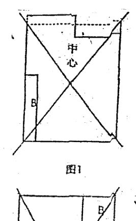

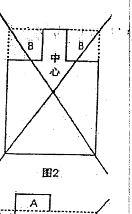

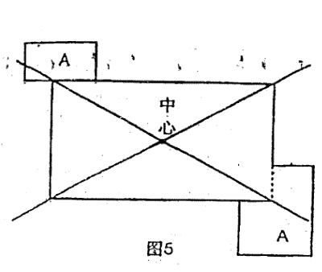

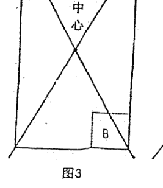

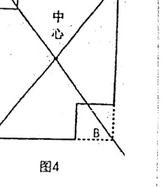

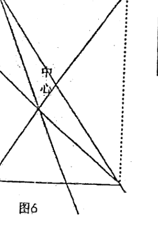

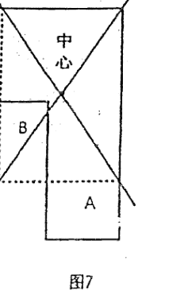

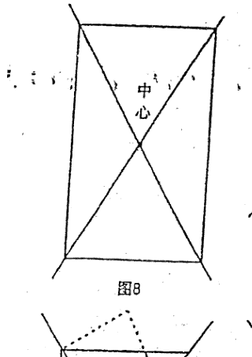

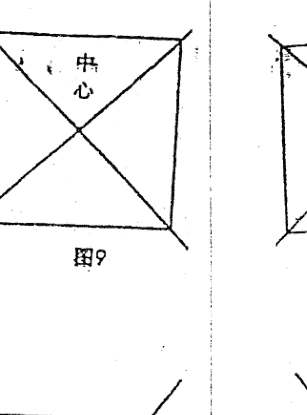

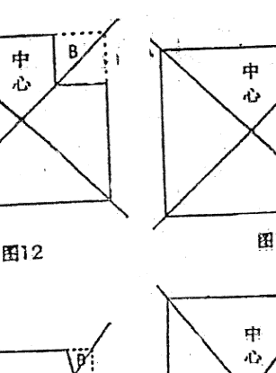

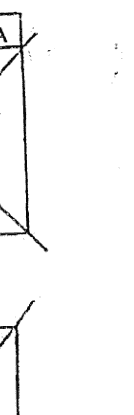

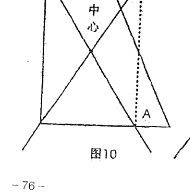

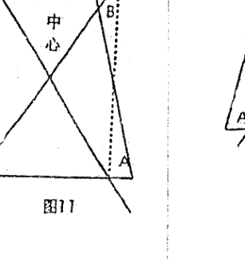

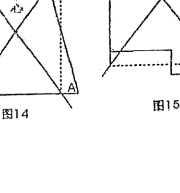

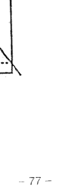

有人会问：有些建筑物无法找到房宅的中心点（如有的旅馆、咖啡厅、大饭店等）怎么办？

答：这类没有中心点的建筑物都被视为不吉，最好予以增补或改建，使之成为有中心点的建筑物，这样才能避免不利的风水影响。

## 第二节 怎样测定方位

方位与风水学有着不能分割的密切关系，因为倘若东南西北这些方向弄不清楚，便难以知道哪些角落是吉方，哪些角落是凶方，以致不知如何趋吉避凶。

风水师是用罗盘来测定方位的，罗盘分为天盘、人盘、地盘。在勘测阳宅时，用地盘（我在“罗盘实用点窍”中有详解）。在实际操作中，主要是把一间房屋划分成八个方位来研究，看看哪些方位吉利，哪些方位不吉利。这八个方位是：南、北、东、西、东南、东北、西南、西北。

首先把罗盘放在大厅的中心点来测量，然后在每个房间亦可同样选择中心点来测量。这样一来，全屋每个部分的方位均可测定出来。

## 第三节 怎样定向

阳宅风水中最重要的就是坐向，所谓坐向就是一座房屋的朝向。坐向是判断风水吉凶祸福的重要依据。

定向有二种含义：

一是代表室外定向，换句话说在未盖成房屋之前，风水师在为主人定好坐向，也就是选择一个好的朝向。

二是代表室内定向。室内定向有如下的几点依据：

- 1、以阳定向。我国古代多是独立式房屋，由于环境需要，多数是坐北向南，而门开得较宽，窗则较细小。一则是因为中国土地居北半球，太阳在南方较为多些，为防北面的风沙霜雪的吹袭，窗便开的比较小，而门为采光和纳入更多空气，于是门自然成为风水的坐向标志和纳气点，随着时代的改进，社会结构的不同，居住的条件、建筑的格式也和以往有很大的差异。但有一个共同的特点就是人离不开阳光和空气，换句话说，人类是依靠阳光和空气维持生命。以现代的大厦或单元的建筑物，门的纳气采光便失去作用，因此窗、阳台便肩负采光纳气的任务。这样一来窗和阳台就代表着定向的主要依据。实际上采光纳气是阳的一种象征，因此室内定向第一种是以阳定向。
- 2、以动静定向。动者为阳，静者为阴。水为动，故水为阳。山为静，故山为阴。动为向，坐为静。例如某个大厦临街处有一条大道，住在这些高层大厦的人每当打开窗户都能看到大道上的车和人，实际这条大道对这座大厦来说是处在一种动态之中，因此对这座大厦的风水就可以动静定向。运用动静定向法，这座大厦的坐向，必须选择面临大道的一边为向。但以动静定向必须注意三个问题：
  - (1) 大城市中大道却是纵横交错，一座大厦面临着并非是一条大道，甚至是多条大道，这样一来整座大厦四面都是处在动态之中，若以动静定向，确难以定论。逢到这种环境，必须以阳定向。
  - (2) 如一些方形建筑的住宅楼，每个单元房的方向几乎不太一致，在同一座楼层的单元房分别有几个方向。虽然大厦的方向可以动静取法，但某些单元定向根本无法和大厦一致。例如某大厦座东朝西，大厦前有一条大道，那么这座大厦可以根据动静定向，以西为向。但这里要指出的是这座方形大厦上一些窗户朝北或朝南根本和大厦不一致，逢到这种情况，就不能以大厦坐向为主，必须选择采光和纳入空气的窗户为向。
- 3、以局形定向。所谓局形，实际上指的是房屋与地理形势。如一些房屋或大厦由于受到地形限制，无法随心所欲建筑，只能随地形而建筑或立向。特别在农村，很多房屋都是依山为靠山，风水家把这种局形称之为坐实朝空。在寸土寸金的大城市中也存在这种立局，如以高山或比自身楼宇更高大的建筑物为靠山，以比自身低的、空旷的地方成为房屋的方向。
- 4、正向与兼向。后天八卦分二十四山，每卦包括三山，有正向与兼向之分。正向就是罗盘垂直之线压着某字的中心，没有出现丝毫的偏斜。立正山正向的目的是取山向纯清之气，不杂其它卦气或字向。兼向就是罗盘垂直之线不是压着某字的中心，不是偏左就是偏右，也就是所说的兼向，即兼左或兼右。不管是正山正向或兼左兼右，都是风水师根据房屋及四周环境而决定的。
- 5、关于向能兼与不能兼。关于兼向实际上有二种：一种是玄空学中阴阳卦象相兼，另一种是地盘二十四山与人盘和天盘二十四山相兼。有关相兼之法有多种多样，我认为最为合理的还是三合派的规定：

## 第四节 怎样开门放水

衡量住宅的风水好坏，首看大门，为何大门有如此的力量呢？因为以大门为气口。气口为人之口，气之口正，便于顺纳堂气，利于人的出入。

一般的房屋开门为四类：

- 1、开南门（朱雀门）。
- 2、开左门（青龙门）。
- 3、开右门（白虎门）。
- 4、开北门（玄武门）。

在阳宅风水学上，以门之前方为明堂，如果前方有平地、水池、停车场等，以开中门为吉。左方为青龙，一般风水师以青龙为吉，故赞成开左方门；而右方属白虎，一般风水师以白虎为凶位，故反对在右方开门。但这些，只是初步的理论，门开在何方，应该配合“路的形势”为要。下面进一步讲解门宜开在哪方与门忌开在哪方。《八宅明镜》讲：宅安大门，宜迎来水之吉地以立门。

1、开朱雀门：
前方有一水池或平地，即是有“明堂”，这样，门便适宜开在前方。

2、开青龙门：前方有街道或走廊，右方路长（来水），左方路短（去水），住房宜开左方门来收载地气，此法称为“青龙门收气”。

3、开白虎门：前方有街道或走廊，左方路长（来水），右方路短（去水），宜开右方门来收载地气，此法称为“白虎门收气”。

4、开玄武门：南方有高山峻岭，北方有水池或平地，门宜开在北方。

为什么门前之路左长右短应开右门？为什么右长左短应开左门？其实是渗透作用，压力作用这是现代物理学知识。地之灵气亦是这样，地气从高的多的地方向低的地方走去（龙脉便是如此），门便以收聚地气来为吉，送地气走为凶。

开门秘诀：

- 1、气聚于前中门接（参开朱雀门）。
- 2、气从右来左门收（参开青龙门）。
- 3、气从左来右门收（参开白虎门）。
- 4、气从南来北门收（参开玄武门）。

## 第五节 什么样的房宅不宜开门

1、坎艮二宅互相不宜开门，因坎为水，艮为土，犯之则水土相克。主伤小口，邪魔缠害，投河自缢，官灾火盗，中子夭亡，寡妇熬煎。

2、坎坤二宅互相不宜开门，因坎为水，坤为土，犯之则水土相克。主中男不和，小口有灾，妇女堕胎，官非败财，人生蛊病，脾胃之灾，阴盛阳衰，妇人管家。

3、艮震二宅互相不宜开门，因艮为土，震为木，犯之则木土相克。主官灾火盗，男遭讼害，女被产厄，少男少亡，瘟疫不免。

4、艮巽二宅互相不宜开门，因艮为土，巽为木，犯之则木土相克。主火盗破财，不利少男，长妇堕胎，生痞风瘫。

5、震坤二宅互相不宜开门，因坤为土，震为木，犯之则木土相克。主老母先亡，堕胎，痨疾，淫乱，先损财帛后损人丁。

6、巽坤二宅互相不宜开门，因巽为木，坤为土，犯之则木土相克。主老母多灾，痞肿，火盗伤残，疾病摧年，阴盛阳衰，女人撑权。

7、巽兑二宅互相不宜开门，因巽为木，兑为金，犯之则金木相克。主长女亡，阴盛阳衰，老母先亡，子孙疯癫，火盗灾害，淫乱风声。

8、离兑二宅互相不宜开门，因离为火，兑为金，犯之则火金相煎。主阴人受害，火盗相侵，邪魔缠扰，血光难产，翁母生离，财散败绝。

9、乾震二宅互相不宜开门，因乾为金，震为木，犯之则金木相克。主火盗官非，牢狱之患，父子不和。

10、乾离二宅互相不宜开门，因乾为金，离为火，犯之则火金相煎。主老翁唠叨，少妇灾伤，邪魔缠害，火盗相侵，日久破家，绝嗣。

## 第六节 怎样从方位断吉凶

从方位上断吉凶有三种方法：一是从“正中线与四隅线”断；二是从“四灵”断；三是“依八卦方位”断，下面分别讲解。

### 一、依“正中线与四隅线”断吉凶

我在这里要特别强调二点：
一要注意“正中线与四隅线”；
所谓的正中线、四隅线，是指通过八个方位中心的线。通过东西南北中心的各线称为正中线，连接东南、西北、东北、西南的中心线叫四隅线。
对住宅风水而言，这些方位的中心线是非常重要的。纵然方位是吉相，一旦有中心线通过，立刻会变成凶相。尤其是屋里的火气出现于线上，就会变成大凶相。不管是厨房的瓦斯炉、浴室的瓦斯桶、暖房器具等，都必须避开中心线。一旦正中线、四隅线上出现火气的话，就会变成容易发生火警的屋子，甚或受他人之累而发生火灾。
二要注意“鬼门”方位的凶煞。阳宅风水规定：东北（丑寅）方位为里鬼门，西南（未申）方位为外鬼门。在鬼门方位安置门、厨房、厕所等都会带来凶灾。
下面详谈：

1、鬼门方位不可安门
在住宅风水里，前门最能左右一家主人的运气。
如果前门开在西南（鬼门）方位，就会遭到欺诈、蒙骗、失财的凶运。

2、鬼门方位不可安置厨房
首先请您注意，住宅风水有五大禁忌：厕所、洗澡间的火气，净化槽、厨房的火气及厨房的梳埋台。因为这五项设备无论放到何种方位，都不可能成为吉相风水。但是，一旦把它们放到凶相的方位，则比其它设备更会强烈地发生凶恶的象意。
如果某人迁入新房后，女主人突然生病，或者因芝麻大的小事就动疑，带有歇斯底里的倾向，或者陷入精神不正常的状态，您就要注意是否把厨房设置于北方或者鬼门方位的东北、西南方位（从房子的中心看）。
尤其是厨房的炉子、洗理台的位置，在这些方位的话，都有发生火灾的危险，或在精神及肉体方面受到伤害。
辛巳年冬，一个叫“明子朝族饭店”突然失火，事后我去查看，此饭店的烟囱设在西南，而厨房却在东北，这就是说，烟囱与厨房均设置在鬼门方位，因此才导致了倾家荡产之患。

3、鬼门方位不可安置厕所与浴池：
以住宅风水来说，厕所引起的凶象最叫人害怕。尤其是厕所安置在被称之为鬼门关的西南方和东北方，将使房中的主人罹患动脉硬化、肝硬化、胆结石、下痢、胃溃疡、便秘、食物中毒、气血不调等疾病。如果某家主人请您看宅，发现有如上病症，您千万要留心看看此宅的厕所是不是在东北或西南的鬼门方位；

许多风水书籍均提出“厕所开在西南或东北方主凶”，但却说不出所以然，令人莫明其妙。原来厕所浴室重在来水和去水，水气甚重，倘若开在西南或东北这两个土气当旺的方位，便会有“土克水”的毛病，因此不吉。

除厕所外，还要注意浴池。如果浴池安放在鬼门方位（尤其是里鬼门的东北方位），家里必定有常年卧床的半身不遂、心肌梗塞、颜面神经痛、耳炎、慢性胃病所苦的人。

4、厕所不可设置在房子的中心。

在房子中心设置厕所，运气会大幅下降，一家人我行我素，甚至会罹患心脏或头部的疾病。

对于这种说法，有两点解释：

一是根据《洛书》所载，中央属土。倘若厕所浴室开在房屋的中央，则发生“土克水”的毛病。

二是房屋的中心正如人的心脏一样，至为重要，倘若厕所开在那里，则有违风水之道。

楼梯在房子中心部位，此家会遭受一连串不顺事，有车祸伤灾之事发生。

5、正门的上面不可安置厕所

家居二楼的厕所，如果能避开上述的凶方，照理是不会招致什么凶意的。其实不然，如果厕所位于楼下的神坛、佛坛、前门、饭厅等上面的话，就会变成凶相。最容易罹患高烧、肝脏、肾脏等疾病。

另外，厕所在房子北方或东北方，此房主人患有动脉硬化、肝硬化、胆结石、胃溃疡、便秘、食物中毒、气血不调等症。化解：把厕所改在西北、东南或东方可解。

6、鬼门方位不可以安井

在住宅西南、东北的鬼门线上安水井，容易出现骨头方面的毛病，例如：足腰部或者脊椎疼痛、麻痹、精神异常等。这些症状持续一段时间以后，就会出现长期卧床的病人。更为严重的是，易出横祸。

磨盘山村有一家姓侯，距房宅10米左右的东北方位（鬼门）有一口水井，其宅很不安定，晚上睡觉经常闹鬼。尤其是二女儿，被折磨得几乎睡不着觉，不幸在88年被汽车轧死。后来此房卖给姓乔的居住，此房虽然重新翻盖，凶象仍不能避免。其男主人住进去的第二年便患有脑血栓病，卧床不起。

除鬼门线不可安井外，正中线上及四隅线上的水井，都属于凶相。

7、鬼门方位不可安置车库

安置在鬼门方位的车库，会给血液循环带来恶劣的影响，尤其是神经质的孩子和超过四十几岁的家人最容易蒙害。

另外还要注意，不能把建筑物的一角当成车库。在这种情形下，不管在哪一个方位都是凶相。

### 二、依“四灵”断吉凶

“四灵”就是：左青龙、右白虎、前朱雀、后玄武。宅左有山（城市以房子当山看）叫青龙；宅右有山叫白虎。宅前有山叫朱雀；宅后的坐山叫玄武。

掌握了上述这些要领很重要，凡去查看房子的吉凶，你就站在中心点上，前后左右放眼望去，前有案山，后有靠山，左有青龙，右有白虎，且符合吉的要求又不遭破坏者，均属合格的上乘之宅。

对于龙与虎的要求是：龙要高，虎要矮；龙要长，虎要短。假如反过来，白虎高且长，压过了青龙，就谓之“白虎探头”，主虎欺龙，阴欺阳，女欺男，凶。

假若青龙遭破坏，主男人有灾；白虎遭破坏，主女人或新人有牢狱血光之灾；案山遭破坏，主有口舌之患；靠山遭破坏，主无人帮扶、自闯家业或长辈有损。

古人对四灵（也称四兽）的吉凶有首歌诀：

青龙垂头，长子多扰，男子凋谢，奴婢逃流，人常疾病，兼损马牛。

白虎偏枯，小子多扰，男女短折，妻子消流。

朱雀垂翅，非家之利，口舌相争，文书叠至，父子不和，回禄（即火灾）难避。

玄武摇尾，盗贼时起，灾害不休，六畜多死，女人不孝，男人亦此。

有人讲，阳宅的龙、穴、砂、水、向是从阴宅中借鉴过来的，对于“四灵”的要求也不像阴宅那么规范。对于阳宅风水来说，宅前朝拱的山峦（砂）是最关祸福的，吉凶之应极速。因此，当有人请您去相宅时，那就要先看看那山峦的形状，然后再进屋相宅。

- 1、两座弧形小山向左右两旁伸展开去
这种格局谓之“龙虎反背”，易使居住者心浮气躁，兄弟姐妹之间闹矛盾。

- 2、三座小山如镰钩一般横于屋前
这种格局容易使居住者的性格偏于封闭，并使亲子之间不能沟通，且多有不成材的子女败坏家风。

- 3、两座小山形如牛角般，山角成尖形相对
这种格局容易减低居住者的耐性，人际关系趋于恶劣，有晚年孤独之感。

- 4、尖形的小山角自左方刺来
左方（属青龙，震位）象征长男，容易使长男消极退缩，多不能实现个人的抱负。

- 5、一座尖形小山脚由右方刺来
右方（属白虎，兑位），右方象征女人（多主少女），对女人身体与情绪均有不良的影响，并易遭骚扰或官讼。

- 6、尖形的山脚自正前方迎面刺来
前方（属朱雀，离位）象征中女，对家中中年女人的性格大有不吉的影响，在人际关系或所从事的职业上，多有迟滞不前、难以突破的现象。

- 7、房宅前的空地有尖形山脚穿越而过
这种格局将使居住者好逸恶劳，并且经常出入花街柳巷，或因此罹患性病。

- 8、大门前横列两座山脚形如鸭鹅之脖颈一般的小山脉。
这种格局多使居住者腿部肌肉疼痛，新生儿易患小儿麻痹症。

- 9、大门前的田埂形如反弓冲房宅
这是一种无情的山水，将导致居住者的家运与健康失去安全幸福的保证，或导致事业失败。

“明堂”原为古代帝王宣明政令教化之所，阳宅则借用“明堂”形容宅前空地。“明堂”是发号施令之所，也是事业经营的财库，因此不可不讲究。

- 1、宅前空地（明堂）呈三角形，尖角向内冲射
此种格局容易使宅中人受伤灾、破财。

- 2、宅前空地（明堂）呈不规则形，且尖角外突
此种格局会使宅中人有不舒适感，主不吉。

- 3、宅前空地（明堂）呈廉贞形
廉贞乃古天文神话里的奸妄，相当于西洋的撒旦之类。
因此如在大门前有廉贞恶神，则主不得安宁。

- 4、宅前空地（明堂）呈破军形
破军星乃古天文神话里，由暴君纣王变化而来的恶曜。
因此，宅前空地若形如破军，则不能使屋宅与外景取得协调，而为屋主带来不吉的命运。

- 5、宅前空地（明堂）呈文曲形
文曲代表偏桃花。宅前空地像文曲星体，男女多有性行为过多的倾向。

### 三、依八卦方位断吉凶

房子东方有金属类物，如变压器、无线架，此家长子有肝病、神经衰弱等病症。因东方属木，木遭金克之故。

房子东南方有金属类物，此家长女或长儿媳妇有呼吸气管、胆血管病症，因东南为巽木，巽为长女，金克巽木，所以长女不吉。

房子东方及东南方有秀水或秀砂，如水池、井、塘，可断此家长子、长女、长儿媳妇财运好。特别是逢寅卯木年、亥子水年，可发财，因水生木之理。

房子东南方有凶水类，如水池、自来水，此家中房女人有心脏、眼目之疾。因离为中女，离为火，水克火，所以中女不吉。

房子南方有木类或木柴类堆放，此家中女吉，南方为离，离为中女，因木生离火，所以中女运气好。

房子西南方有木类，如常堆放木料、树木成群，此家主妇有胃病，因西南方为坤，坤为老妇，坤为土，木克土主老妇不吉。

房子西南方有火炉、灶，此家主妇（母亲）运气好，因火生坤土所以吉利。

房子西方有火炉之类，可断少女有肺病，西方为兑，为少女，兑为金，火克金，所以少女有病及不吉。

房子西方有土堆、石头堆放，此家小妇、少女运气吉，因土生兑金利小妇。

房子西北方有火类，此家主人有肺、肠道病，因西北为乾金，乾为老男，乾在人体代表肺、肠道，火克乾金不利老男。

房子西北方有土堆、石头堆放，此家男主人吉、父亲吉，因土生乾利老男。如流年逢申酉、辰戌丑未则更吉，利得财。

房子北方有土堆、石头堆类，此家中男有血液病，因北方为坎，坎为水为血，为中男，土克坎水，中男受制。

房子北方有金属类、变压器、无线架，此中男运气吉，因金生坎水利中男。

房子东北方有木类，此家少男有胃、胆结石病，因东北方为艮，艮为少男，艮为土，木克艮土，少男不吉。

房子东北方有火类，如火炉、灶，此家少男运气好，因火生艮土利少男。

# 第六日 住宅布置法

## 第一节 怎样选住楼房

随着时代的发展，楼房越盖越多，逐渐替代了平房，怎样选住楼房便成了许多人关心的问题。对于选择住楼的吉凶，要注重二点：

一、注重生年太岁的五行与楼层五行相生相克的关系。
太岁即是十二地支。子年属水；丑年属土；寅年属木，卯年属木；辰年属土；巳年属火；午年属火；未年属土；申年属金；酉年属金；戌年属土；亥年属水。

所谓生年太岁，就是宅主所生年份的年支。比如命主子年生（子属水），那就要选住喜水的楼层。其它生年太岁选住楼层仿此。

二、参看八字喜用神的五行与楼层五行相生相克的关系。

比如命主八字喜水，那就要选住喜水的楼层。其它按喜用神选住楼层仿此。

楼层与五行的关系是：

一层属水；二层属火；三层属木；四层属金；五层属土；六层属水；七层属火；八层属木；九层属金；十层属土；十一层属水；十二层属火；十三层属木；十四层属金；十五层属土。

在河图中，一数及六数属于北方，故第一层及第六层属水。而尾数是一层或六层，亦是属水。如十一层、二十一层、三十一层；十六层、二十六层、三十六层等。

二数及七数属于南方，故第二层及第七层属火。而尾数是二层或七层，亦是属火。如十二层、二十二层、三十二层；十七层、二十七层、三十七层等。

三数及八数属于东方，故第三层及第八层属木。而尾数是三层或八层，亦是属木。如十三层、二十三层、三十三层；十八层、二十八层、三十八层等。

四数及九数属于西方，故第四层及第九层属金。而尾数是四层或九层，亦是属金。如十四层、二十四层、三十四层；十九层、二十九层、三十九层等。

五数及十数属于中央，故第五层及第十层属土。而尾数是五层或十层，亦是属土。如十五层、二十五层、三十五层；十层、二十层、三十层等。

这些楼宇层数的五行与居住之人的生年太岁或四柱喜用神有相生、相助作用则吉；反之，有相克、相泄作用则不吉。

如果命主生年太岁或喜用神五行克层数五行，则以中等论。

例如生年太岁或喜用神为水，居住在一楼或六楼，其属水的楼层可助生年太岁与命主水，以吉论；居住在四楼或九楼，其属金的楼层可生年太岁与命主水，以吉论；居住在五楼及十楼，土克生年太岁与命主水，以凶论；居住在三楼及八楼，其木泄生年太岁与命主水，以凶论。居住在二楼及七楼，其火被生年太岁与命主水所克制，以次凶论。

如上所论，生年太岁为水或以水为喜用神的命主当然选用一楼或六楼为佳。

生年太岁为火或以火为喜用神的命主当然选用二楼或七楼为佳。

生年太岁为木或以木为喜用神的命主当然选用三楼或八楼为佳。

生年太岁为金或以金为喜用神的命主当然选用四楼或九楼为佳。

生年太岁为土或以土为喜用神的命主当然选用五楼或十楼为佳。

## 第二节 如何确定财位

在风水学中，关于财位的确定不是一两句话就能讲清楚的，人们常说的财位，一是指大门的斜对角；二是指房屋内的“三白方”；三是指八宅财；四是指飞星财，五是指命中财。下面分别讲述，以供参考。

1、大门斜对角——财位
我认为这是民间的说法，大多数人认为“财位”就是大门口斜对角的位置。如果财位这么简单该多好哇。这样一来，每个房间都有一个“财位”，家家有财，世界上还会有穷人吗？

2、房屋内的三白方
所谓“三白”，就是坎方一白，乾方六白，艮方八白。

3、八宅派的财位在生气、延年、天医方。

4、飞星派的财位在向上飞星当旺之星方位。

5、命中财
所谓命中财，是一个人在他的四柱中含有财星多少。例如：

女命 丙午 庚寅 辛酉 戊戌
9岁起运 己丑 戊子 丁亥 丙戌 乙酉 甲申

取用神：辛金日主坐禄，又有土生金助。寅木财星临月建，生扶丙午官星，可以说日主旺、财旺、官旺，景象非常好。寅木正财为用神，丙火官星为喜神，行木火运财官双美。

此造寅木为用神，寅居东方，所以此命“财位”在东方。

生辰八字求财星的法则，如果以财为喜用神，财位便在八字的财方；如果日主弱，财星重，以比劫为喜用神，则财位在八字的“比劫”方（关于如何取用神，请参看我的八字著作）。

确定财位后，又如何去开发它呢？这是人人最想知道的，答案是日课催动。日课是按照居住建筑是否合理，配合房主之命理，选出一吉日吉时来进行催财工作。有的风水师一不看居住建筑是否合理，二不看宅主的生辰八字，抱着一本《通书》，按其上面所标的吉日吉时来定日课，这是一种不切合实际的选日课的方法，害人不浅。要知道，同在一日一时，有的人生，有的人死，有的人发财，有的人退财，有人笑来有人哭，每个人的遭遇却是不同。所以选日课第一要看宅的吉凶，第二要看八字宜忌。

日课催动财星，通常采用以下几个方法：

- (1)粉饰：如放置地毯、油刷墙壁、悬挂古钱等。
- (2)动土：如破土、拆门改造、重新装修等。
- (3)水位：如装饰鱼缸、喷水池等。
- (4)招财树：在财位放置常绿的阔叶树、盆景等。

关于镇破与催财有师传绝法，遵师嘱只传给入门弟子，这里不便公开。

## 第三节 五行布置法

纵观多种派别的家宅布置法，唯以八字用神布置法为上。看起来不会批八字，尤其不会取用神，则很难成为一个合格的风水师。在家居布置上，可以充分利用四柱中的用神所喜、方位等去布局，这是一个非常全面的趋吉避凶方案。

### 一、水为用神布置法

如果一个人的八字的喜用神为水，那么北方的坎宫位，其五行属水，此方位即是喜用神的方位。凡是符合喜用神的则是吉祥的方位，以下便是采用这一特定的条件和有利因素，对家宅进行布置，以便趋吉避凶。

- 1、选宅——宜选用向北方位的离宅来吸纳水气。
- 2、颜色——宅屋内外宜选用，黑色（属水）、白色（属金，金能生水）的材料装饰。
- 3、住房——在住宅内，宜选用北方位的住房，作为自身的作息场所。
- 4、床位——宜选在住房内的北方位，睡觉时，头部宜向着用神方位。
- 5、门位——宜开在喜用神的吉方位为气口，吸纳金之气。
- 6、灶位——灶口宜向着命局中喜用神的吉方位，不可与命主用神相克。
- 7、服饰——在衣着上，宜穿黑色、白色的服饰。
- 8、睡位——宜多朝卧于北方位。
- 9、事业——宜从事与水有关的行业或到此方位工作。
- 10、婚姻——宜和命局中水多的人配婚。
- 11、姓名——取名或改名时，宜选用带水的字体为佳。

### 二、火为用神布置法

如果一个人的八字的喜用神为火，那么南方的离宫位，其五行属火，此方位即是喜用神的方位。凡是符合喜用神的则是吉祥的方位，以下便是采用这一特定的条件和有利因素对家宅进行布置，以便趋吉避凶。

- 1、选宅——宜选用向南方位的坎宅来吸纳火气。
- 2、颜色——宅屋内外宜选用红色的材料装饰。
- 3、住房——在住宅内，宜选用南方位的住房，作为自身的休息场所。
- 4、床位——宜选住房内的南方位，睡觉时，头部宜向着用神方位。
- 5、门位——宜开在喜用神的吉方位为气口，吸纳火之气。
- 6、灶位——灶口宜向着命局中喜用神的吉方位，不可与命主用神相克。
- 7、服饰——在衣着上，宜穿红色的服饰。
- 8、睡位——宜多朝卧于南方位，或到此方位工作。
- 9、事业——宜从事与火有关的行业。
- 10、婚姻——宜和命局中火多的人配婚。
- 11、姓名——取名或改名时，宜选用带火的字体为佳。
- 12、布置——在厅堂的墙体上挂一幅红色的字画为吉。
- 13、家俱——摆设家俱宜购买红色的，厅堂或房内的灯饰宜用有三只灯头的灯饰。

### 三、木为用神布置法

如果一个人的八字的喜用神为木，那么东方的震宫位，其五行属木，东南方的巽宫位，其五行亦属木，此二方位即是喜用神的方位。凡是符合喜用神的则是吉祥的方位，以下便是采用这一特定的条件和有利因素对家宅进行布置，以便趋吉避凶。

- 1、选宅——宜选用向东方或东南方位的兑宅、乾宅来吸纳木气。
- 2、颜色——宅屋内外宜选用绿色或青色(属木)的材料装饰。
- 3、住房——在住宅内，宜选用东方或北方位的住房，作为自身的休息场所。
- 4、床位——宜选住房内的东方位、东南方位，睡觉时，头部宜向着用神方位。
- 5、门位——宜开在喜用神的吉方位为气口，吸纳木之气。
- 6、灶位——灶口宜向着命局中喜用神的吉方位，不可与命主用神相克。
- 7、服饰——在衣着上，宜穿绿色、青色的服饰。
- 8、睡位——宜多朝卧于东方及东南方位，或到此方位工作。
- 9、事业——宜从事与木有关的行业。
- 10、婚姻——宜和命局中木多的人配婚。
- 11、姓名——取名或改名时，宜选用带木的字体为佳。
- 12、布置——宜多种养一些常绿的草木，如万年青、富贵竹、铁树等。
- 13、家俱——摆设家俱宜购买绿色、青色的，厅堂或房内的灯饰宜用有四只灯头的灯饰。

### 四、金为用神布置法

如果一个人的八字的喜用神为金，那么西方的兑宫位，其五行属金，西北方的乾宫位，其五行亦属金，此二方位即是喜用神的方位。凡是符合喜用神的则是吉祥的方位，以下是采用这一特定的条件和有利因素对家宅进行布置，以便趋吉避凶。

- 1、选宅——宜选用向西方或西北方位的震宅、巽宅来吸纳金气。
- 2、颜色——宅屋内外宜选用白色(属金)的材料装饰。
- 3、住房——在住宅内，宜选用西方或西北方位的住房，作为自身的作息场所。
- 4、床位——宜选在住房内的西方位、西北方位，睡觉时，头部宜向着用神方位。
- 5、门位——宜开在喜用神的吉方位为气口，吸纳金之气。
- 6、灶位——灶口宜向着命局中喜用神的吉方位，不可与命主用神相克。
- 7、服饰——在衣着上，宜穿白色的服饰。
- 8、睡位——宜多朝卧于西方及西北方位，或到此方位工作。
- 9、事业——宜从事与金有关的行业。
- 10、婚姻——宜和命局中金多的人配婚。
- 11、姓名——取名或改名时，宜选用带金的字体为佳。
- 12、布置——宜置一金鱼缸，内养白色与黑色的金鱼，以取金水相生，运转乾坤。
- 13、家俱——摆设家俱宜购买白色的，厅堂或房内的灯饰宜用有四只灯头的灯饰。

### 五、土为用神布置法

如果一个人的八字的喜用神为土，那么西南方的坤宫位，其五行属土，东北方的艮宫位，五行亦属土，此二方位即是喜用神的方位。凡是符合喜用神的则是吉祥的方位，以下便是采用这一特定的条件和有利因素对家宅进行布置，以便趋吉避凶。

- 1、选宅——宜选用向西南方位的艮宅与东北方位的坤宅来吸纳土气。
- 2、颜色——宅屋内外宜选用黄色的材料装饰。
- 3、住房——在住宅内，宜选用西南方位、东北方位的住房，作为自身的作息场所。
- 4、床位——宜选住房内的西南方位、东北方位，睡觉时，头部宜向着用神方位。
- 5、门位——宜开在喜用神的吉方位为气口，吸纳土之气。
- 6、灶位——灶口宜向着命局中喜用神的吉方位，不可与命主用神相克。
- 7、服饰——在衣着上，宜穿黄色的服饰。
- 8、睡位——宜多朝卧于西南方位、东北方位，或到此方位工作。
- 9、事业——宜从事与土有关的行业。
- 10、婚姻——宜和命局中土多的人配婚。
- 11、姓名——取名或改名时，宜选用带土的字体为佳。
- 12、布置——在厅堂的墙体上挂一幅黄色的字画为吉。
- 13、家俱——摆设家俱宜购买黄色的，厅堂或房内的灯饰宜用有五只灯头的灯饰。

# 第七日 速诊宅病

这里所谈的速诊宅病，即有本人的实践经验总结，也有经本人实证后的一些前人勘宅经验总结，供您参用。

## 一、依形煞速诊

所谓形煞指的是山与水。

1、山(砂)的标志：阳性的、刚健的、楼房、铁塔、桥梁、庙宇、民房、厨灶、电冰箱、电视机、空调、电器、衣柜、书柜、办公桌、沙发、床、土堆、烟囱、大型家俱、电视、音响设备、神台、古文艺品等物品。

2、水的标志：阴性的、柔弱的、河、湖、池塘、水沟、渠道、街道、道口、空地、树木、厕所、卫生间、鱼缸、门口、水坑、自来水进出口等。

3、凶煞：探头山、探头楼房、箭砂、斜飞煞、角楼、铁塔、城门楼、狗窝、土堆、厨灶、变压器、石磨盘、凶的电器、神台、废弃金属物、古物品、寺庙教堂等，凡某方位出现此物均称凶煞(我在阴宅教材中有详解)。

4、凶水：一条沟、水箭、道口、斜飞水、曲曲沟、厕所、水池等。凡某方位出现此水均为凶水(我在阴宅教材中有详解)。

验宅时，要注意看形煞：

(一)从外部察形煞

1、察外形：察吉凶煞定吉凶及其主事。

2、察内形：以房宅平面格局察吉凶煞定其吉凶及主事。

3、内外形并察：内外并察吉凶煞定吉凶及其主事。

(二)从内部察形煞

察宅内的格局摆设，包括大门、正门的门位及门向的吉凶，主卧房位、房门、床位、床向吉凶，祖先神佛位置坐向吉凶，厅堂位置吉凶，浴厕位置吉凶，厨房位置、炉灶位置坐向吉凶，书房位置、书房门、书案位、桌向之吉凶。还有后门、旁门、仓库、休闲房、天窗、走廊、楼梯、窗户、天花板、地板、颜色等。

## 二、依八山及廿四山方位速诊

### 1、依八山速诊

首先要熟知“父母六子”，即乾父、坤母、震长男、坎中男、艮少男、巽长女、离中女、兑少女。

乾山高大丰满，主人寿高；坎山高大丰满，出人诚实富贵，忠孝贤良。若坎山低陷，多贫苦。若在穴后，主寿夭。若在龙砂，长房有人无财。若在虎砂，小房劳苦不利；离为目，有山高大丰满，多主眼目之疾。离为中女，妇人更不利；艮为少男，有山高大丰满，主富，人丁大旺，小儿不生疾病，贸易人主发横财。此处低陷，多生疯疾；震山高大丰满，多生男，少生女，出武士，人性直。此处低陷，人丁不旺，多生女，少生男。若在龙砂，主长房寿夭，无后者多；巽方高大秀丽，发女贵，发科甲。此处低陷，主妇人寿夭。远山清秀，主出贤婿，发外甥；坤为老母，坤山高大丰满，主妇女寿高，人丁大旺，多发富；兑为少女，兑山高大，出文武全才之士，最利科甲。又主其家多出女秀，有才有貌，又富又贵。此处低陷，妇女寿夭，多女少男。凡坐正北向正南，禀水气，离山高大压穴，主瞽目之灾。坐正东，向正西，禀木气，兑山高大压穴，并有水来朝，出跛脚之人，多生腰腿疼痛之疾。四维、八干山具肥圆清秀高耸，主出魁元科甲。

### 2、依廿四山方位速诊

详细察看廿四山，在廿四山方位上有缺陷或有凶物，就会在特定的流年发生特定之事。

## 三、依宅坐向与宅主属相速诊

1、宅坐向之支与建宅当年干支之间，若为刑、冲、克、害、绝中任何一种关系，均属病宅，人住进去会影响运势。

风水大师扬筠松曰：“太岁可坐不可向，岁破可向不可坐。”比如2002年流年壬午，假如修造子山午向，就属太岁、岁破一起犯。因为午属离卦为火，为太岁位；子属坎卦为水，子午相冲，子为岁破。午向则为犯太岁，“太岁可坐不可向”嘛！

2、宅主属相与宅坐向之支是否有刑、冲、克、害、绝的关系，若有，则人住进去后同样会受制压运。有的病房因不同属相的人住进去反而会好，这是因为建宅年年支与坐向及入住主人的属相三者地支之间的关系组合比较好。

## 四、从各房人丁吉凶定位速诊

男：

老大：位在东方(甲卯乙)。从八卦的方位看，震为长男，位居东方。也要参看东北方的砂和水断吉凶。

老二：位在北方(壬子癸)，从八卦的方位看，坎为中男，位居北方。也要参看明堂及案山的砂和水断吉凶。

老三：位在东北(丑艮寅)，从八卦的方位看，艮为少男，位居东北方。也要参看西北方白虎的砂和水断吉凶。

老四和老七的定向和老大相同，但远近位置不同。

老五和老八的定向和老二相同，但远近位置不同。

老六和老九的定向和老三相同，但远近位置不同。

关于排行第“四五六七八九”房人的定位，用一句风水行话来说就是吉凶砂水主事。

女：

老大：位在东南。从八卦的方位看，巽为长女，位居东南方。

老二：位在南方。从八卦的方位看，离为中女，位居南方。

老三：位在西方。从八卦的方位看，兑为少女，位居西方。

老四和老七的定向和老大相同，但远近位置不同。

老五和老八的定向和老二相同，但远近位置不同。

老六和老九的定向和老三相同，但远近位置不同。

父亲或爷爷定位在西北（戌乾亥）。从八卦的方位看，乾为父，位居西北。

母亲或奶奶定位在西南（未坤申）。从八卦的方位看，坤为母，位居西南。

## 五、从向与水吉凶速诊

凡冲破向上临官，谓犯杀人大黄泉，丧成才之子，立主败绝，并犯软脚、风瘫、痨病、吐血等症，先伤二房，次及别门。

凡流破向上冠带，主伤年幼聪明之子，并闺中幼妇少女，退败田产，久则败绝。

凡冲破向上养位，主伤儿、败财、乏嗣。

凡冲破胎神，主堕胎伤人，有寿无财。

凡水出病方，犯短命寡宿水，男人寿短，必出寡居五六人。小产绝嗣，并犯咳嗽、吐痰、劳疾等症，先败三门，次及别门。

凡水出死方，犯天寿水，败产、乏嗣。先伤三门，有丁无财，有财无丁，有功名即失血天亡，福禄寿不齐全。

凡旺去冲生，犯虽有财而难保，小儿难养，富而无子，十有九绝，先败绝长门，次及别门。

凡生来破旺，有丁无财，贫如范丹。

凡冲破禄位，犯冲禄小黄泉。伤人口、乏嗣。又忌辰戌丑未方刀砂恶石，出人凶恶、强横，若斜水朝或路斜行，出偷盗人，犯寡居、寿短。

凡倒冲墓库，犯杀人大黄泉，成才之子早归阴，家中寡妇常啼哭，财谷空虚彻骨贫，伤人败财官司出。少主堕胎，凶死人命，刀兵毒药，充军凶恶。二房先受祸，次及长幼两房，相连败绝。

要想掌握以上诸法，必须懂得四局定水（我在《阴宅实用点窍》教材中有详解），不懂四局定水者，够不上一个合格的地师。

## 六、速诊应期

1、首先判断出廿四山各方位上是否有缺陷或砂与水的吉凶。

比如艮方有缺陷、有凶砂或凶水，则应期在丑年或寅年；再比如坤方有缺陷、有凶砂或凶水，则应期在未年或申年。

2、吉凶应在代表该山方位的干或支的流年上，也应在该干或支对冲的干或支的流年上。

例如：酉山有凶煞，则血光之灾应在酉年或卯年；庚山有凶煞，则官司斗殴之事应在庚年或甲年，子山有凶煞，则破财或耗财应在子年或午年。

3、距离应期：以50米为一年。比如在200米处有凶煞，那么在安葬或建宅后的第四个年头则有凶灾。

# 第八日 铁口直断吉凶祸福

关于阳宅吉凶断法，我在前几章里已经详述。为便于您铁口直断，特根据实践验证后精选出一些具体断法：

## 一、直断富贵

住宅基地或屋形前窄后宽呈正梯形，必定富贵。

住宅基地或屋形南北呈长方形大吉，居住的人即富且贵，多子孙。

住宅基地或屋形属方形居之吉，有家财万贯的吉兆。

住宅前面有路向住宅呈圆弧状环绕，富贵长久。

墙如弓抱，进田掘窖，墙路抱来，常足钱财。

宅外形右长左短，钱财富而子孙少。

前后有高山，左右有沙地，主人富贵长寿。

宅前的林木分为两旁，西北有丘埠，东北有山冈，居此地家豪富，儿孙贵。

喷水池、游泳池或池塘，形状圆满，圆心微微突起，能增加财运。

喷水池、游泳池或池塘，向建筑物微微倾斜内抱（圆方朝前），能发横财。

宅的左右有水渠，主富贵、子孙聪俊。

南北有宽又平的长河，东岭西冈有两三层，儿孙之中出武官。

宅东流水，宅西大道，主富贵。

宅前有水宅后有丘，牛羊满山福无休。

西面有水向东流，东边又有水九曲转环，后面地势高大，儿孙胜，禾谷收。

宅的东西两侧有水流过，代代儿孙福禄强。

南北有宽又平的长河，东岭西冈有两三层，儿孙之中出武官。

宅右有山为白虎，宅左有水为青龙，后面联山为后有坐山，出官贵。

宅的东、南、北有长河，西南、西北方有大的丘陵，大富贵，子孙多。

宅的前面有玉带水，出高官。

房屋布局成品字样，人财大旺、官运亨通。

屋前屋后有池兜，富贵永无忧。

房子东方及东南方有秀水或秀砂，此家长子、长女、长儿媳妇财运好。

房子南方有木类或木柴类堆放，此家中女运气好。

房子西南方有火炉、灶，此家主妇(母亲)运气好。

房子西方有土堆、石头堆放，此家小妇、少女运气吉。

房子西北方有土堆、石头堆放，此家男主人吉、父亲吉。

房子北方有金属类、变压器、无线架，此家中男运气吉。

房子东北方有火类，如火炉、灶，此家少男运气好。

## 二、直断损财

西北方有缺角，有损贵气，居住者失其祖产，事业难以获得成功，父有损。

住宅基地或屋形独东方部位有凹陷，会有经营不景气、衣食不足的倾向。

住宅基地或屋形独西方部位有缺陷则属大凶。疾病缠身，难以积聚钱财，多是非争端。

住宅基地或屋形东西两方有凹陷，必庸庸碌碌过一生。

住宅基地或屋形前宽后窄呈倒梯形，钱财难聚。

“看墙”包过座屋，耗财失奴仆；墙缺露气，人财渐非。

墙向外，财散人害。

围墙前面尖而后面宽长，钱财不进，生意大败。

四周围墙过高，居住人好似困兽，将导致穷困。

两家门墙相对，较低的一家一定衰退。

住宅内卧房在前、客厅在后，经济状况必定日下。

灶被门路直冲，财畜多耗。

屋后两旁有直屋，主贫穷衰落。

宅外形右短左长，人财两虚。

东南方位有池塘，小口兴、大人败，且宜遭官讼。

住宅东面有大山，又孤又寡又贫寒。

在西南(鬼门)方位安门，就会遭到欺诈、蒙骗、失财的凶运。

尖形的小山角自左方刺来，容易使长男消极退缩，不能实现个人的抱负。

尖形的山脚自正前方迎面刺来，中年女人在事业上迟滞不前、难以突破。

## 三、直断官讼口舌

宅基地或屋形南北两方有缺，经常会招惹官司。

住宅基地或屋形独南方部位有缺陷，家庭中经常有争吵事件，不得安宁。

墙作雀舌，官非哽咽。

篱墙冲屋，口舌伤腹。

对墙尖角，官差来捉；墙头开指，兄弟口舌。

围墙上若有古式檐盖，不可过宽。呈回廊状者，将招惹官司。

东北方位有缺损，易得消化系统疾病，不上法院则上医院。

住宅围墙上滋长缠藤，此家不断吃官司。

门前若有大树上缠着各种藤，潜伏着官司、争吵、自杀等危机。

将溪水引入庭院大凶，将导致破财官非。

厨灶中水火相冲，一家人口舌是非不断。

灶与井紧邻，将造成虚耗大患。

一家连开三门如口字，多口舌。

两门对面，谓相骂门，主家不和。极易引起双方格斗，疑神疑鬼。

东南方位有池塘，小口兴、大人败，且宜遭官讼。

宅门前有小屋，主官非口舌。

青龙如枪来射身，儿孙遭官刑。

一座尖形小山脚由右方刺来，女人易遭骚扰或官讼。

两座弧形小山向左右两旁伸展开去，居住者心浮气躁，兄弟姐妹相争。

两座小山形如牛角般，山角成尖形相对，人际关系恶劣，晚年孤独。

朱雀垂翅，口舌相争，文书叠至，父子不和，回禄(即火灾)难避。

## 四、直断伤病灾

西北方有缺损，宜得呼吸器官方面的疾病。

东南方位有缺损，不利生儿育女，而且多使中女横遭意外不幸。

西南方位有缺损，将使主妇流于懒散、行为放荡，并易得胃肠之病。

住宅基地或屋形北方陷入属大凶，灾祸不断。

住宅基地或屋形东西呈长方形、南北两方再陷入，居住者有气喘的毛病。

砖墙剥落，土墙疮癞，更加瘟疫。

墙角射后，口疮毒入；墙角射前，目疾连连。

喷水池、游泳池或池塘，形如一条手臂抱住一个水盆，将使居住者发生眼部疾病，对孕妇亦有不利的影响。

住宅门前池塘外形有尖角，尖角正对家门，会导致家人眼睛出毛病。

庭院有水池，会导致视力不佳、烦恼重重、家族不和、疾病缠身等凶事。

住宅大门内或室内有成堆石头，可引起家中孕妇流产或发生疾病。

在住宅中庭种花木，易遭不测祸事或得不明疾病。

门前有枯树，将引起家人有四肢的毛病。

灶与厕所相对，会病从口入，损害健康。

灶与房门相对，会有灾病吐血的情况发生。

灶上有横梁压顶，家人多疾病，尤其是对妇女健康有损。

灶被斜阳照射，会令家中人的健康受损。

灶被尖角冲射，会损害家人健康。

睡床正对烟囱，主难产。

床头正对厨灶，患心痛脚疾。

床头正对镜子，损害健康。

床铺底下当储藏室大凶，如摆入破物，有损胎儿。

道路直冲大门，容易造成意外伤残、破财、官讼。

三面受到道路包围的基地属凶相，会频频发生事故或受伤。

墙横冲与直冲，人出外遭凶。

土墙冲屋角，刀兵之凶，小射小伤，大射大凶。

墙缝中来，损伤破财；射左损长男，射右损小儿；门前张手墙，忤逆财物伤；左右横冲，小口婢凶。

若有别人家围墙呈角部分或屋角正对家宅者，叫泥尖煞。若角对左边，则主男人不利；若对右边，则主女人不利，家人的经济与精神生活大受破坏。

四周围墙不可过低，更不可有缺损。否则家中将有跛足女人。

住宅大门前有长石当道，小儿易招性命之灾。长石当门偏左，男孩罹难；偏右，女孩遭殃。

厨房内抽油烟机的通气孔正好在住宅正面的正中央，家人常发生不幸事故。

宅门前有土堆，主堕胎、眼疾、盲聋喑哑，出寡妇、少亡。

北房两头都有房，易得暗风、血风、黄肿、咳嗽、瘟疫。

北房西头接小房，易遭官事、病灾。

白虎头上开口，伤人口，产妇常得病。

碾磨必须居左腹，居右则搅动白虎，主生疾病绞肠痛。

宅后有水流，伤家母。

鬼门方位安置厕所与浴池，将使房中的主人罹患动脉硬化、肝硬化、胆结石、下痢、胃溃疡、便秘、食物中毒、气血不调等疾病。

在房子中心设置厕所，会罹患心脏或头部的疾病。

在住宅西南、东北的鬼门线上安水井，容易出现足腰部或者脊椎疼痛、麻痹、精神异常等。

安置在鬼门方位的车库，会影响血液循环，易患神经方面疾病。

青龙遭破坏，主男人有灾；白虎遭破坏，主女人或家人有牢狱血光之灾；案山遭破坏，主有口舌之患；靠山遭破坏，主无人帮扶、自闯家业或长辈有损。

房宅前的空地有尖形山脚穿越而过，居住者好逸恶劳，罹患性病。

大门前横列两座山脚形如鸭鹅之脖颈一般的小山脉，多使居住者腿部肌肉疼痛，新生儿易患小儿麻痹症。

宅前空地(明堂)呈三角形，尖角向内冲射，易使宅中人受伤灾、破财。

房子东方有金属类物，长子易得肝病、神经衰弱等病症。

房子东南方有金属类物，长女或长儿媳妇有呼吸气管、胆血管病症。

房子东南方有凶水类，中房女人有心脏、眼目之疾。

房子西南方有木类，如常堆放木料、树木成群，此家主妇有胃病。

房子西方有火炉之类，少女有肺病。

房子西北方有火类，此家主人有肺、肠道病。

房子北方有土堆、石头堆类，此家中男有血液病。

房子东北方有木类，此家少男有胃、胆结石病。

## 五、直断凶死

住宅基地或屋形四角都欠缺属大凶，必出凶死之类的横祸。

住宅基地或屋形呈三角形者，若前尖后宽，人财两损。后

## 六、直断死小口

住宅近处有十字路相交在东北方，影响此家生育，严重者则没有子嗣。

东北方位有缺损，对于少男最为不利，严重者甚至香火难以传承。

住宅基地或屋形右长左短，其子非孤即贫。

前正屋后边，不论东、西、南、北、中央，或一间、二间乱起，谓埋儿煞。

前后两进，两傍厢房中堂如口字，四檐屋角相对，谓埋儿煞。

卧房前不宜堆假山、土山，谓坠胎煞。

床横有柱，名悬针煞，主损小口。

艮方有缺损少男（艮为少男）。

巽方有缺损长女（巽为长女）。

西北有林木主妇女奸淫，西南有水流不但妨老母，还会殃及子孙后代。

南来的大路正冲门，损小口。

东西有道冲向院里，主风疾病伤灾，损儿孙。

西北有林主妇女奸淫，西南有水流不但妨老母，还会殃及子孙后代。

宅门前有竹木倒垂在水边，有瘟灾、酒癫、小儿落水等凶灾。

宅的前后有塘，主儿孙少亡。

宅前有树、庙，主官非、少死。

前头流水似叉斜，主退败、灾伤。右边池湖如刀枪，伤儿孙。

青龙垂头，长子多扰，男子凋谢，奴婢逃流。

白虎偏枯，小子多扰，男女短折，妻子消流。

## 七、直断丧天亡妻

住宅基地或屋形左长右短，损及妻儿。

住宅门前道路如呈圆弧状向外弯去（谓反弓路），此家出孤儿寡妇（意指父亡夫逝），女淫滥，官司败诉，生意失败。

住宅大门左右两墙不可大小不同，左边大主换妻；右边大则主人寿不长。

门前的大树若是露出根来，会招来家人严重的健康伤害或是母亲守寡。

睡床有楼梯压顶，主寡。

前高后低谓之过头屋，出孤寡。

前后平屋中起高楼，二姓招郎。

两边低下属无青龙、无白虎，后边只有高大的坐山，妇人守寡受勤劳。

宅门前有水塘，必出孤儿寡母，小儿宜落水而亡。

宅的周围有破相的大树，主无儿无女。

屋在大树下，出瘟疫、怪物，招郎乞子、换妻孤寡。

住房中高前后低，耗散钱财、出孤寡。

住宅中门有小房，损小口，出寡妇。

## 八、直断出盗贼

“看墙”两窗，被贼偷香。

牌楼若比住宅屋顶高，易遭火灾或遭盗贼。

正堂前方或后方盖小屋者叫补针房，主破财、痨病、火盗。

正房背后盖小屋叫暗箭房，主损家长、破钱财、伤六畜、招贼盗等，大凶。

南房两头接小房，阴人亲妇病难防，田蚕失散损小口，官灾贼盗主火光。

北面有大道直冲房宅，多招盗贼破钱财。

门前若见有尖砂，投军作贼夜行家。

宅前有尖砂，出眼疾、忤逆、投军作贼。

玄武摇尾，灾害不休，六畜多死，盗贼时起。

## 九、直断出火灾

厨房的厨灶、瓦斯炉、浴室的瓦斯桶、暖房器具等，安置在正中线或四隅线上，就会发生火灾。

厨房安置在鬼门方位（东北或西南），易发生火灾，精神及肉体受到伤害。

## 十、直断神鬼侵扰

墙卷龙头，妖怪悲愁。

庭石摆放太多会引起精神异常等症状，甚致会出现突发事故。

床头与房门直冲，会导致夜梦鬼惊。

住宅前有森林，主怪物入门。

宅的左边有坟，家中常被鬼贼侵。

在森林中安宅如同立丘坟一样，田蚕岁岁多耗散，宅内惊忧鬼成精。

宅周围有肿头肿腰的怪树，主奸邪、淫乱、常闹鬼。

屋旁生二树，奸淫妇女招邪怪。

宅前有石头当门，小口惊吓、气绝聋哑、好闹鬼。

# 第九日 安神点窍

我在勘测阳宅吉凶的实践中，发现有好多人家因为安神犯忌引起许多麻烦：

1. 家宅不宁，是非口舌，人口病痛。
2. 如果污秽神灵，可能犯官非、坐牢、怪病。
3. 被阴灵霸占，得精神病、自杀、意外而亡。比如溺死、车祸等。
4. 生意不前，一落千丈……

因此，我觉得很有必要专题讲一下“怎样安神”。

## 一、神佛有高低之分

### 1、祖先不可与神佛同位

我的易友王大夫是有名的中医师。一天，一位姓齐的一家三口同时去他的诊所看病，因为三口人一到晚上就心惊肉跳，同时闹心，彻夜难眠。王先生细细地问脉，三口人脉向相同，并且查不出来有什么实病，他感到很奇怪，怀疑是不是家宅出了毛病，于是举荐我去齐家看宅。这是一间坐北向南的三间瓦房，从宅外与宅内看，均看不出有什么凶相。我问老齐：“家中是不是供奉了神佛？”他说：“供了好几位呢。”他打开了壁厨让我看。我这才发现他在供奉祖先与神佛上出了毛病。他是这样摆放的：

观音 祖先 关帝

他这种安放是十分错误的，因为他不懂“神佛也有高低之分”，尤其是祖先，绝不可以同神佛平起平坐，不能同神佛摆放在一起。正确的安排应当分“天界、人界、地界”三层：

天界 佛 菩萨 天神
人界 祖先
地界 地主财神

于是我叫他做了如下的调整：

观音 关帝

祖先

并告诉他，在安放时，要先安神位，后安祖先牌位。经过这样调整后，一家三口人的病竟不药而痊愈。

### 2、佛、菩萨、天神位有尊卑

(1) 以佛为最尊，菩萨次之，其他天界神祇又次之。至于供奉的位置，若以三尊神祇为例，则正中者为最尊，如：
观世音菩萨 阿弥陀佛 大势至菩萨

(2) 如超过一尊佛的话，释迦牟尼本师位于正中，阿弥陀佛在左，弥勒佛在右。

(3) 若供奉两尊天界神灵，则以左尊右卑为准。例：若供奉观世音菩萨，亦供奉观世音菩萨的座前护法韦驮尊者，则观音菩萨在左，韦驮尊者在右。如下图：
观世音菩萨 韦陀菩萨

(4) 如同供奉观世音菩萨，关圣帝君及文昌大帝，则以观音菩萨在中，关圣帝君在左，文昌大帝在右。

## 二、供奉神佛有禁忌

### 1、佛菩萨天神一同供奉有禁忌

观音、关帝、黄大仙等神灵，在供奉上是有所不同的。

观音是菩萨，凡是佛与菩萨，不论是佛祖释迦牟尼佛、阿弥陀佛、观世音菩萨、大势至菩萨等佛菩萨，都是以慈悲喜舍为主，普渡众生往彼岸菩提，而且佛家忌杀生。用烧肉供奉佛或菩萨，是绝对不应该的。供奉佛与菩萨只可用鲜花水果，绝不可用烧肉、黄酒、鸡、牛等荤菜，否则是侮辱神灵，轻则佛菩萨并不眷顾，重则小惩大戒。

但关帝、黄大仙，他们以前也曾在人间食人间烟火的，之后升为天神，仍可接受酒的供奉。但他们即成天神，纵使只用鲜花素果供奉再早晚一炷香，亦可足够。勿须供奉太多的神祇。

### 2、供奉天神不可对冲。如：

吕祖先师 对冲 华光先师

除非你肯定某一尊天神地位比另一位天神地位较高，则不宜将一尊天神放在另一尊天神的上面。如下图就是个错误的摆设：

吕祖先师
关圣帝君。

### 3、神台忌犯门冲

神台的位置，是适宜神像面向大门的。

犯冲是“距离”的问题。如果神台距离门口很远的话，门冲的力量就小；如果离门口很近的话，门冲的力量就大。

神位正对面视野不可与屋角、柱子、凶煞等物对冲。

### 4、神案前之日光灯，宜平行悬挂，勿与神位对冲。

### 5、不宜在污秽之地供奉神灵

如洗手间、厨房、卖鱼、卖肉、偷鸡、杀鸭、烹羊宰牛之地，皆不宜供奉。

忌秽一切不洁之物。

### 6、不可在窗前安神

神位不可放在窗口位，不可放在窗台上。

神像视线不宜向街外。

### 7、睡房不可安神

有一户人家家中闹鬼，在大厅供奉关圣帝君，果然再不见穿白袍之人。后来在睡房又安上关圣帝君，只在大厅的关圣帝君像前烧香，那穿白袍之人便又出现。

选择一个“除日”，将睡房中的关圣帝君像除下来，用红纸包着，送到其它佛道庙堂。而在大厅之中，除了供奉关圣帝君神位，再供奉“地藏王菩萨”，一同接受供奉，则家宅平安，逢凶化吉。

### 8、厨房只可安灶君

有的人人家把佛像安在厨房，这是绝对不可以的，厨房只可以安放灶君。

厨房与厕所之间称为三煞之地，是污秽结集的地方。如在这中间安神位，便是犯了三煞。

### 9、不可在神像前作不礼貌行为

有一户姓牛的男士，结婚时亲友送给他一尊佛，由于他不懂安神的禁忌，便把佛像安放在睡房的墙壁上，佛像直冲睡床。这样一来，就形成了夫妻在佛前过性生活，对佛十分不敬。说来也怪，一年后，其妻生下个畸形男孩。

### 10、安神不宜中西合璧

供佛、菩萨、天神，不宜再安上耶稣基督像或十字架，以免太杂。

### 11、横梁压顶的地方不宜安神

横梁压顶的地方不但不宜铺设桌椅或睡床，亦不宜供奉神灵，神位上边不可有梁柱压着神案、神像。如有横梁压顶，请挪开或用风水化煞。

### 12、地下有通道的话，上面不宜安放神位，谓之泄气。

### 13、神台宜在静方，不宜在动方

比如安在组合柜上。

再比如在神台下安放录音机或电视。

不宜安在麻将局的地方。

不宜放在钢琴上。

工厂或店铺，不宜安在车床或打字机旁。

楼上是客厅，且有很多人出入，不宜安神。

### 14、不可在神台下放鱼缸

神台在上，鱼缸在下，神台属火，鱼缸属水，属火水未济卦。

若鱼缸在上，神台在下，虽属水火既济卦，亦不可。水火交战，且易漏水，污秽神灵，对神不敬。

还要注意神坛不可与浴池相隔邻。

### 15、神台不宜安在冷气机旁

遇有神楼安放在冷气机旁，出现水火交战，火金相克的情况时，家中人就会各怀鬼胎，口舌争执，反目成仇。

有人会问：家中条件完全不符合上述情况怎么办？

答：遇到不符合上述条件的，不如不安神位，可勤于持咒念佛。

### 16、神位不可安在东北、西南的鬼门方位。

### 17、佛坛与神坛不可在房子的中心相对。

有些人喜欢把祖先的照片摆在神坛对面，或者钉在神坛那一面的墙上，位置比神坛高，这也是凶相。

### 18、安神位不可冲太岁

住宅内若安置神位，绝不可面对太岁方向，否则灾祸不轻。要安神位必须特别注意，否则认可当年不设神位。

子年，安神切忌坐南向北，否则可能引起人命灭祸。

丑年，安神切忌坐西南向东北，否则病灾立至。

寅年，安神切忌坐西南向东，否则家人有灾。

卯年，安神切忌坐西向东，否则恐怕家中有丧或失败。

辰年，安神切忌坐西北向东南，否则男女俱不佳。

巳年，安神切忌坐西北向东南，否则举家不宁。

午年，安神切忌坐北向南，否则水火相煎，灾祸立至。

未年，安神切忌坐东北向西南，否则，灾祸立至。

申年，安神切忌坐东北向西南，否则，将对男性不利。

酉年，安神切忌坐东南向西北，否则，哭泣常挂脸上。

戌年，安神切忌坐东东南向西北，否则，人丁受损。

亥年，安神切忌坐东南向西北，否则，破财官非。

## 三、怎样安神

### （一）注意事项

#### 1、选择良辰吉日

择取吉日、吉时（我在“怎样择日”中有详解）安神位。

#### 2、禁忌

(1) 安神位之前必先净室内。
(2) 神桌虎边（神像左边为青龙，右边为白虎）不可压迫太甚，否则逼虎必伤人。
(3) 神桌龙边要择吉位，不可逢厕（龙忌臭）。
(4) 神案前不可置剪刀、药品、秽品等不祥之物，以免招灾。
(5) 炉高不可超过神肚脐，低不可矮过神脚，因“脐不见炉难见财”。
(6) 安座当日，不干净者（如月经来潮）及犯煞之人不可靠近，要避开。

#### 3、神台的高度：一定要高于人头，不宜低于你自己目视的地方。

#### 4、神台的大小：

要与住宅或店铺的大小成比例。地方大，可以做一张较大的神台，地方小，神台小一些无妨。

#### 5、神台的颜色，一般都以红色为主，切忌黑色。其它杂色也不宜使用。

#### 6、择良辰吉日“开光”。

对于安神是否需要“开光”，道家与佛家的看法不一样：
道家的看法，需要开光，只有开光才能有灵气，可扶持宅中人，群邪慑伏，外魔再不敢侵犯宅内；佛家则不主张开光，只要诚心拜佛，一样得到无尽无边的福报。

我这里向您讲一下师传的开光方法：摆香案、焚香（此法在“怎样画符”的函授中已详解），将佛像置于香案上，念诵三遍“般若波罗蜜多心经”：

> 观自在菩萨 行深般若波罗蜜多时 照见五蕴皆空 度一切苦厄 舍利子 色不异空 空不异色 色即是空 空即是色 受想行识 亦复如是 舍利子 是诸法空相 不生不灭 不垢不净 不增不减 是故空中无色 无受想行 识无眼耳鼻舌身意 无色声香味触法 无眼界 乃至无意识界 无无明 亦无无明尽 乃至无老死 亦无老死尽 无苦集灭道 无智亦无得 以无所得故菩提萨埵 依般若波罗蜜多故 心无挂碍 无挂碍故 无有恐怖 远离颠倒梦想 究竟涅槃 三世诸佛 依般若波罗蜜多 故得阿耨多罗三藐 三菩提 故知般若波罗蜜多 是大神咒 是大明咒 是无上咒 是无等等咒 能除一切苦真实不虚 故说般若波罗蜜多咒 即说咒曰 揭谛 揭谛 波罗揭谛 波罗僧揭谛 菩提萨婆诃

念毕，用朱笔在佛像或神像的眉心点上一红点。

### （二）安神必备祭品

神佛像或祖先牌位、香炉、炉灰（香灰）、四果、牲馔、香、烛、纸帛。

1. 四果：平果、香蕉、大枣、橘子，忌李子、荔枝。
2. 牲馔：安祖先以猪、鸡、鱼等三牲祭拜，安神佛则不可用荤供，必用四果。
3. 香：以乌沉香为吉。
4. 纸帛：拜神佛宜用寿金、大寿金、四方金、福金，拜祖先要用刈金、大银、小银。
5. 净符：净化宅弟、去秽除污、迎祥纳福。

### （三）安炉法

安神之前，必先安炉，以待神祇降临。首先主祭者燃香十五炷，按安炉时辰，对准香炉内方位，顺时针走向，如子丑寅卯辰巳午未申酉戌亥，逐一竖入十二支香，再将手上剩余的三炷香平行分开，首先在香炉的正中心竖入一支，次在这支香的左边，最后在右边竖入第三炷，然后双手合十拱拜，诚心默念：安炉大吉、神光普照、合家平安。

### （四）安神佛牌位法

主祭或亲人双方捧神像或牌位，在刚刚安妥之香炉的香烟上端，顺行巡炉绕三遍，口中喃念：进、进、进、吉日安神，神光普照，镇宅光明。然后将神像或牌位安座定位；主祭与陪祭诚心参拜，由主祭祭疏（附文）或祝祷祈求、敬酒，一、二、三遍，主祭请示神祇，敬“安神文疏”：

> oo 省 oo 市（县）oo 镇 oo 路（村）oo 号居住善信。oo 诚心领带 ooo 人等涓今 o 年 o 月 o 日 o 时吉日良辰敬备香花茶果 oo 等恭请 oo 神降来本家受善信 ooo 等虔诚奉敬叩求神光普照镇宅光明又祈合家平安事业兴隆财源广进身体健康诸事如意贵人显助

神灵显赫家安泰
无灾无祸福常来

恭此
年 月 日 ooo 百叩上疏

献纸帛，烧纸帛。事毕，傍晚时再拜地主公（福德正神、地基主），不是入新居者免拜地主公。安神后该香烟不可中断，可用回香代替炷香。

### （五）安神后拜地主公

祭品：菜、饭、酒三杯；香、碗、筷子二份
纸帛：银纸、经衣、四方金，朝内而拜。

### （六）安神佛牌位之次序

首称确定高度——净符净洒神位坛案——钉架子或神桌安装——摆妥神灯、烛台——陈列花果祭品——主祭上香（安炉位、香十五炷）——接着捧神佛牌位，绕香炉香烟三遍，安座定位——安神祭疏，先朝外拜天、按神——陪祭虔诚参拜，祝祷——敬酒一、二、三遍——献纸帛送神（安主神、送外神）——主祭与陪祭拱手再拜神祇。

### （七）安神吉凶方位

#### 1、最宜供奉神位之地

最宜供奉神位之地是：左右扶持，龙虎得位。
最佳的地方是：左青龙右白虎，扶持得位，使神佛望之最具气势。

神位
右白虎 左青龙

如有三幅墙，神位就安奉在三幅墙的中间之位，神位左边的墙，就叫做左青龙，神位右边的墙就叫右白虎。如果能正对大门，更加显得气势。

#### 2、安神的吉凶方位

供奉神灵，神位要坐于吉方，不可以随意供奉神灵。

#### 3、安神流年，要避忌当年的三煞位

三煞位是：
申子辰年三煞位在南方；
巳酉丑年三煞位在东方；
寅午戌年三煞位在北方；
亥卯未年三煞位在西方。

#### 4、最宜求财之方位

有很多人安放神位是想利用神佛来求财，求平安。所以特就神位求财座向之安放法简述一下：

安放原则：若马路无明显之双向道，应视马路车辆流程哪一方来车较多，表示财路从哪一方来。若马路有明显的双向道区分，则以店面车辆来路方视为财路来方。又，若为单向道，两边之楼房住宅其财力来路各有不同（以来车之方为来财方）。这些原则虽较粗，但已概括十之八九。

(1) 楼下店面之宅：

若为左方来财路，神位应须安放为座正东向正西；或正西向正东；或正北向正南；或正南向正北。不应安放为偏东、偏西、偏南或偏北。

若为右方来财路，则不应安座为四正向，应把神位调整为向东北北、东东北、南西南、西南南、东南东、西北北或北北西。

如此才可收来财之路。

(2) 若住宅为大厦、公寓格局，内有电梯及楼梯时，则应视电梯、楼梯来路在何方来决定。

若电梯、楼梯之方位在门之左方，则神位应视与一楼店面左方来路之原则相同。

若电梯、楼梯之方位在门之右方，则神位应视与一楼店面右方来路之原则相同。

若电梯、楼梯之方位在前方，则神位之方向：

若宅为坐北朝南，则神位应向正南、南东南、东北、东北东；

若宅为坐南朝北，则神位应向正北、北西北、西南、西南西；

若宅为坐西朝东，则神位应向正东、东东北、西北、西北北；

若宅为坐东朝西，则神位应向正西、西西南、东南、东南南。

## 四、怎么改变不吉的神坛摆设

关于神坛，自古以来就有种种不同的说法。例如，神坛的深度非有一尺二寸（表示十二个月）不可，宽度必须有三尺六寸五分（表示三百六十五天），而且不能使用扁柏制成。最重要的一点乃是每天清晨起来，能够有一个地方拜拜神佛，以表示敬谢之意，神佛才能够保佑我们，所谓的尺寸大小，只会合辙压韵，根本就没有什么意义，大可不必在意。以下的六种情形，会使神坛变成凶相，必须注意。

1. 神坛与浴室相隔邻。
2. 楼上是客厅，且有很多人出入。
3. 在东北、西南的鬼门方位。
4. 神坛朝北、朝东北、西南。
5. 神坛使用陈旧的木材制成。
6. 神坛随便放置衣橱里或者不净的地方。

碰到1、2、3的场合，可以将神坛移到别处。因为神坛占地不大，移动起来并不困难。千万不可在讲求方位的情况下，把神坛安置在厨房或储藏室，与其这样做，不如把神坛放置于东北或西南方位，使它朝向南、东或东南。

关于4的神坛朝向，如果是一般家庭的话，座北朝南或者东南最好。

如果属于5的情形，必须使用新木材重新制造。

至于6，则可以利用新木板铺在衣厨等的上面，再放置神坛。

# 第十日 凶煞化解法

## 第一节 摆放吉祥物点窍

现在有些家庭，有意无意地摆起吉祥物来，有些企事业单位亦在大门口摆起石狮、石龙、石狗来，但所摆的吉祥物吉凶如何，很多人是不知道的，下面进行分解。

### 一、公鸡的摆放

公鸡属金，为酉，公鸡摆设的作用只是克制形似毛毛虫或蜈蚣的形煞。

在大门、阳台或窗口正对外面有排水管，每层两边分叉似脚者，形似蜈蚣；有电线杆从下到上都有爬杆似脚者，形似蜈蚣；又如一条小路，似虫直冲家宅，象上述形煞就需用公鸡来化解了。以铁公鸡、玻璃公鸡、瓷公鸡为好。木质、石质或土质的公鸡则没多大作用。

注意事项：
1. 鸡嘴必须正对屋外毛毛虫或蜈蚣的形煞，这样才有效。因公鸡很容易伤人，在摆设时，公鸡的嘴不宜对着睡房大门、床、餐桌、沙发、写字台等家人休息、活动或工作的地方，以免伤着自家人。
2. 用来化煞的公鸡只能放一只，不能放两或三只，因为公鸡好斗，如果摆两或三只，公鸡先斗起来，凶煞乘虚而入，反而更凶。
3. 生肖属兔或八字用神为木的人，更是不宜摆公鸡。因为公鸡为酉，兔为卯，形成卯酉相冲，不吉利。
4. 如果水渠或马路象蛇而不象虫，而不宜用公鸡化煞，应该用鹅或鸭化解。

### 二、龙的摆放

在中国这片古老的土地上，是以龙为最好的吉祥物，龙、凤、龟、麟一直占据着中国吉祥物之首。中国历代的皇帝都称自己为“真龙天子”，中国人亦称为“龙的传人”，所以龙是至高无尚的象征。

龙，除了代表权威之外，还具有富贵吉祥的象征。所以中国人在居室喜欢摆放龙形装饰品，以达到吉祥避邪的目的。

龙虽然吉祥，亦不宜乱摆放，要注意以下几点：

1. 龙宜与水相配合
龙必须与水相配，否则就没有生命力，旱龙则有“龙入浅水遭虾戏”之虞。所以，龙或龙形装饰品最好置于鱼缸左右，可收生旺之气。

2. 龙宜面向海或河
如果房屋四周看得见大海或河流者，可用一对灰色或黑色的石龙，放在窗口或阳台的栏杆上，龙头宜向着大海及河流，最好置上一对龙，叫“双龙出海”，吉祥如意，但河流不洁净，是污水沟则不吉，因为污水会使龙“蒙污”。

3. 龙宜摆在北方
龙喜水，最宜将龙形装饰品摆设在房屋的北方，其脚下亦要有水或兰色、黑色的衬底才行。

4. 木命人不宜摆放
龙为“乾”卦，属金，对于木命人来说，因为金克木，所以不宜摆放。

5. 龙不宜向睡房
龙或龙形装饰物不宜对着卧房大门，因为龙是威猛动物，对睡着的人不利，特别是对小孩，具有很大的威胁性。

6. 龙或龙形装饰品、装饰画最好是单龙或双龙，如果是多龙（如九龙）则要有一首领龙，否则为群龙无首，为乱与凶的征兆，不吉。

### 三、狮子的摆放

狮子是百兽之王，在旧中国，有钱家都摆一对石狮在大门口，用以锁宅驱邪，使门外的邪魔鬼怪不敢入宅。

### 四、龟的摆放

龟是中国传统的吉祥物，龟背上有象太极八卦图的形状，所以被认为是避邪的动物，并且因为它仁静而长寿，所以是长寿的象征。

如大门口被外面煞气冲射，悬挂龟背或龟背形物品，能收到很好的效果。

与狮子相反，龟比较温顺，所以最宜将它引入室内，如果在老人的房间内摆设龟形物品，则使老人睡眠充足，安静而气和，达到保健和养老的目的。即使摆设在小孩的卧室内，亦不会产生伤害。龟是灵性动物，护家人以避邪。

龟有木龟、石龟、瓷龟、铜龟、玉龟等。木、火命人宜摆放木龟，土命人宜摆放石龟、玉龟、瓷龟。金、水命人宜摆放铜龟。

龟形吉祥物不能有任何破裂，如有则弃之不用，择吉地好好埋在地下，不要乱丢，因为在居室室内放久了，有灵性，与主人有了感情，如果乱丢，则是主人无情，会引来不吉。

如果居室中养活龟则更好，一是增加了居室内的生气，如果房子大人少则最好，俗话说说：“一命含一阳”，养了吉祥物龟则多了一条生命，多了一份阳气；二是避邪化煞，摆在被外来煞气冲射的方位。活龟，宜用较大的鱼缸养，单只龟不易养，最好成双或群养。

### 五、狗的摆设

狗，具有看守门户的作用，自古以来就是人们忠实的仆从，对家主忠心耿耿，最适宜用来守家。

在古代，富贵人家用狮子守门，一般人家则用狗守门。对于命属贫贱之人来说，用狗守门比用狮子守门要好。因为一则狗对主人最忠心，不会伤害家人，还可以把狗引入室内；二则狗同样能避邪，一般的妖魔鬼怪见到了狗不敢入屋，起到与摆放狮子同等的化煞作用。

狗形吉祥物，一般以瓷狗、玉狗为主，铜狗则很少，因为狗为戌，属土，对于水命人和生肖为龙的人来说，不宜摆设狗形吉祥物。

在农村，养活狗守门口亦好，对于土、金人来说则特别适合。

### 六、马的摆设

马没有化煞的作用，亦没有避邪的作用，只有生旺的作用，希望收到“捷足先登”“马到成功”的效果。一般摆在客厅的“财”位上，达到起动财星的作用，尤其对生意人，摆设马形吉祥物则最好。

马属午，为火，对于金命人来说则不宜，对于火、土命人最好。因为子午相冲，对于生肖属鼠的人来说最不宜。

马摆在南方或西南方较好，具有生旺的作用，摆在北方则不吉。

### 七、鱼缸的摆设

现代很多家庭都设置鱼缸，是为了美化居住环境，增加居室的阳气。但摆设鱼缸亦有宜与不宜之分。

- 1、对于水、木命之人，最宜用鱼缸化煞，因为鱼缸是盛水的，其五行属水。火命人则不宜。如果房屋四周有电磁波（如变压器，x光污染），最好用鱼缸来化煞。
- 2、鱼缸之上或旁边，不能摆放神像，特别是财神、福禄寿三星神，会引起“正神下水”的不吉之兆。
- 3、鱼缸不能正对炉灶，因炉灶属火，形成“水火相克”的格局，不吉。
- 4、鱼缸不能置之太高，尽量放在适合换水的地方。
- 5、鱼缸纯粹用来化解尖角冲射、电磁、x光等煞气的，不宜用来养鱼或养其它动物。

### 八、植物的摆设

在房子大人少的情况下，居室中摆设些植物，把自然环境引入室内，美化居室环境，使人心情舒服，自然吃得香，睡得好。在农村，房前屋后种一些经济型果树，更是一举两得。

- 1、木、火命人在居室内摆设植物较好，如果是土命人，则甚为不吉，不宜引入室内，可以在室外种植。
- 2、在农村，屋前种杨柳树不太好；屋前有奇叉怪树、蛇形弯曲树亦不吉。屋后不宜种芭蕉、木瓜之类大叶如扇的植物。
- 3、居室内旺位可摆设常绿植物，在衰位可摆设带刺（如仙人掌）之类的植物。
- 4、房子小居住的人多，不宜摆放过多的植物。

## 第二节 多种化煞方法点窍

### 一、怎样化解犯太岁

太岁即是十二地支。子年在正北，坐坎宫；丑年在丑，寅年在寅，这二年总的坐在东北；卯年在卯，坐正东震宫；辰年在辰，巳年在巳，这二年坐东南巽宫；午年在午，坐正南离宫；未年在未，申年在申，这二年坐西北坤宫；酉年在酉，坐正西兑宫；戌年在戌，亥年在亥，这二年坐西北乾宫；顺转十二支，周而复始。如1999年，即己卯年，如修正东震门（正东为卯），为犯太岁。太岁可坐不可向。如急需要在震宫修门，可画道“镇太岁符”化解（在黄裱纸上朱书“镇太岁符”，贴在一块红砖上，将砖埋在犯太岁方的地里，符要冲太岁方）。符样如下：

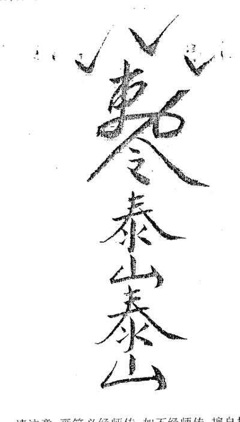

请注意，画符必经师传，如不经师传，擅自抄画，易遭灾祸。

### 二、怎样化解岁破

岁破即冲太岁方。如子年太岁在子，修午方为修岁破，当年见凶灾，宜避之。其镇破之法同上。

### 三、怎样化解大门形煞

大门见凶险的形煞有五种：

1、尖角冲射大门：

通常指被附近尖锐的墙角或屋檐冲射，可用三种方法进行化解：

- (1)挂兽头牌：把兽头牌对正冲射的尖角，然后用钉把它钉在门楣之上，便可化解尖角冲射的煞气。
- (2)挂凹镜：凹镜又称窝心镜，有的人用平常的小镜子则不可以，因为它起不到化煞的作用。凹镜因为构造特别，所以它能把照到的事物上下左右完全倒转过来，然后又反照回去，故此被认为是化解尖角冲射的最好工具。挂凹镜的方法很简单，只须把它挂在大门的顶上，对正尖角便可。
- (3)筑墙作屏障：大门外或内筑墙，以墙作为屏障，遮挡冲射大门的尖角。

2、街道直冲大门：

倘若门前有街道直冲，这对房屋的影响甚大。

《阳宅十书》讲：门前若有街道直冲，这叫做“暗箭伤胸”，往往对家中年长的男性不利，而且家中会出现残疾怪疾的人。其化解方法有二：

- (1)用“泰山石敢当”来化解：在一块长方形石头上刻上“泰山石敢当”四字，埋在大门前的泥土中，用以避镇直冲而来的煞气。
- (2)悬挂“山海镇”来化解：把“山海镇”三字写在木板上，悬挂在大门上即可。

3、斜坡冲射大门：

有的房屋建在斜坡尽头，大门面对斜坡，形势险恶。

在风水学来说，街道是“水”，为财。虽说是水为财，倘若滔滔的流水(抽象无形)沿着斜坡直冲入房屋的大门，势必酿成灾祸。

化解方法：在大门外加建一级、三级或五级的楼梯，用来缓和湍急的水势。

不过有一点要记清：梯级以单数为吉利，双数则不宜。

4、门前街道反弓：

所谓“街道反弓”，是指门前有弯曲的街道，而弯角位直冲大门，风水学则称之为“镰刀割腰”。假如弯角冲之为“镰刀割腰”，家中会发生淫乱之事，或有人口伤亡及失火顽疾等症。

假如弯角向外而环抱大门，则为吉利。

化解的方法有如下三种：

- (1)可把“泰山石敢当”埋左门前的土中。
- (2)悬挂“山海镇”木牌。
- (3)悬挂凹镜。

5、两门相对的化解方法

两门相对称为“相骂门”，主两家不和或有事非口舌之事发生。

有的人在自己门外悬挂三叉、八卦、白虎镜等物来化解，但却会因此而引起对门的住户感到不安，往往以牙还牙，也挂起这类物品来对峙，弄得邻里失和，互相仇视。

其实，两门相对并不似一般人所想像那么严重，大可不必为此而太担心。

倘若即要消除“两门相对”的心里威胁，又要不令对门的邻居反感，最佳的解决办法是把“天官赐福”四字写在黄裱纸上，贴在门楣上方。

如果能与对门商议，两家均在门楣上贴“天官赐福”，共同得福得财，这便是最为理想的了。

### 四、怎么改造厕所

为了使厕所不至于带来凶相，最好把它设置于西北、东南或者东的方位(从房子的中心看)。同时，必须避开与男女主人人生年对冲的方位(例如卯年生的人，必须避开东的方位)。

目前，一般的建筑，往往把厨房设置于太阳照射不到的北方或东北的方位。换句话说，为了把厨房、客厅等设置于东南方位，而把厕所设置于北侧。

如果厕所在北方或者东北方位的话，必须排除万难把它移到别的方位去。一提起改良或是移开厕所，很多人都会说“没有空间，实在难以办到”。事实上，厕所所占的空间很小，只要有改良的决心，做起来或许比想象中简单得多。

其实，这并不是很难的问题，只要避开北的中心十五度(子的范围)，东北方面，则只要避开北的中心十五度(丑的范围)，以及东北中心十五度(艮的范围)即可，就算整个厕所都位在北或东北的方位上，只要便器的位置偏离这些十五度的方位就行。

如果便器位在这个范围里的话，则只要移动便器即可，不须改建厕所。

假如厕所的隔壁是壁厨或者储藏室的话，那就比较好办了，充其量，只要把两者对调就可以了。

如果没有壁厨，甚至没有可移动的空间，那也不必烦恼。通常，厕所的隔邻就是浴洗处。浴室因配管繁杂，不便改造，至于浴洗处的设备条件，动起手来就简单多了。不妨把浴洗处的浴洗台与洗涤用空间分开，把一方移到厕所的位置，再把厕所移到没有凶相的北北西或者东北东。

遇到这种情形，与浴洗台敷置在一起的洗衣机，就必须分开来放置。这样的话，或许会感到不方便。不过，只要家人能够健康，如此做还是值得的。有时因简单的工程根本无法移开厕所，那就不妨照我前面所说的更换一下便器的位置。

以朝北或朝东北的厕所来说，便器的位置，以朝正北十五度，或东北的中心十五度，以及北北东十五度的范围之内，最为凶险。若是占据上述的位置，就必须移动便器，以避开凶意。

若是移动便器时，不妨每天都放一小碟食盐，再放一小盆植物，藉植物的绿色能源与食盐，来净化厕所的凶相。

除了北、东北方位之外，西南方位的厕所也属于凶相。如果要移动的话，只能从西方移动到西北方。

西方的厕所也不怎么好，不过，只要没有酉年生人或适婚期的女孩居住的话，就用不着担心。为求万全之计，可以把便器、便槽移到西北，也就是壬或癸的范围。

如果厕所在南方位的话，最好移到东、东南、西北的方位上，因为南方是采光的方位，厕所若占据这个方位，就非移走不可。

移动厕所时，绝对不能使它与神坛为邻，否则的话，将变成凶相。

其实，容易被厕所凶相波及者，乃是一家之男女主人以及老人。只要拿主人夫妇的十二支来检查厕所的位置，然后加以改良就可以了。

### 五、怎么改造厨房

如果发现厨房在鬼门的东北或者西南的话，应该尽早移到安全的方位。

欲改良厨房的凶相，可以说一点困难也没有。厨房若属凶相，问题都出在瓦斯炉等的火气以及洗理台上，只要把炉灶与洗理台隔开大约六十公分左右的位置即可。

### 六、怎么改造楼梯

有一些房子的楼梯竟然设置在房子的中心，这是个大凶相。易发生交宜赔钱、升学考试失败、无法升迁、车祸等凶事。

我这里所说的“中心”，并非指开始踏入楼梯一楼那一带，而是指爬到二楼或者三楼、四楼平台之位置。也就是说，必须测定此地是否为一楼的中心。

纵然是一踏进楼梯之处，或者是楼梯一半以下是为房子的中心，也不至于发生问题，最重要的是要测定爬上顶楼的位置。

如果那是房子的中心，那就不妙了。一旦住进这种房子，运气就会很快地变坏，甚至突发事故不断地发生，因此必须尽快地改良。

因为这不是平面上的改良，或许会感到相当的困难。最简易可行的办法是：在二楼或者三楼、四楼的平台位置砌起一面墙壁，把楼梯堵死，使之不能从此上楼。在一般情形之下，楼梯的砌底约有二、七公尺，不妨在平台的三尺前（约九十公分），使楼梯改为向左或向右弯曲，由那上楼。此种改良工程是可以做到的。

另外的一种方法，就是不动楼梯的空间，把楼梯口设置反侧。也就是说，把楼梯的朝向改变过来。这么一改之后，平台的地点就不可能在“中心”了。

### 七、怎么改造窗户

人们都说“鬼门方位不宜设置窗户”。不过，天窗、地窗、壁窗并不算在内。如果从天花板到地面有落地窗，若位于东北或西南的鬼门线上，将易发生被偷盗的凶相。

鬼门线上有开口部位的话，应当把它堵起来。

如果是后门、厨房的门，最好又最安全的方法是：把它拆除，再砌一道墙，另开门窗为好。

东北方位的落地门窗比较少，但是，西南的鬼门方位却能经常见到，在鬼门线上的落地门窗部分，应当把它改成墙壁，如果实在难办到的话，也应该把门上的玻璃固定，然后在玻璃外侧种植矮木，如此就更为安全。

在鬼门线上的门窗，也可以用木板窗套遮盖起来，不过，看起来极不美观，室内也会是黑暗，还是不怎么理想。

在住宅风水方面，有一种错误的观念，那就是认为开口部都是属于凶邪的位置。事实上并非如此。对于七十平方米以下的住宅来说，为了加强空气的流通和采光，根本就不必把鬼门线堵起来。这种情况，不妨把开口部改为壁窗，如果感到不安全的话，可以改成高窗，以便使“气”流旺盛。这里所谓的开口部，只限于厨房口、前门、落地窗户等。

### 八、怎么改变孩子的房间

从屋子的中心看西北方位，这是一家之主的位置。在西北方位设置孩子房间的话，会使孩子早熟，不利学业。本来应该是成人拥有的东西给了小孩子，当然就会变得早熟了。西北的方位象征权威、厚重等，住在那个方位的孩子固然有某些方面的才能，但是，他将变得太老成，而丧失小孩应有的纯真，喜欢跟别人讲道理，使得周围的大人皱眉头，对他的将来没有半点益处。

如果屋里还有多余的房间，或者能够跟其他人交换的话，那就不要使孩子住西北方位的房间。即然西北是孩子的房间，其它的方位一定有父母的房间，那就两者交换房间吧。

如此一来，父母将能够更象父母，对孩子来说是很有益处的。

如果能够按照理想更换的话，男孩子最好居住在东方位的房间，女孩子最好居住在南或东南方位的房间。如果连这个地步也做不到，那么就叫孩子居住在属于他十二支方位的房间吧，因为这也是吉相。龙年生的孩子住东南方位的房间，子年生的孩子住北方位的房间。

如果空间有限，不能够开孩子房间的话，那只好用颜色来补救。孩子房间，不妨改成乳酪色、粉红色，或者骆驼色的暖色系统。灰色或兰色有一种冷森的感觉，不适合孩子的房间。只要如此改变房间的颜色，房间的气氛就会改变过来。

对于二楼西北方位的孩子房间，经过了同样的改良以后，不妨在天花板吊一些灯饰以增加亮度。如此一来，效果会更好。

### 九、怎么改变卧室方位

理想的卧室吉相，乃是家庭成员各自拥有适合自己方位的卧室。换句话说，主人夫妇应该居于西北方位(从屋子中心看)的房间，长男居于东方，长女居于东南，老人居于西南。至于其它的家族成员，居于哪一个方位都不成问题。

由于隔间的关系，家庭没有适合自己方位房间的话，则可采取该人十二地支的方位。例如：申年生人，居于申方位的西南；戌年生者，居于西北等等。

或许有人会说，卧室只是用来睡觉罢了，还讲究什么方位呢？事实上，这种想法就是错误的。我们把一天三分之一的时间用在睡眠上，因此，卧室对于人的吉凶作用不可谓不大。卧室是吉相的话，疲劳就能够充分地消除，很轻易地就能够恢复活力。至于凶相的卧室就不行了，不管睡了多久，仍然不能消除疲劳，长久积累疲劳的结果，逐渐地会影响到健康。

一旦察觉到卧室是凶相时，必须尽可能以适应各个人的方式，或者凭其十二地支来决定各个人的卧室。

尤其是主人夫妇卧室与老人的卧室颠倒，或者孩子睡于西北房，主人夫妇睡于东房，情形将更为不妙，可以随时更换。

### 十、怎么改造住宅上大下小

近年来，出现一些楼上比楼下大的建筑。

那是因为空间太小，为了扩大面积，或者为了当成停车场，不得不如此做的缘故。同时在设计上有时也会使楼上看起来比楼下大。不管哪一种原因，都属于凶相。

撇开风水不谈，若单从外表来看，上大下小总会给人一种倾斜不平衡的感觉。以人的身体做比喻，就像是腰部以下没有力气，头重脚轻，看起来总是很不自然。

住宅风水方面，上大下小的屋子相当于立体方面有缺陷，楼下凹进的部分会聚集污秽的空气，同时也容易住藏阴气。

如果生意一向很顺利，突然一蹶不振；本来有升迁的机会，却被其他人夺走；或者无端被卷入丑闻事件等而丧失了名誉及声望。如果再加上方位凶意，很可能被卷入一场大灾难中。公司方面一旦有这种形状的建筑物，往往会赔钱或者倒闭。

如果你的屋子是上大下小的典型，那就得马上改良，以免碰到无妄之灾。可在楼上边凸出的部分打基础桩。

最理想的方法就是在那儿砌一道大墙。但是如此做的话，光亮将大打折扣。不过，只要使用金属条来做成格子的装饰，问题就可以迎刃而解，房子风水就能得到很好的改善。

### 十一、怎么改造住宅缺角

最理想的屋子形状，首推六比四的长方形住宅，尤其是以东西方呈长方形的最好。不过现在的房子，总是免不了某一边凸出，某一边凹入，这凹入的部分，也就是缺角的部分，往往会造成凶相。

所谓的“缺角”，乃是建筑物的一边短缺三分之二以内，而成凹入的部分。凹入的部分越大，运气也就会越差。

如果经商的人突然赔钱或倒闭，上班遭受到降职、失意，以及一连串的失败等等。一向很顺利的运势，突然逆转过来，以至陷入灾难中，这就是屋子缺角凶相明显的反应。

尤其是西北或东南的缺角，对事业家庭都非常不利。

只要把缺角填补起来，衰退的运势就会逐渐的恢复。

#### 1、东北与西南的缺角

拆除墙壁增建使之成为方角。增建部分可当成房间或储藏室使用。

#### 2、东方的缺角

最好是盖上屋顶，增建房间。不过，东的方位通常是用来采光，要做到这种地步实在很难。换句话说，东、东南以及南的方位，通常被划分为饭厅，以及家人的房间，因此绝对不能够黑暗。这时，可以增建一间日光室，或者在离开建筑物一公尺外，再建筑另外一间房子。最重要的是：新建筑的东西，必须和缺角一般大小，甚至比它还大一些才行。

#### 3、东南的缺角

处理的方式与东方位的一样，如果预备另外建筑一栋补充的话，那就在离开母屋一公尺处建立新屋。如果预增建日光室的话，就利用东南凸出的吉相效果，建筑新屋时，最好比缺角大一些，并且使之向外凸出。

#### 4、西方的缺角

最好增建为填补缺角的形式，再把它弄平。这是最好的方法。如果空间比较大的话，不妨在缺角的外侧，兴建仓库之类的建筑物，大小只能占母屋的二分之一以下。

#### 5、西北的缺角

此一方位，自古以来就被称为乾位、天位、父位等，兴建另外一栋房子，或使原来的房子凸出部分都能够显现出巨大的吉相效果。此方位最喜凸出，有缺角的话就不妙了。

如果建地有限，那就把缺角处增建成三角形，藉此减少缺角的分量。

如果空间大，最好将其修改为吉相的凸出状。一个方法是在有缺角外侧另外建立一栋房子。这种增建，可视为凸出的吉相，即使有人住进去，也算是吉相。

如果不能离开母屋一公尺以上的话，那就紧贴着母屋增建，在这种情况下，亦可以建筑得大一些，藉此获得凸出的吉相效果。以上方法如果都无法做到，那就只好在缺角度的部分种植树木。这乃是万不得已的最后手段，而且，只能获得轻微的效果。最好还是采取增建补缺角的方式。

### 十二、怎么改造住宅凸出部位

与“缺角”完全相反，就运势而言，“凸出”大都会带来正面的效果。所谓“凸出”，乃是指建筑物一边长度的三分之一以内、向外侧凸出去的现象。

我在前面讲过，理想的住屋形状为东西长，也就是六对四的长方形。如果东南和西北有合乎标准突出的话，运势就能够势如破竹的转好，因为那是吉相很强烈的住宅风水。

但是，如此种出现在东北与西南的鬼门方位上的话，将变成凶相。

房子的凸出，依不同的方位，凸出的大小有其标准。又根据不同的方位，吉相的程度也有不同。不过，对运势的提升与发展都有帮助。然而，东北与西南方位绝对无利可言。如果错以为凸出都有好处，而轻易地在这个方位使房子凸出来的话，不仅毫无效果可言，反而会使运势一天比一天衰退。

住宅风水所谓的凸出，不仅指建筑本身的凸出，就连离建筑物二三公尺以内的仓库放置东西的地方（限于有基础者），也算进去。

最好的办法是：

- (1)把凸出的部分拆除。
- (2)为了使凸出的现象消失，不妨再增建。如果是东北凸出，那就从东到东南的方位增加建筑物。若是西南方位凸出的话，可以从北到西北的方位加盖建筑物。采用这两种方法，就可以使之变为吉相。

如果无力改建的话，那么，只好在鬼门凸出的外侧种植常绿树。不过，这种方法只能稍微减轻灾祸而已。

### 十三、怎么改造不好的钢筋混凝土住宅

比起木造住宅来，钢筋混凝土房子的空气交换率只有三分之一而已。因此，不仅空气的循环不好，在构造方面也不能开很大的窗户。最叫人受不了的一点就是排水管会腐败。近年来，人们为了消除排水管的污垢，都习惯使用药剂。偏偏这种药剂会溶化排水管内层树脂，进而使周围的铁管也腐蚀殆尽，这就是导致漏水的主要原因。

本来，排水管里面的树脂是用来避免铁管氧化的。但是，使用通水管的药剂，就会使这种树脂溶化。

最叫人感到头痛的是，内部的腐败通常都看不出来。于是在不知不觉中，不净的灵体就会附着腐败的场所。

使用钢筋混凝土建造房子，并不能够简单的改造。为了住起来平安、顺利，窗户最好经常打开，以利空气流通。

尤其是希望充满灵气的饭厅、客厅、卧室，不妨多利用植物的灵气。根据不同的场所，摆放的植物也不一样：

正门：
在鞋柜上面，摆放一些羊齿类的观叶植物。

饭厅、卧室：
按照室内的大小，摆放大叶植物。十个平方米大的房间可以摆两个，八个平方米大的房间可以摆一个。二十平方米的房间，可以摆上三大盆、一小盆。阳台亦可以设置花棚，摆放观赏用植物。

走廊：
在这种地方，几乎都铺有地毯。如果非铺地毯的话，一定要铺在板材上面，或者只铺板材就行。通常混凝土上面是不直铺地毯的。

总而言之，不管在什么地方，只要是钢筋混凝土建造的房子，必须特别注意换气。除了要经常打开窗子之外，还必须在二楼设置换气设备。

### 十四、怎么改造不好的庭院水池

人们一旦有了钱，几乎都想盖一栋豪华的住宅，再在院子里挖一个鱼池什么的。或许，这是一种显示富有之举吧。

然而，很少有人知道，约有百分之八十的居住于此种豪华住宅的家庭，都拥有不足为外人知道的问题。例如，老人或女人长期地住医院，或时时看医生，或家里有视力不良的人，或者有精神薄弱的孩子，不然就是家庭不和。居住于外表华丽住宅的人，总是烦恼重重。如此各种现象，大都是来自水池的影响。

除了极少数的例外，家庭的水池最好填平。

今日的人不比往昔的人，极少能拥有广大的私人土地造池泛舟。现在的私人房子所附设的水池，几乎都是密闭式的，也就是不流通的。此种池子的水会腐败，对人体的健康有不良的影响。同时有很多不能超生的幽魂，大都偏爱湿度大、类似水池般的地方。一旦有这种幽灵集结于水池旁，随时都会引起灾害，这也就是造成凶相的最大原因。

只要把池塘填平，就可免除凶相。

在填平池塘之前，必须先把水抽干，再把池底的泥巴完全掏净，最好是连池底的混凝土也敲掉。如果是太麻烦的话，就把它留着也无妨，因为它不至于造成灾害。

池塘附带的注水管或者污水管之类，必须全部撤掉，土壤里不能留下任何的水管之类。经过如此的处理之后，再使用好的土壤填平。

私人住宅所允许的池塘，必须离开房子十八尺以上，在住宅的东南方位上，即使是具备了这样的条件，还是填平比较妥当。

同样是池子，如果属于流动性，又是由不特定的多数人集结的饭店、酒店、工厂、公司的话，那就不至于发生问题，有时甚至会变成吉相呢。不过，这种池子必须使它成为环流式，周围最好种植一些树木。

### 十五、怎么改造不好的地基

一提起宅相，很多人都认为：惟有房子本身的吉凶最重要，只要方位及隔间安全就行了。但是事情并没有那么简单，例如在盖房子以前，有些建筑地基就有某方面的问题，说明白一点，就是有鬼作祟。尤其该地基有过自杀者，或者曾经是战场的话，就难保平安了。

在这种有问题的土地上盖房子，不管盖出多么吉相的房子，仍然逃不掉土地所带来的不良信息和影响。例如，夜晚做恶梦而惊醒，身边不断发生怪事，纷争四起，叫人的心灵难以安宁，不久，即演变成精神不振、神经衰弱、肉体方面也会蒙受到损害。

人们都喜欢说：“幽灵在作祟。”事实上，人死后机体中的80多种化学元素溶化于土地中，在受到地磁微波作用下，就会对人体产生一种特殊的作用力，使人的精神和肌体功能产生紊乱，这就是所谓的灵魂的作用。

表面上看住宅风水没有什么问题，但是，移入新住宅之后，坏事接连发生的话，那就得怀疑该土地是否有问题。一旦获知土地有问题，最好迁移到地基良好的地方。但是，为了达到这个目的，财力与健康是不可缺少的，如果仍然居住在有问题的房子内，那么为了家人健康着想，必须举行“拔除不祥”的仪式。

如果是在盖房子以前，那就应该举行奠基仪式。如果是购买现成房屋的话，因为无法知道是否举行过奠基仪式，因此最好也举行供奉仪式。

当然，家里必须设置神坛、佛坛，每天虔诚地敬茶烧香，感谢神的保佑，并且也别忘了供奉祖先。如此以来，肉眼所看不到的大自然灵气，将加诸你的身上，增强你及家人的魂魄之力，使居者的运气和身体得到加强，也可从心理上得到平衡。

无论是购买哪一片土地，都应当熟悉当地的历史以及种种原由。最好拜访当地的史学家或者是察看资料，彻底调查土地的特殊条件。如果连这一点都办不到的话，不妨作如下的自我判断：

凡是“阴气”作祟的土地，只要看到那一片土地，头部就会感到眩晕，叫人产生一种不舒适的感觉。或者你要到那以前会发生某事，使你无法顺利到达那儿。这是你自己的灵感预知到的这件事而在通知你。凡是碰到这种现象，不要勉强。

又如：凡是有“xx庙”或者“xx 坟”之处，都有调查的必要。

在你想购买房子或地皮的附近一带，如果夫妇反目成仇的人家太多，公司倒闭、离婚、夭折的人太多，那就要特别小心。除此之外，像邻居不相往来、关系恶劣的也应注意。

### 十六、怎么改造三角形土地上的住宅

三角形土地是住宅风水的一大禁忌，它会给居住者精神及脑部方面的打击以至不能做完善的思考，生意方面也会蒙受到打击。

如果居住的土地呈三角形的话，那就得赶快把它变成吉相的形状。只要土地相当的宽阔，处置起来一点也不困难。例如把三角形锐角部分弄成围墙、树墙，或者种植一排树木隔断。在生活方面，不要使用这个锐角部分。

隔开的部分，可以当花坛，或者菜园，甚至可以种植一些较矮的树木。在生活方面，只要使用长方形的那一部分就行了。

经过如此改良之后，即可避免三角形土地所带来的灾害。如果没有富裕的空间，则可以把锐角的一边隔开，永久不去使用它。一旦居住于三角形土地，锐角部分必须时时保持绿意(种植乔木、灌木、花草)，这是绝对必要的条件。

隔开的锐角部分，也不能当成车库或者仓库使用，必须把它当成“跟你无关的土地”，绝对不要使用它。

万一土地小得实在可怜，隔开锐角部分不用，房间就不够使用的话，那最好另找房子搬走，空下来的土地可当仓库或者停车场使用。因为居住于三角形土地上，绝对没有安全可言。

### 十七、怎么改造三面受到道路包围的住宅

居住于三面被道路包围的建地，一家人将频频发生事故。三面被道路包围的建地，乃是名副其实的凶相。这里所说的道路，是指公共的道路，并非指私人小路。虽然同是三面被道路包围，不过，根据方位的不同，所带来的凶意有强有弱。从凶意的影响大小次序来说，以(1)西、北、东三方位被包围的建地最凶；接下来是(2)北、西、南；(3)南、东、北；(4)南、东、西。

三面被道路包围的建地，其凶的程度虽不及古战场或发生过自杀事件的土地，不过，家族会时常受到外伤或突发事故的危害，而且，凶相就会越来越激烈。

只要建地比较大，此种凶相是可以防止的。下面就针对房子被道路包围的状态，一一加以说明。

(1)西、北、东被道路包围的情形：
只要把它弄成二方位道路包围的建地即可。换句话说，把它弄成棱角的建地。如此一来，可以防止从西方位入侵的气流。其方法为：可在西侧的道路边种植杉、赤松、刺柏等针树。并且设法使建地无法使用到西侧的道路。在针叶树下植灌木类植物，那就安全了。

如果西侧有门的话，就把它堵起来，可以在东侧设置新门，不过必须以不是主人十二地支的方位为原则。

(2)北、西、南被道路包围的情形：
为了利用西南的棱角地，在北侧的道路种植一排树木。最好种植常绿阔叶树。如果门在北侧的话，最好把它堵死，除非主人的生辰十二地支在南方位，否则不可在南方位造门。

(3)南、东、北被道路包围的情形：
这种情形，可以把它从最恶劣的条件变成条件最好的建地。也就是说，可以把它改变成东南棱角的地形。其方法是，在北侧的道路种植橡树等常绿阔叶树。
同样的，必须避开主人十二地支的方位，可根据职业，在东、南、东南的任何一个方位造门，都可成吉相。如果北侧有门的话，必须把它堵死。改在东方到南方之间设置吉相的门。

(4)南、东、西被道路包围的情形：
这种情形，亦可能形成最高吉相的东南棱角地，也就是说，在西侧道路种植黑松等针叶树(红叶等)。不过，千万不可种植太大的树。
同时，也可以在准备堵住的道路一侧筑一道围墙。
如果是三面被道路包围的狭窄建地，因为没有防止的办法，只能尽早地搬走。
假如这种凶相的土地，如果有地建筑多数人利用的大楼或公寓的话，那就比较安全。假如土地太狭小，无法预防的话，那就用建筑公寓或旅馆，借众多人气来防止恶现象的发生，这也是一种好方法。

### 十八、怎么改造不好的住宅空间

多少年以来，中国人深受“天圆地方”观念的影响，所以日用物品多是以圆形或方形为主。举例来说，传统的建筑便是以方形为主，圆形为辅的。

中国传统的房屋，无论是外墙或是内部的厅房，大多是方形的。四平八稳，透出堂堂正正，不偏不倚的气势，风水学重视的是这些方正无缺的房屋。

在风水学来说，房屋以方正为佳。若是狭长形或不规则形，则被视为不吉。

但现在都市里的大厦单位设计是狭长形或是不规则形，一般人因无可选择而购买下来，但心里却始终存有阴影，难以安心居住。到底这些狭长形或是不规则形的厅房是否真的无可救药呢？这是很多人均感关注的问题，现在便谈谈补救之道。

首先谈谈狭长形的厅房。所谓狭长，是指长度超过宽度一倍以上。如长度十米，而宽度只有四米，就为狭长，这样非但有风水方面的不符理想，而且在室内设计方面也很难处理。

在这种情况下，最好的解决办法是把客厅用矮柜、梳妆台等家具把它一分为二，把长条切割成为两个方形的空间，这不单符合风水之道，而且亦可改观感，看起来不再有狭窄的感觉。

这样做，有以下几点需要注意：

分割的部分应该尽可能靠近中线，因为这样分隔开来的两部分才能会呈现方形，否则便会失去原来的意义。

应该尽量用较矮的家具来作间隔，例如是三尺以上的矮中梳妆台便更为理想，因为这样才可令分隔起来的两个空间声气相通。倘若用高柜或高的板墙来做间隔，这便大打折扣了。

用来作为间隔的家具要尽量避免对正门。如果这样，那便会会对房中的人不利，特别是在健康方面。故此应该留意不可让这类矮柜对正小孩的房门。倘若真的避无可避，便只有在矮柜旁摆盆植物来做补救了。

狭长形的睡房亦可采用同样方法，把睡房一分为二，如果躺在床上望着这样狭长的睡房，便会有孤清冷落的感觉，那些神经敏感的人便会胡思乱想而产生很多的幻觉。

但如若用矮柜把这狭长的睡房分隔为二，一边作为化妆间或书房之用，另一边则作为睡觉之用，若在矮柜上放置电视机，那么躺在床上还可以欣赏电视节目。

经过如此改动之后，睡房中不再有空洞无物之感，心理上便觉得踏实得多了。

有一点请注意，有些用镜子来作为睡房的间隔，其实这是并不适宜的。倘若镜子向着化妆间或书房那边尚无大碍；但若是向着睡床那边便犯了风水学的大忌，往往导致疾病发生。

### 十九、怎么改变呈凶相的镜子与玻璃

玻璃与镜子均是家庭常用的装饰材料，倘若运用得宜，不但可以增加房屋的深度，在视觉上感到宽阔一些，而且亦可以增加房屋的照明度，感到光线更明亮一些。但是，倘若运用不当，非但会破坏屋内的格调和气氛，有碍观瞻，而且亦会对家宅风水有所影响。

有鉴于此，现在便谈谈这个问题，以供作为家庭装饰布置的参考。

我发觉有很多人常把镜子与玻璃混淆一起，分不清楚；其实两者有很大分别。玻璃是透明的，不会反照，所以透过玻璃窗可以看到屋外的景物；而镜子则不透明，会有反照的作用，因此可以在镜中看到自己。玻璃与镜子既然各有特性，所以在风水学以及室内装修方面自有不同的宜忌，不可混淆。

镜子：

在风水学方面有很多避忌，故此不宜随便摆放。镜子的摆放，首先要记着一个大前提，那就是镜子不宜对自己，同时也不宜对正吉利方位。

为什么会有这种忌讳呢？要知道其中的内由，必须先明白镜子在风水学方面的作用。

用在风水方面的镜子有很多种类，例如凹镜、凸镜、八卦镜、白虎镜等等，这些镜子主要是用来照煞的。所谓“照煞”，是指悬挂这类镜子，使它对正直冲而来的凶煞，把煞气反照回去，以免被煞气冲克而受损。

既然镜子在风水学方面主要是用来照煞的，那自然是不适宜照正自己了。如果镜子照正床头，绝不适宜。因为那会导致睡眠不宁，甚至疾病缠身。

在风水学来说，镜子对正床头固然是大忌，若是对正炉灶则更不适宜。所以在安装镜子之前，请先看看是否对正炉灶，以免导致人丁不安。

此外，镜子对正大门或房门也并不适宜。镜子对正大门主凶，故此可免则免。现在有不少人喜欢采用镜子来美化家居，这类镜子有很多种类，有厚的亦有薄的，有净色的亦有画上图案的，这在风水学上并无多大分别。

但有一点需要注意，不论采用哪一种镜子来装饰，最好不要有吊脚的情况出现，这即是镜子下沿不到地则不宜。若以矮柜来承托镜片，那便较为理想。

玻璃：

因为玻璃透明透光，而且厚度有限，所以有不少人喜欢用它来作间隔之用。玻璃既然透明透光，所以用它来作间隔，一来可使视野无阻而令房屋显得宽阔，二来可使光线不受阻而令房屋显得明亮。此外，玻璃因为厚度有限，故此若与其它的间隔材料相比，可以节省多些空间，但玻璃虽然具有以上这么多种优点，可惜其本质较为脆弱，容易碎裂，所以对于有小孩的家庭并不适宜。

为了家居安全着想，我认为采用玻璃砖来替代较为适宜。原因是玻璃砖既有透明透光以及省空间的优点，但却甚为坚固，没有碎裂之虞。

无论是玻璃或玻璃砖，因为不会反照，所以不必像摆镜子那样多的顾忌，即使对正大门或是自己的床头亦无大碍。

# 本人勘宅实例选

研易数十载，勘验房宅无数。阅世间之悲欢离合与风水之秘，每余此，常概叹风水术实际应用之灵验。若世人能摒弃迷信之歧见，尽风水学之利为人所用，岂不少了许多世间悲伦。

吾治学必尽其用，治书必尽平生所学，绝无半点留存，以期得书之人知悟真谛。然书之不能尽言，言之不能尽意，唯有实例可引学者达风水学之奥义，为此，从诸多实例之中选出几例，以飨读者。

## 一、房上有利剑，凶死泪涟涟。

1999年8月的一天，我和朋友米玉武到我市东郊散步，看见了这样一个凶宅，请见图示：

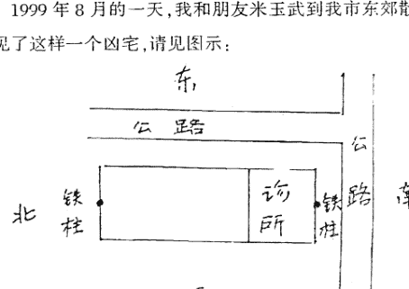

此宅七间平房,坐西向东(兑宅),南北两头的房盖上各有一个垂直的铁柱(据说当年建的是欧式房),此两铁柱象两只利剑在刺人。

我对米玉武说:这是个凶宅。古书有云:房上有利剑,凶死泪涟涟。

米玉武说:你说的对。十年前有一医生在此宅开了个私人诊所,在给一子宫外孕妇女输液时,患者突然死亡,医生被起诉,判了七年刑。

我说:这样的凶宅现在还有人在这里开诊所,真是胆大包天。我看这个诊所今年还要出血光之灾。

他问:为什么?

我说:今年流年已卯,此宅坐西向东,冲向太岁方位,谓犯太岁,太岁可坐不可向嘛!如果此医生是属兔的,那就更糟了。

没过多久,米玉武告诉我:让你言中了,那个诊所的女医生被人杀死了。女医生复姓诸葛,49岁(51年生人,年柱辛卯,正是属兔)。患者是个小伙子,姓牛,26岁,他阴部肿痒,去诊所求治。诸葛医牛说他得的是性病,给他连输液带吃药,治了一个多月,花去五千多元,病情却不见好转。小牛便去省医院确诊,结论是尿道感染,根本不是性病。小牛向诸葛索要花去的费用,诸葛不给,两人发生争执,小牛在一气之下挥刀将医生活活砍死了。

## 二、凶煞在门前,必然出伤残

2002(流年壬午),我的朋友黄先生租了两间小房,在帮他搬家时,我细看了一下宅的吉凶,请看图示:

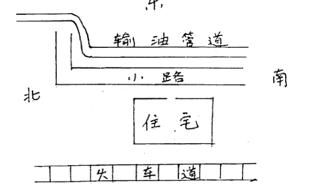

此宅坐西向东(属兑宅),宅后(兑位)是火车道,宅门前(卯位)有一很粗的输油管横穿而过。

宅的前后均有凶煞,显然这是个凶宅。我对他说:这个房子可不怎么好,要注意出血光之灾。他听后一笑了之。住进去不久,他妻子晨练,去爬山,突然从山上的小路滚下来把腿摔成骨折,治了三个月才能拄杖慢慢地走路。他妻子属兔(卯),宅后的铁道与宅前的输油管均属金,强金克木,故其妻遭灾。

## 三、慧眼识优劣 以理服世人

我们都知道,天无全美,人无完人,风水地理也是如此。想要找到一个十全十美的阳宅,真比登天还难。风水师的职责就是要有一双慧眼,识别真珠,取优去劣,一锤定音。

2004年(流年甲申)初春之时,我应易友杨先生之邀,去天津蓟县为其内弟宋先生搞厂房策划。杨先生为人极其热情,处事细致,特请当地两位风水师相陪。

宋先生善长轧钢,开个私人轧钢厂。目前有一电石厂下马,要低价外卖。是用原来的轧钢厂还是买下电石厂做轧钢厂,宋先生拿不准主意。请当地二位风水先生看宅,不料二师却各有各的说法:甲先生说不要买电石厂,维持原状;乙先生却说原厂不理想,要他买下电石厂做厂房。一时间闹得宋先生左右为难,才请我去给拿个准主意。

我看宅首先要看八字:

宋先生是1962年7月20日或22日7点前生人,其八字如下:

1962年7月20日7点前:
壬寅 戊申 己丑 丁卯

6岁起运 己酉 庚戌 辛亥 壬子 癸丑 甲寅

1962年7月22日7点前:
壬寅 戊申 辛卯 辛卯

6岁起运 己酉 庚戌 辛亥 壬子 癸丑 甲寅

首先需确定到底是哪日生人。已知的条件是:

- 1、宋先生有严重的肾虚病,正在吃药。
- 2、97年和98年因打仗破了钱财。
- 3、98与99年收入欠佳;2003年效益好。

根据上述情况,我确定此人是7月22日生人。

我们乘车先去看原来的轧钢厂,如下图:

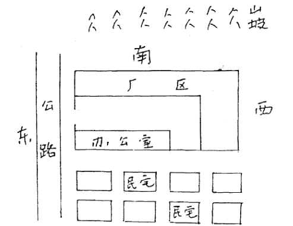

甲师首先抢话说:张先生您看,这个厂房坐北向南,为坎宅。厂房东西长30米,南北宽20米。厂房规整,地面洁净,此是其优越处。

宋先生说:厂房北边的十处民房还可以买下来扩大厂房,张先生您看买还是不买?能不能发财?

我说:不能发财。

甲师问:为什么?

我说:此厂房南高北低,往南看还有个小山,往北看更加低沉。前边压得喘不过气来,后面低得人站不稳。办公房在坎方,坐空朝满,是阳宅的大忌,也是不聚财的主要原因。

乙师点头说:我和张先生的观点一样,不但不能发财,还要破财。

宋先生说:我在这个厂房干了二年轧钢,效益非常不好。

我说:不但不能发财,宋先生还容易患病。

甲师问:为什么?

我说:经理办公室在坎方,加工钢材的机械在离方,水火相战。机械属铁器,为凶煞,逼压经理室,宋先生能不得病嘛?

宋先生说:近二年来,我得了严重的肾虚病,夜晚遗精,常年吃药。

我对甲、乙二师说:看阳宅首先要看气场。这个厂房一进来就给人一种压抑感,阴气过重,使人喘不过气来。

于是我们便乘车去看那个要出售的电石厂。请看图:

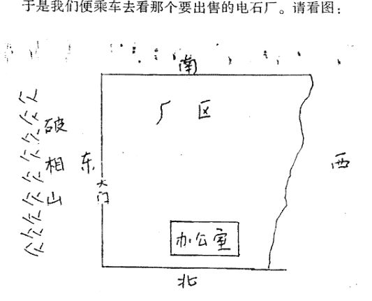

乙师首先抢话说:这个厂房面积很大,有一百多平方米,坐北向南(坎宅)。坐山高向山低,很是敞亮,所以我建议他买下来。

甲先生说:此地前大后小,象棺形,是凶相。左面有山,为青龙,但在开电石厂时,开山采石,龙遭破坏。厂房大门开在卯位,正对已破相的龙山,大凶,所以我说此地不可买。

宋先生让我拿主意:此两处到底选哪处做厂房。

我说:第一处因坐向的问题不好解决,没有扩大的必要。

如果扩大，必须将办公室与加工厂调换位置，把厂房的坐向改成坐南向北的离宅。否则不但无财可求，你的身体难医治，工人也会出现意外伤灾。

此电石厂可以改造，如图：

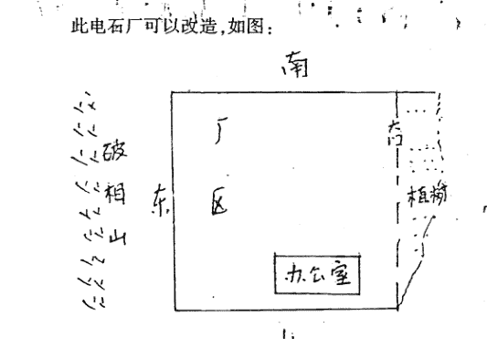

此厂房确属前大后小，但因不纯属棺形，不能以凶看。西边多出的部位买过来后可以植树，这样就成了正方形。

龙遭破坏可化解，其化解有二种办法：一是在大门外埋下刻有“泰山石敢当”的青石镇破；二是可以将大门堵死，在申位重开大门。申属金，吸纳土气，以制大运之旺水，助起日主之金气，这样一来，有利于调治您的腰肾之疾。

此厂房最大的优点是有生气，而第一处却是死气沉沉。所以我建议把此电石厂买下来，经过调整风水后肯定会人财两旺。

二位风水师不再言语，宋先生听信了我的话，决定买下此地做厂房。

## 四、动土做恶梦安抚得顺遂

2005年5月23日，一人求占改造洗车房吉凶如何，得归妹之损卦。

| 辛巳 | 丁未 |
| :--- | :--- |
| (亥) | (寅卯) |
| 父戌 x 应化寅才 | 青 |
| 兄申、、 | 玄 |
| 官午 O 化戌父 | 虎 |
| 父丑、、世(暗动) | 蛇 |
| 才卯、 | 勾 |
| 官巳、 | 朱 |

断：

- 1. 在动工时遇到口舌是非，易有血光之灾（官鬼发动，临白虎）。
- 2. 你本人惊恐不安（丑世暗动，临腾蛇）。
- 3. 此洗车场难赚到钱（才爻休囚于月，墓于日，空亡），不经营为好。

求占者说：我就实话实说吧。你断“惊恐不安”是对的。我这个洗车场前面临大道，一下雨水就往房子里流，我想把房子里的地面垫一垫，现在已经动工了。没料到从动工那天起就不顺，头一天就把自来水笼头碰坏了，那水哗哗地往出淌，好不容易才止住。第二天晚上我几次被恶梦惊醒，吓得我浑身出虚汗。有个披头散发的人指着我鼻子说：你要是再动这屋里的土，我就要你的命，叫汽车轧死你。

于是他带我去看宅，请看图：

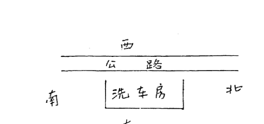

此宅坐东向西（震宅）。门前有大道，大道高过房宅，属坐空朝满，宅内阴气沉沉，难发财，亦难聚财。

我说：此宅是租的吧？

他说：是买的，已经买好多年了。

我说：要是租的就退回去另租个房子做买卖，自己买的就得干下去了。我看原房主可能供过黄仙，这屋有黄仙堂（鬼在四爻临虎动）。你们在动工修建时碰了仙堂，仙家怪罪你，才给你托梦。

他说：那咋办哪？请先生给调理调理吧。

我让他买些供品，写了安抚文，予以安抚。经我化解后又动工修建，一切顺畅。

## 五、主人发了财儿子坐大牢

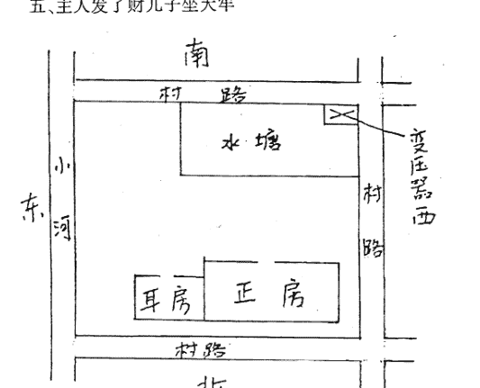

此宅三间瓦房，坐北向南（坎宅），宅西与宅北是村路，宅东是条小河，宅前有池塘，宅东盖一小耳房，宅的西南有缺角，并有一变压器。我断了如下几项：

- 1、此宅能发财。
- 2、女主人精神不好，常常发脾气。
- 3、男主人犯桃花。
- 4、儿子有牢狱之灾。
- 5、是非口舌不断。

解：
宅东有水，为青龙；宅西有道，为白虎。从气势看，东高西低，门开在西方为财位，大门属兑金，生坎宅之水。故有其断1。若按“八宅派”则属祸害门，是为凶。实际情况是：居此宅者是位乡村医生，开诊所十几年，赚了几十万元。

坤为母，女主人之位。坤位有缺，并有变压器，故有其断2。
实际情况是：女主人掌权，性格奇特，经常骂夫。

房前有水塘为桃花煞，故有其断3。
实际情况是：男主人借诊病之机，经常勾引女人，气得妻子经常吵骂。

东方为长男，宅的东面盖耳房，长男有损，故有其断4。
实际情况是：男主人有二子，均因抢劫罪而被抓获，长子被判七年徒刑，次子被判六年徒刑。

宅西与宅北有道，成剪形，剪大门的气口；西南有缺口；宅东盖耳房，故有其断5。
实际情况是：此男主人在开诊所时，经常因给患者输液时出事故而引起官非。

## 六、择优弃劣 精选店铺

我的朋友李女士在街道办事处工作下岗，儿子22岁了，无事干，想一起开个食杂店或小吃店，母子都有事做，请我给选店址。

我们首先到市文化广场选店址。此宅是水利局的大楼，一楼有间门市房出租。请看图：

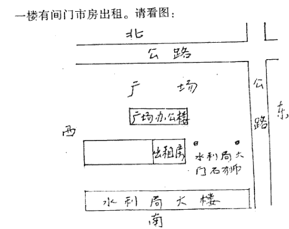

我问她：为什么选中这个房呢？

她说：房子前面是文化广场，人很多，顾客必然多，如果开个食杂店，销路看好。

我详看了一下周围环境，对她说：此宅坐南向北，为离宅。从你的八字看，喜水不喜火，不适合选离宅做买卖。文化广场所来的人都是来游玩，来来往往的，站不住脚，很少买东西，不能认为顾客多。此房离广场较远，房前有广场办公室的二层小楼挡着，不但经营者有受压抑感，顾客也很难看得见，很难有人来光顾。房门的东侧是水利局的大门，门前摆的石狮逼压店门，此石狮为凶煞，对店主不利。

她信了我的话，没有选此店址。

我们又来到市郊，看一座平房，如下图：

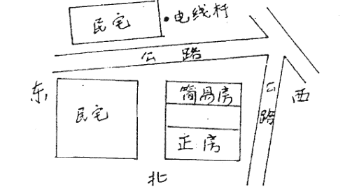

李女士告诉我：此房是我弟弟在十年前买的，当时他没钱，我给拿了五千元。现在他与妻想出外做买卖，要卖房，我说留给我吧，弟妻要价三万元，少一分钱也不卖给我，真让我太伤心了。

此宅坐北向南，住的房屋是十间连脊房，紧靠西面，进屋后觉得湿气浓重，给人一种不适之感。

我说：住这样的房子容易遭煤气中毒。你弟与妻的感情不好，经常吵架。你弟媳的身体欠佳，精神恍惚，好发怒。

她说：弟与妻让煤气熏两回了，差点被熏死。弟妻现在有多种病，多次住医院。两口子经常打架，现在弟媳已经外出一年多了，提出要和我弟弟离婚。

所要开的食杂店是在房前盖了一间简易的小房。店前的小庭院高于房宅，下雨时雨水能冲进屋去，庭院常年积水，满地稀泥。房右是条泥泞的小路，房的左前方有邻居的房角冲射，还有一电线杆逼压。

我说：在这样的地方开店不能挣钱，尤其是不值三万元，我看连一万都不值。

她听了我的劝告，没买此房。

我们又去看另一个门市房。

此宅是土地局盖的楼房，楼有一门市房出卖，请看图示：

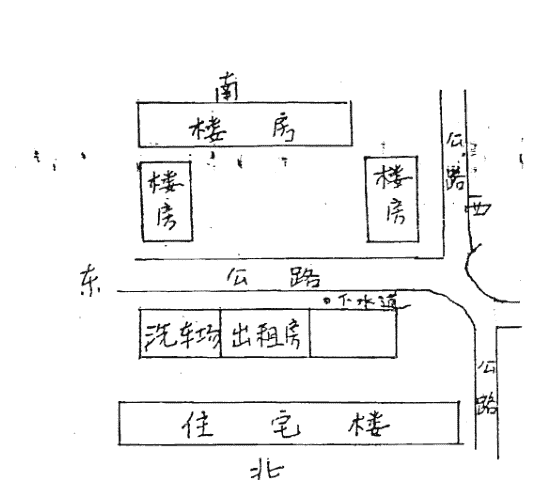

此宅坐北向南，宅后是家属楼群，玄武方有靠山。房前是东西向的公路，成环抱状。公路左前方有楼群，谓青龙；公路右前方有楼群，谓白虎，龙虎有相抱形。正前方有一块空地，空地前有楼群，谓案山。

我说：此宅很好，又离一中（一中是我市重点中学）很近，买这个宅开个小吃店肯定能赚钱。

她说：左边的近邻是洗车场，受水气。在右前方有一个下水孔，我看好。

我说：此宅前的大道东高西低，下水孔在右边，是财位，能聚财。

她信了我的话，买下此宅开了个“全家福小吃店”，生意十分红火。

## 七、调整布局 变凶为吉

1999年，一求测者打电话说他家要供财神，待神位安排好后，却发现是个土地公，问我如何处理。

我说：有两个办法。一是再请个财神，安置在土地公上面；二是将土地公送到庙上去，重新安放财神。

他听我讲的有道理，很虔诚地来接我去看宅。

我看宅的规矩是首先看男女主人公的八字：

男主人的八字是：
壬子 辛亥 癸亥 乙卯

3岁起运 壬子 癸丑 甲寅 乙卯 丙辰 丁巳

女主人的八字是：
甲寅 己巳 壬申 戊申

8岁起运 戊辰 丁卯 丙寅 乙丑 甲子 癸亥

男主人公四柱中一片金水，此水可顺不可逆，必取木泄水吐秀为用神。忌金、水、土，尤忌燥土。

女主人财官当令，有二木耗泄，日主偏弱，喜金印相生，忌火与木。

此住宅楼有八个单元，坐西向东（兑宅），宅主住在四单元四楼，请见图：

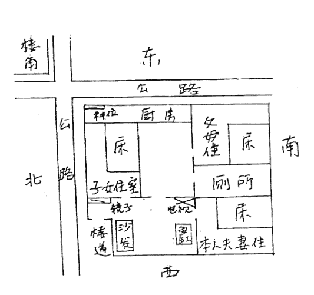

一进宅门，迎面墙上挂的大镜子刺得我睁不开眼睛。

我心想：此宅的女主人肯定有外遇（镜子为桃花煞），因此影响夫妻感情。

我详察此宅，有如下不合理处：

- 1、客厅内摆设的电视紧靠厕所，电视属火，厕所属水，水火相煎。
- 2、在西南的鬼门方位摆个鱼缸，有土（坤位属土）水（鱼缸属水）相战之象。
- 3、宅主人的父母住在东南巽方的卧室内，宅主人夫妻俩住在西南坤方的卧室内。两个孩子住在东北艮方的卧室内。
- 4、三个卧室的床均冲屋门安放，屋门直冲床头。
- 5、财神安置在东北角艮方的阳台上，同厨房连在一起，受着烟熏火烤。
- 6、在宅的东北方，有距宅五十米处的楼角冲射。

我说：你们家夫妻不合，婆媳不合，事业受挫，全家人经常得病，并有破财官非之兆。

于是男主人公向我讲了实情：

男主人原在某单位上班，后来下海经商，承包个铁矿发了财。但搬进此宅后，夫妻闹离婚，铁矿出事故砸死个人，赔偿了八万元。

女主人在公路管理局财会科上班，搬进此宅后心浮气躁，在家里一手遮天，无事找事，吵骂丈夫。

两个男孩成了小霸王，挑吃挑喝，动不动就摔盘子摔碗。

婆媳间几乎成了仇人，谁也不理谁。

父母亲得了胃病、糖尿病、高血压等多种疾病。

他说：先生您看这个房子是不是犯病，如果太凶，我宁可卖掉重买一套楼房。

我说：你家的住宅总的来看无大患，所出的这些毛病是因为布局不合理造成的。于是他恳求我重新布局，请看图示：

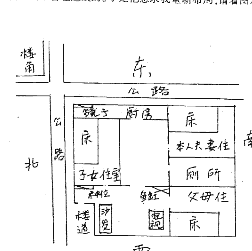

- 1、把一进宅门迎墙上挂的大镜子拿掉，安放在东北角的墙上，镜面朝外，用以趋避远处楼房尖角的冲射。
- 2、把客厅内摆设的电视安放在西南方位，形成火土相生有情。
- 3、把摆放在西南方位的鱼缸，挪放在厕所旁，以求水与水比和，并且能化解厕所的煞气为生气。
- 4、宅主人的父母要住在西南坤方的卧室内；宅主人夫妻俩住在东南巽方的卧室内。

他问我为什么要这样安排。

我说：西南属坤位，坤为母，易经讲天尊地卑，让你的父母住在尊位。东南属巽位，巽为长女，是坤母所生，所以你们夫妻俩应住在那里。这样一来，全家人就会情感交融，和和睦睦。你的八字喜木，巽属木，肋起你的喜用神，有利于你的事业。

- 5、三个卧室的床均重新安置，避开屋门直冲，这样便能少得疾病。
- 6、选择吉日将财神安置在迎门的墙壁上，一进门就能看到“恭喜发财”。

经我调整后，父母之病渐渐好转，承包的铁矿赚钱几百万，孩子也听话了，学习也名列前茅了。每到逢年过节，全家人必带礼物来感谢我。

## 八、风水宜人财官双美

2004年，我去看望次子张玄宗，玄宗住在江苏淮安。我们父子每逢走到这家住宅旁都要感叹一番：真是个好宅呀！

请看图示：

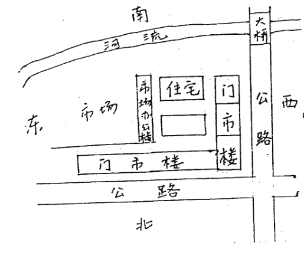

此宅坐北向南，为坎宅。

宅前有河流，从西向东呈环抱状流过。

宅后与宅西有公路环抱。

宅西南处有一座桥，谓有丘岗。

丑寅方空旷，财源广。

中央高大，呈圆丘状。

此两层小楼的后面、左面、右面均有楼房，不但不逼压，却呈现出左有青龙、右有白虎、后有靠山的吉利之象。

一日，我正和儿子站在宅门前称赞此宅，恰遇宅主开个轿车回来，宅主很高兴地请我们到家做客。寒暄后，我又详细地察看宅内的布局情况。经察，一切合理，只是安置在西北角的佛位有点问题，电视紧靠佛龛，电磁波干扰佛的安宁，建议将电视挪走。主人照办不误，并希望我们经常去做客。

# 更多资料

↓↓↓

--------------------------------------------------

## 【中华古籍库】

↓ 点击链接 ↓

[https://www.fozhu920.com/list/](https://www.fozhu920.com/list/)

珍版刻印 / 海外流传 / 家传手抄 / 民间失传

【易】【医】【道】【武】【文】【奇】【画】【书】

1000000+高清古书籍

## 打包下载

微信：mbook86

## 中华古籍库

1000000 册 高清影印古籍
珍版刻印 / 海外流传 / 家传手抄 / 民间失传

古籍善本、经史子集、史料笔记、古人文集、
民间收藏、传世家谱、各地方志、中医典籍、
四库全书、古禁毁书、内阁文库、图书集成、
丛书集成、四部丛刊、万有文库、四部备要、
二十四史、三国六朝文、明清和民国古籍史料
……

