# 陰宅實用點竅

張成達 著

中國哲學文化協進會出版

# 前 言

古今有關地理風水之書，真可謂書如山，法如林，靠自學難度相當大。拜師學藝吧，要價又太高，致使這門科學很難得以普及。前些年，我經常和一些善長此術的地理師去擇墓、安葬、遷墳，再結合諸書潛心學習，終於有所體悟。近幾年，又常帶些熱衷此道的易友上山尋龍點穴，總結出了一些經驗。為使這門科學延續與發展，我把書本上沒有講明的機秘揭示出來，納入地理師在實踐中常用的法術，編成這本《陰宅實用點竅》教材，意在使您一看便懂，並能實際操作。

全書共分為選墓、出殯、安葬、擇日、鎖破五個部分，您掌握了以後，定能成為一個合格的風水師。

我的好朋友沙洪洲先生（祖傳陰陽先生）對書稿進行了認真地修訂，在此表示誠摯地謝意！

吉林市周易研究會理事
哈爾濱古易經研究所研究員、客座教授
張成達
二〇〇二年一月十五日

# 目 錄

# 第一章 選墓點竅
- 一、看形勢
- 二、基礎知識點竅
- 三、尋龍點竅
- 四、尋穴點竅
- 五、看砂點竅
- 六、四局定水點竅
- 七、立向點竅

# 第二章 出靈點竅
- 一、臨終搬鋪
- 二、小殮
- 三、掛孝報喪
- 四、守鋪
- 五、指明路
- 六、「明堂」怎樣寫
- 七、入殮
- 八、入殮禁忌
- 九、守靈
- 十、怎樣寫輓聯
- 十一、怎樣寫輓嶂
- 十二、送行
- 十三、出殯
- 十四、靈幡
- 十五、淨宅
- 十六、淨宅鎖符
- 十七、火葬俗禮
- 十八、死後祭典活動
- 十九、喪葬祭品

# 第三章 安葬點竅
- 一、寫碑文的規矩
- 二、安葬
- 三、遷墳

## 第四章 擇日點竅
- 一、分辨黃道日與黑道日
- 二、天月二德日擇法
- 三、不擇禁忌日
- 四、分辨吉凶時
- 五、財神吉神福神查法
- 六、奇門擇日法
- 七、江湖上常用的吉凶日
- 八、怎樣擇日

# 第五章 鎮破點竅
- 一、師人入房坐向法
- 二、四季重喪
- 三、走腳重喪
- 四、重喪日
- 五、日月重喪
- 六、天地重喪
- 七、到呼重喪
- 八、出殯日犯重喪凶日
- 九、行喪凶日
- 一〇、出殯凶日
- 一一、急喪破用
- 一二、鎮重喪六庚符
- 一三、大墓呼煞
- 一四、小墓呼煞
- 一五、旁的呼日
- 一六、墓呼鎮用
- 一七、五呼神
- 一八、呼龍
- 一九、四墓呼
- 二〇、呼日
- 二一、到日
- 二二、復日
- 二三、天地不覆載日
- 二四、糞瘟神日
- 二五、回屍日
- 二六、土公土府神煞
- 二七、地音神（小葬忌）
- 二八、地音破法
- 二九、治殃煞不出
- 三〇、絕死日
- 三一、早古壯日
- 三二、掃地空亡
- 三三、入地空亡
- 三四、冷地空亡
- 三五、伏屍
- 三六、李廣箭法
- 三七、年天坑
- 三八、月天坑
- 三九、日天坑
- 四〇、時天坑
- 四一、四季天坑
- 四二、逐年天坑
- 四三、骨路天坑
- 四四、月崩騰
- 四五、前騰神
- 四六、年喪門歌
- 四七、年歲德方
- 四八、四值歌
- 四九、大將軍方位
- 五〇、月上九口
- 五一、三牙九口煞
- 五二、千萬人坑
- 五三、治亡人死在坑上作耗
- 五四、治死人回家作耗
- 五五、八方大鎮法
- 五六、起屍日
- 五七、男性死形
- 五八、女性死形
- 五九、殃煞佔處
- 六〇、殃起尺數
- 六一、防忌陰陽
- 六二、殃煞出方化氣
- 六三、妨四鄰破法
- 六四、七種香
- 六五、十二精藥
- 六六、敕符咒
- 六七、發火咒
- 六八、安五精石咒
- 六九、灑水咒
- 七〇、灑五穀糧咒
- 七一、斬喪咒
- 七二、亡人入墓咒
- 七三、入殮咒
- 七四、破土咒
- 七五、畫穴破土咒
- 七六、起靈咒
- 七七、護身咒
- 七八、避殃咒
- 七九、五雷咒
- 八〇、封山咒
- 八一、小普安咒
- 八二、各種鎮符
- 八三、安墳符
- 八四、安墳咒
- 八五、起蛟日
- 八六、二十八宿
- 八七、金神七煞
- 八八、八凶日
- 八九、忌日（亡人死後忌屬相）
- 九〇、窄屍日
- 九一、行屍日
- 九二、人死白毛法
- 九三、行天道（扔死孩方向）
- 九四、鎮天坑
- 九五、龍虎經（淨宅念用）
- 九六、土府神
- 九七、重喪
- 九八、起墳後鎖物破法符
- 九九、治偷盜法
- 一〇〇、六十日防剋
- 一〇一、月德方
- 一〇二、百日內不合葬
- 一〇三、月空方
- 一〇四、男女殮死者
- 一〇五、勞病死法
- 一〇六、安葬吉日
- 一〇七、乘凶安葬
- 一〇八、起棺咒
- 一〇九、六陽師防陰陽忌日
- 一一〇、天黑師防陰陽日
- 一一一、金神七殺凶日
- 一一二、起屍日
- 一一三、枯焦起屍日
- 一一四、凡走屍者
- 一一五、凡屍坐起（或伸手又腿動）
- 一一六、防陰陽日
- 一一七、三牙九口神
- 一一八、毛神法
- 一一九、三牙九口地
- 一二〇、癘神死葬法
- 一二一、每月陰陽神（死葬小口用）
- 一二二、生相墓呼
- 一二三、年八座重喪日
- 一二四、月干重喪復日
- 一二五、月八座重喪日
- 一二六、破重喪吉日
- 一二七、重喪殺三煞方位
- 一二八、年重喪煞方位
- 附符

# 第一章 選墓點竅

風水是一門很玄奧的學問，它包括陽宅與陰宅兩部分。對於陰宅，古時有龍穴、鳳穴、朝穴、凡穴之分，就是說，祖先如果葬在好的地理位置上，日後通過地脈氣場的感應就能庇蔭子孫，葬在不適當的地理位置上就會禍及子孫。風水學是先人智慧的結晶，經驗的積累。這種理論實質就是「天人合一」，也就是人與天地之間氣場的感應。看風水，主要是看氣，陰陽先生不會看氣是不稱職的。看氣，首先看有氣無氣；二看氣場大小，適應不適應；三看氣是聚還是散。這裏的學問很大，它包括以下三個要求：地質的影響（也就是土質）；地磁的影響（也就是氣）；周圍環境的影響與配合等。

聞言少敘，書歸正傳，下面我就帶您進山去擇墓營穴。

## 一、看形勢

在一個深秋的季節，我和易友去選墓。在乘車去往山上的途中，易友問「張老師，您能不能簡要地告訴我，選擇一個好的塋地，得掌握哪些東西呢？」

我說：您就記住五個字：「龍、穴、沙、水、向」。先賢看地理，先取龍氣，龍氣旺則人丁盛；二收水聚，水聚則財富；三取砂秀，砂秀則官高；四取局賢，局賢則悠久。

易友從汽車玻璃往外看，指著一個山問：張老師，您看，可不可以在那座山上選墓地？

我看了看那山說：不行，那是個孤山。孤陽不生，孤陰不長嘛。

於是我們倆分頭從汽車的玻璃向外面尋視著。

易友又指著一山問道：我看這座山龍脈挺好，你看呢？

我說：這座山龍脈不好，是條死龍。

他問：怎麼能說它是死龍呢？

我說：你看，這條山脈蠻直僵硬，毫無生發之機，所以說它是死龍，擇墓最忌諱這樣的龍脈了。

易友指著前面一個山說：張老師，你看，前面那幾個山挺夠局勢，前有朝山，後有靠山，左有青龍，右有白虎。是不是叫汽車停下來，咱進山去看看。

我說：不用進山裏看，你記住我這句話：「選墓地先從外面看形勢」。不是有那麼首古詩嗎？「橫看成嶺側成峰，遠近高低各不同，不識廬山真面目，只緣身在此山中」。這就是說，如果你不從外面看大的形勢，一頭就鑽進山裏去尋找小的龍脈，往往會事倍功半的。

易友問：你能不能簡單說說，怎樣看形勢呢？

我說：這個問題不難答，《管氏地理指蒙》《郭璞古本葬經》等書都有詳細論述，你可以找書看看。簡要地說形與勢就是：

形，概指近觀的、小的、個體性的、局部性的，一般在百尺以內，但非草芥之形。

勢，概指遠觀的、大的、群體性的、總體性的，一般以千尺為率，但非過遙過大之勢。

地理師們曾總結出這樣幾句話，我看很有道理：

大地看氣魄，小地看精神。

眾山皆小，大者為尊。

山秀水動，進山尋龍，

山陋水死，勞而無功。

以水定局，以龍定向。

有水大響為煞地，有水不動為死地，有水微動為生地。

回過頭來咱再看看你說的這座山，從車上就能看出它不行。你看，後面的坐山巨齒狼牙，怪石嶙峋，坐山凶。左邊的青龍開了石廠，屬青龍被破壞，龍破則主男人有刑傷。

還有一個最大的毛病是山的周圍無水。看地理風水也離不開陰陽二字。山為靜，屬陰；水為動，屬陽。陽為夫，陰為婦，夫與婦缺一不可，且要夫婦恩愛為尚。只有山而無水，好比是夫婦不交，終無孕。只有山水相交真氣聚，夫婦相交孕始生。若是山飛水走，二氣不交，屬地不真，不可取。只有山靜水動，砂交水會，龍真穴確，四山環抱，堂局端正，藏風聚氣，才是好塋地。

易友問：張老師，你能不能告訴我，要學會這門科學得從哪裏著手呢？

我說：首先得從基礎知識學起。

易友說：那你就簡要地給我講講好不好？

我誠摯地說：在傳統勘輿學中，選擇風水分很多流派，方式方法又極多，至使我在學習時，面臨許多困惑，走過許多彎路。後經拜訪名師，又跟隨多位地理師實地擇基點穴，深深感到只有龍、穴、砂、水、向這五大原則，才是勘輿學的精髓。

易友說：關於這方面的書，我看了很多，使我最頭痛的是哪一本書都沒有把怎樣使用談明白，問了許多江湖上的風水先生，他們太保守，秘而不傳。想去參加風水面授班吧，要價都在三至五千元，再加上差旅費，少說得一萬元，我現在又沒有這筆錢，真夠愁人的。

我說：江湖上的風水先生靠此術吃飯，所以他們是不會輕易外傳的。我和他們不一樣，是迷於研究此道。雖然不算精通，但可以把所知道的東西全部告訴你。

他說：就說基礎知識那部分吧，我就有很多問號。

於是我便一一地回答了他所提的疑問。

## 二、基礎知識點竅

我對易友說：「五行總論」、「九宮水法歌」、「風水論」、「八山總論」、「十惡不善」、「地理總論」等，這些東西你必須理解，記熟。

易友皺了皺眉頭說：張老師，這些東西亂糟糟的，你能不能告訴我一些簡捷的學法？

我說：你首先得知道「二十四山向」，按下面這個圖去理會：

學習地理風水，您首先得掌握八卦的方位，陰陽五行的生剋之理，最好是先學六爻或批八字，因為只有掌握了這些最基本的知識，學習陰陽宅風水才能得心應手。

風水學中，初時只論東、西、南、北四正方，稱謂四卦。後又納入西北、東北、東南、西南四隅方，形成八方，融入八卦。再在八卦中每卦納入三山，就形成廿四山。四正方之中，陽天干在頭，中氣在正，陰天干在後，如坎宮，壬——子——癸；震宮，甲——卯——乙；離宮，丙——午——丁；兌宮，庚——酉——辛。四隅則為四庫在頭，隅為中，四生在尾。如乾宮，戌——乾——亥；艮宮，丑——艮——寅；巽宮，辰——巽——巳；坤宮，未——坤——申。

掌握這「二十四山向」很重要，因為在使用羅盤時，講究「天盤定水」、「人盤消砂」、「地盤格龍」，都離不開這個順序。

在實際應用中，又經常運用十二山向，稱「雙山五行」。

天干、地支兩個字同處一宮，合為一個名，分別稱為雙山，所以叫「雙山五行」。請看：

讀法是：壬子、癸丑、艮寅、甲卯、乙辰、巽巳、丙午、丁未、坤申、庚酉、辛戌、乾亥。

要參看此圖去理解「三合五行」：

天干乾、甲、丁，合地支亥、卯、未為一宮，木局，名貪狼木星。

天干艮、丙、辛，合地支寅、午、戌為一宮，火局，名廉貞火星。

天干巽、庚、癸，合地支巳、酉、丑為一宮，金局，名武曲金星。

天干坤、壬、乙，合地支申、子、辰為一宮，水局，名文曲水星。

易友問：地支「亥卯未」合木局我知道，那「乾甲丁」怎麼也成木了呢？」

答：請看《雙山五行圖》。乾坐支亥，甲坐支卯，丁坐支未，是亥卯未這三個合成木局的地支把「乾甲丁」這三個天干給合過來的。

問：貪狼木星、廉貞火星、武曲金星、文曲水星怎麼列到這裏來了呢？

答：這是個死套數。貪狼星屬木，凡見到「乾、甲、丁，亥、卯、未」字的，均稱貪狼星，餘仿此。還有的書上是這樣套用的：

- 坤申（稱文曲水星）
- 丁未（稱貪狼木星）
- 丙午（稱廉貞火星）
- 巽巳（稱武曲金星）
- 庚酉（稱武曲金星）
- 辛戌（稱廉貞火星）
- 乾亥（稱貪狼木星）
- 壬子（稱文曲水星）
- 癸丑（稱貪狼木星）
- 艮寅（稱廉貞火星）
- 甲卯（稱貪狼木星）
- 乙辰（稱文曲水星）

對於貪狼、廉貞、五黃、六白等星煞是民間風水師《金鎖玉關》派（為民間流傳的風水術，假借河圖、洛書，測定陰陽二宅）常用的，在本勘輿派中很少應用，理解既可，大可不必耗心費神。

問：「四長生五行」裏的「左旋順起論水」與「右旋逆起論龍」我越看越糊塗，請給講講，好嗎？」

答：您首先得知道「五行與十二宮」：長生、沐浴、冠帶、臨官、帝旺、衰、病、死、墓、絕、胎、養。這十二宮用來比喻天下萬事萬物產生、發展、衰敗、消亡的整個過程。

## 三、尋龍點穴

易友說：請老師首先從理論上給我講講龍。

答：龍就是山脈。土爲龍之肉，石爲龍之骨，草爲龍之毛，穴有五色者爲龍之心肝脾肺腎。地師擇穴首先要講究龍，認爲只有龍才能爲墓穴帶來生動之氣。龍由山脈來體現，砂也是斷斷續續、星星點點的山，二者如何區別呢？從外形看，龍有源、有頭，而砂大多是孤立的，或是龍身上再凸起的小山。龍大多驅幹雄渾粗大，形貌圓淨，又連綿起伏，而砂則相對弱小，或孤立存在。

龍按大的區域分爲三種：山野之龍，平岡之龍，平地之龍。平地亦可尋龍，雖脈落平洋，可微辯體勢，「高一寸爲山，低一寸爲水」。

中國風水學的巒頭法，根據中國的地理地質特點和位置，將山脈的走向分爲五勢：

1. 正勢：由北向南；
2. 側勢：由西向東；
3. 逆勢：逆水朝上；
4. 順勢：順水朝下；
5. 回勢：山首回顧於山尾。

在地理風水中，採取的是陽順陰逆的方法。水爲陽，只用「甲、丙、庚、壬」四陽干：甲木，長生在亥；丙火，長生在寅；庚金，長生在巳；壬水，長生在申。這四位陽天干均順時針方向數。比如甲木，長生在亥、沐浴在子、冠帶在丑、臨官在寅、帝旺在卯、衰在辰、病在巳、死在午、墓在未、絕在申、胎在酉、養在戌。其它三陽干仿此。這就是書上所說的「左旋順起論水」。

龍爲陰，只用「乙、丁、辛、癸」四陰干。乙木，長生在午；丁火，長生在酉；辛金，長生在子；癸水，長生在卯。這四位陰天干均逆時針方向數。比如乙木，長生在午、沐浴在巳、冠帶在辰、臨官在卯、帝旺在寅、衰在丑、病在子、死在亥、墓在戌、絕在酉、胎在申、養在未。其它三陰干仿此。這就是書上所說的「右旋逆起論龍」。

這段解釋您必須重視，因爲地理師在擇墓營穴時，必用此法決定「四局龍水配合」的旺衰（後面還有詳釋）。

### 種龍：

中國風水學的巒頭法，又根據山脈的起伏和形態，將山脈概括為九種狀態，也就是九種龍：

1. 回龍：形勢蟠旋，回首舐尾，如回頭之虎；
2. 騰龍：形勢高遠，險峻聳立，如仰天大壺；
3. 降龍：形勢聳秀，峻嶮高危，如從天而降；
4. 生龍：形勢拱輔，生動活潑；
5. 飛龍：形勢奮翔，如雁騰鷹舉，雙翼開張；
6. 臥龍：形勢蹲踞，安穩停蓄，如虎屯象駐；
7. 隱龍：形勢磅礴，脈理隱延，如浮排鋪氈；
8. 出洋龍：形勢騰躍，蜿蜒欲出，如出林之獸；
9. 頷群龍：形勢依隨，稠眾環合，如走鹿驅羊，遊魚飛鴿。

五勢、九龍是對山脈的宏觀概括，本身並無截然的吉凶區別，選擇中還要配合陰陽五行學說來推斷。

地師尋龍先尋祖與宗，分太祖太宗少祖少宗，以至父母（皆指龍脈而言）。龍有直龍、橫龍、騎龍、迴龍之別。龍之貴賤，成因於來龍之祖山。

易友問：龍分太祖、太宗、少祖、少宗以至父母，這一大串輩份，怎麼去尋找呢？

答：要想按書本上所論及的去尋根排輩那可就太難了。比如東北，龍脈的太祖當是長白山了，再往下去論資排輩，就是坐上直升飛機去尋查也不一定能弄明白。若非古代的皇帝，誰能耗此巨資去扯這個？

問：請您告訴我什麼叫祖山？什麼叫帳？什麼叫開帳？什麼叫穿帳？

答：龍的根脈（龍的起源處）為「帳」（起圍護作用）。

祖山下延長與分出的支脈為「祖山」。

開帳，又叫開張，指龍身到達某處後伸張成兩支，這兩支叫腳，左邊的稱為龍砂，右邊的稱為虎砂，古人認為這兩個枝腳是墓穴最重要的屏帳。

穿帳，指龍脈前行中的一種形態。它與束氣、過峽不同。所謂帳，有帳幔的意思，帳幔一般是平緩而舒張的。可以想象，所謂穿帳，應是龍脈通過一片平川或田地之類。

問：什麼叫峽？什麼叫穴？什麼叫砂？

答：祖山轉延下一個又一個山巒（龍脈）的「低凹處」為「峽」；而峽再延伸到低盡之處叫做「穴」；穴附近的自然物（山石等）叫做「砂」；穴後所靠的山叫「少祖山」，也叫「穴後靠山」、「樂山」、「鬼礫」等。這就是說，少祖山後的那座山就為祖山。如果祖山後再有什麼太祖太宗等，那當然是最好不過了。假如穴後只有一座靠山（少祖山），亦可擇墓，不過富貴的程度有所減弱。

問：什麼叫明堂？什麼叫案山？什麼叫朝山？什麼叫向？

答：穴前附近的朝向為明堂；明堂前的朝向為案山，案山要低小形美，如：玉几、橫琴、眼弓、蛾眉、三分、筆架、天馬、龜蛇、金箱、玉印、書簡、席帽等；案山前往遠處看所朝對的山叫朝山，朝山要有情朝拱，特異眾山而獨秀；穴前明堂所朝對之方向為向。

問：什麼叫束氣？

答：龍脈延伸過程中比較狹窄或低矮之處叫做束氣。束是約束、收束的意思。這種約束是更加雄起的預備階段，只有束氣的龍，衝過約束之處才更加威武雄壯，所以束氣是地相家觀察龍脈生動與否的依據之一。

問：什麼叫結蒂？

答：蒂是果實的意思，結蒂就是結果，是山脈蜿蜒、束氣、衝騰的結果，也就是結穴之處。選擇這樣的地方做為墓穴，是借助了龍的生氣。結蒂，通常稱為結穴。

問：什麼叫龍頭？

答：龍頭就是山頭，指龍身結蒂聳起的山頭。

問：「穴有四靈」怎麼看？

答：「穴有四靈」就是：左青龍、右白虎、前朱雀、後玄武。穴左所分支的山脈叫青龍；穴右所分支的山脈叫白虎。穴前的案山叫朱雀；穴後的少祖山叫玄武。請看下圖：

掌握了上述這些要領很重要，凡新採塋地或覆驗舊墳（未用羅盤以水檢驗向之吉凶前），你站在穴位上，前後左右放眼望去，前有案山、朝山，後有靠山，左有青龍，右有白虎，且符合吉的要求又不遭破壞者，均屬合格的上乘之墓。

假若青龍遭破壞，主男人有災；白虎遭破壞，主女人或家人有牢獄血光之災；案山或朝山遭破壞，主有口舌之患；靠山（少祖山）低小或遭破壞，主無人幫扶、自闘家業或長輩有損。

至於什麼「龍的十大崩洪脈」「看龍十要訣」「龍穴四美」「貪、富、貴、賤四龍論」「論龍三式」「來龍入首五格」「尋龍入式歌十二例」「楊均松七般凶龍」等，諸書皆有論述，您自己看自己悟吧。

易友說：你說的這些我都看過，我還有幾個地方弄不明白。請問什麼叫「白虎探頭」？

答：龍與虎的要求是：龍要高，虎要矮；龍要長，虎要短。假如反過來，白虎高且長，壓過了青龍，就謂之「白虎探頭」，主虎欺龍，陰欺陽，女欺男，凶，不可取。

問：什麼叫龍、虎反弓？

答：陰宅要龍虎相抱，謂之有情。假如龍或虎向外裂去，就叫反弓，謂無情，必棄之不用。

問：什麼叫青龍鑽懷？什麼叫白虎捶胸？

答：按地理風水要求，龍虎相抱為有情。但是，抱的太過也主凶。龍抱的太過謂「青龍鑽懷」；虎抱的太過謂「白虎捶胸」。

## 四、尋穴點竅

易友說：張老師，在尋穴前，麻煩你還是先從理論上給我講講。

我說：我看過很多書，唯《尋穴證》談得最好。

點穴先尋穴證，凡真龍結穴處，必有明顯之佐證。在穴前者則為朝山美、明堂正，水勢旺，三者當推朝山為最重要。穴之前山叫朝，以與案有情為主，朝山高，則穴宜高，朝山低，則穴易低，朝山近恐被凌壓，穴宜上聚。朝山低，恐防氣散，宜就下砂尋穴。明堂有小中大之別，小明堂在圓暈下，若見平正可容人倒臥者，方是真穴。中明堂在龍虎之間，要取其交會。大明堂在案山前，立穴要向融聚水勢處。凡有真龍結穴處，必有潮源水合聚交會。以上為穴前之佐證。在穴後者，要樂山勢鬼撐，龍虎有情拱夾，在穴下者，唇毯要平正，在四旁者，要界水分明，以上為真龍之穴之佐證。若能於此明辨而審察之，點穴必

## 第一章 選墓點穴

無差錯。至於穴忌，只在形氣之間，蓋看地取形勢，葬者乘生氣，氣圍於形，故點穴必先因形察，則穴之十五忌自能曉然。何謂十五忌，既：粗惡、峻急、單寒、臃腫、凹凸、笑露、瘦削、破面、虛耗、疙頭、散漫、尖細、幽冷、蕩軟、頑硬等。要而言之，十五忌皆就形論氣，所當注意者，來龍有高山平地之分，看法因之各異。總之，不論高山平地，若犯一忌，則為絕地，誤用之，輕者主貧賤，重則人丁滅絕，禍患百端，必須慎之。

地理師曾指點我說：點穴時要注意「倒杖」。什麼叫「倒杖」？指的是如何選好棺木安放的前後左右高低等相對位置，也就是穴點。它還要看來龍是陰是陽，還要符合「陽來陰受」、「陰來陽受」的原則，那就得湊靠，直至最後符合陰陽承受為止。

易友問：「陽來陰受」與「陰來陽受」是什麼意思？

答：地理家根據結穴處的不同形態分為陽龍和陰龍。陽落指邊高中低，像人仰伸手掌，手心稍凹之狀，稱「陽落有窩」。陰落邊低中高，像人手面朝下而背部有凸起之狀，稱「陰落有脊」。陽落者為雌龍，陰落者為雄龍。雄龍結雌穴、雌龍結雄穴，謂之「陽來陰受」、「陰來陽受」。

地理家還講究「開穴驗生氣」。地理家認為：穴挖下去，最好要有五色之土，為大吉之象，如果全是石子石塊，這個穴點就不好。

地理師還指點我說：點穴時要注意木取節、火取鑱、金取窩、土取角，也就是書上所說的「土角流金」。

易友問：木取節是什麼意思？

答：木指木形穴，出自蛇形山。

易友說：有的書上講蛇形山主凶，不可點穴。

答：我指的蛇形山是指象龍形，很細小的象小蛇那樣的山不可取。山屬木形，要從「節」上點穴。所謂「節」，就是龍有起有伏，有弓有彎，這一弓一彎，必然出「節」，在龍「弓」身的那山包下邊（節）去尋穴，穴氣旺，拿現代的話說就是「有力度」。

易友問：那「火取鑱」又是什麼意思呢？

我說：什麼是火形穴，什麼是木形穴，什麼是金形穴，什麼是土形穴，書上講得特別細，你自己去看就能明白。關於火取鑱，我得跟你解釋一下，不能取火苗的最高處，要取剛點燃那個部位。在點穴時，要認定「結穴」處，是否結穴的關鍵是「藏風聚氣」四個字。

易友問：平川地擇穴與山地有哪些不同？

答：平川地（也稱平洋地）擇穴與山地擇穴的不同處有：

- 1、山地擇穴講究坐滿朝空，而平川地擇穴則講究坐空朝滿。
- 2、山地擇穴，穴要低；而平川地擇穴，則穴要高。因為平川本來就低窪，水氣太大，再葬得低，地下水沖毀骨骸，哪裏還談得上什麼蔭福？
- 3、山地以山為龍，而平川地帶沒有高崗，往往以水為龍。這樣，所謂的龍、水，實際上都由水來代替了，這也就是書上所說的「龍隨水轉」。
- 4、高一寸為山。平川地帶難得有山，所以在這種地方，哪怕是比平地高出一點，能令人感覺得出，既可以做為來龍看待。

說來也巧，我邊說邊從車裏往外看，突然發現面前這座山很俊秀，於是讓司機停車，要進山去尋龍點穴。

我指著那山對易友說：你看，這座山很像龜形。
易友驚喜地說：象，真象個王八樣。
司機插咀說：這地方我熟悉，本地管它叫王八蓋山。
我嘆惜地說：這樣的風水寶地，怎麼就沒有人在此葬墳呢？
司機說：本地人都認為，要是在王八蓋頂上立墳，那不成死王八頭了嗎？

我說：看起來不懂地理風水真是誤事呀！傳授我的地理師講，龜形山屬八大名墓山形之一。

我這易友很認真，立即問：什麼樣的山屬「八大名墓山形」呢？
我說：龍形山、虎形山、蛇形山、龜形山、蓮花山、牛形山、馬形山。
易友指著那山說：「張老師，你看，那王八頭頂上好像有一座墳，那個穴點的咋樣？
我說：那是個外行所為，哪有把穴點在王八頭上的？
易友問：那你說在哪兒點穴好呢？
我眺望著那山說：最好是在龜蓋下伸出脖子那個地方，那地方有力道，又藏風聚氣。
於是我帶易友奔那山去，來個實地擇墓點穴。

## 五、看砂點穴

易友隨我邊往王八蓋山上走邊問：張老師，請給講講什麼叫砂？
我說：前面我已經提到了，「砂」就是穴的前後左右之山。
地理家把砂分出多種，常用的有以下幾種：

- 1、本身之砂：指穴地處的砂。穴雖是一點，但這數尺之地，本身也有凸凹不平。
- 2、物象之砂：指与某些事物相类似，比如笏砂、笔砂、旗砂、鼓砂等。
- 3、杀刀牙刀：杀刀是指来龙本身所带的细瘦尖峭的小峰，形如刀。地理家认为龙有杀刀主出武官，能冲锋陷阵，拜爵封侯。如果杀刀与龙体断离而为砂，就称为牙刀。这种砂形不好。虽然左龙右虎，但形象如各不相让，高低不分，如同二衙役执杖相视。
- 4、龙虎排衙：指青龙、白虎二砂位置相对，高低不分，如同二衙役执杖相视。这种砂形不好。虽然左龙右虎，但形象如各不相让，高低不分，如同二衙役执杖相视。

在实践中，也按五行的原则将砂山的形状归纳为：木形山，头圆身直；金形山，头圆足阔；火形山，头尖足平；水形山，头平生浪；土形山，头平体秀。常用的有如下五种山形：

- 1、三峰形：常名三尖、三台山、笔架山、三峰山；
- 2、双峰形：常名天马山、马鞍山；
- 3、单峰形：常名华盖山、金星山；
- 4、单尖形：常名文笔山、锡帽山、琅琊山；
- 5、扁平形：常名玉几山。

地理中的砂，除龙、虎、鬼（穴后的山）等固定位置、不可缺少的砂之外，其它杂砂名目甚多。有的主吉，有的主凶；有的主富贵，有的主贫贱。砂的优劣，主要看它的格局、方位、形状、向背等。

我在這裏提醒你，《地理五訣》上的「八山總論」一節你必須背熟，因為它是驗墳的依據（怎樣覆驗舊墳，我在「安葬點竅」中還將詳述）。

「八山總論」是以八卦的卦象來論的。乾為父，乾山高大，男壽長；坤為母，坤山高大女壽高；離為中女，又為目，離山高大壓穴，主出瞎子；兌為少女，兌山高大壓穴，主出啞巴、跛腳之人；巽為長女，巽山高大雙登科，坎屬中男，不可低陷，如低陷，主男有災，女人易小產、墮胎；艮為少男，艮山高大，肥滿，人丁大旺，發橫財。如若低陷，多生癲疾。

左有風吹長房受苦、傷兄弟；右有風吹小房貧寒；玄武方有噴頭煞，主出橫事。

易友問：書上所講的乾山、坤山等，到底按先天八卦還是按後天八卦來定方位呢？

答：李非先生在為《地理五訣》一書註解此論時，把方向弄錯了，他是按先天八卦來定方位的。還有一個考證方法就是：以羅盤的地盤格龍、立向，其地盤所標示的是後天八卦。

易友點頭說：你這一講我算明白了。還有一個問題，我是百思不得其解。書上說的

## 六、四局定水點竅

我對易友說：你要記住地理師常講的這句話：登山觀水口，入穴看明堂，始知四庫，方是陰陽。

問：那怎樣去查祿山呢？
答：丙火祿在寅，祿山就在寅方唄。查其它祿山的方法仿此。

貴人山是從向的天干尋查。比如：壬山丙向，不能從壬起貴人，必須從丙起貴人。按歌訣「丙丁豬雞位」，那麼貴人山就在亥與西方。等一會到了王八蓋山上我再給你詳細解釋。

庚辛逢虎馬，此是貴人方。

丙丁豬雞位，壬癸兔蛇藏。

甲戊兼牛羊，乙己鼠猴鄉。

答：您首先得背熟「天乙貴人歌訣」：

「貴人山」是從穴的坐山尋查，還是從向的天干尋查呢？

水指水源、水流。觀水實際是考察地上地下水源和水流的形態及水質。風水學認為：山不能無水，無水則氣散，無水則地不養萬物。大山脈能「迎風生氣」，山環能「聚氣藏氣」，水能「載氣納氣」。這就是地師常講的「山主富貴，水主財」的道理。中國風水學有謂「地理之道，山水而已」。水被視為「地之血脈，穴之外氣」，山之骨肉皮毛既石土草木，皆以水為血脈而貫通。覓龍點穴，全賴水證。龍非水送，無以明其來；穴非水界，無以觀其止。風水之法，得水為上。未看山時先看水，有山無水休尋地，吉地不可無水。

咱初步看，這座龜形山的龍脈是相當好了，在進山前，必須把水的情況好好審視一下。

我指著王八蓋山說：你看，這個龜形山的左右各有一山，左為青龍，右為白虎，青龍長，白虎短，龍虎相抱。咱再往前方看，在朝山前有一條河。「我問司機，「那條河是怎個走向？」

司機說：是從東往西流。

我興奮地說：太好了！此水保證能合上局。

易友說：張老師，關於書上所說的「四局定水」，我反復看那「龍水配合圖」，卻怎麼看也弄不明白陰龍、陽水是怎麼個用法。

我說：這個「四局定水」，我當初也傷不少腦筋。後經明師指點，才恍然大悟。此節非常重要，假如不懂「四局定水」，就無法立向，就不配做個地師。
古書對此四局有首歌訣，實戰中的地師也經常掛在咀上，現抄錄如下：
陽從左邊轉，陰從右路通。
若人會得陰陽局，何愁大地不相逢？
下面我就詳細地向你講解必須掌握的金、水、木、火四局，首先需掌握怎樣來分這「四局」，請看下邊的「四局定水圖」

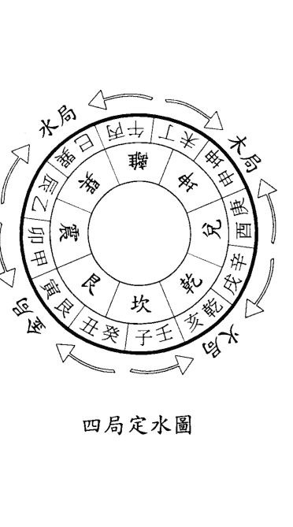

金局：癸丑、艮寅、甲卯；
水局：乙辰、巽巳、丙午；
木局：丁未、坤申、庚酉；
火局：辛戌、乾亥、壬子；

易友問：這四局與「三合五行」有什麼區別？
答：此四局與「三合五行」完全不是一碼事，必須單獨熟記。

問：癸丑、艮寅、甲卯怎麼成金局了呢？
答：地理風水就是這麼定的。我告訴你在背這四局時的訣竅：你就注意「墓庫」。金墓在「丑」；木墓在「未」；水墓在「辰」；火墓在「戌」。知道了這個方法你就好記了。比如這個「金局」吧，「丑」不就是「金」庫嗎？癸丑、艮寅、甲卯都與這個「丑庫」有聯繫，他們就屬金局裏的。其它三局仿此。在背訣的候，可按所臨之庫在前的方法，既：「癸丑、艮寅、甲卯；乙辰、巽巳、丙午；丁未、坤申、庚酉；辛戌、乾亥、壬子」。

請注意：在用羅盤調向時，凡見癸丑、艮寅、甲卯方的，均屬金局；凡見乙辰、巽巳、丙午方的，均屬水局；凡見丁未、坤申、庚西方的，均屬木局；凡見辛戌、乾亥、壬子方的，均屬火局。

### 金局

下面我详细给您讲这四局：

斗牛纳丁庚之气，金局龙水配合图（请看下图）

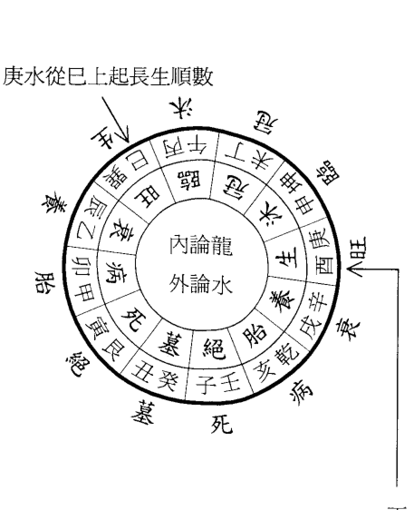

丁龙从酉上起长生逆数

庚水从巳上起长生顺数

易友问：「斗牛纳丁庚之气」是什麼意思？

答：「斗」是形容词，「牛」就是地支「丑」，「丑」是金库，前面我已经讲了，属「金局」。「纳丁庚之气」，丁是丁火，指的是「龙」。「庚」是庚金，指的是「水」，所以才称为「金局龙水配合图」。

请注意看图：内论龙，外论水。

丁龙从酉上起长生（前面已经讲过，丁火属阴火，从酉上起长生），逆数。沐浴在申、冠带在未、临官在午、帝旺在巳、衰在辰、病在卯、死在寅、墓在丑、绝在子、胎在亥、养在戌。

庚水从巳上起长生（前面已经讲过，庚金属阳金，从巳上起长生），顺数。沐浴在午、冠带在未、临官在申、帝旺在酉、衰在戌、病在亥、死在子、墓在丑、绝在寅、胎在卯、养在辰。

凡金局，龙从庚西方来（丁龙从长生来），水从癸丑方去（庚水依墓库收）；龙从巽巳方来（从帝旺来），水从癸丑方去；龙从丙午方来（从临官来），水从癸丑方去，都是吉相，它们分别表示金局生龙、旺龙、临官龙入首。而龙从甲卯方来（丁龙从病方来），从艮寅方来（从死方来），从壬子方来（从绝方来），儘管水也是从癸丑方去，但却是凶相，它们分别表示病龙、死龙、绝龙入首。

在立向时，必须掌握「龙生水旺与水旺龙生」。如龙从庚、西方来，西是丁龙的长生，谓龙生入首，宜立巽、巳向，因为巳是庚水的长生，既长生龙立水的长生向。假如龙从巽、巳方来，已是丁龙的帝旺，宜立庚、酉向，因为西是庚水的帝旺，既帝旺龙立水的帝旺向。这就是地理书上所说的「元关通竅，满局生旺」。什么叫「元关通竅」呢？元既是向；关既是龙；竅既是水口。如果龙得生旺，水也得生旺，叫做满局生旺，这是最理想的立向。龙水同归一库，如男女交媾，从此生男长女，化生万物，这才是阴阳之大道。

### 水局

辛壬會而聚辰，水局龍水配合圖（請看下圖）

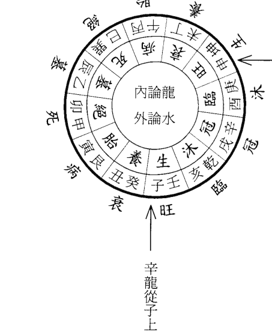

壬水從申上起長生順數

辛龍從子上起長生逆數

相，它們分別表示病龍、死龍、絕龍入首。

在立向時，必須掌握「龍生水旺與水旺龍生」。如龍從庚、西方來，西是丁龍的長生，謂龍生入首，宜立巽、巳向，因為巳是庚水的長生，既長生龍立水的長生向。假如龍從巽、巳方來，已是丁龍的帝旺，宜立庚、酉向，因為西是庚水的帝旺，既帝旺龍立水的帝旺向。這就是地理書上所說的「元關通竅，滿局生旺」。什麼叫「元關通竅」呢？元既是向；關既是龍；竅既是水口。如果龍得生旺，水也得生旺，叫做滿局生旺，這是最理想的立向。龍水同歸一庫，如男女交媾，從此生男長女，化生萬物，這才是陰陽之大道。

易友問：「辛壬會而聚辰」是什麼意思？

答：「辰」是水庫，前面我已經講了，屬「水局」。辛是辛金，指的是「龍」。「壬」是壬水，指的是「水」，所以才稱為「水局龍水配合圖」。

請注意看圖：內論龍，外論水。

辛龍從子上起長生（前面已經講過，辛金屬陰金，從子上起長生），逆數。沐浴在亥、冠帶在戌、臨官在酉、帝旺在申、衰在未、病在午、死在巳、墓在辰、絕在卯、胎在寅、養在丑。

壬水從申上起長生（前面已經講過，壬水屬陽水，從申上起長生），順數。沐浴在酉、冠帶在戌、臨官在亥、帝旺在子、衰在丑、病在寅、死在卯、墓在辰、絕在巳、胎在午、養在未。

凡水局，龍從壬子方來（辛龍從長生來），水從乙辰方去（壬水依墓庫收）；龍從坤申方來（從帝旺來），水從乙辰方去（從冠帶來），都是吉相，因為它們分別表示水局生龍、旺龍、冠帶龍入首。而龍從丙午方來（從病方來），從巽巳方來（從死方來），從甲卯方來（從絕方來），儘管水也從乙辰方去，但卻是凶相，因為它們分別表示水局病龍、死龍、絕龍。

在立向時，必須掌握「龍生水旺與水旺龍生」。如龍從壬、子方來，子是辛龍的長生，謂生龍入首，宜立坤、申向，因為申是壬水的長生向。假如龍從坤、申方來，申是辛龍的帝旺，宜立壬、子向，因為子是壬水的帝旺，既帝旺龍立水的帝旺向。這就是地理書上所說的「元關通竅，滿局生旺」。

### 木局

金羊收癸甲之靈，木局龍水配合圖（請看下圖）

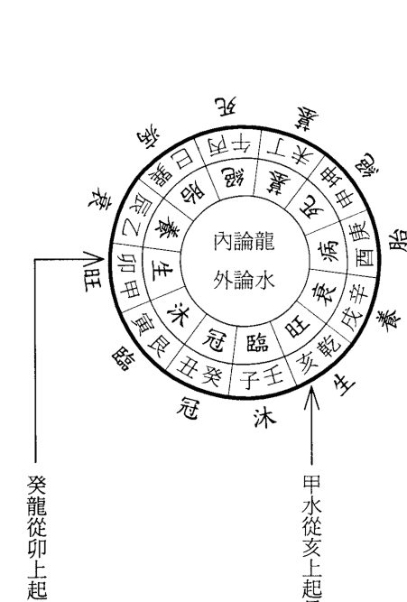

易友問：「金羊收癸甲之靈」是什麼意思？

答：「金」是形容詞，「羊」就是地支「未」，「未」是木庫，前面我已經講了，屬「木局」。「收癸甲之靈」，癸是癸水，指的是「龍」；「甲」是甲木，指的是「水」，所以才稱為「木局龍水配合圖」。

請注意看圖：內論龍，外論水。

癸龍從卯上起長生（前面已經講過，癸水屬陰水，從卯上起長生，逆數。沐浴在寅、冠帶在丑、臨官在子、帝旺在亥、衰在戌、病在酉、死在申、墓在未、絕在午、胎在巳、養在辰。

甲水從亥上起長生（前面已經講過，甲木屬陽木，從亥上起長生，順數。沐浴在子、冠帶在丑、臨官在寅、帝旺在卯、衰在辰、病在巳、死在午、墓在未、絕在申、胎在酉、養在戌。

凡木局，龍從甲卯方來（癸龍從長生來），水從丁未方去（甲水依墓庫收）；龍從乾亥方來（從帝旺來），水從丁未方去（甲水依墓庫收）；龍從庚酉方來（癸龍從病方來），水從丁未方去（從冠帶來），都是吉相，它們分別表示木局生龍、旺龍、冠帶龍入首。而龍從庚酉方來（癸龍從病方來），水從丁未方去（從冠帶來），儘管水也是從丁未方去，但却是凶相，因為它們分別表示木局病龍、死龍、絕龍入首。

在立向時，必須掌握「龍生水旺與水旺龍生」。如龍從甲、卯方來，卯是癸龍的長生，謂生龍入首，宜立乾、亥向，因為亥是甲水的長生，既長生龍立水的長生向。假如龍從乾、亥方來，亥是癸龍的帝旺，宜立甲、卯向，因為卯是甲水的帝旺，既帝旺龍立水的帝旺向。這就是地理書上所說的「元關通竅，滿局生旺」。

### 火局

乙丙交而趨戌，火局龍水配合圖（請看下圖）

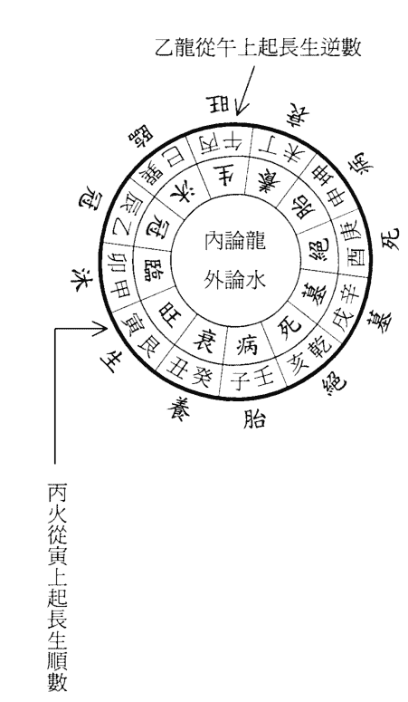

相，因為它們分別表示木局病龍、死龍、絕龍入首。
在立向時，必須掌握「龍生水旺與水旺龍生」。如龍從甲、卯方來，卯是癸龍的長生，謂生龍入首，宜立乾、亥向，因為亥是甲水的長生，既長生龍立水的長生向。假如龍從乾、亥方來，亥是癸龍的帝旺，宜立甲、卯向，因為卯是甲水的帝旺，既帝旺龍立水的帝旺向。這就是地理書上所說的「元關通竅，滿局生旺」。

## 第一章 選堂點竅

# 陰宅實用點竅

易友問：「乙丙交而趨戌」是什麼意思？

答：「戌」是火庫，前面我已經講過，屬「火局」。「乙丙交而趨戌」，乙是乙木，指的是「龍」；「丙」是丙火，指的是「水」，所以才稱為「火局龍水配合圖」。

請注意看圖：內論龍，外論水。

乙龍從午上起長生（前面已經講過，乙木屬陰木，從午上起長生），逆數。沐浴在巳、冠帶在辰、臨官在卯、帝旺在寅、衰在丑、病在子、死在亥、墓在戌、絕在酉、胎在申、養在未。

丙水從寅上起長生（前面已經講過，丙火屬陽火，從寅上起長生），順數。沐浴在卯、冠帶在辰、臨官在巳、帝旺在午、衰在未、病在申、死在酉、墓在戌、絕在亥、胎在子、養在丑。

凡火局，龍從丙午方來（乙龍從長生來），水從辛戌方去（丙水依墓庫收）；龍從艮寅方來（從帝旺來），水從辛戌方去，龍從乙辰方來（從冠帶來），水從辛戌方去，叫做「生來會旺」。假如龍從艮、寅方來，都是乙龍的帝旺，宜立丙午向，因為午是丙水的帝旺，既帝旺龍立水的帝旺向，也叫「收帝旺水到堂迎生」，水再從辛戌方去，叫做「旺去迎生」。這就是地理書上所說的「元關通竅，滿局生旺」。

請注意：所有的地理師都把這四圖畫在紙上，隨身攜帶。在用羅盤調向時，把圖紙往地上一放，參用。

在立向時，必須掌握「龍生水旺與水旺龍生」。如龍從丙、午方來，午是乙龍的長生，謂生龍入首，宜立艮、寅向，因為寅是丙火的長生，既長生龍立水的長生向，也叫「收長生水到堂會旺」，水再從辛戌方去，叫做「生來會旺」。假如龍從艮、寅方來，都是乙龍的帝旺，宜立丙午向，因為午是丙水的帝旺，既帝旺龍立水的帝旺向，也叫「收帝旺水到堂迎生」，水再從辛戌方去，叫做「旺去迎生」。這就是地理書上所說的「元關通竅，滿局生旺」。

請注意：所有的地理師都把這四圖畫在紙上，隨身攜帶。在用羅盤調向時，把圖紙往地上一放，參用。

易友問：什麼叫水上堂與不上堂？

答：上堂是指水從左到右或從右到左流經明堂之前。地理書中常說的「左水到右」、「右水到左」都是指水上堂。一般說來，水聚堂前表示富貴之象，但如果沒有水聚於明堂，只要不沖生破旺，也不致有凶禍，只是福力淺薄。

易友問：什麼叫「左水到右」、「右水到左」？

答：「左水到右」指來水過堂後，向另一方而流出。具體來說，穴左的來水須向右流出，叫做「左水到右」，反之叫做「右水到左」。以火局為例，請對照圖看，其立向的

# 第一章 選墓點竅

生、旺之方在艮、寅和丙、午，而墓、絕之方在辛戌和乾亥，右邊水來過堂，如果仍從右出，右邊沒有墓庫，那就沖破了生旺，而水卻不能歸庫。其實地理家反覆強調的水從何方來，到何方去，無非就是這麼一個簡單的道理，可惜很多人一到水、向問題上便一片茫然。

易友說：怎樣才能掌握「水從左到右與從右到左」？

答：這也是個死規矩，請你對照圖看。

凡立四局長生向，需右水到左，雖無祿可迎，可取局內長生、官旺水到堂歸庫。假若左水到右，則沖長生向。經云：「射破長生向，少差而就絕。」

凡立四局旺向，需左水到右，迎祿、借祿，並取局內長生官旺水到堂歸庫。若右水到左，則破旺位，須轉立方向，方可立穴。經云：「沖傷旺位，針一轉以從生。」如旺向水不能歸於正庫，則取衰方出，其餘皆不宜立向。

凡立四局墓向，需左水到右，迎祿、借祿，並取左右長生官旺水到堂歸庫。若右水到左，則沖墓位，亦主財祿空虛。如立乙、辛、丁、癸天干向者，水可當心直出，百步轉攔，歸乾、坤、艮、巽而去。如立辰、戌、丑、未地支向者，此乃借祿，水不可當心直出，須從乾、坤、艮、巽而去，又不可當面朝來，亦有變當心直出辰、戌、丑、未，有情出煞而去。

凡四局立自旺向，需左水到右，迎祿、借祿，取向上長生、官旺、祿水到堂，既借向左右旁乙、辛、丁、癸而去。此系向上衰方。經云：「惟有衰方可去來。」但需曲折，不宜直出。如見直出，一發便衰，故宜隱隱而去為妙。

凡四局立自旺向，需左水到右，迎祿、借祿，取向上長生、官旺、祿水到堂，既借向左右旁乙、辛、丁、癸而去。此系向上衰方。經云：「惟有衰方可去來。」但需曲折，不宜直出。如見直出，一發便衰，故宜隱隱而去為妙。

以上四局，各有生、旺、墓、養及化生化旺諸向。此所謂「葬乘生氣，認水立向。」凡局中子、午、卯、酉沐浴方有水來者，俱要撥在甲、庚、丙、壬，主發秀貴。如甲、庚、丙、壬水略帶三分子、午、卯、酉者，名為赦文帶桃花紋。雖發秀貴，男女淫亂，主凶。

凡消水之處，須撥在乙、辛、丁、癸而合襟，得反照穴，三房應福。如從辰、戌、丑、未方者，須撥在乾、坤、艮、巽絕位而出。亦有生、旺、墓正局向，或變在甲、庚、丙、壬、子胎位而去。如立向水不歸庫，終歸敗絕。

## 七、立向點竅

立向，是龍、穴、砂、水的大都會。也就是說，在地理堪輿的五要素中，向是總括全局的一個要素。就龍來說，立了向，才有所謂生龍、旺龍、死龍、絕龍；就穴來說，立了向，才會有生氣之穴和無生氣之穴；就砂來說，立了向，才會有得位的砂和不得位的砂；就水來說，立了向，才有所謂殺人沖祿的黃泉和救貧濟富的明秀水。這就好比磚瓦、灰、木，立向就好比定出建築圖式，圖畫得好，好磚固然更宜使用，但壞木也未必不可補救而用。同樣道理，倘若圖畫得不好，即使是磚、瓦、灰、木樣樣精良，仍可能建起來便倒塌，不能為人所用。因此說，立向是總括全局的重要因素。

依水立向為陰宅地理唯一要旨，因為定向先要擺羅盤，看水口。水從何處來，何方出，審辨清楚，然後定向。所以有山向相同，因水口各異，立向也隨之改變，往往有一山而定十數向。

要論立向，必須熟知《十二水口吉凶斷法》，因書上講的較細，我這裏不贅。

向法雖不盡至此，如果能掌握雙山十二向、十二水口之吉凶，其餘皆可類推而知。

易友說：書本上這些東西雖然講得很明白，我還是想看看你到底怎樣操作，那樣才能心領神會。

易友問：書上講的有幾十種立向法，我也記不住哇。

答：莫說初學者記不住，當了幾十年地師的都挑選最主要的記在我上面所講的四局旁邊，在定時放在地上參看，你為啥不能摸用？

易友問：地理書上在立向時，往往提到「兼壬三分」、「兼亥三分」等，是什麼意思？

答：這是分金概念。以火局長生向為例，「立艮向兼寅三分，立寅向兼艮三分」，請對照圖看：艮、寅是相鄰兩山，依每山分金十分，那麼艮、寅各有十分分金。由於天地二盤相差半格，所以認水和立向這兩套活動間存在著誤差，不可能內外盤完全重合。所以所說的立艮向，也就是指艮向佔七分，又兼有相鄰的寅向三分，算做一向。為什麼艮佔七而寅佔三呢？因為羅盤外圈還有火坑、孤虛、煞曜。避開這點，只能採用兼金的辦法。分金中常說的「三七加減」、「二八加減」，就是對此而言。一般佔分金多的為本向，比如艮七分寅三分，細說就是艮向，而籠統地說就是艮寅向。再看圖，艮左鄰丑，為什麼不說艮七分兼丑三分呢？因為立向要受雙山五行的限制，艮、寅為一雙山，而丑與癸為一雙山。

# 第一章 選墓點竅

# 陰宅實用點竅

真是上天不負有心人，當年的臘月，一位局長的父親故去，他一看就相中了這個王八蓋山，於是我便找這位易友跟隨我上山安葬。

我把攜帶的圖往地上一放，擺正羅盤，一邊調向，一邊對易友講解。

我對友友說：你看這個圖，再看羅盤，這個圖和羅盤是一樣的。

這個山是坐北朝南，你放眼往前看，水從乙辰方來，向巽巳、丙午、丁未、坤申、庚酉、辛戌方流去，最後歸戊庫。按前面我講的「四局定水」，水口在戊，當屬火局。那就看：《火局龍水配合圖》

1、用羅盤調午向（這就是地師說的「壬山丙向，子山午向」）。丙水長生在寅，順數，沐浴在卯，臨官在辰、冠帶在巳、帝旺在午……收局內乙辰帶水、巽巳臨官水，並本位丙午帝旺水出辛戌正庫，為正旺向。

2、龍從艮寅方來，謂旺龍入首。

易友問：請詳細說說怎麼看「旺龍入首」？

答：甲木長生在亥，乙木長生在午，火局龍為乙木，乙龍從午起長生，逆數，沐浴在巳、冠帶在辰、臨官在卯、帝旺在寅，龍從艮寅來，自然當是「旺龍入首」，這就是書上所說的「生來會旺正旺向」。

3、在遠處的午向上有一座火形山，謂三台山。

請注意：風水師有「陽宅打凹，陰宅打高」之說。就是說，陽宅要往山的凹處打向，陰宅要往山的尖上打向。反之，他就是個「老外」。

4、以丙向起「天乙貴人」。「丙丁豬雞位」，在穴的西方恰巧有一座山，謂貴人山。

易友說：聽說「桃花煞」既主淫邪又主破敗，請給講講。

答：其實「桃花煞」是指立向與流水犯煞的，請看歌訣：

亥卯未，鼠子當頭忌；巳酉丑，躍馬南方走。

申子辰，雞叫亂人倫；寅午戌，兔從茅裏出。

大意是：立亥、卯、未向，水從午方流來，因為木長生在亥，沐浴在子，故稱桃花煞；立申子辰向，水從酉方流來，因為金長生在巳，沐浴在午，故稱桃花煞；立寅午戌向，水從卯方流來，火長生在寅，沐浴在卯，故稱桃花煞。

如果立亥卯向，水從未向流走，叫做破煞，也是桃花煞；同樣，立巳、酉向，水從丑來，向流走；立申子向，水從辰向流走；立寅午向，水從戌向流走，都屬於自破桃花煞。

易友說：請給講一下「龍上八煞」，好嗎？

答：請背熟歌訣：

坎龍坤兔震山猴，
巽雞乾馬兌蛇頭。
艮虎離豬為煞曜，
冢宅逢之一旦休。

其意思是：

坎方來龍不立辰（龍）向；
坤方來龍不立卯（兔）向；
震方來龍不立申（猴）向；
巽方來龍不立酉（雞）向；
乾方來龍不立午（馬）向；
兌方來龍不立巳（蛇）向；
艮方來龍不立寅（虎）向；
離方來龍不立亥（豬）向。

易友問：李非先生在註解《地理直指原真》一書中說，地理所忌有若干煞方，這些煞方是由羅盤格定後才確定下來，而且主要是指水而言。如果流水正好從規定的煞方流來，既稱為黃泉大煞。這「龍上八煞」是在立向時要躲避的，是指八個方向的流水而言。既坎方來龍忌辰向流水；坤方來龍忌卯向流水；震方來龍忌申向流水；巽方來龍忌酉向流水；乾方來龍忌午向流水；兌方來龍忌巳向流水；艮方來龍忌寅向流水；離方來龍忌亥向流水。你對此論有何看法？

答：李先生此論我不敢苟同。因為在用羅盤立向時，有明確規定：天盤收水；地盤認龍、立向；人盤消砂。「龍上八煞」，是指龍與向所忌。李先生把此忌看成是龍與水所忌是錯誤的，「八大黃泉」才是龍與水所忌。

請你注意看，以上所說的「龍上八煞」均屬「龍與向相剋」，並不是李先生所說的「龍與水相剋」。

易友問：什麼叫坎方、坤方、震方、巽方、乾方、兌方、艮方、離方來龍呢？

## 第一章 選星點竅

# 陰宅實用點竅

答：關於方位，我在前面「二十四山向」中已經講明。
請注意，在實際操作中，用的是「後天八卦方位」，既離南坎北，震東兌西，羅盤的地盤上有明確的標識。
問：有的龍從坎方出，卻往東拐一下，又往南拐去，這一下就把我鬧胡塗了，到底怎樣具體確定從哪方來龍呢？
答：這個問題問得好，不經明師指點，只憑書本是弄不明白的。我告訴你，以穴後那個「過峽」（低凹處）來確定，這個「過峽」在羅盤地盤的什麼方位上就屬從什麼方來龍。
問：書上常講「龍入首」，從什麼地方看這個「入首」呢？
答：上面講的穴後那個「過峽」就叫龍入首，也叫「來龍」。
問：什麼叫陰龍？什麼叫陽龍呢？
答：在龍與水這一概念中，水為陽，龍為陰。在龍本身的概念中，凡以脈之左旋者為陽，右旋者為陰。凡陽龍之脈起於寅、申、巳、亥，順時針從右往左旋，為陽龍；凡陰龍之脈起於子、午、卯、酉，逆時針從左往右旋，為陰龍。
易友說：張老師，聽說在立向時還須注意「八大黃泉」，請給講解一下。

答：請背熟歌訣：
庚丁坤上是黃泉，
乙丙須防巽水先。
甲癸向中憂見艮，
辛壬水路怕當乾。

解：
庚、丁二向，從羅盤看，在坤向上見有水，既為黃泉煞。同樣道理，立坤向，而庚、丁二方見有水流去，也為黃泉，因為向水不相融合。坤向見丁水犯破軍，見庚水犯廉貞，廉貞主吐血、為賊、破軍主賭博、官司，所以兩者相犯，必主凶災。
乙丙須防巽水先：
立乙、丙二向，從羅盤看，在巽向上見有水，既為黃泉煞。同樣道理，立巽向，而乙、丙二方有水流去，也是黃泉煞。乙見巽犯祿存，主賭博、敗家。

## 甲癸向中憂見艮：

立甲、癸二向，從羅盤看，在艮向上見有水，既為黃泉煞。同樣道理，如果立艮向，而甲、癸二方有水流去，也為黃泉。因為艮向見癸水犯祿存，主敗家、溺死，故為凶向。

## 辛壬水路怕當乾：

立辛、壬二向，從羅盤看，在乾向上見有水，既為黃泉煞。同樣道理，立乾向，而辛、壬兩方有水流去，也是黃泉煞。乾見辛犯廉貞，主疫死，故為凶向。

易友問：在用羅盤立向時，有癸丑、乙辰、丁未、辛戌四庫方，該怎樣定？

答：羅盤指針要避開地支辰、戌、丑、未，而運用天干癸、乙、丁、辛，那四庫方主要是用於收水的。

問：在格定子山午向時，羅盤指針直指向上的那個「午」嗎？

答：這是不可以的。羅盤有正針與縫針之分。子山直對午向，屬正針，除了修廟和皇陵，其它均不可用，只可在縫針中選用。這是屬羅經範疇，我在另一個教材裏將詳解。

已經是臘月了，北方正是地凍三尺、滴水成冰的嚴冬季節。但在打墓時，此地卻不必用鎬刨，用鍬挖土時往外冒熱氣。當有人把喝過的酒瓶子往地上一扔時，瓶咀卻紮進土層，直直地立在那裏，可見這個墓穴藏風聚氣到何種程度，在場的人無不交口稱讚。

# 第二章 出靈點竅

生死為人生兩件大事，生為起點，死為終結。自古以來，華夏民族一直非常講究禮儀，所謂慎終追遠，身後哀榮。對喪葬祭奠禮儀尤為重視。做為一個合格的風水師，則必須懂得這些法術。

## 一、臨終搬鋪

俗以死於睡床之上，冥魂將被吊在床上，不得解脫，只有死在家中最好的地方才得安寧。故將臨終之人由臥室搬到廳堂臨時鋪設的板床上。與此同時應為臨終之人擦洗身體，更換壽衣。壽衣絕對禁止用皮毛製品，恐來世轉為獸。如果臨危之人是在醫院，臨終搬鋪一節自然免去。但擦身、更換壽衣依然，最後送入太平房，馬上指明路。

## 二、小殮

初終，為死者放入嚥口錢（最好能在臨終之前），為死者修容（理髮、刮臉、簡單化裝），兩手放入打狗乾糧（饅頭、糕點之類），用燒紙把手包好，兩腳換上裝老鞋，用繩絆好，整理妥當後，用黃或白布從頭到腳蓋好。在終鋪前，應放倒頭飯、各種祭品、香燭，點燃油燈。在喪盆內先燒三斤六兩燒紙錢，最好是姑娘給燒。這些紙灰要特殊包好，入殮時放入棺內。如移屍太平間，一切同上，只是燒紙錢、點油燈等項，視太平間之規而定。

## 三、掛孝報喪

喪家在大門懸掛燒紙製做的歲頭紙（一大串燒紙），紙數要比歲數多兩張，比如果故去之人是六十歲，紙數為六十二張。在做紙串時，最上面用一張紙，最下邊用一張紙，表示天上一張、地下一張之意，中間用幾張紙不限。亡男掛在門左，亡女掛在門右。也可在大門外張貼訃告，在白紙上寫明死者生卒年月日時。

送漿水：每當人吃飯之前，戴孝之人先去廟上送水、酒、飯之類的祭品，回來後再吃飯。

哭道報廟十八場：就是一個時辰應一遍哭。

## 四、守鋪

在大殮出殯之前，喪家親屬晝夜輪流守護在死者停鋪側，看住油燈，不讓火滅，

## 五、指明路

死後的第一個晚上需要指明路，長子手持扁擔，扁擔一頭吊一串紙錢，站在凳子上，指西南方連喊三聲：「XX，西南大道，光明大道……」如無扁擔，可用高粱楷或木棍代替。指明路地點一般在靈鋪附近，或附近的路口。

## 六、「明堂」怎麼寫？

要求是男寫單字，女寫雙字。並要求「男趕生，女趕旺」。比如故去的是母親，寫「世故母于氏秀芹之靈位」，此是十個字，屬雙。怎麼趕「旺」字呢？用「生旺死絕」四字去趕。此「世」字是生，「故」字是旺，「母」字是死，「于」字是絕；「氏」字又是生，「秀」字是旺，「芹」字是死，「之」字是絕，「靈」字是生，「位」字即是旺。比如故去的是父親，可寫「故先父孫志潔之靈位」，此是九個字，屬單。

## 七、入殮

人死後，由風水師擇吉時入殮。開光時，讓長子拿起倒頭飯中間的那根棍，手持壓在亡人胸上那個裝有高粱的碟子（將高粱灑在亡人身上，裝上水），用棍舀水（不要蘸燈油），隨風水師念下面的開光歌：

- 開眼光，看四方。
- 開鼻光，聞麝香。
- 開咀光，吃豬羊。
- 開耳光，聽八方。
- 開手光，抓錢糧。
- 開腳光，上天堂。

開光後，取下噙口錢。由長子捧頭，次子捧腳，眾人幫忙，移入棺內。在開光、移屍過程中，一定要在用遮布擋光情況下進行。四個人扯著白布或被單四角，把屍首遮上，避免陽光照射。

## 八、入殮禁忌

入殮後封棺，其子女、親屬晚輩等，跪在棺材兩側，木匠開始釘釘（俗稱煞扣）。木匠在左邊釘釘，眾人喊：「XX呀，往右躲釘。」木匠在右邊釘釘，眾人喊：「XX呀，往左躲釘。」待棺封好後，木匠最後一斧把壽釘釘在棺蓋前邊（要求是男左女右）。釘好後，把嚶口錢掛在釘上。

- 正、四、七、十月，忌屬虎、猴、蛇、豬。
- 二、五、八、十一月，忌屬鼠、馬、雞、兔。
- 三、六、九、十二月，忌屬龍、狗、牛、羊。

## 九、守靈

大殮之後需要在家停棺，一般要停放七日，現在多數是第三天出殯（從死後那天算起）。大殮後至出殯期間，家人要守護或睡臥在棺旁草墊上，以表孝忱，叫做「守靈」。其親友可在室內搞些活動，叫「坐夜」

通常情況下，凡停靈在家的，都要搭設靈棚，要在壽材頭擺設祭品、倒頭飯、油燈，掛挽帳，擺花圈。

此期間凡來拜祭者，不論其輩數高低，守靈的都要還禮。

如遺體停放在太平間，喪者應在家裏設靈堂守靈。靈堂設置所需物品：靈牌、遺像、供品、香燭、紙錢等。

### 靈堂用供品：

- 道家擺五供：雞、鴨、魚、肉、蛋。
- 佛家擺四果：蘋果、香蕉、大棗、橘子。
- 擺道家的還是擺佛家的或佛道兩家同時擺，由風水師決定。

- 竹筷子五雙；酒盅五個；饅頭十個，分兩摞；香一炷。

關於靈牌怎麼寫，請參照前面「明堂怎麼寫」。

關於孝帶的扣怎麼繫：男的結在左邊，女的結在右邊。

## 十、怎樣寫輓幛

輓幛又叫祭幛，用素色的雙幅綢、毛料等較好的布料製成，通常是長二米，寬一點五米左右。其格式如下：

嶂右側為對死者的稱號，左側為送挽嶂的具名，嶂中央為挽嶂詞，均用墨筆寫在白色的長條或菱形紙塊，縫貼挽嶂上。一般採用直行書寫的形式。

過去在寫挽嶂時，要在左側具名的右上角加上「陽居」二字，就連右側的「○府」都得用紅紙寫黑字，其餘則用白紙寫蘭字，以表示「○府」和送挽嶂的人是生人，做到生死分明，否則便會是失禮而遭到非議。現今已不這樣講究了，甚或不用「○府」二字。

死者稱號和送挽嶂者具名必須符合禮儀要求，相互匹配。列：

○府尊岳父○○老人千古

松柏長青

子婿○○○率外孫○○敬挽

挽嶂詞一般多用四個字的詞組，但也有在嶂中央吊一個白紙黑字的大「奠」字，還有在嶂中央寫聯語的。挽嶂詞語很多，雖然都是褒揚、弔唁，但仍有區別，用時要根據死者的身世及與生者關係等具體情況，選擇切合的詞語。

### 通用挽嶂：

松柏常青 英魂常在 含笑九泉 流芳百世

永垂不朽 萬古流芳 浩氣常存 遺愛千秋

## 十一、怎樣寫挽聯

挽聯和其它哀悼文一樣，在寫法上有著嚴格的規律。挽聯為上下兩個半聯，要求上下半聯字數相等，結構對偶，文字平仄相對，講究聲調、節奏、韻律。在使用上，挽聯分為喪家自挽和哀挽別人兩類，由於與死者的關係不同，死者生前的身份、處境等具體情況不同，撰寫的內容也應各不相同，不能混用，以免失禮或落人笑柄。

### 通用挽聯：

丹心照日月，
正氣炳乾坤。

壽終德望在，
身去音容存。

## 第二章 出靈點綴

## 陰宅實用點綴

高風傳鄉里，
亮節照後人。
松柏常蒼翠，
金柳動哀情。

痛心傷永逝，
揮淚憶深情。

### 挽男喪通用：

畢生正直無私，
一世勤勞可風。

椿形已隨雲氣散，
鶴聲猶帶月光寒。

人間未遂青雲志，
天上先成白玉樓。

### 挽女通用：

青山永志芳德，
綠水長吟雅風。

瑤池舊有青舊有青鸞舞，
繡幕今看白鶴翔。

良操美德千秋仰，
亮節高風萬世存。

身似芳蘭從此逝，
心如浩月幾時回。

### 挽父通用：

百呼不醒慈父梦，
千載難忘養育恩。

深恩未報羞為子，
飲泣難消欲斷腸。

思親蠟燭情無盡，
望父春歸人未歸。

### 挽母通用：

人間慈母去，
天上慧星沉。

思親唯有淚，
救母痛無力。

母魂已逝空增泣，
兒淚常流難報恩。

### 挽兄弟通用：

風悲梧葉留殘血，
雨促荊花恨落紅。

雁陣霜寒悲折翼，
鶴原露冷痛孤飛。

### 挽夫通用：

裂肺撕肝兒尋父，
捶胸頓足妻哭郎。

每思田園共笑語，
難禁空房獨淚流。

### 挽妻通用：

戶悲淒風冷，
樓空苦雨寒。

想見和顏唯有淚，
欲聞笑語杳無聲。

慘聽秋風吹落葉，
愁看冷月照空幃。

## 十二、送行（俗稱送大紙）

送行是在出靈的頭一天晚上。
要把所紮的紙活，如馬、牛、歲紙、衣物等，送到廟上去燒。這裏要強調的是：
長子用條笆托著歲頭紙、亡命牌。後退著繞棺材左轉三圈、右轉三圈。之後，才能
往廟上去。

在往廟上去之前，由風水先生念「路引」（也稱「路引馬票」），用墨筆寫在燒
紙上），其寫法如下：

南瞻部州共和國
省 市 鄉
村居民世（這個
「世」字指六十歲以前故去的，在「靈幡」一節中有詳述）故XX，生於
年
月 日 時，於年月日時壽終正寢，赴陰司冥界。隨身攜帶珠寶器
皿無數，錢財若干，白馬（或牛）一匹（或一頭），牽馬童一位，名喚得用。沿途
各關卡、哨所、廟宇、村莊、河邊、柳岸，以及一切強神惡鬼等不得任意搶劫、掠

## 十三、出殯

出殯一定要擇吉日吉時。我在《擇日點殯》中示有「十七不出靈，十八不安葬」，俗有忌雙日下葬。遇到特殊情況，風水師有時也擇不出好日子，時間拖長了又違入土為安之大理。硬要下葬呢，又恐死者不安，活者遭禍。在這種情況下，可採用趨吉避凶之法。最好的方法是「護鎮重喪法」：用白紙造函一個，用黃紙朱筆書寫四字，置函內，放在棺上，同出大吉。如怕風刮跑，可以拿著，在下葬時同棺材一起埋或火化。

朱書四字的規則是：

- 1、2、6、9、12月，朱書：六庚天刑；
- 3月，朱書：六辛天府；
- 4月，朱書：六壬天獄；
- 5月，朱書：六癸天獄；
- 7月，朱書：六甲天福；
- 8月，朱書：六乙天德；
- 10月，朱書：六丙天成；
- 11月，朱書：六丁天明。

念完此「路引」後，將它裝在馬鞍子裏，隨馬走，確保一路平安。在往廟上走的路上，要求長子手托著歲頭紙、亡命牌倒退著走。到廟上後，馬或牛頭向西南，由長子指明路，女兒給亡人（亡命牌）洗臉、梳頭、照鏡子等，後將所帶之物全部焚燒。回來後，還要「擺祭吃零」。由風水先生主持，「喊月台」（何為「喊月台」，我在「安葬點殯」中有詳述），令孝子們全跪在棺前，由孝子一樣一樣地上食物，擺放在棺前的桌子上。此後開始最後一次燒紙（多數在亥時），要多燒。

奪、扣壓，一律放行。

特勒令

XX年XX月XX日

## 十四、靈幡

如今殯儀館、花圈店隨處可見。因有很多經營者不懂有關「靈幡」方面的知識，常常搞得不倫不類，讓生者恥笑，亡者不安。為正本清原，現把師傅之秘訣摘錄如下：

紙錢用紙應分生葬與熟葬：生葬用黃燒紙；熟葬用紅紙。

靈車開動前，由長子跪在車前摔喪盆。

把燒的紙灰包起來，同埋墳墓裡。

有姑爺的讓姑爺拿，沒有姑爺的由兒子拿。

倒頭飯由誰來拿？

注：凡提到由「長子」所做之事，如死者無子，可由姪兒、女婿代替。

每逢過橋或岔路口都要扔錢，到墓地時要把紙錢全部扔完。

靈車起動後不能停。

（一）、怎樣從靈幡上區分出所故之人的年歲大小？

凡不超過六十歲故去的，在「故」字前寫「世」字；

凡六十至七十歲故去的，在「故」字前寫「耆」字；

凡七十至八十歲故去的，在「故」字前寫「耄」字；

凡八十至九十歲故去的，在「故」字前寫「期頤」二字。

比如某人之父是四十八歲故去的，其靈幡應寫「世故」顯考……內行的人一看「故」字前這個「世」字，便知此人是六十歲之前故去的。

（二）、怎樣從靈幡上區分出所故之人是男是女？

1、在引魂幡中間及兩邊的飄帶最下邊來區分。要求是：男剪箭頭，女剪凹。

2、引魂幡中間飄帶的中間，要「男剪圓形、女剪方形」。男為乾為天，女為坤為地，取天圓地方之意。

男剪十三個圓形；女剪十四個方形。男屬陽，剪單；女屬陰，剪雙。

（三）、怎樣寫靈幡：

靈幡兩邊飄帶所寫的字，最後一個字必須佔上「生」。

## 十五、淨宅

如死者死在家中，需除殃淨宅，以保活著的人安康。出殯後，家中留一男長者，負責打開所有門窗。風水師用五穀雜糧扔打殃處，同時念「灑五穀糧咒」。

殃落處：

男用天干·女用地支。

男用天干歌訣：

甲在鍋台乙巽間，丙丁自在瓦二三。
戊日不離停靈地，己日遷在炕床前。
庚辛在於西北角，壬癸遷在水器邊。

女用地支歌訣：
寅窗卯門辰在牆，巳時洋溝午未樑。
申酉在兌戌亥灶，子丑二時在平堂。

打過之後，把雜物皆掃地出門。

灑五穀糧咒：
一灑灑天殃，天蓬道路昌；
二灑灑地殃，地殃化吉祥；
男殃並女殃，灑著齊消亡；
三灑灑鬼殃，灑盡諸妖魔，急急離此方；
天圍地方，律令九章，吾奉天蓬大師助我斬殃。

## 第二章 出殯點竅

# 陰宅實用點竅

## 十六、淨宅鎮符

故者屬橫死，如淹死、車禍、吊死等，需在出殯後，將「淨宅鎮符」貼於房四角鎮宅（請注意，畫符必需經師傅，如擅自書寫，易遭禍殃）。
第五章「鎮破點竅」中有詳細趨吉避凶、鎮破法術、符咒。

## 十七、火葬俗禮

屍體入殮後，運到火化場。入爐前，在弔唁室，子女親屬站在屍體兩邊，其餘人員一走過，瞻仰遺容，然後送入火爐。此時既可焚燒牛、馬、衣物等。
骨灰出爐之後，裝入紅布袋。骨灰盒四角墊硬幣，把裝好骨灰的紅布袋放在硬幣上，封安後，骨灰盒由長子捧著，直系親屬跟隨，到燃燒區設靈台，擺放祭品，燒紙錢，最後，晚輩由長子帶頭，按序列磕頭告別，取下孝帶，在火上熏烤，最後把骨灰盒寄存。
寄存號碼也有吉凶之分，以1、3、5、6、7、8層為好，此吉祥數由風水師摘選。
接屍車在離開火化場時，應用燒紙熏烤輪胎。

## 十八、死後祭典活動

死後要燒頭七、三七、五七、百日、周年、三周年、十周年，以示孝子之心。
上述祭典活動，都要燒紙錢，擺供品。
立墳的上塋地；火化的，搬出骨灰盒。
天數的計算都要從死的那天起為第二天。
三天圓墳，圓墳從下葬之日為第一天。
圓墳要修整新墳，在墳前用紅磚搭迎風門，墳上要用高粱桿搭上三道樑，把蘸口錢拴在主樑上。

## 十九、喪葬祭品

自古以來，男死燒紙馬（供死者騎乘）；女死燒牛（替死者喝髒水），馬由兒子，牛由女兒出錢定做。
燒紙錢是必不可少的，究竟何種錢有用其說法不一。用紙捏子或大錢打印的紙錢是一種零用錢，一個大錢只有一文，可買一個燒餅，價碼雖小，必不可少。陰票（冥幣）面額大，攜帶方便，也是可用。再有一種，天朝地府通用幣，乃是佛家研製而成，後有用膠版自印，據說是管用的。至於用人民幣或股票在紙上一比劃的紙錢，顯然是無效的。還有用燒紙制冰箱、彩電、轎車、大哥大者，實為可笑。

# 第三章 安葬點竅

傳統喪葬祭典禮儀現今在廣大農村及部分城鎮居民中仍然流行，保存著若干古代習俗，它包括有喪、葬、祭三個方面。我在這一章中專門講風水師是怎樣進行安葬的。

## 一、寫碑文的規矩

男要逢單字；女要逢雙字。

比如：故父的名字叫王洪彥，可寫「世故顯考王洪彥之墓」，共九個字，逢單。

如果名字叫兩字王洪，按上面那樣刻碑文就不能逢單字，可用王「諱」（請注意：男用諱，女用智）洪，或用之「靈」墓這個「靈」字，將所缺之字添上。

女逢雙可效仿上例。

## 二、安葬

安葬分新葬（俗稱生靈）與覆葬（俗稱熟靈）之分。

我首先講新葬。

新葬必須選墓營穴。墓穴一定會有善有不善，有佳有不佳，地理家的職責便在於棄惡而取善。

### （一）十惡不善

1、龍犯劫煞反逆
主要是看龍脈過峽之處（什麼叫過峽，在「選墓點穴」中已詳解）是否被惡石劫斷，這就好比是人行途中，遭強盜劫奪，必傷和氣而帶煞氣。因此，觀龍脈要保束氣而避煞氣，否則便會給家族招來敗家殞身的慘禍，這也是十惡之首惡。

2、龍犯劍脊直硬
劍脊，指龍身挺直，毫無屈曲蜿蜒之生氣，只有蠻粗硬直之死氣。這樣的龍脈，萬不可點穴，以此點穴，必有殺傷之厄。

3、穴犯凶砂惡水
砂有吉凶，水也有吉凶。比如惡石纏岩，便是凶砂，湍流瀑布，便是惡水。墓穴左近不可倚傍這樣的砂水。

4、穴犯風吹氣散
墓穴最忌惡風。凡穴地前後左右有惡風，則大災小禍會隨之而至。

5、砂犯探頭、槌胸
探頭、槌胸，均指穴旁有山如探頭狀、槌胸狀，都是不吉之象。

6、砂犯反背無情
砂的形狀有拱穴、有背穴，由此而判定有情與無情。

7、水犯沖射反弓
射脅、反弓，指水旁沖或折流，無柔曼之形，有凶惡之狀，因此為凶相。

8、水犯黃泉大煞
關於「黃泉煞」，我在《選墓點穴》中已經講明，這裏不贅）。擇向要考慮到水流的方位，不可相剋，否則既成大煞，會有天亡絕嗣之禍。

9、向犯沖生破旺
生、旺、死、絕四位，生旺為吉位，若是沖破了生旺，便是凶相。

10、向犯閉煞退神
穴旁流水要流動，停蓄也要歸庫。水最終不歸庫，便是凶相。擇穴而不立向，失去了相應的神位，沒有神護佑，自然不能發富發貴。

### （二）墳有五不葬

- 1、氣以生和，童山（山無草木）不可葬；
- 2、氣因勢來，斷山不可葬；
- 3、氣因土行，石山不可葬；
- 4、氣以勢止，過山不可葬；
- 5、氣以龍會，獨山不可葬。

### （三）十不葬粗頑

- 一不葬粗頑醜石，
- 二不葬急水爭流，
- 三不葬窮源絕境，
- 四不葬孤獨山頭，
- 五不葬神前廟後，
- 六不葬左右休囚，
- 七不葬山崗撩亂，
- 八不葬風水悲愁，
- 九不葬坐下低軟，
- 十不葬龍虎尖頭。

### （四）墳有十不向

- 1、不向流水直去，
- 2、不向萬丈高山，
- 3、不向青島赤石，
- 4、不向白虎過堂，
- 5、不向斜飛破碎，
- 6、不向外山無案，
- 7、不向面前逼窄。
- 8、不向山凹崩缺。
- 9、不向大山高壓，
- 10、不向山飛水走。

### （五）墳有十忌

- 一忌後頭不來，
- 二忌前面不開。
- 三忌朝水反弓，
- 四忌凹風掃穴。
- 五忌龍虎直去，
- 六忌直射橫衝。
- 七忌淋頭割腳，
- 八忌白虎回頭。
- 九忌龍虎相背，
- 十忌水口不關。

### （六）風水房位吉凶斷法

對於新葬，風水先生必須熟知「風水房位吉凶」的斷法。

在實際應用中，1、4、7以穴左邊的青龍及砂（山）斷吉凶；2、5、8以穴右邊的白虎及砂斷吉凶；3、6、9以穴前面的案山斷吉凶。

### （七）房位排法

房位的排法分如下幾種：

#### 1、排山葬法：

排山葬法的規則是：同輩人排在一行，既1、2、3、4、5、6、7、8、9，……

必須強調的是：老大叫「報名堂」，老二叫「頂腳」。老大的妻位排在左邊；老二的妻位排在右邊；老二以後不管哥幾個，其妻位均排在右邊。

至於距離，地師通常是採用「方五斜七」的辦法，既方位五尺與斜位七尺。

請看「排山葬法」下圖：

#### 2、挎子攜孫葬法：

挎子攜孫葬法是：大、三、五等單數排在主墳的左邊；二、四、六等雙數排在主墳的右邊。如：

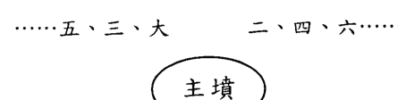

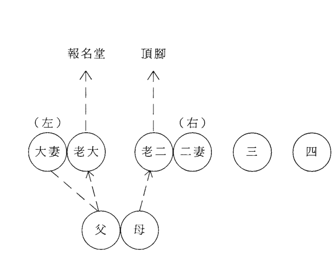

#### 3、多妻葬法：

（a）夾骨葬：如有二個妻子，在安葬時左邊安放一個，右邊安放一個。這種葬法不可用。
（b）較為合理的葬法是採取「排山葬法」，即夫——大——二——三……

下面講熟葬：
做為一個德高望重的風水師，首先要慎重對待已葬過的舊墳應改與不應改，絕不要為了賺錢而損德性。

### （一）墳有三不可改

1、開墳見龜蛇生氣物，則不可改。
我在這裏向您講一個真實的故事：有一戶人家在遷舊墳破土時，見到一隻蛇伏在墳旁，由於不懂此規矩，將蛇打死。結果在燒紙時，突然來了一股怪風，將正在燃燒的紙吹向山中，引起漫山大火，動用一百多人將火撲滅。風水先生及遷墳者，共被罰款二十多萬元，這沉痛的教訓當警之。
2、土中有溫暖氣或乳氣或如霧氣不可改。

3、紫藤交合棺不可改。此是祥瑞之兆，改必遭殃。

### （二）墳有五必改

1、墳墓無故自陷；
2、墳上草木枯死；
3、淫亂風聲，六畜死絕；
4、男女忤逆顛狂、劫盜；
5、刑傷人口、婦人不孕、家財耗散、官事不休。
此五種舊墳必速改。

### （三）驗墳一目瞭然歌：

左砂順水長房離，右砂順水三子去。
外有山峰在水邊，離鄉背井方成貴。
明堂傾斜二子難，

### （四）看老墳秘訣

老墳既是舊墓。如果遇有棺附葬或添建工程，必請堪輿家驗看風水，關係更大於看地。看老墳法是先看墓之前後左右，次看穴前之水大水小，既於水口中立一標桿，然後看墳頂中間，置羅盤於穴上，用外盤縫針，看墳前水口交於何處，歸庫不歸庫，再用長線牽開。細看在天干或地支上幾分，有無觸犯黃泉大煞，有則必須糾正。次看立向生旺還是衰絕，次看來龍從何字入首，究竟是生龍與死龍，龍水相配合是否成局。次看貴人，得位則發貴，不得位則不發。次看生方有無山水，有者人丁旺，若在旺方主大富。天柱山高，主有壽。對於貴穴、富穴、貧穴、濺穴，一一看遍，然後依法判定吉凶。有些富貴家之舊墓，為了壯觀、擺闊，往往於穴之前後，遍築圍牆。殊不知龍要生氣活潑為真，一築牆垣，龍身受困，氣脈陰塞，名叫困龍，縱有興旺之氣，亦不發跡。甚至反吉為凶，猝起大禍。受此害者屢見不鮮，必慎之為宜。

### （五）辨知墳中男女秘訣

1、從墳上的草看：

左肩受白四七寒，右肩受白六九單，
入首太急五房虛，主星低陷又受煞，
定斷五八絕宗嗣，明堂蠻粗帶伶丁，
見斜流入財耗空，砂平硬直，身亡家破。
龍虎擎拳，一家狠惡。
何知人家貧又貧？山阨水深射陰風。
何知人家富又富？磐峰磊落皆朝拱。
何知人家貴又貴？文筆尖峰相朝對。

## 三、遷墳

1、讓遷墳者準備如下物品：
紅磚一塊，用於鎮太歲。用朱筆在燒紙上書「鎮太歲符」。
鎮太歲符：畫法如下

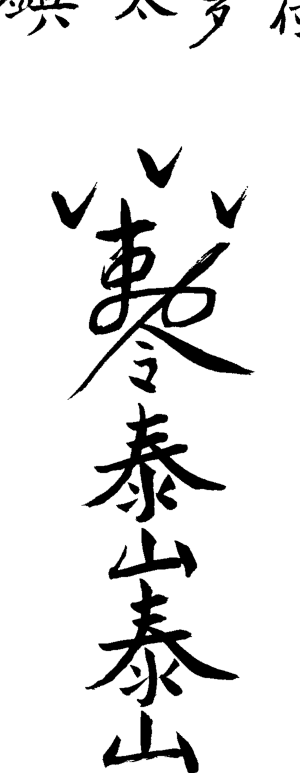

將此符貼在磚上。
紅紙四張，用於焚靈幡及紙錢；
紅手套一雙，用於揀屍骨時戴；
大蘿蔔一個，用於揀完屍骨後添坑；
紅布、白布各六尺六寸，用於揀屍骨時遮蔽陽光；
筷子一雙，用於給兩個棺材搭橋；

2、從墳前所燒的紙灰看：
墓中公婆事難明，可將墳紙去覓尋。黃白是男烏是女，墳紙紅露刀槍亡。白點必定投水死，黃斑黃腫長病死，紅斑產難家中死，青紅樹打死，赤黃牆打死，黃紋自縊亡，黑紋離鄉被打死，交紅是相殺亡。墳頭無紙是孤貧，紙烏又水濕，骨骸烏又爛。

此法多用於驗孤墳。從墳頭上拔下一棵草，注意看草根。如果草的根須多，草根向右彎，此墳葬的是男人；如果草根就是一根莖，草根向左彎，則此墳葬的是女人。

小木板四個，長3寸，寬1、2寸，事先分別寫好「元、亨、利、貞」四個字，用於趨吉；
塑膠紙牌中的一萬、老千各一張，要用刀刮去牌上的刀槍劍戟，用於避凶；
高粱一把，用於淨墓；
饅頭四個（或四塊蛋糕），用於墊棺材。

### 2、破土

先讓長子在要遺棄的墳頭上挖一鍬土，放在一邊。然後幫工們才能開始挖墳破墓。

四立前十八天，土王用事，不宜動土，用此破土咒可化解。

#### 破土咒

天圓地方，律令九章。
吾今破土，普掃不祥。
金鎬玉戟，萬事吉昌。
土公土母，閃在一旁。

### 3、揀屍骨

把六尺紅布與六尺白布同時打開（紅在上，白在下），遮蔽陽光，開始揀屍骨。
往做好的小壽材裏揀骨時，故去的是男，由長子（帶上紅手套）揀；故去的是女，由女兒（帶上紅手套）揀。
屍骨揀全後（如果埋葬年久已無屍骨，裝走一鍬土亦可，意到陰魂既到），將準備好的那個蘿蔔扔進坑去（一個蘿蔔頂一個坑之意）。由長子把先挖出去的那鍬土撮回墳坑裏。
撒上幾把高粱，便可以裝上小棺材起靈（關於怎樣「起靈」，請參看「出靈點竅」）。

### 4、安葬

（1）打墓
墓的大小要留出安放棺材的空間。

（2）破土文
在破土前，要焚燒由風水先生事先寫好的「破土文」。

破土文要根據死者不同身份書寫不同的詞語，下面是我為喪家故父所寫的「破土文」，以供參用。

當莊山神、土地神、城隍等南瞻部洲，中國省市鄉村屯居民世故顯考府君赴陰司冥界，遷陰宅於村溝山之貴方宅地，多有打擾，驚動冒犯眾位神靈，望乞恕罪海涵。

諸位神靈，左鄰右舍及本地一切強神惡鬼等不得任意侵襲威逼、欺凌，一律寬厚容納，不得有誤。

特勅令。

××市、縣冥府。

下元年 月 日

（3）破土
由長子先挖第一鍬土放在一邊（留待第三天圓墳時，由長子撮起，放到墳頂上）。

壓紙一張或半張。

（4）墓打好後就不能再下去人用腳踩。

（5）風水師讓長子拿起那塊貼好符的紅磚，向太歲方走到離穴一百米處，待用羅盤調準方向後，讓其埋在那裏。埋的時候，磚要留出半截，貼符的那面沖穴外（也就是沖太歲方）。

（6）太歲方位
太歲方位就是值年太歲的方位。比如虎年在寅方，兔年在卯方……

（7）墳底要用鍬撮土，做出兩道橫槓。

（8）把四個木牌放進墳的四角上。安牌方位：「元」字放在西北方；「亨」字放在西南方；「利」字放在東南方；「貞」字放在東北方。

（9）把老千、一萬放在墳底，要面沖上放。此是犯「千人坑」或「萬人坑」用。在「鎖破點竅」一章中有詳述。

（10）安放棺材的四個角，每角放一個饅頭（也可用蛋糕代替）。

（11）棺材放進墳裏後，風水先生開始用羅盤調向口。

（12）向口調好後，把準備好的那雙筷子用紅布纏上，橫放在兩個棺材上（用於故父母同時下葬），謂之檁橋。

（13）由長子先往棺材四角上各扔一鍬土，然後開始添墳。
（14）在添墳時，風水師應用一樹棍在向口處插一個記號，留待三天圓墳時，家人立迎風門。
（15）墳添好後開始立碑。
（16）碑立好後，讓家人在碑前擺好供品。

### 5、舉行儀式：

風水師讓亡者親屬跪在碑前（不立碑跪在墳前），進行「喊月台」。（此是師傳之行話，凡不明此語者，皆屬未經明師所傳）
「喊月台」由風水師根據不同的死者編出不同的詞語，所用之詞與祭文很相似，要以簡明扼要之詞表達悲哀沉痛之情。比如故父姓劉，我曾編出如下的詞語來「喊月台」：

嗚呼，劉父，年僅六十有三。孝子賢孫，跪在墳前，虔具素禮，以示祭典。
嗚呼，劉父，偶染癌症，一病亡身。號天泣血，淚灑沾塵。深知劉父，畢世艱辛。創家立業，儉樸忠信。處世有道，克己恭人。至生後輩，愛護如珍。撫養教育，來譽來品。嗚呼哀哉，尚饗！（「尚饗」是望亡人歆享之詞。尚，是希望之意；饗，是設牲禮以供品嚐）
風水師命親屬向亡者禮拜，三叩首。

嚴格認真。感天動地，英名永存。魂遊冥府，百喊不聞。哭斷肝腸，情何以伸。今日祭典，略表寸心。化悲為儉，化痛為勤。繼承遺志，興家立身。劉父九泉有靈，

風水師命親屬向亡者禮拜，三叩首。

# 第四章 择日点窍

自古以来，吉日选择有佛、儒、道等诸学派，流传下来的就有《玉匣记》、《万宝楼》、《宝镜图》、《敖头通书》、《灵棋经》、《协记辨方》等书，对怎样选择良辰吉日门甚多，且相互矛盾。再加上市面上所见的新版书，多属外行的书商们印制，校对极差，漏洞百出，使人无所适从。今把采撷众家之长，结合多年实践总结出来最实用之法奉献给您。

## 一、分辨黄道日与黑道日

黄道日与黑道日共十二位，称建星，也称十二神，其顺序是：建太岁、除青龙、满丧门、平六合、定官符、执小耗、破大耗、危朱雀、成白虎、收贵神、开吊客、闭病符。

简单的记法是：建除满平定，执破危成收，开闭。

十二建星既是每月的月建，正月建寅，二月建卯，……依此类推。查月建同排四柱一样，以节为准，既：立春、惊蛰、清明、立夏、芒种、小暑、立秋、白露、寒露、立冬、大雪、小寒。

### 最简捷的歌诀是：

春雨惊春清谷天，夏满忙夏暑相连。
秋处露秋寒霜降，冬雪雪冬小大寒。

解一：怎样分黄道与黑道，请看《歌诀》：
建满平收黑，除危定执黄。
成开皆大用，闭破不相当。

这就是说：逢建、满、平、收、闭、破之日为黑道日；逢除、危、定、执、成、开之日为黄道日。

择日首先要选择黄道吉日，不选黑道凶日。

江湖上在运用黄道与黑道日上有所变通，现将歌诀录于下，供您参用：
建宜出行收嫁娶，定宜上樑滿修倉。
破除療病執宜捕，危利安床開丈量。
成開所遇均大吉，平日做事總平常。

解二：怎樣尋查某建星：
關鍵得知道從何處起「建太歲」。我告訴您：從某月所值的地支起。比如正月地支為寅，那麼就從寅日起「建太歲」，以下順數，卯日則為除青龍，辰日則為滿喪門，巳日則為平六合，午日則為定官符，未日則為執小耗，申日則為破大耗，酉日則為危朱雀，戌日則為成白虎，亥日則為收貴神，子日則為開吊客，丑日則為閉病符。……其它月份以此類推。下面舉二個例子來解釋：

1、一九九八年十二月從哪日起「建太歲」：
查《萬年曆》（盲人先生則靠死記，從掌上查），十二月初一是己巳，初二是庚午，初三是辛未，初四是壬申，初五是癸酉，初六是甲戌，初七是乙亥，初八是丙子。初八以前都沒見到「丑」，故都不能起「建太歲」。直到初九丁丑日地支才見到「丑」，那就從丁丑日起「建太歲」（請記住，必須見到本月值日的地支才能起建太歲）。接下來順數，初十則是除青龍，十一則是滿喪門，十二則是平六合，十三則是定官符，十四則是執小耗，十五則是破大耗，十六則是危朱雀，十七則是成白虎，十八則是收貴神，十九則是開吊客，二十則是閉病符。二十一日為己丑日，地支又見月建丑，再重新起「建太歲」，順推到「閉病符」為止。

2、怎樣查一九九九年正月初一的建星：
正月建寅，從立春那天起才為寅月。
一九九九年屬年前打春，是一九九八年十二月十九日立春，十九日是丁亥、二十日是戊子、廿一日是己丑，這三天的地支都不是寅，不能起「建太歲」。廿二日是庚寅，地支見到本月值日之星「寅」，那就從此日（庚寅）起「建太歲」，廿三日則為除青龍，廿四日則為滿喪門，廿五日則為平六合，廿六日則為定官符，廿七日則為執小耗，廿八日則為破大耗，廿九日則為危朱雀，三十日則為成白虎，數到一九九九年正月初一則為「收貴神」。

有人會問：常在《萬年曆》上看到有兩個「建建、滿滿、平平、收收」等二個建星並列，是怎麼回事？

我告訴您：凡某建星遇到換「節」那天，就要重複使用一次。

比如一九九八年十二月十八建星是「收」，可是十九日建星還是「收」，為什麼呢？因為十九日是立春，屬換節，則重複使用。

請注意：這個問題很重要，如果不明白，仍按建星排列順序去查，就會把黃道與黑道日弄錯。

## 二、天月二德日擇法

### 1、天德日查法：

歌訣
正丁二申宮，三壬四辛同。
五亥六甲上，七癸八寅逢。
九丙十居乙，子巳丑庚中。

天德之日無憂禍，逢凶化吉得安寧。

解：天德貴人以月來定。正月，日干見丁；二月，日支見申；三月，日干見壬；四月，日干見辛；五月，日支見亥；六月，日干見甲；七月，日干見癸；八月，日支見寅；九月，日干見丙；十月，日干見乙；十一月，日支見巳；十二月，日干見庚。

### 2、月德日查法：

歌訣
寅午戌月在丙，亥卯未月在甲。
申子辰月在壬，巳酉丑月在庚。

月德之日主和順，萬事通達喜盈盈。

解：月德貴人以月來定。寅午戌月，日干見丙；亥卯未月，日干見甲；申子辰月，日干見壬；巳酉丑月，日干見庚。

### 3、天月德合日查法：

天月德合日為二者的干支相合之日，其吉慶程度比天、月德次之。

## 三、不擇禁忌日

### 1、忌三煞日

三煞日是：

| 劫煞 | 災煞 | 歲煞 |
|---|---|---|
| 寅午戌 | 亥卯未 | 申子辰 |
| 亥 | 子 | 丑 |
| 巳 | 午 | 未 |
| 申 | 酉 | 戌 |
| 寅 | 卯 | 辰 |

解：此三煞日以生年地支定：

凡生年地支佔寅午戌的，不擇亥子丑日，因為寅午戌見亥為劫煞，見子為災煞，見丑為歲煞。

凡生年地支佔申子辰的，不擇巳午未日，因為申子辰見巳為劫煞，見午為災煞，見未為歲煞。

凡生年地支佔亥卯未的，不擇申酉戌日，因為亥卯未見申為劫煞，見酉為災煞，見戌為歲煞。

凡生年地支佔巳酉丑的，不擇寅卯辰日，因為巳酉丑見寅為劫煞，見卯為災煞，見辰為歲煞。

### 2、忌月忌日

歌訣

初五、十四、二十三，
老君爐裏不煉丹。

解：初五、十四、二十三這三天為月忌日，故此三天不擇。

### 3、忌紅咀朱雀日

歌訣

初一不嫁娶，
初九不上樑，
十七不出靈，
十八不安葬，
二十三不動墳。
二十五不搬家。

解：關於紅咀朱雀日的吉凶，請看歌訣：

> 紅咀朱雀丈二長，
眼似流星口吐光。
等閒無事傷人命，
萬裏飛來會過江。
切記切記君切記，
十個犯著九個亡。
初一嫁娶重嫁娶，
初九上樑放耗光。
十七安葬重安葬，
二十五搬家人口傷。

### 4、四忌日

春兔、夏馬、秋雞、冬鼠。每月丁丑日。

### 5、忌絕日

四季月（立春、立夏、立秋、立冬）交節前頭一天屬絕日，不擇。

### 6、忌歲破日

凡日辰沖剋太歲為歲破日，不擇。如甲子年庚午日，子午相沖，不擇。

### 7、忌月破日

凡日辰沖剋月令為月破日，不擇。如丙寅月壬申日，寅申相沖，不擇。

### 8、不擇與生肖相沖日

比如來擇日的人生肖是辰，不擇戌日，因為辰戌相沖嘛。

## 四、分辨吉凶時

### （一）吉凶時查法

1、十二神順序：
擇吉凶時也分十二神，其順序是：
青龍、明堂、天刑、朱雀、金貴、天德、白虎、玉堂、天牢、玄武、司命、勾陳。

2、記此順序歌訣：
青龍明堂與天刑，
朱雀金貴天德神。
白虎玉堂與天牢，
玄武司命並勾陳。

3、十二神吉凶查法
請看歌訣：
青龍明堂吉，
天刑朱雀凶。
金貴天德吉，
天牢玄武凶。
玉堂司命吉，
白虎勾陳凶。

4、吉時起法
青龍是第一位吉神，那麼從什麼時辰起呢？請看歌訣：
子午尋申位，
卯酉起於寅。
寅申子上起，
丑未戌上尋。
辰戌龍位上，

## 第四章 擇日點竅

## 陽宅實用點竅

解：凡逢子日或午日，從申時起青龍；逢卯日或酉日，從寅時起青龍；逢丑日或未日從戌時起青龍；逢辰日或戊日從辰時起青龍。青龍起出後，按十二神的排列順序順數，既可知某時的吉凶了。

下面演習一例，比如逢子日尋查吉凶時：
按歌訣「子午尋申位」，逢子或午日就從申時起青龍，接下來順數，酉時便是明堂，戌時便是天行，亥時便是朱雀，子時便是金貴，丑時便是天德，寅時便是白虎，卯時便是玉堂，辰時便是天牢，巳時便是玄武，午時便是司命，未時便是勾陳，然後再按「十二神吉凶查法」就可分出某時吉與某時凶了。
還有人用於月上起日：逢子月或午月從申日起青龍，酉日為明堂……其查法與查吉時同。

### （二）凶時查法

1、忌時干剋日干
以辛卯日為例。
辛卯日的十二個時辰是：
戊子、己丑、庚寅、辛卯、壬辰、癸巳、甲午、乙未、丙申、丁酉、戊戌、己亥。
在這十二個時辰中，剋日干辛金的是丙申與丁酉二個時辰，此二時為凶。最凶者是陽剋陽與陰剋陰，那麼丁酉時當是最凶的了，因為時干丁火屬陰，直剋陰日干辛金，屬陰剋陰，地支還是卯酉相沖，屬天剋地沖。

2、忌擇絕時
比如日支是寅卯，木長生在亥，絕於申，那麼就當忌擇申時。

## 五、財神、喜神、福神查法

1、財神查法：

歌訣
甲艮乙坤丙丁兌，
戊己財神坐坎位。
庚辛正東壬癸南，
此是財神正方位。

解：日干逢甲，財神在艮（東北方）；日干逢乙，財神在坤（西南方）；日干逢丙丁，財神在兌（西方）；日干逢戊、己，財神在坎（北方）；日干逢庚、辛，財神在東方；日干逢壬、癸，財神在南方。

2、喜神查法：

歌訣
甲己在艮乙庚乾，
丙辛坤位喜神安。
丁壬本在離宮坐，
戊癸原來在巽間。

解：日干逢甲己，喜神在艮（東北方）；日干逢乙庚，喜神在乾（西北方）；日干逢丙辛，喜神在坤（西南方）；日干逢丁壬，喜神在離（正南方）；日干逢戊癸，喜神在巽（東南方）。

3、福神查法：

歌訣
甲己正北是福神，
丙辛西北乾宮存。
乙庚坤位戊癸艮，
丁壬巽上妙追尋。

## 六、奇門擇日法

1、日干生日支為寶日，大吉。

2、日支生日干為義日，次吉。

3、日干支比和為和日，次吉。

4、日干剋日支為制日，平日。

5、日支剋日干為伐日，凶日。

歌訣
制日中平伐日凶，
寶義和日吉相同。
天干剋地須言制，
地犯天干伐最凶。
天干生支實為寶，
支生天干義本平。
相比原來為和日，
此是干支生剋名。

## 七、江湖上常用的吉凶日

江湖上對於擇日所用之法真可謂五花八門、舉不勝舉，我僅摘取一部分。由於有些方法不符合五行生剋之理，僅供參考吧。

### （一）結婚吉凶日

#### 1、四絕離日

立春立夏前一日絕，
立秋立冬前一日絕。
春分秋分前一日離，
夏至冬至前一日離。

#### 2、嫁娶離別日

正月丙子二癸丑，
三月丙申四丙辰。

注：我在前面已經講了，凡換節的前一日屬「絕」日，不擇。

### （二）出行吉凶日

1、方位上的禁忌

歌訣

丑不南行西不東，
龍虎西方屬大凶。
馬猴西南遭官事，
蛇羊不可東北行。

卯不東南走，
戌不西北行。
亥子北方大失散，
迎著空亡一場空。

2、忌日

初一忌西行，初八忌萬方。
十五東行凶，晦日北不利。

3、出行吉日

正月子午二未申，
三月申酉是吉辰。
四月子卯是好日，
五月寅申更為根。
六月未日相當好，
七月午未又加申。
八月酉亥九子午，
十月子亥酉趁心。
冬寅子日十二亥，
出行查找要认真。
己巳之日不可用，
千万注意心内存。

五六丁巳八庚辰，
冬月癸巳九辛未。
十臘兩月丙午日，
千萬注意免遭心。
嫁娶要是遇此日，
夫妻反目要離分。

### （三）搬家禁忌

对于搬家择日还有以下几点说道：
搬家以带水之日为吉，少用带火之日。
注：关于上述的「水」与「火」，以日支定。

宅坐东不择巳酉丑金日；宅坐西不择亥卯未木日；宅坐南不择申子辰水日；宅坐北不择寅午戌火日。

### （四）移锅吉凶日

建破移锅家长病，
除危移锅母又亡。
收满移锅遭官事，
平定移锅损客商。
执闭移锅损牛羊，
成开移锅大吉昌。
世人识得移锅法，
到老安宁少祸殃。

### （五）安灶吉凶日

建破方家长长病，除危母先亡。
成满害儿孙，执闭损牛羊。
定开多财气，平收进田庄。
八凶君莫犯，四吉最为良。

这就是说，以定、开、平、收四日为吉日，其它日则为凶日。

有人會問：你前面講的「平、收」是黑道日，這裏又說是吉日，到底怎樣用呢？
答：在擇日時，多數人以我所講的黃道日與黑道日為準。江湖上的朋友在傳給我此法時，告訴我只供擇安灶參用。

### （六）十惡大敗日

1、甲辰乙巳與壬申，
丙申丁亥及庚辰。
戊戌癸亥加辛巳，
己丑都來十位神。

注：此十惡大敗多用於結婚忌日。原因是此十干無祿。如甲辰旬中甲祿在寅，因甲辰旬中空寅卯，屬祿空，故不擇。其它以此類推。

2、真十惡大敗日
甲己年三月戊戌真，
七月癸亥十丙申。
冬月丁亥大敗日，
百事忌之要當心。
乙庚年四月為壬申，
九月乙巳是敗神。
丙辛年三月是辛巳，
十月甲戌九庚辰。
戊癸年六月己丑日，
牢記心中十位神。
世人要遇大敗日，
躲過凶險免傷心。
丁壬之年全不忌，
師人牢牢記在心。

### （七）楊公忌日

正月十三，二月十一，
三月初九，四月初七，
五月初五，六月初三，
七月初一，二十九日。
八月二十七，九月二十五，
十月二十三，冬月二十一，
腊月十九是忌日。
先人留下十三日，
舉動須防有損失。
硬要妄動去求利，
不遭火盜主凶事。
婚姻嫁娶不長久，
難得到頭終不吉。
凡人出入遇此日，
勞勞碌碌得損失。
安葬倘若遇此日，
後代子孫得無食。

## 八、怎樣擇日

對於擇日，說道太多，要完全循規蹈矩，根本就選不出幾個好日子，真讓人頭疼。下面談談我是怎樣擇日的，供您參用。

1、首先選黃道吉日：開業吉日，宜成、滿、開；買賣交易，宜執、成；安床，宜定、成。
2、擇與生年地支三合、六合日為上吉。
3、不擇此教材之「三」所列的「禁忌日」。
4、有時因特殊情況必須擇日，但又碰不上吉日時，可以天德、月德或天月德合日擇之。

有人專以貴人、神煞、二十八宿擇日，我不讚賞，故不錄。

# 第五章 鎮破點竅

此章是陰陽先生必備的鎮破法術，歷代風水師們非弟子不傳。為使您能當上合格的陰陽先生，今把手秒本秘傳整理出來。您得到此真傳後，在出殯、安葬中定會如虎添翼、得心應手。

## 一、師人入房坐向法

寅午戌日坐正南，亥卯未日正東藏。申子辰日北方坐，巳酉丑日正西方。鎮用竹桿一根，放在棺蓋上大吉。

## 二、四季重喪（安葬亡者大犯忌）

正五九月忌逢羊，二六十月龍遭殃。三七十一丑上是，四八臘月戌難當。春丑夏辰秋未冬戌師必忌，若師人不躲避死人，必見哭亡聲。

## 三、走腳重喪

春日重喪在於申，夏日兔頭會傷人。秋虎冬雞同一位，怕是外門喪亡人。鎮用車輔條，白面做雞一個，桑枝四條，埋土中大吉。正五九月亥中尋，二六十月猴叫門。三七冬月蛇作怪，四八臘月虎傷人。鎮用馬蹄子四支，椿木代之，楸木人四個，入墓大吉。

## 四、重喪日

正甲二乙三戊生，四丙五丁六己逢。七庚八辛九月戊，十壬冬癸臘戊生。鎮用小函一個，內裝六庚符。

暗重傷：大月初一，初五，廿四，三十日。小月十五，十八，廿四，二十九日。

## 五、日月重喪

正五九月亥上是，二六十月申要忌。
三七十一是在巳，四八臘月寅不吉。

鎮用白馬蹄子四支，椿枝代之，楸木人四個入棺。

## 六、天地重喪

每月巳亥日。

鎮用歲德土做人五個，桑木一段，甘草一兩，埋月空方（入棺亦可）。

## 七、到呼重喪

每月寅辰日。

鎮用：靈前土一兩、十二精藥，放在門廳口樑高一尺闊五寸處。

替人一個，男左女右入棺。

## 八、出殯日犯重喪凶日

但看巳亥不出喪，房虛昴日亦不良。

正七庚甲不出戶，一人送去二個傷。
二八己辛不埋葬，四十壬癸不為祥。
五十一月丁癸殃，三六九月臘庚遭殃。
一人送去二人死，師人仔細查端詳。
鎮用五色袋吊大門上大吉。

## 九、行喪凶日

子日西方丑南方，寅卯東方不甚強。
辰巳午日北不強，子日西方丑南方。
寅卯二日東方凶，辰巳午日北不強。
未日西南要商量，申日不能去西方。
酉日東方多不利，戌日北方有禍殃。
亥日東南有事非，千萬仔細要參詳。

## 一〇、出靈凶日

春未，夏丑，秋戌，冬辰。
申日不得去西方，酉日東方有災殃。
戌日北方多不利，亥日東南惹禍殃。

## 一一、急喪破用

急喪不論重喪服，過三日另擇吉日。
重者用函子內裝朱書「六庚天刑」四字即安。
重複者用槐根木三片，入棺大吉。

## 一二、鎮重喪六庚符

正三六九臘六庚天刑，二月六辛天府。
四月六壬天牢，五月六癸天成。
七月六甲天福，八月六乙天德。

十月六丙天成，十一月六丁天陰。

鎮用小棺材（用高粱桿做框，用紙糊成），用朱書「六庚符」同入小棺材內大吉。

六庚符：（見符一）

## 一三、大墓呼煞

寅卯午年生人，忌子丑年月日時。
未戌亥年生人，忌卯辰年月日時。
辰巳子年生人，忌午未年月日時。
申酉丑年生人，忌酉戌年月日時。
年犯三十日，月犯二十九日，時犯三日。

大墓呼
宮音三月在戊辰，商音在丑臘月真。
角音六月在乙未，徵音九月丙戌根。
羽音壬巳不論月，師人仔細來查尋。

## 一四、小墓呼

宫羽音六七月 戊辰
商音七十二月 辛丑
角音正五九月 乙未
徵音四六十二月 丙戌
镇用猪肉一斤，入墓大吉。

小墓呼
宫音戊戌九月忌，商音辛未六月是。
角音腊月是乙丑，徵音丙辰三月去。
羽音九月不可用，千万注意要仔细。

## 一五、旁的呼日

正四七十日，忌寅申巳亥日。
二五八十一日，忌子午卯酉日。
三六九十二日，忌辰戌丑未日。

## 一六、墓呼镇用

用柏木板四片，七寸长，用墨笔写上符，定在辰戌丑未四方。本墓内不可定。
墓呼镇用符：（见符二）

## 一七、五呼神

子午二年忌庚申，丑未之年是乙辛。
寅申年是乾巽位，卯酉年在丙午寻。
辰戌年在丁癸位，巳亥年是艮坤。
忌生骨，化葬不忌，吉葬用，凶葬不用。
镇用杨木人、柏木人各七寸，刻作人形，埋犯处大吉。

## 一八、呼龍

宮羽音在臘月中，商音九月不消停。
角音三月不可用，徵音六月正相逢。

## 一九、四墓呼

月將但加死時存，掌上順去墓中尋。
亡人送入何墓內，那知呼的那方人。

（辰戌丑未為四墓）

鎮用新磚一塊，畫人形，妨那方立那方。

## 二〇、呼日

寅卯日即是。

鎮用靈前土一斤，白帶子一條，替人一個，入墓大吉。

## 二一、到日

戊己日即是。

鎮用銅錢一百文，黃豆一把，豬肉一片，入棺入墓吉。

## 二二、復日

正寅，二辛，三己，四壬，五癸，六戊，七甲，八乙，九巳，十丙，十一丁，十二戊。

鎮用糧禾一片，入棺。

## 二三、天地不覆載日

春庚申，夏壬子，秋甲寅，冬丙午。

鎮用柏木人三十個，黃紙人一個，入墓大吉。

## 二四、糞瘟神日

死墓犯此瘟神煞，死了自己呼四鄰。
得此亡日口吐血，不出三日見閻君。

土瘟每月滿日是，地瘟赤子同土瘟。

死葬犯此應注意 犯此必呼十二人。

## 二五、回屍日

正午二卯三在辰，四寅五犬不離門。
六雞七蛇八在申，九丑十蛇冬未真。
十二在亥加仔細，若犯出時鋸垠門。

鎮用：出靈時用鋸之門垠三下，用白布五尺書「引靈」二字扣在靈頭即安。
師人持刀送出大門吉。

用七種香、六精藥入棺入墓。
桃木人八個，八方鎮蓋之。七種香、六精藥、五穀飯粥上大吉。

## 二六、土公土府神煞

正丑二巳三酉日，四寅五馬六在戊。
七兔八羊九豬是，十龍冬申臘月子。

送殯要是遇到此，要犯之人一坑裏。

土府神煞
正牛二蛇寧，三雞四虎行。
五馬六在狗，七兔八羊生。
九豬十龍位，冬月猿猴停。
十二還在鼠，便是土府神。
有人犯著了，必傷十口人。
家中少三口，七口呼四鄰。

（入殮月日為犯）

## 二七、地音神（小葬忌）

正乙二癸三辛同，四丁五丙六午真。
七壬八癸九申上，十月在己十一輪。
十二輪來亥上存，各月隨宮便是音。

鎮用紅布三尺三寸，日頭上玄篩子扣雄雞，在村下過三日，然後平安。

正羊，二犬，三辰，四寅，五馬，六鼠，七雞，八申，九蛇，十豬，十一兔，十二牛。

鎮用三台土做人五個，埋在本宅天乙位上（神廟天地為三台）

死喪犯著音神煞，面上白毛長三寸。
千萬注意不要犯，呼了自己呼四鄰。

鎖用「地音破法」符，夜去割鬼箭草埋墓上吉。

## 二八、地音破法

若犯地音送殯以後，家人拍扣遷棺吊角即逾：
一邊用桃木人三個，鎮用鏡一面，上寫天尊佛像沖大門吊三天，東鄰吊灰，西鄰吊刀，南鄰吊土，北鄰吊木。

地音破法符：（見符三）

## 二九、治年支六凶神沖回殃煞不出

| | 正 | 二 | 三 | 四 |
|---|---|---|---|---|
| 太陰 | 戌 | 亥 | 子 | 丑 |
| 太歲 | 午 | 未 | 申 | 酉 |
| 大耗 | 亥 | 子 | 丑 | 寅 |
| 小耗 | 卯 | 辰 | 巳 | 午 |
| 勾陳 | 酉 | 戌 | 亥 | 子 |
| 絞神 | 午 | 未 | 申 | 酉 |

| | 五 | 六 | 七 | 八 | 九 | 十 | 十一 | 十二 |
|---|---|---|---|---|---|---|---|---|
| 太陰 | 寅 | 卯 | 辰 | 巳 | 午 | 未 | 申 | 酉 |
| 太歲 | 辰 | 巳 | 午 | 未 | 申 | 酉 | 戌 | 亥 |
| 大耗 | 戌 | 亥 | 子 | 丑 | 寅 | 卯 | 辰 | 巳 |
| 小耗 | 酉 | 戌 | 亥 | 子 | 丑 | 寅 | 卯 | 辰 |
| 勾陳 | 丑 | 寅 | 卯 | 辰 | 巳 | 午 | 未 | 申 |
| 絞神 | 未 | 申 | 酉 | 戌 | 亥 | 子 | 丑 | 寅 |

建為太歲破大耗，平為勾陳收做絞。
開太陰星執小耗，不離陰陽只到老。
犯此六日殃不出，主家有重喪。

鎮用十二精藥，七種香為末，各房熏之。

又公雞一隻，以桑枝打頭而鳴，則代魂而去大吉。

書「中樑符」，貼於樑或門上坎。（見符四）

## 三〇、絕死日

壬寅，壬午，庚午，甲寅，乙卯，己卯。

鎖用魔六字：唵嘛呢叭咪吽

## 三一、早古壯日

子日虛日鼠，午日星日馬。

卯日房日兔，酉日昴日雞。

此四日當值逢四宿亡即是。

鎖用五雷符。鬼見愁、鬼見羽，放在亡人懷內心上壓鎮大吉。

五雷符：（見符五）

## 三二、掃地空亡

卯寅午畏忌鼠牛，巳辰子見馬羊愁。

申酉丑忌雞犬刑，亥戌未碰龍兔憂。

## 三三、入地空亡

甲己亡人忌戊午日，乙庚亡人忌庚辰日。

丙辛亡人忌庚寅日，丁壬亡人忌庚戌日。

戊癸亡人忌庚申日，亡人入地不安然。

## 三四、冷地空亡

甲亡人忌戊子日，乙亡人忌戊寅日。

丙亡人忌辛酉日，丁亡人忌癸丑日。

戊亡人忌丙辰日，己亡人忌壬午日。

庚亡人忌甲申日，辛亡人忌乙卯日。

壬亡人忌辛未日，癸亡人忌丙戌日。

## 三五、伏屍

凡月內庚辰日亡，命犯辰戌丑未者即為伏屍（請注意，八月更嚴重）。

鎖伏屍符：（見符六）

## 三六、李廣箭法

以亡人本命羊刃為弓，沖刃為箭。如甲亡人，甲祿在寅，卯即是羊刃，卯酉是沖刃，酉即是箭。凡埋葬年月日時弓箭全者為煞。有弓無箭，有箭無弓則不忌，餘妨此。

## 三七、年天坑

寅午戌年在艮方，亥卯未年巽中藏。申子辰年歸坤位，巳酉丑年在乾方。

## 三八、月天坑

寅午戌月在巽方，亥卯未月艮不良。申子辰月坤上是，巳酉丑月乾中藏。

## 三九、日天坑

子坤丑乾寅在艮，卯巽辰辛巳乙真。午丙未丑申庚位，酉甲戌亥亥丁尋。

## 四〇、時天坑

巳酉丑時西北鄉，寅午戌時東北方。亥卯未時西南地，子辰時在東南藏。

## 四一、四季天坑

春巽夏坤秋在乾，冬在艮上不安然。有人犯著千斤煞，死的人口萬萬千。

## 四二、逐年天坑

子午年逢丁癸方，丑未之年坤艮鄉。寅申之年在甲庚，卯酉年在乙辛藏。辰戌年在巽乾位，巳亥年在丙壬方。

## 四三、骨路天坑

骨路天坑不可問，正五九月卻在壬。二六十月在庚地，十一十二丙最真。

## 四四、月崩騰

正五九月正南方，二六十月甲庚藏。
三七十一歸壬地，四八十二到乾方。

## 四五、前騰神

正辛二乙三丙真，四壬五庚六甲神。
七丁八癸九坤位，十艮冬臘乾尋。
行喪千萬不要用，前神遇著傷全村。
師人注意仔細找，免得村中死絕人。

## 四六、年喪門歌

寅午戌年在乾方，亥卯未年坤中藏。
申子辰年巽中坐，巳酉丑年是艮方。

## 四七、年歲德方

癸酉年是在戌方，甲年歲德在己方。
丙年歲德辛未方，辛年歲德丙中藏。
壬年歲德在丁位，辛未歲德是丙方。

## 四八、四值歌

年值在亥是根由，不用巳午方中求。
月值還從申上起，寅卯二位不中休。
日值逢到巳字上，除上亥字總是休。
時值寅上要牢記，遇上申酉莫強求。

## 四九、大將軍方位

亥子丑年在西方，寅卯辰年北方藏。
巳午未年東方坐，申酉戌年正南方。

## 五〇、月上九口

正五九月在艮方，三七十一坤不祥。
二六十月乾方内，四八臘月巽中藏。

## 五一、三牙九口煞

春乾三牙巽九口，夏艮三牙坤九口。
秋巽三牙乾九口，冬坤三牙艮九口。

## 五二、千萬人坑

千人坑：春戌，夏未，秋辰，冬丑。
萬人坑：春乾，夏坤，秋巽，冬艮。

## 五三、治亡人死在坑上作耗

三尺紅布一托，三尺白布一托，至天地通行。
用墨筆寫上斷氣亡人牌位，用青絹包上三炷香，以紅色公雞前引念咒。刀刊碗一個，樑上下貼符二道，將靈牌送出大門外火化，永無凶，大吉慶。

## 五四、治死人陰魂回家作耗

鎮用火管裝符，埋大門口正中，永遠吉。
定殃符：（附符七）

## 五五、八方大鎮法

東方棗木人二十一個埋大門。
西方用生鐵刀吊之大吉。
南方用水盆迎之大吉。
北方用豬頭骨一個吊之大吉。
西南方用赤木炭一個埋大門。
東南用梨木、桃木埋大門。
東北用刀吊大門。
西北用生鐵鋤刀吊大門。

大鎮法符：（附符八）

## 五六、起屍日

正龍二馬申，三狗四牛行。
五雞六在未，七鼠八虎走。
九龍十猴上，冬月甲子行，
十二狗不成。

起屍日子最難防，十二月內仔細詳。
正須從天辰罡起，二月逢馬午提防。
三月見戊犬殃煞，四月丑牛必下床。
五月酉雞要行動，六月不要見未羊。
七月遇鼠子半夜，八月寅虎走一方。
九月若是龍吞日，先起後走難尋方。
十冬之月逢甲子，死屍不起定有傷。
十二逢戊屍必起，死屍起來不出房。
師人要知屍起日，可以算的是陰陽。

## 五七、男性死形

子午卯酉中指合，辰戌丑未舒著手。
寅申巳亥握定拳，亡人死去定不差。

## 五八、女性死形

子午卯酉口浪張，辰戌丑未眼睜望。
寅申巳亥張著口，但逢火日屍不僵。

## 五九、殃煞佔處

寅窗卯門辰在牆，巳在洋溝午未樑。
申酉在碾戌在灶，子丑二時在廳堂。

## 六〇、殃起尺數

甲己子午九，乙庚丑未八，
丙辛寅申七，丁壬卯酉六，
戊癸辰戌五，巳亥是四數。

## 六一、防忌陰陽

我逢正二馬，三四便為猴。
五六逢戌地，七八鼠當頭。
九十歸虎位，冬臘龍上游。
亡人逢此日，師人一命休。
春巳，夏申，秋亥，冬寅。

鎮用紅白布各五尺，碗一個，菜刀一把，到死者門前口念護身咒，用刀將碗刊碎即安。

用麻繩三尺三寸，白布三尺三寸，銅錢四十九文，銅鏡兩面，新針七個，雞毛四十九根，栓在繩上，吊在門後，男左女右。

> 防陰陽護身咒
天師寶劍賽活佛，混元老祖法術多。
龍虎山前微微坐，手使七星寶劍斬天魔。
謹請五雷速降急急如律令敕

## 六二、殃煞出方化氣

甲乙寅卯屬木，木庫在未，西南方化為青氣。
丙丁巳午屬火，火庫在戌，西北方化為紅氣。
庚辛申酉屬金，金庫在丑，東北方化為白氣。
壬癸亥子屬水，水庫在辰，東南方化為黑氣。
戊己辰巳丑未屬土，土庫在辰，南方化為黃氣。
殃氣出方化氣：男干女支。

## 六三、妨四鄰破法

妨四鄰破法（即是每日又妨）：
鎮用木人四個，寬三寸，長七寸，上畫人頭，下寫木人。
離墳腳丁腳七步，木人插上大吉。

## 六四、七種香

沉香，木香，乳香，丁香，藿香，松香，檀香。

## 六五、十二精藥

天精巴戟，地精芍藥，日精烏頭，月精官桂，人精人參，鬼精鬼箭，神精茯神，香精杜仲，松精茯苓，道精遠志，山精桔梗，獸精狼毒。

## 六六、敕符咒

赫赫揚揚，日出東方，吾敕此令，普掃不祥，口吐三昧真火，飛服門邑之光，捉怪使天蓬力士，破疾用穢跡金剛，降伏妖怪，化為吉祥，吾奉太上老君急急如律令敕

## 六七、發火咒

赫赫揚揚，日出東方，吾今化煉，化為灰塵。吾奉太上老君急急如律令敕

以四十餘年離家鄉，拋撇父母離家鄉。我今發上青煙火，一往到西天。

謹請南方火德真君，日光菩薩，降下天火。天火連地接聖火，接著南方丙丁火，火連火，自煉自著。吾奉太上老君急急如律令敕

發火符（附符九）

## 六八、安五精石咒

五星入地，神精保祐。歲君居左，太白居右。熒惑在前，辰星居後。鎮星守中，避除妖咎。妖異災變，五星攝受。亡者安寧，生者福壽。吾奉太上老君急急如律令敕

東北安青石，東南安紅石，西南安白石，西北安黑石，中央安黃石。

## 六九、灑水咒

此水居在坎位，堯時汎在中原。禹王治水，勞累於八年。歸洋江海河，真乃五行之寶，離此萬物難全。今取一滴，灑向園崇，穢惡消散。

## 七〇、灑五穀糧咒

吾奉太上老君急急如律令敕
房虛昴星四宿，生鐵一斤，銅錢四十九個入棺吉。

一灑東方角木蛟，青帝將軍駕雲霄。
甲乙寅卯青龍位，斬盡邪魔殺盡妖。
二灑南方尾火虎，赤帝將軍行帥府。
丙丁巳午火煙生，去邪雷恩來降福。
三灑西方亢金龍，白帝將軍赴清庭。
庚辛申酉白服去，災星退去福星臨。
四灑北方箕水豹，黑帝將軍又來到。
壬癸亥子北方神，保祐家中安寧到。
五灑中央胃土雉，黃帝將軍行惠智。
戊己辰戌丑未臨，保祐家中得清平。

吾奉太上老君急急如律令敕

### 灑五穀糧咒

一灑灑天殃，天蓬道路昌。
二灑灑地殃，地戶化吉祥。
男殃並女殃，灑著齊消亡。
三灑灑鬼殃，灑盡諸妖魔，急急遠離此方。
天圓地方，律令九章，吾奉天蓬大帥助我斬殃。
頭頂七星，腳踏魁罡，吾奉九天玄女敕令。
斬盡鬼殃年煞，除月煞，除日煞，除時煞，
除雌雄二煞，除喪魔煞，出天光地光日月三光。
雞鳴鬼驚，狗咬神慌。太陽一照，普化吉祥。

### 灑五穀糧咒

吾行一步，何神敢當。
吾行二步，海水漂洋。
吾行三步，殃滅消亡。

# 第五章 鎮破點竅

# 陰宅實用點竅

吾行四步，神避鬼滅。
吾行五步，伏屍聾鬼一指他方。
有天星來護，有日月三光。所以天妨歸天，地妨歸地，
神妨歸廟，鬼妨歸墳，敢有違者，押扶魁罡。
一灑東方甲乙木，灑的邪鬼離門戶。
二灑南方丙丁火，灑的邪鬼遠離躲。
三灑西方庚辛金，灑的邪鬼遠離身。
四灑北方壬癸水，灑的邪鬼跑折腿。
五灑中央戊己土，灑的邪鬼入土府。
開天門，閉地戶。留行人，塞鬼路。穿鬼心，破鬼膽。
左青龍，右白虎，前朱雀，後玄武。
南門六星，北門七星。
吾奉太上老君急急如律令

天師留下鎮宅法，大靈大聖諸菩薩。
六丁六甲分陰陽，八大金剛分八卦。

收拾宅中降妖魔，敬請天蓬大黑煞。
左背大刀四天王，三頭六臂說哪吒。
南門六星，北門七星。吾奉太上老君急急如律令敕

## 七一、斬喪咒

天有九柱，地有九樑。頭頂天罡，腳踏地罡。
手掌鋼刀，攪住凶殃。雌雄二煞，速離門旁。
急除急斬，剛刀一下，化為吉祥。
天圍地方，律令九章。吾是地理之師，能通八卦陰陽。
今日出殯，化為吉祥。門神戶對，站立兩旁。
金刀一舉，萬鬼輪藏。強神惡鬼，速去他方。
啟來啟落在塵埃。
吾奉太上老君急急如律令敕

## 七二、亡人入墓咒

天門正開，地戶遇閉。金雞正鳴，玉犬正咬。生魂散盡，

## 七三、入殮咒

死魂逢方。亡人已向西方，死魂還來入墓。東遇王公，西遇王母，按鎮中央戊己土。

天園地方，律令九章。天有九柱，地有九樑。發佈黃金，入殮吉祥。生安亡穩，世世榮昌。

吾奉太上老君急急如律令敕

天赫陽陽，地赫陽陽。玉皇敕令，何神敢當。

年煞神君，月煞神君，時煞神君，新逝亡人，入殮真魂，永無災星。天無忌，地無忌，陰陽無忌，百物禁避。

吾奉太上老君急急如律令敕

## 七四、破土咒

（四立前十八天，土王用事日用此咒。地師親自破土，不能自當長子，亡者家屬須償錢）

蓋聞天園地方，律令九章。今辰破土，瑞繞山岡。魂魄離惡，遠去他方。金鍬一舉，起墳安祥。為千秋百歲，世世吉祥。土公土母，閃在一旁。

吾奉太上老君急急如律令敕

一點天門開，二點地烈，三點亡人坐寶穴。金鍬下地，大吉大利。

## 七五、畫穴破土咒

天園地方，律令九章。今辰破土，萬事吉昌。金鍬一舉，瑞滿山岡。鬼魅凶惡，遠去他方。金鍬再舉，起墳安祥。千秋百歲，富貴永昌。

一畫天門開，二畫地戶緊閉。三畫鬼路塞嚴，四畫人路通順。

吾奉太上老君急急如律令敕

## 七六、起靈咒

西域法王來起棺，護法玄壇列兩邊。
太歲聽說行千里，喪門吊客躲的遠。
此處不是留靈處，二十八宿護寶棺。
八大金剛齊用力，謹請亡人到西天。
吾奉太上老君急急如律令敕

老祖堂前起靈棺，玄壇大師站兩邊。
先請黑虎趙元帥，手提金鞭進宅來。
先趕太歲行千里，後追喪門與百怪。
門神護持分左右，家宅六畜兩邊排。
八大金剛齊用力，輕輕請起寶棺來。
吾奉太上老君急急如律令敕

## 七七、護身咒

前護身，後護身，救苦救難觀世音。

上有玉皇關聖帝，下有一位波羅神。
東請太郎神一位，南請太定火帝君。
西請阿彌陀出世，北有祥光二郎神。
四大金剛前引路，八寶哪吒隨後跟。
吾今念動護身法，殺盡妖魔斬鬼魂。
吾奉太上老君急急如律令敕

## 七八、避殃咒

安此臨，安布臨，遮羅神，護羅神，念時千遍鬼離身。
身離難，難離身，一切邪魔化灰塵。
也有鬼神多羅密，也有草神多羅密。
諸惡鬼神傍不得，奉請十帝掃神位。
南無妖神動地金剛，南無出山走水金剛，
南無伏魔金剛，有人念出金剛咒，免了身災。
天光地光，晝神夜神，光耀治之，邪魔消亡。

若有善男子，善女人，心念一遍，
如串金剛經三十六萬卷。
眾神體面，指回至天地書傳一本，與人傳了須迷山。
神入火海，無量功德，永世不差地獄門。
處處安身打摩爺薩婆訶，八大金剛特那乍，
揭諦神菩薩親到斯，邪魔化灰塵。
願以此功德普濟於一切，我等與眾生共尊菩薩摩訶薩。

## 七九、五雷咒

天雷令，地雷令，五雷原是甫合星。
左觀音，右觀音，觀音菩薩來護身。
五雷五雷，步步相隨。
吾身披金甲，頭戴金盞。五雷一道，五雷相威。
南門六星，北門七星。
吾奉太上老君急急如律令敕

## 八〇、封山咒

元始安鎮，普告萬靈。岳瀆真官，土地之靈。
左社右稷，不得妄傾。迴響正道，內外澄清。
各安方位，備守家庭。太山有命，普掃邪精。
請護法神王保祐誦經，阪正道，元亨利真。
南門六星，北門七星。
吾奉太上老君急急如律令敕

## 八一、小普安咒（淨宅用）

一氣初分天地之氣，照耀乾坤。
三牙寶劍斬鬼，四季宅中吉慶。
五方青龍斬鬼，六丁六甲除精。
齊來宅內覓尋，八卦妖魔趕盡。
普唵祖師大神通，十二宮神在掌中。
不論九樑並太歲，吉日良辰要安神。

八大金剛神將，哪吒揭諦神普安親在此，
魑魅惡鬼化為灰塵。天無忌，地無忌，萬事盡吉。
淨宅以後，百無禁忌，大吉大利。
天地自然，穢氣分散。洞中玄虛，日光太元。
八方威神，使我自然。靈綬寶符，命普告九天。
乾羅達那洞罡太玄，斬妖縛邪，殺鬼萬千。
山中神咒，元始玉文，持誦一遍，祛鬼延年。
按行五岳，八海知聞。魔王束手侍衛，
玉玄凶穢消散，道氣常存。
吾奉太上老君急急如律令

## 八二、各種鎮符

- （1）淨宅鎮符（附符十）
- （2）鎮宅符（附符十一）
- （3）出靈後鎮宅符（附符十二）

## 八三、安墳符

（附符十三）

## 八四、安墳咒

赫赫揚揚，日出東方。吾今安墳，永保吉祥。
金蛇回洞，玉鼠歸倉。金蟾入穴，歸位永康。
收回風水，萬年風光。妖邪遠退，不要禍殃。
發福生財，萬事永昌。
吾奉太上老君急急如律令敕

## 八五、起蛟日

寅午戌日必換蛟，月月換蛟只一著。
大月就把兩天退，小月一天任逍遙。

## 八六、二十八宿

角亢氐房心尾箕，鬥牛女虛危室壁。

# 第五章 鎮破點竅

# 陰宅實用點竅

奎妻胃昴畢咀參，井柳鬼星張翼珍。

## 八七、金神七煞

角亢奎妻牛鬼星，出兵發馬不回營。行船定被大風打，居官未滿定遭刑。起灶婚姻逢此日，不出三年見哭聲。世人要知道七煞，官商士庶定豐盈。

## 八八、八凶日

心月狐主子女傷，亢金龍宿主男亡。翼火蛇值主大凶，參水蚓他刑剋傷。鬼金羊日不久長，氐土貉女定招郎。鬥金牛是敗財日，昴日雞死別他鄉。

## 八九、忌日（亡人死時忌屬相）

正四七十月，虎猴蛇豬。

二五八十一月，鼠馬雞兔。

三六九十二月，龍狗牛羊。

入殮時、開光時、起棺時，不要到屍前，千萬躲開（淨宅時更注意）。

## 九〇、窄屍日

正辰二丑三戌狗，四羊五卯六鼠走。七酉八馬九寅虎，十亥冬申臘蛇頭。師人千萬要謹慎，或起或動或行走。鎮用：朱砂寫「泰山符」一道壓之。再用打屍符一道貼磚上打之。打屍符：（附符十四）

## 九一、行屍日

正月從天龍起身，二月驚蟄牛下村。三月河魁宅內跳，四月蛇犯小吉深。

五月馬玉兔不利，六月羊鼠要分心。

九犬見寅殃煞凶，十月巳酉要記真。

冬月傳送臨申地，臘月巳亥犯凶神。

亡人要是逢此日，陰陽不可太粗心。

鎮用泰山符（見符十四）頭上腳心貼之大吉

## 九二、人死白毛法（白毛即是扔死孩子）

正丑二卯三虎寅，四鼠五猴六豬身。

七辰八戌九蛇位，十未冬臘午尋。

死人要是犯此日，三寸白毛長一身。

口吐鮮血必傷人，不過百日又喪人。

鎮用定身符貼頭上大吉

定身符：（附符十五）

## 九三、行天道（扔死孩方向）

正九離南六十東，五乾八艮二坤宮。

三七正北冬月巽，四臘之月向西行。

如不按此方向則犯天坑。

## 九四、鎮天坑

犯天坑鎮用：柳木人一個，長七寸，埋天坑犯處。

土深一尺，頭南腳北，以土蓋之大吉。

又鎮：磚一塊，用朱符大吉。

鎮天坑符：（附符十六）

鎮天坑墓呼符：（附符十七）

## 九五、龍虎經（淨宅念用）

太上正乙天尊說，鎮宅消災龍虎真經。

爾始聖祖元始天尊在玉清聖經，太上道君太先聖經。

太上老君，先天聖母，後土皇帝說，一切五方五帝星君：

東方甲乙木帝星君，南方丙丁火帝星君，

西方庚辛金帝星君，北方壬癸水帝星君，中央戊己土帝星君。三十六洞神仙，八十一萬真人，年值月值日值時值時付使者：太陽星君，太陰星君，羅猴星君，計都星君，森羅萬象二十八宿星君，火甫三官四聖之神星君，又請六丁六甲星君，左手掌印，右手使劍，毫光霹靂。天師有二十四位神將，個個咬牙，人人瞪眼，生食虎頭，氣若風雲。雲起佛法，神兵結羅相逢。或有人家宅中，若有此魔之鬼，一切捧打火燒，束縛手足，定破要為陳，一切生魂趕出宅門。東堂西舍，臥房樓閣，細以覓尋。打牆動土，臨門改戶，夢昧點到，驚動六神作祟，此火焚香。生意有此經，壽命將長生。獄中看此經，枷鎖早離身。病人看此經，早得離床枕。鬥勺權橫畢甫票。

## 九六、土府神（不下葬）

- 正丑二巳能，三雞四虎行。
- 五馬六狗走，七兔八羊生。
- 九豬十辰上，十一在中宮。
- 十二還在子，便是土府神。

## 九七、重喪

- 正七連庚甲，二八己辛當。
- 五冬壬癸是，四十丁丙方。
- 三六九臘月，戊己是重喪。

請師要注意，千萬記心上。

## 九八、起墳後鎮物破法符

用新磚一塊，上用朱符埋坑內鎮之大吉。

破法符：（附符十八）

## 九九、治偷盗法

凡人家失物者，用朱砂書符一道燒宅門前，念咒七遍，偷物送回。如不送來，偷物之人也得自說頭疼不安。

此法不傳也。

燒符咒曰：司命斬擒喧淚降

治偷盜符：（附符十九）

凡被盜者，不知其人姓名，但於戊午日戊辰日，持金銀錢往北添埋土塊如雞子大，辰砂一錢，四真社壇取土以雞子白燃灶中土三錢，清油及醋和塗灶口邊。咒曰：年月日時家被盜，失去物件，不知取物之人是誰姓名。願灶君令取物者頭撞、火燒、癩爛、頻腐。咒畢其取物之人則腐爛火養，或狂走，急將物還主。三日後如要不送，三十日後必死。此依神取之法。

治偷盜者符：（附符二十）

## 一〇〇、六十日防剋

六甲日死者：

甲子日
亡者殃起一丈八尺，男化青氣落西南未地，女化青氣落東南辰地，死屍不僵，眼不合，口不開，內妨三口，外妨東北一口。忌辛未人，又妨東三家。

鎮用白楊木人三個，青絹八寸，東北方埋之大吉。

甲戌日
亡者殃起一丈四尺，男化青氣落西南未地，女化黃氣落東南辰地，內外妨二口，忌甲子生人，又妨北四家。

鎮用赤桐木人二個，長五寸，入棺鎮之大吉。

甲申日
亡者殃起一丈六尺，男化青氣落西南未地，女化白氣落東北丑地，不出三十日，內妨小兒一口，內呼戊辰人，呼戊申年生人，又妨西二家。

鎮用紙人一個，扔井中大吉。
甲子，甲申，甲戌日鎮符：（附符二十二）
亡者殃起一丈六尺，男化青氣落西南未地，女化青氣落西南未地，不出九十日，
內妨三口，忌乙未人，又妨東三家，東南二家，殺男子。
鎮用古城土做泥人三個，埋月空方大吉。

甲辰日
亡者殃起一丈四尺，男化青氣落西南未地，女化黃氣落東南辰地，口眼不合，
不出九十日，內妨二口，外妨東南二口，忌壬辰人，又妨東一家，北一家。
鎮用楊木人二個，埋東南十字路口大吉。

甲午日
亡者殃起一丈八尺，男化青氣落西南未地，女化紅氣落西北戌地，內外無妨，
又妨南二家。

甲午，甲辰，甲寅日鎮符：（附符二十二）
六乙日死者：

乙丑日
亡者殃起一丈六尺，男化青氣落西南未地，女化黃氣落西南未地，三十日內妨
三口，外妨正南二口。忌丁丑人，又妨西三家。
鎮用楊木人三個，紙人二個，埋月空方吉。

乙卯日
亡者殃起一丈四尺，男化黑氣落東南辰地，女化黑氣落東南辰地，內外無妨，
忌甲子人，又妨北一家，犯重複。

乙亥日
亡者殃起一丈二尺，男化青氣落西南未地，女化黑氣落東南辰地，死人口眼不
合，不出六十日，內妨三口，外妨正北一口，忌乙未人，又妨東二家，西二家，犯
重複。

鎖用天德土做人二個，青布三尺，一同埋於地下。
小雞一個，內成乾草、桑木。
歲德土做人五個，入棺大吉。

乙酉日
亡者殃起一丈四尺，男化青氣落東北丑地，口眼不合，
不出八十日，內妨一口，外妨正南一口，忌丙子人，呼丙戊相，又妨東三家，犯重複。

鎖用棗木人一個，朱砂一錢，埋西地。

乙未日
亡者殃起一丈六尺，男化青氣落西南未地，女化黃氣落東南辰地，口眼不合，
不出八十日，內妨一口，外妨東南一口，忌丙子生人，又妨南一家。

鎖用青楊木人一個，青絹二尺，埋東南十字路口大吉。

乙巳日
亡者殃起一丈二尺，男化青氣落西南未地，女化紅氣落西北戌地，口眼不合，
內妨五口，忌甲子年生人，又妨西二家，犯重複。

鎖用小雞一個，內成甘草、桑木；
歲德土做泥人五個，隨喪車出大吉。

乙丑，乙卯，乙酉，乙未，乙巳符：（附符二十三）：

六丙日死者：

丙寅日
亡者殃起一丈四尺，男化紅氣落西南未地，女化青氣落西南未地，內外無妨，
又妨東三家。

丙子日
亡者殃起一丈六尺，男化紅氣落西北戌地，女化黑氣落東南辰地，死屍不僵，
口眼不合，不出三十日，內妨二口，忌丁丑人，又妨東三家，西四家。

鎖用城頭土做人二個，埋南方午地十字路口大吉。

丙戌日
亡者殃起一丈二尺，男化紅氣落西北戌地，女化黃氣落東南辰地，內外無妨，
正呼甲子相，忌甲子人，又妨東三家，北三家。

丙申日
亡者殃起一丈四尺，男化紅氣落西北戌地，女化白氣落東北丑地，口眼不合，
不出七十日，內妨三口，外妨西南一口，忌丁丑人，又妨南一家。
鎖用白楊木人三個，紅布一尺，朱砂一錢，埋東南路口大吉。

丙午日
亡者殃起一丈六尺，男化紅氣落西北戌地，女化紅氣落西北戌地，口眼不合，
不出五十日，內妨三口，外妨東南一口，忌丁亥人，又妨東一家，西方路途人。
鎖用赤桐木人三個，井花水一斤，埋室內灶堂西南方。

丙辰日
亡者殃起一丈三尺，男化紅氣落西北戌地，女化黃氣落東南辰地，內外無妨，
忌甲辰人，又妨東三家，北二家。

丙子，丙戌，丙午，丙寅，丙申，丙辰符：（附符二十四）

六丁日死者：

丁巳日
亡者殃起一丈，男化紅氣落西北戌地，女化紅氣落西北戌地，不出六十日，內
妨一口，外妨東南一口，忌甲午人，又妨北三家，犯重複。
鎖用小雞一個，內成甘草、桑木；歲德土做泥人五個隨喪車出。
楊木人一個，紙人一個，埋東南路口大吉。

丁酉日
亡者殃起一丈二尺，男化紅氣落西北戌地，女化白氣落東北丑地，口眼不合，
不出六十日，內妨一口，外妨西南一口，忌丁酉人，又妨屬雞人。
鎖用楊木人三個，紅布三尺，桃仁三十個，清酒一盞，埋停靈處大吉。

## 第五章 讀破點竅

# 陰宅實用點竅

丁亥日
亡者殃起一丈，男化紅氣落西北戌地，女化黑氣落東南辰地，口眼不合，忌丁丑人、丁巳人，又妨北三家，犯重複。
鎮用小雞一個，內成甘草，用歲德土做泥人五個，喪靈自帶出大吉。

丁未日
亡者殃起一丈四尺，男化紅氣落西北戌地，女化黃氣落東南辰地，內外無妨，
忌戊申人，又妨南二家，西二家。

丁丑日
亡者殃起一丈四尺，男化紅氣落西北戌地，女化黃氣落東南辰地，內外無妨，
忌乙未人，又妨西二家，北二家。

丁卯日
亡者殃起一丈二尺，男化紅氣落西北戌地，女化青氣落東南巽地，內外無妨，
外妨東南二家，忌甲子人。

丁巳，丁酉，丁亥，丁未，丁丑，丁卯符：（附符二十五）

### 六戊日死者：

戊寅日
亡者殃起一丈二尺，男化黃氣落東南辰地，女化青氣落西南未地，五十日內，
內妨三口，外妨東南一口，死者口眼不合，忌甲辰、丙午人，又妨人鬼出入，犯重複。

戊寅日符：（附符二十六）
鎮用白絹二尺，埋庚方。木香、乳香，埋中宮大吉。

戊申日
亡者殃起一丈二尺，男化黃氣落東南辰地，女化白氣落東北丑地，內外無妨，
忌甲申人，又妨南二家。

戊辰日
亡者殃起一丈，男女俱化黃氣落東南巽地，內外無妨，忌丁未人，又妨南一家，
忌甲申人，又妨南二家。

北一家。

戊子日
亡者殃起一丈四尺，男化黃氣落東南辰地，女化黑氣落東南辰地，死屍不僵，口眼不合，內妨一口，外妨正東一口，忌己卯人，又妨東三家，北三家。
鎖用小雞一個，內成甘草。用歲德土做泥人五個，喪靈自帶出大吉。
鎖用白楊木人一個，青絹一尺三寸，埋酉地大吉。

戊戌日
亡者殃起一丈，男化黃氣落東南辰地，女化黃氣落東南辰地，內外無妨，忌癸未人，又妨南方行人。

戊午日
亡者殃起一丈四尺，男化黃氣落東南辰地，女化紅氣落西北戌地，內外無妨，忌癸未人，又妨東三家，西三家。

戊申，戊辰，戊戌，戊午日符：（附符二十七）

### 六己日死者：

己卯日
亡者殃起一丈五尺，男化黃氣落東南辰地，女化青氣落西北未地，六十日內，內妨一口，外妨西南一口，忌己亥、己未人。又妨南三家，北三家，犯重複。
鎖用木香人一個入棺。五精藥、朱砂，埋大門內。

己丑日
亡者殃起一丈七尺，男化黃氣落東南辰地，女化黃氣落東南辰地，口眼不合，不出六十日，內妨一口，忌丁未人，又妨南三家，北一家。
鎖用清酒三升，祭玉皇大吉，埋天化地。青絹一尺，埋西地。

己巳日
亡者殃起一丈三尺，男化黃氣落東南巽地，女化紅氣落東南巽地，內外無妨，忌辰未人，又妨北三家，犯天地重複。

己未日
亡者殃起一丈七尺，男化黃氣落東南辰地，女化黃氣落東南辰地，內外無妨，
忌壬戌人，又妨南三家，犯重複。

己亥日
亡者殃起一丈三尺，男化青氣落西南未地，女化黑氣落東南辰地，內妨五口，
忌丁未人，又妨西四家。

鎮用小雞一個，內成甘草、桑木，歲德土做泥人五個，隨喪車出大吉。

己酉日
亡者殃起一丈五尺，男化黃氣落東南辰地，女化白氣落東北丑地，內外無妨，
忌庚申人，又妨南三家。

己丑，己巳，己未，己卯符：（附符二十八）
寅辰日，代子符：（附符二十八）

### 六庚日死者：

庚午日
亡者殃起一丈七尺，男化白氣落東北丑地，女化紅氣落西北戌地，內妨一口，
子戌七月犯之，忌壬辰生人，又妨北三家。

鎮用楊木人一個，入棺大吉。

庚寅日
亡者殃起一丈五尺，男化白氣落東北丑地，女化青氣落西南未地，口眼不合，
不出六十日，內妨三口，外妨正東一口，正西二口，忌丙申人，又妨東二家，西小口。

鎮用槐木人二個，青布一尺二寸，埋東南大吉。

庚辰日
亡者殃起一丈三尺，男化白氣落東北丑地，女化黃氣落東南辰地，內妨一口，
又妨南三家，北三家。

鎮用七種香灑之。

庚子日
亡者殃起一丈七尺，男化白氣落東北丑地，女化青氣落西南未地，口眼不合不出八十日，內妨三口，妨正北一口，忌丁未人，又妨西四家。
鎮用柏木人三個，朱砂三錢，埋月空方大吉。

庚申日
亡者殃起一丈五尺，男化白氣落東北丑地，女化白氣落東北丑地，內妨三口，忌己亥人，又妨東北女人，北二家。
鎮用楊木人三個埋西南十字路口大吉。
又用白布一尺，埋月空方。

庚戌日
亡者殃起一丈一尺，男化白氣落東北丑地，女化黃氣落東南辰地，內外無妨，忌癸巳人，又妨東一家，北二家。
庚子，庚寅，庚辰，庚申，庚午，庚戌符：（附符二十九）

### 六辛日死者：

辛巳日
亡者殃起一丈一尺，男化白氣落東北丑地，女化紅氣落西北戌地，亡月三九日，內妨二口，又妨南一家，北二家。
鎮用桑木人二個，埋灶內西北角。大精沉香（七種香）灑之大吉。歲德土人五個入棺大吉。

辛卯日
亡者殃起二丈三尺，男化白氣落東北丑地，女化青氣落西南未地，口眼不合，不出六十日，內妨二口，外妨正東一口，忌未辰人，又妨北一家，
鎮用柳木人二個，白布二尺，埋月空方大吉。

辛未日
亡者殃起一丈五尺，男化白氣落東北丑地，女化黃氣落東南辰地，內妨三口，外妨東南一口，忌庚人，又妨南三家，北三家。

鎖用紅布一尺，埋停靈處即安。

辛酉日
亡者殃起一丈二尺，男化白氣落東北丑地，女化白氣落東北丑地，不出六十日，
內妨三口，忌壬申人，又妨西二家。
鎖用棗木人三個，埋十字路口吉。

辛亥日
亡者殃起一丈一尺，男化白氣落東北丑地，女化黃氣落東南辰地，內外無妨，
忌庚午人，又妨西北路上婦人，犯重複。

辛丑日
亡者殃起一丈五尺，男化白氣落東北丑地，女化黃氣落東南辰地，內外無妨，
忌壬子人，又妨南二家，北二家。

辛丑日布瓦符：（附符三十）
辛亥，癸亥，己亥，乙亥，丁亥符：（附符三十）

六壬日死者：
辛巳，辛卯，辛未，辛酉符：（附符三十）

壬戌日
亡者殃起一丈一尺，男化黑氣落東南辰地，女化黃氣落東南辰地，不出五十日
內妨二口，忌丁丑人、丁酉人，又妨西二家，犯重複。
鎖用筷子二雙，埋十字路口大吉。

壬午日
亡者殃起一丈五尺，男化黑氣落東南辰地，女化紅氣落西北戌地，死屍不僵，
口眼不合，內妨二口，外妨東南一口，忌壬寅人，又妨東二家。
鎖用白楊木人三個，青絹一尺三寸，埋正北吉。

壬辰日
亡者殃起一丈一尺，男化黑氣落東南辰地，女化黃氣落東南辰地，口眼不合，
不出五十日，內妨一口，忌壬申人，又妨南一家，北一家。

鎖用桑木人一個，白布一尺，埋壬地大吉。

壬申日
亡者殃起一丈三尺，男化黑氣落東南辰地，女化白氣落東北丑地，忌丁巳人。

壬寅日
亡者殃起一丈三尺，男化黑氣落東南辰地，女化青氣落西南未地，內外無妨，
忌辰人，又妨西四家，妨長子女。

壬子日
亡者殃起一丈五尺，男化黑氣落東南辰地，女化黑氣落東南辰地，內外無妨，
又妨東三家，西二家。

壬午，壬辰，壬申，壬戌，壬寅，壬子符：（附符三十一）

六癸日死者：

癸酉日
亡者殃起一丈二尺，男化青氣落東南辰地，女化白氣落東北丑地，內外無妨，
忌辛巳生人，又妨東三家，北四家。

癸未日
亡者殃起一丈三尺，男化黑氣落東南辰地，女化黃氣落東南辰地，不出三十日，
內妨一口，外妨正南三口，忌戊申人，正的呼甲申相，又妨南一家。

鎮用柳木人一個，用天德土做泥人一個，埋月空方大吉。

癸巳日
亡者殃起九尺，男化黑氣落東南辰地，女化紅氣落西北戌地，不出七十日，內
妨一口，外妨東南一口，忌甲辰、丙申人，又妨南一家，北一家。

鎮用柏木人一個，青絹一尺，埋北方。

又用楊木人一個，金晶石一塊，埋巳方。

小雞一個，內成甘草、桑木，埋坎地。

歲德土做泥人五個，隨喪出大吉。

癸卯日
亡者殃起一丈二尺，男化黑氣落東南辰地，女化青氣落西南未地，內外無妨，
忌甲申人，又妨東一家，犯重複。

### 癸丑日

亡者殃起一丈三尺，男化黑氣落東南辰地，女化黃氣落東南辰地，內妨二口，
忌丙寅、己亥人，又妨北一家。

鎖用紙人一個，埋室內灶堂大吉。

### 癸亥日

亡者殃起一丈，男化黑氣落東南辰地，女化黑氣落東南辰地，內妨五口，忌丁
亥人，又妨東小口，犯重複。

鎖用小雞一個，內成甘草、桑木，歲德土做泥人五個，隨喪車出大吉。

癸酉，癸巳，癸卯，癸丑，癸未符：（附符三十二）

## 一〇一、月德方

寅午戌月在丙，申子辰月在壬。

亥卯未月在甲，巳酉丑月在庚。

按月方向找即安。

### 向方

正五九月在南方，三七冬月北方藏。

二六十月東方往，四八臘月全西鄉。

## 一〇二、百日內不合葬

葬夫未滿百日後，豈敢開墓又葬妻。

合葬須待百日外，各穴單葬不忌之。

## 一〇三、月空方

正五九月在北方，二六十月正西藏。

三七十一南方臥，四八十二正東方。

寅午戌月壬方位，亥卯未月西方兌。

申子辰月離門住，巳酉丑月東方睡。

### 月空方

正五九月在壬，二六十月在庚。

三七十一在丙，四八十二在甲。

正月九月北方住，六月十月西方處。

三七十一在南方，四八十二在卯木。

四季出靈逐月空行吉。

### 月空歌

正五九月還在乾，二六十月在西南。

三七十一巽上找，四八十二在艮邊

## 一〇四、男女縊死者

鎖用書音剋姓，色袋子一條，內裝朱砂一錢，茯苓一錢，紙人一個，埋縊死人處吉。

出靈後，用鋸將房門坎鋸一個小口，再用雞吊在亡者死時之位上。男用公雞，女用母雞。

## 一〇五、勞病死法

鎖用初三，十三，二十三日。凡勞病死者，用鋸斷門坎三鋸，出葬大吉。

## 一〇六、安葬吉日

壬申，癸酉，壬午，甲申，乙酉，丙申，丁酉，壬寅，丙午，己酉，庚申，辛酉，此十二日乃大葬日。

忌重喪，重複，天賊，天罡，河奎，土禁，陰陽錯。

### 逐月安葬吉日

正月：壬寅，丙寅，壬午，丙午，癸酉，丁酉，乙酉，辛酉。

二月：壬寅，丙寅，庚寅，己未，壬申，甲申，丙申，庚申。

三月：壬午，丙午，壬申，甲申，丙申，庚申，癸酉，乙酉，丁酉，己酉。

四月：壬午，癸酉，己酉，丁酉，辛酉。

五月：壬申，丙申，甲午，甲寅，庚寅，壬寅。

六月：甲申，丙申，庚申，壬申，甲寅，庚寅，壬寅，癸酉，己酉，辛酉。

七月：癸酉，丁酉，乙酉，己酉，甲申，丙申，壬申，壬辰，丙辰，壬子，丙子。

八月：甲申，丙申，壬申，庚申，壬寅，庚寅，壬辰，丙辰，乙巳，丁巳。

九月：丙寅，庚寅，壬寅，庚寅，壬午，丙午。

十月：丙午，庚午，甲辰，丙辰，丙子。

十一月：甲申，壬申，丙申，庚申，甲寅，庚寅，壬寅，甲辰。

十二月：壬申，丙申，甲申，庚申，壬寅，甲寅，癸酉，壬子。

逐月安葬忌：奎罡，勾絞，重傷，重複，八座，水消，陰陽錯及建破收日。

## 一〇七、乘凶葬法

如遇貧乏之家，或死於四五月、六七月，火炎酷熱之天，衣食尚且不足，棺木
自然薄削，臭穢難堪，豈可久停，必至敗壞，故不得已從權葬之。術士宜諒，喪家
稍有力者則抬出陰幽之所，掘土砂以壓之，使伏土氣，免致敗害。

另擇吉日埋葬，使生人致富，死者得安，乃術士仁人之心，亦喪家子孫之幸也。

如死者三日之內或七日或旬日之內擇日安葬，不忌年月諸凶，不須昭告地祇斬
草名曰盜葬，當日清早開壙，盡一日內成墳，三日之內謝墓，或大寒五日後或清明
節先後謝墓亦可。

## 一〇八、起棺咒

孝子堂前起靈棺，監壇大將列兩邊。

先請黑虎趙元帥，手執鋼鞭進宅來。

先趕太歲行千里，後趕喪門出家宅。

門神衛護分左右，家宅路亭兩邊排。

四大金剛前用力，二十八宿護棺來。

此處不是留棺處，輕輕抬起寶棺來。

謹請亡人西天去，極樂之地笑顏開。

## 一〇九、六陽師防陰陽忌日

月逢正二馬，三四卻在申。

五六逢戌上，七八子為頭。

九十居寅位，子丑向辰流。

師人若防害，迴避古人留。
明鏡用三面，協力兩心頭。
紫色雄雞毛，七七四十九。
根插在道上，招魂入墓好。
若能用心記，目下免師愁。
交節鎖物：用東榆西柳。

## 一一〇、天黑師忌妨陰陽日

春天不用巳，夏天不用申。
秋天長居亥，冬天不用寅。
巳酉丑日牛不居西，寅午戌日不站卯面向南。
亥卯未日子不向東，申子辰日不站酉面向北。
師人若防害，孝服遮蓋身。
明鏡用二元，拿在左手中。
手執秤一桿，西地待站立。

## 一一一、金神七殺凶日

甲己月午未申酉日，乙庚月辰巳日。
丙辛月子丑寅卯午未日，丁壬月寅卯戌午日。
戊癸月子丑申酉日。

鎮用白羊骨一斤，豬血一斤，生鐵七兩，蒿子一斤，楊木板三尺三寸，朱砂書符於犯處。妨人八口，亡人口眼不合，舒手卷腳。

七殺符：（附符三十三）

## 一一二、起屍日

春：甲子，乙丑，乙未。
夏：丙子，丁丑，丁未。
秋：庚子，辛丑，辛未。
冬：壬子，癸丑，癸未。

鎮用五穀糧，桃木人一個，亡人頭上頂之大吉。
正月亥日天罡起亥，二月逢馬緊屍防午。

三月見犬殃煞惡戊，四月逢牛必下床丑。
五月獨遇金雞上酉，六月見羊要出房未。
七月見子半夜起子，八月逢虎身不忙寅。
九月若逢金兔日卯，先起後走準難防。
十冬兩月逢甲子，雙眼不開便遭殃。
十二月遇戊辰日，屍起急走不出房。

## 一一三、枯焦起屍日

正辰，二卯，三戊，四未，五卯，六子，七酉，八午，九寅，十亥，冬申，臘巳。

所忌者鎖用走屍符貼棺材天上。
或用五鬼符一道貼前腦頭上。打鬼砂一錢，埋足下鎮之。
鎖走屍符：（附符三十四）

## 一一四、凡走屍者

春犯昂日雞，夏犯虛日鼠（怕寅時）。

秋犯危日燕（怕卯時），冬犯畢月烏。

鎖用金銀二精，避殃砂，鬼箭愁，鬼見草，埋停靈處吉。

## 一一五、凡屍坐起（或伸手雙腿動）

正五九月干蒲辰，二六十月酉腳蹬。
三七十一卯望月，四八十二子當頭。

鎖用砂書符貼棺材裹頭上解之，
屍走貼亡人面上大吉。

鎖屍坐起符：（附符三十五）
鎖起屍各種符：（附符三十六）

## 一一六、防陰陽日

我逢正二馬，三四卻為猴。
五六加狗上，七八鼠當頭。
九十居虎位，冬臘龍上求。

天黑節忌日：春巳，夏申，秋亥，冬寅。

## 一一七、三牙九口神

正子二丑三在寅，四卯六巳五在辰。
七午八未九申位，十酉冬戌腊亥寻。
（此按月日找勿误，前「月上九口」即是）

鎖用：男按乾地，女按坤地，棺材上朱符「敕令泰山」四字貼棺材裏，男西北，女西南。

朱砂，白芷，六精藥，生鐵搗碎，合成一處，宅內灑之大吉。
同時亡人死日用符貼亡人心口上吉。

新磚四塊，書符「泰山石敢當」，壓墳內四角即安。

## 一一八、毛神法（又為月八座）

正亥二子三在丑，四寅五卯六辰走。
七巳八午九未上，十申冬酉臘戌守。

鎖法同三牙九口一樣。

## 一一九、三牙九口地

春乾九口亥日尋，夏在艮方去找寅。
秋巽東南巳日問，冬坤方位去見申。
內外妨九口。

鎖用：

- 甲乙日：甘草，兔頭（黑色）
- 丙丁日：朱砂，防風（青色）
- 戊己日：細辛，遠志（紅色）
- 庚辛日：黃芩，牛蒡（黃色）
- 壬癸日：藜蘆，黃香，艾葉（白色）

上面的顏色是指口袋色，口袋盛之隨棺材走，入墓。

## 一二〇、瘟神死葬法忌

正羊二犬三在辰，四寅五馬六子真。
七雞八猴九巳上，十豬在位冬卯論。
師人千萬躲瘟神，十二牛頭重千斤。
死葬犯了瘟神煞，死了自家呼四鄰。
得病之日口吐血，三或七日見閻君。

鎖用紅布三尺，新針七根，鏡子一面，剪子一把，插在前門大吉。

## 一二一、每月陰陽神（死葬小口用）

正乙二癸三在辛，四丁五丙六午真。
七壬八丁九坤地，十在丙位十一壬。
十二在乾都不好，遇著便是陰陽神。
死葬若犯陰陽神，面上白毛長三寸。
兩眼只給一個眼，家中之人都死盡。
夜觀北門指家鄉，呼喚自家叫四鄰。

鎖用鏡子一面，針七根，紅布三尺，剪子一把，五色線五條，全拴一起，拴在門上，出殯拿著。

## 一二二、生相墓呼

寅午卯生人不用丑日月年，巳子辰生人不用未日月年。
亥戌未生人不用辰日月年，申酉丑生人不用戌日月年。
（以上出靈時忌）

死的亡人生相多大，看是何相對著死的年月日時為犯：
寅午卯尋牛，巳子辰未休。
亥戌未龍滅，申酉丑狗頭。

上邊三字是死的生相，下邊一字是死的年月日時。
年犯三十口，月犯十八喪，日犯九口死，時犯六口亡。
七七四十九，白毛長一身。
夜過翻身轉，左手搭上心。
生人多一煞，出墓呼鄉村。

若得此破法，將來入丙丁。
移在吉地上，桑柴火裏焚。
凶惡都消散，賀掌一定金。

壓屍符：（附符三十七）
鎮破：柏木板四片，書「壓屍符」四道，壓四角吉。

鎮用天南星一個，黑驢蹄子四片，黑狗血一盞，用手掌托「五雷咒」，屬虎人四名，把守四門，師人口含朱砂噴之則吉。黑綾三尺，以黃帛包定，上寫「天師符」（師人護身，戴在頭上）。

天師符：（附符三十八）

## 一二三、年八座重喪日

鼠酉牛戌虎在亥，兔子龍丑蛇寅壞。
馬卯羊辰猴巳日，雞午犬未虎申怪。
此是八座重喪日，年日相逢有障礙。
師人千萬要慎重，免得傷人有禍害。

鎮用小函子一個，內盛兔皮一片，射香三錢，放於材下。

## 一二四、月干重喪復日

正七連庚申，二八乙辛當。
丁癸五十一，四時丙壬方。
三六九十二，戊巳是重喪。
切記寅申巳亥日不出喪（鎮法同前）

## 一二五、月八座重喪日

正亥二子三怕牛，四寅五卯六龍愁。
七蛇八馬九羊位，十猴冬雞臘怕狗。
亡者要逢遇此日，內外妨人十八口。

鎮用小函子一個，內裝兔皮一塊，射香三錢，半夏一兩，杜仲一兩，共一處。
又寫重喪字，一起入內，隨喪車走，埋墳內。

## 一二六、破重喪吉日

如犯年月八座重喪宜向日中青龍，華蓋方坐吉地也。
春乙卯，夏丙午，秋庚申，冬辛酉。

## 一二七、重喪煞三煞方位

子年艮方丑正南，寅年西北卯坎間。
辰年東北巳西北，午艮東北未南邊。
申佔艮方東北位，酉的方位在東南。
戌年東北還有位，亥在坤地是西南。
此是三煞方位向，免得師人亂胡言。

亡者重喪三煞犯，防喪人口一十三。

鎮三煞符：（附符三十九）

## 一二八、年重喪煞方位

寅、午、戌年：丑方為劫煞、子方為災煞、亥方為歲煞。

申、子、辰年：巳方為劫煞，午方為災煞，未方為歲煞。
巳、酉、丑年：寅方為劫煞，卯方為災煞，辰方為歲煞。
亥、卯、未年：申方為劫煞，西方為災煞，戌方為歲煞。

鎮重喪煞符：（附符四十）

## 附：符一

### 六 庚 符

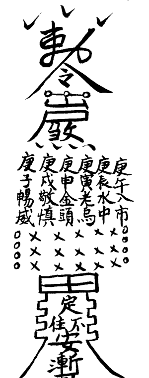

## 附：符二

### 墓呼鎮用符

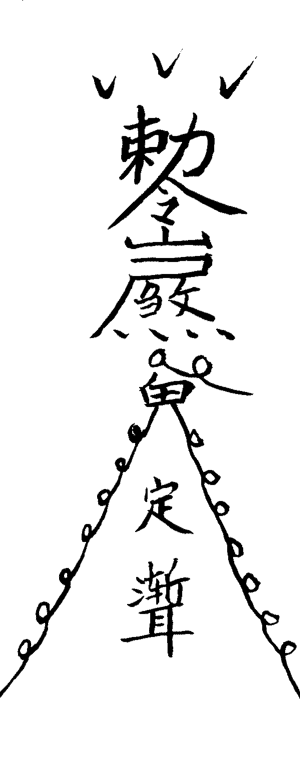

## 附：符四

### 中 梁 符

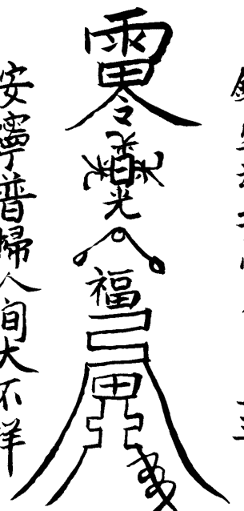

安寧普掃人間大不祥

鎮宅神功受命入星斗

## 附：符三

### 地音破法符

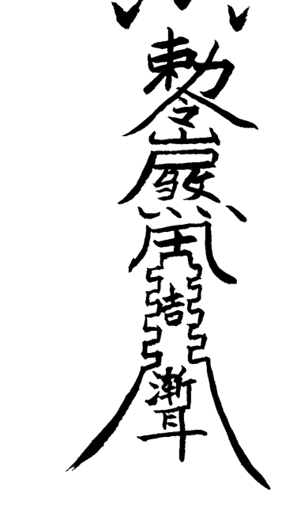

## 附：符六

### 鎮伏尸符

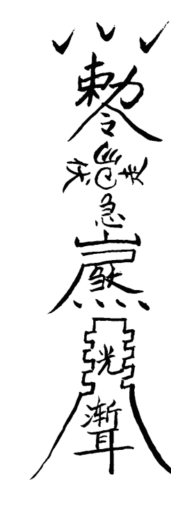

## 附：符五

### 五雷符

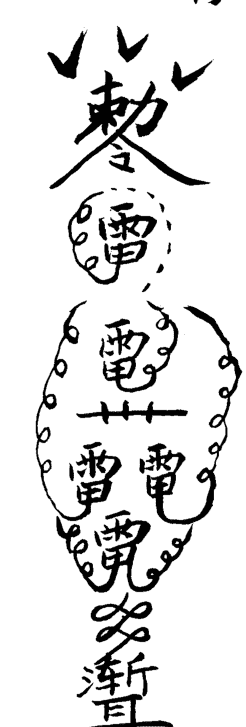

## 附：符八

### 大鎮法符

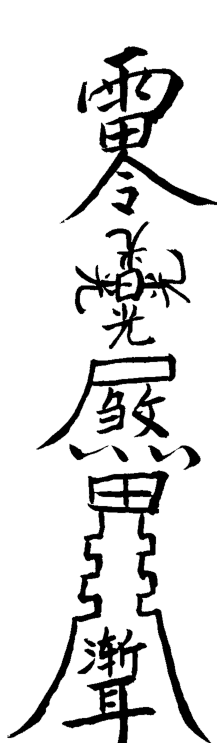

## 附：符七

### 定殃符

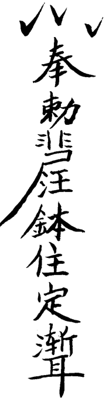

## 附：符十（一）

## 附：符九

### 净宅镇符

### 发火符

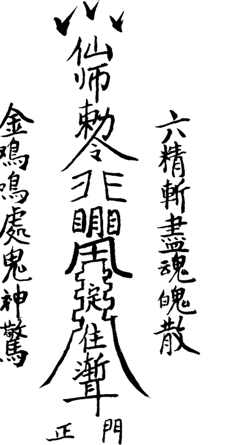

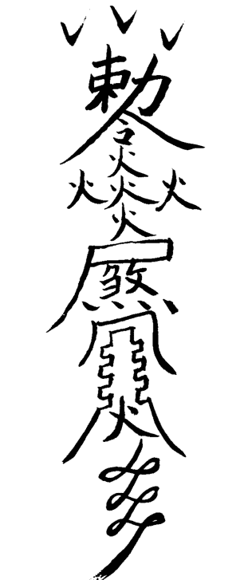

## 附：符十（三）

## 附：符十（二）

### 净宅镇符

### 净宅镇符

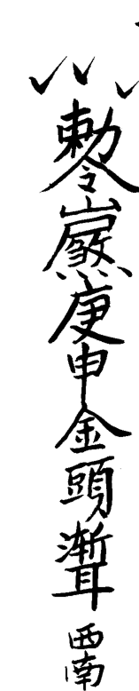

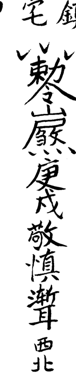

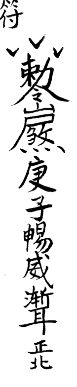

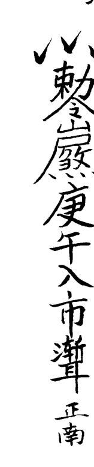

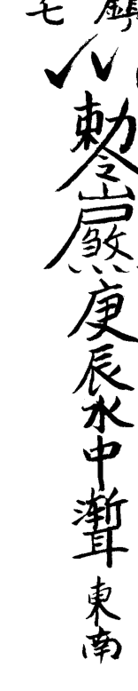

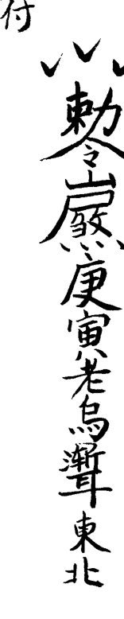

## 附：符十二（一）

## 附：符十一

### 出灵后贴房四角镇宅

### 镇宅符

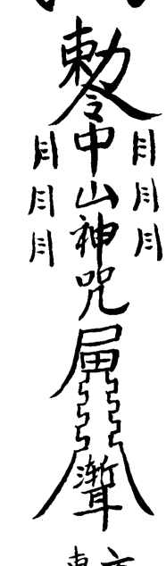

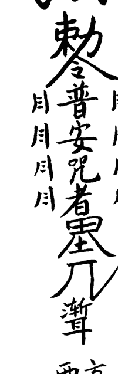

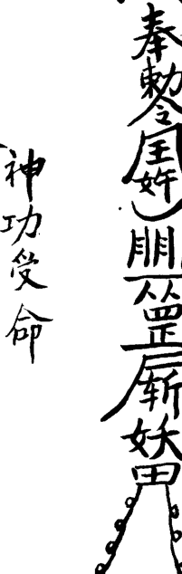

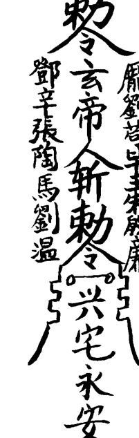

## 附：符十三

## 附：符十二（二）

### 安坟符

### 出灵后贴房四角镇宅

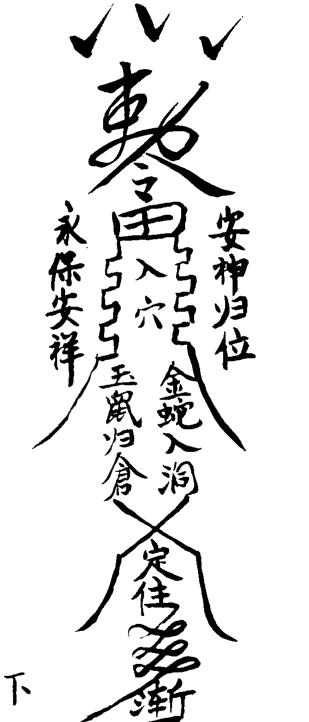

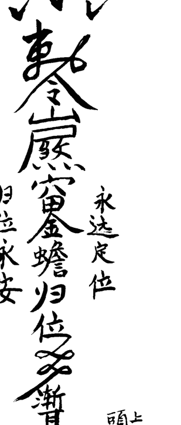

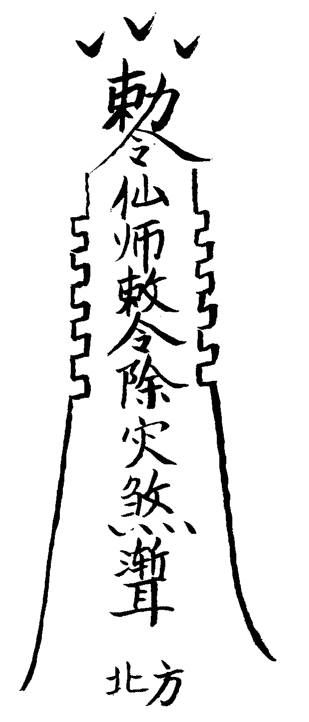

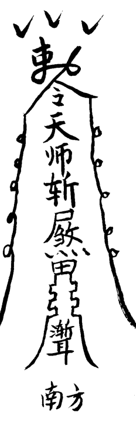

## 附：符十五

## 附：符十四

### 死尸定身符

### 打尸符

### 泰山符

### 定身符

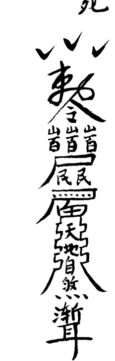

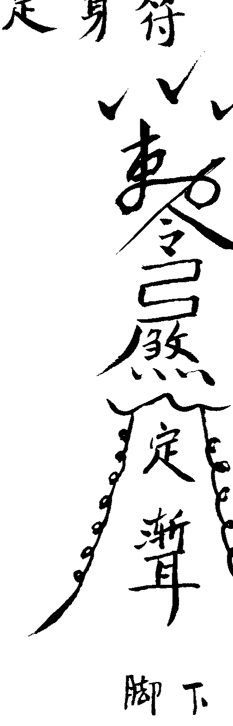

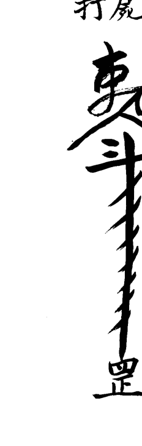

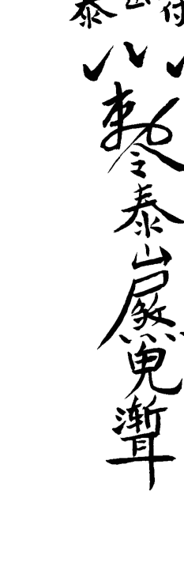

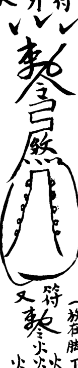

头上

脚下

（放在脚下）

## 附：符十七

## 附：符十六

### 鎮天坑墓呼

### 鎮天坑符

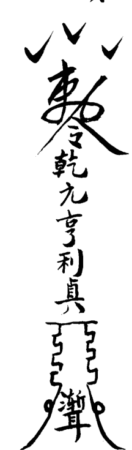

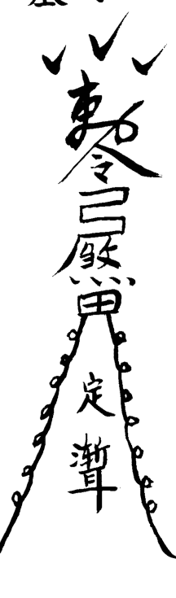

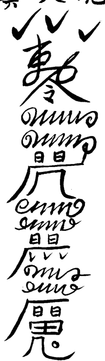

贴后槐头

贴前槐头

## 附：符十九

### 治偷盗符

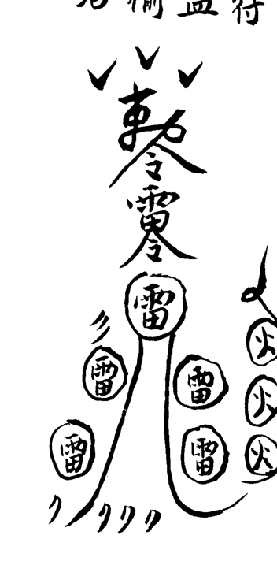

## 附：符十八

### 起坟后镇物破法

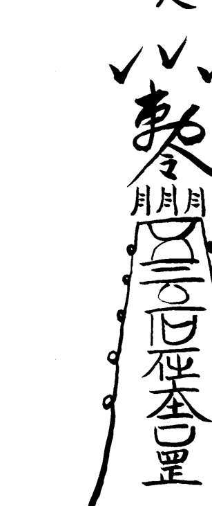

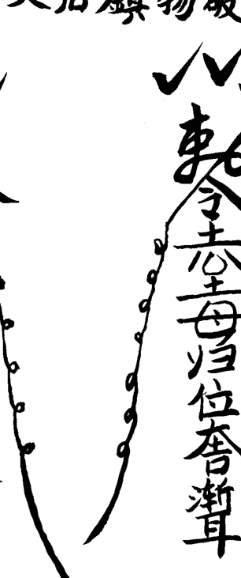

埋坑内镇之大吉

用新砖一块上用朱符

正面

背面

## 附：符二十

### 治偷盗者符

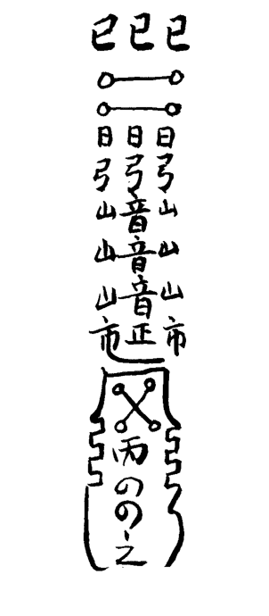

## 附：符二十一

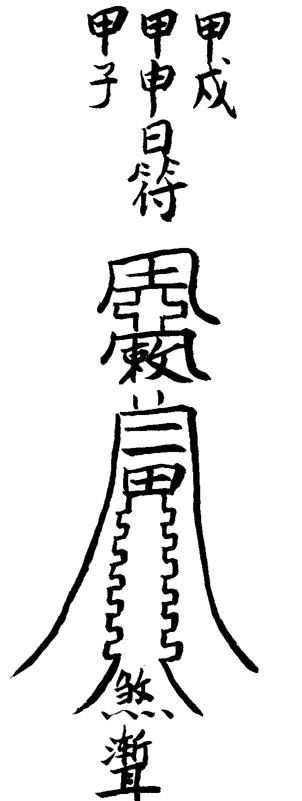

## 附：符二十三

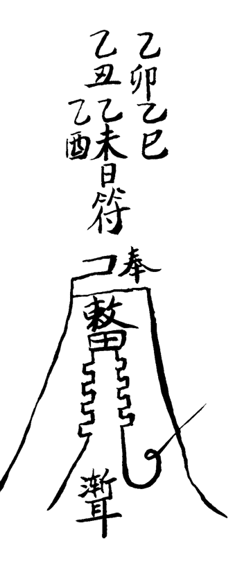

## 附：符二十二

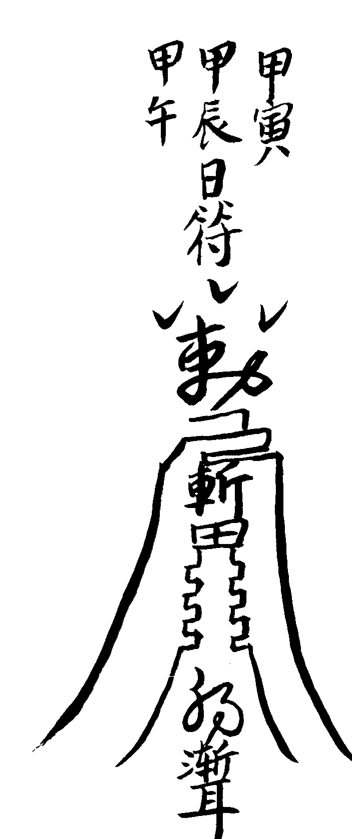

## 附：符二十四

丙午丙辰
丙戌丙申日符
丙子丙寅

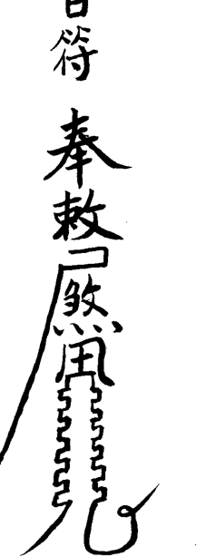

## 附：符二十五

丁未丁亥
丁酉丁卯日符
丁巳丁丑

丁亥符在六亥内画

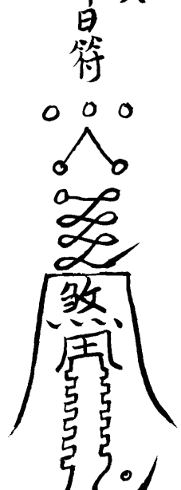

## 附：符二十七

戊辰戊午
戊申戊戌
日符

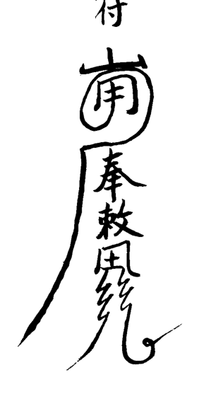

## 附：符二十六

戊寅
日符

## 附：符二十八

己卯
己未日符
己丑
己巳

寅辰日
代子符

## 附：符二十九

庚午庚戌
庚辰庚申日符
庚子庚寅

右六庚申日十二日正七月六甲天福

## 附：符三十（一）

右六辛日書六乙天德 六辛天府

癸亥 丁亥
辛亥 乙亥日符奉敕
己亥

## 附：符三十（二）

辛卯辛酉
辛巳辛未日符奉敕

## 附：符三十二

癸巳癸未
癸酉癸卯
癸丑日符

## 附：符三十一

壬申壬子
壬辰壬寅
壬午壬戌
日符

## 附：符三十四

## 附：符三十三

### 鎮走屍符

### 七殺符

男用此符

女用此符

## 附：符三十六（一）

### 鎮起屍各種符

## 附：符三十五

### 鎮屍坐起符

## 附：符三十六（三）

## 附：符三十六（二）

### 鎮起屍各種符

### 鎮起屍各種符

貼頭上

貼頭上

貼心口和頭上

貼心口上

## 附：符三十七（一）

### 压尸符

## 附：符三十七（二）

### 压尸符

## 附：符三十九

## 附：符三十八

### 三煞符

### 三咎符

### 天師符

此符写四道
镇墓呼四角则吉

師人护身頭戴符

# 後記

我是吉林省戲劇家協會會員，劇作家。吉林市周易研究會理事，哈爾濱古易經研究所研究員，客座教授。為使象數派後繼有人，發揚光大，常年舉辦如下函授班：

- 一、六爻函授班。
- 二、八字函授班。
- 三、陰陽宅風水點竅系列函授班。
- 四、傳授畫符秘法。
- 五、傳授「鬼門十三針」絕法。
- 六、傳授「小建錢子」使用方法。
- 七、《八字速斷點竅》高級教材。
- 八、常年舉辦六爻、八字、風水面授班。歡迎來函查詢。

地址：吉林省磐石市振興大街一五四號一單元二樓
郵編：132300
電話：0432—5226764

## 附：符四十

### 鎮重喪煞符

書名：陰宅實用點竅
作者：張成達
總監：Alex Cho
編輯：袁偲珍
植字排版：萬寶國際發展公司
電話：(852) 81046178
出版人：曹展碩
出版：中國哲學文化協進會
九龍旺角亞皆老街43-49號雅佳樓6字47號
電話：(852) 26183861 26188861
傳真：(852) 26181277
網址：www.168k.com 或 www.zhouyi.net
電子郵箱：168@168k.com
印刷：彩藝印刷公司
發行：利源書報社
九龍旺角洗衣街245-251號地下
23818251
國際書號：962-7943-61-4
定價：港幣88元

版權所有
本書任何部分之文字及圖片未經出版人
書面許可，不得以任何方式抄襲或翻印。

## 更多资料

↓↓↓

### 【中华古籍库】

↓ 点击链接 ↓

https://www.fozhu920.com/list/

珍版刻印 / 海外流传 / 家传手抄 / 民间失传

【易】【医】【道】【武】【文】【奇】【画】【书】

1000000+高清古书籍

### 打包下载

微信：mbook86

### 中华古籍库

1000000 册 高清影印古籍

珍版刻印 / 海外流传 / 家传手抄 / 民间失传

古籍善本、经史子集、史料笔记、古人文集、
民间收藏、传世家谱、各地方志、中医典籍、
四库全书、古禁毁书、内阁文库、图书集成、
丛书集成、四部丛刊、万有文库、四部备要、
二十四史、三国六朝文、明清和民国古籍史料
……

