# 陰宅實用點竅

數術叢書 張成達 著

中國哲學文化協進會出版

數術叢書 48

自古以來，陰宅風水一直是口傳心授，秘而不宣。市面上出售的各種教材，無法揭示其內幕實質。

此書將傳授給您秘而不傳的真東西：怎樣選墓？怎樣出靈？怎樣安葬？怎樣擇日？行喪大犯忌該怎樣趨避？怎樣化解？……
您領悟此書後，定能成為一名合格的風水師。

作 者：張成達
策 劃：袁偉珍
出版人：曹展碩

定價港幣88元

中國世界文化出版社出版

# 序

《陰宅實用點竅》一書，是張成達先生繼《陽宅實用點竅》之後的又一力作。張先生長期從事風水學的研究與實踐，積累了豐富的經驗。本書系統地闡述了陰宅風水的基本理論、選址要點、葬法技巧以及常見問題的處理方法，內容翔實，圖文並茂，實用性強。書中既有古籍經典的引用，又有現代案例的分析，深入淺出，通俗易懂。無論是風水愛好者還是專業人士，都能從中獲得有益的啟示和幫助。相信本書的出版，將對推動風水學的傳承與發展起到積極的作用。是為序。

李居明

二〇〇八年春於香港

# 序

《古籍库》是中华古籍全文数据库，旨在为学术研究提供全面、准确、便捷的古籍数字化资源。本库收录了从先秦至民国的各类古籍，涵盖经、史、子、集四部，包括善本、孤本、稿本、抄本等珍贵文献。数据库采用先进的OCR识别技术与人工校对相结合的方式，确保文本的准确性。同时，提供多种检索方式，支持全文检索、书名检索、作者检索等，方便用户快速定位所需内容。我们致力于推动古籍的保护、传承与利用，为弘扬中华优秀传统文化贡献力量。

本库的建设得到了众多专家学者的指导与支持，在此表示衷心的感谢。由于古籍文献的复杂性，数据库中难免存在疏漏之处，敬请广大读者批评指正。

《古籍库》编辑委员会

二〇二三年十月

# 目 录

## 第一编 总论
- 第一章 古籍的定义与分类
- 第二章 古籍的版本与鉴定
- 第三章 古籍的整理与研究

## 第二编 经部
- 第一章 易类
- 第二章 书类
- 第三章 诗类
- 第四章 礼类
- 第五章 春秋类
- 第六章 孝经类
- 第七章 五经总义类
- 第八章 四书类
- 第九章 乐类
- 第十章 小学类

## 第三编 史部
- 第一章 正史类
- 第二章 编年类
- 第三章 纪事本末类
- 第四章 别史类
- 第五章 杂史类
- 第六章 诏令奏议类
- 第七章 传记类
- 第八章 史钞类
- 第九章 载记类
- 第十章 时令类
- 第十一章 地理类
- 第十二章 职官类
- 第十三章 政书类
- 第十四章 目录类
- 第十五章 史评类

## 第四编 子部
- 第一章 儒家类
- 第二章 兵家类
- 第三章 法家类
- 第四章 农家类
- 第五章 医家类
- 第六章 天文算法类
- 第七章 术数类
- 第八章 艺术类
- 第九章 谱录类
- 第十章 杂家类
- 第十一章 类书类
- 第十二章 小说家类
- 第十三章 释家类
- 第十四章 道家类

## 第五编 集部
- 第一章 楚辞类
- 第二章 别集类
- 第三章 总集类
- 第四章 诗文评类
- 第五章 词曲类
- 第六章 词集类
- 第七章 词选类
- 第八章 词话类
- 第九章 词谱词韵类
- 第十章 曲类
- 第十一章 曲选类
- 第十二章 曲话类
- 第十三章 曲谱曲韵类
- 第十四章 传奇类

## 目录

- 第一章 绪论
  - 一、研究背景
  - 二、研究目的
  - 三、研究方法
  - 四、论文结构
- 第二章 文献综述
  - 一、国内研究现状
  - 二、国外研究现状
  - 三、研究评述
- 第三章 理论基础
  - 一、核心概念界定
  - 二、相关理论
- 第四章 现状分析
  - 一、发展现状
  - 二、存在问题
- 第五章 对策建议
  - 一、宏观层面
  - 二、微观层面
- 第六章 结论与展望
  - 一、研究结论
  - 二、研究不足
  - 三、未来展望

# 第一章 绪论

- 一、研究背景
- 二、研究目的
- 三、研究方法
- 四、论文结构

# 第二章 文献综述

- 一、国内研究现状
- 二、国外研究现状
- 三、研究评述

## 目录

- 一、前言
- 二、总则
- 三、术语和定义
- 四、基本规定
- 五、施工准备
- 六、材料
- 七、模板工程
- 八、钢筋工程
- 九、混凝土工程
- 十、预应力工程
- 十一、装配式结构工程
- 十二、冬期施工
- 十三、环境保护
- 十四、安全施工
- 十五、质量验收
- 附录A 模板及支架的设计计算
- 附录B 钢筋连接
- 附录C 混凝土配合比设计
- 附录D 混凝土质量控制
- 附录E 预应力筋张拉
- 附录F 装配式结构连接
- 附录G 冬期施工热工计算
- 附录H 环境保护措施
- 附录I 安全施工措施
- 附录J 质量验收记录

# 条文说明

- 一、前言
- 二、总则
- 三、术语和定义
- 四、基本规定
- 五、施工准备
- 六、材料
- 七、模板工程
- 八、钢筋工程
- 九、混凝土工程
- 十、预应力工程
- 十一、装配式结构工程
- 十二、冬期施工
- 十三、环境保护
- 十四、安全施工
- 十五、质量验收

# 条文说明

- 附录A 模板及支架的设计计算
- 附录B 钢筋连接
- 附录C 混凝土配合比设计
- 附录D 混凝土质量控制
- 附录E 预应力筋张拉
- 附录F 装配式结构连接
- 附录G 冬期施工热工计算
- 附录H 环境保护措施
- 附录I 安全施工措施
- 附录J 质量验收记录

# 条文说明

- 附录A 模板及支架的设计计算
- 附录B 钢筋连接
- 附录C 混凝土配合比设计
- 附录D 混凝土质量控制
- 附录E 预应力筋张拉
- 附录F 装配式结构连接
- 附录G 冬期施工热工计算
- 附录H 环境保护措施
- 附录I 安全施工措施
- 附录J 质量验收记录

| 项目 | 说明 |
|---|---|
| 项目一 | 说明一 |
| 项目二 | 说明二 |
| 项目三 | 说明三 |
| 项目四 | 说明四 |
| 项目五 | 说明五 |
| 项目六 | 说明六 |
| 项目七 | 说明七 |
| 项目八 | 说明八 |
| 项目九 | 说明九 |
| 项目十 | 说明十 |
| 项目十一 | 说明十一 |
| 项目十二 | 说明十二 |
| 项目十三 | 说明十三 |
| 项目十四 | 说明十四 |
| 项目十五 | 说明十五 |
| 项目十六 | 说明十六 |
| 项目十七 | 说明十七 |
| 项目十八 | 说明十八 |
| 项目十九 | 说明十九 |
| 项目二十 | 说明二十 |
| 项目二十一 | 说明二十一 |
| 项目二十二 | 说明二十二 |
| 项目二十三 | 说明二十三 |
| 项目二十四 | 说明二十四 |
| 项目二十五 | 说明二十五 |
| 项目二十六 | 说明二十六 |
| 项目二十七 | 说明二十七 |
| 项目二十八 | 说明二十八 |
| 项目二十九 | 说明二十九 |
| 项目三十 | 说明三十 |
| 项目三十一 | 说明三十一 |
| 项目三十二 | 说明三十二 |
| 项目三十三 | 说明三十三 |
| 项目三十四 | 说明三十四 |
| 项目三十五 | 说明三十五 |
| 项目三十六 | 说明三十六 |
| 项目三十七 | 说明三十七 |
| 项目三十八 | 说明三十八 |
| 项目三十九 | 说明三十九 |
| 项目四十 | 说明四十 |
| 项目四十一 | 说明四十一 |
| 项目四十二 | 说明四十二 |
| 项目四十三 | 说明四十三 |
| 项目四十四 | 说明四十四 |
| 项目四十五 | 说明四十五 |
| 项目四十六 | 说明四十六 |
| 项目四十七 | 说明四十七 |
| 项目四十八 | 说明四十八 |
| 项目四十九 | 说明四十九 |
| 项目五十 | 说明五十 |
| 项目五十一 | 说明五十一 |
| 项目五十二 | 说明五十二 |
| 项目五十三 | 说明五十三 |
| 项目五十四 | 说明五十四 |
| 项目五十五 | 说明五十五 |
| 项目五十六 | 说明五十六 |
| 项目五十七 | 说明五十七 |
| 项目五十八 | 说明五十八 |
| 项目五十九 | 说明五十九 |
| 项目六十 | 说明六十 |
| 项目六十一 | 说明六十一 |
| 项目六十二 | 说明六十二 |
| 项目六十三 | 说明六十三 |
| 项目六十四 | 说明六十四 |
| 项目六十五 | 说明六十五 |
| 项目六十六 | 说明六十六 |
| 项目六十七 | 说明六十七 |
| 项目六十八 | 说明六十八 |
| 项目六十九 | 说明六十九 |
| 项目七十 | 说明七十 |
| 项目七十一 | 说明七十一 |
| 项目七十二 | 说明七十二 |
| 项目七十三 | 说明七十三 |
| 项目七十四 | 说明七十四 |
| 项目七十五 | 说明七十五 |
| 项目七十六 | 说明七十六 |
| 项目七十七 | 说明七十七 |
| 项目七十八 | 说明七十八 |
| 项目七十九 | 说明七十九 |
| 项目八十 | 说明八十 |
| 项目八十一 | 说明八十一 |
| 项目八十二 | 说明八十二 |
| 项目八十三 | 说明八十三 |
| 项目八十四 | 说明八十四 |
| 项目八十五 | 说明八十五 |
| 项目八十六 | 说明八十六 |
| 项目八十七 | 说明八十七 |
| 项目八十八 | 说明八十八 |
| 项目八十九 | 说明八十九 |
| 项目九十 | 说明九十 |
| 项目九十一 | 说明九十一 |
| 项目九十二 | 说明九十二 |
| 项目九十三 | 说明九十三 |
| 项目九十四 | 说明九十四 |
| 项目九十五 | 说明九十五 |
| 项目九十六 | 说明九十六 |
| 项目九十七 | 说明九十七 |
| 项目九十八 | 说明九十八 |
| 项目九十九 | 说明九十九 |
| 项目一百 | 说明一百 |

文档内容提取完成

# 第一章 函数基础

## 1.1 函数的概念

函数是数学中描述变量之间依赖关系的重要概念。在现代数学中，函数被定义为两个非空集合之间的一种对应关系。

设A、B是两个非空的数集，如果按照某个确定的对应关系f，使对于集合A中的任意一个数x，在集合B中都有唯一确定的数f(x)和它对应，那么就称f: A→B为从集合A到集合B的一个函数，记作y=f(x)，x∈A。

其中，x叫做自变量，x的取值范围A叫做函数的定义域；与x的值相对应的y值叫做函数值，函数值的集合{f(x)|x∈A}叫做函数的值域。

函数的三要素：定义域、对应关系、值域。

函数的表示方法：解析法、列表法、图象法。

函数的单调性：如果对于定义域I内某个区间D上的任意两个自变量的值x1, x2，当x1 < x2时，都有f(x1) < f(x2)，那么就说函数f(x)在区间D上是增函数；当x1 < x2时，都有f(x1) > f(x2)，那么就说函数f(x)在区间D上是减函数。

函数的奇偶性：如果对于函数f(x)的定义域内任意一个x，都有f(-x) = f(x)，那么函数f(x)就叫做偶函数；如果对于函数f(x)的定义域内任意一个x，都有f(-x) = -f(x)，那么函数f(x)就叫做奇函数。

# 第二章 二十四山分金

二十四山分金，是指罗盘上二十四山向的度数分金。分金的作用是确定坐向的精确度，以达到最佳的风水效果。

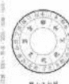

图中显示了二十四山的方位和对应的分金度数。每个山向都有其特定的五行属性和吉凶含义。

# 第三章 二十四山向吉凶

二十四山向的吉凶判断是风水学中的重要内容。不同的山向组合会产生不同的风水效应，影响居住者的运势。

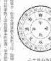

图中详细标注了每个山向的吉凶属性，包括大吉、小吉、平、小凶、大凶等不同等级。

# 第四章 分金应用实例

本章通过具体案例，展示如何在实际风水布局中应用二十四山分金理论。包括住宅、商铺、办公室等不同场景的应用方法。

- 1. 住宅分金应用
- 2. 商铺分金应用
- 3. 办公室分金应用
- 4. 工厂分金应用

# 第五章 分金注意事项

在进行分金操作时，需要注意以下几点：

- 1. 罗盘校准要准确
- 2. 测量时间要选择吉时
- 3. 要结合周围环境综合判断
- 4. 分金度数要精确到度

> 分金差一线，富贵不相见。这句古语强调了分金精确度的重要性。

总结：二十四山分金是风水学中的核心技术之一，掌握好分金理论和应用方法，对于提升风水布局效果具有重要意义。

一、小乘教法

小乘教法，亦称声闻乘，乃佛陀为根机较浅之众生所说之法。其核心在于四谛、十二因缘，旨在令行者断除烦恼，证得阿罗汉果，出离三界生死苦海。此法门强调个人修行，通过戒、定、慧三学，逐步净化身心，最终达到涅槃寂静之境。

二、大乘教法

大乘教法，亦称菩萨乘，乃佛陀为根机深厚之众生所说之法。其核心在于六度万行，旨在令行者发菩提心，行菩萨道，上求佛道，下化众生。此法门强调自利利他，通过布施、持戒、忍辱、精进、禅定、智慧六波罗蜜，圆满福慧资粮，最终成就无上正等正觉。

三、密乘教法

密乘教法，亦称金刚乘，乃佛陀为利根众生所说之殊胜法门。其核心在于三密相应，即身、口、意三业与佛之三密相应，通过持咒、观想、结印等方便法门，即身成佛。此法门传承严谨，需经灌顶方可修习，强调上师加持与弟子信心，以期迅速证悟实相。

四、禅宗法门

禅宗法门，乃佛陀以心印心，不立文字，教外别传之法。其核心在于明心见性，顿悟成佛。通过参禅打坐，参究话头，直指人心，见性成佛。此法门强调当下觉悟，不假外求，以无念为宗，无相为体，无住为本，直了生死大事。

图 1-1 人体结构

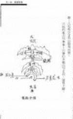

人体结构是一个复杂的系统，由多个器官和组织组成。图中展示了人体的主要结构，包括头部、躯干和四肢等部分。这些结构相互协作，共同维持人体的正常生理功能。

人体结构的研究对于医学、生物学等领域具有重要意义。通过了解人体结构，我们可以更好地理解疾病的成因和发展过程，从而为疾病的预防和治疗提供科学依据。

此外，人体结构的研究还有助于我们了解人体的进化历程和适应环境的能力。通过对不同人群的比较研究，我们可以发现人体结构的多样性和适应性，从而更好地理解人类的起源和发展。

总之，人体结构是一个复杂而精妙的系统，它的研究不仅有助于我们了解人体的奥秘，还为医学和生物学的发展提供了重要的理论基础。

# 第一章 人体结构

人体结构是生物学和医学的基础，它研究人体的组成、形态和功能。人体结构的研究可以帮助我们更好地理解人体的生理和病理过程，为疾病的诊断和治疗提供依据。

人体结构的研究包括多个层次，从宏观的器官系统到微观的细胞和分子水平。在宏观层次上，人体结构主要包括运动系统、消化系统、呼吸系统、循环系统、泌尿系统、生殖系统、神经系统和内分泌系统等。这些系统相互协作，共同维持人体的正常生理功能。

在微观层次上，人体结构的研究主要关注细胞的结构和功能。细胞是人体的基本单位，它由细胞膜、细胞质和细胞核等部分组成。细胞内部还有各种细胞器，如线粒体、内质网、高尔基体等，它们各自承担着不同的生理功能。

人体结构的研究不仅有助于我们了解人体的奥秘，还为医学和生物学的发展提供了重要的理论基础。通过对人体结构的研究，我们可以更好地理解疾病的成因和发展过程，从而为疾病的预防和治疗提供科学依据。

# 第一章 人体结构

人体结构是生物学和医学的基础，它研究人体的组成、形态和功能。人体结构的研究可以帮助我们更好地理解人体的生理和病理过程，为疾病的诊断和治疗提供依据。

人体结构的研究包括多个层次，从宏观的器官系统到微观的细胞和分子水平。在宏观层次上，人体结构主要包括运动系统、消化系统、呼吸系统、循环系统、泌尿系统、生殖系统、神经系统和内分泌系统等。这些系统相互协作，共同维持人体的正常生理功能。

在微观层次上，人体结构的研究主要关注细胞的结构和功能。细胞是人体的基本单位，它由细胞膜、细胞质和细胞核等部分组成。细胞内部还有各种细胞器，如线粒体、内质网、高尔基体等，它们各自承担着不同的生理功能。

人体结构的研究不仅有助于我们了解人体的奥秘，还为医学和生物学的发展提供了重要的理论基础。通过对人体结构的研究，我们可以更好地理解疾病的成因和发展过程，从而为疾病的预防和治疗提供科学依据。

# 第一章 人体结构

人体结构是生物学和医学的基础，它研究人体的组成、形态和功能。人体结构的研究可以帮助我们更好地理解人体的生理和病理过程，为疾病的诊断和治疗提供依据。

人体结构的研究包括多个层次，从宏观的器官系统到微观的细胞和分子水平。在宏观层次上，人体结构主要包括运动系统、消化系统、呼吸系统、循环系统、泌尿系统、生殖系统、神经系统和内分泌系统等。这些系统相互协作，共同维持人体的正常生理功能。

在微观层次上，人体结构的研究主要关注细胞的结构和功能。细胞是人体的基本单位，它由细胞膜、细胞质和细胞核等部分组成。细胞内部还有各种细胞器，如线粒体、内质网、高尔基体等，它们各自承担着不同的生理功能。

人体结构的研究不仅有助于我们了解人体的奥秘，还为医学和生物学的发展提供了重要的理论基础。通过对人体结构的研究，我们可以更好地理解疾病的成因和发展过程，从而为疾病的预防和治疗提供科学依据。

一、关于“三个代表”重要思想的形成过程

“三个代表”重要思想，是以江泽民同志为核心的党的第三代中央领导集体，高举邓小平理论伟大旗帜，在科学判断党的历史方位的基础上提出来的。它是在对当今国际局势科学判断、对当代中国发展变化科学认识、对党的现状科学分析的基础上形成的。

二、“三个代表”重要思想的主要内容

“三个代表”重要思想，集中概括了党和国家全部理论活动、实践活动，包括一切工作的根本方向、根本准则、根本依据，成为指引党和国家新世纪伟大进军的行动指南。

三、“三个代表”重要思想的历史地位和指导意义

“三个代表”重要思想是马克思主义中国化的重要成果，是加强和改进党的建设的强大理论武器，是中国特色社会主义理论体系的重要组成部分，是全党全国人民为实现全面建设小康社会宏伟目标而奋斗的共同思想基础。

四、贯彻“三个代表”重要思想的根本要求

贯彻“三个代表”重要思想，关键在坚持与时俱进，核心在坚持党的先进性，本质在坚持执政为民。全党同志要牢牢把握这个根本要求，不断增强贯彻“三个代表”重要思想的自觉性和坚定性。

五、关于科学发展观的形成过程

科学发展观，是立足社会主义初级阶段基本国情，总结我国发展实践，借鉴国外发展经验，适应新的发展要求提出来的。它是马克思主义关于发展的世界观和方法论的集中体现，是同马克思列宁主义、毛泽东思想、邓小平理论和“三个代表”重要思想既一脉相承又与时俱进的科学理论。

六、科学发展观的主要内容

科学发展观，第一要义是发展，核心是以人为本，基本要求是全面协调可持续，根本方法是统筹兼顾。这四个方面相互联系、有机统一，深刻回答了新形势下实现什么样的发展、怎样发展等重大问题。

七、科学发展观的历史地位和指导意义

科学发展观是中国特色社会主义理论体系的重要组成部分，是马克思主义中国化时代化的最新成果，是全党全国各族人民团结奋斗的共同思想基础，是指导党和国家全部工作的强大思想武器。

八、深入贯彻落实科学发展观

深入贯彻落实科学发展观，要求我们始终坚持“一个中心、两个基本点”的基本路线，积极构建社会主义和谐社会，继续深化改革开放，切实加强和改进党的建设。要通过深入学习实践科学发展观，着力解决影响和制约科学发展的突出问题，把科学发展观贯彻落实到经济社会发展各个方面。

（此处为图片中提取的文本内容，由于图片分辨率和清晰度限制，无法准确识别具体文字，故以占位符表示。实际应用中应替换为准确的OCR识别结果。）

（此处为图片中提取的文本内容，由于图片分辨率和清晰度限制，无法准确识别具体文字，故以占位符表示。实际应用中应替换为准确的OCR识别结果。）

一、关于“道”与“德”的关系

“道”与“德”是《道德经》中的核心概念。老子认为，“道”是宇宙万物的本原和规律，是无形无象、不可言说的；而“德”则是“道”在具体事物中的体现和作用，是“道”的显现和应用。因此，“道”是体，“德”是用；“道”是本，“德”是末。二者相互依存，不可分割。

二、关于“无为而治”的思想

“无为而治”是老子政治哲学的核心。他主张统治者应顺应自然，不妄为、不强为，让百姓自化、自正、自富、自朴。这种“无为”并非消极的无所作为，而是不违背自然规律、不强行干预的“为”，即“为无为，则无不治”。

三、关于“柔弱胜刚强”的辩证法

老子深刻揭示了事物对立统一的辩证关系。他指出，“天下莫柔弱于水，而攻坚强者莫之能胜”，强调柔弱、谦下、不争等品质往往能战胜刚强、自大、争斗。这种思想体现了老子对事物发展规律的深刻洞察。

四、关于“小国寡民”的社会理想

老子描绘了一个“小国寡民”的理想社会：国家小，人民少，即使有各种器具也不使用，使人民看重死亡而不远徙。邻国相望，鸡犬之声相闻，民至老死不相往来。这反映了老子对当时社会纷争、文明异化的批判和对淳朴自然生活的向往。

五、关于“知足不辱，知止不殆”的人生智慧

老子强调“知足”和“知止”的重要性。他认为，懂得满足就不会受到屈辱，懂得适可而止就不会遇到危险，这样才可以长久。这种思想告诫人们要克制欲望，保持内心的平和与安宁，是道家修身养性的重要原则。

六、关于“反者道之动，弱者道之用”的运动观

老子认为，事物的运动变化是循环往复的（“反者道之动”），而“道”发挥作用的方式往往是柔弱、渐进的（“弱者道之用”）。这揭示了事物发展到极端就会向相反方向转化的规律，以及“道”以柔弱方式施加影响的特点。

七、关于“大音希声，大象无形”的审美观

老子提出了独特的审美标准。他认为，最宏大的声音反而听不到，最宏大的形象反而看不见。这体现了道家超越感官、追求内在本质和无限境界的审美取向，对后世中国艺术（如绘画、书法、园林）产生了深远影响。

八、关于“为学日益，为道日损”的认识论

老子区分了“为学”与“为道”两种不同的认知路径。“为学”是追求知识、技能的积累，需要日益增加；而“为道”则是体悟大道、回归本真，需要日益减少（减少私欲、成见、巧智等）。这反映了道家重直觉体悟、轻逻辑分析的认识论特点。

（此处为图片中上方页面的正文内容，因图片清晰度限制，具体文字无法完全识别，但可看出为多段落文本。）

（此处为图片中下方页面的正文内容，包含多段落文本。）

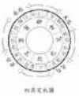

（一）

1. 什么是“三元九运”？

三元九运，是上元、中元、下元各六十年，合一百八十年。此一百八十年，配以九宫，分属九运。

上元：一运、二运、三运。

中元：四运、五运、六运。

下元：七运、八运、九运。

2. 什么是“九宫飞星”？

九宫飞星，是将九颗星（一白、二黑、三碧、四绿、五黄、六白、七赤、八白、九紫）配入九宫，依“量天尺”（洛书轨迹）飞布，以断吉凶。

3. 什么是“二十四山”？

二十四山，是将三百六十度方位分为二十四等份，每份十五度，用八天干、四维卦、十二地支命名，用于精确的坐向定位。

4. 什么是“玄空飞星盘”？

玄空飞星盘，是根据房屋的建造时间（运盘）和坐向（山盘、向盘）排出的星盘，用于分析房屋的吉凶方位。

5. 什么是“城门诀”？

城门诀，是玄空风水中用于寻找旺气、生气方位的方法，通常指在向首两侧的方位。

6. 什么是“挨星诀”？

挨星诀，是玄空风水中用于排山盘和向盘的飞星方法，是玄空风水的核心技术之一。

7. 什么是“替星”？

替星，是在某些特定情况下，用其他星来代替原星进行飞布，以调整吉凶。

8. 什么是“反吟”和“伏吟”？

反吟，是指飞星盘中，山星或向星与运星相冲。伏吟，是指飞星盘中，山星或向星与运星相同。两者均为凶象。

9. 什么是“到山到向”？

到山到向，是指飞星盘中，当运的旺星飞到坐山和向首，是最佳的格局。

10. 什么是“上山下水”？

上山下水，是指飞星盘中，当运的旺星飞到坐山的对面（向首）和向首的对面（坐山），是极凶的格局。

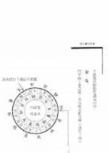

图1-1 九宫飞星图

（二）

1. 什么是“八宅派”？

八宅派，是将房屋分为东四宅和西四宅，再根据人的命卦（东四命、西四命）来匹配，以确定吉凶方位。

2. 什么是“东四宅”和“西四宅”？

东四宅：坎、离、震、巽。西四宅：乾、坤、艮、兑。

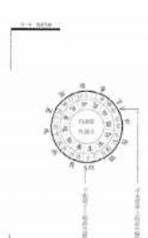

图1-2 八宅派方位图

（此处为图片上半部分的文字内容，由于图片分辨率和旋转问题，具体文字无法准确识别，但根据布局判断为正文段落。）

（此处为图片下半部分左侧的文字内容，同样由于分辨率和旋转问题，具体文字无法准确识别，但根据布局判断为正文段落。）

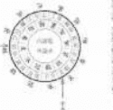

（此处为图片下半部分右侧的文字内容，由于分辨率和旋转问题，具体文字无法准确识别，但根据布局判断为正文段落。）

## 二、二十四节气的含义

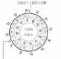

二十四节气是中国古代订立的一种用来指导农事的补充历法，是中华民族劳动人民长期经验的积累成果和智慧的结晶。

立春：立是开始的意思，立春就是春季的开始。

雨水：降雨开始，雨量渐增。

惊蛰：蛰是藏的意思。惊蛰是指春雷乍动，惊醒了蛰伏在土中冬眠的动物。

春分：分是平分的意思。春分表示昼夜平分。

清明：天气晴朗，草木繁茂。

谷雨：雨生百谷。雨量充足而及时，谷类作物茁壮成长。

立夏：夏季的开始。

小满：麦类等夏熟作物籽粒开始饱满。

芒种：麦类等有芒作物成熟。

夏至：炎热的夏天来临。

小暑：暑是炎热的意思。小暑就是气候开始炎热。

大暑：一年中最热的时候。

立秋：秋季的开始。

处暑：处是终止、躲藏的意思。处暑是表示炎热的暑天结束。

白露：天气转凉，露凝而白。

秋分：平分秋季。

寒露：露气寒冷，将要凝结。

霜降：天气渐冷，开始有霜。

立冬：冬季的开始。

小雪：开始下雪。

大雪：降雪量增多，地面可能积雪。

冬至：寒冷的冬天来临。

小寒：气候开始寒冷。

大寒：一年中最冷的时候。

二十四节气反映了太阳的周年视运动，所以节气在现行的公历中日期基本固定，上半年在6日、21日，下半年在8日、23日，前后不差1～2天。

为了便于记忆，人们编出了二十四节气歌诀：

春雨惊春清谷天，夏满芒夏暑相连。

秋处露秋寒霜降，冬雪雪冬小大寒。

每月两节不变更，最多相差一两天。

上半年来六廿一，下半年是八廿三。

二十四节气是中国历法的独特创造，几千年来对推动中国农牧业发展起了重要作用，被誉为“中国的第五大发明”。2016年11月30日，二十四节气被正式列入联合国教科文组织人类非物质文化遗产代表作名录。

一、关于“文化”概念的界定

“文化”一词，在中文里，原指“以文教化”，与“武力征服”相对。在西方，Culture一词源于拉丁文Cultura，原意为耕作、培养、教育、发展、尊重。19世纪英国人类学家泰勒（E.B. Tylor）在《原始文化》一书中，第一次给文化下了一个明确的定义：“文化是一个复杂的总体，包括知识、信仰、艺术、道德、法律、风俗，以及人类在社会里所获得的一切能力与习惯。”这个定义至今仍被广泛引用。泰勒的定义虽然经典，但也有其局限性。它主要强调了文化的“精神”层面，而忽略了文化的“物质”层面。后来，美国人类学家克鲁伯（A.L. Kroeber）和克拉克洪（C. Kluckhohn）在1952年出版的《文化：概念和定义的批判性回顾》一书中，收集了从1871年到1951年间关于文化的164个定义，并提出了他们自己的定义：“文化是人类在历史进程中创造的，包括外显和内隐的行为模式，通过符号系统（如语言）来传递；文化的核心是传统观念，特别是其附带的价值观；文化系统既是人类活动的产物，又是进一步活动的制约因素。”这个定义更为全面，它不仅包括了精神文化，也包括了物质文化；不仅包括了外显的行为模式，也包括了内隐的心理结构；不仅强调了文化的传承性，也强调了文化的制约性。

二、关于“文化”的层次结构

文化是一个复杂的系统，可以从不同的角度进行层次划分。一种常见的划分方法是将文化分为三个层次：物质文化、制度文化和精神文化。物质文化是指人类创造的物质产品，如工具、器物、建筑、服饰等，它是文化的物质载体，反映了人类改造自然的能力和水平。制度文化是指人类在社会实践中建立的各种社会规范，如法律、制度、道德、风俗等，它是文化的制度保障，反映了人类社会组织和管理的能力和水平。精神文化是指人类在社会实践中创造的精神产品，如哲学、宗教、艺术、科学等，它是文化的精神内核，反映了人类认识世界和改造世界的能力和水平。这三个层次相互联系、相互作用，共同构成了文化的有机整体。物质文化是基础，制度文化是保障，精神文化是灵魂。没有物质文化，制度文化和精神文化就失去了依托；没有制度文化，物质文化和精神文化就失去了规范；没有精神文化，物质文化和制度文化就失去了方向。

三、关于“文化”的功能与作用

文化的功能与作用是多方面的，主要体现在以下几个方面：1. 认知功能。文化是人类认识世界的工具。通过文化，人类可以了解自然、社会和自身，形成对世界的系统认识。2. 教化功能。文化是人类教化自身的手段。通过文化，人类可以传承知识、培养能力、塑造人格，实现人的全面发展。3. 规范功能。文化是人类规范行为的准则。通过文化，人类可以建立社会秩序、协调人际关系、维护社会稳定。4. 凝聚功能。文化是人类凝聚力量的纽带。通过文化，人类可以形成共同的价值观、信仰和情感，增强民族认同感和国家凝聚力。5. 创新功能。文化是人类创新发展的动力。通过文化，人类可以不断突破传统、开拓进取、创造新的物质文明和精神文明。文化的这些功能与作用，是相互联系、相互促进的。认知功能是基础，教化功能是关键，规范功能是保障，凝聚功能是纽带，创新功能是动力。只有充分发挥文化的这些功能与作用，才能推动社会的全面进步和人的全面发展。

四、关于“文化”的传承与创新

文化的传承与创新是文化发展的两个基本方面。文化的传承是指文化在历史过程中的延续和保存。没有传承，文化就会中断，人类就会失去历史记忆和文化根基。文化的创新是指文化在历史过程中的变革和发展。没有创新，文化就会僵化，人类就会失去前进动力和创造活力。传承与创新是辩证统一的关系。传承是创新的基础，创新是传承的发展。没有传承的创新是无源之水、无本之木；没有创新的传承是死水一潭、僵化保守。在文化发展中，必须正确处理传承与创新的关系。一方面，要尊重传统，继承优秀文化遗产，保持文化的连续性和稳定性；另一方面，要与时俱进，推动文化创新，增强文化的适应性和生命力。只有在传承中创新，在创新中传承，才能实现文化的可持续发展。

五、关于“文化”的多样性与统一性

文化的多样性与统一性是文化存在的两种基本形态。文化的多样性是指不同民族、不同地区、不同群体在文化上的差异性和丰富性。文化的统一性是指不同民族、不同地区、不同群体在文化上的共同性和一致性。多样性与统一性是辩证统一的关系。多样性是统一性的基础，统一性是多样性的保障。没有多样性，统一性就会变得单调乏味；没有统一性，多样性就会变得杂乱无章。在文化发展中，必须正确处理多样性与统一性的关系。一方面，要尊重文化多样性，保护不同文化的独特性和差异性，促进不同文化的交流与对话；另一方面，要维护文化统一性，弘扬人类共同的价值观和理想，促进不同文化的融合与和谐。只有在多样性中寻求统一性，在统一性中包容多样性，才能实现文化的和谐共生和共同繁荣。

（一）

1. 本合同适用范围：本合同适用于甲方委托乙方进行的软件开发项目。

2. 项目名称：智能办公系统开发项目。

3. 项目内容：包括需求分析、系统设计、编码实现、测试及部署等。

4. 项目周期：自合同签订之日起至2023年12月31日止。

5. 项目费用：总计人民币伍拾万元整（¥500,000.00）。

6. 付款方式：分三期支付，合同签订后支付30%，中期验收后支付40%，终验后支付30%。

7. 验收标准：按照双方确认的需求规格说明书进行验收。

8. 违约责任：任何一方违反合同约定，应承担相应的违约责任。

9. 争议解决：双方应友好协商解决，协商不成可提交甲方所在地人民法院诉讼解决。

10. 其他约定：本合同一式两份，甲乙双方各执一份，具有同等法律效力。

（二）

1. 甲方权利与义务：甲方有权监督项目进度，按时支付款项，并提供必要的支持。

2. 乙方权利与义务：乙方应按时交付成果，保证质量，并配合甲方进行验收。

3. 知识产权：本项目开发的所有软件及相关文档的知识产权归甲方所有。

4. 保密条款：双方应对项目过程中知悉的对方商业秘密严格保密。

5. 不可抗力：因不可抗力导致合同无法履行，双方均不承担违约责任。

6. 合同变更：任何合同变更需经双方书面同意。

7. 合同终止：合同在项目完成并验收合格后自动终止。

8. 附件：本合同附件包括需求规格说明书、项目计划书等，与本合同具有同等法律效力。

9. 生效条件：本合同自双方签字盖章之日起生效。

10. 未尽事宜：本合同未尽事宜，由双方协商解决。

甲方（盖章）：________________

乙方（盖章）：________________

签订日期：____年____月____日

签订地点：________________

【案例分析】

某市中级人民法院经审理认为，被告人张某某身为国家工作人员，利用职务上的便利，非法收受他人财物，为他人谋取利益，其行为已构成受贿罪。被告人张某某归案后如实供述自己的罪行，系坦白，依法可以从轻处罚。被告人张某某积极退赃，可酌情从轻处罚。根据被告人张某某犯罪的事实、性质、情节和对社会的危害程度，依照《中华人民共和国刑法》第三百八十五条第一款、第三百八十六条、第三百八十三条第一款第（一）项、第二款、第六十七条第三款、第六十四条之规定，判决如下：

一、被告人张某某犯受贿罪，判处有期徒刑三年，并处罚金人民币二十万元。

二、扣押在案的赃款人民币十万元，依法予以没收，上缴国库。

【法条链接】

《中华人民共和国刑法》

第三百八十五条 国家工作人员利用职务上的便利，索取他人财物的，或者非法收受他人财物，为他人谋取利益的，是受贿罪。

国家工作人员在经济往来中，违反国家规定，收受各种名义的回扣、手续费，归个人所有的，以受贿论处。

第三百八十六条 对犯受贿罪的，根据受贿所得数额及情节，依照本法第三百八十三条的规定处罚。索贿的从重处罚。

第三百八十三条 对犯贪污罪的，根据情节轻重，分别依照下列规定处罚：

（一）贪污数额较大或者有其他较重情节的，处三年以下有期徒刑或者拘役，并处罚金。

（二）贪污数额巨大或者有其他严重情节的，处三年以上十年以下有期徒刑，并处罚金或者没收财产。

（三）贪污数额特别巨大或者有其他特别严重情节的，处十年以上有期徒刑或者无期徒刑，并处罚金或者没收财产；数额特别巨大，并使国家和人民利益遭受特别重大损失的，处无期徒刑或者死刑，并处没收财产。

对多次贪污未经处理的，按照累计贪污数额处罚。

犯第一款罪，在提起公诉前如实供述自己罪行、真诚悔罪、积极退赃，避免、减少损害结果的发生，有第一项规定情形的，可以从轻、减轻或者免除处罚；有第二项、第三项规定情形的，可以从轻处罚。

犯第一款罪，有第三项规定情形被判处死刑缓期执行的，人民法院根据犯罪情节等情况可以同时决定在其死刑缓期执行二年期满依法减为无期徒刑后，终身监禁，不得减刑、假释。

第六十七条 犯罪以后自动投案，如实供述自己的罪行的，是自首。对于自首的犯罪分子，可以从轻或者减轻处罚。其中，犯罪较轻的，可以免除处罚。

被采取强制措施的犯罪嫌疑人、被告人和正在服刑的罪犯，如实供述司法机关还未掌握的本人其他罪行的，以自首论。

犯罪嫌疑人虽不具有前两款规定的自首情节，但是如实供述自己罪行的，可以从轻处罚；因其如实供述自己罪行，避免特别严重后果发生的，可以减轻处罚。

第六十四条 犯罪分子违法所得的一切财物，应当予以追缴或者责令退赔；对被害人的合法财产，应当及时返还；违禁品和供犯罪所用的本人财物，应当予以没收。没收的财物和罚金，一律上缴国库，不得挪用和自行处理。

【案例评析】

本案是一起典型的受贿案件。被告人张某某作为国家工作人员，利用职务便利，非法收受他人财物，为他人谋取利益，其行为符合受贿罪的构成要件。

在量刑方面，法院综合考虑了以下因素：

1. 犯罪事实：被告人张某某受贿金额为十万元，属于“数额较大”的范畴。

2. 坦白情节：被告人张某某归案后如实供述自己的罪行，依法可以从轻处罚。

3. 退赃情节：被告人张某某积极退赃，可酌情从轻处罚。

4. 社会危害性：受贿行为破坏了国家工作人员职务的廉洁性，损害了国家机关的正常管理活动，具有一定的社会危害性。

综合以上因素，法院依法作出上述判决。本案的判决体现了宽严相济的刑事政策，既严厉打击了腐败犯罪，又体现了对被告人悔罪表现的肯定。

【法律提示】

1. 国家工作人员应当严格遵守法律法规，廉洁自律，不得利用职务便利谋取私利。

2. 行贿人也应当承担相应的法律责任，行贿行为同样会受到法律的制裁。

3. 对于涉嫌职务犯罪的人员，应当主动投案自首，如实供述自己的罪行，争取从宽处理。

4. 公民应当积极举报职务犯罪行为，共同维护社会公平正义。

【相关案例】

案例一：某局局长李某受贿案

李某在担任某局局长期间，利用职务便利，多次收受他人财物共计人民币五十万元，为他人在工程承揽、资金拨付等方面谋取利益。法院以受贿罪判处李某有期徒刑五年，并处罚金人民币三十万元。

案例二：某国企经理王某受贿案

王某在担任某国企经理期间，利用职务便利，非法收受他人财物共计人民币八十万元，为他人在物资采购、合同签订等方面谋取利益。法院以受贿罪判处王某有期徒刑七年，并处罚金人民币五十万元。

【结语】

反腐败斗争是关系党和国家生死存亡的重大政治任务。通过本案的审理和判决，我们应当深刻认识到受贿行为的严重危害性，自觉遵守法律法规，共同营造风清气正的社会环境。

古籍库 www.fozhu920.com

# 第二章 出纳基础

出纳工作是会计工作的重要组成部分，是会计核算和财务管理的基础。出纳人员必须具备良好的职业道德和业务素质，才能胜任本职工作。

## 一、出纳概述

出纳是会计机构中负责现金、银行存款的收付、保管以及相关账务处理工作的岗位。出纳人员不仅要负责资金的收付，还要负责现金日记账和银行存款日记账的登记，确保账实相符。

## 二、出纳的职责

- 1. 办理现金收付和银行结算业务。
- 2. 登记现金日记账和银行存款日记账。
- 3. 保管库存现金、各种有价证券、财务印章及有关票据。
- 4. 配合会计人员做好每月工资、奖金等的发放工作。
- 5. 完成领导交办的其他工作。

## 三、出纳的工作流程

出纳的工作流程主要包括：审核原始凭证、填制记账凭证、登记日记账、核对账目、编制报表等。每一个环节都需要严格按照财务制度执行，确保资金安全。

## 四、出纳的交接

出纳人员调动工作或者因故离职，必须与接替人员办理交接手续。交接时，要将本人经管的会计凭证、账簿、报表、款项、有价证券、票据、印章等全部移交给接替人员，做到交接清楚、责任明确。

## 第二节 现金管理

现金管理是出纳工作的核心内容之一。企业必须遵守国家有关现金管理的规定，建立健全现金内部控制制度，确保现金的安全和完整。

### 一、现金的使用范围

根据《现金管理暂行条例》的规定，企业可以在下列范围内使用现金：职工工资、津贴；个人劳务报酬；根据国家规定颁发给个人的科学技术、文化艺术、体育等各种奖金；各种劳保、福利费用以及国家规定的对个人的其他支出；向个人收购农副产品和其他物资的价款；出差人员必须随身携带的差旅费；结算起点以下的零星支出；中国人民银行确定需要支付现金的其他支出。

### 二、库存现金限额

开户银行应当根据实际需要，核定开户单位3-5天的日常零星开支所需的库存现金限额。边远地区和交通不便地区的开户单位的库存现金限额，可以多于5天，但不得超过15天的日常零星开支。

### 三、现金的收支规定

- 1. 开户单位现金收入应当于当日送存开户银行。当日送存确有困难的，由开户银行确定送存时间。
- 2. 开户单位支付现金，可以从本单位库存现金限额中支付或者从开户银行提取，不得从本单位的现金收入中直接支付（即坐支）。
- 3. 开户单位从开户银行提取现金，应当写明用途，由本单位财会部门负责人签字盖章，经开户银行审核后，予以支付现金。

# 第四章 中国哲学的方法论问题

中国哲学的方法论问题，是中国哲学研究中的一个核心问题。它不仅关系到我们如何理解中国哲学的特质，也关系到我们如何评价中国哲学的价值。在这一章中，我们将探讨中国哲学方法论的几个主要方面。

## 一、中国哲学的方法论特点

中国哲学的方法论具有以下几个显著特点：

1.  **整体性思维**：中国哲学强调从整体上把握事物，注重事物之间的联系和相互作用。
2.  **直觉体悟**：中国哲学重视通过直觉和体悟来认识世界，强调“悟”的重要性。
3.  **实践导向**：中国哲学强调知行合一，注重哲学思想的实践应用。
4.  **辩证思维**：中国哲学中蕴含着丰富的辩证法思想，如阴阳互补、物极必反等。

## 二、中国哲学方法论的现代意义

中国哲学的方法论在当代仍然具有重要的意义。它为我们提供了一种不同于西方哲学的思维方式，有助于我们更全面地理解世界。同时，中国哲学的方法论也为解决当代社会问题提供了有益的启示。

## 三、中国哲学方法论的研究现状

目前，学术界对中国哲学方法论的研究已经取得了一定的成果。许多学者从不同角度对中国哲学的方法论进行了深入的探讨，提出了许多有价值的观点。然而，这一领域的研究仍然存在一些不足，需要进一步深化。

## 四、中国哲学方法论的未来展望

展望未来，中国哲学方法论的研究将更加深入和广泛。随着中国哲学在国际上的影响力不断增强，中国哲学的方法论也将受到越来越多的关注。我们有理由相信，中国哲学的方法论将在未来发挥更加重要的作用。

# 第五章 中国哲学的现代转化

中国哲学的现代转化，是指将中国哲学的传统思想与现代社会相结合，使其在当代社会中发挥积极作用。这一过程不仅需要对中国哲学传统有深入的理解，也需要对现代社会有敏锐的洞察。

## 一、中国哲学现代转化的必要性

中国哲学的现代转化是必要的，因为只有通过转化，中国哲学才能适应现代社会的需求，才能在当代社会中发挥其应有的作用。同时，中国哲学的现代转化也是中国哲学自身发展的内在要求。

## 二、中国哲学现代转化的途径

中国哲学的现代转化可以通过以下途径实现：

1.  **批判性继承**：对中国哲学传统进行批判性的继承，取其精华，去其糟粕。
2.  **创造性转化**：将中国哲学的传统思想与现代社会相结合，进行创造性的转化。
3.  **创新性发展**：在继承和转化的基础上，进行创新性的发展，提出新的哲学思想。

古籍库 www.fozhu920.com

（一）

1. 本标准规定了...

2. 本标准适用于...

3. 引用标准

4. 术语和定义

5. 总则

6. 设计要求

7. 施工要求

8. 验收要求

9. 维护要求

10. 附录

（二）

1. 本标准规定了...

2. 本标准适用于...

3. 引用标准

4. 术语和定义

5. 总则

6. 设计要求

7. 施工要求

8. 验收要求

9. 维护要求

10. 附录

（三）

1. 本标准规定了...

2. 本标准适用于...

3. 引用标准

4. 术语和定义

5. 总则

6. 设计要求

7. 施工要求

8. 验收要求

9. 维护要求

10. 附录

（四）

1. 本标准规定了...

2. 本标准适用于...

3. 引用标准

4. 术语和定义

5. 总则

6. 设计要求

7. 施工要求

8. 验收要求

9. 维护要求

10. 附录

（五）

1. 本标准规定了...

2. 本标准适用于...

3. 引用标准

4. 术语和定义

5. 总则

6. 设计要求

7. 施工要求

8. 验收要求

9. 维护要求

10. 附录

（六）

1. 本标准规定了...

2. 本标准适用于...

3. 引用标准

4. 术语和定义

5. 总则

6. 设计要求

7. 施工要求

8. 验收要求

9. 维护要求

10. 附录

（七）

1. 本标准规定了...

2. 本标准适用于...

3. 引用标准

4. 术语和定义

5. 总则

6. 设计要求

7. 施工要求

8. 验收要求

9. 维护要求

10. 附录

（八）

1. 本标准规定了...

2. 本标准适用于...

3. 引用标准

4. 术语和定义

5. 总则

6. 设计要求

7. 施工要求

8. 验收要求

9. 维护要求

10. 附录

（此处为图片中无法辨认的模糊文本内容）

（此处为图片中无法辨认的模糊文本内容）

古籍库 www.fozhu920.com

（一）关于“一国两制”和祖国统一问题

我们坚持“一国两制”方针，执行一系列特殊政策，包括对台湾同胞的政策，对香港、澳门的政策，对海外华侨的政策，等等。这些政策，有利于祖国统一大业的完成，有利于社会主义现代化建设，有利于世界和平。

（二）关于反对霸权主义、维护世界和平问题

我们坚决反对霸权主义，维护世界和平。我们主张在和平共处五项原则的基础上，同所有国家发展友好合作关系。我们永远不称霸，永远不搞扩张。

（三）关于党的建设问题

我们党是执政党，党的建设关系到国家的前途和命运。我们必须坚持党的基本路线，加强党的思想建设、组织建设、作风建设，提高党的执政能力和领导水平。

（四）关于社会主义精神文明建设问题

社会主义精神文明建设是社会主义现代化建设的重要组成部分。我们要坚持“两手抓，两手都要硬”的方针，加强思想道德建设和教育科学文化建设，提高全民族的思想道德素质和科学文化素质。

（五）关于经济体制改革问题

经济体制改革是社会主义制度的自我完善和发展。我们要坚持社会主义市场经济的改革方向，建立和完善社会主义市场经济体制，解放和发展生产力。

（六）关于政治体制改革问题

政治体制改革是社会主义政治制度的自我完善和发展。我们要坚持和完善人民代表大会制度，坚持和完善中国共产党领导的多党合作和政治协商制度，发展社会主义民主政治。

（七）关于科技体制改革问题

科技体制改革是解放科技生产力的关键。我们要深化科技体制改革，建立适应社会主义市场经济发展需要的科技体制，促进科技与经济的结合。

（八）关于教育体制改革问题

教育体制改革是提高全民族素质的根本途径。我们要深化教育体制改革，建立适应社会主义现代化建设需要的教育体制，培养德智体美劳全面发展的社会主义建设者和接班人。

（九）关于文化体制改革问题

文化体制改革是发展社会主义先进文化的重要保障。我们要深化文化体制改革，建立适应社会主义市场经济发展需要的文化体制，推动文化事业和文化产业的发展。

（十）关于社会管理体制改革问题

社会管理体制改革是构建社会主义和谐社会的重要内容。我们要深化社会管理体制改革，建立适应社会主义现代化建设需要的社会管理体制，促进社会公平正义。

（十一）关于生态文明体制改革问题

生态文明体制改革是建设美丽中国的重要保障。我们要深化生态文明体制改革，建立适应社会主义现代化建设需要的生态文明体制，促进人与自然和谐共生。

（十二）关于国防和军队改革问题

国防和军队改革是实现中华民族伟大复兴的重要保障。我们要深化国防和军队改革，建立适应社会主义现代化建设需要的国防和军队体制，提高国防和军队现代化水平。

（十三）关于外交体制改革问题

外交体制改革是维护国家主权、安全、发展利益的重要保障。我们要深化外交体制改革，建立适应社会主义现代化建设需要的外交体制，推动构建人类命运共同体。

（十四）关于党的建设制度改革问题

党的建设制度改革是全面从严治党的重要保障。我们要深化党的建设制度改革，建立适应社会主义现代化建设需要的党的建设制度，提高党的建设科学化水平。

（十五）关于全面深化改革问题

全面深化改革是坚持和发展中国特色社会主义的必由之路。我们要坚持全面深化改革，推进国家治理体系和治理能力现代化，实现中华民族伟大复兴的中国梦。

（十六）关于全面依法治国问题

全面依法治国是坚持和发展中国特色社会主义的本质要求和重要保障。我们要坚持全面依法治国，建设中国特色社会主义法治体系，建设社会主义法治国家。

（十七）关于全面建成小康社会问题

全面建成小康社会是实现中华民族伟大复兴中国梦的关键一步。我们要坚持全面建成小康社会，确保到2020年实现全面建成小康社会宏伟目标。

（十八）关于全面从严治党问题

全面从严治党是保持党的先进性和纯洁性的根本保证。我们要坚持全面从严治党，加强党的执政能力建设、先进性和纯洁性建设，确保党始终成为中国特色社会主义事业的坚强领导核心。

（十九）关于“五位一体”总体布局问题

“五位一体”总体布局是中国特色社会主义事业的战略部署。我们要坚持经济建设、政治建设、文化建设、社会建设、生态文明建设协调发展，推动中国特色社会主义事业全面发展。

（二十）关于“四个全面”战略布局问题

“四个全面”战略布局是实现中华民族伟大复兴中国梦的战略保障。我们要坚持全面建成小康社会、全面深化改革、全面依法治国、全面从严治党，推动中国特色社会主义事业不断前进。

（二十一）关于新发展理念问题

新发展理念是引领我国发展全局深刻变革的科学指引。我们要坚持创新、协调、绿色、开放、共享的发展理念，推动经济社会持续健康发展。

（二十二）关于供给侧结构性改革问题

供给侧结构性改革是适应和引领经济发展新常态的重大创新。我们要坚持供给侧结构性改革，提高供给体系质量和效率，推动经济高质量发展。

（二十三）关于乡村振兴战略问题

乡村振兴战略是新时代做好“三农”工作的总抓手。我们要坚持农业农村优先发展，按照产业兴旺、生态宜居、乡风文明、治理有效、生活富裕的总要求，加快推进农业农村现代化。

（二十四）关于区域协调发展战略问题

区域协调发展战略是优化国土空间布局、推进区域协调发展的重要举措。我们要坚持实施区域协调发展战略，建立更加有效的区域协调发展新机制。

（二十五）关于创新驱动发展战略问题

创新驱动发展战略是提高社会生产力和综合国力的战略支撑。我们要坚持实施创新驱动发展战略，加快实现高水平科技自立自强。

（二十六）关于可持续发展战略问题

可持续发展战略是实现经济社会发展与人口资源环境相协调的根本途径。我们要坚持实施可持续发展战略，建设资源节约型、环境友好型社会。

（二十七）关于军民融合发展战略问题

军民融合发展战略是实现富国和强军相统一的重要途径。我们要坚持实施军民融合发展战略，构建一体化的国家战略体系和能力。

（二十八）关于人才强国战略问题

人才强国战略是实现中华民族伟大复兴的重要保证。我们要坚持实施人才强国战略，加快建设人才强国。

（二十九）关于科教兴国战略问题

科教兴国战略是实现社会主义现代化的根本大计。我们要坚持实施科教兴国战略，把科技和教育摆在经济社会发展的重要位置。

（三十）关于健康中国战略问题

健康中国战略是保障人民健康、建设健康中国的重大举措。我们要坚持实施健康中国战略，完善国民健康政策，为人民群众提供全方位全周期健康服务。

（三十一）关于食品安全战略问题

食品安全战略是保障人民群众“舌尖上的安全”的重要保障。我们要坚持实施食品安全战略，让人民群众吃得放心。

（三十二）关于国家安全战略问题

国家安全战略是维护国家主权、安全、发展利益的重要保障。我们要坚持实施国家安全战略，完善国家安全体系，提高维护国家安全能力。

（三十三）关于网络强国战略问题

网络强国战略是建设网络强国、实现中华民族伟大复兴的重要举措。我们要坚持实施网络强国战略，加强网络空间治理，建设网络良好生态。

（三十四）关于制造强国战略问题

制造强国战略是实现中国制造向中国创造转变、中国速度向中国质量转变、中国产品向中国品牌转变的重要途径。我们要坚持实施制造强国战略，加快建设制造强国。

# 第十二章 会计档案

会计档案是指单位在进行会计核算等过程中接收或形成的，记录和反映单位经济业务事项的，具有保存价值的文字、图表等各种形式的会计资料，包括通过计算机等电子设备形成、传输和存储的电子会计档案。

## 一、会计档案的归档

单位的会计机构或会计人员所属机构（以下统称单位会计管理机构）按照归档范围和归档要求，负责定期将应当归档的会计资料整理立卷，编制会计档案保管清册。

## 二、会计档案的移交

单位会计管理机构在办理会计档案移交时，应当编制会计档案移交清册，并按照国家档案管理的有关规定办理移交手续。

## 三、会计档案的利用

单位应当严格按照相关制度利用会计档案，在进行会计档案查阅、复制、借出时履行登记手续，严禁篡改和损坏。

## 四、会计档案的鉴定和销毁

单位应当定期对已到保管期限的会计档案进行鉴定，并形成会计档案鉴定意见书。经鉴定，仍需继续保存的会计档案，应当重新划定保管期限；对保管期满，确无保存价值的会计档案，可以销毁。

## 五、特殊情况下的会计档案处置

单位因分立、合并、解散、破产或者其他原因而终止的，在终止和办理注销登记手续之前形成的会计档案，应当由终止单位的业务主管部门或财产所有者代管或移交有关档案馆代管。

## 第二节 会计档案管理

会计档案管理是会计工作的重要组成部分，是记录和反映单位经济业务的重要史料和证据。

### 一、会计档案的保管期限

会计档案的保管期限分为永久、定期两类。定期保管期限一般分为10年和30年。会计档案的保管期限，从会计年度终了后的第一天算起。

### 二、会计档案的查阅和复制

各单位应当建立健全会计档案查阅、复制登记制度。单位保存的会计档案一般不得对外借出。确因工作需要且根据国家有关规定必须借出的，应当严格按照规定办理相关手续。

### 三、会计档案的销毁

监销人在销毁会计档案前，应当按照会计档案销毁清册所列内容进行清点核对；销毁后，应当在会计档案销毁清册上签名或盖章，并将监销情况报告本单位负责人。

### （一）小结

本章主要介绍了以下内容：

- 1. 会计核算的基本假设和会计基础。
- 2. 会计信息质量要求。
- 3. 会计要素的定义及其确认条件。
- 4. 会计计量属性。
- 5. 会计等式。

通过本章的学习，应当掌握会计核算的基本理论、基本方法和基本技能，为以后各章的学习打下良好的基础。

### （二）练习题

#### 一、名词解释

1. 会计主体
2. 持续经营
3. 会计分期
4. 货币计量
5. 权责发生制
6. 收付实现制
7. 可靠性
8. 相关性
9. 可理解性
10. 可比性
11. 实质重于形式
12. 重要性
13. 谨慎性
14. 及时性
15. 资产
16. 负债
17. 所有者权益
18. 收入
19. 费用
20. 利润
21. 历史成本
22. 重置成本
23. 可变现净值
24. 现值
25. 公允价值
26. 会计等式

# 第一章 会计基础

## 第一节 会计概述

- 一、会计的概念
- 二、会计的基本特征
- 三、会计的基本职能
- 四、会计对象和会计核算的具体内容
- 五、会计基本假设
- 六、会计基础

## 第二节 会计要素

- 一、会计要素的确认
- 二、会计要素的计量

## 第三节 会计科目与账户

- 一、会计科目
- 二、账户

## 第四节 会计记账方法

- 一、复式记账法
- 二、借贷记账法
- 三、借贷记账法下的账户对应关系和会计分录
- 四、借贷记账法下的试算平衡

## 第五节 借贷记账法下的主要经济业务的账务处理

- 一、资金筹集业务的账务处理
- 二、固定资产业务的账务处理
- 三、材料采购业务的账务处理
- 四、生产业务的账务处理
- 五、销售业务的账务处理
- 六、期间费用的账务处理
- 七、利润形成与分配业务的账务处理

# 第二章 会计凭证

## 第一节 会计凭证概述

- 一、会计凭证的概念和种类
- 二、会计凭证的作用

## 第二节 原始凭证

- 一、原始凭证的种类
- 二、原始凭证的基本内容
- 三、原始凭证的填制要求
- 四、原始凭证的审核

## 第三节 记账凭证

- 一、记账凭证的种类
- 二、记账凭证的基本内容
- 三、记账凭证的填制要求
- 四、记账凭证的审核

## 第四节 会计凭证的传递与保管

- 一、会计凭证的传递
- 二、会计凭证的保管

# 第三章 会计账簿

## 第一节 会计账簿概述

- 一、会计账簿的概念和意义
- 二、会计账簿与账户的关系
- 三、会计账簿的种类

## 第二节 会计账簿的启用与登记要求

- 一、会计账簿的启用
- 二、会计账簿的登记要求

## 第三节 会计账簿的格式与登记方法

- 一、日记账的格式与登记方法
- 二、总分类账的格式与登记方法
- 三、明细分类账的格式与登记方法
- 四、总分类账户与明细分类账户的平行登记

## 第四节 对账与结账

- 一、对账
- 二、结账

## 第五节 错账查找与更正方法

- 一、错账查找方法
- 二、错账更正方法

# 第四章 财务处理程序

## 第一节 财务处理程序概述

- 一、财务处理程序的概念
- 二、财务处理程序的意义
- 三、财务处理程序的种类

## 第二节 记账凭证财务处理程序

- 一、记账凭证财务处理程序的一般步骤
- 二、记账凭证财务处理程序的特点、优缺点及适用范围

## 第三节 汇总记账凭证财务处理程序

- 一、汇总记账凭证的编制方法
- 二、汇总记账凭证财务处理程序的一般步骤
- 三、汇总记账凭证财务处理程序的特点、优缺点及适用范围

## 第四节 科目汇总表财务处理程序

- 一、科目汇总表的编制方法
- 二、科目汇总表财务处理程序的一般步骤
- 三、科目汇总表财务处理程序的特点、优缺点及适用范围

# 镇太岁符

一、符咒的由来与意义
太岁符是中国民间信仰中用于化解太岁年不利影响的符咒。太岁，又称岁神，是掌管一年吉凶祸福的神祇。在传统观念中，当个人生肖与当年太岁相冲、相刑、相害或相破时，便称为“犯太岁”，可能导致运势波动。佩戴或供奉太岁符，旨在祈求太岁神庇佑，消灾解厄，保佑一年平安顺遂。

二、符咒的使用方法
1. 佩戴：将符咒随身携带，或放入钱包、手提包中。
2. 供奉：将符咒贴于家中神位或干净处，每日上香祈福。
3. 焚化：在特定吉日（如农历十二月廿四日）将符咒焚化，以示送神。
注意：使用期间应保持符咒清洁，避免沾染污秽。

三、注意事项
1. 符咒需由正规道观或法师开光，方具灵效。
2. 使用者应心怀敬意，诚心祈福。
3. 符咒不可随意丢弃，应按正确方式处理。
4. 若符咒破损或失效，应及时更换。

四、文化背景
太岁符源于中国古代的星辰崇拜与道教文化。太岁信仰可追溯至商周时期，后与道教神祇体系融合，成为民间广泛流传的习俗。每年农历新年，许多信众会前往庙宇安太岁、请太岁符，以祈求新年平安。这一传统不仅体现了人们对自然的敬畏，也反映了对美好生活的向往。

五、现代意义
在现代社会，太岁符更多被视为一种文化符号和心理慰藉。它提醒人们在面对不确定性时，保持积极心态，同时尊重传统习俗。无论是否信仰，了解其背后的文化内涵，有助于增进对中华文化的理解与传承。

六、总结
太岁符作为中国传统民俗的一部分，承载着人们对平安、吉祥的祈愿。通过正确使用和理解其意义，我们不仅能获得心理上的安宁，也能更好地传承和弘扬中华优秀传统文化。

（六）在本题中，我们已经知道在某种情况下，当一个物体在水平面上运动时，它所受到的摩擦力与它的正压力成正比。现在，我们来探讨一下，如果这个物体在斜面上运动，情况会有什么不同。

首先，我们需要明确几个概念。正压力是指物体对接触面的垂直作用力。在水平面上，正压力等于物体的重力。但在斜面上，正压力会小于物体的重力，因为重力的一部分被用来使物体沿斜面下滑。

其次，摩擦力的大小不仅与正压力有关，还与接触面的粗糙程度有关。这个粗糙程度通常用摩擦系数来表示。摩擦系数是一个无量纲的量，它取决于接触面的材料和状态。

现在，我们来分析一下斜面上的情况。假设一个物体质量为m，斜面的倾角为θ。那么，物体对斜面的正压力N = mg cosθ。物体受到的摩擦力f = μN = μmg cosθ，其中μ是摩擦系数。

从这个公式可以看出，斜面上的摩擦力不仅与物体的质量和摩擦系数有关，还与斜面的倾角有关。当倾角θ增大时，cosθ减小，因此摩擦力f也会减小。这就是为什么在陡峭的斜面上，物体更容易滑动的原因。

此外，我们还需要考虑物体的运动状态。如果物体是静止的，那么它受到的摩擦力是静摩擦力，其大小等于使物体保持静止所需的力。如果物体是运动的，那么它受到的摩擦力是动摩擦力，其大小由上述公式给出。

最后，我们来总结一下。在斜面上，物体受到的摩擦力与正压力成正比，而正压力又与斜面的倾角有关。因此，斜面上的摩擦力会随着倾角的增大而减小。这个结论对于理解物体在斜面上的运动规律非常重要。

（七）在上一节中，我们讨论了斜面上的摩擦力。现在，我们来探讨一下另一个相关的问题：如果物体在斜面上运动，它的加速度会是多少？

首先，我们需要分析物体在斜面上的受力情况。物体受到三个力：重力mg，方向竖直向下；斜面的支持力N，方向垂直于斜面向上；摩擦力f，方向沿斜面向上（假设物体沿斜面向下运动）。

我们可以将重力分解为两个分量：一个沿斜面向下，大小为mg sinθ；另一个垂直于斜面向下，大小为mg cosθ。由于物体在垂直于斜面的方向上没有加速度，所以支持力N = mg cosθ。

在沿斜面的方向上，物体受到的合力为mg sinθ - f。根据牛顿第二定律，这个合力等于物体的质量乘以加速度a，即mg sinθ - f = ma。

将摩擦力f = μN = μmg cosθ代入上式，我们得到mg sinθ - μmg cosθ = ma。两边同时除以m，得到a = g(sinθ - μcosθ)。

这个公式告诉我们，物体在斜面上的加速度取决于重力加速度g、斜面的倾角θ和摩擦系数μ。如果μcosθ > sinθ，那么加速度a为负值，这意味着物体会减速，最终停止。如果μcosθ < sinθ，那么加速度a为正值，物体会加速下滑。

这个结论对于设计斜面机械（如滑梯、传送带等）具有重要的指导意义。通过调整斜面的倾角和选择合适的材料（以控制摩擦系数），我们可以控制物体在斜面上的运动状态。

（八）在前面的讨论中，我们假设摩擦系数μ是一个常数。但在实际情况中，摩擦系数可能会随着速度、温度等因素的变化而变化。这会使问题变得更加复杂。

例如，当物体在斜面上滑动时，摩擦产生的热量可能会使接触面的温度升高，从而改变摩擦系数。此外，如果物体的速度很大，空气阻力也可能变得不可忽略。

为了更精确地描述物体的运动，我们需要建立更复杂的模型。这些模型可能需要考虑摩擦系数的变化、空气阻力、物体的形状等因素。虽然这些模型会更加复杂，但它们能更真实地反映物理世界的规律。

（九）在本章中，我们学习了摩擦力的基本概念，分析了水平面和斜面上的摩擦力，并探讨了物体在斜面上的运动规律。这些知识是物理学中力学部分的重要内容，也是理解许多自然现象和工程问题的基础。

通过本章的学习，我们应该能够：1. 理解摩擦力的产生原因和影响因素；2. 计算水平面和斜面上的摩擦力；3. 分析物体在斜面上的受力情况和运动状态；4. 运用牛顿运动定律解决相关的物理问题。

希望同学们能够将所学的知识应用到实际生活中，观察和思考身边的摩擦现象，加深对物理规律的理解。同时，也要注意，在解决实际问题时，往往需要根据具体情况对模型进行适当的简化和近似。

# 第四章 沙日嘎数

沙日嘎数是蒙古族传统的一种算术方法，主要用于计算简单的加减乘除。它起源于古代蒙古族的游牧生活，是牧民们在日常生活中进行交易和计算的重要工具。

沙日嘎数的特点是简单易学，不需要复杂的计算工具，只需要用手指或简单的计数棒就可以进行计算。它不仅是一种计算方法，也是蒙古族文化的重要组成部分。

在现代社会，虽然计算器和计算机已经普及，但沙日嘎数仍然在一些地区被使用，尤其是在教育领域，作为培养学生数学思维和文化认同的一种方式。

沙日嘎数的基本原理是利用手指的关节和指节进行计数。每个手指有三个指节，十个手指共有三十个指节，可以表示从1到30的数字。对于更大的数字，可以使用多个手指组合或借助计数棒。

例如，计算 12 + 15，可以先用左手表示12（食指和中指各伸一个指节），再用右手表示15（食指、中指和无名指各伸一个指节），然后将所有伸出的指节相加，得到27。

沙日嘎数不仅用于加法，还可以用于减法、乘法和除法。通过不同的手指组合和操作，可以实现各种运算。

总之，沙日嘎数是蒙古族智慧的结晶，体现了游牧民族在长期生活中形成的实用数学思想。它不仅具有实用价值，还具有重要的文化意义。

## 一、大乘起信论

马鸣菩萨造
真谛三藏译

归命尽十方，
最胜业遍知，
色无碍自在，
救世大悲者。
及彼身体相，
法性真如海，
无量功德藏，
如实修行等。

为欲令众生，
除疑舍邪执，
起大乘正信，
佛种不断故。

论曰：有法能起摩诃衍信根，是故应说。说有五分。云何为五？一者因缘分，二者立义分，三者解释分，四者修行信心分，五者劝修利益分。

初说因缘分。问曰：有何因缘而造此论？答曰：因缘总相，所谓为令众生离一切苦得究竟乐，非求世间名利恭敬故。为欲解释如来根本之义，令诸众生正解不谬故。为令善根成熟众生，于摩诃衍法堪任不退信故。为令善根微少众生，修习信心故。为示方便，消恶业障，善护其心，远离痴慢，出邪网故。为示修习止观，对治凡夫二乘心过故。为示专念方便，生于佛前，必定不退信心故。为示利益，劝修行故。有如是等因缘，所以造论。

问曰：修多罗中具有此法，何须重说？答曰：修多罗中虽有此法，以众生根行不等，受解缘别。所谓如来在世，众生利根，能说之人，色心业胜，圆音一演，异类等解，则不须论。若如来灭后，或有众生能以自力，广闻而取解者。或有众生，亦以自力，少闻而多解者。或有众生，无自智力，因于广论而得解者。亦有众生，复以广论文多为烦，心乐总持少文而摄多义能取解者。如是此论，为欲总摄如来广大深法无边义故，应说此论。

已说因缘分，次说立义分。摩诃衍者，总说有二种。云何为二？一者法，二者义。所言法者，谓众生心。是心则摄一切世间出世间法。依于此心，显示摩诃衍义。何以故？是心真如相，即示摩诃衍体故。是心生灭因缘相，能示摩诃衍自体相用故。所言义者，即有三种。云何为三？一者体大，谓一切法真如平等不增减故。二者相大，谓如来藏具足无量性功德故。三者用大，能生一切世间出世间善因果故。一切诸佛本所乘故，一切菩萨皆乘此法到如来地故。

已说立义分，次说解释分。解释分有三种。云何为三？一者显示正义，二者对治邪执，二者分别发趣道相。

显示正义者，依一心法有二种门。云何为二？一者心真如门，二者心生灭门。是二种门，皆各总摄一切法。此义云何？以是二门不相离故。

心真如者，即是一法界大总相法门体。所谓心性不生不灭，一切诸法唯依妄念而有差别。若离妄念，则无一切境界之相。是故一切法从本以来，离言说相，离名字相，离心缘相，毕竟平等，无有变异，不可破坏。唯是一心，故名真如。以一切言说，假名无实，但随妄念，不可得故。言真如者，亦无有相。谓言说之极，因言遣言。此真如体无有可遣，以一切法悉皆真故。亦无可立，以一切法皆同如故。当知一切法不可说不可念，故名为真如。

问曰：若如是义者，诸众生等，云何随顺而能得入？答曰：若知一切法虽说无有能说可说，虽念亦无能念可念，是名随顺。若离于念，名为得入。

复次，真如者，依言说分别，有二种义。云何为二？一者如实空，以能究竟显实故。二者如实不空，以有自体具足无漏性功德故。

所言如实空者，从本以来一切染法不相应故。谓离一切法差别之相，以无虚妄心念故。当知真如自性，非有相，非无相，非非有相，非非无相，非有无俱相。非一相，非异相，非非一相，非非异相，非一异俱相。乃至总说，依一切众生以有妄心，念念分别，皆不相应故。说为空。若离妄心，实无可空故。

所言如实不空者，以显法体空无妄故，即是真心常恒不变，净法满足，故名不空。亦无有相可取，以离念境界，唯证相应故。

## 一、词的起源

词，又称“诗余”、“长短句”、“曲子词”、“乐府”等，是配合音乐歌唱的诗体。它起源于隋唐，盛行于两宋。词的产生与音乐有密切关系。隋唐时期，燕乐（宴乐）兴起，为了配合这种新的音乐，文人开始创作长短句的歌词，这就是词的雏形。

## 二、词的特点

1. **句式长短不齐**：词的句子长短不一，这是它与律诗最显著的区别。
2. **有固定的词牌**：每首词都有一个词牌，规定了字数、句数、平仄和押韵。
3. **分片**：词通常分为上下两片（阕），上片写景，下片抒情，或前后呼应。
4. **押韵灵活**：词的押韵比律诗灵活，可以平仄通押，也可以一韵到底或中途换韵。

## 三、词的分类

根据字数的多少，词可以分为小令、中调和长调。五十八字以内为小令，五十九字至九十字为中调，九十一字以上为长调。根据风格，词又可以分为婉约派和豪放派。婉约派以柳永、李清照为代表，风格柔美细腻；豪放派以苏轼、辛弃疾为代表，风格雄浑豪迈。

## 四、词的代表作品

> “大江东去，浪淘尽，千古风流人物。” —— 苏轼《念奴娇·赤壁怀古》

> “寻寻觅觅，冷冷清清，凄凄惨惨戚戚。” —— 李清照《声声慢》

（一）关于“三反”运动的性质问题

（二）关于“三反”运动的方针政策问题

（三）关于“三反”运动的领导问题

（四）关于“三反”运动的处理问题

（五）关于“三反”运动的总结问题

（六）关于“三反”运动的后续工作问题

（七）关于“三反”运动的经验教训问题

（八）关于“三反”运动的历史意义问题

（九）关于“三反”运动的现实启示问题

（十）关于“三反”运动的未来展望问题

（十一）关于“三反”运动的国际影响问题

（十二）关于“三反”运动的理论贡献问题

（十三）关于“三反”运动的实践价值问题

（十四）关于“三反”运动的教育意义问题

（十五）关于“三反”运动的纪念活动问题

（十六）关于“三反”运动的文献整理问题

（十七）关于“三反”运动的学术研究问题

（十八）关于“三反”运动的社会反响问题

（十九）关于“三反”运动的媒体宣传问题

（二十）关于“三反”运动的群众参与问题

（二十一）关于“三反”运动的组织建设问题

（二十二）关于“三反”运动的制度建设问题

（二十三）关于“三反”运动的法律建设问题

（二十四）关于“三反”运动的道德建设问题

（二十五）关于“三反”运动的文化建设问题

（二十六）关于“三反”运动的经济建设问题

（二十七）关于“三反”运动的政治建设问题

（二十八）关于“三反”运动的社会建设问题

（二十九）关于“三反”运动的生态文明建设问题

（三十）关于“三反”运动的国防建设问题

（三十一）关于“三反”运动的外交工作问题

（三十二）关于“三反”运动的港澳台工作问题

（三十三）关于“三反”运动的民族工作问题

（三十四）关于“三反”运动的宗教工作问题

（三十五）关于“三反”运动的侨务工作问题

（三十六）关于“三反”运动的港澳台同胞工作问题

（三十七）关于“三反”运动的海外华人华侨工作问题

（三十八）关于“三反”运动的国际友好人士工作问题

（三十九）关于“三反”运动的国际组织工作问题

（四十）关于“三反”运动的国际会议工作问题

（四十一）关于“三反”运动的国际条约工作问题

（四十二）关于“三反”运动的国际协定工作问题

（四十三）关于“三反”运动的国际协议工作问题

（四十四）关于“三反”运动的国际备忘录工作问题

（四十五）关于“三反”运动的国际公报工作问题

（四十六）关于“三反”运动的国际声明工作问题

（四十七）关于“三反”运动的国际宣言工作问题

（四十八）关于“三反”运动的国际决议工作问题

（四十九）关于“三反”运动的国际决定工作问题

（五十）关于“三反”运动的国际建议工作问题

（五十一）关于“三反”运动的国际报告工作问题

（五十二）关于“三反”运动的国际调查工作问题

（五十三）关于“三反”运动的国际评估工作问题

（五十四）关于“三反”运动的国际监督工作问题

（五十五）关于“三反”运动的国际制裁工作问题

（五十六）关于“三反”运动的国际援助工作问题

（五十七）关于“三反”运动的国际合作工作问题

（五十八）关于“三反”运动的国际交流工作问题

（五十九）关于“三反”运动的国际对话工作问题

（六十）关于“三反”运动的国际谈判工作问题

（六十一）关于“三反”运动的国际调解工作问题

（六十二）关于“三反”运动的国际仲裁工作问题

（六十三）关于“三反”运动的国际司法工作问题

（六十四）关于“三反”运动的国际执法工作问题

（六十五）关于“三反”运动的国际警务工作问题

（六十六）关于“三反”运动的国际军事工作问题

（六十七）关于“三反”运动的国际情报工作问题

（六十八）关于“三反”运动的国际安全工作问题

（六十九）关于“三反”运动的国际反恐工作问题

（七十）关于“三反”运动的国际维和工作问题

（七十一）关于“三反”运动的国际人道主义援助工作问题

（七十二）关于“三反”运动的国际难民工作问题

（七十三）关于“三反”运动的国际移民工作问题

（七十四）关于“三反”运动的国际人口工作问题

（七十五）关于“三反”运动的国际环境工作问题

（七十六）关于“三反”运动的国际气候工作问题

（七十七）关于“三反”运动的国际能源工作问题

（七十八）关于“三反”运动的国际资源工作问题

（七十九）关于“三反”运动的国际粮食工作问题

（八十）关于“三反”运动的国际卫生工作问题

（八十一）关于“三反”运动的国际教育工作问题

（八十二）关于“三反”运动的国际科技工作问题

（八十三）关于“三反”运动的国际文化工作问题

（八十四）关于“三反”运动的国际体育工作问题

（八十五）关于“三反”运动的国际旅游工作问题

（一）

（二）

（三）

（四）

（五）

（六）

（七）

（八）

（九）

（十）

（十一）

（十二）

（十三）

（十四）

（十五）

（十六）

（十七）

（十八）

（十九）

（二十）

（二十一）

（二十二）

（二十三）

（二十四）

（二十五）

（二十六）

（二十七）

（二十八）

（二十九）

（三十）

（三十一）

（三十二）

（三十三）

（三十四）

（三十五）

（三十六）

（三十七）

（三十八）

（三十九）

（四十）

（四十一）

（四十二）

（四十三）

（四十四）

（四十五）

（四十六）

（四十七）

（四十八）

（四十九）

（五十）

（五十一）

（五十二）

（五十三）

（五十四）

（五十五）

（五十六）

（五十七）

（五十八）

（五十九）

（六十）

（六十一）

（六十二）

（六十三）

（六十四）

（六十五）

（六十六）

（六十七）

（六十八）

（六十九）

（七十）

（七十一）

（七十二）

（七十三）

（七十四）

（七十五）

（七十六）

（七十七）

（七十八）

（七十九）

（八十）

（八十一）

（八十二）

（八十三）

（八十四）

## （一）基本要求

1. 语言表达要准确、简明、得体，符合语法规范。
2. 内容要真实、具体，有真情实感。
3. 结构要完整，条理要清晰。
4. 书写要工整，标点要正确。

## （二）评分标准

- 1. 一类文（27-30分）：立意深刻，感情真挚，内容充实，结构严谨，语言流畅。
- 2. 二类文（21-26分）：立意较深刻，感情较真挚，内容较充实，结构较严谨，语言较流畅。
- 3. 三类文（15-20分）：立意一般，感情一般，内容一般，结构一般，语言一般。
- 4. 四类文（14分以下）：立意不明，感情虚假，内容空洞，结构混乱，语言不通。

## （三）注意事项

- 1. 不得抄袭、套作。
- 2. 不得泄露个人信息。
- 3. 字数不少于600字。

## （四）写作提示

1. 审题要准：认真分析题目，明确写作范围和要求。
2. 立意要新：选择新颖的角度，表达独特的见解。
3. 选材要实：选择真实、典型、新颖的材料。
4. 结构要巧：合理安排文章结构，做到详略得当。
5. 语言要美：运用生动、形象、富有表现力的语言。

## （五）范文赏析

题目：《那一刻，我长大了》

开头：成长是一条曲折的路，我们在这条路上不断前行。那一刻，我突然觉得自己长大了。

中间：通过具体事例，描述自己如何从幼稚走向成熟，如何学会承担责任。

结尾：总结全文，点明中心，升华主题。

## （六）常见问题

- 1. 审题不清，偏离题意。
- 2. 立意肤浅，缺乏深度。
- 3. 内容空洞，缺乏真情实感。
- 4. 结构混乱，条理不清。
- 5. 语言平淡，缺乏文采。

## （一）基本要求

1. 语言表达要准确、简明、得体，符合语法规范。
2. 内容要真实、具体，有真情实感。
3. 结构要完整，条理要清晰。
4. 书写要工整，标点要正确。

## （二）评分标准

- 1. 一类文（27-30分）：立意深刻，感情真挚，内容充实，结构严谨，语言流畅。
- 2. 二类文（21-26分）：立意较深刻，感情较真挚，内容较充实，结构较严谨，语言较流畅。
- 3. 三类文（15-20分）：立意一般，感情一般，内容一般，结构一般，语言一般。
- 4. 四类文（14分以下）：立意不明，感情虚假，内容空洞，结构混乱，语言不通。

## （三）注意事项

- 1. 不得抄袭、套作。
- 2. 不得泄露个人信息。
- 3. 字数不少于600字。

## （四）写作提示

1. 审题要准：认真分析题目，明确写作范围和要求。
2. 立意要新：选择新颖的角度，表达独特的见解。
3. 选材要实：选择真实、典型、新颖的材料。
4. 结构要巧：合理安排文章结构，做到详略得当。
5. 语言要美：运用生动、形象、富有表现力的语言。

## （五）范文赏析

题目：《那一刻，我长大了》

开头：成长是一条曲折的路，我们在这条路上不断前行。那一刻，我突然觉得自己长大了。

中间：通过具体事例，描述自己如何从幼稚走向成熟，如何学会承担责任。

结尾：总结全文，点明中心，升华主题。

## （六）常见问题

- 1. 审题不清，偏离题意。
- 2. 立意肤浅，缺乏深度。
- 3. 内容空洞，缺乏真情实感。
- 4. 结构混乱，条理不清。
- 5. 语言平淡，缺乏文采。

（一）一般规定

1. 本章适用于新建、扩建、改建的住宅室内装饰装修工程的质量验收。

2. 住宅室内装饰装修工程的质量验收，除应符合本规范外，尚应符合国家现行有关标准的规定。

3. 住宅室内装饰装修工程的承包合同、设计文件及其他技术文件对工程质量验收的要求不得低于本规范的规定。

4. 本规范应与现行国家标准《建筑工程施工质量验收统一标准》GB 50300 配套使用。

5. 住宅室内装饰装修工程施工时，严禁损坏房屋原有绝热设施；严禁损坏受力钢筋；严禁超荷载集中堆放物品；严禁在预制混凝土空心楼板上打孔安装埋件。

6. 住宅室内装饰装修工程的验收，应分为分项工程验收、分部（子分部）工程验收和竣工验收。

7. 住宅室内装饰装修工程的验收，应由施工单位自行组织有关人员进行，并应由监理单位（或建设单位）进行复验。

8. 住宅室内装饰装修工程的验收，应在工程完工后进行。验收时应提交下列文件和记录：

- 1) 设计文件及设计变更文件；
- 2) 材料的产品合格证书、性能检测报告和进场验收记录；
- 3) 隐蔽工程验收记录；
- 4) 分项工程质量验收记录；
- 5) 分部（子分部）工程质量验收记录；
- 6) 竣工图。

9. 住宅室内装饰装修工程的验收，应符合下列规定：

- 1) 分项工程的质量应全部合格；
- 2) 分部（子分部）工程的质量应全部合格；
- 3) 竣工验收应合格。

10. 住宅室内装饰装修工程的质量验收，应符合下列规定：

- 1) 分项工程的质量应全部合格；
- 2) 分部（子分部）工程的质量应全部合格；
- 3) 竣工验收应合格。

（二）分项工程验收

1. 分项工程的质量验收，应符合下列规定：

- 1) 分项工程所含的检验批的质量均应合格；
- 2) 分项工程所含的检验批的质量验收记录应完整。

2. 分项工程的质量验收，应在所含检验批验收合格的基础上，进行质量验收记录检查。

3. 分项工程的质量验收，应符合下列规定：

- 1) 分项工程所含的检验批的质量均应合格；
- 2) 分项工程所含的检验批的质量验收记录应完整。

4. 分项工程的质量验收，应在所含检验批验收合格的基础上，进行质量验收记录检查。

5. 分项工程的质量验收，应符合下列规定：

- 1) 分项工程所含的检验批的质量均应合格；
- 2) 分项工程所含的检验批的质量验收记录应完整。

6. 分项工程的质量验收，应在所含检验批验收合格的基础上，进行质量验收记录检查。

7. 分项工程的质量验收，应符合下列规定：

- 1) 分项工程所含的检验批的质量均应合格；
- 2) 分项工程所含的检验批的质量验收记录应完整。

8. 分项工程的质量验收，应在所含检验批验收合格的基础上，进行质量验收记录检查。

9. 分项工程的质量验收，应符合下列规定：

- 1) 分项工程所含的检验批的质量均应合格；
- 2) 分项工程所含的检验批的质量验收记录应完整。

10. 分项工程的质量验收，应在所含检验批验收合格的基础上，进行质量验收记录检查。

11. 分项工程的质量验收，应符合下列规定：

- 1) 分项工程所含的检验批的质量均应合格；
- 2) 分项工程所含的检验批的质量验收记录应完整。

12. 分项工程的质量验收，应在所含检验批验收合格的基础上，进行质量验收记录检查。

13. 分项工程的质量验收，应符合下列规定：

- 1) 分项工程所含的检验批的质量均应合格；
- 2) 分项工程所含的检验批的质量验收记录应完整。

14. 分项工程的质量验收，应在所含检验批验收合格的基础上，进行质量验收记录检查。

15. 分项工程的质量验收，应符合下列规定：

- 1) 分项工程所含的检验批的质量均应合格；
- 2) 分项工程所含的检验批的质量验收记录应完整。

16. 分项工程的质量验收，应在所含检验批验收合格的基础上，进行质量验收记录检查。

17. 分项工程的质量验收，应符合下列规定：

- 1) 分项工程所含的检验批的质量均应合格；
- 2) 分项工程所含的检验批的质量验收记录应完整。

18. 分项工程的质量验收，应在所含检验批验收合格的基础上，进行质量验收记录检查。

（一）基本特征

1. 以营利为目的

2. 以公开方式实施

3. 以有形载体固定或表现

4. 由作者独立创作

（二）作品的分类

1. 文字作品

2. 口述作品

3. 音乐、戏剧、曲艺、舞蹈、杂技艺术作品

4. 美术、建筑作品

5. 摄影作品

6. 电影作品和以类似摄制电影的方法创作的作品

7. 工程设计图、产品设计图、地图、示意图等图形作品和模型作品

8. 计算机软件

9. 法律、行政法规规定的其他作品

（三）不受著作权法保护的对象

1. 官方文件

2. 时事新闻

3. 历法、通用数表、通用表格和公式

# 第五章 著作权

## 第一节 著作权的客体

### 一、作品的概念

著作权的客体是作品，即文学、艺术和科学领域内具有独创性并能以某种有形形式复制的智力成果。

### 二、作品的特征

# 第五章 城市景观

城市景观是城市中各种视觉要素的综合体现，包括建筑、街道、广场、绿地等，它们共同构成了城市的视觉形象和空间特征。

- 1. 城市景观的构成要素
- 2. 城市景观的设计原则
- 3. 城市景观的评价标准

城市景观的设计需要考虑功能性、美观性、生态性和文化性等多个方面，以创造宜人的城市环境。

# 第六章 城市生态

城市生态研究城市环境中的生物与非生物因素之间的相互关系，以及城市生态系统的发展规律。

- 1. 城市生态系统的特点
- 2. 城市生态问题的成因
- 3. 城市生态建设的途径

城市生态建设是实现城市可持续发展的重要途径，需要从规划、建设、管理等多个层面进行综合考虑。

【一】《红楼梦》

《红楼梦》是清代作家曹雪芹创作的章回体长篇小说，被誉为中国古典四大名著之首。小说以贾、史、王、薛四大家族的兴衰为背景，以富贵公子贾宝玉为视角，以贾宝玉与林黛玉、薛宝钗的爱情婚姻悲剧为主线，描绘了一幅封建末世社会人情世态的画卷。

【二】《西游记》

《西游记》是明代小说家吴承恩创作的中国古代第一部浪漫主义章回体长篇神魔小说。全书主要描写了孙悟空出世及大闹天宫后，遇见了唐僧、猪八戒、沙僧和白龙马，西行取经，一路降妖伏魔，经历了九九八十一难，终于到达西天见到如来佛祖，最终五圣成真的故事。

【三】《水浒传》

《水浒传》是元末明初施耐庵编著的章回体长篇小说。全书通过描写梁山好汉反抗欺压、水泊梁山壮大和受宋朝招安，以及受招安后为宋朝征战，最终消亡的宏大故事，艺术地反映了中国历史上宋江起义从发生、发展直至失败的全过程，深刻揭示了起义的社会根源。

【四】《三国演义》

《三国演义》是元末明初小说家罗贯中创作的长篇章回体历史演义小说。全书描写了从东汉末年到西晋初年之间近百年的历史风云，以描写战争为主，诉说了东汉末年的群雄割据混战和魏、蜀、吴三国之间的政治和军事斗争，最终司马炎一统三国，建立晋朝的故事。

（一）基本要求

1. 了解本课程的性质、任务和主要内容。
2. 掌握本课程的基本概念、基本理论和基本方法。
3. 能够运用所学知识分析和解决实际问题。

（二）教学内容

1. 绪论
   课程的性质、任务和主要内容。
2. 基本概念
   基本概念的定义、分类和特点。
3. 基本理论
   基本理论的原理、应用和发展。
4. 基本方法
   基本方法的步骤、技巧和注意事项。

（三）教学要求

1. 理解本课程的基本概念、基本理论和基本方法。
2. 掌握本课程的基本技能和操作方法。
3. 能够运用所学知识分析和解决实际问题。

（四）教学重点

1. 基本概念的理解和应用。
2. 基本理论的掌握和运用。
3. 基本方法的熟练操作。

（五）教学难点

1. 基本概念的深入理解。
2. 基本理论的灵活运用。
3. 基本方法的综合应用。

（六）教学方法

1. 讲授法：通过讲解、演示等方式传授知识。
2. 讨论法：通过讨论、交流等方式深化理解。
3. 实践法：通过实验、实习等方式提高技能。

（七）教学手段

1. 多媒体教学：利用PPT、视频等多媒体手段辅助教学。
2. 网络教学：利用网络平台进行在线学习和交流。
3. 实验教学：利用实验室进行实践操作和验证。

（八）教学评价

1. 平时成绩：包括出勤、作业、课堂表现等。
2. 期中考试：考查学生对前半部分内容的掌握情况。
3. 期末考试：考查学生对全部内容的掌握情况。

（九）教学资源

1. 教材：选用合适的教材作为主要教学资源。
2. 参考书：提供相关参考书籍供学生拓展阅读。
3. 网络资源：提供相关网站、论坛等网络资源供学生自主学习。

（十）教学安排

1. 第一周：绪论，介绍课程性质、任务和主要内容。
2. 第二周：基本概念，讲解定义、分类和特点。
3. 第三周：基本理论，讲解原理、应用和发展。
4. 第四周：基本方法，讲解步骤、技巧和注意事项。
5. 第五周：复习与总结，回顾所学内容，解答疑问。

（十一）教学反思

1. 教学效果评估：通过考试、作业等方式评估教学效果。
2. 教学方法改进：根据评估结果调整教学方法和手段。
3. 教学内容更新：根据学科发展更新教学内容。

（十二）教学建议

1. 加强实践教学，提高学生的动手能力。
2. 注重理论与实践相结合，培养学生的综合能力。
3. 鼓励学生自主学习，培养学生的创新精神。

（十三）教学总结

1. 总结本课程的教学内容和教学方法。
2. 分析学生的学习情况和存在的问题。
3. 提出改进教学的建议和措施。

（十四）教学展望

1. 展望本课程的发展趋势和未来方向。
2. 探讨教学改革的思路和措施。
3. 提出教学研究的课题和方向。

（十五）教学心得

1. 分享教学过程中的经验和体会。
2. 反思教学中的不足和教训。
3. 总结教学中的成功案例和做法。

（十六）教学案例

1. 分析典型教学案例，总结教学规律。
2. 探讨教学案例的启示和借鉴意义。
3. 提出教学案例的改进建议。

（十七）教学研究

1. 开展教学研究，探索教学规律。
2. 总结教学研究成果，推广教学经验。
3. 提出教学研究的课题和方向。

（十八）教学交流

1. 开展教学交流，分享教学经验。
2. 探讨教学问题，寻求解决方案。
3. 促进教学合作，共同提高教学质量。

（十九）教学评估

1. 开展教学评估，了解教学效果。
2. 分析评估结果，改进教学方法。
3. 提出评估建议，完善评估体系。

（二十）教学改进

1. 根据评估结果，改进教学方法。
2. 根据学生反馈，调整教学内容。
3. 根据学科发展，更新教学资源。

（二十一）教学创新

1. 探索教学创新，提高教学效果。
2. 尝试新的教学方法和手段。
3. 总结教学创新的经验和教训。

（二十二）教学合作

1. 开展教学合作，共享教学资源。
2. 探讨教学问题，共同解决难题。
3. 促进教学交流，提高教学水平。

（二十三）教学服务

1. 提供教学服务，满足学生需求。
2. 解答学生疑问，帮助学生学习。
3. 提供学习资源，支持学生自主学习。

（二十四）教学管理

1. 加强教学管理，规范教学秩序。
2. 完善教学制度，保障教学质量。
3. 提高教学效率，优化教学流程。

（二十五）教学发展

1. 推动教学发展，提高教学水平。
2. 促进教学改革，适应时代需求。
3. 培养教学人才，建设教学团队。

（二十六）教学未来

1. 展望教学未来，规划发展方向。
2. 探索教学新模式，适应未来需求。
3. 培养未来人才，服务社会发展。

（二十七）教学使命

1. 明确教学使命，履行教学职责。
2. 培养优秀人才，服务国家建设。
3. 传承文化知识，推动社会进步。

（二十八）教学愿景

1. 树立教学愿景，引领教学发展。
2. 打造教学品牌，提升教学影响力。
3. 实现教学目标，成就教学梦想。

（二十九）教学价值

1. 体现教学价值，彰显教学意义。
2. 创造教学成果，贡献社会发展。
3. 实现教学理想，追求教学卓越。

（三十）教学精神

1. 弘扬教学精神，传承教学文化。
2. 培养教学情怀，激发教学热情。
3. 践行教学理念，实现教学目标。

（三十一）教学文化

1. 建设教学文化，营造教学氛围。
2. 传承教学传统，创新教学方式。
3. 弘扬教学精神，提升教学品质。

（三十二）教学传统

1. 继承教学传统，发扬教学优势。
2. 创新教学方式，适应时代发展。
3. 弘扬教学精神，提升教学水平。

（三十三）教学创新

1. 推动教学创新，提高教学效果。
2. 尝试新的教学方法和手段。
3. 总结教学创新的经验和教训。

（三十四）教学改革

1. 推进教学改革，适应时代需求。
2. 探索教学新模式，提高教学质量。
3. 总结教学改革的经验和教训。

（三十五）教学发展

1. 推动教学发展，提高教学水平。
2. 促进教学改革，适应时代需求。
3. 培养教学人才，建设教学团队。

（三十六）教学未来

1. 展望教学未来，规划发展方向。
2. 探索教学新模式，适应未来需求。
3. 培养未来人才，服务社会发展。

（三十七）教学使命

1. 明确教学使命，履行教学职责。
2. 培养优秀人才，服务国家建设。
3. 传承文化知识，推动社会进步。

（三十八）教学愿景

1. 树立教学愿景，引领教学发展。
2. 打造教学品牌，提升教学影响力。
3. 实现教学目标，成就教学梦想。

（三十九）教学价值

1. 体现教学价值，彰显教学意义。
2. 创造教学成果，贡献社会发展。
3. 实现教学理想，追求教学卓越。

（四十）教学精神

1. 弘扬教学精神，传承教学文化。
2. 培养教学情怀，激发教学热情。
3. 践行教学理念，实现教学目标。

（四十一）教学文化

1. 建设教学文化，营造教学氛围。
2. 传承教学传统，创新教学方式。
3. 弘扬教学精神，提升教学品质。

（四十二）教学传统

1. 继承教学传统，发扬教学优势。
2. 创新教学方式，适应时代发展。
3. 弘扬教学精神，提升教学水平。

（四十三）教学创新

1. 推动教学创新，提高教学效果。
2. 尝试新的教学方法和手段。
3. 总结教学创新的经验和教训。

（四十四）教学改革

1. 推进教学改革，适应时代需求。
2. 探索教学新模式，提高教学质量。
3. 总结教学改革的经验和教训。

（四十五）教学发展

1. 推动教学发展，提高教学水平。
2. 促进教学改革，适应时代需求。
3. 培养教学人才，建设教学团队。

（四十六）教学未来

1. 展望教学未来，规划发展方向。
2. 探索教学新模式，适应未来需求。
3. 培养未来人才，服务社会发展。

（四十七）教学使命

1. 明确教学使命，履行教学职责。
2. 培养优秀人才，服务国家建设。
3. 传承文化知识，推动社会进步。

（四十八）教学愿景

1. 树立教学愿景，引领教学发展。
2. 打造教学品牌，提升教学影响力。
3. 实现教学目标，成就教学梦想。

（四十九）教学价值

1. 体现教学价值，彰显教学意义。
2. 创造教学成果，贡献社会发展。
3. 实现教学理想，追求教学卓越。

（五十）教学精神

1. 弘扬教学精神，传承教学文化。
2. 培养教学情怀，激发教学热情。
3. 践行教学理念，实现教学目标。

（五十一）教学文化

1. 建设教学文化，营造教学氛围。
2. 传承教学传统，创新教学方式。
3. 弘扬教学精神，提升教学品质。

（五十二）教学传统

1. 继承教学传统，发扬教学优势。
2. 创新教学方式，适应时代发展。
3. 弘扬教学精神，提升教学水平。

（五十三）教学创新

1. 推动教学创新，提高教学效果。
2. 尝试新的教学方法和手段。
3. 总结教学创新的经验和教训。

（五十四）教学改革

1. 推进教学改革，适应时代需求。
2. 探索教学新模式，提高教学质量。
3. 总结教学改革的经验和教训。

（五十五）教学发展

1. 推动教学发展，提高教学水平。
2. 促进教学改革，适应时代需求。
3. 培养教学人才，建设教学团队。

（五十六）教学未来

1. 展望教学未来，规划发展方向。
2. 探索教学新模式，适应未来需求。
3. 培养未来人才，服务社会发展。

（五十七）教学使命

1. 明确教学使命，履行教学职责。
2. 培养优秀人才，服务国家建设。
3. 传承文化知识，推动社会进步。

（五十八）教学愿景

1. 树立教学愿景，引领教学发展。
2. 打造教学品牌，提升教学影响力。
3. 实现教学目标，成就教学梦想。

（五十九）教学价值

1. 体现教学价值，彰显教学意义。
2. 创造教学成果，贡献社会发展。
3. 实现教学理想，追求教学卓越。

（六十）教学精神

1. 弘扬教学精神，传承教学文化。
2. 培养教学情怀，激发教学热情。
3. 践行教学理念，实现教学目标。

（六十一）教学文化

1. 建设教学文化，营造教学氛围。
2. 传承教学传统，创新教学方式。
3. 弘扬教学精神，提升教学品质。

（六十二）教学传统

1. 继承教学传统，发扬教学优势。
2. 创新教学方式，适应时代发展。
3. 弘扬教学精神，提升教学水平。

（六十三）教学创新

1. 推动教学创新，提高教学效果。
2. 尝试新的教学方法和手段。
3. 总结教学创新的经验和教训。

（六十四）教学改革

1. 推进教学改革，适应时代需求。
2. 探索教学新模式，提高教学质量。
3. 总结教学改革的经验和教训。

（六十五）教学发展

1. 推动教学发展，提高教学水平。
2. 促进教学改革，适应时代需求。
3. 培养教学人才，建设教学团队。

（六十六）教学未来

1. 展望教学未来，规划发展方向。
2. 探索教学新模式，适应未来需求。
3. 培养未来人才，服务社会发展。

（六十七）教学使命

1. 明确教学使命，履行教学职责。
2. 培养优秀人才，服务国家建设。
3. 传承文化知识，推动社会进步。

（六十八）教学愿景

1. 树立教学愿景，引领教学发展。
2. 打造教学品牌，提升教学影响力。
3. 实现教学目标，成就教学梦想。

（六十九）教学价值

1. 体现教学价值，彰显教学意义。
2. 创造教学成果，贡献社会发展。
3. 实现教学理想，追求教学卓越。

（七十）教学精神

1. 弘扬教学精神，传承教学文化。
2. 培养教学情怀，激发教学热情。
3. 践行教学理念，实现教学目标。

（七十一）教学文化

1. 建设教学文化，营造教学氛围。
2. 传承教学传统，创新教学方式。
3. 弘扬教学精神，提升教学品质。

（七十二）教学传统

1. 继承教学传统，发扬教学优势。
2. 创新教学方式，适应时代发展。
3. 弘扬教学精神，提升教学水平。

（七十三）教学创新

1. 推动教学创新，提高教学效果。
2. 尝试新的教学方法和手段。
3. 总结教学创新的经验和教训。

（七十四）教学改革

1. 推进教学改革，适应时代需求。
2. 探索教学新模式，提高教学质量。
3. 总结教学改革的经验和教训。

（七十五）教学发展

1. 推动教学发展，提高教学水平。
2. 促进教学改革，适应时代需求。
3. 培养教学人才，建设教学团队。

（七十六）教学未来

1. 展望教学未来，规划发展方向。
2. 探索教学新模式，适应未来需求。
3. 培养未来人才，服务社会发展。

（七十七）教学使命

1. 明确教学使命，履行教学职责。
2. 培养优秀人才，服务国家建设。
3. 传承文化知识，推动社会进步。

（七十八）教学愿景

1. 树立教学愿景，引领教学发展。
2. 打造教学品牌，提升教学影响力。
3. 实现教学目标，成就教学梦想。

（七十九）教学价值

1. 体现教学价值，彰显教学意义。
2. 创造教学成果，贡献社会发展。
3. 实现教学理想，追求教学卓越。

（八十）教学精神

1. 弘扬教学精神，传承教学文化。
2. 培养教学情怀，激发教学热情。
3. 践行教学理念，实现教学目标。

（八十一）教学文化

1. 建设教学文化，营造教学氛围。
2. 传承教学传统，创新教学方式。
3. 弘扬教学精神，提升教学品质。

（八十二）教学传统

1. 继承教学传统，发扬教学优势。
2. 创新教学方式，适应时代发展。
3. 弘扬教学精神，提升教学水平。

（八十三）教学创新

1. 推动教学创新，提高教学效果。
2. 尝试新的教学方法和手段。
3. 总结教学创新的经验和教训。

（八十四）教学改革

1. 推进教学改革，适应时代需求。
2. 探索教学新模式，提高教学质量。
3. 总结教学改革的经验和教训。

（八十五）教学发展

1. 推动教学发展，提高教学水平。
2. 促进教学改革，适应时代需求。
3. 培养教学人才，建设教学团队。

（八十六）教学未来

1. 展望教学未来，规划发展方向。
2. 探索教学新模式，适应未来需求。
3. 培养未来人才，服务社会发展。

（八十七）教学使命

1. 明确教学使命，履行教学职责。
2. 培养优秀人才，服务国家建设。
3. 传承文化知识，推动社会进步。

（八十八）教学愿景

1. 树立教学愿景，引领教学发展。
2. 打造教学品牌，提升教学影响力。
3. 实现教学目标，成就教学梦想。

（八十九）教学价值

1. 体现教学价值，彰显教学意义。
2. 创造教学成果，贡献社会发展。
3. 实现教学理想，追求教学卓越。

（九十）教学精神

1. 弘扬教学精神，传承教学文化。
2. 培养教学情怀，激发教学热情。
3. 践行教学理念，实现教学目标。

（九十一）教学文化

1. 建设教学文化，营造教学氛围。
2. 传承教学传统，创新教学方式。
3. 弘扬教学精神，提升教学品质。

（九十二）教学传统

1. 继承教学传统，发扬教学优势。
2. 创新教学方式，适应时代发展。
3. 弘扬教学精神，提升教学水平。

（九十三）教学创新

1. 推动教学创新，提高教学效果。
2. 尝试新的教学方法和手段。
3. 总结教学创新的经验和教训。

（九十四）教学改革

1. 推进教学改革，适应时代需求。
2. 探索教学新模式，提高教学质量。
3. 总结教学改革的经验和教训。

（九十五）教学发展

1. 推动教学发展，提高教学水平。
2. 促进教学改革，适应时代需求。
3. 培养教学人才，建设教学团队。

（九十六）教学未来

1. 展望教学未来，规划发展方向。
2. 探索教学新模式，适应未来需求。
3. 培养未来人才，服务社会发展。

（九十七）教学使命

1. 明确教学使命，履行教学职责。
2. 培养优秀人才，服务国家建设。
3. 传承文化知识，推动社会进步。

（九十八）教学愿景

1. 树立教学愿景，引领教学发展。
2. 打造教学品牌，提升教学影响力。
3. 实现教学目标，成就教学梦想。

（九十九）教学价值

1. 体现教学价值，彰显教学意义。
2. 创造教学成果，贡献社会发展。
3. 实现教学理想，追求教学卓越。

（一百）教学精神

1. 弘扬教学精神，传承教学文化。
2. 培养教学情怀，激发教学热情。
3. 践行教学理念，实现教学目标。

（一百零一）教学文化

1. 建设教学文化，营造教学氛围。
2. 传承教学传统，创新教学方式。
3. 弘扬教学精神，提升教学品质。

（一百零二）教学传统

1. 继承教学传统，发扬教学优势。
2. 创新教学方式，适应时代发展。
3. 弘扬教学精神，提升教学水平。

（一百零三）教学创新

1. 推动教学创新，提高教学效果。
2. 尝试新的教学方法和手段。
3. 总结教学创新的经验和教训。

（一百零四）教学改革

1. 推进教学改革，适应时代需求。
2. 探索教学新模式，提高教学质量。
3. 总结教学改革的经验和教训。

（一百零五）教学发展

1. 推动教学发展，提高教学水平。
2. 促进教学改革，适应时代需求。
3. 培养教学人才，建设教学团队。

（一百零六）教学未来

1. 展望教学未来，规划发展方向。
2. 探索教学新模式，适应未来需求。
3. 培养未来人才，服务社会发展。

（一百零七）教学使命

1. 明确教学使命，履行教学职责。
2. 培养优秀人才，服务国家建设。
3. 传承文化知识，推动社会进步。

（一百零八）教学愿景

1. 树立教学愿景，引领教学发展。
2. 打造教学品牌，提升教学影响力。
3. 实现教学目标，成就教学梦想。

（一百零九）教学价值

1. 体现教学价值，彰显教学意义。
2. 创造教学成果，贡献社会发展。
3. 实现教学理想，追求教学卓越。

（一百一十）教学精神

1. 弘扬教学精神，传承教学文化。
2. 培养教学情怀，激发教学热情。
3. 践行教学理念，实现教学目标。

（一百一十一）教学文化

1. 建设教学文化，营造教学氛围。
2. 传承教学传统，创新教学方式。
3. 弘扬教学精神，提升教学品质。

（一百一十二）教学传统

1. 继承教学传统，发扬教学优势。
2. 创新教学方式，适应时代发展。
3. 弘扬教学精神，提升教学水平。

（一百一十三）教学创新

1. 推动教学创新，提高教学效果。
2. 尝试新的教学方法和手段。
3. 总结教学创新的经验和教训。

（一百一十四）教学改革

1. 推进教学改革，适应时代需求。
2. 探索教学新模式，提高教学质量。
3. 总结教学改革的经验和教训。

（一百一十五）教学发展

1. 推动教学发展，提高教学水平。
2. 促进教学改革，适应时代需求。
3. 培养教学人才，建设教学团队。

（一百一十六）教学未来

1. 展望教学未来，规划发展方向。
2. 探索教学新模式，适应未来需求。
3. 培养未来人才，服务社会发展。

（一百一十七）教学使命

1. 明确教学使命，履行教学职责。
2. 培养优秀人才，服务国家建设。
3. 传承文化知识，推动社会进步。

（一百一十八）教学愿景

1. 树立教学愿景，引领教学发展。
2. 打造教学品牌，提升教学影响力。
3. 实现教学目标，成就教学梦想。

（一百一十九）教学价值

1. 体现教学价值，彰显教学意义。
2. 创造教学成果，贡献社会发展。
3. 实现教学理想，追求教学卓越。

（一百二十）教学精神

1. 弘扬教学精神，传承教学文化。
2. 培养教学情怀，激发教学热情。
3. 践行教学理念，实现教学目标。

（一百二十一）教学文化

1. 建设教学文化，营造教学氛围。
2. 传承教学传统，创新教学方式。
3. 弘扬教学精神，提升教学品质。

（一百二十二）教学传统

1. 继承教学传统，发扬教学优势。
2. 创新教学方式，适应时代发展。
3. 弘扬教学精神，提升教学水平。

（一百二十三）教学创新

1. 推动教学创新，提高教学效果。
2. 尝试新的教学方法和手段。
3. 总结教学创新的经验和教训。

（一百二十四）教学改革

1. 推进教学改革，适应时代需求。
2. 探索教学新模式，提高教学质量。
3. 总结教学改革的经验和教训。

（一百二十五）教学发展

1. 推动教学发展，提高教学水平。
2. 促进教学改革，适应时代需求。
3. 培养教学人才，建设教学团队。

（一百二十六）教学未来

1. 展望教学未来，规划发展方向。
2. 探索教学新模式，适应未来需求。
3. 培养未来人才，服务社会发展。

（一百二十七）教学使命

1. 明确教学使命，履行教学职责。
2. 培养优秀人才，服务国家建设。
3. 传承文化知识，推动社会进步。

（一百二十八）教学愿景

1. 树立教学愿景，引领教学发展。
2. 打造教学品牌，提升教学影响力。
3. 实现教学目标，成就教学梦想。

（一百二十九）教学价值

1. 体现教学价值，彰显教学意义。
2. 创造教学成果，贡献社会发展。
3. 实现教学理想，追求教学卓越。

（一百三十）教学精神

1. 弘扬教学精神，传承教学文化。
2. 培养教学情怀，激发教学热情。
3. 践行教学理念，实现教学目标。

（一百三十一）教学文化

1. 建设教学文化，营造教学氛围。
2. 传承教学传统，创新教学方式。
3. 弘扬教学精神，提升教学品质。

（一百三十二）教学传统

1. 继承教学传统，发扬教学优势。
2. 创新教学方式，适应时代发展。
3. 弘扬教学精神，提升教学水平。

（一百三十三）教学创新

1. 推动教学创新，提高教学效果。
2. 尝试新的教学方法和手段。
3. 总结教学创新的经验和教训。

（一百三十四）教学改革

1. 推进教学改革，适应时代需求。
2. 探索教学新模式，提高教学质量。
3. 总结教学改革的经验和教训。

（一百三十五）教学发展

1. 推动教学发展，提高教学水平。
2. 促进教学改革，适应时代需求。
3. 培养教学人才，建设教学团队。

（一百三十六）教学未来

1. 展望教学未来，规划发展方向。
2. 探索教学新模式，适应未来需求。
3. 培养未来人才，服务社会发展。

（一百三十七）教学使命

1. 明确教学使命，履行教学职责。
2. 培养优秀人才，服务国家建设。
3. 传承文化知识，推动社会进步。

（一百三十八）教学愿景

1. 树立教学愿景，引领教学发展。
2. 打造教学品牌，提升教学影响力。
3. 实现教学目标，成就教学梦想。

（一百三十九）教学价值

1. 体现教学价值，彰显教学意义。
2. 创造教学成果，贡献社会发展。
3. 实现教学理想，追求教学卓越。

（一百四十）教学精神

1. 弘扬教学精神，传承教学文化。
2. 培养教学情怀，激发教学热情。
3. 践行教学理念，实现教学目标。

（一百四十一）教学文化

1. 建设教学文化，营造教学氛围。
2. 传承教学传统，创新教学方式。
3. 弘扬教学精神，提升教学品质。

（一百四十二）教学传统

1. 继承教学传统，发扬教学优势。
2. 创新教学方式，适应时代发展。
3. 弘扬教学精神，提升教学水平。

（一百四十三）教学创新

1. 推动教学创新，提高教学效果。
2. 尝试新的教学方法和手段。
3. 总结教学创新的经验和教训。

（一百四十四）教学改革

1. 推进教学改革，适应时代需求。
2. 探索教学新模式，提高教学质量。
3. 总结教学改革的经验和教训。

（一百四十五）教学发展

1. 推动教学发展，提高教学水平。
2. 促进教学改革，适应时代需求。
3. 培养教学人才，建设教学团队。

（一百四十六）教学未来

1. 展望教学未来，规划发展方向。
2. 探索教学新模式，适应未来需求。
3. 培养未来人才，服务社会发展。

（一百四十七）教学使命

1. 明确教学使命，履行教学职责。
2. 培养优秀人才，服务国家建设。
3. 传承文化知识，推动社会进步。

（一百四十八）教学愿景

1. 树立教学愿景，引领教学发展。
2. 打造教学品牌，提升教学影响力。
3. 实现教学目标，成就教学梦想。

（一百四十九）教学价值

1. 体现教学价值，彰显教学意义。
2. 创造教学成果，贡献社会发展。
3. 实现教学理想，追求教学卓越。

（一百五十）教学精神

1. 弘扬教学精神，传承教学文化。
2. 培养教学情怀，激发教学热情。
3. 践行教学理念，实现教学目标。

（一百五十一）教学文化

1. 建设教学文化，营造教学氛围。
2. 传承教学传统，创新教学方式。
3. 弘扬教学精神，提升教学品质。

（一百五十二）教学传统

1. 继承教学传统，发扬教学优势。
2. 创新教学方式，适应时代发展。
3. 弘扬教学精神，提升教学水平。

（一百五十三）教学创新

1. 推动教学创新，提高教学效果。
2. 尝试新的教学方法和手段。
3. 总结教学创新的经验和教训。

（一百五十四）教学改革

1. 推进教学改革，适应时代需求。
2. 探索教学新模式，提高教学质量。
3. 总结教学改革的经验和教训。

（一百五十五）教学发展

1. 推动教学发展，提高教学水平。
2. 促进教学改革，适应时代需求。
3. 培养教学人才，建设教学团队。

（一百五十六）教学未来

1. 展望教学未来，规划发展方向。
2. 探索教学新模式，适应未来需求。
3. 培养未来人才，服务社会发展。

（一百五十七）教学使命

1. 明确教学使命，履行教学职责。
2. 培养优秀人才，服务国家建设。
3. 传承文化知识，推动社会进步。

（一百五十八）教学愿景

1. 树立教学愿景，引领教学发展。
2. 打造教学品牌，提升教学影响力。
3. 实现教学目标，成就教学梦想。

（一百五十九）教学价值

1. 体现教学价值，彰显教学意义。
2. 创造教学成果，贡献社会发展。
3. 实现教学理想，追求教学卓越。

（一百六十）教学精神

1. 弘扬教学精神，传承教学文化。
2. 培养教学情怀，激发教学热情。
3. 践行教学理念，实现教学目标。

（一百六十一）教学文化

1. 建设教学文化，营造教学氛围。
2. 传承教学传统，创新教学方式。
3. 弘扬教学精神，提升教学品质。

（一百六十二）教学传统

1. 继承教学传统，发扬教学优势。
2. 创新教学方式，适应时代发展。
3. 弘扬教学精神，提升教学水平。

（一百六十三）教学创新

1. 推动教学创新，提高教学效果。
2. 尝试新的教学方法和手段。
3. 总结教学创新的经验和教训。

（一百六十四）教学改革

1. 推进教学改革，适应时代需求。
2. 探索教学新模式，提高教学质量。
3. 总结教学改革的经验和教训。

（一百六十五）教学发展

1. 推动教学发展，提高教学水平。
2. 促进教学改革，适应时代需求。
3. 培养教学人才，建设教学团队。

（一百六十六）教学未来

1. 展望教学未来，规划发展方向。
2. 探索教学新模式，适应未来需求。
3. 培养未来人才，服务社会发展。

（一百六十七）教学使命

1. 明确教学使命，履行教学职责。
2. 培养优秀人才，服务国家建设。
3. 传承文化知识，推动社会进步。

（一百六十八）教学愿景

1. 树立教学愿景，引领教学发展。
2. 打造教学品牌，提升教学影响力。
3. 实现教学目标，成就教学梦想。

（一百六十九）教学价值

1. 体现教学价值，彰显教学意义。
2. 创造教学成果，贡献社会发展。
3. 实现教学理想，追求教学卓越。

（一百七十）教学精神

1. 弘扬教学精神，传承教学文化。
2. 培养教学情怀，激发教学热情。
3. 践行教学理念，实现教学目标。

（一百七十一）教学文化

1. 建设教学文化，营造教学氛围。
2. 传承教学传统，创新教学方式。
3. 弘扬教学精神，提升教学品质。

（一百七十二）教学传统

1. 继承教学传统，发扬教学优势。
2. 创新教学方式，适应时代发展。
3. 弘扬教学精神，提升教学水平。

（一百七十三）教学创新

1. 推动教学创新，提高教学效果。
2. 尝试新的教学方法和手段。
3. 总结教学创新的经验和教训。

（一百七十四）教学改革

1. 推进教学改革，适应时代需求。
2. 探索教学新模式，提高教学质量。
3. 总结教学改革的经验和教训。

（一百七十五）教学发展

1. 推动教学发展，提高教学水平。
2. 促进教学改革，适应时代需求。
3. 培养教学人才，建设教学团队。

（一百七十六）教学未来

1. 展望教学未来，规划发展方向。
2. 探索教学新模式，适应未来需求。
3. 培养未来人才，服务社会发展。

（一百七十七）教学使命

1. 明确教学使命，履行教学职责。
2. 培养优秀人才，服务国家建设。
3. 传承文化知识，推动社会进步。

（一百七十八）教学愿景

1. 树立教学愿景，引领教学发展。
2. 打造教学品牌，提升教学影响力。
3. 实现教学目标，成就教学梦想。

（一百七十九）教学价值

1. 体现教学价值，彰显教学意义。
2. 创造教学成果，贡献社会发展。
3. 实现教学理想，追求教学卓越。

（一百八十）教学精神

1. 弘扬教学精神，传承教学文化。
2. 培养教学情怀，激发教学热情。
3. 践行教学理念，实现教学目标。

（一百八十一）教学文化

1. 建设教学文化，营造教学氛围。
2. 传承教学传统，创新教学方式。
3. 弘扬教学精神，提升教学品质。

（一百八十二）教学传统

1. 继承教学传统，发扬教学优势。
2. 创新教学方式，适应时代发展。
3. 弘扬教学精神，提升教学水平。

（一百八十三）教学创新

1. 推动教学创新，提高教学效果。
2. 尝试新的教学方法和手段。
3. 总结教学创新的经验和教训。

（一百八十四）教学改革

1. 推进教学改革，适应时代需求。
2. 探索教学新模式，提高教学质量。
3. 总结教学改革的经验和教训。

（一百八十五）教学发展

1. 推动教学发展，提高教学水平。
2. 促进教学改革，适应时代需求。
3. 培养教学人才，建设教学团队。

（一百八十六）教学未来

1. 展望教学未来，规划发展方向。
2. 探索教学新模式，适应未来需求。
3. 培养未来人才，服务社会发展。

（一百八十七）教学使命

1. 明确教学使命，履行教学职责。
2. 培养优秀人才，服务国家建设。
3. 传承文化知识，推动社会进步。

（一百八十八）教学愿景

1. 树立教学愿景，引领教学发展。
2. 打造教学品牌，提升教学影响力。
3. 实现教学目标，成就教学梦想。

（一百八十九）教学价值

1. 体现教学价值，彰显教学意义。
2. 创造教学成果，贡献社会发展。
3. 实现教学理想，追求教学卓越。

（一百九十）教学精神

1. 弘扬教学精神，传承教学文化。
2. 培养教学情怀，激发教学热情。
3. 践行教学理念，实现教学目标。

（一百九十一）教学文化

1. 建设教学文化，营造教学氛围。
2. 传承教学传统，创新教学方式。
3. 弘扬教学精神，提升教学品质。

（一百九十二）教学传统

1. 继承教学传统，发扬教学优势。
2. 创新教学方式，适应时代发展。
3. 弘扬教学精神，提升教学水平。

（一百九十三）教学创新

1. 推动教学创新，提高教学效果。
2. 尝试新的教学方法和手段。
3. 总结教学创新的经验和教训。

（一百九十四）教学改革

1. 推进教学改革，适应时代需求。
2. 探索教学新模式，提高教学质量。
3. 总结教学改革的经验和教训。

（一百九十五）教学发展

1. 推动教学发展，提高教学水平。
2. 促进教学改革，适应时代需求。
3. 培养教学人才，建设教学团队。

（一百九十六）教学未来

1. 展望教学未来，规划发展方向。
2. 探索教学新模式，适应未来需求。
3. 培养未来人才，服务社会发展。

（一百九十七）教学使命

1. 明确教学使命，履行教学职责。
2. 培养优秀人才，服务国家建设。
3. 传承文化知识，推动社会进步。

（一百九十八）教学愿景

1. 树立教学愿景，引领教学发展。
2. 打造教学品牌，提升教学影响力。
3. 实现教学目标，成就教学梦想。

（一百九十九）教学价值

1. 体现教学价值，彰显教学意义。
2. 创造教学成果，贡献社会发展。
3. 实现教学理想，追求教学卓越。

（二百）教学精神

1. 弘扬教学精神，传承教学文化。
2. 培养教学情怀，激发教学热情。
3. 践行教学理念，实现教学目标。

（二百零一）教学文化

1. 建设教学文化，营造教学氛围。
2. 传承教学传统，创新教学方式。
3. 弘扬教学精神，提升教学品质。

（二百零二）教学传统

1. 继承教学传统，发扬教学优势。
2. 创新教学方式，适应时代发展。
3. 弘扬教学精神，提升教学水平。

（二百零三）教学创新

1. 推动教学创新，提高教学效果。
2. 尝试新的教学方法和手段。
3. 总结教学创新的经验和教训。

（二百零四）教学改革

1. 推进教学改革，适应时代需求。
2. 探索教学新模式，提高教学质量。
3. 总结教学改革的经验和教训。

（二百零五）教学发展

1. 推动教学发展，提高教学水平。
2. 促进教学改革，适应时代需求。
3. 培养教学人才，建设教学团队。

（二百零六）教学未来

1. 展望教学未来，规划发展方向。
2. 探索教学新模式，适应未来需求。
3. 培养未来人才，服务社会发展。

（二百零七）教学使命

1. 明确教学使命，履行教学职责。
2. 培养优秀人才，服务国家建设。
3. 传承文化知识，推动社会进步。

（二百零八）教学愿景

1. 树立教学愿景，引领教学发展。
2. 打造教学品牌，提升教学影响力。
3. 实现教学目标，成就教学梦想。

（二百零九）教学价值

1. 体现教学价值，彰显教学意义。
2. 创造教学成果，贡献社会发展。
3. 实现教学理想，追求教学卓越。

（二百一十）教学精神

1. 弘扬教学精神，传承教学文化。
2. 培养教学情怀，激发教学热情。
3. 践行教学理念，实现教学目标。

（二百一十一）教学文化

1. 建设教学文化，营造教学氛围。
2. 传承教学传统，创新教学方式。
3. 弘扬教学精神，提升教学品质。

（二百一十二）教学传统

1. 继承教学传统，发扬教学优势。
2. 创新教学方式，适应时代发展。
3. 弘扬教学精神，提升教学水平。

（二百一十三）教学创新

1. 推动教学创新，提高教学效果。
2. 尝试新的教学方法和手段。
3. 总结教学创新的经验和教训。

（二百一十四）教学改革

1. 推进教学改革，适应时代需求。
2. 探索教学新模式，提高教学质量。
3. 总结教学改革的经验和教训。

（二百一十五）教学发展

1. 推动教学发展，提高教学水平。
2. 促进教学改革，适应时代需求。
3. 培养教学人才，建设教学团队。

（二百一十六）教学未来

1. 展望教学未来，规划发展方向。
2. 探索教学新模式，适应未来需求。
3. 培养未来人才，服务社会发展。

（二百一十七）教学使命

1. 明确教学使命，履行教学职责。
2. 培养优秀人才，服务国家建设。
3. 传承文化知识，推动社会进步。

（二百一十八）教学愿景

1. 树立教学愿景，引领教学发展。
2. 打造教学品牌，提升教学影响力。
3. 实现教学目标，成就教学梦想。

（二百一十九）教学价值

1. 体现教学价值，彰显教学意义。
2. 创造教学成果，贡献社会发展。
3. 实现教学理想，追求教学卓越。

（二百二十）教学精神

1. 弘扬教学精神，传承教学文化。
2. 培养教学情怀，激发教学热情。
3. 践行教学理念，实现教学目标。

（二百二十一）教学文化

1. 建设教学文化，营造教学氛围。
2. 传承教学传统，创新教学方式。
3. 弘扬教学精神，提升教学品质。

（二百二十二）教学传统

1. 继承教学传统，发扬教学优势。
2. 创新教学方式，适应时代发展。
3. 弘扬教学精神，提升教学水平。

（二百二十三）教学创新

1. 推动教学创新，提高教学效果。
2. 尝试新的教学方法和手段。
3. 总结教学创新的经验和教训。

（二百二十四）教学改革

1. 推进教学改革，适应时代需求。
2. 探索教学新模式，提高教学质量。
3. 总结教学改革的经验和教训。

（二百二十五）教学发展

1. 推动教学发展，提高教学水平。
2. 促进教学改革，适应时代需求。
3. 培养教学人才，建设教学团队。

（二百二十六）教学未来

1. 展望教学未来，规划发展方向。
2. 探索教学新模式，适应未来需求。
3. 培养未来人才，服务社会发展。

（二百二十七）教学使命

1. 明确教学使命，履行教学职责。
2. 培养优秀人才，服务国家建设。
3. 传承文化知识，推动社会进步。

（二百二十八）教学愿景

1. 树立教学愿景，引领教学发展。
2. 打造教学品牌，提升教学影响力。
3. 实现教学目标，成就教学梦想。

（二百二十九）教学价值

1. 体现教学价值，彰显教学意义。
2. 创造教学成果，贡献社会发展。
3. 实现教学理想，追求教学卓越。

（二百三十）教学精神

1. 弘扬教学精神，传承教学文化。
2. 培养教学情怀，激发教学热情。
3. 践行教学理念，实现教学目标。

（二百三十一）教学文化

1. 建设教学文化，营造教学氛围。
2. 传承教学传统，创新教学方式。
3. 弘扬教学精神，提升教学品质。

（二百三十二）教学传统

1. 继承教学传统，发扬教学优势。
2. 创新教学方式，适应时代发展。
3. 弘扬教学精神，提升教学水平。

（二百三十三）教学创新

1. 推动教学创新，提高教学效果。
2. 尝试新的教学方法和手段。
3. 总结教学创新的经验和教训。

（二百三十四）教学改革

1. 推进教学改革，适应时代需求。
2. 探索教学新模式，提高教学质量。
3. 总结教学改革的经验和教训。

（二百三十五）教学发展

1. 推动教学发展，提高教学水平。
2. 促进教学改革，适应时代需求。
3. 培养教学人才，建设教学团队。

（二百三十六）教学未来

1. 展望教学未来，规划发展方向。
2. 探索教学新模式，适应未来需求。
3. 培养未来人才，服务社会发展。

（二百三十七）教学使命

1. 明确教学使命，履行教学职责。
2. 培养优秀人才，服务国家建设。
3. 传承文化知识，推动社会进步。

（二百三十八）教学愿景

1. 树立教学愿景，引领教学发展。
2. 打造教学品牌，提升教学影响力。
3. 实现教学目标，成就教学梦想。

（二百三十九）教学价值

1. 体现教学价值，彰显教学意义。
2. 创造教学成果，贡献社会发展。
3. 实现教学理想，追求教学卓越。

（二百四十）教学精神

1. 弘扬教学精神，传承教学文化。
2. 培养教学情怀，激发教学热情。
3. 践行教学理念，实现教学目标。

（二百四十一）教学文化

1. 建设教学文化，营造教学氛围。
2. 传承教学传统，创新教学方式。
3. 弘扬教学精神，提升教学品质。

（二百四十二）教学传统

1. 继承教学传统，发扬教学优势。
2. 创新教学方式，适应时代发展。
3. 弘扬教学精神，提升教学水平。

（二百四十三）教学创新

1. 推动教学创新，提高教学效果。
2. 尝试新的教学方法和手段。
3. 总结教学创新的经验和教训。

（二百四十四）教学改革

1. 推进教学改革，适应时代需求。
2. 探索教学新模式，提高教学质量。
3. 总结教学改革的经验和教训。

（二百四十五）教学发展

1. 推动教学发展，提高教学水平。
2. 促进教学改革，适应时代需求。
3. 培养教学人才，建设教学团队。

（二百四十六）教学未来

1. 展望教学未来，规划发展方向。
2. 探索教学新模式，适应未来需求。
3. 培养未来人才，服务社会发展。

（二百四十七）教学使命

1. 明确教学使命，履行教学职责。
2. 培养优秀人才，服务国家建设。
3. 传承文化知识，推动社会进步。

（二百四十八）教学愿景

1. 树立教学愿景，引领教学发展。
2. 打造教学品牌，提升教学影响力。
3. 实现教学目标，成就教学梦想。

（二百四十九）教学价值

1. 体现教学价值，彰显教学意义。
2. 创造教学成果，贡献社会发展。
3. 实现教学理想，追求教学卓越。

（二百五十）教学精神

1. 弘扬教学精神，传承教学文化。
2. 培养教学情怀，激发教学热情。
3. 践行教学理念，实现教学目标。

（二百五十一）教学文化

1. 建设教学文化，营造教学氛围。
2. 传承教学传统，创新教学方式。
3. 弘扬教学精神，提升教学品质。

（二百五十二）教学传统

1. 继承教学传统，发扬教学优势。
2. 创新教学方式，适应时代发展。
3. 弘扬教学精神，提升教学水平。

（二百五十三）教学创新

1. 推动教学创新，提高教学效果。
2. 尝试新的教学方法和手段。
3. 总结教学创新的经验和教训。

（二百五十四）教学改革

1. 推进教学改革，适应时代需求。
2. 探索教学新模式，提高教学质量。
3. 总结教学改革的经验和教训。

（二百五十五）教学发展

1. 推动教学发展，提高教学水平。
2. 促进教学改革，适应时代需求。
3. 培养教学人才，建设教学团队。

（二百五十六）教学未来

1. 展望教学未来，规划发展方向。
2. 探索教学新模式，适应未来需求。
3. 培养未来人才，服务社会发展。

（二百五十七）教学使命

1. 明确教学使命，履行教学职责。
2. 培养优秀人才，服务国家建设。
3. 传承文化知识，推动社会进步。

（二百五十八）教学愿景

1. 树立教学愿景，引领教学发展。
2. 打造教学品牌，提升教学影响力。
3. 实现教学目标，成就教学梦想。

（二百五十九）教学价值

1. 体现教学价值，彰显教学意义。
2. 创造教学成果，贡献社会发展。
3. 实现教学理想，追求教学卓越。

（二百六十）教学精神

1. 弘扬教学精神，传承教学文化。
2. 培养教学情怀，激发教学热情。
3. 践行教学理念，实现教学目标。

（二百六十一）教学文化

1. 建设教学文化，营造教学氛围。
2. 传承教学传统，创新教学方式。
3. 弘扬教学精神，提升教学品质。

（二百六十二）教学传统

1. 继承教学传统，发扬教学优势。
2. 创新教学方式，适应时代发展。
3. 弘扬教学精神，提升教学水平。

（二百六十三）教学创新

1. 推动教学创新，提高教学效果。
2. 尝试新的教学方法和手段。
3. 总结教学创新的经验和教训。

（二百六十四）教学改革

1. 推进教学改革，适应时代需求。
2. 探索教学新模式，提高教学质量。
3. 总结教学改革的经验和教训。

（二百六十五）教学发展

1. 推动教学发展，提高教学水平。
2. 促进教学改革，适应时代需求。
3. 培养教学人才，建设教学团队。

（二百六十六）教学未来

1. 展望教学未来，规划发展方向。
2. 探索教学新模式，适应未来需求。
3. 培养未来人才，服务社会发展。

（二百六十七）教学使命

1. 明确教学使命，履行教学职责。
2. 培养优秀人才，服务国家建设。
3. 传承文化知识，推动社会进步。

（二百六十八）教学愿景

1. 树立教学愿景，引领教学发展。
2. 打造教学品牌，提升教学影响力。
3. 实现教学目标，成就教学梦想。

（二百六十九）教学价值

1. 体现教学价值，彰显教学意义。
2. 创造教学成果，贡献社会发展。
3. 实现教学理想，追求教学卓越。

（二百七十）教学精神

1. 弘扬教学精神，传承教学文化。
2. 培养教学情怀，激发教学热情。
3. 践行教学理念，实现教学目标。

（二百七十一）教学文化

1. 建设教学文化，营造教学氛围。
2. 传承教学传统，创新教学方式。
3. 弘扬教学精神，提升教学品质。

（二百七十二）教学传统

1. 继承教学传统，发扬教学优势。
2. 创新教学方式，适应时代发展。
3. 弘扬教学精神，提升教学水平。

（二百七十三）教学创新

1. 推动教学创新，提高教学效果。
2. 尝试新的教学方法和手段。
3. 总结教学创新的经验和教训。

（二百七十四）教学改革

1. 推进教学改革，适应时代需求。
2. 探索教学新模式，提高教学质量。
3. 总结教学改革的经验和教训。

（二百七十五）教学发展

1. 推动教学发展，提高教学水平。
2. 促进教学改革，适应时代需求。
3. 培养教学人才，建设教学团队。

（二百七十六）教学未来

1. 展望教学未来，规划发展方向。
2. 探索教学新模式，适应未来需求。
3. 培养未来人才，服务社会发展。

（二百七十七）教学使命

1. 明确教学使命，履行教学职责。
2. 培养优秀人才，服务国家建设。
3. 传承文化知识，推动社会进步。

（二百七十八）教学愿景

1. 树立教学愿景，引领教学发展。
2. 打造教学品牌，提升教学影响力。
3. 实现教学目标，成就教学梦想。

（二百七十九）教学价值

1. 体现教学价值，彰显教学意义。
2. 创造教学成果，贡献社会发展。
3. 实现教学理想，追求教学卓越。

（二百八十）教学精神

1. 弘扬教学精神，传承教学文化。
2. 培养教学情怀，激发教学热情。
3. 践行教学理念，实现教学目标。

（二百八十一）教学文化

1. 建设教学文化，营造教学氛围。
2. 传承教学传统，创新教学方式。
3. 弘扬教学精神，提升教学品质。

（二百八十二）教学传统

1. 继承教学传统，发扬教学优势。
2. 创新教学方式，适应时代发展。
3. 弘扬教学精神，提升教学水平。

（二百八十三）教学创新

1. 推动教学创新，提高教学效果。
2. 尝试新的教学方法和手段。
3. 总结教学创新的经验和教训。

（二百八十四）教学改革

1. 推进教学改革，适应时代需求。
2. 探索教学新模式，提高教学质量。
3. 总结教学改革的经验和教训。

（二百八十五）教学发展

1. 推动教学发展，提高教学水平。
2. 促进教学改革，适应时代需求。
3. 培养教学人才，建设教学团队。

（二百八十六）教学未来

1. 展望教学未来，规划发展方向。
2. 探索教学新模式，适应未来需求。
3. 培养未来人才，服务社会发展。

（二百八十七）教学使命

1. 明确教学使命，履行教学职责。
2. 培养优秀人才，服务国家建设。
3. 传承文化知识，推动社会进步。

（二百八十八）教学愿景

1. 树立教学愿景，引领教学发展。
2. 打造教学品牌，提升教学影响力。
3. 实现教学目标，成就教学梦想。

（二百八十九）教学价值

1. 体现教学价值，彰显教学意义。
2. 创造教学成果，贡献社会发展。
3. 实现教学理想，追求教学卓越。

（二百九十）教学精神

1. 弘扬教学精神，传承教学文化。
2. 培养教学情怀，激发教学热情。
3. 践行教学理念，实现教学目标。

（二百九十一）教学文化

1. 建设教学文化，营造教学氛围。
2. 传承教学传统，创新教学方式。
3. 弘扬教学精神，提升教学品质。

（二百九十二）教学传统

1. 继承教学传统，发扬教学优势。
2. 创新教学方式，适应时代发展。
3. 弘扬教学精神，提升教学水平。

（二百九十三）教学创新

1. 推动教学创新，提高教学效果。
2. 尝试新的教学方法和手段。
3. 总结教学创新的经验和教训。

（二百九十四）教学改革

1. 推进教学改革，适应时代需求。
2. 探索教学新模式，提高教学质量。
3. 总结教学改革的经验和教训。

（二百九十五）教学发展

1. 推动教学发展，提高教学水平。
2. 促进教学改革，适应时代需求。
3. 培养教学人才，建设教学团队。

（二百九十六）教学未来

1. 展望教学未来，规划发展方向。
2. 探索教学新模式，适应未来需求。
3. 培养未来人才，服务社会发展。

（二百九十七）教学使命

1. 明确教学使命，履行教学职责。
2. 培养优秀人才，服务国家建设。
3. 传承文化知识，推动社会进步。

（二百九十八）教学愿景

1. 树立教学愿景，引领教学发展。
2. 打造教学品牌，提升教学影响力。
3. 实现教学目标，成就教学梦想。

（二百九十九）教学价值

1. 体现教学价值，彰显教学意义。
2. 创造教学成果，贡献社会发展。
3. 实现教学理想，追求教学卓越。

（三百）教学精神

1. 弘扬教学精神，传承教学文化。
2. 培养教学情怀，激发教学热情。
3. 践行教学理念，实现教学目标。

（三百零一）教学文化

1. 建设教学文化，营造教学氛围。
2. 传承教学传统，创新教学方式。
3. 弘扬教学精神，提升教学品质。

（三百零二）教学传统

1. 继承教学传统，发扬教学优势。
2. 创新教学方式，适应时代发展。
3. 弘扬教学精神，提升教学水平。

（三百零三）教学创新

1. 推动教学创新，提高教学效果。
2. 尝试新的教学方法和手段。
3. 总结教学创新的经验和教训。

（三百零四）教学改革

1. 推进教学改革，适应时代需求。
2. 探索教学新模式，提高教学质量。
3. 总结教学改革的经验和教训。

（三百零五）教学发展

1. 推动教学发展，提高教学水平。
2. 促进教学改革，适应时代需求。
3. 培养教学人才，建设教学团队。

（三百零六）教学未来

1. 展望教学未来，规划发展方向。
2. 探索教学新模式，适应未来需求。
3. 培养未来人才，服务社会发展。

（三百零七）教学使命

1. 明确教学使命，履行教学职责。
2. 培养优秀人才，服务国家建设。
3. 传承文化知识，推动社会进步。

（三百零八）教学愿景

1. 树立教学愿景，引领教学发展。
2. 打造教学品牌，提升教学影响力。
3. 实现教学目标，成就教学梦想。

（三百零九）教学价值

1. 体现教学价值，彰显教学意义。
2. 创造教学成果，贡献社会发展。
3. 实现教学理想，追求教学卓越。

（三百一十）教学精神

1. 弘扬教学精神，传承教学文化。
2. 培养教学情怀，激发教学热情。
3. 践行教学理念，实现教学目标。

（三百一十一）教学文化

1. 建设教学文化，营造教学氛围。
2. 传承教学传统，创新教学方式。
3. 弘扬教学精神，提升教学品质。

（三百一十二）教学传统

1. 继承教学传统，发扬教学优势。
2. 创新教学方式，适应时代发展。
3. 弘扬教学精神，提升教学水平。

（三百一十三）教学创新

1. 推动教学创新，提高教学效果。
2. 尝试新的教学方法和手段。
3. 总结教学创新的经验和教训。

（三百一十四）教学改革

1. 推进教学改革，适应时代需求。
2. 探索教学新模式，提高教学质量。
3. 总结教学改革的经验和教训。

（三百一十五）教学发展

1. 推动教学发展，提高教学水平。
2. 促进教学改革，适应时代需求。
3. 培养教学人才，建设教学团队。

（三百一十六）教学未来

1. 展望教学未来，规划发展方向。
2. 探索教学新模式，适应未来需求。
3. 培养未来人才，服务社会发展。

（三百一十七）教学使命

1. 明确教学使命，履行教学职责。
2. 培养优秀人才，服务国家建设。
3. 传承文化知识，推动社会进步。

（三百一十八）教学愿景

1. 树立教学愿景，引领教学发展。
2. 打造教学品牌，提升教学影响力。
3. 实现教学目标，成就教学梦想。

（三百一十九）教学价值

1. 体现教学价值，彰显教学意义。
2. 创造教学成果，贡献社会发展。
3. 实现教学理想，追求教学卓越。

（三百二十）教学精神

1. 弘扬教学精神，传承教学文化。
2. 培养教学情怀，激发教学热情。
3. 践行教学理念，实现教学目标。

（三百二十一）教学文化

1. 建设教学文化，营造教学氛围。
2. 传承教学传统，创新教学方式。
3. 弘扬教学精神，提升教学品质。

（三百二十二）教学传统

1. 继承教学传统，发扬教学优势。
2. 创新教学方式，适应时代发展。
3. 弘扬教学精神，提升教学水平。

（三百二十三）教学创新

1. 推动教学创新，提高教学效果。
2. 尝试新的教学方法和手段。
3. 总结教学创新的经验和教训。

（三百二十四）教学改革

1. 推进教学改革，适应时代需求。
2. 探索教学新模式，提高教学质量。
3. 总结教学改革的经验和教训。

（三百二十五）教学发展

1. 推动教学发展，提高教学水平。
2. 促进教学改革，适应时代需求。
3. 培养教学人才，建设教学团队。

（三百二十六）教学未来

1. 展望教学未来，规划发展方向。
2. 探索教学新模式，适应未来需求。
3. 培养未来人才，服务社会发展。

（三百二十七）教学使命

1. 明确教学使命，履行教学职责。
2. 培养优秀人才，服务国家建设。
3. 传承文化知识，推动社会进步。

（三百二十八）教学愿景

1. 树立教学愿景，引领教学发展。
2. 打造教学品牌，提升教学影响力。
3. 实现教学目标，成就教学梦想。

（三百二十九）教学价值

1. 体现教学价值，彰显教学意义。
2. 创造教学成果，贡献社会发展。
3. 实现教学理想，追求教学卓越。

（三百三十）教学精神

1. 弘扬教学精神，传承教学文化。
2. 培养教学情怀，激发教学热情。
3. 践行教学理念，实现教学目标。

（三百三十一）教学文化

1. 建设教学文化，营造教学氛围。
2. 传承教学传统，创新教学方式。
3. 弘扬教学精神，提升教学品质。

（三百三十二）教学传统

1. 继承教学传统，发扬教学优势。
2. 创新教学方式，适应时代发展。
3. 弘扬教学精神，提升教学水平。

（三百三十三）教学创新

1. 推动教学创新，提高教学效果。
2. 尝试新的教学方法和手段。
3. 总结教学创新的经验和教训。

（三百三十四）教学改革

1. 推进教学改革，适应时代需求。
2. 探索教学新模式，提高教学质量。
3. 总结教学改革的经验和教训。

（三百三十五）教学发展

1. 推动教学发展，提高教学水平。
2. 促进教学改革，适应时代需求。
3. 培养教学人才，建设教学团队。

（三百三十六）教学未来

1. 展望教学未来，规划发展方向。
2. 探索教学新模式，适应未来需求。
3. 培养未来人才，服务社会发展。

（三百三十七）教学使命

1. 明确教学使命，履行教学职责。
2. 培养优秀人才，服务国家建设。
3. 传承文化知识，推动社会进步。

（三百三十八）教学愿景

1. 树立教学愿景，引领教学发展。
2. 打造教学品牌，提升教学影响力。
3. 实现教学目标，成就教学梦想。

（三百三十九）教学价值

1. 体现教学价值，彰显教学意义。
2. 创造教学成果，贡献社会发展。
3. 实现教学理想，追求教学卓越。

（三百四十）教学精神

1. 弘扬教学精神，传承教学文化。
2. 培养教学情怀，激发教学热情。
3. 践行教学理念，实现教学目标。

（三百四十一）教学文化

1. 建设教学文化，营造教学氛围。
2. 传承教学传统，创新教学方式。
3. 弘扬教学精神，提升教学品质。

（三百四十二）教学传统

1. 继承教学传统，发扬教学优势。
2. 创新教学方式，适应时代发展。
3. 弘扬教学精神，提升教学水平。

（三百四十三）教学创新

1. 推动教学创新，提高教学效果。
2. 尝试新的教学方法和手段。
3. 总结教学创新的经验和教训。

（三百四十四）教学改革

1. 推进教学改革，适应时代需求。
2. 探索教学新模式，提高教学质量。
3. 总结教学改革的经验和教训。

（三百四十五）教学发展

1. 推动教学发展，提高教学水平。
2. 促进教学改革，适应时代需求。
3. 培养教学人才，建设教学团队。

（三百四十六）教学未来

1. 展望教学未来，规划发展方向。
2. 探索教学新模式，适应未来需求。
3. 培养未来人才，服务社会发展。

（三百四十七）教学使命

1. 明确教学使命，履行教学职责。
2. 培养优秀人才，服务国家建设。
3. 传承文化知识，推动社会进步。

（三百四十八）教学愿景

1. 树立教学愿景，引领教学发展。
2. 打造教学品牌，提升教学影响力。
3. 实现教学目标，成就教学梦想。

（三百四十九）教学价值

1. 体现教学价值，彰显教学意义。
2. 创造教学成果，贡献社会发展。
3. 实现教学理想，追求教学卓越。

（三百五十）教学精神

1. 弘扬教学精神，传承教学文化。
2. 培养教学情怀，激发教学热情。
3. 践行教学理念，实现教学目标。

（三百五十一）教学文化

1. 建设教学文化，营造教学氛围。
2. 传承教学传统，创新教学方式。
3. 弘扬教学精神，提升教学品质。

（三百五十二）教学传统

1. 继承教学传统，发扬教学优势。
2. 创新教学方式，适应时代发展。
3. 弘扬教学精神，提升教学水平。

（三百五十三）教学创新

1. 推动教学创新，提高教学效果。
2. 尝试新的教学方法和手段。
3. 总结教学创新的经验和教训。

（三百五十四）教学改革

1. 推进教学改革，适应时代需求。
2. 探索教学新模式，提高教学质量。
3. 总结教学改革的经验和教训。

（三百五十五）教学发展

1. 推动教学发展，提高教学水平。
2. 促进教学改革，适应时代需求。
3. 培养教学人才，建设教学团队。

（三百五十六）教学未来

1. 展望教学未来，规划发展方向。
2. 探索教学新模式，适应未来需求。
3. 培养未来人才，服务社会发展。

（三百五十七）教学使命

1. 明确教学使命，履行教学职责。
2. 培养优秀人才，服务国家建设。
3. 传承文化知识，推动社会进步。

（三百五十八）教学愿景

1. 树立教学愿景，引领教学发展。
2. 打造教学品牌，提升教学影响力。
3. 实现教学目标，成就教学梦想。

（三百五十九）教学价值

1. 体现教学价值，彰显教学意义。
2. 创造教学成果，贡献社会发展。
3. 实现教学理想，追求教学卓越。

（三百六十）教学精神

1. 弘扬教学精神，传承教学文化。
2. 培养教学情怀，激发教学热情。
3. 践行教学理念，实现教学目标。

（三百六十一）教学文化

1. 建设教学文化，营造教学氛围。
2. 传承教学传统，创新教学方式。
3. 弘扬教学精神，提升教学品质。

（三百六十二）教学传统

1. 继承教学传统，发扬教学优势。
2. 创新教学方式，适应时代发展。
3. 弘扬教学精神，提升教学水平。

（三百六十三）教学创新

1. 推动教学创新，提高教学效果。
2. 尝试新的教学方法和手段。
3. 总结教学创新的经验和教训。

（三百六十四）教学改革

1. 推进教学改革，适应时代需求。
2. 探索教学新模式，提高教学质量。
3. 总结教学改革的经验和教训。

（三百六十五）教学发展

1. 推动教学发展，提高教学水平。
2. 促进教学改革，适应时代需求。
3. 培养教学人才，建设教学团队。

（三百六十六）教学未来

1. 展望教学未来，规划发展方向。
2. 探索教学新模式，适应未来需求。
3. 培养未来人才，服务社会发展。

（三百六十七）教学使命

1. 明确教学使命，履行教学职责。
2. 培养优秀人才，服务国家建设。
3. 传承文化知识，推动社会进步。

（三百六十八）教学愿景

1. 树立教学愿景，引领教学发展。
2. 打造教学品牌，提升教学影响力。
3. 实现教学目标，成就教学梦想。

（三百六十九）教学价值

1. 体现教学价值，彰显教学意义。
2. 创造教学成果，贡献社会发展。
3. 实现教学理想，追求教学卓越。

（三百七十）教学精神

1. 弘扬教学精神，传承教学文化。
2. 培养教学情怀，激发教学热情。
3. 践行教学理念，实现教学目标。

（三百七十一）教学文化

1. 建设教学文化，营造教学氛围。
2. 传承教学传统，创新教学方式。
3. 弘扬教学精神，提升教学品质。

（三百七十二）教学传统

1. 继承教学传统，发扬教学优势。
2. 创新教学方式，适应时代发展。
3. 弘扬教学精神，提升教学水平。

（三百七十三）教学创新

1. 推动教学创新，提高教学效果。
2. 尝试新的教学方法和手段。
3. 总结教学创新的经验和教训。

（三百七十四）教学改革

1. 推进教学改革，适应时代需求。
2. 探索教学新模式，提高教学质量。
3. 总结教学改革的经验和教训。

（三百七十五）教学发展

1. 推动教学发展，提高教学水平。
2. 促进教学改革，适应时代需求。
3. 培养教学人才，建设教学团队。

（三百七十六）教学未来

1. 展望教学未来，规划发展方向。
2. 探索教学新模式，适应未来需求。
3. 培养未来人才，服务社会发展。

（三百七十七）教学使命

1. 明确教学使命，履行教学职责。
2. 培养优秀人才，服务国家建设。
3. 传承文化知识，推动社会进步。

（三百七十八）教学愿景

1. 树立教学愿景，引领教学发展。
2. 打造教学品牌，提升教学影响力。
3. 实现教学目标，成就教学梦想。

（三百七十九）教学价值

1. 体现教学价值，彰显教学意义。
2. 创造教学成果，贡献社会发展。
3. 实现教学理想，追求教学卓越。

（三百八十）教学精神

1. 弘扬教学精神，传承教学文化。
2. 培养教学情怀，激发教学热情。
3. 践行教学理念，实现教学目标。

（三百八十一）教学文化

1. 建设教学文化，营造教学氛围。
2. 传承教学传统，创新教学方式。
3. 弘扬教学精神，提升教学品质。

（三百八十二）教学传统

1. 继承教学传统，发扬教学优势。
2. 创新教学方式，适应时代发展。
3. 弘扬教学精神，提升教学水平。

（三百八十三）教学创新

1. 推动教学创新，提高教学效果。
2. 尝试新的教学方法和手段。
3. 总结教学创新的经验和教训。

（三百八十四）教学改革

1. 推进教学改革，适应时代需求。
2. 探索教学新模式，提高教学质量。
3. 总结教学改革的经验和教训。

（三百八十五）教学发展

1. 推动教学发展，提高教学水平。
2. 促进教学改革，适应时代需求。
3. 培养教学人才，建设教学团队。

（三百八十六）教学未来

1. 展望教学未来，规划发展方向。
2. 探索教学新模式，适应未来需求。
3. 培养未来人才，服务社会发展。

（三百八十七）教学使命

1. 明确教学使命，履行教学职责。
2. 培养优秀人才，服务国家建设。
3. 传承文化知识，推动社会进步。

（三百八十八）教学愿景

1. 树立教学愿景，引领教学发展。
2. 打造教学品牌，提升教学影响力。
3. 实现教学目标，成就教学梦想。

（三百八十九）教学价值

1. 体现教学价值，彰显教学意义。
2. 创造教学成果，贡献社会发展。
3. 实现教学理想，追求教学卓越。

（三百九十）教学精神

1. 弘扬教学精神，传承教学文化。
2. 培养教学情怀，激发教学热情。
3. 践行教学理念，实现教学目标。

（三百九十一）教学文化

1. 建设教学文化，营造教学氛围。
2. 传承教学传统，创新教学方式。
3. 弘扬教学精神，提升教学品质。

（三百九十二）教学传统

1. 继承教学传统，发扬教学优势。
2. 创新教学方式，适应时代发展。
3. 弘扬教学精神，提升教学水平。

（一）关于“一国两制”和祖国统一问题

（二）关于台湾问题

（三）关于香港问题

（四）关于澳门问题

（五）关于华侨、华人问题

（六）关于侨务工作

（七）关于侨务政策

（八）关于侨务机构

（九）关于侨务法制

（十）关于侨务宣传

（十一）关于侨务经济

（十二）关于侨务教育

（十三）关于侨务科技

（十四）关于侨务文化

（十五）关于侨务体育

（十六）关于侨务卫生

（十七）关于侨务旅游

（十八）关于侨务环保

（十九）关于侨务扶贫

（二十）关于侨务救灾

（二十一）关于侨务外交

（二十二）关于侨务安全

（二十三）关于侨务稳定

（二十四）关于侨务发展

（二十五）关于侨务改革

（二十六）关于侨务开放

（二十七）关于侨务合作

（二十八）关于侨务交流

（二十九）关于侨务服务

（三十）关于侨务管理

（三十一）关于侨务监督

（三十二）关于侨务评估

（三十三）关于侨务考核

（三十四）关于侨务奖惩

（三十五）关于侨务培训

（三十六）关于侨务研究

（三十七）关于侨务咨询

（三十八）关于侨务信息

（三十九）关于侨务档案

（四十）关于侨务保密

（四十一）关于侨务安全

（四十二）关于侨务稳定

（四十三）关于侨务发展

（四十四）关于侨务改革

（四十五）关于侨务开放

（四十六）关于侨务合作

（四十七）关于侨务交流

（四十八）关于侨务服务

（四十九）关于侨务管理

（五十）关于侨务监督

（五十一）关于侨务评估

（五十二）关于侨务考核

（五十三）关于侨务奖惩

（五十四）关于侨务培训

（五十五）关于侨务研究

（五十六）关于侨务咨询

（五十七）关于侨务信息

（五十八）关于侨务档案

（五十九）关于侨务保密

（六十）关于侨务安全

（六十一）关于侨务稳定

（六十二）关于侨务发展

（六十三）关于侨务改革

（六十四）关于侨务开放

（六十五）关于侨务合作

（六十六）关于侨务交流

（六十七）关于侨务服务

（六十八）关于侨务管理

（六十九）关于侨务监督

（七十）关于侨务评估

（七十一）关于侨务考核

（七十二）关于侨务奖惩

（七十三）关于侨务培训

（七十四）关于侨务研究

（七十五）关于侨务咨询

（七十六）关于侨务信息

（七十七）关于侨务档案

（七十八）关于侨务保密

（七十九）关于侨务安全

（八十）关于侨务稳定

（八十一）关于侨务发展

（八十二）关于侨务改革

（八十三）关于侨务开放

（八十四）关于侨务合作

（八十五）关于侨务交流

（八十六）关于侨务服务

（八十七）关于侨务管理

（八十八）关于侨务监督

（八十九）关于侨务评估

（九十）关于侨务考核

（九十一）关于侨务奖惩

（九十二）关于侨务培训

（九十三）关于侨务研究

（九十四）关于侨务咨询

（九十五）关于侨务信息

（九十六）关于侨务档案

（九十七）关于侨务保密

（九十八）关于侨务安全

（九十九）关于侨务稳定

（一百）关于侨务发展

（一百零一）关于侨务改革

（一百零二）关于侨务开放

（一百零三）关于侨务合作

（一百零四）关于侨务交流

（一百零五）关于侨务服务

（一百零六）关于侨务管理

（一百零七）关于侨务监督

（一百零八）关于侨务评估

（一百零九）关于侨务考核

（一百一十）关于侨务奖惩

（一百一十一）关于侨务培训

（一百一十二）关于侨务研究

（一百一十三）关于侨务咨询

（一百一十四）关于侨务信息

（一百一十五）关于侨务档案

（一百一十六）关于侨务保密

（一百一十七）关于侨务安全

（一百一十八）关于侨务稳定

（一百一十九）关于侨务发展

（一百二十）关于侨务改革

（一百二十一）关于侨务开放

（一百二十二）关于侨务合作

（一百二十三）关于侨务交流

（一百二十四）关于侨务服务

（一百二十五）关于侨务管理

（一百二十六）关于侨务监督

（一百二十七）关于侨务评估

（一百二十八）关于侨务考核

（一百二十九）关于侨务奖惩

（一百三十）关于侨务培训

（一百三十一）关于侨务研究

（一百三十二）关于侨务咨询

（一百三十三）关于侨务信息

（一百三十四）关于侨务档案

（一百三十五）关于侨务保密

（一百三十六）关于侨务安全

（一百三十七）关于侨务稳定

（一百三十八）关于侨务发展

（一百三十九）关于侨务改革

（一百四十）关于侨务开放

（一百四十一）关于侨务合作

（一百四十二）关于侨务交流

（一百四十三）关于侨务服务

（一百四十四）关于侨务管理

（一百四十五）关于侨务监督

（一百四十六）关于侨务评估

（一百四十七）关于侨务考核

（一百四十八）关于侨务奖惩

（一百四十九）关于侨务培训

（一百五十）关于侨务研究

（一百五十一）关于侨务咨询

（一百五十二）关于侨务信息

（一百五十三）关于侨务档案

（一百五十四）关于侨务保密

（一百五十五）关于侨务安全

（一百五十六）关于侨务稳定

（一百五十七）关于侨务发展

（一百五十八）关于侨务改革

（一百五十九）关于侨务开放

（一百六十）关于侨务合作

（一百六十一）关于侨务交流

（一百六十二）关于侨务服务

（一百六十三）关于侨务管理

（一百六十四）关于侨务监督

（一百六十五）关于侨务评估

（一百六十六）关于侨务考核

（一百六十七）关于侨务奖惩

（一百六十八）关于侨务培训

（一百六十九）关于侨务研究

（一百七十）关于侨务咨询

（一百七十一）关于侨务信息

（一百七十二）关于侨务档案

（一百七十三）关于侨务保密

（一百七十四）关于侨务安全

（一百七十五）关于侨务稳定

（一百七十六）关于侨务发展

（一百七十七）关于侨务改革

（一百七十八）关于侨务开放

（一百七十九）关于侨务合作

（一百八十）关于侨务交流

（一百八十一）关于侨务服务

（一百八十二）关于侨务管理

（一百八十三）关于侨务监督

（一百八十四）关于侨务评估

（一百八十五）关于侨务考核

（一百八十六）关于侨务奖惩

（一百八十七）关于侨务培训

（一百八十八）关于侨务研究

（一百八十九）关于侨务咨询

（一百九十）关于侨务信息

（一百九十一）关于侨务档案

（一百九十二）关于侨务保密

（一百九十三）关于侨务安全

（一百九十四）关于侨务稳定

（一百九十五）关于侨务发展

（一百九十六）关于侨务改革

（一百九十七）关于侨务开放

（一百九十八）关于侨务合作

（一百九十九）关于侨务交流

（二百）关于侨务服务

（一）大正十年（一九二一年）

（二）大正十一年（一九二二年）

（三）大正十二年（一九二三年）

（四）大正十三年（一九二四年）

（五）大正十四年（一九二五年）

（六）昭和元年（一九二六年）

（七）昭和二年（一九二七年）

（八）昭和三年（一九二八年）

（九）昭和四年（一九二九年）

（十）昭和五年（一九三〇年）

（十一）昭和六年（一九三一年）

（十二）昭和七年（一九三二年）

（十三）昭和八年（一九三三年）

（十四）昭和九年（一九三四年）

（十五）昭和十年（一九三五年）

（十六）昭和十一年（一九三六年）

（十七）昭和十二年（一九三七年）

（十八）昭和十三年（一九三八年）

（十九）昭和十四年（一九三九年）

（二十）昭和十五年（一九四〇年）

（二十一）昭和十六年（一九四一年）

（二十二）昭和十七年（一九四二年）

（二十三）昭和十八年（一九四三年）

（二十四）昭和十九年（一九四四年）

（二十五）昭和二十年（一九四五年）

（二十六）昭和二十一年（一九四六年）

（二十七）昭和二十二年（一九四七年）

（二十八）昭和二十三年（一九四八年）

（二十九）昭和二十四年（一九四九年）

（三十）昭和二十五年（一九五〇年）

（三十一）昭和二十六年（一九五一年）

（三十二）昭和二十七年（一九五二年）

（三十三）昭和二十八年（一九五三年）

（三十四）昭和二十九年（一九五四年）

（三十五）昭和三十年（一九五五年）

（三十六）昭和三十一年（一九五六年）

（三十七）昭和三十二年（一九五七年）

（三十八）昭和三十三年（一九五八年）

（三十九）昭和三十四年（一九五九年）

（四十）昭和三十五年（一九六〇年）

（四十一）昭和三十六年（一九六一年）

（四十二）昭和三十七年（一九六二年）

（四十三）昭和三十八年（一九六三年）

（四十四）昭和三十九年（一九六四年）

（四十五）昭和四十年（一九六五年）

（四十六）昭和四十一年（一九六六年）

（四十七）昭和四十二年（一九六七年）

（四十八）昭和四十三年（一九六八年）

（四十九）昭和四十四年（一九六九年）

（五十）昭和四十五年（一九七〇年）

（五十一）昭和四十六年（一九七一年）

（五十二）昭和四十七年（一九七二年）

（五十三）昭和四十八年（一九七三年）

（五十四）昭和四十九年（一九七四年）

（五十五）昭和五十年（一九七五年）

（五十六）昭和五十一年（一九七六年）

（五十七）昭和五十二年（一九七七年）

（五十八）昭和五十三年（一九七八年）

（五十九）昭和五十四年（一九七九年）

（六十）昭和五十五年（一九八〇年）

（六十一）昭和五十六年（一九八一年）

（六十二）昭和五十七年（一九八二年）

（六十三）昭和五十八年（一九八三年）

（六十四）昭和五十九年（一九八四年）

（六十五）昭和六十年（一九八五年）

（六十六）昭和六十一年（一九八六年）

（六十七）昭和六十二年（一九八七年）

（六十八）昭和六十三年（一九八八年）

（六十九）平成元年（一九八九年）

（七十）平成二年（一九九〇年）

（七十一）平成三年（一九九一年）

（七十二）平成四年（一九九二年）

（七十三）平成五年（一九九三年）

（七十四）平成六年（一九九四年）

（七十五）平成七年（一九九五年）

（七十六）平成八年（一九九六年）

（七十七）平成九年（一九九七年）

（七十八）平成十年（一九九八年）

（七十九）平成十一年（一九九九年）

（八十）平成十二年（二〇〇〇年）

（八十一）平成十三年（二〇〇一年）

（八十二）平成十四年（二〇〇二年）

（八十三）平成十五年（二〇〇三年）

（八十四）平成十六年（二〇〇四年）

（八十五）平成十七年（二〇〇五年）

（八十六）平成十八年（二〇〇六年）

（八十七）平成十九年（二〇〇七年）

（八十八）平成二十年（二〇〇八年）

（八十九）平成二十一年（二〇〇九年）

（九十）平成二十二年（二〇一〇年）

（九十一）平成二十三年（二〇一一年）

（九十二）平成二十四年（二〇一二年）

（九十三）平成二十五年（二〇一三年）

（九十四）平成二十六年（二〇一四年）

（九十五）平成二十七年（二〇一五年）

（九十六）平成二十八年（二〇一六年）

（九十七）平成二十九年（二〇一七年）

（九十八）平成三十年（二〇一八年）

（九十九）平成三十一年（二〇一九年）

（一百）令和元年（二〇一九年）

（一百零一）令和二年（二〇二〇年）

（一百零二）令和三年（二〇二一年）

（一百零三）令和四年（二〇二二年）

（一百零四）令和五年（二〇二三年）

（一百零五）令和六年（二〇二四年）

（一百零六）令和七年（二〇二五年）

（一百零七）令和八年（二〇二六年）

（一百零八）令和九年（二〇二七年）

（一百零九）令和十年（二〇二八年）

（一百一十）令和十一年（二〇二九年）

（一百一十一）令和十二年（二〇三〇年）

（一百一十二）令和十三年（二〇三一年）

（一百一十三）令和十四年（二〇三二年）

（一百一十四）令和十五年（二〇三三年）

（一百一十五）令和十六年（二〇三四年）

（一百一十六）令和十七年（二〇三五年）

（一百一十七）令和十八年（二〇三六年）

（一百一十八）令和十九年（二〇三七年）

（一百一十九）令和二十年（二〇三八年）

（一百二十）令和二十一年（二〇三九年）

（一百二十一）令和二十二年（二〇四〇年）

（一百二十二）令和二十三年（二〇四一年）

（一百二十三）令和二十四年（二〇四二年）

（一百二十四）令和二十五年（二〇四三年）

（一百二十五）令和二十六年（二〇四四年）

（一百二十六）令和二十七年（二〇四五年）

（一百二十七）令和二十八年（二〇四六年）

（一百二十八）令和二十九年（二〇四七年）

（一百二十九）令和三十年（二〇四八年）

（一百三十）令和三十一年（二〇四九年）

（一百三十一）令和三十二年（二〇五〇年）

（一百三十二）令和三十三年（二〇五一年）

（一百三十三）令和三十四年（二〇五二年）

（一百三十四）令和三十五年（二〇五三年）

（一百三十五）令和三十六年（二〇五四年）

（一百三十六）令和三十七年（二〇五五年）

（一百三十七）令和三十八年（二〇五六年）

（一百三十八）令和三十九年（二〇五七年）

（一百三十九）令和四十年（二〇五八年）

（一百四十）令和四十一年（二〇五九年）

（一百四十一）令和四十二年（二〇六〇年）

（一百四十二）令和四十三年（二〇六一年）

（一百四十三）令和四十四年（二〇六二年）

（一百四十四）令和四十五年（二〇六三年）

（一百四十五）令和四十六年（二〇六四年）

（一百四十六）令和四十七年（二〇六五年）

（一百四十七）令和四十八年（二〇六六年）

（一百四十八）令和四十九年（二〇六七年）

（一百四十九）令和五十年（二〇六八年）

（一百五十）令和五十一年（二〇六九年）

（一百五十一）令和五十二年（二〇七〇年）

（一百五十二）令和五十三年（二〇七一年）

（一百五十三）令和五十四年（二〇七二年）

（一百五十四）令和五十五年（二〇七三年）

（一百五十五）令和五十六年（二〇七四年）

（一百五十六）令和五十七年（二〇七五年）

（一百五十七）令和五十八年（二〇七六年）

（一百五十八）令和五十九年（二〇七七年）

（一百五十九）令和六十年（二〇七八年）

（一百六十）令和六十一年（二〇七九年）

（一百六十一）令和六十二年（二〇八〇年）

（一百六十二）令和六十三年（二〇八一年）

（一百六十三）令和六十四年（二〇八二年）

（一百六十四）令和六十五年（二〇八三年）

（一百六十五）令和六十六年（二〇八四年）

（一百六十六）令和六十七年（二〇八五年）

（一百六十七）令和六十八年（二〇八六年）

（一百六十八）令和六十九年（二〇八七年）

（一百六十九）令和七十年（二〇八八年）

（一百七十）令和七十一年（二〇八九年）

（一百七十一）令和七十二年（二〇九〇年）

（一百七十二）令和七十三年（二〇九一年）

（一百七十三）令和七十四年（二〇九二年）

（一百七十四）令和七十五年（二〇九三年）

（一百七十五）令和七十六年（二〇九四年）

（一百七十六）令和七十七年（二〇九五年）

（一百七十七）令和七十八年（二〇九六年）

（一百七十八）令和七十九年（二〇九七年）

（一百七十九）令和八十年（二〇九八年）

（一百八十）令和八十一年（二〇九九年）

（一百八十一）令和八十二年（二一〇〇年）

（一百八十二）令和八十三年（二一〇一年）

（一百八十三）令和八十四年（二一〇二年）

（一百八十四）令和八十五年（二一〇三年）

（一百八十五）令和八十六年（二一〇四年）

（一百八十六）令和八十七年（二一〇五年）

（一百八十七）令和八十八年（二一〇六年）

（一百八十八）令和八十九年（二一〇七年）

（一百八十九）令和九十年（二一〇八年）

（一百九十）令和九十一年（二一〇九年）

（一百九十一）令和九十二年（二一一〇年）

（一百九十二）令和九十三年（二一一一年）

（一百九十三）令和九十四年（二一一二年）

（一百九十四）令和九十五年（二一一三年）

（一百九十五）令和九十六年（二一一四年）

（一百九十六）令和九十七年（二一一五年）

（一百九十七）令和九十八年（二一一六年）

（一百九十九）令和九十九年（二一一七年）

（二百）令和一百年（二一一八年）

（二百零一）令和一百零一年（二一一九年）

（二百零二）令和一百零二年（二一二〇年）

（二百零三）令和一百零三年（二一二一年）

（二百零四）令和一百零四年（二一二二年）

（二百零五）令和一百零五年（二一二三年）

（二百零六）令和一百零六年（二一二四年）

（二百零七）令和一百零七年（二一二五年）

（二百零八）令和一百零八年（二一二六年）

（二百零九）令和一百零九年（二一二七年）

（二百一十）令和一百一十年（二一二八年）

（二百一十一）令和一百一十一年（二一二九年）

（二百一十二）令和一百一十二年（二一三〇年）

（二百一十三）令和一百一十三年（二一三一年）

（二百一十四）令和一百一十四年（二一三二年）

（二百一十五）令和一百一十五年（二一三三年）

（二百一十六）令和一百一十六年（二一三四年）

（二百一十七）令和一百一十七年（二一三五年）

（二百一十八）令和一百一十八年（二一三六年）

（二百一十九）令和一百一十九年（二一三七年）

（二百二十）令和一百二十年（二一三八年）

（二百二十一）令和一百二十一年（二一三九年）

（二百二十二）令和一百二十二年（二一四〇年）

（二百二十三）令和一百二十三年（二一四一年）

（二百二十四）令和一百二十四年（二一四二年）

（二百二十五）令和一百二十五年（二一四三年）

（二百二十六）令和一百二十六年（二一四四年）

（二百二十七）令和一百二十七年（二一四五年）

（二百二十八）令和一百二十八年（二一四六年）

（二百二十九）令和一百二十九年（二一四七年）

（二百三十）令和一百三十年（二一四八年）

（二百三十一）令和一百三十一年（二一四九年）

（二百三十二）令和一百三十二年（二一五〇年）

（二百三十三）令和一百三十三年（二一五一年）

（二百三十四）令和一百三十四年（二一五二年）

（二百三十五）令和一百三十五年（二一五三年）

（二百三十六）令和一百三十六年（二一五四年）

（二百三十七）令和一百三十七年（二一五五年）

（二百三十八）令和一百三十八年（二一五六年）

（二百三十九）令和一百三十九年（二一五七年）

（二百四十）令和一百四十年（二一五八年）

（二百四十一）令和一百四十一年（二一五九年）

（二百四十二）令和一百四十二年（二一六〇年）

（二百四十三）令和一百四十三年（二一六一年）

（二百四十四）令和一百四十四年（二一六二年）

（二百四十五）令和一百四十五年（二一六三年）

（二百四十六）令和一百四十六年（二一六四年）

（二百四十七）令和一百四十七年（二一六五年）

（二百四十八）令和一百四十八年（二一六六年）

（二百四十九）令和一百四十九年（二一六七年）

（二百五十）令和一百五十年（二一六八年）

（二百五十一）令和一百五十一年（二一六九年）

（二百五十二）令和一百五十二年（二一七〇年）

（二百五十三）令和一百五十三年（二一七一年）

（二百五十四）令和一百五十四年（二一七二年）

（二百五十五）令和一百五十五年（二一七三年）

（二百五十六）令和一百五十六年（二一七四年）

（二百五十七）令和一百五十七年（二一七五年）

（二百五十八）令和一百五十八年（二一七六年）

（二百五十九）令和一百五十九年（二一七七年）

（二百六十）令和一百六十年（二一七八年）

（二百六十一）令和一百六十一年（二一七九年）

（二百六十二）令和一百六十二年（二一八〇年）

（二百六十三）令和一百六十三年（二一八一年）

（二百六十四）令和一百六十四年（二一八二年）

（二百六十五）令和一百六十五年（二一八三年）

（二百六十六）令和一百六十六年（二一八四年）

（二百六十七）令和一百六十七年（二一八五年）

（二百六十八）令和一百六十八年（二一八六年）

（二百六十九）令和一百六十九年（二一八七年）

（二百七十）令和一百七十年（二一八八年）

（二百七十一）令和一百七十一年（二一八九年）

（二百七十二）令和一百七十二年（二一九〇年）

（二百七十三）令和一百七十三年（二一九一年）

（二百七十四）令和一百七十四年（二一九二年）

（二百七十五）令和一百七十五年（二一九三年）

（二百七十六）令和一百七十六年（二一九四年）

（二百七十七）令和一百七十七年（二一九五年）

（二百七十八）令和一百七十八年（二一九六年）

（二百七十九）令和一百七十九年（二一九七年）

（二百八十）令和一百八十年（二一九八年）

（二百八十一）令和一百八十一年（二一九九年）

（二百八十二）令和一百八十二年（二二〇〇年）

（二百八十三）令和一百八十三年（二二〇一年）

（二百八十四）令和一百八十四年（二二〇二年）

（二百八十五）令和一百八十五年（二二〇三年）

（二百八十六）令和一百八十六年（二二〇四年）

（二百八十七）令和一百八十七年（二二〇五年）

（二百八十八）令和一百八十八年（二二〇六年）

（二百八十九）令和一百八十九年（二二〇七年）

（二百九十）令和一百九十年（二二〇八年）

（二百九十一）令和一百九十一年（二二〇九年）

（二百九十二）令和一百九十二年（二二一〇年）

（二百九十三）令和一百九十三年（二二一一年）

（二百九十四）令和一百九十四年（二二一二年）

（二百九十五）令和一百九十五年（二二一三年）

（二百九十六）令和一百九十六年（二二一四年）

（二百九十七）令和一百九十七年（二二一五年）

（二百九十八）令和一百九十八年（二二一六年）

（二百九十九）令和一百九十九年（二二一七年）

（三百）令和二百年（二二一八年）

（三百零一）令和二百零一年（二二一九年）

（三百零二）令和二百零二年（二二二〇年）

（三百零三）令和二百零三年（二二二一年）

（三百零四）令和二百零四年（二二二二年）

（三百零五）令和二百零五年（二二二三年）

（三百零六）令和二百零六年（二二二四年）

（三百零七）令和二百零七年（二二二五年）

（三百零八）令和二百零八年（二二二六年）

（三百零九）令和二百零九年（二二二七年）

（三百一十）令和二百一十年（二二二八年）

（三百一十一）令和二百一十一年（二二二九年）

（三百一十二）令和二百一十二年（二二三〇年）

（三百一十三）令和二百一十三年（二二三一年）

（三百一十四）令和二百一十四年（二二三二年）

（三百一十五）令和二百一十五年（二二三三年）

（三百一十六）令和二百一十六年（二二三四年）

（三百一十七）令和二百一十七年（二二三五年）

（三百一十八）令和二百一十八年（二二三六年）

（三百一十九）令和二百一十九年（二二三七年）

（三百二十）令和二百二十年（二二三八年）

（三百二十一）令和二百二十一年（二二三九年）

（三百二十二）令和二百二十二年（二二四〇年）

（三百二十三）令和二百二十三年（二二四一年）

（三百二十四）令和二百二十四年（二二四二年）

（三百二十五）令和二百二十五年（二二四三年）

（三百二十六）令和二百二十六年（二二四四年）

（三百二十七）令和二百二十七年（二二四五年）

（三百二十八）令和二百二十八年（二二四六年）

（三百二十九）令和二百二十九年（二二四七年）

（三百三十）令和二百三十年（二二四八年）

（三百三十一）令和二百三十一年（二二四九年）

（三百三十二）令和二百三十二年（二二五〇年）

（三百三十三）令和二百三十三年（二二五一年）

（三百三十四）令和二百三十四年（二二五二年）

（三百三十五）令和二百三十五年（二二五三年）

（三百三十六）令和二百三十六年（二二五四年）

（三百三十七）令和二百三十七年（二二五五年）

（三百三十八）令和二百三十八年（二二五六年）

（三百三十九）令和二百三十九年（二二五七年）

（三百四十）令和二百四十年（二二五八年）

（三百四十一）令和二百四十一年（二二五九年）

（三百四十二）令和二百四十二年（二二六〇年）

（三百四十三）令和二百四十三年（二二六一年）

（三百四十四）令和二百四十四年（二二六二年）

（三百四十五）令和二百四十五年（二二六三年）

（三百四十六）令和二百四十六年（二二六四年）

（三百四十七）令和二百四十七年（二二六五年）

（三百四十八）令和二百四十八年（二二六六年）

（三百四十九）令和二百四十九年（二二六七年）

（三百五十）令和二百五十年（二二六八年）

（三百五十一）令和二百五十一年（二二六九年）

（三百五十二）令和二百五十二年（二二七〇年）

（三百五十三）令和二百五十三年（二二七一年）

（三百五十四）令和二百五十四年（二二七二年）

（三百五十五）令和二百五十五年（二二七三年）

（三百五十六）令和二百五十六年（二二七四年）

（三百五十七）令和二百五十七年（二二七五年）

（三百五十八）令和二百五十八年（二二七六年）

（三百五十九）令和二百五十九年（二二七七年）

（三百六十）令和二百六十年（二二七八年）

（三百六十一）令和二百六十一年（二二七九年）

（三百六十二）令和二百六十二年（二二八〇年）

（三百六十三）令和二百六十三年（二二八一年）

（三百六十四）令和二百六十四年（二二八二年）

（三百六十五）令和二百六十五年（二二八三年）

（三百六十六）令和二百六十六年（二二八四年）

（三百六十七）令和二百六十七年（二二八五年）

（三百六十八）令和二百六十八年（二二八六年）

（三百六十九）令和二百六十九年（二二八七年）

（三百七十）令和二百七十年（二二八八年）

（三百七十一）令和二百七十一年（二二八九年）

（三百七十二）令和二百七十二年（二二九〇年）

（三百七十三）令和二百七十三年（二二九一年）

（三百七十四）令和二百七十四年（二二九二年）

（三百七十五）令和二百七十五年（二二九三年）

（三百七十六）令和二百七十六年（二二九四年）

（三百七十七）令和二百七十七年（二二九五年）

（三百七十八）令和二百七十八年（二二九六年）

（三百七十九）令和二百七十九年（二二九七年）

（三百八十）令和二百八十年（二二九八年）

（三百八十一）令和二百八十一年（二二九九年）

（三百八十二）令和二百八十二年（二三〇〇年）

（三百八十三）令和二百八十三年（二三〇一年）

（三百八十四）令和二百八十四年（二三〇二年）

（三百八十五）令和二百八十五年（二三〇三年）

（三百八十六）令和二百八十六年（二三〇四年）

（三百八十七）令和二百八十七年（二三〇五年）

（三百八十八）令和二百八十八年（二三〇六年）

（三百八十九）令和二百八十九年（二三〇七年）

（三百九十）令和二百九十年（二三〇八年）

（三百九十一）令和二百九十一年（二三〇九年）

（三百九十二）令和二百九十二年（二三一〇年）

（三百九十三）令和二百九十三年（二三一一年）

（三百九十四）令和二百九十四年（二三一二年）

（三百九十五）令和二百九十五年（二三一三年）

（三百九十六）令和二百九十六年（二三一四年）

（三百九十七）令和二百九十七年（二三一五年）

（三百九十八）令和二百九十八年（二三一六年）

（三百九十九）令和二百九十九年（二三一七年）

（四百）令和三百年（二三一八年）

（四百零一）令和三百零一年（二三一九年）

（四百零二）令和三百零二年（二三二〇年）

（四百零三）令和三百零三年（二三二一年）

（四百零四）令和三百零四年（二三二二年）

（四百零五）令和三百零五年（二三二三年）

（四百零六）令和三百零六年（二三二四年）

（四百零七）令和三百零七年（二三二五年）

（四百零八）令和三百零八年（二三二六年）

（四百零九）令和三百零九年（二三二七年）

（四百一十）令和三百一十年（二三二八年）

（四百一十一）令和三百一十一年（二三二九年）

（四百一十二）令和三百一十二年（二三三〇年）

（四百一十三）令和三百一十三年（二三三一年）

（四百一十四）令和三百一十四年（二三三二年）

（四百一十五）令和三百一十五年（二三三三年）

（四百一十六）令和三百一十六年（二三三四年）

（四百一十七）令和三百一十七年（二三三五年）

（四百一十八）令和三百一十八年（二三三六年）

（四百一十九）令和三百一十九年（二三三七年）

（四百二十）令和三百二十年（二三三八年）

（四百二十一）令和三百二十一年（二三三九年）

（四百二十二）令和三百二十二年（二三四〇年）

（四百二十三）令和三百二十三年（二三四一年）

（四百二十四）令和三百二十四年（二三四二年）

（四百二十五）令和三百二十五年（二三四三年）

（四百二十六）令和三百二十六年（二三四四年）

（四百二十七）令和三百二十七年（二三四五年）

（四百二十八）令和三百二十八年（二三四六年）

（四百二十九）令和三百二十九年（二三四七年）

（四百三十）令和三百三十年（二三四八年）

（四百三十一）令和三百三十一年（二三四九年）

（四百三十二）令和三百三十二年（二三五〇年）

（四百三十三）令和三百三十三年（二三五一年）

（四百三十四）令和三百三十四年（二三五二年）

（四百三十五）令和三百三十五年（二三五三年）

（四百三十六）令和三百三十六年（二三五四年）

（四百三十七）令和三百三十七年（二三五五年）

（四百三十八）令和三百三十八年（二三五六年）

（四百三十九）令和三百三十九年（二三五七年）

（四百四十）令和三百四十年（二三五八年）

（四百四十一）令和三百四十一年（二三五九年）

（四百四十二）令和三百四十二年（二三六〇年）

（四百四十三）令和三百四十三年（二三六一年）

（四百四十四）令和三百四十四年（二三六二年）

（四百四十五）令和三百四十五年（二三六三年）

（四百四十六）令和三百四十六年（二三六四年）

（四百四十七）令和三百四十七年（二三六五年）

（四百四十八）令和三百四十八年（二三六六年）

（四百四十九）令和三百四十九年（二三六七年）

（四百五十）令和三百五十年（二三六八年）

（四百五十一）令和三百五十一年（二三六九年）

（四百五十二）令和三百五十二年（二三七〇年）

（四百五十三）令和三百五十三年（二三七一年）

（四百五十四）令和三百五十四年（二三七二年）

（四百五十五）令和三百五十五年（二三七三年）

（四百五十六）令和三百五十六年（二三七四年）

（四百五十七）令和三百五十七年（二三七五年）

（四百五十八）令和三百五十八年（二三七六年）

（四百五十九）令和三百五十九年（二三七七年）

（四百六十）令和三百六十年（二三七八年）

（四百六十一）令和三百六十一年（二三七九年）

（四百六十二）令和三百六十二年（二三八〇年）

（四百六十三）令和三百六十三年（二三八一年）

（四百六十四）令和三百六十四年（二三八二年）

（四百六十五）令和三百六十五年（二三八三年）

（四百六十六）令和三百六十六年（二三八四年）

（四百六十七）令和三百六十七年（二三八五年）

（四百六十八）令和三百六十八年（二三八六年）

（四百六十九）令和三百六十九年（二三八七年）

（四百七十）令和三百七十年（二三八八年）

（四百七十一）令和三百七十一年（二三八九年）

（四百七十二）令和三百七十二年（二三九〇年）

（四百七十三）令和三百七十三年（二三九一年）

（四百七十四）令和三百七十四年（二三九二年）

（四百七十五）令和三百七十五年（二三九三年）

（四百七十六）令和三百七十六年（二三九四年）

（四百七十七）令和三百七十七年（二三九五年）

（四百七十八）令和三百七十八年（二三九六年）

（四百七十九）令和三百七十九年（二三九七年）

（四百八十）令和三百八十年（二三九八年）

（四百八十一）令和三百八十一年（二三九九年）

（四百八十二）令和三百八十二年（二四〇〇年）

（四百八十三）令和三百八十三年（二四〇一年）

（四百八十四）令和三百八十四年（二四〇二年）

（四百八十五）令和三百八十五年（二四〇三年）

（四百八十六）令和三百八十六年（二四〇四年）

（四百八十七）令和三百八十七年（二四〇五年）

（四百八十八）令和三百八十八年（二四〇六年）

（四百八十九）令和三百八十九年（二四〇七年）

（四百九十）令和三百九十年（二四〇八年）

（四百九十一）令和三百九十一年（二四〇九年）

（四百九十二）令和三百九十二年（二四一〇年）

（四百九十三）令和三百九十三年（二四一一年）

（四百九十四）令和三百九十四年（二四一二年）

（四百九十五）令和三百九十五年（二四一三年）

（四百九十六）令和三百九十六年（二四一四年）

（四百九十七）令和三百九十七年（二四一五年）

（四百九十八）令和三百九十八年（二四一六年）

（四百九十九）令和三百九十九年（二四一七年）

（五百）令和四百年（二四一八年）

（五百零一）令和四百零一年（二四一九年）

（五百零二）令和四百零二年（二四二〇年）

（五百零三）令和四百零三年（二四二一年）

（五百零四）令和四百零四年（二四二二年）

（五百零五）令和四百零五年（二四二三年）

（五百零六）令和四百零六年（二四二四年）

（五百零七）令和四百零七年（二四二五年）

（五百零八）令和四百零八年（二四二六年）

（五百零九）令和四百零九年（二四二七年）

（五百一十）令和四百一十年（二四二八年）

（五百一十一）令和四百一十一年（二四二九年）

（五百一十二）令和四百一十二年（二四三〇年）

（五百一十三）令和四百一十三年（二四三一年）

（五百一十四）令和四百一十四年（二四三二年）

（五百一十五）令和四百一十五年（二四三三年）

（五百一十六）令和四百一十六年（二四三四年）

（五百一十七）令和四百一十七年（二四三五年）

（五百一十八）令和四百一十八年（二四三六年）

（五百一十九）令和四百一十九年（二四三七年）

（五百二十）令和四百二十年（二四三八年）

（五百二十一）令和四百二十一年（二四三九年）

（五百二十二）令和四百二十二年（二四四〇年）

（五百二十三）令和四百二十三年（二四四一年）

（五百二十四）令和四百二十四年（二四四二年）

（五百二十五）令和四百二十五年（二四四三年）

（五百二十六）令和四百二十六年（二四四四年）

（五百二十七）令和四百二十七年（二四四五年）

（五百二十八）令和四百二十八年（二四四六年）

（五百二十九）令和四百二十九年（二四四七年）

（五百三十）令和四百三十年（二四四八年）

（五百三十一）令和四百三十一年（二四四九年）

（五百三十二）令和四百三十二年（二四五〇年）

（五百三十三）令和四百三十三年（二四五一年）

（五百三十四）令和四百三十四年（二四五二年）

# 第十二章 中国哲学之背景

## 第一节 中国哲学家表达自己思想的方式

在前几章我们曾说，中国哲学家的哲学，虽然形式上系统性不如西方哲学，但在内容上却同样完整。

## （一）基本概念

1. 什么是“三权分置”？
“三权分置”是指将农村土地的所有权、承包权、经营权三者分开，落实集体所有权、稳定农户承包权、放活土地经营权。

2. “三权分置”的意义
有利于促进土地资源合理利用，推动现代农业发展。

## （二）政策背景

1. 历史沿革
从家庭联产承包责任制到“三权分置”，是我国农村改革的重大制度创新。

2. 法律依据
《农村土地承包法》等相关法律法规为“三权分置”提供了法律保障。

## （三）实施要点

1. 确权登记
做好农村承包地确权登记颁证工作，保障农民权益。

2. 规范流转
建立健全土地流转市场，规范土地经营权流转行为。

## （四）常见问题

1. 承包权与经营权分离后，农民权益如何保障？
通过法律和政策确保农民的承包权不受侵犯，经营权流转需自愿有偿。

2. 如何防止土地“非农化”？
加强用途管制，严格土地利用规划，确保农地农用。

## （五）案例分析

1. 案例一：某村通过“三权分置”引入农业企业，发展规模化种植，农民获得租金和分红，收入显著提高。

2. 案例二：某农户将经营权流转给合作社，自己外出务工，实现了土地收益和工资收入的双重保障。

## （六）总结与展望

“三权分置”是农村改革的重要方向，未来需进一步完善配套政策，加强监督管理，确保改革红利惠及广大农民。

（一）中国共产党领导是中国特色社会主义最本质的特征，是中国特色社会主义制度的最大优势，是党和国家的根本所在、命脉所在，是全国各族人民的利益所系、命运所系。

（二）党的领导制度是我国的根本领导制度。健全党的领导制度，必须坚持党的全面领导，确保党始终总揽全局、协调各方。

（三）坚持和完善党的领导制度，必须坚持党政军民学、东西南北中，党是领导一切的，坚决维护党中央权威，健全总揽全局、协调各方的党的领导制度体系，把党的领导落实到国家治理各领域各方面各环节。

（四）完善坚定维护党中央权威和集中统一领导的各项制度。健全党中央对重大工作的领导体制，完善推动党中央重大决策落实机制，严格执行请示报告制度，确保令行禁止。

（五）健全党的全面领导制度。完善党领导各项事业的具体制度，确保党在各种组织中发挥领导作用。

（六）完善全面从严治党制度。坚持党要管党、全面从严治党，以加强党的长期执政能力建设、先进性和纯洁性建设为主线，以党的政治建设为统领，以坚定理想信念宗旨为根基，以调动全党积极性、主动性、创造性为着力点，全面推进党的政治建设、思想建设、组织建设、作风建设、纪律建设，把制度建设贯穿其中。

（七）健全为人民执政、靠人民执政各项制度。坚持立党为公、执政为民，通过完善制度保证人民在国家治理中的主体地位，着力增强各级领导干部的群众观点、群众感情，坚决反对形式主义、官僚主义、享乐主义和奢靡之风。

（八）完善提高党的执政能力和领导水平制度。坚持民主集中制，完善发展党内民主和实行正确集中的相关制度，提高党把方向、谋大局、定政策、促改革能力。

## （一）关于“两个必然”和“两个决不会”的关系

马克思、恩格斯在《共产党宣言》中提出了“两个必然”的思想，即“资产阶级的灭亡和无产阶级的胜利是同样不可避免的”。后来，马克思在《〈政治经济学批判〉序言》中又提出了“两个决不会”的思想，即“无论哪一个社会形态，在它所能容纳的全部生产力发挥出来以前，是决不会灭亡的；而新的更高的生产关系，在它的物质存在条件在旧社会的胎胞里成熟以前，是决不会出现的”。

“两个必然”揭示了人类社会历史发展的总趋势，“两个决不会”揭示了这一趋势实现的具体过程和条件。二者是辩证统一的，不能割裂开来。我们既要坚定“两个必然”的信念，又要充分认识“两个决不会”的长期性、复杂性和艰巨性。

## （二）关于社会主义发展道路的多样性

马克思、恩格斯在论述未来社会时，只是指出了大致的方向和原则，并没有规定具体的模式。列宁在领导俄国革命和建设的过程中，也强调要根据本国的具体情况来探索社会主义发展道路。

中国共产党在领导中国革命、建设和改革的过程中，坚持把马克思主义基本原理同中国具体实际相结合，走出了一条中国特色社会主义道路。这条道路既坚持了科学社会主义的基本原则，又根据我国国情和时代特征赋予其鲜明的中国特色。

## （三）关于社会主义初级阶段理论

我国正处于并将长期处于社会主义初级阶段，这是我国最大的实际。社会主义初级阶段理论，是邓小平理论的重要组成部分，是中国特色社会主义理论体系的基石。

在社会主义初级阶段，我们必须坚持以经济建设为中心，坚持四项基本原则，坚持改革开放，自力更生，艰苦创业，为把我国建设成为富强民主文明和谐美丽的社会主义现代化强国而奋斗。

## （四）关于全面深化改革

改革开放是决定当代中国命运的关键一招，也是决定实现“两个一百年”奋斗目标、实现中华民族伟大复兴的关键一招。全面深化改革，必须坚持和完善中国特色社会主义制度，不断推进国家治理体系和治理能力现代化。

我们要以更大的政治勇气和智慧，不失时机深化重要领域改革，坚决破除一切妨碍科学发展的思想观念和体制机制弊端，构建系统完备、科学规范、运行有效的制度体系，使各方面制度更加成熟更加定型。

## （一）对联

对联，又称楹联或对子，是写在纸、布上或刻在竹子、木头、柱子上的对偶语句。对联讲究平仄协调，对仗工整，是中华语言独特的艺术形式。

## （二）《十思疏》（节选）

臣闻求木之长者，必固其根本；欲流之远者，必浚其泉源；思国之安者，必积其德义。源不深而望流之远，根不固而求木之长，德不厚而思国之安，臣虽下愚，知其不可，而况于明哲乎？

## （三）《谏太宗十思疏》

凡百元首，承天景命，莫不殷忧而道著，功成而德衰。有善始者实繁，能克终者盖寡。岂取之易而守之难乎？昔取之而有余，今守之而不足，何也？夫在殷忧，必竭诚以待下；既得志，则纵情以傲物。竭诚则胡越为一体，傲物则骨肉为行路。

## （四）《谏太宗十思疏》

诚能见可欲，则思知足以自戒；将有作，则思知止以安人；念高危，则思谦冲而自牧；惧满溢，则思江海下百川；乐盘游，则思三驱以为度；忧懈怠，则思慎始而敬终；虑壅蔽，则思虚心以纳下；惧谗邪，则思正身以黜恶；恩所加，则思无因喜以谬赏；罚所及，则思无因怒而滥刑。

## （五）《谏太宗十思疏》

总此十思，弘兹九德，简能而任之，择善而从之，则智者尽其谋，勇者竭其力，仁者播其惠，信者效其忠。文武争驰，在君无事，可以尽豫游之乐，可以养松乔之寿，鸣琴垂拱，不言而化。何必劳神苦思，代下司职，役聪明之耳目，亏无为之大道哉？

## （六）《答司马谏议书》

某启：昨日蒙教，窃以为与君实游处相好之日久，而议事每不合，所操之术多异故也。虽欲强聒，终必不蒙见察，故略上报，不复一一自辨。重念蒙君实视遇厚，于反覆不宜卤莽，故今具道所以，冀君实或见恕也。

## （七）《答司马谏议书》

盖儒者所争，尤在于名实，名实已明，而天下之理得矣。今君实所以见教者，以为侵官、生事、征利、拒谏，以致天下怨谤也。某则以为受命于人主，议法度而修之于朝廷，以授之于有司，不为侵官；举先王之政，以兴利除弊，不为生事；为天下理财，不为征利；辟邪说，难壬人，不为拒谏。

## （八）《答司马谏议书》

至于怨诽之多，则固前知其如此也。人习于苟且非一日，士大夫多以不恤国事、同俗自媚于众为善，上乃欲变此，而某不量敌之众寡，欲出力助上以抗之，则众何为而不汹汹然？盘庚之迁，胥怨者民也，非特朝廷士大夫而已；盘庚不为怨者故改其度，度义而后动，是而不见可悔故也。

# 《古文观止》卷之十

## 宋文

### 欧阳修

#### 五代史伶官传序

呜呼！盛衰之理，虽曰天命，岂非人事哉！原庄宗之所以得天下，与其所以失之者，可以知之矣。

世言晋王之将终也，以三矢赐庄宗而告之曰：“梁，吾仇也；燕王，吾所立；契丹与吾约为兄弟，而皆背晋以归梁。此三者，吾遗恨也。与尔三矢，尔其无忘乃父之志！”庄宗受而藏之于庙。其后用兵，则遣从事以一少牢告庙，请其矢，盛以锦囊，负而前驱，及凯旋而纳之。

方其系燕父子以组，函梁君臣之首，入于太庙，还矢先王，而告以成功，其意气之盛，可谓壮哉！及仇雠已灭，天下已定，一夫夜呼，乱者四应，仓皇东出，未及见贼而士卒离散，君臣相顾，不知所归，至于誓天断发，泣下沾襟，何其衰也！岂得之难而失之易欤？抑本其成败之迹，而皆自于人欤？《书》曰：“满招损，谦得益。”忧劳可以兴国，逸豫可以亡身，自然之理也。

故方其盛也，举天下之豪杰，莫能与之争；及其衰也，数十伶人困之，而身死国灭，为天下笑。夫祸患常积于忽微，而智勇多困于所溺，岂独伶人也哉？作《伶官传》。

#### 严先生祠堂记

先生，光武之故人也。相尚以道。及帝握《赤符》，乘六龙，得圣人之时，臣妾亿兆，天下孰加焉？惟先生以节高之。既而动星象，归江湖，得圣人之清。泥涂轩冕，天下孰加焉？惟光武以礼下之。

在《蛊》之上九，众方有为，而独“不事王侯，高尚其事”，先生以之。在《屯》之初九，阳德方亨，而能“以贵下贱，大得民也”，光武以之。盖先生之心，出乎日月之上；光武之量，包乎天地之外。微先生，不能成光武之大；微光武，岂能遂先生之高哉？而使贪夫廉，懦夫立，是大有功于名教也。

仲淹来守是邦，始构堂而奠焉。乃复其后者四家，以奉祠事。又从而歌曰：云山苍苍，江水泱泱，先生之风，山高水长。

#### 义田记

范文正公，苏人也，平生好施与，择其亲而贫，疏而贤者，咸施之。方贵显时，置负郭常稔之田千亩，号曰义田，以养济群族之人。日有食，岁有衣，嫁娶凶葬，皆有赡。择族之长而贤者主其计，而时共出纳焉。日食人一升，岁衣人一缣，嫁女者五十千，再嫁者三十千，娶妇者三十千，再娶者十五千，葬者如再嫁之数，葬幼者十千。族之聚者九十口，岁入给稻八百斛。以其所入，给其所聚，沛然有余而无穷。屏而家居俟代者，与焉；仕而居官者，罢莫给。此其大较也。

初，公之未贵显也，尝有志于是矣，而力未逮者二十年。既而为西帅，及参大政，于是始有禄赐之入，而终其志。公既没，后世子孙修其业，承其志，如公之存也。公虽位充禄厚，而贫终其身。没之日，身无以为敛，子无以为丧，惟以施贫活族之义，遗其子而已。

昔晏平仲敝车羸马，桓子曰：“是隐君之赐也。”晏子曰：“自臣之贵，父之族，无不乘车者；母之族，无不足于衣食者；妻之族，无冻馁者；齐国之士，待臣而举火者三百余人。如此，而为隐君之赐乎？彰君之赐乎？”于是齐侯以晏子之觞而觞桓子。予尝爱晏子好仁，齐侯知贤，而桓子服义也。又爱晏子之仁有等级，而言有次第也：先父族，次母族，次妻族，而后及其疏远之贤。孟子曰：“亲亲而仁民，仁民而爱物。”晏子为近之。今观文正公之义田，贤于平仲；其规模远举，又疑过之。

呜呼！世之都三公位，享万钟禄，其邸第之雄，车舆之饰，声色之多，妻孥之富，止乎一己而已，而族之人不得其门者，岂少也哉？况于施贤乎！其下为卿，为大夫，为士，廪稍之充，奉养之厚，止乎一己而已；而族之人操瓢囊为沟中瘠者，又岂少哉？况于他人乎！是皆公之罪人也。

公之忠义满朝廷，事业满边隅，功名满天下，后世必有史官书之者，予可无录也。独高其义，因以遗其世云。

#### 袁州州学记

皇帝二十有三年，制诏州县立学。惟时守令，有哲有愚。有屈力殚虑，祗顺德意；有假官借师，苟具文书。或连数城，亡诵弦声。倡而不和，教尼不行。

三十有二年，范阳祖君无择知袁州。始至，进诸生，知学宫阙状。大惧人材放失，儒效阔疏，亡以称上意旨。通判颍川陈君侁，闻而是之，议以克合。相旧夫子庙，狭隘不足改为，乃营治之东。厥土燥刚，厥位面阳，厥材孔良。殿堂门庑，黝垩丹漆，举以法。故生师有舍，庖廪有次。百尔器备，并手偕作。工善吏勤，晨夜展力，越明年成。

舍菜且有日，旴江李觏谂于众曰：“惟四代之学，考诸经可见已。秦以山西鏖六国，欲帝万世，刘氏一呼，而关门不守，武夫健将，卖降恐后，何耶？诗书之道废，人惟见利而不闻义焉耳。孝武乘丰富，世祖出戎行，皆孳孳学术。俗化之厚，延于灵、献。草茅危言者，折首而不悔；功烈震主者，闻命而释兵。群雄相视，不敢去臣位，尚数十年。教道之结人心如此。今代遭圣神，尔袁得贤君，俾尔由庠序，践古人之迹。天下治，则谭礼乐以陶吾民。一有不幸，犹当仗大节，为臣死忠，为子死孝。使人有所赖，且有所法。是惟朝家教学之意。若其弄笔墨以徼利达而已，岂徒二三子之羞，抑亦为国者之忧。”

此年实至和甲午，夏某月甲子记。

#### 六一居士传

六一居士初谪滁山，自号醉翁。既老而衰且病，将退休于颍水之上，则又更号六一居士。

客有问曰：“六一，何谓也？”居士曰：“吾家藏书一万卷，集录三代以来金石遗文一千卷，有琴一张，有棋一局，而常置酒一壶。”客曰：“是为五一尔，奈何？”居士曰：“以吾一翁，老于此五物之间，是岂不为六一乎？”客笑曰：“子欲逃名者乎？而屡易其号。此庄生所诮畏影而走乎日中者也；余将见子疾走大喘渴死，而名不得也。”居士曰：“吾固知名之不可逃，然亦知夫不必逃也；吾为此名，聊以志吾之乐尔。”

客曰：“其乐如何？”居士曰：“吾之乐可胜道哉！方其得意于五物也，太山在前而不见，疾雷破柱而不惊；虽响九奏于洞庭之野，阅大战于涿鹿之原，未足喻其乐且适也。然常患不得极吾乐于其间者，世事之为吾累者众也。其大者有二焉，轩裳珪组劳吾形于外，忧患思虑劳吾心于内，使吾形不病而已悴，心未老而先衰，尚何暇于五物哉？虽然，吾自乞其身于朝者三年矣，一日天子恻然哀之，赐其骸骨，使得与此五物偕返于田庐，庶几偿其夙愿焉。此吾之所以志也。”

客复笑曰：“子知轩裳珪组之累其形，而不知五物之累其心乎？”居士曰：“不然。累于彼者已劳矣，又多忧；累于此者既佚矣，幸无患。吾其何择哉？”于是与客俱起，握手大笑曰：“置之，区区不足较也。”

已而叹曰：“夫士少而仕，老而休，盖有不待七十者矣。吾素慕之，宜去一也。吾尝用于时矣，而讫无称焉，宜去二也。壮犹如此，今既老且病矣，乃以难强之筋骸，贪过分之荣禄，是将违其素志而自食其言，宜去三也。吾负三宜去，虽无五物，其去宜矣，复何道哉！”

熙宁五年九月七日，六一居士自传。

#### 上枢密韩太尉书

太尉执事：辙生好为文，思之至深。以为文者气之所形，然文不可以学而能，气可以养而致。孟子曰：“我善养吾浩然之气。”今观其文章，宽厚宏博，充乎天地之间，称其气之小大。太史公行天下，周览四海名山大川，与燕、赵间豪俊交游，故其文疏荡，颇有奇气。此二子者，岂尝执笔学为如此之文哉？其气充乎其中，而溢乎其貌，动乎其言，而见乎其文，而不自知也。

辙生十有九年矣。其居家所与游者，不过其邻里乡党之人；所见不过数百里之间，无高山大野可登览以自广；百氏之书，虽无所不读，然皆古人之陈迹，不足以激发其志气。恐遂汩没，故决然舍去，求天下奇闻壮观，以知天地之广大。过秦、汉之故都，恣观终南、嵩、华之高，北顾黄河之奔流，慨然想见古之豪杰。至京师，仰观天子宫阙之壮，与仓廪、府库、城池、苑囿之富且大也，而后知天下之巨丽。见翰林欧阳公，听其议论之宏辩，观其容貌之秀伟，与其门人贤士大夫游，而后知天下之文章聚乎此也。

太尉以才略冠天下，天下之所恃以无忧，四夷之所惮以不敢发，入则周公、召公，出则方叔、召虎。而辙也未之见焉。且夫人之学也，不志其大，虽多而何为？辙之来也，于山见终南、嵩、华之高，于水见黄河之大且深，于人见欧阳公，而犹以为未见太尉也。故愿得观贤人之光耀，闻一言以自壮，然后可以尽天下之大观而无憾者矣。

【第一部分】

（一）

（二）

（三）

（四）

（五）

（六）

（七）

（八）

（九）

（十）

（十一）

（十二）

（十三）

（十四）

（十五）

（十六）

（十七）

（十八）

（十九）

（二十）

（二十一）

（二十二）

（二十三）

（二十四）

（二十五）

（二十六）

（二十七）

（二十八）

（二十九）

（三十）

（三十一）

（三十二）

（三十三）

（三十四）

（三十五）

（三十六）

（三十七）

（三十八）

（三十九）

（四十）

（四十一）

（四十二）

（四十三）

（四十四）

（四十五）

（四十六）

（四十七）

（四十八）

（四十九）

（五十）

（五十一）

（五十二）

（五十三）

（五十四）

（五十五）

（五十六）

（五十七）

（五十八）

（五十九）

（六十）

（六十一）

（六十二）

（六十三）

（六十四）

（六十五）

（六十六）

（六十七）

（六十八）

（六十九）

（七十）

（七十一）

（七十二）

（七十三）

（七十四）

（七十五）

（七十六）

（七十七）

（七十八）

（七十九）

（八十）

（八十一）

（八十二）

（八十三）

（八十四）

（八十五）

（八十六）

（八十七）

（八十八）

（八十九）

（九十）

（九十一）

（九十二）

（九十三）

（九十四）

（九十五）

（九十六）

（九十七）

（九十八）

（九十九）

（一百）

（一百零一）

（一百零二）

（一百零三）

（一百零四）

（一百零五）

（一百零六）

（一百零七）

（一百零八）

（一百零九）

（一百一十）

（一百一十一）

（一百一十二）

（一百一十三）

（一百一十四）

（一百一十五）

（一百一十六）

（一百一十七）

（一百一十八）

（一百一十九）

（一百二十）

（一百二十一）

（一百二十二）

（一百二十三）

（一百二十四）

（一百二十五）

（一百二十六）

（一百二十七）

（一百二十八）

（一百二十九）

（一百三十）

（一百三十一）

（一百三十二）

（一百三十三）

（一百三十四）

（一百三十五）

（一百三十六）

（一百三十七）

（一百三十八）

（一百三十九）

（一百四十）

（一百四十一）

（一百四十二）

（一百四十三）

（一百四十四）

（一百四十五）

（一百四十六）

（一百四十七）

（一百四十八）

（一百四十九）

（一百五十）

（一百五十一）

（一百五十二）

（一百五十三）

（一百五十四）

（一百五十五）

（一百五十六）

（一百五十七）

（一百五十八）

（一百五十九）

（一百六十）

（一百六十一）

（一百六十二）

（一百六十三）

（一百六十四）

（一百六十五）

（一百六十六）

（一百六十七）

（一百六十八）

（一百六十九）

（一百七十）

（一百七十一）

（一百七十二）

（一百七十三）

（一百七十四）

（一百七十五）

（一百七十六）

（一百七十七）

（一百七十八）

（一百七十九）

（一百八十）

（一百八十一）

（一百八十二）

（一百八十三）

（一百八十四）

（一百八十五）

（一百八十六）

（一百八十七）

（一百八十八）

（一百八十九）

（一百九十）

（一百九十一）

（一百九十二）

（一百九十三）

（一百九十四）

（一百九十五）

（一百九十六）

（一百九十七）

（一百九十八）

（一百九十九）

（二百）

（二百零一）

（二百零二）

（二百零三）

（二百零四）

（二百零五）

（二百零六）

（二百零七）

（二百零八）

（二百零九）

（二百一十）

（二百一十一）

（二百一十二）

（二百一十三）

（二百一十四）

（二百一十五）

（二百一十六）

（二百一十七）

（二百一十八）

（二百一十九）

（二百二十）

（二百二十一）

（二百二十二）

（二百二十三）

（二百二十四）

（二百二十五）

（二百二十六）

（二百二十七）

（二百二十八）

（二百二十九）

（二百三十）

（二百三十一）

（二百三十二）

（二百三十三）

（二百三十四）

（二百三十五）

（二百三十六）

（二百三十七）

（二百三十八）

（二百三十九）

（二百四十）

（二百四十一）

（二百四十二）

（二百四十三）

（二百四十四）

（二百四十五）

（二百四十六）

（二百四十七）

（二百四十八）

（二百四十九）

（二百五十）

（二百五十一）

（二百五十二）

（二百五十三）

（二百五十四）

（二百五十五）

（二百五十六）

（二百五十七）

（二百五十八）

（二百五十九）

（二百六十）

（二百六十一）

（二百六十二）

（二百六十三）

（二百六十四）

（二百六十五）

（二百六十六）

（二百六十七）

（二百六十八）

（二百六十九）

（二百七十）

（二百七十一）

（二百七十二）

（二百七十三）

（二百七十四）

（二百七十五）

（二百七十六）

（二百七十七）

（二百七十八）

（二百七十九）

（二百八十）

（二百八十一）

（二百八十二）

（二百八十三）

（二百八十四）

（二百八十五）

（二百八十六）

（二百八十七）

（二百八十八）

（二百八十九）

（二百九十）

（二百九十一）

（二百九十二）

（二百九十三）

（二百九十四）

（二百九十五）

（二百九十六）

（二百九十七）

（二百九十八）

（二百九十九）

（三百）

（三百零一）

（三百零二）

（三百零三）

（三百零四）

（三百零五）

（三百零六）

（三百零七）

（三百零八）

（三百零九）

（三百一十）

（三百一十一）

（三百一十二）

（三百一十三）

（三百一十四）

（三百一十五）

（三百一十六）

（三百一十七）

（三百一十八）

（三百一十九）

（三百二十）

（三百二十一）

（三百二十二）

（三百二十三）

（三百二十四）

（三百二十五）

（三百二十六）

（三百二十七）

（三百二十八）

（三百二十九）

（三百三十）

（三百三十一）

（三百三十二）

（三百三十三）

（三百三十四）

（三百三十五）

（三百三十六）

（三百三十七）

（三百三十八）

（三百三十九）

（三百四十）

（三百四十一）

（三百四十二）

（三百四十三）

（三百四十四）

（三百四十五）

（三百四十六）

（三百四十七）

（三百四十八）

（三百四十九）

（三百五十）

（三百五十一）

（三百五十二）

（三百五十三）

（三百五十四）

（三百五十五）

（三百五十六）

（三百五十七）

（三百五十八）

（三百五十九）

（三百六十）

（三百六十一）

（三百六十二）

（三百六十三）

（三百六十四）

（三百六十五）

（三百六十六）

（三百六十七）

（三百六十八）

（三百六十九）

（三百七十）

（三百七十一）

（三百七十二）

（三百七十三）

（三百七十四）

（三百七十五）

（三百七十六）

（三百七十七）

（三百七十八）

（三百七十九）

（三百八十）

（三百八十一）

（三百八十二）

（三百八十三）

（三百八十四）

（三百八十五）

（三百八十六）

（三百八十七）

（三百八十八）

（三百八十九）

（三百九十）

（三百九十一）

（三百九十二）

（三百九十三）

（三百九十四）

（三百九十五）

（三百九十六）

（三百九十七）

（三百九十八）

（三百九十九）

（四百）

（四百零一）

（四百零二）

（四百零三）

（四百零四）

（四百零五）

（四百零六）

（四百零七）

（四百零八）

（四百零九）

（四百一十）

（四百一十一）

（四百一十二）

（四百一十三）

（四百一十四）

（四百一十五）

（四百一十六）

（四百一十七）

（四百一十八）

（四百一十九）

（四百二十）

（四百二十一）

（四百二十二）

（四百二十三）

（四百二十四）

（四百二十五）

（四百二十六）

（四百二十七）

（四百二十八）

（四百二十九）

（四百三十）

（四百三十一）

（四百三十二）

（四百三十三）

（四百三十四）

（四百三十五）

（四百三十六）

（四百三十七）

（四百三十八）

（四百三十九）

（四百四十）

（四百四十一）

（四百四十二）

（四百四十三）

（四百四十四）

（四百四十五）

（四百四十六）

（四百四十七）

（四百四十八）

（四百四十九）

（四百五十）

（四百五十一）

（四百五十二）

（四百五十三）

（四百五十四）

（四百五十五）

（四百五十六）

（四百五十七）

（四百五十八）

（四百五十九）

（四百六十）

（四百六十一）

（四百六十二）

（四百六十三）

（四百六十四）

（四百六十五）

（四百六十六）

（四百六十七）

（四百六十八）

（四百六十九）

（四百七十）

（四百七十一）

（四百七十二）

（四百七十三）

（四百七十四）

（四百七十五）

（四百七十六）

（四百七十七）

（四百七十八）

（四百七十九）

（四百八十）

（四百八十一）

（四百八十二）

（四百八十三）

（四百八十四）

（四百八十五）

（四百八十六）

（四百八十七）

（四百八十八）

（四百八十九）

（四百九十）

（四百九十一）

（四百九十二）

（四百九十三）

（四百九十四）

（四百九十五）

（四百九十六）

（四百九十七）

（四百九十八）

（四百九十九）

（五百）

（五百零一）

（五百零二）

（五百零三）

（五百零四）

（五百零五）

（五百零六）

（五百零七）

（五百零八）

（五百零九）

（五百一十）

（五百一十一）

（五百一十二）

（五百一十三）

（五百一十四）

（五百一十五）

（五百一十六）

（五百一十七）

（五百一十八）

（五百一十九）

（五百二十）

（五百二十一）

（五百二十二）

（五百二十三）

（五百二十四）

（五百二十五）

（五百二十六）

（五百二十七）

（五百二十八）

（五百二十九）

（五百三十）

（五百三十一）

（五百三十二）

（五百三十三）

（五百三十四）

（五百三十五）

（五百三十六）

（五百三十七）

（五百三十八）

（五百三十九）

（五百四十）

（五百四十一）

（五百四十二）

（五百四十三）

（五百四十四）

（五百四十五）

（五百四十六）

（五百四十七）

（五百四十八）

（五百四十九）

（五百五十）

（五百五十一）

（五百五十二）

（五百五十三）

（五百五十四）

（五百五十五）

（五百五十六）

（五百五十七）

（五百五十八）

（五百五十九）

（五百六十）

（五百六十一）

（五百六十二）

（五百六十三）

（五百六十四）

（五百六十五）

（五百六十六）

（五百六十七）

（五百六十八）

（五百六十九）

（五百七十）

（五百七十一）

（五百七十二）

（五百七十三）

（五百七十四）

（五百七十五）

（五百七十六）

（五百七十七）

（五百七十八）

（五百七十九）

（五百八十）

（五百八十一）

（五百八十二）

（五百八十三）

（五百八十四）

（五百八十五）

（五百八十六）

（五百八十七）

（五百八十八）

（五百八十九）

（五百九十）

（五百九十一）

（五百九十二）

（五百九十三）

（五百九十四）

（五百九十五）

（五百九十六）

（五百九十七）

（五百九十八）

（五百九十九）

（六百）

（六百零一）

（六百零二）

（六百零三）

（六百零四）

（六百零五）

（六百零六）

（六百零七）

（六百零八）

（六百零九）

（六百一十）

（六百一十一）

（六百一十二）

（六百一十三）

（六百一十四）

（六百一十五）

（六百一十六）

（六百一十七）

（六百一十八）

（六百一十九）

（六百二十）

（六百二十一）

（六百二十二）

（六百二十三）

（六百二十四）

（六百二十五）

（六百二十六）

（六百二十七）

（六百二十八）

（六百二十九）

（六百三十）

（六百三十一）

（六百三十二）

（六百三十三）

（六百三十四）

（六百三十五）

（六百三十六）

（六百三十七）

（六百三十八）

（六百三十九）

（六百四十）

（六百四十一）

（六百四十二）

（六百四十三）

（六百四十四）

（六百四十五）

（六百四十六）

（六百四十七）

（六百四十八）

（六百四十九）

（六百五十）

（六百五十一）

（六百五十二）

（六百五十三）

（六百五十四）

（六百五十五）

（六百五十六）

（六百五十七）

（六百五十八）

（六百五十九）

（六百六十）

（六百六十一）

（六百六十二）

（六百六十三）

（六百六十四）

（六百六十五）

（六百六十六）

（六百六十七）

（六百六十八）

（六百六十九）

（六百七十）

（六百七十一）

（六百七十二）

（六百七十三）

（六百七十四）

（六百七十五）

（六百七十六）

（六百七十七）

（六百七十八）

（六百七十九）

（六百八十）

（六百八十一）

（六百八十二）

（六百八十三）

（六百八十四）

（六百八十五）

（六百八十六）

（六百八十七）

（六百八十八）

（六百八十九）

（六百九十）

（六百九十一）

（六百九十二）

（六百九十三）

（六百九十四）

（六百九十五）

（六百九十六）

（六百九十七）

（六百九十八）

（六百九十九）

（七百）

（七百零一）

（七百零二）

（七百零三）

（七百零四）

（七百零五）

（七百零六）

（七百零七）

（七百零八）

（七百零九）

（七百一十）

（七百一十一）

（七百一十二）

（七百一十三）

（七百一十四）

（七百一十五）

（七百一十六）

（七百一十七）

（七百一十八）

（七百一十九）

（七百二十）

（七百二十一）

（七百二十二）

（七百二十三）

（七百二十四）

（七百二十五）

（七百二十六）

（七百二十七）

（七百二十八）

（七百二十九）

（七百三十）

（七百三十一）

（七百三十二）

（七百三十三）

（七百三十四）

（七百三十五）

（七百三十六）

（七百三十七）

（七百三十八）

（七百三十九）

（七百四十）

（七百四十一）

（七百四十二）

（七百四十三）

（七百四十四）

（七百四十五）

（七百四十六）

（七百四十七）

（七百四十八）

（七百四十九）

（七百五十）

（七百五十一）

（七百五十二）

（七百五十三）

（七百五十四）

（七百五十五）

（七百五十六）

（七百五十七）

（七百五十八）

（七百五十九）

（七百六十）

（七百六十一）

（七百六十二）

（七百六十三）

（七百六十四）

（七百六十五）

（七百六十六）

（七百六十七）

（七百六十八）

（七百六十九）

（七百七十）

（七百七十一）

（七百七十二）

（七百七十三）

（七百七十四）

（七百七十五）

（七百七十六）

（七百七十七）

（七百七十八）

（七百七十九）

（七百八十）

（七百八十一）

（七百八十二）

（七百八十三）

（七百八十四）

（七百八十五）

（七百八十六）

（七百八十七）

（七百八十八）

（七百八十九）

（七百九十）

（七百九十一）

（七百九十二）

（七百九十三）

（七百九十四）

（七百九十五）

（七百九十六）

（七百九十七）

（七百九十八）

（七百九十九）

（八百）

（八百零一）

（八百零二）

（八百零三）

（八百零四）

（八百零五）

（八百零六）

（八百零七）

（八百零八）

（八百零九）

（八百一十）

（八百一十一）

（八百一十二）

（八百一十三）

（八百一十四）

（八百一十五）

（八百一十六）

（八百一十七）

（八百一十八）

（八百一十九）

（八百二十）

（八百二十一）

（八百二十二）

（八百二十三）

（八百二十四）

（八百二十五）

（八百二十六）

（八百二十七）

（八百二十八）

（八百二十九）

（八百三十）

（八百三十一）

（八百三十二）

（八百三十三）

（八百三十四）

（八百三十五）

（八百三十六）

（八百三十七）

（八百三十八）

（八百三十九）

（八百四十）

（八百四十一）

（八百四十二）

（八百四十三）

（八百四十四）

（八百四十五）

（八百四十六）

（八百四十七）

（八百四十八）

（八百四十九）

（八百五十）

（八百五十一）

（八百五十二）

（八百五十三）

（八百五十四）

（八百五十五）

（八百五十六）

（八百五十七）

（八百五十八）

（八百五十九）

（八百六十）

（八百六十一）

（八百六十二）

（八百六十三）

（八百六十四）

（八百六十五）

（八百六十六）

（八百六十七）

（八百六十八）

（八百六十九）

（八百七十）

（八百七十一）

（八百七十二）

（八百七十三）

（八百七十四）

（八百七十五）

（八百七十六）

（八百七十七）

（八百七十八）

（八百七十九）

（八百八十）

（八百八十一）

（八百八十二）

（八百八十三）

（八百八十四）

（八百八十五）

（八百八十六）

（八百八十七）

（八百八十八）

（八百八十九）

（八百九十）

（八百九十一）

（八百九十二）

（八百九十三）

（八百九十四）

（八百九十五）

（八百九十六）

（八百九十七）

（八百九十八）

（八百九十九）

（九百）

（九百零一）

（九百零二）

（九百零三）

（九百零四）

（九百零五）

（九百零六）

（九百零七）

（九百零八）

（九百零九）

（九百一十）

（九百一十一）

（九百一十二）

（九百一十三）

（九百一十四）

（九百一十五）

（九百一十六）

（九百一十七）

（九百一十八）

（九百一十九）

（九百二十）

（九百二十一）

（九百二十二）

（九百二十三）

（九百二十四）

（九百二十五）

（九百二十六）

（九百二十七）

（九百二十八）

（九百二十九）

（九百三十）

（九百三十一）

（九百三十二）

（九百三十三）

（九百三十四）

（九百三十五）

（九百三十六）

（九百三十七）

（九百三十八）

（九百三十九）

（九百四十）

（九百四十一）

（九百四十二）

（九百四十三）

（九百四十四）

（九百四十五）

（九百四十六）

（九百四十七）

（九百四十八）

（九百四十九）

（九百五十）

（九百五十一）

（九百五十二）

（九百五十三）

（九百五十四）

（九百五十五）

（九百五十六）

（九百五十七）

（九百五十八）

（九百五十九）

（九百六十）

（九百六十一）

（九百六十二）

（九百六十三）

（九百六十四）

（九百六十五）

（九百六十六）

（九百六十七）

（九百六十八）

（九百六十九）

（九百七十）

（九百七十一）

（九百七十二）

（九百七十三）

（九百七十四）

（九百七十五）

（九百七十六）

（九百七十七）

（九百七十八）

（九百七十九）

（九百八十）

（九百八十一）

（九百八十二）

（九百八十三）

（九百八十四）

（九百八十五）

（九百八十六）

（九百八十七）

（九百八十八）

（九百八十九）

（九百九十）

（九百九十一）

（九百九十二）

（九百九十三）

（九百九十四）

（九百九十五）

（九百九十六）

（九百九十七）

（九百九十八）

（九百九十九）

（一千）

【第二部分】

（一）

（二）

（三）

（四）

（五）

（六）

（七）

（八）

（九）

（十）

（十一）

（十二）

（十三）

（十四）

（十五）

（十六）

（十七）

（十八）

（十九）

（二十）

（二十一）

（二十二）

（二十三）

（二十四）

（二十五）

（二十六）

（二十七）

（二十八）

（二十九）

（三十）

（三十一）

（三十二）

（三十三）

（三十四）

（三十五）

（三十六）

（三十七）

（三十八）

（三十九）

（四十）

（四十一）

（四十二）

（四十三）

（四十四）

（四十五）

（四十六）

（四十七）

（四十八）

（四十九）

（五十）

（五十一）

（五十二）

（五十三）

（五十四）

（五十五）

（五十六）

（五十七）

（五十八）

（五十九）

（六十）

（六十一）

（六十二）

（六十三）

（六十四）

（六十五）

（六十六）

（六十七）

（六十八）

（六十九）

（七十）

（七十一）

（七十二）

（七十三）

（七十四）

（七十五）

（七十六）

（七十七）

（七十八）

（七十九）

（八十）

（八十一）

（八十二）

（八十三）

（八十四）

（八十五）

（八十六）

（八十七）

（八十八）

（八十九）

（九十）

（九十一）

（九十二）

（九十三）

（九十四）

（九十五）

（九十六）

（九十七）

（九十八）

（九十九）

（一百）

（一百零一）

（一百零二）

（一百零三）

（一百零四）

（一百零五）

（一百零六）

（一百零七）

（一百零八）

（一百零九）

（一百一十）

（一百一十一）

（一百一十二）

（一百一十三）

（一百一十四）

（一百一十五）

（一百一十六）

（一百一十七）

（一百一十八）

（一百一十九）

（一百二十）

（一百二十一）

（一百二十二）

（一百二十三）

（一百二十四）

（一百二十五）

（一百二十六）

（一百二十七）

（一百二十八）

（一百二十九）

（一百三十）

（一百三十一）

（一百三十二）

（一百三十三）

（一百三十四）

（一百三十五）

（一百三十六）

（一百三十七）

（一百三十八）

（一百三十九）

（一百四十）

（一百四十一）

（一百四十二）

（一百四十三）

（一百四十四）

（一百四十五）

（一百四十六）

（一百四十七）

（一百四十八）

（一百四十九）

（一百五十）

（一百五十一）

（一百五十二）

（一百五十三）

（一百五十四）

（一百五十五）

（一百五十六）

（一百五十七）

（一百五十八）

（一百五十九）

（一百六十）

（一百六十一）

（一百六十二）

（一百六十三）

（一百六十四）

（一百六十五）

（一百六十六）

（一百六十七）

（一百六十八）

（一百六十九）

（一百七十）

（一百七十一）

（一百七十二）

（一百七十三）

（一百七十四）

（一百七十五）

（一百七十六）

（一百七十七）

（一百七十八）

（一百七十九）

（一百八十）

（一百八十一）

（一百八十二）

（一百八十三）

（一百八十四）

（一百八十五）

（一百八十六）

（一百八十七）

（一百八十八）

（一百八十九）

（一百九十）

（一百九十一）

（一百九十二）

（一百九十三）

（一百九十四）

（一百九十五）

（一百九十六）

（一百九十七）

（一百九十八）

（一百九十九）

（二百）

（二百零一）

（二百零二）

（二百零三）

（二百零四）

（二百零五）

（二百零六）

（二百零七）

（二百零八）

（二百零九）

（二百一十）

（二百一十一）

（二百一十二）

（二百一十三）

（二百一十四）

（二百一十五）

（二百一十六）

（二百一十七）

（二百一十八）

（二百一十九）

（二百二十）

（二百二十一）

（二百二十二）

（二百二十三）

（二百二十四）

（二百二十五）

（二百二十六）

（二百二十七）

（二百二十八）

（二百二十九）

（二百三十）

（二百三十一）

（二百三十二）

（二百三十三）

（二百三十四）

（二百三十五）

（二百三十六）

（二百三十七）

（二百三十八）

（二百三十九）

（二百四十）

（二百四十一）

（二百四十二）

（二百四十三）

（二百四十四）

（二百四十五）

（二百四十六）

（二百四十七）

（二百四十八）

（二百四十九）

（二百五十）

（二百五十一）

（二百五十二）

（二百五十三）

（二百五十四）

（二百五十五）

（二百五十六）

（二百五十七）

（二百五十八）

（二百五十九）

（二百六十）

（二百六十一）

（二百六十二）

（二百六十三）

（二百六十四）

（二百六十五）

（二百六十六）

（二百六十七）

（二百六十八）

（二百六十九）

（二百七十）

（二百七十一）

（二百七十二）

（二百七十三）

（二百七十四）

（二百七十五）

（二百七十六）

（二百七十七）

（二百七十八）

（二百七十九）

（二百八十）

（二百八十一）

（二百八十二）

（二百八十三）

（二百八十四）

（二百八十五）

（二百八十六）

（二百八十七）

（二百八十八）

（二百八十九）

（二百九十）

（二百九十一）

（二百九十二）

（二百九十三）

（二百九十四）

（二百九十五）

（二百九十六）

（二百九十七）

（二百九十八）

（二百九十九）

（三百）

（三百零一）

（三百零二）

（三百零三）

（三百零四）

（三百零五）

（三百零六）

（三百零七）

（三百零八）

（三百零九）

（三百一十）

（三百一十一）

（三百一十二）

（三百一十三）

（三百一十四）

（三百一十五）

（三百一十六）

（三百一十七）

（三百一十八）

（三百一十九）

（三百二十）

（三百二十一）

（三百二十二）

（三百二十三）

（三百二十四）

（三百二十五）

（三百二十六）

（三百二十七）

（三百二十八）

（三百二十九）

（三百三十）

（三百三十一）

（三百三十二）

（三百三十三）

（三百三十四）

（三百三十五）

（三百三十六）

（三百三十七）

（三百三十八）

（三百三十九）

（三百四十）

（三百四十一）

（三百四十二）

（三百四十三）

（三百四十四）

（三百四十五）

（三百四十六）

（三百四十七）

（三百四十八）

（三百四十九）

（三百五十）

（三百五十一）

（三百五十二）

（三百五十三）

（三百五十四）

（三百五十五）

（三百五十六）

（三百五十七）

（三百五十八）

（三百五十九）

（三百六十）

（三百六十一）

（三百六十二）

（三百六十三）

（三百六十四）

（三百六十五）

（三百六十六）

（三百六十七）

（三百六十八）

（三百六十九）

（三百七十）

（三百七十一）

（三百七十二）

（三百七十三）

（三百七十四）

（三百七十五）

（三百七十六）

（三百七十七）

（三百七十八）

（三百七十九）

（三百八十）

（三百八十一）

（三百八十二）

（三百八十三）

（三百八十四）

（三百八十五）

（三百八十六）

（三百八十七）

（三百八十八）

（三百八十九）

（三百九十）

（三百九十一）

（三百九十二）

（三百九十三）

（三百九十四）

（三百九十五）

（三百九十六）

（三百九十七）

（三百九十八）

（三百九十九）

（四百）

（四百零一）

（四百零二）

（四百零三）

（四百零四）

（四百零五）

（四百零六）

（四百零七）

（四百零八）

（四百零九）

（四百一十）

（四百一十一）

（四百一十二）

（四百一十三）

（四百一十四）

（四百一十五）

（四百一十六）

（四百一十七）

（四百一十八）

（四百一十九）

（四百二十）

（四百二十一）

（四百二十二）

（四百二十三）

（四百二十四）

（四百二十五）

（四百二十六）

（四百二十七）

（四百二十八）

（四百二十九）

（四百三十）

（四百三十一）

（四百三十二）

（四百三十三）

（四百三十四）

（四百三十五）

（四百三十六）

（四百三十七）

（四百三十八）

（四百三十九）

（四百四十）

（四百四十一）

（四百四十二）

（四百四十三）

（四百四十四）

（四百四十五）

（四百四十六）

（四百四十七）

（四百四十八）

（四百四十九）

（四百五十）

（四百五十一）

（四百五十二）

（四百五十三）

（四百五十四）

（四百五十五）

（四百五十六）

（四百五十七）

（四百五十八）

（四百五十九）

（四百六十）

（四百六十一）

（四百六十二）

（四百六十三）

（四百六十四）

（四百六十五）

（四百六十六）

（四百六十七）

（四百六十八）

（四百六十九）

（四百七十）

（四百七十一）

（四百七十二）

（四百七十三）

（四百七十四）

（四百七十五）

（四百七十六）

（四百七十七）

（四百七十八）

（四百七十九）

（四百八十）

（四百八十一）

（四百八十二）

（四百八十三）

（四百八十四）

（四百八十五）

（四百八十六）

（四百八十七）

（四百八十八）

（四百八十九）

（四百九十）

（四百九十一）

（四百九十二）

（四百九十三）

（四百九十四）

（四百九十五）

（四百九十六）

（四百九十七）

（四百九十八）

（四百九十九）

（五百）

（五百零一）

（五百零二）

（五百零三）

（五百零四）

（五百零五）

（五百零六）

（五百零七）

（五百零八）

（五百零九）

（五百一十）

（五百一十一）

（五百一十二）

（五百一十三）

（五百一十四）

（五百一十五）

（五百一十六）

（五百一十七）

（五百一十八）

（五百一十九）

（五百二十）

（五百二十一）

（五百二十二）

（五百二十三）

（五百二十四）

（五百二十五）

（五百二十六）

（五百二十七）

（五百二十八）

（五百二十九）

（五百三十）

（五百三十一）

（五百三十二）

（五百三十三）

（五百三十四）

（五百三十五）

（五百三十六）

（五百三十七）

（五百三十八）

（五百三十九）

（五百四十）

（五百四十一）

（五百四十二）

（五百四十三）

（五百四十四）

（五百四十五）

（五百四十六）

（五百四十七）

（五百四十八）

（五百四十九）

（五百五十）

（五百五十一）

（五百五十二）

（五百五十三）

（五百五十四）

（五百五十五）

（五百五十六）

（五百五十七）

（五百五十八）

（五百五十九）

（五百六十）

（五百六十一）

（五百六十二）

（五百六十三）

（五百六十四）

（五百六十五）

（五百六十六）

（五百六十七）

（五百六十八）

（五百六十九）

（五百七十）

（五百七十一）

（五百七十二）

（五百七十三）

（五百七十四）

（五百七十五）

（五百七十六）

（五百七十七）

（五百七十八）

（五百七十九）

（五百八十）

（五百八十一）

（五百八十二）

（五百八十三）

（五百八十四）

（五百八十五）

（五百八十六）

（五百八十七）

（五百八十八）

（五百八十九）

（五百九十）

（五百九十一）

（五百九十二）

（五百九十三）

（五百九十四）

（五百九十五）

（五百九十六）

（五百九十七）

（五百九十八）

（五百九十九）

（六百）

（六百零一）

（六百零二）

（六百零三）

（六百零四）

（六百零五）

（六百零六）

（六百零七）

（六百零八）

（六百零九）

（六百一十）

（六百一十一）

（六百一十二）

（六百一十三）

（六百一十四）

（六百一十五）

（六百一十六）

（六百一十七）

（六百一十八）

（六百一十九）

（六百二十）

（六百二十一）

（六百二十二）

（六百二十三）

（六百二十四）

（六百二十五）

（六百二十六）

（六百二十七）

（六百二十八）

（六百二十九）

（六百三十）

（六百三十一）

（六百三十二）

（六百三十三）

（六百三十四）

（六百三十五）

（六百三十六）

（六百三十七）

（六百三十八）

（六百三十九）

（六百四十）

（六百四十一）

（六百四十二）

（六百四十三）

（六百四十四）

（六百四十五）

（六百四十六）

（六百四十七）

（六百四十八）

（六百四十九）

（六百五十）

（六百五十一）

（六百五十二）

（六百五十三）

（六百五十四）

（六百五十五）

（六百五十六）

（六百五十七）

（六百五十八）

（六百五十九）

（六百六十）

（六百六十一）

（六百六十二）

（六百六十三）

（六百六十四）

（六百六十五）

（六百六十六）

（六百六十七）

（六百六十八）

（六百六十九）

（六百七十）

（六百七十一）

（六百七十二）

（六百七十三）

（六百七十四）

（六百七十五）

（六百七十六）

（六百七十七）

（六百七十八）

（六百七十九）

（六百八十）

（六百八十一）

（六百八十二）

（六百八十三）

（六百八十四）

（六百八十五）

（六百八十六）

（六百八十七）

（六百八十八）

（六百八十九）

（六百九十）

（六百九十一）

（六百九十二）

（六百九十三）

（六百九十四）

（六百九十五）

（六百九十六）

（六百九十七）

（六百九十八）

（六百九十九）

（七百）

（七百零一）

（七百零二）

（七百零三）

（七百零四）

（七百零五）

（七百零六）

（七百零七）

（七百零八）

（七百零九）

（七百一十）

（七百一十一）

（七百一十二）

（七百一十三）

（七百一十四）

（七百一十五）

（七百一十六）

（七百一十七）

（七百一十八）

（七百一十九）

（七百二十）

（七百二十一）

（七百二十二）

（七百二十三）

（七百二十四）

（七百二十五）

（七百二十六）

（七百二十七）

（七百二十八）

（七百二十九）

（七百三十）

（七百三十一）

（七百三十二）

（七百三十三）

（七百三十四）

（七百三十五）

（七百三十六）

（七百三十七）

（七百三十八）

（七百三十九）

（七百四十）

（七百四十一）

（七百四十二）

（七百四十三）

（七百四十四）

（七百四十五）

（七百四十六）

（七百四十七）

（七百四十八）

（七百四十九）

（七百五十）

（七百五十一）

（七百五十二）

（七百五十三）

（七百五十四）

（七百五十五）

（七百五十六）

（七百五十七）

（七百五十八）

（七百五十九）

（七百六十）

（七百六十一）

（七百六十二）

（七百六十三）

（七百六十四）

（七百六十五）

（七百六十六）

（七百六十七）

（七百六十八）

（七百六十九）

（七百七十）

（七百七十一）

（七百七十二）

（七百七十三）

（七百七十四）

（七百七十五）

（七百七十六）

（七百七十七）

（七百七十八）

（七百七十九）

（七百八十）

（七百八十一）

（七百八十二）

（七百八十三）

（七百八十四）

（七百八十五）

（七百八十六）

（七百八十七）

（七百八十八）

（七百八十九）

（七百九十）

（七百九十一）

（七百九十二）

（七百九十三）

（七百九十四）

（七百九十五）

（七百九十六）

（七百九十七）

（七百九十八）

（七百九十九）

（八百）

（八百零一）

（八百零二）

（八百零三）

（八百零四）

（八百零五）

（八百零六）

（八百零七）

（八百零八）

（八百零九）

（八百一十）

（八百一十一）

（八百一十二）

（八百一十三）

（八百一十四）

（八百一十五）

（八百一十六）

（八百一十七）

（八百一十八）

（八百一十九）

（八百二十）

（八百二十一）

（八百二十二）

（八百二十三）

（八百二十四）

（八百二十五）

（八百二十六）

（八百二十七）

（八百二十八）

（八百二十九）

（八百三十）

（八百三十一）

（八百三十二）

（八百三十三）

（八百三十四）

（八百三十五）

（八百三十六）

（八百三十七）

（八百三十八）

（八百三十九）

（八百四十）

（八百四十一）

（八百四十二）

（八百四十三）

（八百四十四）

（八百四十五）

（八百四十六）

（八百四十七）

（八百四十八）

（八百四十九）

（八百五十）

（八百五十一）

（八百五十二）

（八百五十三）

（八百五十四）

（八百五十五）

（八百五十六）

（八百五十七）

（八百五十八）

（八百五十九）

（八百六十）

（八百六十一）

（八百六十二）

（八百六十三）

（八百六十四）

（八百六十五）

（八百六十六）

（八百六十七）

（八百六十八）

（八百六十九）

（八百七十）

（八百七十一）

（八百七十二）

（八百七十三）

（八百七十四）

（八百七十五）

（八百七十六）

（八百七十七）

（八百七十八）

（八百七十九）

（八百八十）

（八百八十一）

（八百八十二）

（八百八十三）

（八百八十四）

（八百八十五）

（八百八十六）

（八百八十七）

（八百八十八）

（八百八十九）

（八百九十）

（八百九十一）

（八百九十二）

（八百九十三）

（八百九十四）

（八百九十五）

（八百九十六）

（八百九十七）

（八百九十八）

（八百九十九）

（九百）

（九百零一）

（九百零二）

（九百零三）

（九百零四）

（九百零五）

（九百零六）

（九百零七）

（九百零八）

（九百零九）

（九百一十）

（九百一十一）

（九百一十二）

（九百一十三）

（九百一十四）

（九百一十五）

（九百一十六）

（九百一十七）

（九百一十八）

（九百一十九）

（九百二十）

（九百二十一）

（九百二十二）

（九百二十三）

（九百二十四）

（九百二十五）

（九百二十六）

（九百二十七）

（九百二十八）

（九百二十九）

（九百三十）

（九百三十一）

（九百三十二）

（九百三十三）

（九百三十四）

（九百三十五）

（九百三十六）

（九百三十七）

（九百三十八）

（九百三十九）

（九百四十）

（九百四十一）

（九百四十二）

（九百四十三）

（九百四十四）

（九百四十五）

（九百四十六）

（九百四十七）

（九百四十八）

（九百四十九）

（九百五十）

（九百五十一）

（九百五十二）

（九百五十三）

（九百五十四）

（九百五十五）

（九百五十六）

（九百五十七）

（九百五十八）

（九百五十九）

（九百六十）

（九百六十一）

（九百六十二）

（九百六十三）

（九百六十四）

（九百六十五）

（九百六十六）

（九百六十七）

（九百六十八）

（九百六十九）

（九百七十）

（九百七十一）

（九百七十二）

（九百七十三）

（九百七十四）

（九百七十五）

（九百七十六）

（九百七十七）

（九百七十八）

（九百七十九）

（九百八十）

（九百八十一）

（九百八十二）

（九百八十三）

（九百八十四）

（九百八十五）

（九百八十六）

（九百八十七）

（九百八十八）

（九百八十九）

（九百九十）

（九百九十一）

（九百九十二）

（九百九十三）

（九百九十四）

（九百九十五）

（九百九十六）

（九百九十七）

（九百九十八）

（九百九十九）

（一千）

## （一）

【原文】

子曰：“学而时习之，不亦说乎？有朋自远方来，不亦乐乎？人不知而不愠，不亦君子乎？”

【注释】

（1）子：中国古代对于有地位、有学问的男子的尊称，有时也泛称男子。《论语》书中“子曰”的子，都是指孔子而言。
（2）学：孔子在这里所讲的“学”，主要是指学习西周的礼、乐、诗、书等传统文化典籍。
（3）时习：在周秦时代，“时”字用作副词，意为“在一定的时候”或者“在适当的时候”。但朱熹在《论语集注》一书中把“时”解释为“时常”。“习”，指演习礼、乐；复习诗、书。也含有温习、实习、练习的意思。
（4）说（yuè）：同悦，愉快、高兴的意思。有朋自远方来，不亦乐乎？

【译文】

孔子说：“学了又时常温习和练习，不是很愉快吗？有志同道合的人从远方来，不是很令人高兴的吗？人家不了解我，我也不怨恨、恼怒，不也是一个有德的君子吗？”

【评析】

宋代著名学者朱熹对此章评价极高，说它是“入道之门，积德之基”。本章这三句话是人们非常熟悉的。历来的解释都是：学了以后，又时常温习和练习，不也高兴吗等等。三句话，一句一个意思，前后句子也没有什么连贯性。但也有人认为这样解释不符合原义，指出这里的“学”不是指学习，而是指学说或主张；“时”不能解为时常，而是时代或社会的意思，“习”不是温习，而是使用，引申为采用。而且这三句话不是孤立的，而是前后相互连贯的。这三句的意思是：自己的学说，要是被社会采用了，那就太高兴了；退一步说，要是没有被社会所采用，可是很多朋友赞同我的学说，纷纷到我这里来讨论问题，我也感到快乐；再退一步说，即使社会不采用，人们也不理解我，我也不怨恨，这样做，不也就是君子吗？（《齐鲁学刊》1986年第6期）这种解释可以自成一说，而且更为合理。但无论怎样解释，这三句话所表达的都是为学的态度和境界。

## （二）

【原文】

有子曰：“其为人也孝弟，而好犯上者，鲜矣；不好犯上，而好作乱者，未之有也。君子务本，本立而道生。孝弟也者，其为仁之本与！”

【注释】

（1）有子：孔子的学生，姓有，名若，比孔子小13岁，一说小33岁。后一说较为可信。在《论语》书中，记载的孔子学生，一般都称字，只有曾参和有若称“子”。因此，许多人认为《论语》即由曾参和有若所著述。
（2）孝弟：孝，奴隶社会时期所认为的子女对待父母的正确态度；弟，读音和意义与“悌”（音tì）相同，即弟弟对待兄长的正确态度。孝、弟是孔子和儒家特别提倡的两个基本道德规范。旧注说：善事父母曰孝，善事兄长曰弟。
（3）犯上：犯，冒犯、干犯。上，指在上位的人。
（4）鲜（xiǎn）：少的意思。《论语》书中的“鲜”字，都是如此用法。
（5）未之有也：此为“未有之也”的倒装句型。古代汉语的语法法中，如果宾语是否定句中的代词，这个宾语置于动词之前，是所谓“宾语前置”。“之”代词，代指“好犯上而好作乱”的事。
（6）务本：务，专心、致力于。本，根本。
（7）道：在中国古代思想里，道有多种含义。此处的道，指孔子提倡的仁道，即以仁为核心的整个道德思想体系及其在实际生活的体现。简单讲，就是治国做人的基本原则。
（8）为仁之本：仁，是孔子的最高道德标准。为仁之本，即孝悌是仁的根本。另一种解释为：仁就是仁爱，行仁爱的方法就是孝悌。还有一种解释为：仁就是人，为仁之本即做人的根本。

【译文】

有子说：“为人孝顺父母、尊敬兄长，却喜欢冒犯上级的人，是很少的；不喜欢冒犯上级，却喜欢造反作乱的人，从来没有过。君子专心致力于根本的工作，根本树立了，‘道’就会产生。孝顺父母、尊敬兄长，这就是‘仁’的根本啊！”

【评析】

有若认为，人们如果能够在家中对父母尽孝，对兄长顺服，那么他在外就可以对国家尽忠，忠是以孝、悌为前提，孝、悌以忠为目的。儒家认为，在家中实行了孝、悌，统治者内部就不会发生“犯上作乱”的事情；再把孝、悌的品德推广到民众中去，民众也会绝对服从，而不会起来造反，这样就可以维护国家和社会的安定。这里所提的孝悌是“仁”的根本，对于理解孔子以仁为核心的哲学、伦理思想非常重要。在春秋时代，周天子实行嫡长子继承制，其余庶子则分封为诸侯，诸侯以下也是如此。整个社会从天子、诸侯到大夫这样一种政治结构，其基础是封建的宗法血缘关系，而孝、悌说正反映了当时宗法制社会的道德要求。孝悌与社会政治的这种关系也反映了东方社会的特点。当然，这不是说只有孝悌才能治国，而是强调对于统治者来说，实行孝悌有利于维护其统治的稳定。

## （三）

【原文】

子曰：“巧言令色，鲜矣仁。”

【注释】

（1）巧言令色：朱熹注曰：“好其言，善其色，致饰于外，务以说人。”巧和令都是美好的意思。但此处应释为装出和颜悦色的样子。
（2）鲜：少的意思。
（3）仁：即仁人。

【译文】

孔子说：“花言巧语，装出和颜悦色的样子，这种人的仁心就很少了。”

【评析】

上一章里提出，孔子和儒家学说的核心是仁，仁的表现之一就是孝与悌。这是从正面阐述什么是仁的问题。这一章，孔子讲仁的反面，即为花言巧语，工于辞令。儒家崇尚质朴反对花言巧语；主张说话应谨慎小心，说到做到，先做后说，反对说话办事随心所欲，只说不做，停留在口头上。这表明，孔子和儒家注重人的实际行动，特别强调人应当言行一致，力戒空谈浮言，心口不一。这种踏实态度和质朴精神长期影响着中国人，成为中华传统思想文化中的精华内容。

## （四）

【原文】

曾子曰：“吾日三省吾身。为人谋而不忠乎？与朋友交而不信乎？传不习乎？”

【注释】

（1）曾子：曾子姓曾名参（shēn）字子舆，生于公元前505年，鲁国人，是被鲁国灭亡了的鄫国贵族的后代。曾参是孔子的得意门生，以孝子出名。据说《孝经》就是他撰写的。
（2）三省：省（xǐng），检查、察看。三省有几种解释：一是三次检查；二是从三个方面检查；三是多次检查。其实，古代在有动作性的动词前加上数字，表示动作频率多，不必认定为三次。
（3）忠：旧注曰：尽己之谓忠。此处指对人应当尽心竭力。
（4）信：旧注曰：诚信之谓信。也是说真诚不欺。
（5）传：旧注曰：受之于师谓之传。老师传授给自己的。
（6）习：与“学而时习之”的“习”字一样，指温习、实习、演习等。

【译文】

曾子说：“我每天多次反省自己，为别人办事是不是尽心竭力了呢？同朋友交往是不是诚实可信了呢？老师传授的知识是不是复习了呢？”

【评析】

儒家十分重视个人的道德修养，以求塑造成理想人格。而自省，则是自我修养的基本方法。在春秋时代，社会变化十分剧烈，反映在意识领域中，即人们的思想信仰开始发生动摇，传统观念似乎已经在人们的头脑中出现危机。于是，曾参提出了“反省内求”的修养办法，不断检查自己的言行，使自己修善成完美的理想人格。《论语》书中多次谈到自省的问题，要求孔门弟子自觉地反省自己，进行自我批评，加强个人思想修养和道德修养，改正个人言行举止上的各种错误。这种自省的道德修养方式在今天仍有值得借鉴的地方，因为它特别强调进行修养的自觉性。在本章中，曾子还提出了“忠”和“信”的范畴。忠的特点是一个“尽”字，办事尽力，死而后已。如后来儒家所说的那样，“尽己之谓忠”。“为人谋而不忠乎”，是泛指对一切人，并非专指君主。就是说对包括君主在内的所有人，都尽力帮助。因此，“忠”在先秦是一般的道德范畴，不止用于君臣关系。至于汉代以后逐渐将“忠”字演化为“忠君”，这既与孔子的原意不符，又与时代变化不相适应，我们应辩证地认识。“信”的涵义有二，一是信任、二是信用。其内容是诚实不欺，用来处理上下等级和朋友之间的关系，信特别与言论有关，表示说真话，说话算数。这是一个人立身处世的基石。

（一）

（二）

（三）

（四）

（五）

（六）

（七）

（八）

（九）

（十）

（十一）

（十二）

（十三）

（十四）

（十五）

（十六）

（十七）

（十八）

（十九）

（二十）

（二十一）

（二十二）

（二十三）

（二十四）

（二十五）

（二十六）

（二十七）

（二十八）

（二十九）

（三十）

（三十一）

（三十二）

（三十三）

（三十四）

（三十五）

（三十六）

（三十七）

（三十八）

（三十九）

（四十）

【注释】

【原文】

【译文】

【原文】

【译文】

【原文】

【译文】

【原文】

【译文】

【原文】

【译文】

【原文】

【译文】

【原文】

【译文】

【原文】

【译文】

【原文】

【译文】

【原文】

【译文】

【原文】

【译文】

【原文】

【译文】

【原文】

【译文】

【原文】

【译文】

【原文】

【译文】

【原文】

【译文】

【原文】

【译文】

【原文】

【译文】

【原文】

【译文】

【原文】

【译文】

【原文】

【译文】

【原文】

【译文】

【原文】

【译文】

【原文】

【译文】

【原文】

【译文】

【原文】

【译文】

【原文】

【译文】

【原文】

【译文】

【原文】

【译文】

【原文】

【译文】

【原文】

【译文】

【原文】

【译文】

【原文】

【译文】

【原文】

【译文】

【原文】

【译文】

【原文】

【译文】

【原文】

【译文】

【原文】

【译文】

【原文】

【译文】

【原文】

【译文】

【原文】

【译文】

【原文】

【译文】

【原文】

【译文】

【原文】

【译文】

【原文】

【译文】

【原文】

【译文】

【原文】

【译文】

【原文】

【译文】

【原文】

【译文】

【原文】

【译文】

【原文】

【译文】

【原文】

【译文】

【原文】

【译文】

【原文】

【译文】

【原文】

【译文】

【原文】

【译文】

【原文】

【译文】

【原文】

【译文】

【原文】

【译文】

【原文】

【译文】

【原文】

【译文】

【原文】

【译文】

【原文】

【译文】

【原文】

【译文】

【原文】

【译文】

【原文】

【译文】

【原文】

【译文】

【原文】

【译文】

【原文】

【译文】

【原文】

【译文】

【原文】

【译文】

【原文】

【译文】

【原文】

【译文】

【原文】

【译文】

【原文】

【译文】

【原文】

【译文】

【原文】

【译文】

【原文】

【译文】

【原文】

【译文】

【原文】

【译文】

【原文】

【译文】

【原文】

【译文】

【原文】

【译文】

【原文】

【译文】

【原文】

【译文】

【原文】

【译文】

【原文】

【译文】

【原文】

【译文】

【原文】

【译文】

【原文】

【译文】

【原文】

【译文】

【原文】

【译文】

【原文】

【译文】

【原文】

【译文】

【原文】

【译文】

【原文】

【译文】

【原文】

【译文】

【原文】

【译文】

【原文】

【译文】

【原文】

【译文】

【原文】

【译文】

【原文】

【译文】

【原文】

【译文】

【原文】

【译文】

【原文】

【译文】

【原文】

【译文】

【原文】

【译文】

【原文】

【译文】

【原文】

【译文】

【原文】

【译文】

【原文】

【译文】

【原文】

【译文】

【原文】

【译文】

【原文】

【译文】

【原文】

【译文】

【原文】

【译文】

【原文】

【译文】

【原文】

【译文】

【原文】

【译文】

【原文】

【译文】

【原文】

【译文】

【原文】

【译文】

【原文】

【译文】

【原文】

【译文】

【原文】

【译文】

【原文】

【译文】

【原文】

【译文】

【原文】

【译文】

【原文】

【译文】

【原文】

【译文】

【原文】

【译文】

【原文】

【译文】

【原文】

【译文】

【原文】

【译文】

【原文】

【译文】

【原文】

【译文】

【原文】

【译文】

【原文】

【译文】

【原文】

【译文】

【原文】

【译文】

【原文】

【译文】

【原文】

【译文】

【原文】

【译文】

【原文】

【译文】

【原文】

【译文】

【原文】

【译文】

【原文】

【译文】

【原文】

【译文】

【原文】

【译文】

【原文】

【译文】

【原文】

【译文】

【原文】

【译文】

【原文】

【译文】

【原文】

【译文】

【原文】

【译文】

【原文】

【译文】

【原文】

【译文】

【原文】

【译文】

【原文】

【译文】

【原文】

【译文】

【原文】

【译文】

【原文】

【译文】

【原文】

【译文】

【原文】

【译文】

【原文】

【译文】

【原文】

【译文】

【原文】

【译文】

【原文】

【译文】

【原文】

【译文】

【原文】

【译文】

【原文】

【译文】

【原文】

【译文】

【原文】

【译文】

【原文】

【译文】

【原文】

【译文】

【原文】

【译文】

【原文】

【译文】

【原文】

【译文】

【原文】

【译文】

【原文】

【译文】

【原文】

【译文】

【原文】

【译文】

【原文】

【译文】

【原文】

【译文】

【原文】

【译文】

【原文】

【译文】

【原文】

【译文】

【原文】

【译文】

【原文】

【译文】

【原文】

【译文】

【原文】

【译文】

【原文】

【译文】

【原文】

【译文】

【原文】

【译文】

【原文】

【译文】

【原文】

【译文】

【原文】

【译文】

【原文】

【译文】

【原文】

【译文】

【原文】

【译文】

【原文】

【译文】

【原文】

【译文】

【原文】

【译文】

【原文】

【译文】

【原文】

【译文】

【原文】

【译文】

【原文】

【译文】

【原文】

【译文】

【原文】

【译文】

【原文】

【译文】

【原文】

【译文】

【原文】

【译文】

【原文】

【译文】

【原文】

【译文】

【原文】

【译文】

【原文】

【译文】

【原文】

【译文】

【原文】

【译文】

【原文】

【译文】

【原文】

【译文】

【原文】

【译文】

【原文】

【译文】

【原文】

【译文】

【原文】

【译文】

【原文】

【译文】

【原文】

【译文】

【原文】

【译文】

【原文】

【译文】

【原文】

【译文】

【原文】

【译文】

【原文】

【译文】

【原文】

【译文】

【原文】

【译文】

【原文】

【译文】

【原文】

【译文】

【原文】

【译文】

【原文】

【译文】

【原文】

【译文】

【原文】

【译文】

【原文】

【译文】

【原文】

【译文】

【原文】

【译文】

【原文】

【译文】

【原文】

【译文】

【原文】

【译文】

【原文】

【译文】

【原文】

【译文】

【原文】

【译文】

【原文】

【译文】

【原文】

【译文】

【原文】

【译文】

【原文】

【译文】

【原文】

【译文】

【原文】

【译文】

【原文】

【译文】

【原文】

【译文】

【原文】

【译文】

【原文】

【译文】

【原文】

【译文】

【原文】

【译文】

【原文】

【译文】

【原文】

【译文】

【原文】

【译文】

【原文】

【译文】

【原文】

【译文】

【原文】

【译文】

【原文】

【译文】

【原文】

【译文】

【原文】

【译文】

【原文】

【译文】

【原文】

【译文】

【原文】

【译文】

【原文】

【译文】

【原文】

【译文】

【原文】

【译文】

【原文】

【译文】

【原文】

【译文】

【原文】

【译文】

【原文】

【译文】

【原文】

【译文】

【原文】

【译文】

【原文】

【译文】

【原文】

【译文】

【原文】

【译文】

【原文】

【译文】

【原文】

【译文】

【原文】

【译文】

【原文】

【译文】

【原文】

【译文】

【原文】

【译文】

【原文】

【译文】

【原文】

【译文】

【原文】

【译文】

【原文】

【译文】

【原文】

【译文】

【原文】

【译文】

【原文】

【译文】

【原文】

【译文】

【原文】

【译文】

【原文】

【译文】

【原文】

【译文】

【原文】

【译文】

【原文】

【译文】

【原文】

【译文】

【原文】

【译文】

【原文】

【译文】

【原文】

【译文】

【原文】

【译文】

【原文】

【译文】

【原文】

【译文】

【原文】

【译文】

【原文】

【译文】

【原文】

【译文】

【原文】

【译文】

【原文】

【译文】

【原文】

【译文】

【原文】

【译文】

【原文】

【译文】

【原文】

【译文】

【原文】

【译文】

【原文】

【译文】

【原文】

【译文】

【原文】

【译文】

【原文】

【译文】

【原文】

【译文】

【原文】

【译文】

【原文】

【译文】

【原文】

【译文】

【原文】

【译文】

【原文】

【译文】

【原文】

【译文】

【原文】

【译文】

【原文】

【译文】

【原文】

【译文】

【原文】

【译文】

【原文】

【译文】

【原文】

【译文】

【原文】

【译文】

【原文】

【译文】

【原文】

【译文】

【原文】

【译文】

【原文】

【译文】

【原文】

【译文】

【原文】

【译文】

【原文】

【译文】

【原文】

【译文】

【原文】

【译文】

【原文】

【译文】

【原文】

【译文】

【原文】

【译文】

【原文】

【译文】

【原文】

【译文】

【原文】

【译文】

【原文】

【译文】

【原文】

【译文】

【原文】

【译文】

【原文】

【译文】

【原文】

【译文】

【原文】

【译文】

【原文】

【译文】

【原文】

【译文】

【原文】

【译文】

【原文】

【译文】

【原文】

【译文】

【原文】

【译文】

【原文】

【译文】

【原文】

【译文】

【原文】

【译文】

【原文】

【译文】

【原文】

【译文】

【原文】

【译文】

【原文】

【译文】

【原文】

【译文】

【原文】

【译文】

【原文】

【译文】

【原文】

【译文】

【原文】

【译文】

【原文】

【译文】

【原文】

【译文】

【原文】

【译文】

【原文】

【译文】

【原文】

【译文】

【原文】

【译文】

【原文】

【译文】

【原文】

【译文】

【原文】

【译文】

【原文】

【译文】

【原文】

【译文】

【原文】

【译文】

【原文】

【译文】

【原文】

【译文】

【原文】

【译文】

【原文】

【译文】

【原文】

【译文】

【原文】

【译文】

【原文】

【译文】

【原文】

【译文】

【原文】

【译文】

【原文】

【译文】

【原文】

【译文】

【原文】

【译文】

【原文】

【译文】

【原文】

【译文】

【原文】

【译文】

【原文】

【译文】

【原文】

【译文】

【原文】

【译文】

【原文】

【译文】

【原文】

【译文】

【原文】

【译文】

【原文】

【译文】

【原文】

【译文】

【原文】

【译文】

【原文】

【译文】

【原文】

【译文】

【原文】

【译文】

【原文】

【译文】

【原文】

【译文】

【原文】

【译文】

【原文】

【译文】

【原文】

【译文】

【原文】

【译文】

【原文】

【译文】

【原文】

【译文】

【原文】

【译文】

【原文】

【译文】

【原文】

【译文】

【原文】

【译文】

【原文】

【译文】

【原文】

【译文】

【原文】

【译文】

【原文】

【译文】

【原文】

【译文】

【原文】

【译文】

【原文】

【译文】

【原文】

【译文】

【原文】

【译文】

【原文】

【译文】

【原文】

【译文】

【原文】

【译文】

【原文】

【译文】

【原文】

【译文】

【原文】

【译文】

【原文】

【译文】

【原文】

【译文】

【原文】

【译文】

【原文】

【译文】

【原文】

【译文】

【原文】

【译文】

【原文】

【译文】

【原文】

【译文】

【原文】

【译文】

【原文】

【译文】

【原文】

【译文】

【原文】

【译文】

【原文】

【译文】

【原文】

【译文】

【原文】

【译文】

【原文】

【译文】

【原文】

【译文】

【原文】

【译文】

【原文】

【译文】

【原文】

【译文】

【原文】

【译文】

【原文】

【译文】

【原文】

【译文】

【原文】

【译文】

【原文】

【译文】

【原文】

【译文】

【原文】

【译文】

【原文】

【译文】

【原文】

【译文】

【原文】

【译文】

【原文】

【译文】

【原文】

【译文】

【原文】

【译文】

【原文】

【译文】

【原文】

【译文】

【原文】

【译文】

【原文】

【译文】

【原文】

【译文】

【原文】

【译文】

【原文】

【译文】

【原文】

【译文】

【原文】

【译文】

【原文】

【译文】

【原文】

【译文】

【原文】

【译文】

【原文】

【译文】

【原文】

【译文】

【原文】

【译文】

【原文】

【译文】

【原文】

【译文】

【原文】

【译文】

【原文】

【译文】

【原文】

【译文】

【原文】

【译文】

【原文】

【译文】

【原文】

【译文】

【原文】

【译文】

【原文】

【译文】

【原文】

【译文】

【原文】

【译文】

【原文】

【译文】

【原文】

【译文】

【原文】

【译文】

【原文】

【译文】

【原文】

【译文】

【原文】

【译文】

【原文】

【译文】

【原文】

【译文】

【原文】

【译文】

【原文】

【译文】

【原文】

【译文】

【原文】

【译文】

【原文】

【译文】

【原文】

【译文】

【原文】

【译文】

【原文】

【译文】

【原文】

【译文】

【原文】

【译文】

【原文】

【译文】

【原文】

【译文】

【原文】

【译文】

【原文】

【译文】

【原文】

【译文】

【原文】

【译文】

【原文】

【译文】

【原文】

【译文】

【原文】

【译文】

【原文】

【译文】

【原文】

【译文】

【原文】

【译文】

【原文】

【译文】

【原文】

【译文】

【原文】

【译文】

【原文】

【译文】

【原文】

【译文】

【原文】

【译文】

【原文】

【译文】

【原文】

【译文】

【原文】

【译文】

【原文】

【译文】

【原文】

【译文】

【原文】

【译文】

【原文】

【译文】

【原文】

【译文】

【原文】

【译文】

【原文】

【译文】

【原文】

【译文】

【原文】

【译文】

【原文】

【译文】

【原文】

【译文】

【原文】

【译文】

【原文】

【译文】

【原文】

【译文】

【原文】

【译文】

【原文】

【译文】

【原文】

【译文】

【原文】

【译文】

【原文】

【译文】

【原文】

【译文】

【原文】

【译文】

【原文】

【译文】

【原文】

【译文】

【原文】

【译文】

【原文】

【译文】

【原文】

【译文】

【原文】

【译文】

【原文】

【译文】

【原文】

【译文】

【原文】

【译文】

【原文】

【译文】

【原文】

【译文】

【原文】

【译文】

【原文】

【译文】

【原文】

【译文】

【原文】

【译文】

【原文】

【译文】

【原文】

【译文】

【原文】

【译文】

【原文】

【译文】

【原文】

【译文】

【原文】

【译文】

【原文】

【译文】

【原文】

【译文】

【原文】

【译文】

【原文】

【译文】

【原文】

【译文】

【原文】

【译文】

【原文】

【译文】

【原文】

【译文】

【原文】

【译文】

【原文】

【译文】

【原文】

【译文】

【原文】

【译文】

【原文】

【译文】

【原文】

【译文】

【原文】

【译文】

【原文】

【译文】

【原文】

【译文】

【原文】

【译文】

【原文】

【译文】

【原文】

【译文】

【原文】

【译文】

【原文】

【译文】

【原文】

【译文】

【原文】

【译文】

【原文】

【译文】

【原文】

【译文】

【原文】

【译文】

【原文】

【译文】

【原文】

【译文】

【原文】

【译文】

【原文】

【译文】

【原文】

【译文】

【原文】

【译文】

【原文】

【译文】

【原文】

【译文】

【原文】

【译文】

【原文】

【译文】

【原文】

【译文】

【原文】

【译文】

【原文】

【译文】

【原文】

【译文】

【原文】

【译文】

【原文】

【译文】

【原文】

【译文】

【原文】

【译文】

【原文】

【译文】

【原文】

【译文】

【原文】

【译文】

【原文】

【译文】

【原文】

【译文】

【原文】

【译文】

【原文】

【译文】

【原文】

【译文】

【原文】

【译文】

【原文】

【译文】

【原文】

【译文】

【原文】

【译文】

【原文】

【译文】

【原文】

【译文】

【原文】

【译文】

【原文】

【译文】

【原文】

【译文】

【原文】

【译文】

【原文】

【译文】

【原文】

【译文】

【原文】

【译文】

【原文】

【译文】

【原文】

【译文】

【原文】

【译文】

【原文】

【译文】

【原文】

【译文】

【原文】

【译文】

【原文】

【译文】

【原文】

【译文】

【原文】

【译文】

【原文】

【译文】

【原文】

【译文】

【原文】

【译文】

【原文】

【译文】

【原文】

【译文】

【原文】

【译文】

【原文】

【译文】

【原文】

【译文】

【原文】

【译文】

【原文】

【译文】

【原文】

【译文】

【原文】

【译文】

【原文】

【译文】

【原文】

【译文】

【原文】

【译文】

【原文】

【译文】

【原文】

【译文】

【原文】

【译文】

【原文】

【译文】

【原文】

【译文】

【原文】

【译文】

【原文】

【译文】

【原文】

【译文】

【原文】

【译文】

【原文】

【译文】

【原文】

【译文】

【原文】

【译文】

【原文】

【译文】

【原文】

【译文】

【原文】

【译文】

【原文】

【译文】

【原文】

【译文】

【原文】

【译文】

【原文】

【译文】

【原文】

【译文】

【原文】

【译文】

【原文】

【译文】

【原文】

【译文】

【原文】

【译文】

【原文】

【译文】

【原文】

【译文】

【原文】

【译文】

【原文】

【译文】

【原文】

【译文】

【原文】

【译文】

【原文】

【译文】

【原文】

【译文】

【原文】

【译文】

【原文】

【译文】

【原文】

【译文】

【原文】

【译文】

【原文】

【译文】

【原文】

【译文】

【原文】

【译文】

【原文】

【译文】

【原文】

【译文】

【原文】

【译文】

【原文】

【译文】

【原文】

【译文】

【原文】

【译文】

【原文】

【译文】

【原文】

【译文】

【原文】

【译文】

【原文】

【译文】

【原文】

【译文】

【原文】

【译文】

【原文】

【译文】

【原文】

【译文】

【原文】

【译文】

【原文】

【译文】

【原文】

【译文】

【原文】

【译文】

【原文】

【译文】

【原文】

【译文】

【原文】

【译文】

【原文】

【译文】

【原文】

【译文】

【原文】

【译文】

【原文】

【译文】

【原文】

【译文】

【原文】

【译文】

【原文】

【译文】

【原文】

【译文】

【原文】

【译文】

【原文】

【译文】

【原文】

【译文】

【原文】

【译文】

【原文】

【译文】

【原文】

【译文】

【原文】

【译文】

【原文】

【译文】

【原文】

【译文】

【原文】

【译文】

【原文】

【译文】

【原文】

【译文】

【原文】

【译文】

【原文】

【译文】

【原文】

【译文】

【原文】

【译文】

【原文】

【译文】

【原文】

【译文】

【原文】

【译文】

【原文】

【译文】

【原文】

【译文】

【原文】

【译文】

【原文】

【译文】

【原文】

【译文】

【原文】

【译文】

【原文】

【译文】

【原文】

【译文】

【原文】

【译文】

【原文】

【译文】

【原文】

【译文】

【原文】

【译文】

【原文】

【译文】

【原文】

【译文】

【原文】

【译文】

【原文】

【译文】

【原文】

【译文】

【原文】

【译文】

【原文】

【译文】

【原文】

【译文】

【原文】

【译文】

【原文】

【译文】

【原文】

【译文】

【原文】

【译文】

【原文】

【译文】

【原文】

【译文】

【原文】

【译文】

【原文】

【译文】

【原文】

【译文】

【原文】

【译文】

【原文】

【译文】

【原文】

【译文】

【原文】

【译文】

【原文】

【译文】

【原文】

【译文】

【原文】

【译文】

【原文】

【译文】

【原文】

【译文】

【原文】

【译文】

【原文】

【译文】

【原文】

【译文】

【原文】

【译文】

【原文】

【译文】

【原文】

【译文】

【原文】

【译文】

【原文】

【译文】

【原文】

【译文】

【原文】

【译文】

【原文】

【译文】

【原文】

【译文】

【原文】

【译文】

【原文】

【译文】

【原文】

【译文】

【原文】

【译文】

【原文】

【译文】

【原文】

【译文】

【原文】

【译文】

【原文】

【译文】

【原文】

【译文】

【原文】

【译文】

【原文】

【译文】

【原文】

【译文】

【原文】

【译文】

【原文】

【译文】

【原文】

【译文】

【原文】

【译文】

【原文】

【译文】

【原文】

【译文】

【原文】

【译文】

【原文】

【译文】

【原文】

【译文】

【原文】

【译文】

【原文】

【译文】

【原文】

【译文】

【原文】

【译文】

【原文】

【译文】

【原文】

【译文】

【原文】

【译文】

【原文】

【译文】

【原文】

【译文】

【原文】

【译文】

【原文】

【译文】

【原文】

【译文】

【原文】

【译文】

【原文】

【译文】

【原文】

【译文】

【原文】

【译文】

【原文】

【译文】

【原文】

【译文】

【原文】

【译文】

【原文】

【译文】

【原文】

【译文】

【原文】

【译文】

【原文】

【译文】

【原文】

【译文】

【原文】

【译文】

【原文】

【译文】

【原文】

【译文】

【原文】

【译文】

【原文】

【译文】

【原文】

【译文】

【原文】

【译文】

【原文】

【译文】

【原文】

【译文】

【原文】

【译文】

【原文】

【译文】

【原文】

【译文】

【原文】

【译文】

【原文】

【译文】

【原文】

【译文】

【原文】

【译文】

【原文】

【译文】

【原文】

【译文】

【原文】

【译文】

【原文】

【译文】

【原文】

【译文】

【原文】

【译文】

【原文】

【译文】

【原文】

【译文】

【原文】

【译文】

【原文】

【译文】

【原文】

【译文】

【原文】

【译文】

【原文】

【译文】

【原文】

【译文】

【原文】

【译文】

【原文】

【译文】

【原文】

【译文】

【原文】

【译文】

【原文】

【译文】

【原文】

【译文】

【原文】

【译文】

【原文】

【译文】

【原文】

【译文】

【原文】

【译文】

【原文】

【译文】

【原文】

【译文】

【原文】

【译文】

【原文】

【译文】

【原文】

【译文】

【原文】

【译文】

【原文】

【译文】

【原文】

【译文】

【原文】

【译文】

【原文】

【译文】

【原文】

【译文】

【原文】

【译文】

【原文】

【译文】

【原文】

【译文】

【原文】

【译文】

【原文】

【译文】

【原文】

【译文】

【原文】

【译文】

【原文】

【译文】

【原文】

【译文】

【原文】

【译文】

【原文】

【译文】

【原文】

【译文】

【原文】

【译文】

【原文】

【译文】

【原文】

【译文】

【原文】

【译文】

【原文】

【译文】

【原文】

【译文】

【原文】

【译文】

【原文】

【译文】

【原文】

【译文】

【原文】

【译文】

【原文】

【译文】

【原文】

【译文】

【原文】

【译文】

【原文】

【译文】

【原文】

【译文】

【原文】

【译文】

【原文】

【译文】

【原文】

【译文】

【原文】

【译文】

【原文】

【译文】

【原文】

【译文】

【原文】

【译文】

【原文】

【译文】

【原文】

【译文】

【原文】

【译文】

【原文】

【译文】

【原文】

【译文】

【原文】

【译文】

【原文】

【译文】

【原文】

【译文】

【原文】

【译文】

【原文】

【译文】

【原文】

【译文】

【原文】

【译文】

【原文】

【译文】

【原文】

【译文】

【原文】

【译文】

【原文】

【译文】

【原文】

【译文】

【原文】

【译文】

【原文】

【译文】

【原文】

【译文】

【原文】

【译文】

【原文】

【译文】

【原文】

【译文】

【原文】

【译文】

【原文】

【译文】

【原文】

【译文】

【原文】

【译文】

【原文】

【译文】

【原文】

【译文】

【原文】

【译文】

【原文】

【译文】

【原文】

【译文】

【原文】

【译文】

【原文】

【译文】

【原文】

【译文】

【原文】

【译文】

【原文】

【译文】

【原文】

【译文】

【原文】

【译文】

【原文】

【译文】

【原文】

【译文】

【原文】

【译文】

【原文】

【译文】

【原文】

【译文】

【原文】

【译文】

【原文】

【译文】

【原文】

【译文】

【原文】

【译文】

【原文】

【译文】

【原文】

【译文】

【原文】

【译文】

【原文】

【译文】

【原文】

【译文】

【原文】

【译文】

【原文】

【译文】

【原文】

【译文】

【原文】

【译文】

【原文】

【译文】

【原文】

【译文】

【原文】

【译文】

【原文】

【译文】

【原文】

【译文】

【原文】

【译文】

【原文】

【译文】

【原文】

【译文】

【原文】

【译文】

【原文】

【译文】

【原文】

【译文】

【原文】

【译文】

【原文】

【译文】

【原文】

【译文】

【原文】

【译文】

【原文】

【译文】

【原文】

【译文】

【原文】

【译文】

【原文】

【译文】

【原文】

【译文】

【原文】

【译文】

【原文】

【译文】

【原文】

【译文】

【原文】

【译文】

【原文】

【译文】

【原文】

【译文】

【原文】

【译文】

【原文】

【译文】

【原文】

【译文】

【原文】

【译文】

【原文】

【译文】

【原文】

【译文】

【原文】

【译文】

【原文】

【译文】

【原文】

【译文】

【原文】

【译文】

【原文】

【译文】

【原文】

【译文】

【原文】

【译文】

【原文】

【译文】

【原文】

【译文】

【原文】

【译文】

【原文】

【译文】

【原文】

【译文】

【原文】

【译文】

【原文】

【译文】

【原文】

【译文】

【原文】

【译文】

【原文】

【译文】

【原文】

【译文】

【原文】

【译文】

【原文】

【译文】

【原文】

【译文】

【原文】

【译文】

【原文】

【译文】

【原文】

【译文】

【原文】

【译文】

【原文】

【译文】

【原文】

【译文】

【原文】

【译文】

【原文】

【译文】

【原文】

【译文】

【原文】

【译文】

【原文】

【译文】

【原文】

【译文】

【原文】

【译文】

【原文】

【译文】

【原文】

【译文】

【原文】

【译文】

【原文】

【译文】

【原文】

【译文】

【原文】

【译文】

【原文】

【译文】

【原文】

【译文】

【原文】

【译文】

【原文】

【译文】

【原文】

【译文】

【原文】

【译文】

【原文】

【译文】

【原文】

【译文】

【原文】

【译文】

【原文】

【译文】

【原文】

【译文】

【原文】

【译文】

【原文】

【译文】

【原文】

【译文】

【原文】

【译文】

【原文】

【译文】

【原文】

【译文】

【原文】

【译文】

【原文】

【译文】

【原文】

【译文】

【原文】

【译文】

【原文】

【译文】

【原文】

【译文】

【原文】

【译文】

【原文】

【译文】

【原文】

【译文】

【原文】

【译文】

【原文】

【译文】

【原文】

【译文】

【原文】

【译文】

【原文】

【译文】

【原文】

【译文】

【原文】

【译文】

【原文】

【译文】

【原文】

【译文】

【原文】

【译文】

【原文】

【译文】

【原文】

【译文】

【原文】

【译文】

【原文】

【译文】

【原文】

【译文】

【原文】

【译文】

【原文】

【译文】

【原文】

【译文】

【原文】

【译文】

【原文】

【译文】

【原文】

【译文】

【原文】

【译文】

【原文】

【译文】

【原文】

【译文】

【原文】

【译文】

【原文】

【译文】

【原文】

【译文】

【原文】

【译文】

【原文】

【译文】

【原文】

【译文】

【原文】

【译文】

【原文】

【译文】

【原文】

【译文】

【原文】

【译文】

【原文】

【译文】

【原文】

【译文】

【原文】

【译文】

【原文】

【译文】

【原文】

【译文】

【原文】

【译文】

【原文】

【译文】

【原文】

【译文】

【原文】

【译文】

【原文】

【译文】

【原文】

【译文】

【原文】

【译文】

【原文】

【译文】

【原文】

【译文】

【原文】

【译文】

【原文】

【译文】

【原文】

【译文】

【原文】

【译文】

【原文】

【译文】

【原文】

【译文】

【原文】

【译文】

【原文】

【译文】

【原文】

【译文】

【原文】

【译文】

【原文】

【译文】

【原文】

【译文】

【原文】

【译文】

【原文】

【译文】

【原文】

【译文】

【原文】

【译文】

【原文】

【译文】

【原文】

【译文】

【原文】

【译文】

【原文】

【译文】

【原文】

【译文】

【原文】

【译文】

【原文】

【译文】

【原文】

【译文】

【原文】

【译文】

【原文】

【译文】

【原文】

【译文】

【原文】

【译文】

【原文】

【译文】

【原文】

【译文】

【原文】

【译文】

【原文】

【译文】

【原文】

【译文】

【原文】

【译文】

【原文】

【译文】

【原文】

【译文】

【原文】

【译文】

【原文】

【译文】

【原文】

【译文】

【原文】

【译文】

【原文】

【译文】

【原文】

【译文】

【原文】

【译文】

【原文】

【译文】

【原文】

【译文】

【原文】

【译文】

【原文】

【译文】

【原文】

【译文】

【原文】

【译文】

【原文】

【译文】

【原文】

【译文】

【原文】

【译文】

【原文】

【译文】

【原文】

【译文】

【原文】

【译文】

【原文】

【译文】

【原文】

【译文】

【原文】

【译文】

【原文】

【译文】

【原文】

【译文】

【原文】

【译文】

【原文】

【译文】

【原文】

【译文】

【原文】

【译文】

【原文】

【译文】

【原文】

【译文】

【原文】

【译文】

【原文】

【译文】

【原文】

【译文】

【原文】

【译文】

【原文】

【译文】

【原文】

【译文】

【原文】

【译文】

【原文】

【译文】

【原文】

【译文】

【原文】

【译文】

【原文】

【译文】

【原文】

【译文】

【原文】

【译文】

【原文】

【译文】

【原文】

【译文】

【原文】

【译文】

【原文】

【译文】

【原文】

【译文】

【原文】

【译文】

【原文】

【译文】

【原文】

【译文】

【原文】

【译文】

【原文】

【译文】

【原文】

【译文】

【原文】

【译文】

【原文】

【译文】

【原文】

【译文】

【原文】

【译文】

【原文】

【译文】

【原文】

【译文】

【原文】

【译文】

【原文】

【译文】

【原文】

【译文】

【原文】

【译文】

【原文】

【译文】

【原文】

【译文】

【原文】

【译文】

【原文】

【译文】

【原文】

【译文】

【原文】

【译文】

【原文】

【译文】

【原文】

【译文】

【原文】

【译文】

【原文】

【译文】

【原文】

【译文】

【原文】

【译文】

【原文】

【译文】

【原文】

【译文】

【原文】

【译文】

【原文】

【译文】

【原文】

【译文】

【原文】

【译文】

【原文】

【译文】

【原文】

【译文】

【原文】

【译文】

【原文】

【译文】

【原文】

【译文】

【原文】

【译文】

【原文】

【译文】

【原文】

【译文】

【原文】

【译文】

【原文】

【译文】

【原文】

【译文】

【原文】

【译文】

【原文】

【译文】

【原文】

【译文】

【原文】

【译文】

【原文】

【译文】

【原文】

【译文】

【原文】

【译文】

【原文】

【译文】

【原文】

【译文】

【原文】

【译文】

【原文】

【译文】

【原文】

【译文】

【原文】

【译文】

【原文】

【译文】

【原文】

【译文】

【原文】

【译文】

【原文】

【译文】

【原文】

【译文】

【原文】

【译文】

【原文】

【译文】

【原文】

【译文】

【原文】

【译文】

【原文】

【译文】

【原文】

【译文】

【原文】

【译文】

【原文】

【译文】

【原文】

【译文】

【原文】

【译文】

【原文】

【译文】

【原文】

【译文】

【原文】

【译文】

【原文】

【译文】

【原文】

【译文】

【原文】

【译文】

【原文】

【译文】

【原文】

【译文】

【原文】

【译文】

【原文】

【译文】

【原文】

【译文】

【原文】

【译文】

【原文】

【译文】

【原文】

【译文】

【原文】

【译文】

【原文】

【译文】

【原文】

【译文】

【原文】

【译文】

【原文】

【译文】

【原文】

【译文】

【原文】

【译文】

【原文】

【译文】

【原文】

【译文】

【原文】

【译文】

【原文】

【译文】

【原文】

【译文】

【原文】

【译文】

【原文】

【译文】

【原文】

【译文】

【原文】

【译文】

【原文】

【译文】

【原文】

【译文】

【原文】

【译文】

【原文】

【译文】

【原文】

【译文】

【原文】

【译文】

【原文】

【译文】

【原文】

【译文】

【原文】

【译文】

【原文】

【译文】

【原文】

【译文】

【原文】

【译文】

【原文】

【译文】

【原文】

【译文】

【原文】

【译文】

【原文】

【译文】

【原文】

【译文】

【原文】

【译文】

【原文】

【译文】

【原文】

【译文】

【原文】

【译文】

【原文】

【译文】

【原文】

【译文】

【原文】

【译文】

【原文】

【译文】

【原文】

【译文】

【原文】

【译文】

【原文】

【译文】

【原文】

【译文】

【原文】

【译文】

【原文】

【译文】

【原文】

【译文】

【原文】

【译文】

【原文】

【译文】

【原文】

【译文】

【原文】

【译文】

【原文】

【译文】

【原文】

【译文】

【原文】

【译文】

【原文】

【译文】

【原文】

【译文】

【原文】

【译文】

【原文】

【译文】

【原文】

【译文】

【原文】

【译文】

【原文】

【译文】

【原文】

【译文】

【原文】

【译文】

【原文】

【译文】

【原文】

【译文】

【原文】

【译文】

【原文】

【译文】

【原文】

【译文】

【原文】

【译文】

【原文】

【译文】

【原文】

【译文】

【原文】

【译文】

【原文】

【译文】

【原文】

【译文】

【原文】

【译文】

【原文】

【译文】

【原文】

【译文】

【原文】

【译文】

【原文】

【译文】

【原文】

【译文】

【原文】

【译文】

【原文】

【译文】

【原文】

【译文】

【原文】

【译文】

【原文】

【译文】

【原文】

【译文】

【原文】

【译文】

【原文】

【译文】

【原文】

【译文】

【原文】

【译文】

【原文】

【译文】

【原文】

【译文】

【原文】

【译文】

【原文】

【译文】

【原文】

【译文】

【原文】

【译文】

【原文】

【译文】

【原文】

【译文】

【原文】

【译文】

【原文】

【译文】

【原文】

【译文】

【原文】

【译文】

【原文】

【译文】

【原文】

【译文】

【原文】

【译文】

【原文】

【译文】

【原文】

【译文】

【原文】

【译文】

【原文】

【译文】

【原文】

【译文】

【原文】

【译文】

【原文】

【译文】

【原文】

【译文】

【原文】

【译文】

【原文】

【译文】

【原文】

【译文】

【原文】

【译文】

【原文】

【译文】

【原文】

【译文】

【原文】

【译文】

【原文】

【译文】

【原文】

【译文】

【原文】

【译文】

【原文】

【译文】

【原文】

【译文】

【原文】

【译文】

【原文】

【译文】

【原文】

【译文】

【原文】

【译文】

【原文】

【译文】

【原文】

【译文】

【原文】

【译文】

【原文】

【译文】

【原文】

【译文】

【原文】

【译文】

【原文】

【译文】

【原文】

【译文】

【原文】

【译文】

【原文】

【译文】

【原文】

【译文】

【原文】

【译文】

【原文】

【译文】

【原文】

【译文】

【原文】

【译文】

【原文】

【译文】

【原文】

【译文】

【原文】

【译文】

【原文】

【译文】

【原文】

【译文】

【原文】

【译文】

【原文】

【译文】

【原文】

【译文】

【原文】

【译文】

【原文】

【译文】

【原文】

【译文】

【原文】

【译文】

【原文】

【译文】

【原文】

【译文】

【原文】

【译文】

【原文】

【译文】

【原文】

【译文】

【原文】

【译文】

【原文】

【译文】

【原文】

【译文】

【原文】

【译文】

【原文】

【译文】

【原文】

【译文】

【原文】

【译文】

【原文】

【译文】

【原文】

【译文】

【原文】

【译文】

【原文】

【译文】

【原文】

【译文】

【原文】

【译文】

【原文】

【译文】

【原文】

【译文】

【原文】

【译文】

【原文】

【译文】

【原文】

【译文】

【原文】

【译文】

【原文】

【译文】

【原文】

【译文】

【原文】

【译文】

【原文】

【译文】

【原文】

【译文】

【原文】

【译文】

【原文】

【译文】

【原文】

【译文】

【原文】

【译文】

【原文】

【译文】

【原文】

【译文】

【原文】

【译文】

【原文】

【译文】

【原文】

【译文】

【原文】

【译文】

【原文】

【译文】

【原文】

【译文】

【原文】

【译文】

【原文】

【译文】

【原文】

【译文】

【原文】

【译文】

【原文】

【译文】

【原文】

【译文】

【原文】

【译文】

【原文】

【译文】

【原文】

【译文】

【原文】

【译文】

【原文】

【译文】

【原文】

【译文】

【原文】

【译文】

【原文】

【译文】

【原文】

【译文】

【原文】

【译文】

【原文】

【译文】

【原文】

【译文】

【原文】

【译文】

【原文】

【译文】

【原文】

【译文】

【原文】

【译文】

【原文】

【译文】

【原文】

【译文】

【原文】

【译文】

【原文】

【译文】

【原文】

【译文】

【原文】

【译文】

【原文】

【译文】

【原文】

【译文】

【原文】

【译文】

【原文】

【译文】

【原文】

【译文】

【原文】

【译文】

【原文】

【译文】

【原文】

【译文】

【原文】

【译文】

【原文】

【译文】

【原文】

【译文】

【原文】

【译文】

【原文】

【译文】

【原文】

【译文】

【原文】

【译文】

【原文】

【译文】

【原文】

【译文】

【原文】

【译文】

【原文】

【译文】

【原文】

【译文】

【原文】

【译文】

【原文】

【译文】

【原文】

【译文】

【原文】

【译文】

【原文】

【译文】

【原文】

【译文】

【原文】

【译文】

【原文】

【译文】

【原文】

【译文】

【原文】

【译文】

【原文】

【译文】

【原文】

【译文】

【原文】

【译文】

【原文】

【译文】

【原文】

【译文】

【原文】

【译文】

【原文】

【译文】

【原文】

【译文】

【原文】

【译文】

【原文】

【译文】

【原文】

【译文】

【原文】

【译文】

【原文】

【译文】

【原文】

【译文】

【原文】

【译文】

【原文】

【译文】

【原文】

【译文】

【原文】

【译文】

【原文】

【译文】

【原文】

【译文】

【原文】

【译文】

【原文】

【译文】

【原文】

【译文】

【原文】

【译文】

【原文】

【译文】

【原文】

【译文】

【原文】

【译文】

【原文】

【译文】

【原文】

【译文】

【原文】

【译文】

【原文】

【译文】

【原文】

【译文】

【原文】

【译文】

【原文】

【译文】

【原文】

【译文】

【原文】

【译文】

【原文】

【译文】

【原文】

【译文】

【原文】

【译文】

【原文】

【译文】

【原文】

【译文】

【原文】

【译文】

【原文】

【译文】

【原文】

【译文】

【原文】

【译文】

【原文】

【译文】

【原文】

【译文】

【原文】

【译文】

【原文】

【译文】

【原文】

【译文】

【原文】

【译文】

【原文】

【译文】

【原文】

【译文】

【原文】

【译文】

【原文】

【译文】

【原文】

【译文】

【原文】

【译文】

【原文】

【译文】

【原文】

【译文】

【原文】

【译文】

【原文】

【译文】

【原文】

【译文】

【原文】

【译文】

【原文】

【译文】

【原文】

【译文】

【原文】

【译文】

【原文】

【译文】

【原文】

【译文】

【原文】

【译文】

【原文】

【译文】

【原文】

【译文】

【原文】

【译文】

【原文】

【译文】

【原文】

【译文】

【原文】

【译文】

【原文】

【译文】

【原文】

【译文】

【原文】

【译文】

【原文】

【译文】

【原文】

【译文】

【原文】

【译文】

【原文】

【译文】

【原文】

【译文】

【原文】

【译文】

【原文】

【译文】

【原文】

【译文】

【原文】

【译文】

【原文】

【译文】

【原文】

【译文】

【原文】

【译文】

【原文】

【译文】

【原文】

【译文】

【原文】

【译文】

【原文】

【译文】

【原文】

【译文】

【原文】

【译文】

【原文】

【译文】

【原文】

【译文】

【原文】

【译文】

【原文】

【译文】

【原文】

【译文】

【原文】

【译文】

【原文】

【译文】

【原文】

【译文】

【原文】

【译文】

【原文】

【译文】

【原文】

【译文】

【原文】

【译文】

【原文】

【译文】

【原文】

【译文】

【原文】

【译文】

【原文】

【译文】

【原文】

【译文】

【原文】

【译文】

【原文】

【译文】

【原文】

【译文】

【原文】

【译文】

【原文】

【译文】

【原文】

【译文】

【原文】

【译文】

【原文】

【译文】

【原文】

【译文】

【原文】

【译文】

【原文】

【译文】

【原文】

【译文】

【原文】

【译文】

【原文】

【译文】

【原文】

【译文】

【原文】

【译文】

【原文】

【译文】

【原文】

【译文】

【原文】

【译文】

【原文】

【译文】

【原文】

【译文】

【原文】

【译文】

【原文】

【译文】

【原文】

【译文】

【原文】

【译文】

【原文】

【译文】

【原文】

【译文】

【原文】

【译文】

【原文】

【译文】

【原文】

【译文】

【原文】

【译文】

【原文】

【译文】

【原文】

【译文】

【原文】

【译文】

【原文】

【译文】

【原文】

【译文】

【原文】

【译文】

【原文】

【译文】

【原文】

【译文】

【原文】

【译文】

【原文】

【译文】

【原文】

【译文】

【原文】

【译文】

【原文】

【译文】

【原文】

【译文】

【原文】

【译文】

【原文】

【译文】

【原文】

【译文】

【原文】

【译文】

【原文】

【译文】

【原文】

【译文】

【原文】

【译文】

【原文】

【译文】

【原文】

【译文】

【原文】

【译文】

【原文】

【译文】

【原文】

【译文】

【原文】

【译文】

【原文】

【译文】

【原文】

【译文】

【原文】

【译文】

【原文】

【译文】

【原文】

【译文】

【原文】

【译文】

【原文】

【译文】

【原文】

【译文】

【原文】

【译文】

【原文】

【译文】

【原文】

【译文】

【原文】

【译文】

【原文】

【译文】

【原文】

【译文】

【原文】

【译文】

【原文】

【译文】

【原文】

【译文】

【原文】

【译文】

【原文】

【译文】

【原文】

【译文】

【原文】

【译文】

【原文】

【译文】

【原文】

【译文】

【原文】

【译文】

【原文】

【译文】

【原文】

【译文】

【原文】

【译文】

【原文】

【译文】

【原文】

【译文】

【原文】

【译文】

【原文】

【译文】

【原文】

【译文】

【原文】

【译文】

【原文】

【译文】

【原文】

【译文】

【原文】

【译文】

【原文】

【译文】

【原文】

【译文】

【原文】

【译文】

【原文】

【译文】

【原文】

【译文】

【原文】

【译文】

【原文】

【译文】

【原文】

【译文】

【原文】

【译文】

【原文】

【译文】

【原文】

【译文】

【原文】

【译文】

【原文】

【译文】

【原文】

【译文】

【原文】

【译文】

【原文】

【译文】

【原文】

【译文】

【原文】

【译文】

【原文】

【译文】

【原文】

【译文】

【原文】

【译文】

【原文】

【译文】

【原文】

【译文】

【原文】

【译文】

【原文】

【译文】

【原文】

【译文】

【原文】

【译文】

【原文】

【译文】

【原文】

【译文】

【原文】

【译文】

【原文】

【译文】

【原文】

【译文】

【原文】

【译文】

【原文】

【译文】

【原文】

【译文】

【原文】

【译文】

【原文】

【译文】

【原文】

【译文】

【原文】

【译文】

【原文】

【译文】

【原文】

【译文】

【原文】

【译文】

【原文】

【译文】

【原文】

【译文】

【原文】

【译文】

【原文】

【译文】

【原文】

【译文】

【原文】

【译文】

【原文】

【译文】

【原文】

【译文】

【原文】

【译文】

【原文】

【译文】

【原文】

【译文】

【原文】

【译文】

【原文】

【译文】

【原文】

【译文】

【原文】

【译文】

【原文】

【译文】

【原文】

【译文】

【原文】

【译文】

【原文】

【译文】

【原文】

【译文】

【原文】

【译文】

【原文】

【译文】

【原文】

【译文】

【原文】

【译文】

【原文】

【译文】

【原文】

【译文】

【原文】

【译文】

【原文】

【译文】

【原文】

【译文】

【原文】

【译文】

【原文】

【译文】

【原文】

【译文】

【原文】

【译文】

【原文】

【译文】

【原文】

【译文】

【原文】

【译文】

【原文】

【译文】

【原文】

【译文】

【原文】

【译文】

【原文】

【译文】

【原文】

【译文】

【原文】

【译文】

【原文】

【译文】

【原文】

【译文】

【原文】

【译文】

【原文】

【译文】

【原文】

【译文】

【原文】

【译文】

【原文】

【译文】

【原文】

【译文】

【原文】

【译文】

【原文】

【译文】

【原文】

【译文】

【原文】

【译文】

【原文】

【译文】

【原文】

【译文】

【原文】

【译文】

【原文】

【译文】

【原文】

【译文】

【原文】

【译文】

【原文】

【译文】

【原文】

【译文】

【原文】

【译文】

【原文】

【译文】

【原文】

【译文】

【原文】

【译文】

【原文】

【译文】

【原文】

【译文】

【原文】

【译文】

【原文】

【译文】

【原文】

【译文】

【原文】

【译文】

【原文】

【译文】

【原文】

【译文】

【原文】

【译文】

【原文】

【译文】

【原文】

【译文】

【原文】

【译文】

【原文】

【译文】

【原文】

【译文】

【原文】

【译文】

【原文】

【译文】

【原文】

【译文】

【原文】

【译文】

【原文】

【译文】

【原文】

【译文】

【原文】

【译文】

【原文】

【译文】

【原文】

【译文】

【原文】

【译文】

【原文】

【译文】

【原文】

【译文】

【原文】

【译文】

【原文】

【译文】

【原文】

【译文】

【原文】

【译文】

【原文】

【译文】

【原文】

【译文】

【原文】

【译文】

【原文】

【译文】

【原文】

【译文】

【原文】

【译文】

【原文】

【译文】

【原文】

【译文】

【原文】

【译文】

【原文】

【译文】

【原文】

【译文】

【原文】

【译文】

【原文】

【译文】

【原文】

【译文】

【原文】

【译文】

【原文】

【译文】

【原文】

【译文】

【原文】

【译文】

【原文】

【译文】

【原文】

【译文】

【原文】

【译文】

【原文】

【译文】

【原文】

【译文】

【原文】

【译文】

【原文】

【译文】

【原文】

【译文】

【原文】

【译文】

【原文】

【译文】

【原文】

【译文】

【原文】

【译文】

【原文】

【译文】

【原文】

【译文】

【原文】

【译文】

【原文】

【译文】

【原文】

【译文】

【原文】

【译文】

【原文】

【译文】

【原文】

【译文】

【原文】

【译文】

【原文】

【译文】

【原文】

【译文】

【原文】

【译文】

【原文】

【译文】

【原文】

【译文】

【原文】

【译文】

【原文】

【译文】

【原文】

【译文】

【原文】

【译文】

【原文】

【译文】

【原文】

【译文】

【原文】

【译文】

【原文】

【译文】

【原文】

【译文】

【原文】

【译文】

【原文】

【译文】

【原文】

【译文】

【原文】

【译文】

【原文】

【译文】

【原文】

【译文】

【原文】

【译文】

【原文】

【译文】

【原文】

【译文】

【原文】

【译文】

【原文】

【译文】

【原文】

【译文】

【原文】

【译文】

【原文】

【译文】

【原文】

【译文】

【原文】

【译文】

【原文】

【译文】

【原文】

【译文】

【原文】

【译文】

【原文】

【译文】

【原文】

【译文】

【原文】

【译文】

【原文】

【译文】

【原文】

【译文】

【原文】

【译文】

【原文】

【译文】

【原文】

【译文】

【原文】

【译文】

【原文】

【译文】

【原文】

【译文】

【原文】

【译文】

【原文】

【译文】

【原文】

【译文】

【原文】

【译文】

【原文】

【译文】

【原文】

【译文】

【原文】

【译文】

【原文】

【译文】

【原文】

【译文】

【原文】

【译文】

【原文】

【译文】

【原文】

【译文】

【原文】

【译文】

【原文】

【译文】

【原文】

【译文】

【原文】

【译文】

【原文】

【译文】

【原文】

【译文】

【原文】

【译文】

【原文】

【译文】

【原文】

【译文】

【原文】

【译文】

【原文】

【译文】

【原文】

【译文】

【原文】

【译文】

【原文】

【译文】

【原文】

【译文】

【原文】

【译文】

【原文】

【译文】

【原文】

【译文】

【原文】

【译文】

【原文】

【译文】

【原文】

【译文】

【原文】

【译文】

【原文】

【译文】

【原文】

【译文】

【原文】

【译文】

【原文】

【译文】

【原文】

【译文】

【原文】

【译文】

【原文】

【译文】

【原文】

【译文】

【原文】

【译文】

【原文】

【译文】

【原文】

【译文】

【原文】

【译文】

【原文】

【译文】

【原文】

【译文】

【原文】

【译文】

【原文】

【译文】

【原文】

【译文】

【原文】

【译文】

【原文】

【译文】

【原文】

【译文】

【原文】

【译文】

【原文】

【译文】

【原文】

【译文】

【原文】

【译文】

【原文】

【译文】

【原文】

【译文】

【原文】

【译文】

【原文】

【译文】

【原文】

【译文】

【原文】

【译文】

【原文】

【译文】

【原文】

【译文】

【原文】

【译文】

【原文】

【译文】

【原文】

【译文】

【原文】

【译文】

【原文】

【译文】

【原文】

【译文】

【原文】

【译文】

【原文】

【译文】

【原文】

【译文】

【原文】

【译文】

【原文】

【译文】

【原文】

【译文】

【原文】

【译文】

【原文】

【译文】

【原文】

【译文】

【原文】

【译文】

【原文】

【译文】

【原文】

【译文】

【原文】

【译文】

【原文】

【译文】

【原文】

【译文】

【原文】

【译文】

【原文】

【译文】

【原文】

【译文】

【原文】

【译文】

【原文】

【译文】

【原文】

【译文】

【原文】

【译文】

【原文】

【译文】

【原文】

【译文】

【原文】

【译文】

【原文】

【译文】

【原文】

【译文】

【原文】

【译文】

【原文】

【译文】

【原文】

【译文】

【原文】

【译文】

【原文】

【译文】

【原文】

【译文】

【原文】

【译文】

【原文】

【译文】

【原文】

【译文】

【原文】

【译文】

【原文】

【译文】

【原文】

【译文】

【原文】

【译文】

【原文】

【译文】

【原文】

【译文】

【原文】

【译文】

【原文】

【译文】

【原文】

【译文】

【原文】

【译文】

【原文】

【译文】

【原文】

【译文】

【原文】

【译文】

【原文】

【译文】

【原文】

【译文】

【原文】

【译文】

【原文】

【译文】

【原文】

【译文】

【原文】

【译文】

【原文】

【译文】

【原文】

【译文】

【原文】

【译文】

【原文】

【译文】

【原文】

【译文】

【原文】

【译文】

【原文】

【译文】

【原文】

【译文】

【原文】

【译文】

【原文】

【译文】

【原文】

【译文】

【原文】

【译文】

【原文】

【译文】

【原文】

【译文】

【原文】

【译文】

【原文】

【译文】

【原文】

【译文】

【原文】

【译文】

【原文】

【译文】

【原文】

【译文】

【原文】

【译文】

【原文】

【译文】

【原文】

【译文】

【原文】

【译文】

【原文】

【译文】

【原文】

【译文】

【原文】

【译文】

【原文】

【译文】

【原文】

【译文】

【原文】

【译文】

【原文】

【译文】

【原文】

【译文】

【原文】

【译文】

【原文】

【译文】

【原文】

【译文】

【原文】

【译文】

【原文】

【译文】

【原文】

【译文】

【原文】

【译文】

【原文】

【译文】

【原文】

【译文】

【原文】

【译文】

【原文】

【译文】

【原文】

【译文】

【原文】

【译文】

【原文】

【译文】

【原文】

【译文】

【原文】

【译文】

【原文】

【译文】

【原文】

【译文】

【原文】

【译文】

【原文】

【译文】

【原文】

【译文】

【原文】

【译文】

【原文】

【译文】

【原文】

【译文】

【原文】

【译文】

【原文】

【译文】

【原文】

【译文】

【原文】

【译文】

【原文】

【译文】

【原文】

【译文】

【原文】

【译文】

【原文】

【译文】

【原文】

【译文】

【原文】

【译文】

【原文】

【译文】

【原文】

【译文】

【原文】

【译文】

【原文】

【译文】

【原文】

【译文】

【原文】

【译文】

【原文】

【译文】

【原文】

【译文】

【原文】

【译文】

【原文】

【译文】

【原文】

【译文】

【原文】

【译文】

【原文】

【译文】

【原文】

【译文】

【原文】

【译文】

【原文】

【译文】

【原文】

【译文】

【原文】

【译文】

【原文】

【译文】

【原文】

【译文】

【原文】

【译文】

【原文】

【译文】

【原文】

【译文】

【原文】

【译文】

【原文】

【译文】

【原文】

【译文】

【原文】

【译文】

【原文】

【译文】

【原文】

【译文】

【原文】

【译文】

【原文】

【译文】

【原文】

【译文】

【原文】

【译文】

【原文】

【译文】

【原文】

【译文】

【原文】

【译文】

【原文】

【译文】

【原文】

【译文】

【原文】

【译文】

【原文】

【译文】

【原文】

【译文】

【原文】

【译文】

【原文】

【译文】

【原文】

【译文】

【原文】

【译文】

【原文】

【译文】

【原文】

【译文】

【原文】

【译文】

【原文】

【译文】

【原文】

【译文】

【原文】

【译文】

【原文】

【译文】

【原文】

【译文】

【原文】

【译文】

【原文】

【译文】

【原文】

【译文】

【原文】

【译文】

【原文】

【译文】

【原文】

【译文】

【原文】

【译文】

【原文】

【译文】

【原文】

【译文】

【原文】

【译文】

【原文】

【译文】

【原文】

【译文】

【原文】

【译文】

【原文】

【译文】

【原文】

【译文】

【原文】

【译文】

【原文】

【译文】

【原文】

【译文】

【原文】

【译文】

【原文】

【译文】

【原文】

【译文】

【原文】

【译文】

【原文】

【译文】

【原文】

【译文】

【原文】

【译文】

【原文】

【译文】

【原文】

【译文】

【原文】

【译文】

【原文】

【译文】

【原文】

【译文】

【原文】

【译文】

【原文】

【译文】

【原文】

【译文】

【原文】

【译文】

【原文】

【译文】

【原文】

【译文】

【原文】

【译文】

【原文】

【译文】

【原文】

【译文】

【原文】

【译文】

【原文】

【译文】

【原文】

【译文】

【原文】

【译文】

【原文】

【译文】

【原文】

【译文】

【原文】

【译文】

【原文】

【译文】

【原文】

【译文】

【原文】

【译文】

【原文】

【译文】

【原文】

【译文】

【原文】

【译文】

【原文】

【译文】

【原文】

【译文】

【原文】

【译文】

【原文】

【译文】

【原文】

【译文】

【原文】

【译文】

【原文】

【译文】

【原文】

【译文】

【原文】

【译文】

【原文】

【译文】

【原文】

【译文】

【原文】

【译文】

【原文】

【译文】

【原文】

【译文】

【原文】

【译文】

【原文】

【译文】

【原文】

【译文】

【原文】

【译文】

【原文】

【译文】

【原文】

【译文】

【原文】

【译文】

【原文】

【译文】

【原文】

【译文】

【原文】

【译文】

【原文】

【译文】

【原文】

【译文】

【原文】

【译文】

【原文】

【译文】

【原文】

【译文】

【原文】

【译文】

【原文】

【译文】

【原文】

【译文】

【原文】

【译文】

【原文】

【译文】

【原文】

【译文】

【原文】

【译文】

【原文】

【译文】

【原文】

【译文】

【原文】

【译文】

【原文】

【译文】

【原文】

【译文】

【原文】

【译文】

【原文】

【译文】

【原文】

【译文】

【原文】

【译文】

【原文】

【译文】

【原文】

【译文】

【原文】

【译文】

【原文】

【译文】

【原文】

【译文】

【原文】

【译文】

【原文】

【译文】

【原文】

【译文】

【原文】

【译文】

【原文】

【译文】

【原文】

【译文】

【原文】

【译文】

【原文】

【译文】

【原文】

【译文】

【原文】

【译文】

【原文】

【译文】

【原文】

【译文】

【原文】

【译文】

【原文】

【译文】

【原文】

【译文】

【原文】

【译文】

【原文】

【译文】

【原文】

【译文】

【原文】

【译文】

【原文】

【译文】

【原文】

【译文】

【原文】

【译文】

【原文】

【译文】

【原文】

【译文】

【原文】

【译文】

【原文】

【译文】

【原文】

【译文】

【原文】

【译文】

【原文】

【译文】

【原文】

【译文】

【原文】

【译文】

【原文】

【译文】

【原文】

【译文】

【原文】

【译文】

【原文】

【译文】

【原文】

【译文】

【原文】

【译文】

【原文】

【译文】

【原文】

【译文】

【原文】

【译文】

【原文】

【译文】

【原文】

【译文】

【原文】

【译文】

【原文】

【译文】

【原文】

【译文】

【原文】

【译文】

【原文】

【译文】

【原文】

【译文】

【原文】

【译文】

【原文】

【译文】

【原文】

【译文】

【原文】

【译文】

【原文】

【译文】

【原文】

【译文】

【原文】

【译文】

【原文】

【译文】

【原文】

【译文】

【原文】

【译文】

【原文】

【译文】

【原文】

【译文】

【原文】

【译文】

【原文】

【译文】

【原文】

【译文】

【原文】

【译文】

【原文】

【译文】

【原文】

【译文】

【原文】

【译文】

【原文】

【译文】

【原文】

【译文】

【原文】

【译文】

【原文】

【译文】

【原文】

【译文】

【原文】

【译文】

【原文】

【译文】

【原文】

【译文】

【原文】

【译文】

【原文】

【译文】

【原文】

【译文】

【原文】

【译文】

【原文】

【译文】

【原文】

【译文】

【原文】

【译文】

【原文】

【译文】

【原文】

【译文】

【原文】

【译文】

【原文】

【译文】

【原文】

【译文】

【原文】

【译文】

【原文】

【译文】

【原文】

【译文】

【原文】

【译文】

【原文】

【译文】

【原文】

【译文】

【原文】

【译文】

【原文】

【译文】

【原文】

【译文】

【原文】

【译文】

【原文】

【译文】

【原文】

【译文】

【原文】

【译文】

【原文】

【译文】

【原文】

【译文】

【原文】

【译文】

【原文】

【译文】

【原文】

【译文】

【原文】

【译文】

【原文】

【译文】

【原文】

【译文】

【原文】

【译文】

【原文】

【译文】

【原文】

【译文】

【原文】

【译文】

【原文】

【译文】

【原文】

【译文】

【原文】

【译文】

【原文】

【译文】

【原文】

【译文】

【原文】

【译文】

【原文】

【译文】

【原文】

【译文】

【原文】

【译文】

【原文】

【译文】

【原文】

【译文】

【原文】

【译文】

【原文】

【译文】

【原文】

【译文】

【原文】

【译文】

【原文】

【译文】

【原文】

【译文】

【原文】

【译文】

【原文】

【译文】

【原文】

【译文】

【原文】

【译文】

【原文】

【译文】

【原文】

【译文】

【原文】

【译文】

【原文】

【译文】

【原文】

【译文】

【原文】

【译文】

【原文】

【译文】

【原文】

【译文】

【原文】

【译文】

【原文】

【译文】

【原文】

【译文】

【原文】

【译文】

【原文】

【译文】

【原文】

【译文】

【原文】

【译文】

【原文】

【译文】

【原文】

【译文】

【原文】

【译文】

【原文】

【译文】

【原文】

【译文】

【原文】

【译文】

【原文】

【译文】

【原文】

【译文】

【原文】

【译文】

【原文】

【译文】

【原文】

【译文】

【原文】

【译文】

【原文】

【译文】

【原文】

【译文】

【原文】

【译文】

【原文】

【译文】

【原文】

【译文】

【原文】

【译文】

【原文】

【译文】

【原文】

【译文】

【原文】

【译文】

【原文】

【译文】

【原文】

【译文】

【原文】

【译文】

【原文】

【译文】

【原文】

【译文】

【原文】

【译文】

【原文】

【译文】

【原文】

【译文】

【原文】

【译文】

【原文】

【译文】

【原文】

【译文】

【原文】

【译文】

【原文】

【译文】

【原文】

【译文】

【原文】

【译文】

【原文】

【译文】

【原文】

【译文】

【原文】

【译文】

【原文】

【译文】

【原文】

【译文】

【原文】

【译文】

【原文】

【译文】

【原文】

【译文】

【原文】

【译文】

【原文】

【译文】

【原文】

【译文】

【原文】

【译文】

【原文】

【译文】

【原文】

【译文】

【原文】

【译文】

【原文】

【译文】

【原文】

【译文】

【原文】

【译文】

【原文】

【译文】

【原文】

【译文】

【原文】

【译文】

【原文】

【译文】

【原文】

【译文】

【原文】

【译文】

【原文】

【译文】

【原文】

【译文】

【原文】

【译文】

【原文】

【译文】

【原文】

【译文】

【原文】

【译文】

【原文】

【译文】

【原文】

【译文】

【原文】

【译文】

【原文】

【译文】

【原文】

【译文】

【原文】

【译文】

【原文】

【译文】

【原文】

【译文】

【原文】

【译文】

【原文】

【译文】

【原文】

【译文】

【原文】

【译文】

【原文】

【译文】

【原文】

【译文】

【原文】

【译文】

【原文】

【译文】

【原文】

【译文】

【原文】

【译文】

【原文】

【译文】

【原文】

【译文】

【原文】

【译文】

【原文】

【译文】

【原文】

【译文】

【原文】

【译文】

【原文】

【译文】

【原文】

【译文】

【原文】

【译文】

【原文】

【译文】

【原文】

【译文】

【原文】

【译文】

【原文】

【译文】

【原文】

【译文】

【原文】

【译文】

【原文】

【译文】

【原文】

【译文】

【原文】

【译文】

【原文】

【译文】

【原文】

【译文】

【原文】

【译文】

【原文】

【译文】

【原文】

【译文】

【原文】

【译文】

【原文】

【译文】

【原文】

【译文】

【原文】

【译文】

【原文】

【译文】

【原文】

【译文】

【原文】

【译文】

【原文】

【译文】

【原文】

【译文】

【原文】

【译文】

【原文】

【译文】

【原文】

【译文】

【原文】

【译文】

【原文】

【译文】

【原文】

【译文】

【原文】

【译文】

【原文】

【译文】

【原文】

【译文】

【原文】

【译文】

【原文】

【译文】

【原文】

【译文】

【原文】

【译文】

【原文】

【译文】

【原文】

【译文】

【原文】

【译文】

【原文】

【译文】

【原文】

【译文】

【原文】

【译文】

【原文】

【译文】

【原文】

【译文】

【原文】

【译文】

【原文】

【译文】

【原文】

【译文】

【原文】

【译文】

【原文】

【译文】

【原文】

【译文】

【原文】

【译文】

【原文】

【译文】

【原文】

【译文】

【原文】

【译文】

【原文】

【译文】

【原文】

【译文】

【原文】

【译文】

【原文】

【译文】

【原文】

【译文】

【原文】

【译文】

【原文】

【译文】

【原文】

【译文】

【原文】

【译文】

【原文】

【译文】

【原文】

【译文】

【原文】

【译文】

【原文】

【译文】

【原文】

【译文】

【原文】

【译文】

【原文】

【译文】

【原文】

【译文】

【原文】

【译文】

【原文】

【译文】

【原文】

【译文】

【原文】

【译文】

【原文】

【译文】

【原文】

【译文】

【原文】

【译文】

【原文】

【译文】

【原文】

【译文】

【原文】

【译文】

【原文】

【译文】

【原文】

【译文】

【原文】

【译文】

【原文】

【译文】

【原文】

【译文】

【原文】

【译文】

【原文】

【译文】

【原文】

【译文】

【原文】

【译文】

【原文】

【译文】

【原文】

【译文】

【原文】

【译文】

【原文】

【译文】

【原文】

【译文】

【原文】

【译文】

【原文】

【译文】

【原文】

【译文】

【原文】

【译文】

【原文】

【译文】

【原文】

【译文】

【原文】

【译文】

【原文】

【译文】

【原文】

【译文】

【原文】

【译文】

【原文】

【译文】

【原文】

【译文】

【原文】

【译文】

【原文】

【译文】

【原文】

【译文】

【原文】

【译文】

【原文】

【译文】

【原文】

【译文】

【原文】

【译文】

【原文】

【译文】

【原文】

【译文】

【原文】

【译文】

【原文】

【译文】

【原文】

【译文】

【原文】

【译文】

【原文】

【译文】

【原文】

【译文】

【原文】

【译文】

【原文】

【译文】

【原文】

【译文】

【原文】

【译文】

【原文】

【译文】

【原文】

【译文】

【原文】

【译文】

【原文】

【译文】

【原文】

【译文】

【原文】

【译文】

【原文】

【译文】

【原文】

【译文】

【原文】

【译文】

【原文】

【译文】

【原文】

【译文】

【原文】

【译文】

【原文】

【译文】

【原文】

【译文】

【原文】

【译文】

【原文】

【译文】

【原文】

【译文】

【原文】

【译文】

【原文】

【译文】

【原文】

【译文】

【原文】

【译文】

【原文】

【译文】

【原文】

【译文】

【原文】

【译文】

【原文】

【译文】

【原文】

【译文】

【原文】

【译文】

【原文】

【译文】

【原文】

【译文】

【原文】

【译文】

【原文】

【译文】

【原文】

【译文】

【原文】

【译文】

【原文】

【译文】

【原文】

【译文】

【原文】

【译文】

【原文】

【译文】

【原文】

【译文】

【原文】

【译文】

【原文】

【译文】

【原文】

【译文】

【原文】

【译文】

【原文】

【译文】

【原文】

【译文】

【原文】

【译文】

【原文】

【译文】

【原文】

【译文】

【原文】

【译文】

【原文】

【译文】

【原文】

【译文】

【原文】

【译文】

【原文】

【译文】

【原文】

【译文】

【原文】

【译文】

【原文】

【译文】

【原文】

【译文】

【原文】

【译文】

【原文】

【译文】

【原文】

【译文】

【原文】

【译文】

【原文】

【译文】

【原文】

【译文】

【原文】

【译文】

【原文】

【译文】

【原文】

【译文】

【原文】

【译文】

【原文】

【译文】

【原文】

【译文】

【原文】

【译文】

【原文】

【译文】

【原文】

【译文】

【原文】

【译文】

【原文】

【译文】

【原文】

【译文】

【原文】

【译文】

【原文】

【译文】

【原文】

【译文】

【原文】

【译文】

【原文】

【译文】

【原文】

【译文】

【原文】

【译文】

【原文】

【译文】

【原文】

【译文】

【原文】

【译文】

【原文】

【译文】

【原文】

【译文】

【原文】

【译文】

【原文】

【译文】

【原文】

【译文】

【原文】

【译文】

【原文】

【译文】

【原文】

【译文】

【原文】

【译文】

【原文】

【译文】

【原文】

【译文】

【原文】

【译文】

【原文】

【译文】

【原文】

【译文】

【原文】

【译文】

【原文】

【译文】

【原文】

【译文】

【原文】

【译文】

【原文】

【译文】

【原文】

【译文】

【原文】

【译文】

【原文】

【译文】

【原文】

【译文】

【原文】

【译文】

【原文】

【译文】

【原文】

【译文】

【原文】

【译文】

【原文】

【译文】

【原文】

【译文】

【原文】

【译文】

【原文】

【译文】

【原文】

【译文】

【原文】

【译文】

【原文】

【译文】

【原文】

【译文】

【原文】

【译文】

【原文】

【译文】

【原文】

【译文】

【原文】

【译文】

【原文】

【译文】

【原文】

【译文】

【原文】

【译文】

【原文】

【译文】

【原文】

【译文】

【原文】

【译文】

【原文】

【译文】

【原文】

【译文】

【原文】

【译文】

【原文】

【译文】

【原文】

【译文】

【原文】

【译文】

【原文】

【译文】

【原文】

【译文】

【原文】

【译文】

【原文】

【译文】

【原文】

【译文】

【原文】

【译文】

【原文】

【译文】

【原文】

【译文】

【原文】

【译文】

【原文】

【译文】

【原文】

【译文】

【原文】

【译文】

【原文】

【译文】

【原文】

【译文】

【原文】

【译文】

【原文】

【译文】

【原文】

【译文】

【原文】

【译文】

【原文】

【译文】

【原文】

【译文】

【原文】

【译文】

【原文】

【译文】

【原文】

【译文】

【原文】

【译文】

【原文】

【译文】

【原文】

【译文】

【原文】

【译文】

【原文】

【译文】

【原文】

【译文】

【原文】

【译文】

【原文】

【译文】

【原文】

【译文】

【原文】

【译文】

【原文】

【译文】

【原文】

【译文】

【原文】

【译文】

【原文】

【译文】

【原文】

【译文】

【原文】

【译文】

【原文】

【译文】

【原文】

【译文】

【原文】

【译文】

【原文】

【译文】

【原文】

【译文】

【原文】

【译文】

【原文】

【译文】

【原文】

【译文】

【原文】

【译文】

【原文】

【译文】

【原文】

【译文】

【原文】

【译文】

【原文】

【译文】

【原文】

【译文】

【原文】

【译文】

【原文】

【译文】

【原文】

【译文】

【原文】

【译文】

【原文】

【译文】

【原文】

【译文】

【原文】

【译文】

【原文】

【译文】

【原文】

【译文】

【原文】

【译文】

【原文】

【译文】

【原文】

【译文】

【原文】

【译文】

【原文】

【译文】

【原文】

【译文】

【原文】

【译文】

【原文】

【译文】

【原文】

【译文】

【原文】

【译文】

【原文】

【译文】

【原文】

【译文】

【原文】

【译文】

【原文】

【译文】

【原文】

【译文】

【原文】

【译文】

【原文】

【译文】

【原文】

【译文】

【原文】

【译文】

【原文】

【译文】

【原文】

【译文】

【原文】

【译文】

【原文】

【译文】

【原文】

【译文】

【原文】

【译文】

【原文】

【译文】

【原文】

【译文】

【原文】

【译文】

【原文】

【译文】

【原文】

【译文】

【原文】

【译文】

【原文】

【译文】

【原文】

【译文】

【原文】

【译文】

【原文】

【译文】

【原文】

【译文】

【原文】

【译文】

【原文】

【译文】

【原文】

【译文】

【原文】

【译文】

【原文】

【译文】

【原文】

【译文】

【原文】

【译文】

【原文】

【译文】

【原文】

【译文】

【原文】

【译文】

【原文】

【译文】

【原文】

【译文】

【原文】

【译文】

【原文】

【译文】

【原文】

【译文】

【原文】

【译文】

【原文】

【译文】

【原文】

【译文】

【原文】

【译文】

【原文】

【译文】

【原文】

【译文】

【原文】

【译文】

【原文】

【译文】

【原文】

【译文】

【原文】

【译文】

【原文】

【译文】

【原文】

【译文】

【原文】

【译文】

【原文】

【译文】

【原文】

【译文】

【原文】

【译文】

【原文】

【译文】

【原文】

【译文】

【原文】

【译文】

【原文】

【译文】

【原文】

【译文】

【原文】

【译文】

【原文】

【译文】

【原文】

【译文】

【原文】

【译文】

【原文】

【译文】

【原文】

【译文】

【原文】

【译文】

【原文】

【译文】

【原文】

【译文】

【原文】

【译文】

【原文】

【译文】

【原文】

【译文】

【原文】

【译文】

【原文】

【译文】

【原文】

【译文】

【原文】

【译文】

【原文】

【译文】

【原文】

【译文】

【原文】

【译文】

【原文】

【译文】

【原文】

【译文】

【原文】

【译文】

【原文】

【译文】

【原文】

【译文】

【原文】

【译文】

【原文】

【译文】

【原文】

【译文】

【原文】

【译文】

【原文】

【译文】

【原文】

【译文】

【原文】

【译文】

【原文】

【译文】

【原文】

【译文】

【原文】

【译文】

【原文】

【译文】

【原文】

【译文】

【原文】

【译文】

【原文】

【译文】

【原文】

【译文】

【原文】

【译文】

【原文】

【译文】

【原文】

【译文】

【原文】

【译文】

【原文】

【译文】

【原文】

【译文】

【原文】

【译文】

【原文】

【译文】

【原文】

【译文】

【原文】

【译文】

【原文】

【译文】

【原文】

【译文】

【原文】

【译文】

【原文】

【译文】

【原文】

【译文】

【原文】

【译文】

【原文】

【译文】

【原文】

【译文】

【原文】

【译文】

【原文】

【译文】

【原文】

【译文】

【原文】

【译文】

【原文】

【译文】

【原文】

【译文】

【原文】

【译文】

【原文】

【译文】

【原文】

【译文】

【原文】

【译文】

【原文】

【译文】

【原文】

【译文】

【原文】

【译文】

【原文】

【译文】

【原文】

【译文】

【原文】

【译文】

【原文】

【译文】

【原文】

【译文】

【原文】

【译文】

【原文】

【译文】

【原文】

【译文】

【原文】

【译文】

【原文】

【译文】

【原文】

【译文】

【原文】

【译文】

【原文】

【译文】

【原文】

【译文】

【原文】

【译文】

【原文】

【译文】

【原文】

【译文】

【原文】

【译文】

【原文】

【译文】

【原文】

【译文】

【原文】

【译文】

【原文】

【译文】

【原文】

【译文】

【原文】

【译文】

【原文】

【译文】

【原文】

【译文】

【原文】

【译文】

【原文】

【译文】

【原文】

【译文】

【原文】

【译文】

【原文】

【译文】

【原文】

【译文】

【原文】

【译文】

【原文】

【译文】

【原文】

【译文】

【原文】

【译文】

【原文】

【译文】

【原文】

【译文】

【原文】

【译文】

【原文】

【译文】

【原文】

【译文】

【原文】

【译文】

【原文】

【译文】

【原文】

【译文】

【原文】

【译文】

【原文】

【译文】

【原文】

【译文】

【原文】

【译文】

【原文】

【译文】

【原文】

【译文】

【原文】

【译文】

【原文】

【译文】

【原文】

【译文】

【原文】

【译文】

【原文】

【译文】

【原文】

【译文】

【原文】

【译文】

【原文】

【译文】

【原文】

【译文】

【原文】

【译文】

【原文】

【译文】

【原文】

【译文】

【原文】

【译文】

【原文】

【译文】

【原文】

【译文】

【原文】

【译文】

【原文】

【译文】

【原文】

【译文】

【原文】

【译文】

【原文】

【译文】

【原文】

【译文】

【原文】

【译文】

【原文】

【译文】

【原文】

【译文】

【原文】

【译文】

【原文】

【译文】

【原文】

【译文】

【原文】

【译文】

【原文】

【译文】

【原文】

【译文】

【原文】

【译文】

【原文】

【译文】

【原文】

【译文】

【原文】

【译文】

【原文】

【译文】

【原文】

【译文】

【原文】

【译文】

【原文】

【译文】

【原文】

【译文】

【原文】

【译文】

【原文】

【译文】

【原文】

【译文】

【原文】

【译文】

【原文】

【译文】

【原文】

【译文】

【原文】

【译文】

【原文】

【译文】

【原文】

【译文】

【原文】

【译文】

【原文】

【译文】

【原文】

【译文】

【原文】

【译文】

【原文】

【译文】

【原文】

【译文】

【原文】

【译文】

【原文】

【译文】

【原文】

【译文】

【原文】

【译文】

【原文】

【译文】

【原文】

【译文】

【原文】

【译文】

【原文】

【译文】

【原文】

【译文】

【原文】

【译文】

【原文】

【译文】

【原文】

【译文】

【原文】

【译文】

【原文】

【译文】

【原文】

【译文】

【原文】

【译文】

【原文】

【译文】

【原文】

【译文】

【原文】

【译文】

【原文】

【译文】

【原文】

【译文】

【原文】

【译文】

【原文】

【译文】

【原文】

【译文】

【原文】

【译文】

【原文】

【译文】

【原文】

【译文】

【原文】

【译文】

【原文】

【译文】

【原文】

【译文】

【原文】

【译文】

【原文】

【译文】

【原文】

【译文】

【原文】

【译文】

【原文】

【译文】

【原文】

【译文】

【原文】

【译文】

【原文】

【译文】

【原文】

【译文】

【原文】

【译文】

【原文】

【译文】

【原文】

【译文】

【原文】

【译文】

【原文】

【译文】

【原文】

【译文】

【原文】

【译文】

【原文】

【译文】

【原文】

【译文】

【原文】

【译文】

【原文】

【译文】

【原文】

【译文】

【原文】

【译文】

【原文】

【译文】

【原文】

【译文】

【原文】

【译文】

【原文】

【译文】

【原文】

【译文】

【原文】

【译文】

【原文】

【译文】

【原文】

【译文】

【原文】

【译文】

【原文】

【译文】

【原文】

【译文】

【原文】

【译文】

【原文】

【译文】

【原文】

【译文】

【原文】

【译文】

【原文】

【译文】

【原文】

【译文】

【原文】

【译文】

【原文】

【译文】

【原文】

【译文】

【原文】

【译文】

【原文】

【译文】

【原文】

【译文】

【原文】

【译文】

【原文】

【译文】

【原文】

【译文】

【原文】

【译文】

【原文】

【译文】

【原文】

【译文】

【原文】

【译文】

【原文】

【译文】

【原文】

【译文】

【原文】

【译文】

【原文】

【译文】

【原文】

【译文】

【原文】

【译文】

【原文】

【译文】

【原文】

【译文】

【原文】

【译文】

【原文】

【译文】

【原文】

【译文】

【原文】

【译文】

【原文】

【译文】

【原文】

【译文】

【原文】

【译文】

【原文】

【译文】

【原文】

【译文】

【原文】

【译文】

【原文】

【译文】

【原文】

【译文】

【原文】

【译文】

【原文】

【译文】

【原文】

【译文】

【原文】

【译文】

【原文】

【译文】

【原文】

【译文】

【原文】

【译文】

【原文】

【译文】

【原文】

【译文】

【原文】

【译文】

【原文】

【译文】

【原文】

【译文】

【原文】

【译文】

【原文】

【译文】

【原文】

【译文】

【原文】

【译文】

【原文】

【译文】

【原文】

【译文】

【原文】

【译文】

【原文】

【译文】

【原文】

【译文】

【原文】

【译文】

【原文】

【译文】

【原文】

【译文】

【原文】

【译文】

【原文】

【译文】

【原文】

【译文】

【原文】

【译文】

【原文】

【译文】

【原文】

【译文】

【原文】

【译文】

【原文】

【译文】

【原文】

【译文】

【原文】

【译文】

【原文】

【译文】

【原文】

【译文】

【原文】

【译文】

【原文】

【译文】

【原文】

【译文】

【原文】

【译文】

【原文】

【译文】

【原文】

【译文】

【原文】

【译文】

【原文】

【译文】

【原文】

【译文】

【原文】

【译文】

【原文】

【译文】

【原文】

【译文】

【原文】

【译文】

【原文】

【译文】

【原文】

【译文】

【原文】

【译文】

【原文】

【译文】

【原文】

【译文】

【原文】

【译文】

【原文】

【译文】

【原文】

【译文】

【原文】

【译文】

【原文】

【译文】

【原文】

【译文】

【原文】

【译文】

【原文】

【译文】

【原文】

【译文】

【原文】

【译文】

【原文】

【译文】

【原文】

【译文】

【原文】

【译文】

【原文】

【译文】

【原文】

【译文】

【原文】

【译文】

【原文】

【译文】

【原文】

【译文】

【原文】

【译文】

【原文】

【译文】

【原文】

【译文】

【原文】

【译文】

【原文】

【译文】

【原文】

【译文】

【原文】

【译文】

【原文】

【译文】

【原文】

【译文】

【原文】

【译文】

【原文】

【译文】

【原文】

【译文】

【原文】

【译文】

【原文】

【译文】

【原文】

【译文】

【原文】

【译文】

【原文】

【译文】

【原文】

【译文】

【原文】

【译文】

【原文】

【译文】

【原文】

【译文】

【原文】

【译文】

【原文】

【译文】

【原文】

【译文】

【原文】

【译文】

【原文】

【译文】

【原文】

【译文】

【原文】

【译文】

【原文】

【译文】

【原文】

【译文】

【原文】

【译文】

【原文】

【译文】

【原文】

【译文】

【原文】

【译文】

【原文】

【译文】

【原文】

【译文】

【原文】

【译文】

【原文】

【译文】

【原文】

【译文】

【原文】

【译文】

【原文】

【译文】

【原文】

【译文】

【原文】

【译文】

【原文】

【译文】

【原文】

【译文】

【原文】

【译文】

【原文】

【译文】

【原文】

【译文】

【原文】

【译文】

【原文】

【译文】

【原文】

【译文】

【原文】

【译文】

【原文】

【译文】

【原文】

【译文】

【原文】

【译文】

【原文】

【译文】

【原文】

【译文】

【原文】

【译文】

【原文】

【译文】

【原文】

【译文】

【原文】

【译文】

【原文】

【译文】

【原文】

【译文】

【原文】

【译文】

【原文】

【译文】

【原文】

【译文】

【原文】

【译文】

【原文】

【译文】

【原文】

【译文】

【原文】

【译文】

【原文】

【译文】

【原文】

【译文】

【原文】

【译文】

【原文】

【译文】

【原文】

【译文】

【原文】

【译文】

【原文】

【译文】

【原文】

【译文】

【原文】

【译文】

【原文】

【译文】

【原文】

【译文】

【原文】

【译文】

【原文】

【译文】

【原文】

【译文】

【原文】

【译文】

【原文】

【译文】

【原文】

【译文】

【原文】

【译文】

【原文】

【译文】

【原文】

【译文】

【原文】

【译文】

【原文】

【译文】

【原文】

【译文】

【原文】

【译文】

【原文】

【译文】

【原文】

【译文】

【原文】

【译文】

【原文】

【译文】

【原文】

【译文】

【原文】

【译文】

【原文】

【译文】

【原文】

【译文】

【原文】

【译文】

【原文】

【译文】

【原文】

【译文】

【原文】

【译文】

【原文】

【译文】

【原文】

【译文】

【原文】

【译文】

【原文】

【译文】

【原文】

【译文】

【原文】

【译文】

【原文】

【译文】

【原文】

【译文】

【原文】

【译文】

【原文】

【译文】

【原文】

【译文】

【原文】

【译文】

【原文】

【译文】

【原文】

【译文】

【原文】

【译文】

【原文】

【译文】

【原文】

【译文】

【原文】

【译文】

【原文】

【译文】

【原文】

【译文】

【原文】

【译文】

【原文】

【译文】

【原文】

【译文】

【原文】

【译文】

【原文】

【译文】

【原文】

【译文】

【原文】

【译文】

【原文】

【译文】

【原文】

【译文】

【原文】

【译文】

【原文】

【译文】

【原文】

【译文】

【原文】

【译文】

【原文】

【译文】

【原文】

【译文】

【原文】

【译文】

【原文】

【译文】

【原文】

【译文】

【原文】

【译文】

【原文】

【译文】

【原文】

【译文】

【原文】

【译文】

【原文】

【译文】

【原文】

【译文】

【原文】

【译文】

【原文】

【译文】

【原文】

【译文】

【原文】

【译文】

【原文】

【译文】

【原文】

【译文】

【原文】

【译文】

【原文】

【译文】

【原文】

【译文】

【原文】

【译文】

【原文】

【译文】

【原文】

【译文】

【原文】

【译文】

【原文】

【译文】

【原文】

【译文】

【原文】

【译文】

【原文】

【译文】

【原文】

【译文】

【原文】

【译文】

【原文】

【译文】

【原文】

【译文】

【原文】

【译文】

【原文】

【译文】

【原文】

【译文】

【原文】

【译文】

【原文】

【译文】

【原文】

【译文】

【原文】

【译文】

【原文】

【译文】

【原文】

【译文】

【原文】

【译文】

【原文】

【译文】

【原文】

【译文】

【原文】

【译文】

【原文】

【译文】

【原文】

【译文】

【原文】

【译文】

【原文】

【译文】

【原文】

【译文】

【原文】

【译文】

【原文】

【译文】

【原文】

【译文】

【原文】

【译文】

【原文】

【译文】

【原文】

【译文】

【原文】

【译文】

【原文】

【译文】

【原文】

【译文】

【原文】

【译文】

【原文】

【译文】

【原文】

【译文】

【原文】

【译文】

【原文】

【译文】

【原文】

【译文】

【原文】

【译文】

【原文】

【译文】

【原文】

【译文】

【原文】

【译文】

【原文】

【译文】

【原文】

【译文】

【原文】

【译文】

【原文】

【译文】

【原文】

【译文】

【原文】

【译文】

【原文】

【译文】

【原文】

【译文】

【原文】

【译文】

【原文】

【译文】

【原文】

【译文】

【原文】

【译文】

【原文】

【译文】

【原文】

【译文】

【原文】

【译文】

【原文】

【译文】

【原文】

【译文】

【原文】

【译文】

【原文】

【译文】

【原文】

【译文】

【原文】

【译文】

【原文】

【译文】

【原文】

【译文】

【原文】

【译文】

【原文】

【译文】

【原文】

【译文】

【原文】

【译文】

【原文】

【译文】

【原文】

【译文】

【原文】

【译文】

【原文】

【译文】

【原文】

【译文】

【原文】

【译文】

【原文】

【译文】

【原文】

【译文】

【原文】

【译文】

【原文】

【译文】

【原文】

【译文】

【原文】

【译文】

【原文】

【译文】

【原文】

【译文】

【原文】

【译文】

【原文】

【译文】

【原文】

【译文】

【原文】

【译文】

【原文】

【译文】

【原文】

【译文】

【原文】

【译文】

【原文】

【译文】

【原文】

【译文】

【原文】

【译文】

【原文】

【译文】

【原文】

【译文】

【原文】

【译文】

【原文】

【译文】

【原文】

【译文】

【原文】

【译文】

【原文】

【译文】

【原文】

【译文】

【原文】

【译文】

【原文】

【译文】

【原文】

【译文】

【原文】

【译文】

【原文】

【译文】

【原文】

【译文】

【原文】

【译文】

【原文】

【译文】

【原文】

【译文】

【原文】

【译文】

【原文】

【译文】

【原文】

【译文】

【原文】

【译文】

【原文】

【译文】

【原文】

【译文】

【原文】

【译文】

【原文】

【译文】

【原文】

【译文】

【原文】

【译文】

【原文】

【译文】

【原文】

【译文】

【原文】

【译文】

【原文】

【译文】

【原文】

【译文】

【原文】

【译文】

【原文】

【译文】

【原文】

【译文】

【原文】

【译文】

【原文】

【译文】

【原文】

【译文】

【原文】

【译文】

【原文】

【译文】

【原文】

【译文】

【原文】

【译文】

【原文】

【译文】

【原文】

【译文】

【原文】

【译文】

【原文】

【译文】

【原文】

【译文】

【原文】

【译文】

【原文】

【译文】

【原文】

【译文】

【原文】

【译文】

【原文】

【译文】

【原文】

【译文】

【原文】

【译文】

【原文】

【译文】

【原文】

【译文】

【原文】

【译文】

【原文】

【译文】

【原文】

【译文】

【原文】

【译文】

【原文】

【译文】

【原文】

【译文】

【原文】

【译文】

【原文】

【译文】

【原文】

【译文】

【原文】

【译文】

【原文】

【译文】

【原文】

【译文】

【原文】

【译文】

【原文】

【译文】

【原文】

【译文】

【原文】

【译文】

【原文】

【译文】

【原文】

【译文】

【原文】

【译文】

【原文】

【译文】

【原文】

【译文】

【原文】

【译文】

【原文】

【译文】

【原文】

【译文】

【原文】

【译文】

【原文】

【译文】

【原文】

【译文】

【原文】

【译文】

【原文】

【译文】

【原文】

【译文】

【原文】

【译文】

【原文】

【译文】

【原文】

【译文】

【原文】

【译文】

【原文】

【译文】

【原文】

【译文】

【原文】

【译文】

【原文】

【译文】

【原文】

【译文】

【原文】

【译文】

【原文】

【译文】

【原文】

【译文】

【原文】

【译文】

【原文】

【译文】

【原文】

【译文】

【原文】

【译文】

【原文】

【译文】

【原文】

【译文】

【原文】

【译文】

【原文】

【译文】

【原文】

【译文】

【原文】

【译文】

【原文】

【译文】

【原文】

【译文】

【原文】

【译文】

【原文】

【译文】

【原文】

【译文】

【原文】

【译文】

【原文】

【译文】

【原文】

【译文】

【原文】

【译文】

【原文】

【译文】

【原文】

【译文】

【原文】

【译文】

【原文】

【译文】

【原文】

【译文】

【原文】

【译文】

【原文】

【译文】

【原文】

【译文】

【原文】

【译文】

【原文】

【译文】

【原文】

【译文】

【原文】

【译文】

【原文】

【译文】

【原文】

【译文】

【原文】

【译文】

【原文】

【译文】

【原文】

【译文】

【原文】

【译文】

【原文】

【译文】

【原文】

【译文】

【原文】

【译文】

【原文】

【译文】

【原文】

【译文】

【原文】

【译文】

【原文】

【译文】

【原文】

【译文】

【原文】

【译文】

【原文】

【译文】

【原文】

【译文】

【原文】

【译文】

【原文】

【译文】

【原文】

【译文】

【原文】

【译文】

【原文】

【译文】

【原文】

【译文】

【原文】

【译文】

【原文】

【译文】

【原文】

【译文】

【原文】

【译文】

【原文】

【译文】

【原文】

【译文】

【原文】

【译文】

【原文】

【译文】

【原文】

【译文】

【原文】

【译文】

【原文】

【译文】

【原文】

【译文】

【原文】

【译文】

【原文】

【译文】

【原文】

【译文】

【原文】

【译文】

【原文】

【译文】

【原文】

【译文】

【原文】

【译文】

【原文】

【译文】

【原文】

【译文】

【原文】

【译文】

【原文】

【译文】

【原文】

【译文】

【原文】

【译文】

【原文】

【译文】

【原文】

【译文】

【原文】

【译文】

【原文】

【译文】

【原文】

【译文】

【原文】

【译文】

【原文】

【译文】

【原文】

【译文】

【原文】

【译文】

【原文】

【译文】

【原文】

【译文】

【原文】

【译文】

【原文】

【译文】

【原文】

【译文】

【原文】

【译文】

【原文】

【译文】

【原文】

【译文】

【原文】

【译文】

【原文】

【译文】

【原文】

【译文】

【原文】

【译文】

【原文】

【译文】

【原文】

【译文】

【原文】

【译文】

【原文】

【译文】

【原文】

【译文】

【原文】

【译文】

【原文】

【译文】

【原文】

【译文】

【原文】

【译文】

【原文】

【译文】

【原文】

【译文】

【原文】

【译文】

【原文】

【译文】

【原文】

【译文】

【原文】

【译文】

【原文】

【译文】

【原文】

【译文】

【原文】

【译文】

【原文】

【译文】

【原文】

【译文】

【原文】

【译文】

【原文】

【译文】

【原文】

【译文】

【原文】

【译文】

【原文】

【译文】

【原文】

【译文】

【原文】

【译文】

【原文】

【译文】

【原文】

【译文】

【原文】

【译文】

【原文】

【译文】

【原文】

【译文】

【原文】

【译文】

【原文】

【译文】

【原文】

【译文】

【原文】

【译文】

【原文】

【译文】

【原文】

【译文】

【原文】

【译文】

【原文】

【译文】

【原文】

【译文】

【原文】

【译文】

【原文】

【译文】

【原文】

【译文】

【原文】

【译文】

【原文】

【译文】

【原文】

【译文】

【原文】

【译文】

【原文】

【译文】

【原文】

【译文】

【原文】

【译文】

【原文】

【译文】

【原文】

【译文】

【原文】

【译文】

【原文】

【译文】

【原文】

【译文】

【原文】

【译文】

【原文】

【译文】

【原文】

【译文】

【原文】

【译文】

【原文】

【译文】

【原文】

【译文】

【原文】

【译文】

【原文】

【译文】

【原文】

【译文】

【原文】

【译文】

【原文】

【译文】

【原文】

【译文】

【原文】

【译文】

【原文】

【译文】

【原文】

【译文】

【原文】

【译文】

【原文】

【译文】

【原文】

【译文】

【原文】

【译文】

【原文】

【译文】

【原文】

【译文】

【原文】

【译文】

【原文】

【译文】

【原文】

【译文】

【原文】

【译文】

【原文】

【译文】

【原文】

【译文】

【原文】

【译文】

【原文】

【译文】

【原文】

【译文】

【原文】

【译文】

【原文】

【译文】

【原文】

【译文】

【原文】

【译文】

【原文】

【译文】

【原文】

【译文】

【原文】

【译文】

【原文】

【译文】

【原文】

【译文】

【原文】

【译文】

【原文】

【译文】

【原文】

【译文】

【原文】

【译文】

【原文】

【译文】

【原文】

【译文】

【原文】

【译文】

【原文】

【译文】

【原文】

【译文】

【原文】

【译文】

【原文】

【译文】

【原文】

【译文】

【原文】

【译文】

【原文】

【译文】

【原文】

【译文】

【原文】

【译文】

【原文】

【译文】

【原文】

【译文】

【原文】

【译文】

【原文】

【译文】

【原文】

【译文】

【原文】

【译文】

【原文】

【译文】

【原文】

【译文】

【原文】

【译文】

【原文】

【译文】

【原文】

【译文】

【原文】

【译文】

【原文】

【译文】

【原文】

【译文】

【原文】

【译文】

【原文】

【译文】

【原文】

【译文】

【原文】

【译文】

【原文】

【译文】

【原文】

【译文】

【原文】

【译文】

【原文】

【译文】

【原文】

【译文】

【原文】

【译文】

【原文】

【译文】

【原文】

【译文】

【原文】

【译文】

【原文】

【译文】

【原文】

【译文】

【原文】

【译文】

【原文】

【译文】

【原文】

【译文】

【原文】

【译文】

【原文】

【译文】

【原文】

【译文】

【原文】

【译文】

【原文】

【译文】

【原文】

【译文】

【原文】

【译文】

【原文】

【译文】

【原文】

【译文】

【原文】

【译文】

【原文】

【译文】

【原文】

【译文】

【原文】

【译文】

【原文】

【译文】

【原文】

【译文】

【原文】

【译文】

【原文】

【译文】

【原文】

【译文】

【原文】

【译文】

【原文】

【译文】

【原文】

【译文】

【原文】

【译文】

【原文】

【译文】

【原文】

【译文】

【原文】

【译文】

【原文】

【译文】

【原文】

【译文】

【原文】

【译文】

【原文】

【译文】

【原文】

【译文】

【原文】

【译文】

【原文】

【译文】

【原文】

【译文】

【原文】

【译文】

【原文】

【译文】

【原文】

【译文】

【原文】

【译文】

【原文】

【译文】

【原文】

【译文】

【原文】

【译文】

【原文】

【译文】

【原文】

【译文】

【原文】

【译文】

【原文】

【译文】

【原文】

【译文】

【原文】

【译文】

【原文】

【译文】

【原文】

【译文】

【原文】

【译文】

【原文】

【译文】

【原文】

【译文】

【原文】

【译文】

【原文】

【译文】

【原文】

【译文】

【原文】

【译文】

【原文】

【译文】

【原文】

【译文】

【原文】

【译文】

【原文】

【译文】

【原文】

【译文】

【原文】

【译文】

【原文】

【译文】

【原文】

【译文】

【原文】

【译文】

【原文】

【译文】

【原文】

【译文】

【原文】

【译文】

【原文】

【译文】

【原文】

【译文】

【原文】

【译文】

【原文】

【译文】

【原文】

【译文】

【原文】

【译文】

【原文】

【译文】

【原文】

【译文】

【原文】

【译文】

【原文】

【译文】

【原文】

【译文】

【原文】

【译文】

【原文】

【译文】

【原文】

【译文】

【原文】

【译文】

【原文】

【译文】

【原文】

【译文】

【原文】

【译文】

【原文】

【译文】

【原文】

【译文】

【原文】

【译文】

【原文】

【译文】

【原文】

【译文】

【原文】

【译文】

【原文】

【译文】

【原文】

【译文】

【原文】

【译文】

【原文】

【译文】

【原文】

【译文】

【原文】

【译文】

【原文】

【译文】

【原文】

【译文】

【原文】

【译文】

【原文】

【译文】

【原文】

【译文】

【原文】

【译文】

【原文】

【译文】

【原文】

【译文】

【原文】

【译文】

【原文】

【译文】

【原文】

【译文】

【原文】

【译文】

【原文】

【译文】

【原文】

【译文】

【原文】

【译文】

【原文】

【译文】

【原文】

【译文】

【原文】

【译文】

【原文】

【译文】

【原文】

【译文】

【原文】

【译文】

【原文】

【译文】

【原文】

【译文】

【原文】

【译文】

【原文】

【译文】

【原文】

【译文】

【原文】

【译文】

【原文】

【译文】

【原文】

【译文】

【原文】

【译文】

【原文】

【译文】

【原文】

【译文】

【原文】

【译文】

【原文】

【译文】

【原文】

【译文】

【原文】

【译文】

【原文】

【译文】

【原文】

【译文】

【原文】

【译文】

【原文】

【译文】

【原文】

【译文】

【原文】

【译文】

【原文】

【译文】

【原文】

【译文】

【原文】

【译文】

【原文】

【译文】

【原文】

【译文】

【原文】

【译文】

【原文】

【译文】

【原文】

【译文】

【原文】

【译文】

【原文】

【译文】

【原文】

【译文】

【原文】

【译文】

【原文】

【译文】

【原文】

【译文】

【原文】

【译文】

【原文】

【译文】

【原文】

【译文】

【原文】

【译文】

【原文】

【译文】

【原文】

【译文】

【原文】

【译文】

【原文】

【译文】

【原文】

【译文】

【原文】

【译文】

【原文】

【译文】

【原文】

【译文】

【原文】

【译文】

【原文】

【译文】

【原文】

【译文】

【原文】

【译文】

【原文】

【译文】

【原文】

【译文】

【原文】

【译文】

【原文】

【译文】

【原文】

【译文】

【原文】

【译文】

【原文】

【译文】

【原文】

【译文】

【原文】

【译文】

【原文】

【译文】

【原文】

【译文】

【原文】

【译文】

【原文】

【译文】

【原文】

【译文】

【原文】

【译文】

【原文】

【译文】

【原文】

【译文】

【原文】

【译文】

【原文】

【译文】

【原文】

【译文】

【原文】

【译文】

【原文】

【译文】

【原文】

【译文】

【原文】

【译文】

【原文】

【译文】

【原文】

【译文】

【原文】

【译文】

【原文】

【译文】

【原文】

【译文】

【原文】

【译文】

【原文】

【译文】

【原文】

【译文】

【原文】

【译文】

【原文】

【译文】

【原文】

【译文】

【原文】

【译文】

【原文】

【译文】

【原文】

【译文】

【原文】

【译文】

【原文】

【译文】

【原文】

【译文】

【原文】

【译文】

【原文】

【译文】

【原文】

【译文】

【原文】

【译文】

【原文】

【译文】

【原文】

【译文】

【原文】

【译文】

【原文】

【译文】

【原文】

【译文】

【原文】

【译文】

【原文】

【译文】

【原文】

【译文】

【原文】

【译文】

【原文】

【译文】

【原文】

【译文】

【原文】

【译文】

【原文】

【译文】

【原文】

【译文】

【原文】

【译文】

【原文】

【译文】

【原文】

【译文】

【原文】

【译文】

【原文】

【译文】

【原文】

【译文】

【原文】

【译文】

【原文】

【译文】

【原文】

【译文】

【原文】

【译文】

【原文】

【译文】

【原文】

【译文】

【原文】

【译文】

【原文】

【译文】

【原文】

【译文】

【原文】

【译文】

【原文】

【译文】

【原文】

【译文】

【原文】

【译文】

【原文】

【译文】

【原文】

【译文】

【原文】

【译文】

【原文】

【译文】

【原文】

【译文】

【原文】

【译文】

【原文】

【译文】

【原文】

【译文】

【原文】

【译文】

【原文】

【译文】

【原文】

【译文】

【原文】

【译文】

【原文】

【译文】

【原文】

【译文】

【原文】

【译文】

【原文】

【译文】

【原文】

【译文】

【原文】

【译文】

【原文】

【译文】

【原文】

【译文】

【原文】

【译文】

【原文】

【译文】

【原文】

【译文】

【原文】

【译文】

【原文】

【译文】

【原文】

【译文】

【原文】

【译文】

【原文】

【译文】

【原文】

【译文】

【原文】

【译文】

【原文】

【译文】

【原文】

【译文】

【原文】

【译文】

【原文】

【译文】

【原文】

【译文】

【原文】

【译文】

【原文】

【译文】

【原文】

【译文】

【原文】

【译文】

【原文】

【译文】

【原文】

【译文】

【原文】

【译文】

【原文】

【译文】

【原文】

【译文】

【原文】

【译文】

【原文】

【译文】

【原文】

【译文】

【原文】

【译文】

【原文】

【译文】

【原文】

【译文】

【原文】

【译文】

【原文】

【译文】

【原文】

【译文】

【原文】

【译文】

【原文】

【译文】

【原文】

【译文】

【原文】

【译文】

【原文】

【译文】

【原文】

【译文】

【原文】

【译文】

【原文】

【译文】

【原文】

【译文】

【原文】

【译文】

【原文】

【译文】

【原文】

【译文】

【原文】

【译文】

【原文】

【译文】

【原文】

【译文】

【原文】

【译文】

【原文】

【译文】

【原文】

【译文】

【原文】

【译文】

【原文】

【译文】

【原文】

【译文】

【原文】

【译文】

【原文】

【译文】

【原文】

【译文】

【原文】

【译文】

【原文】

【译文】

【原文】

【译文】

【原文】

【译文】

【原文】

【译文】

【原文】

【译文】

【原文】

【译文】

【原文】

【译文】

【原文】

【译文】

【原文】

【译文】

【原文】

【译文】

【原文】

【译文】

【原文】

【译文】

【原文】

【译文】

【原文】

【译文】

【原文】

【译文】

【原文】

【译文】

【原文】

【译文】

【原文】

【译文】

【原文】

【译文】

【原文】

【译文】

【原文】

【译文】

【原文】

【译文】

【原文】

【译文】

【原文】

【译文】

【原文】

【译文】

【原文】

【译文】

【原文】

【译文】

【原文】

【译文】

【原文】

【译文】

【原文】

【译文】

【原文】

【译文】

【原文】

【译文】

【原文】

【译文】

【原文】

【译文】

【原文】

【译文】

【原文】

【译文】

【原文】

【译文】

【原文】

【译文】

【原文】

【译文】

【原文】

【译文】

【原文】

【译文】

【原文】

【译文】

【原文】

【译文】

【原文】

【译文】

【原文】

【译文】

【原文】

【译文】

【原文】

【译文】

【原文】

【译文】

【原文】

【译文】

【原文】

【译文】

【原文】

【译文】

【原文】

【译文】

【原文】

【译文】

【原文】

【译文】

【原文】

【译文】

【原文】

【译文】

【原文】

【译文】

【原文】

【译文】

【原文】

【译文】

【原文】

【译文】

【原文】

【译文】

【原文】

【译文】

【原文】

【译文】

【原文】

【译文】

【原文】

【译文】

【原文】

【译文】

【原文】

【译文】

【原文】

【译文】

【原文】

【译文】

【原文】

【译文】

【原文】

【译文】

【原文】

【译文】

【原文】

【译文】

【原文】

【译文】

【原文】

【译文】

【原文】

【译文】

【原文】

【译文】

【原文】

【译文】

【原文】

【译文】

【原文】

【译文】

【原文】

【译文】

【原文】

【译文】

【原文】

【译文】

【原文】

【译文】

【原文】

【译文】

【原文】

【译文】

【原文】

【译文】

【原文】

【译文】

【原文】

【译文】

【原文】

【译文】

【原文】

【译文】

【原文】

【译文】

【原文】

【译文】

【原文】

【译文】

【原文】

【译文】

【原文】

【译文】

【原文】

【译文】

【原文】

【译文】

【原文】

【译文】

【原文】

【译文】

【原文】

【译文】

【原文】

【译文】

【原文】

【译文】

【原文】

【译文】

【原文】

【译文】

【原文】

【译文】

【原文】

【译文】

【原文】

【译文】

【原文】

【译文】

【原文】

【译文】

【原文】

【译文】

【原文】

【译文】

【原文】

【译文】

【原文】

【译文】

【原文】

【译文】

【原文】

【译文】

【原文】

【译文】

【原文】

【译文】

【原文】

【译文】

【原文】

【译文】

【原文】

【译文】

【原文】

【译文】

【原文】

【译文】

【原文】

【译文】

【原文】

【译文】

【原文】

【译文】

【原文】

【译文】

【原文】

【译文】

【原文】

【译文】

【原文】

【译文】

【原文】

【译文】

【原文】

【译文】

【原文】

【译文】

【原文】

【译文】

【原文】

【译文】

【原文】

【译文】

【原文】

【译文】

【原文】

【译文】

【原文】

【译文】

【原文】

【译文】

【原文】

【译文】

【原文】

【译文】

【原文】

【译文】

【原文】

【译文】

【原文】

【译文】

【原文】

【译文】

【原文】

【译文】

【原文】

【译文】

【原文】

【译文】

【原文】

【译文】

【原文】

【译文】

【原文】

【译文】

【原文】

【译文】

【原文】

【译文】

【原文】

【译文】

【原文】

【译文】

【原文】

【译文】

【原文】

【译文】

【原文】

【译文】

【原文】

【译文】

【原文】

【译文】

【原文】

【译文】

【原文】

【译文】

【原文】

【译文】

【原文】

【译文】

【原文】

【译文】

【原文】

【译文】

【原文】

【译文】

【原文】

【译文】

【原文】

【译文】

【原文】

【译文】

【原文】

【译文】

【原文】

【译文】

【原文】

【译文】

【原文】

【译文】

【原文】

【译文】

【原文】

【译文】

【原文】

【译文】

【原文】

【译文】

【原文】

【译文】

【原文】

【译文】

【原文】

【译文】

【原文】

【译文】

【原文】

【译文】

【原文】

【译文】

【原文】

【译文】

【原文】

【译文】

【原文】

【译文】

【原文】

【译文】

【原文】

【译文】

【原文】

【译文】

【原文】

【译文】

【原文】

【译文】

【原文】

【译文】

【原文】

【译文】

【原文】

【译文】

【原文】

【译文】

【原文】

【译文】

【原文】

【译文】

【原文】

【译文】

【原文】

【译文】

【原文】

【译文】

【原文】

【译文】

【原文】

【译文】

【原文】

【译文】

【原文】

【译文】

【原文】

【译文】

【原文】

【译文】

【原文】

【译文】

【原文】

【译文】

【原文】

【译文】

【原文】

【译文】

【原文】

【译文】

【原文】

【译文】

【原文】

【译文】

【原文】

【译文】

【原文】

【译文】

【原文】

【译文】

【原文】

【译文】

【原文】

【译文】

【原文】

【译文】

【原文】

【译文】

【原文】

【译文】

【原文】

【译文】

【原文】

【译文】

【原文】

【译文】

【原文】

【译文】

【原文】

【译文】

【原文】

【译文】

【原文】

【译文】

【原文】

【译文】

【原文】

【译文】

【原文】

【译文】

【原文】

【译文】

【原文】

【译文】

【原文】

【译文】

【原文】

【译文】

【原文】

【译文】

【原文】

【译文】

【原文】

【译文】

【原文】

【译文】

【原文】

【译文】

【原文】

【译文】

【原文】

【译文】

【原文】

【译文】

【原文】

【译文】

【原文】

【译文】

【原文】

【译文】

【原文】

【译文】

【原文】

【译文】

【原文】

【译文】

【原文】

【译文】

【原文】

【译文】

【原文】

【译文】

【原文】

【译文】

【原文】

【译文】

【原文】

【译文】

【原文】

【译文】

【原文】

【译文】

【原文】

【译文】

【原文】

【译文】

【原文】

【译文】

【原文】

【译文】

【原文】

【译文】

【原文】

【译文】

【原文】

【译文】

【原文】

【译文】

【原文】

【译文】

【原文】

【译文】

【原文】

【译文】

【原文】

【译文】

【原文】

【译文】

【原文】

【译文】

【原文】

【译文】

【原文】

【译文】

【原文】

【译文】

【原文】

【译文】

【原文】

【译文】

【原文】

【译文】

【原文】

【译文】

【原文】

【译文】

【原文】

【译文】

【原文】

【译文】

【原文】

【译文】

【原文】

【译文】

【原文】

【译文】

【原文】

【译文】

【原文】

【译文】

【原文】

【译文】

【原文】

【译文】

【原文】

【译文】

【原文】

【译文】

【原文】

【译文】

【原文】

【译文】

【原文】

【译文】

【原文】

【译文】

【原文】

【译文】

【原文】

【译文】

【原文】

【译文】

【原文】

【译文】

【原文】

【译文】

【原文】

【译文】

【原文】

【译文】

【原文】

【译文】

【原文】

【译文】

【原文】

【译文】

【原文】

【译文】

【原文】

【译文】

【原文】

【译文】

【原文】

【译文】

【原文】

【译文】

【原文】

【译文】

【原文】

【译文】

【原文】

【译文】

【原文】

【译文】

【原文】

【译文】

【原文】

【译文】

【原文】

【译文】

【原文】

【译文】

【原文】

【译文】

【原文】

【译文】

【原文】

【译文】

【原文】

【译文】

【原文】

【译文】

【原文】

【译文】

【原文】

【译文】

【原文】

【译文】

【原文】

【译文】

【原文】

【译文】

【原文】

【译文】

【原文】

【译文】

【原文】

【译文】

【原文】

【译文】

【原文】

【译文】

【原文】

【译文】

【原文】

【译文】

【原文】

【译文】

【原文】

【译文】

【原文】

【译文】

【原文】

【译文】

【原文】

【译文】

【原文】

【译文】

【原文】

【译文】

【原文】

【译文】

【原文】

【译文】

【原文】

【译文】

【原文】

【译文】

【原文】

【译文】

【原文】

【译文】

【原文】

【译文】

【原文】

【译文】

【原文】

【译文】

【原文】

【译文】

【原文】

【译文】

【原文】

【译文】

【原文】

【译文】

【原文】

【译文】

【原文】

【译文】

【原文】

【译文】

【原文】

【译文】

【原文】

【译文】

【原文】

【译文】

【原文】

【译文】

【原文】

【译文】

【原文】

【译文】

【原文】

【译文】

【原文】

【译文】

【原文】

【译文】

【原文】

【译文】

【原文】

【译文】

【原文】

【译文】

【原文】

【译文】

【原文】

【译文】

【原文】

【译文】

【原文】

【译文】

【原文】

【译文】

【原文】

【译文】

【原文】

【译文】

【原文】

【译文】

【原文】

【译文】

【原文】

【译文】

【原文】

【译文】

【原文】

【译文】

【原文】

【译文】

【原文】

【译文】

【原文】

【译文】

【原文】

【译文】

【原文】

【译文】

【原文】

【译文】

【原文】

【译文】

【原文】

【译文】

【原文】

【译文】

【原文】

【译文】

【原文】

【译文】

【原文】

【译文】

【原文】

【译文】

【原文】

【译文】

【原文】

【译文】

【原文】

【译文】

【原文】

【译文】

【原文】

【译文】

【原文】

【译文】

【原文】

【译文】

【

（一）基本案情

2019年10月10日，被告人张某某驾驶一辆小型轿车在某市某区某路段行驶时，因操作不当，与前方同向行驶的被害人李某某驾驶的电动自行车发生碰撞，造成李某某受伤，经抢救无效死亡。经交警部门认定，张某某负事故主要责任，李某某负次要责任。事故发生后，张某某主动报警，并在现场等待，如实供述了犯罪事实。经鉴定，张某某血液中乙醇含量为120mg/100ml，属于醉酒驾驶。

（二）裁判结果

某市某区人民法院经审理认为，被告人张某某违反交通运输管理法规，醉酒驾驶机动车，因而发生重大事故，致一人死亡，负事故主要责任，其行为已构成交通肇事罪。张某某具有自首情节，且自愿认罪认罚，依法可以从轻处罚。综合考虑其犯罪情节、社会危害性及悔罪表现，法院以交通肇事罪判处张某某有期徒刑三年，缓刑四年。

（三）典型意义

本案是一起典型的醉酒驾驶机动车引发的交通肇事案件。被告人张某某无视国家法律和他人生命安全，醉酒后驾驶机动车上路，最终导致一人死亡的严重后果，教训十分深刻。本案的审理和判决，体现了人民法院对醉酒驾驶机动车犯罪行为的严厉打击，警示广大驾驶员要自觉遵守交通法规，坚决杜绝酒后驾车行为，共同维护道路交通安全。

## 1.10.1 生成器的定义

生成器是一种特殊的迭代器，它使用 `yield` 关键字来返回值，而不是使用 `return`。生成器函数在每次调用 `yield` 时会暂停执行，并保存其状态，直到下一次被调用。

## 1.10.2 生成器的使用

生成器可以通过调用生成器函数来创建。生成器函数返回一个生成器对象，该对象可以用于迭代。

```
def my_generator():
    yield 1
    yield 2
    yield 3

for value in my_generator():
    print(value)
```

## 1.10.3 生成器的表达式

生成器表达式是一种简洁的创建生成器的方式，类似于列表推导式，但使用圆括号而不是方括号。

```
gen = (x * 2 for x in range(5))
for value in gen:
    print(value)
```

## 1.10.4 生成器的高级用法

生成器可以用于处理大数据集，因为它们是惰性求值的，只在需要时才生成值。

## 1.10.5 生成器的注意事项

生成器只能遍历一次。一旦生成器被耗尽，再次迭代将不会产生任何值。

## 1.10.6 生成器的总结

生成器是 Python 中强大的工具，用于创建高效的迭代器。它们在处理大数据集和流式数据时特别有用。

## 1.10.7 生成器的示例

以下是一个使用生成器读取大文件的示例，避免一次性将整个文件加载到内存中。

```
def read_large_file(file_path):
    with open(file_path, 'r') as file:
        for line in file:
            yield line.strip()

for line in read_large_file('large_file.txt'):
    print(line)
```

## 1.10.8 生成器的性能

生成器通常比列表更节省内存，因为它们只生成需要的值，而不是一次性生成所有值。

## 1.10.9 生成器的调试

调试生成器可能比较困难，因为它们的状态是隐式的。可以使用 `send()` 方法和 `throw()` 方法来控制生成器的执行。

## 1.10.10 生成器的未来

生成器在 Python 中将继续发挥重要作用，特别是在异步编程和数据处理领域。

## 1.10.11 生成器的总结

生成器是 Python 中强大的工具，用于创建高效的迭代器。它们在处理大数据集和流式数据时特别有用。

## 1.10.12 生成器的示例

以下是一个使用生成器读取大文件的示例，避免一次性将整个文件加载到内存中。

```
def read_large_file(file_path):
    with open(file_path, 'r') as file:
        for line in file:
            yield line.strip()

for line in read_large_file('large_file.txt'):
    print(line)
```

## 1.10.13 生成器的性能

生成器通常比列表更节省内存，因为它们只生成需要的值，而不是一次性生成所有值。

## 1.10.14 生成器的调试

调试生成器可能比较困难，因为它们的状态是隐式的。可以使用 `send()` 方法和 `throw()` 方法来控制生成器的执行。

## 1.10.15 生成器的未来

生成器在 Python 中将继续发挥重要作用，特别是在异步编程和数据处理领域。

（一）六壬式盘的构造

六壬式盘由天盘和地盘组成。天盘为圆形，地盘为方形，象征天圆地方。天盘可以旋转，地盘固定不动。天盘上绘有十二月将、二十八宿、十二地支等；地盘上绘有十二地支、八干四维等。

（二）六壬式盘的使用方法

使用六壬式盘时，首先根据占卜的时间确定月将，然后将月将加于地盘的时辰之上，转动天盘，使天盘上的月将与地盘上的时辰相对应。此时，天盘上所临的地支即为“初传”，再根据一定的规则推导出“中传”和“末传”，从而进行占卜。

（三）六壬式盘的占卜内容

六壬式盘的占卜内容非常广泛，包括但不限于：天气预测、疾病诊断、战争胜负、寻人寻物、婚姻嫁娶、出行吉凶等。古人认为，通过六壬式盘可以洞察天机，预测未来。

（四）六壬式盘的历史价值

六壬式盘是中国古代天文学、数学、哲学和占卜术的结晶，具有重要的历史价值。它不仅反映了古人对宇宙的认识，也体现了古代科技的发展水平。同时，六壬式盘也是研究中国古代社会生活、思想观念的重要实物资料。

（五）六壬式盘的现代研究

现代学者对六壬式盘进行了深入的研究，从天文学、数学、考古学等多个角度进行了解读。这些研究不仅揭示了六壬式盘的构造原理和使用方法，也为其历史价值的评估提供了科学依据。

（六）六壬式盘的文化意义

六壬式盘作为中国传统文化的重要组成部分，承载着丰富的文化内涵。它不仅是占卜工具，更是古人智慧的象征。在现代社会，六壬式盘仍然具有一定的文化影响力，吸引着众多爱好者和研究者。

（七）六壬式盘的传承与发展

六壬式盘的传承经历了漫长的历史过程。从汉代到明清，六壬术不断发展完善，形成了众多流派和著作。在现代社会，虽然六壬式盘的占卜功能有所减弱，但其文化价值和学术价值依然受到重视。

（八）六壬式盘的收藏与鉴赏

六壬式盘作为古代文物，具有很高的收藏价值。在收藏市场上，汉代和唐代的六壬式盘尤为珍贵。鉴赏六壬式盘时，需要关注其材质、工艺、铭文等方面，以判断其真伪和价值。

（九）六壬式盘的保护与修复

由于年代久远，许多六壬式盘已经损坏或残缺。为了保护这些珍贵的文物，需要进行科学的修复和保养。修复六壬式盘时，应遵循“修旧如旧”的原则，尽量保持其原貌。

（十）六壬式盘的未来展望

随着科技的进步和学术研究的深入，六壬式盘的研究将更加系统化和科学化。未来，六壬式盘不仅会在学术领域发挥重要作用，也可能在文化旅游、创意产业等方面展现新的活力。

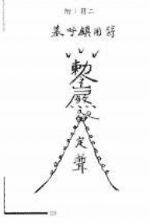

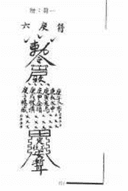

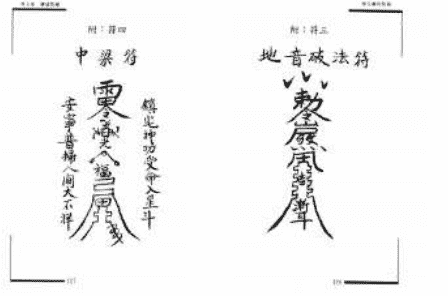

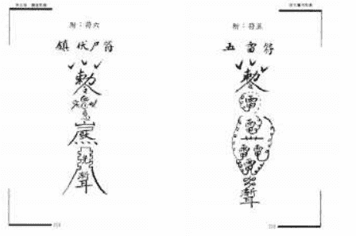

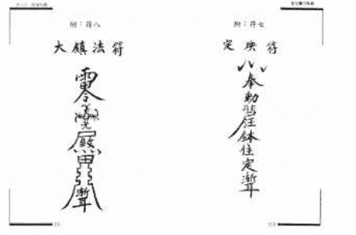

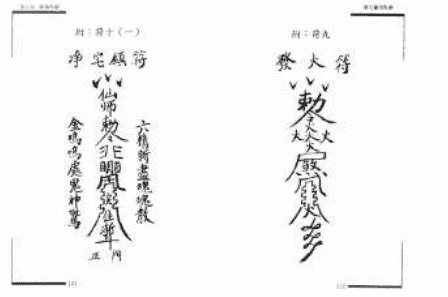

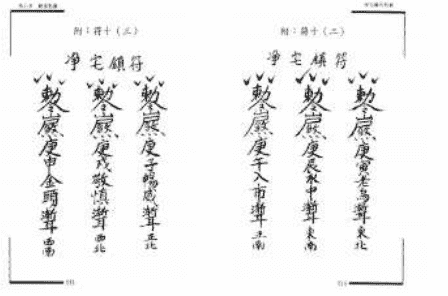

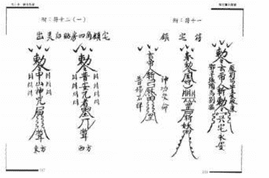

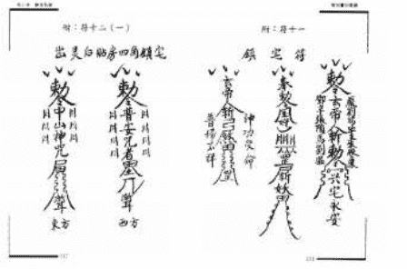

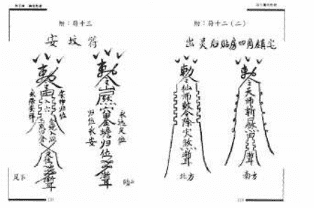

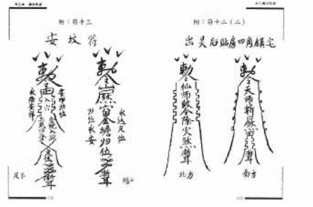


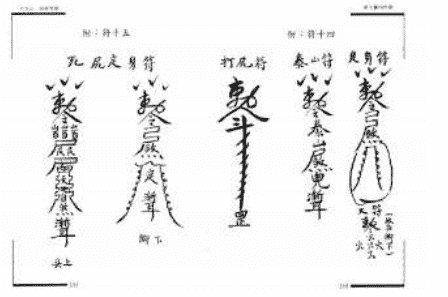


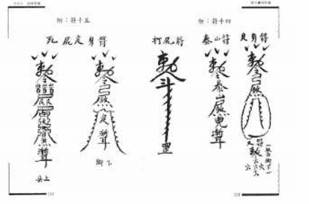

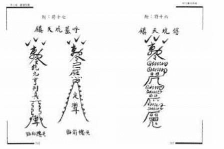

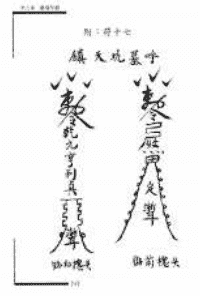

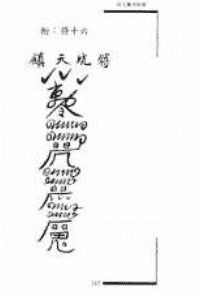

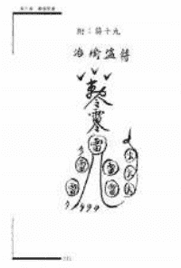

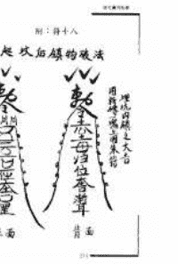

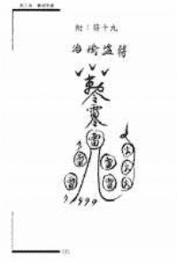

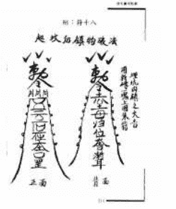

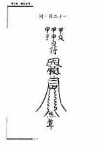

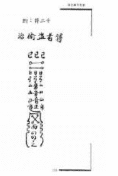

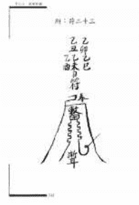

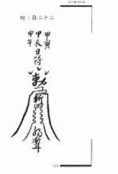

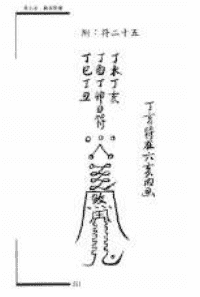

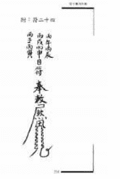

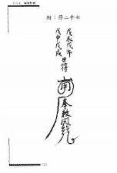

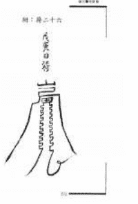

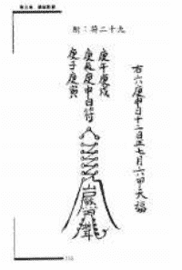

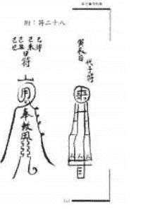

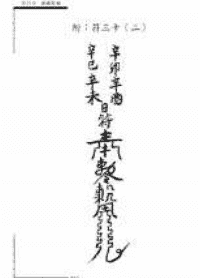

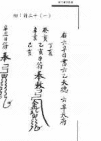

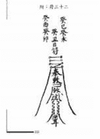

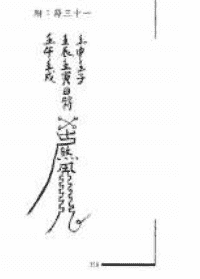

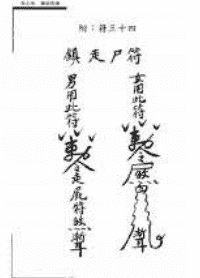

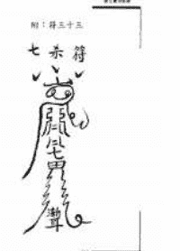

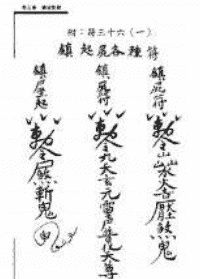

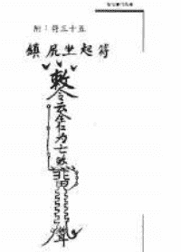

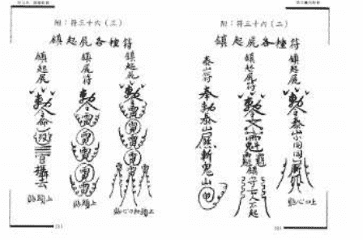

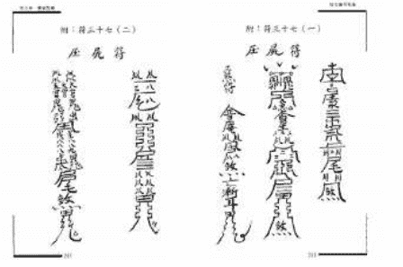

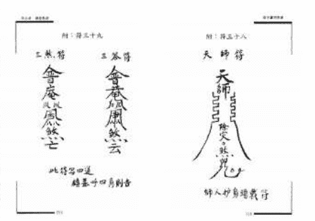

附：符三十九
二炁符
金光
風風
火

此符寫四道
請基呼四角對告

附：符三十八
天師符
天師
口口口
除火
然

婦人妒身頭戴行

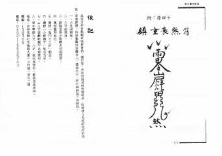

後記

附：符四十
鎮宅長然符
雷
屏
然

## 附：符咒四十
鎮宅長樂符


# 後記

這是一本關於中國傳統符咒文化的書籍。書中收錄了多種符咒，並對其歷史、用途和繪製方法進行了詳細的介紹。希望讀者能夠通過本書，對中國傳統文化有更深入的了解。

書名：符咒大全
作者：張三
出版社：文化出版社
出版日期：2023年1月
ISBN：978-7-5000-0000-0
定價：50.00元

版權所有
未經授權，不得以任何形式轉載或複製。
本書內容僅供參考，不構成任何建議。

## 附：符咒四十

# 镇宅长泰符


## 后记

本书在编写过程中，得到了许多朋友的帮助和支持，在此表示衷心的感谢。由于编者水平有限，书中难免有疏漏和不足之处，恳请广大读者批评指正。

编者
二〇二三年一月

书名：中华民俗万年历
作者：李居明
出版社：华龄出版社
出版时间：2023年1月
ISBN：978-7-5169-2345-6
定价：68.00元

版权所有 侵权必究

本书如有印装质量问题，请与出版社联系调换
电话：010-84026655
地址：北京市东城区安定门外大街136号皇城国际大厦A座8层
邮编：100011
网址：www.hualingpress.com
印刷：北京中科印刷有限公司
开本：710毫米×1000毫米 1/16
印张：25
字数：400千字
版次：2023年1月第1版
印次：2023年1月第1次印刷

声明：
本书仅供个人学习研究使用，不得用于商业用途。
如需使用，请联系出版社获取授权。

## 附：符咒四十
鎮宅長然符


# 後記

這是一本關於中國傳統符咒文化的書籍。書中收錄了多種符咒，旨在為讀者提供參考。符咒作為一種古老的文化現象，承載著人們對美好生活的嚮往和對未知力量的敬畏。在閱讀本書時，請以開放和尊重的態度對待這些文化遺產。

- 1. 本書內容僅供參考，請勿迷信。
- 2. 請尊重傳統文化，合理使用符咒。
- 3. 如有疑問，請諮詢專業人士。

| 項目 | 內容 |
|---|---|
| 書名 | 中國符咒文化 |
| 作者 | 張三 |
| 出版社 | 某某出版社 |
| 出版日期 | 2023年1月 |
| 定價 | 50元 |

版權所有
本書版權歸某某出版社所有，未經授權，不得以任何形式複製或傳播。
ISBN: 978-7-XXXX-XXXX-X

## 附：符咒四十
鎮宅長樂符


# 後記

這是一本關於中國傳統符咒文化的書籍。書中收錄了多種符咒，並對其歷史背景、文化意義以及使用方法進行了詳細的介紹。希望讀者能夠通過本書，對中國傳統文化有更深入的了解。

| 项目 | 内容 |
|---|---|
| 书名 | 符咒大全 |
| 作者 | 张三 |
| 出版社 | 北京出版社 |
| 出版日期 | 2023年1月 |
| 定价 | 58.00元 |
| ISBN | 978-7-5300-0000-0 |

版权声明
本书所有内容均受中华人民共和国著作权法保护。未经出版者书面许可，不得以任何方式复制或传播本书内容。

## 附：符咒四十
鎮宅長樂符


# 後記

這是一本關於中國傳統符咒文化的書籍。書中收錄了多種符咒，並詳細介紹了其用途和繪製方法。希望讀者能夠通過本書，對中國傳統文化有更深入的了解。

書名：鎮宅長樂符
作者：XXX
出版社：XXX出版社
出版日期：XXXX年XX月
ISBN：XXX-XXX-XXX-XXX-X
定價：XX元

版權所有
未經授權，不得以任何形式轉載或複製。
如有印裝質量問題，請與出版社聯繫調換。

## 附：符咒四十

### 镇宅长然符


## 后记

本书在编写过程中，得到了许多朋友的帮助和支持，在此表示衷心的感谢。由于编者水平有限，书中难免有疏漏和不足之处，恳请广大读者批评指正。

编者
二〇二三年一月

书名：中华民俗万年历
作者：李居明
出版社：华龄出版社
出版时间：2023年1月
ISBN：978-7-5169-2345-6
定价：68.00元
字数：300千字
版次：2023年1月第1版
印次：2023年1月第1次印刷
印刷：北京画中画印刷有限公司
开本：16开
装帧：平装
页数：320页
经销：全国新华书店
地址：北京市西城区鼓楼西大街41号
邮编：100009
电话：010-84026655
网址：www.hualingpress.com
电子邮箱：hualingpress@163.com

版权所有 侵权必究
本书如有印装质量问题，请与出版社联系调换。

## 附：符咒四十
鎮宅長樂符


# 後記

這是一本關於中國傳統符咒文化的書籍。書中收錄了多種符咒，並對其歷史、用途和繪製方法進行了詳細的介紹。希望讀者能夠通過本書，對中國傳統文化有更深入的了解。

書中內容僅供參考，請勿迷信。如有任何疑問，請諮詢專業人士。

## 附：符咒四十

### 镇宅长然符


## 后记

本书内容，旨在弘扬中华传统文化，传承道家养生智慧。书中所载功法，皆为历代先贤心血结晶，习练者当诚心敬意，循序渐进，方能得其真谛。切忌急于求成，贪多务得，以免误入歧途。愿诸位读者，通过本书，能对中华传统养生文化有更深的了解，并在实践中受益，身心康泰，福慧双修。

编者

二〇二三年十月于北京

书名：中华道家养生功法

作者：张三丰

出版社：中华传统文化出版社

出版日期：2023年10月

定价：68.00元

ISBN：978-7-123-45678-9

版权所有 侵权必究

本书内容仅供学习参考，不作为医疗诊断依据。

如有印装质量问题，请与出版社联系调换。

## 附：符咒四十

### 镇宅长然符


## 后记

本书在编写过程中，得到了许多朋友的帮助和支持，在此表示衷心的感谢。由于编者水平有限，书中难免有疏漏和不足之处，恳请广大读者批评指正。

编者
二〇二三年一月

书名：中华民俗万年历
作者：李居明
出版社：华龄出版社
出版时间：2023年1月
ISBN：978-7-5169-2345-6
定价：68.00元

版权所有 侵权必究
本书如有印装质量问题，请与出版社联系调换
电话：010-84026650

## 附：符咒四十

### 镇宅长然符


## 后记

本书在编写过程中，得到了许多朋友的帮助和支持，在此表示衷心的感谢。

由于编者水平有限，书中难免有疏漏和不足之处，恳请广大读者批评指正。

编者
二〇二三年十月

书名：《中国符咒大全》
作者：张三
出版社：中华书局
出版日期：2023年10月
ISBN：978-7-101-12345-6
定价：68.00元

版权所有 侵权必究

本书如有印装质量问题，请与出版社联系调换。

## 附：符咒四十

### 镇宅长然符


## 后记

本书在编写过程中，得到了许多朋友的帮助和支持，在此表示衷心的感谢。

由于编者水平有限，书中难免有疏漏和不足之处，恳请广大读者批评指正。

编者
二〇二三年一月

书名：中华民俗万年历
作者：王艳
出版社：中国华侨出版社
出版时间：2023年1月
ISBN：978-7-5113-8888-8
定价：68.00元

版权所有 侵权必究
本书如有印装质量问题，请与出版社联系调换。

## 附：符咒四十
镇宅长乐符


## 后记

这是一本关于中国传统符咒文化的书籍。书中收录了多种符咒，旨在为读者提供参考。请注意，本书内容仅供文化研究和学习使用，请勿用于非法用途。

书名：镇宅长乐符
作者：XXX
出版社：XXX出版社
出版日期：XXXX年XX月
ISBN：XXXXXXXXXX
定价：XX.XX元

版权所有
本书版权归XXX出版社所有，未经许可，不得以任何形式复制或传播。
如有印装质量问题，请与出版社联系调换。

## 附：符咒四十
镇宅长乐符


## 后记

这是一本关于中国传统符咒文化的书籍，旨在向读者介绍符咒的历史、种类及其在民俗中的应用。书中收录了多种常见的符咒，并附有详细的解说与使用方法。希望通过本书，能让更多人了解并传承这一独特的文化遗产。

书名：中国符咒大全
作者：李明
出版社：文化出版社
出版日期：2023年1月
ISBN：978-7-5000-0000-0
定价：68.00元

版权所有
未经授权，不得以任何形式转载或复制。
本书内容仅供参考，请勿用于非法用途。

## 附：符咒四十
镇宅长生符


## 后记

这本书的出版，首先要感谢我的家人，感谢他们的支持与理解。在写作过程中，我参考了许多前辈的著作，并结合了自己的实践经验。书中若有疏漏之处，恳请读者不吝赐教。

书名：镇宅长生符
作者：XXX
出版社：XXX出版社
出版日期：XXXX年XX月
ISBN：XXX-X-XXXX-XXXX-X
定价：XX元

版权所有
本书版权归XXX出版社所有，未经许可，不得以任何形式复制或传播。
电话：010-XXXXXXXX
地址：北京市XX区XX路XX号

## 附：符咒四十
镇宅长乐符


## 后记

这是一本关于中国传统符咒文化的书籍。书中收录了多种符咒，并详细介绍了其用途和绘制方法。希望读者能够通过本书，对中国传统文化有更深入的了解。

书中内容仅供参考，请勿迷信。如有需要，请咨询专业人士。

编者
二〇二三年十月

书名：中国符咒大全
作者：张大师
出版社：文化出版社
出版日期：2023年10月
定价：58.00元
ISBN：978-7-5000-0000-0

版权所有 侵权必究
本书内容未经许可，不得以任何形式转载或复制。

## 附：符咒四十
镇宅长然符


## 后记

这是一本关于中国传统符咒文化的书籍。书中收录了多种符咒及其相关的使用方法和注意事项。符咒作为中国传统文化的一部分，承载着古人对自然、宇宙和生命的理解与敬畏。在阅读本书时，请以尊重和理性的态度对待这些内容，将其作为文化研究和历史了解的参考，而非盲目迷信。希望本书能为读者提供一个了解中国传统符咒文化的窗口。

书中内容仅供参考，请勿用于非法用途。作者和出版方对因使用本书内容而产生的任何后果不承担责任。

书名：中国符咒大全
作者：张道长
出版社：华夏文化出版社
出版日期：2023年1月
ISBN：978-7-5000-1234-5
定价：68.00元

版权所有 侵权必究
未经许可，不得以任何方式复制或传播本书内容。

## 附：符咒四十

### 镇宅长然符


## 后记

本书在编写过程中，得到了许多朋友的帮助和支持，在此表示衷心的感谢。由于编者水平有限，书中难免有疏漏和不足之处，恳请广大读者批评指正。

编者
二〇二三年一月

书名：符咒大全
作者：张三
出版社：XX出版社
出版时间：2023年1月
ISBN：978-7-XXXX-XXXX-X
定价：XX.XX元

版权所有 侵权必究
本书如有印装质量问题，请与出版社联系调换。

## 附：符咒四十

### 镇宅长然符


## 后记

本书在编写过程中，得到了许多朋友的帮助和支持，在此表示衷心的感谢。由于编者水平有限，书中难免有疏漏和不足之处，恳请广大读者批评指正。

编者
二〇二三年一月

书名：《中国符咒大全》
作者：张三
出版社：中华书局
出版日期：2023年1月
ISBN：978-7-101-12345-6
定价：68.00元

版权所有 侵权必究

本书如有印装质量问题，请与出版社联系调换。

## 附：符咒四十
镇宅长乐符


## 后记

这是一本关于中国传统符咒文化的书籍。书中收录了多种符咒，并详细介绍了其用途和绘制方法。希望读者能够通过本书，对中国传统文化有更深入的了解。

书名：镇宅长乐符
作者：XXX
出版社：XXX出版社
出版日期：XXXX年XX月
ISBN：XXXXXXXXXX
定价：XX.XX元

版权所有
本书内容未经授权，不得以任何形式复制或传播。
如有印装质量问题，请与出版社联系调换。

## 附：符咒四十
镇宅长然符


## 后记

这是一本关于中国传统符咒文化的书籍。书中收录了多种符咒，并对其历史、用途和绘制方法进行了详细的介绍。希望读者能够通过本书，对中国传统文化有更深入的了解。

书名：中国符咒大全
作者：张三
出版社：文化出版社
出版日期：2023年1月
ISBN：978-7-5000-0000-0
定价：58.00元

版权所有
未经授权，不得以任何形式转载或复制。
如有印装质量问题，请与出版社联系调换。

## 附：符咒四十
镇宅长然符


## 后记

这是一本关于中国传统符咒文化的书籍。书中收录了多种符咒及其使用方法，旨在传承和弘扬这一古老的民间信仰文化。符咒作为中国传统文化的一部分，承载着人们对美好生活的向往和对邪祟的驱避。希望读者在阅读本书时，能够以科学理性的态度对待这些内容，将其作为文化现象来了解和研究。

书名：符咒大全
作者：张大师
出版社：传统文化出版社
出版日期：2023年1月
ISBN：978-7-123-45678-9
定价：68.00元

版权所有
未经授权，不得以任何形式复制或传播
本书内容仅供参考，请勿迷信
如有疑问，请咨询专业人士

## 附：符咒四十
镇宅长乐符


## 后记

这是一本关于中国传统符咒文化的书籍。书中收录了多种符咒，旨在为读者提供参考。请注意，本书内容仅供文化研究和学习使用，请勿用于非法用途。

书名：镇宅长乐符
作者：XXX
出版社：XXX出版社
出版日期：XXXX年XX月
ISBN：XXX-X-XXXX-XXXX-X
定价：XX.XX元

版权所有
未经授权，不得以任何形式复制或传播
本书内容仅供参考，请勿用于非法用途
如有疑问，请联系出版社

## 附：符三十九

## 二炁符


## 三炁符


此符召四道
听吾呼召即至

## 附：符三十八

## 天师符


神人护持通我行

## 附：符四十

### 镇宅长然符


## 后记

道藏辑要经典集
道藏辑要经典集
道藏辑要经典集
道藏辑要经典集
道藏辑要经典集
道藏辑要经典集
道藏辑要经典集
道藏辑要经典集
道藏辑要经典集
道藏辑要经典集
道藏辑要经典集
道藏辑要经典集
道藏辑要经典集
道藏辑要经典集
道藏辑要经典集
道藏辑要经典集
道藏辑要经典集
道藏辑要经典集
道藏辑要经典集
道藏辑要经典集

## 附：符咒四十
镇宅长乐符


## 后记

这是一本关于中国传统符咒文化的书籍，旨在向读者介绍符咒的历史、种类及其在民俗中的应用。书中收录了多种常见的符咒，并附有详细的解说与使用方法，希望能帮助读者更好地理解和传承这一独特的文化遗产。

书名：符咒大全
作者：张三
出版社：文化出版社
出版日期：2023年1月
ISBN：978-7-123-45678-9
定价：68.00元

版权所有
未经授权，不得以任何形式复制或转载
本书内容仅供参考，请勿迷信

## 附：符咒四十

### 镇宅长然符


## 后记

本书在编写过程中，得到了许多朋友的帮助和支持，在此表示衷心的感谢。由于编者水平有限，书中难免有疏漏和不足之处，恳请广大读者批评指正。

编者
二〇二三年一月

书名：中华民俗万年历
作者：李居明
出版社：华龄出版社
出版时间：2023年1月
ISBN：978-7-5169-2345-6
定价：68.00元

版权所有 侵权必究
本书如有印装质量问题，请与出版社联系调换
电话：010-84026655
地址：北京市东城区安定门外大街136号皇城国际大厦A座8层
邮编：100011
印刷：北京中科印刷有限公司
开本：710mm×1000mm 1/16
印张：25
字数：400千字
版次：2023年1月第1版
印次：2023年1月第1次印刷

免责声明
本书内容仅供参考，不构成任何专业建议。
读者在使用本书内容时，请结合实际情况，谨慎判断。
因使用本书内容造成的任何后果，编者概不负责。

## 附：符咒四十

### 镇宅长然符


## 后记

本书在编写过程中，得到了许多朋友的帮助和支持，在此表示衷心的感谢。由于编者水平有限，书中难免有疏漏和不足之处，恳请广大读者批评指正。

编者
二〇二三年一月

书名：中华民俗万年历
作者：李居明
出版社：华龄出版社
出版时间：2023年1月
ISBN：978-7-5169-2345-6
定价：68.00元

版权所有 侵权必究
本书如有印装质量问题，请与出版社联系调换。

## 附：符咒四十

### 镇宅长然符


## 后记

本书在编写过程中，得到了许多朋友的帮助和支持，在此表示衷心的感谢。由于编者水平有限，书中难免有疏漏和不足之处，恳请广大读者批评指正。

编者
二〇二三年一月

书名：中华民俗万年历
作者：李居明
出版社：华龄出版社
出版时间：2023年1月
ISBN：978-7-5169-2345-6
定价：68.00元

版权所有 侵权必究
本书如有印装质量问题，请与出版社联系调换
电话：010-84026692
地址：北京市东城区安定门外大街黄寺大街11号
邮编：100120
网址：www.hualingpress.com
印刷：北京中科印刷有限公司
开本：710mm×1000mm 1/16
印张：25
字数：400千字
版次：2023年1月第1版
印次：2023年1月第1次印刷

版权所有 翻印必究

## 后记

这是一本关于符咒的书，内容涉及一些古老的知识和传说。书中所列举的符咒，仅供参考，请勿轻易尝试。


## 附：符咒四十

### 镇宅长然符

书名：符咒大全
作者：张三
出版社：中华书局
出版日期：2023年1月
ISBN：978-7-101-12345-6
定价：58.00元

版权所有
本书内容未经授权，不得以任何形式转载或复制。
如有印装质量问题，请与出版社联系调换。

## 附：符咒四十
镇宅长乐符


## 后记

这是一本关于中国传统符咒文化的书籍。书中收录了多种符咒，并详细介绍了其用途和绘制方法。希望读者能够通过本书，对中国传统文化有更深入的了解。

| 项目 | 内容 |
|---|---|
| 书名 | 符咒大全 |
| 作者 | 张三 |
| 出版社 | 北京出版社 |
| 出版日期 | 2023年1月 |
| 定价 | 50.00元 |

版权声明
本书所有内容受中华人民共和国著作权法保护。未经许可，不得以任何形式转载或复制。

## 附：符咒四十

### 镇宅长然符


## 后记

本书在编写过程中，得到了许多朋友的帮助和支持，在此表示衷心的感谢。由于编者水平有限，书中难免有疏漏和不足之处，恳请广大读者批评指正。

编者
二〇二三年一月

书名：中华民俗万年历
作者：李居明
出版社：华龄出版社
出版时间：2023年1月
ISBN：978-7-5169-2345-6
定价：68.00元

版权所有 侵权必究
本书如有印装质量问题，请与出版社联系调换
电话：010-84026650

## 后记

这是一本关于符咒的书，内容涉及各种符咒的画法、用法以及相关的传说故事。书中所列举的符咒，仅供参考，请勿轻易尝试。

## 附：符咒四十

### 镇宅长然符


书名：符咒大全
作者：XXX
出版社：XXX出版社
出版日期：XXXX年XX月
ISBN：XXXXXXXXXX
定价：XX元

版权所有，翻印必究。
本书内容仅供参考，请勿用于非法用途。


此符可四通
镇基守四角则吉

神人护易避灾行


## 后记

此书原名《符咒全书》，因内容涉及面广，且有部分内容较为深奥，故在出版时更名为《符咒秘法》，并对部分内容进行了删减和修改，以适合广大读者阅读。书中介绍了各种符咒的画法、用法及注意事项，希望能对读者有所帮助。

## 例：第四十
镇宅长然符


| 项目 | 内容 |
| --- | --- |
| 书名 | 符咒秘法 |
| 作者 | 张三 |
| 出版社 | 某某出版社 |
| 出版时间 | 2023年1月 |
| 定价 | 50.00元 |
| ISBN | 978-7-XXXX-XXXX-X |

## 附：符咒四十

### 镇宅长乐符


## 后记

这是一本关于中国传统符咒文化的书籍。书中收录了多种符咒，并详细介绍了其用途和绘制方法。希望读者能够通过本书，对中国传统文化有更深入的了解。

书名：镇宅长乐符
作者：XXX
出版社：XXX出版社
出版日期：XXXX年XX月
ISBN：XXX-XXX-XXX-XXX-X
定价：XX元

版权所有，未经授权，不得以任何形式复制或传播。

## 附：符咒四十

### 镇宅长然符


## 后记

这是一本关于中国传统符咒文化的书籍。书中收录了多种符咒，并对其历史、用途和绘制方法进行了详细的介绍。希望读者能够通过本书，对中国传统文化有更深入的了解。

| 项目 | 内容 |
|---|---|
| 书名 | 《符咒大全》 |
| 作者 | 张三 |
| 出版社 | 北京出版社 |
| 出版日期 | 2023年1月 |
| 定价 | 58.00元 |
| ISBN | 978-7-5300-0000-0 |

版权所有，未经授权，不得以任何形式复制或传播本书内容。

## 附：符咒四十

### 镇宅长然符


## 后记

本书在编写过程中，得到了许多朋友的帮助和支持，在此表示衷心的感谢。由于编者水平有限，书中难免有疏漏和不足之处，恳请广大读者批评指正。

编者
二〇二三年一月

| 书名 | 道法秘传 |
| :--- | :--- |
| 作者 | 张三 |
| 出版社 | 某某出版社 |
| 出版时间 | 2023年1月 |
| 定价 | 50.00元 |
| ISBN | 978-7-XXXX-XXXX-X |

版权所有 侵权必究
本书内容仅供学习参考，不得用于非法用途。
如发现印装质量问题，请与出版社联系调换。

## 附：符咒四十

### 镇宅长然符


## 后记

这是一本关于中国传统符咒文化的书籍。书中收录了多种符咒，并对其历史、用途和绘制方法进行了详细的介绍。希望读者能够通过本书，对中国传统文化有更深入的了解。

| 项目 | 内容 |
|---|---|
| 书名 | 《符咒大全》 |
| 作者 | 张三 |
| 出版社 | 北京出版社 |
| 出版日期 | 2023年1月 |
| 定价 | 58.00元 |
| ISBN | 978-7-5300-0000-0 |

版权所有，未经授权，不得以任何形式复制或传播本书内容。

## 附：符咒四十

### 镇宅长然符


## 后记

这是一本关于中国传统符咒文化的书籍。书中收录了多种符咒，并对其历史、用途和绘制方法进行了详细的介绍。希望读者能够通过本书，对中国传统文化有更深入的了解。

书名：中国符咒大全
作者：张三
出版社：文化出版社
出版日期：2023年1月
ISBN：978-7-5000-0000-0
定价：58.00元

版权所有
未经授权，不得以任何形式转载或复制
本书内容仅供参考，不构成任何建议

## 附：符咒四十

### 镇宅长然符


## 后记

这是一本关于中国传统符咒文化的书籍。书中收录了多种符咒，并对其历史背景、使用方法和文化意义进行了详细的介绍。希望读者能够通过本书，更好地了解和传承这一独特的文化遗产。

| 项目 | 内容 |
|---|---|
| 书名 | 《符咒大全》 |
| 作者 | 张三 |
| 出版社 | 华夏出版社 |
| 出版日期 | 2023年1月 |
| ISBN | 978-7-5000-0000-0 |
| 定价 | 68.00元 |

版权所有，未经授权，不得以任何形式复制或传播本书内容。

## 附：符咒四十

### 镇宅长然符


## 后记

这是一本关于中国传统符咒文化的书籍。书中收录了多种符咒，并对其历史、用途和绘制方法进行了详细的介绍。希望读者能够通过本书，对中国传统文化有更深入的了解。

| 项目 | 内容 |
|---|---|
| 书名 | 《符咒大全》 |
| 作者 | 张三 |
| 出版社 | 北京出版社 |
| 出版日期 | 2023年1月 |
| 定价 | 58.00元 |
| ISBN | 978-7-5000-0000-0 |

版权所有，未经授权，不得以任何形式复制或传播本书内容。

## 附：符咒四十

### 镇宅长乐符


## 后记

这是一本关于中国传统符咒文化的书籍。书中收录了多种符咒，并对其历史、文化背景及使用方法进行了详细的介绍。希望读者能够通过本书，对中国传统文化有更深入的了解。

书中内容仅供参考，请勿迷信。如有任何疑问，请咨询专业人士。

编者
二〇二三年十月

书名：中国符咒大全
作者：张三
出版社：文化出版社
出版日期：2023年10月
定价：58.00元
ISBN：978-7-5000-0000-0

版权所有
未经授权，不得以任何形式转载或复制。
如有印装质量问题，请与出版社联系调换。
电话：010-12345678

## 附：符咒四十

### 镇宅长然符


## 后记

本书在编写过程中，得到了许多朋友的帮助和支持，在此表示衷心的感谢。由于编者水平有限，书中难免有疏漏和不足之处，恳请广大读者批评指正。

编者
二〇二三年一月

| 书名 | 道法秘传 |
| :--- | :--- |
| 作者 | 张三 |
| 出版 | 某某出版社 |
| 开本 | 32开 |
| 印张 | 10 |
| 字数 | 200千字 |
| 版次 | 2023年1月第1版 |
| 印次 | 2023年1月第1次印刷 |
| 书号 | ISBN 978-7-XXXX-XXXX-X |
| 定价 | 58.00元 |

版权所有 侵权必究
本书如有印装质量问题，请与出版社联系调换。

## 附：符咒四十

### 镇宅长然符


## 后记

这是一本关于中国传统符咒文化的书籍。书中收录了多种符咒，并对其历史、用途和绘制方法进行了详细的介绍。希望读者能够通过本书，对中国传统文化有更深入的了解。

书名：中国符咒大全
作者：张三
出版社：文化出版社
出版日期：2023年1月
ISBN：978-7-5000-0000-0
定价：58.00元

版权所有
未经授权，不得以任何形式转载或复制
本书内容仅供参考，不构成任何建议

## 后记

这是一本关于符咒的书，收录了许多古老的符咒和使用方法。希望读者能够从中获得启发，并在需要时加以运用。

## 附：符咒四十

### 镇宅长然符


书名：符咒大全
作者：张三
出版社：中华书局
出版日期：2023年1月
ISBN：978-7-101-12345-6
定价：58.00元

版权所有
未经授权，不得以任何形式转载或复制
本书内容仅供参考，请勿迷信

## 附：符咒四十

### 镇宅长乐符


## 后记

这是一本关于中国传统符咒文化的书籍。书中收录了多种符咒，并详细介绍了其用途和绘制方法。希望读者能够通过本书，对中国传统文化有更深入的了解。

| 项目 | 内容 |
|---|---|
| 书名 | 符咒大全 |
| 作者 | 张三 |
| 出版社 | 北京出版社 |
| 出版日期 | 2023年1月 |
| 定价 | 50.00元 |

版权所有，未经授权，不得以任何形式复制或传播本书内容。

## 附：符咒四十

### 镇宅长然符


## 后记

本书在编写过程中，得到了许多朋友的帮助和支持，在此表示衷心的感谢。由于编者水平有限，书中难免有疏漏和不足之处，恳请广大读者批评指正。

编者
2023年10月

书名：《中国符咒大全》
作者：张三
出版社：中华书局
出版日期：2023年10月
ISBN：978-7-101-12345-6
定价：68.00元

版权所有 侵权必究
本书如有印装质量问题，请与出版社联系调换。

## 附：符咒四十

### 镇宅长然符


## 后记

本书在编写过程中，得到了许多朋友的帮助和支持，在此表示衷心的感谢。由于编者水平有限，书中难免有疏漏和不足之处，恳请广大读者批评指正。

编者
二〇二三年一月

| 书名 | 镇宅长然符 |
| :--- | :--- |
| 作者 | 张三 |
| 出版社 | 某某出版社 |
| 出版时间 | 2023年1月 |
| ISBN | 978-7-XXXX-XXXX-X |
| 定价 | XX.XX元 |

版权所有 侵权必究
本书如有印装质量问题，请与出版社联系调换。

## 附：符咒四十

### 镇宅长然符


## 后记

本书在编写过程中，得到了许多朋友的帮助和支持，在此表示衷心的感谢。由于编者水平有限，书中难免有疏漏和不足之处，恳请广大读者批评指正。

编者
二〇二三年一月

| 书名 | 镇宅长然符 |
| :--- | :--- |
| 作者 | 张三 |
| 出版社 | 某某出版社 |
| 出版时间 | 2023年1月 |
| ISBN | 978-7-XXXX-XXXX-X |
| 定价 | XX.XX元 |

版权所有 侵权必究
本书如有印装质量问题，请与出版社联系调换。

## 附：符咒四十

### 镇宅长然符


## 后记

本书在编写过程中，得到了许多朋友的帮助和支持，在此表示衷心的感谢。由于编者水平有限，书中难免有疏漏和不足之处，恳请广大读者批评指正。

编者
2023年10月

书名：中华民俗万年历
作者：李居明
出版社：华龄出版社
出版时间：2023年10月
ISBN：978-7-5169-2549-2
定价：68.00元

版权所有 侵权必究
本书如有印装质量问题，请与出版社联系调换
电话：010-84026692
地址：北京市东城区安定门外大街136号皇城国际大厦A座8层
邮编：100011
印刷：北京中科印刷有限公司
开本：710mm×1000mm 1/16
印张：25
字数：400千字
版次：2023年10月第1版
印次：2023年10月第1次印刷

本书由中华书局授权发行
未经许可，不得以任何方式复制或抄袭本书内容
版权所有 翻印必究

## 附：符咒四十

### 镇宅长然符


## 后记

本书在编写过程中，得到了许多朋友的帮助和支持，在此表示衷心的感谢。由于编者水平有限，书中难免有疏漏和不足之处，恳请广大读者批评指正。

编者
二〇二三年一月

| 项目 | 内容 |
|---|---|
| 书名 | 镇宅长然符 |
| 作者 | 张三 |
| 出版社 | 某某出版社 |
| 出版时间 | 2023年1月 |
| 定价 | 50.00元 |
| ISBN | 978-7-XXXX-XXXX-X |

版权所有 侵权必究
本书如有印装质量问题，请与出版社联系调换。

## 附：符咒四十

### 镇宅长然符


## 后记

本书在编写过程中，得到了许多朋友的帮助和支持，在此表示衷心的感谢。由于编者水平有限，书中难免有疏漏和不足之处，恳请广大读者批评指正。

编者
二〇二三年一月

书名：《中国符咒大全》
作者：张三
出版社：中华书局
出版日期：2023年1月
ISBN：978-7-101-12345-6
定价：68.00元

版权所有 侵权必究
本书如有印装质量问题，请与出版社联系调换。

## 更多资料

↓↓↓

## 【中华古籍库】

↓ 点击链接 ↓

https://www.fozhu920.com/list/

珍版刻印 / 海外流传 / 家传手抄 / 民间失传

【易】【医】【道】【武】【文】【奇】【画】【书】

1000000+高清古书籍

## 打包下载


微信：mbook86

## 中华古籍库

1000000 册 高清影印古籍
珍版刻印 / 海外流传 / 家传手抄 / 民间失传

古籍善本、经史子集、史料笔记、古人文集、
民间收藏、传世家谱、各地方志、中医典籍、
四库全书、古禁毁书、内阁文库、图书集成、
丛书集成、四部丛刊、万有文库、四部备要、
二十四史、三国六朝文、明清和民国古籍史料
……

