# 阴宅点窍系列教材

张成达撰于

二十零年一月十九日

## 选墓点穴

- 《阴宅点穴》之一

张成达

风水是一门很玄奥的学问，它包括阳宅与阴宅两部分。对于阴宅，古时有龙穴、凤穴、朝穴、凡穴之分，就是说，祖先如果葬在好的地理位置上，日后通过地脉气场的感应就能庇荫子孙，葬在不适当的地理位置上就会祸及子孙。风水学是先人智慧的结晶，经验的积累。这种理论实质就是“天人合一”，也就是人与天地之间气场的感应。看风水，主要是看气，阴阳先生不会看气是不称职的。看气，首先看有气无气；二看气场大小，适应不适应；三看气是聚还是散。这里的学问很大，它包括以下三个要求：地质的影响（也就是土质）；地磁的影响（也就是气）；周围环境的影响与配合等。

古今有关地理风水之书，真可谓书如山，法如林，靠自学难度相当大。拜师学艺吧，要价又太高，致使这门科学很难得以普及。前些年，我经常和一些擅长此术的地理师去择墓、安葬、迁坟，再结合诸书潜心学习，终于有所体悟。近几年，又常带些热衷此道的易友上山寻龙点穴，总结出了一些经验。为使这门科学延续与发展，我把书本上没有讲明的机秘揭示出来，纳入地理师在实践中常用的法术，编成这本《择墓点穴》教材，意在使您一看便懂，并能实际操作。闲言少叙，书归正传，下面我就带您进山去择墓营穴。

### 一、看形势

在一个深秋的季节，我和易友去选墓。在乘车去往山上的途中，易友问：“张老师，您能不能简要地告诉我，选择一个好的茔地，得掌握哪些东西呢？”

我说：您就记住五个字：“龙、穴、沙、水、向”。先贤看地理，先取龙气，龙气旺则人丁盛；二收水聚，水聚则财富；三取砂秀，砂秀则官高；四取局贤，局贤则悠久。

易友从汽车玻璃往外看，指着一个山问：张老师，您看，可不可以在那座山上选茔地？

我看了看那山说：不行，那是个孤山。孤阳不生，孤阴不长嘛。

于是我们俩分头从汽车的玻璃向外面寻视着。

易友又指着一山问道：我看这座山龙脉挺好，你看呢？

我说：这座山龙脉不好，是条死龙。

他问：怎么能说它是死龙呢？

我说：你看，这条山脉蛮直僵硬，毫无生发之机，所以说它是死龙，择墓最忌讳这样的龙脉了。

易友指着前面一个山说：张老师，你看，前面那几个山挺够局势，前有朝山，后有靠山，左有青龙，右有白虎。是不是叫汽车停下来，咱进山去看看。

我说：不用进山里看，你记住我这句话：“选茔地先从外面看形势”。不是有那么首古诗吗？“横看成岭侧成峰，远近高低各不同，不识庐山真面目，只缘身在此山中”。这就是说，如果你不从外面看大的形势，一头就钻进山里去寻找小的龙脉，往往会事倍功半的。

易友问：你能不能简单说说，怎样看形势呢？

我说：这个问题不难答，《管氏地理指蒙》《郭璞古本葬经》等书都有详细论述，你可以找书看看。简要地说形与势就是：

形，概指近观的、小的、个体性的、局部性的，一般在百尺以内，但非草芥之形。

势，概指远观的、大的、群体性的、总体性的，一般以千尺为率，但非过远过大之势。

地理师们曾总结出这样几句话，我看很有道理：

大地看气魄，小地看精神。
众山皆大，小者为尊，
众山皆小，大者为尊。
山秀水动，进山寻龙，
山陋水死，劳而无功。
以水定局，以龙定向。
有水大响为煞地，
有水不动为死地，
有水微动为生地。

回过头来咱再看看你说的这座山，从车上就能看出它不行。你看，后面的坐山巨齿狼牙，怪石嶙峋，坐山凶。左边的青龙开了石厂，属青龙被破坏，龙破则主男人有刑伤。

还有一个最大的毛病是山的周围无水。看地理风水也离不开阴阳二字。山为静，属阴；水为动，属阳。阳为夫，阴为妇，夫与妇缺一不可，且要夫妇恩爱为尚。只有山而无水，好比是夫妇不交，终无孕。只有山水相交真气聚，夫妇相交孕始生。若是山飞水走，二气不交，属地不真，不可取。只有山静水动，砂交水会，龙真穴确，四山环抱，堂局端正，藏风聚气，才是好茔地。

易友问：“张老师，你能不能告诉我，要学会这门科学得从哪里着手呢？”

我说：首先得从基础知识学起。

易友说：那你就简要地给我讲讲好不好？

我诚挚地说：在传统勘舆学中，选择风水水分很多流派，方式方法又极多，致使我在学习时，面临许多困惑，走过许多弯路。后经拜访名师，又跟随多位地理师实地择墓点穴，深深感到只有龙、穴、砂、水、向这五大原则，才是勘舆学的精髓。

易友说：关于这方面的书，我看了很多，使我最头痛的是哪一本书都没有把怎样使用谈明白，问了许多江湖上的风水先生，他们太保守，秘而不传。想去参加风水面授班吧，要价都在三至五千元，再加上差旅费，少说得一万元，我现在又没有这笔钱，真够愁人的。

我说：江湖上的风水先生靠此术吃饭，所以他们是不会轻易外传的。我和他们不一样，是迷于研究此道。虽然不算精通，但可以把所知道的东西全部告诉你。

他说：就说基础知识那部分吧，我就有很多问号。

于是我便一一地回答了他所提的疑问。

### 二、基础知识点窍

我对易友说：“五行总论”“九宫水法歌”“风水论”“八山总论”“十恶不善”“地理总论”等，这些东西你必须理解，记熟。

易友皱了皱眉头说：张老师，这些东西乱糟糟的，你能不能告诉我一些简捷的学法？

我说：你首先得知道“二十四山向”，按下面这个图去理会：

二十四山向图（请看图一）

学习地理风水，您首先得掌握八卦的方位，阴阳五行的生克之理，最好是先学六爻或批八字，因为只有掌握了这些最基本的知识，学习阴阳宅风水才能得心应手。

风水学中，初时只论东、西、南、北四正方，称谓四卦。后又纳入西北、东北、东南、西南四隅方，形成八方，融入八卦。再在八卦中每卦纳入三山，就形成廿四山。四正方之中，阳天干在头，中气在正，阴天干在后，如坎宫，壬一子一癸；震宫，甲一卯一乙；离宫，丙一午一丁；兑宫，庚一酉一辛。四隅则为四库在头，隔为中，四生在尾。如乾宫，戊一乾一亥；艮宫，丑一艮一寅；巽宫，辰一巽一巳；坤宫，未一坤一申。

掌握这“二十四山向”很重要，因为在使用罗盘时，讲究“天盘定水”、“人盘消砂”、“地盘格龙”，都离不开这个顺序。

在实际应用中，又经常运用十二山向，称“双山五行”。天干、地支两个字同处一宫，合为一个名，分别称为双山，所以叫“双山五行”。

请看：

#### 双山五行图（请看图二）

读法是：壬子、癸丑、艮寅、甲卯、乙辰、巽巳、丙午、丁未、坤申、庚酉、辛戌、乾亥。

要参看此图去理解“三合五行”：天干乾、甲、丁，合地支亥、卯、未为一宫，木局，名贪狼木星。天干艮、丙、辛，合地支寅、午、戌为一宫，火局，名廉贞火星。天干巽、庚、癸，合地支巳、酉、丑为一宫，金局，名武曲金星。天干坤、壬、乙，合地支申、子、辰为一宫，水局，名文曲水星。

易友问：地支“亥卯未”合木局我知道，那“乾甲丁”怎么也成木了呢？

答：请看《双山五行图》。乾坐支亥，甲坐支卯，丁坐支未，是亥卯未这三个合成木局的地支把“乾甲丁”这三个天干给合过来的。

问：贪狼木星、廉贞火星、武曲金星、文曲水星怎么列到这里来了？

答：这是个死套数。贪狼星属木，凡见到“乾、甲、丁，亥、卯、未”字的，均称贪狼星，余仿此。还有的书上是这样套用的：

- 巽巳（称武曲金星）
- 丙午（称廉贞火星）
- 丁未（称贪狼木星）
- 坤申（称文曲水星）
- 庚酉（称武曲金星）
- 辛戌（称廉贞火星）
- 乾亥（称贪狼木星）
- 壬子（称文曲水星）
- 癸丑（称武曲金星）
- 艮寅（称廉贞火星）
- 甲卯（称贪狼木星）
- 乙辰（称文曲水星）

对于贪狼、廉贞、五黄、六白等星煞是民间风水师《金锁玉关》派（为民间流传的风水术，假借河图、洛书，测定阴阳二宅）常用的，在本勘舆派中很少应用，理解既可，大可不必劳心费神。

问：“四长生五行”里的“左旋顺起论水”与“右旋逆起论龙”我越看越糊涂，请给讲讲，好吗？

答：您首先得知道“五行与十二宫”：长生、沐浴、冠带、临官、帝旺、衰、病、死、墓、绝、胎、养。这十二宫用来比喻天下万事万物产生、发展、衰败、消亡的整个过程。

在地理风水中，采取的是阳顺阴逆的方法。水为阳，只用“甲、丙、庚、壬”四阳干：甲木，长生在亥；丙火，长生在寅；庚金，长生在巳；壬水，长生在申。这四位阳天干均顺时针方向数。比如甲木，长生在亥，沐浴在子，冠带在丑，临官在寅，帝旺在卯，衰在辰，病在巳，死在午，墓在未，绝在申，胎在酉，养在戌。其它三干仿此。这就是书上所说的“左旋顺起论水”。

龙为阴，只用“乙、丁、辛、癸”四阴干。乙木，长生在午；丁火，长生在酉；辛金，长生在子；癸水，长生在卯。这四位阴天干均逆时针方向数。比如乙木，长生在午、沐浴在巳、冠带在辰、临官在卯、帝旺在寅、衰在丑、病在子、死在亥、墓在戌、绝在酉、胎在申、养在未。其它三阴干仿此。这就是书上所说的“右旋逆起论龙”。

这段解释您必须重视，因为地理师在择墓营穴时，必用此法决定“四局龙水配合”的旺衰（后面还有详解）。

### 三、寻龙点窍

易友说：请老师首先从理论上给我讲讲龙。

答：龙就是山脉。土为龙之肉，石为龙之骨，草为龙之毛，穴有五色者为龙之心肝脾肺肾。地师择穴首先要讲究龙，认为只有龙才能为墓穴带来生动之气。龙由山脉来体现，砂也是断断续续、星星点点的山，二者如何区别呢？从外形看，龙有飘、有头，而砂大多数是孤立的，或是龙身上再凸起的小山。龙大多躯干雄浑粗大，形貌圆净，又连绵起伏，而砂则相对弱小，或孤立存在。

龙按大的区域分为三种：山野之龙，平冈之龙，平地之龙。平地亦可寻龙，虽脉藉平洋，可微辨体势，“高一寸为山，低一寸为水”。

中国风水学的峦头法，根据中国的地理地质特点和位置，将山脉的走向分为五势：

1. 正势：由北向南；
2. 侧势：由西向东；
3. 逆势：逆水朝上；
4. 顺势：顺水朝下；
5. 回势：山首回顾于山尾。

中国风水学的峦头法，又根据山脉的起伏和形态，将山脉概括为九种状态，也就是九种龙：

1. 回龙：形势蟠旋，回首舐尾，如回头之虎；
2. 腾龙：形势高远，险峻耸立，如仰天大壶；
3. 降龙：形势耸秀，峻峭高危，如从天而降；
4. 生龙：形势拱辅，生动活泼；
5. 飞龙：形势奋翔，如雁腾鹰举，双翼开张；
6. 卧龙：形势蹲踞，安稳停蓄，如虎屯象驻；
7. 隐龙：形势磅礴，脉理隐延，如浮排铺毡；
8. 出洋龙：形势腾跃，蜿蜒欲出，如出林之兽；
9. 领群龙：形势依随，稠众环合，如走鹿驱羊，游鱼飞鸽。

五势、九龙是对山脉的宏观概括，本身并无截然的吉凶区别，选择中还要配合阴阳五行学说来推断。

地师寻龙先寻祖与宗，分太祖太宗少祖少宗，以至父母（皆指龙脉而言）。龙有直龙、横龙、骑龙、迥龙之别。龙之贵贱，成因于来龙之祖山。

易友问：龙分太祖、太宗、少祖、少宗以至父母，这一大串辈份，怎么去寻找呢？

答：要想按书本上所论及的去寻根排辈那可就太难了。比如东北，龙脉的太祖当是长白山了，再往下去论资排辈，就是坐上直升飞机去寻查也不一定能弄明白。若非古代的皇帝，谁能耗此巨资去扯这个？

问：请您告诉我什么叫祖山？什么叫帐？什么叫开帐？什么叫穿帐？

答：龙的根脉（龙的起源处）为“祖山”。祖山下延长与分出的支脉为“帐”（起围护作用）。开帐，又叫开张，指龙身到达某处后伸张成两支，这两支叫脚，左边的称为龙砂，右边的称为虎砂，古人认为这两个枝脚是墓穴最重要的屏帐。穿帐，指龙脉前行中的一种形态。它与束气、过峡不同。所谓帐，有帐幔的意思；帐幔一般是平缓而舒张的。可以想象，所谓穿帐，应是龙脉通过一片平川或田地之类。

问：什么叫峡？什么叫穴？什么叫砂？

答：祖山转延下一个又一个山峦（龙脉）的“低凹处”为“峡”；而峡再延伸到低尽之处叫做“穴”；穴附近的自然物（山石等）叫做“砂”；穴后所靠的山叫“少祖山”，也叫“穴后靠山”、“乐山”、“鬼砾”等。这就是说，少祖山后的那座山就为祖山。如果祖山后还有什么太祖太宗等，那当然是最好不过了。假如穴后只有一座靠山（少祖山），亦可择葬，不过富贵的程度有所减弱。

问：什么叫明堂？什么叫案山？什么叫朝山？什么叫向？

答：穴前附近的朝向为明堂；明堂前的朝向为案山，案山要低小形美，如：玉儿、横琴、眠弓、蛾眉、三分、笔架、天马、龟蛇、金箱、玉印、书简、席帽等；案山前往远处看所朝对的山叫朝山，朝山要有情朝拱，特异众山而独秀；穴前明堂所朝对之方向为向。穴、明堂和案山最好是能像一把扇子，穴为扇底，案山为扇面。

问：什么叫束气？

答：龙脉延伸过程中比较狭窄或低矮之处叫做束气。束是约束、收束的意思。这种约束是更加雄起的预备阶段，只有束气的龙，冲过约束之处才更加威武雄壮，所以束气是地相家观察龙脉生动与否的依据之一。

问：什么叫结蒂？

答：蒂是果实的意思，结蒂就是结果，是山脉蜿蜒、束气、冲腾的结果，也就是结穴之处。选择这样的地方做为墓穴，是借助了龙的生气。结蒂，通常称为结穴。

问：什么叫峦头？

答：峦头就是山头，指龙身结蒂耸起的山头。

问：“穴有四灵”怎么看？

答：“穴有四灵”就是：左青龙、右白虎、前朱雀、后玄武。穴左所分支的山脉叫青龙；穴右所分支的山脉叫白虎。穴前的案山叫朱雀；穴后的少祖山叫玄武。请看下图：

#### 龙脉全图（请看图三）

掌握了上述这些要领很重要，凡新采茔地或覆验旧坟（在未用罗盘以水检验向之吉凶前），你站在穴位上，前后左右放眼望去，前有案山、朝山，后有靠山，左有青龙，右有白虎，且符合吉的要求又不遭破坏者，均属合格的上乘之墓。

假若青龙遭破坏，主男人有灾；白虎遭破坏主女人或家人有牢狱血光之灾；案山或朝山遭破坏，主有口舌之患；靠山（少祖山）低小或遭破坏，主无人帮扶、自阖家业或长辈有损。

至于什么“龙的十大崩洪飘”“看龙十要诀”“龙穴四美”“贪、富、贵、贱四龙论”“论龙三式”“来龙入首五格”“寻龙入式歌十二例”“杨筠松七殿凶龙”等，诸书皆有论述，您自己看看自己悟吧。

易友说：你说的这些我都看过，我还有几个地方弄不明白。请问什么叫“白虎探头”？

答：龙与虎的要求是：龙要高，虎要矮；龙要长，虎要短。假如反过来，白虎高且长，压过了青龙，就谓之“白虎探头”，主虎欺龙，阴欺阳，女欺男，凶，不可取。

问：什么叫龙、虎反弓？

答：阴宅要求龙虎相抱，谓之有情。假如龙或虎向外裂去，就叫反弓，谓无情，必弃之不用。

问：什么叫青龙钻怀？什么叫白虎捶胸？

答：按地理风水要求，龙虎相抱为有情。但是，抱的太过也主凶。龙抱的太过谓“青龙钻怀”；虎抱的太过谓“白虎捶胸”。

### 四、寻穴点窍

易友说：张老师，在寻穴前，麻烦你还是先从理论上给我讲讲。

我说：我看过很多书，唯《寻穴证》谈得最好。

点穴先寻穴证，凡真龙结穴处，必有明显之佐证。在穴前者则为朝山美，明堂正，水势旺，三者当推朝山为最要。穴前之山叫朝，以与案有情为主，朝山高，则穴宜高，朝山低，则穴易低，朝山近恐被凌压，穴宜上聚。朝山低，恐防气散，宜就下砂寻穴。明堂有小中大之别，小明堂在园晕下，若见平正可容人倒卧者，方是真穴。中明堂在龙虎之间，要取其交会。大明堂在案山前，立穴要向融聚水势处。凡有真龙结穴处，必有溯源水合聚交会。以上为穴前之佐证。在穴后者，要乐山势鬼撑，龙虎有情拱夹，在穴下者，唇毯要平正，在四旁者，要界水分明，以上为真龙的穴之佐证。若能于此明辨而审察之，点穴必无差错。至于穴忌，只在形气之间，盖看地取形势，葬者乘生气，气囿于形，故点穴必先因形察，则穴之十五忌自能晓然。何谓十五忌，既：粗恶、峻急、单寒、臃肿、凹凸、笑露、瘦削、破面、虚耗、疙头、散漫、尖细、幽冷、荡软、顽硬等。要而言之，十五忌皆就形论气，所当注意者，来龙有高山平地之分，看法因之各异。总之，不论高山平地，若犯一忌，则为绝地，误用之，轻者主贫贱，重则人丁灭绝，祸患百端，必须慎之。

地理师曾指点我说：点穴时要注意“倒杖”。什么叫“倒杖”？指的是如何选好棺木安放的前后左右高低等相对位置，也就是穴点。这还要看来龙是阴是阳，还要看这个点是突是窟，如果不符合“阳来阴受”、“阴来阳受”的原则，那就得凑靠，直至最后符合阴阳承受为止。

易友问：“阳来阴受”与“阴来阳受”是什么意思？

答：地理家根据结穴处的不同形态分为阳龙和阴龙。阳落指边高中低，像人仰伸手掌，手心稍凹之状，称“阳落有窝”。阴落边低中高，像人手面朝下而背部有凸起之状，称“阴落有脊”。阳落者为雌龙，阴落者为雄龙。雄龙结雌穴，雌龙结雄穴，谓之“阳来阴受”、“阴来阳受”。

地理家还讲究“开穴验生气”。地理家认为：穴挖下去，最好要有五色之土，为大吉之象，如果全是石子石块，这个穴点就不好。

地理师还指点我说：点穴时要注意木取节、火取焰、金取窝、土取角，也就是书上所说的“土角流金”。

易友问：木取节是什么意思？

答：木指木形穴，出自蛇形山。

易友说：有的书上说蛇形山主凶，不可点穴。

答：我指的蛇形山是指象龙形，很细小的象小蛇那样的山不可取。山属木形，要从“节”上点穴。所谓“节”，就是龙有起有伏，有弓有弯，这一弓一弯，必然出“节”，在龙一弓身的那山包下边（节）去寻穴，穴气旺，拿现代的话说就是“有力度”。

易友问：那“火取焰”又是什么意思呢？

我说：什么是火形穴，什么是木形穴，什么是金形穴，什么是土形穴，书上讲得特别细，你自己去看就能明白。关于火取焰，我得跟你解释一下，不能取火苗的最高处，要取刚点燃那个部位。这些东西很难从理论上说透，最好是实地去点穴。

易友问：平川地择穴与山地有哪些不同？

答：平川地（也称平洋地）择穴与山地择穴的不同处有：

1. 山地择穴讲究坐满朝空，而平川地择穴则讲究坐空朝满。
2. 山地择穴，穴要低；而平川地择穴，则穴要高。因为平川本来就低洼，水气太大，再葬得低，地下水冲毁骨骸，哪里还谈得上什么荫福？
3. 山地以山为龙，而平川地带没有高岗，往往以水为龙。这样，所谓的龙、水，实际上都由水来代替了，这也就是书上所说的“龙随水转”。
4. 高一寸为山。平川地带难得有山，所以在这种地方，哪怕是比平地高出一点，能令人感觉得出，既可以做为来龙看待。

说来也巧，我边说边从车里往外看，突然发现面前这座山很俊秀，于是让司机停车，要进山去寻龙点穴。

我指着那山对易友说：你看，这座山很象龟形。

易友惊喜地说：象，真象个王八样。

司机插咀说：这地方我熟悉，本地管它叫王八登山。

我叹惜地说：这样的风水宝地，怎么就没有人在此葬坟呢？

司机说：本地人都认为，要是在王八登顶上立坟，那不成死王八头了吗？

我说：看起来不懂地理风水真是误事呀！传授我的地理师讲，龟形山属八大名墓山形之一。

我这易友很认真，立即问：什么样的山属“八大名墓山形”呢？

我说：龙形山、虎形山、蛇形山、龟形山、莲花山、牛形山、马形山。

易友指着那山说：“张老师，你看，那王八头顶上好象有一座坟，那个穴点的咋样？

我说：那是个外行所为，哪有把穴点在王八头上的？

易友问：那你说在哪儿点穴好呢？

我眺望着那山说：最好是在龟盖下伸出脖子那个地方，那地方有力度，又藏风聚气。

于是我带易友奔那山去，来个实地择墓点穴。

### 五、看砂点窍

易友随我边往王八登山走边问：张老师，请给讲讲什么叫砂？

我说：前面我已经提到了，“砂”就是穴的前后左右之山。

地理家把砂分出多种，常用的有以下几种：

1. 本身之砂：指穴地处的砂。穴虽是一点，但这数尺之地，本身也有凸凹不平。
2. 物象之砂：指与某些事物相类似，比如笏砂、笔砂、旗砂、鼓砂等。
3. 杀刀牙刀：杀刀是指来龙本身所带的细瘦尖峭的小峰，形如刀。地理家认为龙有杀刀主出武官，能冲锋陷阵，拜爵封侯。如果杀刀与龙体断离而为砂，就称为牙刀。
4. 龙虎排衙：指青龙、白虎二砂位置相对，高低不分，如同二衙役执杖相视。这种砂形不好。虽然左龙右虎，但形象如各不相让，反而伤穴内之气。

在实践中，也按五行的原则将砂山的形状归纳为：木形山，头圆身直；金形山，头圆足阔；火形山，头尖足平；水形山，头平生浪；土形山，头平体秀。常用的有如下五种山形：

1. 三峰形：常名三尖、三台山、笔架山、三峰山；
2. 双峰形：常名天马山、马鞍山；
3. 单峰形：常名华盖山、金星山；
4. 单尖形：常名文笔山、锡帽山、琅琊山；
5. 扁平形：常名玉几山。

在这里我要向你说明的是：

地理中的砂，除龙、虎、鬼（穴后的山）等固定位置、不可缺少的砂之外，其它杂砂各自苍多。有的主吉，有的主凶；有的主富贵，有的主贫贱。砂的优劣，主要看它的格局、方位、形状、向背等。

我在这里提醒你，《地理五诀》上的“八山总论”一节你必须背熟，因为它是验坟的依据（怎样覆验旧坟，我在“安葬点窍”中还将详述）。

“八山总论”是以八卦的卦象来论的。乾为父，乾山高大，男寿长；坤为母，坤山高大女寿高；离为中女，又为目，离山高大压穴，主出瞎子；兑为少女，兑山高大压穴，主出哑巴、跛脚之人；巽为长女，巽山高大双登科；坎属中男，不可低陷，如低陷，主男有灾，女人易小产、堕胎；艮为少男，艮山高大，肥满，人丁大旺，发横财。如若低陷，多生疯疾。

左有风吹长房受苦、伤兄弟；右有风吹小房贫寒；玄武方有喷头煞，主出横事。

易友问：书上所讲的乾山、坤山等，到底按先天八卦还是按后天八卦来定方位呢？

答：李非先生在为《地理五诀》一书注解此论时，把方向弄错了，他是按先天八卦

### 六、四局定水点窍

我对易友说：你要记住地理师常讲的这句话：登山观水口，入穴看明堂，始知四库，方是阴阳。

水指水源、水流。观水实际是考察地上地下水水源和水流的形态及水质。风水学认为：山不能无水，无水则气散，无水则地不养万物。大山脉能“迎风生气”，山环能“聚气藏气”，水能“载气纳气”。这就是地师常讲的“山主富贵，水主财”的道理。中国风水学有谓“地理之道，山水而已”。水被视为“地之血脉，穴之外气”，山之骨肉皮毛既石土草木，皆以水为血脉而贯通。觅龙点穴，全赖水证。龙非水送，无以明其来；穴非水界，无以观其止。风水之法，得水为上。未看山时先看水，有山无水休寻地，吉地不可无水。

咱初步看，这座龟形山的龙脉是相当好了，在进山前，必须把水的情况好好审视一下。

我指着王八盖山说：你看，这个龟形山的左右各有一山，左为青龙，右为白虎，青龙长，白虎短，龙虎相抱。在三座山的中间，有两支水顺山而下，这就是书上所说的“两水夹出”。你转过身，咱再往前方看，此山水最后归入一条河里。”我问司机，“那条河是怎么个走向？

司机说：是从东往西流。

我兴奋地说：太好了！此水保证能合上局。

易友说：张老师，关于书上所说的“四局定水”，我反复看那“龙水配合图”，却怎么看也弄不明白阴龙，阳水是怎么个用法。

我说：这个“四局定水”，我当初也伤不少脑筋。后经明师指点，才恍然大悟。此节非常重要，假如不懂“四局定水”，就无法立向，就不配做个地师。

古书对此四局有首歌诀，实战中的地师也经常挂在嘴上，现抄录如下：
阳从左边转，阴从右路通。
若人会得阴阳局，何愁大地不相逢？

下面我就详细地向你讲解必须掌握的金、水、木、火四局，首先需掌握怎样来分这“四局”，请看下边的“四局定水图”

#### 四局定水图（请看图四）

- 金局：癸丑、艮寅、甲卯；
- 水局：乙辰、巽巳、丙午；
- 木局：丁未、坤申、庚酉；
- 火局：辛戌、乾亥、壬子；

易友问：这四局与“三合五行”有什么区别？
答：此四局与“三合五行”完全不是一码事，必须单独熟记。
问：癸丑、艮寅、甲卯怎么成金局了呢？
答：地理风水就是这么定的。我告诉你在这四局时的诀窍：你就注意“墓库”。金墓在“丑”；木墓在“未”；水墓在“辰”；火墓在“戌”。知道了这个方法你就好记了。比如这个“金局”吧，“丑”不就是“金”库吗？癸丑、艮寅、甲卯都与这个“丑库”有联系，他们就属金局里的。其它三局仿此。在背诵的时候，可按所临之库在前的方法，即：“癸丑、艮寅、甲卯；乙辰、巽巳、丙午；丁未、坤申、庚酉；辛戌、乾亥、壬子”。

请注意：在用罗盘调向时，凡见癸丑、艮寅、甲方的，均属金局；凡见乙辰、巽巳、丙午方的，均属水局；凡见丁未、坤申、庚酉方的，均属木局；凡见辛戌、乾亥、壬子方的，均属火局。

下面我详细给您讲这四局：

#### 金局

斗牛纳丁庚之气，金局龙水配合图（请看图五）

易友问：“斗牛纳丁庚之气”是什么意思？
答：“斗”是形容词，“牛”就是地支“丑”，“丑”是金库，前面我已经讲了，属“金局”。“纳丁庚之气”，丁是丁火，指的是“龙”。“庚”是庚金，指的是“水”，所以才称为“金局龙水配合图”。

请注意看图：内论龙，外论水。
丁龙从酉上起长生（前面已经讲过，丁火属阴火，从酉上起长生），逆数。沐浴在申、冠带在未、临官在午、帝旺在巳、衰在辰、病在卯、死在寅、墓在丑、绝在子、胎在亥、养在戌。
庚水从巳上起长生（前面已经讲过，庚金属阳金，从巳上起长生），顺数。沐浴在午、冠带在未、临官在申、帝旺在酉、衰在戌、病在亥、死在子、墓在丑、绝在寅、胎在卯、养在辰。

凡金局，龙从庚酉方来（丁龙从长生来），水从癸丑方去（庚水依墓库收）；龙从巽巳方来（从帝旺来），水从癸丑方去；龙从丙午方来（从临官来），水从癸丑方去，都是吉相，它们分别表示金局生龙、旺龙、临官龙入首。而龙从甲方来（丁龙从病方来），从艮寅方来（从死方来），从壬子方来（从绝方来），尽管水也是从癸丑方去，但却是凶相，它们分别表示病龙、死龙、绝龙入首。

在立向时，必须掌握“龙生水旺与水旺龙生”。如龙从庚、酉方来，酉是丁龙的长生，谓生龙入首，宜立巽、巳向，因为巳是庚水的长生，既长生龙立水的长生向。假如龙从巽、巳方来，已是丁龙的帝旺，宜立庚、酉向，因为酉是庚水的帝旺，既帝旺龙立水的帝旺向。这就是地理书上所说的“元关通窍，满局生旺”。什么叫“元关通窍”呢？元既是向；关既是龙；窍既是水口。如果龙得生旺，水也得生旺，叫做满局生旺，这是最理想的立向。龙水同归一库，如男女交媾，从此生男长女，化生万物，这才是阴阳之大道。

#### 水局

辛壬会而聚辰，水局龙水配合图（请看图六）

易友问：“辛壬会而聚辰”是什么意思？
答：“辰”是水库，前面我已经讲了，属“水局”。辛是辛金，指的是“龙”。“壬”是壬水，指的是“水”，所以才称为“水局龙水配合图”。

请注意看图：内论龙，外论水。

辛龙从子上起长生（前面已经讲过，辛金属阴金，从子上起长生），逆数。沐浴在亥、冠带在戌、临官在酉、帝旺在申、衰在未、病在午、死在巳、墓在辰、绝在卯、胎在寅、养在丑。

壬水从申上起长生（前面已经讲过，壬水属阳水，从申上起长生），顺数。沐浴在酉、冠带在戌、临官在亥、帝旺在子、衰在丑、病在寅、死在卯、墓在辰、绝在巳、胎在午、养在未。

凡水局，龙从壬子方来（辛龙从长生来），水从乙辰方去（壬水依墓库收）；龙从坤申方来（从帝旺来），水从乙辰方去；龙从辛戌方来（从冠带来），水从乙辰方去，都是吉相，因为它们分别表示水局生龙、旺龙、冠带龙入首。而龙从丙午方来（从病方来），从巽巳方来（从死方来），从甲卯方来（从绝方来），尽管水也从乙辰方去，但却是凶相，因为它们分别表示水局病龙、死龙、绝龙。

在立向时，必须掌握“龙生水旺与水旺龙生”。如龙从壬、子方来，子是辛龙的长生，谓生龙入首，宜立坤、申向，因为申是壬水的长生，既长生龙立水的长生向。假如龙从坤、申方来，申是辛龙的帝旺，宜立壬、子向，因为子是壬水的帝旺，既帝旺龙立水的帝旺向。这就是地理书上所说的“元关通窍，满局生旺”。

#### 木局

金羊收癸甲之灵，木局龙水配合图（请看图七）

易友问：“金羊收癸甲之灵”是什么意思？

答：“金”是形容词，“羊”就是地支“未”，“未”是木库，前面我已经讲了，属“木局”。“收癸甲之灵”，癸是癸水，指的是“龙”；“甲”是甲木，指的是“水”，所以才称为“木局龙水配合图”。

请注意看图：内论龙，外论水。

癸龙从卯上起长生（前面已经讲过，癸水属阴水，从卯上起长生），逆数。沐浴在寅、冠带在丑、临官在子、帝旺在亥、衰在戌、病在酉、死在申、墓在未、绝在午、胎在巳、养在辰。

甲木从亥上起长生（前面已经讲过，甲木属阳木，从亥上起长生），顺数。沐浴在子、冠带在丑、临官在寅、帝旺在卯、衰在辰、病在巳、死在午、墓在未、绝在申、胎在酉、养在戌。

凡木局，龙从甲卯方来（癸龙从长生来），水从丁未方去（甲水依墓库收）；龙从乾亥方来（从帝旺来），水从丁未方去；龙从癸丑方来（从冠带来），水从丁未方去，都是吉相，因为它们分别表示木局生龙、旺龙、冠带龙入首。而龙从庚酉方来（癸龙从病方来），从坤申方来（从死方来），从丙午方来（从绝方来），尽管水也是从丁未方去，但却是凶相，因为它们分别表示木局病龙、死龙、绝龙入首。

在立向时，必须掌握“龙生水旺与水旺龙生”。如龙从甲、卯方来，卯是癸龙的长生，谓生龙入首，宜立乾、亥向，因为亥是甲水的长生，既长生龙立水的长生向。假如龙从乾、亥方来，亥是癸龙的帝旺，宜立甲、卯向，因为卯是甲水的帝旺，既帝旺龙立水的帝旺向。这就是地理书上所说的“元关通窍，满局生旺”。

#### 火局

乙丙交而趋戌，火局龙水配合图（请看图八）

请注意看图：内论龙，外论水。

乙龙从午上起长生（前面已经讲过，乙木属阴木，从午上起长生），逆数。沐浴在巳、冠带在辰、临官在卯、帝旺在寅、衰在丑、病在子、死在亥、墓在戌、绝在酉、胎在申、养在未。

丙水从寅上起长生（前面已经讲过，丙火属阳火，从寅上起长生），顺数。沐浴在卯、冠带在辰、临官在巳、帝旺在午、衰在未、病在申、死在酉、墓在戌、绝在亥、胎在子、养在丑。

凡火局，龙从丙午方来（乙龙从长生来），水从辛戌方去（丙水依墓库收）；龙从艮寅方来（从帝旺来），水从辛戌方去；龙从乙辰方来（从冠带来），水从辛戌方去，都是吉相，因为它们分别表示火局生龙、旺龙、冠带龙入首。而龙从壬子方来（乙龙从病方来），从乾亥方来，从庚酉方来，尽管也是从辛戌方去，但却是凶相，因为它们分别表示火局病龙、死龙、绝龙入首。

在立向时，必须掌握“龙生水旺与水旺龙生”。如龙从丙、午方来，午是乙龙的长生，谓生龙入首，宜立艮、寅向，因为寅是丙火的长生，既长生龙立水的长生向，也叫“收长生水到堂会旺”，水再从辛戌方去，叫做“生来会旺”。假如龙从艮、寅方来，寅是乙龙的帝旺，宜立丙午向，因为午是丙火的帝旺，既帝旺龙立水的帝旺向，也叫“收帝旺水到堂迎生”，水再从辛戌方去，叫做“旺去迎生”。这就是地理书上所说的“元关通窍，满局生旺”。

请注意：所有的地理师都把此四图画在纸上，随身携带。在用罗盘调向时，把图纸往地上一放，参用。

易友问：什么叫水上堂与不上堂？
答：上堂，是指水从左到右或从右到左流经明堂之前。地理书中常说的“左水到右”、“右水到左”都是指水上堂。一般说来，水聚堂前表示富贵之象，但如果没有水聚于明堂，只要不冲生破旺，也不致有凶祸，只是福力浅薄。

易友问：什么叫“左水到右与右水到左”？
答：“左水到右”指来水过堂后，向另一方而流出。具体来说，穴左的来水须向右流出，叫做“左水到右”，反之叫做“右水到左”。以火局为例，请对照图看，其立向的生、旺之方在艮、寅和丙、午，而墓、绝之方在辛戌和乾亥，右边水来过堂，如果仍从右出，右边没有墓库，那就冲破了生旺，而水却不能归库。其实地理家反复强调的水从何方来，到何方去，无非就是这么一个简单的道理，可惜很多人一到水、向问题上便一片茫然。

易友说：怎样才能掌握“水从左到右与从右到左”？
答：这也是个死规矩，请你对照图看。

凡立四局长生向，需右水到左，虽无禄可迎，可取局内长生、官旺水到堂归库。假若左水到右，则冲长生向。经云：“射破长生向，少差而就绝。”

凡立四局旺向，需左水到右，迎禄、借禄，并取局内长生官旺水到堂归库。若右水到左，则破旺位，须转立方向，方可立穴。经云：“冲伤旺位，针一转以从生。”如旺向水不能归于正库，则取衰方出，其余皆不宜立向。

凡立四局墓向，需左水到右，迎禄、借禄，并取左右长生官旺水到堂归库。若右水到左，则冲墓位，亦主财禄空虚。如立乙、辛、丁、癸天干向者，水可当心直出，百步转拦，归乾、坤、艮、巽而去。如立辰、戌、丑、未地支向者，此借禄，水不可当心直出，须从乾、坤、艮、巽而去，又不可当面朝来，亦有变当心直出辰、戌、丑、未，有情出煞而去。

曲折，不宜直出。如见直出，一发便衰，故宜隐隐而去为妙。
以上四局，各有生、旺、墓、养及化生化旺诸向。此所谓“葬乘生气，认水立向。”
凡局中子、午、卯、酉沐浴方有水来者，俱要拨在甲、庚、丙、壬，主发秀贵。如甲、庚、丙、壬水略带三分子、午、卯、酉者，名为赦文带桃花纹。虽发秀贵，男女淫乱，主凶。
凡消水之处，须拨在乙、辛、丁、癸而合襟，得反照穴，三房应福。如从辰、戌、丑、未方者，须拨在乾、坤、艮、巽绝位而出。亦有生、旺、墓正局向，或变在甲、庚、丙、壬胎位而去。如立向水不归库，终归败绝。

易友问：书上讲的有几十种立向法，我也记不住哇。
答：莫说初学者记不住，当了几十年地师的都挑选最主要的记在我上面所讲的四局旁边，在定向时放在地上参看，你为啥不能摸用？

易友问：地理书上在立向时，往往提到“兼壬三分”、“兼亥三分”等，是什么意思？

答：这是分金概念。以火局长生向为例，“立艮向兼寅三分，立寅向兼艮三分”，请对照图看：艮、寅是相邻两山，依每山分金十分，那么艮、寅各有一十分金。由于天地二盘相差半格，所以认水和立向这两套活动间存在着误差，不可能内外盘完全重合。所以所说的立艮向，也就是指艮向占七分，又兼有相邻的寅向三分，算做一向。为什么艮占七而寅占三，而不是艮占六而寅占四呢？因为罗盘外圈还有火坑、孤虚、煞曜。避开这点，只能采用兼金的办法。分金中常说的“三七加减”、“二八加减”，就是对此而言。一般占分金多的为本向，比如艮七分寅三分，细说就是艮向，而笼统地说就是艮寅向。再看图，艮左邻丑，为什么不说艮七分兼丑三分呢？因为立向要受双山五行的限制，艮、寅为一双山，而丑与癸为一双山。

### 七、立向点窍

立向，是龙、穴、砂、水的大都会。也就是说，在地理堪舆的五要素中，向是总括全局的一个要素。就龙来说，立了向，才有所谓生龙、旺龙、死龙、绝龙；就穴来说，立了向，才会有生气之穴和无生气之穴；就砂来说，立了向，才会有得位的砂和不得位的砂；就水来说，立了向，才有所谓杀人冲禄的黄泉和救贫济富的明秀水。这就好比砖瓦、灰、木，立向就好比定出建筑图式，图画得好，好砖固然更宜使用，但坏木也未必不可补救而用。同样道理，倘若图画得不好，即使是砖、瓦、灰、木样样精良，仍可能建起来便倒塌，不能为人所用。因此说，立向是总括全局的重要因素。

依水立向为阴宅地理唯一要旨，因为定向先要摆罗盘，看水口。水从何处来，何方出，审辨清楚，然后定向。所以有山向相同，因水口各异，立向也随之改变，往往有一山而定十数向。

要论立向，必须熟记《十二水口吉凶断法》，因书上讲的较细，我这里不赘。
向法虽不尽至此，如果能掌握双山十二向、十二水口之吉凶，其余皆可类推而知。
易友说：书本上这些东西虽然讲得很明白，我还是想看看到底怎样操作，那样才能心领神会。

真是上天不负有心人，当年的腊月，一位局长的父亲故去，他一看就相中了这个王八盖山，于是我便找这位易友跟随我上山安葬。
我把携带的图往地上一放，摆正罗盘，一边调向，一边对易友讲解。
我对易友说：你看这个图，再看罗盘，这个图和罗盘是一样的。
这个山是坐北朝南，你放眼往前看，呈现在眼前的是水从丙午方来，向丁未、坤申、庚酉方流去，按前面我讲的“四局定水”，属丁未、坤申、庚酉方的，为木局。那就看：《木局龙水配合图》（请参看图七）
1、用罗盘调午向（这就是书上说的“壬山丙向，子山午向”）。在远处的午向上有一座火形山，称三台山。
请注意：风水师有“阳宅打凹，阴宅打高”之说。就是说，阳宅要往山的凹处打向，
阴宅要往山的尖上打向。反之，他就是个“老外”。

2、你看，此水左水到右入未库。收左边甲卯帝旺水过堂。

3、收右边乾亥长生水合襟（甲水长生在亥，合卯未，为三合木局，谓合襟），入未墓。

4、以丙向起“天乙贵人”。“丙丁猪鸡位”，在穴的西方恰巧有一座山，谓贵人山。

易友说：听说“桃花煞”既主淫邪又主破败，请给讲讲。
答：其实“桃花煞”是指立向与流水犯煞的，请看歌诀：
亥卯未，鼠子当头忌；
巳酉丑，跃马南方走。
申子辰，鸡叫乱人伦，
寅午戌，兔从茅里出。

大意是：立亥、卯、未向，水从子方流来，因为木长生在亥，沐浴在子，故称桃花煞；立巳酉丑向，水从午方流来，因为金长生在巳，沐浴在午，故称桃花煞；立申子辰向，水从西方流来，因为水长生在申，沐浴在酉，故称桃花煞；立寅午戌向，水从卯方流来，火长生在寅，沐浴在卯，故称桃花煞。

如果立亥卯向，水从未向流走，叫破煞，也是桃花煞；同样，立巳、酉向，水从丑向流走；立申子向，水从辰向流走；立寅午向，水从戌向流走，都属于自破桃花煞。

易友说：请给讲一下“龙上八煞”，好吗？
答：请背熟歌诀：
坎龙坤兔震山猴，
巽鸡乾马兑蛇头。
艮虎离猪为煞曜，
冢宅逢之一旦休。

其意是：
坎方来龙不立辰（龙）向；
坤方来龙不立卯（兔）向；
震方来龙不立申（猴）向；
巽方来龙不立酉（鸡）向；
乾方来龙不立午（马）向；
兑方来龙不立巳（蛇）向；
艮方来龙不立寅（虎）向；
离方来龙不立亥（猪）向。

易友问：李非先生在注解《地理直指原真》一书中说，地理所忌有若干煞方，这些煞方是由罗盘格定后才确定下来，而且主要是指水而言。如果流水正好从规定的煞方流来，既称为黄泉大煞。这“龙上八煞”是在立向时要躲避的，是指八个方向的流水而言。既坎方来龙忌辰向流水；坤方来龙忌卯向流水；震方来龙忌申向流水；巽方来龙忌酉向流水；乾方来龙忌午向流水；兑方来龙忌巳向流水；艮方来龙忌寅向流水；离方来龙忌亥向流水。你对此论有何看法？
答：李先生此论我不敢苟同。因为在用罗盘立向时，有明确规定：天盘收水；地盘认龙、立向；人盘消砂。“龙上八煞”，是指龙与向所忌。李先生把此忌看成是龙与水所忌是错误的，“八大黄泉”才是龙与水所忌。
请你注意看，以上所说的“龙上八煞”均属“龙与向相克”，并不是李先生所说的“龙与水相克”。

易友问：什么叫坎方、坤方、震方、巽方、乾方、兑方、艮方、离方来龙呢？
答：关于方位，我在前面“二十四山向”中已经讲明。
请注意，在实际操作中，用的是“后天八卦方位”，既离南坎北、震东兑西。罗盘的地盘上有明确的标识。

问：有的龙从坎方出，却往东拐一下，又往南拐去，这一下就把我闹糊涂了，到底怎样具体确定从哪方来龙呢？

答：这个问题问得好，不经明师指点，只凭书本是弄不明白的。我告诉你，以穴后那个“过峡”（低凹处）来确定，这个“过峡”在罗盘地盘的什么方位上就属从什么方来龙。

问：书上常讲“龙入首”，从什么地方看这个“入首”呢？

答：上面讲的穴后那个“过峡”就叫龙入首，也叫“来龙”。

问：什么叫阴龙？什么叫阳龙呢？

答：在龙与水这一概念中，水为阳，龙为阴。在龙本身的概念中，凡以脉之左旋者为阳，右旋者为阴。凡阳龙之脉起于寅、申、巳、亥，顺时针从右往左旋，为阳龙；凡阴龙之脉起于子、午、卯、酉，逆时针从左往右旋，为阴龙。

易友说：张老师，听说在立向时还须注意“八大黄泉”，请给讲解一下。

答：请背熟歌诀：

> 庚丁坤上是黄泉，
乙丙须防巽水先。
甲癸向中忧见艮，
辛壬水路怕当乾。

解：

庚丁坤上是黄泉：
立庚、丁二向，从罗盘看，在坤向上见有水，既为黄泉煞。同样道理，立坤向，而庚、丁二方见有水流去，也为黄泉，因为向水不相融合。坤向见丁水犯破军，见庚水犯廉真。廉真主吐血、为贼，破军主赌博、官司，所以两者相犯，必主凶灾。

乙丙须防巽水先：
立乙、丙二向，从罗盘看，在巽向上见有水，既为黄泉煞。同样道理，立巽向，而乙、丙二方有水流去，也是黄泉煞。乙见巽犯禄存，主赌博、败家。

甲癸向中忧见艮：
立甲、癸二向，从罗盘看，在艮向上见有水，既为黄泉煞。同样道理，如果立艮向，而甲、癸二方有水流去，也为黄泉。因为艮向见癸水犯禄存，主败家、溺死，故为凶向。

辛壬水路怕当乾：
立辛、壬二向，从罗盘看，在乾向上见有水，既为黄泉煞。同样道理，立乾向，而辛、壬两方有水流去，也是黄泉煞。乾见辛犯廉真，主疫死，故为凶向。

易友问：在用罗盘立向时，有癸丑、乙辰、丁未、辛戌四库方，该怎样定？

答：罗盘指针要避开地支辰、戌、丑、未，而运用天干癸、乙、丁、辛，那四库方主要是用于收水的。

问：在格定子山午向时，罗盘指针直指向上的那个“午”吗？

答：这是不可以的。罗盘有正针与缝针之分。子山直对午向，属正针，除了修庙和皇帝上修金銮殿，其它均不可用，只可在缝针中选用。这是属罗经范畴，我在另一个教材里将详解。

已经是腊月了，北方正是地冻三尺、滴水成冰的严冬季节。但在打墓时，此地却不必用镐刨，用锹挖土时往外冒热气。当有人把喝过的酒瓶子往地上一扔时，瓶嘴却扎进土层，直直地立在那里，可见这个墓穴藏风聚气到何种程度，在场的人无不交口称赞。

（此文节选自作者新作《阴宅点窍》。内容包括《选墓》《出灵》《安葬》《择日》四部分）

地址 吉林省磐石市振兴大街154号1单元2楼
邮编 132300
电话 0432－5226764
二〇〇五年一月十六日

#### 图一：二十四山向图

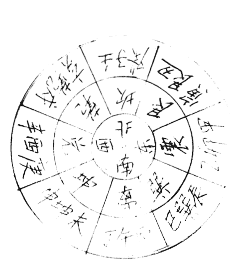

#### 图二：双山五行图

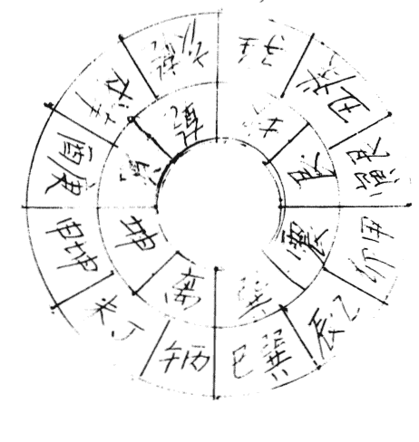

#### 图三：龙脉全图

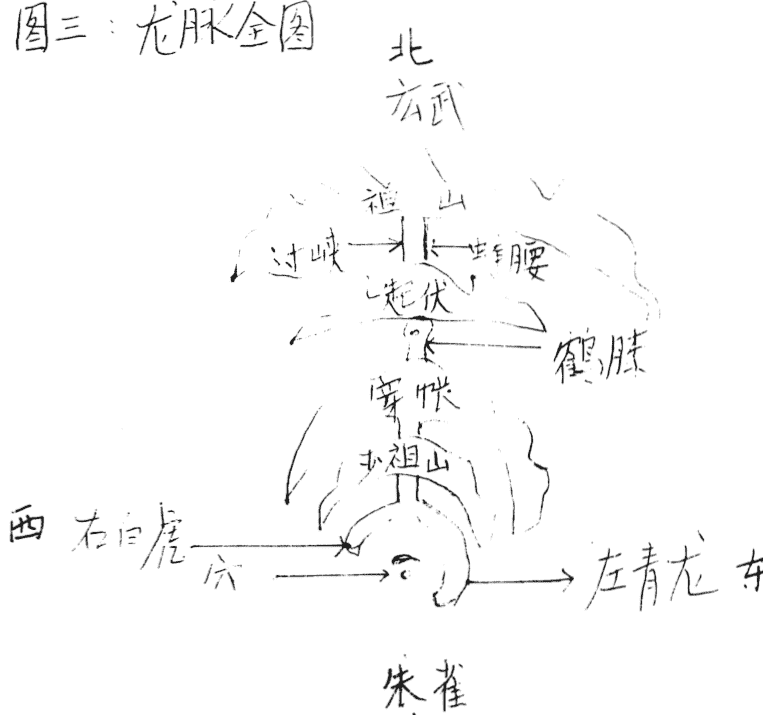

#### 图四：四局定穴图

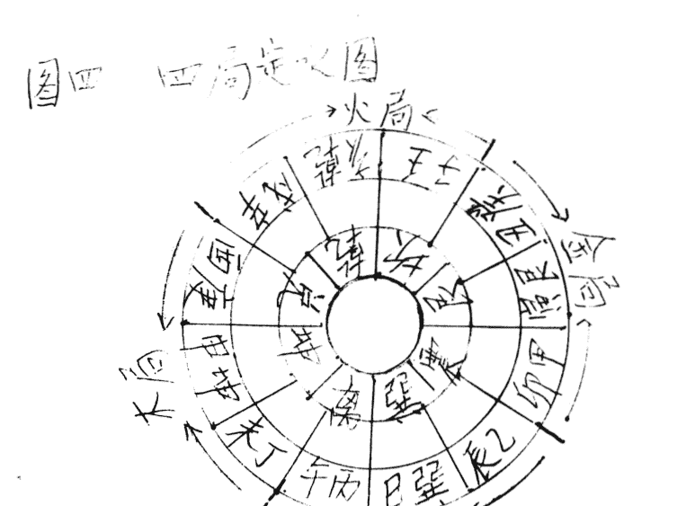

#### 图五：金局

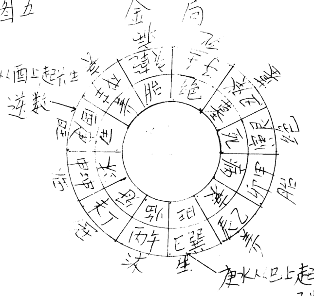

丁龙从酉上起长生，逆数

内龙 外龙水

庚水从巳上起长生，顺数

#### 图六：水局

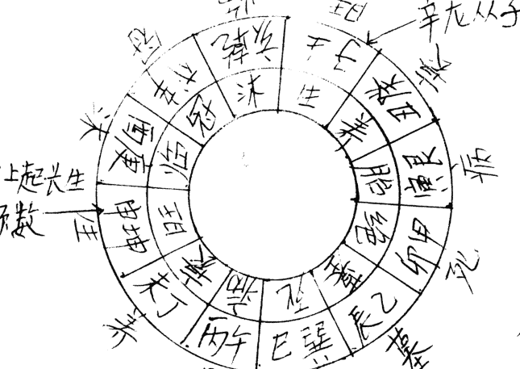

辛龙从子上起长生，逆数

壬水从申上起长生，顺数

内龙 外龙水

#### 图七：大向

平水从向上起长生

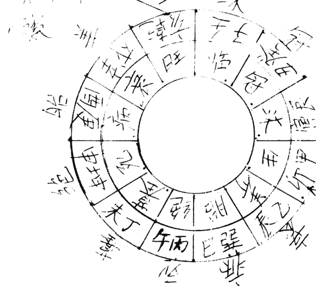

内龙 外水

阳龙从向上起长生，逆数

#### 图八：火向

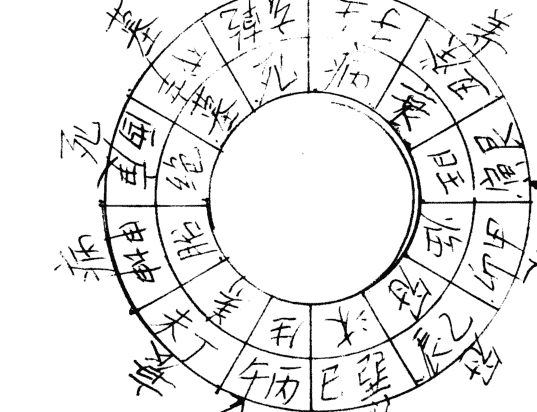

丙火从寅上起长生，顺数

内龙 外水

## 出灵点窍

- 阴宅点窍之二

张成达

生死为人生两件大事，生为起点，死为终结。自古以来，华夏民族一直非常讲究礼仪，所谓慎终追远，身后哀荣。对丧葬祭奠礼仪尤为重视。做为一个合格的风水师，则必须懂得这些法术。

### 一、临终搬铺

俗以死于睡床之上，冥魂将被吊在床上，不得解脱，只有死在家中最好的地方才得安宁。故将临终之人由卧室搬到厅堂临时铺设的板床上。与此同时应为临终之人擦洗身体，更换寿衣。寿衣绝对禁止用皮毛制品，恐来世转为兽。

如果临危之人是在医院，临终搬铺一节自然免去。但擦身、更换寿衣依然，最后送人太平房。

### 二、小殓

初终，为死者放入咽口钱（最好能在临终之前），为死者修容（理发、刮脸、简单化装），两手放入打狗干粮（馒头、糕点之类），用烧纸把手包好，两脚换上装老鞋，用绳绊好，整理妥当后，用黄或白布从头到脚盖好。在终铺前，应放倒头饭、各种祭品、香烛，点燃油灯。在丧盆内先烧三斤二两烧纸钱，这些纸灰要特殊包好，入殓时放入棺内。如移尸太平间，一切同上，只是烧纸钱、点油灯等项，视太平间之规而定。

### 三、挂孝报丧

丧家在大门悬挂烧纸制做的岁头纸（一大串烧纸），纸数要比岁数多两张，比如故去之人是六十岁，纸数为62张。在做纸串时，最上面用一张纸，最下边用一张纸，表示天上一张、地下一张之意，中间用几张纸不限。亡男挂在门左，亡女挂在门右。也可在大门外张贴讣告，在白纸上写明死者生卒年月日时。

送浆水：每当人吃饭之前，戴孝之人先去庙上送水、酒、饭之类的祭品，回来后再吃饭。

哭道报庙十八场：就是一个时辰应一遍哭。

### 四、守铺

在大殓出殡之前，丧家亲属昼夜轮流守护在死者停铺侧，看住油灯，不让火灭，间断烧纸或上香，严禁猫狗之类动物靠近终铺。

### 五、指明路

死后的第一个晚上需要指明路，长子手持扁担，扁担一头吊一串纸钱，站在凳子上，指西南方连喊三声：“XX，往西南光明大道走哇。”

如无扁担，可用高粱楷或木棍代替。

指明路地点一般在灵铺附近，或附近的路口。

### 六、棺材前灵头怎么写？

要求是男写单字，女写双字。比如故去的是母亲，写“故母于秀芹之灵位”，此是八个字，属双。比如故去的是父亲，可写“故先父孙志洁之灵位”，此是九个字，属单。

### 七、大殓

死后24小时内，由风水师择吉时开光。

开光时，让长子拿起倒头饭中间的那根棍，不用蘸灯油（象征性地），随风水师念下面的开光歌：

- 开眼光，明亮亮。
- 开鼻光，闻麝香。
- 开咀光，吃八方。
- 开耳光，听四方。
- 开心光，亮堂堂。
- 开手光，抓钱粮。
- 开脚光，上天堂。

开光后，取下咽口钱。由长子捧头，次子捧脚，众人帮忙，移入棺内。

在开光、移尸过程中，一定要在用遮布挡光情况下进行。四个人扯着白布或被单四角，把尸首遮上，避免阳光照射。

入殓后封棺，其子女、亲属晚辈等，跪在棺材两侧，木匠开始钉钉（俗称煞扣）。木匠在左边钉钉，众人喊：“XX呀，往右躲钉。”木匠在右边钉钉，众人喊：“XX呀，往左边躲钉。”

待棺封好后，木匠最后一斧把寿钉钉在棺盖前边（要求是男左女右）。钉好后，把咽口钱挂在钉上。

### 八、入棺出灵禁忌

- 正、四、七、十月，忌属虎、猴、蛇、猪。
- 二、五、八、十一月，忌属鼠、马、鸡、兔。
- 三、六、九、十二月，忌属龙、狗、牛、羊。

### 九、守灵

大殓之后需要在家停棺，一般要停放七日，现在多数是第三天出殡（从死后那天算起）。大殓后至出殡期间，家人要守护或睡卧在棺旁草垫上，以表孝忱，叫做“守灵”。其亲友可在室内搞些活动，叫“坐夜”。

通常情况下，凡停灵在家的，都要搭设灵棚，要在寿材头摆设祭品、倒头饭、油灯，挂挽帐，摆花圈。

此期间凡来拜祭者，不论其辈数高低，守灵的都要还礼。

如遗体停放在太平间，丧者应在家里设灵堂守灵。灵堂设置所需物品：灵牌、遗像、供品、香烛、纸钱等。

灵堂用供品：

- 道家摆五供：鸡、鸭、鱼、肉、蛋。
- 佛家摆四果：苹果、香蕉、大枣、橘子。
- 摆道家的还是摆佛家的或佛道两家同时摆，由风水师决定。

- 竹筷子五双。
- 酒盅五个。
- 馒头十个，分两摞。
- 香一扎。

关于灵牌怎么写，请参照前面“棺材前灵头怎么写”。

关于孝带的扣怎么扎：男的结在左边，女的结在右边。

### 十、怎样写挽幛

挽幛又叫祭幛，用素色的双幅绸、毛料等较好的布料制成，通常是长2米，宽1.5米左右。其格式如下：

幛右侧为对死者的称号，左侧为送挽幛的具名，幛中央为挽幛词，均用墨笔写在白色的长条或菱形纸块，缝贴挽幛上。一般采用直行书写的形式。

过去在写挽幛时，要在左侧具名的右上角加上“阳居”二字，就连右侧的“○府”都得用红纸写黑字，其余则用白纸写蓝字，以表示“○府”和送挽幛的人是生人，做到生死分明，否则便会是失礼而遭到非议。现今已不这样讲究了，甚或不用“○府”二字。

死者称号和送挽幛者具名必须符合礼仪要求，相互匹配。例如：

○府尊岳父○○老人千古

松 柏 长 青

子婿○○○率外孙○○敬挽

挽幛词一般多用四个字的词组，但也有在幛中央吊一个白纸黑字的大“奠”字，还有在幛中央写联语的。挽幛词语很多，虽然都是褒扬、吊唁，但仍有区别，用时要根据死者的身世及与生者关系等具体情况，选择切合的词语。

通用挽幛：

- 松柏常青 英魂常在 含笑九泉 流芳百世
- 永垂不朽 万古流芳 浩气常存 遗爱千秋

### 十一、怎样写挽联

挽联和其它哀悼文一样，在写法上有着严格的规律。挽联为上下两个半联，要求上下半联字数相等，结构对偶，文字平仄相对，讲究声调、节奏、韵律。在使用上，挽联分为丧家自挽和哀挽别人两类，由于与死者的关系不同，死者生前的身份、处境等具体情况不同，撰写的内容也应各不相同，不能混用，以免失礼或落人笑柄。

通用挽联：

丹心照日月，
正气炳乾坤。

寿终德望在，
身去音容存。

高风传乡里，
亮节照后人。

松柏常耸翠，
金柳动哀情。

痛心伤永逝，
挥泪忆深情。

#### 挽男丧通用：

毕生正直无私，
一世勤劳可风。

椿形已随云气散，
鹤声犹带月光寒。

人间未遂青云志，
天上先成白玉楼。

#### 挽女通用：

青山永志芳德，
绿水长吟雅风。

瑶池旧有青鸾舞，
绣幕今看白鹤翔。

良操美德千秋仰，
亮节高风万世存。

身似芳兰从此逝，
心如皓月几时回。

#### 挽父通用：

百呼不醒慈父梦，
千载难忘养育恩。

深恩未报羞为子，
饮泣难消欲断肠。

思亲蜡尽情无尽，
望父春归人未归。

#### 挽母通用：

人间慈母去，
天上慧星沉。

思亲唯有泪，
救母痛无方。

母魂已逝空增泣，
儿泪常流难报恩。

#### 挽兄弟通用：

风悲梧叶留残血，
雨促荆花恨落红。

雁阵霜寒悲折翼，
鹤原露冷痛孤飞。

#### 挽夫通用：

裂肺撕肝儿寻父，
捶胸顿足妻哭郎。

每思田园共笑语，
难禁空房独泪流。

#### 挽妻通用：

户悲凄风冷，
楼空苦雨寒。

想见和颜唯有泪，
欲闻笑语杳无声。

惨听秋风吹落叶，
愁看冷月照空帏。

### 十二、送行（俗称送大纸）

送行是在出灵的头一天晚上。

要把所扎的纸活，如马、牛、岁纸、衣物等，送到庙上去烧。

这里要强调的是：长子用条笤托着岁头纸、亡命牌（怎样扎亡命牌，随教材寄去样式）。后退着绕棺材左转三圈、右转三圈。之后，才能往庙上去。

在往庙上去之前，由风水先生念“路引”（也称“路引马票”，用墨水写在烧纸上），其写法如下：

> 南瞻部州共和国 省 市 乡 村居民 世（这个“世”字指六十岁以前故去的，在“灵幡”一节中有详述）故XX，
> 生于 年 月 日 时，于 年 月 日 时寿终正寝，赴阴司冥界。随身携带珠宝器皿无数，钱财若干，白马（或牛）一匹（或一头），牵马童一位，名唤得用。沿途各关卡、哨所、庙宇、村庄、河边、柳岸，以及一切强神恶鬼等不得任意抢劫、掠夺、扣压，一律放行。
> 特勒令
> XX年XX月XX日

念完此“路引”后，将它装在马鞑子里，随马走，确保一路平安。

在往庙上走的路上，要求长子手托着岁头纸、亡命牌倒退着走。

到庙上后，马或牛头向西南，由长子指明路，女儿给亡人（亡命牌）洗脸、梳头、照镜子等，后将所带之物全部焚烧。

回来后，还要“摆祭吃零”。由风水先生主持，“喊月台”（何为“喊月台”，我在“安葬点窍”中有详述），令孝子们全跪在棺前，由孝子一样一样地上食物，摆放在棺前的桌子上。

此后开始最后一次烧纸（多数在亥时），要多烧。

### 十三、出殡

出殡一定要择吉日吉时。我在《择日点窍》中示有“十七不出灵，十八不安葬”，俗有忌双日下葬。遇到特殊情况，风水师有时也择不出好日子，时间拖长了又违入土为安之大理。硬要下葬呢，又恐死者不安，活者遭祸。在这种情况下，可采用趋吉避凶之法。最好的方法是“禳镇重丧法”：

用白纸造函一个，用黄纸朱砂书写四字，置函内，放在棺上，同出大吉。如怕风刮跑，可以拿着，在下葬时同棺材一起埋或火化。

朱书四字的规则是：

- 1、2、6、9、12月，朱书：六庚天刑；
- 3月，朱书：六辛天刑；
- 4月，朱书：六壬天刑；
- 5月，朱书：六壬天狱；
- 7月，朱书：六甲天福；
- 8月，朱书：六乙天德；
- 10月，朱书：六丙天成；
- 11月，朱书：六丁天明。

倒头饭由谁来拿？

有姑爷的让姑爷拿，没有姑爷的由儿子拿。

烧的纸灰怎么处理？

把烧的纸灰包起来，放在被褥一起，到火化场或茔地一起烧掉。

灵车开动前，由长子跪在车前摔丧盆。

> 注：凡提到由“长子”所做之事，如死者无子，可由侄儿、女婿代替。

灵车起动后不能停。

每逢过桥或岔路口都要扔钱，到墓地时要把纸钱全部扔完。

纸钱用纸应分生葬与熟葬：生葬用黄烧纸；熟葬用红纸。

### 十四、灵幡

如今殡仪馆、花圈店随处可见。因有很多经营者不懂有关“灵幡”方面的知识，常常搞得不伦不类，让生者耻笑，亡者不安。为正本清原，现把师传之秘诀摘录如下：

#### （一）、怎样从灵幡上区分出所故之人的年岁大小？

凡不超过60岁故去的，在“故”字前写“世”字；

凡60-70岁故去的，在“故”字前写“耆”字；

凡70-80岁故去的，在“故”字前写“耄”字；

凡80-90岁故去的，在“故”字前写“期颐”二字。

比如某人之父是48岁故去的，其灵幡应写“世故”显考……

内行的人一看“故”字前这个“世”字，便知此人是60岁之前故去的。

#### （二）、怎样从灵幡上区分出所故之人是男是女？

1、在引魂幡中间及两边的飘带最下边来区分。要求是：男剪箭头，女剪凹。男在最下边剪出五个箭头；女在最下边剪出五个豁口。

2、引魂幡中间飘带的中间，要“男剪圆形、女剪方形”。男为乾为天，女为坤为地，取天圆地方之意。

男剪18个圆形；女剪14个方形。男属阳，剪单；女属阴，剪双。

#### （三）、怎样写灵幡：

灵幡两边飘带所写的字，最后一个字必须占上“生”。

比如下面这个灵幡的飘带：

金童前引路乘龙东去

玉女送西方驾鹤西游

解：

上一联“金童前引路乘龙东去”，是九个字。从“金”字起“生”，童字念“旺”，“前”字念墓，“引”字念绝，再从“路”字起，往下念“生旺墓绝”，念到最后那个“去”字便占上“生”。

用此法查下一联，最后一个字也占“生”。

灵幡中间的飘带所写的最后一个字，要求男占“生”，女占“旺”。

比如故父是男，名叫周永生，终年56岁，可写成：世故显考周公讳永生之引魂幡

从“世”字起生，“故”字念旺，“显”字念墓，“考”字念绝。再从“周”字起，往下念“生旺墓绝”，念到最后那个“幡”字，便占上“生”。

女占“旺”，仿此法。

新葬（俗称生葬）用黄烧纸

覆葬（俗称熟葬）用红纸。

灵幡要由长子打。

### 十五、净宅

如死者死在家中，需除殃净宅，以保活着的人安康。出殡后，家中留一男长者，负责打开所有门窗。风水师用五谷杂粮扔打落殃处，同时念“洒五谷粮咒”。

殃落处：

男用天干；女用地支。

男用天干歌诀：

甲在锅台乙巽间，

丙丁自在瓦二三。

戊日不离停灵地，

己日还在炕床前。

庚辛在于西北角，

壬癸还在水器边。

女用地支歌诀：

寅窗卯门辰在墙，

巳时洋沟午未梁。

申酉在碾戌亥灶，

子丑二时在厅堂。

打过之后，把杂物皆扫地出门。

洒五谷粮咒：

一洒洒天殃，

天蓬道路昌；

二洒洒地殃，

地殃化吉祥；

男殃并女殃，

洒着齐消亡；

三洒洒鬼殃，洒尽诸妖魔，急急离此方；

天圆地方，律令九章，

吾奉天蓬大师助我斩殃。

### 十六、净宅镇符

故者属横死，如淹死、车祸、吊死等，需在出灵后，将“净宅镇符”贴于房四角镇宅（请注意，画符必需经师传，如擅自书写，易遭祸殃）。

净宅镇符（画法附后）

### 十七、火葬俗礼

尸体入殓后，运到火化场。入炉前，在吊唁室，子女亲属站在尸体两边，其余人员一一走过，瞻仰遗容，然后送入火炉。此时既可焚烧牛、马、衣物等。

骨灰出炉之后，装入红布袋。骨灰盒四角垫硬币，把装好骨灰的红布袋放在硬币上，封妥后，骨灰盒由长子捧着，直系亲属跟随，到燃烧区设灵台，摆放祭品，烧纸钱，最后，晚辈由长子带头，按序列磕头告别，取下孝带，在火上熏烤，最后把骨灰盒寄存。

寄存号码也有吉凶之分，以1、3、5、6、7、8层为好，此吉祥数由风水师摘选。

接尸车在离开火化场时，应用烧纸熏烤轮胎。

### 十八、死后祭典活动

死后要烧头七、三七、五七、百日、周年、三周年、十周年，以示孝子之心。

上述祭典活动，都要烧纸钱，摆供品。

立坟的上垄地；火化的，搬出骨灰盒。

天数的计算都要从死的那天起为第一天。

三天圆坟，圆坟从下葬之日为第一天。

圆坟要修整新坟，在坟前用红砖搭迎风门，坟上要用高粱杆搭上三道梁，把咽口钱栓在主梁上。

### 十九、丧葬祭品

自古以来，男死烧纸马（供死者骑乘）；女死烧牛（替死者喝脏水），马由儿子，牛由女儿出钱定做。

烧纸钱是必不可少的，究竟何种钱有用其说法不一。用纸捏子或大钱打印的纸钱是一种零用钱，一个大钱只有一文，可买一个烧饼，价码虽小，必不可少。阴票（冥币）面额大，携带方便，也是可用。再有一种，天朝地府通用币，乃是佛家研制而成，后有用胶版自印，据说是管用的。至于用人民币或股票在纸上一比划的纸钱，显然是无效的。还有用烧纸制冰箱、彩电、轿车、大哥大者，实为可笑。

地址 吉林省磐石市振兴大街154号1单元2楼

邮编 132300

电话 0432--5226764

二零一零年一月十九日

## 净宅镇符

| 东方 | 西方 | 北方 | 南方 |
| :--- | :--- | :--- | :--- |
| 敕之 | 敕之 | 敕之 | 敕之 |
| 月神 | 月普 | 仙师 | 天师 |
| 月山 | 月变 | 教令 | 斩妖 |
| 月神 | 月咒 | 除灭 | 伏鬼 |
| 凡人 | 月者 | 灾煞 | 田土 |
| 五雷 | 田土 | | 斩邪 |

四灵后照四方用镇宅

## 安葬点窍

- 《阴宅点窍》之三

张成达

传统丧葬祭典礼仪现今在广大农村及部分城镇居民中仍然流行，保存着若干古代习俗，它包括有丧、葬、祭三个方面。我在这一章中专门讲风水师是怎样进行安葬的。

### 一、写碑文的规矩

男要逢单字；女要逢双字。

比如：故父的名字叫王洪彦，可写“故显考王洪彦之墓”，共八个字，逢双。

如果名字叫两字王洪，按上面那样刻碑文就不能逢单字，可用王“讳”（请注意：男用讳，女用智）洪，或用之“灵”墓这个“灵”字，将所缺之字添上。

女逢双可效仿上例。

### 二、安葬

安葬分新葬（俗称生葬）与覆葬（俗称熟葬）之分。

我首先讲生葬。

生葬必须选墓营穴。墓穴一定会有善有不善，有佳有不佳，地理家的职责便在于弃恶而取善。

#### （一）十恶不善

1、龙犯劫煞反逆

主要是看龙脉过峡之处（什么叫过峡，在“选墓点窍”中已详解）是否被恶石劫断，这就好比是人行途中，遭强盗劫夺，必伤和气而带煞气。因此，观龙脉要保束气而避煞气，否则便会给家族招来败家贱身的惨祸，这也是十恶之首恶。

2、龙犯剑脊直硬

剑脊，指龙身挺直，毫无屈曲蜿蜒之生气，只有蠢粗硬直之死气。这样的龙脉，万不可点穴，以此点穴，必有杀伤之厄。

3、穴犯凶砂恶水

砂有吉凶，水也有吉凶。比如恶石巉岩，便是凶砂，湍流瀑布，便是恶水。葬穴左右不可倚傍这样的砂水。

4、穴犯风吹气散

墓穴最忌恶风。凡穴地前后左右有恶风，则大灾小祸会随之而至。

5、砂犯探头、槌胸

探头、槌胸，均指穴旁有山如探头状、槌胸状，都是不吉之象。

6、砂犯反背无情

砂的形状有拱穴、有背穴，由此而判定有情与无情。

7、水犯冲射反弓

射胁、反弓，指水旁冲或折流，无柔曼之形，有凶恶之状，因此为凶相。

8、水犯黄泉大煞

关于“黄泉煞”，我在《选墓点窍》中已经讲明，这里不赘）。择向要考虑到水流的方位，不可相克，否则既成大煞，会有天亡绝嗣之祸。

9、向犯冲生破旺

生、旺、死、绝四位，生旺为吉位，若是冲破了生旺，便是凶相。

10、向犯闭煞退神

穴旁流水要流动，停蓄也要归库。水最终不归库，便是凶相。择穴而不立向，失去了相应的神位，没有神护佑，自然不能发富发贵。

#### （二）坟有五不葬

- 1、气以生和，童山（山无草木）不可葬；
- 2、气因势来，断山不可葬；
- 3、气因土行，石山不可葬；
- 4、气以势止，过山不可葬；
- 5、气以龙会，独山不可葬。

#### （三）十不葬粗顽

一不葬粗顽丑石，

二不葬急水争流。

三不葬穷源绝境，

四不葬孤独山头。

五不葬神前庙后，

六不葬左右休囚。

七不葬山岗撩乱，

八不葬风水悲愁。

九不葬坐下低软，

十不葬龙虎尖头。

#### （四）坟有十不向

- 1、不向流水直去，
- 2、不向万丈高山。
- 3、不向青乌赤石，
- 4、不向白虎过堂。
- 5、不向斜飞破碎，
- 6、不向外山无案。
- 7、不向面前逼窄，
- 8、不向山凹崩缺。
- 9、不向大山高压，
- 10、不向山飞水走。

#### （五）坟有十忌

一忌后头不来，

二忌前面不开。

三忌朝水反弓，

四忌凹风扫穴。

五忌龙虎直去，

六忌直射横冲。

七忌淋头割脚，

八忌白虎回头。

九忌龙虎相背，

十忌水口不关。

#### （六）风水房位吉凶断法

对于生葬，风水先生必须熟知“风水房位吉凶”的断法。
在实际应用中，1、4、7以穴左边的青龙及砂（山）断吉凶；
2、5、8以穴右边的白虎及砂断吉凶；3、6、9以穴前面的案山断吉凶。

#### （七）房位排法：

房位排法的规则是：同辈人排在一行，既1、2、3、4、5、6、7、8、9，……
必须强调的是：老大叫“报名堂”，老二叫“顶脚”。老大的妻位排在左边；老二的妻位排在右边；老二以后不管哥几个，其妻位均排在右边。
至于距离，地师通常是采用“方五斜七”的办法，既方位五尺与斜位七尺。请看下图：

（请看附后图一）

### 下面讲熟葬：

做为一个德高望重的风水师，首先要慎重对待已葬过的旧坟应改与不应改，绝不要为了赚钱而损德性。

#### （一）坟有三不可改

- 1、开坟见龟蛇生气物，则不可改。
我在这里向您讲一个真实的故事：有一户人家在迁旧坟破土时，见到一只蛇伏在坟旁，由于不懂此规矩，将蛇打死。结果在烧纸时，突然来了一股怪风，将正在燃烧的纸吹向山中，引起漫山大火，动用一百多人才将火扑灭。风水先生及迁坟者，共被罚款二十多万元，这沉痛的教训当警之。
- 2、土中有温暖气或乳气或如雾气不可改。
- 3、紫藤交合棺不可改。此是祥瑞之兆，改必遭殃。

#### （二）坟有五必改

- 1、坟墓无故自陷；
- 2、坟上草木枯死；
- 3、淫乱风声，六畜死绝；
- 4、男女忤逆颠狂、劫盗；
- 5、刑伤人口、妇人不孕、家财耗散、官事不休。
此五种旧坟必速改。

#### （三）验坟一目了然歌：

左砂顺水长房离，
右砂顺水三子去。
外有山峰在水边，
离乡背井方成贵。
明堂倾斜二子难，
左肩受白四七寒。
右肩受白六九单，
人首太急五房虚。
主星低陷又受煞，
定断五八绝宗嗣。
明堂蠢粗带伶丁，
见斜流入财耗空。
砂平硬直，身亡家破。
龙虎攀拳，一家狠恶。
何知人家贫又贫？
山岖水深射阴风。
何知人家富又富？
峦峰磊落皆朝拱。
何知人家贵又贵？
文笔尖峰相朝对。

#### （四）看老坟秘诀

老坟既是旧墓。如果遇有棺附葬或添建工程，必请堪舆家验看风水，关系更大于看地。看老坟法是先看墓之前后左右，次看穴前之水大水小，既于水口中立一标杆，然后看坟顶中间，置罗盘于穴上，用外盘缝针，看坟前水口交于何处，归库不归库，再用长线牵开。细看在天干或地支上几分，有无触犯黄泉大煞，有则必须纠正。次看立向生旺还是衰绝，次看来龙从何字入首，究竟是生龙与死龙，龙水相配合是否成局。次看贵人，得位则发贵，不得位则不发。次看生方有无山水，有者人丁旺，若在旺方主大富。天柱山高，主有寿。对于贵穴、富穴、贫穴、贱穴，一一看遍，然后依法判定吉凶。有些富贵家之旧墓，为了壮观、摆阔，往往于穴之前后，遍筑围墙。殊不知龙要生气活泼为真，一筑墙垣，龙身受困，气脉阴塞，名叫困龙，纵有兴旺之气，亦不发迹。甚至反吉为凶，猝起大祸。受此害者屡见不鲜，必慎之为宜。

#### （五）辨知坟中男女秘诀

- 1、从坟上的草看：
此法用于验孤坟。从坟头上拔下一棵草，注意看草根。如果草的根须多，草根向右弯，此坟葬的是女人；如果草根就是一根茎，草根向左弯，则此坟葬的是男人。
- 2、从坟前所烧的纸灰看：
墓中公婆事难明，可将坟纸去搜寻。黄白是男乌是女，坟纸红露刀枪亡。白点必定投水死，黄斑黄肿长病死，红斑产难家中死，青红树打死，赤黄墙打死，黄纹自缢亡，黑纹离乡被打死，交红是相死亡。坟头无纸是孤贫，纸乌又水湿，骨骸乌又烂。

### 三、迁坟

- 1、让迁坟者准备如下物品：
红砖一块，用于镇太岁。用朱砂往烧纸上画“镇太岁符”（请注意，画符必经师传，如不经师传，擅自抄画，易遭灾祸）：
镇太岁符（画法请看附后图二）
将此符贴在砖上。
红纸四张，用于扎灵幡及纸钱；
红手套一双，用于拣尸骨时戴；
大萝卜一个，用于拣完尸骨后添坑；
红布、白布各六尺六寸，用于拣尸骨时遮蔽阳光；
筷子一双，用于给两个棺材搭桥；
小木板四个，长8寸，宽1、2寸，事先分别写好“元、亨、利、贞”四个字，用于趋吉；
塑料纸牌中的一万、老千各一张，要用刀刮去牌上人的脸及身子，用于避凶；
高粱一把，用于净墓；
馒头四个（或四块蛋糕），用于垫棺材。

- 2、破土
先让长子在要遗弃的坟头上挖一锹土，放在一边。然后帮工们才能开始挖坟破墓。

四立前18天，土王用事，不宜动土，用此破土咒可化解。

#### 破土咒

天园地方，
律令九章。
吾今破土，
普扫不祥。
金镐玉钺，
万事吉昌。
土公土母，
闪在一旁。

#### 3、拣尸骨

把六尺红布与六尺白布同时打开，遮蔽阳光，开始拣尸骨。
往做好的小寿材里拣骨时，故去的是男，由长子（带上红手套）拣；故去的是女，由女儿（带上红手套）拣。
尸骨拣全后（如果埋葬年久已无尸骨，装走一锹土亦可，意到阴魂既到之意），由长子把先挖出去的那锹土撮回坟坑里。
将准备好的那个萝卜扔进坑去（一个萝卜顶一个坑之意）。
撒上几把高粱，便可以装上小棺材起灵（关于怎样“起灵”，请参看“出灵点窍”）。

#### 4、安葬

##### （1）打墓

墓的大小要留出安放棺材的空间。

##### （2）、破土文

在破土前，要焚烧由风水先生事先写好的“破土文”。
破土文要根据死者不同身份书写不同的词语，下面是我为丧家故父所写的“破土文”，以供参用。
当庄山神、土地神、城隍等南瞻部州，中国 省 市 乡 村
屯居民世故显考 府君赴阴司冥界，迁阴宅于 村 沟 山之贵
方宅地，多有打忧，惊动冒犯众位神灵，望乞恕罪海涵。
诸位神灵，左邻右舍及本地一切强神恶鬼等不得任意侵袭威逼、
欺凌，一律宽厚容纳，不得有误。
特勒令。

xx市、县冥府。
下元年 月 日

##### （3）破土

由长子先挖第一锹土放在一边（留待第三天园坟时，由长子撮起，放到坟顶上）。

##### （4）墓打好后就不能再下去人用脚踩。

##### （5）风水师让长子拿起那块贴好符的红砖，向太岁方走到离穴一百米处，待用罗盘调准方向后，让其埋在那里。埋的时候，砖要留出半截，贴符的那面冲穴外（也就是冲太岁方）。

##### （6）太岁方位

关于太岁的方位，有两种说法：
有的风水师认为在值年太岁的方位。比如虎年在寅方，兔年在卯方……
有的风水师却不这样认为，请看歌诀：

- 寅午戌年在乾方；
- 亥卯未年在坤方；
- 申子辰年巽中藏；
- 巳酉丑年在艮乡。

到底怎么用，由风水师选定。

##### （7）坟底要用锹撮土，做出两道横杠。

##### （8）把四个木牌放进坟的四角上。先放带“元”字的牌（假如坟墓是坐北朝南，先从西北角乾方放带“元”字的牌。其它方向怎么放，由风水师决定），依次放“亨、利、贞”。

也有摆放七个铜钱的（无铜钱用硬币代替），左边放四个，右边放三个。

##### （9）把老千、九万放在坟底，要面冲上放。

##### （10）安放棺材的四个角，每角放一个馒头（也可用蛋糕代替）。

##### （11）棺材放进坟里后，风水先生开始用罗盘调向口。

##### （12）向口调好后，把准备好的那双筷子用红布缠上，横放在两个棺材上（用于故父母同时下葬），谓之檕桥。

##### （13）由长子先往棺材上扔一锹土，然后开始添坟。

##### （14）在添坟时，风水师应用一树棍在向口处插一个记号，留待三天园坟时，家人立迎风门。

##### （15）坟添好后开始立碑。

##### （16）碑立好后，让家人在碑前摆好供品。

#### 5、举行仪式：

风水师让亡者亲属跪在碑前（不立碑跪在坟前），进行“喊月台”（此是师传之行话，凡不明此语者，皆属未经明师所传）

“喊月台”由风水师根据不同的死者编出不同的词语，所用之词与祭文很相似，要以简明扼要之词表达悲哀沉痛之情。比如故父姓刘，我曾编出如下的词语来“喊月台”：

呜呼，刘父，年仅六十有三。孝子贤孙，跪在坟前，虔具素礼，以示祭典。

呜呼，刘父，偶染癌症，一病亡身。号天泣血，泪洒沾尘。深知刘父，毕世艰辛。创家立业，俭朴忠信。处世有道，克己恭人。至生后辈，爱护如珍。抚养教育，严格认真。感天动地，英名永存。魂游冥府，百喊不闻。哭断肝肠，情何以伸。今日祭典，略表寸心。化悲为俭，化痛为勤。继承遗志，兴家立身。刘父九泉有灵，来尝来品。呜呼哀哉，尚飨！（“尚飨”是望亡人歆享之词。尚，是希望之意；飨，是设牲礼以供品尝）

风水师命亲属向亡者礼拜，三叩首。

地址 吉林省磐石市振兴大街154号1单元2楼
邮编 132300
电话 0432--5226764

二十零年一月十九日

#### (图一) 房位排法

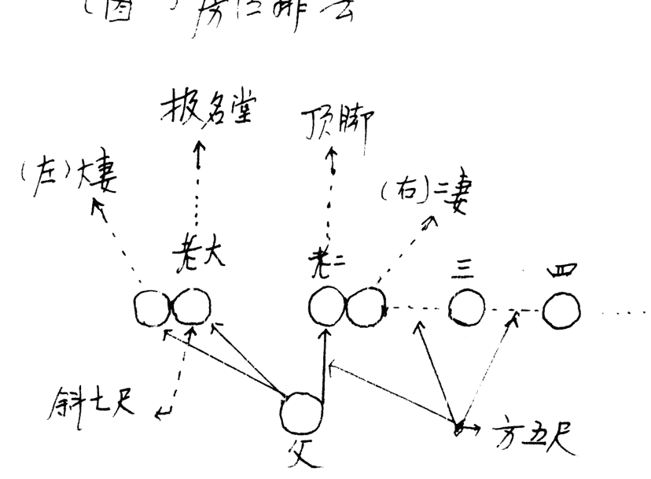

#### (图二) 镇太岁符

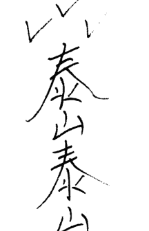

## 择日点窍

--《阴宅点窍》之四

张成达

自古以来，吉日选择有佛、儒、道等诸学派，流传下来的就有《玉匣记》《万宝楼》《宝镜图》《敖头通书》《灵棋经》《协纪辨方》等书，对怎样选择良辰吉日法门甚多，且相互矛盾。再加上市面上所见的新版书，多属外行的书商们印制，校对极差，漏洞百出，使人无所适从。今把采颉众家之长，结合多年实践总结出来最实用之法奉献给您。

### 一、分辨黄道日与黑道日

黄道日与黑道日共十二位，称建星，也称十二神，其顺序是：建太岁、除青龙、满丧门、平六合、定官符、执小耗、破大耗、危朱雀、成白虎、收瘟神、开吊客、闭病夫。

简单的记法是：建除满平定，执破危成收，开闭。

十二建星既是每月的月建，正月建寅，二月建卯，……依此类推。查月建同排四柱一样，以节为准，既：立春、惊蛰、清明、立夏、芒种、小暑、立秋、白露、寒露、立冬、大雪、小寒。

最简捷的歌诀是：
春雨惊春清谷天，
夏满忙夏暑相连。
秋处露秋寒霜降，
冬雪雪冬小大寒。

解一：怎样分黄道与黑道，请看《歌诀》：
建满平收黑，除危定执黄。
成开皆大用，闭破不相当。

这就是说：逢建、满、平、收、闭、破之日为黑道日；逢除、危、定、执、成、开之日为黄道日。

择日首先要选择黄道吉日，不选黑道凶日。

江湖上在运用黄道与黑道日上有所变通，现将歌诀录于下，供您参用：

建宜出行收嫁娶，
定宜上梁满修仓。
破除疗病执宜捕，
危利安床闭丈量。
成开所遇均大吉，
平日做事总平常。

### 解二：怎样寻查某建星：

关键得知道从何处起“建太岁”。 我告诉您：从某月所值的地支起。比如正月地支为寅，那么就从寅日上起“建太岁”， 以下顺数，卯日则为除青龙，辰日则为满丧门，巳日则为平六合， 午日则为定官符，未日则为执小耗，申日则为破大耗， 酉日则为危朱雀，戌日则为成白虎，亥日则为收瘟神，子日则为开吊客， 丑日则为闭病夫。……其它月份以此类推。下面举二个例子来解释：

1、98年12月从哪日起“建太岁”：
查《万年历》（盲人先生则靠死记，从掌上查）， 12月初一是己巳，初二是庚午，初三是辛未，初四是壬申，初五是癸酉， 初六是甲戌，初七是乙亥，初八是丙子。 初八以前都没见到本月的月建“丑”字，故都不能起“建太岁”。 直到初九丁丑日地支才见到“丑”，那就从丁丑日起“建太岁”（请记住， 必须见到本月值日的地支才能起建太岁）。接下来顺数，初十则是除青龙， 十一则是满丧门，十二则是平六合，十三则是定官符，十四则是执小耗， 十五则是破大耗，十六则是危朱雀，十七则是成白虎， 十八则是收瘟神，十九则是开吊客，二十则是闭病夫。二十一日为己丑日， 地支又见月建丑，再重新起“建太岁”，顺推到“闭病夫”为止。

2、怎样查99年正月初一的建星：
正月建寅，从立春那天起才为寅月。
99年属年前打春，是98年12月19日立春， 19日是丁亥、20日是戊子、21日是己丑，这三天的地支都不是寅， 不能起“建太岁”。 22日是庚寅，地支见到本月值日之星“寅”， 那就从此日（庚寅）起“建太岁”， 23日则为除青龙， 24日则为满丧门，25日则为平六合， 26日则为定官符， 27日则为执小耗， 28日则为破大耗，29日则为危朱雀， 30日则为成白虎，数到99年正月初一则为“收瘟神”。

有人会问：常在《万年历》上看到有两个“建建、满满、平平、收收”等二个建星并列，是怎么回事？
我告诉您：凡某建星遇到换“节”那天，就要重复使用一次。
比如98年12月18建星是“收”， 可是19日建星还是“收”， 为什么呢？因为19日是立春，属换节，则重复使用。
请注意：这个问题很重要，如果不明白， 仍按建星排列顺序去查，就会把黄道与黑道日弄错。

### 二、天月二德日择法

1、天德日查法：

> 歌 诀
正丁二申宫，三壬四辛同。
五亥六甲上，七癸八寅逢。
九丙十居乙，子巳丑庚中。
天德之日无忧祸，逢凶化吉得安宁。

解：天德贵人以月来定。正月，日干见丁；二月，日支见申；三月，日干见壬；四月，日干见辛；五月，日支见亥；六月，日干见甲；七月，日干见癸；八月，日支见寅；九月，日干见丙；十月，日干见乙；十一月，日支见巳；十二月，日干见庚。

2、月德日查法：

> 歌 诀
寅午戌月在丙，亥卯未月在甲。
申子辰月在壬，巳酉丑月在庚。
月德之日主和顺，万事通达喜盈盈。

解：月德贵人以月来定。寅午戌月，日干见丙；亥卯未月，日干见甲；申子辰月，日干见壬；巳酉丑月，日干见庚。

3、天月德合日查法

天月德合日为二者的干支相合之日，其吉庆程度比天、月德次之。

### 三、不择禁忌日

1、忌三煞日

三煞日是： 劫煞 灾煞 岁煞

| | | |
|---|---|---|
| 寅午戌 | 亥 | 子 | 丑 |
| 申子辰 | 巳 | 午 | 未 |
| 亥卯未 | 申 | 酉 | 戌 |

煞，见午为灾煞，见未为岁煞。
凡生年地支占亥卯未的，不择申酉戌日，因为亥卯未见申为劫煞，见酉为灾煞，见戌为岁煞。

#### 2、忌月忍日

> 歌 诀
初五、十四、二十三，
老君炉里不炼丹。

解：初五、十四、二十三这三天为月忍日，故此三天不择。

#### 3、忌红咀朱雀日

> 歌 诀
初一不嫁娶，
初九不上梁。
十七不出灵，
十八不安葬，
二十五不搬家。

解：关于红咀朱雀日的吉凶，请看歌诀：
红咀朱雀丈二长，
眼似流星口吐光。
等闲无事伤人命，
万里飞来会过江。
切记切记君切记，
十个犯着九个亡。
初一嫁娶重嫁娶，
初九上梁放耗光。
十七安葬重安葬，
二十五搬家人口伤。

#### 4、四忌日

春兔、夏马、秋鸡、冬鼠。每月丁丑日。

#### 5、忌绝日

每月交节前头一天属绝日，不择。

#### 6、忌岁破日

7、忌月破日
凡日辰冲克月令为月破日，不择。如丙寅月壬申日，寅申相冲，不择。

8、不择与生肖相冲日。比如来择日的人生肖是辰，不择戌日，因为辰戌相冲嘛。

### 四、分辨吉凶时

#### （一）吉凶时查法

1、十二神顺序：

择吉凶时也分十二神，其顺序是：
青龙 明堂 天刑 朱雀 金贵 天德 白虎 玉堂 天牢
玄武 司命 勾陈

2、记此顺序歌诀：

> 青龙明堂与天刑，
朱雀金贵天德神。
白虎玉堂与天牢，
玄武司命并勾陈。

3、十二神吉凶查法

> 请看歌诀：
青龙明堂吉，
天刑朱雀凶。
金贵天德吉。
天牢玄武凶。
玉堂司命吉，
白虎勾陈凶。

4、吉时起法

青龙是第一位吉神，那么从什么时辰起呢？请看歌诀：

解：凡逢子日或午日，从申时起青龙；逢卯日或酉日，从寅时起青龙；逢寅日或申日从子时起青龙；逢丑日或未日从戌时起青龙；逢辰日或戌日从辰时起青龙；逢巳日或亥日，从午时起青龙。青龙起出后，按十二神的排列顺序顺数，既可知某时的吉凶了。

下面演习一例，比如逢子日寻查吉凶时：

按歌诀“子午寻申位”，逢子或午日就从申时起青龙，接下来顺数，酉时便是明堂，戌时便是天行，亥时便是朱雀，子时便是金贵，丑时便是天德，寅时便是白虎，卯时便是玉堂，辰时便是天牢，巳时便是玄武，午时便是司命，未时便是勾陈，然后再按“十二神吉凶查法”就可分出某时吉与某时凶了。

还有人用于月上起日：逢子月或午月从申日起青龙，酉日为明堂……其查法与查吉时同。

#### （二）凶时查法

1、忌时干克日干

以辛卯日为例。

辛卯日的12个时辰是：

戊子 己丑 庚寅 辛卯 壬辰 癸巳 甲午 乙未 丙申 丁酉 戊戌 己亥

在这12个时辰中，克日干辛金的是丙申与丁酉二个时辰，此二时为凶。最凶者是阳克阳与阴克阴，那么丁酉时当是最凶的了，因为时干丁火属阴，直克阴日干辛金，属阴克阴，地支还是卯酉相冲，属天克地冲。

2、忌择绝时

比如日支是寅卯，木长生在亥，绝于申，那么就当忌择申时。

### 五、财神、喜神、福神查法

1、财神查法：

歌诀
甲艮乙坤丙丁兑，
戊己财神坐坎位。
庚辛正东壬癸南，
此是财神正方位。

解：日干逢甲，财神在艮（东北方）；日干逢乙，财神在坤（西南方）；日干逢丙丁，财神在兑（西方）；日干逢戊、己，财神在坎（北方）；日干逢庚、辛，财神在东方；日干逢壬、癸，财神在南方。

#### 2、喜神查法：

> 歌 诀
甲已在艮乙庚乾，
丙辛坤位喜神安。
丁壬本在离宫坐，
戊癸原来在巽间。

解：日干逢甲已，喜神在艮（东北方）；日干逢乙庚，喜神在乾（西北方）；日干逢丙辛，喜神在坤（西南方）；日干逢丁壬，喜神在离（正南方）；日干逢戊癸，喜神在巽（东南方）。

#### 3、福神查法：

> 歌 诀
甲已正北是福神，
丙辛西北乾宫存。
乙庚坤位戊癸艮，
丁壬巽上妙追寻。

### 六、奇门择日法

- 1、日干生日支为宝日，大吉。
- 2、日支生日干为义日，次吉。
- 3、日干支比和为和日，次吉。
- 4、日干克日支为制日，平日。
- 5、日支克日干为伐日，凶日。

> 歌 诀
制日中平伐日凶，
宝义和日吉相同。
天干克地须言制，
地犯天干伐最凶。
天干生支实为宝，
支生天干义本平。
相比原来为和日，
此是干支生克名。

### 七、江湖上常用的吉凶日

江湖上对于择日所用之法真可谓五花八门、举不胜举，我仅摘取一部分。由于有些方法不符合五行生克之理，仅供参考吧。

#### （一）结婚吉凶日

1、四绝离日

立春立夏前一日离，
立秋立冬前一日绝。
春分秋分前一日绝，
夏至冬至前一日离。

注：我在前面已经讲了，凡换节的前一日属“绝”日，不择。

2、嫁娶离别日

正月丙子二癸丑，
三月丙申四丙辰。
五六丁巳八庚辰，
冬月癸巳九辛未。
十腊两月丙午日，
千万注意免遭心。
嫁娶要是遇此日，
夫妻反目要离分。

#### （二）出行吉凶日

1、方位上的禁忌

歌 诀

丑不南行酉不东，
龙虎西方属大凶。
亥子北方大失散，
卯日不可西北行。
马猴西南遭官事，
蛇羊不可东北行。
戌日莫往东南走，
文王出马一场空。

解：丑，既指逢丑日；酉，既指逢酉日；龙，指辰日；虎，指寅日；马，指午日；猴，指申日；蛇，指巳日；羊，指未日。

有人会问：酉日不东行可以理解，因为卯酉相冲；丑日不往南去也可以理解，属丑午相害。那么龙（辰）日往西属辰与酉合，马（午）日往西南（未申坤方）属午与未合，逢合怎么反倒凶了呢？

答：我看此说也不符合五行生克之理。原书就是这么写的，仅供参考吧。

##### 2、忌日

初一忌西行，初八忌万方。
十五东行凶，晦日北不利。

##### 3、出行吉日

正月子午二未申，
三月申酉是吉辰。
四月子卯是好日，
五月寅申更为根。
六月未日相当好，
七月午未又加申。
八月酉亥九子午，
十月子亥酉趁心。
冬寅子日十二亥，
出行查找要认真。
己巳之日不可用，
千万注意心内存。

#### （三）搬家禁忌

对于搬家择日还有以下几点说道：
搬家以带水之日为吉，少用带火之日。
注：关于上述的“水”与“火”，有人以日支定，有人以日干支纳音来定。到底怎么用，无有定法，仅供参用吧。
宅坐东不择巳酉丑金日；宅坐西不择亥卯未木日；宅坐南不择申子辰水日；宅坐北不择寅午戌火日。

#### （四）移锅吉凶日

建破移锅家长病，
除危移锅母又亡。
收满移锅遭官事，
平定移锅损客商。
执闭移锅损牛羊，
成开移锅大吉昌。
世人识得移锅法，
到老安宁少祸殃。

#### （五）安灶吉凶日

建破方家长，除危母先亡。
成满害儿孙，执闭损牛羊。
定开多财气，平收进田庄。
八凶君莫犯，四吉最为良。

这就是说，以定、开、平、收四日为吉日，其它日则为凶日。
有人会问：你前面讲的“平、收”是黑道日，这里又说是吉日，到底怎样用呢？
答：在择日时，多数人以我所讲的黄道日与黑道日为准。江湖上的朋友在传给我此法时，告诉我只供择安灶参用。

#### （六）十恶大败日

- 1、甲辰乙巳与壬申，
丙申丁亥及庚辰。
戊戌癸亥加辛巳，
己丑都来十位神。

注：此十恶大败多用于结婚忌日。原因是此十干无禄。如甲辰旬中甲禄在寅，因甲辰旬中空寅卯，属禄空，故不择。其它以此类推。

- 2、真十恶大败日
甲己年三月戊戌真，
七月癸亥十丙申。
冬月丁亥大败日，
百事忌之要当心。
乙庚年四月为壬申，
九月乙巳是败神。
丙辛年三月是辛巳，
十月甲戌九庚辰。
戊癸年六月己丑日，
牢记心中十位神。
世人要遇大败日，
躲过凶险免伤心。
丁壬之年全不忌，
师人牢牢记在心。

#### （七）杨公忌日

正月十三，二月十一，
三月初九，四月初七。
五月初五，六月初三，
七月初一、二十九日。
八月二十七，九月二十五，
十月二十三，冬月二十一，
腊月十九是忌日。
先人留下十三日，
举动须防有损失。
硬要妄动去求利，
不遭火盗主凶事。
婚姻嫁娶不长久，
难得到头终不吉。
凡人出入遇此日，
劳劳碌碌得损失。
安葬倘若遇此日，
后代子孙得无食。

### 八、怎样择日

对于择日，说道太多，要完全循规蹈矩，根本就选不出几个好日子，真让人头疼。下面谈谈我是怎样择日的，供您参用。

- 1、首先选黄道吉日：开业吉日，宜成、满、开；买卖交易，宜执、成；安床，宜定、成。
- 2、择与生年地支三合、六合日为上吉；
- 3、不择此教材之“三”所列的“禁忌日”。
- 4、有时因特殊情况必须择日，但又碰不上吉日时，可以天德、月德或天月德合日择之。

有人专以贵人、神煞、二十八宿择日，我不赞赏，故不录。

地址 吉林省磐石市振兴大街154号1单元2楼
邮编 132300
电话 0432--5226764

【注：《阴宅点窍》之一是《选墓营穴点窍》；之二是《出灵点窍》；之三是《迁坟点窍》；之四是《择日点窍》。

二十零年一月十九日

尊敬的易友：

您 好！

我是吉林省戏剧家协会会员，剧作家，吉林市周易研究会理事。所著《易经预测讲座》《八字预测讲座》《阴宅风水系列点窍》教材受到易友的好评，所主讲的《纳甲断卦法》录像带发行于国内外。为掌握趋吉避凶的神奇功效，特拜名师传授了画符之道。

现举办七个函授班：

- 一、六爻函授班
包教包会，学费二百元（包括《易经预测讲座》教材， 及传授治病救人“送五鬼”等秘法）。
单购教材每册20元；单购《纳甲断卦法》录像带， 每盘一百二十元；单购“送五鬼”秘法20元。

- 二、八字函授班
包教包会，随时回答学员提出的疑问， 学费三百元（包括20多万字的《八字预测讲座》教材及从八字中“查真童子、送替身”等秘法）。单购教材80元；单购趋吉避凶“送替身”秘法20元。

- 三、阴宅风水点窍系列函授班
教您选墓、出灵、安葬、择日诀窍。单项函授，每项120元，全部函授四百元（包括上述四种点窍教材）。单购教材， 选墓80元、出灵80元、安葬80元、择日80元，全购每套100元。

- 四、传授画符秘法
亲笔传授简便实用的画符秘法，传授画符理论，传授神符， 传授费三百元。

- 五、传授《鬼门十三针》绝法
此针法专治阴魂冤鬼附体闹事，用之神效。传授费一百元。

- 六、传授《小建钱子》使用方法
《小建钱子》即是盲人先生用的“流年赶”， 也就是不用万年历即可以摆出八字，很有保存及实用价值，传授费三百元。

- 七、传授《掌上推宅命卦捷法》
此法不用计算公式，迅速在掌上推出阳宅的命卦（东四命、西四命）与吉凶方位，即简便又准确，传授费二十元。

愿同您在来往中考验人格，增进友谊，成为好朋友。
握手！

易友 张成达

地 址：吉林省磐石市振兴大街154号1单元2楼
邮 编：132300
电 话：0432----5226764

## 杨公风水小报

### 第一期

杨公盘中的二十四山中针人盘及应用。

二十四山中针人盘在杨公盘上标在那一层，但在本人的函授教材中拨在第七层，但罗盘的规格比较多，有十层的、十三层的，但本家使用的却有二十六层的和三十六层两种规格。因而中针人盘就未必在第七层。但不论其层次的多少，记住一个要领就能找到中针人盘的位置：当地盘二十四山逆行(向右看或叫逆时针看罗盘)七五度，即是中针二二四的人盘。

作为杨派的二二四山盘的地盘天针与人盘中针形成三个顺逆之分，这一顺逆之分也是与其它地理门派的重要分别之处，这也正合《地理青囊经》中的所言：

> 二十四山分顺逆，共成四十有八局
五行即在此中分，祖宗都从阴阳出。
阳从左边团团转，队从右路转相通。
有人识得阴阳局，何愁大地不相逢。

但就仅从形势而论：山本属阴、水本属阳。而有山以：“阴从右路转相通”。水以：“阴从左边团团转”之说。由此中针人盘的主要用途从上面的两句话中已经指了：即消砂，纳水之用也。

因有许多学员对中针人盘的作用提不同的异论，在此对中针人盘的应用作详细的论述，以免应用时发生错误。

龚梓林
用于已卯年丙寅月

## 杨公风水小报

### 第二期

在阴风水中每代所处方位及吉凶

初代明堂在本宫，土角分明出富翁，水秀湾环生贵子，兀神直出主单丁。二代严关看两边，龙口又要土方圆，两边秀气方为贵，无土硬直绝人丁。三代堂中论水城，弯环规矩出聪明，四水归堂人丁旺，落处开窝富足荣，若是明堂砂水走，离乡路死不回门。四代原来在土球，两边界水要分明，秀峰拱照人丁旺，打破土球走他乡。五代排来肩井角，仓库朝迎福禄亨，风动肩寒天白照，田庄卖退去投军。六代明堂看案山，湾环水回富千般，宾主有情生贵子，案山反背主离乡。七代土球分水冲，两边高耸出英雄，天乙太乙居富贵，凹风天白绝人丁。八代原来胎息边，仓库朝迎富自然，山峰三台家富贵，主星低陷损财丁，倘有坑射八风动，蛇伤虎咬火灾侵，九代原来处案山，山环水秀湾旋湾，四水朝迎财丁旺，水流冲破损财丁。十代算来蹄埂上，八国藏风福禄全。四边环抱风动散，男女每日路上行。

龚梓林
书于己卯年丁卯月

## 杨公风水小报

### 第三期

虽是知道某峰能出贵人，但应在何生命的人呢？应在何年大家却无从下手了，本人据家传古书，详述如下：

艮丙二峰如能出贵应在申子辰，寅午戌生人出贵，子午卯酉年月科中。

酉辛二峰应在寅午戌，亥卯未生人出贵，卯酉年月科中。

亥壬二峰应巳酉丑，申子辰生人出贵，辰戌丑未年科中。

卯甲二峰，应亥卯未，寅午戌生人出贵，应卯酉年月科中，四金生人大富。

乙峰申子辰，亥卯未生人贵，卯酉年月科中。

巳峰应六子六辛生人为贵。

坤峰应辰戌丑未生人贵，子午年月科中

巽辛峰应在申子辰，寅午戌生人贵，卯酉午月科中。

在众峰之中，以巽辛坤艮峰最贵，午丙丁三火高山耸者也贵。

以上所论也有缺陷，只以三吉六秀而论贵，据本人实践，判断从准确率约有70%。

龚梓林
书于巳卯辛戌辰月

## 杨公风水小报

### 第四期

“龙上八煞”在罗盘上如何看及应用：

答：“龙上八煞”又名“坐山劫煞”，以坐山而论的，与向无关。古语曰：“巽未申山癸劫藏，辛戌居丑庚马乡，震艮逢丁甲见丙，壬猴乾兔丙辛方，坎癸逢蛇巳午鸡，丁西逢寅坤亥乙，龙虎遇羊乙猴劫，犁牛龙位永不立”诀中说的巽未申之山遇癸为龙上之煞，或者叫巽山、未山、申山之劫煞。在杨公盘上的第三层的“龙上八煞”，第四层为二十四山，二十四山中每个字向第三层看就是“八煞”，实际上根本用不着去背那八煞歌诀，罗盘一看就知道了。不论阴基阳宅立向定局或者在最后选课时都应尽可能避开“龙上八煞”，如果此处又遇恶砂，恶水则易遭血光之，损丁败退。

龚梓林

书于己卯年己巳月

## 杨公风水小报

### 第五期

详述“透地六十龙”以及“穿山七十二龙”：

所谓“透地”，是指寻龙气入穴中的天干地支，为天纪，推导龙气正、旺，败、退之用，在其穴后龙气入首之处下盘，定来龙入首者，系何干支。六十龙在二十四山中是这样排列的：

壬子两山：（一律顺时针推）甲子、丙子、戊子、庚子、壬子。癸丑二山：乙丑、丁丑、己丑、辛丑、癸丑。艮寅二山：丙寅、戊寅、庚寅、壬寅、甲寅。甲卯两山：丁卯、己卯、辛卯、癸卯、乙卯。乙辰两山：戊辰、庚辰、壬辰、甲辰、丙辰。巽巳丙山：己巳、辛巳、癸巳、乙巳、丁巳。丙午两山：庚午、壬午、甲午、丙午、戊午。丁未两山：辛未、癸未、乙未、丁未、己未。坤申两山：壬申、甲申、丙申、戊申、庚申。庚酉两山：癸酉、乙酉、丁酉、乙酉、己酉、辛酉。辛戌二山：甲戌、丙戌、戊戌、庚戌、壬戌。乾亥两山：乙亥、丁亥、己亥、辛亥、癸亥。透地六十龙所推断的是近龙脉，穿山七十二龙所推断的是远龙脉。

下面简述穿山七十二龙：有的罗盘未标穿山七十二龙；有的罗盘会标示，穿山系指穿定来龙脉那个干支，所谓“地纪”其用途主要是穿山，推断龙之远脉的正、旺、败、退、冷等，次“孤虎”、“龟甲”、“大空亡”为主要标志推断吉凶。在八首星山上下盘：

七十二龙分布在二十四山之中，每山将三龙：乾、申、艮、巽，甲、丙、庚、壬、乙、辛、丁、癸的其中一龙，无干支的那一格为“大空亡”为凶线不取，戊子、己巳、癸亥、辛卯、壬辰、癸巳、甲午、乙未、丙申、丁酉、戊戌、己亥在十二地支之正冲线，其龙气之欠融和，这龟甲空亡之凶线的为不可取。穿山七十二龙还给术家指明：干维中的干支属阴差阳错，如壬子、癸丑、甲寅、乙卯、丙辰、丁巳、戊午、己未、庚酉、辛酉、壬戌、癸亥、甲子、乙丑、丙寅、丁卯、戊辰、己巳、庚午、辛未、壬申、癸酉、甲戌、乙亥是也。那么除以上两种凶线外，余下的则为吉线了。阴阳差错又名为孤虚。

龚梓林
书于己卯年庚午月

## 杨公风水小报

### 第六期

对挨星五行中砂局的断法：

- 1、生我者为贪狼、食神，为生神为父为文星，主出科甲之贵人；
- 2、与我比和者为兄弟，为旺神，为巨门禄，主出巨富之人；
- 3、我克者为妻财，为奴星，为爵禄，主血财，亦主贵；
- 4、我生者的退神、为池气，为煞砂主出寒儒之人；
- 5、克我者为七杀，为破军，主损丁退财久后绝丁。

砂之断法：

池砂在先，生砂在后，白层公卿。生砂在先，池砂在后朱门饿莩。池砂先而小，旺砂在后而大，开始贫苦，而后必富。旺砂先实而大，池砂在后而小，开始大富而后最终会贫寒。煞砂，池砂虽小在先，而旺砂大而在后且远，必主本支人先贫寒，而后盛旺也。若煞砂，池砂在先而且大，生砂，旺砂在后远且大，必主本支人贫绝，而承接房分隆盛，如在左侧长绝，仲承在前，案后座则仲绝，三承无三则长承，在右则三绝。四承无四则仲绝，如在四六房之前，则四六房受殃。在右左近居，则长三四，惟峑正所谓煞高一丈而超过生砂十丈也。

更详生砂右左界度相侵，带煞砂强分贵而疾族。煞砂若低微，则贵不善终，或为螟蛉之子，或随母嫁人，或为贫酷之子，犯者甚多也。

生砂带煞砂，池砂，则诗文清雅，出能文能武之人，久后渐渐孤贫也。

生砂单见，则终斯千古之财，返遭旺丁不旺财，与水不上堂同病也；

旺砂带奴砂，则资财满库也，尽言生砂不兼旺砂，主有官而无禄也。旺砂而无生砂则主有禄而无官也，但穴吉，也主异途出贵也。

龚梓林
已卯年庚午月

## 杨公风水小报

### 第七期

### “八门套九星”的新口诀：

确定家宅的吉凶方法，更为普遍传统的方法是“八门套九星”，其诀则是：

乾：六天五祸绝延生 坎：五天生延绝祸六 艮：六绝祸生延天五
震：延生祸绝五天六 罡：天五六祸生绝延 离：六五绝延祸生天
坤：天延绝生祸五六 兑：生祸延绝六五天

其中以上每一句的头一个字则为伏位，其余“生”代表“生气”，“天”代表“天医”，“延”代表“延年”，都为吉星。“祸”代表“祸害”，“绝”代表“绝命”，“六”代表“六煞”，“五”代表“五鬼”，均主凶。在应用时则先确定门的方位（即门在那一卦），而后从门上飞布九星。

这个口诀，已沿用很久了，从实践来看，固然有其准确、便捷的一面，但的确比较难记，很为容易混乱。口诀一旦弄错，则乱了套，却不能准确地反映阳宅的气场了。

我从多年看风水的实践中仔细揣摩，根据八卦爻变的变化原理，总结出一个新的“九星变化诀”。此诀只有四句话

一害二绝三生气 上下六煞初二医
二爻三爻为五鬼 全变之后为延年

先举个例子，大家即可确定如何掌握以上口诀了。例如：以坎为伏位：☵，一爻变而成兑卦☱，据诀则为祸害。二爻变而成坤卦☷，据诀则为绝命。三爻变而成巽卦☴，据诀则为生气。上爻和下爻同时变而成乾卦☰，据诀则为六煞。初爻和二爻同时变而成震卦☳，据诀则为天医。二爻和三爻同时变而成艮卦☶，据诀则为五鬼。卦三个爻同时变而成离卦☲，据诀则为延年，其余依此类推。

这诀对我们有易学（八卦）基础的人来讲，即好背得很，这样应用起来却方便得多了。

江西省安远县欣山镇东门路34-24号 邮编：342100
龚 梓 林
九九年农历六月十日

## 杨公风水小报

(内部资料 不可外传)

### 第八期

### 龙运、山运、墓运的具体推算及应用

龙运、山运、墓运的具体推算在众多地理家中是无从下手的，有些比较灵活的人是从总结多年的通书中而得出的。但其真正的源头推法在当今风水界中是没有多少人知道的。现我再作详细的推法：

一、龙运是以正五行来推算的

- 1、丁巳二龙属阴火生酉旺巳
   坤丑未三龙阴土生酉旺巳
   乾申庚三龙属阳金生巳旺酉
   以上八龙全部库丑。所以其龙运则通丑。
- 2、壬子二龙属阳水生申旺子
   酉辛二龙属阴金生子旺申
   以上四龙全部库辰。所以其龙运则通辰
- 3、寅甲二龙为阳木生亥旺卯
   癸亥二龙为阴水生卯旺亥
   以上四龙全部库未。所以其龙运则通未
- 4、午丙二龙属阳火生寅旺午
   艮辰戌三龙属阳土生寅旺午
   卯乙癸三龙属阴木生午旺寅
   以上八龙同库戌，所以此八龙通戌

根据五虎遁（即月遁日诀）

> 即：甲己还加甲，乙庚丙作初
丙辛从戊起，丁壬庚子居
戊癸何处发，壬子是真途

例如94年甲戌年午山龙为：据“甲己还加甲”午山龙运通戌，则通至戌为甲戌，所以94年午山龙运为甲戌。

又如，97年丁丑年甲山龙为：甲山龙运通未，据“丁壬庚子居”则遁到未为丁未，则97年丁山的龙运为丁未，这样即可随意遁出哪一个年各山的龙运了，其余依此类推。

二、山运的推算，而山运则以洪范五行来进行推算的。

- 1、丁、酉、乾、亥、四山属金生巳旺西库丑，则其山运遁丑。
- 2、甲、寅、辰、巽、戊、子、申、辛八山属水生申旺子，丑、癸、庚、未四山属土生申旺子。
以上十二山同库于辰，所以其山运遁辰
- 3、艮、卯、巳三山属木生亥旺卯库未，则其山运遁未
- 4、午壬、丙、乙、酉山属火生寅旺午同库戌，则其山运遁戌。

其遁法与龙运的遁法是一致的，例如：艮山的山运遁未，96年丙子年，据五虎遁“丙辛戊为头”遁至未为乙未，故96年艮山的山运为乙未，其余依此类推。

龙运、山运在选课中的应用：年月日时纳音须生龙运山运的纳音或比和为吉，克为大凶，泄为次凶，这是应特别注意的事。

三、墓运

以山之正五行金木水火土将本年大岁遁到墓位纳音为体，年月日时纳音为用，体克用为财，用克体为煞，体生用为泄，用生体为印，体用比和者为比肩吉，墓克岁财禄至，岁克墓祸频频，相生相旺家富贵，相刑相克损家门即是也，如有犯四柱纳音有制化者无妨。

山家二十四山墓运，水土墓在辰，木墓在未，火墓在戌，金墓在丑也。

遁诀为：

- 甲己之年丙作首 乙庚之岁戊为头
丙辛之岁寻庚上 丁壬壬寅顺水流
若问戊癸何处起 甲寅之上好追求

例如乾山96年的墓运为：乾山属金墓丑，即遁丑，根“丙辛之岁寻庚上”遁到丑为辛丑，即96年乾山的墓运为辛丑，那么97年为癸丑，98年为乙丑，其余依此类推。

龚 梓 林
己卯年壬申月

## 杨公风水小报

(内部资料，不得外传)

### 第·九·期

### 气场与人体相学关系

一个人住进某阳宅，不用很长的时间，人体受这个阳宅气场的影响，就会产生不同的吉凶祸福，这是众所周知的，但人受气场的影响，面相也会产生与阳宅有密切关系的变化，因而从一个人的面相上可以看出他所居住的房屋的问题，从屋相上也可以推断出其人脸部气色与缺点。下面注重讲述这个问题。

眉毛和眼睛之间田宅宫出现青筋，很有可能是房屋顶漏水的暗示，因为眉毛家征着屋檐，眼睛象征着窗户，屋檐之下有什么问题，不外乎屋顶，天窗漏雨，这个时候如果去经营或卖买田产，绝对不利，人际关系也不会很好。

鼻子是脸相的中心，相当于房屋的大梁支柱，鼻子正直挺拔，也等于房屋的结构坚实，两边鼻翼相似为橱柜金库，鼻孔下面是厨房，嘴象征餐厅以及浴厕，如果鼻下自沟人中深长，人中左右平满宽结，则这家的厨房一定符合理想，另外眼脸部分也代表房屋的客厅。

人的下巴，相当房屋的地基，如果地基的地下水位高，而地基又做得不理想的话，必然导致房屋湿气严重，在这样的阳宅久居的人下巴就会经常出现暗蒙蒙的黑气，不但家里的衣物容易发霉，居住的人也易肚子痛、腹泻。

如果地下埋下去的自来水管破烈漏水，或地下排水的暗渠被污物阻塞不通，那么居住者鼻子下的人中部位，就会经常出现赤色或黑色，并可以看到许多小小的脏斑点。由此作为地理者精通点相学还是必要的，陈鼎龙的身家信誉担保的过关以及他们教材，全部都是从清代版的“增补麻衣”和“铁关刀神相”中摘录下来的。本人家中也藏有此两种神相书（是清代手刻版的）因而我对此略知一二。

下面介绍房屋的方位与家庭成员之中的关系：

- 房屋的中心和西北方位与一家之长有关；
- 房屋的中心和西南方位与家庭主妇有关；
- 房屋的东方与长子有关；
- 房屋的东南方与长女或长媳有关；
- 房屋的北方与次子有关；
- 房屋的南方与次女有关，以及中年男女有关；
- 房屋东北方与小儿子有关；
- 房屋的西方与小女儿及男女儿童有关；

这是八卦方位与人相配而定的，在此再次提醒大家，由此根据房屋某个方位的缺陷，可以直接判断其家庭成员的中相对应的人的吉凶祸福，如：一所住宅的东北方位出现凶相，或是间隔欠妥，或是凸凹过分，或是地下水道阻塞，那这家的小儿子就要特别小心，因为房屋的吉凶会在相应的人身上得到应验的。由此在建造房屋或修补房屋时就要考虑到方位与家庭成员的关系，这样才能避免不必要的麻烦与损失。这也即是风水与建筑设计学的其中一部分。

詹梓林
己卯年癸酉月

## 杨公风水小报

### 第十期

### 建造阳宅地基选择的宜忌

大地都离不开泥和水，由金木水火土五行组成，具体地说是由金属和非金属元素而构成，这些元素在大地中的变化就会直接影响大地的气场，从而使气场阴阳失调，误选这些阴阳失调的地基建造阳宅，自是会有十害而无一利也。

先贤曰：“火烧旺地”，也即是不管什么原因，某一土地上的房子被一把火烧掉了，那么这块土地中的元素因火烧而改变了。使这块地基中的阴阳五行发生了根本性的变化，也即是原来的天气、地气、阴阳相生为吉的，被火烧之后，而变成了独阳不长、阴阳失调了，若再建房居住于此地又何能得吉呢？这样的有旧砖瑶地等被火烧坏过的地方都不宜再建造阳宅。再有山上的旧碳瑶的下面都不能造坟。

在炼过金属的场地也不宜建造房屋，存放过金属、煤碳地方也不能造房，还有旧侧所的上面建房及建大门等都甚为不宜，尤为大凶必出祸事。

在古战场上建造房子，势必因当时死人太多，造成永久性的阴气过重，必主人病不离身；损人口，在寺庙、社宫的百米内也不宜建房，在医院、太平间的附近也不宜建房，因阴气太重，易得恶病出祸事。

在旧坟处也同样不宜建房，又再若不小心将死人的骨头还留在地基的下面，那结果将会更惨，不出三年即损壮丁，尤为应验。我在广东省的梅州市为蓝某做阴风水时，

## 第十一期

综合运用四柱、八卦、堪舆、气功调理阳宅场气立竿见形的一例浅析

我家不远处的一位邻居刘某，现年54岁，工人，生二子一女，由于次子结婚后连生二女，叫我前去为他看看他的阳宅风水，因为是邻居，我就欣然答应了。

刘某新居丑山兼艮向未兼坤，一字形排列四间，二层砖混结构，建于一九九一年，房前有一块长方形的空坪，未建门楼，从门山峦形势来看，刘某的新宅位于安远县城的后龙之东侧，二支龙从坎方而来，至宅后的百米处为一体而开帐，宅基所在的地原有园星体结穴，在辛亥革命年间广西军区驻扎此处，为开采场所而被挖平，少祖峰为县城之东效的东峰嵊，海拔为450米，秀如文笔，居刘宅之震方，宅后一水从寅方（长生方）而来弯抱有情，出庚西方而去，宅之四周房屋鳞次栉比。以路为水则宅之右侧有一小路从寅方而来，屋后弯环之后往乙方而去。由于当时建房时未经堪舆，能建成这种格局也实属难得的了。

我当时为了看清其子连生二女之原因，对其一家的的阳宅，四柱作了详细的调查分析，曾先后几次在深夜子时练功之后对其宅的场气分布进行了认真的探导，最后综合分析后发现，一、其住房的大局基本可行，并适于刘某的一家居住，但其次子夫妻所居房间及床位与其四柱不合，有移床生子的希望；二、根据其次子及儿媳的四柱，若不采取调理阳宅场气措施，近几年生儿子的可能性就极小了；三、是其宅未修门楼，有进一步调节其场气的可能。

此宅坤为伏位，属西四宅，用游之六句曰：天、延、绝、生、祸、五、六、其次子住二楼的中间，床头靠坎属绝命之不吉，宅主年生人，其妻已丑生人，皆属西四命人，居楼上西位也是吉位，元九运来推算：其次子夫妇也属西四命人，按理住在上中间艮气位应属吉位，但详推其夫妇的四柱，乾造一片旺木成材，坤干丁火极弱，均应首先东方木为用神，用神木与伏元宫艮明显。因而应以四柱用神为主，为其选择了一壬丁的高强日课，移床，将其卧室从楼上搬至楼下、居东房间、床靠房间东北角震床头靠东南之巽方，生女命之丁火，顺男命之木势。

当四柱用神与福元宫有矛盾时应以用神为主，这是先祖及我自多年实践探索出来的一条宝贵经验，应用于实践，屡用屡验。

此宅原来未建围墙及门楼，不利于藏风聚气，形成有利于阳宅的气场，也正如古人云：“千斤门楼三两厅”由此门楼在阳宅中之人嘴巴，可见其重要性。因而此宅要旺丁旺才，非做围墙，楼不可。门楼应在何方呢？按理应选取艮为生气方，但艮为别宅无路可通，西方三吉位中维坤位正好有小路可通，按“门楼经”坤位正好是“荣昌”位，经曰：“荣昌位上正堪修，安门端人稠，发积家业灾祸灭，富贵荣华事业兴”。故将大门定在坤位立坤向兼申，用丁丑吉利分金，课取乙亥、丁丑、乙丑、丁亥起脚放门，课局二千二支不杂，补龙补山，食神旺局，用后催速，我当时在日课上批曰：“依此应用定卜丁财大发，吉祥如意”。

当时刘先生对我很为相信，以上调理，建围墙，造门楼如期照做。其次子连生二女，按常规第三胎也应是女，可是经我调理后的年即生一子，其长子因当兵，在我调理后的第二年结婚，第三生一子，合家欢天喜地，二年连添二丁，信服之至，敬重有加，例中我综合应用了山川形势，方位理气，气功预测，高强日课，八卦等众多易学知识，判断准确，场气调理有的放矢，真正了立竿见影的效果。

龚梓林
己卯年乙亥年

### 玄空风水小谈

## 第十二期

### 土壤质地与风水的密切关系

在建造阴基阳宅中，土壤的质地对风水的影响是很大的，有些风水术士对土质及颜色、湿度的鉴定列为真龙真穴的一个标准，可见土质的重要性，下面介绍土壤质量、颜色、湿度等与风水的密切关系。

- 1、土壤质地紧密有气、湿润的地质，是有气的盛相，可以建造阳宅，居住身体健康、事业顺利。
- 2、土壤的颜色呈黄色略带有白色，而且湿润的地质，尤利建造阳宅，能给居住者带来很好的财运，身体也会健康。
- 3、土壤呈黑色有黏性、太枯燥，不宜建造阳宅，居住有害身体健康，好运难伸。
- 4、土地如烧过火的焦土呈红黑色（红色 黑色也同样）此地已成衰相，对于身体健康有影响，甚至有不侧之灾发生。
- 5、土地不会生长草木或草木枯死、枯黄、草木生长稀少，此地也成衰相，没有生气，不宜建造阳宅，会影响居住者的身体健康，有破败家财之祸；也不宜建造商店、单位、工厂等。更不能建造阴基、主丁财大损，且有不测之灾发生。
- 6、土壤颜色呈金黄色、五色土，似石非石，质地紧密，呈雨点状团聚之气相，是真龙结穴，尤宜建造阴基，主丁财两旺，也适宜建造阳宅，能给居住者带来好运。
- 7、土壤的颜色有黑色中带黄色，且湿润的地质能给居住者立即带来好运。
- 8、土地的自然崩塌，对人丁财产都有很大的不吉利。
- 9、土壤的颜色呈紫色，而且湿润的地质，可以择为住家用地，主财运，福禄呈祥。
- 10、土地多石找不到土壤的地方，不宜建造住宅、工厂、商店等。
- 11、土壤过于枯燥贫乏且有微白色，没有一点湿气的地质，居住者钱财不聚。
- 12、土地终年飞砂走石，沙尘飞扬如灰，且地质如灰，不适宜建造阳宅，主居住者的健康有害，事业也不顺。

一般来讲，地气重，而宜建造阴基阳宅的穴位中的土质者呈红、黄、滋润等五色土，能合以上适宜的土质都尤为吉利。

今年1999年“杨公风水小报”已全面结束，有不宜之处希望大家批评与指正。2000年的征订工作已开始，价格，期数不变，欢迎大家订阅。

龚梓林
己卯年丙子月

## 阴基阳宅风水学答疑

(内部资料, 不准外传)

龚梓林

1、问：十二值在日辰中是如何排定推算的？

答：所谓十二值是指建、除、满、平、定、执、破、危、成、收、开、闭与十二地支相对应，不论天干。其排定或推算的方法是：首先记住十二值的顺序为建、除、满、平、定、执、破、危、成、收、开、闭，十二天排完了再从头建字上排下去。二是以月建为值星，次日以后依次往下推。如丁丑年正月十一日为寅日，寅为月建即为建，卯为除日，辰为满日，巳为平日，午为定日，未为执日，申为破日，酉为危日，戌为成日，亥为收日，子为开日，丑为闭日。至正月二十三日壬寅日又从头排定23日为建日，24日为除日……

2、问：定人的伏位之诀，男逆女顺，但在命理学中阳年生男阴年生女则顺推其运，阴年生男阳年生女而逆推其运，在推定人的伏位时是否不分阴阳，一律按男逆女顺而推算？

答：在推算人的伏位时是不分阴年阳年生，只按上元、中元、下元生人男逆女顺而推。

3、问：“门楼玉辇经”中24头门，是从坐上推，还是向上推，试举一例推算方法？

答：“门楼玉辇经”是从座上推，不从向上推，现举一例：坐子山向午山，子山纳在坎中，“坎癸壬地向申求”即子山在申位上为福德门，以下则按罗盼上二十四山顺时针方向逐位推算即庚山为瘟皇，酉山为进财，辛山为长病，戌山为诉讼、乾山为官爵，亥山为官贵，壬山为自吊，子山为旺庄，癸山为兴福、丑山为法场，艮山为颠狂，寅山为口舌，甲山为旺、卯山为进田、乙山为哭泣，辰山为孤寡，巽山为荣昌，巳山为少亡，丙山为娼淫、午山为亲姻，丁山为欢乐，未山为败绝，坤山为旺财。其它各山仿此，一律按顺时针方向推。

4、问：“门要讲究吉度合数、义、本、财、官度吉利。病、害、劫、离度主凶”，是各门的吉山度数是多少？

答：义、本、财、官、病、害、劫、离八门是木工师付应用的，来自于鲁班先师，以鲁班尺或杨令尺，它是以1.8阴寸为一格推算出来的，作为风水家应当了解和应用，使各方和各位各场各件都能临吉利度数。

5、问：长生水法在什么地方用什么方法确定来龙入首？

答：生长水法是以向上取长生。如甲龙来或立甲要取亥字长生位，或癸丑，艮寅向这样甲山龙脉必须要经卯山辰巽之地在巳上回首而立巳山向亥山，取不了此种格局的不为生长水法局。

6、问：来龙入首和来龙方向是否是一回事？“丁山来龙”指来龙入首还是来龙方向？

答：来龙入首和来龙方向是两回事，来龙入首是指穴后方的山头，来龙方向多指龙之起租之地。如丁山来龙之方向、方位，途经午山、丙山、巳山、巽山、辰山、乙山至卯山入首。

7、问：二十四山旺丁发福最有效立向要旨中怎样确定属什么局？如丁山来龙为什么定为金局？

答：确定是什么局，是以来水去水或者水与向穴各局来定局，如丁阳龙金局，向上为酉，去水处是丑，酉丑为金局，又如：丙阳龙火局，向上寅山，去水是戌方，寅戌为火局，水局壬阳龙水局，向为申山，水归库为辰山，壬子方来龙；而成了申子辰水局，余仿此。

8、问：“穴的两侧球檐处指是何处？”

答：穴的两侧球檐处是指碑石后面的坟堆上（其背一般如龟形）两边之地。下雨时两边的水及穴后来头的两水分流左右边而交合至穴的内小明堂。

9、答：坟前或者平原地带用土堆成的坟前左右砂长砂短、或高或矮、或多或少、左右不对称，有吉有凶，一般长的、高的、多的、肥的要好一些，或瘦或陷、短的、矮的、少的、陷的要差一些，左边长、高、多、肥有利长房，右边短、矮、少、陷不利次房，此为一般情况而言。（问略）

10、问：“太阳山到山到向”是何意思？

答：“太阳到山到向”是举造阴基阳宅择吉用的，所谓太阳到山，是指太阳到坐山方的时刻，太阳到向是指向山方的时刻，地理家常用。

11、问：第一部教材中说“定向稍差、也可发三十年”，这是怎样推算出来的？

答：这一说，不能单做理论，也与前面的前提联系起来看，所谓“定向稍差、也可发三十年”前面有两个大前提，一是必须长生水法能合局；二是大地大发。大地也好，小地也好，都是指一些龙、砂、水、穴、朝、山比较好的山川形势，民间有流传：“生龙口边随便葬也会发一场”，大概与这个意思不无关系，按本人及先祖之经验，天地生成的山川形势，占70%以上，而后天人为理气最多只能占30%，可见寻龙点穴之重要。

12、问：《门楼玉辇经》的应用请举例说明？

答：在《阴基阳宅风水材料之十九》中已有例子涉及，细读可悟出道理。

13、问：教材中讲的《门楼玉辇经》怎么与《八宅明镜》书中的《玉辇经》不完全一致，请教师指点学津？

答：祖上也是这样传的，在我多年的应用经验中也应以教材为准，诸公在实践中也可检验，孰是孰非，自可鉴别。

14、问：“分金吉度”中分金一柱的干支是怎么确定的？

答：其分金的取用是以丙丁为旺，庚辛为相，这四干为旺相可用，故“分全”的天干不是火即是金，而其余的则甲乙为孤，壬癸为虚，戊已为煞，必须避开，孤虚又叫做空亡，故这些天干所组成的分金在罗经上没有标示为空格。

15、问：“消水”、“去水”同日常生活中常说的排水、下水是否一回事？

答：有相似之处，但又不完全是。稍加思索就可以分辨出来。

16、问：“风水宝地”、“发福久远”忌是“做官的代代为官”？

答：我的教材找不到这样的论述。“风水宝地”也是行衰运败运之期，是旺还是衰，是发是退，它是由龙运、山运、山命、三元九运等等因素决定的。

17、问：东西四宅男女相配、吉凶位难调一致，有无别的办法补救？

答：有、在面授或高级班讲。

18、问：教材之二择脉要旨：如果纵横几十里却无一个比较高大的山峰，全都是一至二丈高的山，并且这些山，周围都是水田，这样的山能寻宗认祖吗？

答：遇上这样的情况，先要看它大地脉的走势，大地脉从哪里有小山岗的地方延伸过来的话，可以视做祖宗山。

19、问：南、北两岸都是重重高山，中间一条大江河隔开，怎样识别南龙过峡还是北龙过峡？

答：站在南、北两岸的最高峰顶上往远处看左右两边的山势走向，如山脉是往南边延伸去的为北龙过峡、如山脉是往北边延伸去的，为南龙过峡。

20、问：单清是不是指子龙从正子过、不偏左偏右，怎样理解子龙从子字和亥字上过为双清？

答：子龙山脉延伸出两支山脉，这两支山脉为亥子两字，其子龙之气也就从亥子两支山脉中下来。

21、问：坟前内小明堂放水的方位如何来确定？

答：依据穴的大小长短而选定内小明堂的尺寸后，在坟前小明堂的正中点下盘，比如要放坤水，即罗盘上的第缝针层坤字，用一根绳子不偏不斜的垂直延伸出去的方位就是所要放水的方位。

22、问：如多制些银牌……给自己的儿女、妻子使用可以吗？

答：只要心诚、任何人佩戴都很灵验。

23、问：关于可兼和不可兼的问题，是以向上论，还是坐上论？

答：在教材中已讲得很清楚。是以向上论。

24、问：关于造葬要考虑亡命、是考虑死者出生的时间，还是考虑死者死亡的时间。

答：两者都要考虑、以死者出生的时间为重。

25、答：“在二十六层杨公盘的基本知识”这一课中“透地六十龙”一节较难懂、请老师详细阐述一下“透地六十龙”以及“穿山七十二龙”。

答：所谓“透地”，是指导龙气入穴中的天干地支，为天纪，推导龙气正、旺、败退之用。在其穴后龙气入首之处下盘，定来龙脉入首者，系何干支。六十龙在二十四山中排列是这样的：

壬山子山：（一律顺时针推）甲子、丙子、戊子、庚子、壬子；癸丑两山：乙丑、丁丑、己丑、辛丑、癸丑；艮寅两山：丙寅、戊寅、庚寅、壬寅、甲寅；甲卯两山；丁卯、己卯、辛卯、癸卯、乙卯；乙辰两山：戊辰、庚辰、壬辰、甲辰、丙辰；巽巳两山：己巳、辛巳、癸巳、乙巳、丁巳；丙午两山：庚午、壬午、甲午、丙午、戊午；丁未两山：辛未、癸未、乙未、丁未、己未；坤申两山：壬申、甲申、丙申、戊申、庚申；庚酉两山：癸酉、乙酉、丁酉、己酉、辛酉；辛戌两山：甲戌、丙戌、戊戌、庚戌壬戌；乾亥两山：乙亥、丁亥、己亥、辛亥、癸亥。透地六十龙的应用应与龙脉、仙命、纳音分金吉度造葬时日等等取吉利干支，尤以正、旺之龙气为吉；以败、退、冷之龙气为凶所不取；透地六十龙所推断是近龙脉、穿山七十二龙所推断的是远龙脉。下面简述穿山七十二龙：有的罗盘未标穿山七十二龙，有的罗盘会标示。穿山系指穿定来龙脉那个干支、所谓“地纪”，其用途主要是穿山，推断龙之远脉的正、旺、败、退、冷等，以“孤虚”“龟甲”“大空亡”为主要标志推断吉凶。在入首星山上下盘：七十二龙分布在二十四山之中，每山得三龙：乾、坤、艮、巽、甲、庚、壬、丙、乙、辛、丁、亥的其中一龙，无干支的那一格为“大空亡”为凶线不取。戊子、己巳、庚亥、辛卯、壬辰、癸巳、甲午、乙未、丙申、丁酉、戊戌、己亥、在十二地支之正冲线，其龙气之欠融和，这龟甲空之凶线不可取。穿山七十二龙还给术家指明：干维中的干支属阴差阳错。如壬子、癸丑、甲寅、乙卯、丙辰、丁巳、戊午、己未、庚申、辛酉、壬戌、癸亥、甲子、乙丑、丙亥、丁卯、戊辰、己巳、庚午、午未、壬申、癸酉、癸亥、甲子、乙丑、丙亥、丁卯、戊辰、己巳、庚午、午未、壬申、癸酉、甲戌、乙亥是也。那么除以上两种凶线外，余下的则为吉线了、如：丙子、丁丑、戊寅、己卯、艮辰、辛巳、壬午、癸未、甲申、乙酉、丙戌、丁亥、艮子、辛丑、辛亥、癸卯、甲辰、乙巳、丙午、丁未、戊申、己酉、庚戌、壬寅等24线为吉。差错又名孤虚。

26、问：请龚教师详细一些解释“龙上八煞”及其在罗盘上如何看？

答：“龙上八煞”又名“坐山劫煞”，以坐山而论，与向无关。古有歌诀：“巽未申山癸劫藏、辛戌居丑庚马乡、震艮逢丁甲见丙、壬猴乾兔丙辛方、坎癸逢蛇巳午鸡、丁酉逢寅坤亥乙、龙虎遇羊乙猴劫、犁牛龙位永不立。”诀中说的巽示申之山遇癸为龙上之煞，或叫巽山、未山、申山之劫煞。在杨公的罗盘上的第三层为“龙上八煞”、第四层为二十四山、二十四山中每个字向第三层看就是“八煞”，实际上根本用不着去背那八煞歌诀，罗盘一看就知道了。不论是阴基阳宅立向定局或者在最后选日课时都应尽可能避开“龙上八煞”，如此处又遇恶砂，恶水易遭血光之灾，损丁败财。

27、在阳宅气场的调理中怎么样才能旺财？

答：①灶坐压本命之五鬼方，火门向本命之生气方。
②该宅门移至母之禄方，生方及门楼玉辇经的吉利方位，催才尤速，在三月内可见小效，年内必见大效。这在高级班的教材中有详细的讲述。

28、“移床生子”要如何对阳宅进理气才能达到此效果？

答：①夫妻的卧房专取伏位，生气，延年方。卧房门开于生气方或延年方。
②厕所、灶座等要镇本命之凶方，灶的火门向本命之生气方。
③宅门安在母之生方，再能合门“楼玉辇经之吉位”，必主周年生贵子，诸事如意。
④作求子大课也尤为灵验，这在高级班作详细的讲解，其中包括，阴风水中通灵大法，求子大课，解灾大课，求贵大课不能随便给人做，功底好的人，一年当中最多只能给人做六大课，要不然自己承受不了的话，也会遭灾的。这些大课只要做了就很为灵验。所以功底不高的人尽量为人少做为不做为妙。

29、人死后，葬了，又为何会影响后代生人之祸福？

答：我们后人秉受父母之血气，间接地秉受祖先的血气，因为血气的相通而产生感应，葬之吉地，则感应吉，而葬之凶地则感应凶。血气的感应如同电波的感应，电波的感应即能接收显现在萤光屏中或通话（无线电），我们与父母，祖先的血气中频率相同，即能产生感应，所葬之地的吉凶，即能直接影响后代之吉凶。

30、风水师自身防煞，护身是否很为重要？铜钱剑及防煞，解灾，护身银符牌是否由老师处代为加工？

答：风水师为人操作阴阳风水，可以说是与“神鬼”、“恶煞”打交道的，善于应用这些风水用具进行预防犯师、解灾之法，来保护自己，使自己在凶险的情况下，都能稳坐泰山，安然无恙，所以风水师自身解灾，制煞，护身之用具是不可缺少的，也是十分重要的。

我处现长期为诸位代置这些风水用具、并包“开好光”①“乾隆”铜板制作的铜钱剑每把186元。②解灾、防煞、护身银符牌每块含白银十克，每块价168元。③本人处有香港制作的精制的铜面三合，玄空等多用综合罗盘、36层的铜面综合罗盘价格386元，26层的铜面综合罗盘价格268元。款到发货。

31、有人说三煞可向不可坐，又有人说三煞可坐不可向，是那个正确？

答：众多术家对三煞有谈虎色变之态，其实未必，只要吉星降临、再利用年月日时制止、三煞则为我用、变凶为吉矣！古之曰：“若要发制三煞”即此也，这在高级班中有详细的讲述，稳妥的作法则是“三煞可向不可坐”为正确，那些对三煞谈虎色变的术家，则认为三煞不可向也不可坐，当然也自有其理的了。

32、阴阳相配水法，关于中男中女相配中：子居坎为中男为阳、寅居离为中女为阴、寅是艮卦，不是离卦，是否有误？

答：并无错误，而是以纳甲论，离纳壬寅午戌山，而坎则纳癸申子辰山也，其余仿此。

33、阳从左边团团转、阴从右路转相逢系指何？

答：这句话将杨派的三合水法概括得很为清楚：山为阴，在罗经中、则以右转而旋龙、水为阳，在罗经中则以左转而旋水。此为一层意思，在实地的寻龙点穴时，则以龙分阴阳，而水也分阴阳，阳龙左转，而阴水右行，阴龙右转，则阳水左行。此即阴用阳朝，而阳用阴应，阴阳要相见即此也。对左旋水、右旋龙在罗经中如何定局，在面授或高级班中实地详细演示与讲术。

34、有许多人提到“罡步功”的传授一事

答：关于“罡步功”的修炼一事，因有许多姿势动作难于用文字图文表示，也怕诸位产生错误，所以不敢轻意让你们修炼，而在面授时，我会在每一个细节中都会作演示，大家对动作姿势熟练后，再回家修炼，方能大功告成。

35、问：“何为三煞？”

答：三煞，是太岁三合中杀，每年占绝、胎、养三方，绝为劫杀，胎为灾杀，养为岁煞。三煞也是太阳在十二地支中辐射所形成的三条黑线，如申子辰年三煞在南巳午未方。

36、许多学员提到符、如何画，在阴阳风水中如何应用等问题，在面授或在高级班中面授大家，咒语，必须口口传授方能有灵有准，须当面传授，还有些学员提出了些这派那派彼长彼短等问题，我认为中国风水自古流派很多，各家流派各有所长，亦必有所短，明敏之士取其所长，避其所短，又善于实践和应用，方可成为一个好的地理家，我们大可不必揭人之短，骄我所长，这样容易固步自封。当今中国真正的风水人才太少了，不论什么风水流派不是怨家就是亲家，风水界的人们应该团结起来，互相尊重，互相交流，互相切磋，让中国风水这颗璀璨的瑰宝在市场经济的大潮中大放异彩，为繁荣中国风水之学应该奉献我们自己的力量。

其次有许多学员来信来电话要为自己为朋友咨询、阴阳风水定向，有的作了答复，因为时日不够用，更多的人难以满足要求，请体谅是幸。

### 合水口

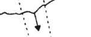

合、合、合、合、合、合、合、合、合、合、合、合、合、合、合、合、合、合、合、合、合、合、合、合、合、合、合、合、合、合、合、合、合、合、合、合、合、合、合、合、合、合、合、合、合、合、合、合、合、合、合、合、合、合、合、合、合、合、合、合、合、合、合、合、合、合、合、合、合、合、合、合、合、合、合、合、合、合、合、合、合、合、合、合、合、合、合、合、合、合、合、合、合、合、合、合、合、合、合、合、合、合、合、合、合、合、合、合、合、合、合、合、合、合、合、合、合、合、合、合、合、合、合、合、合、合、合、合、合、合、合、合、合、合、合、合、合、合、合、合、合、合、合、合、合、合、合、合、合、合、合、合、合、合、合、合、合、合、合、合、合、合、合、合、合、合、合、合、合、合、合、合、合、合、合、合、合、合、合、合、合、合、合、合、合、合、合、合、合、合、合、合、合、合、合、合、合、合、合、合、合、合、合、合、合、合、合、合、合、合、合、合、合、合、合、合、合、合、合、合、合、合、合、合、合、合、合、合、合、合、合、合、合、合、合、合、合、合、合、合、合、合、合、合、合、合、合、合、合、合、合、合、合、合、合、合、合、合、合、合、合、合、合、合、合、合、合、合、合、合、合、合、合、合、合、合、合、合、合、合、合、合、合、合、合、合、合、合、合、合、合、合、合、合、合、合、合、合、合、合、合、合、合、合、合、合、合、合、合、合、合、合、合、合、合、合、合、合、合、合、合、合、合、合、合、合、合、合、合、合、合、合、合、合、合、合、合、合、合、合、合、合、合、合、合、合、合、合、合、合、合、合、合、合、合、合、合、合、合、合、合、合、合、合、合、合、合、合、合、合、合、合、合、合、合、合、合、合、合、合、合、合、合、合、合、合、合、合、合、合、合、合、合、合、合、合、合、合、合、合、合、合、合、合、合、合、合、合、合、合、合、合、合、合、合、合、合、合、合、合、合、合、合、合、合、合、合、合、合、合、合、合、合、合、合、合、合、合、合、合、合、合、合、合、合、合、合、合、合、合、合、合、合、合、合、合、合、合、合、合、合、合、合、合、合、合、合、合、合、合、合、合、合、合、合、合、合、合、合、合、合、合、合、合、合、合、合、合、合、合、合、合、合、合、合、合、合、合、合、合、合、合、合、合、合、合、合、合、合、合、合、合、合、合、合、合、合、合、合、合、合、合、合、合、合、合、合、合、合、合、合、合、合、合、合、合、合、合、合、合、合、合、合、合、合、合、合、合、合、合、合、合、合、合、合、合、合、合、合、合、合、合、合、合、合、合、合、合、合、合、合、合、合、合、合、合、合、合、合、合、合、合、合、合、合、合、合、合、合、合、合、合、合、合、合、合、合、合、合、合、合、合、合、合、合、合、合、合、合、合、合、合、合、合、合、合、合、合、合、合、合、合、合、合、合、合、合、合、合、合、合、合、合、合、合、合、合、合、合、合、合、合、合、合、合、合、合、合、合、合、合、合、合、合、合、合、合、合、合、合、合、合、合、合、合、合、合、合、合、合、合、合、合、合、合、合、合、合、合、合、合、合、合、合、合、合、合、合、合、合、合、合、合、合、合、合、合、合、合、合、合、合、合、合、合、合、合、合、合、合、合、合、合、合、合、合、合、合、合、合、合、合、合、合、合、合、合、合、合、合、合、合、合、合、合、合、合、合、合、合、合、合、合、合、合、合、合、合、合、合、合、合、合、合、合、合、合、合、合、合、合、合、合、合、合、合、合、合、合、合、合、合、合、合、合、合、合、合、合、合、合、合、合、合、合、合、合、合、合、合、合、合、合、合、合、合、合、合、合、合、合、合、合、合、合、合、合、合、合、合、合、合、合、合、合、合、合、合、合、合、合、合、合、合、合、合、合、合、合、合、合、合、合、合、合、合、合、合、合、合、合、合、合、合、合、合、合、合、合、合、合、合、合、合、合、合、合、合、合、合、合、合、合、合、合、合、合、合、合、合、合、合、合、合、合、合、合、合、合、合、合、合、合、合、合、合、合、合、合、合、合、合、合、合、合、合、合、合、合、合、合、合、合、合、合、合、合、合、合、合、合、合、合、合、合、合、合、合、合、合、合、合、合、合、合、合、合、合、合、合、合、合、合、合、合、合、合、合、合、合、合、合、合、合、合、合、合、合、合、合、合、合、合、合、合、合、合、合、合、合、合、合、合、合、合、合、合、合、合、合、合、合、合、合、合、合、合、合、合、合、合、合、合、合、合、合、合、合、合、合、合、合、合、合、合、合、合、合、合、合、合、合、合、合、合、合、合、合、合、合、合、合、合、合、合、合、合、合、合、合、合、合、合、合、合、合、合、合、合、合、合、合、合、合、合、合、合、合、合、合、合、合、合、合、合、合、合、合、合、合、合、合、合、合、合、合、合、合、合、合、合、合、合、合、合、合、合、合、合、合、合、合、合、合、合、合、合、合、合、合、合、合、合、合、合、合、合、合、合、合、合、合、合、合、合、合、合、合、合、合、合、合、合、合、合、合、合、合、合、合、合、合、合、合、合、合、合、合、合、合、合、合、合、合、合、合、合、合、合、合、合、合、合、合、合、合、合、合、合、合、合、合、合、合、合、合、合、合、合、合、合、合、合、合、合、合、合、合、合、合、合、合、合、合、合、合、合、合、合、合、合、合、合、合、合、合、合、合、合、合、合、合、合、合、合、合、合、合、合、合、合、合、合、合、合、合、合、合、合、合、合、合、合、合、合、合、合、合、合、合、合、合、合、合、合、合、合、合、合、合、合、合、合、合、合、合、合、合、合、合、合、合、合、合、合、合、合、合、合、合、合、合、合、合、合、合、合、合、合、合、合、合、合、合、合、合、合、合、合、合、合、合、合、合、合、合、合、合、合、合、合、合、合、合、合、合、合、合、合、合、合、合、合、合、合、合、合、合、合、合、合、合、合、合、合、合、合、合、合、合、合、合、合、合、合、合、合、合、合、合、合、合、合、合、合、合、合、合、合、合、合、合、合、合、合、合、合、合、合、合、合、合、合、合、合、合、合、合、合、合、合、合、合、合、合、合、合、合、合、合、合、合、合、合、合、合、合、合、合、合、合、合、合、合、合、合、合、合、合、合、合、合、合、合、合、合、合、合、合、合、合、合、合、合、合、合、合、合、合、合、合、合、合、合、合、合、合、合、合、合、合、合、合、合、合、合、合、合、合、合、合、合、合、合、合、合、合、合、合、合、合、合、合、合、合、合、合、合、合、合、合、合、合、合、合、合、合、合、合、合、合、合、合、合、合、合、合、合、合、合、合、合、合、合、合、合、合、合、合、合、合、合、合、合、合、合、合、合、合、合、合、合、合、合、合、合、合、合、合、合、合、合、合、合、合、合、合、合、合、合、合、合、合、合、合、合、合、合、合、合、合、合、合、合、合、合、合、合、合、合、合、合、合、合、合、合、合、合、合、合、合、合、合、合、合、合、合、合、合、合、合、合、合、合、合、合、合、合、合、合、合、合、合、合、合、合、合、合、合、合、合、合、合、合、合、合、合、合、合、合、合、合、合、合、合、合、合、合、合、合、合、合、合、合、合、合、合、合、合、合、合、合、合、合、合、合、合、合、合、合、合、合、合、合、合、合、合、合、合、合、合、合、合、合、合、合、合、合、合、合、合、合、合、合、合、合、合、合、合、合、合、合、合、合、合、合、合、合、合、合、合、合、合、合、合、合、合、合、合、合、合、合、合、合、合、合、合、合、合、合、合、合、合、合、合、合、合、合、合、合、合、合、合、合、合、合、合、合、合、合、合、合、合、合、合、合、合、合、合、合、合、合、合、合、合、合、合、合、合、合、合、合、合、合、合、合、合、合、合、合、合、合、合、合、合、合、合、合、合、合、合、合、合、合、合、合、合、合、合、合、合、合、合、合、合、合、合、合、合、合、合、合、合、合、合、合、合、合、合、合、合、合、合、合、合、合、合、合、合、合、合、合、合、合、合、合、合、合、合、合、合、合、合、合、合、合、合、合、合、合、合、合、合、合、合、合、合、合、合、合、合、合、合、合、合、合、合、合、合、合、合、合、合、合、合、合、合、合、合、合、合、合、合、合、合、合、合、合、合、合、合、合、合、合、合、合、合、合、合、合、合、合、合、合、合、合、合、合、合、合、合、合、合、合、合、合、合、合、合、合、合、合、合、合、合、合、合、合、合、合、合、合、合、合、合、合、合、合、合、合、合、合、合、合、合、合、合、合、合、合、合、合、合、合、合、合、合、合、合、合、合、合、合、合、合、合、合、合、合、合、合、合、合、合、合、合、合、合、合、合、合、合、合、合、合、合、合、合、合、合、合、合、合、合、合、合、合、合、合、合、合、合、合、合、合、合、合、合、合、合、合、合、合、合、合、合、合、合、合、合、合、合、合、合、合、合、合、合、合、合、合、合、合、合、合、合、合、合、合、合、合、合、合、合、合、合、合、合、合、合、合、合、合、合、合、合、合、合、合、合、合、合、合、合、合、合、合、合、合、合、合、合、合、合、合、合、合、合、合、合、合、合、合、合、合、合、合、合、合、合、合、合、合、合、合、合、合、合、合、合、合、合、合、合、合、合、合、合、合、合、合、合、合、合、合、合、合、合、合、合、合、合、合、合、合、合、合、合、合、合、合、合、合、合、合、合、合、合、合、合、合、合、合、合、合、合、合、合、合、合、合、合、合、合、合、合、合、合、合、合、合、合、合、合、合、合、合、合、合、合、合、合、合、合、合、合、合、合、合、合、合、合、合、合、合、合、合、合、合、合、合、合、合、合、合、合、合、合、合、合、合、合、合、合、合、合、合、合、合、合、合、合、合、合、合、合、合、合、合、合、合、合、合、合、合、合、合、合、合、合、合、合、合、合、合、合、合、合、合、合、合、合、合、合、合、合、合、合、合、合、合、合、合、合、合、合、合、合、合、合、合、合、合、合、合、合、合、合、合、合、合、合、合、合、合、合、合、合、合、合、合、合、合、合、合、合、合、合、合、合、合、合、合、合、合、合、合、合、合、合、合、合、合、合、合、合、合、合、合、合、合、合、合、合、合、合、合、合、合、合、合、合、合、合、合、合、合、合、合、合、合、合、合、合、合、合、合、合、合、合、合、合、合、合、合、合、合、合、合、合、合、合、合、合、合、合、合、合、合、合、合、合、合、合、合、合、合、合、合、合、合、合、合、合、合、合、合、合、合、合、合、合、合、合、合、合、合、合、合、合、合、合、合、合、合、合、合、合、合、合、合、合、合、合、合、合、合、合、合、合、合、合、合、合、合、合、合、合、合、合、合、合、合、合、合、合、合、合、合、合、合、合、合、合、合、合、合、合、合、合、合、合、合、合、合、合、合、合、合、合、合、合、合、合、合、合、合、合、合、合、合、合、合、合、合、合、合、合、合、合、合、合、合、合、合、合、合、合、合、合、合、合、合、合、合、合、合、合、合、合、合、合、合、合、合、合、合、合、合、合、合、合、合、合、合、合、合、合、合、合、合、合、合、合、合、合、合、合、合、合、合、合、合、合、合、合、合、合、合、合、合、合、合、合、合、合、合、合、合、合、合、合、合、合、合、合、合、合、合、合、合、合、合、合、合、合、合、合、合、合、合、合、合、合、合、合、合、合、合、合、合、合、合、合、合、合、合、合、合、合、合、合、合、合、合、合、合、合、合、合、合、合、合、合、合、合、合、合、合、合、合、合、合、合、合、合、合、合、合、合、合、合、合、合、合、合、合、合、合、合、合、合、合、合、合、合、合、合、合、合、合、合、合、合、合、合、合、合、合、合、合、合、合、合、合、合、合、合、合、合、合、合、合、合、合、合、合、合、合、合、合、合、合、合、合、合、合、合、合、合、合、合、合、合、合、合、合、合、合、合、合、合、合、合、合、合、合、合、合、合、合、合、合、合、合、合、合、合、合、合、合、合、合、合、合、合、合、合、合、合、合、合、合、合、合、合、合、合、合、合、合、合、合、合、合、合、合、合、合、合、合、合、合、合、合、合、合、合、合、合、合、合、合、合、合、合、合、合、合、合、合、合、合、合、合、合、合、合、合、合、合、合、合、合、合、合、合、合、合、合、合、合、合、合、合、合、合、合、合、合、合、合、合、合、合、合、合、合、合、合、合、合、合、合、合、合、合、合、合、合、合、合、合、合、合、合、合、合、合、合、合、合、合、合、合、合、合、合、合、合、合、合、合、合、合、合、合、合、合、合、合、合、合、合、合、合、合、合、合、合、合、合、合、合、合、合、合、合、合、合、合、合、合、合、合、合、合、合、合、合、合、合、合、合、合、合、合、合、合、合、合、合、合、合、合、合、合、合、合、合、合、合、合、合、合、合、合、合、合、合、合、合、合、合、合、合、合、合、合、合、合、合、合、合、合、合、合、合、合、合、合、合、合、合、合、合、合、合、合、合、合、合、合、合、合、合、合、合、合、合、合、合、合、合、合、合、合、合、合、合、合、合、合、合、合、合、合、合、合、合、合、合、合、合、合、合、合、合、合、合、合、合、合、合、合、合、合、合、合、合、合、合、合、合、合、合、合、合、合、合、合、合、合、合、合、合、合、合、合、合、合、合、合、合、合、合、合、合、合、合、合、合、合、合、合、合、合、合、合、合、合、合、合、合、合、合、合、合、合、合、合、合、合、合、合、合、合、合、合、合、合、合、合、合、合、合、合、合、合、合、合、合、合、合、合、合、合、合、合、合、合、合、合、合、合、合、合、合、合、合、合、合、合、合、合、合、合、合、合、合、合、合、合、合、合、合、合、合、合、合、合、合、合、合、合、合、合、合、合、合、合、合、合、合、合、合、合、合、合、合、合、合、合、合、合、合、合、合、合、合、合、合、合、合、合、合、合、合、合、合、合、合、合、合、合、合、合、合、合、合、合、合、合、合、合、合、合、合、合、合、合、合、合、合、合、合、合、合、合、合、合、合、合、合、合、合、合、合、合、合、合、合、合、合、合、合、合、合、合、合、合、合、合、合、合、合、合、合、合、合、合、合、合、合、合、合、合、合、合、合、合、合、合、合、合、合、合、合、合、合、合、合、合、合、合、合、合、合、合、合、合、合、合、合、合、合、合、合、合、合、合、合、合、合、合、合、合、合、合、合、合、合、合、合、合、合、合、合、合、合、合、合、合、合、合、合、合、合、合、合、合、合、合、合、合、合、合、合、合、合、合、合、合、合、合、合、合、合、合、合、合、合、合、合、合、合、合、合、合、合、合、合、合、合、合、合、合、合、合、合、合、合、合、合、合、合、合、合、合、合、合、合、合、合、合、合、合、合、合、合、合、合、合、合、合、合、合、合、合、合、合、合、合、合、合、合、合、合、合、合、合、合、合、合、合、合、合、合、合、合、合、合、合、合、合、合、合、合、合、合、合、合、合、合、合、合、合、合、合、合、合、合、合、合、合、合、合、合、合、合、合、合、合、合、合、合、合、合、合、合、合、合、合、合、合、合、合、合、合、合、合、合、合、合、合、合、合、合、合、合、合、合、合、合、合、合、合、合、合、合、合、合、合、合、合、合、合、合、合、合、合、合、合、合、合、合、合、合、合、合、合、合、合、合、合、合、合、合、合、合、合、合、合、合、合、合、合、合、合、合、合、合、合、合、合、合、合、合、合、合、合、合、合、合、合、合、合、合、合、合、合、合、合、合、合、合、合、合、合、合、合、合、合、合、合、合、合、合、合、合、合、合、合、合、合、合、合、合、合、合、合、合、合、合、合、合、合、合、合、合、合、合、合、合、合、合、合、合、合、合、合、合、合、合、合、合、合、合、合、合、合、合、合、合、合、合、合、合、合、合、合、合、合、合、合、合、合、合、合、合、合、合、合、合、合、合、合、合、合、合、合、合、合、合、合、合、合、合、合、合、合、合、合、合、合、合、合、合、合、合、合、合、合、合、合、合、合、合、合、合、合、合、合、合、合、合、合、合、合、合、合、合、合、合、合、合、合、合、合、合、合、合、合、合、合、合、合、合、合、合、合、合、合、合、合、合、合、合、合、合、合、合、合、合、合、合、合、合、合、合、合、合、合、合、合、合、合、合、合、合、合、合、合、合、合、合、合、合、合、合、合、合、合、合、合、合、合、合、合、合、合、合、合、合、合、合、合、合、合、合、合、合、合、合、合、合、合、合、合、合、合、合、合、合、合、合、合、合、合、合、合、合、合、合、合、合、合、合、合、合、合、合、合、合、合、合、合、合、合、合、合、合、合、合、合、合、合、合、合、合、合、合、合、合、合、合、合、合、合、合、合、合、合、合、合、合、合、合、合、合、合、合、合、合、合、合、合、合、合、合、合、合、合、合、合、合、合、合、合、合、合、合、合、合、合、合、合、合、合、合、合、合、合、合、合、合、合、合、合、合、合、合、合、合、合、合、合、合、合、合、合、合、合、合、合、合、合、合、合、合、合、合、合、合、合、合、合、合、合、合、合、合、合、合、合、合、合、合、合、合、合、合、合、合、合、合、合、合、合、合、合、合、合、合、合、合、合、合、合、合、合、合、合、合、合、合、合、合、合、合、合、合、合、合、合、合、合、合、合、合、合、合、合、合、合、合、合、合、合、合、合、合、合、合、合、合、合、合、合、合、合、合、合、合、合、合、合、合、合、合、合、合、合、合、合、合、合、合、合、合、合、合、合、合、合、合、合、合、合、合、合、合、合、合、合、合、合、合、合、合、合、合、合、合、合、合、合、合、合、合、合、合、合、合、合、合、合、合、合、合、合、合、合、合、合、合、合、合、合、合、合、合、合、合、合、合、合、合、合、合、合、合、合、合、合、合、合、合、合、合、合、合、合、合、合、合、合、合、合、合、合、合、合、合、合、合、合、合、合、合、合、合、合、合、合、合、合、合、合、合、合、合、合、合、合、合、合、合、合、合、合、合、合、合、合、合、合、合、合、合、合、合、合、合、合、合、合、合、合、合、合、合、合、合、合、合、合、合、合、合、合、合、合、合、合、合、合、合、合、合、合、合、合、合、合、合、合、合、合、合、合、合、合、合、合、合、合、合、合、合、合、合、合、合、合、合、合、合、合、合、合、合、合、合、合、合、合、合、合、合、合、合、合、合、合、合、合、合、合、合、合、合、合、合、合、合、合、合、合、合、合、合、合、合、合、合、合、合、合、合、合、合、合、合、合、合、合、合、合、合、合、合、合、合、合、合、合、合、合、合、合、合、合、合、合、合、合、合、合、合、合、合、合、合、合、合、合、合、合、合、合、合、合、合、合、合、合、合、合、合、合、合、合、合、合、合、合、合、合、合、合、合、合、合、合、合、合、合、合、合、合、合、合、合、合、合、合、合、合、合、合、合、合、合、合、合、合、合、合、合、合、合、合、合、合、合、合、合、合、合、合、合、合、合、合、合、合、合、合、合、合、合、合、合、合、合、合、合、合、合、合、合、合、合、合、合、合、合、合、合、合、合、合、合、合、合、合、合、合、合、合、合、合、合、合、合、合、合、合、合、合、合、合、合、合、合、合、合、合、合、合、合、合、合、合、合、合、合、合、合、合、合、合、合、合、合、合、合、合、合、合、合、合、合、合、合、合、合、合、合、合、合、合、合、合、合、合、合、合、合、合、合、合、合、合、合、合、合、合、合、合、合、合、合、合、合、合、合、合、合、合、合、合、合、合、合、合、合、合、合、合、合、合、合、合、合、合、合、合、合、合、合、合、合、合、合、合、合、合、合、合、合、合、合、合、合、合、合、合、合、合、合、合、合、合、合、合、合、合、合、合、合、合、合、合、合、合、合、合、合、合、合、合、合、合、合、合、合、合、合、合、合、合、合、合、合、合、合、合、合、合、合、合、合、合、合、合、合、合、合、合、合、合、合、合、合、合、合、合、合、合、合、合、合、合、合、合、合、合、合、合、合、合、合、合、合、合、合、合、合、合、合、合、合、合、合、合、合、合、合、合、合、合、合、合、合、合、合、合、合、合、合、合、合、合、合、合、合、合、合、合、合、合、合、合、合、合、合、合、合、合、合、合、合、合、合、合、合、合、合、合、合、合、合、合、合、合、合、合、合、合、合、合、合、合、合、合、合、合、合、合、合、合、合、合、合、合、合、合、合、合、合、合、合、合、合、合、合、合、合、合、合、合、合、合、合、合、合、合、合、合、合、合、合、合、合、合、合、合、合、合、合、合、合、合、合、合、合、合、合、合、合、合、合、合、合、合、合、合、合、合、合、合、合、合、合、合、合、合、合、合、合、合、合、合、合、合、合、合、合、合、合、合、合、合、合、合、合、合、合、合、合、合、合、合、合、合、合、合、合、合、合、合、合、合、合、合、合、合、合、合、合、合、合、合、合、合、合、合、合、合、合、合、合、合、合、合、合、合、合、合、合、合、合、合、合、合、合、合、合、合、合、合、合、合、合、合、合、合、合、合、合、合、合、合、合、合、合、合、合、合、合、合、合、合、合、合、合、合、合、合、合、合、合、合、合、合、合、合、合、合、合、合、合、合、合、合、合、合、合、合、合、合、合、合、合、合、合、合、合、合、合、合、合、合、合、合、合、合、合、合、合、合、合、合、合、合、合、合、合、合、合、合、合、合、合、合、合、合、合、合、合、合、合、合、合、合、合、合、合、合、合、合、合、合、合、合、合、合、合、合、合、合、合、合、合、合、合、合、合、合、合、合、合、合、合、合、合、合、合、合、合、合、合、合、合、合、合、合、合、合、合、合、合、合、合、合、合、合、合、合、合、合、合、合、合、合、合、合、合、合、合、合、合、合、合、合、合、合、合、合、合、合、合、合、合、合、合、合、合、合、合、合、合、合、合、合、合、合、合、合、合、合、合、合、合、合、合、合、合、合、合、合、合、合、合、合、合、合、合、合、合、合、合、合、合、合、合、合、合、合、合、合、合、合、合、合、合、合、合、合、合、合、合、合、合、合、合、合、合、合、合、合、合、合、合、合、合、合、合、合、合、合、合、合、合、合、合、合、合、合、合、合、合、合、合、合、合、合、合、合、合、合、合、合、合、合、合、合、合、合、合、合、合、合、合、合、合、合、合、合、合、合、合、合、合、合、合、合、合、合、合、合、合、合、合、合、合、合、合、合、合、合、合、合、合、合、合、合、合、合、合、合、合、合、合、合、合、合、合、合、合、合、合、合、合、合、合、合、合、合、合、合、合、合、合、合、合、合、合、合、合、合、合、合、合、合、合、合、合、合、合、合、合、合、合、合、合、合、合、合、合、合、合、合、合、合、合、合、合、合、合、合、合、合、合、合、合、合、合、合、合、合、合、合、合、合、合、合、合、合、合、合、合、合、合、合、合、合、合、合、合、合、合、合、合、合、合、合、合、合、合、合、合、合、合、合、合、合、合、合、合、合、合、合、合、合、合、合、合、合、合、合、合、合、合、合、合、合、合、合、合、合、合、合、合、合、合、合、合、合、合、合、合、合、合、合、合、合、合、合、合、合、合、合、合、合、合、合、合、合、合、合、合、合、合、合、合、合、合、合、合、合、合、合、合、合、合、合、合、合、合、合、合、合、合、合、合、合、合、合、合、合、合、合、合、合、合、合、合、合、合、合、合、合、合、合、合、合、合、合、合、合、合、合、合、合、合、合、合、合、合、合、合、合、合、合、合、合、合、合、合、合、合、合、合、合、合、合、合、合、合、合、合、合、合、合、合、合、合、合、合、合、合、合、合、合、合、合、合、合、合、合、合、合、合、合、合、合、合、合、合、合、合、合、合、合、合、合、合、合、合、合、合、合、合、合、合、合、合、合、合、合、合、合、合、合、合、合、合、合、合、合、合、合、合、合、合、合、合、合、合、合、合、合、合、合、合、合、合、合、合、合、合、合、合、合、合、合、合、合、合、合、合、合、合、合、合、合、合、合、合、合、合、合、合、合、合、合、合、合、合、合、合、合、合、合、合、合、合、合、合、合、合、合、合、合、合、合、合、合、合、合、合、合、合、合、合、合、合、合、合、合、合、合、合、合、合、合、合、合、合、合、合、合、合、合、合、合、合、合、合、合、合、合、合、合、合、合、合、合、合、合、合、合、合、合、合、合、合、合、合、合、合、合、合、合、合、合、合、合、合、合、合、合、合、合、合、合、合、合、合、合、合、合、合、合、合、合、合、合、合、合、合、合、合、合、合、合、合、合、合、合、合、合、合、合、合、合、合、合、合、合、合、合、合、合、合、合、合、合、合、合、合、合、合、合、合、合、合、合、合、合、合、合、合、合、合、合、合、合、合、合、合、合、合、合、合、合、合、合、合、合、合、合、合、合、合、合、合、合、合、合、合、合、合、合、合、合、合、合、合、合、合、合、合、合、合、合、合、合、合、合、合、合、合、合、合、合、合、合、合、合、合、合、合、合、合、合、合、合、合、合、合、合、合、合、合、合、合、合、合、合、合、合、合、合、合、合、合、合、合、合、合、合、合、合、合、合、合、合、合、合、合、合、合、合、合、合、合、合、合、合、合、合、合、合、合、合、合、合、合、合、合、合、合、合、合、合、合、合、合、合、合、合、合、合、合、合、合、合、合、合、合、合、合、合、合、合、合、合、合、合、合、合、合、合、合、合、合、合、合、合、合、合、合、合、合、合、合、合、合、合、合、合、合、合、合、合、合、合、合、合、合、合、合、合、合、合、合、合、合、合、合、合、合、合、合、合、合、合、合、合、合、合、合、合、合、合、合、合、合、合、合、合、合、合、合、合、合、合、合、合、合、合、合、合、合、合、合、合、合、合、合、合、合、合、合、合、合、合、合、合、合、合、合、合、合、合、合、合、合、合、合、合、合、合、合、合、合、合、合、合、合、合、合、合、合、合、合、合、合、合、合、合、合、合、合、合、合、合、合、合、合、合、合、合、合、合、合、合、合、合、合、合、合、合、合、合、合、合、合、合、合、合、合、合、合、合、合、合、合、合、合、合、合、合、合、合、合、合、合、合、合、合、合、合、合、合、合、合、合、合、合、合、合、合、合、合、合、合、合、合、合、合、合、合、合、合、合、合、合、合、合、合、合、合、合、合、合、合、合、合、合、合、合、合、合、合、合、合、合、合、合、合、合、合、合、合、合、合、合、合、合、合、合、合、合、合、合、合、合、合、合、合、合、合、合、合、合、合、合、合、合、合、合、合、合、合、合、合、合、合、合、合、合、合、合、合、合、合、合、合、合、合、合、合、合、合、合、合、合、合、合、合、合、合、合、合、合、合、合、合、合、合、合、合、合、合、合、合、合、合、合、合、合、合、合、合、合、合、合、合、合、合、合、合、合、合、合、合、合、合、合、合、合、合、合、合、合、合、合、合、合、合、合、合、合、合、合、合、合、合、合、合、合、合、合、合、合、合、合、合、合、合、合、合、合、合、合、合、合、合、合、合、合、合、合、合、合、合、合、合、合、合、合、合、合、合、合、合、合、合、合、合、合、合、合、合、合、合、合、合、合、合、合、合、合、合、合、合、合、合、合、合、合、合、合、合、合、合、合、合、合、合、合、合、合、合、合、合、合、合、合、合、合、合、合、合、合、合、合、合、合、合、合、合、合、合、合、合、合、合、合、合、合、合、合、合、合、合、合、合、合、合、合、合、合、合、合、合、合、合、合、合、合、合、合、合、合、合、合、合、合、合、合、合、合、合、合、合、合、合、合、合、合、合、合、合、合、合、合、合、合、合、合、合、合、合、合、合、合、合、合、合、合、合、合、合、合、合、合、合、合、合、合、合、合、合、合、合、合、合、合、合、合、合、合、合、合、合、合、合、合、合、合、合、合、合、合、合、合、合、合、合、合、合、合、合、合、合、合、合、合、合、合、合、合、合、合、合、合、合、合、合、合、合、合、合、合、合、合、合、合、合、合、合、合、合、合、合、合、合、合、合、合、合、合、合、合、合、合、合、合、合、合、合、合、合、合、合、合、合、合、合、合、合、合、合、合、合、合、合、合、合、合、合、合、合、合、合、合、合、合、合、合、合、合、合、合、合、合、合、合、合、合、合、合、合、合、合、合、合、合、合、合、合、合、合、合、合、合、合、合、合、合、合、合、合、合、合、合、合、合、合、合、合、合、合、合、合、合、合、合、合、合、合、合、合、合、合、合、合、合、合、合、合、合、合、合、合、合、合、合、合、合、合、合、合、合、合、合、合、合、合、合、合、合、合、合、合、合、合、合、合、合、合、合、合、合、合、合、合、合、合、合、合、合、合、合、合、合、合、合、合、合、合、合、合、合、合、合、合、合、合、合、合、合、合、合、合、合、合、合、合、合、合、合、合、合、合、合、合、合、合、合、合、合、合、合、合、合、合、合、合、合、合、合、合、合、合、合、合、合、合、合、合、合、合、合、合、合、合、合、合、合、合、合、合、合、合、合、合、合、合、合、合、合、合、合、合、合、合、合、合、合、合、合、合、合、合、合、合、合、合、合、合、合、合、合、合、合、合、合、合、合、合、合、合、合、合、合、合、合、合、合、合、合、合、合、合、合、合、合、合、合、合、合、合、合、合、合、合、合、合、合、合、合、合、合、合、合、合、合、合、合、合、合、合、合、合、合、合、合、合、合、合、合、合、合、合、合、合、合、合、合、合、合、合、合、合、合、合、合、合、合、合、合、合、合、合、合、合、合、合、合、合、合、合、合、合、合、合、合、合、合、合、合、合、合、合、合、合、合、合、合、合、合、合、合、合、合、合、合、合、合、合、合、合、合、合、合、合、合、合、合、合、合、合、合、合、合、合、合、合、合、合、合、合、合、合、合、合、合、合、合、合、合、合、合、合、合、合、合、合、合、合、合、合、合、合、合、合、合、合、合、合、合、合、合、合、合、合、合、合、合、合、合、合、合、合、合、合、合、合、合、合、合、合、合、合、合、合、合、合、合、合、合、合、合、合、合、合、合、合、合、合、合、合、合、合、合、合、合、合、合、合、合、合、合、合、合、合、合、合、合、合、合、合、合、合、合、合、合、合、合、合、合、合、合、合、合、合、合、合、合、合、合、合、合、合、合、合、合、合、合、合、合、合、合、合、合、合、合、合、合、合、合、合、合、合、合、合、合、合、合、合、合、合、合、合、合、合、合、合、合、合、合、合、合、合、合、合、合、合、合、合、合、合、合、合、合、合、合、合、合、合、合、合、合、合、合、合、合、合、合、合、合、合、合、合、合、合、合、合、合、合、合、合、合、合、合、合、合、合、合、合、合、合、合、合、合、合、合、合、合、合、合、合、合、合、合、合、合、合、合、合、合、合、合、合、合、合、合、合、合、合、合、合、合、合、合、合、合、合、合、合、合、合、合、合、合、合、合、合、合、合、合、合、合、合、合、合、合、合、合、合、合、合、合、合、合、合、合、合、合、合、合、合、合、合、合、合、合、合、合、合、合、合、合、合、合、合、合、合、合、合、合、合、合、合、合、合、合、合、合、合、合、合、合、合、合、合、合、合、合、合、合、合、合、合、合、合、合、合、合、合、合、合、合、合、合、合、合、合、合、合、合、合、合、合、合、合、合、合、合、合、合、合、合、合、合、合、合、合、合、合、合、合、合、合、合、合、合、合、合、合、合、合、合、合、合、合、合、合、合、合、合、合、合、合、合、合、合、合、合、合、合、合、合、合、合、合、合、合、合、合、合、合、合、合、合、合、合、合、合、合、合、合、合、合、合、合、合、合、合、合、合、合、合、合、合、合、合、合、合、合、合、合、合、合、合、合、合、合、合、合、合、合、合、合、合、合、合、合、合、合、合、合、合、合、合、合、合、合、合、合、合、合、合、合、合、合、合、合、合、合、合、合、合、合、合、合、合、合、合、合、合、合、合、合、合、合、合、合、合、合、合、合、合、合、合、合、合、合、合、合、合、合、合、合、合、合、合、合、合、合、合、合、合、合、合、合、合、合、合、合、合、合、合、合、合、合、合、合、合、合、合、合、合、合、合、合、合、合、合、合、合、合、合、合、合、合、合、合、合、合、合、合、合、合、合、合、合、合、合、合、合、合、合、合、合、合、合、合、合、合、合、合、合、合、合、合、合、合、合、合、合、合、合、合、合、合、合、合、合、合、合、合、合、合、合、合、合、合、合、合、合、合、合、合、合、合、合、合、合、合、合、合、合、合、合、合、合、合、合、合、合、合、合、合、合、合、合、合、合、合、合、合、合、合、合、合、合、合、合、合、合、合、合、合、合、合、合、合、合、合、合、合、合、合、合、合、合、合、合、合、合、合、合、合、合、合、合、合、合、合、合、合、合、合、合、合、合、合、合、合、合、合、合、合、合、合、合、合、合、合、合、合、合、合、合、合、合、合、合、合、合、合、合、合、合、合、合、合、合、合、合、合、合、合、合、合、合、合、合、合、合、合、合、合、合、合、合、合、合、合、合、合、合、合、合、合、合、合、合、合、合、合、合、合、合、合、合、合、合、合、合、合、合、合、合、合、合、合、合、合、合、合、合、合、合、合、合、合、合、合、合、合、合、合、合、合、合、合、合、合、合、合、合、合、合、合、合、合、合、合、合、合、合、合、合、合、合、合、合、合、合、合、合、合、合、合、合、合、合、合、合、合、合、合、合、合、合、合、合、合、合、合、合、合、合、合、合、合、合、合、合、合、合、合、合、合、合、合、合、合、合、合、合、合、合、合、合、合、合、合、合、合、合、合、合、合、合、合、合、合、合、合、合、合、合、合、合、合、合、合、合、合、合、合、合、合、合、合、合、合、合、合、合、合、合、合、合、合、合、合、合、合、合、合、合、合、合、合、合、合、合、合、合、合、合、合、合、合、合、合、合、合、合、合、合、合、合、合、合、合、合、合、合、合、合、合、合、合、合、合、合、合、合、合、合、合、合、合、合、合、合、合、合、合、合、合、合、合、合、合、合、合、合、合、合、合、合、合、合、合、合、合、合、合、合、合、合、合、合、合、合、合、合、合、合、合、合、合、合、合、合、合、合、合、合、合、合、合、合、合、合、合、合、合、合、合、合、合、合、合、合、合、合、合、合、合、合、合、合、合、合、合、合、合、合、合、合、合、合、合、合、合、合、合、合、合、合、合、合、合、合、合、合、合、合、合、合、合、合、合、合、合、合、合、合、合、合、合、合、合、合、合、合、合、合、合、合、合、合、合、合、合、合、合、合、合、合、合、合、合、合、合、合、合、合、合、合、合、合、合、合、合、合、合、合、合、合、合、合、合、合、合、合、合、合、合、合、合、合、合、合、合、合、合、合、合、合、合、合、合、合、合、合、合、合、合、合、合、合、合、合、合、合、合、合、合、合、合、合、合、合、合、合、合、合、合、合、合、合、合、合、合、合、合、合、合、合、合、合、合、合、合、合、合、合、合、合、合、合、合、合、合、合、合、合、合、合、合、合、合、合、合、合、合、合、合、合、合、合、合、合、合、合、合、合、合、合、合、合、合、合、合、合、合、合、合、合、合、合、合、合、合、合、合、合、合、合、合、合、合、合、合、合、合、合、合、合、合、合、合、合、合、合、合、合、合、合、合、合、合、合、合、合、合、合、合、合、合、合、合、合、合、合、合、合、合、合、合、合、合、合、合、合、合、合、合、合、合、合、合、合、合、合、合、合、合、合、合、合、合、合、合、合、合、合、合、合、合、合、合、合、合、合、合、合、合、合、合、合、合、合、合、合、合、合、合、合、合、合、合、合、合、合、合、合、合、合、合、合、合、合、合、合、合、合、合、合、合、合、合、合、合、合、合、合、合、合、合、合、合、合、合、合、合、合、合、合、合、合、合、合、合、合、合、合、合、合、合、合、合、合、合、合、合、合、合、合、合、合、合、合、合、合、合、合、合、合、合、合、合、合、合、合、合、合、合、合、合、合、合、合、合、合、合、合、合、合、合、合、合、合、合、合、合、合、合、合、合、合、合、合、合、合、合、合、合、合、合、合、合、合、合、合、合、合、合、合、合、合、合、合、合、合、合、合、合、合、合、合、合、合、合、合、合、合、合、合、合、合、合、合、合、合、合、合、合、合、合、合、合、合、合、合、合、合、合、合、合、合、合、合、合、合、合、合、合、合、合、合、合、合、合、合、合、合、合、合、合、合、合、合、合、合、合、合、合、合、合、合、合、合、合、合、合、合、合、合、合、合、合、合、合、合、合、合、合、合、合、合、合、合、合、合、合、合、合、合、合、合、合、合、合、合、合、合、合、合、合、合、合、合、合、合、合、合、合、合、合、合、合、合、合、合、合、合、合、合、合、合、合、合、合、合、合、合、合、合、合、合、合、合、合、合、合、合、合、合、合、合、合、合、合、合、合、合、合、合、合、合、合、合、合、合、合、合、合、合、合、合、合、合、合、合、合、合、合、合、合、合、合、合、合、合、合、合、合、合、合、合、合、合、合、合、合、合、合、合、合、合、合、合、合、合、合、合、合、合、合、合、合、合、合、合、合、合、合、合、合、合、合、合、合、合、合、合、合、合、合、合、合、合、合、合、合、合、合、合、合、合、合、合、合、合、合、合、合、合、合、合、合、合、合、合、合、合、合、合、合、合、合、合、合、合、合、合、合、合、合、合、合、合、合、合、合、合、合、合、合、合、合、合、合、合、合、合、合、合、合、合、合、合、合、合、合、合、合、合、合、合、合、合、合、合、合、合、合、合、合、合、合、合、合、合、合、合、合、合、合、合、合、合、合、合、合、合、合、合、合、合、合、合、合、合、合、合、合、合、合、合、合、合、合、合、合、合、合、合、合、合、合、合、合、合、合、合、合、合、合、合、合、合、合、合、合、合、合、合、合、合、合、合、合、合、合、合、合、合、合、合、合、合、合、合、合、合、合、合、合、合、合、合、合、合、合、合、合、合、合、合、合、合、合、合、合、合、合、合、合、合、合、合、合、合、合、合、合、合、合、合、合、合、合、合、合、合、合、合、合、合、合、合、合、合、合、合、合、合、合、合、合、合、合、合、合、合、合、合、合、合、合、合、合、合、合、合、合、合、合、合、合、合、合、合、合、合、合、合、合、合、合、合、合、合、合、合、合、合、合、合、合、合、合、合、合、合、合、合、合、合、合、合、合、合、合、合、合、合、合、合、合、合、合、合、合、合、合、合、合、合、合、合、合、合、合、合、合、合、合、合、合、合、合、合、合、合、合、合、合、合、合、合、合、合、合、合、合、合、合、合、合、合、合、合、合、合、合、合、合、合、合、合、合、合、合、合、合、合、合、合、合、合、合、合、合、合、合、合、合、合、合、合、合、合、合、合、合、合、合、合、合、合、合、合、合、合、合、合、合、合、合、合、合、合、合、合、合、合、合、合、合、合、合、合、合、合、合、合、合、合、合、合、合、合、合、合、合、合、合、合、合、合、合、合、合、合、合、合、合、合、合、合、合、合、合、合、合、合、合、合、合、合、合、合、合、合、合、合、合、合、合、合、合、合、合、合、合、合、合、合、合、合、合、合、合、合、合、合、合、合、合、合、合、合、合、合、合、合、合、合、合、合、合、合、合、合、合、合、合、合、合、合、合、合、合、合、合、合、合、合、合、合、合、合、合、合、合、合、合、合、合、合、合、合、合、合、合、合、合、合、合、合、合、合、合、合、合、合、合、合、合、合、合、合、合、合、合、合、合、合、合、合、合、合、合、合、合、合、合、合、合、合、合、合、合、合、合、合、合、合、合、合、合、合、合、合、合、合、合、合、合、合、合、合、合、合、合、合、合、合、合、合、合、合、合、合、合、合、合、合、合、合、合、合、合、合、合、合、合、合、合、合、合、合、合、合、合、合、合、合、合、合、合、合、合、合、合、合、合、合、合、合、合、合、合、合、合、合、合、合、合、合、合、合、合、合、合、合、合、合、合、合、合、合、合、合、合、合、合、合、合、合、合、合、合、合、合、合、合、合、合、合、合、合、合、合、合、合、合、合、合、合、合、合、合、合、合、合、合、合、合、合、合、合、合、合、合、合、合、合、合、合、合、合、合、合、合、合、合、合、合、合、合、合、合、合、合、合、合、合、合、合、合、合、合、合、合、合、合、合、合、合、合、合、合、合、合、合、合、合、合、合、合、合、合、合、合、合、合、合、合、合、合、合、合、合、合、合、合、合、合、合、合、合、合、合、合、合、合、合、合、合、合、合、合、合、合、合、合、合、合、合、合、合、合、合、合、合、合、合、合、合、合、合、合、合、合、合、合、合、合、合、合、合、合、合、合、合、合、合、合、合、合、合、合、合、合、合、合、合、合、合、合、合、合、合、合、合、合、合、合、合、合、合、合、合、合、合、合、合、合、合、合、合、合、合、合、合、合、合、合、合、合、合、合、合、合、合、合、合、合、合、合、合、合、合、合、合、合、合、合、合、合、合、合、合、合、合、合、合、合、合、合、合、合、合、合、合、合、合、合、合、合、合、合、合、合、合、合、合、合、合、合、合、合、合、合、合、合、合、合、合、合、合、合、合、合、合、合、合、合、合、合、合、合、合、合、合、合、合、合、合、合、合、合、合、合、合、合、合、合、合、合、合、合、合、合、合、合、合、合、合、合、合、合、合、合、合、合、合、合、合、合、合、合、合、合、合、合、合、合、合、合、合、合、合、合、合、合、合、合、合、合、合、合、合、合、合、合、合、合、合、合、合、合、合、合、合、合、合、合、合、合、合、合、合、合、合、合、合、合、合、合、合、合、合、合、合、合、合、合、合、合、合、合、合、合、合、合、合、合、合、合、合、合、合、合、合、合、合、合、合、合、合、合、合、合、合、合、合、合、合、合、合、合、合、合、合、合、合、合、合、合、合、合、合、合、合、合、合、合、合、合、合、合、合、合、合、合、合、合、合、合、合、合、合、合、合、合、合、合、合、合、合、合、合、合、合、合、合、合、合、合、合、合、合、合、合、合、合、合、合、合、合、合、合、合、合、合、合、合、合、合、合、合、合、合、合、合、合、合、合、合、合、合、合、合、合、合、合、合、合、合、合、合、合、合、合、合、合、合、合、合、合、合、合、合、合、合、合、合、合、合、合、合、合、合、合、合、合、合、合、合、合、合、合、合、合、合、合、合、合、合、合、合、合、合、合、合、合、合、合、合、合、合、合、合、合、合、合、合、合、合、合、合、合、合、合、合、合、合、合、合、合、合、合、合、合、合、合、合、合、合、合、合、合、合、合、合、合、合、合、合、合、合、合、合、合、合、合、合、合、合、合、合、合、合、合、合、合、合、合、合、合、合、合、合、合、合、合、合、合、合、合、合、合、合、合、合、合、合、合、合、合、合、合、合、合、合、合、合、合、合、合、合、合、合、合、合、合、合、合、合、合、合、合、合、合、合、合、合、合、合、合、合、合、合、合、合、合、合、合、合、合、合、合、合、合、合、合、合、合、合、合、合、合、合、合、合、合、合、合、合、合、合、合、合、合、合、合、合、合、合、合、合、合、合、合、合、合、合、合、合、合、合、合、合、合、合、合、合、合、合、合、合、合、合、合、合、合、合、合、合、合、合、合、合、合、合、合、合、合、合、合、合、合、合、合、合、合、合、合、合、合、合、合、合、合、合、合、合、合、合、合、合、合、合、合、合、合、合、合、合、合、合、合、合、合、合、合、合、合、合、合、合、合、合、合、合、合、合、合、合、合、合、合、合、合、合、合、合、合、合、合、合、合、合、合、合、合、合、合、合、合、合、合、合、合、合、合、合、合、合、合、合、合、合、合、合、合、合、合、合、合、合、合、合、合、合、合、合、合、合、合、合、合、合、合、合、合、合、合、合、合、合、合、合、合、合、合、合、合、合、合、合、合、合、合、合、合、合、合、合、合、合、合、合、合、合、合、合、合、合、合、合、合、合、合、合、合、合、合、合、合、合、合、合、合、合、合、合、合、合、合、合、合、合、合、合、合、合、合、合、合、合、合、合、合、合、合、合、合、合、合、合、合、合、合、合、合、合、合、合、合、合、合、合、合、合、合、合、合、合、合、合、合、合、合、合、合、合、合、合、合、合、合、合、合、合、合、合、合、合、合、合、合、合、合、合、合、合、合、合、合、合、合、合、合、合、合、合、合、合、合、合、合、合、合、合、合、合、合、合、合、合、合、合、合、合、合、合、合、合、合、合、合、合、合、合、合、合、合、合、合、合、合、合、合、合、合、合、合、合、合、合、合、合、合、合、合、合、合、合、合、合、合、合、合、合、合、合、合、合、合、合、合、合、合、合、合、合、合、合、合、合、合、合、合、合、合、合、合、合、合、合、合、合、合、合、合、合、合、合、合、合、合、合、合、合、合、合、合、合、合、合、合、合、合、合、合、合、合、合、合、合、合、合、合、合、合、合、合、合、合、合、合、合、合、合、合、合、合、合、合、合、合、合、合、合、合、合、合、合、合、合、合、合、合、合、合、合、合、合、合、合、合、合、合、合、合、合、合、合、合、合、合、合、合、合、合、合、合、合、合、合、合、合、合、合、合、合、合、合、合、合、合、合、合、合、合、合、合、合、合、合、合、合、合、合、合、合、合、合、合、合、合、合、合、合、合、合、合、合、合、合、合、合、合、合、合、合、合、合、合、合、合、合、合、合、合、合、合、合、合、合、合、合、合、合、合、合、合、合、合、合、合、合、合、合、合、合、合、合、合、合、合、合、合、合、合、合、合、合、合、合、合、合、合、合、合、合、合、合、合、合、合、合、合、合、合、合、合、合、合、合、合、合、合、合、合、合、合、合、合、合、合、合、合、合、合、合、合、合、合、合、合、合、合、合、合、合、合、合、合、合、合、合、合、合、合、合、合、合、合、合、合、合、合、合、合、合、合、合、合、合、合、合、合、合、合、合、合、合、合、合、合、合、合、合、合、合、合、合、合、合、合、合、合、合、合、合、合、合、合、合、合、合、合、合、合、合、合、合、合、合、合、合、合、合、合、合、合、合、合、合、合、合、合、合、合、合、合、合、合、合、合、合、合、合、合、合、合、合、合、合、合、合、合、合、合、合、合、合、合、合、合、合、合、合、合、合、合、合、合、合、合、合、合、合、合、合、合、合、合、合、合、合、合、合、合、合、合、合、合、合、合、合、合、合、合、合、合、合、合、合、合、合、合、合、合、合、合、合、合、合、合、合、合、合、合、合、合、合、合、合、合、合、合、合、合、合、合、合、合、合、合、合、合、合、合、合、合、合、合、合、合、合、合、合、合、合、合、合、合、合、合、合、合、合、合、合、合、合、合、合、合、合、合、合、合、合、合、合、合、合、合、合、合、合、合、合、合、合、合、合、合、合、合、合、合、合、合、合、合、合、合、合、合、合、合、合、合、合、合、合、合、合、合、合、合、合、合、合、合、合、合、合、合、合、合、合、合、合、合、合、合、合、合、合、合、合、合、合、合、合、合、合、合、合、合、合、合、合、合、合、合、合、合、合、合、合、合、合、合、合、合、合、合、合、合、合、合、合、合、合、合、合、合、合、合、合、合、合、合、合、合、合、合、合、合、合、合、合、合、合、合、合、合、合、合、合、合、合、合、合、合、合、合、合、合、合、合、合、合、合、合、合、合、合、合、合、合、合、合、合、合、合、合、合、合、合、合、合、合、合、合、合、合、合、合、合、合、合、合、合、合、合、合、合、合、合、合、合、合、合、合、合、合、合、合、合、合、合、合、合、合、合、合、合、合、合、合、合、合、合、合、合、合、合、合、合、合、合、合、合、合、合、合、合、合、合、合、合、合、合、合、合、合、合、合、合、合、合、合、合、合、合、合、合、合、合、合、合、合、合、合、合、合、合、合、合、合、合、合、合、合、合、合、合、合、合、合、合、合、合、合、合、合、合、合、合、合、合、合、合、合、合、合、合、合、合、合、合、合、合、合、合、合、合、合、合、合、合、合、合、合、合、合、合、合、合、合、合、合、合、合、合、合、合、合、合、合、合、合、合、合、合、合、合、合、合、合、合、合、合、合、合、合、合、合、合、合、合、合、合、合、合、合、合、合、合、合、合、合、合、合、合、合、合、合、合、合、合、合、合、合、合、合、合、合、合、合、合、合、合、合、合、合、合、合、合、合、合、合、合、合、合、合、合、合、合、合、合、合、合、合、合、合、合、合、合、合、合、合、合、合、合、合、合、合、合、合、合、合、合、合、合、合、合、合、合、合、合、合、合、合、合、合、合、合、合、合、合、合、合、合、合、合、合、合、合、合、合、合、合、合、合、合、合、合、合、合、合、合、合、合、合、合、合、合、合、合、合、合、合、合、合、合、合、合、合、合、合、合、合、合、合、合、合、合、合、合、合、合、合、合、合、合、合、合、合、合、合、合、合、合、合、合、合、合、合、合、合、合、合、合、合、合、合、合、合、合、合、合、合、合、合、合、合、合、合、合、合、合、合、合、合、合、合、合、合、合、合、合、合、合、合、合、合、合、合、合、合、合、合、合、合、合、合、合、合、合、合、合、合、合、合、合、合、合、合、合、合、合、合、合、合、合、合、合、合、合、合、合、合、合、合、合、合、合、合、合、合、合、合、合、合、合、合、合、合、合、合、合、合、合、合、合、合、合、合、合、合、合、合、合、合、合、合、合、合、合、合、合、合、合、合、合、合、合、合、合、合、合、合、合、合、合、合、合、合、合、合、合、合、合、合、合、合、合、合、合、合、合、合、合、合、合、合、合、合、合、合、合、合、合、合、合、合、合、合、合、合、合、合、合、合、合、合、合、合、合、合、合、合、合、合、合、合、合、合、合、合、合、合、合、合、合、合、合、合、合、合、合、合、合、合、合、合、合、合、合、合、合、合、合、合、合、合、合、合、合、合、合、合、合、合、合、合、合、合、合、合、合、合、合、合、合、合、合、合、合、合、合、合、合、合、合、合、合、合、合、合、合、合、合、合、合、合、合、合、合、合、合、合、合、合、合、合、合、合、合、合、合、合、合、合、合、合、合、合、合、合、合、合、合、合、合、合、合、合、合、合、合、合、合、合、合、合、合、合、合、合、合、合、合、合、合、合、合、合、合、合、合、合、合、合、合、合、合、合、合、合、合、合、合、合、合、合、合、合、合、合、合、合、合、合、合、合、合、合、合、合、合、合、合、合、合、合、合、合、合、合、合、合、合、合、合、合、合、合、合、合、合、合、合、合、合、合、合、合、合、合、合、合、合、合、合、合、合、合、合、合、合、合、合、合、合、合、合、合、合、合、合、合、合、合、合、合、合、合、合、合、合、合、合、合、合、合、合、合、合、合、合、合、合、合、合、合、合、合、合、合、合、合、合、合、合、合、合、合、合、合、合、合、合、合、合、合、合、合、合、合、合、合、合、合、合、合、合、合、合、合、合、合、合、合、合、合、合、合、合、合、合、合、合、合、合、合、合、合、合、合、合、合、合、合、合、合、合、合、合、合、合、合、合、合、合、合、合、合、合、合、合、合、合、合、合、合、合、合、合、合、合、合、合、合、合、合、合、合、合、合、合、合、合、合、合、合、合、合、合、合、合、合、合、合、合、合、合、合、合、合、合、合、合、合、合、合、合、合、合、合、合、合、合、合、合、合、合、合、合、合、合、合、合、合、合、合、合、合、合、合、合、合、合、合、合、合、合、合、合、合、合、合、合、合、合、合、合、合、合、合、合、合、合、合、合、合、合、合、合、合、合、合、合、合、合、合、合、合、合、合、合、合、合、合、合、合、合、合、合、合、合、合、合、合、合、合、合、合、合、合、合、合、合、合、合、合、合、合、合、合、合、合、合、合、合、合、合、合、合、合、合、合、合、合、合、合、合、合、合、合、合、合、合、合、合、合、合、合、合、合、合、合、合、合、合、合、合、合、合、合、合、合、合、合、合、合、合、合、合、合、合、合、合、合、合、合、合、合、合、合、合、合、合、合、合、合、合、合、合、合、合、合、合、合、合、合、合、合、合、合、合、合、合、合、合、合、合、合、合、合、合、合、合、合、合、合、合、合、合、合、合、合、合、合、合、合、合、合、合、合、合、合、合、合、合、合、合、合、合、合、合、合、合、合、合、合、合、合、合、合、合、合、合、合、合、合、合、合、合、合、合、合、合、合、合、合、合、合、合、合、合、合、合、合、合、合、合、合、合、合、合、合、合、合、合、合、合、合、合、合、合、合、合、合、合、合、合、合、合、合、合、合、合、合、合、合、合、合、合、合、合、合、合、合、合、合、合、合、合、合、合、合、合、合、合、合、合、合、合、合、合、合、合、合、合、合、合、合、合、合、合、合、合、合、合、合、合、合、合、合、合、合、合、合、合、合、合、合、合、合、合、合、合、合、合、合、合、合、合、合、合、合、合、合、合、合、合、合、合、合、合、合、合、合、合、合、合、合、合、合、合、合、合、合、合、合、合、合、合、合、合、合、合、合、合、合、合、合、合、合、合、合、合、合、合、合、合、合、合、合、合、合、合、合、合、合、合、合、合、合、合、合、合、合、合、合、合、合、合、合、合、合、合、合、合、合、合、合、合、合、合、合、合、合、合、合、合、合、合、合、合、合、合、合、合、合、合、合、合、合、合、合、合、合、合、合、合、合、合、合、合、合、合、合、合、合、合、合、合、合、合、合、合、合、合、合、合、合、合、合、合、合、合、合、合、合、合、合、合、合、合、合、合、合、合、合、合、合、合、合、合、合、合、合、合、合、合、合、合、合、合、合、合、合、合、合、合、合、合、合、合、合、合、合、合、合、合、合、合、合、合、合、合、合、合、合、合、合、合、合、合、合、合、合、合、合、合、合、合、合、合、合、合、合、合、合、合、合、合、合、合、合、合、合、合、合、合、合、合、合、合、合、合、合、合、合、合、合、合、合、合、合、合、合、合、合、合、合、合、合、合、合、合、合、合、合、合、合、合、合、合、合、合、合、合、合、合、合、合、合、合、合、合、合、合、合、合、合、合、合、合、合、合、合、合、合、合、合、合、合、合、合、合、合、合、合、合、合、合、合、合、合、合、合、合、合、合、合、合、合、合、合、合、合、合、合、合、合、合、合、合、合、合、合、合、合、合、合、合、合、合、合、合、合、合、合、合、合、合、合、合、合、合、合、合、合、合、合、合、合、合、合、合、合、合、合、合、合、合、合、合、合、合、合、合、合、合、合、合、合、合、合、合、合、合、合、合、合、合、合、合、合、合、合、合、合、合、合、合、合、合、合、合、合、合、合、合、合、合、合、合、合、合、合、合、合、合、合、合、合、合、合、合、合、合、合、合、合、合、合、合、合、合、合、合、合、合、合、合、合、合、合、合、合、合、合、合、合、合、合、合、合、合、合、合、合、合、合、合、合、合、合、合、合、合、合、合、合、合、合、合、合、合、合、合、合、合、合、合、合、合、合、合、合、合、合、合、合、合、合、合、合、合、合、合、合、合、合、合、合、合、合、合、合、合、合、合、合、合、合、合、合、合、合、合、合、合、合、合、合、合、合、合、合、合、合、合、合、合、合、合、合、合、合、合、合、合、合、合、合、合、合、合、合、合、合、合、合、合、合、合、合、合、合、合、合、合、合、合、合、合、合、合、合、合、合、合、合、合、合、合、合、合、合、合、合、合、合、合、合、合、合、合、合、合、合、合、合、合、合、合、合、合、合、合、合、合、合、合、合、合、合、合、合、合、合、合、合、合、合、合、合、合、合、合、合、合、合、合、合、合、合、合、合、合、合、合、合、合、合、合、合、合、合、合、合、合、合、合、合、合、合、合、合、合、合、合、合、合、合、合、合、合、合、合、合、合、合、合、合、合、合、合、合、合、合、合、合、合、合、合、合、合、合、合、合、合、合、合、合、合、合、合、合、合、合、合、合、合、合、合、合、合、合、合、合、合、合、合、合、合、合、合、合、合、合、合、合、合、合、合、合、合、合、合、合、合、合、合、合、合、合、合、合、合、合、合、合、合、合、合、合、合、合、合、合、合、合、合、合、合、合、合、合、合、合、合、合、合、合、合、合、合、合、合、合、合、合、合、合、合、合、合、合、合、合、合、合、合、合、合、合、合、合、合、合、合、合、合、合、合、合、合、合、合、合、合、合、合、合、合、合、合、合、合、合、合、合、合、合、合、合、合、合、合、合、合、合、合、合、合、合、合、合、合、合、合、合、合、合、合、合、合、合、合、合、合、合、合、合、合、合、合、合、合、合、合、合、合、合、合、合、合、合、合、合、合、合、合、合、合、合、合、合、合、合、合、合、合、合、合、合、合、合、合、合、合、合、合、合、合、合、合、合、合、合、合、合、合、合、合、合、合、合、合、合、合、合、合、合、合、合、合、合、合、合、合、合、合、合、合、合、合、合、合、合、合、合、合、合、合、合、合、合、合、合、合、合、合、合、合、合、合、合、合、合、合、合、合、合、合、合、合、合、合、合、合、合、合、合、合、合、合、合、合、合、合、合、合、合、合、合、合、合、合、合、合、合、合、合、合、合、合、合、合、合、合、合、合、合、合、合、合、合、合、合、合、合、合、合、合、合、合、合、合、合、合、合、合、合、合、合、合、合、合、合、合、合、合、合、合、合、合、合、合、合、合、合、合、合、合、合、合、合、合、合、合、合、合、合、合、合、合、合、合、合、合、合、合、合、合、合、合、合、合、合、合、合、合、合、合、合、合、合、合、合、合、合、合、合、合、合、合、合、合、合、合、合、合、合、合、合、合、合、合、合、合、合、合、合、合、合、合、合、合、合、合、合、合、合、合、合、合、合、合、合、合、合、合、合、合、合、合、合、合、合、合、合、合、合、合、合、合、合、合、合、合、合、合、合、合、合、合、合、合、合、合、合、合、合、合、合、合、合、合、合、合、合、合、合、合、合、合、合、合、合、合、合、合、合、合、合、合、合、合、合、合、合、合、合、合、合、合、合、合、合、合、合、合、合、合、合、合、合、合、合、合、合、合、合、合、合、合、合、合、合、合、合、合、合、合、合、合、合、合、合、合、合、合、合、合、合、合、合、合、合、合、合、合、合、合、合、合、合、合、合、合、合、合、合、合、合、合、合、合、合、合、合、合、合、合、合、合、合、合、合、合、合、合、合、合、合、合、合、合、合、合、合、合、合、合、合、合、合、合、合、合、合、合、合、合、合、合、合、合、合、合、合、合、合、合、合、合、合、合、合、合、合、合、合、合、合、合、合、合、合、合、合、合、合、合、合、合、合、合、合、合、合、合、合、合、合、合、合、合、合、合、合、合、合、合、合、合、合、合、合、合、合、合、合、合、合、合、合、合、合、合、合、合、合、合、合、合、合、合、合、合、合、合、合、合、合、合、合、合、合、合、合、合、合、合、合、合、合、合、合、合、合、合、合、合、合、合、合、合、合、合、合、合、合、合、合、合、合、合、合、合、合、合、合、合、合、合、合、合、合、合、合、合、合、合、合、合、合、合、合、合、合、合、合、合、合、合、合、合、合、合、合、合、合、合、合、合、合、合、合、合、合、合、合、合、合、合、合、合、合、合、合、合、合、合、合、合、合、合、合、合、合、合、合、合、合、合、合、合、合、合、合、合、合、合、合、合、合、合、合、合、合、合、合、合、合、合、合、合、合、合、合、合、合、合、合、合、合、合、合、合、合、合、合、合、合、合、合、合、合、合、合、合、合、合、合、合、合、合、合、合、合、合、合、合、合、合、合、合、合、合、合、合、合、合、合、合、合、合、合、合、合、合、合、合、合、合、合、合、合、合、合、合、合、合、合、合、合、合、合、合、合、合、合、合、合、合、合、合、合、合、合、合、合、合、合、合、合、合、合、合、合、合、合、合、合、合、合、合、合、合、合、合、合、合、合、合、合、合、合、合、合、合、合、合、合、合、合、合、合、合、合、合、合、合、合、合、合、合、合、合、合、合、合、合、合、合、合、合、合、合、合、合、合、合、合、合、合、合、合、合、合、合、合、合、合、合、合、合、合、合、合、合、合、合、合、合、合、合、合、合、合、合、合、合、合、合、合、合、合、合、合、合、合、合、合、合、合、合、合、合、合、合、合、合、合、合、合、合、合、合、合、合、合、合、合、合、合、合、合、合、合、合、合、合、合、合、合、合、合、合、合、合、合、合、合、合、合、合、合、合、合、合、合、合、合、合、合、合、合、合、合、合、合、合、合、合、合、合、合、合、合、合、合、合、合、合、合、合、合、合、合、合、合、合、合、合、合、合、合、合、合、合、合、合、合、合、合、合、合、合、合、合、合、合、合、合、合、合、合、合、合、合、合、合、合、合、合、合、合、合、合、合、合、合、合、合、合、合、合、合、合、合、合、合、合、合、合、合、合、合、合、合、合、合、合、合、合、合、合、合、合、合、合、合、合、合、合、合、合、合、合、合、合、合、合、合、合、合、合、合、合、合、合、合、合、合、合、合、合、合、合、合、合、合、合、合、合、合、合、合、合、合、合、合、合、合、合、合、合、合、合、合、合、合、合、合、合、合、合、合、合、合、合、合、合、合、合、合、合、合、合、合、合、合、合、合、合、合、合、合、合、合、合、合、合、合、合、合、合、合、合、合、合、合、合、合、合、合、合、合、合、合、合、合、合、合、合、合、合、合、合、合、合、合、合、合、合、合、合、合、合、合、合、合、合、合、合、合、合、合、合、合、合、合、合、合、合、合、合、合、合、合、合、合、合、合、合、合、合、合、合、合、合、合、合、合、合、合、合、合、合、合、合、合、合、合、合、合、合、合、合、合、合、合、合、合、合、合、合、合、合、合、合、合、合、合、合、合、合、合、合、合、合、合、合、合、合、合、合、合、合、合、合、合、合、合、合、合、合、合、合、合、合、合、合、合、合、合、合、合、合、合、合、合、合、合、合、合、合、合、合、合、合、合、合、合、合、合、合、合、合、合、合、合、合、合、合、合、合、合、合、合、合、合、合、合、合、合、合、合、合、合、合、合、合、合、合、合、合、合、合、合、合、合、合、合、合、合、合、合、合、合、合、合、合、合、合、合、合、合、合、合、合、合、合、合、合、合、合、合、合、合、合、合、合、合、合、合、合、合、合、合、合、合、合、合、合、合、合、合、合、合、合、合、合、合、合、合、合、合、合、合、合、合、合、合、合、合、合、合、合、合、合、合、合、合、合、合、合、合、合、合、合、合、合、合、合、合、合、合、合、合、合、合、合、合、合、合、合、合、合、合、合、合、合、合、合、合、合、合、合、合、合、合、合、合、合、合、合、合、合、合、合、合、合、合、合、合、合、合、合、合、合、合、合、合、合、合、合、合、合、合、合、合、合、合、合、合、合、合、合、合、合、合、合、合、合、合、合、合、合、合、合、合、合、合、合、合、合、合、合、合、合、合、合、合、合、合、合、合、合、合、合、合、合、合、合、合、合、合、合、合、合、合、合、合、合、合、合、合、合、合、合、合、合、合、合、合、合、合、合、合、合、合、合、合、合、合、合、合、合、合、合、合、合、合、合、合、合、合、合、合、合、合、合、合、合、合、合、合、合、合、合、合、合、合、合、合、合、合、合、合、合、合、合、合、合、合、合、合、合、合、合、合、合、合、合、合、合、合、合、合、合、合、合、合、合、合、合、合、合、合、合、合、合、合、合、合、合、合、合、合、合、合、合、合、合、合、合、合、合、合、合、合、合、合、合、合、合、合、合、合、合、合、合、合、合、合、合、合、合、合、合、合、合、合、合、合、合、合、合、合、合、合、合、合、合、合、合、合、合、合、合、合、合、合、合、合、合、合、合、合、合、合、合、合、合、合、合、合、合、合、合、合、合、合、合、合、合、合、合、合、合、合、合、合、合、合、合、合、合、合、合、合、合、合、合、合、合、合、合、合、合、合、合、合、合、合、合、合、合、合、合、合、合、合、合、合、合、合、合、合、合、合、合、合、合、合、合、合、合、合、合、合、合、合、合、合、合、合、合、合、合、合、合、合、合、合、合、合、合、合、合、合、合、合、合、合、合、合、合、合、合、合、合、合、合、合、合、合、合、合、合、合、合、合、合、合、合、合、合、合、合、合、合、合、合、合、合、合、合、合、合、合、合、合、合、合、合、合、合、合、合、合、合、合、合、合、合、合、合、合、合、合、合、合、合、合、合、合、合、合、合、合、合、合、合、合、合、合、合、合、合、合、合、合、合、合、合、合、合、合、合、合、合、合、合、合、合、合、合、合、合、合、合、合、合、合、合、合、合、合、合、合、合、合、合、合、合、合、合、合、合、合、合、合、合、合、合、合、合、合、合、合、合、合、合、合、合、合、合、合、合、合、合、合、合、合、合、合、合、合、合、合、合、合、合、合、合、合、合、合、合、合、合、合、合、合、合、合、合、合、合、合、合、合、合、合、合、合、合、合、合、合、合、合、合、合、合、合、合、合、合、合、合、合、合、合、合、合、合、合、合、合、合、合、合、合、合、合、合、合、合、合、合、合、合、合、合、合、合、合、合、合、合、合、合、合、合、合、合、合、合、合、合、合、合、合、合、合、合、合、合、合、合、合、合、合、合、合、合、合、合、合、合、合、合、合、合、合、合、合、合、合、合、合、合、合、合、合、合、合、合、合、合、合、合、合、合、合、合、合、合、合、合、合、合、合、合、合、合、合、合、合、合、合、合、合、合、合、合、合、合、合、合、合、合、合、合、合、合、合、合、合、合、合、合、合、合、合、合、合、合、合、合、合、合、合、合、合、合、合、合、合、合、合、合、合、合、合、合、合、合、合、合、合、合、合、合、合、合、合、合、合、合、合、合、合、合、合、合、合、合、合、合、合、合、合、合、合、合、合、合、合、合、合、合、合、合、合、合、合、合、合、合、合、合、合、合、合、合、合、合、合、合、合、合、合、合、合、合、合、合、合、合、合、合、合、合、合、合、合、合、合、合、合、合、合、合、合、合、合、合、合、合、合、合、合、合、合、合、合、合、合、合、合、合、合、合、合、合、合、合、合、合、合、合、合、合、合、合、合、合、合、合、合、合、合、合、合、合、合、合、合、合、合、合、合、合、合、合、合、合、合、合、合、合、合、合、合、合、合、合、合、合、合、合、合、合、合、合、合、合、合、合、合、合、合、合、合、合、合、合、合、合、合、合、合、合、合、合、合、合、合、合、合、合、合、合、合、合、合、合、合、合、合、合、合、合、合、合、合、合、合、合、合、合、合、合、合、合、合、合、合、合、合、合、合、合、合、合、合、合、合、合、合、合、合、合、合、合、合、合、合、合、合、合、合、合、合、合、合、合、合、合、合、合、合、合、合、合、合、合、合、合、合、合、合、合、合、合、合、合、合、合、合、合、合、合、合、合、合、合、合、合、合、合、合、合、合、合、合、合、合、合、合、合、合、合、合、合、合、合、合、合、合、合、合、合、合、合、合、合、合、合、合、合、合、合、合、合、合、合、合、合、合、合、合、合、合、合、合、合、合、合、合、合、合、合、合、合、合、合、合、合、合、合、合、合、合、合、合、合、合、合、合、合、合、合、合、合、合、合、合、合、合、合、合、合、合、合、合、合、合、合、合、合、合、合、合、合、合、合、合、合、合、合、合、合、合、合、合、合、合、合、合、合、合、合、合、合、合、合、合、合、合、合、合、合、合、合、合、合、合、合、合、合、合、合、合、合、合、合、合、合、合、合、合、合、合、合、合、合、合、合、合、合、合、合、合、合、合、合、合、合、合、合、合、合、合、合、合、合、合、合、合、合、合、合、合、合、合、合、合、合、合、合、合、合、合、合、合、合、合、合、合、合、合、合、合、合、合、合、合、合、合、合、合、合、合、合、合、合、合、合、合、合、合、合、合、合、合、合、合、合、合、合、合、合、合、合、合、合、合、合、合、合、合、合、合、合、合、合、合、合、合、合、合、合、合、合、合、合、合、合、合、合、合、合、合、合、合、合、合、合、合、合、合、合、合、合、合、合、合、合、合、合、合、合、合、合、合、合、合、合、合、合、合、合、合、合、合、合、合、合、合、合、合、合、合、合、合、合、合、合、合、合、合、合、合、合、合、合、合、合、合、合、合、合、合、合、合、合、合、合、合、合、合、合、合、合、合、合、合、合、合、合、合、合、合、合、合、合、合、合、合、合、合、合、合、合、合、合、合、合、合、合、合、合、合、合、合、合、合、合、合、合、合、合、合、合、合、合、合、合、合、合、合、合、合、合、合、合、合、合、合、合、合、合、合、合、合、合、合、合、合、合、合、合、合、合、合、合、合、合、合、合、合、合、合、合、合、合、合、合、合、合、合、合、合、合、合、合、合、合、合、合、合、合、合、合、合、合、合、合、合、合、合、合、合、合、合、合、合、合、合、合、合、合、合、合、合、合、合、合、合、合、合、合、合、合、合、合、合、合、合、合、合、合、合、合、合、合、合、合、合、合、合、合、合、合、合、合、合、合、合、合、合、合、合、合、合、合、合、合、合、合、合、合、合、合、合、合、合、合、合、合、合、合、合、合、合、合、合、合、合、合、合、合、合、合、合、合、合、合、合、合、合、合、合、合、合、合、合、合、合、合、合、合、合、合、合、合、合、合、合、合、合、合、合、合、合、合、合、合、合、合、合、合、合、合、合、合、合、合、合、合、合、合、合、合、合、合、合、合、合、合、合、合、合、合、合、合、合、合、合、合、合、合、合、合、合、合、合、合、合、合、合、合、合、合、合、合、合、合、合、合、合、合、合、合、合、合、合、合、合、合、合、合、合、合、合、合、合、合、合、合、合、合、合、合、合、合、合、合、合、合、合、合、合、合、合、合、合、合、合、合、合、合、合、合、合、合、合、合、合、合、合、合、合、合、合、合、合、合、合、合、合、合、合、合、合、合、合、合、合、合、合、合、合、合、合、合、合、合、合、合、合、合、合、合、合、合、合、合、合、合、合、合、合、合、合、合、合、合、合、合、合、合、合、合、合、合、合、合、合、合、合、合、合、合、合、合、合、合、合、合、合、合、合、合、合、合、合、合、合、合、合、合、合、合、合、合、合、合、合、合、合、合、合、合、合、合、合、合、合、合、合、合、合、合、合、合、合、合、合、合、合、合、合、合、合、合、合、合、合、合、合、合、合、合、合、合、合、合、合、合、合、合、合、合、合、合、合、合、合、合、合、合、合、合、合、合、合、合、合、合、合、合、合、合、合、合、合、合、合、合、合、合、合、合、合、合、合、合、合、合、合、合、合、合、合、合、合、合、合、合、合、合、合、合、合、合、合、合、合、合、合、合、合、合、合、合、合、合、合、合、合、合、合、合、合、合、合、合、合、合、合、合、合、合、合、合、合、合、合、合、合、合、合、合、合、合、合、合、合、合、合、合、合、合、合、合、合、合、合、合、合、合、合、合、合、合、合、合、合、合、合、合、合、合、合、合、合、合、合、合、合、合、合、合、合、合、合、合、合、合、合、合、合、合、合、合、合、合、合、合、合、合、合、合、合、合、合、合、合、合、合、合、合、合、合、合、合、合、合、合、合、合、合、合、合、合、合、合、合、合、合、合、合、合、合、合、合、合、合、合、合、合、合、合、合、合、合、合、合、合、合、合、合、合、合、合、合、合、合、合、合、合、合、合、合、合、合、合、合、合、合、合、合、合、合、合、合、合、合、合、合、合、合、合、合、合、合、合、合、合、合、合、合、合、合、合、合、合、合、合、合、合、合、合、合、合、合、合、合、合、合、合、合、合、合、合、合、合、合、合、合、合、合、合、合、合、合、合、合、合、合、合、合、合、合、合、合、合、合、合、合、合、合、合、合、合、合、合、合、合、合、合、合、合、合、合、合、合、合、合、合、合、合、合、合、合、合、合、合、合、合、合、合、合、合、合、合、合、合、合、合、合、合、合、合、合、合、合、合、合、合、合、合、合、合、合、合、合、合、合、合、合、合、合、合、合、合、合、合、合、合、合、合、合、合、合、合、合、合、合、合、合、合、合、合、合、合、合、合、合、合、合、合、合、合、合、合、合、合、合、合、合、合、合、合、合、合、合、合、合、合、合、合、合、合、合、合、合、合、合、合、合、合、合、合、合、合、合、合、合、合、合、合、合、合、合、合、合、合、合、合、合、合、合、合、合、合、合、合、合、合、合、合、合、合、合、合、合、合、合、合、合、合、合、合、合、合、合、合、合、合、合、合、合、合、合、合、合、合、合、合、合、合、合、合、合、合、合、合、合、合、合、合、合、合、合、合、合、合、合、合、合、合、合、合、合、合、合、合、合、合、合、合、合、合、合、合、合、合、合、合、合、合、合、合、合、合、合、合、合、合、合、合、合、合、合、合、合、合、合、合、合、合、合、合、合、合、合、合、合、合、合、合、合、合、合、合、合、合、合、合、合、合、合、合、合、合、合、合、合、合、合、合、合、合、合、合、合、合、合、合、合、合、合、合、合、合、合、合、合、合、合、合、合、合、合、合、合、合、合、合、合、合、合、合、合、合、合、合、合、合、合、合、合、合、合、合、合、合、合、合、合、合、合、合、合、合、合、合、合、合、合、合、合、合、合、合、合、合、合、合、合、合、合、合、合、合、合、合、合、合、合、合、合、合、合、合、合、合、合、合、合、合、合、合、合、合、合、合、合、合、合、合、合、合、合、合、合、合、合、合、合、合、合、合、合、合、合、合、合、合、合、合、合、合、合、合、合、合、合、合、合、合、合、合、合、合、合、合、合、合、合、合、合、合、合、合、合、合、合、合、合、合、合、合、合、合、合、合、合、合、合、合、合、合、合、合、合、合、合、合、合、合、合、合、合、合、合、合、合、合、合、合、合、合、合、合、合、合、合、合、合、合、合、合、合、合、合、合、合、合、合、合、合、合、合、合、合、合、合、合、合、合、合、合、合、合、合、合、合、合、合、合、合、合、合、合、合、合、合、合、合、合、合、合、合、合、合、合、合、合、合、合、合、合、合、合、合、合、合、合、合、合、合、合、合、合、合、合、合、合、合、合、合、合、合、合、合、合、合、合、合、合、合、合、合、合、合、合、合、合、合、合、合、合、合、合、合、合、合、合、合、合、合、合、合、合、合、合、合、合、合、合、合、合、合、合、合、合、合、合、合、合、合、合、合、合、合、合、合、合、合、合、合、合、合、合、合、合、合、合、合、合、合、合、合、合、合、合、合、合、合、合、合、合、合、合、合、合、合、合、合、合、合、合、合、合、合、合、合、合、合、合、合、合、合、合、合、合、合、合、合、合、合、合、合、合、合、合、合、合、合、合、合、合、合、合、合、合、合、合、合、合、合、合、合、合、合、合、合、合、合、合、合、合、合、合、合、合、合、合、合、合、合、合、合、合、合、合、合、合、合、合、合、合、合、合、合、合、合、合、合、合、合、合、合、合、合、合、合、合、合、合、合、合、合、合、合、合、合、合、合、合、合、合、合、合、合、合、合、合、合、合、合、合、合、合、合、合、合、合、合、合、合、合、合、合、合、合、合、合、合、合、合、合、合、合、合、合、合、合、合、合、合、合、合、合、合、合、合、合、合、合、合、合、合、合、合、合、合、合、合、合、合、合、合、合、合、合、合、合、合、合、合、合、合、合、合、合、合、合、合、合、合、合、合、合、合、合、合、合、合、合、合、合、合、合、合、合、合、合、合、合、合、合、合、合、合、合、合、合、合、合、合、合、合、合、合、合、合、合、合、合、合、合、合、合、合、合、合、合、合、合、合、合、合、合、合、合、合、合、合、合、合、合、合、合、合、合、合、合、合、合、合、合、合、合、合、合、合、合、合、合、合、合、合、合、合、合、合、合、合、合、合、合、合、合、合、合、合、合、合、合、合、合、合、合、合、合、合、合、合、合、合、合、合、合、合、合、合、合、合、合、合、合、合、合、合、合、合、合、合、合、合、合、合、合、合、合、合、合、合、合、合、合、合、合、合、合、合、合、合、合、合、合、合、合、合、合、合、合、合、合、合、合、合、合、合、合、合、合、合、合、合、合、合、合、合、合、合、合、合、合、合、合、合、合、合、合、合、合、合、合、合、合、合、合、合、合、合、合、合、合、合、合、合、合、合、合、合、合、合、合、合、合、合、合、合、合、合、合、合、合、合、合、合、合、合、合、合、合、合、合、合、合、合、合、合、合、合、合、合、合、合、合、合、合、合、合、合、合、合、合、合、合、合、合、合、合、合、合、合、合、合、合、合、合、合、合、合、合、合、合、合、合、合、合、合、合、合、合、合、合、合、合、合、合、合、合、合、合、合、合、合、合、合、合、合、合、合、合、合、合、合、合、合、合、合、合、合、合、合、合、合、合、合、合、合、合、合、合、合、合、合、合、合、合、合、合、合、合、合、合、合、合、合、合、合、合、合、合、合、合、合、合、合、合、合、合、合、合、合、合、合、合、合、合、合、合、合、合、合、合、合、合、合、合、合、合、合、合、合、合、合、合、合、合、合、合、合、合、合、合、合、合、合、合、合、合、合、合、合、合、合、合、合、合、合、合、合、合、合、合、合、合、合、合、合、合、合、合、合、合、合、合、合、合、合、合、合、合、合、合、合、合、合、合、合、合、合、合、合、合、合、合、合、合、合、合、合、合、合、合、合、合、合、合、合、合、合、合、合、合、合、合、合、合、合、合、合、合、合、合、合、合、合、合、合、合、合、合、合、合、合、合、合、合、合、合、合、合、合、合、合、合、合、合、合、合、合、合、合、合、合、合、合、合、合、合、合、合、合、合、合、合、合、合、合、合、合、合、合、合、合、合、合、合、合、合、合、合、合、合、合、合、合、合、合、合、合、合、合、合、合、合、合、合、合、合、合、合、合、合、合、合、合、合、合、合、合、合、合、合、合、合、合、合、合、合、合、合、合、合、合、合、合、合、合、合、合、合、合、合、合、合、合、合、合、合、合、合、合、合、合、合、合、合、合、合、合、合、合、合、合、合、合、合、合、合、合、合、合、合、合、合、合、合、合、合、合、合、合、合、合、合、合、合、合、合、合、合、合、合、合、合、合、合、合、合、合、合、合、合、合、合、合、合、合、合、合、合、合、合、合、合、合、合、合、合、合、合、合、合、合、合、合、合、合、合、合、合、合、合、合、合、合、合、合、合、合、合、合、合、合、合、合、合、合、合、合、合、合、合、合、合、合、合、合、合、合、合、合、合、合、合、合、合、合、合、合、合、合、合、合、合、合、合、合、合、合、合、合、合、合、合、合、合、合、合、合、合、合、合、合、合、

## 更多资料

↓↓↓

--------------------------------------------------

### 【中华古籍库】

↓ 点击链接 ↓

[https://www.fozhu920.com/list/](https://www.fozhu920.com/list/)

珍版刻印 / 海外流传 / 家传手抄 / 民间失传

【易】【医】【道】【武】【文】【奇】【画】【书】

1000000+高清古书籍

### 打包下载

微信：mbook86

### 中华古籍库

1000000 册 高清影印古籍

珍版刻印 / 海外流传 / 家传手抄 / 民间失传

古籍善本、经史子集、史料笔记、古人文集、
民间收藏、传世家谱、各地方志、中医典籍、
四库全书、古禁毁书、内阁文库、图书集成、
丛书集成、四部丛刊、万有文库、四部备要、
二十四史、三国六朝文、明清和民国古籍史料
……

