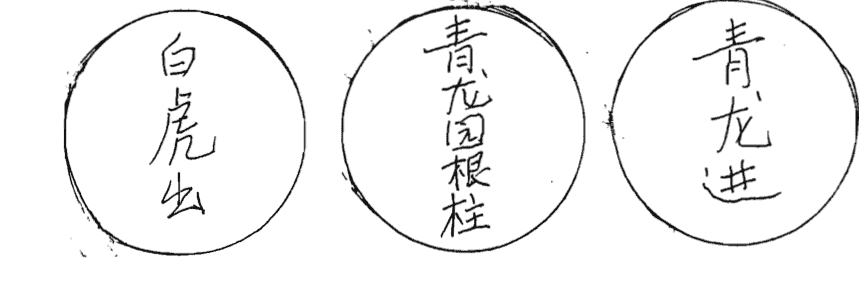
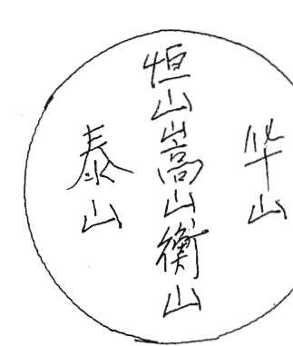
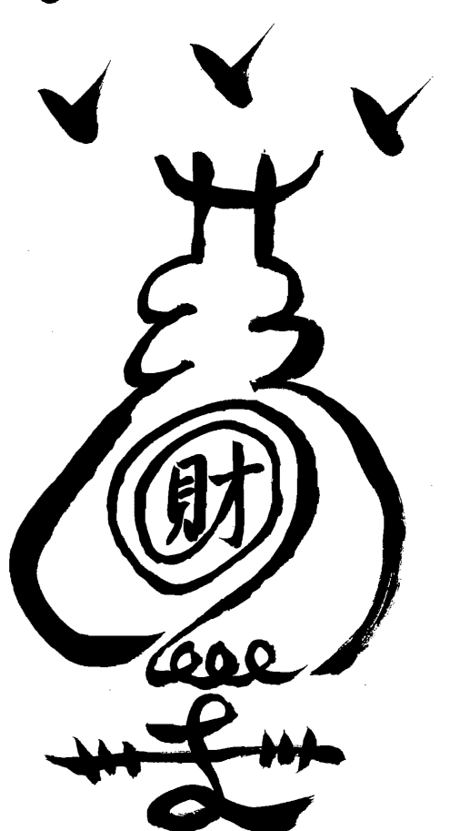
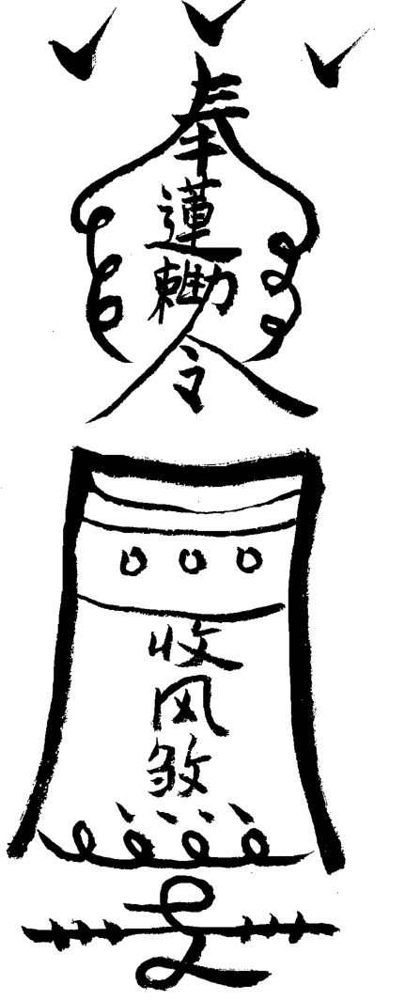

# 青龙圆根阵秘法

此法专门用于为工厂、企业、商店调整风水，趋吉避凶，摧财摧富，效果非常显著。掌握此法的高师宋先生每为企业调整风水，要价三——四万元，并保证效果显著。他传授此法要价五——六千元。吾今将此法传给有缘人：

首先要选三块花岗岩或大理石板，割圆，做三个圆盘，要求直径23.2CM，其中一个是“圆根柱盘”，其它二个是“青龙盘”与“白虎盘”，每个盘的后面要刻或画上先天八卦图。“圆根柱盘”要在正面刻上“青龙圆根柱”五个字，“青龙盘”要在正面刻上“青龙进”三字，“白虎盘”要在正面刻上“白虎出”三字，图示如下：

另，“圆根柱盘”、“青龙盘”、“白虎盘”要在刻字面的两侧贴上聚财符，符样请见“附符一”：聚财符。

如果给工厂摆此阵，将“青龙盘”与“白虎盘”埋在厂房大门口的内侧，“青龙盘”埋在大门口的左边，“白虎盘”埋在大门口的右边，所刻的字面朝外，埋地下七寸。“圆根柱盘”要埋在主人办公室的后面，把办公桌后面的墙打个能放下此盘的圆洞，把盘放进去（字面要朝外），然后把此洞抹好。

如果给商店或旅店摆此阵，将“青龙盘”与“白虎盘”埋在店房的内侧，“青龙盘”埋在店房的左边，“白虎盘”埋在店房的右边，“圆根柱盘”要埋在店房的里面。把室内的墙打个能放下此盘的圆洞，把盘放进去（字面要朝外），然后把洞抹好。

如果此阵效果不佳，可取出三个盘，在盘后面贴上五岳阵图，如图：

五岳阵图要事先写好，在贴的时候，八卦图要高于五岳阵图（八卦在上五岳在下的意思）。
另配收风煞阵。用竹板四块，每块高19.9CM，宽3.8CM，在竹板上画符，符样请见附符二“收风煞符”。
立向，将符埋在厂房或店房四角，贴墙而埋，符面要朝外。
此阵下好后，要象征性的摆供品，烧五帝纸。如无五帝纸，烧万贯钱也可。在烧纸的过程中，法师要默念如下咒语：

> 赫赫扬扬，
> 日出东方（如果是晚上摆阵，念“日落西方”）。
> 我摆此阵，
> 发财吉祥。

衷告：
一、不是十分要好的朋友一般不给下此阵，因为此阵能影响周围的买卖或住家。
二、千万不要忘摆“收风煞阵”。我有个弟子给他朋友的工厂摆此阵时，忘摆“收风煞阵”，结果天天刮大风，把房盖都吹飞了，直至废除此阵才停止了刮风。
三、此法需真传才能感应。如有人盗版或盗卖会失灵或祸及自身。

传法师 张成达
传于 年 月 日

## 附符一：聚财符

## 附符二：收风煞符

## 更多资料

↓↓↓

--------------------------------------------------

### 【中华古籍库】

↓ 点击链接 ↓

[https://www.fozhu920.com/list/](https://www.fozhu920.com/list/)

珍版刻印 / 海外流传 / 家传手抄 / 民间失传

【易】【医】【道】【武】【文】【奇】【画】【书】

1000000+高清古书籍

### 打包下载

微信：mbook86

### 中华古籍库

1000000 册 高清影印古籍

珍版刻印 / 海外流传 / 家传手抄 / 民间失传

古籍善本、经史子集、史料笔记、古人文集、
民间收藏、传世家谱、各地方志、中医典籍、
四库全书、古禁毁书、内阁文库、图书集成、
丛书集成、四部丛刊、万有文库、四部备要、
二十四史、三国六朝文、明清和民国古籍史料
……

