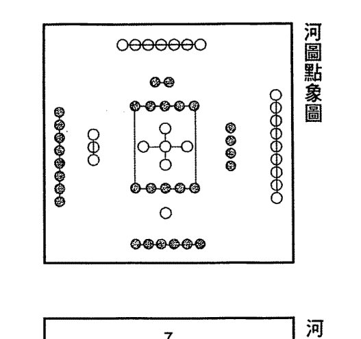
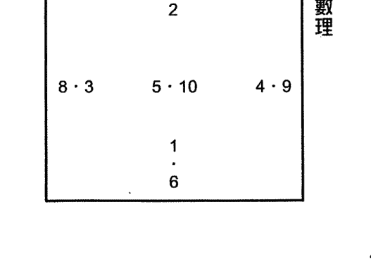
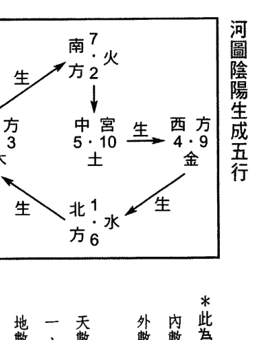
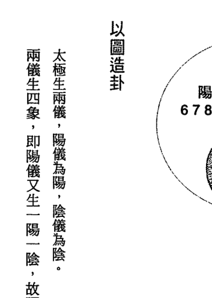
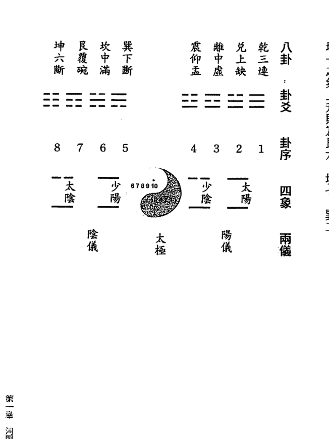
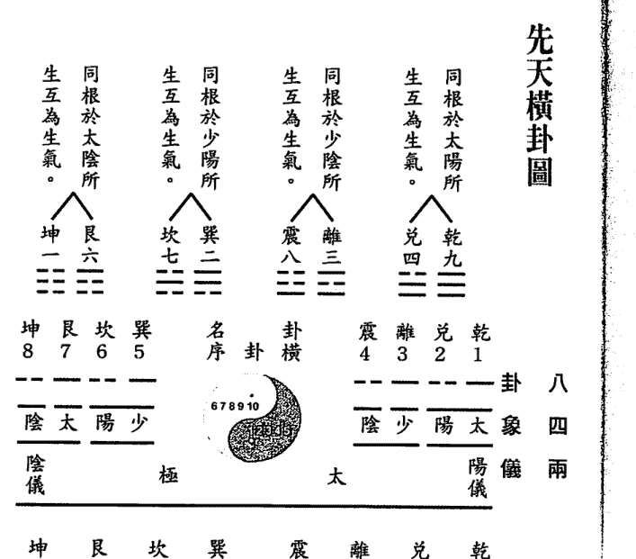
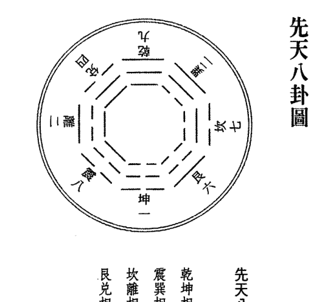
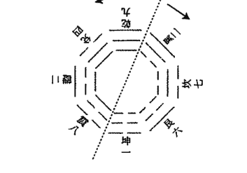

# 學五術

（山醫命卜相）

# 必看的一本書

- ★國內最知名的五術總教練，門下弟子上千人。
- ★價值數十萬的課程講義精華，現在讓您輕鬆擁有。

五術總教練
張朝閔◎著

# 學習五術的最佳讀本

本著對中國傳統五術文化的傳承熱情，知青頻道一系列規劃出版命理專書，不單獲得讀者的高度肯定，更讓我們欣慰的是，許許多多五術前輩的支持。

蒙張朝閣老師不棄本人人才疏淺，囑我在其即將出版的大作撰序，實在惶恐忐忑。

張老師是五術命理界貨真價實的大師級人物，門下精英弟子輩出。其對五術鑽研深厚、學養俱足，在知青頻道出版了三本書，深受讀者歡迎。

這本《學五術（山醫命卜相）必看的一本書》是張老師命理教學的講義精華，今日能夠出版，相信不但是知青頻道之幸，更是有志研究五術者之福。

五術是中國特有的一項文化，自三國時代開始，就將術士稱為「陰陽家」，並欽定四庫全書，正式將「山」、「醫」、「命」、「相」、「卜」，歸納為五術，研究這門學問的稱為「五術家」或「術士」。

所謂「山」就是透過食餌、築基、玄典、拳法、符咒等方術來修練肉體與精神，以達成完滿身心的一種學問，謂之山。

所謂「醫」就是利用方劑、針灸、靈治等三種方法，以達保持健康、治療疾病的一種學問。

所謂「命」就是透過紫微斗數、子平八字推命術、星平會海等方式來瞭解人生，以窮達自然法則，進而改善人命運的一種學問。

所謂「卜」包括占卜、選吉、測局三種，其目的在於預測及處理事情，其中占卜的種類又可分為「周易占卜（文王卦）」及「六壬神課」。

所謂「相」一般言包括：印相、名相、人相、宅相、墓相等五種，是觀察存在於現象界形象的一種法術。

學五術沒有一定的準則，多看古書是最直接的途徑，如果能將這些艱澀的古書融會貫通，再吸收各個派別的長處，就能夠精進自我的五術知識。然而古書艱澀難懂，常常讓人不知如何著手，而坊間的五術書籍又派別眾多，互有牴觸，常讓初學者無所適從。

本人認識張朝閣老師多年，深為張老師在五術界的地位與學養所折服，其門下學生眾多，被尊稱為「五術總教練」，這本《學五術（山醫命卜相）必看的一本書》是張老師研究五術三十多年的教學精華，也是研究五術的最佳讀本。

如果你想真正走入五術的深奧殿堂，這本書就是你的葵花寶典。

紅螞蟻圖書公司總經理 李錫東

# 作者序

自古至今五術「山、醫、命、卜、相」被視為中華民族固有傳統文化，封建社會年代學五術之人士視為珍藏，有不少術者將它蒙上一層面紗，真學不肯外傳，偽術流遍天下，後學者被惑於偽術中尋無頭緒，或誤學不能自省，以致固有文化學術惡世數千年造成信者恆信，不信者不信，更有以迷信思想評論。

五術「山、醫、命、卜、相」並非深奧的學術，朝閱研究數十年發現好學之士極少追究淵源，大致都因走捷徑從分枝或門派中掠取小知識，滿足自己在五術某方面之成就，誇大言詞信口開河，甚至利用媒體悖逆報導造成社會大眾負面影響深遠。

河圖、洛書、至八卦規圓之後盲點甚多，五術「金、木、水、火、土」更是被視如添加劑。然後學者若不追究淵源，怎能分辨是非，反卻自我誤導陷五行八卦陣中難以脫困，更有不少術中人士無法自我醒悟坐困五行牢房一輩子。

本書原名《玉書開堪與精微》，其內容包括「山、醫、命、卜、相」五大學術之源流皆從此出，自民國七十二年歲次癸亥（公元一九八三年）成書後在本堂 玉書閣

傳授門人千餘，多數學員皆因求現為用之心態，未能有效發揮淵源理論，迷途於八卦五行中，朝閱有見於此痛下決心，於民國七十七年（公元一九八八年）停止授課，並全心潛修自幼 聖祖傳授之聖學「皇天元神億數」及「生命元靈學」，歷經十多載日夜顛覆苦修，融合五術理論，辨真偽，取精棄劣，貫通五術之精華。

紅螞蟻圖書有限公司李總經理 錫東兄閱讀 朝閱以往著作與眾家五術書類不同，強力推薦此書出版，盛情難卻。但願讀者閱讀此書之後不致陷入五行八卦牢房中，追根究源必另有生成道學之途。「惟天地有陰陽、惟乾坤為水火之質、惟坎離為水火之氣、惟陰陽水火孕化萬物生靈、惟水火為養命靈及養身之源」。短短數語道盡宇宙開天闢地至今天長地久，至毀滅為不變之真理。

本書內容表為術理內露玄機，讀者閱讀請多啟發靈感智慧體會，也許閱表之術理有頓悟或惑惑之虞，此乃術、理、氣通關之玄竅，往往讀者學五術之境、遇此玄關惑於此中，疏不知此關尤如薄紙一層或紗巾一隔。宜啟動陰陽體內靜外動，思想視覺未必能潛達，外靜內動靈感智慧有生成之功，領悟「天、地、陰、陽、水、火」六字真言，又是五術另一境界，往日之惑必煙消雲散，這片天已不在本書之表。

張朝閱

# 目 錄

# 第一章 河圖

- 河圖之根源
- 河圖點象圖
- 河圖數理
- 河圖生成數及四正五行
- 河圖陰陽生成五行
- 河圖之數與太極之說
- 太極陰陽儀配河圖十數
- 太極圖與河圖十數
- 以圖造卦
- 解河圖數配八卦

# 第二章 八卦演變

- 先天橫卦圖
- 先天八卦圖
- 先天八卦四大理氣解說
- 先天八卦理氣與河圖後天之陰陽關係
- 先天八卦陰陽五行之氣
- 後天八卦
- 先天八卦變後天八卦
- 先先天後天卦同位及方位與後天五行
- 先天後天爻變卦法
- 論先天流行之氣
- 卦序之演變及門派之分別

# 第三章 五行氣運

- 論八卦十數五行之氣
- 論後天九數五行之運
- 論先天五行之氣
- 論後天五行之運

# 第四章 洛書

- 洛書九數
- 洛書九數配先天八卦、後天八卦
- 洛書歌訣
- 河圖陰陽卦法
- 論陰陽宅之異
- 子光氣造福法
- 陽宅子光盤

# 第五章 天干、地支、五行

- 陽宅子光盤使用方法
- 十干合化
- 十干與五行
- 五虎遁、年遁月法
- 五鼠遁、日遁時法
- 十二地支三合會局
- 十二長生歌訣
- 十二生肖
- 十二地支分陰陽配長生訣四局
- 地支配月令及時表
- 六十甲子納音五行

# 第六章 安八宫干支及卦爻五行

- 安八宫干支及卦爻五行
- 安八宫干支
- 安卦爻五行六親
- 乾為天
- 坤為地
- 震為雷
- 巽為風
- 坎為水
- 離為火
- 艮為山
- 兌為澤

# 第七章 神煞

- 神煞
- 八煞黃泉
- 八煞大地
- 坎卦八煞
- 坤卦八煞
- 震卦八煞
- 天干、地支配後天八卦圖
- 天干、地支入後天卦解說
- 八卦納甲
- 河圖之數解納甲法
- 納甲序升降圖解
- 河圖數、天干、地支配卦
- 後天四正卦
- 後天四維卦
- 納甲歸元，三合會局，論淨陰淨陽

# 第八章 論飛爻

- 巽卦飛爻

# 第九章 六十四卦之演變

- 坎卦飛爻 173
- 艮卦飛爻 175
- 坤卦飛爻 176
- 順子局四十八局 178
- 逆息局四十八局 179
- 先天六十四卦相對交媾圖 180
- 乾宮演八卦、兌宮演八卦 181
- 坤宮演八卦、艮宮演八卦 182
- 離宮演八卦、震宮演八卦 183
- 坎宮演八卦、巽宮演八卦 184

地 天

朝闡啟示文 六字真言

火 水 陽 陰

# 第十章 八宮統六十四卦

- 陰陽理氣解說 190
- 地卦八宮統卦 191
- 坤宮八卦 192
- 艮宮八卦 192
- 坎宮八卦 193
- 巽宮八卦 194
- 兌宮八卦 195

# 第十一章：六十四卦綜合演變

- 1. 陰陽訣竅
- 2. 兩儀四象八卦陰陽分界圖（內先天八卦、外後天八卦）
- 3. 離宮八卦
- 4. 震宮八卦
- 5. 乾宮八卦

- 1. 地雷復
- 2. 山雷頤
- 3. 水雷屯
- 4. 風雷益
- 5. 火雷噬嗑
- 6. 震為雷
- 7. 澤雷隨

- 1. 天雷无妄
- 2. 地火明夷
- 3. 山火賁
- 4. 水火既濟
- 5. 風火家人
- 6. 雷火豐
- 7. 離為火
- 8. 澤火革
- 9. 天火同人
- 10. 地澤臨
- 11. 山澤損
- 12. 水澤節
- 13. 風澤中孚
- 14. 雷澤歸妹

| 卦名 | 页码 |
|---|---|
| 天山遯 | 303 |
| 地水師 | 301 |
| 山水蒙 | 299 |
| 坎為水 | 297 |
| 風水渙 | 294 |
| 雷水解 | 292 |
| 火水未濟 | 290 |
| 澤水困 | 288 |
| 天水訟 | 286 |
| 地風升 | 284 |
| 山風蠱 | 282 |
| 水風井 | 280 |
| 巽為風 | 278 |
| 雷風恆 | 276 |
| 火風鼎 | 274 |
| 澤風大過 | 272 |
| 天風姤 | 270 |
| 乾為天 | 267 |
| 澤天夬 | 265 |
| 火天大有 | 263 |
| 風天小畜 | 261 |
| 雷天大壯 | 259 |
| 水天需 | 257 |
| 山天大畜 | 255 |
| 地天泰 | 253 |
| 天澤履 | 251 |
| 兌為澤 | 249 |
| 火澤睽 | 247 |

學五術（山醫命卜相）必備的一本書

目 錄 19

18

# 第十二章 三元九運

- 三元九運 337
- 流年三元紫白 338
- 年家三元歌訣 339
- 月家三元歌訣 340
- 日家三元 341
- 時家三元 343
- 元運配九星 345
- 九星氣色感應 346
- 河圖五子運 348
- 三元九運星五行與地運八宮方位五行之生剋 350
- 先後天卦、氣運同位 352

- 坤為地 333
- 山地剝 331
- 水地比 329
- 風地觀 327
- 雷地豫 325
- 火地晉 323
- 澤地萃 321
- 天地否 319
- 地山謙 317
- 艮為山 315
- 水山蹇 313
- 風山漸 311
- 雷山小過 309
- 火山旅 307
- 澤山咸 305

學五術（山醫命卜相）必看的一本書

目 錄 21

20

# 第十三章 陽宅訣・天地運九星方位

- 洛數配河圖生成相兼位 353
- 後天一卦統三山 356
- 天運上元運 357
- 一運貪狼水星當令二十年，統元運六十年 358
- 二運巨門土星當令二十年（受一白貪狼統運中） 363
- 三運祿存木星當令二十年 366
- 天運中元運 370
- 四運文曲木星統運六十年，中二十年當令又附五運前十年，共當令三十年 370
- 五運廉貞土星當令二十年，黃極不出卦位，巽乾兩頭分，各分一十年，前十年巽，後十年乾 374
- 六運武曲金星，當令二十年，又附五黃後十年，共有三十年運 375
- 天運下元運 378
- 七運破軍統運六十年，前二十年為令星 379
- 八運左輔土星當令二十年（即下元中二十年） 385
- 九運右弼火星當令二十年（即下元末二十年） 390
- 坎離震兌四正卦，長生五行生旺鄉 396
- 乾坤艮巽四維卦，官星五行生旺鄉 397
- 河圖配洛書干支相兼位 399
- 五行正偽論 401
- 張朝閣服務項目 405
- 免費服務卡 407

# 第一章

# 河圖

## 河圖之根源

據經典記載，六千餘年前，太昊伏羲氏，風姓，生於成都河南陳州人。有日見，河出圖，即「龍馬負圖出於黃河」。彼時尚無文字，而以點數列圖佈於龍馬背部，位居四正位及中宮，以一六共宗，位居正北方。二七同道，位居正南方。三八為朋，位居正東方。四九為友，位居正西方。五十同途，位居正中央。共合十理數，啟蒙聖賢，始著八卦，預知天下事物之過去及未來，及天地宇宙間之陰陽消長，氣象變化，星移物換萬物循環，生成不息，與世人息息相關無不相符，故以八卦理氣，能預知吉凶禍福，造福天下蒼生，因此為後世人永遠相傳六千餘年。也因八卦易理能產生不可思議之能量，以致世代學者視為秘傳而不肯公諸於世，實乃易學之最大損失。再則道窮之士不究卦易及河洛理氣，以「窮則變，變則通」悖道而馳，分枝立派製印偽書，欺世盜名，遺禍世人，亦有以祖傳秘訣鼓吹噱頭，此乃為學易之士所不容。

## 河圖生成數及四正五行

河圖以一至十數分居四正位及中央，聖人通十數，以一、二、三、四、五為生數，六、七、八、九、十為成數。是故每一正位均有生成之數，交配往來，又以一、三、五、七、九之奇數為陽，二、四、六、八、十之偶數為陰。陽數即天數，陰數為地數。作歌訣啟示後人：

- 天一生水，地六成之，即北方坎卦位。
- 地二生火，天七成之，即南方離卦位。
- 天三生木，地八成之，即東方震卦位。
- 地四生金，天九成之，即西方兌卦位。
- 天五生土，地十成之，即中央土卦位。

> 孔子曰：「天為陽數，地為陰數，天之數一、三、五、七、九，共得二十五，地之數二、四、六、八、十，共得三十，凡天地之數，合而五十有五，此所以變化，（指生成陰陽五行之變化）而行鬼神。」識義河圖之啟蒙。

## 河圖陰陽生成五行

## 河圖之數與太極之說

孔子曰：「物以太極，是生兩儀，兩儀生四象，四象生八卦，八卦定吉凶，吉凶生大業。」此乃初學者之概念。

萬物始之於「太易—太初—太始—太素，而變成體、線、面。變則越變越大，而形成太極。」此乃入門與學者有所思維。

易則為日月之光，亦可云：「萬物始之於光，光盛成氣，氣盛而成形，形盛而成質，質盛而成點，成線及成面。」視河圖是以點成圖，而聖人造卦亦是以點成線畫之，啟示太極之變化，亦近此理。此乃聖賢通易有所保留，以致五行牢房困惑多少術中人。

朝閔附加啟示：「萬物始之於光、光盛成氣、氣盛生靈、靈盛啟發靈感智慧，附之於體、附之於物，謂之『生靈』，乃萬物之創始者也。」言至於此為關鍵所在，讀者或可悟出道中道之理，或可悟出「氣之無形、形中有氣」，氣既是形，形未必是氣，氣逝則形變，若能深究個中奧秘可望跳脫五行外，進入「氣化生靈」境界，方能潛入修道之門。此乃古今不傳之秘，精修此書之後再研讀我的著作《皇天元神億數十生命元靈》有關書籍。

- *此為陰陽交合自然生成
- 內數 1 2 3 4 5 為生數。
- 外數 0 9 8 7 6 為成數。
- 天數：又稱為陽數或奇數
- 一、三、五、七、九。
- 地數：又稱為陰數或偶數
- 二、四、六、八、十。

聖人立太極，是以河圖為根，分生成往來，判陰陽消長、宇宙循環、時空變換、理氣中庸，無不於太極圖內產生變化。變者：越變越大、大而無外。化者：越化越小、小而無內。

太極形成，八卦未分方位未定，太極只是一個圓球形，不能以上下左右前後之分，是求八卦定八方，而非太極所能也。

## 太極陰陽儀配河圖十數

太極生兩儀，是陰儀及陽儀，以中央曲線則分陰陽，河圖生數帶入陰儀，即一、二、三、四、五，然而一、三、五為陽數，只有二、四為陰數，故稱為陰中有陽。十九、八、七、六數則帶入陽儀，然而成數之十、八、六數是陰數，只有、九、七為陽數，是故稱陽中有陰。太極之中央曲線，聖人是代表太極旋轉之變化及動態，產生宇宙中之萬物變化等等。其實中央曲線是代表陰陽消長及時空盈虧最為正確。

## 太極圖與河圖十數

- 陰儀：一、二、三、四、五。
- 陰中有陽：一、三、五。
- 陽儀：十、九、八、七、六。
- 陽中有陰：十、八、六。

## 以圖造卦

太極生兩儀，陽儀為陽，陰儀為陰。兩儀生四象，即陽儀又生一陽一陰，故謂「陽中有陰」，陽為太陽，陰為少陰。

陰儀亦生一陽一陰，故謂「陰中有陽」，陰為太陰，陽為少陽。
四象生八卦，即太陽所生之一陽一陰，陽謂之乾，陰謂之兌。少陰所生之一陽一陰，陽謂之離，陰謂之震。
太陰所生之一陽一陰，陽謂之艮，陰謂之坤。少陽所生之一陽一陰，陽謂之巽，陰謂之坎。
共合八卦，先天各以相對理氣往來而相生，後天各司其職，定五行、論八方。

邵子究卦，則將八卦列而有序，由右至左之橫卦，乾兌離震、巽坎艮坤，取數碼予以代用。以達從中分開而規圓，即乾一、兌二、離三、震四、巽五、坎六、艮七、坤八列之。須明此生成之卦分陰陽是以卦爻三爻之元辰爻分之，此數並非河圖之數，成卦之後廢之，不可誤用。

乾坤為天地父母卦，乾為天、為父，其氣以進為極為尊，氣極而由左下降，以河圖去其十之溢數，九乃極尊之數，故以乾居之。
坤為地、為母，其氣以退為極為尊，氣極而由右上升，河圖一乃退極之尊數，是故以坤居之。

乾九之氣下降則為兌四、離三、震八。
坤一之氣上升則為艮六、坎七、巽二。

## 解河圖數配八卦

我們已知八卦是以太極而生兩儀，由陰陽兩儀再生四象，然後以四象之太陽生乾兌兩卦，以太陰生坤艮兩卦，以少陽生巽坎兩卦，以少陰生離震兩卦，此聖人識物為太極，由太極演變為八卦之卦爻卦象，著重於宇宙萬物自然之生成變化，時空消長，陰陽互動，及方位之運轉。但學者莫忘，先有河圖之氣數，而後聖人造太極將河圖氣數帶入太極之中，故可想而知，太極是先有氣而後生卦，產生八方位，亦即是先有氣，而後有方位之運也，是故卦與河圖氣數必須相隨而行。

一、河圖以五、十兩數居中宮，卦亦以五、十為中宮五行屬土，是故以五為中數以十為溢數，五為中心或謂中宮定點之數，其兩數不出卦位，其餘八個數字皆隨卦而易位。

二、八卦之中以乾為父卦最尊，其氣剛陽，為陽極以進為尊，然河圖之進數最大為九，則九附於乾卦。

三、河圖以四、九為生成之數五行屬金，卦以太陽所生之乾、兌互為生氣，乾得九數則兌理得其四，乃金之陰陽生成相隨之妙理。

四、八卦之中以坤為母卦，地卑之極，其氣陰柔，以退為極為尊，然河圖之數退極為一數，則一附於坤卦。

五、河圖以一、六為生成之數五行屬水，卦以太陰所生之坤、艮互為生氣，坤得一數，則艮理得其六，乃水之陰陽生成相隨之妙理。

六、離之火有氣無體，必附木而生之，河圖東方以三、八之數為木，三為陽，是東方真元之木氣，為生生不息之木附於離火，是故離得三數。

學五術（山醫命卜相）必看的一本書

34

第一篇 河圖

35

七、河圖以三、八為生成之數五行屬木，卦以少陰所生之離、震互為生氣離得三數，則震理得其八，乃木氣之陰陽生成相隨之妙理。

八、坎之水逢熱而溶，高溫則化，遇冷則固，是故水中無溫而不液，取河圖二、七南方之火溶固化液為用，以其七數為陽火，為真元之熱氣附於坎水，是故坎得七數。

九、河圖以二、七為生成之數五行屬火，卦以少陽所生之坎、巽互為生氣，坎得七數，則巽理得其二，乃火氣之陰陽生成相隨之妙理。

先天河圖四正位，五行之氣各有所司，各有陰陽而胎育，各有生成而不息，以正天地之正氣，聖賢將河圖之十數入太極，受太極之運轉而動，隨卦易位，佈先天八卦橫圖以明之，但尚未復體，故須歸圓成卦，分佈八方各就其位，學者當可悉知卦以男女相待，交以陰陽互通，數以合十而歸中，氣以流行而交通，聖賢是謂「先天為體」，未得點通其竅。

朝關啟示：先天河圖之氣附於太極之體，以其陰陽自然生成之功，用其宇宙之光產生的「靈光氣」。欲成五術「山、醫、命、卜、相」明師，以及任何五術學者不精此理氣則難有成就。

# 第二章

# 八卦演變

同根於太陽所
生互為生氣。

同根於少陰所
生互為生氣。

同根於少陽所
生互為生氣。

同根於太陰所
生互為生氣。

乾九 兌四 離三 震八 巽二 坎七 艮六 坤一

乾1 兌2 離3 震4 巽5 坎6 艮7 坤8

太陽 少陰 少陽 太陰

乾為天以君之
兌為澤以悅之
離為火以暄之
震為雷以動之
巽為風以散之
坎為水以潤之
艮為山以止之
坤為地以藏之

## 先天八卦圖

## 先天八卦四大局理氣

乾坤相對，河圖一九合十，謂之天地定位。
震巽相對，河圖二八合十，謂之雷風相薄。
坎離相對，河圖三七合十，謂之水火不相射。
艮兌相對，河圖四六合十，謂之山澤通氣。

## 先天八卦四大局理氣解說

凡先天八卦四大局理氣，圖以生成之數相待，卦以長幼有序，男女之卦而交。交以陰陽之交而溝通。此已天地造物洩露無餘，萬物生成疏而不玄，陰陽生成之妙，足以為人類論宇宙萬物變化之哲源。

乾為天，乃純陽之氣，坤為地，乃純陰之氣，天之陽氣下降，與地之陰氣交，即正負電極相觸爆響成雷，則雷生於震。雷動為火之源，離之火無體，故附木為體，木助火盛，則生風。風則木也，故風亦生火。火過旺沖升，五行惟乾卦老金能制，降其高溫之火。兌金為嫩金之體，受火燥而生水，水過盛則坎水氾濫，逢坤土能制之，又以艮山築河川疏之。為天地自然之象，聖人以卦則之，妙於玄機。

朝聞啟示：聖人造卦以河圖之氣納五行，實藉五行之氣通關為用。

理氣學常以「變化」兩字隱藏玄機，河出圖成卦五、六千年之變化何其大，非五行能一力承受，理論歸理論，「玄機」乃學者自行領悟及

體驗之竅門，道門玄機「以其不變應萬變」自我通達，而非「自我不變應萬變」誤用竅門，必自困於八卦五行陣中。

河圖成卦後，乾兌兩卦生於太陽。離震兩卦生於少陰，均同根於陽儀所生。坤艮兩卦生於太陰，巽坎兩卦生於少陽，均同根於陰儀所生。

乾九兌四，乃河圖四九金，五行之中惟其質最堅，遇高溫火燥，而其質不變，用以降其火氣最宜控溫，故其居上。

坤一艮六，乃河圖一六水，宇宙始之於水，識義土從水化，故水土本同宮，坤艮兩卦成卦後亦是土。

離三震八，河圖乃是二八木，離為火無體，用其氣為專一，故離之火以附木為體，震先天是木，後天亦是木。

巽二坎七，河圖乃是二七之火，巽非正位之木，不宜過盛，巽亦為風，故先天之火附於木損其氣，是謂木火相激，風以散之。坎為水，河圖以七火居之，此乃水中需要真元之火，即溫度，使水不致凍結。是所以先天八卦，重於理氣以達通關，求其中庸以正其理。然五行之體，及方位運行則須後天也。

## 先天八卦理氣與河圖後天之陰陽關係

先天陽儀所生為陽卦：乾、兌、離、震。

先天陰儀所生為陰卦：巽、坎、艮、坤。

謂之：陽由左邊團團轉，陰由右路轉相通。

先天八卦為心盤，用之氣，思之於心，玄機出自變化中。

後天八卦為手盤，用之運，視之於目，是物非物妙在不言中。

※河圖分陰陽卦：河圖是以奇偶分陰陽。

河圖陽卦：乾九、坤一、坎七、離三。陽卦居先天四正位。

河圖陰卦：震八、巽二、艮六、兌四。陰卦居先天四隅位。

※後天八卦分陰陽：是以男女卦而分。

後天陽卦：乾老父、震長男、坎中男、艮少男。

## 先天八卦陰陽五行之氣

後天陰卦：坤老母、巽長女、離中女、兌少女。

陰卦：陰由右路轉相通

河圖玄卦氣五行

乾老父
兌少女
離中女
震長男
巽長女
坎中男
艮少男
坤老母

陽卦：陽由左邊團團轉

九乾金陽
四兌金陰
三離木陽
八震木陰
二巽火陽
七坎火陰
六艮水陽
一坤水陰

## 後天八卦

孔子曰：「先天八卦為體、後天八卦為用。」論河圖成卦，以乾坤父母各司天地陰陽理氣，其六子理氣往來錯綜相待，識意先天八卦為立體，用之於理氣循環通關。後天八卦乃用於五行之運轉及方位實質。故以後天為用啟示之，著實天地地理氣，其論無違。

朝閱則以先天八卦理氣為地師之心盤，推理氣以致用之，後天八卦為手盤，辨方位論五行。先天用於心，而後天用於目，兩者皆不得失一，密切相息，有如拔一毛則動全身。惟此數語，對初學者有啟示亦有所助。

法：以先天理氣變化通關破「玄機」。

事：以後天方位運轉借力使力悉造化。

通：化天人交戰為天人合一，必事半功倍。

## 先天八卦變後天八卦

先天八卦之五行，就其方位而言，不能應用於後天，故其有後天之變，而後天八卦著重於五行及方位之用也。

啟蒙附論：先天凡四變而成後天八卦。此一說法似較初學者不易近之，若以後天子午界中分陰陽理氣解之，則易明也。

一坎北方水、二坤西南土、三震東方木、四巽東南木、五居中宮土、六乾西北金、七兌西方金、八艮東北土、九離南方火、各司五行位。

## 先天後天爻爻變卦法

先天乾坤兩卦，居於天地之位，屬純陽純陰，理氣中正，取其天地之中爻交互交，則乾變離，坤變為坎。

先天坎離乃中天之卦，其以水火用之於氣為專一，以離之上爻與坎之下爻交互交，而達水火相濟，寒暑中庸，故離變為震，坎變成兌。

先天震兌乃同根於陽儀所生，後天則由子後陽升，故取震兌之上下兩爻錯交，即震之上爻與兌之下爻相交，然後兌之上爻與震之下爻陰陽互交，則震變為艮，兌變為巽也。

先天艮巽兩卦乃同根於太陰所生，其氣陰也，後天又為陰氣上升，故取巽之上兩爻與艮之下兩爻陰陽互交，則巽變為坤，艮變為乾也。

## 先後天卦同位及方位與後天五行

先天坤為後天坎、居北方水也。
先天乾為後天離、居南方火也。
先天離為後天震、居東方木也。
先天坎為後天兌、居西方金也。
先天巽為後天坤、居西南方土。陰土。
先天艮為後天乾、居西北方金。陽金。
先天兌為後天巽、居東南方木。陰木。
先天震為後天艮、居東北方土。陽土。

以上為先後天卦同宮及後天方位陰陽五行，惟坎離兩卦水火用其氣為專一，故坎離水火各司一卦亦於必要時陰陽可互用之。（是指其五行之陰陽）木金土各二，其五行陰陽各附一卦，故以用之氣及質為二。

朝聞啟示：凡人以乾為天、坤為地、坎為水、離為火。疏不知乾天即是火，乾天之火乃出於日、月、星之光。坤為地，疏不知坤地即是水，乃河川湖泊海洋之水藏於大地，故乾天之光為實質不滅之火，坤地之源為實質不消之水。水火相見，暑寒交迫蒸發效應化氣在於中天（大氣層以下），故坎、離、居中天，乃坎無實質之水，只剩其氣，離無實質之火，只剩其氣，坎水離火兩卦乘水火之氣而交乃天地創造「靈光氣」之精華。

水為陰、陰中有陽，火為陽、陽中有陰，兩氣相交而生「靈光氣」。
陰陽相交孕育「元靈」為天地萬物、動植物、生靈之始。

朝聞此篇解天地之奧妙，顛覆古今理論，讀者深究本書，自可破玄機，脫困五行外，此篇為入道門最重要之轉捩點，切記！切記！

## 更多资料

↓↓↓

--------------------------------------------------

## 【中华古籍库】

↓ 点击链接 ↓

[https://www.fozhu920.com/list/](https://www.fozhu920.com/list/)

珍版刻印 / 海外流传 / 家传手抄 / 民间失传

【易】【医】【道】【武】【文】【奇】【画】【书】

1000000+高清古书籍

## 打包下载

微信：mbook86

## 論先天流行之氣

先天為體，氣之徵兆。

乾坤：天地定位——乃陰陽兩氣之交。

震巽：雷風相薄——乃木火通明之相。

坎離：水火不相射——乃中天寒暑兩氣之中庸。

艮兌：山澤通氣——乃金生水相導化之功。

舉此一理，能通萬理、萬理歸一理，九五至尊居。

朝開啟示：先天乾卦為天、後天離卦為火，謂先後天同位，故天之火傳達到地為光，光含「靈光氣」為萬物生靈之原始。

先天坤卦為地，後天坎卦為水，謂先後天同宮位，故水之氣上升有孕育之功，乃造物之原始。

天地兩氣會既為水火之交，亦為陰陽之交，乃「氣化生靈」之根源。

| 先天卦 | 後天卦 |
|---|---|
| 九 乾 ☰ | 一 坎 ☵ |
| 一 坤 ☷ | 九 離 ☲ |
| 七 坎 ☵ | 七 兌 ☱ |
| 三 離 ☲ | 三 震 ☳ |
| 六 艮 ☶ | 六 乾 ☰ |
| 二 巽 ☴ | 二 坤 ☷ |
| 八 震 ☳ | 八 艮 ☶ |
| 四 兌 ☱ | 四 巽 ☴ |

乾 取中爻陰陽互交而變 離
坤 取中爻陰陽互交而變 坎
坎 取下爻陰 上下互交而變 兌
離 取上爻陽 上下互交而變 震
艮 取下中兩爻陰 互交而變 乾
巽 取中上兩爻陽 互交而變 坤
震 取下上 兩爻陰陽錯交而變 艮
兌 取上下 兩爻陰陽錯交而變 巽

乾為陽氣之天象，坤乃陰體之地兆。
陰陽居南北兩端，乃兩氣立體升降。
中天蕩交而成雷，雷發東北天地震。
向巽西南風相助，雷風交襟火生東。
離伏東方依木生，氣候牽制互調和。
五行老金可化火，火旺帶洩在南方。
東南澤金燦生水，斜流西方沐浴鄉。
坎水旺盛恐氾濫，西北艮山築河川。
流聚湖海有堵蓄，坤為大地盛萬物。
先天八卦明理氣，陰陽胎育萬物生。
制化有功得中庸，日月是「易」動鬼神。
先天之氣不相剋，若得相剋萬物滅。

## 卦序之演變及門派之分別

太極——河圖——先天橫卦——先天圓卦——洛書——後天八卦。以上之演變可稱同祖同宗，同源同流，萬派共宗。

後天八卦佈二十四山以及八卦演六十四卦歸圓，列三百八十四爻於周天乃聖賢演卦之奧妙。

從後天八卦之後竄流而出分門分派，窮演偽變，棄先天之理氣不顧，違先師之法則，分門立戶，開枝稱派，走岐途榮以為「玄」，殊不知「道」不精走火入魔而誤世害人害己。

明師精修先天之理而行氣，用後天方位之五行而行運，此乃吾人合天、地、水、火、先、後、氣、運而用之，不得有失、不得有違，陰陽自有中庸，太極自有生成，造化自可功成，順逆自有秩序，天地之氣運必有循環，因與果自可明，隱藏者自可表於外顯其形，近而識知其相，觀其神，取之於氣也。術不精不明此理，走遍山川原野，鐵鞋磨穿，徒勞無獲，心目一片渺茫，到頭空無分寸，只怪自不修，然道未入人心，眼難明，一片空白。

楊公廟裡無邪道，曾公門下何高徒，
廖公確有真才學，三教九流尋正道，
分門派、著歪論，井底之蛙何足道，
祖宗河洛為正統，天圓地方自然造，
日月輪迴分陰陽，此地彼地同一卦，
天地生成不同觀，趨吉避凶用八卦，
繁華富貴天地間，先天後天道中悟，
順應天地皆興昌，小地亦有近年發，
積少成多代代隆，大地雖可大富貴，
也有遲之數代後，順應天地行道德，
小地亦可積金山，逆天逆地不道德，
大地亦可發凶禍，欠善失德誰能救。

朝閱啟示：河圖、洛書問世後，古聖先賢以此為傳統文化，世代傳承數千年，至楊公不上千字編列竹卷分為三部，後人得之視如珍寶，曾、廖各得部分加以鑽研乃門派分歧之始，至今已有億萬字以上各顯門派神通，加諸於河圖、洛書，偽求正統。

正統河圖、洛書無派別之爭，所有分門分派皆為支流，不得蓋天論地，因人性之情近名利疏於精究，棄河圖、洛書之源，求現實利益自我迷惑而蒙之。

學五術（山醫命卜相）必看的一本書

54

第二冊 八卦演變

55

# 第二章

# 五行氣運

## 論八卦十數五行之氣

先天十數五行之氣以剋入為用神為進神，故不畏之，忌剋出，為傷氣退神。

剋入者：
金剋木—木無金不成材。
木剋土—山無木，山則崩。
土剋水—水無土，水則溢失。
水剋火—火無水，寒暑不能中庸。
火剋金—金無火，則金不成器。

> ※取先天之氣，徵後天之象，成事於後天為用之。

## 論後天九數五行之運

河圖育先天之氣，氣剋則融，而成事於後天之體，體形為物有運轉之功，成方位五行之運，是故後天運之五行不可剋入，剋入大凶，雖言可剋出為財，但亦須論其相對主剋者與被剋者之實力，主剋者力強被剋者弱當之可也。若反之則主剋者傷神，如水剋火，火猛只有點滴之水不能制其威，反而被火蒸化。

## 論先天五行之氣

生入者：火得木生、木得水生、水得金生、金得土生、土得火生，循環而復之，為生入，謂進神，生則繁也。取之為吉神。

比旺者：水與水、木與木、火與火、土與土、金與金，同類相聚或取同類陰陽之氣互為生成，為比旺，謂旺神，旺則盛也。取之為吉神。

※ 如九與九為金之比旺，四與四亦為金之比旺，若是四陰金九陽金此乃四九金陰陽生成比旺也。如一與一為水之比旺，六與六亦為水之比旺，若是一陽水與六陰水相聚此乃一六水陰陽生成比旺也，其餘仿之。

剋出：水剋火、火剋金、金剋木、木剋土、土剋水，循環剋之。為剋出，謂退神，剋出為退神則勞傷也。

剋入者：水受土剋、土被木剋、木受金剋、金受火剋、火受水剋，循環剋之，謂之進神，剋入有教化之功，取之為吉神（以主剋者為主，剋出者為賓），如我為金受火剋之等類。

學五術（山醫命卜相）必看的一本書

60

生出者：水去生木、木去生火、火去生土、土去生金、金去生水，循環復之，為生出，即主去生賓，謂之洩氣，洩則損也，取之為退神。

朝閱啟示：「天」為陽剛其氣燥，宿宇宙日月星體其光普照大地。
「地」為陰柔其氣潤，宿海洋河湖雨露之水而藏。
「火」光之氣下達於地「水」受溫其氣上升，水火兩氣於中天育化，
始生「元靈」乃生物之命源。
知天地陰陽水火四大氣之竅勝過五行翻天轉。

## 論後天五行之運

生入者：金遇土而生、土遇火而生、火遇木而生、木遇水而生、水遇金而生，循環復之為生入，謂父母謂生氣取用則為吉（以為我主，以他為賓）。

生出者：土去生金、金去生水、水去生木、木去生火、火去生土，循環復之，為生出，謂洩氣，謂子孫，取之則為凶（以我生出為主，以他為賓）。

比旺者：金比金、木比木、水比水、火比火、土比土，同類相聚謂之比旺，平等互為相助，又謂之兄弟，取之為吉。

剋出者：金去剋木、木去剋土、土去剋水、水去剋火、火去剋金，循環復之，為剋出，謂用神，又謂妻財，為我所用，亦謂奴。

剋入者：金受火剋、火受水剋、水受土剋、土受木剋、木受金剋，循環復之，為受剋，謂之殺神，謂之官鬼，其凶最厲，取之最凶。

凡五行取之水火為用者，水火用其氣，取之中庸，為最吉，若水火用其質者，其力甚巨。用其相剋以剋出則酌其實質偏差，如水去剋火，火猛滴水難制反而受其傷。若大水沖星光之火，慾求既濟而被滅。水大火猛而相會，既成水火交戰，兩敗俱傷。是故取水火為用，發富貴或凶禍力量大，而且時速快。

第三章 五行氣運

61

# 第四章

# 洛書

## 洛書九數

戴九履一、左三右七、二四為肩、六八為足、五居中宮，是謂洛書九數。

洛書始於虞帝，大禹治水時，見神龜負紋，出於洛水，列圖於背，有數至九，禹遂因第之，以成九類。蓋河圖十數，洛書九數，八卦八宮，識意河圖先有，洛書後出。以河圖著先天八卦，又因方位五行之須演變後天八卦，故有謂洛書配後天八卦之說。看河圖配卦規圖後，其數字之方位，正與洛書相吻合，由此可見，河圖出後，已經含概先天八卦、後天八卦及洛書九數。

※先天八卦變後天八卦，是方位五行所須則變卦位，然其數字未變，當知其數字之五行有後天及先天之分。

## 洛書九數配先天八卦、後天八卦

## 洛書歌訣

戴九履一、左三右七、二四為肩、六八為足、五居中宮。

- 九：先天乾、後天離。 三：先天離、後天震。
- 一：先天坤、後天坎。 七：先天坎、後天兌。
- 二：先天巽、後天坤。 六：先天艮、後天乾。
- 四：先天兌、後天巽。 八：先天震、後天艮。

## 河圖陰陽卦法

理氣家淨陰淨陽，出自先天八卦配洛書，及河圖易位而定之，以奇數為淨陽，如：乾九、坤一、坎七、離三，謂之淨陽卦。以偶數為淨陰卦，如：巽二、兌四、艮六、震八，謂之淨陰卦。

## 論陰陽宅之異

自古以來人類對居住之環境都相當講究，並且都日益求精，上至官爵世家，下至販夫走卒，皆明其意，雖求真理，皆知風水地理之重要，但不明風水地理之吉凶，故而有識之人不惜金錢及時間訪覓名師求擇吉地，造宅建墳，以求發富發貴，世代子孫延綿、財丁雙旺等等。

所謂陽宅即是人類所居住的宅院，自古至今受文明改變演化甚多，古時有三合院、四合院、五合院、六合院，甚至有多落層次之宅院；如今文明社會人口密集之城市，因受空間限制，將古有往後排建層院的宅屋變為往上加層的摩天大樓，高至數十層，內外形象格調，只講求美觀大方，佈置美輪美奐，謂之高級住宅，但是風水局勢不合格的宅屋使人住後發凶禍破產傷人丁，也就隨之窮出不盡，如最常見者，鄰山建宅、山腳帶鉤、山尖帶射、或宅之背後緊貼後山掩宅數層，使陽宅入險，或正面數尺之遠緊衝山壁，居之有面壁憤悔之感等等。有如都市之內，面向牆角三角位、路沖、前高後低向上斜退等等，不勝枚舉，又有宅內裝潢講求豪華，造形犯凶，居凶而不知為何，實為可悲。

陽宅為起居及早出晚歸宿之所，是日常生活最為密切之建築物，以其吉凶，時刻相關，宅吉人住之平安，宅凶人居之禍害橫生，不可不慎。

### 一、先天卦分陰陽法

先天八卦以陰儀所生之卦為陰卦，陽儀所生之卦為陽卦，乃是由先天橫卦從中分開而定之。

陽卦：乾、兌、離、震四卦由上左而下。

陰卦：巽、坎、艮、坤四卦由下右而上。

### 二、後天八卦分陰陽法

後天八卦以先天男女卦分陰陽。男卦為陽，女卦為陰。

乾、震、坎、艮為陽卦。

坤、巽、離、兌為陰卦。

陽宅坐、向、門路，及內格局勢，皆屬動，動則為陽，陽動為運，運則方位之變動，方位之變動，則吉凶應之。是故陽宅所講究的是人之運重於氣，以運為主，其氣次之。

運之感應所發生之吉凶禍福時速快而且急，但力量大小有所限制，運可比是實質之力量，一對一而運之，如人有力量可挑動一百斤，其運則為一百斤，若是超過則無從為力，與氣不同。

陰宅是人類造葬祖先的骨骸，即是墓塋，求其臨山近水，擇天地正氣感應，及培育祖先骨骸中之「磷」質，使之旺盛，間接感應其血脈近親之子孫，借天地間日月星之靈氣，感應其子孫，取天地旺氣之地葬祖先之骨骸，地靈人傑必子孫富貴。不得天地旺氣而得雜氣或衰氣之地葬骨骸，其感應子孫之「磷」質必是發凶禍甚至人丁敗絕等等。

是故陰宅不動屬靜，以祖先之骨骸居於靜中聚氣之狀態，取天地山川正氣培育磷氣，氣愈足力量則愈大，感應時間愈長，相對其子孫發富貴則愈大愈長久。

故陰宅講究氣，以運次之，氣之力量要比運之力量大上百倍，由此可見大富大貴之人必定有好的祖墳所蔭之，絕非陽宅所能，當然陰宅也有因過時退氣運之期，如長久至上百年之骨骸其磷質亦有退化之狀，而未能產生作用，又如天地氣運之流轉，當今及失運懸殊頹大，又如日久山情水勢地理環境以及建築物之變化，都會轉變祖墳之吉凶等等。

若論陰陽兩宅之造福輕重而言，當然是陰宅的造福力量大，甚至遠及數代人，陽宅則遠不及也，但陽宅發富貴時效快有救急之功效，可知其「氣」、「運」之別差異之疏。

陽宅發凶陰宅發福力大，其子孫未必發凶，陰宅發凶而陽宅吉，其必發凶。

## 子光氣造福法

現代社會人口密集，墓地使用受限，龍穴砂水氣旺能造福的地理少之又少，大家都把造福放在陽宅上，偏偏陽宅學有很多不切實際之術，只要上書店買幾本書看一看，自己就可以看陽宅風水，而且三腳貓都可以自稱為明師，例如市面最常見到的「八宅人命配卦」，以九星流年定命卦，分東西四命，這種法術把一年所生之人都以同命論之，荒唐至極。又例如：「三元紫白飛星」不必論人命，直接將宅的坐山卦五行帶入中宮而後八宮順飛，逢生旺卦即為吉方或財方，其他亦有不少以術玩術之法，真能造福嗎？我研究數十年至今不敢肯定。說句實在話，古人保守不露真學，才有今日混雜之術流傳禍世。古來五術理論就有不少瑕疵又如何能造福呢？

任何人想要發富、發貴，其先天條件必要有正確的靈感智慧及思想，每個人都是「生命元靈」附體，必須從自己的先天命先瞭解自己對「靈光氣」之喜忌，才能從陽宅內的子光氣中萃取到，自己所需要的「靈光氣」，提升靈感智慧發富、發貴，而不是一般庸師所說的磁場造福，請參考以下「陽宅子光盤」使用方法，或閱讀我的著作《陽宅氣場造福》，以及我的著作有關陽宅學等書籍。

## 《陽宅子光盤》

| 姓名 ○○○ 元靈宿命星 ○星 元靈斗星 ○○○宮 | 先天四大吉星 |
| :--- | :--- |
| 皇天元神億數：× × × × × × × | ○○○○ |
| 脫運星 ○ 星 脫運星：× × × × × × | ○○○○ |

使用方法：
一、先用指北針或用指南針在陽宅外面沒有鋼鐵不影響磁場的位置測量出宅的坐向方位。
二、依據在宅外測量的方位將子光盤置於宅之中心點，按照十二個方位定吉凶。
三、本命方位吉凶請對照《富貴智慧陽宅學》內容之「十二星宮命與運」取吉用。

著作版權所有 張朝閔撰
冒用依法追訴

電話：(02) 27685678
27672988

第四章 洛書

71

70

## 「陽宅子光盤」使用方法

一、本圖樣式是空盤，等推算出您本命氣場後再將您的氣場方位吉凶融入此盤中，並將方位吉凶做何設置一概列入方位格中。

二、測量陽宅坐向宜於陽宅外面，三公尺內沒有鐵器或磁場干擾的地方，然後用南北針量出正確的坐向方位。

※測量陽宅坐向不可在陽宅內，因為陽宅本身的鋼骨、鐵器家具、電器等等都有可能干擾您的磁針，您將會測得不正確的方位，反而被方向誤導。

三、將在陽宅外測得的正確方位記下，直接帶入宅內全格局的中心點放置，南北針壓於「陽宅子光盤」正中心上，指針與盤的方位務必對正，此時南北針的磁針會偏移，因為宅內有磁場影響磁針錯誤可不必理會，就依陽宅外測得的方向定位即可。

※宅內全格局包括前後陽台、房間、廚房、衛浴、所有空間在內（樓梯凹處也一併包括在內）。

四、盤中共有十二宮方位，每宮內都有方位配合您的生命元靈使用吉凶說明，如進出大門、床位、書桌、辦公桌、神位，皆須置於吉方位。其餘依各宮位說明佈置。

五、每一宮位之格局大小皆以中心點沿線做扇形往外延伸，依說明找出最正確的吉凶設置使用方法。

請參考「陽宅子光盤」圖，使用如有不解之處，歡迎來電（02）二七六八五六七八，手機：0910214868詢問。

網址：www.teller.com.tw

# 第五章

# 天干、地支、五行

十干與五行

（一）、十干者：
甲、乙、丙、丁、戊、己、庚、辛、壬、癸。
甲乙東方木，丙丁南方火，戊己中宮土，庚辛西方金，壬癸北方水。
河圖納十干數為：甲三、乙八，居東方木位；丙七、丁二，居南方火；戊五、己十，居中宮土；庚九、辛四，居西方金；壬一、癸六，居北方水。

（二）、天干分陰陽：
甲、丙、戊、庚、壬——為陽干，得河圖陽數三、七、五、九、一。
乙、丁、己、辛、癸——為陰干，得河圖陰數八、二、十、四、六。

（三）、十天干相生：
甲乙東方木生南方丙丁火、南方丙丁火生戊己中宮土、戊己中宮土生西方庚辛金、西方庚辛金生北方壬癸水、北方壬癸水生東方甲乙木。

庚辛金、西方庚辛金生北方壬癸水。

## （四）、十天干相剋：

甲乙木剋戊己土、戊己土剋壬癸水、壬癸水剋丙丁火、丙丁火剋庚辛金、庚辛金剋甲乙木。

## （五）、五行生剋：

木生火、火生土、土生金、金生水、水生木，以上為五行相生。
水剋火、火剋金、金剋木、木剋土、土剋水，以上為五行相剋。

## （六）、天干配、河圖變體五行：

木 火 土 金 水 —— 變體五行。
1 2 3 4 5 6 7 8 9 10 —— 河圖數。
甲乙 丙丁 戊己 庚辛 壬癸 —— 十天干。

以上變體五行之說未必確實，師人用於姓名學居多，是否有其功效請讀者自行考究，在此不便多做解釋。

## 十干合化

※五鼠遁化合法

十干合化是以本干起子至辰而化，辰是數之中五，又為天門之地，十二生肖屬龍。如甲己起甲子，順數到辰，得戊辰，天干戊屬土，故甲己合化土。
乙庚起丙子，順數到辰，得庚辰，天干庚金，故乙庚合化金。
丙辛起戊子，順數到辰，得壬辰，天干壬水，故丙辛合化水。
丁壬起庚子，順數到辰，得甲辰，天干甲木，故丁壬合化木。
戊癸起壬子，順數到辰，得丙辰，天干丙火，故戊癸合化火。
若用河圖合化亦可，必定要提出河圖水土同根，五、十，與一、六之數易位，將北方一、六水易為五、十中宮土，此一易位，則東西合成二十四數，南北亦合成二十四數，謂通天地人三才之要。如人體背脊至頸共二十四骨節，謂之龍骨，人身左右有二十四經脈。一日二十四小時，一年二十四節氣，地有二十四方向，此以河圖易位變體而得定數。

河圖變體，五、十易位，乃是出於五行土從水化之理論，然河圖配天干亦不須以方位定之，則以河圖之順序配十干之順序同行，甲一、乙二、丙三、丁四、戊五、己六、庚七、辛八、壬九、癸十。於是甲一、己六居中宮，中宮本為五、十土也，故甲乙合化土。

戊五、癸十，移居北方一六之地，一六合七，本為水中真元之火，故戊癸合化火。

乙二、庚七，二七本為南方之火，但二七合九化為金，故乙庚合化為金。

丙三、辛八為東方木，而三八合得十一，去十溢剩一，則一為水，故丙辛合化水。

丁四壬九本為西方金，然四九合得十三，十溢剩三為木，故丁壬合化木。

## 十干合化．五虎遁年之月　五鼠遁日之時

甲己合化土，甲己年起丙寅月，代表正月。甲己日起甲子時。午夜十一時至一時。

乙庚合化金，乙庚年起戊寅月，代表正月。乙庚日起丙子時。午夜十一時至一時。

丙辛合化水，丙辛年起庚寅月，代表正月。丙辛日起戊子時。午夜十一時至一時。

丁壬合化木，丁壬年起壬寅月，代表正月。丁壬日起庚子時。午夜十一時至一時。

戊癸合化火，戊癸年起甲寅月，代表正月。戊癸日起壬子時。午夜十一時至一時。

## 五虎遁、年遁月法

如年之天干甲年或己年，就起丙寅月為正月，丁卯月為二月，戊辰月為三月。如乙庚年則起戊寅月為正月，依順序推算之。

## 五鼠遁、日遁時法

如日干甲日或己日，則起甲子時、乙丑時、丙寅時、丁卯時，其餘依順序推算。如當日之天干為戊日或癸日，則起壬子時、癸丑時、甲寅時，依順序數推算。

## 十二地支三合會局

論十二地支：子、丑、寅、卯、辰、巳、午、未、申、酉、戌、亥。

地支三合：
申、子、辰、合水局：申長生，子帝旺，辰墓庫。
寅、午、戌、合火局：寅長生，午帝旺，戌墓庫。
亥、卯、未、合木局：亥長生，卯帝旺，未墓庫。
巳、酉、丑、合金局：巳長生，酉帝旺，丑墓庫。

地支六合：
子、丑合。寅、亥合。卯、戌合。辰、酉合。巳、申合。午、未合。

地支相沖：
子、午逢沖。丑、未逢沖。寅申逢沖。卯酉逢沖。辰戌逢沖。巳亥逢沖。

## 十二長生歌訣

長生、沐浴、冠帶、臨官、帝旺、衰、病、死、墓、絕、胎、養。

四長生：寅、申、巳、亥。
四帝旺：子、午、卯、酉。
四墓庫：辰、戌、丑、未。

甲長生起亥、乙長生起午、丙戊長生起寅、丁己長生起酉、庚長生起巳、辛長生起子、壬長生起申、癸長生起卯。四庫無長生。陽干順行地支位，陰干逆行地支位。

## 十二生肖

十二生肖：子肖鼠、丑肖牛、寅肖虎、卯肖兔、辰肖龍、巳肖蛇、午肖馬、未肖羊、申肖猴、酉肖雞、戌肖狗、亥肖豬。

地支方位五行
亥子屬北方水、寅卯屬東方木、巳午屬南方火、申酉屬西方金、辰戌丑未屬四維之土。

## 十二地支分陰陽配長生訣四局

陽支：申子辰水局、申長生、子帝旺、辰墓庫。

陰支：巳酉丑金局、巳長生、酉帝旺、丑墓庫。

陽支：寅午戌火局、寅長生、午帝旺、戌墓庫。

陰支：亥卯未木局、亥長生、卯帝旺、未墓庫。

地支三刑：子刑卯、丑刑戌、寅刑巳、卯刑子、辰自刑、巳刑寅申、午自刑、未刑戌、申刑巳、酉自刑、戌刑丑未、亥自刑。

地支三殺：申、子、辰命殺在未。巳、酉、丑命殺在辰。寅、午、戌命殺在丑。亥、卯、未命殺在戌。

回頭貢殺：申子辰全殺未命、寅午戌全殺丑命、巳酉丑全殺辰命、亥卯未全殺戌命。

## 地支配月令及時表

| 時辰 | 月令 | 地支 |
|---|---|---|
| 23 - 1 | 十一 | 子 |
| 1 - 3 | 十二 | 丑 |
| 3 - 5 | 正 | 寅 |
| 5 - 7 | 二 | 卯 |
| 7 - 9 | 三 | 辰 |
| 9 - 11 | 四 | 巳 |
| 11 - 13 | 五 | 午 |
| 13 - 15 | 六 | 未 |
| 15 - 17 | 七 | 申 |
| 17 - 19 | 八 | 酉 |
| 19 - 21 | 九 | 戌 |
| 21 - 23 | 十 | 亥 |

## 六十甲子納音五行

甲子乙丑海中金、丙寅丁卯爐中火、戊辰己巳大林木。
庚午辛未路旁土、壬申癸酉劍鋒金、甲戌乙亥山頭火。
丙子丁丑澗下水、戊寅己卯城頭土、庚辰辛巳白蠟金。
壬午癸未楊柳木、甲申乙酉泉中水、丙戌丁亥屋上土。
戊子己丑霹靂火、庚寅辛卯松柏木、壬辰癸巳長流水。
甲午乙未沙中金、丙申丁酉山下火、戊戌己亥平地木。
庚子辛丑壁上土、壬寅癸卯金箔金、甲辰乙巳覆燈火。
丙午丁未天河水、戊申己酉大驛土、庚戌辛亥釵釧金。
壬子癸丑桑柘木、甲寅乙卯大溪水、丙辰丁巳沙中土。
戊午己未天上火、庚申辛酉石榴木、壬戌癸亥大海水。

## 天干、地支配後天八卦圖

後天八卦 二十四山 紫白星
九離卦：丙午丁三山、九紫火。
四巽卦：辰巽巳三山、四綠木。
三震卦：甲卯乙三山、三碧木。
八艮卦：丑艮寅三山、八白土。
二坤卦：未坤申三山、二黑土。
七兌卦：庚酉辛三山、七赤金。
六乾卦：戌乾亥三山、六白金。
一坎卦：壬子癸三山、一白水。

## 天干、地支人後天卦解說

地支子午卯酉四正，居於後天八卦之東西南北四正位，子居北方坎正位，卯居東方震正位，午居南方離正位，酉居西方兌正位。

天干壬癸合河圖一六水，位居北方，即坎卦之壬子癸三山。

天干甲乙合河圖之三八木，位居東方，即震卦之甲卯乙三山。

天干丙丁合河圖之二七火，位居南方，即離卦丙午丁三山。

天干庚辛合河圖之四九金，位居西方，即兌卦之庚酉辛三山。

天干戊己合河圖之五十位居中宮土，不出卦位。

地支之寅、申、巳、亥、辰、戌、丑、未，四長生及四墓庫，配八卦之四維卦。

丑寅配東北之八艮為丑艮寅三山，即艮卦也。

辰巳配東南之四巽為辰巽巳三山，即巽卦也。

未申配西南之二坤為未坤申三山，即坤卦也。

戌亥配西北之六乾為戌乾亥三山，即乾卦也。

以上八卦八方，一卦統三山，合而為二十四方位。羅盤又以八卦分天地人三盤，地理家用其以坐山、立向、消砂、納水為用。

## 八卦納甲

納甲之義，早於秦漢前已有，使干支從卦，有所依歸，與八卦相貫通，又以八卦統十干隨卦而行。

納甲之法出自京房易，其納法有二，一為三畫卦之納法，一為六畫卦之納甲法，用法各自不同。

六畫卦之納甲法，其納盡十干。乾納甲壬。坤納乙癸。艮納丙。兌納丁。坎納戊。離納己。震納庚。巽納辛。以乾坤兩卦各納兩干，而以納足十干，此為卜卦家、修養家，重用於玩卦，堪輿家少用之，但最為精奧，明師很少有傳，以學藝精者自行體會運用，此乃明師所用之六十四卦納甲歸原。

三畫卦之納甲法，堪輿地理家之寶，其以納盡經盤之八干，而戊己為中宮土，不出卦位，故而不納，其法如下：乾納甲。坤納乙。艮納丙。巽納辛。坎納癸。震納庚。離納壬。兌納丁。以上八卦納八干。

又六畫卦何以納盡十干，因六畫卦以佈渾天甲子為主，以乾坤父母卦，納十干之首尾。乾之內卦納甲起甲子，外卦納壬起壬午。坤之內卦納乙起乙未，外卦納癸起癸丑（詳見後章八卦佈干支）。

## 河圖之數解納甲法

河圖之數，即先天八卦之卦數。乾為老父得數九，震為長男得數八，坎為中男得數七，艮為少男得數六，此為先天八卦河圖成數之男卦為陽卦，遂次遞降之數。
坤為老母得數一，巽為長女得數二，離為中女得數三，兌為少女得數四。此為先天八卦河圖生數之陰卦亦就是女卦遂次上升之數。河圖成卦後，陽以進為極為尊，氣極則遂次下降。陰以退為極為尊，氣極則遂次上升。陽卦之遞降數：乾九減一為八，震卦。八震減二為六，艮卦。六艮減三為三，離卦。離三減四（加十減之）為九，乾卦。此為四陽卦：乾、震、艮、離，之漸降數為九、八、六、三。陰卦之漸升數為坤一加一為二，巽卦。巽二加二為四，兌卦。兌四加三為七，坎卦。坎七加四為十一（減十剩一坤卦）循環復原。此為四陰卦：坤、巽、兌、坎，之漸升數為一、二、四、七。

離本陰卦，坎本陽卦，何以陰陽變換，因為水火互藏。陰陽互為其根，而先天之乾，又為後天之離，先天之離，又為後天之震，則離不得不變為陰也。先天之坤為後天之坎，先天之坎為後天之兌，則坎不得不變為陰也。漸升數自陰卦而升，漸降數自陽卦而降，以乾坤為首，附六卦循環，而為天地之交合，此升降之法，且能使坎卦及離卦之陰陽互換。孔子所謂：「成變化而行鬼神也。」

由於八卦八方，乾、震、艮、離、坤、巽、兌、坎，陰陽順序已定，則用戊己居中，各以七數數之，逢七即納。戊至七為甲，則乾納甲。再由甲數到七為庚，則震納庚。庚數至七為丙，則艮納丙。丙數至七為壬，則離納壬。壬數至七為戊，則歸原。

此為陽卦所納皆為陽干「甲庚丙壬」。

陰干則由己數至七為乙，坤納乙。乙數至七為辛，則巽納辛。辛數至七為丁，則兌納丁。丁數至七為癸，則坎納癸。癸數至七為己，則歸原。是故陰卦納陰干「乙辛丁癸」。

除艮、坎兩卦外，其餘之干與卦均為五行相剋為何？
卦統干支，卦遇干剋或干遇卦剋，皆有所畏，畏者依納，依納則為歸降之意，降者和也。

## 納甲序升降圖解

漸降數：九減一、八減二、六減三、三減四、九循環歸原。

卦：坤納乙、巽納辛、兌納丁、坎納癸。

漸升數：一加一、二加二、四加三、七加四、一循環歸原。

卦：乾納甲、震納庚、艮納丙、離納壬。

坎離為水火中天之氣，其五行以氣為專一。是故坎離木火陰陽互用。

孔子曰：天一、地二、天三、地四、天五、地六、天七、地八、天九、地十，河圖之數，五位相得而各有合。是謂一與二合、三與四合、五與六合、七與八合、九與十合。疑此數未曾見用，則不知此數正謂有用也。以十干順序而言之，一二為甲乙。三四為丙丁。五六為戊己。七八為庚辛。九十則為壬癸。孔子雖未言干支，而十干自有陰陽之理，此數正是陰陽相配。以八卦納之，則將戊己五六處於中數，以當納甲起七之數，陰以陰起，陽以陽起，逢七即納。是故一、二為乾甲、坤乙，天地定位也。三、四為艮丙、兌丁，山澤通氣也。七、八為震庚、巽辛，雷風相薄也。九、十為壬癸、離壬、坎癸，水火不相射也。此乃河圖變體配十干之先後秩序。

一甲納乾、二乙納坤、天地定位。
三丙納艮、四丁納兌、山澤通氣。
七庚納震、八辛納巽、雷風相薄。
九壬納離、十癸納坎、水火不相射。

## 納甲歸元，三合會局，論淨陰淨陽

天干以八干納八卦，戊己為入中宮不出卦，前者已說明。地支十二位以四帝旺位，為四正卦，子即坎位，午即離位、卯即震位、酉即兌位。地支十二位，分四大局，每局三地支，以生旺墓別之。子即是坎——納癸，會申辰、先天河圖數（七）。午即是離——納壬，會寅戌、先天河圖數（三）。卯即是震——納庚，會亥未、先天河圖數（八）。酉即是兌——納丁，會巳丑、先天河圖數（四）。淨陰淨陽之別，亦就河圖之奇偶數之別，奇為陽數，偶為陰數。

## 河圖數、天干、地支配卦

一九合十坤乙、乾甲、淨陽局。——天地定位。
三七合十離壬寅戌、坎癸申辰、淨陽局。——水火不相射。
二八合十巽辛、震庚亥未、淨陰局。——雷風相薄。
四六合十兌丁巳丑、艮丙、淨陰局。——山澤通氣。

## 後天四正卦

坎卦納癸申子辰
離卦納壬寅午戌
震卦納庚亥卯未
兌卦納丁巳酉丑
納甲包括天干與地支

## 後天四維卦

乾卦納甲
坤卦納乙
艮卦納丙
巽卦納丁
納甲只納天干不納地支

# 第六章

# 安八宫干支及卦爻五行

## 安八宫干支

八宫六親是謂之：父母、兄弟、妻財、子孫、官鬼等五類並己身。生我者父母、比我者兄弟、我剋者妻財、我生者子孫、剋我者官鬼。而所謂官鬼，非官即鬼，是卦爻煞本身卦，謂之官鬼，地理家謂之八煞。實者有九煞，坎卦本身戊辰與戊戌土為兩煞，故合為九煞。此八煞之吉凶反覆非明師很難下定論，所以地理家非常重視，不敢輕易用之，非大凶即大吉。吉則：能借煞登將台，降我而為我所用則大吉。凶者：大敗，凶禍，傾家蕩產，以致絕代，故不可不慎防也（詳參後面之神煞篇）。

陽卦爻為順行安陽干支。

陰卦爻為逆行安陰干支。

乾為陽首、起地支之首子，午順行。

坤為陰首、起地支之首丑，未逆行。

震為長男、起地支之子，順行。

巽為長女，起地支之丑，逆行。
坎為中男，起地支之寅，順行。
離為中女，起地支之卯，順行。
艮為少男，起地支之辰，順行。
兌為少女，起地支之巳，逆行。

## 安卦爻五行六親

## 乾為天

納甲壬，卦體屬金，內卦初爻起甲子水、二爻甲寅木、三爻甲辰土、外卦四爻壬午火、五爻壬申金、上爻壬戌土。卦體屬金：生我者土也，為父母。比我者金，謂兄弟。我生者水，為子孫。我剋者木，為妻財。剋我者火也，為官鬼。

干支：壬戌 壬申 壬午 甲辰 甲寅 甲子

爻神：上爻 五爻 四爻 三爻 二爻 初爻

卦爻：
——
——
——
——
——
——

六親：父母 兄弟 官鬼 父母 妻財 子孫

五行：土 金 火 土 木 水

## 坤為地

納乙癸，本卦體屬土。內卦起初爻乙未土，二爻乙巳火，三爻乙卯木，外卦四爻癸丑土，五爻癸亥水，上爻癸酉金。本卦屬土：生我者火為父母、我生者金為子孫、我剋者水為妻財、剋我者木為官鬼。

干支：癸酉 癸亥 癸丑 乙卯 乙巳 乙未

爻神：上爻 五爻 四爻 三爻 二爻 初爻

卦爻：—— —— —— —— —— ——

六親：子孫 妻財 兄弟 官鬼 父母 兄弟

五行：金 水 土 木 火 土

## 震為雷

納庚，本卦體屬木。內卦起初爻庚子水，為生氣，生我者父母。二爻庚寅木，為比我者兄弟。三爻庚辰土，為奴才我剋者妻財。外卦四爻庚午火，為我生洩氣謂子孫。五爻庚申金，剋我者為官鬼為八殺。上爻庚戌土，為我剋奴才謂妻財也。

干支：庚戌 庚申 庚午 庚辰 庚寅 庚子

爻神：上爻 五爻 四爻 三爻 二爻 初爻

卦爻：—— —— —— —— —— ——

六親：妻財 官鬼 子孫 妻財 兄弟 父母

五行：土 金 火 土 木 水

## 巽為風

納辛，本卦體屬木。內卦起初爻辛丑土，為我剋奴才謂妻財。二爻辛亥水，為生我者生氣為父母。三爻辛酉金，為剋我者官鬼為八殺。外卦四爻辛未土，為我剋者奴才為妻財。五爻辛巳火，為我生者洩氣為子孫。上爻辛卯木，為比旺為兄弟。

干支：辛卯 辛巳 辛未 辛酉 辛亥 辛丑

爻神：上爻 五爻 四爻 三爻 二爻 初爻

卦爻：
——
——
——
——
——
——

六親：兄弟 子孫 妻財 官鬼 父母 妻財

五行：木 火 土 金 水 土

## 坎為水

納戊，本卦體屬水。內卦初爻起戊寅木，為我生洩氣為子孫。二爻戊辰土，為剋我八煞為官鬼。三爻戊午火，為我剋奴才為妻財。四爻外卦戊申金，為生我生氣為父母。五爻戊戌土，為剋本卦體八殺為官鬼。上爻戊子水，為比我為兄弟。

干支：戊子 戊戌 戊申 戊午 戊辰 戊寅

爻神：上爻 五爻 四爻 三爻 二爻 初爻

卦爻：
——
——
——
——
——
——

六親：兄弟 官鬼 父母 妻財 官鬼 子孫

五行：水 土 金 火 土 木

### 離為火

納己，本卦體屬火。內卦初爻起己卯木，為生我生氣為父母。二爻己丑土，為我生洩氣為子孫。三爻己亥水，為剋我八煞為官鬼爻。外卦四爻己酉金，為剋我奴才為妻財。五爻己未土，為我生洩氣為子孫。上爻己巳火，為與我比旺為兄弟。

爻神：上爻 五爻 四爻 三爻 二爻 初爻

干支：己巳 己未 己酉 己亥 己丑 己卯

卦爻：—— —— —— —— —— ——

六親：兄弟 子孫 妻財 官鬼 子孫 父母

五行：火 土 金 水 土 木

## 艮為山

納丙，本卦體屬土。內卦初爻起丙辰土，為比旺為兄弟。二爻丙午火，為生氣為父母。三爻丙申金，為我生洩氣為子孫。四爻外卦丙戌土，為比旺為兄弟。五爻丙子水，為剋我奴才為妻財。上爻丙寅木，為剋本卦體為八煞謂官鬼。

| 五行 | 木 | 水 | 土 | 金 | 火 | 土 |
|---|---|---|---|---|---|---|
| 六親 | 官鬼 | 妻財 | 兄弟 | 子孫 | 父母 | 兄弟 |
| 卦爻 | — — | — — | — — | — — | — — | — — |
| 爻神 | 上爻 | 五爻 | 四爻 | 三爻 | 二爻 | 初爻 |
| 干支 | 丙寅 | 丙子 | 丙戌 | 丙申 | 丙午 | 丙辰 |

## 兌為澤

納丁，本卦體屬金。內卦初爻起丁巳火，為剋本卦體之金為官鬼。二爻丁卯木，為我剋妻財也。三爻丁丑土，為土生金為父母。外卦四爻丁亥水，為金生水洩氣為子孫。五爻丁酉金，為與我比旺為兄弟。上爻丁未土，為土生金生本卦體為父母。

| 五行 | 土 | 金 | 水 | 土 | 木 | 火 |
|---|---|---|---|---|---|---|
| 六親 | 父母 | 兄弟 | 子孫 | 父母 | 妻財 | 官鬼 |
| 卦爻 | — — | — — | — — | — — | — — | — — |
| 爻神 | 上爻 | 五爻 | 四爻 | 三爻 | 二爻 | 初爻 |
| 干支 | 丁未 | 丁酉 | 丁亥 | 丁丑 | 丁卯 | 丁巳 |

# 第七章 神煞

## 八煞黃泉

八煞黃泉是謂八卦之官鬼爻，卦爻剋本卦，然坎卦只言坎龍，龍是地支辰，疏不知五爻戊戌土亦是爻煞，故坎卦有戊辰及戊戌為土，皆為坎卦水之煞，合而八卦九煞。

八煞歌云：

坎龍坤兔震山猴、巽雞乾馬兌蛇頭。

艮虎離豬為八煞、墓宅逢之一時休。

八煞乃是先天八卦之卦爻剋本卦體，謂之官鬼爻，是以十二地支正五行論生剋。

官者：龍強而煞弱，以龍制煞為我所用，謂之借煞登將台。

鬼者：龍弱而煞強，則煞曜凶狂，反為敵，故大凶。

墳墓立向或來龍遇八煞水朝來為最凶，前面逆來之水，首當三房受害，右來之水長房受災，左來之水二房受害。若橫過之水來去皆破局，八煞水右來左去，長房先敗，次二房，而後三房均絕。若左來右去之水則二房先敗次長房，而後三房均絕。

陽宅之來路或開門，立於八煞之位上，為八煞最凶，犯之全家受災，以宅主為最，次者以年庚及太歲沖吊相論之。例如坤宅艮向，門路設於寅方，則為八煞之門路。太歲流年輪至丙寅，或寅午戌甲年最凶。丙寅為艮納丙，八煞年，寅午戌為三合拱照。申是太歲衝動，皆大為不吉利，遇以上流年，則首當宅主，及其年命出生之人。

凡造葬修方，年月日時皆不可犯之。用太歲吊宮法，年用太歲，月日用建入中宮，順飛入宮，見宮與干支會成八煞謂之八煞到山或方。舉例如：民國七十二年農曆十月二十七日夜九至十一時，為癸亥年、癸亥月、癸亥日、癸亥時。此刻癸亥入中宮，順飛八宮，即甲子到戌乾亥六白方，乙丑到庚酉辛兌宮七赤方，丙寅到丑艮寅八白方。丙寅是艮之八煞，而年月日時均會艮方，艮山大凶宜避之，若用三元日課為初學者謹慎之，不可執一卦純清，以為大吉，誤用山方則無吉反為大敗。主應百日內立見凶禍，不可貪用。

## 八煞大地

八煞來水結美地，此乃大富大貴之地。

變煞為官登將台，定要龍比煞強方為真。

無能制煞反為凶，吉凶不明禍重重。

初學者不可試之，道不精不可用之。

龍比煞強則以正面服煞，煞降為我用，謂之變煞為官登將台。（以下附圖再詳論）

去水不可流向八煞位，應主消退，破敗。

無來水亦不可立八煞向，是八煞暗藏，流年太歲到或拱沖，亦可大敗。

八煞向不可相兼三分以上，如：辛酉相兼三分以上；庚申相兼三分以上；乙卯相兼三分以上；艮寅相兼三分以上；壬亥相兼三分以上。尤以庚申、辛酉、乙卯為最凶，流年遇到即應，可斷大凶，甚至家破人亡。

學五術（山醫命卜相）必看的一本書

## 坎卦八煞

坎龍：是坎卦，屬水。龍為辰，即二爻之戊辰土也，另外五爻戊戌土亦同，共兩煞。故坎卦之癸，申子辰之來龍或向，遇辰戌來水，是八煞。但如會成三合會局則反為吉。

坎癸申辰四龍，逢辰方或戌方來水謂之八煞。此局可改立辰向逆潮收之。謂之借煞為官登將台。

※右局改立乾山巽向辰水來是鼓盆煞，其必婦女難產，或子宮病症，開刀、死亡。應期庚戌、庚辰兩年帶天罡煞，申子辰年及戌年亦不吉。

※左局向與來去之水會成，申子辰三合會局。則不論八煞反為吉。申向子辰水來去或子向申辰水來去大致以平洋龍居多，若山龍必是前案兜回作龍虎砂，然本身不生龍虎迫使水近穴環成腰帶方成格局。

## 坤卦八煞

坤兔：是坤卦屬土，兔者卯也，即三爻之乙卯屬木，剋本卦之土，故坤乙之來龍或向，遇卯之來水，謂之八煞。

坤乙龍遇卯水來是八煞，如龍比煞強，可立卯向收之，謂變煞為官登將台。

※觀音山吳氏祖墳立辛山乙向卯水朝來。為八煞水。首當二房受災，葬後三子逝矣。

乙向兼卯三分以上為八煞向，辛酉及乙卯年最凶，卯酉年太歲加臨及沖亦凶。巳酉丑，亥卯未三合拱照次凶。

※此局坤龍入首卯水來為龍犯八煞水。凶！（下頁圖一）

※陽宅坤乙向遇卯水來或卯來路亦為八煞。最忌直沖，直沖大凶。（下頁圖二）

※左局坐山與水合成寅、午、戌為三合連珠局。亦可不論八煞反為吉也。

## 震卦八煞

震山猴：謂震卦屬木，猴為申，即五爻之庚申屬金，剋本卦之木。故震庚亥未來龍或向，遇申水來，謂之八煞。

震庚亥未四龍遇申水來是八煞，立申向收之，謂變煞為官登將台。

立庚向收申八煞水

立申向變煞為官登將台

## 巽卦八煞

※卯龍入首立甲山庚向為納甲歸元法吉，宜丁未水來。

※庚向不可兼申三分以上，為立向犯八煞。

※上局圖（一）卯龍入首立甲山庚向申水潮來。為龍與向皆犯八煞大凶，謹防之。

※下局圖（二）若改立寅山申向收坤申逆來之水，主三房借煞速發富貴，但來水要溫和或曲流有情方可。

※大水直沖不能用也。

巽雞：謂巽卦屬木，雞為酉，即三爻辛酉屬金。剋本卦之木，故巽辛之來龍或向，遇酉水來為八煞，立酉向當面收之，謂變煞為官登將台。

右圖：立辛向不可兼酉三分以上，為八煞向。西方若有水來為八煞向兼八煞水。最凶！若犯之：主巳酉丑年三合拱照，卯年沖照，其中以辛酉年及乙卯年發凶最大。有錢人家財敗丁損。無錢人大病一場或喪命。

## 乾卦八煞

乾馬：是乾卦屬金，馬為午，即四爻之壬午屬火。剋本卦之金，故乾甲來龍或向，遇午水來為八煞。

乾甲來龍遇午水，是八煞，立午向收之，謂變煞為官登將台。

## 先天乾後天離

※乾龍入首立庚山甲向。如午水來為龍與向皆犯八煞。但卦清可避之，亦難免吉中帶凶。

※右局可改立子山午向收午字曲流逆來之水。謂之借煞為官登將台。宜細水曲流，若來水廣闊於六十四卦雜卦相兼同來其發凶尤烈也。

※上局名為八煞卻可用之，若合三元之：「乾山乾向水流乾，乾峰高起出狀元」反為大發富貴。但要坐乾山兼戌三分以內，即玄空卦之一「地山謙卦」。向巽兼辰三分以內即玄空卦「天澤履卦」。若午水來於九乾天卦或天風姤卦則為一卦純清。八卦之理氣而言，為四巽向收九離之水為先天四九金局。惟此局立向不可兼辰三分以上，巽為長女，辰為天罡煞故名鼓盆煞，主婦女疾病，吉中帶凶發富貴損人丁。

## 兌卦八煞

兌蛇頭：謂兌卦屬金，蛇為巳，即初爻之丁巳屬火。剋本卦之金，故兌丁巳丑之來龍或向，遇巳水來是八煞。

兌丁巳丑四龍遇巳水來是八煞，立巳向收之，謂變煞為官登將台。三房先發後房房富貴。

## 艮卦八煞

艮虎：謂艮卦屬土，虎是寅屬木。即上爻丙寅木剋本卦之土，故艮丙之來龍或向，遇寅之來水，是八煞。

艮丙來龍遇寅水，是八煞，立寅向收之，謂變煞為官登將台。

下頁上圖：立坤山艮向不可兼寅三分以上，為八煞向。

※丙龍入首而立艮向，為納甲歸元立向法，龍與向合。但此局寅水逆來，則為龍與向皆犯八煞，宜改立寅向收八煞借煞登將台。

## 離卦八煞

離豬：謂離卦屬火，豬是亥屬水，即三爻之巳亥屬水剋本卦火。故壬寅午戌來龍或向亥水來是八煞。離壬寅戌四龍遇亥水來是八煞，立亥向收之，是變煞為官登將台。

※午龍入首亥水來，為龍犯八煞水凶。

※寅向亥水來是為向犯八煞水凶，主二房首當發凶禍。

右下圖：艮龍入首坐壬山丙向亦為龍與向納甲歸元法本為合局，但此局寅水來則為龍與向皆犯八煞，二房首當發凶，應於丙寅年及壬申年。寅午煞年三合拱照及申年太歲沖亦凶。宜須改立子山午向則大吉也。可收寅水來而出於申方。

※丙山壬向為五鬼臨門，有池或潭水聚於戊乾亥壬子癸之位上，謂之五鬼捧金盤，但須注意亥字上不可有特來之水，否則大吉帶凶，若亥字上無特來之水則不論八煞反為大富大貴之地大吉。

※壬亥之立向不可相兼三分以上，為八煞立向，但較不如辛酉相兼之嚴重。此局龍與向合納甲歸元，惟亥水不宜來破局，否則不利三房。主風流、淫殺、為情而亡。單清亥字來水，改亥向收之大吉。

## 干支祿馬羊刃

### 1、干支祿神

甲祿居寅、乙祿居卯、丙祿居巳、丁祿居午、戊祿居巳、己祿居午、庚祿居申、辛祿居酉、壬祿居亥、癸祿居子。惟辰戌丑未四庫無祿。

※辰戌為魁罡，邊鄙之惡地，祿元不到。丑未乃天乙貴人尊神出入之門，祿元避之，是故四庫無祿至。

甲祿居寅、卯為羊刃。乙祿居卯、辰為羊刃。丙祿居巳、午為羊刃。丁祿居午、未為羊刃。戊祿居巳、午為羊刃。己祿居午、未為羊刃。庚祿居申、酉為羊刃。辛祿居酉、戌為羊刃。壬祿居亥、子為羊刃。癸祿居子、丑為羊刃。

### 2、羊刃

羊：性剛，刃：刀宰割。象，鋼刀宰割之意。居祿前一位，避見四長生，司金神之職，謂陰陽萬物盛伐之理，皆惡極觸盛，祿過旺，而以刃之，故居祿前一位以損之，就物極必反之道理。

例如：卯為羊刃，是甲之正位，陽木之極，寅為祿，故前一位為刃也。辰為羊刃，是乙之正位，陰木之極，卯為祿，辰位以刃之。午為羊刃，是丙之正位，陽火之極，巳為祿，故前一位為刃。未為羊刃，是丁之正位，陰火之極，午為祿，故前一位為刃。酉為羊刃，是庚之正位，陽金之極，申為祿，故前一位是刃。戌為羊刃，是辛之正位，陰金之極，酉為祿，故前一位是刃。子為羊刃，是壬之正位，陽水之極，亥為祿，故子是壬之刃。丑為羊刃，是癸之正位，陰水之極，子為祿，前一位丑之刃。

羊刃乃祿之護衛，衛者定居前一位，吉者大吉，凶者則凶。祿命家用之為最，如八字中日主坐祿元，又見刃隨，則富貴可卜。若不見祿元，而刃出逢沖則可斷：傷剋父母妻兒或敗破等不吉。

地理家立向，消水宜避之，若以河圖及先天八卦，陰陽不剋，則無此說。刃神主：凶禍、血光、殘傷，次者破財、好淫、敗家等等。

假如陽宅坐東向西，辛戌相兼開門或來路，或前有水相兼而來最凶惡，快則數月，慢則三年，必見凶禍，為羊刃沖，不可不防，其他之向亦同論之。

## 陽宅犯羊刃煞兼向

## 陽宅犯羊刃煞門路

### 3、驛馬

申子辰馬居寅，巳酉丑馬居亥，寅午戌馬居申，亥卯未馬居巳，四維八干無驛馬，兼支者與支同論，以兼之多寡分輕重，正線則無馬。砂水合局遇馬，外鄉發富貴。

## 陰陽貴人

天乙貴人乃上天之神，位紫微宮閭閫門外，與太乙並列，事天皇大帝，下巡三界，執掌天地人事，謂天乙貴人，亦稱天乙星，其神最為尊貴，所至之處，一切凶煞隱退避之，尤如民間之欽差大臣，代天巡狩。

通元經云：先天坤居北方子位，謂陽貴人起於先天坤（即子位），十干貴人依次輪值順行，以甲為十干之首。

### 天干陽貴人

甲德在子與己合氣，不取甲德而取合氣，合氣乃天干相合化氣之秀，故己以子鼠為貴人。

乙德在丑，乙與庚合，庚以丑牛為貴人。

丙德在寅，丙與辛合，辛以寅虎為貴人。

丁德在卯，丁與壬合，壬以卯兔為貴人。

辰為天羅，惡鄙之地，貴人不臨。

戊德居巳，戊與癸合，癸以巳蛇為貴人。

### 天干陰貴人

後天坤在西南方申位，謂陰貴人起於後天坤位，即申。十干貴人依次輪值逆行，亦以甲為十干之首。

甲德在申，甲與己合，己以申猴為貴人。

乙德在未，乙與庚合，庚以未羊為貴人。

丙德在午，丙與辛合，辛以午馬為貴人。

丁德在巳，丁與壬合，壬以巳蛇為貴人。

戊德居卯，戊與癸合，癸以卯兔為貴人。

寅申相沖，謂之斗沖，貴人不臨。

己德在丑，己與甲合，甲以丑牛為貴人。

庚德居子，庚與乙合，乙以子鼠為貴人。

辛德在亥，辛與丙合，丙之貴人居亥豬。

壬德居酉，壬與丁合，丁以酉雞為貴人。

癸德居未，癸與戊合，戊之貴人居未羊位。

戊為地綱，貴人不臨此方。

申為後天坤位，陰貴人之所，不須復返。

午與子相沖，沖者為斗沖，貴人不臨沖地。

己德居未，己與甲合，甲以未羊為貴人。

庚德居申，庚與乙合，乙之貴人居申。

辛德在酉，辛與丙合，丙以酉雞為貴人。

戊為地綱，貴人不臨此方。

壬德在亥，壬與丁合，丁以亥豬為貴人。

子為先天坤位，陽貴人之所。此方不復臨。

癸德在丑，癸與戊合，戊以丑牛為貴人。

以上是陽貴人起先天坤位，各干所臨之方。

## 陽貴人掌訣

## 陰貴人掌訣

## 十干貴人訣

甲戊庚：牛、羊。乙己：鼠、猴鄉。丙丁：豬、雞位。壬癸：兔、蛇藏。六辛：逢馬、虎。此是貴人方。

## 陽貴人方位：

甲之天星下達與己合、經由地支子位、故以子為己之陽貴人。

乙之天星下達與庚合、經由地支丑位、故以丑為庚之陽貴人。

丙之天星下達與辛合、經由地支寅位、故以寅為辛之陽貴人。

丁之天星下達與壬合、經由地支卯位、故以卯為壬之陽貴人。

戊之天星下達與癸合、經由地支巳位、故以巳為癸之陽貴人。

己之天星下達與甲合、經由地支申位、故以申為甲之陽貴人。

庚之天星下達與乙合、經由地支未位、故以未為乙之陽貴人。

辛之天星下達與丙合、經由地支酉位、故以酉為丙之陽貴人。

壬之天星下達與丁合、經由地支亥位、故以亥為丁之陽貴人。

癸之天星下達與戊合、經由地支丑位、故以丑為戊之陽貴人。

## 陰貴人方位：

甲之天星下達與己合、經由地支申位、故以申為己之陰貴人。

乙之天星下達與庚合、經由地支未位、故以未為庚之陰貴人。

丙之天星下達與辛合、經由地支午位、故以午為辛之陰貴人。

丁之天星下達與壬合、經由地支巳位、故以巳為壬之陰貴人。

戊之天星下達與癸合、經由地支卯位、故以卯為癸之陰貴人。

己之天星下達與甲合、經由地支丑位、故以丑為甲之陰貴人。

庚之天星下達與乙合、經由地支子位、故以子為乙之陰貴人。

辛之天星下達與丙合、經由地支亥位、故以亥為丙之陰貴人。

壬之天星下達與丁合、經由地支酉位、故以酉為丁之陰貴人。

癸之天星下達與戊合、經由地支未位、故以未為戊之陰貴人。

陽貴人起於先天坤位即子位，陽貴人以掌盤之推算法是從子位起己，順行算之。但辰為天罡，午為沖，戌地煞不入。

陰貴人起於後天坤位，即申位。由申起己逆行，辰為天罡亦不入，寅為沖不至，戌為地煞不入，申位亦不復返。

## 貴人砂水

陽貴人砂及陽貴人水若得之，可作威作福。

陰貴人砂及陰貴人水若得之，只能保平安。

貴人砂得位於生旺之處，其力大增，造福尤大，但若位於殺洩之處，名為貴人，亦是殺洩不吉。

貴人水合得卦位，其力大增，造福尤快，若位於陰陽破卦之處，名為貴人，實亦發凶。

※取貴人砂及貴人水是以向取之。

圖一：此局貴人砂及水均得於生砂及奴砂之處，造福尤大且發富急速也。此局大吉。

圖二：此局陰陽貴人砂均位於殺洩之處，名為貴人，實亦殺洩發凶禍。

## 八路四路黃泉殺

八路是八天干，四路即四維。歌曰：

庚丁逢坤是黃泉。坤向庚丁亦同言。巽向忌行乙丙上。乙丙須防巽水潮。甲癸向中憂見艮。艮向須知甲癸嫌。乾向辛壬行不得。辛壬水路怕當乾。此借向上看來水。

此言「庚丁逢坤是黃泉」，是庚向或丁向有坤水朝來為黃泉煞。「坤逢庚丁亦同言」，是立坤向庚水或丁水潮來是黃泉，依河圖之數是先天破局。故言黃泉。

「巽向忌行乙丙上，乙丙須防巽水先」，是謂巽向乙水或丙水潮來。乙向或丙向巽水潮來，為黃泉殺。巽丙合先天卦淨陰淨陽法，但有疵，後天巽為長女，丙為少男，謂長女配天癸未通之少男，則婦女長壽男人天折，寡母掌權，先富後窮。

「甲癸向中憂見艮，艮向須防甲癸嫌」，謂甲向及癸向怕艮水潮，或艮向甲水或癸水潮入，是黃泉殺。此是艮六為陰局，乾九、坎七皆為陽局，為陰陽破局大凶。

「乾向辛壬行不得，辛壬路上怕當乾」，謂乾向辛水或壬水來，或辛向、壬向，乾水來，辛乾為先天二巽九乾，陰陽破局。壬是三離與九乾不破局，但乾之八煞在離壬（納甲在離）為火，壬亦是火，故謂火剋乾金。

## 地支黃泉

以上之歌訣均是立向之左右十五度至三十度之間，刑劫之位上，故曜煞尤重。

歌曰：卯辰巳午怕巽宮。午未申酉坤莫逢。酉戌亥子乾宮是。子丑寅卯艮遭凶。

此訣是四維卦之左右各二位地支。如：巽向的左邊卯辰，右邊巳午。其餘亦同。

## 白虎黃泉

歌曰：乾甲坎癸申辰山、白虎轉在丁未間。更有離壬寅兼戌、亥宮流水主憂煎。震庚亥未四奇山、水若流申卻不宜。更有兌丁巳兼丑、犯著乙辰白虎欺。坤乙兩宮丑莫犯、水來殺男定無疑。艮丙愁逢離上下、巽辛遇坎禍難移。

四路、八路、地支、白虎、四黃泉煞，乃是前人所留下之歌訣，余為後學，究理氣而言之，舉例：卯辰巳午怕巽宮，卯是先天八震，巽先天為二巽，乃二八合十，長男與長女相配對待，夫妻相隨，成為四大局之雷風相薄，何煞之有，若用先天八卦淨陰淨陽法，配輔星卦吊水是巨門水，富貴大吉財丁兩旺，煞從何來。由此可見，造歌訣亦有蒙蔽實情，學地者若不明究理氣，只知代代學藝相傳，死誦歌訣，心無點滴何能造福。更何況中國六千餘年相傳之文化，被秘傳而封鎖，被偽造歌訣而蒙騙實有必要深入研討。

地師心藏先天卦，手輪後天盤，心目合一，心靈地亦靈，天地合一，氣運並行，造福救貧，似水如源。人合天地，富貴延綿，天地合人，痴漢夢想，修善積德位居特尊。行孝盡義，感天動地自有福報。

有地師見四庫水曰：辰、戌、丑、未、四庫黃泉能殺人。如：子、丑、寅、卯、艮遭凶。立坤山艮向，當面丑艮水曲流，親情潮穴，丑為四庫黃泉，即為大凶。疏不知艮為天市垣，先天為少男。丑合兌，是少女，而少男少女相攜歸來，滿門吉慶，有何不可之理。艮是天星之天市垣，天國交易之所，丑為天庫，乃二十四山之來水最富之地，位於三房之宮位上，主三房之少年得美嬌妻，並帶財衣錦榮歸，而後三房速發大吉。如丑艮水同流而去則不可，因為艮屬土，兌屬金，土生金，則為男卦生女卦，故男人反與妻較親，有妻拐夫離家拋親之象，並攜祖產而去，主敗退，出子孫不孝。

## 造福實證

民國六十六年，丁巳秋，朝岡受託救貧為台北市錦州街黃先生葬母墳，黃先生世居南部，初來台北謀生，身貧如洗，為人忠厚，待奉病老慈母，孝德感天，不幸當時老母病故，辦母喪事，負債一身。經友人介紹特來託我為其母擇一吉地安其母骸，以盡人子之孝德。

次日我到黃先生府上，見其租屋數坪，一家七口如同居於鳥舍之中，床鋪不足，子女鋪地而眠，時逢中午，眼見其一家老小以清粥度飢，破舊之竹桌上無一引粥之菜根，成群子女以淚粥同流於腹中，任何人見此慘景，必會感觸落淚，鐵石心腸也軟碎，夫何不憐，夫何不助，我今之所學，當同天意共行，救世救人，為善德之人造福，以道施功，天意應我之助，何能坐視觀慘，善哉、善哉。

是日午後，我當機立斷，無吉地不點穴，無富貴不下羅盤，即刻隨同黃先生數人出發，翻山越嶺，赴岡涉水，混滾乾坤扭轉大地，雖尋不少吉地，非有疵嫌則是運發，以黃先生時下之景難為適用，故未合我意，連來五日跋涉山川，精疲力盡，總算皇天不負苦心人，覓得一速發富貴之吉地，西龍入首立坤山兼未、向艮兼丑、三元坐地風升向天雷无妄卦，前方丑艮細水逆潮堂前滙聚，出水於艮兼寅位二分（寅為八煞水去主敗退，但有法可解），龍真穴的，水聚天心，向上眠案形如蛾眉彎月，左龍右虎樂堂呈秀，遠朝雖麗但我樂而不就，何也：遠朝秀麗終非富貴之真。

朝岡啟示：常逢大地獻虛花，明呈假意隱真情，雜亂乾坤意弄人，任君乾坤扭轉向，掌中推算也不偽，頓住腳步定下神，仙人通心顯真偽，莫讓虛花干擾道，慧根不固心盤亂，若不心目合一索，定使大地變廢墟，本來福人得福地，盤線換轉見凶禍，勸君再把四勢審，八面八方要知情，突陷都有吉凶象，莫將吉凶顛倒裝，楊公也是求近案，雪心賦中語千千。

公云：求吾所大欲，無於逆水之龍，使我快於心，必得入懷之案，是故先賢著書後人求證，必驗其功。

當黃先生徵求家人及親屬同意後，則擇日破土，就在破土之日，不料黃先生之長輩親戚從南部趕來，帶來一「仙仔」，同往穴場參觀，這位不學無術的江湖浪漢對樹頭理氣一問三不知，便破口批評，信口開河言道：「立艮向、丑艮水逆來是沖穴，又是黃泉煞，葬後不出三年必發大凶。」語氣不善，出言帶刺，云云煽動眾人，使得眾人心裡疑惑不安，惶恐之極，此時我心境明朗，並不多言，閉口慎思，若黃先生有福天必祐之，若無福神仙亦難造化，吉凶亦在黃先生一念之間，天意有衡量人間禍福之權，而我又何必多此一舉，當予此際，黃先生示意問我，我說：「此時此刻，是你黃家興敗之關鍵，是福是禍全憑你的造化。」

當時這位「下港仙仔」指著青龍砂背上言道：「在此立乾山巽向，是一吉穴，大富大貴之地，將來子孫必是高官顯耀，五鬼運財，又是家產萬貫。」眾人被他所惑，便隨他前去，我早知此地是青龍背後，龍身反弓，一無堂局，二無理氣，三無水，何來五鬼運財，四見眾山斜飛有何吉穴，五見玄武後頭空。

## 朝岡謹遵師訓：

百中地師有幾真 九九是非惟我明
金口莫向急流開 水聚澄清我醒明

於是揮手與眾人分道，離開是非之地，沿途山路，走到一處僻靜涼爽之處，坐地沈思，人之禍福，往往在一念之間真則實為天意所安排，身為地師所言乃東主所信任，明師者：絕不多言，出言則一言九鼎，震天地之氣，懾鬼神之鳴。時師者：語無倫次，疑惑煽動，為名圖利，置禍福於門外，不管東主子孫死活，疏不知子孫後代之興、敗在你黑暗之魔掌中。為師者，慎之慎之！顧天理、應道德是師之本份。

事隔次日，朝岡離家往他鄉靜舍靜修五日始返，入堂即見黃先生愁眉苦臉在等候，復求我原本誠心為其造福，但我拒之，經黃先生苦苦哀求，並說明已辭去「下港仙仔」，一切信任重託於我。又我妻在旁插言道：「黃先生連來三日在舍下等待，並求我美言相助，你不妨考慮黃先生的誠心誠意吧！」

果真如此，當予受之，就此決定連夜為其擇吉葬母日課，並慎重告知，此地葬後以三房速發，黃先生言道：「吾父母生我單傳，又年邁無能，子女幼小，何能速發，希望能保平安，但求來日兒孫長大，能食飽添暖，出人頭地，即足矣！先生所言三房速發富貴是不可能的，三子今年才十四歲，三、五年後亦未滿二十歲，怎有可能。」我說：「你等著瞧好了，很可能是紅花之財。」黃先生不明話意，又不好意思多問，於是葬課擇定，拜謝而返。

事隔三年黃先生三子就讀高中，正值年少十七，英俊瀟灑，佳緣巧遇同校女生，兩小無猜，情投愛河，沐愛情懷，珠胎暗結胚芽日萌，事為女方父母知情，孕身難瞞眾目，女方提議要求黃先生速為三子辦婚喜之事，事不宜遲，以免敗壞名節（老一輩人愛面子，相當重視名節），但是此時黃先生如同從前窮如三餐難度，怎可能有錢為三子辦喜事，真是愁上眉頭。

女方家長世居永和，早期務農，田地數甲，因近年台北近郊工商發達，數年之內即暴發上億財產，可謂當今「田僑」之格。當有錢之際，面子比錢更重要了，於是知黃先生貧苦，托媒人帶話，請黃先生不要以錢作推詞，一切喜事宴客費用由女方私下負擔，面子作給男方，但是要求於台北一流的大飯店宴客，黃先生不敢從之，因知自己是貧困門戶，如此宴客，何能對以往的債主親友交代，此事萬不可能。媒婆又將此話帶給了女方，女方家長查清黃先生負債只不過數十萬而已，則決定給一百五十萬作為男方還債及未來生活家計，此事談妥後，嫁女兒又陪送四棟四層店面樓房作為嫁妝，皆大歡喜，滿門吉慶。

事後黃家如魚得水，又如雨後天晴，順水行舟，前途大放光明，至今三個兒子個個成家立業，又有一手好技藝，長子二子到美國開中國餐廳，生意隆盛，三子守台灣產業，並且大學畢業，就業貿易，又得兄長在美國商場相助事業鴻圖大展，黃先生夫婦現在已是老年享清福，享受兒媳孝順，弄孫逍遙，閒來無事買機票，環遊世界，到處觀光，其樂無窮，實為左親右鄰羨慕之，在此祝福兩老，福壽雙全，兒孫發達前途無量。短短數年間發財近億，是人間罕見稀事。

## 評穴

一、此穴何以發達之速？

嫩龍翻身有力，向上曲流水逆潮有情，聚堂澄清，主要「歸中卦」位坐衰向旺，線度甚吉，故三年必發。

二、何以知三房先發富？

逆來之水首發三房，但要有接運人，即符合年命之子孫。接運人從卦爻爻神推出，並可應出發福年庚。

三、何知是發紅花之財？

卦中顯示，艮向，艮為少男（八卦三男），丑為兌卦所納，兌為少女（八卦三女），即向上艮兌兩卦水相同逆來，是少女擋少女同歸來，水為財，故帶財來。

四、前言丙寅年有發凶敗退之象，何以見得，又說有解，有何解法？

1、丙寅年是向上之水犯八煞應在今年，丙納艮卦，六爻神為丙寅屬木，木剋卦身之土，為官鬼，故是年有凶。
2、寅方之水是聚堂之水，只有兩分，其發禍力量不大，是年之前，可造林遮之，則凶可避，亦不減福力。

五、又何知三年後可發富上億呢？

龍氣大旺，蔭骨骸磷質力強，同時又是新磷質的骨骸，感受天地之靈光氣亦甚強，最少亦可保其六十年以上之磷質不受損壞，也就是說六十年內之磷質大盛，其子孫於六十年內仍尚大有可為。

六、又何能一、二、三、房皆發呢？

1、山有分房法。
2、水有分房法。以上盡可能平均分配之。
3、最重要是分金坐度對房分的分配差別很大，能推算何命出生之人可速發富貴。此為失房分的最好補救法，也是堪輿家的最深秘學之一。
4、大房與二房又可借三房之靈動力發富貴，但要合時機與造化。

此吉穴乃黃先生為人忠厚，勤儉治家，善孝雙全，應得之後福，若當時聽信時師「下港仙仔」之言，至今必是人財兩敗無疑，由此可知命與運之轉機就在這一「氣」之間。

# 第八章 論飛爻

### 八卦飛爻

論飛爻是方夫子得古仙秘傳，後授張九儀先生，然諸書記載略有出入，特予訂正，以防後學者誤用。

此飛爻法以六畫卦本體之初爻飛變，如乾卦初爻一變為天風姤，則內卦變為巽，巽納辛。二爻變為天山遯，內卦變為艮，艮納丙。三變為天地否，內卦變為坤，坤納乙癸。四變為風地觀，外卦變為巽，已有。五變為山地剝，外卦變為艮，亦有。六變為火地晉，外卦變為離，離納己。然三畫卦離又納壬，所以離以壬己兩干論之，此卦為遊魂卦。七變為火天大有，外卦為離，內卦為乾，此為歸魂卦。所謂甲壬乙癸年命為第一者，是本卦之納甲天干，及先天四大局合十對待之卦的納甲天干。如乾卦：先天四大局合十對待之卦為坤。乾納甲壬。坤納乙癸，故為第一。次為初爻變巽辛。二爻變為艮納丙，是本卦所變，故次之。六變外卦之離納己為遊魂卦，故力輕，七變歸魂亦相同。

> 古仙云：「卦爻飛出是生龍。富貴水無窮。」是謂本卦或其所變之卦，逢納甲之年命或年運發福。

又云：「出卦無官職。」即本卦變無此年命之納甲者，不得發福。「一卦獨行名專一，卦行兩三皆為稀。」此言本卦及先天合十之卦為一卦獨行最吉，其餘者卦行兩三漸次輕。

八卦飛爻法，必以坐山、立向、龍穴砂水為主體，才能應驗，本書雖有說明，但初學者亦難悟之，要有明師心傳口授，或實地指點，較易瞭解。

### 乾卦飛爻

乾為天，納甲壬，屬金。

| 本卦 | ☰ 乾為天、納甲壬、本卦體 |
|---|---|
| 一變 | ☰ 天風姤、乾納甲壬、巽納辛。 |
| 二變 | ☰ 天山遯、乾納甲壬、艮納丙。 |
| 三變 | ☰ 天地否、乾納甲壬、坤納乙癸、對待合十卦。 |
| 四變 | ☰ 風地觀、巽納辛、坤納乙癸。 |
| 五變 | ☰ 山地剝、艮納丙、坤納乙癸。 |
| 六變 | ☰ 火地晉、離納己、坤納乙癸、遊魂卦。 |
| 七變 | ☰ 火天大有、離納己、乾納甲壬、歸魂卦。 |

一卦獨行名專一，卦行兩三皆為稀。出卦無官職。

卦爻飛出是生龍，富貴永無窮。

乾卦變出者：乾、巽、艮、坤、離共五卦。

乾納：甲、壬、坤納：乙、癸、年命所生之人及年運福力最佳。

巽納辛、艮納丙。辛、丙、年運及年命，福力次之。

離納己、己、年命及年運福力最輕。

出卦者：震納庚。坎納戊。兌納丁。庚、戊、丁、年命及年運無官職。

※八卦飛爻是論地理龍真穴的，砂少合局生旺，推斷何年運及何年命人發富貴。

### 兌卦飛爻

兌為澤，納丁，屬金。

此法非唯天甲子，亦非安八宮干支，不可誤用也。

本卦 ☱ 兌為澤、納丁、本卦體。
一變 ☱ 澤水困、兌納丁、坎納戊癸。
二變 ☱ 澤地萃、兌納丁、坤納乙癸。
三變 ☱ 澤山咸、兌納丁、艮納丙、對待合十卦。
四變 ☱ 水山蹇、坎納戊、艮納丙。
五變 ☱ 地山謙、坤納乙癸、艮納丙。
六變 ☱ 雷山小過、震納庚、艮納丙、遊魂卦。
七變 ☱ 雷澤歸妹、震納庚、兌納丁、歸魂卦。

一卦獨行名專一。卦行兩三皆為稀。出卦者無官職。
卦爻飛出是生龍，富貴永無窮。

兌卦飛出：兌為澤、澤水困、澤地萃、澤山咸。
水山蹇、地山謙、雷山小過、雷澤歸妹。

兌卦爻變出者：兌、艮、坎、坤、震共五卦。

兌納丁。艮納丙。丙、丁、年命及年運福力最大。

坎納戊。坤納乙癸。戊、乙、癸、年命及年運福力次之。

震納庚為遊魂卦所變，庚年命及年運福力最輕。

出卦者：乾、離、巽三卦。納甲、壬、己、辛、年運，出卦無官職。

### 離卦飛爻

離為火，納己壬，屬火。

離卦爻變出者：離、坎、艮、巽、乾共五卦。
離納己。坎納戊。己、戊、年命及年運福力最大。
艮納丙。巽納辛、丙、辛、年命及年運福力次之。
乾納甲壬，為遊魂卦所變。甲、壬、年命及年運福力最輕。
坤納乙癸。震納庚。兌納丁。乙、庚、丁、年命及年運無官職。

本卦 ☲ 離為火、納己、本卦體。
一變 ☲ 火山旅、離納己、艮納丙。
二變 ☲ 火風鼎、離納己、巽納辛。
三變 ☲ 火水未濟、離納己、坎納戊、對待合十卦。
四變 ☲ 山水蒙、艮納丙、坎納戊。
五變 ☲ 風水渙、巽納辛、坎納戊。
六變 ☲ 天水訟、乾納甲壬、坎納戊、遊魂卦。
七變 ☲ 天火同人、乾納甲壬、離納己、歸魂卦。

### 震卦飛爻

震為雷，納庚，屬木。

本卦 ☳ 震為雷、納庚、本卦體。
一變 ☳ 雷地豫、震納庚、坤納乙癸。
二變 ☳ 雷水解、震納庚、坎納戊。
三變 ☳ 雷風恆、震納庚、巽納辛、對待合十卦。
四變 ☳ 地風升、坤納乙癸、巽納辛。
五變 ☳ 水風井、坎納戊、巽納辛。
六變 ☳ 澤風大過、兌納丁、巽納辛、遊魂卦。
七變 ☳ 澤雷隨、兌納丁、震納庚、歸魂卦。

震卦飛出者：震、巽、坤、坎、兌共五卦。
震納庚，巽納辛。庚、辛年命及年運福力最大。
坤納乙癸。坎納戊。乙、癸、戊、年命及年運福力第二。
兌納丁。丁年命之人及年運福力輕。
出卦者：乾納甲壬、艮納丙、離納己。甲、壬、丙、己、年運無福蔭。

### 巽卦飛爻

巽為風，納辛，屬木。

本卦 ☴ 巽為風、巽納辛、本卦體。
一變 ☴ 風天小畜、巽納辛、乾納壬。
二變 ☴ 風火家人、巽納辛、離納己。
三變 ☴ 風雷益、巽納辛、震納庚、對待合十卦。
四變 ☳ 天雷无妄、乾納甲壬、震納庚。
五變 ☲ 火雷噬嗑、離納己、震納庚。
六變 ☶ 山雷頤、艮納丙、震納庚、遊魂卦。
七變 ☶ 山風蠱、艮納丙、巽納辛、歸魂卦。

巽卦飛出者：巽、震、乾、離、艮共五卦。
巽納辛，震納庚。辛、庚、年命及年運福力最佳。
乾納甲壬，離納己。甲、壬、己、年命或年運為次。
艮納丙。丙、年命及年運福力第三。
出卦無官職者：坤納乙癸、兌納丁、坎納戊、乙、癸、丁、戊無福蔭。

### 坎卦飛爻

坎為水，納戊癸，屬水。

坎卦飛出者：坎、離、兌、震、坤共五卦。
坎納戊，離納己。戊、己、年命及年運福力最佳。
兌納丁。震納庚。丁、庚、年命及年運福力為次。
坤納乙癸。乙、癸、年命及年運最輕。
出卦者：乾納甲壬、巽納辛、艮納丙，即甲、壬、辛、丙、年運，出卦無官職。

本卦 ☵ 坎為水、納戊、本卦體。
一變 ☵ 水澤節、坎納戊、兌納丁。
二變 ☵ 水雷屯、坎納戊、震納庚。
三變 ☵ 水火既濟、坎納戊、離納己、對待合十卦。
四變 ☱ 澤火革、兌納丁、離納己。
五變 ☳ 雷火豐、震納庚、離納己。
六變 ☷ 地火明夷、坤納乙癸、離納己、遊魂卦。
七變 ☷ 地水師、坤納乙癸、坎納戊、歸魂卦。

### 艮卦飛爻

艮為山，納丙，屬土。

本卦 ☶ 艮為山、艮納丙、本卦體。
一變 ☶ 山火賁、艮納丙、離納己壬。
二變 ☶ 山天大畜、艮納丙、乾納甲壬。
三變 ☶ 山澤損、艮納丙、兌納丁、對待合十卦。
四變 ☲ 火澤睽、離納己壬、兌納丁。
五變 ☳ 天澤履、乾納甲壬、兌納丁。
六變 ☴ 風澤中孚、巽納辛、兌納丁、遊魂卦。
七變 ☴ 風山漸、巽納辛、艮納丙、歸魂卦。

艮卦飛出者：艮、兌、離、乾、巽共五卦。
艮納丙，兌納丁，丙、丁、年命及年運福力最大。
離、乾，一二變之甲、壬、己、年命及年運福力次之。
巽納辛為歸魂卦所變。辛、年命及年運福力較輕。
出卦者為：坎、震、坤、三卦即：戊、癸、庚、乙、年運，出卦無官職。

### 坤卦飛爻

坤為地，納乙癸，屬土。

| 變爻 | 卦象 | 卦名 | 納甲 | 備註 |
|---|---|---|---|---|
| 本卦 | ☷ | 坤為地 | 納乙癸 | 本卦體 |
| 一變 | ☳ | 地雷復 | 納乙癸 | 震納庚 |
| 二變 | ☱ | 地澤臨 | 納乙癸 | 兌納丁 |
| 三變 | ☰ | 地天泰 | 納乙癸 | 乾納甲壬 |
| 四變 | ☳ | 雷天大壯 | 震納庚 | 乾納甲壬 |
| 五變 | ☱ | 澤天夬 | 兌納丁 | 乾納甲壬 |
| 六變 | ☵ | 水天需 | 坎納戊 | 乾納甲壬 |
| 七變 | ☵ | 水地比 | 坎納戊 | 坤納乙癸、歸魂卦 |

坤卦飛出者：坤、乾、震、兌、坎共五卦。
坤納乙癸，乾納甲壬。乙、癸、甲、壬、年運及年命福力最重。
震納庚，兌納丁。庚、丁、年命及年運次之。
坎納戊，戊、年命及年運福力最輕。
出卦者：巽納辛、離納己、艮納丙，辛、己、丙、年運無官職。

# 第九章 六十四卦之演變

### 順子局四十八局

| 夬 | 剝 | 渙 | 豐 | 噬嗑 | 井 | 謙 | 履 |
|---|---|---|---|---|---|---|---|
| ☰☱ | ☶☷ | ☵☴ | ☳☲ | ☲☳ | ☵☴ | ☷☰ | ☰☱ |
| 六 | 六 | 六 | 六 | 六 | 六 | 六 | 六 |
| 大有 | 比 | 師 | 同人 | 隨 | 蠱 | 漸 | 歸妹 |
| ☲☰ | ☷☵ | ☷☵ | ☰☲ | ☳☱ | ☶☴ | ☴☰ | ☳☱ |
| 七 | 七 | 七 | 七 | 七 | 七 | 七 | 七 |
| 小畜 | 豫 | 困 | 賁 | 復 | 姤 | 旅 | 節 |
| ☴☰ | ☳☷ | ☱☵ | ☶☲ | ☷☳ | ☰☴ | ☳☲ | ☵☱ |
| 八 | 八 | 八 | 八 | 八 | 八 | 八 | 八 |
| 履 | 謙 | 井 | 噬嗑 | 豊 | 渙 | 剝 | 夬 |
| ☰☱ | ☷☰ | ☵☴ | ☲☳ | ☳☲ | ☵☴ | ☶☷ | ☰☱ |
| 六 | 六 | 六 | 六 | 六 | 六 | 六 | 六 |
| 同人 | 師 | 比 | 大有 | 歸妹 | 漸 | 蠱 | 隨 |
| ☰☲ | ☷☵ | ☷☵ | ☲☰ | ☳☱ | ☴☰ | ☶☴ | ☳☱ |
| 七 | 七 | 七 | 七 | 七 | 七 | 七 | 七 |
| 姤 | 復 | 賁 | 旅 | 豫 | 小畜 | 節 | 困 |
| ☰☴ | ☷☳ | ☶☲ | ☳☲ | ☳☷ | ☴☰ | ☵☱ | ☱☵ |
| 八 | 八 | 八 | 八 | 八 | 八 | 八 | 八 |
| 乾 | 坎 | 離 | 震 | 巽 | 艮 | 兌 | — |
| ☰☰ | ☵☵ | ☲☲ | ☳☳ | ☴☴ | ☶☰ | ☱☱ | — |

## 逆息局四十八局

學五術（山醫命卜相）必看的一本書

180

| 卦名 | 卦象 | 卦名 | 卦象 | 卦名 | 卦象 | 卦名 | 卦象 | 卦名 | 卦象 | 卦名 | 卦象 |
|---|---|---|---|---|---|---|---|---|---|---|---|
| 萃 | ☷☱ | 大畜 | ☶☰ | 家人 | ☴☲ | 解 | ☳☵ | 鼎 | ☲☴ | 屯 | ☵☳ |
| 四 | ☷☱ | 四 | ☶☰ | 四 | ☴☲ | 四 | ☳☵ | 四 | ☲☴ | 四 | ☵☳ |
| 否 | ☰☷ | 需 | ☵☰ | 明夷 | ☷☲ | 訟 | ☰☵ | 大過 | ☱☴ | 頤 | ☶☳ |
| 三 | ☰☷ | 三 | ☵☰ | 三 | ☷☲ | 三 | ☰☵ | 三 | ☱☴ | 三 | ☶☳ |
| 觀 | ☷☴ | 大壯 | ☳☰ | 革 | ☱☲ | 蒙 | ☶☵ | 升 | ☷☴ | 无妄 | ☰☳ |
| 二 | ☷☴ | 二 | ☳☰ | 二 | ☱☲ | 二 | ☶☵ | 二 | ☷☴ | 二 | ☰☳ |
| 遯 | ☰☶ | 臨 | ☷☱ | 鼎 | ☲☴ | 家人 | ☴☲ | 大畜 | ☶☰ | 萃 | ☷☱ |
| 一 | ☰☶ | 一 | ☷☱ | 一 | ☲☴ | 一 | ☴☲ | 一 | ☶☰ | 一 | ☷☱ |
| 訟 | ☰☵ | 晉 | ☷☲ | 小過 | ☳☶ | 中孚 | ☴☱ | 頤 | ☶☳ | 大過 | ☱☴ |
| 四 | ☰☵ | 四 | ☷☲ | 四 | ☳☶ | 四 | ☴☱ | 四 | ☶☳ | 四 | ☱☴ |
| 否 | ☰☷ | 泰 | ☷☰ | 既濟 | ☵☲ | 未濟 | ☲☵ | 恒 | ☳☴ | 益 | ☴☳ |
| 三 | ☰☷ | 三 | ☷☰ | 三 | ☵☲ | 三 | ☲☵ | 三 | ☳☴ | 三 | ☴☳ |
| 否 | ☰☷ | 泰 | ☷☰ | 既濟 | ☵☲ | 未濟 | ☲☵ | 恒 | ☳☴ | 益 | ☴☳ |
| 二 | ☰☷ | 二 | ☷☰ | 二 | ☵☲ | 二 | ☲☵ | 二 | ☳☴ | 二 | ☴☳ |
| 否 | ☰☷ | 泰 | ☷☰ | 既濟 | ☵☲ | 未濟 | ☲☵ | 恒 | ☳☴ | 益 | ☴☳ |
| 一 | ☰☷ | 一 | ☷☰ | 一 | ☵☲ | 一 | ☲☵ | 一 | ☳☴ | 一 | ☴☳ |
| 否 | ☰☷ | 泰 | ☷☰ | 既濟 | ☵☲ | 未濟 | ☲☵ | 恒 | ☳☴ | 益 | ☴☳ |
| 九 | ☰☷ | 九 | ☷☰ | 九 | ☵☲ | 九 | ☲☵ | 九 | ☳☴ | 九 | ☴☳ |

## 先天六十四卦相對交媾圖

乾宮演八卦

兌宮演八卦

| 卦名 | 卦象 | 卦名 | 卦象 | 卦名 | 卦象 | 卦名 | 卦象 | 卦名 | 卦象 | 卦名 | 卦象 | 卦名 | 卦象 | 卦名 | 卦象 |
|---|---|---|---|---|---|---|---|---|---|---|---|---|---|---|---|
| 乾為天 | ☰☰ | 澤天夬 | ☱☰ | 火天大有 | ☲☰ | 雷天大壯 | ☳☰ | 風天小畜 | ☴☰ | 水天需 | ☵☰ | 山天大畜 | ☶☰ | 地天泰 | ☷☰ |
| 兌為澤 | ☱☱ | 火澤睽 | ☲☱ | 雷澤歸妹 | ☳☱ | 風澤中孚 | ☴☱ | 水澤節 | ☵☱ | 山澤損 | ☶☱ | 地澤臨 | ☷☱ | | |

四象太陽

乾宮父母子息相對
交媾坤宮父母子息

兌宮父母子息相對
交媾艮宮父母子息

第九章 六十四卦之演變

181

## 坤宮演八卦

坤為地
山地剝
水地比
風地豫
雷地晉
火地萃
澤地否
天地否

## 四象太陰

## 艮宮演八卦

艮為山
山水蹇
風山漸
雷山小過
火山旅
澤山咸
天山遯

太陰所生八卦與太陽
所生八卦合十相對待
謂「天地定位」

## 離宮演八卦

天火同人
澤火革
離為火
雷火豐
風火家人
水火既濟
山火賁
地火明夷

## 四象少陰

## 震宮演八卦

天雷无妄
澤雷隨
火雷噬嗑
震為雷
風雷益
水雷屯
山雷頤
地雷復

離宮父母子息相對
交媾坎宮父母子息

震宮父母子息相對
交媾巽宮父母子息

## 朝闡啟示文

## 六字真言

火 水 陽 陰 地 天

## 坎宮演八卦

| 卦象 | 卦名 |
|---|---|
| ☵ | 地水師 |
| ☶ | 山水蒙 |
| ☵ | 坎為水 |
| ☵ | 風水渙 |
| ☵ | 雷水解 |
| ☵ | 火水未濟 |
| ☵ | 澤水困 |
| ☵ | 天水訟 |

## 巽宮演八卦

| 卦象 | 卦名 |
|---|---|
| ☴ | 地風升 |
| ☴ | 山風蠱 |
| ☴ | 水風井 |
| ☴ | 巽為風 |
| ☴ | 雷風恆 |
| ☴ | 火風鼎 |
| ☴ | 澤風大過 |
| ☴ | 天風姤 |

四象少陽

少陰所生八卦與少陽所生
八卦謂「水火不相射」

讀者若能領悟到「震、巽、離皆為火。坎、艮、坤皆為水」，可望突破五行之困，進入氣化境界。

為何河圖一六共宗北方水，可以與五十同途中宮土、水土易位，示意坤艮兩卦水土本同根，是故「坎、坤、艮」皆為水。

又何以將先天離卦規圓後置於後天震宮本位，又將巽之風置於先天離火之上，示意「木火通明而生風，風生水起」，是故「離、震、巽」皆為火，用其氣，如果讀者能在此刻啟發靈感智慧，頓悟「天、地、陰、陽、水、火」之妙，必可跳脫五行外進入先天氣之境界。

又因坎卦為水，離卦為火，此兩卦居於先天卦中天之位，陽光火之氣下降至中天，大地之水化氣上升至中天，水火用其氣而交孕化生靈，為萬物「生命之靈」之始。

離之火附震、巽而生，坎之水附坤、艮而成，先天巽、坎兩卦為二七同道互為生成，二七居河圖乃先天之火氣，故離之火以巽與坎通關而成事，否則坎水無火必凍結，離火無水必燥裂，所以水火用其真氣，坎中有火，離中有水是理氣之真訣。

## 天、地、陰、陽、水、火、六字真言

天之陽得日生光、真元之火曜於地、天之陰得月成氣、反曜光精佈於地、天無陽日不生光、天無陰月不成氣、天無光曜不生火、天無日月缺陰陽。

地之陽得水生潤、育萬物造化生靈、地之陰得土蓄水、河湖海坤艮有功、地無陽土必燥裂、水土同宮本無異、地無陰水必不聚、水乘日月化光氣。

水之陽河水動情、大地山岡有守護、水之陰湖海有情、萬里奔行亦有眾、水無陽無源無根、大地如洋必思溢、水無陰不得日月、大地無氣生光華。

火之陽炎炎生光、大地逢春萬物生、火之陰光熄化氣、靈光匯聚萬靈生、火無陽日精無光、大地死氣無晝夜、火無陰星辰不見、何來靈光生智慧。

學五術（山醫命卜相）必備的一本書

天地會合陰陽生、水火化氣陰陽中、陰宮生陽陽生陰、陰生陽陽本同根、
天地水火陰陽司、陰陽亦是陽生陰、天地水火真元氣、何須五行愚世人。

世人悟徹陰陽術、造人造命造富貴、術人論命取生辰、陰陽造命通元靈、
受孕吉擇靈光氣、靈感智慧賜胎兒、未生孩兒先知命、富貴兒女蔭父母。

天地水火共六局、陰陽倒裝十二路、世間生成皆陰陽、概括宇宙造萬物、
水火之氣化靈光、孕育元靈入胎宮、生命元靈附於身、莫將肉體誤命靈。

第九章 六十四卦之演變

189

188

# 第五章

# 八宫统六十四卦

陰陽理氣解說

太極分陰陽，於子午之中，左為陽，陽從左邊團團轉，起自乾卦至復卦，居太陽少陰之內，共成三十二卦。
右為陰，陰為右路轉相通，起自坤卦至姤卦，居太陰少陽之內，共成三十二卦。
合陰陽兩儀，周天運轉順逆而成六十四卦。

> 故云：『乾遇巽時為月窟，地逢雷處見天根，天根月窟閒來往，三十六宮總是春。』

訣語藏奧，出乎八卦：天、地、水、火、雷、風、山、澤，陰陽始終，升降有序，不外於兩相對待之妙理，其中之秘深入淺出，熟究六十四卦自當悟解，參八卦貫融，其理更明。

太陽生乾兌，少陰生離震，太陰生坤艮，少陽生坎巽，共有八宮，各統六十四之八，列明於後。

## 地卦八宮統卦

六十四卦分方圓天地兩卦，方者為地，圓者為天，布周圓於二十四山之外，互為表裡，圓者為天、為表。方者為地、為裡。以圓天卦為用，方地卦為體，天地兩卦互通消息合一體用，以先天八宮之卦爻反相對，居於每卦之上，統六十四之八以其為父母，認祖尋宗。

坤宮八卦以坤為父母，子息分佈八宮，互為消息。坤宮八卦玄空五行「水」，遇艮六，合河圖先天氣數「一六共宗」，八卦陰陽互為生氣。

遇乾九合坤一，八卦合十為「天地定位」。

學五術（山醫命卜相）必看的一本書

194

## 坎宮八卦

艮宮八卦以艮為父母，子息分布八宮，互為消息。
艮宮八卦玄空五行六水，遇坤一，合河圖「一六共宗」，八卦陰陽互為生氣。
遇兌四合艮六，八卦合十為「山澤通氣」。

坎宮八卦以坎為父母，子息分布八宮，互為消息。
坎宮八卦玄空五行七火，遇巽二，合河圖「二七同道」，八卦陰陽互為生氣。
遇離三，合坎七，八卦合十為「水火不相射」。

## 巽宮八卦

第十章
八宮統六十四卦

195

巽宮八卦以巽為父母，子息分布八宮，互為消息。
巽宮八卦玄空五行二火，遇坎七，合河圖「二七同道」，八卦陰陽互為生氣。
遇震八，合巽二，八卦合十為「雷風相薄」。

## 兌宮八卦

兌宮八卦以兌為父母，其子息分布八宮，互為消息。
兌宮八卦玄空五行四金，遇乾九，合河圖「四九為友」，八卦陰陽互為生氣。
遇艮六，合兌四，八卦合十為「山澤通氣」。

## 乾宮八卦

## 震宮八卦

乾宮八卦以乾為父母，其子息分布八宮，互為消息。乾宮八卦玄空五行九金，遇兌四，合河圖「四九為友」，八卦陰陽互為生氣。遇坤一，合乾九，八卦合十為「天地定位」。

震宮八卦以震為父母，子息分布八宮，互為消息。震宮八卦玄空五行八木，遇離三，合河圖「三八為朋」，八卦陰陽互為生氣。遇巽二，合震八，為八卦二八合十「雷風相薄」。

## 離宮八卦

離宮八卦以離為父母，子息分布八宮，互為消息。
離宮八卦玄空五行三木，遇震八，合河圖「三八為朋」，八卦陰陽互為生氣。
遇坎七，合離三，八卦合十為「水火不相射」。

## 兩儀四象八卦陰陽分界圖（內先天八卦、外後天八卦）

## 陰陽訣竅

一、子午為兩儀分界，左為陽、右為陰。
二、子午卯酉為四象分界，乾兌同宮太陽，離震同宮少陰，坤艮同宮太陰，坎巽同宮少陽。
三、後天四維卦為先天八卦分界，乾兌界於後天巽中，離震界於後天艮中，坤艮界於後天乾中，坎巽界於後天坤中。

論此天卦兩儀陰陽則陽生於子中經震、離、兌、乾，乾盡於午中。陰生於午中經巽、坎、艮、坤，坤盡於子中。

論此天卦之陰陽四象則少陽象由巽至坎，坎盡於酉中。少陰象則由震至離，離盡於卯中。太陰象由艮至坤盡於子中。太陽象則由兌至乾，乾盡於午中。

是故陽生於子盡於午中，陰生於午盡於子中，以其南為陽，陰居於北方。

難明。

「左路陽儀是為陽，乾兌離震四卦藏、卯字居中一線分，左陽右陰天地間。」
「乾兌太陽離震陰，九四三八居陽儀、一六二七便為陰。」
「大卦生八八六十四，除去「五」「十」配卦行，便知陰陽共一路。」
「大卦之中藏陰陽，小卦陰陽交中分，且看陰陽兩路巔，陰中生陽陽生陰。」
「對宮老母無差異，西字從中陰陽分，坤艮太陰坎巽陽，一六二七老母數，一七又現陰生陽，再把八數顛倒翻，陰陽相見本無難。」

天地之妙理莫過於一、三、五、七、九合二十五之陽。十、八、六、四、二合三十之陰，共得五十有五，為陰陽之終數，孔子曰：「此鬼神之數。」動則有如震天裂地之剛，靜則有如泰山之穩，非筆者之靈感智慧，實為聖賢之點化。

# 第十一章

# 六十四卦
综合演變

納甲天干：上卦癸、下卦庚。
卦氣五行：玄空一水。
卦運星數：玄空下元八運。左輔星。
卦體五行：陰土。
認祖歸宗：陰儀，坤主卦。
卦爻地支五行：
初爻子水。
二爻寅木。
三爻辰土。
四爻丑土。
五爻亥水。

卦爻六親：土為主，爻為賓。
初爻妻財，財氣。
二爻官鬼，殺氣。
三爻兄弟，旺氣。
四爻兄弟，旺氣。
五爻妻財，財氣。

學五術（山醫命卜相）必看的一本書

206

上爻酉金。

上爻子孫，洩氣。

三般卦：江東卦。 三元龍：天元龍。

爻反：天風姤，向首天卦。

卦反：雷地豫，內地卦。

爻反：風天小畜，內地卦。

地盤位：子兼癸。初爻居子中線大陰界，兩儀分界。

動爻象：

初爻：一 一合坤卦，附上元一運。

二爻：一 四陰陽數，附中元四運。

三爻：一 三合陽數，附上元三運。

四爻：八 八合震卦，附上元一運。

五爻：七 八陰陽數，附中元四運。

上爻：六 八合陰數，附上元三運。

山雷頤

納甲天干：上卦丙、下卦庚。

卦氣五行：玄空六水。

卦運星數：玄空上元三運，祿存星。

卦體五行：陰木。

認祖歸宗：陰儀，巽主卦。

卦爻地支五行：

初爻子水。

二爻寅木。

三爻辰土。

卦爻六親：木為主，爻為賓。

初爻父母，生氣。

二爻兄弟，旺氣。

三爻妻財，財氣。

第十一章 六十四卦綜合演變

207

學五術（山醫命卜相）必看的一本書

208

四爻戌土。
五爻子水。
上爻寅金。

四爻妻財，財氣。
五爻父母，生氣。
上爻兄弟，旺氣。

三般卦：江西卦。 三元龍：人元龍。

爻反：☱☴ 澤風大過，向首天卦。
卦反：☶☳ 雷山小過，內地卦。
爻反：☴☱ 風澤中孚，內地卦。

地盤位：癸子相兼。三爻居兩宮交界。

動爻象：

初爻：☵☵ 六一合共宗水，附中元六運。

二爻：☶☶ 六四合山澤通氣，附下元九運。

三爻：☳☳ 六三陰陽數，附下元八運。

四爻：☴☴ 三八爲朋木，附中元六運。

五爻：☱☱ 二八合雷風相薄，附下元九運。

上爻：☰☰ 一八陰陽數，附下元八運。

☵☵ 水雷屯

納甲天干：上卦戊、下卦庚。

卦氣五行：玄空七火。

卦運星數：玄空中元四運。文曲星。

卦體五行：陽水。

認祖歸宗：陰儀，坎主卦。

卦爻地支五行：

初爻子水。

卦爻六親：水爲主，爻爲賓。

初爻兄弟，旺氣。

第十一章 六十四卦綜合演繹

209

## 風雷益

納甲天干：上卦辛、下卦庚。

卦氣五行：玄空二火。

卦運星數：玄空下元九運。右弼星。

卦體五行：陰木。

認祖歸宗：陰儀，巽主卦。

卦爻地支五行：

卦爻六親：木為主，爻為賓。

動爻象：

初爻：七一合陽數，附下元七運。

二爻：七四陰陽數，附下元八運。

三爻：七三合水火不相射，附下元九運。

四爻：四八合陰數，附下元七運。

五爻：一八陰陽數，附下元八運。

上爻：二八合雷風相薄，附下元九運。

三般卦：江西卦。三元龍：地元龍。

爻反：火風鼎，向首天卦。

卦反：雷水解，內地卦。

爻反：風火家人，內地卦。

地盤位：癸宮。三爻居癸宮中線，空亡。

二爻寅木。二爻子孫，洩氣。

三爻辰土。三爻官鬼，殺氣。

四爻申金。四爻父母，生氣。

五爻戌土。五爻官鬼，殺氣。

上爻子水。上爻兄弟，旺氣。

學五術（山醫命卜相）必看的一本書

第十一章 六十四卦綜合演變

211

210

學五術（山醫命卜相）必看的一本書

212

初爻子水。
二爻寅木。
三爻辰土。
四爻未土。
五爻巳火。
上爻卯木。

初爻父母，生氣。
二爻兄弟，旺氣。
三爻妻財，財氣。
四爻妻財，財氣。
五爻子孫，洩氣。
上爻兄弟，旺氣。

三般卦：南北父母卦。 三元龍：南北父母卦。

卦 反：☳☴ 雷風恆，內地卦。
爻 反：☴☳ 風雷益，內地卦。

地盤位：癸兼丑。陰陽錯。羊刃煞，先天震宮。兩儀界，初二爻慎。

動爻象：

初爻：☳☴ 二一陰陽數，附上元二運。
二爻：☴☳ 三四合陰數，附上元三運。
三爻：☳☴ 二三陰陽數，附中元四運。
四爻：☴☳ 九八陰陽數，附上元二運。
五爻：☳☴ 六八合陰數，附上元三運。
上爻：☴☳ 七八陰陽數，附中元四運。

☲☳ 火雷噬嗑

納甲天干：上卦己，下卦庚。
卦氣五行：玄空三木。
卦運星數：玄空中元六運。武曲星。
卦體五行：陰木。
認祖歸宗：陰儀，巽主卦。

第十一章 六十四卦綜合演變

213

## 震為雷

納甲天干：上卦庚、下卦庚。
卦氣五行：玄空八木。
卦運星數：玄空上元一運。貪狼星。
卦體五行：陽木。

動爻象：
初爻：三三合陽數，附上元三運。
二爻：三四陰陽數，附上元二運。
三爻：三三合離卦，附上元一運。
四爻：六八合陰數，附上元二運。
五爻：九八陰陽數，附上元二運。
上爻：八八合震卦，附上元一運。

三般卦：江東卦。
三元龍：地元龍。
交反：水風井，向首天卦。
卦反：雷火豐，內地卦。
爻反：風水渙，內地卦。
地盤位：丑宮。二爻三爻居丑宮中線空亡。

卦爻地支五行：
初爻子水。
二爻寅木。
三爻辰土。
四爻酉金。
五爻未土。
上爻巳火。

卦爻六親：木為主，爻為賓。
初爻父母，生氣。
二爻兄弟，旺氣。
三爻妻財，財氣。
四爻官鬼，殺氣。
五爻妻財，財氣。
上爻子孫，洩氣。

學五術（山醫命卜相）必看的一本書

第十一章 六十四卦綜合演變
215

214

學五術：山、醫、命、相，必看的一本書

216

## 認祖歸宗：陽儀，震宮主卦。

## 卦爻地支五行：

初爻子水。

二爻寅木。

三爻辰土。

四爻午火。

五爻申金。

上爻戌土。

## 卦爻六親：木為主，爻為賓。

初爻父母，生氣。

二爻兄弟，旺氣。

三爻妻財，財氣。

四爻子孫，洩氣。

五爻官鬼，殺氣。

上爻妻財，財氣。

## 三般卦：南北父卦。

## 三元龍：南北父卦。

交反：震為雷，內地卦。

卦反：巽為風，向首天卦。

交反：巽為風，內地卦。

卦反：震為雷，向首天卦。

地盤位：丑兼癸。上五爻陰陽錯。羊刃煞。又震卦兩儀分界處。

### 動爻象：

初爻：八一陰陽數，附下元八運。

二爻：八四合陰數，附下元七運。

三爻：八三為朋木，附中元六運。

四爻：一八陰陽數，附下元八運。

五爻：四八合陰數，附下元七運。

上爻：三八為朋木，附中元六運。

## 澤雷隨

納甲天干：上卦丁、下卦庚。

卦氣五行：玄空四金。

卦運星數：玄空下元七運。破運星。

第十一章 六十四卦綜合演變

217

# 第十一章 六十四卦綜合演變

### 天雷无妄

納甲天干：上卦壬、下卦庚。
卦氣五行：玄空九金。
卦運星數：玄空上元二運。巨門星。

卦體五行：陽木。
認祖歸宗：陽儀，震主卦。
卦爻地支五行：
- 初爻子水。
- 二爻寅木。
- 三爻辰土。
- 四爻亥水。
- 五爻酉金。
- 上爻未土。

卦爻六親：木為主，爻為賓。
- 初爻父母，生氣。
- 二爻兄弟，旺氣。
- 三爻妻財，財氣。
- 四爻父母，生氣。
- 五爻官鬼，殺氣。
- 上爻妻財，財氣。

三般卦：江東卦。三元龍：人元龍。
爻反：山風蠱，向首天卦。
卦反：雷澤歸妹，內地卦。
爻反：風山漸，內地卦。
地盤位：艮丑相兼。二爻為丑艮兩宮交界。

動爻象：
- 初爻：四一陰陽數，附中元四運。
- 二爻：四四合兌卦，附上元一運。
- 三爻：四三陰陽數，附上元二運。
- 四爻：七八陰陽數，附中元四運。
- 五爻：八八合震卦，附上元一運。
- 上爻：九八陰陽數，附上元二運。

### 地火明夷

納甲天干：上卦癸、下卦己。
卦氣五行：玄空一水。
卦運星數：玄空上元三運。祿存星。

動爻象：
- 初爻：三三 九一合天地定位，附下元九運。
- 二爻：三三 九四為友金，附中元六運。
- 三爻：三三 九三合陽數，附下元七運。
- 四爻：三三 二八合雷風相薄，附下元九運。
- 五爻：三三 三八為朋木，附中元六運。
- 上爻：三三 四八合陰數，附下元七運。

三般卦：江西卦。三元龍：人元龍。
爻反：三三 地風升，向首天卦。
卦反：三三 雷天大壯，內地卦。
爻反：三三 風地觀，內地卦。
地盤位：艮兼丑。上爻為先天離震兩卦分界。

卦體五行：陰木。
認祖歸宗：陰儀，巽主卦。
卦爻地支五行：
- 初爻子水。
- 二爻寅木。
- 三爻辰土。
- 四爻午火。
- 五爻申金。
- 上爻戌土。

卦爻六親：木為主，爻為賓。
- 初爻父母，旺氣。
- 二爻兄弟，旺氣。
- 三爻妻財，財氣。
- 四爻子孫，洩氣。
- 五爻官鬼，殺氣。
- 上爻妻財，財氣。

### 山火賁

納甲天干：上卦丙、下卦巳。
卦氣五行：玄空六水。
卦運星數：玄空下元八運。左輔星。

動爻象：
- 初爻：一六共宗水，附中元六運。
- 二爻：九天地定位，附下元九運。
- 三爻：一八陰陽數，附下元八運。
- 四爻：八三為朋木，附中元六運。
- 五爻：七三水火不相射，附下元九運。
- 上爻：六三陰陽數，附下元八運。

三般卦：江西卦。三元龍：人元龍。
爻反：天水訟，向首天卦。
卦反：火地晉，內地卦。
爻反：水天需，內地卦。
地盤位：艮兼寅。初爻艮宮中線，先天離震兩卦分界。

卦體五行：陽水。
認祖歸宗：陰儀，坎主卦。
卦爻地支五行：
- 初爻卯木。
- 二爻丑土。
- 三爻亥水。
- 四爻丑土。
- 五爻亥水。
- 上爻酉金。

卦爻六親：水為主，爻為賓。
- 初爻子孫，洩氣。
- 二爻官鬼，殺氣。
- 三爻兄弟，旺氣。
- 四爻官鬼，殺氣。
- 五爻兄弟，旺氣。
- 上爻父母，生氣。

### 水火既濟

納甲天干：上卦戊、下卦己。
卦氣五行：玄空七火。
卦運星數：玄空下元九運。右弼星。

卦體五行：陽土。
認祖歸宗：陰儀，艮主卦。
卦爻地支五行：
- 初爻卯木。
- 二爻丑土。
- 三爻亥水。
- 四爻戌土。
- 五爻子水。
- 上爻寅木。

卦爻六親：土為主，爻為賓。
- 初爻官鬼，殺氣。
- 二爻兄弟，旺氣。
- 三爻妻財，財氣。
- 四爻兄弟，旺氣。
- 五爻妻財，財氣。
- 上爻官鬼，殺氣。

三般卦：江東卦。三元龍：天元龍。
爻反：澤水困，向首天卦。
卦反：火山旅，內地卦。
爻反：水澤節，內地卦。
地盤位：寅艮相兼。陰陽錯亂，八煞相兼位初至四爻慎之。

動爻象：
- 初爻：六六合艮卦，附上元一運。
- 二爻：六九陰陽數，附中元四運。
- 三爻：六八合陰數，附上元三運。
- 四爻：三三合離卦，附上元一運。
- 五爻：二三陰陽數，附中元四運。
- 上爻：一三合陽數，附上元三運。

### 風火家人

納甲天干：上卦辛、下卦己。
卦氣五行：玄空二火。
卦運星數：玄空中元四運。文曲星。

卦體五行：陽水。
認祖歸宗：陰儀，坎主卦。
卦爻地支五行：
- 初爻卯木。
- 二爻丑土。
- 三爻亥水。
- 四爻申金。
- 五爻戌土。
- 上爻子水。

三般卦：南北父母卦。三元龍：南北父母卦。

卦爻六親：水為主，爻為賓。
- 初爻子孫，洩氣。
- 二爻官鬼，殺氣。
- 三爻兄弟，旺氣。
- 四爻父母，生氣。
- 五爻官鬼，殺氣。
- 上爻兄弟，旺氣。

爻反：火水未濟，向首天卦。
卦反：火水未濟，內地卦。
爻反：水火既濟，內地卦。
地盤位：寅宮。二爻三爻中線空亡。

動爻象：
- 初爻：七六陰陽數，附上元二運。
- 二爻：七九合陽數，附上元三運。
- 三爻：七八陰陽數，附中元四運。
- 四爻：四三陰陽數，附上元二運。
- 五爻：一三合陽數，附上元三運。
- 上爻：二三陰陽數，附中元四運。

### 雷火豐

納甲天干：上卦庚、下卦己。
卦氣五行：玄空八木。
卦運星數：玄空中元六運。武曲星。

卦體五行：陰木。
認祖歸宗：陰儀，巽主卦。
卦爻地支五行：
- 初爻卯木。
- 二爻丑土。
- 三爻亥水。
- 四爻未土。
- 五爻巳火。
- 上爻卯木。

卦爻六親：木為主，爻為賓。
- 初爻兄弟，旺氣。
- 二爻妻財，財氣。
- 三爻父母，生氣。
- 四爻妻財，財氣。
- 五爻子孫，洩氣。
- 上爻兄弟，旺氣。

三般卦：江西卦。三元龍：地元龍。
爻反：雷水解，向首天卦。
卦反：火風鼎，內地卦。
爻反：水雷屯，內地卦。
地盤位：寅兼甲。上爻位甲寅分界，又為先天離卦兩儀界。

動爻象：
- 初爻：二六合陰陽，附下元七運。
- 二爻：二九陰陽數，附下元八運。
- 三爻：二八合陰數雷風相薄，附下元九運。
- 四爻：九三合陽數，附下元七運。
- 五爻：六三陰陽數，附下元八運。
- 上爻：七三合水火不相射，附下元九運。

### 水火既濟

納甲天干：上卦巳、下卦巳。
卦氣五行：玄空三木。
卦運星數：玄空上元一運。貪狼星。

卦體五行：陽水。
認祖歸宗：陰儀，坎主卦。
卦爻地支五行：
- 初爻卯木。
- 二爻丑土。
- 三爻亥水。
- 四爻午火。
- 五爻申金。
- 上爻戌土。

卦爻六親：水為主，爻為賓。
- 初爻子孫，洩氣。
- 二爻官鬼，殺氣。
- 三爻兄弟，旺氣。
- 四爻妻財，財氣。
- 五爻父母，生氣。
- 上爻官鬼，殺氣。

三般卦：江東卦。三元龍：地元龍。
爻反：風水渙，向首天卦。
卦反：火雷噬嗑，內地卦。
爻反：水風井，內地卦。
地盤位：甲兼寅。初爻位甲寅分界，又為先天離卦陰陽界。

動爻象：
- 初爻：八六合陰數，附上元三運。
- 二爻：八九陰陽數，附上元二運。
- 三爻：八八合震卦，附上元一運。
- 四爻：一三合陽數，附上元三運。
- 五爻：四三陰陽數，附上元二運。
- 上爻：三三合離卦，附上元一運。

### 離為火

納甲天干：上卦己、下卦己。
卦氣五行：玄空三木。
卦運星數：玄空上元一運。貪狼星。

卦體五行：陰火。
認祖歸宗：陰儀，離宮主卦。
卦爻地支五行：
- 初爻卯木。
- 二爻丑土。
- 三爻亥水。
- 四爻酉金。
- 五爻未土。
- 上爻巳火。

卦爻六親：火為主，爻為賓。
- 初爻父母，洩氣。
- 二爻子孫，洩氣。
- 三爻官鬼，殺氣。
- 四爻妻財，財氣。
- 五爻子孫，洩氣。
- 上爻兄弟，旺氣。

三般卦：南北地母卦。三元龍：南北地母卦。
爻反：坎為水，向首天卦。
卦反：離為火，內地卦。
爻反：坎為水，內地卦。
地盤位：甲宮。四爻正線。

動爻象：
- 初爻：三六陰陽數，附下元八運。
- 二爻：三九合陽數，附下元七運。
- 三爻：三八為朋木，附中元六運。
- 四爻：六三陰陽數，附下元八運。
- 五爻：九三合陽數，附下元七運。
- 上爻：八三為朋木，附中元六運。

### 澤火革

納甲天干：上卦丁、下卦己。
卦氣五行：玄空四金。
卦運星數：玄空上元二運。巨門星。

卦體五行：陽水。
認祖歸宗：陰儀，坎主卦。
卦爻地支五行：
- 初爻卯木。
- 二爻丑土。
- 三爻亥水。
- 四爻酉金。
- 五爻未土。
- 上爻巳火。

卦爻六親：水為主，爻為賓。
- 初爻子孫，洩氣。
- 二爻官鬼，殺氣。
- 三爻兄弟，旺氣。
- 四爻兄弟，旺氣。
- 五爻父母，生氣。
- 上爻官鬼，殺氣。

三般卦：江西卦。三元龍：天元龍。
爻反：山水蒙，向首天卦。
卦反：火澤睽，內地卦。
爻反：水山蹇，內地卦。
地盤位：甲卯相兼。陰陽錯，三四五上爻。※羊刃逢兼。

動爻象：
- 初爻：四六合山澤通氣，附下元九運。
- 二爻：四九為友金，附中元六運。
- 三爻：四八合陰數，附下元七運。
- 四爻：七三合水火不相射，附下元九運。
- 五爻：三八合為朋木，附中元六運。
- 上爻：九三合陽數，附下元七運。

### 地澤臨

納甲天干：上卦癸、下卦丁。
卦氣五行：玄空二水。
卦運星數：玄空中元四運。文曲星。

動爻象：
- 初爻：九六陰陽數，附中元四運。
- 二爻：九九合乾卦，附上元一運。
- 三爻：九八陰陽數，附上元一運。
- 四爻：二三陰陽數，附中元四運。
- 五爻：三三合離卦，附上元一運。
- 上爻：四三陰陽數，附上元二運。

三般卦：江東卦。三元龍：人元龍。
爻反：地水師，向首天卦。
卦反：火天大有，內地卦。
爻反：水地比，內地卦。
地盤位：卯兼甲。初爻居卯空亡線，兌離卦陰陽交界。

卦體五行：陰火。
認祖歸宗：陰儀，離主卦。
卦爻地支五行：
- 初爻卯木。
- 二爻丑土。
- 三爻亥水。
- 四爻午火。
- 五爻申金。
- 上爻戌土。

卦爻六親：火為主，爻為賓。
- 初爻父母，洩氣。
- 二爻子孫，洩氣。
- 三爻官鬼，殺氣。
- 四爻兄弟，旺氣。
- 五爻妻財，財氣。
- 上爻子孫，洩氣。

### 山澤損

納甲天干：上卦丙、下卦丁。
卦氣五行：玄空六水。
卦運星數：玄空下元九運。右弼星。

動爻象：
- 初爻：一七陽合，附下元七運。
- 二爻：一八陰陽數，附下元八運。
- 三爻：一九天地定位，附下元九運。
- 四爻：八四合陰數，附下元七運。
- 五爻：七四陰陽數，附下元八運。
- 上爻：六四合山澤通氣，附下元九運。

三般卦：江西卦。三元龍：地元龍。
爻反：天山遯，向首天卦。
卦反：澤地萃，內地卦。
爻反：山地大畜，內地卦。
地盤位：卯兼乙。初爻空亡中線，兌離先天卦陰陽交界。

卦體五行：陰土。
認祖歸宗：陰儀，坤主卦。
卦爻地支五行：
- 初爻巳火。
- 二爻卯木。
- 三爻丑土。
- 四爻丑土。
- 五爻亥水。
- 上爻酉金。

卦爻六親：土為主，爻為賓。
- 初爻父母，生氣。
- 二爻官鬼，殺氣。
- 三爻兄弟，旺氣。
- 四爻兄弟，旺氣。
- 五爻妻財，財氣。
- 上爻子孫，洩氣。

### 山澤損

卦體五行：陽土。
認祖歸宗：陰儀，艮主卦。
卦爻地支五行：
- 初爻巳火。
- 二爻卯木。
- 三爻丑土。
- 四爻戌土。
- 五爻子水。
- 上爻寅木。

卦爻六親：土為主，爻為賓。
- 初爻父母，生氣。
- 二爻官鬼，殺氣。
- 三爻兄弟，旺氣。
- 四爻兄弟，旺氣。
- 五爻妻財，財氣。
- 上爻官鬼，殺氣。

三般卦：南北父母卦。三元龍：南北父母卦。
爻反：兌為澤，向首天卦。
卦反：艮為山，內地卦。
爻反：兌為澤，內地卦。
地盤位：卯兼乙。初爻空亡中線，兌離先天卦陰陽交界。

## 風澤中孚

納甲天干：上卦辛、下卦丁。
卦氣五行：玄空二火。
卦運星數：玄空上元三運。祿存星。

動爻象：
初爻：七七合坎卦，附上元一運。
二爻：七八陰陽數，附中元四運。
三爻：七九陰陽數，附上元三運。
四爻：四四合兌卦，附上元一運。
五爻：一四陰陽數，附中元四運。
上爻：二四合陰數，附上元三運。

三般卦：江東卦。三元龍：天元龍。
卦反：火山旅，向首天卦。
爻反：澤水困，內地卦。
爻反：山火賁，內地卦。
地盤位：乙兼卯。五爻居空亡位。

卦體五行：陽水。
認祖歸宗：陰儀，坎主卦。
卦爻地支五行：
初爻巳火。
二爻卯木。
三爻丑土。
四爻申金。
五爻戌土。
上爻子水。

卦爻六親：水為主，爻為賓。
初爻妻財，財氣。
二爻子孫，洩氣。
三爻官鬼，殺氣。
四爻父母，生氣。
五爻官鬼，殺氣。
上爻兄弟，旺氣。

學五術（山醫命卜相）必看的一本書

卦體五行：陽土。
認祖歸宗：陰儀，艮主卦。
卦爻地支五行：
初爻巳火。
二爻卯木。
三爻丑土。
四爻未土。
五爻巳火。
上爻卯木。

卦爻六親：土為主，爻為賓。
初爻父母，生氣。
二爻官鬼，殺氣。
三爻兄弟，旺氣。
四爻兄弟，旺氣。
五爻父母，生氣。
上爻官鬼，殺氣。

三般卦：江西卦。三元龍：人元龍。
爻反：☳☳☳ 雷山小過，向首天卦。
卦反：☴☴☴ 澤風大過，內地卦。
爻反：☶☶☶ 山雷頤，內地卦。
地盤位：乙兼辰。初爻先天兌卦陰陽兩儀分界。

動爻象：
初爻：☳☳☳ 二七同道火，附中元六運。
二爻：☴☴☴ 二八合雷風相薄，附下元九運。
三爻：☶☶☶ 二九陰陽數，附下元八運。
四爻：☳☳☳ 九四為友金，附中元六運。
五爻：☴☴☴ 六四合山澤通氣，附下元九運。
上爻：☶☶☶ 七四陰陽數，附下元八運。

☳☴☶
雷澤歸妹

納甲天干：上卦庚、下卦丁。
卦氣五行：玄空八木。
卦運星數：玄空下元七運。破運星。

第十一章 六十四卦綜合演變

學五術（山醫命卜相）必備的一本書

卦體五行：陰金。

認祖歸宗：陽儀，兌主卦。

卦爻地支五行：

初爻巳火。

二爻卯木。

三爻丑土。

四爻午火。

五爻申金。

上爻戌土。

卦爻六親：金為主，爻為賓。

初爻官鬼，殺氣。八煞。

二爻妻財，財氣。

三爻父母，生氣。

四爻官鬼，殺氣。八煞。

五爻兄弟，旺氣。

上爻父母，生氣。

三般卦：江東卦。三元龍：人元龍。

爻反：風山漸，向首天卦。

卦反：澤雷隨，內地卦。

爻反：山風蠱，內地卦。

地盤位：辰兼乙。上爻先天兌卦陰陽兩儀交界。

動爻象：

初爻：八七陰陽數，附中元四運。

二爻：八八合震卦，附上元一運。

三爻：八九陰陽數，附上元二運。

四爻：一四陰陽數，附中元四運。

五爻：四四合兌卦，附上元一運。

上爻：三四陰陽數，附上元二運。

納甲天干：上卦己、下卦丁。

卦氣五行：玄空三木。

卦運星數：玄空上元二運。巨門星。

第十一章 六十四卦綜合演變

## 兌為澤

納甲天干：上卦丁、下卦丁。
卦氣五行：玄空四金。
卦運星數：玄空上元一運。貪狼星。

動爻象：
初爻：三七合水火不相射，附下元九運。
二爻：三八為朋木，附中元六運。
三爻：三九合陽數，附下元七運。
四爻：六四合陰數山澤通氣，附下元九運。
五爻：九四為友金，附中元六運。
上爻：八四合陰數，附下元七運。

三般卦：江西卦。三元龍：天元龍。
交反：水山蹇，向首天卦。
卦反：澤火革，內地卦。
交反：山水蒙，內地卦。
地盤位：辰宮。三爻辰宮空亡線。

卦體五行：陽土。
認祖歸宗：陰儀，艮宮主卦。
卦爻地支五行：
初爻巳火。
二爻卯木。
三爻丑土。
四爻酉金。
五爻未土。
上爻巳火。

卦爻六親：土為主，爻為賓。
初爻父母，生氣。
二爻官鬼，殺氣。八煞。
三爻兄弟，旺氣。
四爻子孫，洩氣。
五爻兄弟，旺氣。
上爻父母，生氣。

學五術（山醫命卜相）必看的一本書

第十一章 六十四卦綜合演變

學五術（山醫命卜相）必備的一本書

卦體五行：陰金。
認祖歸宗：陽儀，兌宮主卦。
卦爻地支五行：
初爻巳火。
二爻卯木。
三爻丑土。
四爻亥水。
五爻酉金。
上爻未土。

卦爻六親：金為主，爻為賓。
初爻官鬼，殺氣。八煞。
二爻妻財，財氣。
三爻父母，生氣。
四爻子孫，洩氣。
五爻兄弟，旺氣。
上爻父母，生氣。

三般卦：南北地母卦。三元龍：南北地母卦。
爻反：☶艮為山，向首天卦。
卦反：☱兌為澤，內地卦。
爻反：☶艮為山，內地卦。
地盤位：巽辰相兼。陰陽錯，鼓盆殺。※一二三爻巽辰交界。

動爻象：

初爻：☶☶☶ 四七陰陽數，附下元八運。
二爻：☶☶☶ 四八合陰數，附下元七運。
三爻：☶☶☶ 四九為友金，附中元六運。
四爻：☶☶☶ 七四陰陽數，附下元八運。
五爻：☶☶☶ 八四合陰數，附下元七運。
上爻：☶☶☶ 九四為友金，附中元六運。

納甲天干：上卦壬、下卦丁。
卦氣五行：玄空九金。
卦運星數：玄空中元六運。武曲星。

第十一章 六十四卦綜合演變

## 地天泰

卦體五行：陽土。
認祖歸宗：陰儀，艮為主卦。
卦爻地支五行：
初爻巳火。
二爻卯木。
三爻丑土。
四爻午火。
五爻申金。
上爻戌土。

卦爻六親：土為主，爻為賓。
初爻父母，生氣。
二爻官鬼，殺氣。八煞。
三爻兄弟，旺氣。
四爻父母，生氣。
五爻子孫，洩氣。
上爻兄弟，旺氣。

三般卦：江東卦。三元龍：地元龍。
爻反：地山謙，向首天卦。
卦反：澤天夬，內地卦。
爻反：山地剝，內地卦。
地盤位：巽兼辰。上爻居中線，亦為先天乾兌卦陰陽界。

動爻象：
初爻：九七合陽數，附上元三運。
二爻：九八陰數，附上元二運。
三爻：九九合乾卦，附上元一運。
四爻：二四合陰數，附上元三運。
五爻：三四陰陽數，附上元二運。
上爻：四四合兌卦，附上元一運。

納甲天干：上卦癸、下卦甲。
卦氣五行：玄空一水。
卦運星數：玄空下元九運。右弼星。

學五術（山醫命卜相）必看的一本書

卦體五行：陰土。

認祖歸宗：陰儀，坤為主卦。

卦爻地支五行：

初爻子水。

二爻寅木。

三爻辰土。

四爻丑土。

五爻亥水。

上爻酉金。

卦爻六親：土為主，爻為賓。

初爻妻財，財氣。

二爻官鬼，殺氣。八煞。

三爻兄弟，旺氣。

四爻兄弟，旺氣。

五爻妻財，財氣。

上爻子孫，洩氣。

三般卦：南北父母卦。

三元龍：南北父母卦。

爻反：☷☷☷☷☷☷☷☷☷☷☷☷☷☷☷☷☷☷☷☷☷☷☷☷☷☷☷☷☷☷☷☷☷☷☷☷☷☷☷☷☷☷☷☷☷☷☷☷☷☷☷☷☷☷☷☷☷☷☷☷☷☷☷☷☷☷☷☷☷☷☷☷☷☷☷☷☷☷☷☷☷☷☷☷☷☷☷☷☷☷☷☷☷☷☷☷☷☷☷☷☷☷☷☷☷☷☷☷☷☷☷☷☷☷☷☷☷☷☷☷☷☷☷☷☷☷☷☷☷☷☷☷☷☷☷☷☷☷☷☷☷☷☷☷☷☷☷☷☷☷☷☷☷☷☷☷☷☷☷☷☷☷☷☷☷☷☷☷☷☷☷☷☷☷☷☷☷☷☷☷☷☷☷☷☷☷☷☷☷☷☷☷☷☷☷☷☷☷☷☷☷☷☷☷☷☷☷☷☷☷☷☷☷☷☷☷☷☷☷☷☷☷☷☷☷☷☷☷☷☷☷☷☷☷☷☷☷☷☷☷☷☷☷☷☷☷☷☷☷☷☷☷☷☷☷☷☷☷☷☷☷☷☷☷☷☷☷☷☷☷☷☷☷☷☷☷☷☷☷☷☷☷☷☷☷☷☷☷☷☷☷☷☷☷☷☷☷☷☷☷☷☷☷☷☷☷☷☷☷☷☷☷☷☷☷☷☷☷☷☷☷☷☷☷☷☷☷☷☷☷☷☷☷☷☷☷☷☷☷☷☷☷☷☷☷☷☷☷☷☷☷☷☷☷☷☷☷☷☷☷☷☷☷☷☷☷☷☷☷☷☷☷☷☷☷☷☷☷☷☷☷☷☷☷☷☷☷☷☷☷☷☷☷☷☷☷☷☷☷☷☷☷☷☷☷☷☷☷☷☷☷☷☷☷☷☷☷☷☷☷☷☷☷☷☷☷☷☷☷☷☷☷☷☷☷☷☷☷☷☷☷☷☷☷☷☷☷☷☷☷☷☷☷☷☷☷☷☷☷☷☷☷☷☷☷☷☷☷☷☷☷☷☷☷☷☷☷☷☷☷☷☷☷☷☷☷☷☷☷☷☷☷☷☷☷☷☷☷☷☷☷☷☷☷☷☷☷☷☷☷☷☷☷☷☷☷☷☷☷☷☷☷☷☷☷☷☷☷☷☷☷☷☷☷☷☷☷☷☷☷☷☷☷☷☷☷☷☷☷☷☷☷☷☷☷☷☷☷☷☷☷☷☷☷☷☷☷☷☷☷☷☷☷☷☷☷☷☷☷☷☷☷☷☷☷☷☷☷☷☷☷☷☷☷☷☷☷☷☷☷☷☷☷☷☷☷☷☷☷☷☷☷☷☷☷☷☷☷☷☷☷☷☷☷☷☷☷☷☷☷☷☷☷☷☷☷☷☷☷☷☷☷☷☷☷☷☷☷☷☷☷☷☷☷☷☷☷☷☷☷☷☷☷☷☷☷☷☷☷☷☷☷☷☷☷☷☷☷☷☷☷☷☷☷☷☷☷☷☷☷☷☷☷☷☷☷☷☷☷☷☷☷☷☷☷☷☷☷☷☷☷☷☷☷☷☷☷☷☷☷☷☷☷☷☷☷☷☷☷☷☷☷☷☷☷☷☷☷☷☷☷☷☷☷☷☷☷☷☷☷☷☷☷☷☷☷☷☷☷☷☷☷☷☷☷☷☷☷☷☷☷☷☷☷☷☷☷☷☷☷☷☷☷☷☷☷☷☷☷☷☷☷☷☷☷☷☷☷☷☷☷☷☷☷☷☷☷☷☷☷☷☷☷☷☷☷☷☷☷☷☷☷☷☷☷☷☷☷☷☷☷☷☷☷☷☷☷☷☷☷☷☷☷☷☷☷☷☷☷☷☷☷☷☷☷☷☷☷☷☷☷☷☷☷☷☷☷☷☷☷☷☷☷☷☷☷☷☷☷☷☷☷☷☷☷☷☷☷☷☷☷☷☷☷☷☷☷☷☷☷☷☷☷☷☷☷☷☷☷☷☷☷☷☷☷☷☷☷☷☷☷☷☷☷☷☷☷☷☷☷☷☷☷☷☷☷☷☷☷☷☷☷☷☷☷☷☷☷☷☷☷☷☷☷☷☷☷☷☷☷☷☷☷☷☷☷☷☷☷☷☷☷☷☷☷☷☷☷☷☷☷☷☷☷☷☷☷☷☷☷☷☷☷☷☷☷☷☷☷☷☷☷☷☷☷☷☷☷☷☷☷☷☷☷☷☷☷☷☷☷☷☷☷☷☷☷☷☷☷☷☷☷☷☷☷☷☷☷☷☷☷☷☷☷☷☷☷☷☷☷☷☷☷☷☷☷☷☷☷☷☷☷☷☷☷☷☷☷☷☷☷☷☷☷☷☷☷☷☷☷☷☷☷☷☷☷☷☷☷☷☷☷☷☷☷☷☷☷☷☷☷☷☷☷☷☷☷☷☷☷☷☷☷☷☷☷☷☷☷☷☷☷☷☷☷☷☷☷☷☷☷☷☷☷☷☷☷☷☷☷☷☷☷☷☷☷☷☷☷☷☷☷☷☷☷☷☷☷☷☷☷☷☷☷☷☷☷☷☷☷☷☷☷☷☷☷☷☷☷☷☷☷☷☷☷☷☷☷☷☷☷☷☷☷☷☷☷☷☷☷☷☷☷☷☷☷☷☷☷☷☷☷☷☷☷☷☷☷☷☷☷☷☷☷☷☷☷☷☷☷☷☷☷☷☷☷☷☷☷☷☷☷☷☷☷☷☷☷☷☷☷☷☷☷☷☷☷☷☷☷☷☷☷☷☷☷☷☷☷☷☷☷☷☷☷☷☷☷☷☷☷☷☷☷☷☷☷☷☷☷☷☷☷☷☷☷☷☷☷☷☷☷☷☷☷☷☷☷☷☷☷☷☷☷☷☷☷☷☷☷☷☷☷☷☷☷☷☷☷☷☷☷☷☷☷☷☷☷☷☷☷☷☷☷☷☷☷☷☷☷☷☷☷☷☷☷☷☷☷☷☷☷☷☷☷☷☷☷☷☷☷☷☷☷☷☷☷☷☷☷☷☷☷☷☷☷☷☷☷☷☷☷☷☷☷☷☷☷☷☷☷☷☷☷☷☷☷☷☷☷☷☷☷☷☷☷☷☷☷☷☷☷☷☷☷☷☷☷☷☷☷☷☷☷☷☷☷☷☷☷☷☷☷☷☷☷☷☷☷☷☷☷☷☷☷☷☷☷☷☷☷☷☷☷☷☷☷☷☷☷☷☷☷☷☷☷☷☷☷☷☷☷☷☷☷☷☷☷☷☷☷☷☷☷☷☷☷☷☷☷☷☷☷☷☷☷☷☷☷☷☷☷☷☷☷☷☷☷☷☷☷☷☷☷☷☷☷☷☷☷☷☷☷☷☷☷☷☷☷☷☷☷☷☷☷☷☷☷☷☷☷☷☷☷☷☷☷☷☷☷☷☷☷☷☷☷☷☷☷☷☷☷☷☷☷☷☷☷☷☷☷☷☷☷☷☷☷☷☷☷☷☷☷☷☷☷☷☷☷☷☷☷☷☷☷☷☷☷☷☷☷☷☷☷☷☷☷☷☷☷☷☷☷☷☷☷☷☷☷☷☷☷☷☷☷☷☷☷☷☷☷☷☷☷☷☷☷☷☷☷☷☷☷☷☷☷☷☷☷☷☷☷☷☷☷☷☷☷☷☷☷☷☷☷☷☷☷☷☷☷☷☷☷☷☷☷☷☷☷☷☷☷☷☷☷☷☷☷☷☷☷☷☷☷☷☷☷☷☷☷☷☷☷☷☷☷☷☷☷☷☷☷☷☷☷☷☷☷☷☷☷☷☷☷☷☷☷☷☷☷☷☷☷☷☷☷☷☷☷☷☷☷☷☷☷☷☷☷☷☷☷☷☷☷☷☷☷☷☷☷☷☷☷☷☷☷☷☷☷☷☷☷☷☷☷☷☷☷☷☷☷☷☷☷☷☷☷☷☷☷☷☷☷☷☷☷☷☷☷☷☷☷☷☷☷☷☷☷☷☷☷☷☷☷☷☷☷☷☷☷☷☷☷☷☷☷☷☷☷☷☷☷☷☷☷☷☷☷☷☷☷☷☷☷☷☷☷☷☷☷☷☷☷☷☷☷☷☷☷☷☷☷☷☷☷☷☷☷☷☷☷☷☷☷☷☷☷☷☷☷☷☷☷☷☷☷☷☷☷☷☷☷☷☷☷☷☷☷☷☷☷☷☷☷☷☷☷☷☷☷☷☷☷☷☷☷☷☷☷☷☷☷☷☷☷☷☷☷☷☷☷☷☷☷☷☷☷☷☷☷☷☷☷☷☷☷☷☷☷☷☷☷☷☷☷☷☷☷☷☷☷☷☷☷☷☷☷☷☷☷☷☷☷☷☷☷☷☷☷☷☷☷☷☷☷☷☷☷☷☷☷☷☷☷☷☷☷☷☷☷☷☷☷☷☷☷☷☷☷☷☷☷☷☷☷☷☷☷☷☷☷☷☷☷☷☷☷☷☷☷☷☷☷☷☷☷☷☷☷☷☷☷☷☷☷☷☷☷☷☷☷☷☷☷☷☷☷☷☷☷☷☷☷☷☷☷☷☷☷☷☷☷☷☷☷☷☷☷☷☷☷☷☷☷☷☷☷☷☷☷☷☷☷☷☷☷☷☷☷☷☷☷☷☷☷☷☷☷☷☷☷☷☷☷☷☷☷☷☷☷☷☷☷☷☷☷☷☷☷☷☷☷☷☷☷☷☷☷☷☷☷☷☷☷☷☷☷☷☷☷☷☷☷☷☷☷☷☷☷☷☷☷☷☷☷☷☷☷☷☷☷☷☷☷☷☷☷☷☷☷☷☷☷☷☷☷☷☷☷☷☷☷☷☷☷☷☷☷☷☷☷☷☷☷☷☷☷☷☷☷☷☷☷☷☷☷☷☷☷☷☷☷☷☷☷☷☷☷☷☷☷☷☷☷☷☷☷☷☷☷☷☷☷☷☷☷☷☷☷☷☷☷☷☷☷☷☷☷☷☷☷☷☷☷☷☷☷☷☷☷☷☷☷☷☷☷☷☷☷☷☷☷☷☷☷☷☷☷☷☷☷☷☷☷☷☷☷☷☷☷☷☷☷☷☷☷☷☷☷☷☷☷☷☷☷☷☷☷☷☷☷☷☷☷☷☷☷☷☷☷☷☷☷☷☷☷☷☷☷☷☷☷☷☷☷☷☷☷☷☷☷☷☷☷☷☷☷☷☷☷☷☷☷☷☷☷☷☷☷☷☷☷☷☷☷☷☷☷☷☷☷☷☷☷☷☷☷☷☷☷☷☷☷☷☷☷☷☷☷☷☷☷☷☷☷☷☷☷☷☷☷☷☷☷☷☷☷☷☷☷☷☷☷☷☷☷☷☷☷☷☷☷☷☷☷☷☷☷☷☷☷☷☷☷☷☷☷☷☷☷☷☷☷☷☷☷☷☷☷☷☷☷☷☷☷☷☷☷☷☷☷☷☷☷☷☷☷☷☷☷☷☷☷☷☷☷☷☷☷☷☷☷☷☷☷☷☷☷☷☷☷☷☷☷☷☷☷☷☷☷☷☷☷☷☷☷☷☷☷☷☷☷☷☷☷☷☷☷☷☷☷☷☷☷☷☷☷☷☷☷☷☷☷☷☷☷☷☷☷☷☷☷☷☷☷☷☷☷☷☷☷☷☷☷☷☷☷☷☷☷☷☷☷☷☷☷☷☷☷☷☷☷☷☷☷☷☷☷☷☷☷☷☷☷☷☷☷☷☷☷☷☷☷☷☷☷☷☷☷☷☷☷☷☷☷☷☷☷☷☷☷☷☷☷☷☷☷☷☷☷☷☷☷☷☷☷☷☷☷☷☷☷☷☷☷☷☷☷☷☷☷☷☷☷☷☷☷☷☷☷☷☷☷☷☷☷☷☷☷☷☷☷☷☷☷☷☷☷☷☷☷☷☷☷☷☷☷☷☷☷☷☷☷☷☷☷☷☷☷☷☷☷☷☷☷☷☷☷☷☷☷☷☷☷☷☷☷☷☷☷☷☷☷☷☷☷☷☷☷☷☷☷☷☷☷☷☷☷☷☷☷☷☷☷☷☷☷☷☷☷☷☷☷☷☷☷☷☷☷☷☷☷☷☷☷☷☷☷☷☷☷☷☷☷☷☷☷☷☷☷☷☷☷☷☷☷☷☷☷☷☷☷☷☷☷☷☷☷☷☷☷☷☷☷☷☷☷☷☷☷☷☷☷☷☷☷☷☷☷☷☷☷☷☷☷☷☷☷☷☷☷☷☷☷☷☷☷☷☷☷☷☷☷☷☷☷☷☷☷☷☷☷☷☷☷☷☷☷☷☷☷☷☷☷☷☷☷☷☷☷☷☷☷☷☷☷☷☷☷☷☷☷☷☷☷☷☷☷☷☷☷☷☷☷☷☷☷☷☷☷☷☷☷☷☷☷☷☷☷☷☷☷☷☷☷☷☷☷☷☷☷☷☷☷☷☷☷☷☷☷☷☷☷☷☷☷☷☷☷☷☷☷☷☷☷☷☷☷☷☷☷☷☷☷☷☷☷☷☷☷☷☷☷☷☷☷☷☷☷☷☷☷☷☷☷☷☷☷☷☷☷☷☷☷☷☷☷☷☷☷☷☷☷☷☷☷☷☷☷☷☷☷☷☷☷☷☷☷☷☷☷☷☷☷☷☷☷☷☷☷☷☷☷☷☷☷☷☷☷☷☷☷☷☷☷☷☷☷☷☷☷☷☷☷☷☷☷☷☷☷☷☷☷☷☷☷☷☷☷☷☷☷☷☷☷☷☷☷☷☷☷☷☷☷☷☷☷☷☷☷☷☷☷☷☷☷☷☷☷☷☷☷☷☷☷☷☷☷☷☷☷☷☷☷☷☷☷☷☷☷☷☷☷☷☷☷☷☷☷☷☷☷☷☷☷☷☷☷☷☷☷☷☷☷☷☷☷☷☷☷☷☷☷☷☷☷☷☷☷☷☷☷☷☷☷☷☷☷☷☷☷☷☷☷☷☷☷☷☷☷☷☷☷☷☷☷☷☷☷☷☷☷☷☷☷☷☷☷☷☷☷☷☷☷☷☷☷☷☷☷☷☷☷☷☷☷☷☷☷☷☷☷☷☷☷☷☷☷☷☷☷☷☷☷☷☷☷☷☷☷☷☷☷☷☷☷☷☷☷☷☷☷☷☷☷☷☷☷☷☷☷☷☷☷☷☷☷☷☷☷☷☷☷☷☷☷☷☷☷☷☷☷☷☷☷☷☷☷☷☷☷☷☷☷☷☷☷☷☷☷☷☷☷☷☷☷☷☷☷☷☷☷☷☷☷☷☷☷☷☷☷☷☷☷☷☷☷☷☷☷☷☷☷☷☷☷☷☷☷☷☷☷☷☷☷☷☷☷☷☷☷☷☷☷☷☷☷☷☷☷☷☷☷☷☷☷☷☷☷☷☷☷☷☷☷☷☷☷☷☷☷☷☷☷☷☷☷☷☷☷☷☷☷☷☷☷☷☷☷☷☷☷☷☷☷☷☷☷☷☷☷☷☷☷☷☷☷☷☷☷☷☷☷☷☷☷☷☷☷☷☷☷☷☷☷☷☷☷☷☷☷☷☷☷☷☷☷☷☷☷☷☷☷☷☷☷☷☷☷☷☷☷☷☷☷☷☷☷☷☷☷☷☷☷☷☷☷☷☷☷☷☷☷☷☷☷☷☷☷☷☷☷☷☷☷☷☷☷☷☷☷☷☷☷☷☷☷☷☷☷☷☷☷☷☷☷☷☷☷☷☷☷☷☷☷☷☷☷☷☷☷☷☷☷☷☷☷☷☷☷☷☷☷☷☷☷☷☷☷☷☷☷☷☷☷☷☷☷☷☷☷☷☷☷☷☷☷☷☷☷☷☷☷☷☷☷☷☷☷☷☷☷☷☷☷☷☷☷☷☷☷☷☷☷☷☷☷☷☷☷☷☷☷☷☷☷☷☷☷☷☷☷☷☷☷☷☷☷☷☷☷☷☷☷☷☷☷☷☷☷☷☷☷☷☷☷☷☷☷☷☷☷☷☷☷☷☷☷☷☷☷☷☷☷☷☷☷☷☷☷☷☷☷☷☷☷☷☷☷☷☷☷☷☷☷☷☷☷☷☷☷☷☷☷☷☷☷☷☷☷☷☷☷☷☷☷☷☷☷☷☷☷☷☷☷☷☷☷☷☷☷☷☷☷☷☷☷☷☷☷☷☷☷☷☷☷☷☷☷☷☷☷☷☷☷☷☷☷☷☷☷☷☷☷☷☷☷☷☷☷☷☷☷☷☷☷☷☷☷☷☷☷☷☷☷☷☷☷☷☷☷☷☷☷☷☷☷☷☷☷☷☷☷☷☷☷☷☷☷☷☷☷☷☷☷☷☷☷☷☷☷☷☷☷☷☷☷☷☷☷☷☷☷☷☷☷☷☷☷☷☷☷☷☷☷☷☷☷☷☷☷☷☷☷☷☷☷☷☷☷☷☷☷☷☷☷☷☷☷☷☷☷☷☷☷☷☷☷☷☷☷☷☷☷☷☷☷☷☷☷☷☷☷☷☷☷☷☷☷☷☷☷☷☷☷☷☷☷☷☷☷☷☷☷☷☷☷☷☷☷☷☷☷☷☷☷☷☷☷☷☷☷☷☷☷☷☷☷☷☷☷☷☷☷☷☷☷☷☷☷☷☷☷☷☷☷☷☷☷☷☷☷☷☷☷☷☷☷☷☷☷☷☷☷☷☷☷☷☷☷☷☷☷☷☷☷☷☷☷☷☷☷☷☷☷☷☷☷☷☷☷☷☷☷☷☷☷☷☷☷☷☷☷☷☷☷☷☷☷☷☷☷☷☷☷☷☷☷☷☷☷☷☷☷☷☷☷☷☷☷☷☷☷☷☷☷☷☷☷☷☷☷☷☷☷☷☷☷☷☷☷☷☷☷☷☷☷☷☷☷☷☷☷☷☷☷☷☷☷☷☷☷☷☷☷☷☷☷☷☷☷☷☷☷☷☷☷☷☷☷☷☷☷☷☷☷☷☷☷☷☷☷☷☷☷☷☷☷☷☷☷☷☷☷☷☷☷☷☷☷☷☷☷☷☷☷☷☷☷☷☷☷☷☷☷☷☷☷☷☷☷☷☷☷☷☷☷☷☷☷☷☷☷☷☷☷☷☷☷☷☷☷☷☷☷☷☷☷☷☷☷☷☷☷☷☷☷☷☷☷☷☷☷☷☷☷☷☷☷☷☷☷☷☷☷☷☷☷☷☷☷☷☷☷☷☷☷☷☷☷☷☷☷☷☷☷☷☷☷☷☷☷☷☷☷☷☷☷☷☷☷☷☷☷☷☷☷☷☷☷☷☷☷☷☷☷☷☷☷☷☷☷☷☷☷☷☷☷☷☷☷☷☷☷☷☷☷☷☷☷☷☷☷☷☷☷☷☷☷☷☷☷☷☷☷☷☷☷☷☷☷☷☷☷☷☷☷☷☷☷☷☷☷☷☷☷☷☷☷☷☷☷☷☷☷☷☷☷☷☷☷☷☷☷☷☷☷☷☷☷☷☷☷☷☷☷☷☷☷☷☷☷☷☷☷☷☷☷☷☷☷☷☷☷☷☷☷☷☷☷☷☷☷☷☷☷☷☷☷☷☷☷☷☷☷☷☷☷☷☷☷☷☷☷☷☷☷☷☷☷☷☷☷☷☷☷☷☷☷☷☷☷☷☷☷☷☷☷☷☷☷☷☷☷☷☷☷☷☷☷☷☷☷☷☷☷☷☷☷☷☷☷☷☷☷☷☷☷☷☷☷☷☷☷☷☷☷☷☷☷☷☷☷☷☷☷☷☷☷☷☷☷☷☷☷☷☷☷☷☷☷☷☷☷☷☷☷☷☷☷☷☷☷☷☷☷☷☷☷☷☷☷☷☷☷☷☷☷☷☷☷☷☷☷☷☷☷☷☷☷☷☷☷☷☷☷☷☷☷☷☷☷☷☷☷☷☷☷☷☷☷☷☷☷☷☷☷☷☷☷☷☷☷☷☷☷☷☷☷☷☷☷☷☷☷☷☷☷☷☷☷☷☷☷☷☷☷☷☷☷☷☷☷☷☷☷☷☷☷☷☷☷☷☷☷☷☷☷☷☷☷☷☷☷☷☷☷☷☷☷☷☷☷☷☷☷☷☷☷☷☷☷☷☷☷☷☷☷☷☷☷☷☷☷☷☷☷☷☷☷☷☷☷☷☷☷☷☷☷☷☷☷☷☷☷☷☷☷☷☷☷☷☷☷☷☷☷☷☷☷☷☷☷☷☷☷☷☷☷☷☷☷☷☷☷☷☷☷☷☷☷☷☷☷☷☷☷☷☷☷☷☷☷☷☷☷☷☷☷☷☷☷☷☷☷☷☷☷☷☷☷☷☷☷☷☷☷☷☷☷☷☷☷☷☷☷☷☷☷☷☷☷☷☷☷☷☷☷☷☷☷☷☷☷☷☷☷☷☷☷☷☷☷☷☷☷☷☷☷☷☷☷☷☷☷☷☷☷☷☷☷☷☷☷☷☷☷☷☷☷☷☷☷☷☷☷☷☷☷☷☷☷☷☷☷☷☷☷☷☷☷☷☷☷☷☷☷☷☷☷☷☷☷☷☷☷☷☷☷☷☷☷☷☷☷☷☷☷☷☷☷☷☷☷☷☷☷☷☷☷☷☷☷☷☷☷☷☷☷☷☷☷☷☷☷☷☷☷☷☷☷☷☷☷☷☷☷☷☷☷☷☷☷☷☷☷☷☷☷☷☷☷☷☷☷☷☷☷☷☷☷☷☷☷☷☷☷☷☷☷☷☷☷☷☷☷☷☷☷☷☷☷☷☷☷☷☷☷☷☷☷☷☷☷☷☷☷☷☷☷☷☷☷☷☷☷☷☷☷☷☷☷☷☷☷☷☷☷☷☷☷☷☷☷☷☷☷☷☷☷☷☷☷☷☷☷☷☷☷☷☷☷☷☷☷☷☷☷☷☷☷☷☷☷☷☷☷☷☷☷☷☷☷☷☷☷☷☷☷☷☷☷☷☷☷☷☷☷☷☷☷☷☷☷☷☷☷☷☷☷☷☷☷☷☷☷☷☷☷☷☷☷☷☷☷☷☷☷☷☷☷☷☷☷☷☷☷☷☷☷☷☷☷☷☷☷☷☷☷☷☷☷☷☷☷☷☷☷☷☷☷☷☷☷☷☷☷☷☷☷☷☷☷☷☷☷☷☷☷☷☷☷☷☷☷☷☷☷☷☷☷☷☷☷☷☷☷☷☷☷☷☷☷☷☷☷☷☷☷☷☷☷☷☷☷☷☷☷☷☷☷☷☷☷☷☷☷☷☷☷☷☷☷☷☷☷☷☷☷☷☷☷☷☷☷☷☷☷☷☷☷☷☷☷☷☷☷☷☷☷☷☷☷☷☷☷☷☷☷☷☷☷☷☷☷☷☷☷☷☷☷☷☷☷☷☷☷☷☷☷☷☷☷☷☷☷☷☷☷☷☷☷☷☷☷☷☷☷☷☷☷☷☷☷☷☷☷☷☷☷☷☷☷☷☷☷☷☷☷☷☷☷☷☷☷☷☷☷☷☷☷☷☷☷☷☷☷☷☷☷☷☷☷☷☷☷☷☷☷☷☷☷☷☷☷☷☷☷☷☷☷☷☷☷☷☷☷☷☷☷☷☷☷☷☷☷☷☷☷☷☷☷☷☷☷☷☷☷☷☷☷☷☷☷☷☷☷☷☷☷☷☷☷☷☷☷☷☷☷☷☷☷☷☷☷☷☷☷☷☷☷☷☷☷☷☷☷☷☷☷☷☷☷☷☷☷☷☷☷☷☷☷☷☷☷☷☷☷☷☷☷☷☷☷☷☷☷☷☷☷☷☷☷☷☷☷☷☷☷☷☷☷☷☷☷☷☷☷☷☷☷☷☷☷☷☷☷☷☷☷☷☷☷☷☷☷☷☷☷☷☷☷☷☷☷☷☷☷☷☷☷☷☷☷☷☷☷☷☷☷☷☷☷☷☷☷☷☷☷☷☷☷☷☷☷☷☷☷☷☷☷☷☷☷☷☷☷☷☷☷☷☷☷☷☷☷☷☷☷☷☷☷☷☷☷☷☷☷☷☷☷☷☷☷☷☷☷☷☷☷☷☷☷☷☷☷☷☷☷☷☷☷☷☷☷☷☷☷☷☷☷☷☷☷☷☷☷☷☷☷☷☷☷☷☷☷☷☷☷☷☷☷☷☷☷☷☷☷☷☷☷☷☷☷☷☷☷☷☷☷☷☷☷☷☷☷☷☷☷☷☷☷☷☷☷☷☷☷☷☷☷☷☷☷☷☷☷☷☷☷☷☷☷☷☷☷☷☷☷☷☷☷☷☷☷☷☷☷☷☷☷☷☷☷☷☷☷☷☷☷☷☷☷☷☷☷☷☷☷☷☷☷☷☷☷☷☷☷☷☷☷☷☷☷☷☷☷☷☷☷☷☷☷☷☷☷☷☷☷☷☷☷☷☷☷☷☷☷☷☷☷☷☷☷☷☷☷☷☷☷☷☷☷☷☷☷☷☷☷☷☷☷☷☷☷☷☷☷☷☷☷☷☷☷☷☷☷☷☷☷☷☷☷☷☷☷☷☷☷☷☷☷☷☷☷☷☷☷☷☷☷☷☷☷☷☷☷☷☷☷☷☷☷☷☷☷☷☷☷☷☷☷☷☷☷☷☷☷☷☷☷☷☷☷☷☷☷☷☷☷☷☷☷☷☷☷☷☷☷☷☷☷☷☷☷☷☷☷☷☷☷☷☷☷☷☷☷☷☷☷☷☷☷☷☷☷☷☷☷☷☷☷☷☷☷☷☷☷☷☷☷☷☷☷☷☷☷☷☷☷☷☷☷☷☷☷☷☷☷☷☷☷☷☷☷☷☷☷☷☷☷☷☷☷☷☷☷☷☷☷☷☷☷☷☷☷☷☷☷☷☷☷☷☷☷☷☷☷☷☷☷☷☷☷☷☷☷☷☷☷☷☷☷☷☷☷☷☷☷☷☷☷☷☷☷☷☷☷☷☷☷☷☷☷☷☷☷☷☷☷☷☷☷☷☷☷☷☷☷☷☷☷☷☷☷☷☷☷☷☷☷☷☷☷☷☷☷☷☷☷☷☷☷☷☷☷☷☷☷☷☷☷☷☷☷☷☷☷☷☷☷☷☷☷☷☷☷☷☷☷☷☷☷☷☷☷☷☷☷☷☷☷☷☷☷☷☷☷☷☷☷☷☷☷☷☷☷☷☷☷☷☷☷☷☷☷☷☷☷☷☷☷☷☷☷☷☷☷☷☷☷☷☷☷☷☷☷☷☷☷☷☷☷☷☷☷☷☷☷☷☷☷☷☷☷☷☷☷☷☷☷☷☷☷☷☷☷☷☷☷☷☷☷☷☷☷☷☷☷☷☷☷☷☷☷☷☷☷☷☷☷☷☷☷☷☷☷☷☷☷☷☷☷☷☷☷☷☷☷☷☷☷☷☷☷☷☷☷☷☷☷☷☷☷☷☷☷☷☷☷☷☷☷☷☷☷☷☷☷☷☷☷☷☷☷☷☷☷☷☷☷☷☷☷☷☷☷☷☷☷☷☷☷☷☷☷☷☷☷☷☷☷☷☷☷☷☷☷☷☷☷☷☷☷☷☷☷☷☷☷☷☷☷☷☷☷☷☷☷☷☷☷☷☷☷☷☷☷☷☷☷☷☷☷☷☷☷☷☷☷☷☷☷☷☷☷☷☷☷☷☷☷☷☷☷☷☷☷☷☷☷☷☷☷☷☷☷☷☷☷☷☷☷☷☷☷☷☷☷☷☷☷☷☷☷☷☷☷☷☷☷☷☷☷☷☷☷☷☷☷☷☷☷☷☷☷☷☷☷☷☷☷☷☷☷☷☷☷☷☷☷☷☷☷☷☷☷☷☷☷☷☷☷☷☷☷☷☷☷☷☷☷☷☷☷☷☷☷☷☷☷☷☷☷☷☷☷☷☷☷☷☷☷☷☷☷☷☷☷☷☷☷☷☷☷☷☷☷☷☷☷☷☷☷☷☷☷☷☷☷☷☷☷☷☷☷☷☷☷☷☷☷☷☷☷☷☷☷☷☷☷☷☷☷☷☷☷☷☷☷☷☷☷☷☷☷☷☷☷☷☷☷☷☷☷☷☷☷☷☷☷☷☷☷☷☷☷☷☷☷☷☷☷☷☷☷☷☷☷☷☷☷☷☷☷☷☷☷☷☷☷☷☷☷☷☷☷☷☷☷☷☷☷☷☷☷☷☷☷☷☷☷☷☷☷☷☷☷☷☷☷☷☷☷☷☷☷☷☷☷☷☷☷☷☷☷☷☷☷☷☷☷☷☷☷☷☷☷☷☷☷☷☷☷☷☷☷☷☷☷☷☷☷☷☷☷☷☷☷☷☷☷☷☷☷☷☷☷☷☷☷☷☷☷☷☷☷☷☷☷☷☷☷☷☷☷☷☷☷☷☷☷☷☷☷☷☷☷☷☷☷☷☷☷☷☷☷☷☷☷☷☷☷☷☷☷☷☷☷☷☷☷☷☷☷☷☷☷☷☷☷☷☷☷☷☷☷☷☷☷☷☷☷☷☷☷☷☷☷☷☷☷☷☷☷☷☷☷☷☷☷☷☷☷☷☷☷☷☷☷☷☷☷☷☷☷☷☷☷☷☷☷☷☷☷☷☷☷☷☷☷☷☷☷☷☷☷☷☷☷☷☷☷☷☷☷☷☷☷☷☷☷☷☷☷☷☷☷☷☷☷☷☷☷☷☷☷☷☷☷☷☷☷☷☷☷☷☷☷☷☷☷☷☷☷☷☷☷☷☷☷☷☷☷☷☷☷☷☷☷☷☷☷☷☷☷☷☷☷☷☷☷☷☷☷☷☷☷☷☷☷☷☷☷☷☷☷☷☷☷☷☷☷☷☷☷☷☷☷☷☷☷☷☷☷☷☷☷☷☷☷☷☷☷☷☷☷☷☷☷☷☷☷☷☷☷☷☷☷☷☷☷☷☷☷☷☷☷☷☷☷☷☷☷☷☷☷☷☷☷☷☷☷☷☷☷☷☷☷☷☷☷☷☷☷☷☷☷☷☷☷☷☷☷☷☷☷☷☷☷☷☷☷☷☷☷☷☷☷☷☷☷☷☷☷☷☷☷☷☷☷☷☷☷☷☷☷☷☷☷☷☷☷☷☷☷☷☷☷☷☷☷☷☷☷☷☷☷☷☷☷☷☷☷☷☷☷☷☷☷☷☷☷☷☷☷☷☷☷☷☷☷☷☷☷☷☷☷☷☷☷☷☷☷☷☷☷☷☷☷☷☷☷☷☷☷☷☷☷☷☷☷☷☷☷☷☷☷☷☷☷☷☷☷☷☷☷☷☷☷☷☷☷☷☷☷☷☷☷☷☷☷☷☷☷☷☷☷☷☷☷☷☷☷☷☷☷☷☷☷☷☷☷☷☷☷☷☷☷☷☷☷☷☷☷☷☷☷☷☷☷☷☷☷☷☷☷☷☷☷☷☷☷☷☷☷☷☷☷☷☷☷☷☷☷☷☷☷☷☷☷☷☷☷☷☷☷☷☷☷☷☷☷☷☷☷☷☷☷☷☷☷☷☷☷☷☷☷☷☷☷☷☷☷☷☷☷☷☷☷☷☷☷☷☷☷☷☷☷☷☷☷☷☷☷☷☷☷☷☷☷☷☷☷☷☷☷☷☷☷☷☷☷☷☷☷☷☷☷☷☷☷☷☷☷☷☷☷☷☷☷☷☷☷☷☷☷☷☷☷☷☷☷☷☷☷☷☷☷☷☷☷☷☷☷☷☷☷☷☷☷☷☷☷☷☷☷☷☷☷☷☷☷☷☷☷☷☷☷☷☷☷☷☷☷☷☷☷☷☷☷☷☷☷☷☷☷☷☷☷☷☷☷☷☷☷☷☷☷☷☷☷☷☷☷☷☷☷☷☷☷☷☷☷☷☷☷☷☷☷☷☷☷☷☷☷☷☷☷☷☷☷☷☷☷☷☷☷☷☷☷☷☷☷☷☷☷☷☷☷☷☷☷☷☷☷☷☷☷☷☷☷☷☷☷☷☷☷☷☷☷☷☷☷☷☷☷☷☷☷☷☷☷☷☷☷☷☷☷☷☷☷☷☷☷☷☷☷☷☷☷☷☷☷☷☷☷☷☷☷☷☷☷☷☷☷☷☷☷☷☷☷☷☷☷☷☷☷☷☷☷☷☷☷☷☷☷☷☷☷☷☷☷☷☷☷☷☷☷☷☷☷☷☷☷☷☷☷☷☷☷☷☷☷☷☷☷☷☷☷☷☷☷☷☷☷☷☷☷☷☷☷☷☷☷☷☷☷☷☷☷☷☷☷☷☷☷☷☷☷☷☷☷☷☷☷☷☷☷☷☷☷☷☷☷☷☷☷☷☷☷☷☷☷☷☷☷☷☷☷☷☷☷☷☷☷☷☷☷☷☷☷☷☷☷☷☷☷☷☷☷☷☷☷☷☷☷☷☷☷☷☷☷☷☷☷☷☷☷☷☷☷☷☷☷☷☷☷☷☷☷☷☷☷☷☷☷☷☷☷☷☷☷☷☷☷☷☷☷☷☷☷☷☷☷☷☷☷☷☷☷☷☷☷☷☷☷☷☷☷☷☷☷☷☷☷☷☷☷☷☷☷☷☷☷☷☷☷☷☷☷☷☷☷☷☷☷☷☷☷☷☷☷☷☷☷☷☷☷☷☷☷☷☷☷☷☷☷☷☷☷☷☷☷☷☷☷☷☷☷☷☷☷☷☷☷☷☷☷☷☷☷☷☷☷☷☷☷☷☷☷☷☷☷☷☷☷☷☷☷☷☷☷☷☷☷☷☷☷☷☷☷☷☷☷☷☷☷☷☷☷☷☷☷☷☷☷☷☷☷☷☷☷☷☷☷☷☷☷☷☷☷☷☷☷☷☷☷☷☷☷☷☷☷☷☷☷☷☷☷☷☷☷☷☷☷☷☷☷☷☷☷☷☷☷☷☷☷☷☷☷☷☷☷☷☷☷☷☷☷☷☷☷☷☷☷☷☷☷☷☷☷☷☷☷☷☷☷☷☷☷☷☷☷☷☷☷☷☷☷☷☷☷☷☷☷☷☷☷☷☷☷☷☷☷☷☷☷☷☷☷☷☷☷☷☷☷☷☷☷☷☷☷☷☷☷☷☷☷☷☷☷☷☷☷☷☷☷☷☷☷☷☷☷☷☷☷☷☷☷☷☷☷☷☷☷☷☷☷☷☷☷☷☷☷☷☷☷☷☷☷☷☷☷☷☷☷☷☷☷☷☷☷☷☷☷☷☷☷☷☷☷☷☷☷☷☷☷☷☷☷☷☷☷☷☷☷☷☷☷☷☷☷☷☷☷☷☷☷☷☷☷☷☷☷☷☷☷☷☷☷☷☷☷☷☷☷☷☷☷☷☷☷☷☷☷☷☷☷☷☷☷☷☷☷☷☷☷☷☷☷☷☷☷☷☷☷☷☷☷☷☷☷☷☷☷☷☷☷☷☷☷☷☷☷☷☷☷☷☷☷☷☷☷☷☷☷☷☷☷☷☷☷☷☷☷☷☷☷☷☷☷☷☷☷☷☷☷☷☷☷☷☷☷☷☷☷☷☷☷☷☷☷☷☷☷☷☷☷☷☷☷☷☷☷☷☷☷☷☷☷☷☷☷☷☷☷☷☷☷☷☷☷☷☷☷☷☷☷☷☷☷☷☷☷☷☷☷☷☷☷☷☷☷☷☷☷☷☷☷☷☷☷☷☷☷☷☷☷☷☷☷☷☷☷☷☷☷☷☷☷☷☷☷☷☷☷☷☷☷☷☷☷☷☷☷☷☷☷☷☷☷☷☷☷☷☷☷☷☷☷☷☷☷☷☷☷☷☷☷☷☷☷☷☷☷☷☷☷☷☷☷☷☷☷☷☷☷☷☷☷☷☷☷☷☷☷☷☷☷☷☷☷☷☷☷☷☷☷☷☷☷☷☷☷☷☷☷☷☷☷☷☷☷☷☷☷☷☷☷☷☷☷☷☷☷☷☷☷☷☷☷☷☷☷☷☷☷☷☷☷☷☷☷☷☷☷☷☷☷☷☷☷☷☷☷☷☷☷☷☷☷☷☷☷☷☷☷☷☷☷☷☷☷☷☷☷☷☷☷☷☷☷☷☷☷☷☷☷☷☷☷☷☷☷☷☷☷☷☷☷☷☷☷☷☷☷☷☷☷☷☷☷☷☷☷☷☷☷☷☷☷☷☷☷☷☷☷☷☷☷☷☷☷☷☷☷☷☷☷☷☷☷☷☷☷☷☷☷☷☷☷☷☷☷☷☷☷☷☷☷☷☷☷☷☷☷☷☷☷☷☷☷☷☷☷☷☷☷☷☷☷☷☷☷☷☷☷☷☷☷☷☷☷☷☷☷☷☷☷☷☷☷☷☷☷☷☷☷☷☷☷☷☷☷☷☷☷☷☷☷☷☷☷☷☷☷☷☷☷☷☷☷☷☷☷☷☷☷☷☷☷☷☷☷☷☷☷☷☷☷☷☷☷☷☷☷☷☷☷☷☷☷☷☷☷☷☷☷☷☷☷☷☷☷☷☷☷☷☷☷☷☷☷☷☷☷☷☷☷☷☷☷☷☷☷☷☷☷☷☷☷☷☷☷☷☷☷☷☷☷☷☷☷☷☷☷☷☷☷☷☷☷☷☷☷☷☷☷☷☷☷☷☷☷☷☷☷☷☷☷☷☷☷☷☷☷☷☷☷☷☷☷☷☷☷☷☷☷☷☷☷☷☷☷☷☷☷☷☷☷☷☷☷☷☷☷☷☷☷☷☷☷☷☷☷☷☷☷☷☷☷☷☷☷☷☷☷☷☷☷☷☷☷☷☷☷☷☷☷☷☷☷☷☷☷☷☷☷☷☷☷☷☷☷☷☷☷☷☷☷☷☷☷☷☷☷☷☷☷☷☷☷☷☷☷☷☷☷☷☷☷☷☷☷☷☷☷☷☷☷☷☷☷☷☷☷☷☷☷☷☷☷☷☷☷☷☷☷☷☷☷☷☷☷☷☷☷☷☷☷☷☷☷☷☷☷☷☷☷☷☷☷☷☷☷☷☷☷☷☷☷☷☷☷☷☷☷☷☷☷☷☷☷☷☷☷☷☷☷☷☷☷☷☷☷☷☷☷☷☷☷☷☷☷☷☷☷☷☷☷☷☷☷☷☷☷☷☷☷☷☷☷☷☷☷☷☷☷☷☷☷☷☷☷☷☷☷☷☷☷☷☷☷☷☷☷☷☷☷☷☷☷☷☷☷☷☷☷☷☷☷☷☷☷☷☷☷☷☷☷☷☷☷☷☷☷☷☷☷☷☷☷☷☷☷☷☷☷☷☷☷☷☷☷☷☷☷☷☷☷☷☷☷☷☷☷☷☷☷☷☷☷☷☷☷☷☷☷☷☷☷☷☷☷☷☷☷☷☷☷☷☷☷☷☷☷☷☷☷☷☷☷☷☷☷☷☷☷☷☷☷☷☷☷☷☷☷☷☷☷☷☷☷☷☷☷☷☷☷☷☷☷☷☷☷☷☷☷☷☷☷☷☷☷☷☷☷☷☷☷☷☷☷☷☷☷☷☷☷☷☷☷☷☷☷☷☷☷☷☷☷☷☷☷☷☷☷☷☷☷☷☷☷☷☷☷☷☷☷☷☷☷☷☷☷☷☷☷☷☷☷☷☷☷☷☷☷☷☷☷☷☷☷☷☷☷☷☷☷☷☷☷☷☷☷☷☷☷☷☷☷☷☷☷☷☷☷☷☷☷☷☷☷☷☷☷☷☷☷☷☷☷☷☷☷☷☷☷☷☷☷☷☷☷☷☷☷☷☷☷☷☷☷☷☷☷☷☷☷☷☷☷☷☷☷☷☷☷☷☷☷☷☷☷☷☷☷☷☷☷☷☷☷☷☷☷☷☷☷☷☷☷☷☷☷☷☷☷☷☷☷☷☷☷☷☷☷☷☷☷☷☷☷☷☷☷☷☷☷☷☷☷☷☷☷☷☷☷☷☷☷☷☷☷☷☷☷☷☷☷☷☷☷☷☷☷☷☷☷☷☷☷☷☷☷☷☷☷☷☷☷☷☷☷☷☷☷☷☷☷☷☷☷☷☷☷☷☷☷☷☷☷☷☷☷☷☷☷☷☷☷☷☷☷☷☷☷☷☷☷☷☷☷☷☷☷☷☷☷☷☷☷☷☷☷☷☷☷☷☷☷☷☷☷☷☷☷☷☷☷☷☷☷☷☷☷☷☷☷☷☷☷☷☷☷☷☷☷☷☷☷☷☷☷☷☷☷☷☷☷☷☷☷☷☷☷☷☷☷☷☷☷☷☷☷☷☷☷☷☷☷☷☷☷☷☷☷☷☷☷☷☷☷☷☷☷☷☷☷☷☷☷☷☷☷☷☷☷☷☷☷☷☷☷☷☷☷☷☷☷☷☷☷☷☷☷☷☷☷☷☷☷☷☷☷☷☷☷☷☷☷☷☷☷☷☷☷☷☷☷☷☷☷☷☷☷☷☷☷☷☷☷☷☷☷☷☷☷☷☷☷☷☷☷☷☷☷☷☷☷☷☷☷☷☷☷☷☷☷☷☷☷☷☷☷☷☷☷☷☷☷☷☷☷☷☷☷☷☷☷☷☷☷☷☷☷☷☷☷☷☷☷☷☷☷☷☷☷☷☷☷☷☷☷☷☷☷☷☷☷☷☷☷☷☷☷☷☷☷☷☷☷☷☷☷☷☷☷☷☷☷☷☷☷☷☷☷☷☷☷☷☷☷☷☷☷☷☷☷☷☷☷☷☷☷☷☷☷☷☷☷☷☷☷☷☷☷☷☷☷☷☷☷☷☷☷☷☷☷☷☷☷☷☷☷☷☷☷☷☷☷☷☷☷☷☷☷☷☷☷☷☷☷☷☷☷☷☷☷☷☷☷☷☷☷☷☷☷☷☷☷☷☷☷☷☷☷☷☷☷☷☷☷☷☷☷☷☷☷☷☷☷☷☷☷☷☷☷☷☷☷☷☷☷☷☷☷☷☷☷☷☷☷☷☷☷☷☷☷☷☷☷☷☷☷☷☷☷☷☷☷☷☷☷☷☷☷☷☷☷☷☷☷☷☷☷☷☷☷☷☷☷☷☷☷☷☷☷☷☷☷☷☷☷☷☷☷☷☷☷☷☷☷☷☷☷☷☷☷☷☷☷☷☷☷☷☷☷☷☷☷☷☷☷☷☷☷☷☷☷☷☷☷☷☷☷☷☷☷☷☷☷☷☷☷☷☷☷☷☷☷☷☷☷☷☷☷☷☷☷☷☷☷☷☷☷☷☷☷☷☷☷☷☷☷☷☷☷☷☷☷☷☷☷☷☷☷☷☷☷☷☷☷☷☷☷☷☷☷☷☷☷☷☷☷☷☷☷☷☷☷☷☷☷☷☷☷☷☷☷☷☷☷☷☷☷☷☷☷☷☷☷☷☷☷☷☷☷☷☷☷☷☷☷☷☷☷☷☷☷☷☷☷☷☷☷☷☷☷☷☷☷☷☷☷☷☷☷☷☷☷☷☷☷☷☷☷☷☷☷☷☷☷☷☷☷☷☷☷☷☷☷☷☷☷☷☷☷☷☷☷☷☷☷☷☷☷☷☷☷☷☷☷☷☷☷☷☷☷☷☷☷☷☷☷☷☷☷☷☷☷☷☷☷☷☷☷☷☷☷☷☷☷☷☷☷☷☷☷☷☷☷☷☷☷☷☷☷☷☷☷☷☷☷☷☷☷☷☷☷☷☷☷☷☷☷☷☷☷☷☷☷☷☷☷☷☷☷☷☷☷☷☷☷☷☷☷☷☷☷☷☷☷☷☷☷☷☷☷☷☷☷☷☷☷☷☷☷☷☷☷☷☷☷☷☷☷☷☷☷☷☷☷☷☷☷☷☷☷☷☷☷☷☷☷☷☷☷☷☷☷☷☷☷☷☷☷☷☷☷☷☷☷☷☷☷☷☷☷☷☷☷☷☷☷☷☷☷☷☷☷☷☷☷☷☷☷☷☷☷☷☷☷☷☷☷☷☷☷☷☷☷☷☷☷☷☷☷☷☷☷☷☷☷☷☷☷☷☷☷☷☷☷☷☷☷☷☷☷☷☷☷☷☷☷☷☷☷☷☷☷☷☷☷☷☷☷☷☷☷☷☷☷☷☷☷☷☷☷☷☷☷☷☷☷☷☷☷☷☷☷☷☷☷☷☷☷☷☷☷☷☷☷☷☷☷☷☷☷☷☷☷☷☷☷☷☷☷☷☷☷☷☷☷☷☷☷☷☷☷☷☷☷☷☷☷☷☷☷☷☷☷☷☷☷☷☷☷☷☷☷☷☷☷☷☷☷☷☷☷☷☷☷☷☷☷☷☷☷☷☷☷☷☷☷☷☷☷☷☷☷☷☷☷☷☷☷☷☷☷☷☷☷☷☷☷☷☷☷☷☷☷☷☷☷☷☷☷☷☷☷☷☷☷☷☷☷☷☷☷☷☷☷☷☷☷☷☷☷☷☷☷☷☷☷☷☷☷☷☷☷☷☷☷☷☷☷☷☷☷☷☷☷☷☷☷☷☷☷☷☷☷☷☷☷☷☷☷☷☷☷☷☷☷☷☷☷☷☷☷☷☷☷☷☷☷☷☷☷☷☷☷☷☷☷☷☷☷☷☷☷☷☷☷☷☷☷☷☷☷☷☷☷☷☷☷☷☷☷☷☷☷☷☷☷☷☷☷☷☷☷☷☷☷☷☷☷☷☷☷☷☷☷☷☷☷☷☷☷☷☷☷☷☷☷☷☷☷☷☷☷☷☷☷☷☷☷☷☷☷☷☷☷☷☷☷☷☷☷☷☷☷☷☷☷☷☷☷☷☷☷☷☷☷☷☷☷☷☷☷☷☷☷☷☷☷☷☷☷☷☷☷☷☷☷☷☷☷☷☷☷☷☷☷☷☷☷☷☷☷☷☷☷☷☷☷☷☷☷☷☷☷☷☷☷☷☷☷☷☷☷☷☷☷☷☷☷☷☷☷☷☷☷☷☷☷☷☷☷☷☷☷☷☷☷☷☷☷☷☷☷☷☷☷☷☷☷☷☷☷☷☷☷☷☷☷☷☷☷☷☷☷☷☷☷☷☷☷☷☷☷☷☷☷☷☷☷☷☷☷☷☷☷☷☷☷☷☷☷☷☷☷☷☷☷☷☷☷☷☷☷☷☷☷☷☷☷☷☷☷☷☷☷☷☷☷☷☷☷☷☷☷☷☷☷☷☷☷☷☷☷☷☷☷☷☷☷☷☷☷☷☷☷☷☷☷☷☷☷☷☷☷☷☷☷☷☷☷☷☷☷☷☷☷☷☷☷☷☷☷☷☷☷☷☷☷☷☷☷☷☷☷☷☷☷☷☷☷☷☷☷☷☷☷☷☷☷☷☷☷☷☷☷☷☷☷☷☷☷☷☷☷☷☷☷☷☷☷☷☷☷☷☷☷☷☷☷☷☷☷☷☷☷☷☷☷☷☷☷☷☷☷☷☷☷☷☷☷☷☷☷☷☷☷☷☷☷☷☷☷☷☷☷☷☷☷☷☷☷☷☷☷☷☷☷☷☷☷☷☷☷☷☷☷☷☷☷☷☷☷☷☷☷☷☷☷☷☷☷☷☷☷☷☷☷☷☷☷☷☷☷☷☷☷☷☷☷☷☷☷☷☷☷☷☷☷☷☷☷☷☷☷☷☷☷☷☷☷☷☷☷☷☷☷☷☷☷☷☷☷☷☷☷☷☷☷☷☷☷☷☷☷☷☷☷☷☷☷☷☷☷☷☷☷☷☷☷☷☷☷☷☷☷☷☷☷☷☷☷☷☷☷☷☷☷☷☷☷☷☷☷☷☷☷☷☷☷☷☷☷☷☷☷☷☷☷☷☷☷☷☷☷☷☷☷☷☷☷☷☷☷☷☷☷☷☷☷☷☷☷☷☷☷☷☷☷☷☷☷☷☷☷☷☷☷☷☷☷☷☷☷☷☷☷☷☷☷☷☷☷☷☷☷☷☷☷☷☷☷☷☷☷☷☷☷☷☷☷☷☷☷☷☷☷☷☷☷☷☷☷☷☷☷☷☷☷☷☷☷☷☷☷☷☷☷☷☷☷☷☷☷☷☷☷☷☷☷☷☷☷☷☷☷☷☷☷☷☷☷☷☷☷☷☷☷☷☷☷☷☷☷☷☷☷☷☷☷☷☷☷☷☷☷☷☷☷☷☷☷☷☷☷☷☷☷☷☷☷☷☷☷☷☷☷☷☷☷☷☷☷☷☷☷☷☷☷☷☷☷☷☷☷☷☷☷☷☷☷☷☷☷☷☷☷☷☷☷☷☷☷☷☷☷☷☷☷☷☷☷☷☷☷☷☷☷☷☷☷☷☷☷☷☷☷☷☷☷☷☷☷☷☷☷☷☷☷☷☷☷☷☷☷☷☷☷☷☷☷☷☷☷☷☷☷☷☷☷☷☷☷☷☷☷☷☷☷☷☷☷☷☷☷☷☷☷☷☷☷☷☷☷☷☷☷☷☷☷☷☷☷☷☷☷☷☷☷☷☷☷☷☷☷☷☷☷☷☷☷☷☷☷☷☷☷☷☷☷☷☷☷☷☷☷☷☷☷☷☷☷☷☷☷☷☷☷☷☷☷☷☷☷☷☷☷☷☷☷☷☷☷☷☷☷☷☷☷☷☷☷☷☷☷☷☷☷☷☷☷☷☷☷☷☷☷☷☷☷☷☷☷☷☷☷☷☷☷☷☷☷☷☷☷☷☷☷☷☷☷☷☷☷☷☷☷☷☷☷☷☷☷☷☷☷☷☷☷☷☷☷☷☷☷☷☷☷☷☷☷☷☷☷☷☷☷☷☷☷☷☷☷☷☷☷☷☷☷☷☷☷☷☷☷☷☷☷☷☷☷☷☷☷☷☷☷☷☷☷☷☷☷☷☷☷☷☷☷☷☷☷☷☷☷☷☷☷☷☷☷☷☷☷☷☷☷☷☷☷☷☷☷☷☷☷☷☷☷☷☷☷☷☷☷☷☷☷☷☷☷☷☷☷☷☷☷☷☷☷☷☷☷☷☷☷☷☷☷☷☷☷☷☷☷☷☷☷☷☷☷☷☷☷☷☷☷☷☷☷☷☷☷☷☷☷☷☷☷☷☷☷☷☷☷☷☷☷☷☷☷☷☷☷☷☷☷☷☷☷☷☷☷☷☷☷☷☷☷☷☷☷☷☷☷☷☷☷☷☷☷☷☷☷☷☷☷☷☷☷☷☷☷☷☷☷☷☷☷☷☷☷☷☷☷☷☷☷☷☷☷☷☷☷☷☷☷☷☷☷☷☷☷☷☷☷☷☷☷☷☷☷☷☷☷☷☷☷☷☷☷☷☷☷☷☷☷☷☷☷☷☷☷☷☷☷☷☷☷☷☷☷☷☷☷☷☷☷☷☷☷☷☷☷☷☷☷☷☷☷☷☷☷☷☷☷☷☷☷☷☷☷☷☷☷☷☷☷☷☷☷☷☷☷☷☷☷☷☷☷☷☷☷☷☷☷☷☷☷☷☷☷☷☷☷☷☷☷☷☷☷☷☷☷☷☷☷☷☷☷☷☷☷☷☷☷☷☷☷☷☷☷☷☷☷☷☷☷☷☷☷☷☷☷☷☷☷☷☷☷☷☷☷☷☷☷☷☷☷☷☷☷☷☷☷☷☷☷☷☷☷☷☷☷☷☷☷☷☷☷☷☷☷☷☷☷☷☷☷☷☷☷☷☷☷☷☷☷☷☷☷☷☷☷☷☷☷☷☷☷☷☷☷☷☷☷☷☷☷☷☷☷☷☷☷☷☷☷☷☷☷☷☷☷☷☷☷☷☷☷☷☷☷☷☷☷☷☷☷☷☷☷☷☷☷☷☷☷☷☷☷☷☷☷☷☷☷☷☷☷☷☷☷☷☷☷☷☷☷☷☷☷☷☷☷☷☷☷☷☷☷☷☷☷☷☷☷☷☷☷☷☷☷☷☷☷☷☷☷☷☷☷☷☷☷☷☷☷☷☷☷☷☷☷☷☷☷☷☷☷☷☷☷☷☷☷☷☷☷☷☷☷☷☷☷☷☷☷☷☷☷☷☷☷☷☷☷☷☷☷☷☷☷☷☷☷☷☷☷☷☷☷☷☷☷☷☷☷☷☷☷☷☷☷☷☷☷☷☷☷☷☷☷☷☷☷☷☷☷☷☷☷☷☷☷☷☷☷☷☷☷☷☷☷☷☷☷☷☷☷☷☷☷☷☷☷☷☷☷☷☷☷☷☷☷☷☷☷☷☷☷☷☷☷☷☷☷☷☷☷☷☷☷☷☷☷☷☷☷☷☷☷☷☷☷☷☷☷☷☷☷☷☷☷☷☷☷☷☷☷☷☷☷☷☷☷☷☷☷☷☷☷☷☷☷☷☷☷☷☷☷☷☷☷☷☷☷☷☷☷☷☷☷☷☷☷☷☷☷☷☷☷☷☷☷☷☷☷☷☷☷☷☷☷☷☷☷☷☷☷☷☷☷☷☷☷☷☷☷☷☷☷☷☷☷☷☷☷☷☷☷☷☷☷☷☷☷☷☷☷☷☷☷☷☷☷☷☷☷☷☷☷☷☷☷☷☷☷☷☷☷☷☷☷☷☷☷☷☷☷☷☷☷☷☷☷☷☷☷☷☷☷☷☷☷☷☷☷☷☷☷☷☷☷☷☷☷☷☷☷☷☷☷☷☷☷☷☷☷☷☷☷☷☷☷☷☷☷☷☷☷☷☷☷☷☷☷☷☷☷☷☷☷☷☷☷☷☷☷☷☷☷☷☷☷☷☷☷☷☷☷☷☷☷☷☷☷☷☷☷☷☷☷☷☷☷☷☷☷☷☷☷☷☷☷☷☷☷☷☷☷☷☷☷☷☷☷☷☷☷☷☷☷☷☷☷☷☷☷☷☷☷☷☷☷☷☷☷☷☷☷☷☷☷☷☷☷☷☷☷☷☷☷☷☷☷☷☷☷☷☷☷☷☷☷☷☷☷☷☷☷☷☷☷☷☷☷☷☷☷☷☷☷☷☷☷☷☷☷☷☷☷☷☷☷☷☷☷☷☷☷☷☷☷☷☷☷☷☷☷☷☷☷☷☷☷☷☷☷☷☷☷☷☷☷☷☷☷☷☷☷☷☷☷☷☷☷☷☷☷☷☷☷☷☷☷☷☷☷☷☷☷☷☷☷☷☷☷☷☷☷☷☷☷☷☷☷☷☷☷☷☷☷☷☷☷☷☷☷☷☷☷☷☷☷☷☷☷☷☷☷☷☷☷☷☷☷☷☷☷☷☷☷☷☷☷☷☷☷☷☷☷☷☷☷☷☷☷☷☷☷☷☷☷☷☷☷☷☷☷☷☷☷☷☷☷☷☷☷☷☷☷☷☷☷☷☷☷☷☷☷☷☷☷☷☷☷☷☷☷☷☷☷☷☷☷☷☷☷☷☷☷☷☷☷☷☷☷☷☷☷☷☷☷☷☷☷☷☷☷☷☷☷☷☷☷☷☷☷☷☷☷☷☷☷☷☷☷☷☷☷☷☷☷☷☷☷☷☷☷☷☷☷☷☷☷☷☷☷☷☷☷☷☷☷☷☷☷☷☷☷☷☷☷☷☷☷☷☷☷☷☷☷☷☷☷☷☷☷☷☷☷☷☷☷☷☷☷☷☷☷☷☷☷☷☷☷☷☷☷☷☷☷☷☷☷☷☷☷☷☷☷☷☷☷☷☷☷☷☷☷☷☷☷☷☷☷☷☷☷☷☷☷☷☷☷☷☷☷☷☷☷☷☷☷☷☷☷☷☷☷☷☷☷☷☷☷☷☷☷☷☷☷☷☷☷☷☷☷☷☷☷☷☷☷☷☷☷☷☷☷☷☷☷☷☷☷☷☷☷☷☷☷☷☷☷☷☷☷☷☷☷☷☷☷☷☷☷☷☷☷☷☷☷☷☷☷☷☷☷☷☷☷☷☷☷☷☷☷☷☷☷☷☷☷☷☷☷☷☷☷☷☷☷☷☷☷☷☷☷☷☷☷☷☷☷☷☷☷☷☷☷☷☷☷☷☷☷☷☷☷☷☷☷☷☷☷☷☷☷☷☷☷☷☷☷☷☷☷☷☷☷☷☷☷☷☷☷☷☷☷☷☷☷☷☷☷☷☷☷☷☷☷☷☷☷☷☷☷☷☷☷☷☷☷☷☷☷☷☷☷☷☷☷☷☷☷☷☷☷☷☷☷☷☷☷☷☷☷☷☷☷☷☷☷☷☷☷☷☷☷☷☷☷☷☷☷☷☷☷☷☷☷☷☷☷☷☷☷☷☷☷☷☷☷☷☷☷☷☷☷☷☷☷☷☷☷☷☷☷☷☷☷☷☷☷☷☷☷☷☷☷☷☷☷☷☷☷☷☷☷☷☷☷☷☷☷☷☷☷☷☷☷☷☷☷☷☷☷☷☷☷☷☷☷☷☷☷☷☷☷☷☷☷☷☷☷☷☷☷☷☷☷☷☷☷☷☷☷☷☷☷☷☷☷☷☷☷☷☷☷☷☷☷☷☷☷☷☷☷☷☷☷☷☷☷☷☷☷☷☷☷☷☷☷☷☷☷☷☷☷☷☷☷☷☷☷☷☷☷☷☷☷☷☷☷☷☷☷☷☷☷☷☷☷☷☷☷☷☷☷☷☷☷☷☷☷☷☷☷☷☷☷☷☷☷☷☷☷☷☷☷☷☷☷☷☷☷☷☷☷☷☷☷☷☷☷☷☷☷☷☷☷☷☷☷☷☷☷☷☷☷☷☷☷☷☷☷☷☷☷☷☷☷☷☷☷☷☷☷☷☷☷☷☷☷☷☷☷☷☷☷☷☷☷☷☷☷☷☷☷☷☷☷☷☷☷☷☷☷☷☷☷☷☷☷☷☷☷☷☷☷☷☷☷☷☷☷☷☷☷☷☷☷☷☷☷☷☷☷☷☷☷☷☷☷☷☷☷☷☷☷☷☷☷☷☷☷☷☷☷☷☷☷☷☷☷☷☷☷☷☷☷☷☷☷☷☷☷☷☷☷☷☷☷☷☷☷☷☷☷☷☷☷☷☷☷☷☷☷☷☷☷☷☷☷☷☷☷☷☷☷☷☷☷☷☷☷☷☷☷☷☷☷☷☷☷☷☷☷☷☷☷☷☷☷☷☷☷☷☷☷☷☷☷☷☷☷☷☷☷☷☷☷☷☷☷☷☷☷☷☷☷☷☷☷☷☷☷☷☷☷☷☷☷☷☷☷☷☷☷☷☷☷☷☷☷☷☷☷☷☷☷☷☷☷☷☷☷☷☷☷☷☷☷☷☷☷☷☷☷☷☷☷☷☷☷☷☷☷☷☷☷☷☷☷☷☷☷☷☷☷☷☷☷☷☷☷☷☷☷☷☷☷☷☷☷☷☷☷☷☷☷☷☷☷☷☷☷☷☷☷☷☷☷☷☷☷☷☷☷☷☷☷☷☷☷☷☷☷☷☷☷☷☷☷☷☷☷☷☷☷☷☷☷☷☷☷☷☷☷☷☷☷☷☷☷☷☷☷☷☷☷☷☷☷☷☷☷☷☷☷☷☷☷☷☷☷☷☷☷☷☷☷☷☷☷☷☷☷☷☷☷☷☷☷☷☷☷☷☷☷☷☷☷☷☷☷☷☷☷☷☷☷☷☷☷☷☷☷☷☷☷☷☷☷☷☷☷☷☷☷☷☷☷☷☷☷☷☷☷☷☷☷☷☷☷☷☷☷☷☷☷☷☷☷☷☷☷☷☷☷☷☷☷☷☷☷☷☷☷☷☷☷☷☷☷☷☷☷☷☷☷☷☷☷☷☷☷☷☷☷☷☷☷☷☷☷☷☷☷☷☷☷☷☷☷☷☷☷☷☷☷☷☷☷☷☷☷☷☷☷☷☷☷☷☷☷☷☷☷☷☷☷☷☷☷☷☷☷☷☷☷☷☷☷☷☷☷☷☷☷☷☷☷☷☷☷☷☷☷☷☷☷☷☷☷☷☷☷☷☷☷☷☷☷☷☷☷☷☷☷☷☷☷☷☷☷☷☷☷☷☷☷☷☷☷☷☷☷☷☷☷☷☷☷☷☷☷☷☷☷☷☷☷☷☷☷☷☷☷☷☷☷☷☷☷☷☷☷☷☷☷☷☷☷☷☷☷☷☷☷☷☷☷☷☷☷☷☷☷☷☷☷☷☷☷☷☷☷☷☷☷☷☷☷☷☷☷☷☷☷☷☷☷☷☷☷☷☷☷☷☷☷☷☷☷☷☷☷☷☷☷☷☷☷☷☷☷☷☷☷☷☷☷☷☷☷☷☷☷☷☷☷☷☷☷☷☷☷☷☷☷☷☷☷☷☷☷☷☷☷☷☷☷☷☷☷☷☷☷☷☷☷☷☷☷☷☷☷☷☷☷☷☷☷☷☷☷☷☷☷☷☷☷☷☷☷☷☷☷☷☷☷☷☷☷☷☷☷☷☷☷☷☷☷☷☷☷☷☷☷☷☷☷☷☷☷☷☷☷☷☷☷☷☷☷☷☷☷☷☷☷☷☷☷☷☷☷☷☷☷☷☷☷☷☷☷☷☷☷☷☷☷☷☷☷☷☷☷☷☷☷☷☷☷☷☷☷☷☷☷☷☷☷☷☷☷☷☷☷☷☷☷☷☷☷☷☷☷☷☷☷☷☷☷☷☷☷☷☷☷☷☷☷☷☷☷☷☷☷☷☷☷☷☷☷☷☷☷☷☷☷☷☷☷☷☷☷☷☷☷☷☷☷☷☷☷☷☷☷☷☷☷☷☷☷☷☷☷☷☷☷☷☷☷☷☷☷☷☷☷☷☷☷☷☷☷☷☷☷☷☷☷☷☷☷☷☷☷☷☷☷☷☷☷☷☷☷☷☷☷☷☷☷☷☷☷☷☷☷☷☷☷☷☷☷☷☷☷☷☷☷☷☷☷☷☷☷☷☷☷☷☷☷☷☷☷☷☷☷☷☷☷☷☷☷☷☷☷☷☷☷☷☷☷☷☷☷☷☷☷☷☷☷☷☷☷☷☷☷☷☷☷☷☷☷☷☷☷☷☷☷☷☷☷☷☷☷☷☷☷☷☷☷☷☷☷☷☷☷☷☷☷☷☷☷☷☷☷☷☷☷☷☷☷☷☷☷☷☷☷☷☷☷☷☷☷☷☷☷☷☷☷☷☷☷☷☷☷☷☷☷☷☷☷☷☷☷☷☷☷☷☷☷☷☷☷☷☷☷☷☷☷☷☷☷☷☷☷☷☷☷☷☷☷☷☷☷☷☷☷☷☷☷☷☷☷☷☷☷☷☷☷☷☷☷☷☷☷☷☷☷☷☷☷☷☷☷☷☷☷☷☷☷☷☷☷☷☷☷☷☷☷☷☷☷☷☷☷☷☷☷☷☷☷☷☷☷☷☷☷☷☷☷☷☷☷☷☷☷☷☷☷☷☷☷☷☷☷☷☷☷☷☷☷☷☷☷☷☷☷☷☷☷☷☷☷☷☷☷☷☷☷☷☷☷☷☷☷☷☷☷☷☷☷☷☷☷☷☷☷☷☷☷☷☷☷☷☷☷☷☷☷☷☷☷☷☷☷☷☷☷☷☷☷☷☷☷☷☷☷☷☷☷☷☷☷☷☷☷☷☷☷☷☷☷☷☷☷☷☷☷☷☷☷☷☷☷☷☷☷☷☷☷☷☷☷☷☷☷☷☷☷☷☷☷☷☷☷☷☷☷☷☷☷☷☷☷☷☷☷☷☷☷☷☷☷☷☷☷☷☷☷☷☷☷☷☷☷☷☷☷☷☷☷☷☷☷☷☷☷☷☷☷☷☷☷☷☷☷☷☷☷☷☷☷☷☷☷☷☷☷☷☷☷☷☷☷☷☷☷☷☷☷☷☷☷☷☷☷☷☷☷☷☷☷☷☷☷☷☷☷☷☷☷☷☷☷☷☷☷☷☷☷☷☷☷☷☷☷☷☷☷☷☷☷☷☷☷☷☷☷☷☷☷☷☷☷☷☷☷☷☷☷☷☷☷☷☷☷☷☷☷☷☷☷☷☷☷☷☷☷☷☷☷☷☷☷☷☷☷☷☷☷☷☷☷☷☷☷☷☷☷☷☷☷☷☷☷☷☷☷☷☷☷☷☷☷☷☷☷☷☷☷☷☷☷☷☷☷☷☷☷☷☷☷☷☷☷☷☷☷☷☷☷☷☷☷☷☷☷☷☷☷☷☷☷☷☷☷☷☷☷☷☷☷☷☷☷☷☷☷☷☷☷☷☷☷☷☷☷☷☷☷☷☷☷☷☷☷☷☷☷☷☷☷☷☷☷☷☷☷☷☷☷☷☷☷☷☷☷☷☷☷☷☷☷☷☷☷☷☷☷☷☷☷☷☷☷☷☷☷☷☷☷☷☷☷☷☷☷☷☷☷☷☷☷☷☷☷☷☷☷☷☷☷☷☷☷☷☷☷☷☷☷☷☷☷☷☷☷☷☷☷☷☷☷☷☷☷☷☷☷☷☷☷☷☷☷☷☷☷☷☷☷☷☷☷☷☷☷☷☷☷☷☷☷☷☷☷☷☷☷☷☷☷☷☷☷☷☷☷☷☷☷☷☷☷☷☷☷☷☷☷☷☷☷☷☷☷☷☷☷☷☷☷☷☷☷☷☷☷☷☷☷☷☷☷☷☷☷☷☷☷☷☷☷☷☷☷☷☷☷☷☷☷☷☷☷☷☷☷☷☷☷☷☷☷☷☷☷☷☷☷☷☷☷☷☷☷☷☷☷☷☷☷☷☷☷☷☷☷☷☷☷☷☷☷☷☷☷☷☷☷☷☷☷☷☷☷☷☷☷☷☷☷☷☷☷☷☷☷☷☷☷☷☷☷☷☷☷☷☷☷☷☷☷☷☷☷☷☷☷☷☷☷☷☷☷☷☷☷☷☷☷☷☷☷☷☷☷☷☷☷☷☷☷☷☷☷☷☷☷☷☷☷☷☷☷☷☷☷☷☷☷☷☷☷☷☷☷☷☷☷☷☷☷☷☷☷☷☷☷☷☷☷☷☷☷☷☷☷☷☷☷☷☷☷☷☷☷☷☷☷☷☷☷☷☷☷☷☷☷☷☷☷☷☷☷☷☷☷☷☷☷☷☷☷☷☷☷☷☷☷☷☷☷☷☷☷☷☷☷☷☷☷☷☷☷☷☷☷☷☷☷☷☷☷☷☷☷☷☷☷☷☷☷☷☷☷☷☷☷☷☷☷☷☷☷☷☷☷☷☷☷☷☷☷☷☷☷☷☷☷☷☷☷☷☷☷☷☷☷☷☷☷☷☷☷☷☷☷☷☷☷☷☷☷☷☷☷☷☷☷☷☷☷☷☷☷☷☷☷☷☷☷☷☷☷☷☷☷☷☷☷☷☷☷☷☷☷☷☷☷☷☷☷☷☷☷☷☷☷☷☷☷☷☷☷☷☷☷☷☷☷☷☷☷☷☷☷☷☷☷☷☷☷☷☷☷☷☷☷☷☷☷☷☷☷☷☷☷☷☷☷☷☷☷☷☷☷☷☷☷☷☷☷☷☷☷☷☷☷☷☷☷☷☷☷☷☷☷☷☷☷☷☷☷☷☷☷☷☷☷☷☷☷☷☷☷☷☷☷☷☷☷☷☷☷☷☷☷☷☷☷☷☷☷☷☷☷☷☷☷☷☷☷☷☷☷☷☷☷☷☷☷☷☷☷☷☷☷☷☷☷☷☷☷☷☷☷☷☷☷☷☷☷☷☷☷☷☷☷☷☷☷☷☷☷☷☷☷☷☷☷☷☷☷☷☷☷☷☷☷☷☷☷☷☷☷☷☷☷☷☷☷☷☷☷☷☷☷☷☷☷☷☷☷☷☷☷☷☷☷☷☷☷☷☷☷☷☷☷☷☷☷☷☷☷☷☷☷☷☷☷☷☷☷☷☷☷☷☷☷☷☷☷☷☷☷☷☷☷☷☷☷☷☷☷☷☷☷☷☷☷☷☷☷☷☷☷☷☷☷☷☷☷☷☷☷☷☷☷☷☷☷☷☷☷☷☷☷☷☷☷☷☷☷☷☷☷☷☷☷☷☷☷☷☷☷☷☷☷☷☷☷☷☷☷☷☷☷☷☷☷☷☷☷☷☷☷☷☷☷☷☷☷☷☷☷☷☷☷☷☷☷☷☷☷☷☷☷☷☷☷☷☷☷☷☷☷☷☷☷☷☷☷☷☷☷☷☷☷☷☷☷☷☷☷☷☷☷☷☷☷☷☷☷☷☷☷☷☷☷☷☷☷☷☷☷☷☷☷☷☷☷☷☷☷☷☷☷☷☷☷☷☷☷☷☷☷☷☷☷☷☷☷☷☷☷☷☷☷☷☷☷☷☷☷☷☷☷☷☷☷☷☷☷☷☷☷☷☷☷☷☷☷☷☷☷☷☷☷☷☷☷☷☷☷☷☷☷☷☷☷☷☷☷☷☷☷☷☷☷☷☷☷☷☷☷☷☷☷☷☷☷☷☷☷☷☷☷☷☷☷☷☷☷☷☷☷☷☷☷☷☷☷☷☷☷☷☷☷☷☷☷☷☷☷☷☷☷☷☷☷☷☷☷☷☷☷☷☷☷☷☷☷☷☷☷☷☷☷☷☷☷☷☷☷☷☷☷☷☷☷☷☷☷☷☷☷☷☷☷☷☷☷☷☷☷☷☷☷☷☷☷☷☷☷☷☷☷☷☷☷☷☷☷☷☷☷☷☷☷☷☷☷☷☷☷☷☷☷☷☷☷☷☷☷☷☷☷☷☷☷☷☷☷☷☷☷☷☷☷☷☷☷☷☷☷☷☷☷☷☷☷☷☷☷☷☷☷☷☷☷☷☷☷☷☷☷☷☷☷☷☷☷☷☷☷☷☷☷☷☷☷☷☷☷☷☷☷☷☷☷☷☷☷☷☷☷☷☷☷☷☷☷☷☷☷☷☷☷☷☷☷☷☷☷☷☷☷☷☷☷☷☷☷☷☷☷☷☷☷☷☷☷☷☷☷☷☷☷☷☷☷☷☷☷☷☷☷☷☷☷☷☷☷☷☷☷☷☷☷☷☷☷☷☷☷☷☷☷☷☷☷☷☷☷☷☷☷☷☷☷☷☷☷☷☷☷☷☷☷☷☷☷☷☷☷☷☷☷☷☷☷☷☷☷☷☷☷☷☷☷☷☷☷☷☷☷☷☷☷☷☷☷☷☷☷☷☷☷☷☷☷☷☷☷☷☷☷☷☷☷☷☷☷☷☷☷☷☷☷☷☷☷☷☷☷☷☷☷☷☷☷☷☷☷☷☷☷☷☷☷☷☷☷☷☷☷☷☷☷☷☷☷☷☷☷☷☷☷☷☷☷☷☷☷☷☷☷☷☷☷☷☷☷☷☷☷☷☷☷☷☷☷☷☷☷☷☷☷☷☷☷☷☷☷☷☷☷☷☷☷☷☷☷☷☷☷☷☷☷☷☷☷☷☷☷☷☷☷☷☷☷☷☷☷☷☷☷☷☷☷☷☷☷☷☷☷☷☷☷☷☷☷☷☷☷☷☷☷☷☷☷☷☷☷☷☷☷☷☷☷☷☷☷☷☷☷☷☷☷☷☷☷☷☷☷☷☷☷☷☷☷☷☷☷☷☷☷☷☷☷☷☷☷☷☷☷☷☷☷☷☷☷☷☷☷☷☷☷☷☷☷☷☷☷☷☷☷☷☷☷☷☷☷☷☷☷☷☷☷☷☷☷☷☷☷☷☷☷☷☷☷☷☷☷☷☷☷☷☷☷☷☷☷☷☷☷☷☷☷☷☷☷☷☷☷☷☷☷☷☷☷☷☷☷☷☷☷☷☷☷☷☷☷☷☷☷☷☷☷☷☷☷☷☷☷☷☷☷☷☷☷☷☷☷☷☷☷☷☷☷☷☷☷☷☷☷☷☷☷☷☷☷☷☷☷☷☷☷☷☷☷☷☷☷☷☷☷☷☷☷☷☷☷☷☷☷☷☷☷☷☷☷☷☷☷☷☷☷☷☷☷☷☷☷☷☷☷☷☷☷☷☷☷☷☷☷☷☷☷☷☷☷☷☷☷☷☷☷☷☷☷☷☷☷☷☷☷☷☷☷☷☷☷☷☷☷☷☷☷☷☷☷☷☷☷☷☷☷☷☷☷☷☷☷☷☷☷☷☷☷☷☷☷☷☷☷☷☷☷☷☷☷☷☷☷☷☷☷☷☷☷☷☷☷☷☷☷☷☷☷☷☷☷☷☷☷☷☷☷☷☷☷☷☷☷☷☷☷☷☷☷☷☷☷☷☷☷☷☷☷☷☷☷☷☷☷☷☷☷☷☷☷☷☷☷☷☷☷☷☷☷☷☷☷☷☷☷☷☷☷☷☷☷☷☷☷☷☷☷☷☷☷☷☷☷☷☷☷☷☷☷☷☷☷☷☷☷☷☷☷☷☷☷☷☷☷☷☷☷☷☷☷☷☷☷☷☷☷☷☷☷☷☷☷☷☷☷☷☷☷☷☷☷☷☷☷☷☷☷☷☷☷☷☷☷☷☷☷☷☷☷☷☷☷☷☷☷☷☷☷☷☷☷☷☷☷☷☷☷☷☷☷☷☷☷☷☷☷☷☷☷☷☷☷☷☷☷☷☷☷☷☷☷☷☷☷☷☷☷☷☷☷☷☷☷☷☷☷☷☷☷☷☷☷☷☷☷☷☷☷☷☷☷☷☷☷☷☷☷☷☷☷☷☷☷☷☷☷☷☷☷☷☷☷☷☷☷☷☷☷☷☷☷☷☷☷☷☷☷☷☷☷☷☷☷☷☷☷☷☷☷☷☷☷☷☷☷☷☷☷☷☷☷☷☷☷☷☷☷☷☷☷☷☷☷☷☷☷☷☷☷☷☷☷☷☷☷☷☷☷☷☷☷☷☷☷☷☷☷☷☷☷☷☷☷☷☷☷☷☷☷☷☷☷☷☷☷☷☷☷☷☷☷☷☷☷☷☷☷☷☷☷☷☷☷☷☷☷☷☷☷☷☷☷☷☷☷☷☷☷☷☷☷☷☷☷☷☷☷☷☷☷☷☷☷☷☷☷☷☷☷☷☷☷☷☷☷☷☷☷☷☷☷☷☷☷☷☷☷☷☷☷☷☷☷☷☷☷☷☷☷☷☷☷☷☷☷☷☷☷☷☷☷☷☷☷☷☷☷☷☷☷☷☷☷☷☷☷☷☷☷☷☷☷☷☷☷☷☷☷☷☷☷☷☷☷☷☷☷☷☷☷☷☷☷☷☷☷☷☷☷☷☷☷☷☷☷☷☷☷☷☷☷☷☷☷☷☷☷☷☷☷☷☷☷☷☷☷☷☷☷☷☷☷☷☷☷☷☷☷☷☷☷☷☷☷☷☷☷☷☷☷☷☷☷☷☷☷☷☷☷☷☷☷☷☷☷☷☷☷☷☷☷☷☷☷☷☷☷☷☷☷☷☷☷☷☷☷☷☷☷☷☷☷☷☷☷☷☷☷☷☷☷☷☷☷☷☷☷☷☷☷☷☷☷☷☷☷☷☷☷☷☷☷☷☷☷☷☷☷☷☷☷☷☷☷☷☷☷☷☷☷☷☷☷☷☷☷☷☷☷☷☷☷☷☷☷☷☷☷☷☷☷☷☷☷☷☷☷☷☷☷☷☷☷☷☷☷☷☷☷☷☷☷☷☷☷☷☷☷☷☷☷☷☷☷☷☷☷☷☷☷☷☷☷☷☷☷☷☷☷☷☷☷☷☷☷☷☷☷☷☷☷☷☷☷☷☷☷☷☷☷☷☷☷☷☷☷☷☷☷☷☷☷☷☷☷☷☷☷☷☷☷☷☷☷☷☷☷☷☷☷☷☷☷☷☷☷☷☷☷☷☷☷☷☷☷☷☷☷☷☷☷☷☷☷☷☷☷☷☷☷☷☷☷☷☷☷☷☷☷☷☷☷☷☷☷☷☷☷☷☷☷☷☷☷☷☷☷☷☷☷☷☷☷☷☷☷☷☷☷☷☷☷☷☷☷☷☷☷☷☷☷☷☷☷☷☷☷☷☷☷☷☷☷☷☷☷☷☷☷☷☷☷☷☷☷☷☷☷☷☷☷☷☷☷☷☷☷☷☷☷☷☷☷☷☷☷☷☷☷☷☷☷☷☷☷☷☷☷☷☷☷☷☷☷☷☷☷☷☷☷☷☷☷☷☷☷☷☷☷☷☷☷☷☷☷☷☷☷☷☷☷☷☷☷☷☷☷☷☷☷☷☷☷☷☷☷☷☷☷☷☷☷☷☷☷☷☷☷☷☷☷☷☷☷☷☷☷☷☷☷☷☷☷☷☷☷☷☷☷☷☷☷☷☷☷☷☷☷☷☷☷☷☷☷☷☷☷☷☷☷☷☷☷☷☷☷☷☷☷☷☷☷☷☷☷☷☷☷☷☷☷☷☷☷☷☷☷☷☷☷☷☷☷☷☷☷☷☷☷☷☷☷☷☷☷☷☷☷☷☷☷☷☷☷☷☷☷☷☷☷☷☷☷☷☷☷☷☷☷☷☷☷☷☷☷☷☷☷☷☷☷☷☷☷☷☷☷☷☷☷☷☷☷☷☷☷☷☷☷☷☷☷☷☷☷☷☷☷☷☷☷☷☷☷☷☷☷☷☷☷☷☷☷☷☷☷☷☷☷☷☷☷☷☷☷☷☷☷☷☷☷☷☷☷☷☷☷☷☷☷☷☷☷☷☷☷☷☷☷☷☷☷☷☷☷☷☷☷☷☷☷☷☷☷☷☷☷☷☷☷☷☷☷☷☷☷☷☷☷☷☷☷☷☷☷☷☷☷☷☷☷☷☷☷☷☷☷☷☷☷☷☷☷☷☷☷☷☷☷☷☷☷☷☷☷☷☷☷☷☷☷☷☷☷☷☷☷☷☷☷☷☷☷☷☷☷☷☷☷☷☷☷☷☷☷☷☷☷☷☷☷☷☷☷☷☷☷☷☷☷☷☷☷☷☷☷☷☷☷☷☷☷☷☷☷☷☷☷☷☷☷☷☷☷☷☷☷☷☷☷☷☷☷☷☷☷☷☷☷☷☷☷☷☷☷☷☷☷☷☷☷☷☷☷☷☷☷☷☷☷☷☷☷☷☷☷☷☷☷☷☷☷☷☷☷☷☷☷☷☷☷☷☷☷☷☷☷☷☷☷☷☷☷☷☷☷☷☷☷☷☷☷☷☷☷☷☷☷☷☷☷☷☷☷☷☷☷☷☷☷☷☷☷☷☷☷☷☷☷☷☷☷☷☷☷☷☷☷☷☷☷☷☷☷☷☷☷☷☷☷☷☷☷☷☷☷☷☷☷☷☷☷☷☷☷☷☷☷☷☷☷☷☷☷☷☷☷☷☷☷☷☷☷☷☷☷☷☷☷☷☷☷☷☷☷☷☷☷☷☷☷☷☷☷☷☷☷☷☷☷☷☷☷☷☷☷☷☷☷☷☷☷☷☷☷☷☷☷☷☷☷☷☷☷☷☷☷☷☷☷☷☷☷☷☷☷☷☷☷☷☷☷☷☷☷☷☷☷☷☷☷☷☷☷☷☷☷☷☷☷☷☷☷☷☷☷☷☷☷☷☷☷☷☷☷☷☷☷☷☷☷☷☷☷☷☷☷☷☷☷☷☷☷☷☷☷☷☷☷☷☷☷☷☷☷☷☷☷☷☷☷☷☷☷☷☷☷☷☷☷☷☷☷☷☷☷☷☷☷☷☷☷☷☷☷☷☷☷☷☷☷☷☷☷☷☷☷☷☷☷☷☷☷☷☷☷☷☷☷☷☷☷☷☷☷☷☷☷☷☷☷☷☷☷☷☷☷☷☷☷☷☷☷☷☷☷☷☷☷☷☷☷☷☷☷☷☷☷☷☷☷☷☷☷☷☷☷☷☷☷☷☷☷☷☷☷☷☷☷☷☷☷☷☷☷☷☷☷☷☷☷☷☷☷☷☷☷☷☷☷☷☷☷☷☷☷☷☷☷☷☷☷☷☷☷☷☷☷☷☷☷☷☷☷☷☷☷☷☷☷☷☷☷☷☷☷☷☷☷☷☷☷☷☷☷☷☷☷☷☷☷☷☷☷☷☷☷☷☷☷☷☷☷☷☷☷☷☷☷☷☷☷☷☷☷☷☷☷☷☷☷☷☷☷☷☷☷☷☷☷☷☷☷☷☷☷☷☷☷☷☷☷☷☷☷☷☷☷☷☷☷☷☷☷☷☷☷☷☷☷☷☷☷☷☷☷☷☷☷☷☷☷☷☷☷☷☷☷☷☷☷☷☷☷☷☷☷☷☷☷☷☷☷☷☷☷☷☷☷☷☷☷☷☷☷☷☷☷☷☷☷☷☷☷☷☷☷☷☷☷☷☷☷☷☷☷☷☷☷☷☷☷☷☷☷☷☷☷☷☷☷☷☷☷☷☷☷☷☷☷☷☷☷☷☷☷☷☷☷☷☷☷☷☷☷☷☷☷☷☷☷☷☷☷☷☷☷☷☷☷☷☷☷☷☷☷☷☷☷☷☷☷☷☷☷☷☷☷☷☷☷☷☷☷☷☷☷☷☷☷☷☷☷☷☷☷☷☷☷☷☷☷☷☷☷☷☷☷☷☷☷☷☷☷☷☷☷☷☷☷☷☷☷☷☷☷☷☷☷☷☷☷☷☷☷☷☷☷☷☷☷☷☷☷☷☷☷☷☷☷☷☷☷☷☷☷☷☷☷☷☷☷☷☷☷☷☷☷☷☷☷☷☷☷☷☷☷☷☷☷☷☷☷☷☷☷☷☷☷☷☷☷☷☷☷☷☷☷☷☷☷☷☷☷☷☷☷☷☷☷☷☷☷☷☷☷☷☷☷☷☷☷☷☷☷☷☷☷☷☷☷☷☷☷☷☷☷☷☷☷☷☷☷☷☷☷☷☷☷☷☷☷☷☷☷☷☷☷☷☷☷☷☷☷☷☷☷☷☷☷☷☷☷☷☷☷☷☷☷☷☷☷☷☷☷☷☷☷☷☷☷☷☷☷☷☷☷☷☷☷☷☷☷☷☷☷☷☷☷☷☷☷☷☷☷☷☷☷☷☷☷☷☷☷☷☷☷☷☷☷☷☷☷☷☷☷☷☷☷☷☷☷☷☷☷☷☷☷☷☷☷☷☷☷☷☷☷☷☷☷☷☷☷☷☷☷☷☷☷☷☷☷☷☷☷☷☷☷☷☷☷☷☷☷☷☷☷☷☷☷☷☷☷☷☷☷☷☷☷☷☷☷☷☷☷☷☷☷☷☷☷☷☷☷☷☷☷☷☷☷☷☷☷☷☷☷☷☷☷☷☷☷☷☷☷☷☷☷☷☷☷☷☷☷☷☷☷☷☷☷☷☷☷☷☷☷☷☷☷☷☷☷☷☷☷☷☷☷☷☷☷☷☷☷☷☷☷☷☷☷☷☷☷☷☷☷☷☷☷☷☷☷☷☷☷☷☷☷☷☷☷☷☷☷☷☷☷☷☷☷☷☷☷☷☷☷☷☷☷☷☷☷☷☷☷☷☷☷☷☷☷☷☷☷☷☷☷☷☷☷☷☷☷☷☷☷☷☷☷☷☷☷☷☷☷☷☷☷☷☷☷☷☷☷☷☷☷☷☷☷☷☷☷☷☷☷☷☷☷☷☷☷☷☷☷☷☷☷☷☷☷☷☷☷☷☷☷☷☷☷☷☷☷☷☷☷☷☷☷☷☷☷☷☷☷☷☷☷☷☷☷☷☷☷☷☷☷☷☷☷☷☷☷☷☷☷☷☷☷☷☷☷☷☷☷☷☷☷☷☷☷☷☷☷☷☷☷☷☷☷☷☷☷☷☷☷☷☷☷☷☷☷☷☷☷☷☷☷☷☷☷☷☷☷☷☷☷☷☷☷☷☷☷☷☷☷☷☷☷☷☷☷☷☷☷☷☷☷☷☷☷☷☷☷☷☷☷☷☷☷☷☷☷☷☷☷☷☷☷☷☷☷☷☷☷☷☷☷☷☷☷☷☷☷☷☷☷☷☷☷☷☷☷☷☷☷☷☷☷☷☷☷☷☷☷☷☷☷☷☷☷☷☷☷☷☷☷☷☷☷☷☷☷☷☷☷☷☷☷☷☷☷☷☷☷☷☷☷☷☷☷☷☷☷☷☷☷☷☷☷☷☷☷☷☷☷☷☷☷☷☷☷☷☷☷☷☷☷☷☷☷☷☷☷☷☷☷☷☷☷☷☷☷☷☷☷☷☷☷☷☷☷☷☷☷☷☷☷☷☷☷☷☷☷☷☷☷☷☷☷☷☷☷☷☷☷☷☷☷☷☷☷☷☷☷☷☷☷☷☷☷☷☷☷☷☷☷☷☷☷☷☷☷☷☷☷☷☷☷☷☷☷☷☷☷☷☷☷☷☷☷☷☷☷☷☷☷☷☷☷☷☷☷☷☷☷☷☷☷☷☷☷☷☷☷☷☷☷☷☷☷☷☷☷☷☷☷☷☷☷☷☷☷☷☷☷☷☷☷☷☷☷☷☷☷☷☷☷☷☷☷☷☷☷☷☷☷☷☷☷☷☷☷☷☷☷☷☷☷☷☷☷☷☷☷☷☷☷☷☷☷☷☷☷☷☷☷☷☷☷☷☷☷☷☷☷☷☷☷☷☷☷☷☷☷☷☷☷☷☷☷☷☷☷☷☷☷☷☷☷☷☷☷☷☷☷☷☷☷☷☷☷☷☷☷☷☷☷☷☷☷☷☷☷☷☷☷☷☷☷☷☷☷☷☷☷☷☷☷☷☷☷☷☷☷☷☷☷☷☷☷☷☷☷☷☷☷☷☷☷☷☷☷☷☷☷☷☷☷☷☷☷☷☷☷☷☷☷☷☷☷☷☷☷☷☷☷☷☷☷☷☷☷☷☷☷☷☷☷☷☷☷☷☷☷☷☷☷☷☷☷☷☷☷☷☷☷☷☷☷☷☷☷☷☷☷☷☷☷☷☷☷☷☷☷☷☷☷☷☷☷☷☷☷☷☷☷☷☷☷☷☷☷☷☷☷☷☷☷☷☷☷☷☷☷☷☷☷☷☷☷☷☷☷☷☷☷☷☷☷☷☷☷☷☷☷☷☷☷☷☷☷☷☷☷☷☷☷☷☷☷☷☷☷☷☷☷☷☷☷☷☷☷☷☷☷☷☷☷☷☷☷☷☷☷☷☷☷☷☷☷☷☷☷☷☷☷☷☷☷☷☷☷☷☷☷☷☷☷☷☷☷☷☷☷☷☷☷☷☷☷☷☷☷☷☷☷☷☷☷☷☷☷☷☷☷☷☷☷☷☷☷☷☷☷☷☷☷☷☷☷☷☷☷☷☷☷☷☷☷☷☷☷☷☷☷☷☷☷☷☷☷☷☷☷☷☷☷☷☷☷☷☷☷☷☷☷☷☷☷☷☷☷☷☷☷☷☷☷☷☷☷☷☷☷☷☷☷☷☷☷☷☷☷☷☷☷☷☷☷☷☷☷☷☷☷☷☷☷☷☷☷☷☷☷☷☷☷☷☷☷☷☷☷☷☷☷☷☷☷☷☷☷☷☷☷☷☷☷☷☷☷☷☷☷☷☷☷☷☷☷☷☷☷☷☷☷☷☷☷☷☷☷☷☷☷☷☷☷☷☷☷☷☷☷☷☷☷☷☷☷☷☷☷☷☷☷☷☷☷☷☷☷☷☷☷☷☷☷☷☷☷☷☷☷☷☷☷☷☷☷☷☷☷☷☷☷☷☷☷☷☷☷☷☷☷☷☷☷☷☷☷☷☷☷☷☷☷☷☷☷☷☷☷☷☷☷☷☷☷☷☷☷☷☷☷☷☷☷☷☷☷☷☷☷☷☷☷☷☷☷☷☷☷☷☷☷☷☷☷☷☷☷☷☷☷☷☷☷☷☷☷☷☷☷☷☷☷☷☷☷☷☷☷☷☷☷☷☷☷☷☷☷☷☷☷☷☷☷☷☷☷☷☷☷☷☷☷☷☷☷☷☷☷☷☷☷☷☷☷☷☷☷☷☷☷☷☷☷☷☷☷☷☷☷☷☷☷☷☷☷☷☷☷☷☷☷☷☷☷☷☷☷☷☷☷☷☷☷☷☷☷☷☷☷☷☷☷☷☷☷☷☷☷☷☷☷☷☷☷☷☷☷☷☷☷☷☷☷☷☷☷☷☷☷☷☷☷☷☷☷☷☷☷☷☷☷☷☷☷☷☷☷☷☷☷☷☷☷☷☷☷☷☷☷☷☷☷☷☷☷☷☷☷☷☷☷☷☷☷☷☷☷☷☷☷☷☷☷☷☷☷☷☷☷☷☷☷☷☷☷☷☷☷☷☷☷☷☷☷☷☷☷☷☷☷☷☷☷☷☷☷☷☷☷☷☷☷☷☷☷☷☷☷☷☷☷☷☷☷☷☷☷☷☷☷☷☷☷☷☷☷☷☷☷☷☷☷☷☷☷☷☷☷☷☷☷☷☷☷☷☷☷☷☷☷☷☷☷☷☷☷☷☷☷☷☷☷☷☷☷☷☷☷☷☷☷☷☷☷☷☷☷☷☷☷☷☷☷☷☷☷☷☷☷☷☷☷☷☷☷☷☷☷☷☷☷☷☷☷☷☷☷☷☷☷☷☷☷☷☷☷☷☷☷☷☷☷☷☷☷☷☷☷☷☷☷☷☷☷☷☷☷☷☷☷☷☷☷☷☷☷☷☷☷☷☷☷☷☷☷☷☷☷☷☷☷☷☷☷☷☷☷☷☷☷☷☷☷☷☷☷☷☷☷☷☷☷☷☷☷☷☷☷☷☷☷☷☷☷☷☷☷☷☷☷☷☷☷☷☷☷☷☷☷☷☷☷☷☷☷☷☷☷☷☷☷☷☷☷☷☷☷☷☷☷☷☷☷☷☷☷☷☷☷☷☷☷☷☷☷☷☷☷☷☷☷☷☷☷☷☷☷☷☷☷☷☷☷☷☷☷☷☷☷☷☷☷☷☷☷☷☷☷☷☷☷☷☷☷☷☷☷☷☷☷☷☷☷☷☷☷☷☷☷☷☷☷☷☷☷☷☷☷☷☷☷☷☷☷☷☷☷☷☷☷☷☷☷☷☷☷☷☷☷☷☷☷☷☷☷☷☷☷☷☷☷☷☷☷☷☷☷☷☷☷☷☷☷☷☷☷☷☷☷☷☷☷☷☷☷☷☷☷☷☷☷☷☷☷☷☷☷☷☷☷☷☷☷☷☷☷☷☷☷☷☷☷☷☷☷☷☷☷☷☷☷☷☷☷☷☷☷☷☷☷☷☷☷☷☷☷☷☷☷☷☷☷☷☷☷☷☷☷☷☷☷☷☷☷☷☷☷☷☷☷☷☷☷☷☷☷☷☷☷☷☷☷☷☷☷☷☷☷☷☷☷☷☷☷☷☷☷☷☷☷☷☷☷☷☷☷☷☷☷☷☷☷☷☷☷☷☷☷☷☷☷☷☷☷☷☷☷☷☷☷☷☷☷☷☷☷☷☷☷☷☷☷☷☷☷☷☷☷☷☷☷☷☷☷☷☷☷☷☷☷☷☷☷☷☷☷☷☷☷☷☷☷☷☷☷☷☷☷☷☷☷☷☷☷☷☷☷☷☷☷☷☷☷☷☷☷☷☷☷☷☷☷☷☷☷☷☷☷☷☷☷☷☷☷☷☷☷☷☷☷☷☷☷☷☷☷☷☷☷☷☷☷☷☷☷☷☷☷☷☷☷☷☷☷☷☷☷☷☷☷☷☷☷☷☷☷☷☷☷☷☷☷☷☷☷☷☷☷☷☷☷☷☷☷☷☷☷☷☷☷☷☷☷☷☷☷☷☷☷☷☷☷☷☷☷☷☷☷☷☷☷☷☷☷☷☷☷☷☷☷☷☷☷☷☷☷☷☷☷☷☷☷☷☷☷☷☷☷☷☷☷☷☷☷☷☷☷☷☷☷☷☷☷☷☷☷☷☷☷☷☷☷☷☷☷☷☷☷☷☷☷☷☷☷☷☷☷☷☷☷☷☷☷☷☷☷☷☷☷☷☷☷☷☷☷☷☷☷☷☷☷☷☷☷☷☷☷☷☷☷☷☷☷☷☷☷☷☷☷☷☷☷☷☷☷☷☷☷☷☷☷☷☷☷☷☷☷☷☷☷☷☷☷☷☷☷☷☷☷☷☷☷☷☷☷☷☷☷☷☷☷☷☷☷☷☷☷☷☷☷☷☷☷☷☷☷☷☷☷☷☷☷☷☷☷☷☷☷☷☷☷☷☷☷☷☷☷☷☷☷☷☷☷☷☷☷☷☷☷☷☷☷☷☷☷☷☷☷☷☷☷☷☷☷☷☷☷☷☷☷☷☷☷☷☷☷☷☷☷☷☷☷☷☷☷☷☷☷☷☷☷☷☷☷☷☷☷☷☷☷☷☷☷☷☷☷☷☷☷☷☷☷☷☷☷☷☷☷☷☷☷☷☷☷☷☷☷☷☷☷☷☷☷☷☷☷☷☷☷☷☷☷☷☷☷☷☷☷☷☷☷☷☷☷☷☷☷☷☷☷☷☷☷☷☷☷☷☷☷☷☷☷☷☷☷☷☷☷☷☷☷☷☷☷☷☷☷☷☷☷☷☷☷☷☷☷☷☷☷☷☷☷☷☷☷☷☷☷☷☷☷☷☷☷☷☷☷☷☷☷☷☷☷☷☷☷☷☷☷☷☷☷☷☷☷☷☷☷☷☷☷☷☷☷☷☷☷☷☷☷☷☷☷☷☷☷☷☷☷☷☷☷☷☷☷☷☷☷☷☷☷☷☷☷☷☷☷☷☷☷☷☷☷☷☷☷☷☷☷☷☷☷☷☷☷☷☷☷☷☷☷☷☷☷☷☷☷☷☷☷☷☷☷☷☷☷☷☷☷☷☷☷☷☷☷☷☷☷☷☷☷☷☷☷☷☷☷☷☷☷☷☷☷☷☷☷☷☷☷☷☷☷☷☷☷☷☷☷☷☷☷☷☷☷☷☷☷☷☷☷☷☷☷☷☷☷☷☷☷☷☷☷☷☷☷☷☷☷☷☷☷☷☷☷☷☷☷☷☷☷☷☷☷☷☷☷☷☷☷☷☷☷☷☷☷☷☷☷☷☷☷☷☷☷☷☷☷☷☷☷☷☷☷☷☷☷☷☷☷☷☷☷☷☷☷☷☷☷☷☷☷☷☷☷☷☷☷☷☷☷☷☷☷☷☷☷☷☷☷☷☷☷☷☷☷☷☷☷☷☷☷☷☷☷☷☷☷☷☷☷☷☷☷☷☷☷☷☷☷☷☷☷☷☷☷☷☷☷☷☷☷☷☷☷☷☷☷☷☷☷☷☷☷☷☷☷☷☷☷☷☷☷☷☷☷☷☷☷☷☷☷☷☷☷☷☷☷☷☷☷☷☷☷☷☷☷☷☷☷☷☷☷☷☷☷☷☷☷☷☷☷☷☷☷☷☷☷☷☷☷☷☷☷☷☷☷☷☷☷☷☷☷☷☷☷☷☷☷☷☷☷☷☷☷☷☷☷☷☷☷☷☷☷☷☷☷☷☷☷☷☷☷☷☷☷☷☷☷☷☷☷☷☷☷☷☷☷☷☷☷☷☷☷☷☷☷☷☷☷☷☷☷☷☷☷☷☷☷☷☷☷☷☷☷☷☷☷☷☷☷☷☷☷☷☷☷☷☷☷☷☷☷☷☷☷☷☷☷☷☷☷☷☷☷☷☷☷☷☷☷☷☷☷☷☷☷☷☷☷☷☷☷☷☷☷☷☷☷☷☷☷☷☷☷☷☷☷☷☷☷☷☷☷☷☷☷☷☷☷☷☷☷☷☷☷☷☷☷☷☷☷☷☷☷☷☷☷☷☷☷☷☷☷☷☷☷☷☷☷☷☷☷☷☷☷☷☷☷☷☷☷☷☷☷☷☷☷☷☷☷☷☷☷☷☷☷☷☷☷☷☷☷☷☷☷☷☷☷☷☷☷☷☷☷☷☷☷☷☷☷☷☷☷☷☷☷☷☷☷☷☷☷☷☷☷☷☷☷☷☷☷☷☷☷☷☷☷☷☷☷☷☷☷☷☷☷☷☷☷☷☷☷☷☷☷☷☷☷☷☷☷☷☷☷☷☷☷☷☷☷☷☷☷☷☷☷☷☷☷☷☷☷☷☷☷☷☷☷☷☷☷☷☷☷☷☷☷☷☷☷☷☷☷☷☷☷☷☷☷☷☷☷☷☷☷☷☷☷☷☷☷☷☷☷☷☷☷☷☷☷☷☷☷☷☷☷☷☷☷☷☷☷☷☷☷☷☷☷☷☷☷☷☷☷☷☷☷☷☷☷☷☷☷☷☷☷☷☷☷☷☷☷☷☷☷☷☷☷☷☷☷☷☷☷☷☷☷☷☷☷☷☷☷☷☷☷☷☷☷☷☷☷☷☷☷☷☷☷☷☷☷☷☷☷☷☷☷☷☷☷☷☷☷☷☷☷☷☷☷☷☷☷☷☷☷☷☷☷☷☷☷☷☷☷☷☷☷☷☷☷☷☷☷☷☷☷☷☷☷☷☷☷☷☷☷☷☷☷☷☷☷☷☷☷☷☷☷☷☷☷☷☷☷☷☷☷☷☷☷☷☷☷☷☷☷☷☷☷☷☷☷☷☷☷☷☷☷☷☷☷☷☷☷☷☷☷☷☷☷☷☷☷☷☷☷☷☷☷☷☷☷☷☷☷☷☷☷☷☷☷☷☷☷☷☷☷☷☷☷☷☷☷☷☷☷☷☷☷☷☷☷☷☷☷☷☷☷☷☷☷☷☷☷☷☷☷☷☷☷☷☷☷☷☷☷☷☷☷☷☷☷☷☷☷☷☷☷☷☷☷☷☷☷☷☷☷☷☷☷☷☷☷☷☷☷☷☷☷☷☷☷☷☷☷☷☷☷☷☷☷☷☷☷☷☷☷☷☷☷☷☷☷☷☷☷☷☷☷☷☷☷☷☷☷☷☷☷☷☷☷☷☷☷☷☷☷☷☷☷☷☷☷☷☷☷☷☷☷☷☷☷☷☷☷☷☷☷☷☷☷☷☷☷☷☷☷☷☷☷☷☷☷☷☷☷☷☷☷☷☷☷☷☷☷☷☷☷☷☷☷☷☷☷☷☷☷☷☷☷☷☷☷☷☷☷☷☷☷☷☷☷☷☷☷☷☷☷☷☷☷☷☷☷☷☷☷☷☷☷☷☷☷☷☷☷☷☷☷☷☷☷☷☷☷☷☷☷☷☷☷☷☷☷☷☷☷☷☷☷☷☷☷☷☷☷☷☷☷☷☷☷☷☷☷☷☷☷☷☷☷☷☷☷☷☷☷☷☷☷☷☷☷☷☷☷☷☷☷☷☷☷☷☷☷☷☷☷☷☷☷☷☷☷☷☷☷☷☷☷☷☷☷☷☷☷☷☷☷☷☷☷☷☷☷☷☷☷☷☷☷☷☷☷☷☷☷☷☷☷☷☷☷☷☷☷☷☷☷☷☷☷☷☷☷☷☷☷☷☷☷☷☷☷☷☷☷☷☷☷☷☷☷☷☷☷☷☷☷☷☷☷☷☷☷☷☷☷☷☷☷☷☷☷☷☷☷☷☷☷☷☷☷☷☷☷☷☷☷☷☷☷☷☷☷☷☷☷☷☷☷☷☷☷☷☷☷☷☷☷☷☷☷☷☷☷☷☷☷☷☷☷☷☷☷☷☷☷☷☷☷☷☷☷☷☷☷☷☷☷☷☷☷☷☷☷☷☷☷☷☷☷☷☷☷☷☷☷☷☷☷☷☷☷☷☷☷☷☷☷☷☷☷☷☷☷☷☷☷☷☷☷☷☷☷☷☷☷☷☷☷☷☷☷☷☷☷☷☷☷☷☷☷☷☷☷☷☷☷☷☷☷☷☷☷☷☷☷☷☷☷☷☷☷☷☷☷☷☷☷☷☷☷☷☷☷☷☷☷☷☷☷☷☷☷☷☷☷☷☷☷☷☷☷☷☷☷☷☷☷☷☷☷☷☷☷☷☷☷☷☷☷☷☷☷☷☷☷☷☷☷☷☷☷☷☷☷☷☷☷☷☷☷☷☷☷☷☷☷☷☷☷☷☷☷☷☷☷☷☷☷☷☷☷☷☷☷☷☷☷☷☷☷☷☷☷☷☷☷☷☷☷☷☷☷☷☷☷☷☷☷☷☷☷☷☷☷☷☷☷☷☷☷☷☷☷☷☷☷☷☷☷☷☷☷☷☷☷☷☷☷☷☷☷☷☷☷☷☷☷☷☷☷☷☷☷☷☷☷☷☷☷☷☷☷☷☷☷☷☷☷☷☷☷☷☷☷☷☷☷☷☷☷☷☷☷☷☷☷☷☷☷☷☷☷☷☷☷☷☷☷☷☷☷☷☷☷☷☷☷☷☷☷☷☷☷☷☷☷☷☷☷☷☷☷☷☷☷☷☷☷☷☷☷☷☷☷☷☷☷☷☷☷☷☷☷☷☷☷☷☷☷☷☷☷☷☷☷☷☷☷☷☷☷☷☷☷☷☷☷☷☷☷☷☷☷☷☷☷☷☷☷☷☷☷☷☷☷☷☷☷☷☷☷☷☷☷☷☷☷☷☷☷☷☷☷☷☷☷☷☷☷☷☷☷☷☷☷☷☷☷☷☷☷☷☷☷☷☷☷☷☷☷☷☷☷☷☷☷☷☷☷☷☷☷☷☷☷☷☷☷☷☷☷☷☷☷☷☷☷☷☷☷☷☷☷☷☷☷☷☷☷☷☷☷☷☷☷☷☷☷☷☷☷☷☷☷☷☷☷☷☷☷☷☷☷☷☷☷☷☷☷☷☷☷☷☷☷☷☷☷☷☷☷☷☷☷☷☷☷☷☷☷☷☷☷☷☷☷☷☷☷☷☷☷☷☷☷☷☷☷☷☷☷☷☷☷☷☷☷☷☷☷☷☷☷☷☷☷☷☷☷☷☷☷☷☷☷☷☷☷☷☷☷☷☷☷☷☷☷☷☷☷☷☷☷☷☷☷☷☷☷☷☷☷☷☷☷☷☷☷☷☷☷☷☷☷☷☷☷☷☷☷☷☷☷☷☷☷☷☷☷☷☷☷☷☷☷☷☷☷☷☷☷☷☷☷☷☷☷☷☷☷☷☷☷☷☷☷☷☷☷☷☷☷☷☷☷☷☷☷☷☷☷☷☷☷☷☷☷☷☷☷☷☷☷☷☷☷☷☷☷☷☷☷☷☷☷☷☷☷☷☷☷☷☷☷☷☷☷☷☷☷☷☷☷☷☷☷☷☷☷☷☷☷☷☷☷☷☷☷☷☷☷☷☷☷☷☷☷☷☷☷☷☷☷☷☷☷☷☷☷☷☷☷☷☷☷☷☷☷☷☷☷☷☷☷☷☷☷☷☷☷☷☷☷☷☷☷☷☷☷☷☷☷☷☷☷☷☷☷☷☷☷☷☷☷☷☷☷☷☷☷☷☷☷☷☷☷☷☷☷☷☷☷☷☷☷☷☷☷☷☷☷☷☷☷☷☷☷☷☷☷☷☷☷☷☷☷☷☷☷☷☷☷☷☷☷☷☷☷☷☷☷☷☷☷☷☷☷☷☷☷☷☷☷☷☷☷☷☷☷☷☷☷☷☷☷☷☷☷☷☷☷☷☷☷☷☷☷☷☷☷☷☷☷☷☷☷☷☷☷☷☷☷☷☷☷☷☷☷☷☷☷☷☷☷☷☷☷☷☷☷☷☷☷☷☷☷☷☷☷☷☷☷☷☷☷☷☷☷☷☷☷☷☷☷☷☷☷☷☷☷☷☷☷☷☷☷☷☷☷☷☷☷☷☷☷☷☷☷☷☷☷☷☷☷☷☷☷☷☷☷☷☷☷☷☷☷☷☷☷☷☷☷☷☷☷☷☷☷☷☷☷☷☷☷☷☷☷☷☷☷☷☷☷☷☷☷☷☷☷☷☷☷☷☷☷☷☷☷☷☷☷☷☷☷☷☷☷☷☷☷☷☷☷☷☷☷☷☷☷☷☷☷☷☷☷☷☷☷☷☷☷☷☷☷☷☷☷☷☷☷☷☷☷☷☷☷☷☷☷☷☷☷☷☷☷☷☷☷☷☷☷☷☷☷☷☷☷☷☷☷☷☷☷☷☷☷☷☷☷☷☷☷☷☷☷☷☷☷☷☷☷☷☷☷☷☷☷☷☷☷☷☷☷☷☷☷☷☷☷☷☷☷☷☷☷☷☷☷☷☷☷☷☷☷☷☷☷☷☷☷☷☷☷☷☷☷☷☷☷☷☷☷☷☷☷☷☷☷☷☷☷☷☷☷☷☷☷☷☷☷☷☷☷☷☷☷☷☷☷☷☷☷☷☷☷☷☷☷☷☷☷☷☷☷☷☷☷☷☷☷☷☷☷☷☷☷☷☷☷☷☷☷☷☷☷☷☷☷☷☷☷☷☷☷☷☷☷☷☷☷☷☷☷☷☷☷☷☷☷☷☷☷☷☷☷☷☷☷☷☷☷☷☷☷☷☷☷☷☷☷☷☷☷☷☷☷☷☷☷☷☷☷☷☷☷☷☷☷☷☷☷☷☷☷☷☷☷☷☷☷☷☷☷☷☷☷☷☷☷☷☷☷☷☷☷☷☷☷☷☷☷☷☷☷☷☷☷☷☷☷☷☷☷☷☷☷☷☷☷☷☷☷☷☷☷☷☷☷☷☷☷☷☷☷☷☷☷☷☷☷☷☷☷☷☷☷☷☷☷☷☷☷☷☷☷☷☷☷☷☷☷☷☷☷☷☷☷☷☷☷☷☷☷☷☷☷☷☷☷☷☷☷☷☷☷☷☷☷☷☷☷☷☷☷☷☷☷☷☷☷☷☷☷☷☷☷☷☷☷☷☷☷☷☷☷☷☷☷☷☷☷☷☷☷☷☷☷☷☷☷☷☷☷☷☷☷☷☷☷☷☷☷☷☷☷☷☷☷☷☷☷☷☷☷☷☷☷☷☷☷☷☷☷☷☷☷☷☷☷☷☷☷☷☷☷☷☷☷☷☷☷☷☷☷☷☷☷☷☷☷☷☷☷☷☷☷☷☷☷☷☷☷☷☷☷☷☷☷☷☷☷☷☷☷☷☷☷☷☷☷☷☷☷☷☷☷☷☷☷☷☷☷☷☷☷☷☷☷☷☷☷☷☷☷☷☷☷☷☷☷☷☷☷☷☷☷☷☷☷☷☷☷☷☷☷☷☷☷☷☷☷☷☷☷☷☷☷☷☷☷☷☷☷☷☷☷☷☷☷☷☷☷☷☷☷☷☷☷☷☷☷☷☷☷☷☷☷☷☷☷☷☷☷☷☷☷☷☷☷☷☷☷☷☷☷☷☷☷☷☷☷☷☷☷☷☷☷☷☷☷☷☷☷☷☷☷☷☷☷☷☷☷☷☷☷☷☷☷☷☷☷☷☷☷☷☷☷☷☷☷☷☷☷☷☷☷☷☷☷☷☷☷☷☷☷☷☷☷☷☷☷☷☷☷☷☷☷☷☷☷☷☷☷☷☷☷☷☷☷☷☷☷☷☷☷☷☷☷☷☷☷☷☷☷☷☷☷☷☷☷☷☷☷☷☷☷☷☷☷☷☷☷☷☷☷☷☷☷☷☷☷☷☷☷☷☷☷☷☷☷☷☷☷☷☷☷☷☷☷☷☷☷☷☷☷☷☷☷☷☷☷☷☷☷☷☷☷☷☷☷☷☷☷☷☷☷☷☷☷☷☷☷☷☷☷☷☷☷☷☷☷☷☷☷☷☷☷☷☷☷☷☷☷☷☷☷☷☷☷☷☷☷☷☷☷☷☷☷☷☷☷☷☷☷☷☷☷☷☷☷☷☷☷☷☷☷☷☷☷☷☷☷☷☷☷☷☷☷☷☷☷☷☷☷☷☷☷☷☷☷☷☷☷☷☷☷☷☷☷☷☷☷☷☷☷☷☷☷☷☷☷☷☷☷☷☷☷☷☷☷☷☷☷☷☷☷☷☷☷☷☷☷☷☷☷☷☷☷☷☷☷☷☷☷☷☷☷☷☷☷☷☷☷☷☷☷☷☷☷☷☷☷☷☷☷☷☷☷☷☷☷☷☷☷☷☷☷☷☷☷☷☷☷☷☷☷☷☷☷☷☷☷☷☷☷☷☷☷☷☷☷☷☷☷☷☷☷☷☷☷☷☷☷☷☷☷☷☷☷☷☷☷☷☷☷☷☷☷☷☷☷☷☷☷☷☷☷☷☷☷☷☷☷☷☷☷☷☷☷☷☷☷☷☷☷☷☷☷☷☷☷☷☷☷☷☷☷☷☷☷☷☷☷☷☷☷☷☷☷☷☷☷☷☷☷☷☷☷☷☷☷☷☷☷☷☷☷☷☷☷☷☷☷☷☷☷☷☷☷☷☷☷☷☷☷☷☷☷☷☷☷☷☷☷☷☷☷☷☷☷☷☷☷☷☷☷☷☷☷☷☷☷☷☷☷☷☷☷☷☷☷☷☷☷☷☷☷☷☷☷☷☷☷☷☷☷☷☷☷☷☷☷☷☷☷☷☷☷☷☷☷☷☷☷☷☷☷☷☷☷☷☷☷☷☷☷☷☷☷☷☷☷☷☷☷☷☷☷☷☷☷☷☷☷☷☷☷☷☷☷☷☷☷☷☷☷☷☷☷☷☷☷☷☷☷☷☷☷☷☷☷☷☷☷☷☷☷☷☷☷☷☷☷☷☷☷☷☷☷☷☷☷☷☷☷☷☷☷☷☷☷☷☷☷☷☷☷☷☷☷☷☷☷☷☷☷☷☷☷☷☷☷☷☷☷☷☷☷☷☷☷☷☷☷☷☷☷☷☷☷☷☷☷☷☷☷☷☷☷☷☷☷☷☷☷☷☷☷☷☷☷☷☷☷☷☷☷☷☷☷☷☷☷☷☷☷☷☷☷☷☷☷☷☷☷☷☷☷☷☷☷☷☷☷☷☷☷☷☷☷☷☷☷☷☷☷☷☷☷☷☷☷☷☷☷☷☷☷☷☷☷☷☷☷☷☷☷☷☷☷☷☷☷☷☷☷☷☷☷☷☷☷☷☷☷☷☷☷☷☷☷☷☷☷☷☷☷☷☷☷☷☷☷☷☷☷☷☷☷☷☷☷☷☷☷☷☷☷☷☷☷☷☷☷☷☷☷☷☷☷☷☷☷☷☷☷☷☷☷☷☷☷☷☷☷☷☷☷☷☷☷☷☷☷☷☷☷☷☷☷☷☷☷☷☷☷☷☷☷☷☷☷☷☷☷☷☷☷☷☷☷☷☷☷☷☷☷☷☷☷☷☷☷☷☷☷☷☷☷☷☷☷☷☷☷☷☷☷☷☷☷☷☷☷☷☷☷☷☷☷☷☷☷☷☷☷☷☷☷☷☷☷☷☷☷☷☷☷☷☷☷☷☷☷☷☷☷☷☷☷☷☷☷☷☷☷☷☷☷☷☷☷☷☷☷☷☷☷☷☷☷☷☷☷☷☷☷☷☷☷☷☷☷☷☷☷☷☷☷☷☷☷☷☷☷☷☷☷☷☷☷☷☷☷☷☷☷☷☷☷☷☷☷☷☷☷☷☷☷☷☷☷☷☷☷☷☷☷☷☷☷☷☷☷☷☷☷☷☷☷☷☷☷☷☷☷☷☷☷☷☷☷☷☷☷☷☷☷☷☷☷☷☷☷☷☷☷☷☷☷☷☷☷☷☷☷☷☷☷☷☷☷☷☷☷☷☷☷☷☷☷☷☷☷☷☷☷☷☷☷☷☷☷☷☷☷☷☷☷☷☷☷☷☷☷☷☷☷☷☷☷☷☷☷☷☷☷☷☷☷☷☷☷☷☷☷☷☷☷☷☷☷☷☷☷☷☷☷☷☷☷☷☷☷☷☷☷☷☷☷☷☷☷☷☷☷☷☷☷☷☷☷☷☷☷☷☷☷☷☷☷☷☷☷☷☷☷☷☷☷☷☷☷☷☷☷☷☷☷☷☷☷☷☷☷☷☷☷☷☷☷☷☷☷☷☷☷☷☷☷☷☷☷☷☷☷☷☷☷☷☷☷☷☷☷☷☷☷☷☷☷☷☷☷☷☷☷☷☷☷☷☷☷☷☷☷☷☷☷☷☷☷☷☷☷☷☷☷☷☷☷☷☷☷☷☷☷☷☷☷☷☷☷☷☷☷☷☷☷☷☷☷☷☷☷☷☷☷☷☷☷☷☷☷☷☷☷☷☷☷☷☷☷☷☷☷☷☷☷☷☷☷☷☷☷☷☷☷☷☷☷☷☷☷☷☷☷☷☷☷☷☷☷☷☷☷☷☷☷☷☷☷☷☷☷☷☷☷☷☷☷☷☷☷☷☷☷☷☷☷☷☷☷☷☷☷☷☷☷☷☷☷☷☷☷☷☷☷☷☷☷☷☷☷☷☷☷☷☷☷☷☷☷☷☷☷☷☷☷☷☷☷☷☷☷☷☷☷☷☷☷☷☷☷☷☷☷☷☷☷☷☷☷☷☷☷☷☷☷☷☷☷☷☷☷☷☷☷☷☷☷☷☷☷☷☷☷☷☷☷☷☷☷☷☷☷☷☷☷☷☷☷☷☷☷☷☷☷☷☷☷☷☷☷☷☷☷☷☷☷☷☷☷☷☷☷☷☷☷☷☷☷☷☷☷☷☷☷☷☷☷☷☷☷☷☷☷☷☷☷☷☷☷☷☷☷☷☷☷☷☷☷☷☷☷☷☷☷☷☷☷☷☷☷☷☷☷☷☷☷☷☷☷☷☷☷☷☷☷☷☷☷☷☷☷☷☷☷☷☷☷☷☷☷☷☷☷☷☷☷☷☷☷☷☷☷☷☷☷☷☷☷☷☷☷☷☷☷☷☷☷☷☷☷☷☷☷☷☷☷☷☷☷☷☷☷☷☷☷☷☷☷☷☷☷☷☷☷☷☷☷☷☷☷☷☷☷☷☷☷☷☷☷☷☷☷☷☷☷☷☷☷☷☷☷☷☷☷☷☷☷☷☷☷☷☷☷☷☷☷☷☷☷☷☷☷☷☷☷☷☷☷☷☷☷☷☷☷☷☷☷☷☷☷☷☷☷☷☷☷☷☷☷☷☷☷☷☷☷☷☷☷☷☷☷☷☷☷☷☷☷☷☷☷☷☷☷☷☷☷☷☷☷☷☷☷☷☷☷☷☷☷☷☷☷☷☷☷☷☷☷☷☷☷☷☷☷☷☷☷☷☷☷☷☷☷☷☷☷☷☷☷☷☷☷☷☷☷☷☷☷☷☷☷☷☷☷☷☷☷☷☷☷☷☷☷☷☷☷☷☷☷☷☷☷☷☷☷☷☷☷☷☷☷☷☷☷☷☷☷☷☷☷☷☷☷☷☷☷☷☷☷☷☷☷☷☷☷☷☷☷☷☷☷☷☷☷☷☷☷☷☷☷☷☷☷☷☷☷☷☷☷☷☷☷☷☷☷☷☷☷☷☷☷☷☷☷☷☷☷☷☷☷☷☷☷☷☷☷☷☷☷☷☷☷☷☷☷☷☷☷☷☷☷☷☷☷☷☷☷☷☷☷☷☷☷☷☷☷☷☷☷☷☷☷☷☷☷☷☷☷☷☷☷☷☷☷☷☷☷☷☷☷☷☷☷☷☷☷☷☷☷☷☷☷☷☷☷☷☷☷☷☷☷☷☷☷☷☷☷☷☷☷☷☷☷☷☷☷☷☷☷☷☷☷☷☷☷☷☷☷☷☷☷☷☷☷☷☷☷☷☷☷☷☷☷☷☷☷☷☷☷☷☷☷☷☷☷☷☷☷☷☷☷☷☷☷☷☷☷☷☷☷☷☷☷☷☷☷☷☷☷☷☷☷☷☷☷☷☷☷☷☷☷☷☷☷☷☷☷☷☷☷☷☷☷☷☷☷☷☷☷☷☷☷☷☷☷☷☷☷☷☷☷☷☷☷☷☷☷☷☷☷☷☷☷☷☷☷☷☷☷☷☷☷☷☷☷☷☷☷☷☷☷☷☷☷☷☷☷☷☷☷☷☷☷☷☷☷☷☷☷☷☷☷☷☷☷☷☷☷☷☷☷☷☷☷☷☷☷☷☷☷☷☷☷☷☷☷☷☷☷☷☷☷☷☷☷☷☷☷☷☷☷☷☷☷☷☷☷☷☷☷☷☷☷☷☷☷☷☷☷☷☷☷☷☷☷☷☷☷☷☷☷☷☷☷☷☷☷☷☷☷☷☷☷☷☷☷☷☷☷☷☷☷☷☷☷☷☷☷☷☷☷☷☷☷☷☷☷☷☷☷☷☷☷☷☷☷☷☷☷☷☷☷☷☷☷☷☷☷☷☷☷☷☷☷☷☷☷☷☷☷☷☷☷☷☷☷☷☷☷☷☷☷☷☷☷☷☷☷☷☷☷☷☷☷☷☷☷☷☷☷☷☷☷☷☷☷☷☷☷☷☷☷☷☷☷☷☷☷☷☷☷☷☷☷☷☷☷☷☷☷☷☷☷☷☷☷☷☷☷☷☷☷☷☷☷☷☷☷☷☷☷☷☷☷☷☷☷☷☷☷☷☷☷☷☷☷☷☷☷☷☷☷☷☷☷☷☷☷☷☷☷☷☷☷☷☷☷☷☷☷☷☷☷☷☷☷☷☷☷☷☷☷☷☷☷☷☷☷☷☷☷☷☷☷☷☷☷☷☷☷☷☷☷☷☷☷☷☷☷☷☷☷☷☷☷☷☷☷☷☷☷☷☷☷☷☷☷☷☷☷☷☷☷☷☷☷☷☷☷☷☷☷☷☷☷☷☷☷☷☷☷☷☷☷☷☷☷☷☷☷☷☷☷☷☷☷☷☷☷☷☷☷☷☷☷☷☷☷☷☷☷☷☷☷☷☷☷☷☷☷☷☷☷☷☷☷☷☷☷☷☷☷☷☷☷☷☷☷☷☷☷☷☷☷☷☷☷☷☷☷☷☷☷☷☷☷☷☷☷☷☷☷☷☷☷☷☷☷☷☷☷☷☷☷☷☷☷☷☷☷☷☷☷☷☷☷☷☷☷☷☷☷☷☷☷☷☷☷☷☷☷☷☷☷☷☷☷☷☷☷☷☷☷☷☷☷☷☷☷☷☷☷☷☷☷☷☷☷☷☷☷☷☷☷☷☷☷☷☷☷☷☷☷☷☷☷☷☷☷☷☷☷☷☷☷☷☷☷☷☷☷☷☷☷☷☷☷☷☷☷☷☷☷☷☷☷☷☷☷☷☷☷☷☷☷☷☷☷☷☷☷☷☷☷☷☷☷☷☷☷☷☷☷☷☷☷☷☷☷☷☷☷☷☷☷☷☷☷☷☷☷☷☷☷☷☷☷☷☷☷☷☷☷☷☷☷☷☷☷☷☷☷☷☷☷☷☷☷☷☷☷☷☷☷☷☷☷☷☷☷☷☷☷☷☷☷☷☷☷☷☷☷☷☷☷☷☷☷☷☷☷☷☷☷☷☷☷☷☷☷☷☷☷☷☷☷☷☷☷☷☷☷☷☷☷☷☷☷☷☷☷☷☷☷☷☷☷☷☷☷☷☷☷☷☷☷☷☷☷☷☷☷☷☷☷☷☷☷☷☷☷☷☷☷☷☷☷☷☷☷☷☷☷☷☷☷☷☷☷☷☷☷☷☷☷☷☷☷☷☷☷☷☷☷☷☷☷☷☷☷☷☷☷☷☷☷☷☷☷☷☷☷☷☷☷☷☷☷☷☷☷☷☷☷☷☷☷☷☷☷☷☷☷☷☷☷☷☷☷☷☷☷☷☷☷☷☷☷☷☷☷☷☷☷☷☷☷☷☷☷☷☷☷☷☷☷☷☷☷☷☷☷☷☷☷☷☷☷☷☷☷☷☷☷☷☷☷☷☷☷☷☷☷☷☷☷☷☷☷☷☷☷☷☷☷☷☷☷☷☷☷☷☷☷☷☷☷☷☷☷☷☷☷☷☷☷☷☷☷☷☷☷☷☷☷☷☷☷☷☷☷☷☷☷☷☷☷☷☷☷☷☷☷☷☷☷☷☷☷☷☷☷☷☷☷☷☷☷☷☷☷☷☷☷☷☷☷☷☷☷☷☷☷☷☷☷☷☷☷☷☷☷☷☷☷☷☷☷☷☷☷☷☷☷☷☷☷☷☷☷☷☷☷☷☷☷☷☷☷☷☷☷☷☷☷☷☷☷☷☷☷☷☷☷☷☷☷☷☷☷☷☷☷☷☷☷☷☷☷☷☷☷☷☷☷☷☷☷☷☷☷☷☷☷☷☷☷☷☷☷☷☷☷☷☷☷☷☷☷☷☷☷☷☷☷☷☷☷☷☷☷☷☷☷☷☷☷☷☷☷☷☷☷☷☷☷☷☷☷☷☷☷☷☷☷☷☷☷☷☷☷☷☷☷☷☷☷☷☷☷☷☷☷☷☷☷☷☷☷☷☷☷☷☷☷☷☷☷☷☷☷☷☷☷☷☷☷☷☷☷☷☷☷☷☷☷☷☷☷☷☷☷☷☷☷☷☷☷☷☷☷☷☷☷☷☷☷☷☷☷☷☷☷☷☷☷☷☷☷☷☷☷☷☷☷☷☷☷☷☷☷☷☷☷☷☷☷☷☷☷☷☷☷☷☷☷☷☷☷☷☷☷☷☷☷☷☷☷☷☷☷☷☷☷☷☷☷☷☷☷☷☷☷☷☷☷☷☷☷☷☷☷☷☷☷☷☷☷☷☷☷☷☷☷☷☷☷☷☷☷☷☷☷☷☷☷☷☷☷☷☷☷☷☷☷☷☷☷☷☷☷☷☷☷☷☷☷☷☷☷☷☷☷☷☷☷☷☷☷☷☷☷☷☷☷☷☷☷☷☷☷☷☷☷☷☷☷☷☷☷☷☷☷☷☷☷☷☷☷☷☷☷☷☷☷☷☷☷☷☷☷☷☷☷☷☷☷☷☷☷☷☷☷☷☷☷☷☷☷☷☷☷☷☷☷☷☷☷☷☷☷☷☷☷☷☷☷☷☷☷☷☷☷☷☷☷☷☷☷☷☷☷☷☷☷☷☷☷☷☷☷☷☷☷☷☷☷☷☷☷☷☷☷☷☷☷☷☷☷☷☷☷☷☷☷☷☷☷☷☷☷☷☷☷☷☷☷☷☷☷☷☷☷☷☷☷☷☷☷☷☷☷☷☷☷☷☷☷☷☷☷☷☷☷☷☷☷☷☷☷☷☷☷☷☷☷☷☷☷☷☷☷☷☷☷☷☷☷☷☷☷☷☷☷☷☷☷☷☷☷☷☷☷☷☷☷☷☷☷☷☷☷☷☷☷☷☷☷☷☷☷☷☷☷☷☷☷☷☷☷☷☷☷☷☷☷☷☷☷☷☷☷☷☷☷☷☷☷☷☷☷☷☷☷☷☷☷☷☷☷☷☷☷☷☷☷☷☷☷☷☷☷☷☷☷☷☷☷☷☷☷☷☷☷☷☷☷☷☷☷☷☷☷☷☷☷☷☷☷☷☷☷☷☷☷☷☷☷☷☷☷☷☷☷☷☷☷☷☷☷☷☷☷☷☷☷☷☷☷☷☷☷☷☷☷☷☷☷☷☷☷☷☷☷☷☷☷☷☷☷☷☷☷☷☷☷☷☷☷☷☷☷☷☷☷☷☷☷☷☷☷☷☷☷☷☷☷☷☷☷☷☷☷☷☷☷☷☷☷☷☷☷☷☷☷☷☷☷☷☷☷☷☷☷☷☷☷☷☷☷☷☷☷☷☷☷☷☷☷☷☷☷☷☷☷☷☷☷☷☷☷☷☷☷☷☷☷☷☷☷☷☷☷☷☷☷☷☷☷☷☷☷☷☷☷☷☷☷☷☷☷☷☷☷☷☷☷☷☷☷☷☷☷☷☷☷☷☷☷☷☷☷☷☷☷☷☷☷☷☷☷☷☷☷☷☷☷☷☷☷☷☷☷☷☷☷☷☷☷☷☷☷☷☷☷☷☷☷☷☷☷☷☷☷☷☷☷☷☷☷☷☷☷☷☷☷☷☷☷☷☷☷☷☷☷☷☷☷☷☷☷☷☷☷☷☷☷☷☷☷☷☷☷☷☷☷☷☷☷☷☷☷☷☷☷☷☷☷☷☷☷☷☷☷☷☷☷☷☷☷☷☷☷☷☷☷☷☷☷☷☷☷☷☷☷☷☷☷☷☷☷☷☷☷☷☷☷☷☷☷☷☷☷☷☷☷☷☷☷☷☷☷☷☷☷☷☷☷☷☷☷☷☷☷☷☷☷☷☷☷☷☷☷☷☷☷☷☷☷☷☷☷☷☷☷☷☷☷☷☷☷☷☷☷☷☷☷☷☷☷☷☷☷☷☷☷☷☷☷☷☷☷☷☷☷☷☷☷☷☷☷☷☷☷☷☷☷☷☷☷☷☷☷☷☷☷☷☷☷☷☷☷☷☷☷☷☷☷☷☷☷☷☷☷☷☷☷☷☷☷☷☷☷☷☷☷☷☷☷☷☷☷☷☷☷☷☷☷☷☷☷☷☷☷☷☷☷☷☷☷☷☷☷☷☷☷☷☷☷☷☷☷☷☷☷☷☷☷☷☷☷☷☷☷☷☷☷☷☷☷☷☷☷☷☷☷☷☷☷☷☷☷☷☷☷☷☷☷☷☷☷☷☷☷☷☷☷☷☷☷☷☷☷☷☷☷☷☷☷☷☷☷☷☷☷☷☷☷☷☷☷☷☷☷☷☷☷☷☷☷☷☷☷☷☷☷☷☷☷☷☷☷☷☷☷☷☷☷☷☷☷☷☷☷☷☷☷☷☷☷☷☷☷☷☷☷☷☷☷☷☷☷☷☷☷☷☷☷☷☷☷☷☷☷☷☷☷☷☷☷☷☷☷☷☷☷☷☷☷☷☷☷☷☷☷☷☷☷☷☷☷☷☷☷☷☷☷☷☷☷☷☷☷☷☷☷☷☷☷☷☷☷☷☷☷☷☷☷☷☷☷☷☷☷☷☷☷☷☷☷☷☷☷☷☷☷☷☷☷☷☷☷☷☷☷☷☷☷☷☷☷☷☷☷☷☷☷☷☷☷☷☷☷☷☷☷☷☷☷☷☷☷☷☷☷☷☷☷☷☷☷☷☷☷☷☷☷☷☷☷☷☷☷☷☷☷☷☷☷☷☷☷☷☷☷☷☷☷☷☷☷☷☷☷☷☷☷☷☷☷☷☷☷☷☷☷☷☷☷☷☷☷☷☷☷☷☷☷☷☷☷☷☷☷☷☷☷☷☷☷☷☷☷☷☷☷☷☷☷☷☷☷☷☷☷☷☷☷☷☷☷☷☷☷☷☷☷☷☷☷☷☷☷☷☷☷☷☷☷☷☷☷☷☷☷☷☷☷☷☷☷☷☷☷☷☷☷☷☷☷☷☷☷☷☷☷☷☷☷☷☷☷☷☷☷☷☷☷☷☷☷☷☷☷☷☷☷☷☷☷☷☷☷☷☷☷☷☷☷☷☷☷☷☷☷☷☷☷☷☷☷☷☷☷☷☷☷☷☷☷☷☷☷☷☷☷☷☷☷☷☷☷☷☷☷☷☷☷☷☷☷☷☷☷☷☷☷☷☷☷☷☷☷☷☷☷☷☷☷☷☷☷☷☷☷☷☷☷☷☷☷☷☷☷☷☷☷☷☷☷☷☷☷☷☷☷☷☷☷☷☷☷☷☷☷☷☷☷☷☷☷☷☷☷☷☷☷☷☷☷☷☷☷☷☷☷☷☷☷☷☷☷☷☷☷☷☷☷☷☷☷☷☷☷☷☷☷☷☷☷☷☷☷☷☷☷☷☷☷☷☷☷☷☷☷☷☷☷☷☷☷☷☷☷☷☷☷☷☷☷☷☷☷☷☷☷☷☷☷☷☷☷☷☷☷☷☷☷☷☷☷☷☷☷☷☷☷☷☷☷☷☷☷☷☷☷☷☷☷☷☷☷☷☷☷☷☷☷☷☷☷☷☷☷☷☷☷☷☷☷☷☷☷☷☷☷☷☷☷☷☷☷☷☷☷☷☷☷☷☷☷☷☷☷☷☷☷☷☷☷☷☷☷☷☷☷☷☷☷☷☷☷☷☷☷☷☷☷☷☷☷☷☷☷☷☷☷☷☷☷☷☷☷☷☷☷☷☷☷☷☷☷☷☷☷☷☷☷☷☷☷☷☷☷☷☷☷☷☷☷☷☷☷☷☷☷☷☷☷☷☷☷☷☷☷☷☷☷☷☷☷☷☷☷☷☷☷☷☷☷☷☷☷☷☷☷☷☷☷☷☷☷☷☷☷☷☷☷☷☷☷☷☷☷☷☷☷☷☷☷☷☷☷☷☷☷☷☷☷☷☷☷☷☷☷☷☷☷☷☷☷☷☷☷☷☷☷☷☷☷☷☷☷☷☷☷☷☷☷☷☷☷☷☷☷☷☷☷☷☷☷☷☷☷☷☷☷☷☷☷☷☷☷☷☷☷☷☷☷☷☷☷☷☷☷☷☷☷☷☷☷☷☷☷☷☷☷☷☷☷☷☷☷☷☷☷☷☷☷☷☷☷☷☷☷☷☷☷☷☷☷☷☷☷☷☷☷☷☷☷☷☷☷☷☷☷☷☷☷☷☷☷☷☷☷☷☷☷☷☷☷☷☷☷☷☷☷☷☷☷☷☷☷☷☷☷☷☷☷☷☷☷☷☷☷☷☷☷☷☷☷☷☷☷☷☷☷☷☷☷☷☷☷☷☷☷☷☷☷☷☷☷☷☷☷☷☷☷☷☷☷☷☷☷☷☷☷☷☷☷☷☷☷☷☷☷☷☷☷☷☷☷☷☷☷☷☷☷☷☷☷☷☷☷☷☷☷☷☷☷☷☷☷☷☷☷☷☷☷☷☷☷☷☷☷☷☷☷☷☷☷☷☷☷☷☷☷☷☷☷☷☷☷☷☷☷☷☷☷☷☷☷☷☷☷☷☷☷☷☷☷☷☷☷☷☷☷☷☷☷☷☷☷☷☷☷☷☷☷☷☷☷☷☷☷☷☷☷☷☷☷☷☷☷☷☷☷☷☷☷☷☷☷☷☷☷☷☷☷☷☷☷☷☷☷☷☷☷☷☷☷☷☷☷☷☷☷☷☷☷☷☷☷☷☷☷☷☷☷☷☷☷☷☷☷☷☷☷☷☷☷☷☷☷☷☷☷☷☷☷☷☷☷☷☷☷☷☷☷☷☷☷☷☷☷☷☷☷☷☷☷☷☷☷☷☷☷☷☷☷☷☷☷☷☷☷☷☷☷☷☷☷☷☷☷☷☷☷☷☷☷☷☷☷☷☷☷☷☷☷☷☷☷☷☷☷☷☷☷☷☷☷☷☷☷☷☷☷☷☷☷☷☷☷☷☷☷☷☷☷☷☷☷☷☷☷☷☷☷☷☷☷☷☷☷☷☷☷☷☷☷☷☷☷☷☷☷☷☷☷☷☷☷☷☷☷☷☷☷☷☷☷☷☷☷☷☷☷☷☷☷☷☷☷☷☷☷☷☷☷☷☷☷☷☷☷☷☷☷☷☷☷☷☷☷☷☷☷☷☷☷☷☷☷☷☷☷☷☷☷☷☷☷☷☷☷☷☷☷☷☷☷☷☷☷☷☷☷☷☷☷☷☷☷☷☷☷☷☷☷☷☷☷☷☷☷☷☷☷☷☷☷☷☷☷☷☷☷☷☷☷☷☷☷☷☷☷☷☷☷☷☷☷☷☷☷☷☷☷☷☷☷☷☷☷☷☷☷☷☷☷☷☷☷☷☷☷☷☷☷☷☷☷☷☷☷☷☷☷☷☷☷☷☷☷☷☷☷☷☷☷☷☷☷☷☷☷☷☷☷☷☷☷☷☷☷☷☷☷☷☷☷☷☷☷☷☷☷☷☷☷☷☷☷☷☷☷☷☷☷☷☷☷☷☷☷☷☷☷☷☷☷☷☷☷☷☷☷☷☷☷☷☷☷☷☷☷☷☷☷☷☷☷☷☷☷☷☷☷☷☷☷☷☷☷☷☷☷☷☷☷☷☷☷☷☷☷☷☷☷☷☷☷☷☷☷☷☷☷☷☷☷☷☷☷☷☷☷☷☷☷☷☷☷☷☷☷☷☷☷☷☷☷☷☷☷☷☷☷☷☷☷☷☷☷☷☷☷☷☷☷☷☷☷☷☷☷☷☷☷☷☷☷☷☷☷☷☷☷☷☷☷☷☷☷☷☷☷☷☷☷☷☷☷☷☷☷☷☷☷☷☷☷☷☷☷☷☷☷☷☷☷☷☷☷☷☷☷☷☷☷☷☷☷☷☷☷☷☷☷☷☷☷☷☷☷☷☷☷☷☷☷☷☷☷☷☷☷☷☷☷☷☷☷☷☷☷☷☷☷☷☷☷☷☷☷☷☷☷☷☷☷☷☷☷☷☷☷☷☷☷☷☷☷☷☷☷☷☷☷☷☷☷☷☷☷☷☷☷☷☷☷☷☷☷☷☷☷☷☷☷☷☷☷☷☷☷☷☷☷☷☷☷☷☷☷☷☷☷☷☷☷☷☷☷☷☷☷☷☷☷☷☷☷☷☷☷☷☷☷☷☷☷☷☷☷☷☷☷☷☷☷☷☷☷☷☷☷☷☷☷☷☷☷☷☷☷☷☷☷☷☷☷☷☷☷☷☷☷☷☷☷☷☷☷☷☷☷☷☷☷☷☷☷☷☷☷☷☷☷☷☷☷☷☷☷☷☷☷☷☷☷☷☷☷☷☷☷☷☷☷☷☷☷☷☷☷☷☷☷☷☷☷☷☷☷☷☷☷☷☷☷☷☷☷☷☷☷☷☷☷☷☷☷☷☷☷☷☷☷☷☷☷☷☷☷☷☷☷☷☷☷☷☷☷☷☷☷☷☷☷☷☷☷☷☷☷☷☷☷☷☷☷☷☷☷☷☷☷☷☷☷☷☷☷☷☷☷☷☷☷☷☷☷☷☷☷☷☷☷☷☷☷☷☷☷☷☷☷☷☷☷☷☷☷☷☷☷☷☷☷☷☷☷☷☷☷☷☷☷☷☷☷☷☷☷☷☷☷☷☷☷☷☷☷☷☷☷☷☷☷☷☷☷☷☷☷☷☷☷☷☷☷☷☷☷☷☷☷☷☷☷☷☷☷☷☷☷☷☷☷☷☷☷☷☷☷☷☷☷☷☷☷☷☷☷☷☷☷☷☷☷☷☷☷☷☷☷☷☷☷☷☷☷☷☷☷☷☷☷☷☷☷☷☷☷☷☷☷☷☷☷☷☷☷☷☷☷☷☷☷☷☷☷☷☷☷☷☷☷☷☷☷☷☷☷☷☷☷☷☷☷☷☷☷☷☷☷☷☷☷☷☷☷☷☷☷☷☷☷☷☷☷☷☷☷☷☷☷☷☷☷☷☷☷☷☷☷☷☷☷☷☷☷☷☷☷☷☷☷☷☷☷☷☷☷☷☷☷☷☷☷☷☷☷☷☷☷☷☷☷☷☷☷☷☷☷☷☷☷☷☷☷☷☷☷☷☷☷☷☷☷☷☷☷☷☷☷☷☷☷☷☷☷☷☷☷☷☷☷☷☷☷☷☷☷☷☷☷☷☷☷☷☷☷☷☷☷☷☷☷☷☷☷☷☷☷☷☷☷☷☷☷☷☷☷☷☷☷☷☷☷☷☷☷☷☷☷☷☷☷☷☷☷☷☷☷☷☷☷☷☷☷☷☷☷☷☷☷☷☷☷☷☷☷☷☷☷☷☷☷☷☷☷☷☷☷☷☷☷☷☷☷☷☷☷☷☷☷☷☷☷☷☷☷☷☷☷☷☷☷☷☷☷☷☷☷☷☷☷☷☷☷☷☷☷☷☷☷☷☷☷☷☷☷☷☷☷☷☷☷☷☷☷☷☷☷☷☷☷☷☷☷☷☷☷☷☷☷☷☷☷☷☷☷☷☷☷☷☷☷☷☷☷☷☷☷☷☷☷☷☷☷☷☷☷☷☷☷☷☷☷☷☷☷☷☷☷☷☷☷☷☷☷☷☷☷☷☷☷☷☷☷☷☷☷☷☷☷☷☷☷☷☷☷☷☷☷☷☷☷☷☷☷☷☷☷☷☷☷☷☷☷☷☷☷☷☷☷☷☷☷☷☷☷☷☷☷☷☷☷☷☷☷☷☷☷☷☷☷☷☷☷☷☷☷☷☷☷☷☷☷☷☷☷☷☷☷☷☷☷☷☷☷☷☷☷☷☷☷☷☷☷☷☷☷☷☷☷☷☷☷☷☷☷☷☷☷☷☷☷☷☷☷☷☷☷☷☷☷☷☷☷☷☷☷☷☷☷☷☷☷☷☷☷☷☷☷☷☷☷☷☷☷☷☷☷☷☷☷☷☷☷☷☷☷☷☷☷☷☷☷☷☷☷☷☷☷☷☷☷☷☷☷☷☷☷☷☷☷☷☷☷☷☷☷☷☷☷☷☷☷☷☷☷☷☷☷☷☷☷☷☷☷☷☷☷☷☷☷☷☷☷☷☷☷☷☷☷☷☷☷☷☷☷☷☷☷☷☷☷☷☷☷☷☷☷☷☷☷☷☷☷☷☷☷☷☷☷☷☷☷☷☷☷☷☷☷☷☷☷☷☷☷☷☷☷☷☷☷☷☷☷☷☷☷☷☷☷☷☷☷☷☷☷☷☷☷☷☷☷☷☷☷☷☷☷☷☷☷☷☷☷☷☷☷☷☷☷☷☷☷☷☷☷☷☷☷☷☷☷☷☷☷☷☷☷☷☷☷☷☷☷☷☷☷☷☷☷☷☷☷☷☷☷☷☷☷☷☷☷☷☷☷☷☷☷☷☷☷☷☷☷☷☷☷☷☷☷☷☷☷☷☷☷☷☷☷☷☷☷☷☷☷☷☷☷☷☷☷☷☷☷☷☷☷☷☷☷☷☷☷☷☷☷☷☷☷☷☷☷☷☷☷☷☷☷☷☷☷☷☷☷☷☷☷☷☷☷☷☷☷☷☷☷☷☷☷☷☷☷☷☷☷☷☷☷☷☷☷☷☷☷☷☷☷☷☷☷☷☷☷☷☷☷☷☷☷☷☷☷☷☷☷☷☷☷☷☷☷☷☷☷☷☷☷☷☷☷☷☷☷☷☷☷☷☷☷☷☷☷☷☷☷☷☷☷☷☷☷☷☷☷☷☷☷☷☷☷☷☷☷☷☷☷☷☷☷☷☷☷☷☷☷☷☷☷☷☷☷☷☷☷☷☷☷☷☷☷☷☷☷☷☷☷☷☷☷☷☷☷☷☷☷☷☷☷☷☷☷☷☷☷☷☷☷☷☷☷☷☷☷☷☷☷☷☷☷☷☷☷☷☷☷☷☷☷☷☷☷☷☷☷☷☷☷☷☷☷☷☷☷☷☷☷☷☷☷☷☷☷☷☷☷☷☷☷☷☷☷☷☷☷☷☷☷☷☷☷☷☷☷☷☷☷☷☷☷☷☷☷☷☷☷☷☷☷☷☷☷☷☷☷☷☷☷☷☷☷☷☷☷☷☷☷☷☷☷☷☷☷☷☷☷☷☷☷☷☷☷☷☷☷☷☷☷☷☷☷☷☷☷☷☷☷☷☷☷☷☷☷☷☷☷☷☷☷☷☷☷☷☷☷☷☷☷☷☷☷☷☷☷☷☷☷☷☷☷☷☷☷☷☷☷☷☷☷☷☷☷☷☷☷☷☷☷☷☷☷☷☷☷☷☷☷☷☷☷☷☷☷☷☷☷☷☷☷☷☷☷☷☷☷☷☷☷☷☷☷☷☷☷☷☷☷☷☷☷☷☷☷☷☷☷☷☷☷☷☷☷☷☷☷☷☷☷☷☷☷☷☷☷☷☷☷☷☷☷☷☷☷☷☷☷☷☷☷☷☷☷☷☷☷☷☷☷☷☷☷☷☷☷☷☷☷☷☷☷☷☷☷☷☷☷☷☷☷☷☷☷☷☷☷☷☷☷☷☷☷☷☷☷☷☷☷☷☷☷☷☷☷☷☷☷☷☷☷☷☷☷☷☷☷☷☷☷☷☷☷☷☷☷☷☷☷☷☷☷☷☷☷☷☷☷☷☷☷☷☷☷☷☷☷☷☷☷☷☷☷☷☷☷☷☷☷☷☷☷☷☷☷☷☷☷☷☷☷☷☷☷☷☷☷☷☷☷☷☷☷☷☷☷☷☷☷☷☷☷☷☷☷☷☷☷☷☷☷☷☷☷☷☷☷☷☷☷☷☷☷☷☷☷☷☷☷☷☷☷☷☷☷☷☷☷☷☷☷☷☷☷☷☷☷☷☷☷☷☷☷☷☷☷☷☷☷☷☷☷☷☷☷☷☷☷☷☷☷☷☷☷☷☷☷☷☷☷☷☷☷☷☷☷☷☷☷☷☷☷☷☷☷☷☷☷☷☷☷☷☷☷☷☷☷☷☷☷☷☷☷☷☷☷☷☷☷☷☷☷☷☷☷☷☷☷☷☷☷☷☷☷☷☷☷☷☷☷☷☷☷☷☷☷☷☷☷☷☷☷☷☷☷☷☷☷☷☷☷☷☷☷☷☷☷☷☷☷☷☷☷☷☷☷☷☷☷☷☷☷☷☷☷☷☷☷☷☷☷☷☷☷☷☷☷☷☷☷☷☷☷☷☷☷☷☷☷☷☷☷☷☷☷☷☷☷☷☷☷☷☷☷☷☷☷☷☷☷☷☷☷☷☷☷☷☷☷☷☷☷☷☷☷☷☷☷☷☷☷☷☷☷☷☷☷☷☷☷☷☷☷☷☷☷☷☷☷☷☷☷☷☷☷☷☷☷☷☷☷☷☷☷☷☷☷☷☷☷☷☷☷☷☷☷☷☷☷☷☷☷☷☷☷☷☷☷☷☷☷☷☷☷☷☷☷☷☷☷☷☷☷☷☷☷☷☷☷☷☷☷☷☷☷☷☷☷☷☷☷☷☷☷☷☷☷☷☷☷☷☷☷☷☷☷☷☷☷☷☷☷☷☷☷☷☷☷☷☷☷☷☷☷☷☷☷☷☷☷☷☷☷☷☷☷☷☷☷☷☷☷☷☷☷☷☷☷☷☷☷☷☷☷☷☷☷☷☷☷☷☷☷☷☷☷☷☷☷☷☷☷☷☷☷☷☷☷☷☷☷☷☷☷☷☷☷☷☷☷☷☷☷☷☷☷☷☷☷☷☷☷☷☷☷☷☷☷☷☷☷☷☷☷☷☷☷☷☷☷☷☷☷☷☷☷☷☷☷☷☷☷☷☷☷☷☷☷☷☷☷☷☷☷☷☷☷☷☷☷☷☷☷☷☷☷☷☷☷☷☷☷☷☷☷☷☷☷☷☷☷☷☷☷☷☷☷☷☷☷☷☷☷☷☷☷☷☷☷☷☷☷☷☷☷☷☷☷☷☷☷☷☷☷☷☷☷☷☷☷☷☷☷☷☷☷☷☷☷☷☷☷☷☷☷☷☷☷☷☷☷☷☷☷☷☷☷☷☷☷☷☷☷☷☷☷☷☷☷☷☷☷☷☷☷☷☷☷☷☷☷☷☷☷☷☷☷☷☷☷☷☷☷☷☷☷☷☷☷☷☷☷☷☷☷☷☷☷☷☷☷☷☷☷☷☷☷☷☷☷☷☷☷☷☷☷☷☷☷☷☷☷☷☷☷☷☷☷☷☷☷☷☷☷☷☷☷☷☷☷☷☷☷☷☷☷☷☷☷☷☷☷☷☷☷☷☷☷☷☷☷☷☷☷☷☷☷☷☷☷☷☷☷☷☷☷☷☷☷☷☷☷☷☷☷☷☷☷☷☷☷☷☷☷☷☷☷☷☷☷☷☷☷☷☷☷☷☷☷☷☷☷☷☷☷☷☷☷☷☷☷☷☷☷☷☷☷☷☷☷☷☷☷☷☷☷☷☷☷☷☷☷☷☷☷☷☷☷☷☷☷☷☷☷☷☷☷☷☷☷☷☷☷☷☷☷☷☷☷☷☷☷☷☷☷☷☷☷☷☷☷☷☷☷☷☷☷☷☷☷☷☷☷☷☷☷☷☷☷☷☷☷☷☷☷☷☷☷☷☷☷☷☷☷☷☷☷☷☷☷☷☷☷☷☷☷☷☷☷☷☷☷☷

## 水天需

卦體五行：陽土。
認祖歸宗：陰儀，艮為主卦。
卦爻地支五行：
初爻子水。
二爻寅木。
三爻辰土。
四爻戌土。
五爻子水。
上爻寅木。

卦爻六親：土為主，爻為賓。
初爻妻財，財氣。
二爻官鬼，殺氣。八煞。
三爻兄弟，旺氣。
四爻兄弟，旺氣。
五爻妻財，財氣。
上爻官鬼，殺氣。八煞。

三般卦：江西卦。三元龍：地元龍。
爻反：澤地萃，向首天卦。
卦反：天山遯，內地卦。
爻反：地澤臨，內地卦。
地盤位：巳兼巽。二爻三爻為巳巽爻界線。

動爻象：
初爻：六二合陰數，附下元七運。
二爻：六三陰陽數，附下元八運。
三爻：六四合山澤通氣，附下元九運。
四爻：三九合陽數，附下元七運。
五爻：二九陰陽數，附下元八運。
上爻：一九合天地定位，附下元九運。

納甲天干：上卦戊、下卦甲。
卦氣五行：玄空七火。
卦運星數：玄空上元三運。祿存星。

學五術（山醫命卜相）必看的一本書

第十一章 六十四卦綜合演變

卦體五行：陰土。
認祖歸宗：陰儀，坤為主卦。
卦爻地支五行：
初爻子水。
二爻寅木。
三爻辰土。
四爻申金。
五爻戌土。
上爻子水。

卦爻六親：土為主，爻為賓。
初爻妻財，財氣。
二爻官鬼，殺氣。八煞。
三爻兄弟，旺氣。
四爻子孫，洩氣。
五爻兄弟，旺氣。
上爻妻財，財氣。

三般卦：江西卦。三元龍：人元龍。
爻反：火地晉，向首天卦。
卦反：天水訟，內地卦。
爻反：地火明夷，內地卦。
地盤位：巳，二爻三爻中線。

動爻象：
初爻：七二同道火，附中元六運。
二爻：七三合水火不相射，附下元九運。
三爻：七四陰陽數，附下元八運。
四爻：四九為友金，附中元六運。
五爻：一九合天地定位，附下元九運。
上爻：二九陰陽數，附下元八運。

雷天大壯

納甲天干：上卦庚、下卦甲。
卦氣五行：玄空八木。
卦運星數：玄空上元二運。巨門星。

第十一章 六十四卦綜合演變

## 風天小畜

納甲天干：上卦辛、下卦甲。
卦氣五行：玄空二火。
卦運星數：玄空上元八運。左輔星。

動爻象：
初爻：八二雷風相薄，附下元九運。
二爻：八三陰陽數三八木，附中元六運。
三爻：八四合陰數，附下元七運。
四爻：一九合天地定位，附下元九運。
五爻：四九為友金，附中元六運。
上爻：三九合陽數，附下元七運。

三般卦：江西卦。三元龍：天元龍。
爻反：風地觀，向首天卦。
卦反：天雷无妄，內地卦。
爻反：地風升，內地卦。
地盤位：丙兼巳。初爻丙巳交界。初爻先天乾卦兩儀分界。

卦體五行：陰土。
認祖歸宗：陰儀，坤母主卦。
卦爻地支五行：
初爻子水。
二爻寅木。
三爻辰土。
四爻午火。
五爻申金。
上爻戌土。

卦爻六親：土為主，爻為賓。
初爻妻財，財氣。
二爻官鬼，殺氣。八煞。
三爻兄弟，旺氣。
四爻父母，生氣。
五爻子孫，洩氣。
上爻兄弟，旺氣。

學五術（山、醫、命、相）必看的一本書

第十一章 六十四卦綜合演變

卦體五行：陰木。
認祖歸宗：陰儀，巽為主卦。
卦爻地支五行：
初爻子水。
二爻寅木。
三爻辰土。
四爻未土。
五爻巳火。
上爻卯木。

卦爻六親：木為主，爻為賓。
初爻父母，生氣。
二爻兄弟，旺氣。
三爻妻財，財氣。
四爻妻財，財氣。
五爻子孫，洩氣。
上爻兄弟，旺氣。

三般卦：江東卦。三元龍：天元龍。
爻反：地雷豫，向首天卦。
卦反：天風姤，內地卦。
爻反：地雷復，內地卦。
地盤位：巳兼丙。上爻丙巳交界，先天乾卦兩儀分界。

動爻象：
初爻：二三合巽卦，附上元一運。
二爻：二三陰陽數，附中元四運。
三爻：二四合陰數，附上元三運。
四爻：九九合乾卦，附上元一運。
五爻：六九陰陽數，附中元四運。
上爻：七九合陽數，附上元三運。

## 火天大有

納甲天干：上卦巳、下卦甲。
卦氣五行：玄空三木。
卦運星數：玄空下元七運。破軍星。

第十一篇 六十四卦綜合演變

卦體五行：陽金。
認祖歸宗：陽儀，乾父主卦。
卦爻地支五行：
初爻子水。
二爻寅木。
三爻辰土。
四爻酉金。
五爻未土。
上爻巳火。

卦爻六親：金為主，爻為賓。
初爻子孫，洩氣。
二爻妻財，財氣。
三爻父母，生氣。
四爻兄弟，旺氣。
五爻父母，生氣。
上爻官鬼，殺氣。八煞。

三般卦：江東卦。三元龍：人元龍。
爻反：☵☷ 水地比，向首天卦。
卦反：☲☲ 天火同人，內地卦。
爻反：☵☷ 地水師，內地卦。
地盤位：丙，左右兼不犯。四爻五爻居中線，有德者居之。

動爻象：
初爻：☵☷ 三二陰陽數，附中元四運。
二爻：☲☲ 三三合離卦，附上元一運。
三爻：☵☷ 三四陰陽數，附上元二運。
四爻：☵☷ 六九陰陽數，附中元四運。
五爻：☵☷ 九九合乾卦，附上元二運。
上爻：☵☷ 八九陰陽數，附上元二運。

☱☰ 澤天夬

納甲天干：上卦丁、下卦甲。
卦氣五行：玄空四金。
卦運星數：玄空中元六運。武曲星。

第十一章 六十四卦綜合演變

## 乾為天

納甲天干：上卦壬、下卦甲。
卦氣五行：玄空九金。
卦運星數：玄空上元一運。貪狼星。

動爻象：
初爻：二二合陰數，附上元三運。
二爻：四三陰陽數，附上元二運。
三爻：四四合兌卦，附上元二運。
四爻：七九合陽數，附上元三運。
五爻：八九陰陽數，附上元二運。
上爻：九九合乾卦，附上元一運。

三般卦：江東卦。三元龍：地元龍。
爻反：山地剝，向首天卦。
卦反：天澤履，內地卦。
爻反：地山謙，內地卦。
地盤位：丙兼午。四五爻交界位，三至六爻陰陽錯，羊刃煞。

卦體五行：陰土。
認祖歸宗：陰儀，坤母主卦。
卦爻地支五行：
初爻子水。
二爻寅木。
三爻辰土。
四爻亥水。
五爻酉金。
上爻未土。

卦爻六親：土為主，爻為賓。
初爻妻財，財氣。
二爻官鬼，殺氣。八煞。
三爻兄弟，旺氣。
四爻妻財，財氣。
五爻子孫，洩氣。
上爻兄弟，旺氣。

學五術（山醫命卜相）必看的一本書

第十一章 六十四卦綜合演變

卦體五行：陽金。
認祖歸宗：陽儀、天父首卦。
卦爻地支五行：
初爻子水。
二爻寅木。
三爻辰土。
四爻午火。
五爻申金。
上爻戌土。

卦爻六親：金為主，爻為寶。
初爻子孫，洩氣。
二爻妻財，財氣。
三爻父母，生氣。
四爻官鬼，殺氣。八煞。
五爻兄弟，旺氣。
上爻父母，生氣。

三般卦：南北父卦。三元龍：天元龍。
爻反：坤為地，向首天卦。
坤為地，內地卦。
卦反：乾為天，內地卦。
爻反：乾為天，內地卦。
地盤位：午兼丙。向首五爻上爻陰陽錯蕃用。

動爻象：
初爻：九二陰陽數，附下元八運。
二爻：九三合陽數，附下元七運。
三爻：合四九為友，附中元六運。
四爻：二九陰陽數，附下元八運。
五爻：三九合陽數，附下元七運。
上爻：四九為友金，附中元六運。

觀天與地後註易
易卦未必定天地
抽爻換象難為全
五行制化得天妙
卦中有卦神仙明
藏中卦內天機秘

第十一章 六十四卦綜合演變

## 天風姤

納甲天干：上卦壬、下卦辛。
卦氣五行：玄空九金。
卦運星數：玄空下元八運。左輔星。
卦體五行：金。
認祖歸宗：陰儀，乾卦。

卦爻地支五行：
初爻丑土。
二爻亥水。
三爻酉金。
四爻午火。
五爻申金。

卦爻六親：金為主，爻為賓。
初爻：土父母，生氣。
二爻：水子孫，洩氣。
三爻：金兄弟，旺氣。
四爻：火官鬼，殺氣。
五爻：金兄弟，旺氣。

三般卦：江東卦。三元龍：天元龍。
上爻戊土。上爻：土父母，生氣。

爻反：
卦反：
爻反：
地盤位：午兼丁。上爻入河圖納甲陰陽錯，午丁兼三分。

動爻象：
初爻：九九合乾卦，附上元一運。
二爻：九六陰陽數，附中元四運。
三爻：九七合陽數，附上元三運。
四爻：二三合巽卦，附上元一運。
五爻：三二陰陽數，附中元四運。

學五術（山醫命卜相）必看的一本書

第十一章 六十四卦綜合演變

## 澤風大過

上爻：☴☴ 四二合陰數，附上元三運。

納甲天干：上卦丁、下卦辛。
卦氣五行：玄空四金。
卦運星數：玄空上元三運。祿存星。
卦體五行：木。
認祖歸宗：陰儀，震卦。

卦爻地支五行：
初爻丑土。
二爻亥水。
三爻酉金。
四爻亥水。
五爻酉金。
上爻未土。

卦爻六親：木為主，爻為賓。
初爻：土妻財，財氣。
二爻：水父母，生氣。
三爻：金官鬼，殺氣。
四爻：水父母，生氣。
五爻：金官鬼，殺氣。
上爻：土妻財，財氣。

三般卦：江四卦。
三元龍：人元龍。
爻反：☶☳ 山雷頤，向首天卦。
卦反：☴☱ 風澤中孚，內地卦。
爻反：☳☶ 雷山小過，內地卦。

地盤位：丁兼午。此卦皆居河圖納甲之，午丁陰陽錯中，立向慎用，尤其下元運內。

## 動爻象

初爻：☴☴ 四九為友數，附中元六運。
二爻：☴☴ 四六合十數，附下元九運。
三爻：☴☴ 四七陰陽數，附下元八運。

學五術（山醫命卜相）必看的一本書

第十一章 六十四卦綜合演變

## 火風鼎

四爻：三三 七二同道數，附中元六運。
五爻：三三 八二合十數，附下元九運。
上爻：三三 九二陰陽數，附下元八運。

納甲天干：上卦己、下卦辛。
卦氣五行：玄空三木。
卦運星數：玄空中元四運。文曲星。
卦體五行：火。
認祖歸宗：陰儀，離卦。

卦爻地支五行：
初爻丑土。
二爻亥水。
三爻酉金。
四爻酉金。
五爻未土。
上爻巳火。

卦爻六親：火為主，爻為賓。
初爻：土子孫，洩氣。
二爻：水官鬼，殺氣。
三爻：金妻財，財氣。
四爻：金妻財，財氣。
五爻：土子孫，洩氣。
上爻：火兄弟，旺氣。

三般卦：江西卦。三元龍：地元龍。
爻反：三三 水雷屯，向首天卦。
卦反：三三 風火家人，內地卦。
爻反：三三 雷水解，內地卦。
地盤位：丁。五爻正丁空亡線，餘爻不忌。

動爻象：
初爻：三三 三九合陽數，附下元七運。

## 雷風恆

納甲天干：上卦庚、下卦辛。
卦氣五行：玄空八木。
卦運星數：玄空下元九運。右弼星。
卦體五行：木。
認祖歸宗：陰儀，震卦。

二爻：三六陰陽數，附下元八運。
三爻：三七合陰數，附下元九運。
四爻：六二合陰數，附下元七運。
五爻：九二陰陽數，附下元八運。
上爻：八二合十數，附下元九運。

卦爻地支五行：
初爻丑土。
二爻亥水。
三爻酉金。
四爻午火。
五爻申金。
上爻戌土。

卦爻六親：木為主，爻為賓。
初爻：土妻財，財氣。
二爻：水父母，生氣。
三爻：金官鬼，殺氣。
四爻：火子孫，洩氣。
五爻：金官鬼，殺氣。
上爻：土妻財，財氣。

三般卦：父母卦。三元龍：南北龍。
交反：風雷益，向首天卦。
卦反：風雷益，內地卦。
交反：雷風恆，內地卦。
地盤位：丁兼未。丁未相兼，向首卦居五六爻陰陽錯，坐山不忌立向須挨癸三分內。

## 巽為風

動爻象：
初爻：== == == 八九陰陽數，附上元二運。
二爻：== == == 八六合陰數，附上元三運。
三爻：== == == 八七陰陽數，附中元四運。
四爻：== == == 一二陰陽數，附上元二運。
五爻：== == == 四二合陰數，附上元三運。
上爻：== == == 三二陰陽數，附中元四運。

納甲天干：上卦辛、下卦辛。
卦氣五行：玄空二火。
卦運星數：玄空上元一運。貪狼星。
卦體五行：木。
認祖歸宗：陰儀，巽卦。

卦爻地支五行：
初爻丑土。
二爻亥水。
三爻酉金。
四爻未土。
五爻巳火。
上爻卯木。

卦爻六親：木為主，爻為賓。
初爻：土妻財，財氣。
二爻：水父母，生氣。
三爻：金官鬼，殺氣。
四爻：土妻財，財氣。
五爻：火子孫，洩氣。
上爻：木兄弟，旺氣。

三般卦：天父卦。
三元龍：南北龍。
爻反：== == == 震為雷，向首天卦。
卦反：== == == 巽為風，內地卦。
爻反：== == == 震為雷，內地卦。
地盤位：未兼丁。河圖陰卦數，不忘羊刃煞。

## 動爻象

初爻：二九陰陽數，附下元八運。
二爻：二六合陰數，附下元七運。
三爻：二七同道數，附中元六運。
四爻：九二陰陽數，附下元八運。
五爻：六二合陰數，附下元七運。
上爻：七二同道數，附中元六運。

## 水風井

納甲天干：上卦戊、下卦辛。
卦氣五行：玄空七火。
卦運星數：玄空中元六運。武曲星。
卦體五行：木。
認祖歸宗：陰儀，震卦。

卦爻地支五行：
初爻丑土。
二爻亥水。
三爻酉金。
四爻申金。
五爻戌土。
上爻子水。

卦爻六親：木為主，爻為賓。
初爻：土妻財，財氣。
二爻：水父母，生氣。
三爻：金官鬼，殺氣。
四爻：金官鬼，殺氣。
五爻：土妻財，財氣。
上爻：水父母，生氣。

三般卦：江東卦。三元龍：地元龍。
爻反：噬嗑卦，向首天卦。
卦反：風水渙，內地卦。
爻反：雷火豐，內地卦。
地盤位：未。三爻入未正線，空亡。

## 動爻象

初爻：七九合陽數，附上元三運。
二爻：七六陰陽數，附上元二運。
三爻：七七合坎卦，附上元一運。
四爻：四二合陰數，附上元三運。
五爻：一二陰陽數，附上元二運。
上爻：二二合巽卦，附上元一運。

納甲天干：上卦丙、下卦辛。
卦氣五行：玄空六水。
卦運星數：玄空下元七運。破軍星。
卦體五行：木。
認祖歸宗：陰儀，巽卦。

卦爻地支五行：
初爻丑土。
二爻亥水。
三爻酉金。
四爻戌土。
五爻子水。
上爻寅木。

卦爻六親：木為主，爻為賓。
初爻：土妻財，財氣。
二爻：水父母，生氣。
三爻：金官鬼，殺氣。
四爻：土妻財，財氣。
五爻：水父母，生氣。
上爻：木兄弟，旺氣。

三般卦：江東卦。三元龍：人元龍。
爻反：澤雷隨，向首天卦。
卦反：風山漸，內地卦。
爻反：雷澤歸妹，內地卦。
地盤位：未兼坤。四三二二爻居坤未陰陽錯，立向慎用或換轉，最忌上元運。

第十一章 六十四卦綜合演變

學五術（山醫命卜相）必備的一本書

## 動爻象

初爻：六九陰陽數，附中元四運。
二爻：六六合艮卦，附上元一運。
三爻：六七陰陽數，附上元二運。
四爻：三三陰陽數，附中元四運。
五爻：三三合巽卦，附上元一運。
上爻：一二陰陽數，附上元二運。

## 地風升

納甲天干：上卦癸、下卦辛。
卦氣五行：玄空一水。
卦運星數：玄空上元二運。巨門星。
認祖歸宗：陽儀震卦。

卦爻地支五行：
初爻丑土。
二爻亥水。
三爻酉金。
四爻丑土。
五爻亥水。
上爻酉金。

卦爻六親：木為主，爻為賓。
初爻：土妻財，財氣。
二爻：水父母，生氣。
三爻：金官鬼，殺氣。
四爻：土妻財，財氣。
五爻：水父母，生氣。
上爻：金官鬼，殺氣。

三般卦：江西卦。
三元龍：天元龍。
爻反：无妄卦，向首天卦。
卦反：風地觀，內地卦。
爻反：雷天大壯，內地卦。
地盤位：坤兼未。隨山水動爻神取用。

## 天水訟

動爻象：
初爻：一九合十數，附下元九運。
二爻：一六共宗數，附中元六運。
三爻：一七合陽數，附下元七運。
四爻：八二合十數，附下元九運。
五爻：七二同道數，附中元六運。
上爻：六二合陰數，附下元七運。

納甲天干：上卦壬、下卦戊。
卦氣五行：玄空九金。
卦運星數：玄空上元三運。祿存星。
卦體五行：火。
認祖歸宗：陽儀，離卦。

卦爻地支五行：
初爻寅木。
二爻辰土。
三爻午火。
四爻午火。
五爻申金。
上爻戌土。

卦爻六親：火為主，爻為賓。
初爻：木父母，生氣。
二爻：土子孫，洩氣。
三爻：火兄弟，旺氣。
四爻：火兄弟，旺氣。
五爻：金妻財，財氣。
上爻：土子孫，洩氣。

三般卦：江西卦。
三元龍：人元龍。
爻反：地火明夷，向首天卦。
卦反：水雷需，內地卦。
爻反：天地否，內地卦。
地盤位：坤兼申。隨山水動爻神取用。

## 澤水困

動爻象：
初爻：九四為友數，附中元六運。
二爻：九一合十數，附下元九運。
三爻：九二陰陽數，附下元八運。
四爻：二七同道數，附中元六運。
五爻：三七合十數，附下元九運。
上爻：四七陰陽數，附下元八運。

納甲天干：上卦丁、下卦戊。
卦氣五行：玄空四金。
卦運星數：玄空下元八運。左輔星。
卦體五行：金。
認祖歸宗：陽儀，兌主卦。

卦爻地支五行：
初爻寅木。
二爻辰土。
三爻午火。
四爻亥水。
五爻酉金。
上爻未土。

卦爻六親：金為主，爻為賓。
初爻：木妻財，財氣。
二爻：土父母，生氣。
三爻：火官鬼，殺氣。
四爻：水子孫，洩氣。
五爻：金兄弟，旺氣。
上爻：土父母，生氣。

三般卦：江東卦。
三元龍：天元龍。
爻反：山火賁，向首天卦。
卦反：水澤節，內地卦。
爻反：火山旅，內地卦。
地盤位：申兼坤。三爻坤申交界，向上賁卦艮寅交界，八煞，陰陽煞，大忌，丙寅年凶多吉少。

## 動爻象

初爻：== == 四四合兌卦，附上元一運。
二爻：== == 四一陰陽數，附中元四運。
三爻：== == 四二合陰數，附上元三運。
四爻：== == 七七合坎卦，附上元一運。
五爻：== == 八七陰陽數，附中元四運。
上爻：== == 九七合陽數，附上元三運。

## 火水未濟

納甲天干：上卦己、下卦戊。
卦氣五行：女宮三木。
卦運星數：玄空下元九運。右弼星。
卦體五行：火。
認祖歸宗：陰儀，離卦。

卦爻地支五行：
初爻寅木。
二爻辰土。
三爻午火。
四爻酉金。
五爻未土。
上爻巳火。

卦爻六親：火為主，爻為賓。
初爻：木父母，生氣。
二爻：土子孫，洩氣。
三爻：火兄弟，旺氣。
四爻：金妻財，財氣。
五爻：土子孫，洩氣。
上爻：火兄弟，旺氣。

三般卦：父母卦。
三元龍：南北龍。
卦反：== == 水火既濟卦，向首天卦。
卦反：== == 水火既濟，內地卦。
爻反：☲☵ 火水未濟，內地卦。
地盤位：申。三爻正申正空亡線，餘爻隨山水變化取用。

## 動爻象

初爻：☳☳☳ 三四陰陽數，附上元二運。
二爻：☳☳☳ 三二合陽數，附上元三運。
三爻：☳☳☳ 三二陰陽數，附中元四運。
四爻：☳☳☳ 六七陰陽數，附上元二運。
五爻：☳☳☳ 九七合陽數，附上元三運。
上爻：☳☳☳ 八七陰陽數，附中元四運。

## ☳☳☳ 雷水解

納甲天干：上卦庚、下卦戊。
卦氣五行：玄空八木。
卦運星數：玄空中元四運。文曲星。
卦體五行：木。
認祖歸宗：陽儀，震卦。

卦爻地支五行：
初爻寅木。
二爻辰土。
三爻午火。
四爻午火。
五爻申金。
上爻戌土。

卦爻六親：木為主，爻為賓。
初爻：木兄弟，旺氣。
二爻：土妻財，財氣。
三爻：火子孫，洩氣。
四爻：火子孫，洩氣。
五爻：金官鬼，殺氣。
上爻：土妻財，財氣。

三般卦：江西卦。三元龍：地元龍。
爻反：☳☳☳ 家人卦，向首天卦。

學五術（山醫命卜相）必讀的一本書

第十一章 六十四卦綜合演變

## 風水渙

卦 反：水雷屯，內地卦。
爻 反：火風鼎，內地卦。
地盤位：申兼庚。四五上爻入河圖納甲數陰陽界。

動爻象：
初爻：三三 八四合陰數，附下元七運。
二爻：三三 八一陰陽數，附下元八運。
三爻：三三 八二合十數，附下元九運。
四爻：三三 一七合陽數，附下元七運。
五爻：三三 四七陰陽數，附下元八運。
上爻：三三 三七合十數，附下元九運。

納甲天干：上卦辛、下卦戊。
卦氣五行：玄空二火。
卦運星數：玄空中元六運。武曲星。
卦體五行：火。
認祖歸宗：陽儀，離卦。
卦爻地支五行：
初爻寅木。
二爻辰土。
三爻午火。
四爻未土。
五爻巳火。
上爻卯木。

三般卦：江東卦。
三元龍：地元龍。

卦爻六親：火為主，爻為賓。
初爻：木父母，生氣。
二爻：土子孫，洩氣。
三爻：火兄弟，旺氣。
四爻：土子孫，洩氣。
五爻：火兄弟，旺氣。
上爻：木父母，生氣。

## 坎為水

納甲天干：上卦戊、下卦戊。
卦氣五行：玄空七火。
卦運星數：玄空上元一運。貪狼星。
卦體五行：水。
認祖歸宗：陰儀，坎卦。

卦爻地支五行：
初爻寅木。
二爻辰土。
三爻午火。
四爻申金。
五爻戌土。

卦爻六親：水為主，爻為賓。
初爻：木子孫，洩氣。
二爻：土官鬼，殺氣。
三爻：火妻財，財氣。
四爻：金父母，生氣。
五爻：土官鬼，殺氣。

### 動爻象：

初爻：二四合陰數，附上元三運。
二爻：二二陰陽數，附上元二運。
三爻：二三合巽卦，附上元一運。
四爻：九七合陽數，附上元三運。
五爻：六七陰陽數，附上元二運。
上爻：七七合坎卦，附上元一運。

地盤位：庚兼申。初三三爻庚申河圖數納甲陰陽界，八煞位，忌向不忌坐。

爻反：雷火豐，向首天卦。
卦反：水風井，內地卦。
爻反：火雷噬嗑，內地卦。

## 山水蒙

納甲天干：上卦丙、下卦戊。

卦氣五行：玄空六水。

卦運星數：玄空上元二運。巨門星。

卦體五行：火。

認祖歸宗：陽儀，離卦。

卦爻地支五行：

- 初爻寅木。
- 二爻辰土。
- 三爻午火。
- 四爻戌土。
- 五爻子水。

卦爻六親：火為主，爻為賓。

- 初爻：木父母，生氣。
- 二爻：土子孫，洩氣。
- 三爻：火兄弟，旺氣。
- 四爻：土子孫，洩氣。
- 五爻：水官鬼，殺氣。

動爻象：

- 初爻：☶☶☶ 七四陰陽數，附下元八運。
- 二爻：☶☶☶ 七一合陽數，附下元七運。
- 三爻：☶☶☶ 七二同道數，附中元六運。
- 四爻：☶☶☶ 四七陰陽數，附下元八運。
- 五爻：☶☶☶ 一七合陽數，附下元七運。
- 上爻：☶☶☶ 二七同道數，附中元六運。

三般卦：父卦。三元龍：南北龍。

爻反：☲☲☲ 離為火，向首天卦。

卦反：☵☵☵ 坎為水，內地卦。

爻反：☲☲☲ 離為火，內地卦。

地盤位：庚。四爻居庚正線空亡。

上爻子水。

上爻：水兄弟，旺氣。

## 地水師

納甲天干：上卦癸、下卦戊。
卦氣五行：玄空一水。
卦運星數：玄空下元七運。破軍星。
卦體五行：水。
認祖歸宗：陰儀，坎卦。

卦爻地支五行：
初爻寅木。
二爻辰土。
三爻午火。
四爻丑土。
五爻亥水。

卦爻六親：水為主，爻為賓。
初爻：木子孫，洩氣。
二爻：土官鬼，殺氣。
三爻：火妻財，財氣。
四爻：土官鬼，殺氣。
五爻：水兄弟，旺氣。

### 動爻象：

初爻：☳☳☳ 六四合十數，附下元九運。
二爻：☳☳☳ 六一共宗，附中元六運。
三爻：☳☳☳ 六二合陰數，附下元七運。
四爻：☳☳☳ 三七合十數，附下元九運。
五爻：☳☳☳ 二七同道數，附中元六運。
上爻：☳☳☳ 一七合陽數，附下元七運。

三般卦：江西卦。三元龍：天元龍。
爻反：☱☲ 澤火革，向首天卦。
卦反：☶☵ 水山蹇，內地卦。
爻反：☲☱ 火澤睽，內地卦。
地盤位：庚兼酉。隨山水變換卦爻。

上爻寅木。
上爻：木父母，生氣。

## 天山遯

納甲天干：上卦壬、下卦丙。

卦氣五行：玄空九金。

卦運星數：玄空中元四運。文曲星。

卦體五行：金。

認祖歸宗：陽儀，乾卦。

卦爻地支五行：

- 初爻辰土。
- 二爻午火。
- 三爻申金。

卦爻六親：金為主，爻為賓。

- 初爻：土父母，生氣。
- 二爻：火官鬼，殺氣。
- 三爻：金兄弟，旺氣。

上爻：六七陰陽數，附上元二運。

動爻象：

- 初爻：一四陰陽數，附中元四運。
- 二爻：一合坤卦，附上元一運。
- 三爻：二二陰陽數，附上元二運。
- 四爻：八七陰陽數，附中元四運。
- 五爻：七七合坎卦，附上元一運。

地盤位：酉兼庚。隨山水變換卦爻。

三般卦：江東卦。

三元龍：人元龍。

爻反：天火同人卦，向首天卦。

卦反：水地比，內地卦。

爻反：火天大有，內地卦。

上爻酉金。

上爻：金父母，生氣。

學五術（山醫命卜相）必看的一本書

302

第十一卷 六十四卦綜合演繹

303

## 澤山咸

納甲天干：上卦丁、下卦丙。

卦氣五行：玄空四金。

卦運星數：玄空下元九運。右弼星。

卦體五行：金。

認祖歸宗：陽儀，兌卦。

卦爻地支五行：

初爻辰土。

二爻午火。

卦爻六親：金為主，爻為賓。

初爻：土父母，生氣。

二爻：火官鬼，殺氣。

動爻象：

初爻：☴☴ 九三合陽數，附下元七運。

二爻：☴☴ 九二陰陽數，附下元八運。

三爻：☴☴ 九一合十數，附下元九運。

四爻：☴☴ 二六合陰數，附下元七運。

五爻：☴☴ 三六陰陽數，附下元八運。

上爻：☴☴ 四六合十數，附下元九運。

三般卦：江西卦。三元龍：地元龍。

爻反：☴☴ 地澤臨，向首天卦。

卦反：☴☴ 山天大畜，內地卦。

爻反：☴☴ 澤地萃，內地卦。

地盤位：西兼辛。隨山水變換卦爻。

四爻午火。

五爻申金。

上爻戌土。

四爻：火官鬼，殺氣。

五爻：金兄弟，旺氣。

上爻：土父母，生氣。

學五術（山醫命卜相）必看的一本書

第十一章 六十四卦綜合演變

305

304

## 火山旅

納甲天干：上卦己、下卦丙。

卦氣五行：玄空三木。

卦運星數：玄空下元八運。左輔星。

卦體五行：火。

認祖歸宗：陽儀，離卦。

卦爻地支五行：

卦爻六親：火為主，爻為賓。

動爻象：初爻

初爻：== == 四三陰陽數，附上元二運。

二爻：== == 四二合陰數，附上元三運。

三爻：== == 四一陰陽數，附中元四運。

四爻：== == 七六陰陽數，附上元二運。

五爻：== == 八六合陰數，附上元三運。

上爻：== == 九六陰陽數，附中元四運。

三般卦：父母卦。 三元龍：南北龍。

爻反：== == 山澤損，向首天卦。

卦反：== == 山澤損，內地卦。

爻反：== == 澤山咸，內地卦。

地盤位：辛兼酉。二三四爻辛酉八煞位，最忌向，辛酉年破財傷亡。

三爻申金。

四爻亥水。

五爻酉金。

上爻未土。

三爻：金兄弟，旺氣。

四爻：水子孫，洩氣。

五爻：金兄弟，旺氣。

上爻：土父母，生氣。

學五術（山醫命卜相）必看的一本書

第十一章 六十四卦綜合運用

307

306

學五術（山醫命卜相）必看的一本書

308

初爻辰土。
二爻午火。
三爻申金。
四爻酉金。
五爻未土。
上爻巳火。

初爻：土子孫，洩氣。
二爻：火兄弟，旺氣。
三爻：金妻財，財氣。
四爻：金妻財，財氣。
五爻：土子孫，洩氣。
上爻：火兄弟，旺氣。

三般卦：江東卦。 三元龍：天元龍。

爻反：☵☵☵ 水澤節，向首天卦。
卦反：☶☶☶ 山火賁，內地卦。
爻反：☵☵☵ 澤水困，內地卦。

地盤位：辛。二爻中線空亡，餘爻隨山水變換取用。

動爻象：

初爻：☵☵☵ 三三合離卦，附上元一運。

二爻：☶☶☶ 三三陰陽數，附中元四運。
三爻：☶☶☶ 三一合陽數，附上元三運。
四爻：☶☶☶ 六六合艮卦，附上元一運。
五爻：☶☶☶ 九六陰陽數，附中元四運。
上爻：☶☶☶ 八六合陰數，附上元三運。

## ☳☶ 雷山小過

納甲天干：上卦庚、下卦丙。
卦氣五行：玄空八木。
卦運星數：玄空上元三運。祿存星。
卦體五行：金。
認祖歸宗：陽儀，兌卦。

第十一章 六十四卦綜合演變

309

## 風山漸

納甲天干：上卦辛、下卦丙。
卦氣五行：玄空二火。
卦運星數：玄空下元七運。破軍星。

動爻象：
初爻：三三為朋數，附中元六運。
二爻：八二合十數，附下元九運。
三爻：八一陰陽數，附下元八運。
四爻：一六共宗數，附中元六運。
五爻：四六合十數，附下元九運。
上爻：三六陰陽數，附下元八運。

三般卦：江西卦。
三元龍：人元龍。
爻反：三三 中孚卦，向首天卦。
卦反：三三 山雷頤，內地卦。
爻反：三三 澤風大過，內地卦。
地盤位：辛兼戌。初二爻羊刃煞，河圖納甲陰陽錯。

卦爻地支五行：
初爻辰土。
二爻午火。
三爻申金。
四爻午火。
五爻申金。
上爻戌土。

卦爻六親：金為主，爻為賓。
初爻：土父母，生氣。
二爻：火官鬼，殺氣。
三爻：金兄弟，旺氣。
四爻：火官鬼，殺氣。
五爻：金兄弟，旺氣。
上爻：土父母，生氣。

學五術：山醫命卜相，必看的一本書

312

卦體五行：土。
認祖歸宗：陰儀，艮卦。
卦爻地支五行：
初爻：辰土。
二爻：午火。
三爻：申金。
四爻：未土。
五爻：巳火。
上爻：卯木。

卦爻六親：土為主，爻為賓。
初爻：土兄弟，旺氣。
二爻：火父母，生氣。
三爻：金子孫，洩氣。
四爻：土兄弟，旺氣。
五爻：火父母，生氣。
上爻：木官鬼，殺氣。

三般卦：江東卦。
三元龍：人元龍。

爻反：
卦反：
爻反：
地盤位：戊兼辛。五上爻河圖納甲數陰陽錯。

動爻象：
初爻：二三陰陽數，附中元四運。
二爻：二三合巽卦，附上元一運。
三爻：二二陰陽數，附上元二運。
四爻：九六陰陽數，附中元四運。
五爻：六六合艮卦，附上元一運。
上爻：七六陰陽數，附上元二運。

納甲天干：上卦戊、下卦丙。
卦氣五行：玄空七火。
卦運星數：玄空上元二運。巨門星。

第十二章 六十四卦綜合演變

313

學五術（山醫命卜相）必看的一本書

314

卦體五行：金。

認祖歸宗：陽儀，兌卦。

卦爻地支五行：

初爻辰土。

二爻午火。

三爻申金。

四爻申金。

五爻戌土。

上爻子水。

卦爻六親：金為主，爻為賓。

初爻：土父母，生氣。

二爻：火官鬼，殺氣。

三爻：金兄弟，旺氣。

四爻：金兄弟，旺氣。

五爻：土父母，生氣。

上爻：水子孫，洩氣。

三般卦：江西卦。三元龍：天元龍。

爻反：☲☲☲ 火澤睽，向首天卦。

卦反：☶☵ 山水蒙，內地卦。

爻反：☱☲ 澤火革，內地卦。

地盤位：戌。三爻戌正線空亡。餘爻隨山水取用。

動爻象：

初爻：☲☲☲ 七三合十數，附下元九運。

二爻：☶☶☶ 七二同道數，附中元六運。

三爻：☵☵☵ 七一合陽數，附下元七運。

四爻：☷☷☷ 四六合十數，附下元九運。

五爻：☳☳☳ 一六共宗數，附中元六運。

上爻：☴☴☴ 二六合陰數，附下元七運。

☶☶☶ 艮為山

納甲天干：上卦丙、下卦丙。

卦氣五行：玄空六水。

卦運星數：玄空上元一運。貪狼星。

第十一卷 六十四卦綜合演變

315

學五術（山醫命卜相）必看的一本書

316

卦體五行：土。

認祖歸宗：陰儀，艮卦。

卦爻地支五行：卦爻六親：土為主，爻為賓。

初爻辰土。 三元龍：南北龍。

二爻午火。

三爻申金。

四爻戌土。

五爻子水。

上爻寅木。

三般卦：父卦。

爻反：兌為澤，向首天卦。

卦反：艮為山，內地卦。

爻反：兌為澤，內地卦。

地盤位：戌兼乾。二爻乾戊山界。

初爻：土兄弟，旺氣。

二爻：火父母，生氣。

三爻：金子孫，洩氣。

四爻：土兄弟，旺氣。

五爻：水妻財，財氣。

上爻：木官鬼，殺氣。

動爻象：

初爻：六三陰陽數，附下元八運。

二爻：六二合陰數，附下元七運。

三爻：六一共宗數，附中元六運。

四爻：三六陰陽數，附下元八運。

五爻：二六合陰數，附下元七運。

上爻：一六合共宗，附中元六運。

納甲天干：上卦癸、下卦丙。

卦氣五行：玄空一水。

卦運星數：玄空中元六運。武曲星。

第十一章 六十四卦綜合演繹

317

學五術（山醫命卜相）必看的一本書

318

卦體五行：金。

認祖歸宗：陽儀，兌卦。

卦爻地支五行：

初爻辰土。
二爻午火。
三爻申金。
四爻丑土。
五爻亥水。
上爻酉金。

卦爻六親：金為主，爻為賓。

初爻：土父母，生氣。
二爻：火官鬼，殺氣。
三爻：金兄弟，旺氣。
四爻：土父母，生氣。
五爻：水子孫，洩氣。
上爻：金兄弟，旺氣。

三般卦：江東卦。三元龍：地元龍。

爻反：天澤履，向首天卦。
卦反：山地剝，內地卦。
爻反：澤天夬，內地卦。

地盤位：乾兼戌。隨山水變換爻取用。

動爻象：

初爻：一三合陽數，附上元三運。
二爻：二二陰陽數，附上元二運。
三爻：一一合坤卦，附上元一運。
四爻：八六合陰數，附上元三運。
五爻：七六陰陽數，附上元二運。
上爻：六六合艮卦，附上元一運。

☰☷ 天地否

納甲天干：上卦壬、下卦乙。

卦氣五行：玄空九金。

卦連星數：玄空下元九運。右弼星。

第十一章 六十四卦符號演變

319

學五術（山醫命卜相）必看的一本書

320

卦體五行：陽金。
認祖歸宗：陽儀乾卦。
卦爻地支五行：
初爻未土。
二爻巳火。
三爻卯木。
四爻午火。
五爻申金。
上爻戌土。

卦爻六親：金為主，爻為賓。
初爻：土父母，生氣。
二爻：火官鬼，殺氣。
三爻：木妻財，財氣。
四爻：火官鬼，殺氣。
五爻：金兄弟，旺氣。
上爻：土父母，生氣。

三般卦：母卦。 三元龍：南北龍。
爻反：三三三三三三三三三三三三三三三三三三三三三三三三三三三三三三三三三三三三三三三三三三三三三三三三三三三三三三三三三三三三三三三三三三三三三三三三三三三三三三三三三三三三三三三三三三三三三三三三三三三三三三三三三三三三三三三三三三三三三三三三三三三三三三三三三三三三三三三三三三三三三三三三三三三三三三三三三三三三三三三三三三三三三三三三三三三三三三三三三三三三三三三三三三三三三三三三三三三三三三三三三三三三三三三三三三三三三三三三三三三三三三三三三三三三三三三三三三三三三三三三三三三三三三三三三三三三三三三三三三三三三三三三三三三三三三三三三三三三三三三三三三三三三三三三三三三三三三三三三三三三三三三三三三三三三三三三三三三三三三三三三三三三三三三三三三三三三三三三三三三三三三三三三三三三三三三三三三三三三三三三三三三三三三三三三三三三三三三三三三三三三三三三三三三三三三三三三三三三三三三三三三三三三三三三三三三三三三三三三三三三三三三三三三三三三三三三三三三三三三三三三三三三三三三三三三三三三三三三三三三三三三三三三三三三三三三三三三三三三三三三三三三三三三三三三三三三三三三三三三三三三三三三三三三三三三三三三三三三三三三三三三三三三三三三三三三三三三三三三三三三三三三三三三三三三三三三三三三三三三三三三三三三三三三三三三三三三三三三三三三三三三三三三三三三三三三三三三三三三三三三三三三三三三三三三三三三三三三三三三三三三三三三三三三三三三三三三三三三三三三三三三三三三三三三三三三三三三三三三三三三三三三三三三三三三三三三三三三三三三三三三三三三三三三三三三三三三三三三三三三三三三三三三三三三三三三三三三三三三三三三三三三三三三三三三三三三三三三三三三三三三三三三三三三三三三三三三三三三三三三三三三三三三三三三三三三三三三三三三三三三三三三三三三三三三三三三三三三三三三三三三三三三三三三三三三三三三三三三三三三三三三三三三三三三三三三三三三三三三三三三三三三三三三三三三三三三三三三三三三三三三三三三三三三三三三三三三三三三三三三三三三三三三三三三三三三三三三三三三三三三三三三三三三三三三三三三三三三三三三三三三三三三三三三三三三三三三三三三三三三三三三三三三三三三三三三三三三三三三三三三三三三三三三三三三三三三三三三三三三三三三三三三三三三三三三三三三三三三三三三三三三三三三三三三三三三三三三三三三三三三三三三三三三三三三三三三三三三三三三三三三三三三三三三三三三三三三三三三三三三三三三三三三三三三三三三三三三三三三三三三三三三三三三三三三三三三三三三三三三三三三三三三三三三三三三三三三三三三三三三三三三三三三三三三三三三三三三三三三三三三三三三三三三三三三三三三三三三三三三三三三三三三三三三三三三三三三三三三三三三三三三三三三三三三三三三三三三三三三三三三三三三三三三三三三三三三三三三三三三三三三三三三三三三三三三三三三三三三三三三三三三三三三三三三三三三三三三三三三三三三三三三三三三三三三三三三三三三三三三三三三三三三三三三三三三三三三三三三三三三三三三三三三三三三三三三三三三三三三三三三三三三三三三三三三三三三三三三三三三三三三三三三三三三三三三三三三三三三三三三三三三三三三三三三三三三三三三三三三三三三三三三三三三三三三三三三三三三三三三三三三三三三三三三三三三三三三三三三三三三三三三三三三三三三三三三三三三三三三三三三三三三三三三三三三三三三三三三三三三三三三三三三三三三三三三三三三三三三三三三三三三三三三三三三三三三三三三三三三三三三三三三三三三三三三三三三三三三三三三三三三三三三三三三三三三三三三三三三三三三三三三三三三三三三三三三三三三三三三三三三三三三三三三三三三三三三三三三三三三三三三三三三三三三三三三三三三三三三三三三三三三三三三三三三三三三三三三三三三三三三三三三三三三三三三三三三三三三三三三三三三三三三三三三三三三三三三三三三三三三三三三三三三三三三三三三三三三三三三三三三三三三三三三三三三三三三三三三三三三三三三三三三三三三三三三三三三三三三三三三三三三三三三三三三三三三三三三三三三三三三三三三三三三三三三三三三三三三三三三三三三三三三三三三三三三三三三三三三三三三三三三三三三三三三三三三三三三三三三三三三三三三三三三三三三三三三三三三三三三三三三三三三三三三三三三三三三三三三三三三三三三三三三三三三三三三三三三三三三三三三三三三三三三三三三三三三三三三三三三三三三三三三三三三三三三三三三三三三三三三三三三三三三三三三三三三三三三三三三三三三三三三三三三三三三三三三三三三三三三三三三三三三三三三三三三三三三三三三三三三三三三三三三三三三三三三三三三三三三三三三三三三三三三三三三三三三三三三三三三三三三三三三三三三三三三三三三三三三三三三三三三三三三三三三三三三三三三三三三三三三三三三三三三三三三三三三三三三三三三三三三三三三三三三三三三三三三三三三三三三三三三三三三三三三三三三三三三三三三三三三三三三三三三三三三三三三三三三三三三三三三三三三三三三三三三三三三三三三三三三三三三三三三三三三三三三三三三三三三三三三三三三三三三三三三三三三三三三三三三三三三三三三三三三三三三三三三三三三三三三三三三三三三三三三三三三三三三三三三三三三三三三三三三三三三三三三三三三三三三三三三三三三三三三三三三三三三三三三三三三三三三三三三三三三三三三三三三三三三三三三三三三三三三三三三三三三三三三三三三三三三三三三三三三三三三三三三三三三三三三三三三三三三三三三三三三三三三三三三三三三三三三三三三三三三三三三三三三三三三三三三三三三三三三三三三三三三三三三三三三三三三三三三三三三三三三三三三三三三三三三三三三三三三三三三三三三三三三三三三三三三三三三三三三三三三三三三三三三三三三三三三三三三三三三三三三三三三三三三三三三三三三三三三三三三三三三三三三三三三三三三三三三三三三三三三三三三三三三三三三三三三三三三三三三三三三三三三三三三三三三三三三三三三三三三三三三三三三三三三三三三三三三三三三三三三三三三三三三三三三三三三三三三三三三三三三三三三三三三三三三三三三三三三三三三三三三三三三三三三三三三三三三三三三三三三三三三三三三三三三三三三三三三三三三三三三三三三三三三三三三三三三三三三三三三三三三三三三三三三三三三三三三三三三三三三三三三三三三三三三三三三三三三三三三三三三三三三三三三三三三三三三三三三三三三三三三三三三三三三三三三三三三三三三三三三三三三三三三三三三三三三三三三三三三三三三三三三三三三三三三三三三三三三三三三三三三三三三三三三三三三三三三三三三三三三三三三三三三三三三三三三三三三三三三三三三三三三三三三三三三三三三三三三三三三三三三三三三三三三三三三三三三三三三三三三三三三三三三三三三三三三三三三三三三三三三三三三三三三三三三三三三三三三三三三三三三三三三三三三三三三三三三三三三三三三三三三三三三三三三三三三三三三三三三三三三三三三三三三三三三三三三三三三三三三三三三三三三三三三三三三三三三三三三三三三三三三三三三三三三三三三三三三三三三三三三三三三三三三三三三三三三三三三三三三三三三三三三三三三三三三三三三三三三三三三三三三三三三三三三三三三三三三三三三三三三三三三三三三三三三三三三三三三三三三三三三三三三三三三三三三三三三三三三三三三三三三三三三三三三三三三三三三三三三三三三三三三三三三三三三三三三三三三三三三三三三三三三三三三三三三三三三三三三三三三三三三三三三三三三三三三三三三三三三三三三三三三三三三三三三三三三三三三三三三三三三三三三三三三三三三三三三三三三三三三三三三三三三三三三三三三三三三三三三三三三三三三三三三三三三三三三三三三三三三三三三三三三三三三三三三三三三三三三三三三三三三三三三三三三三三三三三三三三三三三三三三三三三三三三三三三三三三三三三三三三三三三三三三三三三三三三三三三三三三三三三三三三三三三三三三三三三三三三三三三三三三三三三三三三三三三三三三三三三三三三三三三三三三三三三三三三三三三三三三三三三三三三三三三三三三三三三三三三三三三三三三三三三三三三三三三三三三三三三三三三三三三三三三三三三三三三三三三三三三三三三三三三三三三三三三三三三三三三三三三三三三三三三三三三三三三三三三三三三三三三三三三三三三三三三三三三三三三三三三三三三三三三三三三三三三三三三三三三三三三三三三三三三三三三三三三三三三三三三三三三三三三三三三三三三三三三三三三三三三三三三三三三三三三三三三三三三三三三三三三三三三三三三三三三三三三三三三三三三三三三三三三三三三三三三三三三三三三三三三三三三三三三三三三三三三三三三三三三三三三三三三三三三三三三三三三三三三三三三三三三三三三三三三三三三三三三三三三三三三三三三三三三三三三三三三三三三三三三三三三三三三三三三三三三三三三三三三三三三三三三三三三三三三三三三三三三三三三三三三三三三三三三三三三三三三三三三三三三三三三三三三三三三三三三三三三三三三三三三三三三三三三三三三三三三三三三三三三三三三三三三三三三三三三三三三三三三三三三三三三三三三三三三三三三三三三三三三三三三三三三三三三三三三三三三三三三三三三三三三三三三三三三三三三三三三三三三三三三三三三三三三三三三三三三三三三三三三三三三三三三三三三三三三三三三三三三三三三三三三三三三三三三三三三三三三三三三三三三三三三三三三三三三三三三三三三三三三三三三三三三三三三三三三三三三三三三三三三三三三三三三三三三三三三三三三三三三三三三三三三三三三三三三三三三三三三三三三三三三三三三三三三三三三三三三三三三三三三三三三三三三三三三三三三三三三三三三三三三三三三三三三三三三三三三三三三三三三三三三三三三三三三三三三三三三三三三三三三三三三三三三三三三三三三三三三三三三三三三三三三三三三三三三三三三三三三三三三三三三三三三三三三三三三三三三三三三三三三三三三三三三三三三三三三三三三三三三三三三三三三三三三三三三三三三三三三三三三三三三三三三三三三三三三三三三三三三三三三三三三三三三三三三三三三三三三三三三三三三三三三三三三三三三三三三三三三三三三三三三三三三三三三三三三三三三三三三三三三三三三三三三三三三三三三三三三三三三三三三三三三三三三三三三三三三三三三三三三三三三三三三三三三三三三三三三三三三三三三三三三三三三三三三三三三三三三三三三三三三三三三三三三三三三三三三三三三三三三三三三三三三三三三三三三三三三三三三三三三三三三三三三三三三三三三三三三三三三三三三三三三三三三三三三三三三三三三三三三三三三三三三三三三三三三三三三三三三三三三三三三三三三三三三三三三三三三三三三三三三三三三三三三三三三三三三三三三三三三三三三三三三三三三三三三三三三三三三三三三三三三三三三三三三三三三三三三三三三三三三三三三三三三三三三三三三三三三三三三三三三三三三三三三三三三三三三三三三三三三三三三三三三三三三三三三三三三三三三三三三三三三三三三三三三三三三三三三三三三三三三三三三三三三三三三三三三三三三三三三三三三三三三三三三三三三三三三三三三三三三三三三三三三三三三三三三三三三三三三三三三三三三三三三三三三三三三三三三三三三三三三三三三三三三三三三三三三三三三三三三三三三三三三三三三三三三三三三三三三三三三三三三三三三三三三三三三三三三三三三三三三三三三三三三三三三三三三三三三三三三三三三三三三三三三三三三三三三三三三三三三三三三三三三三三三三三三三三三三三三三三三三三三三三三三三三三三三三三三三三三三三三三三三三三三三三三三三三三三三三三三三三三三三三三三三三三三三三三三三三三三三三三三三三三三三三三三三三三三三三三三三三三三三三三三三三三三三三三三三三三三三三三三三三三三三三三三三三三三三三三三三三三三三三三三三三三三三三三三三三三三三三三三三三三三三三三三三三三三三三三三三三三三三三三三三三三三三三三三三三三三三三三三三三三三三三三三三三三三三三三三三三三三三三三三三三三三三三三三三三三三三三三三三三三三三三三三三三三三三三三三三三三三三三三三三三三三三三三三三三三三三三三三三三三三三三三三三三三三三三三三三三三三三三三三三三三三三三三三三三三三三三三三三三三三三三三三三三三三三三三三三三三三三三三三三三三三三三三三三三三三三三三三三三三三三三三三三三三三三三三三三三三三三三三三三三三三三三三三三三三三三三三三三三三三三三三三三三三三三三三三三三三三三三三三三三三三三三三三三三三三三三三三三三三三三三三三三三三三三三三三三三三三三三三三三三三三三三三三三三三三三三三三三三三三三三三三三三三三三三三三三三三三三三三三三三三三三三三三三三三三三三三三三三三三三三三三三三三三三三三三三三三三三三三三三三三三三三三三三三三三三三三三三三三三三三三三三三三三三三三三三三三三三三三三三三三三三三三三三三三三三三三三三三三三三三三三三三三三三三三三三三三三三三三三三三三三三三三三三三三三三三三三三三三三三三三三三三三三三三三三三三三三三三三三三三三三三三三三三三三三三三三三三三三三三三三三三三三三三三三三三三三三三三三三三三三三三三三三三三三三三三三三三三三三三三三三三三三三三三三三三三三三三三三三三三三三三三三三三三三三三三三三三三三三三三三三三三三三三三三三三三三三三三三三三三三三三三三三三三三三三三三三三三三三三三三三三三三三三三三三三三三三三三三三三三三三三三三三三三三三三三三三三三三三三三三三三三三三三三三三三三三三三三三三三三三三三三三三三三三三三三三三三三三三三三三三三三三三三三三三三三三三三三三三三三三三三三三三三三三三三三三三三三三三三三三三三三三三三三三三三三三三三三三三三三三三三三三三三三三三三三三三三三三三三三三三三三三三三三三三三三三三三三三三三三三三三三三三三三三三三三三三三三三三三三三三三三三三三三三三三三三三三三三三三三三三三三三三三三三三三三三三三三三三三三三三三三三三三三三三三三三三三三三三三三三三三三三三三三三三三三三三三三三三三三三三三三三三三三三三三三三三三三三三三三三三三三三三三三三三三三三三三三三三三三三三三三三三三三三三三三三三三三三三三三三三三三三三三三三三三三三三三三三三三三三三三三三三三三三三三三三三三三三三三三三三三三三三三三三三三三三三三三三三三三三三三三三三三三三三三三三三三三三三三三三三三三三三三三三三三三三三三三三三三三三三三三三三三三三三三三三三三三三三三三三三三三三三三三三三三三三三三三三三三三三三三三三三三三三三三三三三三三三三三三三三三三三三三三三三三三三三三三三三三三三三三三三三三三三三三三三三三三三三三三三三三三三三三三三三三三三三三三三三三三三三三三三三三三三三三三三三三三三三三三三三三三三三三三三三三三三三三三三三三三三三三三三三三三三三三三三三三三三三三三三三三三三三三三三三三三三三三三三三三三三三三三三三三三三三三三三三三三三三三三三三三三三三三三三三三三三三三三三三三三三三三三三三三三三三三三三三三三三三三三三三三三三三三三三三三三三三三三三三三三三三三三三三三三三三三三三三三三三三三三三三三三三三三三三三三三三三三三三三三三三三三三三三三三三三三三三三三三三三三三三三三三三三三三三三三三三三三三三三三三三三三三三三三三三三三三三三三三三三三三三三三三三三三三三三三三三三三三三三三三三三三三三三三三三三三三三三三三三三三三三三三三三三三三三三三三三三三三三三三三三三三三三三三三三三三三三三三三三三三三三三三三三三三三三三三三三三三三三三三三三三三三三三三三三三三三三三三三三三三三三三三三三三三三三三三三三三三三三三三三三三三三三三三三三三三三三三三三三三三三三三三三三三三三三三三三三三三三三三三三三三三三三三三三三三三三三三三三三三三三三三三三三三三三三三三三三三三三三三三三三三三三三三三三三三三三三三三三三三三三三三三三三三三三三三三三三三三三三三三三三三三三三三三三三三三三三三三三三三三三三三三三三三三三三三三三三三三三三三三三三三三三三三三三三三三三三三三三三三三三三三三三三三三三三三三三三三三三三三三三三三三三三三三三三三三三三三三三三三三三三三三三三三三三三三三三三三三三三三三三三三三三三三三三三三三三三三三三三三三三三三三三三三三三三三三三三三三三三三三三三三三三三三三三三三三三三三三三三三三三三三三三三三三三三三三三三三三三三三三三三三三三三三三三三三三三三三三三三三三三三三三三三三三三三三三三三三三三三三三三三三三三三三三三三三三三三三三三三三三三三三三三三三三三三三三三三三三三三三三三三三三三三三三三三三三三三三三三三三三三三三三三三三三三三三三三三三三三三三三三三三三三三三三三三三三三三三三三三三三三三三三三三三三三三三三三三三三三三三三三三三三三三三三三三三三三三三三三三三三三三三三三三三三三三三三三三三三三三三三三三三三三三三三三三三三三三三三三三三三三三三三三三三三三三三三三三三三三三三三三三三三三三三三三三三三三三三三三三三三三三三三三三三三三三三三三三三三三三三三三三三三三三三三三三三三三三三三三三三三三三三三三三三三三三三三三三三三三三三三三三三三三三三三三三三三三三三三三三三三三三三三三三三三三三三三三三三三三三三三三三三三三三三三三三三三三三三三三三三三三三三三三三三三三三三三三三三三三三三三三三三三三三三三三三三三三三三三三三三三三三三三三三三三三三三三三三三三三三三三三三三三三三三三三三三三三三三三三三三三三三三三三三三三三三三三三三三三三三三三三三三三三三三三三三三三三三三三三三三三三三三三三三三三三三三三三三三三三三三三三三三三三三三三三三三三三三三三三三三三三三三三三三三三三三三三三三三三三三三三三三三三三三三三三三三三三三三三三三三三三三三三三三三三三三三三三三三三三三三三三三三三三三三三三三三三三三三三三三三三三三三三三三三三三三三三三三三三三三三三三三三三三三三三三三三三三三三三三三三三三三三三三三三三三三三三三三三三三三三三三三三三三三三三三三三三三三三三三三三三三三三三三三三三三三三三三三三三三三三三三三三三三三三三三三三三三三三三三三三三三三三三三三三三三三三三三三三三三三三三三三三三三三三三三三三三三三三三三三三三三三三三三三三三三三三三三三三三三三三三三三三三三三三三三三三三三三三三三三三三三三三三三三三三三三三三三三三三三三三三三三三三三三三三三三三三三三三三三三三三三三三三三三三三三三三三三三三三三三三三三三三三三三三三三三三三三三三三三三三三三三三三三三三三三三三三三三三三三三三三三三三三三三三三三三三三三三三三三三三三三三三三三三三三三三三三三三三三三三三三三三三三三三三三三三三三三三三三三三三三三三三三三三三三三三三三三三三三三三三三三三三三三三三三三三三三三三三三三三三三三三三三三三三三三三三三三三三三三三三三三三三三三三三三三三三三三三三三三三三三三三三三三三三三三三三三三三三三三三三三三三三三三三三三三三三三三三三三三三三三三三三三三三三三三三三三三三三三三三三三三三三三三三三三三三三三三三三三三三三三三三三三三三三三三三三三三三三三三三三三三三三三三三三三三三三三三三三三三三三三三三三三三三三三三三三三三三三三三三三三三三三三三三三三三三三三三三三三三三三三三三三三三三三三三三三三三三三三三三三三三三三三三三三三三三三三三三三三三三三三三三三三三三三三三三三三三三三三三三三三三三三三三三三三三三三三三三三三三三三三三三三三三三三三三三三三三三三三三三三三三三三三三三三三三三三三三三三三三三三三三三三三三三三三三三三三三三三三三三三三三三三三三三三三三三三三三三三三三三三三三三三三三三三三三三三三三三三三三三三三三三三三三三三三三三三三三三三三三三三三三三三三三三三三三三三三三三三三三三三三三三三三三三三三三三三三三三三三三三三三三三三三三三三三三三三三三三三三三三三三三三三三三三三三三三三三三三三三三三三三三三三三三三三三三三三三三三三三三三三三三三三三三三三三三三三三三三三三三三三三三三三三三三三三三三三三三三三三三三三三三三三三三三三三三三三三三三三三三三三三三三三三三三三三三三三三三三三三三三三三三三三三三三三三三三三三三三三三三三三三三三三三三三三三三三三三三三三三三三三三三三三三三三三三三三三三三三三三三三三三三三三三三三三三三三三三三三三三三三三三三三三三三三三三三三三三三三三三三三三三三三三三三三三三三三三三三三三三三三三三三三三三三三三三三三三三三三三三三三三三三三三三三三三三三三三三三三三三三三三三三三三三三三三三三三三三三三三三三三三三三三三三三三三三三三三三三三三三三三三三三三三三三三三三三三三三三三三三三三三三三三三三三三三三三三三三三三三三三三三三三三三三三三三三三三三三三三三三三三三三三三三三三三三三三三三三三三三三三三三三三三三三三三三三三三三三三三三三三三三三三三三三三三三三三三三三三三三三三三三三三三三三三三三三三三三三三三三三三三三三三三三三三三三三三三三三三三三三三三三三三三三三三三三三三三三三三三三三三三三三三三三三三三三三三三三三三三三三三三三三三三三三三三三三三三三三三三三三三三三三三三三三三三三三三三三三三三三三三三三三三三三三三三三三三三三三三三三三三三三三三三三三三三三三三三三三三三三三三三三三三三三三三三三三三三三三三三三三三三三三三三三三三三三三三三三三三三三三三三三三三三三三三三三三三三三三三三三三三三三三三三三三三三三三三三三三三三三三三三三三三三三三三三三三三三三三三三三三三三三三三三三三三三三三三三三三三三三三三三三三三三三三三三三三三三三三三三三三三三三三三三三三三三三三三三三三三三三三三三三三三三三三三三三三三三三三三三三三三三三三三三三三三三三三三三三三三三三三三三三三三三三三三三三三三三三三三三三三三三三三三三三三三三三三三三三三三三三三三三三三三三三三三三三三三三三三三三三三三三三三三三三三三三三三三三三三三三三三三三三三三三三三三三三三三三三三三三三三三三三三三三三三三三三三三三三三三三三三三三三三三三三三三三三三三三三三三三三三三三三三三三三三三三三三三三三三三三三三三三三三三三三三三三三三三三三三三三三三三三三三三三三三三三三三三三三三三三三三三三三三三三三三三三三三三三三三三三三三三三三三三三三三三三三三三三三三三三三三三三三三三三三三三三三三三三三三三三三三三三三三三三三三三三三三三三三三三三三三三三三三三三三三三三三三三三三三三三三三三三三三三三三三三三三三三三三三三三三三三三三三三三三三三三三三三三三三三三三三三三三三三三三三三三三三三三三三三三三三三三三三三三三三三三三三三三三三三三三三三三三三三三三三三三三三三三三三三三三三三三三三三三三三三三三三三三三三三三三三三三三三三三三三三三三三三三三三三三三三三三三三三三三三三三三三三三三三三三三三三三三三三三三三三三三三三三三三三三三三三三三三三三三三三三三三三三三三三三三三三三三三三三三三三三三三三三三三三三三三三三三三三三三三三三三三三三三三三三三三三三三三三三三三三三三三三三三三三三三三三三三三三三三三三三三三三三三三三三三三三三三三三三三三三三三三三三三三三三三三三三三三三三三三三三三三三三三三三三三三三三三三三三三三三三三三三三三三三三三三三三三三三三三三三三三三三三三三三三三三三三三三三三三三三三三三三三三三三三三三三三三三三三三三三三三三三三三三三三三三三三三三三三三三三三三三三三三三三三三三三三三三三三三三三三三三三三三三三三三三三三三三三三三三三三三三三三三三三三三三三三三三三三三三三三三三三三三三三三三三三三三三三三三三三三三三三三三三三三三三三三三三三三三三三三三三三三三三三三三三三三三三三三三三三三三三三三三三三三三三三三三三三三三三三三三三三三三三三三三三三三三三三三三三三三三三三三三三三三三三三三三三三三三三三三三三三三三三三三三三三三三三三三三三三三三三三三三三三三三三三三三三三三三三三三三三三三三三三三三三三三三三三三三三三三三三三三三三三三三三三三三三三三三三三三三三三三三三三三三三三三三三三三三三三三三三三三三三三三三三三三三三三三三三三三三三三三三三三三三三三三三三三三三三三三三三三三三三三三三三三三三三三三三三三三三三三三三三三三三三三三三三三三三三三三三三三三三三三三三三三三三三三三三三三三三三三三三三三三三三三三三三三三三三三三三三三三三三三三三三三三三三三三三三三三三三三三三三三三三三三三三三三三三三三三三三三三三三三三三三三三三三三三三三三三三三三三三三三三三三三三三三三三三三三三三三三三三三三三三三三三三三三三三三三三三三三三三三三三三三三三三三三三三三三三三三三三三三三三三三三三三三三三三三三三三三三三三三三三三三三三三三三三三三三三三三三三三三三三三三三三三三三三三三三三三三三三三三三三三三三三三三三三三三三三三三三三三三三三三三三三三三三三三三三三三三三三三三三三三三三三三三三三三三三三三三三三三三三三三三三三三三三三三三三三三三三三三三三三三三三三三三三三三三三三三三三三三三三三三三三三三三三三三三三三三三三三三三三三三三三三三三三三三三三三三三三三三三三三三三三三三三三三三三三三三三三三三三三三三三三三三三三三三三三三三三三三三三三三三三三三三三三三三三三三三三三三三三三三三三三三三三三三三三三三三三三三三三三三三三三三三三三三三三三三三三三三三三三三三三三三三三三三三三三三三三三三三三三三三三三三三三三三三三三三三三三三三三三三三三三三三三三三三三三三三三三三三三三三三三三三三三三三三三三三三三三三三三三三三三三三三三三三三三三三三三三三三三三三三三三三三三三三三三三三三三三三三三三三三三三三三三三三三三三三三三三三三三三三三三三三三三三三三三三三三三三三三三三三三三三三三三三三三三三三三三三三三三三三三三三三三三三三三三三三三三三三三三三三三三三三三三三三三三三三三三三三三三三三三三三三三三三三三三三三三三三三三三三三三三三三三三三三三三三三三三三三三三三三三三三三三三三三三三三三三三三三三三三三三三三三三三三三三三三三三三三三三三三三三三三三三三三三三三三三三三三三三三三三三三三三三三三三三三三三三三三三三三三三三三三三三三三三三三三三三三三三三三三三三三三三三三三三三三三三三三三三三三三三三三三三三三三三三三三三三三三三三三三三三三三三三三三三三三三三三三三三三三三三三三三三三三三三三三三三三三三三三三三三三三三三三三三三三三三三三三三三三三三三三三三三三三三三三三三三三三三三三三三三三三三三三三三三三三三三三三三三三三三三三三三三三三三三三三三三三三三三三三三三三三三三三三三三三三三三三三三三三三三三三三三三三三三三三三三三三三三三三三三三三三三三三三三三三三三三三三三三三三三三三三三三三三三三三三三三三三三三三三三三三三三三三三三三三三三三三三三三三三三三三三三三三三三三三三三三三三三三三三三三三三三三三三三三三三三三三三三三三三三三三三三三三三三三三三三三三三三三三三三三三三三三三三三三三三三三三三三三三三三三三三三三三三三三三三三三三三三三三三三三三三三三三三三三三三三三三三三三三三三三三三三三三三三三三三三三三三三三三三三三三三三三三三三三三三三三三三三三三三三三三三三三三三三三三三三三三三三三三三三三三三三三三三三三三三三三三三三三三三三三三三三三三三三三三三三三三三三三三三三三三三三三三三三三三三三三三三三三三三三三三三三三三三三三三三三三三三三三三三三三三三三三三三三三三三三三三三三三三三三三三三三三三三三三三三三三三三三三三三三三三三三三三三三三三三三三三三三三三三三三三三三三三三三三三三三三三三三三三三三三三三三三三三三三三三三三三三三三三三三三三三三三三三三三三三三三三三三三三三三三三三三三三三三三三三三三三三三三三三三三三三三三三三三三三三三三三三三三三三三三三三三三三三三三三三三三三三三三三三三三三三三三三三三三三三三三三三三三三三三三三三三三三三三三三三三三三三三三三三三三三三三三三三三三三三三三三三三三三三三三三三三三三三三三三三三三三三三三三三三三三三三三三三三三三三三三三三三三三三三三三三三三三三三三三三三三三三三三三三三三三三三三三三三三三三三三三三三三三三三三三三三三三三三三三三三三三三三三三三三三三三三三三三三三三三三三三三三三三三三三三三三三三三三三三三三三三三三三三三三三三三三三三三三三三三三三三三三三三三三三三三三三三三三三三三三三三三三三三三三三三三三三三三三三三三三三三三三三三三三三三三三三三三三三三三三三三三三三三三三三三三三三三三三三三三三三三三三三三三三三三三三三三三三三三三三三三三三三三三三三三三三三三三三三三三三三三三三三三三三三三三三三三三三三三三三三三三三三三三三三三三三三三三三三三三三三三三三三三三三三三三三三三三三三三三三三三三三三三三三三三三三三三三三三三三三三三三三三三三三三三三三三三三三三三三三三三三三三三三三三三三三三三三三三三三三三三三三三三三三三三三三三三三三三三三三三三三三三三三三三三三三三三三三三三三三三三三三三三三三三三三三三三三三三三三三三三三三三三三三三三三三三三三三三三三三三三三三三三三三三三三三三三三三三三三三三三三三三三三三三三三三三三三三三三三三三三三三三三三三三三三三三三三三三三三三三三三三三三三三三三三三三三三三三三三三三三三三三三三三三三三三三三三三三三三三三三三三三三三三三三三三三三三三三三三三三三三三三三三三三三三三三三三三三三三三三三三三三三三三三三三三三三三三三三三三三三三三三三三三三三三三三三三三三三三三三三三三三三三三三三三三三三三三三三三三三三三三三三三三三三三三三三三三三三三三三三三三三三三三三三三三三三三三三三三三三三三三三三三三三三三三三三三三三三三三三三三三三三三三三三三三三三三三三三三三三三三三三三三三三三三三三三三三三三三三三三三三三三三三三三三三三三三三三三三三三三三三三三三三三三三三三三三三三三三三三三三三三三三三三三三三三三三三三三三三三三三三三三三三三三三三三三三三三三三三三三三三三三三三三三三三三三三三三三三三三三三三三三三三三三三三三三三三三三三三三三三三三三三三三三三三三三三三三三三三三三三三三三三三三三三三三三三三三三三三三三三三三三三三三三三三三三三三三三三三三三三三三三三三三三三三三三三三三三三三三三三三三三三三三三三三三三三三三三三三三三三三三三三三三三三三三三三三三三三三三三三三三三三三三三三三三三三三三三三三三三三三三三三三三三三三三三三三三三三三三三三三三三三三三三三三三三三三三三三三三三三三三三三三三三三三三三三三三三三三三三三三三三三三三三三三三三三三三三三三三三三三三三三三三三三三三三三三三三三三三三三三三三三三三三三三三三三三三三三三三三三三三三三三三三三三三三三三三三三三三三三三三三三三三三三三三三三三三三三三三三三三三三三三三三三三三三三三三三三三三三三三三三三三三三三三三三三三三三三三三三三三三三三三三三三三三三三三三三三三三三三三三三三三三三三三三三三三三三三三三三三三三三三三三三三三三三三三三三三三三三三三三三三三三三三三三三三三三三三三三三三三三三三三三三三三三三三三三三三三三三三三三三三三三三三三三三三三三三三三三三三三三三三三三三三三三三三三三三三三三三三三三三三三三三三三三三三三三三三三三三三三三三三三三三三三三三三三三三三三三三三三三三三三三三三三三三三三三三三三三三三三三三三三三三三三三三三三三三三三三三三三三三三三三三三三三三三三三三三三三三三三三三三三三三三三三三三三三三三三三三三三三三三三三三三三三三三三三三三三三三三三三三三三三三三三三三三三三三三三三三三三三三三三三三三三三三三三三三三三三三三三三三三三三三三三三三三三三三三三三三三三三三三三三三三三三三三三三三三三三三三三三三三三三三三三三三三三三三三三三三三三三三三三三三三三三三三三三三三三三三三三三三三三三三三三三三三三三三三三三三三三三三三三三三三三三三三三三三三三三三三三三三三三三三三三三三三三三三三三三三三三三三三三三三三三三三三三三三三三三三三三三三三三三三三三三三三三三三三三三三三三三三三三三三三三三三三三三三三三三三三三三三三三三三三三三三三三三三三三三三三三三三三三三三三三三三三三三三三三三三三三三三三三三三三三三三三三三三三三三三三三三三三三三三三三三三三三三三三三三三三三三三三三三三三三三三三三三三三三三三三三三三三三三三三三三三三三三三三三三三三三三三三三三三三三三三三三三三三三三三三三三三三三三三三三三三三三三三三三三三三三三三三三三三三三三三三三三三三三三三三三三三三三三三三三三三三三三三三三三三三三三三三三三三三三三三三三三三三三三三三三三三三三三三三三三三三三三三三三三三三三三三三三三三三三三三三三三三三三三三三三三三三三三三三三三三三三三三三三三三三三三三三三三三三三三三三三三三三三三三三三三三三三三三三三三三三三三三三三三三三三三三三三三三三三三三三三三三三三三三三三三三三三三三三三三三三三三三三三三三三三三三三三三三三三三三三三三三三三三三三三三三三三三三三三三三三三三三三三三三三三三三三三三三三三三三三三三三三三三三三三三三三三三三三三三三三三三三三三三三三三三三三三三三三三三三三三三三三三三三三三三三三三三三三三三三三三三三三三三三三三三三三三三三三三三三三三三三三三三三三三三三三三三三三三三三三三三三三三三三三三三三三三三三三三三三三三三三三三三三三三三三三三三三三三三三三三三三三三三三三三三三三三三三三三三三三三三三三三三三三三三三三三三三三三三三三三三三三三三三三三三三三三三三三三三三三三三三三三三三三三三三三三三三三三三三三三三三三三三三三三三三三三三三三三三三三三三三三三三三三三三三三三三三三三三三三三三三三三三三三三三三三三三三三三三三三三三三三三三三三三三三三三三三三三三三三三三三三三三三三三三三三三三三三三三三三三三三三三三三三三三三三三三三三三三三三三三三三三三三三三三三三三三三三三三三三三三三三三三三三三三三三三三三三三三三三三三三三三三三三三三三三三三三三三三三三三三三三三三三三三三三三三三三三三三三三三三三三三三三三三三三三三三三三三三三三三三三三三三三三三三三三三三三三三三三三三三三三三三三三三三三三三三三三三三三三三三三三三三三三三三三三三三三三三三三三三三三三三三三三三三三三三三三三三三三三三三三三三三三三三三三三三三三三三三三三三三三三三三三三三三三三三三三三三三三三三三三三三三三三三三三三三三三三三三三三三三三三三三三三三三三三三三三三三三三三三三三三三三三三三三三三三三三三三三三三三三三三三三三三三三三三三三三三三三三三三三三三三三三三三三三三三三三三三三三三三三三三三三三三三三三三三三三三三三三三三三三三三三三三三三三三三三三三三三三三三三三三三三三三三三三三三三三三三三三三三三三三三三三三三三三三三三三三三三三三三三三三三三三三三三三三三三三三三三三三三三三三三三三三三三三三三三三三三三三三三三三三三三三三三三三三三三三三三三三三三三三三三三三三三三三三三三三三三三三三三三三三三三三三三三三三三三三三三三三三三三三三三三三三三三三三三三三三三三三三三三三三三三三三三三三三三三三三三三三三三三三三三三三三三三三三三三三三三三三三三三三三三三三三三三三三三三三三三三三三三三三三三三三三三三三三三三三三三三三三三三三三三三三三三三三三三三三三三三三三三三三三三三三三三三三三三三三三三三三三三三三三三三三三三三三三三三三三三三三三三三三三三三三三三三三三三三三三三三三三三三三三三三三三三三三三三三三三三三三三三三三三三三三三三三三三三三三三三三三三三三三三三三三三三三三三三三三三三三三三三三三三三三三三三三三三三三三三三三三三三三三三三三三三三三三三三三三三三三三三三三三三三三三三三三三三三三三三三三三三三三三三三三三三三三三三三三三三三三三三三三三三三三三三三三三三三三三三三三三三三三三三三三三三三三三三三三三三三三三三三三三三三三三三三三三三三三三三三三三三三三三三三三三三三三三三三三三三三三三三三三三三三三三三三三三三三三三三三三三三三三三三三三三三三三三三三三三三三三三三三三三三三三三三三三三三三三三三三三三三三三三三三三三三三三三三三三三三三三三三三三三三三三三三三三三三三三三三三三三三三三三三三三三三三三三三三三三三三三三三三三三三三三三三三三三三三三三三三三三三三三三三三三三三三三三三三三三三三三三三三三三三三三三三三三三三三三三三三三三三三三三三三三三三三三三三三三三三三三三三三三三三三三三三三三三三三三三三三三三三三三三三三三三三三三三三三三三三三三三三三三三三三三三三三三三三三三三三三三三三三三三三三三三三三三三三三三三三三三三三三三三三三三三三三三三三三三三三三三三三三三三三三三三三三三三三三三三三三三三三三三三三三三三三三三三三三三三三三三三三三三三三三三三三三三三三三三三三三三三三三三三三三三三三三三三三三三三三三三三三三三三三三三三三三三三三三三三三三三三三三三三三三三三三三三三三三三三三三三三三三三三三三三三三三三三三三三三三三三三三三三三三三三三三三三三三三三三三三三三三三三三三三三三三三三三三三三三三三三三三三三三三三三三三三三三三三三三三三三三三三三三三三三三三三三三三三三三三三三三三三三三三三三三三三三三三三三三三三三三三三三三三三三三三三三三三三三三三三三三三三三三三三三三三三三三三三三三三三三三三三三三三三三三三三三三三三三三三三三三三三三三三三三三三三三三三三三三三三三三三三三三三三三三三三三三三三三三三三三三三三三三三三三三三三三三三三三三三三三三三三三三三三三三三三三三三三三三三三三三三三三三三三三三三三三三三三三三三三三三三三三三三三三三三三三三三三三三三三三三三三三三三三三三三三三三三三三三三三三三三三三三三三三三三三三三三三三三三三三三三三三三三三三三三三三三三三三三三三三三三三三三三三三三三三三三三三三三三三三三三三三三三三三三三三三三三三三三三三三三三三三三三三三三三三三三三三三三三三三三三三三三三三三三三三三三三三三三三三三三三三三三三三三三三三三三三三三三三三三三三三三三三三三三三三三三三三三三三三三三三三三三三三三三三三三三三三三三三三三三三三三三三三三三三三三三三三三三三三三三三三三三三三三三三三三三三三三三三三三三三三三三三三三三三三三三三三三三三三三三三三三三三三三三三三三三三三三三三三三三三三三三三三三三三三三三三三三三三三三三三三三三三三三三三三三三三三三三三三三三三三三三三三三三三三三三三三三三三三三三三三三三三三三三三三三三三三三三三三三三三三三三三三三三三三三三三三三三三三三三三三三三三三三三三三三三三三三三三三三三三三三三三三三三三三三三三三三三三三三三三三三三三三三三三三三三三三三三三三三三三三三三三三三三三三三三三三三三三三三三三三三三三三三三三三三三三三三三三三三三三三三三三三三三三三三三三三三三三三三三三三三三三三三三三三三三三三三三三三三三三三三三三三三三三三三三三三三三三三三三三三三三三三三三三三三三三三三三三三三三三三三三三三三三三三三三三三三三三三三三三三三三三三三三三三三三三三三三三三三三三三三三三三三三三三三三三三三三三三三三三三三三三三三三三三三三三三三三三三三三三三三三三三三三三三三三三三三三三三三三三三三三三三三三三三三三三三三三三三三三三三三三三三三三三三三三三三三三三三三三三三三三三三三三三三三三三三三三三三三三三三三三三三三三三三三三三三三三三三三三三三三三三三三三三三三三三三三三三三三三三三三三三三三三三三三三三三三三三三三三三三三三三三三三三三三三三三三三三三三三三三三三三三三三三三三三三三三三三三三三三三三三三三三三三三三三三三三三三三三三三三三三三三三三三三三三三三三三三三三三三三三三三三三三三三三三三三三三三三三三三三三三三三三三三三三三三三三三三三三三三三三三三三三三三三三三三三三三三三三三三三三三三三三三三三三三三三三三三三三三三三三三三三三三三三三三三三三三三三三三三三三三三三三三三三三三三三三三三三三三三三三三三三三三三三三三三三三三三三三三三三三三三三三三三三三三三三三三三三三三三三三三三三三三三三三三三三三三三三三三三三三三三三三三三三三三三三三三三三三三三三三三三三三三三三三三三三三三三三三三三三三三三三三三三三三三三三三三三三三三三三三三三三三三三三三三三三三三三三三三三三三三三三三三三三三三三三三三三三三三三三三三三三三三三三三三三三三三三三三三三三三三三三三三三三三三三三三三三三三三三三三三三三三三三三三三三三三三三三三三三三三三三三三三三三三三三三三三三三三三三三三三三三三三三三三三三三三三三三三三三三三三三三三三三三三三三三三三三三三三三三三三三三三三三三三三三三三三三三三三三三三三三三三三三三三三三三三三三三三三三三三三三三三三三三三三三三三三三三三三三三三三三三三三三三三三三三三三三三三三三三三三三三三三三三三三三三三三三三三三三三三三三三三三三三三三三三三三三三三三三三三三三三三三三三三三三三三三三三三三三三三三三三三三三三三三三三三三三三三三三三三三三三三三三三三三三三三三三三三三三三三三三三三三三三三三三三三三三三三三三三三三三三三三三三三三三三三三三三三三三三三三三三三三三三三三三三三三三三三三三三三三三三三三三三三三三三三三三三三三三三三三三三三三三三三三三三三三三三三三三三三三三三三三三三三三三三三三三三三三三三三三三三三三三三三三三三三三三三三三三三三三三三三三三三三三三三三三三三三三三三三三三三三三三三三三三三三三三三三三三三三三三三三三三三三三三三三三三三三三三三三三三三三三三三三三三三三三三三三三三三三三三三三三三三三三三三三三三三三三三三三三三三三三三三三三三三三三三三三三三三三三三三三三三三三三三三三三三三三三三三三三三三三三三三三三三三三三三三三三三三三三三三三三三三三三三三三三三三三三三三三三三三三三三三三三三三三三三三三三三三三三三三三三三三三三三三三三三三三三三三三三三三三三三三三三三三三三三三三三三三三三三三三三三三三三三三三三三三三三三三三三三三三三三三三三三三三三三三三三三三三三三三三三三三三三三三三三三三三三三三三三三三三三三三三三三三三三三三三三三三三三三三三三三三三三三三三三三三三三三三三三三三三三三三三三三三三三三三三三三三三三三三三三三三三三三三三三三三三三三三三三三三三三三三三三三三三三三三三三三三三三三三三三三三三三三三三三三三三三三三三三三三三三三三三三三三三三三三三三三三三三三三三三三三三三三三三三三三三三三三三三三三三三三三三三三三三三三三三三三三三三三三三三三三三三三三三三三三三三三三三三三三三三三三三三三三三三三三三三三三三三三三三三三三三三三三三三三三三三三三三三三三三三三三三三三三三三三三三三三三三三三三三三三三三三三三三三三三三三三三三三三三三三三三三三三三三三三三三三三三三三三三三三三三三三三三三三三三三三三三三三三三三三三三三三三三三三三三三三三三三三三三三三三三三三三三三三三三三三三三三三三三三三三三三三三三三三三三三三三三三三三三三三三三三三三三三三三三三三三三三三三三三三三三三三三三三三三三三三三三三三三三三三三三三三三三三三三三三三三三三三三三三三三三三三三三三三三三三三三三三三三三三三三三三三三三三三三三三三三三三三三三三三三三三三三三三三三三三三三三三三三三三三三三三三三三三三三三三三三三三三三三三三三三三三三三三三三三三三三三三三三三三三三三三三三三三三三三三三三三三三三三三三三三三三三三三三三三三三三三三三三三三三三三三三三三三三三三三三三三三三三三三三三三三三三三三三三三三三三三三三三三三三三三三三三三三三三三三三三三三三三三三三三三三三三三三三三三三三三三三三三三三三三三三三三三三三三三三三三三三三三三三三三三三三三三三三三三三三三三三三三三三三三三三三三三三三三三三三三三三三三三三三三三三三三三三三三三三三三三三三三三三三三三三三三三三三三三三三三三三三三三三三三三三三三三三三三三三三三三三三三三三三三三三三三三三三三三三三三三三三三三三三三三三三三三三三三三三三三三三三三三三三三三三三三三三三三三三三三三三三三三三三三三三三三三三三三三三三三三三三三三三三三三三三三三三三三三三三三三三三三三三三三三三三三三三三三三三三三三三三三三三三三三三三三三三三三三三三三三三三三三三三三三三三三三三三三三三三三三三三三三三三三三三三三三三三三三三三三三三三三三三三三三三三三三三三三三三三三三三三三三三三三三三三三三三三三三三三三三三三三三三三三三三三三三三三三三三三三三三三三三三三三三三三三三三三三三三三三三三三三三三三三三三三三三三三三三三三三三三三三三三三三三三三三三三三三三三三三三三三三三三三三三三三三三三三三三三三三三三三三三三三三三三三三三三三三三三三三三三三三三三三三三三三三三三三三三三三三三三三三三三三三三三三三三三三三三三三三三三三三三三三三三三三三三三三三三三三三三三三三三三三三三三三三三三三三三三三三三三三三三三三三三三三三三三三三三三三三三三三三三三三三三三三三三三三三三三三三三三三三三三三三三三三三三三三三三三三三三三三三三三三三三三三三三三三三三三三三三三三三三三三三三三三三三三三三三三三三三三三三三三三三三三三三三三三三三三三三三三三三三三三三三三三三三三三三三三三三三三三三三三三三三三三三三三三三三三三三三三三三三三三三三三三三三三三三三三三三三三三三三三三三三三三三三三三三三三三三三三三三三三三三三三三三三三三三三三三三三三三三三三三三三三三三三三三三三三三三三三三三三三三三三三三三三三三三三三三三三三三三三三三三三三三三三三三三三三三三三三三三三三三三三三三三三三三三三三三三三三三三三三三三三三三三三三三三三三三三三三三三三三三三三三三三三三三三三三三三三三三三三三三三三三三三三三三三三三三三三三三三三三三三三三三三三三三三三三三三三三三三三三三三三三三三三三三三三三三三三三三三三三三三三三三三三三三三三三三三三三三三三三三三三三三三三三三三三三三三三三三三三三三三三三三三三三三三三三三三三三三三三三三三三三三三三三三三三三三三三三三三三三三三三三三三三三三三三三三三三三三三三三三三三三三三三三三三三三三三三三三三三三三三三三三三三三三三三三三三三三三三三三三三三三三三三三三三三三三三三三三三三三三三三三三三三三三三三三三三三三三三三三三三三三三三三三三三三三三三三三三三三三三三三三三三三三三三三三三三三三三三三三三三三三三三三三三三三三三三三三三三三三三三三三三三三三三三三三三三三三三三三三三三三三三三三三三三三三三三三三三三三三三三三三三三三三三三三三三三三三三三三三三三三三三三三三三三三三三三三三三三三三三三三三三三三三三三三三三三三三三三三三三三三三三三三三三三三三三三三三三三三三三三三三三三三三三三三三三三三三三三三三三三三三三三三三三三三三三三三三三三三三三三三三三三三三三三三三三三三三三三三三三三三三三三三三三三三三三三三三三三三三三三三三三三三三三三三三三三三三三三三三三三三三三三三三三三三三三三三三三三三三三三三三三三三三三三三三三三三三三三三三三三三三三三三三三三三三三三三三三三三三三三三三三三三三三三三三三三三三三三三三三三三三三三三三三三三三三三三三三三三三三三三三三三三三三三三三三三三三三三三三三三三三三三三三三三三三三三三三三三三三三三三三三三三三三三三三三三三三三三三三三三三三三三三三三三三三三三三三三三三三三三三三三三三三三三三三三三三三三三三三三三三三三三三三三三三三三三三三三三三三三三三三三三三三三三三三三三三三三三三三三三三三三三三三三三三三三三三三三三三三三三三三三三三三三三三三三三三三三三三三三三三三三三三三三三三三三三三三三三三三三三三三三三三三三三三三三三三三三三三三三三三三三三三三三三三三三三三三三三三三三三三三三三三三三三三三三三三三三三三三三三三三三三三三三三三三三三三三三三三三三三三三三三三三三三三三三三三三三三三三三三三三三三三三三三三三三三三三三三三三三三三三三三三三三三三三三三三三三三三三三三三三三三三三三三三三三三三三三三三三三三三三三三三三三三三三三三三三三三三三三三三三三三三三三三三三三三三三三三三三三三三三三三三三三三三三三三三三三三三三三三三三三三三三三三三三三三三三三三三三三三三三三三三三三三三三三三三三三三三三三三三三三三三三三三三三三三三三三三三三三三三三三三三三三三三三三三三三三三三三三三三三三三三三三三三三三三三三三三三三三三三三三三三三三三三三三三三三三三三三三三三三三三三三三三三三三三三三三三三三三三三三三三三三三三三三三三三三三三三三三三三三三三三三三三三三三三三三三三三三三三三三三三三三三三三三三三三三三三三三三三三三三三三三三三三三三三三三三三三三三三三三三三三三三三三三三三三三三三三三三三三三三三三三三三三三三三三三三三三三三三三三三三三三三三三三三三三三三三三三三三三三三三三三三三三三三三三三三三三三三三三三三三三三三三三三三三三三三三三三三三三三三三三三三三三三三三三三三三三三三三三三三三三三三三三三三三三三三三三三三三三三三三三三三三三三三三三三三三三三三三三三三三三三三三三三三三三三三三三三三三三三三三三三三三三三三三三三三三三三三三三三三三三三三三三三三三三三三三三三三三三三三三三三三三三三三三三三三三三三三三三三三三三三三三三三三三三三三三三三三三三三三三三三三三三三三三三三三三三三三三三三三三三三三三三三三三三三三三三三三三三三三三三三三三三三三三三三三三三三三三三三三三三三三三三三三三三三三三三三三三三三三三三三三三三三三三三三三三三三三三三三三三三三三三三三三三三三三三三三三三三三三三三三三三三三三三三三三三三三三三三三三三三三三三三三三三三三三三三三三三三三三三三三三三三三三三三三三三三三三三三三三三三三三三三三三三三三三三三三三三三三三三三三三三三三三三三三三三三三三三三三三三三三三三三三三三三三三三三三三三三三三三三三三三三三三三三三三三三三三三三三三三三三三三三三三三三三三三三三三三三三三三三三三三三三三三三三三三三三三三三三三三三三三三三三三三三三三三三三三三三三三三三三三三三三三三三三三三三三三三三三三三三三三三三三三三三三三三三三三三三三三三三三三三三三三三三三三三三三三三三三三三三三三三三三三三三三三三三三三三三三三三三三三三三三三三三三三三三三三三三三三三三三三三三三三三三三三三三三三三三三三三三三三三三三三三三三三三三三三三三三三三三三三三三三三三三三三三三三三三三三三三三三三三三三三三三三三三三三三三三三三三三三三三三三三三三三三三三三三三三三三三三三三三三三三三三三三三三三三三三三三三三三三三三三三三三三三三三三三三三三三三三三三三三三三三三三三三三三三三三三三三三三三三三三三三三三三三三三三三三三三三三三三三三三三三三三三三三三三三三三三三三三三三三三三三三三三三三三三三三三三三三三三三三三三三三三三三三三三三三三三三三三三三三三三三三三三三三三三三三三三三三三三三三三三三三三三三三三三三三三三三三三三三三三三三三三三三三三三三三三三三三三三三三三三三三三三三三三三三三三三三三三三三三三三三三三三三三三三三三三三三三三三三三三三三三三三三三三三三三三三三三三三三三三三三三三三三三三三三三三三三三三三三三三三三三三三三三三三三三三三三三三三三三三三三三三三三三三三三三三三三三三三三三三三三三三三三三三三三三三三三三三三三三三三三三三三三三三三三三三三三三三三三三三三三三三三三三三三三三三三三三三三三三三三三三三三三三三三三三三三三三三三三三三三三三三三三三三三三三三三三三三三三三三三三三三三三三三三三三三三三三三三三三三三三三三三三三三三三三三三三三三三三三三三三三三三三三三三三三三三三三三三三三三三三三三三三三三三三三三三三三三三三三三三三三三三三三三三三三三三三三三三三三三三三三三三三三三三三三三三三三三三三三三三三三三三三三三三三三三三三三三三三三三三三三三三三三三三三三三三三三三三三三三三三三三三三三三三三三三三三三三三三三三三三三三三三三三三三三三三三三三三三三三三三三三三三三三三三三三三三三三三三三三三三三三三三三三三三三三三三三三三三三三三三三三三三三三三三三三三三三三三三三三三三三三三三三三三三三三三三三三三三三三三三三三三三三三三三三三三三三三三三三三三三三三三三三三三三三三三三三三三三三三三三三三三三三三三三三三三三三三三三三三三三三三三三三三三三三三三三三三三三三三三三三三三三三三三三三三三三三三三三三三三三三三三三三三三三三三三三三三三三三三三三三三三三三三三三三三三三三三三三三三三三三三三三三三三三三三三三三三三三三三三三三三三三三三三三三三三三三三三三三三三三三三三三三三三三三三三三三三三三三三三三三三三三三三三三三三三三三三三三三三三三三三三三三三三三三三三三三三三三三三三三三三三三三三三三三三三三三三三三三三三三三三三三三三三三三三三三三三三三三三三三三三三三三三三三三三三三三三三三三三三三三三三三三三三三三三三三三三三三三三三三三三三三三三三三三三三三三三三三三三三三三三三三三三三三三三三三三三三三三三三三三三三三三三三三三三三三三三三三三三三三三三三三三三三三三三三三三三三三三三三三三三三三三三三三三三三三三三三三三三三三三三三三三三三三三三三三三三三三三三三三三三三三三三三三三三三三三三三三三三三三三三三三三三三三三三三三三三三三三三三三三三三三三三三三三三三三三三三三三三三三三三三三三三三三三三三三三三三三三三三三三三三三三三三三三三三三三三三三三三三三三三三三三三三三三三三三三三三三三三三三三三三三三三三三三三三三三三三三三三三三三三三三三三三三三三三三三三三三三三三三三三三三三三三三三三三三三三三三三三三三三三三三三三三三三三三三三三三三三三三三三三三三三三三三三三三三三三三三三三三三三三三三三三三三三三三三三三三三三三三三三三三三三三三三三三三三三三三三三三三三三三三三三三三三三三三三三三三三三三三三三三三三三三三三三三三三三三三三三三三三三三三三三三三三三三三三三三三三三三三三三三三三三三三三三三三三三三三三三三三三三三三三三三三三三三三三三三三三三三三三三三三三三三三三三三三三三三三三三三三三三三三三三三三三三三三三三三三三三三三三三三三三三三三三三三三三三三三三三三三三三三三三三三三三三三三三三三三三三三三三三三三三三三三三三三三三三三三三三三三三三三三三三三三三三三三三三三三三三三三三三三三三三三三三三三三三三三三三三三三三三三三三三三三三三三三三三三三三三三三三三三三三三三三三三三三三三三三三三三三三三三三三三三三三三三三三三三三三三三三三三三三三三三三三三三三三三三三三三三三三三三三三三三三三三三三三三三三三三三三三三三三三三三三三三三三三三三三三三三三三三三三三三三三三三三三三三三三三三三三三三三三三三三三三三三三三三三三三三三三三三三三三三三三三三三三三三三三三三三三三三三三三三三三三三三三三三三三三三三三三三三三三三三三三三三三三三三三三三三三三三三三三三三三三三三三三三三三三三三三三三三三三三三三三三三三三三三三三三三三三三三三三三三三三三三三三三三三三三三三三三三三三三三三三三三三三三三三三三三三三三三三三三三三三三三三三三三三三三三三三三三三三三三三三三三三三三三三三三三三三三三三三三三三三三三三三三三三三三三三三三三三三三三三三三三三三三三三三三三三三三三三三三三三三三三三三三三三三三三三三三三三三三三三三三三三三三三三三三三三三三三三三三三三三三三三三三三三三三三三三三三三三三三三三三三三三三三三三三三三三三三三三三三三三三三三三三三三三三三三三三三三三三三三三三三三三三三三三三三三三三三三三三三三三三三三三三三三三三三三三三三三三三三三三三三三三三三三三三三三三三三三三三三三三三三三三三三三三三三三三三三三三三三三三三三三三三三三三三三三三三三三三三三三三三三三三三三三三三三三三三三三三三三三三三三三三三三三三三三三三三三三三三三三三三三三三三三三三三三三三三三三三三三三三三三三三三三三三三三三三三三三三三三三三三三三三三三三三三三三三三三三三三三三三三三三三三三三三三三三三三三三三三三三三三三三三三三三三三三三三三三三三三三三三三三三三三三三三三三三三三三三三三三三三三三三三三三三三三三三三三三三三三三三三三三三三三三三三三三三三三三三三三三三三三三三三三三三三三三三三三三三三三三三三三三三三三三三三三三三三三三三三三三三三三三三三三三三三三三三三三三三三三三三三三三三三三三三三三三三三三三三三三三三三三三三三三三三三三三三三三三三三三三三三三三三三三三三三三三三三三三三三三三三三三三三三三三三三三三三三三三三三三三三三三三三三三三三三三三三三三三三三三三三三三三三三三三三三三三三三三三三三三三三三三三三三三三三三三三三三三三三三三三三三三三三三三三三三三三三三三三三三三三三三三三三三三三三三三三三三三三三三三三三三三三三三三三三三三三三三三三三三三三三三三三三三三三三三三三三三三三三三三三三三三三三三三三三三三三三三三三三三三三三三三三三三三三三三三三三三三三三三三三三三三三三三三三三三三三三三三三三三三三三三三三三三三三三三三三三三三三三三三三三三三三三三三三三三三三三三三三三三三三三三三三三三三三三三三三三三三三三三三三三三三三三三三三三三三三三三三三三三三三三三三三三三三三三三三三三三三三三三三三三三三三三三三三三三三三三三三三三三三三三三三三三三三三三三三三三三三三三三三三三三三三三三三三三三三三三三三三三三三三三三三三三三三三三三三三三三三三三三三三三三三三三三三三三三三三三三三三三三三三三三三三三三三三三三三三三三三三三三三三三三三三三三三三三三三三三三三三三三三三三三三三三三三三三三三三三三三三三三三三三三三三三三三三三三三三三三三三三三三三三三三三三三三三三三三三三三三三三三三三三三三三三三三三三三三三三三三三三三三三三三三三三三三三三三三三三三三三三三三三三三三三三三三三三三三三三三三三三三三三三三三三三三三三三三三三三三三三三三三三三三三三三三三三三三三三三三三三三三三三三三三三三三三三三三三三三三三三三三三三三三三三三三三三三三三三三三三三三三三三三三三三三三三三三三三三三三三三三三三三三三三三三三三三三三三三三三三三三三三三三三三三三三三三三三三三三三三三三三三三三三三三三三三三三三三三三三三三三三三三三三三三三三三三三三三三三三三三三三三三三三三三三三三三三三三三三三三三三三三三三三三三三三三三三三三三三三三三三三三三三三三三三三三三三三三三三三三三三三三三三三三三三三三三三三三三三三三三三三三三三三三三三三三三三三三三三三三三三三三三三三三三三三三三三三三三三三三三三三三三三三三三三三三三三三三三三三三三三三三三三三三三三三三三三三三三三三三三三三三三三三三三三三三三三三三三三三三三三三三三三三三三三三三三三三三三三三三三三三三三三三三三三三三三三三三三三三三三三三三三三三三三三三三三三三三三三三三三三三三三三三三三三三三三三三三三三三三三三三三三三三三三三三三三三三三三三三三三三三三三三三三三三三三三三三三三三三三三三三三三三三三三三三三三三三三三三三三三三三三三三三三三三三三三三三三三三三三三三三三三三三三三三三三三三三三三三三三三三三三三三三三三三三三三三三三三三三三三三三三三三三三三三三三三三三三三三三三三三三三三三三三三三三三三三三三三三三三三三三三三三三三三三三三三三三三三三三三三三三三三三三三三三三三三三三三三三三三三三三三三三三三三三三三三三三三三三三三三三三三三三三三三三三三三三三三三三三三三三三三三三三三三三三三三三三三三三三三三三三三三三三三三三三三三三三三三三三三三三三三三三三三三三三三三三三三三三三三三三三三三三三三三三三三三三三三三三三三三三三三三三三三三三三三三三三三三三三三三三三三三三三三三三三三三三三三三三三三三三三三三三三三三三三三三三三三三三三三三三三三三三三三三三三三三三三三三三三三三三三三三三三三三三三三三三三三三三三三三三三三三三三三三三三三三三三三三三三三三三三三三三三三三三三三三三三三三三三三三三三三三三三三三三三三三三三三三三三三三三三三三三三三三三三三三三三三三三三三三三三三三三三三三三三三三三三三三三三三三三三三三三三三三三三三三三三三三三三三三三三三三三三三三三三三三三三三三三三三三三三三三三三三三三三三三三三三三三三三三三三三三三三三三三三三三三三三三三三三三三三三三三三三三三三三三三三三三三三三三三三三三三三三三三三三三三三三三三三三三三三三三三三三三三三三三三三三三三三三三三三三三三三三三三三三三三三三三三三三三三三三三三三三三三三三三三三三三三三三三三三三三三三三三三三三三三三三三三三三三三三三三三三三三三三三三三三三三三三三三三三三三三三三三三三三三三三三三三三三三三三三三三三三三三三三三三三三三三三三三三三三三三三三三三三三三三三三三三三三三三三三三三三三三三三三三三三三三三三三三三三三三三三三三三三三三三三三三三三三三三三三三三三三三三三三三三三三三三三三三三三三三三三三三三三三三三三三三三三三三三三三三三三三三三三三三三三三三三三三三三三三三三三三三三三三三三三三三三三三三三三三三三三三三三三三三三三三三三三三三三三三三三三三三三三三三三三三三三三三三三三三三三三三三三三三三三三三三三三三三三三三三三三三三三三三三三三三三三三三三三三三三三三三三三三三三三三三三三三三三三三三三三三三三三三三三三三三三三三三三三三三三三三三三三三三三三三三三三三三三三三三三三三三三三三三三三三三三三三三三三三三三三三三三三三三三三三三三三三三三三三三三三三三三三三三三三三三三三三三三三三三三三三三三三三三三三三三三三三三三三三三三三三三三三三三三三三三三三三三三三三三三三三三三三三三三三三三三三三三三三三三三三三三三三三三三三三三三三三三三三三三三三三三三三三三三三三三三三三三三三三三三三三三三三三三三三三三三三三三三三三三三三三三三三三三三三三三三三三三三三三三三三三三三三三三三三三三三三三三三三三三三三三三三三三三三三三三三三三三三三三三三三三三三三三三三三三三三三三三三三三三三三三三三三三三三三三三三三三三三三三三三三三三三三三三三三三三三三三三三三三三三三三三三三三三三三三三三三三三三三三三三三三三三三三三三三三三三三三三三三三三三三三三三三三三三三三三三三三三三三三三三三三三三三三三三三三三三三三三三三三三三三三三三三三三三三三三三三三三三三三三三三三三三三三三三三三三三三三三三三三三三三三三三三三三三三三三三三三三三三三三三三三三三三三三三三三三三三三三三三三三三三三三三三三三三三三三三三三三三三三三三三三三三三三三三三三三三三三三三三三三三三三三三三三三三三三三三三三三三三三三三三三三三三三三三三三三三三三三三三三三三三三三三三三三三三三三三三三三三三三三三三三三三三三三三三三三三三三三三三三三三三三三三三三三三三三三三三三三三三三三三三三三三三三三三三三三三三三三三三三三三三三三三三三三三三三三三三三三三三三三三三三三三三三三三三三三三三三三三三三三三三三三三三三三三三三三三三三三三三三三三三三三三三三三三三三三三三三三三三三三三三三三三三三三三三三三三三三三三三三三三三三三三三三三三三三三三三三三三三三三三三三三三三三三三三三三三三三三三三三三三三三三三三三三三三三三三三三三三三三三三三三三三三三三三三三三三三三三三三三三三三三三三三三三三三三三三三三三三三三三三三三三三三三三三三三三三三三三三三三三三三三三三三三三三三三三三三三三三三三三三三三三三三三三三三三三三三三三三三三三三三三三三三三三三三三三三三三三三三三三三三三三三三三三三三三三三三三三三三三三三三三三三三三三三三三三三三三三三三三三三三三三三三三三三三三三三三三三三三三三三三三三三三三三三三三三三三三三三三三三三三三三三三三三三三三三三三三三三三三三三三三三三三三三三三三三三三三三三三三三三三三三三三三三三三三三三三三三三三三三三三三三三三三三三三三三三三三三三三三三三三三三三三三三三三三三三三三三三三三三三三三三三三三三三三三三三三三三三三三三三三三三三三三三三三三三三三三三三三三三三三三三三三三三三三三三三三三三三三三三三三三三三三三三三三三三三三三三三三三三三三三三三三三三三三三三三三三三三三三三三三三三三三三三三三三三三三三三三三三三三三三三三三三三三三三三三三三三三三三三三三三三三三三三三三三三三三三三三三三三三三三三三三三三三三三三三三三三三三三三三三三三三三三三三三三三三三三三三三三三三三三三三三三三三三三三三三三三三三三三三三三三三三三三三三三三三三三三三三三三三三三三三三三三三三三三三三三三三三三三三三三三三三三三三三三三三三三三三三三三三三三三三三三三三三三三三三三三三三三三三三三三三三三三三三三三三三三三三三三三三三三三三三三三三三三三三三三三三三三三三三三三三三三三三三三三三三三三三三三三三三三三三三三三三三三三三三三三三三三三三三三三三三三三三三三三三三三三三三三三三三三三三三三三三三三三三三三三三三三三三三三三三三三三三三三三三三三三三三三三三三三三三三三三三三三三三三三三三三三三三三三三三三三三三三三三三三三三三三三三三三三三三三三三三三三三三三三三三三三三三三三三三三三三三三三三三三三三三三三三三三三三三三三三三三三三三三三三三三三三三三三三三三三三三三三三三三三三三三三三三三三三三三三三三三三三三三三三三三三三三三三三三三三三三三三三三三三三三三三三三三三三三三三三三三三三三三三三三三三三三三三三三三三三三三三三三三三三三三三三三三三三三三三三三三三三三三三三三三三三三三三三三三三三三三三三三三三三三三三三三三三三三三三三三三三三三三三三三三三三三三三三三三三三三三三三三三三三三三三三三三三三三三三三三三三三三三三三三三三三三三三三三三三三三三三三三三三三三三三三三三三三三三三三三三三三三三三三三三三三三三三三三三三三三三三三三三三三三三三三三三三三三三三三三三三三三三三三三三三三三三三三三三三三三三三三三三三三三三三三三三三三三三三三三三三三三三三三三三三三三三三三三三三三三三三三三三三三三三三三三三三三三三三三三三三三三三三三三三三三三三三三三三三三三三三三三三三三三三三三三三三三三三三三三三三三三三三三三三三三三三三三三三三三三三三三三三三三三三三三三三三三三三三三三三三三三三三三三三三三三三三三三三三三三三三三三三三三三三三三三三三三三三三三三三三三三三三三三三三三三三三三三三三三三三三三三三三三三三三三三三三三三三三三三三三三三三三三三三三三三三三三三三三三三三三三三三三三三三三三三三三三三三三三三三三三三三三三三三三三三三三三三三三三三三三三三三三三三三三三三三三三三三三三三三三三三三三三三三三三三三三三三三三三三三三三三三三三三三三三三三三三三三三三三三三三三三三三三三三三三三三三三三三三三三三三三三三三三三三三三三三三三三三三三三三三三三三三三三三三三三三三三三三三三三三三三三三三三三三三三三三三三三三三三三三三三三三三三三三三三三三三三三三三三三三三三三三三三三三三三三三三三三三三三三三三三三三三三三三三三三三三三三三三三三三三三三三三三三三三三三三三三三三三三三三三三三三三三三三三三三三三三三三三三三三三三三三三三三三三三三三三三三三三三三三三三三三三三三三三三三三三三三三三三三三三三三三三三三三三三三三三三三三三三三三三三三三三三三三三三三三三三三三三三三三三三三三三三三三三三三三三三三三三三三三三三三三三三三三三三三三三三三三三三三三三三三三三三三三三三三三三三三三三三三三三三三三三三三三三三三三三三三三三三三三三三三三三三三三三三三三三三三三三三三三三三三三三三三三三三三三三三三三三三三三三三三三三三三三三三三三三三三三三三三三三三三三三三三三三三三三三三三三三三三三三三三三三三三三三三三三三三三三三三三三三三三三三三三三三三三三三三三三三三三三三三三三三三三三三三三三三三三三三三三三三三三三三三三三三三三三三三三三三三三三三三三三三三三三三三三三三三三三三三三三三三三三三三三三三三三三三三三三三三三三三三三三三三三三三三三三三三三三三三三三三三三三三三三三三三三三三三三三三三三三三三三三三三三三三三三三三三三三三三三三三三三三三三三三三三三三三三三三三三三三三三三三三三三三三三三三三三三三三三三三三三三三三三三三三三三三三三三三三三三三三三三三三三三三三三三三三三三三三三三三三三三三三三三三三三三三三三三三三三三三三三三三三三三三三三三三三三三三三三三三三三三三三三三三三三三三三三三三三三三三三三三三三三三三三三三三三三三三三三三三三三三三三三三三三三三三三三三三三三三三三三三三三三三三三三三三三三三三三三三三三三三三三三三三三三三三三三三三三三三三三三三三三三三三三三三三三三三三三三三三三三三三三三三三三三三三三三三三三三三三三三三三三三三三三三三三三三三三三三三三三三三三三三三三三三三三三三三三三三三三三三三三三三三三三三三三三三三三三三三三三三三三三三三三三三三三三三三三三三三三三三三三三三三三三三三三三三三三三三三三三三三三三三三三三三三三三三三三三三三三三三三三三三三三三三三三三三三三三三三三三三三三三三三三三三三三三三三三三三三三三三三三三三三三三三三三三三三三三三三三三三三三三三三三三三三三三三三三三三三三三三三三三三三三三三三三三三三三三三三三三三三三三三三三三三三三三三三三三三三三三三三三三三三三三三三三三三三三三三三三三三三三三三三三三三三三三三三三三三三三三三三三三三三三三三三三三三三三三三三三三三三三三三三三三三三三三三三三三三三三三三三三三三三三三三三三三三三三三三三三三三三三三三三三三三三三三三三三三三三三三三三三三三三三三三三三三三三三三三三三三三三三三三三三三三三三三三三三三三三三三三三三三三三三三三三三三三三三三三三三三三三三三三三三三三三三三三三三三三三三三三三三三三三三三三三三三三三三三三三三三三三三三三三三三三三三三三三三三三三三三三三三三三三三三三三三三三三三三三三三三三三三三三三三三三三三三三三三三三三三三三三三三三三三三三三三三三三三三三三三三三三三三三三三三三三三三三三三三三三三三三三三三三三三三三三三三三三三三三三三三三三三三三三三三三三三三三三三三三三三三三三三三三三三三三三三三三三三三三三三三三三三三三三三三三三三三三三三三三三三三三三三三三三三三三三三三三三三三三三三三三三三三三三三三三三三三三三三三三三三三三三三三三三三三三三三三三三三三三三三三三三三三三三三三三三三三三三三三三三三三三三三三三三三三三三三三三三三三三三三三三三三三三三三三三三三三三三三三三三三三三三三三三三三三三三三三三三三三三三三三三三三三三三三三三三三三三三三三三三三三三三三三三三三三三三三三三三三三三三三三三三三三三三三三三三三三三三三三三三三三三三三三三三三三三三三三三三三三三三三三三三三三三三三三三三三三三三三三三三三三三三三三三三三三三三三三三三三三三三三三三三三三三三三三三三三三三三三三

# 第十一章 六十四卦綜合演繹

卦體五行：金。
認祖歸宗：陽儀，兌卦。
卦爻地支五行：
初爻未土。
二爻巳火。
三爻卯木。
四爻亥水。
五爻酉金。
上爻未土。
卦爻六親：金為主，爻為賓。
初爻：土父母，生氣。
二爻：火官鬼，殺氣。
三爻：木妻財，財氣。
四爻：水子孫，洩氣。
五爻：金兄弟，旺氣。
上爻：土父母，生氣。
三般卦：江西卦。三元龍：地元龍。
爻反：三三三 山天大畜，向首天卦。
卦反：三三三 地澤臨，內地卦。
爻反：三三三 天山遯，內地卦。
地盤位：亥兼乾。一、二、三、四爻河圖納甲數陰陽錯，忌向不忌坐。
動爻象：
初爻：三三 四八合陰數，附下元七運。
二爻：三三 四七陰陽數，附下元八運。
三爻：三三 四六合十數，附下元九運。
四爻：三三 七一合陽數，附下元七運。
五爻：三三 八一陰陽數，附下元八運。
上爻：三三 九二合十數，附下元九運。
納甲天干：上卦己、下卦乙。
卦氣五行：玄空三木。
卦運星數：玄空上元三運。祿存星。

卦體五行：陽金。
認祖歸宗：陽儀，乾卦。
卦爻地支五行：
初爻未土。
二爻巳火。
三爻卯木。
四爻酉金。
五爻未土。
上爻巳火。
卦爻六親：金為主，爻為賓。
初爻：土父母，生氣。
二爻：火官鬼，殺氣。
三爻：木妻財，財氣。
四爻：金兄弟，旺氣。
五爻：土父母，生氣。
上爻：火官鬼，殺氣。
三般卦：江西卦。三元龍：人元龍。
爻反：☵☵ 水天需，向首天卦。
卦反：☷☲ 地火明夷，內地卦。
爻反：☵☲ 天水訟，內地卦。
地盤位：亥。二爻亥字空亡線。
動爻象：
初爻：☵☵ 三八為朋數，附中元六運。
二爻：☷☷ 三七合十數，附下元九運。
三爻：☵☷ 三六陰陽數，附下元八運。
四爻：☷☵ 六一共宗數，附中元六運。
五爻：☵☵ 九一合十數，附下元九運。
上爻：☷☷ 八一陰陽數，附下元八運。
☷☷
☷☷
雷地豫
納甲天干：上卦庚、下卦乙。
卦氣五行：玄空八木。
卦運星數：玄空下元八運。左輔星。

卦體五行：木。
認祖歸宗：陽儀，震卦。
卦爻地支五行：
初爻未土。
二爻巳火。
三爻卯木。
四爻午火。
五爻申金。
上爻戌土。
卦爻六親：木為主，爻為賓。
初爻：土妻財，財氣。
二爻：火子孫，洩氣。
三爻：木兄弟，旺氣。
四爻：火子孫，洩氣。
五爻：金官鬼，殺氣。
上爻：土妻財，財氣。
三般卦：江東卦。三元龍：天元龍。
爻反：風天小畜，向首天卦。
卦反：地雷復，內地卦。
爻反：天風姤，內地卦。
地盤位：亥兼壬。四五上爻為陰陽錯，審用。
動爻象：
初爻：八八合陰數，附上元一運。
二爻：八七陰陽數，附中元四運。
三爻：八六合陰數，附上元三運。
四爻：四一合陽數，附上元一運。
五爻：四一陰陽數，附中元四運。
上爻：三一合陽數，附上元三運。
# 風地觀
納甲天干：上卦辛、下卦乙。
卦氣五行：玄空二火。
卦運星數：玄空上元二運。巨門星。

卦體五行：陽金。
認祖歸宗：陽儀，乾卦。
卦爻地支五行：
初爻未土。
二爻巳火。
三爻卯木。
四爻未土。
五爻巳火。
上爻卯木。
卦爻六親：金為主，爻為賓。
初爻：土父母，生氣。
二爻：火官鬼，殺氣。
三爻：木妻財，財氣。
四爻：土父母，生氣。
五爻：火官鬼，殺氣。
上爻：木妻財，財氣。
三般卦：江西卦。三元龍：天元龍。
爻反：☳☳☳ 雷天大壯，向首天卦。
卦反：☴☷☷ 地風升，內地卦。
爻反：☳☳☳ 天雷无妄，內地卦。
地盤位：壬兼亥。初二三爻兼八煞，及河圖納甲數陰陽破。
動爻象：
初爻：☳☳☳ 二八合十數，附下元九運。
二爻：☳☳☳ 二七同道數，附中元六運。
三爻：☳☳☳ 二六合陰數，附下元七運。
四爻：☳☳☳ 九一合十數，附下元九運。
五爻：☳☳☳ 六一共宗數，附中元六運。
上爻：☳☳☳ 七一合陽數，附下元七運。
納甲天干：上卦戊、下卦乙。
卦氣五行：玄空七火。
卦運星數：玄空下元七運。破軍星。

卦體五行：陰土。
認祖歸宗：陰儀，坤卦。
卦爻地支五行：
初爻未土。
二爻巳火。
三爻卯木。
四爻申金。
五爻戌土。
上爻子水。
卦爻六親：土為主，爻為賓。
初爻：土兄弟，旺氣。
二爻：火父母，生氣。
三爻：木官鬼，殺氣。
四爻：金子孫，洩氣。
五爻：土兄弟，旺氣。
上爻：水妻財，財氣。
三般卦：江東卦。三元龍：人元龍。
爻反：☲☲☲ 火天大有，向首天卦。
卦反：☵☵☵ 地水師，內地卦。
爻反：☲☲☲ 天火同人，內地卦。
地盤位：壬。五四爻中線空亡，有德者居之，無德自敗。
動爻象：
初爻：☷☷☷ 七八陰陽數，附中元四運。
二爻：☷☷☷ 七七合陽數，附上元一運。
三爻：☷☷☷ 七六陰陽數，附上元二運。
四爻：☷☷☷ 四一陰陽數，附中元四運。
五爻：☷☷☷ 一一合陽數，附上元一運。
上爻：☷☷☷ 二二陰陽數，附上元二運。
☷☷☷ 山地剝
納甲天干：上卦丙、下卦乙。
卦氣五行：玄空六水。
卦運星數：玄空中元六運。武曲星。

卦體五行：陽金。
認祖歸宗：陽儀，乾卦。
卦爻地支五行：
初爻未土。
二爻巳火。
三爻卯木。
四爻戌土。
五爻子水。
上爻寅木。
卦爻六親：金為主，爻為賓。
初爻：土父母，生氣。
二爻：火官鬼，殺氣。
三爻：木妻財，財氣。
四爻：土父母，生氣。
五爻：水子孫，洩氣。
上爻：木妻財，財氣。
三般卦：江東卦。三元龍：地元龍。
爻反：☱☱☱☱☱☱☱☱ 澤天夬，向首天卦。
卦反：☷☷☷☷☷☷☷☷ 地山謙，內地卦。
爻反：☱☱☱☱☱☱☱☱ 天澤履，內地卦。
地盤位：壬兼子。合納甲水火不相射。
動爻象：
初爻：☱☱☱☱☱☱☱☱ 六八合陰數，附上元三運。
二爻：☱☱☱☱☱☱☱☱ 六七陰陽數，附上元二運。
三爻：☱☱☱☱☱☱☱☱ 六六合陰數，附上元一運。
四爻：☱☱☱☱☱☱☱☱ 三一合陰數，附上元三運。
五爻：☱☱☱☱☱☱☱☱ 二二陰陽數，附上元二運。
上爻：☱☱☱☱☱☱☱☱ 一一陰陽數，附上元一運。
☷☷☷☷☷☷☷☷ 坤為地
納甲天干：上卦癸、下卦乙。
卦氣五行：玄空一水。
卦運星數：玄空上元一運。貪狼星。

卦體五行：陰土。
認祖歸宗：陽儀，地母主卦。
卦爻地支五行：
初爻未土。
二爻巳火。
三爻卯木。
四爻丑土。
五爻亥水。
上爻酉金。
卦爻六親：土為主，爻為賓。
初爻：土兄弟，旺氣。
二爻：火父母，生氣。
三爻：木官鬼，殺氣。
四爻：土兄弟，旺氣。
五爻：水妻財，財氣。
上爻：金子孫，洩氣。
三般卦：父卦。三元龍：南北龍。
爻反：乾為天，向首天卦。
卦反：坤為地，內地卦。
爻反：乾為天，內地卦。
地盤位：子兼壬。合納甲坎離水火不相射。
動爻象：
初爻：一八陰陽數，附下元八運。
二爻：一七合陽數，附下元七運。
三爻：一六合共宗，附中元六運。
四爻：八一陰陽數，附下元八運。
五爻：七一合陽數，附下元七運。
上爻：六一合共宗，附中元六運。

# 第十二章 三元九運

三元九運之由來，根據曆推演，自黃帝紀元起花甲，六十甲子遊年往古推算，逆積至甲子年、甲子月、甲子日、甲子時，天正冬至，日月合璧，五星連珠，七政相合年、月、日、時，皆值地支子初，時前謂齊元，時後起上元甲子一白星。元、運、年、月、日、時，從此演推至公元一九八六年已有七十八個花甲零三年。

元者：以天干地支配合六十花甲折算一元，又分上、中、下元共謂三元，亦每元統甲子一週，共有一百八十年。自清朝同治三年，公元一八六四年起，至民國十二年，公元一九二三年止，是上元甲子。自民國十三年，公元一九二四年起，至民國七十二年公元一九八三年止，是中元甲子六十年。自民國七十三年，公元一九八四年起，至民國一百三十二年，公元二○四三年是下元甲子六十年。現在民國七十五年公元一九八六年，歲次丙寅是下元甲子第三年。

運者：以三元每元統三運，共有九運合一八○年。

上元甲子六十年，分佈三運星，即甲子起運至癸未共二十年為上元一運。甲申起運至癸卯共二十年為上元二運。甲辰起運二十年至癸亥，為上元三運。

中元甲子六十年亦分佈三運星，即中元甲子起運至癸未共二十年，為中元四運。甲申起運至癸卯，共二十年，為中元五運，甲辰起運至癸亥二十年，為中元六運。

下元甲子六十年亦分佈三運星，即下元甲子起運至癸未，共二十年為下元七運。甲申起運至癸卯，共二十年，為下元八運。甲辰起運至癸亥，共二十年，為下元九運，以上元運星皆順行遊年。

### 流年三元紫白

遊年小運，即是每年值運之星，其每年逆行一運，以每年冬至為交界，冬至前為上一年流年運，冬至後為下一年元運，坊間有很多誤用立春為之運流年交界請慎之。

### 年家三元歌訣

上元甲子一白求　中元四綠甲子遊
下元七兌甲子發　九星逆推年順行

例如：上元甲子年是一運星值年，次則乙丑是九運、丙寅是八運、丁卯是七運、戊辰是六運，依次逆行。

又中元甲子是四運，乙丑次行是三運、丙寅是二運、丁卯是一運、戊辰是九運，依次逆行。

又下元甲子是七運，次則乙丑為六運，當今丙寅為五運、丁卯為四運、戊辰為三運，依次逆行。

### 月家三元歌訣

子午卯酉八白求
辰戌丑未五黃發
寅申巳亥二黑遊

月家起運是每月之行運星，逆行一年十二月令。法以十二年分三元，從太歲流年正月起星，逆行九宮運。列表於左：

| 年 | 星 | 月 |
|---|---|---|
| 子 | 八 | 寅 |
| 午 | 五 | 卯 |
| 卯 | 二 | 辰 |
| 酉 | 九 | 巳 |
| 辰 | 五 | 午 |
| 戌 | 二 | 未 |
| 丑 | 八 | 申 |
| 未 | 五 | 酉 |
| 寅 | 二 | 戌 |
| 申 | 九 | 亥 |
| 巳 | 五 | 子 |
| 亥 | 二 | 丑 |

### 日家三元

日家三元遊行分陰陽順逆遁法，由冬至後氣往陽至夏至前用陽遁三元九運。即冬至後甲子為上元，雨水前後甲子為下元。穀雨前後甲子為中元。如冬至後甲子起一運、乙丑二運、丙寅三運、丁卯四運，依序順行。
如穀雨前後甲子起中元四運，則乙丑五運、丙寅六運、丁卯七運、戊辰八運，依序順推。
又如雨水前後甲子起下元七運，則乙丑八運、丙寅九運、丁卯一運、戊辰二運，依序順推。

歌曰：
修造星辰且要知 三元日日最為奇
有是何星當值日 順逆分明十二支
處暑前後三碧是 陰生夏至九宮逆
雨水便從七宮起 冬至陽生前後節
順行甲子一宮移 穀雨還從四綠推
移入中宮順逆飛

### 時家三元

時家三元遊行亦分陰陽順逆遁法，由冬至後往陽，至夏至前取陽遁，以值日地支之子時順行推算。

歌曰：
三元時白最為佳 冬至陽生順莫差
孟日四宮仲一白 四宮仲日是子午卯酉四日也
季日七赤發萌芽 四季日是：辰戌丑未四日也
每把時辰起甲子 本將星曜照光華
時星移人中宮去 順飛八方逐細查
夏至陰去逆回首 孟歸六白季三加
（孟是寅申巳亥四長生日也）

以上日家三元，各家曆書皆有備註。

從夏至後氣往陰，至冬至前取陰遁逆行三元九運。

即夏至後上元甲子起九運逆行，則乙丑八運、丙寅七運、丁卯六運、戊辰五運，依序逆推。

處暑前後甲子起中元三運逆行九宮，則乙丑二運、丙寅一運、丁卯九運、戊辰八運，依序逆推。

霜降前後為下元甲子起六運，即乙丑是五運、丙寅四運、丁卯三運、戊辰二運，依序逆推。

仲在九宮時起甲 依然掌上逆輪跨

此篇三元九運，是完全根據河圖十數帶入太極，而後成先天八卦之橫卦，再將五、十兩個數字居於中宮，其餘八數附卦各得其位，再以橫卦規圖而成先天圓卦，其數字亦歸圓附卦，與洛書九數相吻合，是故河圖之氣易位而成先天五行之氣，但先天五行之氣不能據地理方位應用，致使先天八卦必須易位，而變後天八卦，然其數不變，是故後天八卦所配之數為洛書九數，其後天八卦五行用以後天之運，又可稱為洪範九疇的方位。

天統三元九運，地劃八卦九宮，以五行氣運辨盛衰興替，及生旺休廢，乃出自天地之根源，不知者深以為奧，知者不以為妙也，人類之吉凶禍害，無不掌於天地間。

惟三元九運論年有三元九運之天地輪迴，判星移物換之功。論月有四季二十四節氣陰陽暑寒之變化，但日家及時家之演變有諸多商榷之處，依法用之亦難見其功，宜須深入研討。

### 一元運配九星

早時先賢黃石公為九運以取北斗七星加左輔右弼，合九星，集以星名之秀氣，加附於九運，即貪狼星、巨門星、祿存星、文曲星、廉貞星、武曲星、破軍星、左輔星、右弼星等九星名。

即今之大熊星座，第一：天樞為貪狼。第二：天璇為巨門。第三：天璣為祿存。第四：天權為文曲。第五：玉衡為廉貞。第六：開陽為武曲。第七：瑤光為破軍。第八：為左輔星。第九：為右弼星，此兩星居於開陽及瑤光之兩側，通稱為輔弼星。左輔星居於左側，右弼星居於右側。前者一至四星在天合成方形，取名曰斗，又稱為杓。後者五至七星連成一直線，取名曰柄，又稱為魁。

今將三元洛書九運數配九星及五行運於下：
- 上元一運：貪狼星，五行屬水。
- 上元二運：巨門星，五行屬土。
- 上元三運：祿存星，五行屬木。
- 中元四運：文曲星，五行屬木。
- 中元五運：廉貞星，黃極數，位中宮，五行屬土。
- 中元六運：武曲星，五行屬金。
- 下元七運：破軍星，五行屬金。
- 下元八運：左輔星，五行屬土。
- 下元九運：右弼星，五行屬火。

### 九星氣色感應

一運貪狼白星，其色澄白，此星屬水，主應智慧、喜慶、官祿科甲，陞升發貴，大吉之星。

二運巨門黑星，其色墨含藍深，色厭不吉，主應病符，多災、體弱多病，黃腫。

三運祿存碧星，其色翠綠，此星屬木，其性狡猾、頑固、蠻橫，故稱蚩尤。主應凶暴、惡毒、齷齪、盜賊、官災、牢獄、破敗，是謂凶星。

四運文曲綠星，其色莖綠，此星屬木，性情溫和，專主文料，最喜與一白水星會合，應主金榜登科，升官發財，用之不當則主應風流，貪色好淫，情牢之災，子女風花而破敗，半吉半凶之象。

五運廉貞黃極星，其色土黃，雙面星，出宮殺外。殺動中宮大凶，主應凶禍，血光、傷殘、死亡。但出宮殺外化權爭掠，又代表娛樂。

六運武曲白星，其色乳白，此星屬金，主應長壽，出將威武，半屬財星，又稱延年星或將星大吉。

七運破軍赤星，其色紅，沉光於火心中，像窩藏之義，故名小偷星，動則性情粗躁、橫霸、拼命，五行屬金，殘忍無比，主應盜賊牢獄之災、血光、殘殺、好鬥、淫賭，死亡等等。

八運左輔白星，色白可愛如銀，方位居天星艮方，在天為財星，其性溫和，又稱善星，善行好施，忠厚善良，五行屬土，主應發財生貴，少男之象，俊而帥氣，大吉。

九運右弼紫星，其色紅而帶紫，有鮮豔之象，徵兆喜慶，主應新婚喜事，宴會好客，精神偷爽喜悅。

九星氣色通常稱為紫白，即九星中有一白、六白、八白及九紫，共為一紫三白是吉星，謂之紫白。

### 河圖五子運

所謂河圖五子運，是以河圖數之一六共宗為水運，二七同道為火運，三八為朋為木運，四九為友為金運，五十同途為土運，以其每兩位生成之陰陽數合成一組生成五行，配合六十花甲五旬之氣，專作輔助三元九運失運時而用之，其五行順序如下：
1. 一六共宗。
2. 二七同道。
3. 三八為朋。
4. 四九為友。
5. 五十同途。

行水運 → 行火運 → 行木運 → 行金運 → 行土運

次又將六十花甲以十二年為一旬，依序順排如下：
- 甲子至乙亥、為甲子上旬、河圖配一六水運。共十二年。
- 丙子至丁亥、為甲子二旬、河圖配二七火運。共十二年。
- 戊子至己亥、為甲子中旬、河圖配三八木運。共十二年。
- 庚子至辛亥、為甲子四旬、河圖配四九金運。共十二年。
- 壬子至癸亥、為甲子下旬、河圖配五十土運。共十二年。

以上每運之十二年乘五數，共為六十花甲年。

法則：天運九星運轉與地運方位八卦五行相合比旺者為當令，或旺氣吉。

天運九星運轉與地運方位八卦五行相剋：剋入者為殺氣凶。剋出者為死氣半吉凶。

天運九星運轉與地運方位八卦五行相生：生入者為生氣吉。生出者為退氣凶。

如天運行七赤破軍金，是下元七運，則甲卯乙震卦屬木，金剋木，震卦得殺氣，此時恰逢下元甲子年河圖行水運至乙亥年共十二年，故以元運七赤金生河圖一六水，震卦屬木，得河圖水生之，然元運七赤金則貪生忘剋，震卦甲卯乙之木。謂絕處逢生，然此法有驗，但亦須太極諸卦合局生旺，或借紫白力量，或取藏中卦坐衰向旺，借山借水、借消納氣、借來路門星、借林木，及隔神等等。更有變法借殺生權貴，來扭轉乾坤，改天奪神功，種種方法通變，有賴明師所為。

### 三元九運星五行與地運八宮方位五行之生剋

天運為賓、地運為主。

天運一白貪狼水：震卦木、巽卦木，生入。坎卦水比旺吉。坤卦土、艮卦土剋出。離卦火剋入。乾卦金、兌卦金，生出。

天運二黑巨門土：坎卦水剋入。坤卦土、艮卦土比旺。巽卦木、震卦木剋出。乾卦金、兌卦金生入。離卦火生出。

天運三碧祿存木：離卦火生入。震卦木、巽卦木比旺。乾卦金、兌卦金剋出。坎卦水生出。坤卦土、艮卦土剋入。

天運四綠文曲木：離卦火生入。震卦木、巽卦木比旺。乾卦金、兌卦金剋出。坎卦水生出。坤卦土、艮卦土剋入。

天運五黃中土：古傳五黃不出卦位，前十年寄巽，後十年寄乾。實則前十年寄巽，巽與坤先後天同位，後十年寄乾，乾與艮亦先後天同位，然先後天同位卦居「坤」「艮」兩宮皆土，與五黃中土是為比旺。

又前後十年各居乾巽兩卦，則此兩卦皆居四維卦之四庫土位，戊乾有土，巽辰亦有土，又何不是比旺呢？此有盼讀者自審而知。

恕我不辯先賢之著作也。

天運六白武曲金星：坎卦水生入。坤卦土、艮卦土生出。震卦木、巽卦木剋入。乾卦金、兌卦金比旺。離卦火剋出。

天運七赤破軍金星：坎卦水生入。坤卦土、艮卦土生出。震卦木、巽卦木剋出。乾卦金、兌卦金比旺。離卦火剋出。

## 先後天卦、氣運同位

天運八白左輔土星：坎卦水剋入。坤卦土、艮卦土比旺。震卦木、巽卦木剋出。乾卦金、兌卦金生出。離卦火生出。坤卦土、艮卦土生入。震卦木、巽卦木生出。乾卦金、兌卦金剋入。離卦火比旺。

天運九紫右弼火星：坎卦水剋出。坤卦土、艮卦土生入。震卦木、巽卦木生出。

天運六白乾：先天乾後天離卦位，後天乾先天艮卦位。

天運二黑坤：先天坤後天坎卦位，後天坤先天巽卦位。

天運三碧震：先天震後天艮卦位，後天震先天離卦位。

天運四綠巽：先天巽後天坤卦位，後天巽先天兌卦位。

天運五黃中：不出卦位，坤卦艮卦可附之。

天運一白坎：先天坎後天兌卦位，後天坎先天坤卦位。

天運九紫離：先天離後天震卦位，後天離先天乾卦位。

天運八白艮：先天艮後天乾卦位，後天艮先天震卦位。

天運七赤兌：先天兌後天巽卦位，後天兌先天坎卦位。

## 洛數配河圖生成相兼位

一六共宗：乾卦與坎卦。相兼位：坎宮壬水旺於乾宮亥位，亥為壬祿旺地，壬亥兼則為一六兼。

二七同道：坤卦與兌卦。相兼位：兌宮庚金旺於坤宮申位，申為庚祿旺地，庚申兼則為二七兼。

三八為朋：震卦與艮卦。相兼位：震宮甲木旺於艮宮寅位，寅為甲祿旺地，甲寅兼則為三八兼。

四九為友：巽卦與離卦。相兼位：離宮丙火旺於巽宮巳位，巳為丙祿旺地，丙巳兼則為四九兼。

例如九紫當令四巽木洩氣，初運巳山當洩不洩反為旺，更能搶先時機，取其運，三碧當令八艮受剋，初運寅山剋而不剋反為旺。七赤當令二坤土洩氣，初運申山洩而不洩反為旺。一白當令六乾金洩氣，初運亥山洩而不洩反為旺。

至於三元九運及元運之方位所產生之盛衰興替，不能單獨用元運五行論之，必須參會河圖五子運，河圖生成運數、八方卦位先後天相疊等訣詳加參考。明師知情加以扶補，逢衰必扶、逢難必救、逢死必補，使其絕處逢生，延長旺運，失運前期做好保住元氣，富貴必增，補求得法更能三元不敗，不得發則當旺運能發，運一悄退隨之而敗，天地運轉時機，必要掌握，不可疏忽。

# 第十三章 陽宅訣、天地運九星方位

## 後天一卦統三山

由洛書九數排天運，配九星，取其秀氣辨星之氣色，論當令及失令，以及星色之感應力，此星運在天成象，在地成形，故九星亦配合地運方位運轉。

- 一白貪狼水星、居坎卦＝壬子癸三山。
- 二黑巨門土星、居坤卦＝未坤申三山。
- 三碧祿存木星、居震卦＝甲卯乙三山。
- 四綠文曲木星、居巽卦＝辰巽巳三山。
- 五黃中宮土星、居中宮＝不出卦位。
- 六白武曲金星、居乾卦＝戌乾亥三山。
- 七赤破軍金星、居兌卦＝庚酉辛三山。
- 八白左輔土星、居艮卦＝丑艮寅三山。
- 九紫右弼火星、居離卦＝丙午丁三山。

取元星五行對方位八卦五行論當令或生旺衰淺囚廢。

天運：三元九運之大小運及流年運，主宰地運方位。
地運：後天八卦八方位統二十四山。

## 天運上元運

一運貪狼水星當令二十年，統元運六十年

1、坎卦：天運貪狼水旺時，亥壬子癸最盛期，此運二十分前後，初運正接亥壬宮，末運癸丑漸兼移，運中壬子癸中逢，何家地理得此卦，內外太極要合情，平洋要水聚母地，山岡母形覆金鐘，再加玄武呈祥瑞，朱雀飛舞疊重重，遊卦巽宮是生氣，外居巽方求無功，順應天運順逆轉，坎坤兩方富貴中。

2、坤卦：未坤申宮三山逢，不畏死氣山頭弱，老母山卦元運同，先行申坤後坤未，長生排頭首運行，下接巨門也享通，若問元運如何動，紫星飛騰到震宮，中男也會南兼東，若問此宅如何發，中男喜配妻為姊，早生貴子滿門慶，白星太陽要覓真，若不臨門或加床，頭胎便是女才郎，生男生女莫較長。

3、震卦：甲卯乙山最為喜，前運受逼已多載，眼前適逢甘露雨，情似枯木又逢春，貪祿兩星同元運，又遇生氣樂融融，

4、巽卦：辰巽巳山一白逢，中男帶水蔭木宮，只是元令慢數冬，嫩木最宜雨露水，老木須水潤燥土，故宜水蔭老根中，四巽長女似花苞，遲遲含蕊遲遲開，最要含苞又遲遲，發貴發富久攸攸，若是曇花一現間，半代富貴如雲煙。

5、乾卦：戌乾亥山氣漸退，一六白星也共宗，雖失不久又逢生，巨門當運貴必多，否則等待中元興，若得明師來指明，氣口挨在中子宫，藏中卦內氣通真，那怕一白失一時，父失財寶母袋中，母袋財寶與父共，又有一山居亥宮，壬水祿旺是同鄉，不識一六如何來，亥壬交界正同宗，求富求貴兌坎宮。

6、兌卦：庚酉辛山退氣真，先天同位水澤中，若問此運運如何，二十年內平平隆，世人都求後主高，我要後主空又空，八宮論來七卦真，惟有少女姓不明，俗人常道少女心，似如海底撈尖針，白虎卦上皆可挨，星至後股不宜動，六白亥宮作門路，定出文貴秀才生，再等本卦當令期，官貴滿門富財翁，居山後主星高聳，平洋得水要坐空，莫將太極劃菱角，宅內三角後主凶，後院三角火來沖，當令失令財丁空。白虎（兌宅）開口向青龍（向東），玉兔界縫要消真，若是犯了冤枉煞，少女受傷多病痛。

7、艮卦：丑艮寅宮死氣方，八白艮土築河川，八白艮土似剋水，水無艮土濫洋洋，左兼丑位水相連，右兼寅木喜氣祥，雖說死氣富貴難，太極合局富貴長，艮卦太極為天市，八白剋水是為財，武曲位上巨門臨，九紫飛入更加親，乾亥位上水來聚，或是山峰如火尖，或是龍山如水曲，必是主家富年年。

8、離卦：丙午丁山水來剋，右弼火星元氣傷，前運若能保平安，此運水星也難當，若逢河圖五子運，一白水生三八木，木生離火更昌旺，艮寅方位築門路，離火長生是此方，紫白加飛四綠到，藏中卦氣門星量，消收得法福延年，若是河圖木不臨，門路又居反卦宮，不信且看元運內，財失人散是平常。

## 二運巨門土星當令二十年（受一白貪狼統運中）

1、坎卦：壬子癸山同元運，先天巨門又同位，眼前土運剋白水，雖死猶生無須忌，前運若能財丁發，二黑運內加富貴，大運富貴六十年，雖有失氣亦無妨，壬子癸山流上元，母卦門路最吉祥，坎水長生居申位，最怕坐後有池塘。

2、坤卦：未坤申山巨門當，元運二黑臨此方，下元運中遂生旺，上元到來將令當，老母氣旺二十年，財丁富貴大吉祥，上元三運木生旺，老母居中實難當，最喜八白九紫發，正入當令富貴全。

3、震卦：甲卯乙山同元運，又得統運水生木，逐漸財丁兩生旺，都市宅門開本卦，鄉間門路乾來富，雖為元運統內卦，不移門星富難全，五黃門路卦中藏。

4、巽卦：辰巽巳山運中元，得元運水土同宮，左龍入首生貴子，當面潮水聚堂前，先貴後富六十年，再逢坤母獻文筆，或是水聚如硯盤，定出文官秀才郎。

5、乾卦：戌乾亥山名老父，老母當令父同享，運行二黑土生金，雖非當運得生旺，兌龍華蓋連後主，必生貴子秀才郎，最喜一白水到堂，五鬼臨門富貴長。

6、兌卦：庚酉辛山西方金，幸得二黑土生金，河圖二七兼同道，先天生成比旺吉，離峰高起如金鐘，明師盤線庚兼申，坐度得宜富貴長，若是失度人丁傷。

## 三運祿存木星當令二十年

1、坎卦：壬子癸三山，一白統元同元運，水星相助初年旺，三運未段將退勢，最嫌巒宮山高壓，或是大樓近身逼，壬子癸山元辰衰，若得金星來相助，不失富貴再連莊。

2、坤卦：未坤申三山，一白統運兼二黑，木剋燥土死如生，水土本是養林木，土若無木土必崩，坤宮雖有傷元氣，只是傷皮不傷骨，守舊經營可保身，坤乙門路最為真。

3、震卦：甲卯乙三山，三碧祿存當運星，早發丁貴後發富，財丁兩旺富貴收，四十年內氣旺極，巔峰之勢不宜貪，否則造極非善終。

4、巽卦：辰巽巳三山，中元又逢四添旺，遲到遲發又何妨。三碧祿存木比旺，此運逐漸先旺財，新發財富後添貴，時運長達六十冬，若得明師施造化，五鬼臨門運財局，福壽富貴蔭延年，榮華官貴耀祖宗。

5、乾卦：戌乾亥三山，三碧祿存死氣運，四祿水逆陰陽反，三十年內鬼敲門，堂前水鏡當面照，五鬼運財造福人，離方聚水鬼照鏡，必主劫財損田園，艮方高峰最為嫌，九紫臨位火燒金，必主破財兼損丁。

6、兌卦：庚酉辛三山，上元七赤食神旺，流年洩剋莫修造，太極天心藏卦安，扭轉乾坤定山岡，五黃到方莫動土，門星自有天機藏，紫白離宮得生氣，門星來路保平安。

7、艮卦：丑艮寅三山，地封此方天開門，三碧木剋艮土方，河圖三八運為朋，又見先後卦同方，見殺不殺而無害，逢凶化吉宅平安，若得河圖火運臨，絕處逢生財聚堂。

8、離卦：丙午丁三山，得木生火星紫氣，主先旺丁後出貴，生男聰明女賢慧，文昌加臨到坐山，博學多才必出貴，中元四綠再加臨，木生九紫丙午丁，六十年內大吉昌。

## 天運中元運

四運文曲木星統運六十年，中二十年當令又附五運前十年，共當令三十年

1、坎卦：壬子癸三山，三十年內運漸退，宅後樹木宜茂盛，若是離方山林壓，宅內陰氣疊重重，最宜西南坤水聚，或是金鐘獻真情，不忘元運逢洩氣，可保平安添富貴。

2、坤卦：未坤申三山，木剋二黑坤母土，宅母身虛家道衰，藥罐不離淚常哀，河圖若逢火來助，可除凶禍與百災，九紫加臨三碧富，此方門路最為奇，甲乙門路最為安，卯方開門最宜防，左右相兼皆不宜，黃泉路上要消真，不見八煞富貴全。

3、震卦：甲卯乙三山，陰木陽木夫婦隨，宅旺算來數十載，紅顏花赤氣沖冠，極頂頭上莫生歡，二十年後定生災，若問此宅何時興，上中元中六十年，運行六白最宜防，師入皆貧後主高，我喜水星入庭前。

4、巽卦：辰巽巳三山，天運推來歲當前，黃極又來助十年，此時不發待何期，武就榜上文就科，再有葫蘆向內倒，定出名醫富貴多，面前有山兩腳開，寺廟濟世功果高，何家陽宅逢此相，婦女為娼財富旺。

5、乾卦：戌乾亥三山，且看向首水聚堂，五鬼臨門水養財，楊公強調此卦山，寅造卯發如雷電，時師常誦真口訣，不識天機有高招，或問此宅何時退，丁旺水盡必消財，三元不敗富貴地，辰向巽水必有傷。

6、兌卦：庚酉辛三山，金剋兌木死氣方，婦生慣養小姑情，兄嫂雖有溫柔量，也難侍奉是非人，此運兌宅雖生財，家中姑嫂爭難和，是非多端出於口，陰盛陽衰病男多，若要家和萬事興，必封氣口入門廳。

7、艮卦：丑艮寅三山，木剋艮土殺氣重，天地兩運不相逢，叔嫂相爭面紅赤，家老父母淚濃濃，父母軟弱媳當權，最忌坎方建爐灶，灶口挨向離卦中，少年身健喜融融，若逢河圖行火運，可望絕處再逢春。

8、離卦：丙午丁三山，四綠木生九紫火，河數四九金生成，天地陰陽兩和合，喜得陽剛化氣祥，三十年內必出貴，娶媳生女貴如妃，生男發貴入朝堂，六白七赤水來射，或是山岡如蛇行，男為嫖客女為娼。

五運廉貞土星當令二十年，黃極不出卦位，巽乾兩頭分，各分一十年，前十年巽，後十年乾

六運武曲金星，當令二十年，又附五黃後十年，共有三十年運

1、坎卦：壬子癸三山，玄武得金來生水，河圖一六又共宗，河洛兩運喜臨門，天封北氣財丁旺，且看宅氣溫潤光，必知此宅富貴長，後運七赤二十年，紫氣呈祥歸坎方。

2、坤卦：未坤申三山，金運土宅嫌退氣，總比四運有回生，後山土母潤又高，或是尖如火焰山，此宅轉運吉將來，雨後天晴消百災，六白末年又不同，申山寅向財運通，明師盤內卦藏中，求財速至富重重。

3、震卦：甲卯乙三山，運剋木山財漸衰，風水輪流歸天道，前運吉來此運弱，明師點化造林護，或是水來洩金神，可保失運亦消災，林木茂盛人財安，木黃財丁見殺傷。

4、巽卦：辰巽巳三山，辰巽巳山同元運，中元又兼統運星，金剋老木早成器，惟恐運未有頓跌，故須乾方五鬼臨，堂前聚水可養財，天心無水木難旺，巨門來路水帶財，明師楊公擇此法，救貧濟世發現財。

5、乾卦：戌乾亥三山，天運逢時宅紅光，紫微天星正照頂，閤家喜氣納千祥，老父益壯勝當年，求善求德孝父母，富貴尚有數十春，子媳不孝父離家，從此敗退人丁亡。

6、兌卦：庚酉辛三山，老嫩兩金相比旺，太極兌卦最為強，發富之宅偏地是，生意場所鬧洋洋，後主活動也不忌，紫微會坐鎮宅氣，剛柔兩金相薄濟，勝過當令火燒身，太極門星定方位，遇水逢案皆為界，審查四勢斷吉凶，天心紫氣最吉祥。

7、艮卦：丑艮寅三山，艮土生金土嫌失，先天後天同一卦，

## 天運下元運

七運破軍統運六十年，前二十年為令星

1、坎卦：壬子癸三山，先天坎居後天兌、陰金陽水一白生，武曲御下破重運，中元下運旺丁貴，此運必定富貴中，求財落於長生位，門路水照皆相同，金鐘高坐坎卦拱，坎卦命人富貴逢，若問東西命何分，西坤東申藏中取，從此可保二十冬。

2、坤卦：未坤申三山，天地二七同道化火行，當見時師論此卦山失運，皆不知此卦之妙在河圖化合之功。

3、震卦：甲卯乙三山，天地二七化火氣，火生土旺居坤宮，七赤初運申是祿，水土長生亦此宮，火土金水大相會，不識妙理亂紛紛，遇得明師藏卦用，寅造卯發似雷沖，詳察流年行寅申，動土造福皆無功，太歲加臨或沖動，求財未發禍加凶。七赤破軍金剋木，本是此方受天廢，幸遇甲子行水運，洛數貪生河圖水，枯木逢春復又榮，絕處逢生十二冬，後有八年最為難，平地最要龍坐空，震巽兩宮水來纏，師人造福奪神功，城市宅屋形勢看，也忌後樓太高聳，最好前堂莫空曠，最畏五黃來衝動。

4、巽卦：辰巽巳三山，天運陰金剋巽木，幸逢七赤是同宮，剋制力量悄有化，二十年內未享通，宅內最忌赤朱色，裝潢朱赤災禍至，最喜乳白水相助，申方路來可消災，水聚坤申便可富，五鬼臨門旺中元，龍山不可後坐空，下元坤方顯神功。

5、乾卦：戌乾亥三山，六白七赤同是金，先天四九生成中，後天陰陽六七金，生旺之方水路通，不失當令及大運，五鬼臨門財不空。

6、兌卦：庚酉辛三山，上中下元運齊享，三元不敗此卦中，五鬼臨門不帶財，一生生活在半窮中，外表看來人中豪，家內確是米糧空，楊公有詩醒世人，身為太傅也須貧。此令當運有機巧，師人皆言此宅凶，是非反在震卦山，不識天機運轉中，九九重疊西方方位，最嫌後山高又聳，三元兌卦居平洋，此方當令且莫動，若動此方殺人中，會同流年卯酉至，或是流年同破軍，定有損財病亡凶，遍訪名醫燒不退，輕者米水更有功，天運若居轉運時，中宮受壓也發凶。癸亥年末七入宮，有人家中燒不退，皆動後主並中宮，三元此卦宜坐空，又喜乾離山高聳，形勢凹腦棺材形，此家必是大富翁，再挨藏卦進門路，財官必至家運豐，少年富貴耀祖宗。

7、艮卦：丑艮寅三山，七赤破軍艮沉氣，巧遇此方同元運，運卦推排衰轉旺，巽女賢慧三子當，從此家和萬事興，家老父母笑歡喜，掃去衰運初納祥，兄弟和睦同心耕，十數年後富萬千，莫將一白把財論，中男方位山水惡，坎卦門路旺帶衰，和了叔嫂兄弟反，更比前運還狼狽。

8、離卦：丙午丁三山，九紫火剋六白金，金入火鄉本同宮，先天乾位後天離，前運推來後生貴，此運必出登科人，六運離卦甚欣喜，男貴女賢闔家樂，艮離兩方要高起，異路功名發貴顯，坤震方高主富氣。六六相挨是為真，挽轉天運洩不洩，要比前運枯反榮，兌宮門路卦中藏，扭轉天地旺財源，土為兄弟水為財，乾峰高聳生貴子，金生財源盈盈來。

## 八運左輔土星當令二十年（即下元中二十年）

1、坎卦：壬子癸三山，此山八運土剋水，土生金來金生水，天運妙轉水旺迴，眼前左輔是殺星，破軍不離此卦山，若是前運得富貴，此運寅艮莫高強，坎入此方逢五鬼，文昌訴訟犯官災，任汝自身律師家，三審官司也要敗，文筆無水墨難推，硯墨久磨也生窩，若逢艮龍造坎宅，

2、坤卦：未坤申三山，八運白星主當令，巨門左輔土比旺，太極兌方安文房，二十年內出文貴，下運接來又生旺，發富發貴道德善，鋪路救世好名望，後運延年數十載，最忌五黃來沖動，又畏堂前老木聳，五黃流年太歲到，加臨沖照皆相同，破財消災事是小，最驚不幸損宅母，直沖白路如牛繩，若不損丁也敗家。巽巳丙方水聚塘，八運太極扭艮轉，內居保家佈卦分，外局太極定山崗，富貴雙全眼前光，少年登科好名望。

3、震卦：甲卯乙三山，先後天同位，即使逢河圖三八木生成之運，亦不能急速轉吉。八運震方氣沉沉，木剋艮土傷元神，長子受制巳多載，雖能求財上家門，此宅如病剛初癒，最要培補木元氣，宜取乾方聚堂水，生權化殺木逢春，紫白水星到龍山，鑿地聚水生禍端，最宜林木傷金神，師人造化奪神功。

4、巽卦：辰巽巳三山，天運轉到八白土，老木四巽剋八艮，前運破軍能保身，此運必有真財路，五行剋出是傷神，玄武左右多植樹，

5、乾卦：戌乾亥三山，八白艮土生乾金，先天後天同宮位，下元破軍氣比旺，氣兆冠頂紅通紫，富貴呈祥善必修，下元九運恐有差，惟怕後運火燒金，祈望兒孫代代富，佈施濟世富有延，又想兒孫代代貴，道德仁義貴萬年，三元不敗誰人說，不顧道德禍連連，欲保三元不敗主，師人真訣不敢言，不違天意延三元，只有道德及善心，明師可度運弱年。四勢不宜有空缺，坤申有水定要堵，巽卦三山八白運，木剋天運禍難當，鼓盆煞氣傷婦女，胎中孩兒不平安，後運九紫又加臨，天運坎坷財丁傷。

6、兌卦：庚酉辛三山，本卦統運六十年，八白左輔生金權，或問此運是如何，定比前運更呈祥，武曲破軍先發富，左輔生氣貴接來，確實堂前氣徵瑞，富貴盈盈上高台，前運已經改天命，此運不必更宅第。

7、艮卦：丑艮寅三山，下元八白當令二十年，丑艮寅方運最興，此卦七運已轉機，八九尚有一段期，乾方來路主財富，山峰尖秀主丁貴，平如土星富萬倉，寺廟鐘鼓皆興旺，水聚白方應富貴。

## 九運右弼火星當令二十年（即下元末二十年）

1、坎卦：壬子癸三山，九紫當令五黃坎，水火相剋死氣方，七赤破軍金相助，坎卦此期尚平安，右弼天星來主運，六白金星會母方，天地兩運入此方，土生金益旺中宮，艮兌巽方木莫強，祝融應在巽門路，天地兩火相交會，木來助火傷中宮，常見祝融人家旺，九運回祿人丁傷，最喜金入長生方，富貴延綿至上元。

2、坤卦：未坤申三山，天運九紫火生土，二黑坤卦是土方，八白運中得比旺，九紫之運是生方，此卦連來數運興，運後又接上元當。

8、離卦：丙午丁三山，八白之運火洩氣，同元運內不傷神，微動太極生旺方，此運定比前運興，八白到巽造林制，艮離兩方山高聳，平洋無山要木旺，或是艮方路曲轉，此宅必定更隆昌，來路沖入定有傷，總要運到此方旺，白虎門路也無妨，更有大門開坎方，文房四寶伏位坐，太陽白星來照臨，定出科甲應功名。後主若逢土星高，上元再添二運期。

## 3、震卦：甲卯乙三山

元運排來逢洩氣，九紫火盛木便弱，
幸遇九紫先天震，三八之氣先天藏，
但見此卦失運地，扭轉乾坤速可旺，
武曲是金文昌囚，遇得此運水當方，
貪生忘剋使金傷，科甲富貴定有望，
外局有塘水養木，亥水長生宅氣強，
未到上元得生氣，遇到九紫已扭轉，
明師有法搶先機，巧改天運奪神功。

## 4、巽卦：辰巽巳三山

九紫火盛木失令，文昌最忌入火鄉，
大運先天是同宮，小運四九金生成，
天運巨門逢武曲，地運水逢武曲神，
前運老母水聚堂，長生水來養木神，
右弼當令二十年，此卦定比前順昌。

## 5、乾卦：戌乾亥三山

下元九紫火剋金，武曲適逢失元令，
前運合局出文貴，此運必定出文官，
地卦九紫落霞方，先天七火又同宮，
三碧本是木旺地，木旺本助先後天，
書紀九七為穿途，回祿之災不可當，
且看此宅本土星，遇見回祿也隆昌，
此方若有門路至，內外之格藏卦裝，
消納理氣不中庸，樂極必是反悲傷。

## 6、兌卦：庚酉辛三山

洛書七赤統六十，九紫右弼在其中，
雖是小運火剋金，大運正在七赤中，
九紫初運尚平和，末運火剋水洩真，
天運左輔飛巽宮，地運武曲同加臨，
天地白星皆生旺，何愁兌卦運不通，
辰巽巳方天門開，進富進貴入家中，
藏中卦挨門樓安，搖身變成大富翁。
先天武曲居離方，金火同宮相幫助，
或問剋助有何從，全靠人家善惡分，
萬善之家明師助，惡極之人天剋從，
洛書九運順逆行，盛衰興廢卦內分，
天地兩運相扶補，眼前此卦亦同論。

## 7、艮卦：丑艮寅三山

天市左輔是土星，九紫八白又同元，
前運旺極此運生，下元三運皆興隆，
興旺之家要守舊，宅氣陰沉要更新，
詳查八運卦何安，九運生旺無多差，
時師常言青龍高，此卦偏要白虎強，
不信驗看八艮宅，青龍高壓氣陰沉，
家中不和兄弟爭，也有兄弟起橫心，
家財退敗語難聽，若是乾兌白虎強，
兄弟忠厚叔善良，白虎臨堂面前兜，
定保此家積萬糧，家和萬事皆興昌。

## 8、離卦：丙午丁三山

九紫當令二十年，右弼九紫居於南，
三碧木星飛艮位，四綠文昌主坐堂，
天地兩運重疊臨，還宮復位中科甲，
若是前運得旺氣，此運官貴又高升，
二十年內火呈紫，二十年後恐生禍，
千金門樓要善保，後主林木必要多，
失運之前有準備，失運之期不為禍，
若是人家傷宅氣，主後林木必枯黃，
本是白鶴林中棲，此時鳥去人財亡。

## 坎離震兌四正卦，長生五行生旺鄉

洛書九數卦八方，四維四正畫線框，
天地兩運錯交往，可知八卦又一章，
四正四卦居四方，金木水火五行裝，
請君細參四宮位，長生定出生旺鄉。

- 1、坎卦屬水水洋洋，水源長生坤申方，九星起一至坤方，定是七赤金水生。
- 2、震卦屬木木碧綠，木又生於乾亥方，九星起三至乾方，定是四綠木比旺。
- 3、離卦屬火火炎天，艮寅是木長生方，九星起九至艮方，寅木生火旺紫鄉。
- 4、兌卦屬金坐西宮，巽巳是金長生鄉，九星起七至巽方，也是六白金比旺。

## 乾坤艮巽四維卦，宮星五行生旺鄉

- 5、乾宮亥木長生位，紫白震宮木比旺，九星起六至震方，紫白四綠木比旺。
- 6、坤宮申水起長生，飛至坎宮金生旺，九星起二至坎方，紫白七赤金生旺。
- 7、艮宮寅是長生火，紫白離宮木生旺，九星起八至離方，紫白三碧木生旺。
- 8、巽宮巳金長生位，飛至兌宮金生旺，九星起四至兌方，紫白六白金生旺，九星起四至兌方，紫白六白金生旺，長生卦內起九星，帝旺必是生旺鄉，借問飛星從何來，此篇八宮道分明。

## 河圖配洛書干支相兼位

甲庚丙壬天干位，驛馬長生兼祿鄉

- 1、一白坎水起壬地，六白亥宮祿水鄉，先天後天金兼水，一六共宗壬亥方。
- 2、三碧震木起甲地，八白虎宮祿木鄉，先天後天木土兼，三八為朋甲寅方。
- 3、九紫離火起丙地，四綠蛇宮火祿鄉，先天後天金火木，四九為友丙巳方。
- 4、七赤兌金起庚位，二黑申宮祿金鄉，先天後天火金土，二七同道庚申方。

朝閱啟示請多留意：

分明八宮五行鄉，方位八卦又一章，
二十四字張良編，天書內機無此章，
河圖洛書卦卦翻，心境自有玄機藏，
吾今道出方宮義，天機函內藏半張，
市井常聞時師言，三合破口罵三元，
三元批評三合家，九星也涉是非言，
看完此編半文章，師人是非無多端，
若還門派爭長短，自尊恥辱自承當，
河圖洛書卦中法，術家使用不得訣，
世代相傳錯將錯，誤認鹿隻當馬騾，
仙人留訣弄玄虛，術中用法誤神奇，
留訣造歌術不實，致使禍福顛倒亂。

## 五行正偽論

惟天地訂陰陽規律，惟水火孕育生成之道，惟火化光，水化氣，陰陽互動而生萬靈，妙在於「天地」本「水火」，乾為陽火，坤為陰水，中天坎離亦為水火，坎為陽水，離為陰火，先天乾、坤、坎、離謂四正卦位，則普天之下惟「陰陽水火生育萬物之道」惟「陰陽交媾顛倒之妙」。

五行「金、木、水、火、土」是五術叢書中最常見之術語，相信讀者非常熟悉，但很少人深入了解五行引用從何而來，若有心人或不學無術偽造五行應用方法，讀者便會被蒙在鼓裡，造成社會風氣以訛傳訛。

朝閱有感於此幾度下筆辯正，盼後學之士從迷惑中醒悟。

一、五行始出於河圖之數，居四正位及中宮，一六共宗為水居於正北方。二七同道為火居於正南方。三八為朋屬木居於正東方，四九為友屬金居於正西方，五十同途為土居於正中央。此為河圖先天五行，亦為正五行。

二、邵子將橫卦附數為序，依數一至八之順序規圓八卦之後，此數非五行即不用。

三、後天八卦成卦納干支後，古人為使天干歸卦故有納甲歸元之法，將十天干以數之順序排列，即甲一、乙二、丙三、丁四、戊五、己六、庚七、辛八、壬九、癸十，然此數非五行，只為納甲之上升數及下降數所須，以達天干附卦為目的，天干歸卦後此數于以廢之，本書「納甲歸元」有詳細說明。

四、孔子所言：天一地二、天三地四、天五地六、天七地八、天九地十、五位相得而各有合，是謂生成合、陰陽合，絕非五行合。

五、日人熊氏著姓名學將此數用之於五行一、二屬木。三、四屬火。五、六屬土。七、八屬金。九、十屬水。然此十數是天干之順序，絕非數字藏有五行「木、火、土、金、水」。不學無術，愚術惑人，根生台灣數十年，後學不明術理予以附擁。生為炎黃子孫龍的傳人，又為五術中人深明道理，必須勇於反駁以正我中華固有文化。

六、先人得河圖洛書造卦，重用「天、地、陰、陽、水、火」六大氣極為深奧，

七、在世為人必須先瞭解自己的命「生命元靈」，然後深入探討「天、地、陰、陽、水、火」六字真言之正氣，才能瞭解自己從何而來，將來又要往那裡走。

八、儘管五術如何演變是絕對離不開「天、地、陰、陽、水、火」六大氣，儘管五行如何瞎掰最後還是困坐五行牢房走不出五行迷宮。

朝閱啟示：

生命原始於宇宙星宿之光，光熄氣聚而成靈光氣，此乃天火之氣，地之氣以水為用，天火之光熱照射大地，水蒸發成氣上升，水火兩真元之氣在中天陰陽交媾而生「元靈」，凡人受孕時體內所萃取的靈光氣必隨精子與卵子在子宮內孕育，八十三天至九十天胎兒成形，同類靈光氣的「宇宙元靈」入胎附於胎兒體內與「人性元靈」陰陽交媾，育化為「生命元靈」，祂就是人的生命，所以我說：命不是出生「年月日時」，正確的命是受孕三個月內投胎的「元靈」，所以我們不論是命理、風水、姓名學或五術任何一門學術都必須要找到自己的命、是那個方位星宿投胎的「元靈」，才能正確瞭解自己的命帶給自己什麼，是富貴或是貧賤，是禍是福，是吉是凶，該丟棄的要丟棄，該彌補的要彌補，吉則善用、凶則避之，才能讓自己在人生道路走上富貴之途。以下舉例姓名學數字星盤，供讀者參考，如須服務之處請來電：

（02）二七六八五六七八 或行動電話：0910214868，亦可閱讀我的著作《富貴姓名學》。

## 張朝岡服務項目

- 皇天元神億數十生命元靈論命追查原因化解問題
- 皇天元神億數十生命元靈氣場重建補運
- 皇天元神億數十生命元靈婚姻選擇配對兩性氣場建構
- 生命元靈宿命靈氣解運
- 皇天元神億數富貴命名更名
- 皇天元神億數十生命元靈富貴受孕優生學
- 皇天元神億數富貴陽宅
- 公司氣場吉凶鑑定重建改造
- 工廠氣場吉凶鑑定重建改造
- 商業店面氣場吉凶鑑定重建改造
- 住宅氣場吉凶鑑定重建改造
- 陰宅 祖墳氣場吉凶鑑定重建改造
- 各項擇日

地址：台北市信義區忠孝東路五段七十一巷三弄二十一號

電話：（02）27685678

手機：0910214868

網址：www.teller.com.tw

張朝岡服務處誠心為您服務。

## 免費服務卡 朝閱與讀者結緣

水有源，樹有根，惟世人不知自己的生命淵源從何而來，從天上那顆星的靈光氣聚成「元靈」投胎，投胎後又帶來什麼禮物在人間創造富貴貧賤。你是否很想解開生命之謎開創人生吉祥的命運，請剪下此頁，附回郵及信封寄：110台北市信義區忠孝東路五段七十一巷三弄二十一號 張朝閱 收

連絡電話：（02）二七六八五六七八、手機：09-0214868

姓名：
地址：
電話：
手機：
農曆出生 年 月 日 時
性別：

以下請勿填寫

皇天元神德數：
宿命星：
命宮：
先天四大命星（是你先天帶到人世間的禮物有吉亦有凶，影響一生富貴貧賤）。
天：
□凶能化解 □吉不須化解
地：
□凶能化解 □吉不須化解
開：
□凶能化解 □吉不須化解
泰：
□凶能化解 □吉不須化解

星之靈光氣是你的本命星宿，攸關學業、事業、婚姻、富貴。
宮位是你在人世間的元神方位。
元靈投胎方位：

備註：

## 優惠讀者卡（優惠想生富貴寶寶的有緣人）

夫姓名：
妻姓名：
住址：
連絡電話：
預計安排受孕

農曆出生 年 月 日 時
農曆出生 年 月 日 時

請剪下寄：110台北市忠孝東路五段七十一巷三弄二十一號 張朝閱 收

電話：（02）二七六八五六七八、手機：09-0214868

國家圖書館出版品預行編目資料

學五術（山醫命卜相）必看的一本書／張朝閔著.
－－初版－－ 台北市：知青頻道 出版；
紅螞蟻圖書發行，2005【民94】
面　公分，－－(Easy Quick : 58)
ISBN 957-0491-49-3 (平裝)

1.術數
290　　　　　　　　　94020051

## Easy Quick 58

## 學五術（山醫命卜相）必看的一本書

作　者／張朝閔
發行人／賴秀珍
榮譽總監／張錦基
總編輯／何南輝
文字編輯／林芊玲
美術編輯／林佑峻
出　版／知青頻道出版有限公司
發　行／紅螞蟻圖書有限公司
地　址／台北市內湖區舊宗路二段121巷28號4F
網　站／www.e-redant.com
郵撥帳號／1604621-1 紅螞蟻圖書有限公司
電　話／(02)2795-3656（代表號）
傳　真／(02)2795-4100
登記證／局版北市業字第1446號
法律顧問／許晏賓律師
印刷廠／鴻運彩色印刷有限公司
電　話／(02)2985-8985・2989-5345
出版日期／2005年11月　第一版第一刷

定價 350 元
敬請尊重智慧財產權，未經本社同意，請勿翻印、轉載或部分節錄。
如有破損或裝訂錯誤，請寄回本社更換。

ISBN 957-0491-49-3

Printed in Taiwan

## 中华古籍库

1000000 册 高清影印古籍

珍版刻印 / 海外流传 / 家传手抄 / 民间失传

古籍善本、经史子集、史料笔记、古人文集、
民间收藏、传世家谱、各地方志、中医典籍、
四库全书、古禁毁书、内阁文库、图书集成、
丛书集成、四部丛刊、万有文库、四部备要、
二十四史、三国六朝文、明清和民国古籍史料
……