# 張財通 術數叢書

## 六壬斗首

### 擇日法

#### 前言

同一日課，除非評課師傅所學流派相同，水平相當，否則所評結果是很難一致的，所以擇日界一直有「此家言吉彼言凶」的說法。

此書介紹了《六壬擇日法》和《斗首擇日法》兩種，以供在擇日學上感興趣的各界同好參考與探討。

中國術數博大精深，我們對待任何學術流派，不應該有一是全是一非全非的觀念，而應該一視同仁，平等對待。

筆者一直都盼望天下所有有識之士，都將自己掌握的術數秘法供諸於世，讓所有有志者學習繼承，發揚光大，去偽存真，福己福人。

吉日吉地，可遇不可求，所以精此術者，未必就能因此而獲福，不精此術者也未必因其不精而未獲福。地理日課，有其能，也有其不能，學習此者，不能將甚麼希望都寄託在上面，思之、慎之是也。

#### 目錄

## 六壬擇日法

- 第一章 天盤起法
- 第二章 起四課
- 第三章 發三傳
  - 第一節 賊克法
  - 第二節 比用法
  - 第三節 涉害法
  - 第四節 遙克法
  - 第五節 昴星法
  - 第六節 別責法
  - 第七節 八專法
  - 第八節 伏吟法
  - 第九節 反吟法
- 第四章 十二將起法
  - 第一節 貴人取法
  - 第二節 十二將起法
- 第五章 日干支課的生克吉凶關係

13 15 31 37 38 55 66 78 82 88 99 108 126 151 152 154 159

## 斗首擇日法

- 第一章 山頭五行
- 第二章 日課天干化氣五行
- 第三章 五星定吉凶
- 第四章 五星吉凶的玄機
- 第五章 論元辰
- 第六章 論武財
- 第七章 論廉子
- 第八章 論貪狼
- 第九章 論破軍
- 第十章 五行旺衰
- 第十一章 择日当避忌与煞
  - 第一节 克山家
  - 第二节 日流太岁
  - 第三节 旬空
  - 第四节 星曜
  - 第五节 曜杀
  - 第六节 正旁阴府
  - 第七节 消灭
  - 第八节 箭刃
  - 第九节 冲丁
  - 第十节 燥火
  - 第十一节 余山方
  - 第十二节 年命忌
  - 第十三节 山头元辰宜用二十八宿比助
  - 第十四节 论五星位置

161 162 163 165 167 171 173 175 177 180

### 附：二十八宿择日法

- 第一节 年禽
- 第二节 月禽
- 第三节 日禽
- 第四节 时禽

## 地理日課經驗談

- 第一章 無形煞配有形煞 斷陰陽二宅吉凶
  - 第一節 最忌穴後仰風
  - 第二節 白虎開口，凶煞加臨必大凶
- 第二章 千斤門樓四兩屋
- 第三章 登穴看明堂
- 第四章 地理千金賦

### 附：龍運、山運在擇吉中的應用

- 第一節 龍運的推算方法
- 第二節 山運的推算方法
- 第三節 關於墓庫丑所配天干的特殊性

## 六壬擇日法

六壬擇日法判定吉凶，一取貴人祿馬、長生等吉祥入傳，應用於陰陽二宅，則取貴人祿馬、長生等吉神到山，長生、貴人祿馬俱以天盤為準。

書中詳盡地講解了天盤起法，發三傳的方法，讀者只要耐心閱讀，自可掌握。

### 第一章 天盤起法

地盤已經固定，而天盤則會因月將及時辰之不同而有異。如何起天盤呢？將「月將」加於時辰上，順行即得天盤。

| 廿四節氣中的氣 | 陽曆 | 月將 |
|---|---|---|
| 雨水後 | 二月十八日至二十日 | 亥將 |
| 春分後 | 三月二十日至二十一日 | 戌將 |
| 穀雨後 | 四月十九日至二十一日 | 酉將 |
| 小滿後 | 五月二十一日至二十二日 | 申將 |
| 夏至後 | 六月二十一日至二十二日 | 未將 |
| 大暑後 | 七月二十二日至二十四日 | 午將 |
| 處暑後 | 八月二十三至二十四日 | 巳將 |
| 秋分後 | 九月二十三至二十四日 | 辰將 |
| 霜降後 | 十月二十三至二十四日 | 卯將 |
| 小雪後 | 十一月二十二至二十三日 | 寅將 |
| 冬至後 | 十二月二十一至二十三日 | 丑將 |
| 大寒後 | 一月二十日至二十一日 | 子將 |

舉例：二〇〇三癸未年農曆八月初七日未時，天盤求法。

- 一、處暑後月將為巳。
- 二、未時，月將巳加於未上。
- 三、圖中每格上一字為天盤，下一字為地盤。

為了方便讀者，詳列各時天盤表於後。

#### 雨水後天盤表（雨水後月將為亥）

| 時辰 | 子時 | 丑時 | 寅時 | 卯時 | 辰時 | 巳時 | 午時 | 未時 | 申時 | 酉時 | 戌時 | 亥時 |
|---|---|---|---|---|---|---|---|---|---|---|---|---|
| 地盤 | 子 | 丑 | 寅 | 卯 | 辰 | 巳 | 午 | 未 | 申 | 酉 | 戌 | 亥 |
| | 丑 | 寅 | 卯 | 辰 | 巳 | 午 | 未 | 申 | 酉 | 戌 | 亥 | 子 |
| | 寅 | 卯 | 辰 | 巳 | 午 | 未 | 申 | 酉 | 戌 | 亥 | 子 | 丑 |
| | 卯 | 辰 | 巳 | 午 | 未 | 申 | 酉 | 戌 | 亥 | 子 | 丑 | 寅 |
| | 辰 | 巳 | 午 | 未 | 申 | 酉 | 戌 | 亥 | 子 | 丑 | 寅 | 卯 |
| | 巳 | 午 | 未 | 申 | 酉 | 戌 | 亥 | 子 | 丑 | 寅 | 卯 | 辰 |
| | 午 | 未 | 申 | 酉 | 戌 | 亥 | 子 | 丑 | 寅 | 卯 | 辰 | 巳 |
| | 未 | 申 | 酉 | 戌 | 亥 | 子 | 丑 | 寅 | 卯 | 辰 | 巳 | 午 |
| | 申 | 酉 | 戌 | 亥 | 子 | 丑 | 寅 | 卯 | 辰 | 巳 | 午 | 未 |
| | 酉 | 戌 | 亥 | 子 | 丑 | 寅 | 卯 | 辰 | 巳 | 午 | 未 | 申 |
| | 戌 | 亥 | 子 | 丑 | 寅 | 卯 | 辰 | 巳 | 午 | 未 | 申 | 酉 |
| | 亥 | 子 | 丑 | 寅 | 卯 | 辰 | 巳 | 午 | 未 | 申 | 酉 | 戌 |

#### 春分後天盤表（春分後月將為戌）

| 時辰 | 子時 | 丑時 | 寅時 | 卯時 | 辰時 | 巳時 | 午時 | 未時 | 申時 | 酉時 | 戌時 | 亥時 |
|---|---|---|---|---|---|---|---|---|---|---|---|---|
| 地盤 | 亥 | 子 | 丑 | 寅 | 卯 | 辰 | 巳 | 午 | 未 | 申 | 酉 | 戌 |
| | 子 | 丑 | 寅 | 卯 | 辰 | 巳 | 午 | 未 | 申 | 酉 | 戌 | 亥 |
| | 丑 | 寅 | 卯 | 辰 | 巳 | 午 | 未 | 申 | 酉 | 戌 | 亥 | 子 |
| | 寅 | 卯 | 辰 | 巳 | 午 | 未 | 申 | 酉 | 戌 | 亥 | 子 | 丑 |
| | 卯 | 辰 | 巳 | 午 | 未 | 申 | 酉 | 戌 | 亥 | 子 | 丑 | 寅 |
| | 辰 | 巳 | 午 | 未 | 申 | 酉 | 戌 | 亥 | 子 | 丑 | 寅 | 卯 |
| | 巳 | 午 | 未 | 申 | 酉 | 戌 | 亥 | 子 | 丑 | 寅 | 卯 | 辰 |
| | 午 | 未 | 申 | 酉 | 戌 | 亥 | 子 | 丑 | 寅 | 卯 | 辰 | 巳 |
| | 未 | 申 | 酉 | 戌 | 亥 | 子 | 丑 | 寅 | 卯 | 辰 | 巳 | 午 |
| | 申 | 酉 | 戌 | 亥 | 子 | 丑 | 寅 | 卯 | 辰 | 巳 | 午 | 未 |
| | 酉 | 戌 | 亥 | 子 | 丑 | 寅 | 卯 | 辰 | 巳 | 午 | 未 | 申 |
| | 戌 | 亥 | 子 | 丑 | 寅 | 卯 | 辰 | 巳 | 午 | 未 | 申 | 酉 |

#### 小滿後天盤表（小滿後月將為申）

| 時辰 | 子時 | 丑時 | 寅時 | 卯時 | 辰時 | 巳時 | 午時 | 未時 | 申時 | 酉時 | 戌時 | 亥時 |
|---|---|---|---|---|---|---|---|---|---|---|---|---|
| 地盤 | 子 | 丑 | 寅 | 卯 | 辰 | 巳 | 午 | 未 | 申 | 酉 | 戌 | 亥 |
| | 申 | 酉 | 戌 | 亥 | 子 | 丑 | 寅 | 卯 | 辰 | 巳 | 午 | 未 |
| | 未 | 申 | 酉 | 戌 | 亥 | 子 | 丑 | 寅 | 卯 | 辰 | 巳 | 午 |
| | 午 | 未 | 申 | 酉 | 戌 | 亥 | 子 | 丑 | 寅 | 卯 | 辰 | 巳 |
| | 巳 | 午 | 未 | 申 | 酉 | 戌 | 亥 | 子 | 丑 | 寅 | 卯 | 辰 |
| | 辰 | 巳 | 午 | 未 | 申 | 酉 | 戌 | 亥 | 子 | 丑 | 寅 | 卯 |
| | 卯 | 辰 | 巳 | 午 | 未 | 申 | 酉 | 戌 | 亥 | 子 | 丑 | 寅 |
| | 寅 | 卯 | 辰 | 巳 | 午 | 未 | 申 | 酉 | 戌 | 亥 | 子 | 丑 |
| | 丑 | 寅 | 卯 | 辰 | 巳 | 午 | 未 | 申 | 酉 | 戌 | 亥 | 子 |
| | 子 | 丑 | 寅 | 卯 | 辰 | 巳 | 午 | 未 | 申 | 酉 | 戌 | 亥 |
| | 亥 | 子 | 丑 | 寅 | 卯 | 辰 | 巳 | 午 | 未 | 申 | 酉 | 戌 |
| | 戌 | 亥 | 子 | 丑 | 寅 | 卯 | 辰 | 巳 | 午 | 未 | 申 | 酉 |

#### 谷雨後天盤表（谷雨後月將為酉）

| 時辰 | 子時 | 丑時 | 寅時 | 卯時 | 辰時 | 巳時 | 午時 | 未時 | 申時 | 酉時 | 戌時 | 亥時 |
|---|---|---|---|---|---|---|---|---|---|---|---|---|
| 地盤 | 子 | 丑 | 寅 | 卯 | 辰 | 巳 | 午 | 未 | 申 | 酉 | 戌 | 亥 |
| | 酉 | 戌 | 亥 | 子 | 丑 | 寅 | 卯 | 辰 | 巳 | 午 | 未 | 申 |
| | 申 | 酉 | 戌 | 亥 | 子 | 丑 | 寅 | 卯 | 辰 | 巳 | 午 | 未 |
| | 未 | 申 | 酉 | 戌 | 亥 | 子 | 丑 | 寅 | 卯 | 辰 | 巳 | 午 |
| | 午 | 未 | 申 | 酉 | 戌 | 亥 | 子 | 丑 | 寅 | 卯 | 辰 | 巳 |
| | 巳 | 午 | 未 | 申 | 酉 | 戌 | 亥 | 子 | 丑 | 寅 | 卯 | 辰 |
| | 辰 | 巳 | 午 | 未 | 申 | 酉 | 戌 | 亥 | 子 | 丑 | 寅 | 卯 |
| | 卯 | 辰 | 巳 | 午 | 未 | 申 | 酉 | 戌 | 亥 | 子 | 丑 | 寅 |
| | 寅 | 卯 | 辰 | 巳 | 午 | 未 | 申 | 酉 | 戌 | 亥 | 子 | 丑 |
| | 丑 | 寅 | 卯 | 辰 | 巳 | 午 | 未 | 申 | 酉 | 戌 | 亥 | 子 |
| | 子 | 丑 | 寅 | 卯 | 辰 | 巳 | 午 | 未 | 申 | 酉 | 戌 | 亥 |
| | 亥 | 子 | 丑 | 寅 | 卯 | 辰 | 巳 | 午 | 未 | 申 | 酉 | 戌 |
| | 戌 | 亥 | 子 | 丑 | 寅 | 卯 | 辰 | 巳 | 午 | 未 | 申 | 酉 |

#### 夏至後天盤表（天盤夏至後未將）

| 時辰 | 子 | 丑 | 寅 | 卯 | 辰 | 巳 | 午 | 未 | 申 | 酉 | 戌 | 亥 |
|---|---|---|---|---|---|---|---|---|---|---|---|---|
| 地盤 | 未 | 申 | 酉 | 戌 | 亥 | 子 | 丑 | 寅 | 卯 | 辰 | 巳 | 午 |
| | 申 | 酉 | 戌 | 亥 | 子 | 丑 | 寅 | 卯 | 辰 | 巳 | 午 | 未 |
| | 酉 | 戌 | 亥 | 子 | 丑 | 寅 | 卯 | 辰 | 巳 | 午 | 未 | 申 |
| | 戌 | 亥 | 子 | 丑 | 寅 | 卯 | 辰 | 巳 | 午 | 未 | 申 | 酉 |
| | 亥 | 子 | 丑 | 寅 | 卯 | 辰 | 巳 | 午 | 未 | 申 | 酉 | 戌 |
| | 子 | 丑 | 寅 | 卯 | 辰 | 巳 | 午 | 未 | 申 | 酉 | 戌 | 亥 |
| | 丑 | 寅 | 卯 | 辰 | 巳 | 午 | 未 | 申 | 酉 | 戌 | 亥 | 子 |
| | 寅 | 卯 | 辰 | 巳 | 午 | 未 | 申 | 酉 | 戌 | 亥 | 子 | 丑 |
| | 卯 | 辰 | 巳 | 午 | 未 | 申 | 酉 | 戌 | 亥 | 子 | 丑 | 寅 |
| | 辰 | 巳 | 午 | 未 | 申 | 酉 | 戌 | 亥 | 子 | 丑 | 寅 | 卯 |
| | 巳 | 午 | 未 | 申 | 酉 | 戌 | 亥 | 子 | 丑 | 寅 | 卯 | 辰 |
| | 午 | 未 | 申 | 酉 | 戌 | 亥 | 子 | 丑 | 寅 | 卯 | 辰 | 巳 |

#### 大暑後天盤表（天盤大暑後月將為午）

| 時辰 | 子 | 丑 | 寅 | 卯 | 辰 | 巳 | 午 | 未 | 申 | 酉 | 戌 | 亥 |
|---|---|---|---|---|---|---|---|---|---|---|---|---|
| 地盤 | 未 | 申 | 酉 | 戌 | 亥 | 子 | 丑 | 寅 | 卯 | 辰 | 巳 | 午 |
| | 申 | 酉 | 戌 | 亥 | 子 | 丑 | 寅 | 卯 | 辰 | 巳 | 午 | 未 |
| | 酉 | 戌 | 亥 | 子 | 丑 | 寅 | 卯 | 辰 | 巳 | 午 | 未 | 申 |
| | 戌 | 亥 | 子 | 丑 | 寅 | 卯 | 辰 | 巳 | 午 | 未 | 申 | 酉 |
| | 亥 | 子 | 丑 | 寅 | 卯 | 辰 | 巳 | 午 | 未 | 申 | 酉 | 戌 |
| | 子 | 丑 | 寅 | 卯 | 辰 | 巳 | 午 | 未 | 申 | 酉 | 戌 | 亥 |
| | 丑 | 寅 | 卯 | 辰 | 巳 | 午 | 未 | 申 | 酉 | 戌 | 亥 | 子 |
| | 寅 | 卯 | 辰 | 巳 | 午 | 未 | 申 | 酉 | 戌 | 亥 | 子 | 丑 |
| | 卯 | 辰 | 巳 | 午 | 未 | 申 | 酉 | 戌 | 亥 | 子 | 丑 | 寅 |
| | 辰 | 巳 | 午 | 未 | 申 | 酉 | 戌 | 亥 | 子 | 丑 | 寅 | 卯 |
| | 巳 | 午 | 未 | 申 | 酉 | 戌 | 亥 | 子 | 丑 | 寅 | 卯 | 辰 |
| | 午 | 未 | 申 | 酉 | 戌 | 亥 | 子 | 丑 | 寅 | 卯 | 辰 | 巳 |

#### 處暑後天盤表（天盤處暑後月將為巳）

| 時辰 | 子時 | 丑時 | 寅時 | 卯時 | 辰時 | 巳時 | 午時 | 未時 | 申時 | 酉時 | 戌時 | 亥時 |
|---|---|---|---|---|---|---|---|---|---|---|---|---|
| 地盤 | 子 | 丑 | 寅 | 卯 | 辰 | 巳 | 午 | 未 | 申 | 酉 | 戌 | 亥 |
| | 午 | 未 | 申 | 酉 | 戌 | 亥 | 子 | 丑 | 寅 | 卯 | 辰 | 巳 |
| | 未 | 申 | 酉 | 戌 | 亥 | 子 | 丑 | 寅 | 卯 | 辰 | 巳 | 午 |
| | 申 | 酉 | 戌 | 亥 | 子 | 丑 | 寅 | 卯 | 辰 | 巳 | 午 | 未 |
| | 酉 | 戌 | 亥 | 子 | 丑 | 寅 | 卯 | 辰 | 巳 | 午 | 未 | 申 |
| | 戌 | 亥 | 子 | 丑 | 寅 | 卯 | 辰 | 巳 | 午 | 未 | 申 | 酉 |
| | 亥 | 子 | 丑 | 寅 | 卯 | 辰 | 巳 | 午 | 未 | 申 | 酉 | 戌 |
| | 子 | 丑 | 寅 | 卯 | 辰 | 巳 | 午 | 未 | 申 | 酉 | 戌 | 亥 |
| | 丑 | 寅 | 卯 | 辰 | 巳 | 午 | 未 | 申 | 酉 | 戌 | 亥 | 子 |
| | 寅 | 卯 | 辰 | 巳 | 午 | 未 | 申 | 酉 | 戌 | 亥 | 子 | 丑 |
| | 卯 | 辰 | 巳 | 午 | 未 | 申 | 酉 | 戌 | 亥 | 子 | 丑 | 寅 |
| | 辰 | 巳 | 午 | 未 | 申 | 酉 | 戌 | 亥 | 子 | 丑 | 寅 | 卯 |

#### 秋分後天盤表（天盤秋分後月將為辰）

| 時辰 | 子時 | 丑時 | 寅時 | 卯時 | 辰時 | 巳時 | 午時 | 未時 | 申時 | 酉時 | 戌時 | 亥時 |
|---|---|---|---|---|---|---|---|---|---|---|---|---|
| 地盤 | 子 | 丑 | 寅 | 卯 | 辰 | 巳 | 午 | 未 | 申 | 酉 | 戌 | 亥 |
| | 巳 | 午 | 未 | 申 | 酉 | 戌 | 亥 | 子 | 丑 | 寅 | 卯 | 辰 |
| | 午 | 未 | 申 | 酉 | 戌 | 亥 | 子 | 丑 | 寅 | 卯 | 辰 | 巳 |
| | 未 | 申 | 酉 | 戌 | 亥 | 子 | 丑 | 寅 | 卯 | 辰 | 巳 | 午 |
| | 申 | 酉 | 戌 | 亥 | 子 | 丑 | 寅 | 卯 | 辰 | 巳 | 午 | 未 |
| | 酉 | 戌 | 亥 | 子 | 丑 | 寅 | 卯 | 辰 | 巳 | 午 | 未 | 申 |
| | 戌 | 亥 | 子 | 丑 | 寅 | 卯 | 辰 | 巳 | 午 | 未 | 申 | 酉 |
| | 亥 | 子 | 丑 | 寅 | 卯 | 辰 | 巳 | 午 | 未 | 申 | 酉 | 戌 |
| | 子 | 丑 | 寅 | 卯 | 辰 | 巳 | 午 | 未 | 申 | 酉 | 戌 | 亥 |
| | 丑 | 寅 | 卯 | 辰 | 巳 | 午 | 未 | 申 | 酉 | 戌 | 亥 | 子 |
| | 寅 | 卯 | 辰 | 巳 | 午 | 未 | 申 | 酉 | 戌 | 亥 | 子 | 丑 |
| | 卯 | 辰 | 巳 | 午 | 未 | 申 | 酉 | 戌 | 亥 | 子 | 丑 | 寅 |
| | 辰 | 巳 | 午 | 未 | 申 | 酉 | 戌 | 亥 | 子 | 丑 | 寅 | 卯 |

#### 霜降後天盤表（天盤霜降後月將為卯）

| 時辰 | 子時 | 丑時 | 寅時 | 卯時 | 辰時 | 巳時 | 午時 | 未時 | 申時 | 酉時 | 戌時 | 亥時 |
|---|---|---|---|---|---|---|---|---|---|---|---|---|
| 地盤 | 子 | 丑 | 寅 | 卯 | 辰 | 巳 | 午 | 未 | 申 | 酉 | 戌 | 亥 |
| | 卯 | 辰 | 巳 | 午 | 未 | 申 | 酉 | 戌 | 亥 | 子 | 丑 | 寅 |
| | 辰 | 巳 | 午 | 未 | 申 | 酉 | 戌 | 亥 | 子 | 丑 | 寅 | 卯 |
| | 巳 | 午 | 未 | 申 | 酉 | 戌 | 亥 | 子 | 丑 | 寅 | 卯 | 辰 |
| | 午 | 未 | 申 | 酉 | 戌 | 亥 | 子 | 丑 | 寅 | 卯 | 辰 | 巳 |
| | 未 | 申 | 酉 | 戌 | 亥 | 子 | 丑 | 寅 | 卯 | 辰 | 巳 | 午 |
| | 申 | 酉 | 戌 | 亥 | 子 | 丑 | 寅 | 卯 | 辰 | 巳 | 午 | 未 |
| | 酉 | 戌 | 亥 | 子 | 丑 | 寅 | 卯 | 辰 | 巳 | 午 | 未 | 申 |
| | 戌 | 亥 | 子 | 丑 | 寅 | 卯 | 辰 | 巳 | 午 | 未 | 申 | 酉 |
| | 亥 | 子 | 丑 | 寅 | 卯 | 辰 | 巳 | 午 | 未 | 申 | 酉 | 戌 |
| | 子 | 丑 | 寅 | 卯 | 辰 | 巳 | 午 | 未 | 申 | 酉 | 戌 | 亥 |
| | 丑 | 寅 | 卯 | 辰 | 巳 | 午 | 未 | 申 | 酉 | 戌 | 亥 | 子 |
| | 寅 | 卯 | 辰 | 巳 | 午 | 未 | 申 | 酉 | 戌 | 亥 | 子 | 丑 |

#### 小雪後天盤表（天盤小雪後月將為寅）

| 時辰 | 子時 | 丑時 | 寅時 | 卯時 | 辰時 | 巳時 | 午時 | 未時 | 申時 | 酉時 | 戌時 | 亥時 |
|---|---|---|---|---|---|---|---|---|---|---|---|---|
| 地盤 | 子 | 丑 | 寅 | 卯 | 辰 | 巳 | 午 | 未 | 申 | 酉 | 戌 | 亥 |
| | 寅 | 卯 | 辰 | 巳 | 午 | 未 | 申 | 酉 | 戌 | 亥 | 子 | 丑 |
| | 卯 | 辰 | 巳 | 午 | 未 | 申 | 酉 | 戌 | 亥 | 子 | 丑 | 寅 |
| | 辰 | 巳 | 午 | 未 | 申 | 酉 | 戌 | 亥 | 子 | 丑 | 寅 | 卯 |
| | 巳 | 午 | 未 | 申 | 酉 | 戌 | 亥 | 子 | 丑 | 寅 | 卯 | 辰 |
| | 午 | 未 | 申 | 酉 | 戌 | 亥 | 子 | 丑 | 寅 | 卯 | 辰 | 巳 |
| | 未 | 申 | 酉 | 戌 | 亥 | 子 | 丑 | 寅 | 卯 | 辰 | 巳 | 午 |
| | 申 | 酉 | 戌 | 亥 | 子 | 丑 | 寅 | 卯 | 辰 | 巳 | 午 | 未 |
| | 酉 | 戌 | 亥 | 子 | 丑 | 寅 | 卯 | 辰 | 巳 | 午 | 未 | 申 |
| | 戌 | 亥 | 子 | 丑 | 寅 | 卯 | 辰 | 巳 | 午 | 未 | 申 | 酉 |
| | 亥 | 子 | 丑 | 寅 | 卯 | 辰 | 巳 | 午 | 未 | 申 | 酉 | 戌 |
| | 子 | 丑 | 寅 | 卯 | 辰 | 巳 | 午 | 未 | 申 | 酉 | 戌 | 亥 |
| | 丑 | 寅 | 卯 | 辰 | 巳 | 午 | 未 | 申 | 酉 | 戌 | 亥 | 子 |

#### 冬至後天盤表（天盤冬至後月將為丑）

| 時辰 | 子時 | 丑時 | 寅時 | 卯時 | 辰時 | 巳時 | 午時 | 未時 | 申時 | 酉時 | 戌時 | 亥時 |
|---|---|---|---|---|---|---|---|---|---|---|---|---|
| 地盤 | 子 | 丑 | 寅 | 卯 | 辰 | 巳 | 午 | 未 | 申 | 酉 | 戌 | 亥 |
| | 寅 | 卯 | 辰 | 巳 | 午 | 未 | 申 | 酉 | 戌 | 亥 | 子 | 丑 |
| | 卯 | 辰 | 巳 | 午 | 未 | 申 | 酉 | 戌 | 亥 | 子 | 丑 | 寅 |
| | 辰 | 巳 | 午 | 未 | 申 | 酉 | 戌 | 亥 | 子 | 丑 | 寅 | 卯 |
| | 巳 | 午 | 未 | 申 | 酉 | 戌 | 亥 | 子 | 丑 | 寅 | 卯 | 辰 |
| | 午 | 未 | 申 | 酉 | 戌 | 亥 | 子 | 丑 | 寅 | 卯 | 辰 | 巳 |
| | 未 | 申 | 酉 | 戌 | 亥 | 子 | 丑 | 寅 | 卯 | 辰 | 巳 | 午 |
| | 申 | 酉 | 戌 | 亥 | 子 | 丑 | 寅 | 卯 | 辰 | 巳 | 午 | 未 |
| | 酉 | 戌 | 亥 | 子 | 丑 | 寅 | 卯 | 辰 | 巳 | 午 | 未 | 申 |
| | 戌 | 亥 | 子 | 丑 | 寅 | 卯 | 辰 | 巳 | 午 | 未 | 申 | 酉 |
| | 亥 | 子 | 丑 | 寅 | 卯 | 辰 | 巳 | 午 | 未 | 申 | 酉 | 戌 |
| | 子 | 丑 | 寅 | 卯 | 辰 | 巳 | 午 | 未 | 申 | 酉 | 戌 | 亥 |

#### 大寒後天盤表（天盤大寒後月將為子）

| 時辰 | 子時 | 丑時 | 寅時 | 卯時 | 辰時 | 巳時 | 午時 | 未時 | 申時 | 酉時 | 戌時 | 亥時 |
|---|---|---|---|---|---|---|---|---|---|---|---|---|
| 地盤 | 子 | 丑 | 寅 | 卯 | 辰 | 巳 | 午 | 未 | 申 | 酉 | 戌 | 亥 |
| | 丑 | 寅 | 卯 | 辰 | 巳 | 午 | 未 | 申 | 酉 | 戌 | 亥 | 子 |
| | 寅 | 卯 | 辰 | 巳 | 午 | 未 | 申 | 酉 | 戌 | 亥 | 子 | 丑 |
| | 卯 | 辰 | 巳 | 午 | 未 | 申 | 酉 | 戌 | 亥 | 子 | 丑 | 寅 |
| | 辰 | 巳 | 午 | 未 | 申 | 酉 | 戌 | 亥 | 子 | 丑 | 寅 | 卯 |
| | 巳 | 午 | 未 | 申 | 酉 | 戌 | 亥 | 子 | 丑 | 寅 | 卯 | 辰 |
| | 午 | 未 | 申 | 酉 | 戌 | 亥 | 子 | 丑 | 寅 | 卯 | 辰 | 巳 |
| | 未 | 申 | 酉 | 戌 | 亥 | 子 | 丑 | 寅 | 卯 | 辰 | 巳 | 午 |
| | 申 | 酉 | 戌 | 亥 | 子 | 丑 | 寅 | 卯 | 辰 | 巳 | 午 | 未 |
| | 酉 | 戌 | 亥 | 子 | 丑 | 寅 | 卯 | 辰 | 巳 | 午 | 未 | 申 |
| | 戌 | 亥 | 子 | 丑 | 寅 | 卯 | 辰 | 巳 | 午 | 未 | 申 | 酉 |
| | 亥 | 子 | 丑 | 寅 | 卯 | 辰 | 巳 | 午 | 未 | 申 | 酉 | 戌 |
| | 子 | 丑 | 寅 | 卯 | 辰 | 巳 | 午 | 未 | 申 | 酉 | 戌 | 亥 |

### 第二章 起四課

天盤確定後，結合日干支即可起出四課，日干起兩課，日支起兩課，共四課。

一、日干按照《十干寄宮》找出所寄地支，以地支代入地盤，即得第一課。每一課皆天盤、地盤組成，習慣將地盤記在下方，天盤記在上方。

十干寄宮
甲寄寅，乙寄辰，丙戊寄巳，
丁己未，庚寄申，辛寄戌，
壬寄亥，癸寄丑。

例：二〇〇二年農曆七月二十二日卯時，該四柱為：

癸未 庚申 甲子 丁卯

（一）先立天地盤

甲子日，甲寄寅，則看地盤寅宮，寅上所得之天盤子與日干組成第一課。

此日在大暑後，處暑前月將為午。

（二）查《十干寄宮》，知甲寄於寅，寅作地盤看。

（三）寅宮上得天盤字為巳。

天盤 → 巳
日干 → 甲

第一課記作：
巳甲

二、將第一課天盤所得之字作地盤看，即得第二課。

第一課 巳甲
第二課 申巳（地盤巳宮，天盤為申）

三、將日支作地盤看，即得第三課。
日支 ↓ 子
天盤 ↓ 卯
第三課 卯子

四、將第三課天盤作地盤看，即得第四課。
第三課 卯子
第四課 午卯（地盤卯宮，天盤為午）

結果：
二〇〇三年農曆七月二十二日卯時四課為：

| 1 | 2 | 3 | 4 |
|---|---|---|---|
| 巳 | 申 | 卯 | 午 |
| 甲 | 巳 | 子 | 卯 |

### 第三章 發三傳

在日課中，起四課是比較易的，而發三傳則難些。前人根據四課的組合情形，總結出九種發傳之法。實際上發傳之法，可分為兩大類，一類為有克的，另一類為無克的。

一、有克的
1 賊克法 2 比用法 3 涉害法 4 遙克法 5 伏吟法 6 反吟法

二、無克的
1 昴星法 2 別責法 3 八專法 4 伏吟法 5 反吟法

其中伏吟法，反吟法有的有克，有的無克。

#### 第一節 賊克法

賊與克，其性質是一樣的，都是相克的，只是為了有所區別，而用異名罷了。

1 賊 下克上，如辰甲；
2 克 上克下，如寅戌。

##### 例一、下賊上

擇用二〇〇四年農曆五月二十八日巳時，排出四柱如下：

| 甲 | 辛 | 乙 | 辛 |
|---|---|---|---|
| 申 | 未 | 未 | 巳 |

###### 定天地盤圖

二〇〇四年農曆五月二十八日，乃在夏至後，月將為未。而四柱之時柱為辛巳，把月將未加於巳上，天地盤定矣。

###### 一、起四課

1、查《十干寄宮》，乙未日的乙干寄於辰，辰作地盤看，辰宮上得天盤為午，第一課為午乙。

2、將第一課天盤午作地盤看，得第二課申午。

3、將日支未作地盤看，得第三課酉未。

4、將第三課天盤酉作地盤看，得第四課亥酉。

月將未加於巳時上↓

| 未 | 申 | 酉 | 戌 | 亥 | 子 | 丑 | 寅 | 卯 | 辰 | 巳 | 午 |
|---|---|---|---|---|---|---|---|---|---|---|---|
| 午 | 巳 | 辰 | 卯 | 寅 | 丑 | 子 | 亥 | 戌 | 酉 | 申 | 未 |

###### 二、分析四課組合

1、第一課 地盤乙木，天盤午火，為木火相生；

2、第二課 地盤午火，天盤申金，為午火克申金，又為下賊上；

綜合四課為——

| 1 | 2 | 3 | 4 |
|---|---|---|---|
| 午 | 申 | 酉 | 亥 |
| 乙 | 午 | 未 | 酉 |

3、第三課　地盤未土，天盤酉金，為土金相生；

4、第四課　地盤酉金，天盤亥水，為金水相生。

四課中只有第二課有克，為下賊上，其餘三課無克，故取第二課發傳

##### 三、發三傳

1、發初傳

取第二課之天盤字為用：

初傳　申午

2、發中傳

以初傳申作地盤看，查天地盤圖，申上得戊，即以戊為中傳。

中傳　戊申

3、發末傳

以中傳戊作地盤看，查天地盤圖，戊上得子，即以子為末傳。

末傳　子戊

結果：此課三傳為——

三傳　↘　↓　↙
1 初傳申　2 中傳戊　3 末傳子

##### 例二、上克下

擇用二〇〇四年農曆五月二十八日亥時，排出四柱如下：

| 甲 | 辛 | 乙 | 丁 |
|---|---|---|---|
| 申 | 未 | 未 | 亥 |

###### 定天地盤圖

二〇〇四年農曆五月二十八日，乃在夏至後，月將為未。

而四柱的時柱為丁亥，把月將未加於亥上，天地盤定矣。

###### 一、起四課

1、日柱乙未的乙干寄於辰，辰作地盤看，辰宮上得天盤子，第一課為子乙。

2、將第一課天盤子作地盤看，得第二課為申子。

3、將日支未作地盤看，得第三課卯未。

4、將第三課天盤卯作地盤看，得第四課亥卯。

###### 二、分析四課組合

1、第一課 天盤子水生地盤乙木……（相生）

2、第二課 天盤申金生地盤子水……（相生）

3、第三課 天盤卯木克地盤未土……為上克下……（上克下）

4、第四課 天盤亥水生地盤卯木。（相生）

四課中只有第三課相克，為上克下，餘三課無克，故取第三課上克下發傳。

##### 三、發三傳

1、發初傳

取第三課上克下者發傳，即取第三課之天盤字卯為初傳；

2、發中傳

以初傳卯為地盤，查天地盤圖，取所得天盤字為中傳，地盤卯上得亥，故

初傳 卯未

| 1 | 2 | 3 | 4 |
|---|---|---|---|
| 子 | 申 | 卯 | 亥 |
| 乙 | 子 | 未 | 卯 |

綜合四課為——

中傳為亥：

中傳 亥 卯

3、發未傳

以中傳亥作地盤看，查天地盤圖，取所得天盤字為末傳，地盤亥上得未，故未為末傳。

末傳 未亥

結果：此課三傳為——

三傳
↘
1 初傳 卯
↓
2 中傳 亥
↙
3 末傳 未

例三、下賊上優先

選用二〇〇四年農曆五月二十八日子時，四柱如下：

甲 乙 丙
申 未 子

定天地盤圖

二〇〇四年農曆五月二十八日，乃在夏至後，月將為未。

而四柱的時柱為丙子，把月將未加於子上，天地盤定矣。

###### 一、起四課

1、日柱乙未的乙干寄於辰，辰作地盤看，辰宮上得天盤亥，第一課為亥乙。

2、將第一課天盤子作地盤看，得第二課為午亥。

3、將日支未作地盤看，得第三課寅未。

4、將第三課天盤卯作地盤看，得第四課酉寅。

###### 二、分析四課組合

1、第一課為上亥水生下乙木；（上生下）

2、第二課為下亥水克上午火；（下賊上）

綜合四課為——

| 1 | 2 | 3 | 4 |
|---|---|---|---|
| 亥 | 午 | 寅 | 酉 |
| 乙 | 亥 | 未 | 寅 |

3、第三課為上寅木克下未土：（上克下）

4、第四課為上酉金克下寅木。（上克下）

第一課相生，第二課下賊上；第三第四課為上克下。

##### 三、發三傳

1、四課中既有下賊上的，也有上克下的，賊優先。

2、發初傳

取第二課下賊上課發傳，即第二課天盤字午為初傳；

初傳 午亥

3、發中傳

以初傳午作地盤看，查天地盤圖，午上得丑字，即以丑為中傳，

中傳 丑午

4、發末傳

以中傳丑作地盤看，查天地盤圖，丑上得申字，即以申為末傳。

末傳 申丑

結果：此課三傳為——

三傳
↓
1 初傳午
2 中傳丑
3 末傳申

##### 賊克法的發三傳要領

一、下賊上優先
四課中有下賊上，又有上克下的，只要有一課下賊上的，不管上克下有多少課，均只取下賊上那課發初傳，以初傳作地盤發中傳，以中傳作地盤發末傳。

二、只有一課下賊上的，就取此課發初傳，以初傳作地盤發中傳，以中傳作地盤發末傳。

三、只有一課上克下的，就取此課發初傳，以初傳為地盤發中傳，以中傳為地盤發末傳。

#### 第二節 比用法

有時四課的組合，下賊上或上克下都會不止一課，如此情形該如何發用呢？取陰陽與日干同者發初傳，以初傳作地盤發中傳，以中傳作地盤發末傳。

例一、下賊上比用
擇用二〇〇四年農曆五月初五日丑時，排出四柱如下：

| 辛 | 壬 | 庚 | 甲 |
|---|---|---|---|
| 丑 | 申 | 午 | 申 |

###### 定天地盤圖

二〇〇四年農曆五月初五日，乃在夏至後，月將為未。而四柱中之時柱為辛丑，把月將未加在丑上，天地盤定了。

###### 一、起四課

1、日柱干申的壬干寄於亥，亥作地盤看，亥宮上得天盤巳，第一課為巳壬。

2、將第一課天盤巳作地盤看，得第二課為亥巳。

3、將日支申作地盤看，得第三課寅申。

4、將第三課天盤寅作地盤看，得第四課申寅。

綜合四課為——

| 1 | 2 | 3 | 4 |
|---|---|---|---|
| 巳 | 亥 | 寅 | 申 |
| 壬 | 巳 | 申 | 寅 |

###### 二、分析四課組合

1、第一課 下壬水賊上巳火；

2、第二課 上亥水克下巳火；

3、第三課 下申金賊上寅木；

4、第四課 上申金克下寅木。

四課中有兩賊兩克，賊優先，克不必理。二賊之中，該取那課發傳呢？日干壬屬陽，第一課天盤字已屬陰，第三課天盤字屬陽，按照規定，取陰陽與日干相同的發傳，故取第三課寅為初傳。

##### 三、發三傳

1、初傳

取第三課之天盤字為用。

初傳 寅申

2、中傳

以初傳寅為地盤發中傳，寅上得申，故申為中傳；

中傳 申寅

3、末傳

以中傳申為地盤發末傳，申上得寅，故寅為末傳。

末傳 寅申

結果：此課三傳為——

三傳
↘ 1 初傳寅
↓ 2 中傳申
↙ 3 末傳寅

##### 例二、上克下比用

擇用二〇〇四年農曆五月初七日子時，排出四柱如下：

| 甲 | 庚 | 甲 | 甲 |
|---|---|---|---|
| 申 | 午 | 戌 | 子 |

二〇〇四年農曆五月初七日在夏至後，月將為未。

四柱中之時柱為甲子，把月將未加於子時上，定出天地盤。

###### 一、起四課

1、日柱甲戌的甲日寄於寅宮，寅作地盤看，寅宮上得天盤酉，第一課為酉甲。

2、將第一課天盤酉作地盤看，得第二課為辰酉。

3、將日支戌作地盤看，得第三課巳戌。

4、將第三課天盤巳作地盤看，得第四課子巳。

##### 二、四課組合分析

1、第一課，上酉金克下甲木；（上克下）

2、第二課，辰酉相生；（相生）

綜合四課為——

| 1 | 2 | 3 | 4 |
|---|---|---|---|
| 酉 | 辰 | 巳 | 子 |
| 甲 | 酉 | 戌 | 巳 |

3、第三課，巳戌相生；（相生）

4、第四課，上子水克下巳火。（上克下）

四課中有兩課上克下，餘兩課相生。

##### 三、發三傳

1、發初傳

日干甲屬陽，第一課酉為陰，第四課子為陽，按規定，取子為初傳。

初傳 子巳

2、發中傳

以初傳子為地盤發中傳，子上得未，故未為中傳；

中傳 未子

3、發末傳

以中傳未為地盤發末傳，未上得寅，故寅為末傳。

末傳 寅未

結果：此課三傳為——

三傳
1 初傳子
2 中傳未
3 末傳寅

#### 第三節 涉害法

四課的組合，上克下或下賊上，不單不止一課，而且與日干同陰陽者亦不止一課，則以涉害課者為用。

一、下賊上的，以該課天盤字為基準，為我，以地盤宮所藏干支為客，以克我多一者為用。順時針方向，至地盤本家而止。

例：下賊上涉害

擇用二〇〇四年農曆五月十二日卯時，排出四柱如下：

甲 申
庚 午
己 卯
丁 卯

###### 定天地盤圖

二〇〇四年農曆五月十二日，乃在夏至後，故月將為未。而四柱之時柱為丁卯，把月將未加於卯上，定出天地盤。

###### 一、起四課

1、日柱己卯的己日寄於未宮，未作地盤看，未宮上得天盤亥，第一課為亥己。

2、將第一課天盤亥作地盤看，得第二課為卯亥。

3、將日支卯作地盤看，得第三課未卯。

4、將第三課天盤未作地盤看，得第四課亥未。

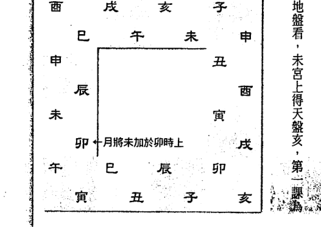

##### 二、四課組合分析

1、第一課為下己土賊上亥水；（下賊上）

| 1 | 2 | 3 | 4 |
|---|---|---|---|
| 亥 | 卯 | 未 | 亥 |
| 己 | 亥 | 卯 | 未 |

綜合四課為——

2、第二課為卯亥相生；（相生）

3、第三課為下卯木賊上未土；（下賊上）

4、第四課為下未土賊上亥水。（下賊上）

四課中除第二課相生外，餘皆為下賊上之課。

##### 三、比較三課涉害深淺

1、第一、四課同，故可並列論。

天盤亥，一受克於巳土，二受克於未土，三受克於戌宮

本家亥宮無克，共計得三重克。

2、第三課

天盤未，一受克於卯宮，二受克於辰（乙寄於辰）宮，巳宮午宮無克，共計得兩重克。

經比較，第一、第四課涉害較深，故用於發傳，即初傳為亥。

初傳 亥巳

以初傳亥為地盤發中傳，亥上得卯，故卯為中傳；

中傳 卯亥

以中傳卯為地盤發未傳，卯上得未，故未為未傳

未傳 亥未

上克下的，以該課天盤字為基準、為我，以地盤宮所藏干支為客，以我克多者為用。順時針方向，至地盤本家而止。

##### 例：上克下涉害

擇用二〇〇四年農曆五月初七日酉時，排出四柱如下：

| 甲 | 庚 | 甲 | 癸 |
|---|---|---|---|
| 申 | 午 | 戌 | 酉 |

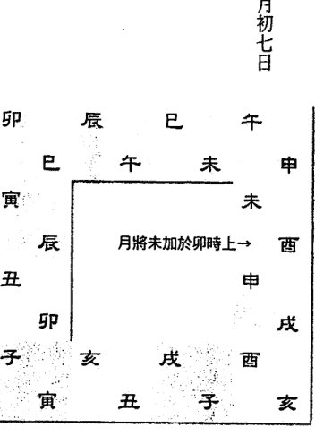

###### 定天地盤圖

二〇〇四年農曆五月初七在夏至後，月將為未。而四柱之時辰為癸酉，把月將未加於酉上，定出天地盤。

###### 一、起四課

1、日柱甲戌的甲日寄於寅宮，寅作地盤看，寅宮上得天盤子，第一課為子甲。

2、將第一課天盤子作地盤看，得第二課為戊子。

3、將日支戊作地盤看，得第三課申戊。

4、將第三課天盤申作地盤看，得第四課午申。

##### 二、四課組合分析

第一課和第三課皆相生。

第二課和第四課皆為上克下，並且陰陽皆與日干相同，故用涉害法發傳。

| 1 | 2 | 3 | 4 |
|---|---|---|---|
| 子 | 戌 | 申 | 午 |
| 甲 | 子 | 戌 | 申 |

##### 三、發三傳

需先比較兩課涉害深淺。

1、第二課
天盤戌，在子宮得第一重克；在丑宮得第二重克（癸寄於丑），寅、卯、辰、巳、午、未、申、酉，至本寄戌均一路無克，共計得兩重克。

2、第四課
天盤午，在申宮得一克申，二克庚（庚寄申宮），三克酉宮，四克戌宮（辛寄於戌宮），亥、子、丑、寅、卯、辰、巳，至本寄午一路無克，共計得四重克。

兩課比較，第四課涉害較深，故取第四課發初傳，即得初傳為午。

初傳 午申

以初傳午為地盤發中傳，午上得辰，故辰為中傳；

中傳 辰午

以中傳辰為地盤發未傳，辰上得寅，故寅為末傳。

末傳 寅辰

結果：此課三傳為——

三傳
↘ ↓ ↙
1 初傳午
2 中傳辰
3 末傳寅

#### 第四節 遙克法

賊克，是指同一課內天地盤相克；遙克，是指日干與不同課之天盤字之間進行的相克。

有克日干的，又有日干克的，則克日干者優先，無克日干者，則取日干的克者發傳。有兩克或以上者則取比者（陰陽與日干同者為比）發傳。以初傳為地盤發中傳，以中傳為地盤發未傳。

例：神克日干

擇用二〇〇四年農曆五月二十八日午時，排出四柱如下：

| 甲 | 辛 | 乙 | 壬 |
|---|---|---|---|
| 申 | 未 | 未 | 午 |

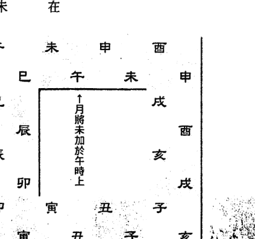

###### 定天地盤圖

二〇〇四年農曆五月二十八日在夏至後，月將為未。而四柱之時柱為壬午，把月將未加於午上，以定天地盤。

###### 一、起四課

1、日柱乙未的乙日寄於辰宮，辰作地盤看，辰宮上得天盤巳，第一課為巳乙。

2、將第一課天盤巳作地盤看，得第二課為午巳。

3、將日支未作地盤看，得第三課申未。

4、將第三課天盤申作地盤看，得第四課酉申。

##### 二、四課組合分析

四課皆無賊克，但第三、第四課申酉全遙克日干乙木，按規定，有兩克者，取比者為用，日干乙屬陰，第四課為酉陰金，第三課為申陽金，故取第四課酉金發傳，即酉為初傳。

| 1 | 2 | 3 | 4 |
|---|---|---|---|
| 巳 | 午 | 申 | 酉 |
| 乙 | 巳 | 未 | 申 |
| ↑ | ↑ | ↑ | ↑ |
| 相生 | 比和 | 相生 | 比和 |

初傳 酉申
中傳 戌酉
末傳 亥戌

以初傳酉為地盤發中傳，酉上得戌，故戌為中傳；

以中傳戌為地盤發末傳，戌上得亥，故亥為末傳。

結果：此課三傳為——

三傳
↙ ↓ ↘
3 末傳 亥
2 中傳 戌
1 初傳 酉

#### 第五節 昴星法

四課皆無賊克，又無遙克時，則用昴星法。二十八宿中昴星在酉位，故命之為昴星法。

陽日、陰日發傳之法有別。

一、陽日

1、取地盤酉上之神為初傳；

2、取第三課天盤之字為中傳；

3、取第一課天盤之字為末傳。

二、陰日

1、取天盤酉下之神為初傳；

2、取第一課天盤字為中傳；

3、取第三課天盤字為末傳。

例：擇用二〇〇四年農曆五月二十八日申時，排出四柱如下：

| 甲 | 辛 | 乙 | 甲 |
|---|---|---|---|
| 申 | 未 | 未 | 申 |

二〇〇四年農曆五月二十八日在夏至後，故月將為未。而四柱之時柱為甲申，把月將未加於申上，定出天地盤。

###### 一、起四課

1、日柱乙未的乙日寄於辰宮，辰作地盤看，辰宮上得天盤卯，第一課為卯乙。

2、將第一課天盤巳作地盤看，得第二課為寅卯。

3、將日支未作地盤看，得第三課午未。

4、將第三課天盤午作地盤看，得第四課巳午。

###### 綜合四課為——

| 1 | 2 | 3 | 4 |
|---|---|---|---|
| 卯 | 寅 | 午 | 巳 |
| 乙 | 卯 | 未 | 午 |
| ↑ | ↑ | ↑ | ↑ |
| 比和 | 比和 | 相生 | 比和 |

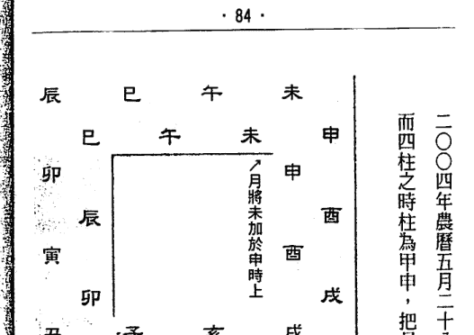

###### 二、分析四課組合

四課既無賊克，又無遙克，故用昴星法發傳。

##### 三、發三傳

乙為陰日，按規定取天盤酉下之神為初傳，天盤酉下為戌，故戌為初傳。

陰日第一課天盤子卯為中傳；

第三課天盤午為末傳。

初傳 戌
中傳 卯
末傳 午

結果：此課三傳為——

三傳
↘ ↓ ↙
1 初傳 戌
2 中傳 卯
3 末傳 午

#### 第六節 別責法

四課中有兩課相同，只有三課，既無賊克，又無遙克時，適用此法。

##### 發傳規則

一、陽日

取干合上神為初傳；

天干相合——

甲己合、乙庚合、丙辛合、丁壬合、戊癸合。

二、陰日

取支前三合為初傳；

如日支為酉，則取丑；

日支為丑，則取巳；

日支為巳，則取酉。

其他類推。

三合局——巳酉丑合金；亥卯未合木；申子辰合水；寅午戌合火。

三、不論陽日、陰日均取第一課之天盤字為中末傳。

##### 例一、陰日

擇用二〇〇三年農曆五月二十八日辰時，排出四柱如下：

###### 定天地盤圖

二〇〇三年農曆五月二十八日在夏至後，月將為未。而四柱之時柱為壬辰，把月將未加於辰上，定出天地盤。

| 壬 | 辛 | 戊 | 癸 |
|---|---|---|---|
| 辰 | 未 | 午 | 未 |

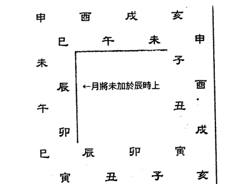

###### 一、起四課

1、日柱辛未的辛日寄於戌宮，戊作地盤看，戊宮上得天盤丑，第一課為丑辛。

2、將第一課天盤丑作地盤看，得第二課為辰丑。

3、將日支未作地盤看，得第三課戊未。

4、將第三課天盤午作地盤看，得第四課丑戊。

綜合四課為——

| 1 | 2 | 3 | 4 |
|---|---|---|---|
| 丑 | 辰 | 戌 | 丑 |
| 戌 | 丑 | 未 | 戌 |

###### 二、分析四課組合

第一、第四課相同，實際只有三課，四課既無賊克，又無遙克，適用此法。

##### 三、發三傳

按規定，取支前三合為初傳。

未日，支前三合為亥；

中末二傳取第一課天盤之字丑；

| 初傳 | 中傳 | 末傳 |
|---|---|---|
| 亥 | 丑 | 丑 |

##### 例二、陽日

擇用二〇〇〇年農曆五月二十六日午時，排出四柱如下：

| 庚辰 | 壬午 | 丙辰 | 甲午 |

###### 定天地盤圖

二〇〇三年農曆五月二十六日在夏至後，月將為未。而四柱之時柱為甲午，把月將未加於午上，定出天地盤。

###### 結果：此課三傳為——

三傳
↘ ↓ ↙
1 初傳 亥
2 中傳 丑
3 末傳 丑

###### 一、起四課

1、日柱丙辰的丙日寄於巳宮，已作地盤看，巳宮上得天盤午，第一課為午丙。

2、將第一課天盤午作地盤看，得第二課為未午。

3、將日支辰作地盤看，得第三課巳辰。

4、將第三課天盤巳作地盤看，得第四課午巳。

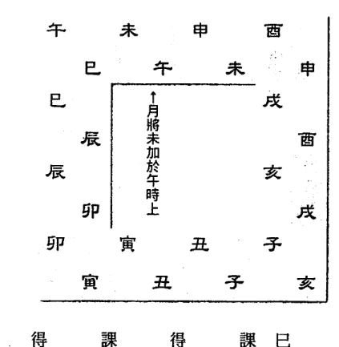

###### 二、分析四課組合

四課中，一、四課相同，既無賊克，也無遙克，適用此法。

丙辰日為陽日，陽日初傳取干合上之神。

| 綜合四課為 | 1 | 2 | 3 | 4 |
|---|---|---|---|---|
| | 午 | 未 | 巳 | 午 |
| | 丙 | 午 | 辰 | 巳 |

##### 三、發三傳

丙與辛合，辛奇於戊宮，故取戊上之亥為初傳，

取第一課之天盤字午為中末傳，

初傳 亥
中傳 午
末傳 午

結果：此課三傳為——

三傳
↘ ↓ ↙
1 初傳 亥
2 中傳 午
3 末傳 午

#### 第七節 八專法

只有兩課（四課中有相同之課，不同者只有兩課），沒有賊克的，雖有遙克而不用。

##### 發傳規則

一、陽日

取第一課天盤字順數至第三字發用。以第一課天盤字為第一位。

二、陰日

取第四課天盤字逆數至第三字發用。以第四課天盤字為第一位。

三、不論陰日，陽日，申未二傳皆取第一課之天盤字。

##### 例一、陽日

擇用二〇〇八年農曆六月十一日卯時，排出四柱如下：

| 戊 | 己 | 甲 | 丁 |
|---|---|---|---|
| 子 | 未 | 寅 | 卯 |

###### 定天地盤圖

二〇〇三年農曆五月二十六日在夏至後，月將為未。

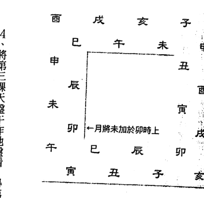

而四柱之時柱為丁卯，把月將未加於卯上，定出天地盤。

###### 一、起四課

1、日柱甲寅的甲日寄於寅宮，寅作地盤看，寅宮上得天盤午，第一課為午甲。

2、將第一課天盤午作地盤看，得第二課為戊午。

3、將日支寅作地盤看，得第三課午寅。

4、將第三課天盤午作地盤看，得第四課戊午。

###### 二、分析四課組合

四課只有兩課為不同之課，又無賊克，故適用此法。

甲寅日為陽日，取第一課天盤字順數至第三字為初傳。

| 1 | 2 | 3 | 4 |
|---|---|---|---|
| 午 | 戌 | 午 | 戌 |
| 甲 | 午 | 寅 | 午 |

午 1 → 未 2 → 申 3

故申為初傳；

中末二傳取第一課天盤字午

初傳 申
中傳 午
末傳 午

結果：此課三傳為——

三傳
↘
1 初傳 申
↓
2 中傳 午
↙
3 末傳 午

##### 例二、陰日

擇用二〇〇六年農曆六月二十二日辰時，排出四柱如下：

丙戌
乙未
丁未
甲辰

###### 定天地盤圖

二〇〇六年農曆六月二十二日在夏至後，月將為未。

而四柱之時柱為甲辰，把月將未加於辰上，定出天地盤。

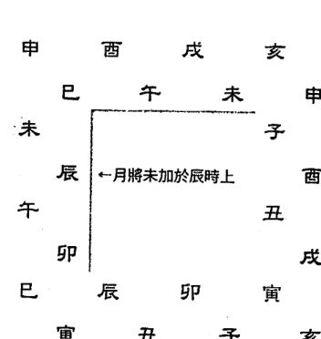

###### 一、起四課

1、日柱丁未的丁日寄於未宮，未作地盤看，未宮上得天盤戊，第一課為戊丁。

2、將第一課天盤戊作地盤看，得第二課為丑戊。

3、將日支未作地盤看，得第三課戊未。

4、將第三課天盤戊作地盤看，得第四課丑戊。

綜合四課為——

| 1 | 2 | 3 | 4 |
|---|---|---|---|
| 戊 | 丑 | 戌 | 丑 |
| 丁 | 戌 | 未 | 戌 |

###### 二、分析四課組合

四課只有兩課，又無賊克，適用八專法。按規定，陰日取第四課天盤字逆數至第三字發傳。

##### 三、發三傳

第四課為丑，丑1 → 子2 → 亥3，故初傳為亥。

取第一課天盤字戊為中末傳。

初傳 亥
中傳 戊
末傳 戊

結果：此課三傳為——

三傳
↘ ↓ ↙
1 初傳 亥
2 中傳 戊
3 末傳 戊

#### 第八節 伏吟法

天盤與地盤相同時為伏吟，每天皆有一課。

乙日與癸日第二課會出現賊克的情況，其餘各日均不可能出現賊克。第一課出現賊克的，按賊克法發初傳，初傳之刑為中傳，初傳之中刑為末傳。課中無賊克的，雖有遙克而不用。

一、陽日取第一課之天盤字為初傳；

二、陰日取第三課之天盤字為初傳；

三、不論陰日、陽日，中傳取初傳之初刑，末傳取初傳之中刑。

不管有賊克，還是無賊克的，如果初傳自刑的，則取第三課天盤字為中傳，中傳之刑為末傳；如果中傳又自刑的，則取中沖之字為末傳。

##### 例一、初傳自刑

子午相沖、丑未相沖、寅申相沖；

卯酉相沖、辰戌相沖、巳亥相沖。

擇用二〇〇四年農曆五月二十八日未時，排出四柱如下：

| 甲 | 辛 | 乙 | 癸 |
|---|---|---|---|
| 申 | 未 | 未 | 未 |

###### 定天地盤圖

二〇〇四年農曆五月二十八日在夏至後，月將為未。而四柱之時柱為癸未，把月將未加於未上，定出天地盤。

###### 一、起四課

1、日柱乙未的乙日寄於辰宮，辰作地盤看，辰宮上得天盤辰，第二課為辰乙。

2、將第一課天盤辰作地盤看，得第二課為辰辰。

3、將日支未作地盤看，得第三課未未。

4、將第三課天盤未作地盤看，得第四課未未。

| 巳 | 午 | 未 | 申 |
| 辰 | 巳 | 午 | 未 | 申 |
| 卯 | 辰 | 巳 | 午 | 未 | 申 |
| 寅 | 卯 | 辰 | 巳 | 午 | 未 | 申 |
| 丑 | 寅 | 卯 | 辰 | 巳 | 午 | 未 | 申 |
| 子 | 丑 | 寅 | 卯 | 辰 | 巳 | 午 | 未 | 申 |
| 亥 | 子 | 丑 | 寅 | 卯 | 辰 | 巳 | 午 | 未 | 申 |
| 戌 | 亥 | 子 | 丑 | 寅 | 卯 | 辰 | 巳 | 午 | 未 | 申 |
| 酉 | 戌 | 亥 | 子 | 丑 | 寅 | 卯 | 辰 | 巳 | 午 | 未 | 申 |
| 申 | 酉 | 戌 | 亥 | 子 | 丑 | 寅 | 卯 | 辰 | 巳 | 午 | 未 | 申 |

↑月將未加於未時上

###### 綜合四課為——

| 1 | 2 | 3 | 4 |
| 辰 | 辰 | 未 | 未 |
| 乙 | 辰 | 未 | 未 |

###### 二、分析四課組合

第一課為下賊上，餘無克。

##### 三、發三傳

有賊克的，按賊克法發初傳，乙上得辰，故辰為初傳；

初傳辰自刑，取第三課天盤字未為中傳；

中傳未刑丑，取丑為末傳。

初傳 辰
中傳 未
末傳 丑

結果：此課三傳為——

三傳
↘ ↓ ↙
1 初傳辰
2 中傳未
3 末傳丑

##### 例二、中傳又自刑

擇用一九九五年農曆六月初三日未時，排出四柱如下：

| 乙 | 壬 | 壬 | 丁 |
|---|---|---|---|
| 亥 | 午 | 辰 | 未 |

###### 定天地盤圖

一九九五年農曆六月初三日在夏至後，月將為未。

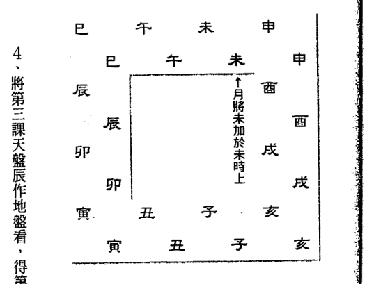

而四柱之時柱為丁未，把月將未加於未上，定出天地盤。

###### 一、起四課

1、日柱壬辰的壬日寄於亥宮，亥作地盤看，亥宮上得天盤亥，第一課為亥壬。

2、將第一課天盤辰作地盤看，得第二課為亥亥。

3、將日支辰作地盤看，得第三課辰辰。

4、將第三課天盤辰作地盤看，得第四課辰辰。

###### 二、分析四課組合

課中無賊克，壬日為陽日，按規定，取第二課之天盤字亥為初傳。

| 1 | 2 | 3 | 4 |
|---|---|---|---|
| 亥 | 亥 | 辰 | 辰 |
| 壬 | 亥 | 辰 | 辰 |

##### 三、發三傳

初傳亥自刑。

故取第三課之天盤字辰為中傳，中傳辰又自刑，取中傳辰沖之戌為未傳。

結果：此課三傳為——

1 初傳亥
2 中傳辰
3 末傳戌

##### 例三、三刑

擇用二〇〇〇年農曆六月十七日未時，排出四柱如下：

| 庚辰 | 癸未 | 丁丑 | 丁未 |

###### 定天地盤圖

二〇〇〇年農曆六月十七日在夏至後，月將為未。

而四柱之時柱為丁未，把月將未加於未上，定出天地盤。

###### 一、起四課

1、日柱丁丑的丁日寄於未宮，未作地盤看，未宮上得天盤未，第一課為未丁。

2、將第一課天盤未作地盤看，得第二課為未未。

3、將日支丑作地盤看，得第三課丑丑。

4、將第三課天盤丑作地盤看，得第四課丑丑。

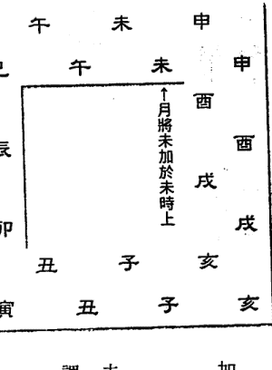

綜合四課為

| 1 | 2 | 3 | 4 |
|---|---|---|---|
| 未 | 未 | 丑 | 丑 |
| 丁 | 未 | 丑 | 丑 |

###### 二、分析四課組合

四課皆無賊克，按規定，陰日取第三課之天盤字丑為初傳。

##### 三、發三傳

取第三課之天盤字丑為初傳。

初傳 丑

取初傳之初刑戌為中傳。

中傳 戌

取初傳之中刑未為末傳。

末傳 未

丑刑戌，戌刑未，未刑丑

丑 → 戌 → 未

（逆時針）

##### 例四、三刑

擇用二〇〇〇年農曆五月二十六日未時，排出四柱如下：

| 庚辰 | 壬午 | 丙辰 | 乙未 |

###### 定天地盤圖

二〇〇〇年農曆五月二十六日在夏至後，月將為未。

結果：此課三傳為——

三刑

- 1. 初傳丑
- 2. 中傳戌
- 3. 末傳未

而四柱之時柱為乙未，把月將未加於未上，定出天地盤。

###### 一、起四課

| 巳 | 午 | 未 | 申 |
|---|---|---|---|
| 辰 | 巳 | 午 | 未 |
| 卯 | 辰 | 巳 | 午 |
| 寅 | 卯 | 辰 | 巳 |
| 丑 | 寅 | 卯 | 辰 |
| 子 | 丑 | 寅 | 卯 |
| 亥 | 子 | 丑 | 寅 |
| 戌 | 亥 | 子 | 丑 |
| 酉 | 戌 | 亥 | 子 |
| 申 | 酉 | 戌 | 亥 |
| 未 | 申 | 酉 | 戌 |
| 午 | 未 | 申 | 酉 |

1、日柱丙辰的丙日寄於巳宮，已作地盤看，巳宮上得天盤巳，第一課為巳丙。

2、將第一課天盤巳作地盤看，得第二課為巳巳。

3、將日支辰作地盤看，得第三課辰辰。

4、將第三課天盤辰作地盤看，得第四課辰辰。

###### 二、分析四課組合

四課無賊克，按規定，陽日取第二課之天盤字巳為初傳。

| 綜合四課為 | 1 | 2 | 3 | 4 |
|---|---|---|---|---|
| | 巳 | 巳 | 辰 | 辰 |
| | 丙 | 巳 | 辰 | 辰 |

##### 三、發三傳

取第一課之天盤字巳為初傳。

初傳 巳

取初傳之初刑申為中傳；

中傳 申（巳刑申）

取初傳之中刑寅為末傳。

末傳 寅（巳刑寅）

巳刑申，申刑寅，寅刑巳

巳 → 申 → 寅

（順時針）

結果：此課三傳為——

- 三刑
- 1 初傳巳
- 2 中傳申
- 3 末傳寅

#### 第九節 反吟法

天盤與地盤處於相沖狀態時，適用此法。

- 一、若有賊克，仍按賊克、比用、涉害諸法發用，唯遙克不取。
- 二、若無賊克，則丑日取亥發用，未日取巳發用。無賊克的，只有丑、未二日。

- 一、初傳
  丑日取亥為初傳；未日取巳為初傳。
- 二、中傳（丑未日同）
  取第三課天盤之字為中傳；
- 三、末傳（丑未日同）
  取第一課之天盤字為末傳。

反吟課中，無賊克者共有六日，丁未、己未、辛未、丁丑、己丑、辛丑。其中丁未、己丑可列入八專。

例：反吟
擇用二〇〇四年農曆五月二十八日丑時，排出四柱如下：

| 甲 | 辛 | 乙 | 丁 |
|---|---|---|---|
| 申 | 未 | 未 | 丑 |

##### 一、定天地盤

二〇〇四年農曆五月二十八日在夏至後，月將在未。

而四柱之時柱為丁丑，把月將未加於丑上，定出天地盤。

##### 二、起四課

1、日柱乙未的乙日寄於辰宮，辰作地盤看，辰宮上得天盤戊，第一課為戊乙。

2、將第一課天盤戊作地盤看，得第二課為辰戊。

3、將日支未作地盤看，得第三課丑未。

4、將第三課天盤丑作地盤看，得第四課未丑。

綜合四課為——

| 1 | 2 | 3 | 4 |
|---|---|---|---|
| 戊 | 辰 | 丑 | 未 |
| 乙 | 戊 | 未 | 丑 |

##### 三、分析四課組合

四課中第一課為下賊上，有賊克的按賊克法發傳。

##### 四、發三傳

初傳為戌；

戌上之辰為中傳，

辰上之戌為末傳。

初傳 戌

中傳 辰

末傳 戌

結果：此課三傳為——

三傳

- 1 初傳 戌
- 2 中傳 辰
- 3 末傳 戌

例：無賊克

擇用二〇〇三年農曆五月二十八日丑時，排出四柱如下：

| 癸 | 戊 | 辛 | 己 |
|---|---|---|---|
| 未 | 午 | 未 | 丑 |

##### 一、定天地盤

二〇〇三年農曆五月二十八日在夏至後，月將在未。

而四柱之時柱為己丑，把月將未加於丑上，定出天地盤。

##### 二、起四課

1、日柱辛未的辛日寄於戌宮，戌作地盤看，戌宮上得天盤辰，第一課為辰辛。

2、將第一課天盤戊作地盤看，得第二課為戊辰。

3、將日支未作地盤看，得第三課丑未。

4、將第三課天盤丑作地盤看，得第四課未丑。

綜合四課為——

| 1 | 2 | 3 | 4 |
|---|---|---|---|
| 辰 | 戌 | 丑 | 未 |
| 辛 | 辰 | 未 | 丑 |

##### 三、分析四課組合

四課無賊克。

##### 四、發三傳

按規定，未日取巳為初傳。

初傳 巳

中傳 丑

末傳 辰

取第三課天盤之字丑為中傳；

取第一課天盤之字辰為末傳。

結果：此課三傳為——

三傳

- 1 初傳 巳
- 2 中傳 丑
- 3 末傳 辰

例：二〇〇三年農曆五月初七日寅時，排出四柱如下：

| 癸 | 丁 | 庚 | 戊 |
|---|---|---|---|
| 未 | 巳 | 戌 | 寅 |

##### 一、定天地盤圖

二〇〇三年農曆五月初七日在小滿後夏至前，月將為申。而四柱之時柱為戊寅，把月將申加於寅上，定出天地盤。

##### 二、起四課

1、日柱庚戌的庚日寄於申宮，申作地盤看，申宮上得天盤寅，第一課為寅庚。

2、將第一課天盤寅作地盤看，得第二課為申寅。

3、將日支戌作地盤看，得第三課辰戌。

4、將第三課天盤辰作地盤看，得第四課戊辰。

綜合四課為：

| 1 | 2 | 3 | 4 |
|---|---|---|---|
| 寅 | 申 | 辰 | 戌 |
| 庚 | 寅 | 戌 | 辰 |

##### 三、發三傳

第一課為下賊上，因有賊克，故按賊克法發傳。第二課為上克下，但因有下賊上，而不論上克下。

因第一課為下賊上，且四課中只有一課為下賊上，故取第一課庚寅發傳。賊克法，發三傳。

| 初傳 | 中傳 | 末傳 |
|---|---|---|
| 庚寅 | 甲寅 | 寅申 |

結果：此課三傳為——

- 1. 初傳庚
- 2. 中傳申
- 3. 末傳寅

例：一九九七年農曆正月二十二日巳時，排出四柱如下：

| 丁 | 壬 | 辛 | 癸 |
|---|---|---|---|
| 丑 | 寅 | 丑 | 巳 |

##### 一、定天地盤

一九九七年農曆正月二十二日在雨水後春分前，月將為亥。而四柱的時柱為癸巳，把月將亥加於巳上，定出天地盤。

##### 二、起四課

1、日柱辛丑的辛日寄於戌宮，戌作地盤看，戌宮上得天盤辰，第一課為辰辛。

2、將第一課天盤辰字作地盤看，得第二課為戊辰。

3、將日支丑作地盤看，得第三課未丑。

4、將第三課天盤未作地盤看，得第四課丑未。

綜合四課為：

| 1 | 2 | 3 | 4 |
|---|---|---|---|
| 辰 | 戌 | 未 | 丑 |
| 辛 | 辰 | 丑 | 未 |

##### 三、發三傳

此四課皆無賊克，按規定反吟局，丑日初傳取亥。

初傳 亥

中傳取辰上神，日支為丑，丑宮天盤為未，故中傳為未；

中傳 未

末傳取日上神，日干為辛，寄戌宮，戌宮天盤為辰，故末傳為辰。

末傳 辰

結果：此課三傳為——

- 1 初傳 亥
- 2 中傳 未
- 3 末傳 辰

例：二〇〇二年農曆五月二十二日丑時，排出四柱如下：

| 壬 | 丙 | 辛 | 己 |
|---|---|---|---|
| 午 | 午 | 未 | 丑 |

##### 一、定天地盤

二〇〇二年農曆五月二十二日在夏至後大暑前，月將為未將。而四柱之時柱為己丑，把月將未加於丑上，定出天地盤。

##### 二、起四課

1、日柱辛未的辛日寄於戌宮，戌作地盤看，戌宮上得天盤辰，第一課為辰辛。

2、將第一課天盤辰作地盤看，得第二課為戊辰。

3、將日支未作地盤看，得第三課丑未。

4、將第三課天盤丑作地盤看，得第四課未丑。

綜合四課為：

| 1 | 2 | 3 | 4 |
|---|---|---|---|
| 辰 | 戌 | 丑 | 未 |
| 辛 | 辰 | 未 | 丑 |

##### 三、發三傳

此四課皆無賊克，按規定，未日取巳為初傳。

初傳 巳
中傳 丑
末傳 辰

辰上神為中傳，未日，未宮天盤為丑，故丑為中傳；
日上神為末傳，辛日寄戌宮，戌宮天盤為辰，故辰為末傳。

結果：此課三傳為——

- 1 初傳 巳
- 2 中傳 丑
- 3 末傳 辰

### 第四章 十二將起法

十二將有：

吉神：貴人、六合、青龍、太常、太陰、天后

凶神：騰蛇、朱雀、勾陳、天空、白虎、玄武

十二將排列次序及簡記歌訣：

人蛇朱雀六合走，勾陳青龍空白虎。

太常玄武太陰后，記住貴人不用愁。

#### 第一節 貴人取法

貴人，即天乙貴人。歌訣：
甲戊庚牛羊；乙己鼠猴方；
丙丁豬雞位；壬癸兔蛇藏。
六辛逢虎馬，此是貴人方。

白天用陽貴人，夜晚用陰貴人。

##### 十干陰陽貴人表

| | 甲 | 乙 | 丙 | 丁 | 戊 | 己 | 庚 | 辛 | 壬 | 癸 |
|---|---|---|---|---|---|---|---|---|---|---|
| 陽貴 | 未 | 申 | 酉 | 亥 | 丑 | 子 | 丑 | 寅 | 卯 | 巳 |
| 陰貴 | 丑 | 子 | 亥 | 酉 | 未 | 申 | 未 | 午 | 巳 | 卯 |

六壬課中，在天盤上取貴人，一般以日干取貴人。

#### 第二節 十二將起法

貴人若在地盤亥、子、丑、寅、卯、辰宮則順行；
貴人若在地盤巳、午、未、申、酉、戌宮則逆行。

例：一九九三年農曆十月二十日午時，排出四柱如下：

| 癸 | 癸 | 戊 | 戊 |
|---|---|---|---|
| 酉 | 亥 | 午 | 午 |

##### 一、定天地盤

一九九三年農曆十月二十日在小雪後冬至前，月將為寅。

而四柱中的時柱為戊午，把月將寅加於午上，定出天地盤。

行事在白天，當取陽貴。

##### 二、定貴人

戊午日，在白天當取陽貴丑。

天盤丑在巳宮。

##### 三、起十二將

貴人落地盤巳宮，按規定，應該按逆時針方向排列。

##### 六壬日課應需條件

- 一、需財丁貴入傳。以日干建立財丁貴關係。
- 二、貴人祿馬長生入傳。
- 三、吉將入傳。
- 四、若用於地理，還需貴人驛馬、長生等吉神、吉將到山到向。

### 第五章 日干支課的生克吉凶關係

對陽宅而言，日干代表人，日支代表宅，故要求日干與日支相生，相吉。

對陰宅而言，日干代表生人，日支代表亡人，也要求日干與日支相生，相吉。

干與日支相克則凶。

#### 干支生克吉凶

- （一）寶日：干生支，上吉，如甲午日。
- （二）義日：支生干，次吉，如丙寅日。
- （三）和日：干支比和日，次吉，如戊辰日。
- （四）制日：干克支之日，中平，如甲辰日，陰宅則不吉。
- （五）伐日：支克干之日，大凶，如甲申。

在六壬課中，第一課（即日干課）和第三課（日支課）是很重要的，對陰宅而言，第一課論活人之吉凶，第三課論宅之吉凶。對陰宅而言，第一課論活人之吉凶，第三課論亡人之吉凶，均要求一、三課地盤相生，天盤也相生，而獲得吉神、吉星臨值，三課則更好，吉星吉將要在天盤上出現才好。

## 斗首擇日法

斗首擇日以山家為主，以日課天干化氣為客，二者的五行關係有五種。比和、生入、克入、生出、克出。術家將五種生克關係都冠上了一個名稱。

- 一、比和者，為元辰；
- 二、生入者，為貪狼；
- 三、克入者，為破軍；
- 四、生出者，為廉子；
- 五、克出者，為武財。

斗首擇日法就是以這五種生克而得的關係判定吉凶。

### 第一章 山頭五行

斗首擇日法的山家五行，並不用二十四山的正五行，而是另一個獨特的系統。先賢留有山頭五行訣，現錄於下：

壬子巽巳土山歌，辛戌相從壬子遊；
乙庚辰酉金生處，甲卯坤家水洗猴；
丁未艮寅成樹木，丙乾癸亥午燒牛；
如果會用三元格，山頭化氣照顧周；
時師能熟其中秘，造葬日期永無憂。

| 二十四山 | 山頭五行 | 二十四山 | 山頭五行 | 二十四山 | 山頭五行 |
| :--- | :--- | :--- | :--- | :--- | :--- |
| 壬 | 土 | 巽 | 土 | 辛 | 土 |
| 子 | 土 | 巳 | 土 | 戌 | 土 |
| 癸 | 火 | 丙 | 火 | 乾 | 火 |
| 丑 | 火 | 午 | 火 | 亥 | 火 |
| 艮 | 木 | 丁 | 木 | 未 | 木 |
| 寅 | 木 | 申 | 水 | 坤 | 水 |
| 甲 | 水 | 卯 | 水 | 庚 | 金 |
| 乙 | 金 | 辰 | 金 | 酉 | 金 |

#### 斗首山頭五行表

### 第二章 日課天干化氣五行

日課只論天干之化氣五行，化氣五行就是天干相合化之五行。

甲己化土；乙庚化金；
丙辛化水；丁壬化木；
戊癸化火。

### 第三章 五星定吉凶

山頭五行與日課天干化氣五行比較生克關係，會得五星，如比和則得元辰；生入則得貪狼；克入則得破軍；生出則得廉子；克出則得武財。判斷時以山頭五行爲主，以日課天干化氣爲客。

例：二〇〇四年農曆閏二月初六日子時，用於寅山。寅山五行屬木。

| 武財 | 元辰 | 武財 | 武財 |
| :---: | :---: | :---: | :---: |
| 甲申 | 丁卯 | 甲辰 | 甲子 |

### 第四章 五星吉凶的玄機

為甚麼得武財、元辰則吉，得貪狼、破軍則凶；這是本節要探討的玄機。

山頭五行跟日課天干化氣五行比較得出五星後，所得五星五行除元辰外，會番化成其他五行。

- 一、武財番化成生山頭五行的五行；故吉。
- 二、貪狼番化成克山頭五行的五行；故凶。
- 三、破軍番化成山頭生出的五行，故凶。
- 四、廉子番比成山頭所克之五行，山頭元辰強旺，廉子宜用一位，多則不吉。山頭元辰衰弱，不宜用廉子。

一、年干為甲，甲己合化土，故甲之化氣五行屬土。寅山山頭五行屬木，山頭五行為主，年干化氣五行為客，則得武財星。

二、月干為丁，丁壬合化木，故丁之化氣五行屬木。寅山山頭五行屬木，山頭五行為主，月干化氣五行為客，則得元辰星。

三、日干為甲，甲己合化土，則甲之化氣五行屬土。寅山山頭五行屬木，以山頭五行為主，以日干化氣五行為客，則日干得武財星。

四、時干為甲，甲己合化土，則甲之化氣五行屬土。寅山山頭五行屬木，以山頭五行為主，以日干化氣五行為客，則時干得武財星。

一般而言，得武財星吉，得元辰星亦吉，得貪狼星、破軍星則凶；廉子則需視情況而定。

五、元辰番化後之五行與山頭五行相同，故吉。

例：二〇〇四年農曆閏二月初九日寅時，用於寅山和乾山。

寅山五行屬木。

武財 甲 申 （番化五行水）

元辰 丁 卯 （番化五行木）

元辰 丁 未 （番化五行木）

元辰 壬 寅 （番化五行木）

乾山五行屬火。

廉子 甲 申 （番化五行金）

貪狼 丁 卯 （番化五行水）

貪狼 丁 未 （番化五行水）

貪狼 壬 寅 （番化五行水）

先賢留有番化捷訣

元辰化元辰，武化貪狼真，
貪化破軍氣，破化廉貞陳，
廉化武財是，番化先遵循。

### 第五章 論元辰

與山頭五行相同者即為元辰。元辰宜生旺，最宜臨月令長生、臨官、帝旺之地，不宜臨衰或死絕之地。臨墓地則需視事體而言，若為陽宅行事則不吉，若為陰宅行事則大吉。臨軍，日時之長生或吉地也吉。

元辰為吉神，如衰弱或受貪狼夾克，多克，雖有如無。

元辰旺而不受克，宜見一位廉子，如此必大旺人丁。

建陽宅，元辰入墓，日久必絕嗣。

### 第六章 論武財

武財為山頭所克之五行，其番化五行生山頭，元辰，故武財是吉星。諸星之間的生克，以番化五行論。

武財宜生旺，不宜受克。

例：二〇〇三年農曆五月十三日卯時，坤山行事。

坤山五行屬水。

例：一九二八年農曆二月十六日寅時，卯山建陽宅。

卯山五行屬水。

| 武財 | 戊辰 | （番化五行金） |
| 貪狼 | 乙卯 | （番化五行土） |
| 元辰 | 丙午 | （番化五行水） |
| 貪狼 | 庚寅 | （番化五行土） |

評：此課元辰受貪狼克，又元辰入年墓，臨月令死地，日久必絕嗣。實際是此宅到現在只剩下一個六十歲的未婚老頭，離絕嗣也不遠了。

### 第七章 論廉子

廉子即子孫也。若日課得元辰生旺無傷，課中宜見一位廉子，則人丁大旺，多見廉子則人丁稀矣。元辰衰弱受傷，若見廉子則人丁必絕。

廉子，山頭五行所生者也，其番化五行為山頭所克者，會耗山頭，元辰之精氣。

例：二〇〇三年農曆五月十五日未時，用於午山。

午山屬火。

| 武財 | 武財 | 元辰 | 元辰 |
| :---: | :---: | :---: | :---: |
| 癸未 | 戊午 | 丙辰 | 辛卯 |
| (番化五行金) | (番化五行金) | (番化五行水) | (番化五行水) |

評：此課年月為雙武生山頭，及元辰，為吉格，只宜用於陰宅行事，原因為元辰運辰日為入墓，陽宅行事則不吉。

### 第八章 論貪狼

貪狼之番化五行會克元辰，會克山頭五行，故貪狼為凶宿。若貪狼遇生旺之武財通關，則化凶為吉，此時貪狼也不忌了。

例：二〇〇三年農曆五月十六日辰時，巳山用事。

巳山五行屬土。

評：此課年月日三柱皆為元辰，且在月今日支皆為旺地，元辰因此而旺。元辰旺，宜見一位廉子，己未時，時柱得二位廉子，午山用此課必大吉。此為大旺人丁之課。

| 元辰 | 元辰 | 元辰 | 廉子 |
| :---: | :---: | :---: | :---: |
| 癸未 | 戊午 | 戊午 | 己未 |
| (番化五行火) | (番化五行火) | (番化五行火) | (番化五行金) |

例：二〇〇三年農曆八月二十二日巳時，巳山行事。

巳山屬土。

| 貪狼 | 武財 | 元辰 | 元辰 |
| :---: | :---: | :---: | :---: |
| 癸 | 辛 | 甲 | 己 |
| 未 | 酉 | 午 | 巳 |
| (番化五行木) | (番化五行火) | (番化五行土) | (番化五行土) |

評：此課年上為貪狼，本為凶宿，但得月上武財番化五行通關，故可化凶為吉，反利仕途。

評：此課年、月、時三重貪狼克山頭，元辰，為大凶之課。

| 貪狼 | 貪狼 | 元辰 | 貪狼 |
| :---: | :---: | :---: | :---: |
| 癸 | 戊 | 己 | 戊 |
| 未 | 午 | 未 | 辰 |
| (番化五行木) | (番化五行木) | (番化五行土) | (番化五行木) |

### 第九章 論破軍

破軍本來為克山頭之神，其番化五行又為山頭所生，會泄元辰，山頭之精氣，故破軍星不宜見，只有破軍衰弱而居月柱，年日為武財時，可用。術者稱為武財關鬼格。

例：二〇〇三年農曆六月二十日午時，坤山用事。

坤山屬水。

| 武財 | 破鬼 | 武財 | 武財 |
| :---: | :---: | :---: | :---: |
| 癸未 | 己未 | 癸巳 | 戊午 |
| (番化五行金) | (番化五行木) | (番化五行金) | (番化五行金) |

評：此課課中雖有破軍，但年日雙武夾克之，故此鬼（破軍）不能興風作浪矣。此課為可用之吉課。

### 第十章 五行衰旺

五行衰旺分十二地，有長生、沐浴、冠帶、臨官、帝旺、衰、病、死、墓、絕、胎、養，代表著事物的不同發展狀態。

| 五行 | 長生 | 沐浴 | 冠帶 | 臨官 | 帝旺 | 衰 | 病 | 死 | 墓 | 絕 | 胎 | 養 |
|---|---|---|---|---|---|---|---|---|---|---|---|---|
| 木 | 亥 | 子 | 丑 | 寅 | 卯 | 辰 | 巳 | 午 | 未 | 申 | 酉 | 戌 |
| 火 | 寅 | 卯 | 辰 | 巳 | 午 | 未 | 申 | 酉 | 戌 | 亥 | 子 | 丑 |
| 土 | 寅 | 卯 | 辰 | 巳 | 午 | 未 | 申 | 酉 | 戌 | 亥 | 子 | 丑 |
| 金 | 巳 | 午 | 未 | 申 | 酉 | 戌 | 亥 | 子 | 丑 | 寅 | 卯 | 辰 |
| 水 | 申 | 酉 | 戌 | 亥 | 子 | 丑 | 寅 | 卯 | 辰 | 巳 | 午 | 未 |

### 第十一章 擇日當避忌與煞

運用斗首擇日法擇吉時，應避諸忌。諸忌有：

- 一、克山家
- 二、日流太歲
- 三、旬空
- 四、星曜
- 五、曜殺
- 六、正旁陰府
- 七、消滅
- 八、箭刃
- 九、沖丁
- 十、燥火
- 十一、余山方

#### 第一節 克山家

年月日時納音克山運納音，即為克山家。
年克山家喪宅長，月克山家宅母亡，
日克山家新婦夭，子克山家子孫危。
山運推法，另有章節詳論。

#### 第二節 日流太歲

- 壬子癸三山，忌戊子旬中克山日；
- 丑艮寅三山，忌戊寅旬中克山日；
- 甲卯乙三山，忌己卯旬中克山日；
- 辰巽巳三山，忌戊辰旬中克山日；
- 丙午丁三山，忌戊午旬中克山日；
- 未坤申三山，忌己未旬中克山日；
- 庚酉辛三山，忌己酉旬中克山日；
- 戌乾亥三山，忌戊戌旬中克山日；

#### 第三節 旬空

天干有十個，地支有十二支，十干為一句，十個天干只能配十個地支，有兩個配不了，沒得配的地支即為旬空。

甲子旬戊亥空；甲戌旬申酉空；
甲申旬午未空；甲午旬辰巳空；
甲辰旬寅卯空；甲寅旬子丑空；

以日柱所在之旬而言。如庚午日，在甲子旬內，則旬空為戊亥，其他仿此。

#### 第四節 星曜

日之干支均克山家正五行，為星曜殺。

亥壬子癸山 忌：戊辰、戊戌、己丑、己未日
寅甲卯乙山 忌：庚申、辛酉日；
巳丙午丁山 忌：壬子、癸亥日；
申庚酉辛乾山 忌：丙午、丁巳日；
辰戌丑未艮坤山 忌：甲寅、乙卯日。

#### 第五節 曜殺

即一卦管三山之官鬼爻也。

- 坎（壬子癸三山），曜殺在戊辰，忌戊辰日；
- 坤（未坤申三山），曜殺在乙卯，忌乙卯日；
- 震（甲卯乙三山），曜殺在庚申，忌庚申日；
- 巽（辰巽巳三山），曜殺在辛酉，忌辛酉日；
- 乾（戌乾亥三山），曜殺在壬午，忌壬午日；
- 兑（庚酉辛三山），曜殺在丁巳，忌丁巳日；
- 艮（丑艮寅三山），曜殺在丙寅，忌丙寅日；
- 離（丙午丁三山），曜殺在己亥，忌己亥日；

#### 第六節 正旁陰府

陰府在各宮正山，稱為正陰府；陰府在各宮兩旁，稱為旁陰府。

- 甲己年 正陰府 在艮巽丙辛；旁陰府 在巳丑。
- 乙庚年 正陰府 在兌乾丁壬；旁陰府 在申辰。
- 丙辛年 正陰府 在坎坤戊癸；旁陰府 在寅戌。
- 丁壬年 正陰府 在乾離甲己；旁陰府 在亥未。
- 戊癸年 正陰府 在坤震乙庚；旁陰府 在亥未。

#### 第七節 消滅

乾甲山：忌辛丑、辛未日；
丙辰山：忌乙卯、乙酉日；
巽辛山：忌丙午、丙子日；
坤乙山：忌庚子、庚午日；
兌丁山：忌甲戌、甲辰日；
庚震山：忌丁卯、丁酉日；
子午、辰戌丑未、寅申巳亥十支山，無消滅。

#### 第八節 箭刃

刃者羊刃也，箭者與刃相沖者也。八干山有箭刃，餘山無箭刃。
甲山刃在卯，箭在酉，忌卯酉全；
乙山刃在寅，箭在申，忌寅申全；
丙山刃在午，箭在子，忌子午全；
丁山刃在巳，箭在亥，忌巳亥全；
庚山刃在酉，箭在卯，忌卯酉全；
辛山刃在申，箭在寅，忌寅申全；
壬山刃在子，箭在午，忌子午全；
癸山刃在亥，箭在巳，忌巳亥全。

#### 第九節 沖丁

沖丁，為日之干支與坐山分金比較，為天比地沖時，即為犯沖丁。如壬山兼亥用丁亥分金，沖丁殺丁巳，忌用丁巳日，其他仿此。

#### 第十節 燥火

- 壬山：天寅申，地巳亥；子山：天寅申，地巳亥
- 癸山：天巳亥，地寅申；丑山：天卯酉，地子午
- 艮山：天卯酉，地子午；寅山：天辰戌，地丑未
- 甲山：天寅申，地巳亥；卯山：天辰戌，地丑未
- 乙山：天辰戌，地丑未；辰山：天巳亥，地寅申
- 巽山：天巳亥，地寅申；巳山：天巳亥，地寅申
- 丙山：天子午，地卯酉；午山：天子午，地卯酉
- 丁山：天卯酉，地子午；未山：天巳亥，地寅申
- 坤山：天巳亥，地寅申；申山：天寅申，地巳亥

#### 第十一節 余山方

山方殺，實際就是先後天卦之官鬼爻。

- 坎（壬子巽三山）忌乙卯、丁巳日；
- 艮（丑艮寅三山）忌庚申、壬午日；
- 震（甲卯乙三山）忌己亥、丙寅日；
- 巽（辰巽巳三山）忌丁巳、乙卯日；
- 離（丙午丁三山）忌壬午、庚申日；
- 坤（未坤申三山）忌辛酉、戊辰日；
- 兌（庚酉辛三山）忌戊辰、辛酉日；
- 乾（戌乾亥三山）忌丙寅、己亥日；

- 庚山：天辰戌，地丑未；
- 辛山：天寅申，地巳亥；
- 乾山：天丑未，地辰戌；
- 酉山：天寅申，地巳亥；
- 戌山：天丑未，地辰戌；
- 亥山：天子午，地卯酉

斗首擇日除了當避諸忌外，運用斗首法擇古，還需避正傍陰府太歲、金神等凶煞。

##### 一、正陰府太歲（安葬最忌，陽宅慎用）

甲年艮巽，乙年乾兌，丙年坤坎，丁年離乾，戊年震坤，己年艮巽，庚年坤坎，辛年坤坎，壬年離乾，癸年坤震。

##### 二、傍陰府太歲（甲種）

甲己年丙辛，乙庚年丁壬，丙辛年戊癸，丁壬年甲己，戊癸年乙庚。

##### 傍陰府太歲（乙種）

乙庚年己丑，丙辛年申辰，丁壬年寅戌，戊癸年亥未。

##### 三、金神

甲己之年在午未申酉，乙庚之年在辰巳，丙辛之年在子丑寅卯午未，丁壬之年在寅卯戌亥。

##### 四、三煞

申子辰年月日時在巳午未；
己酉丑年月日時在寅卯辰；
亥卯未年月日時在申酉戌；
寅午戌年月日時在亥子丑。

#### 第十二節 年命忌

一、甲己上元子己戊；
即甲己年忌：甲戌、甲子、己巳命；

二、乙庚辰酉是金神；
乙庚年忌：庚辰、乙酉命。

三、丁壬寅未成樹木；
丁壬年忌：丁未、壬寅命。

四、丙辛卯申原屬水；
丙辛年忌：丙申、辛卯命。

五、戊癸丙午原屬火，乾亥癸丑火同臨。
戊癸年忌：戊午、丙午、癸丑、癸亥命。

陽宅行事論主命，陰宅行事言亡命。

#### 第十三節 山頭元辰宜用二十八宿比助

- 一、木山頭，元辰用四木禽比助；
- 二、水山頭，元辰用四水禽比助；
- 三、火山頭，元辰用四火禽比助；
- 四、土山頭，元辰用四土禽比助；
- 五、金山頭，元辰用四金禽比助；

有的斗首師傅主張，用二十八宿比助山頭，元辰。

#### 第十四節 論五星位置

斗首擇日，是要注意五星在日課的位置的，年月為外，日時為內。

- 一、課中只有元辰，武財時，元辰宜居日時，武財宜居年月，若元辰在年月，武財在日時，則非善課；當然武財居年時，元辰居月日可取。
- 二、貪狼只宜居年上，同時需武財居月上；日時見元辰可以，見武財也可以，並且需要武財元辰在月令得生旺之地方可。
- 三、破軍只宜居月上，並且需年日為武財關克破軍，又要武財旺相，破軍無氣方可。
- 四、元辰旺相無傷，廉子宜有一位居日或時上。

### 附：二十八宿擇日法

#### 第一節 年禽

| 禽 | 年 |
|---|---|
| 角木蛟 | 2002 2030 2058 2086 |
| 亢金龍 | 2003 2031 2059 2087 |
| 氐土貉 | 2004 2032 2060 2088 |
| 房日兔 | 2005 2033 2061 2089 |
| 心月狐 | 2006 2034 2062 2090 |
| 尾火虎 | 2007 2035 2063 2091 |
| 箕水豹 | 2008 2036 2064 2092 |
| 斗木獬 | 2009 2037 2065 2093 |
| 牛金牛 | 2010 2038 2066 2094 |
| 女土蝠 | 2011 2039 2067 2095 |
| 虛日鼠 | 2012 2040 2068 2096 |
| 危月燕 | 2013 2041 2069 2097 |
| 室火豬 | 2014 2042 2070 2098 |
| 壁水貐 | 2015 2043 2071 2099 |
| 奎木狼 | 2016 2044 2072 2100 |
| 婁金狗 | 2017 2045 2073 2101 |
| 胃土雉 | 2018 2046 2074 2102 |
| 昴日雞 | 2019 2047 2075 2103 |
| 畢月烏 | 2020 2048 2076 2104 |
| 嘴火猴 | 2021 2049 2077 2105 |
| 參水猿 | 2022 2050 2078 2106 |
| 井木犴 | 2023 2051 2079 2107 |
| 鬼金羊 | 2024 2052 2080 2108 |
| 柳土獐 | 2025 2053 2081 2109 |
| 星日馬 | 2026 2054 2082 2110 |
| 張月鹿 | 2027 2055 2083 2111 |
| 翼火蛇 | 2028 2056 2084 2112 |
| 軫水蚓 | 2029 2057 2085 2113 |

#### 第二節 月禽

| 月禽 | 年禽 |
|---|---|
| 月 | 房 | 心 | 尾 | 箕 | 角 | 亢 | 氐 |
| 正 | 角 | 室 | 星 | 牛 | 參 | 心 | 胃 |
| 二 | 亢 | 壁 | 張 | 女 | 井 | 尾 | 昴 |
| 三 | 氐 | 奎 | 翼 | 虛 | 鬼 | 箕 | 畢 |
| 四 | 房 | 婁 | 軫 | 危 | 柳 | 斗 | 畢 |
| 五 | 心 | 胃 | 角 | 室 | 星 | 牛 | 參 |
| 六 | 尾 | 昴 | 亢 | 壁 | 張 | 女 | 井 |
| 七 | 箕 | 畢 | 氐 | 奎 | 翼 | 虛 | 鬼 |
| 八 | 斗 | 畢 | 房 | 婁 | 軫 | 危 | 柳 |
| 九 | 牛 | 參 | 心 | 胃 | 角 | 室 | 星 |
| 十 | 女 | 井 | 尾 | 昴 | 亢 | 壁 | 張 |
| 十一 | 虛 | 鬼 | 箕 | 畢 | 氐 | 奎 | 翼 |
| 十二 | 危 | 柳 | 斗 | 畢 | 房 | 婁 | 軫 |
| 五行 | 四太陽 | 四太陰 | 四火星 | 四水星 | 四木星 | 四火星 | 四土星 |
| 年 | 值年 | 值年 | 值年 | 值年 | 值年 | 值年 | 值年 |
| 公曆 | 2005 | 2006 | 2007 | 2008 | 2009 | 2010 | 2011 |

#### 第三節 日禽

七元禽星會者稀，虛奎畢鬼氐翼箕，
但將甲子從頭數，元元相續報君知。

每元六十日，即一個花甲子也。每經七元復始。

##### 一、各元甲子日值星

- 一元甲子日虛；二元甲子日奎；
- 三元甲子日畢；四元甲子日鬼；
- 五元甲子日翼；六元甲子日氐；
- 七元甲子日箕。

##### 二、二十八宿次序

- 翼 軫 角 亢 氐 房 心 尾 箕 斗 牛 女
- 虛 危 室 壁 奎 婁 胃 昴 畢 觜 參 井 鬼 柳 星 張

##### 一元 六十花甲值日星

| 花甲 | 廿八宿 |
|---|---|
| 甲子 乙丑 丙寅 丁卯 戊辰 己巳 庚午 辛未 壬申 癸酉 甲戌 乙亥 | 虚 危 室 壁 奎 娄 胃 昴 毕 觜 参 井 |
| 丙子 丁丑 戊寅 己卯 庚辰 辛巳 壬午 癸未 甲申 乙酉 丙戌 丁亥 | 鬼 柳 星 张 翼 轸 角 亢 氐 房 心 尾 |
| 戊子 己丑 庚寅 辛卯 壬辰 癸巳 甲午 乙未 丙申 丁酉 戊戌 己亥 | 箕 斗 牛 女 虚 危 室 壁 奎 娄 胃 昴 |
| 庚子 辛丑 壬寅 癸卯 甲辰 乙巳 丙午 丁未 戊申 己酉 庚戌 辛亥 | 毕 觜 参 井 鬼 柳 星 张 翼 轸 角 亢 |
| 壬子 癸丑 甲寅 乙卯 丙辰 丁巳 戊午 己未 庚申 辛酉 壬戌 癸亥 | 氐 房 心 尾 箕 斗 牛 女 虚 危 室 壁 |

##### 二元 六十花甲值日星

| 花甲 | 廿八宿 |
|---|---|
| 甲子 乙丑 丙寅 丁卯 戊辰 己巳 庚午 辛未 壬申 癸酉 甲戌 乙亥 | 奎 娄 胃 昴 毕 觜 参 井 鬼 柳 星 张 |
| 丙子 丁丑 戊寅 己卯 庚辰 辛巳 壬午 癸未 甲申 乙酉 丙戌 丁亥 | 翼 轸 角 亢 氐 房 心 尾 箕 斗 牛 女 |
| 戊子 己丑 庚寅 辛卯 壬辰 癸巳 甲午 乙未 丙申 丁酉 戊戌 己亥 | 虚 危 室 壁 奎 娄 胃 昴 毕 觜 参 井 |
| 庚子 辛丑 壬寅 癸卯 甲辰 乙巳 丙午 丁未 戊申 己酉 庚戌 辛亥 | 鬼 柳 星 张 翼 轸 角 亢 氐 房 心 尾 |
| 壬子 癸丑 甲寅 乙卯 丙辰 丁巳 戊午 己未 庚申 辛酉 壬戌 癸亥 | 箕 斗 牛 女 虚 危 室 壁 奎 娄 胃 昴 |

##### 三元 六十花甲值日星

| 花甲 | 甲子 | 乙丑 | 丙寅 | 丁卯 | 戊辰 | 己巳 | 庚午 | 辛未 | 壬申 | 癸酉 | 甲戌 | 乙亥 |
| :--- | :--- | :--- | :--- | :--- | :--- | :--- | :--- | :--- | :--- | :--- | :--- | :--- |
| 廿八宿 | 毕 | 觜 | 参 | 井 | 鬼 | 柳 | 星 | 张 | 翼 | 轸 | 角 | 亢 |

| 花甲 | 丙子 | 丁丑 | 戊寅 | 己卯 | 庚辰 | 辛巳 | 壬午 | 癸未 | 甲申 | 乙酉 | 丙戌 | 丁亥 |
| :--- | :--- | :--- | :--- | :--- | :--- | :--- | :--- | :--- | :--- | :--- | :--- | :--- |
| 廿八宿 | 氐 | 房 | 心 | 尾 | 箕 | 斗 | 牛 | 女 | 虚 | 危 | 室 | 壁 |

| 花甲 | 戊子 | 己丑 | 庚寅 | 辛卯 | 壬辰 | 癸巳 | 甲午 | 乙未 | 丙申 | 丁酉 | 戊戌 | 己亥 |
| :--- | :--- | :--- | :--- | :--- | :--- | :--- | :--- | :--- | :--- | :--- | :--- | :--- |
| 廿八宿 | 奎 | 娄 | 胃 | 昴 | 毕 | 觜 | 参 | 井 | 鬼 | 柳 | 星 | 张 |

| 花甲 | 庚子 | 辛丑 | 壬寅 | 癸卯 | 甲辰 | 乙巳 | 丙午 | 丁未 | 戊申 | 己酉 | 庚戌 | 辛亥 |
| :--- | :--- | :--- | :--- | :--- | :--- | :--- | :--- | :--- | :--- | :--- | :--- | :--- |
| 廿八宿 | 翼 | 轸 | 角 | 亢 | 氐 | 房 | 心 | 尾 | 箕 | 斗 | 牛 | 女 |

| 花甲 | 壬子 | 癸丑 | 甲寅 | 乙卯 | 丙辰 | 丁巳 | 戊午 | 己未 | 庚申 | 辛酉 | 壬戌 | 癸亥 |
| :--- | :--- | :--- | :--- | :--- | :--- | :--- | :--- | :--- | :--- | :--- | :--- | :--- |
| 廿八宿 | 虚 | 危 | 室 | 壁 | 奎 | 娄 | 胃 | 昴 | 毕 | 觜 | 参 | 井 |

##### 四元 六十花甲值日星

| 花甲 | 甲子 | 乙丑 | 丙寅 | 丁卯 | 戊辰 | 己巳 | 庚午 | 辛未 | 壬申 | 癸酉 | 甲戌 | 乙亥 |
| :--- | :--- | :--- | :--- | :--- | :--- | :--- | :--- | :--- | :--- | :--- | :--- | :--- |
| 廿八宿 | 鬼 | 柳 | 星 | 张 | 翼 | 轸 | 角 | 亢 | 氐 | 房 | 心 | 尾 |

| 花甲 | 丙子 | 丁丑 | 戊寅 | 己卯 | 庚辰 | 辛巳 | 壬午 | 癸未 | 甲申 | 乙酉 | 丙戌 | 丁亥 |
| :--- | :--- | :--- | :--- | :--- | :--- | :--- | :--- | :--- | :--- | :--- | :--- | :--- |
| 廿八宿 | 箕 | 斗 | 牛 | 女 | 虚 | 危 | 室 | 壁 | 奎 | 娄 | 胃 | 昴 |

| 花甲 | 戊子 | 己丑 | 庚寅 | 辛卯 | 壬辰 | 癸巳 | 甲午 | 乙未 | 丙申 | 丁酉 | 戊戌 | 己亥 |
| :--- | :--- | :--- | :--- | :--- | :--- | :--- | :--- | :--- | :--- | :--- | :--- | :--- |
| 廿八宿 | 毕 | 觜 | 参 | 井 | 鬼 | 柳 | 星 | 张 | 翼 | 轸 | 角 | 亢 |

| 花甲 | 庚子 | 辛丑 | 壬寅 | 癸卯 | 甲辰 | 乙巳 | 丙午 | 丁未 | 戊申 | 己酉 | 庚戌 | 辛亥 |
| :--- | :--- | :--- | :--- | :--- | :--- | :--- | :--- | :--- | :--- | :--- | :--- | :--- |
| 廿八宿 | 氐 | 房 | 心 | 尾 | 箕 | 斗 | 牛 | 女 | 虚 | 危 | 室 | 壁 |

| 花甲 | 壬子 | 癸丑 | 甲寅 | 乙卯 | 丙辰 | 丁巳 | 戊午 | 己未 | 庚申 | 辛酉 | 壬戌 | 癸亥 |
| :--- | :--- | :--- | :--- | :--- | :--- | :--- | :--- | :--- | :--- | :--- | :--- | :--- |
| 廿八宿 | 奎 | 娄 | 胃 | 昴 | 毕 | 觜 | 参 | 井 | 鬼 | 柳 | 星 | 张 |

##### 六十花甲值日星

| 花甲 | 甲子 | 乙丑 | 丙寅 | 丁卯 | 戊辰 | 己巳 | 庚午 | 辛未 | 壬申 | 癸酉 | 甲戌 | 乙亥 |
| :--- | :--- | :--- | :--- | :--- | :--- | :--- | :--- | :--- | :--- | :--- | :--- | :--- |
| 廿八宿 | 氐 | 房 | 心 | 尾 | 箕 | 斗 | 牛 | 女 | 虚 | 危 | 室 | 壁 |
| 花甲 | 丙子 | 丁丑 | 戊寅 | 己卯 | 庚辰 | 辛巳 | 壬午 | 癸未 | 甲申 | 乙酉 | 丙戌 | 丁亥 |
| 廿八宿 | 奎 | 娄 | 胃 | 昴 | 毕 | 觜 | 参 | 井 | 鬼 | 柳 | 星 | 张 |
| 花甲 | 戊子 | 己丑 | 庚寅 | 辛卯 | 壬辰 | 癸巳 | 甲午 | 乙未 | 丙申 | 丁酉 | 戊戌 | 己亥 |
| 廿八宿 | 翼 | 轸 | 角 | 亢 | 氐 | 房 | 心 | 尾 | 箕 | 斗 | 牛 | 女 |
| 花甲 | 庚子 | 辛丑 | 壬寅 | 癸卯 | 甲辰 | 乙巳 | 丙午 | 丁未 | 戊申 | 己酉 | 庚戌 | 辛亥 |
| 廿八宿 | 虚 | 危 | 室 | 壁 | 奎 | 娄 | 胃 | 昴 | 毕 | 觜 | 参 | 井 |
| 花甲 | 壬子 | 癸丑 | 甲寅 | 乙卯 | 丙辰 | 丁巳 | 戊午 | 己未 | 庚申 | 辛酉 | 壬戌 | 癸亥 |
| 廿八宿 | 鬼 | 柳 | 星 | 张 | 翼 | 轸 | 角 | 亢 | 氐 | 房 | 心 | 尾 |

##### 六十花甲值日星

| 花甲 | 甲子 | 乙丑 | 丙寅 | 丁卯 | 戊辰 | 己巳 | 庚午 | 辛未 | 壬申 | 癸酉 | 甲戌 | 乙亥 |
| :--- | :--- | :--- | :--- | :--- | :--- | :--- | :--- | :--- | :--- | :--- | :--- | :--- |
| 廿八宿 | 翼 | 轸 | 角 | 亢 | 氐 | 房 | 心 | 尾 | 箕 | 斗 | 牛 | 女 |
| 花甲 | 丙子 | 丁丑 | 戊寅 | 己卯 | 庚辰 | 辛巳 | 壬午 | 癸未 | 甲申 | 乙酉 | 丙戌 | 丁亥 |
| 廿八宿 | 虚 | 危 | 室 | 壁 | 奎 | 娄 | 胃 | 昴 | 毕 | 觜 | 参 | 井 |
| 花甲 | 戊子 | 己丑 | 庚寅 | 辛卯 | 壬辰 | 癸巳 | 甲午 | 乙未 | 丙申 | 丁酉 | 戊戌 | 己亥 |
| 廿八宿 | 鬼 | 柳 | 星 | 张 | 翼 | 轸 | 角 | 亢 | 氐 | 房 | 心 | 尾 |
| 花甲 | 庚子 | 辛丑 | 壬寅 | 癸卯 | 甲辰 | 乙巳 | 丙午 | 丁未 | 戊申 | 己酉 | 庚戌 | 辛亥 |
| 廿八宿 | 箕 | 斗 | 牛 | 女 | 虚 | 危 | 室 | 壁 | 奎 | 娄 | 胃 | 昴 |
| 花甲 | 壬子 | 癸丑 | 甲寅 | 乙卯 | 丙辰 | 丁巳 | 戊午 | 己未 | 庚申 | 辛酉 | 壬戌 | 癸亥 |
| 廿八宿 | 毕 | 觜 | 参 | 井 | 鬼 | 柳 | 星 | 张 | 翼 | 轸 | 角 | 亢 |

一元配一甲子，七元為一周，七元配全，周而復始，永遠不息。讀者可仿此自行配下去。

知各甲子所屬何元，查前面所列之表，即很快可知各日當值何星了。

##### 七元 六十花甲值日星

| 花甲 | 甲子 | 乙丑 | 丙寅 | 丁卯 | 戊辰 | 己巳 | 庚午 | 辛未 | 壬申 | 癸酉 | 甲戌 | 乙亥 |
| :--- | :--- | :--- | :--- | :--- | :--- | :--- | :--- | :--- | :--- | :--- | :--- | :--- |
| 廿八宿 | 箕 | 斗 | 牛 | 女 | 虚 | 危 | 室 | 壁 | 奎 | 娄 | 胃 | 昴 |
| 花甲 | 丙子 | 丁丑 | 戊寅 | 己卯 | 庚辰 | 辛巳 | 壬午 | 癸未 | 甲申 | 乙酉 | 丙戌 | 丁亥 |
| 廿八宿 | 毕 | 觜 | 参 | 井 | 鬼 | 柳 | 星 | 张 | 翼 | 轸 | 角 | 亢 |
| 花甲 | 戊子 | 己丑 | 庚寅 | 辛卯 | 壬辰 | 癸巳 | 甲午 | 乙未 | 丙申 | 丁酉 | 戊戌 | 己亥 |
| 廿八宿 | 氐 | 房 | 心 | 尾 | 箕 | 斗 | 牛 | 女 | 虚 | 危 | 室 | 壁 |
| 花甲 | 庚子 | 辛丑 | 壬寅 | 癸卯 | 甲辰 | 乙巳 | 丙午 | 丁未 | 戊申 | 己酉 | 庚戌 | 辛亥 |
| 廿八宿 | 奎 | 娄 | 胃 | 昴 | 毕 | 觜 | 参 | 井 | 鬼 | 柳 | 星 | 张 |
| 花甲 | 壬子 | 癸丑 | 甲寅 | 乙卯 | 丙辰 | 丁巳 | 戊午 | 己未 | 庚申 | 辛酉 | 壬戌 | 癸亥 |
| 廿八宿 | 翼 | 轸 | 角 | 亢 | 氐 | 房 | 心 | 尾 | 箕 | 斗 | 牛 | 女 |

#### 第四節 時禽

需起出日禽後，方能推知時禽。

| 日禽/時子 | 丑 | 寅 | 卯 | 辰 | 巳 | 午 | 未 | 申 | 酉 | 戌 | 亥 |
|---|---|---|---|---|---|---|---|---|---|---|---|
| 四日日 | 虚 | 危 | 室 | 壁 | 奎 | 娄 | 胃 | 昴 | 毕 | 觜 | 参 |
| 四月日 | 鬼 | 柳 | 星 | 张 | 翼 | 轸 | 角 | 亢 | 氐 | 房 | 心 |
| 四火日 | 箕 | 斗 | 牛 | 女 | 虚 | 危 | 室 | 壁 | 奎 | 娄 | 胃 |
| 四水日 | 毕 | 觜 | 参 | 井 | 鬼 | 柳 | 星 | 张 | 翼 | 轸 | 角 |
| 四木日 | 亢 | 氐 | 房 | 心 | 尾 | 箕 | 斗 | 牛 | 女 | 虚 | 危 |
| 四金日 | 奎 | 娄 | 胃 | 昴 | 毕 | 觜 | 参 | 井 | 鬼 | 柳 | 星 |
| 四土日 | 翼 | 轸 | 角 | 亢 | 氐 | 房 | 心 | 尾 | 箕 | 斗 | 牛 |

### 附 龍運山運在擇吉中的應用

#### 第一節 龍運的推算方法

推算龍運用二十四山正五行，需分陰陽推算。

就是取二十四山正五行之墓庫，然後配上天干，最後得一千支，以此干支之納音與年月日時之納音論生克斷吉凶。

##### 二十四山正五行墓庫表

| 廿四山 | 墓庫 |
|---|---|
| 壬 | 辰 |
| 子 | 辰 |
| 癸 | 未 |
| 丑 | 未 |
| 艮 | 戌 |
| 寅 | 戌 |
| 甲 | 戌 |
| 卯 | 未 |
| 乙 | 戌 |
| 辰 | 戌 |
| 巽 | 丑 |
| 巳 | 丑 |
| 丙 | 戌 |
| 午 | 戌 |
| 丁 | 丑 |
| 未 | 丑 |
| 坤 | 辰 |
| 申 | 辰 |
| 庚 | 丑 |
| 酉 | 丑 |
| 辛 | 辰 |
| 戌 | 辰 |
| 乾 | 未 |
| 亥 | 未 |

各山正五行墓庫取出後，依《五鼠遁》即可推知應配天干。

##### 五鼠遁歌訣

甲己還生甲，乙庚丙作初，
丙辛從戊起，丁壬庚子居，
戊癸何方發，壬子是真蹤。

舉例說：推算二〇〇四甲申年壬山龍運，
一、依上表，壬山墓庫為辰；
二、依「五鼠遁」，「甲己還生甲」，即子配甲，為甲子；丑配乙，為乙丑；寅配丙，為丙寅；卯配丁，為丁卯；辰配戊，為戊辰。

三、依二，得二〇〇四年甲申年壬山龍運為戊辰。

判斷日課與龍運之間的關係形成的吉凶，用納音論。

一、以龍運為主，以年、月、日、時為客。

二、龍運納音五行，跟年、月、日、時納音五行比較，龍運得生旺財則吉，得克洩則凶。

#### 第二節 山運的推算方法

推算山運也與推算龍運有相似之處，也是取坐山（方山）五行的墓庫，配上天干而得。但二十四山五行不取正五行，而取洪範五行。

##### 洪範五行

甲寅辰巽水流東，戊坎辛申水一同。
艮震巳山原屬木，離壬丙乙火為中。
乾亥兌丁金生處，丑癸坤庚未土申。

##### 洪範五行表（附二十四山墓庫）

| 廿四山 | 墓庫 | 五行 |
|---|---|---|
| 壬 | 戌 | 火 |
| 子 | 辰 | 水 |
| 癸 | 辰 | 土 |
| 丑 | 辰 | 土 |
| 艮 | 辰 | 木 |
| 寅 | 未 | 水 |
| 甲 | 辰 | 水 |
| 卯 | 戌 | 木 |
| 乙 | 辰 | 火 |
| 辰 | 戌 | 水 |
| 巳 | 丑 | 木 |
| 丙 | 戌 | 火 |
| 午 | 丑 | 土 |
| 丁 | 辰 | 土 |
| 未 | 辰 | 水 |
| 坤 | 丑 | 土 |
| 申 | 辰 | 水 |
| 庚 | 辰 | 金 |
| 酉 | 丑 | 水 |
| 辛 | 辰 | 水 |
| 戌 | 丑 | 金 |
| 乾 | 丑 | 金 |
| 亥 | 辰 | 木 |

推算山運與推算龍運也一樣，找出二十四山墓庫後，依「五鼠遁」配上天干即可。

舉例：求二〇〇四年甲申壬山山運

-   一、壬山洪範五行爲火，其墓庫在戌。
-   二、依「五鼠遁」，得戊配甲干，爲甲戌。
-   三、依二，即知二〇〇四年壬山山運爲甲戌。

山運跟日課之間的吉凶判斷，也是以納音論斷，山運得生旺財則吉，山運得克洩則凶。

-   一、山運納音克年月日時納音，吉；
-   二、山運納音與年月日時納音比和，吉；
-   三、年月日時納音生山運納音，吉；
-   四、山運納音生年月日時納音，凶；
-   五、年月日時納音克山運納音，大凶。有制化則可用，但時克山家，時不能被制。

#### 第三節 關於墓庫丑所配天干的特殊性

洪範五行用於推斷山運。乾亥丁酉四山洪範五行屬金，其墓庫在丑。

正五行，用於推龍運。

-   一、丁巳二龍，屬陰火，其墓庫在丑；
-   二、乾申庚三龍，屬陽金，其墓庫在丑；
-   三、未坤丑三龍，屬陰土，其墓庫也在丑。

丑墓配天干有特殊之處。以冬至為界線，冬至前，用《五鼠遁》配天干，冬至後用《五虎遁》配天干。

##### 五鼠遁

甲己還生甲，乙庚丙作初，
丙辛從戊起，丁壬庚子居，
戊癸何方發，壬子是真蹤。

##### 五虎遁

甲己之年丙作首，乙庚之歲戊為頭。
丙辛之年尋庚上，丁壬壬寅順水流。
若問戊癸何處起，甲寅之上好追求。

例：推甲己年亥山之山運。
亥山，洪範五行屬金，墓庫在丑。在冬至前用《五鼠遁》配天干，丑配得丁，乙，即為乙丑，其納音為海中金。冬至後用《五虎遁》配天干，丑配得丁，丁丑，納音屬水。

### 附：六十花甲納音表

| 花甲 | 納音 | 花甲 | 納音 | 花甲 | 納音 | 花甲 | 納音 | 花甲 | 納音 | 花甲 | 納音 |
|---|---|---|---|---|---|---|---|---|---|---|---|
| 甲子 | 海中金 | 乙丑 | 海中金 | 丙寅 | 爐中火 | 丁卯 | 爐中火 | 戊辰 | 大林木 | 己巳 | 大林木 |
| 庚午 | 路旁土 | 辛未 | 路旁土 | 壬申 | 劍鋒金 | 癸酉 | 劍鋒金 | 甲戌 | 山頭火 | 乙亥 | 山頭火 |
| 丙子 | 澗下水 | 丁丑 | 澗下水 | 戊寅 | 城頭土 | 己卯 | 城頭土 | 庚辰 | 白蠟金 | 辛巳 | 白蠟金 |
| 壬午 | 楊柳木 | 癸未 | 楊柳木 | 甲申 | 泉中水 | 乙酉 | 泉中水 | 丙戌 | 屋上土 | 丁亥 | 屋上土 |
| 戊子 | 霹靂火 | 己丑 | 霹靂火 | 庚寅 | 松柏木 | 辛卯 | 松柏木 | 壬辰 | 長流水 | 癸巳 | 長流水 |
| 甲午 | 沙中金 | 乙未 | 沙中金 | 丙申 | 山下火 | 丁酉 | 山下火 | 戊戌 | 平地木 | 己亥 | 平地木 |
| 庚子 | 壁上土 | 辛丑 | 壁上土 | 壬寅 | 金箔金 | 癸卯 | 金箔金 | 甲辰 | 佛燈火 | 乙巳 | 佛燈火 |
| 丙午 | 天河水 | 丁未 | 天河水 | 戊申 | 大驛土 | 己酉 | 大驛土 | 庚戌 | 釵釧金 | 辛亥 | 釵釧金 |
| 壬子 | 桑柘木 | 癸丑 | 桑柘木 | 甲寅 | 大溪水 | 乙卯 | 大溪水 | 丙辰 | 沙中土 | 丁巳 | 沙中土 |
| 戊午 | 天上火 | 己未 | 天上火 | 庚申 | 石榴木 | 辛酉 | 石榴木 | 壬戌 | 大海水 | 癸亥 | 大海水 |

## 地理日課經驗談

筆者曾經苦苦地追求那些效果神奇高深莫測的高級堪輿術，而忽略了那些容易學得而效果也佳的方法。

如用無形煞配合有形煞也能準確斷出凶災，諸如二黑、五黃、三煞、歲破等大煞加臨有形之凶煞（惡砂惡水），則必發凶災，重者死人，輕亦官非、病傷。

### 第一章 無形煞配有形煞 斷陰陽宅吉凶

#### 第一節 最忌穴後仰瓦

星峰凹陷如溝，其形有如仰瓦，不論陰陽宅，皆忌。因為這種山溝，其數就是一條坑，平時無水，但在下雨的時候，必然水聚此處流下，形成煞氣。當無形之大煞二黑、五黃、三煞、歲破等大煞加臨時，其凶便應驗了。

其實，此種煞不管在穴後，還是在四面八方，皆主凶。

筆者家鄉爪鄰村，在九五、九六年的時候，在一段公路邊有數戶人家建了一排房，其背後山峰就有仰瓦凶煞。那時筆者專注於四柱命理，對風水日課只接觸，還未深入研究，所以未識仰瓦之凶。待到後來筆者識得仰瓦之凶後，對照事實驚訝不已。

一九九六年，早期建房者，有一戶老頭患肝病不治身亡。一中年，因賭博爭執，遭人捅了一刀。

一九九○年，一戶少年檢修水井，缺氧死亡。

二○○○年，一戶少年開三輪摩托出車禍，摔壞腦袋。

此排房子，為坐離宮向坎宮的（坐南向北），仰瓦煞在離方（南）。一九九六、二○○○年三煞在南方，一九九九年五黃在離方，故有上述之凶。

#### 第二節 白虎開口，凶煞加臨必大凶

我村有一戶人家，在九六年的時候修築牆圍，在右邊開了一個門樓。左邊為白虎邊，開門在右邊為白虎開口，形成凶煞。在廳門處立極，門樓在坤宮。一九九八年戊寅年，歲破煞加臨，此戶宅主患肝癌不治而死。其他的如天斬煞、插煞、屋角尖射等也可仿此而斷。

### 第二章 千斤門樓四兩屋

地理界有名言：「千斤門樓四兩金」。從此言可知門樓在陽宅中的重要作用。

在具體運用時，因為流派不同而各有房門，這裏將介紹兩種方法。

立門樓，涉及兩個方面，一是門位，二是門樓的坐向。

定門位的方法多種多樣，有的師傅用《門樓玉輦經》選門位，有的師傅用年命起星選門位，有的師傅用玄空飛星理論選門位；有的師傅用玄空大卦選門位。

各派理論各有房門，若得真傳，皆有應驗。如玄空飛星派定門位，在整座宅院之中心點立極，玄空大卦派立極點則不在整座宅院之中心點，若套用飛星派作法，必然撞板，其他不同流派，其立極點也不盡相同。

關於立向，有的時師用《向上飛星水法》，有的時師用玄空飛星宅命盤，有的時師用玄空大卦法。

門樓是用於消納前方砂水的，門向應該迎水而立。不論水自左邊來，還是從右邊而來，都應過堂，水不過堂，一般無用也。

#### 第一節 向上飛星水法消納門前過堂水

過堂水宜在吉星方來，宜在凶星方去，此是基本原則。

| 星\山 | 乾卦 | 坎卦 | 艮卦 | 震卦 | 巽卦 | 離卦 | 坤卦 | 兌卦 |
|---|---|---|---|---|---|---|---|---|
| 輔星 | 乾甲 | 癸申子辰 | 艮丙 | 庚亥卯未 | 巽辛 | 壬寅午戌 | 坤乙 | 丁巳酉丑 |
| 武曲 | 壬寅午戌 | 坤乙 | 巽辛 | 乾甲 | 艮丙 | 癸申子辰 | 庚亥卯未 | 丁巳酉丑 |
| 破軍 | 艮丙 | 庚亥卯未 | 乾甲 | 壬寅午戌 | 坤乙 | 巽辛 | 癸申子辰 | 丁巳酉丑 |
| 廉貞 | 巽辛 | 丁巳酉丑 | 壬寅午戌 | 艮丙 | 乾甲 | 庚亥卯未 | 癸申子辰 | 坤乙 |
| 貪狼 | 癸申子辰 | 乾甲 | 坤乙 | 巽辛 | 壬寅午戌 | 丁巳酉丑 | 庚亥卯未 | 艮丙 |
| 巨門 | 坤乙 | 艮丙 | 癸申子辰 | 丁巳酉丑 | 庚亥卯未 | 乾甲 | 壬寅午戌 | 巽辛 |
| 祿存 | 庚亥卯未 | 壬寅午戌 | 丁巳酉丑 | 癸申子辰 | 乾甲 | 坤乙 | 艮丙 | 巽辛 |
| 文曲 | 丁巳酉丑 | 巽辛 | 乾甲 | 坤乙 | 艮丙 | 庚亥卯未 | 壬寅午戌 | 癸申子辰 |

向上飛星水法表

#### 第二節 玄空飛星立向法

就是運用玄空飛星的宅命盤，山盤收前方吉砂，水盤收前方吉水。收山用生旺山星，收水用生旺向星。

舉例來說，八運建坐子向午（坐北向南）正針之宅。

如果門前有一大魚塘放光，則宜用向盤，取生旺之星而用。八運旺星為8，坐星為9。此宅之宅命盤當旺之八白旺星在離宮，故門樓坐向皆立

例：某宅，有一水自右邊壬子癸方來，自辛戌方去。問該立何向，以消此水？

查向上飛星水法表，可立的向有乾卦，坎卦所管之向山。再結合流水方向，只有乾向、巽向、子向可立。

### 第三章 登穴看明堂

明堂以龍虎、朝案諸砂聚抱有情為吉，在此條件下，明堂越大越吉，因為明堂越大則事業越大。不然，縱有經天緯地之才，也只能遭受委屈痛苦。

筆者有一位親戚，其鄉中出了一位大富貴人士，原在某大型國企當老總，後來因為建公路，將龍虎砂橫刀切斷了，明堂因此由大變小，不久那位先生不能再呆在大國企了，只能出來自創事業，自創之事業自然比不上原來的事業那麼大了。

坐子向午。吉砂之立向法仿此。

### 第四章 地理千金賦

此文通俗易懂，琅琅上口，熟讀靜思，自能把握地學要領，為將來提升水平打下堅實基礎。

嘗思地理之妙，乃天地所留，以待有德，亦前師所秘而不宣。失其旨者，節節皆差；得其訣者，處處是道。首識尋龍之法，次明結作之情，詳究點穴之方，細看砂水之意。偃蹇剝換者，乃變化之機。起伏曲折者，乃行度準。出身貴，展身而開面。落脈怕現骨而露筋。深穏端嚴，方成大器。歪斜直硬，悉是空圖。胎息在於隱藏。星辰間而突起。陰陽動靜兩者貴乎兼施。虛實剛柔，各

處求其相清。不知其子觀其父；不識其主觀其奴；前呼後擁，定為貴胄之兒。反背側身，只是他人之僕。護送者，有踴躍不遑之勢；環拱者，有歸降朝拱之情。節節追尋，尋到一局方可止；枝枝細看，看其一變正堪求。後面散漫而來，則以成星為貴。一路牽連而止，則以跌斷為奇。體態剛強，腳下貴鋪氈褥。本身細嫩，後頭不嫌粗雄。結作將成，身必先轉，真龍若住，勢必前趨。細心瞻認，以察其真情。放開眼眸，以觀其形勢。山下成爐底，斷其有結無差。腰間帶水星，定是龍去不遠。前山亂雜，須知移步換形，拜伏當前，有如君王即位。或因就局而趨於橫逆。有時避煞而閃於偏斜，全勢不回，雖巧媚端嚴而亦假，周圍拱顧，即奇形怪狀而愈真。若見四面逼囚，許得一洩而通其閉。莫道落盤盡美，須知一破餘皆非。界水穿肩，無用著眼。頂斜腳峰，不必留心。兩界深崖漏，龍虎雖端非真結，合水成尖嘴，乳頭縱好是空荒。入首模糊，縱有星辰而無用。玄武不顧，縱有氣脈總成空。界脈最喜坦平，肩背必須圓厚。過脈是來龍性命，防護宜周，束咽為入穴根基，貫串當緊。莫道好頭好面，須詳審其真情。休言無蹤無跡，務必細看落脈。穴上看分金之圓案，穴下看托起之兜唇，穴旁看腮角之蕩開，穴腳看微茫之合水。後以束咽為的，前以爐底為真，內以氈圓唇托為憑，外以天心十道為準。正面難扦，須向角。頂脊不化，下求尋。百死取其一生。眾同求其獨異。渾渾噩噩，神藏象貌之中。隱隱隆隆，氣聚皮膚之內。若隱若現，驗生氣之潛藏，有弦有棱，識星辰之開面。邊厚邊薄，方是靈機。邊縮邊長，方為妙諦。無論窩鉗乳突，結穴定有有用神。任地平地高山，到穴不離化氣。總之體要靈，龍要變，砂要抱，水要朝。貪多者，須識其微。制遠者，先識其近。金魚不合，枉教九曲來朝。肘腋不全，虛勞萬山獻秀。寧可龍虎有缺，最嫌堂氣無收。察情意於面目之間，辨真偽於向背之際。局不取闊，而取聚，砂不論格，而論情。若是我砂，面前無不回顧。果是我局，顧下定必窩平。補缺填空，一可當百。傾流散蕩，萬派皆空。曲直短長，處處求其中節。高低大小，務必裁取合宜。點穴對定天心，難移尺寸。放棺緊接來氣，酌其淺深，寧從是處求非，莫向無中作有。讀書者，貴心領而神會。尋地者，要目巧而心靈，熟記此篇，胸有成竹。窮其一訣，妙用無窮。巒頭妙義，盡括於斯，變化神明存乎學者。

## 業 務

- 一、傳授玄空大卦在陰陽宅的應用秘訣
- 二、傳授玄空大卦擇日秘訣
- 三、八字終生詳批。收費：150 港元

電話（0766）3390372
地址：廣東省羅定市農校路十號B座 502
姓名：張發儒 郵編：527200

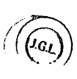

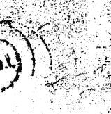

http://www.juxian.com.hk

### 聚賢館文化有限公司
JUXIAN GUAN LTD.

香港葵涌康民街 6 號金萬豐工業大廈 17 樓 A 座
FLAT A, 17/F., KAM MAN FUNG FACTORY BUILDING,
6 HONG MAN STREET, KWAI CHUNG, HONG KONG
TEL:(852)2889 8012
FAX:(852)2515 9239 / 2541 4462
http://www.juxian.com.hk
e-mail:juxian@juxian.com.hk

#### 總代理
利通圖書有限公司
LI TUNG BOOK CO., LTD.
九龍紅磡民裕街 41 號凱旋工商中心八樓 C 座
8/F., BLOCK C, KAISER ESTATE,
41, MAN YUE STREET, HUNG HOM, KOWLOON, HONG KONG
TEL:(852)2303 1010 (12LINES)
FAX:(852)2764 1310

#### 國內總經銷
廣東省級文化商務
中國東莞市虎門印順泉商場一樓 A13 號鋪
電話：(769)5240717 (769)5526556
手機：13600290717

#### 台灣總經銷
瑞成書局
SWEET-CHINA BOOK STORE
台中市東區十甲路一段 4-33 號
TEL:(8864)2212 0708 FAX:(8864)2212 0709

#### 星加坡、馬來西亞總經銷
大眾書局（星加坡）
POPULAR BOOK CO. (PTE) LTD.
TEL:(65)6338 2323 FAX:(65)6337 1186
大眾書局（馬來西亞）
POPULAR BOOK CO. (MALAYSIA) SDN. BHD.
TEL:(603)9179 6333 FAX:(603)9179 6200
商務印書館（新）有限公司
THE COMMERCIAL PRESS LTD.
TEL:(65)6278 3535 FAX:(65)6278 6300

## 更多资料

↓↓↓

### 【中华古籍库】

↓ 点击链接 ↓

https://www.fozhu920.com/list/

珍版刻印 / 海外流传 / 家传手抄 / 民间失传

【易】【医】【道】【武】【文】【奇】【画】【书】

1000000+高清古书籍

### 打包下载

微信：mbook86

### 中华古籍库

1000000 册 高清影印古籍
珍版刻印 / 海外流传 / 家传手抄 / 民间失传

古籍善本、经史子集、史料笔记、古人文集、
民间收藏、传世家谱、各地方志、中医典籍、
四库全书、古禁毁书、内阁文库、图书集成、
丛书集成、四部丛刊、万有文库、四部备要、
二十四史、三国六朝文、明清和民国古籍史料
……

