# 術數叢書

# 形

# 巒

# 金

# 科

□ 張財通 著

聚賢館文化有限公司

# 目 錄

- 前言
- 第一章 尋龍
  - 第一節 龍脈的四山
  - 第二節 龍脈的吉凶
    - 從形貌及局勢斷龍的吉凶
    - 吉龍的特徵
- 第二章 點穴
  - 第一節 找出可能結穴的大局
  - 第二節 確定穴星
  - 第三節 求取一針之穴
    - 窩鉗乳突穴法
    - 五星點穴法
    - 五星立體點穴法
    - 九星點穴法
    - 太極點穴法
    - 兩儀點穴法
    - 三停定穴法
  - 第三節 龍的入首格式
    - 開帳
    - 合格峽的要素
    - 行龍需變化
    - 形體配九星
    - 形體配五行
    - 龍需剝換方可取
    - 十一種龍
    - 孤家寡人格
    - 凶龍的特徵
- 第三章 證穴
  - 第一節 穴位自身的聚氣物證
  - 第二節 借四周砂水證明穴之真假
    - 三勢定穴法
    - 四殺定穴法
    - 饒減定穴法
    - 聚散定穴法
    - 向肯定穴法
    - 枕龍耳角定穴法
    - 物象點穴法
- 第四章 砂的吉凶
  - 第一節 四獸砂
  - 第二節 官鬼禽曜
  - 第三節 砂的形貌與吉凶
  - 第四節 以砂所在的方位斷吉凶
    - 四應證穴法
    - 天心十道證穴法
    - 水勢證穴法
    - 明堂證穴法
- 第五章 水的吉凶
  - 第一節 水勢吉凶
  - 第二節 入山觀水口
  - 第三節 以理氣論水之吉凶
- 第六章 影響陽宅吉凶的因素
  - 第一節 宅基地的選擇
  - 第二節 道路對陽宅的影響
  - 第三節 大門掌福禍之柄
  - 第四節 門的影響力
  - 第五節 安床
    - 安床之忌
    - 安床之法
  - 第六節 作灶
    - 作灶禁忌
    - 作灶之法
  - 第七節 廁位
  - 第八節 水龍頭位置
  - 第九節 圍牆
  - 第十節 屋形配坐山定吉凶
- 第七章 地理骨髓語集解
  - 龍脈骨髓語
    - 生龍的特點
    - 枝龍、幹龍的分別
    - 龍之護送
    - 龍的行止
  - 穴的骨髓語
    - 富
    - 貴
    - 貧
    - 賤
    - 陽落成窩，陰落成脊
  - 砂水的作用
    - 水城吉凶訣
      - 金城水
      - 水城水
      - 木城水
      - 火城水
      - 土城水
  - 四獸骨髓語
    - 朱雀
    - 玄武
    - 青龍
    - 白虎
    - 朝案
    - 明堂

# 前言

炎黃子孫對龍有着特殊的感情，認為自己就是龍的傳人，因而十分自豪。每逢喜慶節日，人們都喜歡舞龍慶祝，認為舞龍可以帶來福祥，帶來吉慶。山脈的走勢，正好與我們炎黃子孫崇敬着的龍十分相像，尤其是舞動着的龍，時而上沖，時而下俯，時而向左，時而向右，多多觀摩龍脈，多看舞龍，自能領悟尋龍擇脈的妙諦。

地理師將山脈稱為龍，嚴格地說，山脈如果不遇水，是算不上龍的，有水方是龍。「水是山家血脈精」、「山管人丁水管財」，無不言明水之重要性。水有下雨時才有的雨水，也有長年不息的溪流、江河、湖泊之明水。

尋龍就是尋找行走活躍，迎送有情，草木茂盛的山脈，這樣的龍脈為生龍。點穴就是尋找水靜龍止，砂水有情的地方。

本書將詳盡地介紹巒頭風水的訣竅，讀者只要通讀全書，自能獲益良多，祝君進步！

# 第一節 龍脈的四山

龍脈從起源到結穴，主要有四山——祖宗山、少祖山、父母山、穴星山。以祖宗、父母名之，皆為類比人事而定也。

祖宗山——龍脈的源頭，一般祖宗山超凡挺拔，直入雲霄，並且萬山簇擁，諸脈皆發於此。

## 胎息孕育

胎——父母山下之龍脈。
息——束咽處龍氣憩息之處。
孕——再起之星頂。
育——穴位

少祖山——龍脈行走中，突然起一高山，比諸山高，但低於祖山，稱之為少祖山。
父母山——在合格的過峽處。
穴星山——是結穴之星峰。

# 第二節 龍脈的吉凶

從形貌及局勢斷龍的吉凶

並非所有的龍脈皆可用，還需要比較其優劣，然後擇優而用。此節講的就是從行龍的形貌及局勢給人的感覺（印象）去判斷龍的吉凶。

## 吉龍的特徵

龍脈走勢活躍，氣力充沛，有迎有送，並且迎送有情，枝腳不亂，擺動有力，草木茂盛。星峰分明，一峰連一峰，上沖有力，下俯有勁，起伏有力而分明，是力量顯露的表現。左彎右曲，蜿蜒而行，如同生蛇之動。迎送之砂，類比於人事就相當於僕從、下屬，需有情，擁護於我。

## 凶龍的特徵

星峰模糊，不見起伏，行走不屈不曲，似死蛇爛鱔一般，生氣全無，寸草不生。枝腳散亂無力，無迎無送或雖有迎送而無情。

## 孤家寡人格

龍脈活躍，草木茂盛，而迎送無情，即屬此格。
迎送無情，如同僕人不忠，呼而不應，英雄雖才智過人，也只能獨力支撐，自己唱戲自己看。閒雲野鶴，用之無妨。

## 十一種龍

古人根據行龍的形貌及局勢將龍分成十一種，以定吉凶，分別為生龍、死龍、強龍、弱龍、順龍、逆龍、進龍、退龍、福龍、病龍、殺龍。現分別將各種龍之特徵列於下，以供讀者參考。

一、生龍——星峰分明，起伏有力，左屈右曲，蜿蜒而行，就像喜慶節日舞動着的龍一樣，生動活潑，力氣迸發是其特徵。枝腳不亂而擺動有力，草木茂盛，迎送有情，諸砂有情而周密。生龍結穴大富大貴，人丁興旺。

二、死龍——星峰模糊，龍體無屈無曲無蜿蜒之姿，亦無起無伏，粗頑不堪，草木枯死，了無生氣，即使有穴，也主窮苦下賤。

三、強龍——與生龍的特徵基本相似，但氣勢上比生龍更有氣力。

四、弱龍——星峰雖有，但骨瘦嶙峋，雖有枝腳但短縮無力，精神不振，主孤苦貧賤。

五、順龍——星峰不但分明，而且井然有序，枝腳順布，行度周密團聚，左右迎送砂環抱有情。主富貴綿遠，百子千孫。

六、逆龍——星峰側立（於己無情，其心向外），枝腳逆行，乖戾反覆無常，忽前忽後，行度不常。主出忤逆之子，強盜之輩。

七、進龍——星峰威嚴而有序，枝腳均勻亦有序，上下起伏板跌有序，左右彎曲均勻，龍身節節而高，精神振奮，如飛鳳戲水，主富貴雙全，發福悠久。

八、退龍——星峰或向左側立或向右側立，混亂無序，無向前之意而有向後之態，草木不生，一派蕭條，主一葬即敗。

龍脈之走向以水定，有溪澗明水則以明水定，無明水則以雨水定。水往低處流，這是千古鐵律。來水之方為龍脈之始祖，水彎到靜聚之處為結穴處。

進龍，山脈走勢與水同進；退龍，山脈就勢逆水而行。

九、福龍——星峰美觀，一路護送多而有情，枝腳不大而帶倉帶庫，倉庫主發富，福龍主發福悠久，富貴康寧。

十、病龍——病龍即帶病之龍，有缺陷之龍。病龍的體態雖美，但美中不足，稟氣偏駁，邊生邊死，邊美邊惡，一畔周密，一畔缺陷，一節活躍，一節死硬，枝腳邊有邊無。主禍福參半，美中不足。

十一、殺龍——龍身帶殺未經脫卸，龍體粗笨醜惡，露骨露筋，枝腳尖利破碎，臃腫硬直，此龍主凶，慘死。

## 龍需剝換方可取

行龍星峰分明，有起有伏，是龍剝換的結果；行龍星峰模糊，無起無伏，是龍無剝換的表現。從古人總結下來的十一種龍中，可以看到剝換的重要性。

> 楊公說：「一剝一換大生細，從大剝小最奇異，剝換退卸見真龍，小峰依舊狼星起，剝換如人換好裝，如蟬退殼蠶脫眶，或從粗大落細小，或從高峰下平洋。」

龍的剝換，就是星峰的形體不斷變化，有好變壞的，有壞變好的，有金星變水星，有火星變土星等等，前後相連之星峰五行相生而且端莊，則吉。

星峰不斷的出現，行龍才會有起有伏，龍動，生氣才會顯現。

## 形體配五行

星峰尖、圓、方秀者為吉。破、碎、欹、弱、露骨者為凶。

金星形——頭圓，足闊，形圓。主富。

木星形——頭圓，身直，形直。主文貴。

土星形——頭平，體秀，形方。主富。

水星形——頭平，生波浪形，形曲。主文秀，才子。

火星形——頭尖，足闊，形尖。主武貴。

以上為標準之五行星形體，有時會出現二星、三星，甚至數星疊加之複雜形體。但萬變不離其宗，只要掌握了基本形體之特徵，便可分出星體之五行，數星並疊者，五行相生則吉，相剋則凶。

## 形體配九星

（一）貪狼星——正木星，頭圓身直。主文貴。

（二）巨門星——正土星，頭平體秀，主富。

（三）祿存星——土金兼形。

（四）文曲星——水星，形如飄帶，生蛇。主文秀。

（五）廉貞星——數火星相連，主武貴。

（六）武曲星——正金星，頭圓足闊，主富。

（七）破軍星——多個金星相連，形如走旗，頭高尾低，圓頭腳尖，手腳飛揚。

（八）左輔星——與武曲星相似，為眠體之星。

（九）右弼星——為陷曜，無形迹，在山龍過峽，穿田，平坦處或平地。

古人還將星體分別陰陽，如金木火為陽，水土為陰。陽變陰，稱為「陽資陰育」；陰變陽，為「陰藉陽生」。

## 行龍需變化

龍無變化，如一灘爛泥，又如死蛇爛鱔，生機不現。龍有變化，則陰陽生焉，陰陽生則生機無限，《易》曰：「一陰一陽謂之道。獨陰獨陽何獨長？」

高山深落平原，高變低；平地忽起突泡，低變高；老幹抽出嫩枝，老變少；嫩脈渡過美峽，少變老；窩中生乳，乳內開窩，此皆為陰變陽，陽變陰。

陰生陽，陽生陰，生生不息。又曰：「陰中有陽，陽中有陰，陰陽互依，萬古長青。」

## 合格峽的要素

有迎有送，護峽砂周密有情。龍脈不被風吹不被水劫。有美峽則有美穴，尋穴先尋峽，這是點穴捷訣。

峽與穴還有以下關係，這些都是古人總結的，在此錄出以供參考。

一、峽正出，則穴亦正。左出則穴居左，右出則穴居右。
二、正出斜過者，穴亦正出而斜到。側出而正過者，穴亦側出而正到。
三、透頂出脈者，則穴居腳下。腳下出脈者，則穴居頂上。
四、山護者，穴結山藏；水護者，穴結水邊。
五、去山小而無迎者，氣將欲伏，其結穴於近處。去山大有迎者，氣正發洩，其穴必結在遠處。
六、峽中左峽短，則穴前左砂必先到；峽中右砂短，則穴前右砂必先到。

## 開帳

因其形狀如帳篷，故古人名之為帳。帳可以看成是行龍行走過程中的能量補充站。所以帳越多，龍愈真，福力愈強。

帳——橫向環抱龍脈之山體也。

帳長，如古之驛站，今之加油站、旅館，能量補充站是也。

龍脈自中心出，則龍脈至貴。

# 第三節 龍的入首格式

來脈與坐向線的關係所形成的格式，以及氣聚點的異同，古人將之歸納為五類——

## 直龍入首格

龍脈從坐後而來，這種撞背龍結穴發福最快，力量最猛。氣勢雄大者，穴前必有餘氣為唇為毯。

## 橫龍入首格

龍脈從左或右邊而來，需背後有鬼有樂，方為真穴。

## 飛龍入首格

四應皆高，立聳上聚，穴星之龍氣也聚於上。此種龍穴貴大於富。

## 潛龍入首格

龍氣撒落平地而結穴，為潛龍格，需平地有凹，成開口，水勢環抱，方為真結。

## 回龍顧祖格

行龍翻身顧祖而結穴，為回龍顧祖格。此種龍穴以祖山為朝案。

# 第三章 點穴

尋穴就是要尋找藏風聚氣的地方，先尋可結穴的大局，再尋出穴星，然後再尋可用作造葬之用的穴位。

# 第一節 找出可能結穴的大局

風水以藏風得水為全美，以得水為上，藏風次之。歸納起來，可能結穴的大局有如下幾種：

一、真龍行走途中，停下來休息的地方可能結穴。其特徵是水勢彎抱，龍憩息（有暫停之意）。
二、龍止水靜，水匯砂聚之處，為真龍盡結之處。
三、水口緊密之處，水不能走，因其得水而結穴。地學名為：「不怕砂飛水走，只要羅星塞水口。」

# 第二節 確定穴星

特異者一般即為穴星，在穴星上，可以看見眾山環抱有情於我，眾水匯於前面，或成曲抱之形或為平靜之塘、湖。

# 第三節 求取一針之穴

對於點穴之法，古今諸賢發明甚多，現筆者將古人留傳下來的點穴之法整理出來，以供同好參考。

一、喝象（憑穴星形狀代入動、植物、器物等名稱）點穴之法。
二、五星點穴法。
三、九星點穴法。
四、太極點穴法。
五、兩儀點穴法。
六、三勢定穴法。
七、三停定穴法。
八、四殺定穴法。
九、饒滅定穴法。
十、聚散定穴法。
十一、向肯定穴法。
十二、枕龍耳角定穴法。
十三、窩鉗乳突穴法。

點穴就是要點在能夠聚氣的地方，窩平而有眾砂環護的地方就能聚氣，能聚氣就能結穴。峽陡峭無窩無平，或雖有窩平而無諸砂環護者，不能聚氣，氣不聚則穴不結。

## 窩鉗乳突穴法

### 一、窩

穴星曲抱成窩形，兩掬一般作青龍、白虎。窩中有肉或無肉，穴位的位置是不同的。

1、窩中有肉的，還須看肉在窩內還是伸出窩外。肉在窩內的，穴結在弦上。肉伸出窩外的，穴結在窩內弦下。
2、窩中無肉的，穴在弦上。弦之上需要肥嫩平坦，若瘦削則不結穴。

### 二、鉗

與窩穴相似，穴星亦曲抱，只是兩掬星得直而無彎曲。鉗穴與窩穴一樣需有肉地。肉地在鉗中，穴位在鉗中。鉗中帶乳，穴位則在乳中。

### 三、乳穴

如同婦人之乳，需兩邊有本山之有情砂抱護，而脈則不能貫頂。穴星帶乳，則穴在乳上，這乳是比較大範圍的，需在乳上尋窩，乳上之窩才是一針之穴所在。

### 四、突穴

穴星山成圓珠、方塊等形狀，星面上陡峭無窩平之處，穴可能結於頂上，也可結於下面肥嫩平坦處。

山勢如果陡峭，下雨時則雨水在山上不能停留，真氣隨水走，真氣也不能停留，故穴不能結於陡峭之處。

星面無窩平，陡峭之極，氣不能聚，氣不聚則穴不結。

若果頂上稍平，而前低後高，兩邊有兩掬環護，則穴結頂上。頂上無窩無平，頂不結穴。若果頂上無窩無平，而下平坦如蚌吐肉者，則穴在肉上。

突形穴結高處還是穴結低處！一是看入首龍脈情形，二要看四應之高低。

## 五星點穴法

古賢曰：

- 土星還從四角堅，
- 金星須從腳下邊，
- 水星還宜動處插，
- 木星宜插在關節，
- 火星宜於炎上取。

此五星點穴法一般適用於倒地星體。

### 五星點穴俯視圖

穴在兩對角線之中點

1、土宿還從四角堅

2、金星還從腳下邊

3、水星還宜動處插

4、木星宜插在關節

5、火星宜於炎上取

### 五星立體點穴法

土星還從四角堅（掛角）
金星須從腳下邊，
水星還宜動處插，
木星宜插在關節，
火星宜於炎上取。

參考突穴法，腳下有肥嫩之肉，即可結穴。若無吐出肥嫩肉地則無穴。

1、土星還從四角堅（掛角）
2、金形須從腳下邊
3、水星還宜動處插

## 九星點穴法

九星點穴法用於立體，其穴法亦離不開窩鉗乳突穴法。

古賢云：

貪狼出穴是乳頭，巨門出穴窩中求。

武曲出穴釵鉗口，祿廉梳齒犁劈頭。

文曲求穴坪裏作，高處亦是掌心落。

破軍作穴如戈矛，兩邊左右手皆收。

輔星正穴燕巢裏，落在高山掛燈樣。

弼星出穴在低平，縱有圓頭也是凹。

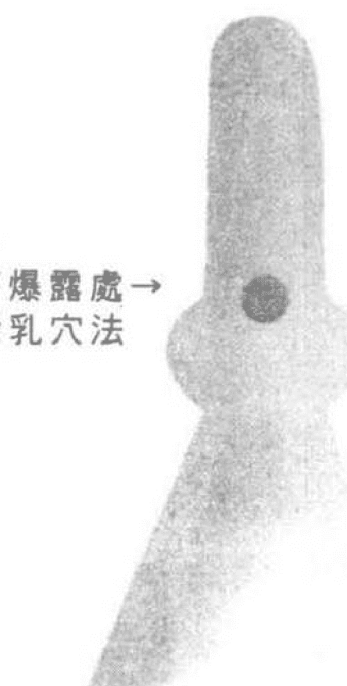

關節，即嫩芽暴露處→可參考乳穴法

4、木星宜插在關節

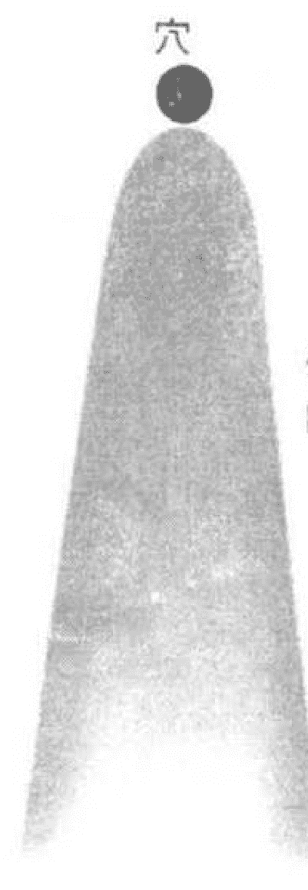

俯視圖
曲抱成微窩方為真結

參考突穴法：
穴結星頂，需四應擁護
有情，在結穴處平坦，
前低後高，兩邊有砂曲
抱，如俯視圖所示。

5、火星宜於炎上取

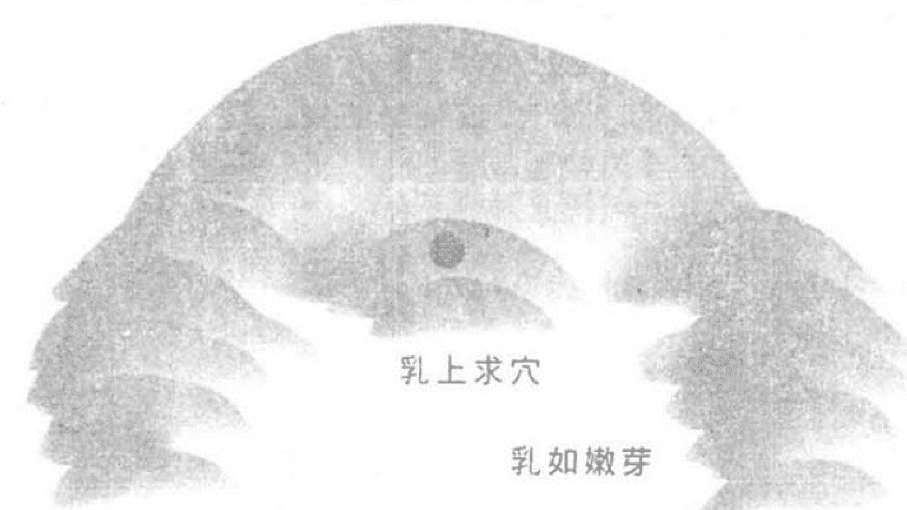

貪狼正木星

乳上求穴

乳如嫩芽

1、貪狼出穴是乳頭

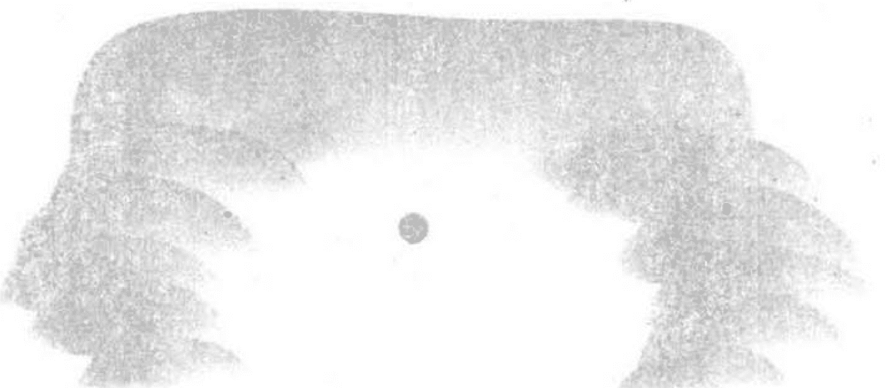

巨門正土星

2、巨門出穴窩中求

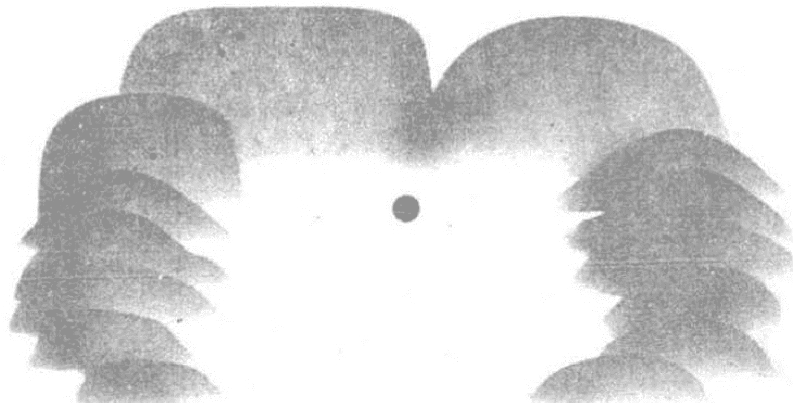

祿存帶窩鉗則似農民耕田用之犁頭

參考窩鉗穴法

3、祿廉梳齒犁劈頭之（1）祿存星土金兼形

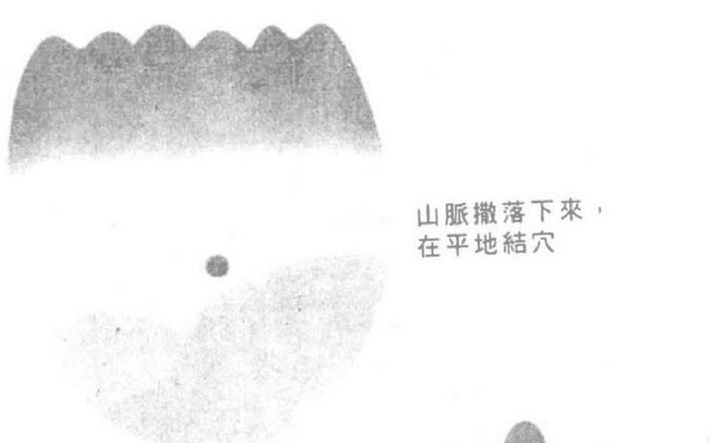

山脈撒落下來，
在平地結穴

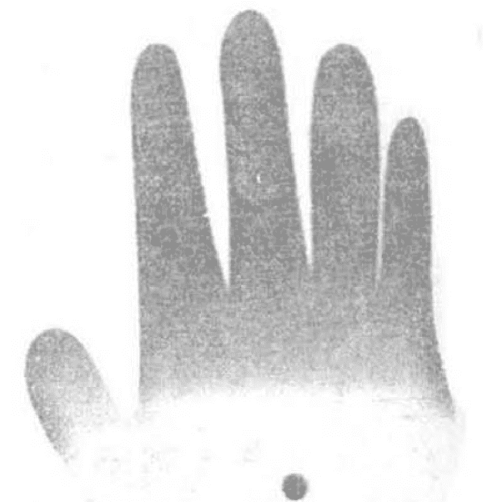

山脈撒落下來
在掌心結穴

4、文曲求穴坪裏作，高處亦是掌心落

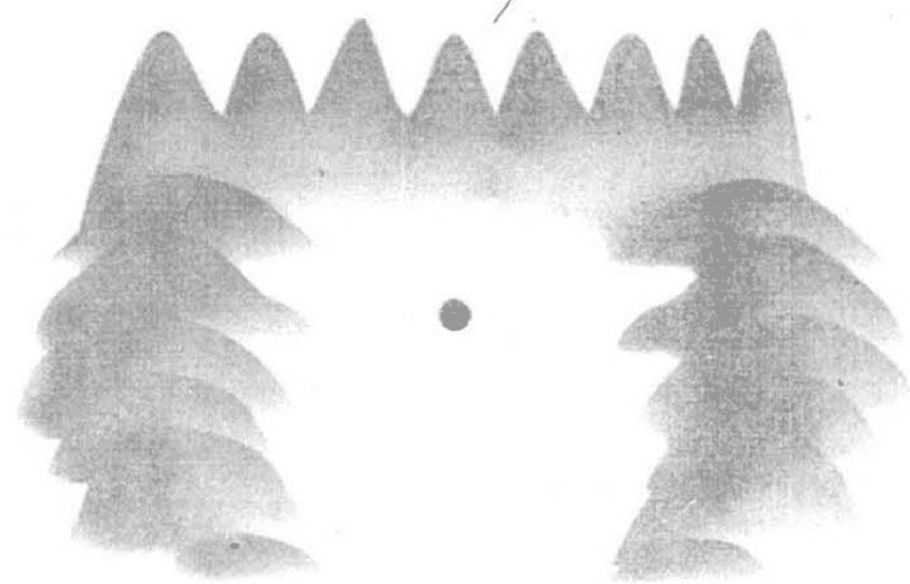

廉貞帶窩鉗則似犁耙

參考窩鉗穴法

3、祿廉梳齒犁劈頭
之
（2）廉貞之數火星連座

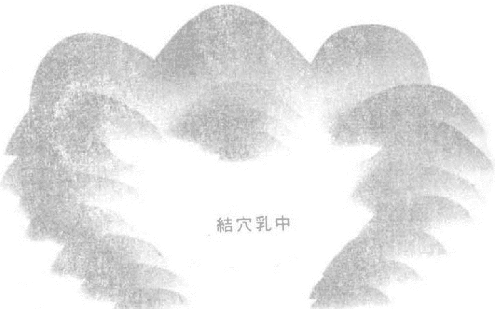

結穴乳中

6、破軍作穴如戈矛

參照乳之穴法

武曲星正金形

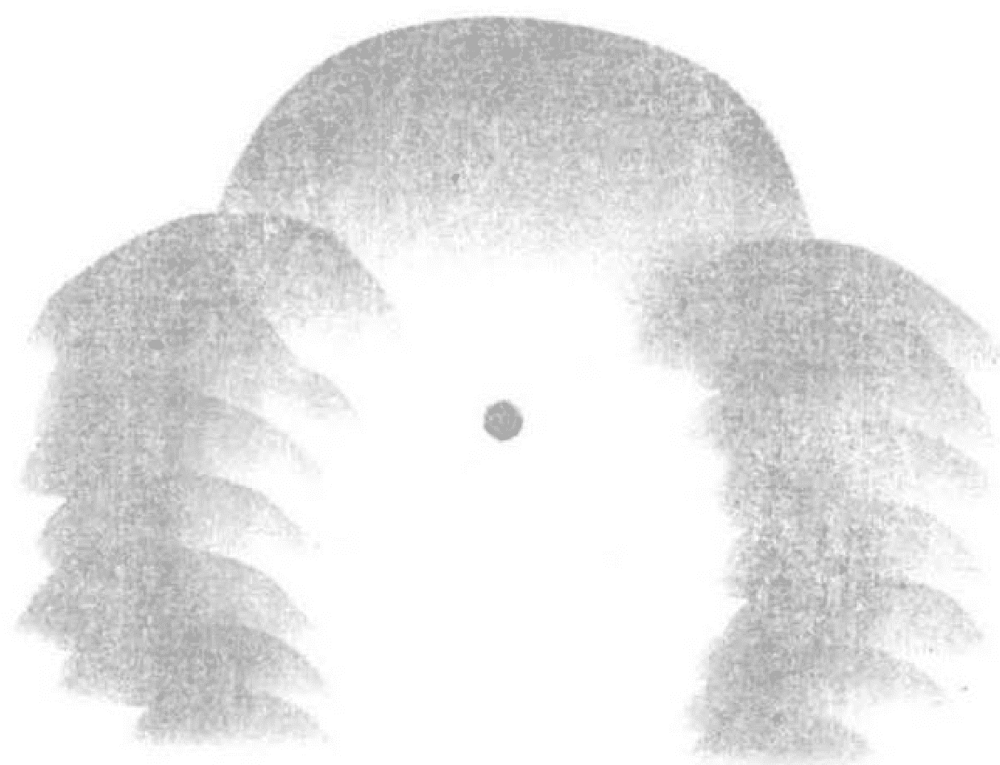

5、武曲出穴鉗口

參照鉗之穴法

須有鬼樂作靠

右弼無形迹，在過峽成平地

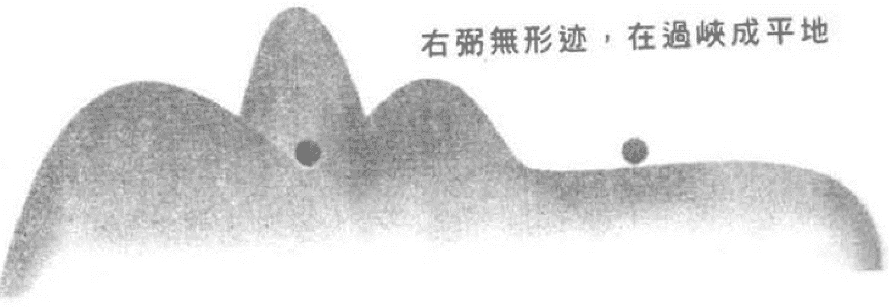

8、弼星出穴在低平，縱有圓頭也是凹

輔星似正金形，但略低矮

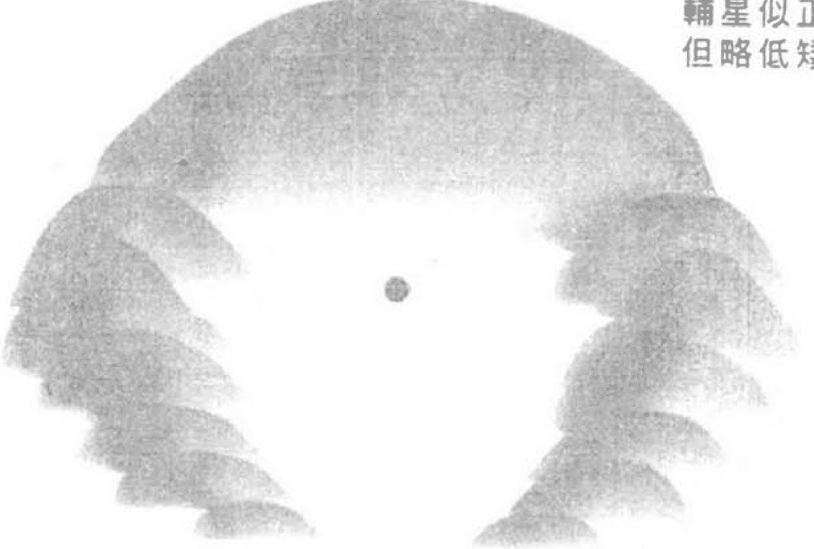

參照窩穴法

落在高山掛燈樣

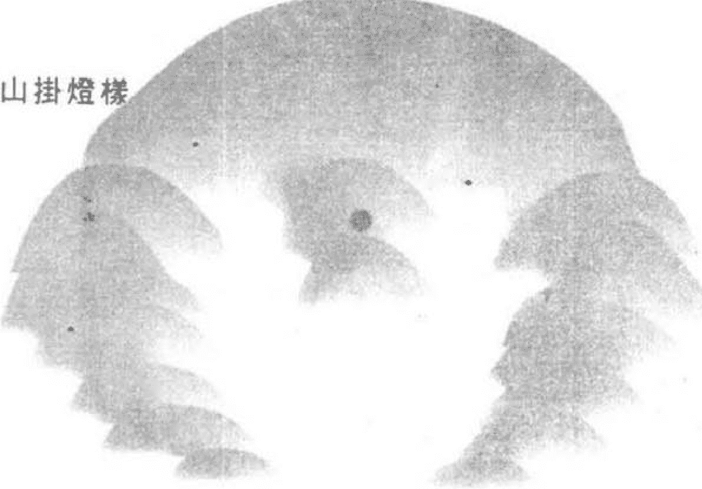

7、輔星正穴燕巢裏

## 太極點穴法

有人說太極暈出現在穴後分水處，在正午太陽直照之時，在穴的近處，可以看見五色氣泡冒出，筆者未有幸見過，在這暫存此說。

結穴之處必有分有合，分在穴之上，合在穴之下。下雨的時候，雨水自高而下，在穴上分流，然後在穴下會合。有分有合方能聚氣結穴。

若得天然之分合，必有真穴無疑。若無天然之分合，作墳時人工補上也可起到聚氣之作用。

一般而言，雨水之分合包圍著的那片地方稱為太極，穴就在太極中。

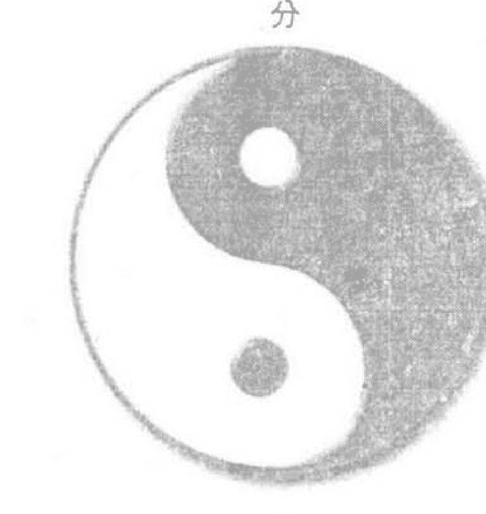

若果太極暈肥而多肉，則其中心會起泡起突，此中之泡之突就是穴之所在，開塋宜淺不宜深。

太極暈若果瘦陷少肉，則其中心會有窟，有窩，此窟、窩就是穴之所在，開塋宜深不宜淺。

太極暈肥而多肉者，則氣在肉，故開塋宜淺不宜深。太極暈瘦陷少肉，則氣在骨不在肉，故開塋宜深不宜淺。葬乘生氣也，乘氣接脈之竅訣就在此也。

對於太極點穴法，亦有從陰陽的角度去解釋。

## 兩儀點穴法

太極暈內的土塊有時候會出現如下情形：有左邊肥右邊瘦；有右邊肥左邊瘦；上半部肥下半部瘦或下半部肥上半部瘦。肥者為陽，瘦者為陰。點穴要點在肥瘦交界處，稱之為陰陽交媾。一陰一陽就是兩儀，故稱之為兩儀點穴法。

## 三停定穴法

三停就是將穴星分成上中下三個部分。在上者稱為天穴，下者稱為地穴，中者稱為人穴。根據落脈後的情形，四應的高低，決定穴位的取捨。四應的高低是有標準的，案山不能過眉，低不能過胸（心）。

在穴位處需有平坦之感。有窩平才能結穴。陡峭則氣不聚而不能結穴。

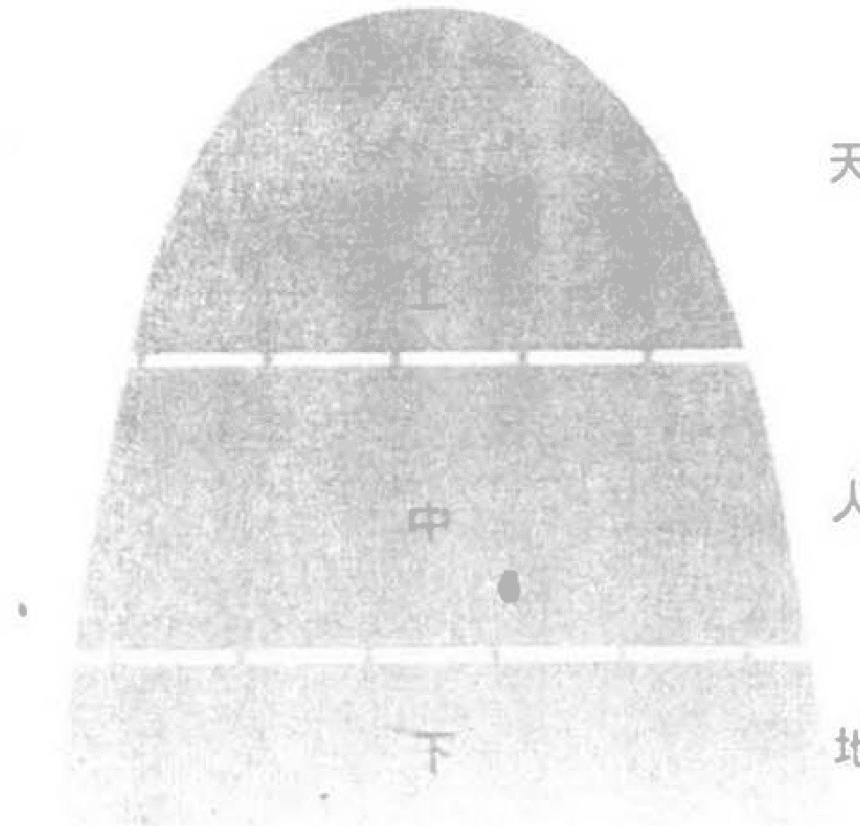

## 三勢定穴法

仿效人的三種活動姿勢而立名，有坐臥立三式。因姿勢不同而所點穴位的位置也不相同。

如坐姿，穴位點在中部的人穴（臍或腹）。
如立姿，穴位點在上部的天穴（心窩或頂）。
如臥姿，穴位點在下部的地穴（人道）。

捷訣就是看曲手抱於何處，則取何部點穴。不管穴點在何部位。

在點穴處應有平坦之感。

天穴脈宜緩不宜急。人穴之脈宜不急不緩。脈若急，宜點穴於旁。地穴之脈宜急，又要得水。

## 四殺定穴法

尖利者即為殺。脈不宜急，急者即為殺。

入首與穴星及四應是呼應的，入首有殺，在穴星或四應亦有殺。

四殺定穴就是根據凶殺出現的位置情形，決定怎麼樣避開之。看不見殺了，就是避開殺了，避了殺就不怕了。

- 1、藏殺
就是沒有殺的情形（殺藏起了，不出現）。來龍入首不直不急不硬，起伏靈活，緩慢有神，穴星左右龍虎砂圖淨無尖角，硬直，穴位宜點在中。

### 2、壓殺

來龍來脈有尖利硬直形塊，則穴星腳下亦會有尖嘴，龍虎砂也有尖利直射，宜將穴位往上移，直到看不見這些尖利物為止。穴比殺高，就是將殺壓在了下面，故稱壓殺。

### 3、閃殺

來龍來脈直射，則山頂會尖利，龍虎砂或左或右會出現尖利凶殺。殺在左，則穴宜靠右；殺在右，則穴宜靠左，此為閃開凶殺也，故稱為閃殺。

### 4、脫殺

來脈來龍急，山勢雄峻，穴星也會陡峭脈急，若果四應下聚則穴宜點於下，取地穴，因地穴不怕脈急。

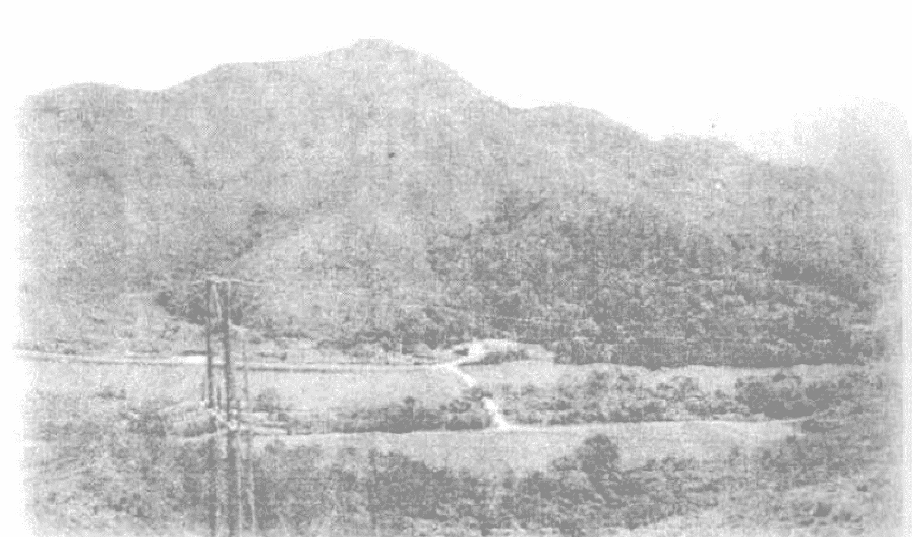

## 饒減定穴法

饒者多之義，減者減少之意。饒減就是一邊增多、一邊減少之義。

此穴法專針對左單堤、右單堤而言。

### 左單堤

龍山先到，虎山短縮，龍抱虎。如有右水過堂後自左而去則合法。

缺虎砂，右邊有水曲抱可作虎，不能言無虎砂就缺虎，以水為虎也。

缺虎砂，右無水曲抱或水不過堂則虧房。

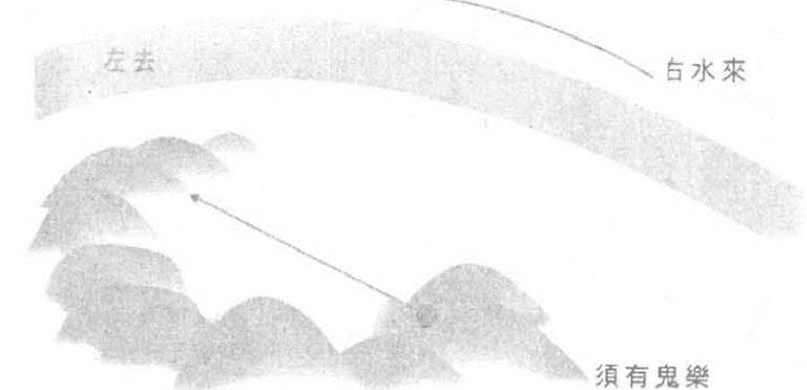

### 右單堤

左單堤有龍砂無虎砂，而右邊水來過堂自左去的，穴宜點於右邊而向於左，枕虎減龍。

右邊虎砂先到，左邊龍砂短縮，虎砂抱龍。如果左邊來水抱而後過堂出右邊的，則穴點於龍砂而向右。

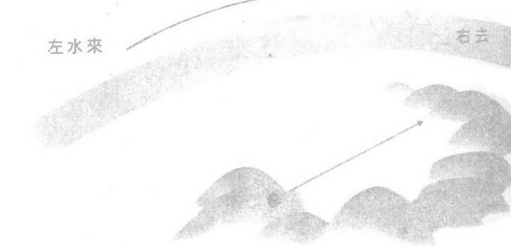

## 聚散定穴法

點穴無非就是要求取藏風聚氣的地方，這就需要砂水配合得宜才能實現。水匯砂匯是大局之聚。前有案，後有樂，明堂有水匯是穴場之聚。

明堂寬，需龍虎曲抱，案山關欄氣方聚。明堂有靜水、低田、泉水、外水曲抱，氣也聚。聚氣則穴結，散氣穴不結。

## 向肯定穴法

向者，對我有情。背者，對我無情。砂水有向有背，砂水向我則結穴，砂水背我則無穴結。

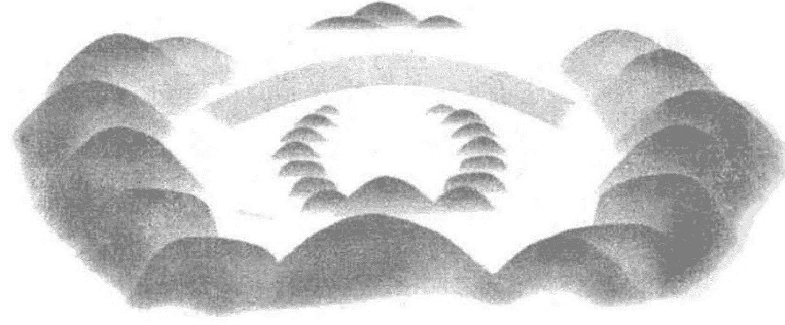

## 枕龍耳角定穴法

兩邊出現相對的山峰的，將穴位點在兩峰連線稍前的地方，當然點穴之處需平坦。因兩峰如同在耳之部位，故稱之為夾耳峰。夾耳峰有擋風的作用。

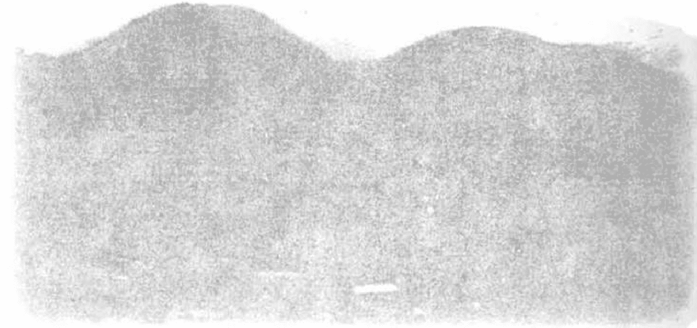

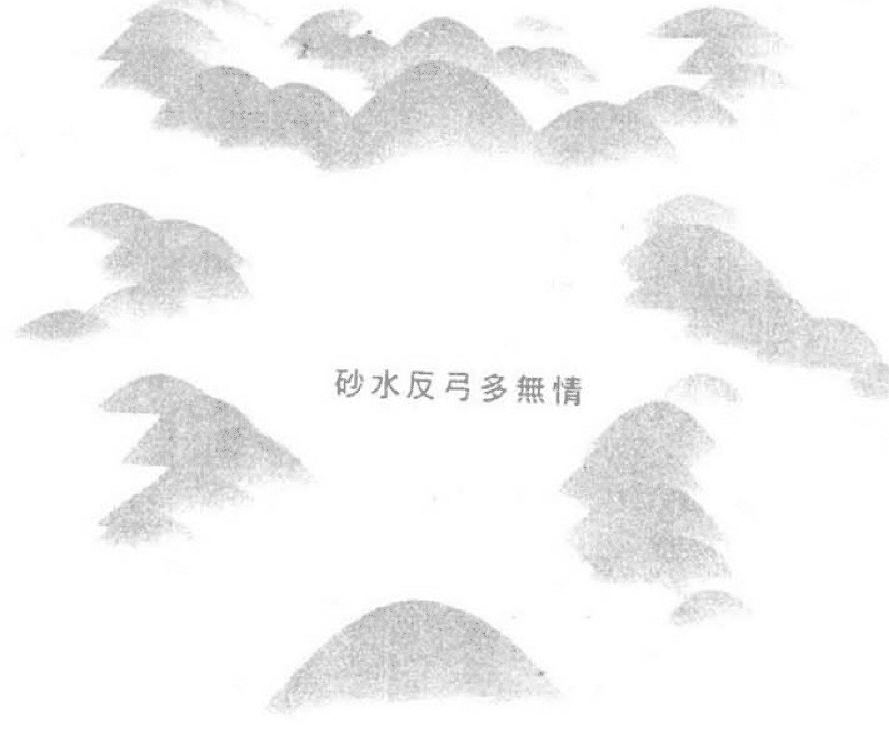

砂水反弓多無情

砂水無情圖（反弓於我則無情）

## 物象點穴法

大自然真是鬼斧神工，使山的形狀也能千姿百態，有的山成動物形象，有的山成植物形象，有的山成器物形象。因其形象不同而靈氣鍾聚或發露處也不盡相同，點穴就是要點在靈氣鍾聚之處，靈氣出入之處。

動物形象者，有點穴於眼，有點穴於鼻，有點穴於口，各依神韻姿態而定，不能死守一法。如靈貓捕鼠，若果其目不轉睛盯著前方鼠者，則穴點於眼。靈犬奔走，氣喘呼呼則穴點於口。餓虎飲泉，穴亦點於口。狀若蓮花，四山擁護，則穴點在花心。

尋龍點穴全憑目靈心巧，又需依規依矩，方萬無一失！

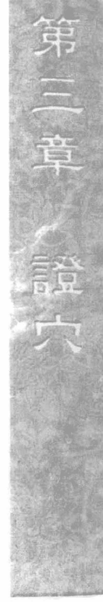

# 第一節 穴位自身的聚氣物證

證穴就用證據去證明所點的穴是真結。

點穴的精髓就是要找到藏風聚氣的地方，蟬翼砂相護，蝦鬚水構成分合，前鋪毯唇皆是穴位，穴場自身的聚氣點置。

## 1 蟬翼砂

蟬翼砂有的稱為口角。在穴的兩邊，曲抱着穴位。因其像蟬之翼，故名為蟬翼砂。

## 2 蝦鬚水

分合是聚氣的構置，蝦鬚就是連接分與合的水路，分於穴之上，合在穴之下，分與合之連線過穴之中點為佳。

## 3 毯唇

真氣過穴位後，氣旺有餘而吐露成毯成唇。大者為毯，小者為唇，毯唇有兜抱真氣的作用。有的結穴龍氣奇旺，真氣噴泄成蟹眼，或下有小山、石苞、甘泉等。

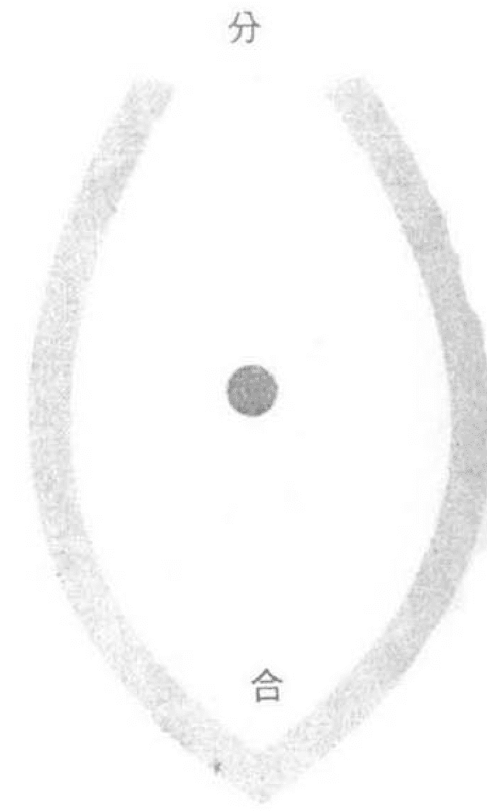

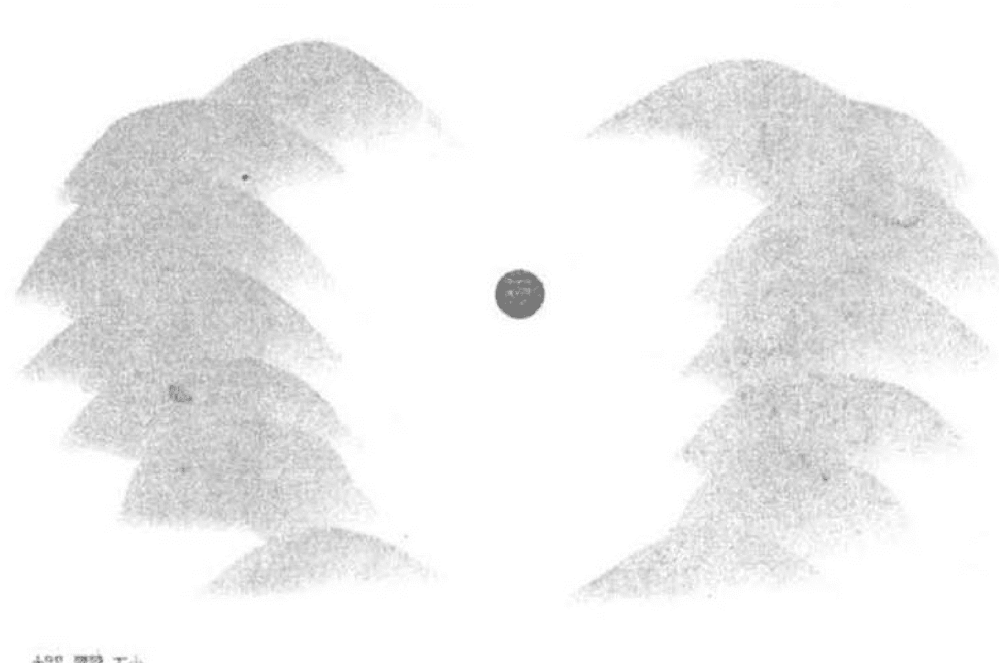

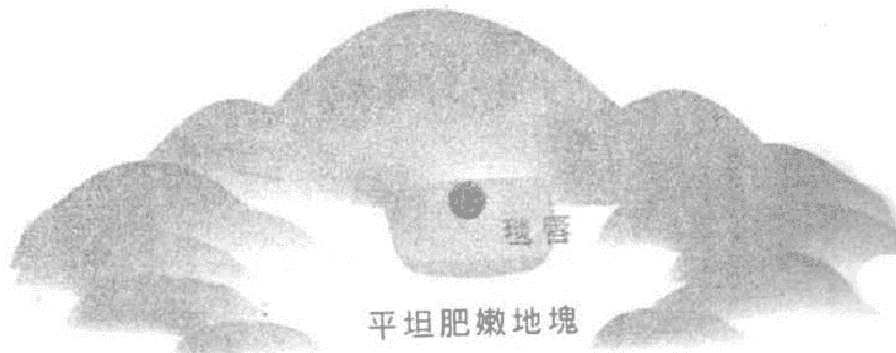

# 第二節 借四周砂水證明穴之真假

## 四應證穴法

四應就是四獸也。
四應俱要有情合法。龍虎、朝案不宜過高也不宜過低。標準是高不可過眉，低不可過胸。

橫龍結穴者，一定需要有鬼、樂作靠。鬼星頭尖，樂星頭圓，鬼樂的作用都一樣——擋風。

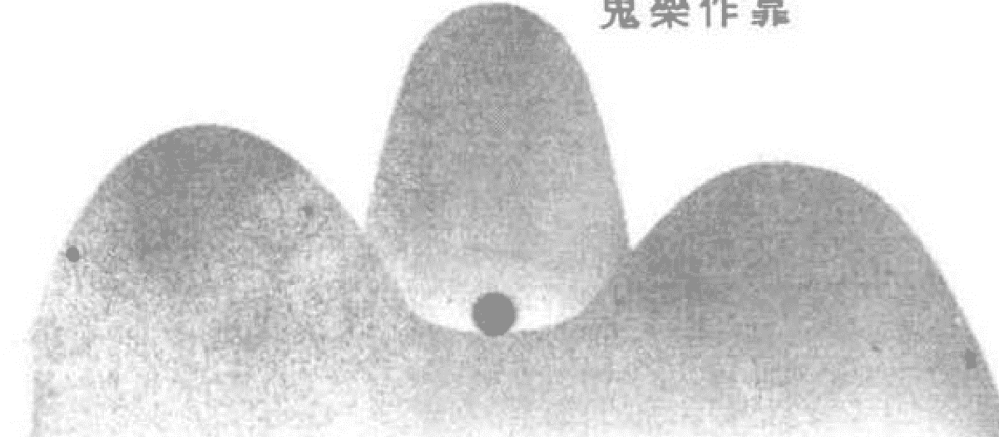

### 4 蟹眼

在穴之下，有兩個微突的角形地塊，因其似兩隻突出的眼睛，故命之為蟹眼，穴在兩眼連線中點之延伸線上。

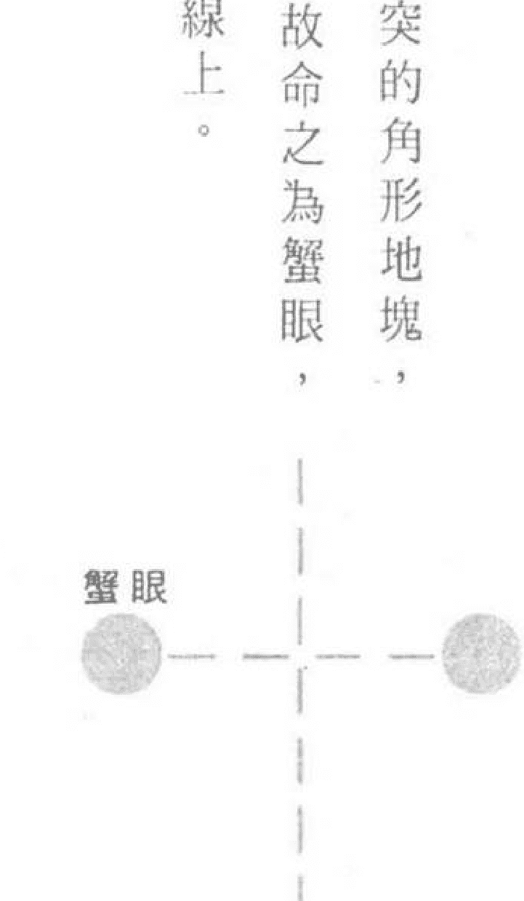

### 5 金魚

穴位下出現小山或石苞，這是真氣噴洩所成。有的下面還會出現清澈而終年不乾的甘泉。

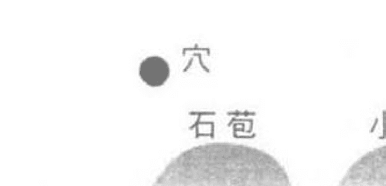

## 天心十道證穴法

如果左右有兩峰相對，前後亦有兩峰相對，相對之峰各連一線，兩線之交點正好落在穴位則穴為真穴。

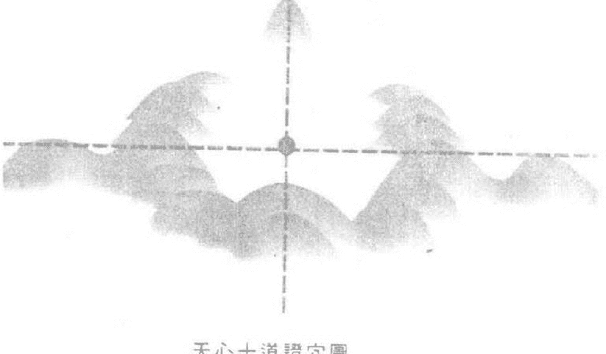

## 水勢證穴法

水為山家血脈精，龍氣盡蘊水神中，以水證明穴之真偽是很可靠的。
水抱於右，則穴在右；
水抱於左，則穴在左；
水抱於中，則穴居中。

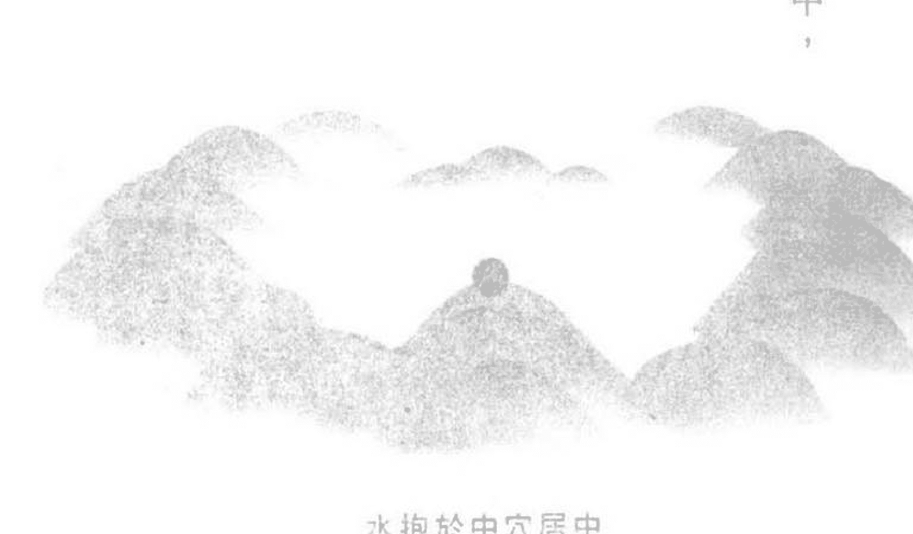

## 明堂證穴法

明堂有大中小三種。小明堂，就是墳堂也，主初代吉凶。中明堂，在龍虎之內。大明堂，在案之內。明堂之吉在於一個聚字，龍虎曲抱，案山橫關，眾山簇擁，四水相匯，這是明堂之聚。聚即藏風聚氣也。明堂吉，自然穴也真。

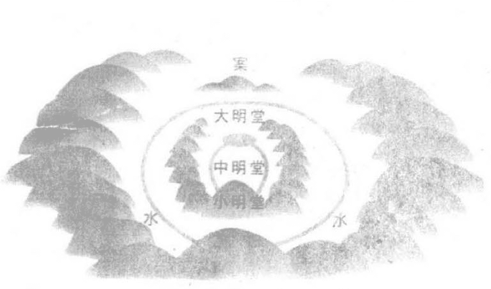

# 第四章 砂的吉凶

論斷砂的吉凶，有以情意而斷，有以高低而斷，有以形狀而斷，有以所在方位而斷。

龍穴砂水與人事有著密切的對應關係。左方青龍代表一、四、七房，右方白虎代表三、六、九房，前後之玄武，朱雀代表二、五、八房。從上級關係而言，朱雀、青龍、白虎代表部屬，後面之玄武或靠山代表上級、上司、貴人。

因此，無論砂還是水，顧穴有情則吉，反背無情則凶。曲抱於我則為有情，反弓於我則為無情。如穴後之玄武峰（靠山）對我有情，則主貴人提攜，易得官職。遠峰作靠，外出做官；近峰作靠，近處做官。此中秘密少人言及。

# 第一節 四獸砂

四獸又稱四應，即青龍、白虎、朱雀、玄武。四獸位置有兩種：以前後左右分——前為朱雀，後為玄武，左為青龍，右為白虎。以東南西北分——東方青龍，西方白虎，南方朱雀，北方玄武。兩種分法都有人信奉，第一種用得較多。四獸主要起到藏風聚氣的作用，曲抱顧穴則吉，反弓則凶。案山高不能過眉，低不能過胸。在穴外，龍虎砂稍微高於頭頂（一般以地師站立計）即可，過高則欺穴，過低則起不了作用。如果龍虎離穴場很遠，龍虎則高些也無妨，關鍵是要有情。朝山越多越好，有一層比一層高而有情則大吉。

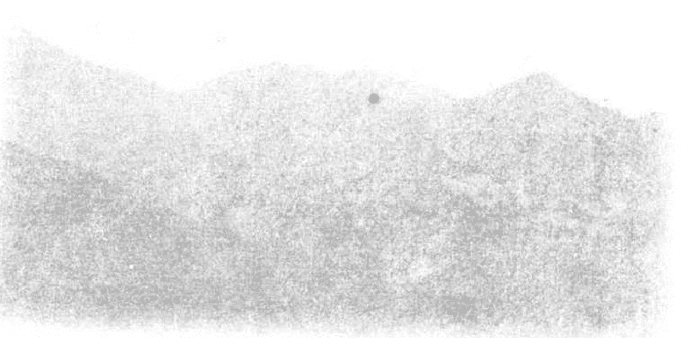

也。地學名言：「朱雀起千峰，家富打金鐘。」「龍蟠虎伏，玄武要垂頭，朱雀要翔舞，此是言四獸之動靜。

玄武宜靜，不宜走動，靜則脈氣已止而結穴，動則脈氣未止而穴未結。故曰：「玄武要垂頭，玄武不垂頭為拒屍。」

朱雀宜動，猶如軍隊之將領一聲號令，士兵蜂擁而來集合。此因朱雀代表部屬下級，故朱雀宜有動態，宜有奔擁而來之態。近處宜止，遠者宜來。

青龍宜動，因為青龍為吉獸，故宜動，動則出官貴。

白虎宜靜，白虎為凶獸，睡着的老虎不傷人，動則會傷人，出凶惡之徒。

四獸合動靜之法，則為上吉之地。

# 第二節 官鬼禽曜

官者在前，鬼者在後，禽在水口，曜連龍虎。

官砂——官砂為案山之餘氣所發，主貴。

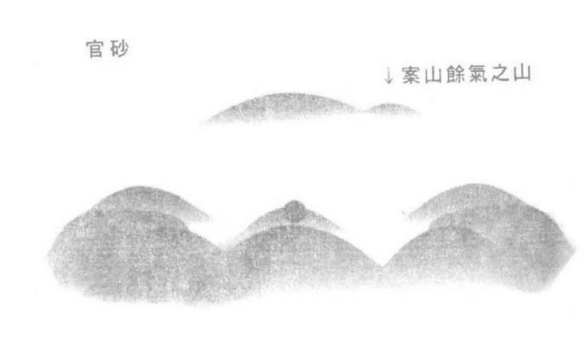

## 禽砂

水口砂成禽獸形狀者

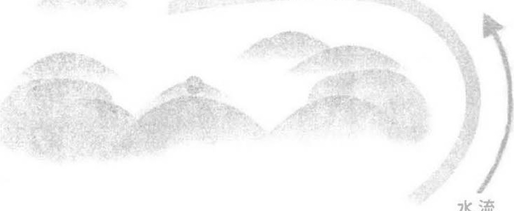

水流

## 鬼砂

鬼樂（橫龍結作需鬼樂作靠）

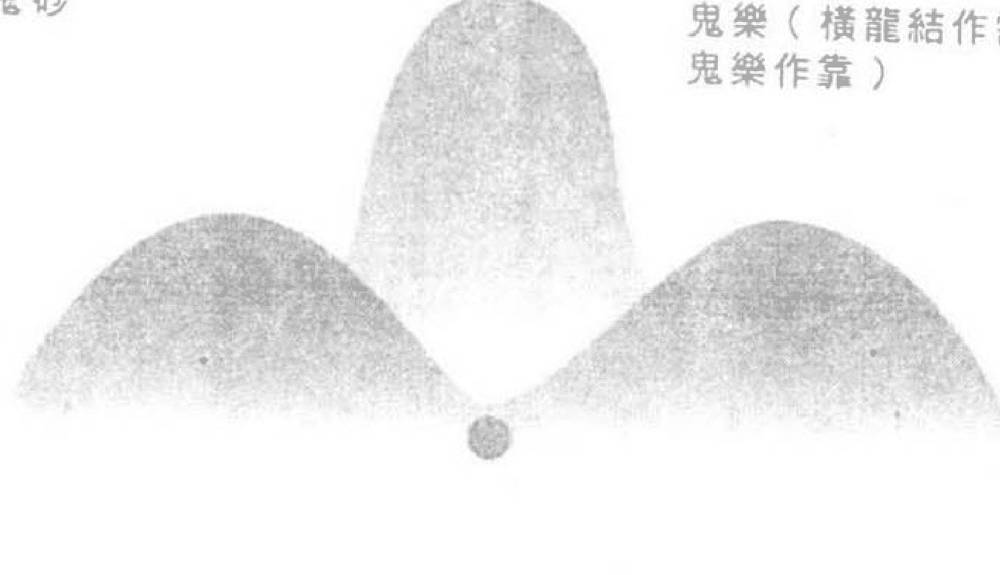

鬼砂——在穴之後，為靠山，橫龍結穴一定要有鬼樂，直龍結穴則無需鬼樂。

禽砂——水口砂成禽獸形狀者，稱為禽砂，起到鎮塞水口的作用。

曜砂——龍虎餘氣所發而形成的小山峰，稱為曜，有情則吉。

官鬼禽曜皆要顧穴有情方為吉。

## 曜砂

龍虎餘氣所發而形成的小山峰

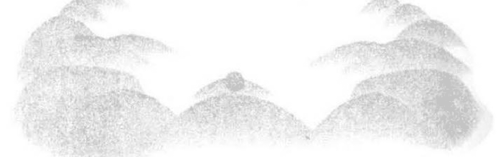

# 第三節 砂的形貌與吉凶

## 五星形體所主人事

金星：主富。金星為圓頭圓身之體。
木星：主文貴。木星為圓頭直體。
水星：主文秀。風流才子。水星如波浪形。
火星：主武貴。火星頭尖山勢陡峭。
土星：主富。土星頭平形方。

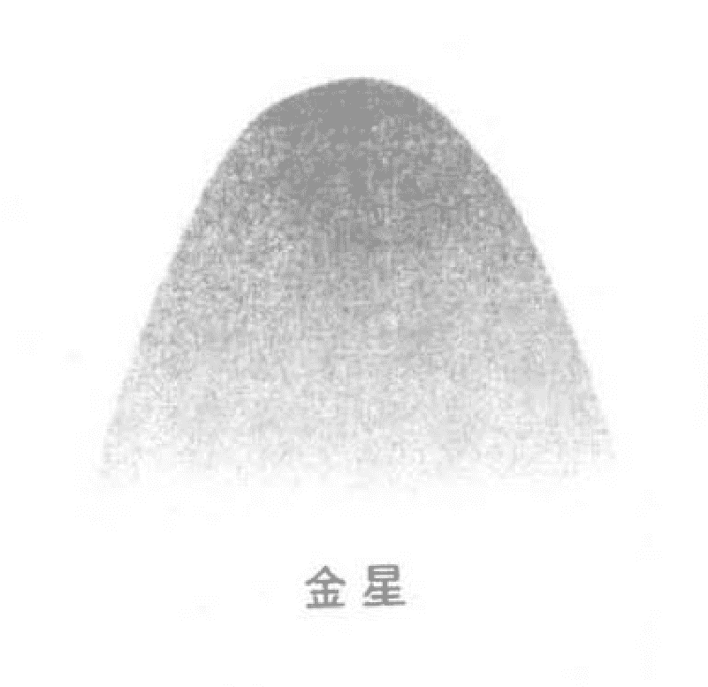

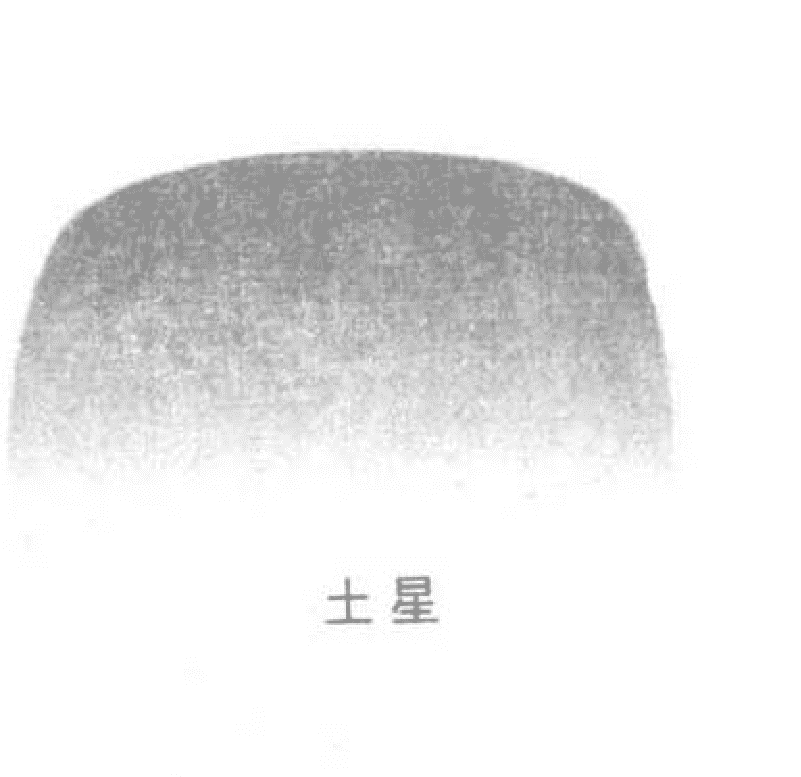

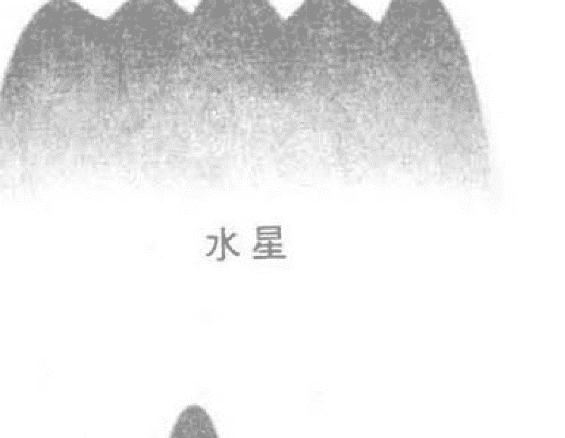

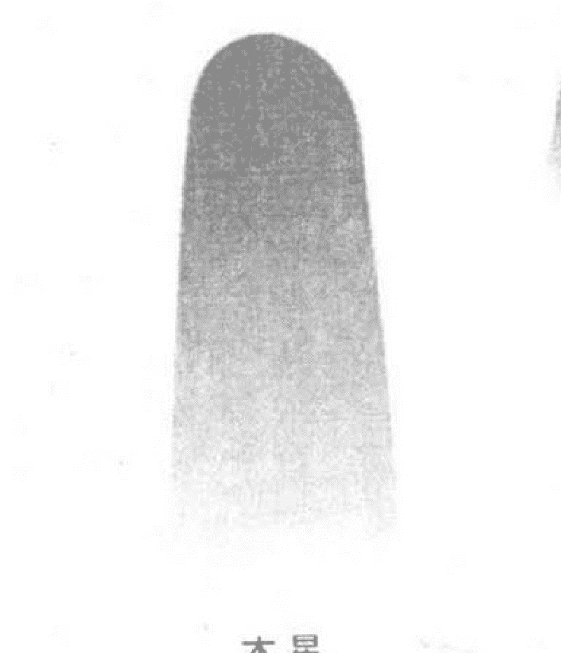

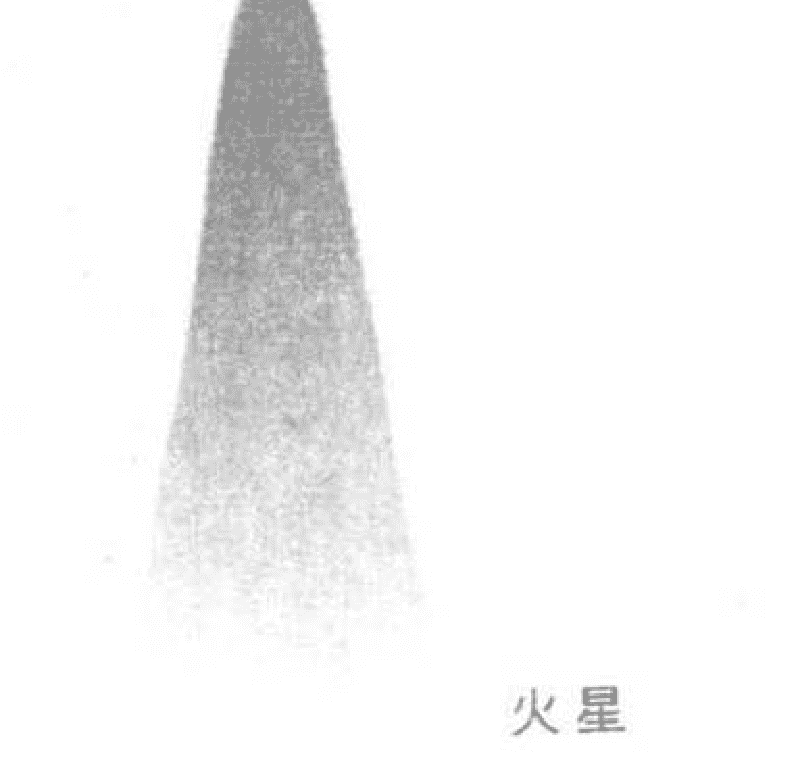

行龍帶木火星多者，為貴龍。帶土金星峰多者為富龍。帶水星者發文秀（詩人、小說作家之類）。

穴星之形為金土，主發富。穴星之形為木星，發科甲文貴。穴星之形為火星，主發武貴。穴星之形為水星，主發才子。

四獸砂也可依形而斷所應何事。形在青龍，則一、四、七房得享。在白虎則三、六、九房有應。前後則二、五、八房應驗。

明堂、水口諸砂也可依形而斷，會應何事。

筆者從古今諸賢名著大作之中集輯砂形應徵於下，供各界同好參考。

### 1 銀瓶盞注，富比石崇。

銀瓶：上尖下圓之小山
盞注：圓平之土丘

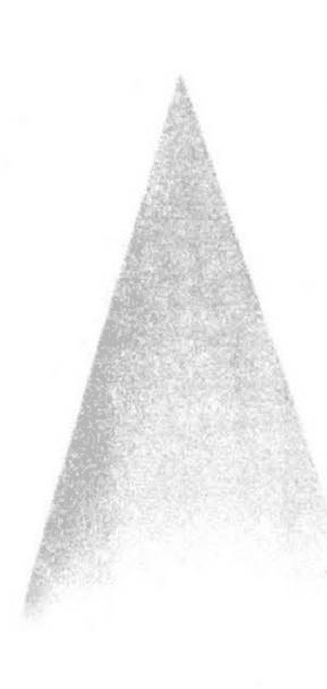

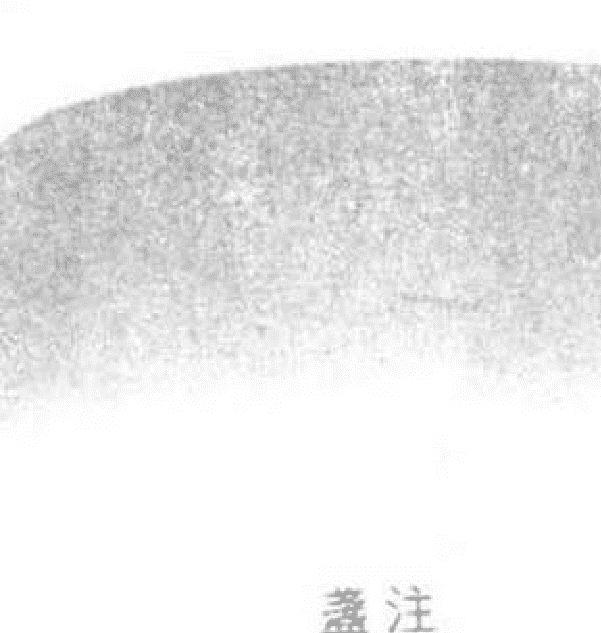

### 2 玉帶曲抱出高官。

木星或火星形體曲抱顧穴，木星主文貴，火星主武貴。

### 3 筆架為案發文章。

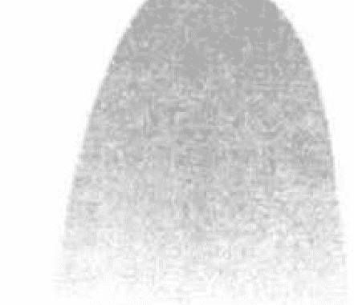

玉帶曲抱出高官

木星曲抱於我出文貴科甲

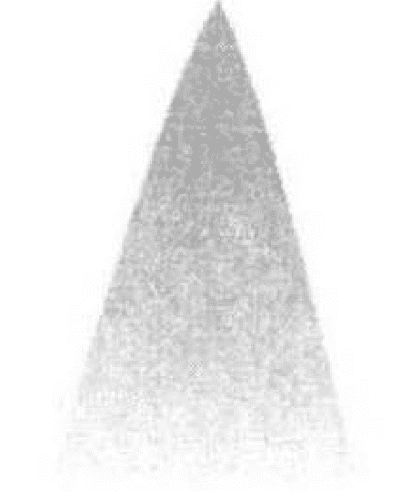

火星曲抱於我生武貴

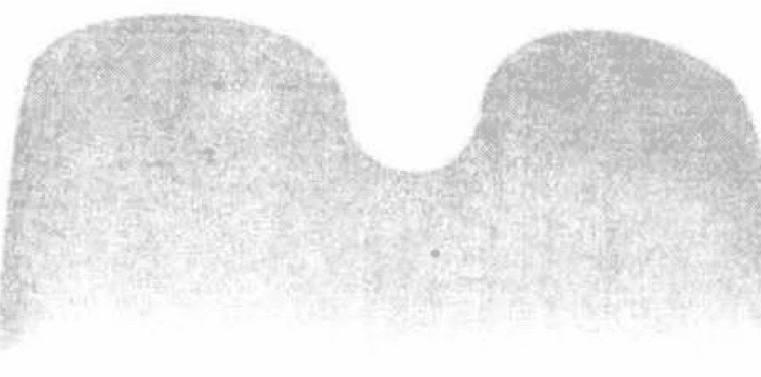

筆架

### 4 文筆峰現科甲顯。

文筆峰上尖者為火星形體，下直者為木星形體，即文筆峰證形為木火合體，如古之毛筆。

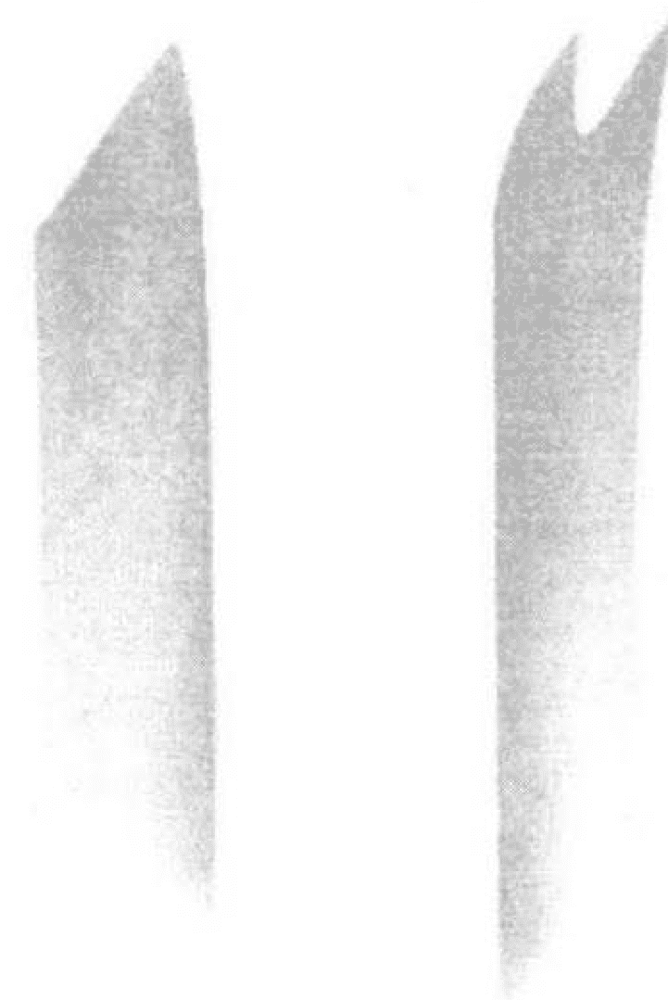

木火合體之毛筆

歪斜或頭部開叉則變為畫筆

# 第四節 以砂所在的方位斷吉凶

以方位斷砂之吉凶，屬理氣的範圍，不同的流派有不同的方法。

### 飛星派

山盤生旺星飛臨之方宜有有情之高山，主旺丁；山盤衰死之星飛臨之方，不宜有山。
向盤生旺之方不宜見山，向盤衰死之星飛臨之方，則宜見山。
星盤迎合為一四同宮的，有山則主發科甲。一六同宮的，有山則發貴。其他各星組合，配合巒頭斷吉凶各有心法，不能在此盡述。

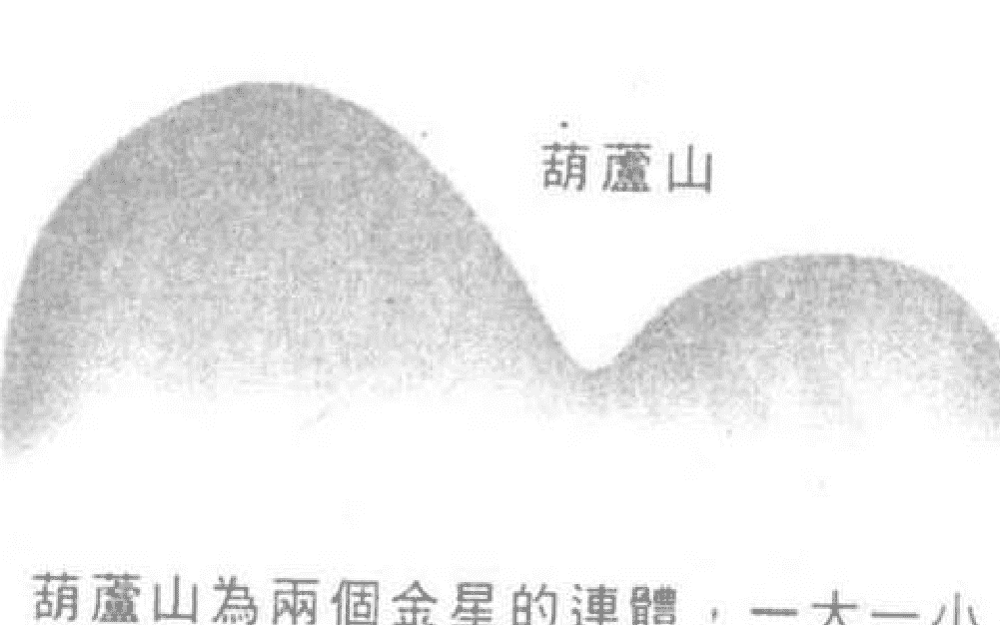

葫蘆山為兩個金星的連體，一大一小，合起來似一隻葫蘆一樣。

- 5 葫蘆山現，主術數醫學。
- 6 左旗右鼓，主出將帥。

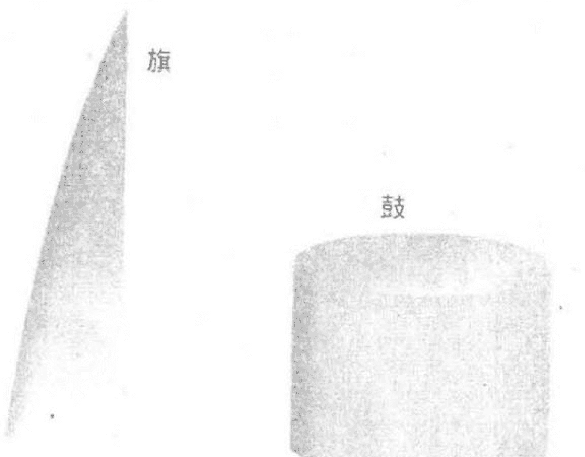

旗者，火星之砂；鼓者，頭平體圓之小山。

## 金鎖玉關

在坎一方，坤二方，震三方，巽四方有砂，對宮有水則吉；在乾六宮，兌七宮，艮八宮，離九宮有砂，對宮有水則凶。

## 二十四山砂法格局

古人還有用二十四山定格局的。

### 一、四神全

乾、坤、艮、巽四位有峰高起，為四神全，主貴。四神峰起但低，則主富。

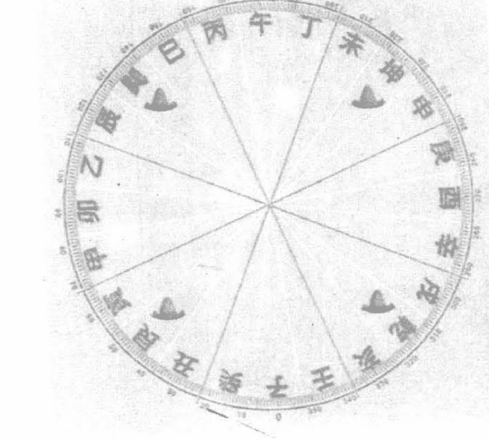

### 二、八將備

艮、丙、巽、辛、兌、丁、庚、震星峰各起，為八將備，主貴。

### 三、三角峙

艮、巽、兌、有峰起，為三角峙，主富貴。

### 四、八國周

乙、辛、丁、癸、丙、壬、庚、甲有峰高起，為八國周，極貴之局。

### 五、日月明

子、午有峰對峙，為日月明，主生貴子。

### 六、太陽升殿

子、午、卯、酉之位，為太陽星房虛昴星之位，若有太陽金星，主極品之貴，敵國之富。

### 七、太陰入廟

甲、庚、丙、壬四位為太陰之宿，心危畢張的位置。太陰宿之位有太陰金星，男為駙馬，女作宮妃。

### 八、三火並秀

丙、午、丁三位朱雀之位，有峰並秀，極貴。丙丁有峰並峙，也主貴。

### 九、文筆秀

巽、辛二方有尖秀之峰，主科甲貴顯。

### 十、金印浮

庚酉辛巳乾位有印砂在水中，主文章顯貴。

### 十一、五星守垣

火星在南，水星在北，木星在東，金星在西，土星居中，名五星歸垣，主極貴。

### 十二、金馬上階

乾為天廄，為畜馬之所，午為正馬。乾、午二宮有峰起為金馬上階，主貴。

## 二十四山砂法凶格

#### 一、五星受制

金星居南，火星居北，土星居東，木星居西，水星在辰戌丑未，為五星受制，星體雖吉也力微。

#### 二、四殺擅權

辰、戌、丑、未四位，有峰帶殺高壓穴位，主出凶惡大盜。

#### 三、四面凹

辰、戌、丑、未位無峰凹陷，主大凶。辰、戌、丑、未有風吹，為墓庫動，主損人丁。

#### 四、倉庫倒

辰、戌、丑、未為四庫，若山傾斜，破碎為倉庫倒，主貧弱。

#### 五、魁罡雄

辰、戌、丑、未為魁罡，若皆有砂而壓穴，主出盜賊乞丐。

# 第五章 水的吉凶

山與水一陰一陽，山與水相會，陰陽交媾也，陰陽交方能結穴，獨陰獨陽生機不現而穴不結。

# 第一節 水勢吉凶

山朝不如水朝，水朝不如水纏，水纏不如水聚。

## 六、財帛散

艮為財帛之位，若有山散亂缺陷，主財帛耗散。

### 1 朝水

### 2 纏

### 3 聚

一、穴前水來朝，宜屈曲而來，切忌直沖直射。

朝水屈曲吉

塘 / 湖泊

水聚塘中又名水聚天心

二、去水宜屈曲顧穴，宜諸砂層層關鎖。直去則主退敗。

朝水沖穴凶

去水屈曲顧穴，諸砂關鎖，吉

### 三、橫水宜曲抱，不宜反弓無情。

橫水過堂，曲抱則吉

反弓水無情，凶

去水直去，無砂關鎖，主退敗

# 第二節 入山觀水口

結穴与否，以及穴之貴賤，地之大小，都可在水口看見蹤跡。
有否結地，有兩個捷訣，一是看過峽，二是看水口。峽美必有結地；水口緊密，亦為結地之征。
水口要周密，需有砂關鎖。
不同的水口砂表示出地之格局高低。

四、水大則地大，水小則地小。水多則地大，水少則地小。
大江朝會出天子，小江朝會出侯伯，二三條溪澗相朝會，只出科甲功名。六七條溪澗相朝會，可發卿相（現中央級高官）。

五、御街水與捲簾水。
御街水——對面之水一級一級自高流下，匯於穴前或過堂之後方去，主發貴。
捲簾水——穴前之水一級一級傾流而去，主退敗貧窮。

六、元辰水不宜直去。
元辰水起於穴前合襟處要屈曲，有諸砂關鎖方吉。主初代吉凶。

## 羅星塞水口

獨立之小山在水口，為羅星塞水口。地學有名言：「不怕砂飛水走，最緊要有羅星塞水口。」羅星需圓淨方吉，羅星有金箱玉印等貴格。

## 北辰鎖守出大貴

獨立之大山塞鎖於水口，有成吉物形象者，為北辰鎖守，主出大貴。塞於大水（江、河）相

## 捍門鎖水

江之處，主出天子之貴。北辰有樓台殿閣、天馬獅象等格。

兩山對峙於水口，而此兩山為獨立之山，即不與眾山相連，為捍門格。捍門之砂起到關鎖水口的作用。形體以方圓尖直為吉，主發貴。

# 第三節 以理氣論水之吉凶

## 玄空飛星派

向盤生旺之星飛臨之方宜見水（湖塘放光尤妙）。向盤衰死之星飛臨之方不宜見水，見水則主退財。
山盤生旺之星飛臨之方不宜見水，見水則主損丁。山盤衰死之星飛臨之方宜見水，見水則化凶為吉。

### 向上飛星水法

此法一般用於陽宅，尤其是門樓消納前方過堂水之用，宜吉星來，凶星去。若非過堂水，如湖泊塘水之類，宜用玄空飛星法。

### 玄空大卦派

水為零神則吉，水為正神則凶，運用時還要配合順子逆子四十八局。

# 第六章 影響陽宅吉凶的因素

古賢云：「陽來一片，陰來一線。」
此言道出了陰基與陽基結穴的差異。線者，言其細小也；片者，言其闊大也。建陽宅需要較大的空間，故結的穴也需要大些。陰宅不需要很大的空間，只要能容得下棺木或骨缸埋即可也。
結穴細小，則龍氣聚集收斂，此符合陰之道（陰為靜），故適用於陰宅。
結穴寬大，則龍氣舒展活躍，此符合陽之道（陽主動），用於陽宅為妙。

# 第一節 宅基地的選擇

1、陽宅宜求陽避陰，求淨避穢

陽宅為人之居所，宜建在陽氣足而乾淨的地方。最忌建在陰性能量強烈或不淨的地方。在陰性能量強烈的地方附近也不可。

陰性能量強烈的地方有：寺廟、宮觀、佛堂、太平間（殮房）、祠堂、古戰場、刑場、衙門、敬老院等。

# 第二節 道路對陽宅的影響

一、陽宅怕路沖、路射。沖射大門更凶。（配合理氣之「沖入樂宮無價寶」則作別論。）

## 2、從地形去選擇

宅基地方正大吉。
宅基地南北向長大吉。
宅基地前圓後方，富貴雙全。
南方有空地，可取。
前有池塘，溪流曲抱，發橫財。
宅基地左長右短，損妻兒。
宅基地前寬後窄，丁財不旺。
宅基地南北有缺，易有官非。
在舊河床上建宅，主乏嗣。

二、陽宅怕眾路關囚，三路關囚成三角形更凶。

反弓路，散氣，主破財、傷病

三路關囚

三、陽宅怕反弓路，在向上或大門前，窗前，更凶。

四、陽宅怕在剪刀口，二路相交成叉狀，似張開之剪刀，主凶宅橫死。

剪刀

眾路關囚

主官非牢獄，債台高築

五、陽宅最喜道路環抱，主興盛發達，聚財，在門前更吉。

六、十字路口交匯處為理想商鋪地。要兩路相交不成剪刀。十字路口人氣旺，理氣合法，自然興隆發達。

# 第三節 大門掌禍福之柄

大門為陽宅之氣口，尤如人之口，起到納氣的作用。吸進吉氣則福聚，吸進凶氣則凶臨。形與氣相附，形凶則氣凶，形吉則氣吉。故大門氣口宜朝向吉砂吉水，不宜向凶砂凶水，也不宜向其他凶物。

屋角尖射為箭殺，電線杆為插殺，為小人，大門皆不宜向之。醫院乃病人聚集之所，病邪之氣極重，大門也不宜朝向之。官府衙門殺氣也重，老百姓陽宅之大門也不宜朝向之。污穢之物也不宜朝向之，如廁所、臭水溝等。陰性能量強烈的地方，陽宅之大門也不可朝向之，例如祠堂、太平間、佛堂、寺廟、宮觀等。

大門不能與前屋之門相對，前屋之門比自己門大，更凶。

# 第四節 門的影響力

一、宅內，門門相對，家庭不和多爭吵。
二、前門、後門相穿（同在一直線上），主破財，財氣不聚。
三、陽宅不宜門多，門多主散財。
四、門之大小要與陽宅大小相匹配，不宜宅小門大。

# 第五節 安床

## 安床之忌

- 一、床忌正對鏡子。
- 二、門不宜沖床。門沖床多病，作惡夢。
- 三、不宜橫梁壓床。梁壓床，主運途蹇滯，心願難成。
- 四、不宜對灶口，對則主人躁煩不安。
- 五、床下不宜有雜物，雜物主損人運氣，便缸等污物更忌。
- 六、床忌樓梯壓頂。
- 七、床忌對廁所。
- 八、床忌在溝道、水道上。
- 九、床忌四周不靠牆壁，床不靠牆，主無依靠。
- 十、床忌對煙窗、灶門、廚灶間，犯者煩躁不安。
- 十一、臥室不要雜亂，雜亂主家庭不和。
- 十二、臥室內不宜安神位，犯者招凶。

## 安床之法

與床相關的有兩個方面，一是床所在的方位，一是床的坐向。

因為流派不同，選床位的法則也不相同。飛星派認為，在向盤生旺星飛臨之方安床可催財。在山盤生旺星臨之方安床可旺丁。

有師傅應用八門起星法，選吉星飛臨之位安床，床則向吉星。現代的床有異於古代的床，宜於在上床下床的一面得吉星。

八門起星以臥室中心點為準，則以房門所坐之宮位為伏位。

八門起星法參照《地理擇日學》二〇二—二一〇頁之八門起星圖。

# 第六節 作灶

## 作灶禁忌

- 一、灶忌背後空曠無倚，犯者主無依靠，或難得貴人提攜。
- 二、灶忌橫梁壓，犯者百事不順，事業多挫折。
- 三、灶忌門沖、路沖，犯者女人多病痛。
- 四、灶向忌與陽宅之向相沖，犯者男人忤逆、自殘。例如坐巽向乾之宅，忌立坐乾向巽之灶。
- 五、灶忌水夾，犯主心、腦、目疾。
- 六、灶忌窗光射之，主疾病憂苦。

## 作灶之法

作灶之法包括灶位和灶向兩大要素。定灶位、定灶向之法，各家並不相同。

### 飛星派

在廚房中心點立極為小太極，在整座宅院中心點立極為大太極。
催財——取向盤生旺之星飛臨之方作灶位可催財。

催丁——取山盤生旺之星飛臨之方作灶位可催丁。能大小太極皆取則最好，不能兼顧則只取小太極也可，只是力道差些。

### 門主灶理論

詳見《地理擇日學》二○○至二二二頁。

### 玄空大卦派

玄空大卦運用時最好能配合玄空飛星而用，玄空大卦作灶定方位及坐向皆有秘法。

運用玄空大卦理論作灶，還要配合玄空大卦擇日法，效果更佳。

### 二十四山灶位法

> 《陽宅大全》云：安灶面西子孫良，向南燒火無禍殃。面東貧窮無吉利，務要推求仔細詳。灶在乾宮是滅門，亥壬二位損兒孫。寅甲得財辰卯富，艮乙失火與疫瘟。子癸坤宮家困苦，丑傷六畜孕難存。巳丙得財庚大吉，如逢午位旺兒孫。辛酉丁方為病危，申巽未戌不為殃。最重要一點，就是要擇吉進行。

# 第七節 廁位

廁位的確定，也因流派不同而有異。八宅派及河洛神數皆主張廁壓凶方。

《陽宅大全》中有二十四山廁位吉凶歌，在此錄出供參考：

> 乾是天門莫作坑，亥壬戌位損六畜。
甲乙丙丁辛丑吉，若安子地損田桑。
癸艮酉庚不吉利，巽辰二位招事非。
寅卯巳未坤損女，吉地午位旺桑蠶。
申位失火休冒犯，學者適宜細推詳。

又云：「艮巽廁坑無文昌，坤位廁坑老母病，兌位廁坑少女災，各依房份細推詳。」（坎中男，離中女；乾父，坤母；震為男，巽為女；艮少男，兌少女）

又云：「坎離廁坑壞耳目。」依此類推，則乾為頭，兌為口，離為目，震為足，巽為股，坎為耳，艮為手，坤為腹，可參考相關易書。

# 第八節 水龍頭位置

一般廚房的水龍頭，以廚房中心點為立極取方位。廁所則以廁所中心點立極。浴室則以浴室中心點立極。此是一物一太極之理，能兼顧大太極則更妙。

- 一、陽宅任何坐向，申、巽、戌、午方皆可安水龍頭。
- 二、陽宅任何坐向，艮、乙兩個方位不宜安水龍頭。
- 三、坐正東的陽宅，巳、丙方安水龍頭，可帶來財運。
- 四、坐正南，正北的陽宅，水龍頭宜安在寅、申、卯、辰位上。
- 五、坐西南的住宅，子、癸位不宜安水龍頭。
- 六、坐西北的住宅，丑位不宜安水龍頭。
- 七、坐正北的住宅，酉、辛、丁方不宜安水龍頭。

# 第九節 圍牆

圍牆圍著的地坪為陽宅之小明堂，主初代吉凶。
圍牆高低要合法，太高則囚宅，主人困境，重則牢役。太低則氣泄，主財散。高低要視建築物的規模而定，並無死法。一般兩三層百幾十平方的陽宅，圍牆一米多（高過胸）即可也，大型建築物之圍牆有兩米多也可也。
圍牆頂不要做得七棱八角，尖物尖射，宜平正。若成牙狀尖射物，主官非火災。
房未建好，勿建圍牆。

# 第十節 屋形配坐山定吉凶

世事萬物，有形則有氣，形狀不同，其所附之氣也不相同。

## 屋形五行訣

屋低平為水形。高聳者為木形。
中高而兩頭低者為火形。
前後有兩相者為金形（圓者為金）。
走馬四合者為土形（方正者為土）。

## 坐山配五行

一、正五行
寅甲卯乙巽為木，巳午丙丁為火，亥子壬癸為水，乾庚酉辛申為金，艮坤辰戌丑未為土。

二、三合五行
寅午戌為火，巳酉丑為金，申子辰為水，亥卯未為木。
寅山、戌山、巳山、丑山、申山、辰山、亥山、未山兼有兩種五行。

一般而言，宅形五行與坐山五行相生則吉，相剋則凶，比和亦吉。

《陽宅秘旨》關於宅形與坐山相配斷吉凶有秘訣，現摘錄於下。

金形火宅不堪當，陰人殘疾更少亡，
巳午丙丁寅午戌，官非牢獄哭聲響。

金形水宅家富貴，姻親置買外田莊。

金形木宅雙目瞽，更防田地退外幫。

金形金宅為比和，家內陰人福難量。

金形土宅人大旺，更兼財富子文章。

木形金宅不堪言，陽人多死在中年。

木火相生為大旺，雖然發秀少田莊。

木入土宮須防危，兄弟相傷廢田宅。

木見水宮人丁盛，只是出人多淫蕩。

木形木宅為比和，女色如花自縊亡。

水形金宅最堪誇，富貴榮華第一家。

水入火鄉須人旺，其家必定喪妻房。

水見土宮損少丁，錢財雖有不為榮。

水木相生財亦進，中年發跡過鄉村。

兩水比和為刑宅，陽衰陰盛細推詳。

火形金宅不堪當，損財更損少年郎。

火見土時家富足，更兼男女壽年高。

火入木宮人丁旺，少年發財主伶仃。

火水未濟財不聚，主人必定損雙眸。

兩火比和為刑宅，陽盛陰衰難久長。

土形金宅實堪誇，富貴榮華錦上花。

土入水宮人不盛，田園更且亂如麻。

土入火宮生好女，嫁與巨商冠京華。

土形木剋苦難當，賣盡田園損姑娘。

兩土比和男女少，縱然家富不久長。

只有土金相主好，人財富貴永無量。

# 第七章 地理骨髓語集解

# 龍脈骨髓語

一般而言，祖山多為雄偉高大之山，頂尖者為龍樓，頂平者為寶殿。歷經一路剝換星體轉變，最後結穴。

穴星山與父母山五行宜相生，不宜相剋。此五行是指山體形狀之五行。

胎：為龍脈，胎起於父母山下。
息：休息，憩息，在峽之低處。
孕：再起之星頂。
育：結穴處。

胎息一線之脈，需有砂護衛，無風吹才可胎息。

穴星山須成吉物、瑞形，方可結穴。

穴星有窩、鉗、乳、突之形，有成動物之形，有成瑞物之形，因而有不同之穴法。

## 祖山

龍樓寶殿勢難攀，此處名為太祖山
若祖端方孫必貴，亦需剝換看波瀾

## 少祖

近穴名為少祖山，此山吉凶最相關
開帳展翅最為祥，低小孤單力必輕

## 父母

問君何者為父母，穴後巍峨聳一山
前後相生不相剋，兒孫赴舉不空還

## 胎息

胎息之線一線長，
萬鈞之力此中藏。
若無束氣何能結，
散漫無收定不祥。

過峽之龍脈（胎息），宜有砂環護，使龍脈不被風吹。

少祖宜開帳展翅，環抱龍身則更妙

父母山宜環抱穴星，如此多上吉

胎息一線之脈，須有砂護衛，要無風吹才好。得父母發砂護衛，上吉。

## 孕育

山家孕育是何形，
不外巒頭看化生，
有格有形方可取，
人眸須得一團清。

## 生龍的特點

凡成龍之山，必踴躍昂舞，凡結穴之水，必彎環悠揚。左旋右盤，上沖下俯（起伏分明），此生龍之特徵，凡死直硬者不結穴，結穴亦主貧賤。

## 枝龍、幹龍的分別

枝幹之別，尤如樹木幹枝。幹結，整條龍脈的力量，福蔭悠久；枝結，只有一枝之力，故力量稍微。

山無水不為龍，龍無水同行，穴不能結。龍水一路行，大幹龍以大江大河夾送，小幹龍則以大溪大澗夾送。大枝龍以小溪小澗夾送，小枝龍則有田源溝渠水夾送。

### 枝幹

尋龍枝幹要分明，
枝幹之中別重輕。
欲識真枝與真幹，
短長界水得真情。

枝龍，龍如樹之枝，起於枝頭，而終於枝尾。

幹龍
龍如樹之幹，始於頭，終於尾

幹枝之別尤如樹之幹枝，力量之別，從樹之幹枝即可悟知矣。

### 幹龍

天馬行空氣象尊，千軍擁護度分村，前頭門戶有關閉，立郡遷都子又孫。

### 枝龍

擘脈分枝三兩行，到頭細作細參詳，直須辨別非撓棹，此地予人也小康。

## 龍之護送

龍好護送重重，
穴好遮藏八風。
砂好有朝有應，
水好如蛇過渡。

判斷龍之枝幹大小，可以水之大小斷

以水斷幹枝及大小

## 龍的行止

山去水去隨送去，此是龍行龍未住。
陡斜飛水不停留，不是真龍作穴處。
其止如真，則其水口諸砂自必回顧，
眾水歸堂，左右之山也止。

山勢未停，水勢飛走不環，門戶不鎖，羅城不衛，山水不交合，行龍未止之象，不結穴也。

砂飛水走，只要羅星塞水口。

只要水口周密，即使砂飛水走也可結穴。

真龍身邊多護衛，山水有情來拱揖。
一重護衛一代貴，十重護衛宰相位。

加朝有應
八風不能吹穴
九曲水入朝

## 開帳

貴龍重重出入帳
賤龍無帳空雄強

帳：筆者觀點，認為帳為能量補給站，相當於今天的加油站。

龍行開帳龍始貴，脈出穿心脈始尊。

# 穴的骨髓語

## 富

十個富穴九個窩，恍如大堂一暖閣。
八方凹風都不見，金城水聚眠弓案。
四維八千俱豐盈，水聚天心更有情。
入首氣壯蟄蘊形，左倉右庫斗量金。

## 貴

十個貴穴九個高，
氣度昂昂壓百僚。
旗鼓貴人列左右，
獅象禽星又華表。
文峰案外萬笏朝，
龍樓鳳閣貴極品。
水來九曲峰透霄，
將相公侯福祿豐。

文峰朝揖，主科甲文貴

貴穴一般結天穴或頂穴（突穴有結於頂的）
需四獸也高，環衛擁護有情。
水口有吉物瑞獸鎮守。文峰（木星形體）秀麗有情。

九曲水來朝

旗山：火星形體

鼓山：圓平之山

旗鼓主武貴

## 賤

十個賤穴九個反，桃花射肋直相沖。子午卯酉水直去，掀裙舞袖探頭形。抱肩斜飛提羅山，翻花扯拽下賤人。更防兌離與巽位，砂水反背穢家聲。

## 貧

十個貧穴九無關，砂飛水走不環彎。四方凹風龍虎反，胎息孕育受風寒。但卻分流並反跳，簸箕水去退田園。牢牢割腳木城水，世代兒孫似范丹。

貧穴特點，水口無關，砂飛水走，龍虎反弓，胎息孕育無護風吹而寒，水反跳，水城反弓割腳。

大地多從腰裏落，回轉餘枝作城廓。也有地師這樣解釋的：

大地之結作，不在行龍盡處，而在中途結作，餘枝前去只為回轉抱我作城廓。

大地結作，多從山腰落脈，並且自身發砂環護穴場。

餘枝前去而回轉作之護衛。

砂水反背穢家聲

水代表女人，砂代表男人，女若曲抱於外，好比女人於我無情，而有情他人，故言「穢家聲」。

## 陽落成窩，陰落成脊

「脈來隱隱始為生，脈小微微是正形，隱隱微微方是穴。」

落脈不論陽或陰，其脈跡皆宜細小，不宜粗大。陽落者成窩（凹），陰落者成脊（突）。若果陽落者粗大，則成山坑山溝，下雨時水大成煞而不能結穴。如果陰落粗大，則成山脊孤露而氣不能聚，也不結穴。落脈不能起於山頂，起於山頂古稱為貫頂，主大凶。

誤葬每因求正面，仙人多是下偏坡。

穴星倘若側身者，應該取穴於偏坡。

龍脈，不宜粗大宜細小。

下雨時，水自穴上分開而流，然後在穴前合流，此為有分有合，真氣才能融聚而結穴。無天然分合者，可人工補上。

穴中圓暈，乃生氣內聚，靈光現露之處，故為真穴，無此則非。

# 砂水的作用

山管人丁，水管財。水是山家血脈精。

玄空飛星理論認為，向盤生旺之星宜見水，見水主財旺。山盤生旺之星宜見山，見山則丁旺。

山主貴，水主富。水淺處民多貧，水聚處民多稠，水散處民多離，水深處民多富。

人言生氣地中求，豈知地氣水邊流，流到水邊逢水界，平洋之氣盡皆收。

此言水起到界氣的作用，宜曲抱於我，可使地氣不散失也

# 水城吉凶訣

## （一）金城水

金城水彎抱吾身，
如月如弓產鳳麟，
若是反弓不捍穴，
石崇富豪也終貧。

曲抱於我為有情

金城吉水抱

反弓無情

## （二）水城水

之玄屈曲似水蛇，
當面朝來官便至，
去水之玄也為吉，
但需水口有鎖關。

九曲水朝來主富貴

## （三）木城水

水流長真形如木，
射穴沖心人不安，
橫過也嫌不聚氣，
如若斜飛凶速來。

直沖來大凶

水口關鎖

去水屈曲也吉

## （四）火城水

火城之水是何形，
牛角尖射火形生，
猶如箭茅凶禍起，
軍徒瘟火事無終。

## （五）土城水

土城方正如棋盤，
土城抱我為吉水，
土不抱我氣不聚，
若要尋穴到對面。

# 四獸骨髓語

對於四獸定位，一般以前後左右分，也有以東南西北分的。
前後左右：前朱雀，後玄武，左青龍，右白虎。
東南西北：東方青龍，西方白虎，南方朱雀，北方玄武。

## 朱雀

朱雀離穴均遠的，高些也不忌，只要無壓穴之嫌可也。朱雀宜動不宜靜，有奔擁而至而有情於我之狀。

> 《海底眼》云：朱雀起高峰，家富打金鐘，朱雀團團如品字，家內錢無數。朱雀拱朝來，年年進外財。朱雀之山微微望，不怕高千丈，朱雀無朝揖，不護終無益。

朱雀團團如品字，家財

伸手摸着案

## 玄武

玄武宜靜不宜動。

《葬經》云：「玄武要垂頭，玄武不垂頭為拒屍。」

即是說玄武宜靜，動則脈未止，穴未結。

「玄武高，朱雀低，必然枉死被人欺。」

玄武與朱雀，青龍與白虎皆宜平衡為吉。一高一低不平衡則非吉矣。

「玄武隨水走，此是費田筆。」

依此類推，其他四獸若洩氣，也主相應房口退敗。

「坐三台向三台，不讀詩書官自來。」

原指坐向有三個火星連體或三個木星連體。木星連體，主發科甲文貴，火星連體主發武貴。

筆者推理發揮，水星、金星、土星連體，也應該有吉應，只是發不同領域的傑出人物而已，有待驗證。

金星連體發商賈

火星連體
主發武貴

土金連體，主發經濟界巨擘高官

土星連體主發富

水星連體，主文秀演藝界傑出人士

## 青龍

無龍要水繞左宮，
無虎要水抱右畔。
印符如生龍虎身，
才子英雄壓萬人。

葫蘆山，主醫界術數界傑出人物

無龍要水繞左宮
青龍抱白虎，家內錢無數

《海底眼》云：
龍山回首發一峰，
錢財山見是其中。
若見山峰向外生，
賭錢輸了賣兒童。
青龍若不正，
長幼不相順。
青龍迫近明堂，
兒孫個個少年亡。

無虎要水抱右畔

青龍曲抱過明堂，
作案山的主發富。

印符生於青龍上，
關鎖水口，主宰權印。

## 白虎

《陰陽集錦》云：
白虎似牙刀，武職列名高，白虎面前峰頓起，定出武官位。虎山重重起，次子登科第。虎山肥秀麗，世代多田地。

白虎新月上頭方，官職坐朝堂。白虎山頭肥飽長，秀女公侯共商量。白虎轉頭來，常進女人財。

白虎宜靜不宜動，有「龍蟠虎伏」之論，龍宜動，虎宜靜。

好賭、輸錢、賣兒女

白虎曲抱有情，主得女人財

青龍迫壓明堂主兒孫夭亡

白虎過堂作案，主武貴

白虎似牙刀，主武職

虎山山峰重重，主次子登科

白虎肥飽而長，抱有情，主富

白虎開口叉，
兒孫均忤逆。
白虎開口，虎山有峽有山溝，均為白虎開口。

樓台鐘鼓白虎外，白虎驚起生禍患。
白虎宜靜不宜動，鐘鼓若在虎邊鳴，會驚起白虎，白虎為凶獸，驚起主災。

白虎頭上起圓峰，
定出老婆驚老公。

白虎山上起圓峰

白虎山嵯峨
必主出寡婆。
嵯峨：尖射之物，如惡石。
白虎似鐵鑽，
人丁不見半。

惡石尖射
則青龍受損，
龍為夫，虎為婦，
出寡婦很合情理

虎本為凶物，再加帶鐵鑽，
於青龍極不利也，
青龍所主房份自然凶死難免了

## 朝案

> 《朝砂賦》云：「橫過者吉，直沖者凶。」

橫過者為吉

直沖者凶

朱雀山前似破軍，二房瘟火卻隨身。生砂柔軟如弓樣，死砂硬直似刀槍。四獸之砂皆如此，要尖圓、方正、秀麗清奇為吉，歪斜破碎、飛穿嵯峨等均為凶。

破軍之星為戈茅樣，為尖利之物，射向穴則凶。

## 明堂

> 《葬經》云：「明堂避風如避賊，惜水如惜血。」

明堂宜開闊明淨，藏風聚氣，生氣環護方為佳，沖破散氣透風為凶。

何知人家被火燒，四面山腳似芭蕉。

芭蕉，似倒地火星，主火患

重重龍虎曲抱護明堂，風因此而藏，氣因此而聚。

金爐玉案面前生，
定出公侯宰相身。
几案橫欄龍虎榜，
筆山夾聳貴非常。

九曲水入明堂，石崇富貴；
一泓如箭射，伯道孤寒。

文筆峰，有情之木火星體也

几案（案山如桌）

水路冲射，主大凶

金印浮酉，出將入相主富貴，兌庚巳辛乾有印，皆名為金印主貴，土印在東卻為災。

印星浮於水面作案，又在金旺之位（酉、兌、庚、辛、乾位），為至貴印星，生將入相。

歸朝武曲作案，必生榜眼之人。

武曲者；金形星體也，主出才華橫溢之才子，金星主出神童。

明堂蓄水，出人清秀。

迢迢四水入明堂，直沖直射不相當。

若還屈曲水回頭，貴上金階粟下倉。

救貧之法，惟取逆水明堂。

堂好招財進，水沖破家人。

流泉混混出明堂，氣隨漂散。

砂若無情水順飛，明堂傾瀉不相宜。

多少田園都賣盡，兒孫出外卻無依。

似一哭字

「前有兩口堂，兒孫主少亡。
上塘連下塘，寡婦守空房。」

水聚天心，不但出人清秀，還主發富。

上塘連下塘

砂飛水走，明堂傾瀉，主大退敗

「茶槽水殺夫刀，流通四顧出寡婦。」茶槽水，瓦流水也，若四散而走，主剋夫。明堂右手起小屋，寡婦年年哭。此為白虎成煞也。左邊若起一間樓，到老獨鰥居。有龍無虎，有陽無陰，故出鰥寡孤獨。門前之水如八字，其家定出忤逆兒。

# 更多资料

# 【中华古籍库】

↓ 点击链接 ↓

[https://www.fozhu920.com/list/](https://www.fozhu920.com/list/)

珍版刻印 / 海外流传 / 家传手抄 / 民间失传

【易】【医】【道】【武】【文】【奇】【画】【书】

1000000+高清古书籍

# 打包下载

微信：mbook86

# 中华古籍库

1000000 册 高清影印古籍

珍版刻印 / 海外流传 / 家传手抄 / 民间失传

古籍善本、经史子集、史料笔记、古人文集、
民间收藏、传世家谱、各地方志、中医典籍、
四库全书、古禁毁书、内阁文库、图书集成、
丛书集成、四部丛刊、万有文库、四部备要、
二十四史、三国六朝文、明清和民国古籍史料
……