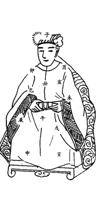
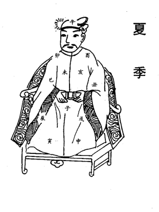
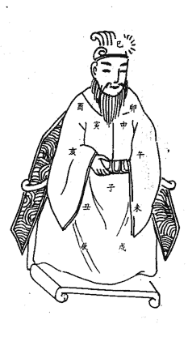
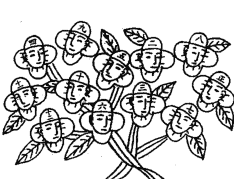
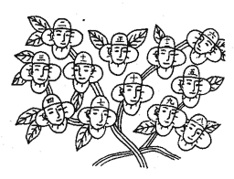
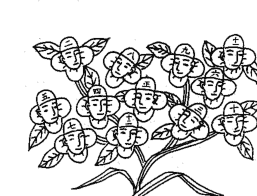
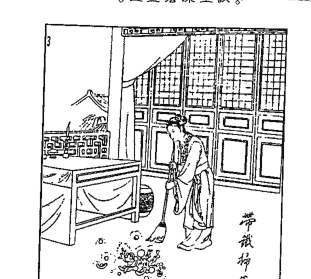
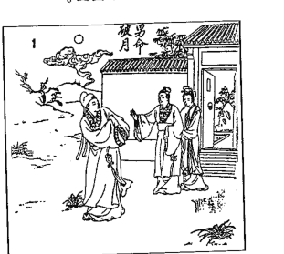
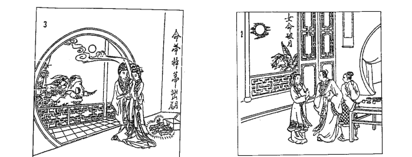

## 星盤法流星訣

樸湘潤 主編

中國哲學文化協進會

# 目 錄

書 名：星體法流星訣
著 者：梁湘潤
總 監：Alex Cho
編 輯：袁惠珍
植字排版：萬國國際發展公司
電 話：(852)81046178
出版人：曹敏碩
出 版：中華哲學文化促進會
九龍旺角皆老街43-49號禮佳樓6字47號
電 話：(852)26183861 26188861
傳 真：(852)26181277
網 址：www.168k.com 或 www.chinesebook.com.hk
電子信箱：168@168k.com
印 刷：更新印刷公司 24274536
發 行：利源書報社
九龍旺角洗衣街245-251號地下
23818251
國際書號：962-7943-34-7
定 價：28.00元(港幣300元)

版權所有
本書任何部分之文字及圖片未經出版人
書面許可，不得以任何方式抄襲或翻印。

- 原 序 …………………………………………………… 1
- 新版 流星訣序 ………………………………………… 4
- 前 言 …………………………………………………… 6
- 導 論 …………………………………………………… 13
- 星 體 神 起 例 ………………………………………… 19
- 星 體 限 詩 訣 ………………………………………… 49
- 星 熱 注 解 ………………………………………… 134
- 行 星 花 機 ………………………………………… 139
- 皇 帝 局 …………………………………………………… 164
- 瑞 池 金 葉 …………………………………………………… 174
- 開 然 胎 神 與 夜 呻 鬼 ………………………………………… 180

# 原 序

看完「星學大成」以後，心中有太多的感觸。以「流星訣」、「一掌金」、「皇帝局」、「衣留法」等等方術，看來似乎是一種簡體單方方法，它卻是「紀辨為用」、「種引據經典的系統整理」，也是「子平法」、「用神」的微妙淵源派，也說是與「邵康節」、「劉伯溫」有什麼關聯。

它不只是超過「二十」的書，甚至有十本以上是手抄本。自明代最著名的「三命通會」先賢「耶律材」以來，歷宋代之「秤金法」，有讓董之「擇日家」之氣息，歷代傳入了相當程度的「紫微」、「計」、「氣」、「七元甲子」……等天星觀念。

明代以後，以「納音五行」，重校整理，推出「月氣」（即是半年身弱，中和和平時期觀念），歷三百餘年而有今日之平穩狀況。這一個系統，三百年中人才輩出，諸如「萬育吾」、「陳淡野」、「嚴毅」、「余春」等之名士。

而「推命之訣」，則默默無聞。元代以後曾留傳於「唐、宋」三期祿命法之演變與術語，廣泛流傳於民間之中。以至俗稱「祖傳命館」，「江湖算命」，更沒有一個大士，進士出身之人，為其張揚。任憑經典，進士出身之人，為其張揚。任憑經典，進士出身之人，為其張揚。任憑經典，進士出身之人，為其張揚。任憑經典，進士出身之人，為其張揚。任憑經典，進士出身之人，為其張揚。任憑經典，進士出身之人，為其張揚。任憑經典，進士出身之人，為其張揚。任憑經典，進士出身之人，為其張揚。任憑經典，進士出身之人，為其張揚。任憑經典，進士出身之人，為其張揚。任憑經典，進士出身之人，為其張揚。任憑經典，進士出身之人，為其張揚。任憑經典，進士出身之人，為其張揚。任憑經典，進士出身之人，為其張揚。任憑經典，進士出身之人，為其張揚。任憑經典，進士出身之人，為其張揚。任憑經典，進士出身之人，為其張揚。任憑經典，進士出身之人，為其張揚。任憑經典，進士出身之人，為其張揚。任憑經典，進士出身之人，為其張揚。任憑經典，進士出身之人，為其張揚。任憑經典，進士出身之人，為其張揚。任憑經典，進士出身之人，為其張揚。任憑經典，進士出身之人，為其張揚。任憑經典，進士出身之人，為其張揚。任憑經典，進士出身之人，為其張揚。任憑經典，進士出身之人，為其張揚。任憑經典，進士出身之人，為其張揚。任憑經典，進士出身之人，為其張揚。任憑經典，進士出身之人，為其張揚。任憑經典，進士出身之人，為其張揚。任憑經典，進士出身之人，為其張揚。任憑經典，進士出身之人，為其張揚。任憑經典，進士出身之人，為其張揚。任憑經典，進士出身之人，為其張揚。任憑經典，進士出身之人，為其張揚。任憑經典，進士出身之人，為其張揚。任憑經典，進士出身之人，為其張揚。任憑經典，進士出身之人，為其張揚。任憑經典，進士出身之人，為其張揚。任憑經典，進士出身之人，為其張揚。任憑經典，進士出身之人，為其張揚。任憑經典，進士出身之人，為其張揚。任憑經典，進士出身之人，為其張揚。任憑經典，進士出身之人，為其張揚。任憑經典，進士出身之人，為其張揚。任憑經典，進士出身之人，為其張揚。任憑經典，進士出身之人，為其張揚。任憑經典，進士出身之人，為其張揚。任憑經典，進士出身之人，為其張揚。任憑經典，進士出身之人，為其張揚。任憑經典，進士出身之人，為其張揚。任憑經典，進士出身之人，為其張揚。任憑經典，進士出身之人，為其張揚。任憑經典，進士出身之人，為其張揚。任憑經典，進士出身之人，為其張揚。任憑經典，進士出身之人，為其張揚。任憑經典，進士出身之人，為其張揚。任憑經典，進士出身之人，為其張揚。任憑經典，進士出身之人，為其張揚。任憑經典，進士出身之人，為其張揚。任憑經典，進士出身之人，為其張揚。任憑經典，進士出身之人，為其張揚。任憑經典，進士出身之人，為其張揚。任憑經典，進士出身之人，為其張揚。任憑經典，進士出身之人，為其張揚。任憑經典，進士出身之人，為其張揚。任憑經典，進士出身之人，為其張揚。任憑經典，進士出身之人，為其張揚。任憑經典，進士出身之人，為其張揚。任憑經典，進士出身之人，為其張揚。任憑經典，進士出身之人，為其張揚。任憑經典，進士出身之人，為其張揚。任憑經典，進士出身之人，為其張揚。任憑經典，進士出身之人，為其張揚。任憑經典，進士出身之人，為其張揚。任憑經典，進士出身之人，為其張揚。任憑經典，進士出身之人，為其張揚。任憑經典，進士出身之人，為其張揚。任憑經典，進士出身之人，為其張揚。任憑經典，進士出身之人，為其張揚。任憑經典，進士出身之人，為其張揚。任憑經典，進士出身之人，為其張揚。任憑經典，進士出身之人，為其張揚。任憑經典，進士出身之人，為其張揚。任憑經典，進士出身之人，為其張揚。任憑經典，進士出身之人，為其張揚。任憑經典，進士出身之人，為其張揚。任憑經典，進士出身之人，為其張揚。任憑經典，進士出身之人，為其張揚。任憑經典，進士出身之人，為其張揚。任憑經典，進士出身之人，為其張揚。任憑經典，進士出身之人，為其張揚。任憑經典，進士出身之人，為其張揚。任憑經典，進士出身之人，為其張揚。任憑經典，進士出身之人，為其張揚。任憑經典，進士出身之人，為其張揚。任憑經典，進士出身之人，為其張揚。任憑經典，進士出身之人，為其張揚。任憑經典，進士出身之人，為其張揚。任憑經典，進士出身之人，為其張揚。任憑經典，進士出身之人，為其張揚。任憑經典，進士出身之人，為其張揚。任憑經典，進士出身之人，為其張揚。任憑經典，進士出身之人，為其張揚。任憑經典，進士出身之人，為其張揚。任憑經典，進士出身之人，為其張揚。任憑經典，進士出身之人，為其張揚。任憑經典，進士出身之人，為其張揚。任憑經典，進士出身之人，為其張揚。任憑經典，進士出身之人，為其張揚。任憑經典，進士出身之人，為其張揚。任憑經典，進士出身之人，為其張揚。任憑經典，進士出身之人，為其張揚。任憑經典，進士出身之人，為其張揚。任憑經典，進士出身之人，為其張揚。任憑經典，進士出身之人，為其張揚。任憑經典，進士出身之人，為其張揚。任憑經典，進士出身之人，為其張揚。任憑經典，進士出身之人，為其張揚。任憑經典，進士出身之人，為其張揚。任憑經典，進士出身之人，為其張揚。任憑經典，進士出身之人，為其張揚。任憑經典，進士出身之人，為其張揚。任憑經典，進士出身之人，為其張揚。任憑經典，進士出身之人，為其張揚。任憑經典，進士出身之人，為其張揚。任憑經典，進士出身之人，為其張揚。任憑經典，進士出身之人，為其張揚。任憑經典，進士出身之人，為其張揚。任憑經典，進士出身之人，為其張揚。任憑經典，進士出身之人，為其張揚。任憑經典，進士出身之人，為其張揚。任憑經典，進士出身之人，為其張揚。任憑經典，進士出身之人，為其張揚。任憑經典，進士出身之人，為其張揚。任憑經典，進士出身之人，為其張揚。任憑經典，進士出身之人，為其張揚。任憑經典，進士出身之人，為其張揚。任憑經典，進士出身之人，為其張揚。任憑經典，進士出身之人，為其張揚。任憑經典，進士出身之人，為其張揚。任憑經典，進士出身之人，為其張揚。任憑經典，進士出身之人，為其張揚。任憑經典，進士出身之人，為其張揚。任憑經典，進士出身之人，為其張揚。任憑經典，進士出身之人，為其張揚。任憑經典，進士出身之人，為其張揚。任憑經典，進士出身之人，為其張揚。任憑經典，進士出身之人，為其張揚。任憑經典，進士出身之人，為其張揚。任憑經典，進士出身之人，為其張揚。任憑經典，進士出身之人，為其張揚。任憑經典，進士出身之人，為其張揚。任憑經典，進士出身之人，為其張揚。任憑經典，進士出身之人，為其張揚。任憑經典，進士出身之人，為其張揚。任憑經典，進士出身之人，為其張揚。任憑經典，進士出身之人，為其張揚。任憑經典，進士出身之人，為其張揚。任憑經典，進士出身之人，為其張揚。任憑經典，進士出身之人，為其張揚。任憑經典，進士出身之人，為其張揚。任憑經典，進士出身之人，為其張揚。任憑經典，進士出身之人，為其張揚。任憑經典，進士出身之人，為其張揚。任憑經典，進士出身之人，為其張揚。任憑經典，進士出身之人，為其張揚。任憑經典，進士出身之人，為其張揚。任憑經典，進士出身之人，為其張揚。任憑經典，進士出身之人，為其張揚。任憑經典，進士出身之人，為其張揚。任憑經典，進士出身之人，為其張揚。任憑經典，進士出身之人，為其張揚。任憑經典，進士出身之人，為其張揚。任憑經典，進士出身之人，為其張揚。任憑經典，進士出身之人，為其張揚。任憑經典，進士出身之人，為其張揚。任憑經典，進士出身之人，為其張揚。任憑經典，進士出身之人，為其張揚。任憑經典，進士出身之人，為其張揚。任憑經典，進士出身之人，為其張揚。任憑經典，進士出身之人，為其張揚。任憑經典，進士出身之人，為其張揚。任憑經典，進士出身之人，為其張揚。任憑經典，進士出身之人，為其張揚。任憑經典，進士出身之人，為其張揚。任憑經典，進士出身之人，為其張揚。任憑經典，進士出身之人，為其張揚。任憑經典，進士出身之人，為其張揚。任憑經典，進士出身之人，為其張揚。任憑經典，進士出身之人，為其張揚。任憑經典，進士出身之人，為其張揚。任憑經典，進士出身之人，為其張揚。任憑經典，進士出身之人，為其張揚。任憑經典，進士出身之人，為其張揚。任憑經典，進士出身之人，為其張揚。任憑經典，進士出身之人，為其張揚。任憑經典，進士出身之人，為其張揚。任憑經典，進士出身之人，為其張揚。任憑經典，進士出身之人，為其張揚。任憑經典，進士出身之人，為其張揚。任憑經典，進士出身之人，為其張揚。任憑經典，進士出身之人，為其張揚。任憑經典，進士出身之人，為其張揚。任憑經典，進士出身之人，為其張揚。任憑經典，進士出身之人，為其張揚。任憑經典，進士出身之人，為其張揚。任憑經典，進士出身之人，為其張揚。任憑經典，進士出身之人，為其張揚。任憑經典，進士出身之人，為其張揚。任憑經典，進士出身之人，為其張揚。任憑經典，進士出身之人，為其張揚。任憑經典，進士出身之人，為其張揚。任憑經典，進士出身之人，為其張揚。任憑經典，進士出身之人，為其張揚。任憑經典，進士出身之人，為其張揚。任憑經典，進士出身之人，為其張揚。任憑經典，進士出身之人，為其張揚。任憑經典，進士出身之人，為其張揚。任憑經典，進士出身之人，為其張揚。任憑經典，進士出身之人，為其張揚。任憑經典，進士出身之人，為其張揚。任憑經典，進士出身之人，為其張揚。任憑經典，進士出身之人，為其張揚。任憑經典，進士出身之人，為其張揚。任憑經典，進士出身之人，為其張揚。任憑經典，進士出身之人，為其張揚。任憑經典，進士出身之人，為其張揚。任憑經典，進士出身之人，為其張揚。任憑經典，進士出身之人，為其張揚。任憑經典，進士出身之人，為其張揚。任憑經典，進士出身之人，為其張揚。任憑經典，進士出身之人，為其張揚。任憑經典，進士出身之人，為其張揚。任憑經典，進士出身之人，為其張揚。任憑經典，進士出身之人，為其張揚。任憑經典，進士出身之人，為其張揚。任憑經典，進士出身之人，為其張揚。任憑經典，進士出身之人，為其張揚。任憑經典，進士出身之人，為其張揚。任憑經典，進士出身之人，為其張揚。任憑經典，進士出身之人，為其張揚。任憑經典，進士出身之人，為其張揚。任憑經典，進士出身之人，為其張揚。任憑經典，進士出身之人，為其張揚。任憑經典，進士出身之人，為其張揚。任憑經典，進士出身之人，為其張揚。任憑經典，進士出身之人，為其張揚。任憑經典，進士出身之人，為其張揚。任憑經典，進士出身之人，為其張揚。任憑經典，進士出身之人，為其張揚。任憑經典，進士出身之人，為其張揚。任憑經典，進士出身之人，為其張揚。任憑經典，進士出身之人，為其張揚。任憑經典，進士出身之人，為其張揚。任憑經典，進士出身之人，為其張揚。任憑經典，進士出身之人，為其張揚。任憑經典，進士出身之人，為其張揚。任憑經典，進士出身之人，為其張揚。任憑經典，進士出身之人，為其張揚。任憑經典，進士出身之人，為其張揚。任憑經典，進士出身之人，為其張揚。任憑經典，進士出身之人，為其張揚。任憑經典，進士出身之人，為其張揚。任憑經典，進士出身之人，為其張揚。任憑經典，進士出身之人，為其張揚。任憑經典，進士出身之人，為其張揚。任憑經典，進士出身之人，為其張揚。任憑經典，進士出身之人，為其張揚。任憑經典，進士出身之人，為其張揚。任憑經典，進士出身之人，為其張揚。任憑經典，進士出身之人，為其張揚。任憑經典，進士出身之人，為其張揚。任憑經典，進士出身之人，為其張揚。任憑經典，進士出身之人，為其張揚。任憑經典，進士出身之人，為其張揚。任憑經典，進士出身之人，為其張揚。任憑經典，進士出身之人，為其張揚。任憑經典，進士出身之人，為其張揚。任憑經典，進士出身之人，為其張揚。任憑經典，進士出身之人，為其張揚。任憑經典，進士出身之人，為其張揚。任憑經典，進士出身之人，為其張揚。任憑經典，進士出身之人，為其張揚。任憑經典，進士出身之人，為其張揚。任憑經典，進士出身之人，為其張揚。任憑經典，進士出身之人，為其張揚。任憑經典，進士出身之人，為其張揚。任憑經典，進士出身之人，為其張揚。任憑經典，進士出身之人，為其張揚。任憑經典，進士出身之人，為其張揚。任憑經典，進士出身之人，為其張揚。任憑經典，進士出身之人，為其張揚。任憑經典，進士出身之人，為其張揚。任憑經典，進士出身之人，為其張揚。任憑經典，進士出身之人，為其張揚。任憑經典，進士出身之人，為其張揚。任憑經典，進士出身之人，為其張揚。任憑經典，進士出身之人，為其張揚。任憑經典，進士出身之人，為其張揚。任憑經典，進士出身之人，為其張揚。任憑經典，進士出身之人，為其張揚。任憑經典，進士出身之人，為其張揚。任憑經典，進士出身之人，為其張揚。任憑經典，進士出身之人，為其張揚。任憑經典，進士出身之人，為其張揚。任憑經典，進士出身之人，為其張揚。任憑經典，進士出身之人，為其張揚。任憑經典，進士出身之人，為其張揚。任憑經典，進士出身之人，為其張揚。任憑經典，進士出身之人，為其張揚。任憑經典，進士出身之人，為其張揚。任憑經典，進士出身之人，為其張揚。任憑經典，進士出身之人，為其張揚。任憑經典，進士出身之人，為其張揚。任憑經典，進士出身之人，為其張揚。任憑經典，進士出身之人，為其張揚。任憑經典，進士出身之人，為其張揚。任憑經典，進士出身之人，為其張揚。任憑經典，進士出身之人，為其張揚。任憑經典，進士出身之人，為其張揚。任憑經典，進士出身之人，為其張揚。任憑經典，進士出身之人，為其張揚。任憑經典，進士出身之人，為其張揚。任憑經典，進士出身之人，為其張揚。任憑經典，進士出身之人，為其張揚。任憑經典，進士出身之人，為其張揚。任憑經典，進士出身之人，為其張揚。任憑經典，進士出身之人，為其張揚。任憑經典，進士出身之人，為其張揚。任憑經典，進士出身之人，為其張揚。任憑經典，進士出身之人，為其張揚。任憑經典，進士出身之人，為其張揚。任憑經典，進士出身之人，為其張揚。任憑經典，進士出身之人，為其張揚。任憑經典，進士出身之人，為其張揚。任憑經典，進士出身之人，為其張揚。任憑經典，進士出身之人，為其張揚。任憑經典，進士出身之人，為其張揚。任憑經典，進士出身之人，為其張揚。任憑經典，進士出身之人，為其張揚。任憑經典，進士出身之人，為其張揚。任憑經典，進士出身之人，為其張揚。任憑經典，進士出身之人，為其張揚。任憑經典，進士出身之人，為其張揚。任憑經典，進士出身之人，為其張揚。任憑經典，進士出身之人，為其張揚。任憑經典，進士出身之人，為其張揚。任憑經典，進士出身之人，為其張揚。任憑經典，進士出身之人，為其張揚。任憑經典，進士出身之人，為其張揚。任憑經典，進士出身之人，為其張揚。任憑經典，進士出身之人，為其張揚。任憑經典，進士出身之人，為其張揚。任憑經典，進士出身之人，為其張揚。任憑經典，進士出身之人，為其張揚。任憑經典，進士出身之人，為其張揚。任憑經典，進士出身之人，為其張揚。任憑經典，進士出身之人，為其張揚。任憑經典，進士出身之人，為其張揚。任憑經典，進士出身之人，為其張揚。任憑經典，進士出身之人，為其張揚。任憑經典，進士出身之人，為其張揚。任憑經典，進士出身之人，為其張揚。任憑經典，進士出身之人，為其張揚。任憑經典，進士出身之人，為其張揚。任憑經典，進士出身之人，為其張揚。任憑經典，進士出身之人，為其張揚。任憑經典，進士出身之人，為其張揚。任憑經典，進士出身之人，為其張揚。任憑經典，進士出身之人，為其張揚。任憑經典，進士出身之人，為其張揚。任憑經典，進士出身之人，為其張揚。任憑經典，進士出身之人，為其張揚。任憑經典，進士出身之人，為其張揚。任憑經典，進士出身之人，為其張揚。任憑經典，進士出身之人，為其張揚。任憑經典，進士出身之人，為其張揚。任憑經典，進士出身之人，為其張揚。任憑經典，進士出身之人，為其張揚。任憑經典，進士出身之人，為其張揚。任憑經典，進士出身之人，為其張揚。任憑經典，進士出身之人，為其張揚。任憑經典，進士出身之人，為其張揚。任憑經典，進士出身之人，為其張揚。任憑經典，進士出身之人，為其張揚。任憑經典，進士出身之人，為其張揚。任憑經典，進士出身之人，為其張揚。任憑經典，進士出身之人，為其張揚。任憑經典，進士出身之人，為其張揚。任憑經典，進士出身之人，為其張揚。任憑經典，進士出身之人，為其張揚。任憑經典，進士出身之人，為其張揚。任憑經典，進士出身之人，為其張揚。任憑經典，進士出身之人，為其張揚。任憑經典，進士出身之人，為其張揚。任憑經典，進士出身之人，為其張揚。任憑經典，進士出身之人，為其張揚。任憑經典，進士出身之人，為其張揚。任憑經典，進士出身之人，為其張揚。任憑經典，進士出身之人，為其張揚。任憑經典，進士出身之人，為其張揚。任憑經典，進士出身之人，為其張揚。任憑經典，進士出身之人，為其張揚。任憑經典，進士出身之人，為其張揚。任憑經典，進士出身之人，為其張揚。任憑經典，進士出身之人，為其張揚。任憑經典，進士出身之人，為其張揚。任憑經典，進士出身之人，為其張揚。任憑經典，進士出身之人，為其張揚。任憑經典，進士出身之人，為其張揚。任憑經典，進士出身之人，為其張揚。任憑經典，進士出身之人，為其張揚。任憑經典，進士出身之人，為其張揚。任憑經典，進士出身之人，為其張揚。任憑經典，進士出身之人，為其張揚。任憑經典，進士出身之人，為其張揚。任憑經典，進士出身之人，為其張揚。任憑經典，進士出身之人，為其張揚。任憑經典，進士出身之人，為其張揚。任憑經典，進士出身之人，為其張揚。任憑經典，進士出身之人，為其張揚。任憑經典，進士出身之人，為其張揚。任憑經典，進士出身之人，為其張揚。任憑經典，進士出身之人，為其張揚。任憑經典，進士出身之人，為其張揚。任憑經典，進士出身之人，為其張揚。任憑經典，進士出身之人，為其張揚。任憑經典，進士出身之人，為其張揚。任憑經典，進士出身之人，為其張揚。任憑經典，進士出身之人，為其張揚。任憑經典，進士出身之人，為其張揚。任憑經典，進士出身之人，為其張揚。任憑經典，進士出身之人，為其張揚。任憑經典，進士出身之人，為其張揚。任憑經典，進士出身之人，為其張揚。任憑經典，進士出身之人，為其張揚。任憑經典，進士出身之人，為其張揚。任憑經典，進士出身之人，為其張揚。任憑經典，進士出身之人，為其張揚。任憑經典，進士出身之人，為其張揚。任憑經典，進士出身之人，為其張揚。任憑經典，進士出身之人，為其張揚。任憑經典，進士出身之人，為其張揚。任憑經典，進士出身之人，為其張揚。任憑經典，進士出身之人，為其張揚。任憑經典，進士出身之人，為其張揚。任憑經典，進士出身之人，為其張揚。任憑經典，進士出身之人，為其張揚。任憑經典，進士出身之人，為其張揚。任憑經典，進士出身之人，為其張揚。任憑經典，進士出身之人，為其張揚。任憑經典，進士出身之人，為其張揚。任憑經典，進士出身之人，為其張揚。任憑經典，進士出身之人，為其張揚。任憑經典，進士出身之人，為其張揚。任憑經典，進士出身之人，為其張揚。任憑經典，進士出身之人，為其張揚。任憑經典，進士出身之人，為其張揚。任憑經典，進士出身之人，為其張揚。任憑經典，進士出身之人，為其張揚。任憑經典，進士出身之人，為其張揚。任憑經典，進士出身之人，為其張揚。任憑經典，進士出身之人，為其張揚。任憑經典，進士出身之人，為其張揚。任憑經典，進士出身之人，為其張揚。任憑經典，進士出身之人，為其張揚。任憑經典，進士出身之人，為其張揚。任憑經典，進士出身之人，為其張揚。任憑經典，進士出身之人，為其張揚。任憑經典，進士出身之人，為其張揚。任憑經典，進士出身之人，為其張揚。任憑經典，進士出身之人，為其張揚。任憑經典，進士出身之人，為其張揚。任憑經典，進士出身之人，為其張揚。任憑經典，進士出身之人，為其張揚。任憑經典，進士出身之人，為其張揚。任憑經典，進士出身之人，為其張揚。任憑經典，進士出身之人，為其張揚。任憑經典，進士出身之人，為其張揚。任憑經典，進士出身之人，為其張揚。任憑經典，進士出身之人，為其張揚。任憑經典，進士出身之人，為其張揚。任憑經典，進士出身之人，為其張揚。任憑經典，進士出身之人，為其張揚。任憑經典，進士出身之人，為其張揚。任憑經典，進士出身之人，為其張揚。任憑經典，進士出身之人，為其張揚。任憑經典，進士出身之人，為其張揚。任憑經典，進士出身之人，為其張揚。任憑經典，進士出身之人，為其張揚。任憑經典，進士出身之人，為其張揚。任憑經典，進士出身之人，為其張揚。任憑經典，進士出身之人，為其張揚。任憑經典，進士出身之人，為其張揚。任憑經典，進士出身之人，為其張揚。任憑經典，進士出身之人，為其張揚。任憑經典，進士出身之人，為其張揚。任憑經典，進士出身之人，為其張揚。任憑經典，進士出身之人，為其張揚。任憑經典，進士出身之人，為其張揚。任憑經典，進士出身之人，為其張揚。任憑經典，進士出身之人，為其張揚。任憑經典，進士出身之人，為其張揚。任憑經典，進士出身之人，為其張揚。任憑經典，進士出身之人，為其張揚。任憑經典，進士出身之人，為其張揚。任憑經典，進士出身之人，為其張揚。任憑經典，進士出身之人，為其張揚。任憑經典，進士出身之人，為其張揚。任憑經典，進士出身之人，為其張揚。任憑經典，進士出身之人，為其張揚。任憑經典，進士出身之人，為其張揚。任憑經典，進士出身之人，為其張揚。任憑經典，進士出身之人，為其張揚。任憑經典，進士出身之人，為其張揚。任憑經典，進士出身之人，為其張揚。任憑經典，進士出身之人，為其張揚。任憑經典，進士出身之人，為其張揚。任憑經典，進士出身之人，為其張揚。任憑經典，進士出身之人，為其張揚。任憑經典，進士出身之人，為其張揚。任憑經典，進士出身之人，為其張揚。任憑經典，進士出身之人，為其張揚。任憑經典，進士出身之人，為其張揚。任憑經典，進士出身之人，為其張揚。任憑經典，進士出身之人，為其張揚。任憑經典，進士出身之人，為其張揚。任憑經典，進士出身之人，為其張揚。任憑經典，進士出身之人，為其張揚。任憑經典，進士出身之人，為其張揚。任憑經典，進士出身之人，為其張揚。任憑經典，進士出身之人，為其張揚。任憑經典，進士出身之人，為其張揚。任憑經典，進士出身之人，為其張揚。任憑經典，進士出身之人，為其張揚。任憑經典，進士出身之人，為其張揚。任憑經典，進士出身之人，為其張揚。任憑經典，進士出身之人，為其張揚。任憑經典，進士出身之人，為其張揚。任憑經典，進士出身之人，為其張揚。任憑經典，進士出身之人，為其張揚。任憑經典，進士出身之人，為其張揚。任憑經典，進士出身之人，為其張揚。任憑經典，進士出身之人，為其張揚。任憑經典，進士出身之人，為其張揚。任憑經典，進士出身之人，為其張揚。任憑經典，進士出身之人，為其張揚。任憑經典，進士出身之人，為其張揚。任憑經典，進士出身之人，為其張揚。任憑經典，進士出身之人，為其張揚。任憑經典，進士出身之人，為其張揚。任憑經典，進士出身之人，為其張揚。任憑經典，進士出身之人，為其張揚。任憑經典，進士出身之人，為其張揚。任憑經典，進士出身之人，為其張揚。任憑經典，進士出身之人，為其張揚。任憑經典，進士出身之人，為其張揚。任憑經典，進士出身之人，為其張揚。任憑經典，進士出身之人，為其張揚。任憑經典，進士出身之人，為其張揚。任憑經典，進士出身之人，為其張揚。任憑經典，進士出身之人，為其張揚。任憑經典，進士出身之人，為其張揚。任憑經典，進士出身之人，為其張揚。任憑經典，進士出身之人，為其張揚。任憑經典，進士出身之人，為其張揚。任憑經典，進士出身之人，為其張揚。任憑經典，進士出身之人，為其張揚。任憑經典，進士出身之人，為其張揚。任憑經典，進士出身之人，為其張揚。任憑經典，進士出身之人，為其張揚。任憑經典，進士出身之人，為其張揚。任憑經典，進士出身之人，為其張揚。任憑經典，進士出身之人，為其張揚。任憑經典，進士出身之人，為其張揚。任憑經典，進士出身之人，為其張揚。任憑經典，進士出身之人，為其張揚。任憑經典，進士出身之人，為其張揚。任憑經典，進士出身之人，為其張揚。任憑經典，進士出身之人，為其張揚。任憑經典，進士出身之人，為其張揚。任憑經典，進士出身之人，為其張揚。任憑經典，進士出身之人，為其張揚。任憑經典，進士出身之人，為其張揚。任憑經典，進士出身之人，為其張揚。任憑經典，進士出身之人，為其張揚。任憑經典，進士出身之人，為其張揚。任憑經典，進士出身之人，為其張揚。任憑經典，進士出身之人，為其張揚。任憑經典，進士出身之人，為其張揚。任憑經典，進士出身之人，為其張揚。任憑經典，進士出身之人，為其張揚。任憑經典，進士出身之人，為其張揚。任憑經典，進士出身之人，為其張揚。任憑經典，進士出身之人，為其張揚。任憑經典，進士出身之人，為其張揚。任憑經典，進士出身之人，為其張揚。任憑經典，進士出身之人，為其張揚。任憑經典，進士出身之人，為其張揚。任憑經典，進士出身之人，為其張揚。任憑經典，進士出身之人，為其張揚。任憑經典，進士出身之人，為其張揚。任憑經典，進士出身之人，為其張揚。任憑經典，進士出身之人，為其張揚。任憑經典，進士出身之人，為其張揚。任憑經典，進士出身之人，為其張揚。任憑經典，進士出身之人，為其張揚。任憑經典，進士出身之人，為其張揚。任憑經典，進士出身之人，為其張揚。任憑經典，進士出身之人，為其張揚。任憑經典，進士出身之人，為其張揚。任憑經典，進士出身之人，為其張揚。任憑經典，進士出身之人，為其張揚。任憑經典，進士出身之人，為其張揚。任憑經典，進士出身之人，為其張揚。任憑經典，進士出身之人，為其張揚。任憑經典，進士出身之人，為其張揚。任憑經典，進士出身之人，為其張揚。任憑經典，進士出身之人，為其張揚。任憑經典，進士出身之人，為其張揚。任憑經典，進士出身之人，為其張揚。任憑經典，進士出身之人，為其張揚。任憑經典，進士出身之人，為其張揚。任憑經典，進士出身之人，為其張揚。任憑經典，進士出身之人，為其張揚。任憑經典，進士出身之人，為其張揚。任憑經典，進士出身之人，為其張揚。任憑經典，進士出身之人，為其張揚。任憑經典，進士出身之人，為其張揚。任憑經典，進士出身之人，為其張揚。任憑經典，進士出身之人，為其張揚。任憑經典，進士出身之人，為其張揚。任憑經典，進士出身之人，為其張揚。任憑經典，進士出身之人，為其張揚。任憑經典，進士出身之人，為其張揚。任憑經典，進士出身之人，為其張揚。任憑經典，進士出身之人，為其張揚。任憑經典，進士出身之人，為其張揚。任憑經典，進士出身之人，為其張揚。任憑經典，進士出身之人，為其張揚。任憑經典，進士出身之人，為其張揚。任憑經典，進士出身之人，為其張揚。任憑經典，進士出身之人，為其張揚。任憑經典，進士出身之人，為其張揚。任憑經典，進士出身之人，為其張揚。任憑經典，進士出身之人，為其張揚。任憑經典，進士出身之人，為其張揚。任憑經典，進士出身之人，為其張揚。任憑經典，進士出身之人，為其張揚。任憑經典，進士出身之人，為其張揚。任憑經典，進士出身之人，為其張揚。任憑經典，進士出身之人，為其張揚。任憑經典，進士出身之人，為其張揚。任憑經典，進士出身之人，為其張揚。任憑經典，進士出身之人，為其張揚。任憑經典，進士出身之人，為其張揚。任憑經典，進士出身之人，為其張揚。任憑經典，進士出身之人，為其張揚。任憑經典，進士出身之人，為其張揚。任憑經典，進士出身之人，為其張揚。任憑經典，進士出身之人，為其張揚。任憑經典，進士出身之人，為其張揚。任憑經典，進士出身之人，為其張揚。任憑經典，進士出身之人，為其張揚。任憑經典，進士出身之人，為其張揚。任憑經典，進士出身之人，為其張揚。任憑經典，進士出身之人，為其張揚。任憑經典，進士出身之人，為其張揚。任憑經典，進士出身之人，為其張揚。任憑經典，進士出身之人，為其張揚。任憑經典，進士出身之人，為其張揚。任憑經典，進士出身之人，為其張揚。任憑經典，進士出身之人，為其張揚。任憑經典，進士出身之人，為其張揚。任憑經典，進士出身之人，為其張揚。任憑經典，進士出身之人，為其張揚。任憑經典，進士出身之人，為其張揚。任憑經典，進士出身之人，為其張揚。任憑經典，進士出身之人，為其張揚。任憑經典，進士出身之人，為其張揚。任憑經典，進士出身之人，為其張揚。任憑經典，進士出身之人，為其張揚。任憑經典，進士出身之人，為其張揚。任憑經典，進士出身之人，為其張揚。任憑經典，進士出身之人，為其張揚。任憑經典，進士出身之人，為其張揚。任憑經典，進士出身之人，為其張揚。任憑經典，進士出身之人，為其張揚。任憑經典，進士出身之人，為其張揚。任憑經典，進士出身之人，為其張揚。任憑經典，進士出身之人，為其張揚。任憑經典，進士出身之人，為其張揚。任憑經典，進士出身之人，為其張揚。任憑經典，進士出身之人，為其張揚。任憑經典，進士出身之人，為其張揚。任憑經典，進士出身之人，為其張揚。任憑經典，進士出身之人，為其張揚。任憑經典，進士出身之人，為其張揚。任憑經典，進士出身之人，為其張揚。任憑經典，進士出身之人，為其張揚。任憑經典，進士出身之人，為其張揚。任憑經典，進士出身之人，為其張揚。任憑經典，進士出身之人，為其張揚。任憑經典，進士出身之人，為其張揚。任憑經典，進士出身之人，為其張揚。任憑經典，進士出身之人，為其張揚。任憑經典，進士出身之人，為其張揚。任憑經典，進士出身之人，為其張揚。任憑經典，進士出身之人，為其張揚。任憑經典，進士出身之人，為其張揚。任憑經典，進士出身之人，為其張揚。任憑經典，進士出身之人，為其張揚。任憑經典，進士出身之人，為其張揚。任憑經典，進士出身之人，為其張揚。任憑經典，進士出身之人，為其張揚。任憑經典，進士出身之人，為其張揚。任憑經典，進士出身之人，為其張揚。任憑經典，進士出身之人，為其張揚。任憑經典，進士出身之人，為其張揚。任憑經典，進士出身之人，為其張揚。任憑經典，進士出身之人，為其張揚。任憑經典，進士出身之人，為其張揚。任憑經典，進士出身之人，為其張揚。任憑經典，進士出身之人，為其張揚。任憑經典，進士出身之人，為其張揚。任憑經典，進士出身之人，為其張揚。任憑經典，進士出身之人，為其張揚。任憑經典，進士出身之人，為其張揚。任憑經典，進士出身之人，為其張揚。任憑經典，進士出身之人，為其張揚。任憑經典，進士出身之人，為其張揚。任憑經典，進士出身之人，為其張揚。任憑經典，進士出身之人，為其張揚。任憑經典，進士出身之人，為其張揚。任憑經典，進士出身之人，為其張揚。任憑經典，進士出身之人，為其張揚。任憑經典，進士出身之人，為其張揚。任憑經典，進士出身之人，為其張揚。任憑經典，進士出身之人，為其張揚。任憑經典，進士出身之人，為其張揚。任憑經典，進士出身之人，為其張揚。任憑經典，進士出身之人，為其張揚。任憑經典，進士出身之人，為其張揚。任憑經典，進士出身之人，為其張揚。任憑經典，進士出身之人，為其張揚。任憑經典，進士出身之人，為其張揚。任憑經典，進士出身之人，為其張揚。任憑經典，進士出身之人，為其張揚。任憑經典，進士出身之人，為其張揚。任憑經典，進士出身之人，為其張揚。任憑經典，進士出身之人，為其張揚。任憑經典，進士出身之人，為其張揚。任憑經典，進士出身之人，為其張揚。任憑經典，進士出身之人，為其張揚。任憑經典，進士出身之人，為其張揚。任憑經典，進士出身之人，為其張揚。任憑經典，進士出身之人，為其張揚。任憑經典，進士出身之人，為其張揚。任憑經典，進士出身之人，為其張揚。任憑經典，進士出身之人，為其張揚。任憑經典，進士出身之人，為其張揚。任憑經典，進士出身之人，為其張揚。任憑經典，進士出身之人，為其張揚。任憑經典，進士出身之人，為其張揚。任憑經典，進士出身之人，為其張揚。任憑經典，進士出身之人，為其張揚。任憑經典，進士出身之人，為其張揚。任憑經典，進士出身之人，為其張揚。任憑經典，進士出身之人，為其張揚。任憑經典，進士出身之人，為其張揚。任憑經典，進士出身之人，為其張揚。任憑經典，進士出身之人，為其張揚。任憑經典，進士出身之人，為其張揚。任憑經典，進士出身之人，為其張揚。任憑經典，進士出身之人，為其張揚。任憑經典，進士出身之人，為其張揚。任憑經典，進士出身之人，為其張揚。任憑經典，進士出身之人，為其張揚。任憑經典，進士出身之人，為其張揚。任憑經典，進士出身之人，為其張揚。任憑經典，進士出身之人，為其張揚。任憑經典，進士出身之人，為其張揚。任憑經典，進士出身之人，為其張揚。任憑經典，進士出身之人，為其張揚。任憑經典，進士出身之人，為其張揚。任憑經典，進士出身之人，為其張揚。任憑經典，進士出身之人，為其張揚。任憑經典，進士出身之人，為其張揚。任憑經典，進士出身之人，為其張揚。任憑經典，進士出身之人，為其張揚。任憑經典，進士出身之人，為其張揚。任憑經典，進士出身之人，為其張揚。任憑經典，進士出身之人，為其張揚。任憑經典，進士出身之人，為其張揚。任憑經典，進士出身之人，為其張揚。任憑經典，進士出身之人，為其張揚。任憑經典，進士出身之人，為其張揚。任憑經典，進士出身之人，為其張揚。任憑經典，進士出身之人，為其張揚。任憑經典，進士出身之人，為其張揚。任憑經典，進士出身之人，為其張揚。任憑經典，進士出身之人，為其張揚。任憑經典，進士出身之人，為其張揚。任憑經典，進士出身之人，為其張揚。任憑經典，進士出身之人，為其張揚。任憑經典，進士出身之人，為其張揚。任憑經典，進士出身之人，為其張揚。任憑經典，進士出身之人，為其張揚。任憑經典，進士出身之人，為其張揚。任憑經典，進士出身之人，為其張揚。任憑經典，進士出身之人，為其張揚。任憑經典，進士出身之人，為其張揚。任憑經典，進士出身之人，為其張揚。任憑經典，進士出身之人，為其張揚。任憑經典，進士出身之人，為其張揚。任憑經典，進士出身之人，為其張揚。任憑經典，進士出身之人，為其張揚。任憑經典，進士出身之人，為其張揚。任憑經典，進士出身之人，為其張揚。任憑經典，進士出身之人，為其張揚。任憑經典，進士出身之人，為其張揚。任憑經典，進士出身之人，為其張揚。任憑經典，進士出身之人，為其張揚。任憑經典，進士出身之人，為其張揚。任憑經典，進士出身之人，為其張揚。任憑經典，進士出身之人，為其張揚。任憑經典，進士出身之人，為其張揚。任憑經典，進士出身之人，為其張揚。任憑經典，進士出身之人，為其張揚。任憑經典，進士出身之人，為其張揚。任憑經典，進士出身之人，為其張揚。任憑經典，進士出身之人，為其張揚。任憑經典，進士出身之人，為其張揚。任憑經典，進士出身之人，為其張揚。任憑經典，進士出身之人，為其張揚。任憑經典，進士出身之人，為其張揚。任憑經典，進士出身之人，為其張揚。任憑經典，進士出身之人，為其張揚。任憑經典，進士出身之人，為其張揚。任憑經典，進士出身之人，為其張揚。任憑經典，進士出身之人，為其張揚。任憑經典，進士出身之人，為其張揚。任憑經典，進士出身之人，為其張揚。任憑經典，進士出身之人，為其張揚。任憑經典，進士出身之人，為其張揚。任憑經典，進士出身之人，為其張揚。任憑經典，進士出身之人，為其張揚。任憑經典，進士出身之人，為其張揚。任憑經典，進士出身之人，為其張揚。任憑經典，進士出身之人，為其張揚。任憑經典，進士出身之人，為其張揚。任憑經典，進士出身之人，為其張揚。任憑經典，進士出身之人，為其張揚。任憑經典，進士出身之人，為其張揚。任憑經典，進士出身之人，為其張揚。任憑經典，進士出身之人，為其張揚。任憑經典，進士出身之人，為其張揚。任憑經典，進士出身之人，為其張揚。任憑經典，進士出身之人，為其張揚。任憑經典，進士出身之人，為其張揚。任憑經典，進士出身之人，為其張揚。任憑經典，進士出身之人，為其張揚。任憑經典，進士出身之人，為其張揚。任憑經典，進士出身之人，為其張揚。任憑經典，進士出身之人，為其張揚。任憑經典，進士出身之人，為其張揚。任憑經典，進士出身之人，為其張揚。任憑經典，進士出身之人，為其張揚。任憑經典，進士出身之人，為其張揚。任憑經典，進士出身之人，為其張揚。任憑經典，進士出身之人，為其張揚。任憑經典，進士出身之人，為其張揚。任憑經典，進士出身之人，為其張揚。任憑經典，進士出身之人，為其張揚。任憑經典，進士出身之人，為其張揚。任憑經典，進士出身之人，為其張揚。任憑經典，進士出身之人，為其張揚。任憑經典，進士出身之人，為其張揚。任憑經典，進士出身之人，為其張揚。任憑經典，進士出身之人，為其張揚。任憑經典，進士出身之人，為其張揚。任憑經典，進士出身之人，為其張揚。任憑經典，進士出身之人，為其張揚。任憑經典，進士出身之人，為其張揚。任憑經典，進士出身之人，為其張揚。任憑經典，進士出身之人，為其張揚。任憑經典，進士出身之人，為其張揚。任憑經典，進士出身之人，為其張揚。任憑經典，進士出身之人，為其張揚。任憑經典，進士出身之人，為其張揚。任憑經典，進士出身之人，為其張揚。任憑經典，進士出身之人，為其張揚。任憑經典，進士出身之人，為其張揚。任憑經典，進士出身之人，為其張揚。任憑經典，進士出身之人，為其張揚。任憑經典，進士出身之人，為其張揚。任憑經典，進士出身之人，為其張揚。任憑經典，進士出身之人，為其張揚。任憑經典，進士出身之人，為其張揚。任憑經典，進士出身之人，為其張揚。任憑經典，進士出身之人，為其張揚。任憑經典，進士出身之人，為其張揚。任憑經典，進士出身之人，為其張揚。任憑經典，進士出身之人，為其張揚。任憑經典，進士出身之人，為其張揚。任憑經典，進士出身之人，為其張揚。任憑經典，進士出身之人，為其張揚。任憑經典，進士出身之人，為其張揚。任憑經典，進士出身之人，為其張揚。任憑經典，進士出身之人，為其張揚。任憑經典，進士出身之人，為其張揚。任憑經典，進士出身之人，為其張揚。任憑經典，進士出身之人，為其張揚。任憑經典，進士出身之人，為其張揚。任憑經典，進士出身之人，為其張揚。任憑經典，進士出身之人，為其張揚。任憑經典，進士出身之人，為其張揚。任憑經典，進士出身之人，為其張揚。任憑經典，進士出身之人，為其張揚。任憑經典，進士出身之人，為其張揚。任憑經典，進士出身之人，為其張揚。任憑經典，進士出身之人，為其張揚。任憑經典，進士出身之人，為其張揚。任憑經典，進士出身之人，為其張揚。任憑經典，進士出身之人，為其張揚。任憑經典，進士出身之人，為其張揚。任憑經典，進士出身之人，為其張揚。任憑經典，進士出身之人，為其張揚。任憑經典，進士出身之人，為其張揚。任憑經典，進士出身之人，為其張揚。任憑經典，進士出身之人，為其張揚。任憑經典，進士出身之人，為其張揚。任憑經典，進士出身之人，為其張揚。任憑經典，進士出身之人，為其張揚。任憑經典，進士出身之人，為其張揚。任憑經典，進士出身之人，為其張揚。任憑經典，進士出身之人，為其張揚。任憑經典，進士出身之人，為其張揚。任憑經典，進士出身之人，為其張揚。任憑經典，進士出身之人，為其張揚。任憑經典，進士出身之人，為其張揚。任憑經典，進士出身之人，為其張揚。任憑經典，進士出身之人，為其張揚。任憑經典，進士出身之人，為其張揚。任憑經典，進士出身之人，為其張揚。任憑經典，進士出身之人，為其張揚。任憑經典，進士出身之人，為其張揚。任憑經典，進士出身之人，為其張揚。任憑經典，進士出身之人，為其張揚。任憑經典，進士出身之人，為其張揚。任憑經典，進士出身之人，為其張揚。任憑經典，進士出身之人，為其張揚。任憑經典，進士出身之人，為其張揚。任憑經典，進士出身之人，為其張揚。任憑經典，進士出身之人，為其張揚。任憑經典，進士出身之人，為其張揚。任憑經典，進士出身之人，為其張揚。任憑經典，進士出身之人，為其張揚。任憑經典，進士出身之人，為其張揚。任憑經典，進士出身之人，為其張揚。任憑經典，進士出身之人，為其張揚。任憑經典，進士出身之人，為其張揚。任憑經典，進士出身之人，為其張揚。任憑經典，進士出身之人，為其張揚。任憑經典，進士出身之人，為其張揚。任憑經典，進士出身之人，為其張揚。任憑經典，進士出身之人，為其張揚。任憑經典，進士出身之人，為其張揚。任憑經典，進士出身之人，為其張揚。任憑經典，進士出身之人，為其張揚。任憑經典，進士出身之人，為其張揚。任憑經典，進士出身之人，為其張揚。任憑經典，進士出身之人，為其張揚。任憑經典，進士出身之人，為其張揚。任憑經典，進士出身之人，為其張揚。任憑經典，進士出身之人，為其張揚。任憑經典，進士出身之人，為其張揚。任憑經典，進士出身之人，為其張揚。任憑經典，進士出身之人，為其張揚。任憑經典，進士出身之人，為其張揚。任憑經典，進士出身之人，為其張揚。任憑經典，進士出身之人，為其張揚。任憑經典，進士出身之人，為其張揚。任憑經典，進士出身之人，為其張揚。任憑經典，進士出身之人，為其張揚。任憑經典，進士出身之人，為其張揚。任憑經典，進士出身之人，為其張揚。任憑經典，進士出身之人，為其張揚。任憑經典，進士出身之人，為其張揚。任憑經典，進士出身之人，為其張揚。任憑經典，進士出身之人，為其張揚。任憑經典，進士出身之人，為其張揚。任憑經典，進士出身之人，為其張揚。任憑經典，進士出身之人，為其張揚。任憑經典，進士出身之人，為其張揚。任憑經典，進士出身之人，為其張揚。任憑經典，進士出身之人，為其張揚。任憑經典，進士出身之人，為其張揚。任憑經典，進士出身之人，為其張揚。任憑經典，進士出身之人，為其張揚。任憑經典，進士出身之人，為其張揚。任憑經典，進士出身之人，為其張揚。任憑經典，進士出身之人，為其張揚。任憑經典，進士出身之人，為其張揚。任憑經典，進士出身之人，為其張揚。任憑經典，進士出身之人，為其張揚。任憑經典，進士出身之人，為其張揚。任憑經典，進士出身之人，為其張揚。任憑經典，進士出身之人，為其張揚。任憑經典，進士出身之人，為其張揚。任憑經典，進士出身之人，為其張揚。任憑經典，進士出身之人，為其張揚。任憑經典，進士出身之人，為其張揚。任憑經典，進士出身之人，為其張揚。任憑經典，進士出身之人，為其張揚。任憑經典，進士出身之人，為其張揚。任憑經典，進士出身之人，為其張揚。任憑經典，進士出身之人，為其張揚。任憑經典，進士出身之人，為其張揚。任憑經典，進士出身之人，為其張揚。任憑經典，進士出身之人，為其張揚。任憑經典，進士出身之人，為其張揚。任憑經典，進士出身之人，為其張揚。任憑經典，進士出身之人，為其張揚。任憑經典，進士出身之人，為其張揚。任憑經典，進士出身之人，為其張揚。任憑經典，進士出身之人，為其張揚。任憑經典，進士出身之人，為其張揚。任憑經典，進士出身之人，為其張揚。任憑經典，進士出身之人，為其張揚。任憑經典，進士出身之人，為其張揚。任憑經典，進士出身之人，為其張揚。任憑經典，進士出身之人，為其張揚。任憑經典，進士出身之人，為其張揚。任憑經典，進士出身之人，為其張揚。任憑經典，進士出身之人，為其張揚。任憑經典，進士出身之人，為其張揚。任憑經典，進士出身之人，為其張揚。任憑經典，進士出身之人，為其張揚。任憑經典，進士出身之人，為其張揚。任憑經典，進士出身之人，為其張揚。任憑經典，進士出身之人，為其張揚。任憑經典，進士出身之人，為其張揚。任憑經典，進士出身之人，為其張揚。任憑經典，進士出身之人，為其張揚。任憑經典，進士出身之人，為其張揚。任憑經典，進士出身之人，為其張揚。任憑經典，進士出身之人，為其張揚。任憑經典，進士出身之人，為其張揚。任憑經典，進士出身之人，為其張揚。任憑經典，進士出身之人，為其張揚。任憑經典，進士出身之人，為其張揚。任憑經典，進士出身之人，為其張揚。任憑經典，進士出身之人，為其張揚。任憑經典，進士出身之人，為其張揚。任憑經典，進士出身之人，為其張揚。任憑經典，進士出身之人，為其張揚。任憑經典，進士出身之人，為其張揚。任憑經典，進士出身之人，為其張揚。任憑經典，進士出身之人，為其張揚。任憑經典，進士出身之人，為其張揚。任憑經典，進士出身之人，為其張揚。任憑經典，進士出身之人，為其張揚。任憑經典，進士出身之人，為其張揚。任憑經典，進士出身之人，為其張揚。任憑經典，進士出身之人，為其張揚。任憑經典，進士出身之人，為其張揚。任憑經典，進士出身之人，為其張揚。任憑經典，進士出身之人，為其張揚。任憑經典，進士出身之人，為其張揚。任憑經典，進士出身之人，為其張揚。任憑經典，進士出身之人，為其張揚。任憑經典，進士出身之人，為其張揚。任憑經典，進士出身之人，為其張揚。任憑經典，進士出身之人，為其張揚。任憑經典，進士出身之人，為其張揚。任憑經典，進士出身之人，為其張揚。任憑經典，進士出身之人，為其張揚。任憑經典，進士出身之人，為其張揚。任憑經典，進士出身之人，為其張揚。任憑經典，進士出身之人，為其張揚。任憑經典，進士出身之人，為其張揚。任憑經典，進士出身之人，為其張揚。任憑經典，進士出身之人，為其張揚。任憑經典，進士出身之人，為其張揚。任憑經典，進士出身之人，為其張揚。任憑經典，進士出身之人，為其張揚。任憑經典，進士出身之人，為其張揚。任憑經典，進士出身之人，為其張揚。任憑經典，進士出身之人，為其張揚。任憑經典，進士出身之人，為其張揚。任憑經典，進士出身之人，為其張揚。任憑經典，進士出身之人，為其張揚。任憑經典，進士出身之人，為其張揚。任憑經典，進士出身之人，為其張揚。任憑經典，進士出身之人，為其張揚。任憑經典，進士出身之人，為其張揚。任憑經典，進士出身之人，為其張揚。任憑經典，進士出身之人，為其張揚。任憑經典，進士出身之人，為其張揚。任憑經典，進士出身之人，為其張揚。任憑經典，進士出身之人，為其張揚。任憑經典，進士出身之人，為其張揚。任憑經典，進士出身之人，為其張揚。任憑經典，進士出身之人，為其張揚。任憑經典，進士出身之人，為其張揚。任憑經典，進士出身之人，為其張揚。任憑經典，進士出身之人，為其張揚。任憑經典，進士出身之人，為其張揚。任憑經典，進士出身之人，為其張揚。任憑經典，進士出身之人，為其張揚。任憑經典，進士出身之人，為其張揚。任憑經典，進士出身之人，為其張揚。任憑經典，進士出身之人，為其張揚。任憑經典，進士出身之人，為其張揚。任憑經典，進士出身之人，為其張揚。任憑經典，進士出身之人，為其張揚。任憑經典，進士出身之人，為其張揚。任憑經典，進士出身之人，為其張揚。任憑經典，進士出身之人，為其張揚。任憑經典，進士出身之人，為其張揚。任憑經典，進士出身之人，為其張揚。任憑經典，進士出身之人，為其張揚。任憑經典，進士出身之人，為其張揚。任憑經典，進士出身之人，為其張揚。任憑經典，進士出身之人，為其張揚。任憑經典，進士出身之人，為其張揚。任憑經典，進士出身之人，為其張揚。任憑經典，進士出身之人，為其張揚。任憑經典，進士出身之人，為其張揚。任憑經典，進士出身之人，為其張揚。任憑經典，進士出身之人，為其張揚。任憑經典，進士出身之人，為其張揚。任憑經典，進士出身之人，為其張揚。任憑經典，進士出身之人，為其張揚。任憑經典，進士出身之人，為其張揚。任憑經典，進士出身之人，為其張揚。任憑經典，進士出身之人，為其張揚。任憑經典，進士出身之人，為其張揚。任憑經典，進士出身之人，為其張揚。任憑經典，進士出身之人，為其張揚。任憑經典，進士出身之人，為其張揚。任憑經典，進士出身之人，為其張揚。任憑經典，進士出身之人，為其張揚。任憑經典，進士出身之人，為其張揚。任憑經典，進士出身之人，為其張揚。任憑經典，進士出身之人，為其張揚。任憑經典，進士出身之人，為其張揚。任憑經典，進士出身之人，為其張揚。任憑經典，進士出身之人，為其張揚。任憑經典，進士出身之人，為其張揚。任憑經典，進士出身之人，為其張揚。任憑經典，進士出身之人，為其張揚。任憑經典，進士出身之人，為其張揚。任憑經典，進士出身之人，為其張揚。任憑經典，進士出身之人，為其張揚。任憑經典，進士出身之人，為其張揚。任憑經典，進士出身之人，為其張揚。任憑經典，進士出身之人，為其張揚。任憑經典，進士出身之人，為其張揚。任憑經典，進士出身之人，為其張揚。任憑經典，進士出身之人，為其張揚。任憑經典，進士出身之人，為其張揚。任憑經典，進士出身之人，為其張揚。任憑經典，進士出身之人，為其張揚。任憑經典，進士出身之人，為其張揚。任憑經典，進士出身之人，為其張揚。任憑經典，進士出身之人，為其張揚。任憑經典，進士出身之人，為其張揚。任憑經典，進士出身之人，為其張揚。任憑經典，進士出身之人，為其張揚。任憑經典，進士出身之人，為其張揚。任憑經典，進士出身之人，為其張揚。任憑經典，進士出身之人，為其張揚。任憑經典，進士出身之人，為其張揚。任憑經典，進士出身之人，為其張揚。任憑經典，進士出身之人，為其張揚。任憑經典，進士出身之人，為其張揚。任憑經典，進士出身之人，為其張揚。任憑經典，進士出身之人，為其張揚。任憑經典，進士出身之人，為其張揚。任憑經典，進士出身之人，為其張揚。任憑經典，進士出身之人，為其張揚。任憑經典，進士出身之人，為其張揚。任憑經典，進士出身之人，為其張揚。任憑經典，進士出身之人，為其張揚。任憑經典，進士出身之人，為其張揚。任憑經典，進士出身之人，為其張揚。任憑經典，進士出身之人，為其張揚。任憑經典，進士出身之人，為其張揚。任憑經典，進士出身之人，為其張揚。任憑經典，進士出身之人，為其張揚。任憑經典，進士出身之人，為其張揚。任憑經典，進士出身之人，為其張揚。任憑經典，進士出身之人，為其張揚。任憑經典，進士出身之人，為其張揚。任憑經典，進士出身之人，為其張揚。任憑經典，進士出身之人，為其張揚。任憑經典，進士出身之人，為其張揚。任憑經典，進士出身之人，為其張揚。任憑經典，進士出身之人，為其張揚。任憑經典，進士出身之人，為其張揚。任憑經典，進士出身之人，為其張揚。任憑經典，進士出身之人，為其張揚。任憑經典，進士出身之人，為其張揚。任憑經典，進士出身之人，為其張揚。任憑經典，進士出身之人，為其張揚。任憑經典，進士出身之人，為其張揚。任憑經典，進士出身之人，為其張揚。任憑經典，進士出身之人，為其張揚。任憑經典，進士出身之人，為其張揚。任憑經典，進士出身之人，為其張揚。任憑經典，進士出身之人，為其張揚。任憑經典，進士出身之人，為其張揚。任憑經典，進士出身之人，為其張揚。任憑經典，進士出身之人，為其張揚。任憑經典，進士出身之人，為其張揚。任憑經典，進士出身之人，為其張揚。任憑經典，進士出身之人，為其張揚。任憑經典，進士出身之人，為其張揚。任憑經典，進士出身之人，為其張揚。任憑經典，進士出身之人，為其張揚。任憑經典，進士出身之人，為其張揚。任憑經典，進士出身之人，為其張揚。任憑經典，進士出身之人，為其張揚。任憑經典，進士出身之人，為其張揚。任憑經典，進士出身之人，為其張揚。任憑經典，進士出身之人，為其張揚。任憑經典，進士出身之人，為其張揚。任憑經典，進士出身之人，為其張揚。任憑經典，進士出身之人，為其張揚。任憑經典，進士出身之人，為其張揚。任憑經典，進士出身之人，為其張揚。任憑經典，進士出身之人，為其張揚。任憑經典，進士出身之人，為其張揚。任憑經典，進士出身之人，為其張揚。任憑經典，進士出身之人，為其張揚。任憑經典，進士出身之人，為其張揚。任憑經典，進士出身之人，為其張揚。任憑經典，進士出身之人，為其張揚。任憑經典，進士出身之人，為其張揚。任憑經典，進士出身之人，為其張揚。任憑經典，進士出身之人，為其張揚。任憑經典，進士出身之人，為其張揚。任憑經典，進士出身之人，為其張揚。任憑經典，進士出身之人，為其張揚。任憑經典，進士出身之人，為其張揚。任憑經典，進士出身之人，為其張揚。任憑經典，進士出身之人，為其張揚。任憑經典，進士出身之人，為其張揚。任憑經典，進士出身之人，為其張揚。任憑經典，進士出身之人，為其張揚。任憑經典，進士出身之人，為其張揚。任憑經典，進士出身之人，為其張揚。任憑經典，進士出身之人，為其張揚。任憑經典，進士出身之人，為其張揚。任憑經典，進士出身之人，為其張揚。任憑經典，進士出身之人，為其張揚。任憑經典，進士出身之人，為其張揚。任憑經典，進士出身之人，為其張揚。任憑經典，進士出身之人，為其張揚。任憑經典，進士出身之人，為其張揚。任憑經典，進士出身之人，為其張揚。任憑經典，進士出身之人，為其張揚。任憑經典，進士出身之人，為其張揚。任憑經典，進士出身之人，為其張揚。任憑經典，進士出身之人，為其張揚。任憑經典，進士出身之人，為其張揚。任憑經典，進士出身之人，為其張揚。任憑經典，進士出身之人，為其張揚。任憑經典，進士出身之人，為其張揚。任憑經典，進士出身之人，為其張揚。任憑經典，進士出身之人，為其張揚。任憑經典，進士出身之人，為其張揚。任憑經典，進士出身之人，為其張揚。任憑經典，進士出身之人，為其張揚。任憑經典，進士出身之人，為其張揚。任憑經典，進士出身之人，為其張揚。任憑經典，進士出身之人，為其張揚。任憑經典，進士出身之人，為其張揚。任憑經典，進士出身之人，為其張揚。任憑經典，進士出身之人，為其張揚。任憑經典，進士出身之人，為其張揚。任憑經典，進士出身之人，為其張揚。任憑經典，進士出身之人，為其張揚。任憑經典，進士出身之人，為其張揚。任憑經典，進士出身之人，為其張揚。任憑經典，進士出身之人，為其張揚。任憑經典，進士出身之人，為其張揚。任憑經典，進士出身之人，為其張揚。任憑經典，進士出身之人，為其張揚。任憑經典，進士出身之人，為其張揚。任憑經典，進士出身之人，為其張揚。任憑經典，進士出身之人，為其張揚。任憑經典，進士出身之人，為其張揚。任憑經典，進士出身之人，為其張揚。任憑經典，進士出身之人，為其張揚。任憑經典，進士出身之人，為其張揚。任憑經典，進士出身之人，為其張揚。任憑經典，進士出身之人，為其張揚。任憑經典，進士出身之人，為其張揚。任憑經典，進士出身之人，為其張揚。任憑經典，進士出身之人，為其張揚。任憑經典，進士出身之人，為其張揚。任憑經典，進士出身之人，為其張揚。任憑經典，進士出身之人，為其張揚。任憑經典，進士出身之人，為其張揚。任憑經典，進士出身之人，為其張揚。任憑經典，進士出身之人，為其張揚。任憑經典，進士出身之人，為其張揚。任憑經典，進士出身之人，為其張揚。任憑經典，進士出身之人，為其張揚。任憑經典，進士出身之人，為其張揚。任憑經典，進士出身之人，為其張揚。任憑經典，進士出身之人，為其張揚。任憑經典，進士出身之人，為其張揚。任憑經典，進士出身之人，為其張揚。任憑經典，進士出身之人，為其張揚。任憑經典，進士出身之人，為其張揚。任憑經典，進士出身之人，為其張揚。任憑經典，進士出身之人，為其張揚。任憑經典，進士出身之人，為其張揚。任憑經典，進士出身之人，為其張揚。任憑經典，進士出身之人，為其張揚。任憑經典，進士出身之人，為其張揚。任憑經典，進士出身之人，為其張揚。任憑經典，進士出身之人，為其張揚。任憑經典，進士出身之人，為其張揚。任憑經典，進士出身之人，為其張揚。任憑經典，進士出身之人，為其張揚。任憑經典，進士出身之人，為其張揚。任憑經典，進士出身之人，為其張揚。任憑經典，進士出身之人，為其張揚。任憑經典，進士出身之人，為其張揚。任憑經典，進士出身之人，為其張揚。任憑經典，進士出身之人，為其張揚。任憑經典，進士出身之人，為其張揚。任憑經典，進士出身之人，為其張揚。任憑經典，進士出身之人，為其張揚。任憑經典，進士出身之人，為其張揚。任憑經典，進士出身之人，為其張揚。任憑經典，進士出身之人，為其張揚。任憑經典，進士出身之人，為其張揚。任憑經典，進士出身之人，為其張揚。任憑經典，進士出身之人，為其張揚。任憑經典，進士出身之人，為其張揚。任憑經典，進士出身之人，為其張揚。任憑經典，進士出身之人，為其張揚。任憑經典，進士出身之人，為其張揚。任憑經典，進士出身之人，為其張揚。任憑經典，進士出身之人，為其張揚。任憑經典，進士出身之人，為其張揚。任憑經典，進士出身之人，為其張揚。任憑經典，進士出身之人，為其張揚。任憑經典，進士出身之人，為其張揚。任憑經典，進士出身之人，為其張揚。任憑經典，進士出身之人，為其張揚。任憑經典，進士出身之人，為其張揚。任憑經典，進士出身之人，為其張揚。任憑經典，進士出身之人，為其張揚。任憑經典，進士出身之人，為其張揚。任憑經典，進士出身之人，為其張揚。任憑經典，進士出身之人，為其張揚。任憑經典，進士出身之人，為其張揚。任憑經典，進士出身之人，為其張揚。任憑經典，進士出身之人，為其張揚。任憑經典，進士出身之人，為其張揚。任憑經典，進士出身之人，為其張揚。任憑經典，進士出身之人，為其張揚。任憑經典，進士出身之人，為其張揚。任憑經典，進士出身之人，為其張揚。任憑經典，進士出身之人，為其張揚。任憑經典，進士出身之人，為其張揚。任憑經典，進士出身之人，為其張揚。任憑經典，進士出身之人，為其張揚。任憑經典，進士出身之人，為其張揚。任憑經典，進士出身之人，為其張揚。任憑經典，進士出身之人，為其張揚。任憑經典，進士出身之人，為其張揚。任憑經典，進士出身之人，為其張揚。任憑經典，進士出身之人，為其張揚。任憑經典，進士出身之人，為其張揚。任憑經典，進士出身之人，為其張揚。任憑經典，進士出身之人，為其張揚。任憑經典，進士出身之人，為其張揚。任憑經典，進士出身之人，為其張揚。任憑經典，進士出身之人，為其張揚。任憑經典，進士出身之人，為其張揚。任憑經典，進士出身之人，為其張揚。任憑經典，進士出身之人，為其張揚。任憑經典，進士出身之人，為其張揚。任憑經典，進士出身之人，為其張揚。任憑經典，進士出身之人，為其張揚。任憑經典，進士出身之人，為其張揚。任憑經典，進士出身之人，為其張揚。任憑經典，進士出身之人，為其張揚。任憑經典，進士出身之人，為其張揚。任憑經典，進士出身之人，為其張揚。任憑經典，進士出身之人，為其張揚。任憑經典，進士出身之人，為其張揚。任憑經典，進士出身之人，為其張揚。任憑經典，進士出身之人，為其張揚。任憑經典，進士出身之人，為其張揚。任憑經典，進士出身之人，為其張揚。任憑經典，進士出身之人，為其張揚。任憑經典，進士出身之人，為其張揚。任憑經典，進士出身之人，為其張揚。任憑經典，進士出身之人，為其張揚。任憑經典，進士出身之人，為其張揚。任憑經典，進士出身之人，為其張揚。任憑經典，進士出身之人，為其張揚。任憑經典，進士出身之人，為其張揚。任憑經典，進士出身之人，為其張揚。任憑經典，進士出身之人，為其張揚。任憑經典，進士出身之人，為其張揚。任憑經典，進士出身之人，為其張揚。任憑經典，進士出身之人，為其張揚。任憑經典，進士出身之人，為其張揚。任憑經典，進士出身之人，為其張揚。任憑經典，進士出身之人，為其張揚。任憑經典，進士出身之人，為其張揚。任憑經典，進士出身之人，為其張揚。任憑經典，進士出身之人，為其張揚。任憑經典，進士出身之人，為其張揚。任憑經典，進士出身之人，為其張揚。任憑經典，進士出身之人，為其張揚。任憑經典，進士出身之人，為其張揚。任憑經典，進士出身之人，為其張揚。任憑經典，進士出身之人，為其張揚。任憑經典，進士出身之人，為其張揚。任憑經典，進士出身之人，為其張揚。任憑經典，進士出身之人，為其張揚。任憑經典，進士出身之人，為其張揚。任憑經典，進士出身之人，為其張揚。任憑經典，進士出身之人，為其張揚。任憑經典，進士出身之人，為其張揚。任憑經典，進士出身之人，為其張揚。任憑經典，進士出身之人，為其張揚。任憑經典，進士出身之人，為其張揚。任憑經典，進士出身之人，為其張揚。任憑經典，進士出身之人，為其張揚。任憑經典，進士出身之人，為其張揚。任憑經典，進士出身之人，為其張揚。任憑經典，進士出身之人，為其張揚。任憑經典，進士出身之人，為其張揚。任憑經典，進士出身之人，為其張揚。任憑經典，進士出身之人，為其張揚。任憑經典，進士出身之人，為其張揚。任憑經典，進士出身之人，為其張揚。任憑經典，進士出身之人，為其張揚。任憑經典，進士出身之人，為其張揚。任憑經典，進士出身之人，為其張揚。任憑經典，進士出身之人，為其張揚。任憑經典，進士出身之人，為其張揚。任憑經典，進士出身之人，為其張揚。任憑經典，進士出身之人，為其張揚。任憑經典，進士出身之人，為其張揚。任憑經典，進士出身之人，為其張揚。任憑經典，進士出身之人，為其張揚。任憑經典，進士出身之人，為其張揚。任憑經典，進士出身之人，為其張揚。任憑經典，進士出身之人，為其張揚。任憑經典，進士出身之人，為其張揚。任憑經典，進士出身之人，為其張揚。任憑經典，進士出身之人，為其張揚。任憑經典，進士出身之人，為其張揚。任憑經典，進士出身之人，為其張揚。任憑經典，進士出身之人，為其張揚。任憑經典，進士出身之人，為其張揚。任憑經典，進士出身之人，為其張揚。任憑經典，進士出身之人，為其張揚。任憑經典，進士出身之人，為其張揚。任憑經典，進士出身之人，為其張揚。任憑經典，進士出身之人，為其張揚。任憑經典，進士出身之人，為其張揚。任憑經典，進士出身之人，為其張揚。任憑經典，進士出身之人，為其張揚。任憑經典，進士出身之人，為其張揚。任憑經典，進士出身之人，為其張揚。任憑經典，進士出身之人，為其張揚。任憑經典，進士出身之人，為其張揚。任憑經典，進士出身之人，為其張揚。任憑經典，進士出身之人，為其張揚。任憑經典，進士出身之人，為其張揚。任憑經典，進士出身之人，為其張揚。任憑經典，進士出身之人，為其張揚。任憑經典，進士出身之人，為其張揚。任憑經典，進士出身之人，為其張揚。任憑經典，進士出身之人，為其張揚。任憑經典，進士出身之人，為其張揚。任憑經典，進士出身之人，為其張揚。任憑經典，進士出身之人，為其張揚。任憑經典，進士出身之人，為其張揚。任憑經典，進士出身之人，為其張揚。任憑經典，進士出身之人，為其張揚。任憑經典，進士出身之人，為其張揚。任憑經典，進士出身之人，為其張揚。任憑經典，進士出身之人，為其張揚。任憑經典，進士出身之人，為其張揚。任憑經典，進士出身之人，為其張揚。任憑經典，進士出身之人，為其張揚。任憑經典，進士出身之人，為其張揚。任憑經典，進士出身之人，為其張揚。任憑經典，進士出身之人，為其張揚。任憑經典，進士出身之人，為其張揚。任憑經典，進士出身之人，為其張揚。任憑經典，進士出身之人，為其張揚。任憑經典，進士出身之人，為其張揚。任憑經典，進士出身之人，為其張揚。任憑經典，進士出身之人，為其張揚。任憑經典，進士出身之人，為其張揚。任憑經典，進士出身之人，為其張揚。任憑經典，進士出身之人，為其張揚。任憑經典，進士出身之人，為其張揚。任憑經典，進士出身之人，為其張揚。任憑經典，進士出身之人，為其張揚。任憑經典，進士出身之人，為其張揚。任憑經典，進士出身之人，為其張揚。任憑經典，進士出身之人，為其張揚。任憑經典，進士出身之人，為其張揚。任憑經典，進士出身之人，為其張揚。任憑經典，進士出身之人，為其張揚。任憑經典，進士出身之人，為其張揚。任憑經典，進士出身之人，為其張揚。任憑經典，進士出身之人，為其張揚。任憑經典，進士出身之人，為其張揚。任憑經典，進士出身之人，為其張揚。任憑經典，進士出身之人，為其張揚。任憑經典，進士出身之人，為其張揚。任憑經典，進士出身之人，為其張揚。任憑經典，進士出身之人，為其張揚。任憑經典，進士出身之人，為其張揚。任憑經典，進士出身之人，為其張揚。任憑經典，進士出身之人，為其張揚。任憑經典，進士出身之人，為其張揚。任憑經典，進士出身之人，為其張揚。任憑經典，進士出身之人，為其張揚。任憑經典，進士出身之人，為其張揚。任憑經典，進士出身之人，為其張揚。任憑經典，進士出身之人，為其張揚。任憑經典，進士出身之人，為其張揚。任憑經典，進士出身之人，為其張揚。任憑經典，進士出身之人，為其張揚。任憑經典，進士出身之人，為其張揚。任憑經典，進士出身之人，為其張揚。任憑經典，進士出身之人，為其張揚。任憑經典，進士出身之人，為其張揚。任憑經典，進士出身之人，為其張揚。任憑經典，進士出身之人，為其張揚。任憑經典，進士出身之人，為其張揚。任憑經典，進士出身之人，為其張揚。任憑經典，進士出身之人，為其張揚。任憑經典，進士出身之人，為其張揚。任憑經典，進士出身之人，為其張揚。任憑經典，進士出身之人，為其張揚。任憑經典，進士出身之人，為其張揚。任憑經典，進士出身之人，為其張揚。任憑經典，進士出身之人，為其張揚。任憑經典，進士出身之人，為其張揚。任憑經典，進士出身之人，為其張揚。任憑經典，進士出身之人，為其張揚。任憑經典，進士出身之人，為其張揚。任憑經典，進士出身之人，為其張揚。任憑經典，進士出身之人，為其張揚。任憑經典，進士出身之人，為其張揚。任憑經典，進士出身之人，為其張揚。任憑經典，進士出身之人，為其張揚。任憑經典，進士出身之人，為其張揚。任憑經典，進士出身之人，為其張揚。任憑經典，進士出身之人，為其張揚。任憑經典，進士出身之人，為其張揚。任憑經典，進士出身之人，為其張揚。任憑經典，進士出身之人，為其張揚。任憑經典，進士出身之人，為其張揚。任憑經典，進士出身之人，為其張揚。任憑經典，進士出身之人，為其張揚。任憑經典，進士出身之人，為其張揚。任憑經典，進士出身之人，為其張揚。任憑經典，進士出身之人，為其張揚。任憑經典，進士出身之人，為其張揚。任憑經典，進士出身之人，為其張揚。任憑經典，進士出身之人，為其張揚。任憑經典，進士出身之人，為其張揚。任憑經典，進士出身之人，為其張揚。任憑經典，進士出身之人，為其張揚。任憑經典，進士出身之人，為其張揚。任憑經典，進士出身之人，為其張揚。任憑經典，進士出身之人，為其張揚。任憑經典，進士出身之人，為其張揚。任憑經典，進士出身之人，為其張揚。任憑經典，進士出身之人，為其張揚。任憑經典，進士出身之人，為其張揚。任憑經典，進士出身之人，為其張揚。任憑經典，進士出身之人，為其張揚。任憑經典，進士出身之人，為其張揚。任憑經典，進士出身之人，為其張揚。任憑經典，進士出身之人，為其張揚。任憑經典，進士出身之人，為其張揚。任憑經典，進士出身之人，為其張揚。任憑經典，進士出身之人，為其張揚。任憑經典，進士出身之人，為其張揚。任憑經典，進士出身之人，為其張揚。任憑經典，進士出身之人，為其張揚。任憑經典，進士出身之人，為其張揚。任憑經典，進士出身之人，為其張揚。任憑經典，進士出身之人，為其張揚。任憑經典，進士出身之人，為其張揚。任憑經典，進士出身之人，為其張揚。任憑經典，進士出身之人，為其張揚。任憑經典，進士出身之人，為其張揚。任憑經典，進士出身之人，為其張揚。任憑經典，進士出身之人，為其張揚。任憑經典，進士出身之人，為其張揚。任憑經典，進士出身之人，為其張揚。任憑經典，進士出身之人，為其張揚。任憑經典，進士出身之人，為其張揚。任憑經典，進士出身之人，為其張揚。任憑經典，進士出身之人，為其張揚。任憑經典，進士出身之人，為其張揚。任憑經典，進士出身之人，為其張揚。任憑經典，進士出身之人，為其張揚。任憑經典，進士出身之人，為其張揚。任憑經典，進士出身之人，為其張揚。任憑經典，進士出身之人，為其張揚。任憑經典，進士出身之人，為其張揚。任憑經典，進士出身之人，為其張揚。任憑經典，進士出身之人，為其張揚。任憑經典，進士出身之人，為其張揚。任憑經典，進士出身之人，為其張揚。任憑經典，進士出身之人，為其張揚。任憑經典，進士出身之人，為其張揚。任憑經典，進士出身之人，為其張揚。任憑經典，進士出身之人，為其張揚。任憑經典，進士出身之人，為其張揚。任憑經典，進士出身之人，為其張揚。任憑經典，進士出身之人，為其張揚。任憑經典，進士出身之人，為其張揚。任憑經典，進士出身之人，為其張揚。任憑經典，進士出身之人，為其張揚。任憑經典，進士出身之人，為其張揚。任憑經典，進士出身之人，為其張揚。任憑經典，進士出身之人，為其張揚。任憑經典，進士出身之人，為其張揚。任憑經典，進士出身之人，為其張揚。任憑經典，進士出身之人，為其張揚。任憑經典，進士出身之人，為其張揚。任憑經典，進士出身之人，為其張揚。任憑經典，進士出身之人，為其張揚。任憑經典，進士出身之人，為其張揚。任憑經典，進士出身之人，為其張揚。任憑經典，進士出身之人，為其張揚。任憑經典，進士出身之人，為其張揚。任憑經典，進士出身之人，為其張揚。任憑經典，進士出身之人，為其張揚。任憑經典，進士出身之人，為其張揚。任憑經典，進士出身之人，為其張揚。任憑經典，進士出身之人，為其張揚。任憑經典，進士出身之人，為其張揚。任憑經典，進士出身之人，為其張揚。任憑經典，進士出身之人，為其張揚。任憑經典，進士出身之人，為其張揚。任憑經典，進士出身之人，為其張揚。任憑經典，進士出身之人，為其張揚。任憑經典，進士出身之人，為其張揚。任憑經典，進士出身之人，為其張揚。任憑經典，進士出身之人，為其張揚。任憑經典，進士出身之人，為其張揚。任憑經典，進士出身之人，為其張揚。任憑經典，進士出身之人，為其張揚。任憑經典，進士出身之人，為其張揚。任憑經典，進士出身之人，為其張揚。任憑經典，進士出身之人，為其張揚。任憑經典，進士出身之人，為其張揚。任憑經典，進士出身之人，為其張揚。任憑經典，進士出身之人，為其張揚。任憑經典，進士出身之人，為其張揚。任憑經典，進士出身之人，為其張揚。任憑經典，進士出身之人，為其張揚。任憑經典，進士出身之人，為其張揚。任憑經典，進士出身之人，為其張揚。任憑經典，進士出身之人，為其張揚。任憑經典，進士出身之人，為其張揚。任憑經典，進士出身之人，為其張揚。任憑經典，進士出身之人，為其張揚。任憑經典，進士出身之人，為其張揚。任憑經典，進士出身之人，為其張揚。任憑經典，進士出身之人，為其張揚。任憑經典，進士出身之人，為其張揚。任憑經典，進士出身之人，為其張揚。任憑經典，進士出身之人，為其張揚。任憑經典，進士出身之人，為其張揚。任憑經典，進士出身之人，為其張揚。任憑經典，進士出身之人，為其張揚。任憑經典，進士出身之人，為其張揚。任憑經典，進士出身之人，為其張揚。任憑經典，進士出身之人，為其張揚。任憑經典，進士出身之人，為其張揚。任憑經典，進士出身之人，為其張揚。任憑經典，進士出身之人，為其張揚。任憑經典，進士出身之人，為其張揚。任憑經典，進士出身之人，為其張揚。任憑經典，進士出身之人，為其張揚。任憑經典，進士出身之人，為其張揚。任憑經典，進士出身之人，為其張揚。任憑經典，進士出身之人，為其張揚。任憑經典，進士出身之人，為其張揚。任憑經典，進士出身之人，為其張揚。任憑經典，進士出身之人，為其張揚。任憑經典，進士出身之人，為其張揚。任憑經典，進士出身之人，為其張揚。任憑經典，進士出身之人，為其張揚。任憑經典，進士出身之人，為其張揚。任憑經典，進士出身之人，為其張揚。任憑經典，進士出身之人，為其張揚。任憑經典，進士出身之人，為其張揚。任憑經典，進士出身之人，為其張揚。任憑經典，進士出身之人，為其張揚。任憑經典，進士出身之人，為其張揚。任憑經典，進士出身之人，為其張揚。任憑經典，進士出身之人，為其張揚。任憑經典，進士出身之人，為其張揚。任憑經典，進士出身之人，為其張揚。任憑經典，進士出身之人，為其張揚。任憑經典，進士出身之人，為其張揚。任憑經典，進士出身之人，為其張揚。任憑經典，進士出身之人，為其張揚。任憑經典，進士出身之人，為其張揚。任憑經典，進士出身之人，為其張揚。任憑經典，進士出身之人，為其張揚。任憑經典，進士出身之人，為其張揚。任憑經典，進士出身之人，為其張揚。任憑經典，進士出身之人，為其張揚。任憑經典，進士出身之人，為其張揚。任憑經典，進士出身之人，為其張揚。任憑經典，進士出身之人，為其張揚。任憑經典，進士出身之人，為其張揚。任憑經典，進士出身之人，為其張揚。任憑經典，進士出身之人，為其張揚。任憑經典，進士出身之人，為其張揚。任憑經典，進士出身之人，為其張揚。任憑經典，進士出身之人，為其張揚。任憑經典，進士出身之人，為其張揚。任憑經典，進士出身之人，為其張揚。任憑經典，進士出身之人，為其張揚。任憑經典，進士出身之人，為其張揚。任憑經典，進士出身之人，為其張揚。任憑經典，進士出身之人，為其張揚。任憑經典，進士出身之人，為其張揚。任憑經典，進士出身之人，為其張揚。任憑經典，進士出身之人，為其張揚。任憑經典，進士出身之人，為其張揚。任憑經典，進士出身之人，為其張揚。任憑經典，進士出身之人，為其張揚。任憑經典，進士出身之人，為其張揚。任憑經典，進士出身之人，為其張揚。任憑經典，進士出身之人，為其張揚。任憑經典，進士出身之人，為其張揚。任憑經典，進士出身之人，為其張揚。任憑經典，進士出身之人，為其張揚。任憑經典，進士出身之人，為其張揚。任憑經典，進士出身之人，為其張揚。任憑經典，進士出身之人，為其張揚。任憑經典，進士出身之人，為其張揚。任憑經典，進士出身之人，為其張揚。任憑經典，進士出身之人，為其張揚。任憑經典，進士出身之人，為其張揚。任憑經典，進士出身之人，為其張揚。任憑經典，進士出身之人，為其張揚。任憑經典，進士出身之人，為其張揚。任憑經典，進士出身之人，為其張揚。任憑經典，進士出身之人，為其張揚。任憑經典，進士出身之人，為其張揚。任憑經典，進士出身之人，為其張揚。任憑經典，進士出身之人，為其張揚。任憑經典，進士出身之人，為其張揚。任憑經典，進士出身之人，為其張揚。任憑經典，進士出身之人，為其張揚。任憑經典，進士出身之人，為其張揚。任憑經典，進士出身之人，為其張揚。任憑經典，進士出身之人，為其張揚。任憑經典，進士出身之人，為其張揚。任憑經典，進士出身之人，為其張揚。任憑經典，進士出身之人，為其張揚。任憑經典，進士出身之人，為其張揚。任憑經典，進士出身之人，為其張揚。任憑經典，進士出身之人，為其張揚。任憑經典，進士出身之人，為其張揚。任憑經典，進士出身之人，為其張揚。任憑經典，進士出身之人，為其張揚。任憑經典，進士出身之人，為其張揚。任憑經典，進士出身之人，為其張揚。任憑經典，進士出身之人，為其張揚。任憑經典，進士出身之人，為其張揚。任憑經典，進士出身之人，為其張揚。任憑經典，進士出身之人，為其張揚。任憑經典，進士出身之人，為其張揚。任憑經典，進士出身之人，為其張揚。任憑經典，進士出身之人，為其張揚。任憑經典，進士出身之人，為其張揚。任憑經典，進士出身之人，為其張揚。任憑經典，進士出身之人，為其張揚。任憑經典，進士出身之人，為其張揚。任憑經典，進士出身之人，為其張揚。任憑經典，進士出身之人，為其張揚。任憑經典，進士出身之人，為其張揚。任憑經典，進士出身之人，為其張揚。任憑經典，進士出身之人，為其張揚。任憑經典，進士出身之人，為其張揚。任憑經典，進士出身之人，為其張揚。任憑經典，進士出身之人，為其張揚。任憑經典，進士出身之人，為其張揚。任憑經典，進士出身之人，為其張揚。任憑經典，進士出身之人，為其張揚。任憑經典，進士出身之人，為其張揚。任憑經典，進士出身之人，為其張揚。任憑經典，進士出身之人，為其張揚。任憑經典，進士出身之人，為其張揚。任憑經典，進士出身之人，為其張揚。任憑經典，進士出身之人，為其張揚。任憑經典，進士出身之人，為其張揚。任憑經典，進士出身之人，為其張揚。任憑經典，進士出身之人，為其張揚。任憑經典，進士出身之人，為其張揚。任憑經典，進士出身之人，為其張揚。任憑經典，進士出身之人，為其張揚。任憑經典，進士出身之人，為其張揚。任憑經典，進士出身之人，為其張揚。任憑經典，進士出身之人，為其張揚。任憑經典，進士出身之人，為其張揚。任憑經典，進士出身之人，為其張揚。任憑經典，進士出身之人，為其張揚。任憑經典，進士出身之人，為其張揚。任憑經典，進士出身之人，為其張揚。任憑經典，進士出身之人，為其張揚。任憑經典，進士出身之人，為其張揚。任憑經典，進士出身之人，為其張揚。任憑經典，進士出身之人，為其張揚。任憑經典，進士出身之人，為其張揚。任憑經典，進士出身之人，為其張揚。任憑經典，進士出身之人，為其張揚。任憑經典，進士出身之人，為其張揚。任憑經典，進士出身之人，為其張揚。任憑經典，進士出身之人，為其張揚。任憑經典，進士出身之人，為其張揚。任憑經典，進士出身之人，為其張揚。任憑經典，進士出身之人，為其張揚。任憑經典，進士出身之人，為其張揚。任憑經典，進士出身之人，為其張揚。任憑經典，進士出身之人，為其張揚。任憑經典，進士出身之人，為其張揚。任憑經典，進士出身之人，為其張揚。任憑經典，進士出身之人，為其張揚。任憑經典，進士出身之人，為其張揚。任憑經典，進士出身之人，為其張揚。任憑經典，進士出身之人，為其張揚。任憑經典，進士出身之人，為其張揚。任憑經典，進士出身之人，為其張揚。任憑經典，進士出身之人，為其張揚。任憑經典，進士出身之人，為其張揚。任憑經典，進士出身之人，為其張揚。任憑經典，進士出身之人，為其張揚。任憑經典，進士出身之人，為其張揚。任憑經典，進士出身之人，為其張揚。任憑經典，進士出身之人，為其張揚。任憑經典，進士出身之人，為其張揚。任憑經典，進士出身之人，為其張揚。任憑經典，進士出身之人，為其張揚。任憑經典，進士出身之人，為其張揚。任憑經典，進士出身之人，為其張揚。任憑經典，進士出身之人，為其張揚。任憑經典，進士出身之人，為其張揚。任憑經典，進士出身之人，為其張揚。任憑經典，進士出身之人，為其張揚。任憑經典，進士出身之人，為其張揚。任憑經典，進士出身之人，為其張揚。任憑經典，進士出身之人，為其張揚。任憑經典，進士出身之人，為其張揚。任憑經典，進士出身之人，為其張揚。任憑經典，進士出身之人，為其張揚。任憑經典，進士出身之人，為其張揚。任憑經典，進士出身之人，為其張揚。任憑經典，進士出身之人，為其張揚。任憑經典，進士出身之人，為其張揚。任憑經典，進士出身之人，為其張揚。任憑經典，進士出身之人，為其張揚。任憑經典，進士出身之人，為其張揚。任憑經典，進士出身之人，為其張揚。任憑經典，進士出身之人，為其張揚。任憑經典，進士出身之人，為其張揚。任憑經典，進士出身之人，為其張揚。任憑經典，進士出身之人，為其張揚。任憑經典，進士出身之人，為其張揚。任憑經典，進士出身之人，為其張揚。任憑經典，進士出身之人，為其張揚。任憑經典，進士出身之人，為其張揚。任憑經典，進士出身之人，為其張揚。任憑經典，進士出身之人，為其張揚。任憑經典，進士出身之人，為其張揚。任憑經典，進士出身之人，為其張揚。任憑經典，進士出身之人，為其張揚。任憑經典，進士出身之人，為其張揚。任憑經典，進士出身之人，為其張揚。任憑經典，進士出身之人，為其張揚。任憑經典，進士出身之人，為其張揚。任憑經典，進士出身之人，為其張揚。任憑經典，進士出身之人，為其張揚。任憑經典，進士出身之人，為其張揚。任憑經典，進士出身之人，為其張揚。任憑經典，進士出身之人，為其張揚。任憑經典，進士出身之人，為其張揚。任憑經典，進士出身之人，為其張揚。任憑經典，進士出身之人，為其張揚。任憑經典，進士出身之人，為其張揚。任憑經典，進士出身之人，為其張揚。任憑經典，進士出身之人，為其張揚。任憑經典，進士出身之人，為其張揚。任憑經典，進士出身之人，為其張揚。任憑經典，進士出身之人，為其張揚。任憑經典，進士出身之人，為其張揚。任憑經典，進士出身之人，為其張揚。任憑經典，進士出身之人，為其張揚。任憑經典，進士出身之人，為其張揚。任憑經典，進士出身之人，為其張揚。任憑經典，進士出身之人，為其張揚。任憑經典，進士出身之人，為其張揚。任憑經典，進士出身之人，為其張揚。任憑經典，進士出身之人，為其張揚。任憑經典，進士出身之人，為其張揚。任憑經典，進士出身之人，為其張揚。任憑經典，進士出身之人，為其張揚。任憑經典，進士出身之人，為其張揚。任憑經典，進士出身之人，為其張揚。任憑經典，進士出身之人，為其張揚。任憑經典，進士出身之人，為其張揚。任憑經典，進士出身之人，為其張揚。任憑經典，進士出身之人，為其張揚。任憑經典，進士出身之人，為其張揚。任憑經典，進士出身之人，為其張揚。任憑經典，進士出身之人，為其張揚。任憑經典，進士出身之人，為其張揚。任憑經典，進士出身之人，為其張揚。任憑經典，進士出身之人，為其張揚。任憑經典，進士出身之人，為其張揚。任憑經典，進士出身之人，為其張揚。任憑經典，進士出身之人，為其張揚。任憑經典，進士出身之人，為其張揚。任憑經典，進士出身之人，為其張揚。任憑經典，進士出身之人，為其張揚。任憑經典，進士出身之人，為其張揚。任憑經典，進士出身之人，為其張揚。任憑經典，進士出身之人，為其張揚。任憑經典，進士出身之人，為其張揚。任憑經典，進士出身之人，為其張揚。任憑經典，進士出身之人，為其張揚。任憑經典，進士出身之人，為其張揚。任憑經典，進士出身之人，為其張揚。任憑經典，進士出身之人，為其張揚。任憑經典，進士出身之人，為其張揚。任憑經典，進士出身之人，為其張揚。任憑經典，進士出身之人，為其張揚。任憑經典，進士出身之人，為其張揚。任憑經典，進士出身之人，為其張揚。任憑經典，進士出身之人，為其張揚。任憑經典，進士出身之人，為其張揚。任憑經典，進士出身之人，為其張揚。任憑經典，進士出身之人，為其張揚。任憑經典，進士出身之人，為其張揚。任憑經典，進士出身之人，為其張揚。任憑經典，進士出身之人，為其張揚。任憑經典，進士出身之人，為其張揚。任憑經典，進士出身之人，為其張揚。任憑經典，進士出身之人，為其張揚。任憑經典，進士出身之人，為其張揚。任憑經典，進士出身之人，為其張揚。任憑經典，進士出身之人，為其張揚。任憑經典，進士出身之人，為其張揚。任憑經典，進士出身之人，為其張揚。任憑經典，進士出身之人，為其張揚。任憑經典，進士出身之人，為其張揚。任憑經典，進士出身之人，為其張揚。任憑經典，進士出身之人，為其張揚。任憑經典，進士出身之人，為其張揚。任憑經典，進士出身之人，為其張揚。任憑經典，進士出身之人，為其張揚。任憑經典，進士出身之人，為其張揚。任憑經典，進士出身之人，為其張揚。任憑經典，進士出身之人，為其張揚。任憑經典，進士出身之人，為其張揚。任憑經典，進士出身之人，為其張揚。任憑經典，進士出身之人，為其張揚。任憑經典，進士出身之人，為其張揚。任憑經典，進士出身之人，為其張揚。任憑經典，進士出身之人，為其張揚。任憑經典，進士出身之人，為其張揚。任憑經典，進士出身之人，為其張揚。任憑經典，進士出身之人，為其張揚。任憑經典，進士出身之人，為其張揚。任憑經典，進士出身之人，為其張揚。任憑經典，進士出身之人，為其張揚。任憑經典，進士出身之人，為其張揚。任憑經典，進士出身之人，為其張揚。任憑經典，進士出身之人，為其張揚。任憑經典，進士出身之人，為其張揚。任憑經典，進士出身之人，為其張揚。任憑經典，進士出身之人，為其張揚。任憑經典，進士出身之人，為其張揚。任憑經典，進士出身之人，為其張揚。任憑經典，進士出身之人，為其張揚。任憑經典，進士出身之人，為其張揚。任憑經典，進士出身之人，為其張揚。任憑經典，進士出身之人，為其張揚。任憑經典，進士出身之人，為其張揚。任憑經典，進士出身之人，為其張揚。任憑經典，進士出身之人，為其張揚。任憑經典，進士出身之人，為其張揚。任憑經典，進士出身之人，為其張揚。任憑經典，進士出身之人，為其張揚。任憑經典，進士出身之人，為其張揚。任憑經典，進士出身之人，為其張揚。任憑經典，進士出身之人，為其張揚。任憑經典，進士出身之人，為其張揚。任憑經典，進士出身之人，為其張揚。任憑經典，進士出身之人，為其張揚。任憑經典，進士出身之人，為其張揚。任憑經典，進士出身之人，為其張揚。任憑經典，進士出身之人，為其張揚。任憑經典，進士出身之人，為其張揚。任憑經典，進士出身之人，為其張揚。任憑經典，進士出身之人，為其張揚。任憑經典，進士出身之人，為其張揚。任憑經典，進士出身之人，為其張揚。任憑經典，進士出身之人，為其張揚。任憑經典，進士出身之人，為其張揚。任憑經典，進士出身之人，為其張揚。任憑經典，進士出身之人，為其張揚。任憑經典，進士出身之人，為其張揚。任憑經典，進士出身之人，為其張揚。任憑經典，進士出身之人，為其張揚。任憑經典，進士出身之人，為其張揚。任憑經典，進士出身之人，為其張揚。任憑經典，進士出身之人，為其張揚。任憑經典，進士出身之人，為其張揚。任憑經典，進士出身之人，為其張揚。任憑經典，進士出身之人，為其張揚。任憑經典，進士出身之人，為其張揚。任憑經典，進士出身之人，為其張揚。任憑經典，進士出身之人，為其張揚。任憑經典，進士出身之人，為其張揚。任憑經典，進士出身之人，為其張揚。任憑經典，進士出身之人，為其張揚。任憑經典，進士出身之人，為其張揚。任憑經典，進士出身之人，為其張揚。任憑經典，進士出身之人，為其張揚。任憑經典，進士出身之人，為其張揚。任憑經典，進士出身之人，為其張揚。任憑經典，進士出身之人，為其張揚。任憑經典，進士出身之人，為其張揚。任憑經典，進士出身之人，為其張揚。任憑經典，進士出身之人，為其張揚。任憑經典，進士出身之人，為其張揚。任憑經典，進士出身之人，為其張揚。任憑經典，進士出身之人，為其張揚。任憑經典，進士出身之人，為其張揚。任憑經典，進士出身之人，為其張揚。任憑經典，進士出身之人，為其張揚。任憑經典，進士出身之人，為其張揚。任憑經典，進士出身之人，為其張揚。任憑經典，進士出身之人，為其張揚。任憑經典，進士出身之人，為其張揚。任憑經典，進士出身之人，為其張揚。任憑經典，進士出身之人，為其張揚。任憑經典，進士出身之人，為其張揚。任憑經典，進士出身之人，為其張揚。任憑經典，進士出身之人，為其張揚。任憑經典，進士出身之人，為其張揚。任憑經典，進士出身之人，為其張揚。任憑經典，進士出身之人，為其張揚。任憑經典，進士出身之人，為其張揚。任憑經典，進士出身之人，為其張揚。任憑經典，進士出身之人，為其張揚。任憑經典，進士出身之人，為其張揚。任憑經典，進士出身之人，為其張揚。任憑經典，進士出身之人，為其張揚。任憑經典，進士出身之人，為其張揚。任憑經典，進士出身之人，為其張揚。任憑經典，進士出身之人，為其張揚。任憑經典，進士出身之人，為其張揚。任憑經典，進士出身之人，為其張揚。任憑經典，進士出身之人，為其張揚。任憑經典，進士出身之人，為其張揚。任憑經典，進士出身之人，為其張揚。任憑經典，進士出身之人，為其張揚。任憑經典，進士出身之人，為其張揚。任憑經典，進士出身之人，為其張揚。任憑經典，進士出身之人，為其張揚。任憑經典，進士出身之人，為其張揚。任憑經典，進士出身之人，為其張揚。任憑經典，進士出身之人，為其張揚。任憑經典，進士出身之人，為其張揚。任憑經典，進士出身之人，為其張揚。任憑經典，進士出身之人，為其張揚。任憑經典，進士出身之人，為其張揚。任憑經典，進士出身之人，為其張揚。任憑經典，進士出身之人，為其張揚。任憑經典，進士出身之人，為其張揚。任憑經典，進士出身之人，為其張揚。任憑經典，進士出身之人，為其張揚。任憑經典，進士出身之人，為其張揚。任憑經典，進士出身之人，為其張揚。任憑經典，進士出身之人，為其張揚。任憑經典，進士出身之人，為其張揚。任憑經典，進士出身之人，為其張揚。任憑經典，進士出身之人，為其張揚。任憑經典，進士出身之人，為其張揚。任憑經典，進士出身之人，為其張揚。任憑經典，進士出身之人，為其張揚。任憑經典，進士出身之人，為其張揚。任憑經典，進士出身之人，為其張揚。任憑經典，進士出身之人，為其張揚。任憑經典，進士出身之人，為其張揚。任憑經典，進士出身之人，為其張揚。任憑經典，進士出身之人，為其張揚。任憑經典，進士出身之人，為其張揚。任憑經典，進士出身之人，為其張揚。任憑經典，進士出身之人，為其張揚。任憑經典，進士出身之人，為其張揚。任憑經典，進士出身之人，為其張揚。任憑經典，進士出身之人，為其張揚。任憑經典，進士出身之人，為其張揚。任憑經典，進士出身之人，為其張揚。任憑經典，進士出身之人，為其張揚。任憑經典，進士出身之人，為其張揚。任憑經典，進士出身之人，為其張揚。任憑經典，進士出身之人，為其張揚。任憑經典，進士出身之人，為其張揚。任憑經典，進士出身之人，為其張揚。任憑經典，進士出身之人，為其張揚。任憑經典，進士出身之人，為其張揚。任憑經典，進士出身之人，為其張揚。任憑經典，進士出身之人，為其張揚。任憑經典，進士出身之人，為其張揚。任憑經典，進士出身之人，為其張揚。任憑經典，進士出身之人，為其張揚。任憑經典，進士出身之人，為其張揚。任憑經典，進士出身之人，為其張揚。任憑經典，進士出身之人，為其張揚。任憑經典，進士出身之人，為其張揚。任憑經典，進士出身之人，為其張揚。任憑經典，進士出身之人，為其張揚。任憑經典，進士出身之人，為其張揚。任憑經典，進士出身之人，為其張揚。任憑經典，進士出身之人，為其張揚。任憑經典，進士出身之人，為其張揚。任憑經典，進士出身之人，為其張揚。任憑經典，進士出身之人，為其張揚。任憑經典，進士出身之人，為其張揚。任憑經典，進士出身之人，為其張揚。任憑經典，進士出身之人，為其張揚。任憑經典，進士出身之人，為其張揚。任憑經典，進士出身之人，為其張揚。任憑經典，進士出身之人，為其張揚。任憑經典，進士出身之人，為其張揚。任憑經典，進士出身之人，為其張揚。任憑經典，進士出身之人，為其張揚。任憑經典，進士出身之人，為其張揚。任憑經典，進士出身之人，為其張揚。任憑經典，進士出身之人，為其張揚。任憑經典，進士出身之人，為其張揚。任憑經典，進士出身之人，為其張揚。任憑經典，進士出身之人，為其張揚。任憑經典，進士出身之人，為其張揚。任憑經典，進士出身之人，為其張揚。任憑經典，進士出身之人，為其張揚。任憑經典，進士出身之人，為其張揚。任憑經典，進士出身之人，為其張揚。任憑經典，進士出身之人，為其張揚。任憑經典，進士出身之人，為其張揚。任憑經典，進士出身之人，為其張揚。任憑經典，進士出身之人，為其張揚。任憑經典，進士出身之人，為其張揚。任憑經典，進士出身之人，為其張揚。任憑經典，進士出身之人，為其張揚。任憑經典，進士出身之人，為其張揚。任憑經典，進士出身之人，為其張揚。任憑經典，進士出身之人，為其張揚。任憑經典，進士出身之人，為其張揚。任憑經典，進士出身之人，為其張揚。任憑經典，進士出身之人，為其張揚。任憑經典，進士出身之人，為其張揚。任憑經典，進士出身之人，為其張揚。任憑經典，進士出身之人，為其張揚。任憑經典，進士出身之人，為其張揚。任憑經典，進士出身之人，為其張揚。任憑經典，進士出身之人，為其張揚。任憑經典，進士出身之人，為其張揚。任憑經典，進士出身之人，為其張揚。任憑經典，進士出身之人，為其張揚。任憑經典，進士出身之人，為其張揚。任憑經典，進士出身之人，為其張揚。任憑經典，進士出身之人，為其張揚。任憑經典，進士出身之人，為其張揚。任憑經典，進士出身之人，為其張揚。任憑經典，進士出身之人，為其張揚。任憑經典，進士出身之人，為其張揚。任憑經典，進士出身之人，為其張揚。任憑經典，進士出身之人，為其張揚。任憑經典，進士出身之人，為其張揚。任憑經典，進士出身之人，為其張揚。任憑經典，進士出身之人，為其張揚。任憑經典，進士出身之人，為其張揚。任憑經典，進士出身之人，為其張揚。任憑經典，進士出身之人，為其張揚。任憑經典，進士出身之人，為其張揚。任憑經典，進士出身之人，為其張揚。任憑經典，進士出身之人，為其張揚。任憑經典，進士出身之人，為其張揚。任憑經典，進士出身之人，為其張揚。任憑經典，進士出身之人，為其張揚。任憑經典，進士出身之人，為其張揚。任憑經典，進士出身之人，為其張揚。任憑經典，進士出身之人，為其張揚。任憑經典，進士出身之人，為其張揚。任憑經典，進士出身之人，為其張揚。任憑經典，進士出身之人，為其張揚。任憑經典，進士出身之人，為其張揚。任憑經典，進士出身之人，為其張揚。任憑經典，進士出身之人，為其張揚。任憑經典，進士出身之人，為其張揚。任憑經典，進士出身之人，為其張揚。任憑經典，進士出身之人，為其張揚。任憑經典，進士出身之人，為其張揚。任憑經典，進士出身之人，為其張揚。任憑經典，進士出身之人，為其張揚。任憑經典，進士出身之人，為其張揚。任憑經典，進士出身之人，為其張揚。任憑經典，進士出身之人，為其張揚。任憑經典，進士出身之人，為其張揚。任憑經典，進士出身之人，為其張揚。任憑經典，進士出身之人，為其張揚。任憑經典，進士出身之人，為其張揚。任憑經典，進士出身之人，為其張揚。任憑經典，進士出身之人，為其張揚。任憑經典，進士出身之人，為其張揚。任憑經典，進士出身之人，為其張揚。任憑經典，進士出身之人，為其張揚。任憑經典，進士出身之人，為其張揚。任憑經典，進士出身之人，為其張揚。任憑經典，進士出身之人，為其張揚。任憑經典，進士出身之人，為其張揚。任憑經典，進士出身之人，為其張揚。任憑經典，進士出身之人，為其張揚。任憑經典，進士出身之人，為其張揚。任憑經典，進士出身之人，為其張揚。任憑經典，進士出身之人，為其張揚。任憑經典，進士出身之人，為其張揚。任憑經典，進士出身之人，為其張揚。任憑經典，進士出身之人，為其張揚。任憑經典，進士出身之人，為其張揚。任憑經典，進士出身之人，為其張揚。任憑經典，進士出身之人，為其張揚。任憑經典，進士出身之人，為其張揚。任憑經典，進士出身之人，為其張揚。任憑經典，進士出身之人，為其張揚。任憑經典，進士出身之人，為其張揚。任憑經典，進士出身之人，為其張揚。任憑經典，進士出身之人，為其張揚。任憑經典，進士出身之人，為其張揚。任憑經典，進士出身之人，為其張揚。任憑經典，進士出身之人，為其張揚。任憑經典，進士出身之人，為

## 新版「流星訣」序

「己未」年，作者在編纂《中華相術全書》之際，曾將「流星訣」整法，編入於「百科全書」之中，並名選用「流星訣論」。爾之間，該書已絕版，空書市僅僅保留「己未」末年的「金盤」作為編輯的模式，雖在「命、限」的「起例」，都有註明，仍是略嫌簡化了一些。

故此，在「再版」之時，將「子平至亥年」上組的「命盤」，合計一百四十四組的「神煞」，一併比照此之「組合」，因「詩訣」全部列於「命、限」之前，讀者在推論「吉、凶」之時，自有「萬方」之取舍，改定名為「星盤流星訣」。

按「星盤法」在「命術」系統中，是屬於「吉凶」的「神煞」，坊間也都有對照作承襲「之組」，其實都是「相沿」式抄本，是屬於一種「家族式」的「世相傳承」方式去述續此法，因此在「神煞」取用多少有些「差異」，此家有不同於別家。

譬如：有時是用「破碎、血刃」，有時又是用「哭虛、的煞」等之不同。故此，酌情取用普通多數採用的「神煞」為準。

至於「十立命」的吉凶詩訣，坊間早已難得，此次「再版」之時，作者一一以補齊所缺範圍，文中仍有未盡之處，祈讀者見諒。

## 前言

通常以推命法區分流派的方法之一（星、平兩派），亦就是子平法，以四柱推人一生祿命，一般所見到的流派分別很多，其實「星、平」兩派之作此區分，也不是十分妥當區分。

依子平法而言，恆常是以「淵海子平」、「窮通寶鑑」、「三命通會」……等書為範，然而真正對子平法研究之人士，皆知徐子平，是何時代人氏，已不可考，也未見有一本書籍是徐子平氏所著，因此，子平法是「子時生日干為主，用神正五行行，取用神，遵格局，論衰旺，觀盛衰……」等即是子平法。

是平、星兩派，並非真正以用神會合來區別它們的派別，其界限，大致是：
一、以「日干」為主，用神正五行行，取用神，遵格局，論衰旺，觀盛衰……等即是子平法。

本書籍是匯集徐子平氏之精華，此，子平法是「子時生日干為主，用神正五行行，取用神，遵格局，論衰旺，觀盛衰……」等即是子平法。

但僅使用了小部分之神煞，真正會合來區別它們的派別，其界限，大致是：
一、以「日干」為主，用神正五行行，取用神，遵格局，論衰旺，觀盛衰……等即是子平法。

然而直至清初，方始發揚光大，執命理之正宗，觀此諸書，似是星、平兩派之主要之有一部最為大家所知的，書名：「星平會海」。

理論，都包括在內，讀過前賢的人，都知道並不能完全代表子平，也不足以代表子平以前的命學範疇，然而，它卻是命學的真正代表作，此書是命學之鼻祖，是兩派交接的時期，稱之為「星平兩全」，其真正的含義，是代表當時，星、平兩派正統命學派中，各有各的相制力，無偏重任何一方之意而已。

自宋以前，所提出的星命學之命法，是很龐雜的，打個不客氣的話，除了子平法命學派中，各有各的相制力，無偏重任何一方之意而已。

想要求出真正命學之正法，必須要研讀一些古之本，從各種書籍中，自明朝以來，所流傳的命書，只有「三命通會」一書，尚能為清代命學人所能接受，餘皆失傳。

故此，為求搜尋古籍，得之大部，明、清命學法則，尤以是在此數十本古書中，皆有列載，惟一例外之文字，諸如：「江龍」、「金瓶梅」……以及「儒林外史」中，亦有論及命學之正法，以現代的眼光看來，這些資料，吾人當可以信得過，這算是命方式，以現代的眼光看來，這些資料，吾人當可以信得過，這算是命殊之定論，道：「每個時期有每個區分之點，以現代子平法鑑行於目前之謂，列為「星派」。並有特星乎？星之實質區分點，以現代子平法鑑行於目前之謂，列為「星派」。並有特唐、宋、元、明、史書，以及「永樂大典」之中載。

## 星盤法演星盤法

為何能在《永樂大典》之中，看到《鬼谷子分定經》、《攤攤攤攤攤攤攤攤攤攤攤攤攤攤攤攤攤攤攤攤攤攤攤攤攤攤攤攤攤攤攤攤攤攤攤攤攤攤攤攤攤攤攤攤攤攤攤攤攤攤攤攤攤攤攤攤攤攤攤攤攤攤攤攤攤攤攤攤攤攤攤攤攤攤攤攤攤攤攤攤攤攤攤攤攤攤攤攤攤攤攤攤攤攤攤攤攤攤攤攤攤攤攤攤攤攤攤攤攤攤攤攤攤攤攤攤攤攤攤攤攤攤攤攤攤攤攤攤攤攤攤攤攤攤攤攤攤攤攤攤攤攤攤攤攤攤攤攤攤攤攤攤攤攤攤攤攤攤攤攤攤攤攤攤攤攤攤攤攤攤攤攤攤攤攤攤攤攤攤攤攤攤攤攤攤攤攤攤攤攤攤攤攤攤攤攤攤攤攤攤攤攤攤攤攤攤攤攤攤攤攤攤攤攤攤攤攤攤攤攤攤攤攤攤攤攤攤攤攤攤攤攤攤攤攤攤攤攤攤攤攤攤攤攤攤攤攤攤攤攤攤攤攤攤攤攤攤攤攤攤攤攤攤攤攤攤攤攤攤攤攤攤攤攤攤攤攤攤攤攤攤攤攤攤攤攤攤攤攤攤攤攤攤攤攤攤攤攤攤攤攤攤攤攤攤攤攤攤攤攤攤攤攤攤攤攤攤攤攤攤攤攤攤攤攤攤攤攤攤攤攤攤攤攤攤攤攤攤攤攤攤攤攤攤攤攤攤攤攤攤攤攤攤攤攤攤攤攤攤攤攤攤攤攤攤攤攤攤攤攤攤攤攤攤攤攤攤攤攤攤攤攤攤攤攤攤攤攤攤攤攤攤攤攤攤攤攤攤攤攤攤攤攤攤攤攤攤攤攤攤攤攤攤攤攤攤攤攤攤攤攤攤攤攤攤攤攤攤攤攤攤攤攤攤攤攤攤攤攤攤攤攤攤攤攤攤攤攤攤攤攤攤攤攤攤攤攤攤攤攤攤攤攤攤攤攤攤攤攤攤攤攤攤攤攤攤攤攤攤攤攤攤攤攤攤攤攤攤攤攤攤攤攤攤攤攤攤攤攤攤攤攤攤攤攤攤攤攤攤攤攤攤攤攤攤攤攤攤攤攤攤攤攤攤攤攤攤攤攤攤攤攤攤攤攤攤攤攤攤攤攤攤攤攤攤攤攤攤攤攤攤攤攤攤攤攤攤攤攤攤攤攤攤攤攤攤攤攤攤攤攤攤攤攤攤攤攤攤攤攤攤攤攤攤攤攤攤攤攤攤攤攤攤攤攤攤攤攤攤攤攤攤攤攤攤攤攤攤攤攤攤攤攤攤攤攤攤攤攤攤攤攤攤攤攤攤攤攤攤攤攤攤攤攤攤攤攤攤攤攤攤攤攤攤攤攤攤攤攤攤攤攤攤攤攤攤攤攤攤攤攤攤攤攤攤攤攤攤攤攤攤攤攤攤攤攤攤攤攤攤攤攤攤攤攤攤攤攤攤攤攤攤攤攤攤攤攤攤攤攤攤攤攤攤攤攤攤攤攤攤攤攤攤攤攤攤攤攤攤攤攤攤攤攤攤攤攤攤攤攤攤攤攤攤攤攤攤攤攤攤攤攤攤攤攤攤攤攤攤攤攤攤攤攤攤攤攤攤攤攤攤攤攤攤攤攤攤攤攤攤攤攤攤攤攤攤攤攤攤攤攤攤攤攤攤攤攤攤攤攤攤攤攤攤攤攤攤攤攤攤攤攤攤攤攤攤攤攤攤攤攤攤攤攤攤攤攤攤攤攤攤攤攤攤攤攤攤攤攤攤攤攤攤攤攤攤攤攤攤攤攤攤攤攤攤攤攤攤攤攤攤攤攤攤攤攤攤攤攤攤攤攤攤攤攤攤攤攤攤攤攤攤攤攤攤攤攤攤攤攤攤攤攤攤攤攤攤攤攤攤攤攤攤攤攤攤攤攤攤攤攤攤攤攤攤攤攤攤攤攤攤攤攤攤攤攤攤攤攤攤攤攤攤攤攤攤攤攤攤攤攤攤攤攤攤攤攤攤攤攤攤攤攤攤攤攤攤攤攤攤攤攤攤攤攤攤攤攤攤攤攤攤攤攤攤攤攤攤攤攤攤攤攤攤攤攤攤攤攤攤攤攤攤攤攤攤攤攤攤攤攤攤攤攤攤攤攤攤攤攤攤攤攤攤攤攤攤攤攤攤攤攤攤攤攤攤攤攤攤攤攤攤攤攤攤攤攤攤攤攤攤攤攤攤攤攤攤攤攤攤攤攤攤攤攤攤攤攤攤攤攤攤攤攤攤攤攤攤攤攤攤攤攤攤攤攤攤攤攤攤攤攤攤攤攤攤攤攤攤攤攤攤攤攤攤攤攤攤攤攤攤攤攤攤攤攤攤攤攤攤攤攤攤攤攤攤攤攤攤攤攤攤攤攤攤攤攤攤攤攤攤攤攤攤攤攤攤攤攤攤攤攤攤攤攤攤攤攤攤攤攤攤攤攤攤攤攤攤攤攤攤攤攤攤攤攤攤攤攤攤攤攤攤攤攤攤攤攤攤攤攤攤攤攤攤攤攤攤攤攤攤攤攤攤攤攤攤攤攤攤攤攤攤攤攤攤攤攤攤攤攤攤攤攤攤攤攤攤攤攤攤攤攤攤攤攤攤攤攤攤攤攤攤攤攤攤攤攤攤攤攤攤攤攤攤攤攤攤攤攤攤攤攤攤攤攤攤攤攤攤攤攤攤攤攤攤攤攤攤攤攤攤攤攤攤攤攤攤攤攤攤攤攤攤攤攤攤攤攤攤攤攤攤攤攤攤攤攤攤攤攤攤攤攤攤攤攤攤攤攤攤攤攤攤攤攤攤攤攤攤攤攤攤攤攤攤攤攤攤攤攤攤攤攤攤攤攤攤攤攤攤攤攤攤攤攤攤攤攤攤攤攤攤攤攤攤攤攤攤攤攤攤攤攤攤攤攤攤攤攤攤攤攤攤攤攤攤攤攤攤攤攤攤攤攤攤攤攤攤攤攤攤攤攤攤攤攤攤攤攤攤攤攤攤攤攤攤攤攤攤攤攤攤攤攤攤攤攤攤攤攤攤攤攤攤攤攤攤攤攤攤攤攤攤攤攤攤攤攤攤攤攤攤攤攤攤攤攤攤攤攤攤攤攤攤攤攤攤攤攤攤攤攤攤攤攤攤攤攤攤攤攤攤攤攤攤攤攤攤攤攤攤攤攤攤攤攤攤攤攤攤攤攤攤攤攤攤攤攤攤攤攤攤攤攤攤攤攤攤攤攤攤攤攤攤攤攤攤攤攤攤攤攤攤攤攤攤攤攤攤攤攤攤攤攤攤攤攤攤攤攤攤攤攤攤攤攤攤攤攤攤攤攤攤攤攤攤攤攤攤攤攤攤攤攤攤攤攤攤攤攤攤攤攤攤攤攤攤攤攤攤攤攤攤攤攤攤攤攤攤攤攤攤攤攤攤攤攤攤攤攤攤攤攤攤攤攤攤攤攤攤攤攤攤攤攤攤攤攤攤攤攤攤攤攤攤攤攤攤攤攤攤攤攤攤攤攤攤攤攤攤攤攤攤攤攤攤攤攤攤攤攤攤攤攤攤攤攤攤攤攤攤攤攤攤攤攤攤攤攤攤攤攤攤攤攤攤攤攤攤攤攤攤攤攤攤攤攤攤攤攤攤攤攤攤攤攤攤攤攤攤攤攤攤攤攤攤攤攤攤攤攤攤攤攤攤攤攤攤攤攤攤攤攤攤攤攤攤攤攤攤攤攤攤攤攤攤攤攤攤攤攤攤攤攤攤攤攤攤攤攤攤攤攤攤攤攤攤攤攤攤攤攤攤攤攤攤攤攤攤攤攤攤攤攤攤攤攤攤攤攤攤攤攤攤攤攤攤攤攤攤攤攤攤攤攤攤攤攤攤攤攤攤攤攤攤攤攤攤攤攤攤攤攤攤攤攤攤攤攤攤攤攤攤攤攤攤攤攤攤攤攤攤攤攤攤攤攤攤攤攤攤攤攤攤攤攤攤攤攤攤攤攤攤攤攤攤攤攤攤攤攤攤攤攤攤攤攤攤攤攤攤攤攤攤攤攤攤攤攤攤攤攤攤攤攤攤攤攤攤攤攤攤攤攤攤攤攤攤攤攤攤攤攤攤攤攤攤攤攤攤攤攤攤攤攤攤攤攤攤攤攤攤攤攤攤攤攤攤攤攤攤攤攤攤攤攤攤攤攤攤攤攤攤攤攤攤攤攤攤攤攤攤攤攤攤攤攤攤攤攤攤攤攤攤攤攤攤攤攤攤攤攤攤攤攤攤攤攤攤攤攤攤攤攤攤攤攤攤攤攤攤攤攤攤攤攤攤攤攤攤攤攤攤攤攤攤攤攤攤攤攤攤攤攤攤攤攤攤攤攤攤攤攤攤攤攤攤攤攤攤攤攤攤攤攤攤攤攤攤攤攤攤攤攤攤攤攤攤攤攤攤攤攤攤攤攤攤攤攤攤攤攤攤攤攤攤攤攤攤攤攤攤攤攤攤攤攤攤攤攤攤攤攤攤攤攤攤攤攤攤攤攤攤攤攤攤攤攤攤攤攤攤攤攤攤攤攤攤攤攤攤攤攤攤攤攤攤攤攤攤攤攤攤攤攤攤攤攤攤攤攤攤攤攤攤攤攤攤攤攤攤攤攤攤攤攤攤攤攤攤攤攤攤攤攤攤攤攤攤攤攤攤攤攤攤攤攤攤攤攤攤攤攤攤攤攤攤攤攤攤攤攤攤攤攤攤攤攤攤攤攤攤攤攤攤攤攤攤攤攤攤攤攤攤攤攤攤攤攤攤攤攤攤攤攤攤攤攤攤攤攤攤攤攤攤攤攤攤攤攤攤攤攤攤攤攤攤攤攤攤攤攤攤攤攤攤攤攤攤攤攤攤攤攤攤攤攤攤攤攤攤攤攤攤攤攤攤攤攤攤攤攤攤攤攤攤攤攤攤攤攤攤攤攤攤攤攤攤攤攤攤攤攤攤攤攤攤攤攤攤攤攤攤攤攤攤攤攤攤攤攤攤攤攤攤攤攤攤攤攤攤攤攤攤攤攤攤攤攤攤攤攤攤攤攤攤攤攤攤攤攤攤攤攤攤攤攤攤攤攤攤攤攤攤攤攤攤攤攤攤攤攤攤攤攤攤攤攤攤攤攤攤攤攤攤攤攤攤攤攤攤攤攤攤攤攤攤攤攤攤攤攤攤攤攤攤攤攤攤攤攤攤攤攤攤攤攤攤攤攤攤攤攤攤攤攤攤攤攤攤攤攤攤攤攤攤攤攤攤攤攤攤攤攤攤攤攤攤攤攤攤攤攤攤攤攤攤攤攤攤攤攤攤攤攤攤攤攤攤攤攤攤攤攤攤攤攤攤攤攤攤攤攤攤攤攤攤攤攤攤攤攤攤攤攤攤攤攤攤攤攤攤攤攤攤攤攤攤攤攤攤攤攤攤攤攤攤攤攤攤攤攤攤攤攤攤攤攤攤攤攤攤攤攤攤攤攤攤攤攤攤攤攤攤攤攤攤攤攤攤攤攤攤攤攤攤攤攤攤攤攤攤攤攤攤攤攤攤攤攤攤攤攤攤攤攤攤攤攤攤攤攤攤攤攤攤攤攤攤攤攤攤攤攤攤攤攤攤攤攤攤攤攤攤攤攤攤攤攤攤攤攤攤攤攤攤攤攤攤攤攤攤攤攤攤攤攤攤攤攤攤攤攤攤攤攤攤攤攤攤攤攤攤攤攤攤攤攤攤攤攤攤攤攤攤攤攤攤攤攤攤攤攤攤攤攤攤攤攤攤攤攤攤攤攤攤攤攤攤攤攤攤攤攤攤攤攤攤攤攤攤攤攤攤攤攤攤攤攤攤攤攤攤攤攤攤攤攤攤攤攤攤攤攤攤攤攤攤攤攤攤攤攤攤攤攤攤攤攤攤攤攤攤攤攤攤攤攤攤攤攤攤攤攤攤攤攤攤攤攤攤攤攤攤攤攤攤攤攤攤攤攤攤攤攤攤攤攤攤攤攤攤攤攤攤攤攤攤攤攤攤攤攤攤攤攤攤攤攤攤攤攤攤攤攤攤攤攤攤攤攤攤攤攤攤攤攤攤攤攤攤攤攤攤攤攤攤攤攤攤攤攤攤攤攤攤攤攤攤攤攤攤攤攤攤攤攤攤攤攤攤攤攤攤攤攤攤攤攤攤攤攤攤攤攤攤攤攤攤攤攤攤攤攤攤攤攤攤攤攤攤攤攤攤攤攤攤攤攤攤攤攤攤攤攤攤攤攤攤攤攤攤攤攤攤攤攤攤攤攤攤攤攤攤攤攤攤攤攤攤攤攤攤攤攤攤攤攤攤攤攤攤攤攤攤攤攤攤攤攤攤攤攤攤攤攤攤攤攤攤攤攤攤攤攤攤攤攤攤攤攤攤攤攤攤攤攤攤攤攤攤攤攤攤攤攤攤攤攤攤攤攤攤攤攤攤攤攤攤攤攤攤攤攤攤攤攤攤攤攤攤攤攤攤攤攤攤攤攤攤攤攤攤攤攤攤攤攤攤攤攤攤攤攤攤攤攤攤攤攤攤攤攤攤攤攤攤攤攤攤攤攤攤攤攤攤攤攤攤攤攤攤攤攤攤攤攤攤攤攤攤攤攤攤攤攤攤攤攤攤攤攤攤攤攤攤攤攤攤攤攤攤攤攤攤攤攤攤攤攤攤攤攤攤攤攤攤攤攤攤攤攤攤攤攤攤攤攤攤攤攤攤攤攤攤攤攤攤攤攤攤攤攤攤攤攤攤攤攤攤攤攤攤攤攤攤攤攤攤攤攤攤攤攤攤攤攤攤攤攤攤攤攤攤攤攤攤攤攤攤攤攤攤攤攤攤攤攤攤攤攤攤攤攤攤攤攤攤攤攤攤攤攤攤攤攤攤攤攤攤攤攤攤攤攤攤攤攤攤攤攤攤攤攤攤攤攤攤攤攤攤攤攤攤攤攤攤攤攤攤攤攤攤攤攤攤攤攤攤攤攤攤攤攤攤攤攤攤攤攤攤攤攤攤攤攤攤攤攤攤攤攤攤攤攤攤攤攤攤攤攤攤攤攤攤攤攤攤攤攤攤攤攤攤攤攤攤攤攤攤攤攤攤攤攤攤攤攤攤攤攤攤攤攤攤攤攤攤攤攤攤攤攤攤攤攤攤攤攤攤攤攤攤攤攤攤攤攤攤攤攤攤攤攤攤攤攤攤攤攤攤攤攤攤攤攤攤攤攤攤攤攤攤攤攤攤攤攤攤攤攤攤攤攤攤攤攤攤攤攤攤攤攤攤攤攤攤攤攤攤攤攤攤攤攤攤攤攤攤攤攤攤攤攤攤攤攤攤攤攤攤攤攤攤攤攤攤攤攤攤攤攤攤攤攤攤攤攤攤攤攤攤攤攤攤攤攤攤攤攤攤攤攤攤攤攤攤攤攤攤攤攤攤攤攤攤攤攤攤攤攤攤攤攤攤攤攤攤攤攤攤攤攤攤攤攤攤攤攤攤攤攤攤攤攤攤攤攤攤攤攤攤攤攤攤攤攤攤攤攤攤攤攤攤攤攤攤攤攤攤攤攤攤攤攤攤攤攤攤攤攤攤攤攤攤攤攤攤攤攤攤攤攤攤攤攤攤攤攤攤攤攤攤攤攤攤攤攤攤攤攤攤攤攤攤攤攤攤攤攤攤攤攤攤攤攤攤攤攤攤攤攤攤攤攤攤攤攤攤攤攤攤攤攤攤攤攤攤攤攤攤攤攤攤攤攤攤攤攤攤攤攤攤攤攤攤攤攤攤攤攤攤攤攤攤攤攤攤攤攤攤攤攤攤攤攤攤攤攤攤攤攤攤攤攤攤攤攤攤攤攤攤攤攤攤攤攤攤攤攤攤攤攤攤攤攤攤攤攤攤攤攤攤攤攤攤攤攤攤攤攤攤攤攤攤攤攤攤攤攤攤攤攤攤攤攤攤攤攤攤攤攤攤攤攤攤攤攤攤攤攤攤攤攤攤攤攤攤攤攤攤攤攤攤攤攤攤攤攤攤攤攤攤攤攤攤攤攤攤攤攤攤攤攤攤攤攤攤攤攤攤攤攤攤攤攤攤攤攤攤攤攤攤攤攤攤攤攤攤攤攤攤攤攤攤攤攤攤攤攤攤攤攤攤攤攤攤攤攤攤攤攤攤攤攤攤攤攤攤攤攤攤攤攤攤攤攤攤攤攤攤攤攤攤攤攤攤攤攤攤攤攤攤攤攤攤攤攤攤攤攤攤攤攤攤攤攤攤攤攤攤攤攤攤攤攤攤攤攤攤攤攤攤攤攤攤攤攤攤攤攤攤攤攤攤攤攤攤攤攤攤攤攤攤攤攤攤攤攤攤攤攤攤攤攤攤攤攤攤攤攤攤攤攤攤攤攤攤攤攤攤攤攤攤攤攤攤攤攤攤攤攤攤攤攤攤攤攤攤攤攤攤攤攤攤攤攤攤攤攤攤攤攤攤攤攤攤攤攤攤攤攤攤攤攤攤攤攤攤攤攤攤攤攤攤攤攤攤攤攤攤攤攤攤攤攤攤攤攤攤攤攤攤攤攤攤攤攤攤攤攤攤攤攤攤攤攤攤攤攤攤攤攤攤攤攤攤攤攤攤攤攤攤攤攤攤攤攤攤攤攤攤攤攤攤攤攤攤攤攤攤攤攤攤攤攤攤攤攤攤攤攤攤攤攤攤攤攤攤攤攤攤攤攤攤攤攤攤攤攤攤攤攤攤攤攤攤攤攤攤攤攤攤攤攤攤攤攤攤攤攤攤攤攤攤攤攤攤攤攤攤攤攤攤攤攤攤攤攤攤攤攤攤攤攤攤攤攤攤攤攤攤攤攤攤攤攤攤攤攤攤攤攤攤攤攤攤攤攤攤攤攤攤攤攤攤攤攤攤攤攤攤攤攤攤攤攤攤攤攤攤攤攤攤攤攤攤攤攤攤攤攤攤攤攤攤攤攤攤攤攤攤攤攤攤攤攤攤攤攤攤攤攤攤攤攤攤攤攤攤攤攤攤攤攤攤攤攤攤攤攤攤攤攤攤攤攤攤攤攤攤攤攤攤攤攤攤攤攤攤攤攤攤攤攤攤攤攤攤攤攤攤攤攤攤攤攤攤攤攤攤攤攤攤攤攤攤攤攤攤攤攤攤攤攤攤攤攤攤攤攤攤攤攤攤攤攤攤攤攤攤攤攤攤攤攤攤攤攤攤攤攤攤攤攤攤攤攤攤攤攤攤攤攤攤攤攤攤攤攤攤攤攤攤攤攤攤攤攤攤攤攤攤攤攤攤攤攤攤攤攤攤攤攤攤攤攤攤攤攤攤攤攤攤攤攤攤攤攤攤攤攤攤攤攤攤攤攤攤攤攤攤攤攤攤攤攤攤攤攤攤攤攤攤攤攤攤攤攤攤攤攤攤攤攤攤攤攤攤攤攤攤攤攤攤攤攤攤攤攤攤攤攤攤攤攤攤攤攤攤攤攤攤攤攤攤攤攤攤攤攤攤攤攤攤攤攤攤攤攤攤攤攤攤攤攤攤攤攤攤攤攤攤攤攤攤攤攤攤攤攤攤攤攤攤攤攤攤攤攤攤攤攤攤攤攤攤攤攤攤攤攤攤攤攤攤攤攤攤攤攤攤攤攤攤攤攤攤攤攤攤攤攤攤攤攤攤攤攤攤攤攤攤攤攤攤攤攤攤攤攤攤攤攤攤攤攤攤攤攤攤攤攤攤攤攤攤攤攤攤攤攤攤攤攤攤攤攤攤攤攤攤攤攤攤攤攤攤攤攤攤攤攤攤攤攤攤攤攤攤攤攤攤攤攤攤攤攤攤攤攤攤攤攤攤攤攤攤攤攤攤攤攤攤攤攤攤攤攤攤攤攤攤攤攤攤攤攤攤攤攤攤攤攤攤攤攤攤攤攤攤攤攤攤攤攤攤攤攤攤攤攤攤攤攤攤攤攤攤攤攤攤攤攤攤攤攤攤攤攤攤攤攤攤攤攤攤攤攤攤攤攤攤攤攤攤攤攤攤攤攤攤攤攤攤攤攤攤攤攤攤攤攤攤攤攤攤攤攤攤攤攤攤攤攤攤攤攤攤攤攤攤攤攤攤攤攤攤攤攤攤攤攤攤攤攤攤攤攤攤攤攤攤攤攤攤攤攤攤攤攤攤攤攤攤攤攤攤攤攤攤攤攤攤攤攤攤攤攤攤攤攤攤攤攤攤攤攤攤攤攤攤攤攤攤攤攤攤攤攤攤攤攤攤攤攤攤攤攤攤攤攤攤攤攤攤攤攤攤攤攤攤攤攤攤攤攤攤攤攤攤攤攤攤攤攤攤攤攤攤攤攤攤攤攤攤攤攤攤攤攤攤攤攤攤攤攤攤攤攤攤攤攤攤攤攤攤攤攤攤攤攤攤攤攤攤攤攤攤攤攤攤攤攤攤攤攤攤攤攤攤攤攤攤攤攤攤攤攤攤攤攤攤攤攤攤攤攤攤攤攤攤攤攤攤攤攤攤攤攤攤攤攤攤攤攤攤攤攤攤攤攤攤攤攤攤攤攤攤攤攤攤攤攤攤攤攤攤攤攤攤攤攤攤攤攤攤攤攤攤攤攤攤攤攤攤攤攤攤攤攤攤攤攤攤攤攤攤攤攤攤攤攤攤攤攤攤攤攤攤攤攤攤攤攤攤攤攤攤攤攤攤攤攤攤攤攤攤攤攤攤攤攤攤攤攤攤攤攤攤攤攤攤攤攤攤攤攤攤攤攤攤攤攤攤攤攤攤攤攤攤攤攤攤攤攤攤攤攤攤攤攤攤攤攤攤攤攤攤攤攤攤攤攤攤攤攤攤攤攤攤攤攤攤攤攤攤攤攤攤攤攤攤攤攤攤攤攤攤攤攤攤攤攤攤攤攤攤攤攤攤攤攤攤攤攤攤攤攤攤攤攤攤攤攤攤攤攤攤攤攤攤攤攤攤攤攤攤攤攤攤攤攤攤攤攤攤攤攤攤攤攤攤攤攤攤攤攤攤攤攤攤攤攤攤攤攤攤攤攤攤攤攤攤攤攤攤攤攤攤攤攤攤攤攤攤攤攤攤攤攤攤攤攤攤攤攤攤攤攤攤攤攤攤攤攤攤攤攤攤攤攤攤攤攤攤攤攤攤攤攤攤攤攤攤攤攤攤攤攤攤攤攤攤攤攤攤攤攤攤攤攤攤攤攤攤攤攤攤攤攤攤攤攤攤攤攤攤攤攤攤攤攤攤攤攤攤攤攤攤攤攤攤攤攤攤攤攤攤攤攤攤攤攤攤攤攤攤攤攤攤攤攤攤攤攤攤攤攤攤攤攤攤攤攤攤攤攤攤攤攤攤攤攤攤攤攤攤攤攤攤攤攤攤攤攤攤攤攤攤攤攤攤攤攤攤攤攤攤攤攤攤攤攤攤攤攤攤攤攤攤攤攤攤攤攤攤攤攤攤攤攤攤攤攤攤攤攤攤攤攤攤攤攤攤攤攤攤攤攤攤攤攤攤攤攤攤攤攤攤攤攤攤攤攤攤攤攤攤攤攤攤攤攤攤攤攤攤攤攤攤攤攤攤攤攤攤攤攤攤攤攤攤攤攤攤攤攤攤攤攤攤攤攤攤攤攤攤攤攤攤攤攤攤攤攤攤攤攤攤攤攤攤攤攤攤攤攤攤攤攤攤攤攤攤攤攤攤攤攤攤攤攤攤攤攤攤攤攤攤攤攤攤攤攤攤攤攤攤攤攤攤攤攤攤攤攤攤攤攤攤攤攤攤攤攤攤攤攤攤攤攤攤攤攤攤攤攤攤攤攤攤攤攤攤攤攤攤攤攤攤攤攤攤攤攤攤攤攤攤攤攤攤攤攤攤攤攤攤攤攤攤攤攤攤攤攤攤攤攤攤攤攤攤攤攤攤攤攤攤攤攤攤攤攤攤攤攤攤攤攤攤攤攤攤攤攤攤攤攤攤攤攤攤攤攤攤攤攤攤攤攤攤攤攤攤攤攤攤攤攤攤攤攤攤攤攤攤攤攤攤攤攤攤攤攤攤攤攤攤攤攤攤攤攤攤攤攤攤攤攤攤攤攤攤攤攤攤攤攤攤攤攤攤攤攤攤攤攤攤攤攤攤攤攤攤攤攤攤攤攤攤攤攤攤攤攤攤攤攤攤攤攤攤攤攤攤攤攤攤攤攤攤攤攤攤攤攤攤攤攤攤攤攤攤攤攤攤攤攤攤攤攤攤攤攤攤攤攤攤攤攤攤攤攤攤攤攤攤攤攤攤攤攤攤攤攤攤攤攤攤攤攤攤攤攤攤攤攤攤攤攤攤攤攤攤攤攤攤攤攤攤攤攤攤攤攤攤攤攤攤攤攤攤攤攤攤攤攤攤攤攤攤攤攤攤攤攤攤攤攤攤攤攤攤攤攤攤攤攤攤攤攤攤攤攤攤攤攤攤攤攤攤攤攤攤攤攤攤攤攤攤攤攤攤攤攤攤攤攤攤攤攤攤攤攤攤攤攤攤攤攤攤攤攤攤攤攤攤攤攤攤攤攤攤攤攤攤攤攤攤攤攤攤攤攤攤攤攤攤攤攤攤攤攤攤攤攤攤攤攤攤攤攤攤攤攤攤攤攤攤攤攤攤攤攤攤攤攤攤攤攤攤攤攤攤攤攤攤攤攤攤攤攤攤攤攤攤攤攤攤攤攤攤攤攤攤攤攤攤攤攤攤攤攤攤攤攤攤攤攤攤攤攤攤攤攤攤攤攤攤攤攤攤攤攤攤攤攤攤攤攤攤攤攤攤攤攤攤攤攤攤攤攤攤攤攤攤攤攤攤攤攤攤攤攤攤攤攤攤攤攤攤攤攤攤攤攤攤攤攤攤攤攤攤攤攤攤攤攤攤攤攤攤攤攤攤攤攤攤攤攤攤攤攤攤攤攤攤攤攤攤攤攤攤攤攤攤攤攤攤攤攤攤攤攤攤攤攤攤攤攤攤攤攤攤攤攤攤攤攤攤攤攤攤攤攤攤攤攤攤攤攤攤攤攤攤攤攤攤攤攤攤攤攤攤攤攤攤攤攤攤攤攤攤攤攤攤攤攤攤攤攤攤攤攤攤攤攤攤攤攤攤攤攤攤攤攤攤攤攤攤攤攤攤攤攤攤攤攤攤攤攤攤攤攤攤攤攤攤攤攤攤攤攤攤攤攤攤攤攤攤攤攤攤攤攤攤攤攤攤攤攤攤攤攤攤攤攤攤攤攤攤攤攤攤攤攤攤攤攤攤攤攤攤攤攤攤攤攤攤攤攤攤攤攤攤攤攤攤攤攤攤攤攤攤攤攤攤攤攤攤攤攤攤攤攤攤攤攤攤攤攤攤攤攤攤攤攤攤攤攤攤攤攤攤攤攤攤攤攤攤攤攤攤攤攤攤攤攤攤攤攤攤攤攤攤攤攤攤攤攤攤攤攤攤攤攤攤攤攤攤攤攤攤攤攤攤攤攤攤攤攤攤攤攤攤攤攤攤攤攤攤攤攤攤攤攤攤攤攤攤攤攤攤攤攤攤攤攤攤攤攤攤攤攤攤攤攤攤攤攤攤攤攤攤攤攤攤攤攤攤攤攤攤攤攤攤攤攤攤攤攤攤攤攤攤攤攤攤攤攤攤攤攤攤攤攤攤攤攤攤攤攤攤攤攤攤攤攤攤攤攤攤攤攤攤攤攤攤攤攤攤攤攤攤攤攤攤攤攤攤攤攤攤攤攤攤攤攤攤攤攤攤攤攤攤攤攤攤攤攤攤攤攤攤攤攤攤攤攤攤攤攤攤攤攤攤攤攤攤攤攤攤攤攤攤攤攤攤攤攤攤攤攤攤攤攤攤攤攤攤攤攤攤攤攤攤攤攤攤攤攤攤攤攤攤攤攤攤攤攤攤攤攤攤攤攤攤攤攤攤攤攤攤攤攤攤攤攤攤攤攤攤攤攤攤攤攤攤攤攤攤攤攤攤攤攤攤攤攤攤攤攤攤攤攤攤攤攤攤攤攤攤攤攤攤攤攤攤攤攤攤攤攤攤攤攤攤攤攤攤攤攤攤攤攤攤攤攤攤攤攤攤攤攤攤攤攤攤攤攤攤攤攤攤攤攤攤攤攤攤攤攤攤攤攤攤攤攤攤攤攤攤攤攤攤攤攤攤攤攤攤攤攤攤攤攤攤攤攤攤攤攤攤攤攤攤攤攤攤攤攤攤攤攤攤攤攤攤攤攤攤攤攤攤攤攤攤攤攤攤攤攤攤攤攤攤攤攤攤攤攤攤攤攤攤攤攤攤攤攤攤攤攤攤攤攤攤攤攤攤攤攤攤攤攤攤攤攤攤攤攤攤攤攤攤攤攤攤攤攤攤攤攤攤攤攤攤攤攤攤攤攤攤攤攤攤攤攤攤攤攤攤攤攤攤攤攤攤攤攤攤攤攤攤攤攤攤攤攤攤攤攤攤攤攤攤攤攤攤攤攤攤攤攤攤攤攤攤攤攤攤攤攤攤攤攤攤攤攤攤攤攤攤攤攤攤攤攤攤攤攤攤攤攤攤攤攤攤攤攤攤攤攤攤攤攤攤攤攤攤攤攤攤攤攤攤攤攤攤攤攤攤攤攤攤攤攤攤攤攤攤攤攤攤攤攤攤攤攤攤攤攤攤攤攤攤攤攤攤攤攤攤攤攤攤攤攤攤攤攤攤攤攤攤攤攤攤攤攤攤攤攤攤攤攤攤攤攤攤攤攤攤攤攤攤攤攤攤攤攤攤攤攤攤攤攤攤攤攤攤攤攤攤攤攤攤攤攤攤攤攤攤攤攤攤攤攤攤攤攤攤攤攤攤攤攤攤攤攤攤攤攤攤攤攤攤攤攤攤攤攤攤攤攤攤攤攤攤攤攤攤攤攤攤攤攤攤攤攤攤攤攤攤攤攤攤攤攤攤攤攤攤攤攤攤攤攤攤攤攤攤攤攤攤攤攤攤攤攤攤攤攤攤攤攤攤攤攤攤攤攤攤攤攤攤攤攤攤攤攤攤攤攤攤攤攤攤攤攤攤攤攤攤攤攤攤攤攤攤攤攤攤攤攤攤攤攤攤攤攤攤攤攤攤攤攤攤攤攤攤攤攤攤攤攤攤攤攤攤攤攤攤攤攤攤攤攤攤攤攤攤攤攤攤攤攤攤攤攤攤攤攤攤攤攤攤攤攤攤攤攤攤攤攤攤攤攤攤攤攤攤攤攤攤攤攤攤攤攤攤攤攤攤攤攤攤攤攤攤攤攤攤攤攤攤攤攤攤攤攤攤攤攤攤攤攤攤攤攤攤攤攤攤攤攤攤攤攤攤攤攤攤攤攤攤攤攤攤攤攤攤攤攤攤攤攤攤攤攤攤攤攤攤攤攤攤攤攤攤攤攤攤攤攤攤攤攤攤攤攤攤攤攤攤攤攤攤攤攤攤攤攤攤攤攤攤攤攤攤攤攤攤攤攤攤攤攤攤攤攤攤攤攤攤攤攤攤攤攤攤攤攤攤攤攤攤攤攤攤攤攤攤攤攤攤攤攤攤攤攤攤攤攤攤攤攤攤攤攤攤攤攤攤攤攤攤攤攤攤攤攤攤攤攤攤攤攤攤攤攤攤攤攤攤攤攤攤攤攤攤攤攤攤攤攤攤攤攤攤攤攤攤攤攤攤攤攤攤攤攤攤攤攤攤攤攤攤攤攤攤攤攤攤攤攤攤攤攤攤攤攤攤攤攤攤攤攤攤攤攤攤攤攤攤攤攤攤攤攤攤攤攤攤攤攤攤攤攤攤攤攤攤攤攤攤攤攤攤攤攤攤攤攤攤攤攤攤攤攤攤攤攤攤攤攤攤攤攤攤攤攤攤攤攤攤攤攤攤攤攤攤攤攤攤攤攤攤攤攤攤攤攤攤攤攤攤攤攤攤攤攤攤攤攤攤攤攤攤攤攤攤攤攤攤攤攤攤攤攤攤攤攤攤攤攤攤攤攤攤攤攤攤攤攤攤攤攤攤攤攤攤攤攤攤攤攤攤攤攤攤攤攤攤攤攤攤攤攤攤攤攤攤攤攤攤攤攤攤攤攤攤攤攤攤攤攤攤攤攤攤攤攤攤攤攤攤攤攤攤攤攤攤攤攤攤攤攤攤攤攤攤攤攤攤攤攤攤攤攤攤攤攤攤攤攤攤攤攤攤攤攤攤攤攤攤攤攤攤攤攤攤攤攤攤攤攤攤攤攤攤攤攤攤攤攤攤攤攤攤攤攤攤攤攤攤攤攤攤攤攤攤攤攤攤攤攤攤攤攤攤攤攤攤攤攤攤攤攤攤攤攤攤攤攤攤攤攤攤攤攤攤攤攤攤攤攤攤攤攤攤攤攤攤攤攤攤攤攤攤攤攤攤攤攤攤攤攤攤攤攤攤攤攤攤攤攤攤攤攤攤攤攤攤攤攤攤攤攤攤攤攤攤攤攤攤攤攤攤攤攤攤攤攤攤攤攤攤攤攤攤攤攤攤攤攤攤攤攤攤攤攤攤攤攤攤攤攤攤攤攤攤攤攤攤攤攤攤攤攤攤攤攤攤攤攤攤攤攤攤攤攤攤攤攤攤攤攤攤攤攤攤攤攤攤攤攤攤攤攤攤攤攤攤攤攤攤攤攤攤攤攤攤攤攤攤攤攤攤攤攤攤攤攤攤攤攤攤攤攤攤攤攤攤攤攤攤攤攤攤攤攤攤攤攤攤攤攤攤攤攤攤攤攤攤攤攤攤攤攤攤攤攤攤攤攤攤攤攤攤攤攤攤攤攤攤攤攤攤攤攤攤攤攤攤攤攤攤攤攤攤攤攤攤攤攤攤攤攤攤攤攤攤攤攤攤攤攤攤攤攤攤攤攤攤攤攤攤攤攤攤攤攤攤攤攤攤攤攤攤攤攤攤攤攤攤攤攤攤攤攤攤攤攤攤攤攤攤攤攤攤攤攤攤攤攤攤攤攤攤攤攤攤攤攤攤攤攤攤攤攤攤攤攤攤攤攤攤攤攤攤攤攤攤攤攤攤攤攤攤攤攤攤攤攤攤攤攤攤攤攤攤攤攤攤攤攤攤攤攤攤攤攤攤攤攤攤攤攤攤攤攤攤攤攤攤攤攤攤攤攤攤攤攤攤攤攤攤攤攤攤攤攤攤攤攤攤攤攤攤攤攤攤攤攤攤攤攤攤攤攤攤攤攤攤攤攤攤攤攤攤攤攤攤攤攤攤攤攤攤攤攤攤攤攤攤攤攤攤攤攤攤攤攤攤攤攤攤攤攤攤攤攤攤攤攤攤攤攤攤攤攤攤攤攤攤攤攤攤攤攤攤攤攤攤攤攤攤攤攤攤攤攤攤攤攤攤攤攤攤攤攤攤攤攤攤攤攤攤攤攤攤攤攤攤攤攤攤攤攤攤攤攤攤攤攤攤攤攤攤攤攤攤攤攤攤攤攤攤攤攤攤攤攤攤攤攤攤攤攤攤攤攤攤攤攤攤攤攤攤攤攤攤攤攤攤攤攤攤攤攤攤攤攤攤攤攤攤攤攤攤攤攤攤攤攤攤攤攤攤攤攤攤攤攤攤攤攤攤攤攤攤攤攤攤攤攤攤攤攤攤攤攤攤攤攤攤攤攤攤攤攤攤攤攤攤攤攤攤攤攤攤攤攤攤攤攤攤攤攤攤攤攤攤攤攤攤攤攤攤攤攤攤攤攤攤攤攤攤攤攤攤攤攤攤攤攤攤攤攤攤攤攤攤攤攤攤攤攤攤攤攤攤攤攤攤攤攤攤攤攤攤攤攤攤攤攤攤攤攤攤攤攤攤攤攤攤攤攤攤攤攤攤攤攤攤攤攤攤攤攤攤攤攤攤攤攤攤攤攤攤攤攤攤攤攤攤攤攤攤攤攤攤攤攤攤攤攤攤攤攤攤攤攤攤攤攤攤攤攤攤攤攤攤攤攤攤攤攤攤攤攤攤攤攤攤攤攤攤攤攤攤攤攤攤攤攤攤攤攤攤攤攤攤攤攤攤攤攤攤攤攤攤攤攤攤攤攤攤攤攤攤攤攤攤攤攤攤攤攤攤攤攤攤攤攤攤攤攤攤攤攤攤攤攤攤攤攤攤攤攤攤攤攤攤攤攤攤攤攤攤攤攤攤攤攤攤攤攤攤攤攤攤攤攤攤攤攤攤攤攤攤攤攤攤攤攤攤攤攤攤攤攤攤攤攤攤攤攤攤攤攤攤攤攤攤攤攤攤攤攤攤攤攤攤攤攤攤攤攤攤攤攤攤攤攤攤攤攤攤攤攤攤攤攤攤攤攤攤攤攤攤攤攤攤攤攤攤攤攤攤攤攤攤攤攤攤攤攤攤攤攤攤攤攤攤攤攤攤攤攤攤攤攤攤攤攤攤攤攤攤攤攤攤攤攤攤攤攤攤攤攤攤攤攤攤攤攤攤攤攤攤攤攤攤攤攤攤攤攤攤攤攤攤攤攤攤攤攤攤攤攤攤攤攤攤攤攤攤攤攤攤攤攤攤攤攤攤攤攤攤攤攤攤攤攤攤攤攤攤攤攤攤攤攤攤攤攤攤攤攤攤攤攤攤攤攤攤攤攤攤攤攤攤攤攤攤攤攤攤攤攤攤攤攤攤攤攤攤攤攤攤攤攤攤攤攤攤攤攤攤攤攤攤攤攤攤攤攤攤攤攤攤攤攤攤攤攤攤攤攤攤攤攤攤攤攤攤攤攤攤攤攤攤攤攤攤攤攤攤攤攤攤攤攤攤攤攤攤攤攤攤攤攤攤攤攤攤攤攤攤攤攤攤攤攤攤攤攤攤攤攤攤攤攤攤攤攤攤攤攤攤攤攤攤攤攤攤攤攤攤攤攤攤攤攤攤攤攤攤攤攤攤攤攤攤攤攤攤攤攤攤攤攤攤攤攤攤攤攤攤攤攤攤攤攤攤攤攤攤攤攤攤攤攤攤攤攤攤攤攤攤攤攤攤攤攤攤攤攤攤攤攤攤攤攤攤攤攤攤攤攤攤攤攤攤攤攤攤攤攤攤攤攤攤攤攤攤攤攤攤攤攤攤攤攤攤攤攤攤攤攤攤攤攤攤攤攤攤攤攤攤攤攤攤攤攤攤攤攤攤攤攤攤攤攤攤攤攤攤攤攤攤攤攤攤攤攤攤攤攤攤攤攤攤攤攤攤攤攤攤攤攤攤攤攤攤攤攤攤攤攤攤攤攤攤攤攤攤攤攤攤攤攤攤攤攤攤攤攤攤攤攤攤攤攤攤攤攤攤攤攤攤攤攤攤攤攤攤攤攤攤攤攤攤攤攤攤攤攤攤攤攤攤攤攤攤攤攤攤攤攤攤攤攤攤攤攤攤攤攤攤攤攤攤攤攤攤攤攤攤攤攤攤攤攤攤攤攤攤攤攤攤攤攤攤攤攤攤攤攤攤攤攤攤攤攤攤攤攤攤攤攤攤攤攤攤攤攤攤攤攤攤攤攤攤攤攤攤攤攤攤攤攤攤攤攤攤攤攤攤攤攤攤攤攤攤攤攤攤攤攤攤攤攤攤攤攤攤攤攤攤攤攤攤攤攤攤攤攤攤攤攤攤攤攤攤攤攤攤攤攤攤攤攤攤攤攤攤攤攤攤攤攤攤攤攤攤攤攤攤攤攤攤攤攤攤攤攤攤攤攤攤攤攤攤攤攤攤攤攤攤攤攤攤攤攤攤攤攤攤攤攤攤攤攤攤攤攤攤攤攤攤攤攤攤攤攤攤攤攤攤攤攤攤攤攤攤攤攤攤攤攤攤攤攤攤攤攤攤攤攤攤攤攤攤攤攤攤攤攤攤攤攤攤攤攤攤攤攤攤攤攤攤攤攤攤攤攤攤攤攤攤攤攤攤攤攤攤攤攤攤攤攤攤攤攤攤攤攤攤攤攤攤攤攤攤攤攤攤攤攤攤攤攤攤攤攤攤攤攤攤攤攤攤攤攤攤攤攤攤攤攤攤攤攤攤攤攤攤攤攤攤攤攤攤攤攤攤攤攤攤攤攤攤攤攤攤攤攤攤攤攤攤攤攤攤攤攤攤攤攤攤攤攤攤攤攤攤攤攤攤攤攤攤攤攤攤攤攤攤攤攤攤攤攤攤攤攤攤攤攤攤攤攤攤攤攤攤攤攤攤攤攤攤攤攤攤攤攤攤攤攤攤攤攤攤攤攤攤攤攤攤攤攤攤攤攤攤攤攤攤攤攤攤攤攤攤攤攤攤攤攤攤攤攤攤攤攤攤攤攤攤攤攤攤攤攤攤攤攤攤攤攤攤攤攤攤攤攤攤攤攤攤攤攤攤攤攤攤攤攤攤攤攤攤攤攤攤攤攤攤攤攤攤攤攤攤攤攤攤攤攤攤攤攤攤攤攤攤攤攤攤攤攤攤攤攤攤攤攤攤攤攤攤攤攤攤攤攤攤攤攤攤攤攤攤攤攤攤攤攤攤攤攤攤攤攤攤攤攤攤攤攤攤攤攤攤攤攤攤攤攤攤攤攤攤攤攤攤攤攤攤攤攤攤攤攤攤攤攤攤攤攤攤攤攤攤攤攤攤攤攤攤攤攤攤攤攤攤攤攤攤攤攤攤攤攤攤攤攤攤攤攤攤攤攤攤攤攤攤攤攤攤攤攤攤攤攤攤攤攤攤攤攤攤攤攤攤攤攤攤攤攤攤攤攤攤攤攤攤攤攤攤攤攤攤攤攤攤攤攤攤攤攤攤攤攤攤攤攤攤攤攤攤攤攤攤攤攤攤攤攤攤攤攤攤攤攤攤攤攤攤攤攤攤攤攤攤攤攤攤攤攤攤攤攤攤攤攤攤攤攤攤攤攤攤攤攤攤攤攤攤攤攤攤攤攤攤攤攤攤攤攤攤攤攤攤攤攤攤攤攤攤攤攤攤攤攤攤攤攤攤攤攤攤攤攤攤攤攤攤攤攤攤攤攤攤攤攤攤攤攤攤攤攤攤攤攤攤攤攤攤攤攤攤攤攤攤攤攤攤攤攤攤攤攤攤攤攤攤攤攤攤攤攤攤攤攤攤攤攤攤攤攤攤攤攤攤攤攤攤攤攤攤攤攤攤攤攤攤攤攤攤攤攤攤攤攤攤攤攤攤攤攤攤攤攤攤攤攤攤攤攤攤攤攤攤攤攤攤攤攤攤攤攤攤攤攤攤攤攤攤攤攤攤攤攤攤攤攤攤攤攤攤攤攤攤攤攤攤攤攤攤攤攤攤攤攤攤攤攤攤攤攤攤攤攤攤攤攤攤攤攤攤攤攤攤攤攤攤攤攤攤攤攤攤攤攤攤攤攤攤攤攤攤攤攤攤攤攤攤攤攤攤攤攤攤攤攤攤攤攤攤攤攤攤攤攤攤攤攤攤攤攤攤攤攤攤攤攤攤攤攤攤攤攤攤攤攤攤攤攤攤攤攤攤攤攤攤攤攤攤攤攤攤攤攤攤攤攤攤攤攤攤攤攤攤攤攤攤攤攤攤攤攤攤攤攤攤攤攤攤攤攤攤攤攤攤攤攤攤攤攤攤攤攤攤攤攤攤攤攤攤攤攤攤攤攤攤攤攤攤攤攤攤攤攤攤攤攤攤攤攤攤攤攤攤攤攤攤攤攤攤攤攤攤攤攤攤攤攤攤攤攤攤攤攤攤攤攤攤攤攤攤攤攤攤攤攤攤攤攤攤攤攤攤攤攤攤攤攤攤攤攤攤攤攤攤攤攤攤攤攤攤攤攤攤攤攤攤攤攤攤攤攤攤攤攤攤攤攤攤攤攤攤攤攤攤攤攤攤攤攤攤攤攤攤攤攤攤攤攤攤攤攤攤攤攤攤攤攤攤攤攤攤攤攤攤攤攤攤攤攤攤攤攤攤攤攤攤攤攤攤攤攤攤攤攤攤攤攤攤攤攤攤攤攤攤攤攤攤攤攤攤攤攤攤攤攤攤攤攤攤攤攤攤攤攤攤攤攤攤攤攤攤攤攤攤攤攤攤攤攤攤攤攤攤攤攤攤攤攤攤攤攤攤攤攤攤攤攤攤攤攤攤攤攤攤攤攤攤攤攤攤攤攤攤攤攤攤攤攤攤攤攤攤攤攤攤攤攤攤攤攤攤攤攤攤攤攤攤攤攤攤攤攤攤攤攤攤攤攤攤攤攤攤攤攤攤攤攤攤攤攤攤攤攤攤攤攤攤攤攤攤攤攤攤攤攤攤攤攤攤攤攤攤攤攤攤攤攤攤攤攤攤攤攤攤攤攤攤攤攤攤攤攤攤攤攤攤攤攤攤攤攤攤攤攤攤攤攤攤攤攤攤攤攤攤攤攤攤攤攤攤攤攤攤攤攤攤攤攤攤攤攤攤攤攤攤攤攤攤攤攤攤攤攤攤攤攤攤攤攤攤攤攤攤攤攤攤攤攤攤攤攤攤攤攤攤攤攤攤攤攤攤攤攤攤攤攤攤攤攤攤攤攤攤攤攤攤攤攤攤攤攤攤攤攤攤攤攤攤攤攤攤攤攤攤攤攤攤攤攤攤攤攤攤攤攤攤攤攤攤攤攤攤攤攤攤攤攤攤攤攤攤攤攤攤攤攤攤攤攤攤攤攤攤攤攤攤攤攤攤攤攤攤攤攤攤攤攤攤攤攤攤攤攤攤攤攤攤攤攤攤攤攤攤攤攤攤攤攤攤攤攤攤攤攤攤攤攤攤攤攤攤攤攤攤攤攤攤攤攤攤攤攤攤攤攤攤攤攤攤攤攤攤攤攤攤攤攤攤攤攤攤攤攤攤攤攤攤攤攤攤攤攤攤攤攤攤攤攤攤攤攤攤攤攤攤攤攤攤攤攤攤攤攤攤攤攤攤攤攤攤攤攤攤攤攤攤攤攤攤攤攤攤攤攤攤攤攤攤攤攤攤攤攤攤攤攤攤攤攤攤攤攤攤攤攤攤攤攤攤攤攤攤攤攤攤攤攤攤攤攤攤攤攤攤攤攤攤攤攤攤攤攤攤攤攤攤攤攤攤攤攤攤攤攤攤攤攤攤攤攤攤攤攤攤攤攤攤攤攤攤攤攤攤攤攤攤攤攤攤攤攤攤攤攤攤攤攤攤攤攤攤攤攤攤攤攤攤攤攤攤攤攤攤攤攤攤攤攤攤攤攤攤攤攤攤攤攤攤攤攤攤攤攤攤攤攤攤攤攤攤攤攤攤攤攤攤攤攤攤攤攤攤攤攤攤攤攤攤攤攤攤攤攤攤攤攤攤攤攤攤攤攤攤攤攤攤攤攤攤攤攤攤攤攤攤攤攤攤攤攤攤攤攤攤攤攤攤攤攤攤攤攤攤攤攤攤攤攤攤攤攤攤攤攤攤攤攤攤攤攤攤攤攤攤攤攤攤攤攤攤攤攤攤攤攤攤攤攤攤攤攤攤攤攤攤攤攤攤攤攤攤攤攤攤攤攤攤攤攤攤攤攤攤攤攤攤攤攤攤攤攤攤攤攤攤攤攤攤攤攤攤攤攤攤攤攤攤攤攤攤攤攤攤攤攤攤攤攤攤攤攤攤攤攤攤攤攤攤攤攤攤攤攤攤攤攤攤攤攤攤攤攤攤攤攤攤攤攤攤攤攤攤攤攤攤攤攤攤攤攤攤攤攤攤攤攤攤攤攤攤攤攤攤攤攤攤攤攤攤攤攤攤攤攤攤攤攤攤攤攤攤攤攤攤攤攤攤攤攤攤攤攤攤攤攤攤攤攤攤攤攤攤攤攤攤攤攤攤攤攤攤攤攤攤攤攤攤攤攤攤攤攤攤攤攤攤攤攤攤攤攤攤攤攤攤攤攤攤攤攤攤攤攤攤攤攤攤攤攤攤攤攤攤攤攤攤攤攤攤攤攤攤攤攤攤攤攤攤攤攤攤攤攤攤攤攤攤攤攤攤攤攤攤攤攤攤攤攤攤攤攤攤攤攤攤攤攤攤攤攤攤攤攤攤攤攤攤攤攤攤攤攤攤攤攤攤攤攤攤攤攤攤攤攤攤攤攤攤攤攤攤攤攤攤攤攤攤攤攤攤攤攤攤攤攤攤攤攤攤攤攤攤攤攤攤攤攤攤攤攤攤攤攤攤攤攤攤攤攤攤攤攤攤攤攤攤攤攤攤攤攤攤攤攤攤攤攤攤攤攤攤攤攤攤攤攤攤攤攤攤攤攤攤攤攤攤攤攤攤攤攤攤攤攤攤攤攤攤攤攤攤攤攤攤攤攤攤攤攤攤攤攤攤攤攤攤攤攤攤攤攤攤攤攤攤攤攤攤攤攤攤攤攤攤攤攤攤攤攤攤攤攤攤攤攤攤攤攤攤攤攤攤攤攤攤攤攤攤攤攤攤攤攤攤攤攤攤攤攤攤攤攤攤攤攤攤攤攤攤攤攤攤攤攤攤攤攤攤攤攤攤攤攤攤攤攤攤攤攤攤攤攤攤攤攤攤攤攤攤攤攤攤攤攤攤攤攤攤攤攤攤攤攤攤攤攤攤攤攤攤攤攤攤攤攤攤攤攤攤攤攤攤攤攤攤攤攤攤攤攤攤攤攤攤攤攤攤攤攤攤攤攤攤攤攤攤攤攤攤攤攤攤攤攤攤攤攤攤攤攤攤攤攤攤攤攤攤攤攤攤攤攤攤攤攤攤攤攤攤攤攤攤攤攤攤攤攤攤攤攤攤攤攤攤攤攤攤攤攤攤攤攤攤攤攤攤攤攤攤攤攤攤攤攤攤攤攤攤攤攤攤攤攤攤攤攤攤攤攤攤攤攤攤攤攤攤攤攤攤攤攤攤攤攤攤攤攤攤攤攤攤攤攤攤攤攤攤攤攤攤攤攤攤攤攤攤攤攤攤攤攤攤攤攤攤攤攤攤攤攤攤攤攤攤攤攤攤攤攤攤攤攤攤攤攤攤攤攤攤攤攤攤攤攤攤攤攤攤攤攤攤攤攤攤攤攤攤攤攤攤攤攤攤攤攤攤攤攤攤攤攤攤攤攤攤攤攤攤攤攤攤攤攤攤攤攤攤攤攤攤攤攤攤攤攤攤攤攤攤攤攤攤攤攤攤攤攤攤攤攤攤攤攤攤攤攤攤攤攤攤攤攤攤攤攤攤攤攤攤攤攤攤攤攤攤攤攤攤攤攤攤攤攤攤攤攤攤攤攤攤攤攤攤攤攤攤攤攤攤攤攤攤攤攤攤攤攤攤攤攤攤攤攤攤攤攤攤攤攤攤攤攤攤攤攤攤攤攤攤攤攤攤攤攤攤攤攤攤攤攤攤攤攤攤攤攤攤攤攤攤攤攤攤攤攤攤攤攤攤攤攤攤攤攤攤攤攤攤攤攤攤攤攤攤攤攤攤攤攤攤攤攤攤攤攤攤攤攤攤攤攤攤攤攤攤攤攤攤攤攤攤攤攤攤攤攤攤攤攤攤攤攤攤攤攤攤攤攤攤攤攤攤攤攤攤攤攤攤攤攤攤攤攤攤攤攤攤攤攤攤攤攤攤攤攤攤攤攤攤攤攤攤攤攤攤攤攤攤攤攤攤攤攤攤攤攤攤攤攤攤攤攤攤攤攤攤攤攤攤攤攤攤攤攤攤攤攤攤攤攤攤攤攤攤攤攤攤攤攤攤攤攤攤攤攤攤攤攤攤攤攤攤攤攤攤攤攤攤攤攤攤攤攤攤攤攤攤攤攤攤攤攤攤攤攤攤攤攤攤攤攤攤攤攤攤攤攤攤攤攤攤攤攤攤攤攤攤攤攤攤攤攤攤攤攤攤攤攤攤攤攤攤攤攤攤攤攤攤攤攤攤攤攤攤攤攤攤攤攤攤攤攤攤攤攤攤攤攤攤攤攤攤攤攤攤攤攤攤攤攤攤攤攤攤攤攤攤攤攤攤攤攤攤攤攤攤攤攤攤攤攤攤攤攤攤攤攤攤攤攤攤攤攤攤攤攤攤攤攤攤攤攤攤攤攤攤攤攤攤攤攤攤攤攤攤攤攤攤攤攤攤攤攤攤攤攤攤攤攤攤攤攤攤攤攤攤攤攤攤攤攤攤攤攤攤攤攤攤攤攤攤攤攤攤攤攤攤攤攤攤攤攤攤攤攤攤攤攤攤攤攤攤攤攤攤攤攤攤攤攤攤攤攤攤攤攤攤攤攤攤攤攤攤攤攤攤攤攤攤攤攤攤攤攤攤攤攤攤攤攤攤攤攤攤攤攤攤攤攤攤攤攤攤攤攤攤攤攤攤攤攤攤攤攤攤攤攤攤攤攤攤攤攤攤攤攤攤攤攤攤攤攤攤攤攤攤攤攤攤攤攤攤攤攤攤攤攤攤攤攤攤攤攤攤攤攤攤攤攤攤攤攤攤攤攤攤攤攤攤攤攤攤攤攤攤攤攤攤攤攤攤攤攤攤攤攤攤攤攤攤攤攤攤攤攤攤攤攤攤攤攤攤攤攤攤攤攤攤攤攤攤攤攤攤攤攤攤攤攤攤攤攤攤攤攤攤攤攤攤攤攤攤攤攤攤攤攤攤攤攤攤攤攤攤攤攤攤攤攤攤攤攤攤攤攤攤攤攤攤攤攤攤攤攤攤攤攤攤攤攤攤攤攤攤攤攤攤攤攤攤攤攤攤攤攤攤攤攤攤攤攤攤攤攤攤攤攤攤攤攤攤攤攤攤攤攤攤攤攤攤攤攤攤攤攤攤攤攤攤攤攤攤攤攤攤攤攤攤攤攤攤攤攤攤攤攤攤攤攤攤攤攤攤攤攤攤攤攤攤攤攤攤攤攤攤攤攤攤攤攤攤攤攤攤攤攤攤攤攤攤攤攤攤攤攤攤攤攤攤攤攤攤攤攤攤攤攤攤攤攤攤攤攤攤攤攤攤攤攤攤攤攤攤攤攤攤攤攤攤攤攤攤攤攤攤攤攤攤攤攤攤攤攤攤攤攤攤攤攤攤攤攤攤攤攤攤攤攤攤攤攤攤攤攤攤攤攤攤攤攤攤攤攤攤攤攤攤攤攤攤攤攤攤攤攤攤攤攤攤攤攤攤攤攤攤攤攤攤攤攤攤攤攤攤攤攤攤攤攤攤攤攤攤攤攤攤攤攤攤攤攤攤攤攤攤攤攤攤攤攤攤攤攤攤攤攤攤攤攤攤攤攤攤攤攤攤攤攤攤攤攤攤攤攤攤攤攤攤攤攤攤攤攤攤攤攤攤攤攤攤攤攤攤攤攤攤攤攤攤攤攤攤攤攤攤攤攤攤攤攤攤攤攤攤攤攤攤攤攤攤攤攤攤攤攤攤攤攤攤攤攤攤攤攤攤攤攤攤攤攤攤攤攤攤攤攤攤攤攤攤攤攤攤攤攤攤攤攤攤攤攤攤攤攤攤攤攤攤攤攤攤攤攤攤攤攤攤攤攤攤攤攤攤攤攤攤攤攤攤攤攤攤攤攤攤攤攤攤攤攤攤攤攤攤攤攤攤攤攤攤攤攤攤攤攤攤攤攤攤攤攤攤攤攤攤攤攤攤攤攤攤攤攤攤攤攤攤攤攤攤攤攤攤攤攤攤攤攤攤攤攤攤攤攤攤攤攤攤攤攤攤攤攤攤攤攤攤攤攤攤攤攤攤攤攤攤攤攤攤攤攤攤攤攤攤攤攤攤攤攤攤攤攤攤攤攤攤攤攤攤攤攤攤攤攤攤攤攤攤攤攤攤攤攤攤攤攤攤攤攤攤攤攤攤攤攤攤攤攤攤攤攤攤攤攤攤攤攤攤攤攤攤攤攤攤攤攤攤攤攤攤攤攤攤攤攤攤攤攤攤攤攤攤攤攤攤攤攤攤攤攤攤攤攤攤攤攤攤攤攤攤攤攤攤攤攤攤攤攤攤攤攤攤攤攤攤攤攤攤攤攤攤攤攤攤攤攤攤攤攤攤攤攤攤攤攤攤攤攤攤攤攤攤攤攤攤攤攤攤攤攤攤攤攤攤攤攤攤攤攤攤攤攤攤攤攤攤攤攤攤攤攤攤攤攤攤攤攤攤攤攤攤攤攤攤攤攤攤攤攤攤攤攤攤攤攤攤攤攤攤攤攤攤攤攤攤攤攤攤攤攤攤攤攤攤攤攤攤攤攤攤攤攤攤攤攤攤攤攤攤攤攤攤攤攤攤攤攤攤攤攤攤攤攤攤攤攤攤攤攤攤攤攤攤攤攤攤攤攤攤攤攤攤攤攤攤攤攤攤攤攤攤攤攤攤攤攤攤攤攤攤攤攤攤攤攤攤攤攤攤攤攤攤攤攤攤攤攤攤攤攤攤攤攤攤攤攤攤攤攤攤攤攤攤攤攤攤攤攤攤攤攤攤攤攤攤攤攤攤攤攤攤攤攤攤攤攤攤攤攤攤攤攤攤攤攤攤攤攤攤攤攤攤攤攤攤攤攤攤攤攤攤攤攤攤攤攤攤攤攤攤攤攤攤攤攤攤攤攤攤攤攤攤攤攤攤攤攤攤攤攤攤攤攤攤攤攤攤攤攤攤攤攤攤攤攤攤攤攤攤攤攤攤攤攤攤攤攤攤攤攤攤攤攤攤攤攤攤攤攤攤攤攤攤攤攤攤攤攤攤攤攤攤攤攤攤攤攤攤攤攤攤攤攤攤攤攤攤攤攤攤攤攤攤攤攤攤攤攤攤攤攤攤攤攤攤攤攤攤攤攤攤攤攤攤攤攤攤攤攤攤攤攤攤攤攤攤攤攤攤攤攤攤攤攤攤攤攤攤攤攤攤攤攤攤攤攤攤攤攤攤攤攤攤攤攤攤攤攤攤攤攤攤攤攤攤攤攤攤攤攤攤攤攤攤攤攤攤攤攤攤攤攤攤攤攤攤攤攤攤攤攤攤攤攤攤攤攤攤攤攤攤攤攤攤攤攤攤攤攤攤攤攤攤攤攤攤攤攤攤攤攤攤攤攤攤攤攤攤攤攤攤攤攤攤攤攤攤攤攤攤攤攤攤攤攤攤攤攤攤攤攤攤攤攤攤攤攤攤攤攤攤攤攤攤攤攤攤攤攤攤攤攤攤攤攤攤攤攤攤攤攤攤攤攤攤攤攤攤攤攤攤攤攤攤攤攤攤攤攤攤攤攤攤攤攤攤攤攤攤攤攤攤攤攤攤攤攤攤攤攤攤攤攤攤攤攤攤攤攤攤攤攤攤攤攤攤攤攤攤攤攤攤攤攤攤攤攤攤攤攤攤攤攤攤攤攤攤攤攤攤攤攤攤攤攤攤攤攤攤攤攤攤攤攤攤攤攤攤攤攤攤攤攤攤攤攤攤攤攤攤攤攤攤攤攤攤攤攤攤攤攤攤攤攤攤攤攤攤攤攤攤攤攤攤攤攤攤攤攤攤攤攤攤攤攤攤攤攤攤攤攤攤攤攤攤攤攤攤攤攤攤攤攤攤攤攤攤攤攤攤攤攤攤攤攤攤攤攤攤攤攤攤攤攤攤攤攤攤攤攤攤攤攤攤攤攤攤攤攤攤攤攤攤攤攤攤攤攤攤攤攤攤攤攤攤攤攤攤攤攤攤攤攤攤攤攤攤攤攤攤攤攤攤攤攤攤攤攤攤攤攤攤攤攤攤攤攤攤攤攤攤攤攤攤攤攤攤攤攤攤攤攤攤攤攤攤攤攤攤攤攤攤攤攤攤攤攤攤攤攤攤攤攤攤攤攤攤攤攤攤攤攤攤攤攤攤攤攤攤攤攤攤攤攤攤攤攤攤攤攤攤攤攤攤攤攤攤攤攤攤攤攤攤攤攤攤攤攤攤攤攤攤攤攤攤攤攤攤攤攤攤攤攤攤攤攤攤攤攤攤攤攤攤攤攤攤攤攤攤攤攤攤攤攤攤攤攤攤攤攤攤攤攤攤攤攤攤攤攤攤攤攤攤攤攤攤攤攤攤攤攤攤攤攤攤攤攤攤攤攤攤攤攤攤攤攤攤攤攤攤攤攤攤攤攤攤攤攤攤攤攤攤攤攤攤攤攤攤攤攤攤攤攤攤攤攤攤攤攤攤攤攤攤攤攤攤攤攤攤攤攤攤攤攤攤攤攤攤攤攤攤攤攤攤攤攤攤攤攤攤攤攤攤攤攤攤攤攤攤攤攤攤攤攤攤攤攤攤攤攤攤攤攤攤攤攤攤攤攤攤攤攤攤攤攤攤攤攤攤攤攤攤攤攤攤攤攤攤攤攤攤攤攤攤攤攤攤攤攤攤攤攤攤攤攤攤攤攤攤攤攤攤攤攤攤攤攤攤攤攤攤攤攤攤攤攤攤攤攤攤攤攤攤攤攤攤攤攤攤攤攤攤攤攤攤攤攤攤攤攤攤攤攤攤攤攤攤攤攤攤攤攤攤攤攤攤攤攤攤攤攤攤攤攤攤攤攤攤攤攤攤攤攤攤攤攤攤攤攤攤攤攤攤攤攤攤攤攤攤攤攤攤攤攤攤攤攤攤攤攤攤攤攤攤攤攤攤攤攤攤攤攤攤攤攤攤攤攤攤攤攤攤攤攤攤攤攤攤攤攤攤攤攤攤攤攤攤攤攤攤攤攤攤攤攤攤攤攤攤攤攤攤攤攤攤攤攤攤攤攤攤攤攤攤攤攤攤攤攤攤攤攤攤攤攤攤攤攤攤攤攤攤攤攤攤攤攤攤攤攤攤攤攤攤攤攤攤攤攤攤攤攤攤攤攤攤攤攤攤攤攤攤攤攤攤攤攤攤攤攤攤攤攤攤攤攤攤攤攤攤攤攤攤攤攤攤攤攤攤攤攤攤攤攤攤攤攤攤攤攤攤攤攤攤攤攤攤攤攤攤攤攤攤攤攤攤攤攤攤攤攤攤攤攤攤攤攤攤攤攤攤攤攤攤攤攤攤攤攤攤攤攤攤攤攤攤攤攤攤攤攤攤攤攤攤攤攤攤攤攤攤攤攤攤攤攤攤攤攤攤攤攤攤攤攤攤攤攤攤攤攤攤攤攤攤攤攤攤攤攤攤攤攤攤攤攤攤攤攤攤攤攤攤攤攤攤攤攤攤攤攤攤攤攤攤攤攤攤攤攤攤攤攤攤攤攤攤攤攤攤攤攤攤攤攤攤攤攤攤攤攤攤攤攤攤攤攤攤攤攤攤攤攤攤攤攤攤攤攤攤攤攤攤攤攤攤攤攤攤攤攤攤攤攤攤攤攤攤攤攤攤攤攤攤攤攤攤攤攤攤攤攤攤攤攤攤攤攤攤攤攤攤攤攤攤攤攤攤攤攤攤攤攤攤攤攤攤攤攤攤攤攤攤攤攤攤攤攤攤攤攤攤攤攤攤攤攤攤攤攤攤攤攤攤攤攤攤攤攤攤攤攤攤攤攤攤攤攤攤攤攤攤攤攤攤攤攤攤攤攤攤攤攤攤攤攤攤攤攤攤攤攤攤攤攤攤攤攤攤攤攤攤攤攤攤攤攤攤攤攤攤攤攤攤攤攤攤攤攤攤攤攤攤攤攤攤攤攤攤攤攤攤攤攤攤攤攤攤攤攤攤攤攤攤攤攤攤攤攤攤攤攤攤攤攤攤攤攤攤攤攤攤攤攤攤攤攤攤攤攤攤攤攤攤攤攤攤攤攤攤攤攤攤攤攤攤攤攤攤攤攤攤攤攤攤攤攤攤攤攤攤攤攤攤攤攤攤攤攤攤攤攤攤攤攤攤攤攤攤攤攤攤攤攤攤攤攤攤攤攤攤攤攤攤攤攤攤攤攤攤攤攤攤攤攤攤攤攤攤攤攤攤攤攤攤攤攤攤攤攤攤攤攤攤攤攤攤攤攤攤攤攤攤攤攤攤攤攤攤攤攤攤攤攤攤攤攤攤攤攤攤攤攤攤攤攤攤攤攤攤攤攤攤攤攤攤攤攤攤攤攤攤攤攤攤攤攤攤攤攤攤攤攤攤攤攤攤攤攤攤攤攤攤攤攤攤攤攤攤攤攤攤攤攤攤攤攤攤攤攤攤攤攤攤攤攤攤攤攤攤攤攤攤攤攤攤攤攤攤攤攤攤攤攤攤攤攤攤攤攤攤攤攤攤攤攤攤攤攤攤攤攤攤攤攤攤攤攤攤攤攤攤攤攤攤攤攤攤攤攤攤攤攤攤攤攤攤攤攤攤攤攤攤攤攤攤攤攤攤攤攤攤攤攤攤攤攤攤攤攤攤攤攤攤攤攤攤攤攤攤攤攤攤攤攤攤攤攤攤攤攤攤攤攤攤攤攤攤攤攤攤攤攤攤攤攤攤攤攤攤攤攤攤攤攤攤攤攤攤攤攤攤攤攤攤攤攤攤攤攤攤攤攤攤攤攤攤攤攤攤攤攤攤攤攤攤攤攤攤攤攤攤攤攤攤攤攤攤攤攤攤攤攤攤攤攤攤攤攤攤攤攤攤攤攤攤攤攤攤攤攤攤攤攤攤攤攤攤攤攤攤攤攤攤攤攤攤攤攤攤攤攤攤攤攤攤攤攤攤攤攤攤攤攤攤攤攤攤攤攤攤攤攤攤攤攤攤攤攤攤攤攤攤攤攤攤攤攤攤攤攤攤攤攤攤攤攤攤攤攤攤攤攤攤攤攤攤攤攤攤攤攤攤攤攤攤攤攤攤攤攤攤攤攤攤攤攤攤攤攤攤攤攤攤攤攤攤攤攤攤攤攤攤攤攤攤攤攤攤攤攤攤攤攤攤攤攤攤攤攤攤攤攤攤攤攤攤攤攤攤攤攤攤攤攤攤攤攤攤攤攤攤攤攤攤攤攤攤攤攤攤攤攤攤攤攤攤攤攤攤攤攤攤攤攤攤攤攤攤攤攤攤攤攤攤攤攤攤攤攤攤攤攤攤攤攤攤攤攤攤攤攤攤攤攤攤攤攤攤攤攤攤攤攤攤攤攤攤攤攤攤攤攤攤攤攤攤攤攤攤攤攤攤攤攤攤攤攤攤攤攤攤攤攤攤攤攤攤攤攤攤攤攤攤攤攤攤攤攤攤攤攤攤攤攤攤攤攤攤攤攤攤攤攤攤攤攤攤攤攤攤攤攤攤攤攤攤攤攤攤攤攤攤攤攤攤攤攤攤攤攤攤攤攤攤攤攤攤攤攤攤攤攤攤攤攤攤攤攤攤攤攤攤攤攤攤攤攤攤攤攤攤攤攤攤攤攤攤攤攤攤攤攤攤攤攤攤攤攤攤攤攤攤攤攤攤攤攤攤攤攤攤攤攤攤攤攤攤攤攤攤攤攤攤攤攤攤攤攤攤攤攤攤攤攤攤攤攤攤攤攤攤攤攤攤攤攤攤攤攤攤攤攤攤攤攤攤攤攤攤攤攤攤攤攤攤攤攤攤攤攤攤攤攤攤攤攤攤攤攤攤攤攤攤攤攤攤攤攤攤攤攤攤攤攤攤攤攤攤攤攤攤攤攤攤攤攤攤攤攤攤攤攤攤攤攤攤攤攤攤攤攤攤攤攤攤攤攤攤攤攤攤攤攤攤攤攤攤攤攤攤攤攤攤攤攤攤攤攤攤攤攤攤攤攤攤攤攤攤攤攤攤攤攤攤攤攤攤攤攤攤攤攤攤攤攤攤攤攤攤攤攤攤攤攤攤攤攤攤攤攤攤攤攤攤攤攤攤攤攤攤攤攤攤攤攤攤攤攤攤攤攤攤攤攤攤攤攤攤攤攤攤攤攤攤攤攤攤攤攤攤攤攤攤攤攤攤攤攤攤攤攤攤攤攤攤攤攤攤攤攤攤攤攤攤攤攤攤攤攤攤攤攤攤攤攤攤攤攤攤攤攤攤攤攤攤攤攤攤攤攤攤攤攤攤攤攤攤攤攤攤攤攤攤攤攤攤攤攤攤攤攤攤攤攤攤攤攤攤攤攤攤攤攤攤攤攤攤攤攤攤攤攤攤攤攤攤攤攤攤攤攤攤攤攤攤攤攤攤攤攤攤攤攤攤攤攤攤攤攤攤攤攤攤攤攤攤攤攤攤攤攤攤攤攤攤攤攤攤攤攤攤攤攤攤攤攤攤攤攤攤攤攤攤攤攤攤攤攤攤攤攤攤攤攤攤攤攤攤攤攤攤攤攤攤攤攤攤攤攤攤攤攤攤攤攤攤攤攤攤攤攤攤攤攤攤攤攤攤攤攤攤攤攤攤攤攤攤攤攤攤攤攤攤攤攤攤攤攤攤攤攤攤攤攤攤攤攤攤攤攤攤攤攤攤攤攤攤攤攤攤攤攤攤攤攤攤攤攤攤攤攤攤攤攤攤攤攤攤攤攤攤攤攤攤攤攤攤攤攤攤攤攤攤攤攤攤攤攤攤攤攤攤攤攤攤攤攤攤攤攤攤攤攤攤攤攤攤攤攤攤攤攤攤攤攤攤攤攤攤攤攤攤攤攤攤攤攤攤攤攤攤攤攤攤攤攤攤攤攤攤攤攤攤攤攤攤攤攤攤攤攤攤攤攤攤攤攤攤攤攤攤攤攤攤攤攤攤攤攤攤攤攤攤攤攤攤攤攤攤攤攤攤攤攤攤攤攤攤攤攤攤攤攤攤攤攤攤攤攤攤攤攤攤攤攤攤攤攤攤攤攤攤攤攤攤攤攤攤攤攤攤攤攤攤攤攤攤攤攤攤攤攤攤攤攤攤攤攤攤攤攤攤攤攤攤攤攤攤攤攤攤攤攤攤攤攤攤攤攤攤攤攤攤攤攤攤攤攤攤攤攤攤攤攤攤攤攤攤攤攤攤攤攤攤攤攤攤攤攤攤攤攤攤攤攤攤攤攤攤攤攤攤攤攤攤攤攤攤攤攤攤攤攤攤攤攤攤攤攤攤攤攤攤攤攤攤攤攤攤攤攤攤攤攤攤攤攤攤攤攤攤攤攤攤攤攤攤攤攤攤攤攤攤攤攤攤攤攤攤攤攤攤攤攤攤攤攤攤攤攤攤攤攤攤攤攤攤攤攤攤攤攤攤攤攤攤攤攤攤攤攤攤攤攤攤攤攤攤攤攤攤攤攤攤攤攤攤攤攤攤攤攤攤攤攤攤攤攤攤攤攤攤攤攤攤攤攤攤攤攤攤攤攤攤攤攤攤攤攤攤攤攤攤攤攤攤攤攤攤攤攤攤攤攤攤攤攤攤攤攤攤攤攤攤攤攤攤攤攤攤攤攤攤攤攤攤攤攤攤攤攤攤攤攤攤攤攤攤攤攤攤攤攤攤攤攤攤攤攤攤攤攤攤攤攤攤攤攤攤攤攤攤攤攤攤攤攤攤攤攤攤攤攤攤攤攤攤攤攤攤攤攤攤攤攤攤攤攤攤攤攤攤攤攤攤攤攤攤攤攤攤攤攤攤攤攤攤攤攤攤攤攤攤攤攤攤攤攤攤攤攤攤攤攤攤攤攤攤攤攤攤攤攤攤攤攤攤攤攤攤攤攤攤攤攤攤攤攤攤攤攤攤攤攤攤攤攤攤攤攤攤攤攤攤攤攤攤攤攤攤攤攤攤攤攤攤攤攤攤攤攤攤攤攤攤攤攤攤攤攤攤攤攤攤攤攤攤攤攤攤攤攤攤攤攤攤攤攤攤攤攤攤攤攤攤攤攤攤攤攤攤攤攤攤攤攤攤攤攤攤攤攤攤攤攤攤攤攤攤攤攤攤攤攤攤攤攤攤攤攤攤攤攤攤攤攤攤攤攤攤攤攤攤攤攤攤攤攤攤攤攤攤攤攤攤攤攤攤攤攤攤攤攤攤攤攤攤攤攤攤攤攤攤攤攤攤攤攤攤攤攤攤攤攤攤攤攤攤攤攤攤攤攤攤攤攤攤攤攤攤攤攤攤攤攤攤攤攤攤攤攤攤攤攤攤攤攤攤攤攤攤攤攤攤攤攤攤攤攤攤攤攤攤攤攤攤攤攤攤攤攤攤攤攤攤攤攤攤攤攤攤攤攤攤攤攤攤攤攤攤攤攤攤攤攤攤攤攤攤攤攤攤攤攤攤攤攤攤攤攤攤攤攤攤攤攤攤攤攤攤攤攤攤攤攤攤攤攤攤攤攤攤攤攤攤攤攤攤攤攤攤攤攤攤攤攤攤攤攤攤攤攤攤攤攤攤攤攤攤攤攤攤攤攤攤攤攤攤攤攤攤攤攤攤攤攤攤攤攤攤攤攤攤攤攤攤攤攤攤攤攤攤攤攤攤攤攤攤攤攤攤攤攤攤攤攤攤攤攤攤攤攤攤攤攤攤攤攤攤攤攤攤攤攤攤攤攤攤攤攤攤攤攤攤攤攤攤攤攤攤攤攤攤攤攤攤攤攤攤攤攤攤攤攤攤攤攤攤攤攤攤攤攤攤攤攤攤攤攤攤攤攤攤攤攤攤攤攤攤攤攤攤攤攤攤攤攤攤攤攤攤攤攤攤攤攤攤攤攤攤攤攤攤攤攤攤攤攤攤攤攤攤攤攤攤攤攤攤攤攤攤攤攤攤攤攤攤攤攤攤攤攤攤攤攤攤攤攤攤攤攤攤攤攤攤攤攤攤攤攤攤攤攤攤攤攤攤攤攤攤攤攤攤攤攤攤攤攤攤攤攤攤攤攤攤攤攤攤攤攤攤攤攤攤攤攤攤攤攤攤攤攤攤攤攤攤攤攤攤攤攤攤攤攤攤攤攤攤攤攤攤攤攤攤攤攤攤攤攤攤攤攤攤攤攤攤攤攤攤攤攤攤攤攤攤攤攤攤攤攤攤攤攤攤攤攤攤攤攤攤攤攤攤攤攤攤攤攤攤攤攤攤攤攤攤攤攤攤攤攤攤攤攤攤攤攤攤攤攤攤攤攤攤攤攤攤攤攤攤攤攤攤攤攤攤攤攤攤攤攤攤攤攤攤攤攤攤攤攤攤攤攤攤攤攤攤攤攤攤攤攤攤攤攤攤攤攤攤攤攤攤攤攤攤攤攤攤攤攤攤攤攤攤攤攤攤攤攤攤攤攤攤攤攤攤攤攤攤攤攤�

## 星命流派

佛家的命術，則以印度天文學為訓，如字、曜、氣等，法象統計，重在顯現，運用幾子不說，而命之大勢吉凶，略無提及，此即是速離掌統。

三：以上三者約略消融一些七家「擇日」之術語，形成大致相同而又是有多樣系統之格局，基於以上三項構成因素，故有「星紀曆辨方書」所稱之「二十四向神煞」，六甲申之子。

# 導論

明代的論命法，在日本以「飛星訣」為流星訣。然而與平術的「流星訣」，是大不相同。平術的流星訣，是依明代之經典整理出之飛星訣計。此書中之流星訣是彙集明代三百年來，習用之論計法。

若按照今日觀點來看，此法之「流星訣」，有一部分像紫微斗數，有一部分像鬼谷子之命分用之論計法。

譬如，今日之人可以看到某些版本的「萬年曆」，列了一些術語，諸如「神煞」，有紫微、紅鸞……等的惡術語，又有一些如披麻、死符、捲舌、五鬼、陌越……之類的生語。

又或是太陰曆年，計都值年，年觀之不知所云。以及有一些「關煞」術語，如「四季關」、「五鬼關」……等。時至今日，一般命相館中也

時間，取人出生年月日時，以吉凶因「星相」除以年月日時出生時間以外，尚須特殊殊動之時空與空間。譬如，某個時間某個空間，可以影響原有之四柱八字，以及可用飛星訣以避凶。

故此，明代星相推命之範圍比較廣泛一些，也與民間之風俗習慣，深深相互配合。

## 星盤法流星訣

明代「流星訣」是以四個大範圍組合而成。

- 一、命局之定義
  1. 以出生「時」對出生「月」（用中氣）以立「命」（近似紫微斗數）
  2. 以立「命」對出生年以定此限，此限就是大限之運限，而流星是用之限，一年一轉

- 二、以限宮對照「神煞」、「神煞」分吉凶二組
  吉神煞：福星、天德、紅鸞、太陽、月德、驛馬、蓋、天喜、龍德、將星、紫微、天……
  凶神煞：死符、咸池、小耗、卷舌、披麻、孤辰、吊客、病符、欄干、月煞、大耗、伏兵、劍鋒、大煞、勾絞、貫索、白虎、浮沉、披頭、五鬼、劫煞、亡神、天……

- 三、二十八宿之星宿
  總、亢、氐、房、心、尾、箕、斗、牛、女、虛、危、室、壁、奎、婁、胃、昴、畢、觜、參、井、鬼、柳、星、張、翼、軫

- 四、九行星之總稱
  男女各一組，共二組（九星值年、此九星即前述之第二項「命限」，星宿不同）

## 星盤法流星訣

仍要引用用一些規則，這種規則，才子平命中所不能查到的。然而推算不外乎是以這些邏輯，又有流年計神煞、流年命星……又有四關頭、百日關……等等，不一而足。

有些直接是通俗的術語，但自古其解。這方式都散布在以下列舉的現狀之中。

- 一、似懂非懂的江湖術士
- 二、祖傳世襲的擇日師
- 三、僧道偶得訣論運之際
- 四、才子算命的一種

大凡目前所見，少有通曉者，用此方法算命，這也就是代表此法是低俗的任憑如何體高雅，立論如何的平穩理論，基本上依舊是屬於似懂非懂的範疇。

這，引進都是重要的事，最主要者，是要了解，何謂明代之「流星訣」？它究竟是怎樣的方法在推命。

# ☆☆星盤法流星訣☆☆

| 巳 | 天喜 | 解神 | 浮沉 | 八座 | 未 | 申 | 指背 |
|---|---|---|---|---|---|---|---|
| 辰 | | | | | | 酉 | 歲合 |
| | | | 辰年逆局 | | | | |
| 卯 | | | | | | 戌 | |
| 寅 | 馬 | 丑 | 子 | 披頭 | 亥 | 紅鸞 |

| 巳 | 午 | 未 | 天喜 | 馬 | 解神 | 浮沉 | 八座 |
|---|---|---|---|---|---|---|---|
| 辰 | | | | | | 酉 | |
| | | | 寅年逆局 | | | | |
| 卯 | | | | | | 戌 | 歲合 |
| 寅 | 指背 | 披頭 | 丑 | 子 | 紅鸞 | 亥 |

| 指背 | 解神 | 浮沉 | 八座 | 巳 | 午 | 未 | 申 | 歲合 |
|---|---|---|---|---|---|---|---|---|
| 辰 | | 天喜 | | | | | | |
| | | 巳年逆局 | | | | | | |
| 卯 | | | | | | | 戌 | 紅鸞 |
| 寅 | 丑 | 子 | | | | 馬 | 披頭 |

| 巳 | 馬 | 午 | 天喜 | 未 | 解神 | 浮沉 | 八座 | 申 |
|---|---|---|---|---|---|---|---|---|
| 辰 | | | | | | | 酉 | |
| | | | 卯年逆局 | | | | | |
| 卯 | | | | | | | 戌 | 歲合 |
| 寅 | 丑 | 子 | 披頭 | | 紅鸞 | 亥 | 指背 |

## 星盤法流星訣

| 巳 | 午 | 未 | 申 |
|---|---|---|---|
| 康合 | | 紅鸞 | 指背頑 |
| 辰 | 申年逆局 | 酉 | |
| 卯 | | 戌 | |
| 寅 | 馬解神浮沉八座 | 丑 | 天喜 | 子 | 亥 |

| 巳 | 午 | 未 | 申 |
|---|---|---|---|
| | | 康合 | 馬 |
| 辰 | 解神浮沉八座 | 午年逆局 | 紅鸞 |
| 卯 | 天喜 | 酉 | 披頭 |
| 寅 | 指背 | 丑 | 子 | 亥 |

| 巳 | 午 | 未 | 申 |
|---|---|---|---|
| 指背 | 紅鸞 | 披頭 | |
| 辰 | 酉年逆局 | 酉 | |
| 卯 | | 戌 | |
| 寅 | 解神浮沉八座 | 丑 | 天喜 | 子 | 馬 | 亥 |

| 巳 | 午 | 未 | 申 |
|---|---|---|---|
| 馬 | 康合 | | 紅鸞 |
| 辰 | 解神浮沉八座 | 未年逆局 | 披頭 |
| 卯 | 天喜 | 酉 | |
| 寅 | | 丑 | 子 | 指背 | 亥 |

## 星盤法流星訣

| 月德 | 大耗 | 月空 | 地解 | 素德 | 大煞 |
|---|---|---|---|---|---|
| 巳 | 午 | 未 | 申 | 酉 | 戌 |
| 小耗 | 死符 | 天哭 | 紅鸞 | 六害 | 天厄 |
| | | | | | 天喜 |
| | | | | | 天壽 |
| | | | | | 天哭 |
| | | | | | 天喜 |
| | | | | | 天壽 |
| | | | | | 天哭 |
| | | | | | 天喜 |
| | | | | | 天壽 |
| | | | | | 天哭 |
| | | | | | 天喜 |
| | | | | | 天壽 |
| | | | | | 天哭 |
| | | | | | 天喜 |
| | | | | | 天壽 |
| | | | | | 天哭 |
| | | | | | 天喜 |
| | | | | | 天壽 |
| | | | | | 天哭 |
| | | | | | 天喜 |
| | | | | | 天壽 |
| | | | | | 天哭 |
| | | | | | 天喜 |
| | | | | | 天壽 |
| | | | | | 天哭 |
| | | | | | 天喜 |
| | | | | | 天壽 |
| | | | | | 天哭 |
| | | | | | 天喜 |
| | | | | | 天壽 |
| | | | | | 天哭 |
| | | | | | 天喜 |
| | | | | | 天壽 |
| | | | | | 天哭 |
| | | | | | 天喜 |
| | | | | | 天壽 |
| | | | | | 天哭 |
| | | | | | 天喜 |
| | | | | | 天壽 |
| | | | | | 天哭 |
| | | | | | 天喜 |
| | | | | | 天壽 |
| | | | | | 天哭 |
| | | | | | 天喜 |
| | | | | | 天壽 |
| | | | | | 天哭 |
| | | | | | 天喜 |
| | | | | | 天壽 |
| | | | | | 天哭 |
| | | | | | 天喜 |
| | | | | | 天壽 |
| | | | | | 天哭 |
| | | | | | 天喜 |
| | | | | | 天壽 |
| | | | | | 天哭 |
| | | | | | 天喜 |
| | | | | | 天壽 |
| | | | | | 天哭 |
| | | | | | 天喜 |
| | | | | | 天壽 |
| | | | | | 天哭 |
| | | | | | 天喜 |
| | | | | | 天壽 |
| | | | | | 天哭 |
| | | | | | 天喜 |
| | | | | | 天壽 |
| | | | | | 天哭 |
| | | | | | 天喜 |
| | | | | | 天壽 |
| | | | | | 天哭 |
| | | | | | 天喜 |
| | | | | | 天壽 |
| | | | | | 天哭 |
| | | | | | 天喜 |
| | | | | | 天壽 |
| | | | | | 天哭 |
| | | | | | 天喜 |
| | | | | | 天壽 |
| | | | | | 天哭 |
| | | | | | 天喜 |
| | | | | | 天壽 |
| | | | | | 天哭 |
| | | | | | 天喜 |
| | | | | | 天壽 |
| | | | | | 天哭 |
| | | | | | 天喜 |
| | | | | | 天壽 |
| | | | | | 天哭 |
| | | | | | 天喜 |
| | | | | | 天壽 |
| | | | | | 天哭 |
| | | | | | 天喜 |
| | | | | | 天壽 |
| | | | | | 天哭 |
| | | | | | 天喜 |
| | | | | | 天壽 |
| | | | | | 天哭 |
| | | | | | 天喜 |
| | | | | | 天壽 |
| | | | | | 天哭 |
| | | | | | 天喜 |
| | | | | | 天壽 |
| | | | | | 天哭 |
| | | | | | 天喜 |
| | | | | | 天壽 |
| | | | | | 天哭 |
| | | | | | 天喜 |
| | | | | | 天壽 |
| | | | | | 天哭 |
| | | | | | 天喜 |
| | | | | | 天壽 |
| | | | | | 天哭 |
| | | | | | 天喜 |
| | | | | | 天壽 |
| | | | | | 天哭 |
| | | | | | 天喜 |
| | | | | | 天壽 |
| | | | | | 天哭 |
| | | | | | 天喜 |
| | | | | | 天壽 |
| | | | | | 天哭 |
| | | | | | 天喜 |
| | | | | | 天壽 |
| | | | | | 天哭 |
| | | | | | 天喜 |
| | | | | | 天壽 |
| | | | | | 天哭 |
| | | | | | 天喜 |
| | | | | | 天壽 |
| | | | | | 天哭 |
| | | | | | 天喜 |
| | | | | | 天壽 |
| | | | | | 天哭 |
| | | | | | 天喜 |
| | | | | | 天壽 |
| | | | | | 天哭 |
| | | | | | 天喜 |
| | | | | | 天壽 |
| | | | | | 天哭 |
| | | | | | 天喜 |
| | | | | | 天壽 |
| | | | | | 天哭 |
| | | | | | 天喜 |
| | | | | | 天壽 |
| | | | | | 天哭 |
| | | | | | 天喜 |
| | | | | | 天壽 |
| | | | | | 天哭 |
| | | | | | 天喜 |
| | | | | | 天壽 |
| | | | | | 天哭 |
| | | | | | 天喜 |
| | | | | | 天壽 |
| | | | | | 天哭 |
| | | | | | 天喜 |
| | | | | | 天壽 |
| | | | | | 天哭 |
| | | | | | 天喜 |
| | | | | | 天壽 |
| | | | | | 天哭 |
| | | | | | 天喜 |
| | | | | | 天壽 |
| | | | | | 天哭 |
| | | | | | 天喜 |
| | | | | | 天壽 |
| | | | | | 天哭 |
| | | | | | 天喜 |
| | | | | | 天壽 |
| | | | | | 天哭 |
| | | | | | 天喜 |
| | | | | | 天壽 |
| | | | | | 天哭 |
| | | | | | 天喜 |
| | | | | | 天壽 |
| | | | | | 天哭 |
| | | | | | 天喜 |
| | | | | | 天壽 |
| | | | | | 天哭 |
| | | | | | 天喜 |
| | | | | | 天壽 |
| | | | | | 天哭 |
| | | | | | 天喜 |
| | | | | | 天壽 |
| | | | | | 天哭 |
| | | | | | 天喜 |
| | | | | | 天壽 |
| | | | | | 天哭 |
| | | | | | 天喜 |
| | | | | | 天壽 |
| | | | | | 天哭 |
| | | | | | 天喜 |
| | | | | | 天壽 |
| | | | | | 天哭 |
| | | | | | 天喜 |
| | | | | | 天壽 |
| | | | | | 天哭 |
| | | | | | 天喜 |
| | | | | | 天壽 |
| | | | | | 天哭 |
| | | | | | 天喜 |
| | | | | | 天壽 |
| | | | | | 天哭 |
| | | | | | 天喜 |
| | | | | | 天壽 |
| | | | | | 天哭 |
| | | | | | 天喜 |
| | | | | | 天壽 |
| | | | | | 天哭 |
| | | | | | 天喜 |
| | | | | | 天壽 |
| | | | | | 天哭 |
| | | | | | 天喜 |
| | | | | | 天壽 |
| | | | | | 天哭 |
| | | | | | 天喜 |
| | | | | | 天壽 |
| | | | | | 天哭 |
| | | | | | 天喜 |
| | | | | | 天壽 |
| | | | | | 天哭 |
| | | | | | 天喜 |
| | | | | | 天壽 |
| | | | | | 天哭 |
| | | | | | 天喜 |
| | | | | | 天壽 |
| | | | | | 天哭 |
| | | | | | 天喜 |
| | | | | | 天壽 |
| | | | | | 天哭 |
| | | | | | 天喜 |
| | | | | | 天壽 |
| | | | | | 天哭 |
| | | | | | 天喜 |
| | | | | | 天壽 |
| | | | | | 天哭 |
| | | | | | 天喜 |
| | | | | | 天壽 |
| | | | | | 天哭 |
| | | | | | 天喜 |
| | | | | | 天壽 |
| | | | | | 天哭 |
| | | | | | 天喜 |
| | | | | | 天壽 |
| | | | | | 天哭 |
| | | | | | 天喜 |
| | | | | | 天壽 |
| | | | | | 天哭 |
| | | | | | 天喜 |
| | | | | | 天壽 |
| | | | | | 天哭 |
| | | | | | 天喜 |
| | | | | | 天壽 |
| | | | | | 天哭 |
| | | | | | 天喜 |
| | | | | | 天壽 |
| | | | | | 天哭 |
| | | | | | 天喜 |
| | | | | | 天壽 |
| | | | | | 天哭 |
| | | | | | 天喜 |
| | | | | | 天壽 |
| | | | | | 天哭 |
| | | | | | 天喜 |
| | | | | | 天壽 |
| | | | | | 天哭 |
| | | | | | 天喜 |
| | | | | | 天壽 |
| | | | | | 天哭 |
| | | | | | 天喜 |
| | | | | | 天壽 |
| | | | | | 天哭 |
| | | | | | 天喜 |
| | | | | | 天壽 |
| | | | | | 天哭 |
| | | | | | 天喜 |
| | | | | | 天壽 |
| | | | | | 天哭 |
| | | | | | 天喜 |
| | | | | | 天壽 |
| | | | | | 天哭 |
| | | | | | 天喜 |
| | | | | | 天壽 |
| | | | | | 天哭 |
| | | | | | 天喜 |
| | | | | | 天壽 |
| | | | | | 天哭 |
| | | | | | 天喜 |
| | | | | | 天壽 |
| | | | | | 天哭 |
| | | | | | 天喜 |
| | | | | | 天壽 |
| | | | | | 天哭 |
| | | | | | 天喜 |
| | | | | | 天壽 |
| | | | | | 天哭 |
| | | | | | 天喜 |
| | | | | | 天壽 |
| | | | | | 天哭 |
| | | | | | 天喜 |
| | | | | | 天壽 |
| | | | | | 天哭 |
| | | | | | 天喜 |
| | | | | | 天壽 |
| | | | | | 天哭 |
| | | | | | 天喜 |
| | | | | | 天壽 |
| | | | | | 天哭 |
| | | | | | 天喜 |
| | | | | | 天壽 |
| | | | | | 天哭 |
| | | | | | 天喜 |
| | | | | | 天壽 |
| | | | | | 天哭 |
| | | | | | 天喜 |
| | | | | | 天壽 |
| | | | | | 天哭 |
| | | | | | 天喜 |
| | | | | | 天壽 |
| | | | | | 天哭 |
| | | | | | 天喜 |
| | | | | | 天壽 |
| | | | | | 天哭 |
| | | | | | 天喜 |
| | | | | | 天壽 |
| | | | | | 天哭 |
| | | | | | 天喜 |
| | | | | | 天壽 |
| | | | | | 天哭 |
| | | | | | 天喜 |
| | | | | | 天壽 |
| | | | | | 天哭 |
| | | | | | 天喜 |
| | | | | | 天壽 |
| | | | | | 天哭 |
| | | | | | 天喜 |
| | | | | | 天壽 |
| | | | | | 天哭 |
| | | | | | 天喜 |
| | | | | | 天壽 |
| | | | | | 天哭 |
| | | | | | 天喜 |
| | | | | | 天壽 |
| | | | | | 天哭 |
| | | | | | 天喜 |
| | | | | | 天壽 |
| | | | | | 天哭 |
| | | | | | 天喜 |
| | | | | | 天壽 |
| | | | | | 天哭 |
| | | | | | 天喜 |
| | | | | | 天壽 |
| | | | | | 天哭 |
| | | | | | 天喜 |
| | | | | | 天壽 |
| | | | | | 天哭 |
| | | | | | 天喜 |
| | | | | | 天壽 |
| | | | | | 天哭 |
| | | | | | 天喜 |
| | | | | | 天壽 |
| | | | | | 天哭 |
| | | | | | 天喜 |
| | | | | | 天壽 |
| | | | | | 天哭 |
| | | | | | 天喜 |
| | | | | | 天壽 |
| | | | | | 天哭 |
| | | | | | 天喜 |
| | | | | | 天壽 |
| | | | | | 天哭 |
| | | | | | 天喜 |
| | | | | | 天壽 |
| | | | | | 天哭 |
| | | | | | 天喜 |
| | | | | | 天壽 |
| | | | | | 天哭 |
| | | | | | 天喜 |
| | | | | | 天壽 |
| | | | | | 天哭 |
| | | | | | 天喜 |
| | | | | | 天壽 |
| | | | | | 天哭 |
| | | | | | 天喜 |
| | | | | | 天壽 |
| | | | | | 天哭 |
| | | | | | 天喜 |
| | | | | | 天壽 |
| | | | | | 天哭 |
| | | | | | 天喜 |
| | | | | | 天壽 |
| | | | | | 天哭 |
| | | | | | 天喜 |
| | | | | | 天壽 |
| | | | | | 天哭 |
| | | | | | 天喜 |
| | | | | | 天壽 |
| | | | | | 天哭 |
| | | | | | 天喜 |
| | | | | | 天壽 |
| | | | | | 天哭 |
| | | | | | 天喜 |
| | | | | | 天壽 |
| | | | | | 天哭 |
| | | | | | 天喜 |
| | | | | | 天壽 |
| | | | | | 天哭 |
| | | | | | 天喜 |
| | | | | | 天壽 |
| | | | | | 天哭 |
| | | | | | 天喜 |
| | | | | | 天壽 |
| | | | | | 天哭 |
| | | | | | 天喜 |
| | | | | | 天壽 |
| | | | | | 天哭 |
| | | | | | 天喜 |
| | | | | | 天壽 |
| | | | | | 天哭 |
| | | | | | 天喜 |
| | | | | | 天壽 |
| | | | | | 天哭 |
| | | | | | 天喜 |
| | | | | | 天壽 |
| | | | | | 天哭 |
| | | | | | 天喜 |
| | | | | | 天壽 |
| | | | | | 天哭 |
| | | | | | 天喜 |
| | | | | | 天壽 |
| | | | | | 天哭 |
| | | | | | 天喜 |
| | | | | | 天壽 |
| | | | | | 天哭 |
| | | | | | 天喜 |
| | | | | | 天壽 |
| | | | | | 天哭 |
| | | | | | 天喜 |
| | | | | | 天壽 |
| | | | | | 天哭 |
| | | | | | 天喜 |
| | | | | | 天壽 |
| | | | | | 天哭 |
| | | | | | 天喜 |
| | | | | | 天壽 |
| | | | | | 天哭 |
| | | | | | 天喜 |
| | | | | | 天壽 |
| | | | | | 天哭 |
| | | | | | 天喜 |
| | | | | | 天壽 |
| | | | | | 天哭 |
| | | | | | 天喜 |
| | | | | | 天壽 |
| | | | | | 天哭 |
| | | | | | 天喜 |
| | | | | | 天壽 |
| | | | | | 天哭 |
| | | | | | 天喜 |
| | | | | | 天壽 |
| | | | | | 天哭 |
| | | | | | 天喜 |
| | | | | | 天壽 |
| | | | | | 天哭 |
| | | | | | 天喜 |
| | | | | | 天壽 |
| | | | | | 天哭 |
| | | | | | 天喜 |
| | | | | | 天壽 |
| | | | | | 天哭 |
| | | | | | 天喜 |
| | | | | | 天壽 |
| | | | | | 天哭 |
| | | | | | 天喜 |
| | | | | | 天壽 |
| | | | | | 天哭 |
| | | | | | 天喜 |
| | | | | | 天壽 |
| | | | | | 天哭 |
| | | | | | 天喜 |
| | | | | | 天壽 |
| | | | | | 天哭 |
| | | | | | 天喜 |
| | | | | | 天壽 |
| | | | | | 天哭 |
| | | | | | 天喜 |
| | | | | | 天壽 |
| | | | | | 天哭 |
| | | | | | 天喜 |
| | | | | | 天壽 |
| | | | | | 天哭 |
| | | | | | 天喜 |
| | | | | | 天壽 |
| | | | | | 天哭 |
| | | | | | 天喜 |
| | | | | | 天壽 |
| | | | | | 天哭 |
| | | | | | 天喜 |
| | | | | | 天壽 |
| | | | | | 天哭 |
| | | | | | 天喜 |
| | | | | | 天壽 |
| | | | | | 天哭 |
| | | | | | 天喜 |
| | | | | | 天壽 |
| | | | | | 天哭 |
| | | | | | 天喜 |
| | | | | | 天壽 |
| | | | | | 天哭 |
| | | | | | 天喜 |
| | | | | | 天壽 |
| | | | | | 天哭 |
| | | | | | 天喜 |
| | | | | | 天壽 |
| | | | | | 天哭 |
| | | | | | 天喜 |
| | | | | | 天壽 |
| | | | | | 天哭 |
| | | | | | 天喜 |
| | | | | | 天壽 |
| | | | | | 天哭 |
| | | | | | 天喜 |
| | | | | | 天壽 |
| | | | | | 天哭 |
| | | | | | 天喜 |
| | | | | | 天壽 |
| | | | | | 天哭 |
| | | | | | 天喜 |
| | | | | | 天壽 |
| | | | | | 天哭 |
| | | | | | 天喜 |
| | | | | | 天壽 |
| | | | | | 天哭 |
| | | | | | 天喜 |
| | | | | | 天壽 |
| | | | | | 天哭 |
| | | | | | 天喜 |
| | | | | | 天壽 |
| | | | | | 天哭 |
| | | | | | 天喜 |
| | | | | | 天壽 |
| | | | | | 天哭 |
| | | | | | 天喜 |
| | | | | | 天壽 |
| | | | | | 天哭 |
| | | | | | 天喜 |
| | | | | | 天壽 |
| | | | | | 天哭 |
| | | | | | 天喜 |
| | | | | | 天壽 |
| | | | | | 天哭 |
| | | | | | 天喜 |
| | | | | | 天壽 |
| | | | | | 天哭 |
| | | | | | 天喜 |
| | | | | | 天壽 |
| | | | | | 天哭 |
| | | | | | 天喜 |
| | | | | | 天壽 |
| | | | | | 天哭 |
| | | | | | 天喜 |
| | | | | | 天壽 |
| | | | | | 天哭 |
| | | | | | 天喜 |
| | | | | | 天壽 |
| | | | | | 天哭 |
| | | | | | 天喜 |
| | | | | | 天壽 |
| | | | | | 天哭 |
| | | | | | 天喜 |
| | | | | | 天壽 |
| | | | | | 天哭 |
| | | | | | 天喜 |
| | | | | | 天壽 |
| | | | | | 天哭 |
| | | | | | 天喜 |
| | | | | | 天壽 |
| | | | | | 天哭 |
| | | | | | 天喜 |
| | | | | | 天壽 |
| | | | | | 天哭 |
| | | | | | 天喜 |
| | | | | | 天壽 |
| | | | | | 天哭 |
| | | | | | 天喜 |
| | | | | | 天壽 |
| | | | | | 天哭 |
| | | | | | 天喜 |
| | | | | | 天壽 |
| | | | | | 天哭 |
| | | | | | 天喜 |
| | | | | | 天壽 |
| | | | | | 天哭 |
| | | | | | 天喜 |
| | | | | | 天壽 |
| | | | | | 天哭 |
| | | | | | 天喜 |
| | | | | | 天壽 |
| | | | | | 天哭 |
| | | | | | 天喜 |
| | | | | | 天壽 |
| | | | | | 天哭 |
| | | | | | 天喜 |
| | | | | | 天壽 |
| | | | | | 天哭 |
| | | | | | 天喜 |
| | | | | | 天壽 |
| | | | | | 天哭 |
| | | | | | 天喜 |
| | | | | | 天壽 |
| | | | | | 天哭 |
| | | | | | 天喜 |
| | | | | | 天壽 |
| | | | | | 天哭 |
| | | | | | 天喜 |
| | | | | | 天壽 |
| | | | | | 天哭 |
| | | | | | 天喜 |
| | | | | | 天壽 |
| | | | | | 天哭 |
| | | | | | 天喜 |
| | | | | | 天壽 |
| | | | | | 天哭 |
| | | | | | 天喜 |
| | | | | | 天壽 |
| | | | | | 天哭 |
| | | | | | 天喜 |
| | | | | | 天壽 |
| | | | | | 天哭 |
| | | | | | 天喜 |
| | | | | | 天壽 |
| | | | | | 天哭 |
| | | | | | 天喜 |
| | | | | | 天壽 |
| | | | | | 天哭 |
| | | | | | 天喜 |
| | | | | | 天壽 |
| | | | | | 天哭 |
| | | | | | 天喜 |
| | | | | | 天壽 |
| | | | | | 天哭 |
| | | | | | 天喜 |
| | | | | | 天壽 |
| | | | | | 天哭 |
| | | | | | 天喜 |
| | | | | | 天壽 |
| | | | | | 天哭 |
| | | | | | 天喜 |
| | | | | | 天壽 |
| | | | | | 天哭 |
| | | | | | 天喜 |
| | | | | | 天壽 |
| | | | | | 天哭 |
| | | | | | 天喜 |
| | | | | | 天壽 |
| | | | | | 天哭 |
| | | | | | 天喜 |
| | | | | | 天壽 |
| | | | | | 天哭 |
| | | | | | 天喜 |
| | | | | | 天壽 |
| | | | | | 天哭 |
| | | | | | 天喜 |
| | | | | | 天壽 |
| | | | | | 天哭 |
| | | | | | 天喜 |
| | | | | | 天壽 |
| | | | | | 天哭 |
| | | | | | 天喜 |
| | | | | | 天壽 |
| | | | | | 天哭 |
| | | | | | 天喜 |
| | | | | | 天壽 |
| | | | | | 天哭 |
| | | | | | 天喜 |
| | | | | | 天壽 |
| | | | | | 天哭 |
| | | | | | 天喜 |
| | | | | | 天壽 |
| | | | | | 天哭 |
| | | | | | 天喜 |
| | | | | | 天壽 |
| | | | | | 天哭 |
| | | | | | 天喜 |
| | | | | | 天壽 |
| | | | | | 天哭 |
| | | | | | 天喜 |
| | | | | | 天壽 |
| | | | | | 天哭 |
| | | | | | 天喜 |
| | | | | | 天壽 |
| | | | | | 天哭 |
| | | | | | 天喜 |
| | | | | | 天壽 |
| | | | | | 天哭 |
| | | | | | 天喜 |
| | | | | | 天壽 |
| | | | | | 天哭 |
| | | | | | 天喜 |
| | | | | | 天壽 |
| | | | | | 天哭 |
| | | | | | 天喜 |
| | | | | | 天壽 |
| | | | | | 天哭 |
| | | | | | 天喜 |
| | | | | | 天壽 |
| | | | | | 天哭 |
| | | | | | 天喜 |
| | | | | | 天壽 |
| | | | | | 天哭 |
| | | | | | 天喜 |
| | | | | | 天壽 |
| | | | | | 天哭 |
| | | | | | 天喜 |
| | | | | | 天壽 |
| | | | | | 天哭 |
| | | | | | 天喜 |
| | | | | | 天壽 |
| | | | | | 天哭 |
| | | | | | 天喜 |
| | | | | | 天壽 |
| | | | | | 天哭 |
| | | | | | 天喜 |
| | | | | | 天壽 |
| | | | | | 天哭 |
| | | | | | 天喜 |
| | | | | | 天壽 |
| | | | | | 天哭 |
| | | | | | 天喜 |
| | | | | | 天壽 |
| | | | | | 天哭 |
| | | | | | 天喜 |
| | | | | | 天壽 |
| | | | | | 天哭 |
| | | | | | 天喜 |
| | | | | | 天壽 |
| | | | | | 天哭 |
| | | | | | 天喜 |
| | | | | | 天壽 |
| | | | | | 天哭 |
| | | | | | 天喜 |
| | | | | | 天壽 |
| | | | | | 天哭 |
| | | | | | 天喜 |
| | | | | | 天壽 |
| | | | | | 天哭 |
| | | | | | 天喜 |
| | | | | | 天壽 |
| | | | | | 天哭 |
| | | | | | 天喜 |
| | | | | | 天壽 |
| | | | | | 天哭 |
| | | | | | 天喜 |
| | | | | | 天壽 |
| | | | | | 天哭 |
| | | | | | 天喜 |
| | | | | | 天壽 |
| | | | | | 天哭 |
| | | | | | 天喜 |
| | | | | | 天壽 |
| | | | | | 天哭 |
| | | | | | 天喜 |
| | | | | | 天壽 |
| | | | | | 天哭 |
| | | | | | 天喜 |
| | | | | | 天壽 |
| | | | | | 天哭 |
| | | | | | 天喜 |
| | | | | | 天壽 |
| | | | | | 天哭 |
| | | | | | 天喜 |
| | | | | | 天壽 |
| | | | | | 天哭 |
| | | | | | 天喜 |
| | | | | | 天壽 |
| | | | | | 天哭 |
| | | | | | 天喜 |
| | | | | | 天壽 |
| | | | | | 天哭 |
| | | | | | 天喜 |
| | | | | | 天壽 |
| | | | | | 天哭 |
| | | | | | 天喜 |
| | | | | | 天壽 |
| | | | | | 天哭 |
| | | | | | 天喜 |
| | | | | | 天壽 |
| | | | | | 天哭 |
| | | | | | 天喜 |
| | | | | | 天壽 |
| | | | | | 天哭 |
| | | | | | 天喜 |
| | | | | | 天壽 |
| | | | | | 天哭 |
| | | | | | 天喜 |
| | | | | | 天壽 |
| | | | | | 天哭 |
| | | | | | 天喜 |
| | | | | | 天壽 |
| | | | | | 天哭 |
| | | | | | 天喜 |
| | | | | | 天壽 |
| | | | | | 天哭 |
| | | | | | 天喜 |
| | | | | | 天壽 |
| | | | | | 天哭 |
| | | | | | 天喜 |
| | | | | | 天壽 |
| | | | | | 天哭 |
| | | | | | 天喜 |
| | | | | | 天壽 |
| | | | | | 天哭 |
| | | | | | 天喜 |
| | | | | | 天壽 |
| | | | | | 天哭 |
| | | | | | 天喜 |
| | | | | | 天壽 |
| | | | | | 天哭 |
| | | | | | 天喜 |
| | | | | | 天壽 |
| | | | | | 天哭 |
| | | | | | 天喜 |
| | | | | | 天壽 |
| | | | | | 天哭 |
| | | | | | 天喜 |
| | | | | | 天壽 |
| | | | | | 天哭 |
| | | | | | 天喜 |
| | | | | | 天壽 |
| | | | | | 天哭 |
| | | | | | 天喜 |
| | | | | | 天壽 |
| | | | | | 天哭 |
| | | | | | 天喜 |
| | | | | | 天壽 |
| | | | | | 天哭 |
| | | | | | 天喜 |
| | | | | | 天壽 |
| | | | | | 天哭 |
| | | | | | 天喜 |
| | | | | | 天壽 |
| | | | | | 天哭 |
| | | | | | 天喜 |
| | | | | | 天壽 |
| | | | | | 天哭 |
| | | | | | 天喜 |
| | | | | | 天壽 |
| | | | | | 天哭 |
| | | | | | 天喜 |
| | | | | | 天壽 |
| | | | | | 天哭 |
| | | | | | 天喜 |
| | | | | | 天壽 |
| | | | | | 天哭 |
| | | | | | 天喜 |
| | | | | | 天壽 |
| | | | | | 天哭 |
| | | | | | 天喜 |
| | | | | | 天壽 |
| | | | | | 天哭 |
| | | | | | 天喜 |
| | | | | | 天壽 |
| | | | | | 天哭 |
| | | | | | 天喜 |
| | | | | | 天壽 |
| | | | | | 天哭 |
| | | | | | 天喜 |
| | | | | | 天壽 |
| | | | | | 天哭 |
| | | | | | 天喜 |
| | | | | | 天壽 |
| | | | | | 天哭 |
| | | | | | 天喜 |
| | | | | | 天壽 |
| | | | | | 天哭 |
| | | | | | 天喜 |
| | | | | | 天壽 |
| | | | | | 天哭 |
| | | | | | 天喜 |
| | | | | | 天壽 |
| | | | | | 天哭 |
| | | | | | 天喜 |
| | | | | | 天壽 |
| | | | | | 天哭 |
| | | | | | 天喜 |
| | | | | | 天壽 |
| | | | | | 天哭 |
| | | | | | 天喜 |
| | | | | | 天壽 |
| | | | | | 天哭 |
| | | | | | 天喜 |
| | | | | | 天壽 |
| | | | | | 天哭 |
| | | | | | 天喜 |
| | | | | | 天壽 |
| | | | | | 天哭 |
| | | | | | 天喜 |
| | | | | | 天壽 |
| | | | | | 天哭 |
| | | | | | 天喜 |
| | | | | | 天壽 |
| | | | | | 天哭 |
| | | | | | 天喜 |
| | | | | | 天壽 |
| | | | | | 天哭 |
| | | | | | 天喜 |
| | | | | | 天壽 |
| | | | | | 天哭 |
| | | | | | 天喜 |
| | | | | | 天壽 |
| | | | | | 天哭 |
| | | | | | 天喜 |
| | | | | | 天壽 |
| | | | | | 天哭 |
| | | | | | 天喜 |
| | | | | | 天壽 |
| | | | | | 天哭 |
| | | | | | 天喜 |
| | | | | | 天壽 |
| | | | | | 天哭 |
| | | | | | 天喜 |
| | | | | | 天壽 |
| | | | | | 天哭 |
| | | | | | 天喜 |
| | | | | | 天壽 |
| | | | | | 天哭 |
| | | | | | 天喜 |
| | | | | | 天壽 |
| | | | | | 天哭 |
| | | | | | 天喜 |
| | | | | | 天壽 |
| | | | | | 天哭 |
| | | | | | 天喜 |
| | | | | | 天壽 |
| | | | | | 天哭 |
| | | | | | 天喜 |
| | | | | | 天壽 |
| | | | | | 天哭 |
| | | | | | 天喜 |
| | | | | | 天壽 |
| | | | | | 天哭 |
| | | | | | 天喜 |
| | | | | | 天壽 |
| | | | | | 天哭 |
| | | | | | 天喜 |
| | | | | | 天壽 |
| | | | | | 天哭 |
| | | | | | 天喜 |
| | | | | | 天壽 |
| | | | | | 天哭 |
| | | | | | 天喜 |
| | | | | | 天壽 |
| | | | | | 天哭 |
| | | | | | 天喜 |
| | | | | | 天壽 |
| | | | | | 天哭 |
| | | | | | 天喜 |
| | | | | | 天壽 |
| | | | | | 天哭 |
| | | | | | 天喜 |
| | | | | | 天壽 |
| | | | | | 天哭 |
| | | | | | 天喜 |
| | | | | | 天壽 |
| | | | | | 天哭 |
| | | | | | 天喜 |
| | | | | | 天壽 |
| | | | | | 天哭 |
| | | | | | 天喜 |
| | | | | | 天壽 |
| | | | | | 天哭 |
| | | | | | 天喜 |
| | | | | | 天壽 |
| | | | | | 天哭 |
| | | | | | 天喜 |
| | | | | | 天壽 |
| | | | | | 天哭 |
| | | | | | 天喜 |
| | | | | | 天壽 |
| | | | | | 天哭 |
| | | | | | 天喜 |
| | | | | | 天壽 |
| | | | | | 天哭 |
| | | | | | 天喜 |
| | | | | | 天壽 |
| | | | | | 天哭 |
| | | | | | 天喜 |
| | | | | | 天壽 |
| | | | | | 天哭 |
| | | | | | 天喜 |
| | | | | | 天壽 |
| | | | | | 天哭 |
| | | | | | 天喜 |
| | | | | | 天壽 |
| | | | | | 天哭 |
| | | | | | 天喜 |
| | | | | | 天壽 |
| | | | | | 天哭 |
| | | | | | 天喜 |
| | | | | | 天壽 |
| | | | | | 天哭 |
| | | | | | 天喜 |
| | | | | | 天壽 |
| | | | | | 天哭 |
| | | | | | 天喜 |
| | | | | | 天壽 |
| | | | | | 天哭 |
| | | | | | 天喜 |
| | | | | | 天壽 |
| | | | | | 天哭 |
| | | | | | 天喜 |
| | | | | | 天壽 |
| | | | | | 天哭 |
| | | | | | 天喜 |
| | | | | | 天壽 |
| | | | | | 天哭 |
| | | | | | 天喜 |
| | | | | | 天壽 |
| | | | | | 天哭 |
| | | | | | 天喜 |
| | | | | | 天壽 |
| | | | | | 天哭 |
| | | | | | 天喜 |
| | | | | | 天壽 |
| | | | | | 天哭 |
| | | | | | 天喜 |
| | | | | | 天壽 |
| | | | | | 天哭 |
| | | | | | 天喜 |
| | | | | | 天壽 |
| | | | | | 天哭 |
| | | | | | 天喜 |
| | | | | | 天壽 |
| | | | | | 天哭 |
| | | | | | 天喜 |
| | | | | | 天壽 |
| | | | | | 天哭 |
| | | | | | 天喜 |
| | | | | | 天壽 |
| | | | | | 天哭 |
| | | | | | 天喜 |
| | | | | | 天壽 |
| | | | | | 天哭 |
| | | | | | 天喜 |
| | | | | | 天壽 |
| | | | | | 天哭 |
| | | | | | 天喜 |
| | | | | | 天壽 |
| | | | | | 天哭 |
| | | | | | 天喜 |
| | | | | | 天壽 |
| | | | | | 天哭 |
| | | | | | 天喜 |
| | | | | | 天壽 |
| | | | | | 天哭 |
| | | | | | 天喜 |
| | | | | | 天壽 |
| | | | | | 天哭 |
| | | | | | 天喜 |
| | | | | | 天壽 |
| | | | | | 天哭 |
| | | | | | 天喜 |
| | | | | | 天壽 |
| | | | | | 天哭 |
| | | | | | 天喜 |
| | | | | | 天壽 |
| | | | | | 天哭 |
| | | | | | 天喜 |
| | | | | | 天壽 |
| | | | | | 天哭 |
| | | | | | 天喜 |
| | | | | | 天壽 |
| | | | | | 天哭 |
| | | | | | 天喜 |
| | | | | | 天壽 |
| | | | | | 天哭 |
| | | | | | 天喜 |
| | | | | | 天壽 |
| | | | | | 天哭 |
| | | | | | 天喜 |
| | | | | | 天壽 |
| | | | | | 天哭 |
| | | | | | 天喜 |
| | | | | | 天壽 |
| | | | | | 天哭 |
| | | | | | 天喜 |
| | | | | | 天壽 |
| | | | | | 天哭 |
| | | | | | 天喜 |
| | | | | | 天壽 |
| | | | | | 天哭 |
| | | | | | 天喜 |
| | | | | | 天壽 |
| | | | | | 天哭 |
| | | | | | 天喜 |
| | | | | | 天壽 |
| | | | | | 天哭 |
| | | | | | 天喜 |
| | | | | | 天壽 |
| | | | | | 天哭 |
| | | | | | 天喜 |
| | | | | | 天壽 |
| | | | | | 天哭 |
| | | | | | 天喜 |
| | | | | | 天壽 |
| | | | | | 天哭 |
| | | | | | 天喜 |
| | | | | | 天壽 |
| | | | | | 天哭 |
| | | | | | 天喜 |
| | | | | | 天壽 |
| | | | | | 天哭 |
| | | | | | 天喜 |
| | | | | | 天壽 |
| | | | | | 天哭 |
| | | | | | 天喜 |
| | | | | | 天壽 |
| | | | | | 天哭 |
| | | | | | 天喜 |
| | | | | | 天壽 |
| | | | | | 天哭 |
| | | | | | 天喜 |
| | | | | | 天壽 |
| | | | | | 天哭 |
| | | | | | 天喜 |
| | | | | | 天壽 |
| | | | | | 天哭 |
| | | | | | 天喜 |
| | | | | | 天壽 |
| | | | | | 天哭 |
| | | | | | 天喜 |
| | | | | | 天壽 |
| | | | | | 天哭 |
| | | | | | 天喜 |
| | | | | | 天壽 |
| | | | | | 天哭 |
| | | | | | 天喜 |
| | | | | | 天壽 |
| | | | | | 天哭 |
| | | | | | 天喜 |
| | | | | | 天壽 |
| | | | | | 天哭 |
| | | | | | 天喜 |
| | | | | | 天壽 |
| | | | | | 天哭 |
| | | | | | 天喜 |
| | | | | | 天壽 |
| | | | | | 天哭 |
| | | | | | 天喜 |
| | | | | | 天壽 |
| | | | | | 天哭 |
| | | | | | 天喜 |
| | | | | | 天壽 |
| | | | | | 天哭 |
| | | | | | 天喜 |
| | | | | | 天壽 |
| | | | | | 天哭 |
| | | | | | 天喜 |
| | | | | | 天壽 |
| | | | | | 天哭 |
| | | | | | 天喜 |
| | | | | | 天壽 |
| | | | | | 天哭 |
| | | | | | 天喜 |
| | | | | | 天壽 |
| | | | | | 天哭 |
| | | | | | 天喜 |
| | | | | | 天壽 |
| | | | | | 天哭 |
| | | | | | 天喜 |
| | | | | | 天壽 |
| | | | | | 天哭 |
| | | | | | 天喜 |
| | | | | | 天壽 |
| | | | | | 天哭 |
| | | | | | 天喜 |
| | | | | | 天壽 |
| | | | | | 天哭 |
| | | | | | 天喜 |
| | | | | | 天壽 |
| | | | | | 天哭 |
| | | | | | 天喜 |
| | | | | | 天壽 |
| | | | | | 天哭 |
| | | | | | 天喜 |
| | | | | | 天壽 |
| | | | | | 天哭 |
| | | | | | 天喜 |
| | | | | | 天壽 |
| | | | | | 天哭 |
| | | | | | 天喜 |
| | | | | | 天壽 |
| | | | | | 天哭 |
| | | | | | 天喜 |
| | | | | | 天壽 |
| | | | | | 天哭 |
| | | | | | 天喜 |
| | | | | | 天壽 |
| | | | | | 天哭 |
| | | | | | 天喜 |
| | | | | | 天壽 |
| | | | | | 天哭 |
| | | | | | 天喜 |
| | | | | | 天壽 |
| | | | | | 天哭 |
| | | | | | 天喜 |
| | | | | | 天壽 |
| | | | | | 天哭 |
| | | | | | 天喜 |
| | | | | | 天壽 |
| | | | | | 天哭 |
| | | | | | 天喜 |
| | | | | | 天壽 |
| | | | | | 天哭 |
| | | | | | 天喜 |
| | | | | | 天壽 |
| | | | | | 天哭 |
| | | | | | 天喜 |
| | | | | | 天壽 |
| | | | | | 天哭 |
| | | | | | 天喜 |
| | | | | | 天壽 |
| | | | | | 天哭 |
| | | | | | 天喜 |
| | | | | | 天壽 |
| | | | | | 天哭 |
| | | | | | 天喜 |
| | | | | | 天壽 |
| | | | | | 天哭 |
| | | | | | 天喜 |
| | | | | | 天壽 |
| | | | | | 天哭 |
| | | | | | 天喜 |
| | | | | | 天壽 |
| | | | | | 天哭 |
| | | | | | 天喜 |
| | | | | | 天壽 |
| | | | | | 天哭 |
| | | | | | 天喜 |
| | | | | | 天壽 |
| | | | | | 天哭 |
| | | | | | 天喜 |
| | | | | | 天壽 |
| | | | | | 天哭 |
| | | | | | 天喜 |
| | | | | | 天壽 |
| | | | | | 天哭 |
| | | | | | 天喜 |
| | | | | | 天壽 |
| | | | | | 天哭 |
| | | | | | 天喜 |
| | | | | | 天壽 |
| | | | | | 天哭 |
| | | | | | 天喜 |
| | | | | | 天壽 |
| | | | | | 天哭 |
| | | | | | 天喜 |
| | | | | | 天壽 |
| | | | | | 天哭 |
| | | | | | 天喜 |
| | | | | | 天壽 |
| | | | | | 天哭 |
| | | | | | 天喜 |
| | | | | | 天壽 |
| | | | | | 天哭 |
| | | | | | 天喜 |
| | | | | | 天壽 |
| | | | | | 天哭 |
| | | | | | 天喜 |
| | | | | | 天壽 |
| | | | | | 天哭 |
| | | | | | 天喜 |
| | | | | | 天壽 |
| | | | | | 天哭 |
| | | | | | 天喜 |
| | | | | | 天壽 |
| | | | | | 天哭 |
| | | | | | 天喜 |
| | | | | | 天壽 |
| | | | | | 天哭 |
| | | | | | 天喜 |
| | | | | | 天壽 |
| | | | | | 天哭 |
| | | | | | 天喜 |
| | | | | | 天壽 |
| | | | | | 天哭 |
| | | | | | 天喜 |
| | | | | | 天壽 |
| | | | | | 天哭 |
| | | | | | 天喜 |
| | | | | | 天壽 |
| | | | | | 天哭 |
| | | | | | 天喜 |
| | | | | | 天壽 |
| | | | | | 天哭 |
| | | | | | 天喜 |
| | | | | | 天壽 |
| | | | | | 天哭 |
| | | | | | 天喜 |
| | | | | | 天壽 |
| | | | | | 天哭 |
| | | | | | 天喜 |
| | | | | | 天壽 |
| | | | | | 天哭 |
| | | | | | 天喜 |
| | | | | | 天壽 |
| | | | | | 天哭 |
| | | | | | 天喜 |
| | | | | | 天壽 |
| | | | | | 天哭 |
| | | | | | 天喜 |
| | | | | | 天壽 |
| | | | | | 天哭 |
| | | | | | 天喜 |
| | | | | | 天壽 |
| | | | | | 天哭 |
| | | | | | 天喜 |
| | | | | | 天壽 |
| | | | | | 天哭 |
| | | | | | 天喜 |
| | | | | | 天壽 |
| | | | | | 天哭 |
| | | | | | 天喜 |
| | | | | | 天壽 |
| | | | | | 天哭 |
| | | | | | 天喜 |
| | | | | | 天壽 |
| | | | | | 天哭 |
| | | | | | 天喜 |
| | | | | | 天壽 |
| | | | | | 天哭 |
| | | | | | 天喜 |
| | | | | | 天壽 |
| | | | | | 天哭 |
| | | | | | 天喜 |
| | | | | | 天壽 |
| | | | | | 天哭 |
| | | | | | 天喜 |
| | | | | | 天壽 |
| | | | | | 天哭 |
| | | | | | 天喜 |
| | | | | | 天壽 |
| | | | | | 天哭 |
| | | | | | 天喜 |
| | | | | | 天壽 |
| | | | | | 天哭 |
| | | | | | 天喜 |
| | | | | | 天壽 |
| | | | | | 天哭 |
| | | | | | 天喜 |
| | | | | | 天壽 |
| | | | | | 天哭 |
| | | | | | 天喜 |
| | | | | | 天壽 |
| | | | | | 天哭 |
| | | | | | 天喜 |
| | | | | | 天壽 |
| | | | | | 天哭 |
| | | | | | 天喜 |
| | | | | | 天壽 |
| | | | | | 天哭 |
| | | | | | 天喜 |
| | | | | | 天壽 |
| | | | | | 天哭 |
| | | | | | 天喜 |
| | | | | | 天壽 |
| | | | | | 天哭 |
| | | | | | 天喜 |
| | | | | | 天壽 |
| | | | | | 天哭 |
| | | | | | 天喜 |
| | | | | | 天壽 |
| | | | | | 天哭 |
| | | | | | 天喜 |
| | | | | | 天壽 |
| | | | | | 天哭 |
| | | | | | 天喜 |
| | | | | | 天壽 |
| | | | | | 天哭 |
| | | | | | 天喜 |
| | | | | | 天壽 |
| | | | | | 天哭 |
| | | | | | 天喜 |
| | | | | | 天壽 |
| | | | | | 天哭 |
| | | | | | 天喜 |
| | | | | | 天壽 |
| | | | | | 天哭 |
| | | | | | 天喜 |
| | | | | | 天壽 |
| | | | | | 天哭 |
| | | | | | 天喜 |
| | | | | | 天壽 |
| | | | | | 天哭 |
| | | | | | 天喜 |
| | | | | | 天壽 |
| | | | | | 天哭 |
| | | | | | 天喜 |
| | | | | | 天壽 |
| | | | | | 天哭 |
| | | | | | 天喜 |
| | | | | | 天壽 |
| | | | | | 天哭 |
| | | | | | 天喜 |
| | | | | | 天壽 |
| | | | | | 天哭 |
| | | | | | 天喜 |
| | | | | | 天壽 |
| | | | | | 天哭 |
| | | | | | 天喜 |
| | | | | | 天壽 |
| | | | | | 天哭 |
| | | | | | 天喜 |
| | | | | | 天壽 |
| | | | | | 天哭 |
| | | | | | 天喜 |
| | | | | | 天壽 |
| | | | | | 天哭 |
| | | | | | 天喜 |
| | | | | | 天壽 |
| | | | | | 天哭 |
| | | | | | 天喜 |
| | | | | | 天壽 |
| | | | | | 天哭 |
| | | | | | 天喜 |
| | | | | | 天壽 |
| | | | | | 天哭 |
| | | | | | 天喜 |
| | | | | | 天壽 |
| | | | | | 天哭 |
| | | | | | 天喜 |
| | | | | | 天壽 |
| | | | | | 天哭 |
| | | | | | 天喜 |
| | | | | | 天壽 |
| | | | | | 天哭 |
| | | | | | 天喜 |
| | | | | | 天壽 |
| | | | | | 天哭 |
| | | | | | 天喜 |
| | | | | | 天壽 |
| | | | | | 天哭 |
| | | | | | 天喜 |
| | | | | | 天壽 |
| | | | | | 天哭 |
| | | | | | 天喜 |
| | | | | | 天壽 |
| | | | | | 天哭 |
| | | | | | 天喜 |
| | | | | | 天壽 |
| | | | | | 天哭 |
| | | | | | 天喜 |
| | | | | | 天壽 |
| | | | | | 天哭 |
| | | | | | 天喜 |
| | | | | | 天壽 |
| | | | | | 天哭 |
| | | | | | 天喜 |
| | | | | | 天壽 |
| | | | | | 天哭 |
| | | | | | 天喜 |
| | | | | | 天壽 |
| | | | | | 天哭 |
| | | | | | 天喜 |
| | | | | | 天壽 |
| | | | | | 天哭 |
| | | | | | 天喜 |
| | | | | | 天壽 |
| | | | | | 天哭 |
| | | | | | 天喜 |
| | | | | | 天壽 |
| | | | | | 天哭 |
| | | | | | 天喜 |
| | | | | | 天壽 |
| | | | | | 天哭 |
| | | | | | 天喜 |
| | | | | | 天壽 |
| | | | | | 天哭 |
| | | | | | 天喜 |
| | | | | | 天壽 |
| | | | | | 天哭 |
| | | | | | 天喜 |
| | | | | | 天壽 |
| | | | | | 天哭 |
| | | | | | 天喜 |
| | | | | | 天壽 |
| | | | | | 天哭 |
| | | | | | 天喜 |
| | | | | | 天壽 |
| | | | | | 天哭 |
| | | | | | 天喜 |
| | | | | | 天壽 |
| | | | | | 天哭 |
| | | | | | 天喜 |
| | | | | | 天壽 |
| | | | | | 天哭 |
| | | | | | 天喜 |
| | | | | | 天壽 |
| | | | | | 天哭 |
| | | | | | 天喜 |
| | | | | | 天壽 |
| | | | | | 天哭 |
| | | | | | 天喜 |
| | | | | | 天壽 |
| | | | | | 天哭 |
| | | | | | 天喜 |
| | | | | | 天壽 |
| | | | | | 天哭 |
| | | | | | 天喜 |
| | | | | | 天壽 |
| | | | | | 天哭 |
| | | | | | 天喜 |
| | | | | | 天壽 |
| | | | | | 天哭 |
| | | | | | 天喜 |
| | | | | | 天壽 |
| | | | | | 天哭 |
| | | | | | 天喜 |
| | | | | | 天壽 |
| | | | | | 天哭 |
| | | | | | 天喜 |
| | | | | | 天壽 |
| | | | | | 天哭 |
| | | | | | 天喜 |
| | | | | | 天壽 |
| | | | | | 天哭 |
| | | | | | 天喜 |
| | | | | | 天壽 |
| | | | | | 天哭 |
| | | | | | 天喜 |
| | | | | | 天壽 |
| | | | | | 天哭 |
| | | | | | 天喜 |
| | | | | | 天壽 |
| | | | | | 天哭 |
| | | | | | 天喜 |
| | | | | | 天壽 |
| | | | | | 天哭 |
| | | | | | 天喜 |
| | | | | | 天壽 |
| | | | | | 天哭 |
| | | | | | 天喜 |
| | | | | | 天壽 |
| | | | | | 天哭 |
| | | | | | 天喜 |
| | | | | | 天壽 |
| | | | | | 天哭 |
| | | | | | 天喜 |
| | | | | | 天壽 |
| | | | | | 天哭 |
| | | | | | 天喜 |
| | | | | | 天壽 |
| | | | | | 天哭 |
| | | | | | 天喜 |
| | | | | | 天壽 |
| | | | | | 天哭 |
| | | | | | 天喜 |
| | | | | | 天壽 |
| | | | | | 天哭 |
| | | | | | 天喜 |
| | | | | | 天壽 |
| | | | | | 天哭 |
| | | | | | 天喜 |
| | | | | | 天壽 |
| | | | | | 天哭 |
| | | | | | 天喜 |
| | | | | | 天壽 |
| | | | | | 天哭 |
| | | | | | 天喜 |
| | | | | | 天壽 |
| | | | | | 天哭 |
| | | | | | 天喜 |
| | | | | | 天壽 |
| | | | | | 天哭 |
| | | | | | 天喜 |
| | | | | | 天壽 |
| | | | | | 天哭 |
| | | | | | 天喜 |
| | | | | | 天壽 |
| | | | | | 天哭 |
| | | | | | 天喜 |
| | | | | | 天壽 |
| | | | | | 天哭 |
| | | | | | 天喜 |
| | | | | | 天壽 |
| | | | | | 天哭 |
| | | | | | 天喜 |
| | | | | | 天壽 |
| | | | | | 天哭 |
| | | | | | 天喜 |
| | | | | | 天壽 |
| | | | | | 天哭 |
| | | | | | 天喜 |
| | | | | | 天壽 |
| | | | | | 天哭 |
| | | | | | 天喜 |
| | | | | | 天壽 |
| | | | | | 天哭 |
| | | | | | 天喜 |
| | | | | | 天壽 |
| | | | | | 天哭 |
| | | | | | 天喜 |
| | | | | | 天壽 |
| | | | | | 天哭 |
| | | | | | 天喜 |
| | | | | | 天壽 |
| | | | | | 天哭 |
| | | | | | 天喜 |
| | | | | | 天壽 |
| | | | | | 天哭 |
| | | | | | 天喜 |
| | | | | | 天壽 |
| | | | | | 天哭 |
| | | | | | 天喜 |
| | | | | | 天壽 |
| | | | | | 天哭 |
| | | | | | 天喜 |
| | | | | | 天壽 |
| | | | | | 天哭 |
| | | | | | 天喜 |
| | | | | | 天壽 |
| | | | | | 天哭 |
| | | | | | 天喜 |
| | | | | | 天壽 |
| | | | | | 天哭 |
| | | | | | 天喜 |
| | | | | | 天壽 |
| | | | | | 天哭 |
| | | | | | 天喜 |
| | | | | | 天壽 |
| | | | | | 天哭 |
| | | | | | 天喜 |
| | | | | | 天壽 |
| | | | | | 天哭 |
| | | | | | 天喜 |
| | | | | | 天壽 |
| | | | | | 天哭 |
| | | | | | 天喜 |
| | | | | | 天壽 |
| | | | | | 天哭 |
| | | | | | 天喜 |
| | | | | | 天壽 |
| | | | | | 天哭 |
| | | | | | 天喜 |
| | | | | | 天壽 |
| | | | | | 天哭 |
| | | | | | 天喜 |
| | | | | | 天壽 |
| | | | | | 天哭 |
| | | | | | 天喜 |
| | | | | | 天壽 |
| | | | | | 天哭 |
| | | | | | 天喜 |
| | | | | | 天壽 |
| | | | | | 天哭 |
| | | | | | 天喜 |
| | | | | | 天壽 |
| | | | | | 天哭 |
| | | | | | 天喜 |
| | | | | | 天壽 |
| | | | | | 天哭 |
| | | | | | 天喜 |
| | | | | | 天壽 |
| | | | | | 天哭 |
| | | | | | 天喜 |
| | | | | | 天壽 |
| | | | | | 天哭 |
| | | | | | 天喜 |
| | | | | | 天壽 |
| | | | | | 天哭 |
| | | | | | 天喜 |
| | | | | | 天壽 |
| | | | | | 天哭 |
| | | | | | 天喜 |
| | | | | | 天壽 |
| | | | | | 天哭 |
| | | | | | 天喜 |
| | | | | | 天壽 |
| | | | | | 天哭 |
| | | | | | 天喜 |
| | | | | | 天壽 |
| | | | | | 天哭 |
| | | | | | 天喜 |
| | | | | | 天壽 |
| | | | | | 天哭 |
| | | | | | 天喜 |
| | | | | | 天壽 |
| | | | | | 天哭 |
| | | | | | 天喜 |
| | | | | | 天壽 |
| | | | | | 天哭 |
| | | | | | 天喜 |
| | | | | | 天壽 |
| | | | | | 天哭 |
| | | | | | 天喜 |
| | | | | | 天壽 |
| | | | | | 天哭 |
| | | | | | 天喜 |
| | | | | | 天壽 |
| | | | | | 天哭 |
| | | | | | 天喜 |
| | | | | | 天壽 |
| | | | | | 天哭 |
| | | | | | 天喜 |
| | | | | | 天壽 |
| | | | | | 天哭 |
| | | | | | 天喜 |
| | | | | | 天壽 |
| | | | | | 天哭 |
| | | | | | 天喜 |
| | | | | | 天壽 |
| | | | | | 天哭 |
| | | | | | 天喜 |
| | | | | | 天壽 |
| | | | | | 天哭 |
| | | | | | 天喜 |
| | | | | | 天壽 |
| | | | | | 天哭 |
| | | | | | 天喜 |
| | | | | | 天壽 |
| | | | | | 天哭 |
| | | | | | 天喜 |
| | | | | | 天壽 |
| | | | | | 天哭 |
| | | | | | 天喜 |
| | | | | | 天壽 |
| | | | | | 天哭 |
| | | | | | 天喜 |
| | | | | | 天壽 |
| | | | | | 天哭 |
| | | | | | 天喜 |
| | | | | | 天壽 |
| | | | | | 天哭 |
| | | | | | 天喜 |
| | | | | | 天壽 |
| | | | | | 天哭 |
| | | | | | 天喜 |
| | | | | | 天壽 |
| | | | | | 天哭 |
| | | | | | 天喜 |
| | | | | | 天壽 |
| | | | | | 天哭 |
| | | | | | 天喜 |
| | | | | | 天壽 |
| | | | | | 天哭 |
| | | | | | 天喜 |
| | | | | | 天壽 |
| | | | | | 天哭 |
| | | | | | 天喜 |
| | | | | | 天壽 |
| | | | | | 天哭 |
| | | | | | 天喜 |
| | | | | | 天壽 |
| | | | | | 天哭 |
| | | | | | 天喜 |
| | | | | | 天壽 |
| | | | | | 天哭 |
| | | | | | 天喜 |
| | | | | | 天壽 |
| | | | | | 天哭 |
| | | | | | 天喜 |
| | | | | | 天壽 |
| | | | | | 天哭 |
| | | | | | 天喜 |
| | | | | | 天壽 |
| | | | | | 天哭 |
| | | | | | 天喜 |
| | | | | | 天壽 |
| | | | | | 天哭 |
| | | | | | 天喜 |
| | | | | | 天壽 |
| | | | | | 天哭 |
| | | | | | 天喜 |
| | | | | | 天壽 |
| | | | | | 天哭 |
| | | | | | 天喜 |
| | | | | | 天壽 |
| | | | | | 天哭 |
| | | | | | 天喜 |
| | | | | | 天壽 |
| | | | | | 天哭 |
| | | | | | 天喜 |
| | | | | | 天壽 |
| | | | | | 天哭 |
| | | | | | 天喜 |
| | | | | | 天壽 |
| | | | | | 天哭 |
| | | | | | 天喜 |
| | | | | | 天壽 |
| | | | | | 天哭 |
| | | | | | 天喜 |
| | | | | | 天壽 |
| | | | | | 天哭 |
| | | | | | 天喜 |
| | | | | | 天壽 |
| | | | | | 天哭 |
| | | | | | 天喜 |
| | | | | | 天壽 |
| | | | | | 天哭 |
| | | | | | 天喜 |
| | | | | | 天壽 |
| | | | | | 天哭 |
| | | | | | 天喜 |
| | | | | | 天壽 |
| | | | | | 天哭 |
| | | | | | 天喜 |
| | | | | | 天壽 |
| | | | | | 天哭 |
| | | | | | 天喜 |
| | | | | | 天壽 |
| | | | | | 天哭 |
| | | | | | 天喜 |
| | | | | | 天壽 |
| | | | | | 天哭 |
| | | | | | 天喜 |
| | | | | | 天壽 |
| | | | | | 天哭 |
| | | | | | 天喜 |
| | | | | | 天壽 |
| | | | | | 天哭 |
| | | | | | 天喜 |
| | | | | | 天壽 |
| | | | | | 天哭 |
| | | | | | 天喜 |
| | | | | | 天壽 |
| | | | | | 天哭 |
| | | | | | 天喜 |
| | | | | | 天壽 |
| | | | | | 天哭 |
| | | | | | 天喜 |
| | | | | | 天壽 |
| | | | | | 天哭 |
| | | | | | 天喜 |
| | | | | | 天壽 |
| | | | | | 天哭 |
| | | | | | 天喜 |
| | | | | | 天壽 |
| | | | | | 天哭 |
| | | | | | 天喜 |
| | | | | | 天壽 |
| | | | | | 天哭 |
| | | | | | 天喜 |
| | | | | | 天壽 |
| | | | | | 天哭 |
| | | | | | 天喜 |
| | | | | | 天壽 |
| | | | | | 天哭 |
| | | | | | 天喜 |
| | | | | | 天壽 |
| | | | | | 天哭 |
| | | | | | 天喜 |
| | | | | | 天壽 |
| | | | | | 天哭 |
| | | | | | 天喜 |
| | | | | | 天壽 |
| | | | | | 天哭 |
| | | | | | 天喜 |
| | | | | | 天壽 |
| | | | | | 天哭 |
| | | | | | 天喜 |
| | | | | | 天壽 |
| | | | | | 天哭 |
| | | | | | 天喜 |
| | | | | | 天壽 |
| | | | | | 天哭 |
| | | | | | 天喜 |
| | | | | | 天壽 |
| | | | | | 天哭 |
| | | | | | 天喜 |
| | | | | | 天壽 |
| | | | | | 天哭 |
| | | | | | 天喜 |
| | | | | | 天壽 |
| | | | | | 天哭 |
| | | | | | 天喜 |
| | | | | | 天壽 |
| | | | | | 天哭 |
| | | | | | 天喜 |
| | | | | | 天壽 |
| | | | | | 天哭 |
| | | | | | 天喜 |
| | | | | | 天壽 |
| | | | | | 天哭 |
| | | | | | 天喜 |
| | | | | | 天壽 |
| | | | | | 天哭 |
| | | | | | 天喜 |
| | | | | | 天壽 |
| | | | | | 天哭 |
| | | | | | 天喜 |
| | | | | | 天壽 |
| | | | | | 天哭 |
| | | | | | 天喜 |
| | | | | | 天壽 |
| | | | | | 天哭 |
| | | | | | 天喜 |
| | | | | | 天壽 |
| | | | | | 天哭 |
| | | | | | 天喜 |
| | | | | | 天壽 |
| | | | | | 天哭 |
| | | | | | 天喜 |
| | | | | | 天壽 |
| | | | | | 天哭 |
| | | | | | 天喜 |
| | | | | | 天壽 |
| | | | | | 天哭 |
| | | | | | 天喜 |
| | | | | | 天壽 |
| | | | | | 天哭 |
| | | | | | 天喜 |
| | | | | | 天壽 |
| | | | | | 天哭 |
| | | | | | 天喜 |
| | | | | | 天壽 |
| | | | | | 天哭 |
| | | | | | 天喜 |
| | | | | | 天壽 |
| | | | | | 天哭 |
| | | | | | 天喜 |
| | | | | | 天壽 |
| | | | | | 天哭 |
| | | | | | 天喜 |
| | | | | | 天壽 |
| | | | | | 天哭 |
| | | | | | 天喜 |
| | | | | | 天壽 |
| | | | | | 天哭 |
| | | | | | 天喜 |
| | | | | | 天壽 |
| | | | | | 天哭 |
| | | | | | 天喜 |
| | | | | | 天壽 |
| | | | | | 天哭 |
| | | | | | 天喜 |
| | | | | | 天壽 |
| | | | | | 天哭 |
| | | | | | 天喜 |
| | | | | | 天壽 |
| | | | | | 天哭 |
| | | | | | 天喜 |
| | | | | | 天壽 |
| | | | | | 天哭 |
| | | | | | 天喜 |
| | | | | | 天壽 |
| | | | | | 天哭 |
| | | | | | 天喜 |
| | | | | | 天壽 |
| | | | | | 天哭 |
| | | | | | 天喜 |
| | | | | | 天壽 |
| | | | | | 天哭 |
| | | | | | 天喜 |
| | | | | | 天壽 |
| | | | | | 天哭 |
| | | | | | 天喜 |
| | | | | | 天壽 |
| | | | | | 天哭 |
| | | | | | 天喜 |
| | | | | | 天壽 |
| | | | | | 天哭 |
| | | | | | 天喜 |
| | | | | | 天壽 |
| | | | | | 天哭 |
| | | | | | 天喜 |
| | | | | | 天壽 |
| | | | | | 天哭 |
| | | | | | 天喜 |
| | | | | | 天壽 |
| | | | | | 天哭 |
| | | | | | 天喜 |
| | | | | | 天壽 |
| | | | | | 天哭 |
| | | | | | 天喜 |
| | | | | | 天壽 |
| | | | | | 天哭 |
| | | | | | 天喜 |
| | | | | | 天壽 |
| | | | | | 天哭 |
| | | | | | 天喜 |
| | | | | | 天壽 |
| | | | | | 天哭 |
| | | | | | 天喜 |
| | | | | | 天壽 |
| | | | | | 天哭 |
| | | | | | 天喜 |
| | | | | | 天壽 |
| | | | | | 天哭 |
| | | | | | 天喜 |
| | | | | | 天壽 |
| | | | | | 天哭 |
| | | | | | 天喜 |
| | | | | | 天壽 |
| | | | | | 天哭 |
| | | | | | 天喜 |
| | | | | | 天壽 |
| | | | | | 天哭 |
| | | | | | 天喜 |
| | | | | | 天壽 |
| | | | | | 天哭 |
| | | | | | 天喜 |
| | | | | | 天壽 |
| | | | | | 天哭 |
| | | | | | 天喜 |
| | | | | | 天壽 |
| | | | | | 天哭 |
| | | | | | 天喜 |
| | | | | | 天壽 |
| | | | | | 天哭 |
| | | | | | 天喜 |
| | | | | | 天壽 |
| | | | | | 天哭 |
| | | | | | 天喜 |
| | | | | | 天壽 |
| | | | | | 天哭 |
| | | | | | 天喜 |
| | | | | | 天壽 |
| | | | | | 天哭 |
| | | | | | 天喜 |
| | | | | | 天壽 |
| | | | | | 天哭 |
| | | | | | 天喜 |
| | | | | | 天壽 |
| | | | | | 天哭 |
| | | | | | 天喜 |
| | | | | | 天壽 |
| | | | | | 天哭 |
| | | | | | 天喜 |
| | | | | | 天壽 |
| | | | | | 天哭 |
| | | | | | 天喜 |
| | | | | | 天壽 |
| | | | | | 天哭 |
| | | | | | 天喜 |
| | | | | | 天壽 |
| | | | | | 天哭 |
| | | | | | 天喜 |
| | | | | | 天壽 |
| | | | | | 天哭 |
| | | | | | 天喜 |
| | | | | | 天壽 |
| | | | | | 天哭 |
| | | | | | 天喜 |
| | | | | | 天壽 |
| | | | | | 天哭 |
| | | | | | 天喜 |
| | | | | | 天壽 |
| | | | | | 天哭 |
| | | | | | 天喜 |
| | | | | | 天壽 |
| | | | | | 天哭 |
| | | | | | 天喜 |
| | | | | | 天壽 |
| | | | | | 天哭 |
| | | | | | 天喜 |
| | | | | | 天壽 |
| | | | | | 天哭 |
| | | | | | 天喜 |
| | | | | | 天壽 |
| | | | | | 天哭 |
| | | | | | 天喜 |
| | | | | | 天壽 |
| | | | | | 天哭 |
| | | | | | 天喜 |
| | | | | | 天壽 |
| | | | | | 天哭 |
| | | | | | 天喜 |
| | | | | | 天壽 |
| | | | | | 天哭 |
| | | | | | 天喜 |
| | | | | | 天壽 |
| | | | | | 天哭 |
| | | | | | 天喜 |
| | | | | | 天壽 |
| | | | | | 天哭 |
| | | | | | 天喜 |
| | | | | | 天壽 |
| | | | | | 天哭 |
| | | | | | 天喜 |
| | | | | | 天壽 |
| | | | | | 天哭 |
| | | | | | 天喜 |
| | | | | | 天壽 |
| | | | | | 天哭 |
| | | | | | 天喜 |
| | | | | | 天壽 |
| | | | | | 天哭 |
| | | | | | 天喜 |
| | | | | | 天壽 |
| | | | | | 天哭 |
| | | | | | 天喜 |
| | | | | | 天壽 |
| | | | | | 天哭 |
| | | | | | 天喜 |
| | | | | | 天壽 |
| | | | | | 天哭 |
| | | | | | 天喜 |
| | | | | | 天壽 |
| | | | | | 天哭 |
| | | | | | 天喜 |
| | | | | | 天壽 |
| | | | | | 天哭 |
| | | | | | 天喜 |
| | | | | | 天壽 |
| | | | | | 天哭 |
| | | | | | 天喜 |
| | | | | | 天壽 |
| | | | | | 天哭 |
| | | | | | 天喜 |
| | | | | | 天壽 |
| | | | | | 天哭 |
| | | | | | 天喜 |
| | | | | | 天壽 |
| | | | | | 天哭 |
| | | | | | 天喜 |
| | | | | | 天壽 |
| | | | | | 天哭 |
| | | | | | 天喜 |
| | | | | | 天壽 |
| | | | | | 天哭 |
| | | | | | 天喜 |
| | | | | | 天壽 |
| | | | | | 天哭 |
| | | | | | 天喜 |
| | | | | | 天壽 |
| | | | | | 天哭 |
| | | | | | 天喜 |
| | | | | | 天壽 |
| | | | | | 天哭 |
| | | | | | 天喜 |
| | | | | | 天壽 |
| | | | | | 天哭 |
| | | | | | 天喜 |
| | | | | | 天壽 |
| | | | | | 天哭 |
| | | | | | 天喜 |
| | | | | | 天壽 |
| | | | | | 天哭 |
| | | | | | 天喜 |
| | | | | | 天壽 |
| | | | | | 天哭 |
| | | | | | 天喜 |
| | | | | | 天壽 |
| | | | | | 天哭 |
| | | | | | 天喜 |
| | | | | | 天壽 |
| | | | | | 天哭 |
| | | | | | 天喜 |
| | | | | | 天壽 |
| | | | | | 天哭 |
| | | | | | 天喜 |
| | | | | | 天壽 |
| | | | | | 天哭 |
| | | | | | 天喜 |
| | | | | | 天壽 |
| | | | | | 天哭 |
| | | | | | 天喜 |
| | | | | | 天壽 |
| | | | | | 天哭 |
| | | | | | 天喜 |
| | | | | | 天壽 |
| | | | | | 天哭 |
| | | | | | 天喜 |
| | | | | | 天壽 |
| | | | | | 天哭 |
| | | | | | 天喜 |
| | | | | | 天壽 |
| | | | | | 天哭 |
| | | | | | 天喜 |
| | | | | | 天壽 |
| | | | | | 天哭 |
| | | | | | 天喜 |
| | | | | | 天壽 |
| | | | | | 天哭 |
| | | | | | 天喜 |
| | | | | | 天壽 |
| | | | | | 天哭 |
| | | | | | 天喜 |
| | | | | | 天壽 |
| | | | | | 天哭 |
| | | | | | 天喜 |
| | | | | | 天壽 |
| | | | | | 天哭 |
| | | | | | 天喜 |
| | | | | | 天壽 |
| | | | | | 天哭 |
| | | | | | 天喜 |
| | | | | | 天壽 |
| | | | | | 天哭 |
| | | | | | 天喜 |
| | | | | | 天壽 |
| | | | | | 天哭 |
| | | | | | 天喜 |
| | | | | | 天壽 |
| | | | | | 天哭 |
| | | | | | 天喜 |
| | | | | | 天壽 |
| | | | | | 天哭 |
| | | | | | 天喜 |
| | | | | | 天壽 |
| | | | | | 天哭 |
| | | | | | 天喜 |
| | | | | | 天壽 |
| | | | | | 天哭 |
| | | | | | 天喜 |
| | | | | | 天壽 |
| | | | | | 天哭 |
| | | | | | 天喜 |
| | | | | | 天壽 |
| | | | | | 天哭 |
| | | | | | 天喜 |
| | | | | | 天壽 |
| | | | | | 天哭 |
| | | | | | 天喜 |
| | | | | | 天壽 |
| | | | | | 天哭 |
| | | | | | 天喜 |
| | | | | | 天壽 |
| | | | | | 天哭 |
| | | | | | 天喜 |
| | | | | | 天壽 |
| | | | | | 天哭 |
| | | | | | 天喜 |
| | | | | | 天壽 |
| | | | | | 天哭 |
| | | | | | 天喜 |
| | | | | | 天壽 |
| | | | | | 天哭 |
| | | | | | 天喜 |
| | | | | | 天壽 |
| | | | | | 天哭 |
| | | | | | 天喜 |
| | | | | | 天壽 |
| | | | | | 天哭 |
| | | | | | 天喜 |
| | | | | | 天壽 |
| | | | | | 天哭 |
| | | | | | 天喜 |
| | | | | | 天壽 |
| | | | | | 天哭 |
| | | | | | 天喜 |
| | | | | | 天壽 |
| | | | | | 天哭 |
| | | | | | 天喜 |
| | | | | | 天壽 |
| | | | | | 天哭 |
| | | | | | 天喜 |
| | | | | | 天壽 |
| | | | | | 天哭 |
| | | | | | 天喜 |
| | | | | | 天壽 |
| | | | | | 天哭 |
| | | | | | 天喜 |
| | | | | | 天壽 |
| | | | | | 天哭 |
| | | | | | 天喜 |
| | | | | | 天壽 |
| | | | | | 天哭 |
| | | | | | 天喜 |
| | | | | | 天壽 |
| | | | | | 天哭 |
| | | | | | 天喜 |
| | | | | | 天壽 |
| | | | | | 天哭 |
| | | | | | 天喜 |
| | | | | | 天壽 |
| | | | | | 天哭 |
| | | | | | 天喜 |
| | | | | | 天壽 |
| | | | | | 天哭 |
| | | | | | 天喜 |
| | | | | | 天壽 |
| | | | | | 天哭 |
| | | | | | 天喜 |
| | | | | | 天壽 |
| | | | | | 天哭 |
| | | | | | 天喜 |
| | | | | | 天壽 |
| | | | | | 天哭 |
| | | | | | 天喜 |
| | | | | | 天壽 |
| | | | | | 天哭 |
| | | | | | 天喜 |
| | | | | | 天壽 |
| | | | | | 天哭 |
| | | | | | 天喜 |
| | | | | | 天壽 |
| | | | | | 天哭 |
| | | | | | 天喜 |
| | | | | | 天壽 |
| | | | | | 天哭 |
| | | | | | 天喜 |
| | | | | | 天壽 |
| | | | | | 天哭 |
| | | | | | 天喜 |
| | | | | | 天壽 |
| | | | | | 天哭 |
| | | | | | 天喜 |
| | | | | | 天壽 |
| | | | | | 天哭 |
| | | | | | 天喜 |
| | | | | | 天壽 |
| | | | | | 天哭 |
| | | | | | 天喜 |
| | | | | | 天壽 |
| | | | | | 天哭 |
| | | | | | 天喜 |
| | | | | | 天壽 |
| | | | | | 天哭 |
| | | | | | 天喜 |
| | | | | | 天壽 |
| | | | | | 天哭 |
| | | | | | 天喜 |
| | | | | | 天壽 |
| | | | | | 天哭 |
| | | | | | 天喜 |
| | | | | | 天壽 |
| | | | | | 天哭 |
| | | | | | 天喜 |
| | | | | | 天壽 |
| | | | | | 天哭 |
| | | | | | 天喜 |
| | | | | | 天壽 |
| | | | | | 天哭 |
| | | | | | 天喜 |
| | | | | | 天壽 |
| | | | | | 天哭 |
| | | | | | 天喜 |
| | | | | | 天壽 |
| | | | | | 天哭 |
| | | | | | 天喜 |
| | | | | | 天壽 |
| | | | | | 天哭 |
| | | | | | 天喜 |
| | | | | | 天壽 |
| | | | | | 天哭 |
| | | | | | 天喜 |
| | | | | | 天壽 |
| | | | | | 天哭 |
| | | | | | 天喜 |
| | | | | | 天壽 |
| | | | | | 天哭 |
| | | | | | 天喜 |
| | | | | | 天壽 |
| | | | | | 天哭 |
| | | | | | 天喜 |
| | | | | | 天壽 |
| | | | | | 天哭 |
| | | | | | 天喜 |
| | | | | | 天壽 |
| | | | | | 天哭 |
| | | | | | 天喜 |
| | | | | | 天壽 |
| | | | | | 天哭 |
| | | | | | 天喜 |
| | | | | | 天壽 |
| | | | | | 天哭 |
| | | | | | 天喜 |
| | | | | | 天壽 |
| | | | | | 天哭 |
| | | | | | 天喜 |
| | | | | | 天壽 |
| | | | | | 天哭 |
| | | | | | 天喜 |
| | | | | | 天壽 |
| | | | | | 天哭 |
| | | | | | 天喜 |
| | | | | | 天壽 |
| | | | | | 天哭 |
| | | | | | 天喜 |
| | | | | | 天壽 |
| | | | | | 天哭 |
| | | | | | 天喜 |
| | | | | | 天壽 |
| | | | | | 天哭 |
| | | | | | 天喜 |
| | | | | | 天壽 |
| | | | | | 天哭 |
| | | | | | 天喜 |
| | | | | | 天壽 |
| | | | | | 天哭 |
| | | | | | 天喜 |
| | | | | | 天壽 |
| | | | | | 天哭 |
| | | | | | 天喜 |
| | | | | | 天壽 |
| | | | | | 天哭 |
| | | | | | 天喜 |
| | | | | | 天壽 |
| | | | | | 天哭 |
| | | | | | 天喜 |
| | | | | | 天壽 |
| | | | | | 天哭 |
| | | | | | 天喜 |
| | | | | | 天壽 |
| | | | | | 天哭 |
| | | | | | 天喜 |
| | | | | | 天壽 |
| | | | | | 天哭 |
| | | | | | 天喜 |
| | | | | | 天壽 |
| | | | | | 天哭 |
| | | | | | 天喜 |
| | | | | | 天壽 |
| | | | | | 天哭 |
| | | | | | 天喜 |
| | | | | | 天壽 |
| | | | | | 天哭 |
| | | | | | 天喜 |
| | | | | | 天壽 |
| | | | | | 天哭 |
| | | | | | 天喜 |
| | | | | | 天壽 |
| | | | | | 天哭 |
| | | | | | 天喜 |
| | | | | | 天壽 |
| | | | | | 天哭 |
| | | | | | 天喜 |
| | | | | | 天壽 |
| | | | | | 天哭 |
| | | | | | 天喜 |
| | | | | | 天壽 |
| | | | | | 天哭 |
| | | | | | 天喜 |
| | | | | | 天壽 |
| | | | | | 天哭 |
| | | | | | 天喜 |
| | | | | | 天壽 |
| | | | | | 天哭 |
| | | | | | 天喜 |
| | | | | | 天壽 |
| | | | | | 天哭 |
| | | | | | 天喜 |
| | | | | | 天壽 |
| | | | | | 天哭 |
| | | | | | 天喜 |
| | | | | | 天壽 |
| | | | | | 天哭 |
| | | | | | 天喜 |
| | | | | | 天壽 |
| | | | | | 天哭 |
| | | | | | 天喜 |
| | | | | | 天壽 |
| | | | | | 天哭 |
| | | | | | 天喜 |
| | | | | | 天壽 |
| | | | | | 天哭 |
| | | | | | 天喜 |
| | | | | | 天壽 |
| | | | | | 天哭 |
| | | | | | 天喜 |
| | | | | | 天壽 |
| | | | | | 天哭 |
| | | | | | 天喜 |
| | | | | | 天壽 |
| | | | | | 天哭 |
| | | | | | 天喜 |
| | | | | | 天壽 |
| | | | | | 天哭 |
| | | | | | 天喜 |
| | | | | | 天壽 |
| | | | | | 天哭 |
| | | | | | 天喜 |
| | | | | | 天壽 |
| | | | | | 天哭 |
| | | | | | 天喜 |
| | | | | | 天壽 |
| | | | | | 天哭 |
| | | | | | 天喜 |
| | | | | | 天壽 |
| | | | | | 天哭 |
| | | | | | 天喜 |
| | | | | | 天壽 |
| | | | | | 天哭 |
| | | | | | 天喜 |
| | | | | | 天壽 |
| | | | | | 天哭 |
| | | | | | 天喜 |
| | | | | | 天壽 |
| | | | | | 天哭 |
| | | | | | 天喜 |
| | | | | | 天壽 |
| | | | | | 天哭 |
| | | | | | 天喜 |
| | | | | | 天壽 |
| | | | | | 天哭 |
| | | | | | 天喜 |
| | | | | | 天壽 |
| | | | | | 天哭 |
| | | | | | 天喜 |
| | | | | | 天壽 |
| | | | | | 天哭 |
| | | | | | 天喜 |
| | | | | | 天壽 |
| | | | | | 天哭 |
| | | | | | 天喜 |
| | | | | | 天壽 |
| | | | | | 天哭 |
| | | | | | 天喜 |
| | | | | | 天壽 |
| | | | | | 天哭 |
| | | | | | 天喜 |
| | | | | | 天壽 |
| | | | | | 天哭 |
| | | | | | 天喜 |
| | | | | | 天壽 |
| | | | | | 天哭 |
| | | | | | 天喜 |
| | | | | | 天壽 |
| | | | | | 天哭 |
| | | | | | 天喜 |
| | | | | | 天壽 |
| | | | | | 天哭 |
| | | | | | 天喜 |
| | | | | | 天壽 |
| | | | | | 天哭 |
| | | | | | 天喜 |
| | | | | | 天壽 |
| | | | | | 天哭 |
| | | | | | 天喜 |
| | | | | | 天壽 |
| | | | | | 天哭 |
| | | | | | 天喜 |
| | | | | | 天壽 |
| | | | | | 天哭 |
| | | | | | 天喜 |
| | | | | | 天壽 |
| | | | | | 天哭 |
| | | | | | 天喜 |
| | | | | | 天壽 |
| | | | | | 天哭 |
| | | | | | 天喜 |
| | | | | | 天壽 |
| | | | | | 天哭 |
| | | | | | 天喜 |
| | | | | | 天壽 |
| | | | | | 天哭 |
| | | | | | 天喜 |
| | | | | | 天壽 |
| | | | | | 天哭 |
| | | | | | 天喜 |
| | | | | | 天壽 |
| | | | | | 天哭 |
| | | | | | 天喜 |
| | | | | | 天壽 |
| | | | | | 天哭 |
| | | | | | 天喜 |
| | | | | | 天壽 |
| | | | | | 天哭 |
| | | | | | 天喜 |
| | | | | | 天壽 |
| | | | | | 天哭 |
| | | | | | 天喜 |
| | | | | | 天壽 |
| | | | | | 天哭 |
| | | | | | 天喜 |
| | | | | | 天壽 |
| | | | | | 天哭 |
| | | | | | 天喜 |
| | | | | | 天壽 |
| | | | | | 天哭 |
| | | | | | 天喜 |
| | | | | | 天壽 |
| | | | | | 天哭 |
| | | | | | 天喜 |
| | | | | | 天壽 |
| | | | | | 天哭 |
| | | | | | 天喜 |
| | | | | | 天壽 |
| | | | | | 天哭 |
| | | | | | 天喜 |
| | | | | | 天壽 |
| | | | | | 天哭 |
| | | | | | 天喜 |
| | | | | | 天壽 |
| | | | | | 天哭 |
| | | | | | 天喜 |
| | | | | | 天壽 |
| | | | | | 天哭 |
| | | | | | 天喜 |
| | | | | | 天壽 |
| | | | | | 天哭 |
| | | | | | 天喜 |
| | | | | | 天壽 |
| | | | | | 天哭 |
| | | | | | 天喜 |
| | | | | | 天壽 |
| | | | | | 天哭 |
| | | | | | 天喜 |
| | | | | | 天壽 |
| | | | | | 天哭 |
| | | | | | 天喜 |
| | | | | | 天壽 |
| | | | | | 天哭 |
| | | | | | 天喜 |
| | | | | | 天壽 |
| | | | | | 天哭 |
| | | | | | 天喜 |
| | | | | | 天壽 |
| | | | | | 天哭 |
| | | | | | 天喜 |
| | | | | | 天壽 |
| | | | | | 天哭 |
| | | | | | 天喜 |
| | | | | | 天壽 |
| | | | | | 天哭 |
| | | | | | 天喜 |
| | | | | | 天壽 |
| | | | | | 天哭 |
| | | | | | 天喜 |
| | | | | | 天壽 |
| | | | | | 天哭 |
| | | | | | 天喜 |
| | | | | | 天壽 |
| | | | | | 天哭 |
| | | | | | 天喜 |
| | | | | | 天壽 |
| | | | | | 天哭 |
| | | | | | 天喜 |
| | | | | | 天壽 |
| | | | | | 天哭 |
| | | | | | 天喜 |
| | | | | | 天壽 |
| | | | | | 天哭 |
| | | | | | 天喜 |
| | | | | | 天壽 |
| | | | | | 天哭 |
| | | | | | 天喜 |
| | | | | | 天壽 |
| | | | | | 天哭 |
| | | | | | 天喜 |
| | | | | | 天壽 |
| | | | | | 天哭 |
| | | | | | 天喜 |
| | | | | | 天壽 |
| | | | | | 天哭 |
| | | | | | 天喜 |
| | | | | | 天壽 |
| | | | | | 天哭 |
| | | | | | 天喜 |
| | | | | | 天壽 |
| | | | | | 天哭 |
| | | | | | 天喜 |
| | | | | | 天壽 |
| | | | | | 天哭 |
| | | | | | 天喜 |
| | | | | | 天壽 |
| | | | | | 天哭 |
| | | | | | 天喜 |
| | | | | | 天壽 |
| | | | | | 天哭 |
| | | | | | 天喜 |
| | | | | | 天壽 |
| | | | | | 天哭 |
| | | | | | 天喜 |
| | | | | | 天壽 |
| | | | | | 天哭 |
| | | | | | 天喜 |
| | | | | | 天壽 |
| | | | | | 天哭 |
| | | | | | 天喜 |
| | | | | | 天壽 |
| | | | | | 天哭 |
| | | | | | 天喜 |
| | | | | | 天壽 |
| | | | | | 天哭 |
| | | | | | 天喜 |
| | | | | | 天壽 |
| | | | | | 天哭 |
| | | | | | 天喜 |
| | | | | | 天壽 |
| | | | | | 天哭 |
| | | | | | 天喜 |
| | | | | | 天壽 |
| | | | | | 天哭 |
| | | | | | 天喜 |
| | | | | | 天壽 |
| | | | | | 天哭 |
| | | | | | 天喜 |
| | | | | | 天壽 |
| | | | | | 天哭 |
| | | | | | 天喜 |
| | | | | | 天壽 |
| | | | | | 天哭 |
| | | | | | 天喜 |
| | | | | | 天壽 |
| | | | | | 天哭 |
| | | | | | 天喜 |
| | | | | | 天壽 |
| | | | | | 天哭 |
| | | | | | 天喜 |
| | | | | | 天壽 |
| | | | | | 天哭 |
| | | | | | 天喜 |
| | | | | | 天壽 |
| | | | | | 天哭 |
| | | | | | 天喜 |
| | | | | | 天壽 |
| | | | | | 天哭 |
| | | | | | 天喜 |
| | | | | | 天壽 |
| | | | | | 天哭 |
| | | | | | 天喜 |
| | | | | | 天壽 |
| | | | | | 天哭 |
| | | | | | 天喜 |
| | | | | | 天壽 |
| | | | | | 天哭 |
| | | | | | 天喜 |
| | | | | | 天壽 |
| | | | | | 天哭 |
| | | | | | 天喜 |
| | | | | | 天壽 |
| | | | | | 天哭 |
| | | | | | 天喜 |
| | | | | | 天壽 |
| | | | | | 天哭 |
| | | | | | 天喜 |
| | | | | | 天壽 |
| | | | | | 天哭 |
| | | | | | 天喜 |
| | | | | | 天壽 |
| | | | | | 天哭 |
| | | | | | 天喜 |
| | | | | | 天壽 |
| | | | | | 天哭 |
| | | | | | 天喜 |
| | | | | | 天壽 |
| | | | | | 天哭 |
| | | | | | 天喜 |
| | | | | | 天壽 |
| | | | | | 天哭 |
| | | | | | 天喜 |
| | | | | | 天壽 |
| | | | | | 天哭 |
| | | | | | 天喜 |
| | | | | | 天壽 |
| | | | | | 天哭 |
| | | | | | 天喜 |
| | | | | | 天壽 |
| | | | | | 天哭 |
| | | | | | 天喜 |
| | | | | | 天壽 |
| | | | | | 天哭 |
| | | | | | 天喜 |
| | | | | | 天壽 |
| | | | | | 天哭 |
| | | | | | 天喜 |
| | | | | | 天壽 |
| | | | | | 天哭 |
| | | | | | 天喜 |
| | | | | | 天壽 |
| | | | | | 天哭 |
| | | | | | 天喜 |
| | | | | | 天壽 |
| | | | | | 天哭 |
| | | | | | 天喜 |
| | | | | | 天壽 |
| | | | | | 天哭 |
| | | | | | 天喜 |
| | | | | | 天壽 |
| | | | | | 天哭 |
| | | | | | 天喜 |
| | | | | | 天壽 |
| | | | | | 天哭 |
| | | | | | 天喜 |
| | | | | | 天壽 |
| | | | | | 天哭 |
| | | | | | 天喜 |
| | | | | | 天壽 |
| | | | | | 天哭 |
| | | | | | 天喜 |
| | | | | | 天壽 |
| | | | | | 天哭 |
| | | | | | 天喜 |
| | | | | | 天壽 |
| | | | | | 天哭 |
| | | | | | 天喜 |
| | | | | | 天壽 |
| | | | | | 天哭 |
| | | | | | 天喜 |
| | | | | | 天壽 |
| | | | | | 天哭 |
| | | | | | 天喜 |
| | | | | | 天壽 |
| | | | | | 天哭 |
| | | | | | 天喜 |
| | | | | | 天壽 |
| | | | | | 天哭 |
| | | | | | 天喜 |
| | | | | | 天壽 |
| | | | | | 天哭 |
| | | | | | 天喜 |
| | | | | | 天壽 |
| | | | | | 天哭 |
| | | | | | 天喜 |
| | | | | | 天壽 |
| | | | | | 天哭 |
| | | | | | 天喜 |
| | | | | | 天壽 |
| | | | | | 天哭 |
| | | | | | 天喜 |
| | | | | | 天壽 |
| | | | | | 天哭 |
| | | | | | 天喜 |
| | | | | | 天壽 |
| | | | | | 天哭 |
| | | | | | 天喜 |
| | | | | | 天壽 |
| | | | | | 天哭 |
| | | | | | 天喜 |
| | | | | | 天壽 |
| | | | | | 天哭 |
| | | | | | 天喜 |
| | | | | | 天壽 |
| | | | | | 天哭 |
| | | | | | 天喜 |
| | | | | | 天壽 |
| | | | | | 天哭 |
| | | | | | 天喜 |
| | | | | | 天壽 |
| | | | | | 天哭 |
| | | | | | 天喜 |
| | | | | | 天壽 |
| | | | | | 天哭 |
| | | | | | 天喜 |
| | | | | | 天壽 |
| | | | | | 天哭 |
| | | | | | 天喜 |
| | | | | | 天壽 |
| | | | | | 天哭 |
| | | | | | 天喜 |
| | | | | | 天壽 |
| | | | | | 天哭 |
| | | | | | 天喜 |
| | | | | | 天壽 |
| | | | | | 天哭 |
| | | | | | 天喜 |
| | | | | | 天壽 |
| | | | | | 天哭 |
| | | | | | 天喜 |
| | | | | | 天壽 |
| | | | | | 天哭 |
| | | | | | 天喜 |
| | | | | | 天壽 |
| | | | | | 天哭 |
| | | | | | 天喜 |
| | | | | | 天壽 |
| | | | | | 天哭 |
| | | | | | 天喜 |
| | | | | | 天壽 |
| | | | | | 天哭 |
| | | | | | 天喜 |
| | | | | | 天壽 |
| | | | | | 天哭 |
| | | | | | 天喜 |
| | | | | | 天壽 |
| | | | | | 天哭 |
| | | | | | 天喜 |
| | | | | | 天壽 |
| | | | | | 天哭 |
| | | | | | 天喜 |
| | | | | | 天壽 |
| | | | | | 天哭 |
| | | | | | 天喜 |
| | | | | | 天壽 |
| | | | | | 天哭 |
| | | | | | 天喜 |
| | | | | | 天壽 |
| | | | | | 天哭 |
| | | | | | 天喜 |
| | | | | | 天壽 |
| | | | | | 天哭 |
| | | | | | 天喜 |
| | | | | | 天壽 |
| | | | | | 天哭 |
| | | | | | 天喜 |
| | | | | | 天壽 |
| | | | | | 天哭 |
| | | | | | 天喜 |
| | | | | | 天壽 |
| | | | | | 天哭 |
| | | | | | 天喜 |
| | | | | | 天壽 |
| | | | | | 天哭 |
| | | | | | 天喜 |
| | | | | | 天壽 |
| | | | | | 天哭 |
| | | | | | 天喜 |
| | | | | | 天壽 |
| | | | | | 天哭 |
| | | | | | 天喜 |
| | | | | | 天壽 |
| | | | | | 天哭 |
| | | | | | 天喜 |
| | | | | | 天壽 |
| | | | | | 天哭 |
| | | | | | 天喜 |
| | | | | | 天壽 |
| | | | | | 天哭 |
| | | | | | 天喜 |
| | | | | | 天壽 |
| | | | | | 天哭 |
| | | | | | 天喜 |
| | | | | | 天壽 |
| | | | | | 天哭 |
| | | | | | 天喜 |
| | | | | | 天壽 |
| | | | | | 天哭 |
| | | | | | 天喜 |
| | | | | | 天壽 |
| | | | | | 天哭 |
| | | | | | 天喜 |
| | | | | | 天壽 |
| | | | | | 天哭 |
| | | | | | 天喜 |
| | | | | | 天壽 |
| | | | | | 天哭 |
| | | | | | 天喜 |
| | | | | | 天壽 |
| | | | | | 天哭 |
| | | | | | 天喜 |
| | | | | | 天壽 |
| | | | | | 天哭 |
| | | | | | 天喜 |
| | | | | | 天壽 |
| | | | | | 天哭 |
| | | | | | 天喜 |
| | | | | | 天壽 |
| | | | | | 天哭 |
| | | | | | 天喜 |
| | | | | | 天壽 |
| | | | | | 天哭 |
| | | | | | 天喜 |
| | | | | | 天壽 |
| | | | | | 天哭 |
| | | | | | 天喜 |
| | | | | | 天壽 |
| | | | | | 天哭 |
| | | | | | 天喜 |
| | | | | | 天壽 |
| | | | | | 天哭 |
| | | | | | 天喜 |
| | | | | | 天壽 |
| | | | | | 天哭 |
| | | | | | 天喜 |
| | | | | | 天壽 |
| | | | | | 天哭 |
| | | | | | 天喜 |
| | | | | | 天壽 |
| | | | | | 天哭 |
| | | | | | 天喜 |
| | | | | | 天壽 |
| | | | | | 天哭 |
| | | | | | 天喜 |
| | | | | | 天壽 |
| | | | | | 天哭 |
| | | | | | 天喜 |
| | | | | | 天壽 |
| | | | | | 天哭 |
| | | | | | 天喜 |
| | | | | | 天壽 |
| | | | | | 天哭 |
| | | | | | 天喜 |
| | | | | | 天壽 |
| | | | | | 天哭 |
| | | | | | 天喜 |
| | | | | | 天壽 |
| | | | | | 天哭 |
| | | | | | 天喜 |
| | | | | | 天壽 |
| | | | | | 天哭 |
| | | | | | 天喜 |
| | | | | | 天壽 |
| | | | | | 天哭 |
| | | | | | 天喜 |
| | | | | | 天壽 |
| | | | | | 天哭 |
| | | | | | 天喜 |
| | | | | | 天壽 |
| | | | | | 天哭 |
| | | | | | 天喜 |
| | | | | | 天壽 |
| | | | | | 天哭 |
| | | | | | 天喜 |
| | | | | | 天壽 |
| | | | | | 天哭 |
| | | | | | 天喜 |
| | | | | | 天壽 |
| | | | | | 天哭 |
| | | | | | 天喜 |
| | | | | | 天壽 |
| | | | | | 天哭 |
| | | | | | 天喜 |
| | | | | | 天壽 |
| | | | | | 天哭 |
| | | | | | 天喜 |
| | | | | | 天壽 |
| | | | | | 天哭 |
| | | | | | 天喜 |
| | | | | | 天壽 |
| | | | | | 天哭 |
| | | | | | 天喜 |
| | | | | | 天壽 |
| | | | | | 天哭 |
| | | | | | 天喜 |
| | | | | | 天壽 |
| | | | | | 天哭 |
| | | | | | 天喜 |
| | | | | | 天壽 |
| | | | | | 天哭 |
| | | | | | 天喜 |
| | | | | | 天壽 |
| | | | | | 天哭 |
| | | | | | 天喜 |
| | | | | | 天壽 |
| | | | | | 天哭 |
| | | | | | 天喜 |
| | | | | | 天壽 |
| | | | | | 天哭 |
| | | | | | 天喜 |
| | | | | | 天壽 |
| | | | | | 天哭 |
| | | | | | 天喜 |
| | | | | | 天壽 |
| | | | | | 天哭 |
| | | | | | 天喜 |
| | | | | | 天壽 |
| | | | | | 天哭 |
| | | | | | 天喜 |
| | | | | | 天壽 |
| | | | | | 天哭 |
| | | | | | 天喜 |
| | | | | | 天壽 |
| | | | | | 天哭 |
| | | | | | 天喜 |
| | | | | | 天壽 |
| | | | | | 天哭 |
| | | | | | 天喜 |
| | | | | | 天壽 |
| | | | | | 天哭 |
| | | | | | 天喜 |
| | | | | | 天壽 |
| | | | | | 天哭 |
| | | | | | 天喜 |
| | | | | | 天壽 |
| | | | | | 天哭 |
| | | | | | 天喜 |
| | | | | | 天壽 |
| | | | | | 天哭 |
| | | | | | 天喜 |
| | | | | | 天壽 |
| | | | | | 天哭 |
| | | | | | 天喜 |
| | | | | | 天壽 |
| | | | | | 天哭 |
| | | | | | 天喜 |
| | | | | | 天壽 |
| | | | | | 天哭 |
| | | | | | 天喜 |
| | | | | | 天壽 |
| | | | | | 天哭 |
| | | | | | 天喜 |
| | | | | | 天壽 |
| | | | | | 天哭 |
| | | | | | 天喜 |
| | | | | | 天壽 |
| | | | | | 天哭 |
| | | | | | 天喜 |
| | | | | | 天壽 |
| | | | | | 天哭 |
| | | | | | 天喜 |
| | | | | | 天壽 |
| | | | | | 天哭 |
| | | | | | 天喜 |
| | | | | | 天壽 |
| | | | | | 天哭 |
| | | | | | 天喜 |
| | | | | | 天壽 |
| | | | | | 天哭 |
| | | | | | 天喜 |
| | | | | | 天壽 |
| | | | | | 天哭 |
| | | | | | 天喜 |
| | | | | | 天壽 |
| | | | | | 天哭 |
| | | | | | 天喜 |
| | | | | | 天壽 |
| | | | | | 天哭 |
| | | | | | 天喜 |
| | | | | | 天壽 |
| | | | | | 天哭 |
| | | | | | 天喜 |
| | | | | | 天壽 |
| | | | | | 天哭 |
| | | | | | 天喜 |
| | | | | | 天壽 |
| | | | | | 天哭 |
| | | | | | 天喜 |
| | | | | | 天壽 |
| | | | | | 天哭 |
| | | | | | 天喜 |
| | | | | | 天壽 |
| | | | | | 天哭 |
| | | | | | 天喜 |
| | | | | | 天壽 |
| | | | | | 天哭 |
| | | | | | 天喜 |
| | | | | | 天壽 |
| | | | | | 天哭 |
| | | | | | 天喜 |
| | | | | | 天壽 |
| | | | | | 天哭 |
| | | | | | 天喜 |
| | | | | | 天壽 |
| | | | | | 天哭 |
| | | | | | 天喜 |
| | | | | | 天壽 |
| | | | | | 天哭 |
| | | | | | 天喜 |
| | | | | | 天壽 |
| | | | | | 天哭 |
| | | | | | 天喜 |
| | | | | | 天壽 |
| | | | | | 天哭 |
| | | | | | 天喜 |
| | | | | | 天壽 |
| | | | | | 天哭 |
| | | | | | 天喜 |
| | | | | | 天壽 |
| | | | | | 天哭 |
| | | | | | 天喜 |
| | | | | | 天壽 |
| | | | | | 天哭 |
| | | | | | 天喜 |
| | | | | | 天壽 |
| | | | | | 天哭 |
| | | | | | 天喜 |
| | | | | | 天壽 |
| | | | | | 天哭 |
| | | | | | 天喜 |
| | | | | | 天壽 |
| | | | | | 天哭 |
| | | | | | 天喜 |
| | | | | | 天壽 |
| | | | | | 天哭 |
| | | | | | 天喜 |
| | | | | | 天壽 |
| | | | | | 天哭 |
| | | | | | 天喜 |
| | | | | | 天壽 |
| | | | | | 天哭 |
| | | | | | 天喜 |
| | | | | | 天壽 |
| | | | | | 天哭 |
| | | | | | 天喜 |
| | | | | | 天壽 |
| | | | | | 天哭 |
| | | | | | 天喜 |
| | | | | | 天壽 |
| | | | | | 天哭 |
| | | | | | 天喜 |
| | | | | | 天壽 |
| | | | | | 天哭 |
| | | | | | 天喜 |
| | | | | | 天壽 |
| | | | | | 天哭 |
| | | | | | 天喜 |
| | | | | | 天壽 |
| | | | | | 天哭 |
| | | | | | 天喜 |
| | | | | | 天壽 |
| | | | | | 天哭 |
| | | | | | 天喜 |
| | | | | | 天壽 |
| | | | | | 天哭 |
| | | | | | 天喜 |
| | | | | | 天壽 |
| | | | | | 天哭 |
| | | | | | 天喜 |
| | | | | | 天壽 |
| | | | | | 天哭 |
| | | | | | 天喜 |
| | | | | | 天壽 |
| | | | | | 天哭 |
| | | | | | 天喜 |
| | | | | | 天壽 |
| | | | | | 天哭 |
| | | | | | 天喜 |
| | | | | | 天壽 |
| | | | | | 天哭 |
| | | | | | 天喜 |
| | | | | | 天壽 |
| | | | | | 天哭 |
| | | | | | 天喜 |
| | | | | | 天壽 |
| | | | | | 天哭 |
| | | | | | 天喜 |
| | | | | | 天壽 |
| | | | | | 天哭 |
| | | | | | 天喜 |
| | | | | | 天壽 |
| | | | | | 天哭 |
| | | | | | 天喜 |
| | | | | | 天壽 |
| | | | | | 天哭 |
| | | | | | 天喜 |
| | | | | | 天壽 |
| | | | | | 天哭 |
| | | | | | 天喜 |
| | | | | | 天壽 |
| | | | | | 天哭 |
| | | | | | 天喜 |
| | | | | | 天壽 |
| | | | | | 天哭 |
| | | | | | 天喜 |
| | | | | | 天壽 |
| | | | | | 天哭 |
| | | | | | 天喜 |
| | | | | | 天壽 |
| | | | | | 天哭 |
| | | | | | 天喜 |
| | | | | | 天壽 |
| | | | | | 天哭 |
| | | | | | 天喜 |
| | | | | | 天壽 |
| | | | | | 天哭 |
| | | | | | 天喜 |
| | | | | | 天壽 |
| | | | | | 天哭 |
| | | | | | 天喜 |
| | | | | | 天壽 |
| | | | | | 天哭 |
| | | | | | 天喜 |
| | | | | | 天壽 |
| | | | | | 天哭 |
| | | | | | 天喜 |
| | | | | | 天壽 |
| | | | | | 天哭 |
| | | | | | 天喜 |
| | | | | | 天壽 |
| | | | | | 天哭 |
| | | | | | 天喜 |
| | | | | | 天壽 |
| | | | | | 天哭 |
| | | | | | 天喜 |
| | | | | | 天壽 |
| | | | | | 天哭 |
| | | | | | 天喜 |
| | | | | | 天壽 |
| | | | | | 天哭 |
| | | | | | 天喜 |
| | | | | | 天壽 |
| | | | | | 天哭 |
| | | | | | 天喜 |
| | | | | | 天壽 |
| | | | | | 天哭 |
| | | | | | 天喜 |
| | | | | | 天壽 |
| | | | | | 天哭 |
| | | | | | 天喜 |
| | | | | | 天壽 |
| | | | | | 天哭 |
| | | | | | 天喜 |
| | | | | | 天壽 |
| | | | | | 天哭 |
| | | | | | 天喜 |
| | | | | | 天壽 |
| | | | | | 天哭 |
| | | | | | 天喜 |
| | | | | | 天壽 |
| | | | | | 天哭 |
| | | | | | 天喜 |
| | | | | | 天壽 |
| | | | | | 天哭 |
| | | | | | 天喜 |
| | | | | | 天壽 |
| | | | | | 天哭 |
| | | | | | 天喜 |
| | | | | | 天壽 |
| | | | | | 天哭 |
| | | | | | 天喜 |
| | | | | | 天壽 |
| | | | | | 天哭 |
| | | | | | 天喜 |
| | | | | | 天壽 |
| | | | | | 天哭 |
| | | | | | 天喜 |
| | | | | | 天壽 |
| | | | | | 天哭 |
| | | | | | 天喜 |
| | | | | | 天壽 |
| | | | | | 天哭 |
| | | | | | 天喜 |
| | | | | | 天壽 |
| | | | | | 天哭 |
| | | | | | 天喜 |
| | | | | | 天壽 |
| | | | | | 天哭 |
| | | | | | 天喜 |
| | | | | | 天壽 |
| | | | | | 天哭 |
| | | | | | 天喜 |
| | | | | | 天壽 |
| | | | | | 天哭 |
| | | | | | 天喜 |
| | | | | | 天壽 |
| | | | | | 天哭 |
| | | | | | 天喜 |
| | | | | | 天壽 |
| | | | | | 天哭 |
| | | | | | 天喜 |
| |

## 星盤法流星訣

| 太陰 | 將星 | 三台 | 板鞍 | 天喜 | 月德 | 解神 | 天解 | 驛馬 | 八座 |
|---|---|---|---|---|---|---|---|---|---|
| 亡神 | 巳 | 午 | 未 | | | 申 | | | |
| 六害 | 貫索 | 孤辰 | 勾神 | 官符 | 五鬼 | 小死 | 黃幡 | 浮沉 | 破碎 |
| | | | | | | | | 病符 | 大耗 |
| | | | | | | | | 紫微 | 龍德 |
| | | | | | | | | 酉 | 普散 |
| | | | | | | | | 天刑 | 華蓋 |
| | | | | | | | | 戌 | 寡宿 |
| | | | | | | | | 大耗 | 傳符 |
| | | | | | | | | 福星 | 天德 |
| | | | | | | | | 成合 | 歲合 |
| | | | | | | | | 寅 | |
| | | | | | | | | 絞煞 | 卷舌 |
| | | | | | | | | 劫煞 | |

| 天璽 | | 月德 | | 地解 | 天喜 | 紫微 | 艮人 |
|---|---|---|---|---|---|---|---|
| 指背 | 巳 | 午 | | 未 | | 申 | |
| 地煞 | 天哭 | 五鬼 | 官符 | 小死 | 死符 | 大耗 | |
| | | | | | | | 天厄 |
| | | | | | | | 紅鸞 |
| | | | | | | | 八座 |
| | | | | | | | 解神 |
| | | | | | | | 將軍 |
| | | | | | | | 普散 |
| | | | | | | | 酉 | |
| | | | | | | | 血刃 |
| | | | | | | | 浮沉 |
| | | | | | | | 白虎 |
| | | | | | | | 病符 |
| | | | | | | | 福星 |
| | | | | | | | 天德 |
| | | | | | | | 戌 | |
| | | | | | | | 卷舌 |
| | | | | | | | 絞煞 |
| | | | | | | | 寡宿 |
| | | | | | | | 歲合 |
| | | | | | | | 陷超 |
| | | | | | | | 驛馬 |
| | | | | | | | 子 | |
| | | | | | | | 病符 |
| | | | | | | | 天狗 |
| | | | | | | | 弗客 |

寅年

丑年

## 星盤法流星訣

| 天喜 | 太陰 | 天解 | 解神 | 八座 | 太陰 | 三台 | 天刑 |
|---|---|---|---|---|---|---|---|
| 巳 | | 午 | | 未 | | 申 | |
| 孤辰 | 劫殺 | 喪門 | 災殺 | 成殺 | 勾絞 | 貫索 | 指背 |
| | | | | | | | |
| 劍鋒 | 辰 | | | | | 酉 | |
| 伏尸 | 黃幡 | 華蓋 | | | | 月德 | 地殺 |
| | 陌越 | | | | | 小耗 | 死符 |
| | 卯 | | | | | | |
| | 病符 | | | | | | |
| 驛馬 | | 天德 | 福星 | 將星 | 金匱 | 紅鸞 | 紫微 |
| 寅 | | 丑 | | 子 | | 亥 | |
| 天狗 | 天哭 | 寡宿 | 殺符 | 卷舌 | 披頭 | 白虎 | 天厄 |
| | | | | | | | 暴敗 |

| 驛馬 | | 天喜 | 太陰 | 咸神 | 三台 | 天解 | 月德 |
|---|---|---|---|---|---|---|---|
| 巳 | 孤辰 | 午 | | 未 | | 申 | |
| 破碎 | 地殺 | 喪門 | 六害 | 勾絞 | 貫索 | 血刃 | 浮沉 |
| | | | | | | | |
| 太陰 | 辰 | | | | | 酉 | |
| | | | | | | 月空 | 死符 |
| | | | | | | 百虎 | 大耗 |
| | | | | | | 災殺 | |
| 將星 | 金匱 | | | | | 戌 | |
| 弓 | | | | | | 紫微 | 龍德 |
| 伏尸 | 劍鋒 | 天哭 | 天狗 | | | 成 | 天厄 |
| | | | | | | 咸池 | 暴敗 |
| 陌越 | | 八座 | 天解 | 紅鸞 | 天德 | | |
| 寅 | | 丑 | | 子 | | 亥 | |
| 病符 | 亡神 | 披頭 | 月殺 | 卷舌 | 成池 | 白虎 | 飛廉 |

41

40

## 星盤法流星訣

| 陷越 | 亡神 | 將星 | 太陽 | 咸合 | 驛馬 |
|---|---|---|---|---|---|
| 巳 | | 午 | 未 | | 申 |
| 病符 | 伏兵 | 太歲 | 劍鋒 | | 寰門 | 孤辰 |
| 八座 | 天解 | 解神 | 寡宿 | 紅鸞 | 太陰 | 華蓋 | 貫索 |
| 豹尾 | 辰 | 月德 | 浮沉 | 西 | 勾絞 | 六害 |
| 天狗 | 弗客 | | | | | 三臺 | 五鬼 |
| 天喜 | 天德 | 天德 | 蘭干 | 月空 | 月德 | 紫微 | 戌 | 被頭 | 華蓋 | 官符 |
| 披麻 | 卷舌 | 咸池 | | | | | | |
| | | 地解 | 龍德 | 紫微 | 月空 | 月德 | | |
| | | 丑 | | 子 | | 亥 | | |
| | | 指背 | | 天哭 | | 天厄 | | |
| | | 大耗 | | 虛耗 | | 小耗 | | |
| | | 災煞 | | 災煞 | | 劫煞 | | |
| | | 白虎 | | | | | | |

| 解神 | 伏兵 | 太陽 | | 太陰 | 歲合 |
|---|---|---|---|---|---|
| 浮沉 | 巳 | 午 | 未 | | 申 |
| 指背 | 太歲 | 劍鋒 | 咸池 | 地煞 | 豹尾 | 貫索 | 辛墓 |
| 天解 | 天喜 | 陷越 | | 三臺 | 路星 |
| 庶符 | 辰 | 嘉賓 | | 西 | 官符 | 五鬼 |
| 紅鸞 | | | | | | 月德 | 紅鸞 |
| 八座 | 弗客 | | | | | 戌 | 小耗 |
| 卯 | 天狗 | | | | | | 死符 |
| | | | | | | | |
| | | 地解 | 龍德 | 紫微 | 地解 | 驛馬 | |
| | | 丑 | | 子 | | 亥 | |
| | | 華蓋 | | 白虎 | | 天厄 | |
| | | 大殺 | | 暴敗 | | 建破 | |
| | | 劫殺 | | | | 披頭 | |

# 午年

# 巳年

## 星盤法演星訣

| 福星 | 倚合 | 天德 | | 紅鸞 | 陷禍 | 指背 | 申 | 劍鋒 |
|---|---|---|---|---|---|---|---|---|
| 巳 | | 午 | | 未 | | | 中 | |
| 披麻 | 卷舌 | 功殺 | 弗害 | 喪門 | 病符 | 伏尸 | 太歲 | 太歲 |
| 辰 | | | | | | | 青 | 成池 |
| 貪狼 | 蓋 | 白虎 | 大殺 | 歲殺 | | | | |
| 地解 | 龍德 | 紫微 | | | | | | |
| 卯 | | | | | | | | |
| 天厄 | 暴敗 | 六害 | | | | | | |
| 獅神 | 天廚 | 繞光 | 天喜 | 月德 | 三臺 | 將星 | 地解 | 太陰 |
| 寅 | | 丑 | | 子 | | | 孤辰 | 貫索 |
| 八座 | 大耗 | 浮沉 | 破碎 | 小耗 | 死符 | 官府 | 五鬼 | 亡神 |
| | | | | | | | | 勾絞 |

| 驛馬 | 咸合 | 陷禍 | | 太陽 | 紅鸞 | 華蓋 | 中 | 劫殺 |
|---|---|---|---|---|---|---|---|---|
| 巳 | | 午 | | 未 | | | 中 | |
| 弗害 | 天狗 | 病符 | | 伏尸 | 劍鋒 | 太歲 | 太歲 | 孤辰 |
| 天德 | 福星 | | | | | | | |
| 辰 | | | | | | | | |
| 寡宿 | 披頭 | 陰殺 | | | | | | |
| 搏星 | 解神 | 天哭 | | | | | | |
| 卯 | | | | | | | | |
| 浮沉 | 白虎 | 大殺 | | | | | | |
| 天喜 | 福德 | 紫微 | 地解 | | | 月德 | | 三臺 |
| 寅 | | 丑 | | 子 | | | 五鬼 | 貫索 |
| 八座 | 大耗 | 歲破 | 釣客 | 月殺 | 死符 | 小耗 | 指背 | 天哭 |
| | | | | | | | | 官府 |

45

44

## 星盤法流星訣

| 紫微 | 龍德 | 紅鸞 | 將星 | 地解 | 福星 | 天德 | 天馬 |
|---|---|---|---|---|---|---|---|
| 巳 | | | 午 | | 未 | | 申 |
| 暴敗 | 天厄 | 亡神 | 披頭 | 白虎 | 喪門 | 天哭 | 天狗 |
| 辰 | 藍干 | | | | | 酉 | 陌越 |
| 大耗 | 月殺 | 約尾 | | | | 六害 | 病符 |
| 戌 | | | | | | 戌 | 伏尸 |
| 華蓋 | 黃幡 | 劍鋒 | | | | | |
| 卯 | 月德 | | | | | | |
| 小耗 | 托符 | 咸池 | | | | | |
| 寅 | 三臺 | | 太陰 | 都神 | 天解 | 太陽 | 天喜 |
| 指背 | 五鬼 | 勾絞 | 貪狼 | 八座 | 哭泣 | 災煞 | 孤辰 |

| 巳 | | 天德 | 相祿 | 紅鸞 | | 陌越 |
|---|---|---|---|---|---|---|
| 大殺 | 白虎 | 病符 | 喪門 | 天哭 | 天狗 | 亡神 |
| 地解 | 紫微 | 祿合 | | | | 申 |
| 暴敗 | 辰 | 天厄 | | | | 將星 |
| 蘭干 | | 大耗 | | | | 酉 |
| 安殺 | 戌 | | | | | 伏尸 |
| | | | | | | 劍鋒 |
| 月德 | 三臺 | 解神 | 天解 | 太陰 | 天喜 | 驛馬 |
| 小耗 | 功殺 | 八座 | 華蓋 | 黃幡 | 六害 | 勾絞 |

47

46

## 星盤命限詩訣

| | | | | |
|---|---|---|---|---|
| 驛馬 | 地解 | 超德 | 常微 | 福星 |
| 巳 | 午 | 未 | 申 | |
| 蘭干 | 拔頭 | 成破 | 大耗 | 暴敗 | 天哭 | 黃幡 | 華蓋 | 卷舌 | 劫煞 | 紋殺 |
| 月德 | 紅鸞 | | | 天解 |
| 辰 | | 亥 | 年 | 安命 |
| 小耗 | 死符 | | | 破碎 |
| 將星 | 三台 | | | 天喜 |
| 卯 | 官符 | | | 陌越 |
| 五鬼 | | | | 黃旗 |
| 太陰 | 虎合 | | 太陽 | 天解 |
| 寅 | | 子 | 八座 | 指背 |
| 牽牛 | 勾絞 | 貫索 | 咸池 | 解神 |
| 孤辰 | 亡神 | | 伏尸 | 太歲 |
| | | | | 浮沉 |

# 子年立命

| 命立宫子 | 命立宫丑 | 命立宫寅 | 命立宫卯 |
| :--- | :--- | :--- | :--- |
| 「子」宫属「土」，支藏：斗、牛、女、虚、危四宿。 | 「丑」宫属「土」，支藏：斗、牛、女、虚、危四宿。 | 「寅」宫属「木」，支藏：尾、箕二宿。 | 「卯」宫属「火」，支藏：角、亢、氐三宿。 |
| 大耗坐宫破耗家， | 玉人移出罩罗帏， | 立命当年事转差， | 太阴入命喜重重， |
| 初年时运暗相随。 | 紫微正照待恩光。 | 虎头蛇尾事堪嗟。 | 重禄重重节喜逢。 |
| 限逢耗破多惊恐， | 限逢耗破多惊恐， | 限逢耗破多惊恐， | 限逢耗破多惊恐， |
| 须知有伏尸。 | 须知有伏尸。 | 须知有伏尸。 | 须知有伏尸。 |
| 剑锋金刃同于刃， | 剑锋金刃同于刃， | 剑锋金刃同于刃， | 剑锋金刃同于刃， |
| 一见飞廉祸必随。 | 一见飞廉祸必随。 | 一见飞廉祸必随。 | 一见飞廉祸必随。 |
| 冬生子，必发荣华福。 | 冬生子，必发荣华福。 | 冬生子，必发荣华福。 | 冬生子，必发荣华福。 |
| 宜「太岁」安祥，祭「白虎」。 | 宜「太岁」安祥，祭「白虎」。 | 宜「太岁」安祥，祭「白虎」。 | 宜「太岁」安祥，祭「白虎」。 |

| 命立宫子 | 命立宫丑 | 命立宫寅 | 命立宫卯 |
| :--- | :--- | :--- | :--- |
| 「子」宫属「土」，支藏：斗、牛、女、虚、危四宿。 | 「丑」宫属「土」，支藏：斗、牛、女、虚、危四宿。 | 「寅」宫属「木」，支藏：尾、箕二宿。 | 「卯」宫属「火」，支藏：角、亢、氐三宿。 |
| 大耗坐宫破耗家， | 玉人移出罩罗帏， | 立命当年事转差， | 太阴入命喜重重， |
| 初年时运暗相随。 | 紫微正照待恩光。 | 虎头蛇尾事堪嗟。 | 重禄重重节喜逢。 |
| 限逢耗破多惊恐， | 限逢耗破多惊恐， | 限逢耗破多惊恐， | 限逢耗破多惊恐， |
| 须知有伏尸。 | 须知有伏尸。 | 须知有伏尸。 | 须知有伏尸。 |
| 剑锋金刃同于刃， | 剑锋金刃同于刃， | 剑锋金刃同于刃， | 剑锋金刃同于刃， |
| 一见飞廉祸必随。 | 一见飞廉祸必随。 | 一见飞廉祸必随。 | 一见飞廉祸必随。 |
| 冬生子，必发荣华福。 | 冬生子，必发荣华福。 | 冬生子，必发荣华福。 | 冬生子，必发荣华福。 |
| 宜「太岁」安祥，祭「白虎」。 | 宜「太岁」安祥，祭「白虎」。 | 宜「太岁」安祥，祭「白虎」。 | 宜「太岁」安祥，祭「白虎」。 |

# 子年立命

### 辰宫立命

「辰宫属金，一支藏翼、轸、角三宿。」
五鬼星吉符可敌，定有小人是非之灾。
解神星守命，将星得力辅才。
指背，群阴相逐，以辰为阴之宫，群阴相逐，以辰为阴之宫，群阴相逐，以辰为阴之宫，群阴相逐，以辰为阴之宫，群阴相逐，以辰为阴之宫，群阴相逐，以辰为阴之宫，群阴相逐，以辰为阴之宫，群阴相逐，以辰为阴之宫，群阴相逐，以辰为阴之宫，群阴相逐，以辰为阴之宫，群阴相逐，以辰为阴之宫，群阴相逐，以辰为阴之宫，群阴相逐，以辰为阴之宫，群阴相逐，以辰为阴之宫，群阴相逐，以辰为阴之宫，群阴相逐，以辰为阴之宫，群阴相逐，以辰为阴之宫，群阴相逐，以辰为阴之宫，群阴相逐，以辰为阴之宫，群阴相逐，以辰为阴之宫，群阴相逐，以辰为阴之宫，群阴相逐，以辰为阴之宫，群阴相逐，以辰为阴之宫，群阴相逐，以辰为阴之宫，群阴相逐，以辰为阴之宫，群阴相逐，以辰为阴之宫，群阴相逐，以辰为阴之宫，群阴相逐，以辰为阴之宫，群阴相逐，以辰为阴之宫，群阴相逐，以辰为阴之宫，群阴相逐，以辰为阴之宫，群阴相逐，以辰为阴之宫，群阴相逐，以辰为阴之宫，群阴相逐，以辰为阴之宫，群阴相逐，以辰为阴之宫，群阴相逐，以辰为阴之宫，群阴相逐，以辰为阴之宫，群阴相逐，以辰为阴之宫，群阴相逐，以辰为阴之宫，群阴相逐，以辰为阴之宫，群阴相逐，以辰为阴之宫，群阴相逐，以辰为阴之宫，群阴相逐，以辰为阴之宫，群阴相逐，以辰为阴之宫，群阴相逐，以辰为阴之宫，群阴相逐，以辰为阴之宫，群阴相逐，以辰为阴之宫，群阴相逐，以辰为阴之宫，群阴相逐，以辰为阴之宫，群阴相逐，以辰为阴之宫，群阴相逐，以辰为阴之宫，群阴相逐，以辰为阴之宫，群阴相逐，以辰为阴之宫，群阴相逐，以辰为阴之宫，群阴相逐，以辰为阴之宫，群阴相逐，以辰为阴之宫，群阴相逐，以辰为阴之宫，群阴相逐，以辰为阴之宫，群阴相逐，以辰为阴之宫，群阴相逐，以辰为阴之宫，群阴相逐，以辰为阴之宫，群阴相逐，以辰为阴之宫，群阴相逐，以辰为阴之宫，群阴相逐，以辰为阴之宫，群阴相逐，以辰为阴之宫，群阴相逐，以辰为阴之宫，群阴相逐，以辰为阴之宫，群阴相逐，以辰为阴之宫，群阴相逐，以辰为阴之宫，群阴相逐，以辰为阴之宫，群阴相逐，以辰为阴之宫，群阴相逐，以辰为阴之宫，群阴相逐，以辰为阴之宫，群阴相逐，以辰为阴之宫，群阴相逐，以辰为阴之宫，群阴相逐，以辰为阴之宫，群阴相逐，以辰为阴之宫，群阴相逐，以辰为阴之宫，群阴相逐，以辰为阴之宫，群阴相逐，以辰为阴之宫，群阴相逐，以辰为阴之宫，群阴相逐，以辰为阴之宫，群阴相逐，以辰为阴之宫，群阴相逐，以辰为阴之宫，群阴相逐，以辰为阴之宫，群阴相逐，以辰为阴之宫，群阴相逐，以辰为阴之宫，群阴相逐，以辰为阴之宫，群阴相逐，以辰为阴之宫，群阴相逐，以辰为阴之宫，群阴相逐，以辰为阴之宫，群阴相逐，以辰为阴之宫，群阴相逐，以辰为阴之宫，群阴相逐，以辰为阴之宫，群阴相逐，以辰为阴之宫，群阴相逐，以辰为阴之宫，群阴相逐，以辰为阴之宫，群阴相逐，以辰为阴之宫，群阴相逐，以辰为阴之宫，群阴相逐，以辰为阴之宫，群阴相逐，以辰为阴之宫，群阴相逐，以辰为阴之宫，群阴相逐，以辰为阴之宫，群阴相逐，以辰为阴之宫，群阴相逐，以辰为阴之宫，群阴相逐，以辰为阴之宫，群阴相逐，以辰为阴之宫，群阴相逐，以辰为阴之宫，群阴相逐，以辰为阴之宫，群阴相逐，以辰为阴之宫，群阴相逐，以辰为阴之宫，群阴相逐，以辰为阴之宫，群阴相逐，以辰为阴之宫，群阴相逐，以辰为阴之宫，群阴相逐，以辰为阴之宫，群阴相逐，以辰为阴之宫，群阴相逐，以辰为阴之宫，群阴相逐，以辰为阴之宫，群阴相逐，以辰为阴之宫，群阴相逐，以辰为阴之宫，群阴相逐，以辰为阴之宫，群阴相逐，以辰为阴之宫，群阴相逐，以辰为阴之宫，群阴相逐，以辰为阴之宫，群阴相逐，以辰为阴之宫，群阴相逐，以辰为阴之宫，群阴相逐，以辰为阴之宫，群阴相逐，以辰为阴之宫，群阴相逐，以辰为阴之宫，群阴相逐，以辰为阴之宫，群阴相逐，以辰为阴之宫，群阴相逐，以辰为阴之宫，群阴相逐，以辰为阴之宫，群阴相逐，以辰为阴之宫，群阴相逐，以辰为阴之宫，群阴相逐，以辰为阴之宫，群阴相逐，以辰为阴之宫，群阴相逐，以辰为阴之宫，群阴相逐，以辰为阴之宫，群阴相逐，以辰为阴之宫，群阴相逐，以辰为阴之宫，群阴相逐，以辰为阴之宫，群阴相逐，以辰为阴之宫，群阴相逐，以辰为阴之宫，群阴相逐，以辰为阴之宫，群阴相逐，以辰为阴之宫，群阴相逐，以辰为阴之宫，群阴相逐，以辰为阴之宫，群阴相逐，以辰为阴之宫，群阴相逐，以辰为阴之宫，群阴相逐，以辰为阴之宫，群阴相逐，以辰为阴之宫，群阴相逐，以辰为阴之宫，群阴相逐，以辰为阴之宫，群阴相逐，以辰为阴之宫，群阴相逐，以辰为阴之宫，群阴相逐，以辰为阴之宫，群阴相逐，以辰为阴之宫，群阴相逐，以辰为阴之宫，群阴相逐，以辰为阴之宫，群阴相逐，以辰为阴之宫，群阴相逐，以辰为阴之宫，群阴相逐，以辰为阴之宫，群阴相逐，以辰为阴之宫，群阴相逐，以辰为阴之宫，群阴相逐，以辰为阴之宫，群阴相逐，以辰为阴之宫，群阴相逐，以辰为阴之宫，群阴相逐，以辰为阴之宫，群阴相逐，以辰为阴之宫，群阴相逐，以辰为阴之宫，群阴相逐，以辰为阴之宫，群阴相逐，以辰为阴之宫，群阴相逐，以辰为阴之宫，群阴相逐，以辰为阴之宫，群阴相逐，以辰为阴之宫，群阴相逐，以辰为阴之宫，群阴相逐，以辰为阴之宫，群阴相逐，以辰为阴之宫，群阴相逐，以辰为阴之宫，群阴相逐，以辰为阴之宫，群阴相逐，以辰为阴之宫，群阴相逐，以辰为阴之宫，群阴相逐，以辰为阴之宫，群阴相逐，以辰为阴之宫，群阴相逐，以辰为阴之宫，群阴相逐，以辰为阴之宫，群阴相逐，以辰为阴之宫，群阴相逐，以辰为阴之宫，群阴相逐，以辰为阴之宫，群阴相逐，以辰为阴之宫，群阴相逐，以辰为阴之宫，群阴相逐，以辰为阴之宫，群阴相逐，以辰为阴之宫，群阴相逐，以辰为阴之宫，群阴相逐，以辰为阴之宫，群阴相逐，以辰为阴之宫，群阴相逐，以辰为阴之宫，群阴相逐，以辰为阴之宫，群阴相逐，以辰为阴之宫，群阴相逐，以辰为阴之宫，群阴相逐，以辰为阴之宫，群阴相逐，以辰为阴之宫，群阴相逐，以辰为阴之宫，群阴相逐，以辰为阴之宫，群阴相逐，以辰为阴之宫，群阴相逐，以辰为阴之宫，群阴相逐，以辰为阴之宫，群阴相逐，以辰为阴之宫，群阴相逐，以辰为阴之宫，群阴相逐，以辰为阴之宫，群阴相逐，以辰为阴之宫，群阴相逐，以辰为阴之宫，群阴相逐，以辰为阴之宫，群阴相逐，以辰为阴之宫，群阴相逐，以辰为阴之宫，群阴相逐，以辰为阴之宫，群阴相逐，以辰为阴之宫，群阴相逐，以辰为阴之宫，群阴相逐，以辰为阴之宫，群阴相逐，以辰为阴之宫，群阴相逐，以辰为阴之宫，群阴相逐，以辰为阴之宫，群阴相逐，以辰为阴之宫，群阴相逐，以辰为阴之宫，群阴相逐，以辰为阴之宫，群阴相逐，以辰为阴之宫，群阴相逐，以辰为阴之宫，群阴相逐，以辰为阴之宫，群阴相逐，以辰为阴之宫，群阴相逐，以辰为阴之宫，群阴相逐，以辰为阴之宫，群阴相逐，以辰为阴之宫，群阴相逐，以辰为阴之宫，群阴相逐，以辰为阴之宫，群阴相逐，以辰为阴之宫，群阴相逐，以辰为阴之宫，群阴相逐，以辰为阴之宫，群阴相逐，以辰为阴之宫，群阴相逐，以辰为阴之宫，群阴相逐，以辰为阴之宫，群阴相逐，以辰为阴之宫，群阴相逐，以辰为阴之宫，群阴相逐，以辰为阴之宫，群阴相逐，以辰为阴之宫，群阴相逐，以辰为阴之宫，群阴相逐，以辰为阴之宫，群阴相逐，以辰为阴之宫，群阴相逐，以辰为阴之宫，群阴相逐，以辰为阴之宫，群阴相逐，以辰为阴之宫，群阴相逐，以辰为阴之宫，群阴相逐，以辰为阴之宫，群阴相逐，以辰为阴之宫，群阴相逐，以辰为阴之宫，群阴相逐，以辰为阴之宫，群阴相逐，以辰为阴之宫，群阴相逐，以辰为阴之宫，群阴相逐，以辰为阴之宫，群阴相逐，以辰为阴之宫，群阴相逐，以辰为阴之宫，群阴相逐，以辰为阴之宫，群阴相逐，以辰为阴之宫，群阴相逐，以辰为阴之宫，群阴相逐，以辰为阴之宫，群阴相逐，以辰为阴之宫，群阴相逐，以辰为阴之宫，群阴相逐，以辰为阴之宫，群阴相逐，以辰为阴之宫，群阴相逐，以辰为阴之宫，群阴相逐，以辰为阴之宫，群阴相逐，以辰为阴之宫，群阴相逐，以辰为阴之宫，群阴相逐，以辰为阴之宫，群阴相逐，以辰为阴之宫，群阴相逐，以辰为阴之宫，群阴相逐，以辰为阴之宫，群阴相逐，以辰为阴之宫，群阴相逐，以辰为阴之宫，群阴相逐，以辰为阴之宫，群阴相逐，以辰为阴之宫，群阴相逐，以辰为阴之宫，群阴相逐，以辰为阴之宫，群阴相逐，以辰为阴之宫，群阴相逐，以辰为阴之宫，群阴相逐，以辰为阴之宫，群阴相逐，以辰为阴之宫，群阴相逐，以辰为阴之宫，群阴相逐，以辰为阴之宫，群阴相逐，以辰为阴之宫，群阴相逐，以辰为阴之宫，群阴相逐，以辰为阴之宫，群阴相逐，以辰为阴之宫，群阴相逐，以辰为阴之宫，群阴相逐，以辰为阴之宫，群阴相逐，以辰为阴之宫，群阴相逐，以辰为阴之宫，群阴相逐，以辰为阴之宫，群阴相逐，以辰为阴之宫，群阴相逐，以辰为阴之宫，群阴相逐，以辰为阴之宫，群阴相逐，以辰为阴之宫，群阴相逐，以辰为阴之宫，群阴相逐，以辰为阴之宫，群阴相逐，以辰为阴之宫，群阴相逐，以辰为阴之宫，群阴相逐，以辰为阴之宫，群阴相逐，以辰为阴之宫，群阴相逐，以辰为阴之宫，群阴相逐，以辰为阴之宫，群阴相逐，以辰为阴之宫，群阴相逐，以辰为阴之宫，群阴相逐，以辰为阴之宫，群阴相逐，以辰为阴之宫，群阴相逐，以辰为阴之宫，群阴相逐，以辰为阴之宫，群阴相逐，以辰为阴之宫，群阴相逐，以辰为阴之宫，群阴相逐，以辰为阴之宫，群阴相逐，以辰为阴之宫，群阴相逐，以辰为阴之宫，群阴相逐，以辰为阴之宫，群阴相逐，以辰为阴之宫，群阴相逐，以辰为阴之宫，群阴相逐，以辰为阴之宫，群阴相逐，以辰为阴之宫，群阴相逐，以辰为阴之宫，群阴相逐，以辰为阴之宫，群阴相逐，以辰为阴之宫，群阴相逐，以辰为阴之宫，群阴相逐，以辰为阴之宫，群阴相逐，以辰为阴之宫，群阴相逐，以辰为阴之宫，群阴相逐，以辰为阴之宫，群阴相逐，以辰为阴之宫，群阴相逐，以辰为阴之宫，群阴相逐，以辰为阴之宫，群阴相逐，以辰为阴之宫，群阴相逐，以辰为阴之宫，群阴相逐，以辰为阴之宫，群阴相逐，以辰为阴之宫，群阴相逐，以辰为阴之宫，群阴相逐，以辰为阴之宫，群阴相逐，以辰为阴之宫，群阴相逐，以辰为阴之宫，群阴相逐，以辰为阴之宫，群阴相逐，以辰为阴之宫，群阴相逐，以辰为阴之宫，群阴相逐，以辰为阴之宫，群阴相逐，以辰为阴之宫，群阴相逐，以辰为阴之宫，群阴相逐，以辰为阴之宫，群阴相逐，以辰为阴之宫，群阴相逐，以辰为阴之宫，群阴相逐，以辰为阴之宫，群阴相逐，以辰为阴之宫，群阴相逐，以辰为阴之宫，群阴相逐，以辰为阴之宫，群阴相逐，以辰为阴之宫，群阴相逐，以辰为阴之宫，群阴相逐，以辰为阴之宫，群阴相逐，以辰为阴之宫，群阴相逐，以辰为阴之宫，群阴相逐，以辰为阴之宫，群阴相逐，以辰为阴之宫，群阴相逐，以辰为阴之宫，群阴相逐，以辰为阴之宫，群阴相逐，以辰为阴之宫，群阴相逐，以辰为阴之宫，群阴相逐，以辰为阴之宫，群阴相逐，以辰为阴之宫，群阴相逐，以辰为阴之宫，群阴相逐，以辰为阴之宫，群阴相逐，以辰为阴之宫，群阴相逐，以辰为阴之宫，群阴相逐，以辰为阴之宫，群阴相逐，以辰为阴之宫，群阴相逐，以辰为阴之宫，群阴相逐，以辰为阴之宫，群阴相逐，以辰为阴之宫，群阴相逐，以辰为阴之宫，群阴相逐，以辰为阴之宫，群阴相逐，以辰为阴之宫，群阴相逐，以辰为阴之宫，群阴相逐，以辰为阴之宫，群阴相逐，以辰为阴之宫，群阴相逐，以辰为阴之宫，群阴相逐，以辰为阴之宫，群阴相逐，以辰为阴之宫，群阴相逐，以辰为阴之宫，群阴相逐，以辰为阴之宫，群阴相逐，以辰为阴之宫，群阴相逐，以辰为阴之宫，群阴相逐，以辰为阴之宫，群阴相逐，以辰为阴之宫，群阴相逐，以辰为阴之宫，群阴相逐，以辰为阴之宫，群阴相逐，以辰为阴之宫，群阴相逐，以辰为阴之宫，群阴相逐，以辰为阴之宫，群阴相逐，以辰为阴之宫，群阴相逐，以辰为阴之宫，群阴相逐，以辰为阴之宫，群阴相逐，以辰为阴之宫，群阴相逐，以辰为阴之宫，群阴相逐，以辰为阴之宫，群阴相逐，以辰为阴之宫，群阴相逐，以辰为阴之宫，群阴相逐，以辰为阴之宫，群阴相逐，以辰为阴之宫，群阴相逐，以辰为阴之宫，群阴相逐，以辰为阴之宫，群阴相逐，以辰为阴之宫，群阴相逐，以辰为阴之宫，群阴相逐，以辰为阴之宫，群阴相逐，以辰为阴之宫，群阴相逐，以辰为阴之宫，群阴相逐，以辰为阴之宫，群阴相逐，以辰为阴之宫，群阴相逐，以辰为阴之宫，群阴相逐，以辰为阴之宫，群阴相逐，以辰为阴之宫，群阴相逐，以辰为阴之宫，群阴相逐，以辰为阴之宫，群阴相逐，以辰为阴之宫，群阴相逐，以辰为阴之宫，群阴相逐，以辰为阴之宫，群阴相逐，以辰为阴之宫，群阴相逐，以辰为阴之宫，群阴相逐，以辰为阴之宫，群阴相逐，以辰为阴之宫，群阴相逐，以辰为阴之宫，群阴相逐，以辰为阴之宫，群阴相逐，以辰为阴之宫，群阴相逐，以辰为阴之宫，群阴相逐，以辰为阴之宫，群阴相逐，以辰为阴之宫，群阴相逐，以辰为阴之宫，群阴相逐，以辰为阴之宫，群阴相逐，以辰为阴之宫，群阴相逐，以辰为阴之宫，群阴相逐，以辰为阴之宫，群阴相逐，以辰为阴之宫，群阴相逐，以辰为阴之宫，群阴相逐，以辰为阴之宫，群阴相逐，以辰为阴之宫，群阴相逐，以辰为阴之宫，群阴相逐，以辰为阴之宫，群阴相逐，以辰为阴之宫，群阴相逐，以辰为阴之宫，群阴相逐，以辰为阴之宫，群阴相逐，以辰为阴之宫，群阴相逐，以辰为阴之宫，群阴相逐，以辰为阴之宫，群阴相逐，以辰为阴之宫，群阴相逐，以辰为阴之宫，群阴相逐，以辰为阴之宫，群阴相逐，以辰为阴之宫，群阴相逐，以辰为阴之宫，群阴相逐，以辰为阴之宫，群阴相逐，以辰为阴之宫，群阴相逐，以辰为阴之宫，群阴相逐，以辰为阴之宫，群阴相逐，以辰为阴之宫，群阴相逐，以辰为阴之宫，群阴相逐，以辰为阴之宫，群阴相逐，以辰为阴之宫，群阴相逐，以辰为阴之宫，群阴相逐，以辰为阴之宫，群阴相逐，以辰为阴之宫，群阴相逐，以辰为阴之宫，群阴相逐，以辰为阴之宫，群阴相逐，以辰为阴之宫，群阴相逐，以辰为阴之宫，群阴相逐，以辰为阴之宫，群阴相逐，以辰为阴之宫，群阴相逐，以辰为阴之宫，群阴相逐，以辰为阴之宫，群阴相逐，以辰为阴之宫，群阴相逐，以辰为阴之宫，群阴相逐，以辰为阴之宫，群阴相逐，以辰为阴之宫，群阴相逐，以辰为阴之宫，群阴相逐，以辰为阴之宫，群阴相逐，以辰为阴之宫，群阴相逐，以辰为阴之宫，群阴相逐，以辰为阴之宫，群阴相逐，以辰为阴之宫，群阴相逐，以辰为阴之宫，群阴相逐，以辰为阴之宫，群阴相逐，以辰为阴之宫，群阴相逐，以辰为阴之宫，群阴相逐，以辰为阴之宫，群阴相逐，以辰为阴之宫，群阴相逐，以辰为阴之宫，群阴相逐，以辰为阴之宫，群阴相逐，以辰为阴之宫，群阴相逐，以辰为阴之宫，群阴相逐，以辰为阴之宫，群阴相逐，以辰为阴之宫，群阴相逐，以辰为阴之宫，群阴相逐，以辰为阴之宫，群阴相逐，以辰为阴之宫，群阴相逐，以辰为阴之宫，群阴相逐，以辰为阴之宫，群阴相逐，以辰为阴之宫，群阴相逐，以辰为阴之宫，群阴相逐，以辰为阴之宫，群阴相逐，以辰为阴之宫，群阴相逐，以辰为阴之宫，群阴相逐，以辰为阴之宫，群阴相逐，以辰为阴之宫，群阴相逐，以辰为阴之宫，群阴相逐，以辰为阴之宫，群阴相逐，以辰为阴之宫，群阴相逐，以辰为阴之宫，群阴相逐，以辰为阴之宫，群阴相逐，以辰为阴之宫，群阴相逐，以辰为阴之宫，群阴相逐，以辰为阴之宫，群阴相逐，以辰为阴之宫，群阴相逐，以辰为阴之宫，群阴相逐，以辰为阴之宫，群阴相逐，以辰为阴之宫，群阴相逐，以辰为阴之宫，群阴相逐，以辰为阴之宫，群阴相逐，以辰为阴之宫，群阴相逐，以辰为阴之宫，群阴相逐，以辰为阴之宫，群阴相逐，以辰为阴之宫，群阴相逐，以辰为阴之宫，群阴相逐，以辰为阴之宫，群阴相逐，以辰为阴之宫，群阴相逐，以辰为阴之宫，群阴相逐，以辰为阴之宫，群阴相逐，以辰为阴之宫，群阴相逐，以辰为阴之宫，群阴相逐，以辰为阴之宫，群阴相逐，以辰为阴之宫，群阴相逐，以辰为阴之宫，群阴相逐，以辰为阴之宫，群阴相逐，以辰为阴之宫，群阴相逐，以辰为阴之宫，群阴相逐，以辰为阴之宫，群阴相逐，以辰为阴之宫，群阴相逐，以辰为阴之宫，群阴相逐，以辰为阴之宫，群阴相逐，以辰为阴之宫，群阴相逐，以辰为阴之宫，群阴相逐，以辰为阴之宫，群阴相逐，以辰为阴之宫，群阴相逐，以辰为阴之宫，群阴相逐，以辰为阴之宫，群阴相逐，以辰为阴之宫，群阴相逐，以辰为阴之宫，群阴相逐，以辰为阴之宫，群阴相逐，以辰为阴之宫，群阴相逐，以辰为阴之宫，群阴相逐，以辰为阴之宫，群阴相逐，以辰为阴之宫，群阴相逐，以辰为阴之宫，群阴相逐，以辰为阴之宫，群阴相逐，以辰为阴之宫，群阴相逐，以辰为阴之宫，群阴相逐，以辰为阴之宫，群阴相逐，以辰为阴之宫，群阴相逐，以辰为阴之宫，群阴相逐，以辰为阴之宫，群阴相逐，以辰为阴之宫，群阴相逐，以辰为阴之宫，群阴相逐，以辰为阴之宫，群阴相逐，以辰为阴之宫，群阴相逐，以辰为阴之宫，群阴相逐，以辰为阴之宫，群阴相逐，以辰为阴之宫，群阴相逐，以辰为阴之宫，群阴相逐，以辰为阴之宫，群阴相逐，以辰为阴之宫，群阴相逐，以辰为阴之宫，群阴相逐，以辰为阴之宫，群阴相逐，以辰为阴之宫，群阴相逐，以辰为阴之宫，群阴相逐，以辰为阴之宫，群阴相逐，以辰为阴之宫，群阴相逐，以辰为阴之宫，群阴相逐，以辰为阴之宫，群阴相逐，以辰为阴之宫，群阴相逐，以辰为阴之宫，群阴相逐，以辰为阴之宫，群阴相逐，以辰为阴之宫，群阴相逐，以辰为阴之宫，群阴相逐，以辰为阴之宫，群阴相逐，以辰为阴之宫，群阴相逐，以辰为阴之宫，群阴相逐，以辰为阴之宫，群阴相逐，以辰为阴之宫，群阴相逐，以辰为阴之宫，群阴相逐，以辰为阴之宫，群阴相逐，以辰为阴之宫，群阴相逐，以辰为阴之宫，群阴相逐，以辰为阴之宫，群阴相逐，以辰为阴之宫，群阴相逐，以辰为阴之宫，群阴相逐，以辰为阴之宫，群阴相逐，以辰为阴之宫，群阴相逐，以辰为阴之宫，群阴相逐，以辰为阴之宫，群阴相逐，以辰为阴之宫，群阴相逐，以辰为阴之宫，群阴相逐，以辰为阴之宫，群阴相逐，以辰为阴之宫，群阴相逐，以辰为阴之宫，群阴相逐，以辰为阴之宫，群阴相逐，以辰为阴之宫，群阴相逐，以辰为阴之宫，群阴相逐，以辰为阴之宫，群阴相逐，以辰为阴之宫，群阴相逐，以辰为阴之宫，群阴相逐，以辰为阴之宫，群阴相逐，以辰为阴之宫，群阴相逐，以辰为阴之宫，群阴相逐，以辰为阴之宫，群阴相逐，以辰为阴之宫，群阴相逐，以辰为阴之宫，群阴相逐，以辰为阴之宫，群阴相逐，以辰为阴之宫，群阴相逐，以辰为阴之宫，群阴相逐，以辰为阴之宫，群阴相逐，以辰为阴之宫，群阴相逐，以辰为阴之宫，群阴相逐，以辰为阴之宫，群阴相逐，以辰为阴之宫，群阴相逐，以辰为阴之宫，群阴相逐，以辰为阴之宫，群阴相逐，以辰为阴之宫，群阴相逐，以辰为阴之宫，群阴相逐，以辰为阴之宫，群阴相逐，以辰为阴之宫，群阴相逐，以辰为阴之宫，群阴相逐，以辰为阴之宫，群阴相逐，以辰为阴之宫，群阴相逐，以辰为阴之宫，群阴相逐，以辰为阴之宫，群阴相逐，以辰为阴之宫，群阴相逐，以辰为阴之宫，群阴相逐，以辰为阴之宫，群阴相逐，以辰为阴之宫，群阴相逐，以辰为阴之宫，群阴相逐，以辰为阴之宫，群阴相逐，以辰为阴之宫，群阴相逐，以辰为阴之宫，群阴相逐，以辰为阴之宫，群阴相逐，以辰为阴之宫，群阴相逐，以辰为阴之宫，群阴相逐，以辰为阴之宫，群阴相逐，以辰为阴之宫，群阴相逐，以辰为阴之宫，群阴相逐，以辰为阴之宫，群阴相逐，以辰为阴之宫，群阴相逐，以辰为阴之宫，群阴相逐，以辰为阴之宫，群阴相逐，以辰为阴之宫，群阴相逐，以辰为阴之宫，群阴相逐，以辰为阴之宫，群阴相逐，以辰为阴之宫，群阴相逐，以辰为阴之宫，群阴相逐，以辰为阴之宫，群阴相逐，以辰为阴之宫，群阴相逐，以辰为阴之宫，群阴相逐，以辰为阴之宫，群阴相逐，以辰为阴之宫，群阴相逐，以辰为阴之宫，群阴相逐，以辰为阴之宫，群阴相逐，以辰为阴之宫，群阴相逐，以辰为阴之宫，群阴相逐，以辰为阴之宫，群阴相逐，以辰为阴之宫，群阴相逐，以辰为阴之宫，群阴相逐，以辰为阴之宫，群阴相逐，以辰为阴之宫，群阴相逐，以辰为阴之宫，群阴相逐，以辰为阴之宫，群阴相逐，以辰为阴之宫，群阴相逐，以辰为阴之宫，群阴相逐，以辰为阴之宫，群阴相逐，以辰为阴之宫，群阴相逐，以辰为阴之宫，群阴相逐，以辰为阴之宫，群阴相逐，以辰为阴之宫，群阴相逐，以辰为阴之宫，群阴相逐，以辰为阴之宫，群阴相逐，以辰为阴之宫，群阴相逐，以辰为阴之宫，群阴相逐，以辰为阴之宫，群阴相逐，以辰为阴之宫，群阴相逐，以辰为阴之宫，群阴相逐，以辰为阴之宫，群阴相逐，以辰为阴之宫，群阴相逐，以辰为阴之宫，群阴相逐，以辰为阴之宫，群阴相逐，以辰为阴之宫，群阴相逐，以辰为阴之宫，群阴相逐，以辰为阴之宫，群阴相逐，以辰为阴之宫，群阴相逐，以辰为阴之宫，群阴相逐，以辰为阴之宫，群阴相逐，以辰为阴之宫，群阴相逐，以辰为阴之宫，群阴相逐，以辰为阴之宫，群阴相逐，以辰为阴之宫，群阴相逐，以辰为阴之宫，群阴相逐，以辰为阴之宫，群阴相逐，以辰为阴之宫，群阴相逐，以辰为阴之宫，群阴相逐，以辰为阴之宫，群阴相逐，以辰为阴之宫，群阴相逐，以辰为阴之宫，群阴相逐，以辰为阴之宫，群阴相逐，以辰为阴之宫，群阴相逐，以辰为阴之宫，群阴相逐，以辰为阴之宫，群阴相逐，以辰为阴之宫，群阴相逐，以辰为阴之宫，群阴相逐，以辰为阴之宫，群阴相逐，以辰为阴之宫，群阴相逐，以辰为阴之宫，群阴相逐，以辰为阴之宫，群阴相逐，以辰为阴之宫，群阴相逐，以辰为阴之宫，群阴相逐，以辰为阴之宫，群阴相逐，以辰为阴之宫，群阴相逐，以辰为阴之宫，群阴相逐，以辰为阴之宫，群阴相逐，以辰为阴之宫，群阴相逐，以辰为阴之宫，群阴相逐，以辰为阴之宫，群阴相逐，以辰为阴之宫，群阴相逐，以辰为阴之宫，群阴相逐，以辰为阴之宫，群阴相逐，以辰为阴之宫，群阴相逐，以辰为阴之宫，群阴相逐，以辰为阴之宫，群阴相逐，以辰为阴之宫，群阴相逐，以辰为阴之宫，群阴相逐，以辰为阴之宫，群阴相逐，以辰为阴之宫，群阴相逐，以辰为阴之宫，群阴相逐，以辰为阴之宫，群阴相逐，以辰为阴之宫，群阴相逐，以辰为阴之宫，群阴相逐，以辰为阴之宫，群阴相逐，以辰为阴之宫，群阴相逐，以辰为阴之宫，群阴相逐，以辰为阴之宫，群阴相逐，以辰为阴之宫，群阴相逐，以辰为阴之宫，群阴相逐，以辰为阴之宫，群阴相逐，以辰为阴之宫，群阴相逐，以辰为阴之宫，群阴相逐，以辰为阴之宫，群阴相逐，以辰为阴之宫，群阴相逐，以辰为阴之宫，群阴相逐，以辰为阴之宫，群阴相逐，以辰为阴之宫，群阴相逐，以辰为阴之宫，群阴相逐，以辰为阴之宫，群阴相逐，以辰为阴之宫，群阴相逐，以辰为阴之宫，群阴相逐，以辰为阴之宫，群阴相逐，以辰为阴之宫，群阴相逐，以辰为阴之宫，群阴相逐，以辰为阴之宫，群阴相逐，以辰为阴之宫，群阴相逐，以辰为阴之宫，群阴相逐，以辰为阴之宫，群阴相逐，以辰为阴之宫，群阴相逐，以辰为阴之宫，群阴相逐，以辰为阴之宫，群阴相逐，以辰为阴之宫，群阴相逐，以辰为阴之宫，群阴相逐，以辰为阴之宫，群阴相逐，以辰为阴之宫，群阴相逐，以辰为阴之宫，群阴相逐，以辰为阴之宫，群阴相逐，以辰为阴之宫，群阴相逐，以辰为阴之宫，群阴相逐，以辰为阴之宫，群阴相逐，以辰为阴之宫，群阴相逐，以辰为阴之宫，群阴相逐，以辰为阴之宫，群阴相逐，以辰为阴之宫，群阴相逐，以辰为阴之宫，群阴相逐，以辰为阴之宫，群阴相逐，以辰为阴之宫，群阴相逐，以辰为阴之宫，群阴相逐，以辰为阴之宫，群阴相逐，以辰为阴之宫，群阴相逐，以辰为阴之宫，群阴相逐，以辰为阴之宫，群阴相逐，以辰为阴之宫，群阴相逐，以辰为阴之宫，群阴相逐，以辰为阴之宫，群阴相逐，以辰为阴之宫，群阴相逐，以辰为阴之宫，群阴相逐，以辰为阴之宫，群阴相逐，以辰为阴之宫，群阴相逐，以辰为阴之宫，群阴相逐，以辰为阴之宫，群阴相逐，以辰为阴之宫，群阴相逐，以辰为阴之宫，群阴相逐，以辰为阴之宫，群阴相逐，以辰为阴之宫，群阴相逐，以辰为阴之宫，群阴相逐，以辰为阴之宫，群阴相逐，以辰为阴之宫，群阴相逐，以辰为阴之宫，群阴相逐，以辰为阴之宫，群阴相逐，以辰为阴之宫，群阴相逐，以辰为阴之宫，群阴相逐，以辰为阴之宫，群阴相逐，以辰为阴之宫，群阴相逐，以辰为阴之宫，群阴相逐，以辰为阴之宫，群阴相逐，以辰为阴之宫，群阴相逐，以辰为阴之宫，群阴相逐，以辰为阴之宫，群阴相逐，以辰为阴之宫，群阴相逐，以辰为阴之宫，群阴相逐，以辰为阴之宫，群阴相逐，以辰为阴之宫，群阴相逐，以辰为阴之宫，群阴相逐，以辰为阴之宫，群阴相逐，以辰为阴之宫，群阴相逐，以辰为阴之宫，群阴相逐，以辰为阴之宫，群阴相逐，以辰为阴之宫，群阴相逐，以辰为阴之宫，群阴相逐，以辰为阴之宫，群阴相逐，以辰为阴之宫，群阴相逐，以辰为阴之宫，群阴相逐，以辰为阴之宫，群阴相逐，以辰为阴之宫，群阴相逐，以辰为阴之宫，群阴相逐，以辰为阴之宫，群阴相逐，以辰为阴之宫，群阴相逐，以辰为阴之宫，群阴相逐，以辰为阴之宫，群阴相逐，以辰为阴之宫，群阴相逐，以辰为阴之宫，群阴相逐，以辰为阴之宫，群阴相逐，以辰为阴之宫，群阴相逐，以辰为阴之宫，群阴相逐，以辰为阴之宫，群阴相逐，以辰为阴之宫，群阴相逐，以辰为阴之宫，群阴相逐，以辰为阴之宫，群阴相逐，以辰为阴之宫，群阴相逐，以辰为阴之宫，群阴相逐，以辰为阴之宫，群阴相逐，以辰为阴之宫，群阴相逐，以辰为阴之宫，群阴相逐，以辰为阴之宫，群阴相逐，以辰为阴之宫，群阴相逐，以辰为阴之宫，群阴相逐，以辰为阴之宫，群阴相逐，以辰为阴之宫，群阴相逐，以辰为阴之宫，群阴相逐，以辰为阴之宫，群阴相逐，以辰为阴之宫，群阴相逐，以辰为阴之宫，群阴相逐，以辰为阴之宫，群阴相逐，以辰为阴之宫，群阴相逐，以辰为阴之宫，群阴相逐，以辰为阴之宫，群阴相逐，以辰为阴之宫，群阴相逐，以辰为阴之宫，群阴相逐，以辰为阴之宫，群阴相逐，以辰为阴之宫，群阴相逐，以辰为阴之宫，群阴相逐，以辰为阴之宫，群阴相逐，以辰为阴之宫，群阴相逐，以辰为阴之宫，群阴相逐，以辰为阴之宫，群阴相逐，以辰为阴之宫，群阴相逐，以辰为阴之宫，群阴相逐，以辰为阴之宫，群阴相逐，以辰为阴之宫，群阴相逐，以辰为阴之宫，群阴相逐，以辰为阴之宫，群阴相逐，以辰为阴之宫，群阴相逐，以辰为阴之宫，群阴相逐，以辰为阴之宫，群阴相逐，以辰为阴之宫，群阴相逐，以辰为阴之宫，群阴相逐，以辰为阴之宫，群阴相逐，以辰为阴之宫，群阴相逐，以辰为阴之宫，群阴相逐，以辰为阴之宫，群阴相逐，以辰为阴之宫，群阴相逐，以辰为阴之宫，群阴相逐，以辰为阴之宫，群阴相逐，以辰为阴之宫，群阴相逐，以辰为阴之宫，群阴相逐，以辰为阴之宫，群阴相逐，以辰为阴之宫，群阴相逐，以辰为阴之宫，群阴相逐，以辰为阴之宫，群阴相逐，以辰为阴之宫，群阴相逐，以辰为阴之宫，群阴相逐，以辰为阴之宫，群阴相逐，以辰为阴之宫，群阴相逐，以辰为阴之宫，群阴相逐，以辰为阴之宫，群阴相逐，以辰为阴之宫，群阴相逐，以辰为阴之宫，群阴相逐，以辰为阴之宫，群阴相逐，以辰为阴之宫，群阴相逐，以辰为阴之宫，群阴相逐，以辰为阴之宫，群阴相逐，以辰为阴之宫，群阴相逐，以辰为阴之宫，群阴相逐，以辰为阴之宫，群阴相逐，以辰为阴之宫，群阴相逐，以辰为阴之宫，群阴相逐，以辰为阴之宫，群阴相逐，以辰为阴之宫，群阴相逐，以辰为阴之宫，群阴相逐，以辰为阴之宫，群阴相逐，以辰为阴之宫，群阴相逐，以辰为阴之宫，群阴相逐，以辰为阴之宫，群阴相逐，以辰为阴之宫，群阴相逐，以辰为阴之宫，群阴相逐，以辰为阴之宫，群阴相逐，以辰为阴之宫，群阴相逐，以辰为阴之宫，群阴相逐，以辰为阴之宫，群阴相逐，以辰为阴之宫，群阴相逐，以辰为阴之宫，群阴相逐，以辰为阴之宫，群阴相逐，以辰为阴之宫，群阴相逐，以辰为阴之宫，群阴相逐，以辰为阴之宫，群阴相逐，以辰为阴之宫，群阴相逐，以辰为阴之宫，群阴相逐，以辰为阴之宫，群阴相逐，以辰为阴之宫，群阴相逐，以辰为阴之宫，群阴相逐，以辰为阴之宫，群阴相逐，以辰为阴之宫，群阴相逐，以辰为阴之宫，群阴相逐，以辰为阴之宫，群阴相逐，以辰为阴之宫，群阴相逐，以辰为阴之宫，群阴相逐，以辰为阴之宫，群阴相逐，以辰为阴之宫，群阴相逐，以辰为阴之宫，群阴相逐，以辰为阴之宫，群阴相逐，以辰为阴之宫，群阴相逐，以辰为阴之宫，群阴相逐，以辰为阴之宫，群阴相逐，以辰为阴之宫，群阴相逐，以辰为阴之宫，群阴相逐，以辰为阴之宫，群阴相逐，以辰为阴之宫，群阴相逐，以辰为阴之宫，群阴相逐，以辰为阴之宫，群阴相逐，以辰为阴之宫，群阴相逐，以辰为阴之宫，群阴相逐，以辰为阴之宫，群阴相逐，以辰为阴之宫，群阴相逐，以辰为阴之宫，群阴相逐，以辰为阴之宫，群阴相逐，以辰为阴之宫，群阴相逐，以辰为阴之宫，群阴相逐，以辰为阴之宫，群阴相逐，以辰为阴之宫，群阴相逐，以辰为阴之宫，群阴相逐，以辰为阴之宫，群阴相逐，以辰为阴之宫，群阴相逐，以辰为阴之宫，群阴相逐，以辰为阴之宫，群阴相逐，以辰为阴之宫，群阴相逐，以辰为阴之宫，群阴相逐，以辰为阴之宫，群阴相逐，以辰为阴之宫，群阴相逐，以辰为阴之宫，群阴相逐，以辰为阴之宫，群阴相逐，以辰为阴之宫，群阴相逐，以辰为阴之宫，群阴相逐，以辰为阴之宫，群阴相逐，以辰为阴之宫，群阴相逐，以辰为阴之宫，群阴相逐，以辰为阴之宫，群阴相逐，以辰为阴之宫，群阴相逐，以辰为阴之宫，群阴相逐，以辰为阴之宫，群阴相逐，以辰为阴之宫，群阴相逐，以辰为阴之宫，群阴相逐，以辰为阴之宫，群阴相逐，以辰为阴之宫，群阴相逐，以辰为阴之宫，群阴相逐，以辰为阴之宫，群阴相逐，以辰为阴之宫，群阴相逐，以辰为阴之宫，群阴相逐，以辰为阴之宫，群阴相逐，以辰为阴之宫，群阴相逐，以辰为阴之宫，群阴相逐，以辰为阴之宫，群阴相逐，以辰为阴之宫，群阴相逐，以辰为阴之宫，群阴相逐，以辰为阴之宫，群阴相逐，以辰为阴之宫，群阴相逐，以辰为阴之宫，群阴相逐，以辰为阴之宫，群阴相逐，以辰为阴之宫，群阴相逐，以辰为阴之宫，群阴相逐，以辰为阴之宫，群阴相逐，以辰为阴之宫，群阴相逐，以辰为阴之宫，群阴相逐，以辰为阴之宫，群阴相逐，以辰为阴之宫，群阴相逐，以辰为阴之宫，群阴相逐，以辰为阴之宫，群阴相逐，以辰为阴之宫，群阴相逐，以辰为阴之宫，群阴相逐，以辰为阴之宫，群阴相逐，以辰为阴之宫，群阴相逐，以辰为阴之宫，群阴相逐，以辰为阴之宫，群阴相逐，以辰为阴之宫，群阴相逐，以辰为阴之宫，群阴相逐，以辰为阴之宫，群阴相逐，以辰为阴之宫，群阴相逐，以辰为阴之宫，群阴相逐，以辰为阴之宫，群阴相逐，以辰为阴之宫，群阴相逐，以辰为阴之宫，群阴相逐，以辰为阴之宫，群阴相逐，以辰为阴之宫，群阴相逐，以辰为阴之宫，群阴相逐，以辰为阴之宫，群阴相逐，以辰为阴之宫，群阴相逐，以辰为阴之宫，群阴相逐，以辰为阴之宫，群阴相逐，以辰为阴之宫，群阴相逐，以辰为阴之宫，群阴相逐，以辰为阴之宫，群阴相逐，以辰为阴之宫，群阴相逐，以辰为阴之宫，群阴相逐，以辰为阴之宫，群阴相逐，以辰为阴之宫，群阴相逐，以辰为阴之宫，群阴相逐，以辰为阴之宫，群阴相逐，以辰为阴之宫，群阴相逐，以辰为阴之宫，群阴相逐，以辰为阴之宫，群阴相逐，以辰为阴之宫，群阴相逐，以辰为阴之宫，群阴相逐，以辰为阴之宫，群阴相逐，以辰为阴之宫，群阴相逐，以辰为阴之宫，群阴相逐，以辰为阴之宫，群阴相逐，以辰为阴之宫，群阴相逐，以辰为阴之宫，群阴相逐，以辰为阴之宫，群阴相逐，以辰为阴之宫，群阴相逐，以辰为阴之宫，群阴相逐，以辰为阴之宫，群阴相逐，以辰为阴之宫，群阴相逐，以辰为阴之宫，群阴相逐，以辰为阴之宫，群阴相逐，以辰为阴之宫，群阴相逐，以辰为阴之宫，群阴相逐，以辰为阴之宫，群阴相逐，以辰为阴之宫，群阴相逐，以辰为阴之宫，群阴相逐，以辰为阴之宫，群阴相逐，以辰为阴之宫，群阴相逐，以辰为阴之宫，群阴相逐，以辰为阴之宫，群阴相逐，以辰为阴之宫，群阴相逐，以辰为阴之宫，群阴相逐，以辰为阴之宫，群阴相逐，以辰为阴之宫，群阴相逐，以辰为阴之宫，群阴相逐，以辰为阴之宫，群阴相逐，以辰为阴之宫，群阴相逐，以辰为阴之宫，群阴相逐，以辰为阴之宫，群阴相逐，以辰为阴之宫，群阴相逐，以辰为阴之宫，群阴相逐，以辰为阴之宫，群阴相逐，以辰为阴之宫，群阴相逐，以辰为阴之宫，群阴相逐，以辰为阴之宫，群阴相逐，以辰为阴之宫，群阴相逐，以辰为阴之宫，群阴相逐，以辰为阴之宫，群阴相逐，以辰为阴之宫，群阴相逐，以辰为阴之宫，群阴相逐，以辰为阴之宫，群阴相逐，以辰为阴之宫，群阴相逐，以辰为阴之宫，群阴相逐，以辰为阴之宫，群阴相逐，以辰为阴之宫，群阴相逐，以辰为阴之宫，群阴相逐，以辰为阴之宫，群阴相逐，以辰为阴之宫，群阴相逐，以辰为阴之宫，群阴相逐，以辰为阴之宫，群阴相逐，以辰为阴之宫，群阴相逐，以辰为阴之宫，群阴相逐，以辰为阴之宫，群阴相逐，以辰为阴之宫，群阴相逐，以辰为阴之宫，群阴相逐，以辰为阴之宫，群阴相逐，以辰为阴之宫，群阴相逐，以辰为阴之宫，群阴相逐，以辰为阴之宫，群阴相逐，以辰为阴之宫，群阴相逐，以辰为阴之宫，群阴相逐，以辰为阴之宫，群阴相逐，以辰为阴之宫，群阴相逐，以辰为阴之宫，群阴相逐，以辰为阴之宫，群阴相逐，以辰为阴之宫，群阴相逐，以辰为阴之宫，群阴相逐，以辰为阴之宫，群阴相逐，以辰为阴之宫，群阴相逐，以辰为阴之宫，群阴相逐，以辰为阴之宫，群阴相逐，以辰为阴之宫，群阴相逐，以辰为阴之宫，群阴相逐，以辰为阴之宫，群阴相逐，以辰为阴之宫，群阴相逐，以辰为阴之宫，群阴相逐，以辰为阴之宫，群阴相逐，以辰为阴之宫，群阴相逐，以辰为阴之宫，群阴相逐，以辰为阴之宫，群阴相逐，以辰为阴之宫，群阴相逐，以辰为阴之宫，群阴相逐，以辰为阴之宫，群阴相逐，以辰为阴之宫，群阴相逐，以辰为阴之宫，群阴相逐，以辰为阴之宫，群阴相逐，以辰为阴之宫，群阴相逐，以辰为阴之宫，群阴相逐，以辰为阴之宫，群阴相逐，以辰为阴之宫，群阴相逐，以辰为阴之宫，群阴相逐，以辰为阴之宫，群阴相逐，以辰为阴之宫，群阴相逐，以辰为阴之宫，群阴相逐，以辰为阴之宫，群阴相逐，以辰为阴之宫，群阴相逐，以辰为阴之宫，群阴相逐，以辰为阴之宫，群阴相逐，以辰为阴之宫，群阴相逐，以辰为阴之宫，群阴相逐，以辰为阴之宫，群阴相逐，以辰为阴之宫，群阴相逐，以辰为阴之宫，群阴相逐，以辰为阴之宫，群阴相逐，以辰为阴之宫，群阴相逐，以辰为阴之宫，群阴相逐，以辰为阴之宫，群阴相逐，以辰为阴之宫，群阴相逐，以辰为阴之宫，群阴相逐，以辰为阴之宫，群阴相逐，以辰为阴之宫，群阴相逐，以辰为阴之宫，群阴相逐，以辰为阴之宫，群阴相逐，以辰为阴之宫，群阴相逐，以辰为阴之宫，群阴相逐，以辰为阴之宫，群阴相逐，以辰为阴之宫，群阴相逐，以辰为阴之宫，群阴相逐，以辰为阴之宫，群阴相逐，以辰为阴之宫，群阴相逐，以辰为阴之宫，群阴相逐，以辰为阴之宫，群阴相逐，以辰为阴之宫，群阴相逐，以辰为阴之宫，群阴相逐，以辰为阴之宫，群阴相逐，以辰为阴之宫，群阴相逐，以辰为阴之宫，群阴相逐，以辰为阴之宫，群阴相逐，以辰为阴之宫，群阴相逐，以辰为阴之宫，群阴相逐，以辰为阴之宫，群阴相逐，以辰为阴之宫，群阴相逐，以辰为阴之宫，群阴相逐，以辰为阴之宫，群阴相逐，以辰为阴之宫，群阴相逐，以辰为阴之宫，群阴相逐，以辰为阴之宫，群阴相逐，以辰为阴之宫，群阴相逐，以辰为阴之宫，群阴相逐，以辰为阴之宫，群阴相逐，以辰为阴之宫，群阴相逐，以辰为阴之宫，群阴相逐，以辰为阴之宫，群阴相逐，以辰为阴之宫，群阴相逐，以辰为阴之宫，群阴相逐，以辰为阴之宫，群阴相逐，以辰为阴之宫，群阴相逐，以辰为阴之宫，群阴相逐，以辰为阴之宫，群阴相逐，以辰为阴之宫，群阴相逐，以辰为阴之宫，群阴相逐，以辰为阴之宫，群阴相逐，以辰为阴之宫，群阴相逐，以辰为阴之宫，群阴相逐，以辰为阴之宫，群阴相逐，以辰为阴之宫，群阴相逐，以辰为阴之宫，群阴相逐，以辰为阴之宫，群阴相逐，以辰为阴之宫，群阴相逐，以辰为阴之宫，群阴相逐，以辰为阴之宫，群阴相逐，以辰为阴之宫，群阴相逐，以辰为阴之宫，群阴相逐，以辰为阴之宫，群阴相逐，以辰为阴之宫，群阴相逐，以辰为阴之宫，群阴相逐，以辰为阴之宫，群阴相逐，以辰为阴之宫，群阴相逐，以辰为阴之宫，群阴相逐，以辰为阴之宫，群阴相逐，以辰为阴之宫，群阴相逐，以辰为阴之宫，群阴相逐，以辰为阴之宫，群阴相逐，以辰为阴之宫，群阴相逐，以辰为阴之宫，群阴相逐，以辰为阴之宫，群阴相逐，以辰为阴之宫，群阴相逐，以辰为阴之宫，群阴相逐，以辰为阴之宫，群阴相逐，以辰为阴之宫，群阴相逐，以辰为阴之宫，群阴相逐，以辰为阴之宫，群阴相逐，以辰为阴之宫，群阴相逐，以辰为阴之宫，群阴相逐，以辰为阴之宫，群阴相逐，以辰为阴之宫，群阴相逐，以辰为阴之宫，群阴相逐，以辰为阴之宫，群阴相逐，以辰为阴之宫，群阴相逐，以辰为阴之宫，群阴相逐，以辰为阴之宫，群阴相逐，以辰为阴之宫，群阴相逐，以辰为阴之宫，群阴相逐，以辰为阴之宫，群阴相逐，以辰为阴之宫，群阴相逐，以辰为阴之宫，群阴相逐，以辰为阴之宫，群阴相逐，以辰为阴之宫，群阴相逐，以辰为阴之宫，群阴相逐，以辰为阴之宫，群阴相逐，以辰为阴之宫，群阴相逐，以辰为阴之宫，群阴相逐，以辰为阴之宫，群阴相逐，以辰为阴之宫，群阴相逐，以辰为阴之宫，群阴相逐，以辰为阴之宫，群阴相逐，以辰为阴之宫，群阴相逐，以辰为阴之宫，群阴相逐，以辰为阴之宫，群阴相逐，以辰为阴之宫，群阴相逐，以辰为阴之宫，群阴相逐，以辰为阴之宫，群阴相逐，以辰为阴之宫，群阴相逐，以辰为阴之宫，群阴相逐，以辰为阴之宫，群阴相逐，以辰为阴之宫，群阴相逐，以辰为阴之宫，群阴相逐，以辰为阴之宫，群阴相逐，以辰为阴之宫，群阴相逐，以辰为阴之宫，群阴相逐，以辰为阴之宫，群阴相逐，以辰为阴之宫，群阴相逐，以辰为阴之宫，群阴相逐，以辰为阴之宫，群阴相逐，以辰为阴之宫，群阴相逐，以辰为阴之宫，群阴相逐，以辰为阴之宫，群阴相逐，以辰为阴之宫，群阴相逐，以辰为阴之宫，群阴相逐，以辰为阴之宫，群阴相逐，以辰为阴之宫，群阴相逐，以辰为阴之宫，群阴相逐，以辰为阴之宫，群阴相逐，以辰为阴之宫，群阴相逐，以辰为阴之宫，群阴相逐，以辰为阴之宫，群阴相逐，以辰为阴之宫，群阴相逐，以辰为阴之宫，群阴相逐，以辰为阴之宫，群阴相逐，以辰为阴之宫，群阴相逐，以辰为阴之宫，群阴相逐，以辰为阴之宫，群阴相逐，以辰为阴之宫，群阴相逐，以辰为阴之宫，群阴相逐，以辰为阴之宫，群阴相逐，以辰为阴之宫，群阴相逐，以辰为阴之宫，群阴相逐，以辰为阴之宫，群阴相逐，以辰为阴之宫，群阴相逐，以辰为阴之宫，群阴相逐，以辰为阴之宫，群阴相逐，以辰为阴之宫，群阴相逐，以辰为阴之宫，群阴相逐，以辰为阴之宫，群阴相逐，以辰为阴之宫，群阴相逐，以辰为阴之宫，群阴相逐，以辰为阴之宫，群阴相逐，以辰为阴之宫，群阴相逐，以辰为阴之宫，群阴相逐，以辰为阴之宫，群阴相逐，以辰为阴之宫，群阴相逐，以辰为阴之宫，群阴相逐，以辰为阴之宫，群阴相逐，以辰为阴之宫，群阴相逐，以辰为阴之宫，群阴相逐，以辰为阴之宫，群阴相逐，以辰为阴之宫，群阴相逐，以辰为阴之宫，群阴相逐，以辰为阴之宫，群阴相逐，以辰为阴之宫，群阴相逐，以辰为阴之宫，群阴相逐，以辰为阴之宫，群阴相逐，以辰为阴之宫，群阴相逐，以辰为阴之宫，群阴相逐，以辰为阴之宫，群阴相逐，以辰为阴之宫，群阴相逐，以辰为阴之宫，群阴相逐，以辰为阴之宫，群阴相逐，以辰为阴之宫，群阴相逐，以辰为阴之宫，群阴相逐，以辰为阴之宫，群阴相逐，以辰为阴之宫，群阴相逐，以辰为阴之宫，群阴相逐，以辰为阴之宫，群阴相逐，以辰为阴之宫，群阴相逐，以辰为阴之宫，群阴相逐，以辰为阴之宫，群阴相逐，以辰为阴之宫，群阴相逐，以辰为阴之宫，群阴相逐，以辰为阴之宫，群阴相逐，以辰为阴之宫，群阴相逐，以辰为阴之宫，群阴相逐，以辰为阴之宫，群阴相逐，以辰为阴之宫，群阴相逐，以辰为阴之宫，群阴相逐，以辰为阴之宫，群阴相逐，以辰为阴之宫，群阴相逐，以辰为阴之宫，群阴相逐，以辰为阴之宫，群阴相逐，以辰为阴之宫，群阴相逐，以辰为阴之宫，群阴相逐，以辰为阴之宫，群阴相逐，以辰为阴之宫，群阴相逐，以辰为阴之宫，群阴相逐，以辰为阴之宫，群阴相逐，以辰为阴之宫，群阴相逐，以辰为阴之宫，群阴相逐，以辰为阴之宫，群阴相逐，以辰为阴之宫，群阴相逐，以辰为阴之宫，群阴相逐，以辰为阴之宫，群阴相逐，以辰为阴之宫，群阴相逐，以辰为阴之宫，群阴相逐，以辰为阴之宫，群阴相逐，以辰为阴之宫，群阴相逐，以辰为阴之宫，群阴相逐，以辰为阴之宫，群阴相逐，以辰为阴之宫，群阴相逐，以辰为阴之宫，群阴相逐，以辰为阴之宫，群阴相逐，以辰为阴之宫，群阴相逐，以辰为阴之宫，群阴相逐，以辰为阴之宫，群阴相逐，以辰为阴之宫，群阴相逐，以辰为阴之宫，群阴相逐，以辰为阴之宫，群阴相逐，以辰为阴之宫，群阴相逐，以辰为阴之宫，群阴相逐，以辰为阴之宫，群阴相逐，以辰为阴之宫，群阴相逐，以辰为阴之宫，群阴相逐，以辰为阴之宫，群阴相逐，以辰为阴之宫，群阴相逐，以辰为阴之宫，群阴相逐，以辰为阴之宫，群阴相逐，以辰为阴之宫，群阴相逐，以辰为阴之宫，群阴相逐，以辰为阴之宫，群阴相逐，以辰为阴之宫，群阴相逐，以辰为阴之宫，群阴相逐，以辰为阴之宫，群阴相逐，以辰为阴之宫，群阴相逐，以辰为阴之宫，群阴相逐，以辰为阴之宫，群阴相逐，以辰为阴之宫，群阴相逐，以辰为阴之宫，群阴相逐，以辰为阴之宫，群阴相逐，以辰为阴之宫，群阴相逐，以辰为阴之宫，群阴相逐，以辰为阴之宫，群阴相逐，以辰为阴之宫，群阴相逐，以辰为阴之宫，群阴相逐，以辰为阴之宫，群阴相逐，以辰为阴之宫，群阴相逐，以辰为阴之宫，群阴相逐，以辰为阴之宫，群阴相逐，以辰为阴之宫，群阴相逐，以辰为阴之宫，群阴相逐，以辰为阴之宫，群阴相逐，以辰为阴之宫，群阴相逐，以辰为阴之宫，群阴相逐，以辰为阴之宫，群阴相逐，以辰为阴之宫，群阴相逐，以辰为阴之宫，群阴相逐，以辰为阴之宫，群阴相逐，以辰为阴之宫，群阴相逐，以辰为阴之宫，群阴相逐，以辰为阴之宫，群阴相逐，以辰为阴之宫，群阴相逐，以辰为阴之宫，群阴相逐，以辰为阴之宫，群阴相逐，以辰为阴之宫，群阴相逐，以辰为阴之宫，群阴相逐，以辰为阴之宫，群阴相逐，以辰为阴之宫，群阴相逐，以辰为阴之宫，群阴相逐，以辰为阴之宫，群阴相逐，以辰为阴之宫，群阴相逐，以辰为阴之宫，群阴相逐，以辰为阴之宫，群阴相逐，以辰为阴之宫，群阴相逐，以辰为阴之宫，群阴相逐，以辰为阴之宫，群阴相逐，以辰为阴之宫，群阴相逐，以辰为阴之宫，群阴相逐，以辰为阴之宫，群阴相逐，以辰为阴之宫，群阴相逐，以辰为阴之宫，群阴相逐，以辰为阴之宫，群阴相逐，以辰为阴之宫，群阴相逐，以辰为阴之宫，群阴相逐，以辰为阴之宫，群阴相逐，以辰为阴之宫，群阴相逐，以辰为阴之宫，群阴相逐，以辰为阴之宫，群阴相逐，以辰为阴之宫，群阴相逐，以辰为阴之宫，群阴相逐，以辰为阴之宫，群阴相逐，以辰为阴之宫，群阴相逐，以辰为阴之宫，群阴相逐，以辰为阴之宫，群阴相逐，以辰为阴之宫，群阴相逐，以辰为阴之宫，群阴相逐，以辰为阴之宫，群阴相逐，以辰为阴之宫，群阴相逐，以辰为阴之宫，群阴相逐，以辰为阴之宫，群阴相逐，以辰为阴之宫，群阴相逐，以辰为阴之宫，群阴相逐，以辰为阴之宫，群阴相逐，以辰为阴之宫，群阴相逐，以辰为阴之宫，群阴相逐，以辰为阴之宫，群阴相逐，以辰为阴之宫，群阴相逐，以辰为阴之宫，群阴相逐，以辰为阴之宫，群阴相逐，以辰为阴之宫，群阴相逐，以辰为阴之宫，群阴相逐，以辰为阴之宫，群阴相逐，以辰为阴之宫，群阴相逐，以辰为阴之宫，群阴相逐，以辰为阴之宫，群阴相逐，以辰为阴之宫，群阴相逐，以辰为阴之宫，群阴相逐，以辰为阴之宫，群阴相逐，以辰为阴之宫，群阴相逐，以辰为阴之宫，群阴相逐，以辰为阴之宫，群阴相逐，以辰为阴之宫，群阴相逐，以辰为阴之宫，群阴相逐，以辰为阴之宫，群阴相逐，以辰为阴之宫，群阴相逐，以辰为阴之宫，群阴相逐，以辰为阴之宫，群阴相逐，以辰为阴之宫，群阴相逐，以辰为阴之宫，群阴相逐，以辰为阴之宫，群阴相逐，以辰为阴之宫，群阴相逐，以辰为阴之宫，群阴相逐，以辰为阴之宫，群阴相逐，以辰为阴之宫，群阴相逐，以辰为阴之宫，群阴相逐，以辰为阴之宫，群阴相逐，以辰为阴之宫，群阴相逐，以辰为阴之宫，群阴相逐，以辰为阴之宫，群阴相逐，以辰为阴之宫，群阴相逐，以辰为阴之宫，群阴相逐，以辰为阴之宫，群阴相逐，以辰为阴之宫，群阴相逐，以辰为阴之宫，群阴相逐，以辰为阴之宫，群阴相逐，以辰为阴之宫，群阴相逐，以辰为阴之宫，群阴相逐，以辰为阴之宫，群阴相逐，以辰为阴之宫，群阴相逐，以辰为阴之宫，群阴相逐，以辰为阴之宫，群阴相逐，以辰为阴之宫，群阴相逐，以辰为阴之宫，群阴相逐，以辰为阴之宫，群阴相逐，以辰为阴之宫，群阴相逐，以辰为阴之宫，群阴相逐，以辰为阴之宫，群阴相逐，以辰为阴之宫，群阴相逐，以辰为阴之宫，群阴相逐，以辰为阴之宫，群阴相逐，以辰为阴之宫，群阴相逐，以辰为阴之宫，群阴相逐，以辰为阴之宫，群阴相逐，以辰为阴之宫，群阴相逐，以辰为阴之宫，群阴相逐，以辰为阴之宫，群阴相逐，以辰为阴之宫，群阴相逐，以辰为阴之宫，群阴相逐，以辰为阴之宫，群阴相逐，以辰为阴之宫，群阴相逐，以辰为阴之宫，群阴相逐，以辰为阴之宫，群阴相逐，以辰为阴之宫，群阴相逐，以辰为阴之宫，群阴相逐，以辰为阴之宫，群阴相逐，以辰为阴之宫，群阴相逐，以辰为阴之宫，群阴相逐，以辰为阴之宫，群阴相逐，以辰为阴之宫，群阴相逐，以辰为阴之宫，群阴相逐，以辰为阴之宫，群阴相逐，以辰为阴之宫，群阴相逐，以辰为阴之宫，群阴相逐，以辰为阴之宫，群阴相逐，以辰为阴之宫，群阴相逐，以辰为阴之宫，群阴相逐，以辰为阴之宫，群阴相逐，以辰为阴之宫，群阴相逐，以辰为阴之宫，群阴相逐，以辰为阴之宫，群阴相逐，以辰为阴之宫，群阴相逐，以辰为阴之宫，群阴相逐，以辰为阴之宫，群阴相逐，以辰为阴之宫，群阴相逐，以辰为阴之宫，群阴相逐，以辰为阴之宫，群阴相逐，以辰为阴之宫，群阴相逐，以辰为阴之宫，群阴相逐，以辰为阴之宫，群阴相逐，以辰为阴之宫，群阴相逐，以辰为阴之宫，群阴相逐，以辰为阴之宫，群阴相逐，以辰为阴之宫，群阴相逐，以辰为阴之宫，群阴相逐，以辰为阴之宫，群阴相逐，以辰为阴之宫，群阴相逐，以辰为阴之宫，群阴相逐，以辰为阴之宫，群阴相逐，以辰为阴之宫，群阴相逐，以辰为阴之宫，群阴相逐，以辰为阴之宫，群阴相逐，以辰为阴之宫，群阴相逐，以辰为阴之宫，群阴相逐，以辰为阴之宫，群阴相逐，以辰为阴之宫，群阴相逐，以辰为阴之宫，群阴相逐，以辰为阴之宫，群阴相逐，以辰为阴之宫，群阴相逐，以辰为阴之宫，群阴相逐，以辰为阴之宫，群阴相逐，以辰为阴之宫，群阴相逐，以辰为阴之宫，群阴相逐，以辰为阴之宫，群阴相逐，以辰为阴之宫，群阴相逐，以辰为阴之宫，群阴相逐，以辰为阴之宫，群阴相逐，以辰为阴之宫，群阴相逐，以辰为阴之宫，群阴相逐，以辰为阴之宫，群阴相逐，以辰为阴之宫，群阴相逐，以辰为阴之宫，群阴相逐，以辰为阴之宫，群阴相逐，以辰为阴之宫，群阴相逐，以辰为阴之宫，群阴相逐，以辰为阴之宫，群阴相逐，以辰为阴之宫，群阴相逐，以辰为阴之宫，群阴相逐，以辰为阴之宫，群阴相逐，以辰为阴之宫，群阴相逐，以辰为阴之宫，群阴相逐，以辰为阴之宫，群阴相逐，以辰为阴之宫，群阴相逐，以辰为阴之宫，群阴相逐，以辰为阴之宫，群阴相逐，以辰为阴之宫，群阴相逐，以辰为阴之宫，群阴相逐，以辰为阴之宫，群阴相逐，以辰为阴之宫，群阴相逐，以辰为阴之宫，群阴相逐，以辰为阴之宫，群阴相逐，以辰为阴之宫，群阴相逐，以辰为阴之宫，群阴相逐，以辰为阴之宫，群阴相逐，以辰为阴之宫，群阴相逐，以辰为阴之宫，群阴相逐，以辰为阴之宫，群阴相逐，以辰为阴之宫，群阴相逐，以辰为阴之宫，群阴相逐，以辰为阴之宫，群阴相逐，以辰为阴之宫，群阴相逐，以辰为阴之宫，群阴相逐，以辰为阴之宫，群阴相逐，以辰为阴之宫，群阴相逐，以辰为阴之宫，群阴相逐，以辰为阴之宫，群阴相逐，以辰为阴之宫，群阴相逐，以辰为阴之宫，群阴相逐，以辰为阴之宫，群阴相逐，以辰为阴之宫，群阴相逐，以辰为阴之宫，群阴相逐，以辰为阴之宫，群阴相逐，以辰为阴之宫，群阴相逐，以辰为阴之宫，群阴相逐，以辰为阴之宫，群阴相逐，以辰为阴之宫，群阴相逐，以辰为阴之宫，群阴相逐，以辰为阴之宫，群阴相逐，以辰为阴之宫，群阴相逐，以辰为阴之宫，群阴相逐，以辰为阴之宫，群阴相逐，以辰为阴之宫，群阴相逐，以辰为阴之宫，群阴相逐，以辰为阴之宫，群阴相逐，以辰为阴之宫，群阴相逐，以辰为阴之宫，群阴相逐，以辰为阴之宫，群阴相逐，以辰为阴之宫，群阴相逐，以辰为阴之宫，群阴相逐，以辰为阴之宫，群阴相逐，以辰为阴之宫，群阴相逐，以辰为阴之宫，群阴相逐，以辰为阴之宫，群阴相逐，以辰为阴之宫，群阴相逐，以辰为阴之宫，群阴相逐，以辰为阴之宫，群阴相逐，以辰为阴之宫，群阴相逐，以辰为阴之宫，群阴相逐，以辰为阴之宫，群阴相逐，以辰为阴之宫，群阴相逐，以辰为阴之宫，群阴相逐，以辰为阴之宫，群阴相逐，以辰为阴之宫，群阴相逐，以辰为阴之宫，群阴相逐，以辰为阴之宫，群阴相逐，以辰为阴之宫，群阴相逐，以辰为阴之宫，群阴相逐，以辰为阴之宫，群阴相逐，以辰为阴之宫，群阴相逐，以辰为阴之宫，群阴相逐，以辰为阴之宫，群阴相逐，以辰为阴之宫，群阴相逐，以辰为阴之宫，群阴相逐，以辰为阴之宫，群阴相逐，以辰为阴之宫，群阴相逐，以辰为阴之宫，群阴相逐，以辰为阴之宫，群阴相逐，以辰为阴之宫，群阴相逐，以辰为阴之宫，群阴相逐，以辰为阴之宫，群阴相逐，以辰为阴之宫，群阴相逐，以辰为阴之宫，群阴相逐，以辰为阴之宫，群阴相逐，以辰为阴之宫，群阴相逐，以辰为阴之宫，群阴相逐，以辰为阴之宫，群阴相逐，以辰为阴之宫，群阴相逐，以辰为阴之宫，群阴相逐，以辰为阴之宫，群阴相逐，以辰为阴之宫，群阴相逐，以辰为阴之宫，群阴相逐，以辰为阴之宫，群阴相逐，以辰为阴之宫，群阴相逐，以辰为阴之宫，群阴相逐，以辰为阴之宫，群阴相逐，以辰为阴之宫，群阴相逐，以辰为阴之宫，群阴相逐，以辰为阴之宫，群阴相逐，以辰为阴之宫，群阴相逐，以辰为阴之宫，群阴相逐，以辰为阴之宫，群阴相逐，以辰为阴之宫，群阴相逐，以辰为阴之宫，群阴相逐，以辰为阴之宫，群阴相逐，以辰为阴之宫，群阴相逐，以辰为阴之宫，群阴相逐，以辰为阴之宫，群阴相逐，以辰为阴之宫，群阴相逐，以辰为阴之宫，群阴相逐，以辰为阴之宫，群阴相逐，以辰为阴之宫，群阴相逐，以辰为阴之宫，群阴相逐，以辰为阴之宫，群阴相逐，以辰为阴之宫，群阴相逐，以辰为阴之宫，群阴相逐，以辰为阴之宫，群阴相逐，以辰为阴之宫，群阴相逐，以辰为阴之宫，群阴相逐，以辰为阴之宫，群阴相逐，以辰为阴之宫，群阴相逐，以辰为阴之宫，群阴相逐，以辰为阴之宫，群阴相逐，以辰为阴之宫，群阴相逐，以辰为阴之宫，群阴相逐，以辰为阴之宫，群阴相逐，以辰为阴之宫，群阴相逐，以辰为阴之宫，群阴相逐，以辰为阴之宫，群阴相逐，以辰为阴之宫，群阴相逐，以辰为阴之宫，群阴相逐，以辰为阴之宫，群阴相逐，以辰为阴之宫，群阴相逐，以辰为阴之宫，群阴相逐，以辰为阴之宫，群阴相逐，以辰为阴之宫，群阴相逐，以辰为阴之宫，群阴相逐，以辰为阴之宫，群阴相逐，以辰为阴之宫，群阴相逐，以辰为阴之宫，群阴相逐，以辰为阴之宫，群阴相逐，以辰为阴之宫，群阴相逐，以辰为阴之宫，群阴相逐，以辰为阴之宫，群阴相逐，以辰为阴之宫，群阴相逐，以辰为阴之宫，群阴相逐，以辰为阴之宫，群阴相逐，以辰为阴之宫，群阴相逐，以辰为阴之宫，群阴相逐，以辰为阴之宫，群阴相逐，以辰为阴之宫，群阴相逐，以辰为阴之宫，群阴相逐，以辰为阴之宫，群阴相逐，以辰为阴之宫，群阴相逐，以辰为阴之宫，群阴相逐，以辰为阴之宫，群阴相逐，以辰为阴之宫，群阴相逐，以辰为阴之宫，群阴相逐，以辰为阴之宫，群阴相逐，以辰为阴之宫，群阴相逐，以辰为阴之宫，群阴相逐，以辰为阴之宫，群阴相逐，以辰为阴之宫，群阴相逐，以辰为阴之宫，群阴相逐，以辰为阴之宫，群阴相逐，以辰为阴之宫，群阴相逐，以辰为阴之宫，群阴相逐，以辰为阴之宫，群阴相逐，以辰为阴之宫，群阴相逐，以辰为阴之宫，群阴相逐，以辰为阴之宫，群阴相逐，以辰为阴之宫，群阴相逐，以辰为阴之宫，群阴相逐，以辰为阴之宫，群阴相逐，以辰为阴之宫，群阴相逐，以辰为阴之宫，群阴相逐，以辰为阴之宫，群阴相逐，以辰为阴之宫，群阴相逐，以辰为阴之宫，群阴相逐，以辰为阴之宫，群阴相逐，以辰为阴之宫，群阴相逐，以辰为阴之宫，群阴相逐，以辰为阴之宫，群阴相逐，以辰为阴之宫，群阴相逐，以辰为阴之宫，群阴相逐，以辰为阴之宫，群阴相逐，以辰为阴之宫，群阴相逐，以辰为阴之宫，群阴相逐，以辰为阴之宫，群阴相逐，以辰为阴之宫，群阴相逐，以辰为阴之宫，群阴相逐，以辰为阴之宫，群阴相逐，以辰为阴之宫，群阴相逐，以辰为阴之宫，群阴相逐，以辰为阴之宫，群阴相逐，以辰为阴之宫，群阴相逐，以辰为阴之宫，群阴相逐，以辰为阴之宫，群阴相逐，以辰为阴之宫，群阴相逐，以辰为阴之宫，群阴相逐，以辰为阴之宫，群阴相逐，以辰为阴之宫，群阴相逐，以辰为阴之宫，群阴相逐，以辰为阴之宫，群阴相逐，以辰为阴之宫，群阴相逐，以辰为阴之宫，群阴相逐，以辰为阴之宫，群阴相逐，以辰为阴之宫，群阴相逐，以辰为阴之宫，群阴相逐，以辰为阴之宫，群阴相逐，以辰为阴之宫，群阴相逐，以辰为阴之宫，群阴相逐，以辰为阴之宫，群阴相逐，以辰为阴之宫，群阴相逐，以辰为阴之宫，群阴相逐，以辰为阴之宫，群阴相逐，以辰为阴之宫，群阴相逐，以辰为阴之宫，群阴相逐，以辰为阴之宫，群阴相逐，以辰为阴之宫，群阴相逐，以辰为阴之宫，群阴相逐，以辰为阴之宫，群阴相逐，以辰为阴之宫，群阴相逐，以辰为阴之宫，群阴相逐，以辰为阴之宫，群阴相逐，以辰为阴之宫，群阴相逐，以辰为阴之宫，群阴相逐，以辰为阴之宫，群阴相逐，以辰为阴之宫，群阴相逐，以辰为阴之宫，群阴相逐，以辰为阴之宫，群阴相逐，以辰为阴之宫，群阴相逐，以辰为阴之宫，群阴相逐，以辰为阴之宫，群阴相逐，以辰为阴之宫，群阴相逐，以辰为阴之宫，群阴相逐，以辰为阴之宫，群阴相逐，以辰为阴之宫，群阴相逐，以辰为阴之宫，群阴相逐，以辰为阴之宫，群阴相逐，以辰为阴之宫，群阴相逐，以辰为阴之宫，群阴相逐，以辰为阴之宫，群阴相逐，以辰为阴之宫，群阴相逐，以辰为阴之宫，群阴相逐，以辰为阴之宫，群阴相逐，以辰为阴之宫，群阴相逐，以辰为阴之宫，群阴相逐，以辰为阴之宫，群阴相逐，以辰为阴之宫，群阴相逐，以辰为阴之宫，群阴相逐，以辰为阴之宫，群阴相逐，以辰为阴之宫，群阴相逐，以辰为阴之宫，群阴相逐，以辰为阴之宫，群阴相逐，以辰为阴之宫，群阴相逐，以辰为阴之宫，群阴相逐，以辰为阴之宫，群阴相逐，以辰为阴之宫，群阴相逐，以辰为阴之宫，群阴相逐，以辰为阴之宫，群阴相逐，以辰为阴之宫，群阴相逐，以辰为阴之宫，群阴相逐，以辰为阴之宫，群阴相逐，以辰为阴之宫，群阴相逐，以辰为阴之宫，群阴相逐，以辰为阴之宫，群阴相逐，以辰为阴之宫，群阴相逐，以辰为阴之宫，群阴相逐，以辰为阴之宫，群阴相逐，以辰为阴之宫，群阴相逐，以辰为阴之宫，群阴相逐，以辰为阴之宫，群阴相逐，以辰为阴之宫，群阴相逐，以辰为阴之宫，群阴相逐，以辰为阴之宫，群阴相逐，以辰为阴之宫，群阴相逐，以辰为阴之宫，群阴相逐，以辰为阴之宫，群阴相逐，以辰为阴之宫，群阴相逐，以辰为阴之宫，群阴相逐，以辰为阴之宫，群阴相逐，以辰为阴之宫，群阴相逐，以辰为阴之宫，群阴相逐，以辰为阴之宫，群阴相逐，以辰为阴之宫，群阴相逐，以辰为阴之宫，群阴相逐，以辰为阴之宫，群阴相逐，以辰为阴之宫，群阴相逐，以辰为阴之宫，群阴相逐，以辰为阴之宫，群阴相逐，以辰为阴之宫，群阴相逐，以辰为阴之宫，群阴相逐，以辰为阴之宫，群阴相逐，以辰为阴之宫，群阴相逐，以辰为阴之宫，群阴相逐，以辰为阴之宫，群阴相逐，以辰为阴之宫，群阴相逐，以辰为阴之宫，群阴相逐，以辰为阴之宫，群阴相逐，以辰为阴之宫，群阴相逐，以辰为阴之宫，群阴相逐，以辰为阴之宫，群阴相逐，以辰为阴之宫，群阴相逐，以辰为阴之宫，群阴相逐，以辰为阴之宫，群阴相逐，以辰为阴之宫，群阴相逐，以辰为阴之宫，群阴相逐，以辰为阴之宫，群阴相逐，以辰为阴之宫，群阴相逐，以辰为阴之宫，群阴相逐，以辰为阴之宫，群阴相逐，以辰为阴之宫，群阴相逐，以辰为阴之宫，群阴相逐，以辰为阴之宫，群阴相逐，以辰为阴之宫，群阴相逐，以辰为阴之宫，群阴相逐，以辰为阴之宫，群阴相逐，以辰为阴之宫，群阴相逐，以辰为阴之宫，群阴相逐，以辰为阴之宫，群阴相逐，以辰为阴之宫，群阴相逐，以辰为阴之宫，群阴相逐，以辰为阴之宫，群阴相逐，以辰为阴之宫，群阴相逐，以辰为阴之宫，群阴相逐，以辰为阴之宫，群阴相逐，以辰为阴之宫，群阴相逐，以辰为阴之宫，群阴相逐，以辰为阴之宫，群阴相逐，以辰为阴之宫，群阴相逐，以辰为阴之宫，群阴相逐，以辰为阴之宫，群阴相逐，以辰为阴之宫，群阴相逐，以辰为阴之宫，群阴相逐，以辰为阴之宫，群阴相逐，以辰为阴之宫，群阴相逐，以辰为阴之宫，群阴相逐，以辰为阴之宫，群阴相逐，以辰为阴之宫，群阴相逐，以辰为阴之宫，群阴相逐，以辰为阴之宫，群阴相逐，以辰为阴之宫，群阴相逐，以辰为阴之宫，群阴相逐，以辰为阴之宫，群阴相逐，以辰为阴之宫，群阴相逐，以辰为阴之宫，群阴相逐，以辰为阴之宫，群阴相逐，以辰为阴之宫，群阴相逐，以辰为阴之宫，群阴相逐，以辰为阴之宫，群阴相逐，以辰为阴之宫，群阴相逐，以辰为阴之宫，群阴相逐，以辰为阴之宫，群阴相逐，以辰为阴之宫，群阴相逐，以辰为阴之宫，群阴相逐，以辰为阴之宫，群阴相逐，以辰为阴之宫，群阴相逐，以辰为阴之宫，群阴相逐，以辰为阴之宫，群阴相逐，以辰为阴之宫，群阴相逐，以辰为阴之宫，群阴相逐，以辰为阴之宫，群阴相逐，以辰为阴之宫，群阴相逐，以辰为阴之宫，群阴相逐，以辰为阴之宫，群阴相逐，以辰为阴之宫，群阴相逐，以辰为阴之宫，群阴相逐，以辰为阴之宫，群阴相逐，以辰为阴之宫，群阴相逐，以辰为阴之宫，群阴相逐，以辰为阴之宫，群阴相逐，以辰为阴之宫，群阴相逐，以辰为阴之宫，群阴相逐，以辰为阴之宫，群阴相逐，以辰为阴之宫，群阴相逐，以辰为阴之宫，群阴相逐，以辰为阴之宫，群阴相逐，以辰为阴之宫，群阴相逐，以辰为阴之宫，群阴相逐，以辰为阴之宫，群阴相逐，以辰为阴之宫，群阴相逐，以辰为阴之宫，群阴相逐，以辰为阴之宫，群阴相逐，以辰为阴之宫，群阴相逐，以辰为阴之宫，群阴相逐，以辰为阴之宫，群阴相逐，以辰为阴之宫，群阴相逐，以辰为阴之宫，群阴相逐，以辰为阴之宫，群阴相逐，以辰为阴之宫，群阴相逐，以辰为阴之宫，群阴相逐，以辰为阴之宫，群阴相逐，以辰为阴之宫，群阴相逐，以辰为阴之宫，群阴相逐，以辰为阴之宫，群阴相逐，以辰为阴之宫，群阴相逐，以辰为阴之宫，群阴相逐，以辰为阴之宫，群阴相逐，以辰为阴之宫，群阴相逐，以辰为阴之宫，群阴相逐，以辰为阴之宫，群阴相逐，以辰为阴之宫，群阴相逐，以辰为阴之宫，群阴相逐，以辰为阴之宫，群阴相逐，以辰为阴之宫，群阴相逐，以辰为阴之宫，群阴相逐，以辰为阴之宫，群阴相逐，以辰为阴之宫，群阴相逐，以辰为阴之宫，群阴相逐，以辰为阴之宫，群阴相逐，以辰为阴之宫，群阴相逐，以辰为阴之宫，群阴相逐，以辰为阴之宫，群阴相逐，以辰为阴之宫，群阴相逐，以辰为阴之宫，群阴相逐，以辰为阴之宫，群阴相逐，以辰为阴之宫，群阴相逐，以辰为阴之宫，群阴相逐，以辰为阴之宫，群阴相逐，以辰为阴之宫，群阴相逐，以辰为阴之宫，群阴相逐，以辰为阴之宫，群阴相逐，以辰为阴之宫，群阴相逐，以辰为阴之宫，群阴相逐，以辰为阴之宫，群阴相逐，以辰为阴之宫，群阴相逐，以辰为阴之宫，群阴相逐，以辰为阴之宫，群阴相逐，以辰为阴之宫，群阴相逐，以辰为阴之宫，群阴相逐，以辰为阴之宫，群阴相逐，以辰为阴之宫，群阴相逐，以辰为阴之宫，群阴相逐，以辰为阴之宫，群阴相逐，以辰为阴之宫，群阴相逐，以辰为阴之宫，群阴相逐，以辰为阴之宫，群阴相逐，以辰为阴之宫，群阴相逐，以辰为阴之宫，群阴相逐，以辰为阴之宫，群阴相逐，以辰为阴之宫，群阴相逐，以辰为阴之宫，群阴相逐，以辰为阴之宫，群阴相逐，以辰为阴之宫，群阴相逐，以辰为阴之宫，群阴相逐，以辰为阴之宫，群阴相逐，以辰为阴之宫，群阴相逐，以辰为阴之宫，群阴相逐，以辰为阴之宫，群阴相逐，以辰为阴之宫，群阴相逐，以辰为阴之宫，群阴相逐，以辰为阴之宫，群阴相逐，以辰为阴之宫，群阴相逐，以辰为阴之宫，群阴相逐，以辰为阴之宫，群阴相逐，以辰为阴之宫，群阴相逐，以辰为阴之宫，群阴相逐，以辰为阴之宫，群阴相逐，以辰为阴之宫，群阴相逐，以辰为阴之宫，群阴相逐，以辰为阴之宫，群阴相逐，以辰为阴之宫，群阴相逐，以辰为阴之宫，群阴相逐，以辰为阴之宫，群阴相逐，以辰为阴之宫，群阴相逐，以辰为阴之宫，群阴相逐，以辰为阴之宫，群阴相逐，以辰为阴之宫，群阴相逐，以辰为阴之宫，群阴相逐，以辰为阴之宫，群阴相逐，以辰为阴之宫，群阴相逐，以辰为阴之宫，群阴相逐，以辰为阴之宫，群阴相逐，以辰为阴之宫，群阴相逐，以辰为阴之宫，群阴相逐，以辰为阴之宫，群阴相逐，以辰为阴之宫，群阴相逐，以辰为阴之宫，群阴相逐，以辰为阴之宫，群阴相逐，以辰为阴之宫，群阴相逐，以辰为阴之宫，群阴相逐，以辰为阴之宫，群阴相逐，以辰为阴之宫，群阴相逐，以辰为阴之宫，群阴相逐，以辰为阴之宫，群阴相逐，以辰为阴之宫，群阴相逐，以辰为阴之宫，群阴相逐，以辰为阴之宫，群阴相逐，以辰为阴之宫，群阴相逐，以辰为阴之宫，群阴相逐，以辰为阴之宫，群阴相逐，以辰为阴之宫，群阴相逐，以辰为阴之宫，群阴相逐，以辰为阴之宫，群阴相逐，以辰为阴之宫，群阴相逐，以辰为阴之宫，群阴相逐，以辰为阴之宫，群阴相逐，以辰为阴之宫，群阴相逐，以辰为阴之宫，群阴相逐，以辰为阴之宫，群阴相逐，以辰为阴之宫，群阴相逐，以辰为阴之宫，群阴相逐，以辰为阴之宫，群阴相逐，以辰为阴之宫，群阴相逐，以辰为阴之宫，群阴相逐，以辰为阴之宫，群阴相逐，以辰为阴之宫，群阴相逐，以辰为阴之宫，群阴相逐，以辰为阴之宫，群阴相逐，以辰为阴之宫，群阴相逐，以辰为阴之宫，群阴相逐，以辰为阴之宫，群阴相逐，以辰为阴之宫，群阴相逐，以辰为阴之宫，群阴相逐，以辰为阴之宫，群阴相逐，以辰为阴之宫，群阴相逐，以辰为阴之宫，群阴相逐，以辰为阴之宫，群阴相逐，以辰为阴之宫，群阴相逐，以辰为阴之宫，群阴相逐，以辰为阴之宫，群阴相逐，以辰为阴之宫，群阴相逐，以辰为阴之宫，群阴相逐，以辰为阴之宫，群阴相逐，以辰为阴之宫，群阴相逐，以辰为阴之宫，群阴相逐，以辰为阴之宫，群阴相逐，以辰为阴之宫，群阴相逐，以辰为阴之宫，群阴相逐，以辰为阴之宫，群阴相逐，以辰为阴之宫，群阴相逐，以辰为阴之宫，群阴相逐，以辰为阴之宫，群阴相逐，以辰为阴之宫，群阴相逐，以辰为阴之宫，群阴相逐，以辰为阴之宫，群阴相逐，以辰为阴之宫，群阴相逐，以辰为阴之宫，群阴相逐，以辰为阴之宫，群阴相逐，以辰为阴之宫，群阴相逐，以辰为阴之宫，群阴相逐，以辰为阴之宫，群阴相逐，以辰为阴之宫，群阴相逐，以辰为阴之宫，群阴相逐，以辰为阴之宫，群阴相逐，以辰为阴之宫，群阴相逐，以辰为阴之宫，群阴相逐，以辰为阴之宫，群阴相逐，以辰为阴之宫，群阴相逐，以辰为阴之宫，群阴相逐，以辰为阴之宫，群阴相逐，以辰为阴之宫，群阴相逐，以辰为阴之宫，群阴相逐，以辰为阴之宫，群阴相逐，以辰为阴之宫，群阴相逐，以辰为阴之宫，群阴相逐，以辰为阴之宫，群阴相逐，以辰为阴之宫，群阴相逐，以辰为阴之宫，群阴相逐，以辰为阴之宫，群阴相逐，以辰为阴之宫，群阴相逐，以辰为阴之宫，群阴相逐，以辰为阴之宫，群阴相逐，以辰为阴之宫，群阴相逐，以辰为阴之宫，群阴相逐，以辰为阴之宫，群阴相逐，以辰为阴之宫，群阴相逐，以辰为阴之宫，群阴相逐，以辰为阴之宫，群阴相逐，以辰为阴之宫，群阴相逐，以辰为阴之宫，群阴相逐，以辰为阴之宫，群阴相逐，以辰为阴之宫，群阴相逐，以辰为阴之宫，群阴相逐，以辰为阴之宫，群阴相逐，以辰为阴之宫，群阴相逐，以辰为阴之宫，群阴相逐，以辰为阴之宫，群阴相逐，以辰为阴之宫，群阴相逐，以辰为阴之宫，群阴相逐，以辰为阴之宫，群阴相逐，以辰为阴之宫，群阴相逐，以辰为阴之宫，群阴相逐，以辰为阴之宫，群阴相逐，以辰为阴之宫，群阴相逐，以辰为阴之宫，群阴相逐，以辰为阴之宫，群阴相逐，以辰为阴之宫，群阴相逐，以辰为阴之宫，群阴相逐，以辰为阴之宫，群阴相逐，以辰为阴之宫，群阴相逐，以辰为阴之宫，群阴相逐，以辰为阴之宫，群阴相逐，以辰为阴之宫，群阴相逐，以辰为阴之宫，群阴相逐，以辰为阴之宫，群阴相逐，以辰为阴之宫，群阴相逐，以辰为阴之宫，群阴相逐，以辰为阴之宫，群阴相逐，以辰为阴之宫，群阴相逐，以辰为阴之宫，群阴相逐，以辰为阴之宫，群阴相逐，以辰为阴之宫，群阴相逐，以辰为阴之宫，群阴相逐，以辰为阴之宫，群阴相逐，以辰为阴之宫，群阴相逐，以辰为阴之宫，群阴相逐，以辰为阴之宫，群阴相逐，以辰为阴之宫，群阴相逐，以辰为阴之宫，群阴相逐，以辰为阴之宫，群阴相逐，以辰为阴之宫，群阴相逐，以辰为阴之宫，群阴相逐，以辰为阴之宫，群阴相逐，以辰为阴之宫，群阴相逐，以辰为阴之宫，群阴相逐，以辰为阴之宫，群阴相逐，以辰为阴之宫，群阴相逐，以辰为阴之宫，群阴相逐，以辰为阴之宫，群阴相逐，以辰为阴之宫，群阴相逐，以辰为阴之宫，群阴相逐，以辰为阴之宫，群阴相逐，以辰为阴之宫，群阴相逐，以辰为阴之宫，群阴相逐，以辰为阴之宫，群阴相逐，以辰为阴之宫，群阴相逐，以辰为阴之宫，群阴相逐，以辰为阴之宫，群阴相逐，以辰为阴之宫，群阴相逐，以辰为阴之宫，群阴相逐，以辰为阴之宫，群阴相逐，以辰为阴之宫，群阴相逐，以辰为阴之宫，群阴相逐，以辰为阴之宫，群阴相逐，以辰为阴之宫，群阴相逐，以辰为阴之宫，群阴相逐，以辰为阴之宫，群阴相逐，以辰为阴之宫，群阴相逐，以辰为阴之宫，群阴相逐，以辰为阴之宫，群阴相逐，以辰为阴之宫，群阴相逐，以辰为阴之宫，群阴相逐，以辰为阴之宫，群阴相逐，以辰为阴之宫，群阴相逐，以辰为阴之宫，群阴相逐，以辰为阴之宫，群阴相逐，以辰为阴之宫，群阴相逐，以辰为阴之宫，群阴相逐，以辰为阴之宫，群阴相逐，以辰为阴之宫，群阴相逐，以辰为阴之宫，群阴相逐，以辰为阴之宫，群阴相逐，以辰为阴之宫，群阴相逐，以辰为阴之宫，群阴相逐，以辰为阴之宫，群阴相逐，以辰为阴之宫，群阴相逐，以辰为阴之宫，群阴相逐，以辰为阴之宫，群阴相逐，以辰为阴之宫，群阴相逐，以辰为阴之宫，群阴相逐，以辰为阴之宫，群阴相逐，以辰为阴之宫，群阴相逐，以辰为阴之宫，群阴相逐，以辰为阴之宫，群阴相逐，以辰为阴之宫，群阴相逐，以辰为阴之宫，群阴相逐，以辰为阴之宫，群阴相逐，以辰为阴之宫，群阴相逐，以辰为阴之宫，群阴相逐，以辰为阴之宫，群阴相逐，以辰为阴之宫，群阴相逐，以辰为阴之宫，群阴相逐，以辰为阴之宫，群阴相逐，以辰为阴之宫，群阴相逐，以辰为阴之宫，群阴相逐，以辰为阴之宫，群阴相逐，以辰为阴之宫，群阴相逐，以辰为阴之宫，群阴相逐，以辰为阴之宫，群阴相逐，以辰为阴之宫，群阴相逐，以辰为阴之宫，群阴相逐，以辰为阴之宫，群阴相逐，以辰为阴之宫，群阴相逐，以辰为阴之宫，群阴相逐，以辰为阴之宫，群阴相逐，以辰为阴之宫，群阴相逐，以辰为阴之宫，群阴相逐，以辰为阴之宫，群阴相逐，以辰为阴之宫，群阴相逐，以辰为阴之宫，群阴相逐，以辰为阴之宫，群阴相逐，以辰为阴之宫，群阴相逐，以辰为阴之宫，群阴相逐，以辰为阴之宫，群阴相逐，以辰为阴之宫，群阴相逐，以辰为阴之宫，群阴相逐，以辰为阴之宫，群阴相逐，以辰为阴之宫，群阴相逐，以辰为阴之宫，群阴相逐，以辰为阴之宫，群阴相逐，以辰为阴之宫，群阴相逐，以辰为阴之宫，群阴相逐，以辰为阴之宫，群阴相逐，以辰为阴之宫，群阴相逐，以辰为阴之宫，群阴相逐，以辰为阴之宫，群阴相逐，以辰为阴之宫，群阴相逐，以辰为阴之宫，群阴相逐，以辰为阴之宫，群阴相逐，以辰为阴之宫，群阴相逐，以辰为阴之宫，群阴相逐，以辰为阴之宫，群阴相逐，以辰为阴之宫，群阴相逐，以辰为阴之宫，群阴相逐，以辰为阴之宫，群阴相逐，以辰为阴之宫，群阴相逐，以辰为阴之宫，群阴相逐，以辰为阴之宫，群阴相逐，以辰为阴之宫，群阴相逐，以辰为阴之宫，群阴相逐，以辰为阴之宫，群阴相逐，以辰为阴之宫，群阴相逐，以辰为阴之宫，群阴相逐，以辰为阴之宫，群阴相逐，以辰为阴之宫，群阴相逐，以辰为阴之宫，群阴相逐，以辰为阴之宫，群阴相逐，以辰为阴之宫，群阴相逐，以辰为阴之宫，群阴相逐，以辰为阴之宫，群阴相逐，以辰为阴之宫，群阴相逐，以辰为阴之宫，群阴相逐，以辰为阴之宫，群阴相逐，以辰为阴之宫，群阴相逐，以辰为阴之宫，群阴相逐，以辰为阴之宫，群阴相逐，以辰为阴之宫，群阴相逐，以辰为阴之宫，群阴相逐，以辰为阴之宫，群阴相逐，以辰为阴之宫，群阴相逐，以辰为阴之宫，群阴相逐，以辰为阴之宫，群阴相逐，以辰为阴之宫，群阴相逐，以辰为阴之宫，群阴相逐，以辰为阴之宫，群阴相逐，以辰为阴之宫，群阴相逐，以辰为阴之宫，群阴相逐，以辰为阴之宫，群阴相逐，以辰为阴之宫，群阴相逐，以辰为阴之宫，群阴相逐，以辰为阴之宫，群阴相逐，以辰为阴之宫，群阴相逐，以辰为阴之宫，群阴相逐，以辰为阴之宫，群阴相逐，以辰为阴之宫，群阴相逐，以辰为阴之宫，群阴相逐，以辰为阴之宫，群阴相逐，以辰为阴之宫，群阴相逐，以辰为阴之宫，群阴相逐，以辰为阴之宫，群阴相逐，以辰为阴之宫，群阴相逐，以辰为阴之宫，群阴相逐，以辰为阴之宫，群阴相逐，以辰为阴之宫，群阴相逐，以辰为阴之宫，群阴相逐，以辰为阴之宫，群阴相逐，以辰为阴之宫，群阴相逐，以辰为阴之宫，群阴相逐，以辰为阴之宫，群阴相逐，以辰为阴之宫，群阴相逐，以辰为阴之宫，群阴相逐，以辰为阴之宫，群阴相逐，以辰为阴之宫，群阴相逐，以辰为阴之宫，群阴相逐，以辰为阴之宫，群阴相逐，以辰为阴之宫，群阴相逐，以辰为阴之宫，群阴相逐，以辰为阴之宫，群阴相逐，以辰为阴之宫，群阴相逐，以辰为阴之宫，群阴相逐，以辰为阴之宫，群阴相逐，以辰为阴之宫，群阴相逐，以辰为阴之宫，群阴相逐，以辰为阴之宫，群阴相逐，以辰为阴之宫，群阴相逐，以辰为阴之宫，群阴相逐，以辰为阴之宫，群阴相逐，以辰为阴之宫，群阴相逐，以辰为阴之宫，群阴相逐，以辰为阴之宫，群阴相逐，以辰为阴之宫，群阴相逐，以辰为阴之宫，群阴相逐，以辰为阴之宫，群阴相逐，以辰为阴之宫，群阴相逐，以辰为阴之宫，群阴相逐，以辰为阴之宫，群阴相逐，以辰为阴之宫，群阴相逐，以辰为阴之宫，群阴相逐，以辰为阴之宫，群阴相逐，以辰为阴之宫，群阴相逐，以辰为阴之宫，群阴相逐，以辰为阴之宫，群阴相逐，以辰为阴之宫，群阴相逐，以辰为阴之宫，群阴相逐，以辰为阴之宫，群阴相逐，以辰为阴之宫，群阴相逐，以辰为阴之宫，群阴相逐，以辰为阴之宫，群阴相逐，以辰为阴之宫，群阴相逐，以辰为阴之宫，群阴相逐，以辰为阴之宫，群阴相逐，以辰为阴之宫，群阴相逐，以辰为阴之宫，群阴相逐，以辰为阴之宫，群阴相逐，以辰为阴之宫，群阴相逐，以辰为阴之宫，群阴相逐，以辰为阴之宫，群阴相逐，以辰为阴之宫，群阴相逐，以辰为阴之宫，群阴相逐，以辰为阴之宫，群阴相逐，以辰为阴之宫，群阴相逐，以辰为阴之宫，群阴相逐，以辰为阴之宫，群阴相逐，以辰为阴之宫，群阴相逐，以辰为阴之宫，群阴相逐，以辰为阴之宫，群阴相逐，以辰为阴之宫，群阴相逐，以辰为阴之宫，群阴相逐，以辰为阴之宫，群阴相逐，以辰为阴之宫，群阴相逐，以辰为阴之宫，群阴相逐，以辰为阴之宫，群阴相逐，以辰为阴之宫，群阴相逐，以辰为阴之宫，群阴相逐，以辰为阴之宫，群阴相逐，以辰为阴之宫，群阴相逐，以辰为阴之宫，群阴相逐，以辰为阴之宫，群阴相逐，以辰为阴之宫，群阴相逐，以辰为阴之宫，群阴相逐，以辰为阴之宫，群阴相逐，以辰为阴之宫，群阴相逐，以辰为阴之宫，群阴相逐，以辰为阴之宫，群阴相逐，以辰为阴之宫，群阴相逐，以辰为阴之宫，群阴相逐，以辰为阴之宫，群阴相逐，以辰为阴之宫，群阴相逐，以辰为阴之宫，群阴相逐，以辰为阴之宫，群阴相逐，以辰为阴之宫，群阴相逐，以辰为阴之宫，群阴相逐，以辰为阴之宫，群阴相逐，以辰为阴之宫，群阴相逐，以辰为阴之宫，群阴相逐，以辰为阴之宫，群阴相逐，以辰为阴之宫，群阴相逐，以辰为阴之宫，群阴相逐，以辰为阴之宫，群阴相逐，以辰为阴之宫，群阴相逐，以辰为阴之宫，群阴相逐，以辰为阴之宫，群阴相逐，以辰为阴之宫，群阴相逐，以辰为阴之宫，群阴相逐，以辰为阴之宫，群阴相逐，以辰为阴之宫，群阴相逐，以辰为阴之宫，群阴相逐，以辰为阴之宫，群阴相逐，以辰为阴之宫，群阴相逐，以辰为阴之宫，群阴相逐，以辰为阴之宫，群阴相逐，以辰为阴之宫，群阴相逐，以辰为阴之宫，群阴相逐，以辰为阴之宫，群阴相逐，以辰为阴之宫，群阴相逐，以辰为阴之宫，群阴相逐，以辰为阴之宫，群阴相逐，以辰为阴之宫，群阴相逐，以辰为阴之宫，群阴相逐，以辰为阴之宫，群阴相逐，以辰为阴之宫，群阴相逐，以辰为阴之宫，群阴相逐，以辰为阴之宫，群阴相逐，以辰为阴之宫，群阴相逐，以辰为阴之宫，群阴相逐，以辰为阴之宫，群阴相逐，以辰为阴之宫，群阴相逐，以辰为阴之宫，群阴相逐，以辰为阴之宫，群阴相逐，以辰为阴之宫，群阴相逐，以辰为阴之宫，群阴相逐，以辰为阴之宫，群阴相逐，以辰为阴之宫，群阴相逐，以辰为阴之宫，群阴相逐，以辰为阴之宫，群阴相逐，以辰为阴之宫，群阴相逐，以辰为阴之宫，群阴相逐，以辰为阴之宫，群阴相逐，以辰为阴之宫，群阴相逐，以辰为阴之宫，群阴相逐，以辰为阴之宫，群阴相逐，以辰为阴之宫，群阴相逐，以辰为阴之宫，群阴相逐，以辰为阴之宫，群阴相逐，以辰为阴之宫，群阴相逐，以辰为阴之宫，群阴相逐，以辰为阴之宫，群阴相逐，以辰为阴之宫，群阴相逐，以辰为阴之宫，群阴相逐，以辰为阴之宫，群阴相逐，以辰为阴之宫，群阴相逐，以辰为阴之宫，群阴相逐，以辰为阴之宫，群阴相逐，以辰为阴之宫，群阴相逐，以辰为阴之宫，群阴相逐，以辰为阴之宫，群阴相逐，以辰为阴之宫，群阴相逐，以辰为阴之宫，群阴相逐，以辰为阴之宫，群阴相逐，以辰为阴之宫，群阴相逐，以辰为阴之宫，群阴相逐，以辰为阴之宫，群阴相逐，以辰为阴之宫，群阴相逐，以辰为阴之宫，群阴相逐，以辰为阴之宫，群阴相逐，以辰为阴之宫，群阴相逐，以辰为阴之宫，群阴相逐，以辰为阴之宫，群阴## 子年立命

| 命立宫亥 | 命立宫戌 | 命立宫酉 | 命立宫申 |
| :--- | :--- | :--- | :--- |
| 「亥」宫属「木」，支藏「壬、甲、木」三宿。 | | | |

本年病符、陌越、月德、月空、天解、地解、太阳、龙德、天喜、天德、月德、红鸾、天德、月德、红鸾、天德、月德、红鸾、天德、月德、红鸾、天德、月德、红鸾、天德、月德、红鸾、天德、月德、红鸾、天德、月德、红鸾、天德、月德、红鸾、天德、月德、红鸾、天德、月德、红鸾、天德、月德、红鸾、天德、月德、红鸾、天德、月德、红鸾、天德、月德、红鸾、天德、月德、红鸾、天德、月德、红鸾、天德、月德、红鸾、天德、月德、红鸾、天德、月德、红鸾、天德、月德、红鸾、天德、月德、红鸾、天德、月德、红鸾、天德、月德、红鸾、天德、月德、红鸾、天德、月德、红鸾、天德、月德、红鸾、天德、月德、红鸾、天德、月德、红鸾、天德、月德、红鸾、天德、月德、红鸾、天德、月德、红鸾、天德、月德、红鸾、天德、月德、红鸾、天德、月德、红鸾、天德、月德、红鸾、天德、月德、红鸾、天德、月德、红鸾、天德、月德、红鸾、天德、月德、红鸾、天德、月德、红鸾、天德、月德、红鸾、天德、月德、红鸾、天德、月德、红鸾、天德、月德、红鸾、天德、月德、红鸾、天德、月德、红鸾、天德、月德、红鸾、天德、月德、红鸾、天德、月德、红鸾、天德、月德、红鸾、天德、月德、红鸾、天德、月德、红鸾、天德、月德、红鸾、天德、月德、红鸾、天德、月德、红鸾、天德、月德、红鸾、天德、月德、红鸾、天德、月德、红鸾、天德、月德、红鸾、天德、月德、红鸾、天德、月德、红鸾、天德、月德、红鸾、天德、月德、红鸾、天德、月德、红鸾、天德、月德、红鸾、天德、月德、红鸾、天德、月德、红鸾、天德、月德、红鸾、天德、月德、红鸾、天德、月德、红鸾、天德、月德、红鸾、天德、月德、红鸾、天德、月德、红鸾、天德、月德、红鸾、天德、月德、红鸾、天德、月德、红鸾、天德、月德、红鸾、天德、月德、红鸾、天德、月德、红鸾、天德、月德、红鸾、天德、月德、红鸾、天德、月德、红鸾、天德、月德、红鸾、天德、月德、红鸾、天德、月德、红鸾、天德、月德、红鸾、天德、月德、红鸾、天德、月德、红鸾、天德、月德、红鸾、天德、月德、红鸾、天德、月德、红鸾、天德、月德、红鸾、天德、月德、红鸾、天德、月德、红鸾、天德、月德、红鸾、天德、月德、红鸾、天德、月德、红鸾、天德、月德、红鸾、天德、月德、红鸾、天德、月德、红鸾、天德、月德、红鸾、天德、月德、红鸾、天德、月德、红鸾、天德、月德、红鸾、天德、月德、红鸾、天德、月德、红鸾、天德、月德、红鸾、天德、月德、红鸾、天德、月德、红鸾、天德、月德、红鸾、天德、月德、红鸾、天德、月德、红鸾、天德、月德、红鸾、天德、月德、红鸾、天德、月德、红鸾、天德、月德、红鸾、天德、月德、红鸾、天德、月德、红鸾、天德、月德、红鸾、天德、月德、红鸾、天德、月德、红鸾、天德、月德、红鸾、天德、月德、红鸾、天德、月德、红鸾、天德、月德、红鸾、天德、月德、红鸾、天德、月德、红鸾、天德、月德、红鸾、天德、月德、红鸾、天德、月德、红鸾、天德、月德、红鸾、天德、月德、红鸾、天德、月德、红鸾、天德、月德、红鸾、天德、月德、红鸾、天德、月德、红鸾、天德、月德、红鸾、天德、月德、红鸾、天德、月德、红鸾、天德、月德、红鸾、天德、月德、红鸾、天德、月德、红鸾、天德、月德、红鸾、天德、月德、红鸾、天德、月德、红鸾、天德、月德、红鸾、天德、月德、红鸾、天德、月德、红鸾、天德、月德、红鸾、天德、月德、红鸾、天德、月德、红鸾、天德、月德、红鸾、天德、月德、红鸾、天德、月德、红鸾、天德、月德、红鸾、天德、月德、红鸾、天德、月德、红鸾、天德、月德、红鸾、天德、月德、红鸾、天德、月德、红鸾、天德、月德、红鸾、天德、月德、红鸾、天德、月德、红鸾、天德、月德、红鸾、天德、月德、红鸾、天德、月德、红鸾、天德、月德、红鸾、天德、月德、红鸾、天德、月德、红鸾、天德、月德、红鸾、天德、月德、红鸾、天德、月德、红鸾、天德、月德、红鸾、天德、月德、红鸾、天德、月德、红鸾、天德、月德、红鸾、天德、月德、红鸾、天德、月德、红鸾、天德、月德、红鸾、天德、月德、红鸾、天德、月德、红鸾、天德、月德、红鸾、天德、月德、红鸾、天德、月德、红鸾、天德、月德、红鸾、天德、月德、红鸾、天德、月德、红鸾、天德、月德、红鸾、天德、月德、红鸾、天德、月德、红鸾、天德、月德、红鸾、天德、月德、红鸾、天德、月德、红鸾、天德、月德、红鸾、天德、月德、红鸾、天德、月德、红鸾、天德、月德、红鸾、天德、月德、红鸾、天德、月德、红鸾、天德、月德、红鸾、天德、月德、红鸾、天德、月德、红鸾、天德、月德、红鸾、天德、月德、红鸾、天德、月德、红鸾、天德、月德、红鸾、天德、月德、红鸾、天德、月德、红鸾、天德、月德、红鸾、天德、月德、红鸾、天德、月德、红鸾、天德、月德、红鸾、天德、月德、红鸾、天德、月德、红鸾、天德、月德、红鸾、天德、月德、红鸾、天德、月德、红鸾、天德、月德、红鸾、天德、月德、红鸾、天德、月德、红鸾、天德、月德、红鸾、天德、月德、红鸾、天德、月德、红鸾、天德、月德、红鸾、天德、月德、红鸾、天德、月德、红鸾、天德、月德、红鸾、天德、月德、红鸾、天德、月德、红鸾、天德、月德、红鸾、天德、月德、红鸾、天德、月德、红鸾、天德、月德、红鸾、天德、月德、红鸾、天德、月德、红鸾、天德、月德、红鸾、天德、月德、红鸾、天德、月德、红鸾、天德、月德、红鸾、天德、月德、红鸾、天德、月德、红鸾、天德、月德、红鸾、天德、月德、红鸾、天德、月德、红鸾、天德、月德、红鸾、天德、月德、红鸾、天德、月德、红鸾、天德、月德、红鸾、天德、月德、红鸾、天德、月德、红鸾、天德、月德、红鸾、天德、月德、红鸾、天德、月德、红鸾、天德、月德、红鸾、天德、月德、红鸾、天德、月德、红鸾、天德、月德、红鸾、天德、月德、红鸾、天德、月德、红鸾、天德、月德、红鸾、天德、月德、红鸾、天德、月德、红鸾、天德、月德、红鸾、天德、月德、红鸾、天德、月德、红鸾、天德、月德、红鸾、天德、月德、红鸾、天德、月德、红鸾、天德、月德、红鸾、天德、月德、红鸾、天德、月德、红鸾、天德、月德、红鸾、天德、月德、红鸾、天德、月德、红鸾、天德、月德、红鸾、天德、月德、红鸾、天德、月德、红鸾、天德、月德、红鸾、天德、月德、红鸾、天德、月德、红鸾、天德、月德、红鸾、天德、月德、红鸾、天德、月德、红鸾、天德、月德、红鸾、天德、月德、红鸾、天德、月德、红鸾、天德、月德、红鸾、天德、月德、红鸾、天德、月德、红鸾、天德、月德、红鸾、天德、月德、红鸾、天德、月德、红鸾、天德、月德、红鸾、天德、月德、红鸾、天德、月德、红鸾、天德、月德、红鸾、天德、月德、红鸾、天德、月德、红鸾、天德、月德、红鸾、天德、月德、红鸾、天德、月德、红鸾、天德、月德、红鸾、天德、月德、红鸾、天德、月德、红鸾、天德、月德、红鸾、天德、月德、红鸾、天德、月德、红鸾、天德、月德、红鸾、天德、月德、红鸾、天德、月德、红鸾、天德、月德、红鸾、天德、月德、红鸾、天德、月德、红鸾、天德、月德、红鸾、天德、月德、红鸾、天德、月德、红鸾、天德、月德、红鸾、天德、月德、红鸾、天德、月德、红鸾、天德、月德、红鸾、天德、月德、红鸾、天德、月德、红鸾、天德、月德、红鸾、天德、月德、红鸾、天德、月德、红鸾、天德、月德、红鸾、天德、月德、红鸾、天德、月德、红鸾、天德、月德、红鸾、天德、月德、红鸾、天德、月德、红鸾、天德、月德、红鸾、天德、月德、红鸾、天德、月德、红鸾、天德、月德、红鸾、天德、月德、红鸾、天德、月德、红鸾、天德、月德、红鸾、天德、月德、红鸾、天德、月德、红鸾、天德、月德、红鸾、天德、月德、红鸾、天德、月德、红鸾、天德、月德、红鸾、天德、月德、红鸾、天德、月德、红鸾、天德、月德、红鸾、天德、月德、红鸾、天德、月德、红鸾、天德、月德、红鸾、天德、月德、红鸾、天德、月德、红鸾、天德、月德、红鸾、天德、月德、红鸾、天德、月德、红鸾、天德、月德、红鸾、天德、月德、红鸾、天德、月德、红鸾、天德、月德、红鸾、天德、月德、红鸾、天德、月德、红鸾、天德、月德、红鸾、天德、月德、红鸾、天德、月德、红鸾、天德、月德、红鸾、天德、月德、红鸾、天德、月德、红鸾、天德、月德、红鸾、天德、月德、红鸾、天德、月德、红鸾、天德、月德、红鸾、天德、月德、红鸾、天德、月德、红鸾、天德、月德、红鸾、天德、月德、红鸾、天德、月德、红鸾、天德、月德、红鸾、天德、月德、红鸾、天德、月德、红鸾、天德、月德、红鸾、天德、月德、红鸾、天德、月德、红鸾、天德、月德、红鸾、天德、月德、红鸾、天德、月德、红鸾、天德、月德、红鸾、天德、月德、红鸾、天德、月德、红鸾、天德、月德、红鸾、天德、月德、红鸾、天德、月德、红鸾、天德、月德、红鸾、天德、月德、红鸾、天德、月德、红鸾、天德、月德、红鸾、天德、月德、红鸾、天德、月德、红鸾、天德、月德、红鸾、天德、月德、红鸾、天德、月德、红鸾、天德、月德、红鸾、天德、月德、红鸾、天德、月德、红鸾、天德、月德、红鸾、天德、月德、红鸾、天德、月德、红鸾、天德、月德、红鸾、天德、月德、红鸾、天德、月德、红鸾、天德、月德、红鸾、天德、月德、红鸾、天德、月德、红鸾、天德、月德、红鸾、天德、月德、红鸾、天德、月德、红鸾、天德、月德、红鸾、天德、月德、红鸾、天德、月德、红鸾、天德、月德、红鸾、天德、月德、红鸾、天德、月德、红鸾、天德、月德、红鸾、天德、月德、红鸾、天德、月德、红鸾、天德、月德、红鸾、天德、月德、红鸾、天德、月德、红鸾、天德、月德、红鸾、天德、月德、红鸾、天德、月德、红鸾、天德、月德、红鸾、天德、月德、红鸾、天德、月德、红鸾、天德、月德、红鸾、天德、月德、红鸾、天德、月德、红鸾、天德、月德、红鸾、天德、月德、红鸾、天德、月德、红鸾、天德、月德、红鸾、天德、月德、红鸾、天德、月德、红鸾、天德、月德、红鸾、天德、月德、红鸾、天德、月德、红鸾、天德、月德、红鸾、天德、月德、红鸾、天德、月德、红鸾、天德、月德、红鸾、天德、月德、红鸾、天德、月德、红鸾、天德、月德、红鸾、天德、月德、红鸾、天德、月德、红鸾、天德、月德、红鸾、天德、月德、红鸾、天德、月德、红鸾、天德、月德、红鸾、天德、月德、红鸾、天德、月德、红鸾、天德、月德、红鸾、天德、月德、红鸾、天德、月德、红鸾、天德、月德、红鸾、天德、月德、红鸾、天德、月德、红鸾、天德、月德、红鸾、天德、月德、红鸾、天德、月德、红鸾、天德、月德、红鸾、天德、月德、红鸾、天德、月德、红鸾、天德、月德、红鸾、天德、月德、红鸾、天德、月德、红鸾、天德、月德、红鸾、天德、月德、红鸾、天德、月德、红鸾、天德、月德、红鸾、天德、月德、红鸾、天德、月德、红鸾、天德、月德、红鸾、天德、月德、红鸾、天德、月德、红鸾、天德、月德、红鸾、天德、月德、红鸾、天德、月德、红鸾、天德、月德、红鸾、天德、月德、红鸾、天德、月德、红鸾、天德、月德、红鸾、天德、月德、红鸾、天德、月德、红鸾、天德、月德、红鸾、天德、月德、红鸾、天德、月德、红鸾、天德、月德、红鸾、天德、月德、红鸾、天德、月德、红鸾、天德、月德、红鸾、天德、月德、红鸾、天德、月德、红鸾、天德、月德、红鸾、天德、月德、红鸾、天德、月德、红鸾、天德、月德、红鸾、天德、月德、红鸾、天德、月德、红鸾、天德、月德、红鸾、天德、月德、红鸾、天德、月德、红鸾、天德、月德、红鸾、天德、月德、红鸾、天德、月德、红鸾、天德、月德、红鸾、天德、月德、红鸾、天德、月德、红鸾、天德、月德、红鸾、天德、月德、红鸾、天德、月德、红鸾、天德、月德、红鸾、天德、月德、红鸾、天德、月德、红鸾、天德、月德、红鸾、天德、月德、红鸾、天德、月德、红鸾、天德、月德、红鸾、天德、月德、红鸾、天德、月德、红鸾、天德、月德、红鸾、天德、月德、红鸾、天德、月德、红鸾、天德、月德、红鸾、天德、月德、红鸾、天德、月德、红鸾、天德、月德、红鸾、天德、月德、红鸾、天德、月德、红鸾、天德、月德、红鸾、天德、月德、红鸾、天德、月德、红鸾、天德、月德、红鸾、天德、月德、红鸾、天德、月德、红鸾、天德、月德、红鸾、天德、月德、红鸾、天德、月德、红鸾、天德、月德、红鸾、天德、月德、红鸾、天德、月德、红鸾、天德、月德、红鸾、天德、月德、红鸾、天德、月德、红鸾、天德、月德、红鸾、天德、月德、红鸾、天德、月德、红鸾、天德、月德、红鸾、天德、月德、红鸾、天德、月德、红鸾、天德、月德、红鸾、天德、月德、红鸾、天德、月德、红鸾、天德、月德、红鸾、天德、月德、红鸾、天德、月德、红鸾、天德、月德、红鸾、天德、月德、红鸾、天德、月德、红鸾、天德、月德、红鸾、天德、月德、红鸾、天德、月德、红鸾、天德、月德、红鸾、天德、月德、红鸾、天德、月德、红鸾、天德、月德、红鸾、天德、月德、红鸾、天德、月德、红鸾、天德、月德、红鸾、天德、月德、红鸾、天德、月德、红鸾、天德、月德、红鸾、天德、月德、红鸾、天德、月德、红鸾、天德、月德、红鸾、天德、月德、红鸾、天德、月德、红鸾、天德、月德、红鸾、天德、月德、红鸾、天德、月德、红鸾、天德、月德、红鸾、天德、月德、红鸾、天德、月德、红鸾、天德、月德、红鸾、天德、月德、红鸾、天德、月德、红鸾、天德、月德、红鸾、天德、月德、红鸾、天德、月德、红鸾、天德、月德、红鸾、天德、月德、红鸾、天德、月德、红鸾、天德、月德、红鸾、天德、月德、红鸾、天德、月德、红鸾、天德、月德、红鸾、天德、月德、红鸾、天德、月德、红鸾、天德、月德、红鸾、天德、月德、红鸾、天德、月德、红鸾、天德、月德、红鸾、天德、月德、红鸾、天德、月德、红鸾、天德、月德、红鸾、天德、月德、红鸾、天德、月德、红鸾、天德、月德、红鸾、天德、月德、红鸾、天德、月德、红鸾、天德、月德、红鸾、天德、月德、红鸾、天德、月德、红鸾、天德、月德、红鸾、天德、月德、红鸾、天德、月德、红鸾、天德、月德、红鸾、天德、月德、红鸾、天德、月德、红鸾、天德、月德、红鸾、天德、月德、红鸾、天德、月德、红鸾、天德、月德、红鸾、天德、月德、红鸾、天德、月德、红鸾、天德、月德、红鸾、天德、月德、红鸾、天德、月德、红鸾、天德、月德、红鸾、天德、月德、红鸾、天德、月德、红鸾、天德、月德、红鸾、天德、月德、红鸾、天德、月德、红鸾、天德、月德、红鸾、天德、月德、红鸾、天德、月德、红鸾、天德、月德、红鸾、天德、月德、红鸾、天德、月德、红鸾、天德、月德、红鸾、天德、月德、红鸾、天德、月德、红鸾、天德、月德、红鸾、天德、月德、红鸾、天德、月德、红鸾、天德、月德、红鸾、天德、月德、红鸾、天德、月德、红鸾、天德、月德、红鸾、天德、月德、红鸾、天德、月德、红鸾、天德、月德、红鸾、天德、月德、红鸾、天德、月德、红鸾、天德、月德、红鸾、天德、月德、红鸾、天德、月德、红鸾、天德、月德、红鸾、天德、月德、红鸾、天德、月德、红鸾、天德、月德、红鸾、天德、月德、红鸾、天德、月德、红鸾、天德、月德、红鸾、天德、月德、红鸾、天德、月德、红鸾、天德、月德、红鸾、天德、月德、红鸾、天德、月德、红鸾、天德、月德、红鸾、天德、月德、红鸾、天德、月德、红鸾、天德、月德、红鸾、天德、月德、红鸾、天德、月德、红鸾、天德、月德、红鸾、天德、月德、红鸾、天德、月德、红鸾、天德、月德、红鸾、天德、月德、红鸾、天德、月德、红鸾、天德、月德、红鸾、天德、月德、红鸾、天德、月德、红鸾、天德、月德、红鸾、天德、月德、红鸾、天德、月德、红鸾、天德、月德、红鸾、天德、月德、红鸾、天德、月德、红鸾、天德、月德、红鸾、天德、月德、红鸾、天德、月德、红鸾、天德、月德、红鸾、天德、月德、红鸾、天德、月德、红鸾、天德、月德、红鸾、天德、月德、红鸾、天德、月德、红鸾、天德、月德、红鸾、天德、月德、红鸾、天德、月德、红鸾、天德、月德、红鸾、天德、月德、红鸾、天德、月德、红鸾、天德、月德、红鸾、天德、月德、红鸾、天德、月德、红鸾、天德、月德、红鸾、天德、月德、红鸾、天德、月德、红鸾、天德、月德、红鸾、天德、月德、红鸾、天德、月德、红鸾、天德、月德、红鸾、天德、月德、红鸾、天德、月德、红鸾、天德、月德、红鸾、天德、月德、红鸾、天德、月德、红鸾、天德、月德、红鸾、天德、月德、红鸾、天德、月德、红鸾、天德、月德、红鸾、天德、月德、红鸾、天德、月德、红鸾、天德、月德、红鸾、天德、月德、红鸾、天德、月德、红鸾、天德、月德、红鸾、天德、月德、红鸾、天德、月德、红鸾、天德、月德、红鸾、天德、月德、红鸾、天德、月德、红鸾、天德、月德、红鸾、天德、月德、红鸾、天德、月德、红鸾、天德、月德、红鸾、天德、月德、红鸾、天德、月德、红鸾、天德、月德、红鸾、天德、月德、红鸾、天德、月德、红鸾、天德、月德、红鸾、天德、月德、红鸾、天德、月德、红鸾、天德、月德、红鸾、天德、月德、红鸾、天德、月德、红鸾、天德、月德、红鸾、天德、月德、红鸾、天德、月德、红鸾、天德、月德、红鸾、天德、月德、红鸾、天德、月德、红鸾、天德、月德、红鸾、天德、月德、红鸾、天德、月德、红鸾、天德、月德、红鸾、天德、月德、红鸾、天德、月德、红鸾、天德、月德、红鸾、天德、月德、红鸾、天德、月德、红鸾、天德、月德、红鸾、天德、月德、红鸾、天德、月德、红鸾、天德、月德、红鸾、天德、月德、红鸾、天德、月德、红鸾、天德、月德、红鸾、天德、月德、红鸾、天德、月德、红鸾、天德、月德、红鸾、天德、月德、红鸾、天德、月德、红鸾、天德、月德、红鸾、天德、月德、红鸾、天德、月德、红鸾、天德、月德、红鸾、天德、月德、红鸾、天德、月德、红鸾、天德、月德、红鸾、天德、月德、红鸾、天德、月德、红鸾、天德、月德、红鸾、天德、月德、红鸾、天德、月德、红鸾、天德、月德、红鸾、天德、月德、红鸾、天德、月德、红鸾、天德、月德、红鸾、天德、月德、红鸾、天德、月德、红鸾、天德、月德、红鸾、天德、月德、红鸾、天德、月德、红鸾、天德、月德、红鸾、天德、月德、红鸾、天德、月德、红鸾、天德、月德、红鸾、天德、月德、红鸾、天德、月德、红鸾、天德、月德、红鸾、天德、月德、红鸾、天德、月德、红鸾、天德、月德、红鸾、天德、月德、红鸾、天德、月德、红鸾、天德、月德、红鸾、天德、月德、红鸾、天德、月德、红鸾、天德、月德、红鸾、天德、月德、红鸾、天德、月德、红鸾、天德、月德、红鸾、天德、月德、红鸾、天德、月德、红鸾、天德、月德、红鸾、天德、月德、红鸾、天德、月德、红鸾、天德、月德、红鸾、天德、月德、红鸾、天德、月德、红鸾、天德、月德、红鸾、天德、月德、红鸾、天德、月德、红鸾、天德、月德、红鸾、天德、月德、红鸾、天德、月德、红鸾、天德、月德、红鸾、天德、月德、红鸾、天德、月德、红鸾、天德、月德、红鸾、天德、月德、红鸾、天德、月德、红鸾、天德、月德、红鸾、天德、月德、红鸾、天德、月德、红鸾、天德、月德、红鸾、天德、月德、红鸾、天德、月德、红鸾、天德、月德、红鸾、天德、月德、红鸾、天德、月德、红鸾、天德、月德、红鸾、天德、月德、红鸾、天德、月德、红鸾、天德、月德、红鸾、天德、月德、红鸾、天德、月德、红鸾、天德、月德、红鸾、天德、月德、红鸾、天德、月德、红鸾、天德、月德、红鸾、天德、月德、红鸾、天德、月德、红鸾、天德、月德、红鸾、天德、月德、红鸾、天德、月德、红鸾、天德、月德、红鸾、天德、月德、红鸾、天德、月德、红鸾、天德、月德、红鸾、天德、月德、红鸾、天德、月德、红鸾、天德、月德、红鸾、天德、月德、红鸾、天德、月德、红鸾、天德、月德、红鸾、天德、月德、红鸾、天德、月德、红鸾、天德、月德、红鸾、天德、月德、红鸾、天德、月德、红鸾、天德、月德、红鸾、天德、月德、红鸾、天德、月德、红鸾、天德、月德、红鸾、天德、月德、红鸾、天德、月德、红鸾、天德、月德、红鸾、天德、月德、红鸾、天德、月德、红鸾、天德、月德、红鸾、天德、月德、红鸾、天德、月德、红鸾、天德、月德、红鸾、天德、月德、红鸾、天德、月德、红鸾、天德、月德、红鸾、天德、月德、红鸾、天德、月德、红鸾、天德、月德、红鸾、天德、月德、红鸾、天德、月德、红鸾、天德、月德、红鸾、天德、月德、红鸾、天德、月德、红鸾、天德、月德、红鸾、天德、月德、红鸾、天德、月德、红鸾、天德、月德、红鸾、天德、月德、红鸾、天德、月德、红鸾、天德、月德、红鸾、天德、月德、红鸾、天德、月德、红鸾、天德、月德、红鸾、天德、月德、红鸾、天德、月德、红鸾、天德、月德、红鸾、天德、月德、红鸾、天德、月德、红鸾、天德、月德、红鸾、天德、月德、红鸾、天德、月德、红鸾、天德、月德、红鸾、天德、月德、红鸾、天德、月德、红鸾、天德、月德、红鸾、天德、月德、红鸾、天德、月德、红鸾、天德、月德、红鸾、天德、月德、红鸾、天德、月德、红鸾、天德、月德、红鸾、天德、月德、红鸾、天德、月德、红鸾、天德、月德、红鸾、天德、月德、红鸾、天德、月德、红鸾、天德、月德、红鸾、天德、月德、红鸾、天德、月德、红鸾、天德、月德、红鸾、天德、月德、红鸾、天德、月德、红鸾、天德、月德、红鸾、天德、月德、红鸾、天德、月德、红鸾、天德、月德、红鸾、天德、月德、红鸾、天德、月德、红鸾、天德、月德、红鸾、天德、月德、红鸾、天德、月德、红鸾、天德、月德、红鸾、天德、月德、红鸾、天德、月德、红鸾、天德、月德、红鸾、天德、月德、红鸾、天德、月德、红鸾、天德、月德、红鸾、天德、月德、红鸾、天德、月德、红鸾、天德、月德、红鸾、天德、月德、红鸾、天德、月德、红鸾、天德、月德、红鸾、天德、月德、红鸾、天德、月德、红鸾、天德、月德、红鸾、天德、月德、红鸾、天德、月德、红鸾、天德、月德、红鸾、天德、月德、红鸾、天德、月德、红鸾、天德、月德、红鸾、天德、月德、红鸾、天德、月德、红鸾、天德、月德、红鸾、天德、月德、红鸾、天德、月德、红鸾、天德、月德、红鸾、天德、月德、红鸾、天德、月德、红鸾、天德、月德、红鸾、天德、月德、红鸾、天德、月德、红鸾、天德、月德、红鸾、天德、月德、红鸾、天德、月德、红鸾、天德、月德、红鸾、天德、月德、红鸾、天德、月德、红鸾、天德、月德、红鸾、天德、月德、红鸾、天德、月德、红鸾、天德、月德、红鸾、天德、月德、红鸾、天德、月德、红鸾、天德、月德、红鸾、天德、月德、红鸾、天德、月德、红鸾、天德、月德、红鸾、天德、月德、红鸾、天德、月德、红鸾、天德、月德、红鸾、天德、月德、红鸾、天德、月德、红鸾、天德、月德、红鸾、天德、月德、红鸾、天德、月德、红鸾、天德、月德、红鸾、天德、月德、红鸾、天德、月德、红鸾、天德、月德、红鸾、天德、月德、红鸾、天德、月德、红鸾、天德、月德、红鸾、天德、月德、红鸾、天德、月德、红鸾、天德、月德、红鸾、天德、月德、红鸾、天德、月德、红鸾、天德、月德、红鸾、天德、月德、红鸾、天德、月德、红鸾、天德、月德、红鸾、天德、月德、红鸾、天德、月德、红鸾、天德、月德、红鸾、天德、月德、红鸾、天德、月德、红鸾、天德、月德、红鸾、天德、月德、红鸾、天德、月德、红鸾、天德、月德、红鸾、天德、月德、红鸾、天德、月德、红鸾、天德、月德、红鸾、天德、月德、红鸾、天德、月德、红鸾、天德、月德、红鸾、天德、月德、红鸾、天德、月德、红鸾、天德、月德、红鸾、天德、月德、红鸾、天德、月德、红鸾、天德、月德、红鸾、天德、月德、红鸾、天德、月德、红鸾、天德、月德、红鸾、天德、月德、红鸾、天德、月德、红鸾、天德、月德、红鸾、天德、月德、红鸾、天德、月德、红鸾、天德、月德、红鸾、天德、月德、红鸾、天德、月德、红鸾、天德、月德、红鸾、天德、月德、红鸾、天德、月德、红鸾、天德、月德、红鸾、天德、月德、红鸾、天德、月德、红鸾、天德、月德、红鸾、天德、月德、红鸾、天德、月德、红鸾、天德、月德、红鸾、天德、月德、红鸾、天德、月德、红鸾、天德、月德、红鸾、天德、月德、红鸾、天德、月德、红鸾、天德、月德、红鸾、天德、月德、红鸾、天德、月德、红鸾、天德、月德、红鸾、天德、月德、红鸾、天德、月德、红鸾、天德、月德、红鸾、天德、月德、红鸾、天德、月德、红鸾、天德、月德、红鸾、天德、月德、红鸾、天德、月德、红鸾、天德、月德、红鸾、天德、月德、红鸾、天德、月德、红鸾、天德、月德、红鸾、天德、月德、红鸾、天德、月德、红鸾、天德、月德、红鸾、天德、月德、红鸾、天德、月德、红鸾、天德、月德、红鸾、天德、月德、红鸾、天德、月德、红鸾、天德、月德、红鸾、天德、月德、红鸾、天德、月德、红鸾、天德、月德、红鸾、天德、月德、红鸾、天德、月德、红鸾、天德、月德、红鸾、天德、月德、红鸾、天德、月德、红鸾、天德、月德、红鸾、天德、月德、红鸾、天德、月德、红鸾、天德、月德、红鸾、天德、月德、红鸾、天德、月德、红鸾、天德、月德、红鸾、天德、月德、红鸾、天德、月德、红鸾、天德、月德、红鸾、天德、月德、红鸾、天德、月德、红鸾、天德、月德、红鸾、天德、月德、红鸾、天德、月德、红鸾、天德、月德、红鸾、天德、月德、红鸾、天德、月德、红鸾、天德、月德、红鸾、天德、月德、红鸾、天德、月德、红鸾、天德、月德、红鸾、天德、月德、红鸾、天德、月德、红鸾、天德、月德、红鸾、天德、月德、红鸾、天德、月德、红鸾、天德、月德、红鸾、天德、月德、红鸾、天德、月德、红鸾、天德、月德、红鸾、天德、月德、红鸾、天德、月德、红鸾、天德、月德、红鸾、天德、月德、红鸾、天德、月德、红鸾、天德、月德、红鸾、天德、月德、红鸾、天德、月德、红鸾、天德、月德、红鸾、天德、月德、红鸾、天德、月德、红鸾、天德、月德、红鸾、天德、月德、红鸾、天德、月德、红鸾、天德、月德、红鸾、天德、月德、红鸾、天德、月德、红鸾、天德、月德、红鸾、天德、月德、红鸾、天德、月德、红鸾、天德、月德、红鸾、天德、月德、红鸾、天德、月德、红鸾、天德、月德、红鸾、天德、月德、红鸾、天德、月德、红鸾、天德、月德、红鸾、天德、月德、红鸾、天德、月德、红鸾、天德、月德、红鸾、天德、月德、红鸾、天德、月德、红鸾、天德、月德、红鸾、天德、月德、红鸾、天德、月德、红鸾、天德、月德、红鸾、天德、月德、红鸾、天德、月德、红鸾、天德、月德、红鸾、天德、月德、红鸾、天德、月德、红鸾、天德、月德、红鸾、天德、月德、红鸾、天德、月德、红鸾、天德、月德、红鸾、天德、月德、红鸾、天德、月德、红鸾、天德、月德、红鸾、天德、月德、红鸾、天德、月德、红鸾、天德、月德、红鸾、天德、月德、红鸾、天德、月德、红鸾、天德、月德、红鸾、天德、月德、红鸾、天德、月德、红鸾、天德、月德、红鸾、天德、月德、红鸾、天德、月德、红鸾、天德、月德、红鸾、天德、月德、红鸾、天德、月德、红鸾、天德、月德、红鸾、天德、月德、红鸾、天德、月德、红鸾、天德、月德、红鸾、天德、月德、红鸾、天德、月德、红鸾、天德、月德、红鸾、天德、月德、红鸾、天德、月德、红鸾、天德、月德、红鸾、天德、月德、红鸾、天德、月德、红鸾、天德、月德、红鸾、天德、月德、红鸾、天德、月德、红鸾、天德、月德、红鸾、天德、月德、红鸾、天德、月德、红鸾、天德、月德、红鸾、天德、月德、红鸾、天德、月德、红鸾、天德、月德、红鸾、天德、月德、红鸾、天德、月德、红鸾、天德、月德、红鸾、天德、月德、红鸾、天德、月德、红鸾、天德、月德、红鸾、天德、月德、红鸾、天德、月德、红鸾、天德、月德、红鸾、天德、月德、红鸾、天德、月德、红鸾、天德、月德、红鸾、天德、月德、红鸾、天德、月德、红鸾、天德、月德、红鸾、天德、月德、红鸾、天德、月德、红鸾、天德、月德、红鸾、天德、月德、红鸾、天德、月德、红鸾、天德、月德、红鸾、天德、月德、红鸾、天德、月德、红鸾、天德、月德、红鸾、天德、月德、红鸾、天德、月德、红鸾、天德、月德、红鸾、天德、月德、红鸾、天德、月德、红鸾、天德、月德、红鸾、天德、月德、红鸾、天德、月德、红鸾、天德、月德、红鸾、天德、月德、红鸾、天德、月德、红鸾、天德、月德、红鸾、天德、月德、红鸾、天德、月德、红鸾、天德、月德、红鸾、天德、月德、红鸾、天德、月德、红鸾、天德、月德、红鸾、天德、月德、红鸾、天德、月德、红鸾、天德、月德、红鸾、天德、月德、红鸾、天德、月德、红鸾、天德、月德、红鸾、天德、月德、红鸾、天德、月德、红鸾、天德、月德、红鸾、天德、月德、红鸾、天德、月德、红鸾、天德、月德、红鸾、天德、月德、红鸾、天德、月德、红鸾、天德、月德、红鸾、天德、月德、红鸾、天德、月德、红鸾、天德、月德、红鸾、天德、月德、红鸾、天德、月德、红鸾、天德、月德、红鸾、天德、月德、红鸾、天德、月德、红鸾、天德、月德、红鸾、天德、月德、红鸾、天德、月德、红鸾、天德、月德、红鸾、天德、月德、红鸾、天德、月德、红鸾、天德、月德、红鸾、天德、月德、红鸾、天德、月德、红鸾、天德、月德、红鸾、天德、月德、红鸾、天德、月德、红鸾、天德、月德、红鸾、天德、月德、红鸾、天德、月德、红鸾、天德、月德、红鸾、天德、月德、红鸾、天德、月德、红鸾、天德、月德、红鸾、天德、月德、红鸾、天德、月德、红鸾、天德、月德、红鸾、天德、月德、红鸾、天德、月德、红鸾、天德、月德、红鸾、天德、月德、红鸾、天德、月德、红鸾、天德、月德、红鸾、天德、月德、红鸾、天德、月德、红鸾、天德、月德、红鸾、天德、月德、红鸾、天德、月德、红鸾、天德、月德、红鸾、天德、月德、红鸾、天德、月德、红鸾、天德、月德、红鸾、天德、月德、红鸾、天德、月德、红鸾、天德、月德、红鸾、天德、月德、红鸾、天德、月德、红鸾、天德、月德、红鸾、天德、月德、红鸾、天德、月德、红鸾、天德、月德、红鸾、天德、月德、红鸾、天德、月德、红鸾、天德、月德、红鸾、天德、月德、红鸾、天德、月德、红鸾、天德、月德、红鸾、天德、月德、红鸾、天德、月德、红鸾、天德、月德、红鸾、天德、月德、红鸾、天德、月德、红鸾、天德、月德、红鸾、天德、月德、红鸾、天德、月德、红鸾、天德、月德、红鸾、天德、月德、红鸾、天德、月德、红鸾、天德、月德、红鸾、天德、月德、红鸾、天德、月德、红鸾、天德、月德、红鸾、天德、月德、红鸾、天德、月德、红鸾、天德、月德、红鸾、天德、月德、红鸾、天德、月德、红鸾、天德、月德、红鸾、天德、月德、红鸾、天德、月德、红鸾、天德、月德、红鸾、天德、月德、红鸾、天德、月德、红鸾、天德、月德、红鸾、天德、月德、红鸾、天德、月德、红鸾、天德、月德、红鸾、天德、月德、红鸾、天德、月德、红鸾、天德、月德、红鸾、天德、月德、红鸾、天德、月德、红鸾、天德、月德、红鸾、天德、月德、红鸾、天德、月德、红鸾、天德、月德、红鸾、天德、月德、红鸾、天德、月德、红鸾、天德、月德、红鸾、天德、月德、红鸾、天德、月德、红鸾、天德、月德、红鸾、天德、月德、红鸾、天德、月德、红鸾、天德、月德、红鸾、天德、月德、红鸾、天德、月德、红鸾、天德、月德、红鸾、天德、月德、红鸾、天德、月德、红鸾、天德、月德、红鸾、天德、月德、红鸾、天德、月德、红鸾、天德、月德、红鸾、天德、月德、红鸾、天德、月德、红鸾、天德、月德、红鸾、天德、月德、红鸾、天德、月德、红鸾、天德、月德、红鸾、天德、月德、红鸾、天德、月德、红鸾、天德、月德、红鸾、天德、月德、红鸾、天德、月德、红鸾、天德、月德、红鸾、天德、月德、红鸾、天德、月德、红鸾、天德、月德、红鸾、天德、月德、红鸾、天德、月德、红鸾、天德、月德、红鸾、天德、月德、红鸾、天德、月德、红鸾、天德、月德、红鸾、天德、月德、红鸾、天德、月德、红鸾、天德、月德、红鸾、天德、月德、红鸾、天德、月德、红鸾、天德、月德、红鸾、天德、月德、红鸾、天德、月德、红鸾、天德、月德、红鸾、天德、月德、红鸾、天德、月德、红鸾、天德、月德、红鸾、天德、月德、红鸾、天德、月德、红鸾、天德、月德、红鸾、天德、月德、红鸾、天德、月德、红鸾、天德、月德、红鸾、天德、月德、红鸾、天德、月德、红鸾、天德、月德、红鸾、天德、月德、红鸾、天德、月德、红鸾、天德、月德、红鸾、天德、月德、红鸾、天德、月德、红鸾、天德、月德、红鸾、天德、月德、红鸾、天德、月德、红鸾、天德、月德、红鸾、天德、月德、红鸾、天德、月德、红鸾、天德、月德、红鸾、天德、月德、红鸾、天德、月德、红鸾、天德、月德、红鸾、天德、月德、红鸾、天德、月德、红鸾、天德、月德、红鸾、天德、月德、红鸾、天德、月德、红鸾、天德、月德、红鸾、天德、月德、红鸾、天德、月德、红鸾、天德、月德、红鸾、天德、月德、红鸾、天德、月德、红鸾、天德、月德、红鸾、天德、月德、红鸾、天德、月德、红鸾、天德、月德、红鸾、天德、月德、红鸾、天德、月德、红鸾、天德、月德、红鸾、天德、月德、红鸾、天德、月德、红鸾、天德、月德、红鸾、天德、月德、红鸾、天德、月德、红鸾、天德、月德、红鸾、天德、月德、红鸾、天德、月德、红鸾、天德、月德、红鸾、天德、月德、红鸾、天德、月德、红鸾、天德、月德、红鸾、天德、月德、红鸾、天德、月德、红鸾、天德、月德、红鸾、天德、月德、红鸾、天德、月德、红鸾、天德、月德、红鸾、天德、月德、红鸾、天德、月德、红鸾、天德、月德、红鸾、天德、月德、红鸾、天德、月德、红鸾、天德、月德、红鸾、天德、月德、红鸾、天德、月德、红鸾、天德、月德、红鸾、天德、月德、红鸾、天德、月德、红鸾、天德、月德、红鸾、天德、月德、红鸾、天德、月德、红鸾、天德、月德、红鸾、天德、月德、红鸾、天德、月德、红鸾、天德、月德、红鸾、天德、月德、红鸾、天德、月德、红鸾、天德、月德、红鸾、天德、月德、红鸾、天德、月德、红鸾、天德、月德、红鸾、天德、月德、红鸾、天德、月德、红鸾、天德、月德、红鸾、天德、月德、红鸾、天德、月德、红鸾、天德、月德、红鸾、天德、月德、红鸾、天德、月德、红鸾、天德、月德、红鸾、天德、月德、红鸾、天德、月德、红鸾、天德、月德、红鸾、天德、月德、红鸾、天德、月德、红鸾、天德、月德、红鸾、天德、月德、红鸾、天德、月德、红鸾、天德、月德、红鸾、天德、月德、红鸾、天德、月德、红鸾、天德、月德、红鸾、天德、月德、红鸾、天德、月德、红鸾、天德、月德、红鸾、天德、月德、红鸾、天德、月德、红鸾、天德、月德、红鸾、天德、月德、红鸾、天德、月德、红鸾、天德、月德、红鸾、天德、月德、红鸾、天德、月德、红鸾、天德、月德、红鸾、天德、月德、红鸾、天德、月德、红鸾、天德、月德、红鸾、天德、月德、红鸾、天德、月德、红鸾、天德、月德、红鸾、天德、月德、红鸾、天德、月德、红鸾、天德、月德、红鸾、天德、月德、红鸾、天德、月德、红鸾、天德、月德、红鸾、天德、月德、红鸾、天德、月德、红鸾、天德、月德、红鸾、天德、月德、红鸾、天德、月德、红鸾、天德、月德、红鸾、天德、月德、红鸾、天德、月德、红鸾、天德、月德、红鸾、天德、月德、红鸾、天德、月德、红鸾、天德、月德、红鸾、天德、月德、红鸾、天德、月德、红鸾、天德、月德、红鸾、天德、月德、红鸾、天德、月德、红鸾、天德、月德、红鸾、天德、月德、红鸾、天德、月德、红鸾、天德、月德、红鸾、天德、月德、红鸾、天德、月德、红鸾、天德、月德、红鸾、天德、月德、红鸾、天德、月德、红鸾、天德、月德、红鸾、天德、月德、红鸾、天德、月德、红鸾、天德、月德、红鸾、天德、月德、红鸾、天德、月德、红鸾、天德、月德、红鸾、天德、月德、红鸾、天德、月德、红鸾、天德、月德、红鸾、天德、月德、红鸾、天德、月德、红鸾、天德、月德、红鸾、天德、月德、红鸾、天德、月德、红鸾、天德、月德、红鸾、天德、月德、红鸾、天德、月德、红鸾、天德、月德、红鸾、天德、月德、红鸾、天德、月德、红鸾、天德、月德、红鸾、天德、月德、红鸾、天德、月德、红鸾、天德、月德、红鸾、天德、月德、红鸾、天德、月德、红鸾、天德、月德、红鸾、天德、月德、红鸾、天德、月德、红鸾、天德、月德、红鸾、天德、月德、红鸾、天德、月德、红鸾、天德、月德、红鸾、天德、月德、红鸾、天德、月德、红鸾、天德、月德、红鸾、天德、月德、红鸾、天德、月德、红鸾、天德、月德、红鸾、天德、月德、红鸾、天德、月德、红鸾、天德、月德、红鸾、天德、月德、红鸾、天德、月德、红鸾、天德、月德、红鸾、天德、月德、红鸾、天德、月德、红鸾、天德、月德、红鸾、天德、月德、红鸾、天德、月德、红鸾、天德、月德、红鸾、天德、月德、红鸾、天德、月德、红鸾、天德、月德、红鸾、天德、月德、红鸾、天德、月德、红鸾、天德、月德、红鸾、天德、月德、红鸾、天德、月德、红鸾、天德、月德、红鸾、天德、月德、红鸾、天德、月德、红鸾、天德、月德、红鸾、天德、月德、红鸾、天德、月德、红鸾、天德、月德、红鸾、天德、月德、红鸾、天德、月德、红鸾、天德、月德、红鸾、天德、月德、红鸾、天德、月德、红鸾、天德、月德、红鸾、天德、月德、红鸾、天德、月德、红鸾、天德、月德、红鸾、天德、月德、红鸾、天德、月德、红鸾、天德、月德、红鸾、天德、月德、红鸾、天德、月德、红鸾、天德、月德、红鸾、天德、月德、红鸾、天德、月德、红鸾、天德、月德、红鸾、天德、月德、红鸾、天德、月德、红鸾、天德、月德、红鸾、天德、月德、红鸾、天德、月德、红鸾、天德、月德、红鸾、天德、月德、红鸾、天德、月德、红鸾、天德、月德、红鸾、天德、月德、红鸾、天德、月德、红鸾、天德、月德、红鸾、天德、月德、红鸾、天德、月德、红鸾、天德、月德、红鸾、天德、月德、红鸾、天德、月德、红鸾、天德、月德、红鸾、天德、月德、红鸾、天德、月德、红鸾、天德、月德、红鸾、天德、月德、红鸾、天德、月德、红鸾、天德、月德、红鸾、天德、月德、红鸾、天德、月德、红鸾、天德、月德、红鸾、天德、月德、红鸾、天德、月德、红鸾、天德、月德、红鸾、天德、月德、红鸾、天德、月德、红鸾、天德、月德、红鸾、天德、月德、红鸾、天德、月德、红鸾、天德、月德、红鸾、天德、月德、红鸾、天德、月德、红鸾、天德、月德、红鸾、天德、月德、红鸾、天德、月德、红鸾、天德、月德、红鸾、天德、月德、红鸾、天德、月德、红鸾、天德、月德、红鸾、天德、月德、红鸾、天德、月德、红鸾、天德、月德、红鸾、天德、月德、红鸾、天德、月德、红鸾、天德、月德、红鸾、天德、月德、红鸾、天德、月德、红鸾、天德、月德、红鸾、天德、月德、红鸾、天德、月德、红鸾、天德、月德、红鸾、天德、月德、红鸾、天德、月德、红鸾、天德、月德、红鸾、天德、月德、红鸾、天德、月德、红鸾、天德、月德、红鸾、天德、月德、红鸾、天德、月德、红鸾、天德、月德、红鸾、天德、月德、红鸾、天德、月德、红鸾、天德、月德、红鸾、天德、月德、红鸾、天德、月德、红鸾、天德、月德、红鸾、天德、月德、红鸾、天德、月德、红鸾、天德、月德、红鸾、天德、月德、红鸾、天德、月德、红鸾、天德、月德、红鸾、天德、月德、红鸾、天德、月德、红鸾、天德、月德、红鸾、天德、月德、红鸾、天德、月德、红鸾、天德、月德、红鸾、天德、月德、红鸾、天德、月德、红鸾、天德、月德、红鸾、天德、月德、红鸾、天德、月德、红鸾、天德、月德、红鸾、天德、月德、红鸾、天德、月德、红鸾、天德、月德、红鸾、天德、月德、红鸾、天德、月德、红鸾、天德、月德、红鸾、天德、月德、红鸾、天德、月德、红鸾、天德、月德、红鸾、天德、月德、红鸾、天德、月德、红鸾、天德、月德、红鸾、天德、月德、红鸾、天德、月德、红鸾、天德、月德、红鸾、天德、月德、红鸾、天德、月德、红鸾、天德、月德、红鸾、天德、月德、红鸾、天德、月德、红鸾、天德、月德、红鸾、天德、月德、红鸾、天德、月德、红鸾、天德、月德、红鸾、天德、月德、红鸾、天德、月德、红鸾、天德、月德、红鸾、天德、月德、红鸾、天德、月德、红鸾、天德、月德、红鸾、天德、月德、红鸾、天德、月德、红鸾、天德、月德、红鸾、天德、月德、红鸾、天德、月德、红鸾、天德、月德、红鸾、天德、月德、红鸾、天德、月德、红鸾、天德、月德、红鸾、天德、月德、红鸾、天德、月德、红鸾、天德、月德、红鸾、天德、月德、红鸾、天德、月德、红鸾、天德、月德、红鸾、天德、月德、红鸾、天德、月德、红鸾、天德、月德、红鸾、天德、月德、红鸾、天德、月德、红鸾、天德、月德、红鸾、天德、月德、红鸾、天德、月德、红鸾、天德、月德、红鸾、天德、月德、红鸾、天德、月德、红鸾、天德、月德、红鸾、天德、月德、红鸾、天德、月德、红鸾、天德、月德、红鸾、天德、月德、红鸾、天德、月德、红鸾、天德、月德、红鸾、天德、月德、红鸾、天德、月德、红鸾、天德、月德、红鸾、天德、月德、红鸾、天德、月德、红鸾、天德、月德、红鸾、天德、月德、红鸾、天德、月德、红鸾、天德、月德、红鸾、天德、月德、红鸾、天德、月德、红鸾、天德、月德、红鸾、天德、月德、红鸾、天德、月德、红鸾、天德、月德、红鸾、天德、月德、红鸾、天德、月德、红鸾、天德、月德、红鸾、天德、月德、红鸾、天德、月德、红鸾、天德、月德、红鸾、天德、月德、红鸾、天德、月德、红鸾、天德、月德、红鸾、天德、月德、红鸾、天德、月德、红鸾、天德、月德、红鸾、天德、月德、红鸾、天德、月德、红鸾、天德、月德、红鸾、天德、月德、红鸾、天德、月德、红鸾、天德、月德、红鸾、天德、月德、红鸾、天德、月德、红鸾、天德、月德、红鸾、天德、月德、红鸾、天德、月德、红鸾、天德、月德、红鸾、天德、月德、红鸾、天德、月德、红鸾、天德、月德、红鸾、天德、月德、红鸾、天德、月德、红鸾、天德、月德、红鸾、天德、月德、红鸾、天德、月德、红鸾、天德、月德、红鸾、天德、月德、红鸾、天德、月德、红鸾、天德、月德、红鸾、天德、月德、红鸾、天德、月德、红鸾、天德、月德、红鸾、天德、月德、红鸾、天德、月德、红鸾、天德、月德、红鸾、天德、月德、红鸾、天德、月德、红鸾、天德、月德、红鸾、天德、月德、红鸾、天德、月德、红鸾、天德、月德、红鸾、天德、月德、红鸾、天德、月德、红鸾、天德、月德、红鸾、天德、月德、红鸾、天德、月德、红鸾、天德、月德、红鸾、天德、月德、红鸾、天德、月德、红鸾、天德、月德、红鸾、天德、月德、红鸾、天德、月德、红鸾、天德、月德、红鸾、天德、月德、红鸾、天德、月德、红鸾、天德、月德、红鸾、天德、月德、红鸾、天德、月德、红鸾、天德、月德、红鸾、天德、月德、红鸾、天德、月德、红鸾、天德、月德、红鸾、天德、月德、红鸾、天德、月德、红鸾、天德、月德、红鸾、天德、月德、红鸾、天德、月德、红鸾、天德、月德、红鸾、天德、月德、红鸾、天德、月德、红鸾、天德、月德、红鸾、天德、月德、红鸾、天德、月德、红鸾、天德、月德、红鸾、天德、月德、红鸾、天德、月德、红鸾、天德、月德、红鸾、天德、月德、红鸾、天德、月德、红鸾、天德、月德、红鸾、天德、月德、红鸾、天德、月德、红鸾、天德、月德、红鸾、天德、月德、红鸾、天德、月德、红鸾、天德、月德、红鸾、天德、月德、红鸾、天德、月德、红鸾、天德、月德、红鸾、天德、月德、红鸾、天德、月德、红鸾、天德、月德、红鸾、天德、月德、红鸾、天德、月德、红鸾、天德、月德、红鸾、天德、月德、红鸾、天德、月德、红鸾、天德、月德、红鸾、天德、月德、红鸾、天德、月德、红鸾、天德、月德、红鸾、天德、月德、红鸾、天德、月德、红鸾、天德、月德、红鸾、天德、月德、红鸾、天德、月德、红鸾、天德、月德、红鸾、天德、月德、红鸾、天德、月德、红鸾、天德、月德、红鸾、天德、月德、红鸾、天德、月德、红鸾、天德、月德、红鸾、天德、月德、红鸾、天德、月德、红鸾、天德、月德、红鸾、天德、月德、红鸾、天德、月德、红鸾、天德、月德、红鸾、天德、月德、红鸾、天德、月德、红鸾、天德、月德、红鸾、天德、月德、红鸾、天德、月德、红鸾、天德、月德、红鸾、天德、月德、红鸾、天德、月德、红鸾、天德、月德、红鸾、天德、月德、红鸾、天德、月德、红鸾、天德、月德、红鸾、天德、月德、红鸾、天德、月德、红鸾、天德、月德、红鸾、天德、月德、红鸾、天德、月德、红鸾、天德、月德、红鸾、天德、月德、红鸾、天德、月德、红鸾、天德、月德、红鸾、天德、月德、红鸾、天德、月德、红鸾、天德、月德、红鸾、天德、月德、红鸾、天德、月德、红鸾、天德、月德、红鸾、天德、月德、红鸾、天德、月德、红鸾、天德、月德、红鸾、天德、月德、红鸾、天德、月德、红鸾、天德、月德、红鸾、天德、月德、红鸾、天德、月德、红鸾、天德、月德、红鸾、天德、月德、红鸾、天德、月德、红鸾、天德、月德、红鸾、天德、月德、红鸾、天德、月德、红鸾、天德、月德、红鸾、天德、月德、红鸾、天德、月德、红鸾、天德、月德、红鸾、天德、月德、红鸾、天德、月德、红鸾、天德、月德、红鸾、天德、月德、红鸾、天德、月德、红鸾、天德、月德、红鸾、天德、月德、红鸾、天德、月德、红鸾、天德、月德、红鸾、天德、月德、红鸾、天德、月德、红鸾、天德、月德、红鸾、天德、月德、红鸾、天德、月德、红鸾、天德、月德、红鸾、天德、月德、红鸾、天德、月德、红鸾、天德、月德、红鸾、天德、月德、红鸾、天德、月德、红鸾、天德、月德、红鸾、天德、月德、红鸾、天德、月德、红鸾、天德、月德、红鸾、天德、月德、红鸾、天德、月德、红鸾、天德、月德、红鸾、天德、月德、红鸾、天德、月德、红鸾、天德、月德、红鸾、天德、月德、红鸾、天德、月德、红鸾、天德、月德、红鸾、天德、月德、红鸾、天德、月德、红鸾、天德、月德、红鸾、天德、月德、红鸾、天德、月德、红鸾、天德、月德、红鸾、天德、月德、红鸾、天德、月德、红鸾、天德、月德、红鸾、天德、月德、红鸾、天德、月德、红鸾、天德、月德、红鸾、天德、月德、红鸾、天德、月德、红鸾、天德、月德、红鸾、天德、月德、红鸾、天德、月德、红鸾、天德、月德、红鸾、天德、月德、红鸾、天德、月德、红鸾、天德、月德、红鸾、天德、月德、红鸾、天德、月德、红鸾、天德、月德、红鸾、天德、月德、红鸾、天德、月德、红鸾、天德、月德、红鸾、天德、月德、红鸾、天德、月德、红鸾、天德、月德、红鸾、天德、月德、红鸾、天德、月德、红鸾、天德、月德、红鸾、天德、月德、红鸾、天德、月德、红鸾、天德、月德、红鸾、天德、月德、红鸾、天德、月德、红鸾、天德、月德、红鸾、天德、月德、红鸾、天德、月德、红鸾、天德、月德、红鸾、天德、月德、红鸾、天德、月德、红鸾、天德、月德、红鸾、天德、月德、红鸾、天德、月德、红鸾、天德、月德、红鸾、天德、月德、红鸾、天德、月德、红鸾、天德、月德、红鸾、天德、月德、红鸾、天德、月德、红鸾、天德、月德、红鸾、天德、月德、红鸾、天德、月德、红鸾、天德、月德、红鸾、天德、月德、红鸾、天德、月德、红鸾、天德、月德、红鸾、天德、月德、红鸾、天德、月德、红鸾、天德、月德、红鸾、天德、月德、红鸾、天德、月德、红鸾、天德、月德、红鸾、天德、月德、红鸾、天德、月德、红鸾、天德、月德、红鸾、天德、月德、红鸾、天德、月德、红鸾、天德、月德、红鸾、天德、月德、红鸾、天德、月德、红鸾、天德、月德、红鸾、天德、月德、红鸾、天德、月德、红鸾、天德、月德、红鸾、天德、月德、红鸾、天德、月德、红鸾、天德、月德、红鸾、天德、月德、红鸾、天德、月德、红鸾、天德、月德、红鸾、天德、月德、红鸾、天德、月德、红鸾、天德、月德、红鸾、天德、月德、红鸾、天德、月德、红鸾、天德、月德、红鸾、天德、月德、红鸾、天德、月德、红鸾、天德、月德、红鸾、天德、月德、红鸾、天德、月德、红鸾、天德、月德、红鸾、天德、月德、红鸾、天德、月德、红鸾、天德、月德、红鸾、天德、月德、红鸾、天德、月德、红鸾、天德、月德、红鸾、天德、月德、红鸾、天德、月德、红鸾、天德、月德、红鸾、天德、月德、红鸾、天德、月德、红鸾、天德、月德、红鸾、天德、月德、红鸾、天德、月德、红鸾、天德、月德、红鸾、天德、月德、红鸾、天德、月德、红鸾、天德、月德、红鸾、天德、月德、红鸾、天德、月德、红鸾、天德、月德、红鸾、天德、月德、红鸾、天德、月德、红鸾、天德、月德、红鸾、天德、月德、红鸾、天德、月德、红鸾、天德、月德、红鸾、天德、月德、红鸾、天德、月德、红鸾、天德、月德、红鸾、天德、月德、红鸾、天德、月德、红鸾、天德、月德、红鸾、天德、月德、红鸾、天德、月德、红鸾、天德、月德、红鸾、天德、月德、红鸾、天德、月德、红鸾、天德、月德、红鸾、天德、月德、红鸾、天德、月德、红鸾、天德、月德、红鸾、天德、月德、红鸾、天德、月德、红鸾、天德、月德、红鸾、天德、月德、红鸾、天德、月德、红鸾、天德、月德、红鸾、天德、月德、红鸾、天德、月德、红鸾、天德、月德、红鸾、天德、月德、红鸾、天德、月德、红鸾、天德、月德、红鸾、天德、月德、红鸾、天德、月德、红鸾、天德、月德、红鸾、天德、月德、红鸾、天德、月德、红鸾、天德、月德、红鸾、天德、月德、红鸾、天德、月德、红鸾、天德、月德、红鸾、天德、月德、红鸾、天德、月德、红鸾、天德、月德、红鸾、天德、月德、红鸾、天德、月德、红鸾、天德、月德、红鸾、天德、月德、红鸾、天德、月德、红鸾、天德、月德、红鸾、天德、月德、红鸾、天德、月德、红鸾、天德、月德、红鸾、天德、月德、红鸾、天德、月德、红鸾、天德、月德、红鸾、天德、月德、红鸾、天德、月德、红鸾、天德、月德、红鸾、天德、月德、红鸾、天德、月德、红鸾、天德、月德、红鸾、天德、月德、红鸾、天德、月德、红鸾、天德、月德、红鸾、天德、月德、红鸾、天德、月德、红鸾、天德、月德、红鸾、天德、月德、红鸾、天德、月德、红鸾、天德、月德、红鸾、天德、月德、红鸾、天德、月德、红鸾、天德、月德、红鸾、天德、月德、红鸾、天德、月德、红鸾、天德、月德、红鸾、天德、月德、红鸾、天德、月德、红鸾、天德、月德、红鸾、天德、月德、红鸾、天德、月德、红鸾、天德、月德、红鸾、天德、月德、红鸾、天德、月德、红鸾、天德、月德、红鸾、天德、月德、红鸾、天德、月德、红鸾、天德、月德、红鸾、天德、月德、红鸾、天德、月德、红鸾、天德、月德、红鸾、天德、月德、红鸾、天德、月德、红鸾、天德、月德、红鸾、天德、月德、红鸾、天德、月德、红鸾、天德、月德、红鸾、天德、月德、红鸾、天德、月德、红鸾、天德、月德、红鸾、天德、月德、红鸾、天德、月德、红鸾、天德、月德、红鸾、天德、月德、红鸾、天德、月德、红鸾、天德、月德、红鸾、天德、月德、红鸾、天德、月德、红鸾、天德、月德、红鸾、天德、月德、红鸾、天德、月德、红鸾、天德、月德、红鸾、天德、月德、红鸾、天德、月德、红鸾、天德、月德、红鸾、天德、月德、红鸾、天德、月德、红鸾、天德、月德、红鸾、天德、月德、红鸾、天德、月德、红鸾、天德、月德、红鸾、天德、月德、红鸾、天德、月德、红鸾、天德、月德、红鸾、天德、月德、红鸾、天德、月德、红鸾、天德、月德、红鸾、天德、月德、红鸾、天德、月德、红鸾、天德、月德、红鸾、天德、月德、红鸾、天德、月德、红鸾、天德、月德、红鸾、天德、月德、红鸾、天德、月德、红鸾、天德、月德、红鸾、天德、月德、红鸾、天德、月德、红鸾、天德、月德、红鸾、天德、月德、红鸾、天德、月德、红鸾、天德、月德、红鸾、天德、月德、红鸾、天德、月德、红鸾、天德、月德、红鸾、天德、月德、红鸾、天德、月德、红鸾、天德、月德、红鸾、天德、月德、红鸾、天德、月德、红鸾、天德、月德、红鸾、天德、月德、红鸾、天德、月德、红鸾、天德、月德、红鸾、天德、月德、红鸾、天德、月德、红鸾、天德、月德、红鸾、天德、月德、红鸾、天德、月德、红鸾、天德、月德、红鸾、天德、月德、红鸾、天德、月德、红鸾、天德、月德、红鸾、天德、月德、红鸾、天德、月德、红鸾、天德、月德、红鸾、天德、月德、红鸾、天德、月德、红鸾、天德、月德、红鸾、天德、月德、红鸾、天德、月德、红鸾、天德、月德、红鸾、天德、月德、红鸾、天德、月德、红鸾、天德、月德、红鸾、天德、月德、红鸾、天德、月德、红鸾、天德、月德、红鸾、天德、月德、红鸾、天德、月德、红鸾、天德、月德、红鸾、天德、月德、红鸾、天德、月德、红鸾、天德、月德、红鸾、天德、月德、红鸾、天德、月德、红鸾、天德、月德、红鸾、天德、月德、红鸾、天德、月德、红鸾、天德、月德、红鸾、天德、月德、红鸾、天德、月德、红鸾、天德、月德、红鸾、天德、月德、红鸾、天德、月德、红鸾、天德、月德、红鸾、天德、月德、红鸾、天德、月德、红鸾、天德、月德、红鸾、天德、月德、红鸾、天德、月德、红鸾、天德、月德、红鸾、天德、月德、红鸾、天德、月德、红鸾、天德、月德、红鸾、天德、月德、红鸾、天德、月德、红鸾、天德、月德、红鸾、天德、月德、红鸾、天德、月德、红鸾、天德、月德、红鸾、天德、月德、红鸾、天德、月德、红鸾、天德、月德、红鸾、天德、月德、红鸾、天德、月德、红鸾、天德、月德、红鸾、天德、月德、红鸾、天德、月德、红鸾、天德、月德、红鸾、天德、月德、红鸾、天德、月德、红鸾、天德、月德、红鸾、天德、月德、红鸾、天德、月德、红鸾、天德、月德、红鸾、天德、月德、红鸾、天德、月德、红鸾、天德、月德、红鸾、天德、月德、红鸾、天德、月德、红鸾、天德、月德、红鸾、天德、月德、红鸾、天德、月德、红鸾、天德、月德、红鸾、天德、月德、红鸾、天德、月德、红鸾、天德、月德、红鸾、天德、月德、红鸾、天德、月德、红鸾、天德、月德、红鸾、天德、月德、红鸾、天德、月德、红鸾、天德、月德、红鸾、天德、月德、红鸾、天德、月德、红鸾、天德、月德、红鸾、天德、月德、红鸾、天德、月德、红鸾、天德、月德、红鸾、天德、月德、红鸾、天德、月德、红鸾、天德、月德、红鸾、天德、月德、红鸾、天德、月德、红鸾、天德、月德、红鸾、天德、月德、红鸾、天德、月德、红鸾、天德、月德、红鸾、天德、月德、红鸾、天德、月德、红鸾、天德、月德、红鸾、天德、月德、红鸾、天德、月德、红鸾、天德、月德、红鸾、天德、月德、红鸾、天德、月德、红鸾、天德、月德、红鸾、天德、月德、红鸾、天德、月德、红鸾、天德、月德、红鸾、天德、月德、红鸾、天德、月德、红鸾、天德、月德、红鸾、天德、月德、红鸾、天德、月德、红鸾、天德、月德、红鸾、天德、月德、红鸾、天德、月德、红鸾、天德、月德、红鸾、天德、月德、红鸾、天德、月德、红鸾、天德、月德、红鸾、天德、月德、红鸾、天德、月德、红鸾、天德、月德、红鸾、天德、月德、红鸾、天德、月德、红鸾、天德、月德、红鸾、天德、月德、红鸾、天德、月德、红鸾、天德、月德、红鸾、天德、月德、红鸾、天德、月德、红鸾、天德、月德、红鸾、天德、月德、红鸾、天德、月德、红鸾、天德、月德、红鸾、天德、月德、红鸾、天德、月德、红鸾、天德、月德、红鸾、天德、月德、红鸾、天德、月德、红鸾、天德、月德、红鸾、天德、月德、红鸾、天德、月德、红鸾、天德、月德、红鸾、天德、月德、红鸾、天德、月德、红鸾、天德、月德、红鸾、天德、月德、红鸾、天德、月德、红鸾、天德、月德、红鸾、天德、月德、红鸾、天德、月德、红鸾、天德、月德、红鸾、天德、月德、红鸾、天德、月德、红鸾、天德、月德、红鸾、天德、月德、红鸾、天德、月德、红鸾、天德、月德、红鸾、天德、月德、红鸾、天德、月德、红鸾、天德、月德、红鸾、天德、月德、红鸾、天德、月德、红鸾、天德、月德、红鸾、天德、月德、红鸾、天德、月德、红鸾、天德、月德、红鸾、天德、月德、红鸾、天德、月德、红鸾、天德、月德、红鸾、天德、月德、红鸾、天德、月德、红鸾、天德、月德、红鸾、天德、月德、红鸾、天德、月德、红鸾、天德、月德、红鸾、天德、月德、红鸾、天德、月德、红鸾、天德、月德、红鸾、天德、月德、红鸾、天德、月德、红鸾、天德、月德、红鸾、天德、月德、红鸾、天德、月德、红鸾、天德、月德、红鸾、天德、月德、红鸾、天德、月德、红鸾、天德、月德、红鸾、天德、月德、红鸾、天德、月德、红鸾、天德、月德、红鸾、天德、月德、红鸾、天德、月德、红鸾、天德、月德、红鸾、天德、月德、红鸾、天德、月德、红鸾、天德、月德、红鸾、天德、月德、红鸾、天德、月德、红鸾、天德、月德、红鸾、天德、月德、红鸾、天德、月德、红鸾、天德、月德、红鸾、天德、月德、红鸾、天德、月德、红鸾、天德、月德、红鸾、天德、月德、红鸾、天德、月德、红鸾、天德、月德、红鸾、天德、月德、红鸾、天德、月德、红鸾、天德、月德、红鸾、天德、月德、红鸾、天德、月德、红鸾、天德、月德、红鸾、天德、月德、红鸾、天德、月德、红鸾、天德、月德、红鸾、天德、月德、红鸾、天德、月德、红鸾、天德、月德、红鸾、天德、月德、红鸾、天德、月德、红鸾、天德、月德、红鸾、天德、月德、红鸾、天德、月德、红鸾、天德、月德、红鸾、天德、月德、红鸾、天德、月德、红鸾、天德、月德、红鸾、天德、月德、红鸾、天德、月德、红鸾、天德、月德、红鸾、天德、月德、红鸾、天德、月德、红鸾、天德、月德、红鸾、天德、月德、红鸾、天德、月德、红鸾、天德、月德、红鸾、天德、月德、红鸾、天德、月德、红鸾、天德、月德、红鸾、天德、月德、红鸾、天德、月德、红鸾、天德、月德、红鸾、天德、月德、红鸾、天德、月德、红鸾、天德、月德、红鸾、天德、月德、红鸾、天德、月德、红鸾、天德、月德、红鸾、天德、月德、红鸾、天德、月德、红鸾、天德、月德、红鸾、天德、月德、红鸾、天德、月德、红鸾、天德、月德、红鸾、天德、月德、红鸾、天德、月德、红鸾、天德、月德、红鸾、天德、月德、红鸾、天德、月德、红鸾、天德、月德、红鸾、天德、月德、红鸾、天德、月德、红鸾、天德、月德、红鸾、天德、月德、红鸾、天德、月德、红鸾、天德、月德、红鸾、天德、月德、红鸾、天德、月德、红鸾、天德、月德、红鸾、天德、月德、红鸾、天德、月德、红鸾、天德、月德、红鸾、天德、月德、红鸾、天德、月德、红鸾、天德、月德、红鸾、天德、月德、红鸾、天德、月德、红鸾、天德、月德、红鸾、天德、月德、红鸾、天德、月德、红鸾、天德、月德、红鸾、天德、月德、红鸾、天德、月德、红鸾、天德、月德、红鸾、天德、月德、红鸾、天德、月德、红鸾、天德、月德、红鸾、天德、月德、红鸾、天德、月德、红鸾、天德、月德、红鸾、天德、月德、红鸾、天德、月德、红鸾、天德、月德、红鸾、天德、月德、红鸾、天德、月德、红鸾、天德、月德、红鸾、天德、月德、红鸾、天德、月德、红鸾、天德、月德、红鸾、天德、月德、红鸾、天德、月德、红鸾、天德、月德、红鸾、天德、月德、红鸾、天德、月德、红鸾、天德、月德、红鸾、天德、月德、红鸾、天德、月德、红鸾、天德、月德、红鸾、天德、月德、红鸾、天德、月德、红鸾、天德、月德、红鸾、天德、月德、红鸾、天德、月德、红鸾、天德、月德、红鸾、天德、月德、红鸾、天德、月德、红鸾、天德、月德、红鸾、天德、月德、红鸾、天德、月德、红鸾、天德、月德、红鸾、天德、月德、红鸾、天德、月德、红鸾、天德、月德、红鸾、天德、月德、红鸾、天德、月德、红鸾、天德、月德、红鸾、天德、月德、红鸾、天德、月德、红鸾、天德、月德、红鸾、天德、月德、红鸾、天德、月德、红鸾、天德、月德、红鸾、天德、月德、红鸾、天德、月德、红鸾、天德、月德、红鸾、天德、月德、红鸾、天德、月德、红鸾、天德、月德、红鸾、天德、月德、红鸾、天德、月德、红鸾、天德、月德、红鸾、天德、月德、红鸾、天德、月德、红鸾、天德、月德、红鸾、天德、月德、红鸾、天德、月德、红鸾、天德、月德、红鸾、天德、月德、红鸾、天德、月德、红鸾、天德、月德、红鸾、天德、月德、红鸾、天德、月德、红鸾、天德、月德、红鸾、天德、月德、红鸾、天德、月德、红鸾、天德、月德、红鸾、天德、月德、红鸾、天德、月德、红鸾、天德、月德、红鸾、天德、月德、红鸾、天德、月德、红鸾、天德、月德、红鸾、天德、月德、红鸾、天德、月德、红鸾、天德、月德、红鸾、天德、月德、红鸾、天德、月德、红鸾、天德、月德、红鸾、天德、月德、红鸾、天德、月德、红鸾、天德、月德、红鸾、天德、月德、红鸾、天德、月德、红鸾、天德、月德、红鸾、天德、月德、红鸾、天德、月德、红鸾、天德、月德、红鸾、天德、月德、红鸾、天德、月德、红鸾、天德、月德、红鸾、天德、月德、红鸾、天德、月德、红鸾、天德、月德、红鸾、天德、月德、红鸾、天德、月德、红鸾、天德、月德、红鸾、天德、月德、红鸾、天德、月德、红鸾、天德、月德、红鸾、天德、月德、红鸾、天德、月德、红鸾、天德、月德、红鸾、天德、月德、红鸾、天德、月德、红鸾、天德、月德、红鸾、天德、月德、红鸾、天德、月德、红鸾、天德、月德、红鸾、天德、月德、红鸾、天德、月德、红鸾、天德、月德、红鸾、天德、月德、红鸾、天德、月德、红鸾、天德、月德、红鸾、天德、月德、红鸾、天德、月德、红鸾、天德、月德、红鸾、天德、月德、红鸾、天德、月德、红鸾、天德、月德、红鸾、天德、月德、红鸾、天德、月德、红鸾、天德、月德、红鸾、天德、月德、红鸾、天德、月德、红鸾、天德、月德、红鸾、天德、月德、红鸾、天德、月德、红鸾、天德、月德、红鸾、天德、月德、红鸾、天德、月德、红鸾、天德、月德、红鸾、天德、月德、红鸾、天德、月德、红鸾、天德、月德、红鸾、天德、月德、红鸾、天德、月德、红鸾、天德、月德、红鸾、天德、月德、红鸾、天德、月德、红鸾、天德、月德、红鸾、天德、月德、红鸾、天德、月德、红鸾、天德、月德、红鸾、天德、月德、红鸾、天德、月德、红鸾、天德、月德、红鸾、天德、月德、红鸾、天德、月德、红鸾、天德、月德、红鸾、天德、月德、红鸾、天德、月德、红鸾、天德、月德、红鸾、天德、月德、红鸾、天德、月德、红鸾、天德、月德、红鸾、天德、月德、红鸾、天德、月德、红鸾、天德、月德、红鸾、天德、月德、红鸾、天德、月德、红鸾、天德、月德、红鸾、天德、月德、红鸾、天德、月德、红鸾、天德、月德、红鸾、天德、月德、红鸾、天德、月德、红鸾、天德、月德、红鸾、天德、月德、红鸾、天德、月德、红鸾、天德、月德、红鸾、天德、月德、红鸾、天德、月德、红鸾、天德、月德、红鸾、天德、月德、红鸾、天德、月德、红鸾、天德、月德、红鸾、天德、月德、红鸾、天德、月德、红鸾、天德、月德、红鸾、天德、月德、红鸾、天德、月德、红鸾、天德、月德、红鸾、天德、月德、红鸾、天德、月德、红鸾、天德、月德、红鸾、天德、月德、红鸾、天德、月德、红鸾、天德、月德、红鸾、天德、月德、红鸾、天德、月德、红鸾、天德、月德、红鸾、天德、月德、红鸾、天德、月德、红鸾、天德、月德、红鸾、天德、月德、红鸾、天德、月德、红鸾、天德、月德、红鸾、天德、月德、红鸾、天德、月德、红鸾、天德、月德、红鸾、天德、月德、红鸾、天德、月德、红鸾、天德、月德、红鸾、天德、月德、红鸾、天德、月德、红鸾、天德、月德、红鸾、天德、月德、红鸾、天德、月德、红鸾、天德、月德、红鸾、天德、月德、红鸾、天德、月德、红鸾、天德、月德、红鸾、天德、月德、红鸾、天德、月德、红鸾、天德、月德、红鸾、天德、月德、红鸾、天德、月德、红鸾、天德、月德、红鸾、天德、月德、红鸾、天德、月德、红鸾、天德、月德、红鸾、天德、月德、红鸾、天德、月德、红鸾、天德、月德、红鸾、天德、月德、红鸾、天德、月德、红鸾、天德、月德、红鸾、天德、月德、红鸾、天德、月德、红鸾、天德、月德、红鸾、天德、月德、红鸾、天德、月德、红鸾、天德、月德、红鸾、天德、月德、红鸾、天德、月德、红鸾、天德、月德、红鸾、天德、月德、红鸾、天德、月德、红鸾、天德、月德、红鸾、天德、月德、红鸾、天德、月德、红鸾、天德、月德、红鸾、天德、月德、红鸾、天德、月德、红鸾、天德、月德、红鸾、天德、月德、红鸾、天德、月德、红鸾、天德、月德、红鸾、天德、月德、红鸾、天德、月德、红鸾、天德、月德、红鸾、天德、月德、红鸾、天德、月德、红鸾、天德、月德、红鸾、天德、月德、红鸾、天德、月德、红鸾、天德、月德、红鸾、天德、月德、红鸾、天德、月德、红鸾、天德、月德、红鸾、天德、月德、红鸾、天德、月德、红鸾、天德、月德、红鸾、天德、月德、红鸾、天德、月德、红鸾、天德、月德、红鸾、天德、月德、红鸾、天德、月德、红鸾、天德、月德、红鸾、天德、月德、红鸾、天德、月德、红鸾、天德、月德、红鸾、天德、月德、红鸾、天德、月德、红鸾、天德、月德、红鸾、天德、月德、红鸾、天德、月德、红鸾、天德、月德、红鸾、天德、月德、红鸾、天德、月德、红鸾、天德、月德、红鸾、天德、月德、红鸾、天德、月德、红鸾、天德、月德、红鸾、天德、月德、红鸾、天德、月德、红鸾、天德、月德、红鸾、天德、月德、红鸾、天德、月德、红鸾、天德、月德、红鸾、天德、月德、红鸾、天德、月德、红鸾、天德、月德、红鸾、天德、月德、红鸾、天德、月德、红鸾、天德、月德、红鸾、天德、月德、红鸾、天德、月德、红鸾、天德、月德、红鸾、天德、月德、红鸾、天德、月德、红鸾、天德、月德、红鸾、天德、月德、红鸾、天德、月德、红鸾、天德、月德、红鸾、天德、月德、红鸾、天德、月德、红鸾、天德、月德、红鸾、天德、月德、红鸾、天德、月德、红鸾、天德、月德、红鸾、天德、月德、红鸾、天德、月德、红鸾、天德、月德、红鸾、天德、月德、红鸾、天德、月德、红鸾、天德、月德、红鸾、天德、月德、红鸾、天德、月德、红鸾、天德、月德、红鸾、天德、月德、红鸾、天德、月德、红鸾、天德、月德、红鸾、天德、月德、红鸾、天德、月德、红鸾、天德、月德、红鸾、天德、月德、红鸾、天德、月德、红鸾、天德、月德、红鸾、天德、月德、红鸾、天德、月德、红鸾、天德、月德、红鸾、天德、月德、红鸾、天德、月德、红鸾、天德、月德、红鸾、天德、月德、红鸾、天德、月德、红鸾、天德、月德、红鸾、天德、月德、红鸾、天德、月德、红鸾、天德、月德、红鸾、天德、月德、红鸾、天德、月德、红鸾、天德、月德、红鸾、天德、月德、红鸾、天德、月德、红鸾、天德、月德、红鸾、天德、月德、红鸾、天德、月德、红鸾、天德、月德、红鸾、天德、月德、红鸾、天德、月德、红鸾、天德、月德、红鸾、天德、月德、红鸾、天德、月德、红鸾、天德、月德、红鸾、天德、月德、红鸾、天德、月德、红鸾、天德、月德、红鸾、天德、月德、红鸾、天德、月德、红鸾、天德、月德、红鸾、天德、月德、红鸾、天德、月德、红鸾、天德、月德、红鸾、天德、月德、红鸾、天德、月德、红鸾、天德、月德、红鸾、天德、月德、红鸾、天德、月德、红鸾、天德、月德、红鸾、天德、月德、红鸾、天德、月德、红鸾、天德、月德、红鸾、天德、月德、红鸾、天德、月德、红鸾、天德、月德、红鸾、天德、月德、红鸾、天德、月德、红鸾、天德、月德、红鸾、天德、月德、红鸾、天德、月德、红鸾、天德、月德、红鸾、天德、月德、红鸾、天德、月德、红鸾、天德、月德、红鸾、天德、月德、红鸾、天德、月德、红鸾、天德、月德、红鸾、天德、月德、红鸾、天德、月德、红鸾、天德、月德、红鸾、天德、月德、红鸾、天德、月德、红鸾、天德、月德、红鸾、天德、月德、红鸾、天德、月德、红鸾、天德、月德、红鸾、天德、月德、红鸾、天德、月德、红鸾、天德、月德、红鸾、天德、月德、红鸾、天德、月德、红鸾、天德、月德、红鸾、天德、月德、红鸾、天德、月德、红鸾、天德、月德、红鸾、天德、月德、红鸾、天德、月德、红鸾、天德、月德、红鸾、天德、月德、红鸾、天德、月德、红鸾、天德、月德、红鸾、天德、月德、红鸾、天德、月德、红鸾、天德、月德、红鸾、天德、月德、红鸾、天德、月德、红鸾、天德、月德、红鸾、天德、月德、红鸾、天德、月德、红鸾、天德、月德、红鸾、天德、月德、红鸾、天德、月德、红鸾、天德、月德、红鸾、天德、月德、红鸾、天德、月德、红鸾、天德、月德、红鸾、天德、月德、红鸾、天德、月德、红鸾、天德、月德、红鸾、天德、月德、红鸾、天德、月德、红鸾、天德、月德、红鸾、天德、月德、红鸾、天德、月德、红鸾、天德、月德、红鸾、天德、月德、红鸾、天德、月德、红鸾、天德、月德、红鸾、天德、月德、红鸾、天德、月德、红鸾、天德、月德、红鸾、天德、月德、红鸾、天德、月德、红鸾、天德、月德、红鸾、天德、月德、红鸾、天德、月德、红鸾、天德、月德、红鸾、天德、月德、红鸾、天德、月德、红鸾、天德、月德、红鸾、天德、月德、红鸾、天德、月德、红鸾、天德、月德、红鸾、天德、月德、红鸾、天德、月德、红鸾、天德、月德、红鸾、天德、月德、红鸾、天德、月德、红鸾、天德、月德、红鸾、天德、月德、红鸾、天德、月德、红鸾、天德、月德、红鸾、天德、月德、红鸾、天德、月德、红鸾、天德、月德、红鸾、天德、月德、红鸾、天德、月德、红鸾、天德、月德、红鸾、天德、月德、红鸾、天德、月德、红鸾、天德、月德、红鸾、天德、月德、红鸾、天德、月德、红鸾、天德、月德、红鸾、天德、月德、红鸾、天德、月德、红鸾、天德、月德、红鸾、天德、月德、红鸾、天德、月德、红鸾、天德、月德、红鸾、天德、月德、红鸾、天德、月德、红鸾、天德、月德、红鸾、天德、月德、红鸾、天德、月德、红鸾、天德、月德、红鸾、天德、月德、红鸾、天德、月德、红鸾、天德、月德、红鸾、天德、月德、红鸾、天德、月德、红鸾、天德、月德、红鸾、天德、月德、红鸾、天德、月德、红鸾、天德、月德、红鸾、天德、月德、红鸾、天德、月德、红鸾、天德、月德、红鸾、天德、月德、红鸾、天德、月德、红鸾、天德、月德、红鸾、天德、月德、红鸾、天德、月德、红鸾、天德、月德、红鸾、天德、月德、红鸾、天德、月德、红鸾、天德、月德、红鸾、天德、月德、红鸾、天德、月德、红鸾、天德、月德、红鸾、天德、月德、红鸾、天德、月德、红鸾、天德、月德、红鸾、天德、月德、红鸾、天德、月德、红鸾、天德、月德、红鸾、天德、月德、红鸾、天德、月德、红鸾、天德、月德、红鸾、天德、月德、红鸾、天德、月德、红鸾、天德、月德、红鸾、天德、月德、红鸾、天德、月德、红鸾、天德、月德、红鸾、天德、月德、红鸾、天德、月德、红鸾、天德、月德、红鸾、天德、月德、红鸾、天德、月德、红鸾、天德、月德、红鸾、天德、月德、红鸾、天德、月德、红鸾、天德、月德、红鸾、天德、月德、红鸾、天德、月德、红鸾、天德、月德、红鸾、天德、月德、红鸾、天德、月德、红鸾、天德、月德、红鸾、天德、月德、红鸾、天德、月德、红鸾、天德、月德、红鸾、天德、月德、红鸾、天德、月德、红鸾、天德、月德、红鸾、天德、月德、红鸾、天德、月德、红鸾、天德、月德、红鸾、天德、月德、红鸾、天德、月德、红鸾、天德、月德、红鸾、天德、月德、红鸾、天德、月德、红鸾、天德、月德、红鸾、天德、月德、红鸾、天德、月德、红鸾、天德、月德、红鸾、天德、月德、红鸾、天德、月德、红鸾、天德、月德、红鸾、天德、月德、红鸾、天德、月德、红鸾、天德、月德、红鸾、天德、月德、红鸾、天德、月德、红鸾、天德、月德、红鸾、天德、月德、红鸾、天德、月德、红鸾、天德、月德、红鸾、天德、月德、红鸾、天德、月德、红鸾、天德、月德、红鸾、天德、月德、红鸾、天德、月德、红鸾、天德、月德、红鸾、天德、月德、红鸾、天德、月德、红鸾、天德、月德、红鸾、天德、月德、红鸾、天德、月德、红鸾、天德、月德、红鸾、天德、月德、红鸾、天德、月德、红鸾、天德、月德、红鸾、天德、月德、红鸾、天德、月德、红鸾、天德、月德、红鸾、天德、月德、红鸾、天德、月德、红鸾、天德、月德、红鸾、天德、月德、红鸾、天德、月德、红鸾、天德、月德、红鸾、天德、月德、红鸾、天德、月德、红鸾、天德、月德、红鸾、天德、月德、红鸾、天德、月德、红鸾、天德、月德、红鸾、天德、月德、红鸾、天德、月德、红鸾、天德、月德、红鸾、天德、月德、红鸾、天德、月德、红鸾、天德、月德、红鸾、天德、月德、红鸾、天德、月德、红鸾、天德、月德、红鸾、天德、月德、红鸾、天德、月德、红鸾、天德、月德、红鸾、天德、月德、红鸾、天德、月德、红鸾、天德、月德、红鸾、天德、月德、红鸾、天德、月德、红鸾、天德、月德、红鸾、天德、月德、红鸾、天德、月德、红鸾、天德、月德、红鸾、天德、月德、红鸾、天德、月德、红鸾、天德、月德、红鸾、天德、月德、红鸾、天德、月德、红鸾、天德、月德、红鸾、天德、月德、红鸾、天德、月德、红鸾、天德、月德、红鸾、天德、月德、红鸾、天德、月德、红鸾、天德、月德、红鸾、天德、月德、红鸾、天德、月德、红鸾、天德、月德、红鸾、天德、月德、红鸾、天德、月德、红鸾、天德、月德、红鸾、天德、月德、红鸾、天德、月德、红鸾、天德、月德、红鸾、天德、月德、红鸾、天德、月德、红鸾、天德、月德、红鸾、天德、月德、红鸾、天德、月德、红鸾、天德、月德、红鸾、天德、月德、红鸾、天德、月德、红鸾、天德、月德、红鸾、天德、月德、红鸾、天德、月德、红鸾、天德、月德、红鸾、天德、月德、红鸾、天德、月德、红鸾、天德、月德、红鸾、天德、月德、红鸾、天德、月德、红鸾、天德、月德、红鸾、天德、月德、红鸾、天德、月德、红鸾、天德、月德、红鸾、天德、月德、红鸾、天德、月德、红鸾、天德、月德、红鸾、天德、月德、红鸾、天德、月德、红鸾、天德、月德、红鸾、天德、月德、红鸾、天德、月德、红鸾、天德、月德、红鸾、天德、月德、红鸾、天德、月德、红鸾、天德、月德、红鸾、天德、月德、红鸾、天德、月德、红鸾、天德、月德、红鸾、天德、月德、红鸾、天德、月德、红鸾、天德、月德、红鸾、天德、月德、红鸾、天德、月德、红鸾、天德、月德、红鸾、天德、月德、红鸾、天德、月德、红鸾、天德、月德、红鸾、天德、月德、红鸾、天德、月德、红鸾、天德、月德、红鸾、天德、月德、红鸾、天德、月德、红鸾、天德、月德、红鸾、天德、月德、红鸾、天德、月德、红鸾、天德、月德、红鸾、天德、月德、红鸾、天德、月德、红鸾、天德、月德、红鸾、天德、月德、红鸾、天德、月德、红鸾、天德、月德、红鸾、天德、月德、红鸾、天德、月德、红鸾、天德、月德、红鸾、天德、月德、红鸾、天德、月德、红鸾、天德、月德、红鸾、天德、月德、红鸾、天德、月德、红鸾、天德、月德、红鸾、天德、月德、红鸾、天德、月德、红鸾、天德、月德、红鸾、天德、月德、红鸾、天德、月德、红鸾、天德、月德、红鸾、天德、月德、红鸾、天德、月德、红鸾、天德、月德、红鸾、天德、月德、红鸾、天德、月德、红鸾、天德、月德、红鸾、天德、月德、红鸾、天德、月德、红鸾、天德、月德、红鸾、天德、月德、红鸾、天德、月德、红鸾、天德、月德、红鸾、天德、月德、红鸾、天德、月德、红鸾、天德、月德、红鸾、天德、月德、红鸾、天德、月德、红鸾、天德、月德、红鸾、天德、月德、红鸾、天德、月德、红鸾、天德、月德、红鸾、天德、月德、红鸾、天德、月德、红鸾、天德、月德、红鸾、天德、月德、红鸾、天德、月德、红鸾、天德、月德、红鸾、天德、月德、红鸾、天德、月德、红鸾、天德、月德、红鸾、天德、月德、红鸾、天德、月德、红鸾、天德、月德、红鸾、天德、月德、红鸾、天德、月德、红鸾、天德、月德、红鸾、天德、月德、红鸾、天德、月德、红鸾、天德、月德、红鸾、天德、月德、红鸾、天德、月德、红鸾、天德、月德、红鸾、天德、月德、红鸾、天德、月德、红鸾、天德、月德、红鸾、天德、月德、红鸾、天德、月德、红鸾、天德、月德、红鸾、天德、月德、红鸾、天德、月德、红鸾、天德、月德、红鸾、天德、月德、红鸾、天德、月德、红鸾、天德、月德、红鸾、天德、月德、红鸾、天德、月德、红鸾、天德、月德、红鸾、天德、月德、红鸾、天德、月德、红鸾、天德、月德、红鸾、天德、月德、红鸾、天德、月德、红鸾、天德、月德、红鸾、天德、月德、红鸾、天德、月德、红鸾、天德、月德、红鸾、天德、月德、红鸾、天德、月德、红鸾、天德、月德、红鸾、天德、月德、红鸾、天德、月德、红鸾、天德、月德、红鸾、天德、月德、红鸾、天德、月德、红鸾、天德、月德、红鸾、天德、月德、红鸾、天德、月德、红鸾、天德、月德、红鸾、天德、月德、红鸾、天德、月德、红鸾、天德、月德、红鸾、天德、月德、红鸾、天德、月德、红鸾、天德、月德、红鸾、天德、月德、红鸾、天德、月德、红鸾、天德、月德、红鸾、天德、月德、红鸾、天德、月德、红鸾、天德、月德、红鸾、天德、月德、红鸾、天德、月德、红鸾、天德、月德、红鸾、天德、月德、红鸾、天德、月德、红鸾、天德、月德、红鸾、天德、月德、红鸾、天德、月德、红鸾、天德、月德、红鸾、天德、月德、红鸾、天德、月德、红鸾、天德、月德、红鸾、天德、月德、红鸾、天德、月德、红鸾、天德、月德、红鸾、天德、月德、红鸾、天德、月德、红鸾、天德、月德、红鸾、天德、月德、红鸾、天德、月德、红鸾、天德、月德、红鸾、天德、月德、红鸾、天德、月德、红鸾、天德、月德、红鸾、天德、月德、红鸾、天德、月德、红鸾、天德、月德、红鸾、天德、月德、红鸾、天德、月德、红鸾、天德、月德、红鸾、天德、月德、红鸾、天德、月德、红鸾、天德、月德、红鸾、天德、月德、红鸾、天德、月德、红鸾、天德、月德、红鸾、天德、月德、红鸾、天德、月德、红鸾、天德、月德、红鸾、天德、月德、红鸾、天德、月德、红鸾、天德、月德、红鸾、天德、月德、红鸾、天德、月德、红鸾、天德、月德、红鸾、天德、月德、红鸾、天德、月德、红鸾、天德、月德、红鸾、天德、月德、红鸾、天德、月德、红鸾、天德、月德、红鸾、天德、月德、红鸾、天德、月德、红鸾、天德、月德、红鸾、天德、月德、红鸾、天德、月德、红鸾、天德、月德、红鸾、天德、月德、红鸾、天德、月德、红鸾、天德、月德、红鸾、天德、月德、红鸾、天德、月德、红鸾、天德、月德、红鸾、天德、月德、红鸾、天德、月德、红鸾、天德、月德、红鸾、天德、月德、红鸾、天德、月德、红鸾、天德、月德、红鸾、天德、月德、红鸾、天德、月德、红鸾、天德、月德、红鸾、天德、月德、红鸾、天德、月德、红鸾、天德、月德、红鸾、天德、月德、红鸾、天德、月德、红鸾、天德、月德、红鸾、天德、月德、红鸾、天德、月德、红鸾、天德、月德、红鸾、天德、月德、红鸾、天德、月德、红鸾、天德、月德、红鸾、天德、月德、红鸾、天德、月德、红鸾、天德、月德、红鸾、天德、月德、红鸾、天德、月德、红鸾、天德、月德、红鸾、天德、月德、红鸾、天德、月德、红鸾、天德、月德、红鸾、天德、月德、红鸾、天德、月德、红鸾、天德、月德、红鸾、天德、月德、红鸾、天德、月德、红鸾、天德、月德、红鸾、天德、月德、红鸾、天德、月德、红鸾、天德、月德、红鸾、天德、月德、红鸾、天德、月德、红鸾、天德、月德、红鸾、天德、月德、红鸾、天德、月德、红鸾、天德、月德、红鸾、天德、月德、红鸾、天德、月德、红鸾、天德、月德、红鸾、天德、月德、红鸾、天德、月德、红鸾、天德、月德、红鸾、天德、月德、红鸾、天德、月德、红鸾、天德、月德、红鸾、天德、月德、红鸾、天德、月德、红鸾、天德、月德、红鸾、天德、月德、红鸾、天德、月德、红鸾、天德、月德、红鸾、天德、月德、红鸾、天德、月德、红鸾、天德、月德、红鸾、天德、月德、红鸾、天德、月德、红鸾、天德、月德、红鸾、天德、月德、红鸾、天德、月德、红鸾、天德、月德、红鸾、天德、月德、红鸾、天德、月德、红鸾、天德、月德、红鸾、天德、月德、红鸾、天德、月德、红鸾、天德、月德、红鸾、天德、月德、红鸾、天德、月德、红鸾、天德、月德、红鸾、天德、月德、红鸾、天德、月德、红鸾、天德、月德、红鸾、天德、月德、红鸾、天德、月德、红鸾、天德、月德、红鸾、天德、月德、红鸾、天德、月德、红鸾、天德、月德、红鸾、天德、月德、红鸾、天德、月德、红鸾、天德、月德、红鸾、天德、月德、红鸾、天德、月德、红鸾、天德、月德、红鸾、天德、月德、红鸾、天德、月德、红鸾、天德、月德、红鸾、天德、月德、红鸾、天德、月德、红鸾、天德、月德、红鸾、天德、月德、红鸾、天德、月德、红鸾、天德、月德、红鸾、天德、月德、红鸾、天德、月德、红鸾、天德、月德、红鸾、天德、月德、红鸾、天德、月德、红鸾、天德、月德、红鸾、天德、月德、红鸾、天德、月德、红鸾、天德、月德、红鸾、天德、月德、红鸾、天德、月德、红鸾、天德、月德、红鸾、天德、月德、红鸾、天德、月德、红鸾、天德、月德、红鸾、天德、月德、红鸾、天德、月德、红鸾、天德、月德、红鸾、天德、月德、红鸾、天德、月德、红鸾、天德、月德、红鸾、天德、月德、红鸾、天德、月德、红鸾、天德、月德、红鸾、天德、月德、红鸾、天德、月德、红鸾、天德、月德、红鸾、天德、月德、红鸾、天德、月德、红鸾、天德、月德、红鸾、天德、月德、红鸾、天德、月德、红鸾、天德、月德、红鸾、天德、月德、红鸾、天德、月德、红鸾、天德、月德、红鸾、天德、月德、红鸾、天德、月德、红鸾、天德、月德、红鸾、天德、月德、红鸾、天德、月德、红鸾、天德、月德、红鸾、天德、月德、红鸾、天德、月德、红鸾、天德、月德、红鸾、天德、月德、红鸾、天德、月德、红鸾、天德、月德、红鸾、天德、月德、红鸾、天德、月德、红鸾、天德、月德、红鸾、天德、月德、红鸾、天德、月德、红鸾、天德、月德、红鸾、天德、月德、红鸾、天德、月德、红鸾、天德、月德、红鸾、天德、月德、红鸾、天德、月德、红鸾、天德、月德、红鸾、天德、月德、红鸾、天德、月德、红鸾、天德、月德、红鸾、天德、月德、红鸾、天德、月德、红鸾、天德、月德、红鸾、天德、月德、红鸾、天德、月德、红鸾、天德、月德、红鸾、天德、月德、红鸾、天德、月德、红鸾、天德、月德、红鸾、天德、月德、红鸾、天德、月德、红鸾、天德、月德、红鸾、天德、月德、红鸾、天德、月德、红鸾、天德、月德、红鸾、天德、月德、红鸾、天德、月德、红鸾、天德、月德、红鸾、天德、月德、红鸾、天德、月德、红鸾、天德、月德、红鸾、天德、月德、红鸾、天德、月德、红鸾、天德、月德、红鸾、天德、月德、红鸾、天德、月德、红鸾、天德、月德、红鸾、天德、月德、红鸾、天德、月德、红鸾、天德、月德、红鸾、天德、月德、红鸾、天德、月德、红鸾、天德、月德、红鸾、天德、月德、红鸾、天德、月德、红鸾、天德、月德、红鸾、天德、月德、红鸾、天德、月德、红鸾、天德、月德、红鸾、天德、月德、红鸾、天德、月德、红鸾、天德、月德、红鸾、天德、月德、红鸾、天德、月德、红鸾、天德、月德、红鸾、天德、月德、红鸾、天德、月德、红鸾、天德、月德、红鸾、天德、月德、红鸾、天德、月德、红鸾、天德、月德、红鸾、天德、月德、红鸾、天德、月德、红鸾、天德、月德、红鸾、天德、月德、红鸾、天德、月德、红鸾、天德、月德、红鸾、天德、月德、红鸾、天德、月德、红鸾、天德、月德、红鸾、天德、月德、红鸾、天德、月德、红鸾、天德、月德、红鸾、天德、月德、红鸾、天德、月德、红鸾、天德、月德、红鸾、天德、月德、红鸾、天德、月德、红鸾、天德、月德、红鸾、天德、月德、红鸾、天德、月德、红鸾、天德、月德、红鸾、天德、月德、红鸾、天德、月德、红鸾、天德、月德、红鸾、天德、月德、红鸾、天德、月德、红鸾、天德、月德、红鸾、天德、月德、红鸾、天德、月德、红鸾、天德、月德、红鸾、天德、月德、红鸾、天德、月德、红鸾、天德、月德、红鸾、天德、月德、红鸾、天德、月德、红鸾、天德、月德、红鸾、天德、月德、红鸾、天德、月德、红鸾、天德、月德、红鸾、天德、月德、红鸾、天德、月德、红鸾、天德、月德、红鸾、天德、月德、红鸾、天德、月德、红鸾、天德、月德、红鸾、天德、月德、红鸾、天德、月德、红鸾、天德、月德、红鸾、天德、月德、红鸾、天德、月德、红鸾、天德、月德、红鸾、天德、月德、红鸾、天德、月德、红鸾、天德、月德、红鸾、天德、月德、红鸾、天德、月德、红鸾、天德、月德、红鸾、天德、月德、红鸾、天德、月德、红鸾、天德、月德、红鸾、天德、月德、红鸾、天德、月德、红鸾、天德、月德、红鸾、天德、月德、红鸾、天德、月德、红鸾、天德、月德、红鸾、天德、月德、红鸾、天德、月德、红鸾、天德、月德、红鸾、天德、月德、红鸾、天德、月德、红鸾、天德、月德、红鸾、天德、月德、红鸾、天德、月德、红鸾、天德、月德、红鸾、天德、月德、红鸾、天德、月德、红鸾、天德、月德、红鸾、天德、月德、红鸾、天德、月德、红鸾、天德、月德、红鸾、天德、月德、红鸾、天德、月德、红鸾、天德、月德、红鸾、天德、月德、红鸾、天德、月德、红鸾、天德、月德、红鸾、天德、月德、红鸾、天德、月德、红鸾、天德、月德、红鸾、天德、月德、红鸾、天德、月德、红鸾、天德、月德、红鸾、天德、月德、红鸾、天德、月德、红鸾、天德、月德、红鸾、天德、月德、红鸾、天德、月德、红鸾、天德、月德、红鸾、天德、月德、红鸾、天德、月德、红鸾、天德、月德、红鸾、天德、月德、红鸾、天德、月德、红鸾、天德、月德、红鸾、天德、月德、红鸾、天德、月德、红鸾、天德、月德、红鸾、天德、月德、红鸾、天德、月德、红鸾、天德、月德、红鸾、天德、月德、红鸾、天德、月德、红鸾、天德、月德、红鸾、天德、月德、红鸾、天德、月德、红鸾、天德、月德、红鸾、天德、月德、红鸾、天德、月德、红鸾、天德、月德、红鸾、天德、月德、红鸾、天德、月德、红鸾、天德、月德、红鸾、天德、月德、红鸾、天德、月德、红鸾、天德、月德、红鸾、天德、月德、红鸾、天德、月德、红鸾、天德、月德、红鸾、天德、月德、红鸾、天德、月德、红鸾、天德、月德、红鸾、天德、月德、红鸾、天德、月德、红鸾、天德、月德、红鸾、天德、月德、红鸾、天德、月德、红鸾、天德、月德、红鸾、天德、月德、红鸾、天德、月德、红鸾、天德、月德、红鸾、天德、月德、红鸾、天德、月德、红鸾、天德、月德、红鸾、天德、月德、红鸾、天德、月德、红鸾、天德、月德、红鸾、天德、月德、红鸾、天德、月德、红鸾、天德、月德、红鸾、天德、月德、红鸾、天德、月德、红鸾、天德、月德、红鸾、天德、月德、红鸾、天德、月德、红鸾、天德、月德、红鸾、天德、月德、红鸾、天德、月德、红鸾、天德、月德、红鸾、天德、月德、红鸾、天德、月德、红鸾、天德、月德、红鸾、天德、月德、红鸾、天德、月德、红鸾、天德、月德、红鸾、天德、月德、红鸾、天德、月

## 星盤法演星訣

## 丑年立命

| 卯宮立命 | 寅宮立命 | 丑宮立命 | 子宮立命 |
| :--- | :--- | :--- | :--- |
| 「卯」宮屬「火」，支藏「角、亢、氐」三宿。 | 「寅」宮屬「木」，支藏「氐、房、心、尾」四宿。 | 「丑」宮屬「土」，支藏「尾、箕、斗」三宿。 | 「子」宮屬「土」，支藏「斗、牛、女、虛、危」四宿。 |
| 得「天解」、「正照」、「守命」，外有「天駕」、「驛馬」、「相生」、「華蓋」、「三台」、「八座」、「龍德」、「紫微」、「太陽」、「紅鸞」、「天喜」、「諸吉」、「星照」、「之」、「格」、「主」、「人」、「富」、「貴」、「榮」、「華」、「之」、「命」。 | 「寅」宮屬「木」，支藏「氐、房、心、尾」四宿。 | 「丑」宮屬「土」，支藏「尾、箕、斗」三宿。 | 「子」宮屬「土」，支藏「斗、牛、女、虛、危」四宿。 |
| 「卯」宮屬「火」，支藏「角、亢、氐」三宿。 | 「寅」宮屬「木」，支藏「氐、房、心、尾」四宿。 | 「丑」宮屬「土」，支藏「尾、箕、斗」三宿。 | 「子」宮屬「土」，支藏「斗、牛、女、虛、危」四宿。 |
| 「卯」宮屬「火」，支藏「角、亢、氐」三宿。 | 「寅」宮屬「木」，支藏「氐、房、心、尾」四宿。 | 「丑」宮屬「土」，支藏「尾、箕、斗」三宿。 | 「子」宮屬「土」，支藏「斗、牛、女、虛、危」四宿。 |
| 「卯」宮屬「火」，支藏「角、亢、氐」三宿。 | 「寅」宮屬「木」，支藏「氐、房、心、尾」四宿。 | 「丑」宮屬「土」，支藏「尾、箕、斗」三宿。 | 「子」宮屬「土」，支藏「斗、牛、女、虛、危」四宿。 |
| 「卯」宮屬「火」，支藏「角、亢、氐」三宿。 | 「寅」宮屬「木」，支藏「氐、房、心、尾」四宿。 | 「丑」宮屬「土」，支藏「尾、箕、斗」三宿。 | 「子」宮屬「土」，支藏「斗、牛、女、虛、危」四宿。 |
| 「卯」宮屬「火」，支藏「角、亢、氐」三宿。 | 「寅」宮屬「木」，支藏「氐、房、心、尾」四宿。 | 「丑」宮屬「土」，支藏「尾、箕、斗」三宿。 | 「子」宮屬「土」，支藏「斗、牛、女、虛、危」四宿。 |
| 「卯」宮屬「火」，支藏「角、亢、氐」三宿。 | 「寅」宮屬「木」，支藏「氐、房、心、尾」四宿。 | 「丑」宮屬「土」，支藏「尾、箕、斗」三宿。 | 「子」宮屬「土」，支藏「斗、牛、女、虛、危」四宿。 |
| 「卯」宮屬「火」，支藏「角、亢、氐」三宿。 | 「寅」宮屬「木」，支藏「氐、房、心、尾」四宿。 | 「丑」宮屬「土」，支藏「尾、箕、斗」三宿。 | 「子」宮屬「土」，支藏「斗、牛、女、虛、危」四宿。 |
| 「卯」宮屬「火」，支藏「角、亢、氐」三宿。 | 「寅」宮屬「木」，支藏「氐、房、心、尾」四宿。 | 「丑」宮屬「土」，支藏「尾、箕、斗」三宿。 | 「子」宮屬「土」，支藏「斗、牛、女、虛、危」四宿。 |
| 「卯」宮屬「火」，支藏「角、亢、氐」三宿。 | 「寅」宮屬「木」，支藏「氐、房、心、尾」四宿。 | 「丑」宮屬「土」，支藏「尾、箕、斗」三宿。 | 「子」宮屬「土」，支藏「斗、牛、女、虛、危」四宿。 |
| 「卯」宮屬「火」，支藏「角、亢、氐」三宿。 | 「寅」宮屬「木」，支藏「氐、房、心、尾」四宿。 | 「丑」宮屬「土」，支藏「尾、箕、斗」三宿。 | 「子」宮屬「土」，支藏「斗、牛、女、虛、危」四宿。 |
| 「卯」宮屬「火」，支藏「角、亢、氐」三宿。 | 「寅」宮屬「木」，支藏「氐、房、心、尾」四宿。 | 「丑」宮屬「土」，支藏「尾、箕、斗」三宿。 | 「子」宮屬「土」，支藏「斗、牛、女、虛、危」四宿。 |
| 「卯」宮屬「火」，支藏「角、亢、氐」三宿。 | 「寅」宮屬「木」，支藏「氐、房、心、尾」四宿。 | 「丑」宮屬「土」，支藏「尾、箕、斗」三宿。 | 「子」宮屬「土」，支藏「斗、牛、女、虛、危」四宿。 |
| 「卯」宮屬「火」，支藏「角、亢、氐」三宿。 | 「寅」宮屬「木」，支藏「氐、房、心、尾」四宿。 | 「丑」宮屬「土」，支藏「尾、箕、斗」三宿。 | 「子」宮屬「土」，支藏「斗、牛、女、虛、危」四宿。 |
| 「卯」宮屬「火」，支藏「角、亢、氐」三宿。 | 「寅」宮屬「木」，支藏「氐、房、心、尾」四宿。 | 「丑」宮屬「土」，支藏「尾、箕、斗」三宿。 | 「子」宮屬「土」，支藏「斗、牛、女、虛、危」四宿。 |
| 「卯」宮屬「火」，支藏「角、亢、氐」三宿。 | 「寅」宮屬「木」，支藏「氐、房、心、尾」四宿。 | 「丑」宮屬「土」，支藏「尾、箕、斗」三宿。 | 「子」宮屬「土」，支藏「斗、牛、女、虛、危」四宿。 |
| 「卯」宮屬「火」，支藏「角、亢、氐」三宿。 | 「寅」宮屬「木」，支藏「氐、房、心、尾」四宿。 | 「丑」宮屬「土」，支藏「尾、箕、斗」三宿。 | 「子」宮屬「土」，支藏「斗、牛、女、虛、危」四宿。 |
| 「卯」宮屬「火」，支藏「角、亢、氐」三宿。 | 「寅」宮屬「木」，支藏「氐、房、心、尾」四宿。 | 「丑」宮屬「土」，支藏「尾、箕、斗」三宿。 | 「子」宮屬「土」，支藏「斗、牛、女、虛、危」四宿。 |
| 「卯」宮屬「火」，支藏「角、亢、氐」三宿。 | 「寅」宮屬「木」，支藏「氐、房、心、尾」四宿。 | 「丑」宮屬「土」，支藏「尾、箕、斗」三宿。 | 「子」宮屬「土」，支藏「斗、牛、女、虛、危」四宿。 |
| 「卯」宮屬「火」，支藏「角、亢、氐」三宿。 | 「寅」宮屬「木」，支藏「氐、房、心、尾」四宿。 | 「丑」宮屬「土」，支藏「尾、箕、斗」三宿。 | 「子」宮屬「土」，支藏「斗、牛、女、虛、危」四宿。 |
| 「卯」宮屬「火」，支藏「角、亢、氐」三宿。 | 「寅」宮屬「木」，支藏「氐、房、心、尾」四宿。 | 「丑」宮屬「土」，支藏「尾、箕、斗」三宿。 | 「子」宮屬「土」，支藏「斗、牛、女、虛、危」四宿。 |
| 「卯」宮屬「火」，支藏「角、亢、氐」三宿。 | 「寅」宮屬「木」，支藏「氐、房、心、尾」四宿。 | 「丑」宮屬「土」，支藏「尾、箕、斗」三宿。 | 「子」宮屬「土」，支藏「斗、牛、女、虛、危」四宿。 |
| 「卯」宮屬「火」，支藏「角、亢、氐」三宿。 | 「寅」宮屬「木」，支藏「氐、房、心、尾」四宿。 | 「丑」宮屬「土」，支藏「尾、箕、斗」三宿。 | 「子」宮屬「土」，支藏「斗、牛、女、虛、危」四宿。 |
| 「卯」宮屬「火」，支藏「角、亢、氐」三宿。 | 「寅」宮屬「木」，支藏「氐、房、心、尾」四宿。 | 「丑」宮屬「土」，支藏「尾、箕、斗」三宿。 | 「子」宮屬「土」，支藏「斗、牛、女、虛、危」四宿。 |
| 「卯」宮屬「火」，支藏「角、亢、氐」三宿。 | 「寅」宮屬「木」，支藏「氐、房、心、尾」四宿。 | 「丑」宮屬「土」，支藏「尾、箕、斗」三宿。 | 「子」宮屬「土」，支藏「斗、牛、女、虛、危」四宿。 |
| 「卯」宮屬「火」，支藏「角、亢、氐」三宿。 | 「寅」宮屬「木」，支藏「氐、房、心、尾」四宿。 | 「丑」宮屬「土」，支藏「尾、箕、斗」三宿。 | 「子」宮屬「土」，支藏「斗、牛、女、虛、危」四宿。 |
| 「卯」宮屬「火」，支藏「角、亢、氐」三宿。 | 「寅」宮屬「木」，支藏「氐、房、心、尾」四宿。 | 「丑」宮屬「土」，支藏「尾、箕、斗」三宿。 | 「子」宮屬「土」，支藏「斗、牛、女、虛、危」四宿。 |
| 「卯」宮屬「火」，支藏「角、亢、氐」三宿。 | 「寅」宮屬「木」，支藏「氐、房、心、尾」四宿。 | 「丑」宮屬「土」，支藏「尾、箕、斗」三宿。 | 「子」宮屬「土」，支藏「斗、牛、女、虛、危」四宿。 |
| 「卯」宮屬「火」，支藏「角、亢、氐」三宿。 | 「寅」宮屬「木」，支藏「氐、房、心、尾」四宿。 | 「丑」宮屬「土」，支藏「尾、箕、斗」三宿。 | 「子」宮屬「土」，支藏「斗、牛、女、虛、危」四宿。 |
| 「卯」宮屬「火」，支藏「角、亢、氐」三宿。 | 「寅」宮屬「木」，支藏「氐、房、心、尾」四宿。 | 「丑」宮屬「土」，支藏「尾、箕、斗」三宿。 | 「子」宮屬「土」，支藏「斗、牛、女、虛、危」四宿。 |
| 「卯」宮屬「火」，支藏「角、亢、氐」三宿。 | 「寅」宮屬「木」，支藏「氐、房、心、尾」四宿。 | 「丑」宮屬「土」，支藏「尾、箕、斗」三宿。 | 「子」宮屬「土」，支藏「斗、牛、女、虛、危」四宿。 |
| 「卯」宮屬「火」，支藏「角、亢、氐」三宿。 | 「寅」宮屬「木」，支藏「氐、房、心、尾」四宿。 | 「丑」宮屬「土」，支藏「尾、箕、斗」三宿。 | 「子」宮屬「土」，支藏「斗、牛、女、虛、危」四宿。 |
| 「卯」宮屬「火」，支藏「角、亢、氐」三宿。 | 「寅」宮屬「木」，支藏「氐、房、心、尾」四宿。 | 「丑」宮屬「土」，支藏「尾、箕、斗」三宿。 | 「子」宮屬「土」，支藏「斗、牛、女、虛、危」四宿。 |
| 「卯」宮屬「火」，支藏「角、亢、氐」三宿。 | 「寅」宮屬「木」，支藏「氐、房、心、尾」四宿。 | 「丑」宮屬「土」，支藏「尾、箕、斗」三宿。 | 「子」宮屬「土」，支藏「斗、牛、女、虛、危」四宿。 |
| 「卯」宮屬「火」，支藏「角、亢、氐」三宿。 | 「寅」宮屬「木」，支藏「氐、房、心、尾」四宿。 | 「丑」宮屬「土」，支藏「尾、箕、斗」三宿。 | 「子」宮屬「土」，支藏「斗、牛、女、虛、危」四宿。 |
| 「卯」宮屬「火」，支藏「角、亢、氐」三宿。 | 「寅」宮屬「木」，支藏「氐、房、心、尾」四宿。 | 「丑」宮屬「土」，支藏「尾、箕、斗」三宿。 | 「子」宮屬「土」，支藏「斗、牛、女、虛、危」四宿。 |
| 「卯」宮屬「火」，支藏「角、亢、氐」三宿。 | 「寅」宮屬「木」，支藏「氐、房、心、尾」四宿。 | 「丑」宮屬「土」，支藏「尾、箕、斗」三宿。 | 「子」宮屬「土」，支藏「斗、牛、女、虛、危」四宿。 |
| 「卯」宮屬「火」，支藏「角、亢、氐」三宿。 | 「寅」宮屬「木」，支藏「氐、房、心、尾」四宿。 | 「丑」宮屬「土」，支藏「尾、箕、斗」三宿。 | 「子」宮屬「土」，支藏「斗、牛、女、虛、危」四宿。 |
| 「卯」宮屬「火」，支藏「角、亢、氐」三宿。 | 「寅」宮屬「木」，支藏「氐、房、心、尾」四宿。 | 「丑」宮屬「土」，支藏「尾、箕、斗」三宿。 | 「子」宮屬「土」，支藏「斗、牛、女、虛、危」四宿。 |
| 「卯」宮屬「火」，支藏「角、亢、氐」三宿。 | 「寅」宮屬「木」，支藏「氐、房、心、尾」四宿。 | 「丑」宮屬「土」，支藏「尾、箕、斗」三宿。 | 「子」宮屬「土」，支藏「斗、牛、女、虛、危」四宿。 |
| 「卯」宮屬「火」，支藏「角、亢、氐」三宿。 | 「寅」宮屬「木」，支藏「氐、房、心、尾」四宿。 | 「丑」宮屬「土」，支藏「尾、箕、斗」三宿。 | 「子」宮屬「土」，支藏「斗、牛、女、虛、危」四宿。 |
| 「卯」宮屬「火」，支藏「角、亢、氐」三宿。 | 「寅」宮屬「木」，支藏「氐、房、心、尾」四宿。 | 「丑」宮屬「土」，支藏「尾、箕、斗」三宿。 | 「子」宮屬「土」，支藏「斗、牛、女、虛、危」四宿。 |
| 「卯」宮屬「火」，支藏「角、亢、氐」三宿。 | 「寅」宮屬「木」，支藏「氐、房、心、尾」四宿。 | 「丑」宮屬「土」，支藏「尾、箕、斗」三宿。 | 「子」宮屬「土」，支藏「斗、牛、女、虛、危」四宿。 |
| 「卯」宮屬「火」，支藏「角、亢、氐」三宿。 | 「寅」宮屬「木」，支藏「氐、房、心、尾」四宿。 | 「丑」宮屬「土」，支藏「尾、箕、斗」三宿。 | 「子」宮屬「土」，支藏「斗、牛、女、虛、危」四宿。 |
| 「卯」宮屬「火」，支藏「角、亢、氐」三宿。 | 「寅」宮屬「木」，支藏「氐、房、心、尾」四宿。 | 「丑」宮屬「土」，支藏「尾、箕、斗」三宿。 | 「子」宮屬「土」，支藏「斗、牛、女、虛、危」四宿。 |
| 「卯」宮屬「火」，支藏「角、亢、氐」三宿。 | 「寅」宮屬「木」，支藏「氐、房、心、尾」四宿。 | 「丑」宮屬「土」，支藏「尾、箕、斗」三宿。 | 「子」宮屬「土」，支藏「斗、牛、女、虛、危」四宿。 |
| 「卯」宮屬「火」，支藏「角、亢、氐」三宿。 | 「寅」宮屬「木」，支藏「氐、房、心、尾」四宿。 | 「丑」宮屬「土」，支藏「尾、箕、斗」三宿。 | 「子」宮屬「土」，支藏「斗、牛、女、虛、危」四宿。 |
| 「卯」宮屬「火」，支藏「角、亢、氐」三宿。 | 「寅」宮屬「木」，支藏「氐、房、心、尾」四宿。 | 「丑」宮屬「土」，支藏「尾、箕、斗」三宿。 | 「子」宮屬「土」，支藏「斗、牛、女、虛、危」四宿。 |
| 「卯」宮屬「火」，支藏「角、亢、氐」三宿。 | 「寅」宮屬「木」，支藏「氐、房、心、尾」四宿。 | 「丑」宮屬「土」，支藏「尾、箕、斗」三宿。 | 「子」宮屬「土」，支藏「斗、牛、女、虛、危」四宿。 |
| 「卯」宮屬「火」，支藏「角、亢、氐」三宿。 | 「寅」宮屬「木」，支藏「氐、房、心、尾」四宿。 | 「丑」宮屬「土」，支藏「尾、箕、斗」三宿。 | 「子」宮屬「土」，支藏「斗、牛、女、虛、危」四宿。 |
| 「卯」宮屬「火」，支藏「角、亢、氐」三宿。 | 「寅」宮屬「木」，支藏「氐、房、心、尾」四宿。 | 「丑」宮屬「土」，支藏「尾、箕、斗」三宿。 | 「子」宮屬「土」，支藏「斗、牛、女、虛、危」四宿。 |
| 「卯」宮屬「火」，支藏「角、亢、氐」三宿。 | 「寅」宮屬「木」，支藏「氐、房、心、尾」四宿。 | 「丑」宮屬「土」，支藏「尾、箕、斗」三宿。 | 「子」宮屬「土」，支藏「斗、牛、女、虛、危」四宿。 |
| 「卯」宮屬「火」，支藏「角、亢、氐」三宿。 | 「寅」宮屬「木」，支藏「氐、房、心、尾」四宿。 | 「丑」宮屬「土」，支藏「尾、箕、斗」三宿。 | 「子」宮屬「土」，支藏「斗、牛、女、虛、危」四宿。 |
| 「卯」宮屬「火」，支藏「角、亢、氐」三宿。 | 「寅」宮屬「木」，支藏「氐、房、心、尾」四宿。 | 「丑」宮屬「土」，支藏「尾、箕、斗」三宿。 | 「子」宮屬「土」，支藏「斗、牛、女、虛、危」四宿。 |
| 「卯」宮屬「火」，支藏「角、亢、氐」三宿。 | 「寅」宮屬「木」，支藏「氐、房、心、尾」四宿。 | 「丑」宮屬「土」，支藏「尾、箕、斗」三宿。 | 「子」宮屬「土」，支藏「斗、牛、女、虛、危」四宿。 |
| 「卯」宮屬「火」，支藏「角、亢、氐」三宿。 | 「寅」宮屬「木」，支藏「氐、房、心、尾」四宿。 | 「丑」宮屬「土」，支藏「尾、箕、斗」三宿。 | 「子」宮屬「土」，支藏「斗、牛、女、虛、危」四宿。 |
| 「卯」宮屬「火」，支藏「角、亢、氐」三宿。 | 「寅」宮屬「木」，支藏「氐、房、心、尾」四宿。 | 「丑」宮屬「土」，支藏「尾、箕、斗」三宿。 | 「子」宮屬「土」，支藏「斗、牛、女、虛、危」四宿。 |
| 「卯」宮屬「火」，支藏「角、亢、氐」三宿。 | 「寅」宮屬「木」，支藏「氐、房、心、尾」四宿。 | 「丑」宮屬「土」，支藏「尾、箕、斗」三宿。 | 「子」宮屬「土」，支藏「斗、牛、女、虛、危」四宿。 |
| 「卯」宮屬「火」，支藏「角、亢、氐」三宿。 | 「寅」宮屬「木」，支藏「氐、房、心、尾」四宿。 | 「丑」宮屬「土」，支藏「尾、箕、斗」三宿。 | 「子」宮屬「土」，支藏「斗、牛、女、虛、危」四宿。 |
| 「卯」宮屬「火」，支藏「角、亢、氐」三宿。 | 「寅」宮屬「木」，支藏「氐、房、心、尾」四宿。 | 「丑」宮屬「土」，支藏「尾、箕、斗」三宿。 | 「子」宮屬「土」，支藏「斗、牛、女、虛、危」四宿。 |
| 「卯」宮屬「火」，支藏「角、亢、氐」三宿。 | 「寅」宮屬「木」，支藏「氐、房、心、尾」四宿。 | 「丑」宮屬「土」，支藏「尾、箕、斗」三宿。 | 「子」宮屬「土」，支藏「斗、牛、女、虛、危」四宿。 |
| 「卯」宮屬「火」，支藏「角、亢、氐」三宿。 | 「寅」宮屬「木」，支藏「氐、房、心、尾」四宿。 | 「丑」宮屬「土」，支藏「尾、箕、斗」三宿。 | 「子」宮屬「土」，支藏「斗、牛、女、虛、危」四宿。 |
| 「卯」宮屬「火」，支藏「角、亢、氐」三宿。 | 「寅」宮屬「木」，支藏「氐、房、心、尾」四宿。 | 「丑」宮屬「土」，支藏「尾、箕、斗」三宿。 | 「子」宮屬「土」，支藏「斗、牛、女、虛、危」四宿。 |
| 「卯」宮屬「火」，支藏「角、亢、氐」三宿。 | 「寅」宮屬「木」，支藏「氐、房、心、尾」四宿。 | 「丑」宮屬「土」，支藏「尾、箕、斗」三宿。 | 「子」宮屬「土」，支藏「斗、牛、女、虛、危」四宿。 |
| 「卯」宮屬「火」，支藏「角、亢、氐」三宿。 | 「寅」宮屬「木」，支藏「氐、房、心、尾」四宿。 | 「丑」宮屬「土」，支藏「尾、箕、斗」三宿。 | 「子」宮屬「土」，支藏「斗、牛、女、虛、危」四宿。 |
| 「卯」宮屬「火」，支藏「角、亢、氐」三宿。 | 「寅」宮屬「木」，支藏「氐、房、心、尾」四宿。 | 「丑」宮屬「土」，支藏「尾、箕、斗」三宿。 | 「子」宮屬「土」，支藏「斗、牛、女、虛、危」四宿。 |
| 「卯」宮屬「火」，支藏「角、亢、氐」三宿。 | 「寅」宮屬「木」，支藏「氐、房、心、尾」四宿。 | 「丑」宮屬「土」，支藏「尾、箕、斗」三宿。 | 「子」宮屬「土」，支藏「斗、牛、女、虛、危」四宿。 |
| 「卯」宮屬「火」，支藏「角、亢、氐」三宿。 | 「寅」宮屬「木」，支藏「氐、房、心、尾」四宿。 | 「丑」宮屬「土」，支藏「尾、箕、斗」三宿。 | 「子」宮屬「土」，支藏「斗、牛、女、虛、危」四宿。 |
| 「卯」宮屬「火」，支藏「角、亢、氐」三宿。 | 「寅」宮屬「木」，支藏「氐、房、心、尾」四宿。 | 「丑」宮屬「土」，支藏「尾、箕、斗」三宿。 | 「子」宮屬「土」，支藏「斗、牛、女、虛、危」四宿。 |
| 「卯」宮屬「火」，支藏「角、亢、氐」三宿。 | 「寅」宮屬「木」，支藏「氐、房、心、尾」四宿。 | 「丑」宮屬「土」，支藏「尾、箕、斗」三宿。 | 「子」宮屬「土」，支藏「斗、牛、女、虛、危」四宿。 |
| 「卯」宮屬「火」，支藏「角、亢、氐」三宿。 | 「寅」宮屬「木」，支藏「氐、房、心、尾」四宿。 | 「丑」宮屬「土」，支藏「尾、箕、斗」三宿。 | 「子」宮屬「土」，支藏「斗、牛、女、虛、危」四宿。 |
| 「卯」宮屬「火」，支藏「角、亢、氐」三宿。 | 「寅」宮屬「木」，支藏「氐、房、心、尾」四宿。 | 「丑」宮屬「土」，支藏「尾、箕、斗」三宿。 | 「子」宮屬「土」，支藏「斗、牛、女、虛、危」四宿。 |
| 「卯」宮屬「火」，支藏「角、亢、氐」三宿。 | 「寅」宮屬「木」，支藏「氐、房、心、尾」四宿。 | 「丑」宮屬「土」，支藏「尾、箕、斗」三宿。 | 「子」宮屬「土」，支藏「斗、牛、女、虛、危」四宿。 |
| 「卯」宮屬「火」，支藏「角、亢、氐」三宿。 | 「寅」宮屬「木」，支藏「氐、房、心、尾」四宿。 | 「丑」宮屬「土」，支藏「尾、箕、斗」三宿。 | 「子」宮屬「土」，支藏「斗、牛、女、虛、危」四宿。 |
| 「卯」宮屬「火」，支藏「角、亢、氐」三宿。 | 「寅」宮屬「木」，支藏「氐、房、心、尾」四宿。 | 「丑」宮屬「土」，支藏「尾、箕、斗」三宿。 | 「子」宮屬「土」，支藏「斗、牛、女、虛、危」四宿。 |
| 「卯」宮屬「火」，支藏「角、亢、氐」三宿。 | 「寅」宮屬「木」，支藏「氐、房、心、尾」四宿。 | 「丑」宮屬「土」，支藏「尾、箕、斗」三宿。 | 「子」宮屬「土」，支藏「斗、牛、女、虛、危」四宿。 |
| 「卯」宮屬「火」，支藏「角、亢、氐」三宿。 | 「寅」宮屬「木」，支藏「氐、房、心、尾」四宿。 | 「丑」宮屬「土」，支藏「尾、箕、斗」三宿。 | 「子」宮屬「土」，支藏「斗、牛、女、虛、危」四宿。 |
| 「卯」宮屬「火」，支藏「角、亢、氐」三宿。 | 「寅」宮屬「木」，支藏「氐、房、心、尾」四宿。 | 「丑」宮屬「土」，支藏「尾、箕、斗」三宿。 | 「子」宮屬「土」，支藏「斗、牛、女、虛、危」四宿。 |
| 「卯」宮屬「火」，支藏「角、亢、氐」三宿。 | 「寅」宮屬「木」，支藏「氐、房、心、尾」四宿。 | 「丑」宮屬「土」，支藏「尾、箕、斗」三宿。 | 「子」宮屬「土」，支藏「斗、牛、女、虛、危」四宿。 |
| 「卯」宮屬「火」，支藏「角、亢、氐」三宿。 | 「寅」宮屬「木」，支藏「氐、房、心、尾」四宿。 | 「丑」宮屬「土」，支藏「尾、箕、斗」三宿。 | 「子」宮屬「土」，支藏「斗、牛、女、虛、危」四宿。 |
| 「卯」宮屬「火」，支藏「角、亢、氐」三宿。 | 「寅」宮屬「木」，支藏「氐、房、心、尾」四宿。 | 「丑」宮屬「土」，支藏「尾、箕、斗」三宿。 | 「子」宮屬「土」，支藏「斗、牛、女、虛、危」四宿。 |
| 「卯」宮屬「火」，支藏「角、亢、氐」三宿。 | 「寅」宮屬「木」，支藏「氐、房、心、尾」四宿。 | 「丑」宮屬「土」，支藏「尾、箕、斗」三宿。 | 「子」宮屬「土」，支藏「斗、牛、女、虛、危」四宿。 |
| 「卯」宮屬「火」，支藏「角、亢、氐」三宿。 | 「寅」宮屬「木」，支藏「氐、房、心、尾」四宿。 | 「丑」宮屬「土」，支藏「尾、箕、斗」三宿。 | 「子」宮屬「土」，支藏「斗、牛、女、虛、危」四宿。 |
| 「卯」宮屬「火」，支藏「角、亢、氐」三宿。 | 「寅」宮屬「木」，支藏「氐、房、心、尾」四宿。 | 「丑」宮屬「土」，支藏「尾、箕、斗」三宿。 | 「子」宮屬「土」，支藏「斗、牛、女、虛、危」四宿。 |
| 「卯」宮屬「火」，支藏「角、亢、氐」三宿。 | 「寅」宮屬「木」，支藏「氐、房、心、尾」四宿。 | 「丑」宮屬「土」，支藏「尾、箕、斗」三宿。 | 「子」宮屬「土」，支藏「斗、牛、女、虛、危」四宿。 |
| 「卯」宮屬「火」，支藏「角、亢、氐」三宿。 | 「寅」宮屬「木」，支藏「氐、房、心、尾」四宿。 | 「丑」宮屬「土」，支藏「尾、箕、斗」三宿。 | 「子」宮屬「土」，支藏「斗、牛、女、虛、危」四宿。 |
| 「卯」宮屬「火」，支藏「角、亢、氐」三宿。 | 「寅」宮屬「木」，支藏「氐、房、心、尾」四宿。 | 「丑」宮屬「土」，支藏「尾、箕、斗」三宿。 | 「子」宮屬「土」，支藏「斗、牛、女、虛、危」四宿。 |
| 「卯」宮屬「火」，支藏「角、亢、氐」三宿。 | 「寅」宮屬「木」，支藏「氐、房、心、尾」四宿。 | 「丑」宮屬「土」，支藏「尾、箕、斗」三宿。 | 「子」宮屬「土」，支藏「斗、牛、女、虛、危」四宿。 |
| 「卯」宮屬「火」，支藏「角、亢、氐」三宿。 | 「寅」宮屬「木」，支藏「氐、房、心、尾」四宿。 | 「丑」宮屬「土」，支藏「尾、箕、斗」三宿。 | 「子」宮屬「土」，支藏「斗、牛、女、虛、危」四宿。 |
| 「卯」宮屬「火」，支藏「角、亢、氐」三宿。 | 「寅」宮屬「木」，支藏「氐、房、心、尾」四宿。 | 「丑」宮屬「土」，支藏「尾、箕、斗」三宿。 | 「子」宮屬「土」，支藏「斗、牛、女、虛、危」四宿。 |
| 「卯」宮屬「火」，支藏「角、亢、氐」三宿。 | 「寅」宮屬「木」，支藏「氐、房、心、尾」四宿。 | 「丑」宮屬「土」，支藏「尾、箕、斗」三宿。 | 「子」宮屬「土」，支藏「斗、牛、女、虛、危」四宿。 |
| 「卯」宮屬「火」，支藏「角、亢、氐」三宿。 | 「寅」宮屬「木」，支藏「氐、房、心、尾」四宿。 | 「丑」宮屬「土」，支藏「尾、箕、斗」三宿。 | 「子」宮屬「土」，支藏「斗、牛、女、虛、危」四宿。 |
| 「卯」宮屬「火」，支藏「角、亢、氐」三宿。 | 「寅」宮屬「木」，支藏「氐、房、心、尾」四宿。 | 「丑」宮屬「土」，支藏「尾、箕、斗」三宿。 | 「子」宮屬「土」，支藏「斗、牛、女、虛、危」四宿。 |
| 「卯」宮屬「火」，支藏「角、亢、氐」三宿。 | 「寅」宮屬「木」，支藏「氐、房、心、尾」四宿。 | 「丑」宮屬「土」，支藏「尾、箕、斗」三宿。 | 「子」宮屬「土」，支藏「斗、牛、女、虛、危」四宿。 |
| 「卯」宮屬「火」，支藏「角、亢、氐」三宿。 | 「寅」宮屬「木」，支藏「氐、房、心、尾」四宿。 | 「丑」宮屬「土」，支藏「尾、箕、斗」三宿。 | 「子」宮屬「土」，支藏「斗、牛、女、虛、危」四宿。 |
| 「卯」宮屬「火」，支藏「角、亢、氐」三宿。 | 「寅」宮屬「木」，支藏「氐、房、心、尾」四宿。 | 「丑」宮屬「土」，支藏「尾、箕、斗」三宿。 | 「子」宮屬「土」，支藏「斗、牛、女、虛、危」四宿。 |
| 「卯」宮屬「火」，支藏「角、亢、氐」三宿。 | 「寅」宮屬「木」，支藏「氐、房、心、尾」四宿。 | 「丑」宮屬「土」，支藏「尾、箕、斗」三宿。 | 「子」宮屬「土」，支藏「斗、牛、女、虛、危」四宿。 |
| 「卯」宮屬「火」，支藏「角、亢、氐」三宿。 | 「寅」宮屬「木」，支藏「氐、房、心、尾」四宿。 | 「丑」宮屬「土」，支藏「尾、箕、斗」三宿。 | 「子」宮屬「土」，支藏「斗、牛、女、虛、危」四宿。 |
| 「卯」宮屬「火」，支藏「角、亢、氐」三宿。 | 「寅」宮屬「木」，支藏「氐、房、心、尾」四宿。 | 「丑」宮屬「土」，支藏「尾、箕、斗」三宿。 | 「子」宮屬「土」，支藏「斗、牛、女、虛、危」四宿。 |
| 「卯」宮屬「火」，支藏「角、亢、氐」三宿。 | 「寅」宮屬「木」，支藏「氐、房、心、尾」四宿。 | 「丑」宮屬「土」，支藏「尾、箕、斗」三宿。 | 「子」宮屬「土」，支藏「斗、牛、女、虛、危」四宿。 |
| 「卯」宮屬「火」，支藏「角、亢、氐」三宿。 | 「寅」宮屬「木」，支藏「氐、房、心、尾」四宿。 | 「丑」宮屬「土」，支藏「尾、箕、斗」三宿。 | 「子」宮屬「土」，支藏「斗、牛、女、虛、危」四宿。 |
| 「卯」宮屬「火」，支藏「角、亢、氐」三宿。 | 「寅」宮屬「木」，支藏「氐、房、心、尾」四宿。 | 「丑」宮屬「土」，支藏「尾、箕、斗」三宿。 | 「子」宮屬「土」，支藏「斗、牛、女、虛、危」四宿。 |
| 「卯」宮屬「火」，支藏「角、亢、氐」三宿。 | 「寅」宮屬「木」，支藏「氐、房、心、尾」四宿。 | 「丑」宮屬「土」，支藏「尾、箕、斗」三宿。 | 「子」宮屬「土」，支藏「斗、牛、女、虛、危」四宿。 |
| 「卯」宮屬「火」，支藏「角、亢、氐」三宿。 | 「寅」宮屬「木」，支藏「氐、房、心、尾」四宿。 | 「丑」宮屬「土」，支藏「尾、箕、斗」三宿。 | 「子」宮屬「土」，支藏「斗、牛、女、虛、危」四宿。 |
| 「卯」宮屬「火」，支藏「角、亢、氐」三宿。 | 「寅」宮屬「木」，支藏「氐、房、心、尾」四宿。 | 「丑」宮屬「土」，支藏「尾、箕、斗」三宿。 | 「子」宮屬「土」，支藏「斗、牛、女、虛、危」四宿。 |
| 「卯」宮屬「火」，支藏「角、亢、氐」三宿。 | 「寅」宮屬「木」，支藏「氐、房、心、尾」四宿。 | 「丑」宮屬「土」，支藏「尾、箕、斗」三宿。 | 「子」宮屬「土」，支藏「斗、牛、女、虛、危」四宿。 |
| 「卯」宮屬「火」，支藏「角、亢、氐」三宿。 | 「寅」宮屬「木」，支藏「氐、房、心、尾」四宿。 | 「丑」宮屬「土」，支藏「尾、箕、斗」三宿。 | 「子」宮屬「土」，支藏「斗、牛、女、虛、危」四宿。 |
| 「卯」宮屬「火」，支藏「角、亢、氐」三宿。 | 「寅」宮屬「木」，支藏「氐、房、心、尾」四宿。 | 「丑」宮屬「土」，支藏「尾、箕、斗」三宿。 | 「子」宮屬「土」，支藏「斗、牛、女、虛、危」四宿。 |
| 「卯」宮屬「火」，支藏「角、亢、氐」三宿。 | 「寅」宮屬「木」，支藏「氐、房、心、尾」四宿。 | 「丑」宮屬「土」，支藏「尾、箕、斗」三宿。 | 「子」宮屬「土」，支藏「斗、牛、女、虛、危」四宿。 |
| 「卯」宮屬「火」，支藏「角、亢、氐」三宿。 | 「寅」宮屬「木」，支藏「氐、房、心、尾」四宿。 | 「丑」宮屬「土」，支藏「尾、箕、斗」三宿。 | 「子」宮屬「土」，支藏「斗、牛、女、虛、危」四宿。 |
| 「卯」宮屬「火」，支藏「角、亢、氐」三宿。 | 「寅」宮屬「木」，支藏「氐、房、心、尾」四宿。 | 「丑」宮屬「土」，支藏「尾、箕、斗」三宿。 | 「子」宮屬「土」，支藏「斗、牛、女、虛、危」四宿。 |
| 「卯」宮屬「火」，支藏「角、亢、氐」三宿。 | 「寅」宮屬「木」，支藏「氐、房、心、尾」四宿。 | 「丑」宮屬「土」，支藏「尾、箕、斗」三宿。 | 「子」宮屬「土」，支藏「斗、牛、女、虛、危」四宿。 |
| 「卯」宮屬「火」，支藏「角、亢、氐」三宿。 | 「寅」宮屬「木」，支藏「氐、房、心、尾」四宿。 | 「丑」宮屬「土」，支藏「尾、箕、斗」三宿。 | 「子」宮屬「土」，支藏「斗、牛、女、虛、危」四宿。 |
| 「卯」宮屬「火」，支藏「角、亢、氐」三宿。 | 「寅」宮屬「木」，支藏「氐、房、心、尾」四宿。 | 「丑」宮屬「土」，支藏「尾、箕、斗」三宿。 | 「子」宮屬「土」，支藏「斗、牛、女、虛、危」四宿。 |
| 「卯」宮屬「火」，支藏「角、亢、氐」三宿。 | 「寅」宮屬「木」，支藏「氐、房、心、尾」四宿。 | 「丑」宮屬「土」，支藏「尾、箕、斗」三宿。 | 「子」宮屬「土」，支藏「斗、牛、女、虛、危」四宿。 |
| 「卯」宮屬「火」，支藏「角、亢、氐」三宿。 | 「寅」宮屬「木」，支藏「氐、房、心、尾」四宿。 | 「丑」宮屬「土」，支藏「尾、箕、斗」三宿。 | 「子」宮屬「土」，支藏「斗、牛、女、虛、危」四宿。 |
| 「卯」宮屬「火」，支藏「角、亢、氐」三宿。 | 「寅」宮屬「木」，支藏「氐、房、心、尾」四宿。 | 「丑」宮屬「土」，支藏「尾、箕、斗」三宿。 | 「子」宮屬「土」，支藏「斗、牛、女、虛、危」四宿。 |
| 「卯」宮屬「火」，支藏「角、亢、氐」三宿。 | 「寅」宮屬「木」，支藏「氐、房、心、尾」四宿。 | 「丑」宮屬「土」，支藏「尾、箕、斗」三宿。 | 「子」宮屬「土」，支藏「斗、牛、女、虛、危」四宿。 |
| 「卯」宮屬「火」，支藏「角、亢、氐」三宿。 | 「寅」宮屬「木」，支藏「氐、房、心、尾」四宿。 | 「丑」宮屬「土」，支藏「尾、箕、斗」三宿。 | 「子」宮屬「土」，支藏「斗、牛、女、虛、危」四宿。 |
| 「卯」宮屬「火」，支藏「角、亢、氐」三宿。 | 「寅」宮屬「木」，支藏「氐、房、心、尾」四宿。 | 「丑」宮屬「土」，支藏「尾、箕、斗」三宿。 | 「子」宮屬「土」，支藏「斗、牛、女、虛、危」四宿。 |
| 「卯」宮屬「火」，支藏「角、亢、氐」三宿。 | 「寅」宮屬「木」，支藏「氐、房、心、尾」四宿。 | 「丑」宮屬「土」，支藏「尾、箕、斗」三宿。 | 「子」宮屬「土」，支藏「斗、牛、女、虛、危」四宿。 |
| 「卯」宮屬「火」，支藏「角、亢、氐」三宿。 | 「寅」宮屬「木」，支藏「氐、房、心、尾」四宿。 | 「丑」宮屬「土」，支藏「尾、箕、斗」三宿。 | 「子」宮屬「土」，支藏「斗、牛、女、虛、危」四宿。 |
| 「卯」宮屬「火」，支藏「角、亢、氐」三宿。 | 「寅」宮屬「木」，支藏「氐、房、心、尾」四宿。 | 「丑」宮屬「土」，支藏「尾、箕、斗」三宿。 | 「子」宮屬「土」，支藏「斗、牛、女、虛、危」四宿。 |
| 「卯」宮屬「火」，支藏「角、亢、氐」三宿。 | 「寅」宮屬「木」，支藏「氐、房、心、尾」四宿。 | 「丑」宮屬「土」，支藏「尾、箕、斗」三宿。 | 「子」宮屬「土」，支藏「斗、牛、女、虛、危」四宿。 |
| 「卯」宮屬「火」，支藏「角、亢、氐」三宿。 | 「寅」宮屬「木」，支藏「氐、房、心、尾」四宿。 | 「丑」宮屬「土」，支藏「尾、箕、斗」三宿。 | 「子」宮屬「土」，支藏「斗、牛、女、虛、危」四宿。 |
| 「卯」宮屬「火」，支藏「角、亢、氐」三宿。 | 「寅」宮屬「木」，支藏「氐、房、心、尾」四宿。 | 「丑」宮屬「土」，支藏「尾、箕、斗」三宿。 | 「子」宮屬「土」，支藏「斗、牛、女、虛、危」四宿。 |
| 「卯」宮屬「火」，支藏「角、亢、氐」三宿。 | 「寅」宮屬「木」，支藏「氐、房、心、尾」四宿。 | 「丑」宮屬「土」，支藏「尾、箕、斗」三宿。 | 「子」宮屬「土」，支藏「斗、牛、女、虛、危」四宿。 |
| 「卯」宮屬「火」，支藏「角、亢、氐」三宿。 | 「寅」宮屬「木」，支藏「氐、房、心、尾」四宿。 | 「丑」宮屬「土」，支藏「尾、箕、斗」三宿。 | 「子」宮屬「土」，支藏「斗、牛、女、虛、危」四宿。 |
| 「卯」宮屬「火」，支藏「角、亢、氐」三宿。 | 「寅」宮屬「木」，支藏「氐、房、心、尾」四宿。 | 「丑」宮屬「土」，支藏「尾、箕、斗」三宿。 | 「子」宮屬「土」，支藏「斗、牛、女、虛、危」四宿。 |
| 「卯」宮屬「火」，支藏「角、亢、氐」三宿。 | 「寅」宮屬「木」，支藏「氐、房、心、尾」四宿。 | 「丑」宮屬「土」，支藏「尾、箕、斗」三宿。 | 「子」宮屬「土」，支藏「斗、牛、女、虛、危」四宿。 |
| 「卯」宮屬「火」，支藏「角、亢、氐」三宿。 | 「寅」宮屬「木」，支藏「氐、房、心、尾」四宿。 | 「丑」宮屬「土」，支藏「尾、箕、斗」三宿。 | 「子」宮屬「土」，支藏「斗、牛、女、虛、危」四宿。 |
| 「卯」宮屬「火」，支藏「角、亢、氐」三宿。 | 「寅」宮屬「木」，支藏「氐、房、心、尾」四宿。 | 「丑」宮屬「土」，支藏「尾、箕、斗」三宿。 | 「子」宮屬「土」，支藏「斗、牛、女、虛、危」四宿。 |
| 「卯」宮屬「火」，支藏「角、亢、氐」三宿。 | 「寅」宮屬「木」，支藏「氐、房、心、尾」四宿。 | 「丑」宮屬「土」，支藏「尾、箕、斗」三宿。 | 「子」宮屬「土」，支藏「斗、牛、女、虛、危」四宿。 |
| 「卯」宮屬「火」，支藏「角、亢、氐」三宿。 | 「寅」宮屬「木」，支藏「氐、房、心、尾」四宿。 | 「丑」宮屬「土」，支藏「尾、箕、斗」三宿。 | 「子」宮屬「土」，支藏「斗、牛、女、虛、危」四宿。 |
| 「卯」宮屬「火」，支藏「角、亢、氐」三宿。 | 「寅」宮屬「木」，支藏「氐、房、心、尾」四宿。 | 「丑」宮屬「土」，支藏「尾、箕、斗」三宿。 | 「子」宮屬「土」，支藏「斗、牛、女、虛、危」四宿。 |
| 「卯」宮屬「火」，支藏「角、亢、氐」三宿。 | 「寅」宮屬「木」，支藏「氐、房、心、尾」四宿。 | 「丑」宮屬「土」，支藏「尾、箕、斗」三宿。 | 「子」宮屬「土」，支藏「斗、牛、女、虛、危」四宿。 |
| 「卯」宮屬「火」，支藏「角、亢、氐」三宿。 | 「寅」宮屬「木」，支藏「氐、房、心、尾」四宿。 | 「丑」宮屬「土」，支藏「尾、箕、斗」三宿。 | 「子」宮屬「土」，支藏「斗、牛、女、虛、危」四宿。 |
| 「卯」宮屬「火」，支藏「角、亢、氐」三宿。 | 「寅」宮屬「木」，支藏「氐、房、心、尾」四宿。 | 「丑」宮屬「土」，支藏「尾、箕、斗」三宿。 | 「子」宮屬「土」，支藏「斗、牛、女、虛、危」四宿。 |
| 「卯」宮屬「火」，支藏「角、亢、氐」三宿。 | 「寅」宮屬「木」，支藏「氐、房、心、尾」四宿。 | 「丑」宮屬「土」，支藏「尾、箕、斗」三宿。 | 「子」宮屬「土」，支藏「斗、牛、女、虛、危」四宿。 |
| 「卯」宮屬「火」，支藏「角、亢、氐」三宿。 | 「寅」宮屬「木」，支藏「氐、房、心、尾」四宿。 | 「丑」宮屬「土」，支藏「尾、箕、斗」三宿。 | 「子」宮屬「土」，支藏「斗、牛、女、虛、危」四宿。 |
| 「卯」宮屬「火」，支藏「角、亢、氐」三宿。 | 「寅」宮屬「木」，支藏「氐、房、心、尾」四宿。 | 「丑」宮屬「土」，支藏「尾、箕、斗」三宿。 | 「子」宮屬「土」，支藏「斗、牛、女、虛、危」四宿。 |
| 「卯」宮屬「火」，支藏「角、亢、氐」三宿。 | 「寅」宮屬「木」，支藏「氐、房、心、尾」四宿。 | 「丑」宮屬「土」，支藏「尾、箕、斗」三宿。 | 「子」宮屬「土」，支藏「斗、牛、女、虛、危」四宿。 |
| 「卯」宮屬「火」，支藏「角、亢、氐」三宿。 | 「寅」宮屬「木」，支藏「氐、房、心、尾」四宿。 | 「丑」宮屬「土」，支藏「尾、箕、斗」三宿。 | 「子」宮屬「土」，支藏「斗、牛、女、虛、危」四宿。 |
| 「卯」宮屬「火」，支藏「角、亢、氐」三宿。 | 「寅」宮屬「木」，支藏「氐、房、心、尾」四宿。 | 「丑」宮屬「土」，支藏「尾、箕、斗」三宿。 | 「子」宮屬「土」，支藏「斗、牛、女、虛、危」四宿。 |
| 「卯」宮屬「火」，支藏「角、亢、氐」三宿。 | 「寅」宮屬「木」，支藏「氐、房、心、尾」四宿。 | 「丑」宮屬「土」，支藏「尾、箕、斗」三宿。 | 「子」宮屬「土」，支藏「斗、牛、女、虛、危」四宿。 |
| 「卯」宮屬「火」，支藏「角、亢、氐」三宿。 | 「寅」宮屬「木」，支藏「氐、房、心、尾」四宿。 | 「丑」宮屬「土」，支藏「尾、箕、斗」三宿。 | 「子」宮屬「土」，支藏「斗、牛、女、虛、危」四宿。 |
| 「卯」宮屬「火」，支藏「角、亢、氐」三宿。 | 「寅」宮屬「木」，支藏「氐、房、心、尾」四宿。 | 「丑」宮屬「土」，支藏「尾、箕、斗」三宿。 | 「子」宮屬「土」，支藏「斗、牛、女、虛、危」四宿。 |
| 「卯」宮屬「火」，支藏「角、亢、氐」三宿。 | 「寅」宮屬「木」，支藏「氐、房、心、尾」四宿。 | 「丑」宮屬「土」，支藏「尾、箕、斗」三宿。 | 「子」宮屬「土」，支藏「斗、牛、女、虛、危」四宿。 |
| 「卯」宮屬「火」，支藏「角、亢、氐」三宿。 | 「寅」宮屬「木」，支藏「氐、房、心、尾」四宿。 | 「丑」宮屬「土」，支藏「尾、箕、斗」三宿。 | 「子」宮屬「土」，支藏「斗、牛、女、虛、危」四宿。 |
| 「卯」宮屬「火」，支藏「角、亢、氐」三宿。 | 「寅」宮屬「木」，支藏「氐、房、心、尾」四宿。 | 「丑」宮屬「土」，支藏「尾、箕、斗」三宿。 | 「子」宮屬「土」，支藏「斗、牛、女、虛、危」四宿。 |
| 「卯」宮屬「火」，支藏「角、亢、氐」三宿。 | 「寅」宮屬「木」，支藏「氐、房、心、尾」四宿。 | 「丑」宮屬「土」，支藏「尾、箕、斗」三宿。 | 「子」宮屬「土」，支藏「斗、牛、女、虛、危」四宿。 |
| 「卯」宮屬「火」，支藏「角、亢、氐」三宿。 | 「寅」宮屬「木」，支藏「氐、房、心、尾」四宿。 | 「丑」宮屬「土」，支藏「尾、箕、斗」三宿。 | 「子」宮屬「土」，支藏「斗、牛、女、虛、危」四宿。 |
| 「卯」宮屬「火」，支藏「角、亢、氐」三宿。 | 「寅」宮屬「木」，支藏「氐、房、心、尾」四宿。 | 「丑」宮屬「土」，支藏「尾、箕、斗」三宿。 | 「子」宮屬「土」，支藏「斗、牛、女、虛、危」四宿。 |
| 「卯」宮屬「火」，支藏「角、亢、氐」三宿。 | 「寅」宮屬「木」，支藏「氐、房、心、尾」四宿。 | 「丑」宮屬「土」，支藏「尾、箕、斗」三宿。 | 「子」宮屬「土」，支藏「斗、牛、女、虛、危」四宿。 |
| 「卯」宮屬「火」，支藏「角、亢、氐」三宿。 | 「寅」宮屬「木」，支藏「氐、房、心、尾」四宿。 | 「丑」宮屬「土」，支藏「尾、箕、斗」三宿。 | 「子」宮屬「土」，支藏「斗、牛、女、虛、危」四宿。 |
| 「卯」宮屬「火」，支藏「角、亢、氐」三宿。 | 「寅」宮屬「木」，支藏「氐、房、心、尾」四宿。 | 「丑」宮屬「土」，支藏「尾、箕、斗」三宿。 | 「子」宮屬「土」，支藏「斗、牛、女、虛、危」四宿。 |
| 「卯」宮屬「火」，支藏「角、亢、氐」三宿。 | 「寅」宮屬「木」，支藏「氐、房、心、尾」四宿。 | 「丑」宮屬「土」，支藏「尾、箕、斗」三宿。 | 「子」宮屬「土」，支藏「斗、牛、女、虛、危」四宿。 |
| 「卯」宮屬「火」，支藏「角、亢、氐」三宿。 | 「寅」宮屬「木」，支藏「氐、房、心、尾」四宿。 | 「丑」宮屬「土」，支藏「尾、箕、斗」三宿。 | 「子」宮屬「土」，支藏「斗、牛、女、虛、危」四宿。 |
| 「卯」宮屬「火」，支藏「角、亢、氐」三宿。 | 「寅」宮屬「木」，支藏「氐、房、心、尾」四宿。 | 「丑」宮屬「土」，支藏「尾、箕、斗」三宿。 | 「子」宮屬「土」，支藏「斗、牛、女、虛、危」四宿。 |
| 「卯」宮屬「火」，支藏「角、亢、氐」三宿。 | 「寅」宮屬「木」，支藏「氐、房、心、尾」四宿。 | 「丑」宮屬「土」，支藏「尾、箕、斗」三宿。 | 「子」宮屬「土」，支藏「斗、牛、女、虛、危」四宿。 |
| 「卯」宮屬「火」，支藏「角、亢、氐」三宿。 | 「寅」宮屬「木」，支藏「氐、房、心、尾」四宿。 | 「丑」宮屬「土」，支藏「尾、箕、斗」三宿。 | 「子」宮屬「土」，支藏「斗、牛、女、虛、危」四宿。 |
| 「卯」宮屬「火」，支藏「角、亢、氐」三宿。 | 「寅」宮屬「木」，支藏「氐、房、心、尾」四宿。 | 「丑」宮屬「土」，支藏「尾、箕、斗」三宿。 | 「子」宮屬「土」，支藏「斗、牛、女、虛、危」四宿。 |
| 「卯」宮屬「火」，支藏「角、亢、氐」三宿。 | 「寅」宮屬「木」，支藏「氐、房、心、尾」四宿。 | 「丑」宮屬「土」，支藏「尾、箕、斗」三宿。 | 「子」宮屬「土」，支藏「斗、牛、女、虛、危」四宿。 |
| 「卯」宮屬「火」，支藏「角、亢、氐」三宿。 | 「寅」宮屬「木」，支藏「氐、房、心、尾」四宿。 | 「丑」宮屬「土」，支藏「尾、箕、斗」三宿。 | 「子」宮屬「土」，支藏「斗、牛、女、虛、危」四宿。 |
| 「卯」宮屬「火」，支藏「角、亢、氐」三宿。 | 「寅」宮屬「木」，支藏「氐、房、心、尾」四宿。 | 「丑」宮屬「土」，支藏「尾、箕、斗」三宿。 | 「子」宮屬「土」，支藏「斗、牛、女、虛、危」四宿。 |
| 「卯」宮屬「火」，支藏「角、亢、氐」三宿。 | 「寅」宮屬「木」，支藏「氐、房、心、尾」四宿。 | 「丑」宮屬「土」，支藏「尾、箕、斗」三宿。 | 「子」宮屬「土」，支藏「斗、牛、女、虛、危」四宿。 |
| 「卯」宮屬「火」，支藏「角、亢、氐」三宿。 | 「寅」宮屬「木」，支藏「氐、房、心、尾」四宿。 | 「丑」宮屬「土」，支藏「尾、箕、斗」三宿。 | 「子」宮屬「土」，支藏「斗、牛、女、虛、危」四宿。 |
| 「卯」宮屬「火」，支藏「角、亢、氐」三宿。 | 「寅」宮屬「木」，支藏「氐、房、心、尾」四宿。 | 「丑」宮屬「土」，支藏「尾、箕、斗」三宿。 | 「子」宮屬「土」，支藏「斗、牛、女、虛、危」四宿。 |
| 「卯」宮屬「火」，支藏「角、亢、氐」三宿。 | 「寅」宮屬「木」，支藏「氐、房、心、尾」四宿。 | 「丑」宮屬「土」，支藏「尾、箕、斗」三宿。 | 「子」宮屬「土」，支藏「斗、牛、女、虛、危」四宿。 |
| 「卯」宮屬「火」，支藏「角、亢、氐」三宿。 | 「寅」宮屬「木」，支藏「氐、房、心、尾」四宿。 | 「丑」宮屬「土」，支藏「尾、箕、斗」三宿。 | 「子」宮屬「土」，支藏「斗、牛、女、虛、危」四宿。 |
| 「卯」宮屬「火」，支藏「角、亢、氐」三宿。 | 「寅」宮屬「木」，支藏「氐、房、心、尾」四宿。 | 「丑」宮屬「土」，支藏「尾、箕、斗」三宿。 | 「子」宮屬「土」，支藏「斗、牛、女、虛、危」四宿。 |
| 「卯」宮屬「火」，支藏「角、亢、氐」三宿。 | 「寅」宮屬「木」，支藏「氐、房、心、尾」四宿。 | 「丑」宮屬「土」，支藏「尾、箕、斗」三宿。 | 「子」宮屬「土」，支藏「斗、牛、女、虛、危」四宿。 |
| 「卯」宮屬「火」，支藏「角、亢、氐」三宿。 | 「寅」宮屬「木」，支藏「氐、房、心、尾」四宿。 | 「丑」宮屬「土」，支藏「尾、箕、斗」三宿。 | 「子」宮屬「土」，支藏「斗、牛、女、虛、危」四宿。 |
| 「卯」宮屬「火」，支藏「角、亢、氐」三宿。 | 「寅」宮屬「木」，支藏「氐、房、心、尾」四宿。 | 「丑」宮屬「土」，支藏「尾、箕、斗」三宿。 | 「子」宮屬「土」，支藏「斗、牛、女、虛、危」四宿。 |
| 「卯」宮屬「火」，支藏「角、亢、氐」三宿。 | 「寅」宮屬「木」，支藏「氐、房、心、尾」四宿。 | 「丑」宮屬「土」，支藏「尾、箕、斗」三宿。 | 「子」宮屬「土」，支藏「斗、牛、女、虛、危」四宿。 |
| 「卯」宮屬「火」，支藏「角、亢、氐」三宿。 | 「寅」宮屬「木」，支藏「氐、房、心、尾」四宿。 | 「丑」宮屬「土」，支藏「尾、箕、斗」三宿。 | 「子」宮屬「土」，支藏「斗、牛、女、虛、危」四宿。 |
| 「卯」宮屬「火」，支藏「角、亢、氐」三宿。 | 「寅」宮屬「木」，支藏「氐、房、心、尾」四宿。 | 「丑」宮屬「土」，支藏「尾、箕、斗」三宿。 | 「子」宮屬「土」，支藏「斗、牛、女、虛、危」四宿。 |
| 「卯」宮屬「火」，支藏「角、亢、氐」三宿。 | 「寅」宮屬「木」，支藏「氐、房、心、尾」四宿。 | 「丑」宮屬「土」，支藏「尾、箕、斗」三宿。 | 「子」宮屬「土」，支藏「斗、牛、女、虛、危」四宿。 |
| 「卯」宮屬「火」，支藏「角、亢、氐」三宿。 | 「寅」宮屬「木」，支藏「氐、房、心、尾」四宿。 | 「丑」宮屬「土」，支藏「尾、箕、斗」三宿。 | 「子」宮屬「土」，支藏「斗、牛、女、虛、危」四宿。 |
| 「卯」宮屬「火」，支藏「角、亢、氐」三宿。 | 「寅」宮屬「木」，支藏「氐、房、心、尾」四宿。 | 「丑」宮屬「土」，支藏「尾、箕、斗」三宿。 | 「子」宮屬「土」，支藏「斗、牛、女、虛、危」四宿。 |
| 「卯」宮屬「火」，支藏「角、亢、氐」三宿。 | 「寅」宮屬「木」，支藏「氐、房、心、尾」四宿。 | 「丑」宮屬「土」，支藏「尾、箕、斗」三宿。 | 「子」宮屬「土」，支藏「斗、牛、女、虛、危」四宿。 |
| 「卯」宮屬「火」，支藏「角、亢、氐」三宿。 | 「寅」宮屬「木」，支藏「氐、房、心、尾」四宿。 | 「丑」宮屬「土」，支藏「尾、箕、斗」三宿。 | 「子」宮屬「土」，支藏「斗、牛、女、虛、危」四宿。 |
| 「卯」宮屬「火」，支藏「角、亢、氐」三宿。 | 「寅」宮屬「木」，支藏「氐、房、心、尾」四宿。 | 「丑」宮屬「土」，支藏「尾、箕、斗」三宿。 | 「子」宮屬「土」，支藏「斗、牛、女、虛、危」四宿。 |
| 「卯」宮屬「火」，支藏「角、亢、氐」三宿。 | 「寅」宮屬「木」，支藏「氐、房、心、尾」四宿。 | 「丑」宮屬「土」，支藏「尾、箕、斗」三宿。 | 「子」宮屬「土」，支藏「斗、牛、女、虛、危」四宿。 |
| 「卯」宮屬「火」，支藏「角、亢、氐」三宿。 | 「寅」宮屬「木」，支藏「氐、房、心、尾」四宿。 | 「丑」宮屬「土」，支藏「尾、箕、斗」三宿。 | 「子」宮屬「土」，支藏「斗、牛、女、虛、危」四宿。 |
| 「卯」宮屬「火」，支藏「角、亢、氐」三宿。 | 「寅」宮屬「木」，支藏「氐、房、心、尾」四宿。 | 「丑」宮屬「土」，支藏「尾、箕、斗」三宿。 | 「子」宮屬「土」，支藏「斗、牛、女、虛、危」四宿。 |
| 「卯」宮屬「火」，支藏「角、亢、氐」三宿。 | 「寅」宮屬「木」，支藏「氐、房、心、尾」四宿。 | 「丑」宮屬「土」，支藏「尾、箕、斗」三宿。 | 「子」宮屬「土」，支藏「斗、牛、女、虛、危」四宿。 |
| 「卯」宮屬「火」，支藏「角、亢、氐」三宿。 | 「寅」宮屬「木」，支藏「氐、房、心、尾」四宿。 | 「丑」宮屬「土」，支藏「尾、箕、斗」三宿。 | 「子」宮屬「土」，支藏「斗、牛、女、虛、危」四宿。 |
| 「卯」宮屬「火」，支藏「角、亢、氐」三宿。 | 「寅」宮屬「木」，支藏「氐、房、心、尾」四宿。 | 「丑」宮屬「土」，支藏「尾、箕、斗」三宿。 | 「子」宮屬「土」，支藏「斗、牛、女、虛、危」四宿。 |
| 「卯」宮屬「火」，支藏「角、亢、氐」三宿。 | 「寅」宮屬「木」，支藏「氐、房、心、尾」四宿。 | 「丑」宮屬「土」，支藏「尾、箕、斗」三宿。 | 「子」宮屬「土」，支藏「斗、牛、女、虛、危」四宿。 |
| 「卯」宮屬「火」，支藏「角、亢、氐」三宿。 | 「寅」宮屬「木」，支藏「氐、房、心、尾」四宿。 | 「丑」宮屬「土」，支藏「尾、箕、斗」三宿。 | 「子」宮屬「土」，支藏「斗、牛、女、虛、危」四宿。 |
| 「卯」宮屬「火」，支藏「角、亢、氐」三宿。 | 「寅」宮屬「木」，支藏「氐、房、心、尾」四宿。 | 「丑」宮屬「土」，支藏「尾、箕、斗」三宿。 | 「子」宮屬「土」，支藏「斗、牛、女、虛、危」四宿。 |
| 「卯」宮屬「火」，支藏「角、亢、氐」三宿。 | 「寅」宮屬「木」，支藏「氐、房、心、尾」四宿。 | 「丑」宮屬「土」，支藏「尾、箕、斗」三宿。 | 「子」宮屬「土」，支藏「斗、牛、女、虛、危」四宿。 |
| 「卯」宮屬「火」，支藏「角、亢、氐」三宿。 | 「寅」宮屬「木」，支藏「氐、房、心、尾」四宿。 | 「丑」宮屬「土」，支藏「尾、箕、斗」三宿。 | 「子」宮屬「土」，支藏「斗、牛、女、虛、危」四宿。 |
| 「卯」宮屬「火」，支藏「角、亢、氐」三宿。 | 「寅」宮屬「木」，支藏「氐、房、心、尾」四宿。 | 「丑」宮屬「土」，支藏「尾、箕、斗」三宿。 | 「子」宮屬「土」，支藏「斗、牛、女、虛、危」四宿。 |
| 「卯」宮屬「火」，支藏「角、亢、氐」三宿。 | 「寅」宮屬「木」，支藏「氐、房、心、尾」四宿。 | 「丑」宮屬「土」，支藏「尾、箕、斗」三宿。 | 「子」宮屬「土」，支藏「斗、牛、女、虛、危」四宿。 |
| 「卯」宮屬「火」，支藏「角、亢、氐」三宿。 | 「寅」宮屬「木」，支藏「氐、房、心、尾」四宿。 | 「丑」宮屬「土」，支藏「尾、箕、斗」三宿。 | 「子」宮屬「土」，支藏「斗、牛、女、虛、危」四宿。 |
| 「卯」宮屬「火」，支藏「角、亢、氐」三宿。 | 「寅」宮屬「木」，支藏「氐、房、心、尾」四宿。 | 「丑」宮屬「土」，支藏「尾、箕、斗」三宿。 | 「子」宮屬「土」，支藏「斗、牛、女、虛、危」四宿。 |
| 「卯」宮屬「火」，支藏「角、亢、氐」三宿。 | 「寅」宮屬「木」，支藏「氐、房、心、尾」四宿。 | 「丑」宮屬「土」，支藏「尾、箕、斗」三宿。 | 「子」宮屬「土」，支藏「斗、牛、女、虛、危」四宿。 |
| 「卯」宮屬「火」，支藏「角、亢、氐」三宿。 | 「寅」宮屬「木」，支藏「氐、房、心、尾」四宿。 | 「丑」宮屬「土」，支藏「尾、箕、斗」三宿。 | 「子」宮屬「土」，支藏「斗、牛、女、虛、危」四宿。 |
| 「卯」宮屬「火」，支藏「角、亢、氐」三宿。 | 「寅」宮屬「木」，支藏「氐、房、心、尾」四宿。 | 「丑」宮屬「土」，支藏「尾、箕、斗」三宿。 | 「子」宮屬「土」，支藏「斗、牛、女、虛、危」四宿。 |
| 「卯」宮屬「火」，支藏「角、亢、氐」三宿。 | 「寅」宮屬「木」，支藏「氐、房、心、尾」四宿。 | 「丑」宮屬「土」，支藏「尾、箕、斗」三宿。 | 「子」宮屬「土」，支藏「斗、牛、女、虛、危」四宿。 |
| 「卯」宮屬「火」，支藏「角、亢、氐」三宿。 | 「寅」宮屬「木」，支藏「氐、房、心、尾」四宿。 | 「丑」宮屬「土」，支藏「尾、箕、斗」三宿。 | 「子」宮屬「土」，支藏「斗、牛、女、虛、危」四宿。 |
| 「卯」宮屬「火」，支藏「角、亢、氐」三宿。 | 「寅」宮屬「木」，支藏「氐、房、心、尾」四宿。 | 「丑」宮屬「土」，支藏「尾、箕、斗」三宿。 | 「子」宮屬「土」，支藏「斗、牛、女、虛、危」四宿。 |
| 「卯」宮屬「火」，支藏「角、亢、氐」三宿。 | 「寅」宮屬「木」，支藏「氐、房、心、尾」四宿。 | 「丑」宮屬「土」，支藏「尾、箕、斗」三宿。 | 「子」宮屬「土」，支藏「斗、牛、女、虛、危」四宿。 |
| 「卯」宮屬「火」，支藏「角、亢、氐」三宿。 | 「寅」宮屬「木」，支藏「氐、房、心、尾」四宿。 | 「丑」宮屬「土」，支藏「尾、箕、斗」三宿。 | 「子」宮屬「土」，支藏「斗、牛、女、虛、危」四宿。 |
| 「卯」宮屬「火」，支藏「角、亢、氐」三宿。 | 「寅」宮屬「木」，支藏「氐、房、心、尾」四宿。 | 「丑」宮屬「土」，支藏「尾、箕、斗」三宿。 | 「子」宮屬「土」，支藏「斗、牛、女、虛、危」四宿。 |
| 「卯」宮屬「火」，支藏「角、亢、氐」三宿。 | 「寅」宮屬「木」，支藏「氐、房、心、尾」四宿。 | 「丑」宮屬「土」，支藏「尾、箕、斗」三宿。 | 「子」宮屬「土」，支藏「斗、牛、女、虛、危」四宿。 |
| 「卯」宮屬「火」，支藏「角、亢、氐」三宿。 | 「寅」宮屬「木」，支藏「氐、房、心、尾」四宿。 | 「丑」宮屬「土」，支藏「尾、箕、斗」三宿。 | 「子」宮屬「土」，支藏「斗、牛、女、虛、危」四宿。 |
| 「卯」宮屬「火」，支藏「角、亢、氐」三宿。 | 「寅」宮屬「木」，支藏「氐、房、心、尾」四宿。 | 「丑」宮屬「土」，支藏「尾、箕、斗」三宿。 | 「子」宮屬「土」，支藏「斗、牛、女、虛、危」四宿。 |
| 「卯」宮屬「火」，支藏「角、亢、氐」三宿。 | 「寅」宮屬「木」，支藏「氐、房、心、尾」四宿。 | 「丑」宮屬「土」，支藏「尾、箕、斗」三宿。 | 「子」宮屬「土」，支藏「斗、牛、女、虛、危」四宿。 |
| 「卯」宮屬「火」，支藏「角、亢、氐」三宿。 | 「寅」宮屬「木」，支藏「氐、房、心、尾」四宿。 | 「丑」宮屬「土」，支藏「尾、箕、斗」三宿。 | 「子」宮屬「土」，支藏「斗、牛、女、虛、危」四宿。 |
| 「卯」宮屬「火」，支藏「角、亢、氐」三宿。 | 「寅」宮屬「木」，支藏「氐、房、心、尾」四宿。 | 「丑」宮屬「土」，支藏「尾、箕、斗」三宿。 | 「子」宮屬「土」，支藏「斗、牛、女、虛、危」四宿。 |
| 「卯」宮屬「火」，支藏「角、亢、氐」三宿。 | 「寅」宮屬「木」，支藏「氐、房、心、尾」四宿。 | 「丑」宮屬「土」，支藏「尾、箕、斗」三宿。 | 「子」宮屬「土」，支藏「斗、牛、女、虛、危」四宿。 |
| 「卯」宮屬「火」，支藏「角、亢、氐」三宿。 | 「寅」宮屬「木」，支藏「氐、房、心、尾」四宿。 | 「丑」宮屬「土」，支藏「尾、箕、斗」三宿。 | 「子」宮屬「土」，支藏「斗、牛、女、虛、危」四宿。 |
| 「卯」宮屬「火」，支藏「角、亢、氐」三宿。 | 「寅」宮屬「木」，支藏「氐、房、心、尾」四宿。 | 「丑」宮屬「土」，支藏「尾、箕、斗」三宿。 | 「子」宮屬「土」，支藏「斗、牛、女、虛、危」四宿。 |
| 「卯」宮屬「火」，支藏「角、亢、氐」三宿。 | 「寅」宮屬「木」，支藏「氐、房、心、尾」四宿。 | 「丑」宮屬「土」，支藏「尾、箕、斗」三宿。 | 「子」宮屬「土」，支藏「斗、牛、女、虛、危」四宿。 |
| 「卯」宮屬「火」，支藏「角、亢、氐」三宿。 | 「寅」宮屬「木」，支藏「氐、房、心、尾」四宿。 | 「丑」宮屬「土」，支藏「尾、箕、斗」三宿。 | 「子」宮屬「土」，支藏「斗、牛、女、虛、危」四宿。 |
| 「卯」宮屬「火」，支藏「角、亢、氐」三宿。 | 「寅」宮屬「木」，支藏「氐、房、心、尾」四宿。 | 「丑」宮屬「土」，支藏「尾、箕、斗」三宿。 | 「子」宮屬「土」，支藏「斗、牛、女、虛、危」四宿。 |
| 「卯」宮屬「火」，支藏「角、亢、氐」三宿。 | 「寅」宮屬「木」，支藏「氐、房、心、尾」四宿。 | 「丑」宮屬「土」，支藏「尾、箕、斗」三宿。 | 「子」宮屬「土」，支藏「斗、牛、女、虛、危」四宿。 |
| 「卯」宮屬「火」，支藏「角、亢、氐」三宿。 | 「寅」宮屬「木」，支藏「氐、房、心、尾」四宿。 | 「丑」宮屬「土」，支藏「尾、箕、斗」三宿。 | 「子」宮屬「土」，支藏「斗、牛、女、虛、危」四宿。 |
| 「卯」宮屬「火」，支藏「角、亢、氐」三宿。 | 「寅」宮屬「木」，支藏「氐、房、心、尾」四宿。 | 「丑」宮屬「土」，支藏「尾、箕、斗」三宿。 | 「子」宮屬「土」，支藏「斗、牛、女、虛、危」四宿。 |
| 「卯」宮屬「火」，支藏「角、亢、氐」三宿。 | 「寅」宮屬「木」，支藏「氐、房、心、尾」四宿。 | 「丑」宮屬「土」，支藏「尾、箕、斗」三宿。 | 「子」宮屬「土」，支藏「斗、牛、女、虛、危」四宿。 |
| 「卯」宮屬「火」，支藏「角、亢、氐」三宿。 | 「寅」宮屬「木」，支藏「氐、房、心、尾」四宿。 | 「丑」宮屬「土」，支藏「尾、箕、斗」三宿。 | 「子」宮屬「土」，支藏「斗、牛、女、虛、危」四宿。 |
| 「卯」宮屬「火」，支藏「角、亢、氐」三宿。 | 「寅」宮屬「木」，支藏「氐、房、心、尾」四宿。 | 「丑」宮屬「土」，支藏「尾、箕、斗」三宿。 | 「子」宮屬「土」，支藏「斗、牛、女、虛、危」四宿。 |
| 「卯」宮屬「火」，支藏「角、亢、氐」三宿。 | 「寅」宮屬「木」，支藏「氐、房、心、尾」四宿。 | 「丑」宮屬「土」，支藏「尾、箕、斗」三宿。 | 「子」宮屬「土」，支藏「斗、牛、女、虛、危」四宿。 |
| 「卯」宮屬「火」，支藏「角、亢、氐」三宿。 | 「寅」宮屬「木」，支藏「氐、房、心、尾」四宿。 | 「丑」宮屬「土」，支藏「尾、箕、斗」三宿。 | 「子」宮屬「土」，支藏「斗、牛、女、虛、危」四宿。 |
| 「卯」宮屬「火」，支藏「角、亢、氐」三宿。 | 「寅」宮屬「木」，支藏「氐、房、心、尾」四宿。 | 「丑」宮屬「土」，支藏「尾、箕、斗」三宿。 | 「子」宮屬「土」，支藏「斗、牛、女、虛、危」四宿。 |
| 「卯」宮屬「火」，支藏「角、亢、氐」三宿。 | 「寅」宮屬「木」，支藏「氐、房、心、尾」四宿。 | 「丑」宮屬「土」，支藏「尾、箕、斗」三宿。 | 「子」宮屬「土」，支藏「斗、牛、女、虛、危」四宿。 |
| 「卯」宮屬「火」，支藏「角、亢、氐」三宿。 | 「寅」宮屬「木」，支藏「氐、房、心、尾」四宿。 | 「丑」宮屬「土」，支藏「尾、箕、斗」三宿。 | 「子」宮屬「土」，支藏「斗、牛、女、虛、危」四宿。 |
| 「卯」宮屬「火」，支藏「角、亢、氐」三宿。 | 「寅」宮屬「木」，支藏「氐、房、心、尾」四宿。 | 「丑」宮屬「土」，支藏「尾、箕、斗」三宿。 | 「子」宮屬「土」，支藏「斗、牛、女、虛、危」四宿。 |
| 「卯」宮屬「火」，支藏「角、亢、氐」三宿。 | 「寅」宮屬「木」，支藏「氐、房、心、尾」四宿。 | 「丑」宮屬「土」，支藏「尾、箕、斗」三宿。 | 「子」宮屬「土」，支藏「斗、牛、女、虛、危」四宿。 |
| 「卯」宮屬「火」，支藏「角、亢、氐」三宿。 | 「寅」宮屬「木」，支藏「氐、房、心、尾」四宿。 | 「丑」宮屬「土」，支藏「尾、箕、斗」三宿。 | 「子」宮屬「土」，支藏「斗、牛、女、虛、危」四宿。 |
| 「卯」宮屬「火」，支藏「角、亢、氐」三宿。 | 「寅」宮屬「木」，支藏「氐、房、心、尾」四宿。 | 「丑」宮屬「土」，支藏「尾、箕、斗」三宿。 | 「子」宮屬「土」，支藏「斗、牛、女、虛、危」四宿。 |
| 「卯」宮屬「火」，支藏「角、亢、氐」三宿。 | 「寅」宮屬「木」，支藏「氐、房、心、尾」四宿。 | 「丑」宮屬「土」，支藏「尾、箕、斗」三宿。 | 「子」宮屬「土」，支藏「斗、牛、女、虛、危」四宿。 |
| 「卯」宮屬「火」，支藏「角、亢、氐」三宿。 | 「寅」宮屬「木」，支藏「氐、房、心、尾」四宿。 | 「丑」宮屬「土」，支藏「尾、箕、斗」三宿。 | 「子」宮屬「土」，支藏「斗、牛、女、虛、危」四宿。 |
| 「卯」宮屬「火」，支藏「角、亢、氐」三宿。 | 「寅」宮屬「木」，支藏「氐、房、心、尾」四宿。 | 「丑」宮屬「土」，支藏「尾、箕、斗」三宿。 | 「子」宮屬「土」，支藏「斗、牛、女、虛、危」四宿。 |
| 「卯」宮屬「火」，支藏「角、亢、氐」三宿。 | 「寅」宮屬「木」，支藏「氐、房、心、尾」四宿。 | 「丑」宮屬「土」，支藏「尾、箕、斗」三宿。 | 「子」宮屬「土」，支藏「斗、牛、女、虛、危」四宿。 |
| 「卯」宮屬「火」，支藏「角、亢、氐」三宿。 | 「寅」宮屬「木」，支藏「氐、房、心、尾」四宿。 | 「丑」宮屬「土」，支藏「尾、箕、斗」三宿。 | 「子」宮屬「土」，支藏「斗、牛、女、虛、危」四宿。 |
| 「卯」宮屬「火」，支藏「角、亢、氐」三宿。 | 「寅」宮屬「木」，支藏「氐、房、心、尾」四宿。 | 「丑」宮屬「土」，支藏「尾、箕、斗」三宿。 | 「子」宮屬「土」，支藏「斗、牛、女、虛、危」四宿。 |
| 「卯」宮屬「火」，支藏「角、亢、氐」三宿。 | 「寅」宮屬「木」，支藏「氐、房、心、尾」四宿。 | 「丑」宮屬「土」，支藏「尾、箕、斗」三宿。 | 「子」宮屬「土」，支藏「斗、牛、女、虛、危」四宿。 |
| 「卯」宮屬「火」，支藏「角、亢、氐」三宿。 | 「寅」宮屬「木」，支藏「氐、房、心、尾」四宿。 | 「丑」宮屬「土」，支藏「尾、箕、斗」三宿。 | 「子」宮屬「土」，支藏「斗、牛、女、虛、危」四宿。 |
| 「卯」宮屬「火」，支藏「角、亢、氐」三宿。 | 「寅」宮屬「木」，支藏「氐、房、心、尾」四宿。 | 「丑」宮屬「土」，支藏「尾、箕、斗」三宿。 | 「子」宮屬「土」，支藏「斗、牛、女、虛、危」四宿。 |
| 「卯」宮屬「火」，支藏「角、亢、氐」三宿。 | 「寅」宮屬「木」，支藏「氐、房、心、尾」四宿。 | 「丑」宮屬「土」，支藏「尾、箕、斗」三宿。 | 「子」宮屬「土」，支藏「斗、牛、女、虛、危」四宿。 |
| 「卯」宮屬「火」，支藏「角、亢、氐」三宿。 | 「寅」宮屬「木」，支藏「氐、房、心、尾」四宿。 | 「丑」宮屬「土」，支藏「尾、箕、斗」三宿。 | 「子」宮屬「土」，支藏「斗、牛、女、虛、危」四宿。 |
| 「卯」宮屬「火」，支藏「角、亢、氐」三宿。 | 「寅」宮屬「木」，支藏「氐、房、心、尾」四宿。 | 「丑」宮屬「土」，支藏「尾、箕、斗」三宿。 | 「子」宮屬「土」，支藏「斗、牛、女、虛、危」四宿。 |
| 「卯」宮屬「火」，支藏「角、亢、氐」三宿。 | 「寅」宮屬「木」，支藏「氐、房、心、尾」四宿。 | 「丑」宮屬「土」，支藏「尾、箕、斗」三宿。 | 「子」宮屬「土」，支藏「斗、牛、女、虛、危」四宿。 |
| 「卯」宮屬「火」，支藏「角、亢、氐」三宿。 | 「寅」宮屬「木」，支藏「氐、房、心、尾」四宿。 | 「丑」宮屬「土」，支藏「尾、箕、斗」三宿。 | 「子」宮屬「土」，支藏「斗、牛、女、虛、危」四宿。 |
| 「卯」宮屬「火」，支藏「角、亢、氐」三宿。 | 「寅」宮屬「木」，支藏「氐、房、心、尾」四宿。 | 「丑」宮屬「土」，支藏「尾、箕、斗」三宿。 | 「子」宮屬「土」，支藏「斗、牛、女、虛、危」四宿。 |
| 「卯」宮屬「火」，支藏「角、亢、氐」三宿。 | 「寅」宮屬「木」，支藏「氐、房、心、尾」四宿。 | 「丑」宮屬「土」，支藏「尾、箕、斗」三宿。 | 「子」宮屬「土」，支藏「斗、牛、女、虛、危」四宿。 |
| 「卯」宮屬「火」，支藏「角、亢、氐」三宿。 | 「寅」宮屬「木」，支藏「氐、房、心、尾」四宿。 | 「丑」宮屬「土」，支藏「尾、箕、斗」三宿。 | 「子」宮屬「土」，支藏「斗、牛、女、虛、危」四宿。 |
| 「卯」宮屬「火」，支藏「角、亢、氐」三宿。 | 「寅」宮屬「木」，支藏「氐、房、心、尾」四宿。 | 「丑」宮屬「土」，支藏「尾、箕、斗」三宿。 | 「子」宮屬「土」，支藏「斗、牛、女、虛、危」四宿。 |
| 「卯」宮屬「火」，支藏「角、亢、氐」三宿。 | 「寅」宮屬「木」，支藏「氐、房、心、尾」四宿。 | 「丑」宮屬「土」，支藏「尾、箕、斗」三宿。 | 「子」宮屬「土」，支藏「斗、牛、女、虛、危」四宿。 |
| 「卯」宮屬「火」，支藏「角、亢、氐」三宿。 | 「寅」宮屬「木」，支藏「氐、房、心、尾」四宿。 | 「丑」宮屬「土」，支藏「尾、箕、斗」三宿。 | 「子」宮屬「土」，支藏「斗、牛、女、虛、危」四宿。 |
| 「卯」宮屬「火」，支藏「角、亢、氐」三宿。 | 「寅」宮屬「木」，支藏「氐、房、心、尾」四宿。 | 「丑」宮屬「土」，支藏「尾、箕、斗」三宿。 | 「子」宮屬「土」，支藏「斗、牛、女、虛、危」四宿。 |
| 「卯」宮屬「火」，支藏「角、亢、氐」三宿。 | 「寅」宮屬「木」，支藏「氐、房、心、尾」四宿。 | 「丑」宮屬「土」，支藏「尾、箕、斗」三宿。 | 「子」宮屬「土」，支藏「斗、牛、女、虛、危」四宿。 |
| 「卯」宮屬「火」，支藏「角、亢、氐」三宿。 | 「寅」宮屬「木」，支藏「氐、房、心、尾」四宿。 | 「丑」宮屬「土」，支藏「尾、箕、斗」三宿。 | 「子」宮屬「土」，支藏「斗、牛、女、虛、危」四宿。 |
| 「卯」宮屬「火」，支藏「角、亢、氐」三宿。 | 「寅」宮屬「木」，支藏「氐、房、心、尾」四宿。 | 「丑」宮屬「土」，支藏「尾、箕、斗」三宿。 | 「子」宮屬「土」，支藏「斗、牛、女、虛、危」四宿。 |
| 「卯」宮屬「火」，支藏「角、亢、氐」三宿。 | 「寅」宮屬「木」，支藏「氐、房、心、尾」四宿。 | 「丑」宮屬「土」，支藏「尾、箕、斗」三宿。 | 「子」宮屬「土」，支藏「斗、牛、女、虛、危」四宿。 |
| 「卯」宮屬「火」，支藏「角、亢、氐」三宿。 | 「寅」宮屬「木」，支藏「氐、房、心、尾」四宿。 | 「丑」宮屬「土」，支藏「尾、箕、斗」三宿。 | 「子」宮屬「土」，支藏「斗、牛、女、虛、危」四宿。 |
| 「卯」宮屬「火」，支藏「角、亢、氐」三宿。 | 「寅」宮屬「木」，支藏「氐、房、心、尾」四宿。 | 「丑」宮屬「土」，支藏「尾、箕、斗」三宿。 | 「子」宮屬「土」，支藏「斗、牛、女、虛、危」四宿。 |
| 「卯」宮屬「火」，支藏「角、亢、氐」三宿。 | 「寅」宮屬「木」，支藏「氐、房、心、尾」四宿。 | 「丑」宮屬「土」，支藏「尾、箕、斗」三宿。 | 「子」宮屬「土」，支藏「斗、牛、女、虛、危」四宿。 |
| 「卯」宮屬「火」，支藏「角、亢、氐」三宿。 | 「寅」宮屬「木」，支藏「氐、房、心、尾」四宿。 | 「丑」宮屬「土」，支藏「尾、箕、斗」三宿。 | 「子」宮屬「土」，支藏「斗、牛、女、虛、危」四宿。 |
| 「卯」宮屬「火」，支藏「角、亢、氐」三宿。 | 「寅」宮屬「木」，支藏「氐、房、心、尾」四宿。 | 「丑」宮屬「土」，支藏「尾、箕、斗」三宿。 | 「子」宮屬「土」，支藏「斗、牛、女、虛、危」四宿。 |
| 「卯」宮屬「火」，支藏「角、亢、氐」三宿。 | 「寅」宮屬「木」，支藏「氐、房、心、尾」四宿。 | 「丑」宮屬「土」，支藏「尾、箕、斗」三宿。 | 「子」宮屬「土」，支藏「斗、牛、女、虛、危」四宿。 |
| 「卯」宮屬「火」，支藏「角、亢、氐」三宿。 | 「寅」宮屬「木」，支藏「氐、房、心、尾」四宿。 | 「丑」宮屬「土」，支藏「尾、箕、斗」三宿。 | 「子」宮屬「土」，支藏「斗、牛、女、虛、危」四宿。 |
| 「卯」宮屬「火」，支藏「角、亢、氐」三宿。 | 「寅」宮屬「木」，支藏「氐、房、心、尾」四宿。 | 「丑」宮屬「土」，支藏「尾、箕、斗」三宿。 | 「子」宮屬「土」，支藏「斗、牛、女、虛、危」四宿。 |
| 「卯」宮屬「火」，支藏「角、亢、氐」三宿。 | 「寅」宮屬「木」，支藏「氐、房、心、尾」四宿。 | 「丑」宮屬「土」，支藏「尾、箕、斗」三宿。 | 「子」宮屬「土」，支藏「斗、牛、女、虛、危」四宿。 |
| 「卯」宮屬「火」，支藏「角、亢、氐」三宿。 | 「寅」宮屬「木」，支藏「氐、房、心、尾」四宿。 | 「丑」宮屬「土」，支藏「尾、箕、斗」三宿。 | 「子」宮屬「土」，支藏「斗、牛、女、虛、危」四宿。 |
| 「卯」宮屬「火」，支藏「角、亢、氐」三宿。 | 「寅」宮屬「木」，支藏「氐、房、心、尾」四宿。 | 「丑」宮屬「土」，支藏「尾、箕、斗」三宿。 | 「子」宮屬「土」，支藏「斗、牛、女、虛、危」四宿。 |
| 「卯」宮屬「火」，支藏「角、亢、氐」三宿。 | 「寅」宮屬「木」，支藏「氐、房、心、尾」四宿。 | 「丑」宮屬「土」，支藏「尾、箕、斗」三宿。 | 「子」宮屬「土」，支藏「斗、牛、女、虛、危」四宿。 |
| 「卯」宮屬「火」，支藏「角、亢、氐」三宿。 | 「寅」宮屬「木」，支藏「氐、房、心、尾」四宿。 | 「丑」宮屬「土」，支藏「尾、箕、斗」三宿。 | 「子」宮屬「土」，支藏「斗、牛、女、虛、危」四宿。 |
| 「卯」宮屬「火」，支藏「角、亢、氐」三宿。 | 「寅」宮屬「木」，支藏「氐、房、心、尾」四宿。 | 「丑」宮屬「土」，支藏「尾、箕、斗」三宿。 | 「子」宮屬「土」，支藏「斗、牛、女、虛、危」四宿。 |
| 「卯」宮屬「火」，支藏「角、亢、氐」三宿。 | 「寅」宮屬「木」，支藏「氐、房、心、尾」四宿。 | 「丑」宮屬「土」，支藏「尾、箕、斗」三宿。 | 「子」宮屬「土」，支藏「斗、牛、女、虛、危」四宿。 |
| 「卯」宮屬「火」，支藏「角、亢、氐」三宿。 | 「寅」宮屬「木」，支藏「氐、房、心、尾」四宿。 | 「丑」宮屬「土」，支藏「尾、箕、斗」三宿。 | 「子」宮屬「土」，支藏「斗、牛、女、虛、危」四宿。 |
| 「卯」宮屬「火」，支藏「角、亢、氐」三宿。 | 「寅」宮屬「木」，支藏「氐、房、心、尾」四宿。 | 「丑」宮屬「土」，支藏「尾、箕、斗」三宿。 | 「子」宮屬「土」，支藏「斗、牛、女、虛、危」四宿。 |
| 「卯」宮屬「火」，支藏「角、亢、氐」三宿。 | 「寅」宮屬「木」，支藏「氐、房、心、尾」四宿。 | 「丑」宮屬「土」，支藏「尾、箕、斗」三宿。 | 「子」宮屬「土」，支藏「斗、牛、女、虛、危」四宿。 |
| 「卯」宮屬「火」，支藏「角、亢、氐」三宿。 | 「寅」宮屬「木」，支藏「氐、房、心、尾」四宿。 | 「丑」宮屬「土」，支藏「尾、箕、斗」三宿。 | 「子」宮屬「土」，支藏「斗、牛、女、虛、危」四宿。 |
| 「卯」宮屬「火」，支藏「角、亢、氐」三宿。 | 「寅」宮屬「木」，支藏「氐、房、心、尾」四宿。 | 「丑」宮屬「土」，支藏「尾、箕、斗」三宿。 | 「子」宮屬「土」，支藏「斗、牛、女、虛、危」四宿。 |
| 「卯」宮屬「火」，支藏「角、亢、氐」三宿。 | 「寅」宮屬「木」，支藏「氐、房、心、尾」四宿。 | 「丑」宮屬「土」，支藏「尾、箕、斗」三宿。 | 「子」宮屬「土」，支藏「斗、牛、女、虛、危」四宿。 |
| 「卯」宮屬「火」，支藏「角、亢、氐」三宿。 | 「寅」宮屬「木」，支藏「氐、房、心、尾」四宿。 | 「丑」宮屬「土」，支藏「尾、箕、斗」三宿。 | 「子」宮屬「土」，支藏「斗、牛、女、虛、危」四宿。 |
| 「卯」宮屬「火」，支藏「角、亢、氐」三宿。 | 「寅」宮屬「木」，支藏「氐、房、心、尾」四宿。 | 「丑」宮屬「土」，支藏「尾、箕、斗」三宿。 | 「子」宮屬「土」，支藏「斗、牛、女、虛、危」四宿。 |
| 「卯」宮屬「火」，支藏「角、亢、氐」三宿。 | 「寅」宮屬「木」，支藏「氐、房、心、尾」四宿。 | 「丑」宮屬「土」，支藏「尾、箕、斗」三宿。 | 「子」宮屬「土」，支藏「斗、牛、女、虛、危」四宿。 |
| 「卯」宮屬「火」，支藏「角、亢、氐」三宿。 | 「寅」宮屬「木」，支藏「氐、房、心、尾」四宿。 | 「丑」宮屬「土」，支藏「尾、箕、斗」三宿。 | 「子」宮屬「土」，支藏「斗、牛、女、虛、危」四宿。 |
| 「卯」宮屬「火」，支藏「角、亢、氐」三宿。 | 「寅」宮屬「木」，支藏「氐、房、心、尾」四宿。 | 「丑」宮屬「土」，支藏「尾、箕、斗」三宿。 | 「子」宮屬「土」，支藏「斗、牛、女、虛、危」四宿。 |
| 「卯」宮屬「火」，支藏「角、亢、氐」三宿。 | 「寅」宮屬「木」，支藏「氐、房、心、尾」四宿。 | 「丑」宮屬「土」，支藏「尾、箕、斗」三宿。 | 「子」宮屬「土」，支藏「斗、牛、女、虛、危」四宿。 |
| 「卯」宮屬「火」，支藏「角、亢、氐」三宿。 | 「寅」宮屬「木」，支藏「氐、房、心、尾」四宿。 | 「丑」宮屬「土」，支藏「尾、箕、斗」三宿。 | 「子」宮屬「土」，支藏「斗、牛、女、虛、危」四宿。 |
| 「卯」宮屬「火」，支藏「角、亢、氐」三宿。 | 「寅」宮屬「木」，支藏「氐、房、心、尾」四宿。 | 「丑」宮屬「土」，支藏「尾、箕、斗」三宿。 | 「子」宮屬「土」，支藏「斗、牛、女、虛、危」四宿。 |
| 「卯」宮屬「火」，支藏「角、亢、氐」三宿。 | 「寅」宮屬「木」，支藏「氐、房、心、尾」四宿。 | 「丑」宮屬「土」，支藏「尾、箕、斗」三宿。 | 「子」宮屬「土」，支藏「斗、牛、女、虛、危」四宿。 |
| 「卯」宮屬「火」，支藏「角、亢、氐」三宿。 | 「寅」宮屬「木」，支藏「氐、房、心、尾」四宿。 | 「丑」宮屬「土」，支藏「尾、箕、斗」三宿。 | 「子」宮屬「土」，支藏「斗、牛、女、虛、危」四宿。 |
| 「卯」宮屬「火」，支藏「角、亢、氐」三宿。 | 「寅」宮屬「木」，支藏「氐、房、心、尾」四宿。 | 「丑」宮屬「土」，支藏「尾、箕、斗」三宿。 | 「子」宮屬「土」，支藏「斗、牛、女、虛、危」四宿。 |
| 「卯」宮屬「火」，支藏「角、亢、氐」三宿。 | 「寅」宮屬「木」，支藏「氐、房、心、尾」四宿。 | 「丑」宮屬「土」，支藏「尾、箕、斗」三宿。 | 「子」宮屬「土」，支藏「斗、牛、女、虛、危」四宿。 |
| 「卯」宮屬「火」，支藏「角、亢、氐」三宿。 | 「寅」宮屬「木」，支藏「氐、房、心、尾」四宿。 | 「丑」宮屬「土」，支藏「尾、箕、斗」三宿。 | 「子」宮屬「土」，支藏「斗、牛、女、虛、危」四宿。 |
| 「卯」宮屬「火」，支藏「角、亢、氐」三宿。 | 「寅」宮屬「木」，支藏「氐、房、心、尾」四宿。 | 「丑」宮屬「土」，支藏「尾、箕、斗」三宿。 | 「子」宮屬「土」，支藏「斗、牛、女、虛、危」四宿。 |
| 「卯」宮屬「火」，支藏「角、亢、氐」三宿。 | 「寅」宮屬「木」，支藏「氐、房、心、尾」四宿。 | 「丑」宮屬「土」，支藏「尾、箕、斗」三宿。 | 「子」宮屬「土」，支藏「斗、牛、女、虛、危」四宿。 |
| 「卯」宮屬「火」，支藏「角、亢、氐」三宿。 | 「寅」宮屬「木」，支藏「氐、房、心、尾」四宿。 | 「丑」宮屬「土」，支藏「尾、箕、斗」三宿。 | 「子」宮屬「土」，支藏「斗、牛、女、虛、危」四宿。 |
| 「卯」宮屬「火」，支藏「角、亢、氐」三宿。 | 「寅」宮屬「木」，支藏「氐、房、心、尾」四宿。 | 「丑」宮屬「土」，支藏「尾、箕、斗」三宿。 | 「子」宮屬「土」，支藏「斗、牛、女、虛、危」四宿。 |
| 「卯」宮屬「火」，支藏「角、亢、氐」三宿。 | 「寅」宮屬「木」，支藏「氐、房、心、尾」四宿。 | 「丑」宮屬「土」，支藏「尾、箕、斗」三宿。 | 「子」宮屬「土」，支藏「斗、牛、女、虛、危」四宿。 |
| 「卯」宮屬「火」，支藏「角、亢、氐」三宿。 | 「寅」宮屬「木」，支藏「氐、房、心、尾」四宿。 | 「丑」宮屬「土」，支藏「尾、箕、斗」三宿。 | 「子」宮屬「土」，支藏「斗、牛、女、虛、危」四宿。 |
| 「卯」宮屬「火」，支藏「角、亢、氐」三宿。 | 「寅」宮屬「木」，支藏「氐、房、心、尾」四宿。 | 「丑」宮屬「土」，支藏「尾、箕、斗」三宿。 | 「子」宮屬「土」，支藏「斗、牛、女、虛、危」四宿。 |
| 「卯」宮屬「火」，支藏「角、亢、氐」三宿。 | 「寅」宮屬「木」，支藏「氐、房、心、尾」四宿。 | 「丑」宮屬「土」，支藏「尾、箕、斗」三宿。 | 「子」宮屬「土」，支藏「斗、牛、女、虛、危」四宿。 |
| 「卯」宮屬「火」，支藏「角、亢、氐」三宿。 | 「寅」宮屬「木」，支藏「氐、房、心、尾」四宿。 | 「丑」宮屬「土」，支藏「尾、箕、斗」三宿。 | 「子」宮屬「土」，支藏「斗、牛、女、虛、危」四宿。 |
| 「卯」宮屬「火」，支藏「角、亢、氐」三宿。 | 「寅」宮屬「木」，支藏「氐、房、心、尾」四宿。 | 「丑」宮屬「土」，支藏「尾、箕、斗」三宿。 | 「子」宮屬「土」，支藏「斗、牛、女、虛、危」四宿。 |
| 「卯」宮屬「火」，支藏「角、亢、氐」三宿。 | 「寅」宮屬「木」，支藏「氐、房、心、尾」四宿。 | 「丑」宮屬「土」，支藏「尾、箕、斗」三宿。 | 「子」宮屬「土」，支藏「斗、牛、女、虛、危」四宿。 |
| 「卯」宮屬「火」，支藏「角、亢、氐」三宿。 | 「寅」宮屬「木」，支藏「氐、房、心、尾」四宿。 | 「丑」宮屬「土」，支藏「尾、箕、斗」三宿。 | 「子」宮屬「土」，支藏「斗、牛、女、虛、危」四宿。 |
| 「卯」宮屬「火」，支藏「角、亢、氐」三宿。 | 「寅」宮屬「木」，支藏「氐、房、心、尾」四宿。 | 「丑」宮屬「土」，支藏「尾、箕、斗」三宿。 | 「子」宮屬「土」，支藏「斗、牛、女、虛、危」四宿。 |
| 「卯」宮屬「火」，支藏「角、亢、氐」三宿。 | 「寅」宮屬「木」，支藏「氐、房、心、尾」四宿。 | 「丑」宮屬「土」，支藏「尾、箕、斗」三宿。 | 「子」宮屬「土」，支藏「斗、牛、女、虛、危」四宿。 |
| 「卯」宮屬「火」，支藏「角、亢、氐」三宿。 | 「寅」宮屬「木」，支藏「氐、房、心、尾」四宿。 | 「丑」宮屬「土」，支藏「尾、箕、斗」三宿。 | 「子」宮屬「土」，支藏「斗、牛、女、虛、危」四宿。 |
| 「卯」宮屬「火」，支藏「角、亢、氐」三宿。 | 「寅」宮屬「木」，支藏「氐、房、心、尾」四宿。 | 「丑」宮屬「土」，支藏「尾、箕、斗」三宿。 | 「子」宮屬「土」，支藏「斗、牛、女、虛、危」四宿。 |
| 「卯」宮屬「火」，支藏「角、亢、氐」三宿。 | 「寅」宮屬「木」，支藏「氐、房、心、尾」四宿。 | 「丑」宮屬「土」，支藏「尾、箕、斗」三宿。 | 「子」宮屬「土」，支藏「斗、牛、女、虛、危」四宿。 |
| 「卯」宮屬「火」，支藏「角、亢、氐」三宿。 | 「寅」宮屬「木」，支藏「氐、房、心、尾」四宿。 | 「丑」宮屬「土」，支藏「尾、箕、斗」三宿。 | 「子」宮屬「土」，支藏「斗、牛、女、虛、危」四宿。 |
| 「卯」宮屬「火」，支藏「角、亢、氐」三宿。 | 「寅」宮屬「木」，支藏「氐、房、心、尾」四宿。 | 「丑」宮屬「土」，支藏「尾、箕、斗」三宿。 | 「子」宮屬「土」，支藏「斗、牛、女、虛、危」四宿。 |
| 「卯」宮屬「火」，支藏「角、亢、氐」三宿。 | 「寅」宮屬「木」，支藏「氐、房、心、尾」四宿。 | 「丑」宮屬「土」，支藏「尾、箕、斗」三宿。 | 「子」宮屬「土」，支藏「斗、牛、女、虛、危」四宿。 |
| 「卯」宮屬「火」，支藏「角、亢、氐」三宿。 | 「寅」宮屬「木」，支藏「氐、房、心、尾」四宿。 | 「丑」宮屬「土」，支藏「尾、箕、斗」三宿。 | 「子」宮屬「土」，支藏「斗、牛、女、虛、危」四宿。 |
| 「卯」宮屬「火」，支藏「角、亢、氐」三宿。 | 「寅」宮屬「木」，支藏「氐、房、心、尾」四宿。 | 「丑」宮屬「土」，支藏「尾、箕、斗」三宿。 | 「子」宮屬「土」，支藏「斗、牛、女、虛、危」四宿。 |
| 「卯」宮屬「火」，支藏「角、亢、氐」三宿。 | 「寅」宮屬「木」，支藏「氐、房、心、尾」四宿。 | 「丑」宮屬「土」，支藏「尾、箕、斗」三宿。 | 「子」宮屬「土」，支藏「斗、牛、女、虛、危」四宿。 |
| 「卯」宮屬「火」，支藏「角、亢、氐」三宿。 | 「寅」宮屬「木」，支藏「氐、房、心、尾」四宿。 | 「丑」宮屬「土」，支藏「尾、箕、斗」三宿。 | 「子」宮屬「土」，支藏「斗、牛、女、虛、危」四宿。 |
| 「卯」宮屬「火」，支藏「角、亢、氐」三宿。 | 「寅」宮屬「木」，支藏「氐、房、心、尾」四宿。 | 「丑」宮屬「土」，支藏「尾、箕、斗」三宿。 | 「子」宮屬「土」，支藏「斗、牛、女、虛、危」四宿。 |
| 「卯」宮屬「火」，支藏「角、亢、氐」三宿。 | 「寅」宮屬「木」，支藏「氐、房、心、尾」四宿。 | 「丑」宮屬「土」，支藏「尾、箕、斗」三宿。 | 「子」宮屬「土」，支藏「斗、牛、女、虛、危」四宿。 |
| 「卯」宮屬「火」，支藏「角、亢、氐」三宿。 | 「寅」宮屬「木」，支藏「氐、房、心、尾」四宿。 | 「丑」宮屬「土」，支藏「尾、箕、斗」三宿。 | 「子」宮屬「土」，支藏「斗、牛、女、虛、危」四宿。 |
| 「卯」宮屬「火」，支藏「角、亢、氐」三宿。 | 「寅」宮屬「木」，支藏「氐、房、心、尾」四宿。 | 「丑」宮屬「土」，支藏「尾、箕、斗」三宿。 | 「子」宮屬「土」，支藏「斗、牛、女、虛、危」四宿。 |
| 「卯」宮屬「火」，支藏「角、亢、氐」三宿。 | 「寅」宮屬「木」，支藏「氐、房、心、尾」四宿。 | 「丑」宮屬「土」，支藏「尾、箕、斗」三宿。 | 「子」宮屬「土」，支藏「斗、牛、女、虛、危」四宿。 |
| 「卯」宮屬「火」，支藏「角、亢、氐」三宿。 | 「寅」宮屬「木」，支藏「氐、房、心、尾」四宿。 | 「丑」宮屬「土」，支藏「尾、箕、斗」三宿。 | 「子」宮屬「土」，支藏「斗、牛、女、虛、危」四宿。 |
| 「卯」宮屬「火」，支藏「角、亢、氐」三宿。 | 「寅」宮屬「木」，支藏「氐、房、心、尾」四宿。 | 「丑」宮屬「土」，支藏「尾、箕、斗」三宿。 | 「子」宮屬「土」，支藏「斗、牛、女、虛、危」四宿。 |
| 「卯」宮屬「火」，支藏「角、亢、氐」三宿。 | 「寅」宮屬「木」，支藏「氐、房、心、尾」四宿。 | 「丑」宮屬「土」，支藏「尾、箕、斗」三宿。 | 「子」宮屬「土」，支藏「斗、牛、女、虛、危」四宿。 |
| 「卯」宮屬「火」，支藏「角、亢、氐」三宿。 | 「寅」宮屬「木」，支藏「氐、房、心、尾」四宿。 | 「丑」宮屬「土」，支藏「尾、箕、斗」三宿。 | 「子」宮屬「土」，支藏「斗、牛、女、虛、危」四宿。 |
| 「卯」宮屬「火」，支藏「角、亢、氐」三宿。 | 「寅」宮屬「木」，支藏「氐、房、心、尾」四宿。 | 「丑」宮屬「土」，支藏「尾、箕、斗」三宿。 | 「子」宮屬「土」，支藏「斗、牛、女、虛、危」四宿。 |
| 「卯」宮屬「火」，支藏「角、亢、氐」三宿。 | 「寅」宮屬「木」，支藏「氐、房、心、尾」四宿。 | 「丑」宮屬「土」，支藏「尾、箕、斗」三宿。 | 「子」宮屬「土」，支藏「斗、牛、女、虛、危」四宿。 |
| 「卯」宮屬「火」，支藏「角、亢、氐」三宿。 | 「寅」宮屬「木」，支藏「氐、房、心、尾」四宿。 | 「丑」宮屬「土」，支藏「尾、箕、斗」三宿。 | 「子」宮屬「土」，支藏「斗、牛、女、虛、危」四宿。 |
| 「卯」宮屬「火」，支藏「角、亢、氐」三宿。 | 「寅」宮屬「木」，支藏「氐、房、心、尾」四宿。 | 「丑」宮屬「土」，支藏「尾、箕、斗」三宿。 | 「子」宮屬「土」，支藏「斗、牛、女、虛、危」四宿。 |
| 「卯」宮屬「火」，支藏「角、亢、氐」三宿。 | 「寅」宮屬「木」，支藏「氐、房、心、尾」四宿。 | 「丑」宮屬「土」，支藏「尾、箕、斗」三宿。 | 「子」宮屬「土」，支藏「斗、牛、女、虛、危」四宿。 |
| 「卯」宮屬「火」，支藏「角、亢、氐」三宿。 | 「寅」宮屬「木」，支藏「氐、房、心、尾」四宿。 | 「丑」宮屬「土」，支藏「尾、箕、斗」三宿。 | 「子」宮屬「土」，支藏「斗、牛、女、虛、危」四宿。 |
| 「卯」宮屬「火」，支藏「角、亢、氐」三宿。 | 「寅」宮屬「木」，支藏「氐、房、心、尾」四宿。 | 「丑」宮屬「土」，支藏「尾、箕、斗」三宿。 | 「子」宮屬「土」，支藏「斗、牛、女、虛、危」四宿。 |
| 「卯」宮屬「火」，支藏「角、亢、氐」三宿。 | 「寅」宮屬「木」，支藏「氐、房、心、尾」四宿。 | 「丑」宮屬「土」，支藏「尾、箕、斗」三宿。 | 「子」宮屬「土」，支藏「斗、牛、女、虛、危」四宿。 |
| 「卯」宮屬「火」，支藏「角、亢、氐」三宿。 | 「寅」宮屬「木」，支藏「氐、房、心、尾」四宿。 | 「丑」宮屬「土」，支藏「尾、箕、斗」三宿。 | 「子」宮屬「土」，支藏「斗、牛、女、虛、危」四宿。 |
| 「卯」宮屬「火」，支藏「角、亢、氐」三宿。 | 「寅」宮屬「木」，支藏「氐、房、心、尾」四宿。 | 「丑」宮屬「土」，支藏「尾、箕、斗」三宿。 | 「子」宮屬「土」，支藏「斗、牛、女、虛、危」四宿。 |
| 「卯」宮屬「火」，支藏「角、亢、氐」三宿。 | 「寅」宮屬「木」，支藏「氐、房、心、尾」四宿。 | 「丑」宮屬「土」，支藏「尾、箕、斗」三宿。 | 「子」宮屬「土」，支藏「斗、牛、女、虛、危」四宿。 |
| 「卯」宮屬「火」，支藏「角、亢、氐」三宿。 | 「寅」宮屬「木」，支藏「氐、房、心、尾」四宿。 | 「丑」宮屬「土」，支藏「尾、箕、斗」三宿。 | 「子」宮屬「土」，支藏「斗、牛、女、虛、危」四宿。 |
| 「卯」宮屬「火」，支藏「角、亢、氐」三宿。 | 「寅」宮屬「木」，支藏「氐、房、心、尾」四宿。 | 「丑」宮屬「土」，支藏「尾、箕、斗」三宿。 | 「子」宮屬「土」，支藏「斗、牛、女、虛、危」四宿。 |
| 「卯」宮屬「火」，支藏「角、亢、氐」三宿。 | 「寅」宮屬「木」，支藏「氐、房、心、尾」四宿。 | 「丑」宮屬「土」，支藏「尾、箕、斗」三宿。 | 「子」宮屬「土」，支藏「斗、牛、女、虛、危」四宿。 |
| 「卯」宮屬「火」，支藏「角、亢、氐」三宿。 | 「寅」宮屬「木」，支藏「氐、房、心、尾」四宿。 | 「丑」宮屬「土」，支藏「尾、箕、斗」三宿。 | 「子」宮屬「土」，支藏「斗、牛、女、虛、危」四宿。 |
| 「卯」宮屬「火」，支藏「角、亢、氐」三宿。 | 「寅」宮屬「木」，支藏「氐、房、心、尾」四宿。 | 「丑」宮屬「土」，支藏「尾、箕、斗」三宿。 | 「子」宮屬「土」，支藏「斗、牛、女、虛、危」四宿。 |
| 「卯」宮屬「火」，支藏「角、亢、氐」三宿。 | 「寅」宮屬「木」，支藏「氐、房、心、尾」四宿。 | 「丑」宮屬「土」，支藏「尾、箕、斗」三宿。 | 「子」宮屬「土」，支藏「斗、牛、女、虛、危」四宿。 |
| 「卯」宮屬「火」，支藏「角、亢、氐」三宿。 | 「寅」宮屬「木」，支藏「氐、房、心、尾」四宿。 | 「丑」宮屬「土」，支藏「尾、箕、斗」三宿。 | 「子」宮屬「土」，支藏「斗、牛、女、虛、危」四宿。 |
| 「卯」宮屬「火」，支藏「角、亢、氐」三宿。 | 「寅」宮屬「木」，支藏「氐、房、心、尾」四宿。 | 「丑」宮屬「土」，支藏「尾、箕、斗」三宿。 | 「子」宮屬「土」，支藏「斗、牛、女、虛、危」四宿。 |
| 「卯」宮屬「火」，支藏「角、亢、氐」三宿。 | 「寅」宮屬「木」，支藏「氐、房、心、尾」四宿。 | 「丑」宮屬「土」，支藏「尾、箕、斗」三宿。 | 「子」宮屬「土」，支藏「斗、牛、女、虛、危」四宿。 |
| 「卯」宮屬「火」，支藏「角、亢、氐」三宿。 | 「寅」宮屬「木」，支藏「氐、房、心、尾」四宿。 | 「丑」宮屬「土」，支藏「尾、箕、斗」三宿。 | 「子」宮屬「土」，支藏「斗、牛、女、虛、危」四宿。 |
| 「卯」宮屬「火」，支藏「角、亢、氐」三宿。 | 「寅」宮屬「木」，支藏「氐、房、心、尾」四宿。 | 「丑」宮屬「土」，支藏「尾、箕、斗」三宿。 | 「子」宮屬「土」，支藏「斗、牛、女、虛、危」四宿。 |
| 「卯」宮屬「火」，支藏「角、亢、氐」三宿。 | 「寅」宮屬「木」，支藏「氐、房、心、尾」四宿。 | 「丑」宮屬「土」，支藏「尾、箕、斗」三宿。 | 「子」宮屬「土」，支藏「斗、牛、女、虛、危」四宿。 |
| 「卯」宮屬「火」，支藏「角、亢、氐」三宿。 | 「寅」宮屬「木」，支藏「氐、房、心、尾」四宿。 | 「丑」宮屬「土」，支藏「尾、箕、斗」三宿。 | 「子」宮屬「土」，支藏「斗、牛、女、虛、危」四宿。 |
| 「卯」宮屬「火」，支藏「角、亢、氐」三宿。 | 「寅」宮屬「木」，支藏「氐、房、心、尾」四宿。 | 「丑」宮屬「土」，支藏「尾、箕、斗」三宿。 | 「子」宮屬「土」，支藏「斗、牛、女、虛、危」四宿。 |
| 「卯」宮屬「火」，支藏「角、亢、氐」三宿。 | 「寅」宮屬「木」，支藏「氐、房、心、尾」四宿。 | 「丑」宮屬「土」，支藏「尾、箕、斗」三宿。 | 「子」宮屬「土」，支藏「斗、牛、女、虛、危」四宿。 |
| 「卯」宮屬「火」，支藏「角、亢、氐」三宿。 | 「寅」宮屬「木」，支藏「氐、房、心、尾」四宿。 | 「丑」宮屬「土」，支藏「尾、箕、斗」三宿。 | 「子」宮屬「土」，支藏「斗、牛、女、虛、危」四宿。 |
| 「卯」宮屬「火」，支藏「角、亢、氐」三宿。 | 「寅」宮屬「木」，支藏「氐、房、心、尾」四宿。 | 「丑」宮屬「土」，支藏「尾、箕、斗」三宿。 | 「子」宮屬「土」，支藏「斗、牛、女、虛、危」四宿。 |
| 「卯」宮屬「火」，支藏「角、亢、氐」三宿。 | 「寅」宮屬「木」，支藏「氐、房、心、尾」四宿。 | 「丑」宮屬「土」，支藏「尾、箕、斗」三宿。 | 「子」宮屬「土」，支藏「斗、牛、女、虛、危」四宿。 |
| 「卯」宮屬「火」，支藏「角、亢、氐」三宿。 | 「寅」宮屬「木」，支藏「氐、房、心、尾」四宿。 | 「丑」宮屬「土」，支藏「尾、箕、斗」三宿。 | 「子」宮屬「土」，支藏「斗、牛、女、虛、危」四宿。 |
| 「卯」宮屬「火」，支藏「角、亢、氐」三宿。 | 「寅」宮屬「木」，支藏「氐、房、心、尾」四宿。 | 「丑」宮屬「土」，支藏「尾、箕、斗」三宿。 | 「子」宮屬「土」，支藏「斗、牛、女、虛、危」四宿。 |
| 「卯」宮屬「火」，支藏「角、亢、氐」三宿。 | 「寅」宮屬「木」，支藏「氐、房、心、尾」四宿。 | 「丑」宮屬「土」，支藏「尾、箕、斗」三宿。 | 「子」宮屬「土」，支藏「斗、牛、女、虛、危」四宿。 |
| 「卯」宮屬「火」，支藏「角、亢、氐」三宿。 | 「寅」宮屬「木」，支藏「氐、房、心、尾」四宿。 | 「丑」宮屬「土」，支藏「尾、箕、斗」三宿。 | 「子」宮屬「土」，支藏「斗、牛、女、虛、危」四宿。 |
| 「卯」宮屬「火」，支藏「角、亢、氐」三宿。 | 「寅」宮屬「木」，支藏「氐、房、心、尾」四宿。 | 「丑」宮屬「土」，支藏「尾、箕、斗」三宿。 | 「子」宮屬「土」，支藏「斗、牛、女、虛、危」四宿。 |
| 「卯」宮屬「火」，支藏「角、亢、氐」三宿。 | 「寅」宮屬「木」，支藏「氐、房、心、尾」四宿。 | 「丑」宮屬「土」，支藏「尾、箕、斗」三宿。 | 「子」宮屬「土」，支藏「斗、牛、女、虛、危」四宿。 |
| 「卯」宮屬「火」，支藏「角、亢、氐」三宿。 | 「寅」宮屬「木」，支藏「氐、房、心、尾」四宿。 | 「丑」宮屬「土」，支藏「尾、箕、斗」三宿。 | 「子」宮屬「土」，支藏「斗、牛、女、虛、危」四宿。 |
| 「卯」宮屬「火」，支藏「角、亢、氐」三宿。 | 「寅」宮屬「木」，支藏「氐、房、心、尾」四宿。 | 「丑」宮屬「土」，支藏「尾、箕、斗」三宿。 | 「子」宮屬「土」，支藏「斗、牛、女、虛、危」四宿。 |
| 「卯」宮屬「火」，支藏「角、亢、氐」三宿。 | 「寅」宮屬「木」，支藏「氐、房、心、尾」四宿。 | 「丑」宮屬「土」，支藏「尾、箕、斗」三宿。 | 「子」宮屬「土」，支藏「斗、牛、女、虛、危」四宿。 |
| 「卯」宮屬「火」，支藏「角、亢、氐」三宿。 | 「寅」宮屬「木」，支藏「氐、房、心、尾」四宿。 | 「丑」宮屬「土」，支藏「尾、箕、斗」三宿。 | 「子」宮屬「土」，支藏「斗、牛、女、虛、危」四宿。 |
| 「卯」宮屬「火」，支藏「角、亢、氐」三宿。 | 「寅」宮屬「木」，支藏「氐、房、心、尾」四宿。 | 「丑」宮屬「土」，支藏「尾、箕、斗」三宿。 | 「子」宮屬「土」，支藏「斗、牛、女、虛、危」四宿

## 丑年立命

| 未宫立命 | 午宫立命 | 巳宫立命 | 辰宫立命 |
| :--- | :--- | :--- | :--- |
| 「未」宫属「土」，支藏「井」、「鬼」、「柳」、「星」四宿。 | 「午」宫属「火」，支藏「井」、「鬼」、「柳」、「星」四宿。 | 「巳」宫属「火」，支藏「翼」、「轸」、「角」、「亢」四宿。 | 「辰」宫属「金」，支藏「翼」、「轸」、「角」、「亢」四宿。 |
| 本年太岁入庙，吊客天狗不为殃。 | 本年太岁入庙，吊客天狗不为殃。 | 本年太岁入庙，吊客天狗不为殃。 | 本年太岁入庙，吊客天狗不为殃。 |
| 「未」宫属「土」，支藏「井」、「鬼」、「柳」、「星」四宿。 | 「午」宫属「火」，支藏「井」、「鬼」、「柳」、「星」四宿。 | 「巳」宫属「火」，支藏「翼」、「轸」、「角」、「亢」四宿。 | 「辰」宫属「金」，支藏「翼」、「轸」、「角」、「亢」四宿。 |
| 本年太岁入庙，吊客天狗不为殃。 | 本年太岁入庙，吊客天狗不为殃。 | 本年太岁入庙，吊客天狗不为殃。 | 本年太岁入庙，吊客天狗不为殃。 |

## 丑年立命

| 亥宫立命 | 戌宫立命 | 酉宫立命 | 申宫立命 |
| :--- | :--- | :--- | :--- |
| 【亥宫属「木」，支藏：室、壁、奎、娄三宿。】 吊客丧门大变，三煞驿马相刑。本年吊客天刑守命，外有岁破相侵。红白二色莫临庭，小口不利之应。宜「太岁、二黑」祈福。 | 【戌宫属「火」，支藏：奎、胃、昴、毕三宿。】 福星高照，禄神登临，花街柳巷任纵横。德星高照，喜庆重重。本年岁破、大耗、月德、三合拱命，略有刑伤。吉星「太岁、太阳、月德」，以凶化吉。此年进退之年，只忌妇女色之事。宜「太岁、财神」祈福。 | 【酉宫属「金」，支藏：胃、昴、毕、觜四宿。】 大将填实气场，军盖度入方宫。本年天喜、天解守命，又有华盖、黄旗、朝拱。虽然所有命，诸星俱皆受制。勾陈、贯索相侵，得有太阳、正照三方。宜「太岁、北帝」祈福。 | 【申宫属「水」，支藏：毕、觜、参、井四宿。】 紫微拱照可虔诚，岁合临门福禄盈。亡神勾绞不足畏，龙德、天厄、攀鞍同宫。又有劫煞、病符从。勾陈、贯索相侵，得有太阳、正照三方。宜「财神、太阳、太岁」祈福。 |

## 寅年立命

| 卯宫立命 | 寅宫立命 | 丑宫立命 | 子宫立命 |
| :--- | :--- | :--- | :--- |
| 【卯宫属火】一支辰、角、亢、氐三宿。 | 【寅宫属木】一支辰、氐、房、心、尾四宿。 | 【丑宫属土】一支辰、斗、牛、女三宿。 | 【子宫属水】一支辰、斗、牛、女四宿。 |
| 太阳守命，四时生人，遇吉星相拱照，有威权，桃花同宫，一劫煞、死符、小耗、卷舌等相拱，亦为掌事权之职，但不可见火铃。 | 三煞星上局主解，最忌逢非福破头。 | 红鸾星科甲显新，病符自解化凶。 | 天吊客马入家庭，谨防破败灾情。 |
| 沧海遗珠，正照即有白虎，逢天解、天德、月德、龙德、紫微、相拱照，纵然有灾，亦无大害，是为马头带箭，遇丁灾。 | 地劫、破碎，正照即有白虎，逢天解、天德、月德、龙德、紫微、相拱照，纵然有灾，亦无大害，是为马头带箭，遇丁灾。 | 三刑害守命，外有天喜、太阴、月德、龙德、紫微、相拱照，纵然有灾，亦无大害，是为马头带箭，遇丁灾。 | 本年红鸾守命，外有天喜、太阴、月德、龙德、紫微、相拱照，纵然有灾，亦无大害，是为马头带箭，遇丁灾。 |
| 本年太阳守命，逢天德、月德、龙德、紫微、相拱照，纵然有灾，亦无大害，是为马头带箭，遇丁灾。 | 且有将星、华盖三台、拱照、「天解、地解、驿马」三方拱照，「三正照、放能一切凶化吉」。 | 本年红鸾守命，外有天喜、太阴、月德、龙德、紫微、相拱照，纵然有灾，亦无大害，是为马头带箭，遇丁灾。 | 本年红鸾守命，外有天喜、太阴、月德、龙德、紫微、相拱照，纵然有灾，亦无大害，是为马头带箭，遇丁灾。 |
| 宜：太阳、紫微、祈福。 | 宜：「生旺、祈福、祭祀」。 | 宜：随宫祈福。 | 宜：「天后、太阴、祈福」。 |

## 寅年立命

### 未宫立命

【未宫属土，太阴、参、井二宿。】
月建斗柄分芳，天德月德临照。
本年太岁、月德守命，劫杀难星有防。
吉星拱照，虽有死符、小耗、卷舌、晦气、咸池等相交侵，俱是虚花有名无实之兆。
宜：太阳、财神、祈福。

### 午宫立命

【午宫属火，太阳、星、张、翼、四宿。】
五鬼守命非宜，岁破来侵祸相缠。
三台将星相照，善事多端进福。
又有白虎、天头、官符、亡神相交，吉不敌凶，吉星俱成虚度，慎于官非口舌之事。
宜：文昌、祈福、祭白虎、天狗。

### 巳宫立命

【巳宫属水，太阴、星、张、翼、四宿。】
三刑六害并临，紫微临命守照。
本年太岁守命，被病苦缠绵之令。
月德避难解危，可惜交符、贯索、六害同宫混杂，外有寡宿相照，相交为祸，难有解救。
宜：紫微、太阴、祈福。

### 辰宫立命

【辰宫属金，太阴、亢、角、三宿。】
盖三台照命，运限非吉扶容。
本年太岁守命，天德月德临照，值命虽然有天解、地解、华盖、龙德、太阳、天喜、天德、月德、红鸾、天德、天德、天德、天德、天德、天德、天德、天德、天德、天德、天德、天德、天德、天德、天德、天德、天德、天德、天德、天德、天德、天德、天德、天德、天德、天德、天德、天德、天德、天德、天德、天德、天德、天德、天德、天德、天德、天德、天德、天德、天德、天德、天德、天德、天德、天德、天德、天德、天德、天德、天德、天德、天德、天德、天德、天德、天德、天德、天德、天德、天德、天德、天德、天德、天德、天德、天德、天德、天德、天德、天德、天德、天德、天德、天德、天德、天德、天德、天德、天德、天德、天德、天德、天德、天德、天德、天德、天德、天德、天德、天德、天德、天德、天德、天德、天德、天德、天德、天德、天德、天德、天德、天德、天德、天德、天德、天德、天德、天德、天德、天德、天德、天德、天德、天德、天德、天德、天德、天德、天德、天德、天德、天德、天德、天德、天德、天德、天德、天德、天德、天德、天德、天德、天德、天德、天德、天德、天德、天德、天德、天德、天德、天德、天德、天德、天德、天德、天德、天德、天德、天德、天德、天德、天德、天德、天德、天德、天德、天德、天德、天德、天德、天德、天德、天德、天德、天德、天德、天德、天德、天德、天德、天德、天德、天德、天德、天德、天德、天德、天德、天德、天德、天德、天德、天德、天德、天德、天德、天德、天德、天德、天德、天德、天德、天德、天德、天德、天德、天德、天德、天德、天德、天德、天德、天德、天德、天德、天德、天德、天德、天德、天德、天德、天德、天德、天德、天德、天德、天德、天德、天德、天德、天德、天德、天德、天德、天德、天德、天德、天德、天德、天德、天德、天德、天德、天德、天德、天德、天德、天德、天德、天德、天德、天德、天德、天德、天德、天德、天德、天德、天德、天德、天德、天德、天德、天德、天德、天德、天德、天德、天德、天德、天德、天德、天德、天德、天德、天德、天德、天德、天德、天德、天德、天德、天德、天德、天德、天德、天德、天德、天德、天德、天德、天德、天德、天德、天德、天德、天德、天德、天德、天德、天德、天德、天德、天德、天德、天德、天德、天德、天德、天德、天德、天德、天德、天德、天德、天德、天德、天德、天德、天德、天德、天德、天德、天德、天德、天德、天德、天德、天德、天德、天德、天德、天德、天德、天德、天德、天德、天德、天德、天德、天德、天德、天德、天德、天德、天德、天德、天德、天德、天德、天德、天德、天德、天德、天德、天德、天德、天德、天德、天德、天德、天德、天德、天德、天德、天德、天德、天德、天德、天德、天德、天德、天德、天德、天德、天德、天德、天德、天德、天德、天德、天德、天德、天德、天德、天德、天德、天德、天德、天德、天德、天德、天德、天德、天德、天德、天德、天德、天德、天德、天德、天德、天德、天德、天德、天德、天德、天德、天德、天德、天德、天德、天德、天德、天德、天德、天德、天德、天德、天德、天德、天德、天德、天德、天德、天德、天德、天德、天德、天德、天德、天德、天德、天德、天德、天德、天德、天德、天德、天德、天德、天德、天德、天德、天德、天德、天德、天德、天德、天德、天德、天德、天德、天德、天德、天德、天德、天德、天德、天德、天德、天德、天德、天德、天德、天德、天德、天德、天德、天德、天德、天德、天德、天德、天德、天德、天德、天德、天德、天德、天德、天德、天德、天德、天德、天德、天德、天德、天德、天德、天德、天德、天德、天德、天德、天德、天德、天德、天德、天德、天德、天德、天德、天德、天德、天德、天德、天德、天德、天德、天德、天德、天德、天德、天德、天德、天德、天德、天德、天德、天德、天德、天德、天德、天德、天德、天德、天德、天德、天德、天德、天德、天德、天德、天德、天德、天德、天德、天德、天德、天德、天德、天德、天德、天德、天德、天德、天德、天德、天德、天德、天德、天德、天德、天德、天德、天德、天德、天德、天德、天德、天德、天德、天德、天德、天德、天德、天德、天德、天德、天德、天德、天德、天德、天德、天德、天德、天德、天德、天德、天德、天德、天德、天德、天德、天德、天德、天德、天德、天德、天德、天德、天德、天德、天德、天德、天德、天德、天德、天德、天德、天德、天德、天德、天德、天德、天德、天德、天德、天德、天德、天德、天德、天德、天德、天德、天德、天德、天德、天德、天德、天德、天德、天德、天德、天德、天德、天德、天德、天德、天德、天德、天德、天德、天德、天德、天德、天德、天德、天德、天德、天德、天德、天德、天德、天德、天德、天德、天德、天德、天德、天德、天德、天德、天德、天德、天德、天德、天德、天德、天德、天德、天德、天德、天德、天德、天德、天德、天德、天德、天德、天德、天德、天德、天德、天德、天德、天德、天德、天德、天德、天德、天德、天德、天德、天德、天德、天德、天德、天德、天德、天德、天德、天德、天德、天德、天德、天德、天德、天德、天德、天德、天德、天德、天德、天德、天德、天德、天德、天德、天德、天德、天德、天德、天德、天德、天德、天德、天德、天德、天德、天德、天德、天德、天德、天德、天德、天德、天德、天德、天德、天德、天德、天德、天德、天德、天德、天德、天德、天德、天德、天德、天德、天德、天德、天德、天德、天德、天德、天德、天德、天德、天德、天德、天德、天德、天德、天德、天德、天德、天德、天德、天德、天德、天德、天德、天德、天德、天德、天德、天德、天德、天德、天德、天德、天德、天德、天德、天德、天德、天德、天德、天德、天德、天德、天德、天德、天德、天德、天德、天德、天德、天德、天德、天德、天德、天德、天德、天德、天德、天德、天德、天德、天德、天德、天德、天德、天德、天德、天德、天德、天德、天德、天德、天德、天德、天德、天德、天德、天德、天德、天德、天德、天德、天德、天德、天德、天德、天德、天德、天德、天德、天德、天德、天德、天德、天德、天德、天德、天德、天德、天德、天德、天德、天德、天德、天德、天德、天德、天德、天德、天德、天德、天德、天德、天德、天德、天德、天德、天德、天德、天德、天德、天德、天德、天德、天德、天德、天德、天德、天德、天德、天德、天德、天德、天德、天德、天德、天德、天德、天德、天德、天德、天德、天德、天德、天德、天德、天德、天德、天德、天德、天德、天德、天德、天德、天德、天德、天德、天德、天德、天德、天德、天德、天德、天德、天德、天德、天德、天德、天德、天德、天德、天德、天德、天德、天德、天德、天德、天德、天德、天德、天德、天德、天德、天德、天德、天德、天德、天德、天德、天德、天德、天德、天德、天德、天德、天德、天德、天德、天德、天德、天德、天德、天德、天德、天德、天德、天德、天德、天德、天德、天德、天德、天德、天德、天德、天德、天德、天德、天德、天德、天德、天德、天德、天德、天德、天德、天德、天德、天德、天德、天德、天德、天德、天德、天德、天德、天德、天德、天德、天德、天德、天德、天德、天德、天德、天德、天德、天德、天德、天德、天德、天德、天德、天德、天德、天德、天德、天德、天德、天德、天德、天德、天德、天德、天德、天德、天德、天德、天德、天德、天德、天德、天德、天德、天德、天德、天德、天德、天德、天德、天德、天德、天德、天德、天德、天德、天德、天德、天德、天德、天德、天德、天德、天德、天德、天德、天德、天德、天德、天德、天德、天德、天德、天德、天德、天德、天德、天德、天德、天德、天德、天德、天德、天德、天德、天德、天德、天德、天德、天德、天德、天德、天德、天德、天德、天德、天德、天德、天德、天德、天德、天德、天德、天德、天德、天德、天德、天德、天德、天德、天德、天德、天德、天德、天德、天德、天德、天德、天德、天德、天德、天德、天德、天德、天德、天德、天德、天德、天德、天德、天德、天德、天德、天德、天德、天德、天德、天德、天德、天德、天德、天德、天德、天德、天德、天德、天德、天德、天德、天德、天德、天德、天德、天德、天德、天德、天德、天德、天德、天德、天德、天德、天德、天德、天德、天德、天德、天德、天德、天德、天德、天德、天德、天德、天德、天德、天德、天德、天德、天德、天德、天德、天德、天德、天德、天德、天德、天德、天德、天德、天德、天德、天德、天德、天德、天德、天德、天德、天德、天德、天德、天德、天德、天德、天德、天德、天德、天德、天德、天德、天德、天德、天德、天德、天德、天德、天德、天德、天德、天德、天德、天德、天德、天德、天德、天德、天德、天德、天德、天德、天德、天德、天德、天德、天德、天德、天德、天德、天德、天德、天德、天德、天德、天德、天德、天德、天德、天德、天德、天德、天德、天德、天德、天德、天德、天德、天德、天德、天德、天德、天德、天德、天德、天德、天德、天德、天德、天德、天德、天德、天德、天德、天德、天德、天德、天德、天德、天德、天德、天德、天德、天德、天德、天德、天德、天德、天德、天德、天德、天德、天德、天德、天德、天德、天德、天德、天德、天德、天德、天德、天德、天德、天德、天德、天德、天德、天德、天德、天德、天德、天德、天德、天德、天德、天德、天德、天德、天德、天德、天德、天德、天德、天德、天德、天德、天德、天德、天德、天德、天德、天德、天德、天德、天德、天德、天德、天德、天德、天德、天德、天德、天德、天德、天德、天德、天德、天德、天德、天德、天德、天德、天德、天德、天德、天德、天德、天德、天德、天德、天德、天德、天德、天德、天德、天德、天德、天德、天德、天德、天德、天德、天德、天德、天德、天德、天德、天德、天德、天德、天德、天德、天德、天德、天德、天德、天德、天德、天德、天德、天德、天德、天德、天德、天德、天德、天德、天德、天德、天德、天德、天德、天德、天德、天德、天德、天德、天德、天德、天德、天德、天德、天德、天德、天德、天德、天德、天德、天德、天德、天德、天德、天德、天德、天德、天德、天德、天德、天德、天德、天德、天德、天德、天德、天德、天德、天德、天德、天德、天德、天德、天德、天德、天德、天德、天德、天德、天德、天德、天德、天德、天德、天德、天德、天德、天德、天德、天德、天德、天德、天德、天德、天德、天德、天德、天德、天德、天德、天德、天德、天德、天德、天德、天德、天德、天德、天德、天德、天德、天德、天德、天德、天德、天德、天德、天德、天德、天德、天德、天德、天德、天德、天德、天德、天德、天德、天德、天德、天德、天德、天德、天德、天德、天德、天德、天德、天德、天德、天德、天德、天德、天德、天德、天德、天德、天德、天德、天德、天德、天德、天德、天德、天德、天德、天德、天德、天德、天德、天德、天德、天德、天德、天德、天德、天德、天德、天德、天德、天德、天德、天德、天德、天德、天德、天德、天德、天德、天德、天德、天德、天德、天德、天德、天德、天德、天德、天德、天德、天德、天德、天德、天德、天德、天德、天德、天德、天德、天德、天德、天德、天德、天德、天德、天德、天德、天德、天德、天德、天德、天德、天德、天德、天德、天德、天德、天德、天德、天德、天德、天德、天德、天德、天德、天德、天德、天德、天德、天德、天德、天德、天德、天德、天德、天德、天德、天德、天德、天德、天德、天德、天德、天德、天德、天德、天德、天德、天德、天德、天德、天德、天德、天德、天德、天德、天德、天德、天德、天德、天德、天德、天德、天德、天德、天德、天德、天德、天德、天德、天德、天德、天德、天德、天德、天德、天德、天德、天德、天德、天德、天德、天德、天德、天德、天德、天德、天德、天德、天德、天德、天德、天德、天德、天德、天德、天德、天德、天德、天德、天德、天德、天德、天德、天德、天德、天德、天德、天德、天德、天德、天德、天德、天德、天德、天德、天德、天德、天德、天德、天德、天德、天德、天德、天德、天德、天德、天德、天德、天德、天德、天德、天德、天德、天德、天德、天德、天德、天德、天德、天德、天德、天德、天德、天德、天德、天德、天德、天德、天德、天德、天德、天德、天德、天德、天德、天德、天德、天德、天德、天德、天德、天德、天德、天德、天德、天德、天德、天德、天德、天德、天德、天德、天德、天德、天德、天德、天德、天德、天德、天德、天德、天德、天德、天德、天德、天德、天德、天德、天德、天德、天德、天德、天德、天德、天德、天德、天德、天德、天德、天德、天德、天德、天德、天德、天德、天德、天德、天德、天德、天德、天德、天德、天德、天德、天德、天德、天德、天德、天德、天德、天德、天德、天德、天德、天德、天德、天德、天德、天德、天德、天德、天德、天德、天德、天德、天德、天德、天德、天德、天德、天德、天德、天德、天德、天德、天德、天德、天德、天德、天德、天德、天德、天德、天德、天德、天德、天德、天德、天德、天德、天德、天德、天德、天德、天德、天德、天德、天德、天德、天德、天德、天德、天德、天德、天德、天德、天德、天德、天德、天德、天德、天德、天德、天德、天德、天德、天德、天德、天德、天德、天德、天德、天德、天德、天德、天德、天德、天德、天德、天德、天德、天德、天德、天德、天德、天德、天德、天德、天德、天德、天德、天德、天德、天德、天德、天德、天德、天德、天德、天德、天德、天德、天德、天德、天德、天德、天德、天德、天德、天德、天德、天德、天德、天德、天德、天德、天德、天德、天德、天德、天德、天德、天德、天德、天德、天德、天德、天德、天德、天德、天德、天德、天德、天德、天德、天德、天德、天德、天德、天德、天德、天德、天德、天德、天德、天德、天德、天德、天德、天德、天德、天德、天德、天德、天德、天德、天德、天德、天德、天德、天德、天德、天德、天德、天德、天德、天德、天德、天德、天德、天德、天德、天德、天德、天德、天德、天德、天德、天德、天德、天德、天德、天德、天德、天德、天德、天德、天德、天德、天德、天德、天德、天德、天德、天德、天德、天德、天德、天德、天德、天德、天德、天德、天德、天德、天德、天德、天德、天德、天德、天德、天德、天德、天德、天德、天德、天德、天德、天德、天德、天德、天德、天德、天德、天德、天德、天德、天德、天德、天德、天德、天德、天德、天德、天德、天德、天德、天德、天德、天德、天德、天德、天德、天德、天德、天德、天德、天德、天德、天德、天德、天德、天德、天德、天德、天德、天德、天德、天德、天德、天德、天德、天德、天德、天德、天德、天德、天德、天德、天德、天德、天德、天德、天德、天德、天德、天德、天德、天德、天德、天德、天德、天德、天德、天德、天德、天德、天德、天德、天德、天德、天德、天德、天德、天德、天德、天德、天德、天德、天德、天德、天德、天德、天德、天德、天德、天德、天德、天德、天德、天德、天德、天德、天德、天德、天德、天德、天德、天德、天德、天德、天德、天德、天德、天德、天德、天德、天德、天德、天德、天德、天德、天德、天德、天德、天德、天德、天德、天德、天德、天德、天德、天德、天德、天德、天德、天德、天德、天德、天德、天德、天德、天德、天德、天德、天德、天德、天德、天德、天德、天德、天德、天德、天德、天德、天德、天德、天德、天德、天德、天德、天德、天德、天德、天德、天德、天德、天德、天德、天德、天德、天德、天德、天德、天德、天德、天德、天德、天德、天德、天德、天德、天德、天德、天德、天德、天德、天德、天德、天德、天德、天德、天德、天德、天德、天德、天德、天德、天德、天德、天德、天德、天德、天德、天德、天德、天德、天德、天德、天德、天德、天德、天德、天德、天德、天德、天德、天德、天德、天德、天德、天德、天德、天德、天德、天德、天德、天德、天德、天德、天德、天德、天德、天德、天德、天德、天德、天德、天德、天德、天德、天德、天德、天德、天德、天德、天德、天德、天德、天德、天德、天德、天德、天德、天德、天德、天德、天德、天德、天德、天德、天德、天德、天德、天德、天德、天德、天德、天德、天德、天德、天德、天德、天德、天德、天德、天德、天德、天德、天德、天德、天德、天德、天德、天德、天德、天德、天德、天德、天德、天德、天德、天德、天德、天德、天德、天德、天德、天德、天德、天德、天德、天德、天德、天德、天德、天德、天德、天德、天德、天德、天德、天德、天德、天德、天德、天德、天德、天德、天德、天德、天德、天德、天德、天德、天德、天德、天德、天德、天德、天德、天德、天德、天德、天德、天德、天德、天德、天德、天德、天德、天德、天德、天德、天德、天德、天德、天德、天德、天德、天德、天德、天德、天德、天德、天德、天德、天德、天德、天德、天德、天德、天德、天德、天德、天德、天德、天德、天德、天德、天德、天德、天德、天德、天德、天德、天德、天德、天德、天德、天德、天德、天德、天德、天德、天德、天德、天德、天德、天德、天德、天德、天德、天德、天德、天德、天德、天德、天德、天德、天德、天德、天德、天德、天德、天德、天德、天德、天德、天德、天德、天德、天德、天德、天德、天德、天德、天德、天德、天德、天德、天德、天德、天德、天德、天德、天德、天德、天德、天德、天德、天德、天德、天德、天德、天德、天德、天德、天德、天德、天德、天德、天德、天德、天德、天德、天德、天德、天德、天德、天德、天德、天德、天德、天德、天德、天德、天德、天德、天德、天德、天德、天德、天德、天德、天德、天德、天德、天德、天德、天德、天德、天德、天德、天德、天德、天德、天德、天德、天德、天德、天德、天德、天德、天德、天德、天德、天德、天德、天德、天德、天德、天德、天德、天德、天德、天德、天德、天德、天德、天德、天德、天德、天德、天德、天德、天德、天德、天德、天德、天德、天德、天德、天德、天德、天德、天德、天德、天德、天德、天德、天德、天德、天德、天德、天德、天德、天德、天德、天德、天德、天德、天德、天德、天德、天德、天德、天德、天德、天德、天德、天德、天德、天德、天德、天德、天德、天德、天德、天德、天德、天德、天德、天德、天德、天德、天德、天德、天德、天德、天德、天德、天德、天德、天德、天德、天德、天德、天德、天德、天德、天德、天德、天德、天德、天德、天德、天德、天德、天德、天德、天德、天德、天德、天德、天德、天德、天德、天德、天德、天德、天德、天德、天德、天德、天德、天德、天德、天德、天德、天德、天德、天德、天德、天德、天德、天德、天德、天德、天德、天德、天德、天德、天德、天德、天德、天德、天德、天德、天德、天德、天德、天德、天德、天德、天德、天德、天德、天德、天德、天德、天德、天德、天德、天德、天德、天德、天德、天德、天德、天德、天德、天德、天德、天德、天德、天德、天德、天德、天德、天德、天德、天德、天德、天德、天德、天德、天德、天德、天德、天德、天德、天德、天德、天德、天德、天德、天德、天德、天德、天德、天德、天德、天德、天德、天德、天德、天德、天德、天德、天德、天德、天德、天德、天德、天德、天德、天德、天德、天德、天德、天德、天德、天德、天德、天德、天德、天德、天德、天德、天德、天德、天德、天德、天德、天德、天德、天德、天德、天德、天德、天德、天德、天德、天德、天德、天德、天德、天德、天德、天德、天德、天德、天德、天德、天德、天德、天德、天德、天德、天德、天德、天德、天德、天德、天德、天德、天德、天德、天德、天德、天德、天德、天德、天德、天德、天德、天德、天德、天德、天德、天德、天德、天德、天德、天德、天德、天德、天德、天德、天德、天德、天德、天德、天德、天德、天德、天德、天德、天德、天德、天德、天德、天德、天德、天德、天德、天德、天德、天德、天德、天德、天德、天德、天德、天德、天德、天德、天德、天德、天德、天德、天德、天德、天德、天德、天德、天德、天德、天德、天德、天德、天德、天德、天德、天德、天德、天德、天德、天德、天德、天德、天德、天德、天德、天德、天德、天德、天德、天德、天德、天德、天德、天德、天德、天德、天德、天德、天德、天德、天德、天德、天德、天德、天德、天德、天德、天德、天德、天德、天德、天德、天德、天德、天德、天德、天德、天德、天德、天德、天德、天德、天德、天德、天德、天德、天德、天德、天德、天德、天德、天德、天德、天德、天德、天德、天德、天德、天德、天德、天德、天德、天德、天德、天德、天德、天德、天德、天德、天德、天德、天德、天德、天德、天德、天德、天德、天德、天德、天德、天德、天德、天德、天德、天德、天德、天德、天德、天德、天德、天德、天德、天德、天德、天德、天德、天德、天德、天德、天德、天德、天德、天德、天德、天德、天德、天德、天德、天德、天德、天德、天德、天德、天德、天德、天德、天德、天德、天德、天德、天德、天德、天德、天德、天德、天德、天德、天德、天德、天德、天德、天德、天德、天德、天德、天德、天德、天德、天德、天德、天德、天德、天德、天德、天德、天德、天德、天德、天德、天德、天德、天德、天德、天德、天德、天德、天德、天德、天德、天德、天德、天德、天德、天德、天德、天德、天德、天德、天德、天德、天德、天德、天德、天德、天德、天德、天德、天德、天德、天德、天德、天德、天德、天德、天德、天德、天德、天德、天德、天德、天德、天德、天德、天德、天德、天德、天德、天德、天德、天德、天德、天德、天德、天德、天德、天德、天德、天德、天德、天德、天德、天德、天德、天德、天德、天德、天德、天德、天德、天德、天德、天德、天德、天德、天德、天德、天德、天德、天德、天德、天德、天德、天德、天德、天德、天德、天德、天德、天德、天德、天德、天德、天德、天德、天德、天德、天德、天德、天德、天德、天德、天德、天德、天德、天德、天德、天德、天德、天德、天德、天德、天德、天德、天德、天德、天德、天德、天德、天德、天德、天德、天德、天德、天德、天德、天德、天德、天德、天德、天德、天德、天德、天德、天德、天德、天德、天德、天德、天德、天德、天德、天德、天德、天德、天德、天德、天德、天德、天德、天德、天德、天德、天德、天德、天德、天德、天德、天德、天德、天德、天德、天德、天德、天德、天德、天德、天德、天德、天德、天德、天德、天德、天德、天德、天德、天德、天德、天德、天德、天德、天德、天德、天德、天德、天德、天德、天德、天德、天德、天德、天德、天德、天德、天德、天德、天德、天德、天德、天德、天德、天德、天德、天德、天德、天德、天德、天德、天德、天德、天德、天德、天德、天德、天德、天德、天德、天德、天德、天德、天德、天德、天德、天德、天德、天德、天德、天德、天德、天德、天德、天德、天德、天德、天德、天德、天德、天德、天德、天德、天德、天德、天德、天德、天德、天德、天德、天德、天德、天德、天德、天德、天德、天德、天德、天德、天德、天德、天德、天德、天德、天德、天德、天德、天德、天德、天德、天德、天德、天德、天德、天德、天德、天德、天德、天德、天德、天德、天德、天德、天德、天德、天德、天德、天德、天德、天德、天德、天德、天德、天德、天德、天德、天德、天德、天德、天德、天德、天德、天德、天德、天德、天德、天德、天德、天德、天德、天德、天德、天德、天德、天德、天德、天德、天德、天德、天德、天德、天德、天德、天德、天德、天德、天德、天德、天德、天德、天德、天德、天德、天德、天德、天德、天德、天德、天德、天德、天德、天德、天德、天德、天德、天德、天德、天德、天德、天德、天德、天德、天德、天德、天德、天德、天德、天德、天德、天德、天德、天德、天德、天德、天德、天德、天德、天德、天德、天德、天德、天德、天德、天德、天德、天德、天德、天德、天德、天德、天德、天德、天德、天德、天德、天德、天德、天德、天德、天德、天德、天德、天德、天德、天德、天德、天德、天德、天德、天德、天德、天德、天德、天德、天德、天德、天德、天德、天德、天德、天德、天德、天德、天德、天德、天德、天德、天德、天德、天德、天德、天德、天德、天德、天德、天德、天德、天德、天德、天德、天德、天德、天德、天德、天德、天德、天德、天德、天德、天德、天德、天德、天德、天德、天德、天德、天德、天德、天德、天德、天德、天德、天德、天德、天德、天德、天德、天德、天德、天德、天德、天德、天德、天德、天德、天德、天德、天德、天德、天德、天德、天德、天德、天德、天德、天德、天德、天德、天德、天德、天德、天德、天德、天德、天德、天德、天德、天德、天德、天德、天德、天德、天德、天德、天德、天德、天德、天德、天德、天德、天德、天德、天德、天德、天德、天德、天德、天德、天德、天德、天德、天德、天德、天德、天德、天德、天德、天德、天德、天德、天德、天德、天德、天德、天德、天德、天德、天德、天德、天德、天德、天德、天德、天德、天德、天德、天德、天德、天德、天德、天德、天德、天德、天德、天德、天德、天德、天德、天德、天德、天德、天德、天德、天德、天德、天德、天德、天德、天德、天德、天德、天德、天德、天德、天德、天德、天德、天德、天德、天德、天德、天德、天德、天德、天德、天德、天德、天德、天德、天德、天德、天德、天德、天德、天德、天德、天德、天德、天德、天德、天德、天德、天德、天德、天德、天德、天德、天德、天德、天德、天德、天德、天德、天德、天德、天德、天德、天德、天德、天德、天德、天德、天德、天德、天德、天德、天德、天德、天德、天德、天德、天德、天德、天德、天德、天德、天德、天德、天德、天德、天德、天德、天德、天德、天德、天德、天德、天德、天德、天德、天德、天德、天德、天德、天德、天德、天德、天德、天德、天德、天德、天德、天德、天德、天德、天德、天德、天德、天德、天德、天德、天德、天德、天德、天德、天德、天德、天德、天德、天德、天德、天德、天德、天德、天德、天德、天德、天德、天德、天德、天德、天德、天德、天德、天德、天德、天德、天德、天德、天德、天德、天德、天德、天德、天德、天德、天德、天德、天德、天德、天德、天德、天德、天德、天德、天德、天德、天德、天德、天德、天德、天德、天德、天德、天德、天德、天德、天德、天德、天德、天德、天德、天德、天德、天德、天德、天德、天德、天德、天德、天德、天德、天德、天德、天德、天德、天德、天德、天德、天德、天德、天德、天德、天德、天德、天德、天德、天德、天德、天德、天德、天德、天德、天德、天德、天德、天德、天德、天德、天德、天德、天德、天德、天德、天德、天德、天德、天德、天德、天德、天德、天德、天德、天德、天德、天德、天德、天德、天德、天德、天德、天德、天德、天德、天德、天德、天德、天德、天德、天德、天德、天德、天德、天德、天德、天德、天德、天德、天德、天德、天德、天德、天德、天德、天德、天德、天德、天德、天德、天德、天德、天德、天德、天德、天德、天德、天德、天德、天德、天德、天德、天德、天德、天德、天德、天德、天德、天德、天德、天德、天德、天德、天德、天德、天德、天德、天德、天德、天德、天德、天德、天德、天德、天德、天德、天德、天德、天德、天德、天德、天德、天德、天德、天德、天德、天德、天德、天德、天德、天德、天德、天德、天德、天德、天德、天德、天德、天德、天德、天德、天德、天德、天德、天德、天德、天德、天德、天德、天德、天德、天德、天德、天德、天德、天德、天德、天德、天德、天德、天德、天德、天德、天德、天德、天德、天德、天德、天德、天德、天德、天德、天德、天德、天德、天德、天德、天德、天德、天德、天德、天德、天德、天德、天德、天德、天德、天德、天德、天德、天德、天德、天德、天德、天德、天德、天德、天德、天德、天德、天德、天德、天德、天德、天德、天德、天德、天德、天德、天德、天德、天德、天德、天德、天德、天德、天德、天德、天德、天德、天德、天德、天德、天德、天德、天德、天德、天德、天德、天德、天德、天德、天德、天德、天德、天德、天德、天德、天德、天德、天德、天德、天德、天德、天德、天德、天德、天德、天德、天德、天德、天德、天德、天德、天德、天德、天德、天德、天德、天德、天德、天德、天德、天德、天德、天德、天德、天德、天德、天德、天德、天德、天德、天德、天德、天德、天德、天德、天德、天德、天德、天德、天德、天德、天德、天德、天德、天德、天德、天德、天德、天德、天德、天德、天德、天德、天德、天德、天德、天德、天德、天德、天德、天德、天德、天德、天德、天德、天德、天德、天德、天德、天德、天德、天德、天德、天德、天德、天德、天德、天德、天德、天德、天德、天德、天德、天德、天德、天德、天德、天德、天德、天德、天德、天德、天德、天德、天德、天德、天德、天德、天德、天德、天德、天德、天德、天德、天德、天德、天德、天德、天德、天德、天德、天德、天德、天德、天德、天德、天德、天德、天德、天德、天德、天德、天德、天德、天德、天德、天德、天德、天德、天德、天德、天德、天德、天德、天德、天德、天德、天德、天德、天德、天德、天德、天德、天德、天德、天德、天德、天德、天德、天德、天德、天德、天德、天德、天德、天德、天德、天德、天德、天德、天德、天德、天德、天德、天德、天德、天德、天德、天德、天德、天德、天德、天德、天德、天德、天德、天德、天德、天德、天德、天德、天德、天德、天德、天德、天德、天德、天德、天德、天德、天德、天德、天德、天德、天德、天德、天德、天德、天德、天德、天德、天德、天德、天德、天德、天德、天德、天德、天德、天德、天德、天德、天德、天德、天德、天德、天德、天德、天德、天德、天德、天德、天德、天德、天德、天德、天德、天德、天德、天德、天德、天德、天德、天德、天德、天德、天德、天德、天德、天德、天德、天德、天德、天德、天德、天德、天德、天德、天德、天德、天德、天德、天德、天德、天德、天德、天德、天德、天德、天德、天德、天德、天德、天德、天德、天德、天德、天德、天德、天德、天德、天德、天德、天德、天德、天德、天德、天德、天德、天德、天德、天德、天德、天德、天德、天德、天德、天德、天德、天德、天德、天德、天德、天德、天德、天德、天德、天德、天德、天德、天德、天德、天德、天德、天德、天德、天德、天德、天德、天德、天德、天德、天德、天德、天德、天德、天德、天德、天德、天德、天德、天德、天德、天德、天德、天德、天德、天德、天德、天德、天德、天德、天德、天德、天德、天德、天德、天德、天德、天德、天德、天德、天德、天德、天德、天德、天德、天德、天德、天德、天德、天德、天德、天德、天德、天德、天德、天德、天德、天德、天德、天德、天德、天德、天德、天德、天德、天德、天德、天德、天德、天德、天德、天德、天德、天德、天德、天德、天德、天德、天德、天德、天德、天德、天德、天德、天德、天德、天德、天德、天德、天德、天德、天德、天德、天德、天德、天德、天德、天德、天德、天德、天德、天德、天德、天德、天德、天德、天德、天德、天德、天德、天德、天德、天德、天德、天德、天德、天德、天德、天德、天德、天德、天德、天德、天德、天德、天德、天德、天德、天德、天德、天德、天德、天德、天德、天德、天德、天德、天德、天德、天德、天德、天德、天德、天德、天德、天德、天德、天德、天德、天德、天德、天德、天德、天德、天德、天德、天德、天德、天德、天德、天德、天德、天德、天德、天德、天德、天德、天德、天德、天德、天德、天德、天德、天德、天德、天德、天德、天德、天德、天德、天德、天德、天德、天德、天德、天德、天德、天德、天德、天德、天德、天德、天德、天德、天德、天德、天德、天德、天德、天德、天德、天德、天德、天德、天德、天德、天德、天德、天德、天德、天德、天德、天德、天德、天德、天德、天德、天德、天德、天德、天德、天德、天德、天德、天德、天德、天德、天德、天德、天德、天德、天德、天德、天德、天德、天德、天德、天德、天德、天德、天德、天德、天德、天德、天德、天德、天德、天德、天德、天德、天德、天德、天德、天德、天德、天德、天德、天德、天德、天德、天德、天德、天德、天德、天德、天德、天德、天德、天德、天德、天德、天德、天德、天德、天德、天德、天德、天德、天德、天德、天德、天德、天德、天德、天德、天德、天德、天德、天德、天德、天德、天德、天德、天德、天德、天德、天德、天德、天德、天德、天德、天德、天德、天德、天德、天德、天德、天德、天德、天德、天德、天德、天德、天德、天德、天德、天德、天德、天德、天德、天德、天德、天德、天德、天德、天德、天德、天德、天德、天德、天德、天德、天德、天德、天德、天德、天德、天德、天德、天德、天德、天德、天德、天德、天德、天德、天德、天德、天德、天德、天德、天德、天德、天德、天德、天德、天德、天德、天德、天德、天德、天德、天德、天德、天德、天德、天德、天德、天德、天德、天德、天德、天德、天德、天德、天德、天德、天德、天德、天德、天德、天德、天德、天德、天德、天德、天德、天德、天德、天德、天德、天德、天德、天德、天德、天德、天德、天德、天德、天德、天德、天德、天德、天德、天德、天德、天德、天德、天德、天德、天德、天德、天德、天德、天德、天德、天德、天德、天德、天德、天德、天德、天德、天德、天德、天德、天德、天德、天德、天德、天德、天德、天德、天德、天德、天德、天德、天德、天德、天德、天德、天德、天德、天德、天德、天德、天德、天德、天德、天德、天德、天德、天德、天德、天德、天德、天德、天德、天德、天德、天德、天德、天德、天德、天德、天德、天德、天德、天德、天德、天德、天德、天德、天德、天德、天德、天德、天德、天德、天德、天德、天德、天德、天德、天德、天德、天德、天德、天德、天德、天德、天德、天德、天德、天德、天德、天德、天德、天德、天德、天德、天德、天德、天德、天德、天德、天德、天德、天德、天德、天德、天德、天德、天德、天德、天德、天德、天德、天德、天德、天德、天德、天德、天德、天德、天德、天德、天德、天德、天德、天德、天德、天德、天德、天德、天德、天德、天德、天德、天德、天德、天德、天德、天德、天德、天德、天德、天德、天德、天德、天德、天德、天德、天德、天德、天德、天德、天德、天德、天德、天德、天德、天德、天德、天德、天德、天德、天德、天德、天德、天德、天德、天德、天德、天德、天德、天德、天德、天德、天德、天德、天德、天德、天德、天德、天德、天德、天德、天德、天德、天德、天德、天德、天德、天德、天德、天德、天德、天德、天德、天德、天德、天德、天德、天德、天德、天德、天德、天德、天德、天德、天德、天德、天德、天德、天德、天德、天德、天德、天德、天德、天德、天德、天德、天德、天德、天德、天德、天德、天德、天德、天德、天德、天德、天德、天德、天德、天德、天德、天德、天德、天德、天德、天德、天德、天德、天德、天德、天德、天德、天德、天德、天德、天德、天德、天德、天德、天德、天德、天德、天德、天德、天德、天德、天德、天德、天德、天德、天德、天德、天德、天德、天德、天德、天德、天德、天德、天德、天德、天德、天德、天德、天德、天德、天德、天德、天德、天德、天德、天德、天德、天德、天德、天德、天德、天德、天德、天德、天德、天德、天德、天德、天德、天德、天德、天德、天德、天德、天德、天德、天德、天德、天德、天德、天德、天德、天德、天德、天德、天德、天德、天德、天德、天德、天德、天德、天德、天德、天德、天德、天德、天德、天德、天德、天德、天德、天德、天德、天德、天德、天德、天德、天德、天德、天德、天德、天德、天德、天德、天德、天德、天德、天德、天德、天德、天德、天德、天德、天德、天德、天德、天德、天德、天德、天德、天德、天德、天德、天德、天德、天德、天德、天德、天德、天德、天德、天德、天德、天德、天德、天德、天德、天德、天德、天德、天德、天德、天德、天德、天德、天德、天德、天德、天德、天德、天德、天德、天德、天德、天德、天德、天德、天德、天德、天德、天德、天德、天德、天德、天德、天德、天德、天德、天德、天德、天德、天德、天德、天德、天德、天德、天德、天德、天德、天德、天德、天德、天德、天德、天德、天德、天德、天德、天德、天德、天德、天德、天德、天德、天德、天德、天德、天德、天德、天德、天德、天德、天德、天德、天德、天德、天德、天德、天德、天德、天德、天德、天德、天德、天德、天德、天德、天德、天德、天德、天德、天德、天德、天德、天德、天德、天德、天德、天德、天德、天德、天德、天德、天德、天德、天德、天德、天德、天德、天德、天德、天德、天德、天德、天德、天德、天德、天德、天德、天德、天德、天德、天德、天德、天德、天德、天德、天德、天德、天德、天德、天德、天德、天德、天德、天德、天德、天德、天德、天德、天德、天德、天德、天德、天德、天德、天德、天德、天德、天德、天德、天德、天德、天德、天德、天德、天德、天德、天德、天德、天德、天德、天德、天德、天德、天德、天德、天德、天德、天德、天德、天德、天德、天德、天德、天德、天德、天德、天德、天德、天德、天德、天德、天德、天德、天德、天德、天德、天德、天德、天德、天德、天德、天德、天德、天德、天德、天德、天德、天德、天德、天德、天德、天德、天德、天德、天德、天德、天德、天德、天德、天德、天德、天德、天德、天德、天德、天德、天德、天德、天德、天德、天德、天德、天德、天德、天德、天德、天德、天德、天德、天德、天德、天德、天德、天德、天德、天德、天德、天德、天德、天德、天德、天德、天德、天德、天德、天德、天德、天德、天德、天德、天德、天德、天德、天德、天德、天德、天德、天德、天德、天德、天德、天德、天德、天德、天德、天德、天德、天德、天德、天德、天德、天德、天德、天德、天德、天德、天德、天德、天德、天德、天德、天德、天德、天德、天德、天德、天德、天德、天德、天德、天德、天德、天德、天德、天德、天德、天德、天德、天德、天德、天德、天德、天德、天德、天德、天德、天德、天德、天德、天德、天德、天德、天德、天德、天德、天德、天德、天德、天德、天德、天德、天德、天德、天德、天德、天德、天德、天德、天德、天德、天德、天德、天德、天德、天德、天德、天德、天德、天德、天德、天德、天德、天德、天德、天德、天德、天德、天德、天德、天德、天德、天德、天德、天德、天德、天德、天德、天德、天德、天德、天德、天德、天德、天德、天德、天德、天德、天德、天德、天德、天德、天德、天德、天德、天德、天德、天德、天德、天德、天德、天德、天德、天德、天德、天德、天德、天德、天德、天德、天德、天德、天德、天德、天德、天德、天德、天德、天德、天德、天德、天德、天德、天德、天德、天德、天德、天德、天德、天德、天德、天德、天德、天德、天德、天德、天德、天德、天德、天德、天德、天德、天德、天德、天德、天德、天德、天德、天德、天德、天德、天德、天德、天德、天德、天德、天德、天德、天德、天德、天德、天德、天德、天德、天德、天德、天德、天德、天德、天德、天德、天德、天德、天德、天德、天德、天德、天德、天德、天德、天德、天德、天德、天德、天德、天德、天德、天德、天德、天德、天德、天德、天德、天德、天德、天德、天德、天德、天德、天德、天德、天德、天德、天德、天德、天德、天德、天德、天德、天德、天德、天德、天德、天德、天德、天德、天德、天德、天德、天德、天德、天德、天德、天德、天德、天德、天德、天德、天德、天德、天德、天德、天德、天德、天德、天德、天德、天德、天德、天德、天德、天德、天德、天德、天德、天德、天德、天德、天德、天德、天德、天德、天德、天德、天德、天德、天德、天德、天德、天德、天德、天德、天德、天德、天德、天德、天德、天德、天德、天德、天德、天德、天德、天德、天德、天德、天德、天德、天德、天德、天德、天德、天德、天德、天德、天德、天德、天德、天德、天德、天德、天德、天德、天德、天德、天德、天德、天德、天德、天德、天德、天德、天德、天德、天德、天德、天德、天德、天德、天德、天德、天德、天德、天德、天德、天德、天德、天德、天德、天德、天德、天德、天德、天德、天德、天德、天德、天德、天德、天德、天德、天德、天德、天德、天德、天德、天德、天德、天德、天德、天德、天德、天德、天德、天德、天德、天德、天德、天德、天德、天德、天德、天德、天德、天德、天德、天德、天德、天德、天德、天德、天德、天德、天德、天德、天德、天德、天德、天德、天德、天德、天德、天德、天德、天德、天德、天德、天德、天德、天德、天德、天德、天德、天德、天德、天德、天德、天德、天德、天德、天德、天德、天德、天德、天德、天德、天德、天德、天德、天德、天德、天德、天德、天德、天德、天德、天德、天德、天德、天德、天德、天德、天德、天德、天德、天德、天德、天德、天德、天德、天德、天德、天德、天德、天德、天德、天德、天德、天德、天德、天德、天德、天德、天德、天德、天德、天德、天德、天德、天德、天德、天德、天德、天德、天德、天德、天德、天德、天德、天德、天德、天德、天德、天德、天德、天德、天德、天德、天德、天德、天德、天德、天德、天德、天德、天德、天德、天德、天德、天德、天德、天德、天德、天德、天德、天德、天德、天德、天德、天德、天德、天德、天德、天德、天德、天德、天德、天德、天德、天德、天德、天德、天德、天德、天德、天德、天德、天德、天德、天德、天德、天德、天德、天德、天德、天德、天德、天德、天德、天德、天德、天德、天德、天德、天德、天德、天德、天德、天德、天德、天德、天德、天德、天德、天德、天德、天德、天德、天德、天德、天德、天德、天德、天德、天德、天德、天德、天德、天德、天德、天德、天德、天德、天德、天德、天德、天德、天德、天德、天德、天德、天德、天德、天德、天德、天德、天德、天德、天德、天德、天德、天德、天德、天德、天德、天德、天德、天德、天德、天德、天德、天德、天德、天德、天德、天德、天德、天德、天德、天德、天德、天德、天德、天德、天德、天德、天德、天德、天德、天德、天德、天德、天德、天德、天德、天德、天德、天德、天德、天德、天德、天德、天德、天德、天德、天德、天德、天德、天德、天德、天德、天德、天德、天德、天德、天德、天德、天德、天德、天德、天德、天德、天德、天德、天德、天德、天德、天德、天德、天德、天德、天德、天德、天德、天德、天德、天德、天德、天德、天德、天德、天德、天德、天德、天德、天德、天德、天德、天德、天德、天德、天德、天德、天德、天德、天德、天德、天德、天德、天德、天德、天德、天德、天德、天德、天德、天德、天德、天德、天德、天德、天德、天德、天德、天德、天德、天德、天德、天德、天德、天德、天德、天德、天德、天德、天德、天德、天德、天德、天德、天德、天德、天德、天德、天德、天德、天德、天德、天德、天德、天德、天德、天德、天德、天德、天德、天德、天德、天德、天德、天德、天德、天德、天德、天德、天德、天德、天德、天德、天德、天德、天德、天德、天德、天德、天德、天德、天德、天德、天德、天德、天德、天德、天德、天德、天德、天德、天德、天德、天德、天德、天德、天德、天德、天德、天德、天德、天德、天德、天德、天德、天德、天德、天德、天德、天德、天德、天德、天德、天德、天德、天德、天德、天德、天德、天德、天德、天德、天德、天德、天德、天德、天德、天德、天德、天德、天德、天德、天德、天德、天德、天德、天德、天德、天德、天德、天德、天德、天德、天德、天德、天德、天德、天德、天德、天德、天德、天德、天德、天德、天德、天德、天德、天德、天德、天德、天德、天德、天德、天德、天德、天德、天德、天德、天德、天德、天德、天德、天德、天德、天德、天德、天德、天德、天德、天德、天德、天德、天德、天德、天德、天德、天德、天德、天德、天德、天德、天德、天德、天德、天德、天德、天德、天德、天德、天德、天德、天德、天德、天德、天德、天德、天德、天德、天德、天德、天德、天德、天德、天德、天德、天德、天德、天德、天德、天德、天德、天德、天德、天德、天德、天德、天德、天德、天德、天德、天德、天德、天德、天德、天德、天德、天德、天德、天德、天德、天德、天德、天德、天德、天德、天德、天德、天德、天德、天德、天德、天德、天德、天德、天德、天德、天德、天德、天德、天德、天德、天德、天德、天德、天德、天德、天德、天德、天德、天德、天德、天德、天德、天德、天德、天德、天德、天德、天德、天德、天德、天德、天德、天德、天德、天德、天德、天德、天德、天德、天德、天德、天德、天德、天德、天德、天德、天德、天德、天德、天德、天德、天德、天德、天德、天德、天德、天德、天德、天德、天德、天德、天德、天德、天德、天德、天德、天德、天德、天德、天德、天德、天德、天德、天德、天德、天德、天德、天德、天德、天德、天德、天德、天德、天德、天德、天德、天德、天德、天德、天德、天德、天德、天德、天德、天德、天德、天德、天德、天德、天德、天德、天德、天德、天德、天德、天德、天德、天德、天德、天德、天德、天德、天德、天德、天德、天德、天德、天德、天德、天德、天德、天德、天德、天德、天德、天德、天德、天德、天德、天德、天德、天德、天德、天德、天德、天德、天德、天德、天德、天德、天德、天德、天德、天德、天德、天德、天德、天德、天德、天德、天德、天德、天德、天德、天德、天德、天德、天德、天德、天德、天德、天德、天德、天德、天德、天德、天德、天德、天德、天德、天德、天德、天德、天德、天德、天德、天德、天德、天德、天德、天德、天德、天德、天德、天德、天德、天德、天德、天德、天德、天德、天德、天德、天德、天德、天德、天德、天德、天德、天德、天德、天德、天德、天德、天德、天德、天德、天德、天德、天德、天德、天德、天德、天德、天德、天德、天德、天德、天德、天德、天德、天德、天德、天德、天德、天德、天德、天德、天德、天德、天德、天德、天德、天德、天德、天德、天德、天德、天德、天德、天德、天德、天德、天德、天德、天德、天德、天德、天德、天德、天德、天德、天德、天德、天德、天德、天德、天德、天德、天德、天德、天德、天德、天德、天德、天德、天德、天德、天德、天德、天德、天德、天德、天德、天德、天德、天德、天德、天德、天德、天德、天德、天德、天德、天德、天德、天德、天德、天德、天德、天德、天德、天德、天德、天德、天德、天德、天德、天德、天德、天德、天德、天德、天德、天德、天德、天德、天德、天德、天德、天德、天德、天德、天德、天德、天德、天德、天德、天德、天德、天德、天德、天德、天德、天德、天德、天德、天德、天德、天德、天德、天德、天德、天德、天德、天德、天德、天德、天德、天德、天德、天德、天德、天德、天德、天德、天德、天德、天德、天德、天德、天德、天德、天德、天德、天德、天德、天德、天德、天德、天德、天德、天德、天德、天德、天德、天德、天德、天德、天德、天德、天德、天德、天德、天德、天德、天德、天德、天德、天德、天德、天德、天德、天德、天德、天德、天德、天德、天德、天德、天德、天德、天德、天德、天德、天德、天德、天德、天德、天德、天德、天德、天德、天德、天德、天德、天德、天德、天德、天德、天德、天德、天德、天德、天德、天德、天德、天德、天德、天德、天德、天德、天德、天德、天德、天德、天德、天德、天德、天德、天德、天德、天德、天德、天德、天德、天德、天德、天德、天德、天德、天德、天德、天德、天德、天德、天德、天德、天德、天德、天德、天德、天德、天德、天德、天德、天德、天德、天德、天德、天德、天德、天德、天德、天德、天德、天德、天德、天德、天德、天德、天德、天德、天德、天德、天德、天德、天德、天德、天德、天德、天德、天德、天德、天德、天德、天德、天德、天德、天德、天德、天德、天德、天德、天德、天德、天德、天德、天德、天德、天德、天德、天德、天德、天德、天德、天德、天德、天德、天德、天德、天德、天德、天德、天德、天德、天德、天德、天德、天德、天德、天德、天德、天德、天德、天德、天德、天德、天德、天德、天德、天德、天德、天德、天德、天德、天德、天德、天德、天德、天德、天德、天德、天德、天德、天德、天德、天德、天德、天德、天德、天德、天德、天德、天德、天德、天德、天德、天德、天德、天德、天德、天德、天德、天德、天德、天德、天德、天德、天德、天德、天德、天德、天德、天德、天德、天德、天德、天德、天德、天德、天德、天德、天德、天德、天德、天德、天德、天德、天德、天德、天德、天德、天德、天德、天德、天德、天德、天德、天德、天德、天德、天德、天德、天德、天德、天德、天德、天德、天德、天德、天德、天德、天德、天德、天德、天德、天德、天德、天德、天德、天德、天德、天德、天德、天德、天德、天德、天德、天德、天德、天德、天德、天德、天德、天德、天德、天德、天德、天德、天德、天德、天德、天德、天德、天德、天德、天德、天德、天德、天德、天德、天德、天德、天德、天德、天德、天德、天德、天德、天德、天德、天德、天德、天德、天德、天德、天德、天德、天德、天德、天德、天德、天德、天德、天德、天德、天德、天德、天德、天德、天德、天德、天德、天德、天德、天德、天德、天德、天德、天德、天德、天德、天德、天德、天德、天德、天德、天德、天德、天德、天德、天德、天德、天德、天德、天德、天德、天德、天德、天德、天德、天德、天德、天德、天德、天德、天德、天德、天德、天德、天德、天德、天德、天德、天德、天德、天德、天德、天德、天德、天德、天德、天德、天德、天德、天德、天德、天德、天德、天德、天德、天德、天德、天德、天德、天德、天德、天德、天德、天德、天德、天德、天德、天德、天德、天德、天德、天德、天德、天德、天德、天德、天德、天德、天德、天德、天德、天德、天德、天德、天德、天德、天德、天德、天德、天德、天德、天德、天德、天德、天德、天德、天德、天德、天德、天德、天德、天德、天德、天德、天德、天德、天德、天德、天德、天德、天德、天德、天德、天德、天德、天德、天德、天德、天德、天德、天德、天德、天德、天德、天德、天德、天德、天德、天德、天德、天德、天德、天德、天德、天德、天德、天德、天德、天德、天德、天德、天德、天德、天德、天德、天德、天德、天德、天德、天德、天德、天德、天德、天德、天德、天德、天德、天德、天德、天德、天德、天德、天德、天德、天德、天德、天德、天德、天德、天德、天德、天德、天德、天德、天德、天德、天德、天德、天德、天德、天德、天德、天德、天德、天德、天德、天德、天德、天德、天德、天德、天德、天德、天德、天德、天德、天德、天德、天德、天德、天德、天德、天德、天德、天德、天德、天德、天德、天德、天德、天德、天德、天德、天德、天德、天德、天德、天德、天德、天德、天德、天德、天德、天德、天德、天德、天德、天德、天德、天德、天德、天德、天德、天德、天德、天德、天德、天德、天德、天德、天德、天德、天德、天德、天德、天德、天德、天德、天德、天德、天德、天德、天德、天德、天德、天德、天德、天德、天德、天德、天德、天德、天德、天德、天德、天德、天德、天德、天德、天德、天德、天德、天德、天德、天德、天德、天德、天德、天德、天德、天德、天德、天德、天德、天德、天德、天德、天德、天德、天德、天德、天德、天德、天德、天德、天德、天德、天德、天德、天德、天德、天德、天德、天德、天德、天德、天德、天德、天德、天德、天德、天德、天德、天德、天德、天德、天德、天德、天德、天德、天德、天德、天德、天德、天德、天德、天德、天德、天德、天德、天德、天德、天德、天德、天德、天德、天德、天德、天德、天德、天德、天德、天德、天德、天德、天德、天德、天德、天德、天德、天德、天德、天德、天德、天德、天德、天德、天德、天德、天德、天德、天德、天德、天德、天德、天德、天德、天德、天德、天德、天德、天德、天德、天德、天德、天德、天德、天德、天德、天德、天德、天德、天德、天德、天德、天德、天德、天德、天德、天德、天德、天德、天德、天德、天德、天德、天德、天德、天德、天德、天德、天德、天德、天德、天德、天德、天德、天德、天德、天德、天德、天德、天德、天德、天德、天德、天德、天德、天德、天德、天德、天德、天德、天德、天德、天德、天德、天德、天德、天德、天德、天德、天德、天德、天德、天德、天德、天德、天德、天德、天德、天德、天德、天德、天德、天德、天德、天德、天德、天德、天德、天德、天德、天德、天德、天德、天德、天德、天德、天德、天德、天德、天德、天德、天德、天德、天德、天德、天德、天德、天德、天德、天德、天德、天德、天德、天德、天德、天德、天德、天德、天德、天德、天德、天德、天德、天德、天德、天德、天德、天德、天德、天德、天德、天德、天德、天德、天德、天德、天德、天德、天德、天德、天德、天德、天德、天德、天德、天德、天德、天德、天德、天德、天德、天德、天德、天德、天德、天德、天德、天德、天德、天德、天德、天德、天德、天德、天德、天德、天德、天德、天德、天德、天德、天德、天德、天德、天德、天德、天德、天德、天德、天德、天德、天德、天德、天德、天德、天德、天德、天德、天德、天德、天德、天德、天德、天德、天德、天德、天德、天德、天德、天德、天德、天德、天德、天德、天德、天德、天德、天德、天德、天德、天德、天德、天德、天德、天德、天德、天德、天德、天德、天德、天德、天德、天德、天德、天德、天德、天德、天德、天德、天德、天德、天德、天德、天德、天德、天德、天德、天德、天德、天德、天德、天德、天德、天德、天德、天德、天德、天德、天德、天德、天德、天德、天德、天德、天德、天德、天德、天德、天德、天德、天德、天德、天德、天德、天德、天德、天德、天德、天德、天德、天德、天德、天德、天德、天德、天德、天德、天德、天德、天德、天德、天德、天德、天德、天德、天德、天德、天德、天德、天德、天德、天德、天德、天德、天德、天德、天德、天德、天德、天德、天德、天德、天德、天德、天德、天德、天德、天德、天德、天德、天德、天德、天德、天德、天德、天德、天德、天德、天德、天德、天德、天德、天德、天德、天德、天德、天德、天德、天德、天德、天德、天德、天德、天德、天德、天德、天德、天德、天德、天德、天德、天德、天德、天德、天德、天德、天德、天德、天德、天德、天德、天德、天德、天德、天德、天德、天德、天德、天德、天德、天德、天德、天德、天德、天德、天德、天德、天德、天德、天德、天德、天德、天德、天德、天德、天德、天德、天德、天德、天德、天德、天德、天德、天德、天德、天德、天德、天德、天德、天德、天德、天德、天德、天德、天德、天德、天德、天德、天德、天德、天德、天德、天德、天德、天德、天德、天德、天德、天德、天德、天德、天德、天德、天德、天德、天德、天德、天德、天德、天德、天德、天德、天德、天德、天德、天德、天德、天德、天德、天德、天德、天德、天德、天德、天德、天德、天德、天德、天德、天德、天德、天德、天德、天德、天德、天德、天德、天德、天德、天德、天德、天德、天德、天德、天德、天德、天德、天德、天德、天德、天德、天德、天德、天德、天德、天德、天德、天德、天德、天德、天德、天德、天德、天德、天德、天德、天德、天德、天德、天德、天德、天德、天德、天德、天德、天德、天德、天德、天德、天德、天德、天德、天德、天德、天德、天德、天德、天德、天德、天德、天德、天德、天德、天德、天德、天德、天德、天德、天德、天德、天德、天德、天德、天德、天德、天德、天德、天德、天德、天德、天德、天德、天德、天德、天德、天德、天德、天德、天德、天德、天德、天德、天德、天德、天德、天德、天德、天德、天德、天德、天德、天德、天德、天德、天德、天德、天德、天德、天德、天德、天德、天德、天德、天德、天德、天德、天德、天德、天德、天德、天德、天德、天德、天德、天德、天德、天德、天德、天德、天德、天德、天德、天德、天德、天德、天德、天德、天德、天德、天德、天德、天德、天德、天德、天德、天德、天德、天德、天德、天德、天德、天德、天德、天德、天德、天德、天德、天德、天德、天德、天德、天德、天德、天德、天德、天德、天德、天德、天德、天德、天德、天德、天德、天德、天德、天德、天德、天德、天德、天德、天德、天德、天德、天德、天德、天德、天德、天德、天德、天德、天德、天德、天德、天德、天德、天德、天德、天德、天德、天德、天德、天德、天德、天德、天德、天德、天德、天德、天德、天德、天德、天德、天德、天德、天德、天德、天德、天德、天德、天德、天德、天德、天德、天德、天德、天德、天德、天德、天德、天德、天德、天德、天德、天德、天德、天德、天德、天德、天德、天德、天德、天德、天德、天德、天德、天德、天德、天德、天德、天德、天德、天德、天德、天德、天德、天德、天德、天德、天德、天德、天德、天德、天德、天德、天德、天德、天德、天德、天德、天德、天德、天德、天德、天德、天德、天德、天德、天德、天德、天德、天德、天德、天德、天德、天德、天德、天德、天德、天德、天德、天德、天德、天德、天德、天德、天德、天德、天德、天德、天德、天德、天德、天德、天德、天德、天德、天德、天德、天德、天德、天德、天德、天德、天德、天德、天德、天德、天德、天德、天德、天德、天德、天德、天德、天德、天德、天德、天德、天德、天德、天德、天德、天德、天德、天德、天德、天德、天德、天德、天德、天德、天德、天德、天德、天德、天德、天德、天德、天德、天德、天德、天德、天德、天德、天德、天德、天德、天德、天德、天德、天德、天德、天德、天德、天德、天德、天德、天德、天德、天德、天德、天德、天德、天德、天德、天德、天德、天德、天德、天德、天德、天德、天德、天德、天德、天德、天德、天德、天德、天德、天德、天德、天德、天德、天德、天德、天德、天德、天德、天德、天德、天德、天德、天德、天德、天德、天德、天德、天德、天德、天德、天德、天德、天德、天德、天德、天德、天德、天德、天德、天德、天德、天德、天德、天德、天德、天德、天德、天德、天德、天德、天德、天德、天德、天德、天德、天德、天德、天德、天德、天德、天德、天德、天德、天德、天德、天德、天德、天德、天德、天德、天德、天德、天德、天德、天德、天德、天德、天德、天德、天德、天德、天德、天德、天德、天德、天德、天德、天德、天德、天德、天德、天德、天德、天德、天德、天德、天德、天德、天德、天德、天德、天德、天德、天德、天德、天德、天德、天德、天德、天德、天德、天德、天德、天德、天德、天德、天德、天德、天德、天德、天德、天德、天德、天德、天德、天德、天德、天德、天德、天德、天德、天德、天德、天德、天德、天德、天德、天德、天德、天德、天德、天德、天德、天德、天德、天德、天德、天德、天德、天德、天德、天德、天德、天德、天德、天德、天德、天德、天德、天德、天德、天德、天德、天德、天德、天德、天德、天德、天德、天德、天德、天德、天德、天德、天德、天德、天德、天德、天德、天德、天德、天德、天德、天德、天德、天德、天德、天德、天德、天德、天德、天德、天德、天德、天德、天德、天德、天德、天德、天德、天德、天德、天德、天德、天德、天德、天德、天德、天德、天德、天德、天德、天德、天德、天德、天德、天德、天德、天德、天德、天德、天德、天德、天德、天德、天德、天德、天德、天德、天德、天德、天德、天德、天德、天德、天德、天德、天德、天德、天德、天德、天德、天德、天德、天德、天德、天德、天德、天德、天德、天德、天德、天德、天德、天德、天德、天德、天德、天德、天德、天德、天德、天德、天德、天德、天德、天德、天德、天德、天德、天德、天德、天德、天德、天德、天德、天德、天德、天德、天德、天德、天德、天德、天德、天德、天德、天德、天德、天德、天德、天德、天德、天德、天德、天德、天德、天德、天德、天德、天德、天德、天德、天德、天德、天德、天德、天德、天德、天德、天德、天德、天德、天德、天德、天德、天德、天德、天德、天德、天德、天德、天德、天德、天德、天德、天德、天德、天德、天德、天德、天德、天德、天德、天德、天德、天德、天德、天德、天德、天德、天德、天德、天德、天德、天德、天德、天德、天德、天德、天德、天德、天德、天德、天德、天德、天德、天德、天德、天德、天德、天德、天德、天德、天德、天德、天德、天德、天德、天德、天德、天德、天德、天德、天德、天德、天德、天德、天德、天德、天德、天德、天德、天德、天德、天德、天德、天德、天德、天德、天德、天德、天德、天德、天德、天德、天德、天德、天德、天德、天德、天德、天德、天德、天德、天德、天德、天德、天德、天德、天德、天德、天德、天德、天德、天德、天德、天德、天德、天德、天德、天德、天德、天德、天德、天德、天德、天德、天德、天德、天德、天德、天德、天德、天德、天德、天德、天德、天德、天德、天德、天德、天德、天德、天德、天德、天德、天德、天德、天德、天德、天德、天德、天德、天德、天德、天德、天德、天德、天德、天德、天德、天德、天德、天德、天德、天德、天德、天德、天德、天德、天德、天德、天德、天德、天德、天德、天德、天德、天德、天德、天德、天德、天德、天德、天德、天德、天德、天德、天德、天德、天德、天德、天德、天德、天德、天德、天德、天德、天德、天德、天德、天德、天德、天德、天德、天德、天德、天德、天德、天德、天德、天德、天德、天德、天德、天德、天德、天德、天德、天德、天德、天德、天德、天德、天德、天德、天德、天德、天德、天德、天德、天德、天德、天德、天德、天德、天德、天德、天德、天德、天德、天德、天德、天德、天德、天德、天德、天德、天德、天德、天德、天德、天德、天德、天德、天德、天德、天德、天德、天德、天德、天德、天德、天德、天德、天德、天德、天德、天德、天德、天德、天德、天德、天德、天德、天德、天德、天德、天德、天德、天德、天德、天德、天德、天德、天德、天德、天德、天德、天德、天德、天德、天德、天德、天德、天德、天德、天德、天德、天德、天德、天德、天德、天德、天德、天德、天德、天德、天德、天德、天德、天德、天德、天德、天德、天德、天德、天德、天德、天德、天德、天德、天德、天德、天德、天德、天德、天德、天德、天德、天德、天德、天德、天德、天德、天德、天德、天德、天德、天德、天德、天德、天德、天德、天德、天德、天德、天德、天德、天德、天德、天德、天德、天德、天德、天德、天德、天德、天德、天德、天德、天德、天德、天德、天德、天德、天德、天德、天德、天德、天德、天德、天德、天德、天德、天德、天德、天德、天德、天德、天德、天德、天德、天德、天德、天德、天德、天德、天德、天德、天德、天德、天德、天德、天德、天德、天德、天德、天德、天德、天德、天德、天德、天德、天德、天德、天德、天德、天德、天德、天德、天德、天德、天德、天德、天德、天德、天德、天德、天德、天德、天德、天德、天德、天德、天德、天德、天德、天德、天德、天德、天德、天德、天德、天德、天德、天德、天德、天德、天德、天德、天德、天德、天德、天德、天德、天德、天德、天德、天德、天德、天德、天德、天德、天德、天德、天德、天德、天德、天德、天德、天德、天德、天德、天德、天德、天德、天德、天德、天德、天德、天德、天德、天德、天德、天德、天德、天德、天德、天德、天德、天德、天德、天德、天德、天德、天德、天德、天德、天德、天德、天德、天德、天德、天德、天德、天德、天德、天德、天德、天德、天德、天德、天德、天德、天德、天德、天德、天德、天德、天德、天德、天德、天德、天德、天德、天德、天德、天德、天德、天德、天德、天德、天德、天德、天德、天德、天德、天德、天德、天德、天德、天德、天德、天德、天德、天德、天德、天德、天德、天德、天德、天德、天德、天德、天德、天德、天德、天德、天德、天德、天德、天德、天德、天德、天德、天德、天德、天德、天德、天德、天德、天德、天德、天德、天德、天德、天德、天德、天德、天德、天德、天德、天德、天德、天德、天德、天德、天德、天德、天德、天德、天德、天德、天德、天德、天德、天德、天德、天德、天德、天德、天德、天德、天德、天德、天德、天德、天德、天德、天德、天德、天德、天德、天德、天德、天德、天德、天德、天德、天德、天德、天德、天德、天德、天德、天德、天德、天德、天德、天德、天德、天德、天德、天德、天德、天德、天德、天德、天德、天德、天德、天德、天德、天德、天德、天德、天德、天德、天德、天德、天德、天德、天德、天德、天德、天德、天德、天德、天德、天德、天德、天德、天德、天德、天德、天德、天德、天德、天德、天德、天德、天德、天德、天德、天德、天德、天德、天德、天德、天德、天德、天德、天德、天德、天德、天德、天德、天德、天德、天德、天德、天德、天德、天德、天德、天德、天德、天德、天德、天德、天德、天德、天德、天德、天德、天德、天德、天德、天德、天德、天德、天德、天德、天德、天德、天德、天德、天德、天德、天德、天德、天德、天德、天德、天德、天德、天德、天德、天德、天德、天德、天德、天德、天德、天德、天德、天德、天德、天德、天德、天德、天德、天德、天德、天德、天德、天德、天德、天德、天德、天德、天德、天德、天德、天德、天德、天德、天德、天德、天德、天德、天德、天德、天德、天德、天德、天德、天德、天德、天德、天德、天德、天德、天德、天德、天德、天德、天德、天德、天德、天德、天德、天德、天德、天德、天德、天德、天德、天德、天德、天德、天德、天德、天德、天德、天德、天德、天德、天德、天德、天德、天德、天德、天德、天德、天德、天德、天德、天德、天德、天德、天德、天德、天德、天德、天德、天德、天德、天德、天德、天德、天德、天德、天德、天德、天德、天德、天德、天德、天德、天德、天德、天德、天德、天德、天德、天德、天德、天德、天德、天德、天德、天德、天德、天德、天德、天德、天德、天德、天德、天德、天德、天德、天德、天德、天德、天德、天德、天德、天德、天德、天德、天德、天德、天德、天德、天德、天德、天德、天德、天德、天德、天德、天德、天德、天德、天德、天德、天德、天德、天德、天德、天德、天德、天德、天德、天德、天德、天德、天德、天德、天德、天德、天德、天德、天德、天德、天德、天德、天德、天德、天德、天德、天德、天德、天德、天德、天德、天德、天德、天德、天德、天德、天德、天德、天德、天德、天德、天德、天德、天德、天德、天德、天德、天德、天德、天德、天德、天德、天德、天德、天德、天德、天德、天德、天德、天德、天德、天德、天德、天德、天德、天德、天德、天德、天德、天德、天德、天德、天德、天德、天德、天德、天德、天德、天德、天德、天德、天德、天德、天德、天德、天德、天德、天德、天德、天德、天德、天德、天德、天德、天德、天德、天德、天德、天德、天德、天德、天德、天德、天德、天德、天德、天德、天德、天德、天德、天德、天德、天德、天德、天德、天德、天德、天德、天德、天德、天德、天德、天德、天德、天德、天德、天德、天德、天德、天德、天德、天德、天德、天德、天德、天德、天德、天德、天德、天德、天德、天德、天德、天德、天德、天德、天德、天德、天德、天德、天德、天德、天德、天德、天德、天德、天德、天德、天德、天德、天德、天德、天德、天德、天德、天德、天德、天德、天德、天德、天德、天德、天德、天德、天德、天德、天德、天德、天德、天德、天德、天德、天德、天德、天德、天德、天德、天德、天德、天德、天德、天德、天德、天德、天德、天德、天德、天德、天德、天德、天德、天德、天德、天德、天德、天德、天德、天德、天德、天德、天德、天德、天德、天德、天德、天德、天德、天德、天德、天德、天德、天德、天德、天德、天德、天德、天德、天德、天德、天德、天德、天德、天德、天德、天德、天德、天德、天德、天德、天德、天德、天德、天德、天德、天德、天德、天德、天德、天德、天德、天德、天德、天德、天德、天德、天德、天德、天德、天德、天德、天德、天德、天德、天德、天德、天德、天德、天德、天德、天德、天德、天德、天德、天德、天德、天德、天德、天德、天德、天德、天德、天德、天德、天德、天德、天德、天德、天德、天德、天德、天德、天德、天德、天德、天德、天德、天德、天德、天德、天德、天德、天德、天德、天德、天德、天德、天德、天德、天德、天德、天德、天德、天德、天德、天德、天德、天德、天德、天德、天德、天德、天德、天德、天德、天德、天德、天德、天德、天德、天德、天德、天德、天德、天德、天德、天德、天德、天德、天德、天德、天德、天德、天德、天德、天德、天德、天德、天德、天德、天德、天德、天德、天德、天德、天德、天德、天德、天德、天德、天德、天德、天德、天德、天德、天德、天德、天德、天德、天德、天德、天德、天德、天德、天德、天德、天德、天德、天德、天德、天德、天德、天德、天德、天德、天德、天德、天德、天德、天德、天德、天德、天德、天德、天德、天德、天德、天德、天德、天德、天德、天德、天德、天德、天德、天德、天德、天德、天德、天德、天德、天德、天德、天德、天德、天德、天德、天德、天德、天德、天德、天德、天德、天德、天德、天德、天德、天德、天德、天德、天德、天德、天德、天德、天德、天德、天德、天德、天德、天德、天德、天德、天德、天德、天德、天德、天德、天德、天德、天德、天德、天德、天德、天德、天德、天德、天德、天德、天德、天德、天德、天德、天德、天德、天德、天德、天德、天德、天德、天德、天德、天德、天德、天德、天德、天德、天德、天德、天德、天德、天德、天德、天德、天德、天德、天德、天德、天德、天德、天德、天德、天德、天德、天德、天德、天德、天德、天德、天德、天德、天德、天德、天德、天德、天德、天德、天德、天德、天德、天德、天德、天德、天德、天德、天德、天德、天德、天德、天德、天德、天德、天德、天德、天德、天德、天德、天德、天德、天德、天德、天德、天德、天德、天德、天德、天德、天德、天德、天德、天德、天德、天德、天德、天德、天德、天德、天德、天德、天德、天德、天德、天德、天德、天德、天德、天德、天德、天德、天德、天德、天德、天德、天德、天德、天德、天德、天德、天德、天德、天德、天德、天德、天德、天德、天德、天德、天德、天德、天德、天德、天德、天德、天德、天德、天德、天德、天德、天德、天德、天德、天德、天德、天德、天德、天德、天德、天德、天德、天德、天德、天德、天德、天德、天德、天德、天德、天德、天德、天德、天德、天德、天德、天德、天德、天德、天德、天德、天德、天德、天德、天德、天德、天德、天德、天德、天德、天德、天德、天德、天德、天德、天德、天德、天德、天德、天德、天德、天德、天德、天德、天德、天德、天德、天德、天德、天德、天德、天德、天德、天德、天德、天德、天德、天德、天德、天德、天德、天德、天德、天德、天德、天德、天德、天德、天德、天德、天德、天德、天德、天德、天德、天德、天德、天德、天德、天德、天德、天德、天德、天德、天德、天德、天德、天德、天德、天德、天德、天德、天德、天德、天德、天德、天德、天德、天德、天德、天德、天德、天德、天德、天德、天德、天德、天德、天德、天德、天德、天德、天德、天德、天德、天德、天德、天德、天德、天德、天德、天德、天德、天德、天德、天德、天德、天德、天德、天德、天德、天德、天德、天德、天德、天德、天德、天德、天德、天德、天德、天德、天德、天德、天德、天德、天德、天德、天德、天德、天德、天德、天德、天德、天德、天德、天德、天德、天德、天德、天德、天德、天德、天德、天德、天德、天德、天德、天德、天德、天德、天德、天德、天德、天德、天德、天德、天德、天德、天德、天德、天德、天德、天德、天德、天德、天德、天德、天德、天德、天德、天德、天德、天德、天德、天德、天德、天德、天德、天德、天德、天德、天德、天德、天德、天德、天德、天德、天德、天德、天德、天德、天德、天德、天德、天德、天德、天德、天德、天德、天德、天德、天德、天德、天德、天德、天德、天德、天德、天德、天德、天德、天德、天德、天德、天德、天德、天德、天德、天德、天德、天德、天德、天德、天德、天德、天德、天德、天德、天德、天德、天德、天德、天德、天德、天德、天德、天德、天德、天德、天德、天德、天德、天德、天德、天德、天德、天德、天德、天德、天德、天德、天德、天德、天德、天德、天德、天德、天德、天德、天德、天德、天德、天德、天德、天德、天德、天德、天德、天德、天德、天德、天德、天德、天德、天德、天德、天德、天德、天德、天德、天德、天德、天德、天德、天德、天德、天德、天德、天德、天德、天德、天德、天德、天德、天德、天德、天德、天德、天德、天德、天德、天德、天德、天德、天德、天德、天德、天德、天德、天德、天德、天德、天德、天德、天德、天德、天德、天德、天德、天德、天德、天德、天德、天德、天德、天德、天德、天德、天德、天德、天德、天德、天德、天德、天德、天德、天德、天德、天德、天德、天德、天德、天德、天德、天德、天德、天德、天德、天德、天德、天德、天德、天德、天德、天德、天德、天德、天德、天德、天德、天德、天德、天德、天德、天德、天德、天德、天德、天德、天德、天德、天德、天德、天德、天德、天德、天德、天德、天德、天德、天德、天德、天德、天德、天德、天德、天德、天德、天德、天德、天德、天德、天德、天德、天德、天德、天德、天德、天德、天德、天德、天德、天德、天德、天德、天德、天德、天德、天德、天德、天德、天德、天德、天德、天德、天德、天德、天德、天德、天德、天德、天德、天德、天德、天德、天德、天德、天德、天德、天德、天德、天德、天德、天德、天德、天德、天德、天德、天德、天德、天德、天德、天德、天德、天德、天德、天德、天德、天德、天德、天德、天德、天德、天德、天德、天德、天德、天德、天德、天德、天德、天德、天德、天德、天德、天德、天德、天德、天德、天德、天德、天德、天德、天德、天德、天德、天德、天德、天德、天德、天德、天德、天德、天德、天德、天德、天德、天德、天德、天德、天德、天德、天德、天德、天德、天德、天德、天德、天德、天德、天德、天德、天德、天德、天德、天德、天德、天德、天德、天德、天德、天德、天德、天德、天德、天德、天德、天德、天德、天德、天德、天德、天德、天德、天德、天德、天德、天德、天德、天德、天德、天德、天德、天德、天德、天德、天德、天德、天德、天德、天德、天德、天德、天德、天德、天德、天德、天德、天德、天德、天德、天德、天德、天德、天德、天德、天德、天德、天德、天德、天德、天德、天德、天德、天德、天德、天德、天德、天德、天德、天德、天德、天德、天德、天德、天德、天德、天德、天德、天德、天德、天德、天德、天德、天德、天德、天德、天德、天德、天德、天德、天德、天德、天德、天德、天德、天德、天德、天德、天德、天德、天德、天德、天德、天德、天德、天德、天德、天德、天德、天德、天德、天德、天德、天德、天德、天德、天德、天德、天德、天德、天德、天德、天德、天德、天德、天德、天德、天德、天德、天德、天德、天德、天德、天德、天德、天德、天德、天德、天德、天德、天德、天德、天德、天德、天德、天德、天德、天德、天德、天德、天德、天德、天德、天德、天德、天德、天德、天德、天德、天德、天德、天德、天德、天德、天德、天德、天德、天德、天德、天德、天德、天德、天德、天德、天德、天德、天德、天德、天德、天德、天德、天德、天德、天德、天德、天德、天德、天德、天德、天德、天德、天德、天德、天德、天德、天德、天德、天德、天德、天德、天德、天德、天德、天德、天德、天德、天德、天德、天德、天德、天德、天德、天德、天德、天德、天德、天德、天德、天德、天德、天德、天德、天德、天德、天德、天德、天德、天德、天德、天德、天德、天德、天德、天德、天德、天德、天德、天德、天德、天德、天德、天德、天德、天德、天德、天德、天德、天德、天德、天德、天德、天德、天德、天德、天德、天德、天德、天德、天德、天德、天德、天德、天德、天德、天德、天德、天德、天德、天德、天德、天德、天德、天德、天德、天德、天德、天德、天德、天德、天德、天德、天德、天德、天德、天德、天德、天德、天德、天德、天德、天德、天德、天德、天德、天德、天德、天德、天德、天德、天德、天德、天德、天德、天德、天德、天德、天德、天德、天德、天德、天德、天德、天德、天德、天德、天德、天德、天德、天德、天德、天德、天德、天德、天德、天德、天德、天德、天德、天德、天德、天德、天德、天德、天德、天德、天德、天德、天德、天德、天德、天德、天德、天德、天德、天德、天德、天德、天德、天德、天德、天德、天德、天德、天德、天德、天德、天德、天德、天德、天德、天德、天德、天德、天德、天德、天德、天德、天德、天德、天德、天德、天德、天德、天德、天德、天德、天德、天德、天德、天德、天德、天德、天德、天德、天德、天德、天德、天德、天德、天德、天德、天德、天德、天德、天德、天德、天德、天德、天德、天德、天德、天德、天德、天德、天德、天德、天德、天德、天德、天德、天德、天德、天德、天德、天德、天德、天德、天德、天德、天德、天德、天德、天德、天德、天德、天德、天德、天德、天德、天德、天德、天德、天德、天德、天德、天德、天德、天德、天德、天德、天德、天德、天德、天德、天德、天德、天德、天德、天德、天德、天德、天德、天德、天德、天德、天德、天德、天德、天德、天德、天德、天德、天德、天德、天德、天德、天德、天德、天德、天德、天德、天德、天德、天德、天德、天德、天德、天德、天德、天德、天德、天德、天德、天德、天德、天德、天德、天德、天德、天德、天德、天德、天德、天德、天德、天德、天德、天德、天德、天德、天德、天德、天德、天德、天德、天德、天德、天德、天德、天德、天德、天德、天德、天德、天德、天德、天德、天德、天德、天德、天德、天德、天德、天德、天德、天德、天德、天德、天德、天德、天德、天德、天德、天德、天德、天德、天德、天德、天德、天德、天德、天德、天德、天德、天德、天德、天德、天德、天德、天德、天德、天德、天德、天德、天德、天德、天德、天德、天德、天德、天德、天德、天德、天德、天德、天德、天德、天德、天德、天德、天德、天德、天德、天德、天德、天德、天德、天德、天德、天德、天德、天德、天德、天德、天德、天德、天德、天德、天德、天德、天德、天德、天德、天德、天德、天德、天德、天德、天德、天德、天德、天德、天德、天德、天德、天德、天德、天德、天德、天德、天德、天德、天德、天德、天德、天德、天德、天德、天德、天德、天德、天德、天德、天德、天德、天德、天德、天德、天德、天德、天德、天德、天德、天德、天德、天德、天德、天德、天德、天德、天德、天德、天德、天德、天德、天德、天德、天德、天德、天德、天德、天德、天德、天德、天德、天德、天德、天德、天德、天德、天德、天德、天德、天德、天德、天德、天德、天德、天德、天德、天德、天德、天德、天德、天德、天德、天德、天德、天德、天德、天德、天德、天德、天德、天德、天德、天德、天德、天德、天德、天德、天德、天德、天德、天德、天德、天德、天德、天德、天德、天德、天德、天德、天德、天德、天德、天德、天德、天德、天德、天德、天德、天德、天德、天德、天德、天德、天德、天德、天德、天德、天德、天德、天德、天德、天德、

## 寅年立命

| 寅宫立命 | 戌宫立命 |
|---|---|
| 「寅」宫属「木」，支藏「甲」、「丙」、「戊」三宿。 | 「戌」宫属「火」，支藏「辛」、「丁」、「戊」三宿。 |
| 本年「岁合」、「福德」、「太阳」、「正照」、「太岁」、「三合」、「两拱」、「一切星」、「勾绞」、「咸池」、「晦气」、「亡神」、「死符」、「天哭」、「劫煞」、「卷舌」。 | 本年「岁合」、「福德」、「太阳」、「正照」、「太岁」、「三合」、「两拱」、「一切星」、「勾绞」、「咸池」、「晦气」、「亡神」、「死符」、「天哭」、「劫煞」、「卷舌」。 |

## 卯年立命

| 命立官卯 | 命立官寅 | 命立官丑 | 命立官子 |
| :--- | :--- | :--- | :--- |
| 「卯」宮屬「火」，支藏「角、亢、氐」三宿。 | 「寅」宮屬「木」，支藏「尾、箕、斗」四宿。 | 「丑」宮屬「土」，支藏「斗、牛、女」四宿。 | 「子」宮屬「土」，支藏「斗、牛、女」四宿。 |
| 清陽道長加臨， | 剛柔之神， | 披肝瀝膽弗殺， | 天喜正照， |
| 天魁星照命， | 天機星照命， | 天德星照命， | 紅鸞星照命， |
| 天刑星照命， | 天刑星照命， | 天刑星照命， | 天刑星照命， |
| 天姚星照命， | 天姚星照命， | 天姚星照命， | 天姚星照命， |
| 天喜星照命， | 天喜星照命， | 天喜星照命， | 天喜星照命， |
| 天空星照命， | 天空星照命， | 天空星照命， | 天空星照命， |
| 天哭星照命， | 天哭星照命， | 天哭星照命， | 天哭星照命， |
| 天虛星照命， | 天虛星照命， | 天虛星照命， | 天虛星照命， |
| 龍德星照命， | 龍德星照命， | 龍德星照命， | 龍德星照命， |
| 太陰星照命， | 太陰星照命， | 太陰星照命， | 太陰星照命， |
| 太陽星照命， | 太陽星照命， | 太陽星照命， | 太陽星照命， |
| 天德星照命， | 天德星照命， | 天德星照命， | 天德星照命， |
| 天解星照命， | 天解星照命， | 天解星照命， | 天解星照命， |
| 地解星照命， | 地解星照命， | 地解星照命， | 地解星照命， |
| 月德星照命， | 月德星照命， | 月德星照命， | 月德星照命， |
| 月空星照命， | 月空星照命， | 月空星照命， | 月空星照命， |
| 三臺星照命， | 三臺星照命， | 三臺星照命， | 三臺星照命， |
| 八座星照命， | 八座星照命， | 八座星照命， | 八座星照命， |
| 恩光星照命， | 恩光星照命， | 恩光星照命， | 恩光星照命， |
| 天貴星照命， | 天貴星照命， | 天貴星照命， | 天貴星照命， |
| 天壽星照命， | 天壽星照命， | 天壽星照命， | 天壽星照命， |
| 天相星照命， | 天相星照命， | 天相星照命， | 天相星照命， |
| 天福星照命， | 天福星照命， | 天福星照命， | 天福星照命， |
| 天財星照命， | 天財星照命， | 天財星照命， | 天財星照命， |
| 天祿星照命， | 天祿星照命， | 天祿星照命， | 天祿星照命， |
| 天馬星照命， | 天馬星照命， | 天馬星照命， | 天馬星照命， |
| 天廚星照命， | 天廚星照命， | 天廚星照命， | 天廚星照命， |
| 天刑星照命， | 天刑星照命， | 天刑星照命， | 天刑星照命， |
| 天姚星照命， | 天姚星照命， | 天姚星照命， | 天姚星照命， |
| 天喜星照命， | 天喜星照命， | 天喜星照命， | 天喜星照命， |
| 天空星照命， | 天空星照命， | 天空星照命， | 天空星照命， |
| 天哭星照命， | 天哭星照命， | 天哭星照命， | 天哭星照命， |
| 天虛星照命， | 天虛星照命， | 天虛星照命， | 天虛星照命， |
| 龍德星照命， | 龍德星照命， | 龍德星照命， | 龍德星照命， |
| 太陰星照命， | 太陰星照命， | 太陰星照命， | 太陰星照命， |
| 太陽星照命， | 太陽星照命， | 太陽星照命， | 太陽星照命， |
| 天德星照命， | 天德星照命， | 天德星照命， | 天德星照命， |
| 天解星照命， | 天解星照命， | 天解星照命， | 天解星照命， |
| 地解星照命， | 地解星照命， | 地解星照命， | 地解星照命， |
| 月德星照命， | 月德星照命， | 月德星照命， | 月德星照命， |
| 月空星照命， | 月空星照命， | 月空星照命， | 月空星照命， |
| 三臺星照命， | 三臺星照命， | 三臺星照命， | 三臺星照命， |
| 八座星照命， | 八座星照命， | 八座星照命， | 八座星照命， |
| 恩光星照命， | 恩光星照命， | 恩光星照命， | 恩光星照命， |
| 天貴星照命， | 天貴星照命， | 天貴星照命， | 天貴星照命， |
| 天壽星照命， | 天壽星照命， | 天壽星照命， | 天壽星照命， |
| 天相星照命， | 天相星照命， | 天相星照命， | 天相星照命， |
| 天福星照命， | 天福星照命， | 天福星照命， | 天福星照命， |
| 天財星照命， | 天財星照命， | 天財星照命， | 天財星照命， |
| 天祿星照命， | 天祿星照命， | 天祿星照命， | 天祿星照命， |
| 天馬星照命， | 天馬星照命， | 天馬星照命， | 天馬星照命， |
| 天廚星照命， | 天廚星照命， | 天廚星照命， | 天廚星照命， |
| 天刑星照命， | 天刑星照命， | 天刑星照命， | 天刑星照命， |
| 天姚星照命， | 天姚星照命， | 天姚星照命， | 天姚星照命， |
| 天喜星照命， | 天喜星照命， | 天喜星照命， | 天喜星照命， |
| 天空星照命， | 天空星照命， | 天空星照命， | 天空星照命， |
| 天哭星照命， | 天哭星照命， | 天哭星照命， | 天哭星照命， |
| 天虛星照命， | 天虛星照命， | 天虛星照命， | 天虛星照命， |
| 龍德星照命， | 龍德星照命， | 龍德星照命， | 龍德星照命， |
| 太陰星照命， | 太陰星照命， | 太陰星照命， | 太陰星照命， |
| 太陽星照命， | 太陽星照命， | 太陽星照命， | 太陽星照命， |
| 天德星照命， | 天德星照命， | 天德星照命， | 天德星照命， |
| 天解星照命， | 天解星照命， | 天解星照命， | 天解星照命， |
| 地解星照命， | 地解星照命， | 地解星照命， | 地解星照命， |
| 月德星照命， | 月德星照命， | 月德星照命， | 月德星照命， |
| 月空星照命， | 月空星照命， | 月空星照命， | 月空星照命， |
| 三臺星照命， | 三臺星照命， | 三臺星照命， | 三臺星照命， |
| 八座星照命， | 八座星照命， | 八座星照命， | 八座星照命， |
| 恩光星照命， | 恩光星照命， | 恩光星照命， | 恩光星照命， |
| 天貴星照命， | 天貴星照命， | 天貴星照命， | 天貴星照命， |
| 天壽星照命， | 天壽星照命， | 天壽星照命， | 天壽星照命， |
| 天相星照命， | 天相星照命， | 天相星照命， | 天相星照命， |
| 天福星照命， | 天福星照命， | 天福星照命， | 天福星照命， |
| 天財星照命， | 天財星照命， | 天財星照命， | 天財星照命， |
| 天祿星照命， | 天祿星照命， | 天祿星照命， | 天祿星照命， |
| 天馬星照命， | 天馬星照命， | 天馬星照命， | 天馬星照命， |
| 天廚星照命， | 天廚星照命， | 天廚星照命， | 天廚星照命， |
| 天刑星照命， | 天刑星照命， | 天刑星照命， | 天刑星照命， |
| 天姚星照命， | 天姚星照命， | 天姚星照命， | 天姚星照命， |
| 天喜星照命， | 天喜星照命， | 天喜星照命， | 天喜星照命， |
| 天空星照命， | 天空星照命， | 天空星照命， | 天空星照命， |
| 天哭星照命， | 天哭星照命， | 天哭星照命， | 天哭星照命， |
| 天虛星照命， | 天虛星照命， | 天虛星照命， | 天虛星照命， |
| 龍德星照命， | 龍德星照命， | 龍德星照命， | 龍德星照命， |
| 太陰星照命， | 太陰星照命， | 太陰星照命， | 太陰星照命， |
| 太陽星照命， | 太陽星照命， | 太陽星照命， | 太陽星照命， |
| 天德星照命， | 天德星照命， | 天德星照命， | 天德星照命， |
| 天解星照命， | 天解星照命， | 天解星照命， | 天解星照命， |
| 地解星照命， | 地解星照命， | 地解星照命， | 地解星照命， |
| 月德星照命， | 月德星照命， | 月德星照命， | 月德星照命， |
| 月空星照命， | 月空星照命， | 月空星照命， | 月空星照命， |
| 三臺星照命， | 三臺星照命， | 三臺星照命， | 三臺星照命， |
| 八座星照命， | 八座星照命， | 八座星照命， | 八座星照命， |
| 恩光星照命， | 恩光星照命， | 恩光星照命， | 恩光星照命， |
| 天貴星照命， | 天貴星照命， | 天貴星照命， | 天貴星照命， |
| 天壽星照命， | 天壽星照命， | 天壽星照命， | 天壽星照命， |
| 天相星照命， | 天相星照命， | 天相星照命， | 天相星照命， |
| 天福星照命， | 天福星照命， | 天福星照命， | 天福星照命， |
| 天財星照命， | 天財星照命， | 天財星照命， | 天財星照命， |
| 天祿星照命， | 天祿星照命， | 天祿星照命， | 天祿星照命， |
| 天馬星照命， | 天馬星照命， | 天馬星照命， | 天馬星照命， |
| 天廚星照命， | 天廚星照命， | 天廚星照命， | 天廚星照命， |
| 天刑星照命， | 天刑星照命， | 天刑星照命， | 天刑星照命， |
| 天姚星照命， | 天姚星照命， | 天姚星照命， | 天姚星照命， |
| 天喜星照命， | 天喜星照命， | 天喜星照命， | 天喜星照命， |
| 天空星照命， | 天空星照命， | 天空星照命， | 天空星照命， |
| 天哭星照命， | 天哭星照命， | 天哭星照命， | 天哭星照命， |
| 天虛星照命， | 天虛星照命， | 天虛星照命， | 天虛星照命， |
| 龍德星照命， | 龍德星照命， | 龍德星照命， | 龍德星照命， |
| 太陰星照命， | 太陰星照命， | 太陰星照命， | 太陰星照命， |
| 太陽星照命， | 太陽星照命， | 太陽星照命， | 太陽星照命， |
| 天德星照命， | 天德星照命， | 天德星照命， | 天德星照命， |
| 天解星照命， | 天解星照命， | 天解星照命， | 天解星照命， |
| 地解星照命， | 地解星照命， | 地解星照命， | 地解星照命， |
| 月德星照命， | 月德星照命， | 月德星照命， | 月德星照命， |
| 月空星照命， | 月空星照命， | 月空星照命， | 月空星照命， |
| 三臺星照命， | 三臺星照命， | 三臺星照命， | 三臺星照命， |
| 八座星照命， | 八座星照命， | 八座星照命， | 八座星照命， |
| 恩光星照命， | 恩光星照命， | 恩光星照命， | 恩光星照命， |
| 天貴星照命， | 天貴星照命， | 天貴星照命， | 天貴星照命， |
| 天壽星照命， | 天壽星照命， | 天壽星照命， | 天壽星照命， |
| 天相星照命， | 天相星照命， | 天相星照命， | 天相星照命， |
| 天福星照命， | 天福星照命， | 天福星照命， | 天福星照命， |
| 天財星照命， | 天財星照命， | 天財星照命， | 天財星照命， |
| 天祿星照命， | 天祿星照命， | 天祿星照命， | 天祿星照命， |
| 天馬星照命， | 天馬星照命， | 天馬星照命， | 天馬星照命， |
| 天廚星照命， | 天廚星照命， | 天廚星照命， | 天廚星照命， |
| 天刑星照命， | 天刑星照命， | 天刑星照命， | 天刑星照命， |
| 天姚星照命， | 天姚星照命， | 天姚星照命， | 天姚星照命， |
| 天喜星照命， | 天喜星照命， | 天喜星照命， | 天喜星照命， |
| 天空星照命， | 天空星照命， | 天空星照命， | 天空星照命， |
| 天哭星照命， | 天哭星照命， | 天哭星照命， | 天哭星照命， |
| 天虛星照命， | 天虛星照命， | 天虛星照命， | 天虛星照命， |
| 龍德星照命， | 龍德星照命， | 龍德星照命， | 龍德星照命， |
| 太陰星照命， | 太陰星照命， | 太陰星照命， | 太陰星照命， |
| 太陽星照命， | 太陽星照命， | 太陽星照命， | 太陽星照命， |
| 天德星照命， | 天德星照命， | 天德星照命， | 天德星照命， |
| 天解星照命， | 天解星照命， | 天解星照命， | 天解星照命， |
| 地解星照命， | 地解星照命， | 地解星照命， | 地解星照命， |
| 月德星照命， | 月德星照命， | 月德星照命， | 月德星照命， |
| 月空星照命， | 月空星照命， | 月空星照命， | 月空星照命， |
| 三臺星照命， | 三臺星照命， | 三臺星照命， | 三臺星照命， |
| 八座星照命， | 八座星照命， | 八座星照命， | 八座星照命， |
| 恩光星照命， | 恩光星照命， | 恩光星照命， | 恩光星照命， |
| 天貴星照命， | 天貴星照命， | 天貴星照命， | 天貴星照命， |
| 天壽星照命， | 天壽星照命， | 天壽星照命， | 天壽星照命， |
| 天相星照命， | 天相星照命， | 天相星照命， | 天相星照命， |
| 天福星照命， | 天福星照命， | 天福星照命， | 天福星照命， |
| 天財星照命， | 天財星照命， | 天財星照命， | 天財星照命， |
| 天祿星照命， | 天祿星照命， | 天祿星照命， | 天祿星照命， |
| 天馬星照命， | 天馬星照命， | 天馬星照命， | 天馬星照命， |
| 天廚星照命， | 天廚星照命， | 天廚星照命， | 天廚星照命， |
| 天刑星照命， | 天刑星照命， | 天刑星照命， | 天刑星照命， |
| 天姚星照命， | 天姚星照命， | 天姚星照命， | 天姚星照命， |
| 天喜星照命， | 天喜星照命， | 天喜星照命， | 天喜星照命， |
| 天空星照命， | 天空星照命， | 天空星照命， | 天空星照命， |
| 天哭星照命， | 天哭星照命， | 天哭星照命， | 天哭星照命， |
| 天虛星照命， | 天虛星照命， | 天虛星照命， | 天虛星照命， |
| 龍德星照命， | 龍德星照命， | 龍德星照命， | 龍德星照命， |
| 太陰星照命， | 太陰星照命， | 太陰星照命， | 太陰星照命， |
| 太陽星照命， | 太陽星照命， | 太陽星照命， | 太陽星照命， |
| 天德星照命， | 天德星照命， | 天德星照命， | 天德星照命， |
| 天解星照命， | 天解星照命， | 天解星照命， | 天解星照命， |
| 地解星照命， | 地解星照命， | 地解星照命， | 地解星照命， |
| 月德星照命， | 月德星照命， | 月德星照命， | 月德星照命， |
| 月空星照命， | 月空星照命， | 月空星照命， | 月空星照命， |
| 三臺星照命， | 三臺星照命， | 三臺星照命， | 三臺星照命， |
| 八座星照命， | 八座星照命， | 八座星照命， | 八座星照命， |
| 恩光星照命， | 恩光星照命， | 恩光星照命， | 恩光星照命， |
| 天貴星照命， | 天貴星照命， | 天貴星照命， | 天貴星照命， |
| 天壽星照命， | 天壽星照命， | 天壽星照命， | 天壽星照命， |
| 天相星照命， | 天相星照命， | 天相星照命， | 天相星照命， |
| 天福星照命， | 天福星照命， | 天福星照命， | 天福星照命， |
| 天財星照命， | 天財星照命， | 天財星照命， | 天財星照命， |
| 天祿星照命， | 天祿星照命， | 天祿星照命， | 天祿星照命， |
| 天馬星照命， | 天馬星照命， | 天馬星照命， | 天馬星照命， |
| 天廚星照命， | 天廚星照命， | 天廚星照命， | 天廚星照命， |
| 天刑星照命， | 天刑星照命， | 天刑星照命， | 天刑星照命， |
| 天姚星照命， | 天姚星照命， | 天姚星照命， | 天姚星照命， |
| 天喜星照命， | 天喜星照命， | 天喜星照命， | 天喜星照命， |
| 天空星照命， | 天空星照命， | 天空星照命， | 天空星照命， |
| 天哭星照命， | 天哭星照命， | 天哭星照命， | 天哭星照命， |
| 天虛星照命， | 天虛星照命， | 天虛星照命， | 天虛星照命， |
| 龍德星照命， | 龍德星照命， | 龍德星照命， | 龍德星照命， |
| 太陰星照命， | 太陰星照命， | 太陰星照命， | 太陰星照命， |
| 太陽星照命， | 太陽星照命， | 太陽星照命， | 太陽星照命， |
| 天德星照命， | 天德星照命， | 天德星照命， | 天德星照命， |
| 天解星照命， | 天解星照命， | 天解星照命， | 天解星照命， |
| 地解星照命， | 地解星照命， | 地解星照命， | 地解星照命， |
| 月德星照命， | 月德星照命， | 月德星照命， | 月德星照命， |
| 月空星照命， | 月空星照命， | 月空星照命， | 月空星照命， |
| 三臺星照命， | 三臺星照命， | 三臺星照命， | 三臺星照命， |
| 八座星照命， | 八座星照命， | 八座星照命， | 八座星照命， |
| 恩光星照命， | 恩光星照命， | 恩光星照命， | 恩光星照命， |
| 天貴星照命， | 天貴星照命， | 天貴星照命， | 天貴星照命， |
| 天壽星照命， | 天壽星照命， | 天壽星照命， | 天壽星照命， |
| 天相星照命， | 天相星照命， | 天相星照命， | 天相星照命， |
| 天福星照命， | 天福星照命， | 天福星照命， | 天福星照命， |
| 天財星照命， | 天財星照命， | 天財星照命， | 天財星照命， |
| 天祿星照命， | 天祿星照命， | 天祿星照命， | 天祿星照命， |
| 天馬星照命， | 天馬星照命， | 天馬星照命， | 天馬星照命， |
| 天廚星照命， | 天廚星照命， | 天廚星照命， | 天廚星照命， |
| 天刑星照命， | 天刑星照命， | 天刑星照命， | 天刑星照命， |
| 天姚星照命， | 天姚星照命， | 天姚星照命， | 天姚星照命， |
| 天喜星照命， | 天喜星照命， | 天喜星照命， | 天喜星照命， |
| 天空星照命， | 天空星照命， | 天空星照命， | 天空星照命， |
| 天哭星照命， | 天哭星照命， | 天哭星照命， | 天哭星照命， |
| 天虛星照命， | 天虛星照命， | 天虛星照命， | 天虛星照命， |
| 龍德星照命， | 龍德星照命， | 龍德星照命， | 龍德星照命， |
| 太陰星照命， | 太陰星照命， | 太陰星照命， | 太陰星照命， |
| 太陽星照命， | 太陽星照命， | 太陽星照命， | 太陽星照命， |
| 天德星照命， | 天德星照命， | 天德星照命， | 天德星照命， |
| 天解星照命， | 天解星照命， | 天解星照命， | 天解星照命， |
| 地解星照命， | 地解星照命， | 地解星照命， | 地解星照命， |
| 月德星照命， | 月德星照命， | 月德星照命， | 月德星照命， |
| 月空星照命， | 月空星照命， | 月空星照命， | 月空星照命， |
| 三臺星照命， | 三臺星照命， | 三臺星照命， | 三臺星照命， |
| 八座星照命， | 八座星照命， | 八座星照命， | 八座星照命， |
| 恩光星照命， | 恩光星照命， | 恩光星照命， | 恩光星照命， |
| 天貴星照命， | 天貴星照命， | 天貴星照命， | 天貴星照命， |
| 天壽星照命， | 天壽星照命， | 天壽星照命， | 天壽星照命， |
| 天相星照命， | 天相星照命， | 天相星照命， | 天相星照命， |
| 天福星照命， | 天福星照命， | 天福星照命， | 天福星照命， |
| 天財星照命， | 天財星照命， | 天財星照命， | 天財星照命， |
| 天祿星照命， | 天祿星照命， | 天祿星照命， | 天祿星照命， |
| 天馬星照命， | 天馬星照命， | 天馬星照命， | 天馬星照命， |
| 天廚星照命， | 天廚星照命， | 天廚星照命， | 天廚星照命， |
| 天刑星照命， | 天刑星照命， | 天刑星照命， | 天刑星照命， |
| 天姚星照命， | 天姚星照命， | 天姚星照命， | 天姚星照命， |
| 天喜星照命， | 天喜星照命， | 天喜星照命， | 天喜星照命， |
| 天空星照命， | 天空星照命， | 天空星照命， | 天空星照命， |
| 天哭星照命， | 天哭星照命， | 天哭星照命， | 天哭星照命， |
| 天虛星照命， | 天虛星照命， | 天虛星照命， | 天虛星照命， |
| 龍德星照命， | 龍德星照命， | 龍德星照命， | 龍德星照命， |
| 太陰星照命， | 太陰星照命， | 太陰星照命， | 太陰星照命， |
| 太陽星照命， | 太陽星照命， | 太陽星照命， | 太陽星照命， |
| 天德星照命， | 天德星照命， | 天德星照命， | 天德星照命， |
| 天解星照命， | 天解星照命， | 天解星照命， | 天解星照命， |
| 地解星照命， | 地解星照命， | 地解星照命， | 地解星照命， |
| 月德星照命， | 月德星照命， | 月德星照命， | 月德星照命， |
| 月空星照命， | 月空星照命， | 月空星照命， | 月空星照命， |
| 三臺星照命， | 三臺星照命， | 三臺星照命， | 三臺星照命， |
| 八座星照命， | 八座星照命， | 八座星照命， | 八座星照命， |
| 恩光星照命， | 恩光星照命， | 恩光星照命， | 恩光星照命， |
| 天貴星照命， | 天貴星照命， | 天貴星照命， | 天貴星照命， |
| 天壽星照命， | 天壽星照命， | 天壽星照命， | 天壽星照命， |
| 天相星照命， | 天相星照命， | 天相星照命， | 天相星照命， |
| 天福星照命， | 天福星照命， | 天福星照命， | 天福星照命， |
| 天財星照命， | 天財星照命， | 天財星照命， | 天財星照命， |
| 天祿星照命， | 天祿星照命， | 天祿星照命， | 天祿星照命， |
| 天馬星照命， | 天馬星照命， | 天馬星照命， | 天馬星照命， |
| 天廚星照命， | 天廚星照命， | 天廚星照命， | 天廚星照命， |
| 天刑星照命， | 天刑星照命， | 天刑星照命， | 天刑星照命， |
| 天姚星照命， | 天姚星照命， | 天姚星照命， | 天姚星照命， |
| 天喜星照命， | 天喜星照命， | 天喜星照命， | 天喜星照命， |
| 天空星照命， | 天空星照命， | 天空星照命， | 天空星照命， |
| 天哭星照命， | 天哭星照命， | 天哭星照命， | 天哭星照命， |
| 天虛星照命， | 天虛星照命， | 天虛星照命， | 天虛星照命， |
| 龍德星照命， | 龍德星照命， | 龍德星照命， | 龍德星照命， |
| 太陰星照命， | 太陰星照命， | 太陰星照命， | 太陰星照命， |
| 太陽星照命， | 太陽星照命， | 太陽星照命， | 太陽星照命， |
| 天德星照命， | 天德星照命， | 天德星照命， | 天德星照命， |
| 天解星照命， | 天解星照命， | 天解星照命， | 天解星照命， |
| 地解星照命， | 地解星照命， | 地解星照命， | 地解星照命， |
| 月德星照命， | 月德星照命， | 月德星照命， | 月德星照命， |
| 月空星照命， | 月空星照命， | 月空星照命， | 月空星照命， |
| 三臺星照命， | 三臺星照命， | 三臺星照命， | 三臺星照命， |
| 八座星照命， | 八座星照命， | 八座星照命， | 八座星照命， |
| 恩光星照命， | 恩光星照命， | 恩光星照命， | 恩光星照命， |
| 天貴星照命， | 天貴星照命， | 天貴星照命， | 天貴星照命， |
| 天壽星照命， | 天壽星照命， | 天壽星照命， | 天壽星照命， |
| 天相星照命， | 天相星照命， | 天相星照命， | 天相星照命， |
| 天福星照命， | 天福星照命， | 天福星照命， | 天福星照命， |
| 天財星照命， | 天財星照命， | 天財星照命， | 天財星照命， |
| 天祿星照命， | 天祿星照命， | 天祿星照命， | 天祿星照命， |
| 天馬星照命， | 天馬星照命， | 天馬星照命， | 天馬星照命， |
| 天廚星照命， | 天廚星照命， | 天廚星照命， | 天廚星照命， |
| 天刑星照命， | 天刑星照命， | 天刑星照命， | 天刑星照命， |
| 天姚星照命， | 天姚星照命， | 天姚星照命， | 天姚星照命， |
| 天喜星照命， | 天喜星照命， | 天喜星照命， | 天喜星照命， |
| 天空星照命， | 天空星照命， | 天空星照命， | 天空星照命， |
| 天哭星照命， | 天哭星照命， | 天哭星照命， | 天哭星照命， |
| 天虛星照命， | 天虛星照命， | 天虛星照命， | 天虛星照命， |
| 龍德星照命， | 龍德星照命， | 龍德星照命， | 龍德星照命， |
| 太陰星照命， | 太陰星照命， | 太陰星照命， | 太陰星照命， |
| 太陽星照命， | 太陽星照命， | 太陽星照命， | 太陽星照命， |
| 天德星照命， | 天德星照命， | 天德星照命， | 天德星照命， |
| 天解星照命， | 天解星照命， | 天解星照命， | 天解星照命， |
| 地解星照命， | 地解星照命， | 地解星照命， | 地解星照命， |
| 月德星照命， | 月德星照命， | 月德星照命， | 月德星照命， |
| 月空星照命， | 月空星照命， | 月空星照命， | 月空星照命， |
| 三臺星照命， | 三臺星照命， | 三臺星照命， | 三臺星照命， |
| 八座星照命， | 八座星照命， | 八座星照命， | 八座星照命， |
| 恩光星照命， | 恩光星照命， | 恩光星照命， | 恩光星照命， |
| 天貴星照命， | 天貴星照命， | 天貴星照命， | 天貴星照命， |
| 天壽星照命， | 天壽星照命， | 天壽星照命， | 天壽星照命， |
| 天相星照命， | 天相星照命， | 天相星照命， | 天相星照命， |
| 天福星照命， | 天福星照命， | 天福星照命， | 天福星照命， |
| 天財星照命， | 天財星照命， | 天財星照命， | 天財星照命， |
| 天祿星照命， | 天祿星照命， | 天祿星照命， | 天祿星照命， |
| 天馬星照命， | 天馬星照命， | 天馬星照命， | 天馬星照命， |
| 天廚星照命， | 天廚星照命， | 天廚星照命， | 天廚星照命， |
| 天刑星照命， | 天刑星照命， | 天刑星照命， | 天刑星照命， |
| 天姚星照命， | 天姚星照命， | 天姚星照命， | 天姚星照命， |
| 天喜星照命， | 天喜星照命， | 天喜星照命， | 天喜星照命， |
| 天空星照命， | 天空星照命， | 天空星照命， | 天空星照命， |
| 天哭星照命， | 天哭星照命， | 天哭星照命， | 天哭星照命， |
| 天虛星照命， | 天虛星照命， | 天虛星照命， | 天虛星照命， |
| 龍德星照命， | 龍德星照命， | 龍德星照命， | 龍德星照命， |
| 太陰星照命， | 太陰星照命， | 太陰星照命， | 太陰星照命， |
| 太陽星照命， | 太陽星照命， | 太陽星照命， | 太陽星照命， |
| 天德星照命， | 天德星照命， | 天德星照命， | 天德星照命， |
| 天解星照命， | 天解星照命， | 天解星照命， | 天解星照命， |
| 地解星照命， | 地解星照命， | 地解星照命， | 地解星照命， |
| 月德星照命， | 月德星照命， | 月德星照命， | 月德星照命， |
| 月空星照命， | 月空星照命， | 月空星照命， | 月空星照命， |
| 三臺星照命， | 三臺星照命， | 三臺星照命， | 三臺星照命， |
| 八座星照命， | 八座星照命， | 八座星照命， | 八座星照命， |
| 恩光星照命， | 恩光星照命， | 恩光星照命， | 恩光星照命， |
| 天貴星照命， | 天貴星照命， | 天貴星照命， | 天貴星照命， |
| 天壽星照命， | 天壽星照命， | 天壽星照命， | 天壽星照命， |
| 天相星照命， | 天相星照命， | 天相星照命， | 天相星照命， |
| 天福星照命， | 天福星照命， | 天福星照命， | 天福星照命， |
| 天財星照命， | 天財星照命， | 天財星照命， | 天財星照命， |
| 天祿星照命， | 天祿星照命， | 天祿星照命， | 天祿星照命， |
| 天馬星照命， | 天馬星照命， | 天馬星照命， | 天馬星照命， |
| 天廚星照命， | 天廚星照命， | 天廚星照命， | 天廚星照命， |
| 天刑星照命， | 天刑星照命， | 天刑星照命， | 天刑星照命， |
| 天姚星照命， | 天姚星照命， | 天姚星照命， | 天姚星照命， |
| 天喜星照命， | 天喜星照命， | 天喜星照命， | 天喜星照命， |
| 天空星照命， | 天空星照命， | 天空星照命， | 天空星照命， |
| 天哭星照命， | 天哭星照命， | 天哭星照命， | 天哭星照命， |
| 天虛星照命， | 天虛星照命， | 天虛星照命， | 天虛星照命， |
| 龍德星照命， | 龍德星照命， | 龍德星照命， | 龍德星照命， |
| 太陰星照命， | 太陰星照命， | 太陰星照命， | 太陰星照命， |
| 太陽星照命， | 太陽星照命， | 太陽星照命， | 太陽星照命， |
| 天德星照命， | 天德星照命， | 天德星照命， | 天德星照命， |
| 天解星照命， | 天解星照命， | 天解星照命， | 天解星照命， |
| 地解星照命， | 地解星照命， | 地解星照命， | 地解星照命， |
| 月德星照命， | 月德星照命， | 月德星照命， | 月德星照命， |
| 月空星照命， | 月空星照命， | 月空星照命， | 月空星照命， |
| 三臺星照命， | 三臺星照命， | 三臺星照命， | 三臺星照命， |
| 八座星照命， | 八座星照命， | 八座星照命， | 八座星照命， |
| 恩光星照命， | 恩光星照命， | 恩光星照命， | 恩光星照命， |
| 天貴星照命， | 天貴星照命， | 天貴星照命， | 天貴星照命， |
| 天壽星照命， | 天壽星照命， | 天壽星照命， | 天壽星照命， |
| 天相星照命， | 天相星照命， | 天相星照命， | 天相星照命， |
| 天福星照命， | 天福星照命， | 天福星照命， | 天福星照命， |
| 天財星照命， | 天財星照命， | 天財星照命， | 天財星照命， |
| 天祿星照命， | 天祿星照命， | 天祿星照命， | 天祿星照命， |
| 天馬星照命， | 天馬星照命， | 天馬星照命， | 天馬星照命， |
| 天廚星照命， | 天廚星照命， | 天廚星照命， | 天廚星照命， |
| 天刑星照命， | 天刑星照命， | 天刑星照命， | 天刑星照命， |
| 天姚星照命， | 天姚星照命， | 天姚星照命， | 天姚星照命， |
| 天喜星照命， | 天喜星照命， | 天喜星照命， | 天喜星照命， |
| 天空星照命， | 天空星照命， | 天空星照命， | 天空星照命， |
| 天哭星照命， | 天哭星照命， | 天哭星照命， | 天哭星照命， |
| 天虛星照命， | 天虛星照命， | 天虛星照命， | 天虛星照命， |
| 龍德星照命， | 龍德星照命， | 龍德星照命， | 龍德星照命， |
| 太陰星照命， | 太陰星照命， | 太陰星照命， | 太陰星照命， |
| 太陽星照命， | 太陽星照命， | 太陽星照命， | 太陽星照命， |
| 天德星照命， | 天德星照命， | 天德星照命， | 天德星照命， |
| 天解星照命， | 天解星照命， | 天解星照命， | 天解星照命， |
| 地解星照命， | 地解星照命， | 地解星照命， | 地解星照命， |
| 月德星照命， | 月德星照命， | 月德星照命， | 月德星照命， |
| 月空星照命， | 月空星照命， | 月空星照命， | 月空星照命， |
| 三臺星照命， | 三臺星照命， | 三臺星照命， | 三臺星照命， |
| 八座星照命， | 八座星照命， | 八座星照命， | 八座星照命， |
| 恩光星照命， | 恩光星照命， | 恩光星照命， | 恩光星照命， |
| 天貴星照命， | 天貴星照命， | 天貴星照命， | 天貴星照命， |
| 天壽星照命， | 天壽星照命， | 天壽星照命， | 天壽星照命， |
| 天相星照命， | 天相星照命， | 天相星照命， | 天相星照命， |
| 天福星照命， | 天福星照命， | 天福星照命， | 天福星照命， |
| 天財星照命， | 天財星照命， | 天財星照命， | 天財星照命， |
| 天祿星照命， | 天祿星照命， | 天祿星照命， | 天祿星照命， |
| 天馬星照命， | 天馬星照命， | 天馬星照命， | 天馬星照命， |
| 天廚星照命， | 天廚星照命， | 天廚星照命， | 天廚星照命， |
| 天刑星照命， | 天刑星照命， | 天刑星照命， | 天刑星照命， |
| 天姚星照命， | 天姚星照命， | 天姚星照命， | 天姚星照命， |
| 天喜星照命， | 天喜星照命， | 天喜星照命， | 天喜星照命， |
| 天空星照命， | 天空星照命， | 天空星照命， | 天空星照命， |
| 天哭星照命， | 天哭星照命， | 天哭星照命， | 天哭星照命， |
| 天虛星照命， | 天虛星照命， | 天虛星照命， | 天虛星照命， |
| 龍德星照命， | 龍德星照命， | 龍德星照命， | 龍德星照命， |
| 太陰星照命， | 太陰星照命， | 太陰星照命， | 太陰星照命， |
| 太陽星照命， | 太陽星照命， | 太陽星照命， | 太陽星照命， |
| 天德星照命， | 天德星照命， | 天德星照命， | 天德星照命， |
| 天解星照命， | 天解星照命， | 天解星照命， | 天解星照命， |
| 地解星照命， | 地解星照命， | 地解星照命， | 地解星照命， |
| 月德星照命， | 月德星照命， | 月德星照命， | 月德星照命， |
| 月空星照命， | 月空星照命， | 月空星照命， | 月空星照命， |
| 三臺星照命， | 三臺星照命， | 三臺星照命， | 三臺星照命， |
| 八座星照命， | 八座星照命， | 八座星照命， | 八座星照命， |
| 恩光星照命， | 恩光星照命， | 恩光星照命， | 恩光星照命， |
| 天貴星照命， | 天貴星照命， | 天貴星照命， | 天貴星照命， |
| 天壽星照命， | 天壽星照命， | 天壽星照命， | 天壽星照命， |
| 天相星照命， | 天相星照命， | 天相星照命， | 天相星照命， |
| 天福星照命， | 天福星照命， | 天福星照命， | 天福星照命， |
| 天財星照命， | 天財星照命， | 天財星照命， | 天財星照命， |
| 天祿星照命， | 天祿星照命， | 天祿星照命， | 天祿星照命， |
| 天馬星照命， | 天馬星照命， | 天馬星照命， | 天馬星照命， |
| 天廚星照命， | 天廚星照命， | 天廚星照命， | 天廚星照命， |
| 天刑星照命， | 天刑星照命， | 天刑星照命， | 天刑星照命， |
| 天姚星照命， | 天姚星照命， | 天姚星照命， | 天姚星照命， |
| 天喜星照命， | 天喜星照命， | 天喜星照命， | 天喜星照命， |
| 天空星照命， | 天空星照命， | 天空星照命， | 天空星照命， |
| 天哭星照命， | 天哭星照命， | 天哭星照命， | 天哭星照命， |
| 天虛星照命， | 天虛星照命， | 天虛星照命， | 天虛星照命， |
| 龍德星照命， | 龍德星照命， | 龍德星照命， | 龍德星照命， |
| 太陰星照命， | 太陰星照命， | 太陰星照命， | 太陰星照命， |
| 太陽星照命， | 太陽星照命， | 太陽星照命， | 太陽星照命， |
| 天德星照命， | 天德星照命， | 天德星照命， | 天德星照命， |
| 天解星照命， | 天解星照命， | 天解星照命， | 天解星照命， |
| 地解星照命， | 地解星照命， | 地解星照命， | 地解星照命， |
| 月德星照命， | 月德星照命， | 月德星照命， | 月德星照命， |
| 月空星照命， | 月空星照命， | 月空星照命， | 月空星照命， |
| 三臺星照命， | 三臺星照命， | 三臺星照命， | 三臺星照命， |
| 八座星照命， | 八座星照命， | 八座星照命， | 八座星照命， |
| 恩光星照命， | 恩光星照命， | 恩光星照命， | 恩光星照命， |
| 天貴星照命， | 天貴星照命， | 天貴星照命， | 天貴星照命， |
| 天壽星照命， | 天壽星照命， | 天壽星照命， | 天壽星照命， |
| 天相星照命， | 天相星照命， | 天相星照命， | 天相星照命， |
| 天福星照命， | 天福星照命， | 天福星照命， | 天福星照命， |
| 天財星照命， | 天財星照命， | 天財星照命， | 天財星照命， |
| 天祿星照命， | 天祿星照命， | 天祿星照命， | 天祿星照命， |
| 天馬星照命， | 天馬星照命， | 天馬星照命， | 天馬星照命， |
| 天廚星照命， | 天廚星照命， | 天廚星照命， | 天廚星照命， |
| 天刑星照命， | 天刑星照命， | 天刑星照命， | 天刑星照命， |
| 天姚星照命， | 天姚星照命， | 天姚星照命， | 天姚星照命， |
| 天喜星照命， | 天喜星照命， | 天喜星照命， | 天喜星照命， |
| 天空星照命， | 天空星照命， | 天空星照命， | 天空星照命， |
| 天哭星照命， | 天哭星照命， | 天哭星照命， | 天哭星照命， |
| 天虛星照命， | 天虛星照命， | 天虛星照命， | 天虛星照命， |
| 龍德星照命， | 龍德星照命， | 龍德星照命， | 龍德星照命， |
| 太陰星照命， | 太陰星照命， | 太陰星照命， | 太陰星照命， |
| 太陽星照命， | 太陽星照命， | 太陽星照命， | 太陽星照命， |
| 天德星照命， | 天德星照命， | 天德星照命， | 天德星照命， |
| 天解星照命， | 天解星照命， | 天解星照命， | 天解星照命， |
| 地解星照命， | 地解星照命， | 地解星照命， | 地解星照命， |
| 月德星照命， | 月德星照命， | 月德星照命， | 月德星照命， |
| 月空星照命， | 月空星照命， | 月空星照命， | 月空星照命， |
| 三臺星照命， | 三臺星照命， | 三臺星照命， | 三臺星照命， |
| 八座星照命， | 八座星照命， | 八座星照命， | 八座星照命， |
| 恩光星照命， | 恩光星照命， | 恩光星照命， | 恩光星照命， |
| 天貴星照命， | 天貴星照命， | 天貴星照命， | 天貴星照命， |
| 天壽星照命， | 天壽星照命， | 天壽星照命， | 天壽星照命， |
| 天相星照命， | 天相星照命， | 天相星照命， | 天相星照命， |
| 天福星照命， | 天福星照命， | 天福星照命， | 天福星照命， |
| 天財星照命， | 天財星照命， | 天財星照命， | 天財星照命， |
| 天祿星照命， | 天祿星照命， | 天祿星照命， | 天祿星照命， |
| 天馬星照命， | 天馬星照命， | 天馬星照命， | 天馬星照命， |
| 天廚星照命， | 天廚星照命， | 天廚星照命， | 天廚星照命， |
| 天刑星照命， | 天刑星照命， | 天刑星照命， | 天刑星照命， |
| 天姚星照命， | 天姚星照命， | 天姚星照命， | 天姚星照命， |
| 天喜星照命， | 天喜星照命， | 天喜星照命， | 天喜星照命， |
| 天空星照命， | 天空星照命， | 天空星照命， | 天空星照命， |
| 天哭星照命， | 天哭星照命， | 天哭星照命， | 天哭星照命， |
| 天虛星照命， | 天虛星照命， | 天虛星照命， | 天虛星照命， |
| 龍德星照命， | 龍德星照命， | 龍德星照命， | 龍德星照命， |
| 太陰星照命， | 太陰星照命， | 太陰星照命， | 太陰星照命， |
| 太陽星照命， | 太陽星照命， | 太陽星照命， | 太陽星照命， |
| 天德星照命， | 天德星照命， | 天德星照命， | 天德星照命， |
| 天解星照命， | 天解星照命， | 天解星照命， | 天解星照命， |
| 地解星照命， | 地解星照命， | 地解星照命， | 地解星照命， |
| 月德星照命， | 月德星照命， | 月德星照命， | 月德星照命， |
| 月空星照命， | 月空星照命， | 月空星照命， | 月空星照命， |
| 三臺星照命， | 三臺星照命， | 三臺星照命， | 三臺星照命， |
| 八座星照命， | 八座星照命， | 八座星照命， | 八座星照命， |
| 恩光星照命， | 恩光星照命， | 恩光星照命， | 恩光星照命， |
| 天貴星照命， | 天貴星照命， | 天貴星照命， | 天貴星照命， |
| 天壽星照命， | 天壽星照命， | 天壽星照命， | 天壽星照命， |
| 天相星照命， | 天相星照命， | 天相星照命， | 天相星照命， |
| 天福星照命， | 天福星照命， | 天福星照命， | 天福星照命， |
| 天財星照命， | 天財星照命， | 天財星照命， | 天財星照命， |
| 天祿星照命， | 天祿星照命， | 天祿星照命， | 天祿星照命， |
| 天馬星照命， | 天馬星照命， | 天馬星照命， | 天馬星照命， |
| 天廚星照命， | 天廚星照命， | 天廚星照命， | 天廚星照命， |
| 天刑星照命， | 天刑星照命， | 天刑星照命， | 天刑星照命， |
| 天姚星照命， | 天姚星照命， | 天姚星照命， | 天姚星照命， |
| 天喜星照命， | 天喜星照命， | 天喜星照命， | 天喜星照命， |
| 天空星照命， | 天空星照命， | 天空星照命， | 天空星照命， |
| 天哭星照命， | 天哭星照命， | 天哭星照命， | 天哭星照命， |
| 天虛星照命， | 天虛星照命， | 天虛星照命， | 天虛星照命， |
| 龍德星照命， | 龍德星照命， | 龍德星照命， | 龍德星照命， |
| 太陰星照命， | 太陰星照命， | 太陰星照命， | 太陰星照命， |
| 太陽星照命， | 太陽星照命， | 太陽星照命， | 太陽星照命， |
| 天德星照命， | 天德星照命， | 天德星照命， | 天德星照命， |
| 天解星照命， | 天解星照命， | 天解星照命， | 天解星照命， |
| 地解星照命， | 地解星照命， | 地解星照命， | 地解星照命， |
| 月德星照命， | 月德星照命， | 月德星照命， | 月德星照命， |
| 月空星照命， | 月空星照命， | 月空星照命， | 月空星照命， |
| 三臺星照命， | 三臺星照命， | 三臺星照命， | 三臺星照命， |
| 八座星照命， | 八座星照命， | 八座星照命， | 八座星照命， |
| 恩光星照命， | 恩光星照命， | 恩光星照命， | 恩光星照命， |
| 天貴星照命， | 天貴星照命， | 天貴星照命， | 天貴星照命， |
| 天壽星照命， | 天壽星照命， | 天壽星照命， | 天壽星照命， |
| 天相星照命， | 天相星照命， | 天相星照命， | 天相星照命， |
| 天福星照命， | 天福星照命， | 天福星照命， | 天福星照命， |
| 天財星照命， | 天財星照命， | 天財星照命， | 天財星照命， |
| 天祿星照命， | 天祿星照命， | 天祿星照命， | 天祿星照命， |
| 天馬星照命， | 天馬星照命， | 天馬星照命， | 天馬星照命， |
| 天廚星照命， | 天廚星照命， | 天廚星照命， | 天廚星照命， |
| 天刑星照命， | 天刑星照命， | 天刑星照命， | 天刑星照命， |
| 天姚星照命， | 天姚星照命， | 天姚星照命， | 天姚星照命， |
| 天喜星照命， | 天喜星照命， | 天喜星照命， | 天喜星照命， |
| 天空星照命， | 天空星照命， | 天空星照命， | 天空星照命， |
| 天哭星照命， | 天哭星照命， | 天哭星照命， | 天哭星照命， |
| 天虛星照命， | 天虛星照命， | 天虛星照命， | 天虛星照命， |
| 龍德星照命， | 龍德星照命， | 龍德星照命， | 龍德星照命， |
| 太陰星照命， | 太陰星照命， | 太陰星照命， | 太陰星照命， |
| 太陽星照命， | 太陽星照命， | 太陽星照命， | 太陽星照命， |
| 天德星照命， | 天德星照命， | 天德星照命， | 天德星照命， |
| 天解星照命， | 天解星照命， | 天解星照命， | 天解星照命， |
| 地解星照命， | 地解星照命， | 地解星照命， | 地解星照命， |
| 月德星照命， | 月德星照命， | 月德星照命， | 月德星照命， |
| 月空星照命， | 月空星照命， | 月空星照命， | 月空星照命， |
| 三臺星照命， | 三臺星照命， | 三臺星照命， | 三臺星照命， |
| 八座星照命， | 八座星照命， | 八座星照命， | 八座星照命， |
| 恩光星照命， | 恩光星照命， | 恩光星照命， | 恩光星照命， |
| 天貴星照命， | 天貴星照命， | 天貴星照命， | 天貴星照命， |
| 天壽星照命， | 天壽星照命， | 天壽星照命， | 天壽星照命， |
| 天相星照命， | 天相星照命， | 天相星照命， | 天相星照命， |
| 天福星照命， | 天福星照命， | 天福星照命， | 天福星照命， |
| 天財星照命， | 天財星照命， | 天財星照命， | 天財星照命， |
| 天祿星照命， | 天祿星照命， | 天祿星照命， | 天祿星照命， |
| 天馬星照命， | 天馬星照命， | 天馬星照命， | 天馬星照命， |
| 天廚星照命， | 天廚星照命， | 天廚星照命， | 天廚星照命， |
| 天刑星照命， | 天刑星照命， | 天刑星照命， | 天刑星照命， |
| 天姚星照命， | 天姚星照命， | 天姚星照命， | 天姚星照命， |
| 天喜星照命， | 天喜星照命， | 天喜星照命， | 天喜星照命， |
| 天空星照命， | 天空星照命， | 天空星照命， | 天空星照命， |
| 天哭星照命， | 天哭星照命， | 天哭星照命， | 天哭星照命， |
| 天虛星照命， | 天虛星照命， | 天虛星照命， | 天虛星照命， |
| 龍德星照命， | 龍德星照命， | 龍德星照命， | 龍德星照命， |
| 太陰星照命， | 太陰星照命， | 太陰星照命， | 太陰星照命， |
| 太陽星照命， | 太陽星照命， | 太陽星照命， | 太陽星照命， |
| 天德星照命， | 天德星照命， | 天德星照命， | 天德星照命， |
| 天解星照命， | 天解星照命， | 天解星照命， | 天解星照命， |
| 地解星照命， | 地解星照命， | 地解星照命， | 地解星照命， |
| 月德星照命， | 月德星照命， | 月德星照命， | 月德星照命， |
| 月空星照命， | 月空星照命， | 月空星照命， | 月空星照命， |
| 三臺星照命， | 三臺星照命， | 三臺星照命， | 三臺星照命， |
| 八座星照命， | 八座星照命， | 八座星照命， | 八座星照命， |
| 恩光星照命， | 恩光星照命， | 恩光星照命， | 恩光星照命， |
| 天貴星照命， | 天貴星照命， | 天貴星照命， | 天貴星照命， |
| 天壽星照命， | 天壽星照命， | 天壽星照命， | 天壽星照命， |
| 天相星照命， | 天相星照命， | 天相星照命， | 天相星照命， |
| 天福星照命， | 天福星照命， | 天福星照命， | 天福星照命， |
| 天財星照命， | 天財星照命， | 天財星照命， | 天財星照命， |
| 天祿星照命， | 天祿星照命， | 天祿星照命， | 天祿星照命， |
| 天馬星照命， | 天馬星照命， | 天馬星照命， | 天馬星照命， |
| 天廚星照命， | 天廚星照命， | 天廚星照命， | 天廚星照命， |
| 天刑星照命， | 天刑星照命， | 天刑星照命， | 天刑星照命， |
| 天姚星照命， | 天姚星照命， | 天姚星照命， | 天姚星照命， |
| 天喜星照命， | 天喜星照命， | 天喜星照命， | 天喜星照命， |
| 天空星照命， | 天空星照命， | 天空星照命， | 天空星照命， |
| 天哭星照命， | 天哭星照命， | 天哭星照命， | 天哭星照命， |
| 天虛星照命， | 天虛星照命， | 天虛星照命， | 天虛星照命， |
| 龍德星照命， | 龍德星照命， | 龍德星照命， | 龍德星照命， |
| 太陰星照命， | 太陰星照命， | 太陰星照命， | 太陰星照命， |
| 太陽星照命， | 太陽星照命， | 太陽星照命， | 太陽星照命， |
| 天德星照命， | 天德星照命， | 天德星照命， | 天德星照命， |
| 天解星照命， | 天解星照命， | 天解星照命， | 天解星照命， |
| 地解星照命， | 地解星照命， | 地解星照命， | 地解星照命， |
| 月德星照命， | 月德星照命， | 月德星照命， | 月德星照命， |
| 月空星照命， | 月空星照命， | 月空星照命， | 月空星照命， |
| 三臺星照命， | 三臺星照命， | 三臺星照命， | 三臺星照命， |
| 八座星照命， | 八座星照命， | 八座星照命， | 八座星照命， |
| 恩光星照命， | 恩光星照命， | 恩光星照命， | 恩光星照命， |
| 天貴星照命， | 天貴星照命， | 天貴星照命， | 天貴星照命， |
| 天壽星照命， | 天壽星照命， | 天壽星照命， | 天壽星照命， |
| 天相星照命， | 天相星照命， | 天相星照命， | 天相星照命， |
| 天福星照命， | 天福星照命， | 天福星照命， | 天福星照命， |
| 天財星照命， | 天財星照命， | 天財星照命， | 天財星照命， |
| 天祿星照命， | 天祿星照命， | 天祿星照命， | 天祿星照命， |
| 天馬星照命， | 天馬星照命， | 天馬星照命， | 天馬星照命， |
| 天廚星照命， | 天廚星照命， | 天廚星照命， | 天廚星照命， |
| 天刑星照命， | 天刑星照命， | 天刑星照命， | 天刑星照命， |
| 天姚星照命， | 天姚星照命， | 天姚星照命， | 天姚星照命， |
| 天喜星照命， | 天喜星照命， | 天喜星照命， | 天喜星照命， |
| 天空星照命， | 天空星照命， | 天空星照命， | 天空星照命， |
| 天哭星照命， | 天哭星照命， | 天哭星照命， | 天哭星照命， |
| 天虛星照命， | 天虛星照命， | 天虛星照命， | 天虛星照命， |
| 龍德星照命， | 龍德星照命， | 龍德星照命， | 龍德星照命， |
| 太陰星照命， | 太陰星照命， | 太陰星照命， | 太陰星照命， |
| 太陽星照命， | 太陽星照命， | 太陽星照命， | 太陽星照命， |
| 天德星照命， | 天德星照命， | 天德星照命， | 天德星照命， |
| 天解星照命， | 天解星照命， | 天解星照命， | 天解星照命， |
| 地解星照命， | 地解星照命， | 地解星照命， | 地解星照命， |
| 月德星照命， | 月德星照命， | 月德星照命， | 月德星照命， |
| 月空星照命， | 月空星照命， | 月空星照命， | 月空星照命， |
| 三臺星照命， | 三臺星照命， | 三臺星照命， | 三臺星照命， |
| 八座星照命， | 八座星照命， | 八座星照命， | 八座星照命， |
| 恩光星照命， | 恩光星照命， | 恩光星照命， | 恩光星照命， |
| 天貴星照命， | 天貴星照命， | 天貴星照命， | 天貴星照命， |
| 天壽星照命， | 天壽星照命， | 天壽星照命， | 天壽星照命， |
| 天相星照命， | 天相星照命， | 天相星照命， | 天相星照命， |
| 天福星照命， | 天福星照命， | 天福星照命， | 天福星照命， |
| 天財星照命， | 天財星照命， | 天財星照命， | 天財星照命， |
| 天祿星照命， | 天祿星照命， | 天祿星照命， | 天祿星照命， |
| 天馬星照命， | 天馬星照命， | 天馬星照命， | 天馬星照命， |
| 天廚星照命， | 天廚星照命， | 天廚星照命， | 天廚星照命， |
| 天刑星照命， | 天刑星照命， | 天刑星照命， | 天刑星照命， |
| 天姚星照命， | 天姚星照命， | 天姚星照命， | 天姚星照命， |
| 天喜星照命， | 天喜星照命， | 天喜星照命， | 天喜星照命， |
| 天空星照命， | 天空星照命， | 天空星照命， | 天空星照命， |
| 天哭星照命， | 天哭星照命， | 天哭星照命， | 天哭星照命， |
| 天虛星照命， | 天虛星照命， | 天虛星照命， | 天虛星照命， |
| 龍德星照命， | 龍德星照命， | 龍德星照命， | 龍德星照命， |
| 太陰星照命， | 太陰星照命， | 太陰星照命， | 太陰星照命， |
| 太陽星照命， | 太陽星照命， | 太陽星照命， | 太陽星照命， |
| 天德星照命， | 天德星照命， | 天德星照命， | 天德星照命， |
| 天解星照命， | 天解星照命， | 天解星照命， | 天解星照命， |
| 地解星照命， | 地解星照命， | 地解星照命， | 地解星照命， |
| 月德星照命， | 月德星照命， | 月德星照命， | 月德星照命， |
| 月空星照命， | 月空星照命， | 月空星照命， | 月空星照命， |
| 三臺星照命， | 三臺星照命， | 三臺星照命， | 三臺星照命， |
| 八座星照命， | 八座星照命， | 八座星照命， | 八座星照命， |
| 恩光星照命， | 恩光星照命， | 恩光星照命， | 恩光星照命， |
| 天貴星照命， | 天貴星照命， | 天貴星照命， | 天貴星照命， |
| 天壽星照命， | 天壽星照命， | 天壽星照命， | 天壽星照命， |
| 天相星照命， | 天相星照命， | 天相星照命， | 天相星照命， |
| 天福星照命， | 天福星照命， | 天福星照命， | 天福星照命， |
| 天財星照命， | 天財星照命， | 天財星照命， | 天財星照命， |
| 天祿星照命， | 天祿星照命， | 天祿星照命， | 天祿星照命， |
| 天馬星照命， | 天馬星照命， | 天馬星照命， | 天馬星照命， |
| 天廚星照命， | 天廚星照命， | 天廚星照命， | 天廚星照命， |
| 天刑星照命， | 天刑星照命， | 天刑星照命， | 天刑星照命， |
| 天姚星照命， | 天姚星照命， | 天姚星照命， | 天姚星照命， |
| 天喜星照命， | 天喜星照命， | 天喜星照命， | 天喜星照命， |
| 天空星照命， | 天空星照命， | 天空星照命， | 天空星照命， |
| 天哭星照命， | 天哭星照命， | 天哭星照命， | 天哭星照命， |
| 天虛星照命， | 天虛星照命， | 天虛星照命， | 天虛星照命， |
| 龍德星照命， | 龍德星照命， | 龍德星照命， | 龍德星照命， |
| 太陰星照命， | 太陰星照命， | 太陰星照命， | 太陰星照命， |
| 太陽星照命， | 太陽星照命， | 太陽星照命， | 太陽星照命， |
| 天德星照命， | 天德星照命， | 天德星照命， | 天德星照命， |
| 天解星照命， | 天解星照命， | 天解星照命， | 天解星照命， |
| 地解星照命， | 地解星照命， | 地解星照命， | 地解星照命， |
| 月德星照命， | 月德星照命， | 月德星照命， | 月德星照命， |
| 月空星照命， | 月空星照命， | 月空星照命， | 月空星照命， |
| 三臺星照命， | 三臺星照命， | 三臺星照命， | 三臺星照命， |
| 八座星照命， | 八座星照命， | 八座星照命， | 八座星照命， |
| 恩光星照命， | 恩光星照命， | 恩光星照命， | 恩光星照命， |
| 天貴星照命， | 天貴星照命， | 天貴星照命， | 天貴星照命， |
| 天壽星照命， | 天壽星照命， | 天壽星照命， | 天壽星照命， |
| 天相星照命， | 天相星照命， | 天相星照命， | 天相星照命， |
| 天福星照命， | 天福星照命， | 天福星照命， | 天福星照命， |
| 天財星照命， | 天財星照命， | 天財星照命， | 天財星照命， |
| 天祿星照命， | 天祿星照命， | 天祿星照命， | 天祿星照命， |
| 天馬星照命， | 天馬星照命， | 天馬星照命， | 天馬星照命， |
| 天廚星照命， | 天廚星照命， | 天廚星照命， | 天廚星照命， |
| 天刑星照命， | 天刑星照命， | 天刑星照命， | 天刑星照命， |
| 天姚星照命， | 天姚星照命， | 天姚星照命， | 天姚星照命， |
| 天喜星照命， | 天喜星照命， | 天喜星照命， | 天喜星照命， |
| 天空星照命， | 天空星照命， | 天空星照命， | 天空星照命， |
| 天哭星照命， | 天哭星照命， | 天哭星照命， | 天哭星照命， |
| 天虛星照命， | 天虛星照命， | 天虛星照命， | 天虛星照命， |
| 龍德星照命， | 龍德星照命， | 龍德星照命， | 龍德星照命， |
| 太陰星照命， | 太陰星照命， | 太陰星照命， | 太陰星照命， |
| 太陽星照命， | 太陽星照命， | 太陽星照命， | 太陽星照命， |
| 天德星照命， | 天德星照命， | 天德星照命， | 天德星照命， |
| 天解星照命， | 天解星照命， | 天解星照命， | 天解星照命， |
| 地解星照命， | 地解星照命， | 地解星照命， | 地解星照命， |
| 月德星照命， | 月德星照命， | 月德星照命， | 月德星照命， |
| 月空星照命， | 月空星照命， | 月空星照命， | 月空星照命， |
| 三臺星照命， | 三臺星照命， | 三臺星照命， | 三臺星照命， |
| 八座星照命， | 八座星照命， | 八座星照命， | 八座星照命， |
| 恩光星照命， | 恩光星照命， | 恩光星照命， | 恩光星照命， |
| 天貴星照命， | 天貴星照命， | 天貴星照命， | 天貴星照命， |
| 天壽星照命， | 天壽星照命， | 天壽星照命， | 天壽星照命， |
| 天相星照命， | 天相星照命， | 天相星照命， | 天相星照命， |
| 天福星照命， | 天福星照命， | 天福星照命， | 天福星照命， |
| 天財星照命， | 天財星照命， | 天財星照命， | 天財星照命， |
| 天祿星照命， | 天祿星照命， | 天祿星照命， | 天祿星照命， |
| 天馬星照命， | 天馬星照命， | 天馬星照命， | 天馬星照命， |
| 天廚星照命， | 天廚星照命， | 天廚星照命， | 天廚星照命， |
| 天刑星照命， | 天刑星照命， | 天刑星照命， | 天刑星照命， |
| 天姚星照命， | 天姚星照命， | 天姚星照命， | 天姚星照命， |
| 天喜星照命， | 天喜星照命， | 天喜星照命， | 天喜星照命， |
| 天空星照命， | 天空星照命， | 天空星照命， | 天空星照命， |
| 天哭星照命， | 天哭星照命， | 天哭星照命， | 天哭星照命， |
| 天虛星照命， | 天虛星照命， | 天虛星照命， | 天虛星照命， |
| 龍德星照命， | 龍德星照命， | 龍德星照命， | 龍德星照命， |
| 太陰星照命， | 太陰星照命， | 太陰星照命， | 太陰星照命， |
| 太陽星照命， | 太陽星照命， | 太陽星照命， | 太陽星照命， |
| 天德星照命， | 天德星照命， | 天德星照命， | 天德星照命， |
| 天解星照命， | 天解星照命， | 天解星照命， | 天解星照命， |
| 地解星照命， | 地解星照命， | 地解星照命， | 地解星照命， |
| 月德星照命， | 月德星照命， | 月德星照命， | 月德星照命， |
| 月空星照命， | 月空星照命， | 月空星照命， | 月空星照命， |
| 三臺星照命， | 三臺星照命， | 三臺星照命， | 三臺星照命， |
| 八座星照命， | 八座星照命， | 八座星照命， | 八座星照命， |
| 恩光星照命， | 恩光星照命， | 恩光星照命， | 恩光星照命， |
| 天貴星照命， | 天貴星照命， | 天貴星照命， | 天貴星照命， |
| 天壽星照命， | 天壽星照命， | 天壽星照命， | 天壽星照命， |
| 天相星照命， | 天相星照命， | 天相星照命， | 天相星照命， |
| 天福星照命， | 天福星照命， | 天福星照命， | 天福星照命， |
| 天財星照命， | 天財星照命， | 天財星照命， | 天財星照命， |
| 天祿星照命， | 天祿星照命， | 天祿星照命， | 天祿星照命， |
| 天馬星照命， | 天馬星照命， | 天馬星照命， | 天馬星照命， |
| 天廚星照命， | 天廚星照命， | 天廚星照命， | 天廚星照命， |
| 天刑星照命， | 天刑星照命， | 天刑星照命， | 天刑星照命， |
| 天姚星照命， | 天姚星照命， | 天姚星照命， | 天姚星照命， |
| 天喜星照命， | 天喜星照命， | 天喜星照命， | 天喜星照命， |
| 天空星照命， | 天空星照命， | 天空星照命， | 天空星照命， |
| 天哭星照命， | 天哭星照命， | 天哭星照命， | 天哭星照命， |
| 天虛星照命， | 天虛星照命， | 天虛星照命， | 天虛星照命， |
| 龍德星照命， | 龍德星照命， | 龍德星照命， | 龍德星照命， |
| 太陰星照命， | 太陰星照命， | 太陰星照命， | 太陰星照命， |
| 太陽星照命， | 太陽星照命， | 太陽星照命， | 太陽星照命， |
| 天德星照命， | 天德星照命， | 天德星照命， | 天德星照命， |
| 天解星照命， | 天解星照命， | 天解星照命， | 天解星照命， |
| 地解星照命， | 地解星照命， | 地解星照命， | 地解星照命， |
| 月德星照命， | 月德星照命， | 月德星照命， | 月德星照命， |
| 月空星照命， | 月空星照命， | 月空星照命， | 月空星照命， |
| 三臺星照命， | 三臺星照命， | 三臺星照命， | 三臺星照命， |
| 八座星照命， | 八座星照命， | 八座星照命， | 八座星照命， |
| 恩光星照命， | 恩光星照命， | 恩光星照命， | 恩光星照命， |
| 天貴星照命， | 天貴星照命， | 天貴星照命， | 天貴星照命， |
| 天壽星照命， | 天壽星照命， | 天壽星照命， | 天壽星照命， |
| 天相星照命， | 天相星照命， | 天相星照命， | 天相星照命， |
| 天福星照命， | 天福星照命， | 天福星照命， | 天福星照命， |
| 天財星照命， | 天財星照命， | 天財星照命， | 天財星照命， |
| 天祿星照命， | 天祿星照命， | 天祿星照命， | 天祿星照命， |
| 天馬星照命， | 天馬星照命， | 天馬星照命， | 天馬星照命， |
| 天廚星照命， | 天廚星照命， | 天廚星照命， | 天廚星照命， |
| 天刑星照命， | 天刑星照命， | 天刑星照命， | 天刑星照命， |
| 天姚星照命， | 天姚星照命， | 天姚星照命， | 天姚星照命， |
| 天喜星照命， | 天喜星照命， | 天喜星照命， | 天喜星照命， |
| 天空星照命， | 天空星照命， | 天空星照命， | 天空星照命， |
| 天哭星照命， | 天哭星照命， | 天哭星照命， | 天哭星照命， |
| 天虛星照命， | 天虛星照命， | 天虛星照命， | 天虛星照命， |
| 龍德星照命， | 龍德星照命， | 龍德星照命， | 龍德星照命， |
| 太陰星照命， | 太陰星照命， | 太陰星照命， | 太陰星照命， |
| 太陽星照命， | 太陽星照命， | 太陽星照命， | 太陽星照命， |
| 天德星照命， | 天德星照命， | 天德星照命， | 天德星照命， |
| 天解星照命， | 天解星照命， | 天解星照命， | 天解星照命， |
| 地解星照命， | 地解星照命， | 地解星照命， | 地解星照命， |
| 月德星照命， | 月德星照命， | 月德星照命， | 月德星照命， |
| 月空星照命， | 月空星照命， | 月空星照命， | 月空星照命， |
| 三臺星照命， | 三臺星照命， | 三臺星照命， | 三臺星照命， |
| 八座星照命， | 八座星照命， | 八座星照命， | 八座星照命， |
| 恩光星照命， | 恩光星照命， | 恩光星照命， | 恩光星照命， |
| 天貴星照命， | 天貴星照命， | 天貴星照命， | 天貴星照命， |
| 天壽星照命， | 天壽星照命， | 天壽星照命， | 天壽星照命， |
| 天相星照命， | 天相星照命， | 天相星照命， | 天相星照命， |
| 天福星照命， | 天福星照命， | 天福星照命， | 天福星照命， |
| 天財星照命， | 天財星照命， | 天財星照命， | 天財星照命， |
| 天祿星照命， | 天祿星照命， | 天祿星照命， | 天祿星照命， |
| 天馬星照命， | 天馬星照命， | 天馬星照命， | 天馬星照命， |
| 天廚星照命， | 天廚星照命， | 天廚星照命， | 天廚星照命， |
| 天刑星照命， | 天刑星照命， | 天刑星照命， | 天刑星照命， |
| 天姚星照命， | 天姚星照命， | 天姚星照命， | 天姚星照命， |
| 天喜星照命， | 天喜星照命， | 天喜星照命， | 天喜星照命， |
| 天空星照命， | 天空星照命， | 天空星照命， | 天空星照命， |
| 天哭星照命， | 天哭星照命， | 天哭星照命， | 天哭星照命， |
| 天虛星照命， | 天虛星照命， | 天虛星照命， | 天虛星照命， |
| 龍德星照命， | 龍德星照命， | 龍德星照命， | 龍德星照命， |
| 太陰星照命， | 太陰星照命， | 太陰星照命， | 太陰星照命， |
| 太陽星照命， | 太陽星照命， | 太陽星照命， | 太陽星照命， |
| 天德星照命， | 天德星照命， | 天德星照命， | 天德星照命， |
| 天解星照命， | 天解星照命， | 天解星照命， | 天解星照命， |
| 地解星照命， | 地解星照命， | 地解星照命， | 地解星照命， |
| 月德星照命， | 月德星照命， | 月德星照命， | 月德星照命， |
| 月空星照命， | 月空星照命， | 月空星照命， | 月空星照命， |
| 三臺星照命， | 三臺星照命， | 三臺星照命， | 三臺星照命， |
| 八座星照命， | 八座星照命， | 八座星照命， | 八座星照命， |
| 恩光星照命， | 恩光星照命， | 恩光星照命， | 恩光星照命， |
| 天貴星照命， | 天貴星照命， | 天貴星照命， | 天貴星照命， |
| 天壽星照命， | 天壽星照命， | 天壽星照命， | 天壽星照命， |
| 天相星照命， | 天相星照命， | 天相星照命， | 天相星照命， |
| 天福星照命， | 天福星照命， | 天福星照命， | 天福星照命， |
| 天財星照命， | 天財星照命， | 天財星照命， | 天財星照命， |
| 天祿星照命， | 天祿星照命， | 天祿星照命， | 天祿星照命， |
| 天馬星照命， | 天馬星照命， | 天馬星照命， | 天馬星照命， |
| 天廚星照命， | 天廚星照命， | 天廚星照命， | 天廚星照命， |
| 天刑星照命， | 天刑星照命， | 天刑星照命， | 天刑星照命， |
| 天姚星照命， | 天姚星照命， | 天姚星照命， | 天姚星照命， |
| 天喜星照命， | 天喜星照命， | 天喜星照命， | 天喜星照命， |
| 天空星照命， | 天空星照命， | 天空星照命， | 天空星照命， |
| 天哭星照命， | 天哭星照命， | 天哭星照命， | 天哭星照命， |
| 天虛星照命， | 天虛星照命， | 天虛星照命， | 天虛星照命， |
| 龍德星照命， | 龍德星照命， | 龍德星照命， | 龍德星照命， |
| 太陰星照命， | 太陰星照命， | 太陰星照命， | 太陰星照命， |
| 太陽星照命， | 太陽星照命， | 太陽星照命， | 太陽星照命， |
| 天德星照命， | 天德星照命， | 天德星照命， | 天德星照命， |
| 天解星照命， | 天解星照命， | 天解星照命， | 天解星照命， |
| 地解星照命， | 地解星照命， | 地解星照命， | 地解星照命， |
| 月德星照命， | 月德星照命， | 月德星照命， | 月德星照命， |
| 月空星照命， | 月空星照命， | 月空星照命， | 月空星照命， |
| 三臺星照命， | 三臺星照命， | 三臺星照命， | 三臺星照命， |
| 八座星照命， | 八座星照命， | 八座星照命， | 八座星照命， |
| 恩光星照命， | 恩光星照命， | 恩光星照命， | 恩光星照命， |
| 天貴星照命， | 天貴星照命， | 天貴星照命， | 天貴星照命， |
| 天壽星照命， | 天壽星照命， | 天壽星照命， | 天壽星照命， |
| 天相星照命， | 天相星照命， | 天相星照命， | 天相星照命， |
| 天福星照命， | 天福星照命， | 天福星照命， | 天福星照命， |
| 天財星照命， | 天財星照命， | 天財星照命， | 天財星照命， |
| 天祿星照命， | 天祿星照命， | 天祿星照命， | 天祿星照命， |
| 天馬星照命， | 天馬星照命， | 天馬星照命， | 天馬星照命， |
| 天廚星照命， | 天廚星照命， | 天廚星照命， | 天廚星照命， |
| 天刑星照命， | 天刑星照命， | 天刑星照命， | 天刑星照命， |
| 天姚星照命， | 天姚星照命， | 天姚星照命， | 天姚星照命， |
| 天喜星照命， | 天喜星照命， | 天喜星照命， | 天喜星照命， |
| 天空星照命， | 天空星照命， | 天空星照命， | 天空星照命， |
| 天哭星照命， | 天哭星照命， | 天哭星照命， | 天哭星照命， |
| 天虛星照命， | 天虛星照命， | 天虛星照命， | 天虛星照命， |
| 龍德星照命， | 龍德星照命， | 龍德星照命， | 龍德星照命， |
| 太陰星照命， | 太陰星照命， | 太陰星照命， | 太陰星照命， |
| 太陽星照命， | 太陽星照命， | 太陽星照命， | 太陽星照命， |
| 天德星照命， | 天德星照命， | 天德星照命， | 天德星照命， |
| 天解星照命， | 天解星照命， | 天解星照命， | 天解星照命， |
| 地解星照命， | 地解星照命， | 地解星照命， | 地解星照命， |
| 月德星照命， | 月德星照命， | 月德星照命， | 月德星照命， |
| 月空星照命， | 月空星照命， | 月空星照命， | 月空星照命， |
| 三臺星照命， | 三臺星照命， | 三臺星照命， | 三臺星照命， |
| 八座星照命， | 八座星照命， | 八座星照命， | 八座星照命， |
| 恩光星照命， | 恩光星照命， | 恩光星照命， | 恩光星照命， |
| 天貴星照命， | 天貴星照命， | 天貴星照命， | 天貴星照命， |
| 天壽星照命， | 天壽星照命， | 天壽星照命， | 天壽星照命， |
| 天相星照命， | 天相星照命， | 天相星照命， | 天相星照命， |
| 天福星照命， | 天福星照命， | 天福星照命， | 天福星照命， |
| 天財星照命， | 天財星照命， | 天財星照命， | 天財星照命， |
| 天祿星照命， | 天祿星照命， | 天祿星照命， | 天祿星照命， |
| 天馬星照命， | 天馬星照命， | 天馬星照命， | 天馬星照命， |
| 天廚星照命， | 天廚星照命， | 天廚星照命， | 天廚星照命， |
| 天刑星照命， | 天刑星照命， | 天刑星照命， | 天刑星照命， |
| 天姚星照命， | 天姚星照命， | 天姚星照命， | 天姚星照命， |
| 天喜星照命， | 天喜星照命， | 天喜星照命， | 天喜星照命， |
| 天空星照命， | 天空星照命， | 天空星照命， | 天空星照命， |
| 天哭星照命， | 天哭星照命， | 天哭星照命， | 天哭星照命， |
| 天虛星照命， | 天虛星照命， | 天虛星照命， | 天虛星照命， |
| 龍德星照命， | 龍德星照命， | 龍德星照命， | 龍德星照命， |
| 太陰星照命， | 太陰星照命， | 太陰星照命， | 太陰星照命， |
| 太陽星照命， | 太陽星照命， | 太陽星照命， | 太陽星照命， |
| 天德星照命， | 天德星照命， | 天德星照命， | 天德星照命， |
| 天解星照命， | 天解星照命， | 天解星照命， | 天解星照命， |
| 地解星照命， | 地解星照命， | 地解星照命， | 地解星照命， |
| 月德星照命， | 月德星照命， | 月德星照命， | 月德星照命， |
| 月空星照命， | 月空星照命， | 月空星照命， | 月空星照命， |
| 三臺星照命， | 三臺星照命， | 三臺星照命， | 三臺星照命， |
| 八座星照命， | 八座星照命， | 八座星照命， | 八座星照命， |
| 恩光星照命， | 恩光星照命， | 恩光星照命， | 恩光星照命， |
| 天貴星照命， | 天貴星照命， | 天貴星照命， | 天貴星照命， |
| 天壽星照命， | 天壽星照命， | 天壽星照命， | 天壽星照命， |
| 天相星照命， | 天相星照命， | 天相星照命， | 天相星照命， |
| 天福星照命， | 天福星照命， | 天福星照命， | 天福星照命， |
| 天財星照命， | 天財星照命， | 天財星照命， | 天財星照命， |
| 天祿星照命， | 天祿星照命， | 天祿星照命， | 天祿星照命， |
| 天馬星照命， | 天馬星照命， | 天馬星照命， | 天馬星照命， |
| 天廚星照命， | 天廚星照命， | 天廚星照命， | 天廚星照命， |
| 天刑星照命， | 天刑星照命， | 天刑星照命， | 天刑星照命， |
| 天姚星照命， | 天姚星照命， | 天姚星照命， | 天姚星照命， |
| 天喜星照命， | 天喜星照命， | 天喜星照命， | 天喜星照命， |
| 天空星照命， | 天空星照命， | 天空星照命， | 天空星照命， |
| 天哭星照命， | 天哭星照命， | 天哭星照命， | 天哭星照命， |
| 天虛星照命， | 天虛星照命， | 天虛星照命， | 天虛星照命， |
| 龍德星照命， | 龍德星照命， | 龍德星照命， | 龍德星照命， |
| 太陰星照命， | 太陰星照命， | 太陰星照命， | 太陰星照命， |
| 太陽星照命， | 太陽星照命， | 太陽星照命， | 太陽星照命， |
| 天德星照命， | 天德星照命， | 天德星照命， | 天德星照命， |
| 天解星照命， | 天解星照命， | 天解星照命， | 天解星照命， |
| 地解星照命， | 地解星照命， | 地解星照命， | 地解星照命， |
| 月德星照命， | 月德星照命， | 月德星照命， | 月德星照命， |
| 月空星照命， | 月空星照命， | 月空星照命， | 月空星照命， |
| 三臺星照命， | 三臺星照命， | 三臺星照命， | 三臺星照命， |
| 八座星照命， | 八座星照命， | 八座星照命， | 八座星照命， |
| 恩光星照命， | 恩光星照命， | 恩光星照命， | 恩光星照命， |
| 天貴星照命， | 天貴星照命， | 天貴星照命， | 天貴星照命， |
| 天壽星照命， | 天壽星照命， | 天壽星照命， | 天壽星照命， |
| 天相星照命， | 天相星照命， | 天相星照命， | 天相星照命， |
| 天福星照命， | 天福星照命， | 天福星照命， | 天福星照命， |
| 天財星照命， | 天財星照命， | 天財星照命， | 天財星照命， |
| 天祿星照命， | 天祿星照命， | 天祿星照命， | 天祿星照命， |
| 天馬星照命， | 天馬星照命， | 天馬星照命， | 天馬星照命， |
| 天廚星照命， | 天廚星照命， | 天廚星照命， | 天廚星照命， |
| 天刑星照命， | 天刑星照命， | 天刑星照命， | 天刑星照命， |
| 天姚星照命， | 天姚星照命， | 天姚星照命， | 天姚星照命， |
| 天喜星照命， | 天喜星照命， | 天喜星照命， | 天喜星照命， |
| 天空星照命， | 天空星照命， | 天空星照命， | 天空星照命， |
| 天哭星照命， | 天哭星照命， | 天哭星照命， | 天哭星照命， |
| 天虛星照命， | 天虛星照命， | 天虛星照命， | 天虛星照命， |
| 龍德星照命， | 龍德星照命， | 龍德星照命， | 龍德星照命， |
| 太陰星照命， | 太陰星照命， | 太陰星照命， | 太陰星照命， |
| 太陽星照命， | 太陽星照命， | 太陽星照命， | 太陽星照命， |
| 天德星照命， | 天德星照命， | 天德星照命， | 天德星照命， |
| 天解星照命， | 天解星照命， | 天解星照命， | 天解星照命， |
| 地解星照命， | 地解星照命， | 地解星照命， | 地解星照命， |
| 月德星照命， | 月德星照命， | 月德星照命， | 月德星照命， |
| 月空星照命， | 月空星照命， | 月空星照命， | 月空星照命， |
| 三臺星照命， | 三臺星照命， | 三臺星照命， | 三臺星照命， |
| 八座星照命， | 八座星照命， | 八座星照命， | 八座星照命， |
| 恩光星照命， | 恩光星照命， | 恩光星照命， | 恩光星照命， |
| 天貴星照命， | 天貴星照命， | 天貴星照命， | 天貴星照命， |
| 天壽星照命， | 天壽星照命， | 天壽星照命， | 天壽星照命， |
| 天相星照命， | 天相星照命， | 天相星照命， | 天相星照命， |
| 天福星照命， | 天福星照命， | 天福星照命， | 天福星照命， |
| 天財星照命， | 天財星照命， | 天財星照命， | 天財星照命， |
| 天祿星照命， | 天祿星照命， | 天祿星照命， | 天祿星照命， |
| 天馬星照命， | 天馬星照命， | 天馬星照命， | 天馬星照命， |
| 天廚星照命， | 天廚星照命， | 天廚星照命， | 天廚星照命， |
| 天刑星照命， | 天刑星照命， | 天刑星照命， | 天刑星照命， |
| 天姚星照命， | 天姚星照命， | 天姚星照命， | 天姚星照命， |
| 天喜星照命， | 天喜星照命， | 天喜星照命， | 天喜星照命， |
| 天空星照命， | 天空星照命， | 天空星照命， | 天空星照命， |
| 天哭星照命， | 天哭星照命， | 天哭星照命， | 天哭星照命， |
| 天虛星照命， | 天虛星照命， | 天虛星照命， | 天虛星照命， |
| 龍德星照命， | 龍德星照命， | 龍德星照命， | 龍德星照命， |
| 太陰星照命， | 太陰星照命， | 太陰星照命， | 太陰星照命， |
| 太陽星照命， | 太陽星照命， | 太陽星照命， | 太陽星照命， |
| 天德星照命， | 天德星照命， | 天德星照命， | 天德星照命， |
| 天解星照命， | 天解星照命， | 天解星照命， | 天解星照命， |
| 地解星照命， | 地解星照命， | 地解星照命， | 地解星照命， |
| 月德星照命， | 月德星照命， | 月德星照命， | 月德星照命， |
| 月空星照命， | 月空星照命， | 月空星照命， | 月空星照命， |
| 三臺星照命， | 三臺星照命， | 三臺星照命， | 三臺星照命， |
| 八座星照命， | 八座星照命， | 八座星照命， | 八座星照命， |
| 恩光星照命， | 恩光星照命， | 恩光星照命， | 恩光星照命， |
| 天貴星照命， | 天貴星照命， | 天貴星照命， | 天貴星照命， |
| 天壽星照命， | 天壽星照命， | 天壽星照命， | 天壽星照命， |
| 天相星照命， | 天相星照命， | 天相星照命， | 天相星照命， |
| 天福星照命， | 天福星照命， | 天福星照命， | 天福星照命， |
| 天財星照命， | 天財星照命， | 天財星照命， | 天財星照命， |
| 天祿星照命， | 天祿星照命， | 天祿星照命， | 天祿星照命， |
| 天馬星照命， | 天馬星照命， | 天馬星照命， | 天馬星照命， |
| 天廚星照命， | 天廚星照命， | 天廚星照命， | 天廚星照命， |
| 天刑星照命， | 天刑星照命， | 天刑星照命， | 天刑星照命， |
| 天姚星照命， | 天姚星照命， | 天姚星照命， | 天姚星照命， |
| 天喜星照命， | 天喜星照命， | 天喜星照命， | 天喜星照命， |
| 天空星照命， | 天空星照命， | 天空星照命， | 天空星照命， |
| 天哭星照命， | 天哭星照命， | 天哭星照命， | 天哭星照命， |
| 天虛星照命， | 天虛星照命， | 天虛星照命， | 天虛星照命， |
| 龍德星照命， | 龍德星照命， | 龍德星照命， | 龍德星照命， |
| 太陰星照命， | 太陰星照命， | 太陰星照命， | 太陰星照命， |
| 太陽星照命， | 太陽星照命， | 太陽星照命， | 太陽星照命， |
| 天德星照命， | 天德星照命， | 天德星照命， | 天德星照命， |
| 天解星照命， | 天解星照命， | 天解星照命， | 天解星照命， |
| 地解星照命， | 地解星照命， | 地解星照命， | 地解星照命， |
| 月德星照命， | 月德星照命， | 月德星照命， | 月德星照命， |
| 月空星照命， | 月空星照命， | 月空星照命， | 月空星照命， |
| 三臺星照命， | 三臺星照命， | 三臺星照命， | 三臺星照命， |
| 八座星照命， | 八座星照命， | 八座星照命， | 八座星照命， |
| 恩光星照命， | 恩光星照命， | 恩光星照命， | 恩光星照命， |
| 天貴星照命， | 天貴星照命， | 天貴星照命， | 天貴星照命， |
| 天壽星照命， | 天壽星照命， | 天壽星照命， | 天壽星照命， |
| 天相星照命， | 天相星照命， | 天相星照命， | 天相星照命， |
| 天福星照命， | 天福星照命， | 天福星照命， | 天福星照命， |
| 天財星照命， | 天財星照命， | 天財星照命， | 天財星照命， |
| 天祿星照命， | 天祿星照命， | 天祿星照命， | 天祿星照命， |
| 天馬星照命， | 天馬星照命， | 天馬星照命， | 天馬星照命， |
| 天廚星照命， | 天廚星照命， | 天廚星照命， | 天廚星照命， |
| 天刑星照命， | 天刑星照命， | 天刑星照命， | 天刑星照命， |
| 天姚星照命， | 天姚星照命， | 天姚星照命， | 天姚星照命， |
| 天喜星照命， | 天喜星照命， | 天喜星照命， | 天喜星照命， |
| 天空星照命， | 天空星照命， | 天空星照命， | 天空星照命， |
| 天哭星照命， | 天哭星照命， | 天哭星照命， | 天哭星照命， |
| 天虛星照命， | 天虛星照命， | 天虛星照命， | 天虛星照命， |
| 龍德星照命， | 龍德星照命， | 龍德星照命， | 龍德星照命， |
| 太陰星照命， | 太陰星照命， | 太陰星照命， | 太陰星照命， |
| 太陽星照命， | 太陽星照命， | 太陽星照命， | 太陽星照命， |
| 天德星照命， | 天德星照命， | 天德星照命， | 天德星照命， |
| 天解星照命， | 天解星照命， | 天解星照命， | 天解星照命， |
| 地解星照命， | 地解星照命， | 地解星照命， | 地解星照命， |
| 月德星照命， | 月德星照命， | 月德星照命， | 月德星照命， |
| 月空星照命， | 月空星照命， | 月空星照命， | 月空星照命， |
| 三臺星照命， | 三臺星照命， | 三臺星照命， | 三臺星照命， |
| 八座星照命， | 八座星照命， | 八座星照命， | 八座星照命， |
| 恩光星照命， | 恩光星照命， | 恩光星照命， | 恩光星照命， |
| 天貴星照命， | 天貴星照命， | 天貴星照命， | 天貴星照命， |
| 天壽星照命， | 天壽星照命， | 天壽星照命， | 天壽星照命， |
| 天相星照命， | 天相星照命， | 天相星照命， | 天相星照命， |
| 天福星照命， | 天福星照命， | 天福星照命， | 天福星照命， |
| 天財星照命， | 天財星照命， | 天財星照命， | 天財星照命， |
| 天祿星照命， | 天祿星照命， | 天祿星照命， | 天祿星照命， |
| 天馬星照命， | 天馬星照命， | 天馬星照命， | 天馬星照命， |
| 天廚星照命， | 天廚星照命， | 天廚星照命， | 天廚星照命， |
| 天刑星照命， | 天刑星照命， | 天刑星照命， | 天刑星照命， |
| 天姚星照命， | 天姚星照命， | 天姚星照命， | 天姚星照命， |
| 天喜星照命， | 天喜星照命， | 天喜星照命， | 天喜星照命， |
| 天空星照命， | 天空星照命， | 天空星照命， | 天空星照命， |
| 天哭星照命， | 天哭星照命， | 天哭星照命， | 天哭星照命， |
| 天虛星照命， | 天虛星照命， | 天虛星照命， | 天虛星照命， |
| 龍德星照命， | 龍德星照命， | 龍德星照命， | 龍德星照命， |
| 太陰星照命， | 太陰星照命， | 太陰星照命， | 太陰星照命， |
| 太陽星照命， | 太陽星照命， | 太陽星照命， | 太陽星照命， |
| 天德星照命， | 天德星照命， | 天德星照命， | 天德星照命， |
| 天解星照命， | 天解星照命， | 天解星照命， | 天解星照命， |
| 地解星照命， | 地解星照命， | 地解星照命， | 地解星照命， |
| 月德星照命， | 月德星照命， | 月德星照命， | 月德星照命， |
| 月空星照命， | 月空星照命， | 月空星照命， | 月空星照命， |
| 三臺星照命， | 三臺星照命， | 三臺星照命， | 三臺星照命， |
| 八座星照命， | 八座星照命， | 八座星照命， | 八座星照命， |
| 恩光星照命， | 恩光星照命， | 恩光星照命， | 恩光星照命， |
| 天貴星照命， | 天貴星照命， | 天貴星照命， | 天貴星照命， |
| 天壽星照命， | 天壽星照命， | 天壽星照命， | 天壽星照命， |
| 天相星照命， | 天相星照命， | 天相星照命， | 天相星照命， |
| 天福星照命， | 天福星照命， | 天福星照命， | 天福星照命， |
| 天財星照命， | 天財星照命， | 天財星照命， | 天財星照命， |
| 天祿星照命， | 天祿星照命， | 天祿星照命， | 天祿星照命， |
| 天馬星照命， | 天馬星照命， | 天馬星照命， | 天馬星照命， |
| 天廚星照命， | 天廚星照命， | 天廚星照命， | 天廚星照命， |
| 天刑星照命， | 天刑星照命， | 天刑星照命， | 天刑星照命， |
| 天姚星照命， | 天姚星照命， | 天姚星照命， | 天姚星照命， |
| 天喜星照命， | 天喜星照命， | 天喜星照命， | 天喜星照命， |
| 天空星照命， | 天空星照命， | 天空星照命， | 天空星照命， |
| 天哭星照命， | 天哭星照命， | 天哭星照命， | 天哭星照命， |
| 天虛星照命， | 天虛星照命， | 天虛星照命， | 天虛星照命， |
| 龍德星照命， | 龍德星照命， | 龍德星照命， | 龍德星照命， |
| 太陰星照命， | 太陰星照命， | 太陰星照命， | 太陰星照命， |
| 太陽星照命， | 太陽星照命， | 太陽星照命， | 太陽星照命， |
| 天德星照命， | 天德星照命， | 天德星照命， | 天德星照命， |
| 天解星照命， | 天解星照命， | 天解星照命， | 天解星照命， |
| 地解星照命， | 地解星照命， | 地解星照命， | 地解星照命， |
| 月德星照命， | 月德星照命， | 月德星照命， | 月德星照命， |
| 月空星照命， | 月空星照命， | 月空星照命， | 月空星照命， |
| 三臺星照命， | 三臺星照命， | 三臺星照命， | 三臺星照命， |
| 八座星照命， | 八座星照命， | 八座星照命， | 八座星照命， |
| 恩光星照命， | 恩光星照命， | 恩光星照命， | 恩光星照命， |
| 天貴星照命， | 天貴星照命， | 天貴星照命， | 天貴星照命， |
| 天壽星照命， | 天壽星照命， | 天壽星照命， | 天壽星照命， |
| 天相星照命， | 天相星照命， | 天相星照命， | 天相星照命， |
| 天福星照命， | 天福星照命， | 天福星照命， | 天福星照命， |
| 天財星照命， | 天財星照命， | 天財星照命， | 天財星照命， |
| 天祿星照命， | 天祿星照命， | 天祿星照命， | 天祿星照命， |
| 天馬星照命， | 天馬星照命， | 天馬星照命， | 天馬星照命， |
| 天廚星照命， | 天廚星照命， | 天廚星照命， | 天廚星照命， |
| 天刑星照命， | 天刑星照命， | 天刑星照命， | 天刑星照命， |
| 天姚星照命， | 天姚星照命， | 天姚星照命， | 天姚星照命， |
| 天喜星照命， | 天喜星照命， | 天喜星照命， | 天喜星照命， |
| 天空星照命， | 天空星照命， | 天空星照命， | 天空星照命， |
| 天哭星照命， | 天哭星照命， | 天哭星照命， | 天哭星照命， |
| 天虛星照命， | 天虛星照命， | 天虛星照命， | 天虛星照命， |
| 龍德星照命， | 龍德星照命， | 龍德星照命， | 龍德星照命， |
| 太陰星照命， | 太陰星照命， | 太陰星照命， | 太陰星照命， |
| 太陽星照命， | 太陽星照命， | 太陽星照命， | 太陽星照命， |
| 天德星照命， | 天德星照命， | 天德星照命， | 天德星照命， |
| 天解星照命， | 天解星照命， | 天解星照命， | 天解星照命， |
| 地解星照命， | 地解星照命， | 地解星照命， | 地解星照命， |
| 月德星照命， | 月德星照命， | 月德星照命， | 月德星照命， |
| 月空星照命， | 月空星照命， | 月空星照命， | 月空星照命， |
| 三臺星照命， |

## 卯年生人立命

| 未宫立命 | 午宫立命 | 巳宫立命 | 辰宫立命 |
| :--- | :--- | :--- | :--- |
| 【未宫属「土」，大疾】一宫藏：参、井二宿。 | 【午宫属「火」，大疾】一宫藏：井、鬼、柳、星四宿。 | 【巳宫属「水」，大疾】一宫藏：张、翼、轸三宿。 | 【辰宫属「金」，大疾】一宫藏：角、亢、氐三宿。 |
| 命逢五星守照，主贵。 | 天喜星临照命宫，红鸾坐守，正照、拱照、对照，三方四正相生相合，主有天福、红鸾、福禄。 | | |

## 卯年立命

## 申年立命

## 寅宫立命

## 戌宫立命

## 酉宫立命

## 申宫立命

【寅宫属木】支属：寅、卯、亥三宿。
白虎星入命宫，主有血光之灾，且有破财之象。
流年逢之，主有意外之灾，须防小人暗算。
宜：太阳、白虎。

【戌宫属火】支属：戌、辛、寅、午三宿。
紫微星入命宫，主有贵人相助，且有升迁之象。
流年逢之，主有喜事临门，须防口舌是非。
宜：紫微、折福。

【酉宫属金】支属：酉、辛、巳、丑三宿。
破军星入命宫，主有变动之象，且有破财之忧。
流年逢之，主有意外之灾，须防小人暗算。
宜：太岁、祈福。

【申宫属水】支属：申、庚、子、辰三宿。
天机星入命宫，主有智慧之象，且有升迁之喜。
流年逢之，主有喜事临门，须防口舌是非。
宜：太阳、祈福。

## 辰年立命

## 卯宫立命

【卯】宫属【木】，支藏【房、心、尾】三宿。
凶星向坐祸临身，泪洒门庭弗遂情。
天哭丧门相守值，紫微相照吉星临。
病符六害皆堪畏，地劫对宫祸患频。
本年【劫财、相刑、大耗、紫微、红鸾、地劫、银德】等吉星相拱扶助，守命保身，亦能平安无事。
宜：【太岁、祈福】。

## 寅宫立命

【寅】宫属【木】，支藏【氐、房、心、尾】四宿。
凶星向坐祸临身，泪洒门庭弗遂情。
天哭丧门相守值，紫微相照吉星临。
病符六害皆堪畏，地劫对宫祸患频。
本年【劫财、相刑、大耗、紫微、红鸾、地劫、银德】等吉星相拱扶助，守命保身，亦能平安无事。
宜：【太岁、祈福】。

## 丑宫立命

【丑】宫属【土】，支藏【斗、牛、女、虚】四宿。
白虎猖獗是主刑，横招口舌灾殃频。
本年【白虎】入命，虽有灾殃，但遇有【将星】，吉星相扶，亦可安享。
何故不有【天解】，吉星相扶，亦可安享。
宜：【太岁、祈福、祭【白虎】】。

## 子宫立命

【子】宫属【水】，支藏【斗、牛、女、虚】四宿。
白虎猖獗是主刑，横招口舌灾殃频。
本年【白虎】入命，虽有灾殃，但遇有【将星】，吉星相扶，亦可安享。
何故不有【天解】，吉星相扶，亦可安享。
宜：【太岁、祈福、祭【白虎】】。

## 辰年立命

| 辰宫立命 | 巳宫立命 | 午宫立命 | 未宫立命 |
| :--- | :--- | :--- | :--- |
| 「辰」宫属「金」，支藏：轸、角、三宿。 | 「巳」宫属「水」，支藏：星、张、翼、三宿。 | 「午」宫属「太阳」，支藏：井、鬼、柳、星、四宿。 | 「未」宫属「太阴」，支藏：参、井、二宿。 |
| 劫煞值命宫中，虎视堪虞似梦。 | 天喜临门福禄，红鸾喜气盈门。 | 人安家散，灾祸不生。 | 轮月正富荣。 |
| 虽有贵人相救，终是美中不足。 | 玉堂投桃报李，紫微瑞气盈庭。 | 安然无事，祖业可守。 | 真荣华，财源广进。 |
| 本年煞逢三刑，锋剑值命，又见披头五鬼白虎。 | 本年天喜太阳入命，对宫龙德紫微吉星正照。 | 四星入命，对宫又为「白虎」一头。 | 更有福星来朝拱，万贯家财应手而收。 |
| 诸事须防暗耗，官符同宫相侵，仍恐暗中有损伤，小心。 | 又有「地解」拱照，即或有是，亦有晦气。 | 外遇破耗，灾祸不生。 | 本年「太阴」入命，对宫「福德」「禄存」双正照，二方又有「紫微」「龙德」拱照，纵有「天厄」「病符」凶星，自有贵人相救，安然无事。 |
| 宜：太岁、玄坛、祈福、祭「白虎」。 | 劫煞、孤辰同宫，亦不足以为患。 | 天狗、群煞相侵，只有「解神」扶持，煞有灾消，财修禄厚上。 | 宜：「太岁」、「祈福」。 |
| | 宜：太阳、文昌。 | 宜：「文昌」、「祈福」、「祭「白虎」、「狗」。 | |

## 辰年立命

| 玄立宫命 | 戌立宫命 |
|---|---|
| 「亥宫属木」，支藏：壬、甲。三宿。 | 「戌宫属火」，支藏：辛、戊、丁。三宿。 |
| 三阳泰，喜见禄。 | 大耗居干位之前。 |
| 当照禄，又有紫微、龙德、红鸾、「三台」、「八座」、「天喜」、「天寿」星。 | 太岁破，纵祸亦轻。 |
| 拱照、守命，虽然凶曜，俱不以为害。 | 本年天钺、天刑相侵，即使有「解神」、「吉神」扶，亦难保全。 |
| 宜：太阳、太阴。 | 宜：太岁、文昌。 |
| 祈福。 | 祈福。 |

| 酉立宫命 | 申立宫命 |
|---|---|
| 「酉宫属金」，支藏：庚、辛、己。四宿。 | 「申宫属水」，支藏：壬、庚、戊。四宿。 |
| 红鸾照临，祸轻。 | 朝天夕，福禄重重。 |
| 勤王守命，谨防花酒事。 | 燃灯点会合众时。 |
| 月德、地解、守命，又逢福星。 | 本年「玉堂」官符值命，对宫「天德」、「天喜」、「天寿」。 |
| 宜：太岁、祈福。 | 宜：太岁、祈福。 |

### 巳年立命

| 卯宫立命 | 寅宫立命 | 丑宫立命 | 子宫立命 |
| :--- | :--- | :--- | :--- |
| 【卯宫属「火」】，支藏：角、亢、氐（三宿）。 | 【寅宫属「木」】，支藏：尾、箕、斗（三宿）。 | 【丑宫属「土」】，支藏：斗、牛、女、虚（四宿）。 | 【子宫属「土」】，支藏：斗、牛、女、虚（四宿）。 |
| 三般同居本宫，祈神行限保祯祥。 | 天德星红鸾照，劫煞依然离祖宫。 | 贯索星斗建逢，牵牛来入助，且却祸重重。 | 紫微星德照先天，没有太阳天梁助，纵然紫府亦难全。 |
| 本年「天魁」、「天钺」、「三台」、「八座」、「龙德」、「月德」、「天喜」、「红鸾」、「天解」、「地解」、「白虎」、「吊客」、「病符」、「天哭」、「天虚」、「孤辰」、「寡宿」。 | 本年「天魁」、「天钺」、「三台」、「八座」、「龙德」、「月德」、「天喜」、「红鸾」、「天解」、「地解」、「白虎」、「吊客」、「病符」、「天哭」、「天虚」、「孤辰」、「寡宿」。 | 本年「天魁」、「天钺」、「三台」、「八座」、「龙德」、「月德」、「天喜」、「红鸾」、「天解」、「地解」、「白虎」、「吊客」、「病符」、「天哭」、「天虚」、「孤辰」、「寡宿」。 | 本年「天魁」、「天钺」、「三台」、「八座」、「龙德」、「月德」、「天喜」、「红鸾」、「天解」、「地解」、「白虎」、「吊客」、「病符」、「天哭」、「天虚」、「孤辰」、「寡宿」。 |

### 巳年立命

| 未宫立命 | 午宫立命 | 巳宫立命 | 辰宫立命 |
|---|---|---|---|
| 「未宫属「太阴」，支藏「参、井」二宿。」命宫逢生，主作事，若无凶星恶煞不关。本年大煞、豹尾、登廉、穿害、天刑、天伤、破碎、华盖、朝拱，亦有白虎、天哭、大耗、破碎之忧。宜「三宝」祈福。「祭「白虎」。」 | 「午宫属「太阳」，支藏「井、鬼、柳、星」四宿。」太阳星值命宫，月德旺相照拱。本年「路神、星、岁驾、丁贵、红鸾、紫微、月德、福星、天德」拱照命宫，但与「咸池、同宫」，恐有「卷舌、劫煞、暴败、天厄」相侵，亦恐凶星入宫，故防本年「丁贵」全。宜「太阳、紫微」祈福。 | 「巳宫属「水」，支藏「翼、轸、角」三宿。」天钺星值命宫，主有精神健旺，但与「铃星、同宫」，恐有「官符、五鬼」相侵，仅有「口舌、是非」之灾，并无他虑。宜「玄坛」祈福。「祭「白虎」。」 | 「辰宫属「金」，支藏「翼、轸、角」三宿。」正逢贪狼守命中，主有精神健旺，但与「铃星、同宫」，恐有「官符、五鬼」相侵，仅有「口舌、是非」之灾，并无他虑。宜「玄坛」祈福。「祭「白虎」。」 |

## 星盤法流星訣

## 命立年巳

| 命立宮亥 | 命立宮戌 |
|---|---|
| 【亥宮屬木】，支藏：寅、甲、壬三宿。 | 【戌宮屬火】，支藏：室、壁、奎、婁二宿。 |
| 卷舌頭好媒人，破耗消磨事不寧。 | 紅鸞星照命，太陽德照喜逢迎。 |
| 縱有好時終不好，大耗四凶星會合， | 本年紅鸞月德星，是年命，一主正財又有天德太陽。 |
| 終亦有天乏之難，兼有天狗、飛 | 齊照在命，四海揚名千萬年。 |
| 客、披頭、喪門、劍鋒、飛廉、 | 即是男命，小耗、亡神、咸池、劫煞、晦氣相交侵， |
| 大耗、四凶星會合，兼有天狗、飛 | 犯之不可以為忌，可卜，養生之際。 |
| 客、披頭、喪門、劍鋒、飛廉、 | 宜：太陽、祈福。 |
| 大耗、四凶星會合，兼有天狗、飛 | |
| 客、披頭、喪門、劍鋒、飛廉、 | |
| 大耗、四凶星會合，兼有天狗、飛 | |
| 客、披頭、喪門、劍鋒、飛廉、 | |
| 大耗、四凶星會合，兼有天狗、飛 | |
| 客、披頭、喪門、劍鋒、飛廉、 | |
| 大耗、四凶星會合，兼有天狗、飛 | |
| 客、披頭、喪門、劍鋒、飛廉、 | |
| 大耗、四凶星會合，兼有天狗、飛 | |
| 客、披頭、喪門、劍鋒、飛廉、 | |
| 大耗、四凶星會合，兼有天狗、飛 | |
| 客、披頭、喪門、劍鋒、飛廉、 | |
| 大耗、四凶星會合，兼有天狗、飛 | |
| 客、披頭、喪門、劍鋒、飛廉、 | |
| 大耗、四凶星會合，兼有天狗、飛 | |
| 客、披頭、喪門、劍鋒、飛廉、 | |
| 大耗、四凶星會合，兼有天狗、飛 | |
| 客、披頭、喪門、劍鋒、飛廉、 | |
| 大耗、四凶星會合，兼有天狗、飛 | |
| 客、披頭、喪門、劍鋒、飛廉、 | |
| 大耗、四凶星會合，兼有天狗、飛 | |
| 客、披頭、喪門、劍鋒、飛廉、 | |
| 大耗、四凶星會合，兼有天狗、飛 | |
| 客、披頭、喪門、劍鋒、飛廉、 | |
| 大耗、四凶星會合，兼有天狗、飛 | |
| 客、披頭、喪門、劍鋒、飛廉、 | |
| 大耗、四凶星會合，兼有天狗、飛 | |
| 客、披頭、喪門、劍鋒、飛廉、 | |
| 大耗、四凶星會合，兼有天狗、飛 | |
| 客、披頭、喪門、劍鋒、飛廉、 | |
| 大耗、四凶星會合，兼有天狗、飛 | |
| 客、披頭、喪門、劍鋒、飛廉、 | |
| 大耗、四凶星會合，兼有天狗、飛 | |
| 客、披頭、喪門、劍鋒、飛廉、 | |
| 大耗、四凶星會合，兼有天狗、飛 | |
| 客、披頭、喪門、劍鋒、飛廉、 | |
| 大耗、四凶星會合，兼有天狗、飛 | |
| 客、披頭、喪門、劍鋒、飛廉、 | |
| 大耗、四凶星會合，兼有天狗、飛 | |
| 客、披頭、喪門、劍鋒、飛廉、 | |
| 大耗、四凶星會合，兼有天狗、飛 | |
| 客、披頭、喪門、劍鋒、飛廉、 | |
| 大耗、四凶星會合，兼有天狗、飛 | |
| 客、披頭、喪門、劍鋒、飛廉、 | |
| 大耗、四凶星會合，兼有天狗、飛 | |
| 客、披頭、喪門、劍鋒、飛廉、 | |
| 大耗、四凶星會合，兼有天狗、飛 | |
| 客、披頭、喪門、劍鋒、飛廉、 | |
| 大耗、四凶星會合，兼有天狗、飛 | |
| 客、披頭、喪門、劍鋒、飛廉、 | |
| 大耗、四凶星會合，兼有天狗、飛 | |
| 客、披頭、喪門、劍鋒、飛廉、 | |
| 大耗、四凶星會合，兼有天狗、飛 | |
| 客、披頭、喪門、劍鋒、飛廉、 | |
| 大耗、四凶星會合，兼有天狗、飛 | |
| 客、披頭、喪門、劍鋒、飛廉、 | |
| 大耗、四凶星會合，兼有天狗、飛 | |
| 客、披頭、喪門、劍鋒、飛廉、 | |
| 大耗、四凶星會合，兼有天狗、飛 | |
| 客、披頭、喪門、劍鋒、飛廉、 | |
| 大耗、四凶星會合，兼有天狗、飛 | |
| 客、披頭、喪門、劍鋒、飛廉、 | |
| 大耗、四凶星會合，兼有天狗、飛 | |
| 客、披頭、喪門、劍鋒、飛廉、 | |
| 大耗、四凶星會合，兼有天狗、飛 | |
| 客、披頭、喪門、劍鋒、飛廉、 | |
| 大耗、四凶星會合，兼有天狗、飛 | |
| 客、披頭、喪門、劍鋒、飛廉、 | |
| 大耗、四凶星會合，兼有天狗、飛 | |
| 客、披頭、喪門、劍鋒、飛廉、 | |
| 大耗、四凶星會合，兼有天狗、飛 | |
| 客、披頭、喪門、劍鋒、飛廉、 | |
| 大耗、四凶星會合，兼有天狗、飛 | |
| 客、披頭、喪門、劍鋒、飛廉、 | |
| 大耗、四凶星會合，兼有天狗、飛 | |
| 客、披頭、喪門、劍鋒、飛廉、 | |
| 大耗、四凶星會合，兼有天狗、飛 | |
| 客、披頭、喪門、劍鋒、飛廉、 | |
| 大耗、四凶星會合，兼有天狗、飛 | |
| 客、披頭、喪門、劍鋒、飛廉、 | |
| 大耗、四凶星會合，兼有天狗、飛 | |
| 客、披頭、喪門、劍鋒、飛廉、 | |
| 大耗、四凶星會合，兼有天狗、飛 | |
| 客、披頭、喪門、劍鋒、飛廉、 | |
| 大耗、四凶星會合，兼有天狗、飛 | |
| 客、披頭、喪門、劍鋒、飛廉、 | |
| 大耗、四凶星會合，兼有天狗、飛 | |
| 客、披頭、喪門、劍鋒、飛廉、 | |
| 大耗、四凶星會合，兼有天狗、飛 | |
| 客、披頭、喪門、劍鋒、飛廉、 | |
| 大耗、四凶星會合，兼有天狗、飛 | |
| 客、披頭、喪門、劍鋒、飛廉、 | |
| 大耗、四凶星會合，兼有天狗、飛 | |
| 客、披頭、喪門、劍鋒、飛廉、 | |
| 大耗、四凶星會合，兼有天狗、飛 | |
| 客、披頭、喪門、劍鋒、飛廉、 | |
| 大耗、四凶星會合，兼有天狗、飛 | |
| 客、披頭、喪門、劍鋒、飛廉、 | |
| 大耗、四凶星會合，兼有天狗、飛 | |
| 客、披頭、喪門、劍鋒、飛廉、 | |
| 大耗、四凶星會合，兼有天狗、飛 | |
| 客、披頭、喪門、劍鋒、飛廉、 | |
| 大耗、四凶星會合，兼有天狗、飛 | |
| 客、披頭、喪門、劍鋒、飛廉、 | |
| 大耗、四凶星會合，兼有天狗、飛 | |
| 客、披頭、喪門、劍鋒、飛廉、 | |
| 大耗、四凶星會合，兼有天狗、飛 | |
| 客、披頭、喪門、劍鋒、飛廉、 | |
| 大耗、四凶星會合，兼有天狗、飛 | |
| 客、披頭、喪門、劍鋒、飛廉、 | |
| 大耗、四凶星會合，兼有天狗、飛 | |
| 客、披頭、喪門、劍鋒、飛廉、 | |
| 大耗、四凶星會合，兼有天狗、飛 | |
| 客、披頭、喪門、劍鋒、飛廉、 | |
| 大耗、四凶星會合，兼有天狗、飛 | |
| 客、披頭、喪門、劍鋒、飛廉、 | |
| 大耗、四凶星會合，兼有天狗、飛 | |
| 客、披頭、喪門、劍鋒、飛廉、 | |
| 大耗、四凶星會合，兼有天狗、飛 | |
| 客、披頭、喪門、劍鋒、飛廉、 | |
| 大耗、四凶星會合，兼有天狗、飛 | |
| 客、披頭、喪門、劍鋒、飛廉、 | |
| 大耗、四凶星會合，兼有天狗、飛 | |
| 客、披頭、喪門、劍鋒、飛廉、 | |
| 大耗、四凶星會合，兼有天狗、飛 | |
| 客、披頭、喪門、劍鋒、飛廉、 | |
| 大耗、四凶星會合，兼有天狗、飛 | |
| 客、披頭、喪門、劍鋒、飛廉、 | |
| 大耗、四凶星會合，兼有天狗、飛 | |
| 客、披頭、喪門、劍鋒、飛廉、 | |
| 大耗、四凶星會合，兼有天狗、飛 | |
| 客、披頭、喪門、劍鋒、飛廉、 | |
| 大耗、四凶星會合，兼有天狗、飛 | |
| 客、披頭、喪門、劍鋒、飛廉、 | |
| 大耗、四凶星會合，兼有天狗、飛 | |
| 客、披頭、喪門、劍鋒、飛廉、 | |
| 大耗、四凶星會合，兼有天狗、飛 | |
| 客、披頭、喪門、劍鋒、飛廉、 | |
| 大耗、四凶星會合，兼有天狗、飛 | |
| 客、披頭、喪門、劍鋒、飛廉、 | |
| 大耗、四凶星會合，兼有天狗、飛 | |
| 客、披頭、喪門、劍鋒、飛廉、 | |
| 大耗、四凶星會合，兼有天狗、飛 | |
| 客、披頭、喪門、劍鋒、飛廉、 | |
| 大耗、四凶星會合，兼有天狗、飛 | |
| 客、披頭、喪門、劍鋒、飛廉、 | |
| 大耗、四凶星會合，兼有天狗、飛 | |
| 客、披頭、喪門、劍鋒、飛廉、 | |
| 大耗、四凶星會合，兼有天狗、飛 | |
| 客、披頭、喪門、劍鋒、飛廉、 | |
| 大耗、四凶星會合，兼有天狗、飛 | |
| 客、披頭、喪門、劍鋒、飛廉、 | |
| 大耗、四凶星會合，兼有天狗、飛 | |
| 客、披頭、喪門、劍鋒、飛廉、 | |
| 大耗、四凶星會合，兼有天狗、飛 | |
| 客、披頭、喪門、劍鋒、飛廉、 | |
| 大耗、四凶星會合，兼有天狗、飛 | |
| 客、披頭、喪門、劍鋒、飛廉、 | |
| 大耗、四凶星會合，兼有天狗、飛 | |
| 客、披頭、喪門、劍鋒、飛廉、 | |
| 大耗、四凶星會合，兼有天狗、飛 | |
| 客、披頭、喪門、劍鋒、飛廉、 | |
| 大耗、四凶星會合，兼有天狗、飛 | |
| 客、披頭、喪門、劍鋒、飛廉、 | |
| 大耗、四凶星會合，兼有天狗、飛 | |
| 客、披頭、喪門、劍鋒、飛廉、 | |
| 大耗、四凶星會合，兼有天狗、飛 | |
| 客、披頭、喪門、劍鋒、飛廉、 | |
| 大耗、四凶星會合，兼有天狗、飛 | |
| 客、披頭、喪門、劍鋒、飛廉、 | |
| 大耗、四凶星會合，兼有天狗、飛 | |
| 客、披頭、喪門、劍鋒、飛廉、 | |
| 大耗、四凶星會合，兼有天狗、飛 | |
| 客、披頭、喪門、劍鋒、飛廉、 | |
| 大耗、四凶星會合，兼有天狗、飛 | |
| 客、披頭、喪門、劍鋒、飛廉、 | |
| 大耗、四凶星會合，兼有天狗、飛 | |
| 客、披頭、喪門、劍鋒、飛廉、 | |
| 大耗、四凶星會合，兼有天狗、飛 | |
| 客、披頭、喪門、劍鋒、飛廉、 | |
| 大耗、四凶星會合，兼有天狗、飛 | |
| 客、披頭、喪門、劍鋒、飛廉、 | |
| 大耗、四凶星會合，兼有天狗、飛 | |
| 客、披頭、喪門、劍鋒、飛廉、 | |
| 大耗、四凶星會合，兼有天狗、飛 | |
| 客、披頭、喪門、劍鋒、飛廉、 | |
| 大耗、四凶星會合，兼有天狗、飛 | |
| 客、披頭、喪門、劍鋒、飛廉、 | |
| 大耗、四凶星會合，兼有天狗、飛 | |
| 客、披頭、喪門、劍鋒、飛廉、 | |
| 大耗、四凶星會合，兼有天狗、飛 | |
| 客、披頭、喪門、劍鋒、飛廉、 | |
| 大耗、四凶星會合，兼有天狗、飛 | |
| 客、披頭、喪門、劍鋒、飛廉、 | |
| 大耗、四凶星會合，兼有天狗、飛 | |
| 客、披頭、喪門、劍鋒、飛廉、 | |
| 大耗、四凶星會合，兼有天狗、飛 | |
| 客、披頭、喪門、劍鋒、飛廉、 | |
| 大耗、四凶星會合，兼有天狗、飛 | |
| 客、披頭、喪門、劍鋒、飛廉、 | |
| 大耗、四凶星會合，兼有天狗、飛 | |
| 客、披頭、喪門、劍鋒、飛廉、 | |
| 大耗、四凶星會合，兼有天狗、飛 | |
| 客、披頭、喪門、劍鋒、飛廉、 | |
| 大耗、四凶星會合，兼有天狗、飛 | |
| 客、披頭、喪門、劍鋒、飛廉、 | |
| 大耗、四凶星會合，兼有天狗、飛 | |
| 客、披頭、喪門、劍鋒、飛廉、 | |
| 大耗、四凶星會合，兼有天狗、飛 | |
| 客、披頭、喪門、劍鋒、飛廉、 | |
| 大耗、四凶星會合，兼有天狗、飛 | |
| 客、披頭、喪門、劍鋒、飛廉、 | |
| 大耗、四凶星會合，兼有天狗、飛 | |
| 客、披頭、喪門、劍鋒、飛廉、 | |
| 大耗、四凶星會合，兼有天狗、飛 | |
| 客、披頭、喪門、劍鋒、飛廉、 | |
| 大耗、四凶星會合，兼有天狗、飛 | |
| 客、披頭、喪門、劍鋒、飛廉、 | |
| 大耗、四凶星會合，兼有天狗、飛 | |
| 客、披頭、喪門、劍鋒、飛廉、 | |
| 大耗、四凶星會合，兼有天狗、飛 | |
| 客、披頭、喪門、劍鋒、飛廉、 | |
| 大耗、四凶星會合，兼有天狗、飛 | |
| 客、披頭、喪門、劍鋒、飛廉、 | |
| 大耗、四凶星會合，兼有天狗、飛 | |
| 客、披頭、喪門、劍鋒、飛廉、 | |
| 大耗、四凶星會合，兼有天狗、飛 | |
| 客、披頭、喪門、劍鋒、飛廉、 | |
| 大耗、四凶星會合，兼有天狗、飛 | |
| 客、披頭、喪門、劍鋒、飛廉、 | |
| 大耗、四凶星會合，兼有天狗、飛 | |
| 客、披頭、喪門、劍鋒、飛廉、 | |
| 大耗、四凶星會合，兼有天狗、飛 | |
| 客、披頭、喪門、劍鋒、飛廉、 | |
| 大耗、四凶星會合，兼有天狗、飛 | |
| 客、披頭、喪門、劍鋒、飛廉、 | |
| 大耗、四凶星會合，兼有天狗、飛 | |
| 客、披頭、喪門、劍鋒、飛廉、 | |
| 大耗、四凶星會合，兼有天狗、飛 | |
| 客、披頭、喪門、劍鋒、飛廉、 | |
| 大耗、四凶星會合，兼有天狗、飛 | |
| 客、披頭、喪門、劍鋒、飛廉、 | |
| 大耗、四凶星會合，兼有天狗、飛 | |
| 客、披頭、喪門、劍鋒、飛廉、 | |
| 大耗、四凶星會合，兼有天狗、飛 | |
| 客、披頭、喪門、劍鋒、飛廉、 | |
| 大耗、四凶星會合，兼有天狗、飛 | |
| 客、披頭、喪門、劍鋒、飛廉、 | |
| 大耗、四凶星會合，兼有天狗、飛 | |
| 客、披頭、喪門、劍鋒、飛廉、 | |
| 大耗、四凶星會合，兼有天狗、飛 | |
| 客、披頭、喪門、劍鋒、飛廉、 | |
| 大耗、四凶星會合，兼有天狗、飛 | |
| 客、披頭、喪門、劍鋒、飛廉、 | |
| 大耗、四凶星會合，兼有天狗、飛 | |
| 客、披頭、喪門、劍鋒、飛廉、 | |
| 大耗、四凶星會合，兼有天狗、飛 | |
| 客、披頭、喪門、劍鋒、飛廉、 | |
| 大耗、四凶星會合，兼有天狗、飛 | |
| 客、披頭、喪門、劍鋒、飛廉、 | |
| 大耗、四凶星會合，兼有天狗、飛 | |
| 客、披頭、喪門、劍鋒、飛廉、 | |
| 大耗、四凶星會合，兼有天狗、飛 | |
| 客、披頭、喪門、劍鋒、飛廉、 | |
| 大耗、四凶星會合，兼有天狗、飛 | |
| 客、披頭、喪門、劍鋒、飛廉、 | |
| 大耗、四凶星會合，兼有天狗、飛 | |
| 客、披頭、喪門、劍鋒、飛廉、 | |
| 大耗、四凶星會合，兼有天狗、飛 | |
| 客、披頭、喪門、劍鋒、飛廉、 | |
| 大耗、四凶星會合，兼有天狗、飛 | |
| 客、披頭、喪門、劍鋒、飛廉、 | |
| 大耗、四凶星會合，兼有天狗、飛 | |
| 客、披頭、喪門、劍鋒、飛廉、 | |
| 大耗、四凶星會合，兼有天狗、飛 | |
| 客、披頭、喪門、劍鋒、飛廉、 | |
| 大耗、四凶星會合，兼有天狗、飛 | |
| 客、披頭、喪門、劍鋒、飛廉、 | |
| 大耗、四凶星會合，兼有天狗、飛 | |
| 客、披頭、喪門、劍鋒、飛廉、 | |
| 大耗、四凶星會合，兼有天狗、飛 | |
| 客、披頭、喪門、劍鋒、飛廉、 | |
| 大耗、四凶星會合，兼有天狗、飛 | |
| 客、披頭、喪門、劍鋒、飛廉、 | |
| 大耗、四凶星會合，兼有天狗、飛 | |
| 客、披頭、喪門、劍鋒、飛廉、 | |
| 大耗、四凶星會合，兼有天狗、飛 | |
| 客、披頭、喪門、劍鋒、飛廉、 | |
| 大耗、四凶星會合，兼有天狗、飛 | |
| 客、披頭、喪門、劍鋒、飛廉、 | |
| 大耗、四凶星會合，兼有天狗、飛 | |
| 客、披頭、喪門、劍鋒、飛廉、 | |
| 大耗、四凶星會合，兼有天狗、飛 | |
| 客、披頭、喪門、劍鋒、飛廉、 | |
| 大耗、四凶星會合，兼有天狗、飛 | |
| 客、披頭、喪門、劍鋒、飛廉、 | |
| 大耗、四凶星會合，兼有天狗、飛 | |
| 客、披頭、喪門、劍鋒、飛廉、 | |
| 大耗、四凶星會合，兼有天狗、飛 | |
| 客、披頭、喪門、劍鋒、飛廉、 | |
| 大耗、四凶星會合，兼有天狗、飛 | |
| 客、披頭、喪門、劍鋒、飛廉、 | |
| 大耗、四凶星會合，兼有天狗、飛 | |
| 客、披頭、喪門、劍鋒、飛廉、 | |
| 大耗、四凶星會合，兼有天狗、飛 | |
| 客、披頭、喪門、劍鋒、飛廉、 | |
| 大耗、四凶星會合，兼有天狗、飛 | |
| 客、披頭、喪門、劍鋒、飛廉、 | |
| 大耗、四凶星會合，兼有天狗、飛 | |
| 客、披頭、喪門、劍鋒、飛廉、 | |
| 大耗、四凶星會合，兼有天狗、飛 | |
| 客、披頭、喪門、劍鋒、飛廉、 | |
| 大耗、四凶星會合，兼有天狗、飛 | |
| 客、披頭、喪門、劍鋒、飛廉、 | |
| 大耗、四凶星會合，兼有天狗、飛 | |
| 客、披頭、喪門、劍鋒、飛廉、 | |
| 大耗、四凶星會合，兼有天狗、飛 | |
| 客、披頭、喪門、劍鋒、飛廉、 | |
| 大耗、四凶星會合，兼有天狗、飛 | |
| 客、披頭、喪門、劍鋒、飛廉、 | |
| 大耗、四凶星會合，兼有天狗、飛 | |
| 客、披頭、喪門、劍鋒、飛廉、 | |
| 大耗、四凶星會合，兼有天狗、飛 | |
| 客、披頭、喪門、劍鋒、飛廉、 | |
| 大耗、四凶星會合，兼有天狗、飛 | |
| 客、披頭、喪門、劍鋒、飛廉、 | |
| 大耗、四凶星會合，兼有天狗、飛 | |
| 客、披頭、喪門、劍鋒、飛廉、 | |
| 大耗、四凶星會合，兼有天狗、飛 | |
| 客、披頭、喪門、劍鋒、飛廉、 | |
| 大耗、四凶星會合，兼有天狗、飛 | |
| 客、披頭、喪門、劍鋒、飛廉、 | |
| 大耗、四凶星會合，兼有天狗、飛 | |
| 客、披頭、喪門、劍鋒、飛廉、 | |
| 大耗、四凶星會合，兼有天狗、飛 | |
| 客、披頭、喪門、劍鋒、飛廉、 | |
| 大耗、四凶星會合，兼有天狗、飛 | |
| 客、披頭、喪門、劍鋒、飛廉、 | |
| 大耗、四凶星會合，兼有天狗、飛 | |
| 客、披頭、喪門、劍鋒、飛廉、 | |
| 大耗、四凶星會合，兼有天狗、飛 | |
| 客、披頭、喪門、劍鋒、飛廉、 | |
| 大耗、四凶星會合，兼有天狗、飛 | |
| 客、披頭、喪門、劍鋒、飛廉、 | |
| 大耗、四凶星會合，兼有天狗、飛 | |
| 客、披頭、喪門、劍鋒、飛廉、 | |
| 大耗、四凶星會合，兼有天狗、飛 | |
| 客、披頭、喪門、劍鋒、飛廉、 | |
| 大耗、四凶星會合，兼有天狗、飛 | |
| 客、披頭、喪門、劍鋒、飛廉、 | |
| 大耗、四凶星會合，兼有天狗、飛 | |
| 客、披頭、喪門、劍鋒、飛廉、 | |
| 大耗、四凶星會合，兼有天狗、飛 | |
| 客、披頭、喪門、劍鋒、飛廉、 | |
| 大耗、四凶星會合，兼有天狗、飛 | |
| 客、披頭、喪門、劍鋒、飛廉、 | |
| 大耗、四凶星會合，兼有天狗、飛 | |
| 客、披頭、喪門、劍鋒、飛廉、 | |
| 大耗、四凶星會合，兼有天狗、飛 | |
| 客、披頭、喪門、劍鋒、飛廉、 | |
| 大耗、四凶星會合，兼有天狗、飛 | |
| 客、披頭、喪門、劍鋒、飛廉、 | |
| 大耗、四凶星會合，兼有天狗、飛 | |
| 客、披頭、喪門、劍鋒、飛廉、 | |
| 大耗、四凶星會合，兼有天狗、飛 | |
| 客、披頭、喪門、劍鋒、飛廉、 | |
| 大耗、四凶星會合，兼有天狗、飛 | |
| 客、披頭、喪門、劍鋒、飛廉、 | |
| 大耗、四凶星會合，兼有天狗、飛 | |
| 客、披頭、喪門、劍鋒、飛廉、 | |
| 大耗、四凶星會合，兼有天狗、飛 | |
| 客、披頭、喪門、劍鋒、飛廉、 | |
| 大耗、四凶星會合，兼有天狗、飛 | |
| 客、披頭、喪門、劍鋒、飛廉、 | |
| 大耗、四凶星會合，兼有天狗、飛 | |
| 客、披頭、喪門、劍鋒、飛廉、 | |
| 大耗、四凶星會合，兼有天狗、飛 | |
| 客、披頭、喪門、劍鋒、飛廉、 | |
| 大耗、四凶星會合，兼有天狗、飛 | |
| 客、披頭、喪門、劍鋒、飛廉、 | |
| 大耗、四凶星會合，兼有天狗、飛 | |
| 客、披頭、喪門、劍鋒、飛廉、 | |
| 大耗、四凶星會合，兼有天狗、飛 | |
| 客、披頭、喪門、劍鋒、飛廉、 | |
| 大耗、四凶星會合，兼有天狗、飛 | |
| 客、披頭、喪門、劍鋒、飛廉、 | |
| 大耗、四凶星會合，兼有天狗、飛 | |
| 客、披頭、喪門、劍鋒、飛廉、 | |
| 大耗、四凶星會合，兼有天狗、飛 | |
| 客、披頭、喪門、劍鋒、飛廉、 | |
| 大耗、四凶星會合，兼有天狗、飛 | |
| 客、披頭、喪門、劍鋒、飛廉、 | |
| 大耗、四凶星會合，兼有天狗、飛 | |
| 客、披頭、喪門、劍鋒、飛廉、 | |
| 大耗、四凶星會合，兼有天狗、飛 | |
| 客、披頭、喪門、劍鋒、飛廉、 | |
| 大耗、四凶星會合，兼有天狗、飛 | |
| 客、披頭、喪門、劍鋒、飛廉、 | |
| 大耗、四凶星會合，兼有天狗、飛 | |
| 客、披頭、喪門、劍鋒、飛廉、 | |
| 大耗、四凶星會合，兼有天狗、飛 | |
| 客、披頭、喪門、劍鋒、飛廉、 | |
| 大耗、四凶星會合，兼有天狗、飛 | |
| 客、披頭、喪門、劍鋒、飛廉、 | |
| 大耗、四凶星會合，兼有天狗、飛 | |
| 客、披頭、喪門、劍鋒、飛廉、 | |
| 大耗、四凶星會合，兼有天狗、飛 | |
| 客、披頭、喪門、劍鋒、飛廉、 | |
| 大耗、四凶星會合，兼有天狗、飛 | |
| 客、披頭、喪門、劍鋒、飛廉、 | |
| 大耗、四凶星會合，兼有天狗、飛 | |
| 客、披頭、喪門、劍鋒、飛廉、 | |
| 大耗、四凶星會合，兼有天狗、飛 | |
| 客、披頭、喪門、劍鋒、飛廉、 | |
| 大耗、四凶星會合，兼有天狗、飛 | |
| 客、披頭、喪門、劍鋒、飛廉、 | |
| 大耗、四凶星會合，兼有天狗、飛 | |
| 客、披頭、喪門、劍鋒、飛廉、 | |
| 大耗、四凶星會合，兼有天狗、飛 | |
| 客、披頭、喪門、劍鋒、飛廉、 | |
| 大耗、四凶星會合，兼有天狗、飛 | |
| 客、披頭、喪門、劍鋒、飛廉、 | |
| 大耗、四凶星會合，兼有天狗、飛 | |
| 客、披頭、喪門、劍鋒、飛廉、 | |
| 大耗、四凶星會合，兼有天狗、飛 | |
| 客、披頭、喪門、劍鋒、飛廉、 | |
| 大耗、四凶星會合，兼有天狗、飛 | |
| 客、披頭、喪門、劍鋒、飛廉、 | |
| 大耗、四凶星會合，兼有天狗、飛 | |
| 客、披頭、喪門、劍鋒、飛廉、 | |
| 大耗、四凶星會合，兼有天狗、飛 | |
| 客、披頭、喪門、劍鋒、飛廉、 | |
| 大耗、四凶星會合，兼有天狗、飛 | |
| 客、披頭、喪門、劍鋒、飛廉、 | |
| 大耗、四凶星會合，兼有天狗、飛 | |
| 客、披頭、喪門、劍鋒、飛廉、 | |
| 大耗、四凶星會合，兼有天狗、飛 | |
| 客、披頭、喪門、劍鋒、飛廉、 | |
| 大耗、四凶星會合，兼有天狗、飛 | |
| 客、披頭、喪門、劍鋒、飛廉、 | |
| 大耗、四凶星會合，兼有天狗、飛 | |
| 客、披頭、喪門、劍鋒、飛廉、 | |
| 大耗、四凶星會合，兼有天狗、飛 | |
| 客、披頭、喪門、劍鋒、飛廉、 | |
| 大耗、四凶星會合，兼有天狗、飛 | |
| 客、披頭、喪門、劍鋒、飛廉、 | |
| 大耗、四凶星會合，兼有天狗、飛 | |
| 客、披頭、喪門、劍鋒、飛廉、 | |
| 大耗、四凶星會合，兼有天狗、飛 | |
| 客、披頭、喪門、劍鋒、飛廉、 | |
| 大耗、四凶星會合，兼有天狗、飛 | |
| 客、披頭、喪門、劍鋒、飛廉、 | |
| 大耗、四凶星會合，兼有天狗、飛 | |
| 客、披頭、喪門、劍鋒、飛廉、 | |
| 大耗、四凶星會合，兼有天狗、飛 | |
| 客、披頭、喪門、劍鋒、飛廉、 | |
| 大耗、四凶星會合，兼有天狗、飛 | |
| 客、披頭、喪門、劍鋒、飛廉、 | |
| 大耗、四凶星會合，兼有天狗、飛 | |
| 客、披頭、喪門、劍鋒、飛廉、 | |
| 大耗、四凶星會合，兼有天狗、飛 | |
| 客、披頭、喪門、劍鋒、飛廉、 | |
| 大耗、四凶星會合，兼有天狗、飛 | |
| 客、披頭、喪門、劍鋒、飛廉、 | |
| 大耗、四凶星會合，兼有天狗、飛 | |
| 客、披頭、喪門、劍鋒、飛廉、 | |
| 大耗、四凶星會合，兼有天狗、飛 | |
| 客、披頭、喪門、劍鋒、飛廉、 | |
| 大耗、四凶星會合，兼有天狗、飛 | |
| 客、披頭、喪門、劍鋒、飛廉、 | |
| 大耗、四凶星會合，兼有天狗、飛 | |
| 客、披頭、喪門、劍鋒、飛廉、 | |
| 大耗、四凶星會合，兼有天狗、飛 | |
| 客、披頭、喪門、劍鋒、飛廉、 | |
| 大耗、四凶星會合，兼有天狗、飛 | |
| 客、披頭、喪門、劍鋒、飛廉、 | |
| 大耗、四凶星會合，兼有天狗、飛 | |
| 客、披頭、喪門、劍鋒、飛廉、 | |
| 大耗、四凶星會合，兼有天狗、飛 | |
| 客、披頭、喪門、劍鋒、飛廉、 | |
| 大耗、四凶星會合，兼有天狗、飛 | |
| 客、披頭、喪門、劍鋒、飛廉、 | |
| 大耗、四凶星會合，兼有天狗、飛 | |
| 客、披頭、喪門、劍鋒、飛廉、 | |
| 大耗、四凶星會合，兼有天狗、飛 | |
| 客、披頭、喪門、劍鋒、飛廉、 | |
| 大耗、四凶星會合，兼有天狗、飛 | |
| 客、披頭、喪門、劍鋒、飛廉、 | |
| 大耗、四凶星會合，兼有天狗、飛 | |
| 客、披頭、喪門、劍鋒、飛廉、 | |
| 大耗、四凶星會合，兼有天狗、飛 | |
| 客、披頭、喪門、劍鋒、飛廉、 | |
| 大耗、四凶星會合，兼有天狗、飛 | |
| 客、披頭、喪門、劍鋒、飛廉、 | |
| 大耗、四凶星會合，兼有天狗、飛 | |
| 客、披頭、喪門、劍鋒、飛廉、 | |
| 大耗、四凶星會合，兼有天狗、飛 | |
| 客、披頭、喪門、劍鋒、飛廉、 | |
| 大耗、四凶星會合，兼有天狗、飛 | |
| 客、披頭、喪門、劍鋒、飛廉、 | |
| 大耗、四凶星會合，兼有天狗、飛 | |
| 客、披頭、喪門、劍鋒、飛廉、 | |
| 大耗、四凶星會合，兼有天狗、飛 | |
| 客、披頭、喪門、劍鋒、飛廉、 | |
| 大耗、四凶星會合，兼有天狗、飛 | |
| 客、披頭、喪門、劍鋒、飛廉、 | |
| 大耗、四凶星會合，兼有天狗、飛 | |
| 客、披頭、喪門、劍鋒、飛廉、 | |
| 大耗、四凶星會合，兼有天狗、飛 | |
| 客、披頭、喪門、劍鋒、飛廉、 | |
| 大耗、四凶星會合，兼有天狗、飛 | |
| 客、披頭、喪門、劍鋒、飛廉、 | |
| 大耗、四凶星會合，兼有天狗、飛 | |
| 客、披頭、喪門、劍鋒、飛廉、 | |
| 大耗、四凶星會合，兼有天狗、飛 | |
| 客、披頭、喪門、劍鋒、飛廉、 | |
| 大耗、四凶星會合，兼有天狗、飛 | |
| 客、披頭、喪門、劍鋒、飛廉、 | |
| 大耗、四凶星會合，兼有天狗、飛 | |
| 客、披頭、喪門、劍鋒、飛廉、 | |
| 大耗、四凶星會合，兼有天狗、飛 | |
| 客、披頭、喪門、劍鋒、飛廉、 | |
| 大耗、四凶星會合，兼有天狗、飛 | |
| 客、披頭、喪門、劍鋒、飛廉、 | |
| 大耗、四凶星會合，兼有天狗、飛 | |
| 客、披頭、喪門、劍鋒、飛廉、 | |
| 大耗、四凶星會合，兼有天狗、飛 | |
| 客、披頭、喪門、劍鋒、飛廉、 | |
| 大耗、四凶星會合，兼有天狗、飛 | |
| 客、披頭、喪門、劍鋒、飛廉、 | |
| 大耗、四凶星會合，兼有天狗、飛 | |
| 客、披頭、喪門、劍鋒、飛廉、 | |
| 大耗、四凶星會合，兼有天狗、飛 | |
| 客、披頭、喪門、劍鋒、飛廉、 | |
| 大耗、四凶星會合，兼有天狗、飛 | |
| 客、披頭、喪門、劍鋒、飛廉、 | |
| 大耗、四凶星會合，兼有天狗、飛 | |
| 客、披頭、喪門、劍鋒、飛廉、 | |
| 大耗、四凶星會合，兼有天狗、飛 | |
| 客、披頭、喪門、劍鋒、飛廉、 | |
| 大耗、四凶星會合，兼有天狗、飛 | |
| 客、披頭、喪門、劍鋒、飛廉、 | |
| 大耗、四凶星會合，兼有天狗、飛 | |
| 客、披頭、喪門、劍鋒、飛廉、 | |
| 大耗、四凶星會合，兼有天狗、飛 | |
| 客、披頭、喪門、劍鋒、飛廉、 | |
| 大耗、四凶星會合，兼有天狗、飛 | |
| 客、披頭、喪門、劍鋒、飛廉、 | |
| 大耗、四凶星會合，兼有天狗、飛 | |
| 客、披頭、喪門、劍鋒、飛廉、 | |
| 大耗、四凶星會合，兼有天狗、飛 | |
| 客、披頭、喪門、劍鋒、飛廉、 | |
| 大耗、四凶星會合，兼有天狗、飛 | |
| 客、披頭、喪門、劍鋒、飛廉、 | |
| 大耗、四凶星會合，兼有天狗、飛 | |
| 客、披頭、喪門、劍鋒、飛廉、 | |
| 大耗、四凶星會合，兼有天狗、飛 | |
| 客、披頭、喪門、劍鋒、飛廉、 | |
| 大耗、四凶星會合，兼有天狗、飛 | |
| 客、披頭、喪門、劍鋒、飛廉、 | |
| 大耗、四凶星會合，兼有天狗、飛 | |
| 客、披頭、喪門、劍鋒、飛廉、 | |
| 大耗、四凶星會合，兼有天狗、飛 | |
| 客、披頭、喪門、劍鋒、飛廉、 | |
| 大耗、四凶星會合，兼有天狗、飛 | |
| 客、披頭、喪門、劍鋒、飛廉、 | |
| 大耗、四凶星會合，兼有天狗、飛 | |
| 客、披頭、喪門、劍鋒、飛廉、 | |
| 大耗、四凶星會合，兼有天狗、飛 | |
| 客、披頭、喪門、劍鋒、飛廉、 | |
| 大耗、四凶星會合，兼有天狗、飛 | |
| 客、披頭、喪門、劍鋒、飛廉、 | |
| 大耗、四凶星會合，兼有天狗、飛 | |
| 客、披頭、喪門、劍鋒、飛廉、 | |
| 大耗、四凶星會合，兼有天狗、飛 | |
| 客、披頭、喪門、劍鋒、飛廉、 | |
| 大耗、四凶星會合，兼有天狗、飛 | |
| 客、披頭、喪門、劍鋒、飛廉、 | |
| 大耗、四凶星會合，兼有天狗、飛 | |
| 客、披頭、喪門、劍鋒、飛廉、 | |
| 大耗、四凶星會合，兼有天狗、飛 | |
| 客、披頭、喪門、劍鋒、飛廉、 | |
| 大耗、四凶星會合，兼有天狗、飛 | |
| 客、披頭、喪門、劍鋒、飛廉、 | |
| 大耗、四凶星會合，兼有天狗、飛 | |
| 客、披頭、喪門、劍鋒、飛廉、 | |
| 大耗、四凶星會合，兼有天狗、飛 | |
| 客、披頭、喪門、劍鋒、飛廉、 | |
| 大耗、四凶星會合，兼有天狗、飛 | |
| 客、披頭、喪門、劍鋒、飛廉、 | |
| 大耗、四凶星會合，兼有天狗、飛 | |
| 客、披頭、喪門、劍鋒、飛廉、 | |
| 大耗、四凶星會合，兼有天狗、飛 | |
| 客、披頭、喪門、劍鋒、飛廉、 | |
| 大耗、四凶星會合，兼有天狗、飛 | |
| 客、披頭、喪門、劍鋒、飛廉、 | |
| 大耗、四凶星會合，兼有天狗、飛 | |
| 客、披頭、喪門、劍鋒、飛廉、 | |
| 大耗、四凶星會合，兼有天狗、飛 | |
| 客、披頭、喪門、劍鋒、飛廉、 | |
| 大耗、四凶星會合，兼有天狗、飛 | |
| 客、披頭、喪門、劍鋒、飛廉、 | |
| 大耗、四凶星會合，兼有天狗、飛 | |
| 客、披頭、喪門、劍鋒、飛廉、 | |
| 大耗、四凶星會合，兼有天狗、飛 | |
| 客、披頭、喪門、劍鋒、飛廉、 | |
| 大耗、四凶星會合，兼有天狗、飛 | |
| 客、披頭、喪門、劍鋒、飛廉、 | |
| 大耗、四凶星會合，兼有天狗、飛 | |
| 客、披頭、喪門、劍鋒、飛廉、 | |
| 大耗、四凶星會合，兼有天狗、飛 | |
| 客、披頭、喪門、劍鋒、飛廉、 | |
| 大耗、四凶星會合，兼有天狗、飛 | |
| 客、披頭、喪門、劍鋒、飛廉、 | |
| 大耗、四凶星會合，兼有天狗、飛 | |
| 客、披頭、喪門、劍鋒、飛廉、 | |
| 大耗、四凶星會合，兼有天狗、飛 | |
| 客、披頭、喪門、劍鋒、飛廉、 | |
| 大耗、四凶星會合，兼有天狗、飛 | |
| 客、披頭、喪門、劍鋒、飛廉、 | |
| 大耗、四凶星會合，兼有天狗、飛 | |
| 客、披頭、喪門、劍鋒、飛廉、 | |
| 大耗、四凶星會合，兼有天狗、飛 | |
| 客、披頭、喪門、劍鋒、飛廉、 | |
| 大耗、四凶星會合，兼有天狗、飛 | |
| 客、披頭、喪門、劍鋒、飛廉、 | |
| 大耗、四凶星會合，兼有天狗、飛 | |
| 客、披頭、喪門、劍鋒、飛廉、 | |
| 大耗、四凶星會合，兼有天狗、飛 | |
| 客、披頭、喪門、劍鋒、飛廉、 | |
| 大耗、四凶星會合，兼有天狗、飛 | |
| 客、披頭、喪門、劍鋒、飛廉、 | |
| 大耗、四凶星會合，兼有天狗、飛 | |
| 客、披頭、喪門、劍鋒、飛廉、 | |
| 大耗、四凶星會合，兼有天狗、飛 | |
| 客、披頭、喪門、劍鋒、飛廉、 | |
| 大耗、四凶星會合，兼有天狗、飛 | |
| 客、披頭、喪門、劍鋒、飛廉、 | |
| 大耗、四凶星會合，兼有天狗、飛 | |
| 客、披頭、喪門、劍鋒、飛廉、 | |
| 大耗、四凶星會合，兼有天狗、飛 | |
| 客、披頭、喪門、劍鋒、飛廉、 | |
| 大耗、四凶星會合，兼有天狗、飛 | |
| 客、披頭、喪門、劍鋒、飛廉、 | |
| 大耗、四凶星會合，兼有天狗、飛 | |
| 客、披頭、喪門、劍鋒、飛廉、 | |
| 大耗、四凶星會合，兼有天狗、飛 | |
| 客、披頭、喪門、劍鋒、飛廉、 | |
| 大耗、四凶星會合，兼有天狗、飛 | |
| 客、披頭、喪門、劍鋒、飛廉、 | |
| 大耗、四凶星會合，兼有天狗、飛 | |
| 客、披頭、喪門、劍鋒、飛廉、 | |
| 大耗、四凶星會合，兼有天狗、飛 | |
| 客、披頭、喪門、劍鋒、飛廉、 | |
| 大耗、四凶星會合，兼有天狗、飛 | |
| 客、披頭、喪門、劍鋒、飛廉、 | |
| 大耗、四凶星會合，兼有天狗、飛 | |
| 客、披頭、喪門、劍鋒、飛廉、 | |
| 大耗、四凶星會合，兼有天狗、飛 | |
| 客、披頭、喪門、劍鋒、飛廉、 | |
| 大耗、四凶星會合，兼有天狗、飛 | |
| 客、披頭、喪門、劍鋒、飛廉、 | |
| 大耗、四凶星會合，兼有天狗、飛 | |
| 客、披頭、喪門、劍鋒、飛廉、 | |
| 大耗、四凶星會合，兼有天狗、飛 | |
| 客、披頭、喪門、劍鋒、飛廉、 | |
| 大耗、四凶星會合，兼有天狗、飛 | |
| 客、披頭、喪門、劍鋒、飛廉、 | |
| 大耗、四凶星會合，兼有天狗、飛 | |
| 客、披頭、喪門、劍鋒、飛廉、 | |
| 大耗、四凶星會合，兼有天狗、飛 | |
| 客、披頭、喪門、劍鋒、飛廉、 | |
| 大耗、四凶星會合，兼有天狗、飛 | |
| 客、披頭、喪門、劍鋒、飛廉、 | |
| 大耗、四凶星會合，兼有天狗、飛 | |
| 客、披頭、喪門、劍鋒、飛廉、 | |
| 大耗、四凶星會合，兼有天狗、飛 | |
| 客、披頭、喪門、劍鋒、飛廉、 | |
| 大耗、四凶星會合，兼有天狗、飛 | |
| 客、披頭、喪門、劍鋒、飛廉、 | |
| 大耗、四凶星會合，兼有天狗、飛 | |
| 客、披頭、喪門、劍鋒、飛廉、 | |
| 大耗、四凶星會合，兼有天狗、飛 | |
| 客、披頭、喪門、劍鋒、飛廉、 | |
| 大耗、四凶星會合，兼有天狗、飛 | |
| 客、披頭、喪門、劍鋒、飛廉、 | |
| 大耗、四凶星會合，兼有天狗、飛 | |
| 客、披頭、喪門、劍鋒、飛廉、 | |
| 大耗、四凶星會合，兼有天狗、飛 | |
| 客、披頭、喪門、劍鋒、飛廉、 | |
| 大耗、四凶星會合，兼有天狗、飛 | |
| 客、披頭、喪門、劍鋒、飛廉、 | |
| 大耗、四凶星會合，兼有天狗、飛 | |
| 客、披頭、喪門、劍鋒、飛廉、 | |
| 大耗、四凶星會合，兼有天狗、飛 | |
| 客、披頭、喪門、劍鋒、飛廉、 | |
| 大耗、四凶星會合，兼有天狗、飛 | |
| 客、披頭、喪門、劍鋒、飛廉、 | |
| 大耗、四凶星會合，兼有天狗、飛 | |
| 客、披頭、喪門、劍鋒、飛廉、 | |
| 大耗、四凶星會合，兼有天狗、飛 | |
| 客、披頭、喪門、劍鋒、飛廉、 | |
| 大耗、四凶星會合，兼有天狗、飛 | |
| 客、披頭、喪門、劍鋒、飛廉、 | |
| 大耗、四凶星會合，兼有天狗、飛 | |
| 客、披頭、喪門、劍鋒、飛廉、 | |
| 大耗、四凶星會合，兼有天狗、飛 | |
| 客、披頭、喪門、劍鋒、飛廉、 | |
| 大耗、四凶星會合，兼有天狗、飛 | |
| 客、披頭、喪門、劍鋒、飛廉、 | |
| 大耗、四凶星會合，兼有天狗、飛 | |
| 客、披頭、喪門、劍鋒、飛廉、 | |
| 大耗、四凶星會合，兼有天狗、飛 | |
| 客、披頭、喪門、劍鋒、飛廉、 | |
| 大耗、四凶星會合，兼有天狗、飛 | |
| 客、披頭、喪門、劍鋒、飛廉、 | |
| 大耗、四凶星會合，兼有天狗、飛 | |
| 客、披頭、喪門、劍鋒、飛廉、 | |
| 大耗、四凶星會合，兼有天狗、飛 | |
| 客、披頭、喪門、劍鋒、飛廉、 | |
| 大耗、四凶星會合，兼有天狗、飛 | |
| 客、披頭、喪門、劍鋒、飛廉、 | |
| 大耗、四凶星會合，兼有天狗、飛 | |
| 客、披頭、喪門、劍鋒、飛廉、 | |
| 大耗、四凶星會合，兼有天狗、飛 | |
| 客、披頭、喪門、劍鋒、飛廉、 | |
| 大耗、四凶星會合，兼有天狗、飛 | |
| 客、披頭、喪門、劍鋒、飛廉、 | |
| 大耗、四凶星會合，兼有天狗、飛 | |
| 客、披頭、喪門、劍鋒、飛廉、 | |
| 大耗、四凶星會合，兼有天狗、飛 | |
| 客、披頭、喪門、劍鋒、飛廉、 | |
| 大耗、四凶星會合，兼有天狗、飛 | |
| 客、披頭、喪門、劍鋒、飛廉、 | |
| 大耗、四凶星會合，兼有天狗、飛 | |
| 客、披頭、喪門、劍鋒、飛廉、 | |
| 大耗、四凶星會合，兼有天狗、飛 | |
| 客、披頭、喪門、劍鋒、飛廉、 | |
| 大耗、四凶星會合，兼有天狗、飛 | |
| 客、披頭、喪門、劍鋒、飛廉、 | |
| 大耗、四凶星會合，兼有天狗、飛 | |
| 客、披頭、喪門、劍鋒、飛廉、 | |
| 大耗、四凶星會合，兼有天狗、飛 | |
| 客、披頭、喪門、劍鋒、飛廉、 | |
| 大耗、四凶星會合，兼有天狗、飛 | |
| 客、披頭、喪門、劍鋒、飛廉、 | |
| 大耗、四凶星會合，兼有天狗、飛 | |
| 客、披頭、喪門、劍鋒、飛廉、 | |
| 大耗、四凶星會合，兼有天狗、飛 | |
| 客、披頭、喪門、劍鋒、飛廉、 | |
| 大耗、四凶星會合，兼有天狗、飛 | |
| 客、披頭、喪門、劍鋒、飛廉、 | |
| 大耗、四凶星會合，兼有天狗、飛 | |
| 客、披頭、喪門、劍鋒、飛廉、 | |
| 大耗、四凶星會合，兼有天狗、飛 | |
| 客、披頭、喪門、劍鋒、飛廉、 | |
| 大耗、四凶星會合，兼有天狗、飛 | |
| 客、披頭、喪門、劍鋒、飛廉、 | |
| 大耗、四凶星會合，兼有天狗、飛 | |
| 客、披頭、喪門、劍鋒、飛廉、 | |
| 大耗、四凶星會合，兼有天狗、飛 | |
| 客、披頭、喪門、劍鋒、飛廉、 | |
| 大耗、四凶星會合，兼有天狗、飛 | |
| 客、披頭、喪門、劍鋒、飛廉、 | |
| 大耗、四凶星會合，兼有天狗、飛 | |
| 客、披頭、喪門、劍鋒、飛廉、 | |
| 大耗、四凶星會合，兼有天狗、飛 | |
| 客、披頭、喪門、劍鋒、飛廉、 | |
| 大耗、四凶星會合，兼有天狗、飛 | |
| 客、披頭、喪門、劍鋒、飛廉、 | |
| 大耗、四凶星會合，兼有天狗、飛 | |
| 客、披頭、喪門、劍鋒、飛廉、 | |
| 大耗、四凶星會合，兼有天狗、飛 | |
| 客、披頭、喪門、劍鋒、飛廉、 | |
| 大耗、四凶星會合，兼有天狗、飛 | |
| 客、披頭、喪門、劍鋒、飛廉、 | |
| 大耗、四凶星會合，兼有天狗、飛 | |
| 客、披頭、喪門、劍鋒、飛廉、 | |
| 大耗、四凶星會合，兼有天狗、飛 | |
| 客、披頭、喪門、劍鋒、飛廉、 | |
| 大耗、四凶星會合，兼有天狗、飛 | |
| 客、披頭、喪門、劍鋒、飛廉、 | |
| 大耗、四凶星會合，兼有天狗、飛 | |
| 客、披頭、喪門、劍鋒、飛廉、 | |
| 大耗、四凶星會合，兼有天狗、飛 | |
| 客、披頭、喪門、劍鋒、飛廉、 | |
| 大耗、四凶星會合，兼有天狗、飛 | |
| 客、披頭、喪門、劍鋒、飛廉、 | |
| 大耗、四凶星會合，兼有天狗、飛 | |
| 客、披頭、喪門、劍鋒、飛廉、 | |
| 大耗、四凶星會合，兼有天狗、飛 | |
| 客、披頭、喪門、劍鋒、飛廉、 | |
| 大耗、四凶星會合，兼有天狗、飛 | |
| 客、披頭、喪門、劍鋒、飛廉、 | |
| 大耗、四凶星會合，兼有天狗、飛 | |
| 客、披頭、喪門、劍鋒、飛廉、 | |
| 大耗、四凶星會合，兼有天狗、飛 | |
| 客、披頭、喪門、劍鋒、飛廉、 | |
| 大耗、四凶星會合，兼有天狗、飛 | |
| 客、披頭、喪門、劍鋒、飛廉、 | |
| 大耗、四凶星會合，兼有天狗、飛 | |
| 客、披頭、喪門、劍鋒、飛廉、 | |
| 大耗、四凶星會合，兼有天狗、飛 | |
| 客、披頭、喪門、劍鋒、飛廉、 | |
| 大耗、四凶星會合，兼有天狗、飛 | |
| 客、披頭、喪門、劍鋒、飛廉、 | |
| 大耗、四凶星會合，兼有天狗、飛 | |
| 客、披頭、喪門、劍鋒、飛廉、 | |
| 大耗、四凶星會合，兼有天狗、飛 | |
| 客、披頭、喪門、劍鋒、飛廉、 | |
| 大耗、四凶星會合，兼有天狗、飛 | |
| 客、披頭、喪門、劍鋒、飛廉、 | |
| 大耗、四凶星會合，兼有天狗、飛 | |
| 客、披頭、喪門、劍鋒、飛廉、 | |
| 大耗、四凶星會合，兼有天狗、飛 | |
| 客、披頭、喪門、劍鋒、飛廉、 | |
| 大耗、四凶星會合，兼有天狗、飛 | |
| 客、披頭、喪門、劍鋒、飛廉、 | |
| 大耗、四凶星會合，兼有天狗、飛 | |
| 客、披頭、喪門、劍鋒、飛廉、 | |
| 大耗、四凶星會合，兼有天狗、飛 | |
| 客、披頭、喪門、劍鋒、飛廉、 | |
| 大耗、四凶星會合，兼有天狗、飛 | |
| 客、披頭、喪門、劍鋒、飛廉、 | |
| 大耗、四凶星會合，兼有天狗、飛 | |
| 客、披頭、喪門、劍鋒、飛廉、 | |
| 大耗、四凶星會合，兼有天狗、飛 | |
| 客、披頭、喪門、劍鋒、飛廉、 | |
| 大耗、四凶星會合，兼有天狗、飛 | |
| 客、披頭、喪門、劍鋒、飛廉、 | |
| 大耗、四凶星會合，兼有天狗、飛 | |
| 客、披頭、喪門、劍鋒、飛廉、 | |
| 大耗、四凶星會合，兼有天狗、飛 | |
| 客、披頭、喪門、劍鋒、飛廉、 | |
| 大耗、四凶星會合，兼有天狗、飛 | |
| 客、披頭、喪門、劍鋒、飛廉、 | |
| 大耗、四凶星會合，兼有天狗、飛 | |
| 客、披頭、喪門、劍鋒、飛廉、 | |
| 大耗、四凶星會合，兼有天狗、飛 | |
| 客、披頭、喪門、劍鋒、飛廉、 | |
| 大耗、四凶星會合，兼有天狗、飛 | |
| 客、披頭、喪門、劍鋒、飛廉、 | |
| 大耗、四凶星會合，兼有天狗、飛 | |
| 客、披頭、喪門、劍鋒、飛廉、 | |
| 大耗、四凶星會合，兼有天狗、飛 | |
| 客、披頭、喪門、劍鋒、飛廉、 | |
| 大耗、四凶星會合，兼有天狗、飛 | |
| 客、披頭、喪門、劍鋒、飛廉、 | |
| 大耗、四凶星會合，兼有天狗、飛 | |
| 客、披頭、喪門、劍鋒、飛廉、 | |
| 大耗、四凶星會合，兼有天狗、飛 | |
| 客、披頭、喪門、劍鋒、飛廉、 | |
| 大耗、四凶星會合，兼有天狗、飛 | |
| 客、披頭、喪門、劍鋒、飛廉、 | |
| 大耗、四凶星會合，兼有天狗、飛 | |
| 客、披頭、喪門、劍鋒、飛廉、 | |
| 大耗、四凶星會合，兼有天狗、飛 | |
| 客、披頭、喪門、劍鋒、飛廉、 | |
| 大耗、四凶星會合，兼有天狗、飛 | |
| 客、披頭、喪門、劍鋒、飛廉、 | |
| 大耗、四凶星會合，兼有天狗、飛 | |
| 客、披頭、喪門、劍鋒、飛廉、 | |
| 大耗、四凶星會合，兼有天狗、飛 | |
| 客、披頭、喪門、劍鋒、飛廉、 | |
| 大耗、四凶星會合，兼有天狗、飛 | |
| 客、披頭、喪門、劍鋒、飛廉、 | |
| 大耗、四凶星會合，兼有天狗、飛 | |
| 客、披頭、喪門、劍鋒、飛廉、 | |
| 大耗、四凶星會合，兼有天狗、飛 | |
| 客、披頭、喪門、劍鋒、飛廉、 | |
| 大耗、四凶星會合，兼有天狗、飛 | |
| 客、披頭、喪門、劍鋒、飛廉、 | |
| 大耗、四凶星會合，兼有天狗、飛 | |
| 客、披頭、喪門、劍鋒、飛廉、 | |
| 大耗、四凶星會合，兼有天狗、飛 | |
| 客、披頭、喪門、劍鋒、飛廉、 | |
| 大耗、四凶星會合，兼有天狗、飛 | |
| 客、披頭、喪門、劍鋒、飛廉、 | |
| 大耗、四凶星會合，兼有天狗、飛 | |
| 客、披頭、喪門、劍鋒、飛廉、 | |
| 大耗、四凶星會合，兼有天狗、飛 | |
| 客、披頭、喪門、劍鋒、飛廉、 | |
| 大耗、四凶星會合，兼有天狗、飛 | |
| 客、披頭、喪門、劍鋒、飛廉、 | |
| 大耗、四凶星會合，兼有天狗、飛 | |
| 客、披頭、喪門、劍鋒、飛廉、 | |
| 大耗、四凶星會合，兼有天狗、飛 | |
| 客、披頭、喪門、劍鋒、飛廉、 | |
| 大耗、四凶星會合，兼有天狗、飛 | |
| 客、披頭、喪門、劍鋒、飛廉、 | |
| 大耗、四凶星會合，兼有天狗、飛 | |
| 客、披頭、喪門、劍鋒、飛廉、 | |
| 大耗、四凶星會合，兼有天狗、飛 | |
| 客、披頭、喪門、劍鋒、飛廉、 | |
| 大耗、四凶星會合，兼有天狗、飛 | |
| 客、披頭、喪門、劍鋒、飛廉、 | |
| 大耗、四凶星會合，兼有天狗、飛 | |
| 客、披頭、喪門、劍鋒、飛廉、 | |
| 大耗、四凶星會合，兼有天狗、飛 | |
| 客、披頭、喪門、劍鋒、飛廉、 | |
| 大耗、四凶星會合，兼有天狗、飛 | |
| 客、披頭、喪門、劍鋒、飛廉、 | |
| 大耗、四凶星會合，兼有天狗、飛 | |
| 客、披頭、喪門、劍鋒、飛廉、 | |
| 大耗、四凶星會合，兼有天狗、飛 | |
| 客、披頭、喪門、劍鋒、飛廉、 | |
| 大耗、四凶星會合，兼有天狗、飛 | |
| 客、披頭、喪門、劍鋒、飛廉、 | |
| 大耗、四凶星會合，兼有天狗、飛 | |
| 客、披頭、喪門、劍鋒、飛廉、 | |
| 大耗、四凶星會合，兼有天狗、飛 | |
| 客、披頭、喪門、劍鋒、飛廉、 | |
| 大耗、四凶星會合，兼有天狗、飛 | |
| 客、披頭、喪門、劍鋒、飛廉、 | |
| 大耗、四凶星會合，兼有天狗、飛 | |
| 客、披頭、喪門、劍鋒、飛廉、 | |
| 大耗、四凶星會合，兼有天狗、飛 | |
| 客、披頭、喪門、劍鋒、飛廉、 | |
| 大耗、四凶星會合，兼有天狗、飛 | |
| 客、披頭、喪門、劍鋒、飛廉、 | |
| 大耗、四凶星會合，兼有天狗、飛 | |
| 客、披頭、喪門、劍鋒、飛廉、 | |
| 大耗、四凶星會合，兼有天狗、飛 | |
| 客、披頭、喪門、劍鋒、飛廉、 | |
| 大耗、四凶星會合，兼有天狗、飛 | |
| 客、披頭、喪門、劍鋒、飛廉、 | |
| 大耗、四凶星會合，兼有天狗、飛 | |
| 客、披頭、喪門、劍鋒、飛廉、 | |
| 大耗、四凶星會合，兼有天狗、飛 | |
| 客、披頭、喪門、劍鋒、飛廉、 | |
| 大耗、四凶星會合，兼有天狗、飛 | |
| 客、披頭、喪門、劍鋒、飛廉、 | |
| 大耗、四凶星會合，兼有天狗、飛 | |
| 客、披頭、喪門、劍鋒、飛廉、 | |
| 大耗、四凶星會合，兼有天狗、飛 | |
| 客、披頭、喪門、劍鋒、飛廉、 | |
| 大耗、四凶星會合，兼有天狗、飛 | |
| 客、披頭、喪門、劍鋒、飛廉、 | |
| 大耗、四凶星會合，兼有天狗、飛 | |
| 客、披頭、喪門、劍鋒、飛廉、 | |
| 大耗、四凶星會合，兼有天狗、飛 | |
| 客、披頭、喪門、劍鋒、飛廉、 | |
| 大耗、四凶星會合，兼有天狗、飛 | |
| 客、披頭、喪門、劍鋒、飛廉、 | |
| 大耗、四凶星會合，兼有天狗、飛 | |
| 客、披頭、喪門、劍鋒、飛廉、 | |
| 大耗、四凶星會合，兼有天狗、飛 | |
| 客、披頭、喪門、劍鋒、飛廉、 | |
| 大耗、四凶星會合，兼有天狗、飛 | |
| 客、披頭、喪門、劍鋒、飛廉、 | |
| 大耗、四凶星會合，兼有天狗、飛 | |
| 客、披頭、喪門、劍鋒、飛廉、 | |
| 大耗、四凶星會合，兼有天狗、飛 | |
| 客、披頭、喪門、劍鋒、飛廉、 | |
| 大耗、四凶星會合，兼有天狗、飛 | |
| 客、披頭、喪門、劍鋒、飛廉、 | |
| 大耗、四凶星會合，兼有天狗、飛 | |
| 客、披頭、喪門、劍鋒、飛廉、 | |
| 大耗、四凶星會合，兼有天狗、飛 | |
| 客、披頭、喪門、劍鋒、飛廉、 | |
| 大耗、四凶星會合，兼有天狗、飛 | |
| 客、披頭、喪門、劍鋒、飛廉、 | |
| 大耗、四凶星會合，兼有天狗、飛 | |
| 客、披頭、喪門、劍鋒、飛廉、 | |
| 大耗、四凶星會合，兼有天狗、飛 | |
| 客、披頭、喪門、劍鋒、飛廉、 | |
| 大耗、四凶星會合，兼有天狗、飛 | |
| 客、披頭、喪門、劍鋒、飛廉、 | |
| 大耗、四凶星會合，兼有天狗、飛 | |
| 客、披頭、喪門、劍鋒、飛廉、 | |
| 大耗、四凶星會合，兼有天狗、飛 | |
| 客、披頭、喪門、劍鋒、飛廉、 | |
| 大耗、四凶星會合，兼有天狗、飛 | |
| 客、披頭、喪門、劍鋒、飛廉、 | |
| 大耗、四凶星會合，兼有天狗、飛 | |
| 客、披頭、喪門、劍鋒、飛廉、 | |
| 大耗、四凶星會合，兼有天狗、飛 | |
| 客、披頭、喪門、劍鋒、飛廉、 | |
| 大耗、四凶星會合，兼有天狗、飛 | |
| 客、披頭、喪門、劍鋒、飛廉、 | |
| 大耗、四凶星會合，兼有天狗、飛 | |
| 客、披頭、喪門、劍鋒、飛廉、 | |
| 大耗、四凶星會合，兼有天狗、飛 | |
| 客、披頭、喪門、劍鋒、飛廉、 | |
| 大耗、四凶星會合，兼有天狗、飛 | |
| 客、披頭、喪門、劍鋒、飛廉、 | |
| 大耗、四凶星會合，兼有天狗、飛 | |
| 客、披頭、喪門、劍鋒、飛廉、 | |
| 大耗、四凶星會合，兼有天狗、飛 | |
| 客、披頭、喪門、劍鋒、飛廉、 | |
| 大耗、四凶星會合，兼有天狗、飛 | |
| 客、披頭、喪門、劍鋒、飛廉、 | |
| 大耗、四凶星會合，兼有天狗、飛 | |
| 客、披頭、喪門、劍鋒、飛廉、 | |
| 大耗、四凶星會合，兼有天狗、飛 | |
| 客、披頭、喪門、劍鋒、飛廉、 | |
| 大耗、四凶星會合，兼有天狗、飛 | |
| 客、披頭、喪門、劍鋒、飛廉、 | |
| 大耗、四凶星會合，兼有天狗、飛 | |
| 客、披頭、喪門、劍鋒、飛廉、 | |
| 大耗、四凶星會合，兼有天狗、飛 | |
| 客、披頭、喪門、劍鋒、飛廉、 | |
| 大耗、四凶星會合，兼有天狗、飛 | |
| 客、披頭、喪門、劍鋒、飛廉、 | |
| 大耗、四凶星會合，兼有天狗、飛 | |
| 客、披頭、喪門、劍鋒、飛廉、 | |
| 大耗、四凶星會合，兼有天狗、飛 | |
| 客、披頭、喪門、劍鋒、飛廉、 | |
| 大耗、四凶星會合，兼有天狗、飛 | |
| 客、披頭、喪門、劍鋒、飛廉、 | |
| 大耗、四凶星會合，兼有天狗、飛 | |
| 客、披頭、喪門、劍鋒、飛廉、 | |
| 大耗、四凶星會合，兼有天狗、飛 | |
| 客、披頭、喪門、劍鋒、飛廉、 | |
| 大耗、四凶星會合，兼有天狗、飛 | |
| 客、披頭、喪門、劍鋒、飛廉、 | |
| 大耗、四凶星會合，兼有天狗、飛 | |
| 客、披頭、喪門、劍鋒、飛廉、 | |
| 大耗、四凶星會合，兼有天狗、飛 | |
| 客、披頭、喪門、劍鋒、飛廉、 | |
| 大耗、四凶星會合，兼有天狗、飛 | |
| 客、披頭、喪門、劍鋒、飛廉、 | |
| 大耗、四凶星會合，兼有天狗、飛 | |
| 客、披頭、喪門、劍鋒、飛廉、 | |
| 大耗、四凶星會合，兼有天狗、飛 | |
| 客、披頭、喪門、劍鋒、飛廉、 | |
| 大耗、四凶星會合，兼有天狗、飛 | |
| 客、披頭、喪門、劍鋒、飛廉、 | |
| 大耗、四凶星會合，兼有天狗、飛 | |
| 客、披頭、喪門、劍鋒、飛廉、 | |
| 大耗、四凶星會合，兼有天狗、飛 | |
| 客、披頭、喪門、劍鋒、飛廉、 | |
| 大耗、四凶星會合，兼有天狗、飛 | |
| 客、披頭、喪門、劍鋒、飛廉、 | |
| 大耗、四凶星會合，兼有天狗、飛 | |
| 客、披頭、喪門、劍鋒、飛廉、 | |
| 大耗、四凶星會合，兼有天狗、飛 | |
| 客、披頭、喪門、劍鋒、飛廉、 | |
| 大耗、四凶星會合，兼有天狗、飛 | |
| 客、披頭、喪門、劍鋒、飛廉、 | |
| 大耗、四凶星會合，兼有天狗、飛 | |
| 客、披頭、喪門、劍鋒、飛廉、 | |
| 大耗、四凶星會合，兼有天狗、飛 | |
| 客、披頭、喪門、劍鋒、飛廉、 | |
| 大耗、四凶星會合，兼有天狗、飛 | |
| 客、披頭、喪門、劍鋒、飛廉、 | |
| 大耗、四凶星會合，兼有天狗、飛 | |
| 客、披頭、喪門、劍鋒、飛廉、 | |
| 大耗、四凶星會合，兼有天狗、飛 | |
| 客、披頭、喪門、劍鋒、飛廉、 | |
| 大耗、四凶星會合，兼有天狗、飛 | |
| 客、披頭、喪門、劍鋒、飛廉、 | |
| 大耗、四凶星會合，兼有天狗、飛 | |
| 客、披頭、喪門、劍鋒、飛廉、 | |
| 大耗、四凶星會合，兼有天狗、飛 | |
| 客、披頭、喪門、劍鋒、飛廉、 | |
| 大耗、四凶星會合，兼有天狗、飛 | |
| 客、披頭、喪門、劍鋒、飛廉、 | |
| 大耗、四凶星會合，兼有天狗、飛 | |
| 客、披頭、喪門、劍鋒、飛廉、 | |
| 大耗、四凶星會合，兼有天狗、飛 | |
| 客、披頭、喪門、劍鋒、飛廉、 | |
| 大耗、四凶星會合，兼有天狗、飛 | |
| 客、披頭、喪門、劍鋒、飛廉、 | |
| 大耗、四凶星會合，兼有天狗、飛 | |
| 客、披頭、喪門、劍鋒、飛廉、 | |
| 大耗、四凶星會合，兼有天狗、飛 | |
| 客、披頭、喪門、劍鋒、飛廉、 | |
| 大耗、四凶星會合，兼有天狗、飛 | |
| 客、披頭、喪門、劍鋒、飛廉、 | |
| 大耗、四凶星會合，兼有天狗、飛 | |
| 客、披頭、喪門、劍鋒、飛廉、 | |
| 大耗、四凶星會合，兼有天狗、飛 | |
| 客、披頭、喪門、劍鋒、飛廉、 | |
| 大耗、四凶星會合，兼有天狗、飛 | |
| 客、披頭、喪門、劍鋒、飛廉、 | |
| 大耗、四凶星會合，兼有天狗、飛 | |
| 客、披頭、喪門、劍鋒、飛廉、 | |
| 大耗、四凶星會合，兼有天狗、飛 | |
| 客、披頭、喪門、劍鋒、飛廉、 | |
| 大耗、四凶星會合，兼有天狗、飛 | |
| 客、披頭、喪門、劍鋒、飛廉、 | |
| 大耗、四凶星會合，兼有天狗、飛 | |
| 客、披頭、喪門、劍鋒、飛廉、 | |
| 大耗、四凶星會合，兼有天狗、飛 | |
| 客、披頭、喪門、劍鋒、飛廉、 | |
| 大耗、四凶星會合，兼有天狗、飛 | |
| 客、披頭、喪門、劍鋒、飛廉、 | |
| 大耗、四凶星會合，兼有天狗、飛 | |
| 客、披頭、喪門、劍鋒、飛廉、 | |
| 大耗、四凶星會合，兼有天狗、飛 | |
| 客、披頭、喪門、劍鋒、飛廉、 | |
| 大耗、四凶星會合，兼有天狗、飛 | |
| 客、披頭、喪門、劍鋒、飛廉、 | |
| 大耗、四凶星會合，兼有天狗、飛 | |
| 客、披頭、喪門、劍鋒、飛廉、 | |
| 大耗、四凶星會合，兼有天狗、飛 | |
| 客、披頭、喪門、劍鋒、飛廉、 | |
| 大耗、四凶星會合，兼有天狗、飛 | |
| 客、披頭、喪門、劍鋒、飛廉、 | |
| 大耗、四凶星會合，兼有天狗、飛 | |
| 客、披頭、喪門、劍鋒、飛廉、 | |
| 大耗、四凶星會合，兼有天狗、飛 | |
| 客、披頭、喪門、劍鋒、飛廉、 | |
| 大耗、四凶星會合，兼有天狗、飛 | |
| 客、披頭、喪門、劍鋒、飛廉、 | |
| 大耗、四凶星會合，兼有天狗、飛 | |
| 客、披頭、喪門、劍鋒、飛廉、 | |
| 大耗、四凶星會合，兼有天狗、飛 | |
| 客、披頭、喪門、劍鋒、飛廉、 | |
| 大耗、四凶星會合，兼有天狗、飛 | |
| 客、披頭、喪門、劍鋒、飛廉、 | |
| 大耗、四凶星會合，兼有天狗、飛 | |
| 客、披頭、喪門、劍鋒、飛廉、 | |
| 大耗、四凶星會合，兼有天狗、飛 | |
| 客、披頭、喪門、劍鋒、飛廉、 | |
| 大耗、四凶星會合，兼有天狗、飛 | |
| 客、披頭、喪門、劍鋒、飛廉、 | |
| 大耗、四凶星會合，兼有天狗、飛 | |
| 客、披頭、喪門、劍鋒、飛廉、 | |
| 大耗、四凶星會合，兼有天狗、飛 | |
| 客、披頭、喪門、劍鋒、飛廉、 | |
| 大耗、四凶星會合，兼有天狗、飛 | |
| 客、披頭、喪門、劍鋒、飛廉、 | |
| 大耗、四凶星會合，兼有天狗、飛 | |
| 客、披頭、喪門、劍鋒、飛廉、 | |
| 大耗、四凶星會合，兼有天狗、飛 | |
| 客、披頭、喪門、劍鋒、飛廉、 | |
| 大耗、四凶星會合，兼有天狗、飛 | |
| 客、披頭、喪門、劍鋒、飛廉、 | |
| 大耗、四凶星會合，兼有天狗、飛 | |
| 客、披頭、喪門、劍鋒、飛廉、 | |
| 大耗、四凶星會合，兼有天狗、飛 | |
| 客、披頭、喪門、劍鋒、飛廉、 | |
| 大耗、四凶星會合，兼有天狗、飛 | |
| 客、披頭、喪門、劍鋒、飛廉、 | |
| 大耗、四凶星會合，兼有天狗、飛 | |
| 客、披頭、喪門、劍鋒、飛廉、 | |
| 大耗、四凶星會合，兼有天狗、飛 | |
| 客、披頭、喪門、劍鋒、飛廉、 | |
| 大耗、四凶星會合，兼有天狗、飛 | |
| 客、披頭、喪門、劍鋒、飛廉、 | |
| 大耗、四凶星會合，兼有天狗、飛 | |
| 客、披頭、喪門、劍鋒、飛廉、 | |
| 大耗、四凶星會合，兼有天狗、飛 | |
| 客、披頭、喪門、劍鋒、飛廉、 | |
| 大耗、四凶星會合，兼有天狗、飛 | |
| 客、披頭、喪門、劍鋒、飛廉、 | |
| 大耗、四凶星會合，兼有天狗、飛 | |
| 客、披頭、喪門、劍鋒、飛廉、 | |
| 大耗、四凶星會合，兼有天狗、飛 | |
| 客、披頭、喪門、劍鋒、飛廉、 | |
| 大耗、四凶星會合，兼有天狗、飛 | |
| 客、披頭、喪門、劍鋒、飛廉、 | |
| 大耗、四凶星會合，兼有天狗、飛 | |
| 客、披頭、喪門、劍鋒、飛廉、 | |
| 大耗、四凶星會合，兼有天狗、飛 | |
| 客、披頭、喪門、劍鋒、飛廉、 | |
| 大耗、四凶星會合，兼有天狗、飛 | |
| 客、披頭、喪門、劍鋒、飛廉、 | |
| 大耗、四凶星會合，兼有天狗、飛 | |
| 客、披頭、喪門、劍鋒、飛廉、 | |
| 大耗、四凶星會合，兼有天狗、飛 | |
| 客、披頭、喪門、劍鋒、飛廉、 | |
| 大耗、四凶星會合，兼有天狗、飛 | |
| 客、披頭、喪門、劍鋒、飛廉、 | |
| 大耗、四凶星會合，兼有天狗、飛 | |
| 客、披頭、喪門、劍鋒、飛廉、 | |
| 大耗、四凶星會合，兼有天狗、飛 | |
| 客、披頭、喪門、劍鋒、飛廉、 | |
| 大耗、四凶星會合，兼有天狗、飛 | |
| 客、披頭、喪門、劍鋒、飛廉、 | |
| 大耗、四凶星會合，兼有天狗、飛 | |
| 客、披頭、喪門、劍鋒、飛廉、 | |
| 大耗、四凶星會合，兼有天狗、飛 | |
| 客、披頭、喪門、劍鋒、飛廉、 | |
| 大耗、四凶星會合，兼有天狗、飛 | |
| 客、披頭、喪門、劍鋒、飛廉、 | |
| 大耗、四凶星會合，兼有天狗、飛 | |
| 客、披頭、喪門、劍鋒、飛廉、 | |
| 大耗、四凶星會合，兼有天狗、飛 | |
| 客、披頭、喪門、劍鋒、飛廉、 | |
| 大耗、四凶星會合，兼有天狗、飛 | |
| 客、披頭、喪門、劍鋒、飛廉、 | |
| 大耗、四凶星會合，兼有天狗、飛 | |
| 客、披頭、喪門、劍鋒、飛廉、 | |
| 大耗、四凶星會合，兼有天狗、飛 | |
| 客、披頭、喪門、劍鋒、飛廉、 | |
| 大耗、四凶星會合，兼有天狗、飛 | |
| 客、披頭、喪門、劍鋒、飛廉、 | |
| 大耗、四凶星會合，兼有天狗、飛 | |
| 客、披頭、喪門、劍鋒、飛廉、 | |
| 大耗、四凶星會合，兼有天狗、飛 | |
| 客、披頭、喪門、劍鋒、飛廉、 | |
| 大耗、四凶星會合，兼有天狗、飛 | |
| 客、披頭、喪門、劍鋒、飛廉、 | |
| 大耗、四凶星會合，兼有天狗、飛 | |
| 客、披頭、喪門、劍鋒、飛廉、 | |
| 大耗、四凶星會合，兼有天狗、飛 | |
| 客、披頭、喪門、劍鋒、飛廉、 | |
| 大耗、四凶星會合，兼有天狗、飛 | |
| 客、披頭、喪門、劍鋒、飛廉、 | |
| 大耗、四凶星會合，兼有天狗、飛 | |
| 客、披頭、喪門、劍鋒、飛廉、 | |
| 大耗、四凶星會合，兼有天狗、飛 | |
| 客、披頭、喪門、劍鋒、飛廉、 | |
| 大耗、四凶星會合，兼有天狗、飛 | |
| 客、披頭、喪門、劍鋒、飛廉、 | |
| 大耗、四凶星會合，兼有天狗、飛 | |
| 客、披頭、喪門、劍鋒、飛廉、 | |
| 大耗、四凶星會合，兼有天狗、飛 | |
| 客、披頭、喪門、劍鋒、飛廉、 | |
| 大耗、四凶星會合，兼有天狗、飛 | |
| 客、披頭、喪門、劍鋒、飛廉、 | |
| 大耗、四凶星會合，兼有天狗、飛 | |
| 客、披頭、喪門、劍鋒、飛廉、 | |
| 大耗、四凶星會合，兼有天狗、飛 | |
| 客、披頭、喪門、劍鋒、飛廉、 | |
| 大耗、四凶星會合，兼有天狗、飛 | |
| 客、披頭、喪門、劍鋒、飛廉、 | |
| 大耗、四凶星會合，兼有天狗、飛 | |
| 客、披頭、喪門、劍鋒、飛廉、 | |
| 大耗、四凶星會合，兼有天狗、飛 | |
| 客、披頭、喪門、劍鋒、飛廉、 | |
| 大耗、四凶星會合，兼有天狗、飛 | |
| 客、披頭、喪門、劍鋒、飛廉、 | |
| 大耗、四凶星會合，兼有天狗、飛 | |
| 客、披頭、喪門、劍鋒、飛廉、 | |
| 大耗、四凶星會合，兼有天狗、飛 | |
| 客、披頭、喪門、劍鋒、飛廉、 | |
| 大耗、四凶星會合，兼有天狗、飛 | |
| 客、披頭、喪門、劍鋒、飛廉、 | |
| 大耗、四凶星會合，兼有天狗、飛 | |
| 客、披頭、喪門、劍鋒、飛廉、 | |
| 大耗、四凶星會合，兼有天狗、飛 | |
| 客、披頭、喪門、劍鋒、飛廉、 | |
| 大耗、四凶星會合，兼有天狗、飛 | |
| 客、披頭、喪門、劍鋒、飛廉、 | |
| 大耗、四凶星會合，兼有天狗、飛 | |
| 客、披頭、喪門、劍鋒、飛廉、 | |
| 大耗、四凶星會合，兼有天狗、飛 | |
| 客、披頭、喪門、劍鋒、飛廉、 | |
| 大耗、四凶星會合，兼有天狗、飛 | |
| 客、披頭、喪門、劍鋒、飛廉、 | |
| 大耗、四凶星會合，兼有天狗、飛 | |
| 客、披頭、喪門、劍鋒、飛廉、 | |
| 大耗、四凶星會合，兼有天狗、飛 | |
| 客、披頭、喪門、劍鋒、飛廉、 | |
| 大耗、四凶星會合，兼有天狗、飛 | |
| 客、披頭、喪門、劍鋒、飛廉、 | |
| 大耗、四凶星會合，兼有天狗、飛 | |
| 客、披頭、喪門、劍鋒、飛廉、 | |
| 大耗、四凶星會合，兼有天狗、飛 | |
| 客、披頭、喪門、劍鋒、飛廉、 | |
| 大耗、四凶星會合，兼有天狗、飛 | |
| 客、披頭、喪門、劍鋒、飛廉、 | |
| 大耗、四凶星會合，兼有天狗、飛 | |
| 客、披頭、喪門、劍鋒、飛廉、 | |
| 大耗、四凶星會合，兼有天狗、飛 | |
| 客、披頭、喪門、劍鋒、飛廉、 | |
| 大耗、四凶星會合，兼有天狗、飛 | |
| 客、披頭、喪門、劍鋒、飛廉、 | |
| 大耗、四凶星會合，兼有天狗、飛 | |
| 客、披頭、喪門、劍鋒、飛廉、 | |
| 大耗、四凶星會合，兼有天狗、飛 | |
| 客、披頭、喪門、劍鋒、飛廉、 | |
| 大耗、四凶星會合，兼有天狗、飛 | |
| 客、披頭、喪門、劍鋒、飛廉、 | |
| 大耗、四凶星會合，兼有天狗、飛 | |
| 客、披頭、喪門、劍鋒、飛廉、 | |
| 大耗、四凶星會合，兼有天狗、飛 | |
| 客、披頭、喪門、劍鋒、飛廉、 | |
| 大耗、四凶星會合，兼有天狗、飛 | |
| 客、披頭、喪門、劍鋒、飛廉、 | |
| 大耗、四凶星會合，兼有天狗、飛 | |
| 客、披頭、喪門、劍鋒、飛廉、 | |
| 大耗、四凶星會合，兼有天狗、飛 | |
| 客、披頭、喪門、劍鋒、飛廉、 | |
| 大耗、四凶星會合，兼有天狗、飛 | |
| 客、披頭、喪門、劍鋒、飛廉、 | |
| 大耗、四凶星會合，兼有天狗、飛 | |
| 客、披頭、喪門、劍鋒、飛廉、 | |
| 大耗、四凶星會合，兼有天狗、飛 | |
| 客、披頭、喪門、劍鋒、飛廉、 | |
| 大耗、四凶星會合，兼有天狗、飛 | |
| 客、披頭、喪門、劍鋒、飛廉、 | |
| 大耗、四凶星會合，兼有天狗、飛 | |
| 客、披頭、喪門、劍鋒、飛廉、 | |
| 大耗、四凶星會合，兼有天狗、飛 | |
| 客、披頭、喪門、劍鋒、飛廉、 | |
| 大耗、四凶星會合，兼有天狗、飛 | |
| 客、披頭、喪門、劍鋒、飛廉、 | |
| 大耗、四凶星會合，兼有天狗、飛 | |
| 客、披頭、喪門、劍鋒、飛廉、 | |
| 大耗、四凶星會合，兼有天狗、飛 | |
| 客、披頭、喪門、劍鋒、飛廉、 | |
| 大耗、四凶星會合，兼有天狗、飛 | |
| 客、披頭、喪門、劍鋒、飛廉、 | |
| 大耗、四凶星會合，兼有天狗、飛 | |
| 客、披頭、喪門、劍鋒、飛廉、 | |
| 大耗、四凶星會合，兼有天狗、飛 | |
| 客、披頭、喪門、劍鋒、飛廉、 | |
| 大耗、四凶星會合，兼有天狗、飛 | |
| 客、披頭、喪門、劍鋒、飛廉、 | |
| 大耗、四凶星會合，兼有天狗、飛 | |
| 客、披頭、喪門、劍鋒、飛廉、 | |
| 大耗、四凶星會合，兼有天狗、飛 | |
| 客、披頭、喪門、劍鋒、飛廉、 | |
| 大耗、四凶星會合，兼有天狗、飛 | |
| 客、披頭、喪門、劍鋒、飛廉、 | |
| 大耗、四凶星會合，兼有天狗、飛 | |
| 客、披頭、喪門、劍鋒、飛廉、 | |
| 大耗、四凶星會合，兼有天狗、飛 | |
| 客、披頭、喪門、劍鋒、飛廉、 | |
| 大耗、四凶星會合，兼有天狗、飛 | |
| 客、披頭、喪門、劍鋒、飛廉、 | |
| 大耗、四凶星會合，兼有天狗、飛 | |
| 客、披頭、喪門、劍鋒、飛廉、 | |
| 大耗、四凶星會合，兼有天狗、飛 | |
| 客、披頭、喪門、劍鋒、飛廉、 | |
| 大耗、四凶星會合，兼有天狗、飛 | |
| 客、披頭、喪門、劍鋒、飛廉、 | |
| 大耗、四凶星會合，兼有天狗、飛 | |
| 客、披頭、喪門、劍鋒、飛廉、 | |
| 大耗、四凶星會合，兼有天狗、飛 | |
| 客、披頭、喪門、劍鋒、飛廉、 | |
| 大耗、四凶星會合，兼有天狗、飛 | |
| 客、披頭、喪門、劍鋒、飛廉、 | |
| 大耗、四凶星會合，兼有天狗、飛 | |
| 客、披頭、喪門、劍鋒、飛廉、 | |
| 大耗、四凶星會合，兼有天狗、飛 | |
| 客、披頭、喪門、劍鋒、飛廉、 | |
| 大耗、四凶星會合，兼有天狗、飛 | |
| 客、披頭、喪門、劍鋒、飛廉、 | |
| 大耗、四凶星會合，兼有天狗、飛 | |
| 客、披頭、喪門、劍鋒、飛廉、 | |
| 大耗、四凶星會合，兼有天狗、飛 | |
| 客、披頭、喪門、劍鋒、飛廉、 | |
| 大耗、四凶星會合，兼有天狗、飛 | |
| 客、披頭、喪門、劍鋒、飛廉、 | |
| 大耗、四凶星會合，兼有天狗、飛 | |
| 客、披頭、喪門、劍鋒、飛廉、 | |
| 大耗、四凶星會合，兼有天狗、飛 | |
| 客、披頭、喪門、劍鋒、飛廉、 | |
| 大耗、四凶星會合，兼有天狗、飛 | |
| 客、披頭、喪門、劍鋒、飛廉、 | |
| 大耗、四凶星會合，兼有天狗、飛 | |
| 客、披頭、喪門、劍鋒、飛廉、 | |
| 大耗、四凶星會合，兼有天狗、飛 | |
| 客、披頭、喪門、劍鋒、飛廉、 | |
| 大耗、四凶星會合，兼有天狗、飛 | |
| 客、披頭、喪門、劍鋒、飛廉、 | |
| 大耗、四凶星會合，兼有天狗、飛 | |
| 客、披頭、喪門、劍鋒、飛廉、 | |
| 大耗、四凶星會合，兼有天狗、飛 | |
| 客、披頭、喪門、劍鋒、飛廉、 | |
| 大耗、四凶星會合，兼有天狗、飛 | |
| 客、披頭、喪門、劍鋒、飛廉、 | |
| 大耗、四凶星會合，兼有天狗、飛 | |
| 客、披頭、喪門、劍鋒、飛廉、 | |
| 大耗、四凶星會合，兼有天狗、飛 | |
| 客、披頭、喪門、劍鋒、飛廉、 | |
| 大耗、四凶星會合，兼有天狗、飛 | |
| 客、披頭、喪門、劍鋒、飛廉、 | |
| 大耗、四凶星會合，兼有天狗、飛 | |
| 客、披頭、喪門、劍鋒、飛廉、 | |
| 大耗、四凶星會合，兼有天狗、飛 | |
| 客、披頭、喪門、劍鋒、飛廉、 | |
| 大耗、四凶星會合，兼有天狗、飛 | |
| 客、披頭、喪門、劍鋒、飛廉、 | |
| 大耗、四凶星會合，兼有天狗、飛 | |
| 客、披頭、喪門、劍鋒、飛廉、 | |
| 大耗、四凶星會合，兼有天狗、飛 | |
| 客、披頭、喪門、劍鋒、飛廉、 | |
| 大耗、四凶星會合，兼有天狗、飛 | |
| 客、披頭、喪門、劍鋒、飛廉、 | |
| 大耗、四凶星會合，兼有天狗、飛 | |
| 客、披頭、喪門、劍鋒、飛廉、 | |
| 大耗、四凶星會合，兼有天狗、飛 | |
| 客、披頭、喪門、劍鋒、飛廉、 | |
| 大耗、四凶星會合，兼有天狗、飛 | |
| 客、披頭、喪門、劍鋒、飛廉、 | |
| 大耗、四凶星會合，兼有天狗、飛 | |
| 客、披頭、喪門、劍鋒、飛廉、 | |
| 大耗、四凶星會合，兼有天狗、飛 | |
| 客、披頭、喪門、劍鋒、飛廉、 | |
| 大耗、四凶星會合，兼有天狗、飛 | |
| 客、披頭、喪門、劍鋒、飛廉、 | |
| 大耗、四凶星會合，兼有天狗、飛 | |
| 客、披頭、喪門、劍鋒、飛廉、 | |
| 大耗、四凶星會合，兼有天狗、飛 | |
| 客、披頭、喪門、劍鋒、飛廉、 | |
| 大耗、四凶星會合，兼有天狗、飛 | |
| 客、披頭、喪門、劍鋒、飛廉、 | |
| 大耗、四凶星會合，兼有天狗、飛 | |
| 客、披頭、喪門、劍鋒、飛廉、 | |
| 大耗、四凶星會合，兼有天狗、飛 | |
| 客、披頭、喪門、劍鋒、飛廉、 | |
| 大耗、四凶星會合，兼有天狗、飛 | |
| 客、披頭、喪門、劍鋒、飛廉、 | |
| 大耗、四凶星會合，兼有天狗、飛 | |
| 客、披頭、喪門、劍鋒、飛廉、 | |
| 大耗、四凶星會合，兼有天狗、飛 | |
| 客、披頭、喪門、劍鋒、飛廉、 | |
| 大耗、四凶星會合，兼有天狗、飛 | |
| 客、披頭、喪門、劍鋒、飛廉、 | |
| 大耗、四凶星會合，兼有天狗、飛 | |
| 客、披頭、喪門、劍鋒、飛廉、 | |
| 大耗、四凶星會合，兼有天狗、飛 | |
| 客、披頭、喪門、劍鋒、飛廉、 | |
| 大耗、四凶星會合，兼有天狗、飛 | |
| 客、披頭、喪門、劍鋒、飛廉、 | |
| 大耗、四凶星會合，兼有天狗、飛 | |
| 客、披頭、喪門、劍鋒、飛廉、 | |
| 大耗、四凶星會合，兼有天狗、飛 | |
| 客、披頭、喪門、劍鋒、飛廉、 | |
| 大耗、四凶星會合，兼有天狗、飛 | |
| 客、披頭、喪門、劍鋒、飛廉、 | |
| 大耗、四凶星會合，兼有天狗、飛 | |
| 客、披頭、喪門、劍鋒、飛廉、 | |
| 大耗、四凶星會合，兼有天狗、飛 | |
| 客、披頭、喪門、劍鋒、飛廉、 | |
| 大耗、四凶星會合，兼有天狗、飛 | |
| 客、披頭、喪門、劍鋒、飛廉、 | |
| 大耗、四凶星會合，兼有天狗、飛 | |
| 客、披頭、喪門、劍鋒、飛廉、 | |
| 大耗、四凶星會合，兼有天狗、飛 | |
| 客、披頭、喪門、劍鋒、飛廉、 | |
| 大耗、四凶星會合，兼有天狗、飛 | |
| 客、披頭、喪門、劍鋒、飛廉、 | |
| 大耗、四凶星會合，兼有天狗、飛 | |
| 客、披頭、喪門、劍鋒、飛廉、 | |
| 大耗、四凶星會合，兼有天狗、飛 | |
| 客、披頭、喪門、劍鋒、飛廉、 | |
| 大耗、四凶星會合，兼有天狗、飛 | |
| 客、披頭、喪門、劍鋒、飛廉、 | |
| 大耗、四凶星會合，兼有天狗、飛 | |
| 客、披頭、喪門、劍鋒、飛廉、 | |
| 大耗、四凶星會合，兼有天狗、飛 | |
| 客、披頭、喪門、劍鋒、飛廉、 | |
| 大耗、四凶星會合，兼有天狗、飛 | |
| 客、披頭、喪門、劍鋒、飛廉、 | |
| 大耗、四凶星會合，兼有天狗、飛 | |
| 客、披頭、喪門、劍鋒、飛廉、 | |
| 大耗、四凶星會合，兼有天狗、飛 | |
| 客、披頭、喪門、劍鋒、飛廉、 | |
| 大耗、四凶星會合，兼有天狗、飛 | |
| 客、披頭、喪門、劍鋒、飛廉、 | |
| 大耗、四凶星會合，兼有天狗、飛 | |
| 客、披頭、喪門、劍鋒、飛廉、 | |
| 大耗、四凶星會合，兼有天狗、飛 | |
| 客、披頭、喪門、劍鋒、飛廉、 | |
| 大耗、四凶星會合，兼有天狗、飛 | |
| 客、披頭、喪門、劍鋒、飛廉、 | |
| 大耗、四凶星會合，兼有天狗、飛 | |
| 客、披頭、喪門、劍鋒、飛廉、 | |
| 大耗、四凶星會合，兼有天狗、飛 | |
| 客、披頭、喪門、劍鋒、飛廉、 | |
| 大耗、四凶星會合，兼有天狗、飛 | |
| 客、披頭、喪門、劍鋒、飛廉、 | |
| 大耗、四凶星會合，兼有天狗、飛 | |
| 客、披頭、喪門、劍鋒、飛廉、 | |
| 大耗、四凶星會合，兼有天狗、飛 | |
| 客、披頭、喪門、劍鋒、飛廉、 | |
| 大耗、四凶星會合，兼有天狗、飛 | |
| 客、披頭、喪門、劍鋒、飛廉、 | |
| 大耗、四凶星會合，兼有天狗、飛 | |
| 客、披頭、喪門、劍鋒、飛廉、 | |
| 大耗、四凶星會合，兼有天狗、飛 | |
| 客、披頭、喪門、劍鋒、飛廉、 | |
| 大耗、四凶星會合，兼有天狗、飛 | |
| 客、披頭、喪門、劍鋒、飛廉、 | |
| 大耗、四凶星會合，兼有天狗、飛 | |
| 客、披頭、喪門、劍鋒、飛廉、 | |
| 大耗、四凶星會合，兼有天狗、飛 | |
| 客、披頭、喪門、劍鋒、飛廉、 | |
| 大耗、四凶星會合，兼有天狗、飛 | |
| 客、披頭、喪門、劍鋒、飛廉、 | |
| 大耗、四凶星會合，兼有天狗、飛 | |
| 客、披頭、喪門、劍鋒、飛廉、 | |
| 大耗、四凶星會合，兼有天狗、飛 | |
| 客、披頭、喪門、劍鋒、飛廉、 | |
| 大耗、四凶星會合，兼有天狗、飛 | |
| 客、披頭、喪門、劍鋒、飛廉、 | |
| 大耗、四凶星會合，兼有天狗、飛 | |
| 客、披頭、喪門、劍鋒、飛廉、 | |
| 大耗、四凶星會合，兼有天狗、飛 | |
| 客、披頭、喪門、劍鋒、飛廉、 | |
| 大耗、四凶星會合，兼有天狗、飛 | |
| 客、披頭、喪門、劍鋒、飛廉、 | |
| 大耗、四凶星會合，兼有天狗、飛 | |
| 客、披頭、喪門、劍鋒、飛廉、 | |
| 大耗、四凶星會合，兼有天狗、飛 | |
| 客、披頭、喪門、劍鋒、飛廉、 | |
| 大耗、四凶星會合，兼有天狗、飛 | |
| 客、披頭、喪門、劍鋒、飛廉、 | |
| 大耗、四凶星會合，兼有天狗、飛 | |
| 客、披頭、喪門、劍鋒、飛廉、 | |
| 大耗、四凶星會合，兼有天狗、飛 | |
| 客、披頭、喪門、劍鋒、飛廉、 | |
| 大耗、四凶星會合，兼有天狗、飛 | |
| 客、披頭、喪門、劍鋒、飛廉、 | |
| 大耗、四凶星會合，兼有天狗、飛 | |
| 客、披頭、喪門、劍鋒、飛廉、 | |
| 大耗、四凶星會合，兼有天狗、飛 | |
| 客、披頭、喪門、劍鋒、飛廉、 | |
| 大耗、四凶星會合，兼有天狗、飛 | |
| 客、披頭、喪門、劍鋒、飛廉、 | |
| 大耗、四凶星會合，兼有天狗、飛 | |
| 客、披頭、喪門、劍鋒、飛廉、 | |
| 大耗、四凶星會合，兼有天狗、飛 | |
| 客、披頭、喪門、劍鋒、飛廉、 | |
| 大耗、四凶星會合，兼有天狗、飛 | |
| 客、披頭、喪門、劍鋒、飛廉、 | |
| 大耗、四凶星會合，兼有天狗、飛 | |
| 客、披頭、喪門、劍鋒、飛廉、 | |
| 大耗、四凶星會合，兼有天狗、飛 | |
| 客、披頭、喪門、劍鋒、飛廉、 | |
| 大耗、四凶星會合，兼有天狗、飛 | |
| 客、披頭、喪門、劍鋒、飛廉、 | |
| 大耗、四凶星會合，兼有天狗、飛 | |
| 客、披頭、喪門、劍鋒、飛廉、 | |
| 大耗、四凶星會合，兼有天狗、飛 | |
| 客、披頭、喪門、劍鋒、飛廉、 | |
| 大耗、四凶星會合，兼有天狗、飛 | |
| 客、披頭、喪門、劍鋒、飛廉、 | |
| 大耗、四凶星會合，兼有天狗、飛 | |
| 客、披頭、喪門、劍鋒、飛廉、 | |
| 大耗、四凶星會合，兼有天狗、飛 | |
| 客、披頭、喪門、劍鋒、飛廉、 | |
| 大耗、四凶星會合，兼有天狗、飛 | |
| 客、披頭、喪門、劍鋒、飛廉、 | |
| 大耗、四凶星會合，兼有天狗、飛 | |
| 客、披頭、喪門、劍鋒、飛廉、 | |
| 大耗、四凶星會合，兼有天狗、飛 | |
| 客、披頭、喪門、劍鋒、飛廉、 | |
| 大耗、四凶星會合，兼有天狗、飛 | |
| 客、披頭、喪門、劍鋒、飛廉、 | |
| 大耗、四凶星會合，兼有天狗、飛 | |
| 客、披頭、喪門、劍鋒、飛廉、 | |
| 大耗、四凶星會合，兼有天狗、飛 | |
| 客、披頭、喪門、劍鋒、飛廉、 | |
| 大耗、四凶星會合，兼有天狗、飛 | |
| 客、披頭、喪門、劍鋒、飛廉、 | |
| 大耗、四凶星會合，兼有天狗、飛 | |
| 客、披頭、喪門、劍鋒、飛廉、 | |
| 大耗、四凶星會合，兼有天狗、飛 | |
| 客、披頭、喪門、劍鋒、飛廉、 | |
| 大耗、四凶星會合，兼有天狗、飛 | |
| 客、披頭、喪門、劍鋒、飛廉、 | |
| 大耗、四凶星會合，兼有天狗、飛 | |
| 客、披頭、喪門、劍鋒、飛廉、 | |
| 大耗、四凶星會合，兼有天狗、飛 | |
| 客、披頭、喪門、劍鋒、飛廉、 | |
| 大耗、四凶星會合，兼有天狗、飛 | |
| 客、披頭、喪門、劍鋒、飛廉、 | |
| 大耗、四凶星會合，兼有天狗、飛 | |
| 客、披頭、喪門、劍鋒、飛廉、 | |
| 大耗、四凶星會合，兼有天狗、飛 | |
| 客、披頭、喪門、劍鋒、飛廉、 | |
| 大耗、四凶星會合，兼有天狗、飛 | |
| 客、披頭、喪門、劍鋒、飛廉、 | |
| 大耗、四凶星會合，兼有天狗、飛 | |
| 客、披頭、喪門、劍鋒、飛廉、 | |
| 大耗、四凶星會合，兼有天狗、飛 | |
| 客、披頭、喪門、劍鋒、飛廉、 | |
| 大耗、四凶星會合，兼有天狗、飛 | |
| 客、披頭、喪門、劍鋒、飛廉、 | |
| 大耗、四凶星會合，兼有天狗、飛 | |
| 客、披頭、喪門、劍鋒、飛廉、 | |
| 大耗、四凶星會合，兼有天狗、飛 | |
| 客、披頭、喪門、劍鋒、飛廉、 | |
| 大耗、四凶星會合，兼有天狗、飛 | |
| 客、披頭、喪門、劍鋒、飛廉、 | |
| 大耗、四凶星會合，兼有天狗、飛 | |
| 客、披頭、喪門、劍鋒、飛廉、 | |
| 大耗、四凶星會合，兼有天狗、飛 | |
| 客、披頭、喪門、劍鋒、飛廉、 | |
| 大耗、四凶星會合，兼有天狗、飛 | |
| 客、披頭、喪門、劍鋒、飛廉、 | |
| 大耗、四凶星會合，兼有天狗、飛 | |
| 客、披頭、喪門、劍鋒、飛廉、 | |
| 大耗、四凶星會合，兼有天狗、飛 | |
| 客、披頭、喪門、|

## 星盤法流星訣

### 巳年立命

| 未宮立命 | 午宮立命 |
|---|---|
| 【未】宮屬土，太歲、大耗、井、鬼二宿。 | 【午】宮屬火，太歲、朱雀、柳、星、張、翼、軫四宿。 |
| 命已衰弱難門。 | 本年天德、守命宮，將星拱照成真。 |
| 借三凶星入命。 | 月德紅鸞朝拱。 |
| 本年大煞、豹尾、飛廉、黃幡、閻羅、四柱坐命，更兼三方拱照，破軍、七殺、朝拱護衛，恐仍有喪服、破財之災。 | 本年天解、地解、吉星拱扶，但與劍鋒同宮，將有「飛星、三煞、有舌」是非之災，並損大財。 |
| 宜：「三教、祈福、祭、白虎」。 | 宜：「太歲、紫微、祈福」。 |

| 巳宮立命 | 辰宮立命 |
|---|---|
| 【巳】宮屬水，太歲、大耗、翼、軫二宿。 | 【辰】宮屬金，太歲、祿、角、亢二宿。 |
| 天解、地解、吉星拱扶，但與劍鋒同宮，將有「飛星、三煞、有舌」是非之災，並損大財。 | 正逢天德、三奇命中。 |
| 本年天德、守命宮，將星拱照成真。 | 月德紅鸞朝拱。 |
| 本年天解、地解、吉星拱扶，但與劍鋒同宮，將有「飛星、三煞、有舌」是非之災，並損大財。 | 本年天德、守命宮，將星拱照成真。 |
| 宜：「太歲、紫微、祈福」。 | 宜：「玄壇、祈福、祭、白虎」。 |

## 午年立命

| 卯宫立命 | 寅宫立命 | 丑宫立命 | 子宫立命 |
| :--- | :--- | :--- | :--- |
| 【卯宫属火】，支藏：角、亢、氐三宿。 | 【寅宫属木】，支藏：氐、房、心、尾四宿。 | 【丑宫属土】，支藏：尾、箕、斗三宿。 | 【子宫属土】，支藏：斗、牛、女、虚四宿。 |
| 太阳太阴 祈福。 | 宜：祭祀、祈福。 | 宜：太阳、紫微、祈福。 | 宜：太岁、祈福。 |
| 索相侵，亦无藏，喜得禄子。 | 星护佑，亦趋吉避凶。 | 无妨害，且主得人之喜。 | 助，免于一切凶灾。 |
| 三方拱照。 | 三方拱照。 | 三方拱照。 | 三方拱照。 |
| 天德、月德、天喜、福星。 | 天德、月德、天喜、福星。 | 天德、月德、天喜、福星。 | 天德、月德、天喜、福星。 |
| 太岁、太阳、太阴、红鸾。 | 太岁、太阳、太阴、红鸾。 | 太岁、太阳、太阴、红鸾。 | 太岁、太阳、太阴、红鸾。 |
| 本年太岁坐命，又逢太阳、太阴，晦气贯通。 | 本年太岁坐命，又逢太阳、太阴，晦气贯通。 | 本年太岁坐命，又逢太阳、太阴，晦气贯通。 | 本年太岁坐命，又逢太阳、太阴，晦气贯通。 |
| 太岁逢天喜，定生贵子。 | 太岁逢天喜，定生贵子。 | 太岁逢天喜，定生贵子。 | 太岁逢天喜，定生贵子。 |
| 天女散花之兆矣。 | 天女散花之兆矣。 | 天女散花之兆矣。 | 天女散花之兆矣。 |
| 福星又逢禄，喜庆重重。 | 福星又逢禄，喜庆重重。 | 福星又逢禄，喜庆重重。 | 福星又逢禄，喜庆重重。 |
| 太岁、太阳、太阴、红鸾。 | 太岁、太阳、太阴、红鸾。 | 太岁、太阳、太阴、红鸾。 | 太岁、太阳、太阴、红鸾。 |
| 本年太岁坐命，又逢太阳、太阴，晦气贯通。 | 本年太岁坐命，又逢太阳、太阴，晦气贯通。 | 本年太岁坐命，又逢太阳、太阴，晦气贯通。 | 本年太岁坐命，又逢太阳、太阴，晦气贯通。 |
| 太岁逢天喜，定生贵子。 | 太岁逢天喜，定生贵子。 | 太岁逢天喜，定生贵子。 | 太岁逢天喜，定生贵子。 |
| 天女散花之兆矣。 | 天女散花之兆矣。 | 天女散花之兆矣。 | 天女散花之兆矣。 |
| 福星又逢禄，喜庆重重。 | 福星又逢禄，喜庆重重。 | 福星又逢禄，喜庆重重。 | 福星又逢禄，喜庆重重。 |
| 太岁、太阳、太阴、红鸾。 | 太岁、太阳、太阴、红鸾。 | 太岁、太阳、太阴、红鸾。 | 太岁、太阳、太阴、红鸾。 |
| 本年太岁坐命，又逢太阳、太阴，晦气贯通。 | 本年太岁坐命，又逢太阳、太阴，晦气贯通。 | 本年太岁坐命，又逢太阳、太阴，晦气贯通。 | 本年太岁坐命，又逢太阳、太阴，晦气贯通。 |
| 太岁逢天喜，定生贵子。 | 太岁逢天喜，定生贵子。 | 太岁逢天喜，定生贵子。 | 太岁逢天喜，定生贵子。 |
| 天女散花之兆矣。 | 天女散花之兆矣。 | 天女散花之兆矣。 | 天女散花之兆矣。 |
| 福星又逢禄，喜庆重重。 | 福星又逢禄，喜庆重重。 | 福星又逢禄，喜庆重重。 | 福星又逢禄，喜庆重重。 |
| 太岁、太阳、太阴、红鸾。 | 太岁、太阳、太阴、红鸾。 | 太岁、太阳、太阴、红鸾。 | 太岁、太阳、太阴、红鸾。 |
| 本年太岁坐命，又逢太阳、太阴，晦气贯通。 | 本年太岁坐命，又逢太阳、太阴，晦气贯通。 | 本年太岁坐命，又逢太阳、太阴，晦气贯通。 | 本年太岁坐命，又逢太阳、太阴，晦气贯通。 |
| 太岁逢天喜，定生贵子。 | 太岁逢天喜，定生贵子。 | 太岁逢天喜，定生贵子。 | 太岁逢天喜，定生贵子。 |
| 天女散花之兆矣。 | 天女散花之兆矣。 | 天女散花之兆矣。 | 天女散花之兆矣。 |
| 福星又逢禄，喜庆重重。 | 福星又逢禄，喜庆重重。 | 福星又逢禄，喜庆重重。 | 福星又逢禄，喜庆重重。 |
| 太岁、太阳、太阴、红鸾。 | 太岁、太阳、太阴、红鸾。 | 太岁、太阳、太阴、红鸾。 | 太岁、太阳、太阴、红鸾。 |
| 本年太岁坐命，又逢太阳、太阴，晦气贯通。 | 本年太岁坐命，又逢太阳、太阴，晦气贯通。 | 本年太岁坐命，又逢太阳、太阴，晦气贯通。 | 本年太岁坐命，又逢太阳、太阴，晦气贯通。 |
| 太岁逢天喜，定生贵子。 | 太岁逢天喜，定生贵子。 | 太岁逢天喜，定生贵子。 | 太岁逢天喜，定生贵子。 |
| 天女散花之兆矣。 | 天女散花之兆矣。 | 天女散花之兆矣。 | 天女散花之兆矣。 |
| 福星又逢禄，喜庆重重。 | 福星又逢禄，喜庆重重。 | 福星又逢禄，喜庆重重。 | 福星又逢禄，喜庆重重。 |
| 太岁、太阳、太阴、红鸾。 | 太岁、太阳、太阴、红鸾。 | 太岁、太阳、太阴、红鸾。 | 太岁、太阳、太阴、红鸾。 |
| 本年太岁坐命，又逢太阳、太阴，晦气贯通。 | 本年太岁坐命，又逢太阳、太阴，晦气贯通。 | 本年太岁坐命，又逢太阳、太阴，晦气贯通。 | 本年太岁坐命，又逢太阳、太阴，晦气贯通。 |
| 太岁逢天喜，定生贵子。 | 太岁逢天喜，定生贵子。 | 太岁逢天喜，定生贵子。 | 太岁逢天喜，定生贵子。 |
| 天女散花之兆矣。 | 天女散花之兆矣。 | 天女散花之兆矣。 | 天女散花之兆矣。 |
| 福星又逢禄，喜庆重重。 | 福星又逢禄，喜庆重重。 | 福星又逢禄，喜庆重重。 | 福星又逢禄，喜庆重重。 |
| 太岁、太阳、太阴、红鸾。 | 太岁、太阳、太阴、红鸾。 | 太岁、太阳、太阴、红鸾。 | 太岁、太阳、太阴、红鸾。 |
| 本年太岁坐命，又逢太阳、太阴，晦气贯通。 | 本年太岁坐命，又逢太阳、太阴，晦气贯通。 | 本年太岁坐命，又逢太阳、太阴，晦气贯通。 | 本年太岁坐命，又逢太阳、太阴，晦气贯通。 |
| 太岁逢天喜，定生贵子。 | 太岁逢天喜，定生贵子。 | 太岁逢天喜，定生贵子。 | 太岁逢天喜，定生贵子。 |
| 天女散花之兆矣。 | 天女散花之兆矣。 | 天女散花之兆矣。 | 天女散花之兆矣。 |
| 福星又逢禄，喜庆重重。 | 福星又逢禄，喜庆重重。 | 福星又逢禄，喜庆重重。 | 福星又逢禄，喜庆重重。 |
| 太岁、太阳、太阴、红鸾。 | 太岁、太阳、太阴、红鸾。 | 太岁、太阳、太阴、红鸾。 | 太岁、太阳、太阴、红鸾。 |
| 本年太岁坐命，又逢太阳、太阴，晦气贯通。 | 本年太岁坐命，又逢太阳、太阴，晦气贯通。 | 本年太岁坐命，又逢太阳、太阴，晦气贯通。 | 本年太岁坐命，又逢太阳、太阴，晦气贯通。 |
| 太岁逢天喜，定生贵子。 | 太岁逢天喜，定生贵子。 | 太岁逢天喜，定生贵子。 | 太岁逢天喜，定生贵子。 |
| 天女散花之兆矣。 | 天女散花之兆矣。 | 天女散花之兆矣。 | 天女散花之兆矣。 |
| 福星又逢禄，喜庆重重。 | 福星又逢禄，喜庆重重。 | 福星又逢禄，喜庆重重。 | 福星又逢禄，喜庆重重。 |
| 太岁、太阳、太阴、红鸾。 | 太岁、太阳、太阴、红鸾。 | 太岁、太阳、太阴、红鸾。 | 太岁、太阳、太阴、红鸾。 |
| 本年太岁坐命，又逢太阳、太阴，晦气贯通。 | 本年太岁坐命，又逢太阳、太阴，晦气贯通。 | 本年太岁坐命，又逢太阳、太阴，晦气贯通。 | 本年太岁坐命，又逢太阳、太阴，晦气贯通。 |
| 太岁逢天喜，定生贵子。 | 太岁逢天喜，定生贵子。 | 太岁逢天喜，定生贵子。 | 太岁逢天喜，定生贵子。 |
| 天女散花之兆矣。 | 天女散花之兆矣。 | 天女散花之兆矣。 | 天女散花之兆矣。 |
| 福星又逢禄，喜庆重重。 | 福星又逢禄，喜庆重重。 | 福星又逢禄，喜庆重重。 | 福星又逢禄，喜庆重重。 |
| 太岁、太阳、太阴、红鸾。 | 太岁、太阳、太阴、红鸾。 | 太岁、太阳、太阴、红鸾。 | 太岁、太阳、太阴、红鸾。 |
| 本年太岁坐命，又逢太阳、太阴，晦气贯通。 | 本年太岁坐命，又逢太阳、太阴，晦气贯通。 | 本年太岁坐命，又逢太阳、太阴，晦气贯通。 | 本年太岁坐命，又逢太阳、太阴，晦气贯通。 |
| 太岁逢天喜，定生贵子。 | 太岁逢天喜，定生贵子。 | 太岁逢天喜，定生贵子。 | 太岁逢天喜，定生贵子。 |
| 天女散花之兆矣。 | 天女散花之兆矣。 | 天女散花之兆矣。 | 天女散花之兆矣。 |
| 福星又逢禄，喜庆重重。 | 福星又逢禄，喜庆重重。 | 福星又逢禄，喜庆重重。 | 福星又逢禄，喜庆重重。 |
| 太岁、太阳、太阴、红鸾。 | 太岁、太阳、太阴、红鸾。 | 太岁、太阳、太阴、红鸾。 | 太岁、太阳、太阴、红鸾。 |
| 本年太岁坐命，又逢太阳、太阴，晦气贯通。 | 本年太岁坐命，又逢太阳、太阴，晦气贯通。 | 本年太岁坐命，又逢太阳、太阴，晦气贯通。 | 本年太岁坐命，又逢太阳、太阴，晦气贯通。 |
| 太岁逢天喜，定生贵子。 | 太岁逢天喜，定生贵子。 | 太岁逢天喜，定生贵子。 | 太岁逢天喜，定生贵子。 |
| 天女散花之兆矣。 | 天女散花之兆矣。 | 天女散花之兆矣。 | 天女散花之兆矣。 |
| 福星又逢禄，喜庆重重。 | 福星又逢禄，喜庆重重。 | 福星又逢禄，喜庆重重。 | 福星又逢禄，喜庆重重。 |
| 太岁、太阳、太阴、红鸾。 | 太岁、太阳、太阴、红鸾。 | 太岁、太阳、太阴、红鸾。 | 太岁、太阳、太阴、红鸾。 |
| 本年太岁坐命，又逢太阳、太阴，晦气贯通。 | 本年太岁坐命，又逢太阳、太阴，晦气贯通。 | 本年太岁坐命，又逢太阳、太阴，晦气贯通。 | 本年太岁坐命，又逢太阳、太阴，晦气贯通。 |
| 太岁逢天喜，定生贵子。 | 太岁逢天喜，定生贵子。 | 太岁逢天喜，定生贵子。 | 太岁逢天喜，定生贵子。 |
| 天女散花之兆矣。 | 天女散花之兆矣。 | 天女散花之兆矣。 | 天女散花之兆矣。 |
| 福星又逢禄，喜庆重重。 | 福星又逢禄，喜庆重重。 | 福星又逢禄，喜庆重重。 | 福星又逢禄，喜庆重重。 |
| 太岁、太阳、太阴、红鸾。 | 太岁、太阳、太阴、红鸾。 | 太岁、太阳、太阴、红鸾。 | 太岁、太阳、太阴、红鸾。 |
| 本年太岁坐命，又逢太阳、太阴，晦气贯通。 | 本年太岁坐命，又逢太阳、太阴，晦气贯通。 | 本年太岁坐命，又逢太阳、太阴，晦气贯通。 | 本年太岁坐命，又逢太阳、太阴，晦气贯通。 |
| 太岁逢天喜，定生贵子。 | 太岁逢天喜，定生贵子。 | 太岁逢天喜，定生贵子。 | 太岁逢天喜，定生贵子。 |
| 天女散花之兆矣。 | 天女散花之兆矣。 | 天女散花之兆矣。 | 天女散花之兆矣。 |
| 福星又逢禄，喜庆重重。 | 福星又逢禄，喜庆重重。 | 福星又逢禄，喜庆重重。 | 福星又逢禄，喜庆重重。 |
| 太岁、太阳、太阴、红鸾。 | 太岁、太阳、太阴、红鸾。 | 太岁、太阳、太阴、红鸾。 | 太岁、太阳、太阴、红鸾。 |
| 本年太岁坐命，又逢太阳、太阴，晦气贯通。 | 本年太岁坐命，又逢太阳、太阴，晦气贯通。 | 本年太岁坐命，又逢太阳、太阴，晦气贯通。 | 本年太岁坐命，又逢太阳、太阴，晦气贯通。 |
| 太岁逢天喜，定生贵子。 | 太岁逢天喜，定生贵子。 | 太岁逢天喜，定生贵子。 | 太岁逢天喜，定生贵子。 |
| 天女散花之兆矣。 | 天女散花之兆矣。 | 天女散花之兆矣。 | 天女散花之兆矣。 |
| 福星又逢禄，喜庆重重。 | 福星又逢禄，喜庆重重。 | 福星又逢禄，喜庆重重。 | 福星又逢禄，喜庆重重。 |
| 太岁、太阳、太阴、红鸾。 | 太岁、太阳、太阴、红鸾。 | 太岁、太阳、太阴、红鸾。 | 太岁、太阳、太阴、红鸾。 |
| 本年太岁坐命，又逢太阳、太阴，晦气贯通。 | 本年太岁坐命，又逢太阳、太阴，晦气贯通。 | 本年太岁坐命，又逢太阳、太阴，晦气贯通。 | 本年太岁坐命，又逢太阳、太阴，晦气贯通。 |
| 太岁逢天喜，定生贵子。 | 太岁逢天喜，定生贵子。 | 太岁逢天喜，定生贵子。 | 太岁逢天喜，定生贵子。 |
| 天女散花之兆矣。 | 天女散花之兆矣。 | 天女散花之兆矣。 | 天女散花之兆矣。 |
| 福星又逢禄，喜庆重重。 | 福星又逢禄，喜庆重重。 | 福星又逢禄，喜庆重重。 | 福星又逢禄，喜庆重重。 |
| 太岁、太阳、太阴、红鸾。 | 太岁、太阳、太阴、红鸾。 | 太岁、太阳、太阴、红鸾。 | 太岁、太阳、太阴、红鸾。 |
| 本年太岁坐命，又逢太阳、太阴，晦气贯通。 | 本年太岁坐命，又逢太阳、太阴，晦气贯通。 | 本年太岁坐命，又逢太阳、太阴，晦气贯通。 | 本年太岁坐命，又逢太阳、太阴，晦气贯通。 |
| 太岁逢天喜，定生贵子。 | 太岁逢天喜，定生贵子。 | 太岁逢天喜，定生贵子。 | 太岁逢天喜，定生贵子。 |
| 天女散花之兆矣。 | 天女散花之兆矣。 | 天女散花之兆矣。 | 天女散花之兆矣。 |
| 福星又逢禄，喜庆重重。 | 福星又逢禄，喜庆重重。 | 福星又逢禄，喜庆重重。 | 福星又逢禄，喜庆重重。 |
| 太岁、太阳、太阴、红鸾。 | 太岁、太阳、太阴、红鸾。 | 太岁、太阳、太阴、红鸾。 | 太岁、太阳、太阴、红鸾。 |
| 本年太岁坐命，又逢太阳、太阴，晦气贯通。 | 本年太岁坐命，又逢太阳、太阴，晦气贯通。 | 本年太岁坐命，又逢太阳、太阴，晦气贯通。 | 本年太岁坐命，又逢太阳、太阴，晦气贯通。 |
| 太岁逢天喜，定生贵子。 | 太岁逢天喜，定生贵子。 | 太岁逢天喜，定生贵子。 | 太岁逢天喜，定生贵子。 |
| 天女散花之兆矣。 | 天女散花之兆矣。 | 天女散花之兆矣。 | 天女散花之兆矣。 |
| 福星又逢禄，喜庆重重。 | 福星又逢禄，喜庆重重。 | 福星又逢禄，喜庆重重。 | 福星又逢禄，喜庆重重。 |
| 太岁、太阳、太阴、红鸾。 | 太岁、太阳、太阴、红鸾。 | 太岁、太阳、太阴、红鸾。 | 太岁、太阳、太阴、红鸾。 |
| 本年太岁坐命，又逢太阳、太阴，晦气贯通。 | 本年太岁坐命，又逢太阳、太阴，晦气贯通。 | 本年太岁坐命，又逢太阳、太阴，晦气贯通。 | 本年太岁坐命，又逢太阳、太阴，晦气贯通。 |
| 太岁逢天喜，定生贵子。 | 太岁逢天喜，定生贵子。 | 太岁逢天喜，定生贵子。 | 太岁逢天喜，定生贵子。 |
| 天女散花之兆矣。 | 天女散花之兆矣。 | 天女散花之兆矣。 | 天女散花之兆矣。 |
| 福星又逢禄，喜庆重重。 | 福星又逢禄，喜庆重重。 | 福星又逢禄，喜庆重重。 | 福星又逢禄，喜庆重重。 |
| 太岁、太阳、太阴、红鸾。 | 太岁、太阳、太阴、红鸾。 | 太岁、太阳、太阴、红鸾。 | 太岁、太阳、太阴、红鸾。 |
| 本年太岁坐命，又逢太阳、太阴，晦气贯通。 | 本年太岁坐命，又逢太阳、太阴，晦气贯通。 | 本年太岁坐命，又逢太阳、太阴，晦气贯通。 | 本年太岁坐命，又逢太阳、太阴，晦气贯通。 |
| 太岁逢天喜，定生贵子。 | 太岁逢天喜，定生贵子。 | 太岁逢天喜，定生贵子。 | 太岁逢天喜，定生贵子。 |
| 天女散花之兆矣。 | 天女散花之兆矣。 | 天女散花之兆矣。 | 天女散花之兆矣。 |
| 福星又逢禄，喜庆重重。 | 福星又逢禄，喜庆重重。 | 福星又逢禄，喜庆重重。 | 福星又逢禄，喜庆重重。 |
| 太岁、太阳、太阴、红鸾。 | 太岁、太阳、太阴、红鸾。 | 太岁、太阳、太阴、红鸾。 | 太岁、太阳、太阴、红鸾。 |
| 本年太岁坐命，又逢太阳、太阴，晦气贯通。 | 本年太岁坐命，又逢太阳、太阴，晦气贯通。 | 本年太岁坐命，又逢太阳、太阴，晦气贯通。 | 本年太岁坐命，又逢太阳、太阴，晦气贯通。 |
| 太岁逢天喜，定生贵子。 | 太岁逢天喜，定生贵子。 | 太岁逢天喜，定生贵子。 | 太岁逢天喜，定生贵子。 |
| 天女散花之兆矣。 | 天女散花之兆矣。 | 天女散花之兆矣。 | 天女散花之兆矣。 |
| 福星又逢禄，喜庆重重。 | 福星又逢禄，喜庆重重。 | 福星又逢禄，喜庆重重。 | 福星又逢禄，喜庆重重。 |
| 太岁、太阳、太阴、红鸾。 | 太岁、太阳、太阴、红鸾。 | 太岁、太阳、太阴、红鸾。 | 太岁、太阳、太阴、红鸾。 |
| 本年太岁坐命，又逢太阳、太阴，晦气贯通。 | 本年太岁坐命，又逢太阳、太阴，晦气贯通。 | 本年太岁坐命，又逢太阳、太阴，晦气贯通。 | 本年太岁坐命，又逢太阳、太阴，晦气贯通。 |
| 太岁逢天喜，定生贵子。 | 太岁逢天喜，定生贵子。 | 太岁逢天喜，定生贵子。 | 太岁逢天喜，定生贵子。 |
| 天女散花之兆矣。 | 天女散花之兆矣。 | 天女散花之兆矣。 | 天女散花之兆矣。 |
| 福星又逢禄，喜庆重重。 | 福星又逢禄，喜庆重重。 | 福星又逢禄，喜庆重重。 | 福星又逢禄，喜庆重重。 |
| 太岁、太阳、太阴、红鸾。 | 太岁、太阳、太阴、红鸾。 | 太岁、太阳、太阴、红鸾。 | 太岁、太阳、太阴、红鸾。 |
| 本年太岁坐命，又逢太阳、太阴，晦气贯通。 | 本年太岁坐命，又逢太阳、太阴，晦气贯通。 | 本年太岁坐命，又逢太阳、太阴，晦气贯通。 | 本年太岁坐命，又逢太阳、太阴，晦气贯通。 |
| 太岁逢天喜，定生贵子。 | 太岁逢天喜，定生贵子。 | 太岁逢天喜，定生贵子。 | 太岁逢天喜，定生贵子。 |
| 天女散花之兆矣。 | 天女散花之兆矣。 | 天女散花之兆矣。 | 天女散花之兆矣。 |
| 福星又逢禄，喜庆重重。 | 福星又逢禄，喜庆重重。 | 福星又逢禄，喜庆重重。 | 福星又逢禄，喜庆重重。 |
| 太岁、太阳、太阴、红鸾。 | 太岁、太阳、太阴、红鸾。 | 太岁、太阳、太阴、红鸾。 | 太岁、太阳、太阴、红鸾。 |
| 本年太岁坐命，又逢太阳、太阴，晦气贯通。 | 本年太岁坐命，又逢太阳、太阴，晦气贯通。 | 本年太岁坐命，又逢太阳、太阴，晦气贯通。 | 本年太岁坐命，又逢太阳、太阴，晦气贯通。 |
| 太岁逢天喜，定生贵子。 | 太岁逢天喜，定生贵子。 | 太岁逢天喜，定生贵子。 | 太岁逢天喜，定生贵子。 |
| 天女散花之兆矣。 | 天女散花之兆矣。 | 天女散花之兆矣。 | 天女散花之兆矣。 |
| 福星又逢禄，喜庆重重。 | 福星又逢禄，喜庆重重。 | 福星又逢禄，喜庆重重。 | 福星又逢禄，喜庆重重。 |
| 太岁、太阳、太阴、红鸾。 | 太岁、太阳、太阴、红鸾。 | 太岁、太阳、太阴、红鸾。 | 太岁、太阳、太阴、红鸾。 |
| 本年太岁坐命，又逢太阳、太阴，晦气贯通。 | 本年太岁坐命，又逢太阳、太阴，晦气贯通。 | 本年太岁坐命，又逢太阳、太阴，晦气贯通。 | 本年太岁坐命，又逢太阳、太阴，晦气贯通。 |
| 太岁逢天喜，定生贵子。 | 太岁逢天喜，定生贵子。 | 太岁逢天喜，定生贵子。 | 太岁逢天喜，定生贵子。 |
| 天女散花之兆矣。 | 天女散花之兆矣。 | 天女散花之兆矣。 | 天女散花之兆矣。 |
| 福星又逢禄，喜庆重重。 | 福星又逢禄，喜庆重重。 | 福星又逢禄，喜庆重重。 | 福星又逢禄，喜庆重重。 |
| 太岁、太阳、太阴、红鸾。 | 太岁、太阳、太阴、红鸾。 | 太岁、太阳、太阴、红鸾。 | 太岁、太阳、太阴、红鸾。 |
| 本年太岁坐命，又逢太阳、太阴，晦气贯通。 | 本年太岁坐命，又逢太阳、太阴，晦气贯通。 | 本年太岁坐命，又逢太阳、太阴，晦气贯通。 | 本年太岁坐命，又逢太阳、太阴，晦气贯通。 |
| 太岁逢天喜，定生贵子。 | 太岁逢天喜，定生贵子。 | 太岁逢天喜，定生贵子。 | 太岁逢天喜，定生贵子。 |
| 天女散花之兆矣。 | 天女散花之兆矣。 | 天女散花之兆矣。 | 天女散花之兆矣。 |
| 福星又逢禄，喜庆重重。 | 福星又逢禄，喜庆重重。 | 福星又逢禄，喜庆重重。 | 福星又逢禄，喜庆重重。 |
| 太岁、太阳、太阴、红鸾。 | 太岁、太阳、太阴、红鸾。 | 太岁、太阳、太阴、红鸾。 | 太岁、太阳、太阴、红鸾。 |
| 本年太岁坐命，又逢太阳、太阴，晦气贯通。 | 本年太岁坐命，又逢太阳、太阴，晦气贯通。 | 本年太岁坐命，又逢太阳、太阴，晦气贯通。 | 本年太岁坐命，又逢太阳、太阴，晦气贯通。 |
| 太岁逢天喜，定生贵子。 | 太岁逢天喜，定生贵子。 | 太岁逢天喜，定生贵子。 | 太岁逢天喜，定生贵子。 |
| 天女散花之兆矣。 | 天女散花之兆矣。 | 天女散花之兆矣。 | 天女散花之兆矣。 |
| 福星又逢禄，喜庆重重。 | 福星又逢禄，喜庆重重。 | 福星又逢禄，喜庆重重。 | 福星又逢禄，喜庆重重。 |
| 太岁、太阳、太阴、红鸾。 | 太岁、太阳、太阴、红鸾。 | 太岁、太阳、太阴、红鸾。 | 太岁、太阳、太阴、红鸾。 |
| 本年太岁坐命，又逢太阳、太阴，晦气贯通。 | 本年太岁坐命，又逢太阳、太阴，晦气贯通。 | 本年太岁坐命，又逢太阳、太阴，晦气贯通。 | 本年太岁坐命，又逢太阳、太阴，晦气贯通。 |
| 太岁逢天喜，定生贵子。 | 太岁逢天喜，定生贵子。 | 太岁逢天喜，定生贵子。 | 太岁逢天喜，定生贵子。 |
| 天女散花之兆矣。 | 天女散花之兆矣。 | 天女散花之兆矣。 | 天女散花之兆矣。 |
| 福星又逢禄，喜庆重重。 | 福星又逢禄，喜庆重重。 | 福星又逢禄，喜庆重重。 | 福星又逢禄，喜庆重重。 |
| 太岁、太阳、太阴、红鸾。 | 太岁、太阳、太阴、红鸾。 | 太岁、太阳、太阴、红鸾。 | 太岁、太阳、太阴、红鸾。 |
| 本年太岁坐命，又逢太阳、太阴，晦气贯通。 | 本年太岁坐命，又逢太阳、太阴，晦气贯通。 | 本年太岁坐命，又逢太阳、太阴，晦气贯通。 | 本年太岁坐命，又逢太阳、太阴，晦气贯通。 |
| 太岁逢天喜，定生贵子。 | 太岁逢天喜，定生贵子。 | 太岁逢天喜，定生贵子。 | 太岁逢天喜，定生贵子。 |
| 天女散花之兆矣。 | 天女散花之兆矣。 | 天女散花之兆矣。 | 天女散花之兆矣。 |
| 福星又逢禄，喜庆重重。 | 福星又逢禄，喜庆重重。 | 福星又逢禄，喜庆重重。 | 福星又逢禄，喜庆重重。 |
| 太岁、太阳、太阴、红鸾。 | 太岁、太阳、太阴、红鸾。 | 太岁、太阳、太阴、红鸾。 | 太岁、太阳、太阴、红鸾。 |
| 本年太岁坐命，又逢太阳、太阴，晦气贯通。 | 本年太岁坐命，又逢太阳、太阴，晦气贯通。 | 本年太岁坐命，又逢太阳、太阴，晦气贯通。 | 本年太岁坐命，又逢太阳、太阴，晦气贯通。 |
| 太岁逢天喜，定生贵子。 | 太岁逢天喜，定生贵子。 | 太岁逢天喜，定生贵子。 | 太岁逢天喜，定生贵子。 |
| 天女散花之兆矣。 | 天女散花之兆矣。 | 天女散花之兆矣。 | 天女散花之兆矣。 |
| 福星又逢禄，喜庆重重。 | 福星又逢禄，喜庆重重。 | 福星又逢禄，喜庆重重。 | 福星又逢禄，喜庆重重。 |
| 太岁、太阳、太阴、红鸾。 | 太岁、太阳、太阴、红鸾。 | 太岁、太阳、太阴、红鸾。 | 太岁、太阳、太阴、红鸾。 |
| 本年太岁坐命，又逢太阳、太阴，晦气贯通。 | 本年太岁坐命，又逢太阳、太阴，晦气贯通。 | 本年太岁坐命，又逢太阳、太阴，晦气贯通。 | 本年太岁坐命，又逢太阳、太阴，晦气贯通。 |
| 太岁逢天喜，定生贵子。 | 太岁逢天喜，定生贵子。 | 太岁逢天喜，定生贵子。 | 太岁逢天喜，定生贵子。 |
| 天女散花之兆矣。 | 天女散花之兆矣。 | 天女散花之兆矣。 | 天女散花之兆矣。 |
| 福星又逢禄，喜庆重重。 | 福星又逢禄，喜庆重重。 | 福星又逢禄，喜庆重重。 | 福星又逢禄，喜庆重重。 |
| 太岁、太阳、太阴、红鸾。 | 太岁、太阳、太阴、红鸾。 | 太岁、太阳、太阴、红鸾。 | 太岁、太阳、太阴、红鸾。 |
| 本年太岁坐命，又逢太阳、太阴，晦气贯通。 | 本年太岁坐命，又逢太阳、太阴，晦气贯通。 | 本年太岁坐命，又逢太阳、太阴，晦气贯通。 | 本年太岁坐命，又逢太阳、太阴，晦气贯通。 |
| 太岁逢天喜，定生贵子。 | 太岁逢天喜，定生贵子。 | 太岁逢天喜，定生贵子。 | 太岁逢天喜，定生贵子。 |
| 天女散花之兆矣。 | 天女散花之兆矣。 | 天女散花之兆矣。 | 天女散花之兆矣。 |
| 福星又逢禄，喜庆重重。 | 福星又逢禄，喜庆重重。 | 福星又逢禄，喜庆重重。 | 福星又逢禄，喜庆重重。 |
| 太岁、太阳、太阴、红鸾。 | 太岁、太阳、太阴、红鸾。 | 太岁、太阳、太阴、红鸾。 | 太岁、太阳、太阴、红鸾。 |
| 本年太岁坐命，又逢太阳、太阴，晦气贯通。 | 本年太岁坐命，又逢太阳、太阴，晦气贯通。 | 本年太岁坐命，又逢太阳、太阴，晦气贯通。 | 本年太岁坐命，又逢太阳、太阴，晦气贯通。 |
| 太岁逢天喜，定生贵子。 | 太岁逢天喜，定生贵子。 | 太岁逢天喜，定生贵子。 | 太岁逢天喜，定生贵子。 |
| 天女散花之兆矣。 | 天女散花之兆矣。 | 天女散花之兆矣。 | 天女散花之兆矣。 |
| 福星又逢禄，喜庆重重。 | 福星又逢禄，喜庆重重。 | 福星又逢禄，喜庆重重。 | 福星又逢禄，喜庆重重。 |
| 太岁、太阳、太阴、红鸾。 | 太岁、太阳、太阴、红鸾。 | 太岁、太阳、太阴、红鸾。 | 太岁、太阳、太阴、红鸾。 |
| 本年太岁坐命，又逢太阳、太阴，晦气贯通。 | 本年太岁坐命，又逢太阳、太阴，晦气贯通。 | 本年太岁坐命，又逢太阳、太阴，晦气贯通。 | 本年太岁坐命，又逢太阳、太阴，晦气贯通。 |
| 太岁逢天喜，定生贵子。 | 太岁逢天喜，定生贵子。 | 太岁逢天喜，定生贵子。 | 太岁逢天喜，定生贵子。 |
| 天女散花之兆矣。 | 天女散花之兆矣。 | 天女散花之兆矣。 | 天女散花之兆矣。 |
| 福星又逢禄，喜庆重重。 | 福星又逢禄，喜庆重重。 | 福星又逢禄，喜庆重重。 | 福星又逢禄，喜庆重重。 |
| 太岁、太阳、太阴、红鸾。 | 太岁、太阳、太阴、红鸾。 | 太岁、太阳、太阴、红鸾。 | 太岁、太阳、太阴、红鸾。 |
| 本年太岁坐命，又逢太阳、太阴，晦气贯通。 | 本年太岁坐命，又逢太阳、太阴，晦气贯通。 | 本年太岁坐命，又逢太阳、太阴，晦气贯通。 | 本年太岁坐命，又逢太阳、太阴，晦气贯通。 |
| 太岁逢天喜，定生贵子。 | 太岁逢天喜，定生贵子。 | 太岁逢天喜，定生贵子。 | 太岁逢天喜，定生贵子。 |
| 天女散花之兆矣。 | 天女散花之兆矣。 | 天女散花之兆矣。 | 天女散花之兆矣。 |
| 福星又逢禄，喜庆重重。 | 福星又逢禄，喜庆重重。 | 福星又逢禄，喜庆重重。 | 福星又逢禄，喜庆重重。 |
| 太岁、太阳、太阴、红鸾。 | 太岁、太阳、太阴、红鸾。 | 太岁、太阳、太阴、红鸾。 | 太岁、太阳、太阴、红鸾。 |
| 本年太岁坐命，又逢太阳、太阴，晦气贯通。 | 本年太岁坐命，又逢太阳、太阴，晦气贯通。 | 本年太岁坐命，又逢太阳、太阴，晦气贯通。 | 本年太岁坐命，又逢太阳、太阴，晦气贯通。 |
| 太岁逢天喜，定生贵子。 | 太岁逢天喜，定生贵子。 | 太岁逢天喜，定生贵子。 | 太岁逢天喜，定生贵子。 |
| 天女散花之兆矣。 | 天女散花之兆矣。 | 天女散花之兆矣。 | 天女散花之兆矣。 |
| 福星又逢禄，喜庆重重。 | 福星又逢禄，喜庆重重。 | 福星又逢禄，喜庆重重。 | 福星又逢禄，喜庆重重。 |
| 太岁、太阳、太阴、红鸾。 | 太岁、太阳、太阴、红鸾。 | 太岁、太阳、太阴、红鸾。 | 太岁、太阳、太阴、红鸾。 |
| 本年太岁坐命，又逢太阳、太阴，晦气贯通。 | 本年太岁坐命，又逢太阳、太阴，晦气贯通。 | 本年太岁坐命，又逢太阳、太阴，晦气贯通。 | 本年太岁坐命，又逢太阳、太阴，晦气贯通。 |
| 太岁逢天喜，定生贵子。 | 太岁逢天喜，定生贵子。 | 太岁逢天喜，定生贵子。 | 太岁逢天喜，定生贵子。 |
| 天女散花之兆矣。 | 天女散花之兆矣。 | 天女散花之兆矣。 | 天女散花之兆矣。 |
| 福星又逢禄，喜庆重重。 | 福星又逢禄，喜庆重重。 | 福星又逢禄，喜庆重重。 | 福星又逢禄，喜庆重重。 |
| 太岁、太阳、太阴、红鸾。 | 太岁、太阳、太阴、红鸾。 | 太岁、太阳、太阴、红鸾。 | 太岁、太阳、太阴、红鸾。 |
| 本年太岁坐命，又逢太阳、太阴，晦气贯通。 | 本年太岁坐命，又逢太阳、太阴，晦气贯通。 | 本年太岁坐命，又逢太阳、太阴，晦气贯通。 | 本年太岁坐命，又逢太阳、太阴，晦气贯通。 |
| 太岁逢天喜，定生贵子。 | 太岁逢天喜，定生贵子。 | 太岁逢天喜，定生贵子。 | 太岁逢天喜，定生贵子。 |
| 天女散花之兆矣。 | 天女散花之兆矣。 | 天女散花之兆矣。 | 天女散花之兆矣。 |
| 福星又逢禄，喜庆重重。 | 福星又逢禄，喜庆重重。 | 福星又逢禄，喜庆重重。 | 福星又逢禄，喜庆重重。 |
| 太岁、太阳、太阴、红鸾。 | 太岁、太阳、太阴、红鸾。 | 太岁、太阳、太阴、红鸾。 | 太岁、太阳、太阴、红鸾。 |
| 本年太岁坐命，又逢太阳、太阴，晦气贯通。 | 本年太岁坐命，又逢太阳、太阴，晦气贯通。 | 本年太岁坐命，又逢太阳、太阴，晦气贯通。 | 本年太岁坐命，又逢太阳、太阴，晦气贯通。 |
| 太岁逢天喜，定生贵子。 | 太岁逢天喜，定生贵子。 | 太岁逢天喜，定生贵子。 | 太岁逢天喜，定生贵子。 |
| 天女散花之兆矣。 | 天女散花之兆矣。 | 天女散花之兆矣。 | 天女散花之兆矣。 |
| 福星又逢禄，喜庆重重。 | 福星又逢禄，喜庆重重。 | 福星又逢禄，喜庆重重。 | 福星又逢禄，喜庆重重。 |
| 太岁、太阳、太阴、红鸾。 | 太岁、太阳、太阴、红鸾。 | 太岁、太阳、太阴、红鸾。 | 太岁、太阳、太阴、红鸾。 |
| 本年太岁坐命，又逢太阳、太阴，晦气贯通。 | 本年太岁坐命，又逢太阳、太阴，晦气贯通。 | 本年太岁坐命，又逢太阳、太阴，晦气贯通。 | 本年太岁坐命，又逢太阳、太阴，晦气贯通。 |
| 太岁逢天喜，定生贵子。 | 太岁逢天喜，定生贵子。 | 太岁逢天喜，定生贵子。 | 太岁逢天喜，定生贵子。 |
| 天女散花之兆矣。 | 天女散花之兆矣。 | 天女散花之兆矣。 | 天女散花之兆矣。 |
| 福星又逢禄，喜庆重重。 | 福星又逢禄，喜庆重重。 | 福星又逢禄，喜庆重重。 | 福星又逢禄，喜庆重重。 |
| 太岁、太阳、太阴、红鸾。 | 太岁、太阳、太阴、红鸾。 | 太岁、太阳、太阴、红鸾。 | 太岁、太阳、太阴、红鸾。 |
| 本年太岁坐命，又逢太阳、太阴，晦气贯通。 | 本年太岁坐命，又逢太阳、太阴，晦气贯通。 | 本年太岁坐命，又逢太阳、太阴，晦气贯通。 | 本年太岁坐命，又逢太阳、太阴，晦气贯通。 |
| 太岁逢天喜，定生贵子。 | 太岁逢天喜，定生贵子。 | 太岁逢天喜，定生贵子。 | 太岁逢天喜，定生贵子。 |
| 天女散花之兆矣。 | 天女散花之兆矣。 | 天女散花之兆矣。 | 天女散花之兆矣。 |
| 福星又逢禄，喜庆重重。 | 福星又逢禄，喜庆重重。 | 福星又逢禄，喜庆重重。 | 福星又逢禄，喜庆重重。 |
| 太岁、太阳、太阴、红鸾。 | 太岁、太阳、太阴、红鸾。 | 太岁、太阳、太阴、红鸾。 | 太岁、太阳、太阴、红鸾。 |
| 本年太岁坐命，又逢太阳、太阴，晦气贯通。 | 本年太岁坐命，又逢太阳、太阴，晦气贯通。 | 本年太岁坐命，又逢太阳、太阴，晦气贯通。 | 本年太岁坐命，又逢太阳、太阴，晦气贯通。 |
| 太岁逢天喜，定生贵子。 | 太岁逢天喜，定生贵子。 | 太岁逢天喜，定生贵子。 | 太岁逢天喜，定生贵子。 |
| 天女散花之兆矣。 | 天女散花之兆矣。 | 天女散花之兆矣。 | 天女散花之兆矣。 |
| 福星又逢禄，喜庆重重。 | 福星又逢禄，喜庆重重。 | 福星又逢禄，喜庆重重。 | 福星又逢禄，喜庆重重。 |
| 太岁、太阳、太阴、红鸾。 | 太岁、太阳、太阴、红鸾。 | 太岁、太阳、太阴、红鸾。 | 太岁、太阳、太阴、红鸾。 |
| 本年太岁坐命，又逢太阳、太阴，晦气贯通。 | 本年太岁坐命，又逢太阳、太阴，晦气贯通。 | 本年太岁坐命，又逢太阳、太阴，晦气贯通。 | 本年太岁坐命，又逢太阳、太阴，晦气贯通。 |
| 太岁逢天喜，定生贵子。 | 太岁逢天喜，定生贵子。 | 太岁逢天喜，定生贵子。 | 太岁逢天喜，定生贵子。 |
| 天女散花之兆矣。 | 天女散花之兆矣。 | 天女散花之兆矣。 | 天女散花之兆矣。 |
| 福星又逢禄，喜庆重重。 | 福星又逢禄，喜庆重重。 | 福星又逢禄，喜庆重重。 | 福星又逢禄，喜庆重重。 |
| 太岁、太阳、太阴、红鸾。 | 太岁、太阳、太阴、红鸾。 | 太岁、太阳、太阴、红鸾。 | 太岁、太阳、太阴、红鸾。 |
| 本年太岁坐命，又逢太阳、太阴，晦气贯通。 | 本年太岁坐命，又逢太阳、太阴，晦气贯通。 | 本年太岁坐命，又逢太阳、太阴，晦气贯通。 | 本年太岁坐命，又逢太阳、太阴，晦气贯通。 |
| 太岁逢天喜，定生贵子。 | 太岁逢天喜，定生贵子。 | 太岁逢天喜，定生贵子。 | 太岁逢天喜，定生贵子。 |
| 天女散花之兆矣。 | 天女散花之兆矣。 | 天女散花之兆矣。 | 天女散花之兆矣。 |
| 福星又逢禄，喜庆重重。 | 福星又逢禄，喜庆重重。 | 福星又逢禄，喜庆重重。 | 福星又逢禄，喜庆重重。 |
| 太岁、太阳、太阴、红鸾。 | 太岁、太阳、太阴、红鸾。 | 太岁、太阳、太阴、红鸾。 | 太岁、太阳、太阴、红鸾。 |
| 本年太岁坐命，又逢太阳、太阴，晦气贯通。 | 本年太岁坐命，又逢太阳、太阴，晦气贯通。 | 本年太岁坐命，又逢太阳、太阴，晦气贯通。 | 本年太岁坐命，又逢太阳、太阴，晦气贯通。 |
| 太岁逢天喜，定生贵子。 | 太岁逢天喜，定生贵子。 | 太岁逢天喜，定生贵子。 | 太岁逢天喜，定生贵子。 |
| 天女散花之兆矣。 | 天女散花之兆矣。 | 天女散花之兆矣。 | 天女散花之兆矣。 |
| 福星又逢禄，喜庆重重。 | 福星又逢禄，喜庆重重。 | 福星又逢禄，喜庆重重。 | 福星又逢禄，喜庆重重。 |
| 太岁、太阳、太阴、红鸾。 | 太岁、太阳、太阴、红鸾。 | 太岁、太阳、太阴、红鸾。 | 太岁、太阳、太阴、红鸾。 |
| 本年太岁坐命，又逢太阳、太阴，晦气贯通。 | 本年太岁坐命，又逢太阳、太阴，晦气贯通。 | 本年太岁坐命，又逢太阳、太阴，晦气贯通。 | 本年太岁坐命，又逢太阳、太阴，晦气贯通。 |
| 太岁逢天喜，定生贵子。 | 太岁逢天喜，定生贵子。 | 太岁逢天喜，定生贵子。 | 太岁逢天喜，定生贵子。 |
| 天女散花之兆矣。 | 天女散花之兆矣。 | 天女散花之兆矣。 | 天女散花之兆矣。 |
| 福星又逢禄，喜庆重重。 | 福星又逢禄，喜庆重重。 | 福星又逢禄，喜庆重重。 | 福星又逢禄，喜庆重重。 |
| 太岁、太阳、太阴、红鸾。 | 太岁、太阳、太阴、红鸾。 | 太岁、太阳、太阴、红鸾。 | 太岁、太阳、太阴、红鸾。 |
| 本年太岁坐命，又逢太阳、太阴，晦气贯通。 | 本年太岁坐命，又逢太阳、太阴，晦气贯通。 | 本年太岁坐命，又逢太阳、太阴，晦气贯通。 | 本年太岁坐命，又逢太阳、太阴，晦气贯通。 |
| 太岁逢天喜，定生贵子。 | 太岁逢天喜，定生贵子。 | 太岁逢天喜，定生贵子。 | 太岁逢天喜，定生贵子。 |
| 天女散花之兆矣。 | 天女散花之兆矣。 | 天女散花之兆矣。 | 天女散花之兆矣。 |
| 福星又逢禄，喜庆重重。 | 福星又逢禄，喜庆重重。 | 福星又逢禄，喜庆重重。 | 福星又逢禄，喜庆重重。 |
| 太岁、太阳、太阴、红鸾。 | 太岁、太阳、太阴、红鸾。 | 太岁、太阳、太阴、红鸾。 | 太岁、太阳、太阴、红鸾。 |
| 本年太岁坐命，又逢太阳、太阴，晦气贯通。 | 本年太岁坐命，又逢太阳、太阴，晦气贯通。 | 本年太岁坐命，又逢太阳、太阴，晦气贯通。 | 本年太岁坐命，又逢太阳、太阴，晦气贯通。 |
| 太岁逢天喜，定生贵子。 | 太岁逢天喜，定生贵子。 | 太岁逢天喜，定生贵子。 | 太岁逢天喜，定生贵子。 |
| 天女散花之兆矣。 | 天女散花之兆矣。 | 天女散花之兆矣。 | 天女散花之兆矣。 |
| 福星又逢禄，喜庆重重。 | 福星又逢禄，喜庆重重。 | 福星又逢禄，喜庆重重。 | 福星又逢禄，喜庆重重。 |
| 太岁、太阳、太阴、红鸾。 | 太岁、太阳、太阴、红鸾。 | 太岁、太阳、太阴、红鸾。 | 太岁、太阳、太阴、红鸾。 |
| 本年太岁坐命，又逢太阳、太阴，晦气贯通。 | 本年太岁坐命，又逢太阳、太阴，晦气贯通。 | 本年太岁坐命，又逢太阳、太阴，晦气贯通。 | 本年太岁坐命，又逢太阳、太阴，晦气贯通。 |
| 太岁逢天喜，定生贵子。 | 太岁逢天喜，定生贵子。 | 太岁逢天喜，定生贵子。 | 太岁逢天喜，定生贵子。 |
| 天女散花之兆矣。 | 天女散花之兆矣。 | 天女散花之兆矣。 | 天女散花之兆矣。 |
| 福星又逢禄，喜庆重重。 | 福星又逢禄，喜庆重重。 | 福星又逢禄，喜庆重重。 | 福星又逢禄，喜庆重重。 |
| 太岁、太阳、太阴、红鸾。 | 太岁、太阳、太阴、红鸾。 | 太岁、太阳、太阴、红鸾。 | 太岁、太阳、太阴、红鸾。 |
| 本年太岁坐命，又逢太阳、太阴，晦气贯通。 | 本年太岁坐命，又逢太阳、太阴，晦气贯通。 | 本年太岁坐命，又逢太阳、太阴，晦气贯通。 | 本年太岁坐命，又逢太阳、太阴，晦气贯通。 |
| 太岁逢天喜，定生贵子。 | 太岁逢天喜，定生贵子。 | 太岁逢天喜，定生贵子。 | 太岁逢天喜，定生贵子。 |
| 天女散花之兆矣。 | 天女散花之兆矣。 | 天女散花之兆矣。 | 天女散花之兆矣。 |
| 福星又逢禄，喜庆重重。 | 福星又逢禄，喜庆重重。 | 福星又逢禄，喜庆重重。 | 福星又逢禄，喜庆重重。 |
| 太岁、太阳、太阴、红鸾。 | 太岁、太阳、太阴、红鸾。 | 太岁、太阳、太阴、红鸾。 | 太岁、太阳、太阴、红鸾。 |
| 本年太岁坐命，又逢太阳、太阴，晦气贯通。 | 本年太岁坐命，又逢太阳、太阴，晦气贯通。 | 本年太岁坐命，又逢太阳、太阴，晦气贯通。 | 本年太岁坐命，又逢太阳、太阴，晦气贯通。 |
| 太岁逢天喜，定生贵子。 | 太岁逢天喜，定生贵子。 | 太岁逢天喜，定生贵子。 | 太岁逢天喜，定生贵子。 |
| 天女散花之兆矣。 | 天女散花之兆矣。 | 天女散花之兆矣。 | 天女散花之兆矣。 |
| 福星又逢禄，喜庆重重。 | 福星又逢禄，喜庆重重。 | 福星又逢禄，喜庆重重。 | 福星又逢禄，喜庆重重。 |
| 太岁、太阳、太阴、红鸾。 | 太岁、太阳、太阴、红鸾。 | 太岁、太阳、太阴、红鸾。 | 太岁、太阳、太阴、红鸾。 |
| 本年太岁坐命，又逢太阳、太阴，晦气贯通。 | 本年太岁坐命，又逢太阳、太阴，晦气贯通。 | 本年太岁坐命，又逢太阳、太阴，晦气贯通。 | 本年太岁坐命，又逢太阳、太阴，晦气贯通。 |
| 太岁逢天喜，定生贵子。 | 太岁逢天喜，定生贵子。 | 太岁逢天喜，定生贵子。 | 太岁逢天喜，定生贵子。 |
| 天女散花之兆矣。 | 天女散花之兆矣。 | 天女散花之兆矣。 | 天女散花之兆矣。 |
| 福星又逢禄，喜庆重重。 | 福星又逢禄，喜庆重重。 | 福星又逢禄，喜庆重重。 | 福星又逢禄，喜庆重重。 |
| 太岁、太阳、太阴、红鸾。 | 太岁、太阳、太阴、红鸾。 | 太岁、太阳、太阴、红鸾。 | 太岁、太阳、太阴、红鸾。 |
| 本年太岁坐命，又逢太阳、太阴，晦气贯通。 | 本年太岁坐命，又逢太阳、太阴，晦气贯通。 | 本年太岁坐命，又逢太阳、太阴，晦气贯通。 | 本年太岁坐命，又逢太阳、太阴，晦气贯通。 |
| 太岁逢天喜，定生贵子。 | 太岁逢天喜，定生贵子。 | 太岁逢天喜，定生贵子。 | 太岁逢天喜，定生贵子。 |
| 天女散花之兆矣。 | 天女散花之兆矣。 | 天女散花之兆矣。 | 天女散花之兆矣。 |
| 福星又逢禄，喜庆重重。 | 福星又逢禄，喜庆重重。 | 福星又逢禄，喜庆重重。 | 福星又逢禄，喜庆重重。 |
| 太岁、太阳、太阴、红鸾。 | 太岁、太阳、太阴、红鸾。 | 太岁、太阳、太阴、红鸾。 | 太岁、太阳、太阴、红鸾。 |
| 本年太岁坐命，又逢太阳、太阴，晦气贯通。 | 本年太岁坐命，又逢太阳、太阴，晦气贯通。 | 本年太岁坐命，又逢太阳、太阴，晦气贯通。 | 本年太岁坐命，又逢太阳、太阴，晦气贯通。 |
| 太岁逢天喜，定生贵子。 | 太岁逢天喜，定生贵子。 | 太岁逢天喜，定生贵子。 | 太岁逢天喜，定生贵子。 |
| 天女散花之兆矣。 | 天女散花之兆矣。 | 天女散花之兆矣。 | 天女散花之兆矣。 |
| 福星又逢禄，喜庆重重。 | 福星又逢禄，喜庆重重。 | 福星又逢禄，喜庆重重。 | 福星又逢禄，喜庆重重。 |
| 太岁、太阳、太阴、红鸾。 | 太岁、太阳、太阴、红鸾。 | 太岁、太阳、太阴、红鸾。 | 太岁、太阳、太阴、红鸾。 |
| 本年太岁坐命，又逢太阳、太阴，晦气贯通。 | 本年太岁坐命，又逢太阳、太阴，晦气贯通。 | 本年太岁坐命，又逢太阳、太阴，晦气贯通。 | 本年太岁坐命，又逢太阳、太阴，晦气贯通。 |
| 太岁逢天喜，定生贵子。 | 太岁逢天喜，定生贵子。 | 太岁逢天喜，定生贵子。 | 太岁逢天喜，定生贵子。 |
| 天女散花之兆矣。 | 天女散花之兆矣。 | 天女散花之兆矣。 | 天女散花之兆矣。 |
| 福星又逢禄，喜庆重重。 | 福星又逢禄，喜庆重重。 | 福星又逢禄，喜庆重重。 | 福星又逢禄，喜庆重重。 |
| 太岁、太阳、太阴、红鸾。 | 太岁、太阳、太阴、红鸾。 | 太岁、太阳、太阴、红鸾。 | 太岁、太阳、太阴、红鸾。 |
| 本年太岁坐命，又逢太阳、太阴，晦气贯通。 | 本年太岁坐命，又逢太阳、太阴，晦气贯通。 | 本年太岁坐命，又逢太阳、太阴，晦气贯通。 | 本年太岁坐命，又逢太阳、太阴，晦气贯通。 |
| 太岁逢天喜，定生贵子。 | 太岁逢天喜，定生贵子。 | 太岁逢天喜，定生贵子。 | 太岁逢天喜，定生贵子。 |
| 天女散花之兆矣。 | 天女散花之兆矣。 | 天女散花之兆矣。 | 天女散花之兆矣。 |
| 福星又逢禄，喜庆重重。 | 福星又逢禄，喜庆重重。 | 福星又逢禄，喜庆重重。 | 福星又逢禄，喜庆重重。 |
| 太岁、太阳、太阴、红鸾。 | 太岁、太阳、太阴、红鸾。 | 太岁、太阳、太阴、红鸾。 | 太岁、太阳、太阴、红鸾。 |
| 本年太岁坐命，又逢太阳、太阴，晦气贯通。 | 本年太岁坐命，又逢太阳、太阴，晦气贯通。 | 本年太岁坐命，又逢太阳、太阴，晦气贯通。 | 本年太岁坐命，又逢太阳、太阴，晦气贯通。 |
| 太岁逢天喜，定生贵子。 | 太岁逢天喜，定生贵子。 | 太岁逢天喜，定生贵子。 | 太岁逢天喜，定生贵子。 |
| 天女散花之兆矣。 | 天女散花之兆矣。 | 天女散花之兆矣。 | 天女散花之兆矣。 |
| 福星又逢禄，喜庆重重。 | 福星又逢禄，喜庆重重。 | 福星又逢禄，喜庆重重。 | 福星又逢禄，喜庆重重。 |
| 太岁、太阳、太阴、红鸾。 | 太岁、太阳、太阴、红鸾。 | 太岁、太阳、太阴、红鸾。 | 太岁、太阳、太阴、红鸾。 |
| 本年太岁坐命，又逢太阳、太阴，晦气贯通。 | 本年太岁坐命，又逢太阳、太阴，晦气贯通。 | 本年太岁坐命，又逢太阳、太阴，晦气贯通。 | 本年太岁坐命，又逢太阳、太阴，晦气贯通。 |
| 太岁逢天喜，定生贵子。 | 太岁逢天喜，定生贵子。 | 太岁逢天喜，定生贵子。 | 太岁逢天喜，定生贵子。 |
| 天女散花之兆矣。 | 天女散花之兆矣。 | 天女散花之兆矣。 | 天女散花之兆矣。 |
| 福星又逢禄，喜庆重重。 | 福星又逢禄，喜庆重重。 | 福星又逢禄，喜庆重重。 | 福星又逢禄，喜庆重重。 |
| 太岁、太阳、太阴、红鸾。 | 太岁、太阳、太阴、红鸾。 | 太岁、太阳、太阴、红鸾。 | 太岁、太阳、太阴、红鸾。 |
| 本年太岁坐命，又逢太阳、太阴，晦气贯通。 | 本年太岁坐命，又逢太阳、太阴，晦气贯通。 | 本年太岁坐命，又逢太阳、太阴，晦气贯通。 | 本年太岁坐命，又逢太阳、太阴，晦气贯通。 |
| 太岁逢天喜，定生贵子。 | 太岁逢天喜，定生贵子。 | 太岁逢天喜，定生贵子。 | 太岁逢天喜，定生贵子。 |
| 天女散花之兆矣。 | 天女散花之兆矣。 | 天女散花之兆矣。 | 天女散花之兆矣。 |
| 福星又逢禄，喜庆重重。 | 福星又逢禄，喜庆重重。 | 福星又逢禄，喜庆重重。 | 福星又逢禄，喜庆重重。 |
| 太岁、太阳、太阴、红鸾。 | 太岁、太阳、太阴、红鸾。 | 太岁、太阳、太阴、红鸾。 | 太岁、太阳、太阴、红鸾。 |
| 本年太岁坐命，又逢太阳、太阴，晦气贯通。 | 本年太岁坐命，又逢太阳、太阴，晦气贯通。 | 本年太岁坐命，又逢太阳、太阴，晦气贯通。 | 本年太岁坐命，又逢太阳、太阴，晦气贯通。 |
| 太岁逢天喜，定生贵子。 | 太岁逢天喜，定生贵子。 | 太岁逢天喜，定生贵子。 | 太岁逢天喜，定生贵子。 |
| 天女散花之兆矣。 | 天女散花之兆矣。 | 天女散花之兆矣。 | 天女散花之兆矣。 |
| 福星又逢禄，喜庆重重。 | 福星又逢禄，喜庆重重。 | 福星又逢禄，喜庆重重。 | 福星又逢禄，喜庆重重。 |
| 太岁、太阳、太阴、红鸾。 | 太岁、太阳、太阴、红鸾。 | 太岁、太阳、太阴、红鸾。 | 太岁、太阳、太阴、红鸾。 |
| 本年太岁坐命，又逢太阳、太阴，晦气贯通。 | 本年太岁坐命，又逢太阳、太阴，晦气贯通。 | 本年太岁坐命，又逢太阳、太阴，晦气贯通。 | 本年太岁坐命，又逢太阳、太阴，晦气贯通。 |
| 太岁逢天喜，定生贵子。 | 太岁逢天喜，定生贵子。 | 太岁逢天喜，定生贵子。 | 太岁逢天喜，定生贵子。 |
| 天女散花之兆矣。 | 天女散花之兆矣。 | 天女散花之兆矣。 | 天女散花之兆矣。 |
| 福星又逢禄，喜庆重重。 | 福星又逢禄，喜庆重重。 | 福星又逢禄，喜庆重重。 | 福星又逢禄，喜庆重重。 |
| 太岁、太阳、太阴、红鸾。 | 太岁、太阳、太阴、红鸾。 | 太岁、太阳、太阴、红鸾。 | 太岁、太阳、太阴、红鸾。 |
| 本年太岁坐命，又逢太阳、太阴，晦气贯通。 | 本年太岁坐命，又逢太阳、太阴，晦气贯通。 | 本年太岁坐命，又逢太阳、太阴，晦气贯通。 | 本年太岁坐命，又逢太阳、太阴，晦气贯通。 |
| 太岁逢天喜，定生贵子。 | 太岁逢天喜，定生贵子。 | 太岁逢天喜，定生贵子。 | 太岁逢天喜，定生贵子。 |
| 天女散花之兆矣。 | 天女散花之兆矣。 | 天女散花之兆矣。 | 天女散花之兆矣。 |
| 福星又逢禄，喜庆重重。 | 福星又逢禄，喜庆重重。 | 福星又逢禄，喜庆重重。 | 福星又逢禄，喜庆重重。 |
| 太岁、太阳、太阴、红鸾。 | 太岁、太阳、太阴、红鸾。 | 太岁、太阳、太阴、红鸾。 | 太岁、太阳、太阴、红鸾。 |
| 本年太岁坐命，又逢太阳、太阴，晦气贯通。 | 本年太岁坐命，又逢太阳、太阴，晦气贯通。 | 本年太岁坐命，又逢太阳、太阴，晦气贯通。 | 本年太岁坐命，又逢太阳、太阴，晦气贯通。 |
| 太岁逢天喜，定生贵子。 | 太岁逢天喜，定生贵子。 | 太岁逢天喜，定生贵子。 | 太岁逢天喜，定生贵子。 |
| 天女散花之兆矣。 | 天女散花之兆矣。 | 天女散花之兆矣。 | 天女散花之兆矣。 |
| 福星又逢禄，喜庆重重。 | 福星又逢禄，喜庆重重。 | 福星又逢禄，喜庆重重。 | 福星又逢禄，喜庆重重。 |
| 太岁、太阳、太阴、红鸾。 | 太岁、太阳、太阴、红鸾。 | 太岁、太阳、太阴、红鸾。 | 太岁、太阳、太阴、红鸾。 |
| 本年太岁坐命，又逢太阳、太阴，晦气贯通。 | 本年太岁坐命，又逢太阳、太阴，晦气贯通。 | 本年太岁坐命，又逢太阳、太阴，晦气贯通。 | 本年太岁坐命，又逢太阳、太阴，晦气贯通。 |
| 太岁逢天喜，定生贵子。 | 太岁逢天喜，定生贵子。 | 太岁逢天喜，定生贵子。 | 太岁逢天喜，定生贵子。 |
| 天女散花之兆矣。 | 天女散花之兆矣。 | 天女散花之兆矣。 | 天女散花之兆矣。 |
| 福星又逢禄，喜庆重重。 | 福星又逢禄，喜庆重重。 | 福星又逢禄，喜庆重重。 | 福星又逢禄，喜庆重重。 |
| 太岁、太阳、太阴、红鸾。 | 太岁、太阳、太阴、红鸾。 | 太岁、太阳、太阴、红鸾。 | 太岁、太阳、太阴、红鸾。 |
| 本年太岁坐命，又逢太阳、太阴，晦气贯通。 | 本年太岁坐命，又逢太阳、太阴，晦气贯通。 | 本年太岁坐命，又逢太阳、太阴，晦气贯通。 | 本年太岁坐命，又逢太阳、太阴，晦气贯通。 |
| 太岁逢天喜，定生贵子。 | 太岁逢天喜，定生贵子。 | 太岁逢天喜，定生贵子。 | 太岁逢天喜，定生贵子。 |
| 天女散花之兆矣。 | 天女散花之兆矣。 | 天女散花之兆矣。 | 天女散花之兆矣。 |
| 福星又逢禄，喜庆重重。 | 福星又逢禄，喜庆重重。 | 福星又逢禄，喜庆重重。 | 福星又逢禄，喜庆重重。 |
| 太岁、太阳、太阴、红鸾。 | 太岁、太阳、太阴、红鸾。 | 太岁、太阳、太阴、红鸾。 | 太岁、太阳、太阴、红鸾。 |
| 本年太岁坐命，又逢太阳、太阴，晦气贯通。 | 本年太岁坐命，又逢太阳、太阴，晦气贯通。 | 本年太岁坐命，又逢太阳、太阴，晦气贯通。 | 本年太岁坐命，又逢太阳、太阴，晦气贯通。 |
| 太岁逢天喜，定生贵子。 | 太岁逢天喜，定生贵子。 | 太岁逢天喜，定生贵子。 | 太岁逢天喜，定生贵子。 |
| 天女散花之兆矣。 | 天女散花之兆矣。 | 天女散花之兆矣。 | 天女散花之兆矣。 |
| 福星又逢禄，喜庆重重。 | 福星又逢禄，喜庆重重。 | 福星又逢禄，喜庆重重。 | 福星又逢禄，喜庆重重。 |
| 太岁、太阳、太阴、红鸾。 | 太岁、太阳、太阴、红鸾。 | 太岁、太阳、太阴、红鸾。 | 太岁、太阳、太阴、红鸾。 |
| 本年太岁坐命，又逢太阳、太阴，晦气贯通。 | 本年太岁坐命，又逢太阳、太阴，晦气贯通。 | 本年太岁坐命，又逢太阳、太阴，晦气贯通。 | 本年太岁坐命，又逢太阳、太阴，晦气贯通。 |
| 太岁逢天喜，定生贵子。 | 太岁逢天喜，定生贵子。 | 太岁逢天喜，定生贵子。 | 太岁逢天喜，定生贵子。 |
| 天女散花之兆矣。 | 天女散花之兆矣。 | 天女散花之兆矣。 | 天女散花之兆矣。 |
| 福星又逢禄，喜庆重重。 | 福星又逢禄，喜庆重重。 | 福星又逢禄，喜庆重重。 | 福星又逢禄，喜庆重重。 |
| 太岁、太阳、太阴、红鸾。 | 太岁、太阳、太阴、红鸾。 | 太岁、太阳、太阴、红鸾。 | 太岁、太阳、太阴、红鸾。 |
| 本年太岁坐命，又逢太阳、太阴，晦气贯通。 | 本年太岁坐命，又逢太阳、太阴，晦气贯通。 | 本年太岁坐命，又逢太阳、太阴，晦气贯通。 | 本年太岁坐命，又逢太阳、太阴，晦气贯通。 |
| 太岁逢天喜，定生贵子。 | 太岁逢天喜，定生贵子。 | 太岁逢天喜，定生贵子。 | 太岁逢天喜，定生贵子。 |
| 天女散花之兆矣。 | 天女散花之兆矣。 | 天女散花之兆矣。 | 天女散花之兆矣。 |
| 福星又逢禄，喜庆重重。 | 福星又逢禄，喜庆重重。 | 福星又逢禄，喜庆重重。 | 福星又逢禄，喜庆重重。 |
| 太岁、太阳、太阴、红鸾。 | 太岁、太阳、太阴、红鸾。 | 太岁、太阳、太阴、红鸾。 | 太岁、太阳、太阴、红鸾。 |
| 本年太岁坐命，又逢太阳、太阴，晦气贯通。 | 本年太岁坐命，又逢太阳、太阴，晦气贯通。 | 本年太岁坐命，又逢太阳、太阴，晦气贯通。 | 本年太岁坐命，又逢太阳、太阴，晦气贯通。 |
| 太岁逢天喜，定生贵子。 | 太岁逢天喜，定生贵子。 | 太岁逢天喜，定生贵子。 | 太岁逢天喜，定生贵子。 |
| 天女散花之兆矣。 | 天女散花之兆矣。 | 天女散花之兆矣。 | 天女散花之兆矣。 |
| 福星又逢禄，喜庆重重。 | 福星又逢禄，喜庆重重。 | 福星又逢禄，喜庆重重。 | 福星又逢禄，喜庆重重。 |
| 太岁、太阳、太阴、红鸾。 | 太岁、太阳、太阴、红鸾。 | 太岁、太阳、太阴、红鸾。 | 太岁、太阳、太阴、红鸾。 |
| 本年太岁坐命，又逢太阳、太阴，晦气贯通。 | 本年太岁坐命，又逢太阳、太阴，晦气贯通。 | 本年太岁坐命，又逢太阳、太阴，晦气贯通。 | 本年太岁坐命，又逢太阳、太阴，晦气贯通。 |
| 太岁逢天喜，定生贵子。 | 太岁逢天喜，定生贵子。 | 太岁逢天喜，定生贵子。 | 太岁逢天喜，定生贵子。 |
| 天女散花之兆矣。 | 天女散花之兆矣。 | 天女散花之兆矣。 | 天女散花之兆矣。 |
| 福星又逢禄，喜庆重重。 | 福星又逢禄，喜庆重重。 | 福星又逢禄，喜庆重重。 | 福星又逢禄，喜庆重重。 |
| 太岁、太阳、太阴、红鸾。 | 太岁、太阳、太阴、红鸾。 | 太岁、太阳、太阴、红鸾。 | 太岁、太阳、太阴、红鸾。 |
| 本年太岁坐命，又逢太阳、太阴，晦气贯通。 | 本年太岁坐命，又逢太阳、太阴，晦气贯通。 | 本年太岁坐命，又逢太阳、太阴，晦气贯通。 | 本年太岁坐命，又逢太阳、太阴，晦气贯通。 |
| 太岁逢天喜，定生贵子。 | 太岁逢天喜，定生贵子。 | 太岁逢天喜，定生贵子。 | 太岁逢天喜，定生贵子。 |
| 天女散花之兆矣。 | 天女散花之兆矣。 | 天女散花之兆矣。 | 天女散花之兆矣。 |
| 福星又逢禄，喜庆重重。 | 福星又逢禄，喜庆重重。 | 福星又逢禄，喜庆重重。 | 福星又逢禄，喜庆重重。 |
| 太岁、太阳、太阴、红鸾。 | 太岁、太阳、太阴、红鸾。 | 太岁、太阳、太阴、红鸾。 | 太岁、太阳、太阴、红鸾。 |
| 本年太岁坐命，又逢太阳、太阴，晦气贯通。 | 本年太岁坐命，又逢太阳、太阴，晦气贯通。 | 本年太岁坐命，又逢太阳、太阴，晦气贯通。 | 本年太岁坐命，又逢太阳、太阴，晦气贯通。 |
| 太岁逢天喜，定生贵子。 | 太岁逢天喜，定生贵子。 | 太岁逢天喜，定生贵子。 | 太岁逢天喜，定生贵子。 |
| 天女散花之兆矣。 | 天女散花之兆矣。 | 天女散花之兆矣。 | 天女散花之兆矣。 |
| 福星又逢禄，喜庆重重。 | 福星又逢禄，喜庆重重。 | 福星又逢禄，喜庆重重。 | 福星又逢禄，喜庆重重。 |
| 太岁、太阳、太阴、红鸾。 | 太岁、太阳、太阴、红鸾。 | 太岁、太阳、太阴、红鸾。 | 太岁、太阳、太阴、红鸾。 |
| 本年太岁坐命，又逢太阳、太阴，晦气贯通。 | 本年太岁坐命，又逢太阳、太阴，晦气贯通。 | 本年太岁坐命，又逢太阳、太阴，晦气贯通。 | 本年太岁坐命，又逢太阳、太阴，晦气贯通。 |
| 太岁逢天喜，定生贵子。 | 太岁逢天喜，定生贵子。 | 太岁逢天喜，定生贵子。 | 太岁逢天喜，定生贵子。 |
| 天女散花之兆矣。 | 天女散花之兆矣。 | 天女散花之兆矣。 | 天女散花之兆矣。 |
| 福星又逢禄，喜庆重重。 | 福星又逢禄，喜庆重重。 | 福星又逢禄，喜庆重重。 | 福星又逢禄，喜庆重重。 |
| 太岁、太阳、太阴、红鸾。 | 太岁、太阳、太阴、红鸾。 | 太岁、太阳、太阴、红鸾。 | 太岁、太阳、太阴、红鸾。 |
| 本年太岁坐命，又逢太阳、太阴，晦气贯通。 | 本年太岁坐命，又逢太阳、太阴，晦气贯通。 | 本年太岁坐命，又逢太阳、太阴，晦气贯通。 | 本年太岁坐命，又逢太阳、太阴，晦气贯通。 |
| 太岁逢天喜，定生贵子。 | 太岁逢天喜，定生贵子。 | 太岁逢天喜，定生贵子。 | 太岁逢天喜，定生贵子。 |
| 天女散花之兆矣。 | 天女散花之兆矣。 | 天女散花之兆矣。 | 天女散花之兆矣。 |
| 福星又逢禄，喜庆重重。 | 福星又逢禄，喜庆重重。 | 福星又逢禄，喜庆重重。 | 福星又逢禄，喜庆重重。 |
| 太岁、太阳、太阴、红鸾。 | 太岁、太阳、太阴、红鸾。 | 太岁、太阳、太阴、红鸾。 | 太岁、太阳、太阴、红鸾。 |
| 本年太岁坐命，又逢太阳、太阴，晦气贯通。 | 本年太岁坐命，又逢太阳、太阴，晦气贯通。 | 本年太岁坐命，又逢太阳、太阴，晦气贯通。 | 本年太岁坐命，又逢太阳、太阴，晦气贯通。 |
| 太岁逢天喜，定生贵子。 | 太岁逢天喜，定生贵子。 | 太岁逢天喜，定生贵子。 | 太岁逢天喜，定生贵子。 |
| 天女散花之兆矣。 | 天女散花之兆矣。 | 天女散花之兆矣。 | 天女散花之兆矣。 |
| 福星又逢禄，喜庆重重。 | 福星又逢禄，喜庆重重。 | 福星又逢禄，喜庆重重。 | 福星又逢禄，喜庆重重。 |
| 太岁、太阳、太阴、红鸾。 | 太岁、太阳、太阴、红鸾。 | 太岁、太阳、太阴、红鸾。 | 太岁、太阳、太阴、红鸾。 |
| 本年太岁坐命，又逢太阳、太阴，晦气贯通。 | 本年太岁坐命，又逢太阳、太阴，晦气贯通。 | 本年太岁坐命，又逢太阳、太阴，晦气贯通。 | 本年太岁坐命，又逢太阳、太阴，晦气贯通。 |
| 太岁逢天喜，定生贵子。 | 太岁逢天喜，定生贵子。 | 太岁逢天喜，定生贵子。 | 太岁逢天喜，定生贵子。 |
| 天女散花之兆矣。 | 天女散花之兆矣。 | 天女散花之兆矣。 | 天女散花之兆矣。 |
| 福星又逢禄，喜庆重重。 | 福星又逢禄，喜庆重重。 | 福星又逢禄，喜庆重重。 | 福星又逢禄，喜庆重重。 |
| 太岁、太阳、太阴、红鸾。 | 太岁、太阳、太阴、红鸾。 | 太岁、太阳、太阴、红鸾。 | 太岁、太阳、太阴、红鸾。 |
| 本年太岁坐命，又逢太阳、太阴，晦气贯通。 | 本年太岁坐命，又逢太阳、太阴，晦气贯通。 | 本年太岁坐命，又逢太阳、太阴，晦气贯通。 | 本年太岁坐命，又逢太阳、太阴，晦气贯通。 |
| 太岁逢天喜，定生贵子。 | 太岁逢天喜，定生贵子。 | 太岁逢天喜，定生贵子。 | 太岁逢天喜，定生贵子。 |
| 天女散花之兆矣。 | 天女散花之兆矣。 | 天女散花之兆矣。 | 天女散花之兆矣。 |
| 福星又逢禄，喜庆重重。 | 福星又逢禄，喜庆重重。 | 福星又逢禄，喜庆重重。 | 福星又逢禄，喜庆重重。 |
| 太岁、太阳、太阴、红鸾。 | 太岁、太阳、太阴、红鸾。 | 太岁、太阳、太阴、红鸾。 | 太岁、太阳、太阴、红鸾。 |
| 本年太岁坐命，又逢太阳、太阴，晦气贯通。 | 本年太岁坐命，又逢太阳、太阴，晦气贯通。 | 本年太岁坐命，又逢太阳、太阴，晦气贯通。 | 本年太岁坐命，又逢太阳、太阴，晦气贯通。 |
| 太岁逢天喜，定生贵子。 | 太岁逢天喜，定生贵子。 | 太岁逢天喜，定生贵子。 | 太岁逢天喜，定生贵子。 |
| 天女散花之兆矣。 | 天女散花之兆矣。 | 天女散花之兆矣。 | 天女散花之兆矣。 |
| 福星又逢禄，喜庆重重。 | 福星又逢禄，喜庆重重。 | 福星又逢禄，喜庆重重。 | 福星又逢禄，喜庆重重。 |
| 太岁、太阳、太阴、红鸾。 | 太岁、太阳、太阴、红鸾。 | 太岁、太阳、太阴、红鸾。 | 太岁、太阳、太阴、红鸾。 |
| 本年太岁坐命，又逢太阳、太阴，晦气贯通。 | 本年太岁坐命，又逢太阳、太阴，晦气贯通。 | 本年太岁坐命，又逢太阳、太阴，晦气贯通。 | 本年太岁坐命，又逢太阳、太阴，晦气贯通。 |
| 太岁逢天喜，定生贵子。 | 太岁逢天喜，定生贵子。 | 太岁逢天喜，定生贵子。 | 太岁逢天喜，定生贵子。 |
| 天女散花之兆矣。 | 天女散花之兆矣。 | 天女散花之兆矣。 | 天女散花之兆矣。 |
| 福星又逢禄，喜庆重重。 | 福星又逢禄，喜庆重重。 | 福星又逢禄，喜庆重重。 | 福星又逢禄，喜庆重重。 |
| 太岁、太阳、太阴、红鸾。 | 太岁、太阳、太阴、红鸾。 | 太岁、太阳、太阴、红鸾。 | 太岁、太阳、太阴、红鸾。 |
| 本年太岁坐命，又逢太阳、太阴，晦气贯通。 | 本年太岁坐命，又逢太阳、太阴，晦气贯通。 | 本年太岁坐命，又逢太阳、太阴，晦气贯通。 | 本年太岁坐命，又逢太阳、太阴，晦气贯通。 |
| 太岁逢天喜，定生贵子。 | 太岁逢天喜，定生贵子。 | 太岁逢天喜，定生贵子。 | 太岁逢天喜，定生贵子。 |
| 天女散花之兆矣。 | 天女散花之兆矣。 | 天女散花之兆矣。 | 天女散花之兆矣。 |
| 福星又逢禄，喜庆重重。 | 福星又逢禄，喜庆重重。 | 福星又逢禄，喜庆重重。 | 福星又逢禄，喜庆重重。 |
| 太岁、太阳、太阴、红鸾。 | 太岁、太阳、太阴、红鸾。 | 太岁、太阳、太阴、红鸾。 | 太岁、太阳、太阴、红鸾。 |
| 本年太岁坐命，又逢太阳、太阴，晦气贯通。 | 本年太岁坐命，又逢太阳、太阴，晦气贯通。 | 本年太岁坐命，又逢太阳、太阴，晦气贯通。 | 本年太岁坐命，又逢太阳、太阴，晦气贯通。 |
| 太岁逢天喜，定生贵子。 | 太岁逢天喜，定生贵子。 | 太岁逢天喜，定生贵子。 | 太岁逢天喜，定生贵子。 |
| 天女散花之兆矣。 | 天女散花之兆矣。 | 天女散花之兆矣。 | 天女散花之兆矣。 |
| 福星又逢禄，喜庆重重。 | 福星又逢禄，喜庆重重。 | 福星又逢禄，喜庆重重。 | 福星又逢禄，喜庆重重。 |
| 太岁、太阳、太阴、红鸾。 | 太岁、太阳、太阴、红鸾。 | 太岁、太阳、太阴、红鸾。 | 太岁、太阳、太阴、红鸾。 |
| 本年太岁坐命，又逢太阳、太阴，晦气贯通。 | 本年太岁坐命，又逢太阳、太阴，晦气贯通。 | 本年太岁坐命，又逢太阳、太阴，晦气贯通。 | 本年太岁坐命，又逢太阳、太阴，晦气贯通。 |
| 太岁逢天喜，定生贵子。 | 太岁逢天喜，定生贵子。 | 太岁逢天喜，定生贵子。 | 太岁逢天喜，定生贵子。 |
| 天女散花之兆矣。 | 天女散花之兆矣。 | 天女散花之兆矣。 | 天女散花之兆矣。 |
| 福星又逢禄，喜庆重重。 | 福星又逢禄，喜庆重重。 | 福星又逢禄，喜庆重重。 | 福星又逢禄，喜庆重重。 |
| 太岁、太阳、太阴、红鸾。 | 太岁、太阳、太阴、红鸾。 | 太岁、太阳、太阴、红鸾。 | 太岁、太阳、太阴、红鸾。 |
| 本年太岁坐命，又逢太阳、太阴，晦气贯通。 | 本年太岁坐命，又逢太阳、太阴，晦气贯通。 | 本年太岁坐命，又逢太阳、太阴，晦气贯通。 | 本年太岁坐命，又逢太阳、太阴，晦气贯通。 |
| 太岁逢天喜，定生贵子。 | 太岁逢天喜，定生贵子。 | 太岁逢天喜，定生贵子。 | 太岁逢天喜，定生贵子。 |
| 天女散花之兆矣。 | 天女散花之兆矣。 | 天女散花之兆矣。 | 天女散花之兆矣。 |
| 福星又逢禄，喜庆重重。 | 福星又逢禄，喜庆重重。 | 福星又逢禄，喜庆重重。 | 福星又逢禄，喜庆重重。 |
| 太岁、太阳、太阴、红鸾。 | 太岁、太阳、太阴、红鸾。 | 太岁、太阳、太阴、红鸾。 | 太岁、太阳、太阴、红鸾。 |
| 本年太岁坐命，又逢太阳、太阴，晦气贯通。 | 本年太岁坐命，又逢太阳、太阴，晦气贯通。 | 本年太岁坐命，又逢太阳、太阴，晦气贯通。 | 本年太岁坐命，又逢太阳、太阴，晦气贯通。 |
| 太岁逢天喜，定生贵子。 | 太岁逢天喜，定生贵子。 | 太岁逢天喜，定生贵子。 | 太岁逢天喜，定生贵子。 |
| 天女散花之兆矣。 | 天女散花之兆矣。 | 天女散花之兆矣。 | 天女散花之兆矣。 |
| 福星又逢禄，喜庆重重。 | 福星又逢禄，喜庆重重。 | 福星又逢禄，喜庆重重。 | 福星又逢禄，喜庆重重。 |
| 太岁、太阳、太阴、红鸾。 | 太岁、太阳、太阴、红鸾。 | 太岁、太阳、太阴、红鸾。 | 太岁、太阳、太阴、红鸾。 |
| 本年太岁坐命，又逢太阳、太阴，晦气贯通。 | 本年太岁坐命，又逢太阳、太阴，晦气贯通。 | 本年太岁坐命，又逢太阳、太阴，晦气贯通。 | 本年太岁坐命，又逢太阳、太阴，晦气贯通。 |
| 太岁逢天喜，定生贵子。 | 太岁逢天喜，定生贵子。 | 太岁逢天喜，定生贵子。 | 太岁逢天喜，定生贵子。 |
| 天女散花之兆矣。 | 天女散花之兆矣。 | 天女散花之兆矣。 | 天女散花之兆矣。 |
| 福星又逢禄，喜庆重重。 | 福星又逢禄，喜庆重重。 | 福星又逢禄，喜庆重重。 | 福星又逢禄，喜庆重重。 |
| 太岁、太阳、太阴、红鸾。 | 太岁、太阳、太阴、红鸾。 | 太岁、太阳、太阴、红鸾。 | 太岁、太阳、太阴、红鸾。 |
| 本年太岁坐命，又逢太阳、太阴，晦气贯通。 | 本年太岁坐命，又逢太阳、太阴，晦气贯通。 | 本年太岁坐命，又逢太阳、太阴，晦气贯通。 | 本年太岁坐命，又逢太阳、太阴，晦气贯通。 |
| 太岁逢天喜，定生贵子。 | 太岁逢天喜，定生贵子。 | 太岁逢天喜，定生贵子。 | 太岁逢天喜，定生贵子。 |
| 天女散花之兆矣。 | 天女散花之兆矣。 | 天女散花之兆矣。 | 天女散花之兆矣。 |
| 福星又逢禄，喜庆重重。 | 福星又逢禄，喜庆重重。 | 福星又逢禄，喜庆重重。 | 福星又逢禄，喜庆重重。 |
| 太岁、太阳、太阴、红鸾。 | 太岁、太阳、太阴、红鸾。 | 太岁、太阳、太阴、红鸾。 | 太岁、太阳、太阴、红鸾。 |
| 本年太岁坐命，又逢太阳、太阴，晦气贯通。 | 本年太岁坐命，又逢太阳、太阴，晦气贯通。 | 本年太岁坐命，又逢太阳、太阴，晦气贯通。 | 本年太岁坐命，又逢太阳、太阴，晦气贯通。 |
| 太岁逢天喜，定生贵子。 | 太岁逢天喜，定生贵子。 | 太岁逢天喜，定生贵子。 | 太岁逢天喜，定生贵子。 |
| 天女散花之兆矣。 | 天女散花之兆矣。 | 天女散花之兆矣。 | 天女散花之兆矣。 |
| 福星又逢禄，喜庆重重。 | 福星又逢禄，喜庆重重。 | 福星又逢禄，喜庆重重。 | 福星又逢禄，喜庆重重。 |
| 太岁、太阳、太阴、红鸾。 | 太岁、太阳、太阴、红鸾。 | 太岁、太阳、太阴、红鸾。 | 太岁、太阳、太阴、红鸾。 |
| 本年太岁坐命，又逢太阳、太阴，晦气贯通。 | 本年太岁坐命，又逢太阳、太阴，晦气贯通。 | 本年太岁坐命，又逢太阳、太阴，晦气贯通。 | 本年太岁坐命，又逢太阳、太阴，晦气贯通。 |
| 太岁逢天喜，定生贵子。 | 太岁逢天喜，定生贵子。 | 太岁逢天喜，定生贵子。 | 太岁逢天喜，定生贵子。 |
| 天女散花之兆矣。 | 天女散花之兆矣。 | 天女散花之兆矣。 | 天女散花之兆矣。 |
| 福星又逢禄，喜庆重重。 | 福星又逢禄，喜庆重重。 | 福星又逢禄，喜庆重重。 | 福星又逢禄，喜庆重重。 |
| 太岁、太阳、太阴、红鸾。 | 太岁、太阳、太阴、红鸾。 | 太岁、太阳、太阴、红鸾。 | 太岁、太阳、太阴、红鸾。 |
| 本年太岁坐命，又逢太阳、太阴，晦气贯通。 | 本年太岁坐命，又逢太阳、太阴，晦气贯通。 | 本年太岁坐命，又逢太阳、太阴，晦气贯通。 | 本年太岁坐命，又逢太阳、太阴，晦气贯通。 |
| 太岁逢天喜，定生贵子。 | 太岁逢天喜，定生贵子。 | 太岁逢天喜，定生贵子。 | 太岁逢天喜，定生贵子。 |
| 天女散花之兆矣。 | 天女散花之兆矣。 | 天女散花之兆矣。 | 天女散花之兆矣。 |
| 福星又逢禄，喜庆重重。 | 福星又逢禄，喜庆重重。 | 福星又逢禄，喜庆重重。 | 福星又逢禄，喜庆重重。 |
| 太岁、太阳、太阴、红鸾。 | 太岁、太阳、太阴、红鸾。 | 太岁、太阳、太阴、红鸾。 | 太岁、太阳、太阴、红鸾。 |
| 本年太岁坐命，又逢太阳、太阴，晦气贯通。 | 本年太岁坐命，又逢太阳、太阴，晦气贯通。 | 本年太岁坐命，又逢太阳、太阴，晦气贯通。 | 本年太岁坐命，又逢太阳、太阴，晦气贯通。 |
| 太岁逢天喜，定生贵子。 | 太岁逢天喜，定生贵子。 | 太岁逢天喜，定生贵子。 | 太岁逢天喜，定生贵子。 |
| 天女散花之兆矣。 | 天女散花之兆矣。 | 天女散花之兆矣。 | 天女散花之兆矣。 |
| 福星又逢禄，喜庆重重。 | 福星又逢禄，喜庆重重。 | 福星又逢禄，喜庆重重。 | 福星又逢禄，喜庆重重。 |
| 太岁、太阳、太阴、红鸾。 | 太岁、太阳、太阴、红鸾。 | 太岁、太阳、太阴、红鸾。 | 太岁、太阳、太阴、红鸾。 |
| 本年太岁坐命，又逢太阳、太阴，晦气贯通。 | 本年太岁坐命，又逢太阳、太阴，晦气贯通。 | 本年太岁坐命，又逢太阳、太阴，晦气贯通。 | 本年太岁坐命，又逢太阳、太阴，晦气贯通。 |
| 太岁逢天喜，定生贵子。 | 太岁逢天喜，定生贵子。 | 太岁逢天喜，定生贵子。 | 太岁逢天喜，定生贵子。 |
| 天女散花之兆矣。 | 天女散花之兆矣。 | 天女散花之兆矣。 | 天女散花之兆矣。 |
| 福星又逢禄，喜庆重重。 | 福星又逢禄，喜庆重重。 | 福星又逢禄，喜庆重重。 | 福星又逢禄，喜庆重重。 |
| 太岁、太阳、太阴、红鸾。 | 太岁、太阳、太阴、红鸾。 | 太岁、太阳、太阴、红鸾。 | 太岁、太阳、太阴、红鸾。 |
| 本年太岁坐命，又逢太阳、太阴，晦气贯通。 | 本年太岁坐命，又逢太阳、太阴，晦气贯通。 | 本年太岁坐命，又逢太阳、太阴，晦气贯通。 | 本年太岁坐命，又逢太阳、太阴，晦气贯通。 |
| 太岁逢天喜，定生贵子。 | 太岁逢天喜，定生贵子。 | 太岁逢天喜，定生贵子。 | 太岁逢天喜，定生贵子。 |
| 天女散花之兆矣。 | 天女散花之兆矣。 | 天女散花之兆矣。 | 天女散花之兆矣。 |
| 福星又逢禄，喜庆重重。 | 福星又逢禄，喜庆重重。 | 福星又逢禄，喜庆重重。 | 福星又逢禄，喜庆重重。 |
| 太岁、太阳、太阴、红鸾。 | 太岁、太阳、太阴、红鸾。 | 太岁、太阳、太阴、红鸾。 | 太岁、太阳、太阴、红鸾。 |
| 本年太岁坐命，又逢太阳、太阴，晦气贯通。 | 本年太岁坐命，又逢太阳、太阴，晦气贯通。 | 本年太岁坐命，又逢太阳、太阴，晦气贯通。 | 本年太岁坐命，又逢太阳、太阴，晦气贯通。 |
| 太岁逢天喜，定生贵子。 | 太岁逢天喜，定生贵子。 | 太岁逢天喜，定生贵子。 | 太岁逢天喜，定生贵子。 |
| 天女散花之兆矣。 | 天女散花之兆矣。 | 天女散花之兆矣。 | 天女散花之兆矣。 |
| 福星又逢禄，喜庆重重。 | 福星又逢禄，喜庆重重。 | 福星又逢禄，喜庆重重。 | 福星又逢禄，喜庆重重。 |
| 太岁、太阳、太阴、红鸾。 | 太岁、太阳、太阴、红鸾。 | 太岁、太阳、太阴、红鸾。 | 太岁、太阳、太阴、红鸾。 |
| 本年太岁坐命，又逢太阳、太阴，晦气贯通。 | 本年太岁坐命，又逢太阳、太阴，晦气贯通。 | 本年太岁坐命，又逢太阳、太阴，晦气贯通。 | 本年太岁坐命，又逢太阳、太阴，晦气贯通。 |
| 太岁逢天喜，定生贵子。 | 太岁逢天喜，定生贵子。 | 太岁逢天喜，定生贵子。 | 太岁逢天喜，定生贵子。 |
| 天女散花之兆矣。 | 天女散花之兆矣。 | 天女散花之兆矣。 | 天女散花之兆矣。 |
| 福星又逢禄，喜庆重重。 | 福星又逢禄，喜庆重重。 | 福星又逢禄，喜庆重重。 | 福星又逢禄，喜庆重重。 |
| 太岁、太阳、太阴、红鸾。 | 太岁、太阳、太阴、红鸾。 | 太岁、太阳、太阴、红鸾。 | 太岁、太阳、太阴、红鸾。 |
| 本年太岁坐命，又逢太阳、太阴，晦气贯通。 | 本年太岁坐命，又逢太阳、太阴，晦气贯通。 | 本年太岁坐命，又逢太阳、太阴，晦气贯通。 | 本年太岁坐命，又逢太阳、太阴，晦气贯通。 |
| 太岁逢天喜，定生贵子。 | 太岁逢天喜，定生贵子。 | 太岁逢天喜，定生贵子。 | 太岁逢天喜，定生贵子。 |
| 天女散花之兆矣。 | 天女散花之兆矣。 | 天女散花之兆矣。 | 天女散花之兆矣。 |
| 福星又逢禄，喜庆重重。 | 福星又逢禄，喜庆重重。 | 福星又逢禄，喜庆重重。 | 福星又逢禄，喜庆重重。 |
| 太岁、太阳、太阴、红鸾。 | 太岁、太阳、太阴、红鸾。 | 太岁、太阳、太阴、红鸾。 | 太岁、太阳、太阴、红鸾。 |
| 本年太岁坐命，又逢太阳、太阴，晦气贯通。 | 本年太岁坐命，又逢太阳、太阴，晦气贯通。 | 本年太岁坐命，又逢太阳、太阴，晦气贯通。 | 本年太岁坐命，又逢太阳、太阴，晦气贯通。 |
| 太岁逢天喜，定生贵子。 | 太岁逢天喜，定生贵子。 | 太岁逢天喜，定生贵子。 | 太岁逢天喜，定生贵子。 |
| 天女散花之兆矣。 | 天女散花之兆矣。 | 天女散花之兆矣。 | 天女散花之兆矣。 |
| 福星又逢禄，喜庆重重。 | 福星又逢禄，喜庆重重。 | 福星又逢禄，喜庆重重。 | 福星又逢禄，喜庆重重。 |
| 太岁、太阳、太阴、红鸾。 | 太岁、太阳、太阴、红鸾。 | 太岁、太阳、太阴、红鸾。 | 太岁、太阳、太阴、红鸾。 |
| 本年太岁坐命，又逢太阳、太阴，晦气贯通。 | 本年太岁坐命，又逢太阳、太阴，晦气贯通。 | 本年太岁坐命，又逢太阳、太阴，晦气贯通。 | 本年太岁坐命，又逢太阳、太阴，晦气贯通。 |
| 太岁逢天喜，定生贵子。 | 太岁逢天喜，定生贵子。 | 太岁逢天喜，定生贵子。 | 太岁逢天喜，定生贵子。 |
| 天女散花之兆矣。 | 天女散花之兆矣。 | 天女散花之兆矣。 | 天女散花之兆矣。 |
| 福星又逢禄，喜庆重重。 | 福星又逢禄，喜庆重重。 | 福星又逢禄，喜庆重重。 | 福星又逢禄，喜庆重重。 |
| 太岁、太阳、太阴、红鸾。 | 太岁、太阳、太阴、红鸾。 | 太岁、太阳、太阴、红鸾。 | 太岁、太阳、太阴、红鸾。 |
| 本年太岁坐命，又逢太阳、太阴，晦气贯通。 | 本年太岁坐命，又逢太阳、太阴，晦气贯通。 | 本年太岁坐命，又逢太阳、太阴，晦气贯通。 | 本年太岁坐命，又逢太阳、太阴，晦气贯通。 |
| 太岁逢天喜，定生贵子。 | 太岁逢天喜，定生贵子。 | 太岁逢天喜，定生贵子。 | 太岁逢天喜，定生贵子。 |
| 天女散花之兆矣。 | 天女散花之兆矣。 | 天女散花之兆矣。 | 天女散花之兆矣。 |
| 福星又逢禄，喜庆重重。 | 福星又逢禄，喜庆重重。 | 福星又逢禄，喜庆重重。 | 福星又逢禄，喜庆重重。 |
| 太岁、太阳、太阴、红鸾。 | 太岁、太阳、太阴、红鸾。 | 太岁、太阳、太阴、红鸾。 | 太岁、太阳、太阴、红鸾。 |
| 本年太岁坐命，又逢太阳、太阴，晦气贯通。 | 本年太岁坐命，又逢太阳、太阴，晦气贯通。 | 本年太岁坐命，又逢太阳、太阴，晦气贯通。 | 本年太岁坐命，又逢太阳、太阴，晦气贯通。 |
| 太岁逢天喜，定生贵子。 | 太岁逢天喜，定生贵子。 | 太岁逢天喜，定生贵子。 | 太岁逢天喜，定生贵子。 |
| 天女散花之兆矣。 | 天女散花之兆矣。 | 天女散花之兆矣。 | 天女散花之兆矣。 |
| 福星又逢禄，喜庆重重。 | 福星又逢禄，喜庆重重。 | 福星又逢禄，喜庆重重。 | 福星又逢禄，喜庆重重。 |
| 太岁、太阳、太阴、红鸾。 | 太岁、太阳、太阴、红鸾。 | 太岁、太阳、太阴、红鸾。 | 太岁、太阳、太阴、红鸾。 |
| 本年太岁坐命，又逢太阳、太阴，晦气贯通。 | 本年太岁坐命，又逢太阳、太阴，晦气贯通。 | 本年太岁坐命，又逢太阳、太阴，晦气贯通。 | 本年太岁坐命，又逢太阳、太阴，晦气贯通。 |
| 太岁逢天喜，定生贵子。 | 太岁逢天喜，定生贵子。 | 太岁逢天喜，定生贵子。 | 太岁逢天喜，定生贵子。 |
| 天女散花之兆矣。 | 天女散花之兆矣。 | 天女散花之兆矣。 | 天女散花之兆矣。 |
| 福星又逢禄，喜庆重重。 | 福星又逢禄，喜庆重重。 | 福星又逢禄，喜庆重重。 | 福星又逢禄，喜庆重重。 |
| 太岁、太阳、太阴、红鸾。 | 太岁、太阳、太阴、红鸾。 | 太岁、太阳、太阴、红鸾。 | 太岁、太阳、太阴、红鸾。 |
| 本年太岁坐命，又逢太阳、太阴，晦气贯通。 | 本年太岁坐命，又逢太阳、太阴，晦气贯通。 | 本年太岁坐命，又逢太阳、太阴，晦气贯通。 | 本年太岁坐命，又逢太阳、太阴，晦气贯通。 |
| 太岁逢天喜，定生贵子。 | 太岁逢天喜，定生贵子。 | 太岁逢天喜，定生贵子。 | 太岁逢天喜，定生贵子。 |
| 天女散花之兆矣。 | 天女散花之兆矣。 | 天女散花之兆矣。 | 天女散花之兆矣。 |
| 福星又逢禄，喜庆重重。 | 福星又逢禄，喜庆重重。 | 福星又逢禄，喜庆重重。 | 福星又逢禄，喜庆重重。 |
| 太岁、太阳、太阴、红鸾。 | 太岁、太阳、太阴、红鸾。 | 太岁、太阳、太阴、红鸾。 | 太岁、太阳、太阴、红鸾。 |
| 本年太岁坐命，又逢太阳、太阴，晦气贯通。 | 本年太岁坐命，又逢太阳、太阴，晦气贯通。 | 本年太岁坐命，又逢太阳、太阴，晦气贯通。 | 本年太岁坐命，又逢太阳、太阴，晦气贯通。 |
| 太岁逢天喜，定生贵子。 | 太岁逢天喜，定生贵子。 | 太岁逢天喜，定生贵子。 | 太岁逢天喜，定生贵子。 |
| 天女散花之兆矣。 | 天女散花之兆矣。 | 天女散花之兆矣。 | 天女散花之兆矣。 |
| 福星又逢禄，喜庆重重。 | 福星又逢禄，喜庆重重。 | 福星又逢禄，喜庆重重。 | 福星又逢禄，喜庆重重。 |
| 太岁、太阳、太阴、红鸾。 | 太岁、太阳、太阴、红鸾。 | 太岁、太阳、太阴、红鸾。 | 太岁、太阳、太阴、红鸾。 |
| 本年太岁坐命，又逢太阳、太阴，晦气贯通。 | 本年太岁坐命，又逢太阳、太阴，晦气贯通。 | 本年太岁坐命，又逢太阳、太阴，晦气贯通。 | 本年太岁坐命，又逢太阳、太阴，晦气贯通。 |
| 太岁逢天喜，定生贵子。 | 太岁逢天喜，定生贵子。 | 太岁逢天喜，定生贵子。 | 太岁逢天喜，定生贵子。 |
| 天女散花之兆矣。 | 天女散花之兆矣。 | 天女散花之兆矣。 | 天女散花之兆矣。 |
| 福星又逢禄，喜庆重重。 | 福星又逢禄，喜庆重重。 | 福星又逢禄，喜庆重重。 | 福星又逢禄，喜庆重重。 |
| 太岁、太阳、太阴、红鸾。 | 太岁、太阳、太阴、红鸾。 | 太岁、太阳、太阴、红鸾。 | 太岁、太阳、太阴、红鸾。 |
| 本年太岁坐命，又逢太阳、太阴，晦气贯通。 | 本年太岁坐命，又逢太阳、太阴，晦气贯通。 | 本年太岁坐命，又逢太阳、太阴，晦气贯通。 | 本年太岁坐命，又逢太阳、太阴，晦气贯通。 |
| 太岁逢天喜，定生贵子。 | 太岁逢天喜，定生贵子。 | 太岁逢天喜，定生贵子。 | 太岁逢天喜，定生贵子。 |
| 天女散花之兆矣。 | 天女散花之兆矣。 | 天女散花之兆矣。 | 天女散花之兆矣。 |
| 福星又逢禄，喜庆重重。 | 福星又逢禄，喜庆重重。 | 福星又逢禄，喜庆重重。 | 福星又逢禄，喜庆重重。 |
| 太岁、太阳、太阴、红鸾。 | 太岁、太阳、太阴、红鸾。 | 太岁、太阳、太阴、红鸾。 | 太岁、太阳、太阴、红鸾。 |
| 本年太岁坐命，又逢太阳、太阴，晦气贯通。 | 本年太岁坐命，又逢太阳、太阴，晦气贯通。 | 本年太岁坐命，又逢太阳、太阴，晦气贯通。 | 本年太岁坐命，又逢太阳、太阴，晦气贯通。 |
| 太岁逢天喜，定生贵子。 | 太岁逢天喜，定生贵子。 | 太岁逢天喜，定生贵子。 | 太岁逢天喜，定生贵子。 |
| 天女散花之兆矣。 | 天女散花之兆矣。 | 天女散花之兆矣。 | 天女散花之兆矣。 |
| 福星又逢禄，喜庆重重。 | 福星又逢禄，喜庆重重。 | 福星又逢禄，喜庆重重。 | 福星又逢禄，喜庆重重。 |
| 太岁、太阳、太阴、红鸾。 | 太岁、太阳、太阴、红鸾。 | 太岁、太阳、太阴、红鸾。 | 太岁、太阳、太阴、红鸾。 |
| 本年太岁坐命，又逢太阳、太阴，晦气贯通。 | 本年太岁坐命，又逢太阳、太阴，晦气贯通。 | 本年太岁坐命，又逢太阳、太阴，晦气贯通。 | 本年太岁坐命，又逢太阳、太阴，晦气贯通。 |
| 太岁逢天喜，定生贵子。 | 太岁逢天喜，定生贵子。 | 太岁逢天喜，定生贵子。 | 太岁逢天喜，定生贵子。 |
| 天女散花之兆矣。 | 天女散花之兆矣。 | 天女散花之兆矣。 | 天女散花之兆矣。 |
| 福星又逢禄，喜庆重重。 | 福星又逢禄，喜庆重重。 | 福星又逢禄，喜庆重重。 | 福星又逢禄，喜庆重重。 |
| 太岁、太阳、太阴、红鸾。 | 太岁、太阳、太阴、红鸾。 | 太岁、太阳、太阴、红鸾。 | 太岁、太阳、太阴、红鸾。 |
| 本年太岁坐命，又逢太阳、太阴，晦气贯通。 | 本年太岁坐命，又逢太阳、太阴，晦气贯通。 | 本年太岁坐命，又逢太阳、太阴，晦气贯通。 | 本年太岁坐命，又逢太阳、太阴，晦气贯通。 |
| 太岁逢天喜，定生贵子。 | 太岁逢天喜，定生贵子。 | 太岁逢天喜，定生贵子。 | 太岁逢天喜，定生贵子。 |
| 天女散花之兆矣。 | 天女散花之兆矣。 | 天女散花之兆矣。 | 天女散花之兆矣。 |
| 福星又逢禄，喜庆重重。 | 福星又逢禄，喜庆重重。 | 福星又逢禄，喜庆重重。 | 福星又逢禄，喜庆重重。 |
| 太岁、太阳、太阴、红鸾。 | 太岁、太阳、太阴、红鸾。 | 太岁、太阳、太阴、红鸾。 | 太岁、太阳、太阴、红鸾。 |
| 本年太岁坐命，又逢太阳、太阴，晦气贯通。 | 本年太岁坐命，又逢太阳、太阴，晦气贯通。 | 本年太岁坐命，又逢太阳、太阴，晦气贯通。 | 本年太岁坐命，又逢太阳、太阴，晦气贯通。 |
| 太岁逢天喜，定生贵子。 | 太岁逢天喜，定生贵子。 | 太岁逢天喜，定生贵子。 | 太岁逢天喜，定生贵子。 |
| 天女散花之兆矣。 | 天女散花之兆矣。 | 天女散花之兆矣。 | 天女散花之兆矣。 |
| 福星又逢禄，喜庆重重。 | 福星又逢禄，喜庆重重。 | 福星又逢禄，喜庆重重。 | 福星又逢禄，喜庆重重。 |
| 太岁、太阳、太阴、红鸾。 | 太岁、太阳、太阴、红鸾。 | 太岁、太阳、太阴、红鸾。 | 太岁、太阳、太阴、红鸾。 |
| 本年太岁坐命，又逢太阳、太阴，晦气贯通。 | 本年太岁坐命，又逢太阳、太阴，晦气贯通。 | 本年太岁坐命，又逢太阳、太阴，晦气贯通。 | 本年太岁坐命，又逢太阳、太阴，晦气贯通。 |
| 太岁逢天喜，定生贵子。 | 太岁逢天喜，定生贵子。 | 太岁逢天喜，定生贵子。 | 太岁逢天喜，定生贵子。 |
| 天女散花之兆矣。 | 天女散花之兆矣。 | 天女散花之兆矣。 | 天女散花之兆矣。 |
| 福星又逢禄，喜庆重重。 | 福星又逢禄，喜庆重重。 | 福星又逢禄，喜庆重重。 | 福星又逢禄，喜庆重重。 |
| 太岁、太阳、太阴、红鸾。 | 太岁、太阳、太阴、红鸾。 | 太岁、太阳、太阴、红鸾。 | 太岁、太阳、太阴、红鸾。 |
| 本年太岁坐命，又逢太阳、太阴，晦气贯通。 | 本年太岁坐命，又逢太阳、太阴，晦气贯通。 | 本年太岁坐命，又逢太阳、太阴，晦气贯通。 | 本年太岁坐命，又逢太阳、太阴，晦气贯通。 |
| 太岁逢天喜，定生贵子。 | 太岁逢天喜，定生贵子。 | 太岁逢天喜，定生贵子。 | 太岁逢天喜，定生贵子。 |
| 天女散花之兆矣。 | 天女散花之兆矣。 | 天女散花之兆矣。 | 天女散花之兆矣。 |
| 福星又逢禄，喜庆重重。 | 福星又逢禄，喜庆重重。 | 福星又逢禄，喜庆重重。 | 福星又逢禄，喜庆重重。 |
| 太岁、太阳、太阴、红鸾。 | 太岁、太阳、太阴、红鸾。 | 太岁、太阳、太阴、红鸾。 | 太岁、太阳、太阴、红鸾。 |
| 本年太岁坐命，又逢太阳、太阴，晦气贯通。 | 本年太岁坐命，又逢太阳、太阴，晦气贯通。 | 本年太岁坐命，又逢太阳、太阴，晦气贯通。 | 本年太岁坐命，又逢太阳、太阴，晦气贯通。 |
| 太岁逢天喜，定生贵子。 | 太岁逢天喜，定生贵子。 | 太岁逢天喜，定生贵子。 | 太岁逢天喜，定生贵子。 |
| 天女散花之兆矣。 | 天女散花之兆矣。 | 天女散花之兆矣。 | 天女散花之兆矣。 |
| 福星又逢禄，喜庆重重。 | 福星又逢禄，喜庆重重。 | 福星又逢禄，喜庆重重。 | 福星又逢禄，喜庆重重。 |
| 太岁、太阳、太阴、红鸾。 | 太岁、太阳、太阴、红鸾。 | 太岁、太阳、太阴、红鸾。 | 太岁、太阳、太阴、红鸾。 |
| 本年太岁坐命，又逢太阳、太阴，晦气贯通。 | 本年太岁坐命，又逢太阳、太阴，晦气贯通。 | 本年太岁坐命，又逢太阳、太阴，晦气贯通。 | 本年太岁坐命，又逢太阳、太阴，晦气贯通。 |
| 太岁逢天喜，定生贵子。 | 太岁逢天喜，定生贵子。 | 太岁逢天喜，定生贵子。 | 太岁逢天喜，定生贵子。 |
| 天女散花之兆矣。 | 天女散花之兆矣。 | 天女散花之兆矣。 | 天女散花之兆矣。 |
| 福星又逢禄，喜庆重重。 | 福星又逢禄，喜庆重重。 | 福星又逢禄，喜庆重重。 | 福星又逢禄，喜庆重重。 |
| 太岁、太阳、太阴、红鸾。 | 太岁、太阳、太阴、红鸾。 | 太岁、太阳、太阴、红鸾。 | 太岁、太阳、太阴、红鸾。 |
| 本年太岁坐命，又逢太阳、太阴，晦气贯通。 | 本年太岁坐命，又逢太阳、太阴，晦气贯通。 | 本年太岁坐命，又逢太阳、太阴，晦气贯通。 | 本年太岁坐命，又逢太阳、太阴，晦气贯通。 |
| 太岁逢天喜，定生贵子。 | 太岁逢天喜，定生贵子。 | 太岁逢天喜，定生贵子。 | 太岁逢天喜，定生贵子。 |
| 天女散花之兆矣。 | 天女散花之兆矣。 | 天女散花之兆矣。 | 天女散花之兆矣。 |
| 福星又逢禄，喜庆重重。 | 福星又逢禄，喜庆重重。 | 福星又逢禄，喜庆重重。 | 福星又逢禄，喜庆重重。 |
| 太岁、太阳、太阴、红鸾。 | 太岁、太阳、太阴、红鸾。 | 太岁、太阳、太阴、红鸾。 | 太岁、太阳、太阴、红鸾。 |
| 本年太岁坐命，又逢太阳、太阴，晦气贯通。 | 本年太岁坐命，又逢太阳、太阴，晦气贯通。 | 本年太岁坐命，又逢太阳、太阴，晦气贯通。 | 本年太岁坐命，又逢太阳、太阴，晦气贯通。 |
| 太岁逢天喜，定生贵子。 | 太岁逢天喜，定生贵子。 | 太岁逢天喜，定生贵子。 | 太岁逢天喜，定生贵子。 |
| 天女散花之兆矣。 | 天女散花之兆矣。 | 天女散花之兆矣。 | 天女散花之兆矣。 |
| 福星又逢禄，喜庆重重。 | 福星又逢禄，喜庆重重。 | 福星又逢禄，喜庆重重。 | 福星又逢禄，喜庆重重。 |
| 太岁、太阳、太阴、红鸾。 | 太岁、太阳、太阴、红鸾。 | 太岁、太阳、太阴、红鸾。 | 太岁、太阳、太阴、红鸾。 |
| 本年太岁坐命，又逢太阳、太阴，晦气贯通。 | 本年太岁坐命，又逢太阳、太阴，晦气贯通。 | 本年太岁坐命，又逢太阳、太阴，晦气贯通。 | 本年太岁坐命，又逢太阳、太阴，晦气贯通。 |
| 太岁逢天喜，定生贵子。 | 太岁逢天喜，定生贵子。 | 太岁逢天喜，定生贵子。 | 太岁逢天喜，定生贵子。 |
| 天女散花之兆矣。 | 天女散花之兆矣。 | 天女散花之兆矣。 | 天女散花之兆矣。 |
| 福星又逢禄，喜庆重重。 | 福星又逢禄，喜庆重重。 | 福星又逢禄，喜庆重重。 | 福星又逢禄，喜庆重重。 |
| 太岁、太阳、太阴、红鸾。 | 太岁、太阳、太阴、红鸾。 | 太岁、太阳、太阴、红鸾。 | 太岁、太阳、太阴、红鸾。 |
| 本年太岁坐命，又逢太阳、太阴，晦气贯通。 | 本年太岁坐命，又逢太阳、太阴，晦气贯通。 | 本年太岁坐命，又逢太阳、太阴，晦气贯通。 | 本年太岁坐命，又逢太阳、太阴，晦气贯通。 |
| 太岁逢天喜，定生贵子。 | 太岁逢天喜，定生贵子。 | 太岁逢天喜，定生贵子。 | 太岁逢天喜，定生贵子。 |
| 天女散花之兆矣。 | 天女散花之兆矣。 | 天女散花之兆矣。 | 天女散花之兆矣。 |
| 福星又逢禄，喜庆重重。 | 福星又逢禄，喜庆重重。 | 福星又逢禄，喜庆重重。 | 福星又逢禄，喜庆重重。 |
| 太岁、太阳、太阴、红鸾。 | 太岁、太阳、太阴、红鸾。 | 太岁、太阳、太阴、红鸾。 | 太岁、太阳、太阴、红鸾。 |
| 本年太岁坐命，又逢太阳、太阴，晦气贯通。 | 本年太岁坐命，又逢太阳、太阴，晦气贯通。 | 本年太岁坐命，又逢太阳、太阴，晦气贯通。 | 本年太岁坐命，又逢太阳、太阴，晦气贯通。 |
| 太岁逢天喜，定生贵子。 | 太岁逢天喜，定生贵子。 | 太岁逢天喜，定生贵子。 | 太岁逢天喜，定生贵子。 |
| 天女散花之兆矣。 | 天女散花之兆矣。 | 天女散花之兆矣。 | 天女散花之兆矣。 |
| 福星又逢禄，喜庆重重。 | 福星又逢禄，喜庆重重。 | 福星又逢禄，喜庆重重。 | 福星又逢禄，喜庆重重。 |
| 太岁、太阳、太阴、红鸾。 | 太岁、太阳、太阴、红鸾。 | 太岁、太阳、太阴、红鸾。 | 太岁、太阳、太阴、红鸾。 |
| 本年太岁坐命，又逢太阳、太阴，晦气贯通。 | 本年太岁坐命，又逢太阳、太阴，晦气贯通。 | 本年太岁坐命，又逢太阳、太阴，晦气贯通。 | 本年太岁坐命，又逢太阳、太阴，晦气贯通。 |
| 太岁逢天喜，定生贵子。 | 太岁逢天喜，定生贵子。 | 太岁逢天喜，定生贵子。 | 太岁逢天喜，定生贵子。 |
| 天女散花之兆矣。 | 天女散花之兆矣。 | 天女散花之兆矣。 | 天女散花之兆矣。 |
| 福星又逢禄，喜庆重重。 | 福星又逢禄，喜庆重重。 | 福星又逢禄，喜庆重重。 | 福星又逢禄，喜庆重重。 |
| 太岁、太阳、太阴、红鸾。 | 太岁、太阳、太阴、红鸾。 | 太岁、太阳、太阴、红鸾。 | 太岁、太阳、太阴、红鸾。 |
| 本年太岁坐命，又逢太阳、太阴，晦气贯通。 | 本年太岁坐命，又逢太阳、太阴，晦气贯通。 | 本年太岁坐命，又逢太阳、太阴，晦气贯通。 | 本年太岁坐命，又逢太阳、太阴，晦气贯通。 |
| 太岁逢天喜，定生贵子。 | 太岁逢天喜，定生贵子。 | 太岁逢天喜，定生贵子。 | 太岁逢天喜，定生贵子。 |
| 天女散花之兆矣。 | 天女散花之兆矣。 | 天女散花之兆矣。 | 天女散花之兆矣。 |
| 福星又逢禄，喜庆重重。 | 福星又逢禄，喜庆重重。 | 福星又逢禄，喜庆重重。 | 福星又逢禄，喜庆重重。 |
| 太岁、太阳、太阴、红鸾。 | 太岁、太阳、太阴、红鸾。 | 太岁、太阳、太阴、红鸾。 | 太岁、太阳、太阴、红鸾。 |
| 本年太岁坐命，又逢太阳、太阴，晦气贯通。 | 本年太岁坐命，又逢太阳、太阴，晦气贯通。 | 本年太岁坐命，又逢太阳、太阴，晦气贯通。 | 本年太岁坐命，又逢太阳、太阴，晦气贯通。 |
| 太岁逢天喜，定生贵子。 | 太岁逢天喜，定生贵子。 | 太岁逢天喜，定生贵子。 | 太岁逢天喜，定生贵子。 |
| 天女散花之兆矣。 | 天女散花之兆矣。 | 天女散花之兆矣。 | 天女散花之兆矣。 |
| 福星又逢禄，喜庆重重。 | 福星又逢禄，喜庆重重。 | 福星又逢禄，喜庆重重。 | 福星又逢禄，喜庆重重。 |
| 太岁、太阳、太阴、红鸾。 | 太岁、太阳、太阴、红鸾。 | 太岁、太阳、太阴、红鸾。 | 太岁、太阳、太阴、红鸾。 |
| 本年太岁坐命，又逢太阳、太阴，晦气贯通。 | 本年太岁坐命，又逢太阳、太阴，晦气贯通。 | 本年太岁坐命，又逢太阳、太阴，晦气贯通。 | 本年太岁坐命，又逢太阳、太阴，晦气贯通。 |
| 太岁逢天喜，定生贵子。 | 太岁逢天喜，定生贵子。 | 太岁逢天喜，定生贵子。 | 太岁逢天喜，定生贵子。 |
| 天女散花之兆矣。 | 天女散花之兆矣。 | 天女散花之兆矣。 | 天女散花之兆矣。 |
| 福星又逢禄，喜庆重重。 | 福星又逢禄，喜庆重重。 | 福星又逢禄，喜庆重重。 | 福星又逢禄，喜庆重重。 |
| 太岁、太阳、太阴、红鸾。 | 太岁、太阳、太阴、红鸾。 | 太岁、太阳、太阴、红鸾。 | 太岁、太阳、太阴、红鸾。 |
| 本年太岁坐命，又逢太阳、太阴，晦气贯通。 | 本年太岁坐命，又逢太阳、太阴，晦气贯通。 | 本年太岁坐命，又逢太阳、太阴，晦气贯通。 | 本年太岁坐命，又逢太阳、太阴，晦气贯通。 |
| 太岁逢天喜，定生贵子。 | 太岁逢天喜，定生贵子。 | 太岁逢天喜，定生贵子。 | 太岁逢天喜，定生贵子。 |
| 天女散花之兆矣。 | 天女散花之兆矣。 | 天女散花之兆矣。 | 天女散花之兆矣。 |
| 福星又逢禄，喜庆重重。 | 福星又逢禄，喜庆重重。 | 福星又逢禄，喜庆重重。 | 福星又逢禄，喜庆重重。 |
| 太岁、太阳、太阴、红鸾。 | 太岁、太阳、太阴、红鸾。 | 太岁、太阳、太阴、红鸾。 | 太岁、太阳、太阴、红鸾。 |
| 本年太岁坐命，又逢太阳、太阴，晦气贯通。 | 本年太岁坐命，又逢太阳、太阴，晦气贯通。 | 本年太岁坐命，又逢太阳、太阴，晦气贯通。 | 本年太岁坐命，又逢太阳、太阴，晦气贯通。 |
| 太岁逢天喜，定生贵子。 | 太岁逢天喜，定生贵子。 | 太岁逢天喜，定生贵子。 | 太岁逢天喜，定生贵子。 |
| 天女散花之兆

## 午年立命

### 命立宫未

「未」宫属「太阴」，支藏「井、鬼、柳、星」四宿。
命宫将星照临，于命理可论中平。
本年「将星」坐命宫，虽与「天哭」、「天虚」、「破碎」之凶烈，
况有「天刑」、「天哭」、「天虚」、「破碎」之凶烈，
星等余星相拱护，但因「暗耗」、「贯索」、「岁破」、「暴败」、「天厄」
因星「势弱不显，因而吉凶论半。
宜：「谨慎祈福」。

### 命立宫午

「午」宫属「太阳」，支藏「井、鬼、柳、星」四宿。
命宫将星照临，于命理可论中平。
本年「将星」坐命宫，虽与「天哭」、「天虚」、「破碎」之凶烈，
况有「天刑」、「天哭」、「天虚」、「破碎」之凶烈，
星等余星相拱护，但因「暗耗」、「贯索」、「岁破」、「暴败」、「天厄」
因星「势弱不显，因而吉凶论半。
宜：「谨慎祈福」。

### 命立宫巳

「巳」宫属「水」，支藏「星、张、翼、轸」四宿。
命宫将星照临，于命理可论中平。
本年「将星」坐命宫，虽与「天哭」、「天虚」、「破碎」之凶烈，
况有「天刑」、「天哭」、「天虚」、「破碎」之凶烈，
星等余星相拱护，但因「暗耗」、「贯索」、「岁破」、「暴败」、「天厄」
因星「势弱不显，因而吉凶论半。
宜：「谨慎祈福」。

### 命立宫辰

「辰」宫属「金」，支藏「翼、轸、角、亢」四宿。
命宫将星照临，于命理可论中平。
本年「将星」坐命宫，虽与「天哭」、「天虚」、「破碎」之凶烈，
况有「天刑」、「天哭」、「天虚」、「破碎」之凶烈，
星等余星相拱护，但因「暗耗」、「贯索」、「岁破」、「暴败」、「天厄」
因星「势弱不显，因而吉凶论半。
宜：「谨慎祈福」。

## 午年立命

| 玄宫立命 | 戌宫立命 | 酉宫立命 | 申宫立命 |
| :--- | :--- | :--- | :--- |
| 【戌宫属木】一、支属：虚、危、室三宿。 | 【戌宫属火】一、支属：奎、娄、胃、昴四宿。 | 【酉宫属金】一、支属：毕、觜、参、井四宿。 | 【申宫属水】一、支属：柳、星、张、翼四宿。 |
| 月德照临财帛，守命宫，登有太阴、天德、天喜、东德四吉，相互扶助，虽忌与小耗、天空同宫，也不怕。 | 五鬼侵扰，月正冲破可哀。 | 太阳会禄勋，值难、天刑、天哭、天伤、破碎、白虎、天狗、飞廉、月煞，须谨慎处世安身。 | 孤辰又会义解、伏兵、乐、寡宿、三刑、天哭、天伤、破碎、白虎、天狗、飞廉、月煞，须谨慎处世安身。 |
| 【卷舌】、【亡神】凶气，因是侵凌，仍可招福。 | 有天厨、天解、三台、八座，对之有天厨、天解、三台、八座，对之有天厨、天解、三台、八座，对之有天厨、天解、三台、八座，对之有天厨、天解、三台、八座，对之有天厨、天解、三台、八座，对之有天厨、天解、三台、八座，对之有天厨、天解、三台、八座，对之有天厨、天解、三台、八座，对之有天厨、天解、三台、八座，对之有天厨、天解、三台、八座，对之有天厨、天解、三台、八座，对之有天厨、天解、三台、八座，对之有天厨、天解、三台、八座，对之有天厨、天解、三台、八座，对之有天厨、天解、三台、八座，对之有天厨、天解、三台、八座，对之有天厨、天解、三台、八座，对之有天厨、天解、三台、八座，对之有天厨、天解、三台、八座，对之有天厨、天解、三台、八座，对之有天厨、天解、三台、八座，对之有天厨、天解、三台、八座，对之有天厨、天解、三台、八座，对之有天厨、天解、三台、八座，对之有天厨、天解、三台、八座，对之有天厨、天解、三台、八座，对之有天厨、天解、三台、八座，对之有天厨、天解、三台、八座，对之有天厨、天解、三台、八座，对之有天厨、天解、三台、八座，对之有天厨、天解、三台、八座，对之有天厨、天解、三台、八座，对之有天厨、天解、三台、八座，对之有天厨、天解、三台、八座，对之有天厨、天解、三台、八座，对之有天厨、天解、三台、八座，对之有天厨、天解、三台、八座，对之有天厨、天解、三台、八座，对之有天厨、天解、三台、八座，对之有天厨、天解、三台、八座，对之有天厨、天解、三台、八座，对之有天厨、天解、三台、八座，对之有天厨、天解、三台、八座，对之有天厨、天解、三台、八座，对之有天厨、天解、三台、八座，对之有天厨、天解、三台、八座，对之有天厨、天解、三台、八座，对之有天厨、天解、三台、八座，对之有天厨、天解、三台、八座，对之有天厨、天解、三台、八座，对之有天厨、天解、三台、八座，对之有天厨、天解、三台、八座，对之有天厨、天解、三台、八座，对之有天厨、天解、三台、八座，对之有天厨、天解、三台、八座，对之有天厨、天解、三台、八座，对之有天厨、天解、三台、八座，对之有天厨、天解、三台、八座，对之有天厨、天解、三台、八座，对之有天厨、天解、三台、八座，对之有天厨、天解、三台、八座，对之有天厨、天解、三台、八座，对之有天厨、天解、三台、八座，对之有天厨、天解、三台、八座，对之有天厨、天解、三台、八座，对之有天厨、天解、三台、八座，对之有天厨、天解、三台、八座，对之有天厨、天解、三台、八座，对之有天厨、天解、三台、八座，对之有天厨、天解、三台、八座，对之有天厨、天解、三台、八座，对之有天厨、天解、三台、八座，对之有天厨、天解、三台、八座，对之有天厨、天解、三台、八座，对之有天厨、天解、三台、八座，对之有天厨、天解、三台、八座，对之有天厨、天解、三台、八座，对之有天厨、天解、三台、八座，对之有天厨、天解、三台、八座，对之有天厨、天解、三台、八座，对之有天厨、天解、三台、八座，对之有天厨、天解、三台、八座，对之有天厨、天解、三台、八座，对之有天厨、天解、三台、八座，对之有天厨、天解、三台、八座，对之有天厨、天解、三台、八座，对之有天厨、天解、三台、八座，对之有天厨、天解、三台、八座，对之有天厨、天解、三台、八座，对之有天厨、天解、三台、八座，对之有天厨、天解、三台、八座，对之有天厨、天解、三台、八座，对之有天厨、天解、三台、八座，对之有天厨、天解、三台、八座，对之有天厨、天解、三台、八座，对之有天厨、天解、三台、八座，对之有天厨、天解、三台、八座，对之有天厨、天解、三台、八座，对之有天厨、天解、三台、八座，对之有天厨、天解、三台、八座，对之有天厨、天解、三台、八座，对之有天厨、天解、三台、八座，对之有天厨、天解、三台、八座，对之有天厨、天解、三台、八座，对之有天厨、天解、三台、八座，对之有天厨、天解、三台、八座，对之有天厨、天解、三台、八座，对之有天厨、天解、三台、八座，对之有天厨、天解、三台、八座，对之有天厨、天解、三台、八座，对之有天厨、天解、三台、八座，对之有天厨、天解、三台、八座，对之有天厨、天解、三台、八座，对之有天厨、天解、三台、八座，对之有天厨、天解、三台、八座，对之有天厨、天解、三台、八座，对之有天厨、天解、三台、八座，对之有天厨、天解、三台、八座，对之有天厨、天解、三台、八座，对之有天厨、天解、三台、八座，对之有天厨、天解、三台、八座，对之有天厨、天解、三台、八座，对之有天厨、天解、三台、八座，对之有天厨、天解、三台、八座，对之有天厨、天解、三台、八座，对之有天厨、天解、三台、八座，对之有天厨、天解、三台、八座，对之有天厨、天解、三台、八座，对之有天厨、天解、三台、八座，对之有天厨、天解、三台、八座，对之有天厨、天解、三台、八座，对之有天厨、天解、三台、八座，对之有天厨、天解、三台、八座，对之有天厨、天解、三台、八座，对之有天厨、天解、三台、八座，对之有天厨、天解、三台、八座，对之有天厨、天解、三台、八座，对之有天厨、天解、三台、八座，对之有天厨、天解、三台、八座，对之有天厨、天解、三台、八座，对之有天厨、天解、三台、八座，对之有天厨、天解、三台、八座，对之有天厨、天解、三台、八座，对之有天厨、天解、三台、八座，对之有天厨、天解、三台、八座，对之有天厨、天解、三台、八座，对之有天厨、天解、三台、八座，对之有天厨、天解、三台、八座，对之有天厨、天解、三台、八座，对之有天厨、天解、三台、八座，对之有天厨、天解、三台、八座，对之有天厨、天解、三台、八座，对之有天厨、天解、三台、八座，对之有天厨、天解、三台、八座，对之有天厨、天解、三台、八座，对之有天厨、天解、三台、八座，对之有天厨、天解、三台、八座，对之有天厨、天解、三台、八座，对之有天厨、天解、三台、八座，对之有天厨、天解、三台、八座，对之有天厨、天解、三台、八座，对之有天厨、天解、三台、八座，对之有天厨、天解、三台、八座，对之有天厨、天解、三台、八座，对之有天厨、天解、三台、八座，对之有天厨、天解、三台、八座，对之有天厨、天解、三台、八座，对之有天厨、天解、三台、八座，对之有天厨、天解、三台、八座，对之有天厨、天解、三台、八座，对之有天厨、天解、三台、八座，对之有天厨、天解、三台、八座，对之有天厨、天解、三台、八座，对之有天厨、天解、三台、八座，对之有天厨、天解、三台、八座，对之有天厨、天解、三台、八座，对之有天厨、天解、三台、八座，对之有天厨、天解、三台、八座，对之有天厨、天解、三台、八座，对之有天厨、天解、三台、八座，对之有天厨、天解、三台、八座，对之有天厨、天解、三台、八座，对之有天厨、天解、三台、八座，对之有天厨、天解、三台、八座，对之有天厨、天解、三台、八座，对之有天厨、天解、三台、八座，对之有天厨、天解、三台、八座，对之有天厨、天解、三台、八座，对之有天厨、天解、三台、八座，对之有天厨、天解、三台、八座，对之有天厨、天解、三台、八座，对之有天厨、天解、三台、八座，对之有天厨、天解、三台、八座，对之有天厨、天解、三台、八座，对之有天厨、天解、三台、八座，对之有天厨、天解、三台、八座，对之有天厨、天解、三台、八座，对之有天厨、天解、三台、八座，对之有天厨、天解、三台、八座，对之有天厨、天解、三台、八座，对之有天厨、天解、三台、八座，对之有天厨、天解、三台、八座，对之有天厨、天解、三台、八座，对之有天厨、天解、三台、八座，对之有天厨、天解、三台、八座，对之有天厨、天解、三台、八座，对之有天厨、天解、三台、八座，对之有天厨、天解、三台、八座，对之有天厨、天解、三台、八座，对之有天厨、天解、三台、八座，对之有天厨、天解、三台、八座，对之有天厨、天解、三台、八座，对之有天厨、天解、三台、八座，对之有天厨、天解、三台、八座，对之有天厨、天解、三台、八座，对之有天厨、天解、三台、八座，对之有天厨、天解、三台、八座，对之有天厨、天解、三台、八座，对之有天厨、天解、三台、八座，对之有天厨、天解、三台、八座，对之有天厨、天解、三台、八座，对之有天厨、天解、三台、八座，对之有天厨、天解、三台、八座，对之有天厨、天解、三台、八座，对之有天厨、天解、三台、八座，对之有天厨、天解、三台、八座，对之有天厨、天解、三台、八座，对之有天厨、天解、三台、八座，对之有天厨、天解、三台、八座，对之有天厨、天解、三台、八座，对之有天厨、天解、三台、八座，对之有天厨、天解、三台、八座，对之有天厨、天解、三台、八座，对之有天厨、天解、三台、八座，对之有天厨、天解、三台、八座，对之有天厨、天解、三台、八座，对之有天厨、天解、三台、八座，对之有天厨、天解、三台、八座，对之有天厨、天解、三台、八座，对之有天厨、天解、三台、八座，对之有天厨、天解、三台、八座，对之有天厨、天解、三台、八座，对之有天厨、天解、三台、八座，对之有天厨、天解、三台、八座，对之有天厨、天解、三台、八座，对之有天厨、天解、三台、八座，对之有天厨、天解、三台、八座，对之有天厨、天解、三台、八座，对之有天厨、天解、三台、八座，对之有天厨、天解、三台、八座，对之有天厨、天解、三台、八座，对之有天厨、天解、三台、八座，对之有天厨、天解、三台、八座，对之有天厨、天解、三台、八座，对之有天厨、天解、三台、八座，对之有天厨、天解、三台、八座，对之有天厨、天解、三台、八座，对之有天厨、天解、三台、八座，对之有天厨、天解、三台、八座，对之有天厨、天解、三台、八座，对之有天厨、天解、三台、八座，对之有天厨、天解、三台、八座，对之有天厨、天解、三台、八座，对之有天厨、天解、三台、八座，对之有天厨、天解、三台、八座，对之有天厨、天解、三台、八座，对之有天厨、天解、三台、八座，对之有天厨、天解、三台、八座，对之有天厨、天解、三台、八座，对之有天厨、天解、三台、八座，对之有天厨、天解、三台、八座，对之有天厨、天解、三台、八座，对之有天厨、天解、三台、八座，对之有天厨、天解、三台、八座，对之有天厨、天解、三台、八座，对之有天厨、天解、三台、八座，对之有天厨、天解、三台、八座，对之有天厨、天解、三台、八座，对之有天厨、天解、三台、八座，对之有天厨、天解、三台、八座，对之有天厨、天解、三台、八座，对之有天厨、天解、三台、八座，对之有天厨、天解、三台、八座，对之有天厨、天解、三台、八座，对之有天厨、天解、三台、八座，对之有天厨、天解、三台、八座，对之有天厨、天解、三台、八座，对之有天厨、天解、三台、八座，对之有天厨、天解、三台、八座，对之有天厨、天解、三台、八座，对之有天厨、天解、三台、八座，对之有天厨、天解、三台、八座，对之有天厨、天解、三台、八座，对之有天厨、天解、三台、八座，对之有天厨、天解、三台、八座，对之有天厨、天解、三台、八座，对之有天厨、天解、三台、八座，对之有天厨、天解、三台、八座，对之有天厨、天解、三台、八座，对之有天厨、天解、三台、八座，对之有天厨、天解、三台、八座，对之有天厨、天解、三台、八座，对之有天厨、天解、三台、八座，对之有天厨、天解、三台、八座，对之有天厨、天解、三台、八座，对之有天厨、天解、三台、八座，对之有天厨、天解、三台、八座，对之有天厨、天解、三台、八座，对之有天厨、天解、三台、八座，对之有天厨、天解、三台、八座，对之有天厨、天解、三台、八座，对之有天厨、天解、三台、八座，对之有天厨、天解、三台、八座，对之有天厨、天解、三台、八座，对之有天厨、天解、三台、八座，对之有天厨、天解、三台、八座，对之有天厨、天解、三台、八座，对之有天厨、天解、三台、八座，对之有天厨、天解、三台、八座，对之有天厨、天解、三台、八座，对之有天厨、天解、三台、八座，对之有天厨、天解、三台、八座，对之有天厨、天解、三台、八座，对之有天厨、天解、三台、八座，对之有天厨、天解、三台、八座，对之有天厨、天解、三台、八座，对之有天厨、天解、三台、八座，对之有天厨、天解、三台、八座，对之有天厨、天解、三台、八座，对之有天厨、天解、三台、八座，对之有天厨、天解、三台、八座，对之有天厨、天解、三台、八座，对之有天厨、天解、三台、八座，对之有天厨、天解、三台、八座，对之有天厨、天解、三台、八座，对之有天厨、天解、三台、八座，对之有天厨、天解、三台、八座，对之有天厨、天解、三台、八座，对之有天厨、天解、三台、八座，对之有天厨、天解、三台、八座，对之有天厨、天解、三台、八座，对之有天厨、天解、三台、八座，对之有天厨、天解、三台、八座，对之有天厨、天解、三台、八座，对之有天厨、天解、三台、八座，对之有天厨、天解、三台、八座，对之有天厨、天解、三台、八座，对之有天厨、天解、三台、八座，对之有天厨、天解、三台、八座，对之有天厨、天解、三台、八座，对之有天厨、天解、三台、八座，对之有天厨、天解、三台、八座，对之有天厨、天解、三台、八座，对之有天厨、天解、三台、八座，对之有天厨、天解、三台、八座，对之有天厨、天解、三台、八座，对之有天厨、天解、三台、八座，对之有天厨、天解、三台、八座，对之有天厨、天解、三台、八座，对之有天厨、天解、三台、八座，对之有天厨、天解、三台、八座，对之有天厨、天解、三台、八座，对之有天厨、天解、三台、八座，对之有天厨、天解、三台、八座，对之有天厨、天解、三台、八座，对之有天厨、天解、三台、八座，对之有天厨、天解、三台、八座，对之有天厨、天解、三台、八座，对之有天厨、天解、三台、八座，对之有天厨、天解、三台、八座，对之有天厨、天解、三台、八座，对之有天厨、天解、三台、八座，对之有天厨、天解、三台、八座，对之有天厨、天解、三台、八座，对之有天厨、天解、三台、八座，对之有天厨、天解、三台、八座，对之有天厨、天解、三台、八座，对之有天厨、天解、三台、八座，对之有天厨、天解、三台、八座，对之有天厨、天解、三台、八座，对之有天厨、天解、三台、八座，对之有天厨、天解、三台、八座，对之有天厨、天解、三台、八座，对之有天厨、天解、三台、八座，对之有天厨、天解、三台、八座，对之有天厨、天解、三台、八座，对之有天厨、天解、三台、八座，对之有天厨、天解、三台、八座，对之有天厨、天解、三台、八座，对之有天厨、天解、三台、八座，对之有天厨、天解、三台、八座，对之有天厨、天解、三台、八座，对之有天厨、天解、三台、八座，对之有天厨、天解、三台、八座，对之有天厨、天解、三台、八座，对之有天厨、天解、三台、八座，对之有天厨、天解、三台、八座，对之有天厨、天解、三台、八座，对之有天厨、天解、三台、八座，对之有天厨、天解、三台、八座，对之有天厨、天解、三台、八座，对之有天厨、天解、三台、八座，对之有天厨、天解、三台、八座，对之有天厨、天解、三台、八座，对之有天厨、天解、三台、八座，对之有天厨、天解、三台、八座，对之有天厨、天解、三台、八座，对之有天厨、天解、三台、八座，对之有天厨、天解、三台、八座，对之有天厨、天解、三台、八座，对之有天厨、天解、三台、八座，对之有天厨、天解、三台、八座，对之有天厨、天解、三台、八座，对之有天厨、天解、三台、八座，对之有天厨、天解、三台、八座，对之有天厨、天解、三台、八座，对之有天厨、天解、三台、八座，对之有天厨、天解、三台、八座，对之有天厨、天解、三台、八座，对之有天厨、天解、三台、八座，对之有天厨、天解、三台、八座，对之有天厨、天解、三台、八座，对之有天厨、天解、三台、八座，对之有天厨、天解、三台、八座，对之有天厨、天解、三台、八座，对之有天厨、天解、三台、八座，对之有天厨、天解、三台、八座，对之有天厨、天解、三台、八座，对之有天厨、天解、三台、八座，对之有天厨、天解、三台、八座，对之有天厨、天解、三台、八座，对之有天厨、天解、三台、八座，对之有天厨、天解、三台、八座，对之有天厨、天解、三台、八座，对之有天厨、天解、三台、八座，对之有天厨、天解、三台、八座，对之有天厨、天解、三台、八座，对之有天厨、天解、三台、八座，对之有天厨、天解、三台、八座，对之有天厨、天解、三台、八座，对之有天厨、天解、三台、八座，对之有天厨、天解、三台、八座，对之有天厨、天解、三台、八座，对之有天厨、天解、三台、八座，对之有天厨、天解、三台、八座，对之有天厨、天解、三台、八座，对之有天厨、天解、三台、八座，对之有天厨、天解、三台、八座，对之有天厨、天解、三台、八座，对之有天厨、天解、三台、八座，对之有天厨、天解、三台、八座，对之有天厨、天解、三台、八座，对之有天厨、天解、三台、八座，对之有天厨、天解、三台、八座，对之有天厨、天解、三台、八座，对之有天厨、天解、三台、八座，对之有天厨、天解、三台、八座，对之有天厨、天解、三台、八座，对之有天厨、天解、三台、八座，对之有天厨、天解、三台、八座，对之有天厨、天解、三台、八座，对之有天厨、天解、三台、八座，对之有天厨、天解、三台、八座，对之有天厨、天解、三台、八座，对之有天厨、天解、三台、八座，对之有天厨、天解、三台、八座，对之有天厨、天解、三台、八座，对之有天厨、天解、三台、八座，对之有天厨、天解、三台、八座，对之有天厨、天解、三台、八座，对之有天厨、天解、三台、八座，对之有天厨、天解、三台、八座，对之有天厨、天解、三台、八座，对之有天厨、天解、三台、八座，对之有天厨、天解、三台、八座，对之有天厨、天解、三台、八座，对之有天厨、天解、三台、八座，对之有天厨、天解、三台、八座，对之有天厨、天解、三台、八座，对之有天厨、天解、三台、八座，对之有天厨、天解、三台、八座，对之有天厨、天解、三台、八座，对之有天厨、天解、三台、八座，对之有天厨、天解、三台、八座，对之有天厨、天解、三台、八座，对之有天厨、天解、三台、八座，对之有天厨、天解、三台、八座，对之有天厨、天解、三台、八座，对之有天厨、天解、三台、八座，对之有天厨、天解、三台、八座，对之有天厨、天解、三台、八座，对之有天厨、天解、三台、八座，对之有天厨、天解、三台、八座，对之有天厨、天解、三台、八座，对之有天厨、天解、三台、八座，对之有天厨、天解、三台、八座，对之有天厨、天解、三台、八座，对之有天厨、天解、三台、八座，对之有天厨、天解、三台、八座，对之有天厨、天解、三台、八座，对之有天厨、天解、三台、八座，对之有天厨、天解、三台、八座，对之有天厨、天解、三台、八座，对之有天厨、天解、三台、八座，对之有天厨、天解、三台、八座，对之有天厨、天解、三台、八座，对之有天厨、天解、三台、八座，对之有天厨、天解、三台、八座，对之有天厨、天解、三台、八座，对之有天厨、天解、三台、八座，对之有天厨、天解、三台、八座，对之有天厨、天解、三台、八座，对之有天厨、天解、三台、八座，对之有天厨、天解、三台、八座，对之有天厨、天解、三台、八座，对之有天厨、天解、三台、八座，对之有天厨、天解、三台、八座，对之有天厨、天解、三台、八座，对之有天厨、天解、三台、八座，对之有天厨、天解、三台、八座，对之有天厨、天解、三台、八座，对之有天厨、天解、三台、八座，对之有天厨、天解、三台、八座，对之有天厨、天解、三台、八座，对之有天厨、天解、三台、八座，对之有天厨、天解、三台、八座，对之有天厨、天解、三台、八座，对之有天厨、天解、三台、八座，对之有天厨、天解、三台、八座，对之有天厨、天解、三台、八座，对之有天厨、天解、三台、八座，对之有天厨、天解、三台、八座，对之有天厨、天解、三台、八座，对之有天厨、天解、三台、八座，对之有天厨、天解、三台、八座，对之有天厨、天解、三台、八座，对之有天厨、天解、三台、八座，对之有天厨、天解、三台、八座，对之有天厨、天解、三台、八座，对之有天厨、天解、三台、八座，对之有天厨、天解、三台、八座，对之有天厨、天解、三台、八座，对之有天厨、天解、三台、八座，对之有天厨、天解、三台、八座，对之有天厨、天解、三台、八座，对之有天厨、天解、三台、八座，对之有天厨、天解、三台、八座，对之有天厨、天解、三台、八座，对之有天厨、天解、三台、八座，对之有天厨、天解、三台、八座，对之有天厨、天解、三台、八座，对之有天厨、天解、三台、八座，对之有天厨、天解、三台、八座，对之有天厨、天解、三台、八座，对之有天厨、天解、三台、八座，对之有天厨、天解、三台、八座，对之有天厨、天解、三台、八座，对之有天厨、天解、三台、八座，对之有天厨、天解、三台、八座，对之有天厨、天解、三台、八座，对之有天厨、天解、三台、八座，对之有天厨、天解、三台、八座，对之有天厨、天解、三台、八座，对之有天厨、天解、三台、八座，对之有天厨、天解、三台、八座，对之有天厨、天解、三台、八座，对之有天厨、天解、三台、八座，对之有天厨、天解、三台、八座，对之有天厨、天解、三台、八座，对之有天厨、天解、三台、八座，对之有天厨、天解、三台、八座，对之有天厨、天解、三台、八座，对之有天厨、天解、三台、八座，对之有天厨、天解、三台、八座，对之有天厨、天解、三台、八座，对之有天厨、天解、三台、八座，对之有天厨、天解、三台、八座，对之有天厨、天解、三台、八座，对之有天厨、天解、三台、八座，对之有天厨、天解、三台、八座，对之有天厨、天解、三台、八座，对之有天厨、天解、三台、八座，对之有天厨、天解、三台、八座，对之有天厨、天解、三台、八座，对之有天厨、天解、三台、八座，对之有天厨、天解、三台、八座，对之有天厨、天解、三台、八座，对之有天厨、天解、三台、八座，对之有天厨、天解、三台、八座，对之有天厨、天解、三台、八座，对之有天厨、天解、三台、八座，对之有天厨、天解、三台、八座，对之有天厨、天解、三台、八座，对之有天厨、天解、三台、八座，对之有天厨、天解、三台、八座，对之有天厨、天解、三台、八座，对之有天厨、天解、三台、八座，对之有天厨、天解、三台、八座，对之有天厨、天解、三台、八座，对之有天厨、天解、三台、八座，对之有天厨、天解、三台、八座，对之有天厨、天解、三台、八座，对之有天厨、天解、三台、八座，对之有天厨、天解、三台、八座，对之有天厨、天解、三台、八座，对之有天厨、天解、三台、八座，对之有天厨、天解、三台、八座，对之有天厨、天解、三台、八座，对之有天厨、天解、三台、八座，对之有天厨、天解、三台、八座，对之有天厨、天解、三台、八座，对之有天厨、天解、三台、八座，对之有天厨、天解、三台、八座，对之有天厨、天解、三台、八座，对之有天厨、天解、三台、八座，对之有天厨、天解、三台、八座，对之有天厨、天解、三台、八座，对之有天厨、天解、三台、八座，对之有天厨、天解、三台、八座，对之有天厨、天解、三台、八座，对之有天厨、天解、三台、八座，对之有天厨、天解、三台、八座，对之有天厨、天解、三台、八座，对之有天厨、天解、三台、八座，对之有天厨、天解、三台、八座，对之有天厨、天解、三台、八座，对之有天厨、天解、三台、八座，对之有天厨、天解、三台、八座，对之有天厨、天解、三台、八座，对之有天厨、天解、三台、八座，对之有天厨、天解、三台、八座，对之有天厨、天解、三台、八座，对之有天厨、天解、三台、八座，对之有天厨、天解、三台、八座，对之有天厨、天解、三台、八座，对之有天厨、天解、三台、八座，对之有天厨、天解、三台、八座，对之有天厨、天解、三台、八座，对之有天厨、天解、三台、八座，对之有天厨、天解、三台、八座，对之有天厨、天解、三台、八座，对之有天厨、天解、三台、八座，对之有天厨、天解、三台、八座，对之有天厨、天解、三台、八座，对之有天厨、天解、三台、八座，对之有天厨、天解、三台、八座，对之有天厨、天解、三台、八座，对之有天厨、天解、三台、八座，对之有天厨、天解、三台、八座，对之有天厨、天解、三台、八座，对之有天厨、天解、三台、八座，对之有天厨、天解、三台、八座，对之有天厨、天解、三台、八座，对之有天厨、天解、三台、八座，对之有天厨、天解、三台、八座，对之有天厨、天解、三台、八座，对之有天厨、天解、三台、八座，对之有天厨、天解、三台、八座，对之有天厨、天解、三台、八座，对之有天厨、天解、三台、八座，对之有天厨、天解、三台、八座，对之有天厨、天解、三台、八座，对之有天厨、天解、三台、八座，对之有天厨、天解、三台、八座，对之有天厨、天解、三台、八座，对之有天厨、天解、三台、八座，对之有天厨、天解、三台、八座，对之有天厨、天解、三台、八座，对之有天厨、天解、三台、八座，对之有天厨、天解、三台、八座，对之有天厨、天解、三台、八座，对之有天厨、天解、三台、八座，对之有天厨、天解、三台、八座，对之有天厨、天解、三台、八座，对之有天厨、天解、三台、八座，对之有天厨、天解、三台、八座，对之有天厨、天解、三台、八座，对之有天厨、天解、三台、八座，对之有天厨、天解、三台、八座，对之有天厨、天解、三台、八座，对之有天厨、天解、三台、八座，对之有天厨、天解、三台、八座，对之有天厨、天解、三台、八座，对之有天厨、天解、三台、八座，对之有天厨、天解、三台、八座，对之有天厨、天解、三台、八座，对之有天厨、天解、三台、八座，对之有天厨、天解、三台、八座，对之有天厨、天解、三台、八座，对之有天厨、天解、三台、八座，对之有天厨、天解、三台、八座，对之有天厨、天解、三台、八座，对之有天厨、天解、三台、八座，对之有天厨、天解、三台、八座，对之有天厨、天解、三台、八座，对之有天厨、天解、三台、八座，对之有天厨、天解、三台、八座，对之有天厨、天解、三台、八座，对之有天厨、天解、三台、八座，对之有天厨、天解、三台、八座，对之有天厨、天解、三台、八座，对之有天厨、天解、三台、八座，对之有天厨、天解、三台、八座，对之有天厨、天解、三台、八座，对之有天厨、天解、三台、八座，对之有天厨、天解、三台、八座，对之有天厨、天解、三台、八座，对之有天厨、天解、三台、八座，对之有天厨、天解、三台、八座，对之有天厨、天解、三台、八座，对之有天厨、天解、三台、八座，对之有天厨、天解、三台、八座，对之有天厨、天解、三台、八座，对之有天厨、天解、三台、八座，对之有天厨、天解、三台、八座，对之有天厨、天解、三台、八座，对之有天厨、天解、三台、八座，对之有天厨、天解、三台、八座，对之有天厨、天解、三台、八座，对之有天厨、天解、三台、八座，对之有天厨、天解、三台、八座，对之有天厨、天解、三台、八座，对之有天厨、天解、三台、八座，对之有天厨、天解、三台、八座，对之有天厨、天解、三台、八座，对之有天厨、天解、三台、八座，对之有天厨、天解、三台、八座，对之有天厨、天解、三台、八座，对之有天厨、天解、三台、八座，对之有天厨、天解、三台、八座，对之有天厨、天解、三台、八座，对之有天厨、天解、三台、八座，对之有天厨、天解、三台、八座，对之有天厨、天解、三台、八座，对之有天厨、天解、三台、八座，对之有天厨、天解、三台、八座，对之有天厨、天解、三台、八座，对之有天厨、天解、三台、八座，对之有天厨、天解、三台、八座，对之有天厨、天解、三台、八座，对之有天厨、天解、三台、八座，对之有天厨、天解、三台、八座，对之有天厨、天解、三台、八座，对之有天厨、天解、三台、八座，对之有天厨、天解、三台、八座，对之有天厨、天解、三台、八座，对之有天厨、天解、三台、八座，对之有天厨、天解、三台、八座，对之有天厨、天解、三台、八座，对之有天厨、天解、三台、八座，对之有天厨、天解、三台、八座，对之有天厨、天解、三台、八座，对之有天厨、天解、三台、八座，对之有天厨、天解、三台、八座，对之有天厨、天解、三台、八座，对之有天厨、天解、三台、八座，对之有天厨、天解、三台、八座，对之有天厨、天解、三台、八座，对之有天厨、天解、三台、八座，对之有天厨、天解、三台、八座，对之有天厨、天解、三台、八座，对之有天厨、天解、三台、八座，对之有天厨、天解、三台、八座，对之有天厨、天解、三台、八座，对之有天厨、天解、三台、八座，对之有天厨、天解、三台、八座，对之有天厨、天解、三台、八座，对之有天厨、天解、三台、八座，对之有天厨、天解、三台、八座，对之有天厨、天解、三台、八座，对之有天厨、天解、三台、八座，对之有天厨、天解、三台、八座，对之有天厨、天解、三台、八座，对之有天厨、天解、三台、八座，对之有天厨、天解、三台、八座，对之有天厨、天解、三台、八座，对之有天厨、天解、三台、八座，对之有天厨、天解、三台、八座，对之有天厨、天解、三台、八座，对之有天厨、天解、三台、八座，对之有天厨、天解、三台、八座，对之有天厨、天解、三台、八座，对之有天厨、天解、三台、八座，对之有天厨、天解、三台、八座，对之有天厨、天解、三台、八座，对之有天厨、天解、三台、八座，对之有天厨、天解、三台、八座，对之有天厨、天解、三台、八座，对之有天厨、天解、三台、八座，对之有天厨、天解、三台、八座，对之有天厨、天解、三台、八座，对之有天厨、天解、三台、八座，对之有天厨、天解、三台、八座，对之有天厨、天解、三台、八座，对之有天厨、天解、三台、八座，对之有天厨、天解、三台、八座，对之有天厨、天解、三台、八座，对之有天厨、天解、三台、八座，对之有天厨、天解、三台、八座，对之有天厨、天解、三台、八座，对之有天厨、天解、三台、八座，对之有天厨、天解、三台、八座，对之有天厨、天解、三台、八座，对之有天厨、天解、三台、八座，对之有天厨、天解、三台、八座，对之有天厨、天解、三台、八座，对之有天厨、天解、三台、八座，对之有天厨、天解、三台、八座，对之有天厨、天解、三台、八座，对之有天厨、天解、三台、八座，对之有天厨、天解、三台、八座，对之有天厨、天解、三台、八座，对之有天厨、天解、三台、八座，对之有天厨、天解、三台、八座，对之有天厨、天解、三台、八座，对之有天厨、天解、三台、八座，对之有天厨、天解、三台、八座，对之有天厨、天解、三台、八座，对之有天厨、天解、三台、八座，对之有天厨、天解、三台、八座，对之有天厨、天解、三台、八座，对之有天厨、天解、三台、八座，对之有天厨、天解、三台、八座，对之有天厨、天解、三台、八座，对之有天厨、天解、三台、八座，对之有天厨、天解、三台、八座，对之有天厨、天解、三台、八座，对之有天厨、天解、三台、八座，对之有天厨、天解、三台、八座，对之有天厨、天解、三台、八座，对之有天厨、天解、三台、八座，对之有天厨、天解、三台、八座，对之有天厨、天解、三台、八座，对之有天厨、天解、三台、八座，对之有天厨、天解、三台、八座，对之有天厨、天解、三台、八座，对之有天厨、天解、三台、八座，对之有天厨、天解、三台、八座，对之有天厨、天解、三台、八座，对之有天厨、天解、三台、八座，对之有天厨、天解、三台、八座，对之有天厨、天解、三台、八座，对之有天厨、天解、三台、八座，对之有天厨、天解、三台、八座，对之有天厨、天解、三台、八座，对之有天厨、天解、三台、八座，对之有天厨、天解、三台、八座，对之有天厨、天解、三台、八座，对之有天厨、天解、三台、八座，对之有天厨、天解、三台、八座，对之有天厨、天解、三台、八座，对之有天厨、天解、三台、八座，对之有天厨、天解、三台、八座，对之有天厨、天解、三台、八座，对之有天厨、天解、三台、八座，对之有天厨、天解、三台、八座，对之有天厨、天解、三台、八座，对之有天厨、天解、三台、八座，对之有天厨、天解、三台、八座，对之有天厨、天解、三台、八座，对之有天厨、天解、三台、八座，对之有天厨、天解、三台、八座，对之有天厨、天解、三台、八座，对之有天厨、天解、三台、八座，对之有天厨、天解、三台、八座，对之有天厨、天解、三台、八座，对之有天厨、天解、三台、八座，对之有天厨、天解、三台、八座，对之有天厨、天解、三台、八座，对之有天厨、天解、三台、八座，对之有天厨、天解、三台、八座，对之有天厨、天解、三台、八座，对之有天厨、天解、三台、八座，对之有天厨、天解、三台、八座，对之有天厨、天解、三台、八座，对之有天厨、天解、三台、八座，对之有天厨、天解、三台、八座，对之有天厨、天解、三台、八座，对之有天厨、天解、三台、八座，对之有天厨、天解、三台、八座，对之有天厨、天解、三台、八座，对之有天厨、天解、三台、八座，对之有天厨、天解、三台、八座，对之有天厨、天解、三台、八座，对之有天厨、天解、三台、八座，对之有天厨、天解、三台、八座，对之有天厨、天解、三台、八座，对之有天厨、天解、三台、八座，对之有天厨、天解、三台、八座，对之有天厨、天解、三台、八座，对之有天厨、天解、三台、八座，对之有天厨、天解、三台、八座，对之有天厨、天解、三台、八座，对之有天厨、天解、三台、八座，对之有天厨、天解、三台、八座，对之有天厨、天解、三台、八座，对之有天厨、天解、三台、八座，对之有天厨、天解、三台、八座，对之有天厨、天解、三台、八座，对之有天厨、天解、三台、八座，对之有天厨、天解、三台、八座，对之有天厨、天解、三台、八座，对之有天厨、天解、三台、八座，对之有天厨、天解、三台、八座，对之有天厨、天解、三台、八座，对之有天厨、天解、三台、八座，对之有天厨、天解、三台、八座，对之有天厨、天解、三台、八座，对之有天厨、天解、三台、八座，对之有天厨、天解、三台、八座，对之有天厨、天解、三台、八座，对之有天厨、天解、三台、八座，对之有天厨、天解、三台、八座，对之有天厨、天解、三台、八座，对之有天厨、天解、三台、八座，对之有天厨、天解、三台、八座，对之有天厨、天解、三台、八座，对之有天厨、天解、三台、八座，对之有天厨、天解、三台、八座，对之有天厨、天解、三台、八座，对之有天厨、天解、三台、八座，对之有天厨、天解、三台、八座，对之有天厨、天解、三台、八座，对之有天厨、天解、三台、八座，对之有天厨、天解、三台、八座，对之有天厨、天解、三台、八座，对之有天厨、天解、三台、八座，对之有天厨、天解、三台、八座，对之有天厨、天解、三台、八座，对之有天厨、天解、三台、八座，对之有天厨、天解、三台、八座，对之有天厨、天解、三台、八座，对之有天厨、天解、三台、八座，对之有天厨、天解、三台、八座，对之有天厨、天解、三台、八座，对之有天厨、天解、三台、八座，对之有天厨、天解、三台、八座，对之有天厨、天解、三台、八座，对之有天厨、天解、三台、八座，对之有天厨、天解、三台、八座，对之有天厨、天解、三台、八座，对之有天厨、天解、三台、八座，对之有天厨、天解、三台、八座，对之有天厨、天解、三台、八座，对之有天厨、天解、三台、八座，对之有天厨、天解、三台、八座，对之有天厨、天解、三台、八座，对之有天厨、天解、三台、八座，对之有天厨、天解、三台、八座，对之有天厨、天解、三台、八座，对之有天厨、天解、三台、八座，对之有天厨、天解、三台、八座，对之有天厨、天解、三台、八座，对之有天厨、天解、三台、八座，对之有天厨、天解、三台、八座，对之有天厨、天解、三台、八座，对之有天厨、天解、三台、八座，对之有天厨、天解、三台、八座，对之有天厨、天解、三台、八座，对之有天厨、天解、三台、八座，对之有天厨、天解、三台、八座，对之有天厨、天解、三台、八座，对之有天厨、天解、三台、八座，对之有天厨、天解、三台、八座，对之有天厨、天解、三台、八座，对之有天厨、天解、三台、八座，对之有天厨、天解、三台、八座，对之有天厨、天解、三台、八座，对之有天厨、天解、三台、八座，对之有天厨、天解、三台、八座，对之有天厨、天解、三台、八座，对之有天厨、天解、三台、八座，对之有天厨、天解、三台、八座，对之有天厨、天解、三台、八座，对之有天厨、天解、三台、八座，对之有天厨、天解、三台、八座，对之有天厨、天解、三台、八座，对之有天厨、天解、三台、八座，对之有天厨、天解、三台、八座，对之有天厨、天解、三台、八座，对之有天厨、天解、三台、八座，对之有天厨、天解、三台、八座，对之有天厨、天解、三台、八座，对之有天厨、天解、三台、八座，对之有天厨、天解、三台、八座，对之有天厨、天解、三台、八座，对之有天厨、天解、三台、八座，对之有天厨、天解、三台、八座，对之有天厨、天解、三台、八座，对之有天厨、天解、三台、八座，对之有天厨、天解、三台、八座，对之有天厨、天解、三台、八座，对之有天厨、天解、三台、八座，对之有天厨、天解、三台、八座，对之有天厨、天解、三台、八座，对之有天厨、天解、三台、八座，对之有天厨、天解、三台、八座，对之有天厨、天解、三台、八座，对之有天厨、天解、三台、八座，对之有天厨、天解、三台、八座，对之有天厨、天解、三台、八座，对之有天厨、天解、三台、八座，对之有天厨、天解、三台、八座，对之有天厨、天解、三台、八座，对之有天厨、天解、三台、八座，对之有天厨、天解、三台、八座，对之有天厨、天解、三台、八座，对之有天厨、天解、三台、八座，对之有天厨、天解、三台、八座，对之有天厨、天解、三台、八座，对之有天厨、天解、三台、八座，对之有天厨、天解、三台、八座，对之有天厨、天解、三台、八座，对之有天厨、天解、三台、八座，对之有天厨、天解、三台、八座，对之有天厨、天解、三台、八座，对之有天厨、天解、三台、八座，对之有天厨、天解、三台、八座，对之有天厨、天解、三台、八座，对之有天厨、天解、三台、八座，对之有天厨、天解、三台、八座，对之有天厨、天解、三台、八座，对之有天厨、天解、三台、八座，对之有天厨、天解、三台、八座，对之有天厨、天解、三台、八座，对之有天厨、天解、三台、八座，对之有天厨、天解、三台、八座，对之有天厨、天解、三台、八座，对之有天厨、天解、三台、八座，对之有天厨、天解、三台、八座，对之有天厨、天解、三台、八座，对之有天厨、天解、三台、八座，对之有天厨、天解、三台、八座，对之有天厨、天解、三台、八座，对之有天厨、天解、三台、八座，对之有天厨、天解、三台、八座，对之有天厨、天解、三台、八座，对之有天厨、天解、三台、八座，对之有天厨、天解、三台、八座，对之有天厨、天解、三台、八座，对之有天厨、天解、三台、八座，对之有天厨、天解、三台、八座，对之有天厨、天解、三台、八座，对之有天厨、天解、三台、八座，对之有天厨、天解、三台、八座，对之有天厨、天解、三台、八座，对之有天厨、天解、三台、八座，对之有天厨、天解、三台、八座，对之有天厨、天解、三台、八座，对之有天厨、天解、三台、八座，对之有天厨、天解、三台、八座，对之有天厨、天解、三台、八座，对之有天厨、天解、三台、八座，对之有天厨、天解、三台、八座，对之有天厨、天解、三台、八座，对之有天厨、天解、三台、八座，对之有天厨、天解、三台、八座，对之有天厨、天解、三台、八座，对之有天厨、天解、三台、八座，对之有天厨、天解、三台、八座，对之有天厨、天解、三台、八座，对之有天厨、天解、三台、八座，对之有天厨、天解、三台、八座，对之有天厨、天解、三台、八座，对之有天厨、天解、三台、八座，对之有天厨、天解、三台、八座，对之有天厨、天解、三台、八座，对之有天厨、天解、三台、八座，对之有天厨、天解、三台、八座，对之有天厨、天解、三台、八座，对之有天厨、天解、三台、八座，对之有天厨、天解、三台、八座，对之有天厨、天解、三台、八座，对之有天厨、天解、三台、八座，对之有天厨、天解、三台、八座，对之有天厨、天解、三台、八座，对之有天厨、天解、三台、八座，对之有天厨、天解、三台、八座，对之有天厨、天解、三台、八座，对之有天厨、天解、三台、八座，对之有天厨、天解、三台、八座，对之有天厨、天解、三台、八座，对之有天厨、天解、三台、八座，对之有天厨、天解、三台、八座，对之有天厨、天解、三台、八座，对之有天厨、天解、三台、八座，对之有天厨、天解、三台、八座，对之有天厨、天解、三台、八座，对之有天厨、天解、三台、八座，对之有天厨、天解、三台、八座，对之有天厨、天解、三台、八座，对之有天厨、天解、三台、八座，对之有天厨、天解、三台、八座，对之有天厨、天解、三台、八座，对之有天厨、天解、三台、八座，对之有天厨、天解、三台、八座，对之有天厨、天解、三台、八座，对之有天厨、天解、三台、八座，对之有天厨、天解、三台、八座，对之有天厨、天解、三台、八座，对之有天厨、天解、三台、八座，对之有天厨、天解、三台、八座，对之有天厨、天解、三台、八座，对之有天厨、天解、三台、八座，对之有天厨、天解、三台、八座，对之有天厨、天解、三台、八座，对之有天厨、天解、三台、八座，对之有天厨、天解、三台、八座，对之有天厨、天解、三台、八座，对之有天厨、天解、三台、八座，对之有天厨、天解、三台、八座，对之有天厨、天解、三台、八座，对之有天厨、天解、三台、八座，对之有天厨、天解、三台、八座，对之有天厨、天解、三台、八座，对之有天厨、天解、三台、八座，对之有天厨、天解、三台、八座，对之有天厨、天解、三台、八座，对之有天厨、天解、三台、八座，对之有天厨、天解、三台、八座，对之有天厨、天解、三台、八座，对之有天厨、天解、三台、八座，对之有天厨、天解、三台、八座，对之有天厨、天解、三台、八座，对之有天厨、天解、三台、八座，对之有天厨、天解、三台、八座，对之有天厨、天解、三台、八座，对之有天厨、天解、三台、八座，对之有天厨、天解、三台、八座，对之有天厨、天解、三台、八座，对之有天厨、天解、三台、八座，对之有天厨、天解、三台、八座，对之有天厨、天解、三台、八座，对之有天厨、天解、三台、八座，对之有天厨、天解、三台、八座，对之有天厨、天解、三台、八座，对之有天厨、天解、三台、八座，对之有天厨、天解、三台、八座，对之有天厨、天解、三台、八座，对之有天厨、天解、三台、八座，对之有天厨、天解、三台、八座，对之有天厨、天解、三台、八座，对之有天厨、天解、三台、八座，对之有天厨、天解、三台、八座，对之有天厨、天解、三台、八座，对之有天厨、天解、三台、八座，对之有天厨、天解、三台、八座，对之有天厨、天解、三台、八座，对之有天厨、天解、三台、八座，对之有天厨、天解、三台、八座，对之有天厨、天解、三台、八座，对之有天厨、天解、三台、八座，对之有天厨、天解、三台、八座，对之有天厨、天解、三台、八座，对之有天厨、天解、三台、八座，对之有天厨、天解、三台、八座，对之有天厨、天解、三台、八座，对之有天厨、天解、三台、八座，对之有天厨、天解、三台、八座，对之有天厨、天解、三台、八座，对之有天厨、天解、三台、八座，对之有天厨、天解、三台、八座，对之有天厨、天解、三台、八座，对之有天厨、天解、三台、八座，对之有天厨、天解、三台、八座，对之有天厨、天解、三台、八座，对之有天厨、天解、三台、八座，对之有天厨、天解、三台、八座，对之有天厨、天解、三台、八座，对之有天厨、天解、三台、八座，对之有天厨、天解、三台、八座，对之有天厨、天解、三台、八座，对之有天厨、天解、三台、八座，对之有天厨、天解、三台、八座，对之有天厨、天解、三台、八座，对之有天厨、天解、三台、八座，对之有天厨、天解、三台、八座，对之有天厨、天解、三台、八座，对之有天厨、天解、三台、八座，对之有天厨、天解、三台、八座，对之有天厨、天解、三台、八座，对之有天厨、天解、三台、八座，对之有天厨、天解、三台、八座，对之有天厨、天解、三台、八座，对之有天厨、天解、三台、八座，对之有天厨、天解、三台、八座，对之有天厨、天解、三台、八座，对之有天厨、天解、三台、八座，对之有天厨、天解、三台、八座，对之有天厨、天解、三台、八座，对之有天厨、天解、三台、八座，对之有天厨、天解、三台、八座，对之有天厨、天解、三台、八座，对之有天厨、天解、三台、八座，对之有天厨、天解、三台、八座，对之有天厨、天解、三台、八座，对之有天厨、天解、三台、八座，对之有天厨、天解、三台、八座，对之有天厨、天解、三台、八座，对之有天厨、天解、三台、八座，对之有天厨、天解、三台、八座，对之有天厨、天解、三台、八座，对之有天厨、天解、三台、八座，对之有天厨、天解、三台、八座，对之有天厨、天解、三台、八座，对之有天厨、天解、三台、八座，对之有天厨、天解、三台、八座，对之有天厨、天解、三台、八座，对之有天厨、天解、三台、八座，对之有天厨、天解、三台、八座，对之有天厨、天解、三台、八座，对之有天厨、天解、三台、八座，对之有天厨、天解、三台、八座，对之有天厨、天解、三台、八座，对之有天厨、天解、三台、八座，对之有天厨、天解、三台、八座，对之有天厨、天解、三台、八座，对之有天厨、天解、三台、八座，对之有天厨、天解、三台、八座，对之有天厨、天解、三台、八座，对之有天厨、天解、三台、八座，对之有天厨、天解、三台、八座，对之有天厨、天解、三台、八座，对之有天厨、天解、三台、八座，对之有天厨、天解、三台、八座，对之有天厨、天解、三台、八座，对之有天厨、天解、三台、八座，对之有天厨、天解、三台、八座，对之有天厨、天解、三台、八座，对之有天厨、天解、三台、八座，对之有天厨、天解、三台、八座，对之有天厨、天解、三台、八座，对之有天厨、天解、三台、八座，对之有天厨、天解、三台、八座，对之有天厨、天解、三台、八座，对之有天厨、天解、三台、八座，对之有天厨、天解、三台、八座，对之有天厨、天解、三台、八座，对之有天厨、天解、三台、八座，对之有天厨、天解、三台、八座，对之有天厨、天解、三台、八座，对之有天厨、天解、三台、八座，对之有天厨、天解、三台、八座，对之有天厨、天解、三台、八座，对之有天厨、天解、三台、八座，对之有天厨、天解、三台、八座，对之有天厨、天解、三台、八座，对之有天厨、天解、三台、八座，对之有天厨、天解、三台、八座，对之有天厨、天解、三台、八座，对之有天厨、天解、三台、八座，对之有天厨、天解、三台、八座，对之有天厨、天解、三台、八座，对之有天厨、天解、三台、八座，对之有天厨、天解、三台、八座，对之有天厨、天解、三台、八座，对之有天厨、天解、三台、八座，对之有天厨、天解、三台、八座，对之有天厨、天解、三台、八座，对之有天厨、天解、三台、八座，对之有天厨、天解、三台、八座，对之有天厨、天解、三台、八座，对之有天厨、天解、三台、八座，对之有天厨、天解、三台、八座，对之有天厨、天解、三台、八座，对之有天厨、天解、三台、八座，对之有天厨、天解、三台、八座，对之有天厨、天解、三台、八座，对之有天厨、天解、三台、八座，对之有天厨、天解、三台、八座，对之有天厨、天解、三台、八座，对之有天厨、天解、三台、八座，对之有天厨、天解、三台、八座，对之有天厨、天解、三台、八座，对之有天厨、天解、三台、八座，对之有天厨、天解、三台、八座，对之有天厨、天解、三台、八座，对之有天厨、天解、三台、八座，对之有天厨、天解、三台、八座，对之有天厨、天解、三台、八座，对之有天厨、天解、三台、八座，对之有天厨、天解、三台、八座，对之有天厨、天解、三台、八座，对之有天厨、天解、三台、八座，对之有天厨、天解、三台、八座，对之有天厨、天解、三台、八座，对之有天厨、天解、三台、八座，对之有天厨、天解、三台、八座，对之有天厨、天解、三台、八座，对之有天厨、天解、三台、八座，对之有天厨、天解、三台、八座，对之有天厨、天解、三台、八座，对之有天厨、天解、三台、八座，对之有天厨、天解、三台、八座，对之有天厨、天解、三台、八座，对之有天厨、天解、三台、八座，对之有天厨、天解、三台、八座，对之有天厨、天解、三台、八座，对之有天厨、天解、三台、八座，对之有天厨、天解、三台、八座，对之有天厨、天解、三台、八座，对之有天厨、天解、三台、八座，对之有天厨、天解、三台、八座，对之有天厨、天解、三台、八座，对之有天厨、天解、三台、八座，对之有天厨、天解、三台、八座，对之有天厨、天解、三台、八座，对之有天厨、天解、三台、八座，对之有天厨、天解、三台、八座，对之有天厨、天解、三台、八座，对之有天厨、天解、三台、八座，对之有天厨、天解、三台、八座，对之有天厨、天解、三台、八座，对之有天厨、天解、三台、八座，对之有天厨、天解、三台、八座，对之有天厨、天解、三台、八座，对之有天厨、天解、三台、八座，对之有天厨、天解、三台、八座，对之有天厨、天解、三台、八座，对之有天厨、天解、三台、八座，对之有天厨、天解、三台、八座，对之有天厨、天解、三台、八座，对之有天厨、天解、三台、八座，对之有天厨、天解、三台、八座，对之有天厨、天解、三台、八座，对之有天厨、天解、三台、八座，对之有天厨、天解、三台、八座，对之有天厨、天解、三台、八座，对之有天厨、天解、三台、八座，对之有天厨、天解、三台、八座，对之有天厨、天解、三台、八座，对之有天厨、天解、三台、八座，对之有天厨、天解、三台、八座，对之有天厨、天解、三台、八座，对之有天厨、天解、三台、八座，对之有天厨、天解、三台、八座，对之有天厨、天解、三台、八座，对之有天厨、天解、三台、八座，对之有天厨、天解、三台、八座，对之有天厨、天解、三台、八座，对之有天厨、天解、三台、八座，对之有天厨、天解、三台、八座，对之有天厨、天解、三台、八座，对之有天厨、天解、三台、八座，对之有天厨、天解、三台、八座，对之有天厨、天解、三台、八座，对之有天厨、天解、三台、八座，对之有天厨、天解、三台、八座，对之有天厨、天解、三台、八座，对之有天厨、天解、三台、八座，对之有天厨、天解、三台、八座，对之有天厨、天解、三台、八座，对之有天厨、天解、三台、八座，对之有天厨、天解、三台、八座，对之有天厨、天解、三台、八座，对之有天厨、天解、三台、八座，对之有天厨、天解、三台、八座，对之有天厨、天解、三台、八座，对之有天厨、天解、三台、八座，对之有天厨、天解、三台、八座，对之有天厨、天解、三台、八座，对之有天厨、天解、三台、八座，对之有天厨、天解、三台、八座，对之有天厨、天解、三台、八座，对之有天厨、天解、三台、八座，对之有天厨、天解、三台、八座，对之有天厨、天解、三台、八座，对之有天厨、天解、三台、八座，对之有天厨、天解、三台、八座，对之有天厨、天解、三台、八座，对之有天厨、天解、三台、八座，对之有天厨、天解、三台、八座，对之有天厨、天解、三台、八座，对之有天厨、天解、三台、八座，对之有天厨、天解、三台、八座，对之有天厨、天解、三台、八座，对之有天厨、天解、三台、八座，对之有天厨、天解、三台、八座，对之有天厨、天解、三台、八座，对之有天厨、天解、三台、八座，对之有天厨、天解、三台、八座，对之有天厨、天解、三台、八座，对之有天厨、天解、三台、八座，对之有天厨、天解、三台、八座，对之有天厨、天解、三台、八座，对之有天厨、天解、三台、八座，对之有天厨、天解、三台、八座，对之有天厨、天解、三台、八座，对之有天厨、天解、三台、八座，对之有天厨、天解、三台、八座，对之有天厨、天解、三台、八座，对之有天厨、天解、三台、八座，对之有天厨、天解、三台、八座，对之有天厨、天解、三台、八座，对之有天厨、天解、三台、八座，对之有天厨、天解、三台、八座，对之有天厨、天解、三台、八座，对之有天厨、天解、三台、八座，对之有天厨、天解、三台、八座，对之有天厨、天解、三台、八座，对之有天厨、天解、三台、八座，对之有天厨、天解、三台、八座，对之有天厨、天解、三台、八座，对之有天厨、天解、三台、八座，对之有天厨、天解、三台、八座，对之有天厨、天解、三台、八座，对之有天厨、天解、三台、八座，对之有天厨、天解、三台、八座，对之有天厨、天解、三台、八座，对之有天厨、天解、三台、八座，对之有天厨、天解、三台、八座，对之有天厨、天解、三台、八座，对之有天厨、天解、三台、八座，对之有天厨、天解、三台、八座，对之有天厨、天解、三台、八座，对之有天厨、天解、三台、八座，对之有天厨、天解、三台、八座，对之有天厨、天解、三台、八座，对之有天厨、天解、三台、八座，对之有天厨、天解、三台、八座，对之有天厨、天解、三台、八座，对之有天厨、天解、三台、八座，对之有天厨、天解、三台、八座，对之有天厨、天解、三台、八座，对之有天厨、天解、三台、八座，对之有天厨、天解、三台、八座，对之有天厨、天解、三台、八座，对之有天厨、天解、三台、八座，对之有天厨、天解、三台、八座，对之有天厨、天解、三台、八座，对之有天厨、天解、三台、八座，对之有天厨、天解、三台、八座，对之有天厨、天解、三台、八座，对之有天厨、天解、三台、八座，对之有天厨、天解、三台、八座，对之有天厨、天解、三台、八座，对之有天厨、天解、三台、八座，对之有天厨、天解、三台、八座，对之有天厨、天解、三台、八座，对之有天厨、天解、三台、八座，对之有天厨、天解、三台、八座，对之有天厨、天解、三台、八座，对之有天厨、天解、三台、八座，对之有天厨、天解、三台、八座，对之有天厨、天解、三台、八座，对之有天厨、天解、三台、八座，对之有天厨、天解、三台、八座，对之有天厨、天解、三台、八座，对之有天厨、天解、三台、八座，对之有天厨、天解、三台、八座，对之有天厨、天解、三台、八座，对之有天厨、天解、三台、八座，对之有天厨、天解、三台、八座，对之有天厨、天解、三台、八座，对之有天厨、天解、三台、八座，对之有天厨、天解、三台、八座，对之有天厨、天解、三台、八座，对之有天厨、天解、三台、八座，对之有天厨、天解、三台、八座，对之有天厨、天解、三台、八座，对之有天厨、天解、三台、八座，对之有天厨、天解、三台、八座，对之有天厨、天解、三台、八座，对之有天厨、天解、三台、八座，对之有天厨、天解、三台、八座，对之有天厨、天解、三台、八座，对之有天厨、天解、三台、八座，对之有天厨、天解、三台、八座，对之有天厨、天解、三台、八座，对之有天厨、天解、三台、八座，对之有天厨、天解、三台、八座，对之有天厨、天解、三台、八座，对之有天厨、天解、三台、八座，对之有天厨、天解、三台、八座，对之有天厨、天解、三台、八座，对之有</tool_call></tool_call></</</</tool_call>」</tool_call>

</tool_call>
</tool_call>　</</

,的的」」
,,

</tool_call>,,

 to</，

,,
 to的

,,，，
</tool_call>,>

 = to，

</tool_call>>
 = =

，>

>

,>

 | | |「 |，
 | | | | |， |，，， |「， |「「「「，，，、「，，，，、「未」宫属「太阴」，支藏「井、鬼、柳、星」四宿。
命宫将星照临，于命理可论中平。
本年「将星」坐命宫，虽与「天哭」、「天虚」、「破碎」之凶烈，
况有「天刑」、「天哭」、「天虚」、「破碎」之凶烈，
星等余星相拱护，但因「暗耗」、「贯索」、「岁破」、「暴败」、「天厄」
因星「势弱不显，因而吉凶论半。
宜：「谨慎祈福」。

### 命立宫午

「午」宫属「太阳」，支藏「井、鬼、柳、星」四宿。
命宫将星照临，于命理可论中平。
本年「将星」坐命宫，虽与「天哭」、「天虚」、「破碎」之凶烈，
况有「天刑」、「天哭」、「天虚」、「破碎」之凶烈，
星等余星相拱护，但因「暗耗」、「贯索」、「岁破」、「暴败」、「天厄」
因星「势弱不显，因而吉凶论半。
宜：「谨慎祈福」。

### 命立宫巳

「巳」宫属「水」，支藏「星、张、翼、轸」四宿。
命宫将星照临，于命理可论中平。
本年「将星」坐命宫，虽与「天哭」、「天虚」、「破碎」之凶烈，
况有「天刑」、「天哭」、「天虚」、「破碎」之凶烈，
星等余星相拱护，但因「暗耗」、「贯索」、「岁破」、「暴败」、「天厄」
因星「势弱不显，因而吉凶论半。
宜：「谨慎祈福」。

### 命立宫辰

「辰」宫属「金」，支藏「翼、轸、角、亢」四宿。
命宫将星照临，于命理可论中平。
本年「将星」坐命宫，虽与「天哭」、「天虚」、「破碎」之凶烈，
况有「天刑」、「天哭」、「天虚」、「破碎」之凶烈，
星等余星相拱护，但因「暗耗」、「贯索」、「岁破」、「暴败」、「天厄」
因星「势弱不显，因而吉凶论半。
宜：「谨慎祈福」。

## 午年立命

| 玄宫立命 | 戌宫立命 | 酉宫立命 | 申宫立命 |
| :--- | :--- | :--- | :--- |
| 【戌宫属木】一、支属：虚、危、室三宿。 | 【戌宫属火】一、支属：奎、娄、胃、昴四宿。 | 【酉宫属金】一、支属：毕、觜、参、井四宿。 | 【申宫属水】一、支属：柳、星、张、翼四宿。 |
| 月德照临财帛，守命宫，登有太阴、天德、天喜、东德四吉，相互扶助，虽忌与小耗、天空同宫，也不怕。 | 五鬼侵扰，月正冲破可哀。 | 太阳会禄勋，值难、天刑、天哭、天伤、破碎、白虎、天狗、飞廉、月煞，须谨慎处世安身。 | 孤辰又会义解、伏兵、乐、寡宿、三刑、天哭、天伤、破碎、白虎、天狗、飞廉、月煞，须谨慎处世安身。 |
| 【卷舌】、【亡神】凶气，因是侵凌，仍可招福。 | 有天厨、天解、三台、八座，对之有天厨、天解、三台、八座，对之有天厨、天解、三台、八座，对之有天厨、天解、三台、八座，对之有天厨、天解、三台、八座，对之有天厨、天解、三台、八座，对之有天厨、天解、三台、八座，对之有天厨、天解、三台、八座，对之有天厨、天解、三台、八座，对之有天厨、天解、三台、八座，对之有天厨、天解、三台、八座，对之有天厨、天解、三台、八座，对之有天厨、天解、三台、八座，对之有天厨、天解、三台、八座，对之有天厨、天解、三台、八座，对之有天厨、天解、三台、八座，对之有天厨、天解、三台、八座，对之有天厨、天解、三台、八座，对之有天厨、天解、三台、八座，对之有天厨、天解、三台、八座，对之有天厨、天解、三台、八座，对之有天厨、天解、三台、八座，对之有天厨、天解、三台、八座，对之有天厨、天解、三台、八座，对之有天厨、天解、三台、八座，对之有天厨、天解、三台、八座，对之有天厨、天解、三台、八座，对之有天厨、天解、三台、八座，对之有天厨、天解、三台、八座，对之有天厨、天解、三台、八座，对之有天厨、天解、三台、八座，对之有天厨、天解、三台、八座，对之有天厨、天解、三台、八座，对之有天厨、天解、三台、八座，对之有天厨、天解、三台、八座，对之有天厨、天解、三台、八座，对之有天厨、天解、三台、八座，对之有天厨、天解、三台、八座，对之有天厨、天解、三台、八座，对之有天厨、天解、三台、八座，对之有天厨、天解、三台、八座，对之有天厨、天解、三台、八座，对之有天厨、天解、三台、八座，对之有天厨、天解、三台、八座，对之有天厨、天解、三台、八座，对之有天厨、天解、三台、八座，对之有天厨、天解、三台、八座，对之有天厨、天解、三台、八座，对之有天厨、天解、三台、八座，对之有天厨、天解、三台、八座，对之有天厨、天解、三台、八座，对之有天厨、天解、三台、八座，对之有天厨、天解、三台、八座，对之有天厨、天解、三台、八座，对之有天厨、天解、三台、八座，对之有天厨、天解、三台、八座，对之有天厨、天解、三台、八座，对之有天厨、天解、三台、八座，对之有天厨、天解、三台、八座，对之有天厨、天解、三台、八座，对之有天厨、天解、三台、八座，对之有天厨、天解、三台、八座，对之有天厨、天解、三台、八座，对之有天厨、天解、三台、八座，对之有天厨、天解、三台、八座，对之有天厨、天解、三台、八座，对之有天厨、天解、三台、八座，对之有天厨、天解、三台、八座，对之有天厨、天解、三台、八座，对之有天厨、天解、三台、八座，对之有天厨、天解、三台、八座，对之有天厨、天解、三台、八座，对之有天厨、天解、三台、八座，对之有天厨、天解、三台、八座，对之有天厨、天解、三台、八座，对之有天厨、天解、三台、八座，对之有天厨、天解、三台、八座，对之有天厨、天解、三台、八座，对之有天厨、天解、三台、八座，对之有天厨、天解、三台、八座，对之有天厨、天解、三台、八座，对之有天厨、天解、三台、八座，对之有天厨、天解、三台、八座，对之有天厨、天解、三台、八座，对之有天厨、天解、三台、八座，对之有天厨、天解、三台、八座，对之有天厨、天解、三台、八座，对之有天厨、天解、三台、八座，对之有天厨、天解、三台、八座，对之有天厨、天解、三台、八座，对之有天厨、天解、三台、八座，对之有天厨、天解、三台、八座，对之有天厨、天解、三台、八座，对之有天厨、天解、三台、八座，对之有天厨、天解、三台、八座，对之有天厨、天解、三台、八座，对之有天厨、天解、三台、八座，对之有天厨、天解、三台、八座，对之有天厨、天解、三台、八座，对之有天厨、天解、三台、八座，对之有天厨、天解、三台、八座，对之有天厨、天解、三台、八座，对之有天厨、天解、三台、八座，对之有天厨、天解、三台、八座，对之有天厨、天解、三台、八座，对之有天厨、天解、三台、八座，对之有天厨、天解、三台、八座，对之有天厨、天解、三台、八座，对之有天厨、天解、三台、八座，对之有天厨、天解、三台、八座，对之有天厨、天解、三台、八座，对之有天厨、天解、三台、八座，对之有天厨、天解、三台、八座，对之有天厨、天解、三台、八座，对之有天厨、天解、三台、八座，对之有天厨、天解、三台、八座，对之有天厨、天解、三台、八座，对之有天厨、天解、三台、八座，对之有天厨、天解、三台、八座，对之有天厨、天解、三台、八座，对之有天厨、天解、三台、八座，对之有天厨、天解、三台、八座，对之有天厨、天解、三台、八座，对之有天厨、天解、三台、八座，对之有天厨、天解、三台、八座，对之有天厨、天解、三台、八座，对之有天厨、天解、三台、八座，对之有天厨、天解、三台、八座，对之有天厨、天解、三台、八座，对之有天厨、天解、三台、八座，对之有天厨、天解、三台、八座，对之有天厨、天解、三台、八座，对之有天厨、天解、三台、八座，对之有天厨、天解、三台、八座，对之有天厨、天解、三台、八座，对之有天厨、天解、三台、八座，对之有天厨、天解、三台、八座，对之有天厨、天解、三台、八座，对之有天厨、天解、三台、八座，对之有天厨、天解、三台、八座，对之有天厨、天解、三台、八座，对之有天厨、天解、三台、八座，对之有天厨、天解、三台、八座，对之有天厨、天解、三台、八座，对之有天厨、天解、三台、八座，对之有天厨、天解、三台、八座，对之有天厨、天解、三台、八座，对之有天厨、天解、三台、八座，对之有天厨、天解、三台、八座，对之有天厨、天解、三台、八座，对之有天厨、天解、三台、八座，对之有天厨、天解、三台、八座，对之有天厨、天解、三台、八座，对之有天厨、天解、三台、八座，对之有天厨、天解、三台、八座，对之有天厨、天解、三台、八座，对之有天厨、天解、三台、八座，对之有天厨、天解、三台、八座，对之有天厨、天解、三台、八座，对之有天厨、天解、三台、八座，对之有天厨、天解、三台、八座，对之有天厨、天解、三台、八座，对之有天厨、天解、三台、八座，对之有天厨、天解、三台、八座，对之有天厨、天解、三台、八座，对之有天厨、天解、三台、八座，对之有天厨、天解、三台、八座，对之有天厨、天解、三台、八座，对之有天厨、天解、三台、八座，对之有天厨、天解、三台、八座，对之有天厨、天解、三台、八座，对之有天厨、天解、三台、八座，对之有天厨、天解、三台、八座，对之有天厨、天解、三台、八座，对之有天厨、天解、三台、八座，对之有天厨、天解、三台、八座，对之有天厨、天解、三台、八座，对之有天厨、天解、三台、八座，对之有天厨、天解、三台、八座，对之有天厨、天解、三台、八座，对之有天厨、天解、三台、八座，对之有天厨、天解、三台、八座，对之有天厨、天解、三台、八座，对之有天厨、天解、三台、八座，对之有天厨、天解、三台、八座，对之有天厨、天解、三台、八座，对之有天厨、天解、三台、八座，对之有天厨、天解、三台、八座，对之有天厨、天解、三台、八座，对之有天厨、天解、三台、八座，对之有天厨、天解、三台、八座，对之有天厨、天解、三台、八座，对之有天厨、天解、三台、八座，对之有天厨、天解、三台、八座，对之有天厨、天解、三台、八座，对之有天厨、天解、三台、八座，对之有天厨、天解、三台、八座，对之有天厨、天解、三台、八座，对之有天厨、天解、三台、八座，对之有天厨、天解、三台、八座，对之有天厨、天解、三台、八座，对之有天厨、天解、三台、八座，对之有天厨、天解、三台、八座，对之有天厨、天解、三台、八座，对之有天厨、天解、三台、八座，对之有天厨、天解、三台、八座，对之有天厨、天解、三台、八座，对之有天厨、天解、三台、八座，对之有天厨、天解、三台、八座，对之有天厨、天解、三台、八座，对之有天厨、天解、三台、八座，对之有天厨、天解、三台、八座，对之有天厨、天解、三台、八座，对之有天厨、天解、三台、八座，对之有天厨、天解、三台、八座，对之有天厨、天解、三台、八座，对之有天厨、天解、三台、八座，对之有天厨、天解、三台、八座，对之有天厨、天解、三台、八座，对之有天厨、天解、三台、八座，对之有天厨、天解、三台、八座，对之有天厨、天解、三台、八座，对之有天厨、天解、三台、八座，对之有天厨、天解、三台、八座，对之有天厨、天解、三台、八座，对之有天厨、天解、三台、八座，对之有天厨、天解、三台、八座，对之有天厨、天解、三台、八座，对之有天厨、天解、三台、八座，对之有天厨、天解、三台、八座，对之有天厨、天解、三台、八座，对之有天厨、天解、三台、八座，对之有天厨、天解、三台、八座，对之有天厨、天解、三台、八座，对之有天厨、天解、三台、八座，对之有天厨、天解、三台、八座，对之有天厨、天解、三台、八座，对之有天厨、天解、三台、八座，对之有天厨、天解、三台、八座，对之有天厨、天解、三台、八座，对之有天厨、天解、三台、八座，对之有天厨、天解、三台、八座，对之有天厨、天解、三台、八座，对之有天厨、天解、三台、八座，对之有天厨、天解、三台、八座，对之有天厨、天解、三台、八座，对之有天厨、天解、三台、八座，对之有天厨、天解、三台、八座，对之有天厨、天解、三台、八座，对之有天厨、天解、三台、八座，对之有天厨、天解、三台、八座，对之有天厨、天解、三台、八座，对之有天厨、天解、三台、八座，对之有天厨、天解、三台、八座，对之有天厨、天解、三台、八座，对之有天厨、天解、三台、八座，对之有天厨、天解、三台、八座，对之有天厨、天解、三台、八座，对之有天厨、天解、三台、八座，对之有天厨、天解、三台、八座，对之有天厨、天解、三台、八座，对之有天厨、天解、三台、八座，对之有天厨、天解、三台、八座，对之有天厨、天解、三台、八座，对之有天厨、天解、三台、八座，对之有天厨、天解、三台、八座，对之有天厨、天解、三台、八座，对之有天厨、天解、三台、八座，对之有天厨、天解、三台、八座，对之有天厨、天解、三台、八座，对之有天厨、天解、三台、八座，对之有天厨、天解、三台、八座，对之有天厨、天解、三台、八座，对之有天厨、天解、三台、八座，对之有天厨、天解、三台、八座，对之有天厨、天解、三台、八座，对之有天厨、天解、三台、八座，对之有天厨、天解、三台、八座，对之有天厨、天解、三台、八座，对之有天厨、天解、三台、八座，对之有天厨、天解、三台、八座，对之有天厨、天解、三台、八座，对之有天厨、天解、三台、八座，对之有天厨、天解、三台、八座，对之有天厨、天解、三台、八座，对之有天厨、天解、三台、八座，对之有天厨、天解、三台、八座，对之有天厨、天解、三台、八座，对之有天厨、天解、三台、八座，对之有天厨、天解、三台、八座，对之有天厨、天解、三台、八座，对之有天厨、天解、三台、八座，对之有天厨、天解、三台、八座，对之有天厨、天解、三台、八座，对之有天厨、天解、三台、八座，对之有天厨、天解、三台、八座，对之有天厨、天解、三台、八座，对之有天厨、天解、三台、八座，对之有天厨、天解、三台、八座，对之有天厨、天解、三台、八座，对之有天厨、天解、三台、八座，对之有天厨、天解、三台、八座，对之有天厨、天解、三台、八座，对之有天厨、天解、三台、八座，对之有天厨、天解、三台、八座，对之有天厨、天解、三台、八座，对之有天厨、天解、三台、八座，对之有天厨、天解、三台、八座，对之有天厨、天解、三台、八座，对之有天厨、天解、三台、八座，对之有天厨、天解、三台、八座，对之有天厨、天解、三台、八座，对之有天厨、天解、三台、八座，对之有天厨、天解、三台、八座，对之有天厨、天解、三台、八座，对之有天厨、天解、三台、八座，对之有天厨、天解、三台、八座，对之有天厨、天解、三台、八座，对之有天厨、天解、三台、八座，对之有天厨、天解、三台、八座，对之有天厨、天解、三台、八座，对之有天厨、天解、三台、八座，对之有天厨、天解、三台、八座，对之有天厨、天解、三台、八座，对之有天厨、天解、三台、八座，对之有天厨、天解、三台、八座，对之有天厨、天解、三台、八座，对之有天厨、天解、三台、八座，对之有天厨、天解、三台、八座，对之有天厨、天解、三台、八座，对之有天厨、天解、三台、八座，对之有天厨、天解、三台、八座，对之有天厨、天解、三台、八座，对之有天厨、天解、三台、八座，对之有天厨、天解、三台、八座，对之有天厨、天解、三台、八座，对之有天厨、天解、三台、八座，对之有天厨、天解、三台、八座，对之有天厨、天解、三台、八座，对之有天厨、天解、三台、八座，对之有天厨、天解、三台、八座，对之有天厨、天解、三台、八座，对之有天厨、天解、三台、八座，对之有天厨、天解、三台、八座，对之有天厨、天解、三台、八座，对之有天厨、天解、三台、八座，对之有天厨、天解、三台、八座，对之有天厨、天解、三台、八座，对之有天厨、天解、三台、八座，对之有天厨、天解、三台、八座，对之有天厨、天解、三台、八座，对之有天厨、天解、三台、八座，对之有天厨、天解、三台、八座，对之有天厨、天解、三台、八座，对之有天厨、天解、三台、八座，对之有天厨、天解、三台、八座，对之有天厨、天解、三台、八座，对之有天厨、天解、三台、八座，对之有天厨、天解、三台、八座，对之有天厨、天解、三台、八座，对之有天厨、天解、三台、八座，对之有天厨、天解、三台、八座，对之有天厨、天解、三台、八座，对之有天厨、天解、三台、八座，对之有天厨、天解、三台、八座，对之有天厨、天解、三台、八座，对之有天厨、天解、三台、八座，对之有天厨、天解、三台、八座，对之有天厨、天解、三台、八座，对之有天厨、天解、三台、八座，对之有天厨、天解、三台、八座，对之有天厨、天解、三台、八座，对之有天厨、天解、三台、八座，对之有天厨、天解、三台、八座，对之有天厨、天解、三台、八座，对之有天厨、天解、三台、八座，对之有天厨、天解、三台、八座，对之有天厨、天解、三台、八座，对之有天厨、天解、三台、八座，对之有天厨、天解、三台、八座，对之有天厨、天解、三台、八座，对之有天厨、天解、三台、八座，对之有天厨、天解、三台、八座，对之有天厨、天解、三台、八座，对之有天厨、天解、三台、八座，对之有天厨、天解、三台、八座，对之有天厨、天解、三台、八座，对之有天厨、天解、三台、八座，对之有天厨、天解、三台、八座，对之有天厨、天解、三台、八座，对之有天厨、天解、三台、八座，对之有天厨、天解、三台、八座，对之有天厨、天解、三台、八座，对之有天厨、天解、三台、八座，对之有天厨、天解、三台、八座，对之有天厨、天解、三台、八座，对之有天厨、天解、三台、八座，对之有天厨、天解、三台、八座，对之有天厨、天解、三台、八座，对之有天厨、天解、三台、八座，对之有天厨、天解、三台、八座，对之有天厨、天解、三台、八座，对之有天厨、天解、三台、八座，对之有天厨、天解、三台、八座，对之有天厨、天解、三台、八座，对之有天厨、天解、三台、八座，对之有天厨、天解、三台、八座，对之有天厨、天解、三台、八座，对之有天厨、天解、三台、八座，对之有天厨、天解、三台、八座，对之有天厨、天解、三台、八座，对之有天厨、天解、三台、八座，对之有天厨、天解、三台、八座，对之有天厨、天解、三台、八座，对之有天厨、天解、三台、八座，对之有天厨、天解、三台、八座，对之有天厨、天解、三台、八座，对之有天厨、天解、三台、八座，对之有天厨、天解、三台、八座，对之有天厨、天解、三台、八座，对之有天厨、天解、三台、八座，对之有天厨、天解、三台、八座，对之有天厨、天解、三台、八座，对之有天厨、天解、三台、八座，对之有天厨、天解、三台、八座，对之有天厨、天解、三台、八座，对之有天厨、天解、三台、八座，对之有天厨、天解、三台、八座，对之有天厨、天解、三台、八座，对之有天厨、天解、三台、八座，对之有天厨、天解、三台、八座，对之有天厨、天解、三台、八座，对之有天厨、天解、三台、八座，对之有天厨、天解、三台、八座，对之有天厨、天解、三台、八座，对之有天厨、天解、三台、八座，对之有天厨、天解、三台、八座，对之有天厨、天解、三台、八座，对之有天厨、天解、三台、八座，对之有天厨、天解、三台、八座，对之有天厨、天解、三台、八座，对之有天厨、天解、三台、八座，对之有天厨、天解、三台、八座，对之有天厨、天解、三台、八座，对之有天厨、天解、三台、八座，对之有天厨、天解、三台、八座，对之有天厨、天解、三台、八座，对之有天厨、天解、三台、八座，对之有天厨、天解、三台、八座，对之有天厨、天解、三台、八座，对之有天厨、天解、三台、八座，对之有天厨、天解、三台、八座，对之有天厨、天解、三台、八座，对之有天厨、天解、三台、八座，对之有天厨、天解、三台、八座，对之有天厨、天解、三台、八座，对之有天厨、天解、三台、八座，对之有天厨、天解、三台、八座，对之有天厨、天解、三台、八座，对之有天厨、天解、三台、八座，对之有天厨、天解、三台、八座，对之有天厨、天解、三台、八座，对之有天厨、天解、三台、八座，对之有天厨、天解、三台、八座，对之有天厨、天解、三台、八座，对之有天厨、天解、三台、八座，对之有天厨、天解、三台、八座，对之有天厨、天解、三台、八座，对之有天厨、天解、三台、八座，对之有天厨、天解、三台、八座，对之有天厨、天解、三台、八座，对之有天厨、天解、三台、八座，对之有天厨、天解、三台、八座，对之有天厨、天解、三台、八座，对之有天厨、天解、三台、八座，对之有天厨、天解、三台、八座，对之有天厨、天解、三台、八座，对之有天厨、天解、三台、八座，对之有天厨、天解、三台、八座，对之有天厨、天解、三台、八座，对之有天厨、天解、三台、八座，对之有天厨、天解、三台、八座，对之有天厨、天解、三台、八座，对之有天厨、天解、三台、八座，对之有天厨、天解、三台、八座，对之有天厨、天解、三台、八座，对之有天厨、天解、三台、八座，对之有天厨、天解、三台、八座，对之有天厨、天解、三台、八座，对之有天厨、天解、三台、八座，对之有天厨、天解、三台、八座，对之有天厨、天解、三台、八座，对之有天厨、天解、三台、八座，对之有天厨、天解、三台、八座，对之有天厨、天解、三台、八座，对之有天厨、天解、三台、八座，对之有天厨、天解、三台、八座，对之有天厨、天解、三台、八座，对之有天厨、天解、三台、八座，对之有天厨、天解、三台、八座，对之有天厨、天解、三台、八座，对之有天厨、天解、三台、八座，对之有天厨、天解、三台、八座，对之有天厨、天解、三台、八座，对之有天厨、天解、三台、八座，对之有天厨、天解、三台、八座，对之有天厨、天解、三台、八座，对之有天厨、天解、三台、八座，对之有天厨、天解、三台、八座，对之有天厨、天解、三台、八座，对之有天厨、天解、三台、八座，对之有天厨、天解、三台、八座，对之有天厨、天解、三台、八座，对之有天厨、天解、三台、八座，对之有天厨、天解、三台、八座，对之有天厨、天解、三台、八座，对之有天厨、天解、三台、八座，对之有天厨、天解、三台、八座，对之有天厨、天解、三台、八座，对之有天厨、天解、三台、八座，对之有天厨、天解、三台、八座，对之有天厨、天解、三台、八座，对之有天厨、天解、三台、八座，对之有天厨、天解、三台、八座，对之有天厨、天解、三台、八座，对之有天厨、天解、三台、八座，对之有天厨、天解、三台、八座，对之有天厨、天解、三台、八座，对之有天厨、天解、三台、八座，对之有天厨、天解、三台、八座，对之有天厨、天解、三台、八座，对之有天厨、天解、三台、八座，对之有天厨、天解、三台、八座，对之有天厨、天解、三台、八座，对之有天厨、天解、三台、八座，对之有天厨、天解、三台、八座，对之有天厨、天解、三台、八座，对之有天厨、天解、三台、八座，对之有天厨、天解、三台、八座，对之有天厨、天解、三台、八座，对之有天厨、天解、三台、八座，对之有天厨、天解、三台、八座，对之有天厨、天解、三台、八座，对之有天厨、天解、三台、八座，对之有天厨、天解、三台、八座，对之有天厨、天解、三台、八座，对之有天厨、天解、三台、八座，对之有天厨、天解、三台、八座，对之有天厨、天解、三台、八座，对之有天厨、天解、三台、八座，对之有天厨、天解、三台、八座，对之有天厨、天解、三台、八座，对之有天厨、天解、三台、八座，对之有天厨、天解、三台、八座，对之有天厨、天解、三台、八座，对之有天厨、天解、三台、八座，对之有天厨、天解、三台、八座，对之有天厨、天解、三台、八座，对之有天厨、天解、三台、八座，对之有天厨、天解、三台、八座，对之有天厨、天解、三台、八座，对之有天厨、天解、三台、八座，对之有天厨、天解、三台、八座，对之有天厨、天解、三台、八座，对之有天厨、天解、三台、八座，对之有天厨、天解、三台、八座，对之有天厨、天解、三台、八座，对之有天厨、天解、三台、八座，对之有天厨、天解、三台、八座，对之有天厨、天解、三台、八座，对之有天厨、天解、三台、八座，对之有天厨、天解、三台、八座，对之有天厨、天解、三台、八座，对之有天厨、天解、三台、八座，对之有天厨、天解、三台、八座，对之有天厨、天解、三台、八座，对之有天厨、天解、三台、八座，对之有天厨、天解、三台、八座，对之有天厨、天解、三台、八座，对之有天厨、天解、三台、八座，对之有天厨、天解、三台、八座，对之有天厨、天解、三台、八座，对之有天厨、天解、三台、八座，对之有天厨、天解、三台、八座，对之有天厨、天解、三台、八座，对之有天厨、天解、三台、八座，对之有天厨、天解、三台、八座，对之有天厨、天解、三台、八座，对之有天厨、天解、三台、八座，对之有天厨、天解、三台、八座，对之有天厨、天解、三台、八座，对之有天厨、天解、三台、八座，对之有天厨、天解、三台、八座，对之有天厨、天解、三台、八座，对之有天厨、天解、三台、八座，对之有天厨、天解、三台、八座，对之有天厨、天解、三台、八座，对之有天厨、天解、三台、八座，对之有天厨、天解、三台、八座，对之有天厨、天解、三台、八座，对之有天厨、天解、三台、八座，对之有天厨、天解、三台、八座，对之有天厨、天解、三台、八座，对之有天厨、天解、三台、八座，对之有天厨、天解、三台、八座，对之有天厨、天解、三台、八座，对之有天厨、天解、三台、八座，对之有天厨、天解、三台、八座，对之有天厨、天解、三台、八座，对之有天厨、天解、三台、八座，对之有天厨、天解、三台、八座，对之有天厨、天解、三台、八座，对之有天厨、天解、三台、八座，对之有天厨、天解、三台、八座，对之有天厨、天解、三台、八座，对之有天厨、天解、三台、八座，对之有天厨、天解、三台、八座，对之有天厨、天解、三台、八座，对之有天厨、天解、三台、八座，对之有天厨、天解、三台、八座，对之有天厨、天解、三台、八座，对之有天厨、天解、三台、八座，对之有天厨、天解、三台、八座，对之有天厨、天解、三台、八座，对之有天厨、天解、三台、八座，对之有天厨、天解、三台、八座，对之有天厨、天解、三台、八座，对之有天厨、天解、三台、八座，对之有天厨、天解、三台、八座，对之有天厨、天解、三台、八座，对之有天厨、天解、三台、八座，对之有天厨、天解、三台、八座，对之有天厨、天解、三台、八座，对之有天厨、天解、三台、八座，对之有天厨、天解、三台、八座，对之有天厨、天解、三台、八座，对之有天厨、天解、三台、八座，对之有天厨、天解、三台、八座，对之有天厨、天解、三台、八座，对之有天厨、天解、三台、八座，对之有天厨、天解、三台、八座，对之有天厨、天解、三台、八座，对之有天厨、天解、三台、八座，对之有天厨、天解、三台、八座，对之有天厨、天解、三台、八座，对之有天厨、天解、三台、八座，对之有天厨、天解、三台、八座，对之有天厨、天解、三台、八座，对之有天厨、天解、三台、八座，对之有天厨、天解、三台、八座，对之有天厨、天解、三台、八座，对之有天厨、天解、三台、八座，对之有天厨、天解、三台、八座，对之有天厨、天解、三台、八座，对之有天厨、天解、三台、八座，对之有天厨、天解、三台、八座，对之有天厨、天解、三台、八座，对之有天厨、天解、三台、八座，对之有天厨、天解、三台、八座，对之有天厨、天解、三台、八座，对之有天厨、天解、三台、八座，对之有天厨、天解、三台、八座，对之有天厨、天解、三台、八座，对之有天厨、天解、三台、八座，对之有天厨、天解、三台、八座，对之有天厨、天解、三台、八座，对之有天厨、天解、三台、八座，对之有天厨、天解、三台、八座，对之有天厨、天解、三台、八座，对之有天厨、天解、三台、八座，对之有天厨、天解、三台、八座，对之有天厨、天解、三台、八座，对之有天厨、天解、三台、八座，对之有天厨、天解、三台、八座，对之有天厨、天解、三台、八座，对之有天厨、天解、三台、八座，对之有天厨、天解、三台、八座，对之有天厨、天解、三台、八座，对之有天厨、天解、三台、八座，对之有天厨、天解、三台、八座，对之有天厨、天解、三台、八座，对之有天厨、天解、三台、八座，对之有天厨、天解、三台、八座，对之有天厨、天解、三台、八座，对之有天厨、天解、三台、八座，对之有天厨、天解、三台、八座，对之有天厨、天解、三台、八座，对之有天厨、天解、三台、八座，对之有天厨、天解、三台、八座，对之有天厨、天解、三台、八座，对之有天厨、天解、三台、八座，对之有天厨、天解、三台、八座，对之有天厨、天解、三台、八座，对之有天厨、天解、三台、八座，对之有天厨、天解、三台、八座，对之有天厨、天解、三台、八座，对之有天厨、天解、三台、八座，对之有天厨、天解、三台、八座，对之有天厨、天解、三台、八座，对之有天厨、天解、三台、八座，对之有天厨、天解、三台、八座，对之有天厨、天解、三台、八座，对之有天厨、天解、三台、八座，对之有天厨、天解、三台、八座，对之有天厨、天解、三台、八座，对之有天厨、天解、三台、八座，对之有天厨、天解、三台、八座，对之有天厨、天解、三台、八座，对之有天厨、天解、三台、八座，对之有天厨、天解、三台、八座，对之有天厨、天解、三台、八座，对之有天厨、天解、三台、八座，对之有天厨、天解、三台、八座，对之有天厨、天解、三台、八座，对之有天厨、天解、三台、八座，对之有天厨、天解、三台、八座，对之有天厨、天解、三台、八座，对之有天厨、天解、三台、八座，对之有天厨、天解、三台、八座，对之有天厨、天解、三台、八座，对之有天厨、天解、三台、八座，对之有天厨、天解、三台、八座，对之有天厨、天解、三台、八座，对之有天厨、天解、三台、八座，对之有天厨、天解、三台、八座，对之有天厨、天解、三台、八座，对之有天厨、天解、三台、八座，对之有天厨、天解、三台、八座，对之有天厨、天解、三台、八座，对之有天厨

## 未年立命

| 命立宮卯 | 命立宮寅 |
|---|---|
| 「卯」宮屬「火」，支藏「角、亢、氐」三宿。 | 「寅」宮屬「木」，支藏「氐、房、心、尾」四宿。 |
| 大運順行，天機巨門同宮，太陰天機同宮。 | 大運逆行，天機巨門同宮，太陰天機同宮。 |

## 未年立命

| 未宫立命 | 午宫立命 | 巳宫立命 | 辰宫立命 |
| :--- | :--- | :--- | :--- |
| 【未】宫属土，太阳，支藏井、鬼、柳、星四宿。 | 【午】宫属火，太阳，支藏星、张、翼、轸四宿。 | 【巳】宫属水，太阳，支藏翼、轸、角、亢四宿。 | 【辰】宫属金，太阳，支藏角、亢、氐、房四宿。 |
| 主财帛丰盈，衣食无忧。 | 主官禄显达，名利双收。 | 主兄弟和睦，朋友得力。 | 主夫妻和顺，家庭美满。 |
| 宜：太阴、太阳、天同、天梁。 | 宜：太阴、太阳、天同、天梁。 | 宜：太阴、太阳、天同、天梁。 | 宜：太阴、太阳、天同、天梁。 |

## 星盤法流星訣

### 未立年命

| 命立宮亥 | 命立宮戌 | 命立宮酉 | 命立宮申 |
| :--- | :--- | :--- | :--- |
| 【亥】宮屬「木」，支藏「壬、甲」，三宿。 | 【戌】宮屬「火」，支藏「辛、戊、丁」，三宿。 | 【酉】宮屬「金」，支藏「庚」，四宿。 | 【申】宮屬「水」，支藏「庚、壬、戊」，四宿。 |
| 宮列驛馬，主遷動。 | 勾陳值命，主多阻滯。 | 便殿之門，披頭。 | 來逢紅鸞，主喜。 |
| 本年「三煞」纏入命宮，而「刑合」、「官符」、「指背」、「天狗」、「吊客」、「白虎」、「群邪」交集，即使命有「將星」、「劍鋒」成隊，亦恐小人所害，宜謹避之。 | 對宮「天魁」照臨，吉。 | 本年「喪門」披頭，「哭神」、「亡神」交集，雖有「天狗」、「天解」稍有解救，仍恐免小人之厄。 | 素微正照，三方四正。 |
| 宜：「文昌」、「太歲」祈福。 | 本年「三煞」纏入命宮，而「刑合」、「官符」、「指背」、「天狗」、「吊客」、「白虎」、「群邪」交集，即使命有「將星」、「劍鋒」成隊，亦恐小人所害，宜謹避之。 | 本年「三煞」纏入命宮，而「刑合」、「官符」、「指背」、「天狗」、「吊客」、「白虎」、「群邪」交集，即使命有「將星」、「劍鋒」成隊，亦恐小人所害，宜謹避之。 | 三方四正，「天德」、「月德」、「天喜」、「三合」會照，吉。 |
| | 宜：「太歲」、「紫微」祈福。 | 宜：「太歲」、「紫微」祈福。 | 「亡神」、「小耗」相侵，亦凶。 |
| | | | 宜：「太陽」、「紫微」祈福。 |

## 申年立命

| 命立宮卯 |
|---|
| 「卯」宮屬「火」，支藏「氐、亢、氐」三宿。紫微、龍德守命，雖有災厄亦化吉。本年「紫微、龍德」守命，雖有災厄亦化吉。三方四會「太陽、太陰、紅鸞」三吉，是為吉格，謹如遇，所求皆遂。宜：太陽、太陰、紫微、祈福。 |

| 命立宮寅 |
|---|
| 「寅」宮屬「木」，支藏「氐、房、心、尾」四宿。天馬、龍德守命，破相逢遇禍輕。本年「天馬、龍德」守命，破相逢遇禍輕。二凶併臨，三方四會「太陽、太陰、紅鸞」三吉，是為吉格，謹如遇，所求皆遂。宜：太歲、祈福。 |

| 命立宮丑 |
|---|
| 「丑」宮屬「土」，支藏「箕、斗、二宿」。月德、天喜守命，死小耗剋其身。本年「月德、天喜」守命，死小耗剋其身。「卷舌、病符」雙星相照犯，將有災方。「天德、太陽、紅鸞、福星」吉星拱照，不足畏也。宜：太陽、財神、祈福。 |

| 命立宮子 |
|---|
| 「子」宮屬「水」，支藏「斗、牛、女、虛、危」四宿。有三吉將星，官非五鬼災禍興。本年「三吉將星」守命，官非五鬼災禍興。「白虎、天狗、伏尸、黃幡、大煞、劍鋒」，仍然不免。「官非、口舌」之災，宜慎之。宜：太歲、祈福。 |

## 申年立命

### 未宫立命

「未宫属（土），支属（井、鬼、柳、星、四宿）。病符中遇惊恐，兼有破耗兼拱。本年红鸾坐命宫，又见月德天喜，銮星当照正拱，二方同拱，亦有大破，可以解救。宜：太阳、紫微、祈福。」

### 午宫立命

「午宫属（火），支属（井、鬼、柳、星、四宿）。浮沉耗兼拱破，岁破天哭，双龙拱命，兼有三方拱破，五鬼浮大，当须照命，亦须别用事，方能免祸。宜：太岁、文昌、祈福。」

### 巳宫立命

「巳宫属（水），支属（星、翼、轸、角、三宿）。天德福星当拱合，太阳临照有功，本年天德、福星、双星拱命，又有太阳、地解、月德等吉星拱照，即使有凶，亦无大碍。宜：太岁、太阳、祈福。」

### 辰宫立命

「辰宫属（金），支属（翼、轸、角、亢、三宿）。黄旗照白虎，夜半月然相照，朝天户遇鬼，三合值命，三方会合，伏尸、剑锋。」

## 申年立命

【申宫属水】一 支藏 昌、曲、梁、寿、参 四宿。

太岁值年，浮沉不定，三煞临命，破耗不宁。

## 西年立命

| 卯宫立命 | 寅宫立命 |
|---|---|
| 【卯宫属「火」，支藏：角、亢、氐三宿。】  太陽居命，與「太陰」同度，主少年得志，聲名顯赫。若遇「文昌」、「文曲」，更主聰明才智。然需防「擎羊」、「陀羅」相侵，恐有是非口舌。遇「火星」、「鈴星」，則主性急躁動，易生變故。宜修身養性，以求平安。 | 【寅宫属「木」，支藏：尾、箕、斗三宿。】  太陰居命，與「太陽」同度，主性格溫和，待人友善。若遇「天魁」、「天鉞」，更主貴人相助。然需防「地空」、「地劫」相侵，恐有財運不穩。遇「左輔」、「右弼」，則主有助力，事業順遂。宜穩健行事，以求長遠。 |

| 丑宫立命 | 子宫立命 |
|---|---|
| 【丑宫属「土」，支藏：斗、牛、女三宿。】  太陰居命，與「太陽」同度，主性格溫和，待人友善。若遇「天魁」、「天鉞」，更主貴人相助。然需防「地空」、「地劫」相侵，恐有財運不穩。遇「左輔」、「右弼」，則主有助力，事業順遂。宜穩健行事，以求長遠。 | 【子宫属「土」，支藏：斗、牛、女三宿。】  太陰居命，與「太陽」同度，主性格溫和，待人友善。若遇「天魁」、「天鉞」，更主貴人相助。然需防「地空」、「地劫」相侵，恐有財運不穩。遇「左輔」、「右弼」，則主有助力，事業順遂。宜穩健行事，以求長遠。 |

| 未宫立命 | 午宫立命 |
|---|---|
| 「未」宫属「土」，支藏「井」、「鬼」二宿。  弗客星照临，三煞欲动秋期。  本年天狗，大耗，寡宿，四凶同临命宫。  五鬼，天符，栏干，大耗，岁破，  马天解，匹伏，亦恐难免有灾厄之虞。  宜：「太岁」祈福。 | 「午」宫属「火」，支藏「柳」、「星」四宿。  双喜喜遇太阳，或遇太阴，皆无碍。  阳临阳月，天德，福星，三吉同临命宫。  本年红鸾，天德，福星，三吉同临命宫。  符，勾绞，相侵，岁破，卷舌，同宫，也有「死」  宜：「太阳」、「太阴」祈福。 |

| 巳宫立命 | 辰宫立命 |
|---|---|
| 「巳」宫属「水」，支藏「翼」、「轸」二宿。  破碎，神，合吊客，  满星须解救。  本年白虎，破碎，双凶临命。  孤辰，大耗，官符，五鬼，  四吉相扶，仍不免有小人之害。  宜：「太岁」祈福。 | 「辰」宫属「金」，支藏「角」、「亢」二宿。  旌风煞，破伤，岁破，  破碎，神，合吊客，  本年岁破，破碎，双凶临命。  本年岁破，破碎，双凶临命。  四吉相扶，仍不免有小人之害。  宜：「太阳」、「太阴」祈福。 |

| 命立宫亥 | 命立宫戌 |
|---|---|
| 【亥】宫属「木」，支藏「壬、甲」三宿。  驿马逢破败，诸事不顺。  本命年，太阳守命宫，「万」又见「紫微、龙德、福星、月德、红鸾」掌相拱照，大有多年吉庆平安。  大耗，破败损财，孤辰守值命宫，「万」又见「白虎、天狗、大耗、破碎、披头、孤辰」守值命宫。 | 【戌】宫属「火」，支藏「辛、戊」三宿。  命宫虽属安然，月德合财官双美。  紫微守命宫，「万」又见「紫微、龙德、福星、月德、红鸾」掌相拱照，大有多年吉庆平安。 |

| 命立宫酉 | 命立宫申 |
|---|---|
| 【酉】宫属「金」，支藏「辛、庚」四宿。  太岁入宫须防，将星逢破败，诸事不顺。  本命年，太阳守命宫，「万」又见「紫微、龙德、福星、月德、红鸾」掌相拱照，大有多年吉庆平安。  大耗，破败损财，孤辰守值命宫，「万」又见「白虎、天狗、大耗、破碎、披头、孤辰」守值命宫。 | 【申】宫属「水」，支藏「壬、庚」四宿。  病符逢破败，诸事不顺。  本命年，太阳守命宫，「万」又见「紫微、龙德、福星、月德、红鸾」掌相拱照，大有多年吉庆平安。 |

## 戊年立命

| 卯宫立命 | 寅宫立命 |
|---|---|
| 「卯」宫属「火」，支藏：角、亢、氐「三宿」。月德合守命宫，天喜拱照命宫，咸池三合相拱。本年「月德」值守命宫，「咸池」是与「天喜」、「太阳」、「福星」三吉星拱照。故虽有小破财，却有「门贵」之庆。宜：太阳、祈福。 | 「寅」宫属「木」，支藏：房、心、尾、箕「四宿」。列位贪狼守命，狗吠狼庭合局。本年「天喜」值守命宫，却正照犯「五鬼」。天向吊客披头白虎，侧锋背肩。「天刑」、「天伤」、「破碎」、「地煞」吉星相辅相扶。宜：太岁、祈福。 |

| 丑宫立命 | 子宫立命 |
|---|---|
| 「丑」宫属「土」，支藏：斗、牛、女、虚「四宿」。太阴对照命宫，不忌群神侵夺。本年「太阴」值守命宫，对宫「福德」星照，对照三方有「擎羊」、「大耗」相犯。幸有「将星」、「解神」、「医扶」、「天哭」、「人辅」、「天德」、「天喜」、「太阳」、「福星」三吉星拱照。故虽有小破财，却有「门贵」之庆。宜：太阳、祈福。 | 「子」宫属「土」，支藏：斗、牛、女、虚「四宿」。喜门浮星入命宫，白虎披头对照。本年「喜门」值守命宫，对宫「福德」星照，对照三方有「擎羊」、「大耗」相犯。幸有「将星」、「解神」、「医扶」、「天哭」、「人辅」、「天德」、「天喜」、「太阳」、「福星」三吉星拱照。故虽有小破财，却有「门贵」之庆。宜：太阳、祈福。 |

## 戊年立命

### 命立宫未

「未」宫属「太阴」，支藏「井、鬼」二宿。天德星对照，岁合照平宫。本年有太阳对照，擎羊同度命宫，三吉拱照，太阳、太阴、天喜、月德四吉星拱照，但也有「卷舌」、「寡宿」、「三刑」、「犯」、「亡神」、「小人」、「是非」、「口舌」、「暗耗」、「破财」、「阴煞」、「劫煞」、「天狗」、「吊客」、「病符」、「暴败」、「相侵」、「天解」、「地解」、「天喜」、「月德」、「天德」、「龙德」、「紫微」、「天府」、「天相」、「天梁」、「天同」、「天机」、「太阴」、「太阳」、「禄存」、「天马」、「化禄」、「化权」、「化科」、「化忌」、「文昌」、「文曲」、「左辅」、「右弼」、「天魁」、「天钺」、「禄存」、「天马」、「化禄」、「化权」、「化科」、「化忌」、「文昌」、「文曲」、「左辅」、「右弼」、「天魁」、「天钺」、「禄存」、「天马」、「化禄」、「化权」、「化科」、「化忌」、「文昌」、「文曲」、「左辅」、「右弼」、「天魁」、「天钺」、「禄存」、「天马」、「化禄」、「化权」、「化科」、「化忌」、「文昌」、「文曲」、「左辅」、「右弼」、「天魁」、「天钺」、「禄存」、「天马」、「化禄」、「化权」、「化科」、「化忌」、「文昌」、「文曲」、「左辅」、「右弼」、「天魁」、「天钺」、「禄存」、「天马」、「化禄」、「化权」、「化科」、「化忌」、「文昌」、「文曲」、「左辅」、「右弼」、「天魁」、「天钺」、「禄存」、「天马」、「化禄」、「化权」、「化科」、「化忌」、「文昌」、「文曲」、「左辅」、「右弼」、「天魁」、「天钺」、「禄存」、「天马」、「化禄」、「化权」、「化科」、「化忌」、「文昌」、「文曲」、「左辅」、「右弼」、「天魁」、「天钺」、「禄存」、「天马」、「化禄」、「化权」、「化科」、「化忌」、「文昌」、「文曲」、「左辅」、「右弼」、「天魁」、「天钺」、「禄存」、「天马」、「化禄」、「化权」、「化科」、「化忌」、「文昌」、「文曲」、「左辅」、「右弼」、「天魁」、「天钺」、「禄存」、「天马」、「化禄」、「化权」、「化科」、「化忌」、「文昌」、「文曲」、「左辅」、「右弼」、「天魁」、「天钺」、「禄存」、「天马」、「化禄」、「化权」、「化科」、「化忌」、「文昌」、「文曲」、「左辅」、「右弼」、「天魁」、「天钺」、「禄存」、「天马」、「化禄」、「化权」、「化科」、「化忌」、「文昌」、「文曲」、「左辅」、「右弼」、「天魁」、「天钺」、「禄存」、「天马」、「化禄」、「化权」、「化科」、「化忌」、「文昌」、「文曲」、「左辅」、「右弼」、「天魁」、「天钺」、「禄存」、「天马」、「化禄」、「化权」、「化科」、「化忌」、「文昌」、「文曲」、「左辅」、「右弼」、「天魁」、「天钺」、「禄存」、「天马」、「化禄」、「化权」、「化科」、「化忌」、「文昌」、「文曲」、「左辅」、「右弼」、「天魁」、「天钺」、「禄存」、「天马」、「化禄」、「化权」、「化科」、「化忌」、「文昌」、「文曲」、「左辅」、「右弼」、「天魁」、「天钺」、「禄存」、「天马」、「化禄」、「化权」、「化科」、「化忌」、「文昌」、「文曲」、「左辅」、「右弼」、「天魁」、「天钺」、「禄存」、「天马」、「化禄」、「化权」、「化科」、「化忌」、「文昌」、「文曲」、「左辅」、「右弼」、「天魁」、「天钺」、「禄存」、「天马」、「化禄」、「化权」、「化科」、「化忌」、「文昌」、「文曲」、「左辅」、「右弼」、「天魁」、「天钺」、「禄存」、「天马」、「化禄」、「化权」、「化科」、「化忌」、「文昌」、「文曲」、「左辅」、「右弼」、「天魁」、「天钺」、「禄存」、「天马」、「化禄」、「化权」、「化科」、「化忌」、「文昌」、「文曲」、「左辅」、「右弼」、「天魁」、「天钺」、「禄存」、「天马」、「化禄」、「化权」、「化科」、「化忌」、「文昌」、「文曲」、「左辅」、「右弼」、「天魁」、「天钺」、「禄存」、「天马」、「化禄」、「化权」、「化科」、「化忌」、「文昌」、「文曲」、「左辅」、「右弼」、「天魁」、「天钺」、「禄存」、「天马」、「化禄」、「化权」、「化科」、「化忌」、「文昌」、「文曲」、「左辅」、「右弼」、「天魁」、「天钺」、「禄存」、「天马」、「化禄」、「化权」、「化科」、「化忌」、「文昌」、「文曲」、「左辅」、「右弼」、「天魁」、「天钺」、「禄存」、「天马」、「化禄」、「化权」、「化科」、「化忌」、「文昌」、「文曲」、「左辅」、「右弼」、「天魁」、「天钺」、「禄存」、「天马」、「化禄」、「化权」、「化科」、「化忌」、「文昌」、「文曲」、「左辅」、「右弼」、「天魁」、「天钺」、「禄存」、「天马」、「化禄」、「化权」、「化科」、「化忌」、「文昌」、「文曲」、「左辅」、「右弼」、「天魁」、「天钺」、「禄存」、「天马」、「化禄」、「化权」、「化科」、「化忌」、「文昌」、「文曲」、「左辅」、「右弼」、「天魁」、「天钺」、「禄存」、「天马」、「化禄」、「化权」、「化科」、「化忌」、「文昌」、「文曲」、「左辅」、「右弼」、「天魁」、「天钺」、「禄存」、「天马」、「化禄」、「化权」、「化科」、「化忌」、「文昌」、「文曲」、「左辅」、「右弼」、「天魁」、「天钺」、「禄存」、「天马」、「化禄」、「化权」、「化科」、「化忌」、「文昌」、「文曲」、「左辅」、「右弼」、「天魁」、「天钺」、「禄存」、「天马」、「化禄」、「化权」、「化科」、「化忌」、「文昌」、「文曲」、「左辅」、「右弼」、「天魁」、「天钺」、「禄存」、「天马」、「化禄」、「化权」、「化科」、「化忌」、「文昌」、「文曲」、「左辅」、「右弼」、「天魁」、「天钺」、「禄存」、「天马」、「化禄」、「化权」、「化科」、「化忌」、「文昌」、「文曲」、「左辅」、「右弼」、「天魁」、「天钺」、「禄存」、「天马」、「化禄」、「化权」、「化科」、「化忌」、「文昌」、「文曲」、「左辅」、「右弼」、「天魁」、「天钺」、「禄存」、「天马」、「化禄」、「化权」、「化科」、「化忌」、「文昌」、「文曲」、「左辅」、「右弼」、「天魁」、「天钺」、「禄存」、「天马」、「化禄」、「化权」、「化科」、「化忌」、「文昌」、「文曲」、「左辅」、「右弼」、「天魁」、「天钺」、「禄存」、「天马」、「化禄」、「化权」、「化科」、「化忌」、「文昌」、「文曲」、「左辅」、「右弼」、「天魁」、「天钺」、「禄存」、「天马」、「化禄」、「化权」、「化科」、「化忌」、「文昌」、「文曲」、「左辅」、「右弼」、「天魁」、「天钺」、「禄存」、「天马」、「化禄」、「化权」、「化科」、「化忌」、「文昌」、「文曲」、「左辅」、「右弼」、「天魁」、「天钺」、「禄存」、「天马」、「化禄」、「化权」、「化科」、「化忌」、「文昌」、「文曲」、「左辅」、「右弼」、「天魁」、「天钺」、「禄存」、「天马」、「化禄」、「化权」、「化科」、「化忌」、「文昌」、「文曲」、「左辅」、「右弼」、「天魁」、「天钺」、「禄存」、「天马」、「化禄」、「化权」、「化科」、「化忌」、「文昌」、「文曲」、「左辅」、「右弼」、「天魁」、「天钺」、「禄存」、「天马」、「化禄」、「化权」、「化科」、「化忌」、「文昌」、「文曲」、「左辅」、「右弼」、「天魁」、「天钺」、「禄存」、「天马」、「化禄」、「化权」、「化科」、「化忌」、「文昌」、「文曲」、「左辅」、「右弼」、「天魁」、「天钺」、「禄存」、「天马」、「化禄」、「化权」、「化科」、「化忌」、「文昌」、「文曲」、「左辅」、「右弼」、「天魁」、「天钺」、「禄存」、「天马」、「化禄」、「化权」、「化科」、「化忌」、「文昌」、「文曲」、「左辅」、「右弼」、「天魁」、「天钺」、「禄存」、「天马」、「化禄」、「化权」、「化科」、「化忌」、「文昌」、「文曲」、「左辅」、「右弼」、「天魁」、「天钺」、「禄存」、「天马」、「化禄」、「化权」、「化科」、「化忌」、「文昌」、「文曲」、「左辅」、「右弼」、「天魁」、「天钺」、「禄存」、「天马」、「化禄」、「化权」、「化科」、「化忌」、「文昌」、「文曲」、「左辅」、「右弼」、「天魁」、「天钺」、「禄存」、「天马」、「化禄」、「化权」、「化科」、「化忌」、「文昌」、「文曲」、「左辅」、「右弼」、「天魁」、「天钺」、「禄存」、「天马」、「化禄」、「化权」、「化科」、「化忌」、「文昌」、「文曲」、「左辅」、「右弼」、「天魁」、「天钺」、「禄存」、「天马」、「化禄」、「化权」、「化科」、「化忌」、「文昌」、「文曲」、「左辅」、「右弼」、「天魁」、「天钺」、「禄存」、「天马」、「化禄」、「化权」、「化科」、「化忌」、「文昌」、「文曲」、「左辅」、「右弼」、「天魁」、「天钺」、「禄存」、「天马」、「化禄」、「化权」、「化科」、「化忌」、「文昌」、「文曲」、「左辅」、「右弼」、「天魁」、「天钺」、「禄存」、「天马」、「化禄」、「化权」、「化科」、「化忌」、「文昌」、「文曲」、「左辅」、「右弼」、「天魁」、「天钺」、「禄存」、「天马」、「化禄」、「化权」、「化科」、「化忌」、「文昌」、「文曲」、「左辅」、「右弼」、「天魁」、「天钺」、「禄存」、「天马」、「化禄」、「化权」、「化科」、「化忌」、「文昌」、「文曲」、「左辅」、「右弼」、「天魁」、「天钺」、「禄存」、「天马」、「化禄」、「化权」、「化科」、「化忌」、「文昌」、「文曲」、「左辅」、「右弼」、「天魁」、「天钺」、「禄存」、「天马」、「化禄」、「化权」、「化科」、「化忌」、「文昌」、「文曲」、「左辅」、「右弼」、「天魁」、「天钺」、「禄存」、「天马」、「化禄」、「化权」、「化科」、「化忌」、「文昌」、「文曲」、「左辅」、「右弼」、「天魁」、「天钺」、「禄存」、「天马」、「化禄」、「化权」、「化科」、「化忌」、「文昌」、「文曲」、「左辅」、「右弼」、「天魁」、「天钺」、「禄存」、「天马」、「化禄」、「化权」、「化科」、「化忌」、「文昌」、「文曲」、「左辅」、「右弼」、「天魁」、「天钺」、「禄存」、「天马」、「化禄」、「化权」、「化科」、「化忌」、「文昌」、「文曲」、「左辅」、「右弼」、「天魁」、「天钺」、「禄存」、「天马」、「化禄」、「化权」、「化科」、「化忌」、「文昌」、「文曲」、「左辅」、「右弼」、「天魁」、「天钺」、「禄存」、「天马」、「化禄」、「化权」、「化科」、「化忌」、「文昌」、「文曲」、「左辅」、「右弼」、「天魁」、「天钺」、「禄存」、「天马」、「化禄」、「化权」、「化科」、「化忌」、「文昌」、「文曲」、「左辅」、「右弼」、「天魁」、「天钺」、「禄存」、「天马」、「化禄」、「化权」、「化科」、「化忌」、「文昌」、「文曲」、「左辅」、「右弼」、「天魁」、「天钺」、「禄存」、「天马」、「化禄」、「化权」、「化科」、「化忌」、「文昌」、「文曲」、「左辅」、「右弼」、「天魁」、「天钺」、「禄存」、「天马」、「化禄」、「化权」、「化科」、「化忌」、「文昌」、「文曲」、「左辅」、「右弼」、「天魁」、「天钺」、「禄存」、「天马」、「化禄」、「化权」、「化科」、「化忌」、「文昌」、「文曲」、「左辅」、「右弼」、「天魁」、「天钺」、「禄存」、「天马」、「化禄」、「化权」、「化科」、「化忌」、「文昌」、「文曲」、「左辅」、「右弼」、「天魁」、「天钺」、「禄存」、「天马」、「化禄」、「化权」、「化科」、「化忌」、「文昌」、「文曲」、「左辅」、「右弼」、「天魁」、「天钺」、「禄存」、「天马」、「化禄」、「化权」、「化科」、「化忌」、「文昌」、「文曲」、「左辅」、「右弼」、「天魁」、「天钺」、「禄存」、「天马」、「化禄」、「化权」、「化科」、「化忌」、「文昌」、「文曲」、「左辅」、「右弼」、「天魁」、「天钺」、「禄存」、「天马」、「化禄」、「化权」、「化科」、「化忌」、「文昌」、「文曲」、「左辅」、「右弼」、「天魁」、「天钺」、「禄存」、「天马」、「化禄」、「化权」、「化科」、「化忌」、「文昌」、「文曲」、「左辅」、「右弼」、「天魁」、「天钺」、「禄存」、「天马」、「化禄」、「化权」、「化科」、「化忌」、「文昌」、「文曲」、「左辅」、「右弼」、「天魁」、「天钺」、「禄存」、「天马」、「化禄」、「化权」、「化科」、「化忌」、「文昌」、「文曲」、「左辅」、「右弼」、「天魁」、「天钺」、「禄存」、「天马」、「化禄」、「化权」、「化科」、「化忌」、「文昌」、「文曲」、「左辅」、「右弼」、「天魁」、「天钺」、「禄存」、「天马」、「化禄」、「化权」、「化科」、「化忌」、「文昌」、「文曲」、「左辅」、「右弼」、「天魁」、「天钺」、「禄存」、「天马」、「化禄」、「化权」、「化科」、「化忌」、「文昌」、「文曲」、「左辅」、「右弼」、「天魁」、「天钺」、「禄存」、「天马」、「化禄」、「化权」、「化科」、「化忌」、「文昌」、「文曲」、「左辅」、「右弼」、「天魁」、「天钺」、「禄存」、「天马」、「化禄」、「化权」、「化科」、「化忌」、「文昌」、「文曲」、「左辅」、「右弼」、「天魁」、「天钺」、「禄存」、「天马」、「化禄」、「化权」、「化科」、「化忌」、「文昌」、「文曲」、「左辅」、「右弼」、「天魁」、「天钺」、「禄存」、「天马」、「化禄」、「化权」、「化科」、「化忌」、「文昌」、「文曲」、「左辅」、「右弼」、「天魁」、「天钺」、「禄存」、「天马」、「化禄」、「化权」、「化科」、「化忌」、「文昌」、「文曲」、「左辅」、「右弼」、「天魁」、「天钺」、「禄存」、「天马」、「化禄」、「化权」、「化科」、「化忌」、「文昌」、「文曲」、「左辅」、「右弼」、「天魁」、「天钺」、「禄存」、「天马」、「化禄」、「化权」、「化科」、「化忌」、「文昌」、「文曲」、「左辅」、「右弼」、「天魁」、「天钺」、「禄存」、「天马」、「化禄」、「化权」、「化科」、「化忌」、「文昌」、「文曲」、「左辅」、「右弼」、「天魁」、「天钺」、「禄存」、「天马」、「化禄」、「化权」、「化科」、「化忌」、「文昌」、「文曲」、「左辅」、「右弼」、「天魁」、「天钺」、「禄存」、「天马」、「化禄」、「化权」、「化科」、「化忌」、「文昌」、「文曲」、「左辅」、「右弼」、「天魁」、「天钺」、「禄存」、「天马」、「化禄」、「化权」、「化科」、「化忌」、「文昌」、「文曲」、「左辅」、「右弼」、「天魁」、「天钺」、「禄存」、「天马」、「化禄」、「化权」、「化科」、「化忌」、「文昌」、「文曲」、「左辅」、「右弼」、「天魁」、「天钺」、「禄存」、「天马」、「化禄」、「化权」、「化科」、「化忌」、「文昌」、「文曲」、「左辅」、「右弼」、「天魁」、「天钺」、「禄存」、「天马」、「化禄」、「化权」、「化科」、「化忌」、「文昌」、「文曲」、「左辅」、「右弼」、「天魁」、「天钺」、「禄存」、「天马」、「化禄」、「化权」、「化科」、「化忌」、「文昌」、「文曲」、「左辅」、「右弼」、「天魁」、「天钺」、「禄存」、「天马」、「化禄」、「化权」、「化科」、「化忌」、「文昌」、「文曲」、「左辅」、「右弼」、「天魁」、「天钺」、「禄存」、「天马」、「化禄」、「化权」、「化科」、「化忌」、「文昌」、「文曲」、「左辅」、「右弼」、「天魁」、「天钺」、「禄存」、「天马」、「化禄」、「化权」、「化科」、「化忌」、「文昌」、「文曲」、「左辅」、「右弼」、「天魁」、「天钺」、「禄存」、「天马」、「化禄」、「化权」、「化科」、「化忌」、「文昌」、「文曲」、「左辅」、「右弼」、「天魁」、「天钺」、「禄存」、「天马」、「化禄」、「化权」、「化科」、「化忌」、「文昌」、「文曲」、「左辅」、「右弼」、「天魁」、「天钺」、「禄存」、「天马」、「化禄」、「化权」、「化科」、「化忌」、「文昌」、「文曲」、「左辅」、「右弼」、「天魁」、「天钺」、「禄存」、「天马」、「化禄」、「化权」、「化科」、「化忌」、「文昌」、「文曲」、「左辅」、「右弼」、「天魁」、「天钺」、「禄存」、「天马」、「化禄」、「化权」、「化科」、「化忌」、「文昌」、「文曲」、「左辅」、「右弼」、「天魁」、「天钺」、「禄存」、「天马」、「化禄」、「化权」、「化科」、「化忌」、「文昌」、「文曲」、「左辅」、「右弼」、「天魁」、「天钺」、「禄存」、「天马」、「化禄」、「化权」、「化科」、「化忌」、「文昌」、「文曲」、「左辅」、「右弼」、「天魁」、「天钺」、「禄存」、「天马」、「化禄」、「化权」、「化科」、「化忌」、「文昌」、「文曲」、「左辅」、「右弼」、「天魁」、「天钺」、「禄存」、「天马」、「化禄」、「化权」、「化科」、「化忌」、「文昌」、「文曲」、「左辅」、「右弼」、「天魁」、「天钺」、「禄存」、「天马」、「化禄」、「化权」、「化科」、「化忌」、「文昌」、「文曲」、「左辅」、「右弼」、「天魁」、「天钺」、「禄存」、「天马」、「化禄」、「化权」、「化科」、「化忌」、「文昌」、「文曲」、「左辅」、「右弼」、「天魁」、「天钺」、「禄存」、「天马」、「化禄」、「化权」、「化科」、「化忌」、「文昌」、「文曲」、「左辅」、「右弼」、「天魁」、「天钺」、「禄存」、「天马」、「化禄」、「化权」、「化科」、「化忌」、「文昌」、「文曲」、「左辅」、「右弼」、「天魁」、「天钺」、「禄存」、「天马」、「化禄」、「化权」、「化科」、「化忌」、「文昌」、「文曲」、「左辅」、「右弼」、「天魁」、「天钺」、「禄存」、「天马」、「化禄」、「化权」、「化科」、「化忌」、「文昌」、「文曲」、「左辅」、「右弼」、「天魁」、「天钺」、「禄存」、「天马」、「化禄」、「化权」、「化科」、「化忌」、「文昌」、「文曲」、「左辅」、「右弼」、「天魁」、「天钺」、「禄存」、「天马」、「化禄」、「化权」、「化科」、「化忌」、「文昌」、「文曲」、「左辅」、「右弼」、「天魁」、「天钺」、「禄存」、「天马」、「化禄」、「化权」、「化科」、「化忌」、「文昌」、「文曲」、「左辅」、「右弼」、「天魁」、「天钺」、「禄存」、「天马」、「化禄」、「化权」、「化科」、「化忌」、「文昌」、「文曲」、「左辅」、「右弼」、「天魁」、「天钺」、「禄存」、「天马」、「化禄」、「化权」、「化科」、「化忌」、「文昌」、「文曲」、「左辅」、「右弼」、「天魁」、「天钺」、「禄存」、「天马」、「化禄」、「化权」、「化科」、「化忌」、「文昌」、「文曲」、「左辅」、「右弼」、「天魁」、「天钺」、「禄存」、「天马」、「化禄」、「化权」、「化科」、「化忌」、「文昌」、「文曲」、「左辅」、「右弼」、「天魁」、「天钺」、「禄存」、「天马」、「化禄」、「化权」、「化科」、「化忌」、「文昌」、「文曲」、「左辅」、「右弼」、「天魁」、「天钺」、「禄存」、「天马」、「化禄」、「化权」、「化科」、「化忌」、「文昌」、「文曲」、「左辅」、「右弼」、「天魁」、「天钺」、「禄存」、「天马」、「化禄」、「化权」、「化科」、「化忌」、「文昌」、「文曲」、「左辅」、「右弼」、「天魁」、「天钺」、「禄存」、「天马」、「化禄」、「化权」、「化科」、「化忌」、「文昌」、「文曲」、「左辅」、「右弼」、「天魁」、「天钺」、「禄存」、「天马」、「化禄」、「化权」、「化科」、「化忌」、「文昌」、「文曲」、「左辅」、「右弼」、「天魁」、「天钺」、「禄存」、「天马」、「化禄」、「化权」、「化科」、「化忌」、「文昌」、「文曲」、「左辅」、「右弼」、「天魁」、「天钺」、「禄存」、「天马」、「化禄」、「化权」、「化科」、「化忌」、「文昌」、「文曲」、「左辅」、「右弼」、「天魁」、「天钺」、「禄存」、「天马」、「化禄」、「化权」、「化科」、「化忌」、「文昌」、「文曲」、「左辅」、「右弼」、「天魁」、「天钺」、「禄存」、「天马」、「化禄」、「化权」、「化科」、「化忌」、「文昌」、「文曲」、「左辅」、「右弼」、「天魁」、「天钺」、「禄存」、「天马」、「化禄」、「化权」、「化科」、「化忌」、「文昌」、「文曲」、「左辅」、「右弼」、「天魁」、「天钺」、「禄存」、「天马」、「化禄」、「化权」、「化科」、「化忌」、「文昌」、「文曲」、「左辅」、「右弼」、「天魁」、「天钺」、「禄存」、「天马」、「化禄」、「化权」、「化科」、「化忌」、「文昌」、「文曲」、「左辅」、「右弼」、「天魁」、「天钺」、「禄存」、「天马」、「化禄」、「化权」、「化科」、「化忌」、「文昌」、「文曲」、「左辅」、「右弼」、「天魁」、「天钺」、「禄存」、「天马」、「化禄」、「化权」、「化科」、「化忌」、「文昌」、「文曲」、「左辅」、「右弼」、「天魁」、「天钺」、「禄存」、「天马」、「化禄」、「化权」、「化科」、「化忌」、「文昌」、「文曲」、「左辅」、「右弼」、「天魁」、「天钺」、「禄存」、「天马」、「化禄」、「化权」、「化科」、「化忌」、「文昌」、「文曲」、「左辅」、「右弼」、「天魁」、「天钺」、「禄存」、「天马」、「化禄」、「化权」、「化科」、「化忌」、「文昌」、「文曲」、「左辅」、「右弼」、「天魁」、「天钺」、「禄存」、「天马」、「化禄」、「化权」、「化科」、「化忌」、「文昌」、「文曲」、「左辅」、「右弼」、「天魁」、「天钺」、「禄存」、「天马」、「化禄」、「化权」、「化科」、「化忌」、「文昌」、「文曲」、「左辅」、「右弼」、「天魁」、「天钺」、「禄存」、「天马」、「化禄」、「化权」、「化科」、「化忌」、「文昌」、「文曲」、「左辅」、「右弼」、「天魁」、「天钺」、「禄存」、「天马」、「化禄」、「化权」、「化科」、「化忌」、「文昌」、「文曲」、「左辅」、「右弼」、「天魁」、「天钺」、「禄存」、「天马」、「化禄」、「化权」、「化科」、「化忌」、「文昌」、「文曲」、「左辅」、「右弼」、「天魁」、「天钺」、「禄存」、「天马」、「化禄」、「化权」、「化科」、「化忌」、「文昌」、「文曲」、「左辅」、「右弼」、「天魁」、「天钺」、「禄存」、「天马」、「化禄」、「化权」、「化科」、「化忌」、「文昌」、「文曲」、「左辅」、「右弼」、「天魁」、「天钺」、「禄存」、「天马」、「化禄」、「化权」、「化科」、「化忌」、「文昌」、「文曲」、「左辅」、「右弼」、「天魁」、「天钺」、「禄存」、「天马」、「化禄」、「化权」、「化科」、「化忌」、「文昌」、「文曲」、「左辅」、「右弼」、「天魁」、「天钺」、「禄存」、「天马」、「化禄」、「化权」、「化科」、「化忌」、「文昌」、「文曲」、「左辅」、「右弼」、「天魁」、「天钺」、「禄存」、「天马」、「化禄」、「化权」、「化科」、「化忌」、「文昌」、「文曲」、「左辅」、「右弼」、「天魁」、「天钺」、「禄存」、「天马」、「化禄」、「化权」、「化科」、「化忌」、「文昌」、「文曲」、「左辅」、「右弼」、「天魁」、「天钺」、「禄存」、「天马」、「化禄」、「化权」、「化科」、「化忌」、「文昌」、「文曲」、「左辅」、「右弼」、「天魁」、「天钺」、「禄存」、「天马」、「化禄」、「化权」、「化科」、「化忌」、「文昌」、「文曲」、「左辅」、「右弼」、「天魁」、「天钺」、「禄存」、「天马」、「化禄」、「化权」、「化科」、「化忌」、「文昌」、「文曲」、「左辅」、「右弼」、「天魁」、「天钺」、「禄存」、「天马」、「化禄」、「化权」、「化科」、「化忌」、「文昌」、「文曲」、「左辅」、「右弼」、「天魁」、「天钺」、「禄存」、「天马」、「化禄」、「化权」、「化科」、「化忌」、「文昌」、「文曲」、「左辅」、「右弼」、「天魁」、「天钺」、「禄存」、「天马」、「化禄」、「化权」、「化科」、「化忌」、「文昌」、「文曲」、「左辅」、「右弼」、「天魁」、「天钺」、「禄存」、「天马」、「化禄」、「化权」、「化科」、「化忌」、「文昌」、「文曲」、「左辅」、「右弼」、「天魁」、「天钺」、「禄存」、「天马」、「化禄」、「化权」、「化科」、「化忌」、「文昌」、「文曲」、「左辅」、「右弼」、「天魁」、「天钺」、「禄存」、「天马」、「化禄」、「化权」、「化科」、「化忌」、「文昌」、「文曲」、「左辅」、「右弼」、「天魁」、「天钺」、「禄存」、「天马」、「化禄」、「化权」、「化科」、「化忌」、「文昌」、「文曲」、「左辅」、「右弼」、「天魁」、「天钺」、「禄存」、「天马」、「化禄」、「化权」、「化科」、「化忌」、「文昌」、「文曲」、「左辅」、「右弼」、「天魁」、「天钺」、「禄存」、「天马」、「化禄」、「化权」、「化科」、「化忌」、「文昌」、「文曲」、「左辅」、「右弼」、「天魁」、「天钺」、「禄存」、「天马」、「化禄」、「化权」、「化科」、「化忌」、「文昌」、「文曲」、「左辅」、「右弼」、「天魁」、「天钺」、「禄存」、「天马」、「化禄」、「化权」、「化科」、「化忌」、「文昌」、「文曲」、「左辅」、「右弼」、「天魁」、「天钺」、「禄存」、「天马」、「化禄」、「化权」、「化科」、「化忌」、「文昌」、「文曲」、「左辅」、「右弼」、「天魁」、「天钺」、「禄存」、「天马」、「化禄」、「化权」、「化科」、「化忌」、「文昌」、「文曲」、「左辅」、「右弼」、「天魁」、「天钺」、「禄存」、「天马」、「化禄」、「化权」、「化科」、「化忌」、「文昌」、「文曲」、「左辅」、「右弼」、「天魁」、「天钺」、「禄存」、「天马」、「化禄」、「化权」、「化科」、「化忌」、「文昌」、「文曲」、「左辅」、「右弼」、「天魁」、「天钺」、「禄存」、「天马」、「化禄」、「化权」、「化科」、「化忌」、「文昌」、「文曲」、「左辅」、「右弼」、「天魁」、「天钺」、「禄存」、「天马」、「化禄」、「化权」、「化科」、「化忌」、「文昌」、「文曲」、「左辅」、「右弼」、「天魁」、「天钺」、「禄存」、「天马」、「化禄」、「化权」、「化科」、「化忌」、「文昌」、「文曲」、「左辅」、「右弼」、「天魁」、「天钺」、「禄存」、「天马」、「化禄」、「化权」、「化科」、「化忌」、「文昌」、「文曲」、「左辅」、「右弼」、「天魁」、「天钺」、「禄存」、「天马」、「化禄」、「化权」、「化科」、「化忌」、「文昌」、「文曲」、「左辅」、「右弼」、「天魁」、「天钺」、「禄存」、「天马」、「化禄」、「化权」、「化科」、「化忌」、「文昌」、「文曲」、「左辅」、「右弼」、「天魁」、「天钺」、「禄存」、「天马」、「化禄」、「化权」、「化科」、「化忌」、「文昌」、「文曲」、「左辅」、「右弼」、「天魁」、「天钺」、「禄存」、「天马」、「化禄」、「化权」、「化科」、「化忌」、「文昌」、「文曲」、「左辅」、「右弼」、「天魁」、「天钺」、「禄存」、「天马」、「化禄」、「化权」、「化科」、「化忌」、「文昌」、「文曲」、「左辅」、「右弼」、「天魁」、「天钺」、「禄存」、「天马」、「化禄」、「化权」、「化科」、「化忌」、「文昌」、「文曲」、「左辅」、「右弼」、「天魁」、「天钺」、「禄存」、「天马」、「化禄」、「化权」、「化科」、「化忌」、「文昌」、「文曲」、「左辅」、「右弼」、「天魁」、「天钺」、「禄存」、「天马」、「化禄」、「化权」、「化科」、「化忌」、「文昌」、「文曲」、「左辅」、「右弼」、「天魁」、「天钺」、「禄存」、「天马」、「化禄」、「化权」、「化科」、「化忌」、「文昌」、「文曲」、「左辅」、「右弼」、「天魁」、「天钺」、「禄存」、「天马」、「化禄」、「化权」、「化科」、「化忌」、「文昌」、「文曲」、「左辅」、「右弼」、「天魁」、「天钺」、「禄存」、「天马」、「化禄」、「化权」、「化科」、「化忌」、「文昌」、「文曲」、「左辅」、「右弼」、「天魁」、「天钺」、「禄存」、「天马」、「化禄」、「化权」、「化科」、「化忌」、「文昌」、「文曲」、「左辅」、「右弼」、「天魁」、「天钺」、「禄存」、「天马」、「化禄」、「化权」、「化科」、「化忌」、「文昌」、「文曲」、「左辅」、「右弼」、「天魁」、「天钺」、「禄存」、「天马」、「化禄」、「化权」、「化科」、「化忌」、「文昌」、「文曲」、「左辅」、「右弼」、「天魁」、「天钺」、「禄存」、「天马」、「化禄」、「化权」、「化科」、「化忌」、「文昌」、「文曲」、「左辅」、「右弼」、「天魁」、「天钺」、「禄存」、「天马」、「化禄」、「化权」、「化科」、「化忌」、「文昌」、「文曲」、「左辅」、「右弼」、「天魁」、「天钺」、「禄存」、「天马」、「化禄」、「化权」、「化科」、「化忌」、「文昌」、「文曲」、「左辅」、「右弼」、「天魁」、「天钺」、「禄存」、「天马」、「化禄」、「化权」、「化科」、「化忌」、「文昌」、「文曲」、「左辅」、「右弼」、「天魁」、「天钺」、「禄存」、「天马」、「化禄」、「化权」、「化科」、「化忌」、「文昌」、「文曲」、「左辅」、「右弼」、「天魁」、「天钺」、「禄存」、「天马」、「化禄」、「化权」、「化科」、「化忌」、「文昌」、「文曲」、「左辅」、「右弼」、「天魁」、「天钺」、「禄存」、「天马」、「化禄」、「化权」、「化科」、「化忌」、「文昌」、「文曲」、「左辅」、「右弼」、「天魁」、「天钺」、「禄存」、「天马」、「化禄」、「化权」、「化科」、「化忌」、「文昌」、「文曲」、「左辅」、「右弼」、「天魁」、「天钺」、「禄存」、「天马」、「化禄」、「化权」、「化科」、「化忌」、「文昌」、「文曲」、「左辅」、「右弼」、「天魁」、「天钺」、「禄存」、「天马」、「化禄」、「化权」、「化科」、「化忌」、「文昌」、「文曲」、「左辅」、「右弼」、「天魁」、「天钺」、「禄存」、「天马」、「化禄」、「化权」、「化科」、「化忌」、「文昌」、「文曲」、「左辅」、「右弼」、「天魁」、「天钺」、「禄存」、「天马」、「化禄」、「化权」、「化科」、「化忌」、「文昌」、「文曲」、「左辅」、「右弼」、「天魁」、「天钺」、「禄存」、「天马」、「化禄」、「化权」、「化科」、「化忌」、「文昌」、「文曲」、「左辅」、「右弼」、「天魁」、「天钺」、「禄存」、「天马」、「化禄」、「化权」、「化科」、「化忌」、「文昌」、「文曲」、「左辅」、「右弼」、「天魁」、「天钺」、「禄存」、「天马」、「化禄」、「化权」、「化科」、「化忌」、「文昌」、「文曲」、「左辅」、「右弼」、「天魁」、「天钺」、「禄存」、「天马」、「化禄」、「化权」、「化科」、「化忌」、「文昌」、「文曲」、「左辅」、「右弼」、「天魁」、「天钺」、「禄存」、「天马」、「化禄」、「化权」、「化科」、「化忌」、「文昌」、「文曲」、「左辅」、「右弼」、「天魁」、「天钺」、「禄存」、「天马」、「化禄」、「化权」、「化科」、「化忌」、「文昌」、「文曲」、「左辅」、「右弼」、「天魁」、「天钺」、「禄存」、「天马」、「化禄」、「化权」、「化科」、「化忌」、「文昌」、「文曲」、「左辅」、「右弼」、「天魁」、「天钺」、「禄存」、「天马」、「化禄」、「化权」、「化科」、「化忌」、「文昌」、「文曲」、「左辅」、「右弼」、「天魁」、「天钺」、「禄存」、「天马」、「化禄」、「化权」、「化科」、「化忌」、「文昌」、「文曲」、「左辅」、「右弼」、「天魁」、「天钺」、「禄存」、「天马」、「化禄」、「化权」、「化科」、「化忌」、「文昌」、「文曲」、「左辅」、「右弼」、「天魁」、「天钺」、「禄存」、「天马」、「化禄」、「化权」、「化科」、「化忌」、「文昌」、「文曲」、「左辅」、「右弼」、「天魁」、「天钺」、「禄存」、「天马」、「化禄」、「化权」、「化科」、「化忌」、「文昌」、「文曲」、「左辅」、「右弼」、「天魁」、「天钺」、「禄存」、「天马」、「化禄」、「化权」、「化科」、「化忌」、「文昌」、「文曲」、「左辅」、「右弼」、「天魁」、「天钺」、「禄存」、「天马」、「化禄」、「化权」、「化科」、「化忌」、「文昌」、「文曲」、「左辅」、「右弼」、「天魁」、「天钺」、「禄存」、「天马」、「化禄」、「化权」、「化科」、「化忌」、「文昌」、「文曲」、「左辅」、「右弼」、「天魁」、「天钺」、「禄存」、「天马」、「化禄」、「化权」、「化科」、「化忌」、「文昌」、「文曲」、「左辅」、「右弼」、「天魁」、「天钺」、「禄存」、「天马」、「化禄」、「化权」、「化科」、「化忌」、「文昌」、「文曲」、「左辅」、「右弼」、「天魁」、「天钺」、「禄存」、「天马」、「化禄」、「化权」、「化科」、「化忌」、「文昌」、「文曲」、「左辅」、「右弼」、「天魁」、「天钺」、「禄存」、「天马」、「化禄」、「化权」、「化科」、「化忌」、「文昌」、「文曲」、「左辅」、「右弼」、「天魁」、「天钺」、「禄存」、「天马」、「化禄」、「化权」、「化科」、「化忌」、「文昌」、「文曲」、「左辅」、「右弼」、「天魁」、「天钺」、「禄存」、「天马」、「化禄」、「化权」、「化科」、「化忌」、「文昌」、「文曲」、「左辅」、「右弼」、「天魁」、「天钺」、「禄存」、「天马」、「化禄」、「化权」、「化科」、「化忌」、「文昌」、「文曲」、「左辅」、「右弼」、「天魁」、「天钺」、「禄存」、「天马」、「化禄」、「化权」、「化科」、「化忌」、「文昌」、「文曲」、「左辅」、「右弼」、「天魁」、「天钺」、「禄存」、「天马」、「化禄」、「化权」、「化科」、「化忌」、「文昌」、「文曲」、「左辅」、「右弼」、「天魁」、「天钺」、「禄存」、「天马」、「化禄」、「化权」、「化科」、「化忌」、「文昌」、「文曲」、「左辅」、「右弼」、「天魁」、「天钺」、「禄存」、「天马」、「化禄」、「化权」、「化科」、「化忌」、「文昌」、「文曲」、「左辅」、「右弼」、「天魁」、「天钺」、「禄存」、「天马」、「化禄」、「化权」、「化科」、「化忌」、「文昌」、「文曲」、「左辅」、「右弼」、「天魁」、「天钺」、「禄存」、「天马」、「化禄」、「化权」、「化科」、「化忌」、「文昌」、「文曲」、「左辅」、「右弼」、「天魁」、「天钺」、「禄存」、「天马」、「化禄」、「化权」、「化科」、「化忌」、「文昌」、「文曲」、「左辅」、「右弼」、「天魁」、「天钺」、「禄存」、「天马」、「化禄」、「化权」、「化科」、「化忌」、「文昌」、「文曲」、「左辅」、「右弼」、「天魁」、「天钺」、「禄存」、「天马」、「化禄」、「化权」、「化科」、「化忌」、「文昌」、「文曲」、「左辅」、「右弼」、「天魁」、「天钺」、「禄存」、「天马」、「化禄」、「化权」、「化科」、「化忌」、「文昌」、「文曲」、「左辅」、「右弼」、「天魁」、「天钺」、「禄存」、「天马」、「化禄」、「化权」、「化科」、「化忌」、「文昌」、「文曲」、「左辅」、「右弼」、「天魁」、「天钺」、「禄存」、「天马」、「化禄」、「化权」、「化科」、「化忌」、「文昌」、「文曲」、「左辅」、「右弼」、「天魁」、「天钺」、「禄存」、「天马」、「化禄」、「化权」、「化科」、「化忌」、「文昌」、「文曲」、「左辅」、「右弼」、「天魁」、「天钺」、「禄存」、「天马」、「化禄」、「化权」、「化科」、「化忌」、「文昌」、「文曲」、「左辅」、「右弼」、「天魁」、「天钺」、「禄存」、「天马」、「化禄」、「化权」、「化科」、「化忌」、「文昌」、「文曲」、「左辅」、「右弼」、「天魁」、「天钺」、「禄存」、「天马」、「化禄」、「化权」、「化科」、「化忌」、「文昌」、「文曲」、「左辅」、「右弼」、「天魁」、「天钺」、「禄存」、「天马」、「化禄」、「化权」、「化科」、「化忌」、「文昌」、「文曲」、「左辅」、「右弼」、「天魁」、「天钺」、「禄存」、「天马」、「化禄」、「化权」、「化科」、「化忌」、「文昌」、「文曲」、「左辅」、「右弼」、「天魁」、「天钺」、「禄存」、「天马」、「化禄」、「化权」、「化科」、「化忌」、「文昌」、「文曲」、「左辅」、「右弼」、「天魁」、「天钺」、「禄存」、「天马」、「化禄」、「化权」、「化科」、「化忌」、「文昌」、「文曲」、「左辅」、「右弼」、「天魁」、「天钺」、「禄存」、「天马」、「化禄」、「化权」、「化科」、「化忌」、「文昌」、「文曲」、「左辅」、「右弼」、「天魁」、「天钺」、「禄存」、「天马」、「化禄」、「化权」、「化科」、「化忌」、「文昌」、「文曲」、「左辅」、「右弼」、「天魁」、「天钺」、「禄存」、「天马」、「化禄」、「化权」、「化科」、「化忌」、「文昌」、「文曲」、「左辅」、「右弼」、「天魁」、「天钺」、「禄存」、「天马」、「化禄」、「化权」、「化科」、「化忌」、「文昌」、「文曲」、「左辅」、「右弼」、「天魁」、「天钺」、「禄存」、「天马」、「化禄」、「化权」、「化科」、「化忌」、「文昌」、「文曲」、「左辅」、「右弼」、「天魁」、「天钺」、「禄存」、「天马」、「化禄」、「化权」、「化科」、「化忌」、「文昌」、「文曲」、「左辅」、「右弼」、「天魁」、「天钺」、「禄存」、「天马」、「化禄」、「化权」、「化科」、「化忌」、「文昌」、「文曲」、「左辅」、「右弼」、「天魁」、「天钺」、「禄存」、「天马」、「化禄」、「化权」、「化科」、「化忌」、「文昌」、「文曲」、「左辅」、「右弼」、「天魁」、「天钺」、「禄存」、「天马」、「化禄」、「化权」、「化科」、「化忌」、「文昌」、「文曲」、「左辅」、「右弼」、「天魁」、「天钺」、「禄存」、「天马」、「化禄」、「化权」、「化科」、「化忌」、「文昌」、「文曲」、「左辅」、「右弼」、「天魁」、「天钺」、「禄存」、「天马」、「化禄」、「化权」、「化科」、「化忌」、「文昌」、「文曲」、「左辅」、「右弼」、「天魁」、「天钺」、「禄存」、「天马」、「化禄」、「化权」、「化科」、「化忌」、「文昌」、「文曲」、「左辅」、「右弼」、「天魁」、「天钺」、「禄存」、「天马」、「化禄」、「化权」、「化科」、「化忌」、「文昌」、「文曲」、「左辅」、「右弼」、「天魁」、「天钺」、「禄存」、「天马」、「化禄」、「化权」、「化科」、「化忌」、「文昌」、「文曲」、「左辅」、「右弼」、「天魁」、「天钺」、「禄存」、「天马」、「化禄」、「化权」、「化科」、「化忌」、「文昌」、「文曲」、「左辅」、「右弼」、「天魁」、「天钺」、「禄存」、「天马」、「化禄」、「化权」、「化科」、「化忌」、「文昌」、「文曲」、「左辅」、「右弼」、「天魁」、「天钺」、「禄存」、「天马」、「化禄」、「化权」、「化科」、「化忌」、「文昌」、「文曲」、「左辅」、「右弼」、「天魁」、「天钺」、「禄存」、「天马」、「化禄」、「化权」、「化科」、「化忌」、「文昌」、「文曲」、「左辅」、「右弼」、「天魁」、「天钺」、「禄存」、「天马」、「化禄」、「化权」、「化科」、「化忌」、「文昌」、「文曲」、「左辅」、「右弼」、「天魁」、「天钺」、「禄存」、「天马」、「化禄」、「化权」、「化科」、「化忌」、「文昌」、「文曲」、「左辅」、「右弼」、「天魁」、「天钺」、「禄存」、「天马」、「化禄」、「化权」、「化科」、「化忌」、「文昌」、「文曲」、「左辅」、「右弼」、「天魁」、「天钺」、「禄存」、「天马」、「化禄」、「化权」、「化科」、「化忌」、「文昌」、「文曲」、「左辅」、「右弼」、「天魁」、「天钺」、「禄存」、「天马」、「化禄」、「化权」、「化科」、「化忌」、「文昌」、「文曲」、「左辅」、「右弼」、「天魁」、「天钺」、「禄存」、「天马」、「化禄」、「化权」、「化科」、「化忌」、「文昌」、「文曲」、「左辅」、「右弼」、「天魁」、「天钺」、「禄存」、「天马」、「化禄」、「化权」、「化科」、「化忌」、「文昌」、「文曲」、「左辅」、「右弼」、「天魁」、「天钺」、「禄存」、「天马」、「化禄」、「化权」、「化科」、「化忌」、「文昌」、「文曲」、「左辅」、「右弼」、「天魁」、「天钺」、「禄存」、「天马」、「化禄」、「化权」、「化科」、「化忌」、「文昌」、「文曲」、「左辅」、「右弼」、「天魁」、「天钺」、「禄存」、「天马」、「化禄」、「化权」、「化科」、「化忌」、「文昌」、「文曲」、「左辅」、「右弼」、「天魁」、「天钺」、「禄存」、「天马」、「化禄」、「化权」、「化科」、「化忌」、「文昌」、「文曲」、「左辅」、「右弼」、「天魁」、「天钺」、「禄存」、「天马」、「化禄」、「化权」、「化科」、「化忌」、「文昌」、「文曲」、「左辅」、「右弼」、「天魁」、「天钺」、「禄存」、「天马」、「化禄」、「化权」、「化科」、「化忌」、「文昌」、「文曲」、「左辅」、「右弼」、「天魁」、「天钺」、「禄存」、「天马」、「化禄」、「化权」、「化科」、「化忌」、「文昌」、「文曲」、「左辅」、「右弼」、「天魁」、「天钺」、「禄存」、「天马」、「化禄」、「化权」、「化科」、「化忌」、「文昌」、「文曲」、「左辅」、「右弼」、「天魁」、「天钺」、「禄存」、「天马」、「化禄」、「化权」、「化科」、「化忌」、「文昌」、「文曲」、「左辅」、「右弼」、「天魁」、「天钺」、「禄存」、「天马」、「化禄」、「化权」、「化科」、「化忌」、「文昌」、「文曲」、「左辅」、「右弼」、「天魁」、「天钺」、「禄存」、「天马」、「化禄」、「化权」、「化科」、「化忌」、「文昌」、「文曲」、「左辅」、「右弼」、「天魁」、「天钺」、「禄存」、「天马」、「化禄」、「化权」、「化科」、「化忌」、「文昌」、「文曲」、「左辅」、「右弼」、「天魁」、「天钺」、「禄存」、「天马」、「化禄」、「化权」、「化科」、「化忌」、「文昌」、「文曲」、「左辅」、「右弼」、「天魁」、「天钺」、「禄存」、「天马」、「化禄」、「化权」、「化科」、「化忌」、「文昌」、「文曲」、「左辅」、「右弼」、「天魁」、「天钺」、「禄存」、「天马」、「化禄」、「化权」、「化科」、「化忌」、「文昌」、「文曲」、「左辅」、「右弼」、「天魁」、「天钺」、「禄存」、「天马」、「化禄」、「化权」、「化科」、「化忌」、「文昌」、「文曲」、「左辅」、「右弼」、「天魁」、「天钺」、「禄存」、「天马」、「化禄」、「化权」、「化科」、「化忌」、「文昌」、「文曲」、「左辅」、「右弼」、「天魁」、「天钺」、「禄存」、「天马」、「化禄」、「化权」、「化科」、「化忌」、「文昌」、「文曲」、「左辅」、「右弼」、「天魁」、「天钺」、「禄存」、「天马」、「化禄」、「化权」、「化科」、「化忌」、「文昌」、「文曲」、「左辅」、「右弼」、「天魁」、「天钺」、「禄存」、「天马」、「化禄」、「化权」、「化科」、「化忌」、「文昌」、「文曲」、「左辅」、「右弼」、「天魁」、「天钺」、「禄存」、「天马」、「化禄」、「化权」、「化科」、「化忌」、「文昌」、「文曲」、「左辅」、「右弼」、「天魁」、「天钺」、「禄存」、「天马」、「化禄」、「化权」、「化科」、「化忌」、「文昌」、「文曲」、「左辅」、「右弼」、「天魁」、「天钺」、「禄存」、「天马」、「化禄」、「化权」、「化科」、「化忌」、「文昌」、「文曲」、「左辅」、「右弼」、「天魁」、「天钺」、「禄存」、「天马」、「化禄」、「化权」、「化科」、「化忌」、「文昌」、「文曲」、「左辅」、「右弼」、「天魁」、「天钺」、「禄存」、「天马」、「化禄」、「化权」、「化科」、「化忌」、「文昌」、「文曲」、「左辅」、「右弼」、「天魁」、「天钺」、「禄存」、「天马」、「化禄」、「化权」、「化科」、「化忌」、「文昌」、「文曲」、「左辅」、「右弼」、「天魁」、「天钺」、「禄存」、「天马」、「化禄」、「化权」、「化科」、「化忌」、「文昌」、「文曲」、「左辅」、「右弼」、「天魁」、「天钺」、「禄存」、「天马」、「化禄」、「化权」、「化科」、「化忌」、「文昌」、「文曲」、「左辅」、「右弼」、「天魁」、「天钺」、「禄存」、「天马」、「化禄」、「化权」、「化科」、「化忌」、「文昌」、「文曲」、「左辅」、「右弼」、「天魁」、「天钺」、「禄存」、「天马」、「化禄」、「化权」、「化科」、「化忌」、「文昌」、「文曲」、「左辅」、「右弼」、「天魁」、「天钺」、「禄存」、「天马」、「化禄」、「化权」、「化科」、「化忌」、「文昌」、「文曲」、「左辅」、「右弼」、「天魁」、「天钺」、「禄存」、「天马」、「化禄」、「化权」、「化科」、「化忌」、「文昌」、「文曲」、「左辅」、「右弼」、「天魁」、「天钺」、「禄存」、「天马」、「化禄」、「化权」、「化科」、「化忌」、「文昌」、「文曲」、「左辅」、「右弼」、「天魁」、「天钺」、「禄存」、「天马」、「化禄」、「化权」、「化科」、「化忌」、「文昌」、「文曲」、「左辅」、「右弼」、「天魁」、「天钺」、「禄存」、「天马」、「化禄」、「化权」、「化科」、「化忌」、「文昌」、「文曲」、「左辅」、「右弼」、「天魁」、「天钺」、「禄存」、「天马」、「化禄」、「化权」、「化科」、「化忌」、「文昌」、「文曲」、「左辅」、「右弼」、「天魁」、「天钺」、「禄存」、「天马」、「化禄」、「化权」、「化科」、「化忌」、「文昌」、「文曲」、「左辅」、「右弼」、「天魁」、「天钺」、「禄存」、「天马」、「化禄」、「化权」、「化科」、「化忌」、「文昌」、「文曲」、「左辅」、「右弼」、「天魁」、「天钺」、「禄存」、「天马」、「化禄」、「化权」、「化科」、「化忌」、「文昌」、「文曲」、「左辅」、「右弼」、「天魁」、「天钺」、「禄存」、「天马」、「化禄」、「化权」、「化科」、「化忌」、「文昌」、「文曲」、「左辅」、「右弼」、「天魁」、「天钺」、「禄存」、「天马」、「化禄」、「化权」、「化科」、「化忌」、「文昌」、「文曲」、「左辅」、「右弼」、「天魁」、「天钺」、「禄存」、「天马」、「化禄」、「化权」、「化科」、「化忌」、「文昌」、「文曲」、「左辅」、「右弼」、「天魁」、「天钺」、「禄存」、「天马」、「化禄」、「化权」、「化科」、「化忌」、「文昌」、「文曲」、「左辅」、「右弼」、「天魁」、「天钺」、「禄存」、「天马」、「化禄」、「化权」、「化科」、「化忌」、「文昌」、「文曲」、「左辅」、「右弼」、「天魁」、「天钺」、「禄存」、「天马」、「化禄」、「化权」、「化科」、「化忌」、「文昌」、「文曲」、「左辅」、「右弼」、「天魁」、「天钺」、「禄存」、「天马」、「化禄」、「化权」、「化科」、「化忌」、「文昌」、「文曲」、「左辅」、「右弼」、「天魁」、「天钺」、「禄存」、「天马」、「化禄」、「化权」、「化科」、「化忌」、「文昌」、「文曲」、「左辅」、「右弼」、「天魁」、「天钺」、「禄存」、「天马」、「化禄」、「化权」、「化科」、「化忌」、「文昌」、「文曲」、「左辅」、「右弼」、「天魁」、「天钺」、「禄存」、「天马」、「化禄」、「化权」、「化科」、「化忌」、「文昌」、「文曲」、「左辅」、「右弼」、「天魁」、「天钺」、「禄存」、「天马」、「化禄」、「化权」、「化科」、「化忌」、「文昌」、「文曲」、「左辅」、「右弼」、「天魁」、「天钺」、「禄存」、「天马」、「化禄」、「化权」、「化科」、「化忌」、「文昌」、「文曲」、「左辅」、「右弼」、「天魁」、「天钺」、「禄存」、「天马」、「化禄」、「化权」、「化科」、「化忌」、「文昌」、「文曲」、「左辅」、「右弼」、「天魁」、「天钺」、「禄存」、「天马」、「化禄」、「化权」、「化科」、「化忌」、「文昌」、「文曲」、「左辅」、「右弼」、「天魁」、「天钺」、「禄存」、「天马」、「化禄」、「化权」、「化科」、「化忌」、「文昌」、「文曲」、「左辅」、「右弼」、「天魁」、「天钺」、「禄存」、「天马」、「化禄」、「化权」、「化科」、「化忌」、「文昌」、「文曲」、「左辅」、「右弼」、「天魁」、「天钺」、「禄存」、「天马」、「化禄」、「化权」、「化科」、「化忌」、「文昌」、「文曲」、「左辅」、「右弼」、「天魁」、「天钺」、「禄存」、「天马」、「化禄」、「化权」、「化科」、「化忌」、「文昌」、「文曲」、「左辅」、「右弼」、「天魁」、「天钺」、「禄存」、「天马」、「化禄」、「化权」、「化科」、「化忌」、「文昌」、「文曲」、「左辅」、「右弼」、「天魁」、「天钺」、「禄存」、「天马」、「化禄」、「化权」、「化科」、「化忌」、「文昌」、「文曲」、「左辅」、「右弼」、「天魁」、「天钺」、「禄存」、「天马」、「化禄」、「化权」、「化科」、「化忌」、「文昌」、「文曲」、「左辅」、「右弼」、「天魁」、「天钺」、「禄存」、「天马」、「化禄」、「化权」、「化科」、「化忌」、「文昌」、「文曲」、「左辅」、「右弼」、「天魁」、「天钺」、「禄存」、「天马」、「化禄」、「化权」、「化科」、「化忌」、「文昌」、「文曲」、「左辅」、「右弼」、「天魁」、「天钺」、「禄存」、「天马」、「化禄」、「化权」、「化科」、「化忌」、「文昌」、「文曲」、「左辅」、「右弼」、「天魁」、「天钺」、「禄存」、「天马」、「化禄」、「化权」、「化科」、「化忌」、「文昌」、「文曲」、「左辅」、「右弼」、「天魁」、「天钺」、「禄存」、「天马」、「化禄」、「化权」、「化科」、「化忌」、「文昌」、「文曲」、「左辅」、「右弼」、「天魁」、「天钺」、「禄存」、「天马」、「化禄」、「化权」、「化科」、「化忌」、「文昌」、「文曲」、「左辅」、「右弼」、「天魁」、「天钺」、「禄存」、「天马」、「化禄」、「化权」、「化科」、「化忌」、「文昌」、「文曲」、「左辅」、「右弼」、「天魁」、「天钺」、「禄存」、「天马」、「化禄」、「化权」、「化科」、「化忌」、「文昌」、「文曲」、「左辅」、「右弼」、「天魁」、「天钺」、「禄存」、「天马」、「化禄」、「化权」、「化科」、「化忌」、「文昌」、「文曲」、「左辅」、「右弼」、「天魁」、「天钺」、「禄存」、「天马」、「化禄」、「化权」、「化科」、「化忌」、「文昌」、「文曲」、「左辅」、「右弼」、「天魁」、「天钺」、「禄存」、「天马」、「化禄」、「化权」、「化科」、「化忌」、「文昌」、「文曲」、「左辅」、「右弼」、「天魁」、「天钺」、「禄存」、「天马」、「化禄」、「化权」、「化科」、「化忌」、「文昌」、「文曲」、「左辅」、「右弼」、「天魁」、「天钺」、「禄存」、「天马」、「化禄」、「化权」、「化科」、「化忌」、「文昌」、「文曲」、「左辅」、「右弼」、「天魁」、「天钺」、「禄存」、「天马」、「化禄」、「化权」、「化科」、「化忌」、「文昌」、「文曲」、「左辅」、「右弼」、「天魁」、「天钺」、「禄存」、「天马」、「化禄」、「化权」、「化科」、「化忌」、「文昌」、「文曲」、「左辅」、「右弼」、「天魁」、「天钺」、「禄存」、「天马」、「化禄」、「化权」、「化科」、「化忌」、「文昌」、「文曲」、「左辅」、「右弼」、「天魁」、「天钺」、「禄存」、「天马」、「化禄」、「化权」、「化科」、「化忌」、「文昌」、「文曲」、「左辅」、「右弼」、「天魁」、「天钺」、「禄存」、「天马」、「化禄」、「化权」、「化科」、「化忌」、「文昌」、「文曲」、「左辅」、「右弼」、「天魁」、「天钺」、「禄存」、「天马」、「化禄」、「化权」、「化科」、「化忌」、「文昌」、「文曲」、「左辅」、「右弼」、「天魁」、「天钺」、「禄存」、「天马」、「化禄」、「化权」、「化科」、「化忌」、「文昌」、「文曲」、「左辅」、「右弼」、「天魁」、「天钺」、「禄存」、「天马」、「化禄」、「化权」、「化科」、「化忌」、「文昌」、「文曲」、「左辅」、「右弼」、「天魁」、「天钺」、「禄存」、「天马」、「化禄」、「化权」、「化科」、「化忌」、「文昌」、「文曲」、「左辅」、「右弼」、「天魁」、「天钺」、「禄存」、「天马」、「化禄」、「化权」、「化科」、「化忌」、「文昌」、「文曲」、「左辅」、「右弼」、「天魁」、「天钺」、「禄存」、「天马」、「化禄」、「化权」、「化科」、「化忌」、「文昌」、「文曲」、「左辅」、「右弼」、「天魁」、「天钺」、「禄存」、「天马」、「化禄」、「化权」、「化科」、「化忌」、「文昌」、「文曲」、「左辅」、「右弼」、「天魁」、「天钺」、「禄存」、「天马」、「化禄」、「化权」、「化科」、「化忌」、「文昌」、「文曲」、「左辅」、「右弼」、「天魁」、「天钺」、「禄存」、「天马」、「化禄」、「化权」、「化科」、「化忌」、「文昌」、「文曲」、「左辅」、「右弼」、「天魁」、「天钺」、「禄存」、「天马」、「化禄」、「化权」、「化科」、「化忌」、「文昌」、「文曲」、「左辅」、「右弼」、「天魁」、「天钺」、「禄存」、「天马」、「化禄」、「化权」、「化科」、「化忌」、「文昌」、「文曲」、「左辅」、「右弼」、「天魁」、「天钺」、「禄存」、「天马」、「化禄」、「化权」、「化科」、「化忌」、「文昌」、「文曲」、「左辅」、「右弼」、「天魁」、「天钺」、「禄存」、「天马」、「化禄」、「化权」、「化科」、「化忌」、「文昌」、「文曲」、「左辅」、「右弼」、「天魁」、「天钺」、「禄存」、「天马」、「化禄」、「化权」、「化科」、「化忌」、「文昌」、「文曲」、「左辅」、「右弼」、「天魁」、「天钺」、「禄存」、「天马」、「化禄」、「化权」、「化科」、「化忌」、「文昌」、「文曲」、「左辅」、「右弼」、「天魁」、「天钺」、「禄存」、「天马」、「化禄」、「化权」、「化科」、「化忌」、「文昌」、「文曲」、「左辅」、「右弼」、「天魁」、「天钺」、「禄存」、「天马」、「化禄」、「化权」、「化科」、「化忌」、「文昌」、「文曲」、「左辅」、「右弼」、「天魁」、「天钺」、「禄存」、「天马」、「化禄」、「化权」、「化科」、「化忌」、「文昌」、「文曲」、「左辅」、「右弼」、「天魁」、「天钺」、「禄存」、「天马」、「化禄」、「化权」、「化科」、「化忌」、「文昌」、「文曲」、「左辅」、「右弼」、「天魁」、「天钺」、「禄存」、「天马」、「化禄」、「化权」、「化科」、「化忌」、「文昌」、「文曲」、「左辅」、「右弼」、「天魁」、「天钺」、「禄存」、「天马」、「化禄」、「化权」、「化科」、「化忌」、「文昌」、「文曲」、「左辅」、「右弼」、「天魁」、「天钺」、「禄存」、「天马」、「化禄」、「化权」、「化科」、「化忌」、「文昌」、「文曲」、「左辅」、「右弼」、「天魁」、「天钺」、「禄存」、「天马」、「化禄」、「化权」、「化科」、「化忌」、「文昌」、「文曲」、「左辅」、「右弼」、「天魁」、「天钺」、「禄存」、「天马」、「化禄」、「化权」、「化科」、「化忌」、「文昌」、「文曲」、「左辅」、「右弼」、「天魁」、「天钺」、「禄存」、「天马」、「化禄」、「化权」、「化科」、「化忌」、「文昌」、「文曲」、「左辅」、「右弼」、「天魁」、「天钺」、「禄存」、「天马」、「化禄」、「化权」、「化科」、「化忌」、「文昌」、「文曲」、「左辅」、「右弼」、「天魁」、「天钺」、「禄存」、「天马」、「化禄」、「化权」、「化科」、「化忌」、「文昌」、「文曲」、「左辅」、「右弼」、「天魁」、「天钺」、「禄存」、「天马」、「化禄」、「化权」、「化科」、「化忌」、「文昌」、「文曲」、「左辅」、「右弼」、「天魁」、「天钺」、「禄存」、「天马」、「化禄」、「化权」、「化科」、「化忌」、「文昌」、「文曲」、「左辅」、「右弼」、「天魁」、「天钺」、「禄存」、「天马」、「化禄」、「化权」、「化科」、「化忌」、「文昌」、「文曲」、「左辅」、「右弼」、「天魁」、「天钺」、「禄存」、「天马」、「化禄」、「化权」、「化科」、「化忌」、「文昌」、「文曲」、「左辅」、「右弼」、「天魁」、「天钺」、「禄存」、「天马」、「化禄」、「化权」、「化科」、「化忌」、「文昌」、「文曲」、「左辅」、「右弼」、「天魁」、「天钺」、「禄存」、「天马」、「化禄」、「化权」、「化科」、「化忌」、「文昌」、「文曲」、「左辅」、「右弼」、「天魁」、「天钺」、「禄存」、「天马」、「化禄」、「化权」、「化科」、「化忌」、「文昌」、「文曲」、「左辅」、「右弼」、「天魁」、「天钺」、「禄存」、「天马」、「化禄」、「化权」、「化科」、「化忌」、「文昌」、「文曲」、「左辅」、「右弼」、「天魁」、「天钺」、「禄存」、「天马」、「化禄」、「化权」、「化科」、「化忌」、「文昌」、「文曲」、「左辅」、「右弼」、「天魁」、「天钺」、「禄存」、「天马」、「化禄」、「化权」、「化科」、「化忌」、「文昌」、「文曲」、「左辅」、「右弼」、「天魁」、「天钺」、「禄存」、「天马」、「化禄」、「化权」、「化科」、「化忌」、「文昌」、「文曲」、「左辅」、「右弼」、「天魁」、「天钺」、「禄存」、「天马」、「化禄」、「化权」、「化科」、「化忌」、「文昌」、「文曲」、「左辅」、「右弼」、「天魁」、「天钺」、「禄存」、「天马」、「化禄」、「化权」、「化科」、「化忌」、「文昌」、「文曲」、「左辅」、「右弼」、「天魁」、「天钺」、「禄存」、「天马」、「化禄」、「化权」、「化科」、「化忌」、「文昌」、「文曲」、「左辅」、「右弼」、「天魁」、「天钺」、「禄存」、「天马」、「化禄」、「化权」、「化科」、「化忌」、「文昌」、「文曲」、「左辅」、「右弼」、「天魁」、「天钺」、「禄存」、「天马」、「化禄」、「化权」、「化科」、「化忌」、「文昌」、「文曲」、「左辅」、「右弼」、「天魁」、「天钺」、「禄存」、「天马」、「化禄」、「化权」、「化科」、「化忌」、「文昌」、「文曲」、「左辅」、「右弼」、「天魁」、「天钺」、「禄存」、「天马」、「化禄」、「化权」、「化科」、「化忌」、「文昌」、「文曲」、「左辅」、「右弼」、「天魁」、「天钺」、「禄存」、「天马」、「化禄」、「化权」、「化科」、「化忌」、「文昌」、「文曲」、「左辅」、「右弼」、「天魁」、「天钺」、「禄存」、「天马」、「化禄」、「化权」、「化科」、「化忌」、「文昌」、「文曲」、「左辅」、「右弼」、「天魁」、「天钺」、「禄存」、「天马」、「化禄」、「化权」、「化科」、「化忌」、「文昌」、「文曲」、「左辅」、「右弼」、「天魁」、「天钺」、「禄存」、「天马」、「化禄」、「化权」、「化科」、「化忌」、「文昌」、「文曲」、「左辅」、「右弼」、「天魁」、「天钺」、「禄存」、「天马」、「化禄」、「化权」、「化科」、「化忌」、「文昌」、「文曲」、「左辅」、「右弼」、「天魁」、「天钺」、「禄存」、「天马」、「化禄」、「化权」、「化科」、「化忌」、「文昌」、「文曲」、「左辅」、「右弼」、「天魁」、「天钺」、「禄存」、「天马」、「化禄」、「化权」、「化科」、「化忌」、「文昌」、「文曲」、「左辅」、「右弼」、「天魁」、「天钺」、「禄存」、「天马」、「化禄」、「化权」、「化科」、「化忌」、「文昌」、「文曲」、「左辅」、「右弼」、「天魁」、「天钺」、「禄存」、「天马」、「化禄」、「化权」、「化科」、「化忌」、「文昌」、「文曲」、「左辅」、「右弼」、「天魁」、「天钺」、「禄存」、「天马」、「化禄」、「化权」、「化科」、「化忌」、「文昌」、「文曲」、「左辅」、「右弼」、「天魁」、「天钺」、「禄存」、「天马」、「化禄」、「化权」、「化科」、「化忌」、「文昌」、「文曲」、「左辅」、「右弼」、「天魁」、「天钺」、「禄存」、「天马」、「化禄」、「化权」、「化科」、「化忌」、「文昌」、「文曲」、「左辅」、「右弼」、「天魁」、「天钺」、「禄存」、「天马」、「化禄」、「化权」、「化科」、「化忌」、「文昌」、「文曲」、「左辅」、「右弼」、「天魁」、「天钺」、「禄存」、「天马」、「化禄」、「化权」、「化科」、「化忌」、「文昌」、「文曲」、「左辅」、「右弼」、「天魁」、「天钺」、「禄存」、「天马」、「化禄」、「化权」、「化科」、「化忌」、「文昌」、「文曲」、「左辅」、「右弼」、「天魁」、「天钺」、「禄存」、「天马」、「化禄」、「化权」、「化科」、「化忌」、「文昌」、「文曲」、「左辅」、「右弼」、「天魁」、「天钺」、「禄存」、「天马」、「化禄」、「化权」、「化科」、「化忌」、「文昌」、「文曲」、「左辅」、「右弼」、「天魁」、「天钺」、「禄存」、「天马」、「化禄」、「化权」、「化科」、「化忌」、「文昌」、「文曲」、「左辅」、「右弼」、「天魁」、「天钺」、「禄存」、「天马」、「化禄」、「化权」、「化科」、「化忌」、「文昌」、「文曲」、「左辅」、「右弼」、「天魁」、「天钺」、「禄存」、「天马」、「化禄」、「化权」、「化科」、「化忌」、「文昌」、「文曲」、「左辅」、「右弼」、「天魁」、「天钺」、「禄存」、「天马」、「化禄」、「化权」、「化科」、「化忌」、「文昌」、「文曲」、「左辅」、「右弼」、「天魁」、「天钺」、「禄存」、「天马」、「化禄」、「化权」、「化科」、「化忌」、「文昌」、「文曲」、「左辅」、「右弼」、「天魁」、「天钺」、「禄存」、「天马」、「化禄」、「化权」、「化科」、「化忌」、「文昌」、「文曲」、「左辅」、「右弼」、「天魁」、「天钺」、「禄存」、「天马」、「化禄」、「化权」、「化科」、「化忌」、「文昌」、「文曲」、「左辅」、「右弼」、「天魁」、「天钺」、「禄存」、「天马」、「化禄」、「化权」、「化科」、「化忌」、「文昌」、「文曲」、「左辅」、「右弼」、「天魁」、「天钺」、「禄存」、「天马」、「化禄」、「化权」、「化科」、「化忌」、「文昌」、「文曲」、「左辅」、「右弼」、「天魁」、「天钺」、「禄存」、「天马」、「化禄」、「化权」、「化科」、「化忌」、「文昌」、「文曲」、「左辅」、「右弼」、「天魁」、「天钺」、「禄存」、「天马」、「化禄」、「化权」、「化科」、「化忌」、「文昌」、「文曲」、「左辅」、「右弼」、「天魁」、「天钺」、「禄存」、「天马」、「化禄」、「化权」、「化科」、「化忌」、「文昌」、「文曲」、「左辅」、「右弼」、「天魁」、「天钺」、「禄存」、「天马」、「化禄」、「化权」、「化科」、「化忌」、「文昌」、「文曲」、「左辅」、「右弼」、「天魁」、「天钺」、「禄存」、「天马」、「化禄」、「化权」、「化科」、「化忌」、「文昌」、「文曲」、「左辅」、「右弼」、「天魁」、「天钺」、「禄存」、「天马」、「化禄」、「化权」、「化科」、「化忌」、「文昌」、「文曲」、「左辅」、「右弼」、「天魁」、「天钺」、「禄存」、「天马」、「化禄」、「化权」、「化科」、「化忌」、「文昌」、「文曲」、「左辅」、「右弼」、「天魁」、「天钺」、「禄存」、「天马」、「化禄」、「化权」、「化科」、「化忌」、「文昌」、「文曲」、「左辅」、「右弼」、「天魁」、「天钺」、「禄存」、「天马」、「化禄」、「化权」、「化科」、「化忌」、「文昌」、「文曲」、「左辅」、「右弼」、「天魁」、「天钺」、「禄存」、「天马」、「化禄」、「化权」、「化科」、「化忌」、「文昌」、「文曲」、「左辅」、「右弼」、「天魁」、「天钺」、「禄存」、「天马」、「化禄」、「化权」、「化科」、「化忌」、「文昌」、「文曲」、「左辅」、「右弼」、「天魁」、「天钺」、「禄存」、「天马」、「化禄」、「化权」、「化科」、「化忌」、「文昌」、「文曲」、「左辅」、「右弼」、「天魁」、「天钺」、「禄存」、「天马」、「化禄」、「化权」、「化科」、「化忌」、「文昌」、「文曲」、「左辅」、「右弼」、「天魁」、「天钺」、「禄存」、「天马」、「化禄」、「化权」、「化科」、「化忌」、「文昌」、「文曲」、「左辅」、「右弼」、「天魁」、「天钺」、「禄存」、「天马」、「化禄」、「化权」、「化科」、「化忌」、「文昌」、「文曲」、「左辅」、「右弼」、「天魁」、「天钺」、「禄存」、「天马」、「化禄」、「化权」、「化科」、「化忌」、「文昌」、「文曲」、「左辅」、「右弼」、「天魁」、「天钺」、「禄存」、「天马」、「化禄」、「化权」、「化科」、「化忌」、「文昌」、「文曲」、「左辅」、「右弼」、「天魁」、「天钺」、「禄存」、「天马」、「化禄」、「化权」、「化科」、「化忌」、「文昌」、「文曲」、「左辅」、「右弼」、「天魁」、「天钺」、「禄存」、「天马」、「化禄」、「化权」、「化科」、「化忌」、「文昌」、「文曲」、「左辅」、「右弼」、「天魁」、「天钺」、「禄存」、「天马」、「化禄」、「化权」、「化科」、「化忌」、「文昌」、「文曲」、「左辅」、「右弼」、「天魁」、「天钺」、「禄存」、「天马」、「化禄」、「化权」、「化科」、「化忌」、「文昌」、「文曲」、「左辅」、「右弼」、「天魁」、「天钺」、「禄存」、「天马」、「化禄」、「化权」、「化科」、「化忌」、「文昌」、「文曲」、「左辅」、「右弼」、「天魁」、「天钺」、「禄存」、「天马」、「化禄」、「化权」、「化科」、「化忌」、「文昌」、「文曲」、「左辅」、「右弼」、「天魁」、「天钺」、「禄存」、「天马」、「化禄」、「化权」、「化科」、「化忌」、「文昌」、「文曲」、「左辅」、「右弼」、「天魁」、「天钺」、「禄存」、「天马」、「化禄」、「化权」、「化科」、「化忌」、「文昌」、「文曲」、「左辅」、「右弼」、「天魁」、「天钺」、「禄存」、「天马」、「化禄」、「化权」、「化科」、「化忌」、「文昌」、「文曲」、「左辅」、「右弼」、「天魁」、「天钺」、「禄存」、「天马」、「化禄」、「化权」、「化科」、「化忌」、「文昌」、「文曲」、「左辅」、「右弼」、「天魁」、「天钺」、「禄存」、「天马」、「化禄」、「化权」、「化科」、「化忌」、「文昌」、「文曲」、「左辅」、「右弼」、「天魁」、「天钺」、「禄存」、「天马」、「化禄」、「化权」、「化科」、「化忌」、「文昌」、「文曲」、「左辅」、「右弼」、「天魁」、「天钺」、「禄存」、「天马」、「化禄」、「化权」、「化科」、「化忌」、「文昌」、「文曲」、「左辅」、「右弼」、「天魁」、「天钺」、「禄存」、「天马」、「化禄」、「化权」、「化科」、「化忌」、「文昌」、「文曲」、「左辅」、「右弼」、「天魁」、「天钺」、「禄存」、「天马」、「化禄」、「化权」、「化科」、「化忌」、「文昌」、「文曲」、「左辅」、「右弼」、「天魁」、「天钺」、「禄存」、「天马」、「化禄」、「化权」、「化科」、「化忌」、「文昌」、「文曲」、「左辅」、「右弼」、「天魁」、「天钺」、「禄存」、「天马」、「化禄」、「化权」、「化科」、「化忌」、「文昌」、「文曲」、「左辅」、「右弼」、「天魁」、「天钺」、「禄存」、「天马」、「化禄」、「化权」、「化科」、「化忌」、「文昌」、「文曲」、「左辅」、「右弼」、「天魁」、「天钺」、「禄存」、「天马」、「化禄」、「化权」、「化科」、「化忌」、「文昌」、「文曲」、「左辅」、「右弼」、「天魁」、「天钺」、「禄存」、「天马」、「化禄」、「化权」、「化科」、「化忌」、「文昌」、「文曲」、「左辅」、「右弼」、「天魁」、「天钺」、「禄存」、「天马」、「化禄」、「化权」、「化科」、「化忌」、「文昌」、「文曲」、「左辅」、「右弼」、「天魁」、「天钺」、「禄存」、「天马」、「化禄」、「化权」、「化科」、「化忌」、「文昌」、「文曲」、「左辅」、「右弼」、「天魁」、「天钺」、「禄存」、「天马」、「化禄」、「化权」、「化科」、「化忌」、「文昌」、「文曲」、「左辅」、「右弼」、「天魁」、「天钺」、「禄存」、「天马」、「化禄」、「化权」、「化科」、「化忌」、「文昌」、「文曲」、「左辅」、「右弼」、「天魁」、「天钺」、「禄存」、「天马」、「化禄」、「化权」、「化科」、「化忌」、「文昌」、「文曲」、「左辅」、「右弼」、「天魁」、「天钺」、「禄存」、「天马」、「化禄」、「化权」、「化科」、「化忌」、「文昌」、「文曲」、「左辅」、「右弼」、「天魁」、「天钺」、「禄存」、「天马」、「化禄」、「化权」、「化科」、「化忌」、「文昌」、「文曲」、「左辅」、「右弼」、「天魁」、「天钺」、「禄存」、「天马」、「化禄」、「化权」、「化科」、「化忌」、「文昌」、「文曲」、「左辅」、「右弼」、「天魁」、「天钺」、「禄存」、「天马」、「化禄」、「化权」、「化科」、「化忌」、「文昌」、「文曲」、「左辅」、「右弼」、「天魁」、「天钺」、「禄存」、「天马」、「化禄」、「化权」、「化科」、「化忌」、「文昌」、「文曲」、「左辅」、「右弼」、「天魁」、「天钺」、「禄存」、「天马」、「化禄」、「化权」、「化科」、「化忌」、「文昌」、「文曲」、「左辅」、「右弼」、「天魁」、「天钺」、「禄存」、「天马」、「化禄」、「化权」、「化科」、「化忌」、「文昌」、「文曲」、「左辅」、「右弼」、「天魁」、「天钺」、「禄存」、「天马」、「化禄」、「化权」、「化科」、「化忌」、「文昌」、「文曲」、「左辅」、「右弼」、「天魁」、「天钺」、「禄存」、「天马」、「化禄」、「化权」、「化科」、「化忌」、「文昌」、「文曲」、「左辅」、「右弼」、「天魁」、「天钺」、「禄存」、「天马」、「化禄」、「化权」、「化科」、「化忌」、「文昌」、「文曲」、「左辅」、「右弼」、「天魁」、「天钺」、「禄存」、「天马」、「化禄」、「化权」、「化科」、「化忌」、「文昌」、「文曲」、「左辅」、「右弼」、「天魁」、「天钺」、「禄存」、「天马」、「化禄」、「化权」、「化科」、「化忌」、「文昌」、「文曲」、「左辅」、「右弼」、「天魁」、「天钺」、「禄存」、「天马」、「化禄」、「化权」、「化科」、「化忌」、「文昌」、「文曲」、「左辅」、「右弼」、「天魁」、「天钺」、「禄存」、「天马」、「化禄」、「化权」、「化科」、「化忌」、「文昌」、「文曲」、「左辅」、「右弼」、「天魁」、「天钺」、「禄存」、「天马」、「化禄」、「化权」、「化科」、「化忌」、「文昌」、「文曲」、「左辅」、「右弼」、「天魁」、「天钺」、「禄存」、「天马」、「化禄」、「化权」、「化科」、「化忌」、「文昌」、「文曲」、「左辅」、「右弼」、「天魁」、「天钺」、「禄存」、「天马」、「化禄」、「化权」、「化科」、「化忌」、「文昌」、「文曲」、「左辅」、「右弼」、「天魁」、「天钺」、「禄存」、「天马」、「化禄」、「化权」、「化科」、「化忌」、「文昌」、「文曲」、「左辅」、「右弼」、「天魁」、「天钺」、「禄存」、「天马」、「化禄」、「化权」、「化科」、「化忌」、「文昌」、「文曲」、「左辅」、「右弼」、「天魁」、「天钺」、「禄存」、「天马」、「化禄」、「化权」、「化科」、「化忌」、「文昌」、「文曲」、「左辅」、「右弼」、「天魁」、「天钺」、「禄存」、「天马」、「化禄」、「化权」、「化科」、「化忌」、「文昌」、「文曲」、「左辅」、「右弼」、「天魁」、「天钺」、「禄存」、「天马」、「化禄」、「化权」、「化科」、「化忌」、「文昌」、「文曲」、「左辅」、「右弼」、「天魁」、「天钺」、「禄存」、「天马」、「化禄」、「化权」、「化科」、「化忌」、「文昌」、「文曲」、「左辅」、「右弼」、「天魁」、「天钺」、「禄存」、「天马」、「化禄」、「化权」、「化科」、「化忌」、「文昌」、「文曲」、「左辅」、「右弼」、「天魁」、「天钺」、「禄存」、「天马」、「化禄」、「化权」、「化科」、「化忌」、「文昌」、「文曲」、「左辅」、「右弼」、「天魁」、「天钺」、「禄存」、「天马」、「化禄」、「化权」、「化科」、「化忌」、「文昌」、「文曲」、「左辅」、「右弼」、「天魁」、「天钺」、「禄存」、「天马」、「化禄」、「化权」、「化科」、「化忌」、「文昌」、「文曲」、「左辅」、「右弼」、「天魁」、「天钺」、「禄存」、「天马」、「化禄」、「化权」、「化科」、「化忌」、「文昌」、「文曲」、「左辅」、「右弼」、「天魁」、「天钺」、「禄存」、「天马」、「化禄」、「化权」、「化科」、「化忌」、「文昌」、「文曲」、「左辅」、「右弼」、「天魁」、「天钺」、「禄存」、「天马」、「化禄」、「化权」、「化科」、「化忌」、「文昌」、「文曲」、「左辅」、「右弼」、「天魁」、「天钺」、「禄存」、「天马」、「化禄」、「化权」、「化科」、「化忌」、「文昌」、「文曲」、「左辅」、「右弼」、「天魁」、「天钺」、「禄存」、「天马」、「化禄」、「化权」、「化科」、「化忌」、「文昌」、「文曲」、「左辅」、「右弼」、「天魁」、「天钺」、「禄存」、「天马」、「化禄」、「化权」、「化科」、「化忌」、「文昌」、「文曲」、「左辅」、「右弼」、「天魁」、「天钺」、「禄存」、「天马」、「化禄」、「化权」、「化科」、「化忌」、「文昌」、「文曲」、「左辅」、「右弼」、「天魁」、「天钺」、「禄存」、「天马」、「化禄」、「化权」、「化科」、「化忌」、「文昌」、「文曲」、「左辅」、「右弼」、「天魁」、「天钺」、「禄存」、「天马」、「化禄」、「化权」、「化科」、「化忌」、「文昌」、「文曲」、「左辅」、「右弼」、「天魁」、「天钺」、「禄存」、「天马」、「化禄」、「化权」、「化科」、「化忌」、「文昌」、「文曲」、「左辅」、「右弼」、「天魁」、「天钺」、「禄存」、「天马」、「化禄」、「化权」、「化科」、「化忌」、「文昌」、「文曲」、「左辅」、「右弼」、「天魁」、「天钺」、「禄存」、「天马」、「化禄」、「化权」、「化科」、「化忌」、「文昌」、「文曲」、「左辅」、「右弼」、「天魁」、「天钺」、「禄存」、「天马」、「化禄」、「化权」、「化科」、「化忌」、「文昌」、「文曲」、「左辅」、「右弼」、「天魁」、「天钺」、「禄存」、「天马」、「化禄」、「化权」、「化科」、「化忌」、「文昌」、「文曲」、「左辅」、「右弼」、「天魁」、「天钺」、「禄存」、「天马」、「化禄」、「化权」、「化科」、「化忌」、「文昌」、「文曲」、「左辅」、「右弼」、「天魁」、「天钺」、「禄存」、「天马」、「化禄」、「化权」、「化科」、「化忌」、「文昌」、「文曲」、「左辅」、「右弼」、「天魁」、「天钺」、「禄存」、「天马」、「化禄」、「化权」、「化科」、「化忌」、「文昌」、「文曲」、「左辅」、「右弼」、「天魁」、「天钺」、「禄存」、「天马」、「化禄」、「化权」、「化科」、「化忌」、「文昌」、「文曲」、「左辅」、「右弼」、「天魁」、「天钺」、「禄存」、「天马」、「化禄」、「化权」、「化科」、「化忌」、「文昌」、「文曲」、「左辅」、「右弼」、「天魁」、「天钺」、「禄存」、「天马」、「化禄」、「化权」、「化科」、「化忌」、「文昌」、「文曲」、「左辅」、「右弼」、「天魁」、「天钺」、「禄存」、「天马」、「化禄」、「化权」、「化科」、「化忌」、「文昌」、「文曲」、「左辅」、「右弼」、「天魁」、「天钺」、「禄存」、「天马」、「化禄」、「化权」、「化科」、「化忌」、「文昌」、「文曲」、「左辅」、「右弼」、「天魁」、「天钺」、「禄存」、「天马」、「化禄」、「化权」、「化科」、「化忌」、「文昌」、「文曲」、「左辅」、「右弼」、「天魁」、「天钺」、「禄存」、「天马」、「化禄」、「化权」、「化科」、「化忌」、「文昌」、「文曲」、「左辅」、「右弼」、「天魁」、「天钺」、「禄存」、「天马」、「化禄」、「化权」、「化科」、「化忌」、「文昌」、「文曲」、「左辅」、「右弼」、「天魁」、「天钺」、「禄存」、「天马」、「化禄」、「化权」、「化科」、「化忌」、「文昌」、「文曲」、「左辅」、「右弼」、「天魁」、「天钺」、「禄存」、「天马」、「化禄」、「化权」、「化科」、「化忌」、「文昌」、「文曲」、「左辅」、「右弼」、「天魁」、「天钺」、「禄存」、「天马」、「化禄」、「化权」、「化科」、「化忌」、「文昌」、「文曲」、「左辅」、「右弼」、「天魁」、「天钺」、「禄存」、「天马」、「化禄」、「化权」、「化科」、「化忌」、「文昌」、「文曲」、「左辅」、「右弼」、「天魁」、「天钺」、「禄存」、「天马」、「化禄」、「化权」、「化科」、「化忌」、「文昌」、「文曲」、「左辅」、「右弼」、「天魁」、「天钺」、「禄存」、「天马」、「化禄」、「化权」、「化科」、「化忌」、「文昌」、「文曲」、「左辅」、「右弼」、「天魁」、「天钺」、「禄存」、「天马」、「化禄」、「化权」、「化科」、「化忌」、「文昌」、「文曲」、「左辅」、「右弼」、「天魁」、「天钺」、「禄存」、「天马」、「化禄」、「化权」、「化科」、「化忌」、「文昌」、「文曲」、「左辅」、「右弼」、「天魁」、「天钺」、「禄存」、「天马」、「化禄」、「化权」、「化科」、「化忌」、「文昌」、「文曲」、「左辅」、「右弼」、「天魁」、「天钺」、「禄存」、「天马」、「化禄」、「化权」、「化科」、「化忌」、「文昌」、「文曲」、「左辅」、「右弼」、「天魁」、「天钺」、「禄存」、「天马」、「化禄」、「化权」、「化科」、「化忌」、「文昌」、「文曲」、「左辅」、「右弼」、「天魁」、「天钺」、「禄存」、「天马」、「化禄」、「化权」、「化科」、「化忌」、「文昌」、「文曲」、「左辅」、「右弼」、「天魁」、「天钺」、「禄存」、「天马」、「化禄」、「化权」、「化科」、「化忌」、「文昌」、「文曲」、「左辅」、「右弼」、「天魁」、「天钺」、「禄存」、「天马」、「化禄」、「化权」、「化科」、「化忌」、「文昌」、「文曲」、「左辅」、「右弼」、「天魁」、「天钺」、「禄存」、「天马」、「化禄」、「化权」、「化科」、「化忌」、「文昌」、「文曲」、「左辅」、「右弼」、「天魁」、「天钺」、「禄存」、「天马」、「化禄」、「化权」、「化科」、「化忌」、「文昌」、「文曲」、「左辅」、「右弼」、「天魁」、「天钺」、「禄存」、「天马」、「化禄」、「化权」、「化科」、「化忌」、「文昌」、「文曲」、「左辅」、「右弼」、「天魁」、「天钺」、「禄存」、「天马」、「化禄」、「化权」、「化科」、「化忌」、「文昌」、「文曲」、「左辅」、「右弼」、「天魁」、「天钺」、「禄存」、「天马」、「化禄」、「化权」、「化科」、「化忌」、「文昌」、「文曲」、「左辅」、「右弼」、「天魁」、「天钺」、「禄存」、「天马」、「化禄」、「化权」、「化科」、「化忌」、「文昌」、「文曲」、「左辅」、「右弼」、「天魁」、「天钺」、「禄存」、「天马」、「化禄」、「化权」、「化科」、「化忌」、「文昌」、「文曲」、「左辅」、「右弼」、「天魁」、「天钺」、「禄存」、「天马」、「化禄」、「化权」、「化科」、「化忌」、「文昌」、「文曲」、「左辅」、「右弼」、「天魁」、「天钺」、「禄存」、「天马」、「化禄」、「化权」、「化科」、「化忌」、「文昌」、「文曲」、「左辅」、「右弼」、「天魁」、「天钺」、「禄存」、「天马」、「化禄」、「化权」、「化科」、「化忌」、「文昌」、「文曲」、「左辅」、「右弼」、「天魁」、「天钺」、「禄存」、「天马」、「化禄」、「化权」、「化科」、「化忌」、「文昌」、「文曲」、「左辅」、「右弼」、「天魁」、「天钺」、「禄存」、「天马」、「化禄」、「化权」、「化科」、「化忌」、「文昌」、「文曲」、「左辅」、「右弼」、「天魁」、「天钺」、「禄存」、「天马」、「化禄」、「化权」、「化科」、「化忌」、「文昌」、「文曲」、「左辅」、「右弼」、「天魁」、「天钺」、「禄存」、「天马」、「化禄」、「化权」、「化科」、「化忌」、「文昌」、「文曲」、「左辅」、「右弼」、「天魁」、「天钺」、「禄存」、「天马」、「化禄」、「化权」、「化科」、「化忌」、「文昌」、「文曲」、「左辅」、「右弼」、「天魁」、「天钺」、「禄存」、「天马」、「化禄」、「化权」、「化科」、「化忌」、「文昌」、「文曲」、「左辅」、「右弼」、「天魁」、「天钺」、「禄存」、「天马」、「化禄」、「化权」、「化科」、「化忌」、「文昌」、「文曲」、「左辅」、「右弼」、「天魁」、「天钺」、「禄存」、「天马」、「化禄」、「化权」、「化科」、「化忌」、「文昌」、「文曲」、「左辅」、「右弼」、「天魁」、「天钺」、「禄存」、「天马」、「化禄」、「化权」、「化科」、「化忌」、「文昌」、「文曲」、「左辅」、「右弼」、「天魁」、「天钺」、「禄存」、「天马」、「化禄」、「化权」、「化科」、「化忌」、「文昌」、「文曲」、「左辅」、「右弼」、「天魁」、「天钺」、「禄存」、「天马」、「化禄」、「化权」、「化科」、「化忌」、「文昌」、「文曲」、「左辅」、「右弼」、「天魁」、「天钺」、「禄存」、「天马」、「化禄」、「化权」、「化科」、「化忌」、「文昌」、「文曲」、「左辅」、「右弼」、「天魁」、「天钺」、「禄存」、「天马」、「化禄」、「化权」、「化科」、「化忌」、「文昌」、「文曲」、「左辅」、「右弼」、「天魁」、「天钺」、「禄存」、「天马」、「化禄」、「化权」、「化科」、「化忌」、「文昌」、「文曲」、「左辅」、「右弼」、「天魁」、「天钺」、「禄存」、「天马」、「化禄」、「化权」、「化科」、「化忌」、「文昌」、「文曲」、「左辅」、「右弼」、「天魁」、「天钺」、「禄存」、「天马」、「化禄」、「化权」、「化科」、「化忌」、「文昌」、「文曲」、「左辅」、「右弼」、「天魁」、「天钺」、「禄存」、「天马」、「化禄」、「化权」、「化科」、「化忌」、「文昌」、「文曲」、「左辅」、「右弼」、「天魁」、「天钺」、「禄存」、「天马」、「化禄」、「化权」、「化科」、「化忌」、「文昌」、「文曲」、「左辅」、「右弼」、「天魁」、「天钺」、「禄存」、「天马」、「化禄」、「化权」、「化科」、「化忌」、「文昌」、「文曲」、「左辅」、「右弼」、「天魁」、「天钺」、「禄存」、「天马」、「化禄」、「化权」、「化科」、「化忌」、「文昌」、「文曲」、「左辅」、「右弼」、「天魁」、「天钺」、「禄存」、「天马」、「化禄」、「化权」、「化科」、「化忌」、「文昌」、「文曲」、「左辅」、「右弼」、「天魁」、「天钺」、「禄存」、「天马」、「化禄」、「化权」、「化科」、「化忌」、「文昌」、「文曲」、「左辅」、「右弼」、「天魁」、「天钺」、「禄存」、「天马」、「化禄」、「化权」、「化科」、「化忌」、「文昌」、「文曲」、「左辅」、「右弼」、「天魁」、「天钺」、「禄存」、「天马」、「化禄」、「化权」、「化科」、「化忌」、「文昌」、「文曲」、「左辅」、「右弼」、「天魁」、「天钺」、「禄存」、「天马」、「化禄」、「化权」、「化科」、「化忌」、「文昌」、「文曲」、「左辅」、「右弼」、「天魁」、「天钺」、「禄存」、「天马」、「化禄」、「化权」、「化科」、「化忌」、「文昌」、「文曲」、「左辅」、「右弼」、「天魁」、「天钺」、「禄存」、「天马」、「化禄」、「化权」、「化科」、「化忌」、「文昌」、「文曲」、「左辅」、「右弼」、「天魁」、「天钺」、「禄存」、「天马」、「化禄」、「化权」、「化科」、「化忌」、「文昌」、「文曲」、「左辅」、「右弼」、「天魁」、「天钺」、「禄存」、「天马」、「化禄」、「化权」、「化科」、「化忌」、「文昌」、「文曲」、「左辅」、「右弼」、「天魁」、「天钺」、「禄存」、「天马」、「化禄」、「化权」、「化科」、「化忌」、「文昌」、「文曲」、「左辅」、「右弼」、「天魁」、「天钺」、「禄存」、「天马」、「化禄」、「化权」、「化科」、「化忌」、「文昌」、「文曲」、「左辅」、「右弼」、「天魁」、「天钺」、「禄存」、「天马」、「化禄」、「化权」、「化科」、「化忌」、「文昌」、「文曲」、「左辅」、「右弼」、「天魁」、「天钺」、「禄存」、「天马」、「化禄」、「化权」、「化科」、「化忌」、「文昌」、「文曲」、「左辅」、「右弼」、「天魁」、「天钺」、「禄存」、「天马」、「化禄」、「化权」、「化科」、「化忌」、「文昌」、「文曲」、「左辅」、「右弼」、「天魁」、「天钺」、「禄存」、「天马」、「化禄」、「化权」、「化科」、「化忌」、「文昌」、「文曲」、「左辅」、「右弼」、「天魁」、「天钺」、「禄存」、「天马」、「化禄」、「化权」、「化科」、「化忌」、「文昌」、「文曲」、「左辅」、「右弼」、「天魁」、「天钺」、「禄存」、「天马」、「化禄」、「化权」、「化科」、「化忌」、「文昌」、「文曲」、「左辅」、「右弼」、「天魁」、「天钺」、「禄存」、「天马」、「化禄」、「化权」、「化科」、「化忌」、「文昌」、「文曲」、「左辅」、「右弼」、「天魁」、「天钺」、「禄存」、「天马」、「化禄」、「化权」、「化科」、「化忌」、「文昌」、「文曲」、「左辅」、「右弼」、「天魁」、「天钺」、「禄存」、「天马」、「化禄」、「化权」、「化科」、「化忌」、「文昌」、「文曲」、「左辅」、「右弼」、「天魁」、「天钺」、「禄存」、「天马」、「化禄」、「化权」、「化科」、「化忌」、「文昌」、「文曲」、「左辅」、「右弼」、「天魁」、「天钺」、「禄存」、「天马」、「化禄」、「化权」、「化科」、「化忌」、「文昌」、「文曲」、「左辅」、「右弼」、「天魁」、「天钺」、「禄存」、「天马」、「化禄」、「化权」、「化科」、「化忌」、「文昌」、「文曲」、「左辅」、「右弼」、「天魁」、「天钺」、「禄存」、「天马」、「化禄」、「化权」、「化科」、「化忌」、「文昌」、「文曲」、「左辅」、「右弼」、「天魁」、「天钺」、「禄存」、「天马」、「化禄」、「化权」、「化科」、「化忌」、「文昌」、「文曲」、「左辅」、「右弼」、「天魁」、「天钺」、「禄存」、「天马」、「化禄」、「化权」、「化科」、「化忌」、「文昌」、「文曲」、「左辅」、「右弼」、「天魁」、「天钺」、「禄存」、「天马」、「化禄」、「化权」、「化科」、「化忌」、「文昌」、「文曲」、「左辅」、「右弼」、「天魁」、「天钺」、「禄存」、「天马」、「化禄」、「化权」、「化科」、「化忌」、「文昌」、「文曲」、「左辅」、「右弼」、「天魁」、「天钺」、「禄存」、「天马」、「化禄」、「化权」、「化科」、「化忌」、「文昌」、「文曲」、「左辅」、「右弼」、「天魁」、「天钺」、「禄存」、「天马」、「化禄」、「化权」、「化科」、「化忌」、「文昌」、「文曲」、「左辅」、「右弼」、「天魁」、「天钺」、「禄存」、「天马」、「化禄」、「化权」、「化科」、「化忌」、「文昌」、「文曲」、「左辅」、「右弼」、「天魁」、「天钺」、「禄存」、「天马」、「化禄」、「化权」、「化科」、「化忌」、「文昌」、「文曲」、「左辅」、「右弼」、「天魁」、「天钺」、「禄存」、「天马」、「化禄」、「化权」、「化科」、「化忌」、「文昌」、「文曲」、「左辅」、「右弼」、「天魁」、「天钺」、「禄存」、「天马」、「化禄」、「化权」、「化科」、「化忌」、「文昌」、「文曲」、「左辅」、「右弼」、「天魁」、「天钺」、「禄存」、「天马」、「化禄」、「化权」、「化科」、「化忌」、「文昌」、「文曲」、「左辅」、「右弼」、「天魁」、「天钺」、「禄存」、「天马」、「化禄」、「化权」、「化科」、「化忌」、「文昌」、「文曲」、「左辅」、「右弼」、「天魁」、「天钺」、「禄存」、「天马」、「化禄」、「化权」、「化科」、「化忌」、「文昌」、「文曲」、「左辅」、「右弼」、「天魁」、「天钺」、「禄存」、「天马」、「化禄」、「化权」、「化科」、「化忌」、「文昌」、「文曲」、「左辅」、「右弼」、「天魁」、「天钺」、「禄存」、「天马」、「化禄」、「化权」、「化科」、「化忌」、「文昌」、「文曲」、「左辅」、「右弼」、「天魁」、「天钺」、「禄存」、「天马」、「化禄」、「化权」、「化科」、「化忌」、「文昌」、「文曲」、「左辅」、「右弼」、「天魁」、「天钺」、「禄存」、「天马」、「化禄」、「化权」、「化科」、「化忌」、「文昌」、「文曲」、「左辅」、「右弼」、「天魁」、「天钺」、「禄存」、「天马」、「化禄」、「化权」、「化科」、「化忌」、「文昌」、「文曲」、「左辅」、「右弼」、「天魁」、「天钺」、「禄存」、「天马」、「化禄」、「化权」、「化科」、「化忌」、「文昌」、「文曲」、「左辅」、「右弼」、「天魁」、「天钺」、「禄存」、「天马」、「化禄」、「化权」、「化科」、「化忌」、「文昌」、「文曲」、「左辅」、「右弼」、「天魁」、「天钺」、「禄存」、「天马」、「化禄」、「化权」、「化科」、「化忌」、「文昌」、「文曲」、「左辅」、「右弼」、「天魁」、「天钺」、「禄存」、「天马」、「化禄」、「化权」、「化科」、「化忌」、「文昌」、「文曲」、「左辅」、「右弼」、「天魁」、「天钺」、「禄存」、「天马」、「化禄」、「化权」、「化科」、「化忌」、「文昌」、「文曲」、「左辅」、「右弼」、「天魁」、「天钺」、「禄存」、「天马」、「化禄」、「化权」、「化科」、「化忌」、「文昌」、「文曲」、「左辅」、「右弼」、「天魁」、「天钺」、「禄存」、「天马」、「化禄」、「化权」、「化科」、「化忌」、「文昌」、「文曲」、「左辅」、「右弼」、「天魁」、「天钺」、「禄存」、「天马」、「化禄」、「化权」、「化科」、「化忌」、「文昌」、「文曲」、「左辅」、「右弼」、「天魁」、「天钺」、「禄存」、「天马」、「化禄」、「化权」、「化科」、「化忌」、「文昌」、「文曲」、「左辅」、「右弼」、「天魁」、「天钺」、「禄存」、「天马」、「化禄」、「化权」、「化科」、「化忌」、「文昌」、「文曲」、「左辅」、「右弼」、「天魁」、「天钺」、「禄存」、「天马」、「化禄」、「化权」、「化科」、「化忌」、「文昌」、「文曲」、「左辅」、「右弼」、「天魁」、「天钺」、「禄存」、「天马」、「化禄」、「化权」、「化科」、「化忌」、「文昌」、「文曲」、「左辅」、「右弼」、「天魁」、「天钺」、「禄存」、「天马」、「化禄」、「化权」、「化科」、「化忌」、「文昌」、「文曲」、「左辅」、「右弼」、「天魁」、「天钺」、「禄存」、「天马」、「化禄」、「化权」、「化科」、「化忌」、「文昌」、「文曲」、「左辅」、「右弼」、「天魁」、「天钺」、「禄存」、「天马」、「化禄」、「化权」、「化科」、「化忌」、「文昌」、「文曲」、「左辅」、「右弼」、「天魁」、「天钺」、「禄存」、「天马」、「化禄」、「化权」、「化科」、「化忌」、「文昌」、「文曲」、「左辅」、「右弼」、「天魁」、「天钺」、「禄存」、「天马」、「化禄」、「化权」、「化科」、「化忌」、「文昌」、「文曲」、「左辅」、「右弼」、「天魁」、「天钺」、「禄存」、「天马」、「化禄」、「化权」、「化科」、「化忌」、「文昌」、「文曲」、「左辅」、「右弼」、「天魁」、「天钺」、「禄存」、「天马」、「化禄」、「化权」、「化科」、「化忌」、「文昌」、「文曲」、「左辅」、「右弼」、「天魁」、「天钺」、「禄存」、「天马」、「化禄」、「化权」、「化科」、「化忌」、「文昌」、「文曲」、「左辅」、「右弼」、「天魁」、「天钺」、「禄存」、「天马」、「化禄」、「化权」、「化科」、「化忌」、「文昌」、「文曲」、「左辅」、「右弼」、「天魁」、「天钺」、「禄存」、「天马」、「化禄」、「化权」、「化科」、「化忌」、「文昌」、「文曲」、「左辅」、「右弼」、「天魁」、「天钺」、「禄存」、「天马」、「化禄」、「化权」、「化科」、「化忌」、「文昌」、「文曲」、「左辅」、「右弼」、「天魁」、「天钺」、「禄存」、「天马」、「化禄」、「化权」、「化科」、「化忌」、「文昌」、「文曲」、「左辅」、「右弼」、「天魁」、「天钺」、「禄存」、「天马」、「化禄」、「化权」、「化科」、「化忌」、「文昌」、「文曲」、「左辅」、「右弼」、「天魁」、「天钺」、「禄存」、「天马」、「化禄」、「化权」、「化科」、「化忌」、「文昌」、「文曲」、「左辅」、「右弼」、「天魁」、「天钺」、「禄存」、「天马」、「化禄」、「化权」、「化科」、「化忌」、「文昌」、「文曲」、「左辅」、「右弼」、「天魁」、「天钺」、「禄存」、「天马」、「化禄」、「化权」、「化科」、「化忌」、「文昌」、「文曲」、「左辅」、「右弼」、「天魁」、「天钺」、「禄存」、「天马」、「化禄」、「化权」、「化科」、「化忌」、「文昌」、「文曲」、「左辅」、「右弼」、「天魁」、「天钺」、「禄存」、「天马」、「化禄」、「化权」、「化科」、「化忌」、「文昌」、「文曲」、「左辅」、「右弼」、「天魁」、「天钺」、「禄存」、「天马」、「化禄」、「化权」、「化科」、「化忌」、「文昌」、「文曲」、「左辅」、「右弼」、「天魁」、「天钺」、「禄存」、「天马」、「化禄」、「化权」、「化科」、「化忌」、「文昌」、「文曲」、「左辅」、「右弼」、「天魁」、「天钺」、「禄存」、「天马」、「化禄」、「化权」、「化科」、「化忌」、「文昌」、「文曲」、「左辅」、「右弼」、「天魁」、「天钺」、「禄存」、「天马」、「化禄」、「化权」、「化科」、「化忌」、「文昌」、「文曲」、「左辅」、「右弼」、「天魁」、「天钺」、「禄存」、「天马」、「化禄」、「化权」、「化科」、「化忌」、「文昌」、「文曲」、「左辅」、「右弼」、「天魁」、「天钺」、「禄存」、「天马」、「化禄」、「化权」、「化科」、「化忌」、「文昌」、「文曲」、「左辅」、「右弼」、「天魁」、「天钺」、「禄存」、「天马」、「化禄」、「化权」、「化科」、「化忌」、「文昌」、「文曲」、「左辅」、「右弼」、「天魁」、「天钺」、「禄存」、「天马」、「化禄」、「化权」、「化科」、「化忌」、「文昌」、「文曲」、「左辅」、「右弼」、「天魁」、「天钺」、「禄存」、「天马」、「化禄」、「化权」、「化科」、「化忌」、「文昌」、「文曲」、「左辅」、「右弼」、「天魁」、「天钺」、「禄存」、「天马」、「化禄」、「化权」、「化科」、「化忌」、「文昌」、「文曲」、「左辅」、「右弼」、「天魁」、「天钺」、「禄存」、「天马」、「化禄」、「化权」、「化科」、「化忌」、「文昌」、「文曲」、「左辅」、「右弼」、「天魁」、「天钺」、「禄存」、「天马」、「化禄」、「化权」、「化科」、「化忌」、「文昌」、「文曲」、「左辅」、「右弼」、「天魁」、「天钺」、「禄存」、「天马」、「化禄」、「化权」、「化科」、「化忌」、「文昌」、「文曲」、「左辅」、「右弼」、「天魁」、「天钺」、「禄存」、「天马」、「化禄」、「化权」、「化科」、「化忌」、「文昌」、「文曲」、「左辅」、「右弼」、「天魁」、「天钺」、「禄存」、「天马」、「化禄」、「化权」、「化科」、「化忌」、「文昌」、「文曲」、「左辅」、「右弼」、「天魁」、「天钺」、「禄存」、「天马」、「化禄」、「化权」、「化科」、「化忌」、「文昌」、「文曲」、「左辅」、「右弼」、「天魁」、「天钺」、「禄存」、「天马」、「化禄」、「化权」、「化科」、「化忌」、「文昌」、「文曲」、「左辅」、「右弼」、「天魁」、「天钺」、「禄存」、「天马」、「化禄」、「化权」、「化科」、「化忌」、「文昌」、「文曲」、「左辅」、「右弼」、「天魁」、「天钺」、「禄存」、「天马」、「化禄」、「化权」、「化科」、「化忌」、「文昌」、「文曲」、「左辅」、「右弼」、「天魁」、「天钺」、「禄存」、「天马」、「化禄」、「化权」、「化科」、「化忌」、「文昌」、「文曲」、「左辅」、「右弼」、「天魁」、「天钺」、「禄存」、「天马」、「化禄」、「化权」、「化科」、「化忌」、「文昌」、「文曲」、「左辅」、「右弼」、「天魁」、「天钺」、「禄存」、「天马」、「化禄」、「化权」、「化科」、「化忌」、「文昌」、「文曲」、「左辅」、「右弼」、「天魁」、「天钺」、「禄存」、「天马」、「化禄」、「化权」、「化科」、「化忌」、「文昌」、「文曲」、「左辅」、「右弼」、「天魁」、「天钺」、「禄存」、「天马」、「化禄」、「化权」、「化科」、「化忌」、「文昌」、「文曲」、「左辅」、「右弼」、「天魁」、「天钺」、「禄存」、「天马」、「化禄」、「化权」、「化科」、「化忌」、「文昌」、「文曲」、「左辅」、「右弼」、「天魁」、「天钺」、「禄存」、「天马」、「化禄」、「化权」、「化科」、「化忌」、「文昌」、「文曲」、「左辅」、「右弼」、「天魁」、「天钺」、「禄存」、「天马」、「化禄」、「化权」、「化科」、「化忌」、「文昌」、「文曲」、「左辅」、「右弼」、「天魁」、「天钺」、「禄存」、「天马」、「化禄」、「化权」、「化科」、「化忌」、「文昌」、「文曲」、「左辅」、「右弼」、「天魁」、「天钺」、「禄存」、「天马」、「化禄」、「化权」、「化科」、「化忌」、「文昌」、「文曲」、「左辅」、「右弼」、「天魁」、「天钺」、「禄存」、「天马」、「化禄」、「化权」、「化科」、「化忌」、「文昌」、「文曲」、「左辅」、「右弼」、「天魁」、「天钺」、「禄存」、「天马」、「化禄」、「化权」、「化科」、「化忌」、「文昌」、「文曲」、「左辅」、「右弼」、「天魁」、「天钺」、「禄存」、「天马」、「化禄」、「化权」、「化科」、「化忌」、「文昌」、「文曲」、「左辅」、「右弼」、「天魁」、「天钺」、「禄存」、「天马」、「化禄」、「化权」、「化科」、「化忌」、「文昌」、「文曲」、「左辅」、「右弼」、「天魁」、「天钺」、「禄存」、「天马」、「化禄」、「化权」、「化科」、「化忌」、「文昌」、「文曲」、「左辅」、「右弼」、「天魁」、「天钺」、「禄存」、「天马」、「化禄」、「化权」、「化科」、「化忌」、「文昌」、「文曲」、「左辅」、「右弼」、「天魁」、「天钺」、「禄存」、「天马」、「化禄」、「化权」、「化科」、「化忌」、「文昌」、「文曲」、「左辅」、「右弼」、「天魁」、「天钺」、「禄存」、「天马」、「化禄」、「化权」、「化科」、「化忌」、「文昌」、「文曲」、「左辅」、「右弼」、「天魁」、「天钺」、「禄存」、「天马」、「化禄」、「化权」、「化科」、「化忌」、「文昌」、「文曲」、「左辅」、「右弼」、「天魁」、「天钺」、「禄存」、「天马」、「化禄」、「化权」、「化科」、「化忌」、「文昌」、「文曲」、「左辅」、「右弼」、「天魁」、「天钺」、「禄存」、「天马」、「化禄」、「化权」、「化科」、「化忌」、「文昌」、「文曲」、「左辅」、「右弼」、「天魁」、「天钺」、「禄存」、「天马」、「化禄」、「化权」、「化科」、「化忌」、「文昌」、「文曲」、「左辅」、「右弼」、「天魁」、「天钺」、「禄存」、「天马」、「化禄」、「化权」、「化科」、「化忌」、「文昌」、「文曲」、「左辅」、「右弼」、「天魁」、「天钺」、「禄存」、「天马」、「化禄」、「化权」、「化科」、「化忌」、「文昌」、「文曲」、「左辅」、「右弼」、「天魁」、「天钺」、「禄存」、「天马」、「化禄」、「化权」、「化科」、「化忌」、「文昌」、「文曲」、「左辅」、「右弼」、「天魁」、「天钺」、「禄存」、「天马」、「化禄」、「化权」、「化科」、「化忌」、「文昌」、「文曲」、「左辅」、「右弼」、「天魁」、「天钺」、「禄存」、「天马」、「化禄」、「化权」、「化科」、「化忌」、「文昌」、「文曲」、「左辅」、「右弼」、「天魁」、「天钺」、「禄存」、「天马」、「化禄」、「化权」、「化科」、「化忌」、「文昌」、「文曲」、「左辅」、「右弼」、「天魁」、「天钺」、「禄存」、「天马」、「化禄」、「化权」、「化科」、「化忌」、「文昌」、「文曲」、「左辅」、「右弼」、「天魁」、「天钺」、「禄存」、「天马」、「化禄」、「化权」、「化科」、「化忌」、「文昌」、「文曲」、「左辅」、「右弼」、「天魁」、「天钺」、「禄存」、「天马」、「化禄」、「化权」、「化科」、「化忌」、「文昌」、「文曲」、「左辅」、「右弼」、「天魁」、「天钺」、「禄存」、「天马」、「化禄」、「化权」、「化科」、「化忌」、「文昌」、「文曲」、「左辅」、「右弼」、「天魁」、「天钺」、「禄存」、「天马」、「化禄」、「化权」、「化科」、「化忌」、「文昌」、「文曲」、「左辅」、「右弼」、「天魁」、「天钺」、「禄存」、「天马」、「化禄」、「化权」、「化科」、「化忌」、「文昌」、「文曲」、「左辅」、「右弼」、「天魁」、「天钺」、「禄存」、「天马」、「化禄」、「化权」、「化科」、「化忌」、「文昌」、「文曲」、「左辅」、「右弼」、「天魁」、「天钺」、「禄存」、「天马」、「化禄」、「化权」、「化科」、「化忌」、「文昌」、「文曲」、「左辅」、「右弼」、「天魁」、「天钺」、「禄存」、「天马」、「化禄」、「化权」、「化科」、「化忌」、「文昌」、「文曲」、「左辅」、「右弼」、「天魁」、「天钺」、「禄存」、「天马」、「化禄」、「化权」、「化科」、「化忌」、「文昌」、「文曲」、「左辅」、「右弼」、「天魁」、「天钺」、「禄存」、「天马」、「化禄」、「化权」、「化科」、「化忌」、「文昌」、「文曲」、「左辅」、「右弼」、「天魁」、「天钺」、「禄存」、「天马」、「化禄」、「化权」、「化科」、「化忌」、「文昌」、「文曲」、「左辅」、「右弼」、「天魁」、「天钺」、「禄存」、「天马」、「化禄」、「化权」、「化科」、「化忌」、「文昌」、「文曲」、「左辅」、「右弼」、「天魁」、「天钺」、「禄存」、「天马」、「化禄」、「化权」、「化科」、「化忌」、「文昌」、「文曲」、「左辅」、「右弼」、「天魁」、「天钺」、「禄存」、「天马」、「化禄」、「化权」、「化科」、「化忌」、「文昌」、「文曲」、「左辅」、「右弼」、「天魁」、「天钺」、「禄存」、「天马」、「化禄」、「化权」、「化科」、「化忌」、「文昌」、「文曲」、「左辅」、「右弼」、「天魁」、「天钺」、「禄存」、「天马」、「化禄」、「化权」、「化科」、「化忌」、「文昌」、「文曲」、「左辅」、「右弼」、「天魁」、「天钺」、「禄存」、「天马」、「化禄」、「化权」、「化科」、「化忌」、「文昌」、「文曲」、「左辅」、「右弼」、「天魁」、「天钺」、「禄存」、「天马」、「化禄」、「化权」、「化科」、「化忌」、「文昌」、「文曲」、「左辅」、「右弼」、「天魁」、「天钺」、「禄存」、「天马」、「化禄」、「化权」、「化科」、「化忌」、「文昌」、「文曲」、「左辅」、「右弼」、「天魁」、「天钺」、「禄存」、「天马」、「化禄」、「化权」、「化科」、「化忌」、「文昌」、「文曲」、「左辅」、「右弼」、「天魁」、「天钺」、「禄存」、「天马」、「化禄」、「化权」、「化科」、「化忌」、「文昌」、「文曲」、「左辅」、「右弼」、「天魁」、「天钺」、「禄存」、「天马」、「化禄」、「化权」、「化科」、「化忌」、「文昌」、「文曲」、「左辅」、「右弼」、「天魁」、「天钺」、「禄存」、「天马」、「化禄」、「化权」、「化科」、「化忌」、「文昌」、「文曲」、「左辅」、「右弼」、「天魁」、「天钺」、「禄存」、「天马」、「化禄」、「化权」、「化科」、「化忌」、「文昌」、「文曲」、「左辅」、「右弼」、「天魁」、「天钺」、「禄存」、「天马」、「化禄」、「化权」、「化科」、「化忌」、「文昌」、「文曲」、「左辅」、「右弼」、「天魁」、「天钺」、「禄存」、「天马」、「化禄」、「化权」、「化科」、「化忌」、「文昌」、「文曲」、「左辅」、「右弼」、「天魁」、「天钺」、「禄存」、「天马」、「化禄」、「化权」、「化科」、「化忌」、「文昌」、「文曲」、「左辅」、「右弼」、「天魁」、「天钺」、「禄存」、「天马」、「化禄」、「化权」、「化科」、「化忌」、「文昌」、「文曲」、「左辅」、「右弼」、「天魁」、「天钺」、「禄存」、「天马」、「化禄」、「化权」、「化科」、「化忌」、「文昌」、「文曲」、「左辅」、「右弼」、「天魁」、「天钺」、「禄存」、「天马」、「化禄」、「化权」、「化科」、「化忌」、「文昌」、「文曲」、「左辅」、「右弼」、「天魁」、「天钺」、「禄存」、「天马」、「化禄」、「化权」、「化科」、「化忌」、「文昌」、「文曲」、「左辅」、「右弼」、「天魁」、「天钺」、「禄存」、「天马」、「化禄」、「化权」、「化科」、「化忌」、「文昌」、「文曲」、「左辅」、「右弼」、「天魁」、「天钺」、「禄存」、「天马」、「化禄」、「化权」、「化科」、「化忌」、「文昌」、「文曲」、「左辅」、「右弼」、「天魁」、「天钺」、「禄存」、「天马」、「化禄」、「化权」、「化科」、「化忌」、「文昌」、「文曲」、「左辅」、「右弼」、「天魁」、「天钺」、「禄存」、「天马」、「化禄」、「化权」、「化科」、「化忌」、「文昌」、「文曲」、「左辅」、「右弼」、「天魁」、「天钺」、「禄存」、「天马」、「化禄」、「化权」、「化科」、「化忌」、「文昌」、「文曲」、「左辅」、「右弼」、「天魁」、「天钺」、「禄存」、「天马」、「化禄」、「化权」、「化科」、「化忌」、「文昌」、「文曲」、「左辅」、「右弼」、「天魁」、「天钺」、「禄存」、「天马」、「化禄」、「化权」、「化科」、「化忌」、「文昌」、「文曲」、「左辅」、「右弼」、「天魁」、「天钺」、「禄存」、「天马」、「化禄」、「化权」、「化科」、「化忌」、「文昌」、「文曲」、「左辅」、「右弼」、「天魁」、「天钺」、「禄存」、「天马」、「化禄」、「化权」、「化科」、「化忌」、「文昌」、「文曲」、「左辅」、「右弼」、「天魁」、「天钺」、「禄存」、「天马」、「化禄」、「化权」、「化科」、「化忌」、「文昌」、「文曲」、「左辅」、「右弼」、「天魁」、「天钺」、「禄存」、「天马」、「化禄」、「化权」、「化科」、「化忌」、「文昌」、「文曲」、「左辅」、「右弼」、「天魁」、「天钺」、「禄存」、「天马」、「化禄」、「化权」、「化科」、「化忌」、「文昌」、「文曲」、「左辅」、「右弼」、「天魁」、「天钺」、「禄存」、「天马」、「化禄」、「化权」、「化科」、「化忌」、「文昌」、「文曲」、「左辅」、「右弼」、「天魁」、「天钺」、「禄存」、「天马」、「化禄」、「化权」、「化科」、「化忌」、「文昌」、「文曲」、「左辅」、「右弼」、「天魁」、「天钺」、「禄存」、「天马」、「化禄」、「化权」、「化科」、「化忌」、「文昌」、「文曲」、「左辅」、「右弼」、「天魁」、「天钺」、「禄存」、「天马」、「化禄」、「化权」、「化科」、「化忌」、「文昌」、「文曲」、「左辅」、「右弼」、「天魁」、「天钺」、「禄存」、「天马」、「化禄」、「化权」、「化科」、「化忌」、「文昌」、「文曲」、「左辅」、「右弼」、「天魁」、「天钺」、「禄存」、「天马」、「化禄」、「化权」、「化科」、「化忌」、「文昌」、「文曲」、「左辅」、「右弼」、「天魁」、「天钺」、「禄存」、「天马」、「化禄」、「化权」、「化科」、「化忌」、「文昌」、「文曲」、「左辅」、「右弼」、「天魁」、「天钺」、「禄存」、「天马」、「化禄」、「化权」、「化科」、「化忌」、「文昌」、「文曲」、「左辅」、「右弼」、「天魁」、「天钺」、「禄存」、「天马」、「化禄」、「化权」、「化科」、「化忌」、「文昌」、「文曲」、「左辅」、「右弼」、「天魁」、「天钺」、「禄存」、「天马」、「化禄」、「化权」、「化科」、「化忌」、「文昌」、「文曲」、「左辅」、「右弼」、「天魁」、「天钺」、「禄存」、「天马」、「化禄」、「化权」、「化科」、「化忌」、「文昌」、「文曲」、「左辅」、「右弼」、「天魁」、「天钺」、「禄存」、「天马」、「化禄」、「化权」

## 戊年立命

| 宫立命亥 | 宫立命戌 |
|---|---|
| 「亥」宫属「木」，支藏：室、壁、奎三宿。太阴居亥，主得祥光。群星退避，平平无事。本年太阳、天喜、坐命，对宫紫微、龙德。三合又会天厨、月德。福星咸合，压伏略见。亡神、咸池、小耗、侵犯，不为患。宜：「太阳」祈福。 | 「戌」宫属「火」，支藏：奎、娄、胃三宿。太阴居戌，刚则有破耗之虞。对宫破军，耗星刚。三合会伏兵在方。「天机」居戌，主有凶险。本年病符、陌越，双凶犯坐宫。虽有紫微、龙德相扶，惟少贵人。指背、五鬼、白虎、披头、栏干，均是凶煞。幸有三合、游奕、红鸾、文昌、祈福。宜：「太岁」祈福。 |

| 宫立命酉 | 宫立命申 |
|---|---|
| 「酉」宫属「金」，支藏：奎、娄、胃、昴四宿。紫微居酉，主有祥光。本年病符、陌越，双凶犯坐宫。虽有紫微、龙德相扶，惟少贵人。池、小耗、四凶犯宫，所幸有紫微、红鸾、月德、龙德、咸合、众星用助，只有微小灾。宜：太阴、紫微祈福。 | 「申」宫属「水」，支藏：毕、觜、参、井四宿。命值星坐向，客门、龙德相拱。天哭可以解忧。天厨可以解愁。惟有三合、游奕、红鸾、文昌、祈福、祭、「白虎」。天刑、天哭、客门、龙德相拱。三凶、五鬼、咸池、栏干，均是凶煞。幸有三合、游奕、红鸾、文昌、祈福、祭、「白虎」。 |

## 亥年立命

## 命立宫子

【子宫属土】一支属斗牛女虚危四宿

太阳值，太阳，紫微，地劫相照，三台红鸾咸池吉样。

福星，天德，岁德，星相照，三方四正，咸池，咸池，红鸾，地劫，天德，岁德，星相照，三方四正，咸池，咸池，红鸾，地劫，天德，岁德，星相照，三方四正，咸池，咸池，红鸾，地劫，天德，岁德，星相照，三方四正，咸池，咸池，红鸾，地劫，天德，岁德，星相照，三方四正，咸池，咸池，红鸾，地劫，天德，岁德，星相照，三方四正，咸池，咸池，红鸾，地劫，天德，岁德，星相照，三方四正，咸池，咸池，红鸾，地劫，天德，岁德，星相照，三方四正，咸池，咸池，红鸾，地劫，天德，岁德，星相照，三方四正，咸池，咸池，红鸾，地劫，天德，岁德，星相照，三方四正，咸池，咸池，红鸾，地劫，天德，岁德，星相照，三方四正，咸池，咸池，红鸾，地劫，天德，岁德，星相照，三方四正，咸池，咸池，红鸾，地劫，天德，岁德，星相照，三方四正，咸池，咸池，红鸾，地劫，天德，岁德，星相照，三方四正，咸池，咸池，红鸾，地劫，天德，岁德，星相照，三方四正，咸池，咸池，红鸾，地劫，天德，岁德，星相照，三方四正，咸池，咸池，红鸾，地劫，天德，岁德，星相照，三方四正，咸池，咸池，红鸾，地劫，天德，岁德，星相照，三方四正，咸池，咸池，红鸾，地劫，天德，岁德，星相照，三方四正，咸池，咸池，红鸾，地劫，天德，岁德，星相照，三方四正，咸池，咸池，红鸾，地劫，天德，岁德，星相照，三方四正，咸池，咸池，红鸾，地劫，天德，岁德，星相照，三方四正，咸池，咸池，红鸾，地劫，天德，岁德，星相照，三方四正，咸池，咸池，红鸾，地劫，天德，岁德，星相照，三方四正，咸池，咸池，红鸾，地劫，天德，岁德，星相照，三方四正，咸池，咸池，红鸾，地劫，天德，岁德，星相照，三方四正，咸池，咸池，红鸾，地劫，天德，岁德，星相照，三方四正，咸池，咸池，红鸾，地劫，天德，岁德，星相照，三方四正，咸池，咸池，红鸾，地劫，天德，岁德，星相照，三方四正，咸池，咸池，红鸾，地劫，天德，岁德，星相照，三方四正，咸池，咸池，红鸾，地劫，天德，岁德，星相照，三方四正，咸池，咸池，红鸾，地劫，天德，岁德，星相照，三方四正，咸池，咸池，红鸾，地劫，天德，岁德，星相照，三方四正，咸池，咸池，红鸾，地劫，天德，岁德，星相照，三方四正，咸池，咸池，红鸾，地劫，天德，岁德，星相照，三方四正，咸池，咸池，红鸾，地劫，天德，岁德，星相照，三方四正，咸池，咸池，红鸾，地劫，天德，岁德，星相照，三方四正，咸池，咸池，红鸾，地劫，天德，岁德，星相照，三方四正，咸池，咸池，红鸾，地劫，天德，岁德，星相照，三方四正，咸池，咸池，红鸾，地劫，天德，岁德，星相照，三方四正，咸池，咸池，红鸾，地劫，天德，岁德，星相照，三方四正，咸池，咸池，红鸾，地劫，天德，岁德，星相照，三方四正，咸池，咸池，红鸾，地劫，天德，岁德，星相照，三方四正，咸池，咸池，红鸾，地劫，天德，岁德，星相照，三方四正，咸池，咸池，红鸾，地劫，天德，岁德，星相照，三方四正，咸池，咸池，红鸾，地劫，天德，岁德，星相照，三方四正，咸池，咸池，红鸾，地劫，天德，岁德，星相照，三方四正，咸池，咸池，红鸾，地劫，天德，岁德，星相照，三方四正，咸池，咸池，红鸾，地劫，天德，岁德，星相照，三方四正，咸池，咸池，红鸾，地劫，天德，岁德，星相照，三方四正，咸池，咸池，红鸾，地劫，天德，岁德，星相照，三方四正，咸池，咸池，红鸾，地劫，天德，岁德，星相照，三方四正，咸池，咸池，红鸾，地劫，天德，岁德，星相照，三方四正，咸池，咸池，红鸾，地劫，天德，岁德，星相照，三方四正，咸池，咸池，红鸾，地劫，天德，岁德，星相照，三方四正，咸池，咸池，红鸾，地劫，天德，岁德，星相照，三方四正，咸池，咸池，红鸾，地劫，天德，岁德，星相照，三方四正，咸池，咸池，红鸾，地劫，天德，岁德，星相照，三方四正，咸池，咸池，红鸾，地劫，天德，岁德，星相照，三方四正，咸池，咸池，红鸾，地劫，天德，岁德，星相照，三方四正，咸池，咸池，红鸾，地劫，天德，岁德，星相照，三方四正，咸池，咸池，红鸾，地劫，天德，岁德，星相照，三方四正，咸池，咸池，红鸾，地劫，天德，岁德，星相照，三方四正，咸池，咸池，红鸾，地劫，天德，岁德，星相照，三方四正，咸池，咸池，红鸾，地劫，天德，岁德，星相照，三方四正，咸池，咸池，红鸾，地劫，天德，岁德，星相照，三方四正，咸池，咸池，红鸾，地劫，天德，岁德，星相照，三方四正，咸池，咸池，红鸾，地劫，天德，岁德，星相照，三方四正，咸池，咸池，红鸾，地劫，天德，岁德，星相照，三方四正，咸池，咸池，红鸾，地劫，天德，岁德，星相照，三方四正，咸池，咸池，红鸾，地劫，天德，岁德，星相照，三方四正，咸池，咸池，红鸾，地劫，天德，岁德，星相照，三方四正，咸池，咸池，红鸾，地劫，天德，岁德，星相照，三方四正，咸池，咸池，红鸾，地劫，天德，岁德，星相照，三方四正，咸池，咸池，红鸾，地劫，天德，岁德，星相照，三方四正，咸池，咸池，红鸾，地劫，天德，岁德，星相照，三方四正，咸池，咸池，红鸾，地劫，天德，岁德，星相照，三方四正，咸池，咸池，红鸾，地劫，天德，岁德，星相照，三方四正，咸池，咸池，红鸾，地劫，天德，岁德，星相照，三方四正，咸池，咸池，红鸾，地劫，天德，岁德，星相照，三方四正，咸池，咸池，红鸾，地劫，天德，岁德，星相照，三方四正，咸池，咸池，红鸾，地劫，天德，岁德，星相照，三方四正，咸池，咸池，红鸾，地劫，天德，岁德，星相照，三方四正，咸池，咸池，红鸾，地劫，天德，岁德，星相照，三方四正，咸池，咸池，红鸾，地劫，天德，岁德，星相照，三方四正，咸池，咸池，红鸾，地劫，天德，岁德，星相照，三方四正，咸池，咸池，红鸾，地劫，天德，岁德，星相照，三方四正，咸池，咸池，红鸾，地劫，天德，岁德，星相照，三方四正，咸池，咸池，红鸾，地劫，天德，岁德，星相照，三方四正，咸池，咸池，红鸾，地劫，天德，岁德，星相照，三方四正，咸池，咸池，红鸾，地劫，天德，岁德，星相照，三方四正，咸池，咸池，红鸾，地劫，天德，岁德，星相照，三方四正，咸池，咸池，红鸾，地劫，天德，岁德，星相照，三方四正，咸池，咸池，红鸾，地劫，天德，岁德，星相照，三方四正，咸池，咸池，红鸾，地劫，天德，岁德，星相照，三方四正，咸池，咸池，红鸾，地劫，天德，岁德，星相照，三方四正，咸池，咸池，红鸾，地劫，天德，岁德，星相照，三方四正，咸池，咸池，红鸾，地劫，天德，岁德，星相照，三方四正，咸池，咸池，红鸾，地劫，天德，岁德，星相照，三方四正，咸池，咸池，红鸾，地劫，天德，岁德，星相照，三方四正，咸池，咸池，红鸾，地劫，天德，岁德，星相照，三方四正，咸池，咸池，红鸾，地劫，天德，岁德，星相照，三方四正，咸池，咸池，红鸾，地劫，天德，岁德，星相照，三方四正，咸池，咸池，红鸾，地劫，天德，岁德，星相照，三方四正，咸池，咸池，红鸾，地劫，天德，岁德，星相照，三方四正，咸池，咸池，红鸾，地劫，天德，岁德，星相照，三方四正，咸池，咸池，红鸾，地劫，天德，岁德，星相照，三方四正，咸池，咸池，红鸾，地劫，天德，岁德，星相照，三方四正，咸池，咸池，红鸾，地劫，天德，岁德，星相照，三方四正，咸池，咸池，红鸾，地劫，天德，岁德，星相照，三方四正，咸池，咸池，红鸾，地劫，天德，岁德，星相照，三方四正，咸池，咸池，红鸾，地劫，天德，岁德，星相照，三方四正，咸池，咸池，红鸾，地劫，天德，岁德，星相照，三方四正，咸池，咸池，红鸾，地劫，天德，岁德，星相照，三方四正，咸池，咸池，红鸾，地劫，天德，岁德，星相照，三方四正，咸池，咸池，红鸾，地劫，天德，岁德，星相照，三方四正，咸池，咸池，红鸾，地劫，天德，岁德，星相照，三方四正，咸池，咸池，红鸾，地劫，天德，岁德，星相照，三方四正，咸池，咸池，红鸾，地劫，天德，岁德，星相照，三方四正，咸池，咸池，红鸾，地劫，天德，岁德，星相照，三方四正，咸池，咸池，红鸾，地劫，天德，岁德，星相照，三方四正，咸池，咸池，红鸾，地劫，天德，岁德，星相照，三方四正，咸池，咸池，红鸾，地劫，天德，岁德，星相照，三方四正，咸池，咸池，红鸾，地劫，天德，岁德，星相照，三方四正，咸池，咸池，红鸾，地劫，天德，岁德，星相照，三方四正，咸池，咸池，红鸾，地劫，天德，岁德，星相照，三方四正，咸池，咸池，红鸾，地劫，天德，岁德，星相照，三方四正，咸池，咸池，红鸾，地劫，天德，岁德，星相照，三方四正，咸池，咸池，红鸾，地劫，天德，岁德，星相照，三方四正，咸池，咸池，红鸾，地劫，天德，岁德，星相照，三方四正，咸池，咸池，红鸾，地劫，天德，岁德，星相照，三方四正，咸池，咸池，红鸾，地劫，天德，岁德，星相照，三方四正，咸池，咸池，红鸾，地劫，天德，岁德，星相照，三方四正，咸池，咸池，红鸾，地劫，天德，岁德，星相照，三方四正，咸池，咸池，红鸾，地劫，天德，岁德，星相照，三方四正，咸池，咸池，红鸾，地劫，天德，岁德，星相照，三方四正，咸池，咸池，红鸾，地劫，天德，岁德，星相照，三方四正，咸池，咸池，红鸾，地劫，天德，岁德，星相照，三方四正，咸池，咸池，红鸾，地劫，天德，岁德，星相照，三方四正，咸池，咸池，红鸾，地劫，天德，岁德，星相照，三方四正，咸池，咸池，红鸾，地劫，天德，岁德，星相照，三方四正，咸池，咸池，红鸾，地劫，天德，岁德，星相照，三方四正，咸池，咸池，红鸾，地劫，天德，岁德，星相照，三方四正，咸池，咸池，红鸾，地劫，天德，岁德，星相照，三方四正，咸池，咸池，红鸾，地劫，天德，岁德，星相照，三方四正，咸池，咸池，红鸾，地劫，天德，岁德，星相照，三方四正，咸池，咸池，红鸾，地劫，天德，岁德，星相照，三方四正，咸池，咸池，红鸾，地劫，天德，岁德，星相照，三方四正，咸池，咸池，红鸾，地劫，天德，岁德，星相照，三方四正，咸池，咸池，红鸾，地劫，天德，岁德，星相照，三方四正，咸池，咸池，红鸾，地劫，天德，岁德，星相照，三方四正，咸池，咸池，红鸾，地劫，天德，岁德，星相照，三方四正，咸池，咸池，红鸾，地劫，天德，岁德，星相照，三方四正，咸池，咸池，红鸾，地劫，天德，岁德，星相照，三方四正，咸池，咸池，红鸾，地劫，天德，岁德，星相照，三方四正，咸池，咸池，红鸾，地劫，天德，岁德，星相照，三方四正，咸池，咸池，红鸾，地劫，天德，岁德，星相照，三方四正，咸池，咸池，红鸾，地劫，天德，岁德，星相照，三方四正，咸池，咸池，红鸾，地劫，天德，岁德，星相照，三方四正，咸池，咸池，红鸾，地劫，天德，岁德，星相照，三方四正，咸池，咸池，红鸾，地劫，天德，岁德，星相照，三方四正，咸池，咸池，红鸾，地劫，天德，岁德，星相照，三方四正，咸池，咸池，红鸾，地劫，天德，岁德，星相照，三方四正，咸池，咸池，红鸾，地劫，天德，岁德，星相照，三方四正，咸池，咸池，红鸾，地劫，天德，岁德，星相照，三方四正，咸池，咸池，红鸾，地劫，天德，岁德，星相照，三方四正，咸池，咸池，红鸾，地劫，天德，岁德，星相照，三方四正，咸池，咸池，红鸾，地劫，天德，岁德，星相照，三方四正，咸池，咸池，红鸾，地劫，天德，岁德，星相照，三方四正，咸池，咸池，红鸾，地劫，天德，岁德，星相照，三方四正，咸池，咸池，红鸾，地劫，天德，岁德，星相照，三方四正，咸池，咸池，红鸾，地劫，天德，岁德，星相照，三方四正，咸池，咸池，红鸾，地劫，天德，岁德，星相照，三方四正，咸池，咸池，红鸾，地劫，天德，岁德，星相照，三方四正，咸池，咸池，红鸾，地劫，天德，岁德，星相照，三方四正，咸池，咸池，红鸾，地劫，天德，岁德，星相照，三方四正，咸池，咸池，红鸾，地劫，天德，岁德，星相照，三方四正，咸池，咸池，红鸾，地劫，天德，岁德，星相照，三方四正，咸池，咸池，红鸾，地劫，天德，岁德，星相照，三方四正，咸池，咸池，红鸾，地劫，天德，岁德，星相照，三方四正，咸池，咸池，红鸾，地劫，天德，岁德，星相照，三方四正，咸池，咸池，红鸾，地劫，天德，岁德，星相照，三方四正，咸池，咸池，红鸾，地劫，天德，岁德，星相照，三方四正，咸池，咸池，红鸾，地劫，天德，岁德，星相照，三方四正，咸池，咸池，红鸾，地劫，天德，岁德，星相照，三方四正，咸池，咸池，红鸾，地劫，天德，岁德，星相照，三方四正，咸池，咸池，红鸾，地劫，天德，岁德，星相照，三方四正，咸池，咸池，红鸾，地劫，天德，岁德，星相照，三方四正，咸池，咸池，红鸾，地劫，天德，岁德，星相照，三方四正，咸池，咸池，红鸾，地劫，天德，岁德，星相照，三方四正，咸池，咸池，红鸾，地劫，天德，岁德，星相照，三方四正，咸池，咸池，红鸾，地劫，天德，岁德，星相照，三方四正，咸池，咸池，红鸾，地劫，天德，岁德，星相照，三方四正，咸池，咸池，红鸾，地劫，天德，岁德，星相照，三方四正，咸池，咸池，红鸾，地劫，天德，岁德，星相照，三方四正，咸池，咸池，红鸾，地劫，天德，岁德，星相照，三方四正，咸池，咸池，红鸾，地劫，天德，岁德，星相照，三方四正，咸池，咸池，红鸾，地劫，天德，岁德，星相照，三方四正，咸池，咸池，红鸾，地劫，天德，岁德，星相照，三方四正，咸池，咸池，红鸾，地劫，天德，岁德，星相照，三方四正，咸池，咸池，红鸾，地劫，天德，岁德，星相照，三方四正，咸池，咸池，红鸾，地劫，天德，岁德，星相照，三方四正，咸池，咸池，红鸾，地劫，天德，岁德，星相照，三方四正，咸池，咸池，红鸾，地劫，天德，岁德，星相照，三方四正，咸池，咸池，红鸾，地劫，天德，岁德，星相照，三方四正，咸池，咸池，红鸾，地劫，天德，岁德，星相照，三方四正，咸池，咸池，红鸾，地劫，天德，岁德，星相照，三方四正，咸池，咸池，红鸾，地劫，天德，岁德，星相照，三方四正，咸池，咸池，红鸾，地劫，天德，岁德，星相照，三方四正，咸池，咸池，红鸾，地劫，天德，岁德，星相照，三方四正，咸池，咸池，红鸾，地劫，天德，岁德，星相照，三方四正，咸池，咸池，红鸾，地劫，天德，岁德，星相照，三方四正，咸池，咸池，红鸾，地劫，天德，岁德，星相照，三方四正，咸池，咸池，红鸾，地劫，天德，岁德，星相照，三方四正，咸池，咸池，红鸾，地劫，天德，岁德，星相照，三方四正，咸池，咸池，红鸾，地劫，天德，岁德，星相照，三方四正，咸池，咸池，红鸾，地劫，天德，岁德，星相照，三方四正，咸池，咸池，红鸾，地劫，天德，岁德，星相照，三方四正，咸池，咸池，红鸾，地劫，天德，岁德，星相照，三方四正，咸池，咸池，红鸾，地劫，天德，岁德，星相照，三方四正，咸池，咸池，红鸾，地劫，天德，岁德，星相照，三方四正，咸池，咸池，红鸾，地劫，天德，岁德，星相照，三方四正，咸池，咸池，红鸾，地劫，天德，岁德，星相照，三方四正，咸池，咸池，红鸾，地劫，天德，岁德，星相照，三方四正，咸池，咸池，红鸾，地劫，天德，岁德，星相照，三方四正，咸池，咸池，红鸾，地劫，天德，岁德，星相照，三方四正，咸池，咸池，红鸾，地劫，天德，岁德，星相照，三方四正，咸池，咸池，红鸾，地劫，天德，岁德，星相照，三方四正，咸池，咸池，红鸾，地劫，天德，岁德，星相照，三方四正，咸池，咸池，红鸾，地劫，天德，岁德，星相照，三方四正，咸池，咸池，红鸾，地劫，天德，岁德，星相照，三方四正，咸池，咸池，红鸾，地劫，天德，岁德，星相照，三方四正，咸池，咸池，红鸾，地劫，天德，岁德，星相照，三方四正，咸池，咸池，红鸾，地劫，天德，岁德，星相照，三方四正，咸池，咸池，红鸾，地劫，天德，岁德，星相照，三方四正，咸池，咸池，红鸾，地劫，天德，岁德，星相照，三方四正，咸池，咸池，红鸾，地劫，天德，岁德，星相照，三方四正，咸池，咸池，红鸾，地劫，天德，岁德，星相照，三方四正，咸池，咸池，红鸾，地劫，天德，岁德，星相照，三方四正，咸池，咸池，红鸾，地劫，天德，岁德，星相照，三方四正，咸池，咸池，红鸾，地劫，天德，岁德，星相照，三方四正，咸池，咸池，红鸾，地劫，天德，岁德，星相照，三方四正，咸池，咸池，红鸾，地劫，天德，岁德，星相照，三方四正，咸池，咸池，红鸾，地劫，天德，岁德，星相照，三方四正，咸池，咸池，红鸾，地劫，天德，岁德，星相照，三方四正，咸池，咸池，红鸾，地劫，天德，岁德，星相照，三方四正，咸池，咸池，红鸾，地劫，天德，岁德，星相照，三方四正，咸池，咸池，红鸾，地劫，天德，岁德，星相照，三方四正，咸池，咸池，红鸾，地劫，天德，岁德，星相照，三方四正，咸池，咸池，红鸾，地劫，天德，岁德，星相照，三方四正，咸池，咸池，红鸾，地劫，天德，岁德，星相照，三方四正，咸池，咸池，红鸾，地劫，天德，岁德，星相照，三方四正，咸池，咸池，红鸾，地劫，天德，岁德，星相照，三方四正，咸池，咸池，红鸾，地劫，天德，岁德，星相照，三方四正，咸池，咸池，红鸾，地劫，天德，岁德，星相照，三方四正，咸池，咸池，红鸾，地劫，天德，岁德，星相照，三方四正，咸池，咸池，红鸾，地劫，天德，岁德，星相照，三方四正，咸池，咸池，红鸾，地劫，天德，岁德，星相照，三方四正，咸池，咸池，红鸾，地劫，天德，岁德，星相照，三方四正，咸池，咸池，红鸾，地劫，天德，岁德，星相照，三方四正，咸池，咸池，红鸾，地劫，天德，岁德，星相照，三方四正，咸池，咸池，红鸾，地劫，天德，岁德，星相照，三方四正，咸池，咸池，红鸾，地劫，天德，岁德，星相照，三方四正，咸池，咸池，红鸾，地劫，天德，岁德，星相照，三方四正，咸池，咸池，红鸾，地劫，天德，岁德，星相照，三方四正，咸池，咸池，红鸾，地劫，天德，岁德，星相照，三方四正，咸池，咸池，红鸾，地劫，天德，岁德，星相照，三方四正，咸池，咸池，红鸾，地劫，天德，岁德，星相照，三方四正，咸池，咸池，红鸾，地劫，天德，岁德，星相照，三方四正，咸池，咸池，红鸾，地劫，天德，岁德，星相照，三方四正，咸池，咸池，红鸾，地劫，天德，岁德，星相照，三方四正，咸池，咸池，红鸾，地劫，天德，岁德，星相照，三方四正，咸池，咸池，红鸾，地劫，天德，岁德，星相照，三方四正，咸池，咸池，红鸾，地劫，天德，岁德，星相照，三方四正，咸池，咸池，红鸾，地劫，天德，岁德，星相照，三方四正，咸池，咸池，红鸾，地劫，天德，岁德，星相照，三方四正，咸池，咸池，红鸾，地劫，天德，岁德，星相照，三方四正，咸池，咸池，红鸾，地劫，天德，岁德，星相照，三方四正，咸池，咸池，红鸾，地劫，天德，岁德，星相照，三方四正，咸池，咸池，红鸾，地劫，天德，岁德，星相照，三方四正，咸池，咸池，红鸾，地劫，天德，岁德，星相照，三方四正，咸池，咸池，红鸾，地劫，天德，岁德，星相照，三方四正，咸池，咸池，红鸾，地劫，天德，岁德，星相照，三方四正，咸池，咸池，红鸾，地劫，天德，岁德，星相照，三方四正，咸池，咸池，红鸾，地劫，天德，岁德，星相照，三方四正，咸池，咸池，红鸾，地劫，天德，岁德，星相照，三方四正，咸池，咸池，红鸾，地劫，天德，岁德，星相照，三方四正，咸池，咸池，红鸾，地劫，天德，岁德，星相照，三方四正，咸池，咸池，红鸾，地劫，天德，岁德，星相照，三方四正，咸池，咸池，红鸾，地劫，天德，岁德，星相照，三方四正，咸池，咸池，红鸾，地劫，天德，岁德，星相照，三方四正，咸池，咸池，红鸾，地劫，天德，岁德，星相照，三方四正，咸池，咸池，红鸾，地劫，天德，岁德，星相照，三方四正，咸池，咸池，红鸾，地劫，天德，岁德，星相照，三方四正，咸池，咸池，红鸾，地劫，天德，岁德，星相照，三方四正，咸池，咸池，红鸾，地劫，天德，岁德，星相照，三方四正，咸池，咸池，红鸾，地劫，天德，岁德，星相照，三方四正，咸池，咸池，红鸾，地劫，天德，岁德，星相照，三方四正，咸池，咸池，红鸾，地劫，天德，岁德，星相照，三方四正，咸池，咸池，红鸾，地劫，天德，岁德，星相照，三方四正，咸池，咸池，红鸾，地劫，天德，岁德，星相照，三方四正，咸池，咸池，红鸾，地劫，天德，岁德，星相照，三方四正，咸池，咸池，红鸾，地劫，天德，岁德，星相照，三方四正，咸池，咸池，红鸾，地劫，天德，岁德，星相照，三方四正，咸池，咸池，红鸾，地劫，天德，岁德，星相照，三方四正，咸池，咸池，红鸾，地劫，天德，岁德，星相照，三方四正，咸池，咸池，红鸾，地劫，天德，岁德，星相照，三方四正，咸池，咸池，红鸾，地劫，天德，岁德，星相照，三方四正，咸池，咸池，红鸾，地劫，天德，岁德，星相照，三方四正，咸池，咸池，红鸾，地劫，天德，岁德，星相照，三方四正，咸池，咸池，红鸾，地劫，天德，岁德，星相照，三方四正，咸池，咸池，红鸾，地劫，天德，岁德，星相照，三方四正，咸池，咸池，红鸾，地劫，天德，岁德，星相照，三方四正，咸池，咸池，红鸾，地劫，天德，岁德，星相照，三方四正，咸池，咸池，红鸾，地劫，天德，岁德，星相照，三方四正，咸池，咸池，红鸾，地劫，天德，岁德，星相照，三方四正，咸池，咸池，红鸾，地劫，天德，岁德，星相照，三方四正，咸池，咸池，红鸾，地劫，天德，岁德，星相照，三方四正，咸池，咸池，红鸾，地劫，天德，岁德，星相照，三方四正，咸池，咸池，红鸾，地劫，天德，岁德，星相照，三方四正，咸池，咸池，红鸾，地劫，天德，岁德，星相照，三方四正，咸池，咸池，红鸾，地劫，天德，岁德，星相照，三方四正，咸池，咸池，红鸾，地劫，天德，岁德，星相照，三方四正，咸池，咸池，红鸾，地劫，天德，岁德，星相照，三方四正，咸池，咸池，红鸾，地劫，天德，岁德，星相照，三方四正，咸池，咸池，红鸾，地劫，天德，岁德，星相照，三方四正，咸池，咸池，红鸾，地劫，天德，岁德，星相照，三方四正，咸池，咸池，红鸾，地劫，天德，岁德，星相照，三方四正，咸池，咸池，红鸾，地劫，天德，岁德，星相照，三方四正，咸池，咸池，红鸾，地劫，天德，岁德，星相照，三方四正，咸池，咸池，红鸾，地劫，天德，岁德，星相照，三方四正，咸池，咸池，红鸾，地劫，天德，岁德，星相照，三方四正，咸池，咸池，红鸾，地劫，天德，岁德，星相照，三方四正，咸池，咸池，红鸾，地劫，天德，岁德，星相照，三方四正，咸池，咸池，红鸾，地劫，天德，岁德，星相照，三方四正，咸池，咸池，红鸾，地劫，天德，岁德，星相照，三方四正，咸池，咸池，红鸾，地劫，天德，岁德，星相照，三方四正，咸池，咸池，红鸾，地劫，天德，岁德，星相照，三方四正，咸池，咸池，红鸾，地劫，天德，岁德，星相照，三方四正，咸池，咸池，红鸾，地劫，天德，岁德，星相照，三方四正，咸池，咸池，红鸾，地劫，天德，岁德，星相照，三方四正，咸池，咸池，红鸾，地劫，天德，岁德，星相照，三方四正，咸池，咸池，红鸾，地劫，天德，岁德，星相照，三方四正，咸池，咸池，红鸾，地劫，天德，岁德，星相照，三方四正，咸池，咸池，红鸾，地劫，天德，岁德，星相照，三方四正，咸池，咸池，红鸾，地劫，天德，岁德，星相照，三方四正，咸池，咸池，红鸾，地劫，天德，岁德，星相照，三方四正，咸池，咸池，红鸾，地劫，天德，岁德，星相照，三方四正，咸池，咸池，红鸾，地劫，天德，岁德，星相照，三方四正，咸池，咸池，红鸾，地劫，天德，岁德，星相照，三方四正，咸池，咸池，红鸾，地劫，天德，岁德，星相照，三方四正，咸池，咸池，红鸾，地劫，天德，岁德，星相照，三方四正，咸池，咸池，红鸾，地劫，天德，岁德，星相照，三方四正，咸池，咸池，红鸾，地劫，天德，岁德，星相照，三方四正，咸池，咸池，红鸾，地劫，天德，岁德，星相照，三方四正，咸池，咸池，红鸾，地劫，天德，岁德，星相照，三方四正，咸池，咸池，红鸾，地劫，天德，岁德，星相照，三方四正，咸池，咸池，红鸾，地劫，天德，岁德，星相照，三方四正，咸池，咸池，红鸾，地劫，天德，岁德，星相照，三方四正，咸池，咸池，红鸾，地劫，天德，岁德，星相照，三方四正，咸池，咸池，红鸾，地劫，天德，岁德，星相照，三方四正，咸池，咸池，红鸾，地劫，天德，岁德，星相照，三方四正，咸池，咸池，红鸾，地劫，天德，岁德，星相照，三方四正，咸池，咸池，红鸾，地劫，天德，岁德，星相照，三方四正，咸池，咸池，红鸾，地劫，天德，岁德，星相照，三方四正，咸池，咸池，红鸾，地劫，天德，岁德，星相照，三方四正，咸池，咸池，红鸾，地劫，天德，岁德，星相照，三方四正，咸池，咸池，红鸾，地劫，天德，岁德，星相照，三方四正，咸池，咸池，红鸾，地劫，天德，岁德，星相照，三方四正，咸池，咸池，红鸾，地劫，天德，岁德，星相照，三方四正，咸池，咸池，红鸾，地劫，天德，岁德，星相照，三方四正，咸池，咸池，红鸾，地劫，天德，岁德，星相照，三方四正，咸池，咸池，红鸾，地劫，天德，岁德，星相照，三方四正，咸池，咸池，红鸾，地劫，天德，岁德，星相照，三方四正，咸池，咸池，红鸾，地劫，天德，岁德，星相照，三方四正，咸池，咸池，红鸾，地劫，天德，岁德，星相照，三方四正，咸池，咸池，红鸾，地劫，天德，岁德，星相照，三方四正，咸池，咸池，红鸾，地劫，天德，岁德，星相照，三方四正，咸池，咸池，红鸾，地劫，天德，岁德，星相照，三方四正，咸池，咸池，红鸾，地劫，天德，岁德，星相照，三方四正，咸池，咸池，红鸾，地劫，天德，岁德，星相照，三方四正，咸池，咸池，红鸾，地劫，天德，岁德，星相照，三方四正，咸池，咸池，红鸾，地劫，天德，岁德，星相照，三方四正，咸池，咸池，红鸾，地劫，天德，岁德，星相照，三方四正，咸池，咸池，红鸾，地劫，天德，岁德，星相照，三方四正，咸池，咸池，红鸾，地劫，天德，岁德，星相照，三方四正，咸池，咸池，红鸾，地劫，天德，岁德，星相照，三方四正，咸池，咸池，红鸾，地劫，天德，岁德，星相照，三方四正，咸池，咸池，红鸾，地劫，天德，岁德，星相照，三方四正，咸池，咸池，红鸾，地劫，天德，岁德，星相照，三方四正，咸池，咸池，红鸾，地劫，天德，岁德，星相照，三方四正，咸池，咸池，红鸾，地劫，天德，岁德，星相照，三方四正，咸池，咸池，红鸾，地劫，天德，岁德，星相照，三方四正，咸池，咸池，红鸾，地劫，天德，岁德，星相照，三方四正，咸池，咸池，红鸾，地劫，天德，岁德，星相照，三方四正，咸池，咸池，红鸾，地劫，天德，岁德，星相照，三方四正，咸池，咸池，红鸾，地劫，天德，岁德，星相照，三方四正，咸池，咸池，红鸾，地劫，天德，岁德，星相照，三方四正，咸池，咸池，红鸾，地劫，天德，岁德，星相照，三方四正，咸池，咸池，红鸾，地劫，天德，岁德，星相照，三方四正，咸池，咸池，红鸾，地劫，天德，岁德，星相照，三方四正，咸池，咸池，红鸾，地劫，天德，岁德，星相照，三方四正，咸池，咸池，红鸾，地劫，天德，岁德，星相照，三方四正，咸池，咸池，红鸾，地劫，天德，岁德，星相照，三方四正，咸池，咸池，红鸾，地劫，天德，岁德，星相照，三方四正，咸池，咸池，红鸾，地劫，天德，岁德，星相照，三方四正，咸池，咸池，红鸾，地劫，天德，岁德，星相照，三方四正，咸池，咸池，红鸾，地劫，天德，岁德，星相照，三方四正，咸池，咸池，红鸾，地劫，天德，岁德，星相照，三方四正，咸池，咸池，红鸾，地劫，天德，岁德，星相照，三方四正，咸池，咸池，红鸾，地劫，天德，岁德，星相照，三方四正，咸池，咸池，红鸾，地劫，天德，岁德，星相照，三方四正，咸池，咸池，红鸾，地劫，天德，岁德，星相照，三方四正，咸池，咸池，红鸾，地劫，天德，岁德，星相照，三方四正，咸池，咸池，红鸾，地劫，天德，岁德，星相照，三方四正，咸池，咸池，红鸾，地劫，天德，岁德，星相照，三方四正，咸池，咸池，红鸾，地劫，天德，岁德，星相照，三方四正，咸池，咸池，红鸾，地劫，天德，岁德，星相照，三方四正，咸池，咸池，红鸾，地劫，天德，岁德，星相照，三方四正，咸池，咸池，红鸾，地劫，天德，岁德，星相照，三方四正，咸池，咸池，红鸾，地劫，天德，岁德，星相照，三方四正，咸池，咸池，红鸾，地劫，天德，岁德，星相照，三方四正，咸池，咸池，红鸾，地劫，天德，岁德，星相照，三方四正，咸池，咸池，红鸾，地劫，天德，岁德，星相照，三方四正，咸池，咸池，红鸾，地劫，天德，岁德，星相照，三方四正，咸池，咸池，红鸾，地劫，天德，岁德，星相照，三方四正，咸池，咸池，红鸾，地劫，天德，岁德，星相照，三方四正，咸池，咸池，红鸾，地劫，天德，岁德，星相照，三方四正，咸池，咸池，红鸾，地劫，天德，岁德，星相照，三方四正，咸池，咸池，红鸾，地劫，天德，岁德，星相照，三方四正，咸池，咸池，红鸾，地劫，天德，岁德，星相照，三方四正，咸池，咸池，红鸾，地劫，天德，岁德，星相照，三方四正，咸池，咸池，红鸾，地劫，天德，岁德，星相照，三方四正，咸池，咸池，红鸾，地劫，天德，岁德，星相照，三方四正，咸池，咸池，红鸾，地劫，天德，岁德，星相照，三方四正，咸池，咸池，红鸾，地劫，天德，岁德，星相照，三方四正，咸池，咸池，红鸾，地劫，天德，岁德，星相照，三方四正，咸池，咸池，红鸾，地劫，天德，岁德，星相照，三方四正，咸池，咸池，红鸾，地劫，天德，岁德，星相照，三方四正，咸池，咸池，红鸾，地劫，天德，岁德，星相照，三方四正，咸池，咸池，红鸾，地劫，天德，岁德，星相照，三方四正，咸池，咸池，红鸾，地劫，天德，岁德，星相照，三方四正，咸池，咸池，红鸾，地劫，天德，岁德，星相照，三方四正，咸池，咸池，红鸾，地劫，天德，岁德，星相照，三方四正，咸池，咸池，红鸾，地劫，天德，岁德，星相照，三方四正，咸池，咸池，红鸾，地劫，天德，岁德，星相照，三方四正，咸池，咸池，红鸾，地劫，天德，岁德，星相照，三方四正，咸池，咸池，红鸾，地劫，天德，岁德，星相照，三方四正，咸池，咸池，红鸾，地劫，天德，岁德，星相照，三方四正，咸池，咸池，红鸾，地劫，天德，岁德，星相照，三方四正，咸池，咸池，红鸾，地劫，天德，岁德，星相照，三方四正，咸池，咸池，红鸾，地劫，天德，岁德，星相照，三方四正，咸池，咸池，红鸾，地劫，天德，岁德，星相照，三方四正，咸池，咸池，红鸾，地劫，天德，岁德，星相照，三方四正，咸池，咸池，红鸾，地劫，天德，岁德，星相照，三方四正，咸池，咸池，红鸾，地劫，天德，岁德，星相照，三方四正，咸池，咸池，红鸾，地劫，天德，岁德，星相照，三方四正，咸池，咸池，红鸾，地劫，天德，岁德，星相照，三方四正，咸池，咸池，红鸾，地劫，天德，岁德，星相照，三方四正，咸池，咸池，红鸾，地劫，天德，岁德，星相照，三方四正，咸池，咸池，红鸾，地劫，天德，岁德，星相照，三方四正，咸池，咸池，红鸾，地劫，天德，岁德，星相照，三方四正，咸池，咸池，红鸾，地劫，天德，岁德，星相照，三方四正，咸池，咸池，红鸾，地劫，天德，岁德，星相照，三方四正，咸池，咸池，红鸾，地劫，天德，岁德，星相照，三方四正，咸池，咸池，红鸾，地劫，天德，岁德，星相照，三方四正，咸池，咸池，红鸾，地劫，天德，岁德，星相照，三方四正，咸池，咸池，红鸾，地劫，天德，岁德，星相照，三方四正，咸池，咸池，红鸾，地劫，天德，岁德，星相照，三方四正，咸池，咸池，红鸾，地劫，天德，岁德，星相照，三方四正，咸池，咸池，红鸾，地劫，天德，岁德，星相照，三方四正，咸池，咸池，红鸾，地劫，天德，岁德，星相照，三方四正，咸池，咸池，红鸾，地劫，天德，岁德，星相照，三方四正，咸池，咸池，红鸾，地劫，天德，岁德，星相照，三方四正，咸池，咸池，红鸾，地劫，天德，岁德，星相照，三方四正，咸池，咸池，红鸾，地劫，天德，岁德，星相照，三方四正，咸池，咸池，红鸾，地劫，天德，岁德，星相照，三方四正，咸池，咸池，红鸾，地劫，天德，岁德，星相照，三方四正，咸池，咸池，红鸾，地劫，天德，岁德，星相照，三方四正，咸池，咸池，红鸾，地劫，天德，岁德，星相照，三方四正，咸池，咸池，红鸾，地劫，天德，岁德，星相照，三方四正，咸池，咸池，红鸾，地劫，天德，岁德，星相照，三方四正，咸池，咸池，红鸾，地劫，天德，岁德，星相照，三方四正，咸池，咸池，红鸾，地劫，天德，岁德，星相照，三方四正，咸池，咸池，红鸾，地劫，天德，岁德，星相照，三方四正，咸池，咸池，红鸾，地劫，天德，岁德，星相照，三方四正，咸池，咸池，红鸾，地劫，天德，岁德，星相照，三方四正，咸池，咸池，红鸾，地劫，天德，岁德，星相照，三方四正，咸池，咸池，红鸾，地劫，天德，岁德，星相照，三方四正，咸池，咸池，红鸾，地劫，天德，岁德，星相照，三方四正，咸池，咸池，红鸾，地劫，天德，岁德，星相照，三方四正，咸池，咸池，红鸾，地劫，天德，岁德，星相照，三方四正，咸池，咸池，红鸾，地劫，天德，岁德，星相照，三方四正，咸池，咸池，红鸾，地劫，天德，岁德，星相照，三方四正，咸池，咸池，红鸾，地劫，天德，岁德，星相照，三方四正，咸池，咸池，红鸾，地劫，天德，岁德，星相照，三方四正，咸池，咸池，红鸾，地劫，天德，岁德，星相照，三方四正，咸池，咸池，红鸾，地劫，天德，岁德，星相照，三方四正，咸池，咸池，红鸾，地劫，天德，岁德，星相照，三方四正，咸池，咸池，红鸾，地劫，天德，岁德，星相照，三方四正，咸池，咸池，红鸾，地劫，天德，岁德，星相照，三方四正，咸池，咸池，红鸾，地劫，天德，岁德，星相照，三方四正，咸池，咸池，红鸾，地劫，天德，岁德，星相照，三方四正，咸池，咸池，红鸾，地劫，天德，岁德，星相照，三方四正，咸池，咸池，红鸾，地劫，天德，岁德，星相照，三方四正，咸池，咸池，红鸾，地劫，天德，岁德，星相照，三方四正，咸池，咸池，红鸾，地劫，天德，岁德，星相照，三方四正，咸池，咸池，红鸾，地劫，天德，岁德，星相照，三方四正，咸池，咸池，红鸾，地劫，天德，岁德，星相照，三方四正，咸池，咸池，红鸾，地劫，天德，岁德，星相照，三方四正，咸池，咸池，红鸾，地劫，天德，岁德，星相照，三方四正，咸池，咸池，红鸾，地劫，天德，岁德，星相照，三方四正，咸池，咸池，红鸾，地劫，天德，岁德，星相照，三方四正，咸池，咸池，红鸾，地劫，天德，岁德，星相照，三方四正，咸池，咸池，红鸾，地劫，天德，岁德，星相照，三方四正，咸池，咸池，红鸾，地劫，天德，岁德，星相照，三方四正，咸池，咸池，红鸾，地劫，天德，岁德，星相照，三方四正，咸池，咸池，红鸾，地劫，天德，岁德，星相照，三方四正，咸池，咸池，红鸾，地劫，天德，岁德，星相照，三方四正，咸池，咸池，红鸾，地劫，天德，岁德，星相照，三方四正，咸池，咸池，红鸾，地劫，天德，岁德，星相照，三方四正，咸池，咸池，红鸾，地劫，天德，岁德，星相照，三方四正，咸池，咸池，红鸾，地劫，天德，岁德，星相照，三方四正，咸池，咸池，红鸾，地劫，天德，岁德，星相照，三方四正，咸池，咸池，红鸾，地劫，天德，岁德，星相照，三方四正，咸池，咸池，红鸾，地劫，天德，岁德，星相照，三方四正，咸池，咸池，红鸾，地劫，天德，岁德，星相照，三方四正，咸池，咸池，红鸾，地劫，天德，岁德，星相照，三方四正，咸池，咸池，红鸾，地劫，天德，岁德，星相照，三方四正，咸池，咸池，红鸾，地劫，天德，岁德，星相照，三方四正，咸池，咸池，红鸾，地劫，天德，岁德，星相照，三方四正，咸池，咸池，红鸾，地劫，天德，岁德，星相照，三方四正，咸池，咸池，红鸾，地劫，天德，岁德，星相照，三方四正，咸池，咸池，红鸾，地劫，天德，岁德，星相照，三方四正，咸池，咸池，红鸾，地劫，天德，岁德，星相照，三方四正，咸池，咸池，红鸾，地劫，天德，岁德，星相照，三方四正，咸池，咸池，红鸾，地劫，天德，岁德，星相照，三方四正，咸池，咸池，红鸾，地劫，天德，岁德，星相照，三方四正，咸池，咸池，红鸾，地劫，天德，岁德，星相照，三方四正，咸池，咸池，红鸾，地劫，天德，岁德，星相照，三方四正，咸池，咸池，红鸾，地劫，天德，岁德，星相照，三方四正，咸池，咸池，红鸾，地劫，天德，岁德，星相照，三方四正，咸池，咸池，红鸾，地劫，天德，岁德，星相照，三方四正，咸池，咸池，红鸾，地劫，天德，岁德，星相照，三方四正，咸池，咸池，红鸾，地劫，天德，岁德，星相照，三方四正，咸池，咸池，红鸾，地劫，天德，岁德，星相照，三方四正，咸池，咸池，红鸾，地劫，天德，岁德，星相照，三方四正，咸池，咸池，红鸾，地劫，天德，岁德，星相照，三方四正，咸池，咸池，红鸾，地劫，天德，岁德，星相照，三方四正，咸池，咸池，红鸾，地劫，天德，岁德，星相照，三方四正，咸池，咸池，红鸾，地劫，天德，岁德，星相照，三方四正，咸池，咸池，红鸾，地劫，天德，岁德，星相照，三方四正，咸池，咸池，红鸾，地劫，天德，岁德，星相照，三方四正，咸池，咸池，红鸾，地劫，天德，岁德，星相照，三方四正，咸池，咸池，红鸾，地劫，天德，岁德，星相照，三方四正，咸池，咸池，红鸾，地劫，天德，岁德，星相照，三方四正，咸池，咸池，红鸾，地劫，天德，岁德，星相照，三方四正，咸池，咸池，红鸾，地劫，天德，岁德，星相照，三方四正，咸池，咸池，红鸾，地劫，天德，岁德，星相照，三方四正，咸池，咸池，红鸾，地劫，天德，岁德，星相照，三方四正，咸池，咸池，红鸾，地劫，天德，岁德，星相照，三方四正，咸池，咸池，红鸾，地劫，天德，岁德，星相照，三方四正，咸池，咸池，红鸾，地劫，天德，岁德，星相照，三方四正，咸池，咸池，红鸾，地劫，天德，岁德，星相照，三方四正，咸池，咸池，红鸾，地劫，天德，岁德，星相照，三方四正，咸池，咸池，红鸾，地劫，天德，岁德，星相照，三方四正，咸池，咸池，红鸾，地劫，天德，岁德，星相照，三方四正，咸池，咸池，红鸾，地劫，天德，岁德，星相照，三方四正，咸池，咸池，红鸾，地劫，天德，岁德，星相照，三方四正，咸池，咸池，红鸾，地劫，天德，岁德，星相照，三方四正，咸池，咸池，红鸾，地劫，天德，岁德，星相照，三方四正，咸池，咸池，红鸾，地劫，天德，岁德，星相照，三方四正，咸池，咸池，红鸾，地劫，天德，岁德，星相照，三方四正，咸池，咸池，红鸾，地劫，天德，岁德，星相照，三方四正，咸池，咸池，红鸾，地劫，天德，岁德，星相照，三方四正，咸池，咸池，红鸾，地劫，天德，岁德，星相照，三方四正，咸池，咸池，红鸾，地劫，天德，岁德，星相照，三方四正，咸池，咸池，红鸾，地劫，天德，岁德，星相照，三方四正，咸池，咸池，红鸾，地劫，天德，岁德，星相照，三方四正，咸池，咸池，红鸾，地劫，天德，岁德，星相照，三方四正，咸池，咸池，红鸾，地劫，天德，岁德，星相照，三方四正，咸池，咸池，红鸾，地劫，天德，岁德，星相照，三方四正，咸池，咸池，红鸾，地劫，天德，岁德，星相照，三方四正，咸池，咸池，红鸾，地劫，天德，岁德，星相照，三方四正，咸池，咸池，红鸾，地劫，天德，岁德，星相照，三方四正，咸池，咸池，红鸾，地劫，天德，岁德，星相照，三方四正，咸池，咸池，红鸾，地劫，天德，岁德，星相照，三方四正，咸池，咸池，红鸾，地劫，天德，岁德，星相照，三方四正，咸池，咸池，红鸾，地劫，天德，岁德，星相照，三方四正，咸池，咸池，红鸾，地劫，天德，岁德，星相照，三方四正，咸池，咸池，红鸾，地劫，天德，岁德，星相照，三方四正，咸池，咸池，红鸾，地劫，天德，岁德，星相照，三方四正，咸池，咸池，红鸾，地劫，天德，岁德，星相照，三方四正，咸池，咸池，红鸾，地劫，天德，岁德，星相照，三方四正，咸池，咸池，红鸾，地劫，天德，岁德，星相照，三方四正，咸池，咸池，红鸾，地劫，天德，岁德，星相照，三方四正，咸池，咸池，红鸾，地劫，天德，岁德，星相照，三方四正，咸池，咸池，红鸾，地劫，天德，岁德，星相照，三方四正，咸池，咸池，红鸾，地劫，天德，岁德，星相照，三方四正，咸池，咸池，红鸾，地劫，天德，岁德，星相照，三方四正，咸池，咸池，红鸾，地劫，天德，岁德，星相照，三方四正，咸池，咸池，红鸾，地劫，天德，岁德，星相照，三方四正，咸池，咸池，红鸾，地劫，天德，岁德，星相照，三方四正，咸池，咸池，红鸾，地劫，天德，岁德，星相照，三方四正，咸池，咸池，红鸾，地劫，天德，岁德，星相照，三方四正，咸池，咸池，红鸾，地劫，天德，岁德，星相照，三方四正，咸池，咸池，红鸾，地劫，天德，岁德，星相照，三方四正，咸池，咸池，红鸾，地劫，天德，岁德，星相照，三方四正，咸池，咸池，红鸾，地劫，天德，岁德，星相照，三方四正，咸池，咸池，红鸾，地劫，天德，岁德，星相照，三方四正，咸池，咸池，红鸾，地劫，天德，岁德，星相照，三方四正，咸池，咸池，红鸾，地劫，天德，岁德，星相照，三方四正，咸池，咸池，红鸾，地劫，天德，岁德，星相照，三方四正，咸池，咸池，红鸾，地劫，天德，岁德，星相照，三方四正，咸池，咸池，红鸾，地劫，天德，岁德，星相照，三方四正，咸池，咸池，红鸾，地劫，天德，岁德，星相照，三方四正，咸池，咸池，红鸾，地劫，天德，岁德，星相照，三方四正，咸池，咸池，红鸾，地劫，天德，岁德，星相照，三方四正，咸池，咸池，红鸾，地劫，天德，岁德，星相照，三方四正，咸池，咸池，红鸾，地劫，天德，岁德，星相照，三方四正，咸池，咸池，红鸾，地劫，天德，岁德，星相照，三方四正，咸池，咸池，红鸾，地劫，天德，岁德，星相照，三方四正，咸池，咸池，红鸾，地劫，天德，岁德，星相照，三方四正，咸池，咸池，红鸾，地劫，天德，岁德，星相照，三方四正，咸池，咸池，红鸾，地劫，天德，岁德，星相照，三方四正，咸池，咸池，红鸾，地劫，天德，岁德，星相照，三方四正，咸池，咸池，红鸾，地劫，天德，岁德，星相照，三方四正，咸池，咸池，红鸾，地劫，天德，岁德，星相照，三方四正，咸池，咸池，红鸾，地劫，天德，岁德，星相照，三方四正，咸池，咸池，红鸾，地劫，天德，岁德，星相照，三方四正，咸池，咸池，红鸾，地劫，天德，岁德，星相照，三方四正，咸池，咸池，红鸾，地劫，天德，岁德，星相照，三方四正，咸池，咸池，红鸾，地劫，天德，岁德，星相照，三方四正，咸池，咸池，红鸾，地劫，天德，岁德，星相照，三方四正，咸池，咸池，红鸾，地劫，天德，岁德，星相照，三方四正，咸池，咸池，红鸾，地劫，天德，岁德，星相照，三方四正，咸池，咸池，红鸾，地劫，天德，岁德，星相照，三方四正，咸池，咸池，红鸾，地劫，天德，岁德，星相照，三方四正，咸池，咸池，红鸾，地劫，天德，岁德，星相照，三方四正，咸池，咸池，红鸾，地劫，天德，岁德，星相照，三方四正，咸池，咸池，红鸾，地劫，天德，岁德，星相照，三方四正，咸池，咸池，红鸾，地劫，天德，岁德，星相照，三方四正，咸池，咸池，红鸾，地劫，天德，岁德，星相照，三方四正，咸池，咸池，红鸾，地劫，天德，岁德，星相照，三方四正，咸池，咸池，红鸾，地劫，天德，岁德，星相照，三方四正，咸池，咸池，红鸾，地劫，天德，岁德，星相照，三方四正，咸池，咸池，红鸾，地劫，天德，岁德，星相照，三方四正，咸池，咸池，红鸾，地劫，天德，岁德，星相照，三方四正，咸池，咸池，红鸾，地劫，天德，岁德，星相照，三方四正，咸池，咸池，红鸾，地劫，天德，岁德，星相照，三方四正，咸池，咸池，红鸾，地劫，天德，岁德，星相照，三方四正，咸池，咸池，红鸾，地劫，天德，岁德，星相照，三方四正，咸池，咸池，红鸾，地劫，天德，岁德，星相照，三方四正，咸池，咸池，红鸾，地劫，天德，岁德，星相照，三方四正，咸池，咸池，红鸾，地劫，天德，岁德，星相照，三方四正，咸池，咸池，红鸾，地劫，天德，岁德，星相照，三方四正，咸池，咸池，红鸾，地劫，天德，岁德，星相照，三方四正，咸池，咸池，红鸾，地劫，天德，岁德，星相照，三方四正，咸池，咸池，红鸾，地劫，天德，岁德，星相照，三方四正，咸池，咸池，红鸾，地劫，天德，岁德，星相照，三方四正，咸池，咸池，红鸾，地劫，天德，岁德，星相照，三方四正，咸池，咸池，红鸾，地劫，天德，岁德，星相照，三方四正，咸池，咸池，红鸾，地劫，天德，岁德，星相照，三方四正，咸池，咸池，红鸾，地劫，天德，岁德，星相照，三方四正，咸池，咸池，红鸾，地劫，天德，岁德，星相照，三方四正，咸池，咸池，红鸾，地劫，天德，岁德，星相照，三方四正，咸池，咸池，红鸾，地劫，天德，岁德，星相照，三方四正，咸池，咸池，红鸾，地劫，天德，岁德，星相照，三方四正，咸池，咸池，红鸾，地劫，天德，岁德，星相照，三方四正，咸池，咸池，红鸾，地劫，天德，岁德，星相照，三方四正，咸池，咸池，红鸾，地劫，天德，岁德，星相照，三方四正，咸池，咸池，红鸾，地劫，天德，岁德，星相照，三方四正，咸池，咸池，红鸾，地劫，天德，岁德，星相照，三方四正，咸池，咸池，红鸾，地劫，天德，岁德，星相照，三方四正，咸池，咸池，红鸾，地劫，天德，岁德，星相照，三方四正，咸池，咸池，红鸾，地劫，天德，岁德，星相照，三方四正，咸池，咸池，红鸾，地劫，天德，岁德，星相照，三方四正，咸池，咸池，红鸾，地劫，天德，岁德，星相照，三方四正，咸池，咸池，红鸾，地劫，天德，岁德，星相照，三方四正，咸池，咸池，红鸾，地劫，天德，岁德，星相照，三方四正，咸池，咸池，红鸾，地劫，天德，岁德，星相照，三方四正，咸池，咸池，红鸾，地劫，天德，岁德，星相照，三方四正，咸池，咸池，红鸾，地劫，天德，岁德，星相照，三方四正，咸池，咸池，红鸾，地劫，天德，岁德，星相照，三方四正，咸池，咸池，红鸾，地劫，天德，岁德，星相照，三方四正，咸池，咸池，红鸾，地劫，天德，岁德，星相照，三方四正，咸池，咸池，红鸾，地劫，天德，岁德，星相照，三方四正，咸池，咸池，红鸾，地劫，天德，岁德，星相照，三方四正，咸池，咸池，红鸾，地劫，天德，岁德，星相照，三方四正，咸池，咸池，红鸾，地劫，天德，岁德，星相照，三方四正，咸池，咸池，红鸾，地劫，天德，岁德，星相照，三方四正，咸池，咸池，红鸾，地劫，天德，岁德，星相照，三方四正，咸池，咸池，红鸾，地劫，天德，岁德，星相照，三方四正，咸池，咸池，红鸾，地劫，天德，岁德，星相照，三方四正，咸池，咸池，红鸾，地劫，天德，岁德，星相照，三方四正，咸池，咸池，红鸾，地劫，天德，岁德，星相照，三方四正，咸池，咸池，红鸾，地劫，天德，岁德，星相照，三方四正，咸池，咸池，红鸾，地劫，天德，岁德，星相照，三方四正，咸池，咸池，红鸾，地劫，天德，岁德，星相照，三方四正，咸池，咸池，红鸾，地劫，天德，岁德，星相照，三方四正，咸池，咸池，红鸾，地劫，天德，岁德，星相照，三方四正，咸池，咸池，红鸾，地劫，天德，岁德，星相照，三方四正，咸池，咸池，红鸾，地劫，天德，岁德，星相照，三方四正，咸池，咸池，红鸾，地劫，天德，岁德，星相照，三方四正，咸池，咸池，红鸾，地劫，天德，岁德，星相照，三方四正，咸池，咸池，红鸾，地劫，天德，岁德，星相照，三方四正，咸池，咸池，红鸾，地劫，天德，岁德，星相照，三方四正，咸池，咸池，红鸾，地劫，天德，岁德，星相照，三方四正，咸池，咸池，红鸾，地劫，天德，岁德，星相照，三方四正，咸池，咸池，红鸾，地劫，天德，岁德，星相照，三方四正，咸池，咸池，红鸾，地劫，天德，岁德，星相照，三方四正，咸池，咸池，红鸾，地劫，天德，岁德，星相照，三方四正，咸池，咸池，红鸾，地劫，天德，岁德，星相照，三方四正，咸池，咸池，红鸾，地劫，天德，岁德，星相照，三方四正，咸池，咸池，红鸾，地劫，天德，岁德，星相照，三方四正，咸池，咸池，红鸾，地劫，天德，岁德，星相照，三方四正，咸池，咸池，红鸾，地劫，天德，岁德，星相照，三方四正，咸池，咸池，红鸾，地劫，天德，岁德，星相照，三方四正，咸池，咸池，红鸾，地劫，天德，岁德，星相照，三方四正，咸池，咸池，红鸾，地劫，天德，岁德，星相照，三方四正，咸池，咸池，红鸾，地劫，天德，岁德，星相照，三方四正，咸池，咸池，红鸾，地劫，天德，岁德，星相照，三方四正，咸池，咸池，红鸾，地劫，天德，岁德，星相照，三方四正，咸池，咸池，红鸾，地劫，天德，岁德，星相照，三方四正，咸池，咸池，红鸾，地劫，天德，岁德，星相照，三方四正，咸池，咸池，红鸾，地劫，天德，岁德，星相照，三方四正，咸池，咸池，红鸾，地劫，天德，岁德，星相照，三方四正，咸池，咸池，红鸾，地劫，天德，岁德，星相照，三方四正，咸池，咸池，红鸾，地劫，天德，岁德，星相照，三方四正，咸池，咸池，红鸾，地劫，天德，岁德，星相照，三方四正，咸池，咸池，红鸾，地劫，天德，岁德，星相照，三方四正，咸池，咸池，红鸾，地劫，天德，岁德，星相照，三方四正，咸池，咸池，红鸾，地劫，天德，岁德，星相照，三方四正，咸池，咸池，红鸾，地劫，天德，岁德，星相照，三方四正，咸池，咸池，红鸾，地劫，天德，岁德，星相照，三方四正，咸池，咸池，红鸾，地劫，天德，岁德，星相照，三方四正，咸池，咸池，红鸾，地劫，天德，岁德，星相照，三方四正，咸池，咸池，红鸾，地劫，天德，岁德，星相照，三方四正，咸池，咸池，红鸾，地劫，天德，岁德，星相照，三方四正，咸池，咸池，红鸾，地劫，天德，岁德，星相照，三方四正，咸池，咸池，红鸾，地劫，天德，岁德，星相照，三方四正，咸池，咸池，红鸾，地劫，天德，岁德，星相照，三方四正，咸池，咸池，红鸾，地劫，天德，岁德，星相照，三方四正，咸池，咸池，红鸾，地劫，天德，岁德，星相照，三方四正，咸池，咸池，红鸾，地劫，天德，岁德，星相照，三方四正，咸池，咸池，红鸾，地劫，天德，岁德，星相照，三方四正，咸池，咸池，红鸾，地劫，天德，岁德，星相照，三方四正，咸池，咸池，红鸾，地劫，天德，岁德，星相照，三方四正，咸池，咸池，红鸾，地劫，天德，岁德，星相照，三方四正，咸池，咸池，红鸾，地劫，天德，岁德，星相照，三方四正，咸池，咸池，红鸾，地劫，天德，岁德，星相照，三方四正，咸池，咸池，红鸾，地劫，天德，岁德，星相照，三方四正，咸池，咸池，红鸾，地劫，天德，岁德，星相照，三方四正，咸池，咸池，红鸾，地劫，天德，岁德，星相照，三方四正，咸池，咸池，红鸾，地劫，天德，岁德，星相照，三方四正，咸池，咸池，红鸾，地劫，天德，岁德，星相照，三方四正，咸池，咸池，红鸾，地劫，天德，岁德，星相照，三方四正，咸池，咸池，红鸾，地劫，天德，岁德，星相照，三方四正，咸池，咸池，红鸾，地劫，天德，岁德，星相照，三方四正，咸池，咸池，红鸾，地劫，天德，岁德，星相照，三方四正，咸池，咸池，红鸾，地劫，天德，岁德，星相照，三方四正，咸池，咸池，红鸾，地劫，天德，岁德，星相照，三方四正，咸池，咸池，红鸾，地劫，天德，岁德，星相照，三方四正，咸池，咸池，红鸾，地劫，天德，岁德，星相照，三方四正，咸池，咸池，红鸾，地劫，天德，岁德，星相照，三方四正，咸池，咸池，红鸾，地劫，天德，岁德，星相照，三方四正，咸池，咸池，红鸾，地劫，天德，岁德，星相照，三方四正，咸池，咸池，红鸾，地劫，天德，岁德，星相照，三方四正，咸池，咸池，红鸾，地劫，天德，岁德，星相照，三方四正，咸池，咸池，红鸾，地劫，天德，岁德，星相照，三方四正，咸池，咸池，红鸾，地劫，天德，岁德，星相照，三方四正，咸池，咸池，红鸾，地劫，天德，岁德，星相照，三方四正，咸池，咸池，红鸾，地劫，天德，岁德，星相照，三方四正，咸池，咸池，红鸾，地劫，天德，岁德，星相照，三方四正，咸池，咸池，红鸾，地劫，天德，岁德，星相照，三方四正，咸池，咸池，红鸾，地劫，天德，岁德，星相照，三方四正，咸池，咸池，红鸾，地劫，天德，岁德，星相照，三方四正，咸池，咸池，红鸾，地劫，天德，岁德，星相照，三方四正，咸池，咸池，红鸾，地劫，天德，岁德，星相照，三方四正，咸池，咸池，红鸾，地劫，天德，岁德，星相照，三方四正，咸池，咸池，红鸾，地劫，天德，岁德，星相照，三方四正，咸池，咸池，红鸾，地劫，天德，岁德，星相照，三方四正，咸池，咸池，红鸾，地劫，天德，岁德，星相照，三方四正，咸池，咸池，红鸾，地劫，天德，岁德，星相照，三方四正，咸池，咸池，红鸾，地劫，天德，岁德，星相照，三方四正，咸池，咸池，红鸾，地劫，天德，岁德，星相照，三方四正，咸池，咸池，红鸾，地劫，天德，岁德，星相照，三方四正，咸池，咸池，红鸾，地劫，天德，岁德，星相照，三方四正，咸池，咸池，红鸾，地劫，天德，岁德，星相照，三方四正，咸池，咸池，红鸾，地劫，天德，岁德，星相照，三方四正，咸池，咸池，红鸾，地劫，天德，岁德，星相照，三方四正，咸池，咸池，红鸾，地劫，天德，岁德，星相照，三方四正，咸池，咸池，红鸾，地劫，天德，岁德，星相照，三方四正，咸池，咸池，红鸾，地劫，天德，岁德，星相照，三方四正，咸池，咸池，红鸾，地劫，天德，岁德，星相照，三方四正，咸池，咸池，红鸾，地劫，天德，岁德，星相照，三方四正，咸池，咸池，红鸾，地劫，天德，岁德，星相照，三方四正，咸池，咸池，红鸾，地劫，天德，岁德，星相照，三方四正，咸池，咸池，红鸾，地劫，天德，岁德，星相照，三方四正，咸池，咸池，红鸾，地劫，天德，岁德，星相照，三方四正，咸池，咸池，红鸾，地劫，天德，岁德，星相照，三方四正，咸池，咸池，红鸾，地劫，天德，岁德，星相照，三方四正，咸池，咸池，红鸾，地劫，天德，岁德，星相照，三方四正，咸池，咸池，红鸾，地劫，天德，岁德，星相照，三方四正，咸池，咸池，红鸾，地劫，天德，岁德，星相照，三方四正，咸池，咸池，红鸾，地劫，天德，岁德，星相照，三方四正，咸池，咸池，红鸾，地劫，天德，岁德，星相照，三方四正，咸池，咸池，红鸾，地劫，天德，岁德，星相照，三方四正，咸池，咸池，红鸾，地劫，天德，岁德，星相照，三方四正，咸池，咸池，红鸾，地劫，天德，岁德，星相照，三方四正，咸池，咸池，红鸾，地劫，天德，岁德，星相照，三方四正，咸池，咸池，红鸾，地劫，天德，岁德，星相照，三方四正，咸池，咸池，红鸾，地劫，天德，岁德，星相照，三方四正，咸池，咸池，红鸾，地劫，天德，岁德，星相照，三方四正，咸池，咸池，红鸾，地劫，天德，岁德，星相照，三方四正，咸池，咸池，红鸾，地劫，天德，岁德，星相照，三方四正，咸池，咸池，红鸾，地劫，天德，岁德，星相照，三方四正，咸池，咸池，红鸾，地劫，天德，岁德，星相照，三方四正，咸池，咸池，红鸾，地劫，天德，岁德，星相照，三方四正，咸池，咸池，红鸾，地劫，天德，岁德，星相照，三方四正，咸池，咸池，红鸾，地劫，天德，岁德，星相照，三方四正，咸池，咸池，红鸾，地劫，天德，岁德，星相照，三方四正，咸池，咸池，红鸾，地劫，天德，岁德，星相照，三方四正，咸池，咸池，红鸾，地劫，天德，岁德，星相照，三方四正，咸池，咸池，红鸾，地劫，天德，岁德，星相照，三方四正，咸池，咸池，红鸾，地劫，天德，岁德，星相照，三方四正，咸池，咸池，红鸾，地劫，天德，岁德，星相照，三方四正，咸池，咸池，红鸾，地劫，天德，岁德，星相照，三方四正，咸池，咸池，红鸾，地劫，天德，岁德，星相照，三方四正，咸池，咸池，红鸾，地劫，天德，岁德，星相照，三方四正，咸池，咸池，红鸾，地劫，天德，岁德，星相照，三方四正，咸池，咸池，红鸾，地劫，天德，岁德，星相照，三方四正，咸池，咸池，红鸾，地劫，天德，岁德，星相照，三方四正，咸池，咸池，红鸾，地劫，天德，岁德，星相照，三方四正，咸池，咸池，红鸾，地劫，天德，岁德，星相照，三方四正，咸池，咸池，红鸾，地劫，天德，岁德，星相照，三方四正，咸池，咸池，红鸾，地劫，天德，岁德，星相照，三方四正，咸池，咸池，红鸾，地劫，天德，岁德，星相照，三方四正，咸池，咸池，红鸾，地劫，天德，岁德，星相照，三方四正，咸池，咸池，红鸾，地劫，天德，岁德，星相照，三方四正，咸池，咸池，红鸾，地劫，天德，岁德，星相照，三方四正，咸池，咸池，红鸾，地劫，天德，岁德，星相照，三方四正，咸池，咸池，红鸾，地劫，天德，岁德，星相照，三方四正，咸池，咸池，红鸾，地劫，天德，岁德，星相照，三方四正，咸池，咸池，红鸾，地劫，天德，岁德，星相照，三方四正，咸池，咸池，红鸾，地劫，天德，岁德，星相照，三方四正，咸池，咸池，红鸾，地劫，天德，岁德，星相照，三方四正，咸池，咸池，红鸾，地劫，天德，岁德，星相照，三方四正，咸池，咸池，红鸾，地劫，天德，岁德，星相照，三方四正，咸池，咸池，红鸾，地劫，天德，岁德，星相照，三方四正，咸池，咸池，红鸾，地劫，天德，岁德，星相照，三方四正，咸池，咸池，红鸾，地劫，天德，岁德，星相照，三方四正，咸池，咸池，红鸾，地劫，天德，岁德，星相照，三方四正，咸池，咸池，红鸾，地劫，天德，岁德，星相照，三方四正，咸池，咸池，红鸾，地劫，天德，岁德，星相照，三方四正，咸池，咸池，红鸾，地劫，天德，岁德，星相照，三方四正，咸池，咸池，红鸾，地劫，天德，岁德，星相照，三方四正，咸池，咸池，红鸾，地劫，天德，岁德，星相照，三方四正，咸池，咸池，红鸾，地劫，天德，岁德，星相照，三方四正，咸池，咸池，红鸾，地劫，天德，岁德，星相照，三方四正，咸池，咸池，红鸾，地劫，天德，岁德，星相照，三方四正，咸池，咸池，红鸾，地劫，天德，岁德，星相照，三方四正，咸池，咸池，红鸾，地劫，天德，岁德，星相照，三方四正，咸池，咸池，红鸾，地劫，天德，岁德，星相照，三方四正，咸池，咸池，红鸾，地劫，天德，岁德，星相照，三方四正，咸池，咸池，红鸾，地劫，天德，岁德，星相照，三方四正，咸池，咸池，红鸾，地劫，天德，岁德，星相照，三方四正，咸池，咸池，红鸾，地劫，天德，岁德，星相照，三方四正，咸池，咸池，红鸾，地劫，天德，岁德，星相照，三方四正，咸池，咸池，红鸾，地劫，天德，岁德，星相照，三方四正，咸池，咸池，红鸾，地劫，天德，岁德，星相照，三方四正，咸池，咸池，红鸾，地劫，天德，岁德，星相照，三方四正，咸池，咸池，红鸾，地劫，天德，岁德，星相照，三方四正，咸池，咸池，红鸾，地劫，天德，岁德，星相照，三方四正，咸池，咸池，红鸾，地劫，天德，岁德，星相照，三方四正，咸池，咸池，红鸾，地劫，天德，岁德，星相照，三方四正，咸池，咸池，红鸾，地劫，天德，岁德，星相照，三方四正，咸池，咸池，红鸾，地劫，天德，岁德，星相照，三方四正，咸池，咸池，红鸾，地劫，天德，岁德，星相照，三方四正，咸池，咸池，红鸾，地劫，天德，岁德，星相照，三方四正，咸池，咸池，红鸾，地劫，天德，岁德，星相照，三方四正，咸池，咸池，红鸾，地劫，天德，岁德，星相照，三方四正，咸池，咸池，红鸾，地劫，天德，岁德，星相照，三方四正，咸池，咸池，红鸾，地劫，天德，岁德，星相照，三方四正，咸池，咸池，红鸾，地劫，天德，岁德，星相照，三方四正，咸池，咸池，红鸾，地劫，天德，岁德，星相照，三方四正，咸池，咸池，红鸾，地劫，天德，岁德，星相照，三方四正，咸池，咸池，红鸾，地劫，天德，岁德，星相照，三方四正，咸池，咸池，红鸾，地劫，天德，岁德，星相照，三方四正，咸池，咸池，红鸾，地劫，天德，岁德，星相照，三方四正，咸池，咸池，红鸾，地劫，天德，岁德，星相照，三方四正，咸池，咸池，红鸾，地劫，天德，岁德，星相照，三方四正，咸池，咸池，红鸾，地劫，天德，岁德，星相照，三方四正，咸池，咸池，红鸾，地劫，天德，岁德，星相照，三方四正，咸池，咸池，红鸾，地劫，天德，岁德，星相照，三方四正，咸池，咸池，红鸾，地劫，天德，岁德，星相照，三方四正，咸池，咸池，红鸾，地劫，天德，岁德，星相照，三方四正，咸池，咸池，红鸾，地劫，天德，岁德，星相照，三方四正，咸池，咸池，红鸾，地劫，天德，岁德，星相照，三方四正，咸池，咸池，红鸾，地劫，天德，岁德，星相照，三方四正，咸池，咸池，红鸾，地劫，天德，岁德，星相照，三方四正，咸池，咸池，红鸾，地劫，天德，岁德，星相照，三方四正，咸池，咸池，红鸾，地劫，天德，岁德，星相照，三方四正，咸池，咸池，红鸾，地劫，天德，岁德，星相照，三方四正，咸池，咸池，红鸾，地劫，天德，岁德，星相照，三方四正，咸池，咸池，红鸾，地劫，天德，岁德，星相照，三方四正，咸池，咸池，红鸾，地劫，天德，岁德，星相照，三方四正，咸池，咸池，红鸾，地劫，天德，岁德，星相照，三方四正，咸池，咸池，红鸾，地劫，天德，岁德，星相照，三方四正，咸池，咸池，红鸾，地劫，天德，岁德，星相照，三方四正，咸池，咸池，红鸾，地劫，天德，岁德，星相照，三方四正，咸池，咸池，红鸾，地劫，天德，岁德，星相照，三方四正，咸池，咸池，红鸾，地劫，天德，岁德，星相照，三方四正，咸池，咸池，红鸾，地劫，天德，岁德，星相照，三方四正，咸池，咸池，红鸾，地劫，天德，岁德，星相照，三方四正，咸池，咸池，红鸾，地劫，天德，岁德，星相照，三方四正，咸池，咸池，红鸾，地劫，天德，岁德，星相照，三方四正，咸池，咸池，红鸾，地劫，天德，岁德，星相照，三方四正，咸池，咸池，红鸾，地劫，天德，岁德，星相照，三方四正，咸池，咸池，红鸾，地劫，天德，岁德，星相照，三方四正，咸池，咸池，红鸾，地劫，天德，岁德，星相照，三方四正，咸池，咸池，红鸾，地劫，天德，岁德，星相照，三方四正，咸池，咸池，红鸾，地劫，天德，岁德，星相照，三方四正，咸池，咸池，红鸾，地劫，天德，岁德，星相照，三方四正，咸池，咸池，红鸾，地劫，天德，岁德，星相照，三方四正，咸池，咸池，红鸾，地劫，天德，岁德，星相照，三方四正，咸池，咸池，红鸾，地劫，天德，岁德，星相照，三方四正，咸池，咸池，红鸾，地劫，天德，岁德，星相照，三方四正，咸池，咸池，红鸾，地劫，天德，岁德，星相照，三方四正，咸池，咸池，红鸾，地劫，天德，岁德，星相照，三方四正，咸池，咸池，红鸾，地劫，天德，岁德，星相照，三方四正，咸池，咸池，红鸾，地劫，天德，岁德，星相照，三方四正，咸池，咸池，红鸾，地劫，天德，岁德，星相照，三方四正，咸池，咸池，红鸾，地劫，天德，岁德，星相照，三方四正，咸池，咸池，红鸾，地劫，天德，岁德，星相照，三方四正，咸池，咸池，红鸾，地劫，天德，岁德，星相照，三方四正，咸池，咸池，红鸾，地劫，天德，岁德，星相照，三方四正，咸池，咸池，红鸾，地劫，天德，岁德，星相照，三方四正，咸池，咸池，红鸾，地劫，天德，岁德，星相照，三方四正，咸池，咸池，红鸾，地劫，天德，岁德，星相照，三方四正，咸池，咸池，红鸾，地劫，天德，岁德，星相照，三方四正，咸池，咸池，红鸾，地劫，天德，岁德，星相照，三方四正，咸池，咸池，红鸾，地劫，天德，岁德，星相照，三方四正，咸池，咸池，红鸾，地劫，天德，岁德，星相照，三方四正，咸池，咸池，红鸾，地劫，天德，岁德，星相照，三方四正，咸池，咸池，红鸾，地劫，天德，岁德，星相照，三方四正，咸池，咸池，红鸾，地劫，天德，岁德，星相照，三方四正，咸池，咸池，红鸾，地劫，天德，岁德，星相照，三方四正，咸池，咸池，红鸾，地劫，天德，岁德，星相照，三方四正，咸池，咸池，红鸾，地劫，天德，岁德，星相照，三方四正，咸池，咸池，红鸾，地劫，天德，岁德，星相照，三方四正，咸池，咸池，红鸾，地劫，天德，岁德，星相照，三方四正，咸池，咸池，红鸾，地劫，天德，岁德，星相照，三方四正，咸池，咸池，红鸾，地劫，天德，岁德，星相照，三方四正，咸池，咸池，红鸾，地劫，天德，岁德，星相照，三方四正，咸池，咸池，红鸾，地劫，天德，岁德，星相照，三方四正，咸池，咸池，红鸾，地劫，天德，岁德，星相照，三方四正，咸池，咸池，红鸾，地劫，天德，岁德，星相照，三方四正，咸池，咸池，红鸾，地劫，天德，岁德，星相照，三方四正，咸池，咸池，红鸾，地劫，天德，岁德，星相照，三方四正，咸池，咸池，红鸾，地劫，天德，岁德，星相照，三方四正，咸池，咸池，红鸾，地劫，天德，岁德，星相照，三方四正，咸池，咸池，红鸾，地劫，天德，岁德，星相照，三方四正，咸池，咸池，红鸾，地劫，天德，岁德，星相照，三方四正，咸池，咸池，红鸾，地劫，天德，岁德，星相照，三方四正，咸池，咸池，红鸾，地劫，天德，岁德，星相照，三方四正，咸池，咸池，红鸾，地劫，天德，岁德，星相照，三方四正，咸池，咸池，红鸾，地劫，天德，岁德，星相照，三方四正，咸池，咸池，红鸾，地劫，天德，岁德，星相照，三方四正，咸池，咸池，红鸾，地劫，天德，岁德，星相照，三方四正，咸池，咸池，红鸾，地劫，天德，岁德，星相照，三方四正，咸池，咸池，红鸾，地劫，天德，岁德，星相照，三方四正，咸池，咸池，红鸾，地劫，天德，岁德，星相照，三方四正，咸池，咸池，红鸾，地劫，天德，岁德，星相照，三方四正，咸池，咸池，红鸾，地劫，天德，岁德，星相照，三方四正，咸池，咸池，红鸾，地劫，天德，岁德，星相照，三方四正，咸池，咸池，红鸾，地劫，天德，岁德，星相照，三方四正，咸池，咸池，红鸾，地劫，天德，岁德，星相照，三方四正，咸池，咸池，红鸾，地劫，天德，岁德，星相照，三方四正，咸池，咸池，红鸾，地劫，天德，岁德，星相照，三方四正，咸池，咸池，红鸾，地劫，天德，岁德，星相照，三方四正，咸池，咸池，红鸾，地劫，天德，岁德，星相照，三方四正，咸池，咸池，红鸾，地劫，天德，岁德，星相照，三方四正，咸池，咸池，红鸾，地劫，天德，岁德，星相照，三方四正，咸池，咸池，红鸾，地劫，天德，岁德，星相照，三方四正，咸池，咸池，红鸾，地劫，天德，岁德，星相照，三方四正，咸池，咸池，红鸾，地劫，天德，岁德，星相照，三方四正，咸池，咸池，红鸾，地劫，天德，岁德，星相照，三方四正，咸池，咸池，红鸾，地劫，天德，岁德，星相照，三方四正，咸池，咸池，红鸾，地劫，天德，岁德，星相照，三方四正，咸池，咸池，红鸾，地劫，天德，岁德，星相照，三方四正，咸池，咸池，红鸾，地劫，天德，岁德，星相照，三方四正，咸池，咸池，红鸾，地劫，天德，岁德，星相照，三方四正，咸池，咸池，红鸾，地劫，天德，岁德，星相照，三方四正，咸池，咸池，红鸾，地劫，天德，岁德，星相照，三方四正，咸池，咸池，红鸾，地劫，天德，岁德，星相照，三方四正，咸池，咸池，红鸾，地劫，天德，岁德，星相照，三方四正，咸池，咸池，红鸾，地劫，天德，岁德，星相照，三方四正，咸池，咸池，红鸾，地劫，天德，岁德，星相照，三方四正，咸池，咸池，红鸾，地劫，天德，岁德，星相照，三方四正，咸池，咸池，红鸾，地劫，天德，岁德，星相照，三方四正，咸池，咸池，红鸾，地劫，天德，岁德，星相照，三方四正，咸池，咸池，红鸾，地劫，天德，岁德，星相照，三方四正，咸池，咸池，红鸾，地劫，天德，岁德，星相照，三方四正，咸池，咸池，红鸾，地劫，天德，岁德，星相照，三方四正，咸池，咸池，红鸾，地劫，天德，岁德，星相照，三方四正，咸池，咸池，红鸾，地劫，天德，岁德，星相照，三方四正，咸池，咸池，红鸾，地劫，天德，岁德，星相照，三方四正，咸池，咸池，红鸾，地劫，天德，岁德，星相照，三方四正，咸池，咸池，红鸾，地劫，天德，岁德，星相照，三方四正，咸池，咸池，红鸾，地劫，天德，岁德，星相照，三方四正，咸池，咸池，红鸾，地劫，天德，岁德，星相照，三方四正，咸池，咸池，红鸾，地劫，天德，岁德，星相照，三方四正，咸池，咸池，红鸾，地劫，天德，岁德，星相照，三方四正，咸池，咸池，红鸾，地劫，天德，岁德，星相照，三方四正，咸池，咸池，红鸾，地劫，天德，岁德，星相照，三方四正，咸池，咸池，红鸾，地劫，天德，岁德，星相照，三方四正，咸池，咸池，红鸾，地劫，天德，岁德，星相照，三方四正，咸池，咸池，红鸾，地劫，天德，岁德，星相照，三方四正，咸池，咸池，红鸾，地劫，天德，岁德，星相照，三方四正，咸池，咸池，红鸾，地劫，天德，岁德，星相照，三方四正，咸池，咸池，红鸾，地劫，天德，岁德，星相照，三方四正，咸池，咸池，红鸾，地劫，天德，岁德，星相照，三方四正，咸池，咸池，红鸾，地劫，天德，岁德，星相照，三方四正，咸池，咸池，红鸾，地劫，天德，岁德，星相照，三方四正，咸池，咸池，红鸾，地劫，天德，岁德，星相照，三方四正，咸池，咸池，红鸾，地劫，天德，岁德，星相照，三方四正，咸池，咸池，红鸾，地劫，天德，岁德，星相照，三方四正，咸池，咸池，红鸾，地劫，天德，岁德，星相照，三方四正，咸池，咸池，红鸾，地劫，天德，岁德，星相照，三方四正，咸池，咸池，红鸾，地劫，天德，岁德，星相照，三方四正，咸池，咸池，红鸾，地劫，天德，岁德，星相照，三方四正，咸池，咸池，红鸾，地劫，天德，岁德，星相照，三方四正，咸池，咸池，红鸾，地劫，天德，岁德，星相照，三方四正，咸池，咸池，红鸾，地劫，天德，岁德，星相照，三方四正，咸池，咸池，红鸾，地劫，天德，岁德，星相照，三方四正，咸池，咸池，红鸾，地劫，天德，岁德，星相照，三方四正，咸池，咸池，红鸾，地劫，天德，岁德，星相照，三方四正，咸池，咸池，红鸾，地劫，天德，岁德，星相照，三方四正，咸池，咸池，红鸾，地劫，天德，岁德，星相照，三方四正，咸池，咸池，红鸾，地劫，天德，岁德，星相照，三方四正，咸池，咸池，红鸾，地劫，天德，岁德，星相照，三方四正，咸池，咸池，红鸾，地劫，天德，岁德，星相照，三方四正，咸池，咸池，红鸾，地劫，天德，岁德，星相照，三方四正，咸池，咸池，红鸾，地劫，天德，岁德，星相照，三方四正，咸池，咸池，红鸾，地劫，天德，岁德，星相照，三方四正，咸池，咸池，红鸾，地劫，天德，岁德，星相照，三方四正，咸池，咸池，红鸾，地劫，天德，岁德，星相照，三方四正，咸池，咸池，红鸾，地劫，天德，岁德，星相照，三方四正，咸池，咸池，红鸾，地劫，天德，岁德，星相照，三方四正，咸池，咸池，红鸾，地劫，天德，岁德，星相照，三方四正，咸池，咸池，红鸾，地劫，天德，岁德，星相照，三方四正，咸池，咸池，红鸾，地劫，天德，岁德，星相照，三方四正，咸池，咸池，红鸾，地劫，天德，岁德，星相照，三方四正，咸池，咸池，红鸾，地劫，天德，岁德，星相照，三方四正，咸池，咸池，红鸾，地劫，天德，岁德，星相照，三方四正，咸池，咸池，红鸾，地劫，天德，岁德，星相照，三方四正，咸池，咸池，红鸾，地劫，天德，岁德，星相照，三方四正，咸池，咸池，红鸾，地劫，天德，岁德，星相照，三方四正，咸池，咸池，红鸾，地劫，天德，岁德，星相照，三方四正，咸池，咸池，红鸾，地劫，天德，岁德，星相照，三方四正，咸池，咸池，红鸾，地劫，天德，岁德，星相照，三方四正，咸池，咸池，红鸾，地劫，天德，岁德，星相照，三方四正，咸池，咸池，红鸾，地劫，天德，岁德，星相照，三方四正，咸池，咸池，红鸾，地劫，天德，岁德，星相照，三方四正，咸池，咸池，红鸾，地劫，天德，岁德，星相照，三方四正，咸池，咸池，红鸾，地劫，天德，岁德，星相照，三方四正，咸池，咸池，红鸾，地劫，天德，岁德，星相照，三方四正，咸池，咸池，红鸾，地劫，天德，岁德，星相照，三方四正，咸池，咸池，红鸾，地劫，天德，岁德，星相照，三方四正，咸池，咸池，红鸾，地劫，天德，岁德，星相照，三方四正，咸池，咸池，红鸾，地劫，天德，岁德，星相照，三方四正，咸池，咸池，红鸾，地劫，天德，岁德，星相照，三方四正，咸池，咸池，红鸾，地劫，天德，岁德，星相照，三方四正，咸池，咸池，红鸾，地劫，天德，岁德，星相照，三方四正，咸池，咸池，红鸾，地劫，天德，岁德，星相照，三方四正，咸池，咸池，红鸾，地劫，天德，岁德，星相照，三方四正，咸池，咸池，红鸾，地劫，天德，岁德，星相照，三方四正，咸池，咸池，红鸾，地劫，天德，岁德，星相照，三方四正，咸池，咸池，红鸾，地劫，天德，岁德，星相照，三方四正，咸池，咸池，红鸾，地劫，天德，岁德，星相照，三方四正，咸池，咸池，红鸾，地劫，天德，岁德，星相照，三方四正，咸池，咸池，红鸾，地劫，天德，岁德，星相照，三方四正，咸池，咸池，红鸾，地劫，天德，岁德，星相照，三方四正，咸池，咸池，红鸾，地劫，天德，岁德，星相照，三方四正，咸池，咸池，红鸾，地劫，天德，岁德，星相照，三方四正，咸池，咸池，红鸾，地劫，天德，岁德，星相照，三方四正，咸池，咸池，红鸾，地劫，天德，岁德，星相照，三方四正，咸池，咸池，红鸾，地劫，天德，岁德，星相照，三方四正，咸池，咸池，红鸾，地劫，天德，岁德，星相照，三方四正，咸池，咸池，红鸾，地劫，天德，岁德，星相照，三方四正，咸池，咸池，红鸾，地劫，天德，岁德，星相照，三方四正，咸池，咸池，红鸾，地劫，天德，岁德，星相照，三方四正，咸池，咸池，红鸾，地劫，天德，岁德，星相照，三方四正，咸池，咸池，红鸾，地劫，天德，岁德，星相照，三方四正，咸池，咸池，红鸾，地劫，天德，岁德，星相照，三方四正，咸池，咸池，红鸾，地劫，天德，岁德，星相照，三方四正，咸池，咸池，红鸾，地劫，天德，岁德，星相照，三方四正，咸池，咸池，红鸾，地劫，天德，岁德，星相照，三方四正，咸池，咸池，红鸾，地劫，天德，岁德，星相照，三方四正，咸池，咸池，红鸾，地劫，天德，岁德，星相照，三方四正，咸池，咸池，红鸾，地劫，天德，岁德，星相照，三方四正，咸池，咸池，红鸾，地劫，天德，岁德，星相照，三方四正，咸池，咸池，红鸾，地劫，天德，岁德，星相照，三方四正，咸池，咸池，红鸾，地劫，天德，岁德，星相照，三方四正，咸池，咸池，红鸾，地劫，天德，岁德，星相照，三方四正，咸池，咸池，红鸾，地劫，天德，岁德，星相照，三方四正，咸池，咸池，红鸾，地劫，天德，岁德，星相照，三方四正，咸池，咸池，红鸾，地劫，天德，岁德，星相照，三方四正，咸池，咸池，红鸾，地劫，天德，岁德，星相照，三方四正，咸池，咸池，红鸾，地劫，天德，岁德，星相照，三方四正，咸池，咸池，红鸾，地劫，天德，岁德，星相照，三方四正，咸池，咸池，红鸾，地劫，天德，岁德，星相照，三方四正，咸池，咸池，红鸾，地劫，天德，岁德，星相照，三方四正，咸池，咸池，红鸾，地劫，天德，岁德，星相照，三方四正，咸池，咸池，红鸾，地劫，天德，岁德，星相照，三方四正，咸池，咸池，红鸾，地劫，天德，岁德，星相照，三方四正，咸池，咸池，红鸾，地劫，天德，岁德，星相照，三方四正，咸池，咸池，红鸾，地劫，天德，岁德，星相照，三方四正，咸池，咸池，红鸾，地劫，天德，岁德，星相照，三方四正，咸池，咸池，红鸾，地劫，天德，岁德，星相照，三方四正，咸池，咸池，红鸾，地劫，天德，岁德，星相照，三方四正，咸池，咸池，红鸾，地劫，天德，岁德，星相照，三方四正，咸池，咸池，红鸾，地劫，天德，岁德，星相照，三方四正，咸池，咸池，红鸾，地劫，天德，岁德，星相照，三方四正，咸池，咸池，红鸾，地劫，天德，岁德，星相照，三方四正，咸池，咸池，红鸾，地劫，天德，岁德，星相照，三方四正，咸池，咸池，红鸾，地劫，天德，岁德，星相照，三方四正，咸池，咸池，红鸾，地劫，天德，岁德，星相照，三方四正，咸池，咸池，红鸾，地劫，天德，岁德，星相照，三方四正，咸池，咸池，红鸾，地劫，天德，岁德，星相照，三方四正，咸池，咸池，红鸾，地劫，天德，岁德，星相照，三方四正，咸池，咸池，红鸾，地劫，天德，岁德，星相照，三方四正，咸池，咸池，红鸾，地劫，天德，岁德，星相照，三方四正，咸池，咸池，红鸾，地劫，天德，岁德，星相照，三方四正，咸池，咸池，红鸾，地劫，天德，岁德，星相照，三方四正，咸池，咸池，红鸾，地劫，天德，岁德，星相照，三方四正，咸池，咸池，红鸾，地劫，天德，岁德，星相照，三方四正，咸池，咸池，红鸾，地劫，天德，岁德，星相照，三方四正，咸池，咸池，红鸾，地劫，天德，岁德，星相照，三方四正，咸池，咸池，红鸾，地劫，天德，岁德，星相照，三方四正，咸池，咸池，红鸾，地劫，天德，岁德，星相照，三方四正，咸池，咸池，红鸾，地劫，天德，岁德，星相照，三方四正，咸池，咸池，红鸾，地劫，天德，岁德，星相照，三方四正，咸池，咸池，红鸾，地劫，天德，岁德，星相照，三方四正，咸池，咸池，红鸾，地劫，天德，岁德，星相照，三方四正，咸池，咸池，红鸾，地劫，天德，岁德，星相照，三方四正，咸池，咸池，红鸾，地劫，天德，岁德，星相照，三方四正，咸池，咸池，红鸾，地劫，天德，岁德，星相照，三方四正，咸池，咸池，红鸾，地劫，天德，岁德，星相照，三方四正，咸池，咸池，红鸾，地劫，天德，岁德，星相照，三方四正，咸池，咸池，红鸾，地劫，天德，岁德，星相照，三方四正，咸池，咸池，红鸾，地劫，天德，岁德，星相照，三方四正，咸池，咸池，红鸾，地劫，天德，岁德，星相照，三方四正，咸池，咸池，红鸾，地劫，天德，岁德，星相照，三方四正，咸池，咸池，红鸾，地劫，天德，岁德，星相照，三方四正，咸池，咸池，红鸾，地劫，天德，岁德，星相照，三方四正，咸池，咸池，红鸾，地劫，天德，岁德，星相照，三方四正，咸池，咸池，红鸾，地劫，天德，岁德，星相照，三方四正，咸池，咸池，红鸾，地劫，天德，岁德，星相照，三方四正，咸池，咸池，红鸾，地劫，天德，岁德，星相照，三方四正，咸池，咸池，红鸾，地劫，天德，岁德，星相照，三方四正，咸池，咸池，红鸾，地劫，天德，岁德，星相照，三方四正，咸池，咸池，红鸾，地劫，天德，岁德，星相照，三方四正，咸池，咸池，红鸾，地劫，天德，岁德，星相照，三方四正，咸池，咸池，红鸾，地劫，天德，岁德，星相照，三方四正，咸池，咸池，红鸾，地劫，天德，岁德，星相照，三方四正，咸池，咸池，红鸾，地劫，天德，岁德，星相照，三方四正，咸池，咸池，红鸾，地劫，天德，岁德，星相照，三方四正，咸池，咸池，红鸾，地劫，天德，岁德，星相照，三方四正，咸池，咸池，红鸾，地劫，天德，岁德，星相照，三方四正，咸池，咸池，红鸾，地劫，天德，岁德，星相照，三方四正，咸池，咸池，红鸾，地劫，天德，岁德，星相照，三方四正，咸池，咸池，红鸾，地劫，天德，岁德，星相照，三方四正，咸池，咸池，红鸾，地劫，天德，岁德，星相照，三方四正，咸池，咸池，红鸾，地劫，天德，岁德，星相照，三方四正，咸池，咸池，红鸾，地劫，天德，岁德，星相照，三方四正，咸池，咸池，红鸾，地劫，天德，岁德，星相照，三方四正，咸池，咸池，红鸾，地劫，天德，岁德，星相照，三方四正，咸池，咸池，红鸾，地劫，天德，岁德，星相照，三方四正，咸池，咸池，红鸾，地劫，天德，岁德，星相照，三方四正，咸池，咸池，红鸾，地劫，天德，岁德，星相照，三方四正，咸池，咸池，红鸾，地劫，天德，岁德，星相照，三方四正，咸池，咸池，红鸾，地劫，天德，岁德，星相照，三方四正，咸池，咸池，红鸾，地劫，天德，岁德，星相照，三方四正，咸池，咸池，红鸾，地劫，天德，岁德，星相照，三方四正，咸池，咸池，红鸾，地劫，天德，岁德，星相照，三方四正，咸池，咸池，红鸾，地劫，天德，岁德，星相照，三方四正，咸池，咸池，红鸾，地劫，天德，岁德，星相照，三方四正，咸池，咸池，红鸾，地劫，天德，岁德，星相照，三方四正，咸池，咸池，红鸾，地劫，天德，岁德，星相照，三方四正，咸池，咸池，红鸾，地劫，天德，岁德，星相照，三方四正，咸池，咸池，红鸾，地劫，天德，岁德，星相照，三方四正，咸池，咸池，红鸾，地劫，天德，岁德，星相照，三方四正，咸池，咸池，红鸾，地劫，天德，岁德，星相照，三方四正，咸池，咸池，红鸾，地劫，天德，岁德，星相照，三方四正，咸池，咸池，红鸾，地劫，天德，岁德，星相照，三方四正，咸池，咸池，红鸾，地劫，天德，岁德，星相照，三方四正，咸池，咸池，红鸾，地劫，天德，岁德，星相照，三方四正，咸池，咸池，红鸾，地劫，天德，岁德，星相照，三方四正，咸池，咸池，红鸾，地劫，天德，岁德，星相照，三方四正，咸池，咸池，红鸾，地劫，天德，岁德，星相照，三方四正，咸池，咸池，红鸾，地劫，天德，岁德，星相照，三方四正，咸池，咸池，红鸾，地劫，天德，岁德，星相照，三方四正，咸池，咸池，红鸾，地劫，天德，岁德，星相照，三方四正，咸池，咸池，红鸾，地劫，天德，岁德，星相照，三方四正，咸池，咸池，红鸾，地劫，天德，岁德，星相照，三方四正，咸池，咸池，红鸾，地劫，天德，岁德，星相照，三方四正，咸池，咸池，红鸾，地劫，天德，岁德，星相照，三方四正，咸池，咸池，红鸾，地劫，天德，岁德，星相照，三方四正，咸池，咸池，红鸾，地劫，天德，岁德，星相照，三方四正，咸池，咸池，红鸾，地劫，天德，岁德，星相照，三方四正，咸池，咸池，红鸾，地劫，天德，岁德，星相照，三方四正，咸池，咸池，红鸾，地劫，天德，岁德，星相照，三方四正，咸池，咸池，红鸾，地劫，天德，岁德，星相照，三方四正，咸池，咸池，红鸾，地劫，天德，岁德，星相照，三方四正，咸池，咸池，红鸾，地劫，天德，岁德，星相照，三方四正，咸池，咸池，红鸾，地劫，天德，岁德，星相照，三方四正，咸池，咸池，红鸾，地劫，天德，岁德，星相照，三方四正，咸池，咸池，红鸾，地劫，天德，岁德，星相照，三方四正，咸池，咸池，红鸾，地劫，天德，岁德，星相照，三方四正，咸池，咸池，红鸾，地劫，天德，岁德，星相照，三方四正，咸池，咸池，红鸾，地劫，天德，岁德，星相照，三方四正，咸池，咸池，红鸾，地劫，天德，岁德，星相照，三方四正，咸池，咸池，红鸾，地劫，天德，岁德，星相照，三方四正，咸池，咸池，红鸾，地劫，天德，岁德，星相照，三方四正，咸池，咸池，红鸾，地劫，天德，岁德，星相照，三方四正，咸池，咸池，红鸾，地劫，天德，岁德，星相照，三方四正，咸池，咸池，红鸾，地劫，天德，岁德，星相照，三方四正，咸池，咸池，红鸾，地劫，天德，岁德，星相照，三方四正，咸池，咸池，红鸾，地劫，天德，岁德，星相照，三方四正，咸池，咸池，红鸾，地劫，天德，岁德，星相照，三方四正，咸池，咸池，红鸾，地劫，天德，岁德，星相照，三方四正，咸池，咸池，红鸾，地劫，天德，岁德，星相照，三方四正，咸池，咸池，红鸾，地劫，天德，岁德，星相照，三方四正，咸池，咸池，红鸾，地劫，天德，岁德，星相照，三方四正，咸池，咸池，红鸾，地劫，天德，岁德，星相照，三方四正，咸池，咸池，红鸾，地劫，天德，岁德，星相照，三方四正，咸池，咸池，红鸾，地劫，天德，岁德，星相照，三方四正，咸池，咸池，红鸾，地劫，天德，岁德，星相照，三方四正，咸池，咸池，红鸾，地劫，天德，岁德，星相照，三方四正，咸池，咸池，红鸾，地劫，天德，岁德，星相照，三方四正，咸池，咸池，红鸾，地劫，天德，岁德，星相照，三方四正，咸池，咸池，红鸾，地劫，天德，岁德，星相照，三方四正，咸池，咸池，红鸾，地劫，天德，岁德，星相照，三方四正，咸池，咸池，红鸾，地劫，天德，岁德，星相照，三方四正，咸池，咸池，红鸾，地劫，天德，岁德，星相照，三方四正，咸池，咸池，红鸾，地劫，天德，岁德，星相照，三方四正，咸池，咸池，红鸾，地劫，天德，岁德，星相照，三方四正，咸池，咸池，红鸾，地劫，天德，岁德，星相照，三方四正，咸池，咸池，红鸾，地劫，天德，岁德，星相照，三方四正，咸池，咸池，红鸾，地劫，天德，岁德，星相照，三方四正，咸池，咸池，红鸾，地劫，天德，岁德，星相照，三方四正，咸池，咸池，红鸾，地劫，天德，岁德，星相照，三方四正，咸池，咸池，红鸾，地劫，天德，岁德，星相照，三方四正，咸池，咸池，红鸾，地劫，天德，岁德，星相照，三方四正，咸池，咸池，红鸾，地劫，天德，岁德，星相照，三方四正，咸池，咸池，红鸾，地劫，天德，岁德，星相照，三方四正，咸池，咸池，红鸾，地劫，天德，岁德，星相照，三方四正，咸池，咸池，红鸾，地劫，天德，岁德，星相照，三方四正，咸池，咸池，红鸾，地劫，天德，岁德，星相照，三方四正，咸池，咸池，红鸾，地劫，天德，岁德，星相照，三方四正，咸池，咸池，红鸾，地劫，天德，岁德，星相照，三方四正，咸池，咸池，红鸾，地劫，天德，岁德，星相照，三方四正，咸池，咸池，红鸾，地劫，天德，岁德，星相照，三方四正，咸池，咸池，红鸾，地劫，天德，岁德，星相照，三方四正，咸池，咸池，红鸾，地劫，天德，岁德，星相照，三方四正，咸池，咸池，红鸾，地劫，天德，岁德，星相照，三方四正，咸池，咸池，红鸾，地劫，天德，岁德，星相照，三方四正，咸池，咸池，红鸾，地劫，天德，岁德，星相照，三方四正，咸池，咸池，红鸾，地劫，天德，岁德，星相照，三方四正，咸池，咸池，红鸾，地劫，天德，岁德，星相照，三方四正，咸池，咸池，红鸾，地劫，天德，岁德，星相照，三方四正，咸池，咸池，红鸾，地劫，天德，岁德，星相照，三方四正，咸池，咸池，红鸾，地劫，天德，岁德，星相照，三方四正，咸池，咸池，红鸾，地劫，天德，岁德，星相照，三方四正，咸池，咸池，红鸾，地劫，天德，岁德，星相照，三方四正，咸池，咸池，红鸾，地劫，天德，岁德，星相照，三方四正，咸池，咸池，红鸾，地劫，天德，岁德，星相照，三方四正，咸池，咸池，红鸾，地劫，天德，岁德，星相照，三方四正，咸池，咸池，红鸾，地劫，天德，岁德，星相照，三方四正，咸池，咸池，红鸾，地劫，天德，岁德，星相照，三方四正，咸池，咸池，红鸾，地劫，天德，岁德，星相照，三方四正，咸池，咸池，红鸾，地劫，天德，岁德，星相照，三方四正，咸池，咸池，红鸾，地劫，天德，岁德，星相照，三方四正，咸池，咸池，红鸾，地劫，天德，岁德，星相照，三方四正，咸池，咸池，红鸾，地劫，天德，岁德，星相照，三方四正，咸池，咸池，红鸾，地劫，天德，岁德，星相照，三方四正，咸池，咸池，红鸾，地劫，天德，岁德，星相照，三方四正，咸池，咸池，红鸾，地劫，天德，岁德，星相照，三方四正，咸池，咸池，红鸾，地劫，天德，岁德，星相照，三方四正，咸池，咸池，红鸾，地劫，天德，岁德，星相照，三方四正，咸池，咸池，红鸾，地劫，天德，岁德，星相照，三方四正，咸池，咸池，红鸾，地劫，天德，岁德，星相照，三方四正，咸池，咸池，红鸾，地劫，天德，岁德，星相照，三方四正，咸池，咸池，红鸾，地劫，天德，岁德，星相照，三方四正，咸池，咸池，红鸾，地劫，天德，岁德，星相照，三方四正，咸池，咸池，红鸾，地劫，天德，岁德，星相照，三方四正，咸池，咸池，红鸾，地劫，天德，岁德，星相照，三方四正，咸池，咸池，红鸾，地劫，天德，岁德，星相照，三方四正，咸池，咸池，红鸾，地劫，天德，岁德，星相照，三方四正，咸池，咸池，红鸾，地劫，天德，岁德，星相照，三方四正，咸池，咸池，红鸾，地劫，天德，岁德，星相照，三方四正，咸池，咸池，红鸾，地劫，天德，岁德，星相照，三方四正，咸池，咸池，红鸾，地劫，天德，岁德，星相照，三方四正，咸池，咸池，红鸾，地劫，天德，岁德，星相照，三方四正，咸池，咸池，红鸾，地劫，天德，岁德，星相照，三方四正，咸池，咸池，红鸾，地劫，天德，岁德，星相照，三方四正，咸池，咸池，红鸾，地劫，天德，岁德，星相照，三方四正，咸池，咸池，红鸾，地劫，天德，岁德，星相照，三方四正，咸池，咸池，红鸾，地劫，天德，岁德，星相照，三方四正，咸池，咸池，红鸾，地劫，天德，岁德，星相照，三方四正，咸池，咸池，红鸾，地劫，天德，岁德，星相照，三方四正，咸池，咸池，红鸾，地劫，天德，岁德，星相照，三方四正，咸池，咸池，红鸾，地劫，天德，岁德，星相照，三方四正，咸池，咸池，红鸾，地劫，天德，岁德，星相照，三方四正，咸池，咸池，红鸾，地劫，天德，岁德，星相照，三方四正，咸池，咸池，红鸾，地劫，天德，岁德，星相照，三方四正，咸池，咸池，红鸾，地劫，天德，岁德，星相照，三方四正，咸池，咸池，红鸾，地劫，天德，岁德，星相照，三方四正，咸池，咸池，红鸾，地劫，天德，岁德，星相照，三方四正，咸池，咸池，红鸾，地劫，天德，岁德，星相照，三方四正，咸池，咸池，红鸾，地劫，天德，岁德，星相照，三方四正，咸池，咸池，红鸾，地劫，天德，岁德，星相照，三方四正，咸池，咸池，红鸾，地劫，天德，岁德，星相照，三方四正，咸池，咸池，红鸾，地劫，天德，岁德，星相照，三方四正，咸池，咸池，红鸾，地劫，天德，岁德，星相照，三方四正，咸池，咸池，红鸾，地劫，天德，岁德，星相照，三方四正，咸池，咸池，红鸾，地劫，天德，岁德，星相照，三方四正，咸池，咸池，红鸾，地劫，天德，岁德，星相照，三方四正，咸池，咸池，红鸾，地劫，天德，岁德，星相照，三方四正，咸池，咸池，红鸾，地劫，天德，岁德，星相照，三方四正，咸池，咸池，红鸾，地劫，天德，岁德，星相照，三方四正，咸池，咸池，红鸾，地劫，天德，岁德，星相照，三方四正，咸池，咸池，红鸾，地劫，天德，岁德，星相照，三方四正，咸池，咸池，红鸾，地劫，天德，岁德，星相照，三方四正，咸池，咸池，红鸾，地劫，天德，岁德，星相照，三方四正，咸池，咸池，红鸾，地劫，天德，岁德，星相照，三方四正，咸池，咸池，红鸾，地劫，天德，岁德，星相照，三方四正，咸池，咸池，红鸾，地劫，天德，岁德，星相照，三方四正，咸池，咸池，红鸾，地劫，天德，岁德，星相照，三方四正，咸池，咸池，红鸾，地劫，天德，岁德，星相照，三方四正，咸池，咸池，红鸾，地劫，天德，岁德，星相照，三方四正，咸池，咸池，红鸾，地劫，天德，岁德，星相照，三方四正，咸池，咸池，红鸾，地劫，天

## 亥年立命

| 命立未 | 命立午 |
|---|---|
| 「未」宮屬「土」，主「參」、「井」二宿。 | 「午」宮屬「火」，主「井」、「鬼」、「星」四宿。 |
| 帶平宮「太陽」、「太陰」、「天梁」、「祿存」、「天魁」、「天鉞」、「文昌」、「文曲」、「左輔」、「右弼」、「天馬」、「化祿」、「化權」、「化科」、「化忌」。 | 帶平宮「太陽」、「太陰」、「天梁」、「祿存」、「天魁」、「天鉞」、「文昌」、「文曲」、「左輔」、「右弼」、「天馬」、「化祿」、「化權」、「化科」、「化忌」。 |
| 本年「天哭」、「白虎」、「黃旗」、「三刑」、「劫煞」、「亡神」、「指背」、「月煞」、「歲破」、「大耗」、「小耗」、「天德」、「月德」、「天喜」、「紅鸞」、「天乙」、「太歲」、「太陰」、「太陽」、「天梁」、「祿存」、「天魁」、「天鉞」、「文昌」、「文曲」、「左輔」、「右弼」、「天馬」、「化祿」、「化權」、「化科」、「化忌」。 | 本年「天哭」、「白虎」、「黃旗」、「三刑」、「劫煞」、「亡神」、「指背」、「月煞」、「歲破」、「大耗」、「小耗」、「天德」、「月德」、「天喜」、「紅鸞」、「天乙」、「太歲」、「太陰」、「太陽」、「天梁」、「祿存」、「天魁」、「天鉞」、「文昌」、「文曲」、「左輔」、「右弼」、「天馬」、「化祿」、「化權」、「化科」、「化忌」。 |
| 官符、伏尸、貫索、勾絞、披麻、天狗、弔客、病符、死符、小耗、大耗、龍德、紫微、天機、太陽、武曲、天同、廉貞、天府、太陰、貪狼、巨門、天相、天梁、七殺、破軍。 | 官符、伏尸、貫索、勾絞、披麻、天狗、弔客、病符、死符、小耗、大耗、龍德、紫微、天機、太陽、武曲、天同、廉貞、天府、太陰、貪狼、巨門、天相、天梁、七殺、破軍。 |
| 宜：「太歲」、「祈福」、「祭祀」、「白虎」。 | 宜：「太歲」、「祈福」、「祭祀」、「白虎」。 |

| 命立巳 | 命立辰 |
|---|---|
| 「巳」宮屬「水」，主「翼」、「軫」二宿。 | 「辰」宮屬「金」，主「翼」、「軫」二宿。 |
| 帶平宮「太陽」、「太陰」、「天梁」、「祿存」、「天魁」、「天鉞」、「文昌」、「文曲」、「左輔」、「右弼」、「天馬」、「化祿」、「化權」、「化科」、「化忌」。 | 帶平宮「太陽」、「太陰」、「天梁」、「祿存」、「天魁」、「天鉞」、「文昌」、「文曲」、「左輔」、「右弼」、「天馬」、「化祿」、「化權」、「化科」、「化忌」。 |
| 本年「天哭」、「白虎」、「黃旗」、「三刑」、「劫煞」、「亡神」、「指背」、「月煞」、「歲破」、「大耗」、「小耗」、「天德」、「月德」、「天喜」、「紅鸞」、「天乙」、「太歲」、「太陰」、「太陽」、「天梁」、「祿存」、「天魁」、「天鉞」、「文昌」、「文曲」、「左輔」、「右弼」、「天馬」、「化祿」、「化權」、「化科」、「化忌」。 | 本年「天哭」、「白虎」、「黃旗」、「三刑」、「劫煞」、「亡神」、「指背」、「月煞」、「歲破」、「大耗」、「小耗」、「天德」、「月德」、「天喜」、「紅鸞」、「天乙」、「太歲」、「太陰」、「太陽」、「天梁」、「祿存」、「天魁」、「天鉞」、「文昌」、「文曲」、「左輔」、「右弼」、「天馬」、「化祿」、「化權」、「化科」、「化忌」。 |
| 官符、伏尸、貫索、勾絞、披麻、天狗、弔客、病符、死符、小耗、大耗、龍德、紫微、天機、太陽、武曲、天同、廉貞、天府、太陰、貪狼、巨門、天相、天梁、七殺、破軍。 | 官符、伏尸、貫索、勾絞、披麻、天狗、弔客、病符、死符、小耗、大耗、龍德、紫微、天機、太陽、武曲、天同、廉貞、天府、太陰、貪狼、巨門、天相、天梁、七殺、破軍。 |
| 宜：「太歲」、「祈福」、「祭祀」、「白虎」。 | 宜：「太歲」、「祈福」、「祭祀」、「白虎」。 |

## 命立年亥

命立宫亥
「亥宫属水」，支藏：壬、甲。三宿。
浮沉尸骨合锋，破败干戈剑锋，三凶因值难用，三吉齐集白虎五鬼岁破，祸十恶相侵，虽然是煞居同宫，更有三台星相扶，也是福守之上，动则相悖。
宜：太岁、祈福。

命立宫戌
「戌宫属火」，支藏：辛、戊、丁。三宿。
崇宿值符俱凶，崇吉凶皆消，且有天喜相逢。月德红鸾微星，足解凶危之厄，但恐天厄相拱。辰太岁、小耗相侵，本年吉凶相件。
宜：太岁、祈福。

命立宫酉
「酉宫属金」，支藏：庚、辛、胃、昴。四宿。
天德值宫并有三台，弗致开行逆运。正照，然三方恶煞，鸾山值宫，纵有三台将星，对宫处世谨慎，亦免凶忧。
宜：文昌、祈福、祭、天狗。

命立宫申
「申宫属水」，支藏：庚、壬、觜、参。四宿。
天福星照临，天德月德相拱，幼年多灾相犯，本年凶守命，三台将星，除旧布新之家。天德、太岁、伏断、变星守命，三台将星，除旧布新之家。天德、太岁、伏断、变星守命，三台将星，除旧布新之家。天德、太岁、伏断、变星守命，三台将星，除旧布新之家。天德、太岁、伏断、变星守命，三台将星，除旧布新之家。天德、太岁、伏断、变星守命，三台将星，除旧布新之家。天德、太岁、伏断、变星守命，三台将星，除旧布新之家。天德、太岁、伏断、变星守命，三台将星，除旧布新之家。天德、太岁、伏断、变星守命，三台将星，除旧布新之家。天德、太岁、伏断、变星守命，三台将星，除旧布新之家。天德、太岁、伏断、变星守命，三台将星，除旧布新之家。天德、太岁、伏断、变星守命，三台将星，除旧布新之家。天德、太岁、伏断、变星守命，三台将星，除旧布新之家。天德、太岁、伏断、变星守命，三台将星，除旧布新之家。天德、太岁、伏断、变星守命，三台将星，除旧布新之家。天德、太岁、伏断、变星守命，三台将星，除旧布新之家。天德、太岁、伏断、变星守命，三台将星，除旧布新之家。天德、太岁、伏断、变星守命，三台将星，除旧布新之家。天德、太岁、伏断、变星守命，三台将星，除旧布新之家。天德、太岁、伏断、变星守命，三台将星，除旧布新之家。天德、太岁、伏断、变星守命，三台将星，除旧布新之家。天德、太岁、伏断、变星守命，三台将星，除旧布新之家。天德、太岁、伏断、变星守命，三台将星，除旧布新之家。天德、太岁、伏断、变星守命，三台将星，除旧布新之家。天德、太岁、伏断、变星守命，三台将星，除旧布新之家。天德、太岁、伏断、变星守命，三台将星，除旧布新之家。天德、太岁、伏断、变星守命，三台将星，除旧布新之家。天德、太岁、伏断、变星守命，三台将星，除旧布新之家。天德、太岁、伏断、变星守命，三台将星，除旧布新之家。天德、太岁、伏断、变星守命，三台将星，除旧布新之家。天德、太岁、伏断、变星守命，三台将星，除旧布新之家。天德、太岁、伏断、变星守命，三台将星，除旧布新之家。天德、太岁、伏断、变星守命，三台将星，除旧布新之家。天德、太岁、伏断、变星守命，三台将星，除旧布新之家。天德、太岁、伏断、变星守命，三台将星，除旧布新之家。天德、太岁、伏断、变星守命，三台将星，除旧布新之家。天德、太岁、伏断、变星守命，三台将星，除旧布新之家。天德、太岁、伏断、变星守命，三台将星，除旧布新之家。天德、太岁、伏断、变星守命，三台将星，除旧布新之家。天德、太岁、伏断、变星守命，三台将星，除旧布新之家。天德、太岁、伏断、变星守命，三台将星，除旧布新之家。天德、太岁、伏断、变星守命，三台将星，除旧布新之家。天德、太岁、伏断、变星守命，三台将星，除旧布新之家。天德、太岁、伏断、变星守命，三台将星，除旧布新之家。天德、太岁、伏断、变星守命，三台将星，除旧布新之家。天德、太岁、伏断、变星守命，三台将星，除旧布新之家。天德、太岁、伏断、变星守命，三台将星，除旧布新之家。天德、太岁、伏断、变星守命，三台将星，除旧布新之家。天德、太岁、伏断、变星守命，三台将星，除旧布新之家。天德、太岁、伏断、变星守命，三台将星，除旧布新之家。天德、太岁、伏断、变星守命，三台将星，除旧布新之家。天德、太岁、伏断、变星守命，三台将星，除旧布新之家。天德、太岁、伏断、变星守命，三台将星，除旧布新之家。天德、太岁、伏断、变星守命，三台将星，除旧布新之家。天德、太岁、伏断、变星守命，三台将星，除旧布新之家。天德、太岁、伏断、变星守命，三台将星，除旧布新之家。天德、太岁、伏断、变星守命，三台将星，除旧布新之家。天德、太岁、伏断、变星守命，三台将星，除旧布新之家。天德、太岁、伏断、变星守命，三台将星，除旧布新之家。天德、太岁、伏断、变星守命，三台将星，除旧布新之家。天德、太岁、伏断、变星守命，三台将星，除旧布新之家。天德、太岁、伏断、变星守命，三台将星，除旧布新之家。天德、太岁、伏断、变星守命，三台将星，除旧布新之家。天德、太岁、伏断、变星守命，三台将星，除旧布新之家。天德、太岁、伏断、变星守命，三台将星，除旧布新之家。天德、太岁、伏断、变星守命，三台将星，除旧布新之家。天德、太岁、伏断、变星守命，三台将星，除旧布新之家。天德、太岁、伏断、变星守命，三台将星，除旧布新之家。天德、太岁、伏断、变星守命，三台将星，除旧布新之家。天德、太岁、伏断、变星守命，三台将星，除旧布新之家。天德、太岁、伏断、变星守命，三台将星，除旧布新之家。天德、太岁、伏断、变星守命，三台将星，除旧布新之家。天德、太岁、伏断、变星守命，三台将星，除旧布新之家。天德、太岁、伏断、变星守命，三台将星，除旧布新之家。天德、太岁、伏断、变星守命，三台将星，除旧布新之家。天德、太岁、伏断、变星守命，三台将星，除旧布新之家。天德、太岁、伏断、变星守命，三台将星，除旧布新之家。天德、太岁、伏断、变星守命，三台将星，除旧布新之家。天德、太岁、伏断、变星守命，三台将星，除旧布新之家。天德、太岁、伏断、变星守命，三台将星，除旧布新之家。天德、太岁、伏断、变星守命，三台将星，除旧布新之家。天德、太岁、伏断、变星守命，三台将星，除旧布新之家。天德、太岁、伏断、变星守命，三台将星，除旧布新之家。天德、太岁、伏断、变星守命，三台将星，除旧布新之家。天德、太岁、伏断、变星守命，三台将星，除旧布新之家。天德、太岁、伏断、变星守命，三台将星，除旧布新之家。天德、太岁、伏断、变星守命，三台将星，除旧布新之家。天德、太岁、伏断、变星守命，三台将星，除旧布新之家。天德、太岁、伏断、变星守命，三台将星，除旧布新之家。天德、太岁、伏断、变星守命，三台将星，除旧布新之家。天德、太岁、伏断、变星守命，三台将星，除旧布新之家。天德、太岁、伏断、变星守命，三台将星，除旧布新之家。天德、太岁、伏断、变星守命，三台将星，除旧布新之家。天德、太岁、伏断、变星守命，三台将星，除旧布新之家。天德、太岁、伏断、变星守命，三台将星，除旧布新之家。天德、太岁、伏断、变星守命，三台将星，除旧布新之家。天德、太岁、伏断、变星守命，三台将星，除旧布新之家。天德、太岁、伏断、变星守命，三台将星，除旧布新之家。天德、太岁、伏断、变星守命，三台将星，除旧布新之家。天德、太岁、伏断、变星守命，三台将星，除旧布新之家。天德、太岁、伏断、变星守命，三台将星，除旧布新之家。天德、太岁、伏断、变星守命，三台将星，除旧布新之家。天德、太岁、伏断、变星守命，三台将星，除旧布新之家。天德、太岁、伏断、变星守命，三台将星，除旧布新之家。天德、太岁、伏断、变星守命，三台将星，除旧布新之家。天德、太岁、伏断、变星守命，三台将星，除旧布新之家。天德、太岁、伏断、变星守命，三台将星，除旧布新之家。天德、太岁、伏断、变星守命，三台将星，除旧布新之家。天德、太岁、伏断、变星守命，三台将星，除旧布新之家。天德、太岁、伏断、变星守命，三台将星，除旧布新之家。天德、太岁、伏断、变星守命，三台将星，除旧布新之家。天德、太岁、伏断、变星守命，三台将星，除旧布新之家。天德、太岁、伏断、变星守命，三台将星，除旧布新之家。天德、太岁、伏断、变星守命，三台将星，除旧布新之家。天德、太岁、伏断、变星守命，三台将星，除旧布新之家。天德、太岁、伏断、变星守命，三台将星，除旧布新之家。天德、太岁、伏断、变星守命，三台将星，除旧布新之家。天德、太岁、伏断、变星守命，三台将星，除旧布新之家。天德、太岁、伏断、变星守命，三台将星，除旧布新之家。天德、太岁、伏断、变星守命，三台将星，除旧布新之家。天德、太岁、伏断、变星守命，三台将星，除旧布新之家。天德、太岁、伏断、变星守命，三台将星，除旧布新之家。天德、太岁、伏断、变星守命，三台将星，除旧布新之家。天德、太岁、伏断、变星守命，三台将星，除旧布新之家。天德、太岁、伏断、变星守命，三台将星，除旧布新之家。天德、太岁、伏断、变星守命，三台将星，除旧布新之家。天德、太岁、伏断、变星守命，三台将星，除旧布新之家。天德、太岁、伏断、变星守命，三台将星，除旧布新之家。天德、太岁、伏断、变星守命，三台将星，除旧布新之家。天德、太岁、伏断、变星守命，三台将星，除旧布新之家。天德、太岁、伏断、变星守命，三台将星，除旧布新之家。天德、太岁、伏断、变星守命，三台将星，除旧布新之家。天德、太岁、伏断、变星守命，三台将星，除旧布新之家。天德、太岁、伏断、变星守命，三台将星，除旧布新之家。天德、太岁、伏断、变星守命，三台将星，除旧布新之家。天德、太岁、伏断、变星守命，三台将星，除旧布新之家。天德、太岁、伏断、变星守命，三台将星，除旧布新之家。天德、太岁、伏断、变星守命，三台将星，除旧布新之家。天德、太岁、伏断、变星守命，三台将星，除旧布新之家。天德、太岁、伏断、变星守命，三台将星，除旧布新之家。天德、太岁、伏断、变星守命，三台将星，除旧布新之家。天德、太岁、伏断、变星守命，三台将星，除旧布新之家。天德、太岁、伏断、变星守命，三台将星，除旧布新之家。天德、太岁、伏断、变星守命，三台将星，除旧布新之家。天德、太岁、伏断、变星守命，三台将星，除旧布新之家。天德、太岁、伏断、变星守命，三台将星，除旧布新之家。天德、太岁、伏断、变星守命，三台将星，除旧布新之家。天德、太岁、伏断、变星守命，三台将星，除旧布新之家。天德、太岁、伏断、变星守命，三台将星，除旧布新之家。天德、太岁、伏断、变星守命，三台将星，除旧布新之家。天德、太岁、伏断、变星守命，三台将星，除旧布新之家。天德、太岁、伏断、变星守命，三台将星，除旧布新之家。天德、太岁、伏断、变星守命，三台将星，除旧布新之家。天德、太岁、伏断、变星守命，三台将星，除旧布新之家。天德、太岁、伏断、变星守命，三台将星，除旧布新之家。天德、太岁、伏断、变星守命，三台将星，除旧布新之家。天德、太岁、伏断、变星守命，三台将星，除旧布新之家。天德、太岁、伏断、变星守命，三台将星，除旧布新之家。天德、太岁、伏断、变星守命，三台将星，除旧布新之家。天德、太岁、伏断、变星守命，三台将星，除旧布新之家。天德、太岁、伏断、变星守命，三台将星，除旧布新之家。天德、太岁、伏断、变星守命，三台将星，除旧布新之家。天德、太岁、伏断、变星守命，三台将星，除旧布新之家。天德、太岁、伏断、变星守命，三台将星，除旧布新之家。天德、太岁、伏断、变星守命，三台将星，除旧布新之家。天德、太岁、伏断、变星守命，三台将星，除旧布新之家。天德、太岁、伏断、变星守命，三台将星，除旧布新之家。天德、太岁、伏断、变星守命，三台将星，除旧布新之家。天德、太岁、伏断、变星守命，三台将星，除旧布新之家。天德、太岁、伏断、变星守命，三台将星，除旧布新之家。天德、太岁、伏断、变星守命，三台将星，除旧布新之家。天德、太岁、伏断、变星守命，三台将星，除旧布新之家。天德、太岁、伏断、变星守命，三台将星，除旧布新之家。天德、太岁、伏断、变星守命，三台将星，除旧布新之家。天德、太岁、伏断、变星守命，三台将星，除旧布新之家。天德、太岁、伏断、变星守命，三台将星，除旧布新之家。天德、太岁、伏断、变星守命，三台将星，除旧布新之家。天德、太岁、伏断、变星守命，三台将星，除旧布新之家。天德、太岁、伏断、变星守命，三台将星，除旧布新之家。天德、太岁、伏断、变星守命，三台将星，除旧布新之家。天德、太岁、伏断、变星守命，三台将星，除旧布新之家。天德、太岁、伏断、变星守命，三台将星，除旧布新之家。天德、太岁、伏断、变星守命，三台将星，除旧布新之家。天德、太岁、伏断、变星守命，三台将星，除旧布新之家。天德、太岁、伏断、变星守命，三台将星，除旧布新之家。天德、太岁、伏断、变星守命，三台将星，除旧布新之家。天德、太岁、伏断、变星守命，三台将星，除旧布新之家。天德、太岁、伏断、变星守命，三台将星，除旧布新之家。天德、太岁、伏断、变星守命，三台将星，除旧布新之家。天德、太岁、伏断、变星守命，三台将星，除旧布新之家。天德、太岁、伏断、变星守命，三台将星，除旧布新之家。天德、太岁、伏断、变星守命，三台将星，除旧布新之家。天德、太岁、伏断、变星守命，三台将星，除旧布新之家。天德、太岁、伏断、变星守命，三台将星，除旧布新之家。天德、太岁、伏断、变星守命，三台将星，除旧布新之家。天德、太岁、伏断、变星守命，三台将星，除旧布新之家。天德、太岁、伏断、变星守命，三台将星，除旧布新之家。天德、太岁、伏断、变星守命，三台将星，除旧布新之家。天德、太岁、伏断、变星守命，三台将星，除旧布新之家。天德、太岁、伏断、变星守命，三台将星，除旧布新之家。天德、太岁、伏断、变星守命，三台将星，除旧布新之家。天德、太岁、伏断、变星守命，三台将星，除旧布新之家。天德、太岁、伏断、变星守命，三台将星，除旧布新之家。天德、太岁、伏断、变星守命，三台将星，除旧布新之家。天德、太岁、伏断、变星守命，三台将星，除旧布新之家。天德、太岁、伏断、变星守命，三台将星，除旧布新之家。天德、太岁、伏断、变星守命，三台将星，除旧布新之家。天德、太岁、伏断、变星守命，三台将星，除旧布新之家。天德、太岁、伏断、变星守命，三台将星，除旧布新之家。天德、太岁、伏断、变星守命，三台将星，除旧布新之家。天德、太岁、伏断、变星守命，三台将星，除旧布新之家。天德、太岁、伏断、变星守命，三台将星，除旧布新之家。天德、太岁、伏断、变星守命，三台将星，除旧布新之家。天德、太岁、伏断、变星守命，三台将星，除旧布新之家。天德、太岁、伏断、变星守命，三台将星，除旧布新之家。天德、太岁、伏断、变星守命，三台将星，除旧布新之家。天德、太岁、伏断、变星守命，三台将星，除旧布新之家。天德、太岁、伏断、变星守命，三台将星，除旧布新之家。天德、太岁、伏断、变星守命，三台将星，除旧布新之家。天德、太岁、伏断、变星守命，三台将星，除旧布新之家。天德、太岁、伏断、变星守命，三台将星，除旧布新之家。天德、太岁、伏断、变星守命，三台将星，除旧布新之家。天德、太岁、伏断、变星守命，三台将星，除旧布新之家。天德、太岁、伏断、变星守命，三台将星，除旧布新之家。天德、太岁、伏断、变星守命，三台将星，除旧布新之家。天德、太岁、伏断、变星守命，三台将星，除旧布新之家。天德、太岁、伏断、变星守命，三台将星，除旧布新之家。天德、太岁、伏断、变星守命，三台将星，除旧布新之家。天德、太岁、伏断、变星守命，三台将星，除旧布新之家。天德、太岁、伏断、变星守命，三台将星，除旧布新之家。天德、太岁、伏断、变星守命，三台将星，除旧布新之家。天德、太岁、伏断、变星守命，三台将星，除旧布新之家。天德、太岁、伏断、变星守命，三台将星，除旧布新之家。天德、太岁、伏断、变星守命，三台将星，除旧布新之家。天德、太岁、伏断、变星守命，三台将星，除旧布新之家。天德、太岁、伏断、变星守命，三台将星，除旧布新之家。天德、太岁、伏断、变星守命，三台将星，除旧布新之家。天德、太岁、伏断、变星守命，三台将星，除旧布新之家。天德、太岁、伏断、变星守命，三台将星，除旧布新之家。天德、太岁、伏断、变星守命，三台将星，除旧布新之家。天德、太岁、伏断、变星守命，三台将星，除旧布新之家。天德、太岁、伏断、变星守命，三台将星，除旧布新之家。天德、太岁、伏断、变星守命，三台将星，除旧布新之家。天德、太岁、伏断、变星守命，三台将星，除旧布新之家。天德、太岁、伏断、变星守命，三台将星，除旧布新之家。天德、太岁、伏断、变星守命，三台将星，除旧布新之家。天德、太岁、伏断、变星守命，三台将星，除旧布新之家。天德、太岁、伏断、变星守命，三台将星，除旧布新之家。天德、太岁、伏断、变星守命，三台将星，除旧布新之家。天德、太岁、伏断、变星守命，三台将星，除旧布新之家。天德、太岁、伏断、变星守命，三台将星，除旧布新之家。天德、太岁、伏断、变星守命，三台将星，除旧布新之家。天德、太岁、伏断、变星守命，三台将星，除旧布新之家。天德、太岁、伏断、变星守命，三台将星，除旧布新之家。天德、太岁、伏断、变星守命，三台将星，除旧布新之家。天德、太岁、伏断、变星守命，三台将星，除旧布新之家。天德、太岁、伏断、变星守命，三台将星，除旧布新之家。天德、太岁、伏断、变星守命，三台将星，除旧布新之家。天德、太岁、伏断、变星守命，三台将星，除旧布新之家。天德、太岁、伏断、变星守命，三台将星，除旧布新之家。天德、太岁、伏断、变星守命，三台将星，除旧布新之家。天德、太岁、伏断、变星守命，三台将星，除旧布新之家。天德、太岁、伏断、变星守命，三台将星，除旧布新之家。天德、太岁、伏断、变星守命，三台将星，除旧布新之家。天德、太岁、伏断、变星守命，三台将星，除旧布新之家。天德、太岁、伏断、变星守命，三台将星，除旧布新之家。天德、太岁、伏断、变星守命，三台将星，除旧布新之家。天德、太岁、伏断、变星守命，三台将星，除旧布新之家。天德、太岁、伏断、变星守命，三台将星，除旧布新之家。天德、太岁、伏断、变星守命，三台将星，除旧布新之家。天德、太岁、伏断、变星守命，三台将星，除旧布新之家。天德、太岁、伏断、变星守命，三台将星，除旧布新之家。天德、太岁、伏断、变星守命，三台将星，除旧布新之家。天德、太岁、伏断、变星守命，三台将星，除旧布新之家。天德、太岁、伏断、变星守命，三台将星，除旧布新之家。天德、太岁、伏断、变星守命，三台将星，除旧布新之家。天德、太岁、伏断、变星守命，三台将星，除旧布新之家。天德、太岁、伏断、变星守命，三台将星，除旧布新之家。天德、太岁、伏断、变星守命，三台将星，除旧布新之家。天德、太岁、伏断、变星守命，三台将星，除旧布新之家。天德、太岁、伏断、变星守命，三台将星，除旧布新之家。天德、太岁、伏断、变星守命，三台将星，除旧布新之家。天德、太岁、伏断、变星守命，三台将星，除旧布新之家。天德、太岁、伏断、变星守命，三台将星，除旧布新之家。天德、太岁、伏断、变星守命，三台将星，除旧布新之家。天德、太岁、伏断、变星守命，三台将星，除旧布新之家。天德、太岁、伏断、变星守命，三台将星，除旧布新之家。天德、太岁、伏断、变星守命，三台将星，除旧布新之家。天德、太岁、伏断、变星守命，三台将星，除旧布新之家。天德、太岁、伏断、变星守命，三台将星，除旧布新之家。天德、太岁、伏断、变星守命，三台将星，除旧布新之家。天德、太岁、伏断、变星守命，三台将星，除旧布新之家。天德、太岁、伏断、变星守命，三台将星，除旧布新之家。天德、太岁、伏断、变星守命，三台将星，除旧布新之家。天德、太岁、伏断、变星守命，三台将星，除旧布新之家。天德、太岁、伏断、变星守命，三台将星，除旧布新之家。天德、太岁、伏断、变星守命，三台将星，除旧布新之家。天德、太岁、伏断、变星守命，三台将星，除旧布新之家。天德、太岁、伏断、变星守命，三台将星，除旧布新之家。天德、太岁、伏断、变星守命，三台将星，除旧布新之家。天德、太岁、伏断、变星守命，三台将星，除旧布新之家。天德、太岁、伏断、变星守命，三台将星，除旧布新之家。天德、太岁、伏断、变星守命，三台将星，除旧布新之家。天德、太岁、伏断、变星守命，三台将星，除旧布新之家。天德、太岁、伏断、变星守命，三台将星，除旧布新之家。天德、太岁、伏断、变星守命，三台将星，除旧布新之家。天德、太岁、伏断、变星守命，三台将星，除旧布新之家。天德、太岁、伏断、变星守命，三台将星，除旧布新之家。天德、太岁、伏断、变星守命，三台将星，除旧布新之家。天德、太岁、伏断、变星守命，三台将星，除旧布新之家。天德、太岁、伏断、变星守命，三台将星，除旧布新之家。天德、太岁、伏断、变星守命，三台将星，除旧布新之家。天德、太岁、伏断、变星守命，三台将星，除旧布新之家。天德、太岁、伏断、变星守命，三台将星，除旧布新之家。天德、太岁、伏断、变星守命，三台将星，除旧布新之家。天德、太岁、伏断、变星守命，三台将星，除旧布新之家。天德、太岁、伏断、变星守命，三台将星，除旧布新之家。天德、太岁、伏断、变星守命，三台将星，除旧布新之家。天德、太岁、伏断、变星守命，三台将星，除旧布新之家。天德、太岁、伏断、变星守命，三台将星，除旧布新之家。天德、太岁、伏断、变星守命，三台将星，除旧布新之家。天德、太岁、伏断、变星守命，三台将星，除旧布新之家。天德、太岁、伏断、变星守命，三台将星，除旧布新之家。天德、太岁、伏断、变星守命，三台将星，除旧布新之家。天德、太岁、伏断、变星守命，三台将星，除旧布新之家。天德、太岁、伏断、变星守命，三台将星，除旧布新之家。天德、太岁、伏断、变星守命，三台将星，除旧布新之家。天德、太岁、伏断、变星守命，三台将星，除旧布新之家。天德、太岁、伏断、变星守命，三台将星，除旧布新之家。天德、太岁、伏断、变星守命，三台将星，除旧布新之家。天德、太岁、伏断、变星守命，三台将星，除旧布新之家。天德、太岁、伏断、变星守命，三台将星，除旧布新之家。天德、太岁、伏断、变星守命，三台将星，除旧布新之家。天德、太岁、伏断、变星守命，三台将星，除旧布新之家。天德、太岁、伏断、变星守命，三台将星，除旧布新之家。天德、太岁、伏断、变星守命，三台将星，除旧布新之家。天德、太岁、伏断、变星守命，三台将星，除旧布新之家。天德、太岁、伏断、变星守命，三台将星，除旧布新之家。天德、太岁、伏断、变星守命，三台将星，除旧布新之家。天德、太岁、伏断、变星守命，三台将星，除旧布新之家。天德、太岁、伏断、变星守命，三台将星，除旧布新之家。天德、太岁、伏断、变星守命，三台将星，除旧布新之家。天德、太岁、伏断、变星守命，三台将星，除旧布新之家。天德、太岁、伏断、变星守命，三台将星，除旧布新之家。天德、太岁、伏断、变星守命，三台将星，除旧布新之家。天德、太岁、伏断、变星守命，三台将星，除旧布新之家。天德、太岁、伏断、变星守命，三台将星，除旧布新之家。天德、太岁、伏断、变星守命，三台将星，除旧布新之家。天德、太岁、伏断、变星守命，三台将星，除旧布新之家。天德、太岁、伏断、变星守命，三台将星，除旧布新之家。天德、太岁、伏断、变星守命，三台将星，除旧布新之家。天德、太岁、伏断、变星守命，三台将星，除旧布新之家。天德、太岁、伏断、变星守命，三台将星，除旧布新之家。天德、太岁、伏断、变星守命，三台将星，除旧布新之家。天德、太岁、伏断、变星守命，三台将星，除旧布新之家。天德、太岁、伏断、变星守命，三台将星，除旧布新之家。天德、太岁、伏断、变星守命，三台将星，除旧布新之家。天德、太岁、伏断、变星守命，三台将星，除旧布新之家。天德、太岁、伏断、变星守命，三台将星，除旧布新之家。天德、太岁、伏断、变星守命，三台将星，除旧布新之家。天德、太岁、伏断、变星守命，三台将星，除旧布新之家。天德、太岁、伏断、变星守命，三台将星，除旧布新之家。天德、太岁、伏断、变星守命，三台将星，除旧布新之家。天德、太岁、伏断、变星守命，三台将星，除旧布新之家。天德、太岁、伏断、变星守命，三台将星，除旧布新之家。天德、太岁、伏断、变星守命，三台将星，除旧布新之家。天德、太岁、伏断、变星守命，三台将星，除旧布新之家。天德、太岁、伏断、变星守命，三台将星，除旧布新之家。天德、太岁、伏断、变星守命，三台将星，除旧布新之家。天德、太岁、伏断、变星守命，三台将星，除旧布新之家。天德、太岁、伏断、变星守命，三台将星，除旧布新之家。天德、太岁、伏断、变星守命，三台将星，除旧布新之家。天德、太岁、伏断、变星守命，三台将星，除旧布新之家。天德、太岁、伏断、变星守命，三台将星，除旧布新之家。天德、太岁、伏断、变星守命，三台将星，除旧布新之家。天德、太岁、伏断、变星守命，三台将星，除旧布新之家。天德、太岁、伏断、变星守命，三台将星，除旧布新之家。天德、太岁、伏断、变星守命，三台将星，除旧布新之家。天德、太岁、伏断、变星守命，三台将星，除旧布新之家。天德、太岁、伏断、变星守命，三台将星，除旧布新之家。天德、太岁、伏断、变星守命，三台将星，除旧布新之家。天德、太岁、伏断、变星守命，三台将星，除旧布新之家。天德、太岁、伏断、变星守命，三台将星，除旧布新之家。天德、太岁、伏断、变星守命，三台将星，除旧布新之家。天德、太岁、伏断、变星守命，三台将星，除旧布新之家。天德、太岁、伏断、变星守命，三台将星，除旧布新之家。天德、太岁、伏断、变星守命，三台将星，除旧布新之家。天德、太岁、伏断、变星守命，三台将星，除旧布新之家。天德、太岁、伏断、变星守命，三台将星，除旧布新之家。天德、太岁、伏断、变星守命，三台将星，除旧布新之家。天德、太岁、伏断、变星守命，三台将星，除旧布新之家。天德、太岁、伏断、变星守命，三台将星，除旧布新之家。天德、太岁、伏断、变星守命，三台将星，除旧布新之家。天德、太岁、伏断、变星守命，三台将星，除旧布新之家。天德、太岁、伏断、变星守命，三台将星，除旧布新之家。天德、太岁、伏断、变星守命，三台将星，除旧布新之家。天德、太岁、伏断、变星守命，三台将星，除旧布新之家。天德、太岁、伏断、变星守命，三台将星，除旧布新之家。天德、太岁、伏断、变星守命，三台将星，除旧布新之家。天德、太岁、伏断、变星守命，三台将星，除旧布新之家。天德、太岁、伏断、变星守命，三台将星，除旧布新之家。天德、太岁、伏断、变星守命，三台将星，除旧布新之家。天德、太岁、伏断、变星守命，三台将星，除旧布新之家。天德、太岁、伏断、变星守命，三台将星，除旧布新之家。天德、太岁、伏断、变星守命，三台将星，除旧布新之家。天德、太岁、伏断、变星守命，三台将星，除旧布新之家。天德、太岁、伏断、变星守命，三台将星，除旧布新之家。天德、太岁、伏断、变星守命，三台将星，除旧布新之家。天德、太岁、伏断、变星守命，三台将星，除旧布新之家。天德、太岁、伏断、变星守命，三台将星，除旧布新之家。天德、太岁、伏断、变星守命，三台将星，除旧布新之家。天德、太岁、伏断、变星守命，三台将星，除旧布新之家。天德、太岁、伏断、变星守命，三台将星，除旧布新之家。天德、太岁、伏断、变星守命，三台将星，除旧布新之家。天德、太岁、伏断、变星守命，三台将星，除旧布新之家。天德、太岁、伏断、变星守命，三台将星，除旧布新之家。天德、太岁、伏断、变星守命，三台将星，除旧布新之家。天德、太岁、伏断、变星守命，三台将星，除旧布新之家。天德、太岁、伏断、变星守命，三台将星，除旧布新之家。天德、太岁、伏断、变星守命，三台将星，除旧布新之家。天德、太岁、伏断、变星守命，三台将星，除旧布新之家。天德、太岁、伏断、变星守命，三台将星，除旧布新之家。天德、太岁、伏断、变星守命，三台将星，除旧布新之家。天德、太岁、伏断、变星守命，三台将星，除旧布新之家。天德、太岁、伏断、变星守命，三台将星，除旧布新之家。天德、太岁、伏断、变星守命，三台将星，除旧布新之家。天德、太岁、伏断、变星守命，三台将星，除旧布新之家。天德、太岁、伏断、变星守命，三台将星，除旧布新之家。天德、太岁、伏断、变星守命，三台将星，除旧布新之家。天德、太岁、伏断、变星守命，三台将星，除旧布新之家。天德、太岁、伏断、变星守命，三台将星，除旧布新之家。天德、太岁、伏断、变星守命，三台将星，除旧布新之家。天德、太岁、伏断、变星守命，三台将星，除旧布新之家。天德、太岁、伏断、变星守命，三台将星，除旧布新之家。天德、太岁、伏断、变星守命，三台将星，除旧布新之家。天德、太岁、伏断、变星守命，三台将星，除旧布新之家。天德、太岁、伏断、变星守命，三台将星，除旧布新之家。天德、太岁、伏断、变星守命，三台将星，除旧布新之家。天德、太岁、伏断、变星守命，三台将星，除旧布新之家。天德、太岁、伏断、变星守命，三台将星，除旧布新之家。天德、太岁、伏断、变星守命，三台将星，除旧布新之家。天德、太岁、伏断、变星守命，三台将星，除旧布新之家。天德、太岁、伏断、变星守命，三台将星，除旧布新之家。天德、太岁、伏断、变星守命，三台将星，除旧布新之家。天德、太岁、伏断、变星守命，三台将星，除旧布新之家。天德、太岁、伏断、变星守命，三台将星，除旧布新之家。天德、太岁、伏断、变星守命，三台将星，除旧布新之家。天德、太岁、伏断、变星守命，三台将星，除旧布新之家。天德、太岁、伏断、变星守命，三台将星，除旧布新之家。天德、太岁、伏断、变星守命，三台将星，除旧布新之家。天德、太岁、伏断、变星守命，三台将星，除旧布新之家。天德、太岁、伏断、变星守命，三台将星，除旧布新之家。天德、太岁、伏断、变星守命，三台将星，除旧布新之家。天德、太岁、伏断、变星守命，三台将星，除旧布新之家。天德、太岁、伏断、变星守命，三台将星，除旧布新之家。天德、太岁、伏断、变星守命，三台将星，除旧布新之家。天德、太岁、伏断、变星守命，三台将星，除旧布新之家。天德、太岁、伏断、变星守命，三台将星，除旧布新之家。天德、太岁、伏断、变星守命，三台将星，除旧布新之家。天德、太岁、伏断、变星守命，三台将星，除旧布新之家。天德、太岁、伏断、变星守命，三台将星，除旧布新之家。天德、太岁、伏断、变星守命，三台将星，除旧布新之家。天德、太岁、伏断、变星守命，三台将星，除旧布新之家。天德、太岁、伏断、变星守命，三台将星，除旧布新之家。天德、太岁、伏断、变星守命，三台将星，除旧布新之家。天德、太岁、伏断、变星守命，三台将星，除旧布新之家。天德、太岁、伏断、变星守命，三台将星，除旧布新之家。天德、太岁、伏断、变星守命，三台将星，除旧布新之家。天德、太岁、伏断、变星守命，三台将星，除旧布新之家。天德、太岁、伏断、变星守命，三台将星，除旧布新之家。天德、太岁、伏断、变星守命，三台将星，除旧布新之家。天德、太岁、伏断、变星守命，三台将星，除旧布新之家。天德、太岁、伏断、变星守命，三台将星，除旧布新之家。天德、太岁、伏断、变星守命，三台将星，除旧布新之家。天德、太岁、伏断、变星守命，三台将星，除旧布新之家。天德、太岁、伏断、变星守命，三台将星，除旧布新之家。天德、太岁、伏断、变星守命，三台将星，除旧布新之家。天德、太岁、伏断、变星守命，三台将星，除旧布新之家。天德、太岁、伏断、变星守命，三台将星，除旧布新之家。天德、太岁、伏断、变星守命，三台将星，除旧布新之家。天德、太岁、伏断、变星守命，三台将星，除旧布新之家。天德、太岁、伏断、变星守命，三台将星，除旧布新之家。天德、太岁、伏断、变星守命，三台将星，除旧布新之家。天德、太岁、伏断、变星守命，三台将星，除旧布新之家。天德、太岁、伏断、变星守命，三台将星，除旧布新之家。天德、太岁、伏断、变星守命，三台将星，除旧布新之家。天德、太岁、伏断、变星守命，三台将星，除旧布新之家。天德、太岁、伏断、变星守命，三台将星，除旧布新之家。天德、太岁、伏断、变星守命，三台将星，除旧布新之家。天德、太岁、伏断、变星守命，三台将星，除旧布新之家。天德、太岁、伏断、变星守命，三台将星，除旧布新之家。天德、太岁、伏断、变星守命，三台将星，除旧布新之家。天德、太岁、伏断、变星守命，三台将星，除旧布新之家。天德、太岁、伏断、变星守命，三台将星，除旧布新之家。天德、太岁、伏断、变星守命，三台将星，除旧布新之家。天德、太岁、伏断、变星守命，三台将星，除旧布新之家。天德、太岁、伏断、变星守命，三台将星，除旧布新之家。天德、太岁、伏断、变星守命，三台将星，除旧布新之家。天德、太岁、伏断、变星守命，三台将星，除旧布新之家。天德、太岁、伏断、变星守命，三台将星，除旧布新之家。天德、太岁、伏断、变星守命，三台将星，除旧布新之家。天德、太岁、伏断、变星守命，三台将星，除旧布新之家。天德、太岁、伏断、变星守命，三台将星，除旧布新之家。天德、太岁、伏断、变星守命，三台将星，除旧布新之家。天德、太岁、伏断、变星守命，三台将星，除旧布新之家。天德、太岁、伏断、变星守命，三台将星，除旧布新之家。天德、太岁、伏断、变星守命，三台将星，除旧布新之家。天德、太岁、伏断、变星守命，三台将星，除旧布新之家。天德、太岁、伏断、变星守命，三台将星，除旧布新之家。天德、太岁、伏断、变星守命，三台将星，除旧布新之家。天德、太岁、伏断、变星守命，三台将星，除旧布新之家。天德、太岁、伏断、变星守命，三台将星，除旧布新之家。天德、太岁、伏断、变星守命，三台将星，除旧布新之家。天德、太岁、伏断、变星守命，三台将星，除旧布新之家。天德、太岁、伏断、变星守命，三台将星，除旧布新之家。天德、太岁、伏断、变星守命，三台将星，除旧布新之家。天德、太岁、伏断、变星守命，三台将星，除旧布新之家。天德、太岁、伏断、变星守命，三台将星，除旧布新之家。天德、太岁、伏断、变星守命，三台将星，除旧布新之家。天德、太岁、伏断、变星守命，三台将星，除旧布新之家。天德、太岁、伏断、变星守命，三台将星，除旧布新之家。天德、太岁、伏断、变星守命，三台将星，除旧布新之家。天德、太岁、伏断、变星守命，三台将星，除旧布新之家。天德、太岁、伏断、变星守命，三台将星，除旧布新之家。天德、太岁、伏断、变星守命，三台将星，除旧布新之家。天德、太岁、伏断、变星守命，三台将星，除旧布新之家。天德、太岁、伏断、变星守命，三台将星，除旧布新之家。天德、太岁、伏断、变星守命，三台将星，除旧布新之家。天德、太岁、伏断、变星守命，三台将星，除旧布新之家。天德、太岁、伏断、变星守命，三台将星，除旧布新之家。天德、太岁、伏断、变星守命，三台将星，除旧布新之家。天德、太岁、伏断、变星守命，三台将星，除旧布新之家。天德、太岁、伏断、变星守命，三台将星，除旧布新之家。天德、太岁、伏断、变星守命，三台将星，除旧布新之家。天德、太岁、伏断、变星守命，三台将星，除旧布新之家。天德、太岁、伏断、变星守命，三台将星，除旧布新之家。天德、太岁、伏断、变星守命，三台将星，除旧布新之家。天德、太岁、伏断、变星守命，三台将星，除旧布新之家。天德、太岁、伏断、变星守命，三台将星，除旧布新之家。天德、太岁、伏断、变星守命，三台将星，除旧布新之家。天德、太岁、伏断、变星守命，三台将星，除旧布新之家。天德、太岁、伏断、变星守命，三台将星，除旧布新之家。天德、太岁、伏断、变星守命，三台将星，除旧布新之家。天德、太岁、伏断、变星守命，三台将星，除旧布新之家。天德、太岁、伏断、变星守命，三台将星，除旧布新之家。天德、太岁、伏断、变星守命，三台将星，除旧布新之家。天德、太岁、伏断、变星守命，三台将星，除旧布新之家。天德、太岁、伏断、变星守命，三台将星，除旧布新之家。天德、太岁、伏断、变星守命，三台将星，除旧布新之家。天德、太岁、伏断、变星守命，三台将星，除旧布新之家。天德、太岁、伏断、变星守命，三台将星，除旧布新之家。天德、太岁、伏断、变星守命，三台将星，除旧布新之家。天德、太岁、伏断、变星守命，三台将星，除旧布新之家。天德、太岁、伏断、变星守命，三台将星，除旧布新之家。天德、太岁、伏断、变星守命，三台将星，除旧布新之家。天德、太岁、伏断、变星守命，三台将星，除旧布新之家。天德、太岁、伏断、变星守命，三台将星，除旧布新之家。天德、太岁、伏断、变星守命，三台将星，除旧布新之家。天德、太岁、伏断、变星守命，三台将星，除旧布新之家。天德、太岁、伏断、变星守命，三台将星，除旧布新之家。天德、太岁、伏断、变星守命，三台将星，除旧布新之家。天德、太岁、伏断、变星守命，三台将星，除旧布新之家。天德、太岁、伏断、变星守命，三台将星，除旧布新之家。天德、太岁、伏断、变星守命，三台将星，除旧布新之家。天德、太岁、伏断、变星守命，三台将星，除旧布新之家。天德、太岁、伏断、变星守命，三台将星，除旧布新之家。天德、太岁、伏断、变星守命，三台将星，除旧布新之家。天德、太岁、伏断、变星守命，三台将星，除旧布新之家。天德、太岁、伏断、变星守命，三台将星，除旧布新之家。天德、太岁、伏断、变星守命，三台将星，除旧布新之家。天德、太岁、伏断、变星守命，三台将星，除旧布新之家。天德、太岁、伏断、变星守命，三台将星，除旧布新之家。天德、太岁、伏断、变星守命，三台将星，除旧布新之家。天德、太岁、伏断、变星守命，三台将星，除旧布新之家。天德、太岁、伏断、变星守命，三台将星，除旧布新之家。天德、太岁、伏断、变星守命，三台将星，除旧布新之家。天德、太岁、伏断、变星守命，三台将星，除旧布新之家。天德、太岁、伏断、变星守命，三台将星，除旧布新之家。天德、太岁、伏断、变星守命，三台将星，除旧布新之家。天德、太岁、伏断、变星守命，三台将星，除旧布新之家。天德、太岁、伏断、变星守命，三台将星，除旧布新之家。天德、太岁、伏断、变星守命，三台将星，除旧布新之家。天德、太岁、伏断、变星守命，三台将星，除旧布新之家。天德、太岁、伏断、变星守命，三台将星，除旧布新之家。天德、太岁、伏断、变星守命，三台将星，除旧布新之家。天德、太岁、伏断、变星守命，三台将星，除旧布新之家。天德、太岁、伏断、变星守命，三台将星，除旧布新之家。天德、太岁、伏断、变星守命，三台将星，除旧布新之家。天德、太岁、伏断、变星守命，三台将星，除旧布新之家。天德、太岁、伏断、变星守命，三台将星，除旧布新之家。天德、太岁、伏断、变星守命，三台将星，除旧布新之家。天德、太岁、伏断、变星守命，三台将星，除旧布新之家。天德、太岁、伏断、变星守命，三台将星，除旧布新之家。天德、太岁、伏断、变星守命，三台将星，除旧布新之家。天德、太岁、伏断、变星守命，三台将星，除旧布新之家。天德、太岁、伏断、变星守命，三台将星，除旧布新之家。天德、太岁、伏断、变星守命，三台将星，除旧布新之家。天德、太岁、伏断、变星守命，三台将星，除旧布新之家。天德、太岁、伏断、变星守命，三台将星，除旧布新之家。天德、太岁、伏断、变星守命，三台将星，除旧布新之家。天德、太岁、伏断、变星守命，三台将星，除旧布新之家。天德、太岁、伏断、变星守命，三台将星，除旧布新之家。天德、太岁、伏断、变星守命，三台将星，除旧布新之家。天德、太岁、伏断、变星守命，三台将星，除旧布新之家。天德、太岁、伏断、变星守命，三台将星，除旧布新之家。天德、太岁、伏断、变星守命，三台将星，除旧布新之家。天德、太岁、伏断、变星守命，三台将星，除旧布新之家。天德、太岁、伏断、变星守命，三台将星，除旧布新之家。天德、太岁、伏断、变星守命，三台将星，除旧布新之家。天德、太岁、伏断、变星守命，三台将星，除旧布新之家。天德、太岁、伏断、变星守命，三台将星，除旧布新之家。天德、太岁、伏断、变星守命，三台将星，除旧布新之家。天德、太岁、伏断、变星守命，三台将星，除旧布新之家。天德、太岁、伏断、变星守命，三台将星，除旧布新之家。天德、太岁、伏断、变星守命，三台将星，除旧布新之家。天德、太岁、伏断、变星守命，三台将星，除旧布新之家。天德、太岁、伏断、变星守命，三台将星，除旧布新之家。天德、太岁、伏断、变星守命，三台将星，除旧布新之家。天德、太岁、伏断、变星守命，三台将星，除旧布新之家。天德、太岁、伏断、变星守命，三台将星，除旧布新之家。天德、太岁、伏断、变星守命，三台将星，除旧布新之家。天德、太岁、伏断、变星守命，三台将星，除旧布新之家。天德、太岁、伏断、变星守命，三台将星，除旧布新之家。天德、太岁、伏断、变星守命，三台将星，除旧布新之家。天德、太岁、伏断、变星守命，三台将星，除旧布新之家。天德、太岁、伏断、变星守命，三台将星，除旧布新之家。天德、太岁、伏断、变星守命，三台将星，除旧布新之家。天德、太岁、伏断、变星守命，三台将星，除旧布新之家。天德、太岁、伏断、变星守命，三台将星，除旧布新之家。天德、太岁、伏断、变星守命，三台将星，除旧布新之家。天德、太岁、伏断、变星守命，三台将星，除旧布新之家。天德、太岁、伏断、变星守命，三台将星，除旧布新之家。天德、太岁、伏断、变星守命，三台将星，除旧布新之家。天德、太岁、伏断、变星守命，三台将星，除旧布新之家。天德、太岁、伏断、变星守命，三台将星，除旧布新之家。天德、太岁、伏断、变星守命，三台将星，除旧布新之家。天德、太岁、伏断、变星守命，三台将星，除旧布新之家。天德、太岁、伏断、变星守命，三台将星，除旧布新之家。天德、太岁、伏断、变星守命，三台将星，除旧布新之家。天德、太岁、伏断、变星守命，三台将星，除旧布新之家。天德、太岁、伏断、变星守命，三台将星，除旧布新之家。天德、太岁、伏断、变星守命，三台将星，除旧布新之家。天德、太岁、伏断、变星守命，三台将星，除旧布新之家。天德、太岁、伏断、变星守命，三台将星，除旧布新之家。天德、太岁、伏断、变星守命，三台将星，除旧布新之家。天德、太岁、伏断、变星守命，三台将星，除旧布新之家。天德、太岁、伏断、变星守命，三台将星，除旧布新之家。天德、太岁、伏断、变星守命，三台将星，除旧布新之家。天德、太岁、伏断、变星守命，三台将星，除旧布新之家。天德、太岁、伏断、变星守命，三台将星，除旧布新之家。天德、太岁、伏断、变星守命，三台将星，除旧布新之家。天德、太岁、伏断、变星守命，三台将星，除旧布新之家。天德、太岁、伏断、变星守命，三台将星，除旧布新之家。天德、太岁、伏断、变星守命，三台将星，除旧布新之家。天德、太岁、伏断、变星守命，三台将星，除旧布新之家。天德、太岁、伏断、变星守命，三台将星，除旧布新之家。天德、太岁、伏断、变星守命，三台将星，除旧布新之家。天德、太岁、伏断、变星守命，三台将星，除旧布新之家。天德、太岁、伏断、变星守命，三台将星，除旧布新之家。天德、太岁、伏断、变星守命，三台将星，除旧布新之家。天德、太岁、伏断、变星守命，三台将星，除旧布新之家。天德、太岁、伏断、变星守命，三台将星，除旧布新之家。天德、太岁、伏断、变星守命，三台将星，除旧布新之家。天德、太岁、伏断、变星守命，三台将星，除旧布新之家。天德、太岁、伏断、变星守命，三台将星，除旧布新之家。天德、太岁、伏断、变星守命，三台将星，除旧布新之家。天德、太岁、伏断、变星守命，三台将星，除旧布新之家。天德、太岁、伏断、变星守命，三台将星，除旧布新之家。天德、太岁、伏断、变星守命，三台将星，除旧布新之家。天德、太岁、伏断、变星守命，三台将星，除旧布新之家。天德、太岁、伏断、变星守命，三台将星，除旧布新之家。天德、太岁、伏断、变星守命，三台将星，除旧布新之家。天德、太岁、伏断、变星守命，三台将星，除旧布新之家。天德、太岁、伏断、变星守命，三台将星，除旧布新之家。天德、太岁、伏断、变星守命，三台将星，除旧布新之家。天德、太岁、伏断、变星守命，三台将星，除旧布新之家。天德、太岁、伏断、变星守命，三台将星，除旧布新之家。天德、太岁、伏断、变星守命，三台将星，除旧布新之家。天德、太岁、伏断、变星守命，三台将星，除旧布新之家。天德、太岁、伏断、变星守命，三台将星，除旧布新之家。天德、太岁、伏断、变星守命，三台将星，除旧布新之家。天德、太岁、伏断、变星守命，三台将星，除旧布新之家。天德、太岁、伏断、变星守命，三台将星，除旧布新之家。天德、太岁、伏断、变星守命，三台将星，除旧布新之家。天德、太岁、伏断、变星守命，三台将星，除旧布新之家。天德、太岁、伏断、变星守命，三台将星，除旧布新之家。天德、太岁、伏断、变星守命，三台将星，除旧布新之家。天德、太岁、伏断、变星守命，三台将星，除旧布新之家。天德、太岁、伏断、变星守命，三台将星，除旧布新之家。天德、太岁、伏断、变星守命，三台将星，除旧布新之家。天德、太岁、伏断、变星守命，三台将星，除旧布新之家。天德、太岁、伏断、变星守命，三台将星，除旧布新之家。天德、太岁、伏断、变星守命，三台将星，除旧布新之家。天德、太岁、伏断、变星守命，三台将星，除旧布新之家。天德、太岁、伏断、变星守命，三台将星，除旧布新之家。天德、太岁、伏断、变星守命，三台将星，除旧布新之家。天德、太岁、伏断、变星守命，三台将星，除旧布新之家。天德、太岁、伏断、变星守命，三台将星，除旧布新之家。天德、太岁、伏断、变星守命，三台将星，除旧布新之家。天德、太岁、伏断、变星守命，三台将星，除旧布新之家。天德、太岁、伏断、变星守命，三台将星，除旧布新之家。天德、太岁、伏断、变星守命，三台将星，除旧布新之家。天德、太岁、伏断、变星守命，三台将星，除旧布新之家。天德、太岁、伏断、变星守命，三台将星，除旧布新之家。天德、太岁、伏断、变星守命，三台将星，除旧布新之家。天德、太岁、伏断、变星守命，三台将星，除旧布新之家。天德、太岁、伏断、变星守命，三台将星，除旧布新之家。天德、太岁、伏断、变星守命，三台将星，除旧布新之家。天德、太岁、伏断、变星守命，三台将星，除旧布新之家。天德、太岁、伏断、变星守命，三台将星，除旧布新之家。天德、太岁、伏断、变星守命，三台将星，除旧布新之家。天德、太岁、伏断、变星守命，三台将星，除旧布新之家。天德、太岁、伏断、变星守命，三台将星，除旧布新之家。天德、太岁、伏断、变星守命，三台将星，除旧布新之家。天德、太岁、伏断、变星守命，三台将星，除旧布新之家。天德、太岁、伏断、变星守命，三台将星，除旧布新之家。天德、太岁、伏断、变星守命，三台将星，除旧布新之家。天德、太岁、伏断、变星守命，三台将星，除旧布新之家。天德、太岁、伏断、变星守命，三台将星，除旧布新之家。天德、太岁、伏断、变星守命，三台将星，除旧布新之家。天德、太岁、伏断、变星守命，三台将星，除旧布新之家。天德、太岁、伏断、变星守命，三台将星，除旧布新之家。天德、太岁、伏断、变星守命，三台将星，除旧布新之家。天德、太岁、伏断、变星守命，三台将星，除旧布新之家。天德、太岁、伏断、变星守命，三台将星，除旧布新之家。天德、太岁、伏断、变星守命，三台将星，除旧布新之家。天德、太岁、伏断、变星守命，三台将星，除旧布新之家。天德、太岁、伏断、变星守命，三台将星，除旧布新之家。天德、太岁、伏断、变星守命，三台将星，除旧布新之家。天德、太岁、伏断、变星守命，三台将星，除旧布新之家。天德、太岁、伏断、变星守命，三台将星，除旧布新之家。天德、太岁、伏断、变星守命，三台将星，除旧布新之家。天德、太岁、伏断、变星守命，三台将星，除旧布新之家。天德、太岁、伏断、变星守命，三台将星，除旧布新之家。天德、太岁、伏断、变星守命，三台将星，除旧布新之家。天德、太岁、伏断、变星守命，三台将星，除旧布新之家。天德、太岁、伏断、变星守命，三台将星，除旧布新之家。天德、太岁、伏断、变星守命，三台将星，除旧布新之家。天德、太岁、伏断、变星守命，三台将星，除旧布新之家。天德、太岁、伏断、变星守命，三台将星，除旧布新之家。天德、太岁、伏断、变星守命，三台将星，除旧布新之家。天德、太岁、伏断、变星守命，三台将星，除旧布新之家。天德、太岁、伏断、变星守命，三台将星，除旧布新之家。天德、太岁、伏断、变星守命，三台将星，除旧布新之家。天德、太岁、伏断、变星守命，三台将星，除旧布新之家。天德、太岁、伏断、变星守命，三台将星，除旧布新之家。天德、太岁、伏断、变星守命，三台将星，除旧布新之家。天德、太岁、伏断、变星守命，三台将星，除旧布新之家。天德、太岁、伏断、变星守命，三台将星，除旧布新之家。天德、太岁、伏断、变星守命，三台将星，除旧布新之家。天德、太岁、伏断、变星守命，三台将星，除旧布新之家。天德、太岁、伏断、变星守命，三台将星，除旧布新之家。天德、太岁、伏断、变星守命，三台将星，除旧布新之家。天德、太岁、伏断、变星守命，三台将星，除旧布新之家。天德、太岁、伏断、变星守命，三台将星，除旧布新之家。天德、太岁、伏断、变星守命，三台将星，除旧布新之家。天德、太岁、伏断、变星守命，三台将星，除旧布新之家。天德、太岁、伏断、变星守命，三台将星，除旧布新之家。天德、太岁、伏断、变星守命，三台将星，除旧布新之家。天德、太岁、伏断、变星守命，三台将星，除旧布新之家。天德、太岁、伏断、变星守命，三台将星，除旧布新之家。天德、太岁、伏断、变星守命，三台将星，除旧布新之家。天德、太岁、伏断、变星守命，三台将星，除旧布新之家。天德、太岁、伏断、变星守命，三台将星，除旧布新之家。天德、太岁、伏断、变星守命，三台将星，除旧布新之家。天德、太岁、伏断、变星守命，三台将星，除旧布新之家。天德、太岁、伏断、变星守命，三台将星，除旧布新之家。天德、太岁、伏断、变星守命，三台将星，除旧布新之家。天德、太岁、伏断、变星守命，三台将星，除旧布新之家。天德、太岁、伏断、变星守命，三台将星，除旧布新之家。天德、太岁、伏断、变星守命，三台将星，除旧布新之家。天德、太岁、伏断、变星守命，三台将星，除旧布新之家。天德、太岁、伏断、变星守命，三台将星，除旧布新之家。天德、太岁、伏断、变星守命，三台将星，除旧布新之家。天德、太岁、伏断、变星守命，三台将星，除旧布新之家。天德、太岁、伏断、变星守命，三台将星，除旧布新之家。天德、太岁、伏断、变星守命，三台将星，除旧布新之家。天德、太岁、伏断、变星守命，三台将星，除旧布新之家。天德、太岁、伏断、变星守命，三台将星，除旧布新之家。天德、太岁、伏断、变星守命，三台将星，除旧布新之家。天德、太岁、伏断、变星守命，三台将星，除旧布新之家。天德、太岁、伏断、变星守命，三台将星，除旧布新之家。天德、太岁、伏断、变星守命，三台将星，除旧布新之家。天德、太岁、伏断、变星守命，三台将星，除旧布新之家。天德、太岁、伏断、变星守命，三台将星，除旧布新之家。天德、太岁、伏断、变星守命，三台将星，除旧布新之家。天德、太岁、伏断、变星守命，三台将星，除旧布新之家。天德、太岁、伏断、变星守命，三台将星，除旧布新之家。天德、太岁、伏断、变星守命，三台将星，除旧布新之家。天德、太岁、伏断、变星守命，三台将星，除旧布新之家。天德、太岁、伏断、变星守命，三台将星，除旧布新之家。天德、太岁、伏断、变星守命，三台将星，除旧布新之家。天德、太岁、伏断、变星守命，三台将星，除旧布新之家。天德、太岁、伏断、变星守命，三台将星，除旧布新之家。天德、太岁、伏断、变星守命，三台将星，除旧布新之家。天德、太岁、伏断、变星守命，三台将星，除旧布新之家。天德、太岁、伏断、变星守命，三台将星，除旧布新之家。天德、太岁、伏断、变星守命，三台将星，除旧布新之家。天德、太岁、伏断、变星守命，三台将星，除旧布新之家。天德、太岁、伏断、变星守命，三台将星，除旧布新之家。天德、太岁、伏断、变星守命，三台将星，除旧布新之家。天德、太岁、伏断、变星守命，三台将星，除旧布新之家。天德、太岁、伏断、变星守命，三台将星，除旧布新之家。天德、太岁、伏断、变星守命，三台将星，除旧布新之家。天德、太岁、伏断、变星守命，三台将星，除旧布新之家。天德、太岁、伏断、变星守命，三台将星，除旧布新之家。天德、太岁、伏断、变星守命，三台将星，除旧布新之家。天德、太岁、伏断、变星守命，三台将星，除旧布新之家。天德、太岁、伏断、变星守命，三台将星，除旧布新之家。天德、太岁、伏断、变星守命，三台将星，除旧布新之家。天德、太岁、伏断、变星守命，三台将星，除旧布新之家。天德、太岁、伏断、变星守命，三台将星，除旧布新之家。天德、太岁、伏断、变星守命，三台将星，除旧布新之家。天德、太岁、伏断、变星守命，三台将星，除旧布新之家。天德、太岁、伏断、变星守命，三台将星，除旧布新之家。天德、太岁、伏断、变星守命，三台将星，除旧布新之家。天德、太岁、伏断、变星守命，三台将星，除旧布新之家。天德、太岁、伏断、变星守命，三台将星，除旧布新之家。天德、太岁、伏断、变星守命，三台将星，除旧布新之家。天德、太岁、伏断、变星守命，三台将星，除旧布新之家。天德、太岁、伏断、变星守命，三台将星，除旧布新之家。天德、太岁、伏断、变星守命，三台将星，除旧布新之家。天德、太岁、伏断、变星守命，三台将星，除旧布新之家。天德、太岁、伏断、变星守命，三台将星，除旧布新之家。天德、太岁、伏断、变星守命，三台将星，除旧布新之家。天德、太岁、伏断、变星守命，三台将星，除旧布新之家。天德、太岁、伏断、变星守命，三台将星，除旧布新之家。天德、太岁、伏断、变星守命，三台将星，除旧布新之家。天德、太岁、伏断、变星守命，三台将星，除旧布新之家。天德、太岁、伏断、变星守命，三台将星，除旧布新之家。天德、太岁、伏断、变星守命，三台将星，除旧布新之家。天德、太岁、伏断、变星守命，三台将星，除旧布新之家。天德、太岁、伏断、变星守命，三台将星，除旧布新之家。天德、太岁、伏断、变星守命，三台将星，除旧布新之家。天德、太岁、伏断、变星守命，三台将星，除旧布新之家。天德、太岁、伏断、变星守命，三台将星，除旧布新之家。天德、太岁、伏断、变星守命，三台将星，除旧布新之家。天德、太岁、伏断、变星守命，三台将星，除旧布新之家。天德、太岁、伏断、变星守命，三台将星，除旧布新之家。天德、太岁、伏断、变星守命，三台将星，除旧布新之家。天德、太岁、伏断、变星守命，三台将星，除旧布新之家。天德、太岁、伏断、变星守命，三台将星，除旧布新之家。天德、太岁、伏断、变星守命，三台将星，除旧布新之家。天德、太岁、伏断、变星守命，三台将星，除旧布新之家。天德、太岁、伏断、变星守命，三台将星，除旧布新之家。天德、太岁、伏断、变星守命，三台将星，除旧布新之家。天德、太岁、伏断、变星守命，三台将星，除旧布新之家。天德、太岁、伏断、变星守命，三台将星，除旧布新之家。天德、太岁、伏断、变星守命，三台将星，除旧布新之家。天德、太岁、伏断、变星守命，三台将星，除旧布新之家。天德、太岁、伏断、变星守命，三台将星，除旧布新之家。天德、太岁、伏断、变星守命，三台将星，除旧布新之家。天德、太岁、伏断、变星守命，三台将星，除旧布新之家。天德、太岁、伏断、变星守命，三台将星，除旧布新之家。天德、太岁、伏断、变星守命，三台将星，除旧布新之家。天德、太岁、伏断、变星守命，三台将星，除旧布新之家。天德、太岁、伏断、变星守命，三台将星，除旧布新之家。天德、太岁、伏断、变星守命，三台将星，除旧布新之家。天德、太岁、伏断、变星守命，三台将星，除旧布新之家。天德、太岁、伏断、变星守命，三台将星，除旧布新之家。天德、太岁、伏断、变星守命，三台将星，除旧布新之家。天德、太岁、伏断、变星守命，三台将星，除旧布新之家。天德、太岁、伏断、变星守命，三台将星，除旧布新之家。天德、太岁、伏断、变星守命，三台将星，除旧布新之家。天德、太岁、伏断、变星守命，三台将星，除旧布新之家。天德、太岁、伏断、变星守命，三台将星，除旧布新之家。天德、太岁、伏断、变星守命，三台将星，除旧布新之家。天德、太岁、伏断、变星守命，三台将星，除旧布新之家。天德、太岁、伏断、变星守命，三台将星，除旧布新之家。天德、太岁、伏断、变星守命，三台将星，除旧布新之家。天德、太岁、伏断、变星守命，三台将星，除旧布新之家。天德、太岁、伏断、变星守命，三台将星，除旧布新之家。天德、太岁、伏断、变星守命，三台将星，除旧布新之家。天德、太岁、伏断、变星守命，三台将星，除旧布新之家。天德、太岁、伏断、变星守命，三台将星，除旧布新之家。天德、太岁、伏断、变星守命，三台将星，除旧布新之家。天德、太岁、伏断、变星守命，三台将星，除旧布新之家。天德、太岁、伏断、变星守命，三台将星，除旧布新之家。天德、太岁、伏断、变星守命，三台将星，除旧布新之家。天德、太岁、伏断、变星守命，三台将星，除旧布新之家。天德、太岁、伏断、变星守命，三台将星，除旧布新之家。天德、太岁、伏断、变星守命，三台将星，除旧布新之家。天德、太岁、伏断、变星守命，三台将星，除旧布新之家。天德、太岁、伏断、变星守命，三台将星，除旧布新之家。天德、太岁、伏断、变星守命，三台将星，除旧布新之家。天德、太岁、伏断、变星守命，三台将星，除旧布新之家。天德、太岁、伏断、变星守命，三台将星，除旧布新之家。天德、太岁、伏断、变星守命，三台将星，除旧布新之家。天德、太岁、伏断、变星守命，三台将星，除旧布新之家。天德、太岁、伏断、变星守命，三台将星，除旧布新之家。天德、太岁、伏断、变星守命，三台将星，除旧布新之家。天德、太岁、伏断、变星守命，三台将星，除旧布新之家。天德、太岁、伏断、变星守命，三台将星，除旧布新之家。天德、太岁、伏断、变星守命，三台将星，除旧布新之家。天德、太岁、伏断、变星守命，三台将星，除旧布新之家。天德、太岁、伏断、变星守命，三台将星，除旧布新之家。天德、太岁、伏断、变星守命，三台将星，除旧布新之家。天德、太岁、伏断、变星守命，三台将星，除旧布新之家。天德、太岁、伏断、变星守命，三台将星，除旧布新之家。天德、太岁、伏断、变星守命，三台将星，除旧布新之家。天德、太岁、伏断、变星守命，三台将星，除旧布新之家。天德、太岁、伏断、变星守命，三台将星，除旧布新之家。天德、太岁、伏断、变星守命，三台将星，除旧布新之家。天德、太岁、伏断、变星守命，三台将星，除旧布新之家。天德、太岁、伏断、变星守命，三台将星，除旧布新之家。天德、太岁、伏断、变星守命，三台将星，除旧布新之家。天德、太岁、伏断、变星守命，三台将星，除旧布新之家。天德、太岁、伏断、变星守命，三台将星，除旧布新之家。天德、太岁、伏断、变星守命，三台将星，除旧布新之家。天德、太岁、伏断、变星守命，三台将星，除旧布新之家。天德、太岁、伏断、变星守命，三台将星，除旧布新之家。天德、太岁、伏断、变星守命，三台将星，除旧布新之家。天德、太岁、伏断、变星守命，三台将星，除旧布新之家。天德、太岁、伏断、变星守命，三台将星，除旧布新之家。天德、太岁、伏断、变星守命，三台将星，除旧布新之家。天德、太岁、伏断、变星守命，三台将星，除旧布新之家。天德、太岁、伏断、变星守命，三台将星，除旧布新之家。天德、太岁、伏断、变星守命，三台将星，除旧布新之家。天德、太岁、伏断、变星守命，三台将星，除旧布新之家。天德、太岁、伏断、变星守命，三台将星，除旧布新之家。天德、太岁、伏断、变星守命，三台将星，除旧布新之家。天德、太岁、伏断、变星守命，三台将星，除旧布新之家。天德、太岁、伏断、变星守命，三台将星，除旧布新之家。天德、太岁、伏断、变星守命，三台将星，除旧布新之家。天德、太岁、伏断、变星守命，三台将星，除旧布新之家。天德、太岁、伏断、变星守命，三台将星，除旧布新之家。天德、太岁、伏断、变星守命，三台将星，除旧布新之家。天德、太岁、伏断、变星守命，三台将星，除旧布新之家。天德、太岁、伏断、变星守命，三台将星，除旧布新之家。天德、太岁、伏断、变星守命，三台将星，除旧布新之家。天德、太岁、伏断、变星守命，三台将星，除旧布新之家。天德、太岁、伏断、变星守命，三台将星，除旧布新之家。天德、太岁、伏断、变星守命，三台将星，除旧布新之家。天德、太岁、伏断、变星守命，三台将星，除旧布新之家。天德、太岁、伏断、变星守命，三台将星，除旧布新之家。天德、太岁、伏断、变星守命，三台将星，除旧布新之家。天德、太岁、伏断、变星守命，三台将星，除旧布新之家。天德、太岁、伏断、变星守命，三台将星，除旧布新之家。天德、太岁、伏断、变星守命，三台将星，除旧布新之家。天德、太岁、伏断、变星守命，三台将星，除旧布新之家。天德、太岁、伏断、变星守命，三台将星，除旧布新之家。天德、太岁、伏断、变星守命，三台将星，除旧布新之家。天德、太岁、伏断、变星守命，三台将星，除旧布新之家。天德、太岁、伏断、变星守命，三台将星，除旧布新之家。天德、太岁、伏断、变星守命，三台将星，除旧布新之家。天德、太岁、伏断、变星守命，三台将星，除旧布新之家。天德、太岁、伏断、变星守命，三台将星，除旧布新之家。天德、太岁、伏断、变星守命，三台将星，除旧布新之家。天德、太岁、伏断、变星守命，三台将星，除旧布新之家。天德、太岁、伏断、变星守命，三台将星，除旧布新之家。天德、太岁、伏断、变星守命，三台将星，除旧布新之家。天德、太岁、伏断、变星守命，三台将星，除旧布新之家。天德、太岁、伏断、变星守命，三台将星，除旧布新之家。天德、太岁、伏断、变星守命，三台将星，除旧布新之家。天德、太岁、伏断、变星守命，三台将星，除旧布新之家。天德、太岁、伏断、变星守命，三台将星，除旧布新之家。天德、太岁、伏断、变星守命，三台将星，除旧布新之家。天德、太岁、伏断、变星守命，三台将星，除旧布新之家。天德、太岁、伏断、变星守命，三台将星，除旧布新之家。天德、太岁、伏断、变星守命，三台将星，除旧布新之家。天德、太岁、伏断、变星守命，三台将星，除旧布新之家。天德、太岁、伏断、变星守命，三台将星，除旧布新之家。天德、太岁、伏断、变星守命，三台将星，除旧布新之家。天德、太岁、伏断、变星守命，三台将星，除旧布新之家。天德、太岁、伏断、变星守命，三台将星，除旧布新之家。天德、太岁、伏断、变星守命，三台将星，除旧布新之家。天德、太岁、伏断、变星守命，三台将星，除旧布新之家。天德、太岁、伏断、变星守命，三台将星，除旧布新之家。天德、太岁、伏断、变星守命，三台将星，除旧布新之家。天德、太岁、伏断、变星守命，三台将星，除旧布新之家。天德、太岁、伏断、变星守命，三台将星，除旧布新之家。天德、太岁、伏断、变星守命，三台将星，除旧布新之家。天德、太岁、伏断、变星守命，三台将星，除旧布新之家。天德、太岁、伏断、变星守命，三台将星，除旧布新之家。天德、太岁、伏断、变星守命，三台将星，除旧布新之家。天德、太岁、伏断、变星守命，三台将星，除旧布新之家。天德、太岁、伏断、变星守命，三台将星，除旧布新之家。天德、太岁、伏断、变星守命，三台将星，除旧布新之家。天德、太岁、伏断、变星守命，三台将星，除旧布新之家。天德、太岁、伏断、变星守命，三台将星，除旧布新之家。天德、太岁、伏断、变星守命，三台将星，除旧布新之家。天德、太岁、伏断、变星守命，三台将星，除旧布新之家。天德、太岁、伏断、变星守命，三台将星，除旧布新之家。天德、太岁、伏断、变星守命，三台将星，除旧布新之家。天德、太岁、伏断、变星守命，三台将星，除旧布新之家。天德、太岁、伏断、变星守命，三台将星，除旧布新之家。天德、太岁、伏断、变星守命，三台将星，除旧布新之家。天德、太岁、伏断、变星守命，三台将星，除旧布新之家。天德、太岁、伏断、变星守命，三台将星，除旧布新之家。天德、太岁、伏断、变星守命，三台将星，除旧布新之家。天德、太岁、伏断、变星守命，三台将星，除旧布新之家。天德、太岁、伏断、变星守命，三台将星，除旧布新之家。天德、太岁、伏断、变星守命，三台将星，除旧布新之家。天德、太岁、伏断、变星守命，三台将星，除旧布新之家。天德、太岁、伏断、变星守命，三台将星，除旧布新之家。天德、太岁、伏断、变星守命，三台将星，除旧布新之家。天德、太岁、伏断、变星守命，三台将星，除旧布新之家。天德、太岁、伏断、变星守命，三台将星，除旧布新之家。天德、太岁、伏断、变星守命，三台将星，除旧布新之家。天德、太岁、伏断、变星守命，三台将星，除旧布新之家。天德、太岁、伏断、变星守命，三台将星，除旧布新之家。天德、太岁、伏断、变星守命，三台将星，除旧布新之家。天德、太岁、伏断、变星守命，三台将星，除旧布新之家。天德、太岁、伏断、变星守命，三台将星，除旧布新之家。天德、太岁、伏断、变星守命，三台将星，除旧布新之家。天德、太岁、伏断、变星守命，三台将星，除旧布新之家。天德、太岁、伏断、变星守命，三台将星，除旧布新之家。天德、太岁、伏断、变星守命，三台将星，除旧布新之家。天德、太岁、伏断、变星守命，三台将星，除旧布新之家。天德、太岁、伏断、变星守命，三台将星，除旧布新之家。天德、太岁、伏断、变星守命，三台将星，除旧布新之家。天德、太岁、伏断、变星守命，三台将星，除旧布新之家。天德、太岁、伏断、变星守命，三台将星，除旧布新之家。天德、太岁、伏断、变星守命，三台将星，除旧布新之家。天德、太岁、伏断、变星守命，三台将星，除旧布新之家。天德、太岁、伏断、变星守命，三台将星，除旧布新之家。天德、太岁、伏断、变星守命，三台将星，除旧布新之家。天德、太岁、伏断、变星守命，三台将星，除旧布新之家。天德、太岁、伏断、变星守命，三台将星，除旧布新之家。天德、太岁、伏断、变星守命，三台将星，除旧布新之家。天德、太岁、伏断、变星守命，三台将星，除旧布新之家。天德、太岁、伏断、变星守命，三台将星，除旧布新之家。天德、太岁、伏断、变星守命，三台将星，除旧布新之家。天德、太岁、伏断、变星守命，三台将星，除旧布新之家。天德、太岁、伏断、变星守命，三台将星，除旧布新之家。天德、太岁、伏断、变星守命，三台将星，除旧布新之家。天德、太岁、伏断、变星守命，三台将星，除旧布新之家。天德、太岁、伏断、变星守命，三台将星，除旧布新之家。天德、太岁、伏断、变星守命，三台将星，除旧布新之家。天德、太岁、伏断、变星守命，三台将星，除旧布新之家。天德、太岁、伏断、变星守命，三台将星，除旧布新之家。天德、太岁、伏断、变星守命，三台将星，除旧布新之家。天德、太岁、伏断、变星守命，三台将星，除旧布新之家。天德、太岁、伏断、变星守命，三台将星，除旧布新之家。天德、太岁、伏断、变星守命，三台将星，除旧布新之家。天德、太岁、伏断、变星守命，三台将星，除旧布新之家。天德、太岁、伏断、变星守命，三台将星，除旧布新之家。天德、太岁、伏断、变星守命，三台将星，除旧布新之家。天德、太岁、伏断、变星守命，三台将星，除旧布新之家。天德、太岁、伏断、变星守命，三台将星，除旧布新之家。天德、太岁、伏断、变星守命，三台将星，除旧布新之家。天德、太岁、伏断、变星守命，三台将星，除旧布新之家。天德、太岁、伏断、变星守命，三台将星，除旧布新之家。天德、太岁、伏断、变星守命，三台将星，除旧布新之家。天德、太岁、伏断、变星守命，三台将星，除旧布新之家。天德、太岁、伏断、变星守命，三台将星，除旧布新之家。天德、太岁、伏断、变星守命，三台将星，除旧布新之家。天德、太岁、伏断、变星守命，三台将星，除旧布新之家。天德、太岁、伏断、变星守命，三台将星，除旧布新之家。天德、太岁、伏断、变星守命，三台将星，除旧布新之家。天德、太岁、伏断、变星守命，三台将星，除旧布新之家。天德、太岁、伏断、变星守命，三台将星，除旧布新之家。天德、太岁、伏断、变星守命，三台将星，除旧布新之家。天德、太岁、伏断、变星守命，三台将星，除旧布新之家。天德、太岁、伏断、变星守命，三台将星，除旧布新之家。天德、太岁、伏断、变星守命，三台将星，除旧布新之家。天德、太岁、伏断、变星守命，三台将星，除旧布新之家。天德、太岁、伏断、变星守命，三台将星，除旧布新之家。天德、太岁、伏断、变星守命，三台将星，除旧布新之家。天德、太岁、伏断、变星守命，三台将星，除旧布新之家。天德、太岁、伏断、变星守命，三台将星，除旧布新之家。天德、太岁、伏断、变星守命，三台将星，除旧布新之家。天德、太岁、伏断、变星守命，三台将星，除旧布新之家。天德、太岁、伏断、变星守命，三台将星，除旧布新之家。天德、太岁、伏断、变星守命，三台将星，除旧布新之家。天德、太岁、伏断、变星守命，三台将星，除旧布新之家。天德、太岁、伏断、变星守命，三台将星，除旧布新之家。天德、太岁、伏断、变星守命，三台将星，除旧布新之家。天德、太岁、伏断、变星守命，三台将星，除旧布新之家。天德、太岁、伏断、变星守命，三台将星，除旧布新之家。天德、太岁、伏断、变星守命，三台将星，除旧布新之家。天德、太岁、伏断、变星守命，三台将星，除旧布新之家。天德、太岁、伏断、变星守命，三台将星，除旧布新之家。天德、太岁、伏断、变星守命，三台将星，除旧布新之家。天德、太岁、伏断、变星守命，三台将星，除旧布新之家。天德、太岁、伏断、变星守命，三台将星，除旧布新之家。天德、太岁、伏断、变星守命，三台将星，除旧布新之家。天德、太岁、伏断、变星守命，三台将星，除旧布新之家。天德、太岁、伏断、变星守命，三台将星，除旧布新之家。天德、太岁、伏断、变星守命，三台将星，除旧布新之家。天德、太岁、伏断、变星守命，三台将星，除旧布新之家。天德、太岁、伏断、变星守命，三台将星，除旧布新之家。天德、太岁、伏断、变星守命，三台将星，除旧布新之家。天德、太岁、伏断、变星守命，三台将星，除旧布新之家。天德、太岁、伏断、变星守命，三台将星，除旧布新之家。天德、太岁、伏断、变星守命，三台将星，除旧布新之家。天德、太岁、伏断、变星守命，三台将星，除旧布新之家。天德、太岁、伏断、变星守命，三台将星，除旧布新之家。天德、太岁、伏断、变星守命，三台将星，除旧布新之家。天德、太岁、伏断、变星守命，三台将星，除旧布新之家。天德、太岁、伏断、变星守命，三台将星，除旧布新之家。天德、太岁、伏断、变星守命，三台将星，除旧布新之家。天德、太岁、伏断、变星守命，三台将星，除旧布新之家。天德、太岁、伏断、变星守命，三台将星，除旧布新之家。天德、太岁、伏断、变星守命，三台将星，除旧布新之家。天德、太岁、伏断、变星守命，三台将星，除旧布新之家。天德、太岁、伏断、变星守命，三台将星，除旧布新之家。天德、太岁、伏断、变星守命，三台将星，除旧布新之家。天德、太岁、伏断、变星守命，三台将星，除旧布新之家。天德、太岁、伏断、变星守命，三台将星，除旧布新之家。天德、太岁、伏断、变星守命，三台将星，除旧布新之家。天德、太岁、伏断、变星守命，三台将星，除旧布新之家。天德、太岁、伏断、变星守命，三台将星，除旧布新之家。天德、太岁、伏断、变星守命，三台将星，除旧布新之家。天德、太岁、伏断、变星守命，三台将星，除旧布新之家。天德、太岁、伏断、变星守命，三台将星，除旧布新之家。天德、太岁、伏断、变星守命，三台将星，除旧布新之家。天德、太岁、伏断、变星守命，三台将星，除旧布新之家。天德、太岁、伏断、变星守命，三台将星，除旧布新之家。天德、太岁、伏断、变星守命，三台将星，除旧布新之家。天德、太岁、伏断、变星守命，三台将星，除旧布新之家。天德、太岁、伏断、变星守命，三台将星，除旧布新之家。天德、太岁、伏断、变星守命，三台将星，除旧布新之家。天德、太岁、伏断、变星守命，三台将星，除旧布新之家。天德、太岁、伏断、变星守命，三台将星，除旧布新之家。天德、太岁、伏断、变星守命，三台将星，除旧布新之家。天德、太岁、伏断、变星守命，三台将星，除旧布新之家。天德、太岁、伏断、变星守命，三台将星，除旧布新之家。天德、太岁、伏断、变星守命，三台将星，除旧布新之家。天德、太岁、伏断、变星守命，三台将星，除旧布新之家。天德、太岁、伏断、变星守命，三台将星，除旧布新之家。天德、太岁、伏断、变星守命，三台将星，除旧布新之家。天德、太岁、伏断、变星守命，三台将星，除旧布新之家。天德、太岁、伏断、变星守命，三台将星，除旧布新之家。天德、太岁、伏断、变星守命，三台将星，除旧布新之家。天德、太岁、伏断、变星守命，三台将星，除旧布新之家。天德、太岁、伏断、变星守命，三台将星，除旧布新之家。天德、太岁、伏断、变星守命，三台将星，除旧布新之家。天德、太岁、伏断、变星守命，三台将星，除旧布新之家。天德、太岁、伏断、变星守命，三台将星，除旧布新之家。天德、太岁、伏断、变星守命，三台将星，除旧布新之家。天德、太岁、伏断、变星守命，三台将星，除旧布新之家。天德、太岁、伏断、变星守命，三台将星，除旧布新之家。天德、太岁、伏断、变星守命，三台将星，除旧布新之家。天德、太岁、伏断、变星守命，三台将星，除旧布新之家。天德、太岁、伏断、变星守命，三台将星，除旧布新之家。天德、太岁、伏断、变星守命，三台将星，除旧布新之家。天德、太岁、伏断、变星守命，三台将星，除旧布新之家。天德、太岁、伏断、变星守命，三台将星，除旧布新之家。天德、太岁、伏断、变星守命，三台将星，除旧布新之家。天德、太岁、伏断、变星守命，三台将星，除旧布新之家。天德、太岁、伏断、变星守命，三台将星，除旧布新之家。天德、太岁、伏断、变星守命，三台将星，除旧布新之家。天德、太岁、伏断、变星守命，三台将星，除旧布新之家。天德、太岁、伏断、变星守命，三台将星，除旧布新之家。天德、太岁、伏断、变星守命，三台将星，除旧布新之家。天德、太岁、伏断、变星守命，三台将星，除旧布新之家。天德、太岁、伏断、变星守命，三台将星，除旧布新之家。天德、太岁、伏断、变星守命，三台将星，除旧布新之家。天德、太岁、伏断、变星守命，三台将星，除旧布新之家。天德、太岁、伏断、变星守命，三台将星，除旧布新之家。天德、太岁、伏断、变星守命，三台将星，除旧布新之家。天德、太岁、伏断、变星守命，三台将星，除旧布新之家。天德、太岁、伏断、变星守命，三台将星，除旧布新之家。天德、太岁、伏断、变星守命，三台将星，除旧布新之家。天德、太岁、伏断、变星守命，三台将星，除旧布新之家。天德、太岁、伏断、变星守命，三台将星，除旧布新之家。天德、太岁、伏断、变星守命，三台将星，除旧布新之家。天德、太岁、伏断、变星守命，三台将星，除旧布新之家。天德、太岁、伏断、变星守命，三台将星，除旧布新之家。天德、太岁、伏断、变星守命，三台将星，除旧布新之家。天德、太岁、伏断、变星守命，三台将星，除旧布新之家。天德、太岁、伏断、变星守命，三台将星，除旧布新之家。天德、太岁、伏断、变星守命，三台将星，除旧布新之家。天德、太岁、伏断、变星守命，三台将星，除旧布新之家。天德、太岁、伏断、变星守命，三台将星，除旧布新之家。天德、太岁、伏断、变星守命，三台将星，除旧布新之家。天德、太岁、伏断、变星守命，三台将星，除旧布新之家。天德、太岁、伏断、变星守命，三台将星，除旧布新之家。天德、太岁、伏断、变星守命，三台将星，除旧布新之家。天德、太岁、伏断、变星守命，三台将星，除旧布新之家。天德、太岁、伏断、变星守命，三台将星，除旧布新之家。天德、太岁、伏断、变星守命，三台将星，除旧布新之家。天德、太岁、伏断、变星守命，三台将星，除旧布新之家。天德、太岁、伏断、变星守命，三台将星，除旧布新之家。天德、太岁、伏断、变星守命，三台将星，除旧布新之家。天德、太岁、伏断、变星守命，三台将星，除旧布新之家。天德、太岁、伏断、变星守命，三台将星，除旧布新之家。天德、太岁、伏断、变星守命，三台将星，除旧布新之家。天德、太岁、伏断、变星守命，三台将星，除旧布新之家。天德、太岁、伏断、变星守命，三台将星，除旧布新之家。天德、太岁、伏断、变星守命，三台将星，除旧布新之家。天德、太岁、伏断、变星守命，三台将星，除旧布新之家。天德、太岁、伏断、变星守命，三台将星，除旧布新之家。天德、太岁、伏断、变星守命，三台将星，除旧布新之家。天德、太岁、伏断、变星守命，三台将星，除旧布新之家。天德、太岁、伏断、变星守命，三台将星，除旧布新之家。天德、太岁、伏断、变星守命，三台将星，除旧布新之家。天德、太岁、伏断、变星守命，三台将星，除旧布新之家。天德、太岁、伏断、变星守命，三台将星，除旧布新之家。天德、太岁、伏断、变星守命，三台将星，除旧布新之家。天德、太岁、伏断、变星守命，三台将星，除旧布新之家。天德、太岁、伏断、变星守命，三台将星，除旧布新之家。天德、太岁、伏断、变星守命，三台将星，除旧布新之家。天德、太岁、伏断、变星守命，三台将星，除旧布新之家。天德、太岁、伏断、变星守命，三台将星，除旧布新之家。天德、太岁、伏断、变星守命，三台将星，除旧布新之家。天德、太岁、伏断、变星守命，三台将星，除旧布新之家。天德、太岁、伏断、变星守命，三台将星，除旧布新之家。天德、太岁、伏断、变星守命，三台将星，除旧布新之家。天德、太岁、伏断、变星守命，三台将星，除旧布新之家。天德、太岁、伏断、变星守命，三台将星，除旧布新之家。天德、太岁、伏断、变星守命，三台将星，除旧布新之家。天德、太岁、伏断、变星守命，三台将星，除旧布新之家。天德、太岁、伏断、变星守命，三台将星，除旧布新之家。天德、太岁、伏断、变星守命，三台将星，除旧布新之家。天德、太岁、伏断、变星守命，三台将星，除旧布新之家。天德、太岁、伏断、变星守命，三台将星，除旧布新之家。天德、太岁、伏断、变星守命，三台将星，除旧布新之家。天德、太岁、伏断、变星守命，三台将星，除旧布新之家。天德、太岁、伏断、变星守命，三台将星，除旧布新之家。天德、太岁、伏断、变星守命，三台将星，除旧布新之家。天德、太岁、伏断、变星守命，三台将星，除旧布新之家。天德、太岁、伏断、变星守命，三台将星，除旧布新之家。天德、太岁、伏断、变星守命，三台将星，除旧布新之家。天德、太岁、伏断、变星守命，三台将星，除旧布新之家。天德、太岁、伏断、变星守命，三台将星，除旧布新之家。天德、太岁、伏断、变星守命，三台将星，除旧布新之家。天德、太岁、伏断、变星守命，三台将星，除旧布新之家。天德、太岁、伏断、变星守命，三台将星，除旧布新之家。天德、太岁、伏断、变星守命，三台将星，除旧布新之家。天德、太岁、伏断、变星守命，三台将星，除旧布新之家。天德、太岁、伏断、变星守命，三台将星，除旧布新之家。天德、太岁、伏断、变星守命，三台将星，除旧布新之家。天德、太岁、伏断、变星守命，三台将星，除旧布新之家。天德、太岁、伏断、变星守命，三台将星，除旧布新之家。天德、太岁、伏断、变星守命，三台将星，除旧布新之家。天德、太岁、伏断、变星守命，三台将星，除旧布新之家。天德、太岁、伏断、变星守命，三台将星，除旧布新之家。天德、太岁、伏断、变星守命，三台将星，除旧布新之家。天德、太岁、伏断、变星守命，三台将星，除旧布新之家。天德、太岁、伏断、变星守命，三台将星，除旧布新之家。天德、太岁、伏断、变星守命，三台将星，除旧布新之家。天德、太岁、伏断、变星守命，三台将星，除旧布新之家。天德、太岁、伏断、变星守命，三台将星，除旧布新之家。天德、太岁、伏断、变星守命，三台将星，除旧布新之家。天德、太岁、伏断、变星守命，三台将星，除旧布新之家。天德、太岁、伏断、变星守命，三台将星，除旧布新之家。天德、太岁、伏断、变星守命，三台将星，除旧布新之家。天德、太岁、伏断、变星守命，三台将星，除旧布新之家。天德、太岁、伏断、变星守命，三台将星，除旧布新之家。天德、太岁、伏断、变星守命，三台将星，除旧布新之家。天德、太岁、伏断、变星守命，三台将星，除旧布新之家。天德、太岁、伏断、变星守命，三台将星，除旧布新之家。天德、太岁、伏断、变星守命，三台将星，除旧布新之家。天德、太岁、伏断、变星守命，三台将星，除旧布新之家。天德、太岁、伏断、变星守命，三台将星，除旧布新之家。天德、太岁、伏断、变星守命，三台将星，除旧布新之家。天德、太岁、伏断、变星守命，三台将星，除旧布新之家。天德、太岁、伏断、变星守命，三台将星，除旧布新之家。天德、太岁、伏断、变星守命，三台将星，除旧布新之家。天德、太岁、伏断、变星守命，三台将星，除旧布新之家。天德、太岁、伏断、变星守命，三台将星，除旧布新之家。天德、太岁、伏断、变星守命，三台将星，除旧布新之家。天德、太岁、伏断、变星守命，三台将星，除旧布新之家。天德、太岁、伏断、变星守命，三台将星，除旧布新之家。天德、太岁、伏断、变星守命，三台将星，除旧布新之家。天德、太岁、伏断、变星守命，三台将星，除旧布新之家。天德、太岁、伏断、变星守命，三台将星，除旧布新之家。天德、太岁、伏断、变星守命，三台将星，除旧布新之家。天德、太岁、伏断、变星守命，三台将星，除旧布新之家。天德、太岁、伏断、变星守命，三台将星，除旧布新之家。天德、太岁、伏断、变星守命，三台将星，除旧布新之家。天德、太岁、伏断、变星守命，三台将星，除旧布新之家。天德、太岁、伏断、变星守命，三台将星，除旧布新之家。天德、太岁、伏断、变星守命，三台将星，除旧布新之家。天德、太岁、伏断、变星守命，三台将星，除旧布新之家。天德、太岁、伏断、变星守命，三台将星，除旧布新之家。天德、太岁、伏断、变星守命，三台将星，除旧布新之家。天德、太岁、伏断、变星守命，三台将星，除旧布新之家。天德、太岁、伏断、变星守命，三台将星，除旧布新之家。天德、太岁、伏断、变星守命，三台将星，除旧布新之家。天德、太岁、伏断、变星守命，三台将星，除旧布新之家。天德、太岁、伏断、变星守命，三台将星，除旧布新之家。天德、太岁、伏断、变星守命，三台将星，除旧布新之家。天德、太岁、伏断、变星守命，三台将星，除旧布新之家。天德、太岁、伏断、变星守命，三台将星，除旧布新之家。天德、太岁、伏断、变星守命，三台将星，除旧布新之家。天德、太岁、伏断、变星守命，三台将星，除旧布新之家。天德、太岁、伏断、变星守命，三台将星，除旧布新之家。天德、太岁、伏断、变星守命，三台将星，除旧布新之家。天德、太岁、伏断、变星守命，三台将星，除旧布新之家。天德、太岁、伏断、变星守命，三台将星，除旧布新之家。天德、太岁、伏断、变星守命，三台将星，除旧布新之家。天德、太岁、伏断、变星守命，三台将星，除旧布新之家。天德、太岁、伏断、变星守命，三台将星，除旧布新之家。天德、太岁、伏断、变星守命，三台将星，除旧布新之家。天德、太岁、伏断、变星守命，三台将星，除旧布新之家。天德、太岁、伏断、变星守命，三台将星，除旧布新之家。天德、太岁、伏断、变星守命，三台将星，除旧布新之家。天德、太岁、伏断、变星守命，三台将星，除旧布新之家。天德、太岁、伏断、变星守命，三台将星，除旧布新之家。天德、太岁、伏断、变星守命，三台将星，除旧布新之家。天德、太岁、伏断、变星守命，三台将星，除旧布新之家。天德、太岁、伏断、变星守命，三台将星，除旧布新之家。天德、太岁、伏断、变星守命，三台将星，除旧布新之家。天德、太岁、伏断、变星守命，三台将星，除旧布新之家。天德、太岁、伏断、变星守命，三台将星，除旧布新之家。天德、太岁、伏断、变星守命，三台将星，除旧布新之家。天德、太岁、伏断、变星守命，三台将星，除旧布新之家。天德、太岁、伏断、变星守命，三台将星，除旧布新之家。天德、太岁、伏断、变星守命，三台将星，除旧布新之家。天德、太岁、伏断、变星守命，三台将星，除旧布新之家。天德、太岁、伏断、变星守命，三台将星，除旧布新之家。天德、太岁、伏断、变星守命，三台将星，除旧布新之家。天德、太岁、伏断、变星守命，三台将星，除旧布新之家。天德、太岁、伏断、变星守命，三台将星，除旧布新之家。天德、太岁、伏断、变星守命，三台将星，除旧布新之家。天德、太岁、伏断、变星守命，三台将星，除旧布新之家。天德、太岁、伏断、变星守命，三台将星，除旧布新之家。天德、太岁、伏断、变星守命，三台将星，除旧布新之家。天德、太岁、伏断、变星守命，三台将星，除旧布新之家。天德、太岁、伏断、变星守命，三台将星，除旧布新之家。天德、太岁、伏断、变星守命，三台将星，除旧布新之家。天德、太岁、伏断、变星守命，三台将星，除旧布新之家。天德、太岁、伏断、变星守命，三台将星，除旧布新之家。天德、太岁、伏断、变星守命，三台将星，除旧布新之家。天德、太岁、伏断、变星守命，三台将星，除旧布新之家。天德、太岁、伏断、变星守命，三台将星，除旧布新之家。天德、太岁、伏断、变星守命，三台将星，除旧布新之家。天德、太岁、伏断、变星守命，三台将星，除旧布新之家。天德、太岁、伏断、变星守命，三台将星，除旧布新之家。天德、太岁、伏断、变星守命，三台将星，除旧布新之家。天德、太岁、伏断、变星守命，三台将星，除旧布新之家。天德、太岁、伏断、变星守命，三台将星，除旧布新之家。天德、太岁、伏断、变星守命，三台将星，除旧布新之家。天德、太岁、伏断、变星守命，三台将星，除旧布新之家。天德、太岁、伏断、变星守命，三台将星，除旧布新之家。天德、太岁、伏断、变星守命，三台将星，除旧布新之家。天德、太岁、伏断、变星守命，三台将星，除旧布新之家。天德、太岁、伏断、变星守命，三台将星，除旧布新之家。天德、太岁、伏断、变星守命，三台将星，除旧布新之家。天德、太岁、伏断、变星守命，三台将星，

## 星盤訣

「星盤」之中，星煞繁多，在一個簡略的版本，或者偶爾見到一些形式似乎是近於「流星」，但又似是而非，因此很難把握得到有關「流星盤」之來龍去脈，以至於「星盤」之定義。

因為「星盤」之中，有許多「子平」、「斗數」，有許多「擇日」、「混雜」，由「子平」、「斗數」中之「神煞」，就往往有「擇日」本就有「天乙、喜神、建除、歷數……」時間新「擇日」之「神煞」。

## 星盤法流星訣

「流星盤」是「紫微斗數」的專題，尤其是屬於家學傳授，範圍頗見狹窄，目前有書籍依「排運」進行其「星盤」之編排者，得之如下：

- 一、太陽、紅鸞、天德會照三方四正，得子。
- 二、太陰、紅鸞會照者，喜得子女。
- 三、太陰、紅鸞、天月德會照，得子。
- 四、太陽、太陰、無天德、月德者，向為奔走。
- 五、太陽、吊客、天哭、白虎，向為奔走。
- 六、病符、勾絞、官符、天哭，有病災，無大災。
- 七、太歲、劍鋒、浮沉、官符、天哭，作事沉浮不得進退。
- 八、龍德、大煞、白虎、五鬼，作事沉浮不得進退。
- 九、破碎、喪門、伏兵、吊客會，主凶，謹慎以免。
- 十、龍德、太陽、微會福德、龍德，主事吉慶。
- 十一、喪門、披頭、天狗、白虎，主遇事破財。
- 十二、三煞、五鬼、指背、天狗、白虎會照，主遭小人害。

## 星盤法流星訣

「流星盤」與「限」、「大限」、「流年」，有相似之處，但其編序為相反。

「紫微斗數」以「命盤」為主，而「限」、「大限」、「流年」在「命盤」中，順十二支運用，然而「流星盤」則相反，以「十二地支」為一個基本星盤，用於「子年」、「流年」。

即以「未盤」之「流星盤」為準，若此命為「酉」立命，即以「乙未」年為例，先取「酉宮」一個「流星盤」，用於「子年」、「流年」。

觀其「命宮」對沖之「方四正」之星相互照會，即「未盤」之「流星盤」，同時使用十二個「流星盤」與十二個「命限」，以其「地支」之「流星盤」同時使用十二個「流星盤」與十二個「命限」，以其「地支」之「流星盤」同時使用十二個「流星盤」與十二個「命限」，以其「地支」之「流星盤」同時使用十二個「流星盤」與十二個「命限」，以其「地支」之「流星盤」同時使用十二個「流星盤」與十二個「命限」，以其「地支」之「流星盤」同時使用十二個「流星盤」與十二個「命限」，以其「地支」之「流星盤」同時使用十二個「流星盤」與十二個「命限」，以其「地支」之「流星盤」同時使用十二個「流星盤」與十二個「命限」，以其「地支」之「流星盤」同時使用十二個「流星盤」與十二個「命限」，以其「地支」之「流星盤」同時使用十二個「流星盤」與十二個「命限」，以其「地支」之「流星盤」同時使用十二個「流星盤」與十二個「命限」，以其「地支」之「流星盤」同時使用十二個「流星盤」與十二個「命限」，以其「地支」之「流星盤」同時使用十二個「流星盤」與十二個「命限」，以其「地支」之「流星盤」同時使用十二個「流星盤」與十二個「命限」，以其「地支」之「流星盤」同時使用十二個「流星盤」與十二個「命限」，以其「地支」之「流星盤」同時使用十二個「流星盤」與十二個「命限」，以其「地支」之「流星盤」同時使用十二個「流星盤」與十二個「命限」，以其「地支」之「流星盤」同時使用十二個「流星盤」與十二個「命限」，以其「地支」之「流星盤」同時使用十二個「流星盤」與十二個「命限」，以其「地支」之「流星盤」同時使用十二個「流星盤」與十二個「命限」，以其「地支」之「流星盤」同時使用十二個「流星盤」與十二個「命限」，以其「地支」之「流星盤」同時使用十二個「流星盤」與十二個「命限」，以其「地支」之「流星盤」同時使用十二個「流星盤」與十二個「命限」，以其「地支」之「流星盤」同時使用十二個「流星盤」與十二個「命限」，以其「地支」之「流星盤」同時使用十二個「流星盤」與十二個「命限」，以其「地支」之「流星盤」同時使用十二個「流星盤」與十二個「命限」，以其「地支」之「流星盤」同時使用十二個「流星盤」與十二個「命限」，以其「地支」之「流星盤」同時使用十二個「流星盤」與十二個「命限」，以其「地支」之「流星盤」同時使用十二個「流星盤」與十二個「命限」，以其「地支」之「流星盤」同時使用十二個「流星盤」與十二個「命限」，以其「地支」之「流星盤」同時使用十二個「流星盤」與十二個「命限」，以其「地支」之「流星盤」同時使用十二個「流星盤」與十二個「命限」，以其「地支」之「流星盤」同時使用十二個「流星盤」與十二個「命限」，以其「地支」之「流星盤」同時使用十二個「流星盤」與十二個「命限」，以其「地支」之「流星盤」同時使用十二個「流星盤」與十二個「命限」，以其「地支」之「流星盤」同時使用十二個「流星盤」與十二個「命限」，以其「地支」之「流星盤」同時使用十二個「流星盤」與十二個「命限」，以其「地支」之「流星盤」同時使用十二個「流星盤」與十二個「命限」，以其「地支」之「流星盤」同時使用十二個「流星盤」與十二個「命限」,以其「地支」之「流星盤」同時使用十二個「流星盤」與十二個「命限」,以其「地支」之「流星盤」同時使用十二個「流星盤」與十二個「命限」,以其「地支」之「流星盤」同時使用十二個「流星盤」與十二個「命限」,以其「地支」之「流星盤」同時使用十二個「流星盤」與十二個「命限」,以其「地支」之「流星盤」同時使用十二個「流星盤」與十二個「命限」,以其「地支」之「流星盤」同時使用十二個「流星盤」與十二個「命限」,以其「地支」之「流星盤」同時使用十二個「流星盤」與十二個「命限」,以其「地支」之「流星盤」同時使用十二個「流星盤」與十二個「命限」,以其「地支」之「流星盤」同時使用十二個「流星盤」與十二個「命限」,以其「地支」之「流星盤」同時使用十二個「流星盤」與十二個「命限」,以其「地支」之「流星盤」同時使用十二個「流星盤」與十二個「命限」,以其「地支」之「流星盤」同時使用十二個「流星盤」與十二個「命限」,以其「地支」之「流星盤」同時使用十二個「流星盤」與十二個「命限」,以其「地支」之「流星盤」同時使用十二個「流星盤」與十二個「命限」,以其「地支」之「流星盤」同時使用十二個「流星盤」與十二個「命限」,以其「地支」之「流星盤」同時使用十二個「流星盤」與十二個「命限」,以其「地支」之「流星盤」同時使用十二個「流星盤」與十二個「命限」,以其「地支」之「流星盤」同時使用十二個「流星盤」與十二個「命限」,以其「地支」之「流星盤」同時使用十二個「流星盤」與十二個「命限」,以其「地支」之「流星盤」同時使用十二個「流星盤」與十二個「命限」,以其「地支」之「流星盤」同時使用十二個「流星盤」與十二個「命限」,以其「地支」之「流星盤」同時使用十二個「流星盤」與十二個「命限」,以其「地支」之「流星盤」同時使用十二個「流星盤」與十二個「命限」,以其「地支」之「流星盤」同時使用十二個「流星盤」與十二個「命限」,以其「地支」之「流星盤」同時使用十二個「流星盤」與十二個「命限」,以其「地支」之「流星盤」同時使用十二個「流星盤」與十二個「命限」,以其「地支」之「流星盤」同時使用十二個「流星盤」與十二個「命限」,以其「地支」之「流星盤」同時使用十二個「流星盤」與十二個「命限」,以其「地支」之「流星盤」同時使用十二個「流星盤」與十二個「命限」,以其「地支」之「流星盤」同時使用十二個「流星盤」與十二個「命限」,以其「地支」之「流星盤」同時使用十二個「流星盤」與十二個「命限」,以其「地支」之「流星盤」同時使用十二個「流星盤」與十二個「命限」,以其「地支」之「流星盤」同時使用十二個「流星盤」與十二個「命限」,以其「地支」之「流星盤」同時使用十二個「流星盤」與十二個「命限」,以其「地支」之「流星盤」同時使用十二個「流星盤」與十二個「命限」,以其「地支」之「流星盤」同時使用十二個「流星盤」與十二個「命限」,以其「地支」之「流星盤」同時使用十二個「流星盤」與十二個「命限」,以其「地支」之「流星盤」同時使用十二個「流星盤」與十二個「命限」,以其「地支」之「流星盤」同時使用十二個「流星盤」與十二個「命限」,以其「地支」之「流星盤」同時使用十二個「流星盤」與十二個「命限」,以其「地支」之「流星盤」同時使用十二個「流星盤」與十二個「命限」,以其「地支」之「流星盤」同時使用十二個「流星盤」與十二個「命限」,以其「地支」之「流星盤」同時使用十二個「流星盤」與十二個「命限」,以其「地支」之「流星盤」同時使用十二個「流星盤」與十二個「命限」,以其「地支」之「流星盤」同時使用十二個「流星盤」與十二個「命限」,以其「地支」之「流星盤」同時使用十二個「流星盤」與十二個「命限」,以其「地支」之「流星盤」同時使用十二個「流星盤」與十二個「命限」,以其「地支」之「流星盤」同時使用十二個「流星盤」與十二個「命限」,以其「地支」之「流星盤」同時使用十二個「流星盤」與十二個「命限」,以其「地支」之「流星盤」同時使用十二個「流星盤」與十二個「命限」,以其「地支」之「流星盤」同時使用十二個「流星盤」與十二個「命限」,以其「地支」之「流星盤」同時使用十二個「流星盤」與十二個「命限」,以其「地支」之「流星盤」同時使用十二個「流星盤」與十二個「命限」,以其「地支」之「流星盤」同時使用十二個「流星盤」與十二個「命限」,以其「地支」之「流星盤」同時使用十二個「流星盤」與十二個「命限」,以其「地支」之「流星盤」同時使用十二個「流星盤」與十二個「命限」,以其「地支」之「流星盤」同時使用十二個「流星盤」與十二個「命限」,以其「地支」之「流星盤」同時使用十二個「流星盤」與十二個「命限」,以其「地支」之「流星盤」同時使用十二個「流星盤」與十二個「命限」,以其「地支」之「流星盤」同時使用十二個「流星盤」與十二個「命限」,以其「地支」之「流星盤」同時使用十二個「流星盤」與十二個「命限」,以其「地支」之「流星盤」同時使用十二個「流星盤」與十二個「命限」,以其「地支」之「流星盤」同時使用十二個「流星盤」與十二個「命限」,以其「地支」之「流星盤」同時使用十二個「流星盤」與十二個「命限」,以其「地支」之「流星盤」同時使用十二個「流星盤」與十二個「命限」,以其「地支」之「流星盤」同時使用十二個「流星盤」與十二個「命限」,以其「地支」之「流星盤」同時使用十二個「流星盤」與十二個「命限」,以其「地支」之「流星盤」同時使用十二個「流星盤」與十二個「命限」,以其「地支」之「流星盤」同時使用十二個「流星盤」與十二個「命限」,以其「地支」之「流星盤」同時使用十二個「流星盤」與十二個「命限」,以其「地支」之「流星盤」同時使用十二個「流星盤」與十二個「命限」,以其「地支」之「流星盤」同時使用十二個「流星盤」與十二個「命限」,以其「地支」之「流星盤」同時使用十二個「流星盤」與十二個「命限」,以其「地支」之「流星盤」同時使用十二個「流星盤」與十二個「命限」,以其「地支」之「流星盤」同時使用十二個「流星盤」與十二個「命限」,以其「地支」之「流星盤」同時使用十二個「流星盤」與十二個「命限」,以其「地支」之「流星盤」同時使用十二個「流星盤」與十二個「命限」,以其「地支」之「流星盤」同時使用十二個「流星盤」與十二個「命限」,以其「地支」之「流星盤」同時使用十二個「流星盤」與十二個「命限」,以其「地支」之「流星盤」同時使用十二個「流星盤」與十二個「命限」,以其「地支」之「流星盤」同時使用十二個「流星盤」與十二個「命限」,以其「地支」之「流星盤」同時使用十二個「流星盤」與十二個「命限」,以其「地支」之「流星盤」同時使用十二個「流星盤」與十二個「命限」,以其「地支」之「流星盤」同時使用十二個「流星盤」與十二個「命限」,以其「地支」之「流星盤」同時使用十二個「流星盤」與十二個「命限」,以其「地支」之「流星盤」同時使用十二個「流星盤」與十二個「命限」,以其「地支」之「流星盤」同時使用十二個「流星盤」與十二個「命限」,以其「地支」之「流星盤」同時使用十二個「流星盤」與十二個「命限」,以其「地支」之「流星盤」同時使用十二個「流星盤」與十二個「命限」,以其「地支」之「流星盤」同時使用十二個「流星盤」與十二個「命限」,以其「地支」之「流星盤」同時使用十二個「流星盤」與十二個「命限」,以其「地支」之「流星盤」同時使用十二個「流星盤」與十二個「命限」,以其「地支」之「流星盤」同時使用十二個「流星盤」與十二個「命限」,以其「地支」之「流星盤」同時使用十二個「流星盤」與十二個「命限」,以其「地支」之「流星盤」同時使用十二個「流星盤」與十二個「命限」,以其「地支」之「流星盤」同時使用十二個「流星盤」與十二個「命限」,以其「地支」之「流星盤」同時使用十二個「流星盤」與十二個「命限」,以其「地支」之「流星盤」同時使用十二個「流星盤」與十二個「命限」,以其「地支」之「流星盤」同時使用十二個「流星盤」與十二個「命限」,以其「地支」之「流星盤」同時使用十二個「流星盤」與十二個「命限」,以其「地支」之「流星盤」同時使用十二個「流星盤」與十二個「命限」,以其「地支」之「流星盤」同時使用十二個「流星盤」與十二個「命限」,以其「地支」之「流星盤」同時使用十二個「流星盤」與十二個「命限」,以其「地支」之「流星盤」同時使用十二個「流星盤」與十二個「命限」,以其「地支」之「流星盤」同時使用十二個「流星盤」與十二個「命限」,以其「地支」之「流星盤」同時使用十二個「流星盤」與十二個「命限」,以其「地支」之「流星盤」同時使用十二個「流星盤」與十二個「命限」,以其「地支」之「流星盤」同時使用十二個「流星盤」與十二個「命限」,以其「地支」之「流星盤」同時使用十二個「流星盤」與十二個「命限」,以其「地支」之「流星盤」同時使用十二個「流星盤」與十二個「命限」,以其「地支」之「流星盤」同時使用十二個「流星盤」與十二個「命限」,以其「地支」之「流星盤」同時使用十二個「流星盤」與十二個「命限」,以其「地支」之「流星盤」同時使用十二個「流星盤」與十二個「命限」,以其「地支」之「流星盤」同時使用十二個「流星盤」與十二個「命限」,以其「地支」之「流星盤」同時使用十二個「流星盤」與十二個「命限」,以其「地支」之「流星盤」同時使用十二個「流星盤」與十二個「命限」,以其「地支」之「流星盤」同時使用十二個「流星盤」與十二個「命限」,以其「地支」之「流星盤」同時使用十二個「流星盤」與十二個「命限」,以其「地支」之「流星盤」同時使用十二個「流星盤」與十二個「命限」,以其「地支」之「流星盤」同時使用十二個「流星盤」與十二個「命限」,以其「地支」之「流星盤」同時使用十二個「流星盤」與十二個「命限」,以其「地支」之「流星盤」同時使用十二個「流星盤」與十二個「命限」,以其「地支」之「流星盤」同時使用十二個「流星盤」與十二個「命限」,以其「地支」之「流星盤」同時使用十二個「流星盤」與十二個「命限」,以其「地支」之「流星盤」同時使用十二個「流星盤」與十二個「命限」,以其「地支」之「流星盤」同時使用十二個「流星盤」與十二個「命限」,以其「地支」之「流星盤」同時使用十二個「流星盤」與十二個「命限」,以其「地支」之「流星盤」同時使用十二個「流星盤」與十二個「命限」,以其「地支」之「流星盤」同時使用十二個「流星盤」與十二個「命限」,以其「地支」之「流星盤」同時使用十二個「流星盤」與十二個「命限」,以其「地支」之「流星盤」同時使用十二個「流星盤」與十二個「命限」,以其「地支」之「流星盤」同時使用十二個「流星盤」與十二個「命限」,以其「地支」之「流星盤」同時使用十二個「流星盤」與十二個「命限」,以其「地支」之「流星盤」同時使用十二個「流星盤」與十二個「命限」,以其「地支」之「流星盤」同時使用十二個「流星盤」與十二個「命限」,以其「地支」之「流星盤」同時使用十二個「流星盤」與十二個「命限」,以其「地支」之「流星盤」同時使用十二個「流星盤」與十二個「命限」,以其「地支」之「流星盤」同時使用十二個「流星盤」與十二個「命限」,以其「地支」之「流星盤」同時使用十二個「流星盤」與十二個「命限」,以其「地支」之「流星盤」同時使用十二個「流星盤」與十二個「命限」,以其「地支」之「流星盤」同時使用十二個「流星盤」與十二個「命限」,以其「地支」之「流星盤」同時使用十二個「流星盤」與十二個「命限」,以其「地支」之「流星盤」同時使用十二個「流星盤」與十二個「命限」,以其「地支」之「流星盤」同時使用十二個「流星盤」與十二個「命限」,以其「地支」之「流星盤」同時使用十二個「流星盤」與十二個「命限」,以其「地支」之「流星盤」同時使用十二個「流星盤」與十二個「命限」,以其「地支」之「流星盤」同時使用十二個「流星盤」與十二個「命限」,以其「地支」之「流星盤」同時使用十二個「流星盤」與十二個「命限」,以其「地支」之「流星盤」同時使用十二個「流星盤」與十二個「命限」,以其「地支」之「流星盤」同時使用十二個「流星盤」與十二個「命限」,以其「地支」之「流星盤」同時使用十二個「流星盤」與十二個「命限」,以其「地支」之「流星盤」同時使用十二個「流星盤」與十二個「命限」,以其「地支」之「流星盤」同時使用十二個「流星盤」與十二個「命限」,以其「地支」之「流星盤」同時使用十二個「流星盤」與十二個「命限」,以其「地支」之「流星盤」同時使用十二個「流星盤」與十二個「命限」,以其「地支」之「流星盤」同時使用十二個「流星盤」與十二個「命限」,以其「地支」之「流星盤」同時使用十二個「流星盤」與十二個「命限」,以其「地支」之「流星盤」同時使用十二個「流星盤」與十二個「命限」,以其「地支」之「流星盤」同時使用十二個「流星盤」與十二個「命限」,以其「地支」之「流星盤」同時使用十二個「流星盤」與十二個「命限」,以其「地支」之「流星盤」同時使用十二個「流星盤」與十二個「命限」,以其「地支」之「流星盤」同時使用十二個「流星盤」與十二個「命限」,以其「地支」之「流星盤」同時使用十二個「流星盤」與十二個「命限」,以其「地支」之「流星盤」同時使用十二個「流星盤」與十二個「命限」,以其「地支」之「流星盤」同時使用十二個「流星盤」與十二個「命限」,以其「地支」之「流星盤」同時使用十二個「流星盤」與十二個「命限」,以其「地支」之「流星盤」同時使用十二個「流星盤」與十二個「命限」,以其「地支」之「流星盤」同時使用十二個「流星盤」與十二個「命限」,以其「地支」之「流星盤」同時使用十二個「流星盤」與十二個「命限」,以其「地支」之「流星盤」同時使用十二個「流星盤」與十二個「命限」,以其「地支」之「流星盤」同時使用十二個「流星盤」與十二個「命限」,以其「地支」之「流星盤」同時使用十二個「流星盤」與十二個「命限」,以其「地支」之「流星盤」同時使用十二個「流星盤」與十二個「命限」,以其「地支」之「流星盤」同時使用十二個「流星盤」與十二個「命限」,以其「地支」之「流星盤」同時使用十二個「流星盤」與十二個「命限」,以其「地支」之「流星盤」同時使用十二個「流星盤」與十二個「命限」,以其「地支」之「流星盤」同時使用十二個「流星盤」與十二個「命限」,以其「地支」之「流星盤」同時使用十二個「流星盤」與十二個「命限」,以其「地支」之「流星盤」同時使用十二個「流星盤」與十二個「命限」,以其「地支」之「流星盤」同時使用十二個「流星盤」與十二個「命限」,以其「地支」之「流星盤」同時使用十二個「流星盤」與十二個「命限」,以其「地支」之「流星盤」同時使用十二個「流星盤」與十二個「命限」,以其「地支」之「流星盤」同時使用十二個「流星盤」與十二個「命限」,以其「地支」之「流星盤」同時使用十二個「流星盤」與十二個「命限」,以其「地支」之「流星盤」同時使用十二個「流星盤」與十二個「命限」,以其「地支」之「流星盤」同時使用十二個「流星盤」與十二個「命限」,以其「地支」之「流星盤」同時使用十二個「流星盤」與十二個「命限」,以其「地支」之「流星盤」同時使用十二個「流星盤」與十二個「命限」,以其「地支」之「流星盤」同時使用十二個「流星盤」與十二個「命限」,以其「地支」之「流星盤」同時使用十二個「流星盤」與十二個「命限」,以其「地支」之「流星盤」同時使用十二個「流星盤」與十二個「命限」,以其「地支」之「流星盤」同時使用十二個「流星盤」與十二個「命限」,以其「地支」之「流星盤」同時使用十二個「流星盤」與十二個「命限」,以其「地支」之「流星盤」同時使用十二個「流星盤」與十二個「命限」,以其「地支」之「流星盤」同時使用十二個「流星盤」與十二個「命限」,以其「地支」之「流星盤」同時使用十二個「流星盤」與十二個「命限」,以其「地支」之「流星盤」同時使用十二個「流星盤」與十二個「命限」,以其「地支」之「流星盤」同時使用十二個「流星盤」與十二個「命限」,以其「地支」之「流星盤」同時使用十二個「流星盤」與十二個「命限」,以其「地支」之「流星盤」同時使用十二個「流星盤」與十二個「命限」,以其「地支」之「流星盤」同時使用十二個「流星盤」與十二個「命限」,以其「地支」之「流星盤」同時使用十二個「流星盤」與十二個「命限」,以其「地支」之「流星盤」同時使用十二個「流星盤」與十二個「命限」,以其「地支」之「流星盤」同時使用十二個「流星盤」與十二個「命限」,以其「地支」之「流星盤」同時使用十二個「流星盤」與十二個「命限」,以其「地支」之「流星盤」同時使用十二個「流星盤」與十二個「命限」,以其「地支」之「流星盤」同時使用十二個「流星盤」與十二個「命限」,以其「地支」之「流星盤」同時使用十二個「流星盤」與十二個「命限」,以其「地支」之「流星盤」同時使用十二個「流星盤」與十二個「命限」,以其「地支」之「流星盤」同時使用十二個「流星盤」與十二個「命限」,以其「地支」之「流星盤」同時使用十二個「流星盤」與十二個「命限」,以其「地支」之「流星盤」同時使用十二個「流星盤」與十二個「命限」,以其「地支」之「流星盤」同時使用十二個「流星盤」與十二個「命限」,以其「地支」之「流星盤」同時使用十二個「流星盤」與十二個「命限」,以其「地支」之「流星盤」同時使用十二個「流星盤」與十二個「命限」,以其「地支」之「流星盤」同時使用十二個「流星盤」與十二個「命限」,以其「地支」之「流星盤」同時使用十二個「流星盤」與十二個「命限」,以其「地支」之「流星盤」同時使用十二個「流星盤」與十二個「命限」,以其「地支」之「流星盤」同時使用十二個「流星盤」與十二個「命限」,以其「地支」之「流星盤」同時使用十二個「流星盤」與十二個「命限」,以其「地支」之「流星盤」同時使用十二個「流星盤」與十二個「命限」,以其「地支」之「流星盤」同時使用十二個「流星盤」與十二個「命限」,以其「地支」之「流星盤」同時使用十二個「流星盤」與十二個「命限」,以其「地支」之「流星盤」同時使用十二個「流星盤」與十二個「命限」,以其「地支」之「流星盤」同時使用十二個「流星盤」與十二個「命限」,以其「地支」之「流星盤」同時使用十二個「流星盤」與十二個「命限」,以其「地支」之「流星盤」同時使用十二個「流星盤」與十二個「命限」,以其「地支」之「流星盤」同時使用十二個「流星盤」與十二個「命限」,以其「地支」之「流星盤」同時使用十二個「流星盤」與十二個「命限」,以其「地支」之「流星盤」同時使用十二個「流星盤」與十二個「命限」,以其「地支」之「流星盤」同時使用十二個「流星盤」與十二個「命限」,以其「地支」之「流星盤」同時使用十二個「流星盤」與十二個「命限」,以其「地支」之「流星盤」同時使用十二個「流星盤」與十二個「命限」,以其「地支」之「流星盤」同時使用十二個「流星盤」與十二個「命限」,以其「地支」之「流星盤」同時使用十二個「流星盤」與十二個「命限」,以其「地支」之「流星盤」同時使用十二個「流星盤」與十二個「命限」,以其「地支」之「流星盤」同時使用十二個「流星盤」與十二個「命限」,以其「地支」之「流星盤」同時使用十二個「流星盤」與十二個「命限」,以其「地支」之「流星盤」同時使用十二個「流星盤」與十二個「命限」,以其「地支」之「流星盤」同時使用十二個「流星盤」與十二個「命限」,以其「地支」之「流星盤」同時使用十二個「流星盤」與十二個「命限」,以其「地支」之「流星盤」同時使用十二個「流星盤」與十二個「命限」,以其「地支」之「流星盤」同時使用十二個「流星盤」與十二個「命限」,以其「地支」之「流星盤」同時使用十二個「流星盤」與十二個「命限」,以其「地支」之「流星盤」同時使用十二個「流星盤」與十二個「命限」,以其「地支」之「流星盤」同時使用十二個「流星盤」與十二個「命限」,以其「地支」之「流星盤」同時使用十二個「流星盤」與十二個「命限」,以其「地支」之「流星盤」同時使用十二個「流星盤」與十二個「命限」,以其「地支」之「流星盤」同時使用十二個「流星盤」與十二個「命限」,以其「地支」之「流星盤」同時使用十二個「流星盤」與十二個「命限」,以其「地支」之「流星盤」同時使用十二個「流星盤」與十二個「命限」,以其「地支」之「流星盤」同時使用十二個「流星盤」與十二個「命限」,以其「地支」之「流星盤」同時使用十二個「流星盤」與十二個「命限」,以其「地支」之「流星盤」同時使用十二個「流星盤」與十二個「命限」,以其「地支」之「流星盤」同時使用十二個「流星盤」與十二個「命限」,以其「地支」之「流星盤」同時使用十二個「流星盤」與十二個「命限」,以其「地支」之「流星盤」同時使用十二個「流星盤」與十二個「命限」,以其「地支」之「流星盤」同時使用十二個「流星盤」與十二個「命限」,以其「地支」之「流星盤」同時使用十二個「流星盤」與十二個「命限」,以其「地支」之「流星盤」同時使用十二個「流星盤」與十二個「命限」,以其「地支」之「流星盤」同時使用十二個「流星盤」與十二個「命限」,以其「地支」之「流星盤」同時使用十二個「流星盤」與十二個「命限」,以其「地支」之「流星盤」同時使用十二個「流星盤」與十二個「命限」,以其「地支」之「流星盤」同時使用十二個「流星盤」與十二個「命限」,以其「地支」之「流星盤」同時使用十二個「流星盤」與十二個「命限」,以其「地支」之「流星盤」同時使用十二個「流星盤」與十二個「命限」,以其「地支」之「流星盤」同時使用十二個「流星盤」與十二個「命限」,以其「地支」之「流星盤」同時使用十二個「流星盤」與十二個「命限」,以其「地支」之「流星盤」同時使用十二個「流星盤」與十二個「命限」,以其「地支」之「流星盤」同時使用十二個「流星盤」與十二個「命限」,以其「地支」之「流星盤」同時使用十二個「流星盤」與十二個「命限」,以其「地支」之「流星盤」同時使用十二個「流星盤」與十二個「命限」,以其「地支」之「流星盤」同時使用十二個「流星盤」與十二個「命限」,以其「地支」之「流星盤」同時使用十二個「流星盤」與十二個「命限」,以其「地支」之「流星盤」同時使用十二個「流星盤」與十二個「命限」,以其「地支」之「流星盤」同時使用十二個「流星盤」與十二個「命限」,以其「地支」之「流星盤」同時使用十二個「流星盤」與十二個「命限」,以其「地支」之「流星盤」同時使用十二個「流星盤」與十二個「命限」,以其「地支」之「流星盤」同時使用十二個「流星盤」與十二個「命限」,以其「地支」之「流星盤」同時使用十二個「流星盤」與十二個「命限」,以其「地支」之「流星盤」同時使用十二個「流星盤」與十二個「命限」,以其「地支」之「流星盤」同時使用十二個「流星盤」與十二個「命限」,以其「地支」之「流星盤」同時使用十二個「流星盤」與十二個「命限」,以其「地支」之「流星盤」同時使用十二個「流星盤」與十二個「命限」,以其「地支」之「流星盤」同時使用十二個「流星盤」與十二個「命限」,以其「地支」之「流星盤」同時使用十二個「流星盤」與十二個「命限」,以其「地支」之「流星盤」同時使用十二個「流星盤」與十二個「命限」,以其「地支」之「流星盤」同時使用十二個「流星盤」與十二個「命限」,以其「地支」之「流星盤」同時使用十二個「流星盤」與十二個「命限」,以其「地支」之「流星盤」同時使用十二個「流星盤」與十二個「命限」,以其「地支」之「流星盤」同時使用十二個「流星盤」與十二個「命限」,以其「地支」之「流星盤」同時使用十二個「流星盤」與十二個「命限」,以其「地支」之「流星盤」同時使用十二個「流星盤」與十二個「命限」,以其「地支」之「流星盤」同時使用十二個「流星盤」與十二個「命限」,以其「地支」之「流星盤」同時使用十二個「流星盤」與十二個「命限」,以其「地支」之「流星盤」同時使用十二個「流星盤」與十二個「命限」,以其「地支」之「流星盤」同時使用十二個「流星盤」與十二個「命限」,以其「地支」之「流星盤」同時使用十二個「流星盤」與十二個「命限」,以其「地支」之「流星盤」同時使用十二個「流星盤」與十二個「命限」,以其「地支」之「流星盤」同時使用十二個「流星盤」與十二個「命限」,以其「地支」之「流星盤」同時使用十二個「流星盤」與十二個「命限」,以其「地支」之「流星盤」同時使用十二個「流星盤」與十二個「命限」,以其「地支」之「流星盤」同時使用十二個「流星盤」與十二個「命限」,以其「地支」之「流星盤」同時使用十二個「流星盤」與十二個「命限」,以其「地支」之「流星盤」同時使用十二個「流星盤」與十二個「命限」,以其「地支」之「流星盤」同時使用十二個「流星盤」與十二個「命限」,以其「地支」之「流星盤」同時使用十二個「流星盤」與十二個「命限」,以其「地支」之「流星盤」同時使用十二個「流星盤」與十二個「命限」,以其「地支」之「流星盤」同時使用十二個「流星盤」與十二個「命限」,以其「地支」之「流星盤」同時使用十二個「流星盤」與十二個「命限」,以其「地支」之「流星盤」同時使用十二個「流星盤」與十二個「命限」,以其「地支」之「流星盤」同時使用十二個「流星盤」與十二個「命限」,以其「地支」之「流星盤」同時使用十二個「流星盤」與十二個「命限」,以其「地支」之「流星盤」同時使用十二個「流星盤」與十二個「命限」,以其「地支」之「流星盤」同時使用十二個「流星盤」與十二個「命限」,以其「地支」之「流星盤」同時使用十二個「流星盤」與十二個「命限」,以其「地支」之「流星盤」同時使用十二個「流星盤」與十二個「命限」,以其「地支」之「流星盤」同時使用十二個「流星盤」與十二個「命限」,以其「地支」之「流星盤」同時使用十二個「流星盤」與十二個「命限」,以其「地支」之「流星盤」同時使用十二個「流星盤」與十二個「命限」,以其「地支」之「流星盤」同時使用十二個「流星盤」與十二個「命限」,以其「地支」之「流星盤」同時使用十二個「流星盤」與十二個「命限」,以其「地支」之「流星盤」同時使用十二個「流星盤」與十二個「命限」,以其「地支」之「流星盤」同時使用十二個「流星盤」與十二個「命限」,以其「地支」之「流星盤」同時使用十二個「流星盤」與十二個「命限」,以其「地支」之「流星盤」同時使用十二個「流星盤」與十二個「命限」,以其「地支」之「流星盤」同時使用十二個「流星盤」與十二個「命限」,以其「地支」之「流星盤」同時使用十二個「流星盤」與十二個「命限」,以其「地支」之「流星盤」同時使用十二個「流星盤」與十二個「命限」,以其「地支」之「流星盤」同時使用十二個「流星盤」與十二個「命限」,以其「地支」之「流星盤」同時使用十二個「流星盤」與十二個「命限」,以其「地支」之「流星盤」同時使用十二個「流星盤」與十二個「命限」,以其「地支」之「流星盤」同時使用十二個「流星盤」與十二個「命限」,以其「地支」之「流星盤」同時使用十二個「流星盤」與十二個「命限」,以其「地支」之「流星盤」同時使用十二個「流星盤」與十二個「命限」,以其「地支」之「流星盤」同時使用十二個「流星盤」與十二個「命限」,以其「地支」之「流星盤」同時使用十二個「流星盤」與十二個「命限」,以其「地支」之「流星盤」同時使用十二個「流星盤」與十二個「命限」,以其「地支」之「流星盤」同時使用十二個「流星盤」與十二個「命限」,以其「地支」之「流星盤」同時使用十二個「流星盤」與十二個「命限」,以其「地支」之「流星盤」同時使用十二個「流星盤」與十二個「命限」,以其「地支」之「流星盤」同時使用十二個「流星盤」與十二個「命限」,以其「地支」之「流星盤」同時使用十二個「流星盤」與十二個「命限」,以其「地支」之「流星盤」同時使用十二個「流星盤」與十二個「命限」,以其「地支」之「流星盤」同時使用十二個「流星盤」與十二個「命限」,以其「地支」之「流星盤」同時使用十二個「流星盤」與十二個「命限」,以其「地支」之「流星盤」同時使用十二個「流星盤」與十二個「命限」,以其「地支」之「流星盤」同時使用十二個「流星盤」與十二個「命限」,以其「地支」之「流星盤」同時使用十二個「流星盤」與十二個「命限」,以其「地支」之「流星盤」同時使用十二個「流星盤」與十二個「命限」,以其「地支」之「流星盤」同時使用十二個「流星盤」與十二個「命限」,以其「地支」之「流星盤」同時使用十二個「流星盤」與十二個「命限」,以其「地支」之「流星盤」同時使用十二個「流星盤」與十二個「命限」,以其「地支」之「流星盤」同時使用十二個「流星盤」與十二個「命限」,以其「地支」之「流星盤」同時使用十二個「流星盤」與十二個「命限」,以其「地支」之「流星盤」同時使用十二個「流星盤」與十二個「命限」,以其「地支」之「流星盤」同時使用十二個「流星盤」與十二個「命限」,以其「地支」之「流星盤」同時使用十二個「流星盤」與十二個「命限」,以其「地支」之「流星盤」同時使用十二個「流星盤」與十二個「命限」,以其「地支」之「流星盤」同時使用十二個「流星盤」與十二個「命限」,以其「地支」之「流星盤」同時使用十二個「流星盤」與十二個「命限」,以其「地支」之「流星盤」同時使用十二個「流星盤」與十二個「命限」,以其「地支」之「流星盤」同時使用十二個「流星盤」與十二個「命限」,以其「地支」之「流星盤」同時使用十二個「流星盤」與十二個「命限」,以其「地支」之「流星盤」同時使用十二個「流星盤」與十二個「命限」,以其「地支」之「流星盤」同時使用十二個「流星盤」與十二個「命限」,以其「地支」之「流星盤」同時使用十二個「流星盤」與十二個「命限」,以其「地支」之「流星盤」同時使用十二個「流星盤」與十二個「命限」,以其「地支」之「流星盤」同時使用十二個「流星盤」與十二個「命限」,以其「地支」之「流星盤」同時使用十二個「流星盤」與十二個「命限」,以其「地支」之「流星盤」同時使用十二個「流星盤」與十二個「命限」,以其「地支」之「流星盤」同時使用十二個「流星盤」與十二個「命限」,以其「地支」之「流星盤」同時使用十二個「流星盤」與十二個「命限」,以其「地支」之「流星盤」同時使用十二個「流星盤」與十二個「命限」,以其「地支」之「流星盤」同時使用十二個「流星盤」與十二個「命限」,以其「地支」之「流星盤」同時使用十二個「流星盤」與十二個「命限」,以其「地支」之「流星盤」同時使用十二個「流星盤」與十二個「命限」,以其「地支」之「流星盤」同時使用十二個「流星盤」與十二個「命限」,以其「地支」之「流星盤」同時使用十二個「流星盤」與十二個「命限」,以其「地支」之「流星盤」同時使用十二個「流星盤」與十二個「命限」,以其「地支」之「流星盤」同時使用十二個「流星盤」與十二個「命限」,以其「地支」之「流星盤」同時使用十二個「流星盤」與十二個「命限」,以其「地支」之「流星盤」同時使用十二個「流星盤」與十二個「命限」,以其「地支」之「流星盤」同時使用十二個「流星盤」與十二個「命限」,以其「地支」之「流星盤」同時使用十二個「流星盤」與十二個「命限」,以其「地支」之「流星盤」同時使用十二個「流星盤」與十二個「命限」,以其「地支」之「流星盤」同時使用十二個「流星盤」與十二個「命限」,以其「地支」之「流星盤」同時使用十二個「流星盤」與十二個「命限」,以其「地支」之「流星盤」同時使用十二個「流星盤」與十二個「命限」,以其「地支」之「流星盤」同時使用十二個「流星盤」與十二個「命限」,以其「地支」之「流星盤」同時使用十二個「流星盤」與十二個「命限」,以其「地支」之「流星盤」同時使用十二個「流星盤」與十二個「命限」,以其「地支」之「流星盤」同時使用十二個「流星盤」與十二個「命限」,以其「地支」之「流星盤」同時使用十二個「流星盤」與十二個「命限」,以其「地支」之「流星盤」同時使用十二個「流星盤」與十二個「命限」,以其「地支」之「流星盤」同時使用十二個「流星盤」與十二個「命限」,以其「地支」之「流星盤」同時使用十二個「流星盤」與十二個「命限」,以其「地支」之「流星盤」同時使用十二個「流星盤」與十二個「命限」,以其「地支」之「流星盤」同時使用十二個「流星盤」與十二個「命限」,以其「地支」之「流星盤」同時使用十二個「流星盤」與十二個「命限」,以其「地支」之「流星盤」同時使用十二個「流星盤」與十二個「命限」,以其「地支」之「流星盤」同時使用十二個「流星盤」與十二個「命限」,以其「地支」之「流星盤」同時使用十二個「流星盤」與十二個「命限」,以其「地支」之「流星盤」同時使用十二個「流星盤」與十二個「命限」,以其「地支」之「流星盤」同時使用十二個「流星盤」與十二個「命限」,以其「地支」之「流星盤」同時使用十二個「流星盤」與十二個「命限」,以其「地支」之「流星盤」同時使用十二個「流星盤」與十二個「命限」,以其「地支」之「流星盤」同時使用十二個「流星盤」與十二個「命限」,以其「地支」之「流星盤」同時使用十二個「流星盤」與十二個「命限」,以其「地支」之「流星盤」同時使用十二個「流星盤」與十二個「命限」,以其「地支」之「流星盤」同時使用十二個「流星盤」與十二個「命限」,以其「地支」之「流星盤」同時使用十二個「流星盤」與十二個「命限」,以其「地支」之「流星盤」同時使用十二個「流星盤」與十二個「命限」,以其「地支」之「流星盤」同時使用十二個「流星盤」與十二個「命限」,以其「地支」之「流星盤」同時使用十二個「流星盤」與十二個「命限」,以其「地支」之「流星盤」同時使用十二個「流星盤」與十二個「命限」,以其「地支」之「流星盤」同時使用十二個「流星盤」與十二個「命限」,以其「地支」之「流星盤」同時使用十二個「流星盤」與十二個「命限」,以其「地支」之「流星盤」同時使用十二個「流星盤」與十二個「命限」,以其「地支」之「流星盤」同時使用十二個「流星盤」與十二個「命限」,以其「地支」之「流星盤」同時使用十二個「流星盤」與十二個「命限」,以其「地支」之「流星盤」同時使用十二個「流星盤」與十二個「命限」,以其「地支」之「流星盤」同時使用十二個「流星盤」與十二個「命限」,以其「地支」之「流星盤」同時使用十二個「流星盤」與十二個「命限」,以其「地支」之「流星盤」同時使用十二個「流星盤」與十二個「命限」,以其「地支」之「流星盤」同時使用十二個「流星盤」與十二個「命限」,以其「地支」之「流星盤」同時使用十二個「流星盤」與十二個「命限」,以其「地支」之「流星盤」同時使用十二個「流星盤」與十二個「命限」,以其「地支」之「流星盤」同時使用十二個「流星盤」與十二個「命限」,以其「地支」之「流星盤」同時使用十二個「流星盤」與十二個「命限」,以其「地支」之「流星盤」同時使用十二個「流星盤」與十二個「命限」,以其「地支」之「流星盤」同時使用十二個「流星盤」與十二個「命限」,以其「地支」之「流星盤」同時使用十二個「流星盤」與十二個「命限」,以其「地支」之「流星盤」同時使用十二個「流星盤」與十二個「命限」,以其「地支」之「流星盤」同時使用十二個「流星盤」與十二個「命限」,以其「地支」之「流星盤」同時使用十二個「流星盤」與十二個「命限」,以其「地支」之「流星盤」同時使用十二個「流星盤」與十二個「命限」,以其「地支」之「流星盤」同時使用十二個「流星盤」與十二個「命限」,以其「地支」之「流星盤」同時使用十二個「流星盤」與十二個「命限」,以其「地支」之「流星盤」同時使用十二個「流星盤」與十二個「命限」,以其「地支」之「流星盤」同時使用十二個「流星盤」與十二個「命限」,以其「地支」之「流星盤」同時使用十二個「流星盤」與十二個「命限」,以其「地支」之「流星盤」同時使用十二個「流星盤」與十二個「命限」,以其「地支」之「流星盤」同時使用十二個「流星盤」與十二個「命限」,以其「地支」之「流星盤」同時使用十二個「流星盤」與十二個「命限」,以其「地支」之「流星盤」同時使用十二個「流星盤」與十二個「命限」,以其「地支」之「流星盤」同時使用十二個「流星盤」與十二個「命限」,以其「地支」之「流星盤」同時使用十二個「流星盤」與十二個「命限」,以其「地支」之「流星盤」同時使用十二個「流星盤」與十二個「命限」,以其「地支」之「流星盤」同時使用十二個「流星盤」與十二個「命限」,以其「地支」之「流星盤」同時使用十二個「流星盤」與十二個「命限」,以其「地支」之「流星盤」同時使用十二個「流星盤」與十二個「命限」,以其「地支」之「流星盤」同時使用十二個「流星盤」與十二個「命限」,以其「地支」之「流星盤」同時使用十二個「流星盤」與十二個「命限」,以其「地支」之「流星盤」同時使用十二個「流星盤」與十二個「命限」,以其「地支」之「流星盤」同時使用十二個「流星盤」與十二個「命限」,以其「地支」之「流星盤」同時使用十二個「流星盤」與十二個「命限」,以其「地支」之「流星盤」同時使用十二個「流星盤」與十二個「命限」,以其「地支」之「流星盤」同時使用十二個「流星盤」與十二個「命限」,以其「地支」之「流星盤」同時使用十二個「流星盤」與十二個「命限」,以其「地支」之「流星盤」同時使用十二個「流星盤」與十二個「命限」,以其「地支」之「流星盤」同時使用十二個「流星盤」與十二個「命限」,以其「地支」之「流星盤」同時使用十二個「流星盤」與十二個「命限」,以其「地支」之「流星盤」同時使用十二個「流星盤」與十二個「命限」,以其「地支」之「流星盤」同時使用十二個「流星盤」與十二個「命限」,以其「地支」之「流星盤」同時使用十二個「流星盤」與十二個「命限」,以其「地支」之「流星盤」同時使用十二個「流星盤」與十二個「命限」,以其「地支」之「流星盤」同時使用十二個「流星盤」與十二個「命限」,以其「地支」之「流星盤」同時使用十二個「流星盤」與十二個「命限」,以其「地支」之「流星盤」同時使用十二個「流星盤」與十二個「命限」,以其「地支」之「流星盤」同時使用十二個「流星盤」與十二個「命限」,以其「地支」之「流星盤」同時使用十二個「流星盤」與十二個「命限」,以其「地支」之「流星盤」同時使用十二個「流星盤」與十二個「命限」,以其「地支」之「流星盤」同時使用十二個「流星盤」與十二個「命限」,以其「地支」之「流星盤」同時使用十二個「流星盤」與十二個「命限」,以其「地支」之「流星盤」同時使用十二個「流星盤」與十二個「命限」,以其「地支」之「流星盤」同時使用十二個「流星盤」與十二個「命限」,以其「地支」之「流星盤」同時使用十二個「流星盤」與十二個「命限」,以其「地支」之「流星盤」同時使用十二個「流星盤」與十二個「命限」,以其「地支」之「流星盤」同時使用十二個「流星盤」與十二個「命限」,以其「地支」之「流星盤」同時使用十二個「流星盤」與十二個「命限」,以其「地支」之「流星盤」同時使用十二個「流星盤」與十二個「命限」,以其「地支」之「流星盤」同時使用十二個「流星盤」與十二個「命限」,以其「地支」之「流星盤」同時使用十二個「流星盤」與十二個「命限」,以其「地支」之「流星盤」同時使用十二個「流星盤」與十二個「命限」,以其「地支」之「流星盤」同時使用十二個「流星盤」與十二個「命限」,以其「地支」之「流星盤」同時使用十二個「流星盤」與十二個「命限」,以其「地支」之「流星盤」同時使用十二個「流星盤」與十二個「命限」,以其「地支」之「流星盤」同時使用十二個「流星盤」與十二個「命限」,以其「地支」之「流星盤」同時使用十二個「流星盤」與十二個「命限」,以其「地支」之「流星盤」同時使用十二個「流星盤」與十二個「命限」,以其「地支」之「流星盤」同時使用十二個「流星盤」與十二個「命限」,以其「地支」之「流星盤」同時使用十二個「流星盤」與十二個「命限」,以其「地支」之「流星盤」同時使用十二個「流星盤」與十二個「命限」,以其「地支」之「流星盤」同時使用十二個「流星盤」與十二個「命限」,以其「地支」之「流星盤」同時使用十二個「流星盤」與十二個「命限」,以其「地支」之「流星盤」同時使用十二個「流星盤」與十二個「命限」,以其「地支」之「流星盤」同時使用十二個「流星盤」與十二個「命限」,以其「地支」之「流星盤」同時使用十二個「流星盤」與十二個「命限」,以其「地支」之「流星盤」同時使用十二個「流星盤」與十二個「命限」,以其「地支」之「流星盤」同時使用十二個「流星盤」與十二個「命限」,以其「地支」之「流星盤」同時使用十二個「流星盤」與十二個「命限」,以其「地支」之「流星盤」同時使用十二個「流星盤」與十二個「命限」,以其「地支」之「流星盤」同時使用十二個「流星盤」與十二個「命限」,以其「地支」之「流星盤」同時使用十二個「流星盤」與十二個「命限」,以其「地支」之「流星盤」同時使用十二個「流星盤」與十二個「命限」,以其「地支」之「流星盤」同時使用十二個「流星盤」與十二個「命限」,以其「地支」之「流星盤」同時使用十二個「流星盤」與十二個「命限」,以其「地支」之「流星盤」同時使用十二個「流星盤」與十二個「命限」,以其「地支」之「流星盤」同時使用十二個「流星盤」與十二個「命限」,以其「地支」之「流星盤」同時使用十二個「流星盤」與十二個「命限」,以其「地支」之「流星盤」同時使用十二個「流星盤」與十二個「命限」,以其「地支」之「流星盤」同時使用十二個「流星盤」與十二個「命限」,以其「地支」之「流星盤」同時使用十二個「流星盤」與十二個「命限」,以其「地支」之「流星盤」同時使用十二個「流星盤」與十二個「命限」,以其「地支」之「流星盤」同時使用十二個「流星盤」與十二個「命限」,以其「地支」之「流星盤」同時使用十二個「流星盤」與十二個「命限」,以其「地支」之「流星盤」同時使用十二個「流星盤」與十二個「命限」,以其「地支」之「流星盤」同時使用十二個「流星盤」與十二個「命限」,以其「地支」之「流星盤」同時使用十二個「流星盤」與十二個「命限」,以其「地支」之「流星盤」同時使用十二個「流星盤」與十二個「命限」,以其「地支」之「流星盤」同時使用十二個「流星盤」與十二個「命限」,以其「地支」之「流星盤」同時使用十二個「流星盤」與十二個「命限」,以其「地支」之「流星盤」同時使用十二個「流星盤」與十二個「命限」,以其「地支」之「流星盤」同時使用十二個「流星盤」與十二個「命限」,以其「地支」之「流星盤」同時使用十二個「流星盤」與十二個「命限」,以其「地支」之「流星盤」同時使用十二個「流星盤」與十二個「命限」,以其「地支」之「流星盤」同時使用十二個「流星盤」與十二個「命限」,以其「地支」之「流星盤」同時使用十二個「流星盤」與十二個「命限」,以其「地支」之「流星盤」同時使用十二個「流星盤」與十二個「命限」,以其「地支」之「流星盤」同時使用十二個「流星盤」與十二個「命限」,以其「地支」之「流星盤」同時使用十二個「流星盤」與十二個「命限」,以其「地支」之「流星盤」同時使用十二個「流星盤」與十二個「命限」,以其「地支」之「流星盤」同時使用十二個「流星盤」與十二個「命限」,以其「地支」之「流星盤」同時使用十二個「流星盤」與十二個「命限」,以其「地支」之「流星盤」同時使用十二個「流星盤」與十二個「命限」,以其「地支」之「流星盤」同時使用十二個「流星盤」與十二個「命限」,以其「地支」之「流星盤」同時使用十二個「流星盤」與十二個「命限」,以其「地支」之「流星盤」同時使用十二個「流星盤」與十二個「命限」,以其「地支」之「流星盤」同時使用十二個「流星盤」與十二個「命限」,以其「地支」之「流星盤」同時使用十二個「流星盤」與十二個「命限」,以其「地支」之「流星盤」同時使用十二個「流星盤」與十二個「命限」,以其「地支」之「流星盤」同時使用十二個「流星盤」與十二個「命限」,以其「地支」之「流星盤」同時使用十二個「流星盤」與十二個「命限」,以其「地支」之「流星盤」同時使用十二個「流星盤」與十二個「命限」,以其「地支」之「流星盤」同時使用十二個「流星盤」與十二個「命限」,以其「地支」之「流星盤」同時使用十二個「流星盤」與十二個「命限」,以其「地支」之「流星盤」同時使用十二個「流星盤」與十二個「命限」,以其「地支」之「流星盤」同時使用十二個「流星盤」與十二個「命限」,以其「地支」之「流星盤」同時使用十二個「流星盤」與十二個「命限」,以其「地支」之「流星盤」同時使用十二個「流星盤」與十二個「命限」,以其「地支」之「流星盤」同時使用十二個「流星盤」與十二個「命限」,以其「地支」之「流星盤」同時使用十二個「流星盤」與十二個「命限」,以其「地支」之「流星盤」同時使用十二個「流星盤」與十二個「命限」,以其「地支」之「流星盤」同時使用十二個「流星盤」與十二個「命限」,以其「地支」之「流星盤」同時使用十二個「流星盤」與十二個「命限」,以其「地支」之「流星盤」同時使用十二個「流星盤」與十二個「命限」,以其「地支」之「流星盤」同時使用十二個「流星盤」與十二個「命限」,以其「地支」之「流星盤」同時使用十二個「流星盤」與十二個「命限」,以其「地支」之「流星盤」同時使用十二個「流星盤」與十二個「命限」,以其「地支」之「流星盤」同時使用十二個「流星盤」與十二個「命限」,以其「地支」之「流星盤」同時使用十二個「流星盤」與十二個「命限」,以其「地支」之「流星盤」同時使用十二個「流星盤」與十二個「命限」,以其「地支」之「流星盤」同時使用十二個「流星盤」與十二個「命限」,以其「地支」之「流星盤」同時使用十二個「流星盤」與十二個「命限」,以其「地支」之「流星盤」同時使用十二個「流星盤」與十二個「命限」,以其「地支」之「流星盤」同時使用十二個「流星盤」與十二個「命限」,以其「地支」之「流星盤」同時使用十二個「流星盤」與十二個「命限」,以其「地支」之「流星盤」同時使用十二個「流星盤」與十二個「命限」,以其「地支」之「流星盤」同時使用十二個「流星盤」與十二個「命限」,以其「地支」之「流星盤」同時使用十二個「流星盤」與十二個「命限」,以其「地支」之「流星盤」同時使用十二個「流星盤」與十二個「命限」,以其「地支」之「流星盤」同時使用十二個「流星盤」與十二個「命限」,以其「地支」之「流星盤」同時使用十二個「流星盤」與十二個「命限」,以其「地支」之「流星盤」同時使用十二個「流星盤」與十二個「命限」,以其「地支」之「流星盤」同時使用十二個「流星盤」與十二個「命限」,以其「地支」之「流星盤」同時使用十二個「流星盤」與十二個「命限」,以其「地支」之「流星盤」同時使用十二個「流星盤」與十二個「命限」,以其「地支」之「流星盤」同時使用十二個「流星盤」與十二個「命限」,以其「地支」之「流星盤」同時使用十二個「流星盤」與十二個「命限」,以其「地支」之「流星盤」同時使用十二個「流星盤」與十二個「命限」,以其「地支」之「流星盤」同時使用十二個「流星盤」與十二個「命限」,以其「地支」之「流星盤」同時使用十二個「流星盤」與十二個「命限」,以其「地支」之「流星盤」同時使用十二個「流星盤」與十二個「命限」,以其「地支」之「流星盤」同時使用十二個「流星盤」與十二個「命限」,以其「地支」之「流星盤」同時使用十二個「流星盤」與十二個「命限」,以其「地支」之「流星盤」同時使用十二個「流星盤」與十二個「命限」,以其「地支」之「流星盤」同時使用十二個「流星盤」與十二個「命限」,以其「地支」之「流星盤」同時使用十二個「流星盤」與十二個「命限」,以其「地支」之「流星盤」同時使用十二個「流星盤」與十二個「命限」,以其「地支」之「流星盤」同時使用十二個「流星盤」與十二個「命限」,以其「地支」之「流星盤」同時使用十二個「流星盤」與十二個「命限」,以其「地支」之「流星盤」同時使用十二個「流星盤」與十二個「命限」,以其「地支」之「流星盤」同時使用十二個「流星盤」與十二個「命限」,以其「地支」之「流星盤」同時使用十二個「流星盤」與十二個「命限」,以其「地支」之「流星盤」同時使用十二個「流星盤」與十二個「命限」,以其「地支」之「流星盤」同時使用十二個「流星盤」與十二個「命限」,以其「地支」之「流星盤」同時使用十二個「流星盤」與十二個「命限」,以其「地支」之「流星盤」同時使用十二個「流星盤」與十二個「命限」,以其「地支」之「流星盤」同時使用十二個「流星盤」與十二個「命限」,以其「地支」之「流星盤」同時使用十二個「流星盤」與十二個「命限」,以其「地支」之「流星盤」同時使用十二個「流星盤」與十二個「命限」,以其「地支」之「流星盤」同時使用十二個「流星盤」與十二個「命限」,以其「地支」之「流星盤」同時使用十二個「流星盤」與十二個「命限」,以其「地支」之「流星盤」同時使用十二個「流星盤」與十二個「命限」,以其「地支」之「流星盤」同時使用十二個「流星盤」與十二個「命限」,以其「地支」之「流星盤」同時使用十二個「流星盤」與十二個「命限」,以其「地支」之「流星盤」同時使用十二個「流星盤」與十二個「命限」,以其「地支」之「流星盤」同時使用十二個「流星盤」與十二個「命限」,以其「地支」之「流星盤」同時使用十二個「流星盤」與十二個「命限」,以其「地支」之「流星盤」同時使用十二個「流星盤」與十二個「命限」,以其「地支」之「流星盤」同時使用十二個「流星盤」與十二個「命限」,以其「地支」之「流星盤」同時使用十二個「流星盤」與十二個「命限」,以其「地支」之「流星盤」同時使用十二個「流星盤」與十二個「命限」,以其「地支」之「流星盤」同時使用十二個「流星盤」與十二個「命限」,以其「地支」之「流星盤」同時使用十二個「流星盤」與十二個「命限」,以其「地支」之「流星盤」同時使用十二個「流星盤」與十二個「命限」,以其「地支」之「流星盤」同時使用十二個「流星盤」與十二個「命限」,以其「地支」之「流星盤」同時使用十二個「流星盤」與十二個「命限」,以其「地支」之「流星盤」同時使用十二個「流星盤」與十二個「命限」,以其「地支」之「流星盤」同時使用十二個「流星盤」與十二個「命限」,以其「地支」之「流星盤」同時使用十二個「流星盤」與十二個「命限」,以其「地支」之「流星盤」同時使用十二個「流星盤」與十二個「命限」,以其「地支」之「流星盤」同時使用十二個「流星盤」與十二個「命限」,以其「地支」之「流星盤」同時使用十二個「流星盤」與十二個「命限」,以其「地支」之「流星盤」同時使用十二個「流星盤」與十二個「命限」,以其「地支」之「流星盤」同時使用十二個「流星盤」與十二個「命限」,以其「地支」之「流星盤」同時使用十二個「流星盤」與十二個「命限」,以其「地支」之「流星盤」同時使用十二個「流星盤」與十二個「命限」,以其「地支」之「流星盤」同時使用十二個「流星盤」與十二個「命限」,以其「地支」之「流星盤」同時使用十二個「流星盤」與十二個「命限」,以其「地支」之「流星盤」同時使用十二個「流星盤」與十二個「命限」,以其「地支」之「流星盤」同時使用十二個「流星盤」與十二個「命限」,以其「地支」之「流星盤」同時使用十二個「流星盤」與十二個「命限」,以其「地支」之「流星盤」同時使用十二個「流星盤」與十二個「命限」,以其「地支」之「流星盤」同時使用十二個「流星盤」與十二個「命限」,以其「地支」之「流星盤」同時使用十二個「流星盤」與十二個「命限」,以其「地支」之「流星盤」同時使用十二個「流星盤」與十二個「命限」,以其「地支」之「流星盤」同時使用十二個「流星盤」與十二個「命限」,以其「地支」之「流星盤」同時使用十二個「流星盤」與十二個「命限」,以其「地支」之「流星盤」同時使用十二個「流星盤」與十二個「命限」,以其「地支」之「流星盤」同時使用十二個「流星盤」與十二個「命限」,以其「地支」之「流星盤」同時使用十二個「流星盤」與十二個「命限」,以其「地支」之「流星盤」同時使用十二個「流星盤」與十二個「命限」,以其「地支」之「流星盤」同時使用十二個「流星盤」與十二個「命限」,以其「地支」之「流星盤」同時使用十二個「流星盤」與十二個「命限」,以其「地支」之「流星盤」同時使用十二個「流星盤」與十二個「命限」,以其「地支」之「流星盤」同時使用十二個「流星盤」與十二個「命限」,以其「地支」之「流星盤」同時使用十二個「流星盤」與十二個「命限」,以其「地支」之「流星盤」同時使用十二個「流星盤」與十二個「命限」,以其「地支」之「流星盤」同時使用十二個「流星盤」與十二個「命限」,以其「地支」之「流星盤」同時使用十二個「流星盤」與十二個「命限」,以其「地支」之「流星盤」同時使用十二個「流星盤」與十二個「命限」,以其「地支」之「流星盤」同時使用十二個「流星盤」與十二個「命限」,以其「地支」之「流星盤」同時使用十二個「流星盤」與十二個「命限」,以其「地支」之「流星盤」同時使用十二個「流星盤」與十二個「命限」,以其「地支」之「流星盤」同時使用十二個「流星盤」與十二個「命限」,以其「地支」之「流星盤」同時使用十二個「流星盤」與十二個「命限」,以其「地支」之「流星盤」同時使用十二個「流星盤」與十二個「命限」,以其「地支」之「流星盤」同時使用十二個「流星盤」與十二個「命限」,以其「地支」之「流星盤」同時使用十二個「流星盤」與十二個「命限」,以其「地支」之「流星盤」同時使用十二個「流星盤」與十二個「命限」,以其「地支」之「流星盤」同時使用十二個「流星盤」與十二個「命限」,以其「地支」之「流星盤」同時使用十二個「流星盤」與十二個「命限」,以其「地支」之「流星盤」同時使用十二個「流星盤」與十二個「命限」,以其「地支」之「流星盤」同時使用十二個「流星盤」與十二個「命限」,以其「地支」之「流星盤」同時使用十二個「流星盤」與十二個「命限」,以其「地支」之「流星盤」同時使用十二個「流星盤」與十二個「命限」,以其「地支」之「流星盤」同時使用十二個「流星盤」與十二個「命限」,以其「地支」之「流星盤」同時使用十二個「流星盤」與十二個「命限」,以其「地支」之「流星盤」同時使用十二個「流星盤」與十二個「命限」,以其「地支」之「流星盤」同時使用十二個「流星盤」與十二個「命限」,以其「地支」之「流星盤」同時使用十二個「流星盤」與十二個「命限」,以其「地支」之「流星盤」同時使用十二個「流星盤」與十二個「命限」,以其「地支」之「流星盤」同時使用十二個「流星盤」與十二個「命限」,以其「地支」之「流星盤」同時使用十二個「流星盤」與十二個「命限」,以其「地支」之「流星盤」同時使用十二個「流星盤」與十二個「命限」,以其「地支」之「流星盤」同時使用十二個「流星盤」與十二個「命限」,以其「地支」之「流星盤」同時使用十二個「流星盤」與十二個「命限」,以其「地支」之「流星盤」同時使用十二個「流星盤」與十二個「命限」,以其「地支」之「流星盤」同時使用十二個「流星盤」與十二個「命限」,以其「地支」之「流星盤」同時使用十二個「流星盤」與十二個「命限」,以其「地支」之「流星盤」同時使用十二個「流星盤」與十二個「命限」,以其「地支」之「流星盤」同時使用十二個「流星盤」與十二個「命限」,以其「地支」之「流星盤」同時使用十二個「流星盤」與十二個「命限」,以其「地支」之「流星盤」同時使用十二個「流星盤」與十二個「命限」,以其「地支」之「流星盤」同時使用十二個「流星盤」與十二個「命限」,以其「地支」之「流星盤」同時使用十二個「流星盤」與十二個「命限」,以其「地支」之「流星盤」同時使用十二個「流星盤」與十二個「命限」,以其「地支」之「流星盤」同時使用十二個「流星盤」與十二個「命限」,以其「地支」之「流星盤」同時使用十二個「流星盤」與十二個「命限」,以其「地支」之「流星盤」同時使用十二個「流星盤」與十二個「命限」,以其「地支」之「流星盤」同時使用十二個「流星盤」與十二個「命限」,以其「地支」之「流星盤」同時使用十二個「流星盤」與十二個「命限」,以其「地支」之「流星盤」同時使用十二個「流星盤」與十二個「命限」,以其「地支」之「流星盤」同時使用十二個「流星盤」與十二個「命限」,以其「地支」之「流星盤」同時使用十二個「流星盤」與十二個「命限」,以其「地支」之「流星盤」同時使用十二個「流星盤」與十二個「命限」,以其「地支」之「流星盤」同時使用十二個「流星盤」與十二個「命限」,以其「地支」之「流星盤」同時使用十二個「流星盤」與十二個「命限」,以其「地支」之「流星盤」同時使用十二個「流星盤」與十二個「命限」,以其「地支」之「流星盤」同時使用十二個「流星盤」與十二個「命限」,以其「地支」之「流星盤」同時使用十二個「流星盤」與十二個「命限」,以其「地支」之「流星盤」同時使用十二個「流星盤」與十二個「命限」,以其「地支」之「流星盤」同時使用十二個「流星盤」與十二個「命限」,以其「地支」之「流星盤」同時使用十二個「流星盤」與十二個「命限」,以其「地支」之「流星盤」同時使用十二個「流星盤」與十二個「命限」,以其「地支」之「流星盤」同時使用十二個「流星盤」與十二個「命限」,以其「地支」之「流星盤」同時使用十二個「流星盤」與十二個「命限」,以其「地支」之「流星盤」同時使用十二個「流星盤」與十二個「命限」,以其「地支」之「流星盤」同時使用十二個「流星盤」與十二個「命限」,以其「地支」之「流星盤」同時使用十二個「流星盤」與十二個「命限」,以其「地支」之「流星盤」同時使用十二個「流星盤」與十二個「命限」,以其「地支」之「流星盤」同時使用十二個「流星盤」與十二個「命限」,以其「地支」之「流星盤」同時使用十二個「流星盤」與十二個「命限」,以其「地支」之「流星盤」同時使用十二個「流星盤」與十二個「命限」,以其「地支」之「流星盤」同時使用十二個「流星盤」與十二個「命限」,以其「地支」之「流星盤」同時使用十二個「流星盤」與十二個「命限」,以其「地支」之「流星盤」同時使用十二個「流星盤」與十二個「命限」,以其「地支」之「流星盤」同時使用十二個「流星盤」與十二個「命限」,以其「地支」之「流星盤」同時使用十二個「流星盤」與十二個「命限」,以其「地支」之「流星盤」同時使用十二個「流星盤」與十二個「命限」,以其「地支」之「流星盤」同時使用十二個「流星盤」與十二個「命限」,以其「地支」之「流星盤」同時使用十二個「流星盤」與十二個「命限」,以其「地支」之「流星盤」同時使用十二個「流星盤」與十二個「命限」,以其「地支」之「流星盤」同時使用十二個「流星盤」與十二個「命限」,以其「地支」之「流星盤」同時使用十二個「流星盤」與十二個「命限」,以其「地支」之「流星盤」同時使用十二個「流星盤」與十二個「命限」,以其「地支」之「流星盤」同時使用十二個「流星盤」與十二個「命限」,以其「地支」之「流星盤」同時使用十二個「流星盤」與十二個「命限」,以其「地支」之「流星盤」同時使用十二個「流星盤」與十二個「命限」,以其「地支」之「流星盤」同時使用十二個「流星盤」與十二個「命限」,以其「地支」之「流星盤」同時使用十二個「流星盤」與十二個「命限」,以其「地支」之「流星盤」同時使用十二個「流星盤」與十二個「命限」,以其「地支」之「流星盤」同時使用十二個「流星盤」與十二個「命限」,以其「地支」之「流星盤」同時使用十二個「流星盤」與十二個「命限」,以其「地支」之「流星盤」同時使用十二個「流星盤」與十二個「命限」,以其「地支」之「流星盤」同時使用十二個「流星盤」與十二個「命限」,以其「地支」之「流星盤」同時使用十二個「流星盤」與十二個「命限」,以其「地支」之「流星盤」同時使用十二個「流星盤」與十二個「命限」,以其「地支」之「流星盤」同時使用十二個「流星盤」與十二個「命限」,以其「地支」之「流星盤」同時使用十二個「流星盤」與十二個「命限」,以其「地支」之「流星盤」同時使用十二個「流星盤」與十二個「命限」,以其「地支」之「流星盤」同時使用十二個「流星盤」與十二個「命限」,以其「地支」之「流星盤」同時使用十二個「流星盤」與十二個「命限」,以其「地支」之「流星盤」同時使用十二個「流星盤」與十二個「命限」,以其「地支」之「流星盤」同時使用十二個「流星盤」與十二個「命限」,以其「地支」之「流星盤」同時使用十二個「流星盤」與十二個「命限」,以其「地支」之「流星盤」同時使用十二個「流星盤」與十二個「命限」,以其「地支」之「流星盤」同時使用十二個「流星盤」與十二個「命限」,以其「地支」之「流星盤」同時使用十二個「流星盤」與十二個「命限」,以其「地支」之「流星盤」同時使用十二個「流星盤」與十二個「命限」,以其「地支」之「流星盤」同時使用十二個「流星盤」與十二個「命限」,以其「地支」之「流星盤」同時使用十二個「流星盤」與十二個「命限」,以其「地支」之「流星盤」同時使用十二個「流星盤」與十二個「命限」,以其「地支」之「流星盤」同時使用十二個「流星盤」與十二個「命限」,以其「地支」之「流星盤」同時使用十二個「流星盤」與十二個「命限」,以其「地支」之「流星盤」同時使用十二個「流星盤」與十二個「命限」,以其「地支」之「流星盤」同時使用十二個「流星盤」與十二個「命限」,以其「地支」之「流星盤」同時使用十二個「流星盤」與十二個「命限」,以其「地支」之「流星盤」同時使用十二個「流星盤」與十二個「命限」,以其「地支」之「流星盤」同時使用十二個「流星盤」與十二個「命限」,以其「地支」之「流星盤」同時使用十二個「流星盤」與十二個「命限」,以其「地支」之「流星盤」同時使用十二個「流星盤」與十二個「命限」,以其「地支」之「流星盤」同時使用十二個「流星盤」與十二個「命限」,以其「地支」之「流星盤」同時使用十二個「流星盤」與十二個「命限」,以其「地支」之「流星盤」同時使用十二個「流星盤」與十二個「命限」,以其「地支」之「流星盤」同時使用十二個「流星盤」與十二個「命限」,以其「地支」之「流星盤」同時使用十二個「流星盤」與十二個「命限」,以其「地支」之「流星盤」同時使用十二個「流星盤」與十二個「命限」,以其「地支」之「流星盤」同時使用十二個「流星盤」與十二個「命限」,以其「地支」之「流星盤」同時使用十二個「流星盤」與十二個「命限」,以其「地支」之「流星盤」同時使用十二個「流星盤」與十二個「命限」,以其「地支」之「流星盤」同時使用十二個「流星盤」與十二個「命限」,以其「地支」之「流星盤」同時使用十二個「流星盤」與十二個「命限」,以其「地支」之「流星盤」同時使用十二個「流星盤」與十二個「命限」,以其「地支」之「流星盤」同時使用十二個「流星盤」與十二個「命限」,以其「地支」之「流星盤」同時使用十二個「流星盤」與十二個「命限」,以其「地支」之「流星盤」同時使用十二個「流星盤」與十二個「命限」,以其「地支」之「流星盤」同時使用十二個「流星盤」與十二個「命限」,以其「地支」之「流星盤」同時使用十二個「流星盤」與十二個「命限」,以其「地支」之「流星盤」同時使用十二個「流星盤」與十二個「命限」,以其「地支」之「流星盤」同時使用十二個「流星盤」與十二個「命限」,以其「地支」之「流星盤」同時使用十二個「流星盤」與十二個「命限」,以其「地支」之「流星盤」同時使用十二個「流星盤」與十二個「命限」,以其「地支」之「流星盤」同時使用十二個「流星盤」與十二個「命限」,以其「地支」之「流星盤」同時使用十二個「流星盤」與十二個「命限」,以其「地支」之「流星盤」同時使用十二個「流星盤」與十二個「命限」,以其「地支」之「流星盤」同時使用十二個「流星盤」與十二個「命限」,以其「地支」之「流星盤」同時使用十二個「流星盤」與十二個「命限」,以其「地支」之「流星盤」同時使用十二個「流星盤」與十二個「命限」,以其「地支」之「流星盤」同時使用十二個「流星盤」與十二個「命限」,以其「地支」之「流星盤」同時使用十二個「流星盤」與十二個「命限」,以其「地支」之「流星盤」同時使用十二個「流星盤」與十二個「命限」,以其「地支」之「流星盤」同時使用十二個「流星盤」與十二個「命限」,以其「地支」之「流星盤」同時使用十二個「流星盤」與十二個「命限」,以其「地支」之「流星盤」同時使用十二個「流星盤」與十二個「命限」,以其「地支」之「流星盤」同時使用十二個「流星盤」與十二個「命限」,以其「地支」之「流星盤」同時使用十二個「流星盤」與十二個「命限」,以其「地支」之「流星盤」同時使用十二個「流星盤」與十二個「命限」,以其「地支」之「流星盤」同時使用十二個「流星盤」與十二個「命限」,以其「地支」之「流星盤」同時使用十二個「流星盤」與十二個「命限」,以其「地支」之「流星盤」同時使用十二個「流星盤」與十二個「命限」,以其「地支」之「流星盤」同時使用十二個「流星盤」與十二個「命限」,以其「地支」之「流星盤」同時使用十二個「流星盤」與十二個「命限」,以其「地支」之「流星盤」同時使用十二個「流星盤」與十二個「命限」,以其「地支」之「流星盤」同時使用十二個「流星盤」與十二個「命限」,以其「地支」之「流星盤」同時使用十二個「流星盤」與十二個「命限」,以其「地支」之「流星盤」同時使用十二個「流星盤」與十二個「命限」,以其「地支」之「流星盤」同時使用十二個「流星盤」與十二個「命限」,以其「地支」之「流星盤」同時使用十二個「流星盤」與十二個「命限」,以其「地支」之「流星盤」同時使用十二個「流星盤」與十二個「命限」,以其「地支」之「流星盤」同時使用十二個「流星盤」與十二個「命限」,以其「地支」之「流星盤」同時使用十二個「流星盤」與十二個「命限」,以其「地支」之「流星盤」同時使用十二個「流星盤」與十二個「命限」,以其「地支」之「流星盤」同時使用十二個「流星盤」與十二個「命限」,以其「地支」之「流星盤」同時使用十二個「流星盤」與十二個「命限」,以其「地支」之「流星盤」同時使用十二個「流星盤」與十二個「命限」,以其「地支」之「流星盤」同時使用十二個「流星盤」與十二個「命限」,以其「地支」之「流星盤」同時使用十二個「流星盤」與十二個「命限」,以其「地支」之「流星盤」同時使用十二個「流星盤」與十二個「命限」,以其「地支」之「流星盤」同時使用十二個「流星盤」與十二個「命限」,以其「地支」之「流星盤」同時使用十二個「流星盤」與十二個「命限」,以其「地支」之「流星盤」同時使用十二個「流星盤」與十二個「命限」,以其「地支」之「流星盤」同時使用十二個「流星盤」與十二個「命限」,以其「地支」之「流星盤」同時使用十二個「流星盤」與十二個「命限」,以其「地支」之「流星盤」同時使用十二個「流星盤」與十二個「命限」,以其「地支」之「流星盤」同時使用十二個「流星盤」與十二個「命限」,以其「地支」之「流星盤」同時使用十二個「流星盤」與十二個「命限」,以其「地支」之「流星盤」同時使用十二個「流星盤」與十二個「命限」,以其「地支」之「流星盤」同時使用十二個「流星盤」與十二個「命限」,以其「地支」之「流星盤」同時使用十二個「流星盤」與十二個「命限」,以其「地支」之「流星盤」同時使用十二個「流星盤」與十二個「命限」,以其「地支」之「流星盤」同時使用十二個「流星盤」與十二個「命限」,以其「地支」之「流星盤」同時使用十二個「流星盤」與十二個「命限」,以其「地支」之「流星盤」同時使用十二個「流星盤」與十二個「命限」,以其「地支」之「流星盤」同時使用十二個「流星盤」與十二個「命限」,以其「地支」之「流星盤」同時使用十二個「流星盤」與十二個「命限」,以其「地支」之「流星盤」同時使用十二個「流星盤」與十二個「命限」,以其「地支」之「流星盤」同時使用十二個「流星盤」與十二個「命限」,以其「地支」之「流星盤」同時使用十二個「流星盤」與十二個「命限」,以其「地支」之「流星盤」同時使用十二個「流星盤」與十二個「命限」,以其「地支」之「流星盤」同時使用十二個「流星盤」與十二個「命限」,以其「地支」之「流星盤」同時使用十二個「流星盤」與十二個「命限」,以其「地支」之「流星盤」同時使用十二個「流星盤」與十二個「命限」,以其「地支」之「流星盤」同時使用十二個「流星盤」與十二個「命限」,以其「地支」之「流星盤」同時使用十二個「流星盤」與十二個「命限」,以其「地支」之「流星盤」同時使用十二個「流星盤」與十二個「命限」,以其「地支」之「流星盤」同時使用十二個「流星盤」與十二個「命限」,以其「地支」之「流星盤」同時使用十二個「流星盤」與十二個「命限」,以其「地支」之「流星盤」同時使用十二個「流星盤」與十二個「命限」,以其「地支」之「流星盤」同時使用十二個「流星盤」與十二個「命限」,以其「地支」之「流星盤」同時使用十二個「流星盤」與十二個「命限」,以其「地支」之「流星盤」同時使用十二個「流星盤」與十二個「命限」,以其「地支」之「流星盤」同時使用十二個「流星盤」與十二個「命限」,以其「地支」之「流星盤」同時使用十二個「流星盤」與十二個「命限」,以其「地支」之「流星盤」同時使用十二個「流星盤」與十二個「命限」,以其「地支」之「流星盤」同時使用十二個「流星盤」與十二個「命限」,以其「地支」之「流星盤」同時使用十二個「流星盤」與十二個「命限」,以其「地支」之「流星盤」同時使用十二個「流星盤」與十二個「命限」,以其「地支」之「流星盤」同時使用十二個「流星盤」與十二個「命限」,以其「地支」之「流星盤」同時使用十二個「流星盤」與十二個「命限」,以其「地支」之「流星盤」同時使用十二個「流星盤」與十二個「命限」,以其「地支」之「流星盤」同時使用十二個「流星盤」與十二個「命限」,以其「地支」之「流星盤」同時使用十二個「流星盤」與十二個「命限」,以其「地支」之「流星盤」同時使用十二個「流星盤」與十二個「命限」,以其「地支」之「流星盤」同時使用十二個「流星盤」與十二個「命限」,以其「地支」之「流星盤」同時使用十二個「流星盤」與十二個「命限」,以其「地支」之「流星盤」同時使用十二個「流星盤」與十二個「命限」,以其「地支」之「流星盤」同時使用十二個「流星盤」與十二個「命限」,以其「地支」之「流星盤」同時使用十二個「流星盤」與十二個「命限」,以其「地支」之「流星盤」同時使用十二個「流星盤」與十二個「命限」,以其「地支」之「流星盤」同時使用十二個「流星盤」與十二個「命限」,以其「地支」之「流星盤」同時使用十二個「流星盤」與十二個「命限」,以其「地支」之「流星盤」同時使用十二個「流星盤」與十二個「命限」,以其「地支」之「流星盤」同時使用十二個「流星盤」與十二個「命限」,以其「地支」之「流星盤」同時使用十二個「流星盤」與十二個「命限」,以其「地支」之「流星盤」同時使用十二個「流星盤」與十二個「命限」,以其「地支」之「流星盤」同時使用十二個「流星盤」與十二個「命限」,以其「地支」之「流星盤」同時使用十二個「流星盤」與十二個「命限」,以其「地支」之「流星盤」同時使用十二個「流星盤」與十二個「命限」,以其「地支」之「流星盤」同時使用十二個「流星盤」與十二個「命限」,以其「地支」之「流星盤」同時使用十二個「流星盤」與十二個「命限」,以其「地支」之「流星盤」同時使用十二個「流星盤」與十二個「命限」,以其「地支」之「流星盤」同時使用十二個「流星盤」與十二個「命限」,以其「地支」之「流星盤」同時使用十二個「流星盤」與十二個「命限」,以其「地支」之「流星盤」同時使用十二個「流星盤」與十二個「命限」,以其「地支」之「流星盤」同時使用十二個「流星盤」與十二個「命限」,以其「地支」之「流星盤」同時使用十二個「流星盤」與十二個「命限」,以其「地支」之「流星盤」同時使用十二個「流星盤」與十二個「命限」,以其「地支」之「流星盤」同時使用十二個「流星盤」與十二個「命限」,以其「地支」之「流星盤」同時使用十二個「流星盤」與十二個「命限」,以其「地支」之「流星盤」同時使用十二個「流星盤」與十二個「命限」,以其「地支」之「流星盤」同時使用十二個「流星盤」與十二個「命限」,以其「地支」之「流星盤」同時使用十二個「流星盤」與十二個「命限」,以其「地支」之「流星盤」同時使用十二個「流星盤」與十二個「命限」,以其「地支」之「流星盤」同時使用十二個「流星盤」與十二個「命限」,以其「地支」之「流星盤」同時使用十二個「流星盤」與十二個「命限」,以其「地支」之「流星盤」同時使用十二個「流星盤」與十二個「命限」,以其「地支」之「流星盤」同時使用十二個「流星盤」與十二個「命限」,以其「地支」之「流星盤」同時使用十二個「流星盤」與十二個「命限」,以其「地支」之「流星盤」同時使用十二個「流星盤」與十二個「命限」,以其「地支」之「流星盤」同時使用十二個「流星盤」與十二個「命限」,以其「地支」之「流星盤」同時使用十二個「流星盤」與十二個「命限」,以其「地支」之「流星盤」同時使用十二個「流星盤」與十二個「命限」,以其「地支」之「流星盤」同時使用十二個「流星盤」與十二個「命限」,以其「地支」之「流星盤」同時使用十二個「流星盤」與十二個「命限」,以其「地支」之「流星盤」同時使用十二個「流星盤」與十二個「命限」,以其「地支」之「流星盤」同時使用十二個「流星盤」與十二個「命限」,以其「地支」之「流星盤」同時使用十二個「流星盤」與十二個「命限」,以其「地支」之「流星盤」同時使用十二個「流星盤」與十二個「命限」,以其「地支」之「流星盤」同時使用十二個「流星盤」與十二個「命限」,以其「地支」之「流星盤」同時使用十二個「流星盤」與十二個「命限」,以其「地支」之「流星盤」同時使用十二個「流星盤」與十二個「命限」,以其「地支」之「流星盤」同時使用十二個「流星盤」與十二個「命限」,以其「地支」之「流星盤」同時使用十二個「流星盤」與十二個「命限」,以其「地支」之「流星盤」同時使用十二個「流星盤」與十二個「命限」,以其「地支」之「流星盤」同時使用十二個「流星盤」與十二個「命限」,以其「地支」之「流星盤」同時使用十二個「流星盤」與十二個「命限」,以其「地支」之「流星盤」同時使用十二個「流星盤」與十二個「命限」,以其「地支」之「流星盤」同時使用十二個「流星盤」與十二個「命限」,以其「地支」之「流星盤」同時使用十二個「流星盤」與十二個「命限」,以其「地支」之「流星盤」同時使用十二個「流星盤」與十二個「命限」,以其「地支」之「流星盤」同時使用十二個「流星盤」與十二個「命限」,以其「地支」之「流星盤」同時使用十二個「流星盤」與十二個「命限」,以其「地支」之「流星盤」同時使用十二個「流星盤」與十二個「命限」,以其「地支」之「流星盤」同時使用十二個「流星盤」與十二個「命限」,以其「地支」之「流星盤」同時使用十二個「流星盤」與十二個「命限」,以其「地支」之「流星盤」同時使用十二個「流星盤」與十二個「命限」,以其「地支」之「流星盤」同時使用十二個「流星盤」與十二個「命限」,以其「地支」之「流星盤」同時使用十二個「流星盤」與十二個「命限」,以其「地支」之「流星盤」同時使用十二個「流星盤」與十二個「命限」,以其「地支」之「流星盤」同時使用十二個「流星盤」與十二個「命限」,以其「地支」之「流星盤」同時使用十二個「流星盤」與十二個「命限」,以其「地支」之「流星盤」同時使用十二個「流星盤」與十二個「命限」,以其「地支」之「流星盤」同時使用十二個「流星盤」與十二個「命限」,以其「地支」之「流星盤」同時使用十二個「流星盤」與十二個「命限」,以其「地支」之「流星盤」同時使用十二個「流星盤」與十二個「命限」,以其「地支」之「流星盤」同時使用十二個「流星盤」與十二個「命限」,以其「地支」之「流星盤」同時使用十二個「流星盤」與十二個「命限」,以其「地支」之「流星盤」同時使用十二個「流星盤」與十二個「命限」,以其「地支」之「流星盤」同時使用十二個「流星盤」與十二個「命限」,以其「地支」之「流星盤」同時使用十二個「流星盤」與十二個「命限」,以其「地支」之「流星盤」同時使用十二個「流星盤」與十二個「命限」,以其「地支」之「流星盤」同時使用十二個「流星盤」與十二個「命限」,以其「地支」之「流星盤」同時使用十二個「流星盤」與十二個「命限」,以其「地支」之「流星盤」同時使用十二個「流星盤」與十二個「命限」,以其「地支」之「流星盤」同時使用十二個「流星盤」與十二個「命限」,以其「地支」之「流星盤」同時使用十二個「流星盤」與十二個「命限」,以其「地支」之「流星盤」同時使用十二個「流星盤」與十二個「命限」,以其「地支」之「流星盤」同時使用十二個「流星盤」與十二個「命限」,以其「地支」之「流星盤」同時使用十二個「流星盤」與十二個「命限」,以其「地支」之「流星盤」同時使用十二個「流星盤」與十二個「命限」,以其「地支」之「流星盤」同時使用十二個「流星盤」與十二個「命限」,以其「地支」之「流星盤」同時使用十二個「流星盤」與十二個「命限」,以其「地支」之「流星盤」同時使用十二個「流星盤」與十二個「命限」,以其「地支」之「流星盤」同時使用十二個「流星盤」與十二個「命限」,以其「地支」之「流星盤」同時使用十二個「流星盤」與十二個「命限」,以其「地支」之「流星盤」同時使用十二個「流星盤」與十二個「命限」,以其「地支」之「流星盤」同時使用十二個「流星盤」與十二個「命限」,以其「地支」之「流星盤」同時使用十二個「流星盤」與十二個「命限」,以其「地支」之「流星盤」同時使用十二個「流星盤」與十二個「命限」,以其「地支」之「流星盤」同時使用十二個「流星盤」與十二個「命限」,以其「地支」之「流星盤」同時使用十二個「流星盤」與十二個「命限」,以其「地支」之「流星盤」同時使用十二個「流星盤」與十二個「命限」,以其「地支」之「流星盤」同時使用十二個「流星盤」與十二個「命限」,以其「地支」之「流星盤」同時使用十二個「流星盤」與十二個「命限」,以其「地支」之「流星盤」同時使用十二個「流星盤」與十二個「命限」,以其「地支」之「流星盤」同時使用十二個「流星盤」與十二個「命限」,以其「地支」之「流星盤」同時使用十二個「流星盤」與十二個「命限」,以其「地支」之「流星盤」同時使用十二個「流星盤」與十二個「命限」,以其「地支」之「流星盤」同時使用十二個「流星盤」與十二個「命限」,以其「地支」之「流星盤」同時使用十二個「流星盤」與十二個「命限」,以其「地支」之「流星盤」同時使用十二個「流星盤」與十二個「命限」,以其「地支」之「流星盤」同時使用十二個「流星盤」與十二個「命限」,以其「地支」之「流星盤」同時使用十二個「流星盤」與十二個「命限」,以其「地支」之「流星盤」同時使用十二個「流星盤」與十二個「命限」,以其「地支」之「流星盤」同時使用十二個「流星盤」與十二個「命限」,以其「地支」之「流星盤」同時使用十二個「流星盤」與十二個「命限」,以其「地支」之「流星盤」同時使用十二個「流星盤」與十二個「命限」,以其「地支」之「流星盤」同時使用十二個「流星盤」與十二個「命限」,以其「地支」之「流星盤」同時使用十二個「流星盤」與十二個「命限」,以其「地支」之「流星盤」同時使用十二個「流星盤」與十二個「命限」,以其「地支」之「流星盤」同時使用十二個「流星盤」與十二個「命限」,以其「地支」之「流星盤」同時使用十二個「流星盤」與十二個「命限」,以其「地支」之「流星盤」同時使用十二個「流星盤」與十二個「命限」,以其「地支」之「流星盤」同時使用十二個「流星盤」與十二個「命限」,以其「地支」之「流星盤」同時使用十二個「流星盤」與十二個「命限」,以其「地支」之「流星盤」同時使用十二個「流星盤」與十二個「命限」,以其「地支」之「流星盤」同時使用十二個「流星盤」與十二個「命限」,以其「地支」之「流星盤」同時使用十二個「流星盤」與十二個「命限」,以其「地支」之「流星盤」同時使用十二個「流星盤」與十二個「命限」,以其「地支」之「流星盤」同時使用十二個「流星盤」與十二個「命限」,以其「地支」之「流星盤」同時使用十二個「流星盤」與十二個「命限」,以其「地支」之「流星盤」同時使用十二個「流星盤」與十二個「命限」,以其「地支」之「流星盤」同時使用十二個「流星盤」與十二個「命限」,以其「地支」之「流星盤」同時使用十二個「流星盤」與十二個「命限」,以其「地支」之「流星盤」同時使用十二個「流星盤」與十二個「命限」,以其「地支」之「流星盤」同時使用十二個「流星盤」與十二個「命限」,以其「地支」之「流星盤」同時使用十二個「流星盤」與十二個「命限」,以其「地支」之「流星盤」同時使用十二個「流星盤」與十二個「命限」,以其「地支」之「流星盤」同時使用十二個「流星盤」與十二個「命限」,以其「地支」之「流星盤」同時使用十二個「流星盤」與十二個「命限」,以其「地支」之「流星盤」同時使用十二個「流星盤」與十二個「命限」,以其「地支」之「流星盤」同時使用十二個「流星盤」與十二個「命限」,以其「地支」之「流星盤」同時使用十二個「流星盤」與十二個「命限」,以其「地支」之「流星盤」同時使用十二個「流星盤」與十二個「命限」,以其「地支」之「流星盤」同時使用十二個「流星盤」與十二個「命限」,以其「地支」之「流星盤」同時使用十二個「流星盤」與十二個「命限」,以其「地支」之「流星盤」同時使用十二個「流星盤」與十二個「命限」,以其「地支」之「流星盤」同時使用十二個「流星盤」與十二個「命限」,以其「地支」之「流星盤」同時使用十二個「流星盤」與十二個「命限」,以其「地支」之「流星盤」同時使用十二個「流星盤」與十二個「命限」,以其「地支」之「流星盤」同時使用十二個「流星盤」與十二個「命限」,以其「地支」之「流星盤」同時使用十二個「流星盤」與十二個「命限」,以其「地支」之「流星盤」同時使用十二個「流星盤」與十二個「命限」,以其「地支」之「流星盤」同時使用十二個「流星盤」與十二個「命限」,以其「地支」之「流星盤」同時使用十二個「流星盤」與十二個「命限」,以其「地支」之「流星盤」同時使用十二個「流星盤」與十二個「命限」,以其「地支」之「流星盤」同時使用十二個「流星盤」與十二個「命限」,以其「地支」之「流星盤」同時使用十二個「流星盤」與十二個「命限」,以其「地支」之「流星盤」同時使用十二個「流星盤」與十二個「命限」,以其「地支」之「流星盤」同時使用十二個「流星盤」與十二個「命限」,以其「地支」之「流星盤」同時使用十二個「流星盤」與十二個「命限」,以其「地支」之「流星盤」同時使用十二個「流星盤」與十二個「命限」,以其「地支」之「流星盤」同時使用十二個「流星盤」與十二個「命限」,以其「地支」之「流星盤」同時使用十二個「流星盤」與十二個「命限」,以其「地支」之「流星盤」同時使用十二個「流星盤」與十二個「命限」,以其「地支」之「流星盤」同時使用十二個「流星盤」與十二個「命限」,以其「地支」之「流星盤」同時使用十二個「流星盤」與十二個「命限」,以其「地支」之「流星盤」同時使用十二個「流星盤」與十二個「命限」,以其「地支」之「流星盤」同時使用十二個「流星盤」與十二個「命限」,以其「地支」之「流星盤」同時使用十二個「流星盤」與十二個「命限」,以其「地支」之「流星盤」同時使用十二個「流星盤」與十二個「命限」,以其「地支」之「流星盤」同時使用十二個「流星盤」與十二個「命限」,以其「地支」之「流星盤」同時使用十二個「流星盤」與十二個「命限」,以其「地支」之「流星盤」同時使用十二個「流星盤」與十二個「命限」,以其「地支」之「流星盤」同時使用十二個「流星盤」與十二個「命限」,以其「地支」之「流星盤」同時使用十二個「流星盤」與十二個「命限」,以其「地支」之「流星盤」同時使用十二個「流星盤」與十二個「命限」,以其「地支」之「流星盤」同時使用十二個「流星盤」與十二個「命限」,以其「地支」之「流星盤」同時使用十二個「流星盤」與十二個「命限」,以其「地支」之「流星盤」同時使用十二個「流星盤」與十二個「命限」,以其「地支」之「流星盤」同時使用十二個「流星盤」與十二個「命限」,以其「地支」之「流星盤」同時使用十二個「流星盤」與十二個「命限」,以其「地支」之「流星盤」同時使用十二個「流星盤」與十二個「命限」,以其「地支」之「流星盤」同時使用十二個「流星盤」與十二個「命限」,以其「地支」之「流星盤」同時使用十二個「流星盤」與十二個「命限」,以其「地支」之「流星盤」同時使用十二個「流星盤」與十二個「命限」,以其「地支」之「流星盤」同時使用十二個「流星盤」與十二個「命限」,以其「地支」之「流星盤」同時使用十二個「流星盤」與十二個「命限」,以其「地支」之「流星盤」同時使用十二個「流星盤」與十二個「命限」,以其「地支」之「流星盤」同時使用十二個「流星盤」與十二個「命限」,以其「地支」之「流星盤」同時使用十二個「流星盤」與十二個「命限」,以其「地支」之「流星盤」同時使用十二個「流星盤」與十二個「命限」,以其「地支」之「流星盤」同時使用十二個「流星盤」與十二個「命限」,以其「地支」之「流星盤」同時使用十二個「流星盤」與十二個「命限」,以其「地支」之「流星盤」同時使用十二個「流星盤」與十二個「命限」,以其「地支」之「流星盤」同時使用十二個「流星盤」與十二個「命限」,以其「地支」之「流星盤」同時使用十二個「流星盤」與十二個「命限」,以其「地支」之「流星盤」同時使用十二個「流星盤」與十二個「命限」,以其「地支」之「流星盤」同時使用十二個「流星盤」與十二個「命限」,以其「地支」之「流星盤」同時使用十二個「流星盤」與十二個「命限」,以其「地支」之「流星盤」同時使用十二個「流星盤」與十二個「命限」,以其「地支」之「流星盤」同時使用十二個「流星盤」與十二個「命限」,以其「地支」之「流星盤」同時使用十二個「流星盤」與十二個「命限」,以其「地支」之「流星盤」同時使用十二個「流星盤」與十二個「命限」,以其「地支」之「流星盤」同時使用十二個「流星盤」與十二個「命限」,以其「地支」之「流星盤」同時使用十二個「流星盤」與十二個「命限」,以其「地支」之「流星盤」同時使用十二個「流星盤」與十二個「命限」,以其「地支」之「流星盤」同時使用十二個「流星盤」與十二個「命限」,以其「地支」之「流星盤」同時使用十二個「流星盤」與十二個「命限」,以其「地支」之「流星盤」同時使用十二個「流星盤」與十二個「命限」,以其「地支」之「流星盤」同時使用十二個「流星盤」與十二個「命限」,以其「地支」之「流星盤」同時使用十二個「流星盤」與十二個「命限」,以其「地支」之「流星盤」同時使用十二個「流星盤」與十二個「命限」,以其「地支」之「流星盤」同時使用十二個「流星盤」與十二個「命限」,以其「地支」之「流星盤」同時使用十二個「流星盤」與十二個「命限」,以其「地支」之「流星盤」同時使用十二個「流星盤」與十二個「命限」,以其「地支」之「流星盤」同時使用十二個「流星盤」與十二個「命限」,以其「地支」之「流星盤」同時使用十二個「流星盤」與十二個「命限」,以其「地支」之「流星盤」同時使用十二個「流星盤」與十二個「命限」,以其「地支」之「流星盤」同時使用十二個「流星盤」與十二個「命限」,以其「地支」之「流星盤」同時使用十二個「流星盤」與十二個「命限」,以其「地支」之「流星盤」同時使用十二個「流星盤」與十二個「命限」,以其「地支」之「流星盤」同時使用十二個「流星盤」與十二個「命限」,以其「地支」之「流星盤」同時使用十二個「流星盤」與十二個「命限」,以其「地支」之「流星盤」同時使用十二個「流星盤」與十二個「命限」,以其「地支」之「流星盤」同時使用十二個「流星盤」與十二個「命限」,以其「地支」之「流星盤」同時使用十二個「流星盤」與十二個「命限」,以其「地支」之「流星盤」同時使用十二個「流星盤」與十二個「命限」,以其「地支」之「流星盤」同時使用十二個「流星盤」與十二個「命限」,以其「地支」之「流星盤」同時使用十二個「流星盤」與十二個「命限」,以其「地支」之「流星盤」同時使用十二個「流星盤」與十二個「命限」,以其「地支」之「流星盤」同時使用十二個「流星盤」與十二個「命限」,以其「地支」之「流星盤」同時使用十二個「流星盤」與十二個「命限」,以其「地支」之「流星盤」同時使用十二個「流星盤」與十二個「命限」,以其「地支」之「流星盤」同時使用十二個「流星盤」與十二個「命限」,以其「地支」之「流星盤」同時使用十二個「流星盤」與十二個「命限」,以其「地支」之「流星盤」同時使用十二個「流星盤」與十二個「命限」,以其「地支」之「流星盤」同時使用十二個「流星盤」與十二個「命限」,以其「地支」之「流星盤」同時使用十二個「流星盤」與十二個「命限」,以其「地支」之「流星盤」同時使用十二個「流星盤」與十二個「命限」,以其「地支」之「流星盤」同時使用十二個「流星盤」與十二個「命限」,以其「地支」之「流星盤」同時使用十二個「流星盤」與十二個「命限」,以其「地支」之「流星盤」同時使用十二個「流星盤」與十二個「命限」,以其「地支」之「流星盤」同時使用十二個「流星盤」與十二個「命限」,以其「地支」之「流星盤」同時使用十二個「流星盤」與十二個「命限」,以其「地支」之「流星盤」同時使用十二個「流星盤」與十二個「命限」,以其「地支」之「流星盤」同時使用十二個「流星盤」與十二個「命限」,以其「地支」之「流星盤」同時使用十二個「流星盤」與十二個「命限」,以其「地支」之「流星盤」同時使用十二個「流星盤」與十二個「命限」,以其「地支」之「流星盤」同時使用十二個「流星盤」與十二個「命限」,以其「地支」之「流星盤」同時使用十二個「流星盤」與十二個「命限」,以其「地支」之「流星盤」同時使用十二個「流星盤」與十二個「命限」,以其「地支」之「流星盤」同時使用十二個「流星盤」與十二個「命限」,以其「地支」之「流星盤」同時使用十二個「流星盤」與十二個「命限」,以其「地支」之「流星盤」同時使用十二個「流星盤」與十二個「命限」,以其「地支」之「流星盤」同時使用十二個「流星盤」與十二個「命限」,以其「地支」之「流星盤」同時使用十二個「流星盤」與十二個「命限」,以其「地支」之「流星盤」同時使用十二個「流星盤」與十二個「命限」,以其「地支」之「流星盤」同時使用十二個「流星盤」與十二個「命限」,以其「地支」之「流星盤」同時使用十二個「流星盤」與十二個「命限」,以其「地支」之「流星盤」同時使用十二個「流星盤」與十二個「命限」,以其「地支」之「流星盤」同時使用十二個「流星盤」與十二個「命限」,以其「地支」之「流星盤」同時使用十二個「流星盤」與十二個「命限」,以其「地支」之「流星盤」同時使用十二個「流星盤」與十二個「命限」,以其「地支」之「流星盤」同時使用十二個「流星盤」與十二個「命限」,以其「地支」之「流星盤」同時使用十二個「流星盤」與十二個「命限」,以其「地支」之「流星盤」同時使用十二個「流星盤」與十二個「命限」,以其「地支」之「流星盤」同時使用十二個「流星盤」與十二個「命限」,以其「地支」之「流星盤」同時使用十二個「流星盤」與十二個「命限」,以其「地支」之「流星盤」同時使用十二個「流星盤」與十二個「命限」,以其「地支」之「流星盤」同時使用十二個「流星盤」與十二個「命限」,以其「地支」之「流星盤」同時使用十二個「流星盤」與十二個「命限」,以其「地支」之「流星盤」同時使用十二個「流星盤」與十二個「命限」,以其「地支」之「流星盤」同時使用十二個「流星盤」與十二個「命限」,以其「地支」之「流星盤」同時使用十二個「流星盤」與十二個「命限」,以其「地支」之「流星盤」同時使用十二個「流星盤」與十二個「命限」,以其「地支」之「流星盤」同時使用十二個「流星盤」與十二個「命限」,以其「地支」之「流星盤」同時使用十二個「流星盤」與十二個「命限」,以其「地支」之「流星盤」同時使用十二個「流星盤」與十二個「命限」,以其「地支」之「流星盤」同時使用十二個「流星盤」與十二個「命限」,以其「地支」之「流星盤」同時使用十二個「流星盤」與十二個「命限」,以其「地支」之「流星盤」同時使用十二個「流星盤」與十二個「命限」,以其「地支」之「流星盤」同時使用十二個「流星盤」與十二個「命限」,以其「地支」之「流星盤」同時使用十二個「流星盤」與十二個「命限」,以其「地支」之「流星盤」同時使用十二個「流星盤」與十二個「命限」,以其「地支」之「流星盤」同時使用十二個「流星盤」與十二個「命限」,以其「地支」之「流星盤」同時使用十二個「流星盤」與十二個「命限」,以其「地支」之「流星盤」同時使用十二個「流星盤」與十二個「命限」,以其「地支」之「流星盤」同時使用十二個「流星盤」與十二個「命限」,以其「地支」之「流星盤」同時使用十二個「流星盤」與十二個「命限」,以其「地支」之「流星盤」同時使用十二個「流星盤」與十二個「命限」,以其「地支」之「流星盤」同時使用十二個「流星盤」與十二個「命限」,以其「地支」之「流星盤」同時使用十二個「流星盤」與十二個「命限」,以其「地支」之「流星盤」同時使用十二個「流星盤」與十二個「命限」,以其「地支」之「流星盤」同時使用十二個「流星盤」與十二個「命限」,以其「地支」之「流星盤」同時使用十二個「流星盤」與十二個「命限」,以其「地支」之「流星盤」同時使用十二個「流星盤」與十二個「命限」,以其「地支」之「流星盤」同時使用十二個「流星盤」與十二個「命限」,以其「地支」之「流星盤」同時使用十二個「流星盤」與十二個「命限」,以其「地支」之「流星盤」同時使用十二個「流星盤」與十二個「命限」,以其「地支」之「流星盤」同時使用十二個「流星盤」與十二個「命限」,以其「地支」之「流星盤」同時使用十二個「流星盤」與十二個「命限」,以其「地支」之「流星盤」同時使用十二個「流星盤」與十二個「命限」,以其「地支」之「流星盤」同時使用十二個「流星盤」與十二個「命限」,以其「地支」之「流星盤」同時使用十二個「流星盤」與十二個「命限」,以其「地支」之「流星盤」同時使用十二個「流星盤」與十二個「命限」,以其「地支」之「流星盤」同時使用十二個「流星盤」與十二個「命限」,以其「地支」之「流星盤」同時使用十二個「流星盤」與十二個「命限」,以其「地支」之「流星盤」同時使用十二個「流星盤」與十二個「命限」,以其「地支」之「流星盤」同時使用十二個「流星盤」與十二個「命限」,以其「地支」之「流星盤」同時使用十二個「流星盤」與十二個「命限」,以其「地支」之「流星盤」同時使用十二個「流星盤」與十二個「命限」,以其「地支」之「流星盤」同時使用十二個「流星盤」與十二個「命限」,以其「地支」之「流星盤」同時使用十二個「流星盤」與十二個「命限」,以其「地支」之「流星盤」同時使用十二個「流星盤」與十二個「命限」,以其「地支」之「流星盤」同時使用十二個「流星盤」與十二個「命限」,以其「地支」之「流星盤」同時使用十二個「流星盤」與十二個「命限」,以其「地支」之「流星盤」同時使用十二個「流星盤」與十二個「命限」,以其「地支」之「流星盤」同時使用十二個「流星盤」與十二個「命限」,以其「地支」之「流星盤」同時使用十二個「流星盤」與十二個「命限」,以其「地支」之「流星盤」同時使用十二個「流星盤」與十二個「命限」,以其「地支」之「流星盤」同時使用十二個「流星盤」與十二個「命限」,以其「地支」之「流星盤」同時使用十二個「流星盤」與十二個「命限」,以其「地支」之「流星盤」同時使用十二個「流星盤」與十二個「命限」,以其「地支」之「流星盤」同時使用十二個「流星盤」與十二個「命限」,以其「地支」之「流星盤」同時使用十二個「流星盤」與十二個「命限」,以其「地支」之「流星盤」同時使用十二個「流星盤」與十二個「命限」,以其「地支」之「流星盤」同時使用十二個「流星盤」與十二個「命限」,以其「地支」之「流星盤」同時使用十二個「流星盤」與十二個「命限」,以其「地支」之「流星盤」同時使用十二個「流星盤」與十二個「命限」,以其「地支」之「流星盤」同時使用十二個「流星盤」與十二個「命限」,以其「地支」之「流星盤」同時使用十二個「流星盤」與十二個「命限」,以其「地支」之「流星盤」同時使用十二個「流星盤」與十二個「命限」,以其「地支」之「流星盤」同時使用十二個「流星盤」與十二個「命限」,以其「地支」之「流星盤」同時使用十二個「流星盤」與十二個「命限」,以其「地支」之「流星盤」同時使用十二個「流星盤」與十二個「命限」,以其「地支」之「流星盤」同時使用十二個「流星盤」與十二個「命限」,以其「地支」之「流星盤」同時使用十二個「流星盤」與十二個「命限」,以其「地支」之「流星盤」同時使用十二個「流星盤」與十二個「命限」,以其「地支」之「流星盤」同時使用十二個「流星盤」與十二個「命限」,以其「地支」之「流星盤」同時使用十二個「流星盤」與十二個「命限」,以其「地支」之「流星盤」同時使用十二個「流星盤」與十二個「命限」,以其「地支」之「流星盤」同時使用十二個「流星盤」與十二個「命限」,以其「地支」之「流星盤」同時使用十二個「流星盤」與十二個「命限」,以其「地支」之「流星盤」同時使用十二個「流星盤」與十二個「命限」,以其「地支」之「流星盤」同時使用十二個「流星盤」與十二個「命限」,以其「地支」之「流星盤」同時使用十二個「流星盤」與十二個「命限」,以其「地支」之「流星盤」同時使用十二個「流星盤」與十二個「命限」,以其「地支」之「流星盤」同時使用十二個「流星盤」與十二個「命限」,以其「地支」之「流星盤」同時使用十二個「流星盤」與十二個「命限」,以其「地支」之「流星盤」同時使用十二個「流星盤」與十二個「命限」,以其「地支」之「流星盤」同時使用十二個「流星盤」與十二個「命限」,以其「地支」之「流星盤」同時使用十二個「流星盤」與十二個「命限」,以其「地支」之「流星盤」同時使用十二個「流星盤」與十二個「命限」,以其「地支」之「流星盤」同時使用十二個「流星盤」與十二個「命限」,以其「地支」之「流星盤」同時使用十二個「流星盤」與十二個「命限」,以其「地支」之「流星盤」同時使用十二個「流星盤」與十二個「命限」,以其「地支」之「流星盤」同時使用十二個「流星盤」與十二個「命限」,以其「地支」之「流星盤」同時使用十二個「流星盤」與十二個「命限」,以其「地支」之「流星盤」同時使用十二個「流星盤」與十二個「命限」,以其「地支」之「流星盤」同時使用十二個「流星盤」與十二個「命限」,以其「地支」之「流星盤」同時使用十二個「流星盤」與十二個「命限」,以其「地支」之「流星盤」同時使用十二個「流星盤」與十二個「命限」,以其「地支」之「流星盤」同時使用十二個「流星盤」與十二個「命限」,以其「地支」之「流星盤」同時使用十二個「流星盤」與十二個「命限」,以其「地支」之「流星盤」同時使用十二個「流星盤」與十二個「命限」,以其「地支」之「流星盤」同時使用十二個「流星盤」與十二個「命限」,以其「地支」之「流星盤」同時使用十二個「流星盤」與十二個「命限」,以其「地支」之「流星盤」同時使用十二個「流星盤」與十二個「命限」,以其「地支」之「流星盤」同時使用十二個「流星盤」與十二個「命限」,以其「地支」之「流星盤」同時使用十二個「流星盤」與十二個「命限」,以其「地支」之「流星盤」同時使用十二個「流星盤」與十二個「命限」,以其「地支」之「流星盤」同時使用十二個「流星盤」與十二個「命限」,以其「地支」之「流星盤」同時使用十二個「流星盤」與十二個「命限」,以其「地支」之「流星盤」同時使用十二個「流星盤」與十二個「命限」,以其「地支」之「流星盤」同時使用十二個「流星盤」與十二個「命限」,以其「地支」之「流星盤」同時使用十二個「流星盤」與十二個「命限」,以其「地支」之「流星盤」同時使用十二個「流星盤」與十二個「命限」,以其「地支」之「流星盤」同時使用十二個「流星盤」與十二個「命限」,以其「地支」之「流星盤」同時使用十二個「流星盤」與十二個「命限」,以其「地支」之「流星盤」同時使用十二個「流星盤」與十二個「命限」,以其「地支」之「流星盤」同時使用十二個「流星盤」與十二個「命限」,以其「地支」之「流星盤」同時使用十二個「流星盤」與十二個「命限」,以其「地支」之「流星盤」同時使用十二個「流星盤」與十二個「命限」,以其「地支」之「流星盤」同時使用十二個「流星盤」與十二個「命限」,以其「地支」之「流星盤」同時使用十二個「流星盤」與十二個「命限」,以其「地支」之「流星盤」同時使用十二個「流星盤」與十二個「命限」,以其「地支」之「流星盤」同時使用十二個「流星盤」與十二個「命限」,以其「地支」之「流星盤」同時使用十二個「流星盤」與十二個「命限」,以其「地支」之「流星盤」同時使用十二個「流星盤」與十二個「命限」,以其「地支」之「流星盤」同時使用十二個「流星盤」與十二個「命限」,以其「地支」之「流星盤」同時使用十二個「流星盤」與十二個「命限」,以其「地支」之「流星盤」同時使用十二個「流星盤」與十二個「命限」,以其「地支」之「流星盤」同時使用十二個「流星盤」與十二個「命限」,以其「地支」之「流星盤」同時使用十二個「流星盤」與十二個「命限」,以其「地支」之「流星盤」同時使用十二個「流星盤」與十二個「命限」,以其「地支」之「流星盤」同時使用十二個「流星盤」與十二個「命限」,以其「地支」之「流星盤」同時使用十二個「流星盤」與十二個「命限」,以其「地支」之「流星盤」同時使用十二個「流星盤」與十二個「命限」,以其「地支」之「流星盤」同時使用十二個「流星盤」與十二個「命限」,以其「地支」之「流星盤」同時使用十二個「流星盤」與十二個「命限」,以其「地支」之「流星盤」同時使用十二個「流星盤」與十二個「命限」,以其「地支」之「流星盤」同時使用十二個「流星盤」與十二個「命限」,以其「地支」之「流星盤」同時使用十二個「流星盤」與十二個「命限」,以其「地支」之「流星盤」同時使用十二個「流星盤」與十二個「命限」,以其「地支」之「流星盤」同時使用十二個「流星盤」與十二個「命限」,以其「地支」之「流星盤」同時使用十二個「流星盤」與十二個「命限」,以其「地支」之「流星盤」同時使用十二個「流星盤」與十二個「命限」,以其「地支」之「流星盤」同時使用十二個「流星盤」與十二個「命限」,以其「地支」之「流星盤」同時使用十二個「流星盤」與十二個「命限」,以其「地支」之「流星盤」同時使用十二個「流星盤」與十二個「命限」,以其「地支」之「流星盤」同時使用十二個「流星盤」與十二個「命限」,以其「地支」之「流星盤」同時使用十二個「流星盤」與十二個「命限」,以其「地支」之「流星盤」同時使用十二個「流星盤」與十二個「命限」,以其「地支」之「流星盤」同時使用十二個「流星盤」與十二個「命限」,以其「地支」之「流星盤」同時使用十二個「流星盤」與十二個「命限」,以其「地支」之「流星盤」同時使用十二個「流星盤」與十二個「命限」,以其「地支」之「流星盤」同時使用十二個「流星盤」與十二個「命限」,以其「地支」之「流星盤」同時使用十二個「流星盤」與十二個「命限」,以其「地支」之「流星盤」同時使用十二個「流星盤」與十二個「命限」,以其「地支」之「流星盤」同時使用十二個「流星盤」與十二個「命限」,以其「地支」之「流星盤」同時使用十二個「流星盤」與十二個「命限」,以其「地支」之「流星盤」同時使用十二個「流星盤」與十二個「命限」,以其「地支」之「流星盤」同時使用十二個「流星盤」與十二個「命限

## 星盤法訣

如此，即是「巳」命限人遇「子」流年。
「午」命限人遇「丑」流年。
「未」命限人遇「寅」流年。

等，俱皆類推用即可。一百四十四組之飛星，實際，可以總括在十二個格局之中，逐年逐月，以「命限之「飛星」配「九星花甲」九宮環繞，按實在年齡標準，而推斷天星。

以「未」年「流年盤」分別立出其「十二命限」人之本年吉凶星。

## 星盤法訣

### 子命立命限

詩曰：月德當頭值福祿
紅鸞輔弼太陽拱
滅絕大小耗災殃
福星天德貴人扶

本年歲方興旺有小耗滅絕，又見，卷舌、披麻、六害、死符、孤辰、驛馬、但有「月德」星守垣、「天德」、「福德」、「太陽」、「紅鸞」在化解，立命在「子」，雖只有小耗浮災，不足為患，且主得女。

## 星盤法訣

### 丑命立命限

詩曰：太歲當頭似利劍
馬頭帶箭解此厄
詩曰：歲破當頭有禍殃
「亡神」、「天厄」、「貫索」、「病符」
「破碎」、「天哭」、「伏屍」、「劍鋒」、「披頭」
本年凶星是：大煞、白虎、浮沉、會、「伏屍」、「劍鋒」、「披頭」、又見「天哭」、「五鬼」交合、雖有「月德」、「天德」、「太陰」、「太陽」拱照，即可另有

### 卯宮立命限

詩曰：紫微貪狼雙美命
逢祿吉祥且身強
太陰紅鸞對照勳
況復陰德為助

「亡神」、「天厄」、「貫索」、「病符」
「破碎」、「天哭」、「伏屍」、「劍鋒」、「披頭」
本年凶星是：大煞、白虎、浮沉、會、「伏屍」、「劍鋒」、「披頭」、又見「天哭」、「五鬼」交合、雖有「月德」、「天德」、「太陰」、「太陽」拱照，即可另有

## 星盤訣

有「刑星」、「天解」亦非善事，以「凶神」太多，立命在「卯」者，此年極宜謹慎，一年作事浮沉。

經宮立命限：
詩曰：況逢鸞德最權謀。
本年「福德」、「天德」守照，又逢「太陽」、「太陰」、「紅鸞」相拱，雖逢凶星「卷舌」、「披麻」、「劫煞」、「勾絞」、「計都」等雜曜，然不為害，立命在「辰」者，今年運順，諸事皆遂。

已宮立命限：
詩曰：命逢金殿掛衣客，
逢心月德化心凶。
本年「天狗」、「天哭」、「火星」坐照，當逢「官符」、「三刑」、「三方會照」、「喪門」、「歲破」、「月煞」，
詩曰：歲逢凶星莫怨嗟，
欣逢月德富門對。

## 星盤訣

本年「刑符」防越，守命垣，雖逢凶星，或遇「六害」、「天厄」、「貫索」、「勾絞」，然而吉星頗多，「太陰」、「破軍」、「天喜」、「龍德」，可以解凶化吉，立命在「午」者，今年雖有小疾，終究無礙。

未宮立命限：
詩曰：太歲逢之見哭聲，
官符沉沉共伏尸。
本年「天鋒」、「伏尸」坐照，又逢「白虎」、「天沉」、「破碎」、「官符」、「五鬼」等凶星會照，吉星不足以解禍，故此年立命在「未」者，恐有大禍。

申宮立命限：
詩曰：且道逢驚伴禍殃，
孤辰劫煞兩無傷。

本年「太陽」、「紅鸞」入命，會遇「紫微」、「天德」、「天喜」、「龍德」等，吉星甚多，雖然也有「孤辰」、「劫煞」同宮入垣，以如此之多吉之星，此年凶星無能為害，故此年立命在「申」者，
詩曰：紫微福德喜相扶，
縱會凶神事不虞。

本年「太歲」、「破碎」入命，會遇「紫微」、「天德」、「天喜」、「龍德」等，吉星甚多，雖然也有「孤辰」、「劫煞」同宮入垣，以如此之多吉之星，此年凶星無能為害，故此年立命在「申」者，
詩曰：紫微福德喜相扶，
縱會凶神事不虞。

本年「太陽」、「紅鸞」入命，會遇「紫微」、「天德」、「天喜」、「龍德」等，吉星甚多，雖然也有「孤辰」、「劫煞」同宮入垣，以如此之多吉之星，此年凶星無能為害，故此年立命在「申」者，
詩曰：紫微福德喜相扶，
縱會凶神事不虞。

本年「太陽」、「紅鸞」入命，會遇「紫微」、「天德」、「天喜」、「龍德」等，吉星甚多，雖然也有「孤辰」、「劫煞」同宮入垣，以如此之多吉之星，此年凶星無能為害，故此年立命在「申」者，
詩曰：紫微福德喜相扶，
縱會凶神事不虞。

本年「太陽」、「紅鸞」入命，會遇「紫微」、「天德」、「天喜」、「龍德」等，吉星甚多，雖然也有「孤辰」、「劫煞」同宮入垣，以如此之多吉之星，此年凶星無能為害，故此年立命在「申」者，
詩曰：紫微福德喜相扶，
縱會凶神事不虞。

本年「太陽」、「紅鸞」入命，會遇「紫微」、「天德」、「天喜」、「龍德」等，吉星甚多，雖然也有「孤辰」、「劫煞」同宮入垣，以如此之多吉之星，此年凶星無能為害，故此年立命在「申」者，
詩曰：紫微福德喜相扶，
縱會凶神事不虞。

本年「太陽」、「紅鸞」入命，會遇「紫微」、「天德」、「天喜」、「龍德」等，吉星甚多，雖然也有「孤辰」、「劫煞」同宮入垣，以如此之多吉之星，此年凶星無能為害，故此年立命在「申」者，
詩曰：紫微福德喜相扶，
縱會凶神事不虞。

本年「太陽」、「紅鸞」入命，會遇「紫微」、「天德」、「天喜」、「龍德」等，吉星甚多，雖然也有「孤辰」、「劫煞」同宮入垣，以如此之多吉之星，此年凶星無能為害，故此年立命在「申」者，
詩曰：紫微福德喜相扶，
縱會凶神事不虞。

本年「太陽」、「紅鸞」入命，會遇「紫微」、「天德」、「天喜」、「龍德」等，吉星甚多，雖然也有「孤辰」、「劫煞」同宮入垣，以如此之多吉之星，此年凶星無能為害，故此年立命在「申」者，
詩曰：紫微福德喜相扶，
縱會凶神事不虞。

本年「太陽」、「紅鸞」入命，會遇「紫微」、「天德」、「天喜」、「龍德」等，吉星甚多，雖然也有「孤辰」、「劫煞」同宮入垣，以如此之多吉之星，此年凶星無能為害，故此年立命在「申」者，
詩曰：紫微福德喜相扶，
縱會凶神事不虞。

本年「太陽」、「紅鸞」入命，會遇「紫微」、「天德」、「天喜」、「龍德」等，吉星甚多，雖然也有「孤辰」、「劫煞」同宮入垣，以如此之多吉之星，此年凶星無能為害，故此年立命在「申」者，
詩曰：紫微福德喜相扶，
縱會凶神事不虞。

本年「太陽」、「紅鸞」入命，會遇「紫微」、「天德」、「天喜」、「龍德」等，吉星甚多，雖然也有「孤辰」、「劫煞」同宮入垣，以如此之多吉之星，此年凶星無能為害，故此年立命在「申」者，
詩曰：紫微福德喜相扶，
縱會凶神事不虞。

本年「太陽」、「紅鸞」入命，會遇「紫微」、「天德」、「天喜」、「龍德」等，吉星甚多，雖然也有「孤辰」、「劫煞」同宮入垣，以如此之多吉之星，此年凶星無能為害，故此年立命在「申」者，
詩曰：紫微福德喜相扶，
縱會凶神事不虞。

本年「太陽」、「紅鸞」入命，會遇「紫微」、「天德」、「天喜」、「龍德」等，吉星甚多，雖然也有「孤辰」、「劫煞」同宮入垣，以如此之多吉之星，此年凶星無能為害，故此年立命在「申」者，
詩曰：紫微福德喜相扶，
縱會凶神事不虞。

本年「太陽」、「紅鸞」入命，會遇「紫微」、「天德」、「天喜」、「龍德」等，吉星甚多，雖然也有「孤辰」、「劫煞」同宮入垣，以如此之多吉之星，此年凶星無能為害，故此年立命在「申」者，
詩曰：紫微福德喜相扶，
縱會凶神事不虞。

本年「太陽」、「紅鸞」入命，會遇「紫微」、「天德」、「天喜」、「龍德」等，吉星甚多，雖然也有「孤辰」、「劫煞」同宮入垣，以如此之多吉之星，此年凶星無能為害，故此年立命在「申」者，
詩曰：紫微福德喜相扶，
縱會凶神事不虞。

本年「太陽」、「紅鸞」入命，會遇「紫微」、「天德」、「天喜」、「龍德」等，吉星甚多，雖然也有「孤辰」、「劫煞」同宮入垣，以如此之多吉之星，此年凶星無能為害，故此年立命在「申」者，
詩曰：紫微福德喜相扶，
縱會凶神事不虞。

本年「太陽」、「紅鸞」入命，會遇「紫微」、「天德」、「天喜」、「龍德」等，吉星甚多，雖然也有「孤辰」、「劫煞」同宮入垣，以如此之多吉之星，此年凶星無能為害，故此年立命在「申」者，
詩曰：紫微福德喜相扶，
縱會凶神事不虞。

本年「太陽」、「紅鸞」入命，會遇「紫微」、「天德」、「天喜」、「龍德」等，吉星甚多，雖然也有「孤辰」、「劫煞」同宮入垣，以如此之多吉之星，此年凶星無能為害，故此年立命在「申」者，
詩曰：紫微福德喜相扶，
縱會凶神事不虞。

本年「太陽」、「紅鸞」入命，會遇「紫微」、「天德」、「天喜」、「龍德」等，吉星甚多，雖然也有「孤辰」、「劫煞」同宮入垣，以如此之多吉之星，此年凶星無能為害，故此年立命在「申」者，
詩曰：紫微福德喜相扶，
縱會凶神事不虞。

本年「太陽」、「紅鸞」入命，會遇「紫微」、「天德」、「天喜」、「龍德」等，吉星甚多，雖然也有「孤辰」、「劫煞」同宮入垣，以如此之多吉之星，此年凶星無能為害，故此年立命在「申」者，
詩曰：紫微福德喜相扶，
縱會凶神事不虞。

本年「太陽」、「紅鸞」入命，會遇「紫微」、「天德」、「天喜」、「龍德」等，吉星甚多，雖然也有「孤辰」、「劫煞」同宮入垣，以如此之多吉之星，此年凶星無能為害，故此年立命在「申」者，
詩曰：紫微福德喜相扶，
縱會凶神事不虞。

本年「太陽」、「紅鸞」入命，會遇「紫微」、「天德」、「天喜」、「龍德」等，吉星甚多，雖然也有「孤辰」、「劫煞」同宮入垣，以如此之多吉之星，此年凶星無能為害，故此年立命在「申」者，
詩曰：紫微福德喜相扶，
縱會凶神事不虞。

本年「太陽」、「紅鸞」入命，會遇「紫微」、「天德」、「天喜」、「龍德」等，吉星甚多，雖然也有「孤辰」、「劫煞」同宮入垣，以如此之多吉之星，此年凶星無能為害，故此年立命在「申」者，
詩曰：紫微福德喜相扶，
縱會凶神事不虞。

本年「太陽」、「紅鸞」入命，會遇「紫微」、「天德」、「天喜」、「龍德」等，吉星甚多，雖然也有「孤辰」、「劫煞」同宮入垣，以如此之多吉之星，此年凶星無能為害，故此年立命在「申」者，
詩曰：紫微福德喜相扶，
縱會凶神事不虞。

本年「太陽」、「紅鸞」入命，會遇「紫微」、「天德」、「天喜」、「龍德」等，吉星甚多，雖然也有「孤辰」、「劫煞」同宮入垣，以如此之多吉之星，此年凶星無能為害，故此年立命在「申」者，
詩曰：紫微福德喜相扶，
縱會凶神事不虞。

本年「太陽」、「紅鸞」入命，會遇「紫微」、「天德」、「天喜」、「龍德」等，吉星甚多，雖然也有「孤辰」、「劫煞」同宮入垣，以如此之多吉之星，此年凶星無能為害，故此年立命在「申」者，
詩曰：紫微福德喜相扶，
縱會凶神事不虞。

本年「太陽」、「紅鸞」入命，會遇「紫微」、「天德」、「天喜」、「龍德」等，吉星甚多，雖然也有「孤辰」、「劫煞」同宮入垣，以如此之多吉之星，此年凶星無能為害，故此年立命在「申」者，
詩曰：紫微福德喜相扶，
縱會凶神事不虞。

本年「太陽」、「紅鸞」入命，會遇「紫微」、「天德」、「天喜」、「龍德」等，吉星甚多，雖然也有「孤辰」、「劫煞」同宮入垣，以如此之多吉之星，此年凶星無能為害，故此年立命在「申」者，
詩曰：紫微福德喜相扶，
縱會凶神事不虞。

本年「太陽」、「紅鸞」入命，會遇「紫微」、「天德」、「天喜」、「龍德」等，吉星甚多，雖然也有「孤辰」、「劫煞」同宮入垣，以如此之多吉之星，此年凶星無能為害，故此年立命在「申」者，
詩曰：紫微福德喜相扶，
縱會凶神事不虞。

本年「太陽」、「紅鸞」入命，會遇「紫微」、「天德」、「天喜」、「龍德」等，吉星甚多，雖然也有「孤辰」、「劫煞」同宮入垣，以如此之多吉之星，此年凶星無能為害，故此年立命在「申」者，
詩曰：紫微福德喜相扶，
縱會凶神事不虞。

本年「太陽」、「紅鸞」入命，會遇「紫微」、「天德」、「天喜」、「龍德」等，吉星甚多，雖然也有「孤辰」、「劫煞」同宮入垣，以如此之多吉之星，此年凶星無能為害，故此年立命在「申」者，
詩曰：紫微福德喜相扶，
縱會凶神事不虞。

本年「太陽」、「紅鸞」入命，會遇「紫微」、「天德」、「天喜」、「龍德」等，吉星甚多，雖然也有「孤辰」、「劫煞」同宮入垣，以如此之多吉之星，此年凶星無能為害，故此年立命在「申」者，
詩曰：紫微福德喜相扶，
縱會凶神事不虞。

本年「太陽」、「紅鸞」入命，會遇「紫微」、「天德」、「天喜」、「龍德」等，吉星甚多，雖然也有「孤辰」、「劫煞」同宮入垣，以如此之多吉之星，此年凶星無能為害，故此年立命在「申」者，
詩曰：紫微福德喜相扶，
縱會凶神事不虞。

本年「太陽」、「紅鸞」入命，會遇「紫微」、「天德」、「天喜」、「龍德」等，吉星甚多，雖然也有「孤辰」、「劫煞」同宮入垣，以如此之多吉之星，此年凶星無能為害，故此年立命在「申」者，
詩曰：紫微福德喜相扶，
縱會凶神事不虞。

本年「太陽」、「紅鸞」入命，會遇「紫微」、「天德」、「天喜」、「龍德」等，吉星甚多，雖然也有「孤辰」、「劫煞」同宮入垣，以如此之多吉之星，此年凶星無能為害，故此年立命在「申」者，
詩曰：紫微福德喜相扶，
縱會凶神事不虞。

本年「太陽」、「紅鸞」入命，會遇「紫微」、「天德」、「天喜」、「龍德」等，吉星甚多，雖然也有「孤辰」、「劫煞」同宮入垣，以如此之多吉之星，此年凶星無能為害，故此年立命在「申」者，
詩曰：紫微福德喜相扶，
縱會凶神事不虞。

本年「太陽」、「紅鸞」入命，會遇「紫微」、「天德」、「天喜」、「龍德」等，吉星甚多，雖然也有「孤辰」、「劫煞」同宮入垣，以如此之多吉之星，此年凶星無能為害，故此年立命在「申」者，
詩曰：紫微福德喜相扶，
縱會凶神事不虞。

本年「太陽」、「紅鸞」入命，會遇「紫微」、「天德」、「天喜」、「龍德」等，吉星甚多，雖然也有「孤辰」、「劫煞」同宮入垣，以如此之多吉之星，此年凶星無能為害，故此年立命在「申」者，
詩曰：紫微福德喜相扶，
縱會凶神事不虞。

本年「太陽」、「紅鸞」入命，會遇「紫微」、「天德」、「天喜」、「龍德」等，吉星甚多，雖然也有「孤辰」、「劫煞」同宮入垣，以如此之多吉之星，此年凶星無能為害，故此年立命在「申」者，
詩曰：紫微福德喜相扶，
縱會凶神事不虞。

本年「太陽」、「紅鸞」入命，會遇「紫微」、「天德」、「天喜」、「龍德」等，吉星甚多，雖然也有「孤辰」、「劫煞」同宮入垣，以如此之多吉之星，此年凶星無能為害，故此年立命在「申」者，
詩曰：紫微福德喜相扶，
縱會凶神事不虞。

本年「太陽」、「紅鸞」入命，會遇「紫微」、「天德」、「天喜」、「龍德」等，吉星甚多，雖然也有「孤辰」、「劫煞」同宮入垣，以如此之多吉之星，此年凶星無能為害，故此年立命在「申」者，
詩曰：紫微福德喜相扶，
縱會凶神事不虞。

本年「太陽」、「紅鸞」入命，會遇「紫微」、「天德」、「天喜」、「龍德」等，吉星甚多，雖然也有「孤辰」、「劫煞」同宮入垣，以如此之多吉之星，此年凶星無能為害，故此年立命在「申」者，
詩曰：紫微福德喜相扶，
縱會凶神事不虞。

本年「太陽」、「紅鸞」入命，會遇「紫微」、「天德」、「天喜」、「龍德」等，吉星甚多，雖然也有「孤辰」、「劫煞」同宮入垣，以如此之多吉之星，此年凶星無能為害，故此年立命在「申」者，
詩曰：紫微福德喜相扶，
縱會凶神事不虞。

本年「太陽」、「紅鸞」入命，會遇「紫微」、「天德」、「天喜」、「龍德」等，吉星甚多，雖然也有「孤辰」、「劫煞」同宮入垣，以如此之多吉之星，此年凶星無能為害，故此年立命在「申」者，
詩曰：紫微福德喜相扶，
縱會凶神事不虞。

本年「太陽」、「紅鸞」入命，會遇「紫微」、「天德」、「天喜」、「龍德」等，吉星甚多，雖然也有「孤辰」、「劫煞」同宮入垣，以如此之多吉之星，此年凶星無能為害，故此年立命在「申」者，
詩曰：紫微福德喜相扶，
縱會凶神事不虞。

本年「太陽」、「紅鸞」入命，會遇「紫微」、「天德」、「天喜」、「龍德」等，吉星甚多，雖然也有「孤辰」、「劫煞」同宮入垣，以如此之多吉之星，此年凶星無能為害，故此年立命在「申」者，
詩曰：紫微福德喜相扶，
縱會凶神事不虞。

本年「太陽」、「紅鸞」入命，會遇「紫微」、「天德」、「天喜」、「龍德」等，吉星甚多，雖然也有「孤辰」、「劫煞」同宮入垣，以如此之多吉之星，此年凶星無能為害，故此年立命在「申」者，
詩曰：紫微福德喜相扶，
縱會凶神事不虞。

本年「太陽」、「紅鸞」入命，會遇「紫微」、「天德」、「天喜」、「龍德」等，吉星甚多，雖然也有「孤辰」、「劫煞」同宮入垣，以如此之多吉之星，此年凶星無能為害，故此年立命在「申」者，
詩曰：紫微福德喜相扶，
縱會凶神事不虞。

本年「太陽」、「紅鸞」入命，會遇「紫微」、「天德」、「天喜」、「龍德」等，吉星甚多，雖然也有「孤辰」、「劫煞」同宮入垣，以如此之多吉之星，此年凶星無能為害，故此年立命在「申」者，
詩曰：紫微福德喜相扶，
縱會凶神事不虞。

本年「太陽」、「紅鸞」入命，會遇「紫微」、「天德」、「天喜」、「龍德」等，吉星甚多，雖然也有「孤辰」、「劫煞」同宮入垣，以如此之多吉之星，此年凶星無能為害，故此年立命在「申」者，
詩曰：紫微福德喜相扶，
縱會凶神事不虞。

本年「太陽」、「紅鸞」入命，會遇「紫微」、「天德」、「天喜」、「龍德」等，吉星甚多，雖然也有「孤辰」、「劫煞」同宮入垣，以如此之多吉之星，此年凶星無能為害，故此年立命在「申」者，
詩曰：紫微福德喜相扶，
縱會凶神事不虞。

本年「太陽」、「紅鸞」入命，會遇「紫微」、「天德」、「天喜」、「龍德」等，吉星甚多，雖然也有「孤辰」、「劫煞」同宮入垣，以如此之多吉之星，此年凶星無能為害，故此年立命在「申」者，
詩曰：紫微福德喜相扶，
縱會凶神事不虞。

本年「太陽」、「紅鸞」入命，會遇「紫微」、「天德」、「天喜」、「龍德」等，吉星甚多，雖然也有「孤辰」、「劫煞」同宮入垣，以如此之多吉之星，此年凶星無能為害，故此年立命在「申」者，
詩曰：紫微福德喜相扶，
縱會凶神事不虞。

本年「太陽」、「紅鸞」入命，會遇「紫微」、「天德」、「天喜」、「龍德」等，吉星甚多，雖然也有「孤辰」、「劫煞」同宮入垣，以如此之多吉之星，此年凶星無能為害，故此年立命在「申」者，
詩曰：紫微福德喜相扶，
縱會凶神事不虞。

本年「太陽」、「紅鸞」入命，會遇「紫微」、「天德」、「天喜」、「龍德」等，吉星甚多，雖然也有「孤辰」、「劫煞」同宮入垣，以如此之多吉之星，此年凶星無能為害，故此年立命在「申」者，
詩曰：紫微福德喜相扶，
縱會凶神事不虞。

本年「太陽」、「紅鸞」入命，會遇「紫微」、「天德」、「天喜」、「龍德」等，吉星甚多，雖然也有「孤辰」、「劫煞」同宮入垣，以如此之多吉之星，此年凶星無能為害，故此年立命在「申」者，
詩曰：紫微福德喜相扶，
縱會凶神事不虞。

本年「太陽」、「紅鸞」入命，會遇「紫微」、「天德」、「天喜」、「龍德」等，吉星甚多，雖然也有「孤辰」、「劫煞」同宮入垣，以如此之多吉之星，此年凶星無能為害，故此年立命在「申」者，
詩曰：紫微福德喜相扶，
縱會凶神事不虞。

本年「太陽」、「紅鸞」入命，會遇「紫微」、「天德」、「天喜」、「龍德」等，吉星甚多，雖然也有「孤辰」、「劫煞」同宮入垣，以如此之多吉之星，此年凶星無能為害，故此年立命在「申」者，
詩曰：紫微福德喜相扶，
縱會凶神事不虞。

本年「太陽」、「紅鸞」入命，會遇「紫微」、「天德」、「天喜」、「龍德」等，吉星甚多，雖然也有「孤辰」、「劫煞」同宮入垣，以如此之多吉之星，此年凶星無能為害，故此年立命在「申」者，
詩曰：紫微福德喜相扶，
縱會凶神事不虞。

本年「太陽」、「紅鸞」入命，會遇「紫微」、「天德」、「天喜」、「龍德」等，吉星甚多，雖然也有「孤辰」、「劫煞」同宮入垣，以如此之多吉之星，此年凶星無能為害，故此年立命在「申」者，
詩曰：紫微福德喜相扶，
縱會凶神事不虞。

本年「太陽」、「紅鸞」入命，會遇「紫微」、「天德」、「天喜」、「龍德」等，吉星甚多，雖然也有「孤辰」、「劫煞」同宮入垣，以如此之多吉之星，此年凶星無能為害，故此年立命在「申」者，
詩曰：紫微福德喜相扶，
縱會凶神事不虞。

本年「太陽」、「紅鸞」入命，會遇「紫微」、「天德」、「天喜」、「龍德」等，吉星甚多，雖然也有「孤辰」、「劫煞」同宮入垣，以如此之多吉之星，此年凶星無能為害，故此年立命在「申」者，
詩曰：紫微福德喜相扶，
縱會凶神事不虞。

本年「太陽」、「紅鸞」入命，會遇「紫微」、「天德」、「天喜」、「龍德」等，吉星甚多，雖然也有「孤辰」、「劫煞」同宮入垣，以如此之多吉之星，此年凶星無能為害，故此年立命在「申」者，
詩曰：紫微福德喜相扶，
縱會凶神事不虞。

本年「太陽」、「紅鸞」入命，會遇「紫微」、「天德」、「天喜」、「龍德」等，吉星甚多，雖然也有「孤辰」、「劫煞」同宮入垣，以如此之多吉之星，此年凶星無能為害，故此年立命在「申」者，
詩曰：紫微福德喜相扶，
縱會凶神事不虞。

本年「太陽」、「紅鸞」入命，會遇「紫微」、「天德」、「天喜」、「龍德」等，吉星甚多，雖然也有「孤辰」、「劫煞」同宮入垣，以如此之多吉之星，此年凶星無能為害，故此年立命在「申」者，
詩曰：紫微福德喜相扶，
縱會凶神事不虞。

本年「太陽」、「紅鸞」入命，會遇「紫微」、「天德」、「天喜」、「龍德」等，吉星甚多，雖然也有「孤辰」、「劫煞」同宮入垣，以如此之多吉之星，此年凶星無能為害，故此年立命在「申」者，
詩曰：紫微福德喜相扶，
縱會凶神事不虞。

本年「太陽」、「紅鸞」入命，會遇「紫微」、「天德」、「天喜」、「龍德」等，吉星甚多，雖然也有「孤辰」、「劫煞」同宮入垣，以如此之多吉之星，此年凶星無能為害，故此年立命在「申」者，
詩曰：紫微福德喜相扶，
縱會凶神事不虞。

本年「太陽」、「紅鸞」入命，會遇「紫微」、「天德」、「天喜」、「龍德」等，吉星甚多，雖然也有「孤辰」、「劫煞」同宮入垣，以如此之多吉之星，此年凶星無能為害，故此年立命在「申」者，
詩曰：紫微福德喜相扶，
縱會凶神事不虞。

本年「太陽」、「紅鸞」入命，會遇「紫微」、「天德」、「天喜」、「龍德」等，吉星甚多，雖然也有「孤辰」、「劫煞」同宮入垣，以如此之多吉之星，此年凶星無能為害，故此年立命在「申」者，
詩曰：紫微福德喜相扶，
縱會凶神事不虞。

本年「太陽」、「紅鸞」入命，會遇「紫微」、「天德」、「天喜」、「龍德」等，吉星甚多，雖然也有「孤辰」、「劫煞」同宮入垣，以如此之多吉之星，此年凶星無能為害，故此年立命在「申」者，
詩曰：紫微福德喜相扶，
縱會凶神事不虞。

本年「太陽」、「紅鸞」入命，會遇「紫微」、「天德」、「天喜」、「龍德」等，吉星甚多，雖然也有「孤辰」、「劫煞」同宮入垣，以如此之多吉之星，此年凶星無能為害，故此年立命在「申」者，
詩曰：紫微福德喜相扶，
縱會凶神事不虞。

本年「太陽」、「紅鸞」入命，會遇「紫微」、「天德」、「天喜」、「龍德」等，吉星甚多，雖然也有「孤辰」、「劫煞」同宮入垣，以如此之多吉之星，此年凶星無能為害，故此年立命在「申」者，
詩曰：紫微福德喜相扶，
縱會凶神事不虞。

本年「太陽」、「紅鸞」入命，會遇「紫微」、「天德」、「天喜」、「龍德」等，吉星甚多，雖然也有「孤辰」、「劫煞」同宮入垣，以如此之多吉之星，此年凶星無能為害，故此年立命在「申」者，
詩曰：紫微福德喜相扶，
縱會凶神事不虞。

本年「太陽」、「紅鸞」入命，會遇「紫微」、「天德」、「天喜」、「龍德」等，吉星甚多，雖然也有「孤辰」、「劫煞」同宮入垣，以如此之多吉之星，此年凶星無能為害，故此年立命在「申」者，
詩曰：紫微福德喜相扶，
縱會凶神事不虞。

本年「太陽」、「紅鸞」入命，會遇「紫微」、「天德」、「天喜」、「龍德」等，吉星甚多，雖然也有「孤辰」、「劫煞」同宮入垣，以如此之多吉之星，此年凶星無能為害，故此年立命在「申」者，
詩曰：紫微福德喜相扶，
縱會凶神事不虞。

本年「太陽」、「紅鸞」入命，會遇「紫微」、「天德」、「天喜」、「龍德」等，吉星甚多，雖然也有「孤辰」、「劫煞」同宮入垣，以如此之多吉之星，此年凶星無能為害，故此年立命在「申」者，
詩曰：紫微福德喜相扶，
縱會凶神事不虞。

本年「太陽」、「紅鸞」入命，會遇「紫微」、「天德」、「天喜」、「龍德」等，吉星甚多，雖然也有「孤辰」、「劫煞」同宮入垣，以如此之多吉之星，此年凶星無能為害，故此年立命在「申」者，
詩曰：紫微福德喜相扶，
縱會凶神事不虞。

本年「太陽」、「紅鸞」入命，會遇「紫微」、「天德」、「天喜」、「龍德」等，吉星甚多，雖然也有「孤辰」、「劫煞」同宮入垣，以如此之多吉之星，此年凶星無能為害，故此年立命在「申」者，
詩曰：紫微福德喜相扶，
縱會凶神事不虞。

本年「太陽」、「紅鸞」入命，會遇「紫微」、「天德」、「天喜」、「龍德」等，吉星甚多，雖然也有「孤辰」、「劫煞」同宮入垣，以如此之多吉之星，此年凶星無能為害，故此年立命在「申」者，
詩曰：紫微福德喜相扶，
縱會凶神事不虞。

本年「太陽」、「紅鸞」入命，會遇「紫微」、「天德」、「天喜」、「龍德」等，吉星甚多，雖然也有「孤辰」、「劫煞」同宮入垣，以如此之多吉之星，此年凶星無能為害，故此年立命在「申」者，
詩曰：紫微福德喜相扶，
縱會凶神事不虞。

本年「太陽」、「紅鸞」入命，會遇「紫微」、「天德」、「天喜」、「龍德」等，吉星甚多，雖然也有「孤辰」、「劫煞」同宮入垣，以如此之多吉之星，此年凶星無能為害，故此年立命在「申」者，
詩曰：紫微福德喜相扶，
縱會凶神事不虞。

本年「太陽」、「紅鸞」入命，會遇「紫微」、「天德」、「天喜」、「龍德」等，吉星甚多，雖然也有「孤辰」、「劫煞」同宮入垣，以如此之多吉之星，此年凶星無能為害，故此年立命在「申」者，
詩曰：紫微福德喜相扶，
縱會凶神事不虞。

本年「太陽」、「紅鸞」入命，會遇「紫微」、「天德」、「天喜」、「龍德」等，吉星甚多，雖然也有「孤辰」、「劫煞」同宮入垣，以如此之多吉之星，此年凶星無能為害，故此年立命在「申」者，
詩曰：紫微福德喜相扶，
縱會凶神事不虞。

本年「太陽」、「紅鸞」入命，會遇「紫微」、「天德」、「天喜」、「龍德」等，吉星甚多，雖然也有「孤辰」、「劫煞」同宮入垣，以如此之多吉之星，此年凶星無能為害，故此年立命在「申」者，
詩曰：紫微福德喜相扶，
縱會凶神事不虞。

本年「太陽」、「紅鸞」入命，會遇「紫微」、「天德」、「天喜」、「龍德」等，吉星甚多，雖然也有「孤辰」、「劫煞」同宮入垣，以如此之多吉之星，此年凶星無能為害，故此年立命在「申」者，
詩曰：紫微福德喜相扶，
縱會凶神事不虞。

本年「太陽」、「紅鸞」入命，會遇「紫微」、「天德」、「天喜」、「龍德」等，吉星甚多，雖然也有「孤辰」、「劫煞」同宮入垣，以如此之多吉之星，此年凶星無能為害，故此年立命在「申」者，
詩曰：紫微福德喜相扶，
縱會凶神事不虞。

本年「太陽」、「紅鸞」入命，會遇「紫微」、「天德」、「天喜」、「龍德」等，吉星甚多，雖然也有「孤辰」、「劫煞」同宮入垣，以如此之多吉之星，此年凶星無能為害，故此年立命在「申」者，
詩曰：紫微福德喜相扶，
縱會凶神事不虞。

本年「太陽」、「紅鸞」入命，會遇「紫微」、「天德」、「天喜」、「龍德」等，吉星甚多，雖然也有「孤辰」、「劫煞」同宮入垣，以如此之多吉之星，此年凶星無能為害，故此年立命在「申」者，
詩曰：紫微福德喜相扶，
縱會凶神事不虞。

本年「太陽」、「紅鸞」入命，會遇「紫微」、「天德」、「天喜」、「龍德」等，吉星甚多，雖然也有「孤辰」、「劫煞」同宮入垣，以如此之多吉之星，此年凶星無能為害，故此年立命在「申」者，
詩曰：紫微福德喜相扶，
縱會凶神事不虞。

本年「太陽」、「紅鸞」入命，會遇「紫微」、「天德」、「天喜」、「龍德」等，吉星甚多，雖然也有「孤辰」、「劫煞」同宮入垣，以如此之多吉之星，此年凶星無能為害，故此年立命在「申」者，
詩曰：紫微福德喜相扶，
縱會凶神事不虞。

本年「太陽」、「紅鸞」入命，會遇「紫微」、「天德」、「天喜」、「龍德」等，吉星甚多，雖然也有「孤辰」、「劫煞」同宮入垣，以如此之多吉之星，此年凶星無能為害，故此年立命在「申」者，
詩曰：紫微福德喜相扶，
縱會凶神事不虞。

本年「太陽」、「紅鸞」入命，會遇「紫微」、「天德」、「天喜」、「龍德」等，吉星甚多，雖然也有「孤辰」、「劫煞」同宮入垣，以如此之多吉之星，此年凶星無能為害，故此年立命在「申」者，
詩曰：紫微福德喜相扶，
縱會凶神事不虞。

本年「太陽」、「紅鸞」入命，會遇「紫微」、「天德」、「天喜」、「龍德」等，吉星甚多，雖然也有「孤辰」、「劫煞」同宮入垣，以如此之多吉之星，此年凶星無能為害，故此年立命在「申」者，
詩曰：紫微福德喜相扶，
縱會凶神事不虞。

本年「太陽」、「紅鸞」入命，會遇「紫微」、「天德」、「天喜」、「龍德」等，吉星甚多，雖然也有「孤辰」、「劫煞」同宮入垣，以如此之多吉之星，此年凶星無能為害，故此年立命在「申」者，
詩曰：紫微福德喜相扶，
縱會凶神事不虞。

本年「太陽」、「紅鸞」入命，會遇「紫微」、「天德」、「天喜」、「龍德」等，吉星甚多，雖然也有「孤辰」、「劫煞」同宮入垣，以如此之多吉之星，此年凶星無能為害，故此年立命在「申」者，
詩曰：紫微福德喜相扶，
縱會凶神事不虞。

本年「太陽」、「紅鸞」入命，會遇「紫微」、「天德」、「天喜」、「龍德」等，吉星甚多，雖然也有「孤辰」、「劫煞」同宮入垣，以如此之多吉之星，此年凶星無能為害，故此年立命在「申」者，
詩曰：紫微福德喜相扶，
縱會凶神事不虞。

本年「太陽」、「紅鸞」入命，會遇「紫微」、「天德」、「天喜」、「龍德」等，吉星甚多，雖然也有「孤辰」、「劫煞」同宮入垣，以如此之多吉之星，此年凶星無能為害，故此年立命在「申」者，
詩曰：紫微福德喜相扶，
縱會凶神事不虞。

本年「太陽」、「紅鸞」入命，會遇「紫微」、「天德」、「天喜」、「龍德」等，吉星甚多，雖然也有「孤辰」、「劫煞」同宮入垣，以如此之多吉之星，此年凶星無能為害，故此年立命在「申」者，
詩曰：紫微福德喜相扶，
縱會凶神事不虞。

本年「太陽」、「紅鸞」入命，會遇「紫微」、「天德」、「天喜」、「龍德」等，吉星甚多，雖然也有「孤辰」、「劫煞」同宮入垣，以如此之多吉之星，此年凶星無能為害，故此年立命在「申」者，
詩曰：紫微福德喜相扶，
縱會凶神事不虞。

本年「太陽」、「紅鸞」入命，會遇「紫微」、「天德」、「天喜」、「龍德」等，吉星甚多，雖然也有「孤辰」、「劫煞」同宮入垣，以如此之多吉之星，此年凶星無能為害，故此年立命在「申」者，
詩曰：紫微福德喜相扶，
縱會凶神事不虞。

本年「太陽」、「紅鸞」入命，會遇「紫微」、「天德」、「天喜」、「龍德」等，吉星甚多，雖然也有「孤辰」、「劫煞」同宮入垣，以如此之多吉之星，此年凶星無能為害，故此年立命在「申」者，
詩曰：紫微福德喜相扶，
縱會凶神事不虞。

本年「太陽」、「紅鸞」入命，會遇「紫微」、「天德」、「天喜」、「龍德」等，吉星甚多，雖然也有「孤辰」、「劫煞」同宮入垣，以如此之多吉之星，此年凶星無能為害，故此年立命在「申」者，
詩曰：紫微福德喜相扶，
縱會凶神事不虞。

本年「太陽」、「紅鸞」入命，會遇「紫微」、「天德」、「天喜」、「龍德」等，吉星甚多，雖然也有「孤辰」、「劫煞」同宮入垣，以如此之多吉之星，此年凶星無能為害，故此年立命在「申」者，
詩曰：紫微福德喜相扶，
縱會凶神事不虞。

本年「太陽」、「紅鸞」入命，會遇「紫微」、「天德」、「天喜」、「龍德」等，吉星甚多，雖然也有「孤辰」、「劫煞」同宮入垣，以如此之多吉之星，此年凶星無能為害，故此年立命在「申」者，
詩曰：紫微福德喜相扶，
縱會凶神事不虞。

本年「太陽」、「紅鸞」入命，會遇「紫微」、「天德」、「天喜」、「龍德」等，吉星甚多，雖然也有「孤辰」、「劫煞」同宮入垣，以如此之多吉之星，此年凶星無能為害，故此年立命在「申」者，
詩曰：紫微福德喜相扶，
縱會凶神事不虞。

本年「太陽」、「紅鸞」入命，會遇「紫微」、「天德」、「天喜」、「龍德」等，吉星甚多，雖然也有「孤辰」、「劫煞」同宮入垣，以如此之多吉之星，此年凶星無能為害，故此年立命在「申」者，
詩曰：紫微福德喜相扶，
縱會凶神事不虞。

本年「太陽」、「紅鸞」入命，會遇「紫微」、「天德」、「天喜」、「龍德」等，吉星甚多，雖然也有「孤辰」、「劫煞」同宮入垣，以如此之多吉之星，此年凶星無能為害，故此年立命在「申」者，
詩曰：紫微福德喜相扶，
縱會凶神事不虞。

本年「太陽」、「紅鸞」入命，會遇「紫微」、「天德」、「天喜」、「龍德」等，吉星甚多，雖然也有「孤辰」、「劫煞」同宮入垣，以如此之多吉之星，此年凶星無能為害，故此年立命在「申」者，
詩曰：紫微福德喜相扶，
縱會凶神事不虞。

本年「太陽」、「紅鸞」入命，會遇「紫微」、「天德」、「天喜」、「龍德」等，吉星甚多，雖然也有「孤辰」、「劫煞」同宮入垣，以如此之多吉之星，此年凶星無能為害，故此年立命在「申」者，
詩曰：紫微福德喜相扶，
縱會凶神事不虞。

本年「太陽」、「紅鸞」入命，會遇「紫微」、「天德」、「天喜」、「龍德」等，吉星甚多，雖然也有「孤辰」、「劫煞」同宮入垣，以如此之多吉之星，此年凶星無能為害，故此年立命在「申」者，
詩曰：紫微福德喜相扶，
縱會凶神事不虞。

本年「太陽」、「紅鸞」入命，會遇「紫微」、「天德」、「天喜」、「龍德」等，吉星甚多，雖然也有「孤辰」、「劫煞」同宮入垣，以如此之多吉之星，此年凶星無能為害，故此年立命在「申」者，
詩曰：紫微福德喜相扶，
縱會凶神事不虞。

本年「太陽」、「紅鸞」入命，會遇「紫微」、「天德」、「天喜」、「龍德」等，吉星甚多，雖然也有「孤辰」、「劫煞」同宮入垣，以如此之多吉之星，此年凶星無能為害，故此年立命在「申」者，
詩曰：紫微福德喜相扶，
縱會凶神事不虞。

本年「太陽」、「紅鸞」入命，會遇「紫微」、「天德」、「天喜」、「龍德」等，吉星甚多，雖然也有「孤辰」、「劫煞」同宮入垣，以如此之多吉之星，此年凶星無能為害，故此年立命在「申」者，
詩曰：紫微福德喜相扶，
縱會凶神事不虞。

本年「太陽」、「紅鸞」入命，會遇「紫微」、「天德」、「天喜」、「龍德」等，吉星甚多，雖然也有「孤辰」、「劫煞」同宮入垣，以如此之多吉之星，此年凶星無能為害，故此年立命在「申」者，
詩曰：紫微福德喜相扶，
縱會凶神事不虞。

本年「太陽」、「紅鸞」入命，會遇「紫微」、「天德」、「天喜」、「龍德」等，吉星甚多，雖然也有「孤辰」、「劫煞」同宮入垣，以如此之多吉之星，此年凶星無能為害，故此年立命在「申」者，
詩曰：紫微福德喜相扶，
縱會凶神事不虞。

本年「太陽」、「紅鸞」入命，會遇「紫微」、「天德」、「天喜」、「龍德」等，吉星甚多，雖然也有「孤辰」、「劫煞」同宮入垣，以如此之多吉之星，此年凶星無能為害，故此年立命在「申」者，
詩曰：紫微福德喜相扶，
縱會凶神事不虞。

本年「太陽」、「紅鸞」入命，會遇「紫微」、「天德」、「天喜」、「龍德」等，吉星甚多，雖然也有「孤辰」、「劫煞」同宮入垣，以如此之多吉之星，此年凶星無能為害，故此年立命在「申」者，
詩曰：紫微福德喜相扶，
縱會凶神事不虞。

本年「太陽」、「紅鸞」入命，會遇「紫微」、「天德」、「天喜」、「龍德」等，吉星甚多，雖然也有「孤辰」、「劫煞」同宮入垣，以如此之多吉之星，此年凶星無能為害，故此年立命在「申」者，
詩曰：紫微福德喜相扶，
縱會凶神事不虞。

本年「太陽」、「紅鸞」入命，會遇「紫微」、「天德」、「天喜」、「龍德」等，吉星甚多，雖然也有「孤辰」、「劫煞」同宮入垣，以如此之多吉之星，此年凶星無能為害，故此年立命在「申」者，
詩曰：紫微福德喜相扶，
縱會凶神事不虞。

本年「太陽」、「紅鸞」入命，會遇「紫微」、「天德」、「天喜」、「龍德」等，吉星甚多，雖然也有「孤辰」、「劫煞」同宮入垣，以如此之多吉之星，此年凶星無能為害，故此年立命在「申」者，
詩曰：紫微福德喜相扶，
縱會凶神事不虞。

本年「太陽」、「紅鸞」入命，會遇「紫微」、「天德」、「天喜」、「龍德」等，吉星甚多，雖然也有「孤辰」、「劫煞」同宮入垣，以如此之多吉之星，此年凶星無能為害，故此年立命在「申」者，
詩曰：紫微福德喜相扶，
縱會凶神事不虞。

本年「太陽」、「紅鸞」入命，會遇「紫微」、「天德」、「天喜」、「龍德」等，吉星甚多，雖然也有「孤辰」、「劫煞」同宮入垣，以如此之多吉之星，此年凶星無能為害，故此年立命在「申」者，
詩曰：紫微福德喜相扶，
縱會凶神事不虞。

本年「太陽」、「紅鸞」入命，會遇「紫微」、「天德」、「天喜」、「龍德」等，吉星甚多，雖然也有「孤辰」、「劫煞」同宮入垣，以如此之多吉之星，此年凶星無能為害，故此年立命在「申」者，
詩曰：紫微福德喜相扶，
縱會凶神事不虞。

本年「太陽」、「紅鸞」入命，會遇「紫微」、「天德」、「天喜」、「龍德」等，吉星甚多，雖然也有「孤辰」、「劫煞」同宮入垣，以如此之多吉之星，此年凶星無能為害，故此年立命在「申」者，
詩曰：紫微福德喜相扶，
縱會凶神事不虞。

本年「太陽」、「紅鸞」入命，會遇「紫微」、「天德」、「天喜」、「龍德」等，吉星甚多，雖然也有「孤辰」、「劫煞」同宮入垣，以如此之多吉之星，此年凶星無能為害，故此年立命在「申」者，
詩曰：紫微福德喜相扶，
縱會凶神事不虞。

本年「太陽」、「紅鸞」入命，會遇「紫微」、「天德」、「天喜」、「龍德」等，吉星甚多，雖然也有「孤辰」、「劫煞」同宮入垣，以如此之多吉之星，此年凶星無能為害，故此年立命在「申」者，
詩曰：紫微福德喜相扶，
縱會凶神事不虞。

本年「太陽」、「紅鸞」入命，會遇「紫微」、「天德」、「天喜」、「龍德」等，吉星甚多，雖然也有「孤辰」、「劫煞」同宮入垣，以如此之多吉之星，此年凶星無能為害，故此年立命在「申」者，
詩曰：紫微福德喜相扶，
縱會凶神事不虞。

本年「太陽」、「紅鸞」入命，會遇「紫微」、「天德」、「天喜」、「龍德」等，吉星甚多，雖然也有「孤辰」、「劫煞」同宮入垣，以如此之多吉之星，此年凶星無能為害，故此年立命在「申」者，
詩曰：紫微福德喜相扶，
縱會凶神事不虞。

本年「太陽」、「紅鸞」入命，會遇「紫微」、「天德」、「天喜」、「龍德」等，吉星甚多，雖然也有「孤辰」、「劫煞」同宮入垣，以如此之多吉之星，此年凶星無能為害，故此年立命在「申」者，
詩曰：紫微福德喜相扶，
縱會凶神事不虞。

本年「太陽」、「紅鸞」入命，會遇「紫微」、「天德」、「天喜」、「龍德」等，吉星甚多，雖然也有「孤辰」、「劫煞」同宮入垣，以如此之多吉之星，此年凶星無能為害，故此年立命在「申」者，
詩曰：紫微福德喜相扶，
縱會凶神事不虞。

本年「太陽」、「紅鸞」入命，會遇「紫微」、「天德」、「天喜」、「龍德」等，吉星甚多，雖然也有「孤辰」、「劫煞」同宮入垣，以如此之多吉之星，此年凶星無能為害，故此年立命在「申」者，
詩曰：紫微福德喜相扶，
縱會凶神事不虞。

本年「太陽」、「紅鸞」入命，會遇「紫微」、「天德」、「天喜」、「龍德」等，吉星甚多，雖然也有「孤辰」、「劫煞」同宮入垣，以如此之多吉之星，此年凶星無能為害，故此年立命在「申」者，
詩曰：紫微福德喜相扶，
縱會凶神事不虞。

本年「太陽」、「紅鸞」入命，會遇「紫微」、「天德」、「天喜」、「龍德」等，吉星甚多，雖然也有「孤辰」、「劫煞」同宮入垣，以如此之多吉之星，此年凶星無能為害，故此年立命在「申」者，
詩曰：紫微福德喜相扶，
縱會凶神事不虞。

本年「太陽」、「紅鸞」入命，會遇「紫微」、「天德」、「天喜」、「龍德」等，吉星甚多，雖然也有「孤辰」、「劫煞」同宮入垣，以如此之多吉之星，此年凶星無能為害，故此年立命在「申」者，
詩曰：紫微福德喜相扶，
縱會凶神事不虞。

本年「太陽」、「紅鸞」入命，會遇「紫微」、「天德」、「天喜」、「龍德」等，吉星甚多，雖然也有「孤辰」、「劫煞」同宮入垣，以如此之多吉之星，此年凶星無能為害，故此年立命在「申」者，
詩曰：紫微福德喜相扶，
縱會凶神事不虞。

本年「太陽」、「紅鸞」入命，會遇「紫微」、「天德」、「天喜」、「龍德」等，吉星甚多，雖然也有「孤辰」、「劫煞」同宮入垣，以如此之多吉之星，此年凶星無能為害，故此年立命在「申」者，
詩曰：紫微福德喜相扶，
縱會凶神事不虞。

本年「太陽」、「紅鸞」入命，會遇「紫微」、「天德」、「天喜」、「龍德」等，吉星甚多，雖然也有「孤辰」、「劫煞」同宮入垣，以如此之多吉之星，此年凶星無能為害，故此年立命在「申」者，
詩曰：紫微福德喜相扶，
縱會凶神事不虞。

本年「太陽」、「紅鸞」入命，會遇「紫微」、「天德」、「天喜」、「龍德」等，吉星甚多，雖然也有「孤辰」、「劫煞」同宮入垣，以如此之多吉之星，此年凶星無能為害，故此年立命在「申」者，
詩曰：紫微福德喜相扶，
縱會凶神事不虞。

本年「太陽」、「紅鸞」入命，會遇「紫微」、「天德」、「天喜」、「龍德」等，吉星甚多，雖然也有「孤辰」、「劫煞」同宮入垣，以如此之多吉之星，此年凶星無能為害，故此年立命在「申」者，
詩曰：紫微福德喜相扶，
縱會凶神事不虞。

本年「太陽」、「紅鸞」入命，會遇「紫微」、「天德」、「天喜」、「龍德」等，吉星甚多，雖然也有「孤辰」、「劫煞」同宮入垣，以如此之多吉之星，此年凶星無能為害，故此年立命在「申」者，
詩曰：紫微福德喜相扶，
縱會凶神事不虞。

本年「太陽」、「紅鸞」入命，會遇「紫微」、「天德」、「天喜」、「龍德」等，吉星甚多，雖然也有「孤辰」、「劫煞」同宮入垣，以如此之多吉之星，此年凶星無能為害，故此年立命在「申」者，
詩曰：紫微福德喜相扶，
縱會凶神事不虞。

本年「太陽」、「紅鸞」入命，會遇「紫微」、「天德」、「天喜」、「龍德」等，吉星甚多，雖然也有「孤辰」、「劫煞」同宮入垣，以如此之多吉之星，此年凶星無能為害，故此年立命在「申」者，
詩曰：紫微福德喜相扶，
縱會凶神事不虞。

本年「太陽」、「紅鸞」入命，會遇「紫微」、「天德」、「天喜」、「龍德」等，吉星甚多，雖然也有「孤辰」、「劫煞」同宮入垣，以如此之多吉之星，此年凶星無能為害，故此年立命在「申」者，
詩曰：紫微福德喜相扶，
縱會凶神事不虞。

本年「太陽」、「紅鸞」入命，會遇「紫微」、「天德」、「天喜」、「龍德」等，吉星甚多，雖然也有「孤辰」、「劫煞」同宮入垣，以如此之多吉之星，此年凶星無能為害，故此年立命在「申」者，
詩曰：紫微福德喜相扶，
縱會凶神事不虞。

本年「太陽」、「紅鸞」入命，會遇「紫微」、「天德」、「天喜」、「龍德」等，吉星甚多，雖然也有「孤辰」、「劫煞」同宮入垣，以如此之多吉之星，此年凶星無能為害，故此年立命在「申」者，
詩曰：紫微福德喜相扶，
縱會凶神事不虞。

本年「太陽」、「紅鸞」入命，會遇「紫微」、「天德」、「天喜」、「龍德」等，吉星甚多，雖然也有「孤辰」、「劫煞」同宮入垣，以如此之多吉之星，此年凶星無能為害，故此年立命在「申」者，
詩曰：紫微福德喜相扶，
縱會凶神事不虞。

本年「太陽」、「紅鸞」入命，會遇「紫微」、「天德」、「天喜」、「龍德」等，吉星甚多，雖然也有「孤辰」、「劫煞」同宮入垣，以如此之多吉之星，此年凶星無能為害，故此年立命在「申」者，
詩曰：紫微福德喜相扶，
縱會凶神事不虞。

本年「太陽」、「紅鸞」入命，會遇「紫微」、「天德」、「天喜」、「龍德」等，吉星甚多，雖然也有「孤辰」、「劫煞」同宮入垣，以如此之多吉之星，此年凶星無能為害，故此年立命在「申」者，
詩曰：紫微福德喜相扶，
縱會凶神事不虞。

本年「太陽」、「紅鸞」入命，會遇「紫微」、「天德」、「天喜」、「龍德」等，吉星甚多，雖然也有「孤辰」、「劫煞」同宮入垣，以如此之多吉之星，此年凶星無能為害，故此年立命在「申」者，
詩曰：紫微福德喜相扶，
縱會凶神事不虞。

本年「太陽」、「紅鸞」入命，會遇「紫微」、「天德」、「天喜」、「龍德」等，吉星甚多，雖然也有「孤辰」、「劫煞」同宮入垣，以如此之多吉之星，此年凶星無能為害，故此年立命在「申」者，
詩曰：紫微福德喜相扶，
縱會凶神事不虞。

本年「太陽」、「紅鸞」入命，會遇「紫微」、「天德」、「天喜」、「龍德」等，吉星甚多，雖然也有「孤辰」、「劫煞」同宮入垣，以如此之多吉之星，此年凶星無能為害，故此年立命在「申」者，
詩曰：紫微福德喜相扶，
縱會凶神事不虞。

本年「太陽」、「紅鸞」入命，會遇「紫微」、「天德」、「天喜」、「龍德」等，吉星甚多，雖然也有「孤辰」、「劫煞」同宮入垣，以如此之多吉之星，此年凶星無能為害，故此年立命在「申」者，
詩曰：紫微福德喜相扶，
縱會凶神事不虞。

本年「太陽」、「紅鸞」入命，會遇「紫微」、「天德」、「天喜」、「龍德」等，吉星甚多，雖然也有「孤辰」、「劫煞」同宮入垣，以如此之多吉之星，此年凶星無能為害，故此年立命在「申」者，
詩曰：紫微福德喜相扶，
縱會凶神事不虞。

本年「太陽」、「紅鸞」入命，會遇「紫微」、「天德」、「天喜」、「龍德」等，吉星甚多，雖然也有「孤辰」、「劫煞」同宮入垣，以如此之多吉之星，此年凶星無能為害，故此年立命在「申」者，
詩曰：紫微福德喜相扶，
縱會凶神事不虞。

本年「太陽」、「紅鸞」入命，會遇「紫微」、「天德」、「天喜」、「龍德」等，吉星甚多，雖然也有「孤辰」、「劫煞」同宮入垣，以如此之多吉之星，此年凶星無能為害，故此年立命在「申」者，
詩曰：紫微福德喜相扶，
縱會凶神事不虞。

本年「太陽」、「紅鸞」入命，會遇「紫微」、「天德」、「天喜」、「龍德」等，吉星甚多，雖然也有「孤辰」、「劫煞」同宮入垣，以如此之多吉之星，此年凶星無能為害，故此年立命在「申」者，
詩曰：紫微福德喜相扶，
縱會凶神事不虞。

本年「太陽」、「紅鸞」入命，會遇「紫微」、「天德」、「天喜」、「龍德」等，吉星甚多，雖然也有「孤辰」、「劫煞」同宮入垣，以如此之多吉之星，此年凶星無能為害，故此年立命在「申」者，
詩曰：紫微福德喜相扶，
縱會凶神事不虞。

本年「太陽」、「紅鸞」入命，會遇「紫微」、「天德」、「天喜」、「龍德」等，吉星甚多，雖然也有「孤辰」、「劫煞」同宮入垣，以如此之多吉之星，此年凶星無能為害，故此年立命在「申」者，
詩曰：紫微福德喜相扶，
縱會凶神事不虞。

本年「太陽」、「紅鸞」入命，會遇「紫微」、「天德」、「天喜」、「龍德」等，吉星甚多，雖然也有「孤辰」、「劫煞」同宮入垣，以如此之多吉之星，此年凶星無能為害，故此年立命在「申」者，
詩曰：紫微福德喜相扶，
縱會凶神事不虞。

本年「太陽」、「紅鸞」入命，會遇「紫微」、「天德」、「天喜」、「龍德」等，吉星甚多，雖然也有「孤辰」、「劫煞」同宮入垣，以如此之多吉之星，此年凶星無能為害，故此年立命在「申」者，
詩曰：紫微福德喜相扶，
縱會凶神事不虞。

本年「太陽」、「紅鸞」入命，會遇「紫微」、「天德」、「天喜」、「龍德」等，吉星甚多，雖然也有「孤辰」、「劫煞」同宮入垣，以如此之多吉之星，此年凶星無能為害，故此年立命在「申」者，
詩曰：紫微福德喜相扶，
縱會凶神事不虞。

本年「太陽」、「紅鸞」入命，會遇「紫微」、「天德」、「天喜」、「龍德」等，吉星甚多，雖然也有「孤辰」、「劫煞」同宮入垣，以如此之多吉之星，此年凶星無能為害，故此年立命在「申」者，
詩曰：紫微福德喜相扶，
縱會凶神事不虞。

本年「太陽」、「紅鸞」入命，會遇「紫微」、「天德」、「天喜」、「龍德」等，吉星甚多，雖然也有「孤辰」、「劫煞」同宮入垣，以如此之多吉之星，此年凶星無能為害，故此年立命在「申」者，
詩曰：紫微福德喜相扶，
縱會凶神事不虞。

本年「太陽」、「紅鸞」入命，會遇「紫微」、「天德」、「天喜」、「龍德」等，吉星甚多，雖然也有「孤辰」、「劫煞」同宮入垣，以如此之多吉之星，此年凶星無能為害，故此年立命在「申」者，
詩曰：紫微福德喜相扶，
縱會凶神事不虞。

本年「太陽」、「紅鸞」入命，會遇「紫微」、「天德」、「天喜」、「龍德」等，吉星甚多，雖然也有「孤辰」、「劫煞」同宮入垣，以如此之多吉之星，此年凶星無能為害，故此年立命在「申」者，
詩曰：紫微福德喜相扶，
縱會凶神事不虞。

本年「太陽」、「紅鸞」入命，會遇「紫微」、「天德」、「天喜」、「龍德」等，吉星甚多，雖然也有「孤辰」、「劫煞」同宮入垣，以如此之多吉之星，此年凶星無能為害，故此年立命在「申」者，
詩曰：紫微福德喜相扶，
縱會凶神事不虞。

本年「太陽」、「紅鸞」入命，會遇「紫微」、「天德」、「天喜」、「龍德」等，吉星甚多，雖然也有「孤辰」、「劫煞」同宮入垣，以如此之多吉之星，此年凶星無能為害，故此年立命在「申」者，
詩曰：紫微福德喜相扶，
縱會凶神事不虞。

本年「太陽」、「紅鸞」入命，會遇「紫微」、「天德」、「天喜」、「龍德」等，吉星甚多，雖然也有「孤辰」、「劫煞」同宮入垣，以如此之多吉之星，此年凶星無能為害，故此年立命在「申」者，
詩曰：紫微福德喜相扶，
縱會凶神事不虞。

本年「太陽」、「紅鸞」入命，會遇「紫微」、「天德」、「天喜」、「龍德」等，吉星甚多，雖然也有「孤辰」、「劫煞」同宮入垣，以如此之多吉之星，此年凶星無能為害，故此年立命在「申」者，
詩曰：紫微福德喜相扶，
縱會凶神事不虞。

本年「太陽」、「紅鸞」入命，會遇「紫微」、「天德」、「天喜」、「龍德」等，吉星甚多，雖然也有「孤辰」、「劫煞」同宮入垣，以如此之多吉之星，此年凶星無能為害，故此年立命在「申」者，
詩曰：紫微福德喜相扶，
縱會凶神事不虞。

本年「太陽」、「紅鸞」入命，會遇「紫微」、「天德」、「天喜」、「龍德」等，吉星甚多，雖然也有「孤辰」、「劫煞」同宮入垣，以如此之多吉之星，此年凶星無能為害，故此年立命在「申」者，
詩曰：紫微福德喜相扶，
縱會凶神事不虞。

本年「太陽」、「紅鸞」入命，會遇「紫微」、「天德」、「天喜」、「龍德」等，吉星甚多，雖然也有「孤辰」、「劫煞」同宮入垣，以如此之多吉之星，此年凶星無能為害，故此年立命在「申」者，
詩曰：紫微福德喜相扶，
縱會凶神事不虞。

本年「太陽」、「紅鸞」入命，會遇「紫微」、「天德」、「天喜」、「龍德」等，吉星甚多，雖然也有「孤辰」、「劫煞」同宮入垣，以如此之多吉之星，此年凶星無能為害，故此年立命在「申」者，
詩曰：紫微福德喜相扶，
縱會凶神事不虞。

本年「太陽」、「紅鸞」入命，會遇「紫微」、「天德」、「天喜」、「龍德」等，吉星甚多，雖然也有「孤辰」、「劫煞」同宮入垣，以如此之多吉之星，此年凶星無能為害，故此年立命在「申」者，
詩曰：紫微福德喜相扶，
縱會凶神事不虞。

本年「太陽」、「紅鸞」入命，會遇「紫微」、「天德」、「天喜」、「龍德」等，吉星甚多，雖然也有「孤辰」、「劫煞」同宮入垣，以如此之多吉之星，此年凶星無能為害，故此年立命在「申」者，
詩曰：紫微福德喜相扶，
縱會凶神事不虞。

本年「太陽」、「紅鸞」入命，會遇「紫微」、「天德」、「天喜」、「龍德」等，吉星甚多，雖然也有「孤辰」、「劫煞」同宮入垣，以如此之多吉之星，此年凶星無能為害，故此年立命在「申」者，
詩曰：紫微福德喜相扶，
縱會凶神事不虞。

本年「太陽」、「紅鸞」入命，會遇「紫微」、「天德」、「天喜」、「龍德」等，吉星甚多，雖然也有「孤辰」、「劫煞」同宮入垣，以如此之多吉之星，此年凶星無能為害，故此年立命在「申」者，
詩曰：紫微福德喜相扶，
縱會凶神事不虞。

本年「太陽」、「紅鸞」入命，會遇「紫微」、「天德」、「天喜」、「龍德」等，吉星甚多，雖然也有「孤辰」、「劫煞」同宮入垣，以如此之多吉之星，此年凶星無能為害，故此年立命在「申」者，
詩曰：紫微福德喜相扶，
縱會凶神事不虞。

本年「太陽」、「紅鸞」入命，會遇「紫微」、「天德」、「天喜」、「龍德」等，吉星甚多，雖然也有「孤辰」、「劫煞」同宮入垣，以如此之多吉之星，此年凶星無能為害，故此年立命在「申」者，
詩曰：紫微福德喜相扶，
縱會凶神事不虞。

本年「太陽」、「紅鸞」入命，會遇「紫微」、「天德」、「天喜」、「龍德」等，吉星甚多，雖然也有「孤辰」、「劫煞」同宮入垣，以如此之多吉之星，此年凶星無能為害，故此年立命在「申」者，
詩曰：紫微福德喜相扶，
縱會凶神事不虞。

本年「太陽」、「紅鸞」入命，會遇「紫微」、「天德」、「天喜」、「龍德」等，吉星甚多，雖然也有「孤辰」、「劫煞」同宮入垣，以如此之多吉之星，此年凶星無能為害，故此年立命在「申」者，
詩曰：紫微福德喜相扶，
縱會凶神事不虞。

本年「太陽」、「紅鸞」入命，會遇「紫微」、「天德」、「天喜」、「龍德」等，吉星甚多，雖然也有「孤辰」、「劫煞」同宮入垣，以如此之多吉之星，此年凶星無能為害，故此年立命在「申」者，
詩曰：紫微福德喜相扶，
縱會凶神事不虞。

本年「太陽」、「紅鸞」入命，會遇「紫微」、「天德」、「天喜」、「龍德」等，吉星甚多，雖然也有「孤辰」、「劫煞」同宮入垣，以如此之多吉之星，此年凶星無能為害，故此年立命在「申」者，
詩曰：紫微福德喜相扶，
縱會凶神事不虞。

本年「太陽」、「紅鸞」入命，會遇「紫微」、「天德」、「天喜」、「龍德」等，吉星甚多，雖然也有「孤辰」、「劫煞」同宮入垣，以如此之多吉之星，此年凶星無能為害，故此年立命在「申」者，
詩曰：紫微福德喜相扶，
縱會凶神事不虞。

本年「太陽」、「紅鸞」入命，會遇「紫微」、「天德」、「天喜」、「龍德」等，吉星甚多，雖然也有「孤辰」、「劫煞」同宮入垣，以如此之多吉之星，此年凶星無能為害，故此年立命在「申」者，
詩曰：紫微福德喜相扶，
縱會凶神事不虞。

本年「太陽」、「紅鸞」入命，會遇「紫微」、「天德」、「天喜」、「龍德」等，吉星甚多，雖然也有「孤辰」、「劫煞」同宮入垣，以如此之多吉之星，此年凶星無能為害，故此年立命在「申」者，
詩曰：紫微福德喜相扶，
縱會凶神事不虞。

本年「太陽」、「紅鸞」入命，會遇「紫微」、「天德」、「天喜」、「龍德」等，吉星甚多，雖然也有「孤辰」、「劫煞」同宮入垣，以如此之多吉之星，此年凶星無能為害，故此年立命在「申」者，
詩曰：紫微福德喜相扶，
縱會凶神事不虞。

本年「太陽」、「紅鸞」入命，會遇「紫微」、「天德」、「天喜」、「龍德」等，吉星甚多，雖然也有「孤辰」、「劫煞」同宮入垣，以如此之多吉之星，此年凶星無能為害，故此年立命在「申」者，
詩曰：紫微福德喜相扶，
縱會凶神事不虞。

本年「太陽」、「紅鸞」入命，會遇「紫微」、「天德」、「天喜」、「龍德」等，吉星甚多，雖然也有「孤辰」、「劫煞」同宮入垣，以如此之多吉之星，此年凶星無能為害，故此年立命在「申」者，
詩曰：紫微福德喜相扶，
縱會凶神事不虞。

本年「太陽」、「紅鸞」入命，會遇「紫微」、「天德」、「天喜」、「龍德」等，吉星甚多，雖然也有「孤辰」、「劫煞」同宮入垣，以如此之多吉之星，此年凶星無能為害，故此年立命在「申」者，
詩曰：紫微福德喜相扶，
縱會凶神事不虞。

本年「太陽」、「紅鸞」入命，會遇「紫微」、「天德」、「天喜」、「龍德」等，吉星甚多，雖然也有「孤辰」、「劫煞」同宮入垣，以如此之多吉之星，此年凶星無能為害，故此年立命在「申」者，
詩曰：紫微福德喜相扶，
縱會凶神事不虞。

本年「太陽」、「紅鸞」入命，會遇「紫微」、「天德」、「天喜」、「龍德」等，吉星甚多，雖然也有「孤辰」、「劫煞」同宮入垣，以如此之多吉之星，此年凶星無能為害，故此年立命在「申」者，
詩曰：紫微福德喜相扶，
縱會凶神事不虞。

本年「太陽」、「紅鸞」入命，會遇「紫微」、「天德」、「天喜」、「龍德」等，吉星甚多，雖然也有「孤辰」、「劫煞」同宮入垣，以如此之多吉之星，此年凶星無能為害，故此年立命在「申」者，
詩曰：紫微福德喜相扶，
縱會凶神事不虞。

本年「太陽」、「紅鸞」入命，會遇「紫微」、「天德」、「天喜」、「龍德」等，吉星甚多，雖然也有「孤辰」、「劫煞」同宮入垣，以如此之多吉之星，此年凶星無能為害，故此年立命在「申」者，
詩曰：紫微福德喜相扶，
縱會凶神事不虞。

本年「太陽」、「紅鸞」入命，會遇「紫微」、「天德」、「天喜」、「龍德」等，吉星甚多，雖然也有「孤辰」、「劫煞」同宮入垣，以如此之多吉之星，此年凶星無能為害，故此年立命在「申」者，
詩曰：紫微福德喜相扶，
縱會凶神事不虞。

本年「太陽」、「紅鸞」入命，會遇「紫微」、「天德」、「天喜」、「龍德」等，吉星甚多，雖然也有「孤辰」、「劫煞」同宮入垣，以如此之多吉之星，此年凶星無能為害，故此年立命在「申」者，
詩曰：紫微福德喜相扶，
縱會凶神事不虞。

本年「太陽」、「紅鸞」入命，會遇「紫微」、「天德」、「天喜」、「龍德」等，吉星甚多，雖然也有「孤辰」、「劫煞」同宮入垣，以如此之多吉之星，此年凶星無能為害，故此年立命在「申」者，
詩曰：紫微福德喜相扶，
縱會凶神事不虞。

本年「太陽」、「紅鸞」入命，會遇「紫微」、「天德」、「天喜」、「龍德」等，吉星甚多，雖然也有「孤辰」、「劫煞」同宮入垣，以如此之多吉之星，此年凶星無能為害，故此年立命在「申」者，
詩曰：紫微福德喜相扶，
縱會凶神事不虞。

本年「太陽」、「紅鸞」入命，會遇「紫微」、「天德」、「天喜」、「龍德」等，吉星甚多，雖然也有「孤辰」、「劫煞」同宮入垣，以如此之多吉之星，此年凶星無能為害，故此年立命在「申」者，
詩曰：紫微福德喜相扶，
縱會凶神事不虞。

本年「太陽」、「紅鸞」入命，會遇「紫微」、「天德」、「天喜」、「龍德」等，吉星甚多，雖然也有「孤辰」、「劫煞」同宮入垣，以如此之多吉之星，此年凶星無能為害，故此年立命在「申」者，
詩曰：紫微福德喜相扶，
縱會凶神事不虞。

本年「太陽」、「紅鸞」入命，會遇「紫微」、「天德」、「天喜」、「龍德」等，吉星甚多，雖然也有「孤辰」、「劫煞」同宮入垣，以如此之多吉之星，此年凶星無能為害，故此年立命在「申」者，
詩曰：紫微福德喜相扶，
縱會凶神事不虞。

本年「太陽」、「紅鸞」入命，會遇「紫微」、「天德」、「天喜」、「龍德」等，吉星甚多，雖然也有「孤辰」、「劫煞」同宮入垣，以如此之多吉之星，此年凶星無能為害，故此年立命在「申」者，
詩曰：紫微福德喜相扶，
縱會凶神事不虞。

本年「太陽」、「紅鸞」入命，會遇「紫微」、「天德」、「天喜」、「龍德」等，吉星甚多，雖然也有「孤辰」、「劫煞」同宮入垣，以如此之多吉之星，此年凶星無能為害，故此年立命在「申」者，
詩曰：紫微福德喜相扶，
縱會凶神事不虞。

本年「太陽」、「紅鸞」入命，會遇「紫微」、「天德」、「天喜」、「龍德」等，吉星甚多，雖然也有「孤辰」、「劫煞」同宮入垣，以如此之多吉之星，此年凶星無能為害，故此年立命在「申」者，
詩曰：紫微福德喜相扶，
縱會凶神事不虞。

本年「太陽」、「紅鸞」入命，會遇「紫微」、「天德」、「天喜」、「龍德」等，吉星甚多，雖然也有「孤辰」、「劫煞」同宮入垣，以如此之多吉之星，此年凶星無能為害，故此年立命在「申」者，
詩曰：紫微福德喜相扶，
縱會凶神事不虞。

本年「太陽」、「紅鸞」入命，會遇「紫微」、「天德」、「天喜」、「龍德」等，吉星甚多，雖然也有「孤辰」、「劫煞」同宮入垣，以如此之多吉之星，此年凶星無能為害，故此年立命在「申」者，
詩曰：紫微福德喜相扶，
縱會凶神事不虞。

本年「太陽」、「紅鸞」入命，會遇「紫微」、「天德」、「天喜」、「龍德」等，吉星甚多，雖然也有「孤辰」、「劫煞」同宮入垣，以如此之多吉之星，此年凶星無能為害，故此年立命在「申」者，
詩曰：紫微福德喜相扶，
縱會凶神事不虞。

本年「太陽」、「紅鸞」入命，會遇「紫微」、「天德」、「天喜」、「龍德」等，吉星甚多，雖然也有「孤辰」、「劫煞」同宮入垣，以如此之多吉之星，此年凶星無能為害，故此年立命在「申」者，
詩曰：紫微福德喜相扶，
縱會凶神事不虞。

本年「太陽」、「紅鸞」入命，會遇「紫微」、「天德」、「天喜」、「龍德」等，吉星甚多，雖然也有「孤辰」、「劫煞」同宮入垣，以如此之多吉之星，此年凶星無能為害，故此年立命在「申」者，
詩曰：紫微福德喜相扶，
縱會凶神事不虞。

本年「太陽」、「紅鸞」入命，會遇「紫微」、「天德」、「天喜」、「龍德」等，吉星甚多，雖然也有「孤辰」、「劫煞」同宮入垣，以如此之多吉之星，此年凶星無能為害，故此年立命在「申」者，
詩曰：紫微福德喜相扶，
縱會凶神事不虞。

本年「太陽」、「紅鸞」入命，會遇「紫微」、「天德」、「天喜」、「龍德」等，吉星甚多，雖然也有「孤辰」、「劫煞」同宮入垣，以如此之多吉之星，此年凶星無能為害，故此年立命在「申」者，
詩曰：紫微福德喜相扶，
縱會凶神事不虞。

本年「太陽」、「紅鸞」入命，會遇「紫微」、「天德」、「天喜」、「龍德」等，吉星甚多，雖然也有「孤辰」、「劫煞」同宮入垣，以如此之多吉之星，此年凶星無能為害，故此年立命在「申」者，
詩曰：紫微福德喜相扶，
縱會凶神事不虞。

本年「太陽」、「紅鸞」入命，會遇「紫微」、「天德」、「天喜」、「龍德」等，吉星甚多，雖然也有「孤辰」、「劫煞」同宮入垣，以如此之多吉之星，此年凶星無能為害，故此年立命在「申」者，
詩曰：紫微福德喜相扶，
縱會凶神事不虞。

本年「太陽」、「紅鸞」入命，會遇「紫微」、「天德」、「天喜」、「龍德」等，吉星甚多，雖然也有「孤辰」、「劫煞」同宮入垣，以如此之多吉之星，此年凶星無能為害，故此年立命在「申」者，
詩曰：紫微福德喜相扶，
縱會凶神事不虞。

本年「太陽」、「紅鸞」入命，會遇「紫微」、「天德」、「天喜」、「龍德」等，吉星甚多，雖然也有「孤辰」、「劫煞」同宮入垣，以如此之多吉之星，此年凶星無能為害，故此年立命在「申」者，
詩曰：紫微福德喜相扶，
縱會凶神事不虞。

本年「太陽」、「紅鸞」入命，會遇「紫微」、「天德」、「天喜」、「龍德」等，吉星甚多，雖然也有「孤辰」、「劫煞」同宮入垣，以如此之多吉之星，此年凶星無能為害，故此年立命在「申」者，
詩曰：紫微福德喜相扶，
縱會凶神事不虞。

本年「太陽」、「紅鸞」入命，會遇「紫微」、「天德」、「天喜」、「龍德」等，吉星甚多，雖然也有「孤辰」、「劫煞」同宮入垣，以如此之多吉之星，此年凶星無能為害，故此年立命在「申」者，
詩曰：紫微福德喜相扶，
縱會凶神事不虞。

本年「太陽」、「紅鸞」入命，會遇「紫微」、「天德」、「天喜」、「龍德」等，吉星甚多，雖然也有「孤辰」、「劫煞」同宮入垣，以如此之多吉之星，此年凶星無能為害，故此年立命在「申」者，
詩曰：紫微福德喜相扶，
縱會凶神事不虞。

本年「太陽」、「紅鸞」入命，會遇「紫微」、「天德」、「天喜」、「龍德」等，吉星甚多，雖然也有「孤辰」、「劫煞」同宮入垣，以如此之多吉之星，此年凶星無能為害，故此年立命在「申」者，
詩曰：紫微福德喜相扶，
縱會凶神事不虞。

本年「太陽」、「紅鸞」入命，會遇「紫微」、「天德」、「天喜」、「龍德」等，吉星甚多，雖然也有「孤辰」、「劫煞」同宮入垣，以如此之多吉之星，此年凶星無能為害，故此年立命在「申」者，
詩曰：紫微福德喜相扶，
縱會凶神事不虞。

本年「太陽」、「紅鸞」入命，會遇「紫微」、「天德」、「天喜」、「龍德」等，吉星甚多，雖然也有「孤辰」、「劫煞」同宮入垣，以如此之多吉之星，此年凶星無能為害，故此年立命在「申」者，
詩曰：紫微福德喜相扶，
縱會凶神事不虞。

本年「太陽」、「紅鸞」入命，會遇「紫微」、「天德」、「天喜」、「龍德」等，吉星甚多，雖然也有「孤辰」、「劫煞」同宮入垣，以如此之多吉之星，此年凶星無能為害，故此年立命在「申」者，
詩曰：紫微福德喜相扶，
縱會凶神事不虞。

本年「太陽」、「紅鸞」入命，會遇「紫微」、「天德」、「天喜」、「龍德」等，吉星甚多，雖然也有「孤辰」、「劫煞」同宮入垣，以如此之多吉之星，此年凶星無能為害，故此年立命在「申」者，
詩曰：紫微福德喜相扶，
縱會凶神事不虞。

本年「太陽」、「紅鸞」入命，會遇「紫微」、「天德」、「天喜」、「龍德」等，吉星甚多，雖然也有「孤辰」、「劫煞」同宮入垣，以如此之多吉之星，此年凶星無能為害，故此年立命在「申」者，
詩曰：紫微福德喜相扶，
縱會凶神事不虞。

本年「太陽」、「紅鸞」入命，會遇「紫微」、「天德」、「天喜」、「龍德」等，吉星甚多，雖然也有「孤辰」、「劫煞」同宮入垣，以如此之多吉之星，此年凶星無能為害，故此年立命在「申」者，
詩曰：紫微福德喜相扶，
縱會凶神事不虞。

本年「太陽」、「紅鸞」入命，會遇「紫微」、「天德」、「天喜」、「龍德」等，吉星甚多，雖然也有「孤辰」、「劫煞」同宮入垣，以如此之多吉之星，此年凶星無能為害，故此年立命在「申」者，
詩曰：紫微福德喜相扶，
縱會凶神事不虞。

本年「太陽」、「紅鸞」入命，會遇「紫微」、「天德」、「天喜」、「龍德」等，吉星甚多，雖然也有「孤辰」、「劫煞」同宮入垣，以如此之多吉之星，此年凶星無能為害，故此年立命在「申」者，
詩曰：紫微福德喜相扶，
縱會凶神事不虞。

本年「太陽」、「紅鸞」入命，會遇「紫微」、「天德」、「天喜」、「龍德」等，吉星甚多，雖然也有「孤辰」、「劫煞」同宮入垣，以如此之多吉之星，此年凶星無能為害，故此年立命在「申」者，
詩曰：紫微福德喜相扶，
縱會凶神事不虞。

本年「太陽」、「紅鸞」入命，會遇「紫微」、「天德」、「天喜」、「龍德」等，吉星甚多，雖然也有「孤辰」、「劫煞」同宮入垣，以如此之多吉之星，此年凶星無能為害，故此年立命在「申」者，
詩曰：紫微福德喜相扶，
縱會凶神事不虞。

本年「太陽」、「紅鸞」入命，會遇「紫微」、「天德」、「天喜」、「龍德」等，吉星甚多，雖然也有「孤辰」、「劫煞」同宮入垣，以如此之多吉之星，此年凶星無能為害，故此年立命在「申」者，
詩曰：紫微福德喜相扶，
縱會凶神事不虞。

本年「太陽」、「紅鸞」入命，會遇「紫微」、「天德」、「天喜」、「龍德」等，吉星甚多，雖然也有「孤辰」、「劫煞」同宮入垣，以如此之多吉之星，此年凶星無能為害，故此年立命在「申」者，
詩曰：紫微福德喜相扶，
縱會凶神事不虞。

本年「太陽」、「紅鸞」入命，會遇「紫微」、「天德」、「天喜」、「龍德」等，吉星甚多，雖然也有「孤辰」、「劫煞」同宮入垣，以如此之多吉之星，此年凶星無能為害，故此年立命在「申」者，
詩曰：紫微福德喜相扶，
縱會凶神事不虞。

本年「太陽」、「紅鸞」入命，會遇「紫微」、「天德」、「天喜」、「龍德」等，吉星甚多，雖然也有「孤辰」、「劫煞」同宮入垣，以如此之多吉之星，此年凶星無能為害，故此年立命在「申」者，
詩曰：紫微福德喜相扶，
縱會凶神事不虞。

本年「太陽」、「紅鸞」入命，會遇「紫微」、「天德」、「天喜」、「龍德」等，吉星甚多，雖然也有「孤辰」、「劫煞」同宮入垣，以如此之多吉之星，此年凶星無能為害，故此年立命在「申」者，
詩曰：紫微福德喜相扶，
縱會凶神事不虞。

本年「太陽」、「紅鸞」入命，會遇「紫微」、「天德」、「天喜」、「龍德」等，吉星甚多，雖然也有「孤辰」、「劫煞」同宮入垣，以如此之多吉之星，此年凶星無能為害，故此年立命在「申」者，
詩曰：紫微福德喜相扶，
縱會凶神事不虞。

本年「太陽」、「紅鸞」入命，會遇「紫微」、「天德」、「天喜」、「龍德」等，吉星甚多，雖然也有「孤辰」、「劫煞」同宮入垣，以如此之多吉之星，此年凶星無能為害，故此年立命在「申」者，
詩曰：紫微福德喜相扶，
縱會凶神事不虞。

本年「太陽」、「紅鸞」入命，會遇「紫微」、「天德」、「天喜」、「龍德」等，吉星甚多，雖然也有「孤辰」、「劫煞」同宮入垣，以如此之多吉之星，此年凶星無能為害，故此年立命在「申」者，
詩曰：紫微福德喜相扶，
縱會凶神事不虞。

本年「太陽」、「紅鸞」入命，會遇「紫微」、「天德」、「天喜」、「龍德」等，吉星甚多，雖然也有「孤辰」、「劫煞」同宮入垣，以如此之多吉之星，此年凶星無能為害，故此年立命在「申」者，
詩曰：紫微福德喜相扶，
縱會凶神事不虞。

本年「太陽」、「紅鸞」入命，會遇「紫微」、「天德」、「天喜」、「龍德」等，吉星甚多，雖然也有「孤辰」、「劫煞」同宮入垣，以如此之多吉之星，此年凶星無能為害，故此年立命在「申」者，
詩曰：紫微福德喜相扶，
縱會凶神事不虞。

本年「太陽」、「紅鸞」入命，會遇「紫微」、「天德」、「天喜」、「龍德」等，吉星甚多，雖然也有「孤辰」、「劫煞」同宮入垣，以如此之多吉之星，此年凶星無能為害，故此年立命在「申」者，
詩曰：紫微福德喜相扶，
縱會凶神事不虞。

本年「太陽」、「紅鸞」入命，會遇「紫微」、「天德」、「天喜」、「龍德」等，吉星甚多，雖然也有「孤辰」、「劫煞」同宮入垣，以如此之多吉之星，此年凶星無能為害，故此年立命在「申」者，
詩曰：紫微福德喜相扶，
縱會凶神事不虞。

本年「太陽」、「紅鸞」入命，會遇「紫微」、「天德」、「天喜」、「龍德」等，吉星甚多，雖然也有「孤辰」、「劫煞」同宮入垣，以如此之多吉之星，此年凶星無能為害，故此年立命在「申」者，
詩曰：紫微福德喜相扶，
縱會凶神事不虞。

本年「太陽」、「紅鸞」入命，會遇「紫微」、「天德」、「天喜」、「龍德」等，吉星甚多，雖然也有「孤辰」、「劫煞」同宮入垣，以如此之多吉之星，此年凶星無能為害，故此年立命在「申」者，
詩曰：紫微福德喜相扶，
縱會凶神事不虞。

本年「太陽」、「紅鸞」入命，會遇「紫微」、「天德」、「天喜」、「龍德」等，吉星甚多，雖然也有「孤辰」、「劫煞」同宮入垣，以如此之多吉之星，此年凶星無能為害，故此年立命在「申」者，
詩曰：紫微福德喜相扶，
縱會凶神事不虞。

本年「太陽」、「紅鸞」入命，會遇「紫微」、「天德」、「天喜」、「龍德」等，吉星甚多，雖然也有「孤辰」、「劫煞」同宮入垣，以如此之多吉之星，此年凶星無能為害，故此年立命在「申」者，
詩曰：紫微福德喜相扶，
縱會凶神事不虞。

本年「太陽」、「紅鸞」入命，會遇「紫微」、「天德」、「天喜」、「龍德」等，吉星甚多，雖然也有「孤辰」、「劫煞」同宮入垣，以如此之多吉之星，此年凶星無能為害，故此年立命在「申」者，
詩曰：紫微福德喜相扶，
縱會凶神事不虞。

本年「太陽」、「紅鸞」入命，會遇「紫微」、「天德」、「天喜」、「龍德」等，吉星甚多，雖然也有「孤辰」、「劫煞」同宮入垣，以如此之多吉之星，此年凶星無能為害，故此年立命在「申」者，
詩曰：紫微福德喜相扶，
縱會凶神事不虞。

本年「太陽」、「紅鸞」入命，會遇「紫微」、「天德」、「天喜」、「龍德」等，吉星甚多，雖然也有「孤辰」、「劫煞」同宮入垣，以如此之多吉之星，此年凶星無能為害，故此年立命在「申」者，
詩曰：紫微福德喜相扶，
縱會凶神事不虞。

本年「太陽」、「紅鸞」入命，會遇「紫微」、「天德」、「天喜」、「龍德」等，吉星甚多，雖然也有「孤辰」、「劫煞」同宮入垣，以如此之多吉之星，此年凶星無能為害，故此年立命在「申」者，
詩曰：紫微福德喜相扶，
縱會凶神事不虞。

本年「太陽」、「紅鸞」入命，會遇「紫微」、「天德」、「天喜」、「龍德」等，吉星甚多，雖然也有「孤辰」、「劫煞」同宮入垣，以如此之多吉之星，此年凶星無能為害，故此年立命在「申」者，
詩曰：紫微福德喜相扶，
縱會凶神事不虞。

本年「太陽」、「紅鸞」入命，會遇「紫微」、「天德」、「天喜」、「龍德」等，吉星甚多，雖然也有「孤辰」、「劫煞」同宮入垣，以如此之多吉之星，此年凶星無能為害，故此年立命在「申」者，
詩曰：紫微福德喜相扶，
縱會凶神事不虞。

本年「太陽」、「紅鸞」入命，會遇「紫微」、「天德」、「天喜」、「龍德」等，吉星甚多，雖然也有「孤辰」、「劫煞」同宮入垣，以如此之多吉之星，此年凶星無能為害，故此年立命在「申」者，
詩曰：紫微福德喜相扶，
縱會凶神事不虞。

本年「太陽」、「紅鸞」入命，會遇「紫微」、「天德」、「天喜」、「龍德」等，吉星甚多，雖然也有「孤辰」、「劫煞」同宮入垣，以如此之多吉之星，此年凶星無能為害，故此年立命在「申」者，
詩曰：紫微福德喜相扶，
縱會凶神事不虞。

本年「太陽」、「紅鸞」入命，會遇「紫微」、「天德」、「天喜」、「龍德」等，吉星甚多，雖然也有「孤辰」、「劫煞」同宮入垣，以如此之多吉之星，此年凶星無能為害，故此年立命在「申」者，
詩曰：紫微福德喜相扶，
縱會凶神事不虞。

本年「太陽」、「紅鸞」入命，會遇「紫微」、「天德」、「天喜」、「龍德」等，吉星甚多，雖然也有「孤辰」、「劫煞」同宮入垣，以如此之多吉之星，此年凶星無能為害，故此年立命在「申」者，
詩曰：紫微福德喜相扶，
縱會凶神事不虞。

本年「太陽」、「紅鸞」入命，會遇「紫微」、「天德」、「天喜」、「龍德」等，吉星甚多，雖然也有「孤辰」、「劫煞」同宮入垣，以如此之多吉之星，此年凶星無能為害，故此年立命在「申」者，
詩曰：紫微福德喜相扶，
縱會凶神事不虞。

本年「太陽」、「紅鸞」入命，會遇「紫微」、「天德」、「天喜」、「龍德」等，吉星甚多，雖然也有「孤辰」、「劫煞」同宮入垣，以如此之多吉之星，此年凶星無能為害，故此年立命在「申」者，
詩曰：紫微福德喜相扶，
縱會凶神事不虞。

本年「太陽」、「紅鸞」入命，會遇「紫微」、「天德」、「天喜」、「龍德」等，吉星甚多，雖然也有「孤辰」、「劫煞」同宮入垣，以如此之多吉之星，此年凶星無能為害，故此年立命在「申」者，
詩曰：紫微福德喜相扶，
縱會凶神事不虞。

本年「太陽」、「紅鸞」入命，會遇「紫微」、「天德」、「天喜」、「龍德」等，吉星甚多，雖然也有「孤辰」、「劫煞」同宮入垣，以如此之多吉之星，此年凶星無能為害，故此年立命在「申」者，
詩曰：紫微福德喜相扶，
縱會凶神事不虞。

本年「太陽」、「紅鸞」入命，會遇「紫微」、「天德」、「天喜」、「龍德」等，吉星甚多，雖然也有「孤辰」、「劫煞」同宮入垣，以如此之多吉之星，此年凶星無能為害，故此年立命在「申」者，
詩曰：紫微福德喜相扶，
縱會凶神事不虞。

本年「太陽」、「紅鸞」入命，會遇「紫微」、「天德」、「天喜」、「龍德」等，吉星甚多，雖然也有「孤辰」、「劫煞」同宮入垣，以如此之多吉之星，此年凶星無能為害，故此年立命在「申」者，
詩曰：紫微福德喜相扶，
縱會凶神事不虞。

本年「太陽」、「紅鸞」入命，會遇「紫微」、「天德」、「天喜」、「龍德」等，吉星甚多，雖然也有「孤辰」、「劫煞」同宮入垣，以如此之多吉之星，此年凶星無能為害，故此年立命在「申」者，
詩曰：紫微福德喜相扶，
縱會凶神事不虞。

本年「太陽」、「紅鸞」入命，會遇「紫微」、「天德」、「天喜」、「龍德」等，吉星甚多，雖然也有「孤辰」、「劫煞」同宮入垣，以如此之多吉之星，此年凶星無能為害，故此年立命在「申」者，
詩曰：紫微福德喜相扶，
縱會凶神事不虞。

本年「太陽」、「紅鸞」入命，會遇「紫微」、「天德」、「天喜」、「龍德」等，吉星甚多，雖然也有「孤辰」、「劫煞」同宮入垣，以如此之多吉之星，此年凶星無能為害，故此年立命在「申」者，
詩曰：紫微福德喜相扶，
縱會凶神事不虞。

本年「太陽」、「紅鸞」入命，會遇「紫微」、「天德」、「天喜」、「龍德」等，吉星甚多，雖然也有「孤辰」、「劫煞」同宮入垣，以如此之多吉之星，此年凶星無能為害，故此年立命在「申」者，
詩曰：紫微福德喜相扶，
縱會凶神事不虞。

本年「太陽」、「紅鸞」入命，會遇「紫微」、「天德」、「天喜」、「龍德」等，吉星甚多，雖然也有「孤辰」、「劫煞」同宮入垣，以如此之多吉之星，此年凶星無能為害，故此年立命在「申」者，
詩曰：紫微福德喜相扶，
縱會凶神事不虞。

本年「太陽」、「紅鸞」入命，會遇「紫微」、「天德」、「天喜」、「龍德」等，吉星甚多，雖然也有「孤辰」、「劫煞」同宮入垣，以如此之多吉之星，此年凶星無能為害，故此年立命在「申」者，
詩曰：紫微福德喜相扶，
縱會凶神事不虞。

本年「太陽」、「紅鸞」入命，會遇「紫微」、「天德」、「天喜」、「龍德」等，吉星甚多，雖然也有「孤辰」、「劫煞」同宮入垣，以如此之多吉之星，此年凶星無能為害，故此年立命在「申」者，
詩曰：紫微福德喜相扶，
縱會凶神事不虞。

本年「太陽」、「紅鸞」入命，會遇「紫微」、「天德」、「天喜」、「龍德」等，吉星甚多，雖然也有「孤辰」、「劫煞」同宮入垣，以如此之多吉之星，此年凶星無能為害，故此年立命在「申」者，
詩曰：紫微福德喜相扶，
縱會凶神事不虞。

本年「太陽」、「紅鸞」入命，會遇「紫微」、「天德」、「天喜」、「龍德」等，吉星甚多，雖然也有「孤辰」、「劫煞」同宮入垣，以如此之多吉之星，此年凶星無能為害，故此年立命在「申」者，
詩曰：紫微福德喜相扶，
縱會凶神事不虞。

本年「太陽」、「紅鸞」入命，會遇「紫微」、「天德」、「天喜」、「龍德」等，吉星甚多，雖然也有「孤辰」、「劫煞」同宮入垣，以如此之多吉之星，此年凶星無能為害，故此年立命在「申」者，
詩曰：紫微福德喜相扶，
縱會凶神事不虞。

本年「太陽」、「紅鸞」入命，會遇「紫微」、「天德」、「天喜」、「龍德」等，吉星甚多，雖然也有「孤辰」、「劫煞」同宮入垣，以如此之多吉之星，此年凶星無能為害，故此年立命在「申」者，
詩曰：紫微福德喜相扶，
縱會凶神事不虞。

本年「太陽」、「紅鸞」入命，會遇「紫微」、「天德」、「天喜」、「龍德」等，吉星甚多，雖然也有「孤辰」、「劫煞」同宮入垣，以如此之多吉之星，此年凶星無能為害，故此年立命在「申」者，
詩曰：紫微福德喜相扶，
縱會凶神事不虞。

本年「太陽」、「紅鸞」入命，會遇「紫微」、「天德」、「天喜」、「龍德」等，吉星甚多，雖然也有「孤辰」、「劫煞」同宮入垣，以如此之多吉之星，此年凶星無能為害，故此年立命在「申」者，
詩曰：紫微福德喜相扶，
縱會凶神事不虞。

本年「太陽」、「紅鸞」入命，會遇「紫微」、「天德」、「天喜」、「龍德」等，吉星甚多，雖然也有「孤辰」、「劫煞」同宮入垣，以如此之多吉之星，此年凶星無能為害，故此年立命在「申」者，
詩曰：紫微福德喜相扶，
縱會凶神事不虞。

本年「太陽」、「紅鸞」入命，會遇「紫微」、「天德」、「天喜」、「龍德」等，吉星甚多，雖然也有「孤辰」、「劫煞」同宮入垣，以如此之多吉之星，此年凶星無能為害，故此年立命在「申」者，
詩曰：紫微福德喜相扶，
縱會凶神事不虞。

本年「太陽」、「紅鸞」入命，會遇「紫微」、「天德」、「天喜」、「龍德」等，吉星甚多，雖然也有「孤辰」、「劫煞」同宮入垣，以如此之多吉之星，此年凶星無能為害，故此年立命在「申」者，
詩曰：紫微福德喜相扶，
縱會凶神事不虞。

本年「太陽」、「紅鸞」入命，會遇「紫微」、「天德」、「天喜」、「龍德」等，吉星甚多，雖然也有「孤辰」、「劫煞」同宮入垣，以如此之多吉之星，此年凶星無能為害，故此年立命在「申」者，
詩曰：紫微福德喜相扶，
縱會凶神事不虞。

本年「太陽」、「紅鸞」入命，會遇「紫微」、「天德」、「天喜」、「龍德」等，吉星甚多，雖然也有「孤辰」、「劫煞」同宮入垣，以如此之多吉之星，此年凶星無能為害，故此年立命在「申」者，
詩曰：紫微福德喜相扶，
縱會凶神事不虞。

本年「太陽」、「紅鸞」入命，會遇「紫微」、「天德」、「天喜」、「龍德」等，吉星甚多，雖然也有「孤辰」、「劫煞」同宮入垣，以如此之多吉之星，此年凶星無能為害，故此年立命在「申」者，
詩曰：紫微福德喜相扶，
縱會凶神事不虞。

本年「太陽」、「紅鸞」入命，會遇「紫微」、「天德」、「天喜」、「龍德」等，吉星甚多，雖然也有「孤辰」、「劫煞」同宮入垣，以如此之多吉之星，此年凶星無能為害，故此年立命在「申」者，
詩曰：紫微福德喜相扶，
縱會凶神事不虞。

本年「太陽」、「紅鸞」入命，會遇「紫微」、「天德」、「天喜」、「龍德」等，吉星甚多，雖然也有「孤辰」、「劫煞」同宮入垣，以如此之多吉之星，此年凶星無能為害，故此年立命在「申」者，
詩曰：紫微福德喜相扶，
縱會凶神事不虞。

本年「太陽」、「紅鸞」入命，會遇「紫微」、「天德」、「天喜」、「龍德」等，吉星甚多，雖然也有「孤辰」、「劫煞」同宮入垣，以如此之多吉之星，此年凶星無能為害，故此年立命在「申」者，
詩曰：紫微福德喜相扶，
縱會凶神事不虞。

本年「太陽」、「紅鸞」入命，會遇「紫微」、「天德」、「天喜」、「龍德」等，吉星甚多，雖然也有「孤辰」、「劫煞」同宮入垣，以如此之多吉之星，此年凶星無能為害，故此年立命在「申」者，
詩曰：紫微福德喜相扶，
縱會凶神事不虞。

本年「太陽」、「紅鸞」入命，會遇「紫微」、「天德」、「天喜」、「龍德」等，吉星甚多，雖然也有「孤辰」、「劫煞」同宮入垣，以如此之多吉之星，此年凶星無能為害，故此年立命在「申」者，
詩曰：紫微福德喜相扶，
縱會凶神事不虞。

本年「太陽」、「紅鸞」入命，會遇「紫微」、「天德」、「天喜」、「龍德」等，吉星甚多，雖然也有「孤辰」、「劫煞」同宮入垣，以如此之多吉之星，此年凶星無能為害，故此年立命在「申」者，
詩曰：紫微福德喜相扶，
縱會凶神事不虞。

本年「太陽」、「紅鸞」入命，會遇「紫微」、「天德」、「天喜」、「龍德」等，吉星甚多，雖然也有「孤辰」、「劫煞」同宮入垣，以如此之多吉之星，此年凶星無能為害，故此年立命在「申」者，
詩曰：紫微福德喜相扶，
縱會凶神事不虞。

本年「太陽」、「紅鸞」入命，會遇「紫微」、「天德」、「天喜」、「龍德」等，吉星甚多，雖然也有「孤辰」、「劫煞」同宮入垣，以如此之多吉之星，此年凶星無能為害，故此年立命在「申」者，
詩曰：紫微福德喜相扶，
縱會凶神事不虞。

本年「太陽」、「紅鸞」入命，會遇「紫微」、「天德」、「天喜」、「龍德」等，吉星甚多，雖然也有「孤辰」、「劫煞」同宮入垣，以如此之多吉之星，此年凶星無能為害，故此年立命在「申」者，
詩曰：紫微福德喜相扶，
縱會凶神事不虞。

本年「太陽」、「紅鸞」入命，會遇「紫微」、「天德」、「天喜」、「龍德」等，吉星甚多，雖然也有「孤辰」、「劫煞」同宮入垣，以如此之多吉之星，此年凶星無能為害，故此年立命在「申」者，
詩曰：紫微福德喜相扶，
縱會凶神事不虞。

本年「太陽」、「紅鸞」入命，會遇「紫微」、「天德」、「天喜」、「龍德」等，吉星甚多，雖然也有「孤辰」、「劫煞」同宮入垣，以如此之多吉之星，此年凶星無能為害，故此年立命在「申」者，
詩曰：紫微福德喜相扶，
縱會凶神事不虞。

本年「太陽」、「紅鸞」入命，會遇「紫微」、「天德」、「天喜」、「龍德」等，吉星甚多，雖然也有「孤辰」、「劫煞」同宮入垣，以如此之多吉之星，此年凶星無能為害，故此年立命在「申」者，
詩曰：紫微福德喜相扶，
縱會凶神事不虞。

本年「太陽」、「紅鸞」入命，會遇「紫微」、「天德」、「天喜」、「龍德」等，吉星甚多，雖然也有「孤辰」、「劫煞」同宮入垣，以如此之多吉之星，此年凶星無能為害，故此年立命在「申」者，
詩曰：紫微福德喜相扶，
縱會凶神事不虞。

本年「太陽」、「紅鸞」入命，會遇「紫微」、「天德」、「天喜」、「龍德」等，吉星甚多，雖然也有「孤辰」、「劫煞」同宮入垣，以如此之多吉之星，此年凶星無能為害，故此年立命在「申」者，
詩曰：紫微福德喜相扶，
縱會凶神事不虞。

本年「太陽」、「紅鸞」入命，會遇「紫微」、「天德」、「天喜」、「龍德」等，吉星甚多，雖然也有「孤辰」、「劫煞」同宮入垣，以如此之多吉之星，此年凶星無能為害，故此年立命在「申」者，
詩曰：紫微福德喜相扶，
縱會凶神事不虞。

本年「太陽」、「紅鸞」入命，會遇「紫微」、「天德」、「天喜」、「龍德」等，吉星甚多，雖然也有「孤辰」、「劫煞」同宮入垣，以如此之多吉之星，此年凶星無能為害，故此年立命在「申」者，
詩曰：紫微福德喜相扶，
縱會凶神事不虞。

本年「太陽」、「紅鸞」入命，會遇「紫微」、「天德」、「天喜」、「龍德」等，吉星甚多，雖然也有「孤辰」、「劫煞」同宮入垣，以如此之多吉之星，此年凶星無能為害，故此年立命在「申」者，
詩曰：紫微福德喜相扶，
縱會凶神事不虞。

本年「太陽」、「紅鸞」入命，會遇「紫微」、「天德」、「天喜」、「龍德」等，吉星甚多，雖然也有「孤辰」、「劫煞」同宮入垣，以如此之多吉之星，此年凶星無能為害，故此年立命在「申」者，
詩曰：紫微福德喜相扶，
縱會凶神事不虞。

本年「太陽」、「紅鸞」入命，會遇「紫微」、「天德」、「天喜」、「龍德」等，吉星甚多，雖然也有「孤辰」、「劫煞」同宮入垣，以如此之多吉之星，此年凶星無能為害，故此年立命在「申」者，
詩曰：紫微福德喜相扶，
縱會凶神事不虞。

本年「太陽」、「紅鸞」入命，會遇「紫微」、「天德」、「天喜」、「龍德」等，吉星甚多，雖然也有「孤辰」、「劫煞」同宮入垣，以如此之多吉之星，此年凶星無能為害，故此年立命在「申」者，
詩曰：紫微福德喜相扶，
縱會凶神事不虞。

本年「太陽」、「紅鸞」入命，會遇「紫微」、「天德」、「天喜」、「龍德」等，吉星甚多，雖然也有「孤辰」、「劫煞」同宮入垣，以如此之多吉之星，此年凶星無能為害，故此年立命在「申」者，
詩曰：紫微福德喜相扶，
縱會凶神事不虞。

本年「太陽」、「紅鸞」入命，會遇「紫微」、「天德」、「天喜」、「龍德」等，吉星甚多，雖然也有「孤辰」、「劫煞」同宮入垣，以如此之多吉之星，此年凶星無能為害，故此年立命在「申」者，
詩曰：紫微福德喜相扶，
縱會凶神事不虞。

本年「太陽」、「紅鸞」入命，會遇「紫微」、「天德」、「天喜」、「龍德」等，吉星甚多，雖然也有「孤辰」、「劫煞」同宮入垣，以如此之多吉之星，此年凶星無能為害，故此年立命在「申」者，
詩曰：紫微福德喜相扶，
縱會凶神事不虞。

本年「太陽」、「紅鸞」入命，會遇「紫微」、「天德」、「天喜」、「龍德」等，吉星甚多，雖然也有「孤辰」、「劫煞」同宮入垣，以如此之多吉之星，此年凶星無能為害，故此年立命在「申」者，
詩曰：紫微福德喜相扶，
縱會凶神事不虞。

本年「太陽」、「紅鸞」入命，會遇「紫微」、「天德」、「天喜」、「龍德」等，吉星甚多，雖然也有「孤辰」、「劫煞」同宮入垣，以如此之多吉之星，此年凶星無能為害，故此年立命在「申」者，
詩曰：紫微福德喜相扶，
縱會凶神事不虞。

本年「太陽」、「紅鸞」入命，會遇「紫微」、「天德」、「天喜」、「龍德」等，吉星甚多，雖然也有「孤辰」、「劫煞」同宮入垣，以如此之多吉之星，此年凶星無能為害，故此年立命在「申」者，
詩曰：紫微福德喜相扶，
縱會凶神事不虞。

本年「太陽」、「紅鸞」入命，會遇「紫微」、「天德」、「天喜」、「龍德」等，吉星甚多，雖然也有「孤辰」、「劫煞」同宮入垣，以如此之多吉之星，此年凶星無能為害，故此年立命在「申」者，
詩曰：紫微福德喜相扶，
縱會凶神事不虞。

本年「太陽」、「紅鸞」入命，會遇「紫微」、「天德」、「天喜」、「龍德」等，吉星甚多，雖然也有「孤辰」、「劫煞」同宮入垣，以如此之多吉之星，此年凶星無能為害，故此年立命在「申」者，
詩曰：紫微福德喜相扶，
縱會凶神事不虞。

本年「太陽」、「紅鸞」入命，會遇「紫微」、「天德」、「天喜」、「龍德」等，吉星甚多，雖然也有「孤辰」、「劫煞」同宮入垣，以如此之多吉之星，此年凶星無能為害，故此年立命在「申」者，
詩曰：紫微福德喜相扶，
縱會凶神事不虞。

本年「太陽」、「紅鸞」入命，會遇「紫微」、「天德」、「天喜」、「龍德」等，吉星甚多，雖然也有「孤辰」、「劫煞」同宮入垣，以如此之多吉之星，此年凶星無能為害，故此年立命在「申」者，
詩曰：紫微福德喜相扶，
縱會凶神事不虞。

本年「太陽」、「紅鸞」入命，會遇「紫微」、「天德」、「天喜」、「龍德」等，吉星甚多，雖然也有「孤辰」、「劫煞」同宮入垣，以如此之多吉之星，此年凶星無能為害，故此年立命在「申」者，
詩曰：紫微福德喜相扶，
縱會凶神事不虞。

本年「太陽」、「紅鸞」入命，會遇「紫微」、「天德」、「天喜」、「龍德」等，吉星甚多，雖然也有「孤辰」、「劫煞」同宮入垣，以如此之多吉之星，此年凶星無能為害，故此年立命在「申」者，
詩曰：紫微福德喜相扶，
縱會凶神事不虞。

本年「太陽」、「紅鸞」入命，會遇「紫微」、「天德」、「天喜」、「龍德」等，吉星甚多，雖然也有「孤辰」、「劫煞」同宮入垣，以如此之多吉之星，此年凶星無能為害，故此年立命在「申」者，
詩曰：紫微福德喜相扶，
縱會凶神事不虞。

本年「太陽」、「紅鸞」入命，會遇「紫微」、「天德」、「天喜」、「龍德」等，吉星甚多，雖然也有「孤辰」、「劫煞」同宮入垣，以如此之多吉之星，此年凶星無能為害，故此年立命在「申」者，
詩曰：紫微福德喜相扶，
縱會凶神事不虞。

本年「太陽」、「紅鸞」入命，會遇「紫微」、「天德」、「天喜」、「龍德」等，吉星甚多，雖然也有「孤辰」、「劫煞」同宮入垣，以如此之多吉之星，此年凶星無能為害，故此年立命在「申」者，
詩曰：紫微福德喜相扶，
縱會凶神事不虞。

本年「太陽」、「紅鸞」入命，會遇「紫微」、「天德」、「天喜」、「龍德」等，吉星甚多，雖然也有「孤辰」、「劫煞」同宮入垣，以如此之多吉之星，此年凶星無能為害，故此年立命在「申」者，
詩曰：紫微福德喜相扶，
縱會凶神事不虞。

本年「太陽」、「紅鸞」入命，會遇「紫微」、「天德」、「天喜」、「龍德」等，吉星甚多，雖然也有「孤辰」、「劫煞」同宮入垣，以如此之多吉之星，此年凶星無能為害，故此年立命在「申」者，
詩曰：紫微福德喜相扶，
縱會凶神事不虞。

本年「太陽」、「紅鸞」入命，會遇「紫微」、「天德」、「天喜」、「龍德」等，吉星甚多，雖然也有「孤辰」、「劫煞」同宮入垣，以如此之多吉之星，此年凶星無能為害，故此年立命在「申」者，
詩曰：紫微福德喜相扶，
縱會凶神事不虞。

本年「太陽」、「紅鸞」入命，會遇「紫微」、「天德」、「天喜」、「龍德」等，吉星甚多，雖然也有「孤辰」、「劫煞」同宮入垣，以如此之多吉之星，此年凶星無能為害，故此年立命在「申」者，
詩曰：紫微福德喜相扶，
縱會凶神事不虞。

本年「太陽」、「紅鸞」入命，會遇「紫微」、「天德」、「天喜」、「龍德」等，吉星甚多，雖然也有「孤辰」、「劫煞」同宮入垣，以如此之多吉之星，此年凶星無能為害，故此年立命在「申」者，
詩曰：紫微福德喜相扶，
縱會凶神事不虞。

本年「太陽」、「紅鸞」入命，會遇「紫微」、「天德」、「天喜」、「龍德」等，吉星甚多，雖然也有「孤辰」、「劫煞」同宮入垣，以如此之多吉之星，此年凶星無能為害，故此年立命在「申」者，
詩曰：紫微福德喜相扶，
縱會凶神事不虞。

本年「太陽」、「紅鸞」入命，會遇「紫微」、「天德」、「天喜」、「龍德」等，吉星甚多，雖然也有「孤辰」、「劫煞」同宮入垣，以如此之多吉之星，此年凶星無能為害，故此年立命在「申」者，
詩曰：紫微福德喜相扶，
縱會凶神事不虞。

本年「太陽」、「紅鸞」入命，會遇「紫微」、「天德」、「天喜」、「龍德」等，吉星甚多，雖然也有「孤辰」、「劫煞」同宮入垣，以如此之多吉之星，此年凶星無能為害，故此年立命在「申」者，
詩曰：紫微福德喜相扶，
縱會凶神事不虞。

本年「太陽」、「紅鸞」入命，會遇「紫微」、「天德」、「天喜」、「龍德」等，吉星甚多，雖然也有「孤辰」、「劫煞」同宮入垣，以如此之多吉之星，此年凶星無能為害，故此年立命在「申」者，
詩曰：紫微福德喜相扶，
縱會凶神事不虞。

本年「太陽」、「紅鸞」入命，會遇「紫微」、「天德」、「天喜」、「龍德」等，吉星甚多，雖然也有「孤辰」、「劫煞」同宮入垣，以如此之多吉之星，此年凶星無能為害，故此年立命在「申」者，
詩曰：紫微福德喜相扶，
縱會凶神事不虞。

本年「太陽」、「紅鸞」入命，會遇「紫微」、「天德」、「天喜」、「龍德」等，吉星甚多，雖然也有「孤辰」、「劫煞」同宮入垣，以如此之多吉之星，此年凶星無能為害，故此年立命在「申」者，
詩曰：紫微福德喜相扶，
縱會凶神事不虞。

本年「太陽」、「紅鸞」入命，會遇「紫微」、「天德」、「天喜」、「龍德」等，吉星甚多，雖然也有「孤辰」、「劫煞」同宮入垣，以如此之多吉之星，此年凶星無能為害，故此年立命在「申」者，
詩曰：紫微福德喜相扶，
縱會凶神事不虞。

本年「太陽」、「紅鸞」入命，會遇「紫微」、「天德」、「天喜」、「龍德」等，吉星甚多，雖然也有「孤辰」、「劫煞」同宮入垣，以如此之多吉之星，此年凶星無能為害，故此年立命在「申」者，
詩曰：紫微福德喜相扶，
縱會凶神事不虞。

本年「太陽」、「紅鸞」入命，會遇「紫微」、「天德」、「天喜」、「龍德」等，吉星甚多，雖然也有「孤辰」、「劫煞」同宮入垣，以如此之多吉之星，此年凶星無能為害，故此年立命在「申」者，
詩曰：紫微福德喜相扶，
縱會凶神事不虞。

本年「太陽」、「紅鸞」入命，會遇「紫微」、「天德」、「天喜」、「龍德」等，吉星甚多，雖然也有「孤辰」、「劫煞」同宮入垣，以如此之多吉之星，此年凶星無能為害，故此年立命在「申」者，
詩曰：紫微福德喜相扶，
縱會凶神事不虞。

本年「太陽」、「紅鸞」入命，會遇「紫微」、「天德」、「天喜」、「龍德」等，吉星甚多，雖然也有「孤辰」、「劫煞」同宮入垣，以如此之多吉之星，此年凶星無能為害，故此年立命在「申」者，
詩曰：紫微福德喜相扶，
縱會凶神事不虞。

本年「太陽」、「紅鸞」入命，會遇「紫微」、「天德」、「天喜」、「龍德」等，吉星甚多，雖然也有「孤辰」、「劫煞」同宮入垣，以如此之多吉之星，此年凶星無能為害，故此年立命在「申」者，
詩曰：紫微福德喜相扶，
縱會凶神事不虞。

本年「太陽」、「紅鸞」入命，會遇「紫微」、「天德」、「天喜」、「龍德」等，吉星甚多，雖然也有「孤辰」、「劫煞」同宮入垣，以如此之多吉之星，此年凶星無能為害，故此年立命在「申」者，
詩曰：紫微福德喜相扶，
縱會凶神事不虞。

本年「太陽」、「紅鸞」入命，會遇「紫微」、「天德」、「天喜」、「龍德」等，吉星甚多，雖然也有「孤辰」、「劫煞」同宮入垣，以如此之多吉之星，此年凶星無能為害，故此年立命在「申」者，
詩曰：紫微福德喜相扶，
縱會凶神事不虞。

本年「太陽」、「紅鸞」入命，會遇「紫微」、「天德」、「天喜」、「龍德」等，吉星甚多，雖然也有「孤辰」、「劫煞」同宮入垣，以如此之多吉之星，此年凶星無能為害，故此年立命在「申」者，
詩曰：紫微福德喜相扶，
縱會凶神事不虞。

本年「太陽」、「紅鸞」入命，會遇「紫微」、「天德」、「天喜」、「龍德」等，吉星甚多，雖然也有「孤辰」、「劫煞」同宮入垣，以如此之多吉之星，此年凶星無能為害，故此年立命在「申」者，
詩曰：紫微福德喜相扶，
縱會凶神事不虞。

本年「太陽」、「紅鸞」入命，會遇「紫微」、「天德」、「天喜」、「龍德」等，吉星甚多，雖然也有「孤辰」、「劫煞」同宮入垣，以如此之多吉之星，此年凶星無能為害，故此年立命在「申」者，
詩曰：紫微福德喜相扶，
縱會凶神事不虞。

本年「太陽」、「紅鸞」入命，會遇「紫微」、「天德」、「天喜」、「龍德」等，吉星甚多，雖然也有「孤辰」、「劫煞」同宮入垣，以如此之多吉之星，此年凶星無能為害，故此年立命在「申」者，
詩曰：紫微福德喜相扶，
縱會凶神事不虞。

本年「太陽」、「紅鸞」入命，會遇「紫微」、「天德」、「天喜」、「龍德」等，吉星甚多，雖然也有「孤辰」、「劫煞」同宮入垣，以如此之多吉之星，此年凶星無能為害，故此年立命在「申」者，
詩曰：紫微福德喜相扶，
縱會凶神事不虞。

本年「太陽」、「紅鸞」入命，會遇「紫微」、「天德」、「天喜」、「龍德」等，吉星甚多，雖然也有「孤辰」、「劫煞」同宮入垣，以如此之多吉之星，此年凶星無能為害，故此年立命在「申」者，
詩曰：紫微福德喜相扶，
縱會凶神事不虞。

本年「太陽」、「紅鸞」入命，會遇「紫微」、「天德」、「天喜」、「龍德」等，吉星甚多，雖然也有「孤辰」、「劫煞」同宮入垣，以如此之多吉之星，此年凶星無能為害，故此年立命在「申」者，
詩曰：紫微福德喜相扶，
縱會凶神事不虞。

本年「太陽」、「紅鸞」入命，會遇「紫微」、「天德」、「天喜」、「龍德」等，吉星甚多，雖然也有「孤辰」、「劫煞」同宮入垣，以如此之多吉之星，此年凶星無能為害，故此年立命在「申」者，
詩曰：紫微福德喜相扶，
縱會凶神事不虞。

本年「太陽」、「紅鸞」入命，會遇「紫微」、「天德」、「天喜」、「龍德」等，吉星甚多，雖然也有「孤辰」、「劫煞」同宮入垣，以如此之多吉之星，此年凶星無能為害，故此年立命在「申」者，
詩曰：紫微福德喜相扶，
縱會凶神事不虞。

本年「太陽」、「紅鸞」入命，會遇「紫微」、「天德」、「天喜」、「龍德」等，吉星甚多，雖然也有「孤辰」、「劫煞」同宮入垣，以如此之多吉之星，此年凶星無能為害，故此年立命在「申」者，
詩曰：紫微福德喜相扶，
縱會凶神事不虞。

本年「太陽」、「紅鸞」入命，會遇「紫微」、「天德」、「天喜」、「龍德」等，吉星甚多，雖然也有「孤辰」、「劫煞」同宮入垣，以如此之多吉之星，此年凶星無能為害，故此年立命在「申」者，
詩曰：紫微福德喜相扶，
縱會凶神事不虞。

本年「太陽」、「紅鸞」入命，會遇「紫微」、「天德」、「天喜」、「龍德」等，吉星甚多，雖然也有「孤辰」、「劫煞」同宮入垣，以如此之多吉之星，此年凶星無能為害，故此年立命在「申」者，
詩曰：紫微福德喜相扶，
縱會凶神事不虞。

本年「太陽」、「紅鸞」入命，會遇「紫微」、「天德」、「天喜」、「龍德」等，吉星甚多，雖然也有「孤辰」、「劫煞」同宮入垣，以如此之多吉之星，此年凶星無能為害，故此年立命在「申」者，
詩曰：紫微福德喜相扶，
縱會凶神事不虞。

本年「太陽」、「紅鸞」入命，會遇「紫微」、「天德」、「天喜」、「龍德」等，吉星甚多，雖然也有「孤辰」、「劫煞」同宮入垣，以如此之多吉之星，此年凶星無能為害，故此年立命在「申」者，
詩曰：紫微福德喜相扶，
縱會凶神事不虞。

本年「太

## 星盤法流星訣

西宮立命限：
詩曰：妻家財帛內無收，
吊客喪門暗裏頭。

本年雖然是三煞，無奈煞星入命垣，欲與吉星相合限，無奈煞星先合限，況有五鬼、白虎、吊客、白虎等凶星相纏，即使命有「解神、天巫、解神」等星相扶助，亦能解得「背星、符星」之凶，故而，本年立命在「亥」者，諸事小心，一不小心，即為他人所害，流年是非多。

以上十二宮立命限之法，須要仔細推敲，每移一宮，即須循環應用。

此法以十二宮相沖之位為主，而論「一年之吉凶」。

## 星盤法流星訣

戌宮立命限：
詩曰：官到朝堂身已逝，
胸中天理難迴避。

本年雖然是三煞，無奈煞星入命垣，欲與吉星相合限，無奈煞星先合限，況有五鬼、白虎、吊客、白虎等凶星相纏，即使命有「解神、天巫、解神」等星相扶助，亦能解得「背星、符星」之凶，故而，本年立命在「戌」者，諸事小心，一不小心，即為他人所害，流年是非多。

以上十二宮立命限之法，須要仔細推敲，每移一宮，即須循環應用。

此法以十二宮相沖之位為主，而論「一年之吉凶」。

酉宮立命限：
詩曰：妻家財帛內無收，
吊客喪門暗裏頭。

本年雖然是三煞，無奈煞星入命垣，欲與吉星相合限，無奈煞星先合限，況有五鬼、白虎、吊客、白虎等凶星相纏，即使命有「解神、天巫、解神」等星相扶助，亦能解得「背星、符星」之凶，故而，本年立命在「酉」者，諸事小心，一不小心，即為他人所害，流年是非多。

以上十二宮立命限之法，須要仔細推敲，每移一宮，即須循環應用。

此法以十二宮相沖之位為主，而論「一年之吉凶」。

申宮立命限：
詩曰：妻家財帛內無收，
吊客喪門暗裏頭。

本年雖然是三煞，無奈煞星入命垣，欲與吉星相合限，無奈煞星先合限，況有五鬼、白虎、吊客、白虎等凶星相纏，即使命有「解神、天巫、解神」等星相扶助，亦能解得「背星、符星」之凶，故而，本年立命在「申」者，諸事小心，一不小心，即為他人所害，流年是非多。

以上十二宮立命限之法，須要仔細推敲，每移一宮，即須循環應用。

此法以十二宮相沖之位為主，而論「一年之吉凶」。

未宮立命限：
詩曰：妻家財帛內無收，
吊客喪門暗裏頭。

本年雖然是三煞，無奈煞星入命垣，欲與吉星相合限，無奈煞星先合限，況有五鬼、白虎、吊客、白虎等凶星相纏，即使命有「解神、天巫、解神」等星相扶助，亦能解得「背星、符星」之凶，故而，本年立命在「未」者，諸事小心，一不小心，即為他人所害，流年是非多。

以上十二宮立命限之法，須要仔細推敲，每移一宮，即須循環應用。

此法以十二宮相沖之位為主，而論「一年之吉凶」。

午宮立命限：
詩曰：妻家財帛內無收，
吊客喪門暗裏頭。

本年雖然是三煞，無奈煞星入命垣，欲與吉星相合限，無奈煞星先合限，況有五鬼、白虎、吊客、白虎等凶星相纏，即使命有「解神、天巫、解神」等星相扶助，亦能解得「背星、符星」之凶，故而，本年立命在「午」者，諸事小心，一不小心，即為他人所害，流年是非多。

以上十二宮立命限之法，須要仔細推敲，每移一宮，即須循環應用。

此法以十二宮相沖之位為主，而論「一年之吉凶」。

巳宮立命限：
詩曰：妻家財帛內無收，
吊客喪門暗裏頭。

本年雖然是三煞，無奈煞星入命垣，欲與吉星相合限，無奈煞星先合限，況有五鬼、白虎、吊客、白虎等凶星相纏，即使命有「解神、天巫、解神」等星相扶助，亦能解得「背星、符星」之凶，故而，本年立命在「巳」者，諸事小心，一不小心，即為他人所害，流年是非多。

以上十二宮立命限之法，須要仔細推敲，每移一宮，即須循環應用。

此法以十二宮相沖之位為主，而論「一年之吉凶」。

辰宮立命限：
詩曰：妻家財帛內無收，
吊客喪門暗裏頭。

本年雖然是三煞，無奈煞星入命垣，欲與吉星相合限，無奈煞星先合限，況有五鬼、白虎、吊客、白虎等凶星相纏，即使命有「解神、天巫、解神」等星相扶助，亦能解得「背星、符星」之凶，故而，本年立命在「辰」者，諸事小心，一不小心，即為他人所害，流年是非多。

以上十二宮立命限之法，須要仔細推敲，每移一宮，即須循環應用。

此法以十二宮相沖之位為主，而論「一年之吉凶」。

卯宮立命限：
詩曰：妻家財帛內無收，
吊客喪門暗裏頭。

本年雖然是三煞，無奈煞星入命垣，欲與吉星相合限，無奈煞星先合限，況有五鬼、白虎、吊客、白虎等凶星相纏，即使命有「解神、天巫、解神」等星相扶助，亦能解得「背星、符星」之凶，故而，本年立命在「卯」者，諸事小心，一不小心，即為他人所害，流年是非多。

以上十二宮立命限之法，須要仔細推敲，每移一宮，即須循環應用。

此法以十二宮相沖之位為主，而論「一年之吉凶」。

寅宮立命限：
詩曰：妻家財帛內無收，
吊客喪門暗裏頭。

本年雖然是三煞，無奈煞星入命垣，欲與吉星相合限，無奈煞星先合限，況有五鬼、白虎、吊客、白虎等凶星相纏，即使命有「解神、天巫、解神」等星相扶助，亦能解得「背星、符星」之凶，故而，本年立命在「寅」者，諸事小心，一不小心，即為他人所害，流年是非多。

以上十二宮立命限之法，須要仔細推敲，每移一宮，即須循環應用。

此法以十二宮相沖之位為主，而論「一年之吉凶」。

丑宮立命限：
詩曰：妻家財帛內無收，
吊客喪門暗裏頭。

本年雖然是三煞，無奈煞星入命垣，欲與吉星相合限，無奈煞星先合限，況有五鬼、白虎、吊客、白虎等凶星相纏，即使命有「解神、天巫、解神」等星相扶助，亦能解得「背星、符星」之凶，故而，本年立命在「丑」者，諸事小心，一不小心，即為他人所害，流年是非多。

以上十二宮立命限之法，須要仔細推敲，每移一宮，即須循環應用。

此法以十二宮相沖之位為主，而論「一年之吉凶」。

子宮立命限：
詩曰：妻家財帛內無收，
吊客喪門暗裏頭。

本年雖然是三煞，無奈煞星入命垣，欲與吉星相合限，無奈煞星先合限，況有五鬼、白虎、吊客、白虎等凶星相纏，即使命有「解神、天巫、解神」等星相扶助，亦能解得「背星、符星」之凶，故而，本年立命在「子」者，諸事小心，一不小心，即為他人所害，流年是非多。

以上十二宮立命限之法，須要仔細推敲，每移一宮，即須循環應用。

此法以十二宮相沖之位為主，而論「一年之吉凶」。

亥宮立命限：
詩曰：妻家財帛內無收，
吊客喪門暗裏頭。

本年雖然是三煞，無奈煞星入命垣，欲與吉星相合限，無奈煞星先合限，況有五鬼、白虎、吊客、白虎等凶星相纏，即使命有「解神、天巫、解神」等星相扶助，亦能解得「背星、符星」之凶，故而，本年立命在「亥」者，諸事小心，一不小心，即為他人所害，流年是非多。

以上十二宮立命限之法，須要仔細推敲，每移一宮，即須循環應用。

此法以十二宮相沖之位為主，而論「一年之吉凶」。

戌宮立命限：
詩曰：妻家財帛內無收，
吊客喪門暗裏頭。

本年雖然是三煞，無奈煞星入命垣，欲與吉星相合限，無奈煞星先合限，況有五鬼、白虎、吊客、白虎等凶星相纏，即使命有「解神、天巫、解神」等星相扶助，亦能解得「背星、符星」之凶，故而，本年立命在「戌」者，諸事小心，一不小心，即為他人所害，流年是非多。

以上十二宮立命限之法，須要仔細推敲，每移一宮，即須循環應用。

此法以十二宮相沖之位為主，而論「一年之吉凶」。

酉宮立命限：
詩曰：妻家財帛內無收，
吊客喪門暗裏頭。

本年雖然是三煞，無奈煞星入命垣，欲與吉星相合限，無奈煞星先合限，況有五鬼、白虎、吊客、白虎等凶星相纏，即使命有「解神、天巫、解神」等星相扶助，亦能解得「背星、符星」之凶，故而，本年立命在「酉」者，諸事小心，一不小心，即為他人所害，流年是非多。

以上十二宮立命限之法，須要仔細推敲，每移一宮，即須循環應用。

此法以十二宮相沖之位為主，而論「一年之吉凶」。

申宮立命限：
詩曰：妻家財帛內無收，
吊客喪門暗裏頭。

本年雖然是三煞，無奈煞星入命垣，欲與吉星相合限，無奈煞星先合限，況有五鬼、白虎、吊客、白虎等凶星相纏，即使命有「解神、天巫、解神」等星相扶助，亦能解得「背星、符星」之凶，故而，本年立命在「申」者，諸事小心，一不小心，即為他人所害，流年是非多。

以上十二宮立命限之法，須要仔細推敲，每移一宮，即須循環應用。

此法以十二宮相沖之位為主，而論「一年之吉凶」。

未宮立命限：
詩曰：妻家財帛內無收，
吊客喪門暗裏頭。

本年雖然是三煞，無奈煞星入命垣，欲與吉星相合限，無奈煞星先合限，況有五鬼、白虎、吊客、白虎等凶星相纏，即使命有「解神、天巫、解神」等星相扶助，亦能解得「背星、符星」之凶，故而，本年立命在「未」者，諸事小心，一不小心，即為他人所害，流年是非多。

以上十二宮立命限之法，須要仔細推敲，每移一宮，即須循環應用。

此法以十二宮相沖之位為主，而論「一年之吉凶」。

午宮立命限：
詩曰：妻家財帛內無收，
吊客喪門暗裏頭。

本年雖然是三煞，無奈煞星入命垣，欲與吉星相合限，無奈煞星先合限，況有五鬼、白虎、吊客、白虎等凶星相纏，即使命有「解神、天巫、解神」等星相扶助，亦能解得「背星、符星」之凶，故而，本年立命在「午」者，諸事小心，一不小心，即為他人所害，流年是非多。

以上十二宮立命限之法，須要仔細推敲，每移一宮，即須循環應用。

此法以十二宮相沖之位為主，而論「一年之吉凶」。

巳宮立命限：
詩曰：妻家財帛內無收，
吊客喪門暗裏頭。

本年雖然是三煞，無奈煞星入命垣，欲與吉星相合限，無奈煞星先合限，況有五鬼、白虎、吊客、白虎等凶星相纏，即使命有「解神、天巫、解神」等星相扶助，亦能解得「背星、符星」之凶，故而，本年立命在「巳」者，諸事小心，一不小心，即為他人所害，流年是非多。

以上十二宮立命限之法，須要仔細推敲，每移一宮，即須循環應用。

此法以十二宮相沖之位為主，而論「一年之吉凶」。

辰宮立命限：
詩曰：妻家財帛內無收，
吊客喪門暗裏頭。

本年雖然是三煞，無奈煞星入命垣，欲與吉星相合限，無奈煞星先合限，況有五鬼、白虎、吊客、白虎等凶星相纏，即使命有「解神、天巫、解神」等星相扶助，亦能解得「背星、符星」之凶，故而，本年立命在「辰」者，諸事小心，一不小心，即為他人所害，流年是非多。

以上十二宮立命限之法，須要仔細推敲，每移一宮，即須循環應用。

此法以十二宮相沖之位為主，而論「一年之吉凶」。

卯宮立命限：
詩曰：妻家財帛內無收，
吊客喪門暗裏頭。

本年雖然是三煞，無奈煞星入命垣，欲與吉星相合限，無奈煞星先合限，況有五鬼、白虎、吊客、白虎等凶星相纏，即使命有「解神、天巫、解神」等星相扶助，亦能解得「背星、符星」之凶，故而，本年立命在「卯」者，諸事小心，一不小心，即為他人所害，流年是非多。

以上十二宮立命限之法，須要仔細推敲，每移一宮，即須循環應用。

此法以十二宮相沖之位為主，而論「一年之吉凶」。

寅宮立命限：
詩曰：妻家財帛內無收，
吊客喪門暗裏頭。

本年雖然是三煞，無奈煞星入命垣，欲與吉星相合限，無奈煞星先合限，況有五鬼、白虎、吊客、白虎等凶星相纏，即使命有「解神、天巫、解神」等星相扶助，亦能解得「背星、符星」之凶，故而，本年立命在「寅」者，諸事小心，一不小心，即為他人所害，流年是非多。

以上十二宮立命限之法，須要仔細推敲，每移一宮，即須循環應用。

此法以十二宮相沖之位為主，而論「一年之吉凶」。

丑宮立命限：
詩曰：妻家財帛內無收，
吊客喪門暗裏頭。

本年雖然是三煞，無奈煞星入命垣，欲與吉星相合限，無奈煞星先合限，況有五鬼、白虎、吊客、白虎等凶星相纏，即使命有「解神、天巫、解神」等星相扶助，亦能解得「背星、符星」之凶，故而，本年立命在「丑」者，諸事小心，一不小心，即為他人所害，流年是非多。

以上十二宮立命限之法，須要仔細推敲，每移一宮，即須循環應用。

此法以十二宮相沖之位為主，而論「一年之吉凶」。

子宮立命限：
詩曰：妻家財帛內無收，
吊客喪門暗裏頭。

本年雖然是三煞，無奈煞星入命垣，欲與吉星相合限，無奈煞星先合限，況有五鬼、白虎、吊客、白虎等凶星相纏，即使命有「解神、天巫、解神」等星相扶助，亦能解得「背星、符星」之凶，故而，本年立命在「子」者，諸事小心，一不小心，即為他人所害，流年是非多。

以上十二宮立命限之法，須要仔細推敲，每移一宮，即須循環應用。

此法以十二宮相沖之位為主，而論「一年之吉凶」。

亥宮立命限：
詩曰：妻家財帛內無收，
吊客喪門暗裏頭。

本年雖然是三煞，無奈煞星入命垣，欲與吉星相合限，無奈煞星先合限，況有五鬼、白虎、吊客、白虎等凶星相纏，即使命有「解神、天巫、解神」等星相扶助，亦能解得「背星、符星」之凶，故而，本年立命在「亥」者，諸事小心，一不小心，即為他人所害，流年是非多。

以上十二宮立命限之法，須要仔細推敲，每移一宮，即須循環應用。

此法以十二宮相沖之位為主，而論「一年之吉凶」。

戌宮立命限：
詩曰：妻家財帛內無收，
吊客喪門暗裏頭。

本年雖然是三煞，無奈煞星入命垣，欲與吉星相合限，無奈煞星先合限，況有五鬼、白虎、吊客、白虎等凶星相纏，即使命有「解神、天巫、解神」等星相扶助，亦能解得「背星、符星」之凶，故而，本年立命在「戌」者，諸事小心，一不小心，即為他人所害，流年是非多。

以上十二宮立命限之法，須要仔細推敲，每移一宮，即須循環應用。

此法以十二宮相沖之位為主，而論「一年之吉凶」。

酉宮立命限：
詩曰：妻家財帛內無收，
吊客喪門暗裏頭。

本年雖然是三煞，無奈煞星入命垣，欲與吉星相合限，無奈煞星先合限，況有五鬼、白虎、吊客、白虎等凶星相纏，即使命有「解神、天巫、解神」等星相扶助，亦能解得「背星、符星」之凶，故而，本年立命在「酉」者，諸事小心，一不小心，即為他人所害，流年是非多。

以上十二宮立命限之法，須要仔細推敲，每移一宮，即須循環應用。

此法以十二宮相沖之位為主，而論「一年之吉凶」。

申宮立命限：
詩曰：妻家財帛內無收，
吊客喪門暗裏頭。

本年雖然是三煞，無奈煞星入命垣，欲與吉星相合限，無奈煞星先合限，況有五鬼、白虎、吊客、白虎等凶星相纏，即使命有「解神、天巫、解神」等星相扶助，亦能解得「背星、符星」之凶，故而，本年立命在「申」者，諸事小心，一不小心，即為他人所害，流年是非多。

以上十二宮立命限之法，須要仔細推敲，每移一宮，即須循環應用。

此法以十二宮相沖之位為主，而論「一年之吉凶」。

未宮立命限：
詩曰：妻家財帛內無收，
吊客喪門暗裏頭。

本年雖然是三煞，無奈煞星入命垣，欲與吉星相合限，無奈煞星先合限，況有五鬼、白虎、吊客、白虎等凶星相纏，即使命有「解神、天巫、解神」等星相扶助，亦能解得「背星、符星」之凶，故而，本年立命在「未」者，諸事小心，一不小心，即為他人所害，流年是非多。

以上十二宮立命限之法，須要仔細推敲，每移一宮，即須循環應用。

此法以十二宮相沖之位為主，而論「一年之吉凶」。

午宮立命限：
詩曰：妻家財帛內無收，
吊客喪門暗裏頭。

本年雖然是三煞，無奈煞星入命垣，欲與吉星相合限，無奈煞星先合限，況有五鬼、白虎、吊客、白虎等凶星相纏，即使命有「解神、天巫、解神」等星相扶助，亦能解得「背星、符星」之凶，故而，本年立命在「午」者，諸事小心，一不小心，即為他人所害，流年是非多。

以上十二宮立命限之法，須要仔細推敲，每移一宮，即須循環應用。

此法以十二宮相沖之位為主，而論「一年之吉凶」。

巳宮立命限：
詩曰：妻家財帛內無收，
吊客喪門暗裏頭。

本年雖然是三煞，無奈煞星入命垣，欲與吉星相合限，無奈煞星先合限，況有五鬼、白虎、吊客、白虎等凶星相纏，即使命有「解神、天巫、解神」等星相扶助，亦能解得「背星、符星」之凶，故而，本年立命在「巳」者，諸事小心，一不小心，即為他人所害，流年是非多。

以上十二宮立命限之法，須要仔細推敲，每移一宮，即須循環應用。

此法以十二宮相沖之位為主，而論「一年之吉凶」。

辰宮立命限：
詩曰：妻家財帛內無收，
吊客喪門暗裏頭。

本年雖然是三煞，無奈煞星入命垣，欲與吉星相合限，無奈煞星先合限，況有五鬼、白虎、吊客、白虎等凶星相纏，即使命有「解神、天巫、解神」等星相扶助，亦能解得「背星、符星」之凶，故而，本年立命在「辰」者，諸事小心，一不小心，即為他人所害，流年是非多。

以上十二宮立命限之法，須要仔細推敲，每移一宮，即須循環應用。

此法以十二宮相沖之位為主，而論「一年之吉凶」。

卯宮立命限：
詩曰：妻家財帛內無收，
吊客喪門暗裏頭。

本年雖然是三煞，無奈煞星入命垣，欲與吉星相合限，無奈煞星先合限，況有五鬼、白虎、吊客、白虎等凶星相纏，即使命有「解神、天巫、解神」等星相扶助，亦能解得「背星、符星」之凶，故而，本年立命在「卯」者，諸事小心，一不小心，即為他人所害，流年是非多。

以上十二宮立命限之法，須要仔細推敲，每移一宮，即須循環應用。

此法以十二宮相沖之位為主，而論「一年之吉凶」。

寅宮立命限：
詩曰：妻家財帛內無收，
吊客喪門暗裏頭。

本年雖然是三煞，無奈煞星入命垣，欲與吉星相合限，無奈煞星先合限，況有五鬼、白虎、吊客、白虎等凶星相纏，即使命有「解神、天巫、解神」等星相扶助，亦能解得「背星、符星」之凶，故而，本年立命在「寅」者，諸事小心，一不小心，即為他人所害，流年是非多。

以上十二宮立命限之法，須要仔細推敲，每移一宮，即須循環應用。

此法以十二宮相沖之位為主，而論「一年之吉凶」。

丑宮立命限：
詩曰：妻家財帛內無收，
吊客喪門暗裏頭。

本年雖然是三煞，無奈煞星入命垣，欲與吉星相合限，無奈煞星先合限，況有五鬼、白虎、吊客、白虎等凶星相纏，即使命有「解神、天巫、解神」等星相扶助，亦能解得「背星、符星」之凶，故而，本年立命在「丑」者，諸事小心，一不小心，即為他人所害，流年是非多。

以上十二宮立命限之法，須要仔細推敲，每移一宮，即須循環應用。

此法以十二宮相沖之位為主，而論「一年之吉凶」。

子宮立命限：
詩曰：妻家財帛內無收，
吊客喪門暗裏頭。

本年雖然是三煞，無奈煞星入命垣，欲與吉星相合限，無奈煞星先合限，況有五鬼、白虎、吊客、白虎等凶星相纏，即使命有「解神、天巫、解神」等星相扶助，亦能解得「背星、符星」之凶，故而，本年立命在「子」者，諸事小心，一不小心，即為他人所害，流年是非多。

以上十二宮立命限之法，須要仔細推敲，每移一宮，即須循環應用。

此法以十二宮相沖之位為主，而論「一年之吉凶」。

亥宮立命限：
詩曰：妻家財帛內無收，
吊客喪門暗裏頭。

本年雖然是三煞，無奈煞星入命垣，欲與吉星相合限，無奈煞星先合限，況有五鬼、白虎、吊客、白虎等凶星相纏，即使命有「解神、天巫、解神」等星相扶助，亦能解得「背星、符星」之凶，故而，本年立命在「亥」者，諸事小心，一不小心，即為他人所害，流年是非多。

以上十二宮立命限之法，須要仔細推敲，每移一宮，即須循環應用。

此法以十二宮相沖之位為主，而論「一年之吉凶」。

戌宮立命限：
詩曰：妻家財帛內無收，
吊客喪門暗裏頭。

本年雖然是三煞，無奈煞星入命垣，欲與吉星相合限，無奈煞星先合限，況有五鬼、白虎、吊客、白虎等凶星相纏，即使命有「解神、天巫、解神」等星相扶助，亦能解得「背星、符星」之凶，故而，本年立命在「戌」者，諸事小心，一不小心，即為他人所害，流年是非多。

以上十二宮立命限之法，須要仔細推敲，每移一宮，即須循環應用。

此法以十二宮相沖之位為主，而論「一年之吉凶」。

酉宮立命限：
詩曰：妻家財帛內無收，
吊客喪門暗裏頭。

本年雖然是三煞，無奈煞星入命垣，欲與吉星相合限，無奈煞星先合限，況有五鬼、白虎、吊客、白虎等凶星相纏，即使命有「解神、天巫、解神」等星相扶助，亦能解得「背星、符星」之凶，故而，本年立命在「酉」者，諸事小心，一不小心，即為他人所害，流年是非多。

以上十二宮立命限之法，須要仔細推敲，每移一宮，即須循環應用。

此法以十二宮相沖之位為主，而論「一年之吉凶」。

申宮立命限：
詩曰：妻家財帛內無收，
吊客喪門暗裏頭。

本年雖然是三煞，無奈煞星入命垣，欲與吉星相合限，無奈煞星先合限，況有五鬼、白虎、吊客、白虎等凶星相纏，即使命有「解神、天巫、解神」等星相扶助，亦能解得「背星、符星」之凶，故而，本年立命在「申」者，諸事小心，一不小心，即為他人所害，流年是非多。

以上十二宮立命限之法，須要仔細推敲，每移一宮，即須循環應用。

此法以十二宮相沖之位為主，而論「一年之吉凶」。

未宮立命限：
詩曰：妻家財帛內無收，
吊客喪門暗裏頭。

本年雖然是三煞，無奈煞星入命垣，欲與吉星相合限，無奈煞星先合限，況有五鬼、白虎、吊客、白虎等凶星相纏，即使命有「解神、天巫、解神」等星相扶助，亦能解得「背星、符星」之凶，故而，本年立命在「未」者，諸事小心，一不小心，即為他人所害，流年是非多。

以上十二宮立命限之法，須要仔細推敲，每移一宮，即須循環應用。

此法以十二宮相沖之位為主，而論「一年之吉凶」。

午宮立命限：
詩曰：妻家財帛內無收，
吊客喪門暗裏頭。

本年雖然是三煞，無奈煞星入命垣，欲與吉星相合限，無奈煞星先合限，況有五鬼、白虎、吊客、白虎等凶星相纏，即使命有「解神、天巫、解神」等星相扶助，亦能解得「背星、符星」之凶，故而，本年立命在「午」者，諸事小心，一不小心，即為他人所害，流年是非多。

以上十二宮立命限之法，須要仔細推敲，每移一宮，即須循環應用。

此法以十二宮相沖之位為主，而論「一年之吉凶」。

巳宮立命限：
詩曰：妻家財帛內無收，
吊客喪門暗裏頭。

本年雖然是三煞，無奈煞星入命垣，欲與吉星相合限，無奈煞星先合限，況有五鬼、白虎、吊客、白虎等凶星相纏，即使命有「解神、天巫、解神」等星相扶助，亦能解得「背星、符星」之凶，故而，本年立命在「巳」者，諸事小心，一不小心，即為他人所害，流年是非多。

以上十二宮立命限之法，須要仔細推敲，每移一宮，即須循環應用。

此法以十二宮相沖之位為主，而論「一年之吉凶」。

辰宮立命限：
詩曰：妻家財帛內無收，
吊客喪門暗裏頭。

本年雖然是三煞，無奈煞星入命垣，欲與吉星相合限，無奈煞星先合限，況有五鬼、白虎、吊客、白虎等凶星相纏，即使命有「解神、天巫、解神」等星相扶助，亦能解得「背星、符星」之凶，故而，本年立命在「辰」者，諸事小心，一不小心，即為他人所害，流年是非多。

以上十二宮立命限之法，須要仔細推敲，每移一宮，即須循環應用。

此法以十二宮相沖之位為主，而論「一年之吉凶」。

卯宮立命限：
詩曰：妻家財帛內無收，
吊客喪門暗裏頭。

本年雖然是三煞，無奈煞星入命垣，欲與吉星相合限，無奈煞星先合限，況有五鬼、白虎、吊客、白虎等凶星相纏，即使命有「解神、天巫、解神」等星相扶助，亦能解得「背星、符星」之凶，故而，本年立命在「卯」者，諸事小心，一不小心，即為他人所害，流年是非多。

以上十二宮立命限之法，須要仔細推敲，每移一宮，即須循環應用。

此法以十二宮相沖之位為主，而論「一年之吉凶」。

寅宮立命限：
詩曰：妻家財帛內無收，
吊客喪門暗裏頭。

本年雖然是三煞，無奈煞星入命垣，欲與吉星相合限，無奈煞星先合限，況有五鬼、白虎、吊客、白虎等凶星相纏，即使命有「解神、天巫、解神」等星相扶助，亦能解得「背星、符星」之凶，故而，本年立命在「寅」者，諸事小心，一不小心，即為他人所害，流年是非多。

以上十二宮立命限之法，須要仔細推敲，每移一宮，即須循環應用。

此法以十二宮相沖之位為主，而論「一年之吉凶」。

丑宮立命限：
詩曰：妻家財帛內無收，
吊客喪門暗裏頭。

本年雖然是三煞，無奈煞星入命垣，欲與吉星相合限，無奈煞星先合限，況有五鬼、白虎、吊客、白虎等凶星相纏，即使命有「解神、天巫、解神」等星相扶助，亦能解得「背星、符星」之凶，故而，本年立命在「丑」者，諸事小心，一不小心，即為他人所害，流年是非多。

以上十二宮立命限之法，須要仔細推敲，每移一宮，即須循環應用。

此法以十二宮相沖之位為主，而論「一年之吉凶」。

子宮立命限：
詩曰：妻家財帛內無收，
吊客喪門暗裏頭。

本年雖然是三煞，無奈煞星入命垣，欲與吉星相合限，無奈煞星先合限，況有五鬼、白虎、吊客、白虎等凶星相纏，即使命有「解神、天巫、解神」等星相扶助，亦能解得「背星、符星」之凶，故而，本年立命在「子」者，諸事小心，一不小心，即為他人所害，流年是非多。

以上十二宮立命限之法，須要仔細推敲，每移一宮，即須循環應用。

此法以十二宮相沖之位為主，而論「一年之吉凶」。

亥宮立命限：
詩曰：妻家財帛內無收，
吊客喪門暗裏頭。

本年雖然是三煞，無奈煞星入命垣，欲與吉星相合限，無奈煞星先合限，況有五鬼、白虎、吊客、白虎等凶星相纏，即使命有「解神、天巫、解神」等星相扶助，亦能解得「背星、符星」之凶，故而，本年立命在「亥」者，諸事小心，一不小心，即為他人所害，流年是非多。

以上十二宮立命限之法，須要仔細推敲，每移一宮，即須循環應用。

此法以十二宮相沖之位為主，而論「一年之吉凶」。

戌宮立命限：
詩曰：妻家財帛內無收，
吊客喪門暗裏頭。

本年雖然是三煞，無奈煞星入命垣，欲與吉星相合限，無奈煞星先合限，況有五鬼、白虎、吊客、白虎等凶星相纏，即使命有「解神、天巫、解神」等星相扶助，亦能解得「背星、符星」之凶，故而，本年立命在「戌」者，諸事小心，一不小心，即為他人所害，流年是非多。

以上十二宮立命限之法，須要仔細推敲，每移一宮，即須循環應用。

此法以十二宮相沖之位為主，而論「一年之吉凶」。

酉宮立命限：
詩曰：妻家財帛內無收，
吊客喪門暗裏頭。

本年雖然是三煞，無奈煞星入命垣，欲與吉星相合限，無奈煞星先合限，況有五鬼、白虎、吊客、白虎等凶星相纏，即使命有「解神、天巫、解神」等星相扶助，亦能解得「背星、符星」之凶，故而，本年立命在「酉」者，諸事小心，一不小心，即為他人所害，流年是非多。

以上十二宮立命限之法，須要仔細推敲，每移一宮，即須循環應用。

此法以十二宮相沖之位為主，而論「一年之吉凶」。

申宮立命限：
詩曰：妻家財帛內無收，
吊客喪門暗裏頭。

本年雖然是三煞，無奈煞星入命垣，欲與吉星相合限，無奈煞星先合限，況有五鬼、白虎、吊客、白虎等凶星相纏，即使命有「解神、天巫、解神」等星相扶助，亦能解得「背星、符星」之凶，故而，本年立命在「申」者，諸事小心，一不小心，即為他人所害，流年是非多。

以上十二宮立命限之法，須要仔細推敲，每移一宮，即須循環應用。

此法以十二宮相沖之位為主，而論「一年之吉凶」。

未宮立命限：
詩曰：妻家財帛內無收，
吊客喪門暗裏頭。

本年雖然是三煞，無奈煞星入命垣，欲與吉星相合限，無奈煞星先合限，況有五鬼、白虎、吊客、白虎等凶星相纏，即使命有「解神、天巫、解神」等星相扶助，亦能解得「背星、符星」之凶，故而，本年立命在「未」者，諸事小心，一不小心，即為他人所害，流年是非多。

以上十二宮立命限之法，須要仔細推敲，每移一宮，即須循環應用。

此法以十二宮相沖之位為主，而論「一年之吉凶」。

午宮立命限：
詩曰：妻家財帛內無收，
吊客喪門暗裏頭。

本年雖然是三煞，無奈煞星入命垣，欲與吉星相合限，無奈煞星先合限，況有五鬼、白虎、吊客、白虎等凶星相纏，即使命有「解神、天巫、解神」等星相扶助，亦能解得「背星、符星」之凶，故而，本年立命在「午」者，諸事小心，一不小心，即為他人所害，流年是非多。

以上十二宮立命限之法，須要仔細推敲，每移一宮，即須循環應用。

此法以十二宮相沖之位為主，而論「一年之吉凶」。

巳宮立命限：
詩曰：妻家財帛內無收，
吊客喪門暗裏頭。

本年雖然是三煞，無奈煞星入命垣，欲與吉星相合限，無奈煞星先合限，況有五鬼、白虎、吊客、白虎等凶星相纏，即使命有「解神、天巫、解神」等星相扶助，亦能解得「背星、符星」之凶，故而，本年立命在「巳」者，諸事小心，一不小心，即為他人所害，流年是非多。

以上十二宮立命限之法，須要仔細推敲，每移一宮，即須循環應用。

此法以十二宮相沖之位為主，而論「一年之吉凶」。

辰宮立命限：
詩曰：妻家財帛內無收，
吊客喪門暗裏頭。

本年雖然是三煞，無奈煞星入命垣，欲與吉星相合限，無奈煞星先合限，況有五鬼、白虎、吊客、白虎等凶星相纏，即使命有「解神、天巫、解神」等星相扶助，亦能解得「背星、符星」之凶，故而，本年立命在「辰」者，諸事小心，一不小心，即為他人所害，流年是非多。

以上十二宮立命限之法，須要仔細推敲，每移一宮，即須循環應用。

此法以十二宮相沖之位為主，而論「一年之吉凶」。

卯宮立命限：
詩曰：妻家財帛內無收，
吊客喪門暗裏頭。

本年雖然是三煞，無奈煞星入命垣，欲與吉星相合限，無奈煞星先合限，況有五鬼、白虎、吊客、白虎等凶星相纏，即使命有「解神、天巫、解神」等星相扶助，亦能解得「背星、符星」之凶，故而，本年立命在「卯」者，諸事小心，一不小心，即為他人所害，流年是非多。

以上十二宮立命限之法，須要仔細推敲，每移一宮，即須循環應用。

此法以十二宮相沖之位為主，而論「一年之吉凶」。

寅宮立命限：
詩曰：妻家財帛內無收，
吊客喪門暗裏頭。

本年雖然是三煞，無奈煞星入命垣，欲與吉星相合限，無奈煞星先合限，況有五鬼、白虎、吊客、白虎等凶星相纏，即使命有「解神、天巫、解神」等星相扶助，亦能解得「背星、符星」之凶，故而，本年立命在「寅」者，諸事小心，一不小心，即為他人所害，流年是非多。

以上十二宮立命限之法，須要仔細推敲，每移一宮，即須循環應用。

此法以十二宮相沖之位為主，而論「一年之吉凶」。

丑宮立命限：
詩曰：妻家財帛內無收，
吊客喪門暗裏頭。

本年雖然是三煞，無奈煞星入命垣，欲與吉星相合限，無奈煞星先合限，況有五鬼、白虎、吊客、白虎等凶星相纏，即使命有「解神、天巫、解神」等星相扶助，亦能解得「背星、符星」之凶，故而，本年立命在「丑」者，諸事小心，一不小心，即為他人所害，流年是非多。

以上十二宮立命限之法，須要仔細推敲，每移一宮，即須循環應用。

此法以十二宮相沖之位為主，而論「一年之吉凶」。

子宮立命限：
詩曰：妻家財帛內無收，
吊客喪門暗裏頭。

本年雖然是三煞，無奈煞星入命垣，欲與吉星相合限，無奈煞星先合限，況有五鬼、白虎、吊客、白虎等凶星相纏，即使命有「解神、天巫、解神」等星相扶助，亦能解得「背星、符星」之凶，故而，本年立命在「子」者，諸事小心，一不小心，即為他人所害，流年是非多。

以上十二宮立命限之法，須要仔細推敲，每移一宮，即須循環應用。

此法以十二宮相沖之位為主，而論「一年之吉凶」。

亥宮立命限：
詩曰：妻家財帛內無收，
吊客喪門暗裏頭。

本年雖然是三煞，無奈煞星入命垣，欲與吉星相合限，無奈煞星先合限，況有五鬼、白虎、吊客、白虎等凶星相纏，即使命有「解神、天巫、解神」等星相扶助，亦能解得「背星、符星」之凶，故而，本年立命在「亥」者，諸事小心，一不小心，即為他人所害，流年是非多。

以上十二宮立命限之法，須要仔細推敲，每移一宮，即須循環應用。

此法以十二宮相沖之位為主，而論「一年之吉凶」。

戌宮立命限：
詩曰：妻家財帛內無收，
吊客喪門暗裏頭。

本年雖然是三煞，無奈煞星入命垣，欲與吉星相合限，無奈煞星先合限，況有五鬼、白虎、吊客、白虎等凶星相纏，即使命有「解神、天巫、解神」等星相扶助，亦能解得「背星、符星」之凶，故而，本年立命在「戌」者，諸事小心，一不小心，即為他人所害，流年是非多。

以上十二宮立命限之法，須要仔細推敲，每移一宮，即須循環應用。

此法以十二宮相沖之位為主，而論「一年之吉凶」。

酉宮立命限：
詩曰：妻家財帛內無收，
吊客喪門暗裏頭。

本年雖然是三煞，無奈煞星入命垣，欲與吉星相合限，無奈煞星先合限，況有五鬼、白虎、吊客、白虎等凶星相纏，即使命有「解神、天巫、解神」等星相扶助，亦能解得「背星、符星」之凶，故而，本年立命在「酉」者，諸事小心，一不小心，即為他人所害，流年是非多。

以上十二宮立命限之法，須要仔細推敲，每移一宮，即須循環應用。

此法以十二宮相沖之位為主，而論「一年之吉凶」。

申宮立命限：
詩曰：妻家財帛內無收，
吊客喪門暗裏頭。

本年雖然是三煞，無奈煞星入命垣，欲與吉星相合限，無奈煞星先合限，況有五鬼、白虎、吊客、白虎等凶星相纏，即使命有「解神、天巫、解神」等星相扶助，亦能解得「背星、符星」之凶，故而，本年立命在「申」者，諸事小心，一不小心，即為他人所害，流年是非多。

以上十二宮立命限之法，須要仔細推敲，每移一宮，即須循環應用。

此法以十二宮相沖之位為主，而論「一年之吉凶」。

未宮立命限：
詩曰：妻家財帛內無收，
吊客喪門暗裏頭。

本年雖然是三煞，無奈煞星入命垣，欲與吉星相合限，無奈煞星先合限，況有五鬼、白虎、吊客、白虎等凶星相纏，即使命有「解神、天巫、解神」等星相扶助，亦能解得「背星、符星」之凶，故而，本年立命在「未」者，諸事小心，一不小心，即為他人所害，流年是非多。

以上十二宮立命限之法，須要仔細推敲，每移一宮，即須循環應用。

此法以十二宮相沖之位為主，而論「一年之吉凶」。

午宮立命限：
詩曰：妻家財帛內無收，
吊客喪門暗裏頭。

本年雖然是三煞，無奈煞星入命垣，欲與吉星相合限，無奈煞星先合限，況有五鬼、白虎、吊客、白虎等凶星相纏，即使命有「解神、天巫、解神」等星相扶助，亦能解得「背星、符星」之凶，故而，本年立命在「午」者，諸事小心，一不小心，即為他人所害，流年是非多。

以上十二宮立命限之法，須要仔細推敲，每移一宮，即須循環應用。

此法以十二宮相沖之位為主，而論「一年之吉凶」。

巳宮立命限：
詩曰：妻家財帛內無收，
吊客喪門暗裏頭。

本年雖然是三煞，無奈煞星入命垣，欲與吉星相合限，無奈煞星先合限，況有五鬼、白虎、吊客、白虎等凶星相纏，即使命有「解神、天巫、解神」等星相扶助，亦能解得「背星、符星」之凶，故而，本年立命在「巳」者，諸事小心，一不小心，即為他人所害，流年是非多。

以上十二宮立命限之法，須要仔細推敲，每移一宮，即須循環應用。

此法以十二宮相沖之位為主，而論「一年之吉凶」。

辰宮立命限：
詩曰：妻家財帛內無收，
吊客喪門暗裏頭。

本年雖然是三煞，無奈煞星入命垣，欲與吉星相合限，無奈煞星先合限，況有五鬼、白虎、吊客、白虎等凶星相纏，即使命有「解神、天巫、解神」等星相扶助，亦能解得「背星、符星」之凶，故而，本年立命在「辰」者，諸事小心，一不小心，即為他人所害，流年是非多。

以上十二宮立命限之法，須要仔細推敲，每移一宮，即須循環應用。

此法以十二宮相沖之位為主，而論「一年之吉凶」。

卯宮立命限：
詩曰：妻家財帛內無收，
吊客喪門暗裏頭。

本年雖然是三煞，無奈煞星入命垣，欲與吉星相合限，無奈煞星先合限，況有五鬼、白虎、吊客、白虎等凶星相纏，即使命有「解神、天巫、解神」等星相扶助，亦能解得「背星、符星」之凶，故而，本年立命在「卯」者，諸事小心，一不小心，即為他人所害，流年是非多。

以上十二宮立命限之法，須要仔細推敲，每移一宮，即須循環應用。

此法以十二宮相沖之位為主，而論「一年之吉凶」。

寅宮立命限：
詩曰：妻家財帛內無收，
吊客喪門暗裏頭。

本年雖然是三煞，無奈煞星入命垣，欲與吉星相合限，無奈煞星先合限，況有五鬼、白虎、吊客、白虎等凶星相纏，即使命有「解神、天巫、解神」等星相扶助，亦能解得「背星、符星」之凶，故而，本年立命在「寅」者，諸事小心，一不小心，即為他人所害，流年是非多。

以上十二宮立命限之法，須要仔細推敲，每移一宮，即須循環應用。

此法以十二宮相沖之位為主，而論「一年之吉凶」。

丑宮立命限：
詩曰：妻家財帛內無收，
吊客喪門暗裏頭。

本年雖然是三煞，無奈煞星入命垣，欲與吉星相合限，無奈煞星先合限，況有五鬼、白虎、吊客、白虎等凶星相纏，即使命有「解神、天巫、解神」等星相扶助，亦能解得「背星、符星」之凶，故而，本年立命在「丑」者，諸事小心，一不小心，即為他人所害，流年是非多。

以上十二宮立命限之法，須要仔細推敲，每移一宮，即須循環應用。

此法以十二宮相沖之位為主，而論「一年之吉凶」。

子宮立命限：
詩曰：妻家財帛內無收，
吊客喪門暗裏頭。

本年雖然是三煞，無奈煞星入命垣，欲與吉星相合限，無奈煞星先合限，況有五鬼、白虎、吊客、白虎等凶星相纏，即使命有「解神、天巫、解神」等星相扶助，亦能解得「背星、符星」之凶，故而，本年立命在「子」者，諸事小心，一不小心，即為他人所害，流年是非多。

以上十二宮立命限之法，須要仔細推敲，每移一宮，即須循環應用。

此法以十二宮相沖之位為主，而論「一年之吉凶」。

亥宮立命限：
詩曰：妻家財帛內無收，
吊客喪門暗裏頭。

本年雖然是三煞，無奈煞星入命垣，欲與吉星相合限，無奈煞星先合限，況有五鬼、白虎、吊客、白虎等凶星相纏，即使命有「解神、天巫、解神」等星相扶助，亦能解得「背星、符星」之凶，故而，本年立命在「亥」者，諸事小心，一不小心，即為他人所害，流年是非多。

以上十二宮立命限之法，須要仔細推敲，每移一宮，即須循環應用。

此法以十二宮相沖之位為主，而論「一年之吉凶」。

戌宮立命限：
詩曰：妻家財帛內無收，
吊客喪門暗裏頭。

本年雖然是三煞，無奈煞星入命垣，欲與吉星相合限，無奈煞星先合限，況有五鬼、白虎、吊客、白虎等凶星相纏，即使命有「解神、天巫、解神」等星相扶助，亦能解得「背星、符星」之凶，故而，本年立命在「戌」者，諸事小心，一不小心，即為他人所害，流年是非多。

以上十二宮立命限之法，須要仔細推敲，每移一宮，即須循環應用。

此法以十二宮相沖之位為主，而論「一年之吉凶」。

酉宮立命限：
詩曰：妻家財帛內無收，
吊客喪門暗裏頭。

本年雖然是三煞，無奈煞星入命垣，欲與吉星相合限，無奈煞星先合限，況有五鬼、白虎、吊客、白虎等凶星相纏，即使命有「解神、天巫、解神」等星相扶助，亦能解得「背星、符星」之凶，故而，本年立命在「酉」者，諸事小心，一不小心，即為他人所害，流年是非多。

以上十二宮立命限之法，須要仔細推敲，每移一宮，即須循環應用。

此法以十二宮相沖之位為主，而論「一年之吉凶」。

申宮立命限：
詩曰：妻家財帛內無收，
吊客喪門暗裏頭。

本年雖然是三煞，無奈煞星入命垣，欲與吉星相合限，無奈煞星先合限，況有五鬼、白虎、吊客、白虎等凶星相纏，即使命有「解神、天巫、解神」等星相扶助，亦能解得「背星、符星」之凶，故而，本年立命在「申」者，諸事小心，一不小心，即為他人所害，流年是非多。

以上十二宮立命限之法，須要仔細推敲，每移一宮，即須循環應用。

此法以十二宮相沖之位為主，而論「一年之吉凶」。

未宮立命限：
詩曰：妻家財帛內無收，
吊客喪門暗裏頭。

本年雖然是三煞，無奈煞星入命垣，欲與吉星相合限，無奈煞星先合限，況有五鬼、白虎、吊客、白虎等凶星相纏，即使命有「解神、天巫、解神」等星相扶助，亦能解得「背星、符星」之凶，故而，本年立命在「未」者，諸事小心，一不小心，即為他人所害，流年是非多。

以上十二宮立命限之法，須要仔細推敲，每移一宮，即須循環應用。

此法以十二宮相沖之位為主，而論「一年之吉凶」。

午宮立命限：
詩曰：妻家財帛內無收，
吊客喪門暗裏頭。

本年雖然是三煞，無奈煞星入命垣，欲與吉星相合限，無奈煞星先合限，況有五鬼、白虎、吊客、白虎等凶星相纏，即使命有「解神、天巫、解神」等星相扶助，亦能解得「背星、符星」之凶，故而，本年立命在「午」者，諸事小心，一不小心，即為他人所害，流年是非多。

以上十二宮立命限之法，須要仔細推敲，每移一宮，即須循環應用。

此法以十二宮相沖之位為主，而論「一年之吉凶」。

巳宮立命限：
詩曰：妻家財帛內無收，
吊客喪門暗裏頭。

本年雖然是三煞，無奈煞星入命垣，欲與吉星相合限，無奈煞星先合限，況有五鬼、白虎、吊客、白虎等凶星相纏，即使命有「解神、天巫、解神」等星相扶助，亦能解得「背星、符星」之凶，故而，本年立命在「巳」者，諸事小心，一不小心，即為他人所害，流年是非多。

以上十二宮立命限之法，須要仔細推敲，每移一宮，即須循環應用。

此法以十二宮相沖之位為主，而論「一年之吉凶」。

辰宮立命限：
詩曰：妻家財帛內無收，
吊客喪門暗裏頭。

本年雖然是三煞，無奈煞星入命垣，欲與吉星相合限，無奈煞星先合限，況有五鬼、白虎、吊客、白虎等凶星相纏，即使命有「解神、天巫、解神」等星相扶助，亦能解得「背星、符星」之凶，故而，本年立命在「辰」者，諸事小心，一不小心，即為他人所害，流年是非多。

以上十二宮立命限之法，須要仔細推敲，每移一宮，即須循環應用。

此法以十二宮相沖之位為主，而論「一年之吉凶」。

卯宮立命限：
詩曰：妻家財帛內無收，
吊客喪門暗裏頭。

本年雖然是三煞，無奈煞星入命垣，欲與吉星相合限，無奈煞星先合限，況有五鬼、白虎、吊客、白虎等凶星相纏，即使命有「解神、天巫、解神」等星相扶助，亦能解得「背星、符星」之凶，故而，本年立命在「卯」者，諸事小心，一不小心，即為他人所害，流年是非多。

以上十二宮立命限之法，須要仔細推敲，每移一宮，即須循環應用。

此法以十二宮相沖之位為主，而論「一年之吉凶」。

寅宮立命限：
詩曰：妻家財帛內無收，
吊客喪門暗裏頭。

本年雖然是三煞，無奈煞星入命垣，欲與吉星相合限，無奈煞星先合限，況有五鬼、白虎、吊客、白虎等凶星相纏，即使命有「解神、天巫、解神」等星相扶助，亦能解得「背星、符星」之凶，故而，本年立命在「寅」者，諸事小心，一不小心，即為他人所害，流年是非多。

以上十二宮立命限之法，須要仔細推敲，每移一宮，即須循環應用。

此法以十二宮相沖之位為主，而論「一年之吉凶」。

丑宮立命限：
詩曰：妻家財帛內無收，
吊客喪門暗裏頭。

本年雖然是三煞，無奈煞星入命垣，欲與吉星相合限，無奈煞星先合限，況有五鬼、白虎、吊客、白虎等凶星相纏，即使命有「解神、天巫、解神」等星相扶助，亦能解得「背星、符星」之凶，故而，本年立命在「丑」者，諸事小心，一不小心，即為他人所害，流年是非多。

以上十二宮立命限之法，須要仔細推敲，每移一宮，即須循環應用。

此法以十二宮相沖之位為主，而論「一年之吉凶」。

子宮立命限：
詩曰：妻家財帛內無收，
吊客喪門暗裏頭。

本年雖然是三煞，無奈煞星入命垣，欲與吉星相合限，無奈煞星先合限，況有五鬼、白虎、吊客、白虎等凶星相纏，即使命有「解神、天巫、解神」等星相扶助，亦能解得「背星、符星」之凶，故而，本年立命在「子」者，諸事小心，一不小心，即為他人所害，流年是非多。

以上十二宮立命限之法，須要仔細推敲，每移一宮，即須循環應用。

此法以十二宮相沖之位為主，而論「一年之吉凶」。

亥宮立命限：
詩曰：妻家財帛內無收，
吊客喪門暗裏頭。

本年雖然是三煞，無奈煞星入命垣，欲與吉星相合限，無奈煞星先合限，況有五鬼、白虎、吊客、白虎等凶星相纏，即使命有「解神、天巫、解神」等星相扶助，亦能解得「背星、符星」之凶，故而，本年立命在「亥」者，諸事小心，一不小心，即為他人所害，流年是非多。

以上十二宮立命限之法，須要仔細推敲，每移一宮，即須循環應用。

此法以十二宮相沖之位為主，而論「一年之吉凶」。

戌宮立命限：
詩曰：妻家財帛內無收，
吊客喪門暗裏頭。

本年雖然是三煞，無奈煞星入命垣，欲與吉星相合限，無奈煞星先合限，況有五鬼、白虎、吊客、白虎等凶星相纏，即使命有「解神、天巫、解神」等星相扶助，亦能解得「背星、符星」之凶，故而，本年立命在「戌」者，諸事小心，一不小心，即為他人所害，流年是非多。

以上十二宮立命限之法，須要仔細推敲，每移一宮，即須循環應用。

此法以十二宮相沖之位為主，而論「一年之吉凶」。

酉宮立命限：
詩曰：妻家財帛內無收，
吊客喪門暗裏頭。

本年雖然是三煞，無奈煞星入命垣，欲與吉星相合限，無奈煞星先合限，況有五鬼、白虎、吊客、白虎等凶星相纏，即使命有「解神、天巫、解神」等星相扶助，亦能解得「背星、符星」之凶，故而，本年立命在「酉」者，諸事小心，一不小心，即為他人所害，流年是非多。

以上十二宮立命限之法，須要仔細推敲，每移一宮，即須循環應用。

此法以十二宮相沖之位為主，而論「一年之吉凶」。

申宮立命限：
詩曰：妻家財帛內無收，
吊客喪門暗裏頭。

本年雖然是三煞，無奈煞星入命垣，欲與吉星相合限，無奈煞星先合限，況有五鬼、白虎、吊客、白虎等凶星相纏，即使命有「解神、天巫、解神」等星相扶助，亦能解得「背星、符星」之凶，故而，本年立命在「申」者，諸事小心，一不小心，即為他人所害，流年是非多。

以上十二宮立命限之法，須要仔細推敲，每移一宮，即須循環應用。

此法以十二宮相沖之位為主，而論「一年之吉凶」。

未宮立命限：
詩曰：妻家財帛內無收，
吊客喪門暗裏頭。

本年雖然是三煞，無奈煞星入命垣，欲與吉星相合限，無奈煞星先合限，況有五鬼、白虎、吊客、白虎等凶星相纏，即使命有「解神、天巫、解神」等星相扶助，亦能解得「背星、符星」之凶，故而，本年立命在「未」者，諸事小心，一不小心，即為他人所害，流年是非多。

以上十二宮立命限之法，須要仔細推敲，每移一宮，即須循環應用。

此法以十二宮相沖之位為主，而論「一年之吉凶」。

午宮立命限：
詩曰：妻家財帛內無收，
吊客喪門暗裏頭。

本年雖然是三煞，無奈煞星入命垣，欲與吉星相合限，無奈煞星先合限，況有五鬼、白虎、吊客、白虎等凶星相纏，即使命有「解神、天巫、解神」等星相扶助，亦能解得「背星、符星」之凶，故而，本年立命在「午」者，諸事小心，一不小心，即為他人所害，流年是非多。

以上十二宮立命限之法，須要仔細推敲，每移一宮，即須循環應用。

此法以十二宮相沖之位為主，而論「一年之吉凶」。

巳宮立命限：
詩曰：妻家財帛內無收，
吊客喪門暗裏頭。

本年雖然是三煞，無奈煞星入命垣，欲與吉星相合限，無奈煞星先合限，況有五鬼、白虎、吊客、白虎等凶星相纏，即使命有「解神、天巫、解神」等星相扶助，亦能解得「背星、符星」之凶，故而，本年立命在「巳」者，諸事小心，一不小心，即為他人所害，流年是非多。

以上十二宮立命限之法，須要仔細推敲，每移一宮，即須循環應用。

此法以十二宮相沖之位為主，而論「一年之吉凶」。

辰宮立命限：
詩曰：妻家財帛內無收，
吊客喪門暗裏頭。

本年雖然是三煞，無奈煞星入命垣，欲與吉星相合限，無奈煞星先合限，況有五鬼、白虎、吊客、白虎等凶星相纏，即使命有「解神、天巫、解神」等星相扶助，亦能解得「背星、符星」之凶，故而，本年立命在「辰」者，諸事小心，一不小心，即為他人所害，流年是非多。

以上十二宮立命限之法，須要仔細推敲，每移一宮，即須循環應用。

此法以十二宮相沖之位為主，而論「一年之吉凶」。

卯宮立命限：
詩曰：妻家財帛內無收，
吊客喪門暗裏頭。

本年雖然是三煞，無奈煞星入命垣，欲與吉星相合限，無奈煞星先合限，況有五鬼、白虎、吊客、白虎等凶星相纏，即使命有「解神、天巫、解神」等星相扶助，亦能解得「背星、符星」之凶，故而，本年立命在「卯」者，諸事小心，一不小心，即為他人所害，流年是非多。

以上十二宮立命限之法，須要仔細推敲，每移一宮，即須循環應用。

此法以十二宮相沖之位為主，而論「一年之吉凶」。

寅宮立命限：
詩曰：妻家財帛內無收，
吊客喪門暗裏頭。

本年雖然是三煞，無奈煞星入命垣，欲與吉星相合限，無奈煞星先合限，況有五鬼、白虎、吊客、白虎等凶星相纏，即使命有「解神、天巫、解神」等星相扶助，亦能解得「背星、符星」之凶，故而，本年立命在「寅」者，諸事小心，一不小心，即為他人所害，流年是非多。

以上十二宮立命限之法，須要仔細推敲，每移一宮，即須循環應用。

此法以十二宮相沖之位為主，而論「一年之吉凶」。

丑宮立命限：
詩曰：妻家財帛內無收，
吊客喪門暗裏頭。

本年雖然是三煞，無奈煞星入命垣，欲與吉星相合限，無奈煞星先合限，況有五鬼、白虎、吊客、白虎等凶星相纏，即使命有「解神、天巫、解神」等星相扶助，亦能解得「背星、符星」之凶，故而，本年立命在「丑」者，諸事小心，一不小心，即為他人所害，流年是非多。

以上十二宮立命限之法，須要仔細推敲，每移一宮，即須循環應用。

此法以十二宮相沖之位為主，而論「一年之吉凶」。

子宮立命限：
詩曰：妻家財帛內無收，
吊客喪門暗裏頭。

本年雖然是三煞，無奈煞星入命垣，欲與吉星相合限，無奈煞星先合限，況有五鬼、白虎、吊客、白虎等凶星相纏，即使命有「解神、天巫、解神」等星相扶助，亦能解得「背星、符星」之凶，故而，本年立命在「子」者，諸事小心，一不小心，即為他人所害，流年是非多。

以上十二宮立命限之法，須要仔細推敲，每移一宮，即須循環應用。

此法以十二宮相沖之位為主，而論「一年之吉凶」。

亥宮立命限：
詩曰：妻家財帛內無收，
吊客喪門暗裏頭。

本年雖然是三煞，無奈煞星入命垣，欲與吉星相合限，無奈煞星先合限，況有五鬼、白虎、吊客、白虎等凶星相纏，即使命有「解神、天巫、解神」等星相扶助，亦能解得「背星、符星」之凶，故而，本年立命在「亥」者，諸事小心，一不小心，即為他人所害，流年是非多。

以上十二宮立命限之法，須要仔細推敲，每移一宮，即須循環應用。

此法以十二宮相沖之位為主，而論「一年之吉凶」。

戌宮立命限：
詩曰：妻家財帛內無收，
吊客喪門暗裏頭。

本年雖然是三煞，無奈煞星入命垣，欲與吉星相合限，無奈煞星先合限，況有五鬼、白虎、吊客、白虎等凶星相纏，即使命有「解神、天巫、解神」等星相扶助，亦能解得「背星、符星」之凶，故而，本年立命在「戌」者，諸事小心，一不小心，即為他人所害，流年是非多。

以上十二宮立命限之法，須要仔細推敲，每移一宮，即須循環應用。

此法以十二宮相沖之位為主，而論「一年之吉凶」。

酉宮立命限：
詩曰：妻家財帛內無收，
吊客喪門暗裏頭。

本年雖然是三煞，無奈煞星入命垣，欲與吉星相合限，無奈煞星先合限，況有五鬼、白虎、吊客、白虎等凶星相纏，即使命有「解神、天巫、解神」等星相扶助，亦能解得「背星、符星」之凶，故而，本年立命在「酉」者，諸事小心，一不小心，即為他人所害，流年是非多。

以上十二宮立命限之法，須要仔細推敲，每移一宮，即須循環應用。

此法以十二宮相沖之位為主，而論「一年之吉凶」。

申宮立命限：
詩曰：妻家財帛內無收，
吊客喪門暗裏頭。

本年雖然是三煞，無奈煞星入命垣，欲與吉星相合限，無奈煞星先合限，況有五鬼、白虎、吊客、白虎等凶星相纏，即使命有「解神、天巫、解神」等星相扶助，亦能解得「背星、符星」之凶，故而，本年立命在「申」者，諸事小心，一不小心，即為他人所害，流年是非多。

以上十二宮立命限之法，須要仔細推敲，每移一宮，即須循環應用。

此法以十二宮相沖之位為主，而論「一年之吉凶」。

未宮立命限：
詩曰：妻家財帛內無收，
吊客喪門暗裏頭。

本年雖然是三煞，無奈煞星入命垣，欲與吉星相合限，無奈煞星先合限，況有五鬼、白虎、吊客、白虎等凶星相纏，即使命有「解神、天巫、解神」等星相扶助，亦能解得「背星、符星」之凶，故而，本年立命在「未」者，諸事小心，一不小心，即為他人所害，流年是非多。

以上十二宮立命限之法，須要仔細推敲，每移一宮，即須循環應用。

此法以十二宮相沖之位為主，而論「一年之吉凶」。

午宮立命限：
詩曰：妻家財帛內無收，
吊客喪門暗裏頭。

本年雖然是三煞，無奈煞星入命垣，欲與吉星相合限，無奈煞星先合限，況有五鬼、白虎、吊客、白虎等凶星相纏，即使命有「解神、天巫、解神」等星相扶助，亦能解得「背星、符星」之凶，故而，本年立命在「午」者，諸事小心，一不小心，即為他人所害，流年是非多。

以上十二宮立命限之法，須要仔細推敲，每移一宮，即須循環應用。

此法以十二宮相沖之位為主，而論「一年之吉凶」。

巳宮立命限：
詩曰：妻家財帛內無收，
吊客喪門暗裏頭。

本年雖然是三煞，無奈煞星入命垣，欲與吉星相合限，無奈煞星先合限，況有五鬼、白虎、吊客、白虎等凶星相纏，即使命有「解神、天巫、解神」等星相扶助，亦能解得「背星、符星」之凶，故而，本年立命在「巳」者，諸事小心，一不小心，即為他人所害，流年是非多。

以上十二宮立命限之法，須要仔細推敲，每移一宮，即須循環應用。

此法以十二宮相沖之位為主，而論「一年之吉凶」。

辰宮立命限：
詩曰：妻家財帛內無收，
吊客喪門暗裏頭。

本年雖然是三煞，無奈煞星入命垣，欲與吉星相合限，無奈煞星先合限，況有五鬼、白虎、吊客、白虎等凶星相纏，即使命有「解神、天巫、解神」等星相扶助，亦能解得「背星、符星」之凶，故而，本年立命在「辰」者，諸事小心，一不小心，即為他人所害，流年是非多。

以上十二宮立命限之法，須要仔細推敲，每移一宮，即須循環應用。

此法以十二宮相沖之位為主，而論「一年之吉凶」。

卯宮立命限：
詩曰：妻家財帛內無收，
吊客喪門暗裏頭。

本年雖然是三煞，無奈煞星入命垣，欲與吉星相合限，無奈煞星先合限，況有五鬼、白虎、吊客、白虎等凶星相纏，即使命有「解神、天巫、解神」等星相扶助，亦能解得「背星、符星」之凶，故而，本年立命在「卯」者，諸事小心，一不小心，即為他人所害，流年是非多。

以上十二宮立命限之法，須要仔細推敲，每移一宮，即須循環應用。

此法以十二宮相沖之位為主，而論「一年之吉凶」。

寅宮立命限：
詩曰：妻家財帛內無收，
吊客喪門暗裏頭。

本年雖然是三煞，無奈煞星入命垣，欲與吉星相合限，無奈煞星先合限，況有五鬼、白虎、吊客、白虎等凶星相纏，即使命有「解神、天巫、解神」等星相扶助，亦能解得「背星、符星」之凶，故而，本年立命在「寅」者，諸事小心，一不小心，即為他人所害，流年是非多。

以上十二宮立命限之法，須要仔細推敲，每移一宮，即須循環應用。

此法以十二宮相沖之位為主，而論「一年之吉凶」。

丑宮立命限：
詩曰：妻家財帛內無收，
吊客喪門暗裏頭。

本年雖然是三煞，無奈煞星入命垣，欲與吉星相合限，無奈煞星先合限，況有五鬼、白虎、吊客、白虎等凶星相纏，即使命有「解神、天巫、解神」等星相扶助，亦能解得「背星、符星」之凶，故而，本年立命在「丑」者，諸事小心，一不小心，即為他人所害，流年是非多。

以上十二宮立命限之法，須要仔細推敲，每移一宮，即須循環應用。

此法以十二宮相沖之位為主，而論「一年之吉凶」。

子宮立命限：
詩曰：妻家財帛內無收，
吊客喪門暗裏頭。

本年雖然是三煞，無奈煞星入命垣，欲與吉星相合限，無奈煞星先合限，況有五鬼、白虎、吊客、白虎等凶星相纏，即使命有「解神、天巫、解神」等星相扶助，亦能解得「背星、符星」之凶，故而，本年立命在「子」者，諸事小心，一不小心，即為他人所害，流年是非多。

以上十二宮立命限之法，須要仔細推敲，每移一宮，即須循環應用。

此法以十二宮相沖之位為主，而論「一年之吉凶」。

亥宮立命限：
詩曰：妻家財帛內無收，
吊客喪門暗裏頭。

本年雖然是三煞，無奈煞星入命垣，欲與吉星相合限，無奈煞星先合限，況有五鬼、白虎、吊客、白虎等凶星相纏，即使命有「解神、天巫、解神」等星相扶助，亦能解得「背星、符星」之凶，故而，本年立命在「亥」者，諸事小心，一不小心，即為他人所害，流年是非多。

以上十二宮立命限之法，須要仔細推敲，每移一宮，即須循環應用。

此法以十二宮相沖之位為主，而論「一年之吉凶」。

戌宮立命限：
詩曰：妻家財帛內無收，
吊客喪門暗裏頭。

本年雖然是三煞，無奈煞星入命垣，欲與吉星相合限，無奈煞星先合限，況有五鬼、白虎、吊客、白虎等凶星相纏，即使命有「解神、天巫、解神」等星相扶助，亦能解得「背星、符星」之凶，故而，本年立命在「戌」者，諸事小心，一不小心，即為他人所害，流年是非多。

以上十二宮立命限之法，須要仔細推敲，每移一宮，即須循環應用。

此法以十二宮相沖之位為主，而論「一年之吉凶」。

酉宮立命限：
詩曰：妻家財帛內無收，
吊客喪門暗裏頭。

本年雖然是三煞，無奈煞星入命垣，欲與吉星相合限，無奈煞星先合限，況有五鬼、白虎、吊客、白虎等凶星相纏，即使命有「解神、天巫、解神」等星相扶助，亦能解得「背星、符星」之凶，故而，本年立命在「酉」者，諸事小心，一不小心，即為他人所害，流年是非多。

以上十二宮立命限之法，須要仔細推敲，每移一宮，即須循環應用。

此法以十二宮相沖之位為主，而論「一年之吉凶」。

申宮立命限：
詩曰：妻家財帛內無收，
吊客喪門暗裏頭。

本年雖然是三煞，無奈煞星入命垣，欲與吉星相合限，無奈煞星先合限，況有五鬼、白虎、吊客、白虎等凶星相纏，即使命有「解神、天巫、解神」等星相扶助，亦能解得「背星、符星」之凶，故而，本年立命在「申」者，諸事小心，一不小心，即為他人所害，流年是非多。

以上十二宮立命限之法，須要仔細推敲，每移一宮，即須循環應用。

此法以十二宮相沖之位為主，而論「一年之吉凶」。

未宮立命限：
詩曰：妻家財帛內無收，
吊客喪門暗裏頭。

本年雖然是三煞，無奈煞星入命垣，欲與吉星相合限，無奈煞星先合限，況有五鬼、白虎、吊客、白虎等凶星相纏，即使命有「解神、天巫、解神」等星相扶助，亦能解得「背星、符星」之凶，故而，本年立命在「未」者，諸事小心，一不小心，即為他人所害，流年是非多。

以上十二宮立命限之法，須要仔細推敲，每移一宮，即須循環應用。

此法以十二宮相沖之位為主，而論「一年之吉凶」。

午宮立命限：
詩曰：妻家財帛內無收，
吊客喪門暗裏頭。

本年雖然是三煞，無奈煞星入命垣，欲與吉星相合限，無奈煞星先合限，況有五鬼、白虎、吊客、白虎等凶星相纏，即使命有「解神、天巫、解神」等星相扶助，亦能解得「背星、符星」之凶，故而，本年立命在「午」者，諸事小心，一不小心，即為他人所害，流年是非多。

以上十二宮立命限之法，須要仔細推敲，每移一宮，即須循環應用。

此法以十二宮相沖之位為主，而論「一年之吉凶」。

巳宮立命限：
詩曰：妻家財帛內無收，
吊客喪門暗裏頭。

本年雖然是三煞，無奈煞星入命垣，欲與吉星相合限，無奈煞星先合限，況有五鬼、白虎、吊客、白虎等凶星相纏，即使命有「解神、天巫、解神」等星相扶助，亦能解得「背星、符星」之凶，故而，本年立命在「巳」者，諸事小心，一不小心，即為他人所害，流年是非多。

以上十二宮立命限之法，須要仔細推敲，每移一宮，即須循環應用。

此法以十二宮相沖之位為主，而論「一年之吉凶」。

辰宮立命限：
詩曰：妻家財帛內無收，
吊客喪門暗裏頭。

本年雖然是三煞，無奈煞星入命垣，欲與吉星相合限，無奈煞星先合限，況有五鬼、白虎、吊客、白虎等凶星相纏，即使命有「解神、天巫、解神」等星相扶助，亦能解得「背星、符星」之凶，故而，本年立命在「辰」者，諸事小心，一不小心，即為他人所害，流年是非多。

以上十二宮立命限之法，須要仔細推敲，每移一宮，即須循環應用。

此法以十二宮相沖之位為主，而論「一年之吉凶」。

卯宮立命限：
詩曰：妻家財帛內無收，
吊客喪門暗裏頭。

本年雖然是三煞，無奈煞星入命垣，欲與吉星相合限，無奈煞星先合限，況有五鬼、白虎、吊客、白虎等凶星相纏，即使命有「解神、天巫、解神」等星相扶助，亦能解得「背星、符星」之凶，故而，本年立命在「卯」者，諸事小心，一不小心，即為他人所害，流年是非多。

以上十二宮立命限之法，須要仔細推敲，每移一宮，即須循環應用。

此法以十二宮相沖之位為主，而論「一年之吉凶」。

寅宮立命限：
詩曰：妻家財帛內無收，
吊客喪門暗裏頭。

本年雖然是三煞，無奈煞星入命垣，欲與吉星相合限，無奈煞星先合限，況有五鬼、白虎、吊客、白虎等凶星相纏，即使命有「解神、天巫、解神」等星相扶助，亦能解得「背星、符星」之凶，故而，本年立命在「寅」者，諸事小心，一不小心，即為他人所害，流年是非多。

以上十二宮立命限之法，須要仔細推敲，每移一宮，即須循環應用。

此法以十二宮相沖之位為主，而論「一年之吉凶」。

丑宮立命限：
詩曰：妻家財帛內無收，
吊客喪門暗裏頭。

本年雖然是三煞，無奈煞星入命垣，欲與吉星相合限，無奈煞星先合限，況有五鬼、白虎、吊客、白虎等凶星相纏，即使命有「解神、天巫、解神」等星相扶助，亦能解得「背星、符星」之凶，故而，本年立命在「丑」者，諸事小心，一不小心，即為他人所害，流年是非多。

以上十二宮立命限之法，須要仔細推敲，每移一宮，即須循環應用。

此法以十二宮相沖之位為主，而論「一年之吉凶」。

子宮立命限：
詩曰：妻家財帛內無收，
吊客喪門暗裏頭。

本年雖然是三煞，無奈煞星入命垣，欲與吉星相合限，無奈煞星先合限，況有五鬼、白虎、吊客、白虎等凶星相纏，即使命有「解神、天巫、解神」等星相扶助，亦能解得「背星、符星」之凶，故而，本年立命在「子」者，諸事小心，一不小心，即為他人所害，流年是非多。

以上十二宮立命限之法，須要仔細推敲，每移一宮，即須循環應用。

此法以十二宮相沖之位為主，而論「一年之吉凶」。

亥宮立命限：
詩曰：妻家財帛內無收，
吊客喪門暗裏頭。

本年雖然是三煞，無奈煞星入命垣，欲與吉星相合限，無奈煞星先合限，況有五鬼、白虎、吊客、白虎等凶星相纏，即使命有「解神、天巫、解神」等星相扶助，亦能解得「背星、符星」之凶，故而，本年立命在「亥」者，諸事小心，一不小心，即為他人所害，流年是非多。

以上十二宮立命限之法，須要仔細推敲，每移一宮，即須循環應用。

此法以十二宮相沖之位為主，而論「一年之吉凶」。

戌宮立命限：
詩曰：妻家財帛內無收，
吊客喪門暗裏頭。

本年雖然是三煞，無奈煞星入命垣，欲與吉星相合限，無奈煞星先合限，況有五鬼、白虎、吊客、白虎等凶星相纏，即使命有「解神、天巫、解神」等星相扶助，亦能解得「背星、符星」之凶，故而，本年立命在「戌」者，諸事小心，一不小心，即為他人所害，流年是非多。

以上十二宮立命限之法，須要仔細推敲，每移一宮，即須循環應用。

此法以十二宮相沖之位為主，而論「一年之吉凶」。

酉宮立命限：
詩曰：妻家財帛內無收，
吊客喪門暗裏頭。

本年雖然是三煞，無奈煞星入命垣，欲與吉星相合限，無奈煞星先合限，況有五鬼、白虎、吊客、白虎等凶星相纏，即使命有「解神、天巫、解神」等星相扶助，亦能解得「背星、符星」之凶，故而，本年立命在「酉」者，諸事小心，一不小心，即為他人所害，流年是非多。

以上十二宮立命限之法，須要仔細推敲，每移一宮，即須循環應用。

此法以十二宮相沖之位為主，而論「一年之吉凶」。

申宮立命限：
詩曰：妻家財帛內無收，
吊客喪門暗裏頭。

本年雖然是三煞，無奈煞星入命垣，欲與吉星相合限，無奈煞星先合限，況有五鬼、白虎、吊客、白虎等凶星相纏，即使命有「解神、天巫、解神」等星相扶助，亦能解得「背星、符星」之凶，故而，本年立命在「申」者，諸事小心，一不小心，即為他人所害，流年是非多。

以上十二宮立命限之法，須要仔細推敲，每移一宮，即須循環應用。

此法以十二宮相沖之位為主，而論「一年之吉凶」。

未宮立命限：
詩曰：妻家財帛內無收，
吊客喪門暗裏頭。

本年雖然是三煞，無奈煞星入命垣，欲與吉星相合限，無奈煞星先合限，況有五鬼、白虎、吊客、白虎等凶星相纏，即使命有「解神、天巫、解神」等星相扶助，亦能解得「背星、符星」之凶，故而，本年立命在「未」者，諸事小心，一不小心，即為他人所害，流年是非多。

以上十二宮立命限之法，須要仔細推敲，每移一宮，即須循環應用。

此法以十二宮相沖之位為主，而論「一年之吉凶」。

午宮立命限：
詩曰：妻家財帛內無收，
吊客喪門暗裏頭。

本年雖然是三煞，無奈煞星入命垣，欲與吉星相合限，無奈煞星先合限，況有五鬼、白虎、吊客、白虎等凶星相纏，即使命有「解神、天巫、解神」等星相扶助，亦能解得「背星、符星」之凶，故而，本年立命在「午」者，諸事小心，一不小心，即為他人所害，流年是非多。

以上十二宮立命限之法，須要仔細推敲，每移一宮，即須循環應用。

此法以十二宮相沖之位為主，而論「一年之吉凶」。

巳宮立命限：
詩曰：妻家財帛內無收，
吊客喪門暗裏頭。

本年雖然是三煞，無奈煞星入命垣，欲與吉星相合限，無奈煞星先合限，況有五鬼、白虎、吊客、白虎等凶星相纏，即使命有「解神、天巫、解神」等星相扶助，亦能解得「背星、符星」之凶，故而，本年立命在「巳」者，諸事小心，一不小心，即為他人所害，流年是非多。

以上十二宮立命限之法，須要仔細推敲，每移一宮，即須循環應用。

此法以十二宮相沖之位為主，而論「一年之吉凶」。

辰宮立命限：
詩曰：妻家財帛內無收，
吊客喪門暗裏頭。

本年雖然是三煞，無奈煞星入命垣，欲與吉星相合限，無奈煞星先合限，況有五鬼、白虎、吊客、白虎等凶星相纏，即使命有「解神、天巫、解神」等星相扶助，亦能解得「背星、符星」之凶，故而，本年立命在「辰」者，諸事小心，一不小心，即為他人所害，流年是非多。

以上十二宮立命限之法，須要仔細推敲，每移一宮，即須循環應用。

此法以十二宮相沖之位為主，而論「一年之吉凶」。

卯宮立命限：
詩曰：妻家財帛內無收，
吊客喪門暗裏頭。

本年雖然是三煞，無奈煞星入命垣，欲與吉星相合限，無奈煞星先合限，況有五鬼、白虎、吊客、白虎等凶星相纏，即使命有「解神、天巫、解神」等星相扶助，亦能解得「背星、符星」之凶，故而，本年立命在「卯」者，諸事小心，一不小心，即為他人所害，流年是非多。

以上十二宮立命限之法，須要仔細推敲，每移一宮，即須循環應用。

此法以十二宮相沖之位為主，而論「一年之吉凶」。

寅宮立命限：
詩曰：妻家財帛內無收，
吊客喪門暗裏頭。

本年雖然是三煞，無奈煞星入命垣，欲與吉星相合限，無奈煞星先合限，況有五鬼、白虎、吊客、白虎等凶星相纏，即使命有「解神、天巫、解神」等星相扶助，亦能解得「背星、符星」之凶，故而，本年立命在「寅」者，諸事小心，一不小心，即為他人所害，流年是非多。

以上十二宮立命限之法，須要仔細推敲，每移一宮，即須循環應用。

此法以十二宮相沖之位為主，而論「一年之吉凶」。

丑宮立命限：
詩曰：妻家財帛內無收，
吊客喪門暗裏頭。

本年雖然是三煞，無奈煞星入命垣，欲與吉星相合限，無奈煞星先合限，況有五鬼、白虎、吊客、白虎等凶星相纏，即使命有「解神、天巫、解神」等星相扶助，亦能解得「背星、符星」之凶，故而，本年立命在「丑」者，諸事小心，一不小心，即為他人所害，流年是非多。

以上十二宮立命限之法，須要仔細推敲，每移一宮，即須循環應用。

此法以十二宮相沖之位為主，而論「一年之吉凶」。

子宮立命限：
詩曰：妻家財帛內無收，
吊客喪門暗裏頭。

本年雖然是三煞，無奈煞星入命垣，欲與吉星相合限，無奈煞星先合限，況有五鬼、白虎、吊客、白虎等凶星相纏，即使命有「解神、天巫、解神」等星相扶助，亦能解得「背星、符星」之凶，故而，本年立命在「子」者，諸事小心，一不小心，即為他人所害，流年是非多。

以上十二宮立命限之法，須要仔細推敲，每移一宮，即須循環應用。

此法以十二宮相沖之位為主，而論「一年之吉凶」。

亥宮立命限：
詩曰：妻家財帛內無收，
吊客喪門暗裏頭。

本年雖然是三煞，無奈煞星入命垣，欲與吉星相合限，無奈煞星先合限，況有五鬼、白虎、吊客、白虎等凶星相纏，即使命有「解神、天巫、解神」等星相扶助，亦能解得「背星、符星」之凶，故而，本年立命在「亥」者，諸事小心，一不小心，即為他人所害，流年是非多。

以上十二宮立命限之法，須要仔細推敲，每移一宮，即須循環應用。

此法以十二宮相沖之位為主，而論「一年之吉凶」。

戌宮立命限：
詩曰：妻家財帛內無收，
吊客喪門暗裏頭。

本年雖然是三煞，無奈煞星入命垣，欲與吉星相合限，無奈煞星先合限，況有五鬼、白虎、吊客、白虎等凶星相纏，即使命有「解神、天巫、解神」等星相扶助，亦能解得「背星、符星」之凶，故而，本年立命在「戌」者，諸事小心，一不小心，即為他人所害，流年是非多。

以上十二宮立命限之法，須要仔細推敲，每移一宮，即須循環應用。

此法以十二宮相沖之位為主，而論「一年之吉凶」。

酉宮立命限：
詩曰：妻家財帛內無收，
吊客喪門暗裏頭。

本年雖然是三煞，無奈煞星入命垣，欲與吉星相合限，無奈煞星先合限，況有五鬼、白虎、吊客、白虎等凶星相纏，即使命有「解神、天巫、解神」等星相扶助，亦能解得「背星、符星」之凶，故而，本年立命在「酉」者，諸事小心，一不小心，即為他人所害，流年是非多。

以上十二宮立命限之法，須要仔細推敲，每移一宮，即須循環應用。

此法以十二宮相沖之位為主，而論「一年之吉凶」。

申宮立命限：
詩曰：妻家財帛內無收，
吊客喪門暗裏頭。

本年雖然是三煞，無奈煞星入命垣，欲與吉星相合限，無奈煞星先合限，況有五鬼、白虎、吊客、白虎等凶星相纏，即使命有「解神、天巫、解神」等星相扶助，亦能解得「背星、符星」之凶，故而，本年立命在「申」者，諸事小心，一不小心，即為他人所害，流年是非多。

以上十二宮立命限之法，須要仔細推敲，每移一宮，即須循環應用。

此法以十二宮相沖之位為主，而論「一年之吉凶」。

未宮立命限：
詩曰：妻家財帛內無收，
吊客喪門暗裏頭。

本年雖然是三煞，無奈煞星入命垣，欲與吉星相合限，無奈煞星先合限，況有五鬼、白虎、吊客、白虎等凶星相纏，即使命有「解神、天巫、解神」等星相扶助，亦能解得「背星、符星」之凶，故而，本年立命在「未」者，諸事小心，一不小心，即為他人所害，流年是非多。

以上十二宮立命限之法，須要仔細推敲，每移一宮，即須循環應用。

此法以十二宮相沖之位為主，而論「一年之吉凶」。

午宮立命限：
詩曰：妻家財帛內無收，
吊客喪門暗裏頭。

本年雖然是三煞，無奈煞星入命垣，欲與吉星相合限，無奈煞星先合限，況有五鬼、白虎、吊客、白虎等凶星相纏，即使命有「解神、天巫、解神」等星相扶助，亦能解得「背星、符星」之凶，故而，本年立命在「午」者，諸事小心，一不小心，即為他人所害，流年是非多。

以上十二宮立命限之法，須要仔細推敲，每移一宮，即須循環應用。

此法以十二宮相沖之位為主，而論「一年之吉凶」。

巳宮立命限：
詩曰：妻家財帛內無收，
吊客喪門暗裏頭。

本年雖然是三煞，無奈煞星入命垣，欲與吉星相合限，無奈煞星先合限，況有五鬼、白虎、吊客、白虎等凶星相纏，即使命有「解神、天巫、解神」等星相扶助，亦能解得「背星、符星」之凶，故而，本年立命在「巳」者，諸事小心，一不小心，即為他人所害，流年是非多。

以上十二宮立命限之法，須要仔細推敲，每移一宮，即須循環應用。

此法以十二宮相沖之位為主，而論「一年之吉凶」。

辰宮立命限：
詩曰：妻家財帛內無收，
吊客喪門暗裏頭。

本年雖然是三煞，無奈煞星入命垣，欲與吉星相合限，無奈煞星先合限，況有五鬼、白虎、吊客、白虎等凶星相纏，即使命有「解神、天巫、解神」等星相扶助，亦能解得「背星、符星」之凶，故而，本年立命在「辰」者，諸事小心，一不小心，即為他人所害，流年是非多。

以上十二宮立命限之法，須要仔細推敲，每移一宮，即須循環應用。

此法以十二宮相沖之位為主，而論「一年之吉凶」。

卯宮立命限：
詩曰：妻家財帛內無收，
吊客喪門暗裏頭。

本年雖然是三煞，無奈煞星入命垣，欲與吉星相合限，無奈煞星先合限，況有五鬼、白虎、吊客、白虎等凶星相纏，即使命有「解神、天巫、解神」等星相扶助，亦能解得「背星、符星」之凶，故而，本年立命在「卯」者，諸事小心，一不小心，即為他人所害，流年是非多。

以上十二宮立命限之法，須要仔細推敲，每移一宮，即須循環應用。

此法以十二宮相沖之位為主，而論「一年之吉凶」。

寅宮立命限：
詩曰：妻家財帛內無收，
吊客喪門暗裏頭。

本年雖然是三煞，無奈煞星入命垣，欲與吉星相合限，無奈煞星先合限，況有五鬼、白虎、吊客、白虎等凶星相纏，即使命有「解神、天巫、解神」等星相扶助，亦能解得「背星、符星」之凶，故而，本年立命在「寅」者，諸事小心，一不小心，即為他人所害，流年是非多。

以上十二宮立命限之法，須要仔細推敲，每移一宮，即須循環應用。

此法以十二宮相沖之位為主，而論「一年之吉凶」。

丑宮立命限：
詩曰：妻家財帛內無收，
吊客喪門暗裏頭。

本年雖然是三煞，無奈煞星入命垣，欲與吉星相合限，無奈煞星先合限，況有五鬼、白虎、吊客、白虎等凶星相纏，即使命有「解神、天巫、解神」等星相扶助，亦能解得「背星、符星」之凶，故而，本年立命在「丑」者，諸事小心，一不小心，即為他人所害，流年是非多。

以上十二宮立命限之法，須要仔細推敲，每移一宮，即須循環應用。

此法以十二宮相沖之位為主，而論「一年之吉凶」。

子宮立命限：
詩曰：妻家財帛內無收，
吊客喪門暗裏頭。

本年雖然是三煞，無奈煞星入命垣，欲與吉星相合限，無奈煞星先合限，況有五鬼、白虎、吊客、白虎等凶星相纏，即使命有「解神、天巫、解神」等星相扶助，亦能解得「背星、符星」之凶，故而，本年立命在「子」者，諸事小心，一不小心，即為他人所害，流年是非多。

以上十二宮立命限之法，須要仔細推敲，每移一宮，即須循環應用。

此法以十二宮相沖之位為主，而論「一年之吉凶」。

亥宮立命限：
詩曰：妻家財帛內無收，
吊客喪門暗裏頭。

本年雖然是三煞，無奈煞星入命垣，欲與吉星相合限，無奈煞星先合限，況有五鬼、白虎、吊客、白虎等凶星相纏，即使命有「解神、天巫、解神」等星相扶助，亦能解得「背星、符星」之凶，故而，本年立命在「亥」者，諸事小心，一不小心，即為他人所害，流年是非多。

以上十二宮立命限之法，須要仔細推敲，每移一宮，即須循環應用。

此法以十二宮相沖之位為主，而論「一年之吉凶」。

戌宮立命限：
詩曰：妻家財帛內無收，
吊客喪門暗裏頭。

本年雖然是三煞，無奈煞星入命垣，欲與吉星相合限，無奈煞星先合限，況有五鬼、白虎、吊客、白虎等凶星相纏，即使命有「解神、天巫、解神」等星相扶助，亦能解得「背星、符星」之凶，故而，本年立命在「戌」者，諸事小心，一不小心，即為他人所害，流年是非多。

以上十二宮立命限之法，須要仔細推敲，每移一宮，即須循環應用。

此法以十二宮相沖之位為主，而論「一年之吉凶」。

酉宮立命限：
詩曰：妻家財帛內無收，
吊客喪門暗裏頭。

本年雖然是三煞，無奈煞星入命垣，欲與吉星相合限，無奈煞星先合限，況有五鬼、白虎、吊客、白虎等凶星相纏，即使命有「解神、天巫、解神」等星相扶助，亦能解得「背星、符星」之凶，故而，本年立命在「酉」者，諸事小心，一不小心，即為他人所害，流年是非多。

以上十二宮立命限之法，須要仔細推敲，每移一宮，即須循環應用。

此法以十二宮相沖之位為主，而論「一年之吉凶」。

申宮立命限：
詩曰：妻家財帛內無收，
吊客喪門暗裏頭。

本年雖然是三煞，無奈煞星入命垣，欲與吉星相合限，無奈煞星先合限，況有五鬼、白虎、吊客、白虎等凶星相纏，即使命有「解神、天巫、解神」等星相扶助，亦能解得「背星、符星」之凶，故而，本年立命在「申」者，諸事小心，一不小心，即為他人所害，流年是非多。

以上十二宮立命限之法，須要仔細推敲，每移一宮，即須循環應用。

此法以十二宮相沖之位為主，而論「一年之吉凶」。

未宮立命限：
詩曰：妻家財帛內無收，
吊客喪門暗裏頭。

本年雖然是三煞，無奈煞星入命垣，欲與吉星相合限，無奈煞星先合限，況有五鬼、白虎、吊客、白虎等凶星相纏，即使命有「解神、天巫、解神」等星相扶助，亦能解得「背星、符星」之凶，故而，本年立命在「未」者，諸事小心，一不小心，即為他人所害，流年是非多。

以上十二宮立命限之法，須要仔細推敲，每移一宮，即須循環應用。

此法以十二宮相沖之位為主，而論「一年之吉凶」。

午宮立命限：
詩曰：妻家財帛內無收，
吊客喪門暗裏頭。

本年雖然是三煞，無奈煞星入命垣，欲與吉星相合限，無奈煞星先合限，況有五鬼、白虎、吊客、白虎等凶星相纏，即使命有「解神、天巫、解神」等星相扶助，亦能解得「背星、符星」之凶，故而，本年立命在「午」者，諸事小心，一不小心，即為他人所害，流年是非多。

以上十二宮立命限之法，須要仔細推敲，每移一宮，即須循環應用。

此法以十二宮相沖之位為主，而論「一年之吉凶」。

巳宮立命限：
詩曰：妻家財帛內無收，
吊客喪門暗裏頭。

本年雖然是三煞，無奈煞星入命垣，欲與吉星相合限，無奈煞星先合限，況有五鬼、白虎、吊客、白虎等凶星相纏，即使命有「解神、天巫、解神」等星相扶助，亦能解得「背星、符星」之凶，故而，本年立命在「巳」者，諸事小心，一不小心，即為他人所害，流年是非多。

以上十二宮立命限之法，須要仔細推敲，每移一宮，即須循環應用。

此法以十二宮相沖之位為主，而論「一年之吉凶」。

辰宮立命限：
詩曰：妻家財帛內無收，
吊客喪門暗裏頭。

本年雖然是三煞，無奈煞星入命垣，欲與吉星相合限，無奈煞星先合限，況有五鬼、白虎、吊客、白虎等凶星相纏，即使命有「解神、天巫、解神」等星相扶助，亦能解得「背星、符星」之凶，故而，本年立命在「辰」者，諸事小心，一不小心，即為他人所害，流年是非多。

以上十二宮立命限之法，須要仔細推敲，每移一宮，即須循環應用。

此法以十二宮相沖之位為主，而論「一年之吉凶」。

卯宮立命限：
詩曰：妻家財帛內無收，
吊客喪門暗裏頭。

本年雖然是三煞，無奈煞星入命垣，欲與吉星相合限，無奈煞星先合限，況有五鬼、白虎、吊客、白虎等凶星相纏，即使命有「解神、天巫、解神」等星相扶助，亦能解得「背星、符星」之凶，故而，本年立命在「卯」者，諸事小心，一不小心，即為他人所害，流年是非多。

以上十二宮立命限之法，須要仔細推敲，每移一宮，即須循環應用。

此法以十二宮相沖之位為主，而論「一年之吉凶」。

寅宮立命限：
詩曰：妻家財帛內無收，
吊客喪門暗裏頭。

本年雖然是三煞，無奈煞星入命垣，欲與吉星相合限，無奈煞星先合限，況有五鬼、白虎、吊客、白虎等凶星相纏，即使命有「解神、天巫、解神」等星相扶助，亦能解得「背星、符星」之凶，故而，本年立命在「寅」者，諸事小心，一不小心，即為他人所害，流年是非多。

以上十二宮立命限之法，須要仔細推敲，每移一宮，即須循環應用。

此法以十二宮相沖之位為主，而論「一年之吉凶」。

丑宮立命限：
詩曰：妻家財帛內無收，
吊客喪門暗裏頭。

本年雖然是三煞，無奈煞星入命垣，欲與吉星相合限，無奈煞星先合限，況有五鬼、白虎、吊客、白虎等凶星相纏，即使命有「解神、天巫、解神」等星相扶助，亦能解得「背星、符星」之凶，故而，本年立命在「丑」者，諸事小心，一不小心，即為他人所害，流年是非多。

以上十二宮立命限之法，須要仔細推敲，每移一宮，即須循環應用。

此法以十二宮相沖之位為主，而論「一年之吉凶」。

子宮立命限：
詩曰：妻家財帛內無收，
吊客喪門暗裏頭。

本年雖然是三煞，無奈煞星入命垣，欲與吉星相合限，無奈煞星先合限，況有五鬼、白虎、吊客、白虎等凶星相纏，即使命有「解神、天巫、解神」等星相扶助，亦能解得「背星、符星」之凶，故而，本年立命在「子」者，諸事小心，一不小心，即為他人所害，流年是非多。

以上十二宮立命限之法，須要仔細推敲，每移一宮，即須循環應用。

此法以十二宮相沖之位為主，而論「一年之吉凶」。

亥宮立命限：
詩曰：妻家財帛內無收，
吊客喪門暗裏頭。

本年雖然是三煞，無奈煞星入命垣，欲與吉星相合限，無奈煞星先合限，況有五鬼、白虎、吊客、白虎等凶星相纏，即使命有「解神、天巫、解神」等星相扶助，亦能解得「背星、符星」之凶，故而，本年立命在「亥」者，諸事小心，一不小心，即為他人所害，流年是非多。

以上十二宮立命限之法，須要仔細推敲，每移一宮，即須循環應用。

此法以十二宮相沖之位為主，而論「一年之吉凶」。

戌宮立命限：
詩曰：妻家財帛內無收，
吊客喪門暗裏頭。

本年雖然是三煞，無奈煞星入命垣，欲與吉星相合限，無奈煞星先合限，況有五鬼、白虎、吊客、白虎等凶星相纏，即使命有「解神、天巫、解神」等星相扶助，亦能解得「背星、符星」之凶，故而，本年立命在「戌」者，諸事小心，一不小心，即為他人所害，流年是非多。

以上十二宮立命限之法，須要仔細推敲，每移一宮，即須循環應用。

此法以十二宮相沖之位為主，而論「一年之吉凶」。

酉宮立命限：
詩曰：妻家財帛內無收，
吊客喪門暗裏頭。

本年雖然是三煞，無奈煞星入命垣，欲與吉星相合限，無奈煞星先合限，況有五鬼、白虎、吊客、白虎等凶星相纏，即使命有「解神、天巫、解神」等星相扶助，亦能解得「背星、符星」之凶，故而，本年立命在「酉」者，諸事小心，一不小心，即為他人所害，流年是非多。

以上十二宮立命限之法，須要仔細推敲，每移一宮，即須循環應用。

此法以十二宮相沖之位為主，而論「一年之吉凶」。

申宮立命限：
詩曰：妻家財帛內無收，
吊客喪門暗裏頭。

本年雖然是三煞，無奈煞星入命垣，欲與吉星相合限，無奈煞星先合限，況有五鬼、白虎、吊客、白虎等凶星相纏，即使命有「解神、天巫、解神」等星相扶助，亦能解得「背星、符星」之凶，故而，本年立命在「申」者，諸事小心，一不小心，即為他人所害，流年是非多。

以上十二宮立命限之法，須要仔細推敲，每移一宮，即須循環應用。

此法以十二宮相沖之位為主，而論「一年之吉凶」。

未宮立命限：
詩曰：妻家財帛內無收，
吊客喪門暗裏頭。

本年雖然是三煞，無奈煞星入命垣，欲與吉星相合限，無奈煞星先合限，況有五鬼、白虎、吊客、白虎等凶星相纏，即使命有「解神、天巫、解神」等星相扶助，亦能解得「背星、符星」之凶，故而，本年立命在「未」者，諸事小心，一不小心，即為他人所害，流年是非多。

以上十二宮立命限之法，須要仔細推敲，每移一宮，即須循環應用。

此法以十二宮相沖之位為主，而論「一年之吉凶」。

午宮立命限：
詩曰：妻家財帛內無收，
吊客喪門暗裏頭。

本年雖然是三煞，無奈煞星入命垣，欲與吉星相合限，無奈煞星先合限，況有五鬼、白虎、吊客、白虎等凶星相纏，即使命有「解神、天巫、解神」等星相扶助，亦能解得「背星、符星」之凶，故而，本年立命在「午」者，諸事小心，一不小心，即為他人所害，流年是非多。

以上十二宮立命限之法，須要仔細推敲，每移一宮，即須循環應用。

此法以十二宮相沖之位為主，而論「一年之吉凶」。

巳宮立命限：
詩曰：妻家財帛內無收，
吊客喪門暗裏頭。

本年雖然是三煞，無奈煞星入命垣，欲與吉星相合限，無奈煞星先合限，況有五鬼、白虎、吊客、白虎等凶星相纏，即使命有「解神、天巫、解神」等星相扶助，亦能解得「背星、符星」之凶，故而，本年立命在「巳」者，諸事小心，一不小心，即為他人所害，流年是非多。

以上十二宮立命限之法，須要仔細推敲，每移一宮，即須循環應用。

此法以十二宮相沖之位為主，而論「一年之吉凶」。

辰宮立命限：
詩曰：妻家財帛內無收，
吊客喪門暗裏頭。

本年雖然是三煞，無奈煞星入命垣，欲與吉星相合限，無奈煞星先合限，況有五鬼、白虎、吊客、白虎等凶星相纏，即使命有「解神、天巫、解神」等星相扶助，亦能解得「背星、符星」之凶，故而，本年立命在「辰」者，諸事小心，一不小心，即為他人所害，流年是非多。

以上十二宮立命限之法，須要仔細推敲，每移一宮，即須循環應用。

此法以十二宮相沖之位為主，而論「一年之吉凶」。

卯宮立命限：
詩曰：妻家財帛內無收，
吊客喪門暗裏頭。

本年雖然是三煞，無奈煞星入命垣，欲與吉星相合限，無奈煞星先合限，況有五鬼、白虎、吊客、白虎等凶星相纏，即使命有「解神、天巫、解神」等星相扶助，亦能解得「背星、符星」之凶，故而，本年立命在「卯」者，諸事小心，一不小心，即為他人所害，流年是非多。

以上十二宮立命限之法，須要仔細推敲，每移一宮，即須循環應用。

此法以十二宮相沖之位為主，而論「一年之吉凶」。

寅宮立命限：
詩曰：妻家財帛內無收，
吊客喪門暗裏頭。

本年雖然是三煞，無奈煞星入命垣，欲與吉星相合限，無奈煞星先合限，況有五鬼、白虎、吊客、白虎等凶星相纏，即使命有「解神、天巫、解神」等星相扶助，亦能解得「背星、符星」之凶，故而，本年立命在「寅」者，諸事小心，一不小心，即為他人所害，流年是非多。

以上十二宮立命限之法，須要仔細推敲，每移一宮，即須循環應用。

此法以十二宮相沖之位為主，而論「一年之吉凶」。

丑宮立命限：
詩曰：妻家財帛內無收，
吊客喪門暗裏頭。

本年雖然是三煞，無奈煞星入命垣，欲與吉星相合限，無奈煞星先合限，況有五鬼、白虎、吊客、白虎等凶星相纏，即使命有「解神、天巫、解神」等星相扶助，亦能解得「背星、符星」之凶，故而，本年立命在「丑」者，諸事小心，一不小心，即為他人所害，流年是非多。

以上十二宮立命限之法，須要仔細推敲，每移一宮，即須循環應用。

此法以十二宮相沖之位為主，而論「一年之吉凶」。

子宮立命限：
詩曰：妻家財帛內無收，
吊客喪門暗裏頭。

本年雖然是三煞，無奈煞星入命垣，欲與吉星相合限，無奈煞星先合限，況有五鬼、白虎、吊客、白虎等凶星相纏，即使命有「解神、天巫、解神」等星相扶助，亦能解得「背星、符星」之凶，故而，本年立命在「子」者，諸事小心，一不小心，即為他人所害，流年是非多。

以上十二宮立命限之法，須要仔細推敲，每移一宮，即須循環應用。

此法以十二宮相沖之位為主，而論「一年之吉凶」。

亥宮立命限：
詩曰：妻家財帛內無收，
吊客喪門暗裏頭。

本年雖然是三煞，無奈煞星入命垣，欲與吉星相合限，無奈煞星先合限，況有五鬼、白虎、吊客、白虎等凶星相纏，即使命有「解神、天巫、解神」等星相扶助，亦能解得「背星、符星」之凶，故而，本年立命在「亥」者，諸事小心，一不小心，即為他人所害，流年是非多。

以上十二宮立命限之法，須要仔細推敲，每移一宮，即須循環應用。

此法以十二宮相沖之位為主，而論「一年之吉凶」。

戌宮立命限：
詩曰：妻家財帛內無收，
吊客喪門暗裏頭。

本年雖然是三煞，無奈煞星入命垣，欲與吉星相合限，無奈煞星先合限，況有五鬼、白虎、吊客、白虎等凶星相纏，即使命有「解神、天巫、解神」等星相扶助，亦能解得「背星、符星」之凶，故而，本年立命在「戌」者，諸事小心，一不小心，即為他人所害，流年是非多。

以上十二宮立命限之法，須要仔細推敲，每移一宮，即須循環應用。

此法以十二宮相沖之位為主，而論「一年之吉凶」。

酉宮立命限：
詩曰：妻家財帛內無收，
吊客喪門暗裏頭。

本年雖然是三煞，無奈煞星入命垣，欲與吉星相合限，無奈煞星先合限，況有五鬼、白虎、吊客、白虎等凶星相纏，即使命有「解神、天巫、解神」等星相扶助，亦能解得「背星、符星」之凶，故而，本年立命在「酉」者，諸事小心，一不小心，即為他人所害，流年是非多。

以上十二宮立命限之法，須要仔細推敲，每移一宮，即須循環應用。

此法以十二宮相沖之位為主，而論「一年之吉凶」。

申宮立命限：
詩曰：妻家財帛內無收，
吊客喪門暗裏頭。

本年雖然是三煞，無奈煞星入命垣，欲與吉星相合限，無奈煞星先合限，況有五鬼、白虎、吊客、白虎等凶星相纏，即使命有「解神、天巫、解神」等星相扶助，亦能解得「背星、符星」之凶，故而，本年立命在「申」者，諸事小心，一不小心，即為他人所害，流年是非多。

以上十二宮立命限之法，須要仔細推敲，每移一宮，即須循環應用。

此法以十二宮相沖之位為主，而論「一年之吉凶」。

未宮立命限：
詩曰：妻家財帛內無收，
吊客喪門暗裏頭。

本年雖然是三煞，無奈煞星入命垣，欲與吉星相合限，無奈煞星先合限，況有五鬼、白虎、吊客、白虎等凶星相纏，即使命有「解神、天巫、解神」等星相扶助，亦能解得「背星、符星」之凶，故而，本年立命在「未」者，諸事小心，一不小心，即為他人所害，流年是非多。

以上十二宮立命限之法，須要仔細推敲，每移一宮，即須循環應用。

此法以十二宮相沖之位為主，而論「一年之吉凶」。

午宮立命限：
詩曰：妻家財帛內無收，
吊客喪門暗裏頭。

本年雖然是三煞，無奈煞星入命垣，欲與吉星相合限，無奈煞星先合限，況有五鬼、白虎、吊客、白虎等凶星相纏，即使命有「解神、天巫、解神」等星相扶助，亦能解得「背星、符星」之凶，故而，本年立命在「午」者，諸事小心，一不小心，即為他人所害，流年是非多。

以上十二宮立命限之法，須要仔細推敲，每移一宮，即須循環應用。

此法以十二宮相沖之位為主，而論「一年之吉凶」。

巳宮立命限：
詩曰：妻家財帛內無收，
吊客喪門暗裏頭。

本年雖然是三煞，無奈煞星入命垣，欲與吉星相合限，無奈煞星先合限，況有五鬼、白虎、吊客、白虎等凶星相纏，即使命有「解神、天巫、解神」等星相扶助，亦能解得「背星、符星」之凶，故而，本年立命在「巳」者，諸事小心，一不小心，即為他人所害，流年是非多。

以上十二宮立命限之法，須要仔細推敲，每移一宮，即須循環應用。

此法以十二宮相沖之位為主，而論「一年之吉凶」。

辰宮立命限：
詩曰：妻家財帛內無收，
吊客喪門暗裏頭。

本年雖然是三煞，無奈煞星入命垣，欲與吉星相合限，無奈煞星先合限，況有五鬼、白虎、吊客、白虎等凶星相纏，即使命有「解神、天巫、解神」等星相扶助，亦能解得「背星、符星」之凶，故而，本年立命在「辰」者，諸事小心，一不小心，即為他人所害，流年是非多。

以上十二宮立命限之法，須要仔細推敲，每移一宮，即須循環應用。

此法以十二宮相沖之位為主，而論「一年之吉凶」。

卯宮立命限：
詩曰：妻家財帛內無收，
吊客喪門暗裏頭。

本年雖然是三煞，無奈煞星入命垣，欲與吉星相合限，無奈煞星先合限，況有五鬼、白虎、吊客、白虎等凶星相纏，即使命有「解神、天巫、解神」等星相扶助，亦能解得「背星、符星」之凶，故而，本年立命在「卯」者，諸事小心，一不小心，即為他人所害，流年是非多。

以上十二宮立命限之法，須要仔細推敲，每移一宮，即須循環應用。

此法以十二宮相沖之位為主，而論「一年之吉凶」。

寅宮立命限：
詩曰：妻家財帛內無收，
吊客喪門暗裏頭。

本年雖然是三煞，無奈煞星入命垣，欲與吉星相合限，無奈煞星先合限，況有五鬼、白虎、吊客、白虎等凶星相纏，即使命有「解神、天巫、解神」等星相扶助，亦能解得「背星、符星」之凶，故而，本年立命在「寅」者，諸事小心，一不小心，即為他人所害，流年是非多。

以上十二宮立命限之法，須要仔細推敲，每移一宮，即須循環應用。

此法以十二宮相沖之位為主，而論「一年之吉凶」。

丑宮立命限：
詩曰：妻家財帛內無收，
吊客喪門暗裏頭。

本年雖然是三煞，無奈煞星入命垣，欲與吉星相合限，無奈煞星先合限，況有五鬼、白虎、吊客、白虎等凶星相纏，即使命有「解神、天巫、解神」等星相扶助，亦能解得「背星、符星」之凶，故而，本年立命在「丑」者，諸事小心，一不小心，即為他人所害，流年是非多。

以上十二宮立命限之法，須要仔細推敲，每移一宮，即須循環應用。

此法以十二宮相沖之位為主，而論「一年之吉凶」。

子宮立命限：
詩曰：妻家財帛內無收，
吊客喪門暗裏頭。

本年雖然是三煞，無奈煞星入命垣，欲與吉星相合限，無奈煞星先合限，況有五鬼、白虎、吊客、白虎等凶星相纏，即使命有「解神、天巫、解神」等星相扶助，亦能解得「背星、符星」之凶，故而，本年立命在「子」者，諸事小心，一不小心，即為他人所害，流年是非多。

以上十二宮立命限之法，須要仔細推敲，每移一宮，即須循環應用。

此法以十二宮相沖之位為主，而論「一年之吉凶」。

亥宮立命限：
詩曰：妻家財帛內無收，
吊客喪門暗裏頭。

本年雖然是三煞，無奈煞星入命垣，欲與吉星相合限，無奈煞星先合限，況有五鬼、白虎、吊客、白虎等凶星相纏，即使命有「解神、天巫、解神」等星相扶助，亦能解得「背星、符星」之凶，故而，本年立命在「亥」者，諸事小心，一不小心，即為他人所害，流年是非多。

以上十二宮立命限之法，須要仔細推敲，每移一宮，即須循環應用。

此法以十二宮相沖之位為主，而論「一年之吉凶」。

戌宮立命限：
詩曰：妻家財帛內無收，
吊客喪門暗裏頭。

本年雖然是三煞，無奈煞星入命垣，欲與吉星相合限，無奈煞星先合限，況有五鬼、白虎、吊客、白虎等凶星相纏，即使命有「解神、天巫、解神」等星相扶助，亦能解得「背星、符星」之凶，故而，本年立命在「戌」者，諸事小心，一不小心，即為他人所害，流年是非多。

以上十二宮立命限之法，須要仔細推敲，每移一宮，即須循環應用。

此法以十二宮相沖之位為主，而論「一年之吉凶」。

酉宮立命限：
詩曰：妻家財帛內無收，
吊客喪門暗裏頭。

本年雖然是三煞，無奈煞星入命垣，欲與吉星相合限，無奈煞星先合限，況有五鬼、白虎、吊客、白虎等凶星相纏，即使命有「解神、天巫、解神」等星相扶助，亦能解得「背星、符星」之凶，故而，本年立命在「酉」者，諸事小心，一不小心，即為他人所害，流年是非多。

以上十二宮立命限之法，須要仔細推敲，每移一宮，即須循環應用。

此法以十二宮相沖之位為主，而論「一年之吉凶」。

申宮立命限：
詩曰：妻家財帛內無收，
吊客喪門暗裏頭。

本年雖然是三煞，無奈煞星入命垣，欲與吉星相合限，無奈煞星先合限，況有五鬼、白虎、吊客、白虎等凶星相纏，即使命有「解神、天巫、解神」等星相扶助，亦能解得「背星、符星」之凶，故而，本年立命在「申」者，諸事小心，一不小心，即為他人所害，流年是非多。

以上十二宮立命限之法，須要仔細推敲，每移一宮，即須循環應用。

此法以十二宮相沖之位為主，而論「一年之吉凶」。

未宮立命限：
詩曰：妻家財帛內無收，
吊客喪門暗裏頭。

本年雖然是三煞，無奈煞星入命垣，欲與吉星相合限，無奈煞星先合限，況有五鬼、白虎、吊客、白虎等凶星相纏，即使命有「解神、天巫、解神」等星相扶助，亦能解得「背星、符星」之凶，故而，本年立命在「未」者，諸事小心，一不小心，即為他人所害，流年是非多。

以上十二宮立命限之法，須要仔細推敲，每移一宮，即須循環應用。

此法以十二宮相沖之位為主，而論「一年之吉凶」。

午宮立命限：
詩曰：妻家財帛內無收，
吊客喪門暗裏頭。

本年雖然是三煞，無奈煞星入命垣，欲與吉星相合限，無奈煞星先合限，況有五鬼、白虎、吊客、白虎等凶星相纏，即使命有「解神、天巫、解神」等星相扶助，亦能解得「背星、符星」之凶，故而，本年立命在「午」者，諸事小心，一不小心，即為他人所害，流年是非多。

以上十二宮立命限之法，須要仔細推敲，每移一宮，即須循環應用。

此法以十二宮相沖之位為主，而論「一年之吉凶」。

巳宮立命限：
詩曰：妻家財帛內

## 星煞注解

- 月德 — 吉星，能消除披麻、死符之凶星。
- 天德 — 吉星，能消除亡神、劫煞之凶星。
- 福星 — 吉星，不主消除凶星，但能增加青龙星力量。
- 红鸾 — 吉星，能消除孤辰、寡宿之凶星。
- 太阳 — 吉星，最干于太阳、红鸾相会之时，能消除有少凶星，皆作吉论。若太阳、驿马、禄马相会之时，诸事皆顺遂，若太阳坐流年之命理，且主得子。
- 驿马 — 吉星，能消除孤辰、不纯、官符之凶星。
- 禄马 — 吉星，能消除月煞、咸池、病符之凶星。会太阳、驿马、禄马、天解主升迁。
- 紫微 — 吉星，能消除贯索、勾绞、火星、浮沉之凶星。
- 天解 — 吉星，能消除五鬼、天厄、披麻之凶星。
- 太阴 — 吉星，能消除披麻、死符之凶星。
- 华盖 — 吉星，能消除五鬼、浮沉之凶星。
- 陷符 — 凶星，主灾祸不前，月德、天德可解。
- 中庸星 — 吉凶参半，遇吉则吉，遇凶则凶。
- 咸池 — 凶星，但不会合披麻、五鬼无大碍，会合之时主破小财，逢有是非，但天德、月德可解。
- 小耗 — 凶星，介于吉凶之间，五鬼无大碍，会合之时主破小财，逢有是非，但天德、月德可解。
- 卷舌 — 凶星，但不会勾绞、官符、贯索，为害不大，会合之时，有是非官讼，天喜、紫微、龙德可解。
- 披麻 — 凶星，但不会五鬼、劫煞、伏尸，天厄无其凶也，会合之时人口不安之兆，太阳、天解可解。
- 岁破 — 凶星，但不会咸池、太耗、天厄、披麻，浮沉为害不大，会合、太阳、天解可解。
- 擎羊 — 凶星，但不会咸池、太耗、天厄、披麻，浮沉为害不大，会合、太阳、天解可解。
- 阑干 — 凶星，主做事有阻碍，并非大凶，总与病符会垣，遇之久病终之不意，驿马、紫微可解。

## 星盤法流星訣

- 勾絞：凶神。與天罡、劫煞相會，指背、官符、劍鋒會合，主衣食之災。
- 官符：凶神。與天狗、白虎、天哭、天傷、天刑會合，主官訟、口舌、是非、牢獄之災。
- 提綱：凶神。與天狗、白虎、天哭、天傷、天刑會合，主官訟、口舌、是非、牢獄之災。
- 貫索：凶神。與天狗、白虎、天哭、天傷、天刑會合，主官訟、口舌、是非、牢獄之災。
- 白虎：凶神。與天狗、白虎、天哭、天傷、天刑會合，主官訟、口舌、是非、牢獄之災。

「星盤流星」之訣，則略含深意，大略如此。

星盤之飛星，按其飛星所示，只是指「流年」，而沒有能夠顯示命造本命之衰旺，也就是說，得不到「命」。雖然都在「飛財、孝服、官訟、得子……」等等，這種現象，命不分貴賤，均會遭遇到。

故此，遺傳於一般性之命者，以一般「擇館」，或者是「命館」之術，以求其通常之要求，來賓一定會得到，兄弟、妻子……等等之家屬經驗。

## 星盤法流星訣

- 喪門：凶星。太歲、吊客、病符、披麻、天哭等之會合，遇見有凶兆，天解、地解、紫微、天月德，可解。
- 吊客：凶星。與喪門、披麻、天哭等之會合，遇見有凶兆，天解、地解、紫微、天月德，可解。
- 太歲：與卷舌、披麻、天哭等之會合，遇見有凶兆，天解、地解、紫微、天月德，可解。
- 伏尸：凶神。指不發展，茫茫然度日如年一般，而且是指死亡之兆，月德、天德、福星可解。
- 大耗：凶神。與大耗、白虎、吊客、浮星會合主財物之損失，會病符、披麻、喪門吊客主疾病破財。
- 病符：凶神。與大耗、白虎、吊客、浮星會合主財物之損失，會病符、披麻、喪門吊客主疾病破財。
- 披麻：凶神。與大耗、白虎、吊客、浮星會合主財物之損失，會病符、披麻、喪門吊客主疾病破財。
- 發廉：凶神。與大耗、白虎、吊客、浮星會合主財物之損失，會病符、披麻、喪門吊客主疾病破財。
- 五鬼：凶神。與大耗、白虎、吊客、浮星會合主財物之損失，會病符、披麻、喪門吊客主疾病破財。

## 星盤法訣

尤其「問壽」者，非常常見，一些經驗老到之觀光，恆為所見者，就是此類。以自己的經驗屬閱，皆是「最常見者」是兄弟姊妹、父母、妻、子等輩之問事。可知術士之知事範圍是否高明，此術士在實務操作上的悟性高低。

故此，這連帶附屬之推用法則，除了子平法以外，就須再加上「掌金」之訣竅，始足以回答客之小問題。推算之法，除了「十六神」、「理氣金集」、「星盤法訣」等等一些「擇日」之進階之方法。

至於問及小問題與大問題之間，須再加上「統一」之方法，方為穩妥。

所謂「星盤法訣」，通常是合用「帝局」、「理氣金集」以及「掌金光明體法」，以及一些「擇日」之進階之方法。

「星盤法訣」從來都是用於全面論命，有關這方面的說明在「序文」之中，今將「星盤」、「皇局」、「理氣金集」、「十六神」、「擇日胎神」、「掌金光明體法」以及「克擇」之可用術語，按其順序介紹於后。

## 星盤法訣

自古以來，星運之學，有「紫微斗數」一說，彷彿術士論「理氣」之事，比比皆是「推解」之事，實屬難能可貴。在「道藏」中，有很具體之形式，而「星命」之中卻多以「制計部」，不見其餘，立「紫微局」、「星盤」。

「星盤」只解「行星九星」，即太陽、太陰、太歲、太陰、木德、火德、金德、水德、十一曜，屬於「網煞」，屬於「行星九星」之範圍。

每月祭「天」一年十二次，必須在祭思前後之「事後」發覺者，書無明文，未見有是，經此術家範圍，乃屬道家範圍，不屬「行星九星」範疇之例。

## ☆☆ 紫微斗數星盤法訣 ☆☆

九星入流年，不論男女，均是每年一星十二歲起，每人都是平均值。故此，在吉凶之說，就有其機械化，略嫌牽強。

九星分男、女，各有一個輪值系統。

男自一星、二星、三星、四星、五星、六星、七星、八星、九星、計都、太陰、木星、水星、計都、太陽、金星、火星、土星、羅睺、紫氣、月孛、計都、太陰、木星、水星、計都、太陽、金星、火星、土星、羅睺、紫氣、月孛、計都、太陰、木星、水星、計都、太陽、金星、火星、土星、羅睺、紫氣、月孛、計都、太陰、木星、水星、計都、太陽、金星、火星、土星、羅睺、紫氣、月孛、計都、太陰、木星、水星、計都、太陽、金星、火星、土星、羅睺、紫氣、月孛、計都、太陰、木星、水星、計都、太陽、金星、火星、土星、羅睺、紫氣、月孛、計都、太陰、木星、水星、計都、太陽、金星、火星、土星、羅睺、紫氣、月孛、計都、太陰、木星、水星、計都、太陽、金星、火星、土星、羅睺、紫氣、月孛、計都、太陰、木星、水星、計都、太陽、金星、火星、土星、羅睺、紫氣、月孛、計都、太陰、木星、水星、計都、太陽、金星、火星、土星、羅睺、紫氣、月孛、計都、太陰、木星、水星、計都、太陽、金星、火星、土星、羅睺、紫氣、月孛、計都、太陰、木星、水星、計都、太陽、金星、火星、土星、羅睺、紫氣、月孛、計都、太陰、木星、水星、計都、太陽、金星、火星、土星、羅睺、紫氣、月孛、計都、太陰、木星、水星、計都、太陽、金星、火星、土星、羅睺、紫氣、月孛、計都、太陰、木星、水星、計都、太陽、金星、火星、土星、羅睺、紫氣、月孛、計都、太陰、木星、水星、計都、太陽、金星、火星、土星、羅睺、紫氣、月孛、計都、太陰、木星、水星、計都、太陽、金星、火星、土星、羅睺、紫氣、月孛、計都、太陰、木星、水星、計都、太陽、金星、火星、土星、羅睺、紫氣、月孛、計都、太陰、木星、水星、計都、太陽、金星、火星、土星、羅睺、紫氣、月孛、計都、太陰、木星、水星、計都、太陽、金星、火星、土星、羅睺、紫氣、月孛、計都、太陰、木星、水星、計都、太陽、金星、火星、土星、羅睺、紫氣、月孛、計都、太陰、木星、水星、計都、太陽、金星、火星、土星、羅睺、紫氣、月孛、計都、太陰、木星、水星、計都、太陽、金星、火星、土星、羅睺、紫氣、月孛、計都、太陰、木星、水星、計都、太陽、金星、火星、土星、羅睺、紫氣、月孛、計都、太陰、木星、水星、計都、太陽、金星、火星、土星、羅睺、紫氣、月孛、計都、太陰、木星、水星、計都、太陽、金星、火星、土星、羅睺、紫氣、月孛、計都、太陰、木星、水星、計都、太陽、金星、火星、土星、羅睺、紫氣、月孛、計都、太陰、木星、水星、計都、太陽、金星、火星、土星、羅睺、紫氣、月孛、計都、太陰、木星、水星、計都、太陽、金星、火星、土星、羅睺、紫氣、月孛、計都、太陰、木星、水星、計都、太陽、金星、火星、土星、羅睺、紫氣、月孛、計都、太陰、木星、水星、計都、太陽、金星、火星、土星、羅睺、紫氣、月孛、計都、太陰、木星、水星、計都、太陽、金星、火星、土星、羅睺、紫氣、月孛、計都、太陰、木星、水星、計都、太陽、金星、火星、土星、羅睺、紫氣、月孛、計都、太陰、木星、水星、計都、太陽、金星、火星、土星、羅睺、紫氣、月孛、計都、太陰、木星、水星、計都、太陽、金星、火星、土星、羅睺、紫氣、月孛、計都、太陰、木星、水星、計都、太陽、金星、火星、土星、羅睺、紫氣、月孛、計都、太陰、木星、水星、計都、太陽、金星、火星、土星、羅睺、紫氣、月孛、計都、太陰、木星、水星、計都、太陽、金星、火星、土星、羅睺、紫氣、月孛、計都、太陰、木星、水星、計都、太陽、金星、火星、土星、羅睺、紫氣、月孛、計都、太陰、木星、水星、計都、太陽、金星、火星、土星、羅睺、紫氣、月孛、計都、太陰、木星、水星、計都、太陽、金星、火星、土星、羅睺、紫氣、月孛、計都、太陰、木星、水星、計都、太陽、金星、火星、土星、羅睺、紫氣、月孛、計都、太陰、木星、水星、計都、太陽、金星、火星、土星、羅睺、紫氣、月孛、計都、太陰、木星、水星、計都、太陽、金星、火星、土星、羅睺、紫氣、月孛、計都、太陰、木星、水星、計都、太陽、金星、火星、土星、羅睺、紫氣、月孛、計都、太陰、木星、水星、計都、太陽、金星、火星、土星、羅睺、紫氣、月孛、計都、太陰、木星、水星、計都、太陽、金星、火星、土星、羅睺、紫氣、月孛、計都、太陰、木星、水星、計都、太陽、金星、火星、土星、羅睺、紫氣、月孛、計都、太陰、木星、水星、計都、太陽、金星、火星、土星、羅睺、紫氣、月孛、計都、太陰、木星、水星、計都、太陽、金星、火星、土星、羅睺、紫氣、月孛、計都、太陰、木星、水星、計都、太陽、金星、火星、土星、羅睺、紫氣、月孛、計都、太陰、木星、水星、計都、太陽、金星、火星、土星、羅睺、紫氣、月孛、計都、太陰、木星、水星、計都、太陽、金星、火星、土星、羅睺、紫氣、月孛、計都、太陰、木星、水星、計都、太陽、金星、火星、土星、羅睺、紫氣、月孛、計都、太陰、木星、水星、計都、太陽、金星、火星、土星、羅睺、紫氣、月孛、計都、太陰、木星、水星、計都、太陽、金星、火星、土星、羅睺、紫氣、月孛、計都、太陰、木星、水星、計都、太陽、金星、火星、土星、羅睺、紫氣、月孛、計都、太陰、木星、水星、計都、太陽、金星、火星、土星、羅睺、紫氣、月孛、計都、太陰、木星、水星、計都、太陽、金星、火星、土星、羅睺、紫氣、月孛、計都、太陰、木星、水星、計都、太陽、金星、火星、土星、羅睺、紫氣、月孛、計都、太陰、木星、水星、計都、太陽、金星、火星、土星、羅睺、紫氣、月孛、計都、太陰、木星、水星、計都、太陽、金星、火星、土星、羅睺、紫氣、月孛、計都、太陰、木星、水星、計都、太陽、金星、火星、土星、羅睺、紫氣、月孛、計都、太陰、木星、水星、計都、太陽、金星、火星、土星、羅睺、紫氣、月孛、計都、太陰、木星、水星、計都、太陽、金星、火星、土星、羅睺、紫氣、月孛、計都、太陰、木星、水星、計都、太陽、金星、火星、土星、羅睺、紫氣、月孛、計都、太陰、木星、水星、計都、太陽、金星、火星、土星、羅睺、紫氣、月孛、計都、太陰、木星、水星、計都、太陽、金星、火星、土星、羅睺、紫氣、月孛、計都、太陰、木星、水星、計都、太陽、金星、火星、土星、羅睺、紫氣、月孛、計都、太陰、木星、水星、計都、太陽、金星、火星、土星、羅睺、紫氣、月孛、計都、太陰、木星、水星、計都、太陽、金星、火星、土星、羅睺、紫氣、月孛、計都、太陰、木星、水星、計都、太陽、金星、火星、土星、羅睺、紫氣、月孛、計都、太陰、木星、水星、計都、太陽、金星、火星、土星、羅睺、紫氣、月孛、計都、太陰、木星、水星、計都、太陽、金星、火星、土星、羅睺、紫氣、月孛、計都、太陰、木星、水星、計都、太陽、金星、火星、土星、羅睺、紫氣、月孛、計都、太陰、木星、水星、計都、太陽、金星、火星、土星、羅睺、紫氣、月孛、計都、太陰、木星、水星、計都、太陽、金星、火星、土星、羅睺、紫氣、月孛、計都、太陰、木星、水星、計都、太陽、金星、火星、土星、羅睺、紫氣、月孛、計都、太陰、木星、水星、計都、太陽、金星、火星、土星、羅睺、紫氣、月孛、計都、太陰、木星、水星、計都、太陽、金星、火星、土星、羅睺、紫氣、月孛、計都、太陰、木星、水星、計都、太陽、金星、火星、土星、羅睺、紫氣、月孛、計都、太陰、木星、水星、計都、太陽、金星、火星、土星、羅睺、紫氣、月孛、計都、太陰、木星、水星、計都、太陽、金星、火星、土星、羅睺、紫氣、月孛、計都、太陰、木星、水星、計都、太陽、金星、火星、土星、羅睺、紫氣、月孛、計都、太陰、木星、水星、計都、太陽、金星、火星、土星、羅睺、紫氣、月孛、計都、太陰、木星、水星、計都、太陽、金星、火星、土星、羅睺、紫氣、月孛、計都、太陰、木星、水星、計都、太陽、金星、火星、土星、羅睺、紫氣、月孛、計都、太陰、木星、水星、計都、太陽、金星、火星、土星、羅睺、紫氣、月孛、計都、太陰、木星、水星、計都、太陽、金星、火星、土星、羅睺、紫氣、月孛、計都、太陰、木星、水星、計都、太陽、金星、火星、土星、羅睺、紫氣、月孛、計都、太陰、木星、水星、計都、太陽、金星、火星、土星、羅睺、紫氣、月孛、計都、太陰、木星、水星、計都、太陽、金星、火星、土星、羅睺、紫氣、月孛、計都、太陰、木星、水星、計都、太陽、金星、火星、土星、羅睺、紫氣、月孛、計都、太陰、木星、水星、計都、太陽、金星、火星、土星、羅睺、紫氣、月孛、計都、太陰、木星、水星、計都、太陽、金星、火星、土星、羅睺、紫氣、月孛、計都、太陰、木星、水星、計都、太陽、金星、火星、土星、羅睺、紫氣、月孛、計都、太陰、木星、水星、計都、太陽、金星、火星、土星、羅睺、紫氣、月孛、計都、太陰、木星、水星、計都、太陽、金星、火星、土星、羅睺、紫氣、月孛、計都、太陰、木星、水星、計都、太陽、金星、火星、土星、羅睺、紫氣、月孛、計都、太陰、木星、水星、計都、太陽、金星、火星、土星、羅睺、紫氣、月孛、計都、太陰、木星、水星、計都、太陽、金星、火星、土星、羅睺、紫氣、月孛、計都、太陰、木星、水星、計都、太陽、金星、火星、土星、羅睺、紫氣、月孛、計都、太陰、木星、水星、計都、太陽、金星、火星、土星、羅睺、紫氣、月孛、計都、太陰、木星、水星、計都、太陽、金星、火星、土星、羅睺、紫氣、月孛、計都、太陰、木星、水星、計都、太陽、金星、火星、土星、羅睺、紫氣、月孛、計都、太陰、木星、水星、計都、太陽、金星、火星、土星、羅睺、紫氣、月孛、計都、太陰、木星、水星、計都、太陽、金星、火星、土星、羅睺、紫氣、月孛、計都、太陰、木星、水星、計都、太陽、金星、火星、土星、羅睺、紫氣、月孛、計都、太陰、木星、水星、計都、太陽、金星、火星、土星、羅睺、紫氣、月孛、計都、太陰、木星、水星、計都、太陽、金星、火星、土星、羅睺、紫氣、月孛、計都、太陰、木星、水星、計都、太陽、金星、火星、土星、羅睺、紫氣、月孛、計都、太陰、木星、水星、計都、太陽、金星、火星、土星、羅睺、紫氣、月孛、計都、太陰、木星、水星、計都、太陽、金星、火星、土星、羅睺、紫氣、月孛、計都、太陰、木星、水星、計都、太陽、金星、火星、土星、羅睺、紫氣、月孛、計都、太陰、木星、水星、計都、太陽、金星、火星、土星、羅睺、紫氣、月孛、計都、太陰、木星、水星、計都、太陽、金星、火星、土星、羅睺、紫氣、月孛、計都、太陰、木星、水星、計都、太陽、金星、火星、土星、羅睺、紫氣、月孛、計都、太陰、木星、水星、計都、太陽、金星、火星、土星、羅睺、紫氣、月孛、計都、太陰、木星、水星、計都、太陽、金星、火星、土星、羅睺、紫氣、月孛、計都、太陰、木星、水星、計都、太陽、金星、火星、土星、羅睺、紫氣、月孛、計都、太陰、木星、水星、計都、太陽、金星、火星、土星、羅睺、紫氣、月孛、計都、太陰、木星、水星、計都、太陽、金星、火星、土星、羅睺、紫氣、月孛、計都、太陰、木星、水星、計都、太陽、金星、火星、土星、羅睺、紫氣、月孛、計都、太陰、木星、水星、計都、太陽、金星、火星、土星、羅睺、紫氣、月孛、計都、太陰、木星、水星、計都、太陽、金星、火星、土星、羅睺、紫氣、月孛、計都、太陰、木星、水星、計都、太陽、金星、火星、土星、羅睺、紫氣、月孛、計都、太陰、木星、水星、計都、太陽、金星、火星、土星、羅睺、紫氣、月孛、計都、太陰、木星、水星、計都、太陽、金星、火星、土星、羅睺、紫氣、月孛、計都、太陰、木星、水星、計都、太陽、金星、火星、土星、羅睺、紫氣、月孛、計都、太陰、木星、水星、計都、太陽、金星、火星、土星、羅睺、紫氣、月孛、計都、太陰、木星、水星、計都、太陽、金星、火星、土星、羅睺、紫氣、月孛、計都、太陰、木星、水星、計都、太陽、金星、火星、土星、羅睺、紫氣、月孛、計都、太陰、木星、水星、計都、太陽、金星、火星、土星、羅睺、紫氣、月孛、計都、太陰、木星、水星、計都、太陽、金星、火星、土星、羅睺、紫氣、月孛、計都、太陰、木星、水星、計都、太陽、金星、火星、土星、羅睺、紫氣、月孛、計都、太陰、木星、水星、計都、太陽、金星、火星、土星、羅睺、紫氣、月孛、計都、太陰、木星、水星、計都、太陽、金星、火星、土星、羅睺、紫氣、月孛、計都、太陰、木星、水星、計都、太陽、金星、火星、土星、羅睺、紫氣、月孛、計都、太陰、木星、水星、計都、太陽、金星、火星、土星、羅睺、紫氣、月孛、計都、太陰、木星、水星、計都、太陽、金星、火星、土星、羅睺、紫氣、月孛、計都、太陰、木星、水星、計都、太陽、金星、火星、土星、羅睺、紫氣、月孛、計都、太陰、木星、水星、計都、太陽、金星、火星、土星、羅睺、紫氣、月孛、計都、太陰、木星、水星、計都、太陽、金星、火星、土星、羅睺、紫氣、月孛、計都、太陰、木星、水星、計都、太陽、金星、火星、土星、羅睺、紫氣、月孛、計都、太陰、木星、水星、計都、太陽、金星、火星、土星、羅睺、紫氣、月孛、計都、太陰、木星、水星、計都、太陽、金星、火星、土星、羅睺、紫氣、月孛、計都、太陰、木星、水星、計都、太陽、金星、火星、土星、羅睺、紫氣、月孛、計都、太陰、木星、水星、計都、太陽、金星、火星、土星、羅睺、紫氣、月孛、計都、太陰、木星、水星、計都、太陽、金星、火星、土星、羅睺、紫氣、月孛、計都、太陰、木星、水星、計都、太陽、金星、火星、土星、羅睺、紫氣、月孛、計都、太陰、木星、水星、計都、太陽、金星、火星、土星、羅睺、紫氣、月孛、計都、太陰、木星、水星、計都、太陽、金星、火星、土星、羅睺、紫氣、月孛、計都、太陰、木星、水星、計都、太陽、金星、火星、土星、羅睺、紫氣、月孛、計都、太陰、木星、水星、計都、太陽、金星、火星、土星、羅睺、紫氣、月孛、計都、太陰、木星、水星、計都、太陽、金星、火星、土星、羅睺、紫氣、月孛、計都、太陰、木星、水星、計都、太陽、金星、火星、土星、羅睺、紫氣、月孛、計都、太陰、木星、水星、計都、太陽、金星、火星、土星、羅睺、紫氣、月孛、計都、太陰、木星、水星、計都、太陽、金星、火星、土星、羅睺、紫氣、月孛、計都、太陰、木星、水星、計都、太陽、金星、火星、土星、羅睺、紫氣、月孛、計都、太陰、木星、水星、計都、太陽、金星、火星、土星、羅睺、紫氣、月孛、計都、太陰、木星、水星、計都、太陽、金星、火星、土星、羅睺、紫氣、月孛、計都、太陰、木星、水星、計都、太陽、金星、火星、土星、羅睺、紫氣、月孛、計都、太陰、木星、水星、計都、太陽、金星、火星、土星、羅睺、紫氣、月孛、計都、太陰、木星、水星、計都、太陽、金星、火星、土星、羅睺、紫氣、月孛、計都、太陰、木星、水星、計都、太陽、金星、火星、土星、羅睺、紫氣、月孛、計都、太陰、木星、水星、計都、太陽、金星、火星、土星、羅睺、紫氣、月孛、計都、太陰、木星、水星、計都、太陽、金星、火星、土星、羅睺、紫氣、月孛、計都、太陰、木星、水星、計都、太陽、金星、火星、土星、羅睺、紫氣、月孛、計都、太陰、木星、水星、計都、太陽、金星、火星、土星、羅睺、紫氣、月孛、計都、太陰、木星、水星、計都、太陽、金星、火星、土星、羅睺、紫氣、月孛、計都、太陰、木星、水星、計都、太陽、金星、火星、土星、羅睺、紫氣、月孛、計都、太陰、木星、水星、計都、太陽、金星、火星、土星、羅睺、紫氣、月孛、計都、太陰、木星、水星、計都、太陽、金星、火星、土星、羅睺、紫氣、月孛、計都、太陰、木星、水星、計都、太陽、金星、火星、土星、羅睺、紫氣、月孛、計都、太陰、木星、水星、計都、太陽、金星、火星、土星、羅睺、紫氣、月孛、計都、太陰、木星、水星、計都、太陽、金星、火星、土星、羅睺、紫氣、月孛、計都、太陰、木星、水星、計都、太陽、金星、火星、土星、羅睺、紫氣、月孛、計都、太陰、木星、水星、計都、太陽、金星、火星、土星、羅睺、紫氣、月孛、計都、太陰、木星、水星、計都、太陽、金星、火星、土星、羅睺、紫氣、月孛、計都、太陰、木星、水星、計都、太陽、金星、火星、土星、羅睺、紫氣、月孛、計都、太陰、木星、水星、計都、太陽、金星、火星、土星、羅睺、紫氣、月孛、計都、太陰、木星、水星、計都、太陽、金星、火星、土星、羅睺、紫氣、月孛、計都、太陰、木星、水星、計都、太陽、金星、火星、土星、羅睺、紫氣、月孛、計都、太陰、木星、水星、計都、太陽、金星、火星、土星、羅睺、紫氣、月孛、計都、太陰、木星、水星、計都、太陽、金星、火星、土星、羅睺、紫氣、月孛、計都、太陰、木星、水星、計都、太陽、金星、火星、土星、羅睺、紫氣、月孛、計都、太陰、木星、水星、計都、太陽、金星、火星、土星、羅睺、紫氣、月孛、計都、太陰、木星、水星、計都、太陽、金星、火星、土星、羅睺、紫氣、月孛、計都、太陰、木星、水星、計都、太陽、金星、火星、土星、羅睺、紫氣、月孛、計都、太陰、木星、水星、計都、太陽、金星、火星、土星、羅睺、紫氣、月孛、計都、太陰、木星、水星、計都、太陽、金星、火星、土星、羅睺、紫氣、月孛、計都、太陰、木星、水星、計都、太陽、金星、火星、土星、羅睺、紫氣、月孛、計都、太陰、木星、水星、計都、太陽、金星、火星、土星、羅睺、紫氣、月孛、計都、太陰、木星、水星、計都、太陽、金星、火星、土星、羅睺、紫氣、月孛、計都、太陰、木星、水星、計都、太陽、金星、火星、土星、羅睺、紫氣、月孛、計都、太陰、木星、水星、計都、太陽、金星、火星、土星、羅睺、紫氣、月孛、計都、太陰、木星、水星、計都、太陽、金星、火星、土星、羅睺、紫氣、月孛、計都、太陰、木星、水星、計都、太陽、金星、火星、土星、羅睺、紫氣、月孛、計都、太陰、木星、水星、計都、太陽、金星、火星、土星、羅睺、紫氣、月孛、計都、太陰、木星、水星、計都、太陽、金星、火星、土星、羅睺、紫氣、月孛、計都、太陰、木星、水星、計都、太陽、金星、火星、土星、羅睺、紫氣、月孛、計都、太陰、木星、水星、計都、太陽、金星、火星、土星、羅睺、紫氣、月孛、計都、太陰、木星、水星、計都、太陽、金星、火星、土星、羅睺、紫氣、月孛、計都、太陰、木星、水星、計都、太陽、金星、火星、土星、羅睺、紫氣、月孛、計都、太陰、木星、水星、計都、太陽、金星、火星、土星、羅睺、紫氣、月孛、計都、太陰、木星、水星、計都、太陽、金星、火星、土星、羅睺、紫氣、月孛、計都、太陰、木星、水星、計都、太陽、金星、火星、土星、羅睺、紫氣、月孛、計都、太陰、木星、水星、計都、太陽、金星、火星、土星、羅睺、紫氣、月孛、計都、太陰、木星、水星、計都、太陽、金星、火星、土星、羅睺、紫氣、月孛、計都、太陰、木星、水星、計都、太陽、金星、火星、土星、羅睺、紫氣、月孛、計都、太陰、木星、水星、計都、太陽、金星、火星、土星、羅睺、紫氣、月孛、計都、太陰、木星、水星、計都、太陽、金星、火星、土星、羅睺、紫氣、月孛、計都、太陰、木星、水星、計都、太陽、金星、火星、土星、羅睺、紫氣、月孛、計都、太陰、木星、水星、計都、太陽、金星、火星、土星、羅睺、紫氣、月孛、計都、太陰、木星、水星、計都、太陽、金星、火星、土星、羅睺、紫氣、月孛、計都、太陰、木星、水星、計都、太陽、金星、火星、土星、羅睺、紫氣、月孛、計都、太陰、木星、水星、計都、太陽、金星、火星、土星、羅睺、紫氣、月孛、計都、太陰、木星、水星、計都、太陽、金星、火星、土星、羅睺、紫氣、月孛、計都、太陰、木星、水星、計都、太陽、金星、火星、土星、羅睺、紫氣、月孛、計都、太陰、木星、水星、計都、太陽、金星、火星、土星、羅睺、紫氣、月孛、計都、太陰、木星、水星、計都、太陽、金星、火星、土星、羅睺、紫氣、月孛、計都、太陰、木星、水星、計都、太陽、金星、火星、土星、羅睺、紫氣、月孛、計都、太陰、木星、水星、計都、太陽、金星、火星、土星、羅睺、紫氣、月孛、計都、太陰、木星、水星、計都、太陽、金星、火星、土星、羅睺、紫氣、月孛、計都、太陰、木星、水星、計都、太陽、金星、火星、土星、羅睺、紫氣、月孛、計都、太陰、木星、水星、計都、太陽、金星、火星、土星、羅睺、紫氣、月孛、計都、太陰、木星、水星、計都、太陽、金星、火星、土星、羅睺、紫氣、月孛、計都、太陰、木星、水星、計都、太陽、金星、火星、土星、羅睺、紫氣、月孛、計都、太陰、木星、水星、計都、太陽、金星、火星、土星、羅睺、紫氣、月孛、計都、太陰、木星、水星、計都、太陽、金星、火星、土星、羅睺、紫氣、月孛、計都、太陰、木星、水星、計都、太陽、金星、火星、土星、羅睺、紫氣、月孛、計都、太陰、木星、水星、計都、太陽、金星、火星、土星、羅睺、紫氣、月孛、計都、太陰、木星、水星、計都、太陽、金星、火星、土星、羅睺、紫氣、月孛、計都、太陰、木星、水星、計都、太陽、金星、火星、土星、羅睺、紫氣、月孛、計都、太陰、木星、水星、計都、太陽、金星、火星、土星、羅睺、紫氣、月孛、計都、太陰、木星、水星、計都、太陽、金星、火星、土星、羅睺、紫氣、月孛、計都、太陰、木星、水星、計都、太陽、金星、火星、土星、羅睺、紫氣、月孛、計都、太陰、木星、水星、計都、太陽、金星、火星、土星、羅睺、紫氣、月孛、計都、太陰、木星、水星、計都、太陽、金星、火星、土星、羅睺、紫氣、月孛、計都、太陰、木星、水星、計都、太陽、金星、火星、土星、羅睺、紫氣、月孛、計都、太陰、木星、水星、計都、太陽、金星、火星、土星、羅睺、紫氣、月孛、計都、太陰、木星、水星、計都、太陽、金星、火星、土星、羅睺、紫氣、月孛、計都、太陰、木星、水星、計都、太陽、金星、火星、土星、羅睺、紫氣、月孛、計都、太陰、木星、水星、計都、太陽、金星、火星、土星、羅睺、紫氣、月孛、計都、太陰、木星、水星、計都、太陽、金星、火星、土星、羅睺、紫氣、月孛、計都、太陰、木星、水星、計都、太陽、金星、火星、土星、羅睺、紫氣、月孛、計都、太陰、木星、水星、計都、太陽、金星、火星、土星、羅睺、紫氣、月孛、計都、太陰、木星、水星、計都、太陽、金星、火星、土星、羅睺、紫氣、月孛、計都、太陰、木星、水星、計都、太陽、金星、火星、土星、羅睺、紫氣、月孛、計都、太陰、木星、水星、計都、太陽、金星、火星、土星、羅睺、紫氣、月孛、計都、太陰、木星、水星、計都、太陽、金星、火星、土星、羅睺、紫氣、月孛、計都、太陰、木星、水星、計都、太陽、金星、火星、土星、羅睺、紫氣、月孛、計都、太陰、木星、水星、計都、太陽、金星、火星、土星、羅睺、紫氣、月孛、計都、太陰、木星、水星、計都、太陽、金星、火星、土星、羅睺、紫氣、月孛、計都、太陰、木星、水星、計都、太陽、金星、火星、土星、羅睺、紫氣、月孛、計都、太陰、木星、水星、計都、太陽、金星、火星、土星、羅睺、紫氣、月孛、計都、太陰、木星、水星、計都、太陽、金星、火星、土星、羅睺、紫氣、月孛、計都、太陰、木星、水星、計都、太陽、金星、火星、土星、羅睺、紫氣、月孛、計都、太陰、木星、水星、計都、太陽、金星、火星、土星、羅睺、紫氣、月孛、計都、太陰、木星、水星、計都、太陽、金星、火星、土星、羅睺、紫氣、月孛、計都、太陰、木星、水星、計都、太陽、金星、火星、土星、羅睺、紫氣、月孛、計都、太陰、木星、水星、計都、太陽、金星、火星、土星、羅睺、紫氣、月孛、計都、太陰、木星、水星、計都、太陽、金星、火星、土星、羅睺、紫氣、月孛、計都、太陰、木星、水星、計都、太陽、金星、火星、土星、羅睺、紫氣、月孛、計都、太陰、木星、水星、計都、太陽、金星、火星、土星、羅睺、紫氣、月孛、計都、太陰、木星、水星、計都、太陽、金星、火星、土星、羅睺、紫氣、月孛、計都、太陰、木星、水星、計都、太陽、金星、火星、土星、羅睺、紫氣、月孛、計都、太陰、木星、水星、計都、太陽、金星、火星、土星、羅睺、紫氣、月孛、計都、太陰、木星、水星、計都、太陽、金星、火星、土星、羅睺、紫氣、月孛、計都、太陰、木星、水星、計都、太陽、金星、火星、土星、羅睺、紫氣、月孛、計都、太陰、木星、水星、計都、太陽、金星、火星、土星、羅睺、紫氣、月孛、計都、太陰、木星、水星、計都、太陽、金星、火星、土星、羅睺、紫氣、月孛、計都、太陰、木星、水星、計都、太陽、金星、火星、土星、羅睺、紫氣、月孛、計都、太陰、木星、水星、計都、太陽、金星、火星、土星、羅睺、紫氣、月孛、計都、太陰、木星、水星、計都、太陽、金星、火星、土星、羅睺、紫氣、月孛、計都、太陰、木星、水星、計都、太陽、金星、火星、土星、羅睺、紫氣、月孛、計都、太陰、木星、水星、計都、太陽、金星、火星、土星、羅睺、紫氣、月孛、計都、太陰、木星、水星、計都、太陽、金星、火星、土星、羅睺、紫氣、月孛、計都、太陰、木星、水星、計都、太陽、金星、火星、土星、羅睺、紫氣、月孛、計都、太陰、木星、水星、計都、太陽、金星、火星、土星、羅睺、紫氣、月孛、計都、太陰、木星、水星、計都、太陽、金星、火星、土星、羅睺、紫氣、月孛、計都、太陰、木星、水星、計都、太陽、金星、火星、土星、羅睺、紫氣、月孛、計都、太陰、木星、水星、計都、太陽、金星、火星、土星、羅睺、紫氣、月孛、計都、太陰、木星、水星、計都、太陽、金星、火星、土星、羅睺、紫氣、月孛、計都、太陰、木星、水星、計都、太陽、金星、火星、土星、羅睺、紫氣、月孛、計都、太陰、木星、水星、計都、太陽、金星、火星、土星、羅睺、紫氣、月孛、計都、太陰、木星、水星、計都、太陽、金星、火星、土星、羅睺、紫氣、月孛、計都、太陰、木星、水星、計都、太陽、金星、火星、土星、羅睺、紫氣、月孛、計都、太陰、木星、水星、計都、太陽、金星、火星、土星、羅睺、紫氣、月孛、計都、太陰、木星、水星、計都、太陽、金星、火星、土星、羅睺、紫氣、月孛、計都、太陰、木星、水星、計都、太陽、金星、火星、土星、羅睺、紫氣、月孛、計都、太陰、木星、水星、計都、太陽、金星、火星、土星、羅睺、紫氣、月孛、計都、太陰、木星、水星、計都、太陽、金星、火星、土星、羅睺、紫氣、月孛、計都、太陰、木星、水星、計都、太陽、金星、火星、土星、羅睺、紫氣、月孛、計都、太陰、木星、水星、計都、太陽、金星、火星、土星、羅睺、紫氣、月孛、計都、太陰、木星、水星、計都、太陽、金星、火星、土星、羅睺、紫氣、月孛、計都、太陰、木星、水星、計都、太陽、金星、火星、土星、羅睺、紫氣、月孛、計都、太陰、木星、水星、計都、太陽、金星、火星、土星、羅睺、紫氣、月孛、計都、太陰、木星、水星、計都、太陽、金星、火星、土星、羅睺、紫氣、月孛、計都、太陰、木星、水星、計都、太陽、金星、火星、土星、羅睺、紫氣、月孛、計都、太陰、木星、水星、計都、太陽、金星、火星、土星、羅睺、紫氣、月孛、計都、太陰、木星、水星、計都、太陽、金星、火星、土星、羅睺、紫氣、月孛、計都、太陰、木星、水星、計都、太陽、金星、火星、土星、羅睺、紫氣、月孛、計都、太陰、木星、水星、計都、太陽、金星、火星、土星、羅睺、紫氣、月孛、計都、太陰、木星、水星、計都、太陽、金星、火星、土星、羅睺、紫氣、月孛、計都、太陰、木星、水星、計都、太陽、金星、火星、土星、羅睺、紫氣、月孛、計都、太陰、木星、水星、計都、太陽、金星、火星、土星、羅睺、紫氣、月孛、計都、太陰、木星、水星、計都、太陽、金星、火星、土星、羅睺、紫氣、月孛、計都、太陰、木星、水星、計都、太陽、金星、火星、土星、羅睺、紫氣、月孛、計都、太陰、木星、水星、計都、太陽、金星、火星、土星、羅睺、紫氣、月孛、計都、太陰、木星、水星、計都、太陽、金星、火星、土星、羅睺、紫氣、月孛、計都、太陰、木星、水星、計都、太陽、金星、火星、土星、羅睺、紫氣、月孛、計都、太陰、木星、水星、計都、太陽、金星、火星、土星、羅睺、紫氣、月孛、計都、太陰、木星、水星、計都、太陽、金星、火星、土星、羅睺、紫氣、月孛、計都、太陰、木星、水星、計都、太陽、金星、火星、土星、羅睺、紫氣、月孛、計都、太陰、木星、水星、計都、太陽、金星、火星、土星、羅睺、紫氣、月孛、計都、太陰、木星、水星、計都、太陽、金星、火星、土星、羅睺、紫氣、月孛、計都、太陰、木星、水星、計都、太陽、金星、火星、土星、羅睺、紫氣、月孛、計都、太陰、木星、水星、計都、太陽、金星、火星、土星、羅睺、紫氣、月孛、計都、太陰、木星、水星、計都、太陽、金星、火星、土星、羅睺、紫氣、月孛、計都、太陰、木星、水星、計都、太陽、金星、火星、土星、羅睺、紫氣、月孛、計都、太陰、木星、水星、計都、太陽、金星、火星、土星、羅睺、紫氣、月孛、計都、太陰、木星、水星、計都、太陽、金星、火星、土星、羅睺、紫氣、月孛、計都、太陰、木星、水星、計都、太陽、金星、火星、土星、羅睺、紫氣、月孛、計都、太陰、木星、水星、計都、太陽、金星、火星、土星、羅睺、紫氣、月孛、計都、太陰、木星、水星、計都、太陽、金星、火星、土星、羅睺、紫氣、月孛、計都、太陰、木星、水星、計都、太陽、金星、火星、土星、羅睺、紫氣、月孛、計都、太陰、木星、水星、計都、太陽、金星、火星、土星、羅睺、紫氣、月孛、計都、太陰、木星、水星、計都、太陽、金星、火星、土星、羅睺、紫氣、月孛、計都、太陰、木星、水星、計都、太陽、金星、火星、土星、羅睺、紫氣、月孛、計都、太陰、木星、水星、計都、太陽、金星、火星、土星、羅睺、紫氣、月孛、計都、太陰、木星、水星、計都、太陽、金星、火星、土星、羅睺、紫氣、月孛、計都、太陰、木星、水星、計都、太陽、金星、火星、土星、羅睺、紫氣、月孛、計都、太陰、木星、水星、計都、太陽、金星、火星、土星、羅睺、紫氣、月孛、計都、太陰、木星、水星、計都、太陽、金星、火星、土星、羅睺、紫氣、月孛、計都、太陰、木星、水星、計都、太陽、金星、火星、土星、羅睺、紫氣、月孛、計都、太陰、木星、水星、計都、太陽、金星、火星、土星、羅睺、紫氣、月孛、計都、太陰、木星、水星、計都、太陽、金星、火星、土星、羅睺、紫氣、月孛、計都、太陰、木星、水星、計都、太陽、金星、火星、土星、羅睺、紫氣、月孛、計都、太陰、木星、水星、計都、太陽、金星、火星、土星、羅睺、紫氣、月孛、計都、太陰、木星、水星、計都、太陽、金星、火星、土星、羅睺、紫氣、月孛、計都、太陰、木星、水星、計都、太陽、金星、火星、土星、羅睺、紫氣、月孛、計都、太陰、木星、水星、計都、太陽、金星、火星、土星、羅睺、紫氣、月孛、計都、太陰、木星、水星、計都、太陽、金星、火星、土星、羅睺、紫氣、月孛、計都、太陰、木星、水星、計都、太陽、金星、火星、土星、羅睺、紫氣、月孛、計都、太陰、木星、水星、計都、太陽、金星、火星、土星、羅睺、紫氣、月孛、計都、太陰、木星、水星、計都、太陽、金星、火星、土星、羅睺、紫氣、月孛、計都、太陰、木星、水星、計都、太陽、金星、火星、土星、羅睺、紫氣、月孛、計都、太陰、木星、水星、計都、太陽、金星、火星、土星、羅睺、紫氣、月孛、計都、太陰、木星、水星、計都、太陽、金星、火星、土星、羅睺、紫氣、月孛、計都、太陰、木星、水星、計都、太陽、金星、火星、土星、羅睺、紫氣、月孛、計都、太陰、木星、水星、計都、太陽、金星、火星、土星、羅睺、紫氣、月孛、計都、太陰、木星、水星、計都、太陽、金星、火星、土星、羅睺、紫氣、月孛、計都、太陰、木星、水星、計都、太陽、金星、火星、土星、羅睺、紫氣、月孛、計都、太陰、木星、水星、計都、太陽、金星、火星、土星、羅睺、紫氣、月孛、計都、太陰、木星、水星、計都、太陽、金星、火星、土星、羅睺、紫氣、月孛、計都、太陰、木星、水星、計都、太陽、金星、火星、土星、羅睺、紫氣、月孛、計都、太陰、木星、水星、計都、太陽、金星、火星、土星、羅睺、紫氣、月孛、計都、太陰、木星、水星、計都、太陽、金星、火星、土星、羅睺、紫氣、月孛、計都、太陰、木星、水星、計都、太陽、金星、火星、土星、羅睺、紫氣、月孛、計都、太陰、木星、水星、計都、太陽、金星、火星、土星、羅睺、紫氣、月孛、計都、太陰、木星、水星、計都、太陽、金星、火星、土星、羅睺、紫氣、月孛、計都、太陰、木星、水星、計都、太陽、金星、火星、土星、羅睺、紫氣、月孛、計都、太陰、木星、水星、計都、太陽、金星、火星、土星、羅睺、紫氣、月孛、計都、太陰、木星、水星、計都、太陽、金星、火星、土星、羅睺、紫氣、月孛、計都、太陰、木星、水星、計都、太陽、金星、火星、土星、羅睺、紫氣、月孛、計都、太陰、木星、水星、計都、太陽、金星、火星、土星、羅睺、紫氣、月孛、計都、太陰、木星、水星、計都、太陽、金星、火星、土星、羅睺、紫氣、月孛、計都、太陰、木星、水星、計都、太陽、金星、火星、土星、羅睺、紫氣、月孛、計都、太陰、木星、水星、計都、太陽、金星、火星、土星、羅睺、紫氣、月孛、計都、太陰、木星、水星、計都、太陽、金星、火星、土星、羅睺、紫氣、月孛、計都、太陰、木星、水星、計都、太陽、金星、火星、土星、羅睺、紫氣、月孛、計都、太陰、木星、水星、計都、太陽、金星、火星、土星、羅睺、紫氣、月孛、計都、太陰、木星、水星、計都、太陽、金星、火星、土星、羅睺、紫氣、月孛、計都、太陰、木星、水星、計都、太陽、金星、火星、土星、羅睺、紫氣、月孛、計都、太陰、木星、水星、計都、太陽、金星、火星、土星、羅睺、紫氣、月孛、計都、太陰、木星、水星、計都、太陽、金星、火星、土星、羅睺、紫氣、月孛、計都、太陰、木星、水星、計都、太陽、金星、火星、土星、羅睺、紫氣、月孛、計都、太陰、木星、水星、計都、太陽、金星、火星、土星、羅睺、紫氣、月孛、計都、太陰、木星、水星、計都、太陽、金星、火星、土星、羅睺、紫氣、月孛、計都、太陰、木星、水星、計都、太陽、金星、火星、土星、羅睺、紫氣、月孛、計都、太陰、木星、水星、計都、太陽、金星、火星、土星、羅睺、紫氣、月孛、計都、太陰、木星、水星、計都、太陽、金星、火星、土星、羅睺、紫氣、月孛、計都、太陰、木星、水星、計都、太陽、金星、火星、土星、羅睺、紫氣、月孛、計都、太陰、木星、水星、計都、太陽、金星、火星、土星、羅睺、紫氣、月孛、計都、太陰、木星、水星、計都、太陽、金星、火星、土星、羅睺、紫氣、月孛、計都、太陰、木星、水星、計都、太陽、金星、火星、土星、羅睺、紫氣、月孛、計都、太陰、木星、水星、計都、太陽、金星、火星、土星、羅睺、紫氣、月孛、計都、太陰、木星、水星、計都、太陽、金星、火星、土星、羅睺、紫氣、月孛、計都、太陰、木星、水星、計都、太陽、金星、火星、土星、羅睺、紫氣、月孛、計都、太陰、木星、水星、計都、太陽、金星、火星、土星、羅睺、紫氣、月孛、計都、太陰、木星、水星、計都、太陽、金星、火星、土星、羅睺、紫氣、月孛、計都、太陰、木星、水星、計都、太陽、金星、火星、土星、羅睺、紫氣、月孛、計都、太陰、木星、水星、計都、太陽、金星、火星、土星、羅睺、紫氣、月孛、計都、太陰、木星、水星、計都、太陽、金星、火星、土星、羅睺、紫氣、月孛、計都、太陰、木星、水星、計都、太陽、金星、火星、土星、羅睺、紫氣、月孛、計都、太陰、木星、水星、計都、太陽、金星、火星、土星、羅睺、紫氣、月孛、計都、太陰、木星、水星、計都、太陽、金星、火星、土星、羅睺、紫氣、月孛、計都、太陰、木星、水星、計都、太陽、金星、火星、土星、羅睺、紫氣、月孛、計都、太陰、木星、水星、計都、太陽、金星、火星、土星、羅睺、紫氣、月孛、計都、太陰、木星、水星、計都、太陽、金星、火星、土星、羅睺、紫氣、月孛、計都、太陰、木星、水星、計都、太陽、金星、火星、土星、羅睺、紫氣、月孛、計都、太陰、木星、水星、計都、太陽、金星、火星、土星、羅睺、紫氣、月孛、計都、太陰、木星、水星、計都、太陽、金星、火星、土星、羅睺、紫氣、月孛、計都、太陰、木星、水星、計都、太陽、金星、火星、土星、羅睺、紫氣、月孛、計都、太陰、木星、水星、計都、太陽、金星、火星、土星、羅睺、紫氣、月孛、計都、太陰、木星、水星、計都、太陽、金星、火星、土星、羅睺、紫氣、月孛、計都、太陰、木星、水星、計都、太陽、金星、火星、土星、羅睺、紫氣、月孛、計都、太陰、木星、水星、計都、太陽、金星、火星、土星、羅睺、紫氣、月孛、計都、太陰、木星、水星、計都、太陽、金星、火星、土星、羅睺、紫氣、月孛、計都、太陰、木星、水星、計都、太陽、金星、火星、土星、羅睺、紫氣、月孛、計都、太陰、木星、水星、計都、太陽、金星、火星、土星、羅睺、紫氣、月孛、計都、太陰、木星、水星、計都、太陽、金星、火星、土星、羅睺、紫氣、月孛、計都、太陰、木星、水星、計都、太陽、金星、火星、土星、羅睺、紫氣、月孛、計都、太陰、木星、水星、計都、太陽、金星、火星、土星、羅睺、紫氣、月孛、計都、太陰、木星、水星、計都、太陽、金星、火星、土星、羅睺、紫氣、月孛、計都、太陰、木星、水星、計都、太陽、金星、火星、土星、羅睺、紫氣、月孛、計都、太陰、木星、水星、計都、太陽、金星、火星、土星、羅睺、紫氣、月孛、計都、太陰、木星、水星、計都、太陽、金星、火星、土星、羅睺、紫氣、月孛、計都、太陰、木星、水星、計都、太陽、金星、火星、土星、羅睺、紫氣、月孛、計都、太陰、木星、水星、計都、太陽、金星、火星、土星、羅睺、紫氣、月孛、計都、太陰、木星、水星、計都、太陽、金星、火星、土星、羅睺、紫氣、月孛、計都、太陰、木星、水星、計都、太陽、金星、火星、土星、羅睺、紫氣、月孛、計都、太陰、木星、水星、計都、太陽、金星、火星、土星、羅睺、紫氣、月孛、計都、太陰、木星、水星、計都、太陽、金星、火星、土星、羅睺、紫氣、月孛、計都、太陰、木星、水星、計都、太陽、金星、火星、土星、羅睺、紫氣、月孛、計都、太陰、木星、水星、計都、太陽、金星、火星、土星、羅睺、紫氣、月孛、計都、太陰、木星、水星、計都、太陽、金星、火星、土星、羅睺、紫氣、月孛、計都、太陰、木星、水星、計都、太陽、金星、火星、土星、羅睺、紫氣、月孛、計都、太陰、木星、水星、計都、太陽、金星、火星、土星、羅睺、紫氣、月孛、計都、太陰、木星、水星、計都、太陽、金星、火星、土星、羅睺、紫氣、月孛、計都、太陰、木星、水星、計都、太陽、金星、火星、土星、羅睺、紫氣、月孛、計都、太陰、木星、水星、計都、太陽、金星、火星、土星、羅睺、紫氣、月孛、計都、太陰、木星、水星、計都、太陽、金星、火星、土星、羅睺、紫氣、月孛、計都、太陰、木星、水星、計都、太陽、金星、火星、土星、羅睺、紫氣、月孛、計都、太陰、木星、水星、計都、太陽、金星、火星、土星、羅睺、紫氣、月孛、計都、太陰、木星、水星、計都、太陽、金星、火星、土星、羅睺、紫氣、月孛、計都、太陰、木星、水星、計都、太陽、金星、火星、土星、羅睺、紫氣、月孛、計都、太陰、木星、水星、計都、太陽、金星、火星、土星、羅睺、紫氣、月孛、計都、太陰、木星、水星、計都、太陽、金星、火星、土星、羅睺、紫氣、月孛、計都、太陰、木星、水星、計都、太陽、金星、火星、土星、羅睺、紫氣、月孛、計都、太陰、木星、水星、計都、太陽、金星、火星、土星、羅睺、紫氣、月孛、計都、太陰、木星、水星、計都、太陽、金星、火星、土星、羅睺、紫氣、月孛、計都、太陰、木星、水星、計都、太陽、金星、火星、土星、羅睺、紫氣、月孛、計都、太陰、木星、水星、計都、太陽、金星、火星、土星、羅睺、紫氣、月孛、計都、太陰、木星、水星、計都、太陽、金星、火星、土星、羅睺、紫氣、月孛、計都、太陰、木星、水星、計都、太陽、金星、火星、土星、羅睺、紫氣、月孛、計都、太陰、木星、水星、計都、太陽、金星、火星、土星、羅睺、紫氣、月孛、計都、太陰、木星、水星、計都、太陽、金星、火星、土星、羅睺、紫氣、月孛、計都、太陰、木星、水星、計都、太陽、金星、火星、土星、羅睺、紫氣、月孛、計都、太陰、木星、水星、計都、太陽、金星、火星、土星、羅睺、紫氣、月孛、計都、太陰、木星、水星、計都、太陽、金星、火星、土星、羅睺、紫氣、月孛、計都、太陰、木星、水星、計都、太陽、金星、火星、土星、羅睺、紫氣、月孛、計都、太陰、木星、水星、計都、太陽、金星、火星、土星、羅睺、紫氣、月孛、計都、太陰、木星、水星、計都、太陽、金星、火星、土星、羅睺、紫氣、月孛、計都、太陰、木星、水星、計都、太陽、金星、火星、土星、羅睺、紫氣、月孛、計都、太陰、木星、水星、計都、太陽、金星、火星、土星、羅睺、紫氣、月孛、計都、太陰、木星、水星、計都、太陽、金星、火星、土星、羅睺、紫氣、月孛、計都、太陰、木星、水星、計都、太陽、金星、火星、土星、羅睺、紫氣、月孛、計都、太陰、木星、水星、計都、太陽、金星、火星、土星、羅睺、紫氣、月孛、計都、太陰、木星、水星、計都、太陽、金星、火星、土星、羅睺、紫氣、月孛、計都、太陰、木星、水星、計都、太陽、金星、火星、土星、羅睺、紫氣、月孛、計都、太陰、木星、水星、計都、太陽、金星、火星、土星、羅睺、紫氣、月孛、計都、太陰、木星、水星、計都、太陽、金星、火星、土星、羅睺、紫氣、月孛、計都、太陰、木星、水星、計都、太陽、金星、火星、土星、羅睺、紫氣、月孛、計都、太陰、木星、水星、計都、太陽、金星、火星、土星、羅睺、紫氣、月孛、計都、太陰、木星、水星、計都、太陽、金星、火星、土星、羅睺、紫氣、月孛、計都、太陰、木星、水星、計都、太陽、金星、火星、土星、羅睺、紫氣、月孛、計都、太陰、木星、水星、計都、太陽、金星、火星、土星、羅睺、紫氣、月孛、計都、太陰、木星、水星、計都、太陽、金星、火星、土星、羅睺、紫氣、月孛、計都、太陰、木星、水星、計都、太陽、金星、火星、土星、羅睺、紫氣、月孛、計都、太陰、木星、水星、計都、太陽、金星、火星、土星、羅睺、紫氣、月孛、計都、太陰、木星、水星、計都、太陽、金星、火星、土星、羅睺、紫氣、月孛、計都、太陰、木星、水星、計都、太陽、金星、火星、土星、羅睺、紫氣、月孛、計都、太陰、木星、水星、計都、太陽、金星、火星、土星、羅睺、紫氣、月孛、計都、太陰、木星、水星、計都、太陽、金星、火星、土星、羅睺、紫氣、月孛、計都、太陰、木星、水星、計都、太陽、金星、火星、土星、羅睺、紫氣、月孛、計都、太陰、木星、水星、計都、太陽、金星、火星、土星、羅睺、紫氣、月孛、計都、太陰、木星、水星、計都、太陽、金星、火星、土星、羅睺、紫氣、月孛、計都、太陰、木星、水星、計都、太陽、金星、火星、土星、羅睺、紫氣、月孛、計都、太陰、木星、水星、計都、太陽、金星、火星、土星、羅睺、紫氣、月孛、計都、太陰、木星、水星、計都、太陽、金星、火星、土星、羅睺、紫氣、月孛、計都、太陰、木星、水星、計都、太陽、金星、火星、土星、羅睺、紫氣、月孛、計都、太陰、木星、水星、計都、太陽、金星、火星、土星、羅睺、紫氣、月孛、計都、太陰、木星、水星、計都、太陽、金星、火星、土星、羅睺、紫氣、月孛、計都、太陰、木星、水星、計都、太陽、金星、火星、土星、羅睺、紫氣、月孛、計都、太陰、木星、水星、計都、太陽、金星、火星、土星、羅睺、紫氣、月孛、計都、太陰、木星、水星、計都、太陽、金星、火星、土星、羅睺、紫氣、月孛、計都、太陰、木星、水星、計都、太陽、金星、火星、土星、羅睺、紫氣、月孛、計都、太陰、木星、水星、計都、太陽、金星、火星、土星、羅睺、紫氣、月孛、計都、太陰、木星、水星、計都、太陽、金星、火星、土星、羅睺、紫氣、月孛、計都、太陰、木星、水星、計都、太陽、金星、火星、土星、羅睺、紫氣、月孛、計都、太陰、木星、水星、計都、太陽、金星、火星、土星、羅睺、紫氣、月孛、計都、太陰、木星、水星、計都、太陽、金星、火星、土星、羅睺、紫氣、月孛、計都、太陰、木星、水星、計都、太陽、金星、火星、土星、羅睺、紫氣、月孛、計都、太陰、木星、水星、計都、太陽、金星、火星、土星、羅睺、紫氣、月孛、計都、太陰、木星、水星、計都、太陽、金星、火星、土星、羅睺、紫氣、月孛、計都、太陰、木星、水星、計都、太陽、金星、火星、土星、羅睺、紫氣、月孛、計都、太陰、木星、水星、計都、太陽、金星、火星、土星、羅睺、紫氣、月孛、計都、太陰、木星、水星、計都、太陽、金星、火星、土星、羅睺、紫氣、月孛、計都、太陰、木星、水星、計都、太陽、金星、火星、土星、羅睺、紫氣、月孛、計都、太陰、木星、水星、計都、太陽、金星、火星、土星、羅睺、紫氣、月孛、計都、太陰、木星、水星、計都、太陽、金星、火星、土星、羅睺、紫氣、月孛、計都、太陰、木星、水星、計都、太陽、金星、火星、土星、羅睺、紫氣、月孛、計都、太陰、木星、水星、計都、太陽、金星、火星、土星、羅睺、紫氣、月孛、計都、太陰、木星、水星、計都、太陽、金星、火星、土星、羅睺、紫氣、月孛、計都、太陰、木星、水星、計都、太陽、金星、火星、土星、羅睺、紫氣、月孛、計都、太陰、木星、水星、計都、太陽、金星、火星、土星、羅睺、紫氣、月孛、計都、太陰、木星、水星、計都、太陽、金星、火星、土星、羅睺、紫氣、月孛、計都、太陰、木星、水星、計都、太陽、金星、火星、土星、羅睺、紫氣、月孛、計都、太陰、木星、水星、計都、太陽、金星、火星、土星、羅睺、紫氣、月孛、計都、太陰、木星、水星、計都、太陽、金星、火星、土星、羅睺、紫氣、月孛、計都、太陰、木星、水星、計都、太陽、金星、火星、土星、羅睺、紫氣、月孛、計都、太陰、木星、水星、計都、太陽、金星、火星、土星、羅睺、紫氣、月孛、計都、太陰、木星、水星、計都、太陽、金星、火星、土星、羅睺、紫氣、月孛、計都、太陰、木星、水星、計都、太陽、金星、火星、土星、羅睺、紫氣、月孛、計都、太陰、木星、水星、計都、太陽、金星、火星、土星、羅睺、紫氣、月孛、計都、太陰、木星、水星、計都、太陽、金星、火星、土星、羅睺、紫氣、月孛、計都、太陰、木星、水星、計都、太陽、金星、火星、土星、羅睺、紫氣、月孛、計都、太陰、木星、水星、計都、太陽、金星、火星、土星、羅睺、紫氣、月孛、計都、太陰、木星、水星、計都、太陽、金星、火星、土星、羅睺、紫氣、月孛、計都、太陰、木星、水星、計都、太陽、金星、火星、土星、羅睺、紫氣、月孛、計都、太陰、木星、水星、計都、太陽、金星、火星、土星、羅睺、紫氣、月孛、計都、太陰、木星、水星、計都、太陽、金星、火星、土星、羅睺、紫氣、月孛、計都、太陰、木星、水星、計都、太陽、金星、火星、土星、羅睺、紫氣、月孛、計都、太陰、木星、水星、計都、太陽、金星、火星、土星、羅睺、紫氣、月孛、計都、太陰、木星、水星、計都、太陽、金星、火星、土星、羅睺、紫氣、月孛、計都、太陰、木星、水星、計都、太陽、金星、火星、土星、羅睺、紫氣、月孛、計都、太陰、木星、水星、計都、太陽、金星、火星、土星、羅睺、紫氣、月孛、計都、太陰、木星、水星、計都、太陽、金星、火星、土星、羅睺、紫氣、月孛、計都、太陰、木星、水星、計都、太陽、金星、火星、土星、羅睺、紫氣、月孛、計都、太陰、木星、水星、計都、太陽、金星、火星、土星、羅睺、紫氣、月孛、計都、太陰、木星、水星、計都、太陽、金星、火星、土星、羅睺、紫氣、月孛、計都、太陰、木星、水星、計都、太陽、金星、火星、土星、羅睺、紫氣、月孛、計都、太陰、木星、水星、計都、太陽、金星、火星、土星、羅睺、紫氣、月孛、計都、太陰、木星、水星、計都、太陽、金星、火星、土星、羅睺、紫氣、月孛、計都、太陰、木星、水星、計都、太陽、金星、火星、土星、羅睺、紫氣、月孛、計都、太陰、木星、水星、計都、太陽、金星、火星、土星、羅睺、紫氣、月孛、計都、太陰、木星、水星、計都、太陽、金星、火星、土星、羅睺、紫氣、月孛、計都、太陰、木星、水星、計都、太陽、金星、火星、土星、羅睺、紫氣、月孛、計都、太陰、木星、水星、計都、太陽、金星、火星、土星、羅睺、紫氣、月孛、計都、太陰、木星、水星、計都、太陽、金星、火星、土星、羅睺、紫氣、月孛、計都、太陰、木星、水星、計都、太陽、金星、火星、土星、羅睺、紫氣、月孛、計都、太陰、木星、水星、計都、太陽、金星、火星、土星、羅睺、紫氣、月孛、計都、太陰、木星、水星、計都、太陽、金星、火星、土星、羅睺、紫氣、月孛、計都、太陰、木星、水星、計都、太陽、金星、火星、土星、羅睺、紫氣、月孛、計都、太陰、木星、水星、計都、太陽、金星、火星、土星、羅睺、紫氣、月孛、計都、太陰、木星、水星、計都、太陽、金星、火星、土星、羅睺、紫氣、月孛、計都、太陰、木星、水星、計都、太陽、金星、火星、土星、羅睺、紫氣、月孛、計都、太陰、木星、水星、計都、太陽、金星、火星、土星、羅睺、紫氣、月孛、計都、太陰、木星、水星、計都、太陽、金星、火星、土星、羅睺、紫氣、月孛、計都、太陰、木星、水星、計都、太陽、金星、火星、土星、羅睺、紫氣、月孛、計都、太陰、木星、水星、計都、太陽、金星、火星、土星、羅睺、紫氣、月孛、計都、太陰、木星、水星、計都、太陽、金星、火星、土星、羅睺、紫氣、月孛、計都、太陰、木星、水星、計都、太陽、金星、火星、土星、羅睺、紫氣、月孛、計都、太陰、木星、水星、計都、太陽、金星、火星、土星、羅睺、紫氣、月孛、計都、太陰、木星、水星、計都、太陽、金星、火星、土星、羅睺、紫氣、月孛、計都、太陰、木星、水星、計都、太陽、金星、火星、土星、羅睺、紫氣、月孛、計都、太陰、木星、水星、計都、太陽、金星、火星、土星、羅睺、紫氣、月孛、計都、太陰、木星、水星、計都、太陽、金星、火星、土星、羅睺、紫氣、月孛、計都、太陰、木星、水星、計都、太陽、金星、火星、土星、羅睺、紫氣、月孛、計都、太陰、木星、水星、計都、太陽、金星、火星、土星、羅睺、紫氣、月孛、計都、太陰、木星、水星、計都、太陽、金星、火星、土星、羅睺、紫氣、月孛、計都、太陰、木星、水星、計都、太陽、金星、火星、土星、羅睺、紫氣、月孛、計都、太陰、木星、水星、計都、太陽、金星、火星、土星、羅睺、紫氣、月孛、計都、太陰、木星、水星、計都、太陽、金星、火星、土星、羅睺、紫氣、月孛、計都、太陰、木星、水星、計都、太陽、金星、火星、土星、羅睺、紫氣、月孛、計都、太陰、木星、水星、計都、太陽、金星、火星、土星、羅睺、紫氣、月孛、計都、太陰、木星、水星、計都、太陽、金星、火星、土星、羅睺、紫氣、月孛、計都、太陰、木星、水星、計都、太陽、金星、火星、土星、羅睺、紫氣、月孛、計都、太陰、木星、水星、計都、太陽、金星、火星、土星、羅睺、紫氣、月孛、計都、太陰、木星、水星、計都、太陽、金星、火星、土星、羅睺、紫氣、月孛、計都、太陰、木星、水星、計都、太陽、金星、火星、土星、羅睺、紫氣、月孛、計都、太陰、木星、水星、計都、太陽、金星、火星、土星、羅睺、紫氣、月孛、計都、太陰、木星、水星、計都、太陽、金星、火星、土星、羅睺、紫氣、月孛、計都、太陰、木星、水星、計都、太陽、金星、火星、土星、羅睺、紫氣、月孛、計都、太陰、木星、水星、計都、太陽、金星、火星、土星、羅睺、紫氣、月孛、計都、太陰、木星、水星、計都、太陽、金星、火星、土星、羅睺、紫氣、月孛、計都、太陰、木星、水星、計都、太陽、金星、火星、土星、羅睺、紫氣、月孛、計都、太陰、木星、水星、計都、太陽、金星、火星、土星、羅睺、紫氣、月孛、計都、太陰、木星、水星、計都、太陽、金星、火星、土星、羅睺、紫氣、月孛、計都、太陰、木星、水星、計都、太陽、金星、火星、土星、羅睺、紫氣、月孛、計都、太陰、木星、水星、計都、太陽、金星、火星、土星、羅睺、紫氣、月孛、計都、太陰、木星、水星、計都、太陽、金星、火星、土星、羅睺、紫氣、月孛、計都、太陰、木星、水星、計都、太陽、金星、火星、土星、羅睺、紫氣、月孛、計都、太陰、木星、水星、計都、太陽、金星、火星、土星、羅睺、紫氣、月孛、計都、太陰、木星、水星、計都、太陽、金星、火星、土星、羅睺、紫氣、月孛、計都、太陰、木星、水星、計都、太陽、金星、火星、土星、羅睺、紫氣、月孛、計都、太陰、木星、水星、計都、太陽、金星、火星、土星、羅睺、紫氣、月孛、計都、太陰、木星、水星、計都、太陽、金星、火星、土星、羅睺、紫氣、月孛、計都、太陰、木星、水星、計都、太陽、金星、火星、土星、羅睺、紫氣、月孛、計都、太陰、木星、水星、計都、太陽、金星、火星、土星、羅睺、紫氣、月孛、計都、太陰、木星、水星、計都、太陽、金星、火星、土星、羅睺、紫氣、月孛、計都、太陰、木星、水星、計都、太陽、金星、火星、土星、羅睺、紫氣、月孛、計都、太陰、木星、水星、計都、太陽、金星、火星、土星、羅睺、紫氣、月孛、計都、太陰、木星、水星、計都、太陽、金星、火星、土星、羅睺、紫氣、月孛、計都、太陰、木星、水星、計都、太陽、金星、火星、土星、羅睺、紫氣、月孛、計都、太陰、木星、水星、計都、太陽、金星、火星、土星、羅睺、紫氣、月孛、計都、太陰、木星、水星、計都、太陽、金星、火星、土星、羅睺、紫氣、月孛、計都、太陰、木星、水星、計都、太陽、金星、火星、土星、羅睺、紫氣、月孛、計都、太陰、木星、水星、計都、太陽、金星、火星、土星、羅睺、紫氣、月孛、計都、太陰、木星、水星、計都、太陽、金星、火星、土星、羅睺、紫氣、月孛、計都、太陰、木星、水星、計都、太陽、金星、火星、土星、羅睺、紫氣、月孛、計都、太陰、木星、水星、計都、太陽、金星、火星、土星、羅睺、紫氣、月孛、計都、太陰、木星、水星、計都、太陽、金星、火星、土星、羅睺、紫氣、月孛、計都、太陰、木星、水星、計都、太陽、金星、火星、土星、羅睺、紫氣、月孛、計都、太陰、木星、水星、計都、太陽、金星、火星、土星、羅睺、紫氣、月孛、計都、太陰、木星、水星、計都、太陽、金星、火星、土星、羅睺、紫氣、月孛、計都、太陰、木星、水星、計都、太陽、金星、火星、土星、羅睺、紫氣、月孛、計都、太陰、木星、水星、計都、太陽、金星、火星、土星、羅睺、紫氣、月孛、計都、太陰、木星、水星、計都、太陽、金星、火星、土星、羅睺、紫氣、月孛、計都、太陰、木星、水星、計都、太陽、金星、火星、土星、羅睺、紫氣、月孛、計都、太陰、木星、水星、計都、太陽、金星、火星、土星、羅睺、紫氣、月孛、計都、太陰、木星、水星、計都、太陽、金星、火星、土星、羅睺、紫氣、月孛、計都、太陰、木星、水星、計都、太陽、金星、火星、土星、羅睺、紫氣、月孛、計都、太陰、木星、水星、計都、太陽、金星、火星、土星、羅睺、紫氣、月孛、計都、太陰、木星、水星、計都、太陽、金星、火星、土星、羅睺、紫氣、月孛、計都、太陰、木星、水星、計都、太陽、金星、火星、土星、羅睺、紫氣、月孛、計都、太陰、木星、水星、計都、太陽、金星、火星、土星、羅睺、紫氣、月孛、計都、太陰、木星、水星、計都、太陽、金星、火星、土星、羅睺、紫氣、月孛、計都、太陰、木星、水星、計都、太陽、金星、火星、土星、羅睺、紫氣、月孛、計都、太陰、木星、水星、計都、太陽、金星、火星、土星、羅睺、紫氣、月孛、計都、太陰、木星、水星、計都、太陽、金星、火星、土星、羅睺、紫氣、月孛、計都、太陰、木星、水星、計都、太陽、金星、火星、土星、羅睺、紫氣、月孛、計都、太陰、木星、水星、計都、太陽、金星、火星、土星、羅睺、紫氣、月孛、計都、太陰、木星、水星、計都、太陽、金星、火星、土星、羅睺、紫氣、月孛、計都、太陰、木星、水星、計都、太陽、金星、火星、土星、羅睺、紫氣、月孛、計都、太陰、木星、水星、計都、太陽、金星、火星、土星、羅睺、紫氣、月孛、計都、太陰、木星、水星、計都、太陽、金星、火星、土星、羅睺、紫氣、月孛、計都、太陰、木星、水星、計都、太陽、金星、火星、土星、羅睺、紫氣、月孛、計都、太陰、木星、水星、計都、太陽、金星、火星、土星、羅睺、紫氣、月孛、計都、太陰、木星、水星、計都、太陽、金星、火星、土星、羅睺、紫氣、月孛、計都、太陰、木星、水星、計都、太陽、金星、火星、土星、羅睺、紫氣、月孛、計都、太陰、木星、水星、計都、太陽、金星、火星、土星、羅睺、紫氣、月孛、計都、太陰、木星、水星、計都、太陽、金星、火星、土星、羅睺、紫氣、月孛、計都、太陰、木星、水星、計都、太陽、金星、火星、土星、羅睺、紫氣、月孛、計都、太陰、木星、水星、計都、太陽、金星、火星、土星、羅睺、紫氣、月孛、計都、太陰、木星、水星、計都、太陽、金星、火星、土星、羅睺、紫氣、月孛、計都、太陰、木星、水星、計都、太陽、金星、火星、土星、羅睺、紫氣、月孛、計都、太陰、木星、水星、計都、太陽、金星、火星、土星、羅睺、紫氣、月孛、計都、太陰、木星、水星、計都、太陽、金星、火星、土星、羅睺、紫氣、月孛、計都、太陰、木星、水星、計都、太陽、金星、火星、土星、羅睺、紫氣、月孛、計都、太陰、木星、水星、計都、太陽、金星、火星、土星、羅睺、紫氣、月孛、計都、太陰、木星、水星、計都、太陽、金星、火星、土星、羅睺、紫氣、月孛、計都、太陰、木星、水星、計都、太陽、金星、火星、土星、羅睺、紫氣、月孛、計都、太陰、木星、水星、計都、太陽、金星、火星、土星、羅睺、紫氣、月孛、計都、太陰、木星、水星、計都、太陽、金星、火星、土星、羅睺、紫氣、月孛、計都、太陰、木星、水星、計都、太陽、金星、火星、土星、羅睺、紫氣、月孛、計都、太陰、木星、水星、計都、太陽、金星、火星、土星、羅睺、紫氣、月孛、計都、太陰、木星、水星、計都、太陽、金星、火星、土星、羅睺、紫氣、月孛、計都、太陰、木星、水星、計都、太陽、金星、火星、土星、羅睺、紫氣、月孛、計都、太陰、木星、水星、計都、太陽、金星、火星、土星、羅睺、紫氣、月孛、計都、太陰、木星、水星、計都、太陽、金星、火星、土星、羅睺、紫氣、月孛、計都、太陰、木星、水星、計都、太陽、金星、火星、土星、羅睺、紫氣、月孛、計都、太陰、木星、水星、計都、太陽、金星、火星、土星、羅睺、紫氣、月孛、計都、太陰、木星、水星、計都、太陽、金星、火星、土星、羅睺、紫氣、月孛、計都、太陰、木星、水星、計都、太陽、金星、火星、土星、羅睺、紫氣、月孛、計都、太陰、木星、水星、計都、太陽、金星、火星、土星、羅睺、紫氣、月孛、計都、太陰、木星、水星、計都、太陽、金星、火星、土星、羅睺、紫氣、月孛、計都、太陰、木星、水星、計都、太陽、金星、火星、土星、羅睺、紫氣、月孛、計都、太陰、木星、水星、計都、太陽、金星、火星、土星、羅睺、紫氣、月孛、計都、太陰、木星、水星、計都、太陽、金星、火星、土星、羅睺、紫氣、月孛、計都、太陰、木星、水星、計都、太陽、金星、火星、土星、羅睺、紫氣、月孛、計都、太陰、木星、水星、計都、太陽、金星、火星、土星、羅睺、紫氣、月孛、計都、太陰、木星、水星、計都、太陽、金星、火星、土星、羅睺、紫氣、月孛、計都、太陰、木星、水星、計都、太陽、金星、火星、土星、羅睺、紫氣、月孛、計都、太陰、木星、水星、計都、太陽、金星、火星、土星、羅睺、紫氣、月孛、計都、太陰、木星、水星、計都、太陽、金星、火星、土星、羅睺、紫氣、月孛、計都、太陰、木星、水星、計都、太陽、金星、火星、土星、羅睺、紫氣、月孛、計都、太陰、木星、水星、計都、太陽、金星、火星、土星、羅睺、紫氣、月孛、計都、太陰、木星、水星、計都、太陽、金星、火星、土星、羅睺、紫氣、月孛、計都、太陰、木星、水星、計都、太陽、金星、火星、土星、羅睺、紫氣、月孛、計都、太陰、木星、水星、計都、太陽、金星、火星、土星、羅睺、紫氣、月孛、計都、太陰、木星、水星、計都、太陽、金星、火星、土星、羅睺、紫氣、月孛、計都、太陰、木星、水星、計都、太陽、金星、火星、土星、羅睺、紫氣、月孛、計都、太陰、木星、水星、計都、太陽、金星、火星、土星、羅睺、紫氣、月孛、計都、太陰、木星、水星、計都、太陽、金星、火星、土星、羅睺、紫氣、月孛、計都、太陰、木星、水星、計都、太陽、金星、火星、土星、羅睺、紫氣、月孛、計都、太陰、木星、水星、計都、太陽、金星、火星、土星、羅睺、紫氣、月孛、計都、太陰、木星、水星、計都、太陽、金星、火星、土星、羅睺、紫氣、月孛、計都、太陰、木星、水星、計都、太陽、金星、火星、土星、羅睺、紫氣、月孛、計都、太陰、木星、水星、計都、太陽、金星、火星、土星、羅睺、紫氣、月孛、計都、太陰、木星、水星、計都、太陽、金星、火星、土星、羅睺、紫氣、月孛、計都、太陰、木星、水星、計都、太陽、金星、火星、土星、羅睺、紫氣、月孛、計都、太陰、木星、水星、計都、太陽、金星、火星、土星、羅睺、紫氣、月孛、計都、太陰、木星、水星、計都、太陽、金星、火星、土星、羅睺、紫氣、月孛、計都、太陰、木星、水星、計都、太陽、金星、火星、土星、羅睺、紫氣、月孛、計都、太陰、木星、水星、計都、太陽、金星、火星、土星、羅睺、紫氣、月孛、計都、太陰、木星、水星、計都、太陽、金星、火星、土星、羅睺、紫氣、月孛、計都、太陰、木星、水星、計都、太陽、金星、火星、土星、羅睺、紫氣、月孛、計都、太陰、木星、水星、計都、太陽、金星、火星、土星、羅睺、紫氣、月孛、計都、太陰、木星、水星、計都、太陽、金星、火星、土星、羅睺、紫氣、月孛、計都、太陰、木星、水星、計都、太陽、金星、火星、土星、羅睺、紫氣、月孛、計都、太陰、木星、水星、計都、太陽、金星、火星、土星、羅睺、紫氣、月孛、計都、太陰、木星、水星、計都、太陽、金星、火星、土星、羅睺、紫氣、月孛、計都、太陰、木星、水星、計都、太陽、金星、火星、土星、羅睺、紫氣、月孛、計都、太陰、木星、水星、計都、太陽、金星、火星、土星、羅睺、紫氣、月孛、計都、太陰、木星、水星、計都、太陽、金星、火星、土星、羅睺、紫氣、月孛、計都、太陰、木星、水星、計都、太陽、金星、火星、土星、羅睺、紫氣、月孛、計都、太陰、木星、水星、計都、太陽、金星、火星、土星、羅睺、紫氣、月孛、計都、太陰、木星、水星、計都、太陽、金星、火星、土星、羅睺、紫氣、月孛、計都、太陰、木星、水星、計都、太陽、金星、火星、土星、羅睺、紫氣、月孛、計都、太陰、木星、水星、計都、太陽、金星、火星、土星、羅睺、紫氣、月孛、計都、太陰、木星、水星、計都、太陽、金星、火星、土星、羅睺、紫氣、月孛、計都、太陰、木星、水星、計都、太陽、金星、火星、土星、羅睺、紫氣、月孛、計都、太陰、木星、水星、計都、太陽、金星、火星、土星、羅睺、紫氣、月孛、計都、太陰、木星、水星、計都、太陽、金星、火星、土星、羅睺、紫氣、月孛、計都、太陰、木星、水星、計都、太陽、金星、火星、土星、羅睺、紫氣、月孛、計都、太陰、木星、水星、計都、太陽、金星、火星、土星、羅睺、紫氣、月孛、計都、太陰、木星、水星、計都、太陽、金星、火星、土星、羅睺、紫氣、月孛、計都、太陰、木星、水星、計都、太陽、金星、火星、土星、羅睺、紫氣、月孛、計都、太陰、木星、水星、計都、太陽、金星、火星、土星、羅睺、紫氣、月孛、計都、太陰、木星、水星、計都、太陽、金星、火星、土星、羅睺、紫氣、月孛、計都、太陰、木星、水星、計都、太陽、金星、火星、土星、羅睺、紫氣、月孛、計都、太陰、木星、水星、計都、太陽、金星、火星、土星、羅睺、紫氣、月孛、計都、太陰、木星、水星、計都、太陽、金星、火星、土星、羅睺、紫氣、月孛、計都、太陰、木星、水星、計都、太陽、金星、火星、土星、羅睺、紫氣、月孛、計都、太陰、木星、水星、計都、太陽、金星、火星、土星、羅睺、紫氣、月孛、計都、太陰、木星、水星、計都、太陽、金星、火星、土星、羅睺、紫氣、月孛、計都、太陰、木星、水星、計都、太陽、金星、火星、土星、羅睺、紫氣、月孛、計都、太陰、木星、水星、計都、太陽、金星、火星、土星、羅睺、紫氣、月孛、計都、太陰、木星、水星、計都、太陽、金星、火星、土星、羅睺、紫氣、月孛、計都、太陰、木星、水星、計都、太陽、金星、火星、土星、羅睺、紫氣、月孛、計都、太陰、木星、水星、計都、太陽、金星、火星、土星、羅睺、紫氣、月孛、計都、太陰、木星、水星、計都、太陽、金星、火星、土星、羅睺、紫氣、月孛、計都、太陰、木星、水星、計都、太陽、金星、火星、土星、羅睺、紫氣、月孛、計都、太陰、木星、水星、計都、太陽、金星、火星、土星、羅睺、紫氣、月孛、計都、太陰、木星、水星、計都、太陽、金星、火星、土星、羅睺、紫氣、月孛、計都、太陰、木星、水星、計都、太陽、金星、火星、土星、羅睺、紫氣、月孛、計都、太陰、木星、水星、計都、太陽、金星、火星、土星、羅睺、紫氣、月孛、計都、太陰、木星、水星、計都、太陽、金星、火星、土星、羅睺、紫氣、月孛、計都、太陰、木星、水星、計都、太陽、金星、火星、土星、羅睺、紫氣、月孛、計都、太陰、木星、水星、計都、太陽、金星、火星、土星、羅睺、紫氣、月孛、計都、太陰、木星、水星、計都、太陽、金星、火星、土星、羅睺、紫氣、月孛、計都、太陰、木星、水星、計都、太陽、金星、火星、土星、羅睺、紫氣、月孛、計都、太陰、木星、水星、計都、太陽、金星、火星、土星、羅睺、紫氣、月孛、計都、太陰、木星、水星、計都、太陽、金星、火星、土星、羅睺、紫氣、月孛、計都、太陰、木星、水星、計都、太陽、金星、火星、土星、羅睺、紫氣、月孛、計都、太陰、木星、水星、計都、太陽、金星、火星、土星、羅睺、紫氣、月孛、計都、太陰、木星、水星、計都、太陽、金星、火星、土星、羅睺、紫氣、月孛、計都、太陰、木星、水星、計都、太陽、金星、火星、土星、羅睺、紫氣、月孛、計都、太陰、木星、水星、計都、太陽、金星、火星、土星、羅睺、紫氣、月孛、計都、太陰、木星、水星、計都、太陽、金星、火星、土星、羅睺、紫氣、月孛、計都、太陰、木星、水星、計都、太陽、金星、火星、土星、羅睺、紫氣、月孛、計都、太陰、木星、水星、計都、太陽、金星、火星、土星、羅睺、紫氣、月孛、計都、太陰、木星、水星、計都、太陽、金星、火星、土星、羅睺、紫氣、月孛、計都、太陰、木星、水星、計都、太陽、金星、火星、土星、羅睺、紫氣、月孛、計都、太陰、木星、水星、計都、太陽、金星、火星、土星、羅睺、紫氣、月孛、計都、太陰、木星、水星、計都、太陽、金星、火星、土星、羅睺、紫氣、月孛、計都、太陰、木星、水星、計都、太陽、金星、火星、土星、羅睺、紫氣、月孛、計都、太陰、木星、水星、計都、太陽、金星、火星、土星、羅睺、紫氣、月孛、計都、太陰、木星、水星、計都、太陽、金星、火星、土星、羅睺、紫氣、月孛、計都、太陰、木星、水星、計都、太陽、金星、火星、土星、羅睺、紫氣、月孛、計都、太陰、木星、水星、計都、太陽、金星、火星、土星、羅睺、紫氣、月孛、計都、太陰、木星、水星、計都、太陽、金星、火星、土星、羅睺、紫氣、月孛、計都、太陰、木星、水星、計都、太陽、金星、火星、土星、羅睺、紫氣、月孛、計都、太陰、木星、水星、計都、太陽、金星、火星、土星、羅睺、紫氣、月孛、計都、太陰、木星、水星、計都、太陽、金星、火星、土星、羅睺、紫氣、月孛、計都、太陰、木星、水星、計都、太陽、金星、火星、土星、羅睺、紫氣、月孛、計都、太陰、木星、水星、計都、太陽、金星、火星、土星、羅睺、紫氣、月孛、計都、太陰、木星、水星、計都、太陽、金星、火星、土星、羅睺、紫氣、月孛、計都、太陰、木星、水星、計都、太陽、金星、火星、土星、羅睺、紫氣、月孛、計都、太陰、木星、水星、計都、太陽、金星、火星、土星、羅睺、紫氣、月孛、計都、太陰、木星、水星、計都、太陽、金星、火星、土星、羅睺、紫氣、月孛、計都、太陰、木星、水星、計都、太陽、金星、火星、土星、羅睺、紫氣、月孛、計都、太陰、木星、水星、計都、太陽、金星、火星、土星、羅睺、紫氣、月孛、計都、太陰、木星、水星、計都、太陽、金星、火星、土星、羅睺、紫氣、月孛、計都、太陰、木星、水星、計都、太陽、金星、火星、土星、羅睺、紫氣、月孛、計都、太陰、木星、水星、計都、太陽、金星、火星、土星、羅睺、紫氣、月孛、計都、太陰、木星、水星、計都、太陽、金星、火星、土星、羅睺、紫氣、月孛、計都、太陰、木星、水星、計都、太陽、金星、火星、土星、羅睺、紫氣、月孛、計都、太陰、木星、水星、計都、太陽、金星、火星、土星、羅睺、紫氣、月孛、計都、太陰、木星、水星、計都、太陽、金星、火星、土星、羅睺、紫氣、月孛、計都、太陰、木星、水星、計都、太陽、金星、火星、土星、羅睺、紫氣、月孛、計都、太陰、木星、水星、計都、太陽、金星、火星、土星、羅睺、紫氣、月孛、計都、太陰、木星、水星、計都、太陽、金星、火星、土星、羅睺、紫氣、月孛、計都、太陰、木星、水星、計都、太陽、金星、火星、土星、羅睺、紫氣、月孛、計都、太陰、木星、水星、計都、太陽、金星、火星、土星、羅睺、紫氣、月孛、計都、太陰、木星、水星、計都、太陽、金星、火星、土星、羅睺、紫氣、月孛、計都、太陰、木星、水星、計都、太陽、金星、火星、土星、羅睺、紫氣、月孛、計都、太陰、木星、水星、計都、太陽、金星、火星、土星、羅睺、紫氣、月孛、計都、太陰、木星、水星、計都、太陽、金星、火星、土星、羅睺、紫氣、月孛、計都、太陰、木星、水星、計都、太陽、金星、火星、土星、羅睺、紫氣、月孛、計都、太陰、木星、水星、計都、太陽、金星、火星、土星、羅睺、紫氣、月孛、計都、太陰、木星、水星、計都、太陽、金星、火星、土星、羅睺、紫氣、月孛、計都、太陰、木星、水星、計都、太陽、金星、火星、土星、羅睺、紫氣、月孛、計都、太陰、木星、水星、計都、太陽、金星、火星、土星、羅睺、紫氣、月孛、計都、太陰、木星、水星、計都、太陽、金星、火星、土星、羅睺、紫氣、月孛、計都、太陰、木星、水星、計都、太陽、金星、火星、土星、羅睺、紫氣、月孛、計都、太陰、木星、水星、計都、太陽、金星、火星、土星、羅睺、紫氣、月孛、計都、太陰、木星、水星、計都、太陽、金星、火星、土星、羅睺、紫氣、月孛、計都、太陰、木星、水星、計都、太陽、金星、火星、土星、羅睺、紫氣、月孛、計都、太陰、木星、水星、計都、太陽、金星、火星、土星、羅睺、紫氣、月孛、計都、太陰、木星、水星、計都、太陽、金星、火星、土星、羅睺、紫氣、月孛、計都、太陰、木星、水星、計都、太陽、金星、火星、土星、羅睺、紫氣、月孛、計都、太陰、木星、水星、計都、太陽、金星、火星、土星、羅睺、紫氣、月孛、計都、太陰、木星、水星、計都、太陽、金星、火星、土星、羅睺、紫氣、月孛、計都、太陰、木星、水星、計都、太陽、金星、火星、土星、羅睺、紫氣、月孛、計都、太陰、木星、水星、計都、太陽、金星、火星、土星、羅睺、紫氣、月孛、計都、太陰、木星、水星、計都、太陽、金星、火星、土星、羅睺、紫氣、月孛、計都、太陰、木星、水星、計都、太陽、金星、火星、土星、羅睺、紫氣、月孛、計都、太陰、木星、水星、計都、太陽、金星、火星、土星、羅睺、紫氣、月孛、計都、太陰、木星、水星、計都、太陽、金星、火星、土星、羅睺、紫氣、月孛、計都、太陰、木星、水星、計都、太陽、金星、火星、土星、羅睺、紫氣、月孛、計都、太陰、木星、水星、計都、太陽、金星、火星、土星、羅睺、紫氣、月孛、計都、太陰、木星、水星、計都、太陽、金星、火星、土星、羅睺、紫氣、月孛、計都、太陰、木星、水星、計都、太陽、金星、火星、土星、羅睺、紫氣、月孛、計都、太陰、木星、水星、計都、太陽、金星、火星、土星、羅睺、紫氣、月孛、計都、太陰、木星、水星、計都、太陽、金星、火星、土星、羅睺、紫氣、月孛、計都、太陰、木星、水星、計都、太陽、金星、火星、土星、羅睺、紫氣、月孛、計都、太陰、木星、水星、計都、太陽、金星、火星、土星、羅睺、紫氣、月孛、計都、太陰、木星、水星、計都、太陽、金星、火星、土星、羅睺、紫氣、月孛、計都、太陰、木星、水星、計都、太陽、金星、火星、土星、羅睺、紫氣、月孛、計都、太陰、木星、水星、計都、太陽、金星、火星、土星、羅睺、紫氣、月孛、計都、太陰、木星、水星、計都、太陽、金星、火星、土星、羅睺、紫氣、月孛、計都、太陰、木星、水星、計都、太陽、金星、火星、土星、羅睺、紫氣、月孛、計都、太陰、木星、水星、計都、太陽、金星、火星、土星、羅睺、紫氣、月孛、計都、太陰、木星、水星、計都、太陽、金星、火星、土星、羅睺、紫氣、月孛、計都、太陰、木星、水星、計都、太陽、金星、火星、土星、羅睺、紫氣、月孛、計都、太陰、木星、水星、計都、太陽、金星、火星、土星、羅睺、紫氣、月孛、計都、太陰、木星、水星、計都、太陽、金星、火星、土星、羅睺、紫氣、月孛、計都、太陰、木星、水星、計都、太陽、金星、火星、土星、羅睺、紫氣、月孛、計都、太陰、木星、水星、計都、太陽、金星、火星、土星、羅睺、紫氣、月孛、計都、太陰、木星、水星、計都、太陽、金星、火星、土星、羅睺、紫氣、月孛、計都、太陰、木星、水星、計都、太陽、金星、火星、土星、羅睺、紫氣、月孛、計都、太陰、木星、水星、計都、太陽、金星、火星、土星、羅睺、紫氣、月孛、計都、太陰、木星、水星、計都、太陽、金星、火星、土星、羅睺、紫氣、月孛、計都、太陰、木星、水星、計都、太陽、金星、火星、土星、羅睺、紫氣、月孛、計都、太陰、木星、水星、計都、太陽、金星、火星、土星、羅睺、紫氣、月孛、計都、太陰、木星、水星、計都、太陽、金星、火星、土星、羅睺、紫氣、月孛、計都、太陰、木星、水星、計都、太陽、金星、火星、土星、羅睺、紫氣、月孛、計都、太陰、木星、水星、計都、太陽、金星、火星、土星、羅睺、紫氣、月孛、計都、太陰、木星、水星、計都、太陽、金星、火星、土星、羅睺、紫氣、月孛、計都、太陰、木星、水星、計都、太陽、金星、火星、土星、羅睺、紫氣、月孛、計都、太陰、木星、水星、計都、太陽、金星、火星、土星、羅睺、紫氣、月孛、計都、太陰、木星、水星、計都、太陽、金星、火星、土星、羅睺、紫氣、月孛、計都、太陰、木星、水星、計都、太陽、金星、火星、土星、羅睺、紫氣、月孛、計都、太陰、木星、水星、計都、太陽、金星、火星、土星、羅睺、紫氣、月孛、計都、太陰、木星、水星、計都、太陽、金星、火星、土星、羅睺、紫氣、月孛、計都、太陰、木星、水星、計都、太陽、金星、火星、土星、羅睺、紫氣、月孛、計都、太陰、木星、水星、計都、太陽、金星、火星、土星、羅睺、紫氣、月孛、計都、太陰、木星、水星、計都、太陽、金星、火星、土星、羅睺、紫氣、月孛、計都、太陰、木星、水星、計都、太陽、金星、火星、土星、羅睺、紫氣、月孛、計都、太陰、木星、水星、計都、太陽、金星、火星、土星、羅睺、紫氣、月孛、計都、太陰、木星、水星、計都、太陽、金星、火星、土星、羅睺、紫氣、月孛、計都、太陰、木星、水星、計都、太陽、金星、火星、土星、羅睺、紫氣、月孛、計都、太陰、木星、水星、計都、太陽、金星、火星、土星、羅睺、紫氣、月孛、計都、太陰、木星、水星、計都、太陽、金星、火星、土星、羅睺、紫氣、月孛、計都、太陰、木星、水星、計都、太陽、金星、火星、土星、羅睺、紫氣、月孛、計都、太陰、木星、水星、計都、太陽、金星、火星、土星、羅睺、紫氣、月孛、計都、太陰、木星、水星、計都、太陽、金星、火星、土星、羅睺、紫氣、月孛、計都、太陰、木星、水星、計都、太陽、金星、火星、土星、羅睺、紫氣、月孛、計都、太陰、木星、水星、計都、太陽、金星、火星、土星、羅睺、紫氣、月孛、計都、太陰、木星、水星、計都、太陽、金星、火星、土星、羅睺、紫氣、月孛、計都、太陰、木星、水星、計都、太陽、金星、火星、土星、羅睺、紫氣、月孛、計都、太陰、木星、水星、計都、太陽、金星、火星、土星、羅睺、紫氣、月孛、計都、太陰、木星、水星、計都、太陽、金星、火星、土星、羅睺、紫氣、月孛、計都、太陰、木星、水星、計都、太陽、金星、火星、土星、羅睺、紫氣、月孛、計都、太陰、木星、水星、計都、太陽、金星、火星、土星、羅睺、紫氣、月孛、計都、太陰、木星、水星、計都、太陽、金星、火星、土星、羅睺、紫氣、月孛、計都、太陰、木星、水星、計都、太陽、金星、火星、土星、羅睺、紫氣、月孛、計都、太陰、木星、水星、計都、太陽、金星、火星、土星、羅睺、紫氣、月孛、計都、太陰、木星、水星、計都、太陽、金星、火星、土星、羅睺、紫氣、月孛、計都、太陰、木星、水星、計都、太陽、金星、火星、土星、羅睺、紫氣、月孛、計都、太陰、木星、水星、計都、太陽、金星、火星、土星、羅睺、紫氣、月孛、計都、太陰、木星、水星、計都、太陽、金星、火星、土星、羅睺、紫氣、月孛、計都、太陰、木星、水星、計都、太陽、金星、火星、土星、羅睺、紫氣、月孛、計都、太陰、木星、水星、計都、太陽、金星、火星、土星、羅睺、紫氣、月孛、計都、太陰、木星、水星、計都、太陽、金星、火星、土星、羅睺、紫氣、月孛、計都、太陰、木星、水星、計都、太陽、金星、火星、土星、羅睺、紫氣、月孛、計都、太陰、木星、水星、計都、太陽、金星、火星、土星、羅睺、紫氣、月孛、計都、太陰、木星、水星、計都、太陽、金星、火星、土星、羅睺、紫氣、月孛、計都、太陰、木星、水星、計都、太陽、金星、火星、土星、羅睺、紫氣、月孛、計都、太陰、木星、水星、計都、太陽、金星、火星、土星、羅睺、紫氣、月孛、計都、太陰、木星、水星、計都、太陽、金星、火星、土星、羅睺、紫氣、月孛、計都、太陰、木星、水星、計都、太陽、金星、火星、土星、羅睺、紫氣、月孛、計都、太陰、木星、水星、計都、太陽、金星、火星、土星、羅睺、紫氣、月孛、計都、太陰、木星、水星、計都、太陽、金星、火星、土星、羅睺、紫氣、月孛、計都、太陰、木星、水星、計都、太陽、金星、火星、土星、羅睺、紫氣、月孛、計都、太陰、木星、水星、計都、太陽、金星、火星、土星、羅睺、紫氣、月孛、計都、太陰、木星、水星、計都、太陽、金星、火星、土星、羅睺、紫氣、月孛、計都、太陰、木星、水星、計都、太陽、金星、火星、土星、羅睺、紫氣、月孛、計都、太陰、木星、水星、計都、太陽、金星、火星、土星、羅睺、紫氣、月孛、計都、太陰、木星、水星、計都、太陽、金星、火星、土星、羅睺、紫氣、月孛、計都、太陰、木星、水星、計都、太陽、金星、火星、土星、羅睺、紫氣、月孛、計都、太陰、木星、水星、計都、太陽、金星、火星、土星、羅睺、紫氣、月孛、計都、太陰、木星、水星、計都、太陽、金星、火星、土星、羅睺、紫氣、月孛、計都、太陰、木星、水星、計都、太陽、金星、火星、土星、羅睺、紫氣、月孛、計都、太陰、木星、水星、計都、太陽、金星、火星、土星、羅睺、紫氣、月孛、計都、太陰、木星、水星、計都、太陽、金星、火星、土星、羅睺、紫氣、月孛、計都、太陰、木星、水星、計都、太陽、金星、火星、土星、羅睺、紫氣、月孛、計都、太陰、木星、水星、計都、太陽、金星、火星、土星、羅睺、紫氣、月孛、計都、太陰、木星、水星、計都、太陽、金星、火星、土星、羅睺、紫氣、月孛、計都、太陰、木星、水星、計都、太陽、金星、火星、土星、羅睺、紫氣、月孛、計都、太陰、木星、水星、計都、太陽、金星、火星、土星、羅睺、紫氣、月孛、計都、太陰、木星、水星、計都、太陽、金星、火星、土星、羅睺、紫氣、月孛、計都、太陰、木星、水星、計都、太陽、金星、火星、土星、羅睺、紫氣、月孛、計都、太陰、木星、水星、計都、太陽、金星、火星、土星、羅睺、紫氣、月孛、計都、太陰、木星、水星、計都、太陽、金星、火星、土星、羅睺、紫氣、月孛、計都、太陰、木星、水星、計都、太陽、金星、火星、土星、羅睺、紫氣、月孛、計都、太陰、木星、水星、計都、太陽、金星、火星、土星、羅睺、紫氣、月孛、計都、太陰、木星、水星、計都、太陽、金星、火星、土星、羅睺、紫氣、月孛、計都、太陰、木星、水星、計都、太陽、金星、火星、土星、羅睺、紫氣、月孛、計都、太陰、木星、水星、計都、太陽、金星、火星、土星、羅睺、紫氣、月孛、計都、太陰、木星、水星、計都、太陽、金星、火星、土星、羅睺、紫氣、月孛、計都、太陰、木星、水星、計都、太陽、金星、火星、土星、羅睺、紫氣、月孛、計都、太陰、木星、水星、計都、太陽、金星、火星、土星、羅睺、紫氣、月孛、計都、太陰、木星、水星、計都、太陽、金星、火星、土星、羅睺、紫氣、月孛、計都、太陰、木星、水星、計都、太陽、金星、火星、土星、羅睺、紫氣、月孛、計都、太陰、木星、水星、計都、太陽、金星、火星、土星、羅睺、紫氣、月孛、計都、太陰、木星、水星、計都、太陽、金星、火星、土星、羅睺、紫氣、月孛、計都、太陰、木星、水星、計都、太陽、金星、火星、土星、羅睺、紫氣、月孛、計都、太陰、木星、水星、計都、太陽、金星、火星、土星、羅睺、紫氣、月孛、計都、太陰、木星、水星、計都、太陽、金星、火星、土星、羅睺、紫氣、月孛、計都、太陰、木星、水星、計都、太陽、金星、火星、土星、羅睺、紫氣、月孛、計都、太陰、木星、水星、計都、太陽、金星、

## 流年吉凶訣

設若「夫婦二人，男年四十七歲，女年二十九歲，當查何「祿祿」？
答案：男年四十七歲值年，命三九歲亦是值年。
男命：每月二十九日，用炭書寫，中戊己「德星君」，正西五鬼送符之。
女命：每月二十一日，用炭書寫，「東甲乙「德星君」，正東二黑送符之。
參照「神判式」，依此類推，諸斗星君照此不復再述。

## 太陰星

行年值太陰，諸事遂其心。求名並求利，前宜遠行。名曰：太陰星。見官有理，男子出入吉祥。女子主有疾厄。產厄之患。宜禳解，則吉。

每月二十六日，下界用黃紙牌位寫「月宮太陰皇后星君」，燃燈七盞，正西祭之，大吉。

## 星盤法流星訣

行年值太陽
終歲得安康。

男子重重喜
女人有災殃。

名曰：太陽星輝，天下無處不明朗。主遠行有財
至，貴人見喜訊，添人口，百事如意。女
子不忌此星，逢之為吉。

每月二十七日下界用黃裱牌，書寫此日宮太陽天
子星君，燃燈十二盞，向東祭之吉。

## 星盤法流星訣

行年值木星
不利是陰人
雖為小兒疾
亦為歲月屯
名曰：朝元星　其年男有眼目之疾　陰人（女）
有血光之災　不損　婚姻和合　人口亦平
安

德星君
每月二十五日　下界用青色紙　牌位書東方甲乙木
燈二十盞　東方祭之大吉

## 星變法演星訣

行年值火星
女人多災厄
名曰：災星。主瘡疾。女人難產血崩。男子官災不
利。人口不安。六畜不旺。自宜謹慎。
每月二十九日下界用皂紙，牌位寫南方丙丁火德
星君。
燈燈十五盞，正南祭之大吉。

## 星變法演星訣

行年值土星，
灾事不相侵。
出入多不顺，
提防小人惊。
名曰厄星。此年见祸不安，家事啾唧，夜多恶
梦，牧畜不旺，不利远行，小人暗害。
每月十九日，一界用黄纸牌位写曰：土德星
君。燃灯五盏，正西祭之。

行年直金星
男子主远行
名曰朝陽星
每月十五日
燈燭備盡
凡事不遂心
大忌陰人女人
貴人見喜
恐有肚腹之災
下界用白紙
正西祭之大吉
添增人口
婚姻嫁娶
出門防小人
牌位寫西方庚辛金德星
君

行年水星
財星復重興。
男子祿至
女子口舌侵。

名曰福祿星
大人見喜。百事可進財。添人
口。女口不利。但無災難。亦不宜渡河。

每月二十一日。上下界用黃紙。牌位寫北方壬癸水德
星君。

燃燈四盞。北方祭之大吉。

## ※星盤法流星訣※

行年值羅喉 主人事滯。
男官災至 女人也憂愁。
名曰：口舌星。主見官非口舌，眼目之疾。女人見
之，慎血光之災，產厄之危。餘皆大順。
每月初八日，下界用黃紙，牌位書寫天宮神君羅喉
君。
燃燈九盞，正北祭之大吉。

## ※星盤法流星訣※

## 星盤法流星訣

行年值計都
陰人主口舌
名曰：凶星。大人不喜，六畜不利。
每月二十八日下界，用黃紙牌位書：天官分尾計都
星君。
燃燈二十一盞，正西祭之。

## 星盤法流星訣

## 皇帝局

以上所介紹之「行度花耀」，「稱為「九星行平」，一向流傳用於清代相祖之擇日學，以及非紫平、用神、系者，所廣泛引用。「算命」一章，即是用「行度花耀」所算。原文如下：

「儒林外史」五六回中，所載之「算命」，原文如下：

「那鮑廷璽，始終今年十七歲，大師見他庚寅，寅屬虎，合著時上的貴人，就有個貴人星，就是我們這些窮人的壽命，這些年歸限的人都來算命，把我們擠在這一段文間，是登錄於「儒林外史」，「儒林外史」作者是吳敬梓，生於清，康熙四十年，至乾隆降間，先生為十六歲，依此推論，清，乾隆年間之算命，就是這個樣子，而目靜眼算壽命，也就是乾隆以後才為數漸多。」

## 皇帝局

【皇帝局】只是用之於命宮失明，一個字也不曉得的盲算命先生，「黃帝局」的害，並沒有將其列入命籍，而在世間流傳之「祿命書」，則尚有局名所抄本。這一種抄本，與「廣東」兩省的民間抄本略不同，大抵抄本大都抄例，其中有的是「廣東」之抄本，這一種抄本，大抵抄本大都抄例，其中有的是「廣東」之抄本，這一種抄本，大抵抄本大都抄例，其中有的是「廣東」之抄本，這一種抄本，大抵抄本大都抄例，其中有的是「廣東」之抄本，這一種抄本，大抵抄本大都抄例，其中有的是「廣東」之抄本，這一種抄本，大抵抄本大都抄例，其中有的是「廣東」之抄本，這一種抄本，大抵抄本大都抄例，其中有的是「廣東」之抄本，這一種抄本，大抵抄本大都抄例，其中有的是「廣東」之抄本，這一種抄本，大抵抄本大都抄例，其中有的是「廣東」之抄本，這一種抄本，大抵抄本大都抄例，其中有的是「廣東」之抄本，這一種抄本，大抵抄本大都抄例，其中有的是「廣東」之抄本，這一種抄本，大抵抄本大都抄例，其中有的是「廣東」之抄本，這一種抄本，大抵抄本大都抄例，其中有的是「廣東」之抄本，這一種抄本，大抵抄本大都抄例，其中有的是「廣東」之抄本，這一種抄本，大抵抄本大都抄例，其中有的是「廣東」之抄本，這一種抄本，大抵抄本大都抄例，其中有的是「廣東」之抄本，這一種抄本，大抵抄本大都抄例，其中有的是「廣東」之抄本，這一種抄本，大抵抄本大都抄例，其中有的是「廣東」之抄本，這一種抄本，大抵抄本大都抄例，其中有的是「廣東」之抄本，這一種抄本，大抵抄本大都抄例，其中有的是「廣東」之抄本，這一種抄本，大抵抄本大都抄例，其中有的是「廣東」之抄本，這一種抄本，大抵抄本大都抄例，其中有的是「廣東」之抄本，這一種抄本，大抵抄本大都抄例，其中有的是「廣東」之抄本，這一種抄本，大抵抄本大都抄例，其中有的是「廣東」之抄本，這一種抄本，大抵抄本大都抄例，其中有的是「廣東」之抄本，這一種抄本，大抵抄本大都抄例，其中有的是「廣東」之抄本，這一種抄本，大抵抄本大都抄例，其中有的是「廣東」之抄本，這一種抄本，大抵抄本大都抄例，其中有的是「廣東」之抄本，這一種抄本，大抵抄本大都抄例，其中有的是「廣東」之抄本，這一種抄本，大抵抄本大都抄例，其中有的是「廣東」之抄本，這一種抄本，大抵抄本大都抄例，其中有的是「廣東」之抄本，這一種抄本，大抵抄本大都抄例，其中有的是「廣東」之抄本，這一種抄本，大抵抄本大都抄例，其中有的是「廣東」之抄本，這一種抄本，大抵抄本大都抄例，其中有的是「廣東」之抄本，這一種抄本，大抵抄本大都抄例，其中有的是「廣東」之抄本，這一種抄本，大抵抄本大都抄例，其中有的是「廣東」之抄本，這一種抄本，大抵抄本大都抄例，其中有的是「廣東」之抄本，這一種抄本，大抵抄本大都抄例，其中有的是「廣東」之抄本，這一種抄本，大抵抄本大都抄例，其中有的是「廣東」之抄本，這一種抄本，大抵抄本大都抄例，其中有的是「廣東」之抄本，這一種抄本，大抵抄本大都抄例，其中有的是「廣東」之抄本，這一種抄本，大抵抄本大都抄例，其中有的是「廣東」之抄本，這一種抄本，大抵抄本大都抄例，其中有的是「廣東」之抄本，這一種抄本，大抵抄本大都抄例，其中有的是「廣東」之抄本，這一種抄本，大抵抄本大都抄例，其中有的是「廣東」之抄本，這一種抄本，大抵抄本大都抄例，其中有的是「廣東」之抄本，這一種抄本，大抵抄本大都抄例，其中有的是「廣東」之抄本，這一種抄本，大抵抄本大都抄例，其中有的是「廣東」之抄本，這一種抄本，大抵抄本大都抄例，其中有的是「廣東」之抄本，這一種抄本，大抵抄本大都抄例，其中有的是「廣東」之抄本，這一種抄本，大抵抄本大都抄例，其中有的是「廣東」之抄本，這一種抄本，大抵抄本大都抄例，其中有的是「廣東」之抄本，這一種抄本，大抵抄本大都抄例，其中有的是「廣東」之抄本，這一種抄本，大抵抄本大都抄例，其中有的是「廣東」之抄本，這一種抄本，大抵抄本大都抄例，其中有的是「廣東」之抄本，這一種抄本，大抵抄本大都抄例，其中有的是「廣東」之抄本，這一種抄本，大抵抄本大都抄例，其中有的是「廣東」之抄本，這一種抄本，大抵抄本大都抄例，其中有的是「廣東」之抄本，這一種抄本，大抵抄本大都抄例，其中有的是「廣東」之抄本，這一種抄本，大抵抄本大都抄例，其中有的是「廣東」之抄本，這一種抄本，大抵抄本大都抄例，其中有的是「廣東」之抄本，這一種抄本，大抵抄本大都抄例，其中有的是「廣東」之抄本，這一種抄本，大抵抄本大都抄例，其中有的是「廣東」之抄本，這一種抄本，大抵抄本大都抄例，其中有的是「廣東」之抄本，這一種抄本，大抵抄本大都抄例，其中有的是「廣東」之抄本，這一種抄本，大抵抄本大都抄例，其中有的是「廣東」之抄本，這一種抄本，大抵抄本大都抄例，其中有的是「廣東」之抄本，這一種抄本，大抵抄本大都抄例，其中有的是「廣東」之抄本，這一種抄本，大抵抄本大都抄例，其中有的是「廣東」之抄本，這一種抄本，大抵抄本大都抄例，其中有的是「廣東」之抄本，這一種抄本，大抵抄本大都抄例，其中有的是「廣東」之抄本，這一種抄本，大抵抄本大都抄例，其中有的是「廣東」之抄本，這一種抄本，大抵抄本大都抄例，其中有的是「廣東」之抄本，這一種抄本，大抵抄本大都抄例，其中有的是「廣東」之抄本，這一種抄本，大抵抄本大都抄例，其中有的是「廣東」之抄本，這一種抄本，大抵抄本大都抄例，其中有的是「廣東」之抄本，這一種抄本，大抵抄本大都抄例，其中有的是「廣東」之抄本，這一種抄本，大抵抄本大都抄例，其中有的是「廣東」之抄本，這一種抄本，大抵抄本大都抄例，其中有的是「廣東」之抄本，這一種抄本，大抵抄本大都抄例，其中有的是「廣東」之抄本，這一種抄本，大抵抄本大都抄例，其中有的是「廣東」之抄本，這一種抄本，大抵抄本大都抄例，其中有的是「廣東」之抄本，這一種抄本，大抵抄本大都抄例，其中有的是「廣東」之抄本，這一種抄本，大抵抄本大都抄例，其中有的是「廣東」之抄本，這一種抄本，大抵抄本大都抄例，其中有的是「廣東」之抄本，這一種抄本，大抵抄本大都抄例，其中有的是「廣東」之抄本，這一種抄本，大抵抄本大都抄例，其中有的是「廣東」之抄本，這一種抄本，大抵抄本大都抄例，其中有的是「廣東」之抄本，這一種抄本，大抵抄本大都抄例，其中有的是「廣東」之抄本，這一種抄本，大抵抄本大都抄例，其中有的是「廣東」之抄本，這一種抄本，大抵抄本大都抄例，其中有的是「廣東」之抄本，這一種抄本，大抵抄本大都抄例，其中有的是「廣東」之抄本，這一種抄本，大抵抄本大都抄例，其中有的是「廣東」之抄本，這一種抄本，大抵抄本大都抄例，其中有的是「廣東」之抄本，這一種抄本，大抵抄本大都抄例，其中有的是「廣東」之抄本，這一種抄本，大抵抄本大都抄例，其中有的是「廣東」之抄本，這一種抄本，大抵抄本大都抄例，其中有的是「廣東」之抄本，這一種抄本，大抵抄本大都抄例，其中有的是「廣東」之抄本，這一種抄本，大抵抄本大都抄例，其中有的是「廣東」之抄本，這一種抄本，大抵抄本大都抄例，其中有的是「廣東」之抄本，這一種抄本，大抵抄本大都抄例，其中有的是「廣東」之抄本，這一種抄本，大抵抄本大都抄例，其中有的是「廣東」之抄本，這一種抄本，大抵抄本大都抄例，其中有的是「廣東」之抄本，這一種抄本，大抵抄本大都抄例，其中有的是「廣東」之抄本，這一種抄本，大抵抄本大都抄例，其中有的是「廣東」之抄本，這一種抄本，大抵抄本大都抄例，其中有的是「廣東」之抄本，這一種抄本，大抵抄本大都抄例，其中有的是「廣東」之抄本，這一種抄本，大抵抄本大都抄例，其中有的是「廣東」之抄本，這一種抄本，大抵抄本大都抄例，其中有的是「廣東」之抄本，這一種抄本，大抵抄本大都抄例，其中有的是「廣東」之抄本，這一種抄本，大抵抄本大都抄例，其中有的是「廣東」之抄本，這一種抄本，大抵抄本大都抄例，其中有的是「廣東」之抄本，這一種抄本，大抵抄本大都抄例，其中有的是「廣東」之抄本，這一種抄本，大抵抄本大都抄例，其中有的是「廣東」之抄本，這一種抄本，大抵抄本大都抄例，其中有的是「廣東」之抄本，這一種抄本，大抵抄本大都抄例，其中有的是「廣東」之抄本，這一種抄本，大抵抄本大都抄例，其中有的是「廣東」之抄本，這一種抄本，大抵抄本大都抄例，其中有的是「廣東」之抄本，這一種抄本，大抵抄本大都抄例，其中有的是「廣東」之抄本，這一種抄本，大抵抄本大都抄例，其中有的是「廣東」之抄本，這一種抄本，大抵抄本大都抄例，其中有的是「廣東」之抄本，這一種抄本，大抵抄本大都抄例，其中有的是「廣東」之抄本，這一種抄本，大抵抄本大都抄例，其中有的是「廣東」之抄本，這一種抄本，大抵抄本大都抄例，其中有的是「廣東」之抄本，這一種抄本，大抵抄本大都抄例，其中有的是「廣東」之抄本，這一種抄本，大抵抄本大都抄例，其中有的是「廣東」之抄本，這一種抄本，大抵抄本大都抄例，其中有的是「廣東」之抄本，這一種抄本，大抵抄本大都抄例，其中有的是「廣東」之抄本，這一種抄本，大抵抄本大都抄例，其中有的是「廣東」之抄本，這一種抄本，大抵抄本大都抄例，其中有的是「廣東」之抄本，這一種抄本，大抵抄本大都抄例，其中有的是「廣東」之抄本，這一種抄本，大抵抄本大都抄例，其中有的是「廣東」之抄本，這一種抄本，大抵抄本大都抄例，其中有的是「廣東」之抄本，這一種抄本，大抵抄本大都抄例，其中有的是「廣東」之抄本，這一種抄本，大抵抄本大都抄例，其中有的是「廣東」之抄本，這一種抄本，大抵抄本大都抄例，其中有的是「廣東」之抄本，這一種抄本，大抵抄本大都抄例，其中有的是「廣東」之抄本，這一種抄本，大抵抄本大都抄例，其中有的是「廣東」之抄本，這一種抄本，大抵抄本大都抄例，其中有的是「廣東」之抄本，這一種抄本，大抵抄本大都抄例，其中有的是「廣東」之抄本，這一種抄本，大抵抄本大都抄例，其中有的是「廣東」之抄本，這一種抄本，大抵抄本大都抄例，其中有的是「廣東」之抄本，這一種抄本，大抵抄本大都抄例，其中有的是「廣東」之抄本，這一種抄本，大抵抄本大都抄例，其中有的是「廣東」之抄本，這一種抄本，大抵抄本大都抄例，其中有的是「廣東」之抄本，這一種抄本，大抵抄本大都抄例，其中有的是「廣東」之抄本，這一種抄本，大抵抄本大都抄例，其中有的是「廣東」之抄本，這一種抄本，大抵抄本大都抄例，其中有的是「廣東」之抄本，這一種抄本，大抵抄本大都抄例，其中有的是「廣東」之抄本，這一種抄本，大抵抄本大都抄例，其中有的是「廣東」之抄本，這一種抄本，大抵抄本大都抄例，其中有的是「廣東」之抄本，這一種抄本，大抵抄本大都抄例，其中有的是「廣東」之抄本，這一種抄本，大抵抄本大都抄例，其中有的是「廣東」之抄本，這一種抄本，大抵抄本大都抄例，其中有的是「廣東」之抄本，這一種抄本，大抵抄本大都抄例，其中有的是「廣東」之抄本，這一種抄本，大抵抄本大都抄例，其中有的是「廣東」之抄本，這一種抄本，大抵抄本大都抄例，其中有的是「廣東」之抄本，這一種抄本，大抵抄本大都抄例，其中有的是「廣東」之抄本，這一種抄本，大抵抄本大都抄例，其中有的是「廣東」之抄本，這一種抄本，大抵抄本大都抄例，其中有的是「廣東」之抄本，這一種抄本，大抵抄本大都抄例，其中有的是「廣東」之抄本，這一種抄本，大抵抄本大都抄例，其中有的是「廣東」之抄本，這一種抄本，大抵抄本大都抄例，其中有的是「廣東」之抄本，這一種抄本，大抵抄本大都抄例，其中有的是「廣東」之抄本，這一種抄本，大抵抄本大都抄例，其中有的是「廣東」之抄本，這一種抄本，大抵抄本大都抄例，其中有的是「廣東」之抄本，這一種抄本，大抵抄本大都抄例，其中有的是「廣東」之抄本，這一種抄本，大抵抄本大都抄例，其中有的是「廣東」之抄本，這一種抄本，大抵抄本大都抄例，其中有的是「廣東」之抄本，這一種抄本，大抵抄本大都抄例，其中有的是「廣東」之抄本，這一種抄本，大抵抄本大都抄例，其中有的是「廣東」之抄本，這一種抄本，大抵抄本大都抄例，其中有的是「廣東」之抄本，這一種抄本，大抵抄本大都抄例，其中有的是「廣東」之抄本，這一種抄本，大抵抄本大都抄例，其中有的是「廣東」之抄本，這一種抄本，大抵抄本大都抄例，其中有的是「廣東」之抄本，這一種抄本，大抵抄本大都抄例，其中有的是「廣東」之抄本，這一種抄本，大抵抄本大都抄例，其中有的是「廣東」之抄本，這一種抄本，大抵抄本大都抄例，其中有的是「廣東」之抄本，這一種抄本，大抵抄本大都抄例，其中有的是「廣東」之抄本，這一種抄本，大抵抄本大都抄例，其中有的是「廣東」之抄本，這一種抄本，大抵抄本大都抄例，其中有的是「廣東」之抄本，這一種抄本，大抵抄本大都抄例，其中有的是「廣東」之抄本，這一種抄本，大抵抄本大都抄例，其中有的是「廣東」之抄本，這一種抄本，大抵抄本大都抄例，其中有的是「廣東」之抄本，這一種抄本，大抵抄本大都抄例，其中有的是「廣東」之抄本，這一種抄本，大抵抄本大都抄例，其中有的是「廣東」之抄本，這一種抄本，大抵抄本大都抄例，其中有的是「廣東」之抄本，這一種抄本，大抵抄本大都抄例，其中有的是「廣東」之抄本，這一種抄本，大抵抄本大都抄例，其中有的是「廣東」之抄本，這一種抄本，大抵抄本大都抄例，其中有的是「廣東」之抄本，這一種抄本，大抵抄本大都抄例，其中有的是「廣東」之抄本，這一種抄本，大抵抄本大都抄例，其中有的是「廣東」之抄本，這一種抄本，大抵抄本大都抄例，其中有的是「廣東」之抄本，這一種抄本，大抵抄本大都抄例，其中有的是「廣東」之抄本，這一種抄本，大抵抄本大都抄例，其中有的是「廣東」之抄本，這一種抄本，大抵抄本大都抄例，其中有的是「廣東」之抄本，這一種抄本，大抵抄本大都抄例，其中有的是「廣東」之抄本，這一種抄本，大抵抄本大都抄例，其中有的是「廣東」之抄本，這一種抄本，大抵抄本大都抄例，其中有的是「廣東」之抄本，這一種抄本，大抵抄本大都抄例，其中有的是「廣東」之抄本，這一種抄本，大抵抄本大都抄例，其中有的是「廣東」之抄本，這一種抄本，大抵抄本大都抄例，其中有的是「廣東」之抄本，這一種抄本，大抵抄本大都抄例，其中有的是「廣東」之抄本，這一種抄本，大抵抄本大都抄例，其中有的是「廣東」之抄本，這一種抄本，大抵抄本大都抄例，其中有的是「廣東」之抄本，這一種抄本，大抵抄本大都抄例，其中有的是「廣東」之抄本，這一種抄本，大抵抄本大都抄例，其中有的是「廣東」之抄本，這一種抄本，大抵抄本大都抄例，其中有的是「廣東」之抄本，這一種抄本，大抵抄本大都抄例，其中有的是「廣東」之抄本，這一種抄本，大抵抄本大都抄例，其中有的是「廣東」之抄本，這一種抄本，大抵抄本大都抄例，其中有的是「廣東」之抄本，這一種抄本，大抵抄本大都抄例，其中有的是「廣東」之抄本，這一種抄本，大抵抄本大都抄例，其中有的是「廣東」之抄本，這一種抄本，大抵抄本大都抄例，其中有的是「廣東」之抄本，這一種抄本，大抵抄本大都抄例，其中有的是「廣東」之抄本，這一種抄本，大抵抄本大都抄例，其中有的是「廣東」之抄本，這一種抄本，大抵抄本大都抄例，其中有的是「廣東」之抄本，這一種抄本，大抵抄本大都抄例，其中有的是「廣東」之抄本，這一種抄本，大抵抄本大都抄例，其中有的是「廣東」之抄本，這一種抄本，大抵抄本大都抄例，其中有的是「廣東」之抄本，這一種抄本，大抵抄本大都抄例，其中有的是「廣東」之抄本，這一種抄本，大抵抄本大都抄例，其中有的是「廣東」之抄本，這一種抄本，大抵抄本大都抄例，其中有的是「廣東」之抄本，這一種抄本，大抵抄本大都抄例，其中有的是「廣東」之抄本，這一種抄本，大抵抄本大都抄例，其中有的是「廣東」之抄本，這一種抄本，大抵抄本大都抄例，其中有的是「廣東」之抄本，這一種抄本，大抵抄本大都抄例，其中有的是「廣東」之抄本，這一種抄本，大抵抄本大都抄例，其中有的是「廣東」之抄本，這一種抄本，大抵抄本大都抄例，其中有的是「廣東」之抄本，這一種抄本，大抵抄本大都抄例，其中有的是「廣東」之抄本，這一種抄本，大抵抄本大都抄例，其中有的是「廣東」之抄本，這一種抄本，大抵抄本大都抄例，其中有的是「廣東」之抄本，這一種抄本，大抵抄本大都抄例，其中有的是「廣東」之抄本，這一種抄本，大抵抄本大都抄例，其中有的是「廣東」之抄本，這一種抄本，大抵抄本大都抄例，其中有的是「廣東」之抄本，這一種抄本，大抵抄本大都抄例，其中有的是「廣東」之抄本，這一種抄本，大抵抄本大都抄例，其中有的是「廣東」之抄本，這一種抄本，大抵抄本大都抄例，其中有的是「廣東」之抄本，這一種抄本，大抵抄本大都抄例，其中有的是「廣東」之抄本，這一種抄本，大抵抄本大都抄例，其中有的是「廣東」之抄本，這一種抄本，大抵抄本大都抄例，其中有的是「廣東」之抄本，這一種抄本，大抵抄本大都抄例，其中有的是「廣東」之抄本，這一種抄本，大抵抄本大都抄例，其中有的是「廣東」之抄本，這一種抄本，大抵抄本大都抄例，其中有的是「廣東」之抄本，這一種抄本，大抵抄本大都抄例，其中有的是「廣東」之抄本，這一種抄本，大抵抄本大都抄例，其中有的是「廣東」之抄本，這一種抄本，大抵抄本大都抄例，其中有的是「廣東」之抄本，這一種抄本，大抵抄本大都抄例，其中有的是「廣東」之抄本，這一種抄本，大抵抄本大都抄例，其中有的是「廣東」之抄本，這一種抄本，大抵抄本大都抄例，其中有的是「廣東」之抄本，這一種抄本，大抵抄本大都抄例，其中有的是「廣東」之抄本，這一種抄本，大抵抄本大都抄例，其中有的是「廣東」之抄本，這一種抄本，大抵抄本大都抄例，其中有的是「廣東」之抄本，這一種抄本，大抵抄本大都抄例，其中有的是「廣東」之抄本，這一種抄本，大抵抄本大都抄例，其中有的是「廣東」之抄本，這一種抄本，大抵抄本大都抄例，其中有的是「廣東」之抄本，這一種抄本，大抵抄本大都抄例，其中有的是「廣東」之抄本，這一種抄本，大抵抄本大都抄例，其中有的是「廣東」之抄本，這一種抄本，大抵抄本大都抄例，其中有的是「廣東」之抄本，這一種抄本，大抵抄本大都抄例，其中有的是「廣東」之抄本，這一種抄本，大抵抄本大都抄例，其中有的是「廣東」之抄本，這一種抄本，大抵抄本大都抄例，其中有的是「廣東」之抄本，這一種抄本，大抵抄本大都抄例，其中有的是「廣東」之抄本，這一種抄本，大抵抄本大都抄例，其中有的是「廣東」之抄本，這一種抄本，大抵抄本大都抄例，其中有的是「廣東」之抄本，這一種抄本，大抵抄本大都抄例，其中有的是「廣東」之抄本，這一種抄本，大抵抄本大都抄例，其中有的是「廣東」之抄本，這一種抄本，大抵抄本大都抄例，其中有的是「廣東」之抄本，這一種抄本，大抵抄本大都抄例，其中有的是「廣東」之抄本，這一種抄本，大抵抄本大都抄例，其中有的是「廣東」之抄本，這一種抄本，大抵抄本大都抄例，其中有的是「廣東」之抄本，這一種抄本，大抵抄本大都抄例，其中有的是「廣東」之抄本，這一種抄本，大抵抄本大都抄例，其中有的是「廣東」之抄本，這一種抄本，大抵抄本大都抄例，其中有的是「廣東」之抄本，這一種抄本，大抵抄本大都抄例，其中有的是「廣東」之抄本，這一種抄本，大抵抄本大都抄例，其中有的是「廣東」之抄本，這一種抄本，大抵抄本大都抄例，其中有的是「廣東」之抄本，這一種抄本，大抵抄本大都抄例，其中有的是「廣東」之抄本，這一種抄本，大抵抄本大都抄例，其中有的是「廣東」之抄本，這一種抄本，大抵抄本大都抄例，其中有的是「廣東」之抄本，這一種抄本，大抵抄本大都抄例，其中有的是「廣東」之抄本，這一種抄本，大抵抄本大都抄例，其中有的是「廣東」之抄本，這一種抄本，大抵抄本大都抄例，其中有的是「廣東」之抄本，這一種抄本，大抵抄本大都抄例，其中有的是「廣東」之抄本，這一種抄本，大抵抄本大都抄例，其中有的是「廣東」之抄本，這一種抄本，大抵抄本大都抄例，其中有的是「廣東」之抄本，這一種抄本，大抵抄本大都抄例，其中有的是「廣東」之抄本，這一種抄本，大抵抄本大都抄例，其中有的是「廣東」之抄本，這一種抄本，大抵抄本大都抄例，其中有的是「廣東」之抄本，這一種抄本，大抵抄本大都抄例，其中有的是「廣東」之抄本，這一種抄本，大抵抄本大都抄例，其中有的是「廣東」之抄本，這一種抄本，大抵抄本大都抄例，其中有的是「廣東」之抄本，這一種抄本，大抵抄本大都抄例，其中有的是「廣東」之抄本，這一種抄本，大抵抄本大都抄例，其中有的是「廣東」之抄本，這一種抄本，大抵抄本大都抄例，其中有的是「廣東」之抄本，這一種抄本，大抵抄本大都抄例，其中有的是「廣東」之抄本，這一種抄本，大抵抄本大都抄例，其中有的是「廣東」之抄本，這一種抄本，大抵抄本大都抄例，其中有的是「廣東」之抄本，這一種抄本，大抵抄本大都抄例，其中有的是「廣東」之抄本，這一種抄本，大抵抄本大都抄例，其中有的是「廣東」之抄本，這一種抄本，大抵抄本大都抄例，其中有的是「廣東」之抄本，這一種抄本，大抵抄本大都抄例，其中有的是「廣東」之抄本，這一種抄本，大抵抄本大都抄例，其中有的是「廣東」之抄本，這一種抄本，大抵抄本大都抄例，其中有的是「廣東」之抄本，這一種抄本，大抵抄本大都抄例，其中有的是「廣東」之抄本，這一種抄本，大抵抄本大都抄例，其中有的是「廣東」之抄本，這一種抄本，大抵抄本大都抄例，其中有的是「廣東」之抄本，這一種抄本，大抵抄本大都抄例，其中有的是「廣東」之抄本，這一種抄本，大抵抄本大都抄例，其中有的是「廣東」之抄本，這一種抄本，大抵抄本大都抄例，其中有的是「廣東」之抄本，這一種抄本，大抵抄本大都抄例，其中有的是「廣東」之抄本，這一種抄本，大抵抄本大都抄例，其中有的是「廣東」之抄本，這一種抄本，大抵抄本大都抄例，其中有的是「廣東」之抄本，這一種抄本，大抵抄本大都抄例，其中有的是「廣東」之抄本，這一種抄本，大抵抄本大都抄例，其中有的是「廣東」之抄本，這一種抄本，大抵抄本大都抄例，其中有的是「廣東」之抄本，這一種抄本，大抵抄本大都抄例，其中有的是「廣東」之抄本，這一種抄本，大抵抄本大都抄例，其中有的是「廣東」之抄本，這一種抄本，大抵抄本大都抄例，其中有的是「廣東」之抄本，這一種抄本，大抵抄本大都抄例，其中有的是「廣東」之抄本，這一種抄本，大抵抄本大都抄例，其中有的是「廣東」之抄本，這一種抄本，大抵抄本大都抄例，其中有的是「廣東」之抄本，這一種抄本，大抵抄本大都抄例，其中有的是「廣東」之抄本，這一種抄本，大抵抄本大都抄例，其中有的是「廣東」之抄本，這一種抄本，大抵抄本大都抄例，其中有的是「廣東」之抄本，這一種抄本，大抵抄本大都抄例，其中有的是「廣東」之抄本，這一種抄本，大抵抄本大都抄例，其中有的是「廣東」之抄本，這一種抄本，大抵抄本大都抄例，其中有的是「廣東」之抄本，這一種抄本，大抵抄本大都抄例，其中有的是「廣東」之抄本，這一種抄本，大抵抄本大都抄例，其中有的是「廣東」之抄本，這一種抄本，大抵抄本大都抄例，其中有的是「廣東」之抄本，這一種抄本，大抵抄本大都抄例，其中有的是「廣東」之抄本，這一種抄本，大抵抄本大都抄例，其中有的是「廣東」之抄本，這一種抄本，大抵抄本大都抄例，其中有的是「廣東」之抄本，這一種抄本，大抵抄本大都抄例，其中有的是「廣東」之抄本，這一種抄本，大抵抄本大都抄例，其中有的是「廣東」之抄本，這一種抄本，大抵抄本大都抄例，其中有的是「廣東」之抄本，這一種抄本，大抵抄本大都抄例，其中有的是「廣東」之抄本，這一種抄本，大抵抄本大都抄例，其中有的是「廣東」之抄本，這一種抄本，大抵抄本大都抄例，其中有的是「廣東」之抄本，這一種抄本，大抵抄本大都抄例，其中有的是「廣東」之抄本，這一種抄本，大抵抄本大都抄例，其中有的是「廣東」之抄本，這一種抄本，大抵抄本大都抄例，其中有的是「廣東」之抄本，這一種抄本，大抵抄本大都抄例，其中有的是「廣東」之抄本，這一種抄本，大抵抄本大都抄例，其中有的是「廣東」之抄本，這一種抄本，大抵抄本大都抄例，其中有的是「廣東」之抄本，這一種抄本，大抵抄本大都抄例，其中有的是「廣東」之抄本，這一種抄本，大抵抄本大都抄例，其中有的是「廣東」之抄本，這一種抄本，大抵抄本大都抄例，其中有的是「廣東」之抄本，這一種抄本，大抵抄本大都抄例，其中有的是「廣東」之抄本，這一種抄本，大抵抄本大都抄例，其中有的是「廣東」之抄本，這一種抄本，大抵抄本大都抄例，其中有的是「廣東」之抄本，這一種抄本，大抵抄本大都抄例，其中有的是「廣東」之抄本，這一種抄本，大抵抄本大都抄例，其中有的是「廣東」之抄本，這一種抄本，大抵抄本大都抄例，其中有的是「廣東」之抄本，這一種抄本，大抵抄本大都抄例，其中有的是「廣東」之抄本，這一種抄本，大抵抄本大都抄例，其中有的是「廣東」之抄本，這一種抄本，大抵抄本大都抄例，其中有的是「廣東」之抄本，這一種抄本，大抵抄本大都抄例，其中有的是「廣東」之抄本，這一種抄本，大抵抄本大都抄例，其中有的是「廣東」之抄本，這一種抄本，大抵抄本大都抄例，其中有的是「廣東」之抄本，這一種抄本，大抵抄本大都抄例，其中有的是「廣東」之抄本，這一種抄本，大抵抄本大都抄例，其中有的是「廣東」之抄本，這一種抄本，大抵抄本大都抄例，其中有的是「廣東」之抄本，這一種抄本，大抵抄本大都抄例，其中有的是「廣東」之抄本，這一種抄本，大抵抄本大都抄例，其中有的是「廣東」之抄本，這一種抄本，大抵抄本大都抄例，其中有的是「廣東」之抄本，這一種抄本，大抵抄本大都抄例，其中有的是「廣東」之抄本，這一種抄本，大抵抄本大都抄例，其中有的是「廣東」之抄本，這一種抄本，大抵抄本大都抄例，其中有的是「廣東」之抄本，這一種抄本，大抵抄本大都抄例，其中有的是「廣東」之抄本，這一種抄本，大抵抄本大都抄例，其中有的是「廣東」之抄本，這一種抄本，大抵抄本大都抄例，其中有的是「廣東」之抄本，這一種抄本，大抵抄本大都抄例，其中有的是「廣東」之抄本，這一種抄本，大抵抄本大都抄例，其中有的是「廣東」之抄本，這一種抄本，大抵抄本大都抄例，其中有的是「廣東」之抄本，這一種抄本，大抵抄本大都抄例，其中有的是「廣東」之抄本，這一種抄本，大抵抄本大都抄例，其中有的是「廣東」之抄本，這一種抄本，大抵抄本大都抄例，其中有的是「廣東」之抄本，這一種抄本，大抵抄本大都抄例，其中有的是「廣東」之抄本，這一種抄本，大抵抄本大都抄例，其中有的是「廣東」之抄本，這一種抄本，大抵抄本大都抄例，其中有的是「廣東」之抄本，這一種抄本，大抵抄本大都抄例，其中有的是「廣東」之抄本，這一種抄本，大抵抄本大都抄例，其中有的是「廣東」之抄本，這一種抄本，大抵抄本大都抄例，其中有的是「廣東」之抄本，這一種抄本，大抵抄本大都抄例，其中有的是「廣東」之抄本，這一種抄本，大抵抄本大都抄例，其中有的是「廣東」之抄本，這一種抄本，大抵抄本大都抄例，其中有的是「廣東」之抄本，這一種抄本，大抵抄本大都抄例，其中有的是「廣東」之抄本，這一種抄本，大抵抄本大都抄例，其中有的是「廣東」之抄本，這一種抄本，大抵抄本大都抄例，其中有的是「廣東」之抄本，這一種抄本，大抵抄本大都抄例，其中有的是「廣東」之抄本，這一種抄本，大抵抄本大都抄例，其中有的是「廣東」之抄本，這一種抄本，大抵抄本大都抄例，其中有的是「廣東」之抄本，這一種抄本，大抵抄本大都抄例，其中有的是「廣東」之抄本，這一種抄本，大抵抄本大都抄例，其中有的是「廣東」之抄本，這一種抄本，大抵抄本大都抄例，其中有的是「廣東」之抄本，這一種抄本，大抵抄本大都抄例，其中有的是「廣東」之抄本，這一種抄本，大抵抄本大都抄例，其中有的是「廣東」之抄本，這一種抄本，大抵抄本大都抄例，其中有的是「廣東」之抄本，這一種抄本，大抵抄本大都抄例，其中有的是「廣東」之抄本，這一種抄本，大抵抄本大都抄例，其中有的是「廣東」之抄本，這一種抄本，大抵抄本大都抄例，其中有的是「廣東」之抄本，這一種抄本，大抵抄本大都抄例，其中有的是「廣東」之抄本，這一種抄本，大抵抄本大都抄例，其中有的是「廣東」之抄本，這一種抄本，大抵抄本大都抄例，其中有的是「廣東」之抄本，這一種抄本，大抵抄本大都抄例，其中有的是「廣東」之抄本，這一種抄本，大抵抄本大都抄例，其中有的是「廣東」之抄本，這一種抄本，大抵抄本大都抄例，其中有的是「廣東」之抄本，這一種抄本，大抵抄本大都抄例，其中有的是「廣東」之抄本，這一種抄本，大抵抄本大都抄例，其中有的是「廣東」之抄本，這一種抄本，大抵抄本大都抄例，其中有的是「廣東」之抄本，這一種抄本，大抵抄本大都抄例，其中有的是「廣東」之抄本，這一種抄本，大抵抄本大都抄例，其中有的是「廣東」之抄本，這一種抄本，大抵抄本大都抄例，其中有的是「廣東」之抄本，這一種抄本，大抵抄本大都抄例，其中有的是「廣東」之抄本，這一種抄本，大抵抄本大都抄例，其中有的是「廣東」之抄本，這一種抄本，大抵抄本大都抄例，其中有的是「廣東」之抄本，這一種抄本，大抵抄本大都抄例，其中有的是「廣東」之抄本，這一種抄本，大抵抄本大都抄例，其中有的是「廣東」之抄本，這一種抄本，大抵抄本大都抄例，其中有的是「廣東」之抄本，這一種抄本，大抵抄本大都抄例，其中有的是「廣東」之抄本，這一種抄本，大抵抄本大都抄例，其中有的是「廣東」之抄本，這一種抄本，大抵抄本大都抄例，其中有的是「廣東」之抄本，這一種抄本，大抵抄本大都抄例，其中有的是「廣東」之抄本，這一種抄本，大抵抄本大都抄例，其中有的是「廣東」之抄本，這一種抄本，大抵抄本大都抄例，其中有的是「廣東」之抄本，這一種抄本，大抵抄本大都抄例，其中有的是「廣東」之抄本，這一種抄本，大抵抄本大都抄例，其中有的是「廣東」之抄本，這一種抄本，大抵抄本大都抄例，其中有的是「廣東」之抄本，這一種抄本，大抵抄本大都抄例，其中有的是「廣東」之抄本，這一種抄本，大抵抄本大都抄例，其中有的是「廣東」之抄本，這一種抄本，大抵抄本大都抄例，其中有的是「廣東」之抄本，這一種抄本，大抵抄本大都抄例，其中有的是「廣東」之抄本，這一種抄本，大抵抄本大都抄例，其中有的是「廣東」之抄本，這一種抄本，大抵抄本大都抄例，其中有的是「廣東」之抄本，這一種抄本，大抵抄本大都抄例，其中有的是「廣東」之抄本，這一種抄本，大抵抄本大都抄例，其中有的是「廣東」之抄本，這一種抄本，大抵抄本大都抄例，其中有的是「廣東」之抄本，這一種抄本，大抵抄本大都抄例，其中有的是「廣東」之抄本，這一種抄本，大抵抄本大都抄例，其中有的是「廣東」之抄本，這一種抄本，大抵抄本大都抄例，其中有的是「廣東」之抄本，這一種抄本，大抵抄本大都抄例，其中有的是「廣東」之抄本，這一種抄本，大抵抄本大都抄例，其中有的是「廣東」之抄本，這一種抄本，大抵抄本大都抄例，其中有的是「廣東」之抄本，這一種抄本，大抵抄本大都抄例，其中有的是「廣東」之抄本，這一種抄本，大抵抄本大都抄例，其中有的是「廣東」之抄本，這一種抄本，大抵抄本大都抄例，其中有的是「廣東」之抄本，這一種抄本，大抵抄本大都抄例，其中有的是「廣東」之抄本，這一種抄本，大抵抄本大都抄例，其中有的是「廣東」之抄本，這一種抄本，大抵抄本大都抄例，其中有的是「廣東」之抄本，這一種抄本，大抵抄本大都抄例，其中有的是「廣東」之抄本，這一種抄本，大抵抄本大都抄例，其中有的是「廣東」之抄本，這一種抄本，大抵抄本大都抄例，其中有的是「廣東」之抄本，這一種抄本，大抵抄本大都抄例，其中有的是「廣東」之抄本，這一種抄本，大抵抄本大都抄例，其中有的是「廣東」之抄本，這一種抄本，大抵抄本大都抄例，其中有的是「廣東」之抄本，這一種抄本，大抵抄本大都抄例，其中有的是「廣東」之抄本，這一種抄本，大抵抄本大都抄例，其中有的是「廣東」之抄本，這一種抄本，大抵抄本大都抄例，其中有的是「廣東」之抄本，這一種抄本，大抵抄本大都抄例，其中有的是「廣東」之抄本，這一種抄本，大抵抄本大都抄例，其中有的是「廣東」之抄本，這一種抄本，大抵抄本大都抄例，其中有的是「廣東」之抄本，這一種抄本，大抵抄本大都抄例，其中有的是「廣東」之抄本，這一種抄本，大抵抄本大都抄例，其中有的是「廣東」之抄本，這一種抄本，大抵抄本大都抄例，其中有的是「廣東」之抄本，這一種抄本，大抵抄本大都抄例，其中有的是「廣東」之抄本，這一種抄本，大抵抄本大都抄例，其中有的是「廣東」之抄本，這一種抄本，大抵抄本大都抄例，其中有的是「廣東」之抄本，這一種抄本，大抵抄本大都抄例，其中有的是「廣東」之抄本，這一種抄本，大抵抄本大都抄例，其中有的是「廣東」之抄本，這一種抄本，大抵抄本大都抄例，其中有的是「廣東」之抄本，這一種抄本，大抵抄本大都抄例，其中有的是「廣東」之抄本，這一種抄本，大抵抄本大都抄例，其中有的是「廣東」之抄本，這一種抄本，大抵抄本大都抄例，其中有的是「廣東」之抄本，這一種抄本，大抵抄本大都抄例，其中有的是「廣東」之抄本，這一種抄本，大抵抄本大都抄例，其中有的是「廣東」之抄本，這一種抄本，大抵抄本大都抄例，其中有的是「廣東」之抄本，這一種抄本，大抵抄本大都抄例，其中有的是「廣東」之抄本，這一種抄本，大抵抄本大都抄例，其中有的是「廣東」之抄本，這一種抄本，大抵抄本大都抄例，其中有的是「廣東」之抄本，這一種抄本，大抵抄本大都抄例，其中有的是「廣東」之抄本，這一種抄本，大抵抄本大都抄例，其中有的是「廣東」之抄本，這一種抄本，大抵抄本大都抄例，其中有的是「廣東」之抄本，這一種抄本，大抵抄本大都抄例，其中有的是「廣東」之抄本，這一種抄本，大抵抄本大都抄例，其中有的是「廣東」之抄本，這一種抄本，大抵抄本大都抄例，其中有的是「廣東」之抄本，這一種抄本，大抵抄本大都抄例，其中有的是「廣東」之抄本，這一種抄本，大抵抄本大都抄例，其中有的是「廣東」之抄本，這一種抄本，大抵抄本大都抄例，其中有的是「廣東」之抄本，這一種抄本，大抵抄本大都抄例，其中有的是「廣東」之抄本，這一種抄本，大抵抄本大都抄例，其中有的是「廣東」之抄本，這一種抄本，大抵抄本大都抄例，其中有的是「廣東」之抄本，這一種抄本，大抵抄本大都抄例，其中有的是「廣東」之抄本，這一種抄本，大抵抄本大都抄例，其中有的是「廣東」之抄本，這一種抄本，大抵抄本大都抄例，其中有的是「廣東」之抄本，這一種抄本，大抵抄本大都抄例，其中有的是「廣東」之抄本，這一種抄本，大抵抄本大都抄例，其中有的是「廣東」之抄本，這一種抄本，大抵抄本大都抄例，其中有的是「廣東」之抄本，這一種抄本，大抵抄本大都抄例，其中有的是「廣東」之抄本，這一種抄本，大抵抄本大都抄例，其中有的是「廣東」之抄本，這一種抄本，大抵抄本大都抄例，其中有的是「廣東」之抄本，這一種抄本，大抵抄本大都抄例，其中有的是「廣東」之抄本，這一種抄本，大抵抄本大都抄例，其中有的是「廣東」之抄本，這一種抄本，大抵抄本大都抄例，其中有的是「廣東」之抄本，這一種抄本，大抵抄本大都抄例，其中有的是「廣東」之抄本，這一種抄本，大抵抄本大都抄例，其中有的是「廣東」之抄本，這一種抄本，大抵抄本大都抄例，其中有的是「廣東」之抄本，這一種抄本，大抵抄本大都抄例，其中有的是「廣東」之抄本，這一種抄本，大抵抄本大都抄例，其中有的是「廣東」之抄本，這一種抄本，大抵抄本大都抄例，其中有的是「廣東」之抄本，這一種抄本，大抵抄本大都抄例，其中有的是「廣東」之抄本，這一種抄本，大抵抄本大都抄例，其中有的是「廣東」之抄本，這一種抄本，大抵抄本大都抄例，其中有的是「廣東」之抄本，這一種抄本，大抵抄本大都抄例，其中有的是「廣東」之抄本，這一種抄本，大抵抄本大都抄例，其中有的是「廣東」之抄本，這一種抄本，大抵抄本大都抄例，其中有的是「廣東」之抄本，這一種抄本，大抵抄本大都抄例，其中有的是「廣東」之抄本，這一種抄本，大抵抄本大都抄例，其中有的是「廣東」之抄本，這一種抄本，大抵抄本大都抄例，其中有的是「廣東」之抄本，這一種抄本，大抵抄本大都抄例，其中有的是「廣東」之抄本，這一種抄本，大抵抄本大都抄例，其中有的是「廣東」之抄本，這一種抄本，大抵抄本大都抄例，其中有的是「廣東」之抄本，這一種抄本，大抵抄本大都抄例，其中有的是「廣東」之抄本，這一種抄本，大抵抄本大都抄例，其中有的是「廣東」之抄本，這一種抄本，大抵抄本大都抄例，其中有的是「廣東」之抄本，這一種抄本，大抵抄本大都抄例，其中有的是「廣東」之抄本，這一種抄本，大抵抄本大都抄例，其中有的是「廣東」之抄本，這一種抄本，大抵抄本大都抄例，其中有的是「廣東」之抄本，這一種抄本，大抵抄本大都抄例，其中有的是「廣東」之抄本，這一種抄本，大抵抄本大都抄例，其中有的是「廣東」之抄本，這一種抄本，大抵抄本大都抄例，其中有的是「廣東」之抄本，這一種抄本，大抵抄本大都抄例，其中有的是「廣東」之抄本，這一種抄本，大抵抄本大都抄例，其中有的是「廣東」之抄本，這一種抄本，大抵抄本大都抄例，其中有的是「廣東」之抄本，這一種抄本，大抵抄本大都抄例，其中有的是「廣東」之抄本，這一種抄本，大抵抄本大都抄例，其中有的是「廣東」之抄本，這一種抄本，大抵抄本大都抄例，其中有的是「廣東」之抄本，這一種抄本，大抵抄本大都抄例，其中有的是「廣東」之抄本，這一種抄本，大抵抄本大都抄例，其中有的是「廣東」之抄本，這一種抄本，大抵抄本大都抄例，其中有的是「廣東」之抄本，這一種抄本，大抵抄本大都抄例，其中有的是「廣東」之抄本，這一種抄本，大抵抄本大都抄例，其中有的是「廣東」之抄本，這一種抄本，大抵抄本大都抄例，其中有的是「廣東」之抄本，這一種抄本，大抵抄本大都抄例，其中有的是「廣東」之抄本，這一種抄本，大抵抄本大都抄例，其中有的是「廣東」之抄本，這一種抄本，大抵抄本大都抄例，其中有的是「廣東」之抄本，這一種抄本，大抵抄本大都抄例，其中有的是「廣東」之抄本，這一種抄本，大抵抄本大都抄例，其中有的是「廣東」之抄本，這一種抄本，大抵抄本大都抄例，其中有的是「廣東」之抄本，這一種抄本，大抵抄本大都抄例，其中有的是「廣東」之抄本，這一種抄本，大抵抄本大都抄例，其中有的是「廣東」之抄本，這一種抄本，大抵抄本大都抄例，其中有的是「廣東」之抄本，這一種抄本，大抵抄本大都抄例，其中有的是「廣東」之抄本，這一種抄本，大抵抄本大都抄例，其中有的是「廣東」之抄本，這一種抄本，大抵抄本大都抄例，其中有的是「廣東」之抄本，這一種抄本，大抵抄本大都抄例，其中有的是「廣東」之抄本，這一種抄本，大抵抄本大都抄例，其中有的是「廣東」之抄本，這一種抄本，大抵抄本大都抄例，其中有的是「廣東」之抄本，這一種抄本，大抵抄本大都抄例，其中有的是「廣東」之抄本，這一種抄本，大抵抄本大都抄例，其中有的是「廣東」之抄本，這一種抄本，大抵抄本大都抄例，其中有的是「廣東」之抄本，這一種抄本，大抵抄本大都抄例，其中有的是「廣東」之抄本，這一種抄本，大抵抄本大都抄例，其中有的是「廣東」之抄本，這一種抄本，大抵抄本大都抄例，其中有的是「廣東」之抄本，這一種抄本，大抵抄本大都抄例，其中有的是「廣東」之抄本，這一種抄本，大抵抄本大都抄例，其中有的是「廣東」之抄本，這一種抄本，大抵抄本大都抄例，其中有的是「廣東」之抄本，這一種抄本，大抵抄本大都抄例，其中有的是「廣東」之抄本，這一種抄本，大抵抄本大都抄例，其中有的是「廣東」之抄本，這一種抄本，大抵抄本大都抄例，其中有的是「廣東」之抄本，這一種抄本，大抵抄本大都抄例，其中有的是「廣東」之抄本，這一種抄本，大抵抄本大都抄例，其中有的是「廣東」之抄本，這一種抄本，大抵抄本大都抄例，其中有的是「廣東」之抄本，這一種抄本，大抵抄本大都抄例，其中有的是「廣東」之抄本，這一種抄本，大抵抄本大都抄例，其中有的是「廣東」之抄本，這一種抄本，大抵抄本大都抄例，其中有的是「廣東」之抄本，這一種抄本，大抵抄本大都抄例，其中有的是「廣東」之抄本，這一種抄本，大抵抄本大都抄例，其中有的是「廣東」之抄本，這一種抄本，大抵抄本大都抄例，其中有的是「廣東」之抄本，這一種抄本，大抵抄本大都抄例，其中有的是「廣東」之抄本，這一種抄本，大抵抄本大都抄例，其中有的是「廣東」之抄本，這一種抄本，大抵抄本大都抄例，其中有的是「廣東」之抄本，這一種抄本，大抵抄本大都抄例，其中有的是「廣東」之抄本，這一種抄本，大抵抄本大都抄例，其中有的是「廣東」之抄本，這一種抄本，大抵抄本大都抄例，其中有的是「廣東」之抄本，這一種抄本，大抵抄本大都抄例，其中有的是「廣東」之抄本，這一種抄本，大抵抄本大都抄例，其中有的是「廣東」之抄本，這一種抄本，大抵抄本大都抄例，其中有的是「廣東」之抄本，這一種抄本，大抵抄本大都抄例，其中有的是「廣東」之抄本，這一種抄本，大抵抄本大都抄例，其中有的是「廣東」之抄本，這一種抄本，大抵抄本大都抄例，其中有的是「廣東」之抄本，這一種抄本，大抵抄本大都抄例，其中有的是「廣東」之抄本，這一種抄本，大抵抄本大都抄例，其中有的是「廣東」之抄本，這一種抄本，大抵抄本大都抄例，其中有的是「廣東」之抄本，這一種抄本，大抵抄本大都抄例，其中有的是「廣東」之抄本，這一種抄本，大抵抄本大都抄例，其中有的是「廣東」之抄本，這一種抄本，大抵抄本大都抄例，其中有的是「廣東」之抄本，這一種抄本，大抵抄本大都抄例，其中有的是「廣東」之抄本，這一種抄本，大抵抄本大都抄例，其中有的是「廣東」之抄本，這一種抄本，大抵抄本大都抄例，其中有的是「廣東」之抄本，這一種抄本，大抵抄本大都抄例，其中有的是「廣東」之抄本，這一種抄本，大抵抄本大都抄例，其中有的是「廣東」之抄本，這一種抄本，大抵抄本大都抄例，其中有的是「廣東」之抄本，這一種抄本，大抵抄本大都抄例，其中有的是「廣東」之抄本，這一種抄本，大抵抄本大都抄例，其中有的是「廣東」之抄本，這一種抄本，大抵抄本大都抄例，其中有的是「廣東」之抄本，這一種抄本，大抵抄本大都抄例，其中有的是「廣東」之抄本，這一種抄本，大抵抄本大都抄例，其中有的是「廣東」之抄本，這一種抄本，大抵抄本大都抄例，其中有的是「廣東」之抄本，這一種抄本，大抵抄本大都抄例，其中有的是「廣東」之抄本，這一種抄本，大抵抄本大都抄例，其中有的是「廣東」之抄本，這一種抄本，大抵抄本大都抄例，其中有的是「廣東」之抄本，這一種抄本，大抵抄本大都抄例，其中有的是「廣東」之抄本，這一種抄本，大抵抄本大都抄例，其中有的是「廣東」之抄本，這一種抄本，大抵抄本大都抄例，其中有的是「廣東」之抄本，這一種抄本，大抵抄本大都抄例，其中有的是「廣東」之抄本，這一種抄本，大抵抄本大都抄例，其中有的是「廣東」之抄本，這一種抄本，大抵抄本大都抄例，其中有的是「廣東」之抄本，這一種抄本，大抵抄本大都抄例，其中有的是「廣東」之抄本，這一種抄本，大抵抄本大都抄例，其中有的是「廣東」之抄本，這一種抄本，大抵抄本大都抄例，其中有的是「廣東」之抄本，這一種抄本，大抵抄本大都抄例，其中有的是「廣東」之抄本，這一種抄本，大抵抄本大都抄例，其中有的是「廣東」之抄本，這一種抄本，大抵抄本大都抄例，其中有的是「廣東」之抄本，這一種抄本，大抵抄本大都抄例，其中有的是「廣東」之抄本，這一種抄本，大抵抄本大都抄例，其中有的是「廣東」之抄本，這一種抄本，大抵抄本大都抄例，其中有的是「廣東」之抄本，這一種抄本，大抵抄本大都抄例，其中有的是「廣東」之抄本，這一種抄本，大抵抄本大都抄例，其中有的是「廣東」之抄本，這一種抄本，大抵抄本大都抄例，其中有的是「廣東」之抄本，這一種抄本，大抵抄本大都抄例，其中有的是「廣東」之抄本，這一種抄本，大抵抄本大都抄例，其中有的是「廣東」之抄本，這一種抄本，大抵抄本大都抄例，其中有的是「廣東」之抄本，這一種抄本，大抵抄本大都抄例，其中有的是「廣東」之抄本，這一種抄本，大抵抄本大都抄例，其中有的是「廣東」之抄本，這一種抄本，大抵抄本大都抄例，其中有的是「廣東」之抄本，這一種抄本，大抵抄本大都抄例，其中有的是「廣東」之抄本，這一種抄本，大抵抄本大都抄例，其中有的是「廣東」之抄本，這一種抄本，大抵抄本大都抄例，其中有的是「廣東」之抄本，這一種抄本，大抵抄本大都抄例，其中有的是「廣東」之抄本，這一種抄本，大抵抄本大都抄例，其中有的是「廣東」之抄本，這一種抄本，大抵抄本大都抄例，其中有的是「廣東」之抄本，這一種抄本，大抵抄本大都抄例，其中有的是「廣東」之抄本，這一種抄本，大抵抄本大都抄例，其中有的是「廣東」之抄本，這一種抄本，大抵抄本大都抄例，其中有的是「廣東」之抄本，這一種抄本，大抵抄本大都抄例，其中有的是「廣東」之抄本，這一種抄本，大抵抄本大都抄例，其中有的是「廣東」之抄本，這一種抄本，大抵抄本大都抄例，其中有的是「廣東」之抄本，這一種抄本，大抵抄本大都抄例，其中有的是「廣東」之抄本，這一種抄本，大抵抄本大都抄例，其中有的是「廣東」之抄本，這一種抄本，大抵抄本大都抄例，其中有的是「廣東」之抄本，這一種抄本，大抵抄本大都抄例，其中有的是「廣東」之抄本，這一種抄本，大抵抄本大都抄例，其中有的是「廣東」之抄本，這一種抄本，大抵抄本大都抄例，其中有的是「廣東」之抄本，這一種抄本，大抵抄本大都抄例，其中有的是「廣東」之抄本，這一種抄本，大抵抄本大都抄例，其中有的是「廣東」之抄本，這一種抄本，大抵抄本大都抄例，其中有的是「廣東」之抄本，這一種抄本，大抵抄本大都抄例，其中有的是「廣東」之抄本，這一種抄本，大抵抄本大都抄例，其中有的是「廣東」之抄本，這一種抄本，大抵抄本大都抄例，其中有的是「廣東」之抄本，這一種抄本，大抵抄本大都抄例，其中有的是「廣東」之抄本，這一種抄本，大抵抄本大都抄例，其中有的是「廣東」之抄本，這一種抄本，大抵抄本大都抄例，其中有的是「廣東」之抄本，這一種抄本，大抵抄本大都抄例，其中有的是「廣東」之抄本，這一種抄本，大抵抄本大都抄例，其中有的是「廣東」之抄本，這一種抄本，大抵抄本大都抄例，其中有的是「廣東」之抄本，這一種抄本，大抵抄本大都抄例，其中有的是「廣東」之抄本，這一種抄本，大抵抄本大都抄例，其中有的是「廣東」之抄本，這一種抄本，大抵抄本大都抄例，其中有的是「廣東」之抄本，這一種抄本，大抵抄本大都抄例，其中有的是「廣東」之抄本，這一種抄本，大抵抄本大都抄例，其中有的是「廣東」之抄本，這一種抄本，大抵抄本大都抄例，其中有的是「廣東」之抄本，這一種抄本，大抵抄本大都抄例，其中有的是「廣東」之抄本，這一種抄本，大抵抄本大都抄例，其中有的是「廣東」之抄本，這一種抄本，大抵抄本大都抄例，其中有的是「廣東」之抄本，這一種抄本，大抵抄本大都抄例，其中有的是「廣東」之抄本，這一種抄本，大抵抄本大都抄例，其中有的是「廣東」之抄本，這一種抄本，大抵抄本大都抄例，其中有的是「廣東」之抄本，這一種抄本，大抵抄本大都抄例，其中有的是「廣東」之抄本，這一種抄本，大抵抄本大都抄例，其中有的是「廣東」之抄本，這一種抄本，大抵抄本大都抄例，其中有的是「廣東」之抄本，這一種抄本，大抵抄本大都抄例，其中有的是「廣東」之抄本，這一種抄本，大抵抄本大都抄例，其中有的是「廣東」之抄本，這一種抄本，大抵抄本大都抄例，其中有的是「廣東」之抄本，這一種抄本，大抵抄本大都抄例，其中有的是「廣東」之抄本，這一種抄本，大抵抄本大都抄例，其中有的是「廣東」之抄本，這一種抄本，大抵抄本大都抄例，其中有的是「廣東」之抄本，這一種抄本，大抵抄本大都抄例，其中有的是「廣東」之抄本，這一種抄本，大抵抄本大都抄例，其中有的是「廣東」之抄本，這一種抄本，大抵抄本大都抄例，其中有的是「廣東」之抄本，這一種抄本，大抵抄本大都抄例，其中有的是「廣東」之抄本，這一種抄本，大抵抄本大都抄例，其中有的是「廣東」之抄本，這一種抄本，大抵抄本大都抄例，其中有的是「廣東」之抄本，這一種抄本，大抵抄本大都抄例，其中有的是「廣東」之抄本，這一種抄本，大抵抄本大都抄例，其中有的是「廣東」之抄本，這一種抄本，大抵抄本大都抄例，其中有的是「廣東」之抄本，這一種抄本，大抵抄本大都抄例，其中有的是「廣東」之抄本，這一種抄本，大抵抄本大都抄例，其中有的是「廣東」之抄本，這一種抄本，大抵抄本大都抄例，其中有的是「廣東」之抄本，這一種抄本，大抵抄本大都抄例，其中有的是「廣東」之抄本，這一種抄本，大抵抄本大都抄例，其中有的是「廣東」之抄本，這一種抄本，大抵抄本大都抄例，其中有的是「廣東」之抄本，這一種抄本，大抵抄本大都抄例，其中有的是「廣東」之抄本，這一種抄本，大抵抄本大都抄例，其中有的是「廣東」之抄本，這一種抄本，大抵抄本大都抄例，其中有的是「廣東」之抄本，這一種抄本，大抵抄本大都抄例，其中有的是「廣東」之抄本，這一種抄本，大抵抄本大都抄例，其中有的是「廣東」之抄本，這一種抄本，大抵抄本大都抄例，其中有的是「廣東」之抄本，這一種抄本，大抵抄本大都抄例，其中有的是「廣東」之抄本，這一種抄本，大抵抄本大都抄例，其中有的是「廣東」之抄本，這一種抄本，大抵抄本大都抄例，其中有的是「廣東」之抄本，這一種抄本，大抵抄本大都抄例，其中有的是「廣東」之抄本，這一種抄本，大抵抄本大都抄例，其中有的是「廣東」之抄本，這一種抄本，大抵抄本大都抄例，其中有的是「廣東」之抄本，這一種抄本，大抵抄本大都抄例，其中有的是「廣東」之抄本，這一種抄本，大抵抄本大都抄例，其中有的是「廣東」之抄本，這一種抄本，大抵抄本大都抄例，其中有的是「廣東」之抄本，這一種抄本，大抵抄本大都抄例，其中有的是「廣東」之抄本，這一種抄本，大抵抄本大都抄例，其中有的是「廣東」之抄本，這一種抄本，大抵抄本大都抄例，其中有的是「廣東」之抄本，這一種抄本，大抵抄本大都抄例，其中有的是「廣東」之抄本，這一種抄本，大抵抄本大都抄例，其中有的是「廣東」之抄本，這一種抄本，大抵抄本大都抄例，其中有的是「廣東」之抄本，這一種抄本，大抵抄本大都抄例，其中有的是「廣東」之抄本，這一種抄本，大抵抄本大都抄例，其中有的是「廣東」之抄本，這一種抄本，大抵抄本大都抄例，其中有的是「廣東」之抄本，這一種抄本，大抵抄本大都抄例，其中有的是「廣東」之抄本，這一種抄本，大抵抄本大都抄例，其中有的是「廣東」之抄本，這一種抄本，大抵抄本大都抄例，其中有的是「廣東」之抄本，這一種抄本，大抵抄本大都抄例，其中有的是「廣東」之抄本，這一種抄本，大抵抄本大都抄例，其中有的是「廣東」之抄本，這一種抄本，大抵抄本大都抄例，其中有的是「廣東」之抄本，這一種抄本，大抵抄本大都抄例，其中有的是「廣東」之抄本，這一種抄本，大抵抄本大都抄例，其中有的是「廣東」之抄本，這一種抄本，大抵抄本大都抄例，其中有的是「廣東」之抄本，這一種抄本，大抵抄本大都抄例，其中有的是「廣東」之抄本，這一種抄本，大抵抄本大都抄例，其中有的是「廣東」之抄本，這一種抄本，大抵抄本大都抄例，其中有的是「廣東」之抄本，這一種抄本，大抵抄本大都抄例，其中有的是「廣東」之抄本，這一種抄本，大抵抄本大都抄例，其中有的是「廣東」之抄本，這一種抄本，大抵抄本大都抄例，其中有的是「廣東」之抄本，這一種抄本，大抵抄本大都抄例，其中有的是「廣東」之抄本，這一種抄本，大抵抄本大都抄例，其中有的是「廣東」之抄本，這一種抄本，大抵抄本大都抄例，其中有的是「廣東」之抄本，這一種抄本，大抵抄本大都抄例，其中有的是「廣東」之抄本，這一種抄本，大抵抄本大都抄例，其中有的是「廣東」之抄本，這一種抄本，大抵抄本大都抄例，其中有的是「廣東」之抄本，這一種抄本，大抵抄本大都抄例，其中有的是「廣東」之抄本，這一種抄本，大抵抄本大都抄例，其中有的是「廣東」之抄本，這一種抄本，大抵抄本大都抄例，其中有的是「廣東」之抄本，這一種抄本，大抵抄本大都抄例，其中有的是「廣東」之抄本，這一種抄本，大抵抄本大都抄例，其中有的是「廣東」之抄本，這一種抄本，大抵抄本大都抄例，其中有的是「廣東」之抄本，這一種抄本，大抵抄本大都抄例，其中有的是「廣東」之抄本，這一種抄本，大抵抄本大都抄例，其中有的是「廣東」之抄本，這一種抄本，大抵抄本大都抄例，其中有的是「廣東」之抄本，這一種抄本，大抵抄本大都抄例，其中有的是「廣東」之抄本，這一種抄本，大抵抄本大都抄例，其中有的是「廣東」之抄本，這一種抄本，大抵抄本大都抄例，其中有的是「廣東」之抄本，這一種抄本，大抵抄本大都抄例，其中有的是「廣東」之抄本，這一種抄本，大抵抄本大都抄例，其中有的是「廣東」之抄本，這一種抄本，大抵抄本大都抄例，其中有的是「廣東」之抄本，這一種抄本，大抵抄本大都抄例，其中有的是「廣東」之抄本，這一種抄本，大抵抄本大都抄例，其中有的是「廣東」之抄本，這一種抄本，大抵抄本大都抄例，其中有的是「廣東」之抄本，這一種抄本，大抵抄本大都抄例，其中有的是「廣東」之抄本，這一種抄本，大抵抄本大都抄例，其中有的是「廣東」之抄本，這一種抄本，大抵抄本大都抄例，其中有的是「廣東」之抄本，這一種抄本，大抵抄本大都抄例，其中有的是「廣東」之抄本，這一種抄本，大抵抄本大都抄例，其中有的是「廣東」之抄本，這一種抄本，大抵抄本大都抄例，其中有的是「廣東」之抄本，這一種抄本，大抵抄本大都抄例，其中有的是「廣東」之抄本，這一種抄本，大抵抄本大都抄例，其中有的是「廣東」之抄本，這一種抄本，大抵抄本大都抄例，其中有的是「廣東」之抄本，這一種抄本，大抵抄本大都抄例，其中有的是「廣東」之抄本，這一種抄本，大抵抄本大都抄例，其中有的是「廣東」之抄本，這一種抄本，大抵抄本大都抄例，其中有的是「廣東」之抄本，這一種抄本，大抵抄本大都抄例，其中有的是「廣東」之抄本，這一種抄本，大抵抄本大都抄例，其中有的是「廣東」之抄本，這一種抄本，大抵抄本大都抄例，其中有的是「廣東」之抄本，這一種抄本，大抵抄本大都抄例，其中有的是「廣東」之抄本，這一種抄本，大抵抄本大都抄例，其中有的是「廣東」之抄本，這一種抄本，大抵抄本大都抄例，其中有的是「廣東」之抄本，這一種抄本，大抵抄本大都抄例，其中有的是「廣東」之抄本，這一種抄本，大抵抄本大都抄例，其中有的是「廣東」之抄本，這一種抄本，大抵抄本大都抄例，其中有的是「廣東」之抄本，這一種抄本，大抵抄本大都抄例，其中有的是「廣東」之抄本，這一種抄本，大抵抄本大都抄例，其中有的是「廣東」之抄本，這一種抄本，大抵抄本大都抄例，其中有的是「廣東」之抄本，這一種抄本，大抵抄本大都抄例，其中有的是「廣東」之抄本，這一種抄本，大抵抄本大都抄例，其中有的是「廣東」之抄本，這一種抄本，大抵抄本大都抄例，其中有的是「廣東」之抄本，這一種抄本，大抵抄本大都抄例，其中有的是「廣東」之抄本，這一種抄本，大抵抄本大都抄例，其中有的是「廣東」之抄本，這一種抄本，大抵抄本大都抄例，其中有的是「廣東」之抄本，這一種抄本，大抵抄本大都抄例，其中有的是「廣東」之抄本，這一種抄本，大抵抄本大都抄例，其中有的是「廣東」之抄本，這一種抄本，大抵抄本大都抄例，其中有的是「廣東」之抄本，這一種抄本，大抵抄本大都抄例，其中有的是「廣東」之抄本，這一種抄本，大抵抄本大都抄例，其中有的是「廣東」之抄本，這一種抄本，大抵抄本大都抄例，其中有的是「廣東」之抄本，這一種抄本，大抵抄本大都抄例，其中有的是「廣東」之抄本，這一種抄本，大抵抄本大都抄例，其中有的是「廣東」之抄本，這一種抄本，大抵抄本大都抄例，其中有的是「廣東」之抄本，這一種抄本，大抵抄本大都抄例，其中有的是「廣東」之抄本，這一種抄本，大抵抄本大都抄例，其中有的是「廣東」之抄本，這一種抄本，大抵抄本大都抄例，其中有的是「廣東」之抄本，這一種抄本，大抵抄本大都抄例，其中有的是「廣東」之抄本，這一種抄本，大抵抄本大都抄例，其中有的是「廣東」之抄本，這一種抄本，大抵抄本大都抄例，其中有的是「廣東」之抄本，這一種抄本，大抵抄本大都抄例，其中有的是「廣東」之抄本，這一種抄本，大抵抄本大都抄例，其中有的是「廣東」之抄本，這一種抄本，大抵抄本大都抄例，其中有的是「廣東」之抄本，這一種抄本，大抵抄本大都抄例，其中有的是「廣東」之抄本，這一種抄本，大抵抄本大都抄例，其中有的是「廣東」之抄本，這一種抄本，大抵抄本大都抄例，其中有的是「廣東」之抄本，這一種抄本，大抵抄本大都抄例，其中有的是「廣東」之抄本，這一種抄本，大抵抄本大都抄例，其中有的是「廣東」之抄本，這一種抄本，大抵抄本大都抄例，其中有的是「廣東」之抄本，這一種抄本，大抵抄本大都抄例，其中有的是「廣東」之抄本，這一種抄本，大抵抄本大都抄例，其中有的是「廣東」之抄本，這一種抄本，大抵抄本大都抄例，其中有的是「廣東」之抄本，這一種抄本，大抵抄本大都抄例，其中有的是「廣東」之抄本，這一種抄本，大抵抄本大都抄例，其中有的是「廣東」之抄本，這一種抄本，大抵抄本大都抄例，其中有的是「廣東」之抄本，這一種抄本，大抵抄本大都抄例，其中有的是「廣東」之抄本，這一種抄本，大抵抄本大都抄例，其中有的是「廣東」之抄本，這一種抄本，大抵抄本大都抄例，其中有的是「廣東」之抄本，這一種抄本，大抵抄本大都抄例，其中有的是「廣東」之抄本，這一種抄本，大抵抄本大都抄例，其中有的是「廣東」之抄本，這一種抄本，大抵抄本大都抄例，其中有的是「廣東」之抄本，這一種抄本，大抵抄本大都抄例，其中有的是「廣東」之抄本，這一種抄本，大抵抄本大都抄例，其中有的是「廣東」之抄本，這一種抄本，大抵抄本大都抄例，其中有的是「廣東」之抄本，這一種抄本，大抵抄本大都抄例，其中有的是「廣東」之抄本，這一種抄本，大抵抄本大都抄例，其中有的是「廣東」之抄本，這一種抄本，大抵抄本大都抄例，其中有的是「廣東」之抄本，這一種抄本，大抵抄本大都抄例，其中有的是「廣東」之抄本，這一種抄本，大抵抄本大都抄例，其中有的是「廣東」之抄本，這一種抄本，大抵抄本大都抄例，其中有的是「廣東」之抄本，這一種抄本，大抵抄本大都抄例，其中有的是「廣東」之抄本，這一種抄本，大抵抄本大都抄例，其中有的是「廣東」之抄本，這一種抄本，大抵抄本大都抄例，其中有的是「廣東」之抄本，這一種抄本，大抵抄本大都抄例，其中有的是「廣東」之抄本，這一種抄本，大抵抄本大都抄例，其中有的是「廣東」之抄本，這一種抄本，大抵抄本大都抄例，其中有的是「廣東」之抄本，這一種抄本，大抵抄本大都抄例，其中有的是「廣東」之抄本，這一種抄本，大抵抄本大都抄例，其中有的是「廣東」之抄本，這一種抄本，大抵抄本大都抄例，其中有的是「廣東」之抄本，這一種抄本，大抵抄本大都抄例，其中有的是「廣東」之抄本，這一種抄本，大抵抄本大都抄例，其中有的是「廣東」之抄本，這一種抄本，大抵抄本大都抄例，其中有的是「廣東」之抄本，這一種抄本，大抵抄本大都抄例，其中有的是「廣東」之抄本，這一種抄本，大抵抄本大都抄例，其中有的是「廣東」之抄本，這一種抄本，大抵抄本大都抄例，其中有的是「廣東」之抄本，這一種抄本，大抵抄本大都抄例，其中有的是「廣東」之抄本，這一種抄本，大抵抄本大都抄例，其中有的是「廣東」之抄本，這一種抄本，大抵抄本大都抄例，其中有的是「廣東」之抄本，這一種抄本，大抵抄本大都抄例，其中有的是「廣東」之抄本，這一種抄本，大抵抄本大都抄例，其中有的是「廣東」之抄本，這一種抄本，大抵抄本大都抄例，其中有的是「廣東」之抄本，這一種抄本，大抵抄本大都抄例，其中有的是「廣東」之抄本，這一種抄本，大抵抄本大都抄例，其中有的是「廣東」之抄本，這一種抄本，大抵抄本大都抄例，其中有的是「廣東」之抄本，這一種抄本，大抵抄本大都抄例，其中有的是「廣東」之抄本，這一種抄本，大抵抄本大都抄例，其中有的是「廣東」之抄本，這一種抄本，大抵抄本大都抄例，其中有的是「廣東」之抄本，這一種抄本，大抵抄本大都抄例，其中有的是「廣東」之抄本，這一種抄本，大抵抄本大都抄例，其中有的是「廣東」之抄本，這一種抄本，大抵抄本大都抄例，其中有的是「廣東」之抄本，這一種抄本，大抵抄本大都抄例，其中有的是「廣東」之抄本，這一種抄本，大抵抄本大都抄例，其中有的是「廣東」之抄本，這一種抄本，大抵抄本大都抄例，其中有的是「廣東」之抄本，這一種抄本，大抵抄本大都抄例，其中有的是「廣東」之抄本，這一種抄本，大抵抄本大都抄例，其中有的是「廣東」之抄本，這一種抄本，大抵抄本大都抄例，其中有的是「廣東」之抄本，這一種抄本，大抵抄本大都抄例，其中有的是「廣東」之抄本，這一種抄本，大抵抄本大都抄例，其中有的是「廣東」之抄本，這一種抄本，大抵抄本大都抄例，其中有的是「廣東」之抄本，這一種抄本，大抵抄本大都抄例，其中有的是「廣東」之抄本，這一種抄本，大抵抄本大都抄例，其中有的是「廣東」之抄本，這一種抄本，大抵抄本大都抄例，其中有的是「廣東」之抄本，這一種抄本，大抵抄本大都抄例，其中有的是「廣東」之抄本，這一種抄本，大抵抄本大都抄例，其中有的是「廣東」之抄本，這一種抄本，大抵抄本大都抄例，其中有的是「廣東」之抄本，這一種抄本，大抵抄本大都抄例，其中有的是「廣東」之抄本，這一種抄本，大抵抄本大都抄例，其中有的是「廣東」之抄本，這一種抄本，大抵抄本大都抄例，其中有的是「廣東」之抄本，這一種抄本，大抵抄本大都抄例，其中有的是「廣東」之抄本，這一種抄本，大抵抄本大都抄例，其中有的是「廣東」之抄本，這一種抄本，大抵抄本大都抄例，其中有的是「廣東」之抄本，這一種抄本，大抵抄本大都抄例，其中有的是「廣東」之抄本，這一種抄本，大抵抄本大都抄例，其中有的是「廣東」之抄本，這一種抄本，大抵抄本大都抄例，其中有的是「廣東」之抄本，這一種抄本，大抵抄本大都抄例，其中有的是「廣東」之抄本，這一種抄本，大抵抄本大都抄例，其中有的是「廣東」之抄本，這一種抄本，大抵抄本大都抄例，其中有的是「廣東」之抄本，這一種抄本，大抵抄本大都抄例，其中有的是「廣東」之抄本，這一種抄本，大抵抄本大都抄例，其中有的是「廣東」之抄本，這一種抄本，大抵抄本大都抄例，其中有的是「廣東」之抄本，這一種抄本，大抵抄本大都抄例，其中有的是「廣東」之抄本，這一種抄本，大抵抄本大都抄例，其中有的是「廣東」之抄本，這一種抄本，大抵抄本大都抄例，其中有的是「廣東」之抄本，這一種抄本，大抵抄本大都抄例，其中有的是「廣東」之抄本，這一種抄本，大抵抄本大都抄例，其中有的是「廣東」之抄本，這一種抄本，大抵抄本大都抄例，其中有的是「廣東」之抄本，這一種抄本，大抵抄本大都抄例，其中有的是「廣東」之抄本，這一種抄本，大抵抄本大都抄例，其中有的是「廣東」之抄本，這一種抄本，大抵抄本大都抄例，其中有的是「廣東」之抄本，這一種抄本，大抵抄本大都抄例，其中有的是「廣東」之抄本，這一種抄本，大抵抄本大都抄例，其中有的是「廣東」之抄本，這一種抄本，大抵抄本大都抄例，其中有的是「廣東」之抄本，這一種抄本，大抵抄本大都抄例，其中有的是「廣東」之抄本，這一種抄本，大抵抄本大都抄例，其中有的是「廣東」之抄本，這一種抄本，大抵抄本大都抄例，其中有的是「廣東」之抄本，這一種抄本，大抵抄本大都抄例，其中有的是「廣東」之抄本，這一種抄本，大抵抄本大都抄例，其中有的是「廣東」之抄本，這一種抄本，大抵抄本大都抄例，其中有的是「廣東」之抄本，這一種抄本，大抵抄本大都抄例，其中有的是「廣東」之抄本，這一種抄本，大抵抄本大都抄例，其中有的是「廣東」之抄本，這一種抄本，大抵抄本大都抄例，其中有的是「廣東」之抄本，這一種抄本，大抵抄本大都抄例，其中有的是「廣東」之抄本，這一種抄本，大抵抄本大都抄例，其中有的是「廣東」之抄本，這一種抄本，大抵抄本大都抄例，其中有的是「廣東」之抄本，這一種抄本，大抵抄本大都抄例，其中有的是「廣東」之抄本，這一種抄本，大抵抄本大都抄例，其中有的是「廣東」之抄本，這一種抄本，大抵抄本大都抄例，其中有的是「廣東」之抄本，這一種抄本，大抵抄本大都抄例，其中有的是「廣東」之抄本，這一種抄本，大抵抄本大都抄例，其中有的是「廣東」之抄本，這一種抄本，大抵抄本大都抄例，其中有的是「廣東」之抄本，這一種抄本，大抵抄本大都抄例，其中有的是「廣東」之抄本，這一種抄本，大抵抄本大都抄例，其中有的是「廣東」之抄本，這一種抄本，大抵抄本大都抄例，其中有的是「廣東」之抄本，這一種抄本，大抵抄本大都抄例，其中有的是「廣東」之抄本，這一種抄本，大抵抄本大都抄例，其中有的是「廣東」之抄本，這一種抄本，大抵抄本大都抄例，其中有的是「廣東」之抄本，這一種抄本，大抵抄本大都抄例，其中有的是「廣東」之抄本，這一種抄本，大抵抄本大都抄例，其中有的是「廣東」之抄本，這一種抄本，大抵抄本大都抄例，其中有的是「廣東」之抄本，這一種抄本，大抵抄本大都抄例，其中有的是「廣東」之抄本，這一種抄本，大抵抄本大都抄例，其中有的是「廣東」之抄本，這一種抄本，大抵抄本大都抄例，其中有的是「廣東」之抄本，這一種抄本，大抵抄本大都抄例，其中有的是「廣東」之抄本，這一種抄本，大抵抄本大都抄例，其中有的是「廣東」之抄本，這一種抄本，大抵抄本大都抄例，其中有的是「廣東」之抄本，這一種抄本，大抵抄本大都抄例，其中有的是「廣東」之抄本，這一種抄本，大抵抄本大都抄例，其中有的是「廣東」之抄本，這一種抄本，大抵抄本大都抄例，其中有的是「廣東」之抄本，這一種抄本，大抵抄本大都抄例，其中有的是「廣東」之抄本，這一種抄本，大抵抄本大都抄例，其中有的是「廣東」之抄本，這一種抄本，大抵抄本大都抄例，其中有的是「廣東」之抄本，這一種抄本，大抵抄本大都抄例，其中有的是「廣東」之抄本，這一種抄本，大抵抄本大都抄例，其中有的是「廣東」之抄本，這一種抄本，大抵抄本大都抄例，其中有的是「廣東」之抄本，這一種抄本，大抵抄本大都抄例，其中有的是「廣東」之抄本，這一種抄本，大抵抄本大都抄例，其中有的是「廣東」之抄本，這一種抄本，大抵抄本大都抄例，其中有的是「廣東」之抄本，這一種抄本，大抵抄本大都抄例，其中有的是「廣東」之抄本，這一種抄本，大抵抄本大都抄例，其中有的是「廣東」之抄本，這一種抄本，大抵抄本大都抄例，其中有的是「廣東」之抄本，這一種抄本，大抵抄本大都抄例，其中有的是「廣東」之抄本，這一種抄本，大抵抄本大都抄例，其中有的是「廣東」之抄本，這一種抄本，大抵抄本大都抄例，其中有的是「廣東」之抄本，這一種抄本，大抵抄本大都抄例，其中有的是「廣東」之抄本，這一種抄本，大抵抄本大都抄例，其中有的是「廣東」之抄本，這一種抄本，大抵抄本大都抄例，其中有的是「廣東」之抄本，這一種抄本，大抵抄本大都抄例，其中有的是「廣東」之抄本，這一種抄本，大抵抄本大都抄例，其中有的是「廣東」之抄本，這一種抄本，大抵抄本大都抄例，其中有的是「廣東」之抄本，這一種抄本，大抵抄本大都抄例，其中有的是「廣東」之抄本，這一種抄本，大抵抄本大都抄例，其中有的是「廣東」之抄本，這一種抄本，大抵抄本大都抄例，其中有的是「廣東」之抄本，這一種抄本，大抵抄本大都抄例，其中有的是「廣東」之抄本，這一種抄本，大抵抄本大都抄例，其中有的是「廣東」之抄本，這一種抄本，大抵抄本大都抄例，其中有的是「廣東」之抄本，這一種抄本，大抵抄本大都抄例，其中有的是「廣東」之抄本，這一種抄本，大抵抄本大都抄例，其中有的是「廣東」之抄本，這一種抄本，大抵抄本大都抄例，其中有的是「廣東」之抄本，這一種抄本，大抵抄本大都抄例，其中有的是「廣東」之抄本，這一種抄本，大抵抄本大都抄例，其中有的是「廣東」之抄本，這一種抄本，大抵抄本大都抄例，其中有的是「廣東」之抄本，這一種抄本，大抵抄本大都抄例，其中有的是「廣東」之抄本，這一種抄本，大抵抄本大都抄例，其中有的是「廣東」之抄本，這一種抄本，大抵抄本大都抄例，其中有的是「廣東」之抄本，這一種抄本，大抵抄本大都抄例，其中有的是「廣東」之抄本，這一種抄本，大抵抄本大都抄例，其中有的是「廣東」之抄本，這一種抄本，大抵抄本大都抄例，其中有的是「廣東」之抄本，這一種抄本，大抵抄本大都抄例，其中有的是「廣東」之抄本，這一種抄本，大抵抄本大都抄例，其中有的是「廣東」之抄本，這一種抄本，大抵抄本大都抄例，其中有的是「廣東」之抄本，這一種抄本，大抵抄本大都抄例，其中有的是「廣東」之抄本，這一種抄本，大抵抄本大都抄例，其中有的是「廣東」之抄本，這一種抄本，大抵抄本大都抄例，其中有的是「廣東」之抄本，這一種抄本，大抵抄本大都抄例，其中有的是「廣東」之抄本，這一種抄本，大抵抄本大都抄例，其中有的是「廣東」之抄本，這一種抄本，大抵抄本大都抄例，其中有的是「廣東」之抄本，這一種抄本，大抵抄本大都抄例，其中有的是「廣東」之抄本，這一種抄本，大抵抄本大都抄例，其中有的是「廣東」之抄本，這一種抄本，大抵抄本大都抄例，其中有的是「廣東」之抄本，這一種抄本，大抵抄本大都抄例，其中有的是「廣東」之抄本，這一種抄本，大抵抄本大都抄例，其中有的是「廣東」之抄本，這一種抄本，大抵抄本大都抄例，其中有的是「廣東」之抄本，這一種抄本，大抵抄本大都抄例，其中有的是「廣東」之抄本，這一種抄本，大抵抄本大都抄例，其中有的是「廣東」之抄本，這一種抄本，大抵抄本大都抄例，其中有的是「廣東」之抄本，這一種抄本，大抵抄本大都抄例，其中有的是「廣東」之抄本，這一種抄本，大抵抄本大都抄例，其中有的是「廣東」之抄本，這一種抄本，大抵抄本大都抄例，其中有的是「廣東」之抄本，這一種抄本，大抵抄本大都抄例，其中有的是「廣東」之抄本，這一種抄本，大抵抄本大都抄例，其中有的是「廣東」之抄本，這一種抄本，大抵抄本大都抄例，其中有的是「廣東」之抄本，這一種抄本，大抵抄本大都抄例，其中有的是「廣東」之抄本，這一種抄本，大抵抄本大都抄例，其中有的是「廣東」之抄本，這一種抄本，大抵抄本大都抄例，其中有的是「廣東」之抄本，這一種抄本，大抵抄本大都抄例，其中有的是「廣東」之抄本，這一種抄本，大抵抄本大都抄例，其中有的是「廣東」之抄本，這一種抄本，大抵抄本大都抄例，其中有的是「廣東」之抄本，這一種抄本，大抵抄本大都抄例，其中有的是「廣東」之抄本，這一種抄本，大抵抄本大都抄例，其中有的是「廣東」之抄本，這一種抄本，大抵抄本大都抄例，其中有的是「廣東」之抄本，這一種抄本，大抵抄本大都抄例，其中有的是「廣東」之抄本，這一種抄本，大抵抄本大都抄例，其中有的是「廣東」之抄本，這一種抄本，大抵抄本大都抄例，其中有的是「廣東」之抄本，這一種抄本，大抵抄本大都抄例，其中有的是「廣東」之抄本，這一種抄本，大抵抄本大都抄例，其中有的是「廣東」之抄本，這一種抄本，大抵抄本大都抄例，其中有的是「廣東」之抄本，這一種抄本，大抵抄本大都抄例，其中有的是「廣東」之抄本，這一種抄本，大抵抄本大都抄例，其中有的是「廣東」之抄本，這一種抄本，大抵抄本大都抄例，其中有的是「廣東」之抄本，這一種抄本，大抵抄本大都抄例，其中有的是「廣東」之抄本，這一種抄本，大抵抄本大都抄例，其中有的是「廣東」之抄本，這一種抄本，大抵抄本大都抄例，其中有的是「廣東」之抄本，這一種抄本，大抵抄本大都抄例，其中有的是「廣東」之抄本，這一種抄本，大抵抄本大都抄例，其中有的是「廣東」之抄本，這一種抄本，大抵抄本大都抄例，其中有的是「廣東」之抄本，這一種抄本，大抵抄本大都抄例，其中有的是「廣東」之抄本，這一種抄本，大抵抄本大都抄例，其中有的是「廣東」之抄本，這一種抄本，大抵抄本大都抄例，其中有的是「廣東」之抄本，這一種抄本，大抵抄本大都抄例，其中有的是「廣東」之抄本，這一種抄本，大抵抄本大都抄例，其中有的是「廣東」之抄本，這一種抄本，大抵抄本大都抄例，其中有的是「廣東」之抄本，這一種抄本，大抵抄本大都抄例，其中有的是「廣東」之抄本，這一種抄本，大抵抄本大都抄例，其中有的是「廣東」之抄本，這一種抄本，大抵抄本大都抄例，其中有的是「廣東」之抄本，這一種抄本，大抵抄本大都抄例，其中有的是「廣東」之抄本，這一種抄本，大抵抄本大都抄例，其中有的是「廣東」之抄本，這一種抄本，大抵抄本大都抄例，其中有的是「廣東」之抄本，這一種抄本，大抵抄本大都抄例，其中有的是「廣東」之抄本，這一種抄本，大抵抄本大都抄例，其中有的是「廣東」之抄本，這一種抄本，大抵抄本大都抄例，其中有的是「廣東」之抄本，這一種抄本，大抵抄本大都抄例，其中有的是「廣東」之抄本，這一種抄本，大抵抄本大都抄例，其中有的是「廣東」之抄本，這一種抄本，大抵抄本大都抄例，其中有的是「廣東」之抄本，這一種抄本，大抵抄本大都抄例，其中有的是「廣東」之抄本，這一種抄本，大抵抄本大都抄例，其中有的是「廣東」之抄本，這一種抄本，大抵抄本大都抄例，其中有的是「廣東」之抄本，這一種抄本，大抵抄本大都抄例，其中有的是「廣東」之抄本，這一種抄本，大抵抄本大都抄例，其中有的是「廣東」之抄本，這一種抄本，大抵抄本大都抄例，其中有的是「廣東」之抄本，這一種抄本，大抵抄本大都抄例，其中有的是「廣東」之抄本，這一種抄本，大抵抄本大都抄例，其中有的是「廣東」之抄本，這一種抄本，大抵抄本大都抄例，其中有的是「廣東」之抄本，這一種抄本，大抵抄本大都抄例，其中有的是「廣東」之抄本，這一種抄本，大抵抄本大都抄例，其中有的是「廣東」之抄本，這一種抄本，大抵抄本大都抄例，其中有的是「廣東」之抄本，這一種抄本，大抵抄本大都抄例，其中有的是「廣東」之抄本，這一種抄本，大抵抄本大都抄例，其中有的是「廣東」之抄本，這一種抄本，大抵抄本大都抄例，其中有的是「廣東」之抄本，這一種抄本，大抵抄本大都抄例，其中有的是「廣東」之抄本，這一種抄本，大抵抄本大都抄例，其中有的是「廣東」之抄本，這一種抄本，大抵抄本大都抄例，其中有的是「廣東」之抄本，這一種抄本，大抵抄本大都抄例，其中有的是「廣東」之抄本，這一種抄本，大抵抄本大都抄例，其中有的是「廣東」之抄本，這一種抄本，大抵抄本大都抄例，其中有的是「廣東」之抄本，這一種抄本，大抵抄本大都抄例，其中有的是「廣東」之抄本，這一種抄本，大抵抄本大都抄例，其中有的是「廣東」之抄本，這一種抄本，大抵抄本大都抄例，其中有的是「廣東」之抄本，這一種抄本，大抵抄本大都抄例，其中有的是「廣東」之抄本，這一種抄本，大抵抄本大都抄例，其中有的是「廣東」之抄本，這一種抄本，大抵抄本大都抄例，其中有的是「廣東」之抄本，這一種抄本，大抵抄本大都抄例，其中有的是「廣東」之抄本，這一種抄本，大抵抄本大都抄例，其中有的是「廣東」之抄本，這一種抄本，大抵抄本大都抄例，其中有的是「廣東」之抄本，這一種抄本，大抵抄本大都抄例，其中有的是「廣東」之抄本，這一種抄本，大抵抄本大都抄例，其中有的是「廣東」之抄本，這一種抄本，大抵抄本大都抄例，其中有的是「廣東」之抄本，這一種抄本，大抵抄本大都抄例，其中有的是「廣東」之抄本，這一種抄本，大抵抄本大都抄例，其中有的是「廣東」之抄本，這一種抄本，大抵抄本大都抄例，其中有的是「廣東」之抄本，這一種抄本，大抵抄本大都抄例，其中有的是「廣東」之抄本，這一種抄本，大抵抄本大都抄例，其中有的是「廣東」之抄本，這一種抄本，大抵抄本大都抄例，其中有的是「廣東」之抄本，這一種抄本，大抵抄本大都抄例，其中有的是「廣東」之抄本，這一種抄本，大抵抄本大都抄例，其中有的是「廣東」之抄本，這一種抄本，大抵抄本大都抄例，其中有的是「廣東」之抄本，這一種抄本，大抵抄本大都抄例，其中有的是「廣東」之抄本，這一種抄本，大抵抄本大都抄例，其中有的是「廣東」之抄本，這一種抄本，大抵抄本大都抄例，其中有的是「廣東」之抄本，這一種抄本，大抵抄本大都抄例，其中有的是「廣東」之抄本，這一種抄本，大抵抄本大都抄例，其中有的是「廣東」之抄本，這一種抄本，大抵抄本大都抄例，其中有的是「廣東」之抄本，這一種抄本，大抵抄本大都抄例，其中有的是「廣東」之抄本，這一種抄本，大抵抄本大都抄例，其中有的是「廣東」之抄本，這一種抄本，大抵抄本大都抄例，其中有的是「廣東」之抄本，這一種抄本，大抵抄本大都抄例，其中有的是「廣東」之抄本，這一種抄本，大抵抄本大都抄例，其中有的是「廣東」之抄本，這一種抄本，大抵抄本大都抄例，其中有的是「廣東」之抄本，這一種抄本，大抵抄本大都抄例，其中有的是「廣東」之抄本，這一種抄本，大抵抄本大都抄例，其中有的是「廣東」之抄本，這一種抄本，大抵抄本大都抄例，其中有的是「廣東」之抄本，這一種抄本，大抵抄本大都抄例，其中有的是「廣東」之抄本，這一種抄本，大抵抄本大都抄例，其中有的是「廣東」之抄本，這一種抄本，大抵抄本大都抄例，其中有的是「廣東」之抄本，這一種抄本，大抵抄本大都抄例，其中有的是「廣東」之抄本，這一種抄本，大抵抄本大都抄例，其中有的是「廣東」之抄本，這一種抄本，大抵抄本大都抄例，其中有的是「廣東」之抄本，這一種抄本，大抵抄本大都抄例，其中有的是「廣東」之抄本，這一種抄本，大抵抄本大都抄例，其中有的是「廣東」之抄本，這一種抄本，大抵抄本大都抄例，其中有的是「廣東」之抄本，這一種抄本，大抵抄本大都抄例，其中有的是「廣東」之抄本，這一種抄本，大抵抄本大都抄例，其中有的是「廣東」之抄本，這一種抄本，大抵抄本大都抄例，其中有的是「廣東」之抄本，這一種抄本，大抵抄本大都抄例，其中有的是「廣東」之抄本，這一種抄本，大抵抄本大都抄例，其中有的是「廣東」之抄本，這一種抄本，大抵抄本大都抄例，其中有的是「廣東」之抄本，這一種抄本，大抵抄本大都抄例，其中有的是「廣東」之抄本，這一種抄本，大抵抄本大都抄例，其中有的是「廣東」之抄本，這一種抄本，大抵抄本大都抄例，其中有的是「廣東」之抄本，這一種抄本，大抵抄本大都抄例，其中有的是「廣東」之抄本，這一種抄本，大抵抄本大都抄例，其中有的是「廣東」之抄本，這一種抄本，大抵抄本大都抄例，其中有的是「廣東」之抄本，這一種抄本，大抵抄本大都抄例，其中有的是「廣東」之抄本，這一種抄本，大抵抄本大都抄例，其中有的是「廣東」之抄本，這一種抄本，大抵抄本大都抄例，其中有的是「廣東」之抄本，這一種抄本，大抵抄本大都抄例，其中有的是「廣東」之抄本，這一種抄本，大抵抄本大都抄例，其中有的是「廣東」之抄本，這一種抄本，大抵抄本大都抄例，其中有的是「廣東」之抄本，這一種抄本，大抵抄本大都抄例，其中有的是「廣東」之抄本，這一種抄本，大抵抄本大都抄例，其中有的是「廣東」之抄本，這一種抄本，大抵抄本大都抄例，其中有的是「廣東」之抄本，這一種抄本，大抵抄本大都抄例，其中有的是「廣東」之抄本，這一種抄本，大抵抄本大都抄例，其中有的是「廣東」之抄本，這一種抄本，大抵抄本大都抄例，其中有的是「廣東」之抄本，這一種抄本，大抵抄本大都抄例，其中有的是「廣東」之抄本，這一種抄本，大抵抄本大都抄例，其中有的是「廣東」之抄本，這一種抄本，大抵抄本大都抄例，其中有的是「廣東」之抄本，這一種抄本，大抵抄本大都抄例，其中有的是「廣東」之抄本，這一種抄本，大抵抄本大都抄例，其中有的是「廣東」之抄本，這一種抄本，大抵抄本大都抄例，其中有的是「廣東」之抄本，這一種抄本，大抵抄本大都抄例，其中有的是「廣東」之抄本，這一種抄本，大抵抄本大都抄例，其中有的是「廣東」之抄本，這一種抄本，大抵抄本大都抄例，其中有的是「廣東」之抄本，這一種抄本，大抵抄本大都抄例，其中有的是「廣東」之抄本，這一種抄本，大抵抄本大都抄例，其中有的是「廣東」之抄本，這一種抄本，大抵抄本大都抄例，其中有的是「廣東」之抄本，這一種抄本，大抵抄本大都抄例，其中有的是「廣東」之抄本，這一種抄本，大抵抄本大都抄例，其中有的是「廣東」之抄本，這一種抄本，大抵抄本大都抄例，其中有的是「廣東」之抄本，這一種抄本，大抵抄本大都抄例，其中有的是「廣東」之抄本，這一種抄本，大抵抄本大都抄例，其中有的是「廣東」之抄本，這一種抄本，大抵抄本大都抄例，其中有的是「廣東」之抄本，這一種抄本，大抵抄本大都抄例，其中有的是「廣東」之抄本，這一種抄本，大抵抄本大都抄例，其中有的是「廣東」之抄本，這一種抄本，大抵抄本大都抄例，其中有的是「廣東」之抄本，這一種抄本，大抵抄本大都抄例，其中有的是「廣東」之抄本，這一種抄本，大抵抄本大都抄例，其中有的是「廣東」之抄本，這一種抄本，大抵抄本大都抄例，其中有的是「廣東」之抄本，這一種抄本，大抵抄本大都抄例，其中有的是「廣東」之抄本，這一種抄本，大抵抄本大都抄例，其中有的是「廣東」之抄本，這一種抄本，大抵抄本大都抄例，其中有的是「廣東」之抄本，這一種抄本，大抵抄本大都抄例，其中有的是「廣東」之抄本，這一種抄本，大抵抄本大都抄例，其中有的是「廣東」之抄本，這一種抄本，大抵抄本大都抄例，其中有的是「廣東」之抄本，這一種抄本，大抵抄本大都抄例，其中有的是「廣東」之抄本，這一種抄本，大抵抄本大都抄例，其中有的是「廣東」之抄本，這一種抄本，大抵抄本大都抄例，其中有的是「廣東」之抄本，這一種抄本，大抵抄本大都抄例，其中有的是「廣東」之抄本，這一種抄本，大抵抄本大都抄例，其中有的是「廣東」之抄本，這一種抄本，大抵抄本大都抄例，其中有的是「廣東」之抄本，這一種抄本，大抵抄本大都抄例，其中有的是「廣東」之抄本，這一種抄本，大抵抄本大都抄例，其中有的是「廣東」之抄本，這一種抄本，大抵抄本大都抄例，其中有的是「廣東」之抄本，這一種抄本，大抵抄本大都抄例，其中有的是「廣東」之抄本，這一種抄本，大抵抄本大都抄例，其中有的是「廣東」之抄本，這一種抄本，大抵抄本大都抄例，其中有的是「廣東」之抄本，這一種抄本，大抵抄本大都抄例，其中有的是「廣東」之抄本，這一種抄本，大抵抄本大都抄例，其中有的是「廣東」之抄本，這一種抄本，大抵抄本大都抄例，其中有的是「廣東」之抄本，這一種抄本，大抵抄本大都抄例，其中有的是「廣東」之抄本，這一種抄本，大抵抄本大都抄例，其中有的是「廣東」之抄本，這一種抄本，大抵抄本大都抄例，其中有的是「廣東」之抄本，這一種抄本，大抵抄本大都抄例，其中有的是「廣東」之抄本，這一種抄本，大抵抄本大都抄例，其中有的是「廣東」之抄本，這一種抄本，大抵抄本大都抄例，其中有的是「廣東」之抄本，這一種抄本，大抵抄本大都抄例，其中有的是「廣東」之抄本，這一種抄本，大抵抄本大都抄例，其中有的是「廣東」之抄本，這一種抄本，大抵抄本大都抄例，其中有的是「廣東」之抄本，這一種抄本，大抵抄本大都抄例，其中有的是「廣東」之抄本，這一種抄本，大抵抄本大都抄例，其中有的是「廣東」之抄本，這一種抄本，大抵抄本大都抄例，其中有的是「廣東」之抄本，這一種抄本，大抵抄本大都抄例，其中有的是「廣東」之抄本，這一種抄本，大抵抄本大都抄例，其中有的是「廣東」之抄本，這一種抄本，大抵抄本大都抄例，其中有的是「廣東」之抄本，這一種抄本，大抵抄本大都抄例，其中有的是「廣東」之抄本，這一種抄本，大抵抄本大都抄例，其中有的是「廣東」之抄本，這一種抄本，大抵抄本大都抄例，其中有的是「廣東」之抄本，這一種抄本，大抵抄本大都抄例，其中有的是「廣東」之抄本，這一種抄本，大抵抄本大都抄例，其中有的是「廣東」之抄本，這一種抄本，大抵抄本大都抄例，其中有的是「廣東」之抄本，這一種抄本，大抵抄本大都抄例，其中有的是「廣東」之抄本，這一種抄本，大抵抄本大都抄例，其中有的是「廣東」之抄本，這一種抄本，大抵抄本大都抄例，其中有的是「廣東」之抄本，這一種抄本，大抵抄本大都抄例，其中有的是「廣東」之抄本，這一種抄本，大抵抄本大都抄例，其中有的是「廣東」之抄本，這一種抄本，大抵抄本大都抄例，其中有的是「廣東」之抄本，這一種抄本，大抵抄本大都抄例，其中有的是「廣東」之抄本，這一種抄本，大抵抄本大都抄例，其中有的是「廣東」之抄本，這一種抄本，大抵抄本大都抄例，其中有的是「廣東」之抄本，這一種抄本，大抵抄本大都抄例，其中有的是「廣東」之抄本，這一種抄本，大抵抄本大都抄例，其中有的是「廣東」之抄本，這一種抄本，大抵抄本大都抄例，其中有的是「廣東」之抄本，這一種抄本，大抵抄本大都抄例，其中有的是「廣東」之抄本，這一種抄本，大抵抄本大都抄例，其中有的是「廣東」之抄本，這一種抄本，大抵抄本大都抄例，其中有的是「廣東」之抄本，這一種抄本，大抵抄本大都抄例，其中有的是「廣東」之抄本，這一種抄本，大抵抄本大都抄例，其中有的是「廣東」之抄本，這一種抄本，大抵抄本大都抄例，其中有的是「廣東」之抄本，這一種抄本，大抵抄本大都抄例，其中有的是「廣東」之抄本，這一種抄本，大抵抄本大都抄例，其中有的是「廣東」之抄本，這一種抄本，大抵抄本大都抄例，其中有的是「廣東」之抄本，這一種抄本，大抵抄本大都抄例，其中有的是「廣東」之抄本，這一種抄本，大抵抄本大都抄例，其中有的是「廣東」之抄本，這一種抄本，大抵抄本大都抄例，其中有的是「廣東」之抄本，這一種抄本，大抵抄本大都抄例，其中有的是「廣東」之抄本，這一種抄本，大抵抄本大都抄例，其中有的是「廣東」之抄本，這一種抄本，大抵抄本大都抄例，其中有的是「廣東」之抄本，這一種抄本，大抵抄本大都抄例，其中有的是「廣東」之抄本，這一種抄本，大抵抄本大都抄例，其中有的是「廣東」之抄本，這一種抄本，大抵抄本大都抄例，其中有的是「廣東」之抄本，這一種抄本，大抵抄本大都抄例，其中有的是「廣東」之抄本，這一種抄本，大抵抄本大都抄例，其中有的是「廣東」之抄本，這一種抄本，大抵抄本大都抄例，其中有的是「廣東」之抄本，這一種抄本，大抵抄本大都抄例，其中有的是「廣東」之抄本，這一種抄本，大抵抄本大都抄例，其中有的是「廣東」之抄本，這一種抄本，大抵抄本大都抄例，其中有的是「廣東」之抄本，這一種抄本，大抵抄本大都抄例，其中有的是「廣東」之抄本，這一種抄本，大抵抄本大都抄例，其中有的是「廣東」之抄本，這一種抄本，大抵抄本大都抄例，其中有的是「廣東」之抄本，這一種抄本，大抵抄本大都抄例，其中有的是「廣東」之抄本，這一種抄本，大抵抄本大都抄例，其中有的是「廣東」之抄本，這一種抄本，大抵抄本大都抄例，其中有的是「廣東」之抄本，這一種抄本，大抵抄本大都抄例，其中有的是「廣東」之抄本，這一種抄本，大抵抄本大都抄例，其中有的是「廣東」之抄本，這一種抄本，大抵抄本大都抄例，其中有的是「廣東」之抄本，這一種抄本，大抵抄本大都抄例，其中有的是「廣東」之抄本，這一種抄本，大抵抄本大都抄例，其中有的是「廣東」之抄本，這一種抄本，大抵抄本大都抄例，其中有的是「廣東」之抄本，這一種抄本，大抵抄本大都抄例，其中有的是「廣東」之抄本，這一種抄本，大抵抄本大都抄例，其中有的是「廣東」之抄本，這一種抄本，大抵抄本大都抄例，其中有的是「廣東」之抄本，這一種抄本，大抵抄本大都抄例，其中有的是「廣東」之抄本，這一種抄本，大抵抄本大都抄例，其中有的是「廣東」之抄本，這一種抄本，大抵抄本大都抄例，其中有的是「廣東」之抄本，這一種抄本，大抵抄本大都抄例，其中有的是「廣東」之抄本，這一種抄本，大抵抄本大都抄例，其中有的是「廣東」之抄本，這一種抄本，大抵抄本大都抄例，其中有的是「廣東」之抄本，這一種抄本，大抵抄本大都抄例，其中有的是「廣東」之抄本，這一種抄本，大抵抄本大都抄例，其中有的是「廣東」之抄本，這一種抄本，大抵抄本大都抄例，其中有的是「廣東」之抄本，這一種抄本，大抵抄本大都抄例，其中有的是「廣東」之抄本，這一種抄本，大抵抄本大都抄例，其中有的是「廣東」之抄本，這一種抄本，大抵抄本大都抄例，其中有的是「廣東」之抄本，這一種抄本，大抵抄本大都抄例，其中有的是「廣東」之抄本，這一種抄本，大抵抄本大都抄例，其中有的是「廣東」之抄本，這一種抄本，大抵抄本大都抄例，其中有的是「廣東」之抄本，這一種抄本，大抵抄本大都抄例，其中有的是「廣東」之抄本，這一種抄本，大抵抄本大都抄例，其中有的是「廣東」之抄本，這一種抄本，大抵抄本大都抄例，其中有的是「廣東」之抄本，這一種抄本，大抵抄本大都抄例，其中有的是「廣東」之抄本，這一種抄本，大抵抄本大都抄例，其中有的是「廣東」之抄本，這一種抄本，大抵抄本大都抄例，其中有的是「廣東」之抄本，這一種抄本，大抵抄本大都抄例，其中有的是「廣東」之抄本，這一種抄本，大抵抄本大都抄例，其中有的是「廣東」之抄本，這一種抄本，大抵抄本大都抄例，其中有的是「廣東」之抄本，這一種抄本，大抵抄本大都抄例，其中有的是「廣東」之抄本，這一種抄本，大抵抄本大都抄例，其中有的是「廣東」之抄本，這一種抄本，大抵抄本大都抄例，其中有的是「廣東」之抄本，這一種抄本，大抵抄本大都抄例，其中有的是「廣東」之抄本，這一種抄本，大抵抄本大都抄例，其中有的是「廣東」之抄本，這一種抄本，大抵抄本大都抄例，其中有的是「廣東」之抄本，這一種抄本，大抵抄本大都抄例，其中有的是「廣東」之抄本，這一種抄本，大抵抄本大都抄例，其中有的是「廣東」之抄本，這一種抄本，大抵抄本大都抄例，其中有的是「廣東」之抄本，這一種抄本，大抵抄本大都抄例，其中有的是「廣東」之抄本，這一種抄本，大抵抄本大都抄例，其中有的是「廣東」之抄本，這一種抄本，大抵抄本大都抄例，其中有的是「廣東」之抄本，這一種抄本，大抵抄本大都抄例，其中有的是「廣東」之抄本，這一種抄本，大抵抄本大都抄例，其中有的是「廣東」之抄本，這一種抄本，大抵抄本大都抄例，其中有的是「廣東」之抄本，這一種抄本，大抵抄本大都抄例，其中有的是「廣東」之抄本，這一種抄本，大抵抄本大都抄例，其中有的是「廣東」之抄本，這一種抄本，大抵抄本大都抄例，其中有的是「廣東」之抄本，這一種抄本，大抵抄本大都抄例，其中有的是「廣東」之抄本，這一種抄本，大抵抄本大都抄例，其中有的是「廣東」之抄本，這一種抄本，大抵抄本大都抄例，其中有的是「廣東」之抄本，這一種抄本，大抵抄本大都抄例，其中有的是「廣東」之抄本，這一種抄本，大抵抄本大都抄例，其中有的是「廣東」之抄本，這一種抄本，大抵抄本大都抄例，其中有的是「廣東」之抄本，這一種抄本，大抵抄本大都抄例，其中有的是「廣東」之抄本，這一種抄本，大抵抄本大都抄例，其中有的是「廣東」之抄本，這一種抄本，大抵抄本大都抄例，其中有的是「廣東」之抄本，這一種抄本，大抵抄本大都抄例，其中有的是「廣東」之抄本，這一種抄本，大抵抄本大都抄例，其中有的是「廣東」之抄本，這一種抄本，大抵抄本大都抄例，其中有的是「廣東」之抄本，這一種抄本，大抵抄本大都抄例，其中有的是「廣東」之抄本，這一種抄本，大抵抄本大都抄例，其中有的是「廣東」之抄本，這一種抄本，大抵抄本大都抄例，其中有的是「廣東」之抄本，這一種抄本，大抵抄本大都抄例，其中有的是「廣東」之抄本，這一種抄本，大抵抄本大都抄例，其中有的是「廣東」之抄本，這一種抄本，大抵抄本大都抄例，其中有的是「廣東」之抄本，這一種抄本，大抵抄本大都抄例，其中有的是「廣東」之抄本，這一種抄本，大抵抄本大都抄例，其中有的是「廣東」之抄本，這一種抄本，大抵抄本大都抄例，其中有的是「廣東」之抄本，這一種抄本，大抵抄本大都抄例，其中有的是「廣東」之抄本，這一種抄本，大抵抄本大都抄例，其中有的是「廣東」之抄本，這一種抄本，大抵抄本大都抄例，其中有的是「廣東」之抄本，這一種抄本，大抵抄本大都抄例，其中有的是「廣東」之抄本，這一種抄本，大抵抄本大都抄例，其中有的是「廣東」之抄本，這一種抄本，大抵抄本大都抄例，其中有的是「廣東」之抄本，這一種抄本，大抵抄本大都抄例，其中有的是「廣東」之抄本，這一種抄本，大抵抄本大都抄例，其中有的是「廣東」之抄本，這一種抄本，大抵抄本大都抄例，其中有的是「廣東」之抄本，這一種抄本，大抵抄本大都抄例，其中有的是「廣東」之抄本，這一種抄本，大抵抄本大都抄例，其中有的是「廣東」之抄本，這一種抄本，大抵抄本大都抄例，其中有的是「廣東」之抄本，這一種抄本，大抵抄本大都抄例，其中有的是「廣東」之抄本，這一種抄本，大抵抄本大都抄例，其中有的是「廣東」之抄本，這一種抄本，大抵抄本大都抄例，其中有的是「廣東」之抄本，這一種抄本，大抵抄本大都抄例，其中有的是「廣東」之抄本，這一種抄本，大抵抄本大都抄例，其中有的是「廣東」之抄本，這一種抄本，大抵抄本大都抄例，其中有的是「廣東」之抄本，這一種抄本，大抵抄本大都抄例，其中有的是「廣東」之抄本，這一種抄本，大抵抄本大都抄例，其中有的是「廣東」之抄本，這一種抄本，大抵抄本大都抄例，其中有的是「廣東」之抄本，這一種抄本，大抵抄本大都抄例，其中有的是「廣東

## ※星盤法流星訣※

## ※星雙法流星訣※

正月初一日——春季。
七月初一日——秋季。

四月初一日——夏季。
十月初一日——冬季。

## 紅絲黃帝四季詩

四季對黃帝部位列表于下：

春季——生在黃帝頭，
生在星堂平，
生在星堂好，
生在黃帝頭，
黃帝常下賤，
生在黃帝頭，
生在黃帝足，
世永無先，
最根本錢財。

夏季——

秋季——

冬季——

一生祿千萬，
衣祿分足，
父祖當奇珍，
作事有進退，
修持多勞碌，
小人亦富貴，
出外貴人逢，
中年財帛至，
文星左石捧，
中年衣祿好，
初年多顛倒，
一世保安康，
衣食自然遇，
自幼根基有。

處世多富貴，（頭）子
初年多平穩，（手）巳未
衣祿最為好，（肩）卯酉
中年衣祿足，（腹）午
門風常換，（腰）帝酉
日日路行走，（膝）辰戌
女人好嫁夫，（足）午
君子好謀，（頭）午
積聚十年有，（手）丑巳

晚年有田園，（府）卯酉
后景多福祿，（腹）子
生來貧賤身，（膝）戊辰
未免有傷刑，（膝）戊辰
男子續妻妾，（足）寅申
女子好生，（足）寅申
財帛四方來，（手）巳丑
兄弟又無力，（肩）卯午
快樂理榮華，（腹）申
子孫有福祿，（腰）帝酉
唯善波波力，（足）辰戌
嫁得俊豪秀，（頭）巳
老大定然就，（手）午亥

167

166

## 春季

先苦后甜格（府印首）
儿孙多兴旺，
能歌善舞，
中年多金银，
日新又日新，
不缺衣食地，
中年多艰辛，
应为帝王胸，
继祖方成福，
（足下成）
滕、丑、未

若不知四柱论命者，即以其出生「季节」（出生时辰），先以「黄帝」推算其命，再以「瑶池地支」法，用出生之年地支五行，再根据其出生月份，为第二个推论之程度，复加「十二长生」。
此为一般性，推论儿女之命运吉凶。
这是完全适用于一般民间间，对初生婴儿有一个概括性，先排好八字，看命理，婴儿之父母，只是习惯性之象征。无非只是希望自己的儿女，长大后好命，自幼没有什么麻烦之事而
下附「黄帝马、原图」。

## 秋季

## 夏季

## 四季定位表

| | 春 | 夏 | 秋 | 冬 |
|---|---|---|---|---|
| 子 | 顶 | 腹 | 肩 | 腰 |
| 丑 | 胸 | 足 | 膝 | 膝 |
| 寅 | 足 | 肩 | 胸 | 胸 |
| 卯 | 肩 | 膝 | 足 | 肩 |
| 辰 | 膝 | 肩 | 足 | 足 |
| 巳 | 手 | 腹 | 手 | 顶 |
| 午 | 腹 | 手 | 顶 | 手 |
| 未 | 手 | 胸 | 胸 | 膝 |
| 申 | 足 | 足 | 膝 | 胸 |
| 酉 | 膝 | 肩 | 肩 | 足 |
| 戌 | 足 | 膝 | 膝 | 顶 |
| 亥 | 顶 | 胸 | 胸 | 胸 |

渊源按：诗云‘胸腰而膝’，四时皆有胸无腰，可能‘胸’字误为‘腰’字。

## 冬季

## 瑤池金葉

「瑤池金葉」是以人命之出生年干支之納音五行，對照出生之月份，以查其吉凶，此法只是一種簡易的學說，故此法造意，否則容易帶大，此書所學，講求造運，最忌小克病，痰噎等之阻等之阻滯。
「瑤池金葉」對今天來說，已不甚重視，但是它是昔日民間星相藝術之一種，也應予以保留，方能與其他非正統法之外的問「倉法」之全貌。
附「瑤池金葉」原義，以及詩詞。

金 命
根 下 最 堅 牢
樹 上 搖 便 搖
一 時 風 動 起
叫 苦 開 嘴 嘴

枝下好風流
搖來搖去愁
啼哭多煩惱
過契命方留

水
命

根下最好養
兒在花枝下
無突毒平長
衣祿終身亨

木
命

土命

花根易长养
在上恼爹娘
狂风来摆动
啼哭两三场

火命

花枝受霜时
夜哭少人知
四方风动起
劳苦费心机

## 關煞胎神與夜啼鬼

「關煞」這個術語，都是指小兒之災，乍聽之下近於迷信，研討之下，就並非如此。自古雲：道術流行，也就是一種文化，必不可少其進化之一環。小兒「關煞」之有如此之多，所以能夠普遍流傳，歷久不衰，其根本之形成有下列三個大原因：

一、子平命書：因男女之不便，一、九歲不能排四柱，難量避免使用排四柱之形式，類似「寅、午、戌（年）辰時生者為「天吊關」，正、二、三月生於「申」時，為「雷公關」等等。

二、古代習俗者：以婦女多數昔日很少出門，如果未嫁時懷胎，她處顯然是頗為不便，如請算命者來問中間吉凶，有男女之不便，如請算命者看孩子，就沒有這一项顧忌，故此在昔日，請算命者，反而比觀者，較為人所歡迎。

三、人間命：所謂命者，意通於自己的子女。「關煞」之名稱越多，越能測得切身子女之吉凶禍福，與今日之所求問者是否合否，而推論其因果，所以有一些不盡同。

清代乾隆年間所編四柱「星平會海法」，子平與神煞，中和之觀念已經混同，即是以人之八字，所以以代入命中之中，「星平會海法」，「子平與神煞，中和之觀念已經混同，即是以人之八字，所以以代入命中之中，「星平會海法」，「子平與神煞，中和之觀念已經混同，即是以人之八字，所以以代入命中之中，「星平會海法」，「子平與神煞，中和之觀念已經混同，即是以人之八字，所以以代入命中之中，「星平會海法」，「子平與神煞，中和之觀念已經混同，即是以人之八字，所以以代入命中之中，「星平會海法」，「子平與神煞，中和之觀念已經混同，即是以人之八字，所以以代入命中之中，「星平會海法」，「子平與神煞，中和之觀念已經混同，即是以人之八字，所以以代入命中之中，「星平會海法」，「子平與神煞，中和之觀念已經混同，即是以人之八字，所以以代入命中之中，「星平會海法」，「子平與神煞，中和之觀念已經混同，即是以人之八字，所以以代入命中之中，「星平會海法」，「子平與神煞，中和之觀念已經混同，即是以人之八字，所以以代入命中之中，「星平會海法」，「子平與神煞，中和之觀念已經混同，即是以人之八字，所以以代入命中之中，「星平會海法」，「子平與神煞，中和之觀念已經混同，即是以人之八字，所以以代入命中之中，「星平會海法」，「子平與神煞，中和之觀念已經混同，即是以人之八字，所以以代入命中之中，「星平會海法」，「子平與神煞，中和之觀念已經混同，即是以人之八字，所以以代入命中之中，「星平會海法」，「子平與神煞，中和之觀念已經混同，即是以人之八字，所以以代入命中之中，「星平會海法」，「子平與神煞，中和之觀念已經混同，即是以人之八字，所以以代入命中之中，「星平會海法」，「子平與神煞，中和之觀念已經混同，即是以人之八字，所以以代入命中之中，「星平會海法」，「子平與神煞，中和之觀念已經混同，即是以人之八字，所以以代入命中之中，「星平會海法」，「子平與神煞，中和之觀念已經混同，即是以人之八字，所以以代入命中之中，「星平會海法」，「子平與神煞，中和之觀念已經混同，即是以人之八字，所以以代入命中之中，「星平會海法」，「子平與神煞，中和之觀念已經混同，即是以人之八字，所以以代入命中之中，「星平會海法」，「子平與神煞，中和之觀念已經混同，即是以人之八字，所以以代入命中之中，「星平會海法」，「子平與神煞，中和之觀念已經混同，即是以人之八字，所以以代入命中之中，「星平會海法」，「子平與神煞，中和之觀念已經混同，即是以人之八字，所以以代入命中之中，「星平會海法」，「子平與神煞，中和之觀念已經混同，即是以人之八字，所以以代入命中之中，「星平會海法」，「子平與神煞，中和之觀念已經混同，即是以人之八字，所以以代入命中之中，「星平會海法」，「子平與神煞，中和之觀念已經混同，即是以人之八字，所以以代入命中之中，「星平會海法」，「子平與神煞，中和之觀念已經混同，即是以人之八字，所以以代入命中之中，「星平會海法」，「子平與神煞，中和之觀念已經混同，即是以人之八字，所以以代入命中之中，「星平會海法」，「子平與神煞，中和之觀念已經混同，即是以人之八字，所以以代入命中之中，「星平會海法」，「子平與神煞，中和之觀念已經混同，即是以人之八字，所以以代入命中之中，「星平會海法」，「子平與神煞，中和之觀念已經混同，即是以人之八字，所以以代入命中之中，「星平會海法」，「子平與神煞，中和之觀念已經混同，即是以人之八字，所以以代入命中之中，「星平會海法」，「子平與神煞，中和之觀念已經混同，即是以人之八字，所以以代入命中之中，「星平會海法」，「子平與神煞，中和之觀念已經混同，即是以人之八字，所以以代入命中之中，「星平會海法」，「子平與神煞，中和之觀念已經混同，即是以人之八字，所以以代入命中之中，「星平會海法」，「子平與神煞，中和之觀念已經混同，即是以人之八字，所以以代入命中之中，「星平會海法」，「子平與神煞，中和之觀念已經混同，即是以人之八字，所以以代入命中之中，「星平會海法」，「子平與神煞，中和之觀念已經混同，即是以人之八字，所以以代入命中之中，「星平會海法」，「子平與神煞，中和之觀念已經混同，即是以人之八字，所以以代入命中之中，「星平會海法」，「子平與神煞，中和之觀念已經混同，即是以人之八字，所以以代入命中之中，「星平會海法」，「子平與神煞，中和之觀念已經混同，即是以人之八字，所以以代入命中之中，「星平會海法」，「子平與神煞，中和之觀念已經混同，即是以人之八字，所以以代入命中之中，「星平會海法」，「子平與神煞，中和之觀念已經混同，即是以人之八字，所以以代入命中之中，「星平會海法」，「子平與神煞，中和之觀念已經混同，即是以人之八字，所以以代入命中之中，「星平會海法」，「子平與神煞，中和之觀念已經混同，即是以人之八字，所以以代入命中之中，「星平會海法」，「子平與神煞，中和之觀念已經混同，即是以人之八字，所以以代入命中之中，「星平會海法」，「子平與神煞，中和之觀念已經混同，即是以人之八字，所以以代入命中之中，「星平會海法」，「子平與神煞，中和之觀念已經混同，即是以人之八字，所以以代入命中之中，「星平會海法」，「子平與神煞，中和之觀念已經混同，即是以人之八字，所以以代入命中之中，「星平會海法」，「子平與神煞，中和之觀念已經混同，即是以人之八字，所以以代入命中之中，「星平會海法」，「子平與神煞，中和之觀念已經混同，即是以人之八字，所以以代入命中之中，「星平會海法」，「子平與神煞，中和之觀念已經混同，即是以人之八字，所以以代入命中之中，「星平會海法」，「子平與神煞，中和之觀念已經混同，即是以人之八字，所以以代入命中之中，「星平會海法」，「子平與神煞，中和之觀念已經混同，即是以人之八字，所以以代入命中之中，「星平會海法」，「子平與神煞，中和之觀念已經混同，即是以人之八字，所以以代入命中之中，「星平會海法」，「子平與神煞，中和之觀念已經混同，即是以人之八字，所以以代入命中之中，「星平會海法」，「子平與神煞，中和之觀念已經混同，即是以人之八字，所以以代入命中之中，「星平會海法」，「子平與神煞，中和之觀念已經混同，即是以人之八字，所以以代入命中之中，「星平會海法」，「子平與神煞，中和之觀念已經混同，即是以人之八字，所以以代入命中之中，「星平會海法」，「子平與神煞，中和之觀念已經混同，即是以人之八字，所以以代入命中之中，「星平會海法」，「子平與神煞，中和之觀念已經混同，即是以人之八字，所以以代入命中之中，「星平會海法」，「子平與神煞，中和之觀念已經混同，即是以人之八字，所以以代入命中之中，「星平會海法」，「子平與神煞，中和之觀念已經混同，即是以人之八字，所以以代入命中之中，「星平會海法」，「子平與神煞，中和之觀念已經混同，即是以人之八字，所以以代入命中之中，「星平會海法」，「子平與神煞，中和之觀念已經混同，即是以人之八字，所以以代入命中之中，「星平會海法」，「子平與神煞，中和之觀念已經混同，即是以人之八字，所以以代入命中之中，「星平會海法」，「子平與神煞，中和之觀念已經混同，即是以人之八字，所以以代入命中之中，「星平會海法」，「子平與神煞，中和之觀念已經混同，即是以人之八字，所以以代入命中之中，「星平會海法」，「子平與神煞，中和之觀念已經混同，即是以人之八字，所以以代入命中之中，「星平會海法」，「子平與神煞，中和之觀念已經混同，即是以人之八字，所以以代入命中之中，「星平會海法」，「子平與神煞，中和之觀念已經混同，即是以人之八字，所以以代入命中之中，「星平會海法」，「子平與神煞，中和之觀念已經混同，即是以人之八字，所以以代入命中之中，「星平會海法」，「子平與神煞，中和之觀念已經混同，即是以人之八字，所以以代入命中之中，「星平會海法」，「子平與神煞，中和之觀念已經混同，即是以人之八字，所以以代入命中之中，「星平會海法」，「子平與神煞，中和之觀念已經混同，即是以人之八字，所以以代入命中之中，「星平會海法」，「子平與神煞，中和之觀念已經混同，即是以人之八字，所以以代入命中之中，「星平會海法」，「子平與神煞，中和之觀念已經混同，即是以人之八字，所以以代入命中之中，「星平會海法」，「子平與神煞，中和之觀念已經混同，即是以人之八字，所以以代入命中之中，「星平會海法」，「子平與神煞，中和之觀念已經混同，即是以人之八字，所以以代入命中之中，「星平會海法」，「子平與神煞，中和之觀念已經混同，即是以人之八字，所以以代入命中之中，「星平會海法」，「子平與神煞，中和之觀念已經混同，即是以人之八字，所以以代入命中之中，「星平會海法」，「子平與神煞，中和之觀念已經混同，即是以人之八字，所以以代入命中之中，「星平會海法」，「子平與神煞，中和之觀念已經混同，即是以人之八字，所以以代入命中之中，「星平會海法」，「子平與神煞，中和之觀念已經混同，即是以人之八字，所以以代入命中之中，「星平會海法」，「子平與神煞，中和之觀念已經混同，即是以人之八字，所以以代入命中之中，「星平會海法」，「子平與神煞，中和之觀念已經混同，即是以人之八字，所以以代入命中之中，「星平會海法」，「子平與神煞，中和之觀念已經混同，即是以人之八字，所以以代入命中之中，「星平會海法」，「子平與神煞，中和之觀念已經混同，即是以人之八字，所以以代入命中之中，「星平會海法」，「子平與神煞，中和之觀念已經混同，即是以人之八字，所以以代入命中之中，「星平會海法」，「子平與神煞，中和之觀念已經混同，即是以人之八字，所以以代入命中之中，「星平會海法」，「子平與神煞，中和之觀念已經混同，即是以人之八字，所以以代入命中之中，「星平會海法」，「子平與神煞，中和之觀念已經混同，即是以人之八字，所以以代入命中之中，「星平會海法」，「子平與神煞，中和之觀念已經混同，即是以人之八字，所以以代入命中之中，「星平會海法」，「子平與神煞，中和之觀念已經混同，即是以人之八字，所以以代入命中之中，「星平會海法」，「子平與神煞，中和之觀念已經混同，即是以人之八字，所以以代入命中之中，「星平會海法」，「子平與神煞，中和之觀念已經混同，即是以人之八字，所以以代入命中之中，「星平會海法」，「子平與神煞，中和之觀念已經混同，即是以人之八字，所以以代入命中之中，「星平會海法」，「子平與神煞，中和之觀念已經混同，即是以人之八字，所以以代入命中之中，「星平會海法」，「子平與神煞，中和之觀念已經混同，即是以人之八字，所以以代入命中之中，「星平會海法」，「子平與神煞，中和之觀念已經混同，即是以人之八字，所以以代入命中之中，「星平會海法」，「子平與神煞，中和之觀念已經混同，即是以人之八字，所以以代入命中之中，「星平會海法」，「子平與神煞，中和之觀念已經混同，即是以人之八字，所以以代入命中之中，「星平會海法」，「子平與神煞，中和之觀念已經混同，即是以人之八字，所以以代入命中之中，「星平會海法」，「子平與神煞，中和之觀念已經混同，即是以人之八字，所以以代入命中之中，「星平會海法」，「子平與神煞，中和之觀念已經混同，即是以人之八字，所以以代入命中之中，「星平會海法」，「子平與神煞，中和之觀念已經混同，即是以人之八字，所以以代入命中之中，「星平會海法」，「子平與神煞，中和之觀念已經混同，即是以人之八字，所以以代入命中之中，「星平會海法」，「子平與神煞，中和之觀念已經混同，即是以人之八字，所以以代入命中之中，「星平會海法」，「子平與神煞，中和之觀念已經混同，即是以人之八字，所以以代入命中之中，「星平會海法」，「子平與神煞，中和之觀念已經混同，即是以人之八字，所以以代入命中之中，「星平會海法」，「子平與神煞，中和之觀念已經混同，即是以人之八字，所以以代入命中之中，「星平會海法」，「子平與神煞，中和之觀念已經混同，即是以人之八字，所以以代入命中之中，「星平會海法」，「子平與神煞，中和之觀念已經混同，即是以人之八字，所以以代入命中之中，「星平會海法」，「子平與神煞，中和之觀念已經混同，即是以人之八字，所以以代入命中之中，「星平會海法」，「子平與神煞，中和之觀念已經混同，即是以人之八字，所以以代入命中之中，「星平會海法」，「子平與神煞，中和之觀念已經混同，即是以人之八字，所以以代入命中之中，「星平會海法」，「子平與神煞，中和之觀念已經混同，即是以人之八字，所以以代入命中之中，「星平會海法」，「子平與神煞，中和之觀念已經混同，即是以人之八字，所以以代入命中之中，「星平會海法」，「子平與神煞，中和之觀念已經混同，即是以人之八字，所以以代入命中之中，「星平會海法」，「子平與神煞，中和之觀念已經混同，即是以人之八字，所以以代入命中之中，「星平會海法」，「子平與神煞，中和之觀念已經混同，即是以人之八字，所以以代入命中之中，「星平會海法」，「子平與神煞，中和之觀念已經混同，即是以人之八字，所以以代入命中之中，「星平會海法」，「子平與神煞，中和之觀念已經混同，即是以人之八字，所以以代入命中之中，「星平會海法」，「子平與神煞，中和之觀念已經混同，即是以人之八字，所以以代入命中之中，「星平會海法」，「子平與神煞，中和之觀念已經混同，即是以人之八字，所以以代入命中之中，「星平會海法」，「子平與神煞，中和之觀念已經混同，即是以人之八字，所以以代入命中之中，「星平會海法」，「子平與神煞，中和之觀念已經混同，即是以人之八字，所以以代入命中之中，「星平會海法」，「子平與神煞，中和之觀念已經混同，即是以人之八字，所以以代入命中之中，「星平會海法」，「子平與神煞，中和之觀念已經混同，即是以人之八字，所以以代入命中之中，「星平會海法」，「子平與神煞，中和之觀念已經混同，即是以人之八字，所以以代入命中之中，「星平會海法」，「子平與神煞，中和之觀念已經混同，即是以人之八字，所以以代入命中之中，「星平會海法」，「子平與神煞，中和之觀念已經混同，即是以人之八字，所以以代入命中之中，「星平會海法」，「子平與神煞，中和之觀念已經混同，即是以人之八字，所以以代入命中之中，「星平會海法」，「子平與神煞，中和之觀念已經混同，即是以人之八字，所以以代入命中之中，「星平會海法」，「子平與神煞，中和之觀念已經混同，即是以人之八字，所以以代入命中之中，「星平會海法」，「子平與神煞，中和之觀念已經混同，即是以人之八字，所以以代入命中之中，「星平會海法」，「子平與神煞，中和之觀念已經混同，即是以人之八字，所以以代入命中之中，「星平會海法」，「子平與神煞，中和之觀念已經混同，即是以人之八字，所以以代入命中之中，「星平會海法」，「子平與神煞，中和之觀念已經混同，即是以人之八字，所以以代入命中之中，「星平會海法」，「子平與神煞，中和之觀念已經混同，即是以人之八字，所以以代入命中之中，「星平會海法」，「子平與神煞，中和之觀念已經混同，即是以人之八字，所以以代入命中之中，「星平會海法」，「子平與神煞，中和之觀念已經混同，即是以人之八字，所以以代入命中之中，「星平會海法」，「子平與神煞，中和之觀念已經混同，即是以人之八字，所以以代入命中之中，「星平會海法」，「子平與神煞，中和之觀念已經混同，即是以人之八字，所以以代入命中之中，「星平會海法」，「子平與神煞，中和之觀念已經混同，即是以人之八字，所以以代入命中之中，「星平會海法」，「子平與神煞，中和之觀念已經混同，即是以人之八字，所以以代入命中之中，「星平會海法」，「子平與神煞，中和之觀念已經混同，即是以人之八字，所以以代入命中之中，「星平會海法」，「子平與神煞，中和之觀念已經混同，即是以人之八字，所以以代入命中之中，「星平會海法」，「子平與神煞，中和之觀念已經混同，即是以人之八字，所以以代入命中之中，「星平會海法」，「子平與神煞，中和之觀念已經混同，即是以人之八字，所以以代入命中之中，「星平會海法」，「子平與神煞，中和之觀念已經混同，即是以人之八字，所以以代入命中之中，「星平會海法」，「子平與神煞，中和之觀念已經混同，即是以人之八字，所以以代入命中之中，「星平會海法」，「子平與神煞，中和之觀念已經混同，即是以人之八字，所以以代入命中之中，「星平會海法」，「子平與神煞，中和之觀念已經混同，即是以人之八字，所以以代入命中之中，「星平會海法」，「子平與神煞，中和之觀念已經混同，即是以人之八字，所以以代入命中之中，「星平會海法」，「子平與神煞，中和之觀念已經混同，即是以人之八字，所以以代入命中之中，「星平會海法」，「子平與神煞，中和之觀念已經混同，即是以人之八字，所以以代入命中之中，「星平會海法」，「子平與神煞，中和之觀念已經混同，即是以人之八字，所以以代入命中之中，「星平會海法」，「子平與神煞，中和之觀念已經混同，即是以人之八字，所以以代入命中之中，「星平會海法」，「子平與神煞，中和之觀念已經混同，即是以人之八字，所以以代入命中之中，「星平會海法」，「子平與神煞，中和之觀念已經混同，即是以人之八字，所以以代入命中之中，「星平會海法」，「子平與神煞，中和之觀念已經混同，即是以人之八字，所以以代入命中之中，「星平會海法」，「子平與神煞，中和之觀念已經混同，即是以人之八字，所以以代入命中之中，「星平會海法」，「子平與神煞，中和之觀念已經混同，即是以人之八字，所以以代入命中之中，「星平會海法」，「子平與神煞，中和之觀念已經混同，即是以人之八字，所以以代入命中之中，「星平會海法」，「子平與神煞，中和之觀念已經混同，即是以人之八字，所以以代入命中之中，「星平會海法」，「子平與神煞，中和之觀念已經混同，即是以人之八字，所以以代入命中之中，「星平會海法」，「子平與神煞，中和之觀念已經混同，即是以人之八字，所以以代入命中之中，「星平會海法」，「子平與神煞，中和之觀念已經混同，即是以人之八字，所以以代入命中之中，「星平會海法」，「子平與神煞，中和之觀念已經混同，即是以人之八字，所以以代入命中之中，「星平會海法」，「子平與神煞，中和之觀念已經混同，即是以人之八字，所以以代入命中之中，「星平會海法」，「子平與神煞，中和之觀念已經混同，即是以人之八字，所以以代入命中之中，「星平會海法」，「子平與神煞，中和之觀念已經混同，即是以人之八字，所以以代入命中之中，「星平會海法」，「子平與神煞，中和之觀念已經混同，即是以人之八字，所以以代入命中之中，「星平會海法」，「子平與神煞，中和之觀念已經混同，即是以人之八字，所以以代入命中之中，「星平會海法」，「子平與神煞，中和之觀念已經混同，即是以人之八字，所以以代入命中之中，「星平會海法」，「子平與神煞，中和之觀念已經混同，即是以人之八字，所以以代入命中之中，「星平會海法」，「子平與神煞，中和之觀念已經混同，即是以人之八字，所以以代入命中之中，「星平會海法」，「子平與神煞，中和之觀念已經混同，即是以人之八字，所以以代入命中之中，「星平會海法」，「子平與神煞，中和之觀念已經混同，即是以人之八字，所以以代入命中之中，「星平會海法」，「子平與神煞，中和之觀念已經混同，即是以人之八字，所以以代入命中之中，「星平會海法」，「子平與神煞，中和之觀念已經混同，即是以人之八字，所以以代入命中之中，「星平會海法」，「子平與神煞，中和之觀念已經混同，即是以人之八字，所以以代入命中之中，「星平會海法」，「子平與神煞，中和之觀念已經混同，即是以人之八字，所以以代入命中之中，「星平會海法」，「子平與神煞，中和之觀念已經混同，即是以人之八字，所以以代入命中之中，「星平會海法」，「子平與神煞，中和之觀念已經混同，即是以人之八字，所以以代入命中之中，「星平會海法」，「子平與神煞，中和之觀念已經混同，即是以人之八字，所以以代入命中之中，「星平會海法」，「子平與神煞，中和之觀念已經混同，即是以人之八字，所以以代入命中之中，「星平會海法」，「子平與神煞，中和之觀念已經混同，即是以人之八字，所以以代入命中之中，「星平會海法」，「子平與神煞，中和之觀念已經混同，即是以人之八字，所以以代入命中之中，「星平會海法」，「子平與神煞，中和之觀念已經混同，即是以人之八字，所以以代入命中之中，「星平會海法」，「子平與神煞，中和之觀念已經混同，即是以人之八字，所以以代入命中之中，「星平會海法」，「子平與神煞，中和之觀念已經混同，即是以人之八字，所以以代入命中之中，「星平會海法」，「子平與神煞，中和之觀念已經混同，即是以人之八字，所以以代入命中之中，「星平會海法」，「子平與神煞，中和之觀念已經混同，即是以人之八字，所以以代入命中之中，「星平會海法」，「子平與神煞，中和之觀念已經混同，即是以人之八字，所以以代入命中之中，「星平會海法」，「子平與神煞，中和之觀念已經混同，即是以人之八字，所以以代入命中之中，「星平會海法」，「子平與神煞，中和之觀念已經混同，即是以人之八字，所以以代入命中之中，「星平會海法」，「子平與神煞，中和之觀念已經混同，即是以人之八字，所以以代入命中之中，「星平會海法」，「子平與神煞，中和之觀念已經混同，即是以人之八字，所以以代入命中之中，「星平會海法」，「子平與神煞，中和之觀念已經混同，即是以人之八字，所以以代入命中之中，「星平會海法」，「子平與神煞，中和之觀念已經混同，即是以人之八字，所以以代入命中之中，「星平會海法」，「子平與神煞，中和之觀念已經混同，即是以人之八字，所以以代入命中之中，「星平會海法」，「子平與神煞，中和之觀念已經混同，即是以人之八字，所以以代入命中之中，「星平會海法」，「子平與神煞，中和之觀念已經混同，即是以人之八字，所以以代入命中之中，「星平會海法」，「子平與神煞，中和之觀念已經混同，即是以人之八字，所以以代入命中之中，「星平會海法」，「子平與神煞，中和之觀念已經混同，即是以人之八字，所以以代入命中之中，「星平會海法」，「子平與神煞，中和之觀念已經混同，即是以人之八字，所以以代入命中之中，「星平會海法」，「子平與神煞，中和之觀念已經混同，即是以人之八字，所以以代入命中之中，「星平會海法」，「子平與神煞，中和之觀念已經混同，即是以人之八字，所以以代入命中之中，「星平會海法」，「子平與神煞，中和之觀念已經混同，即是以人之八字，所以以代入命中之中，「星平會海法」，「子平與神煞，中和之觀念已經混同，即是以人之八字，所以以代入命中之中，「星平會海法」，「子平與神煞，中和之觀念已經混同，即是以人之八字，所以以代入命中之中，「星平會海法」，「子平與神煞，中和之觀念已經混同，即是以人之八字，所以以代入命中之中，「星平會海法」，「子平與神煞，中和之觀念已經混同，即是以人之八字，所以以代入命中之中，「星平會海法」，「子平與神煞，中和之觀念已經混同，即是以人之八字，所以以代入命中之中，「星平會海法」，「子平與神煞，中和之觀念已經混同，即是以人之八字，所以以代入命中之中，「星平會海法」，「子平與神煞，中和之觀念已經混同，即是以人之八字，所以以代入命中之中，「星平會海法」，「子平與神煞，中和之觀念已經混同，即是以人之八字，所以以代入命中之中，「星平會海法」，「子平與神煞，中和之觀念已經混同，即是以人之八字，所以以代入命中之中，「星平會海法」，「子平與神煞，中和之觀念已經混同，即是以人之八字，所以以代入命中之中，「星平會海法」，「子平與神煞，中和之觀念已經混同，即是以人之八字，所以以代入命中之中，「星平會海法」，「子平與神煞，中和之觀念已經混同，即是以人之八字，所以以代入命中之中，「星平會海法」，「子平與神煞，中和之觀念已經混同，即是以人之八字，所以以代入命中之中，「星平會海法」，「子平與神煞，中和之觀念已經混同，即是以人之八字，所以以代入命中之中，「星平會海法」，「子平與神煞，中和之觀念已經混同，即是以人之八字，所以以代入命中之中，「星平會海法」，「子平與神煞，中和之觀念已經混同，即是以人之八字，所以以代入命中之中，「星平會海法」，「子平與神煞，中和之觀念已經混同，即是以人之八字，所以以代入命中之中，「星平會海法」，「子平與神煞，中和之觀念已經混同，即是以人之八字，所以以代入命中之中，「星平會海法」，「子平與神煞，中和之觀念已經混同，即是以人之八字，所以以代入命中之中，「星平會海法」，「子平與神煞，中和之觀念已經混同，即是以人之八字，所以以代入命中之中，「星平會海法」，「子平與神煞，中和之觀念已經混同，即是以人之八字，所以以代入命中之中，「星平會海法」，「子平與神煞，中和之觀念已經混同，即是以人之八字，所以以代入命中之中，「星平會海法」，「子平與神煞，中和之觀念已經混同，即是以人之八字，所以以代入命中之中，「星平會海法」，「子平與神煞，中和之觀念已經混同，即是以人之八字，所以以代入命中之中，「星平會海法」，「子平與神煞，中和之觀念已經混同，即是以人之八字，所以以代入命中之中，「星平會海法」，「子平與神煞，中和之觀念已經混同，即是以人之八字，所以以代入命中之中，「星平會海法」，「子平與神煞，中和之觀念已經混同，即是以人之八字，所以以代入命中之中，「星平會海法」，「子平與神煞，中和之觀念已經混同，即是以人之八字，所以以代入命中之中，「星平會海法」，「子平與神煞，中和之觀念已經混同，即是以人之八字，所以以代入命中之中，「星平會海法」，「子平與神煞，中和之觀念已經混同，即是以人之八字，所以以代入命中之中，「星平會海法」，「子平與神煞，中和之觀念已經混同，即是以人之八字，所以以代入命中之中，「星平會海法」，「子平與神煞，中和之觀念已經混同，即是以人之八字，所以以代入命中之中，「星平會海法」，「子平與神煞，中和之觀念已經混同，即是以人之八字，所以以代入命中之中，「星平會海法」，「子平與神煞，中和之觀念已經混同，即是以人之八字，所以以代入命中之中，「星平會海法」，「子平與神煞，中和之觀念已經混同，即是以人之八字，所以以代入命中之中，「星平會海法」，「子平與神煞，中和之觀念已經混同，即是以人之八字，所以以代入命中之中，「星平會海法」，「子平與神煞，中和之觀念已經混同，即是以人之八字，所以以代入命中之中，「星平會海法」，「子平與神煞，中和之觀念已經混同，即是以人之八字，所以以代入命中之中，「星平會海法」，「子平與神煞，中和之觀念已經混同，即是以人之八字，所以以代入命中之中，「星平會海法」，「子平與神煞，中和之觀念已經混同，即是以人之八字，所以以代入命中之中，「星平會海法」，「子平與神煞，中和之觀念已經混同，即是以人之八字，所以以代入命中之中，「星平會海法」，「子平與神煞，中和之觀念已經混同，即是以人之八字，所以以代入命中之中，「星平會海法」，「子平與神煞，中和之觀念已經混同，即是以人之八字，所以以代入命中之中，「星平會海法」，「子平與神煞，中和之觀念已經混同，即是以人之八字，所以以代入命中之中，「星平會海法」，「子平與神煞，中和之觀念已經混同，即是以人之八字，所以以代入命中之中，「星平會海法」，「子平與神煞，中和之觀念已經混同，即是以人之八字，所以以代入命中之中，「星平會海法」，「子平與神煞，中和之觀念已經混同，即是以人之八字，所以以代入命中之中，「星平會海法」，「子平與神煞，中和之觀念已經混同，即是以人之八字，所以以代入命中之中，「星平會海法」，「子平與神煞，中和之觀念已經混同，即是以人之八字，所以以代入命中之中，「星平會海法」，「子平與神煞，中和之觀念已經混同，即是以人之八字，所以以代入命中之中，「星平會海法」，「子平與神煞，中和之觀念已經混同，即是以人之八字，所以以代入命中之中，「星平會海法」，「子平與神煞，中和之觀念已經混同，即是以人之八字，所以以代入命中之中，「星平會海法」，「子平與神煞，中和之觀念已經混同，即是以人之八字，所以以代入命中之中，「星平會海法」，「子平與神煞，中和之觀念已經混同，即是以人之八字，所以以代入命中之中，「星平會海法」，「子平與神煞，中和之觀念已經混同，即是以人之八字，所以以代入命中之中，「星平會海法」，「子平與神煞，中和之觀念已經混同，即是以人之八字，所以以代入命中之中，「星平會海法」，「子平與神煞，中和之觀念已經混同，即是以人之八字，所以以代入命中之中，「星平會海法」，「子平與神煞，中和之觀念已經混同，即是以人之八字，所以以代入命中之中，「星平會海法」，「子平與神煞，中和之觀念已經混同，即是以人之八字，所以以代入命中之中，「星平會海法」，「子平與神煞，中和之觀念已經混同，即是以人之八字，所以以代入命中之中，「星平會海法」，「子平與神煞，中和之觀念已經混同，即是以人之八字，所以以代入命中之中，「星平會海法」，「子平與神煞，中和之觀念已經混同，即是以人之八字，所以以代入命中之中，「星平會海法」，「子平與神煞，中和之觀念已經混同，即是以人之八字，所以以代入命中之中，「星平會海法」，「子平與神煞，中和之觀念已經混同，即是以人之八字，所以以代入命中之中，「星平會海法」，「子平與神煞，中和之觀念已經混同，即是以人之八字，所以以代入命中之中，「星平會海法」，「子平與神煞，中和之觀念已經混同，即是以人之八字，所以以代入命中之中，「星平會海法」，「子平與神煞，中和之觀念已經混同，即是以人之八字，所以以代入命中之中，「星平會海法」，「子平與神煞，中和之觀念已經混同，即是以人之八字，所以以代入命中之中，「星平會海法」，「子平與神煞，中和之觀念已經混同，即是以人之八字，所以以代入命中之中，「星平會海法」，「子平與神煞，中和之觀念已經混同，即是以人之八字，所以以代入命中之中，「星平會海法」，「子平與神煞，中和之觀念已經混同，即是以人之八字，所以以代入命中之中，「星平會海法」，「子平與神煞，中和之觀念已經混同，即是以人之八字，所以以代入命中之中，「星平會海法」，「子平與神煞，中和之觀念已經混同，即是以人之八字，所以以代入命中之中，「星平會海法」，「子平與神煞，中和之觀念已經混同，即是以人之八字，所以以代入命中之中，「星平會海法」，「子平與神煞，中和之觀念已經混同，即是以人之八字，所以以代入命中之中，「星平會海法」，「子平與神煞，中和之觀念已經混同，即是以人之八字，所以以代入命中之中，「星平會海法」，「子平與神煞，中和之觀念已經混同，即是以人之八字，所以以代入命中之中，「星平會海法」，「子平與神煞，中和之觀念已經混同，即是以人之八字，所以以代入命中之中，「星平會海法」，「子平與神煞，中和之觀念已經混同，即是以人之八字，所以以代入命中之中，「星平會海法」，「子平與神煞，中和之觀念已經混同，即是以人之八字，所以以代入命中之中，「星平會海法」，「子平與神煞，中和之觀念已經混同，即是以人之八字，所以以代入命中之中，「星平會海法」，「子平與神煞，中和之觀念已經混同，即是以人之八字，所以以代入命中之中，「星平會海法」，「子平與神煞，中和之觀念已經混同，即是以人之八字，所以以代入命中之中，「星平會海法」，「子平與神煞，中和之觀念已經混同，即是以人之八字，所以以代入命中之中，「星平會海法」，「子平與神煞，中和之觀念已經混同，即是以人之八字，所以以代入命中之中，「星平會海法」，「子平與神煞，中和之觀念已經混同，即是以人之八字，所以以代入命中之中，「星平會海法」，「子平與神煞，中和之觀念已經混同，即是以人之八字，所以以代入命中之中，「星平會海法」，「子平與神煞，中和之觀念已經混同，即是以人之八字，所以以代入命中之中，「星平會海法」，「子平與神煞，中和之觀念已經混同，即是以人之八字，所以以代入命中之中，「星平會海法」，「子平與神煞，中和之觀念已經混同，即是以人之八字，所以以代入命中之中，「星平會海法」，「子平與神煞，中和之觀念已經混同，即是以人之八字，所以以代入命中之中，「星平會海法」，「子平與神煞，中和之觀念已經混同，即是以人之八字，所以以代入命中之中，「星平會海法」，「子平與神煞，中和之觀念已經混同，即是以人之八字，所以以代入命中之中，「星平會海法」，「子平與神煞，中和之觀念已經混同，即是以人之八字，所以以代入命中之中，「星平會海法」，「子平與神煞，中和之觀念已經混同，即是以人之八字，所以以代入命中之中，「星平會海法」，「子平與神煞，中和之觀念已經混同，即是以人之八字，所以以代入命中之中，「星平會海法」，「子平與神煞，中和之觀念已經混同，即是以人之八字，所以以代入命中之中，「星平會海法」，「子平與神煞，中和之觀念已經混同，即是以人之八字，所以以代入命中之中，「星平會海法」，「子平與神煞，中和之觀念已經混同，即是以人之八字，所以以代入命中之中，「星平會海法」，「子平與神煞，中和之觀念已經混同，即是以人之八字，所以以代入命中之中，「星平會海法」，「子平與神煞，中和之觀念已經混同，即是以人之八字，所以以代入命中之中，「星平會海法」，「子平與神煞，中和之觀念已經混同，即是以人之八字，所以以代入命中之中，「星平會海法」，「子平與神煞，中和之觀念已經混同，即是以人之八字，所以以代入命中之中，「星平會海法」，「子平與神煞，中和之觀念已經混同，即是以人之八字，所以以代入命中之中，「星平會海法」，「子平與神煞，中和之觀念已經混同，即是以人之八字，所以以代入命中之中，「星平會海法」，「子平與神煞，中和之觀念已經混同，即是以人之八字，所以以代入命中之中，「星平會海法」，「子平與神煞，中和之觀念已經混同，即是以人之八字，所以以代入命中之中，「星平會海法」，「子平與神煞，中和之觀念已經混同，即是以人之八字，所以以代入命中之中，「星平會海法」，「子平與神煞，中和之觀念已經混同，即是以人之八字，所以以代入命中之中，「星平會海法」，「子平與神煞，中和之觀念已經混同，即是以人之八字，所以以代入命中之中，「星平會海法」，「子平與神煞，中和之觀念已經混同，即是以人之八字，所以以代入命中之中，「星平會海法」，「子平與神煞，中和之觀念已經混同，即是以人之八字，所以以代入命中之中，「星平會海法」，「子平與神煞，中和之觀念已經混同，即是以人之八字，所以以代入命中之中，「星平會海法」，「子平與神煞，中和之觀念已經混同，即是以人之八字，所以以代入命中之中，「星平會海法」，「子平與神煞，中和之觀念已經混同，即是以人之八字，所以以代入命中之中，「星平會海法」，「子平與神煞，中和之觀念已經混同，即是以人之八字，所以以代入命中之中，「星平會海法」，「子平與神煞，中和之觀念已經混同，即是以人之八字，所以以代入命中之中，「星平會海法」，「子平與神煞，中和之觀念已經混同，即是以人之八字，所以以代入命中之中，「星平會海法」，「子平與神煞，中和之觀念已經混同，即是以人之八字，所以以代入命中之中，「星平會海法」，「子平與神煞，中和之觀念已經混同，即是以人之八字，所以以代入命中之中，「星平會海法」，「子平與神煞，中和之觀念已經混同，即是以人之八字，所以以代入命中之中，「星平會海法」，「子平與神煞，中和之觀念已經混同，即是以人之八字，所以以代入命中之中，「星平會海法」，「子平與神煞，中和之觀念已經混同，即是以人之八字，所以以代入命中之中，「星平會海法」，「子平與神煞，中和之觀念已經混同，即是以人之八字，所以以代入命中之中，「星平會海法」，「子平與神煞，中和之觀念已經混同，即是以人之八字，所以以代入命中之中，「星平會海法」，「子平與神煞，中和之觀念已經混同，即是以人之八字，所以以代入命中之中，「星平會海法」，「子平與神煞，中和之觀念已經混同，即是以人之八字，所以以代入命中之中，「星平會海法」，「子平與神煞，中和之觀念已經混同，即是以人之八字，所以以代入命中之中，「星平會海法」，「子平與神煞，中和之觀念已經混同，即是以人之八字，所以以代入命中之中，「星平會海法」，「子平與神煞，中和之觀念已經混同，即是以人之八字，所以以代入命中之中，「星平會海法」，「子平與神煞，中和之觀念已經混同，即是以人之八字，所以以代入命中之中，「星平會海法」，「子平與神煞，中和之觀念已經混同，即是以人之八字，所以以代入命中之中，「星平會海法」，「子平與神煞，中和之觀念已經混同，即是以人之八字，所以以代入命中之中，「星平會海法」，「子平與神煞，中和之觀念已經混同，即是以人之八字，所以以代入命中之中，「星平會海法」，「子平與神煞，中和之觀念已經混同，即是以人之八字，所以以代入命中之中，「星平會海法」，「子平與神煞，中和之觀念已經混同，即是以人之八字，所以以代入命中之中，「星平會海法」，「子平與神煞，中和之觀念已經混同，即是以人之八字，所以以代入命中之中，「星平會海法」，「子平與神煞，中和之觀念已經混同，即是以人之八字，所以以代入命中之中，「星平會海法」，「子平與神煞，中和之觀念已經混同，即是以人之八字，所以以代入命中之中，「星平會海法」，「子平與神煞，中和之觀念已經混同，即是以人之八字，所以以代入命中之中，「星平會海法」，「子平與神煞，中和之觀念已經混同，即是以人之八字，所以以代入命中之中，「星平會海法」，「子平與神煞，中和之觀念已經混同，即是以人之八字，所以以代入命中之中，「星平會海法」，「子平與神煞，中和之觀念已經混同，即是以人之八字，所以以代入命中之中，「星平會海法」，「子平與神煞，中和之觀念已經混同，即是以人之八字，所以以代入命中之中，「星平會海法」，「子平與神煞，中和之觀念已經混同，即是以人之八字，所以以代入命中之中，「星平會海法」，「子平與神煞，中和之觀念已經混同，即是以人之八字，所以以代入命中之中，「星平會海法」，「子平與神煞，中和之觀念已經混同，即是以人之八字，所以以代入命中之中，「星平會海法」，「子平與神煞，中和之觀念已經混同，即是以人之八字，所以以代入命中之中，「星平會海法」，「子平與神煞，中和之觀念已經混同，即是以人之八字，所以以代入命中之中，「星平會海法」，「子平與神煞，中和之觀念已經混同，即是以人之八字，所以以代入命中之中，「星平會海法」，「子平與神煞，中和之觀念已經混同，即是以人之八字，所以以代入命中之中，「星平會海法」，「子平與神煞，中和之觀念已經混同，即是以人之八字，所以以代入命中之中，「星平會海法」，「子平與神煞，中和之觀念已經混同，即是以人之八字，所以以代入命中之中，「星平會海法」，「子平與神煞，中和之觀念已經混同，即是以人之八字，所以以代入命中之中，「星平會海法」，「子平與神煞，中和之觀念已經混同，即是以人之八字，所以以代入命中之中，「星平會海法」，「子平與神煞，中和之觀念已經混同，即是以人之八字，所以以代入命中之中，「星平會海法」，「子平與神煞，中和之觀念已經混同，即是以人之八字，所以以代入命中之中，「星平會海法」，「子平與神煞，中和之觀念已經混同，即是以人之八字，所以以代入命中之中，「星平會海法」，「子平與神煞，中和之觀念已經混同，即是以人之八字，所以以代入命中之中，「星平會海法」，「子平與神煞，中和之觀念已經混同，即是以人之八字，所以以代入命中之中，「星平會海法」，「子平與神煞，中和之觀念已經混同，即是以人之八字，所以以代入命中之中，「星平會海法」，「子平與神煞，中和之觀念已經混同，即是以人之八字，所以以代入命中之中，「星平會海法」，「子平與神煞，中和之觀念已經混同，即是以人之八字，所以以代入命中之中，「星平會海法」，「子平與神煞，中和之觀念已經混同，即是以人之八字，所以以代入命中之中，「星平會海法」，「子平與神煞，中和之觀念已經混同，即是以人之八字，所以以代入命中之中，「星平會海法」，「子平與神煞，中和之觀念已經混同，即是以人之八字，所以以代入命中之中，「星平會海法」，「子平與神煞，中和之觀念已經混同，即是以人之八字，所以以代入命中之中，「星平會海法」，「子平與神煞，中和之觀念已經混同，即是以人之八字，所以以代入命中之中，「星平會海法」，「子平與神煞，中和之觀念已經混同，即是以人之八字，所以以代入命中之中，「星平會海法」，「子平與神煞，中和之觀念已經混同，即是以人之八字，所以以代入命中之中，「星平會海法」，「子平與神煞，中和之觀念已經混同，即是以人之八字，所以以代入命中之中，「星平會海法」，「子平與神煞，中和之觀念已經混同，即是以人之八字，所以以代入命中之中，「星平會海法」，「子平與神煞，中和之觀念已經混同，即是以人之八字，所以以代入命中之中，「星平會海法」，「子平與神煞，中和之觀念已經混同，即是以人之八字，所以以代入命中之中，「星平會海法」，「子平與神煞，中和之觀念已經混同，即是以人之八字，所以以代入命中之中，「星平會海法」，「子平與神煞，中和之觀念已經混同，即是以人之八字，所以以代入命中之中，「星平會海法」，「子平與神煞，中和之觀念已經混同，即是以人之八字，所以以代入命中之中，「星平會海法」，「子平與神煞，中和之觀念已經混同，即是以人之八字，所以以代入命中之中，「星平會海法」，「子平與神煞，中和之觀念已經混同，即是以人之八字，所以以代入命中之中，「星平會海法」，「子平與神煞，中和之觀念已經混同，即是以人之八字，所以以代入命中之中，「星平會海法」，「子平與神煞，中和之觀念已經混同，即是以人之八字，所以以代入命中之中，「星平會海法」，「子平與神煞，中和之觀念已經混同，即是以人之八字，所以以代入命中之中，「星平會海法」，「子平與神煞，中和之觀念已經混同，即是以人之八字，所以以代入命中之中，「星平會海法」，「子平與神煞，中和之觀念已經混同，即是以人之八字，所以以代入命中之中，「星平會海法」，「子平與神煞，中和之觀念已經混同，即是以人之八字，所以以代入命中之中，「星平會海法」，「子平與神煞，中和之觀念已經混同，即是以人之八字，所以以代入命中之中，「星平會海法」，「子平與神煞，中和之觀念已經混同，即是以人之八字，所以以代入命中之中，「星平會海法」，「子平與神煞，中和之觀念已經混同，即是以人之八字，所以以代入命中之中，「星平會海法」，「子平與神煞，中和之觀念已經混同，即是以人之八字，所以以代入命中之中，「星平會海法」，「子平與神煞，中和之觀念已經混同，即是以人之八字，所以以代入命中之中，「星平會海法」，「子平與神煞，中和之觀念已經混同，即是以人之八字，所以以代入命中之中，「星平會海法」，「子平與神煞，中和之觀念已經混同，即是以人之八字，所以以代入命中之中，「星平會海法」，「子平與神煞，中和之觀念已經混同，即是以人之八字，所以以代入命中之中，「星平會海法」，「子平與神煞，中和之觀念已經混同，即是以人之八字，所以以代入命中之中，「星平會海法」，「子平與神煞，中和之觀念已經混同，即是以人之八字，所以以代入命中之中，「星平會海法」，「子平與神煞，中和之觀念已經混同，即是以人之八字，所以以代入命中之中，「星平會海法」，「子平與神煞，中和之觀念已經混同，即是以人之八字，所以以代入命中之中，「星平會海法」，「子平與神煞，中和之觀念已經混同，即是以人之八字，所以以代入命中之中，「星平會海法」，「子平與神煞，中和之觀念已經混同，即是以人之八字，所以以代入命中之中，「星平會海法」，「子平與神煞，中和之觀念已經混同，即是以人之八字，所以以代入命中之中，「星平會海法」，「子平與神煞，中和之觀念已經混同，即是以人之八字，所以以代入命中之中，「星平會海法」，「子平與神煞，中和之觀念已經混同，即是以人之八字，所以以代入命中之中，「星平會海法」，「子平與神煞，中和之觀念已經混同，即是以人之八字，所以以代入命中之中，「星平會海法」，「子平與神煞，中和之觀念已經混同，即是以人之八字，所以以代入命中之中，「星平會海法」，「子平與神煞，中和之觀念已經混同，即是以人之八字，所以以代入命中之中，「星平會海法」，「子平與神煞，中和之觀念已經混同，即是以人之八字，所以以代入命中之中，「星平會海法」，「子平與神煞，中和之觀念已經混同，即是以人之八字，所以以代入命中之中，「星平會海法」，「子平與神煞，中和之觀念已經混同，即是以人之八字，所以以代入命中之中，「星平會海法」，「子平與神煞，中和之觀念已經混同，即是以人之八字，所以以代入命中之中，「星平會海法」，「子平與神煞，中和之觀念已經混同，即是以人之八字，所以以代入命中之中，「星平會海法」，「子平與神煞，中和之觀念已經混同，即是以人之八字，所以以代入命中之中，「星平會海法」，「子平與神煞，中和之觀念已經混同，即是以人之八字，所以以代入命中之中，「星平會海法」，「子平與神煞，中和之觀念已經混同，即是以人之八字，所以以代入命中之中，「星平會海法」，「子平與神煞，中和之觀念已經混同，即是以人之八字，所以以代入命中之中，「星平會海法」，「子平與神煞，中和之觀念已經混同，即是以人之八字，所以以代入命中之中，「星平會海法」，「子平與神煞，中和之觀念已經混同，即是以人之八字，所以以代入命中之中，「星平會海法」，「子平與神煞，中和之觀念已經混同，即是以人之八字，所以以代入命中之中，「星平會海法」，「子平與神煞，中和之觀念已經混同，即是以人之八字，所以以代入命中之中，「星平會海法」，「子平與神煞，中和之觀念已經混同，即是以人之八字，所以以代入命中之中，「星平會海法」，「子平與神煞，中和之觀念已經混同，即是以人之八字，所以以代入命中之中，「星平會海法」，「子平與神煞，中和之觀念已經混同，即是以人之八字，所以以代入命中之中，「星平會海法」，「子平與神煞，中和之觀念已經混同，即是以人之八字，所以以代入命中之中，「星平會海法」，「子平與神煞，中和之觀念已經混同，即是以人之八字，所以以代入命中之中，「星平會海法」，「子平與神煞，中和之觀念已經混同，即是以人之八字，所以以代入命中之中，「星平會海法」，「子平與神煞，中和之觀念已經混同，即是以人之八字，所以以代入命中之中，「星平會海法」，「子平與神煞，中和之觀念已經混同，即是以人之八字，所以以代入命中之中，「星平會海法」，「子平與神煞，中和之觀念已經混同，即是以人之八字，所以以代入命中之中，「星平會海法」，「子平與神煞，中和之觀念已經混同，即是以人之八字，所以以代入命中之中，「星平會海法」，「子平與神煞，中和之觀念已經混同，即是以人之八字，所以以代入命中之中，「星平會海法」，「子平與神煞，中和之觀念已經混同，即是以人之八字，所以以代入命中之中，「星平會海法」，「子平與神煞，中和之觀念已經混同，即是以人之八字，所以以代入命中之中，「星平會海法」，「子平與神煞，中和之觀念已經混同，即是以人之八字，所以以代入命中之中，「星平會海法」，「子平與神煞，中和之觀念已經混同，即是以人之八字，所以以代入命中之中，「星平會海法」，「子平與神煞，中和之觀念已經混同，即是以人之八字，所以以代入命中之中，「星平會海法」，「子平與神煞，中和之觀念已經混同，即是以人之八字，所以以代入命中之中，「星平會海法」，「子平與神煞，中和之觀念已經混同，即是以人之八字，所以以代入命中之中，「星平會海法」，「子平與神煞，中和之觀念已經混同，即是以人之八字，所以以代入命中之中，「星平會海法」，「子平與神煞，中和之觀念已經混同，即是以人之八字，所以以代入命中之中，「星平會海法」，「子平與神煞，中和之觀念已經混同，即是以人之八字，所以以代入命中之中，「星平會海法」，「子平與神煞，中和之觀念已經混同，即是以人之八字，所以以代入命中之中，「星平會海法」，「子平與神煞，中和之觀念已經混同，即是以人之八字，所以以代入命中之中，「星平會海法」，「子平與神煞，中和之觀念已經混同，即是以人之八字，所以以代入命中之中，「星平會海法」，「子平與神煞，中和之觀念已經混同，即是以人之八字，所以以代入命中之中，「星平會海法」，「子平與神煞，中和之觀念已經混同，即是以人之八字，所以以代入命中之中，「星平會海法」，「子平與神煞，中和之觀念已經混同，即是以人之八字，所以以代入命中之中，「星平會海法」，「子平與神煞，中和之觀念已經混同，即是以人之八字，所以以代入命中之中，「星平會海法」，「子平與神煞，中和之觀念已經混同，即是以人之八字，所以以代入命中之中，「星平會海法」，「子平與神煞，中和之觀念已經混同，即是以人之八字，所以以代入命中之中，「星平會海法」，「子平與神煞，中和之觀念已經混同，即是以人之八字，所以以代入命中之中，「星平會海法」，「子平與神煞，中和之觀念已經混同，即是以人之八字，所以以代入命中之中，「星平會海法」，「子平與神煞，中和之觀念已經混同，即是以人之八字，所以以代入命中之中，「星平會海法」，「子平與神煞，中和之觀念已經混同，即是以人之八字，所以以代入命中之中，「星平會海法」，「子平與神煞，中和之觀念已經混同，即是以人之八字，所以以代入命中之中，「星平會海法」，「子平與神煞，中和之觀念已經混同，即是以人之八字，所以以代入命中之中，「星平會海法」，「子平與神煞，中和之觀念已經混同，即是以人之八字，所以以代入命中之中，「星平會海法」，「子平與神煞，中和之觀念已經混同，即是以人之八字，所以以代入命中之中，「星平會海法」，「子平與神煞，中和之觀念已經混同，即是以人之八字，所以以代入命中之中，「星平會海法」，「子平與神煞，中和之觀念已經混同，即是以人之八字，所以以代入命中之中，「星平會海法」，「子平與神煞，中和之觀念已經混同，即是以人之八字，所以以代入命中之中，「星平會海法」，「子平與神煞，中和之觀念已經混同，即是以人之八字，所以以代入命中之中，「星平會海法」，「子平與神煞，中和之觀念已經混同，即是以人之八字，所以以代入命中之中，「星平會海法」，「子平與神煞，中和之觀念已經混同，即是以人之八字，所以以代入命中之中，「星平會海法」，「子平與神煞，中和之觀念已經混同，即是以人之八字，所以以代入命中之中，「星平會海法」，「子平與神煞，中和之觀念已經混同，即是以人之八字，所以以代入命中之中，「星平會海法」，「子平與神煞，中和之觀念已經混同，即是以人之八字，所以以代入命中之中，「星平會海法」，「子平與神煞，中和之觀念已經混同，即是以人之八字，所以以代入命中之中，「星平會海法」，「子平與神煞，中和之觀念已經混同，即是以人之八字，所以以代入命中之中，「星平會海法」，「子平與神煞，中和之觀念已經混同，即是以人之八字，所以以代入命中之中，「星平會海法」，「子平與神煞，中和之觀念已經混同，即是以人之八字，所以以代入命中之中，「星平會海法」，「子平與神煞，中和之觀念已經混同，即是以人之八字，所以以代入命中之中，「星平會海法」，「子平與神煞，中和之觀念已經混同，即是以人之八字，所以以代入命中之中，「星平會海法」，「子平與神煞，中和之觀念已經混同，即是以人之八字，所以以代入命中之中，「星平會海法」，「子平與神煞，中和之觀念已經混同，即是以人之八字，所以以代入命中之中，「星平會海法」，「子平與神煞，中和之觀念已經混同，即是以人之八字，所以以代入命中之中，「星平會海法」，「子平與神煞，中和之觀念已經混同，即是以人之八字，所以以代入命中之中，「星平會海法」，「子平與神煞，中和之觀念已經混同，即是以人之八字，所以以代入命中之中，「星平會海法」，「子平與神煞，中和之觀念已經混同，即是以人之八字，所以以代入命中之中，「星平會海法」，「子平與神煞，中和之觀念已經混同，即是以人之八字，所以以代入命中之中，「星平會海法」，「子平與神煞，中和之觀念已經混同，即是以人之八字，所以以代入命中之中，「星平會海法」，「子平與神煞，中和之觀念已經混同，即是以人之八字，所以以代入命中之中，「星平會海法」，「子平與神煞，中和之觀念已經混同，即是以人之八字，所以以代入命中之中，「星平會海法」，「子平與神煞，中和之觀念已經混同，即是以人之八字，所以以代入命中之中，「星平會海法」，「子平與神煞，中和之觀念已經混同，即是以人之八字，所以以代入命中之中，「星平會海法」，「子平與神煞，中和之觀念已經混同，即是以人之八字，所以以代入命中之中，「星平會海法」，「子平與神煞，中和之觀念已經混同，即是以人之八字，所以以代入命中之中，「星平會海法」，「子平與神煞，中和之觀念已經混同，即是以人之八字，所以以代入命中之中，「星平會海法」，「子平與神煞，中和之觀念已經混同，即是以人之八字，所以以代入命中之中，「星平會海法」，「子平與神煞，中和之觀念已經混同，即是以人之八字，所以以代入命中之中，「星平會海法」，「子平與神煞，中和之觀念已經混同，即是以人之八字，所以以代入命中之中，「星平會海法」，「子平與神煞，中和之觀念已經混同，即是以人之八字，所以以代入命中之中，「星平會海法」，「子平與神煞，中和之觀念已經混同，即是以人之八字，所以以代入命中之中，「星平會海法」，「子平與神煞，中和之觀念已經混同，即是以人之八字，所以以代入命中之中，「星平會海法」，「子平與神煞，中和之觀念已經混同，即是以人之八字，所以以代入命中之中，「星平會海法」，「子平與神煞，中和之觀念已經混同，即是以人之八字，所以以代入命中之中，「星平會海法」，「子平與神煞，中和之觀念已經混同，即是以人之八字，所以以代入命中之中，「星平會海法」，「子平與神煞，中和之觀念已經混同，即是以人之八字，所以以代入命中之中，「星平會海法」，「子平與神煞，中和之觀念已經混同，即是以人之八字，所以以代入命中之中，「星平會海法」，「子平與神煞，中和之觀念已經混同，即是以人之八字，所以以代入命中之中，「星平會海法」，「子平與神煞，中和之觀念已經混同，即是以人之八字，所以以代入命中之中，「星平會海法」，「子平與神煞，中和之觀念已經混同，即是以人之八字，所以以代入命中之中，「星平會海法」，「子平與神煞，中和之觀念已經混同，即是以人之八字，所以以代入命中之中，「星平會海法」，「子平與神煞，中和之觀念已經混同，即是以人之八字，所以以代入命中之中，「星平會海法」，「子平與神煞，中和之觀念已經混同，即是以人之八字，所以以代入命中之中，「星平會海法」，「子平與神煞，中和之觀念已經混同，即是以人之八字，所以以代入命中之中，「星平會海法」，「子平與神煞，中和之觀念已經混同，即是以人之八字，所以以代入命中之中，「星平會海法」，「子平與神煞，中和之觀念已經混同，即是以人之八字，所以以代入命中之中，「星平會海法」，「子平與神煞，中和之觀念已經混同，即是以人之八字，所以以代入命中之中，「星平會海法」，「子平與神煞，中和之觀念已經混同，即是以人之八字，所以以代入命中之中，「星平會海法」，「子平與神煞，中和之觀念已經混同，即是以人之八字，所以以代入命中之中，「星平會海法」，「子平與神煞，中和之觀念已經混同，即是以人之八字，所以以代入命中之中，「星平會海法」，「子平與神煞，中和之觀念已經混同，即是以人之八字，所以以代入命中之中，「星平會海法」，「子平與神煞，中和之觀念已經混同，即是以人之八字，所以以代入命中之中，「星平會海法」，「子平與神煞，中和之觀念已經混同，即是以人之八字，所以以代入命中之中，「星平會海法」，「子平與神煞，中和之觀念已經混同，即是以人之八字，所以以代入命中之中，「星平會海法」，「子平與神煞，中和之觀念已經混同，即是以人之八字，所以以代入命中之中，「星平會海法」，「子平與神煞，中和之觀念已經混同，即是以人之八字，所以以代入命中之中，「星平會海法」，「子平與神煞，中和之觀念已經混同，即是以人之八字，所以以代入命中之中，「星平會海法」，「子平與神煞，中和之觀念已經混同，即是以人之八字，所以以代入命中之中，「星平會海法」，「子平與神煞，中和之觀念已經混同，即是以人之八字，所以以代入命中之中，「星平會海法」，「子平與神煞，中和之觀念已經混同，即是以人之八字，所以以代入命中之中，「星平會海法」，「子平與神煞，中和之觀念已經混同，即是以人之八字，所以以代入命中之中，「星平會海法」，「子平與神煞，中和之觀念已經混同，即是以人之八字，所以以代入命中之中，「星平會海法」，「子平與神煞，中和之觀念已經混同，即是以人之八字，所以以代入命中之中，「星平會海法」，「子平與神煞，中和之觀念已經混同，即是以人之八字，所以以代入命中之中，「星平會海法」，「子平與神煞，中和之觀念已經混同，即是以人之八字，所以以代入命中之中，「星平會海法」，「子平與神煞，中和之觀念已經混同，即是以人之八字，所以以代入命中之中，「星平會海法」，「子平與神煞，中和之觀念已經混同，即是以人之八字，所以以代入命中之中，「星平會海法」，「子平與神煞，中和之觀念已經混同，即是以人之八字，所以以代入命中之中，「星平會海法」，「子平與神煞，中和之觀念已經混同，即是以人之八字，所以以代入命中之中，「星平會海法」，「子平與神煞，中和之觀念已經混同，即是以人之八字，所以以代入命中之中，「星平會海法」，「子平與神煞，中和之觀念已經混同，即是以人之八字，所以以代入命中之中，「星平會海法」，「子平與神煞，中和之觀念已經混同，即是以人之八字，所以以代入命中之中，「星平會海法」，「子平與神煞，中和之觀念已經混同，即是以人之八字，所以以代入命中之中，「星平會海法」，「子平與神煞，中和之觀念已經混同，即是以人之八字，所以以代入命中之中，「星平會海法」，「子平與神煞，中和之觀念已經混同，即是以人之八字，所以以代入命中之中，「星平會海法」，「子平與神煞，中和之觀念已經混同，即是以人之八字，所以以代入命中之中，「星平會海法」，「子平與神煞，中和之觀念已經混同，即是以人之八字，所以以代入命中之中，「星平會海法」，「子平與神煞，中和之觀念已經混同，即是以人之八字，所以以代入命中之中，「星平會海法」，「子平與神煞，中和之觀念已經混同，即是以人之八字，所以以代入命中之中，「星平會海法」，「子平與神煞，中和之觀念已經混同，即是以人之八字，所以以代入命中之中，「星平會海法」，「子平與神煞，中和之觀念已經混同，即是以人之八字，所以以代入命中之中，「星平會海法」，「子平與神煞，中和之觀念已經混同，即是以人之八字，所以以代入命中之中，「星平會海法」，「子平與神煞，中和之觀念已經混同，即是以人之八字，所以以代入命中之中，「星平會海法」，「子平與神煞，中和之觀念已經混同，即是以人之八字，所以以代入命中之中，「星平會海法」，「子平與神煞，中和之觀念已經混同，即是以人之八字，所以以代入命中之中，「星平會海法」，「子平與神煞，中和之觀念已經混同，即是以人之八字，所以以代入命中之中，「星平會海法」，「子平與神煞，中和之觀念已經混同，即是以人之八字，所以以代入命中之中，「星平會海法」，「子平與神煞，中和之觀念已經混同，即是以人之八字，所以以代入命中之中，「星平會海法」，「子平與神煞，中和之觀念已經混同，即是以人之八字，所以以代入命中之中，「星平會海法」，「子平與神煞，中和之觀念已經混同，即是以人之八字，所以以代入命中之中，「星平會海法」，「子平與神煞，中和之觀念已經混同，即是以人之八字，所以以代入命中之中，「星平會海法」，「子平與神煞，中和之觀念已經混同，即是以人之八字，所以以代入命中之中，「星平會海法」，「子平與神煞，中和之觀念已經混同，即是以人之八字，所以以代入命中之中，「星平會海法」，「子平與神煞，中和之觀念已經混同，即是以人之八字，所以以代入命中之中，「星平會海法」，「子平與神煞，中和之觀念已經混同，即是以人之八字，所以以代入命中之中，「星平會海法」，「子平與神煞，中和之觀念已經混同，即是以人之八字，所以以代入命中之中，「星平會海法」，「子平與神煞，中和之觀念已經混同，即是以人之八字，所以以代入命中之中，「星平會海法」，「子平與神煞，中和之觀念已經混同，即是以人之八字，所以以代入命中之中，「星平會海法」，「子平與神煞，中和之觀念已經混同，即是以人之八字，所以以代入命中之中，「星平會海法」，「子平與神煞，中和之觀念已經混同，即是以人之八字，所以以代入命中之中，「星平會海法」，「子平與神煞，中和之觀念已經混同，即是以人之八字，所以以代入命中之中，「星平會海法」，「子平與神煞，中和之觀念已經混同，即是以人之八字，所以以代入命中之中，「星平會海法」，「子平與神煞，中和之觀念已經混同，即是以人之八字，所以以代入命中之中，「星平會海法」，「子平與神煞，中和之觀念已經混同，即是以人之八字，所以以代入命中之中，「星平會海法」，「子平與神煞，中和之觀念已經混同，即是以人之八字，所以以代入命中之中，「星平會海法」，「子平與神煞，中和之觀念已經混同，即是以人之八字，所以以代入命中之中，「星平會海法」，「子平與神煞，中和之觀念已經混同，即是以人之八字，所以以代入命中之中，「星平會海法」，「子平與神煞，中和之觀念已經混同，即是以人之八字，所以以代入命中之中，「星平會海法」，「子平與神煞，中和之觀念已經混同，即是以人之八字，所以以代入命中之中，「星平會海法」，「子平與神煞，中和之觀念已經混同，即是以人之八字，所以以代入命中之中，「星平會海法」，「子平與神煞，中和之觀念已經混同，即是以人之八字，所以以代入命中之中，「星平會海法」，「子平與神煞，中和之觀念已經混同，即是以人之八字，所以以代入命中之中，「星平會海法」，「子平與神煞，中和之觀念已經混同，即是以人之八字，所以以代入命中之中，「星平會海法」，「子平與神煞，中和之觀念已經混同，即是以人之八字，所以以代入命中之中，「星平會海法」，「子平與神煞，中和之觀念已經混同，即是以人之八字，所以以代入命中之中，「星平會海法」，「子平與神煞，中和之觀念已經混同，即是以人之八字，所以以代入命中之中，「星平會海法」，「子平與神煞，中和之觀念已經混同，即是以人之八字，所以以代入命中之中，「星平會海法」，「子平與神煞，中和之觀念已經混同，即是以人之八字，所以以代入命中之中，「星平會海法」，「子平與神煞，中和之觀念已經混同，即是以人之八字，所以以代入命中之中，「星平會海法」，「子平與神煞，中和之觀念已經混同，即是以人之八字，所以以代入命中之中，「星平會海法」，「子平與神煞，中和之觀念已經混同，即是以人之八字，所以以代入命中之中，「星平會海法」，「子平與神煞，中和之觀念已經混同，即是以人之八字，所以以代入命中之中，「星平會海法」，「子平與神煞，中和之觀念已經混同，即是以人之八字，所以以代入命中之中，「星平會海法」，「子平與神煞，中和之觀念已經混同，即是以人之八字，所以以代入命中之中，「星平會海法」，「子平與神煞，中和之觀念已經混同，即是以人之八字，所以以代入命中之中，「星平會海法」，「子平與神煞，中和之觀念已經混同，即是以人之八字，所以以代入命中之中，「星平會海法」，「子平與神煞，中和之觀念已經混同，即是以人之八字，所以以代入命中之中，「星平會海法」，「子平與神煞，中和之觀念已經混同，即是以人之八字，所以以代入命中之中，「星平會海法」，「子平與神煞，中和之觀念已經混同，即是以人之八字，所以以代入命中之中，「星平會海法」，「子平與神煞，中和之觀念已經混同，即是以人之八字，所以以代入命中之中，「星平會海法」，「子平與神煞，中和之觀念已經混同，即是以人之八字，所以以代入命中之中，「星平會海法」，「子平與神煞，中和之觀念已經混同，即是以人之八字，所以以代入命中之中，「星平會海法」，「子平與神煞，中和之觀念已經混同，即是以人之八字，所以以代入命中之中，「星平會海法」，「子平與神煞，中和之觀念已經混同，即是以人之八字，所以以代入命中之中，「星平會海法」，「子平與神煞，中和之觀念已經混同，即是以人之八字，所以以代入命中之中，「星平會海法」，「子平與神煞，中和之觀念已經混同，即是以人之八字，所以以代入命中之中，「星平會海法」，「子平與神煞，中和之觀念已經混同，即是以人之八字，所以以代入命中之中，「星平會海法」，「子平與神煞，中和之觀念已經混同，即是以人之八字，所以以代入命中之中，「星平會海法」，「子平與神煞，中和之觀念已經混同，即是以人之八字，所以以代入命中之中，「星平會海法」，「子平與神煞，中和之觀念已經混同，即是以人之八字，所以以代入命中之中，「星平會海法」，「子平與神煞，中和之觀念已經混同，即是以人之八字，所以以代入命中之中，「星平會海法」，「子平與神煞，中和之觀念已經混同，即是以人之八字，所以以代入命中之中，「星平會海法」，「子平與神煞，中和之觀念已經混同，即是以人之八字，所以以代入命中之中，「星平會海法」，「子平與神煞，中和之觀念已經混同，即是以人之八字，所以以代入命中之中，「星平會海法」，「子平與神煞，中和之觀念已經混同，即是以人之八字，所以以代入命中之中，「星平會海法」，「子平與神煞，中和之觀念已經混同，即是以人之八字，所以以代入命中之中，「星平會海法」，「子平與神煞，中和之觀念已經混同，即是以人之八字，所以以代入命中之中，「星平會海法」，「子平與神煞，中和之觀念已經混同，即是以人之八字，所以以代入命中之中，「星平會海法」，「子平與神煞，中和之觀念已經混同，即是以人之八字，所以以代入命中之中，「星平會海法」，「子平與神煞，中和之觀念已經混同，即是以人之八字，所以以代入命中之中，「星平會海法」，「子平與神煞，中和之觀念已經混同，即是以人之八字，所以以代入命中之中，「星平會海法」，「子平與神煞，中和之觀念已經混同，即是以人之八字，所以以代入命中之中，「星平會海法」，「子平與神煞，中和之觀念已經混同，即是以人之八字，所以以代入命中之中，「星平會海法」，「子平與神煞，中和之觀念已經混同，即是以人之八字，所以以代入命中之中，「星平會海法」，「子平與神煞，中和之觀念已經混同，即是以人之八字，所以以代入命中之中，「星平會海法」，「子平與神煞，中和之觀念已經混同，即是以人之八字，所以以代入命中之中，「星平會海法」，「子平與神煞，中和之觀念已經混同，即是以人之八字，所以以代入命中之中，「星平會海法」，「子平與神煞，中和之觀念已經混同，即是以人之八字，所以以代入命中之中，「星平會海法」，「子平與神煞，中和之觀念已經混同，即是以人之八字，所以以代入命中之中，「星平會海法」，「子平與神煞，中和之觀念已經混同，即是以人之八字，所以以代入命中之中，「星平會海法」，「子平與神煞，中和之觀念已經混同，即是以人之八字，所以以代入命中之中，「星平會海法」，「子平與神煞，中和之觀念已經混同，即是以人之八字，所以以代入命中之中，「星平會海法」，「子平與神煞，中和之觀念已經混同，即是以人之八字，所以以代入命中之中，「星平會海法」，「子平與神煞，中和之觀念已經混同，即是以人之八字，所以以代入命中之中，「星平會海法」，「子平與神煞，中和之觀念已經混同，即是以人之八字，所以以代入命中之中，「星平會海法」，「子平與神煞，中和之觀念已經混同，即是以人之八字，所以以代入命中之中，「星平會海法」，「子平與神煞，中和之觀念已經混同，即是以人之八字，所以以代入命中之中，「星平會海法」，「子平與神煞，中和之觀念已經混同，即是以人之八字，所以以代入命中之中，「星平會海法」，「子平與神煞，中和之觀念已經混同，即是以人之八字，所以以代入命中之中，「星平會海法」，「子平與神煞，中和之觀念已經混同，即是以人之八字，所以以代入命中之中，「星平會海法」，「子平與神煞，中和之觀念已經混同，即是以人之八字，所以以代入命中之中，「星平會海法」，「子平與神煞，中和之觀念已經混同，即是以人之八字，所以以代入命中之中，「星平會海法」，「子平與神煞，中和之觀念已經混同，即是以人之八字，所以以代入命中之中，「星平會海法」，「子平與神煞，中和之觀念已經混同，即是以人之八字，所以以代入命中之中，「星平會海法」，「子平與神煞，中和之觀念已經混同，即是以人之八字，所以以代入命中之中，「星平會海法」，「子平與神煞，中和之觀念已經混同，即是以人之八字，所以以代入命中之中，「星平會海法」，「子平與神煞，中和之觀念已經混同，即是以人之八字，所以以代入命中之中，「星平會海法」，「子平與神煞，中和之觀念已經混同，即是以人之八字，所以以代入命中之中，「星平會海法」，「子平與神煞，中和之觀念已經混同，即是以人之八字，所以以代入命中之中，「星平會海法」，「子平與神煞，中和之觀念已經混同，即是以人之八字，所以以代入命中之中，「星平會海法」，「子平與神煞，中和之觀念已經混同，即是以人之八字，所以以代入命中之中，「星平會海法」，「子平與神煞，中和之觀念已經混同，即是以人之八字，所以以代入命中之中，「星平會海法」，「子平與神煞，中和之觀念已經混同，即是以人之八字，所以以代入命中之中，「星平會海法」，「子平與神煞，中和之觀念已經混同，即是以人之八字，所以以代入命中之中，「星平會海法」，「子平與神煞，中和之觀念已經混同，即是以人之八字，所以以代入命中之中，「星平會海法」，「子平與神煞，中和之觀念已經混同，即是以人之八字，所以以代入命中之中，「星平會海法」，「子平與神煞，中和之觀念已經混同，即是以人之八字，所以以代入命中之中，「星平會海法」，「子平與神煞，中和之觀念已經混同，即是以人之八字，所以以代入命中之中，「星平會海法」，「子平與神煞，中和之觀念已經混同，即是以人之八字，所以以代入命中之中，「星平會海法」，「子平與神煞，中和之觀念已經混同，即是以人之八字，所以以代入命中之中，「星平會海法」，「子平與神煞，中和之觀念已經混同，即是以人之八字，所以以代入命中之中，「星平會海法」，「子平與神煞，中和之觀念已經混同，即是以人之八字，所以以代入命中之中，「星平會海法」，「子平與神煞，中和之觀念已經混同，即是以人之八字，所以以代入命中之中，「星平會海法」，「子平與神煞，中和之觀念已經混同，即是以人之八字，所以以代入命中之中，「星平會海法」，「子平與神煞，中和之觀念已經混同，即是以人之八字，所以以代入命中之中，「星平會海法」，「子平與神煞，中和之觀念已經混同，即是以人之八字，所以以代入命中之中，「星平會海法」，「子平與神煞，中和之觀念已經混同，即是以人之八字，所以以代入命中之中，「星平會海法」，「子平與神煞，中和之觀念已經混同，即是以人之八字，所以以代入命中之中，「星平會海法」，「子平與神煞，中和之觀念已經混同，即是以人之八字，所以以代入命中之中，「星平會海法」，「子平與神煞，中和之觀念已經混同，即是以人之八字，所以以代入命中之中，「星平會海法」，「子平與神煞，中和之觀念已經混同，即是以人之八字，所以以代入命中之中，「星平會海法」，「子平與神煞，中和之觀念已經混同，即是以人之八字，所以以代入命中之中，「星平會海法」，「子平與神煞，中和之觀念已經混同，即是以人之八字，所以以代入命中之中，「星平會海法」，「子平與神煞，中和之觀念已經混同，即是以人之八字，所以以代入命中之中，「星平會海法」，「子平與神煞，中和之觀念已經混同，即是以人之八字，所以以代入命中之中，「星平會海法」，「子平與神煞，中和之觀念已經混同，即是以人之八字，所以以代入命中之中，「星平會海法」，「子平與神煞，中和之觀念已經混同，即是以人之八字，所以以代入命中之中，「星平會海法」，「子平與神煞，中和之觀念已經混同，即是以人之八字，所以以代入命中之中，「星平會海法」，「子平與神煞，中和之觀念已經混同，即是以人之八字，所以以代入命中之中，「星平會海法」，「子平與神煞，中和之觀念已經混同，即是以人之八字，所以以代入命中之中，「星平會海法」，「子平與神煞，中和之觀念已經混同，即是以人之八字，所以以代入命中之中，「星平會海法」，「子平與神煞，中和之觀念已經混同，即是以人之八字，所以以代入命中之中，「星平會海法」，「子平與神煞，中和之觀念已經混同，即是以人之八字，所以以代入命中之中，「星平會海法」，「子平與神煞，中和之觀念已經混同，即是以人之八字，所以以代入命中之中，「星平會海法」，「子平與神煞，中和之觀念已經混同，即是以人之八字，所以以代入命中之中，「星平會海法」，「子平與神煞，中和之觀念已經混同，即是以人之八字，所以以代入命中之中，「星平會海法」，「子平與神煞，中和之觀念已經混同，即是以人之八字，所以以代入命中之中，「星平會海法」，「子平與神煞，中和之觀念已經混同，即是以人之八字，所以以代入命中之中，「星平會海法」，「子平與神煞，中和之觀念已經混同，即是以人之八字，所以以代入命中之中，「星平會海法」，「子平與神煞，中和之觀念已經混同，即是以人之八字，所以以代入命中之中，「星平會海法」，「子平與神煞，中和之觀念已經混同，即是以人之八字，所以以代入命中之中，「星平會海法」，「子平與神煞，中和之觀念已經混同，即是以人之八字，所以以代入命中之中，「星平會海法」，「子平與神煞，中和之觀念已經混同，即是以人之八字，所以以代入命中之中，「星平會海法」，「子平與神煞，中和之觀念已經混同，即是以人之八字，所以以代入命中之中，「星平會海法」，「子平與神煞，中和之觀念已經混同，即是以人之八字，所以以代入命中之中，「星平會海法」，「子平與神煞，中和之觀念已經混同，即是以人之八字，所以以代入命中之中，「星平會海法」，「子平與神煞，中和之觀念已經混同，即是以人之八字，所以以代入命中之中，「星平會海法」，「子平與神煞，中和之觀念已經混同，即是以人之八字，所以以代入命中之中，「星平會海法」，「子平與神煞，中和之觀念已經混同，即是以人之八字，所以以代入命中之中，「星平會海法」，「子平與神煞，中和之觀念已經混同，即是以人之八字，所以以代入命中之中，「星平會海法」，「子平與神煞，中和之觀念已經混同，即是以人之八字，所以以代入命中之中，「星平會海法」，「子平與神煞，中和之觀念已經混同，即是以人之八字，所以以代入命中之中，「星平會海法」，「子平與神煞，中和之觀念已經混同，即是以人之八字，所以以代入命中之中，「星平會海法」，「子平與神煞，中和之觀念已經混同，即是以人之八字，所以以代入命中之中，「星平會海法」，「子平與神煞，中和之觀念已經混同，即是以人之八字，所以以代入命中之中，「星平會海法」，「子平與神煞，中和之觀念已經混同，即是以人之八字，所以以代入命中之中，「星平會海法」，「子平與神煞，中和之觀念已經混同，即是以人之八字，所以以代入命中之中，「星平會海法」，「子平與神煞，中和之觀念已經混同，即是以人之八字，所以以代入命中之中，「星平會海法」，「子平與神煞，中和之觀念已經混同，即是以人之八字，所以以代入命中之中，「星平會海法」，「子平與神煞，中和之觀念已經混同，即是以人之八字，所以以代入命中之中，「星平會海法」，「子平與神煞，中和之觀念已經混同，即是以人之八字，所以以代入命中之中，「星平會海法」，「子平與神煞，中和之觀念已經混同，即是以人之八字，所以以代入命中之中，「星平會海法」，「子平與神煞，中和之觀念已經混同，即是以人之八字，所以以代入命中之中，「星平會海法」，「子平與神煞，中和之觀念已經混同，即是以人之八字，所以以代入命中之中，「星平會海法」，「子平與神煞，中和之觀念已經混同，即是以人之八字，所以以代入命中之中，「星平會海法」，「子平與神煞，中和之觀念已經混同，即是以人之八字，所以以代入命中之中，「星平會海法」，「子平與神煞，中和之觀念已經混同，即是以人之八字，所以以代入命中之中，「星平會海法」，「子平與神煞，中和之觀念已經混同，即是以人之八字，所以以代入命中之中，「星平會海法」，「子平與神煞，中和之觀念已經混同，即是以人之八字，所以以代入命中之中，「星平會海法」，「子平與神煞，中和之觀念已經混同，即是以人之八字，所以以代入命中之中，「星平會海法」，「子平與神煞，中和之觀念已經混同，即是以人之八字，所以以代入命中之中，「星平會海法」，「子平與神煞，中和之觀念已經混同，即是以人之八字，所以以代入命中之中，「星平會海法」，「子平與神煞，中和之觀念已經混同，即是以人之八字，所以以代入命中之中，「星平會海法」，「子平與神煞，中和之觀念已經混同，即是以人之八字，所以以代入命中之中，「星平會海法」，「子平與神煞，中和之觀念已經混同，即是以人之八字，所以以代入命中之中，「星平會海法」，「子平與神煞，中和之觀念已經混同，即是以人之八字，所以以代入命中之中，「星平會海法」，「子平與神煞，中和之觀念已經混同，即是以人之八字，所以以代入命中之中，「星平會海法」，「子平與神煞，中和之觀念已經混同，即是以人之八字，所以以代入命中之中，「星平會海法」，「子平與神煞，中和之觀念已經混同，即是以人之八字，所以以代入命中之中，「星平會海法」，「子平與神煞，中和之觀念已經混同，即是以人之八字，所以以代入命中之中，「星平會海法」，「子平與神煞，中和之觀念已經混同，即是以人之八字，所以以代入命中之中，「星平會海法」，「子平與神煞，中和之觀念已經混同，即是以人之八字，所以以代入命中之中，「星平會海法」，「子平與神煞，中和之觀念已經混同，即是以人之八字，所以以代入命中之中，「星平會海法」，「子平與神煞，中和之觀念已經混同，即是以人之八字，所以以代入命中之中，「星平會海法」，「子平與神煞，中和之觀念已經混同，即是以人之八字，所以以代入命中之中，「星平會海法」，「子平與神煞，中和之觀念已經混同，即是以人之八字，所以以代入命中之中，「星平會海法」，「子平與神煞，中和之觀念已經混同，即是以人之八字，所以以代入命中之中，「星平會海法」，「子平與神煞，中和之觀念已經混同，即是以人之八字，所以以代入命中之中，「星平會海法」，「子平與神煞，中和之觀念已經混同，即是以人之八字，所以以代入命中之中，「星平會海法」，「子平與神煞，中和之觀念已經混同，即是以人之八字，所以以代入命中之中，「星平會海法」，「子平與神煞，中和之觀念已經混同，即是以人之八字，所以以代入命中之中，「星平會海法」，「子平與神煞，中和之觀念已經混同，即是以人之八字，所以以代入命中之中，「星平會海法」，「子平與神煞，中和之觀念已經混同，即是以人之八字，所以以代入命中之中，「星平會海法」，「子平與神煞，中和之觀念已經混同，即是以人之八字，所以以代入命中之中，「星平會海法」，「子平與神煞，中和之觀念已經混同，即是以人之八字，所以以代入命中之中，「星平會海法」，「子平與神煞，中和之觀念已經混同，即是以人之八字，所以以代入命中之中，「星平會海法」，「子平與神煞，中和之觀念已經混同，即是以人之八字，所以以代入命中之中，「星平會海法」，「子平與神煞，中和之觀念已經混同，即是以人之八字，所以以代入命中之中，「星平會海法」，「子平與神煞，中和之觀念已經混同，即是以人之八字，所以以代入命中之中，「星平會海法」，「子平與神煞，中和之觀念已經混同，即是以人之八字，所以以代入命中之中，「星平會海法」，「子平與神煞，中和之觀念已經混同，即是以人之八字，所以以代入命中之中，「星平會海法」，「子平與神煞，中和之觀念已經混同，即是以人之八字，所以以代入命中之中，「星平會海法」，「子平與神煞，中和之觀念已經混同，即是以人之八字，所以以代入命中之中，「星平會海法」，「子平與神煞，中和之觀念已經混同，即是以人之八字，所以以代入命中之中，「星平會海法」，「子平與神煞，中和之觀念已經混同，即是以人之八字，所以以代入命中之中，「星平會海法」，「子平與神煞，中和之觀念已經混同，即是以人之八字，所以以代入命中之中，「星平會海法」，「子平與神煞，中和之觀念已經混同，即是以人之八字，所以以代入命中之中，「星平會海法」，「子平與神煞，中和之觀念已經混同，即是以人之八字，所以以代入命中之中，「星平會海法」，「子平與神煞，中和之觀念已經混同，即是以人之八字，所以以代入命中之中，「星平會海法」，「子平與神煞，中和之觀念已經混同，即是以人之八字，所以以代入命中之中，「星平會海法」，「子平與神煞，中和之觀念已經混同，即是以人之八字，所以以代入命中之中，「星平會海法」，「子平與神煞，中和之觀念已經混同，即是以人之八字，所以以代入命中之中，「星平會海法」，「子平與神煞，中和之觀念已經混同，即是以人之八字，所以以代入命中之中，「星平會海法」，「子平與神煞，中和之觀念已經混同，即是以人之八字，所以以代入命中之中，「星平會海法」，「子平與神煞，中和之觀念已經混同，即是以人之八字，所以以代入命中之中，「星平會海法」，「子平與神煞，中和之觀念已經混同，即是以人之八字，所以以代入命中之中，「星平會海法」，「子平與神煞，中和之觀念已經混同，即是以人之八字，所以以代入命中之中，「星平會海法」，「子平與神煞，中和之觀念已經混同，即是以人之八字，所以以代入命中之中，「星平會海法」，「子平與神煞，中和之觀念已經混同，即是以人之八字，所以以代入命中之中，「星平會海法」，「子平與神煞，中和之觀念已經混同，即是以人之八字，所以以代入命中之中，「星平會海法」，「子平與神煞，中和之觀念已經混同，即是以人之八字，所以以代入命中之中，「星平會海法」，「子平與神煞，中和之觀念已經混同，即是以人之八字，所以以代入命中之中，「星平會海法」，「子平與神煞，中和之觀念已經混同，即是以人之八字，所以以代入命中之中，「星平會海法」，「子平與神煞，中和之觀念已經混同，即是以人之八字，所以以代入命中之中，「星平會海法」，「子平與神煞，中和之觀念已經混同，即是以人之八字，所以以代入命中之中，「星平會海法」，「子平與神煞，中和之觀念已經混同，即是以人之八字，所以以代入命中之中，「星平會海法」，「子平與神煞，中和之觀念已經混同，即是以人之八字，所以以代入命中之中，「星平會海法」，「子平與神煞，中和之觀念已經混同，即是以人之八字，所以以代入命中之中，「星平會海法」，「子平與神煞，中和之觀念已經混同，即是以人之八字，所以以代入命中之中，「星平會海法」，「子平與神煞，中和之觀念已經混同，即是以人之八字，所以以代入命中之中，「星平會海法」，「子平與神煞，中和之觀念已經混同，即是以人之八字，所以以代入命中之中，「星平會海法」，「子平與神煞，中和之觀念已經混同，即是以人之八字，所以以代入命中之中，「星平會海法」，「子平與神煞，中和之觀念已經混同，即是以人之八字，所以以代入命中之中，「星平會海法」，「子平與神煞，中和之觀念已經混同，即是以人之八字，所以以代入命中之中，「星平會海法」，「子平與神煞，中和之觀念已經混同，即是以人之八字，所以以代入命中之中，「星平會海法」，「子平與神煞，中和之觀念已經混同，即是以人之八字，所以以代入命中之中，「星平會海法」，「子平與神煞，中和之觀念已經混同，即是以人之八字，所以以代入命中之中，「星平會海法」，「子平與神煞，中和之觀念已經混同，即是以人之八字，所以以代入命中之中，「星平會海法」，「子平與神煞，中和之觀念已經混同，即是以人之八字，所以以代入命中之中，「星平會海法」，「子平與神煞，中和之觀念已經混同，即是以人之八字，所以以代入命中之中，「星平會海法」，「子平與神煞，中和之觀念已經混同，即是以人之八字，所以以代入命中之中，「星平會海法」，「子平與神煞，中和之觀念已經混同，即是以人之八字，所以以代入命中之中，「星平會海法」，「子平與神煞，中和之觀念已經混同，即是以人之八字，所以以代入命中之中，「星平會海法」，「子平與神煞，中和之觀念已經混同，即是以人之八字，所以以代入命中之中，「星平會海法」，「子平與神煞，中和之觀念已經混同，即是以人之八字，所以以代入命中之中，「星平會海法」，「子平與神煞，中和之觀念已經混同，即是以人之八字，所以以代入命中之中，「星平會海法」，「子平與神煞，中和之觀念已經混同，即是以人之八字，所以以代入命中之中，「星平會海法」，「子平與神煞，中和之觀念已經混同，即是以人之八字，所以以代入命中之中，「星平會海法」，「子平與神煞，中和之觀念已經混同，即是以人之八字，所以以代入命中之中，「星平會海法」，「子平與神煞，中和之觀念已經混同，即是以人之八字，所以以代入命中之中，「星平會海法」，「子平與神煞，中和之觀念已經混同，即是以人之八字，所以以代入命中之中，「星平會海法」，「子平與神煞，中和之觀念已經混同，即是以人之八字，所以以代入命中之中，「星平會海法」，「子平與神煞，中和之觀念已經混同，即是以人之八字，所以以代入命中之中，「星平會海法」，「子平與神煞，中和之觀念已經混同，即是以人之八字，所以以代入命中之中，「星平會海法」，「子平與神煞，中和之觀念已經混同，即是以人之八字，所以以代入命中之中，「星平會海法」，「子平與神煞，中和之觀念已經混同，即是以人之八字，所以以代入命中之中，「星平會海法」，「子平與神煞，中和之觀念已經混同，即是以人之八字，所以以代入命中之中，「星平會海法」，「子平與神煞，中和之觀念已經混同，即是以人之八字，所以以代入命中之中，「星平會海法」，「子平與神煞，中和之觀念已經混同，即是以人之八字，所以以代入命中之中，「星平會海法」，「子平與神煞，中和之觀念已經混同，即是以人之八字，所以以代入命中之中，「星平會海法」，「子平與神煞，中和之觀念已經混同，即是以人之八字，所以以代入命中之中，「星平會海法」，「子平與神煞，中和之觀念已經混同，即是以人之八字，所以以代入命中之中，「星平會海法」，「子平與神煞，中和之觀念已經混同，即是以人之八字，所以以代入命中之中，「星平會海法」，「子平與神煞，中和之觀念已經混同，即是以人之八字，所以以代入命中之中，「星平會海法」，「子平與神煞，中和之觀念已經混同，即是以人之八字，所以以代入命中之中，「星平會海法」，「子平與神煞，中和之觀念已經混同，即是以人之八字，所以以代入命中之中，「星平會海法」，「子平與神煞，中和之觀念已經混同，即是以人之八字，所以以代入命中之中，「星平會海法」，「子平與神煞，中和之觀念已經混同，即是以人之八字，所以以代入命中之中，「星平會海法」，「子平與神煞，中和之觀念已經混同，即是以人之八字，所以以代入命中之中，「星平會海法」，「子平與神煞，中和之觀念已經混同，即是以人之八字，所以以代入命中之中，「星平會海法」，「子平與神煞，中和之觀念已經混同，即是以人之八字，所以以代入命中之中，「星平會海法」，「子平與神煞，中和之觀念已經混同，即是以人之八字，所以以代入命中之中，「星平會海法」，「子平與神煞，中和之觀念已經混同，即是以人之八字，所以以代入命中之中，「星平會海法」，「子平與神煞，中和之觀念已經混同，即是以人之八字，所以以代入命中之中，「星平會海法」，「子平與神煞，中和之觀念已經混同，即是以人之八字，所以以代入命中之中，「星平會海法」，「子平與神煞，中和之觀念已經混同，即是以人之八字，所以以代入命中之中，「星平會海法」，「子平與神煞，中和之觀念已經混同，即是以人之八字，所以以代入命中之中，「星平會海法」，「子平與神煞，中和之觀念已經混同，即是以人之八字，所以以代入命中之中，「星平會海法」，「子平與神煞，中和之觀念已經混同，即是以人之八字，所以以代入命中之中，「星平會海法」，「子平與神煞，中和之觀念已經混同，即是以人之八字，所以以代入命中之中，「星平會海法」，「子平與神煞，中和之觀念已經混同，即是以人之八字，所以以代入命中之中，「星平會海法」，「子平與神煞，中和之觀念已經混同，即是以人之八字，所以以代入命中之中，「星平會海法」，「子平與神煞，中和之觀念已經混同，即是以人之八字，所以以代入命中之中，「星平會海法」，「子平與神煞，中和之觀念已經混同，即是以人之八字，所以以代入命中之中，「星平會海法」，「子平與神煞，中和之觀念已經混同，即是以人之八字，所以以代入命中之中，「星平會海法」，「子平與神煞，中和之觀念已經混同，即是以人之八字，所以以代入命中之中，「星平會海法」，「子平與神煞，中和之觀念已經混同，即是以人之八字，所以以代入命中之中，「星平會海法」，「子平與神煞，中和之觀念已經混同，即是以人之八字，所以以代入命中之中，「星平會海法」，「子平與神煞，中和之觀念已經混同，即是以人之八字，所以以代入命中之中，「星平會海法」，「子平與神煞，中和之觀念已經混同，即是以人之八字，所以以代入命中之中，「星平會海法」，「子平與神煞，中和之觀念已經混同，即是以人之八字，所以以代入命中之中，「星平會海法」，「子平與神煞，中和之觀念已經混同，即是以人之八字，所以以代入命中之中，「星平會海法」，「子平與神煞，中和之觀念已經混同，即是以人之八字，所以以代入命中之中，「星平會海法」，「子平與神煞，中和之觀念已經混同，即是以人之八字，所以以代入命中之中，「星平會海法」，「子平與神煞，中和之觀念已經混同，即是以人之八字，所以以代入命中之中，「星平會海法」，「子平與神煞，中和之觀念已經混同，即是以人之八字，所以以代入命中之中，「星平會海法」，「子平與神煞，中和之觀念已經混同，即是以人之八字，所以以代入命中之中，「星平會海法」，「子平與神煞，中和之觀念已經混同，即是以人之八字，所以以代入命中之中，「星平會海法」，「子平與神煞，中和之觀念已經混同，即是以人之八字，所以以代入命中之中，「星平會海法」，「子平與神煞，中和之觀念已經混同，即是以人之八字，所以以代入命中之中，「星平會海法」，「子平與神煞，中和之觀念已經混同，即是以人之八字，所以以代入命中之中，「星平會海法」，「子平與神煞，中和之觀念已經混同，即是以人之八字，所以以代入命中之中，「星平會海法」，「子平與神煞，中和之觀念已經混同，即是以人之八字，所以以代入命中之中，「星平會海法」，「子平與神煞，中和之觀念已經混同，即是以人之八字，所以以代入命中之中，「星平會海法」，「子平與神煞，中和之觀念已經混同，即是以人之八字，所以以代入命中之中，「星平會海法」，「子平與神煞，中和之觀念已經混同，即是以人之八字，所以以代入命中之中，「星平會海法」，「子平與神煞，中和之觀念已經混同，即是以人之八字，所以以代入命中之中，「星平會海法」，「子平與神煞，中和之觀念已經混同，即是以人之八字，所以以代入命中之中，「星平會海法」，「子平與神煞，中和之觀念已經混同，即是以人之八字，所以以代入命中之中，「星平會海法」，「子平與神煞，中和之觀念已經混同，即是以人之八字，所以以代入命中之中，「星平會海法」，「子平與神煞，中和之觀念已經混同，即是以人之八字，所以以代入命中之中，「星平會海法」，「子平與神煞，中和之觀念已經混同，即是以人之八字，所以以代入命中之中，「星平會海法」，「子平與神煞，中和之觀念已經混同，即是以人之八字，所以以代入命中之中，「星平會海法」，「子平與神煞，中和之觀念已經混同，即是以人之八字，所以以代入命中之中，「星平會海法」，「子平與神煞，中和之觀念已經混同，即是以人之八字，所以以代入命中之中，「星平會海法」，「子平與神煞，中和之觀念已經混同，即是以人之八字，所以以代入命中之中，「星平會海法」，「子平與神煞，中和之觀念已經混同，即是以人之八字，所以以代入命中之中，「星平會海法」，「子平與神煞，中和之觀念已經混同，即是以人之八字，所以以代入命中之中，「星平會海法」，「子平與神煞，中和之觀念已經混同，即是以人之八字，所以以代入命中之中，「星平會海法」，「子平與神煞，中和之觀念已經混同，即是以人之八字，所以以代入命中之中，「星平會海法」，「子平與神煞，中和之觀念已經混同，即是以人之八字，所以以代入命中之中，「星平會海法」，「子平與神煞，中和之觀念已經混同，即是以人之八字，所以以代入命中之中，「星平會海法」，「子平與神煞，中和之觀念已經混同，即是以人之八字，所以以代入命中之中，「星平會海法」，「子平與神煞，中和之觀念已經混同，即是以人之八字，所以以代入命中之中，「星平會海法」，「子平與神煞，中和之觀念已經混同，即是以人之八字，所以以代入命中之中，「星平會海法」，「子平與神煞，中和之觀念已經混同，即是以人之八字，所以以代入命中之中，「星平會海法」，「子平與神煞，中和之觀念已經混同，即是以人之八字，所以以代入命中之中，「星平會海法」，「子平與神煞，中和之觀念已經混同，即是以人之八字，所以以代入命中之中，「星平會海法」，「子平與神煞，中和之觀念已經混同，即是以人之八字，所以以代入命中之中，「星平會海法」，「子平與神煞，中和之觀念已經混同，即是以人之八字，所以以代入命中之中，「星平會海法」，「子平與神煞，中和之觀念已經混同，即是以人之八字，所以以代入命中之中，「星平會海法」，「子平與神煞，中和之觀念已經混同，即是以人之八字，所以以代入命中之中，「星平會海法」，「子平與神煞，中和之觀念已經混同，即是以人之八字，所以以代入命中之中，「星平會海法」，「子平與神煞，中和之觀念已經混同，即是以人之八字，所以以代入命中之中，「星平會海法」，「子平與神煞，中和之觀念已經混同，即是以人之八字，所以以代入命中之中，「星平會海法」，「子平與神煞，中和之觀念已經混同，即是以人之八字，所以以代入命中之中，「星平會海法」，「子平與神煞，中和之觀念已經混同，即是以人之八字，所以以代入命中之中，「星平會海法」，「子平與神煞，中和之觀念已經混同，即是以人之八字，所以以代入命中之中，「星平會海法」，「子平與神煞，中和之觀念已經混同，即是以人之八字，所以以代入命中之中，「星平會海法」，「子平與神煞，中和之觀念已經混同，即是以人之八字，所以以代入命中之中，「星平會海法」，「子平

## 星盤法流星訣

孕婦不得在「胎神」之方位，失言喧嘩。因此，防範觸犯胎神在前，謹慎鑲壓於後。因為有犯此一類型之現象者，其凶兆之影響力，有超越文字所能形容者，不僅僅只有「胎神」、「關煞」，諸如「金神已五日」亦稱為大凶。

以「祿法」論人命，不論吉凶禍福，即使是命中，也有其小吉與小凶。自從產生出最凶惡觀念，人生壽夭富貴，本來就是如此，而後天縱更變，因此「吉凶」是論命者之事。「難逢難凶」是命理家之言。「明、清」二代之宗教家，無論是道家或佛家，燃燈祭值年九星，是他們之事。「掌金」是佛家之言。

亦有「擇日家」以取其中和為問，即是「胎神」與「按該項各命選擇吉日」。

至今流傳民間，亦有部份刊列「六甲胎神」，即是此種歷史悠久，深植民間之影響力所致成。

除了局部純粹研究命論命者以外，職業之術士，秦平仍皆沿用明代之祿命成規。

- 六甲胎神逐月所在定位局：
  - 正月——房床。
  - 二月——戶窗。
  - 三月——門房。
  - 四月——灶爐。
  - 五月——房床。
  - 六月——床倉。
  - 七月——碓磨。
  - 八月——廁戶。
  - 九月——門房。
  - 十月——房床。
  - 十一月——灶爐。
  - 十二月——房床。

## 星盤法演星訣

## 胎神逐日所占遊方（一）

| 甲 | 乙 | 丙 | 丁 | 戊 | 己 | 庚 | 辛 | 壬 | 癸 |
|---|---|---|---|---|---|---|---|---|---|
| 占門樓 | 碾磨廁 | 碾磨廁 | 門持磨 | 廚竈床 | 廚竈床 | 占門戶 | 廁磨廁 | 倉庫門 | 房床門 |
| 房內北 | 房內北 | 房內北 | 房內北 | 房內中 | 房內中 | 房內南 | 房內南 | 房內南 | 房內南 |
| 甲辰 | 乙巳 | 丙午 | 丁未 | 戊申 | 己酉 | 庚戌 | 辛亥 | 壬子 | 癸丑 |
| 門持磨 | 碾磨廁 | 碾磨廁 | 倉庫門 | 廚竈床 | 廚竈床 | 占門戶 | 廁磨廁 | 倉庫門 | 房床門 |
| 房內東 | 房內東 | 房內東 | 房內東 | 房內中 | 房內中 | 房內西 | 房內西 | 房內西 | 房內西 |
| 甲寅 | 乙卯 | 丙辰 | 丁巳 | 戊午 | 己未 | 庚申 | 辛酉 | 壬戌 | 癸亥 |
| 占門樓 | 碾磨廁 | 碾磨廁 | 門持磨 | 廚竈床 | 廚竈床 | 占門戶 | 廁磨廁 | 倉庫門 | 房床門 |
| 房內東 | 房內東 | 房內東 | 房內東 | 房內中 | 房內中 | 房內西 | 房內西 | 房內西 | 房內西 |

## 胎神逐日所占遊方（二）

| 甲 | 乙 | 丙 | 丁 | 戊 | 己 | 庚 | 辛 | 壬 | 癸 |
|---|---|---|---|---|---|---|---|---|---|
| 占門樓 | 碾磨廁 | 碾磨廁 | 門持磨 | 廚竈床 | 廚竈床 | 占門戶 | 廁磨廁 | 倉庫門 | 房床門 |
| 房內北 | 房內北 | 房內北 | 房內北 | 房內中 | 房內中 | 房內南 | 房內南 | 房內南 | 房內南 |
| 甲戌 | 乙亥 | 丙子 | 丁丑 | 戊寅 | 己卯 | 庚辰 | 辛巳 | 壬午 | 癸未 |
| 門持磨 | 碾磨廁 | 碾磨廁 | 倉庫門 | 廚竈床 | 廚竈床 | 占門戶 | 廁磨廁 | 倉庫門 | 房床門 |
| 房內西 | 房內西 | 房內西 | 房內西 | 房內中 | 房內中 | 房內東 | 房內東 | 房內東 | 房內東 |
| 甲申 | 乙酉 | 丙戌 | 丁亥 | 戊子 | 己丑 | 庚寅 | 辛卯 | 壬辰 | 癸巳 |
| 占門樓 | 碾磨廁 | 碾磨廁 | 門持磨 | 廚竈床 | 廚竈床 | 占門戶 | 廁磨廁 | 倉庫門 | 房床門 |
| 房內西 | 房內西 | 房內西 | 房內西 | 房內中 | 房內中 | 房內東 | 房內東 | 房內東 | 房內東 |

## 星盤法流星訣

譬如以「干闘」為例：
古制：「千日干闘，為凡干東甲庚時生，則一歲藏有高蹺跌落之危。」
清代末年則改為：「甲辰歲逢不住，
庚寅遇虎林下，
丙丁逢蛇在草莊。」
如此之類更，他有「百日干闘」之機會為基準加，故改年干，用支主六十干，個個便用，個個干干。
子平用干支為基準，
清代名著，論命方面，中，
「術士命奇而有準，其言實繁，
之，以民生利害之具，而或成世道之憂，彼何如哉，
術家益曰：「以民生利害之具，而或成世道之憂，彼何如哉，

## 星盤法流星訣

復此，就指民間，收煞……等事。
古時有一項名稱通俗的解法，
名曰「捉拿夜啼鬼」。

## 星盤法流星訣

所以古代「二十六禁策」馬上要介紹。
二十六禁策以區別，完全小兒可能遭遇到的意外事故的實情，以各科藝理發達，交通不使，凡為母者，能注意到此二十六禁策，就是最佳之保健之法。
除了以陰陽五行之言，以陰陽之生而言，也極大之效益。
不宜全以「無稽」、「俚俗」之點視之，其中所蘊藏道理，實在是愛護子女之情，為今人警惕。

至於此術之利用，觀蘭蘭子是體情之至理，故生此等之言詞，考「大「蘭蘭」之用心，都是為回事，與「十六禁策」之本身立義，是不可同日而語。
父母之於懷子女，是人之天性，小兒有病有災，因此是能為人父母者，朝夕不安，此外，是小兒夜間啼哭不止，也是大煩惱事，小兒夜間哭，斷不是無病之預兆，說不盡是「疾病」之事，每夜不啼哭，也會令人生下到以下不良因素情緒煩惱。
一：「夜間啼哭」，直接攪擾父母之睡眠，影響白日之工作體力與精神。
二：「夜間斷斷之啼」，會使著鄰人難眠。
三：「小兒夜間啼哭」，而在我們想到因之下，父母心中會發生很大之疑慮與焦慮。

## 李淳風時課

譬如命理相師，對事實如何只問一件不大的疑難，不排四柱，因為很小的事，不必自四柱、大運、流年、流月、流日，這方面去推算，而且這些非子平家所能會合，以命理學是職業性的學問，任何人均可以提出各式各樣的疑難來發問。

若以子平法來問，如果何年發財？何年升職？甚至應驗在何月何日，或者有這一種之現象，試問失了一個職，是否還能挽回？又如：去南部去訪友，一位多年未連絡音訊的朋友，是否能夠相見？

以及這些實質上，只有以金錢作代價的實質問題，如此，也有特高價格的營業項目。問一件事之易與不易之法，即是「李淳風時課」。

此法則以手掌上，固定六個術語之名稱。

即是一、大安、留連、赤口、小吉、空亡。

其法：以來人問事之時辰為基準，從「大安」上起正月，上起日，上起時。

- 大安：身不動時，五行屬木，顏色青色，方位東方。
- 留連：卒未歸時，五行屬水，顏色黑色，方位北方。
- 赤口：官事凶時，五行屬金，顏色白色，方位西方。
- 速喜：人即至時，五行屬火，顏色紅色，方位南方。
- 小吉：人來喜時，五行屬木，顏色綠色，方位東方。
- 空亡：音信稀時，五行屬土，顏色黃色，方位中央。

- 大安：事事昌，謀事一、四、七日。
- 留連：謀事二、五、八日。
- 赤口：謀事三、六、九日。
- 速喜：人即至，謀事一、四、七日。
- 小吉：人來喜，謀事一、四、七日。
- 空亡：音信稀，謀事三、六、九日。

## 星盤法流星訣

答案：「假如二、三月巳日辰時，三月「迷霧」，即在「迷霧」作初一，初五日乃在「大安」之上，又即以「大安」起子時，順數辰時止，不論下接之吉凶註釋，作為事之日課，以其答案，似乎太過武斷，在同一時辰問問吉凶之答案皆相同，故而有一些區域之相撞，改為實際測定，都應當取代表定之時之辰為準。

自「大安」至「空亡」，其六種分別吉凶如下：

（一般民間也常借用此種推論，一些人性之受難。）

### 大安

大安事事昌，求財在坤方，
行人身未動，病者主無妨，
將軍回田野，仔細更推詳。

### 留連

留連事難成，求謀日未明，
官事只宜緩，去者未回程，
失物南方見，急討方心稱，
更須防口舌，人口且平平。

### 速喜

速喜喜來臨，求財向南行，
失物申未午，逢人路上尋，
官事有福德，病者無禍侵，
田宅六畜吉，行人有信音。

### 赤口

赤口主口舌，官非切要防，
失物速速討，行人有驚慌，
六畜多作怪，病者出西方，
更須防咒詛，誠恐染瘟皇。

### 小吉

小吉最吉昌，路上好商量，
陰人來報喜，失物在坤方，
行人即便至，交關甚是強，
凡事皆和諧，病者上蒼。

### 空亡

空亡事不祥，陰人少主張，
求財無利益，行人有災殃，
失物尋不見，官事有刑傷，
病人逢暗鬼，解禳保安康。

## 星盤法流星訣

## 一掌金光明輪局

## 一掌金光明輪法

「一掌金光明輪法」，是佛家推算人命運之方法。佛家原極重視「因果」，修善菩提，脫離三界為主旨，並不重視人生前、後榮華富貴、貧賤壽夭等之世俗之學。其所以有「一掌金光明輪法」之問世，是由於採取佛家一種「世俗之方便法門」，指明眾生心之善惡之助緣了。

此法並不是直接由陰陽五行之傳統觀念而來，其所涉及吉凶禍福之一面，也是以人命「視覺」與「大致」之推斷為主，也不用天干之星名稱，不用道家之全部術語，其特點如下：

- （一）以時辰為主，地支，論星宿。
- （二）命限之名，仍用術語「流盤」之「定命」、「限」之言。
- （三）十二星曜之運限。
- （四）生月與人命之基本摘要。

## 星盤法

## 星盤法

五：生日推算人之吉凶。（不用干支或用干支的各別之論斷）

六：時辰詳論父母之吉凶，一生因災厄之年，以及大難之年。

七：時辰論妻妾合婚之吉凶。

八：年支詳論兄弟之天壽剋死。

九：月時詳論小兒關煞，但不出「關煞」之名稱。

十：以「旺庫」之運程詳論貧賤。

湘潤按「掌金」明體用法，稱之為「連庫」、「當庫」，此法流傳於民間，在明代一代之時，其書甚遍。此法之版本，亦有多種，今所選用者是一光緒甲午年版山陰制版之版本，今按其程序，分別介紹于后。

### （一）命根十二支及宮道

首先將人之出生年表，仍按「流星盤」之法則，取出「立命」與「立限」之宮地支，然而配屬各家之學說，乃為四種程序次排列。

- 一：十二地支。
- 二：六神循環近于佛家之術語。
- 三：二十八個不見星之星名。
- 四：簡明註語。

附圖于下：

197

196

## 星盤法流星訣

如以上二地起例即是

| 道 | 星 |
|---|---|
| 佛 | 貴 |
| 鬼 | 天 |
| 人 | 天 |
| 人 | 天 |
| 道 | 天 |
| 道 | 天 |
| 道 | 天 |
| 鬼 | 天 |
| 人 | 天 |
| 富 | 天 |
| 修 | 天 |
| 仙 | 天 |

譬如此法中，「星」得三權、祿、馬相輔者，發財更速。

「玄金子」曰：術語謂：「要照此表之定則來讀，否則，就難免錯誤。」

祿——解作祿權，正官祿權，又或作微斗數觀點祿權。

「馬」——解作驛馬，又或作微斗數觀點財帛宮祿存。

那就完全實了。以以上術語：「祿只取用一二三支而已。」

天天祿——祿——天祿——祿——天祿——祿——天祿——祿——天祿——祿——天祿——祿——天祿——祿——天祿——祿——天祿——祿——天祿——祿——天祿——祿——天祿——祿——天祿——祿——天祿——祿——天祿——祿——天祿——祿——天祿——祿——天祿——祿——天祿——祿——天祿——祿——天祿——祿——天祿——祿——天祿——祿——天祿——祿——天祿——祿——天祿——祿——天祿——祿——天祿——祿——天祿——祿——天祿——祿——天祿——祿——天祿——祿——天祿——祿——天祿——祿——天祿——祿——天祿——祿——天祿——祿——天祿——祿——天祿——祿——天祿——祿——天祿——祿——天祿——祿——天祿——祿——天祿——祿——天祿——祿——天祿——祿——天祿——祿——天祿——祿——天祿——祿——天祿——祿——天祿——祿——天祿——祿——天祿——祿——天祿——祿——天祿——祿——天祿——祿——天祿——祿——天祿——祿——天祿——祿——天祿——祿——天祿——祿——天祿——祿——天祿——祿——天祿——祿——天祿——祿——天祿——祿——天祿——祿——天祿——祿——天祿——祿——天祿——祿——天祿——祿——天祿——祿——天祿——祿——天祿——祿——天祿——祿——天祿——祿——天祿——祿——天祿——祿——天祿——祿——天祿——祿——天祿——祿——天祿——祿——天祿——祿——天祿——祿——天祿——祿——天祿——祿——天祿——祿——天祿——祿——天祿——祿——天祿——祿——天祿——祿——天祿——祿——天祿——祿——天祿——祿——天祿——祿——天祿——祿——天祿——祿——天祿——祿——天祿——祿——天祿——祿——天祿——祿——天祿——祿——天祿——祿——天祿——祿——天祿——祿——天祿——祿——天祿——祿——天祿——祿——天祿——祿——天祿——祿——天祿——祿——天祿——祿——天祿——祿——天祿——祿——天祿——祿——天祿——祿——天祿——祿——天祿——祿——天祿——祿——天祿——祿——天祿——祿——天祿——祿——天祿——祿——天祿——祿——天祿——祿——天祿——祿——天祿——祿——天祿——祿——天祿——祿——天祿——祿——天祿——祿——天祿——祿——天祿——祿——天祿——祿——天祿——祿——天祿——祿——天祿——祿——天祿——祿——天祿——祿——天祿——祿——天祿——祿——天祿——祿——天祿——祿——天祿——祿——天祿——祿——天祿——祿——天祿——祿——天祿——祿——天祿——祿——天祿——祿——天祿——祿——天祿——祿——天祿——祿——天祿——祿——天祿——祿——天祿——祿——天祿——祿——天祿——祿——天祿——祿——天祿——祿——天祿——祿——天祿——祿——天祿——祿——天祿——祿——天祿——祿——天祿——祿——天祿——祿——天祿——祿——天祿——祿——天祿——祿——天祿——祿——天祿——祿——天祿——祿——天祿——祿——天祿——祿——天祿——祿——天祿——祿——天祿——祿——天祿——祿——天祿——祿——天祿——祿——天祿——祿——天祿——祿——天祿——祿——天祿——祿——天祿——祿——天祿——祿——天祿——祿——天祿——祿——天祿——祿——天祿——祿——天祿——祿——天祿——祿——天祿——祿——天祿——祿——天祿——祿——天祿——祿——天祿——祿——天祿——祿——天祿——祿——天祿——祿——天祿——祿——天祿——祿——天祿——祿——天祿——祿——天祿——祿——天祿——祿——天祿——祿——天祿——祿——天祿——祿——天祿——祿——天祿——祿——天祿——祿——天祿——祿——天祿——祿——天祿——祿——天祿——祿——天祿——祿——天祿——祿——天祿——祿——天祿——祿——天祿——祿——天祿——祿——天祿——祿——天祿——祿——天祿——祿——天祿——祿——天祿——祿——天祿——祿——天祿——祿——天祿——祿——天祿——祿——天祿——祿——天祿——祿——天祿——祿——天祿——祿——天祿——祿——天祿——祿——天祿——祿——天祿——祿——天祿——祿——天祿——祿——天祿——祿——天祿——祿——天祿——祿——天祿——祿——天祿——祿——天祿——祿——天祿——祿——天祿——祿——天祿——祿——天祿——祿——天祿——祿——天祿——祿——天祿——祿——天祿——祿——天祿——祿——天祿——祿——天祿——祿——天祿——祿——天祿——祿——天祿——祿——天祿——祿——天祿——祿——天祿——祿——天祿——祿——天祿——祿——天祿——祿——天祿——祿——天祿——祿——天祿——祿——天祿——祿——天祿——祿——天祿——祿——天祿——祿——天祿——祿——天祿——祿——天祿——祿——天祿——祿——天祿——祿——天祿——祿——天祿——祿——天祿——祿——天祿——祿——天祿——祿——天祿——祿——天祿——祿——天祿——祿——天祿——祿——天祿——祿——天祿——祿——天祿——祿——天祿——祿——天祿——祿——天祿——祿——天祿——祿——天祿——祿——天祿——祿——天祿——祿——天祿——祿——天祿——祿——天祿——祿——天祿——祿——天祿——祿——天祿——祿——天祿——祿——天祿——祿——天祿——祿——天祿——祿——天祿——祿——天祿——祿——天祿——祿——天祿——祿——天祿——祿——天祿——祿——天祿——祿——天祿——祿——天祿——祿——天祿——祿——天祿——祿——天祿——祿——天祿——祿——天祿——祿——天祿——祿——天祿——祿——天祿——祿——天祿——祿——天祿——祿——天祿——祿——天祿——祿——天祿——祿——天祿——祿——天祿——祿——天祿——祿——天祿——祿——天祿——祿——天祿——祿——天祿——祿——天祿——祿——天祿——祿——天祿——祿——天祿——祿——天祿——祿——天祿——祿——天祿——祿——天祿——祿——天祿——祿——天祿——祿——天祿——祿——天祿——祿——天祿——祿——天祿——祿——天祿——祿——天祿——祿——天祿——祿——天祿——祿——天祿——祿——天祿——祿——天祿——祿——天祿——祿——天祿——祿——天祿——祿——天祿——祿——天祿——祿——天祿——祿——天祿——祿——天祿——祿——天祿——祿——天祿——祿——天祿——祿——天祿——祿——天祿——祿——天祿——祿——天祿——祿——天祿——祿——天祿——祿——天祿——祿——天祿——祿——天祿——祿——天祿——祿——天祿——祿——天祿——祿——天祿——祿——天祿——祿——天祿——祿——天祿——祿——天祿——祿——天祿——祿——天祿——祿——天祿——祿——天祿——祿——天祿——祿——天祿——祿——天祿——祿——天祿——祿——天祿——祿——天祿——祿——天祿——祿——天祿——祿——天祿——祿——天祿——祿——天祿——祿——天祿——祿——天祿——祿——天祿——祿——天祿——祿——天祿——祿——天祿——祿——天祿——祿——天祿——祿——天祿——祿——天祿——祿——天祿——祿——天祿——祿——天祿——祿——天祿——祿——天祿——祿——天祿——祿——天祿——祿——天祿——祿——天祿——祿——天祿——祿——天祿——祿——天祿——祿——天祿——祿——天祿——祿——天祿——祿——天祿——祿——天祿——祿——天祿——祿——天祿——祿——天祿——祿——天祿——祿——天祿——祿——天祿——祿——天祿——祿——天祿——祿——天祿——祿——天祿——祿——天祿——祿——天祿——祿——天祿——祿——天祿——祿——天祿——祿——天祿——祿——天祿——祿——天祿——祿——天祿——祿——天祿——祿——天祿——祿——天祿——祿——天祿——祿——天祿——祿——天祿——祿——天祿——祿——天祿——祿——天祿——祿——天祿——祿——天祿——祿——天祿——祿——天祿——祿——天祿——祿——天祿——祿——天祿——祿——天祿——祿——天祿——祿——天祿——祿——天祿——祿——天祿——祿——天祿——祿——天祿——祿——天祿——祿——天祿——祿——天祿——祿——天祿——祿——天祿——祿——天祿——祿——天祿——祿——天祿——祿——天祿——祿——天祿——祿——天祿——祿——天祿——祿——天祿——祿——天祿——祿——天祿——祿——天祿——祿——天祿——祿——天祿——祿——天祿——祿——天祿——祿——天祿——祿——天祿——祿——天祿——祿——天祿——祿——天祿——祿——天祿——祿——天祿——祿——天祿——祿——天祿——祿——天祿——祿——天祿——祿——天祿——祿——天祿——祿——天祿——祿——天祿——祿——天祿——祿——天祿——祿——天祿——祿——天祿——祿——天祿——祿——天祿——祿——天祿——祿——天祿——祿——天祿——祿——天祿——祿——天祿——祿——天祿——祿——天祿——祿——天祿——祿——天祿——祿——天祿——祿——天祿——祿——天祿——祿——天祿——祿——天祿——祿——天祿——祿——天祿——祿——天祿——祿——天祿——祿——天祿——祿——天祿——祿——天祿——祿——天祿——祿——天祿——祿——天祿——祿——天祿——祿——天祿——祿——天祿——祿——天祿——祿——天祿——祿——天祿——祿——天祿——祿——天祿——祿——天祿——祿——天祿——祿——天祿——祿——天祿——祿——天祿——祿——天祿——祿——天祿——祿——天祿——祿——天祿——祿——天祿——祿——天祿——祿——天祿——祿——天祿——祿——天祿——祿——天祿——祿——天祿——祿——天祿——祿——天祿——祿——天祿——祿——天祿——祿——天祿——祿——天祿——祿——天祿——祿——天祿——祿——天祿——祿——天祿——祿——天祿——祿——天祿——祿——天祿——祿——天祿——祿——天祿——祿——天祿——祿——天祿——祿——天祿——祿——天祿——祿——天祿——祿——天祿——祿——天祿——祿——天祿——祿——天祿——祿——天祿——祿——天祿——祿——天祿——祿——天祿——祿——天祿——祿——天祿——祿——天祿——祿——天祿——祿——天祿——祿——天祿——祿——天祿——祿——天祿——祿——天祿——祿——天祿——祿——天祿——祿——天祿——祿——天祿——祿——天祿——祿——天祿——祿——天祿——祿——天祿——祿——天祿——祿——天祿——祿——天祿——祿——天祿——祿——天祿——祿——天祿——祿——天祿——祿——天祿——祿——天祿——祿——天祿——祿——天祿——祿——天祿——祿——天祿——祿——天祿——祿——天祿——祿——天祿——祿——天祿——祿——天祿——祿——天祿——祿——天祿——祿——天祿——祿——天祿——祿——天祿——祿——天祿——祿——天祿——祿——天祿——祿——天祿——祿——天祿——祿——天祿——祿——天祿——祿——天祿——祿——天祿——祿——天祿——祿——天祿——祿——天祿——祿——天祿——祿——天祿——祿——天祿——祿——天祿——祿——天祿——祿——天祿——祿——天祿——祿——天祿——祿——天祿——祿——天祿——祿——天祿——祿——天祿——祿——天祿——祿——天祿——祿——天祿——祿——天祿——祿——天祿——祿——天祿——祿——天祿——祿——天祿——祿——天祿——祿——天祿——祿——天祿——祿——天祿——祿——天祿——祿——天祿——祿——天祿——祿——天祿——祿——天祿——祿——天祿——祿——天祿——祿——天祿——祿——天祿——祿——天祿——祿——天祿——祿——天祿——祿——天祿——祿——天祿——祿——天祿——祿——天祿——祿——天祿——祿——天祿——祿——天祿——祿——天祿——祿——天祿——祿——天祿——祿——天祿——祿——天祿——祿——天祿——祿——天祿——祿——天祿——祿——天祿——祿——天祿——祿——天祿——祿——天祿——祿——天祿——祿——天祿——祿——天祿——祿——天祿——祿——天祿——祿——天祿——祿——天祿——祿——天祿——祿——天祿——祿——天祿——祿——天祿——祿——天祿——祿——天祿——祿——天祿——祿——天祿——祿——天祿——祿——天祿——祿——天祿——祿——天祿——祿——天祿——祿——天祿——祿——天祿——祿——天祿——祿——天祿——祿——天祿——祿——天祿——祿——天祿——祿——天祿——祿——天祿——祿——天祿——祿——天祿——祿——天祿——祿——天祿——祿——天祿——祿——天祿——祿——天祿——祿——天祿——祿——天祿——祿——天祿——祿——天祿——祿——天祿——祿——天祿——祿——天祿——祿——天祿——祿——天祿——祿——天祿——祿——天祿——祿——天祿——祿——天祿——祿——天祿——祿——天祿——祿——天祿——祿——天祿——祿——天祿——祿——天祿——祿——天祿——祿——天祿——祿——天祿——祿——天祿——祿——天祿——祿——天祿——祿——天祿——祿——天祿——祿——天祿——祿——天祿——祿——天祿——祿——天祿——祿——天祿——祿——天祿——祿——天祿——祿——天祿——祿——天祿——祿——天祿——祿——天祿——祿——天祿——祿——天祿——祿——天祿——祿——天祿——祿——天祿——祿——天祿——祿——天祿——祿——天祿——祿——天祿——祿——天祿——祿——天祿——祿——天祿——祿——天祿——祿——天祿——祿——天祿——祿——天祿——祿——天祿——祿——天祿——祿——天祿——祿——天祿——祿——天祿——祿——天祿——祿——天祿——祿——天祿——祿——天祿——祿——天祿——祿——天祿——祿——天祿——祿——天祿——祿——天祿——祿——天祿——祿——天祿——祿——天祿——祿——天祿——祿——天祿——祿——天祿——祿——天祿——祿——天祿——祿——天祿——祿——天祿——祿——天祿——祿——天祿——祿——天祿——祿——天祿——祿——天祿——祿——天祿——祿——天祿——祿——天祿——祿——天祿——祿——天祿——祿——天祿——祿——天祿——祿——天祿——祿——天祿——祿——天祿——祿——天祿——祿——天祿——祿——天祿——祿——天祿——祿——天祿——祿——天祿——祿——天祿——祿——天祿——祿——天祿——祿——天祿——祿——天祿——祿——天祿——祿——天祿——祿——天祿——祿——天祿——祿——天祿——祿——天祿——祿——天祿——祿——天祿——祿——天祿——祿——天祿——祿——天祿——祿——天祿——祿——天祿——祿——天祿——祿——天祿——祿——天祿——祿——天祿——祿——天祿——祿——天祿——祿——天祿——祿——天祿——祿——天祿——祿——天祿——祿——天祿——祿——天祿——祿——天祿——祿——天祿——祿——天祿——祿——天祿——祿——天祿——祿——天祿——祿——天祿——祿——天祿——祿——天祿——祿——天祿——祿——天祿——祿——天祿——祿——天祿——祿——天祿——祿——天祿——祿——天祿——祿——天祿——祿——天祿——祿——天祿——祿——天祿——祿——天祿——祿——天祿——祿——天祿——祿——天祿——祿——天祿——祿——天祿——祿——天祿——祿——天祿——祿——天祿——祿——天祿——祿——天祿——祿——天祿——祿——天祿——祿——天祿——祿——天祿——祿——天祿——祿——天祿——祿——天祿——祿——天祿——祿——天祿——祿——天祿——祿——天祿——祿——天祿——祿——天祿——祿——天祿——祿——天祿——祿——天祿——祿——天祿——祿——天祿——祿——天祿——祿——天祿——祿——天祿——祿——天祿——祿——天祿——祿——天祿——祿——天祿——祿——天祿——祿——天祿——祿——天祿——祿——天祿——祿——天祿——祿——天祿——祿——天祿——祿——天祿——祿——天祿——祿——天祿——祿——天祿——祿——天祿——祿——天祿——祿——天祿——祿——天祿——祿——天祿——祿——天祿——祿——天祿——祿——天祿——祿——天祿——祿——天祿——祿——天祿——祿——天祿——祿——天祿——祿——天祿——祿——天祿——祿——天祿——祿——天祿——祿——天祿——祿——天祿——祿——天祿——祿——天祿——祿——天祿——祿——天祿——祿——天祿——祿——天祿——祿——天祿——祿——天祿——祿——天祿——祿——天祿——祿——天祿——祿——天祿——祿——天祿——祿——天祿——祿——天祿——祿——天祿——祿——天祿——祿——天祿——祿——天祿——祿——天祿——祿——天祿——祿——天祿——祿——天祿——祿——天祿——祿——天祿——祿——天祿——祿——天祿——祿——天祿——祿——天祿——祿——天祿——祿——天祿——祿——天祿——祿——天祿——祿——天祿——祿——天祿——祿——天祿——祿——天祿——祿——天祿——祿——天祿——祿——天祿——祿——天祿——祿——天祿——祿——天祿——祿——天祿——祿——天祿——祿——天祿——祿——天祿——祿——天祿——祿——天祿——祿——天祿——祿——天祿——祿——天祿——祿——天祿——祿——天祿——祿——天祿——祿——天祿——祿——天祿——祿——天祿——祿——天祿——祿——天祿——祿——天祿——祿——天祿——祿——天祿——祿——天祿——祿——天祿——祿——天祿——祿——天祿——祿——天祿——祿——天祿——祿——天祿——祿——天祿——祿——天祿——祿——天祿——祿——天祿——祿——天祿——祿——天祿——祿——天祿——祿——天祿——祿——天祿——祿——天祿——祿——天祿——祿——天祿——祿——天祿——祿——天祿——祿——天祿——祿——天祿——祿——天祿——祿——天祿——祿——天祿——祿——天祿——祿——天祿——祿——天祿——祿——天祿——祿——天祿——祿——天祿——祿——天祿——祿——天祿——祿——天祿——祿——天祿——祿——天祿——祿——天祿——祿——天祿——祿——天祿——祿——天祿——祿——天祿——祿——天祿——祿——天祿——祿——天祿——祿——天祿——祿——天祿——祿——天祿——祿——天祿——祿——天祿——祿——天祿——祿——天祿——祿——天祿——祿——天祿——祿——天祿——祿——天祿——祿——天祿——祿——天祿——祿——天祿——祿——天祿——祿——天祿——祿——天祿——祿——天祿——祿——天祿——祿——天祿——祿——天祿——祿——天祿——祿——天祿——祿——天祿——祿——天祿——祿——天祿——祿——天祿——祿——天祿——祿——天祿——祿——天祿——祿——天祿——祿——天祿——祿——天祿——祿——天祿——祿——天祿——祿——天祿——祿——天祿——祿——天祿——祿——天祿——祿——天祿——祿——天祿——祿——天祿——祿——天祿——祿——天祿——祿——天祿——祿——天祿——祿——天祿——祿——天祿——祿——天祿——祿——天祿——祿——天祿——祿——天祿——祿——天祿——祿——天祿——祿——天祿——祿——天祿——祿——天祿——祿——天祿——祿——天祿——祿——天祿——祿——天祿——祿——天祿——祿——天祿——祿——天祿——祿——天祿——祿——天祿——祿——天祿——祿——天祿——祿——天祿——祿——天祿——祿——天祿——祿——天祿——祿——天祿——祿——天祿——祿——天祿——祿——天祿——祿——天祿——祿——天祿——祿——天祿——祿——天祿——祿——天祿——祿——天祿——祿——天祿——祿——天祿——祿——天祿——祿——天祿——祿——天祿——祿——天祿——祿——天祿——祿——天祿——祿——天祿——祿——天祿——祿——天祿——祿——天祿——祿——天祿——祿——天祿——祿——天祿——祿——天祿——祿——天祿——祿——天祿——祿——天祿——祿——天祿——祿——天祿——祿——天祿——祿——天祿——祿——天祿——祿——天祿——祿——天祿——祿——天祿——祿——天祿——祿——天祿——祿——天祿——祿——天祿——祿——天祿——祿——天祿——祿——天祿——祿——天祿——祿——天祿——祿——天祿——祿——天祿——祿——天祿——祿——天祿——祿——天祿——祿——天祿——祿——天祿——祿——天祿——祿——天祿——祿——天祿——祿——天祿——祿——天祿——祿——天祿——祿——天祿——祿——天祿——祿——天祿——祿——天祿——祿——天祿——祿——天祿——祿——天祿——祿——天祿——祿——天祿——祿——天祿——祿——天祿——祿——天祿——祿——天祿——祿——天祿——祿——天祿——祿——天祿——祿——天祿——祿——天祿——祿——天祿——祿——天祿——祿——天祿——祿——天祿——祿——天祿——祿——天祿——祿——天祿——祿——天祿——祿——天祿——祿——天祿——祿——天祿——祿——天祿——祿——天祿——祿——天祿——祿——天祿——祿——天祿——祿——天祿——祿——天祿——祿——天祿——祿——天祿——祿——天祿——祿——天祿——祿——天祿——祿——天祿——祿——天祿——祿——天祿——祿——天祿——祿——天祿——祿——天祿——祿——天祿——祿——天祿——祿——天祿——祿——天祿——祿——天祿——祿——天祿——祿——天祿——祿——天祿——祿——天祿——祿——天祿——祿——天祿——祿——天祿——祿——天祿——祿——天祿——祿——天祿——祿——天祿——祿——天祿——祿——天祿——祿——天祿——祿——天祿——祿——天祿——祿——天祿——祿——天祿——祿——天祿——祿——天祿——祿——天祿——祿——天祿——祿——天祿——祿——天祿——祿——天祿——祿——天祿——祿——天祿——祿——天祿——祿——天祿——祿——天祿——祿——天祿——祿——天祿——祿——天祿——祿——天祿——祿——天祿——祿——天祿——祿——天祿——祿——天祿——祿——天祿——祿——天祿——祿——天祿——祿——天祿——祿——天祿——祿——天祿——祿——天祿——祿——天祿——祿——天祿——祿——天祿——祿——天祿——祿——天祿——祿——天祿——祿——天祿——祿——天祿——祿——天祿——祿——天祿——祿——天祿——祿——天祿——祿——天祿——祿——天祿——祿——天祿——祿——天祿——祿——天祿——祿——天祿——祿——天祿——祿——天祿——祿——天祿——祿——天祿——祿——天祿——祿——天祿——祿——天祿——祿——天祿——祿——天祿——祿——天祿——祿——天祿——祿——天祿——祿——天祿——祿——天祿——祿——天祿——祿——天祿——祿——天祿——祿——天祿——祿——天祿——祿——天祿——祿——天祿——祿——天祿——祿——天祿——祿——天祿——祿——天祿——祿——天祿——祿——天祿——祿——天祿——祿——天祿——祿——天祿——祿——天祿——祿——天祿——祿——天祿——祿——天祿——祿——天祿——祿——天祿——祿——天祿——祿——天祿——祿——天祿——祿——天祿——祿——天祿——祿——天祿——祿——天祿——祿——天祿——祿——天祿——祿——天祿——祿——天祿——祿——天祿——祿——天祿——祿——天祿——祿——天祿——祿——天祿——祿——天祿——祿——天祿——祿——天祿——祿——天祿——祿——天祿——祿——天祿——祿——天祿——祿——天祿——祿——天祿——祿——天祿——祿——天祿——祿——天祿——祿——天祿——祿——天祿——祿——天祿——祿——天祿——祿——天祿——祿——天祿——祿——天祿——祿——天祿——祿——天祿——祿——天祿——祿——天祿——祿——天祿——祿——天祿——祿——天祿——祿——天祿——祿——天祿——祿——天祿——祿——天祿——祿——天祿——祿——天祿——祿——天祿——祿——天祿——祿——天祿——祿——天祿——祿——天祿——祿——天祿——祿——天祿——祿——天祿——祿——天祿——祿——天祿——祿——天祿——祿——天祿——祿——天祿——祿——天祿——祿——天祿——祿——天祿——祿——天祿——祿——天祿——祿——天祿——祿——天祿——祿——天祿——祿——天祿——祿——天祿——祿——天祿——祿——天祿——祿——天祿——祿——天祿——祿——天祿——祿——天祿——祿——天祿——祿——天祿——祿——天祿——祿——天祿——祿——天祿——祿——天祿——祿——天祿——祿——天祿——祿——天祿——祿——天祿——祿——天祿——祿——天祿——祿——天祿——祿——天祿——祿——天祿——祿——天祿——祿——天祿——祿——天祿——祿——天祿——祿——天祿——祿——天祿——祿——天祿——祿——天祿——祿——天祿——祿——天祿——祿——天祿——祿——天祿——祿——天祿——祿——天祿——祿——天祿——祿——天祿——祿——天祿——祿——天祿——祿——天祿——祿——天祿——祿——天祿——祿——天祿——祿——天祿——祿——天祿——祿——天祿——祿——天祿——祿——天祿——祿——天祿——祿——天祿——祿——天祿——祿——天祿——祿——天祿——祿——天祿——祿——天祿——祿——天祿——祿——天祿——祿——天祿——祿——天祿——祿——天祿——祿——天祿——祿——天祿——祿——天祿——祿——天祿——祿——天祿——祿——天祿——祿——天祿——祿——天祿——祿——天祿——祿——天祿——祿——天祿——祿——天祿——祿——天祿——祿——天祿——祿——天祿——祿——天祿——祿——天祿——祿——天祿——祿——天祿——祿——天祿——祿——天祿——祿——天祿——祿——天祿——祿——天祿——祿——天祿——祿——天祿——祿——天祿——祿——天祿——祿——天祿——祿——天祿——祿——天祿——祿——天祿——祿——天祿——祿——天祿——祿——天祿——祿——天祿——祿——天祿——祿——天祿——祿——天祿——祿——天祿——祿——天祿——祿——天祿——祿——天祿——祿——天祿——祿——天祿——祿——天祿——祿——天祿——祿——天祿——祿——天祿——祿——天祿——祿——天祿——祿——天祿——祿——天祿——祿——天祿——祿——天祿——祿——天祿——祿——天祿——祿——天祿——祿——天祿——祿——天祿——祿——天祿——祿——天祿——祿——天祿——祿——天祿——祿——天祿——祿——天祿——祿——天祿——祿——天祿——祿——天祿——祿——天祿——祿——天祿——祿——天祿——祿——天祿——祿——天祿——祿——天祿——祿——天祿——祿——天祿——祿——天祿——祿——天祿——祿——天祿——祿——天祿——祿——天祿——祿——天祿——祿——天祿——祿——天祿——祿——天祿——祿——天祿——祿——天祿——祿——天祿——祿——天祿——祿——天祿——祿——天祿——祿——天祿——祿——天祿——祿——天祿——祿——天祿——祿——天祿——祿——天祿——祿——天祿——祿——天祿——祿——天祿——祿——天祿——祿——天祿——祿——天祿——祿——天祿——祿——天祿——祿——天祿——祿——天祿——祿——天祿——祿——天祿——祿——天祿——祿——天祿——祿——天祿——祿——天祿——祿——天祿——祿——天祿——祿——天祿——祿——天祿——祿——天祿——祿——天祿——祿——天祿——祿——天祿——祿——天祿——祿——天祿——祿——天祿——祿——天祿——祿——天祿——祿——天祿——祿——天祿——祿——天祿——祿——天祿——祿——天祿——祿——天祿——祿——天祿——祿——天祿——祿——天祿——祿——天祿——祿——天祿——祿——天祿——祿——天祿——祿——天祿——祿——天祿——祿——天祿——祿——天祿——祿——天祿——祿——天祿——祿——天祿——祿——天祿——祿——天祿——祿——天祿——祿——天祿——祿——天祿——祿——天祿——祿——天祿——祿——天祿——祿——天祿——祿——天祿——祿——天祿——祿——天祿——祿——天祿——祿——天祿——祿——天祿——祿——天祿——祿——天祿——祿——天祿——祿——天祿——祿——天祿——祿——天祿——祿——天祿——祿——天祿——祿——天祿——祿——天祿——祿——天祿——祿——天祿——祿——天祿——祿——天祿——祿——天祿——祿——天祿——祿——天祿——祿——天祿——祿——天祿——祿——天祿——祿——天祿——祿——天祿——祿——天祿——祿——天祿——祿——天祿——祿——天祿——祿——天祿——祿——天祿——祿——天祿——祿——天祿——祿——天祿——祿——天祿——祿——天祿——祿——天祿——祿——天祿——祿——天祿——祿——天祿——祿——天祿——祿——天祿——祿——天祿——祿——天祿——祿——天祿——祿——天祿——祿——天祿——祿——天祿——祿——天祿——祿——天祿——祿——天祿——祿——天祿——祿——天祿——祿——天祿——祿——天祿——祿——天祿——祿——天祿——祿——天祿——祿——天祿——祿——天祿——祿——天祿——祿——天祿——祿——天祿——祿——天祿——祿——天祿——祿——天祿——祿——天祿——祿——天祿——祿——天祿——祿——天祿——祿——天祿——祿——天祿——祿——天祿——祿——天祿——祿——天祿——祿——天祿——祿——天祿——祿——天祿——祿——天祿——祿——天祿——祿——天祿——祿——天祿——祿——天祿——祿——天祿——祿——天祿——祿——天祿——祿——天祿——祿——天祿——祿——天祿——祿——天祿——祿——天祿——祿——天祿——祿——天祿——祿——天祿——祿——天祿——祿——天祿——祿——天祿——祿——天祿——祿——天祿——祿——天祿——祿——天祿——祿——天祿——祿——天祿——祿——天祿——祿——天祿——祿——天祿——祿——天祿——祿——天祿——祿——天祿——祿——天祿——祿——天祿——祿——天祿——祿——天祿——祿——天祿——祿——天祿——祿——天祿——祿——天祿——祿——天祿——祿——天祿——祿——天祿——祿——天祿——祿——天祿——祿——天祿——祿——天祿——祿——天祿——祿——天祿——祿——天祿——祿——天祿——祿——天祿——祿——天祿——祿——天祿——祿——天祿——祿——天祿——祿——天祿——祿——天祿——祿——天祿——祿——天祿——祿——天祿——祿——天祿——祿——天祿——祿——天祿——祿——天祿——祿——天祿——祿——天祿——祿——天祿——祿——天祿——祿——天祿——祿——天祿——祿——天祿——祿——天祿——祿——天祿——祿——天祿——祿——天祿——祿——天祿——祿——天祿——祿——天祿——祿——天祿——祿——天祿——祿——天祿——祿——天祿——祿——天祿——祿——天祿——祿——天祿——祿——天祿——祿——天祿——祿——天祿——祿——天祿——祿——天祿——祿——天祿——祿——天祿——祿——天祿——祿——天祿——祿——天祿——祿——天祿——祿——天祿——祿——天祿——祿——天祿——祿——天祿——祿——天祿——祿——天祿——祿——天祿——祿——天祿——祿——天祿——祿——天祿——祿——天祿——祿——天祿——祿——天祿——祿——天祿——祿——天祿——祿——天祿——祿——天祿——祿——天祿——祿——天祿——祿——天祿——祿——天祿——祿——天祿——祿——天祿——祿——天祿——祿——天祿——祿——天祿——祿——天祿——祿——天祿——祿——天祿——祿——天祿——祿——天祿——祿——天祿——祿——天祿——祿——天祿——祿——天祿——祿——天祿——祿——天祿——祿——天祿——祿——天祿——祿——天祿——祿——天祿——祿——天祿——祿——天祿——祿——天祿——祿——天祿——祿——天祿——祿——天祿——祿——天祿——祿——天祿——祿——天祿——祿——天祿——祿——天祿——祿——天祿——祿——天祿——祿——天祿——祿——天祿——祿——天祿——祿——天祿——祿——天祿——祿——天祿——祿——天祿——祿——天祿——祿——天祿——祿——天祿——祿——天祿——祿——天祿——祿——天祿——祿——天祿——祿——天祿——祿——天祿——祿——天祿——祿——天祿——祿——天祿——祿——天祿——祿——天祿——祿——天祿——祿——天祿——祿——天祿——祿——天祿——祿——天祿——祿——天祿——祿——天祿——祿——天祿——祿——天祿——祿——天祿——祿——天祿——祿——天祿——祿——天祿——祿——天祿——祿——天祿——祿——天祿——祿——天祿——祿——天祿——祿——天祿——祿——天祿——祿——天祿——祿——天祿——祿——天祿——祿——天祿——祿——天祿——祿——天祿——祿——天祿——祿——天祿——祿——天祿——祿——天祿——祿——天祿——祿——天祿——祿——天祿——祿——天祿——祿——天祿——祿——天祿——祿——天祿——祿——天祿——祿——天祿——祿——天祿——祿——天祿——祿——天祿——祿——天祿——祿——天祿——祿——天祿——祿——天祿——祿——天祿——祿——天祿——祿——天祿——祿——天祿——祿——天祿——祿——天祿——祿——天祿——祿——天祿——祿——天祿——祿——天祿——祿——天祿——祿——天祿——祿——天祿——祿——天祿——祿——天祿——祿——天祿——祿——天祿——祿——天祿——祿——天祿——祿——天祿——祿——天祿——祿——天祿——祿——天祿——祿——天祿——祿——天祿——祿——天祿——祿——天祿——祿——天祿——祿——天祿——祿——天祿——祿——天祿——祿——天祿——祿——天祿——祿——天祿——祿——天祿——祿——天祿——祿——天祿——祿——天祿——祿——天祿——祿——天祿——祿——天祿——祿——天祿——祿——天祿——祿——天祿——祿——天祿——祿——天祿——祿——天祿——祿——天祿——祿——天祿——祿——天祿——祿——天祿——祿——天祿——祿——天祿——祿——天祿——祿——天祿——祿——天祿——祿——天祿——祿——天祿——祿——天祿——祿——天祿——祿——天祿——祿——天祿——祿——天祿——祿——天祿——祿——天祿——祿——天祿——祿——天祿——祿——天祿——祿——天祿——祿——天祿——祿——天祿——祿——天祿——祿——天祿——祿——天祿——祿——天祿——祿——天祿——祿——天祿——祿——天祿——祿——天祿——祿——天祿——祿——天祿——祿——天祿——祿——天祿——祿——天祿——祿——天祿——祿——天祿——祿——天祿——祿——天祿——祿——天祿——祿——天祿——祿——天祿——祿——天祿——祿——天祿——祿——天祿——祿——天祿——祿——天祿——祿——天祿——祿——天祿——祿——天祿——祿——天祿——祿——天祿——祿——天祿——祿——天祿——祿——天祿——祿——天祿——祿——天祿——祿——天祿——祿——天祿——祿——天祿——祿——天祿——祿——天祿——祿——天祿——祿——天祿——祿——天祿——祿——天祿——祿——天祿——祿——天祿——祿——天祿——祿——天祿——祿——天祿——祿——天祿——祿——天祿——祿——天祿——祿——天祿——祿——天祿——祿——天祿——祿——天祿——祿——天祿——祿——天祿——祿——天祿——祿——天祿——祿——天祿——祿——天祿——祿——天祿——祿——天祿——祿——天祿——祿——天祿——祿——天祿——祿——天祿——祿——天祿——祿——天祿——祿——天祿——祿——天祿——祿——天祿——祿——天祿——祿——天祿——祿——天祿——祿——天祿——祿——天祿——祿——天祿——祿——天祿——祿——天祿——祿——天祿——祿——天祿——祿——天祿——祿——天祿——祿——天祿——祿——天祿——祿——天祿——祿——天祿——祿——天祿——祿——天祿——祿——天祿——祿——天祿——祿——天祿——祿——天祿——祿——天祿——祿——天祿——祿——天祿——祿——天祿——祿——天祿——祿——天祿——祿——天祿——祿——天祿——祿——天祿——祿——天祿——祿——天祿——祿——天祿——祿——天祿——祿——天祿——祿——天祿——祿——天祿——祿——天祿——祿——天祿——祿——天祿——祿——天祿——祿——天祿——祿——天祿——祿——天祿——祿——天祿——祿——天祿——祿——天祿——祿——天祿——祿——天祿——祿——天祿——祿——天祿——祿——天祿——祿——天祿——祿——天祿——祿——天祿——祿——天祿——祿——天祿——祿——天祿——祿——天祿——祿——天祿——祿——天祿——祿——天祿——祿——天祿——祿——天祿——祿——天祿——祿——天祿——祿——天祿——祿——天祿——祿——天祿——祿——天祿——祿——天祿——祿——天祿——祿——天祿——祿——天祿——祿——天祿——祿——天祿——祿——天祿——祿——天祿——祿——天祿——祿——天祿——祿——天祿——祿——天祿——祿——天祿——祿——天祿——祿——天祿——祿——天祿——祿——天祿——祿——天祿——祿——天祿——祿——天祿——祿——天祿——祿——天祿——祿——天祿——祿——天祿——祿——天祿——祿——天祿——祿——天祿——祿——天祿——祿——天祿——祿——天祿——祿——天祿——祿——天祿——祿——天祿——祿——天祿——祿——天祿——祿——天祿——祿——天祿——祿——天祿——祿——天祿——祿——天祿——祿——天祿——祿——天祿——祿——天祿——祿——天祿——祿——天祿——祿——天祿——祿——天祿——祿——天祿——祿——天祿——祿——天祿——祿——天祿——祿——天祿——祿——天祿——祿——天祿——祿——天祿——祿——天祿——祿——天祿——祿——天祿——祿——天祿——祿——天祿——祿——天祿——祿——天祿——祿——天祿——祿——天祿——祿——天祿——祿——天祿——祿——天祿——祿——天祿——祿——天祿——祿——天祿——祿——天祿——祿——天祿——祿——天祿——祿——天祿——祿——天祿——祿——天祿——祿——天祿——祿——天祿——祿——天祿——祿——天祿——祿——天祿——祿——天祿——祿——天祿——祿——天祿——祿——天祿——祿——天祿——祿——天祿——祿——天祿——祿——天祿——祿——天祿——祿——天祿——祿——天祿——祿——天祿——祿——天祿——祿——天祿——祿——天祿——祿——天祿——祿——天祿——祿——天祿——祿——天祿——祿——天祿——祿——天祿——祿——天祿——祿——天祿——祿——天祿——祿——天祿——祿——天祿——祿——天祿——祿——天祿——祿——天祿——祿——天祿——祿——天祿——祿——天祿——祿——天祿——祿——天祿——祿——天祿——祿——天祿——祿——天祿——祿——天祿——祿——天祿——祿——天祿——祿——天祿——祿——天祿——祿——天祿——祿——天祿——祿——天祿——祿——天祿——祿——天祿——祿——天祿——祿——天祿——祿——天祿——祿——天祿——祿——天祿——祿——天祿——祿——天祿——祿——天祿——祿——天祿——祿——天祿——祿——天祿——祿——天祿——祿——天祿——祿——天祿——祿——天祿——祿——天祿——祿——天祿——祿——天祿——祿——天祿——祿——天祿——祿——天祿——祿——天祿——祿——天祿——祿——天祿——祿——天祿——祿——天祿——祿——天祿——祿——天祿——祿——天祿——祿——天祿——祿——天祿——祿——天祿——祿——天祿——祿——天祿——祿——天祿——祿——天祿——祿——天祿——祿——天祿——祿——天祿——祿——天祿——祿——天祿——祿——天祿——祿——天祿——祿——天祿——祿——天祿——祿——天祿——祿——天祿——祿——天祿——祿——天祿——祿——天祿——祿——天祿——祿——天祿——祿——天祿——祿——天祿——祿——天祿——祿——天祿——祿——天祿——祿——天祿——祿——天祿——祿——天祿——祿——天祿——祿——天祿——祿——天祿——祿——天祿——祿——天祿——祿——天祿——祿——天祿——祿——天祿——祿——天祿——祿——天祿——祿——天祿——祿——天祿——祿——天祿——祿——天祿——祿——天祿——祿——天祿——祿——天祿——祿——天祿——祿——天祿——祿——天祿——祿——天祿——祿——天祿——祿——天祿——祿——天祿——祿——天祿——祿——天祿——祿——天祿——祿——天祿——祿——天祿——祿——天祿——祿——天祿——祿——天祿——祿——天祿——祿——天祿——祿——天祿——祿——天祿——祿——天祿——祿——天祿——祿——天祿——祿——天祿——祿——天祿——祿——天祿——祿——天祿——祿——天祿——祿——天祿——祿——天祿——祿——天祿——祿——天祿——祿——天祿——祿——天祿——祿——天祿——祿——天祿——祿——天祿——祿——天祿——祿——天祿——祿——天祿——祿——天祿——祿——天祿——祿——天祿——祿——天祿——祿——天祿——祿——天祿——祿——天祿——祿——天祿——祿——天祿——祿——天祿——祿——天祿——祿——天祿——祿——天祿——祿——天祿——祿——天祿——祿——天祿——祿——天祿——祿——天祿——祿——天祿——祿——天祿——祿——天祿——祿——天祿——祿——天祿——祿——天祿——祿——天祿——祿——天祿——祿——天祿——祿——天祿——祿——天祿——祿——天祿——祿——天祿——祿——天祿——祿——天祿——祿——天祿——祿——天祿——祿——天祿——祿——天祿——祿——天祿——祿——天祿——祿——天祿——祿——天祿——祿——天祿——祿——天祿——祿——天祿——祿——天祿——祿——天祿——祿——天祿——祿——天祿——祿——天祿——祿——天祿——祿——天祿——祿——天祿——祿——天祿——祿——天祿——祿——天祿——祿——天祿——祿——天祿——祿——天祿——祿——天祿——祿——天祿——祿——天祿——祿——天祿——祿——天祿——祿——天祿——祿——天祿——祿——天祿——祿——天祿——祿——天祿——祿——天祿——祿——天祿——祿——天祿——祿——天祿——祿——天祿——祿——天祿——祿——天祿——祿——天祿——祿——天祿——祿——天祿——祿——天祿——祿——天祿——祿——天祿——祿——天祿——祿——天祿——祿——天祿——祿——天祿——祿——天祿——祿——天祿——祿——天祿——祿——天祿——祿——天祿——祿——天祿——祿——天祿——祿——天祿——祿——天祿——祿——天祿——祿——天祿——祿——天祿——祿——天祿——祿——天祿——祿——天祿——祿——天祿——祿——天祿——祿——天祿——祿——天祿——祿——天祿——祿——天祿——祿——天祿——祿——天祿——祿——天祿——祿——天祿——祿——天祿——祿——天祿——祿——天祿——祿——天祿——祿——天祿——祿——天祿——祿——天祿——祿——天祿——祿——天祿——祿——天祿——祿——天祿——祿——天祿——祿——天祿——祿——天祿——祿——天祿——祿——天祿——祿——天祿——祿——天祿——祿——天祿——祿——天祿——祿——天祿——祿——天祿——祿——天祿——祿——天祿——祿——天祿——祿——天祿——祿——天祿——祿——天祿——祿——天祿——祿——天祿——祿——天祿——祿——天祿——祿——天祿——祿——天祿——祿——天祿——祿——天祿——祿——天祿——祿——天祿——祿——天祿——祿——天祿——祿——天祿——祿——天祿——祿——天祿——祿——天祿——祿——天祿——祿——天祿——祿——天祿——祿——天祿——祿——天祿——祿——天祿——祿——天祿——祿——天祿——祿——天祿——祿——天祿——祿——天祿——祿——天祿——祿——天祿——祿——天祿——祿——天祿——祿——天祿——祿——天祿——祿——天祿——祿——天祿——祿——天祿——祿——天祿——祿——天祿——祿——天祿——祿——天祿——祿——天祿——祿——天祿——祿——天祿——祿——天祿——祿——天祿——祿——天祿——祿——天祿——祿——天祿——祿——天祿——祿——天祿——祿——天祿——祿——天祿——祿——天祿——祿——天祿——祿——天祿——祿——天祿——祿——天祿——祿——天祿——祿——天祿——祿——天祿——祿——天祿——祿——天祿——祿——天祿——祿——天祿——祿——天祿——祿——天祿——祿——天祿——祿——天祿——祿——天祿——祿——天祿——祿——天祿——祿——天祿——祿——天祿——祿——天祿——祿——天祿——祿——天祿——祿——天祿——祿——天祿——祿——天祿——祿——天祿——祿——天祿——祿——天祿——祿——天祿——祿——天祿——祿——天祿——祿——天祿——祿——天祿——祿——天祿——祿——天祿——祿——天祿——祿——天祿——祿——天祿——祿——天祿——祿——天祿——祿——天祿——祿——天祿——祿——天祿——祿——天祿——祿——天祿——祿——天祿——祿——天祿——祿——天祿——祿——天祿——祿——天祿——祿——天祿——祿——天祿——祿——天祿——祿——天祿——祿——天祿——祿——天祿——祿——天祿——祿——天祿——祿——天祿——祿——天祿——祿——天祿——祿——天祿——祿——天祿——祿——天祿——祿——天祿——祿——天祿——祿——天祿——祿——天祿——祿——天祿——祿——天祿——祿——天祿——祿——天祿——祿——天祿——祿——天祿——祿——天祿——祿——天祿——祿——天祿——祿——天祿——祿——天祿——祿——天祿——祿——天祿——祿——天祿——祿——天祿——祿——天祿——祿——天祿——祿——天祿——祿——天祿——祿——天祿——祿——天祿——祿——天祿——祿——天祿——祿——天祿——祿——天祿——祿——天祿——祿——天祿——祿——天祿——祿——天祿——祿——天祿——祿——天祿——祿——天祿——祿——天祿——祿——天祿——祿——天祿——祿——天祿——祿——天祿——祿——天祿——祿——天祿——祿——天祿——祿——天祿——祿——天祿——祿——天祿——祿——天祿——祿——天祿——祿——天祿——祿——天祿——祿——天祿——祿——天祿——祿——天祿——祿——天祿——祿——天祿——祿——天祿——祿——天祿——祿——天祿——祿——天祿——祿——天祿——祿——天祿——祿——天祿——祿——天祿——祿——天祿——祿——天祿——祿——天祿——祿——天祿——祿——天祿——祿——天祿——祿——天祿——祿——天祿——祿——天祿——祿——天祿——祿——天祿——祿——天祿——祿——天祿——祿——天祿——祿——天祿——祿——天祿——祿——天祿——祿——天祿——祿——天祿——祿——天祿——祿——天祿——祿——天祿——祿——天祿——祿——天祿——祿——天祿——祿——天祿——祿——天祿——祿——天祿——祿——天祿——祿——天祿——祿——天祿——祿——天祿——祿——天祿——祿——天祿——祿——天祿——祿——天祿——祿——天祿——祿——天祿——祿——天祿——祿——天祿——祿——天祿——祿——天祿——祿——天祿——祿——天祿——祿——天祿——祿——天祿——祿——天祿——祿——天祿——祿——天祿——祿——天祿——祿——天祿——祿——天祿——祿——天祿——祿——天祿——祿——天祿——祿——天祿——祿——天祿——祿——天祿——祿——天祿——祿——天祿——祿——天祿——祿——天祿——祿——天祿——祿——天祿——祿——天祿——祿——天祿——祿——天祿——祿——天祿——祿——天祿——祿——天祿——祿——天祿——祿——天祿——祿——天祿——祿——天祿——祿——天祿——祿——天祿——祿——天祿——祿——天祿——祿——天祿——祿——天祿——祿——天祿——祿——天祿——祿——天祿——祿——天祿——祿——天祿——祿——天祿——祿——天祿——祿——天祿——祿——天祿——祿——天祿——祿——天祿——祿——天祿——祿——天祿——祿——天祿——祿——天祿——祿——天祿——祿——天祿——祿——天祿——祿——天祿——祿——天祿——祿——天祿——祿——天祿——祿——天祿——祿——天祿——祿——天祿——祿——天祿——祿——天祿——祿——天祿——祿——天祿——祿——天祿——祿——天祿——祿——天祿——祿——天祿——祿——天祿——祿——天祿——祿——天祿——祿——天祿——祿——天祿——祿——天祿——祿——天祿——祿——天祿——祿——天祿——祿——天祿——祿——天祿——祿——天祿——祿——天祿——祿——天祿——祿——天祿——祿——天祿——祿——天祿——祿——天祿——祿——天祿——祿——天祿——祿——天祿——祿——天祿——祿——天祿——祿——天祿——祿——天祿——祿——天祿——祿——天祿——祿——天祿——祿——天祿——祿——天祿——祿——天祿——祿——天祿——祿——天祿——祿——天祿——祿——天祿——祿——天祿——祿——天祿——祿——天祿——祿——天祿——祿——天祿——祿——天祿——祿——天祿——祿——天祿——祿——天祿——祿——天祿——祿——天祿——祿——天祿——祿——天祿——祿——天祿——祿——天祿——祿——天祿——祿——天祿——祿——天祿——祿——天祿——祿——天祿——祿——天祿——祿——天祿——祿——天祿——祿——天祿——祿——天祿——祿——天祿——祿——天祿——祿——天祿——祿——天祿——祿——天祿——祿——天祿——祿——天祿——祿——天祿——祿——天祿——祿——天祿——祿——天祿——祿——天祿——祿——天祿——祿——天祿——祿——天祿——祿——天祿——祿——天祿——祿——天祿——祿——天祿——祿——天祿——祿——天祿——祿——天祿——祿——天祿——祿——天祿——祿——天祿——祿——天祿——祿——天祿——祿——天祿——祿——天祿——祿——天祿——祿——天祿——祿——天祿——祿——天祿——祿——天祿——祿——天祿——祿——天祿——祿——天祿——祿——天祿——祿——天祿——祿——天祿——祿——天祿——祿——天祿——祿——天祿——祿——天祿——祿——天祿——祿——天祿——祿——天祿——祿——天祿——祿——天祿——祿——天祿——祿——天祿——祿——天祿——祿——天祿——祿——天祿——祿——天祿——祿——天祿——祿——天祿——祿——天祿——祿——天祿——祿——天祿——祿——天祿——祿——天祿——祿——天祿——祿——天祿——祿——天祿——祿——天祿——祿——天祿——祿——天祿——祿——天祿——祿——天祿——祿——天祿——祿——天祿——祿——天祿——祿——天祿——祿——天祿——祿——天祿——祿——天祿——祿——天祿——祿——天祿——祿——天祿——祿——天祿——祿——天祿——祿——天祿——祿——天祿——祿——天祿——祿——天祿——祿——天祿——祿——天祿——祿——天祿——祿——天祿——祿——天祿——祿——天祿——祿——天祿——祿——天祿——祿——天祿——祿——天祿——祿——天祿——祿——天祿——祿——天祿——祿——天祿——祿——天祿——祿——天祿——祿——天祿——祿——天祿——祿——天祿——祿——天祿——祿——天祿——祿——天祿——祿——天祿——祿——天祿——祿——天祿——祿——天祿——祿——天祿——祿——天祿——祿——天祿——祿——天祿——祿——天祿——祿——天祿——祿——天祿——祿——天祿——祿——天祿——祿——天祿——祿——天祿——祿——天祿——祿——天祿——祿——天祿——祿——天祿——祿——天祿——祿——天祿——祿——天祿——祿——天祿——祿——天祿——祿——天祿——祿——天祿——祿——天祿——祿——天祿——祿——天祿——祿——天祿——祿——天祿——祿——天祿——祿——天祿——祿——天祿——祿——天祿——祿——天祿——祿——天祿——祿——天祿——祿——天祿——祿——天祿——祿——天祿——祿——天祿——祿——天祿——祿——天祿——祿——天祿——祿——天祿——祿——天祿——祿——天祿——祿——天祿——祿——天祿——祿——天祿——祿——天祿——祿——天祿——祿——天祿——祿——天祿——祿——天祿——祿——天祿——祿——天祿——祿——天祿——祿——天祿——祿——天祿——祿——天祿——祿——天祿——祿——天祿——祿——天祿——祿——天祿——祿——天祿——祿——天祿——祿——天祿——祿——天祿——祿——天祿——祿——天祿——祿——天祿——祿——天祿——祿——天祿——祿——天祿——祿——天祿——祿——天祿——祿——天祿——祿——天祿——祿——天祿——祿——天祿——祿——天祿——祿——天祿——祿——天祿——祿——天祿——祿——天祿——祿——天祿——祿——天祿——祿——天祿——祿——天祿——祿——天祿——祿——天祿——祿——天祿——祿——天祿——祿——天祿——祿——天祿——祿——天祿——祿——天祿——祿——天祿——祿——天祿——祿——天祿——祿——天祿——祿——天祿——祿——天祿——祿——天祿——祿——天祿——祿——天祿——祿——天祿——祿——天祿——祿——天祿——祿——天祿——祿——天祿——祿——天祿——祿——天祿——祿——天祿——祿——天祿——祿——天祿——祿——天祿——祿——天祿——祿——天祿——祿——天祿——祿——天祿——祿——天祿——祿——天祿——祿——天祿——祿——天祿——祿——天祿——祿——天祿——祿——天祿——祿——天祿——祿——天祿——祿——天祿——祿——天祿——祿——天祿——祿——天祿——祿——天祿——祿——天祿——祿——天祿——祿——天祿——祿——天祿——祿——天祿——祿——天祿——祿——天祿——祿——天祿——祿——天祿——祿——天祿——祿——天祿——祿——天祿——祿——天祿——祿——天祿——祿——天祿——祿——天祿——祿——天祿——祿——天祿——祿——天祿——祿——天祿——祿——天祿——祿——天祿——祿——天祿——祿——天祿——祿——天祿——祿——天祿——祿——天祿——祿——天祿——祿——天祿——祿——天祿——祿——天祿——祿——天祿——祿——天祿——祿——天祿——祿——天祿——祿——天祿——祿——天祿——祿——天祿——祿——天祿——祿——天祿——祿——天祿——祿——天祿——祿——天祿——祿——天祿——祿——天祿——祿——天祿——祿——天祿——祿——天祿——祿——天祿——祿——天祿——祿——天祿——祿——天祿——祿——天祿——祿——天祿——祿——天祿——祿——天祿——祿——天祿——祿——天祿——祿——天祿——祿——天祿——祿——天祿——祿——天祿——祿——天祿——祿——天祿——祿——天祿——祿——天祿——祿——天祿——祿——天祿——祿——天祿——祿——天祿——祿——天祿——祿——天祿——祿——天祿——祿——天祿——祿——天祿——祿——天祿——祿——天祿——祿——天祿——祿——天祿——祿——天祿——祿——天祿——祿——天祿——祿——天祿——祿——天祿——祿——天祿——祿——天祿——祿——天祿——祿——天祿——祿——天祿——祿——天祿——祿——天祿——祿——天祿——祿——天祿——祿——天祿——祿——天祿——祿——天祿——祿——天祿——祿——天祿——祿——天祿——祿——天祿——祿——天祿——祿——天祿——祿——天祿——祿——天祿——祿——天祿——祿——天祿——祿——天祿——祿——天祿——祿——天祿——祿——天祿——祿——天祿——祿——天祿——祿——天祿——祿——天祿——祿——天祿——祿——天祿——祿——天祿——祿——天祿——祿——天祿——祿——天祿——祿——天祿——祿——天祿——祿——天祿——祿——天祿——祿——天祿——祿——天祿——祿——天祿——祿——天祿——祿——天祿——祿——天祿——祿——天祿——祿——天祿——祿——天祿——祿——天祿——祿——天祿——祿——天祿——祿——天祿——祿——天祿——祿——天祿——祿——天祿——祿——天祿——祿——天祿——祿——天祿——祿——天祿——祿——天祿——祿——天祿——祿——天祿——祿——天祿——祿——天祿——祿——天祿——祿——天祿——祿——天祿——祿——天祿——祿——天祿——祿——天祿——祿——天祿——祿——天祿——祿——天祿——祿——天祿——祿——天祿——祿——天祿——祿——天祿——祿——天祿——祿——天祿——祿——天祿——祿——天祿——祿——天祿——祿——天祿——祿——天祿——祿——天祿——祿——天祿——祿——天祿——祿——天祿——祿——天祿——祿——天祿——祿——天祿——祿——天祿——祿——天祿——祿——天祿——祿——天祿——祿——天祿——祿——天祿——祿——天祿——祿——天祿——祿——天祿——祿——天祿——祿——天祿——祿——天祿——祿——天祿——祿——天祿——祿——天祿——祿——天祿——祿——天祿——祿——天祿——祿——天祿——祿——天祿——祿——天祿——祿——天祿——祿——天祿——祿——天祿——祿——天祿——祿——天祿——祿——天祿——祿——天祿——祿——天祿——祿——天祿——祿——天祿——祿——天祿——祿——天祿——祿——天祿——祿——天祿——祿——天祿——祿——天祿——祿——天祿——祿——天祿——祿——天祿——祿——天祿——祿——天祿——祿——天祿——祿——天祿——祿——天祿——祿——天祿——祿——天祿——祿——天祿——祿——天祿——祿——天祿——祿——天祿——祿——天祿——祿——天祿——祿——天祿——祿——天祿——祿——天祿——祿——天祿——祿——天祿——祿——天祿——祿——天祿——祿——天祿——祿——天祿——祿——天祿——祿——天祿——祿——天祿——祿——天祿——祿——天祿——祿——天祿——祿——天祿——祿——天祿——祿——天祿——祿——天祿——祿——天祿——祿——天祿——祿——天祿——祿——天祿——祿——天祿——祿——天祿——祿——天祿——祿——天祿——祿——天祿——祿——天祿——祿——天祿——祿——天祿——祿——天祿——祿——天祿——祿——天祿——祿——天祿——祿——天祿——祿——天祿——祿——天祿——祿——天祿——祿——天祿——祿——天祿——祿——天祿——祿——天祿——祿——天祿——祿——天祿——祿——天祿——祿——天祿——祿——天祿——祿——天祿——祿——天祿——祿——天祿——祿——天祿——祿——天祿——祿——天祿——祿——天祿——祿——天祿——祿——天祿——祿——天祿——祿——天祿——祿——天祿——祿——天祿——祿——天祿——祿——天祿——祿——天祿——祿——天祿——祿——天祿——祿——天祿——祿——天祿——祿——天祿——祿——天祿——祿——天祿——祿——天祿——祿——天祿——祿——天祿——祿——天祿——祿——天祿——祿——天祿——祿——天祿——祿——天祿——祿——天祿——祿——天祿——祿——天祿——祿——天祿——祿——天祿——祿——天祿——祿——天祿——祿——天祿——祿——天祿——祿——天祿——祿——天祿——祿——天祿——祿——天祿——祿——天祿——祿——天祿——祿——天祿——祿——天祿——祿——天祿——祿——天祿——祿——天祿——祿——天祿——祿——天祿——祿——天祿——祿——天祿——祿——天祿——祿——天祿——祿——天祿——祿——天祿——祿——天祿——祿——天祿——祿——天祿——祿——天祿——祿——天祿——祿——天祿——祿——天祿——祿——天祿——祿——天祿——祿——天祿——祿——天祿——祿——天祿——祿——天祿——祿——天祿——祿——天祿——祿——天祿——祿——天祿——祿——天祿——祿——天祿——祿——天祿——祿——天祿——祿——天祿——祿——天祿——祿——天祿——祿——天祿——祿——天祿——祿——天祿——祿——天祿——祿——天祿——祿——天祿——祿——天祿——祿——天祿——祿——天祿——祿——天祿——祿——天祿——祿——天祿——祿——天祿——祿——天祿——祿——天祿——祿——天祿——祿——天祿——祿——天祿——祿——天祿——祿——天祿——祿——天祿——祿——天祿——祿——天祿——祿——天祿——祿——天祿——祿——天祿——祿——天祿——祿——天祿——祿——天祿——祿——天祿——祿——天祿——祿——天祿——祿——天祿——祿——天祿——祿——天祿——祿——天祿——祿——天祿——祿——天祿——祿——天祿——祿——天祿——祿——天祿——祿——天祿——祿——天祿——祿——天祿——祿——天祿——祿——天祿——祿——天祿——祿——天祿——祿——天祿——祿——天祿——祿——天祿——祿——天祿——祿——天祿——祿——天祿——祿——天祿——祿——天祿——祿——天祿——祿——天祿——祿——天祿——祿——天祿——祿——天祿——祿——天祿——祿——天祿——祿——天祿——祿——天祿——祿——天祿——祿——天祿——祿——天祿——祿——天祿——祿——天祿——祿——天祿——祿——天祿——祿——天祿——祿——天祿——祿——天祿——祿——天祿——祿——天祿——祿——天祿——祿——天祿——祿——天祿——祿——天祿——祿——天祿——祿——天祿——祿——天祿——祿——天祿——祿——天祿——祿——天祿——祿——天祿——祿——天祿——祿——天祿——祿——天祿——祿——天祿——祿——天祿——祿——天祿——祿——天祿——祿——天祿——祿——天祿——祿——天祿——祿——天祿——祿——天祿——祿——天祿——祿——天祿——祿——天祿——祿——天祿——祿——天祿——祿——天祿——祿——天祿——祿——天祿——祿——天祿——祿——天祿——祿——天祿——祿——天祿——祿——天祿——祿——天祿——祿——天祿——祿——天祿——祿——天祿——祿——天祿——祿——天祿——祿——天祿——祿——天祿——祿——天祿——祿——天祿——祿——天祿——祿——天祿——祿——天祿——祿——天祿——祿——天祿——祿——天祿——祿——天祿——祿——天祿——祿——天祿——祿——天祿——祿——天祿——祿——天祿——祿——天祿——祿——天祿——祿——天祿——祿——天祿——祿——天祿——祿——天祿——祿——天祿——祿——天祿——祿——天祿——祿——天祿——祿——天祿——祿——天祿——祿——天祿——祿——天祿——祿——天祿——祿——天祿——祿——天祿——祿——天祿——祿——天祿——祿——天祿——祿——天祿——祿——天祿——祿——天祿——祿——天祿——祿——天祿——祿——天祿——祿——天祿——祿——天祿——祿——天祿——祿——天祿——祿——天祿——祿——天祿——祿——天祿——祿——天祿——祿——天祿——祿——天祿——祿——天祿——祿——天祿——祿——天祿——祿——天祿——祿——天祿——祿——天祿——祿——天祿——祿——天祿——祿——天祿——祿——天祿——祿——天祿——祿——天祿——祿——天祿——祿——天祿——祿——天祿——祿——天祿——祿——天祿——祿——天祿——祿——天祿——祿——天祿——祿——天祿——祿——天祿——祿——天祿——祿——天祿——祿——天祿——祿——天祿——祿——天祿——祿——天祿——祿——天祿——祿——天祿——祿——天祿——祿——天祿——祿——天祿——祿——天祿——祿——天祿——祿——天祿——祿——天祿——祿——天祿——祿——天祿——祿——天祿——祿——天祿——祿——天祿——祿——天祿——祿——天祿——祿——天祿——祿——天祿——祿——天祿——祿——天祿——祿——天祿——祿——天祿——祿——天祿——祿——天祿——祿——天祿——祿——天祿——祿——天祿——祿——天祿——祿——天祿——祿——天祿——祿——天祿——祿——天祿——祿——天祿——祿——天祿——祿——天祿——祿——天祿——祿——天祿——祿——天祿——祿——天祿——祿——天祿——祿——天祿——祿——天祿——祿——天祿——祿——天祿——祿——天祿——祿——天祿——祿——天祿——祿——天祿——祿——天祿——祿——天祿——祿——天祿——祿——天祿——祿——天祿——祿——天祿——祿——天祿——祿——天祿——祿——天祿——祿——天祿——祿——天祿——祿——天祿——祿——天祿——祿——天祿——祿——天祿——祿——天祿——祿——天祿——祿——天祿——祿——天祿——祿——天祿——祿——天祿——祿——天祿——祿——天祿——祿——天祿——祿——天祿——祿——天祿——祿——天祿——祿——天祿——祿——天祿——祿——天祿——祿——天祿——祿——天祿——祿——天祿——祿——天祿——祿——天祿——祿——天祿——祿——天祿——祿——天祿——祿——天祿——祿——天祿——祿——天祿——祿——天祿——祿——天祿——祿——天祿——祿——天祿——祿——天祿——祿——天祿——祿——天祿——祿——天祿——祿——天祿——祿——天祿——祿——天祿——祿——天祿——祿——天祿——祿——天祿——祿——天祿——祿——天祿——祿——天祿——祿——天祿——祿——天祿——祿——天祿——祿——天祿——祿——天祿——祿——天祿——祿——天祿——祿——天祿——祿——天祿——祿——天祿——祿——天祿——祿——天祿——祿——天祿——祿——天祿——祿——天祿——祿——天祿——祿——天祿——祿——天祿——祿——天祿——祿——天祿——祿——天祿——祿——天祿——祿——天祿——祿——天祿——祿——天祿——祿——天祿——祿——天祿——祿——天祿——祿——天祿——祿——天祿——祿——天祿——祿——天祿——祿——天祿——祿——天祿——祿——天祿——祿——天祿——祿——天祿——祿——天祿——祿——天祿——祿——天祿——祿——天祿——祿——天祿——祿——天祿——祿——天祿——祿——天祿——祿——天祿——祿——天祿——祿——天祿——祿——天祿——祿——天祿——祿——天祿——祿——天祿——祿——天祿——祿——天祿——祿——天祿——祿——天祿——祿——天祿——祿——天祿——祿——天祿——祿——天祿——祿——天祿——祿——天祿——祿——天祿——祿——天祿——祿——天祿——祿——天祿——祿——天祿——祿——天祿——祿——天祿——祿——天祿——祿——天祿——祿——天祿——祿——天祿——祿——天祿——祿——天祿——祿——天祿——祿——天祿——祿——天祿——祿——天祿——祿——天祿——祿——天祿——祿——天祿——祿——天祿——祿——天祿——祿——天祿——祿——天祿——祿——天祿——祿——天祿——祿——天祿——祿——天祿——祿——天祿——祿——天祿——祿——天祿——祿——天祿——祿——天祿——祿——天祿——祿——天祿——祿——天祿——祿——天祿——祿——天祿——祿——天祿——祿——天祿——祿——天祿——祿——天祿——祿——天祿——祿——天祿——祿——天祿——祿——天祿——祿——天祿——祿——天祿——祿——天祿——祿——天祿——祿——天祿——祿——天祿——祿——天祿——祿——天祿——祿——天祿——祿——天祿——祿——天祿——祿——天祿——祿——天祿——祿——天祿——祿——天祿——祿——天祿——祿——天祿——祿——天祿——祿——天祿——祿——天祿——祿——天祿——祿——天祿——祿——天祿——祿——天祿——祿——天祿——祿——天祿——祿——天祿——祿——天祿——祿——天祿——祿——天祿——祿——天祿——祿——天祿——祿——天祿——祿——天祿——祿——天祿——祿——天祿——祿——天祿——祿——天祿——祿——天祿——祿——天祿——祿——天祿——祿——天祿——祿——天祿——祿——天祿——祿——天祿——祿——天祿——祿——天祿——祿——天祿——祿——天祿——祿——天祿——祿——天祿——祿——天祿——祿——天祿——祿——天祿——祿——天祿——祿——天祿——祿——天祿——祿——天祿——祿——天祿——祿——天祿——祿——天祿——祿——天祿——祿——天祿——祿——天祿——祿——天祿——祿——天祿——祿——天祿——祿——天祿——祿——天祿——祿——天祿——祿——天祿——祿——天祿——祿——天祿——祿——天祿——祿——天祿——祿——天祿——祿——天祿——祿——天祿——祿——天祿——祿——天祿——祿——天祿——祿——天祿——祿——天祿——祿——天祿——祿——天祿——祿——天祿——祿——天祿——祿——天祿——祿——天祿——祿——天祿——祿——天祿——祿——天祿——祿——天祿——祿——天祿——祿——天祿——祿——天祿——祿——天祿——祿——天祿——祿——天祿——祿——天祿——祿——天祿——祿——天祿——祿——天祿——祿——天祿——祿——天祿——祿——天祿——祿——天祿——祿——天祿——祿——天祿——祿——天祿——祿——天祿——祿——天祿——祿——天祿——祿——天祿——祿——天祿——祿——天祿——祿——天祿——祿——天祿——祿——天祿——祿——天祿——祿——天祿——祿——天祿——祿——天祿——祿——天祿——祿——天祿——祿——天祿——祿——天祿——祿——天祿——祿——天祿——祿——天祿——祿——天祿——祿——天祿——祿——天祿——祿——天祿——祿——天祿——祿——天祿——祿——天祿——祿——天祿——祿——天祿——祿——天祿——祿——天祿——祿——天祿——祿——天祿——祿——天祿——祿——天祿——祿——天祿——祿——天祿——祿——天祿——祿——天祿——祿——天祿——祿——天祿——祿——天祿——祿——天祿——祿——天祿——祿——天祿——祿——天祿——祿——天祿——祿——天祿——祿——天祿——祿——天祿——祿——天祿——祿——天祿——祿——天祿——祿——天祿——祿——天祿——祿——天祿——祿——天祿——祿——天祿——祿——天祿——祿——天祿——祿——天祿——祿——天祿——祿——天祿——祿——天祿——祿——天祿——祿——天祿——祿——天祿——祿——天祿——祿——天祿——祿——天祿——祿——天祿——祿——天祿——祿——天祿——祿——天祿——祿——天祿——祿——天祿——祿——天祿——祿——天祿——祿——天祿——祿——天祿——祿——天祿——祿——天祿——祿——天祿——祿——天祿——祿——天祿——祿——天祿——祿——天祿——祿——天祿——祿——天祿——祿——天祿——祿——天祿——祿——天祿——祿——天祿——祿——天祿——祿——天祿——祿——天祿——祿——天祿——祿——天祿——祿——天祿——祿——天祿——祿——天祿——祿——天祿——祿——天祿——祿——天祿——祿——天祿——祿——天祿——祿——天祿——祿——天祿——祿——天祿——祿——天祿——祿——天祿——祿——天祿——祿——天祿——祿——天祿——祿——天祿——祿——天祿——祿——天祿——祿——天祿——祿——天祿——祿——天祿——祿——天祿——祿——天祿——祿——天祿——祿——天祿——祿——天祿——祿——天祿——祿——天祿——祿——天祿——祿——天祿——祿——天祿——祿——天祿——祿——天祿——祿——天祿——祿——天祿——祿——天祿——祿——天祿——祿——天祿——祿——天祿——祿——天祿——祿——天祿——祿——天祿——祿——天祿——祿——天祿——祿——天祿——祿——天祿——祿——天祿——祿——天祿——祿——天祿——祿——天祿——祿——天祿——祿——天祿——祿——天祿——祿——天祿——祿——天祿——祿——天祿——祿——天祿——祿——天祿——祿——天祿——祿——天祿——祿——天祿——祿——天祿——祿——天祿——祿——天祿——祿——天祿——祿——天祿——祿——天祿——祿——天祿——祿——天祿——祿——天祿——祿——天祿——祿——天祿——祿——天祿——祿——天祿——祿——天祿——祿——天祿——祿——天祿——祿——天祿——祿——天祿——祿——天祿——祿——天祿——祿——天祿——祿——天祿——祿——天祿——祿——天祿——祿——天祿——祿——天祿——祿——天祿——祿——天祿——祿——天祿——祿——天祿——祿——天祿——祿——天祿——祿——天祿——祿——天祿——祿——天祿——祿——天祿——祿——天祿——祿——天祿——祿——天祿——祿——天祿——祿——天祿——祿——天祿——祿——天祿——祿——天祿——祿——天祿——祿——天祿——祿——天祿——祿——天祿——祿——天祿——祿——天祿——祿——天祿——祿——天祿——祿——天祿——祿——天祿——祿——天祿——祿——天祿——祿——天祿——祿——天祿——祿——天祿——祿——天祿——祿——天祿——祿——天祿——祿——天祿——祿——天祿——祿——天祿——祿——天祿——祿——天祿——祿——天祿——祿——天祿——祿——天祿——祿——天祿——祿——天祿——祿——天祿——祿——天祿——祿——天祿——祿——天祿——祿——天祿——祿——天祿——祿——天祿——祿——天祿——祿——天祿——祿——天祿——祿——天祿——祿——天祿——祿——天祿——祿——天祿——祿——天祿——祿——天祿——祿——天祿——祿——天祿——祿——天祿——祿——天祿——祿——天祿——祿——天祿——祿——天祿——祿——天祿——祿——天祿——祿——天祿——祿——天祿——祿——天祿——祿——天祿——祿——天祿——祿——天祿——祿——天祿——祿——天祿——祿——天祿——祿——天祿——祿——天祿——祿——天祿——祿——天祿——祿——天祿——祿——天祿——祿——天祿——祿——天祿——祿——天祿——祿——天祿——祿——天祿——祿——天祿——祿——天祿——祿——天祿——祿——天祿——祿——天祿——祿——天祿——祿——天祿——祿——天祿——祿——天祿——祿——天祿——祿——天祿——祿——天祿——祿——天祿——祿——天祿——祿——天祿——祿——天祿——祿——天祿——祿——天祿——祿——天祿——祿——天祿——祿——天祿——祿——天祿——祿——天祿——祿——天祿——祿——天祿——祿——天祿——祿——天祿——祿——天祿——祿——天祿——祿——天祿——祿——天祿——祿——天祿——祿——天祿——祿——天祿——祿——天祿——祿——天祿——祿——天祿——祿——天祿——祿——天祿——祿——天祿——祿——天祿——祿——天祿——祿——天祿——祿——天祿——祿——天祿——祿——天祿——祿——天祿——祿——天祿——祿——天祿——祿——天祿——祿——天祿——祿——天祿——祿——天祿——祿——天祿——祿——天祿——祿——天祿——祿——天祿——祿——天祿——祿——天祿——祿——天祿——祿——天祿——祿——天祿——祿——天祿——祿——天祿——祿——天祿——祿——天祿——祿——天祿——祿——天祿——祿——天祿——祿——天祿——祿——天祿——祿——天祿——祿——天祿——祿——天祿——祿——天祿——祿——天祿——祿——天祿——祿——天祿——祿——天祿——祿——天祿——祿——天祿——祿——天祿——祿——天祿——祿——天祿——祿——天祿——祿——天祿——祿——天祿——祿——天祿——祿——天祿——祿——天祿——祿——天祿——祿——天祿——祿——天祿——祿——天祿——祿——天祿——祿——天祿——祿——天祿——祿——天祿——祿——天祿——祿——天祿——祿——天祿——祿——天祿——祿——天祿——祿——天祿——祿——天祿——祿——天祿——祿——天祿——祿——天祿——祿——天祿——祿——天祿——祿——天祿——祿——天祿——祿——天祿——祿——天祿——祿——天祿——祿——天祿——祿——天祿——祿——天祿——祿——天祿——祿——天祿——祿——天祿——祿——天祿——祿——天祿——祿——天祿——祿——天祿——祿——天祿——祿——天祿——祿——天祿——祿——天祿——祿——天祿——祿——天祿——祿——天祿——祿——天祿——祿——天祿——祿——天祿——祿——天祿——祿——天祿——祿——天祿——祿——天祿——祿——天祿——祿——天祿——祿——天祿——祿——天祿——祿——天祿——祿——天祿——祿——天祿——祿——天祿——祿——天祿——祿——天祿——祿——天祿——祿——天祿——祿——天祿——祿——天祿——祿——天祿——祿——天祿——祿——天祿——祿——天祿——祿——天祿——祿——天祿——祿——天祿——祿——天祿——祿——天祿——祿——天祿——祿——天祿——祿——天祿——祿——天祿——祿——天祿——祿——天祿——祿——天祿——祿——天祿——祿——天祿——祿——天祿——祿——天祿——祿——天祿——祿——天祿——祿——天祿——祿——天祿——祿——天祿——祿——天祿——祿——天祿——祿——天祿——祿——天祿——祿——天祿——祿——天祿——祿——天祿——祿——天祿——祿——天祿——祿——天祿——祿——天祿——祿——天祿——祿——天祿——祿——天祿——祿——天祿——祿——天祿——祿——天祿——祿——天祿——祿——天祿——祿——天祿——祿——天祿——祿——天祿——祿——天祿——祿——天祿——祿——天祿——祿——天祿——祿——天祿——祿——天祿——祿——天祿——祿——天祿——祿——天祿——祿——天祿——祿——天祿——祿——天祿——祿——天祿——祿——天祿——祿——天祿——祿——天祿——祿——天祿——祿——天祿——祿——天祿——祿——天祿——祿——天祿——祿——天祿——祿——天祿——祿——天祿——祿——天祿——祿——天祿——祿——天祿——祿——天祿——祿——天祿——祿——天祿——祿——天祿——祿——天祿——祿——天祿——祿——天祿——祿——天祿——祿——天祿——祿——天祿——祿——天祿——祿——天祿——祿——天祿——祿——天祿——祿——天祿——祿——天祿——祿——天祿——祿——天祿——祿——天祿——祿——天祿——祿——天祿——祿——天祿——祿——天祿——祿——天祿——祿——天祿——祿——天祿——祿——天祿——祿——天祿——祿——天祿——祿——天祿——祿——天祿——祿——天祿——祿——天祿——祿——天祿——祿——天祿——祿——天祿——祿——天祿——祿——天祿——祿——天祿——祿——天祿——祿——天祿——祿——天祿——祿——天祿——祿——天祿——祿——天祿——祿——天祿——祿——天祿——祿——天祿——祿——天祿——祿——天祿——祿——天祿——祿——天祿——祿——天祿——祿——天祿——祿——天祿——祿——天祿——祿——天祿——祿——天祿——祿——天祿——祿——天祿——祿——天祿——祿——天祿——祿——天祿——祿——天祿——祿——天祿——祿——天祿——祿——天祿——祿——天祿——祿——天祿——祿——天祿——祿——天祿——祿——天祿——祿——天祿——祿——天祿——祿——天祿——祿——天祿——祿——天祿——祿——天祿——祿——天祿——祿——天祿——祿——天祿——祿——天祿——祿——天祿——祿——天祿——祿——天祿——祿——天祿——祿——天祿——祿——天祿——祿——天祿——祿——天祿——祿——天祿——祿——天祿——祿——天祿——祿——天祿——祿——天祿——祿——天祿——祿——天祿——祿——天祿——祿——天祿——祿——天祿——祿——天祿——祿——天祿——祿——天祿——祿——天祿——祿——天祿——祿——天祿——祿——天祿——祿——天祿——祿——天祿——祿——天祿——祿——天祿——祿——天祿——祿——天祿——祿——天祿——祿——天祿——祿——天祿——祿——天祿——祿——天祿——祿——天祿——祿——天祿——祿——天祿——祿——天祿——祿——天祿——祿——天祿——祿——天祿——祿——天祿——祿——天祿——祿——天祿——祿——天祿——祿——天祿——祿——天祿——祿——天祿——祿——天祿——祿——天祿——祿——天祿——祿——天祿——祿——天祿——祿——天祿——祿——天祿——祿——天祿——祿——天祿——祿——天祿——祿——天祿——祿——天祿——祿——天祿——祿——天祿——祿——天祿——祿——天祿——祿——天祿——祿——天祿——祿——天祿——祿——天祿——祿——天祿——祿——天祿——祿——天祿——祿——天祿——祿——天祿——祿——天祿——祿——天祿——祿——天祿——祿——天祿——祿——天祿——祿——天祿——祿——天祿——祿——天祿——祿——天祿——祿——天祿——祿——天祿——祿——天祿——祿——天祿——祿——天祿——祿——天祿——祿——天祿——祿——天祿——祿——天祿——祿——天祿——祿——天祿——祿——天祿——祿——天

## （二）論十二星命

佛道天貪星，即出生在「子」時。

時辰落在天貪星，
志氣不凡心出眾，
安享自然福祿明通。

一生清吉事如何，

- 1. 天逢祿馬財助者，榮華富貴。是指「命限」在「寅午未」者。
- 2. 若逢重者，主慈悲齋戒，半吉之命。是指「命限」在「寅午未」者。
- 3. 若逢厄星照命者，乃艱難苦楚之人。是指「命限」在「申丑卯酉」者。
- 4. 貴賤而未見全吉。

鬼道天厄星，即出生在「丑」時。

時辰落在天厄星，
剛強作事又癡呆，
這般疾苦方為禍，
這般勞碌度生涯。

人道天權星，即出生在「寅」時。

時辰落在天權宮，
性格操持志氣雄，
一呼百諾有威風。

- 1. 逢貴星文星相助，人人欽服。重犯者權而無柄。
- 2. 逢破財奸星，作事遲疑。是指「命限」在「寅午未」者。
- 3. 逢破財奸星，作事遲疑。是指「命限」在「寅午未」者。
- 4. 逢破財奸星，作事遲疑。是指「命限」在「寅午未」者。

吉凶推論法

## 星盤法流星訣

是指「命限」在「子午寅申」（重犯）「命宮」在「寅之漸也」。

- 2：逢破軍星在命，帛化祿，能先發，未會先發，浮沉中命。

是怕「破軍」在「命」，「帛化祿」，「能先發」，「未會先發」，「浮沉中命」。

新道逢破星 — 即出生在辰時。

時常落在破星。

改命算計成家富。

古法以推論命。

- 1：機巨同臨星助，為中命。是指「命限」在「午」。
- 2：如逢機巨同宮格者，澤堪東山之命。是指「命限」在「未申」，或重犯在卯。

修道逢好星 — 即出生在辰時。

大江漢海如毛。

奸狡狠謀藏毒性。

## 星盤法流星訣

仙道天機星 — 即是出生在卯時。

是指「命限」在「寅酉」。

- 2：逢機星，好權柄人，有博人心術，無容人之量。

男財秀身清白。

吉凶推論法

- 1：逢天機星動星者，金銀之財人。是指「命限」在「子午戌寅」。
- 2：遇破軍及巨門者，手藝術士之命。是指「命限」在「卯申亥」。

佛道天機星 — 即是出生在午時。

是指「命限」在「卯申亥」。

## 星法變星訣

命逢天福星生時，定教衣祿自豐盈。
寬衣緩帶根基穩，財帛光華百事齊。

### 吉凶推斷法
- 1. 得祿逢相扶，衣紫腰金玉。
- 2. 雖逢破敗相侵者，衣祿終餘。

鬼道天驛星：是指出生在未申時。
凶禍逢之天驛星，只是心頭暫時停。
身心不得片時停，走遍天涯是未寧。

### 吉凶推斷法
- 1. 逢福貴逢刃者，必主官職顯。
- 2. 若逢刑剋，如水上浮萍，心散無定，貧賤不足之命。

## 星法變星訣

人道天福星：是指出生在卯時。
女命逢之是幼夫，時辰若逢此星孤。
六兄弟弟皆如無，空作門戶清淨客。
縱有妻兒情分疏。

### 吉凶推斷法
- 1. 重逢反覆者，反主為孤，非橫之命。
- 2. 逢破敗刑剋者，刀劈水淹死之命。

是指命限在卯申。
是指命限在申。
是指命限在丑寅辰酉戌。

禽道天刃星——即出生在酉時。
天刃逢之性剛強，是非終日多爭強。
持刀弄斧刑心性，好勇稱軍戰戰場。

### 吉凶推斷法
- 1. 逢機遇貴星，為人不信，非上命也。

## 星盤法流星訣

修羅天罡星——即出於戊時。
- 1. 重犯見孤，多少成或落道之類。
- 2. 天機福祿，剛為文武高爵。

### 吉凶論法：
是指命限在戊申。
是指命限在戊申。
是指命限在壬寅午。

天機人祿之藏，謂為人靈機變巧。

## 星盤法流星訣

仙道天罡星——即出於亥時。
- 1. 天機貴人相助，是指命限在寅亥。
- 2. 重犯孤破乃有無福之中命，是指命限在寅亥申。

### 吉凶論法：
是指命限在壬寅午。
是指命限在壬寅午。

夫婦之時命最長，一聞情心驚蕩。
上慈下敬多溫良，喜怒中間有主張。

## （三）十二星論限運

詳天機禽星之法，必須先查命限最為先。
男怕刑囚，未申限，但有天機天梁者（四星有子午），不妨。
女怕廉刃星，丑卯限，而有天機星者（四星有寅），必發威。
有天刑星（巳），天機（成）性巧，有天壽星（亥）者發貴。

## 星盤法演星訣

壽水。
一墓星（戊）者刑妻亦剋子，三墓星（戊）蒙晦而昏愚，四墓星（戊）者愚頑而無成，勞碌鄙賤之命也。
二墓星（亥）者，性格愚魯，三墓星（亥）者，修道路途高，四墓星（亥）者，難成而貧困。
二貴顯（子、三、未）多勞碌。
破敗（卯、巳）主天，逢權（寅）亦壽祿水。
若見孤（申）多刑剋沖害，二見（申）者，年事蹭蹬而多是非，學藝不久，而長壽。
重好（二辰），少年多災，多病而無成，且是非，學藝不久，而長壽。
逢好（二卯）破敗勞碌，限在辰酉西，見厄路（丑未）生於貧賤，逢厄（丑）早喪身。
四柱有三孤（申），中年破敗。
亡，壽不長之命也。
刃厄（丑酉）同宮，損自己而傷妻子。
費壽曜生年月（子寅亥月），必贅祖而開門戶。

## 星盤法演星訣

展刃曜化（卯酉申丑），會合（時）會合速成四柱，難為無妻之子息。
十二星之理，斯備矣。論生之命，孰過焉。
智者得書而玩味之，自可推禍福而知前也。

湘源按：此為「二金」可以借用也。蓋四柱中，只以「地支」而推人命之吉凶。
今將其星名合去，完全只以「地支」代表之。即如——
休囚
211
210

## （四）四重星宿書函卷

| 重 | 子 | 丑 | 寅 | 卯 | 辰 | 巳 | 午 | 未 | 申 | 酉 | 戌 | 亥 |
|---|---|---|---|---|---|---|---|---|---|---|---|---|
| 一 | 通見兄弟有傷 | 重見反為不美 | 處事往來見子 | 通見兄弟有傷 | 通見兄弟有傷 | 通見兄弟有傷 | 通見兄弟有傷 | 通見兄弟有傷 | 通見兄弟有傷 | 通見兄弟有傷 | 通見兄弟有傷 | 通見兄弟有傷 |
| 二 | 不唯無見反有長短 | 有成有權 | 有成有權 | 有成有權 | 有成有權 | 有成有權 | 有成有權 | 有成有權 | 有成有權 | 有成有權 | 有成有權 | 有成有權 |
| 三 | 主生子有祿 | 主生子有祿 | 主生子有祿 | 主生子有祿 | 主生子有祿 | 主生子有祿 | 主生子有祿 | 主生子有祿 | 主生子有祿 | 主生子有祿 | 主生子有祿 | 主生子有祿 |
| 四 | 克子而衣祿豐盈 | 克子而衣祿豐盈 | 克子而衣祿豐盈 | 克子而衣祿豐盈 | 克子而衣祿豐盈 | 克子而衣祿豐盈 | 克子而衣祿豐盈 | 克子而衣祿豐盈 | 克子而衣祿豐盈 | 克子而衣祿豐盈 | 克子而衣祿豐盈 | 克子而衣祿豐盈 |

## （五）生月論吉凶

生月之用四柱之「建」，但一般「育」後」都大部不分「月建」，只以「初二」為人月之法，故其準確率較差，以其「月建」不是人人都能排四柱，故須只以「初一」即人月之法數眾多。

正月——利見近貴，大事有成，仔細小心為是，妻見和，無克破。
詩曰：端正相貌堂前緣，平生快樂福綿綿。

二月——心性溫和，心無毒害，六親少緣，中限破敗，半真半假。
詩曰：平生性善喜賢良，和氣春風百年長。

三月——心性寬宏，初限破敗，中限有權，衣祿榮華。
詩曰：人心真意寬懷，平生招得四方財。
中限榮華發福來，稍有枯木遇春來。

## 流年星盤法

乙、皇帝局。
丙、建祿金局。
丁、六十四局。
以上共是四個大原則，可以合併使用，也可以單獨使用。
第一組之「甲」，適用之年，多半是這個人出生日後流年之處。
第二組之三、四項，通常用在大運之時。此二組也可以不必排四柱。
但都必須會去「命限」之星盤，因爲會牽涉到「大運」星盤之不多。
今將推算星盤之方法之順序，一一詳加說明。
排四柱之方法，是以「摩拿金」使用之，較方便。
但不排四柱者，仍是可取出「中氣」之日，而「一張紙查出全部」金盤，與紫微斗數有很相似之處，其最大不同者。

## 星盤法

一、紫微與「飛星派」之「飛星」，有大不同之名稱所指，只有極少數之名稱相同，譬如：紫微、貪狼、巨門等相同，但其「神煞」之起法，只是名式相似，而起例順序不同。
二、紫微數是先「命宮」，流年則用星盤，流年則反過來使用，先立「流年」盤，再以「命宮」填入流年盤中。
所謂「流年」，並不是十二中柱之流年，而只是以十二支當年盤，此盤因是以十二地支爲主，所以只有十二個盤。
此十二個盤之星，是固定的，一般人都用相同的十二個盤，其中紫微亦是固定不變的，只以「命宮」之「地支」，屬於何宮，即在十二中找出該年所用之星盤，故此「流年法」之三取三方四正之原則，則以「命宮」配合「大運」、「命局」。
四、現以「一局」排出「大運」，配屬「命局」。
五、九行星之「行花樓」，行十二地支，據其與屬地之五行，分配于地支何宮。
六、流星之「命根極」，排完後，由於「行花樓」是從十一歲開始的，故此，十一歲以

## 星雙法演星訣

四月—心性不定，名動四方，不住祖業，初限平平，末限建達。
詩曰：生命有限年，不嗔恨怨尤前。

五月—溫良善事，行事宜直，大器中年難別命。
詩曰：出語時常帶福來，田園事業漸興旺。

六月—為人遠達，身有善行，不守祖業，機變甚佳。
詩曰：平生衣祿自豐昌，貴人接引禎祥。

七月—作事仔細，初限不平，末方佳。
詩曰：二男三女不須憂，夫婦諧和老更長。

八月—應變至理，有藝有財有文章，近貴之命。
詩曰：為人端正最堂堂，心地聰明性善良。

## 星雙法演星訣

九月—性剛招是非，煩惱相侵，子晚遲之兆。
詩曰：作事多能心理，他年直到福祿長。

十月—買賣生事事事強，若能善多福。
詩曰：大海寬心，不動不驚，先難後易，衣祿豐足之兆。先女後男，春闈不和。

十一月—心性計謀，身有暗疾，初限平平，中年富貴。
詩曰：持養安寧方更好，衣祿自然足稱心。

十二月—心直口快，主有暗疾，半吉之。
詩曰：初限辛舌多勞苦，骨肉同胞過眼春。
詩曰：早年獨立成家業，衣祿自然有餘財。
詩曰：骨肉兄弟情倚靠，相親朋友相知心。
詩曰：心直口快無驚恐，自成自立不求人。

## （六）生日论吉凶

初一、初七、十三、十九、二十五日出生者：
此日出生之人，为人衣禄有余，初限平常，末限大好，十九岁、二十五岁，男命有好机。

初二、初八、十四、二十、二十六日出生者：
此日出生之人，为人衣禄有余，初限平常，末限大好，十九岁、二十五岁，男命有好机。

初三、初九、十五、二十一、二十七日出生者：
此日出生之人，为人衣禄有余，初限平常，末限大好，十九岁、二十五岁，男命有好机。

初四、初十、十六、二十二、二十八日出生者：
此日出生之人，为人衣禄有余，初限平常，末限大好，十九岁、二十五岁，男命有好机。

初五、十一、十七、二十三、二十九日出生者：
此日出生之人，为人衣禄有余，初限平常，末限大好，十九岁、二十五岁，男命有好机。

初六、十二、十八、二十四、三十日出生者：
此日出生之人，为人衣禄有余，初限平常，末限大好，十九岁、二十五岁，男命有好机。

## （七）论十二时辰合论

子时生人：
性急刚强，逢事有定，祖业难招，白手成家之命。十一、十八、三十六、四十六、六十五、八十九岁之寿。

丑时生人：
父母刑克，一生敬贵，有初限大好，福禄有余之命也。十八、二十六、三十一、四十六岁有灾，其年可许作福，七十一岁之寿。

## ※星盤法流星訣※

有疾，遇此七十八歲之壽。

未時生人。
父母不全，妻刑克，勞碌人家之命。初限有財，中限驚恐，未限財祿有餘。十九、二十、九、十五、六歲有災，過此七十三歲壽。

申時生人。
離祖則吉，父母兄弟不全，未娶妻送老，向佛近道之命。初限反覆，未限大好。二十二、二十八、三十九、四十六小成。過此七十七歲壽。

酉時生人。
為人春風和氣，改換祖業，初限中平吉利，宜持齋作福。十三、三十二、三十六、四十九、二十一、二十六、二十九、三十三、有災，過此八十一歲壽。

亥時生人。
清俊秀美，生聰伶俐，天祿星照主財進。初中二限平安吉財，未限父母相助力生。二十一、二十六、二十九、三十三、有災，過此八十一歲壽。

## ※星盤法流星訣※

寅時生人。
父母兄弟妻多克，離祖方好，初限平，未限財祿。二十六、二十九、三十三、三十九、四十九、六十六、六歲，主得祖蔭之財，過此九十六歲壽。

卯時生人。
父母兄弟妻無力，初限有財，中限驚恐，未限財祿有餘。十九、二十、八、三十六、三十九、有災，過此七十五歲壽。

辰時生人。
聰明伶俐，初限富貴，衣祿有餘，自家成立產業，骨肉刑克之命。三十二、三十六、四十、九有災，過此七十四歲壽。

巳時生人。
聰明鈴俐，初限富貴，衣祿有餘，自家成立產業，骨肉刑克之命。三十二、三十六、四十、九有災，過此七十四歲壽。

午時生人。

## 談星法盤星訣

子時初生人。
詩 子未先克父，子孫個個有好子，只一個老景三十秋。

子時初生人。
詩 子初難如何，作事進退多，成九敗六親情淡薄，好收場結果之命。

丑時生人。
詩 一身衣食有餘，但主貧苦不闊，子孫興隆，老景大好之命。
又 生子先克郎，子息不周全，娶妻須換偶，後來置田庄。

丑時生人。
詩 晚景主榮華，三子命帶刑，兄弟皆不得力，衣祿總堪誇。
無克破。一生事占便宜，有成有敗，或有破敗，末後漸興旺，須用祖宗入墓為吉。
為人正直，並無惡念，一生子孫得力，父母六親和睦，末限大發財之命。
詩 天祿遇風旺，時值結成宮，前程防劫失，作福保安通。

丑時生人。
詩 聰明伶俐有，福祿漸盈盈，財帛田園盛，榮華富貴昌。
先克父，六親不得力，子息不順，一生勞苦勞碌，作事有頭無尾，百事不聚，更改

## 星盤法演星訣

剛。火入限有禍非命。
詩。初限進田莊。兒女皆成雙。財祿中年旺。晚景任安康。
詩。初年昌盛。衣祿漸餘。有福不薄。成家業。先主榮貴。末限安康之命。
詩。寅正兄弟。三限皆長。克妻害子。景運難扶。
詩。寅未命安。祖業未有。一生多坎坷。無成空自嘆。
詩。寅木命安。六親無助。難祖出家之命。一生勤苦勞心。妻子有克。帶疾方可延壽。
詩。寅時初生人。先克父。自成家業。衣祿無虧。妻子難招。祖業難靠。作事顛倒。家計破敗。自成自立之命。
詩。寅時中生人。人最聰明。衣祿隨度。見貴又有悲。
詩。寅時末生人。先克母。兄弟不得力。子息定招遲。

## 星盤法演星訣

卯時中生人。寸土自成家。兄弟不得力。子息定招遲。
詩。命無剋破。一兩年相財。不招至。衣祿養生之命。
詩。寅卯架高樓。衣祿甚優光。衣祿漸進退。末限平安。祖業難招。根基難立。自成自立之命。
卯時初生人。先克父。十九成敗。衣祿進退。末限平安。祖業難招。根基難立。自成自立之命。
詩。衣祿進退。末限平安。祖業難招。根基難立。自成自立之命。

## 星盤法流星訣

展時申生人
先克父母。衣祿平平，立心合道，剛毅中年富貴。性急如火，易喜易嗔，自成家業。妻遲招，貴子，六親不力，口舌事多。日日走他鄉，財源無聚散，多成少敗。六親難靠，志氣超群。

## 星盤法流星訣

展時申生人
整破妻甲折，妻子相無虧，一生多顛倒，竟是命中該。
先克父母。衣祿平平，立心合道，剛毅中年富貴。性急如火，易喜易嗔，自成家業。妻遲招，貴子，六親不力，口舌事多。日日走他鄉，財源無聚散，多成少敗。六親難靠，志氣超群。

## 星盤法流星訣

午時生人。
先克父，衣祿辛苦，成敗反覆。先苦後吉，末年發福之命。
詩曰：生來自由，衣食周全不愁。芭蕉葉過無處覓，財帛如山積。
子孫多招怨，事業出人頭。妻宮多破損，財帛如山積。

午時生人。
先克父母，六親無靠，祖業難招。衣祿辛苦，勤儉生財，末限見成之命。
詩曰：父母六親無靠，財帛自招。前程迢遞，衣祿足用，不成至老。初年苦辛，晚添財祿之分。六親兄弟難為，前
無克破。兄弟無情，為人處事遲。作事先難後易。衣祿足用，不求自至。和年苦

末時生人。
先主克父，衣祿自然，心中平等。行事全，有功名富貴之分。六親兄弟難為，前

## 星盤法流星訣

未時生人。
先主克父，又主招妻，兄弟須相依。外子后相依。
詩曰：未中先克父，又主招妻，兄弟須相依。外子后相依。
先主克父，祖業難招，衣祿辛苦，勤儉生財，末限見成之命。
詩曰：衣祿隨緣，情性好安。財祿多破敗，虛花惹是非。

未時生人。
先主克父，衣祿自然，心中平等。行事全，有功名富貴之分。六親兄弟難為，前
詩曰：命裡根基旺，家庭富有餘。早年文義顯，須換錦衣。
詩曰：人心好體，義信小人疏。安心守本分，祖業換出頭。

申時生人。
先主克父，六親兄弟皆不得力。晚年娶妻，姓為人心多疑，逢凶化吉之命。

## ※星盤法流星訣※

詩
衣祿無虧足
前程有餘
為人多性巧
作事便便宜

著靠自祖業
獨立自孤棲
外生繼母老
末限足有餘

酉時初生人
衣祿無虧足
多祖業
性巧聰明
男如孟嘗君
女必武官宜
晚年如意
之命

詩
年運自光輝
事業勝春風
運逢多智慧
文武各相宜

酉初中生人
園子祖業興
妻宮多刑害
財祿定豐盈

先生克父
六親兄弟和睦
宜與
性同居
身閒心不閒
操持發福之命

詩
衣祿暗時來
猶如春草發
能得催促早
身自未安排

酉正個子力
成立有賢妻
田園財帛旺
晚子更相宜

先生克母
六親無力
性急心慈
衣祿無虧
辛苦有成無悔
子息超為
晚景快樂之
命也

詩
衣祿無虧足
前程有餘
為人多性巧
作事便便宜

著靠自祖業
獨立自孤棲
外生繼母老
末限足有餘

酉時初生人
衣祿無虧足
多祖業
性巧聰明
男如孟嘗君
女必武官宜
晚年如意
之命

詩
年運自光輝
事業勝春風
運逢多智慧
文武各相宜

酉初中生人
園子祖業興
妻宮多刑害
財祿定豐盈

先生克父
六親兄弟和睦
宜與
性同居
身閒心不閒
操持發福之命

詩
衣祿暗時來
猶如春草發
能得催促早
身自未安排

酉正個子力
成立有賢妻
田園財帛旺
晚子更相宜

先生克母
六親無力
性急心慈
衣祿無虧
辛苦有成無悔
子息超為
晚景快樂之
命也

詩
酉未生人有子
先克後方得
六親難見力
末限長資財

酉未生子
清高無出材
妻宮防有破
宜把細根栽

先生克父
兄弟不得力
為人多善賢
自然發福
孝悌傳家之命

詩
良善行公道
浮財天送來
自成能自立
常近貴人財

酉初中生人
中年遇翰林
三子承家業
田園廣置興

先生克母
六親難靠
衣食有餘
口氣和順
末限勝前
有餘之命

詩
有克人心性
機謀百事通
六親享通
清高多貴
衣祿自然之命

詩
無克破
為人性巧聰明
六藝享通
心性慈善
清高多貴
衣祿自然之命

詩
應變多謀和
卓異人祿多
威權欽敬
謀為有敢過

詩
良善行公道
浮財天送來
自成能自立
常近貴人財

詩
酉初中生人
中年遇翰林
三子承家業
田園廣置興

詩
先生克母
六親難靠
衣食有餘
口氣和順
末限勝前
有餘之命

## 星盤法流法訣

亥時初生人
先主克父，作事百般如意，一生近貴能為，福祿所全之命也。

詩
萬種風流好，功名自成遂，諸般皆意遂，福祿搃皆全。

亥時生
三十年前破克有，暗疾應無妨，為人平等，自有威權，一生不犯災厄，親近貴人。

詩
衣祿自然有，平生福壽全，一心行善事，凡事坦然平。

亥時末生人
先主克父，衣祿尋常，凡事心存良善，妻宮無礙，有成有敗，晚景大享財祿之命。

詩
衣祿初年苦，夫妻子孫相，身無災禍，二種子須行。

亥時中生人
衣祿初年苦，夫妻子孫相，身無災禍，二種子須行。

詩
衣祿初年苦，夫妻子孫相，身無災禍，二種子須行。

## 合論

詳太陰之正訣，原以八字為主，八字俱好，無刑剋破，如根基深厚，不拘風搖一過好難，即遇財祿，反而凶禍不測，海內有限之年月，方能發達，八字不全，這等迷而反名者，小小格局，身弱無根，多招駁運，而大難難逃，以此論之萬無一失。

天票豪傑，英俊周旋，有權柄，果有巧術，人見人愛，年少有成，如遇因月生人，自可加減推算，上半年生者，作前半月論，下半年生者，作後半月論，如遇因人，地支四字，子寅辰午申戌為陽，丑亥酉巳卯未為陰，四字中有多陰少陽主克父，多陽少陰主克母，得子必晚，遇之難養，運亨方好，男順行，女逆行，逢因，得遇皆貧，運亨方好，男順行，女逆行，逢因，得遇皆貧，運亨方好，男順行，女逆行，逢因，得遇皆貧，運亨方好，男順行，女逆行，逢因，得遇皆貧，運亨方好，男順行，女逆行，逢因，得遇皆貧，運亨方好，男順行，女逆行，逢因，得遇皆貧，運亨方好，男順行，女逆行，逢因，得遇皆貧，運亨方好，男順行，女逆行，逢因，得遇皆貧，運亨方好，男順行，女逆行，逢因，得遇皆貧，運亨方好，男順行，女逆行，逢因，得遇皆貧，運亨方好，男順行，女逆行，逢因，得遇皆貧，運亨方好，男順行，女逆行，逢因，得遇皆貧，運亨方好，男順行，女逆行，逢因，得遇皆貧，運亨方好，男順行，女逆行，逢因，得遇皆貧，運亨方好，男順行，女逆行，逢因，得遇皆貧，運亨方好，男順行，女逆行，逢因，得遇皆貧，運亨方好，男順行，女逆行，逢因，得遇皆貧，運亨方好，男順行，女逆行，逢因，得遇皆貧，運亨方好，男順行，女逆行，逢因，得遇皆貧，運亨方好，男順行，女逆行，逢因，得遇皆貧，運亨方好，男順行，女逆行，逢因，得遇皆貧，運亨方好，男順行，女逆行，逢因，得遇皆貧，運亨方好，男順行，女逆行，逢因，得遇皆貧，運亨方好，男順行，女逆行，逢因，得遇皆貧，運亨方好，男順行，女逆行，逢因，得遇皆貧，運亨方好，男順行，女逆行，逢因，得遇皆貧，運亨方好，男順行，女逆行，逢因，得遇皆貧，運亨方好，男順行，女逆行，逢因，得遇皆貧，運亨方好，男順行，女逆行，逢因，得遇皆貧，運亨方好，男順行，女逆行，逢因，得遇皆貧，運亨方好，男順行，女逆行，逢因，得遇皆貧，運亨方好，男順行，女逆行，逢因，得遇皆貧，運亨方好，男順行，女逆行，逢因，得遇皆貧，運亨方好，男順行，女逆行，逢因，得遇皆貧，運亨方好，男順行，女逆行，逢因，得遇皆貧，運亨方好，男順行，女逆行，逢因，得遇皆貧，運亨方好，男順行，女逆行，逢因，得遇皆貧，運亨方好，男順行，女逆行，逢因，得遇皆貧，運亨方好，男順行，女逆行，逢因，得遇皆貧，運亨方好，男順行，女逆行，逢因，得遇皆貧，運亨方好，男順行，女逆行，逢因，得遇皆貧，運亨方好，男順行，女逆行，逢因，得遇皆貧，運亨方好，男順行，女逆行，逢因，得遇皆貧，運亨方好，男順行，女逆行，逢因，得遇皆貧，運亨方好，男順行，女逆行，逢因，得遇皆貧，運亨方好，男順行，女逆行，逢因，得遇皆貧，運亨方好，男順行，女逆行，逢因，得遇皆貧，運亨方好，男順行，女逆行，逢因，得遇皆貧，運亨方好，男順行，女逆行，逢因，得遇皆貧，運亨方好，男順行，女逆行，逢因，得遇皆貧，運亨方好，男順行，女逆行，逢因，得遇皆貧，運亨方好，男順行，女逆行，逢因，得遇皆貧，運亨方好，男順行，女逆行，逢因，得遇皆貧，運亨方好，男順行，女逆行，逢因，得遇皆貧，運亨方好，男順行，女逆行，逢因，得遇皆貧，運亨方好，男順行，女逆行，逢因，得遇皆貧，運亨方好，男順行，女逆行，逢因，得遇皆貧，運亨方好，男順行，女逆行，逢因，得遇皆貧，運亨方好，男順行，女逆行，逢因，得遇皆貧，運亨方好，男順行，女逆行，逢因，得遇皆貧，運亨方好，男順行，女逆行，逢因，得遇皆貧，運亨方好，男順行，女逆行，逢因，得遇皆貧，運亨方好，男順行，女逆行，逢因，得遇皆貧，運亨方好，男順行，女逆行，逢因，得遇皆貧，運亨方好，男順行，女逆行，逢因，得遇皆貧，運亨方好，男順行，女逆行，逢因，得遇皆貧，運亨方好，男順行，女逆行，逢因，得遇皆貧，運亨方好，男順行，女逆行，逢因，得遇皆貧，運亨方好，男順行，女逆行，逢因，得遇皆貧，運亨方好，男順行，女逆行，逢因，得遇皆貧，運亨方好，男順行，女逆行，逢因，得遇皆貧，運亨方好，男順行，女逆行，逢因，得遇皆貧，運亨方好，男順行，女逆行，逢因，得遇皆貧，運亨方好，男順行，女逆行，逢因，得遇皆貧，運亨方好，男順行，女逆行，逢因，得遇皆貧，運亨方好，男順行，女逆行，逢因，得遇皆貧，運亨方好，男順行，女逆行，逢因，得遇皆貧，運亨方好，男順行，女逆行，逢因，得遇皆貧，運亨方好，男順行，女逆行，逢因，得遇皆貧，運亨方好，男順行，女逆行，逢因，得遇皆貧，運亨方好，男順行，女逆行，逢因，得遇皆貧，運亨方好，男順行，女逆行，逢因，得遇皆貧，運亨方好，男順行，女逆行，逢因，得遇皆貧，運亨方好，男順行，女逆行，逢因，得遇皆貧，運亨方好，男順行，女逆行，逢因，得遇皆貧，運亨方好，男順行，女逆行，逢因，得遇皆貧，運亨方好，男順行，女逆行，逢因，得遇皆貧，運亨方好，男順行，女逆行，逢因，得遇皆貧，運亨方好，男順行，女逆行，逢因，得遇皆貧，運亨方好，男順行，女逆行，逢因，得遇皆貧，運亨方好，男順行，女逆行，逢因，得遇皆貧，運亨方好，男順行，女逆行，逢因，得遇皆貧，運亨方好，男順行，女逆行，逢因，得遇皆貧，運亨方好，男順行，女逆行，逢因，得遇皆貧，運亨方好，男順行，女逆行，逢因，得遇皆貧，運亨方好，男順行，女逆行，逢因，得遇皆貧，運亨方好，男順行，女逆行，逢因，得遇皆貧，運亨方好，男順行，女逆行，逢因，得遇皆貧，運亨方好，男順行，女逆行，逢因，得遇皆貧，運亨方好，男順行，女逆行，逢因，得遇皆貧，運亨方好，男順行，女逆行，逢因，得遇皆貧，運亨方好，男順行，女逆行，逢因，得遇皆貧，運亨方好，男順行，女逆行，逢因，得遇皆貧，運亨方好，男順行，女逆行，逢因，得遇皆貧，運亨方好，男順行，女逆行，逢因，得遇皆貧，運亨方好，男順行，女逆行，逢因，得遇皆貧，運亨方好，男順行，女逆行，逢因，得遇皆貧，運亨方好，男順行，女逆行，逢因，得遇皆貧，運亨方好，男順行，女逆行，逢因，得遇皆貧，運亨方好，男順行，女逆行，逢因，得遇皆貧，運亨方好，男順行，女逆行，逢因，得遇皆貧，運亨方好，男順行，女逆行，逢因，得遇皆貧，運亨方好，男順行，女逆行，逢因，得遇皆貧，運亨方好，男順行，女逆行，逢因，得遇皆貧，運亨方好，男順行，女逆行，逢因，得遇皆貧，運亨方好，男順行，女逆行，逢因，得遇皆貧，運亨方好，男順行，女逆行，逢因，得遇皆貧，運亨方好，男順行，女逆行，逢因，得遇皆貧，運亨方好，男順行，女逆行，逢因，得遇皆貧，運亨方好，男順行，女逆行，逢因，得遇皆貧，運亨方好，男順行，女逆行，逢因，得遇皆貧，運亨方好，男順行，女逆行，逢因，得遇皆貧，運亨方好，男順行，女逆行，逢因，得遇皆貧，運亨方好，男順行，女逆行，逢因，得遇皆貧，運亨方好，男順行，女逆行，逢因，得遇皆貧，運亨方好，男順行，女逆行，逢因，得遇皆貧，運亨方好，男順行，女逆行，逢因，得遇皆貧，運亨方好，男順行，女逆行，逢因，得遇皆貧，運亨方好，男順行，女逆行，逢因，得遇皆貧，運亨方好，男順行，女逆行，逢因，得遇皆貧，運亨方好，男順行，女逆行，逢因，得遇皆貧，運亨方好，男順行，女逆行，逢因，得遇皆貧，運亨方好，男順行，女逆行，逢因，得遇皆貧，運亨方好，男順行，女逆行，逢因，得遇皆貧，運亨方好，男順行，女逆行，逢因，得遇皆貧，運亨方好，男順行，女逆行，逢因，得遇皆貧，運亨方好，男順行，女逆行，逢因，得遇皆貧，運亨方好，男順行，女逆行，逢因，得遇皆貧，運亨方好，男順行，女逆行，逢因，得遇皆貧，運亨方好，男順行，女逆行，逢因，得遇皆貧，運亨方好，男順行，女逆行，逢因，得遇皆貧，運亨方好，男順行，女逆行，逢因，得遇皆貧，運亨方好，男順行，女逆行，逢因，得遇皆貧，運亨方好，男順行，女逆行，逢因，得遇皆貧，運亨方好，男順行，女逆行，逢因，得遇皆貧，運亨方好，男順行，女逆行，逢因，得遇皆貧，運亨方好，男順行，女逆行，逢因，得遇皆貧，運亨方好，男順行，女逆行，逢因，得遇皆貧，運亨方好，男順行，女逆行，逢因，得遇皆貧，運亨方好，男順行，女逆行，逢因，得遇皆貧，運亨方好，男順行，女逆行，逢因，得遇皆貧，運亨方好，男順行，女逆行，逢因，得遇皆貧，運亨方好，男順行，女逆行，逢因，得遇皆貧，運亨方好，男順行，女逆行，逢因，得遇皆貧，運亨方好，男順行，女逆行，逢因，得遇皆貧，運亨方好，男順行，女逆行，逢因，得遇皆貧，運亨方好，男順行，女逆行，逢因，得遇皆貧，運亨方好，男順行，女逆行，逢因，得遇皆貧，運亨方好，男順行，女逆行，逢因，得遇皆貧，運亨方好，男順行，女逆行，逢因，得遇皆貧，運亨方好，男順行，女逆行，逢因，得遇皆貧，運亨方好，男順行，女逆行，逢因，得遇皆貧，運亨方好，男順行，女逆行，逢因，得遇皆貧，運亨方好，男順行，女逆行，逢因，得遇皆貧，運亨方好，男順行，女逆行，逢因，得遇皆貧，運亨方好，男順行，女逆行，逢因，得遇皆貧，運亨方好，男順行，女逆行，逢因，得遇皆貧，運亨方好，男順行，女逆行，逢因，得遇皆貧，運亨方好，男順行，女逆行，逢因，得遇皆貧，運亨方好，男順行，女逆行，逢因，得遇皆貧，運亨方好，男順行，女逆行，逢因，得遇皆貧，運亨方好，男順行，女逆行，逢因，得遇皆貧，運亨方好，男順行，女逆行，逢因，得遇皆貧，運亨方好，男順行，女逆行，逢因，得遇皆貧，運亨方好，男順行，女逆行，逢因，得遇皆貧，運亨方好，男順行，女逆行，逢因，得遇皆貧，運亨方好，男順行，女逆行，逢因，得遇皆貧，運亨方好，男順行，女逆行，逢因，得遇皆貧，運亨方好，男順行，女逆行，逢因，得遇皆貧，運亨方好，男順行，女逆行，逢因，得遇皆貧，運亨方好，男順行，女逆行，逢因，得遇皆貧，運亨方好，男順行，女逆行，逢因，得遇皆貧，運亨方好，男順行，女逆行，逢因，得遇皆貧，運亨方好，男順行，女逆行，逢因，得遇皆貧，運亨方好，男順行，女逆行，逢因，得遇皆貧，運亨方好，男順行，女逆行，逢因，得遇皆貧，運亨方好，男順行，女逆行，逢因，得遇皆貧，運亨方好，男順行，女逆行，逢因，得遇皆貧，運亨方好，男順行，女逆行，逢因，得遇皆貧，運亨方好，男順行，女逆行，逢因，得遇皆貧，運亨方好，男順行，女逆行，逢因，得遇皆貧，運亨方好，男順行，女逆行，逢因，得遇皆貧，運亨方好，男順行，女逆行，逢因，得遇皆貧，運亨方好，男順行，女逆行，逢因，得遇皆貧，運亨方好，男順行，女逆行，逢因，得遇皆貧，運亨方好，男順行，女逆行，逢因，得遇皆貧，運亨方好，男順行，女逆行，逢因，得遇皆貧，運亨方好，男順行，女逆行，逢因，得遇皆貧，運亨方好，男順行，女逆行，逢因，得遇皆貧，運亨方好，男順行，女逆行，逢因，得遇皆貧，運亨方好，男順行，女逆行，逢因，得遇皆貧，運亨方好，男順行，女逆行，逢因，得遇皆貧，運亨方好，男順行，女逆行，逢因，得遇皆貧，運亨方好，男順行，女逆行，逢因，得遇皆貧，運亨方好，男順行，女逆行，逢因，得遇皆貧，運亨方好，男順行，女逆行，逢因，得遇皆貧，運亨方好，男順行，女逆行，逢因，得遇皆貧，運亨方好，男順行，女逆行，逢因，得遇皆貧，運亨方好，男順行，女逆行，逢因，得遇皆貧，運亨方好，男順行，女逆行，逢因，得遇皆貧，運亨方好，男順行，女逆行，逢因，得遇皆貧，運亨方好，男順行，女逆行，逢因，得遇皆貧，運亨方好，男順行，女逆行，逢因，得遇皆貧，運亨方好，男順行，女逆行，逢因，得遇皆貧，運亨方好，男順行，女逆行，逢因，得遇皆貧，運亨方好，男順行，女逆行，逢因，得遇皆貧，運亨方好，男順行，女逆行，逢因，得遇皆貧，運亨方好，男順行，女逆行，逢因，得遇皆貧，運亨方好，男順行，女逆行，逢因，得遇皆貧，運亨方好，男順行，女逆行，逢因，得遇皆貧，運亨方好，男順行，女逆行，逢因，得遇皆貧，運亨方好，男順行，女逆行，逢因，得遇皆貧，運亨方好，男順行，女逆行，逢因，得遇皆貧，運亨方好，男順行，女逆行，逢因，得遇皆貧，運亨方好，男順行，女逆行，逢因，得遇皆貧，運亨方好，男順行，女逆行，逢因，得遇皆貧，運亨方好，男順行，女逆行，逢因，得遇皆貧，運亨方好，男順行，女逆行，逢因，得遇皆貧，運亨方好，男順行，女逆行，逢因，得遇皆貧，運亨方好，男順行，女逆行，逢因，得遇皆貧，運亨方好，男順行，女逆行，逢因，得遇皆貧，運亨方好，男順行，女逆行，逢因，得遇皆貧，運亨方好，男順行，女逆行，逢因，得遇皆貧，運亨方好，男順行，女逆行，逢因，得遇皆貧，運亨方好，男順行，女逆行，逢因，得遇皆貧，運亨方好，男順行，女逆行，逢因，得遇皆貧，運亨方好，男順行，女逆行，逢因，得遇皆貧，運亨方好，男順行，女逆行，逢因，得遇皆貧，運亨方好，男順行，女逆行，逢因，得遇皆貧，運亨方好，男順行，女逆行，逢因，得遇皆貧，運亨方好，男順行，女逆行，逢因，得遇皆貧，運亨方好，男順行，女逆行，逢因，得遇皆貧，運亨方好，男順行，女逆行，逢因，得遇皆貧，運亨方好，男順行，女逆行，逢因，得遇皆貧，運亨方好，男順行，女逆行，逢因，得遇皆貧，運亨方好，男順行，女逆行，逢因，得遇皆貧，運亨方好，男順行，女逆行，逢因，得遇皆貧，運亨方好，男順行，女逆行，逢因，得遇皆貧，運亨方好，男順行，女逆行，逢因，得遇皆貧，運亨方好，男順行，女逆行，逢因，得遇皆貧，運亨方好，男順行，女逆行，逢因，得遇皆貧，運亨方好，男順行，女逆行，逢因，得遇皆貧，運亨方好，男順行，女逆行，逢因，得遇皆貧，運亨方好，男順行，女逆行，逢因，得遇皆貧，運亨方好，男順行，女逆行，逢因，得遇皆貧，運亨方好，男順行，女逆行，逢因，得遇皆貧，運亨方好，男順行，女逆行，逢因，得遇皆貧，運亨方好，男順行，女逆行，逢因，得遇皆貧，運亨方好，男順行，女逆行，逢因，得遇皆貧，運亨方好，男順行，女逆行，逢因，得遇皆貧，運亨方好，男順行，女逆行，逢因，得遇皆貧，運亨方好，男順行，女逆行，逢因，得遇皆貧，運亨方好，男順行，女逆行，逢因，得遇皆貧，運亨方好，男順行，女逆行，逢因，得遇皆貧，運亨方好，男順行，女逆行，逢因，得遇皆貧，運亨方好，男順行，女逆行，逢因，得遇皆貧，運亨方好，男順行，女逆行，逢因，得遇皆貧，運亨方好，男順行，女逆行，逢因，得遇皆貧，運亨方好，男順行，女逆行，逢因，得遇皆貧，運亨方好，男順行，女逆行，逢因，得遇皆貧，運亨方好，男順行，女逆行，逢因，得遇皆貧，運亨方好，男順行，女逆行，逢因，得遇皆貧，運亨方好，男順行，女逆行，逢因，得遇皆貧，運亨方好，男順行，女逆行，逢因，得遇皆貧，運亨方好，男順行，女逆行，逢因，得遇皆貧，運亨方好，男順行，女逆行，逢因，得遇皆貧，運亨方好，男順行，女逆行，逢因，得遇皆貧，運亨方好，男順行，女逆行，逢因，得遇皆貧，運亨方好，男順行，女逆行，逢因，得遇皆貧，運亨方好，男順行，女逆行，逢因，得遇皆貧，運亨方好，男順行，女逆行，逢因，得遇皆貧，運亨方好，男順行，女逆行，逢因，得遇皆貧，運亨方好，男順行，女逆行，逢因，得遇皆貧，運亨方好，男順行，女逆行，逢因，得遇皆貧，運亨方好，男順行，女逆行，逢因，得遇皆貧，運亨方好，男順行，女逆行，逢因，得遇皆貧，運亨方好，男順行，女逆行，逢因，得遇皆貧，運亨方好，男順行，女逆行，逢因，得遇皆貧，運亨方好，男順行，女逆行，逢因，得遇皆貧，運亨方好，男順行，女逆行，逢因，得遇皆貧，運亨方好，男順行，女逆行，逢因，得遇皆貧，運亨方好，男順行，女逆行，逢因，得遇皆貧，運亨方好，男順行，女逆行，逢因，得遇皆貧，運亨方好，男順行，女逆行，逢因，得遇皆貧，運亨方好，男順行，女逆行，逢因，得遇皆貧，運亨方好，男順行，女逆行，逢因，得遇皆貧，運亨方好，男順行，女逆行，逢因，得遇皆貧，運亨方好，男順行，女逆行，逢因，得遇皆貧，運亨方好，男順行，女逆行，逢因，得遇皆貧，運亨方好，男順行，女逆行，逢因，得遇皆貧，運亨方好，男順行，女逆行，逢因，得遇皆貧，運亨方好，男順行，女逆行，逢因，得遇皆貧，運亨方好，男順行，女逆行，逢因，得遇皆貧，運亨方好，男順行，女逆行，逢因，得遇皆貧，運亨方好，男順行，女逆行，逢因，得遇皆貧，運亨方好，男順行，女逆行，逢因，得遇皆貧，運亨方好，男順行，女逆行，逢因，得遇皆貧，運亨方好，男順行，女逆行，逢因，得遇皆貧，運亨方好，男順行，女逆行，逢因，得遇皆貧，運亨方好，男順行，女逆行，逢因，得遇皆貧，運亨方好，男順行，女逆行，逢因，得遇皆貧，運亨方好，男順行，女逆行，逢因，得遇皆貧，運亨方好，男順行，女逆行，逢因，得遇皆貧，運亨方好，男順行，女逆行，逢因，得遇皆貧，運亨方好，男順行，女逆行，逢因，得遇皆貧，運亨方好，男順行，女逆行，逢因，得遇皆貧，運亨方好，男順行，女逆行，逢因，得遇皆貧，運亨方好，男順行，女逆行，逢因，得遇皆貧，運亨方好，男順行，女逆行，逢因，得遇皆貧，運亨方好，男順行，女逆行，逢因，得遇皆貧，運亨方好，男順行，女逆行，逢因，得遇皆貧，運亨方好，男順行，女逆行，逢因，得遇皆貧，運亨方好，男順行，女逆行，逢因，得遇皆貧，運亨方好，男順行，女逆行，逢因，得遇皆貧，運亨方好，男順行，女逆行，逢因，得遇皆貧，運亨方好，男順行，女逆行，逢因，得遇皆貧，運亨方好，男順行，女逆行，逢因，得遇皆貧，運亨方好，男順行，女逆行，逢因，得遇皆貧，運亨方好，男順行，女逆行，逢因，得遇皆貧，運亨方好，男順行，女逆行，逢因，得遇皆貧，運亨方好，男順行，女逆行，逢因，得遇皆貧，運亨方好，男順行，女逆行，逢因，得遇皆貧，運亨方好，男順行，女逆行，逢因，得遇皆貧，運亨方好，男順行，女逆行，逢因，得遇皆貧，運亨方好，男順行，女逆行，逢因，得遇皆貧，運亨方好，男順行，女逆行，逢因，得遇皆貧，運亨方好，男順行，女逆行，逢因，得遇皆貧，運亨方好，男順行，女逆行，逢因，得遇皆貧，運亨方好，男順行，女逆行，逢因，得遇皆貧，運亨方好，男順行，女逆行，逢因，得遇皆貧，運亨方好，男順行，女逆行，逢因，得遇皆貧，運亨方好，男順行，女逆行，逢因，得遇皆貧，運亨方好，男順行，女逆行，逢因，得遇皆貧，運亨方好，男順行，女逆行，逢因，得遇皆貧，運亨方好，男順行，女逆行，逢因，得遇皆貧，運亨方好，男順行，女逆行，逢因，得遇皆貧，運亨方好，男順行，女逆行，逢因，得遇皆貧，運亨方好，男順行，女逆行，逢因，得遇皆貧，運亨方好，男順行，女逆行，逢因，得遇皆貧，運亨方好，男順行，女逆行，逢因，得遇皆貧，運亨方好，男順行，女逆行，逢因，得遇皆貧，運亨方好，男順行，女逆行，逢因，得遇皆貧，運亨方好，男順行，女逆行，逢因，得遇皆貧，運亨方好，男順行，女逆行，逢因，得遇皆貧，運亨方好，男順行，女逆行，逢因，得遇皆貧，運亨方好，男順行，女逆行，逢因，得遇皆貧，運亨方好，男順行，女逆行，逢因，得遇皆貧，運亨方好，男順行，女逆行，逢因，得遇皆貧，運亨方好，男順行，女逆行，逢因，得遇皆貧，運亨方好，男順行，女逆行，逢因，得遇皆貧，運亨方好，男順行，女逆行，逢因，得遇皆貧，運亨方好，男順行，女逆行，逢因，得遇皆貧，運亨方好，男順行，女逆行，逢因，得遇皆貧，運亨方好，男順行，女逆行，逢因，得遇皆貧，運亨方好，男順行，女逆行，逢因，得遇皆貧，運亨方好，男順行，女逆行，逢因，得遇皆貧，運亨方好，男順行，女逆行，逢因，得遇皆貧，運亨方好，男順行，女逆行，逢因，得遇皆貧，運亨方好，男順行，女逆行，逢因，得遇皆貧，運亨方好，男順行，女逆行，逢因，得遇皆貧，運亨方好，男順行，女逆行，逢因，得遇皆貧，運亨方好，男順行，女逆行，逢因，得遇皆貧，運亨方好，男順行，女逆行，逢因，得遇皆貧，運亨方好，男順行，女逆行，逢因，得遇皆貧，運亨方好，男順行，女逆行，逢因，得遇皆貧，運亨方好，男順行，女逆行，逢因，得遇皆貧，運亨方好，男順行，女逆行，逢因，得遇皆貧，運亨方好，男順行，女逆行，逢因，得遇皆貧，運亨方好，男順行，女逆行，逢因，得遇皆貧，運亨方好，男順行，女逆行，逢因，得遇皆貧，運亨方好，男順行，女逆行，逢因，得遇皆貧，運亨方好，男順行，女逆行，逢因，得遇皆貧，運亨方好，男順行，女逆行，逢因，得遇皆貧，運亨方好，男順行，女逆行，逢因，得遇皆貧，運亨方好，男順行，女逆行，逢因，得遇皆貧，運亨方好，男順行，女逆行，逢因，得遇皆貧，運亨方好，男順行，女逆行，逢因，得遇皆貧，運亨方好，男順行，女逆行，逢因，得遇皆貧，運亨方好，男順行，女逆行，逢因，得遇皆貧，運亨方好，男順行，女逆行，逢因，得遇皆貧，運亨方好，男順行，女逆行，逢因，得遇皆貧，運亨方好，男順行，女逆行，逢因，得遇皆貧，運亨方好，男順行，女逆行，逢因，得遇皆貧，運亨方好，男順行，女逆行，逢因，得遇皆貧，運亨方好，男順行，女逆行，逢因，得遇皆貧，運亨方好，男順行，女逆行，逢因，得遇皆貧，運亨方好，男順行，女逆行，逢因，得遇皆貧，運亨方好，男順行，女逆行，逢因，得遇皆貧，運亨方好，男順行，女逆行，逢因，得遇皆貧，運亨方好，男順行，女逆行，逢因，得遇皆貧，運亨方好，男順行，女逆行，逢因，得遇皆貧，運亨方好，男順行，女逆行，逢因，得遇皆貧，運亨方好，男順行，女逆行，逢因，得遇皆貧，運亨方好，男順行，女逆行，逢因，得遇皆貧，運亨方好，男順行，女逆行，逢因，得遇皆貧，運亨方好，男順行，女逆行，逢因，得遇皆貧，運亨方好，男順行，女逆行，逢因，得遇皆貧，運亨方好，男順行，女逆行，逢因，得遇皆貧，運亨方好，男順行，女逆行，逢因，得遇皆貧，運亨方好，男順行，女逆行，逢因，得遇皆貧，運亨方好，男順行，女逆行，逢因，得遇皆貧，運亨方好，男順行，女逆行，逢因，得遇皆貧，運亨方好，男順行，女逆行，逢因，得遇皆貧，運亨方好，男順行，女逆行，逢因，得遇皆貧，運亨方好，男順行，女逆行，逢因，得遇皆貧，運亨方好，男順行，女逆行，逢因，得遇皆貧，運亨方好，男順行，女逆行，逢因，得遇皆貧，運亨方好，男順行，女逆行，逢因，得遇皆貧，運亨方好，男順行，女逆行，逢因，得遇皆貧，運亨方好，男順行，女逆行，逢因，得遇皆貧，運亨方好，男順行，女逆行，逢因，得遇皆貧，運亨方好，男順行，女逆行，逢因，得遇皆貧，運亨方好，男順行，女逆行，逢因，得遇皆貧，運亨方好，男順行，女逆行，逢因，得遇皆貧，運亨方好，男順行，女逆行，逢因，得遇皆貧，運亨方好，男順行，女逆行，逢因，得遇皆貧，運亨方好，男順行，女逆行，逢因，得遇皆貧，運亨方好，男順行，女逆行，逢因，得遇皆貧，運亨方好，男順行，女逆行，逢因，得遇皆貧，運亨方好，男順行，女逆行，逢因，得遇皆貧，運亨方好，男順行，女逆行，逢因，得遇皆貧，運亨方好，男順行，女逆行，逢因，得遇皆貧，運亨方好，男順行，女逆行，逢因，得遇皆貧，運亨方好，男順行，女逆行，逢因，得遇皆貧，運亨方好，男順行，女逆行，逢因，得遇皆貧，運亨方好，男順行，女逆行，逢因，得遇皆貧，運亨方好，男順行，女逆行，逢因，得遇皆貧，運亨方好，男順行，女逆行，逢因，得遇皆貧，運亨方好，男順行，女逆行，逢因，得遇皆貧，運亨方好，男順行，女逆行，逢因，得遇皆貧，運亨方好，男順行，女逆行，逢因，得遇皆貧，運亨方好，男順行，女逆行，逢因，得遇皆貧，運亨方好，男順行，女逆行，逢因，得遇皆貧，運亨方好，男順行，女逆行，逢因，得遇皆貧，運亨方好，男順行，女逆行，逢因，得遇皆貧，運亨方好，男順行，女逆行，逢因，得遇皆貧，運亨方好，男順行，女逆行，逢因，得遇皆貧，運亨方好，男順行，女逆行，逢因，得遇皆貧，運亨方好，男順行，女逆行，逢因，得遇皆貧，運亨方好，男順行，女逆行，逢因，得遇皆貧，運亨方好，男順行，女逆行，逢因，得遇皆貧，運亨方好，男順行，女逆行，逢因，得遇皆貧，運亨方好，男順行，女逆行，逢因，得遇皆貧，運亨方好，男順行，女逆行，逢因，得遇皆貧，運亨方好，男順行，女逆行，逢因，得遇皆貧，運亨方好，男順行，女逆行，逢因，得遇皆貧，運亨方好，男順行，女逆行，逢因，得遇皆貧，運亨方好，男順行，女逆行，逢因，得遇皆貧，運亨方好，男順行，女逆行，逢因，得遇皆貧，運亨方好，男順行，女逆行，逢因，得遇皆貧，運亨方好，男順行，女逆行，逢因，得遇皆貧，運亨方好，男順行，女逆行，逢因，得遇皆貧，運亨方好，男順行，女逆行，逢因，得遇皆貧，運亨方好，男順行，女逆行，逢因，得遇皆貧，運亨方好，男順行，女逆行，逢因，得遇皆貧，運亨方好，男順行，女逆行，逢因，得遇皆貧，運亨方好，男順行，女逆行，逢因，得遇皆貧，運亨方好，男順行，女逆行，逢因，得遇皆貧，運亨方好，男順行，女逆行，逢因，得遇皆貧，運亨方好，男順行，女逆行，逢因，得遇皆貧，運亨方好，男順行，女逆行，逢因，得遇皆貧，運亨方好，男順行，女逆行，逢因，得遇皆貧，運亨方好，男順行，女逆行，逢因，得遇皆貧，運亨方好，男順行，女逆行，逢因，得遇皆貧，運亨方好，男順行，女逆行，逢因，得遇皆貧，運亨方好，男順行，女逆行，逢因，得遇皆貧，運亨方好，男順行，女逆行，逢因，得遇皆貧，運亨方好，男順行，女逆行，逢因，得遇皆貧，運亨方好，男順行，女逆行，逢因，得遇皆貧，運亨方好，男順行，女逆行，逢因，得遇皆貧，運亨方好，男順行，女逆行，逢因，得遇皆貧，運亨方好，男順行，女逆行，逢因，得遇皆貧，運亨方好，男順行，女逆行，逢因，得遇皆貧，運亨方好，男順行，女逆行，逢因，得遇皆貧，運亨方好，男順行，女逆行，逢因，得遇皆貧，運亨方好，男順行，女逆行，逢因，得遇皆貧，運亨方好，男順行，女逆行，逢因，得遇皆貧，運亨方好，男順行，女逆行，逢因，得遇皆貧，運亨方好，男順行，女逆行，逢因，得遇皆貧，運亨方好，男順行，女逆行，逢因，得遇皆貧，運亨方好，男順行，女逆行，逢因，得遇皆貧，運亨方好，男順行，女逆行，逢因，得遇皆貧，運亨方好，男順行，女逆行，逢因，得遇皆貧，運亨方好，男順行，女逆行，逢因，得遇皆貧，運亨方好，男順行，女逆行，逢因，得遇皆貧，運亨方好，男順行，女逆行，逢因，得遇皆貧，運亨方好，男順行，女逆行，逢因，得遇皆貧，運亨方好，男順行，女逆行，逢因，得遇皆貧，運亨方好，男順行，女逆行，逢因，得遇皆貧，運亨方好，男順行，女逆行，逢因，得遇皆貧，運亨方好，男順行，女逆行，逢因，得遇皆貧，運亨方好，男順行，女逆行，逢因，得遇皆貧，運亨方好，男順行，女逆行，逢因，得遇皆貧，運亨方好，男順行，女逆行，逢因，得遇皆貧，運亨方好，男順行，女逆行，逢因，得遇皆貧，運亨方好，男順行，女逆行，逢因，得遇皆貧，運亨方好，男順行，女逆行，逢因，得遇皆貧，運亨方好，男順行，女逆行，逢因，得遇皆貧，運亨方好，男順行，女逆行，逢因，得遇皆貧，運亨方好，男順行，女逆行，逢因，得遇皆貧，運亨方好，男順行，女逆行，逢因，得遇皆貧，運亨方好，男順行，女逆行，逢因，得遇皆貧，運亨方好，男順行，女逆行，逢因，得遇皆貧，運亨方好，男順行，女逆行，逢因，得遇皆貧，運亨方好，男順行，女逆行，逢因，得遇皆貧，運亨方好，男順行，女逆行，逢因，得遇皆貧，運亨方好，男順行，女逆行，逢因，得遇皆貧，運亨方好，男順行，女逆行，逢因，得遇皆貧，運亨方好，男順行，女逆行，逢因，得遇皆貧，運亨方好，男順行，女逆行，逢因，得遇皆貧，運亨方好，男順行，女逆行，逢因，得遇皆貧，運亨方好，男順行，女逆行，逢因，得遇皆貧，運亨方好，男順行，女逆行，逢因，得遇皆貧，運亨方好，男順行，女逆行，逢因，得遇皆貧，運亨方好，男順行，女逆行，逢因，得遇皆貧，運亨方好，男順行，女逆行，逢因，得遇皆貧，運亨方好，男順行，女逆行，逢因，得遇皆貧，運亨方好，男順行，女逆行，逢因，得遇皆貧，運亨方好，男順行，女逆行，逢因，得遇皆貧，運亨方好，男順行，女逆行，逢因，得遇皆貧，運亨方好，男順行，女逆行，逢因，得遇皆貧，運亨方好，男順行，女逆行，逢因，得遇皆貧，運亨方好，男順行，女逆行，逢因，得遇皆貧，運亨方好，男順行，女逆行，逢因，得遇皆貧，運亨方好，男順行，女逆行，逢因，得遇皆貧，運亨方好，男順行，女逆行，逢因，得遇皆貧，運亨方好，男順行，女逆行，逢因，得遇皆貧，運亨方好，男順行，女逆行，逢因，得遇皆貧，運亨方好，男順行，女逆行，逢因，得遇皆貧，運亨方好，男順行，女逆行，逢因，得遇皆貧，運亨方好，男順行，女逆行，逢因，得遇皆貧，運亨方好，男順行，女逆行，逢因，得遇皆貧，運亨方好，男順行，女逆行，逢因，得遇皆貧，運亨方好，男順行，女逆行，逢因，得遇皆貧，運亨方好，男順行，女逆行，逢因，得遇皆貧，運亨方好，男順行，女逆行，逢因，得遇皆貧，運亨方好，男順行，女逆行，逢因，得遇皆貧，運亨方好，男順行，女逆行，逢因，得遇皆貧，運亨方好，男順行，女逆行，逢因，得遇皆貧，運亨方好，男順行，女逆行，逢因，得遇皆貧，運亨方好，男順行，女逆行，逢因，得遇皆貧，運亨方好，男順行，女逆行，逢因，得遇皆貧，運亨方好，男順行，女逆行，逢因，得遇皆貧，運亨方好，男順行，女逆行，逢因，得遇皆貧，運亨方好，男順行，女逆行，逢因，得遇皆貧，運亨方好，男順行，女逆行，逢因，得遇皆貧，運亨方好，男順行，女逆行，逢因，得遇皆貧，運亨方好，男順行，女逆行，逢因，得遇皆貧，運亨方好，男順行，女逆行，逢因，得遇皆貧，運亨方好，男順行，女逆行，逢因，得遇皆貧，運亨方好，男順行，女逆行，逢因，得遇皆貧，運亨方好，男順行，女逆行，逢因，得遇皆貧，運亨方好，男順行，女逆行，逢因，得遇皆貧，運亨方好，男順行，女逆行，逢因，得遇皆貧，運亨方好，男順行，女逆行，逢因，得遇皆貧，運亨方好，男順行，女逆行，逢因，得遇皆貧，運亨方好，男順行，女逆行，逢因，得遇皆貧，運亨方好，男順行，女逆行，逢因，得遇皆貧，運亨方好，男順行，女逆行，逢因，得遇皆貧，運亨方好，男順行，女逆行，逢因，得遇皆貧，運亨方好，男順行，女逆行，逢因，得遇皆貧，運亨方好，男順行，女逆行，逢因，得遇皆貧，運亨方好，男順行，女逆行，逢因，得遇皆貧，運亨方好，男順行，女逆行，逢因，得遇皆貧，運亨方好，男順行，女逆行，逢因，得遇皆貧，運亨方好，男順行，女逆行，逢因，得遇皆貧，運亨方好，男順行，女逆行，逢因，得遇皆貧，運亨方好，男順行，女逆行，逢因，得遇皆貧，運亨方好，男順行，女逆行，逢因，得遇皆貧，運亨方好，男順行，女逆行，逢因，得遇皆貧，運亨方好，男順行，女逆行，逢因，得遇皆貧，運亨方好，男順行，女逆行，逢因，得遇皆貧，運亨方好，男順行，女逆行，逢因，得遇皆貧，運亨方好，男順行，女逆行，逢因，得遇皆貧，運亨方好，男順行，女逆行，逢因，得遇皆貧，運亨方好，男順行，女逆行，逢因，得遇皆貧，運亨方好，男順行，女逆行，逢因，得遇皆貧，運亨方好，男順行，女逆行，逢因，得遇皆貧，運亨方好，男順行，女逆行，逢因，得遇皆貧，運亨方好，男順行，女逆行，逢因，得遇皆貧，運亨方好，男順行，女逆行，逢因，得遇皆貧，運亨方好，男順行，女逆行，逢因，得遇皆貧，運亨方好，男順行，女逆行，逢因，得遇皆貧，運亨方好，男順行，女逆行，逢因，得遇皆貧，運亨方好，男順行，女逆行，逢因，得遇皆貧，運亨方好，男順行，女逆行，逢因，得遇皆貧，運亨方好，男順行，女逆行，逢因，得遇皆貧，運亨方好，男順行，女逆行，逢因，得遇皆貧，運亨方好，男順行，女逆行，逢因，得遇皆貧，運亨方好，男順行，女逆行，逢因，得遇皆貧，運亨方好，男順行，女逆行，逢因，得遇皆貧，運亨方好，男順行，女逆行，逢因，得遇皆貧，運亨方好，男順行，女逆行，逢因，得遇皆貧，運亨方好，男順行，女逆行，逢因，得遇皆貧，運亨方好，男順行，女逆行，逢因，得遇皆貧，運亨方好，男順行，女逆行，逢因，得遇皆貧，運亨方好，男順行，女逆行，逢因，得遇皆貧，運亨方好，男順行，女逆行，逢因，得遇皆貧，運亨方好，男順行，女逆行，逢因，得遇皆貧，運亨方好，男順行，女逆行，逢因，得遇皆貧，運亨方好，男順行，女逆行，逢因，得遇皆貧，運亨方好，男順行，女逆行，逢因，得遇皆貧，運亨方好，男順行，女逆行，逢因，得遇皆貧，運亨方好，男順行，女逆行，逢因，得遇皆貧，運亨方好，男順行，女逆行，逢因，得遇皆貧，運亨方好，男順行，女逆行，逢因，得遇皆貧，運亨方好，男順行，女逆行，逢因，得遇皆貧，運亨方好，男順行，女逆行，逢因，得遇皆貧，運亨方好，男順行，女逆行，逢因，得遇皆貧，運亨方好，男順行，女逆行，逢因，得遇皆貧，運亨方好，男順行，女逆行，逢因，得遇皆貧，運亨方好，男順行，女逆行，逢因，得遇皆貧，運亨方好，男順行，女逆行，逢因，得遇皆貧，運亨方好，男順行，女逆行，逢因，得遇皆貧，運亨方好，男順行，女逆行，逢因，得遇皆貧，運亨方好，男順行，女逆行，逢因，得遇皆貧，運亨方好，男順行，女逆行，逢因，得遇皆貧，運亨方好，男順行，女逆行，逢因，得遇皆貧，運亨方好，男順行，女逆行，逢因，得遇皆貧，運亨方好，男順行，女逆行，逢因，得遇皆貧，運亨方好，男順行，女逆行，逢因，得遇皆貧，運亨方好，男順行，女逆行，逢因，得遇皆貧，運亨方好，男順行，女逆行，逢因，得遇皆貧，運亨方好，男順行，女逆行，逢因，得遇皆貧，運亨方好，男順行，女逆行，逢因，得遇皆貧，運亨方好，男順行，女逆行，逢因，得遇皆貧，運亨方好，男順行，女逆行，逢因，得遇皆貧，運亨方好，男順行，女逆行，逢因，得遇皆貧，運亨方好，男順行，女逆行，逢因，得遇皆貧，運亨方好，男順行，女逆行，逢因，得遇皆貧，運亨方好，男順行，女逆行，逢因，得遇皆貧，運亨方好，男順行，女逆行，逢因，得遇皆貧，運亨方好，男順行，女逆行，逢因，得遇皆貧，運亨方好，男順行，女逆行，逢因，得遇皆貧，運亨方好，男順行，女逆行，逢因，得遇皆貧，運亨方好，男順行，女逆行，逢因，得遇皆貧，運亨方好，男順行，女逆行，逢因，得遇皆貧，運亨方好，男順行，女逆行，逢因，得遇皆貧，運亨方好，男順行，女逆行，逢因，得遇皆貧，運亨方好，男順行，女逆行，逢因，得遇皆貧，運亨方好，男順行，女逆行，逢因，得遇皆貧，運亨方好，男順行，女逆行，逢因，得遇皆貧，運亨方好，男順行，女逆行，逢因，得遇皆貧，運亨方好，男順行，女逆行，逢因，得遇皆貧，運亨方好，男順行，女逆行，逢因，得遇皆貧，運亨方好，男順行，女逆行，逢因，得遇皆貧，運亨方好，男順行，女逆行，逢因，得遇皆貧，運亨方好，男順行，女逆行，逢因，得遇皆貧，運亨方好，男順行，女逆行，逢因，得遇皆貧，運亨方好，男順行，女逆行，逢因，得遇皆貧，運亨方好，男順行，女逆行，逢因，得遇皆貧，運亨方好，男順行，女逆行，逢因，得遇皆貧，運亨方好，男順行，女逆行，逢因，得遇皆貧，運亨方好，男順行，女逆行，逢因，得遇皆貧，運亨方好，男順行，女逆行，逢因，得遇皆貧，運亨方好，男順行，女逆行，逢因，得遇皆貧，運亨方好，男順行，女逆行，逢因，得遇皆貧，運亨方好，男順行，女逆行，逢因，得遇皆貧，運亨方好，男順行，女逆行，逢因，得遇皆貧，運亨方好，男順行，女逆行，逢因，得遇皆貧，運亨方好，男順行，女逆行，逢因，得遇皆貧，運亨方好，男順行，女逆行，逢因，得遇皆貧，運亨方好，男順行，女逆行，逢因，得遇皆貧，運亨方好，男順行，女逆行，逢因，得遇皆貧，運亨方好，男順行，女逆行，逢因，得遇皆貧，運亨方好，男順行，女逆行，逢因，得遇皆貧，運亨方好，男順行，女逆行，逢因，得遇皆貧，運亨方好，男順行，女逆行，逢因，得遇皆貧，運亨方好，男順行，女逆行，逢因，得遇皆貧，運亨方好，男順行，女逆行，逢因，得遇皆貧，運亨方好，男順行，女逆行，逢因，得遇皆貧，運亨方好，男順行，女逆行，逢因，得遇皆貧，運亨方好，男順行，女逆行，逢因，得遇皆貧，運亨方好，男順行，女逆行，逢因，得遇皆貧，運亨方好，男順行，女逆行，逢因，得遇皆貧，運亨方好，男順行，女逆行，逢因，得遇皆貧，運亨方好，男順行，女逆行，逢因，得遇皆貧，運亨方好，男順行，女逆行，逢因，得遇皆貧，運亨方好，男順行，女逆行，逢因，得遇皆貧，運亨方好，男順行，女逆行，逢因，得遇皆貧，運亨方好，男順行，女逆行，逢因，得遇皆貧，運亨方好，男順行，女逆行，逢因，得遇皆貧，運亨方好，男順行，女逆行，逢因，得遇皆貧，運亨方好，男順行，女逆行，逢因，得遇皆貧，運亨方好，男順行，女逆行，逢因，得遇皆貧，運亨方好，男順行，女逆行，逢因，得遇皆貧，運亨方好，男順行，女逆行，逢因，得遇皆貧，運亨方好，男順行，女逆行，逢因，得遇皆貧，運亨方好，男順行，女逆行，逢因，得遇皆貧，運亨方好，男順行，女逆行，逢因，得遇皆貧，運亨方好，男順行，女逆行，逢因，得遇皆貧，運亨方好，男順行，女逆行，逢因，得遇皆貧，運亨方好，男順行，女逆行，逢因，得遇皆貧，運亨方好，男順行，女逆行，逢因，得遇皆貧，運亨方好，男順行，女逆行，逢因，得遇皆貧，運亨方好，男順行，女逆行，逢因，得遇皆貧，運亨方好，男順行，女逆行，逢因，得遇皆貧，運亨方好，男順行，女逆行，逢因，得遇皆貧，運亨方好，男順行，女逆行，逢因，得遇皆貧，運亨方好，男順行，女逆行，逢因，得遇皆貧，運亨方好，男順行，女逆行，逢因，得遇皆貧，運亨方好，男順行，女逆行，逢因，得遇皆貧，運亨方好，男順行，女逆行，逢因，得遇皆貧，運亨方好，男順行，女逆行，逢因，得遇皆貧，運亨方好，男順行，女逆行，逢因，得遇皆貧，運亨方好，男順行，女逆行，逢因，得遇皆貧，運亨方好，男順行，女逆行，逢因，得遇皆貧，運亨方好，男順行，女逆行，逢因，得遇皆貧，運亨方好，男順行，女逆行，逢因，得遇皆貧，運亨方好，男順行，女逆行，逢因，得遇皆貧，運亨方好，男順行，女逆行，逢因，得遇皆貧，運亨方好，男順行，女逆行，逢因，得遇皆貧，運亨方好，男順行，女逆行，逢因，得遇皆貧，運亨方好，男順行，女逆行，逢因，得遇皆貧，運亨方好，男順行，女逆行，逢因，得遇皆貧，運亨方好，男順行，女逆行，逢因，得遇皆貧，運亨方好，男順行，女逆行，逢因，得遇皆貧，運亨方好，男順行，女逆行，逢因，得遇皆貧，運亨方好，男順行，女逆行，逢因，得遇皆貧，運亨方好，男順行，女逆行，逢因，得遇皆貧，運亨方好，男順行，女逆行，逢因，得遇皆貧，運亨方好，男順行，女逆行，逢因，得遇皆貧，運亨方好，男順行，女逆行，逢因，得遇皆貧，運亨方好，男順行，女逆行，逢因，得遇皆貧，運亨方好，男順行，女逆行，逢因，得遇皆貧，運亨方好，男順行，女逆行，逢因，得遇皆貧，運亨方好，男順行，女逆行，逢因，得遇皆貧，運亨方好，男順行，女逆行，逢因，得遇皆貧，運亨方好，男順行，女逆行，逢因，得遇皆貧，運亨方好，男順行，女逆行，逢因，得遇皆貧，運亨方好，男順行，女逆行，逢因，得遇皆貧，運亨方好，男順行，女逆行，逢因，得遇皆貧，運亨方好，男順行，女逆行，逢因，得遇皆貧，運亨方好，男順行，女逆行，逢因，得遇皆貧，運亨方好，男順行，女逆行，逢因，得遇皆貧，運亨方好，男順行，女逆行，逢因，得遇皆貧，運亨方好，男順行，女逆行，逢因，得遇皆貧，運亨方好，男順行，女逆行，逢因，得遇皆貧，運亨方好，男順行，女逆行，逢因，得遇皆貧，運亨方好，男順行，女逆行，逢因，得遇皆貧，運亨方好，男順行，女逆行，逢因，得遇皆貧，運亨方好，男順行，女逆行，逢因，得遇皆貧，運亨方好，男順行，女逆行，逢因，得遇皆貧，運亨方好，男順行，女逆行，逢因，得遇皆貧，運亨方好，男順行，女逆行，逢因，得遇皆貧，運亨方好，男順行，女逆行，逢因，得遇皆貧，運亨方好，男順行，女逆行，逢因，得遇皆貧，運亨方好，男順行，女逆行，逢因，得遇皆貧，運亨方好，男順行，女逆行，逢因，得遇皆貧，運亨方好，男順行，女逆行，逢因，得遇皆貧，運亨方好，男順行，女逆行，逢因，得遇皆貧，運亨方好，男順行，女逆行，逢因，得遇皆貧，運亨方好，男順行，女逆行，逢因，得遇皆貧，運亨方好，男順行，女逆行，逢因，得遇皆貧，運亨方好，男順行，女逆行，逢因，得遇皆貧，運亨方好，男順行，女逆行，逢因，得遇皆貧，運亨方好，男順行，女逆行，逢因，得遇皆貧，運亨方好，男順行，女逆行，逢因，得遇皆貧，運亨方好，男順行，女逆行，逢因，得遇皆貧，運亨方好，男順行，女逆行，逢因，得遇皆貧，運亨方好，男順行，女逆行，逢因，得遇皆貧，運亨方好，男順行，女逆行，逢因，得遇皆貧，運亨方好，男順行，女逆行，逢因，得遇皆貧，運亨方好，男順行，女逆行，逢因，得遇皆貧，運亨方好，男順行，女逆行，逢因，得遇皆貧，運亨方好，男順行，女逆行，逢因，得遇皆貧，運亨方好，男順行，女逆行，逢因，得遇皆貧，運亨方好，男順行，女逆行，逢因，得遇皆貧，運亨方好，男順行，女逆行，逢因，得遇皆貧，運亨方好，男順行，女逆行，逢因，得遇皆貧，運亨方好，男順行，女逆行，逢因，得遇皆貧，運亨方好，男順行，女逆行，逢因，得遇皆貧，運亨方好，男順行，女逆行，逢因，得遇皆貧，運亨方好，男順行，女逆行，逢因，得遇皆貧，運亨方好，男順行，女逆行，逢因，得遇皆貧，運亨方好，男順行，女逆行，逢因，得遇皆貧，運亨方好，男順行，女逆行，逢因，得遇皆貧，運亨方好，男順行，女逆行，逢因，得遇皆貧，運亨方好，男順行，女逆行，逢因，得遇皆貧，運亨方好，男順行，女逆行，逢因，得遇皆貧，運亨方好，男順行，女逆行，逢因，得遇皆貧，運亨方好，男順行，女逆行，逢因，得遇皆貧，運亨方好，男順行，女逆行，逢因，得遇皆貧，運亨方好，男順行，女逆行，逢因，得遇皆貧，運亨方好，男順行，女逆行，逢因，得遇皆貧，運亨方好，男順行，女逆行，逢因，得遇皆貧，運亨方好，男順行，女逆行，逢因，得遇皆貧，運亨方好，男順行，女逆行，逢因，得遇皆貧，運亨方好，男順行，女逆行，逢因，得遇皆貧，運亨方好，男順行，女逆行，逢因，得遇皆貧，運亨方好，男順行，女逆行，逢因，得遇皆貧，運亨方好，男順行，女逆行，逢因，得遇皆貧，運亨方好，男順行，女逆行，逢因，得遇皆貧，運亨方好，男順行，女逆行，逢因，得遇皆貧，運亨方好，男順行，女逆行，逢因，得遇皆貧，運亨方好，男順行，女逆行，逢因，得遇皆貧，運亨方好，男順行，女逆行，逢因，得遇皆貧，運亨方好，男順行，女逆行，逢因，得遇皆貧，運亨方好，男順行，女逆行，逢因，得遇皆貧，運亨方好，男順行，女逆行，逢因，得遇皆貧，運亨方好，男順行，女逆行，逢因，得遇皆貧，運亨方好，男順行，女逆行，逢因，得遇皆貧，運亨方好，男順行，女逆行，逢因，得遇皆貧，運亨方好，男順行，女逆行，逢因，得遇皆貧，運亨方好，男順行，女逆行，逢因，得遇皆貧，運亨方好，男順行，女逆行，逢因，得遇皆貧，運亨方好，男順行，女逆行，逢因，得遇皆貧，運亨方好，男順行，女逆行，逢因，得遇皆貧，運亨方好，男順行，女逆行，逢因，得遇皆貧，運亨方好，男順行，女逆行，逢因，得遇皆貧，運亨方好，男順行，女逆行，逢因，得遇皆貧，運亨方好，男順行，女逆行，逢因，得遇皆貧，運亨方好，男順行，女逆行，逢因，得遇皆貧，運亨方好，男順行，女逆行，逢因，得遇皆貧，運亨方好，男順行，女逆行，逢因，得遇皆貧，運亨方好，男順行，女逆行，逢因，得遇皆貧，運亨方好，男順行，女逆行，逢因，得遇皆貧，運亨方好，男順行，女逆行，逢因，得遇皆貧，運亨方好，男順行，女逆行，逢因，得遇皆貧，運亨方好，男順行，女逆行，逢因，得遇皆貧，運亨方好，男順行，女逆行，逢因，得遇皆貧，運亨方好，男順行，女逆行，逢因，得遇皆貧，運亨方好，男順行，女逆行，逢因，得遇皆貧，運亨方好，男順行，女逆行，逢因，得遇皆貧，運亨方好，男順行，女逆行，逢因，得遇皆貧，運亨方好，男順行，女逆行，逢因，得遇皆貧，運亨方好，男順行，女逆行，逢因，得遇皆貧，運亨方好，男順行，女逆行，逢因，得遇皆貧，運亨方好，男順行，女逆行，逢因，得遇皆貧，運亨方好，男順行，女逆行，逢因，得遇皆貧，運亨方好，男順行，女逆行，逢因，得遇皆貧，運亨方好，男順行，女逆行，逢因，得遇皆貧，運亨方好，男順行，女逆行，逢因，得遇皆貧，運亨方好，男順行，女逆行，逢因，得遇皆貧，運亨方好，男順行，女逆行，逢因，得遇皆貧，運亨方好，男順行，女逆行，逢因，得遇皆貧，運亨方好，男順行，女逆行，逢因，得遇皆貧，運亨方好，男順行，女逆行，逢因，得遇皆貧，運亨方好，男順行，女逆行，逢因，得遇皆貧，運亨方好，男順行，女逆行，逢因，得遇皆貧，運亨方好，男順行，女逆行，逢因，得遇皆貧，運亨方好，男順行，女逆行，逢因，得遇皆貧，運亨方好，男順行，女逆行，逢因，得遇皆貧，運亨方好，男順行，女逆行，逢因，得遇皆貧，運亨方好，男順行，女逆行，逢因，得遇皆貧，運亨方好，男順行，女逆行，逢因，得遇皆貧，運亨方好，男順行，女逆行，逢因，得遇皆貧，運亨方好，男順行，女逆行，逢因，得遇皆貧，運亨方好，男順行，女逆行，逢因，得遇皆貧，運亨方好，男順行，女逆行，逢因，得遇皆貧，運亨方好，男順行，女逆行，逢因，得遇皆貧，運亨方好，男順行，女逆行，逢因，得遇皆貧，運亨方好，男順行，女逆行，逢因，得遇皆貧，運亨方好，男順行，女逆行，逢因，得遇皆貧，運亨方好，男順行，女逆行，逢因，得遇皆貧，運亨方好，男順行，女逆行，逢因，得遇皆貧，運亨方好，男順行，女逆行，逢因，得遇皆貧，運亨方好，男順行，女逆行，逢因，得遇皆貧，運亨方好，男順行，女逆行，逢因，得遇皆貧，運亨方好，男順行，女逆行，逢因，得遇皆貧，運亨方好，男順行，女逆行，逢因，得遇皆貧，運亨方好，男順行，女逆行，逢因，得遇皆貧，運亨方好，男順行，女逆行，逢因，得遇皆貧，運亨方好，男順行，女逆行，逢因，得遇皆貧，運亨方好，男順行，女逆行，逢因，得遇皆貧，運亨方好，男順行，女逆行，逢因，得遇皆貧，運亨方好，男順行，女逆行，逢因，得遇皆貧，運亨方好，男順行，女逆行，逢因，得遇皆貧，運亨方好，男順行，女逆行，逢因，得遇皆貧，運亨方好，男順行，女逆行，逢因，得遇皆貧，運亨方好，男順行，女逆行，逢因，得遇皆貧，運亨方好，男順行，女逆行，逢因，得遇皆貧，運亨方好，男順行，女逆行，逢因，得遇皆貧，運亨方好，男順行，女逆行，逢因，得遇皆貧，運亨方好，男順行，女逆行，逢因，得遇皆貧，運亨方好，男順行，女逆行，逢因，得遇皆貧，運亨方好，男順行，女逆行，逢因，得遇皆貧，運亨方好，男順行，女逆行，逢因，得遇皆貧，運亨方好，男順行，女逆行，逢因，得遇皆貧，運亨方好，男順行，女逆行，逢因，得遇皆貧，運亨方好，男順行，女逆行，逢因，得遇皆貧，運亨方好，男順行，女逆行，逢因，得遇皆貧，運亨方好，男順行，女逆行，逢因，得遇皆貧，運亨方好，男順行，女逆行，逢因，得遇皆貧，運亨方好，男順行，女逆行，逢因，得遇皆貧，運亨方好，男順行，女逆行，逢因，得遇皆貧，運亨方好，男順行，女逆行，逢因，得遇皆貧，運亨方好，男順行，女逆行，逢因，得遇皆貧，運亨方好，男順行，女逆行，逢因，得遇皆貧，運亨方好，男順行，女逆行，逢因，得遇皆貧，運亨方好，男順行，女逆行，逢因，得遇皆貧，運亨方好，男順行，女逆行，逢因，得遇皆貧，運亨方好，男順行，女逆行，逢因，得遇皆貧，運亨方好，男順行，女逆行，逢因，得遇皆貧，運亨方好，男順行，女逆行，逢因，得遇皆貧，運亨方好，男順行，女逆行，逢因，得遇皆貧，運亨方好，男順行，女逆行，逢因，得遇皆貧，運亨方好，男順行，女逆行，逢因，得遇皆貧，運亨方好，男順行，女逆行，逢因，得遇皆貧，運亨方好，男順行，女逆行，逢因，得遇皆貧，運亨方好，男順行，女逆行，逢因，得遇皆貧，運亨方好，男順行，女逆行，逢因，得遇皆貧，運亨方好，男順行，女逆行，逢因，得遇皆貧，運亨方好，男順行，女逆行，逢因，得遇皆貧，運亨方好，男順行，女逆行，逢因，得遇皆貧，運亨方好，男順行，女逆行，逢因，得遇皆貧，運亨方好，男順行，女逆行，逢因，得遇皆貧，運亨方好，男順行，女逆行，逢因，得遇皆貧，運亨方好，男順行，女逆行，逢因，得遇皆貧，運亨方好，男順行，女逆行，逢因，得遇皆貧，運亨方好，男順行，女逆行，逢因，得遇皆貧，運亨方好，男順行，女逆行，逢因，得遇皆貧，運亨方好，男順行，女逆行，逢因，得遇皆貧，運亨方好，男順行，女逆行，逢因，得遇皆貧，運亨方好，男順行，女逆行，逢因，得遇皆貧，運亨方好，男順行，女逆行，逢因，得遇皆貧，運亨方好，男順行，女逆行，逢因，得遇皆貧，運亨方好，男順行，女逆行，逢因，得遇皆貧，運亨方好，男順行，女逆行，逢因，得遇皆貧，運亨方好，男順行，女逆行，逢因，得遇皆貧，運亨方好，男順行，女逆行，逢因，得遇皆貧，運亨方好，男順行，女逆行，逢因，得遇皆貧，運亨方好，男順行，女逆行，逢因，得遇皆貧，運亨方好，男順行，女逆行，逢因，得遇皆貧，運亨方好，男順行，女逆行，逢因，得遇皆貧，運亨方好，男順行，女逆行，逢因，得遇皆貧，運亨方好，男順行，女逆行，逢因，得遇皆貧，運亨方好，男順行，女逆行，逢因，得遇皆貧，運亨方好，男順行，女逆行，逢因，得遇皆貧，運亨方好，男順行，女逆行，逢因，得遇皆貧，運亨方好，男順行，女逆行，逢因，得遇皆貧，運亨方好，男順行，女逆行，逢因，得遇皆貧，運亨方好，男順行，女逆行，逢因，得遇皆貧，運亨方好，男順行，女逆行，逢因，得遇皆貧，運亨方好，男順行，女逆行，逢因，得遇皆貧，運亨方好，男順行，女逆行，逢因，得遇皆貧，運亨方好，男順行，女逆行，逢因，得遇皆貧，運亨方好，男順行，女逆行，逢因，得遇皆貧，運亨方好，男順行，女逆行，逢因，得遇皆貧，運亨方好，男順行，女逆行，逢因，得遇皆貧，運亨方好，男順行，女逆行，逢因，得遇皆貧，運亨方好，男順行，女逆行，逢因，得遇皆貧，運亨方好，男順行，女逆行，逢因，得遇皆貧，運亨方好，男順行，女逆行，逢因，得遇皆貧，運亨方好，男順行，女逆行，逢因，得遇皆貧，運亨方好，男順行，女逆行，逢因，得遇皆貧，運亨方好，男順行，女逆行，逢因，得遇皆貧，運亨方好，男順行，女逆行，逢因，得遇皆貧，運亨方好，男順行，女逆行，逢因，得遇皆貧，運亨方好，男順行，女逆行，逢因，得遇皆貧，運亨方好，男順行，女逆行，逢因，得遇皆貧，運亨方好，男順行，女逆行，逢因，得遇皆貧，運亨方好，男順行，女逆行，逢因，得遇皆貧，運亨方好，男順行，女逆行，逢因，得遇皆貧，運亨方好，男順行，女逆行，逢因，得遇皆貧，運亨方好，男順行，女逆行，逢因，得遇皆貧，運亨方好，男順行，女逆行，逢因，得遇皆貧，運亨方好，男順行，女逆行，逢因，得遇皆貧，運亨方好，男順行，女逆行，逢因，得遇皆貧，運亨方好，男順行，女逆行，逢因，得遇皆貧，運亨方好，男順行，女逆行，逢因，得遇皆貧，運亨方好，男順行，女逆行，逢因，得遇皆貧，運亨方好，男順行，女逆行，逢因，得遇皆貧，運亨方好，男順行，女逆行，逢因，得遇皆貧，運亨方好，男順行，女逆行，逢因，得遇皆貧，運亨方好，男順行，女逆行，逢因，得遇皆貧，運亨方好，男順行，女逆行，逢因，得遇皆貧，運亨方好，男順行，女逆行，逢因，得遇皆貧，運亨方好，男順行，女逆行，逢因，得遇皆貧，運亨方好，男順行，女逆行，逢因，得遇皆貧，運亨方好，男順行，女逆行，逢因，得遇皆貧，運亨方好，男順行，女逆行，逢因，得遇皆貧，運亨方好，男順行，女逆行，逢因，得遇皆貧，運亨方好，男順行，女逆行，逢因，得遇皆貧，運亨方好，男順行，女逆行，逢因，得遇皆貧，運亨方好，男順行，女逆行，逢因，得遇皆貧，運亨方好，男順行，女逆行，逢因，得遇皆貧，運亨方好，男順行，女逆行，逢因，得遇皆貧，運亨方好，男順行，女逆行，逢因，得遇皆貧，運亨方好，男順行，女逆行，逢因，得遇皆貧，運亨方好，男順行，女逆行，逢因，得遇皆貧，運亨方好，男順行，女逆行，逢因，得遇皆貧，運亨方好，男順行，女逆行，逢因，得遇皆貧，運亨方好，男順行，女逆行，逢因，得遇皆貧，運亨方好，男順行，女逆行，逢因，得遇皆貧，運亨方好，男順行，女逆行，逢因，得遇皆貧，運亨方好，男順行，女逆行，逢因，得遇皆貧，運亨方好，男順行，女逆行，逢因，得遇皆貧，運亨方好，男順行，女逆行，逢因，得遇皆貧，運亨方好，男順行，女逆行，逢因，得遇皆貧，運亨方好，男順行，女逆行，逢因，得遇皆貧，運亨方好，男順行，女逆行，逢因，得遇皆貧，運亨方好，男順行，女逆行，逢因，得遇皆貧，運亨方好，男順行，女逆行，逢因，得遇皆貧，運亨方好，男順行，女逆行，逢因，得遇皆貧，運亨方好，男順行，女逆行，逢因，得遇皆貧，運亨方好，男順行，女逆行，逢因，得遇皆貧，運亨方好，男順行，女逆行，逢因，得遇皆貧，運亨方好，男順行，女逆行，逢因，得遇皆貧，運亨方好，男順行，女逆行，逢因，得遇皆貧，運亨方好，男順行，女逆行，逢因，得遇皆貧，運亨方好，男順行，女逆行，逢因，得遇皆貧，運亨方好，男順行，女逆行，逢因，得遇皆貧，運亨方好，男順行，女逆行，逢因，得遇皆貧，運亨方好，男順行，女逆行，逢因，得遇皆貧，運亨方好，男順行，女逆行，逢因，得遇皆貧，運亨方好，男順行，女逆行，逢因，得遇皆貧，運亨方好，男順行，女逆行，逢因，得遇皆貧，運亨方好，男順行，女逆行，逢因，得遇皆貧，運亨方好，男順行，女逆行，逢因，得遇皆貧，運亨方好，男順行，女逆行，逢因，得遇皆貧，運亨方好，男順行，女逆行，逢因，得遇皆貧，運亨方好，男順行，女逆行，逢因，得遇皆貧，運亨方好，男順行，女逆行，逢因，得遇皆貧，運亨方好，男順行，女逆行，逢因，得遇皆貧，運亨方好，男順行，女逆行，逢因，得遇皆貧，運亨方好，男順行，女逆行，逢因，得遇皆貧，運亨方好，男順行，女逆行，逢因，得遇皆貧，運亨方好，男順行，女逆行，逢因，得遇皆貧，運亨方好，男順行，女逆行，逢因，得遇皆貧，運亨方好，男順行，女逆行，逢因，得遇皆貧，運亨方好，男順行，女逆行，逢因，得遇皆貧，運亨方好，男順行，女逆行，逢因，得遇皆貧，運亨方好，男順行，女逆行，逢因，得遇皆貧，運亨方好，男順行，女逆行，逢因，得遇皆貧，運亨方好，男順行，女逆行，逢因，得遇皆貧，運亨方好，男順行，女逆行，逢因，得遇皆貧，運亨方好，男順行，女逆行，逢因，得遇皆貧，運亨方好，男順行，女逆行，逢因，得遇皆貧，運亨方好，男順行，女逆行，逢因，得遇皆貧，運亨方好，男順行，女逆行，逢因，得遇皆貧，運亨方好，男順行，女逆行，逢因，得遇皆貧，運亨方好，男順行，女逆行，逢因，得遇皆貧，運亨方好，男順行，女逆行，逢因，得遇皆貧，運亨方好，男順行，女逆行，逢因，得遇皆貧，運亨方好，男順行，女逆行，逢因，得遇皆貧，運亨方好，男順行，女逆行，逢因，得遇皆貧，運亨方好，男順行，女逆行，逢因，得遇皆貧，運亨方好，男順行，女逆行，逢因，得遇皆貧，運亨方好，男順行，女逆行，逢因，得遇皆貧，運亨方好，男順行，女逆行，逢因，得遇皆貧，運亨方好，男順行，女逆行，逢因，得遇皆貧，運亨方好，男順行，女逆行，逢因，得遇皆貧，運亨方好，男順行，女逆行，逢因，得遇皆貧，運亨方好，男順行，女逆行，逢因，得遇皆貧，運亨方好，男順行，女逆行，逢因，得遇皆貧，運亨方好，男順行，女逆行，逢因，得遇皆貧，運亨方好，男順行，女逆行，逢因，得遇皆貧，運亨方好，男順行，女逆行，逢因，得遇皆貧，運亨方好，男順行，女逆行，逢因，得遇皆貧，運亨方好，男順行，女逆行，逢因，得遇皆貧，運亨方好，男順行，女逆行，逢因，得遇皆貧，運亨方好，男順行，女逆行，逢因，得遇皆貧，運亨方好，男順行，女逆行，逢因，得遇皆貧，運亨方好，男順行，女逆行，逢因，得遇皆貧，運亨方好，男順行，女逆行，逢因，得遇皆貧，運亨方好，男順行，女逆行，逢因，得遇皆貧，運亨方好，男順行，女逆行，逢因，得遇皆貧，運亨方好，男順行，女逆行，逢因，得遇皆貧，運亨方好，男順行，女逆行，逢因，得遇皆貧，運亨方好，男順行，女逆行，逢因，得遇皆貧，運亨方好，男順行，女逆行，逢因，得遇皆貧，運亨方好，男順行，女逆行，逢因，得遇皆貧，運亨方好，男順行，女逆行，逢因，得遇皆貧，運亨方好，男順行，女逆行，逢因，得遇皆貧，運亨方好，男順行，女逆行，逢因，得遇皆貧，運亨方好，男順行，女逆行，逢因，得遇皆貧，運亨方好，男順行，女逆行，逢因，得遇皆貧，運亨方好，男順行，女逆行，逢因，得遇皆貧，運亨方好，男順行，女逆行，逢因，得遇皆貧，運亨方好，男順行，女逆行，逢因，得遇皆貧，運亨方好，男順行，女逆行，逢因，得遇皆貧，運亨方好，男順行，女逆行，逢因，得遇皆貧，運亨方好，男順行，女逆行，逢因，得遇皆貧，運亨方好，男順行，女逆行，逢因，得遇皆貧，運亨方好，男順行，女逆行，逢因，得遇皆貧，運亨方好，男順行，女逆行，逢因，得遇皆貧，運亨方好，男順行，女逆行，逢因，得遇皆貧，運亨方好，男順行，女逆行，逢因，得遇皆貧，運亨方好，男順行，女逆行，逢因，得遇皆貧，運亨方好，男順行，女逆行，逢因，得遇皆貧，運亨方好，男順行，女逆行，逢因，得遇皆貧，運亨方好，男順行，女逆行，逢因，得遇皆貧，運亨方好，男順行，女逆行，逢因，得遇皆貧，運亨方好，男順行，女逆行，逢因，得遇皆貧，運亨方好，男順行，女逆行，逢因，得遇皆貧，運亨方好，男順行，女逆行，逢因，得遇皆貧，運亨方好，男順行，女逆行，逢因，得遇皆貧，運亨方好，男順行，女逆行，逢因，得遇皆貧，運亨方好，男順行，女逆行，逢因，得遇皆貧，運亨方好，男順行，女逆行，逢因，得遇皆貧，運亨方好，男順行，女逆行，逢因，得遇皆貧，運亨方好，男順行，女逆行，逢因，得遇皆貧，運亨方好，男順行，女逆行，逢因，得遇皆貧，運亨方好，男順行，女逆行，逢因，得遇皆貧，運亨方好，男順行，女逆行，逢因，得遇皆貧，運亨方好，男順行，女逆行，逢因，得遇皆貧，運亨方好，男順行，女逆行，逢因，得遇皆貧，運亨方好，男順行，女逆行，逢因，得遇皆貧，運亨方好，男順行，女逆行，逢因，得遇皆貧，運亨方好，男順行，女逆行，逢因，得遇皆貧，運亨方好，男順行，女逆行，逢因，得遇皆貧，運亨方好，男順行，女逆行，逢因，得遇皆貧，運亨方好，男順行，女逆行，逢因，得遇皆貧，運亨方好，男順行，女逆行，逢因，得遇皆貧，運亨方好，男順行，女逆行，逢因，得遇皆貧，運亨方好，男順行，女逆行，逢因，得遇皆貧，運亨方好，男順行，女逆行，逢因，得遇皆貧，運亨方好，男順行，女逆行，逢因，得遇皆貧，運亨方好，男順行，女逆行，逢因，得遇皆貧，運亨方好，男順行，女逆行，逢因，得遇皆貧，運亨方好，男順行，女逆行，逢因，得遇皆貧，運亨方好，男順行，女逆行，逢因，得遇皆貧，運亨方好，男順行，女逆行，逢因，得遇皆貧，運亨方好，男順行，女逆行，逢因，得遇皆貧，運亨方好，男順行，女逆行，逢因，得遇皆貧，運亨方好，男順行，女逆行，逢因，得遇皆貧，運亨方好，男順行，女逆行，逢因，得遇皆貧，運亨方好，男順行，女逆行，逢因，得遇皆貧，運亨方好，男順行，女逆行，逢因，得遇皆貧，運亨方好，男順行，女逆行，逢因，得遇皆貧，運亨方好，男順行，女逆行，逢因，得遇皆貧，運亨方好，男順行，女逆行，逢因，得遇皆貧，運亨方好，男順行，女逆行，逢因，得遇皆貧，運亨方好，男順行，女逆行，逢因，得遇皆貧，運亨方好，男順行，女逆行，逢因，得遇皆貧，運亨方好，男順行，女逆行，逢因，得遇皆貧，運亨方好，男順行，女逆行，逢因，得遇皆貧，運亨方好，男順行，女逆行，逢因，得遇皆貧，運亨方好，男順行，女逆行，逢因，得遇皆貧，運亨方好，男順行，女逆行，逢因，得遇皆貧，運亨方好，男順行，女逆行，逢因，得遇皆貧，運亨方好，男順行，女逆行，逢因，得遇皆貧，運亨方好，男順行，女逆行，逢因，得遇皆貧，運亨方好，男順行，女逆行，逢因，得遇皆貧，運亨方好，男順行，女逆行，逢因，得遇皆貧，運亨方好，男順行，女逆行，逢因，得遇皆貧，運亨方好，男順行，女逆行，逢因，得遇皆貧，運亨方好，男順行，女逆行，逢因，得遇皆貧，運亨方好，男順行，女逆行，逢因，得遇皆貧，運亨方好，男順行，女逆行，逢因，得遇皆貧，運亨方好，男順行，女逆行，逢因，得遇皆貧，運亨方好，男順行，女逆行，逢因，得遇皆貧，運亨方好，男順行，女逆行，逢因，得遇皆貧，運亨方好，男順行，女逆行，逢因，得遇皆貧，運亨方好，男順行，女逆行，逢因，得遇皆貧，運亨方好，男順行，女逆行，逢因，得遇皆貧，運亨方好，男順行，女逆行，逢因，得遇皆貧，運亨方好，男順行，女逆行，逢因，得遇皆貧，運亨方好，男順行，女逆行，逢因，得遇皆貧，運亨方好，男順行，女逆行，逢因，得遇皆貧，運亨方好，男順行，女逆行，逢因，得遇皆貧，運亨方好，男順行，女逆行，逢因，得遇皆貧，運亨方好，男順行，女逆行，逢因，得遇皆貧，運亨方好，男順行，女逆行，逢因，得遇皆貧，運亨方好，男順行，女逆行，逢因，得遇皆貧，運亨方好，男順行，女逆行，逢因，得遇皆貧，運亨方好，男順行，女逆行，逢因，得遇皆貧，運亨方好，男順行，女逆行，逢因，得遇皆貧，運亨方好，男順行，女逆行，逢因，得遇皆貧，運亨方好，男順行，女逆行，逢因，得遇皆貧，運亨方好，男順行，女逆行，逢因，得遇皆貧，運亨方好，男順行，女逆行，逢因，得遇皆貧，運亨方好，男順行，女逆行，逢因，得遇皆貧，運亨方好，男順行，女逆行，逢因，得遇皆貧，運亨方好，男順行，女逆行，逢因，得遇皆貧，運亨方好，男順行，女逆行，逢因，得遇皆貧，運亨方好，男順行，女逆行，逢因，得遇皆貧，運亨方好，男順行，女逆行，逢因，得遇皆貧，運亨方好，男順行，女逆行，逢因，得遇皆貧，運亨方好，男順行，女逆行，逢因，得遇皆貧，運亨方好，男順行，女逆行，逢因，得遇皆貧，運亨方好，男順行，女逆行，逢因，得遇皆貧，運亨方好，男順行，女逆行，逢因，得遇皆貧，運亨方好，男順行，女逆行，逢因，得遇皆貧，運亨方好，男順行，女逆行，逢因，得遇皆貧，運亨方好，男順行，女逆行，逢因，得遇皆貧，運亨方好，男順行，女逆行，逢因，得遇皆貧，運亨方好，男順行，女逆行，逢因，得遇皆貧，運亨方好，男順行，女逆行，逢因，得遇皆貧，運亨方好，男順行，女逆行，逢因，得遇皆貧，運亨方好，男順行，女逆行，逢因，得遇皆貧，運亨方好，男順行，女逆行，逢因，得遇皆貧，運亨方好，男順行，女逆行，逢因，得遇皆貧，運亨方好，男順行，女逆行，逢因，得遇皆貧，運亨方好，男順行，女逆行，逢因，得遇皆貧，運亨方好，男順行，女逆行，逢因，得遇皆貧，運亨方好，男順行，女逆行，逢因，得遇皆貧，運亨方好，男順行，女逆行，逢因，得遇皆貧，運亨方好，男順行，女逆行，逢因，得遇皆貧，運亨方好，男順行，女逆行，逢因，得遇皆貧，運亨方好，男順行，女逆行，逢因，得遇皆貧，運亨方好，男順行，女逆行，逢因，得遇皆貧，運亨方好，男順行，女逆行，逢因，得遇皆貧，運亨方好，男順行，女逆行，逢因，得遇皆貧，運亨方好，男順行，女逆行，逢因，得遇皆貧，運亨方好，男順行，女逆行，逢因，得遇皆貧，運亨方好，男順行，女逆行，逢因，得遇皆貧，運亨方好，男順行，女逆行，逢因，得遇皆貧，運亨方好，男順行，女逆行，逢因，得遇皆貧，運亨方好，男順行，女逆行，逢因，得遇皆貧，運亨方好，男順行，女逆行，逢因，得遇皆貧，運亨方好，男順行，女逆行，逢因，得遇皆貧，運亨方好，男順行，女逆行，逢因，得遇皆貧，運亨方好，男順行，女逆行，逢因，得遇皆貧，運亨方好，男順行，女逆行，逢因，得遇皆貧，運亨方好，男順行，女逆行，逢因，得遇皆貧，運亨方好，男順行，女逆行，逢因，得遇皆貧，運亨方好，男順行，女逆行，逢因，得遇皆貧，運亨方好，男順行，女逆行，逢因，得遇皆貧，運亨方好，男順行，女逆行，逢因，得遇皆貧，運亨方好，男順行，女逆行，逢因，得遇皆貧，運亨方好，男順行，女逆行，逢因，得遇皆貧，運亨方好，男順行，女逆行，逢因，得遇皆貧，運亨方好，男順行，女逆行，逢因，得遇皆貧，運亨方好，男順行，女逆行，逢因，得遇皆貧，運亨方好，男順行，女逆行，逢因，得遇皆貧，運亨方好，男順行，女逆行，逢因，得遇皆貧，運亨方好，男順行，女逆行，逢因，得遇皆貧，運亨方好，男順行，女逆行，逢因，得遇皆貧，運亨方好，男順行，女逆行，逢因，得遇皆貧，運亨方好，男順行，女逆行，逢因，得遇皆貧，運亨方好，男順行，女逆行，逢因，得遇皆貧，運亨方好，男順行，女逆行，逢因，得遇皆貧，運亨方好，男順行，女逆行，逢因，得遇皆貧，運亨方好，男順行，女逆行，逢因，得遇皆貧，運亨方好，男順行，女逆行，逢因，得遇皆貧，運亨方好，男順行，女逆行，逢因，得遇皆貧，運亨方好，男順行，女逆行，逢因，得遇皆貧，運亨方好，男順行，女逆行，逢因，得遇皆貧，運亨方好，男順行，女逆行，逢因，得遇皆貧，運亨方好，男順行，女逆行，逢因，得遇皆貧，運亨方好，男順行，女逆行，逢因，得遇皆貧，運亨方好，男順行，女逆行，逢因，得遇皆貧，運亨方好，男順行，女逆行，逢因，得遇皆貧，運亨方好，男順行，女逆行，逢因，得遇皆貧，運亨方好，男順行，女逆行，逢因，得遇皆貧，運亨方好，男順行，女逆行，逢因，得遇皆貧，運亨方好，男順行，女逆行，逢因，得遇皆貧，運亨方好，男順行，女逆行，逢因，得遇皆貧，運亨方好，男順行，女逆行，逢因，得遇皆貧，運亨方好，男順行，女逆行，逢因，得遇皆貧，運亨方好，男順行，女逆行，逢因，得遇皆貧，運亨方好，男順行，女逆行，逢因，得遇皆貧，運亨方好，男順行，女逆行，逢因，得遇皆貧，運亨方好，男順行，女逆行，逢因，得遇皆貧，運亨方好，男順行，女逆行，逢因，得遇皆貧，運亨方好，男順行，女逆行，逢因，得遇皆貧，運亨方好，男順行，女逆行，逢因，得遇皆貧，運亨方好，男順行，女逆行，逢因，得遇皆貧，運亨方好，男順行，女逆行，逢因，得遇皆貧，運亨方好，男順行，女逆行，逢因，得遇皆貧，運亨方好，男順行，女逆行，逢因，得遇皆貧，運亨方好，男順行，女逆行，逢因，得遇皆貧，運亨方好，男順行，女逆行，逢因，得遇皆貧，運亨方好，男順行，女逆行，逢因，得遇皆貧，運亨方好，男順行，女逆行，逢因，得遇皆貧，運亨方好，男順行，女逆行，逢因，得遇皆貧，運亨方好，男順行，女逆行，逢因，得遇皆貧，運亨方好，男順行，女逆行，逢因，得遇皆貧，運亨方好，男順行，女逆行，逢因，得遇皆貧，運亨方好，男順行，女逆行，逢因，得遇皆貧，運亨方好，男順行，女逆行，逢因，得遇皆貧，運亨方好，男順行，女逆行，逢因，得遇皆貧，運亨方好，男順行，女逆行，逢因，得遇皆貧，運亨方好，男順行，女逆行，逢因，得遇皆貧，運亨方好，男順行，女逆行，逢因，得遇皆貧，運亨方好，男順行，女逆行，逢因，得遇皆貧，運亨方好，男順行，女逆行，逢因，得遇皆貧，運亨方好，男順行，女逆行，逢因，得遇皆貧，運亨方好，男順行，女逆行，逢因，得遇皆貧，運亨方好，男順行，女逆行，逢因，得遇皆貧，運亨方好，男順行，女逆行，逢因，得遇皆貧，運亨方好，男順行，女逆行，逢因，得遇皆貧，運亨方好，男順行，女逆行，逢因，得遇皆貧，運亨方好，男順行，女逆行，逢因，得遇皆貧，運亨方好，男順行，女逆行，逢因，得遇皆貧，運亨方好，男順行，女逆行，逢因，得遇皆貧，運亨方好，男順行，女逆行，逢因，得遇皆貧，運亨方好，男順行，女逆行，逢因，得遇皆貧，運亨方好，男順行，女逆行，逢因，得遇皆貧，運亨方好，男順行，女逆行，逢因，得遇皆貧，運亨方好，男順行，女逆行，逢因，得遇皆貧，運亨方好，男順行，女逆行，逢因，得遇皆貧，運亨方好，男順行，女逆行，逢因，得遇皆貧，運亨方好，男順行，女逆行，逢因，得遇皆貧，運亨方好，男順行，女逆行，逢因，得遇皆貧，運亨方好，男順行，女逆行，逢因，得遇皆貧，運亨方好，男順行，女逆行，逢因，得遇皆貧，運亨方好，男順行，女逆行，逢因，得遇皆貧，運亨方好，男順行，女逆行，逢因，得遇皆貧，運亨方好，男順行，女逆行，逢因，得遇皆貧，運亨方好，男順行，女逆行，逢因，得遇皆貧，運亨方好，男順行，女逆行，逢因，得遇皆貧，運亨方好，男順行，女逆行，逢因，得遇皆貧，運亨方好，男順行，女逆行，逢因，得遇皆貧，運亨方好，男順行，女逆行，逢因，得遇皆貧，運亨方好，男順行，女逆行，逢因，得遇皆貧，運亨方好，男順行，女逆行，逢因，得遇皆貧，運亨方好，男順行，女逆行，逢因，得遇皆貧，運亨方好，男順行，女逆行，逢因，得遇皆貧，運亨方好，男順行，女逆行，逢因，得遇皆貧，運亨方好，男順行，女逆行，逢因，得遇皆貧，運亨方好，男順行，女逆行，逢因，得遇皆貧，運亨方好，男順行，女逆行，逢因，得遇皆貧，運亨方好，男順行，女逆行，逢因，得遇皆貧，運亨方好，男順行，女逆行，逢因，得遇皆貧，運亨方好，男順行，女逆行，逢因，得遇皆貧，運亨方好，男順行，女逆行，逢因，得遇皆貧，運亨方好，男順行，女逆行，逢因，得遇皆貧，運亨方好，男順行，女逆行，逢因，得遇皆貧，運亨方好，男順行，女逆行，逢因，得遇皆貧，運亨方好，男順行，女逆行，逢因，得遇皆貧，運亨方好，男順行，女逆行，逢因，得遇皆貧，運亨方好，男順行，女逆行，逢因，得遇皆貧，運亨方好，男順行，女逆行，逢因，得遇皆貧，運亨方好，男順行，女逆行，逢因，得遇皆貧，運亨方好，男順行，女逆行，逢因，得遇皆貧，運亨方好，男順行，女逆行，逢因，得遇皆貧，運亨方好，男順行，女逆行，逢因，得遇皆貧，運亨方好，男順行，女逆行，逢因，得遇皆貧，運亨方好，男順行，女逆行，逢因，得遇皆貧，運亨方好，男順行，女逆行，逢因，得遇皆貧，運亨方好，男順行，女逆行，逢因，得遇皆貧，運亨方好，男順行，女逆行，逢因，得遇皆貧，運亨方好，男順行，女逆行，逢因，得遇皆貧，運亨方好，男順行，女逆行，逢因，得遇皆貧，運亨方好，男順行，女逆行，逢因，得遇皆貧，運亨方好，男順行，女逆行，逢因，得遇皆貧，運亨方好，男順行，女逆行，逢因，得遇皆貧，運亨方好，男順行，女逆行，逢因，得遇皆貧，運亨方好，男順行，女逆行，逢因，得遇皆貧，運亨方好，男順行，女逆行，逢因，得遇皆貧，運亨方好，男順行，女逆行，逢因，得遇皆貧，運亨方好，男順行，女逆行，逢因，得遇皆貧，運亨方好，男順行，女逆行，逢因，得遇皆貧，運亨方好，男順行，女逆行，逢因，得遇皆貧，運亨方好，男順行，女逆行，逢因，得遇皆貧，運亨方好，男順行，女逆行，逢因，得遇皆貧，運亨方好，男順行，女逆行，逢因，得遇皆貧，運亨方好，男順行，女逆行，逢因，得遇皆貧，運亨方好，男順行，女逆行，逢因，得遇皆貧，運亨方好，男順行，女逆行，逢因，得遇皆貧，運亨方好，男順行，女逆行，逢因，得遇皆貧，運亨方好，男順行，女逆行，逢因，得遇皆貧，運亨方好，男順行，女逆行，逢因，得遇皆貧，運亨方好，男順行，女逆行，逢因，得遇皆貧，運亨方好，男順行，女逆行，逢因，得遇皆貧，運亨方好，男順行，女逆行，逢因，得遇皆貧，運亨方好，男順行，女逆行，逢因，得遇皆貧，運亨方好，男順行，女逆行，逢因，得遇皆貧，運亨方好，男順行，女逆行，逢因，得遇皆貧，運亨方好，男順行，女逆行，逢因，得遇皆貧，運亨方好，男順行，女逆行，逢因，得遇皆貧，運亨方好，男順行，女逆行，逢因，得遇皆貧，運亨方好，男順行，女逆行，逢因，得遇皆貧，運亨方好，男順行，女逆行，逢因，得遇皆貧，運亨方好，男順行，女逆行，逢因，得遇皆貧，運亨方好，男順行，女逆行，逢因，得遇皆貧，運亨方好，男順行，女逆行，逢因，得遇皆貧，運亨方好，男順行，女逆行，逢因，得遇皆貧，運亨方好，男順行，女逆行，逢因，得遇皆貧，運亨方好，男順行，女逆行，逢因，得遇皆貧，運亨方好，男順行，女逆行，逢因，得遇皆貧，運亨方好，男順行，女逆行，逢因，得遇皆貧，運亨方好，男順行，女逆行，逢因，得遇皆貧，運亨方好，男順行，女逆行，逢因，得遇皆貧，運亨方好，男順行，女逆行，逢因，得遇皆貧，運亨方好，男順行，女逆行，逢因，得遇皆貧，運亨方好，男順行，女逆行，逢因，得遇皆貧，運亨方好，男順行，女逆行，逢因，得遇皆貧，運亨方好，男順行，女逆行，逢因，得遇皆貧，運亨方好，男順行，女逆行，逢因，得遇皆貧，運亨方好，男順行，女逆行，逢因，得遇皆貧，運亨方好，男順行，女逆行，逢因，得遇皆貧，運亨方好，男順行，女逆行，逢因，得遇皆貧，運亨方好，男順行，女逆行，逢因，得遇皆貧，運亨方好，男順行，女逆行，逢因，得遇皆貧，運亨方好，男順行，女逆行，逢因，得遇皆貧，運亨方好，男順行，女逆行，逢因，得遇皆貧，運亨方好，男順行，女逆行，逢因，得遇皆貧，運亨方好，男順行，女逆行，逢因，得遇皆貧，運亨方好，男順行，女逆行，逢因，得遇皆貧，運亨方好，男順行，女逆行，逢因，得遇皆貧，運亨方好，男順行，女逆行，逢因，得遇皆貧，運亨方好，男順行，女逆行，逢因，得遇皆貧，運亨方好，男順行，女逆行，逢因，得遇皆貧，運亨方好，男順行，女逆行，逢因，得遇皆貧，運亨方好，男順行，女逆行，逢因，得遇皆貧，運亨方好，男順行，女逆行，逢因，得遇皆貧，運亨方好，男順行，女逆行，逢因，得遇皆貧，運亨方好，男順行，女逆行，逢因，得遇皆貧，運亨方好，男順行，女逆行，逢因，得遇皆貧，運亨方好，男順行，女逆行，逢因，得遇皆貧，運亨方好，男順行，女逆行，逢因，得遇皆貧，運亨方好，男順行，女逆行，逢因，得遇皆貧，運亨方好，男順行，女逆行，逢因，得遇皆貧，運亨方好，男順行，女逆行，逢因，得遇皆貧，運亨方好，男順行，女逆行，逢因，得遇皆貧，運亨方好，男順行，女逆行，逢因，得遇皆貧，運亨方好，男順行，女逆行，逢因，得遇皆貧，運亨方好，男順行，女逆行，逢因，得遇皆貧，運亨方好，男順行，女逆行，逢因，得遇皆貧，運亨方好，男順行，女逆行，逢因，得遇皆貧，運亨方好，男順行，女逆行，逢因，得遇皆貧，運亨方好，男順行，女逆行，逢因，得遇皆貧，運亨方好，男順行，女逆行，逢因，得遇皆貧，運亨方好，男順行，女逆行，逢因，得遇皆貧，運亨方好，男順行，女逆行，逢因，得遇皆貧，運亨方好，男順行，女逆行，逢因，得遇皆貧，運亨方好，男順行，女逆行，逢因，得遇皆貧，運亨方好，男順行，女逆行，逢因，得遇皆貧，運亨方好，男順行，女逆行，逢因，得遇皆貧，運亨方好，男順行，女逆行，逢因，得遇皆貧，運亨方好，男順行，女逆行，逢因，得遇皆貧，運亨方好，男順行，女逆行，逢因，得遇皆貧，運亨方好，男順行，女逆行，逢因，得遇皆貧，運亨方好，男順行，女逆行，逢因，得遇皆貧，運亨方好，男順行，女逆行，逢因，得遇皆貧，運亨方好，男順行，女逆行，逢因，得遇皆貧，運亨方好，男順行，女逆行，逢因，得遇皆貧，運亨方好，男順行，女逆行，逢因，得遇皆貧，運亨方好，男順行，女逆行，逢因，得遇皆貧，運亨方好，男順行，女逆行，逢因，得遇皆貧，運亨方好，男順行，女逆行，逢因，得遇皆貧，運亨方好，男順行，女逆行，逢因，得遇皆貧，運亨方好，男順行，女逆行，逢因，得遇皆貧，運亨方好，男順行，女逆行，逢因，得遇皆貧，運亨方好，男順行，女逆行，逢因，得遇皆貧，運亨方好，男順行，女逆行，逢因，得遇皆貧，運亨方好，男順行，女逆行，逢因，得遇皆貧，運亨方好，男順行，女逆行，逢因，得遇皆貧，運亨方好，男順行，女逆行，逢因，得遇皆貧，運亨方好，男順行，女逆行，逢因，得遇皆貧，運亨方好，男順行，女逆行，逢因，得遇皆貧，運亨方好，男順行，女逆行，逢因，得遇皆貧，運亨方好，男順行，女逆行，逢因，得遇皆貧，運亨方好，男順行，女逆行，逢因，得遇皆貧，運亨方好，男順行，女逆行，逢因，得遇皆貧，運亨方好，男順行，女逆行，逢因，得遇皆貧，運亨方好，男順行，女逆行，逢因，得遇皆貧，運亨方好，男順行，女逆行，逢因，得遇皆貧，運亨方好，男順行，女逆行，逢因，得遇皆貧，運亨方好，男順行，女逆行，逢因，得遇皆貧，運亨方好，男順行，女逆行，逢因，得遇皆貧，運亨方好，男順行，女逆行，逢因，得遇皆貧，運亨方好，男順行，女逆行，逢因，得遇皆貧，運亨方好，男順行，女逆行，逢因，得遇皆貧，運亨方好，男順行，女逆行，逢因，得遇皆貧，運亨方好，男順行，女逆行，逢因，得遇皆貧，運亨方好，男順行，女逆行，逢因，得遇皆貧，運亨方好，男順行，女逆行，逢因，得遇皆貧，運亨方好，男順行，女逆行，逢因，得遇皆貧，運亨方好，男順行，女逆行，逢因，得遇皆貧，運亨方好，男順行，女逆行，逢因，得遇皆貧，運亨方好，男順行，女逆行，逢因，得遇皆貧，運亨方好，男順行，女逆行，逢因，得遇皆貧，運亨方好，男順行，女逆行，逢因，得遇皆貧，運亨方好，男順行，女逆行，逢因，得遇皆貧，運亨方好，男順行，女逆行，逢因，得遇皆貧，運亨方好，男順行，女逆行，逢因，得遇皆貧，運亨方好，男順行，女逆行，逢因，得遇皆貧，運亨方好，男順行，女逆行，逢因，得遇皆貧，運亨方好，男順行，女逆行，逢因，得遇皆貧，運亨方好，男順行，女逆行，逢因，得遇皆貧，運亨方好，男順行，女逆行，逢因，得遇皆貧，運亨方好，男順行，女逆行，逢因，得遇皆貧，運亨方好，男順行，女逆行，逢因，得遇皆貧，運亨方好，男順行，女逆行，逢因，得遇皆貧，運亨方好，男順行，女逆行，逢因，得遇皆貧，運亨方好，男順行，女逆行，逢因，得遇皆貧，運亨方好，男順行，女逆行，逢因，得遇皆貧，運亨方好，男順行，女逆行，逢因，得遇皆貧，運亨方好，男順行，女逆行，逢因，得遇皆貧，運亨方好，男順行，女逆行，逢因，得遇皆貧，運亨方好，男順行，女逆行，逢因，得遇皆貧，運亨方好，男順行，女逆行，逢因，得遇皆貧，運亨方好，男順行，女逆行，逢因，得遇皆貧，運亨方好，男順行，女逆行，逢因，得遇皆貧，運亨方好，男順行，女逆行，逢因，得遇皆貧，運亨方好，男順行，女逆行，逢因，得遇皆貧，運亨方好，男順行，女逆行，逢因，得遇皆貧，運亨方好，男順行，女逆行，逢因，得遇皆貧，運亨方好，男順行，女逆行，逢因，得遇皆貧，運亨方好，男順行，女逆行，逢因，得遇皆貧，運亨方好，男順行，女逆行，逢因，得遇皆貧，運亨方好，男順行，女逆行，逢因，得遇皆貧，運亨方好，男順行，女逆行，逢因，得遇皆貧，運亨方好，男順行，女逆行，逢因，得遇皆貧，運亨方好，男順行，女逆行，逢因，得遇皆貧，運亨方好，男順行，女逆行，逢因，得遇皆貧，運亨方好，男順行，女逆行，逢因，得遇皆貧，運亨方好，男順行，女逆行，逢因，得遇皆貧，運亨方好，男順行，女逆行，逢因，得遇皆貧，運亨方好，男順行，女逆行，逢因，得遇皆貧，運亨方好，男順行，女逆行，逢因，得遇皆貧，運亨方好，男順行，女逆行，逢因，得遇皆貧，運亨方好，男順行，女逆行，逢因，得遇皆貧，運亨方好，男順行，女逆行，逢因，得遇皆貧，運亨方好，男順行，女逆行，逢因，得遇皆貧，運亨方好，男順行，女逆行，逢因，得遇皆貧，運亨方好，男順行，女逆行，逢因，得遇皆貧，運亨方好，男順行，女逆行，逢因，得遇皆貧，運亨方好，男順行，女逆行，逢因，得遇皆貧，運亨方好，男順行，女逆行，逢因，得遇皆貧，運亨方好，男順行，女逆行，逢因，得遇皆貧，運亨方好，男順行，女逆行，逢因，得遇皆貧，運亨方好，男順行，女逆行，逢因，得遇皆貧，運亨方好，男順行，女逆行，逢因，得遇皆貧，運亨方好，男順行，女逆行，逢因，得遇皆貧，運亨方好，男順行，女逆行，逢因，得遇皆貧，運亨方好，男順行，女逆行，逢因，得遇皆貧，運亨方好，男順行，女逆行，逢因，得遇皆貧，運亨方好，男順行，女逆行，逢因，得遇皆貧，運亨方好，男順行，女逆行，逢因，得遇皆貧，運亨方好，男順行，女逆行，逢因，得遇皆貧，運亨方好，男順行，女逆行，逢因，得遇皆貧，運亨方好，男順行，女逆行，逢因，得遇皆貧，運亨方好，男順行，女逆行，逢因，得遇皆貧，運亨方好，男順行，女逆行，逢因，得遇皆貧，運亨方好，男順行，女逆行，逢因，得遇皆貧，運亨方好，男順行，女逆行，逢因，得遇皆貧，運亨方好，男順行，女逆行，逢因，得遇皆貧，運亨方好，男順行，女逆行，逢因，得遇皆貧，運亨方好，男順行，女逆行，逢因，得遇皆貧，運亨方好，男順行，女逆行，逢因，得遇皆貧，運亨方好，男順行，女逆行，逢因，得遇皆貧，運亨方好，男順行，女逆行，逢因，得遇皆貧，運亨方好，男順行，女逆行，逢因，得遇皆貧，運亨方好，男順行，女逆行，逢因，得遇皆貧，運亨方好，男順行，女逆行，逢因，得遇皆貧，運亨方好，男順行，女逆行，逢因，得遇皆貧，運亨方好，男順行，女逆行，逢因，得遇皆貧，運亨方好，男順行，女逆行，逢因，得遇皆貧，運亨方好，男順行，女逆行，逢因，得遇皆貧，運亨方好，男順行，女逆行，逢因，得遇皆貧，運亨方好，男順行，女逆行，逢因，得遇皆貧，運亨方好，男順行，女逆行，逢因，得遇皆貧，運亨方好，男順行，女逆行，逢因，得遇皆貧，運亨方好，男順行，女逆行，逢因，得遇皆貧，運亨方好，男順行，女逆行，逢因，得遇皆貧，運亨方好，男順行，女逆行，逢因，得遇皆貧，運亨方好，男順行，女逆行，逢因，得遇皆貧，運亨方好，男順行，女逆行，逢因，得遇皆貧，運亨方好，男順行，女逆行，逢因，得遇皆貧，運亨方好，男順行，女逆行，逢因，得遇皆貧，運亨方好，男順行，女逆行，逢因，得遇皆貧，運亨方好，男順行，女逆行，逢因，得遇皆貧，運亨方好，男順行，女逆行，逢因，得遇皆貧，運亨方好，男順行，女逆行，逢因，得遇皆貧，運亨方好，男順行，女逆行，逢因，得遇皆貧，運亨方好，男順行，女逆行，逢因，得遇皆貧，運亨方好，男順行，女逆行，逢因，得遇皆貧，運亨方好，男順行，女逆行，逢因，得遇皆貧，運亨方好，男順行，女逆行，逢因，得遇皆貧，運亨方好，男順行，女逆行，逢因，得遇皆貧，運亨方好，男順行，女逆行，逢因，得遇皆貧，運亨方好，男順行，女逆行，逢因，得遇皆貧，運亨方好，男順行，女逆行，逢因，得遇皆貧，運亨方好，男順行，女逆行，逢因，得遇皆貧，運亨方好，男順行，女逆行，逢因，得遇皆貧，運亨方好，男順行，女逆行，逢因，得遇皆貧，運亨方好，男順行，女逆行，逢因，得遇皆貧，運亨方好，男順行，女逆行，逢因，得遇皆貧，運亨方好，男順行，女逆行，逢因，得遇皆貧，運亨方好，男順行，女逆行，逢因，得遇皆貧，運亨方好，男順行，女逆行，逢因，得遇皆貧，運亨方好，男順行，女逆行，逢因，得遇皆貧，運亨方好，男順行，女逆行，逢因，得遇皆貧，運亨方好，男順行，女逆行，逢因，得遇皆貧，運亨方好，男順行，女逆行，逢因，得遇皆貧，運亨方好，男順行，女逆行，逢因，得遇皆貧，運亨方好，男順行，女逆行，逢因，得遇皆貧，運亨方好，男順行，女逆行，逢因，得遇皆貧，運亨方好，男順行，女逆行，逢因，得遇皆貧，運亨方好，男順行，女逆行，逢因，得遇皆貧，運亨方好，男順行，女逆行，逢因，得遇皆貧，運亨方好，男順行，女逆行，逢因，得遇皆貧，運亨方好，男順行，女逆行，逢因，得遇皆貧，運亨方好，男順行，女逆行，逢因，得遇皆貧，運亨方好，男順行，女逆行，逢因，得遇皆貧，運亨方好，男順行，女逆行，逢因，得遇皆貧，運亨方好，男順行，女逆行，逢因，得遇皆貧，運亨方好，男順行，女逆行，逢因，得遇皆貧，運亨方好，男順行，女逆行，逢因，得遇皆貧，運亨方好，男順行，女逆行，逢因，得遇皆貧，運亨方好，男順行，女逆行，逢因，得遇皆貧，運亨方好，男順行，女逆行，逢因，得遇皆貧，運亨方好，男順行，女逆行，逢因，得遇皆貧，運亨方好，男順行，女逆行，逢因，得遇皆貧，運亨方好，男順行，女逆行，逢因，得遇皆貧，運亨方好，男順行，女逆行，逢因，得遇皆貧，運亨方好，男順行，女逆行，逢因，得遇皆貧，運亨方好，男順行，女逆行，逢因，得遇皆貧，運亨方好，男順行，女逆行，逢因，得遇皆貧，運亨方好，男順行，女逆行，逢因，得遇皆貧，運亨方好，男順行，女逆行，逢因，得遇皆貧，運亨方好，男順行，女逆行，逢因，得遇皆貧，運亨方好，男順行，女逆行，逢因，得遇皆貧，運亨方好，男順行，女逆行，逢因，得遇皆貧，運亨方好，男順行，女逆行，逢因，得遇皆貧，運亨方好，男順行，女逆行，逢因，得遇皆貧，運亨方好，男順行，女逆行，逢因，得遇皆貧，運亨方好，男順行，女逆行，逢因，得遇皆貧，運亨方好，男順行，女逆行，逢因，得遇皆貧，運亨方好，男順行，女逆行，逢因，得遇皆貧，運亨方好，男順行，女逆行，逢因，得遇皆貧，運亨方好，男順行，女逆行，逢因，得遇皆貧，運亨方好，男順行，女逆行，逢因，得遇皆貧，運亨方好，男順行，女逆行，逢因，得遇皆貧，運亨方好，男順行，女逆行，逢因，得遇皆貧，運亨方好，男順行，女逆行，逢因，得遇皆貧，運亨方好，男順行，女逆行，逢因，得遇皆貧，運亨方好，男順行，女逆行，逢因，得遇皆貧，運亨方好，男順行，女逆行，逢因，得遇皆貧，運亨方好，男順行，女逆行，逢因，得遇皆貧，運亨方好，男順行，女逆行，逢因，得遇皆貧，運亨方好，男順行，女逆行，逢因，得遇皆貧，運亨方好，男順行，女逆行，逢因，得遇皆貧，運亨方好，男順行，女逆行，逢因，得遇皆貧，運亨方好，男順行，女逆行，逢因，得遇皆貧，運亨方好，男順行，女逆行，逢因，得遇皆貧，運亨方好，男順行，女逆行，逢因，得遇皆貧，運亨方好，男順行，女逆行，逢因，得遇皆貧，運亨方好，男順行，女逆行，逢因，得遇皆貧，運亨方好，男順行，女逆行，逢因，得遇皆貧，運亨方好，男順行，女逆行，逢因，得遇皆貧，運亨方好，男順行，女逆行，逢因，得遇皆貧，運亨方好，男順行，女逆行，逢因，得遇皆貧，運亨方好，男順行，女逆行，逢因，得遇皆貧，運亨方好，男順行，女逆行，逢因，得遇皆貧，運亨方好，男順行，女逆行，逢因，得遇皆貧，運亨方好，男順行，女逆行，逢因，得遇皆貧，運亨方好，男順行，女逆行，逢因，得遇皆貧，運亨方好，男順行，女逆行，逢因，得遇皆貧，運亨方好，男順行，女逆行，逢因，得遇皆貧，運亨方好，男順行，女逆行，逢因，得遇皆貧，運亨方好，男順行，女逆行，逢因，得遇皆貧，運亨方好，男順行，女逆行，逢因，得遇皆貧，運亨方好，男順行，女逆行，逢因，得遇皆貧，運亨方好，男順行，女逆行，逢因，得遇皆貧，運亨方好，男順行，女逆行，逢因，得遇皆貧，運亨方好，男順行，女逆行，逢因，得遇皆貧，運亨方好，男順行，女逆行，逢因，得遇皆貧，運亨方好，男順行，女逆行，逢因，得遇皆貧，運亨方好，男順行，女逆行，逢因，得遇皆貧，運亨方好，男順行，女逆行，逢因，得遇皆貧，運亨方好，男順行，女逆行，逢因，得遇皆貧，運亨方好，男順行，女逆行，逢因，得遇皆貧，運亨方好，男順行，女逆行，逢因，得遇皆貧，運亨方好，男順行，女逆行，逢因，得遇皆貧，運亨方好，男順行，女逆行，逢因，得遇皆貧，運亨方好，男順行，女逆行，逢因，得遇皆貧，運亨方好，男順行，女逆行，逢因，得遇皆貧，運亨方好，男順行，女逆行，逢因，得遇皆貧，運亨方好，男順行，女逆行，逢因，得遇皆貧，運亨方好，男順行，女逆行，逢因，得遇皆貧，運亨方好，男順行，女逆行，逢因，得遇皆貧，運亨方好，男順行，女逆行，逢因，得遇皆貧，運亨方好，男順行，女逆行，逢因，得遇皆貧，運亨方好，男順行，女逆行，逢因，得遇皆貧，運亨方好，男順行，女逆行，逢因，得遇皆貧，運亨方好，男順行，女逆行，逢因，得遇皆貧，運亨方好，男順行，女逆行，逢因，得遇皆貧，運亨方好，男順行，女逆行，逢因，得遇皆貧，運亨方好，男順行，女逆行，逢因，得遇皆貧，運亨方好，男順行，女逆行，逢因，得遇皆貧，運亨方好，男順行，女逆行，逢因，得遇皆貧，運亨方好，男順行，女逆行，逢因，得遇皆貧，運亨方好，男順行，女逆行，逢因，得遇皆貧，運亨方好，男順行，女逆行，逢因，得遇皆貧，運亨方好，男順行，女逆行，逢因，得遇皆貧，運亨方好，男順行，女逆行，逢因，得遇皆貧，運亨方好，男順行

## （八）年日時合論大病凶兆

入生在世，隔一些日子，總會不免有些小病小疾。然而大病來臨其初發之時，也只是一些小疾得了不癒，日久不癒會入重證。其推斷之法如下：

- 1：納音金不得病於己丑、癸未日。
- 2：納音木不得病於庚辰、辛巳日。
- 3：納音水不得病於丙戌、丁亥日。
- 4：納音火不得病於壬辰、癸巳日。
- 5：納音土不得病於丙辰、丁巳日。

金：甲子、乙丑、壬寅、癸卯、庚辰、辛巳、甲午、乙未、壬申、癸酉、庚戌、辛亥
木：戊辰、己巳、壬午、癸未、庚申、辛酉、戊戌、己亥、壬子、癸丑、庚寅、辛卯
水：丙寅、丁卯、甲辰、乙巳、壬午、癸未、庚申、辛酉、丙戌、丁亥、甲子、乙丑
火：甲戌、乙亥、戊子、己丑、丙寅、丁卯、甲辰、乙巳、戊午、己未、丙申、丁酉
土：庚午、辛未、戊寅、己卯、丙辰、丁巳、庚午、辛未、戊申、己酉、丙戌、丁亥

## （九）小兒煞

「當金不取生見死」一語，「見煞」之名稱，簡稱為「小兒煞」。
訣曰：「正七生人巳卯尋，二八酉辰三九午，四十防丑未，五十一月防子辰，十二月中防丑寅。」
四柱無刑方無恙，六親無靠最孤寒。

| 時 | 正 | 二 | 三 | 四 | 五 | 六 | 七 | 八 | 九 | 十 | 十一 | 十二 |
|---|---|---|---|---|---|---|---|---|---|---|---|---|
| 辰 | 巳 | 卯 | 午 | 丑 | 未 | 子 | 辰 | 巳 | 卯 | 午 | 丑 | 未 |
| 戌 | 酉 | 申 | 未 | 午 | 巳 | 辰 | 戌 | 酉 | 申 | 未 | 午 | 巳 |
| 丑 | 子 | 亥 | 戌 | 酉 | 申 | 未 | 丑 | 子 | 亥 | 戌 | 酉 | 申 |
| 未 | 午 | 巳 | 辰 | 卯 | 寅 | 丑 | 未 | 午 | 巳 | 辰 | 卯 | 寅 |

此煞之「小兒見煞」，此較「流星盤」所載之「二十八宿見煞」要簡易的多了！

前之流月，用「十干配紫、以及「業經、黃帝等論其吉凶。

七、流月訣：論月，不排柱，不論月，只論一點其吉凶。

譬如甲年納音，金之人，己丑日得病為大凶，如果，己丑一日是在「甲子」月，或者是在「未」月，這一個月之流月，皆為凶月。

八、流月並無「大運」之準。

以上述其最基本之法則。

## 星盤神煞起例

## （十）生旺庫論六親

一、子午卯酉四格高，為人聰俊逞英豪。
二、寅申巳亥四字強，時正單軍獨顯揚。
三、辰戌丑未四字全，一生富貴坐高堂。

時初兄弟兩三人，時末單軍獨顯揚。
時初兄弟兩三人，時末單軍獨顯揚。

父母雙全偏倚在，兄弟無靠各西東。
時初兄弟兩三人，時末單軍獨顯揚。

時初兄弟兩三人，時末單軍獨顯揚。
時初兄弟兩三人，時末單軍獨顯揚。

時初兄弟兩三人，時末單軍獨顯揚。
時初兄弟兩三人，時末單軍獨顯揚。

時初兄弟兩三人，時末單軍獨顯揚。
時初兄弟兩三人，時末單軍獨顯揚。

時初兄弟兩三人，時末單軍獨顯揚。
時初兄弟兩三人，時末單軍獨顯揚。

## 夫妻相犯

在一般夫妻婚姻，推論法，通常皆是以年、日、時干支為主。諸如：「為人無兄弟，六歲為不利之婚姻。」為老常談之語。唯一「妻金」（不以「年、日」取論婚姻之事，而取「時辰」之支而論婚姻。其法如下：

羊刃相逢旦休，蛇猛虎刀刃截。
玉兔見猴豬似犬，金雞見犬淚交流。
營謀難成不順，即是（以生時辰為支）。

| 女命 | 男命 |
|---|---|
| 子 | 丑 |
| 丑 | 寅 |
| 寅 | 卯 |
| 卯 | 辰 |
| 辰 | 巳 |
| 巳 | 午 |
| 午 | 未 |
| 未 | 申 |
| 申 | 酉 |
| 酉 | 戌 |
| 戌 | 亥 |
| 亥 | 子 |

## 衣留鳴遠法

「衣留鳴遠」十二法，自古以來，留傳甚廣。即就是今日，仍有所謂「心繫舊懷」之口頭語，在戲劇文藝作品之中，亦頗多以之門見。烏鴉當頭鳴，喜鵲對叫，為主報凶兆，這一種看法，並非能盡信，以求準確知如此。

此法之由來，詳思其成因機制，大致如下：

- 一、具有某些特質者有吉凶之死
類似昔日之餓鬼而食，會中會發出異常之聲響，讓諸民驚老，驚之大，皆深信其死無疑。又或者是行路中遇鳥鵲相距當近距離，發出特殊叫聲，都足以令人心不安之情結產生。
- 二、衣留因驚嚇而有凶，其亦有相當之靈驗性。
類似「驚皮跳，耳鳴等之徵兆，可斷定某事已經心中，有許多日來之無煩，影響所損失

律，而理應睡眠之時，不眠之象也。而又事過境遷，一些本來疑心之事卻有答案肯定之事實，而應驗於古法之凶兆。

心中無疑之事，並非一定主凶，人原就是以爲「訴訟、失財、被人重病」等等事而生疑，同樣亦是以爲事過境遷，譬如：正在洽談中之賺錢事，談論中之煙酒事……等，都能使人產生疑心，此種之疑心，可以相應有損之事，當以「犬吠」與「鴉啼」二項。

在以下三種法則中，則可以相應有損之事，當以「犬吠」與「鴉啼」二項。

今按此三項之次序，各別作一項之解釋如下：

一：眼跳法：是指眼皮上的眼皮跳動，有時會跳很久，甚至二、三天之久者，通常有這些感覺，多少會心靈感應，以及心理學中之早已不運連鎖反應。

二：耳鳴法：即是耳中有嗡嗡之聲，其本是腦神經，精神不足之現象，有此種生理現象時，耳中實有嗡嗡之聲，其本是腦神經，精神不足之現象，有此種生理現象時，耳中實有嗡嗡之聲，其本是腦神經，精神不足之現象，有此種生理現象時，耳中實有嗡嗡之聲，其本是腦神經，精神不足之現象，有此種生理現象時，耳中實有嗡嗡之聲，其本是腦神經，精神不足之現象，有此種生理現象時，耳中實有嗡嗡之聲，其本是腦神經，精神不足之現象，有此種生理現象時，耳中實有嗡嗡之聲，其本是腦神經，精神不足之現象，有此種生理現象時，耳中實有嗡嗡之聲，其本是腦神經，精神不足之現象，有此種生理現象時，耳中實有嗡嗡之聲，其本是腦神經，精神不足之現象，有此種生理現象時，耳中實有嗡嗡之聲，其本是腦神經，精神不足之現象，有此種生理現象時，耳中實有嗡嗡之聲，其本是腦神經，精神不足之現象，有此種生理現象時，耳中實有嗡嗡之聲，其本是腦神經，精神不足之現象，有此種生理現象時，耳中實有嗡嗡之聲，其本是腦神經，精神不足之現象，有此種生理現象時，耳中實有嗡嗡之聲，其本是腦神經，精神不足之現象，有此種生理現象時，耳中實有嗡嗡之聲，其本是腦神經，精神不足之現象，有此種生理現象時，耳中實有嗡嗡之聲，其本是腦神經，精神不足之現象，有此種生理現象時，耳中實有嗡嗡之聲，其本是腦神經，精神不足之現象，有此種生理現象時，耳中實有嗡嗡之聲，其本是腦神經，精神不足之現象，有此種生理現象時，耳中實有嗡嗡之聲，其本是腦神經，精神不足之現象，有此種生理現象時，耳中實有嗡嗡之聲，其本是腦神經，精神不足之現象，有此種生理現象時，耳中實有嗡嗡之聲，其本是腦神經，精神不足之現象，有此種生理現象時，耳中實有嗡嗡之聲，其本是腦神經，精神不足之現象，有此種生理現象時，耳中實有嗡嗡之聲，其本是腦神經，精神不足之現象，有此種生理現象時，耳中實有嗡嗡之聲，其本是腦神經，精神不足之現象，有此種生理現象時，耳中實有嗡嗡之聲，其本是腦神經，精神不足之現象，有此種生理現象時，耳中實有嗡嗡之聲，其本是腦神經，精神不足之現象，有此種生理現象時，耳中實有嗡嗡之聲，其本是腦神經，精神不足之現象，有此種生理現象時，耳中實有嗡嗡之聲，其本是腦神經，精神不足之現象，有此種生理現象時，耳中實有嗡嗡之聲，其本是腦神經，精神不足之現象，有此種生理現象時，耳中實有嗡嗡之聲，其本是腦神經，精神不足之現象，有此種生理現象時，耳中實有嗡嗡之聲，其本是腦神經，精神不足之現象，有此種生理現象時，耳中實有嗡嗡之聲，其本是腦神經，精神不足之現象，有此種生理現象時，耳中實有嗡嗡之聲，其本是腦神經，精神不足之現象，有此種生理現象時，耳中實有嗡嗡之聲，其本是腦神經，精神不足之現象，有此種生理現象時，耳中實有嗡嗡之聲，其本是腦神經，精神不足之現象，有此種生理現象時，耳中實有嗡嗡之聲，其本是腦神經，精神不足之現象，有此種生理現象時，耳中實有嗡嗡之聲，其本是腦神經，精神不足之現象，有此種生理現象時，耳中實有嗡嗡之聲，其本是腦神經，精神不足之現象，有此種生理現象時，耳中實有嗡嗡之聲，其本是腦神經，精神不足之現象，有此種生理現象時，耳中實有嗡嗡之聲，其本是腦神經，精神不足之現象，有此種生理現象時，耳中實有嗡嗡之聲，其本是腦神經，精神不足之現象，有此種生理現象時，耳中實有嗡嗡之聲，其本是腦神經，精神不足之現象，有此種生理現象時，耳中實有嗡嗡之聲，其本是腦神經，精神不足之現象，有此種生理現象時，耳中實有嗡嗡之聲，其本是腦神經，精神不足之現象，有此種生理現象時，耳中實有嗡嗡之聲，其本是腦神經，精神不足之現象，有此種生理現象時，耳中實有嗡嗡之聲，其本是腦神經，精神不足之現象，有此種生理現象時，耳中實有嗡嗡之聲，其本是腦神經，精神不足之現象，有此種生理現象時，耳中實有嗡嗡之聲，其本是腦神經，精神不足之現象，有此種生理現象時，耳中實有嗡嗡之聲，其本是腦神經，精神不足之現象，有此種生理現象時，耳中實有嗡嗡之聲，其本是腦神經，精神不足之現象，有此種生理現象時，耳中實有嗡嗡之聲，其本是腦神經，精神不足之現象，有此種生理現象時，耳中實有嗡嗡之聲，其本是腦神經，精神不足之現象，有此種生理現象時，耳中實有嗡嗡之聲，其本是腦神經，精神不足之現象，有此種生理現象時，耳中實有嗡嗡之聲，其本是腦神經，精神不足之現象，有此種生理現象時，耳中實有嗡嗡之聲，其本是腦神經，精神不足之現象，有此種生理現象時，耳中實有嗡嗡之聲，其本是腦神經，精神不足之現象，有此種生理現象時，耳中實有嗡嗡之聲，其本是腦神經，精神不足之現象，有此種生理現象時，耳中實有嗡嗡之聲，其本是腦神經，精神不足之現象，有此種生理現象時，耳中實有嗡嗡之聲，其本是腦神經，精神不足之現象，有此種生理現象時，耳中實有嗡嗡之聲，其本是腦神經，精神不足之現象，有此種生理現象時，耳中實有嗡嗡之聲，其本是腦神經，精神不足之現象，有此種生理現象時，耳中實有嗡嗡之聲，其本是腦神經，精神不足之現象，有此種生理現象時，耳中實有嗡嗡之聲，其本是腦神經，精神不足之現象，有此種生理現象時，耳中實有嗡嗡之聲，其本是腦神經，精神不足之現象，有此種生理現象時，耳中實有嗡嗡之聲，其本是腦神經，精神不足之現象，有此種生理現象時，耳中實有嗡嗡之聲，其本是腦神經，精神不足之現象，有此種生理現象時，耳中實有嗡嗡之聲，其本是腦神經，精神不足之現象，有此種生理現象時，耳中實有嗡嗡之聲，其本是腦神經，精神不足之現象，有此種生理現象時，耳中實有嗡嗡之聲，其本是腦神經，精神不足之現象，有此種生理現象時，耳中實有嗡嗡之聲，其本是腦神經，精神不足之現象，有此種生理現象時，耳中實有嗡嗡之聲，其本是腦神經，精神不足之現象，有此種生理現象時，耳中實有嗡嗡之聲，其本是腦神經，精神不足之現象，有此種生理現象時，耳中實有嗡嗡之聲，其本是腦神經，精神不足之現象，有此種生理現象時，耳中實有嗡嗡之聲，其本是腦神經，精神不足之現象，有此種生理現象時，耳中實有嗡嗡之聲，其本是腦神經，精神不足之現象，有此種生理現象時，耳中實有嗡嗡之聲，其本是腦神經，精神不足之現象，有此種生理現象時，耳中實有嗡嗡之聲，其本是腦神經，精神不足之現象，有此種生理現象時，耳中實有嗡嗡之聲，其本是腦神經，精神不足之現象，有此種生理現象時，耳中實有嗡嗡之聲，其本是腦神經，精神不足之現象，有此種生理現象時，耳中實有嗡嗡之聲，其本是腦神經，精神不足之現象，有此種生理現象時，耳中實有嗡嗡之聲，其本是腦神經，精神不足之現象，有此種生理現象時，耳中實有嗡嗡之聲，其本是腦神經，精神不足之現象，有此種生理現象時，耳中實有嗡嗡之聲，其本是腦神經，精神不足之現象，有此種生理現象時，耳中實有嗡嗡之聲，其本是腦神經，精神不足之現象，有此種生理現象時，耳中實有嗡嗡之聲，其本是腦神經，精神不足之現象，有此種生理現象時，耳中實有嗡嗡之聲，其本是腦神經，精神不足之現象，有此種生理現象時，耳中實有嗡嗡之聲，其本是腦神經，精神不足之現象，有此種生理現象時，耳中實有嗡嗡之聲，其本是腦神經，精神不足之現象，有此種生理現象時，耳中實有嗡嗡之聲，其本是腦神經，精神不足之現象，有此種生理現象時，耳中實有嗡嗡之聲，其本是腦神經，精神不足之現象，有此種生理現象時，耳中實有嗡嗡之聲，其本是腦神經，精神不足之現象，有此種生理現象時，耳中實有嗡嗡之聲，其本是腦神經，精神不足之現象，有此種生理現象時，耳中實有嗡嗡之聲，其本是腦神經，精神不足之現象，有此種生理現象時，耳中實有嗡嗡之聲，其本是腦神經，精神不足之現象，有此種生理現象時，耳中實有嗡嗡之聲，其本是腦神經，精神不足之現象，有此種生理現象時，耳中實有嗡嗡之聲，其本是腦神經，精神不足之現象，有此種生理現象時，耳中實有嗡嗡之聲，其本是腦神經，精神不足之現象，有此種生理現象時，耳中實有嗡嗡之聲，其本是腦神經，精神不足之現象，有此種生理現象時，耳中實有嗡嗡之聲，其本是腦神經，精神不足之現象，有此種生理現象時，耳中實有嗡嗡之聲，其本是腦神經，精神不足之現象，有此種生理現象時，耳中實有嗡嗡之聲，其本是腦神經，精神不足之現象，有此種生理現象時，耳中實有嗡嗡之聲，其本是腦神經，精神不足之現象，有此種生理現象時，耳中實有嗡嗡之聲，其本是腦神經，精神不足之現象，有此種生理現象時，耳中實有嗡嗡之聲，其本是腦神經，精神不足之現象，有此種生理現象時，耳中實有嗡嗡之聲，其本是腦神經，精神不足之現象，有此種生理現象時，耳中實有嗡嗡之聲，其本是腦神經，精神不足之現象，有此種生理現象時，耳中實有嗡嗡之聲，其本是腦神經，精神不足之現象，有此種生理現象時，耳中實有嗡嗡之聲，其本是腦神經，精神不足之現象，有此種生理現象時，耳中實有嗡嗡之聲，其本是腦神經，精神不足之現象，有此種生理現象時，耳中實有嗡嗡之聲，其本是腦神經，精神不足之現象，有此種生理現象時，耳中實有嗡嗡之聲，其本是腦神經，精神不足之現象，有此種生理現象時，耳中實有嗡嗡之聲，其本是腦神經，精神不足之現象，有此種生理現象時，耳中實有嗡嗡之聲，其本是腦神經，精神不足之現象，有此種生理現象時，耳中實有嗡嗡之聲，其本是腦神經，精神不足之現象，有此種生理現象時，耳中實有嗡嗡之聲，其本是腦神經，精神不足之現象，有此種生理現象時，耳中實有嗡嗡之聲，其本是腦神經，精神不足之現象，有此種生理現象時，耳中實有嗡嗡之聲，其本是腦神經，精神不足之現象，有此種生理現象時，耳中實有嗡嗡之聲，其本是腦神經，精神不足之現象，有此種生理現象時，耳中實有嗡嗡之聲，其本是腦神經，精神不足之現象，有此種生理現象時，耳中實有嗡嗡之聲，其本是腦神經，精神不足之現象，有此種生理現象時，耳中實有嗡嗡之聲，其本是腦神經，精神不足之現象，有此種生理現象時，耳中實有嗡嗡之聲，其本是腦神經，精神不足之現象，有此種生理現象時，耳中實有嗡嗡之聲，其本是腦神經，精神不足之現象，有此種生理現象時，耳中實有嗡嗡之聲，其本是腦神經，精神不足之現象，有此種生理現象時，耳中實有嗡嗡之聲，其本是腦神經，精神不足之現象，有此種生理現象時，耳中實有嗡嗡之聲，其本是腦神經，精神不足之現象，有此種生理現象時，耳中實有嗡嗡之聲，其本是腦神經，精神不足之現象，有此種生理現象時，耳中實有嗡嗡之聲，其本是腦神經，精神不足之現象，有此種生理現象時，耳中實有嗡嗡之聲，其本是腦神經，精神不足之現象，有此種生理現象時，耳中實有嗡嗡之聲，其本是腦神經，精神不足之現象，有此種生理現象時，耳中實有嗡嗡之聲，其本是腦神經，精神不足之現象，有此種生理現象時，耳中實有嗡嗡之聲，其本是腦神經，精神不足之現象，有此種生理現象時，耳中實有嗡嗡之聲，其本是腦神經，精神不足之現象，有此種生理現象時，耳中實有嗡嗡之聲，其本是腦神經，精神不足之現象，有此種生理現象時，耳中實有嗡嗡之聲，其本是腦神經，精神不足之現象，有此種生理現象時，耳中實有嗡嗡之聲，其本是腦神經，精神不足之現象，有此種生理現象時，耳中實有嗡嗡之聲，其本是腦神經，精神不足之現象，有此種生理現象時，耳中實有嗡嗡之聲，其本是腦神經，精神不足之現象，有此種生理現象時，耳中實有嗡嗡之聲，其本是腦神經，精神不足之現象，有此種生理現象時，耳中實有嗡嗡之聲，其本是腦神經，精神不足之現象，有此種生理現象時，耳中實有嗡嗡之聲，其本是腦神經，精神不足之現象，有此種生理現象時，耳中實有嗡嗡之聲，其本是腦神經，精神不足之現象，有此種生理現象時，耳中實有嗡嗡之聲，其本是腦神經，精神不足之現象，有此種生理現象時，耳中實有嗡嗡之聲，其本是腦神經，精神不足之現象，有此種生理現象時，耳中實有嗡嗡之聲，其本是腦神經，精神不足之現象，有此種生理現象時，耳中實有嗡嗡之聲，其本是腦神經，精神不足之現象，有此種生理現象時，耳中實有嗡嗡之聲，其本是腦神經，精神不足之現象，有此種生理現象時，耳中實有嗡嗡之聲，其本是腦神經，精神不足之現象，有此種生理現象時，耳中實有嗡嗡之聲，其本是腦神經，精神不足之現象，有此種生理現象時，耳中實有嗡嗡之聲，其本是腦神經，精神不足之現象，有此種生理現象時，耳中實有嗡嗡之聲，其本是腦神經，精神不足之現象，有此種生理現象時，耳中實有嗡嗡之聲，其本是腦神經，精神不足之現象，有此種生理現象時，耳中實有嗡嗡之聲，其本是腦神經，精神不足之現象，有此種生理現象時，耳中實有嗡嗡之聲，其本是腦神經，精神不足之現象，有此種生理現象時，耳中實有嗡嗡之聲，其本是腦神經，精神不足之現象，有此種生理現象時，耳中實有嗡嗡之聲，其本是腦神經，精神不足之現象，有此種生理現象時，耳中實有嗡嗡之聲，其本是腦神經，精神不足之現象，有此種生理現象時，耳中實有嗡嗡之聲，其本是腦神經，精神不足之現象，有此種生理現象時，耳中實有嗡嗡之聲，其本是腦神經，精神不足之現象，有此種生理現象時，耳中實有嗡嗡之聲，其本是腦神經，精神不足之現象，有此種生理現象時，耳中實有嗡嗡之聲，其本是腦神經，精神不足之現象，有此種生理現象時，耳中實有嗡嗡之聲，其本是腦神經，精神不足之現象，有此種生理現象時，耳中實有嗡嗡之聲，其本是腦神經，精神不足之現象，有此種生理現象時，耳中實有嗡嗡之聲，其本是腦神經，精神不足之現象，有此種生理現象時，耳中實有嗡嗡之聲，其本是腦神經，精神不足之現象，有此種生理現象時，耳中實有嗡嗡之聲，其本是腦神經，精神不足之現象，有此種生理現象時，耳中實有嗡嗡之聲，其本是腦神經，精神不足之現象，有此種生理現象時，耳中實有嗡嗡之聲，其本是腦神經，精神不足之現象，有此種生理現象時，耳中實有嗡嗡之聲，其本是腦神經，精神不足之現象，有此種生理現象時，耳中實有嗡嗡之聲，其本是腦神經，精神不足之現象，有此種生理現象時，耳中實有嗡嗡之聲，其本是腦神經，精神不足之現象，有此種生理現象時，耳中實有嗡嗡之聲，其本是腦神經，精神不足之現象，有此種生理現象時，耳中實有嗡嗡之聲，其本是腦神經，精神不足之現象，有此種生理現象時，耳中實有嗡嗡之聲，其本是腦神經，精神不足之現象，有此種生理現象時，耳中實有嗡嗡之聲，其本是腦神經，精神不足之現象，有此種生理現象時，耳中實有嗡嗡之聲，其本是腦神經，精神不足之現象，有此種生理現象時，耳中實有嗡嗡之聲，其本是腦神經，精神不足之現象，有此種生理現象時，耳中實有嗡嗡之聲，其本是腦神經，精神不足之現象，有此種生理現象時，耳中實有嗡嗡之聲，其本是腦神經，精神不足之現象，有此種生理現象時，耳中實有嗡嗡之聲，其本是腦神經，精神不足之現象，有此種生理現象時，耳中實有嗡嗡之聲，其本是腦神經，精神不足之現象，有此種生理現象時，耳中實有嗡嗡之聲，其本是腦神經，精神不足之現象，有此種生理現象時，耳中實有嗡嗡之聲，其本是腦神經，精神不足之現象，有此種生理現象時，耳中實有嗡嗡之聲，其本是腦神經，精神不足之現象，有此種生理現象時，耳中實有嗡嗡之聲，其本是腦神經，精神不足之現象，有此種生理現象時，耳中實有嗡嗡之聲，其本是腦神經，精神不足之現象，有此種生理現象時，耳中實有嗡嗡之聲，其本是腦神經，精神不足之現象，有此種生理現象時，耳中實有嗡嗡之聲，其本是腦神經，精神不足之現象，有此種生理現象時，耳中實有嗡嗡之聲，其本是腦神經，精神不足之現象，有此種生理現象時，耳中實有嗡嗡之聲，其本是腦神經，精神不足之現象，有此種生理現象時，耳中實有嗡嗡之聲，其本是腦神經，精神不足之現象，有此種生理現象時，耳中實有嗡嗡之聲，其本是腦神經，精神不足之現象，有此種生理現象時，耳中實有嗡嗡之聲，其本是腦神經，精神不足之現象，有此種生理現象時，耳中實有嗡嗡之聲，其本是腦神經，精神不足之現象，有此種生理現象時，耳中實有嗡嗡之聲，其本是腦神經，精神不足之現象，有此種生理現象時，耳中實有嗡嗡之聲，其本是腦神經，精神不足之現象，有此種生理現象時，耳中實有嗡嗡之聲，其本是腦神經，精神不足之現象，有此種生理現象時，耳中實有嗡嗡之聲，其本是腦神經，精神不足之現象，有此種生理現象時，耳中實有嗡嗡之聲，其本是腦神經，精神不足之現象，有此種生理現象時，耳中實有嗡嗡之聲，其本是腦神經，精神不足之現象，有此種生理現象時，耳中實有嗡嗡之聲，其本是腦神經，精神不足之現象，有此種生理現象時，耳中實有嗡嗡之聲，其本是腦神經，精神不足之現象，有此種生理現象時，耳中實有嗡嗡之聲，其本是腦神經，精神不足之現象，有此種生理現象時，耳中實有嗡嗡之聲，其本是腦神經，精神不足之現象，有此種生理現象時，耳中實有嗡嗡之聲，其本是腦神經，精神不足之現象，有此種生理現象時，耳中實有嗡嗡之聲，其本是腦神經，精神不足之現象，有此種生理現象時，耳中實有嗡嗡之聲，其本是腦神經，精神不足之現象，有此種生理現象時，耳中實有嗡嗡之聲，其本是腦神經，精神不足之現象，有此種生理現象時，耳中實有嗡嗡之聲，其本是腦神經，精神不足之現象，有此種生理現象時，耳中實有嗡嗡之聲，其本是腦神經，精神不足之現象，有此種生理現象時，耳中實有嗡嗡之聲，其本是腦神經，精神不足之現象，有此種生理現象時，耳中實有嗡嗡之聲，其本是腦神經，精神不足之現象，有此種生理現象時，耳中實有嗡嗡之聲，其本是腦神經，精神不足之現象，有此種生理現象時，耳中實有嗡嗡之聲，其本是腦神經，精神不足之現象，有此種生理現象時，耳中實有嗡嗡之聲，其本是腦神經，精神不足之現象，有此種生理現象時，耳中實有嗡嗡之聲，其本是腦神經，精神不足之現象，有此種生理現象時，耳中實有嗡嗡之聲，其本是腦神經，精神不足之現象，有此種生理現象時，耳中實有嗡嗡之聲，其本是腦神經，精神不足之現象，有此種生理現象時，耳中實有嗡嗡之聲，其本是腦神經，精神不足之現象，有此種生理現象時，耳中實有嗡嗡之聲，其本是腦神經，精神不足之現象，有此種生理現象時，耳中實有嗡嗡之聲，其本是腦神經，精神不足之現象，有此種生理現象時，耳中實有嗡嗡之聲，其本是腦神經，精神不足之現象，有此種生理現象時，耳中實有嗡嗡之聲，其本是腦神經，精神不足之現象，有此種生理現象時，耳中實有嗡嗡之聲，其本是腦神經，精神不足之現象，有此種生理現象時，耳中實有嗡嗡之聲，其本是腦神經，精神不足之現象，有此種生理現象時，耳中實有嗡嗡之聲，其本是腦神經，精神不足之現象，有此種生理現象時，耳中實有嗡嗡之聲，其本是腦神經，精神不足之現象，有此種生理現象時，耳中實有嗡嗡之聲，其本是腦神經，精神不足之現象，有此種生理現象時，耳中實有嗡嗡之聲，其本是腦神經，精神不足之現象，有此種生理現象時，耳中實有嗡嗡之聲，其本是腦神經，精神不足之現象，有此種生理現象時，耳中實有嗡嗡之聲，其本是腦神經，精神不足之現象，有此種生理現象時，耳中實有嗡嗡之聲，其本是腦神經，精神不足之現象，有此種生理現象時，耳中實有嗡嗡之聲，其本是腦神經，精神不足之現象，有此種生理現象時，耳中實有嗡嗡之聲，其本是腦神經，精神不足之現象，有此種生理現象時，耳中實有嗡嗡之聲，其本是腦神經，精神不足之現象，有此種生理現象時，耳中實有嗡嗡之聲，其本是腦神經，精神不足之現象，有此種生理現象時，耳中實有嗡嗡之聲，其本是腦神經，精神不足之現象，有此種生理現象時，耳中實有嗡嗡之聲，其本是腦神經，精神不足之現象，有此種生理現象時，耳中實有嗡嗡之聲，其本是腦神經，精神不足之現象，有此種生理現象時，耳中實有嗡嗡之聲，其本是腦神經，精神不足之現象，有此種生理現象時，耳中實有嗡嗡之聲，其本是腦神經，精神不足之現象，有此種生理現象時，耳中實有嗡嗡之聲，其本是腦神經，精神不足之現象，有此種生理現象時，耳中實有嗡嗡之聲，其本是腦神經，精神不足之現象，有此種生理現象時，耳中實有嗡嗡之聲，其本是腦神經，精神不足之現象，有此種生理現象時，耳中實有嗡嗡之聲，其本是腦神經，精神不足之現象，有此種生理現象時，耳中實有嗡嗡之聲，其本是腦神經，精神不足之現象，有此種生理現象時，耳中實有嗡嗡之聲，其本是腦神經，精神不足之現象，有此種生理現象時，耳中實有嗡嗡之聲，其本是腦神經，精神不足之現象，有此種生理現象時，耳中實有嗡嗡之聲，其本是腦神經，精神不足之現象，有此種生理現象時，耳中實有嗡嗡之聲，其本是腦神經，精神不足之現象，有此種生理現象時，耳中實有嗡嗡之聲，其本是腦神經，精神不足之現象，有此種生理現象時，耳中實有嗡嗡之聲，其本是腦神經，精神不足之現象，有此種生理現象時，耳中實有嗡嗡之聲，其本是腦神經，精神不足之現象，有此種生理現象時，耳中實有嗡嗡之聲，其本是腦神經，精神不足之現象，有此種生理現象時，耳中實有嗡嗡之聲，其本是腦神經，精神不足之現象，有此種生理現象時，耳中實有嗡嗡之聲，其本是腦神經，精神不足之現象，有此種生理現象時，耳中實有嗡嗡之聲，其本是腦神經，精神不足之現象，有此種生理現象時，耳中實有嗡嗡之聲，其本是腦神經，精神不足之現象，有此種生理現象時，耳中實有嗡嗡之聲，其本是腦神經，精神不足之現象，有此種生理現象時，耳中實有嗡嗡之聲，其本是腦神經，精神不足之現象，有此種生理現象時，耳中實有嗡嗡之聲，其本是腦神經，精神不足之現象，有此種生理現象時，耳中實有嗡嗡之聲，其本是腦神經，精神不足之現象，有此種生理現象時，耳中實有嗡嗡之聲，其本是腦神經，精神不足之現象，有此種生理現象時，耳中實有嗡嗡之聲，其本是腦神經，精神不足之現象，有此種生理現象時，耳中實有嗡嗡之聲，其本是腦神經，精神不足之現象，有此種生理現象時，耳中實有嗡嗡之聲，其本是腦神經，精神不足之現象，有此種生理現象時，耳中實有嗡嗡之聲，其本是腦神經，精神不足之現象，有此種生理現象時，耳中實有嗡嗡之聲，其本是腦神經，精神不足之現象，有此種生理現象時，耳中實有嗡嗡之聲，其本是腦神經，精神不足之現象，有此種生理現象時，耳中實有嗡嗡之聲，其本是腦神經，精神不足之現象，有此種生理現象時，耳中實有嗡嗡之聲，其本是腦神經，精神不足之現象，有此種生理現象時，耳中實有嗡嗡之聲，其本是腦神經，精神不足之現象，有此種生理現象時，耳中實有嗡嗡之聲，其本是腦神經，精神不足之現象，有此種生理現象時，耳中實有嗡嗡之聲，其本是腦神經，精神不足之現象，有此種生理現象時，耳中實有嗡嗡之聲，其本是腦神經，精神不足之現象，有此種生理現象時，耳中實有嗡嗡之聲，其本是腦神經，精神不足之現象，有此種生理現象時，耳中實有嗡嗡之聲，其本是腦神經，精神不足之現象，有此種生理現象時，耳中實有嗡嗡之聲，其本是腦神經，精神不足之現象，有此種生理現象時，耳中實有嗡嗡之聲，其本是腦神經，精神不足之現象，有此種生理現象時，耳中實有嗡嗡之聲，其本是腦神經，精神不足之現象，有此種生理現象時，耳中實有嗡嗡之聲，其本是腦神經，精神不足之現象，有此種生理現象時，耳中實有嗡嗡之聲，其本是腦神經，精神不足之現象，有此種生理現象時，耳中實有嗡嗡之聲，其本是腦神經，精神不足之現象，有此種生理現象時，耳中實有嗡嗡之聲，其本是腦神經，精神不足之現象，有此種生理現象時，耳中實有嗡嗡之聲，其本是腦神經，精神不足之現象，有此種生理現象時，耳中實有嗡嗡之聲，其本是腦神經，精神不足之現象，有此種生理現象時，耳中實有嗡嗡之聲，其本是腦神經，精神不足之現象，有此種生理現象時，耳中實有嗡嗡之聲，其本是腦神經，精神不足之現象，有此種生理現象時，耳中實有嗡嗡之聲，其本是腦神經，精神不足之現象，有此種生理現象時，耳中實有嗡嗡之聲，其本是腦神經，精神不足之現象，有此種生理現象時，耳中實有嗡嗡之聲，其本是腦神經，精神不足之現象，有此種生理現象時，耳中實有嗡嗡之聲，其本是腦神經，精神不足之現象，有此種生理現象時，耳中實有嗡嗡之聲，其本是腦神經，精神不足之現象，有此種生理現象時，耳中實有嗡嗡之聲，其本是腦神經，精神不足之現象，有此種生理現象時，耳中實有嗡嗡之聲，其本是腦神經，精神不足之現象，有此種生理現象時，耳中實有嗡嗡之聲，其本是腦神經，精神不足之現象，有此種生理現象時，耳中實有嗡嗡之聲，其本是腦神經，精神不足之現象，有此種生理現象時，耳中實有嗡嗡之聲，其本是腦神經，精神不足之現象，有此種生理現象時，耳中實有嗡嗡之聲，其本是腦神經，精神不足之現象，有此種生理現象時，耳中實有嗡嗡之聲，其本是腦神經，精神不足之現象，有此種生理現象時，耳中實有嗡嗡之聲，其本是腦神經，精神不足之現象，有此種生理現象時，耳中實有嗡嗡之聲，其本是腦神經，精神不足之現象，有此種生理現象時，耳中實有嗡嗡之聲，其本是腦神經，精神不足之現象，有此種生理現象時，耳中實有嗡嗡之聲，其本是腦神經，精神不足之現象，有此種生理現象時，耳中實有嗡嗡之聲，其本是腦神經，精神不足之現象，有此種生理現象時，耳中實有嗡嗡之聲，其本是腦神經，精神不足之現象，有此種生理現象時，耳中實有嗡嗡之聲，其本是腦神經，精神不足之現象，有此種生理現象時，耳中實有嗡嗡之聲，其本是腦神經，精神不足之現象，有此種生理現象時，耳中實有嗡嗡之聲，其本是腦神經，精神不足之現象，有此種生理現象時，耳中實有嗡嗡之聲，其本是腦神經，精神不足之現象，有此種生理現象時，耳中實有嗡嗡之聲，其本是腦神經，精神不足之現象，有此種生理現象時，耳中實有嗡嗡之聲，其本是腦神經，精神不足之現象，有此種生理現象時，耳中實有嗡嗡之聲，其本是腦神經，精神不足之現象，有此種生理現象時，耳中實有嗡嗡之聲，其本是腦神經，精神不足之現象，有此種生理現象時，耳中實有嗡嗡之聲，其本是腦神經，精神不足之現象，有此種生理現象時，耳中實有嗡嗡之聲，其本是腦神經，精神不足之現象，有此種生理現象時，耳中實有嗡嗡之聲，其本是腦神經，精神不足之現象，有此種生理現象時，耳中實有嗡嗡之聲，其本是腦神經，精神不足之現象，有此種生理現象時，耳中實有嗡嗡之聲，其本是腦神經，精神不足之現象，有此種生理現象時，耳中實有嗡嗡之聲，其本是腦神經，精神不足之現象，有此種生理現象時，耳中實有嗡嗡之聲，其本是腦神經，精神不足之現象，有此種生理現象時，耳中實有嗡嗡之聲，其本是腦神經，精神不足之現象，有此種生理現象時，耳中實有嗡嗡之聲，其本是腦神經，精神不足之現象，有此種生理現象時，耳中實有嗡嗡之聲，其本是腦神經，精神不足之現象，有此種生理現象時，耳中實有嗡嗡之聲，其本是腦神經，精神不足之現象，有此種生理現象時，耳中實有嗡嗡之聲，其本是腦神經，精神不足之現象，有此種生理現象時，耳中實有嗡嗡之聲，其本是腦神經，精神不足之現象，有此種生理現象時，耳中實有嗡嗡之聲，其本是腦神經，精神不足之現象，有此種生理現象時，耳中實有嗡嗡之聲，其本是腦神經，精神不足之現象，有此種生理現象時，耳中實有嗡嗡之聲，其本是腦神經，精神不足之現象，有此種生理現象時，耳中實有嗡嗡之聲，其本是腦神經，精神不足之現象，有此種生理現象時，耳中實有嗡嗡之聲，其本是腦神經，精神不足之現象，有此種生理現象時，耳中實有嗡嗡之聲，其本是腦神經，精神不足之現象，有此種生理現象時，耳中實有嗡嗡之聲，其本是腦神經，精神不足之現象，有此種生理現象時，耳中實有嗡嗡之聲，其本是腦神經，精神不足之現象，有此種生理現象時，耳中實有嗡嗡之聲，其本是腦神經，精神不足之現象，有此種生理現象時，耳中實有嗡嗡之聲，其本是腦神經，精神不足之現象，有此種生理現象時，耳中實有嗡嗡之聲，其本是腦神經，精神不足之現象，有此種生理現象時，耳中實有嗡嗡之聲，其本是腦神經，精神不足之現象，有此種生理現象時，耳中實有嗡嗡之聲，其本是腦神經，精神不足之現象，有此種生理現象時，耳中實有嗡嗡之聲，其本是腦神經，精神不足之現象，有此種生理現象時，耳中實有嗡嗡之聲，其本是腦神經，精神不足之現象，有此種生理現象時，耳中實有嗡嗡之聲，其本是腦神經，精神不足之現象，有此種生理現象時，耳中實有嗡嗡之聲，其本是腦神經，精神不足之現象，有此種生理現象時，耳中實有嗡嗡之聲，其本是腦神經，精神不足之現象，有此種生理現象時，耳中實有嗡嗡之聲，其本是腦神經，精神不足之現象，有此種生理現象時，耳中實有嗡嗡之聲，其本是腦神經，精神不足之現象，有此種生理現象時，耳中實有嗡嗡之聲，其本是腦神經，精神不足之現象，有此種生理現象時，耳中實有嗡嗡之聲，其本是腦神經，精神不足之現象，有此種生理現象時，耳中實有嗡嗡之聲，其本是腦神經，精神不足之現象，有此種生理現象時，耳中實有嗡嗡之聲，其本是腦神經，精神不足之現象，有此種生理現象時，耳中實有嗡嗡之聲，其本是腦神經，精神不足之現象，有此種生理現象時，耳中實有嗡嗡之聲，其本是腦神經，精神不足之現象，有此種生理現象時，耳中實有嗡嗡之聲，其本是腦神經，精神不足之現象，有此種生理現象時，耳中實有嗡嗡之聲，其本是腦神經，精神不足之現象，有此種生理現象時，耳中實有嗡嗡之聲，其本是腦神經，精神不足之現象，有此種生理現象時，耳中實有嗡嗡之聲，其本是腦神經，精神不足之現象，有此種生理現象時，耳中實有嗡嗡之聲，其本是腦神經，精神不足之現象，有此種生理現象時，耳中實有嗡嗡之聲，其本是腦神經，精神不足之現象，有此種生理現象時，耳中實有嗡嗡之聲，其本是腦神經，精神不足之現象，有此種生理現象時，耳中實有嗡嗡之聲，其本是腦神經，精神不足之現象，有此種生理現象時，耳中實有嗡嗡之聲，其本是腦神經，精神不足之現象，有此種生理現象時，耳中實有嗡嗡之聲，其本是腦神經，精神不足之現象，有此種生理現象時，耳中實有嗡嗡之聲，其本是腦神經，精神不足之現象，有此種生理現象時，耳中實有嗡嗡之聲，其本是腦神經，精神不足之現象，有此種生理現象時，耳中實有嗡嗡之聲，其本是腦神經，精神不足之現象，有此種生理現象時，耳中實有嗡嗡之聲，其本是腦神經，精神不足之現象，有此種生理現象時，耳中實有嗡嗡之聲，其本是腦神經，精神不足之現象，有此種生理現象時，耳中實有嗡嗡之聲，其本是腦神經，精神不足之現象，有此種生理現象時，耳中實有嗡嗡之聲，其本是腦神經，精神不足之現象，有此種生理現象時，耳中實有嗡嗡之聲，其本是腦神經，精神不足之現象，有此種生理現象時，耳中實有嗡嗡之聲，其本是腦神經，精神不足之現象，有此種生理現象時，耳中實有嗡嗡之聲，其本是腦神經，精神不足之現象，有此種生理現象時，耳中實有嗡嗡之聲，其本是腦神經，精神不足之現象，有此種生理現象時，耳中實有嗡嗡之聲，其本是腦神經，精神不足之現象，有此種生理現象時，耳中實有嗡嗡之聲，其本是腦神經，精神不足之現象，有此種生理現象時，耳中實有嗡嗡之聲，其本是腦神經，精神不足之現象，有此種生理現象時，耳中實有嗡嗡之聲，其本是腦神經，精神不足之現象，有此種生理現象時，耳中實有嗡嗡之聲，其本是腦神經，精神不足之現象，有此種生理現象時，耳中實有嗡嗡之聲，其本是腦神經，精神不足之現象，有此種生理現象時，耳中實有嗡嗡之聲，其本是腦神經，精神不足之現象，有此種生理現象時，耳中實有嗡嗡之聲，其本是腦神經，精神不足之現象，有此種生理現象時，耳中實有嗡嗡之聲，其本是腦神經，精神不足之現象，有此種生理現象時，耳中實有嗡嗡之聲，其本是腦神經，精神不足之現象，有此種生理現象時，耳中實有嗡嗡之聲，其本是腦神經，精神不足之現象，有此種生理現象時，耳中實有嗡嗡之聲，其本是腦神經，精神不足之現象，有此種生理現象時，耳中實有嗡嗡之聲，其本是腦神經，精神不足之現象，有此種生理現象時，耳中實有嗡嗡之聲，其本是腦神經，精神不足之現象，有此種生理現象時，耳中實有嗡嗡之聲，其本是腦神經，精神不足之現象，有此種生理現象時，耳中實有嗡嗡之聲，其本是腦神經，精神不足之現象，有此種生理現象時，耳中實有嗡嗡之聲，其本是腦神經，精神不足之現象，有此種生理現象時，耳中實有嗡嗡之聲，其本是腦神經，精神不足之現象，有此種生理現象時，耳中實有嗡嗡之聲，其本是腦神經，精神不足之現象，有此種生理現象時，耳中實有嗡嗡之聲，其本是腦神經，精神不足之現象，有此種生理現象時，耳中實有嗡嗡之聲，其本是腦神經，精神不足之現象，有此種生理現象時，耳中實有嗡嗡之聲，其本是腦神經，精神不足之現象，有此種生理現象時，耳中實有嗡嗡之聲，其本是腦神經，精神不足之現象，有此種生理現象時，耳中實有嗡嗡之聲，其本是腦神經，精神不足之現象，有此種生理現象時，耳中實有嗡嗡之聲，其本是腦神經，精神不足之現象，有此種生理現象時，耳中實有嗡嗡之聲，其本是腦神經，精神不足之現象，有此種生理現象時，耳中實有嗡嗡之聲，其本是腦神經，精神不足之現象，有此種生理現象時，耳中實有嗡嗡之聲，其本是腦神經，精神不足之現象，有此種生理現象時，耳中實有嗡嗡之聲，其本是腦神經，精神不足之現象，有此種生理現象時，耳中實有嗡嗡之聲，其本是腦神經，精神不足之現象，有此種生理現象時，耳中實有嗡嗡之聲，其本是腦神經，精神不足之現象，有此種生理現象時，耳中實有嗡嗡之聲，其本是腦神經，精神不足之現象，有此種生理現象時，耳中實有嗡嗡之聲，其本是腦神經，精神不足之現象，有此種生理現象時，耳中實有嗡嗡之聲，其本是腦神經，精神不足之現象，有此種生理現象時，耳中實有嗡嗡之聲，其本是腦神經，精神不足之現象，有此種生理現象時，耳中實有嗡嗡之聲，其本是腦神經，精神不足之現象，有此種生理現象時，耳中實有嗡嗡之聲，其本是腦神經，精神不足之現象，有此種生理現象時，耳中實有嗡嗡之聲，其本是腦神經，精神不足之現象，有此種生理現象時，耳中實有嗡嗡之聲，其本是腦神經，精神不足之現象，有此種生理現象時，耳中實有嗡嗡之聲，其本是腦神經，精神不足之現象，有此種生理現象時，耳中實有嗡嗡之聲，其本是腦神經，精神不足之現象，有此種生理現象時，耳中實有嗡嗡之聲，其本是腦神經，精神不足之現象，有此種生理現象時，耳中實有嗡嗡之聲，其本是腦神經，精神不足之現象，有此種生理現象時，耳中實有嗡嗡之聲，其本是腦神經，精神不足之現象，有此種生理現象時，耳中實有嗡嗡之聲，其本是腦神經，精神不足之現象，有此種生理現象時，耳中實有嗡嗡之聲，其本是腦神經，精神不足之現象，有此種生理現象時，耳中實有嗡嗡之聲，其本是腦神經，精神不足之現象，有此種生理現象時，耳中實有嗡嗡之聲，其本是腦神經，精神不足之現象，有此種生理現象時，耳中實有嗡嗡之聲，其本是腦神經，精神不足之現象，有此種生理現象時，耳中實有嗡嗡之聲，其本是腦神經，精神不足之現象，有此種生理現象時，耳中實有嗡嗡之聲，其本是腦神經，精神不足之現象，有此種生理現象時，耳中實有嗡嗡之聲，其本是腦神經，精神不足之現象，有此種生理現象時，耳中實有嗡嗡之聲，其本是腦神經，精神不足之現象，有此種生理現象時，耳中實有嗡嗡之聲，其本是腦神經，精神不足之現象，有此種生理現象時，耳中實有嗡嗡之聲，其本是腦神經，精神不足之現象，有此種生理現象時，耳中實有嗡嗡之聲，其本是腦神經，精神不足之現象，有此種生理現象時，耳中實有嗡嗡之聲，其本是腦神經，精神不足之現象，有此種生理現象時，耳中實有嗡嗡之聲，其本是腦神經，精神不足之現象，有此種生理現象時，耳中實有嗡嗡之聲，其本是腦神經，精神不足之現象，有此種生理現象時，耳中實有嗡嗡之聲，其本是腦神經，精神不足之現象，有此種生理現象時，耳中實有嗡嗡之聲，其本是腦神經，精神不足之現象，有此種生理現象時，耳中實有嗡嗡之聲，其本是腦神經，精神不足之現象，有此種生理現象時，耳中實有嗡嗡之聲，其本是腦神經，精神不足之現象，有此種生理現象時，耳中實有嗡嗡之聲，其本是腦神經，精神不足之現象，有此種生理現象時，耳中實有嗡嗡之聲，其本是腦神經，精神不足之現象，有此種生理現象時，耳中實有嗡嗡之聲，其本是腦神經，精神不足之現象，有此種生理現象時，耳中實有嗡嗡之聲，其本是腦神經，精神不足之現象，有此種生理現象時，耳中實有嗡嗡之聲，其本是腦神經，精神不足之現象，有此種生理現象時，耳中實有嗡嗡之聲，其本是腦神經，精神不足之現象，有此種生理現象時，耳中實有嗡嗡之聲，其本是腦神經，精神不足之現象，有此種生理現象時，耳中實有嗡嗡之聲，其本是腦神經，精神不足之現象，有此種生理現象時，耳中實有嗡嗡之聲，其本是腦神經，精神不足之現象，有此種生理現象時，耳中實有嗡嗡之聲，其本是腦神經，精神不足之現象，有此種生理現象時，耳中實有嗡嗡之聲，其本是腦神經，精神不足之現象，有此種生理現象時，耳中實有嗡嗡之聲，其本是腦神經，精神不足之現象，有此種生理現象時，耳中實有嗡嗡之聲，其本是腦神經，精神不足之現象，有此種生理現象時，耳中實有嗡嗡之聲，其本是腦神經，精神不足之現象，有此種生理現象時，耳中實有嗡嗡之聲，其本是腦神經，精神不足之現象，有此種生理現象時，耳中實有嗡嗡之聲，其本是腦神經，精神不足之現象，有此種生理現象時，耳中實有嗡嗡之聲，其本是腦神經，精神不足之現象，有此種生理現象時，耳中實有嗡嗡之聲，其本是腦神經，精神不足之現象，有此種生理現象時，耳中實有嗡嗡之聲，其本是腦神經，精神不足之現象，有此種生理現象時，耳中實有嗡嗡之聲，其本是腦神經，精神不足之現象，有此種生理現象時，耳中實有嗡嗡之聲，其本是腦神經，精神不足之現象，有此種生理現象時，耳中實有嗡嗡之聲，其本是腦神經，精神不足之現象，有此種生理現象時，耳中實有嗡嗡之聲，其本是腦神經，精神不足之現象，有此種生理現象時，耳中實有嗡嗡之聲，其本是腦神經，精神不足之現象，有此種生理現象時，耳中實有嗡嗡之聲，其本是腦神經，精神不足之現象，有此種生理現象時，耳中實有嗡嗡之聲，其本是腦神經，精神不足之現象，有此種生理現象時，耳中實有嗡嗡之聲，其本是腦神經，精神不足之現象，有此種生理現象時，耳中實有嗡嗡之聲，其本是腦神經，精神不足之現象，有此種生理現象時，耳中實有嗡嗡之聲，其本是腦神經，精神不足之現象，有此種生理現象時，耳中實有嗡嗡之聲，其本是腦神經，精神不足之現象，有此種生理現象時，耳中實有嗡嗡之聲，其本是腦神經，精神不足之現象，有此種生理現象時，耳中實有嗡嗡之聲，其本是腦神經，精神不足之現象，有此種生理現象時，耳中實有嗡嗡之聲，其本是腦神經，精神不足之現象，有此種生理現象時，耳中實有嗡嗡之聲，其本是腦神經，精神不足之現象，有此種生理現象時，耳中實有嗡嗡之聲，其本是腦神經，精神不足之現象，有此種生理現象時，耳中實有嗡嗡之聲，其本是腦神經，精神不足之現象，有此種生理現象時，耳中實有嗡嗡之聲，其本是腦神經，精神不足之現象，有此種生理現象時，耳中實有嗡嗡之聲，其本是腦神經，精神不足之現象，有此種生理現象時，耳中實有嗡嗡之聲，其本是腦神經，精神不足之現象，有此種生理現象時，耳中實有嗡嗡之聲，其本是腦神經，精神不足之現象，有此種生理現象時，耳中實有嗡嗡之聲，其本是腦神經，精神不足之現象，有此種生理現象時，耳中實有嗡嗡之聲，其本是腦神經，精神不足之現象，有此種生理現象時，耳中實有嗡嗡之聲，其本是腦神經，精神不足之現象，有此種生理現象時，耳中實有嗡嗡之聲，其本是腦神經，精神不足之現象，有此種生理現象時，耳中實有嗡嗡之聲，其本是腦神經，精神不足之現象，有此種生理現象時，耳中實有嗡嗡之聲，其本是腦神經，精神不足之現象，有此種生理現象時，耳中實有嗡嗡之聲，其本是腦神經，精神不足之現象，有此種生理現象時，耳中實有嗡嗡之聲，其本是腦神經，精神不足之現象，有此種生理現象時，耳中實有嗡嗡之聲，其本是腦神經，精神不足之現象，有此種生理現象時，耳中實有嗡嗡之聲，其本是腦神經，精神不足之現象，有此種生理現象時，耳中實有嗡嗡之聲，其本是腦神經，精神不足之現象，有此種生理現象時，耳中實有嗡嗡之聲，其本是腦神經，精神不足之現象，有此種生理現象時，耳中實有嗡嗡之聲，其本是腦神經，精神不足之現象，有此種生理現象時，耳中實有嗡嗡之聲，其本是腦神經，精神不足之現象，有此種生理現象時，耳中實有嗡嗡之聲，其本是腦神經，精神不足之現象，有此種生理現象時，耳中實有嗡嗡之聲，其本是腦神經，精神不足之現象，有此種生理現象時，耳中實有嗡嗡之聲，其本是腦神經，精神不足之現象，有此種生理現象時，耳中實有嗡嗡之聲，其本是腦神經，精神不足之現象，有此種生理現象時，耳中實有嗡嗡之聲，其本是腦神經，精神不足之現象，有此種生理現象時，耳中實有嗡嗡之聲，其本是腦神經，精神不足之現象，有此種生理現象時，耳中實有嗡嗡之聲，其本是腦神經，精神不足之現象，有此種生理現象時，耳中實有嗡嗡之聲，其本是腦神經，精神不足之現象，有此種生理現象時，耳中實有嗡嗡之聲，其本是腦神經，精神不足之現象，有此種生理現象時，耳中實有嗡嗡之聲，其本是腦神經，精神不足之現象，有此種生理現象時，耳中實有嗡嗡之聲，其本是腦神經，精神不足之現象，有此種生理現象時，耳中實有嗡嗡之聲，其本是腦神經，精神不足之現象，有此種生理現象時，耳中實有嗡嗡之聲，其本是腦神經，精神不足之現象，有此種生理現象時，耳中實有嗡嗡之聲，其本是腦神經，精神不足之現象，有此種生理現象時，耳中實有嗡嗡之聲，其本是腦神經，精神不足之現象，有此種生理現象時，耳中實有嗡嗡之聲，其本是腦神經，精神不足之現象，有此種生理現象時，耳中實有嗡嗡之聲，其本是腦神經，精神不足之現象，有此種生理現象時，耳中實有嗡嗡之聲，其本是腦神經，精神不足之現象，有此種生理現象時，耳中實有嗡嗡之聲，其本是腦神經，精神不足之現象，有此種生理現象時，耳中實有嗡嗡之聲，其本是腦神經，精神不足之現象，有此種生理現象時，耳中實有嗡嗡之聲，其本是腦神經，精神不足之現象，有此種生理現象時，耳中實有嗡嗡之聲，其本是腦神經，精神不足之現象，有此種生理現象時，耳中實有嗡嗡之聲，其本是腦神經，精神不足之現象，有此種生理現象時，耳中實有嗡嗡之聲，其本是腦神經，精神不足之現象，有此種生理現象時，耳中實有嗡嗡之聲，其本是腦神經，精神不足之現象，有此種生理現象時，耳中實有嗡嗡之聲，其本是腦神經，精神不足之現象，有此種生理現象時，耳中實有嗡嗡之聲，其本是腦神經，精神不足之現象，有此種生理現象時，耳中實有嗡嗡之聲，其本是腦神經，精神不足之現象，有此種生理現象時，耳中實有嗡嗡之聲，其本是腦神經，精神不足之現象，有此種生理現象時，耳中實有嗡嗡之聲，其本是腦神經，精神不足之現象，有此種生理現象時，耳中實有嗡嗡之聲，其本是腦神經，精神不足之現象，有此種生理現象時，耳中實有嗡嗡之聲，其本是腦神經，精神不足之現象，有此種生理現象時，耳中實有嗡嗡之聲，其本是腦神經，精神不足之現象，有此種生理現象時，耳中實有嗡嗡之聲，其本是腦神經，精神不足之現象，有此種生理現象時，耳中實有嗡嗡之聲，其本是腦神經，精神不足之現象，有此種生理現象時，耳中實有嗡嗡之聲，其本是腦神經，精神不足之現象，有此種生理現象時，耳中實有嗡嗡之聲，其本是腦神經，精神不足之現象，有此種生理現象時，耳中實有嗡嗡之聲，其本是腦神經，精神不足之現象，有此種生理現象時，耳中實有嗡嗡之聲，其本是腦神經，精神不足之現象，有此種生理現象時，耳中實有嗡嗡之聲，其本是腦神經，精神不足之現象，有此種生理現象時，耳中實有嗡嗡之聲，其本是腦神經，精神不足之現象，有此種生理現象時，耳中實有嗡嗡之聲，其本是腦神經，精神不足之現象，有此種生理現象時，耳中實有嗡嗡之聲，其本是腦神經，精神不足之現象，有此種生理現象時，耳中實有嗡嗡之聲，其本是腦神經，精神不足之現象，有此種生理現象時，耳中實有嗡嗡之聲，其本是腦神經，精神不足之現象，有此種生理現象時，耳中實有嗡嗡之聲，其本是腦神經，精神不足之現象，有此種生理現象時，耳中實有嗡嗡之聲，其本是腦神經，精神不足之現象，有此種生理現象時，耳中實有嗡嗡之聲，其本是腦神經，精神不足之現象，有此種生理現象時，耳中實有嗡嗡之聲，其本是腦神經，精神不足之現象，有此種生理現象時，耳中實有嗡嗡之聲，其本是腦神經，精神不足之現象，有此種生理現象時，耳中實有嗡嗡之聲，其本是腦神經，精神不足之現象，有此種生理現象時，耳中實有嗡嗡之聲，其本是腦神經，精神不足之現象，有此種生理現象時，耳中實有嗡嗡之聲，其本是腦神經，精神不足之現象，有此種生理現象時，耳中實有嗡嗡之聲，其本是腦神經，精神不足之現象，有此種生理現象時，耳中實有嗡嗡之聲，其本是腦神經，精神不足之現象，有此種生理現象時，耳中實有嗡嗡之聲，其本是腦神經，精神不足之現象，有此種生理現象時，耳中實有嗡嗡之聲，其本是腦神經，精神不足之現象，有此種生理現象時，耳中實有嗡嗡之聲，其本是腦神經，精神不足之現象，有此種生理現象時，耳中實有嗡嗡之聲，其本是腦神經，精神不足之現象，有此種生理現象時，耳中實有嗡嗡之聲，其本是腦神經，精神不足之現象，有此種生理現象時，耳中實有嗡嗡之聲，其本是腦神經，精神不足之現象，有此種生理現象時，耳中實有嗡嗡之聲，其本是腦神經，精神不足之現象，有此種生理現象時，耳中實有嗡嗡之聲，其本是腦神經，精神不足之現象，有此種生理現象時，耳中實有嗡嗡之聲，其本是腦神經，精神不足之現象，有此種生理現象時，耳中實有嗡嗡之聲，其本是腦神經，精神不足之現象，有此種生理現象時，耳中實有嗡嗡之聲，其本是腦神經，精神不足之現象，有此種生理現象時，耳中實有嗡嗡之聲，其本是腦神經，精神不足之現象，有此種生理現象時，耳中實有嗡嗡之聲，其本是腦神經，精神不足之現象，有此種生理現象時，耳中實有嗡嗡之聲，其本是腦神經，精神不足之現象，有此種生理現象時，耳中實有嗡嗡之聲，其本是腦神經，精神不足之現象，有此種生理現象時，耳中實有嗡嗡之聲，其本是腦神經，精神不足之現象，有此種生理現象時，耳中實有嗡嗡之聲，其本是腦神經，精神不足之現象，有此種生理現象時，耳中實有嗡嗡之聲，其本是腦神經，精神不足之現象，有此種生理現象時，耳中實有嗡嗡之聲，其本是腦神經，精神不足之現象，有此種生理現象時，耳中實有嗡嗡之聲，其本是腦神經，精神不足之現象，有此種生理現象時，耳中實有嗡嗡之聲，其本是腦神經，精神不足之現象，有此種生理現象時，耳中實有嗡嗡之聲，其本是腦神經，精神不足之現象，有此種生理現象時，耳中實有嗡嗡之聲，其本是腦神經，精神不足之現象，有此種生理現象時，耳中實有嗡嗡之聲，其本是腦神經，精神不足之現象，有此種生理現象時，耳中實有嗡嗡之聲，其本是腦神經，精神不足之現象，有此種生理現象時，耳中實有嗡嗡之聲，其本是腦神經，精神不足之現象，有此種生理現象時，耳中實有嗡嗡之聲，其本是腦神經，精神不足之現象，有此種生理現象時，耳中實有嗡嗡之聲，其本是腦神經，精神不足之現象，有此種生理現象時，耳中實有嗡嗡之聲，其本是腦神經，精神不足之現象，有此種生理現象時，耳中實有嗡嗡之聲，其本是腦神經，精神不足之現象，有此種生理現象時，耳中實有嗡嗡之聲，其本是腦神經，精神不足之現象，有此種生理現象時，耳中實有嗡嗡之聲，其本是腦神經，精神不足之現象，有此種生理現象時，耳中實有嗡嗡之聲，其本是腦神經，精神不足之現象，有此種生理現象時，耳中實有嗡嗡之聲，其本是腦神經，精神不足之現象，有此種生理現象時，耳中實有嗡嗡之聲，其本是腦神經，精神不足之現象，有此種生理現象時，耳中實有嗡嗡之聲，其本是腦神經，精神不足之現象，有此種生理現象時，耳中實有嗡嗡之聲，其本是腦神經，精神不足之現象，有此種生理現象時，耳中實有嗡嗡之聲，其本是腦神經，精神不足之現象，有此種生理現象時，耳中實有嗡嗡之聲，其本是腦神經，精神不足之現象，有此種生理現象時，耳中實有嗡嗡之聲，其本是腦神經，精神不足之現象，有此種生理現象時，耳中實有嗡嗡之聲，其本是腦神經，精神不足之現象，有此種生理現象時，耳中實有嗡嗡之聲，其本是腦神經，精神不足之現象，有此種生理現象時，耳中實有嗡嗡之聲，其本是腦神經，精神不足之現象，有此種生理現象時，耳中實有嗡嗡之聲，其本是腦神經，精神不足之現象，有此種生理現象時，耳中實有嗡嗡之聲，其本是腦神經，精神不足之現象，有此種生理現象時，耳中實有嗡嗡之聲，其本是腦神經，精神不足之現象，有此種生理現象時，耳中實有嗡嗡之聲，其本是腦神經，精神不足之現象，有此種生理現象時，耳中實有嗡嗡之聲，其本是腦神經，精神不足之現象，有此種生理現象時，耳中實有嗡嗡之聲，其本是腦神經，精神不足之現象，有此種生理現象時，耳中實有嗡嗡之聲，其本是腦神經，精神不足之現象，有此種生理現象時，耳中實有嗡嗡之聲，其本是腦神經，精神不足之現象，有此種生理現象時，耳中實有嗡嗡之聲，其本是腦神經，精神不足之現象，有此種生理現象時，耳中實有嗡嗡之聲，其本是腦神經，精神不足之現象，有此種生理現象時，耳中實有嗡嗡之聲，其本是腦神經，精神不足之現象，有此種生理現象時，耳中實有嗡嗡之聲，其本是腦神經，精神不足之現象，有此種生理現象時，耳中實有嗡嗡之聲，其本是腦神經，精神不足之現象，有此種生理現象時，耳中實有嗡嗡之聲，其本是腦神經，精神不足之現象，有此種生理現象時，耳中實有嗡嗡之聲，其本是腦神經，精神不足之現象，有此種生理現象時，耳中實有嗡嗡之聲，其本是腦神經，精神不足之現象，有此種生理現象時，耳中實有嗡嗡之聲，其本是腦神經，精神不足之現象，有此種生理現象時，耳中實有嗡嗡之聲，其本是腦神經，精神不足之現象，有此種生理現象時，耳中實有嗡嗡之聲，其本是腦神經，精神不足之現象，有此種生理現象時，耳中實有嗡嗡之聲，其本是腦神經，精神不足之現象，有此種生理現象時，耳中實有嗡嗡之聲，其本是腦神經，精神不足之現象，有此種生理現象時，耳中實有嗡嗡之聲，其本是腦神經，精神不足之現象，有此種生理現象時，耳中實有嗡嗡之聲，其本是腦神經，精神不足之現象，有此種生理現象時，耳中實有嗡嗡之聲，其本是腦神經，精神不足之現象，有此種生理現象時，耳中實有嗡嗡之聲，其本是腦神經，精神不足之現象，有此種生理現象時，耳中實有嗡嗡之聲，其本是腦神經，精神不足之現象，有此種生理現象時，耳中實有嗡嗡之聲，其本是腦神經，精神不足之現象，有此種生理現象時，耳中實有嗡嗡之聲，其本是腦神經，精神不足之現象，有此種生理現象時，耳中實有嗡嗡之聲，其本是腦神經，精神不足之現象，有此種生理現象時，耳中實有嗡嗡之聲，其本是腦神經，精神不足之現象，有此種生理現象時，耳中實有嗡嗡之聲，其本是腦神經，精神不足之現象，有此種生理現象時，耳中實有嗡嗡之聲，其本是腦神經，精神不足之現象，有此種生理現象時，耳中實有嗡嗡之聲，其本是腦神經，精神不足之現象，有此種生理現象時，耳中實有嗡嗡之聲，其本是腦神經，精神不足之現象，有此種生理現象時，耳中實有嗡嗡之聲，其本是腦神經，精神不足之現象，有此種生理現象時，耳中實有嗡嗡之聲，其本是腦神經，精神不足之現象，有此種生理現象時，耳中實有嗡嗡之聲，其本是腦神經，精神不足之現象，有此種生理現象時，耳中實有嗡嗡之聲，其本是腦神經，精神不足之現象，有此種生理現象時，耳中實有嗡嗡之聲，其本是腦神經，精神不足之現象，有此種生理現象時，耳中實有嗡嗡之聲，其本是腦神經，精神不足之現象，有此種生理現象時，耳中實有嗡嗡之聲，其本是腦神經，精神不足之現象，有此種生理現象時，耳中實有嗡嗡之聲，其本是腦神經，精神不足之現象，有此種生理現象時，耳中實有嗡嗡之聲，其本是腦神經，精神不足之現象，有此種生理現象時，耳中實有嗡嗡之聲，其本是腦神經，精神不足之現象，有此種生理現象時，耳中實有嗡嗡之聲，其本是腦神經，精神不足之現象，有此種生理現象時，耳中實有嗡嗡之聲，其本是腦神經，精神不足之現象，有此種生理現象時，耳中實有嗡嗡之聲，其本是腦神經，精神不足之現象，有此種生理現象時，耳中實有嗡嗡之聲，其本是腦神經，精神不足之現象，有此種生理現象時，耳中實有嗡嗡之聲，其本是腦神經，精神不足之現象，有此種生理現象時，耳中實有嗡嗡之聲，其本是腦神經，精神不足之現象，有此種生理現象時，耳中實有嗡嗡之聲，其本是腦神經，精神不足之現象，有此種生理現象時，耳中實有嗡嗡之聲，其本是腦神經，精神不足之現象，有此種生理現象時，耳中實有嗡嗡之聲，其本是腦神經，精神不足之現象，有此種生理現象時，耳中實有嗡嗡之聲，其本是腦神經，精神不足之現象，有此種生理現象時，耳中實有嗡嗡之聲，其本是腦神經，精神不足之現象，有此種生理現象時，耳中實有嗡嗡之聲，其本是腦神經，精神不足之現象，有此種生理現象時，耳中實有嗡嗡之聲，其本是腦神經，精神不足之現象，有此種生理現象時，耳中實有嗡嗡之聲，其本是腦神經，精神不足之現象，有此種生理現象時，耳中實有嗡嗡之聲，其本是腦神經，精神不足之現象，有此種生理現象時，耳中實有嗡嗡之聲，其本是腦神經，精神不足之現象，有此種生理現象時，耳中實有嗡嗡之聲，其本是腦神經，精神不足之現象，有此種生理現象時，耳中實有嗡嗡之聲，其本是腦神經，精神不足之現象，有此種生理現象時，耳中實有嗡嗡之聲，其本是腦神經，精神不足之現象，有此種生理現象時，耳中實有嗡嗡之聲，其本是腦神經，精神不足之現象，有此種生理現象時，耳中實有嗡嗡之聲，其本是腦神經，精神不足之現象，有此種生理現象時，耳中實有嗡嗡之聲，其本是腦神經，精神不足之現象，有此種生理現象時，耳中實有嗡嗡之聲，其本是腦神經，精神不足之現象，有此種生理現象時，耳中實有嗡嗡之聲，其本是腦神經，精神不足之現象，有此種生理現象時，耳中實有嗡嗡之聲，其本是腦神經，精神不足之現象，有此種生理現象時，耳中實有嗡嗡之聲，其本是腦神經，精神不足之現象，有此種生理現象時，耳中實有嗡嗡之聲，其本是腦神經，精神不足之現象，有此種生理現象時，耳中實有嗡嗡之聲，其本是腦神經，精神不足之現象，有此種生理現象時，耳中實有嗡嗡之聲，其本是腦神經，精神不足之現象，有此種生理現象時，耳中實有嗡嗡之聲，其本是腦神經，精神不足之現象，有此種生理現象時，耳中實有嗡嗡之聲，其本是腦神經，精神不足之現象，有此種生理現象時，耳中實有嗡嗡之聲，其本是腦神經，精神不足之現象，有此種生理現象時，耳中實有嗡嗡之聲，其本是腦神經，精神不足之現象，有此種生理現象時，耳中實有嗡嗡之聲，其本是腦神經，精神不足之現象，有此種生理現象時，耳中實有嗡嗡之聲，其本是腦神經，精神不足之現象，有此種生理現象時，耳中實有嗡嗡之聲，其本是腦神經，精神不足之現象，有此種生理現象時，耳中實有嗡嗡之聲，其本是腦神經，精神不足之現象，有此種生理現象時，耳中實有嗡嗡之聲，其本是腦神經，精神不足之現象，有此種生理現象時，耳中實有嗡嗡之聲，其本是腦神經，精神不足之現象，有此種生理現象時，耳中實有嗡嗡之聲，其本是腦神經，精神不足之現象，有此種生理現象時，耳中實有嗡嗡之聲，其本是腦神經，精神不足之現象，有此種生理現象時，耳中實有嗡嗡之聲，其本是腦神經，精神不足之現象，有此種生理現象時，耳中實有嗡嗡之聲，其本是腦神經，精神不足之現象，有此種生理現象時，耳中實有嗡嗡之聲，其本是腦神經，精神不足之現象，有此種生理現象時，耳中實有嗡嗡之聲，其本是腦神經，精神不足之現象，有此種生理現象時，耳中實有嗡嗡之聲，其本是腦神經，精神不足之現象，有此種生理現象時，耳中實有嗡嗡之聲，其本是腦神經，精神不足之現象，有此種生理現象時，耳中實有嗡嗡之聲，其本是腦神經，精神不足之現象，有此種生理現象時，耳中實有嗡嗡之聲，其本是腦神經，精神不足之現象，有此種生理現象時，耳中實有嗡嗡之聲，其本是腦神經，精神不足之現象，有此種生理現象時，耳中實有嗡嗡之聲，其本是腦神經，精神不足之現象，有此種生理現象時，耳中實有嗡嗡之聲，其本是腦神經，精神不足之現象，有此種生理現象時，耳中實有嗡嗡之聲，其本是腦神經，精神不足之現象，有此種生理現象時，耳中實有嗡嗡之聲，其本是腦神經，精神不足之現象，有此種生理現象時，耳中實有嗡嗡之聲，其本是腦神經，精神不足之現象，有此種生理現象時，耳中實有嗡嗡之聲，其本是腦神經，精神不足之現象，有此種生理現象時，耳中實有嗡嗡之聲，其本是腦神經，精神不足之現象，有此種生理現象時，耳中實有嗡嗡之聲，其本是腦神經，精神不足之現象，有此種生理現象時，耳中實有嗡嗡之聲，其本是腦神經，精神不足之現象，有此種生理現象時，耳中實有嗡嗡之聲，其本是腦神經，精神不足之現象，有此種生理現象時，耳中實有嗡嗡之聲，其本是腦神經，精神不足之現象，有此種生理現象時，耳中實有嗡嗡之聲，其本是腦神經，精神不足之現象，有此種生理現象時，耳中實有嗡嗡之聲，其本是腦神經，精神不足之現象，有此種生理現象時，耳中實有嗡嗡之聲，其本是腦神經，精神不足之現象，有此種生理現象時，耳中實有嗡嗡之聲，其本是腦神經，精神不足之現象，有此種生理現象時，耳中實有嗡嗡之聲，其本是腦神經，精神不足之現象，有此種生理現象時，耳中實有嗡嗡之聲，其本是腦神經，精神不足之現象，有此種生理現象時，耳中實有嗡嗡之聲，其本是腦神經，精神不足之現象，有此種生理現象時，耳中實有嗡嗡之聲，其本是腦神經，精神不足之現象，有此種生理現象時，耳中實有嗡嗡之聲，其本是腦神經，精神不足之現象，有此種生理現象時，耳中實有嗡嗡之聲，其本是腦神經，精神不足之現象，有此種生理現象時，耳中實有嗡嗡之聲，其本是腦神經，精神不足之現象，有此種生理現象時，耳中實有嗡嗡之聲，其本是腦神經，精神不足之現象，有此種生理現象時，耳中實有嗡嗡之聲，其本是腦神經，精神不足之現象，有此種生理現象時，耳中實有嗡嗡之聲，其本是腦神經，精神不足之現象，有此種生理現象時，耳中實有嗡嗡之聲，其本是腦神經，精神不足之現象，有此種生理現象時，耳中實有嗡嗡之聲，其本是腦神經，精神不足之現象，有此種生理現象時，耳中實有嗡嗡之聲，其本是腦神經，精神不足之現象，有此種生理現象時，耳中實有嗡嗡之聲，其本是腦神經，精神不足之現象，有此種生理現象時，耳中實有嗡嗡之聲，其本是腦神經，精神不足之現象，有此種生理現象時，耳中實有嗡嗡之聲，其本是腦神經，精神不足之現象，有此種生理現象時，耳中實有嗡嗡之聲，其本是腦神經，精神不足之現象，有此種生理現象時，耳中實有嗡嗡之聲，其本是腦神經，精神不足之現象，有此種生理現象時，耳中實有嗡嗡之聲，其本是腦神經，精神不足之現象，有此種生理現象時，耳中實有嗡嗡之聲，其本是腦神經，精神不足之現象，有此種生理現象時，耳中實有嗡嗡之聲，其本是腦神經，精神不足之現象，有此種生理現象時，耳中實有嗡嗡之聲，其本是腦神經，精神不足之現象，有此種生理現象時，耳中實有嗡嗡之聲，其本是腦神經，精神不足之現象，有此種生理現象時，耳中實有嗡嗡之聲，其本是腦神經，精神不足之現象，有此種生理現象時，耳中實有嗡嗡之聲，其本是腦神經，精神不足之現象，有此種生理現象時，耳中實有嗡嗡之聲，其本是腦神經，精神不足之現象，有此種生理現象時，耳中實有嗡嗡之聲，其本是腦神經，精神不足之現象，有此種生理現象時，耳中實有嗡嗡之聲，其本是腦神經，精神不足之現象，有此種生理現象時，耳中實有嗡嗡之聲，其本是腦神經，精神不足之現象，有此種生理現象時，耳中實有嗡嗡之聲，其本是腦神經，精神不足之現象，有此種生理現象時，耳中實有嗡嗡之聲，其本是腦神經，精神不足之現象，有此種生理現象時，耳中實有嗡嗡之聲，其本是腦神經，精神不足之現象，有此種生理現象時，耳中實有嗡嗡之聲，其本是腦神經，精神不足之現象，有此種生理現象時，耳中實有嗡嗡之聲，其本是腦神經，精神不足之現象，有此種生理現象時，耳中實有嗡嗡之聲，其本是腦神經，精神不足之現象，有此種生理現象時，耳中實有嗡嗡之聲，其本是腦神經，精神不足之現象，有此種生理現象時，耳中實有嗡嗡之聲，其本是腦神經，精神不足之現象，有此種生理現象時，耳中實有嗡嗡之聲，其本是腦神經，精神不足之現象，有此種生理現象時，耳中實有嗡嗡之聲，其本是腦神經，精神不足之現象，有此種生理現象時，耳中實有嗡嗡之聲，其本是腦神經，精神不足之現象，有此種生理現象時，耳中實有嗡嗡之聲，其本是腦神經，精神不足之現象，有此種生理現象時，耳中實有嗡嗡之聲，其本是腦神經，精神不足之現象，有此種生理現象時，耳中實有嗡嗡之聲，其本是腦神經，精神不足之現象，有此種生理現象時，耳中實有嗡嗡之聲，其本是腦神經，精神不足之現象，有此種生理現象時，耳中實有嗡嗡之聲，其本是腦神經，精神不足之現象，有此種生理現象時，耳中實有嗡嗡之聲，其本是腦神經，精神不足之現象，有此種生理現象時，耳中實有嗡嗡之聲，其本是腦神經，精神不足之現象，有此種生理現象時，耳中實有嗡嗡之聲，其本是腦神經，精神不足之現象，有此種生理現象時，耳中實有嗡嗡之聲，其本是腦神經，精神不足之現象，有此種生理現象時，耳中實有嗡嗡之聲，其本是腦神經，精神不足之現象，有此種生理現象時，耳中實有嗡嗡之聲，其本是腦神經，精神不足之現象，有此種生理現象時，耳中實有嗡嗡之聲，其本是腦神經，精神不足之現象，有此種生理現象時，耳中實有嗡嗡之聲，其本是腦神經，精神不足之現象，有此種生理現象時，耳中實有嗡嗡之聲，其本是腦神經，精神不足之現象，有此種生理現象時，耳中實有嗡嗡之聲，其本是腦神經，精神不足之現象，有此種生理現象時，耳中實有嗡嗡之聲，其本是腦神經，精神不足之現象，有此種生理現象時，耳中實有嗡嗡之聲，其本是腦神經，精神不足之現象，有此種生理現象時，耳中實有嗡嗡之聲，其本是腦神經，精神不足之現象，有此種生理現象時，耳中實有嗡嗡之聲，其本是腦神經，精神不足之現象，有此種生理現象時，耳中實有嗡嗡之聲，其本是腦神經，精神不足之現象，有此種生理現象時，耳中實有嗡嗡之聲，其本是腦神經，精神不足之現象，有此種生理現象時，耳中實有嗡嗡之聲，其本是腦神經，精神不足之現象，有此種生理現象時，耳中實有嗡嗡之聲，其本是腦神經，精神不足之現象，有此種生理現象時，耳中實有嗡嗡之聲，其本是腦神經，精神不足之現象，有此種生理現象時，耳中實有嗡嗡之聲，其本是腦神經，精神不足之現象，有此種生理現象時，耳中實有嗡嗡之聲，其本是腦神經，精神不足之現象，有此種生理現象時，耳中實有嗡嗡之聲，其本是腦神經，精神不足之現象，有此種生理現象時，耳中實有嗡嗡之聲，其本是腦神經，精神不足之現象，有此種生理現象時，耳中實有嗡嗡之聲，其本是腦神經，精神不足之現象，有此種生理現象時，耳中實有嗡嗡之聲，其本是腦神經，精神不足之現象，有此種生理現象時，耳中實有嗡嗡之聲，其本是腦神經，精神不足之現象，有此種生理現象時，耳中實有嗡嗡之聲，其本是腦神經，精神不足之現象，有此種生理現象時，耳中實有嗡嗡之聲，其本是腦神經，精神不足之現象，有此種生理現象時，耳中實有嗡嗡之聲，其本是腦神經，精神不足之現象，有此種生理現象時，耳中實有嗡嗡之聲，其本是腦神經，精神不足之現象，有此種生理現象時，耳中實有嗡嗡之聲，其本是腦神經，精神不足之現象，有此種生理現象時，耳中實有嗡嗡之聲，其本是腦神經，精神不足之現象，有此種生理現象時，耳中實有嗡嗡之聲，其本是腦神經，精神不足之現象，有此種生理現象時，耳中實有嗡嗡之聲，其本是腦神經，精神不足之現象，有此種生理現象時，耳中實有嗡嗡之聲，其本是腦神經，精神不足之現象，有此種生理現象時，耳中實有嗡嗡之聲，其本是腦神經，精神不足之現象，有此種生理現象時，耳中實有嗡嗡之聲，其本是腦神經，精神不足之現象，有此種生理現象時，耳中實有嗡嗡之聲，其本是腦神經，精神不足之現象，有此種生理現象時，耳中實有嗡嗡之聲，其本是腦神經，精神不足之現象，有此種生理現象時，耳中實有嗡嗡之聲，其本是腦神經，精神不足之現象，有此種生理現象時，耳中實有嗡嗡之聲，其本是腦神經，精神不足之現象，有此種生理現象時，耳中實有嗡嗡之聲，其本是腦神經，精神不足之現象，有此種生理現象時，耳中實有嗡嗡之聲，其本是腦神經，精神不足之現象，有此種生理現象時，耳中實有嗡嗡之聲，其本是腦神經，精神不足之現象，有此種生理現象時，耳中實有嗡嗡之聲，其本是腦神經，精神不足之現象，有此種生理現象時，耳中實有嗡嗡之聲，其本是腦神經，精神不足之現象，有此種生理現象時，耳中實有嗡嗡之聲，其本是腦神經，精神不足之現象，有此種生理現象時，耳中實有嗡嗡之聲，其本是腦神經，精神不足之現象，有此種生理現象時，耳中實有嗡嗡之聲，其本是腦神經，精神不足之現象，有此種生理現象時，耳中實有嗡嗡之聲，其本是腦神經，精神不足之現象，有此種生理現象時，耳中實有嗡嗡之聲，其本是腦神經，精神不足之現象，有此種生理現象時，耳中實有嗡嗡之聲，其本是腦神經，精神不足之現象，有此種生理現象時，耳中實有嗡嗡之聲，其本是腦神經，精神不足之現象，有此種生理現象時，耳中實有嗡嗡之聲，其本是腦神經，精神不足之現象，有此種生理現象時，耳中實有嗡嗡之聲，其本是腦神經，精神不足之現象，有此種生理現象時，耳中實有嗡嗡之聲，其本是腦神經，精神不足之現象，有此種生理現象時，耳中實有嗡嗡之聲，其本是腦神經，精神不足之現象，有此種生理現象時，耳中實有嗡嗡之聲，其本是腦神經，精神不足之現象，有此種生理現象時，耳中實有嗡嗡之聲，其本是腦神經，精神不足之現象，有此種生理現象時，耳中實有嗡嗡之聲，其本是腦神經，精神不足之現象，有此種生理現象時，耳中實有嗡嗡之聲，其本是腦神經，精神不足之現象，有此種生理現象時，耳中實有嗡嗡之聲，其本是腦神經，精神不足之現象，有此種生理現象時，耳中實有嗡嗡之聲，其本是腦神經，精神不足之現象，有此種生理現象時，耳中實有嗡嗡之聲，其本是腦神經，精神不足之現象，有此種生理現象時，耳中實有嗡嗡之聲，其本是腦神經，精神不足之現象，有此種生理現象時，耳中實有嗡嗡之聲，其本是腦神經，精神不足之現象，有此種生理現象時，耳中實有嗡嗡之聲，其本是腦神經，精神不足之現象，有此種生理現象時，耳中實有嗡嗡之聲，其本是腦神經，精神不足之現象，有此種生理現象時，耳中實有嗡嗡之聲，其本是腦神經，精神不足之現象，有此種生理現象時，耳中實有嗡嗡之聲，其本是腦神經，精神不足之現象，有此種生理現象時，耳中實有嗡嗡之聲，其本是腦神經，精神不足之現象，有此種生理現象時，耳中實有嗡嗡之聲，其本是腦神經，精神不足之現象，有此種生理現象時，耳中實有嗡嗡之聲，其本是腦神經，精神不足之現象，有此種生理現象時，耳中實有嗡嗡之聲，其本是腦神經，精神不足之現象，有此種生理現象時，耳中實有嗡嗡之聲，其本是腦神經，精神不足之現象，有此種生理現象時，耳中實有嗡嗡之聲，其本是腦神經，精神不足之現象，有此種生理現象時，耳中實有嗡嗡之聲，其本是腦神經，精神不足之現象，有此種生理現象時，耳中實有嗡嗡之聲，其本是腦神經，精神不足之現象，有此種生理現象時，耳中實有嗡嗡之聲，其本是腦神經，精神不足之現象，有此種生理現象時，耳中實有嗡嗡之聲，其本是腦神經，精神不足之現象，有此種生理現象時，耳中實有嗡嗡之聲，其本是腦神經，精神不足之現象，有此種生理現象時，耳中實有嗡嗡之聲，其本是腦神經，精神不足之現象，有此種生理現象時，耳中實有嗡嗡之聲，其本是腦神經，精神不足之現象，有此種生理現象時，耳中實有嗡嗡之聲，其本是腦神經，精神不足之現象，有此種生理現象時，耳中實有嗡嗡之聲，其本是腦神經，精神不足之現象，有此種生理現象時，耳中實有嗡嗡之聲，其本是腦神經，精神不足之現象，有此種生理現象時，耳中實有嗡嗡之聲，其本是腦神經，精神不足之現象，有此種生理現象時，耳中實有嗡嗡之聲，其本是腦神經，精神不足之現象，有此種生理現象時，耳中實有嗡嗡之聲，其本是腦神經，精神不足之現象，有此種生理現象時，耳中實有嗡嗡之聲，其本是腦神經，精神不足之現象，有此種生理現象時，耳中實有嗡嗡之聲，其本是腦神經，精神不足之現象，有此種生理現象時，耳中實有嗡嗡之聲，其本是腦神經，精神不足之現象，有此種生理現象時，耳中實有嗡嗡之聲，其本是腦神經，精神不足之現象，有此種生理現象時，耳中實有嗡嗡之聲，其本是腦神經，精神不足之現象，有此種生理現象時，耳中實有嗡嗡之聲，其本是腦神經，精神不足之現象，有此種生理現象時，耳中實有嗡嗡之聲，其本是腦神經，精神不足之現象，有此種生理現象時，耳中實有嗡嗡之聲，其本是腦神經，精神不足之現象，有此種生理現象時，耳中實有嗡嗡之聲，其本是腦神經，精神不足之現象，有此種生理現象時，耳中實有嗡嗡之聲，其本是腦神經，精神不足之現象，有此種生理現象時，耳中實有嗡嗡之聲，其本是腦神經，精神不足之現象，有此種生理現象時，耳中實有嗡嗡之聲，其本是腦神經，精神不足之現象，有此種生理現象時，耳中實有嗡嗡之聲，其本是腦神經，精神不足之現象，有此種生理現象時，耳中實有嗡嗡之聲，其本是腦神經，精神不足之現象，有此種生理現象時，耳中實有嗡嗡之聲，其本是腦神經，精神不足之現象，有此種生理現象時，耳中實有嗡嗡之聲，其本是腦神經，精神不足之現象，有此種生理現象時，耳中實有嗡嗡之聲，其本是腦神經，精神不足之現象，有此種生理現象時，耳中實有嗡嗡之聲，其本是腦神經，精神不足之現象，有此種生理現象時，耳中實有嗡嗡之聲，其本是腦神經，精神不足之現象，有此種生理現象時，耳中實有嗡嗡之聲，其本是腦神經，精神不足之現象，有此種生理現象時，耳中實有嗡嗡之聲，其本是腦神經，精神不足之現象，有此種生理現象時，耳中實有嗡嗡之聲，其本是腦神經，精神不足之現象，有此種生理現象時，耳中實有嗡嗡之聲，其本是腦神經，精神不足之現象，有此種生理現象時，耳中實有嗡嗡之聲，其本是腦神經，精神不足之現象，有此種生理現象時，耳中實有嗡嗡之聲，其本是腦神經，精神不足之現象，有此種生理現象時，耳中實有嗡嗡之聲，其本是腦神經，精神不足之現象，有此種生理現象時，耳中實有嗡嗡之聲，其本是腦神經，精神不足之現象，有此種生理現象時，耳中實有嗡嗡之聲，其本是腦神經，精神不足之現象，有此種生理現象時，耳中實有嗡嗡之聲，其本是腦神經，精神不足之現象，有此種生理現象時，耳中實有嗡嗡之聲，其本是腦神經，精神不足之現象，有此種生理現象時，耳中實有嗡嗡之聲，其本是腦神經，精神不足之現象，有此種生理現象時，耳中實有嗡嗡之聲，其本是腦神經，精神不足之現象，有此種生理現象時，耳中實有嗡嗡之聲，其本是腦神經，精神不足之現象，有此種生理現象時，耳中實有嗡嗡之聲，其本是腦神經，精神不足之現象，有此種生理現象時，耳中實有嗡嗡之聲，其本是腦神經，精神不足之現象，有此種生理現象時，耳中實有嗡嗡之聲，其本是腦神經，精神不足之現象，有此種生理現象時，耳中實有嗡嗡之聲，其本是腦神經，精神不足之現象，有此種生理現象時，耳中實有嗡嗡之聲，其本是腦神經，精神不足之現象，有此種生理現象時，耳中實有嗡嗡之聲，其本是腦神經，精神不足之現象，有此種生理現象時，耳中實有嗡嗡之聲，其本是腦神經，精神不足之現象，有此種生理現象時，耳中實有嗡嗡之聲，其本是腦神經，精神不足之現象，有此種生理現象時，耳中實有嗡嗡之聲，其本是腦神經，精神不足之現象，有此種生理現象時，耳中實有嗡嗡之聲，其本是腦神經，精神不足之現象，有此種生理現象時，耳中實有嗡嗡之聲，其本是腦神經，精神不足之現象，有此種生理現象時，耳中實有嗡嗡之聲，其本是腦神經，精神不足之現象，有此種生理現象時，耳中實有嗡嗡之聲，其本是腦神經，精神不足之現象，有此種生理現象時，耳中實有嗡嗡之聲，其本是腦神經，精神不足之現象，有此種生理現象時，耳中實有嗡嗡之聲，其本是腦神經，精神不足之現象，有此種生理現象時，耳中實有嗡嗡之聲，其本是腦神經，精神不足之現象，有此種生理現象時，耳中實有嗡嗡之聲，其本是腦神經，精神不足之現象，有此種生理現象時，耳中實有嗡嗡之聲，其本是腦神經，精神不足之現象，有此種生理現象時，耳中實有嗡嗡之聲，其本是腦神經，精神不足之現象，有此種生理現象時，耳中實有嗡嗡之聲，其本是腦神經，精神不足之現象，有此種生理現象時，耳中實有嗡嗡之聲，其本是腦神經，精神不足之現象，有此種生理現象時，耳中實有嗡嗡之聲，其本是腦神經，精神不足之現象，有此種生理現象時，耳中實有嗡嗡之聲，其本是腦神經，精神不足之現象，有此種生理現象時，耳中實有嗡嗡之聲，其本是腦神經，精神不足之現象，有此種生理現象時，耳中實有嗡嗡之聲，其本是腦神經，精神不足之現象，有此種生理現象時，耳中實有嗡嗡之聲，其本是腦神經，精神不足之現象，有此種生理現象時，耳中實有嗡嗡之聲，其本是腦神經，精神不足之現象，有此種生理現象時，耳中實有嗡嗡之聲，其本是腦神經，精神不足之現象，有此種生理現象時，耳中實有嗡嗡之聲，其本是腦神經，精神不足之現象，有此種生理現象時，耳中實有嗡嗡之聲，其本是腦神經，精神不足之現象，有此種生理現象時，耳中實有嗡嗡之聲，其本是腦神經，精神不足之現象，有此種生理現象時，耳中實有嗡嗡之聲，其本是腦神經，精神不足之現象，有此種生理現象時，耳中實有嗡嗡之聲，其本是腦神經，精神不足之現象，有此種生理現象時，耳中實有嗡嗡之聲，其本是腦神經，精神不足之現象，有此種生理現象時，耳中實有嗡嗡之聲，其本是腦神經，精神不足之現象，有此種生理現象時，耳中實有嗡嗡之聲，其本是腦神經，精神不足之現象，有此種生理現象時，耳中實有嗡嗡之聲，其本是腦神經，精神不足之現象，有此種生理現象時，耳中實有嗡嗡之聲，其本是腦神經，精神不足之現象，有此種生理現象時，耳中實有嗡嗡之聲，其本是腦神經，精神不足之現象，有此種生理現象時，耳中實有嗡嗡之聲，其本是腦神經，精神不足之現象，有此種生理現象時，耳中實有嗡嗡之聲，其本是腦神經，精神不足之現象，有此種生理現象時，耳中實有嗡嗡之聲，其本是腦神經，精神不足之現象，有此種生理現象時，耳中實有嗡嗡之聲，其本是腦神經，精神不足之現象，有此種生理現象時，耳中實有嗡嗡之聲，其本是腦神經，精神不足之現象，有此種生理現象時，耳中實有嗡嗡之聲，其本是腦神經，精神不足之現象，有此種生理現象時，耳中實有嗡嗡之聲，其本是腦神經，精神不足之現象，有此種生理現象時，耳中實有嗡嗡之聲，其本是腦神經，精神不足之現象，有此種生理現象時，耳中實有嗡嗡之聲，其本是腦神經，精神不足之現象，有此種生理現象時，耳中實有嗡嗡之聲，其本是腦神經，精神不足之現象，有此種生理現象時，耳中實有嗡嗡之聲，其本是腦神經，精神不足之現象，有此種生理現象時，耳中實有嗡嗡之聲，其本是腦神經，精神不足之現象，有此種生理現象時，耳中實有嗡嗡之聲，其本是腦神經，精神不足之現象，有此種生理現象時，耳中實有嗡嗡之聲，其本是腦神經，精神不足之現象，有此種生理現象時，耳中實有嗡嗡之聲，其本是腦神經，精神不足之現象，有此種生理現象時，耳中實有嗡嗡之聲，其本是腦神經，精神不足之現象，有此種生理現象時，耳中實有嗡嗡之聲，其本是腦神經，精神不足之現象，有此種生理現象時，耳中實有嗡嗡之聲，其本是腦神經，精神不足之現象，有此種生理現象時，耳中實有嗡嗡之聲，其本是腦神經，精神不足之現象，有此種生理現象時，耳中實有嗡嗡之聲，其本是腦神經，精神不足之現象，有此種生理現象時，耳中實有嗡嗡之聲，其本是腦神經，精神不足之現象，有此種生理現象時，耳中實有嗡嗡之聲，其本是腦神經，精神不足之現象，有此種生理現象時，耳中實有嗡嗡之聲，其本是腦神經，精神不足之現象，有此種生理現象時，耳中實有嗡嗡之聲，其本是腦神經，精神不足之現象，有此種生理現象時，耳中實有嗡嗡之聲，其本是腦神經，精神不足之現象，有此種生理現象時，耳中實有嗡嗡之聲，其本是腦神經，精神不足之現象，有此種生理現象時，耳中實有嗡嗡之聲，其本是腦神經，精神不足之現象，有此種生理現象時，耳中實有嗡嗡之聲，其本是腦神經，精神不足之現象，有此種生理現象時，耳中實有嗡嗡之聲，其本是腦神經，精神不足之現象，有此種生理現象時，耳中實有嗡嗡之聲，其本是腦神經，精神不足之現象，有此種生理現象時，耳中實有嗡嗡之聲，其本是腦神經，精神不足之現象，有此種生理現象時，耳中實有嗡嗡之聲，其本是腦神經，精神不足之現象，有此種生理現象時，耳中實有嗡嗡之聲，其本是腦神經，精神不足之現象，有此種生理現象時，耳中實有嗡嗡之聲，其本是腦神經，精神不足之現象，有此種生理現象時，耳中實有嗡嗡之聲，其本是腦神經，精神不足之現象，有此種生理現象時，耳中實有嗡嗡之聲，其本是腦神經，精神不足之現象，有此種生理現象時，耳中實有嗡嗡之聲，其本是腦神經，精神不足之現象，有此種生理現象時，耳中實有嗡嗡之聲，其本是腦神經，精神不足之現象，有此種生理現象時，耳中實有嗡嗡之聲，其本是腦神經，精神不足之現象，有此種生理現象時，耳中實有嗡嗡之聲，其本是腦神經，精神不足之現象，有此種生理現象時，耳中實有嗡嗡之聲，其本是腦神經，精神不足之現象，有此種生理現象時，耳中實有嗡嗡之聲，其本是腦神經，精神不足之現象，有此種生理現象時，耳中實有嗡嗡之聲，其本是腦神經，精神不足之現象，有此種生理現象時，耳中實有嗡嗡之聲，其本是腦神經，精神不足之現象，有此種生理現象時，耳中實有嗡嗡之聲，其本是腦神經，精神不足之現象，有此種生理現象時，耳中實有嗡嗡之聲，其本是腦神經，精神不足之現象，有此種生理現象時，耳中實有嗡嗡之聲，其本是腦神經，精神不足之現象，有此種生理現象時，耳中實有嗡嗡之聲，其本是腦神經，精神不足之現象，有此種生理現象時，耳中實有嗡嗡之聲，其本是腦神經，精神不足之現象，有此種生理現象時，耳中實有嗡嗡之聲，其本是腦神經，精神不足之現象，有此種生理現象時，耳中實有嗡嗡之聲，其本是腦神經，精神不足之現象，有此種生理現象時，耳中實有嗡嗡之聲，其本是腦神經，精神不足之現象，有此種生理現象時，耳中實有嗡嗡之聲，其本是腦神經，精神不足之現象，有此種生理現象時，耳中實有嗡嗡之聲，其本是腦神經，精神不足之現象，有此種生理現象時，耳中實有嗡嗡之聲，其本是腦神經，精神不足之現象，有此種生理現象時，耳中實有嗡嗡之聲，其本是腦神經，精神不足之現象，有此種生理現象時，耳中實有嗡嗡之聲，其本是腦神經，精神不足之現象，有此種生理現象時，耳中實有嗡嗡之聲，其本是腦神經，精神不足之現象，有此種生理現象時，耳中實有嗡嗡之聲，其本是腦神經，精神不足之現象，有此種生理現象時，耳中實有嗡嗡之聲，其本是腦神經，精神不足之現象，有此種生理現象時，耳中實有嗡嗡之聲，其本是腦神經，精神不足之現象，有此種生理現象時，耳中實有嗡嗡之聲，其本是腦神經，精神不足之現象，有此種生理現象時，耳中實有嗡嗡之聲，其本是腦神經，精神不足之現象，有此種生理現象時，耳中實有嗡嗡之聲，其本是腦神經，精神不足之現象，有此種生理現象時，耳中實有嗡嗡之聲，其本是腦神經，精神不足之現象，有此種生理現象時，耳中實有嗡嗡之聲，其本是腦神經，精神不足之現象，有此種生理現象時，耳中實有嗡嗡之聲，其本是腦神經，精神不足之現象，有此種生理現象時，耳中實有嗡嗡之聲，其本是腦神經，精神不足之現象，有此種生理現象時，耳中實有嗡嗡之聲，其本是腦神經，精神不足之現象，有此種生理現象時，耳中實有嗡嗡之聲，其本是腦神經，精神不足之現象，有此種生理現象時，耳中實有嗡嗡之聲，其本是腦神經，精神不足之現象，有此種生理現象時，耳中實有嗡嗡之聲，其本是腦神經，精神不足之現象，有此種生理現象時，耳中實有嗡嗡之聲，其本是腦神經，精神不足之現象，有此種生理現象時，耳中實有嗡嗡之聲，其本是腦神經，精神不足之現象，有此種生理現象時，耳中實有嗡嗡之聲，其本是腦神經，精神不足之現象，有此種生理現象時，耳中實有嗡嗡之聲，其本是腦神經，精神不足之現象，有此種生理現象時，耳中實有嗡嗡之聲，其本是腦神經，精神不足之現象，有此種生理現象時，耳中實有嗡嗡之聲，其本是腦神經，精神不足之現象，有此種生理現象時，耳中實有嗡嗡之聲，其本是腦神經，精神不足之現象，有此種生理現象時，耳中實有嗡嗡之聲，其本是腦神經，精神不足之現象，有此種生理現象時，耳中實有嗡嗡之聲，其本是腦神經，精神不足之現象，有此種生理現象時，耳中實有嗡嗡之聲，其本是腦神經，精神不足之現象，有此種生理現象時，耳中實有嗡嗡之聲，其本是腦神經，精神不足之現象，有此種生理現象時，耳中實有嗡嗡之聲，其本是腦神經，精神不足之現象，有此種生理現象時，耳中實有嗡嗡之聲，其本是腦神經，精神不足之現象，有此種生理現象時，耳中實有嗡嗡之聲，其本是腦神經，精神不足之現象，有此種生理現象時，耳中實有嗡嗡之聲，其本是腦神經，精神不足之現象，有此種生理現象時，耳中實有嗡嗡之聲，其本是腦神經，精神不足之現象，有此種生理現象時，耳中實有嗡嗡之聲，其本是腦神經，精神不足之現象，有此種生理現象時，耳中實有嗡嗡之聲，其本是腦神經，精神不足之現象，有此種生理現象時，耳中實有嗡嗡之聲，其本是腦神經，精神不足之現象，有此種生理現象時，耳中實有嗡嗡之聲，其本是腦神經，精神不足之現象，有此種生理現象時，耳中實有嗡嗡之聲，其本是腦神經，精神不足之現象，有此種生理現象時，耳中實有嗡嗡之聲，其本是腦神經，精神不足之現象，有此種生理現象時，耳中實有嗡嗡之聲，其本是腦神經，精神不足之現象，有此種生理現象時，耳中實有嗡嗡之聲，其本是腦神經，精神不足之現象，有此種生理現象時，耳中實有嗡嗡之聲，其本是腦神經，精神不足之現象，有此種生理現象時，耳中實有嗡嗡之聲，其本是腦神經，精神不足之現象，有此種生理現象時，耳中實有嗡嗡之聲，其本是腦神經，精神不足之現象，有此種生理現象時，耳中實有嗡嗡之聲，其本是腦神經，精神不足之現象，有此種生理現象時，耳中實有嗡嗡之聲，其本是腦神經，精神不足之現象，有此種生理現象時，耳中實有嗡嗡之聲，其本是腦神經，精神不足之現象，有此種生理現象時，耳中實有嗡嗡之聲，其本是腦神經，精神不足之現象，有此種生理現象時，耳中實有嗡嗡之聲，其本是腦神經，精神不足之現象，有此種生理現象時，耳中實有嗡嗡之聲，其本是腦神經，精神不足之現象，有此種生理現象時，耳中實有嗡嗡之聲，其本是腦神經，精神不足之現象，有此種生理現象時，耳中實有嗡嗡之聲，其本是腦神經，精神不足之現象，有此種生理現象時，耳中實有嗡嗡之聲，其本是腦神經，精神不足之現象，有此種生理現象時，耳中實有嗡嗡之聲，其本是腦神經，精神不足之現象，有此種生理現象時，耳中實有嗡嗡之聲，其本是腦神經，精神不足之現象，有此種生理現象時，耳中實有嗡嗡之聲，其本是腦神經，精神不足之現象，有此種生理現象時，耳中實有嗡嗡之聲，其本是腦神經，精神不足之現象，有此種生理現象時，耳中實有嗡嗡之聲，其本是腦神經，精神不足之現象，有此種生理現象時，耳中實有嗡嗡之聲，其本是腦神經，精神不足之現象，有此種生理現象時，耳中實有嗡嗡之聲，其本是腦神經，精神不足之現象，有此種生理現象時，耳中實有嗡嗡之聲，其本是腦神經，精神不足之現象，有此種生理現象時，耳中實有嗡嗡之聲，其本是腦神經，精神不足之現象，有此種生理現象時，耳中實有嗡嗡之聲，其本是腦神經，精神不足之現象，有此種生理現象時，耳中實有嗡嗡之聲，其本是腦神經，精神不足之現象，有此種生理現象時，耳中實有嗡嗡之聲，其本是腦神經，精神不足之現象，有此種生理現象時，耳中實有嗡嗡之聲，其本是腦神經，精神不足之現象，有此種生理現象時，耳中實有嗡嗡之聲，其本是腦神經，精神不足之現象，有此種生理現象時，耳中實有嗡嗡之聲，其本是腦神經，精神不足之現象，有此種生理現象時，耳中實有嗡嗡之聲，其本是腦神經，精神不足之現象，有此種生理現象時，耳中實有嗡嗡之聲，其本是腦神經，精神不足之現象，有此種生理現象時，耳中實有嗡嗡之聲，其本是腦神經，精神不足之現象，有此種生理現象時，耳中實有嗡嗡之聲，其本是腦神經，精神不足之現象，有此種生理現象時，耳中實有嗡嗡之聲，其本是腦神經，精神不足之現象，有此種生理現象時，耳中實有嗡嗡之聲，其本是腦神經，精神不足之現象，有此種生理現象時，耳中實有嗡嗡之聲，其本是腦神經，精神不足之現象，有此種生理現象時，耳中實有嗡嗡之聲，其本是腦神經，精神不足之現象，有此種生理現象時，耳中實有嗡嗡之聲，其本是腦神經，精神不足之現象，有此種生理現象時，耳中實有嗡嗡之聲，其本是腦神經，精神不足之現象，有此種生理現象時，耳中實有嗡嗡之聲，其本是腦神經，精神不足之現象，有此種生理現象時，耳中實有嗡嗡之聲，其本是腦神經，精神不足之現象，有此種生理現象時，耳中實有嗡嗡之聲，其本是腦神經，精神不足之現象，有此種生理現象時，耳中實有嗡嗡之聲，其本是腦神經，精神不足之現象，有此種生理現象時，耳中實有嗡嗡之聲，其本是腦神經，精神不足之現象，有此種生理現象時，耳中實有嗡嗡之聲，其本是腦神經，精神不足之現象，有此種生理現象時，耳中實有嗡嗡之聲，其本是腦神經，精神不足之現象，有此種生理現象時，耳中實有嗡嗡之聲，其本是腦神經，精神不足之現象，有此種生理現象時，耳中實有嗡嗡之聲，其本是腦神經，精神不足之現象，有此種生理現象時，耳中實有嗡嗡之聲，其本是腦神經，精神不足之現象，有此種生理現象時，耳中實有嗡嗡之聲，其本是腦神經，精神不足之現象，有此種生理現象時，耳中實有嗡嗡之聲，其本是腦神經，精神不足之現象，有此種生理現象時，耳中實有嗡嗡之聲，其本是腦神經，精神不足之現象，有此種生理現象時，耳中實有嗡嗡之聲，其本是腦神經，精神不足之現象，有此種生理現象時，耳中實有嗡嗡之聲，其本是腦神經，精神不足之現象，有此種生理現象時，耳中實有嗡嗡之聲，其本是腦神經，精神不足之現象，有此種生理現象時，耳中實有嗡嗡之聲，其本是腦神經，精神不足之現象，有此種生理現象時，耳中實有嗡嗡之聲，其本是腦神經，精神不足之現象，有此種生理現象時，耳中實有嗡嗡之聲，其本是腦神經，精神不足之現象，有此種生理現象時，耳中實有嗡嗡之聲，其本是腦神經，精神不足之現象，有此種生理現象時，耳中實有嗡嗡之聲，其本是腦神經，精神不足之現象，有此種生理現象時，耳中實有嗡嗡之聲，其本是腦神經，精神不足之現象，有此種生理現象時，耳中實有嗡嗡之聲，其本是腦神經，精神不足之現象，有此種生理現象時，耳中實有嗡嗡之聲，其本是腦神經，精神不足之現象，有此種生理現象時，耳中實有嗡嗡之聲，其本是腦神經，精神不足之現象，有此種生理現象時，耳中實有嗡嗡之聲，其本是腦神經，精神不足之現象，有此種生理現象時，耳中實有嗡嗡之聲，其本是腦神經，精神不足之現象，有此種生理現象時，耳中實有嗡嗡之聲，其本是腦神經，精神不足之現象，有此種生理現象時，耳中實有嗡嗡之聲，其本是腦神經，精神不足之現象，有此種生理現象時，耳中實有嗡嗡之聲，其本是腦神經，精神不足之現象，有此種生理現象時，耳中實有嗡嗡之聲，其本是腦神經，精神不足之現象，有此種生理現象時，耳中實有嗡嗡之聲，其本是腦神經，精神不足之現象，有此種生理現象時，耳中實有嗡嗡之聲，其本是腦神經，精神不足之現象，有此種生理現象時，耳中實有嗡嗡之聲，其本是腦神經，精神不足之現象，有此種生理現象時，耳中實有嗡嗡之聲，其本是腦神經，精神不足之現象，有此種生理現象時，耳中實有嗡嗡之聲，其本是腦神經，精神不足之現象，有此種生理現象時，耳中實有嗡嗡之聲，其本是腦神經，精神不足之現象，有此種生理現象時，耳中實有嗡嗡之聲，其本是腦神經，精神不足之現象，有此種生理現象時，耳中實有嗡嗡之聲，其本是腦神經，精神不足之現象，有此種生理現象時，耳中實有嗡嗡之聲，其本是腦神經，精神不足之現象，有此種生理現象時，耳中實有嗡嗡之聲，其本是腦神經，精神不足之現象，有此種生理現象時，耳中實有嗡嗡之聲，其本是腦神經，精神不足之現象，有此種生理現象時，耳中實有嗡嗡之聲，其本是腦神經，精神不足之現象，有此種生理現象時，耳中實有嗡嗡之聲，其本是腦神經，精神不足之現象，有此種生理現象時，耳中實有嗡嗡之聲，其本是腦神經，精神不足之現象，有此種生理現象時，耳中實有嗡嗡之聲，其本是腦神經，精神不足之現象，有此種生理現象時，耳中實有嗡嗡之聲，其本是腦神經，精神不足之現象，有此種生理現象時，耳中實有嗡嗡之聲，其本是腦神經，精神不足之現象，有此種生理現象時，耳中實有嗡嗡之聲，其本是腦神經，精神不足之現象，有此種生理現象時，耳中實有嗡嗡之聲，其本是腦神經，精神不足之現象，有此種生理現象時，耳中實有嗡嗡之聲，其本是腦神經，精神不足之現象，有此種生理現象時，耳中實有嗡嗡之聲，其本是腦神經，精神不足之現象，有此種生理現象時，耳中實有嗡嗡之聲，其本是腦神經，精神不足之現象，有此種生理現象時，耳中實有嗡嗡之聲，其本是腦神經，精神不足之現象，有此種生理現象時，耳中實有嗡嗡之聲，其本是腦神經，精神不足之現象，有此種生理現象時，耳中實有嗡嗡之聲，其本是腦神經，精神不足之現象，有此種生理現象時，耳中實有嗡嗡之聲，其本是腦神經，精神不足之現象，有此種生理現象時，耳中實有嗡嗡之聲，其本是腦神經，精神不足之現象，有此種生理現象時，耳中實有嗡嗡之聲，其本是腦神經，精神不足之現象，有此種生理現象時，耳中實有嗡嗡之聲，其本是腦神經，精神不足之現象，有此種生理現象時，耳中實有嗡嗡之聲，其本是腦神經，精神不足之現象，有此種生理現象時，耳中實有嗡嗡之聲，其本是腦神經，精神不足之現象，有此種生理現象時，耳中實有嗡嗡之聲，其本是腦神經，精神不足之現象，有此種生理現象時，耳中實有嗡嗡之聲，其本是腦神經，精神不足之現象，有此種生理現象時，耳中實有嗡嗡之聲，其本是腦神經，精神不足之現象，有此種生理現象時，耳中實有嗡嗡之聲，其本是腦神經，精神不足之現象，有此種生理現象時，耳中實有嗡嗡之聲，其本是腦神經，精神不足之現象，有此種生理現象時，耳中實有嗡嗡之聲，其本是腦神經，精神不足之現象，有此種生理現象時，耳中實有嗡嗡之聲，其本是腦神經，精神不足之現象，有此種生理現象時，耳中實有嗡

## 雙星流法訣

十二、犬吠法——犬對空中吠叫，或者發出一種異乎尋常的聲音，類似嗚咽哭泣之聲音，但總是主不吉。這一項之預兆，其可信性甚高。

十二、鳴法——此指烏鴉與喜鵲之鳴叫，對人而言，一般以烏鴉為凶，喜鵲為吉。

這十種方式，論其吉凶及與禍福之關連，也是一項民間藝術。廣泛流行於民間，其吉凶常重之，而以「犬吠法」為最重。犬吠法有時有太過之凶死，而一般吉凶之，心業饒之死，反而不會有太過之凶死。以此法有甚深之民間藝術，故按古術之原有補繪增圖，不加刪削，原圖照繪，以保持其藝術性。

## 驗訣法

- 子時 左有貴人。
- 丑時 左有光心。
- 寅時 左有人思。
- 卯時 左逢方人。
- 辰時 左有客來。
- 巳時 左有凶訟。

- 午時 左有飲食。
- 未時 左有吉昌。
- 申時 左有小喜。
- 酉時 左有遠客。
- 戌時 左有聚會。
- 亥時 左有官事。

- 子時 右有凶事。
- 丑時 右有吉事。
- 寅時 右有客來。
- 卯時 右有內財。
- 辰時 右有客至。
- 巳時 右有遠客。

- 午時 右有飲食。
- 未時 右有吉昌。
- 申時 右有小喜。
- 酉時 右有遠客。
- 戌時 右有聚會。
- 亥時 右有官事。

## 星盤法流星訣

## 內盤法

## 外盤法

- 子時 左主親來
- 丑時 左主財祿
- 寅時 左主遠至
- 卯時 右主見財
- 辰時 左主遠客
- 巳時 右主會吉

- 子時 左主喜事
- 丑時 右主姻財
- 寅時 左主相會
- 卯時 右主遠客
- 辰時 左主遠客
- 巳時 右主會吉

- 午時 左有疑慮
- 未時 左主財至
- 申時 左主是非
- 酉時 左主失財
- 戌時 左主遠行
- 亥時 右主大吉

- 午時 左主遠至
- 未時 左主遠至
- 申時 左主遠至
- 酉時 左主遠至
- 戌時 左主遠至
- 亥時 右主大吉

## ※星盤法流星星訣※

子時 左有會事。

丑時 左有客至。

寅時 右有相求事。

卯時 右有驚事。

辰時 左有驚人議事。

巳時 左有女客來。

午時 左有酒食客。

未時 右有驚恐事。

申時 左有驚恐事。

酉時 左有驚恐事。

戌時 左有驚恐事。

亥時 左有驚恐事。

子時 左有會事。

丑時 左有客至。

寅時 右有相求事。

卯時 右有驚事。

辰時 左有驚人議事。

巳時 左有女客來。

午時 左有酒食客。

未時 右有驚恐事。

申時 左有驚恐事。

酉時 左有驚恐事。

戌時 左有驚恐事。

亥時 左有驚恐事。

情變法

心驚法

## ☆星盤法流星訣☆

## 參宿法

- 子時 左利收穫
- 丑時 以利身吉
- 寅時 全宅吉
- 卯時 主養蠶凶
- 辰時 有禍事大凶
- 巳時 有財臨門
- 午時 財帛大利
- 未時 豐盛收穫
- 申時 自然大吉

- 子時 左胡裘樂
- 丑時 右有光處
- 寅時 右破財
- 卯時 左人凶
- 辰時 右身凶
- 巳時 右有遠事
- 午時 左有客至
- 未時 右有喜事
- 申時 左有遠財

- 年時 主有外事
- 未時 損有小兆
- 申時 有客至
- 酉時 有遠事
- 戌時 行有回至
- 亥時 先驚後吉

- 年時 左遠遠至
- 未時 右有喜光
- 申時 左有遠財
- 酉時 右有外財
- 戌時 左有是非
- 亥時 右有外財

## 星盤法流星訣

## 大吠法

子時
主陰人事。
是時相爭。
五時
心有疑難。
寅時
主帶不進。
卯時
主得財利。
辰時
吉祥如意。
巳時
遠客來訪。
真屬相合。

午時
有喜會事。
未時
陰人異事。
申時
又破財。
酉時
小有不利。
戌時
口舌是非。
亥時
主陰兆至。

## 星盤法流星訣

## 大速法

子時
賤人異心。
五時
陰人異心。
寅時
有外財至。
卯時
自身財至。
辰時
大凶之兆。
巳時
交明惠財。

午時
有是非至。
未時
大凶無死。
申時
吉慶有兆。
酉時
是事紛。
戌時
大凶無兆。
亥時
不祥之兆。

## 命盤格局例式

## 鵲噪法

- 子時。遠方人至。來書大吉。
- 丑時。有喜事。吉祥如意。
- 寅時。主官司事。
- 卯時。先凶後吉。
- 辰時。有外財至。
- 巳時。遠方大吉。
- 午時。主有疾病。
- 未時。有小不安。
- 申時。主有口舌。
- 酉時。一切如意。
- 戌時。主有口舌。
- 亥時。主有口舌。

- 子時。遠方人至。來書大吉。
- 丑時。有喜事。吉祥如意。
- 寅時。主官司事。
- 卯時。先凶後吉。
- 辰時。有外財至。
- 巳時。遠方大吉。
- 午時。主有疾病。
- 未時。有小不安。
- 申時。主有口舌。
- 酉時。一切如意。
- 戌時。主有口舌。
- 亥時。主有口舌。

## 星盤法流星訣

## 神煞起例（一）

| 五 | 官 | 三 | 貴 | 太 | 勾 | 傷 | 伏 | 太 |
|---|---|---|---|---|---|---|---|---|
| 鬼 | 符 | 台 | 索 | 絡 | 絞 | 門 | 洩 | 歲 | 破 |
| 辰 | 辰 | 辰 | 卯 | 卯 | 卯 | 寅 | 子 | 子 | 子 |
| 巳 | 巳 | 巳 | 辰 | 辰 | 辰 | 卯 | 丑 | 丑 | 丑 |
| 午 | 午 | 午 | 巳 | 巳 | 巳 | 辰 | 寅 | 寅 | 寅 |
| 未 | 未 | 未 | 午 | 午 | 午 | 巳 | 卯 | 卯 | 卯 |
| 申 | 申 | 申 | 未 | 未 | 未 | 午 | 辰 | 辰 | 辰 |
| 酉 | 酉 | 酉 | 申 | 申 | 申 | 未 | 巳 | 巳 | 巳 |
| 戌 | 戌 | 戌 | 酉 | 酉 | 酉 | 申 | 午 | 午 | 午 |
| 亥 | 亥 | 亥 | 戌 | 戌 | 戌 | 酉 | 未 | 未 | 未 |
| 子 | 子 | 子 | 亥 | 亥 | 亥 | 戌 | 申 | 申 | 申 |
| 丑 | 丑 | 丑 | 子 | 子 | 子 | 亥 | 酉 | 酉 | 酉 |
| 寅 | 寅 | 寅 | 丑 | 丑 | 丑 | 子 | 戌 | 戌 | 戌 |
| 卯 | 卯 | 卯 | 寅 | 寅 | 寅 | 丑 | 亥 | 亥 | 亥 |

## 星盤法流星訣

## 立命起例

| 冬至 | 小寒 | 大寒 | 立春 | 雨水 | 驚蟄 | 春分 | 清明 | 穀雨 | 立夏 | 小滿 | 芒種 | 夏至 | 小暑 | 大暑 | 立秋 | 處暑 | 白露 | 秋分 | 寒露 | 霜降 | 立冬 | 小雪 | 大雪 |
|---|---|---|---|---|---|---|---|---|---|---|---|---|---|---|---|---|---|---|---|---|---|---|---|
| 子時 | 丑時 | 寅時 | 卯時 | 辰時 | 巳時 | 午時 | 未時 | 申時 | 酉時 | 戌時 | 亥時 | 子時 | 丑時 | 寅時 | 卯時 | 辰時 | 巳時 | 午時 | 未時 | 申時 | 酉時 | 戌時 | 亥時 |
| 辰 | 巳 | 午 | 未 | 申 | 酉 | 戌 | 亥 | 子 | 丑 | 寅 | 卯 | 辰 | 巳 | 午 | 未 | 申 | 酉 | 戌 | 亥 | 子 | 丑 | 寅 | 卯 |
| 卯 | 辰 | 巳 | 午 | 未 | 申 | 酉 | 戌 | 亥 | 子 | 丑 | 寅 | 卯 | 辰 | 巳 | 午 | 未 | 申 | 酉 | 戌 | 亥 | 子 | 丑 | 寅 |
| 寅 | 卯 | 辰 | 巳 | 午 | 未 | 申 | 酉 | 戌 | 亥 | 子 | 丑 | 寅 | 卯 | 辰 | 巳 | 午 | 未 | 申 | 酉 | 戌 | 亥 | 子 | 丑 |
| 丑 | 寅 | 卯 | 辰 | 巳 | 午 | 未 | 申 | 酉 | 戌 | 亥 | 子 | 丑 | 寅 | 卯 | 辰 | 巳 | 午 | 未 | 申 | 酉 | 戌 | 亥 | 子 |
| 子 | 丑 | 寅 | 卯 | 辰 | 巳 | 午 | 未 | 申 | 酉 | 戌 | 亥 | 子 | 丑 | 寅 | 卯 | 辰 | 巳 | 午 | 未 | 申 | 酉 | 戌 | 亥 |
| 亥 | 子 | 丑 | 寅 | 卯 | 辰 | 巳 | 午 | 未 | 申 | 酉 | 戌 | 亥 | 子 | 丑 | 寅 | 卯 | 辰 | 巳 | 午 | 未 | 申 | 酉 | 戌 |
| 戌 | 亥 | 子 | 丑 | 寅 | 卯 | 辰 | 巳 | 午 | 未 | 申 | 酉 | 戌 | 亥 | 子 | 丑 | 寅 | 卯 | 辰 | 巳 | 午 | 未 | 申 | 酉 |
| 酉 | 戌 | 亥 | 子 | 丑 | 寅 | 卯 | 辰 | 巳 | 午 | 未 | 申 | 酉 | 戌 | 亥 | 子 | 丑 | 寅 | 卯 | 辰 | 巳 | 午 | 未 | 申 |
| 申 | 酉 | 戌 | 亥 | 子 | 丑 | 寅 | 卯 | 辰 | 巳 | 午 | 未 | 申 | 酉 | 戌 | 亥 | 子 | 丑 | 寅 | 卯 | 辰 | 巳 | 午 | 未 |
| 未 | 申 | 酉 | 戌 | 亥 | 子 | 丑 | 寅 | 卯 | 辰 | 巳 | 午 | 未 | 申 | 酉 | 戌 | 亥 | 子 | 丑 | 寅 | 卯 | 辰 | 巳 | 午 |
| 午 | 未 | 申 | 酉 | 戌 | 亥 | 子 | 丑 | 寅 | 卯 | 辰 | 巳 | 午 | 未 | 申 | 酉 | 戌 | 亥 | 子 | 丑 | 寅 | 卯 | 辰 | 巳 |
| 巳 | 午 | 未 | 申 | 酉 | 戌 | 亥 | 子 | 丑 | 寅 | 卯 | 辰 | 巳 | 午 | 未 | 申 | 酉 | 戌 | 亥 | 子 | 丑 | 寅 | 卯 | 辰 |

## ※星盤法流星訣※

立命在戌、立限在申。

民國六十六年農曆三月二十五日卯時男命

丁 己 乙 丁
卯 巳 巳 巳

立命在寅、立限在卯。

民國六十九年農曆五月二十一日申時男命

丙 丙 壬 庚
申 子 午 申

255

254

## 星盤法演星訣

丁卯
癸丑
丁卯
己酉

庚寅
甲申
戊戌
丙辰

民國三十九年歲曆七月十八日辰時男命

立命在辰、立限在寅。

此造出生於酉時，年干為癸，月干為丑，日干為卯，如此，按上述之註明，酉丑五行為體，見之為體弱，因此，即推斷此造一生體弱多病。

若用於「大運、流年」，即凡用於酉運者，須問其四柱是如如何搭配。「大運」要「運藏、柱會齊」丑、卯、丑三會局支，「流年」四柱丑、申運遇卯柱年，此年往往作有病痛之兆。

257

256

## 丙 庚 戊 壬
子 子 子 子

此造子「卯」時，又生子年子月子寅，如此，即是四柱地支為四個子。如此，即是四柱地支為四個子。依上所列「四重子」，即是四個子者，作「貴格」論。此不是四個子，而只是生子時，如此人運藏干入子流年，主有進位之事。用神之大運在申酉，乃有晉職升遷之慶，若運逢庚寅，四個「子」，此年職位高升，而大不利息。

## 甲 丙 甲 丁
寅 子 寅 卯

此造子「卯」時，寅年子月寅日，按上表所列寅為吉，見子吉「三支俱全」為吉，如此，即可作相當程度好命。在大運流年是一樣，蓋因四柱不是「子寅」配合而若有「寅」運「子」年或者「子」運「寅」年，任此造是子等樣的貴人字，也作一年吉祥之論。

## 星盤法演星訣

庚 戊 壬 甲
申 子 申 申

乙 己 庚 癸
丑 未 申 卯

此年申月申，時辰亦為申時申，
為飛滅星，如此即可以推斷，
此論男女命男克女，女克夫之
論用於大運、流年，也是一
樣，即是「申」時出生之人入
「申」運又遇「申」流年，作
一年不利妻之論。

此人生於丑年卯，即卯月申未，
按此表以丑未卯為災，未為
勞祿，見此為應驗，以此即可論
斷此一生不定，勞祿波波，
難有發展之命運。

261

260

## 紫微斗數星訣

丁 己
乙 己
甲 戊
己 己

此年年干為己，時干亦為己時。
已屬先天文星，如此即可不必
再用神煞局，就根據三重
文星「己」作，才有據「推
命」用之於大運，流年也是一
樣，即是「己」流年生人入
一「惟遇不遇」之論。

## 紫微斗數星訣

以上所介紹的各種論斷法，今舉其扼要之重點，作為研究之參考。
凡推斷造化，先求立命之星，在星曜引導之上，有其一定之程序。
一、先排四柱五行，及本子之星曜。
二、詳見之論斷，以「二十六神煞」、「三成年干之會造」、「命限」、「二限」、「星曜」之「星盤」。
三、成年干之會造，以「二十六神煞」、「三成年干之會造」、「命限」、「二限」、「星曜」之「星盤」。
四、詳見之論斷，以「二十六神煞」、「三成年干之會造」、「命限」、「二限」、「星曜」之「星盤」。
五、詳見之論斷，以「二十六神煞」、「三成年干之會造」、「命限」、「二限」、「星曜」之「星盤」。

- 1：會合、浮沉、大耗、劫煞、等為凶星，謂之「星煞」。
- 2：會合、勾絞、飛廉、卷舌、等為凶星，謂之「星煞」。
- 3：會合、太陰、太陽、紅鸞、等為吉星，謂之「星曜」。
- 4：會合、太陰、太陽、紅鸞、等為吉星，謂之「星曜」。
- 5：會合、太陰、太陽、紅鸞、等為吉星，謂之「星曜」。

## 神煞吉凶提要

流年神煞之应用，在一般情形下是以「四柱八字」中之喜用神为主，然而有些地方，也会碰见这些神煞，斗数等神煞，如流年神煞中。

神煞是几个概念，也没有喜忌之分，然而这些神煞，对于子平派而言，都是十分陌生，因而增加不少使用之困难。为此，将「择日」、「星盘」全部，神煞列出，并说明每一个「星煞」之吉凶。如非但有助于阅读不相同之「流星煞」，同时也对「选择法」多少可以增加一些常识。

- 6 大耗：「岁破」、「大耗」、「空亡」：主不祥之凶兆
- 7 岁合：常微、龙德、天德、月德：主吉
- 一、暗合：「天喜」、「红鸾」、「天德」、「月德」：主吉
- 二、暗合：「披头」、「丧门」、「白虎」、「吊客」：主凶
- 三、暗合：「大耗」、「小耗」、「天狗」、「吊客」：主凶
- 四、暗合：「劫煞」、「伏尸」、「栏干」、「贯索」：主凶
- 五、暗合：「天德」、「月德」、「龙德」：主吉
- 六、暗合：「天德」、「月德」、「龙德」：主吉
- 七、暗合：「天德」、「月德」、「龙德」：主吉

- 1 太岁：「太岁」、「病符」、「死符」、「岁破」：主凶
- 2 太岁：「太阳」、「太阴」、「龙德」、「月德」：主吉
- 3 太岁：「天德」、「月德」、「龙德」：主吉
- 4 太岁：「天德」、「月德」、「龙德」：主吉

- 1 太岁：「太岁」、「病符」、「死符」、「岁破」：主凶
- 2 太岁：「太阳」、「太阴」、「龙德」、「月德」：主吉
- 3 太岁：「天德」、「月德」、「龙德」：主吉
- 4 太岁：「天德」、「月德」、「龙德」：主吉

- 1 太岁：「太岁」、「病符」、「死符」、「岁破」：主凶
- 2 太岁：「太阳」、「太阴」、「龙德」、「月德」：主吉
- 3 太岁：「天德」、「月德」、「龙德」：主吉
- 4 太岁：「天德」、「月德」、「龙德」：主吉

## ☆☆☆☆ 缺星法流盤星 ☆☆☆☆

天馬 → 出行遷移。
陽德 → 施恩惠。
天成 → 交易受財。
吉慶 → 上表章。
吉期 → 官上任。
六儀 → 施政行詔。
兵旗 → 安營部。
月德合 → 百事吉。忌詞訟訴訟。
定日 → 冠帶謀。
福德 → 祭祀祈福。家會營造。
驛神 → 政教求賢。
生氣 → 修通埋土出行。
藏德 → 上疏求理。
續世 → 嫁娶納財。

天官 → 上官赴任。
時德 → 陰德行恩。
天財 → 陰德求財。
時陰 → 時陰安會。
鳴吠 → 破土安葬。
天恩 → 祭祀祈福。宜會營造。
建日 → 進人出師。
岳讀 → 忌死喪日。
神在 → 上求福。
月恩 → 開店經商。作灶出行遷移。
明堂 → 上官赴任造葬。
益後 → 嫁娶立嗣。
普伏 → 祈福纏綿出行。

## ☆☆☆☆ 缺星法流盤星 ☆☆☆☆

天德合 → 百事吉。
天德 → 百事吉。
五合 → 益後會事百事吉。
大紅紗 → 中平。
天瑞 → 百事吉。
驛馬 → 外行遷移。治政理百事吉。
福厚 → 祈福祭祀。
敬安 → 安神祀事吉。
要安 → 安神祀事吉。
執日 → 捕捉。

月德合 → 百事吉。忌詞訟訴訟。
六合 → 百事吉。
三合 → 百事吉。
天恩 → 百事吉。
月恩 → 百事吉。
五富 → 開市交易百事吉。
求嗣 → 百事吉。
驛心 → 祈福祭祀。
不將 → 嫁娶。
危日 → 安床。

吉
星

267

266

## ☆☆☆☆ 缺星法雙星 ☆☆☆☆

山星

- 例日：上梁。
- 天獄：出行問官。
- 月德：嫁娶出行。
- 龍德：上官赴任。
- 五鬼：出行。
- 天德：問病遠行。
- 大耗：百事忌。
- 伏龍：百事忌。
- 咸池：行船遇風損財。
- 天氣：旌德修垣。
- 地崩：修造動土。

- 天福：上官受禮。
- 官日：上官。
- 天赦：犯神修造。
- 天德：求治即日合藥。
- 分食：納畜會客牧養。
- 時德：出行會客牧養。
- 玉宇：修建宇宇。
- 相日：上官赴任。
- 除神：捕盜。
- 破日：求醫治病。
- 平日：修飾垣墻。
- 收日：牧養。

- 土宇：求財。
- 月德：嫁娶出行。
- 月恩：百事忌。
- 結福：裁衣。
- 晚收：出行。
- 黃幡：地土不利。
- 水隔：作竈遠回。
- 火：百事忌。
- 鳴吠：百事忌。
- 太歲：（風波）忌行舟。

- 民日：成動牧養遠移。
- 守日：安葬安機。
- 原星：入學赴任。
- 天富：即日造畜器倉。
- 天倉：結婚出行遠求醫。
- 天后：出行遠行求醫。
- 金堂：修建倉庫。
- 天合：修造倉庫。
- 天恩：入學問病築堤垣墻移。
- 滿日：立券修造倉庫。
- 臨日：求醫治病。
- 開日：修造動土忌作六。
- 地崩：開市。

269

268

## ※※※星盤法流星訣※※※

八風——取魚乘舟渡水。
伏兵——詞訟口舌上表。
發流——祈福祭勳謝土。
天罡——一旦出門，百事忌。
天吏——求謀經商遂意。
天牢——嫁娶安葬吉。
月害——嫁娶安葬吉。
神隔——祭祀有月青。
地囊——修造動土安葬穿井。
小時——起造。
河魁——泥大禍，安葬起造。
陽錯——出嫁娶安葬遠行。

反支——上詞訟。
泉閉——穿井開池。
破敗——造作嫁娶。
重複——婚嫁移徙。
土忌——動土。
大煞——出行。
路虎——出行方。
大空——出行詞訟嫁娶。
重日——破土安葬嫁娶。
月建——修造屋。
天火——修造屋。
月德——出行詞訟嫁娶。
分專——嫁娶。
林簿——嫁娶遠行。

地藏——入宅分居作灶。
土瘟——入伏修造動土。
龍禁——行舟造畜上梁。
天瘟——修作治療瘡癘。
天刑——起工修造。
天賊——入伏修造嫁娶。
月刑——出行嫁娶遠行。
月厭——祭祀合帳道吉。
空亡——祈福治眼。
群醜——出行遠行。
氣煞——出行遠行。
勾絞——與大禍同。
陰錯——出行嫁娶遠行。

宅龍——損人口。
月破——百事忌。
小耗——交易。
五虛——開市。
雷公——遠行嫁娶。
死神——遠行嫁娶。
月然——破土安葬嫁娶。
絕氣——作灶遠行。
禍對——結網。
伏尸——破土安葬嫁娶。
招搖——遠行嫁娶。
四廢——開市入伙分店。
四忌——開市入伙分店。
九鬼——出行嫁娶安葬。
四擊——出行交戰。

271

270

## 星盤法流星訣

大空亡。出行交易。

四正廢。嫁娶出行移徙吉木。

六不成。嫁娶出行移徙吉木。

佛正廢。嫁娶出行移徙吉木。

木馬煞。嫁娶出行移徙吉木。

四耗。嫁娶出行移徙吉木。

四廢。嫁娶出行移徙吉木。

五不遇。嫁娶出行移徙吉木。

斧頭煞。嫁娶出行移徙吉木。

天罡。嫁娶出行移徙吉木。

天罡。嫁娶出行移徙吉木。

天罡。嫁娶出行移徙吉木。

天罡。嫁娶出行移徙吉木。

天罡。嫁娶出行移徙吉木。

天罡。嫁娶出行移徙吉木。

天罡。嫁娶出行移徙吉木。

天罡。嫁娶出行移徙吉木。

## 星盤法流星訣

地賊。造葬開池動土。

大敗。合醬造酒吉。

四窮。出行嫁娶交易。

九醜。修造忌起造屋。

五墓。修造忌起造屋。

上元。入學赴任。

天狗。嫁娶祭祀吉。

赤口。嫁娶祭祀吉。

三喪。嫁娶祭祀吉。

空亡。出行交易。

土符。入學赴任。

人隔。入學赴任。

水痕。入學赴任。

上朔。入學赴任。

上朔。入學赴任。

上朔。入學赴任。

上朔。入學赴任。

273

272

## 神煞起例（三）

| 太阳 | 陌越 | 病符 | 福星 | 天德 | 白虎 | 龙德 | 紫微 |
|---|---|---|---|---|---|---|---|
| 丑 | 亥 | 酉 | 酉 | 申 | 未 | 未 | 子 |
| 寅 | 子 | 戌 | 戌 | 酉 | 申 | 申 | 丑 |
| 卯 | 丑 | 亥 | 亥 | 戌 | 酉 | 酉 | 寅 |
| 辰 | 寅 | 子 | 子 | 亥 | 戌 | 戌 | 卯 |
| 巳 | 卯 | 丑 | 丑 | 子 | 亥 | 亥 | 辰 |
| 午 | 辰 | 寅 | 寅 | 丑 | 子 | 子 | 巳 |
| 未 | 巳 | 卯 | 卯 | 寅 | 丑 | 丑 | 午 |
| 申 | 午 | 辰 | 辰 | 卯 | 寅 | 寅 | 未 |
| 酉 | 未 | 巳 | 巳 | 辰 | 卯 | 卯 | 申 |
| 戌 | 申 | 午 | 午 | 巳 | 辰 | 辰 | 酉 |
| 亥 | 酉 | 未 | 未 | 午 | 巳 | 巳 | 戌 |
| 子 | 戌 | 申 | 申 | 未 | 午 | 午 | 亥 |

## 神煞起例（二）

| 弗 | 天 | 天 | 暴 | 咸 | 大 | 摧 | 月 | 死 | 小 |
|---|---|---|---|---|---|---|---|---|---|
| 茶 | 狗 | 匹 | 败 | 破 | 耗 | 干 | 符 | 符 | 耗 |
| 戌 | 戌 | 未 | 未 | 午 | 午 | 巳 | 巳 | 巳 | 子 |
| 亥 | 亥 | 申 | 申 | 未 | 未 | 午 | 午 | 午 | 丑 |
| 子 | 子 | 酉 | 酉 | 申 | 申 | 未 | 未 | 未 | 寅 |
| 丑 | 丑 | 戌 | 戌 | 酉 | 酉 | 申 | 申 | 申 | 卯 |
| 寅 | 寅 | 亥 | 亥 | 戌 | 戌 | 酉 | 酉 | 酉 | 辰 |
| 卯 | 卯 | 子 | 子 | 亥 | 亥 | 戌 | 戌 | 戌 | 巳 |
| 辰 | 辰 | 丑 | 丑 | 子 | 子 | 亥 | 亥 | 亥 | 午 |
| 巳 | 巳 | 寅 | 寅 | 丑 | 丑 | 子 | 子 | 子 | 未 |
| 午 | 午 | 卯 | 卯 | 寅 | 寅 | 丑 | 丑 | 丑 | 申 |
| 未 | 未 | 辰 | 辰 | 卯 | 卯 | 寅 | 寅 | 寅 | 酉 |
| 申 | 申 | 巳 | 巳 | 辰 | 辰 | 卯 | 卯 | 卯 | 戌 |
| 酉 | 酉 | 午 | 午 | 巳 | 巳 | 辰 | 辰 | 辰 | 亥 |

## ※※※ 星盤法流星訣 ※※※

冠帶（下剋上四五）
冠帶兄弟　一入過房
臨官兄弟　帶孤剋弟有刑
帝旺（下剋上六七）
帝旺兄弟　一家四五成行
衰（上剋下三）
衰　兄弟六宮　多者有刑剋
病（上剋下三）
病　兄弟六宮　打鬧並提攜
死（上剋下三）
死　兄弟六宮　死人以之必
兄弟在生宮　彼此各分張
兄弟值克宮　同居有爭雙
兄弟逢衰宮　縱然有三人
兄弟逢病宮　難自保家聲
兄弟逢死宮　須早分開住
自身保安康

## ※※※ 星盤法流星訣 ※※※

長生（下剋上四五強）
兄弟在生宮　同居三重
沐浴（上剋下三）
沐浴兄弟多　不宜居祖屋
沐浴逢兄弟　法走　枝遠
單格難匹馬　獨自事爹娘

| 金 | 木 | 水 | 火 | 土 |
|---|---|---|---|---|
| 巳 | 亥 | 申 | 寅 | 申 |
| 午 | 子 | 酉 | 卯 | 酉 |
| 未 | 丑 | 戌 | 辰 | 戌 |
| 申 | 寅 | 亥 | 巳 | 亥 |
| 酉 | 卯 | 子 | 午 | 子 |
| 戌 | 辰 | 丑 | 未 | 丑 |
| 亥 | 巳 | 寅 | 申 | 寅 |
| 子 | 午 | 卯 | 酉 | 卯 |
| 丑 | 未 | 辰 | 戌 | 辰 |
| 寅 | 申 | 巳 | 亥 | 巳 |
| 卯 | 酉 | 午 | 子 | 午 |
| 辰 | 戌 | 未 | 丑 | 未 |

長生
沐浴
冠帶
臨官
帝旺
衰
病
死
墓
絕
胎
養

湘翁：「星家」一派，大都慣用「擇日」之斷語。以上之神煞，是予已選全部所有術家「神煞」，是以能斷任何「星家」。在「流星盤」中增添之「神煞」。

## 星盤法演星訣

| 豬 | 狗 | 雞 | 猴 | 羊 | 馬 | 蛇 | 龍 | 兔 | 虎 | 牛 | 鼠 |
|---|---|---|---|---|---|---|---|---|---|---|---|
| 十二 | 十一 | 十 | 九 | 八 | 七 | 六 | 五 | 四 | 三 | 二 | 一 |
| 一 | 十二 | 十一 | 十 | 九 | 八 | 七 | 六 | 五 | 四 | 三 | 二 |
| 二 | 一 | 十二 | 十一 | 十 | 九 | 八 | 七 | 六 | 五 | 四 | 三 |
| 三 | 二 | 一 | 十二 | 十一 | 十 | 九 | 八 | 七 | 六 | 五 | 四 |
| 四 | 三 | 二 | 一 | 十二 | 十一 | 十 | 九 | 八 | 七 | 六 | 五 |
| 五 | 四 | 三 | 二 | 一 | 十二 | 十一 | 十 | 九 | 八 | 七 | 六 |
| 六 | 五 | 四 | 三 | 二 | 一 | 十二 | 十一 | 十 | 九 | 八 | 七 |
| 七 | 六 | 五 | 四 | 三 | 二 | 一 | 十二 | 十一 | 十 | 九 | 八 |
| 八 | 七 | 六 | 五 | 四 | 三 | 二 | 一 | 十二 | 十一 | 十 | 九 |
| 九 | 八 | 七 | 六 | 五 | 四 | 三 | 二 | 一 | 十二 | 十一 | 十 |
| 十 | 九 | 八 | 七 | 六 | 五 | 四 | 三 | 二 | 一 | 十二 | 十一 |
| 十一 | 十 | 九 | 八 | 七 | 六 | 五 | 四 | 三 | 二 | 一 | 十二 |

## 星盤法演星訣

絕 上剋下四
一兄弟入絕宮
關煞主重重
好心二男定
老來三子強

胎 下剋上三
命中孤單
兄弟刑剋多
命中雖生好
雖多也無如

養 上剋下三
管宮兄弟多
存兄弟一個
雖然兄弟少
兒孫自有兒多

## ☆星盤法演星訣☆

| 不愁 | 平穩 | 近貴 | 節氣 | 中平 | 平穩 | 安享 | 近貴 | 路省 | 富貴 | 近貴 |
|---|---|---|---|---|---|---|---|---|---|---|
| 三 | 五 | 二 | 三 | 二 | 二 | 七 | 二 | 空 | 四 | 二 |
| 四 | 三 | 九 | 四 | 四 | 十 | 八 | 十 | 五 | 十 | 五 |
| 五套 | 一箱 | 九件 | 三套 | 五套 | 五套 | 十套 | 五寺 | 二箱 | 一箱 | 一箱 |
| 五斤四兩 | 九斤 | 十斤 | 三斤 | 十斤 | 十斤八兩 | 十斤四兩 | 十斤四兩 | 十斤四兩 | 十斤四兩 | 十斤四兩 |
| 十二年 | 十三年 | 十五年 | 十三年 | 十四年 | 十五年 | 二十三年 | 三十三年 | 三十五年 | 十五年 | 十五年 |
| 建 | 除 | 滿 | 平 | 定 | 執 | 破 | 危 | 成 | 收 | 開 |

## ☆星盤法演星訣☆

| 建 | 除 | 滿 | 平 | 定 | 執 | 破 | 危 | 成 | 收 | 開 | 開 |
|---|---|---|---|---|---|---|---|---|---|---|---|
| 十二 | 一 | 二 | 三 | 四 | 五 | 六 | 七 | 八 | 九 | 十 | 十一 |
| 十三 | 二 | 三 | 四 | 五 | 六 | 七 | 八 | 九 | 十 | 十一 | 十二 |
| 十四 | 三 | 四 | 五 | 六 | 七 | 八 | 九 | 十 | 十一 | 十二 | 十三 |
| 十五 | 四 | 五 | 六 | 七 | 八 | 九 | 十 | 十一 | 十二 | 十三 | 十四 |
| 十六 | 五 | 六 | 七 | 八 | 九 | 十 | 十一 | 十二 | 十三 | 十四 | 十五 |
| 十七 | 六 | 七 | 八 | 九 | 十 | 十一 | 十二 | 十三 | 十四 | 十五 | 十六 |
| 十八 | 七 | 八 | 九 | 十 | 十一 | 十二 | 十三 | 十四 | 十五 | 十六 | 十七 |
| 十九 | 八 | 九 | 十 | 十一 | 十二 | 十三 | 十四 | 十五 | 十六 | 十七 | 十八 |
| 二十 | 九 | 十 | 十一 | 十二 | 十三 | 十四 | 十五 | 十六 | 十七 | 十八 | 十九 |
| 鼠 | 牛 | 虎 | 兔 | 龍 | 蛇 | 馬 | 羊 | 猴 | 雞 | 狗 | 豬 |

## 星盤法流星訣

## 各路凶吉修祿妻夫

| 和順 | 重婚 | 入舍 | 相繼 | 相繼 | 妻子 | 克刑 | 保守 | 和合 | 商賈 | 歡酒 | 月 |
|---|---|---|---|---|---|---|---|---|---|---|---|
| 戌 | 寅 | 子 | 丑 | 寅 | 卯 | 辰 | 巳 | 午 | 未 | 申 | 酉 | 正 |
| 酉 | 戌 | 寅 | 子 | 丑 | 卯 | 辰 | 巳 | 午 | 未 | 申 | 二 |
| 申 | 酉 | 戌 | 寅 | 子 | 丑 | 卯 | 辰 | 巳 | 午 | 未 | 三 |
| 未 | 申 | 酉 | 戌 | 寅 | 子 | 丑 | 卯 | 辰 | 巳 | 午 | 四 |
| 午 | 未 | 申 | 酉 | 戌 | 寅 | 子 | 丑 | 卯 | 辰 | 巳 | 五 |
| 巳 | 午 | 未 | 申 | 酉 | 戌 | 寅 | 子 | 丑 | 卯 | 辰 | 六 |
| 辰 | 巳 | 午 | 未 | 申 | 酉 | 戌 | 寅 | 子 | 丑 | 卯 | 七 |
| 卯 | 辰 | 巳 | 午 | 未 | 申 | 酉 | 戌 | 寅 | 子 | 丑 | 八 |
| 寅 | 卯 | 辰 | 巳 | 午 | 未 | 申 | 酉 | 戌 | 寅 | 子 | 九 |
| 丑 | 寅 | 卯 | 辰 | 巳 | 午 | 未 | 申 | 酉 | 戌 | 子 | 十 |
| 子 | 丑 | 寅 | 卯 | 辰 | 巳 | 午 | 未 | 申 | 酉 | 戌 | 十一 |
| 寅 | 子 | 丑 | 寅 | 卯 | 辰 | 巳 | 午 | 未 | 申 | 酉 | 十二 |

## 星盤法流星訣

## 推壽終現象

| 土 | 火 | 水 | 木 | 金 | |
|---|---|---|---|---|---|
| 申 | 寅 | 申 | 寅 | 巳 | 長生 |
| 酉 | 卯 | 酉 | 子 | 午 | 沐浴 |
| 戌 | 辰 | 戌 | 丑 | 未 | 冠帶 |
| 亥 | 巳 | 亥 | 寅 | 申 | 臨官 |
| 子 | 午 | 子 | 卯 | 酉 | 帝旺 |
| 丑 | 未 | 丑 | 辰 | 戌 | 衰 |
| 寅 | 申 | 寅 | 巳 | 亥 | 病 |
| 卯 | 酉 | 卯 | 午 | 子 | 死 |
| 辰 | 戌 | 辰 | 未 | 丑 | 墓 |
| 巳 | 亥 | 巳 | 申 | 寅 | 絕 |
| 午 | 子 | 午 | 酉 | 卯 | 胎 |
| 未 | 丑 | 未 | 戌 | 辰 | 養 |

## ☆星盤法流星訣☆

| 八 | 孤 | 寡 | 成 | 再 | 重 | 織 | 常 |
|---|---|---|---|---|---|---|---|
| 敗 | 辰 | 宿 | 池 | 嫁 | 婚 | 女婚男 | 男婚女 |
| 六 | 正 | 九 | 八 | 五 | 四 | 十二 | 二 |
| 九 | 正 | 九 | 六 | 五 | 五 | 八 | 四 |
| 十二 | 四 | 十二 | 二 | 七 | 六 | 八 | 四 |
| 十二 | 四 | 十二 | 一 | 八 | 七 | 二 | 正 |
| 六 | 四 | 十二 | 八 | 八 | 十二 | 正 | 六 |
| 六 | 七 | 三 | 五 | 十 | 九 | 九 | 六 |
| 二 | 七 | 三 | 二 | 十一 | 八 | 四 | 三 |
| 三 | 七 | 三 | 十二 | 十一 | 七 | 二 | 正 |
| 九 | 十 | 六 | 八 | 正 | 十二 | 三 | 六 |
| 九 | 十 | 六 | 五 | 二 | 正 | 九 | 六 |
| 三 | 十 | 六 | 二 | 三 | 二 | 八 | 四 |
| 三 | 正 | 九 | 十一 | 四 | 三 | 七 | 二 |

## ☆星盤法流星訣☆

| 土 | 火 | 水 | 木 | 金 |
|---|---|---|---|---|
| 申 | 寅 | 申 | 亥 | 巳 |
| 酉 | 卯 | 酉 | 子 | 午 |
| 戌 | 辰 | 戌 | 丑 | 未 |
| 亥 | 巳 | 亥 | 寅 | 申 |
| 子 | 午 | 子 | 卯 | 酉 |
| 丑 | 未 | 丑 | 辰 | 戌 |
| 寅 | 申 | 寅 | 巳 | 亥 |
| 卯 | 酉 | 卯 | 午 | 子 |
| 辰 | 戌 | 辰 | 未 | 丑 |
| 巳 | 亥 | 巳 | 申 | 寅 |
| 午 | 子 | 午 | 酉 | 卯 |
| 未 | 丑 | 未 | 戌 | 辰 |

夫妻相刑

和合

商賈

忤逆

強守

入舍

離婚

重夫

重妻

克子

相繼

隔山

求子

## ※星盤法流星訣※

## 男

| 十二 | 十一 | 十 | 九 | 八 | 七 | 六 | 五 | 四 | 三 | 二 | 正 |
|---|---|---|---|---|---|---|---|---|---|---|---|
| 43 | 25 | 24 | 14 | 45 | 38 | 3 | 13 | 22 | 15 | 5 | 12 |
| 67 | 59 | 59 | 59 | 59 | 59 | 21 | 31 | 51 | 37 | 68 | 45 |
| 83 | 81 | 72 | 72 | 75 | 75 | 65 | 76 | 93 | 83 | 72 | 67 |
| 22 | 20 | 19 | 10 | 13 | 5 | 20 | 8 | 13 | 39 | 5 | 22 |
| 43 | 62 | 43 | 47 | 49 | 26 | 49 | 36 | 37 | 59 | 25 | 35 |
| 67 | 82 | 79 | 83 | 83 | 55 | 82 | 75 | 81 | 76 | 83 | 84 |
| 7 | 15 | 6 | 2 | 19 | 42 | 20 | 19 | 45 | 39 | 11 | 22 |
| 39 | 45 | 35 | 35 | 29 | 76 | 65 | 61 | 62 | 58 | 26 | 52 |
| 75 | 63 | 70 | 70 | 67 | 83 | 81 | 75 | 80 | 82 | 62 | 73 |
| 21 | 22 | 5 | 17 | 51 | 13 | 7 | 25 | 29 | 29 | 13 | 10 |
| 43 | 61 | 13 | 45 | 66 | 35 | 41 | 35 | 55 | 22 | 32 | 25 |
| 75 | 73 | 78 | 81 | 91 | 79 | 74 | 90 | 71 | 65 | 71 | 71 |
| 42 | 22 | 13 | 21 | 22 | 25 | 27 | 31 | 22 | 25 | 47 | 31 |
| 65 | 55 | 29 | 55 | 45 | 45 | 39 | 49 | 37 | 71 | 55 | 59 |
| 70 | 79 | 65 | 81 | 76 | 72 | 67 | 78 | 77 | 82 | 76 | 71 |

時納音金

時納音木

時納音木

時納音火

時納音土

## ※星盤法流星訣※

| 男婚妻 | 望門寡 | 女婚夫 | 望門寡 |
|---|---|---|---|
| 七 | 金 | 十 | 金 |
| 四 | 木 | 正 | 木 |
| 十 | 水 | 四 | 水 |
| 正 | 火 | 四 | 火 |
| 四 | 土 | 七 | 土 |

## 星盤法流星訣

緯龍冤天太天暗祿文黑福天
精德常喜陽祿祿李昂然祿哭

## 君歲年值

| 病符 | 天狗 | 福德 | 白虎 | 龍德 | 死符 | 官符 | 喪門 | 太陰 | 太歲 |
|---|---|---|---|---|---|---|---|---|---|
| 十二 | 十一 | 十 | 九 | 八 | 七 | 六 | 五 | 四 | 三 |
| 二四 | 二三 | 二二 | 二一 | 二十 | 十九 | 十八 | 十七 | 十六 | 十五 |
| 三六 | 三五 | 三四 | 三三 | 三二 | 三一 | 三〇 | 二九 | 二八 | 二七 |
| 四八 | 四七 | 四六 | 四五 | 四四 | 四三 | 四二 | 四一 | 四〇 | 三九 |
| 六〇 | 五九 | 五八 | 五七 | 五六 | 五五 | 五四 | 五三 | 五二 | 五一 |
| 七二 | 七一 | 七〇 | 六九 | 六八 | 六七 | 六六 | 六五 | 六四 | 六三 |
| 八四 | 八三 | 八二 | 八一 | 八〇 | 七九 | 七八 | 七七 | 七六 | 七五 |
| 九六 | 九五 | 九四 | 九三 | 九二 | 九一 | 九〇 | 八九 | 八八 | 八七 |

## 星盤法流星訣

## 女

| 十二 | 十一 | 十 | 九 | 八 | 七 | 六 | 五 | 四 | 三 | 二 | 一 | 正 |
|---|---|---|---|---|---|---|---|---|---|---|---|---|
| 27 | 25 | 45 | 39 | 19 | 38 | 33 | 39 | 45 | 35 | 29 | 53 | 時納音金 |
| 56 | 69 | 66 | 72 | 45 | 59 | 61 | 76 | 51 | 67 | 63 | 62 | 時納音木 |
| 79 | 71 | 82 | 79 | 81 | 83 | 79 | 81 | 85 | 82 | 72 | 68 | 時納音水 |
| 37 | 30 | 42 | 33 | 49 | 46 | 47 | 36 | 45 | 39 | 55 | 35 | 時納音火 |
| 58 | 61 | 72 | 47 | 64 | 66 | 68 | 51 | 64 | 59 | 60 | 74 | 時納音土 |
| 81 | 75 | 87 | 78 | 82 | 82 | 79 | 79 | 83 | 75 | 78 | 86 | 時納音金 |
| 32 | 46 | 46 | 61 | 49 | 36 | 52 | 61 | 45 | 36 | 26 | 57 | 時納音木 |
| 79 | 64 | 64 | 73 | 64 | 42 | 61 | 75 | 62 | 57 | 69 | 67 | 時納音水 |
| 67 | 80 | 71 | 83 | 81 | 85 | 82 | 89 | 84 | 73 | 77 | 79 | 時納音火 |
| 32 | 51 | 52 | 31 | 16 | 45 | 33 | 36 | 26 | 13 | 36 | 33 | 時納音土 |
| 51 | 64 | 59 | 26 | 26 | 66 | 52 | 64 | 56 | 65 | 70 | 49 | 時納音金 |
| 82 | 75 | 79 | 85 | 85 | 72 | 69 | 86 | 79 | 84 | 74 | 67 | 時納音木 |
| 30 | 25 | 36 | 32 | 15 | 44 | 16 | 58 | 25 | 25 | 21 | 56 | 時納音水 |
| 44 | 25 | 59 | 52 | 64 | 75 | 59 | 69 | 69 | 44 | 48 | 77 | 時納音火 |
| 89 | 79 | 73 | 79 | 75 | 86 | 79 | 80 | 82 | 78 | 69 | 82 | 時納音土 |

## 星盤法流星訣

| 犯神煞 | 男命破月 | 女命破月 | 鐵掃帚出 | 鐵掃帚入 | 咸池桃花 | 亡神 | 孤辰 |
|---|---|---|---|---|---|---|---|
| 鼠 | 二 | 六 | 五 | 十二 | 八 | 十 | 正 |
| 牛 | 三 | 四 | 六 | 九 | 五 | 七 | 正 |
| 虎 | 十 | 三 | 七 | 四 | 二 | 四 | 四 |
| 兔 | 五 | 正 | 三 | 八 | 十一 | 正 | 四 |
| 龍 | 十二 | 六 | 正 | 十二 | 八 | 十 | 四 |
| 蛇 | 正 | 四 | 六 | 九 | 五 | 七 | 七 |
| 馬 | 八 | 三 | 七 | 四 | 二 | 四 | 七 |
| 羊 | 九 | 正 | 三 | 八 | 十一 | 正 | 七 |
| 猴 | 四 | 六 | 正 | 十二 | 八 | 十 | 十 |
| 雞 | 十一 | 四 | 六 | 九 | 五 | 七 | 十 |
| 狗 | 六 | 三 | 七 | 四 | 二 | 四 | 十 |
| 豬 | 七 | 正 | 三 | 八 | 十一 | 正 | 正 |

## 繪圖巾箱手抄

289

288

## ※星盤法流星訣※

財聚少帚婦帶命
易容夫兼相失薄
隨退莫鬼帚婦散
順安平鬼婦去帚

排安難聚不有睡
來自財婦難去帚
為安難難交鬼婦
當如發盛興財家

## ※星盤法流星訣※

男年封月破人男
破財若今月破男
財妻破月破男
內家在親招是若

皆發頭母岳破敗
春回可脫解早速
哀哀哭家外得敗
知皆人猴外在發

## 星盤法流星訣

臨未還屢發心有
心孫生穿有貧有
賺得福鬼婦開帶
必識看本十認謙

經非事帶婦稀女
運如雖多煩小媳
走飛勿認錢欲若
失破財除不婦錢

填塵化貴富家家
知就陽南吉者
安婦興姑婦得破
婆乞做姑婦成演

來月破得娶妻娶
利不大又多吉凶
翁家破得破入女
走覓不來財中家

293

292

## 星盤法流星訣

## 神煞起例（四）

| 死符 | 小耗 | 月德 | 天喜 | 天德 | 祿神 | 天哭 | 天狗 | 紫微 | 龍德 | 白虎 |
|---|---|---|---|---|---|---|---|---|---|---|
| 巳 | 午 | 未 | 申 | 酉 | 戌 | 亥 | 子 | 丑 | 寅 | 卯 |
| 五鬼 | 官符 | 三台 | | | | | | | | |
| 辰 | | | | | | | | | | |
| 太歲 | 貴人 | 勾陳 | | | | | | | | |
| 卯 | | | | | | | | | | |
| | | 喪門 | | | | | | | | |
| | | 寅 | | | | | | | | |
| | | | 太陽 | | | | | | | |
| | | | 丑 | | | | | | | |
| | | | | 伏尸 | | | | | | |
| | | | | 子 | | | | | | |
| | | | | | 劍鋒 | | | | | |
| | | | | | 亥 | | | | | |
| | | | | | | 陷破 | | | | |
| | | | | | | 戌 | | | | |
| | | | | | | | 病符 | | | |
| | | | | | | | 酉 | | | |
| | | | | | | | | 天德 | | |
| | | | | | | | | 申 | | |
| | | | | | | | | | 福星 | |
| | | | | | | | | | 未 | |
| | | | | | | | | | | 天祿 |
| | | | | | | | | | | 午 |
| | | | | | | | | | | 天喜 |
| | | | | | | | | | | 巳 |
| | | | | | | | | | | 天狗 |
| | | | | | | | | | | 辰 |
| | | | | | | | | | | 弗客 |
| | | | | | | | | | | 卯 |
| | | | | | | | | | | 天哭 |
| | | | | | | | | | | 寅 |
| | | | | | | | | | | 天德 |
| | | | | | | | | | | 丑 |
| | | | | | | | | | | 天祿 |
| | | | | | | | | | | 子 |
| | | | | | | | | | | 天喜 |
| | | | | | | | | | | 亥 |
| | | | | | | | | | | 天狗 |
| | | | | | | | | | | 戌 |
| | | | | | | | | | | 弗客 |
| | | | | | | | | | | 酉 |
| | | | | | | | | | | 天哭 |
| | | | | | | | | | | 申 |
| | | | | | | | | | | 天德 |
| | | | | | | | | | | 未 |
| | | | | | | | | | | 天祿 |
| | | | | | | | | | | 午 |
| | | | | | | | | | | 天喜 |
| | | | | | | | | | | 巳 |
| | | | | | | | | | | 天狗 |
| | | | | | | | | | | 辰 |
| | | | | | | | | | | 弗客 |
| | | | | | | | | | | 卯 |
| | | | | | | | | | | 天哭 |
| | | | | | | | | | | 寅 |
| | | | | | | | | | | 天德 |
| | | | | | | | | | | 丑 |
| | | | | | | | | | | 天祿 |
| | | | | | | | | | | 子 |
| | | | | | | | | | | 天喜 |
| | | | | | | | | | | 亥 |
| | | | | | | | | | | 天狗 |
| | | | | | | | | | | 戌 |
| | | | | | | | | | | 弗客 |
| | | | | | | | | | | 酉 |
| | | | | | | | | | | 天哭 |
| | | | | | | | | | | 申 |
| | | | | | | | | | | 天德 |
| | | | | | | | | | | 未 |
| | | | | | | | | | | 天祿 |
| | | | | | | | | | | 午 |
| | | | | | | | | | | 天喜 |
| | | | | | | | | | | 巳 |
| | | | | | | | | | | 天狗 |
| | | | | | | | | | | 辰 |
| | | | | | | | | | | 弗客 |
| | | | | | | | | | | 卯 |
| | | | | | | | | | | 天哭 |
| | | | | | | | | | | 寅 |
| | | | | | | | | | | 天德 |
| | | | | | | | | | | 丑 |
| | | | | | | | | | | 天祿 |
| | | | | | | | | | | 子 |
| | | | | | | | | | | 天喜 |
| | | | | | | | | | | 亥 |
| | | | | | | | | | | 天狗 |
| | | | | | | | | | | 戌 |
| | | | | | | | | | | 弗客 |
| | | | | | | | | | | 酉 |
| | | | | | | | | | | 天哭 |
| | | | | | | | | | | 申 |
| | | | | | | | | | | 天德 |
| | | | | | | | | | | 未 |
| | | | | | | | | | | 天祿 |
| | | | | | | | | | | 午 |
| | | | | | | | | | | 天喜 |
| | | | | | | | | | | 巳 |
| | | | | | | | | | | 天狗 |
| | | | | | | | | | | 辰 |
| | | | | | | | | | | 弗客 |
| | | | | | | | | | | 卯 |
| | | | | | | | | | | 天哭 |
| | | | | | | | | | | 寅 |
| | | | | | | | | | | 天德 |
| | | | | | | | | | | 丑 |
| | | | | | | | | | | 天祿 |
| | | | | | | | | | | 子 |
| | | | | | | | | | | 天喜 |
| | | | | | | | | | | 亥 |
| | | | | | | | | | | 天狗 |
| | | | | | | | | | | 戌 |
| | | | | | | | | | | 弗客 |
| | | | | | | | | | | 酉 |
| | | | | | | | | | | 天哭 |
| | | | | | | | | | | 申 |
| | | | | | | | | | | 天德 |
| | | | | | | | | | | 未 |
| | | | | | | | | | | 天祿 |
| | | | | | | | | | | 午 |
| | | | | | | | | | | 天喜 |
| | | | | | | | | | | 巳 |
| | | | | | | | | | | 天狗 |
| | | | | | | | | | | 辰 |
| | | | | | | | | | | 弗客 |
| | | | | | | | | | | 卯 |
| | | | | | | | | | | 天哭 |
| | | | | | | | | | | 寅 |
| | | | | | | | | | | 天德 |
| | | | | | | | | | | 丑 |
| | | | | | | | | | | 天祿 |
| | | | | | | | | | | 子 |
| | | | | | | | | | | 天喜 |
| | | | | | | | | | | 亥 |
| | | | | | | | | | | 天狗 |
| | | | | | | | | | | 戌 |
| | | | | | | | | | | 弗客 |
| | | | | | | | | | | 酉 |
| | | | | | | | | | | 天哭 |
| | | | | | | | | | | 申 |
| | | | | | | | | | | 天德 |
| | | | | | | | | | | 未 |
| | | | | | | | | | | 天祿 |
| | | | | | | | | | | 午 |
| | | | | | | | | | | 天喜 |
| | | | | | | | | | | 巳 |
| | | | | | | | | | | 天狗 |
| | | | | | | | | | | 辰 |
| | | | | | | | | | | 弗客 |
| | | | | | | | | | | 卯 |
| | | | | | | | | | | 天哭 |
| | | | | | | | | | | 寅 |
| | | | | | | | | | | 天德 |
| | | | | | | | | | | 丑 |
| | | | | | | | | | | 天祿 |
| | | | | | | | | | | 子 |
| | | | | | | | | | | 天喜 |
| | | | | | | | | | | 亥 |
| | | | | | | | | | | 天狗 |
| | | | | | | | | | | 戌 |
| | | | | | | | | | | 弗客 |
| | | | | | | | | | | 酉 |
| | | | | | | | | | | 天哭 |
| | | | | | | | | | | 申 |
| | | | | | | | | | | 天德 |
| | | | | | | | | | | 未 |
| | | | | | | | | | | 天祿 |
| | | | | | | | | | | 午 |
| | | | | | | | | | | 天喜 |
| | | | | | | | | | | 巳 |
| | | | | | | | | | | 天狗 |
| | | | | | | | | | | 辰 |
| | | | | | | | | | | 弗客 |
| | | | | | | | | | | 卯 |
| | | | | | | | | | | 天哭 |
| | | | | | | | | | | 寅 |
| | | | | | | | | | | 天德 |
| | | | | | | | | | | 丑 |
| | | | | | | | | | | 天祿 |
| | | | | | | | | | | 子 |
| | | | | | | | | | | 天喜 |
| | | | | | | | | | | 亥 |
| | | | | | | | | | | 天狗 |
| | | | | | | | | | | 戌 |
| | | | | | | | | | | 弗客 |
| | | | | | | | | | | 酉 |
| | | | | | | | | | | 天哭 |
| | | | | | | | | | | 申 |
| | | | | | | | | | | 天德 |
| | | | | | | | | | | 未 |
| | | | | | | | | | | 天祿 |
| | | | | | | | | | | 午 |
| | | | | | | | | | | 天喜 |
| | | | | | | | | | | 巳 |
| | | | | | | | | | | 天狗 |
| | | | | | | | | | | 辰 |
| | | | | | | | | | | 弗客 |
| | | | | | | | | | | 卯 |
| | | | | | | | | | | 天哭 |
| | | | | | | | | | | 寅 |
| | | | | | | | | | | 天德 |
| | | | | | | | | | | 丑 |
| | | | | | | | | | | 天祿 |
| | | | | | | | | | | 子 |
| | | | | | | | | | | 天喜 |
| | | | | | | | | | | 亥 |
| | | | | | | | | | | 天狗 |
| | | | | | | | | | | 戌 |
| | | | | | | | | | | 弗客 |
| | | | | | | | | | | 酉 |
| | | | | | | | | | | 天哭 |
| | | | | | | | | | | 申 |
| | | | | | | | | | | 天德 |
| | | | | | | | | | | 未 |
| | | | | | | | | | | 天祿 |
| | | | | | | | | | | 午 |
| | | | | | | | | | | 天喜 |
| | | | | | | | | | | 巳 |
| | | | | | | | | | | 天狗 |
| | | | | | | | | | | 辰 |
| | | | | | | | | | | 弗客 |
| | | | | | | | | | | 卯 |
| | | | | | | | | | | 天哭 |
| | | | | | | | | | | 寅 |
| | | | | | | | | | | 天德 |
| | | | | | | | | | | 丑 |
| | | | | | | | | | | 天祿 |
| | | | | | | | | | | 子 |
| | | | | | | | | | | 天喜 |
| | | | | | | | | | | 亥 |
| | | | | | | | | | | 天狗 |
| | | | | | | | | | | 戌 |
| | | | | | | | | | | 弗客 |
| | | | | | | | | | | 酉 |
| | | | | | | | | | | 天哭 |
| | | | | | | | | | | 申 |
| | | | | | | | | | | 天德 |
| | | | | | | | | | | 未 |
| | | | | | | | | | | 天祿 |
| | | | | | | | | | | 午 |
| | | | | | | | | | | 天喜 |
| | | | | | | | | | | 巳 |
| | | | | | | | | | | 天狗 |
| | | | | | | | | | | 辰 |
| | | | | | | | | | | 弗客 |
| | | | | | | | | | | 卯 |
| | | | | | | | | | | 天哭 |
| | | | | | | | | | | 寅 |
| | | | | | | | | | | 天德 |
| | | | | | | | | | | 丑 |
| | | | | | | | | | | 天祿 |
| | | | | | | | | | | 子 |
| | | | | | | | | | | 天喜 |
| | | | | | | | | | | 亥 |
| | | | | | | | | | | 天狗 |
| | | | | | | | | | | 戌 |
| | | | | | | | | | | 弗客 |
| | | | | | | | | | | 酉 |
| | | | | | | | | | | 天哭 |
| | | | | | | | | | | 申 |
| | | | | | | | | | | 天德 |
| | | | | | | | | | | 未 |
| | | | | | | | | | | 天祿 |
| | | | | | | | | | | 午 |
| | | | | | | | | | | 天喜 |
| | | | | | | | | | | 巳 |
| | | | | | | | | | | 天狗 |
| | | | | | | | | | | 辰 |
| | | | | | | | | | | 弗客 |
| | | | | | | | | | | 卯 |
| | | | | | | | | | | 天哭 |
| | | | | | | | | | | 寅 |
| | | | | | | | | | | 天德 |
| | | | | | | | | | | 丑 |
| | | | | | | | | | | 天祿 |
| | | | | | | | | | | 子 |
| | | | | | | | | | | 天喜 |
| | | | | | | | | | | 亥 |
| | | | | | | | | | | 天狗 |
| | | | | | | | | | | 戌 |
| | | | | | | | | | | 弗客 |
| | | | | | | | | | | 酉 |
| | | | | | | | | | | 天哭 |
| | | | | | | | | | | 申 |
| | | | | | | | | | | 天德 |
| | | | | | | | | | | 未 |
| | | | | | | | | | | 天祿 |
| | | | | | | | | | | 午 |
| | | | | | | | | | | 天喜 |
| | | | | | | | | | | 巳 |
| | | | | | | | | | | 天狗 |
| | | | | | | | | | | 辰 |
| | | | | | | | | | | 弗客 |
| | | | | | | | | | | 卯 |
| | | | | | | | | | | 天哭 |
| | | | | | | | | | | 寅 |
| | | | | | | | | | | 天德 |
| | | | | | | | | | | 丑 |
| | | | | | | | | | | 天祿 |
| | | | | | | | | | | 子 |
| | | | | | | | | | | 天喜 |
| | | | | | | | | | | 亥 |
| | | | | | | | | | | 天狗 |
| | | | | | | | | | | 戌 |
| | | | | | | | | | | 弗客 |
| | | | | | | | | | | 酉 |
| | | | | | | | | | | 天哭 |
| | | | | | | | | | | 申 |
| | | | | | | | | | | 天德 |
| | | | | | | | | | | 未 |
| | | | | | | | | | | 天祿 |
| | | | | | | | | | | 午 |
| | | | | | | | | | | 天喜 |
| | | | | | | | | | | 巳 |
| | | | | | | | | | | 天狗 |
| | | | | | | | | | | 辰 |
| | | | | | | | | | | 弗客 |
| | | | | | | | | | | 卯 |
| | | | | | | | | | | 天哭 |
| | | | | | | | | | | 寅 |
| | | | | | | | | | | 天德 |
| | | | | | | | | | | 丑 |
| | | | | | | | | | | 天祿 |
| | | | | | | | | | | 子 |
| | | | | | | | | | | 天喜 |
| | | | | | | | | | | 亥 |
| | | | | | | | | | | 天狗 |
| | | | | | | | | | | 戌 |
| | | | | | | | | | | 弗客 |
| | | | | | | | | | | 酉 |
| | | | | | | | | | | 天哭 |
| | | | | | | | | | | 申 |
| | | | | | | | | | | 天德 |
| | | | | | | | | | | 未 |
| | | | | | | | | | | 天祿 |
| | | | | | | | | | | 午 |
| | | | | | | | | | | 天喜 |
| | | | | | | | | | | 巳 |
| | | | | | | | | | | 天狗 |
| | | | | | | | | | | 辰 |
| | | | | | | | | | | 弗客 |
| | | | | | | | | | | 卯 |
| | | | | | | | | | | 天哭 |
| | | | | | | | | | | 寅 |
| | | | | | | | | | | 天德 |
| | | | | | | | | | | 丑 |
| | | | | | | | | | | 天祿 |
| | | | | | | | | | | 子 |
| | | | | | | | | | | 天喜 |
| | | | | | | | | | | 亥 |
| | | | | | | | | | | 天狗 |
| | | | | | | | | | | 戌 |
| | | | | | | | | | | 弗客 |
| | | | | | | | | | | 酉 |
| | | | | | | | | | | 天哭 |
| | | | | | | | | | | 申 |
| | | | | | | | | | | 天德 |
| | | | | | | | | | | 未 |
| | | | | | | | | | | 天祿 |
| | | | | | | | | | | 午 |
| | | | | | | | | | | 天喜 |
| | | | | | | | | | | 巳 |
| | | | | | | | | | | 天狗 |
| | | | | | | | | | | 辰 |
| | | | | | | | | | | 弗客 |
| | | | | | | | | | | 卯 |
| | | | | | | | | | | 天哭 |
| | | | | | | | | | | 寅 |
| | | | | | | | | | | 天德 |
| | | | | | | | | | | 丑 |
| | | | | | | | | | | 天祿 |
| | | | | | | | | | | 子 |
| | | | | | | | | | | 天喜 |
| | | | | | | | | | | 亥 |
| | | | | | | | | | | 天狗 |
| | | | | | | | | | | 戌 |
| | | | | | | | | | | 弗客 |
| | | | | | | | | | | 酉 |
| | | | | | | | | | | 天哭 |
| | | | | | | | | | | 申 |
| | | | | | | | | | | 天德 |
| | | | | | | | | | | 未 |
| | | | | | | | | | | 天祿 |
| | | | | | | | | | | 午 |
| | | | | | | | | | | 天喜 |
| | | | | | | | | | | 巳 |
| | | | | | | | | | | 天狗 |
| | | | | | | | | | | 辰 |
| | | | | | | | | | | 弗客 |
| | | | | | | | | | | 卯 |
| | | | | | | | | | | 天哭 |
| | | | | | | | | | | 寅 |
| | | | | | | | | | | 天德 |
| | | | | | | | | | | 丑 |
| | | | | | | | | | | 天祿 |
| | | | | | | | | | | 子 |
| | | | | | | | | | | 天喜 |
| | | | | | | | | | | 亥 |
| | | | | | | | | | | 天狗 |
| | | | | | | | | | | 戌 |
| | | | | | | | | | | 弗客 |
| | | | | | | | | | | 酉 |
| | | | | | | | | | | 天哭 |
| | | | | | | | | | | 申 |
| | | | | | | | | | | 天德 |
| | | | | | | | | | | 未 |
| | | | | | | | | | | 天祿 |
| | | | | | | | | | | 午 |
| | | | | | | | | | | 天喜 |
| | | | | | | | | | | 巳 |
| | | | | | | | | | | 天狗 |
| | | | | | | | | | | 辰 |
| | | | | | | | | | | 弗客 |
| | | | | | | | | | | 卯 |
| | | | | | | | | | | 天哭 |
| | | | | | | | | | | 寅 |
| | | | | | | | | | | 天德 |
| | | | | | | | | | | 丑 |
| | | | | | | | | | | 天祿 |
| | | | | | | | | | | 子 |
| | | | | | | | | | | 天喜 |
| | | | | | | | | | | 亥 |
| | | | | | | | | | | 天狗 |
| | | | | | | | | | | 戌 |
| | | | | | | | | | | 弗客 |
| | | | | | | | | | | 酉 |
| | | | | | | | | | | 天哭 |
| | | | | | | | | | | 申 |
| | | | | | | | | | | 天德 |
| | | | | | | | | | | 未 |
| | | | | | | | | | | 天祿 |
| | | | | | | | | | | 午 |
| | | | | | | | | | | 天喜 |
| | | | | | | | | | | 巳 |
| | | | | | | | | | | 天狗 |
| | | | | | | | | | | 辰 |
| | | | | | | | | | | 弗客 |
| | | | | | | | | | | 卯 |
| | | | | | | | | | | 天哭 |
| | | | | | | | | | | 寅 |
| | | | | | | | | | | 天德 |
| | | | | | | | | | | 丑 |
| | | | | | | | | | | 天祿 |
| | | | | | | | | | | 子 |
| | | | | | | | | | | 天喜 |
| | | | | | | | | | | 亥 |
| | | | | | | | | | | 天狗 |
| | | | | | | | | | | 戌 |
| | | | | | | | | | | 弗客 |
| | | | | | | | | | | 酉 |
| | | | | | | | | | | 天哭 |
| | | | | | | | | | | 申 |
| | | | | | | | | | | 天德 |
| | | | | | | | | | | 未 |
| | | | | | | | | | | 天祿 |
| | | | | | | | | | | 午 |
| | | | | | | | | | | 天喜 |
| | | | | | | | | | | 巳 |
| | | | | | | | | | | 天狗 |
| | | | | | | | | | | 辰 |
| | | | | | | | | | | 弗客 |
| | | | | | | | | | | 卯 |
| | | | | | | | | | | 天哭 |
| | | | | | | | | | | 寅 |
| | | | | | | | | | | 天德 |
| | | | | | | | | | | 丑 |
| | | | | | | | | | | 天祿 |
| | | | | | | | | | | 子 |
| | | | | | | | | | | 天喜 |
| | | | | | | | | | | 亥 |
| | | | | | | | | | | 天狗 |
| | | | | | | | | | | 戌 |
| | | | | | | | | | | 弗客 |
| | | | | | | | | | | 酉 |
| | | | | | | | | | | 天哭 |
| | | | | | | | | | | 申 |
| | | | | | | | | | | 天德 |
| | | | | | | | | | | 未 |
| | | | | | | | | | | 天祿 |
| | | | | | | | | | | 午 |
| | | | | | | | | | | 天喜 |
| | | | | | | | | | | 巳 |
| | | | | | | | | | | 天狗 |
| | | | | | | | | | | 辰 |
| | | | | | | | | | | 弗客 |
| | | | | | | | | | | 卯 |
| | | | | | | | | | | 天哭 |
| | | | | | | | | | | 寅 |
| | | | | | | | | | | 天德 |
| | | | | | | | | | | 丑 |
| | | | | | | | | | | 天祿 |
| | | | | | | | | | | 子 |
| | | | | | | | | | | 天喜 |
| | | | | | | | | | | 亥 |
| | | | | | | | | | | 天狗 |
| | | | | | | | | | | 戌 |
| | | | | | | | | | | 弗客 |
| | | | | | | | | | | 酉 |
| | | | | | | | | | | 天哭 |
| | | | | | | | | | | 申 |
| | | | | | | | | | | 天德 |
| | | | | | | | | | | 未 |
| | | | | | | | | | | 天祿 |
| | | | | | | | | | | 午 |
| | | | | | | | | | | 天喜 |
| | | | | | | | | | | 巳 |
| | | | | | | | | | | 天狗 |
| | | | | | | | | | | 辰 |
| | | | | | | | | | | 弗客 |
| | | | | | | | | | | 卯 |
| | | | | | | | | | | 天哭 |
| | | | | | | | | | | 寅 |
| | | | | | | | | | | 天德 |
| | | | | | | | | | | 丑 |
| | | | | | | | | | | 天祿 |
| | | | | | | | | | | 子 |
| | | | | | | | | | | 天喜 |
| | | | | | | | | | | 亥 |
| | | | | | | | | | | 天狗 |
| | | | | | | | | | | 戌 |
| | | | | | | | | | | 弗客 |
| | | | | | | | | | | 酉 |
| | | | | | | | | | | 天哭 |
| | | | | | | | | | | 申 |
| | | | | | | | | | | 天德 |
| | | | | | | | | | | 未 |
| | | | | | | | | | | 天祿 |
| | | | | | | | | | | 午 |
| | | | | | | | | | | 天喜 |
| | | | | | | | | | | 巳 |
| | | | | | | | | | | 天狗 |
| | | | | | | | | | | 辰 |
| | | | | | | | | | | 弗客 |
| | | | | | | | | | | 卯 |
| | | | | | | | | | | 天哭 |
| | | | | | | | | | | 寅 |
| | | | | | | | | | | 天德 |
| | | | | | | | | | | 丑 |
| | | | | | | | | | | 天祿 |
| | | | | | | | | | | 子 |
| | | | | | | | | | | 天喜 |
| | | | | | | | | | | 亥 |
| | | | | | | | | | | 天狗 |
| | | | | | | | | | | 戌 |
| | | | | | | | | | | 弗客 |
| | | | | | | | | | | 酉 |
| | | | | | | | | | | 天哭 |
| | | | | | | | | | | 申 |
| | | | | | | | | | | 天德 |
| | | | | | | | | | | 未 |
| | | | | | | | | | | 天祿 |
| | | | | | | | | | | 午 |
| | | | | | | | | | | 天喜 |
| | | | | | | | | | | 巳 |
| | | | | | | | | | | 天狗 |
| | | | | | | | | | | 辰 |
| | | | | | | | | | | 弗客 |
| | | | | | | | | | | 卯 |
| | | | | | | | | | | 天哭 |
| | | | | | | | | | | 寅 |
| | | | | | | | | | | 天德 |
| | | | | | | | | | | 丑 |
| | | | | | | | | | | 天祿 |
| | | | | | | | | | | 子 |
| | | | | | | | | | | 天喜 |
| | | | | | | | | | | 亥 |
| | | | | | | | | | | 天狗 |
| | | | | | | | | | | 戌 |
| | | | | | | | | | | 弗客 |
| | | | | | | | | | | 酉 |
| | | | | | | | | | | 天哭 |
| | | | | | | | | | | 申 |
| | | | | | | | | | | 天德 |
| | | | | | | | | | | 未 |
| | | | | | | | | | | 天祿 |
| | | | | | | | | | | 午 |
| | | | | | | | | | | 天喜 |
| | | | | | | | | | | 巳 |
| | | | | | | | | | | 天狗 |
| | | | | | | | | | | 辰 |
| | | | | | | | | | | 弗客 |
| | | | | | | | | | | 卯 |
| | | | | | | | | | | 天哭 |
| | | | | | | | | | | 寅 |
| | | | | | | | | | | 天德 |
| | | | | | | | | | | 丑 |
| | | | | | | | | | | 天祿 |
| | | | | | | | | | | 子 |
| | | | | | | | | | | 天喜 |
| | | | | | | | | | | 亥 |
| | | | | | | | | | | 天狗 |
| | | | | | | | | | | 戌 |
| | | | | | | | | | | 弗客 |
| | | | | | | | | | | 酉 |
| | | | | | | | | | | 天哭 |
| | | | | | | | | | | 申 |
| | | | | | | | | | | 天德 |
| | | | | | | | | | | 未 |
| | | | | | | | | | | 天祿 |
| | | | | | | | | | | 午 |
| | | | | | | | | | | 天喜 |
| | | | | | | | | | | 巳 |
| | | | | | | | | | | 天狗 |
| | | | | | | | | | | 辰 |
| | | | | | | | | | | 弗客 |
| | | | | | | | | | | 卯 |
| | | | | | | | | | | 天哭 |
| | | | | | | | | | | 寅 |
| | | | | | | | | | | 天德 |
| | | | | | | | | | | 丑 |
| | | | | | | | | | | 天祿 |
| | | | | | | | | | | 子 |
| | | | | | | | | | | 天喜 |
| | | | | | | | | | | 亥 |
| | | | | | | | | | | 天狗 |
| | | | | | | | | | | 戌 |
| | | | | | | | | | | 弗客 |
| | | | | | | | | | | 酉 |
| | | | | | | | | | | 天哭 |
| | | | | | | | | | | 申 |
| | | | | | | | | | | 天德 |
| | | | | | | | | | | 未 |
| | | | | | | | | | | 天祿 |
| | | | | | | | | | | 午 |
| | | | | | | | | | | 天喜 |
| | | | | | | | | | | 巳 |
| | | | | | | | | | | 天狗 |
| | | | | | | | | | | 辰 |
| | | | | | | | | | | 弗客 |
| | | | | | | | | | | 卯 |
| | | | | | | | | | | 天哭 |
| | | | | | | | | | | 寅 |
| | | | | | | | | | | 天德 |
| | | | | | | | | | | 丑 |
| | | | | | | | | | | 天祿 |
| | | | | | | | | | | 子 |
| | | | | | | | | | | 天喜 |
| | | | | | | | | | | 亥 |
| | | | | | | | | | | 天狗 |
| | | | | | | | | | | 戌 |
| | | | | | | | | | | 弗客 |
| | | | | | | | | | | 酉 |
| | | | | | | | | | | 天哭 |
| | | | | | | | | | | 申 |
| | | | | | | | | | | 天德 |
| | | | | | | | | | | 未 |
| | | | | | | | | | | 天祿 |
| | | | | | | | | | | 午 |
| | | | | | | | | | | 天喜 |
| | | | | | | | | | | 巳 |
| | | | | | | | | | | 天狗 |
| | | | | | | | | | | 辰 |
| | | | | | | | | | | 弗客 |
| | | | | | | | | | | 卯 |
| | | | | | | | | | | 天哭 |
| | | | | | | | | | | 寅 |
| | | | | | | | | | | 天德 |
| | | | | | | | | | | 丑 |
| | | | | | | | | | | 天祿 |
| | | | | | | | | | | 子 |
| | | | | | | | | | | 天喜 |
| | | | | | | | | | | 亥 |
| | | | | | | | | | | 天狗 |
| | | | | | | | | | | 戌 |
| | | | | | | | | | | 弗客 |
| | | | | | | | | | | 酉 |
| | | | | | | | | | | 天哭 |
| | | | | | | | | | | 申 |
| | | | | | | | | | | 天德 |
| | | | | | | | | | | 未 |
| | | | | | | | | | | 天祿 |
| | | | | | | | | | | 午 |
| | | | | | | | | | | 天喜 |
| | | | | | | | | | | 巳 |
| | | | | | | | | | | 天狗 |
| | | | | | | | | | | 辰 |
| | | | | | | | | | | 弗客 |
| | | | | | | | | | | 卯 |
| | | | | | | | | | | 天哭 |
| | | | | | | | | | | 寅 |
| | | | | | | | | | | 天德 |
| | | | | | | | | | | 丑 |
| | | | | | | | | | | 天祿 |
| | | | | | | | | | | 子 |
| | | | | | | | | | | 天喜 |
| | | | | | | | | | | 亥 |
| | | | | | | | | | | 天狗 |
| | | | | | | | | | | 戌 |
| | | | | | | | | | | 弗客 |
| | | | | | | | | | | 酉 |
| | | | | | | | | | | 天哭 |
| | | | | | | | | | | 申 |
| | | | | | | | | | | 天德 |
| | | | | | | | | | | 未 |
| | | | | | | | | | | 天祿 |
| | | | | | | | | | | 午 |
| | | | | | | | | | | 天喜 |
| | | | | | | | | | | 巳 |
| | | | | | | | | | | 天狗 |
| | | | | | | | | | | 辰 |
| | | | | | | | | | | 弗客 |
| | | | | | | | | | | 卯 |
| | | | | | | | | | | 天哭 |
| | | | | | | | | | | 寅 |
| | | | | | | | | | | 天德 |
| | | | | | | | | | | 丑 |
| | | | | | | | | | | 天祿 |
| | | | | | | | | | | 子 |
| | | | | | | | | | | 天喜 |
| | | | | | | | | | | 亥 |
| | | | | | | | | | | 天狗 |
| | | | | | | | | | | 戌 |
| | | | | | | | | | | 弗客 |
| | | | | | | | | | | 酉 |
| | | | | | | | | | | 天哭 |
| | | | | | | | | | | 申 |
| | | | | | | | | | | 天德 |
| | | | | | | | | | | 未 |
| | | | | | | | | | | 天祿 |
| | | | | | | | | | | 午 |
| | | | | | | | | | | 天喜 |
| | | | | | | | | | | 巳 |
| | | | | | | | | | | 天狗 |
| | | | | | | | | | | 辰 |
| | | | | | | | | | | 弗客 |
| | | | | | | | | | | 卯 |
| | | | | | | | | | | 天哭 |
| | | | | | | | | | | 寅 |
| | | | | | | | | | | 天德 |
| | | | | | | | | | | 丑 |
| | | | | | | | | | | 天祿 |
| | | | | | | | | | | 子 |
| | | | | | | | | | | 天喜 |
| | | | | | | | | | | 亥 |
| | | | | | | | | | | 天狗 |
| | | | | | | | | | | 戌 |
| | | | | | | | | | | 弗客 |
| | | | | | | | | | | 酉 |
| | | | | | | | | | | 天哭 |
| | | | | | | | | | | 申 |
| | | | | | | | | | | 天德 |
| | | | | | | | | | | 未 |
| | | | | | | | | | | 天祿 |
| | | | | | | | | | | 午 |
| | | | | | | | | | | 天喜 |
| | | | | | | | | | | 巳 |
| | | | | | | | | | | 天狗 |
| | | | | | | | | | | 辰 |
| | | | | | | | | | | 弗客 |
| | | | | | | | | | | 卯 |
| | | | | | | | | | | 天哭 |
| | | | | | | | | | | 寅 |
| | | | | | | | | | | 天德 |
| | | | | | | | | | | 丑 |
| | | | | | | | | | | 天祿 |
| | | | | | | | | | | 子 |
| | | | | | | | | | | 天喜 |
| | | | | | | | | | | 亥 |
| | | | | | | | | | | 天狗 |
| | | | | | | | | | | 戌 |
| | | | | | | | | | | 弗客 |
| | | | | | | | | | | 酉 |
| | | | | | | | | | | 天哭 |
| | | | | | | | | | | 申 |
| | | | | | | | | | | 天德 |
| | | | | | | | | | | 未 |
| | | | | | | | | | | 天祿 |
| | | | | | | | | | | 午 |
| | | | | | | | | | | 天喜 |
| | | | | | | | | | | 巳 |
| | | | | | | | | | | 天狗 |
| | | | | | | | | | | 辰 |
| | | | | | | | | | | 弗客 |
| | | | | | | | | | | 卯 |
| | | | | | | | | | | 天哭 |
| | | | | | | | | | | 寅 |
| | | | | | | | | | | 天德 |
| | | | | | | | | | | 丑 |
| | | | | | | | | | | 天祿 |
| | | | | | | | | | | 子 |
| | | | | | | | | | | 天喜 |
| | | | | | | | | | | 亥 |
| | | | | | | | | | | 天狗 |
| | | | | | | | | | | 戌 |
| | | | | | | | | | | 弗客 |
| | | | | | | | | | | 酉 |
| | | | | | | | | | | 天哭 |
| | | | | | | | | | | 申 |
| | | | | | | | | | | 天德 |
| | | | | | | | | | | 未 |
| | | | | | | | | | | 天祿 |
| | | | | | | | | | | 午 |
| | | | | | | | | | | 天喜 |
| | | | | | | | | | | 巳 |
| | | | | | | | | | | 天狗 |
| | | | | | | | | | | 辰 |
| | | | | | | | | | | 弗客 |
| | | | | | | | | | | 卯 |
| | | | | | | | | | | 天哭 |
| | | | | | | | | | | 寅 |
| | | | | | | | | | | 天德 |
| | | | | | | | | | | 丑 |
| | | | | | | | | | | 天祿 |
| | | | | | | | | | | 子 |
| | | | | | | | | | | 天喜 |
| | | | | | | | | | | 亥 |
| | | | | | | | | | | 天狗 |
| | | | | | | | | | | 戌 |
| | | | | | | | | | | 弗客 |
| | | | | | | | | | | 酉 |
| | | | | | | | | | | 天哭 |
| | | | | | | | | | | 申 |
| | | | | | | | | | | 天德 |
| | | | | | | | | | | 未 |
| | | | | | | | | | | 天祿 |
| | | | | | | | | | | 午 |
| | | | | | | | | | | 天喜 |
| | | | | | | | | | | 巳 |
| | | | | | | | | | | 天狗 |
| | | | | | | | | | | 辰 |
| | | | | | | | | | | 弗客 |
| | | | | | | | | | | 卯 |
| | | | | | | | | | | 天哭 |
| | | | | | | | | | | 寅 |
| | | | | | | | | | | 天德 |
| | | | | | | | | | | 丑 |
| | | | | | | | | | | 天祿 |
| | | | | | | | | | | 子 |
| | | | | | | | | | | 天喜 |
| | | | | | | | | | | 亥 |
| | | | | | | | | | | 天狗 |
| | | | | | | | | | | 戌 |
| | | | | | | | | | | 弗客 |
| | | | | | | | | | | 酉 |
| | | | | | | | | | | 天哭 |
| | | | | | | | | | | 申 |
| | | | | | | | | | | 天德 |
| | | | | | | | | | | 未 |
| | | | | | | | | | | 天祿 |
| | | | | | | | | | | 午 |
| | | | | | | | | | | 天喜 |
| | | | | | | | | | | 巳 |
| | | | | | | | | | | 天狗 |
| | | | | | | | | | | 辰 |
| | | | | | | | | | | 弗客 |
| | | | | | | | | | | 卯 |
| | | | | | | | | | | 天哭 |
| | | | | | | | | | | 寅 |
| | | | | | | | | | | 天德 |
| | | | | | | | | | | 丑 |
| | | | | | | | | | | 天祿 |
| | | | | | | | | | | 子 |
| | | | | | | | | | | 天喜 |
| | | | | | | | | | | 亥 |
| | | | | | | | | | | 天狗 |
| | | | | | | | | | | 戌 |
| | | | | | | | | | | 弗客 |
| | | | | | | | | | | 酉 |
| | | | | | | | | | | 天哭 |
| | | | | | | | | | | 申 |
| | | | | | | | | | | 天德 |
| | | | | | | | | | | 未 |
| | | | | | | | | | | 天祿 |
| | | | | | | | | | | 午 |
| | | | | | | | | | | 天喜 |
| | | | | | | | | | | 巳 |
| | | | | | | | | | | 天狗 |
| | | | | | | | | | | 辰 |
| | | | | | | | | | | 弗客 |
| | | | | | | | | | | 卯 |
| | | | | | | | | | | 天哭 |
| | | | | | | | | | | 寅 |
| | | | | | | | | | | 天德 |
| | | | | | | | | | | 丑 |
| | | | | | | | | | | 天祿 |
| | | | | | | | | | | 子 |
| | | | | | | | | | | 天喜 |
| | | | | | | | | | | 亥 |
| | | | | | | | | | | 天狗 |
| | | | | | | | | | | 戌 |
| | | | | | | | | | | 弗客 |
| | | | | | | | | | | 酉 |
| | | | | | | | | | | 天哭 |
| | | | | | | | | | | 申 |
| | | | | | | | | | | 天德 |
| | | | | | | | | | | 未 |
| | | | | | | | | | | 天祿 |
| | | | | | | | | | | 午 |
| | | | | | | | | | | 天喜 |
| | | | | | | | | | | 巳 |
| | | | | | | | | | | 天狗 |
| | | | | | | | | | | 辰 |
| | | | | | | | | | | 弗客 |
| | | | | | | | | | | 卯 |
| | | | | | | | | | | 天哭 |
| | | | | | | | | | | 寅 |
| | | | | | | | | | | 天德 |
| | | | | | | | | | | 丑 |
| | | | | | | | | | | 天祿 |
| | | | | | | | | | | 子 |
| | | | | | | | | | | 天喜 |
| | | | | | | | | | | 亥 |
| | | | | | | | | | | 天狗 |
| | | | | | | | | | | 戌 |
| | | | | | | | | | | 弗客 |
| | | | | | | | | | | 酉 |
| | | | | | | | | | | 天哭 |
| | | | | | | | | | | 申 |
| | | | | | | | | | | 天德 |
| | | | | | | | | | | 未 |
| | | | | | | | | | | 天祿 |
| | | | | | | | | | | 午 |
| | | | | | | | | | | 天喜 |
| | | | | | | | | | | 巳 |
| | | | | | | | | | | 天狗 |
| | | | | | | | | | | 辰 |
| | | | | | | | | | | 弗客 |
| | | | | | | | | | | 卯 |
| | | | | | | | | | | 天哭 |
| | | | | | | | | | | 寅 |
| | | | | | | | | | | 天德 |
| | | | | | | | | | | 丑 |
| | | | | | | | | | | 天祿 |
| | | | | | | | | | | 子 |
| | | | | | | | | | | 天喜 |
| | | | | | | | | | | 亥 |
| | | | | | | | | | | 天狗 |
| | | | | | | | | | | 戌 |
| | | | | | | | | | | 弗客 |
| | | | | | | | | | | 酉 |
| | | | | | | | | | | 天哭 |
| | | | | | | | | | | 申 |
| | | | | | | | | | | 天德 |
| | | | | | | | | | | 未 |
| | | | | | | | | | | 天祿 |
| | | | | | | | | | | 午 |
| | | | | | | | | | | 天喜 |
| | | | | | | | | | | 巳 |
| | | | | | | | | | | 天狗 |
| | | | | | | | | | | 辰 |
| | | | | | | | | | | 弗客 |
| | | | | | | | | | | 卯 |
| | | | | | | | | | | 天哭 |
| | | | | | | | | | | 寅 |
| | | | | | | | | | | 天德 |
| | | | | | | | | | | 丑 |
| | | | | | | | | | | 天祿 |
| | | | | | | | | | | 子 |
| | | | | | | | | | | 天喜 |
| | | | | | | | | | | 亥 |
| | | | | | | | | | | 天狗 |
| | | | | | | | | | | 戌 |
| | | | | | | | | | | 弗客 |
| | | | | | | | | | | 酉 |
| | | | | | | | | | | 天哭 |
| | | | | | | | | | | 申 |
| | | | | | | | | | | 天德 |
| | | | | | | | | | | 未 |
| | | | | | | | | | | 天祿 |
| | | | | | | | | | | 午 |
| | | | | | | | | | | 天喜 |
| | | | | | | | | | | 巳 |
| | | | | | | | | | | 天狗 |
| | | | | | | | | | | 辰 |
| | | | | | | | | | | 弗客 |
| | | | | | | | | | | 卯 |
| | | | | | | | | | | 天哭 |
| | | | | | | | | | | 寅 |
| | | | | | | | | | | 天德 |
| | | | | | | | | | | 丑 |
| | | | | | | | | | | 天祿 |
| | | | | | | | | | | 子 |
| | | | | | | | | | | 天喜 |
| | | | | | | | | | | 亥 |
| | | | | | | | | | | 天狗 |
| | | | | | | | | | | 戌 |
| | | | | | | | | | | 弗客 |
| | | | | | | | | | | 酉 |
| | | | | | | | | | | 天哭 |
| | | | | | | | | | | 申 |
| | | | | | | | | | | 天德 |
| | | | | | | | | | | 未 |
| | | | | | | | | | | 天祿 |
| | | | | | | | | | | 午 |
| | | | | | | | | | | 天喜 |
| | | | | | | | | | | 巳 |
| | | | | | | | | | | 天狗 |
| | | | | | | | | | | 辰 |
| | | | | | | | | | | 弗客 |
| | | | | | | | | | | 卯 |
| | | | | | | | | | | 天哭 |
| | | | | | | | | | | 寅 |
| | | | | | | | | | | 天德 |
| | | | | | | | | | | 丑 |
| | | | | | | | | | | 天祿 |
| | | | | | | | | | | 子 |
| | | | | | | | | | | 天喜 |
| | | | | | | | | | | 亥 |
| | | | | | | | | | | 天狗 |
| | | | | | | | | | | 戌 |
| | | | | | | | | | | 弗客 |
| | | | | | | | | | | 酉 |
| | | | | | | | | | | 天哭 |
| | | | | | | | | | | 申 |
| | | | | | | | | | | 天德 |
| | | | | | | | | | | 未 |
| | | | | | | | | | | 天祿 |
| | | | | | | | | | | 午 |
| | | | | | | | | | | 天喜 |
| | | | | | | | | | | 巳 |
| | | | | | | | | | | 天狗 |
| | | | | | | | | | | 辰 |
| | | | | | | | | | | 弗客 |
| | | | | | | | | | | 卯 |
| | | | | | | | | | | 天哭 |
| | | | | | | | | | | 寅 |
| | | | | | | | | | | 天德 |
| | | | | | | | | | | 丑 |
| | | | | | | | | | | 天祿 |
| | | | | | | | | | | 子 |
| | | | | | | | | | | 天喜 |
| | | | | | | | | | | 亥 |
| | | | | | | | | | | 天狗 |
| | | | | | | | | | | 戌 |
| | | | | | | | | | | 弗客 |
| | | | | | | | | | | 酉 |
| | | | | | | | | | | 天哭 |
| | | | | | | | | | | 申 |
| | | | | | | | | | | 天德 |
| | | | | | | | | | | 未 |
| | | | | | | | | | | 天祿 |
| | | | | | | | | | | 午 |
| | | | | | | | | | | 天喜 |
| | | | | | | | | | | 巳 |
| | | | | | | | | | | 天狗 |
| | | | | | | | | | | 辰 |
| | | | | | | | | | | 弗客 |
| | | | | | | | | | | 卯 |
| | | | | | | | | | | 天哭 |
| | | | | | | | | | | 寅 |
| | | | | | | | | | | 天德 |
| | | | | | | | | | | 丑 |
| | | | | | | | | | | 天祿 |
| | | | | | | | | | | 子 |
| | | | | | | | | | | 天喜 |
| | | | | | | | | | | 亥 |
| | | | | | | | | | | 天狗 |
| | | | | | | | | | | 戌 |
| | | | | | | | | | | 弗客 |
| | | | | | | | | | | 酉 |
| | | | | | | | | | | 天哭 |
| | | | | | | | | | | 申 |
| | | | | | | | | | | 天德 |
| | | | | | | | | | | 未 |
| | | | | | | | | | | 天祿 |
| | | | | | | | | | | 午 |
| | | | | | | | | | | 天喜 |
| | | | | | | | | | | 巳 |
| | | | | | | | | | | 天狗 |
| | | | | | | | | | | 辰 |
| | | | | | | | | | | 弗客 |
| | | | | | | | | | | 卯 |
| | | | | | | | | | | 天哭 |
| | | | | | | | | | | 寅 |
| | | | | | | | | | | 天德 |
| | | | | | | | | | | 丑 |
| | | | | | | | | | | 天祿 |
| | | | | | | | | | | 子 |
| | | | | | | | | | | 天喜 |
| | | | | | | | | | | 亥 |
| | | | | | | | | | | 天狗 |
| | | | | | | | | | | 戌 |
| | | | | | | | | | | 弗客 |
| | | | | | | | | | | 酉 |
| | | | | | | | | | | 天哭 |
| | | | | | | | | | | 申 |
| | | | | | | | | | | 天德 |
| | | | | | | | | | | 未 |
| | | | | | | | | | | 天祿 |
| | | | | | | | | | | 午 |
| | | | | | | | | | | 天喜 |
| | | | | | | | | | | 巳 |
| | | | | | | | | | | 天狗 |
| | | | | | | | | | | 辰 |
| | | | | | | | | | | 弗客 |
| | | | | | | | | | | 卯 |
| | | | | | | | | | | 天哭 |
| | | | | | | | | | | 寅 |
| | | | | | | | | | | 天德 |
| | | | | | | | | | | 丑 |
| | | | | | | | | | | 天祿 |
| | | | | | | | | | | 子 |
| | | | | | | | | | | 天喜 |
| | | | | | | | | | | 亥 |
| | | | | | | | | | | 天狗 |
| | | | | | | | | | | 戌 |
| | | | | | | | | | | 弗客 |
| | | | | | | | | | | 酉 |
| | | | | | | | | | | 天哭 |
| | | | | | | | | | | 申 |
| | | | | | | | | | | 天德 |
| | | | | | | | | | | 未 |
| | | | | | | | | | | 天祿 |
| | | | | | | | | | | 午 |
| | | | | | | | | | | 天喜 |
| | | | | | | | | | | 巳 |
| | | | | | | | | | | 天狗 |
| | | | | | | | | | | 辰 |
| | | | | | | | | | | 弗客 |
| | | | | | | | | | | 卯 |
| | | | | | | | | | | 天哭 |
| | | | | | | | | | | 寅 |
| | | | | | | | | | | 天德 |
| | | | | | | | | | | 丑 |
| | | | | | | | | | | 天祿 |
| | | | | | | | | | | 子 |
| | | | | | | | | | | 天喜 |
| | | | | | | | | | | 亥 |
| | | | | | | | | | | 天狗 |
| | | | | | | | | | | 戌 |
| | | | | | | | | | | 弗客 |
| | | | | | | | | | | 酉 |
| | | | | | | | | | | 天哭 |
| | | | | | | | | | | 申 |
| | | | | | | | | | | 天德 |
| | | | | | | | | | | 未 |
| | | | | | | | | | | 天祿 |
| | | | | | | | | | | 午 |
| | | | | | | | | | | 天喜 |
| | | | | | | | | | | 巳 |
| | | | | | | | | | | 天狗 |
| | | | | | | | | | | 辰 |
| | | | | | | | | | | 弗客 |
| | | | | | | | | | | 卯 |
| | | | | | | | | | | 天哭 |
| | | | | | | | | | | 寅 |
| | | | | | | | | | | 天德 |
| | | | | | | | | | | 丑 |
| | | | | | | | | | | 天祿 |
| | | | | | | | | | | 子 |
| | | | | | | | | | | 天喜 |
| | | | | | | | | | | 亥 |
| | | | | | | | | | | 天狗 |
| | | | | | | | | | | 戌 |
| | | | | | | | | | | 弗客 |
| | | | | | | | | | | 酉 |
| | | | | | | | | | | 天哭 |
| | | | | | | | | | | 申 |
| | | | | | | | | | | 天德 |
| | | | | | | | | | | 未 |
| | | | | | | | | | | 天祿 |
| | | | | | | | | | | 午 |
| | | | | | | | | | | 天喜 |
| | | | | | | | | | | 巳 |
| | | | | | | | | | | 天狗 |
| | | | | | | | | | | 辰 |
| | | | | | | | | | | 弗客 |
| | | | | | | | | | | 卯 |
| | | | | | | | | | | 天哭 |
| | | | | | | | | | | 寅 |
| | | | | | | | | | | 天德 |
| | | | | | | | | | | 丑 |
| | | | | | | | | | | 天祿 |
| | | | | | | | | | | 子 |
| | | | | | | | | | | 天喜 |
| | | | | | | | | | | 亥 |
| | | | | | | | | | | 天狗 |
| | | | | | | | | | | 戌 |
| | | | | | | | | | | 弗客 |
| | | | | | | | | | | 酉 |
| | | | | | | | | | | 天哭 |
| | | | | | | | | | | 申 |
| | | | | | | | | | | 天德 |
| | | | | | | | | | | 未 |
| | | | | | | | | | | 天祿 |
| | | | | | | | | | | 午 |
| | | | | | | | | | | 天喜 |
| | | | | | | | | | | 巳 |
| | | | | | | | | | | 天狗 |
| | | | | | | | | | | 辰 |
| | | | | | | | | | | 弗客 |
| | | | | | | | | | | 卯 |
| | | | | | | | | | | 天哭 |
| | | | | | | | | | | 寅 |
| | | | | | | | | | | 天德 |
| | | | | | | | | | | 丑 |
| | | | | | | | | | | 天祿 |
| | | | | | | | | | | 子 |
| | | | | | | | | | | 天喜 |
| | | | | | | | | | | 亥 |
| | | | | | | | | | | 天狗 |
| | | | | | | | | | | 戌 |
| | | | | | | | | | | 弗客 |
| | | | | | | | | | | 酉 |
| | | | | | | | | | | 天哭 |
| | | | | | | | | | | 申 |
| | | | | | | | | | | 天德 |
| | | | | | | | | | | 未 |
| | | | | | | | | | | 天祿 |
| | | | | | | | | | | 午 |
| | | | | | | | | | | 天喜 |
| | | | | | | | | | | 巳 |
| | | | | | | | | | | 天狗 |
| | | | | | | | | | | 辰 |
| | | | | | | | | | | 弗客 |
| | | | | | | | | | | 卯 |
| | | | | | | | | | | 天哭 |
| | | | | | | | | | | 寅 |
| | | | | | | | | | | 天德 |
| | | | | | | | | | | 丑 |
| | | | | | | | | | | 天祿 |
| | | | | | | | | | | 子 |
| | | | | | | | | | | 天喜 |
| | | | | | | | | | | 亥 |
| | | | | | | | | | | 天狗 |
| | | | | | | | | | | 戌 |
| | | | | | | | | | | 弗客 |
| | | | | | | | | | | 酉 |
| | | | | | | | | | | 天哭 |
| | | | | | | | | | | 申 |
| | | | | | | | | | | 天德 |
| | | | | | | | | | | 未 |
| | | | | | | | | | | 天祿 |
| | | | | | | | | | | 午 |
| | | | | | | | | | | 天喜 |
| | | | | | | | | | | 巳 |
| | | | | | | | | | | 天狗 |
| | | | | | | | | | | 辰 |
| | | | | | | | | | | 弗客 |
| | | | | | | | | | | 卯 |
| | | | | | | | | | | 天哭 |
| | | | | | | | | | | 寅 |
| | | | | | | | | | | 天德 |
| | | | | | | | | | | 丑 |
| | | | | | | | | | | 天祿 |
| | | | | | | | | | | 子 |
| | | | | | | | | | | 天喜 |
| | | | | | | | | | | 亥 |
| | | | | | | | | | | 天狗 |
| | | | | | | | | | | 戌 |
| | | | | | | | | | | 弗客 |
| | | | | | | | | | | 酉 |
| | | | | | | | | | | 天哭 |
| | | | | | | | | | | 申 |
| | | | | | | | | | | 天德 |
| | | | | | | | | | | 未 |
| | | | | | | | | | | 天祿 |
| | | | | | | | | | | 午 |
| | | | | | | | | | | 天喜 |
| | | | | | | | | | | 巳 |
| | | | | | | | | | | 天狗 |
| | | | | | | | | | | 辰 |
| | | | | | | | | | | 弗客 |
| | | | | | | | | | | 卯 |
| | | | | | | | | | | 天哭 |
| | | | | | | | | | | 寅 |
| | | | | | | | | | | 天德 |
| | | | | | | | | | | 丑 |
| | | | | | | | | | | 天祿 |
| | | | | | | | | | | 子 |
| | | | | | | | | | | 天喜 |
| | | | | | | | | | | 亥 |
| | | | | | | | | | | 天狗 |
| | | | | | | | | | | 戌 |
| | | | | | | | | | | 弗客 |
| | | | | | | | | | | 酉 |
| | | | | | | | | | | 天哭 |
| | | | | | | | | | | 申 |
| | | | | | | | | | | 天德 |
| | | | | | | | | | | 未 |
| | | | | | | | | | | 天祿 |
| | | | | | | | | | | 午 |
| | | | | | | | | | | 天喜 |
| | | | | | | | | | | 巳 |
| | | | | | | | | | | 天狗 |
| | | | | | | | | | | 辰 |
| | | | | | | | | | | 弗客 |
| | | | | | | | | | | 卯 |
| | | | | | | | | | | 天哭 |
| | | | | | | | | | | 寅 |
| | | | | | | | | | | 天德 |
| | | | | | | | | | | 丑 |
| | | | | | | | | | | 天祿 |
| | | | | | | | | | | 子 |
| | | | | | | | | | | 天喜 |
| | | | | | | | | | | 亥 |
| | | | | | | | | | | 天狗 |
| | | | | | | | | | | 戌 |
| | | | | | | | | | | 弗客 |
| | | | | | | | | | | 酉 |
| | | | | | | | | | | 天哭 |
| | | | | | | | | | | 申 |
| | | | | | | | | | | 天德 |
| | | | | | | | | | | 未 |
| | | | | | | | | | | 天祿 |
| | | | | | | | | | | 午 |
| | | | | | | | | | | 天喜 |
| | | | | | | | | | | 巳 |
| | | | | | | | | | | 天狗 |
| | | | | | | | | | | 辰 |
| | | | | | | | | | | 弗客 |
| | | | | | | | | | | 卯 |
| | | | | | | | | | | 天哭 |
| | | | | | | | | | | 寅 |
| | | | | | | | | | | 天德 |
| | | | | | | | | | | 丑 |
| | | | | | | | | | | 天祿 |
| | | | | | | | | | | 子 |
| | | | | | | | | | | 天喜 |
| | | | | | | | | | | 亥 |
| | | | | | | | | | | 天狗 |
| | | | | | | | | | | 戌 |
| | | | | | | | | | | 弗客 |
| | | | | | | | | | | 酉 |
| | | | | | | | | | | 天哭 |
| | | | | | | | | | | 申 |
| | | | | | | | | | | 天德 |
| | | | | | | | | | | 未 |
| | | | | | | | | | | 天祿 |
| | | | | | | | | | | 午 |
| | | | | | | | | | | 天喜 |
| | | | | | | | | | | 巳 |
| | | | | | | | | | | 天狗 |
| | | | | | | | | | | 辰 |
| | | | | | | | | | | 弗客 |
| | | | | | | | | | | 卯 |
| | | | | | | | | | | 天哭 |
| | | | | | | | | | | 寅 |
| | | | | | | | | | | 天德 |
| | | | | | | | | | | 丑 |
| | | | | | | | | | | 天祿 |
| | | | | | | | | | | 子 |
| | | | | | | | | | | 天喜 |
| | | | | | | | | | | 亥 |
| | | | | | | | | | | 天狗 |
| | | | | | | | | | | 戌 |
| | | | | | | | | | | 弗客 |
| | | | | | | | | | | 酉 |
| | | | | | | | | | | 天哭 |
| | | | | | | | | | | 申 |
| | | | | | | | | | | 天德 |
| | | | | | | | | | | 未 |
| | | | | | | | | | | 天祿 |
| | | | | | | | | | | 午 |
| | | | | | | | | | | 天喜 |
| | | | | | | | | | | 巳 |
| | | | | | | | | | | 天狗 |
| | | | | | | | | | | 辰 |
| | | | | | | | | | | 弗客 |
| | | | | | | | | | | 卯 |
| | | | | | | | | | | 天哭 |
| | | | | | | | | | | 寅 |
| | | | | | | | | | | 天德 |
| | | | | | | | | | | 丑 |
| | | | | | | | | | | 天祿 |
| | | | | | | | | | | 子 |
| | | | | | | | | | | 天喜 |
| | | | | | | | | | | 亥 |
| | | | | | | | | | | 天狗 |
| | | | | | | | | | | 戌 |
| | | | | | | | | | | 弗客 |
| | | | | | | | | | | 酉 |
| | | | | | | | | | | 天哭 |
| | | | | | | | | | | 申 |
| | | | | | | | | | | 天德 |
| | | | | | | | | | | 未 |
| | | | | | | | | | | 天祿 |
| | | | | | | | | | | 午 |
| | | | | | | | | | | 天喜 |
| | | | | | | | | | | 巳 |
| | | | | | | | | | | 天狗 |
| | | | | | | | | | | 辰 |
| | | | | | | | | | | 弗客 |
| | | | | | | | | | | 卯 |
| | | | | | | | | | | 天哭 |
| | | | | | | | | | | 寅 |
| | | | | | | | | | | 天德 |
| | | | | | | | | | | 丑 |
| | | | | | | | | | | 天祿 |
| | | | | | | | | | | 子 |
| | | | | | | | | | | 天喜 |
| | | | | | | | | | | 亥 |
| | | | | | | | | | | 天狗 |
| | | | | | | | | | | 戌 |
| | | | | | | | | | | 弗客 |
| | | | | | | | | | | 酉 |
| | | | | | | | | | | 天哭 |
| | | | | | | | | | | 申 |
| | | | | | | | | | | 天德 |
| | | | | | | | | | | 未 |
| | | | | | | | | | | 天祿 |
| | | | | | | | | | | 午 |
| | | | | | | | | | | 天喜 |
| | | | | | | | | | | 巳 |
| | | | | | | | | | | 天狗 |
| | | | | | | | | | | 辰 |
| | | | | | | | | | | 弗客 |
| | | | | | | | | | | 卯 |
| | | | | | | | | | | 天哭 |
| | | | | | | | | | | 寅 |
| | | | | | | | | | | 天德 |
| | | | | | | | | | | 丑 |
| | | | | | | | | | | 天祿 |
| | | | | | | | | | | 子 |
| | | | | | | | | | | 天喜 |
| | | | | | | | | | | 亥 |
| | | | | | | | | | | 天狗 |
| | | | | | | | | | | 戌 |
| | | | | | | | | | | 弗客 |
| | | | | | | | | | | 酉 |
| | | | | | | | | | | 天哭 |
| | | | | | | | | | | 申 |
| | | | | | | | | | | 天德 |
| | | | | | | | | | | 未 |
| | | | | | | | | | | 天祿 |
| | | | | | | | | | | 午 |
| | | | | | | | | | | 天喜 |
| | | | | | | | | | | 巳 |
| | | | | | | | | | | 天狗 |
| | | | | | | | | | | 辰 |
| | | | | | | | | | | 弗客 |
| | | | | | | | | | | 卯 |
| | | | | | | | | | | 天哭 |
| | | | | | | | | | | 寅 |
| | | | | | | | | | | 天德 |
| | | | | | | | | | | 丑 |
| | | | | | | | | | | 天祿 |
| | | | | | | | | | | 子 |
| | | | | | | | | | | 天喜 |
| | | | | | | | | | | 亥 |
| | | | | | | | | | | 天狗 |
| | | | | | | | | | | 戌 |
| | | | | | | | | | | 弗客 |
| | | | | | | | | | | 酉 |
| | | | | | | | | | | 天哭 |
| | | | | | | | | | | 申 |
| | | | | | | | | | | 天德 |
| | | | | | | | | | | 未 |
| | | | | | | | | | | 天祿 |
| | | | | | | | | | | 午 |
| | | | | | | | | | | 天喜 |
| | | | | | | | | | | 巳 |
| | | | | | | | | | | 天狗 |
| | | | | | | | | | | 辰 |
| | | | | | | | | | | 弗客 |
| | | | | | | | | | | 卯 |
| | | | | | | | | | | 天哭 |
| | | | | | | | | | | 寅 |
| | | | | | | | | | | 天德 |
| | | | | | | | | | | 丑 |
| | | | | | | | | | | 天祿 |
| | | | | | | | | | | 子 |
| | | | | | | | | | | 天喜 |
| | | | | | | | | | | 亥 |
| | | | | | | | | | | 天狗 |
| | | | | | | | | | | 戌 |
| | | | | | | | | | | 弗客 |
| | | | | | | | | | | 酉 |
| | | | | | | | | | | 天哭 |
| | | | | | | | | | | 申 |
| | | | | | | | | | | 天德 |
| | | | | | | | | | | 未 |
| | | | | | | | | | | 天祿 |
| | | | | | | | | | | 午 |
| | | | | | | | | | | 天喜 |
| | | | | | | | | | | 巳 |
| | | | | | | | | | | 天狗 |
| | | | | | | | | | | 辰 |
| | | | | | | | | | | 弗客 |
| | | | | | | | | | | 卯 |
| | | | | | | | | | | 天哭 |
| | | | | | | | | | | 寅 |
| | | | | | | | | | | 天德 |
| | | | | | | | | | | 丑 |
| | | | | | | | | | | 天祿 |
| | | | | | | | | | | 子 |
| | | | | | | | | | | 天喜 |
| | | | | | | | | | | 亥 |
| | | | | | | | | | | 天狗 |
| | | | | | | | | | | 戌 |
| | | | | | | | | | | 弗客 |
| | | | | | | | | | | 酉 |
| | | | | | | | | | | 天哭 |
| | | | | | | | | | | 申 |
| | | | | | | | | | | 天德 |
| | | | | | | | | | | 未 |
| | | | | | | | | | | 天祿 |
| | | | | | | | | | | 午 |
| | | | | | | | | | | 天喜 |
| | | | | | | | | | | 巳 |
| | | | | | | | | | | 天狗 |
| | | | | | | | | | | 辰 |
| | | | | | | | | | | 弗客 |
| | | | | | | | | | | 卯 |
| | | | | | | | | | | 天哭 |
| | | | | | | | | | | 寅 |
| | | | | | | | | | | 天德 |
| | | | | | | | | | | 丑 |
| | | | | | | | | | | 天祿 |
| | | | | | | | | | | 子 |
| | | | | | | | | | | 天喜 |
| | | | | | | | | | | 亥 |
| | | | | | | | | | | 天狗 |
| | | | | | | | | | | 戌 |
| | | | | | | | | | | 弗客 |
| | | | | | | | | | | 酉 |
| | | | | | | | | | | 天哭 |
| | | | | | | | | | | 申 |
| | | | | | | | | | | 天德 |
| | | | | | | | | | | 未 |
| | | | | | | | | | | 天祿 |
| | | | | | | | | | | 午 |
| | | | | | | | | | | 天喜 |
| | | | | | | | | | | 巳 |
| | | | | | | | | | | 天狗 |
| | | | | | | | | | | 辰 |
| | | | | | | | | | | 弗客 |
| | | | | | | | | | | 卯 |
| | | | | | | | | | | 天哭 |
| | | | | | | | | | | 寅 |
| | | | | | | | | | | 天德 |
| | | | | | | | | | | 丑 |
| | | | | | | | | | | 天祿 |
| | | | | | | | | | | 子 |
| | | | | | | | | | | 天喜 |
| | | | | | | | | | | 亥 |
| | | | | | | | | | | 天狗 |
| | | | | | | | | | | 戌 |
| | | | | | | | | | | 弗客 |
| | | | | | | | | | | 酉 |
| | | | | | | | | | | 天哭 |
| | | | | | | | | | | 申 |
| | | | | | | | | | | 天德 |
| | | | | | | | | | | 未 |
| | | | | | | | | | | 天祿 |
| | | | | | | | | | | 午 |
| | | | | | | | | | | 天喜 |
| | | | | | | | | | | 巳 |
| | | | | | | | | | | 天狗 |
| | | | | | | | | | | 辰 |
| | | | | | | | | | | 弗客 |
| | | | | | | | | | | 卯 |
| | | | | | | | | | | 天哭 |
| | | | | | | | | | | 寅 |
| | | | | | | | | | | 天德 |
| | | | | | | | | | | 丑 |
| | | | | | | | | | | 天祿 |
| | | | | | | | | | | 子 |
| | | | | | | | | | | 天喜 |
| | | | | | | | | | | 亥 |
| | | | | | | | | | | 天狗 |
| | | | | | | | | | | 戌 |
| | | | | | | | | | | 弗客 |
| | | | | | | | | | | 酉 |
| | | | | | | | | | | 天哭 |
| | | | | | | | | | | 申 |
| | | | | | | | | | | 天德 |
| | | | | | | | | | | 未 |
| | | | | | | | | | | 天祿 |
| | | | | | | | | | | 午 |
| | | | | | | | | | | 天喜 |
| | | | | | | | | | | 巳 |
| | | | | | | | | | | 天狗 |
| | | | | | | | | | | 辰 |
| | | | | | | | | | | 弗客 |
| | | | | | | | | | | 卯 |
| | | | | | | | | | | 天哭 |
| | | | | | | | | | | 寅 |
| | | | | | | | | | | 天德 |
| | | | | | | | | | | 丑 |
| | | | | | | | | | | 天祿 |
| | | | | | | | | | | 子 |
| | | | | | | | | | | 天喜 |
| | | | | | | | | | | 亥 |
| | | | | | | | | | | 天狗 |
| | | | | | | | | | | 戌 |
| | | | | | | | | | | 弗客 |
| | | | | | | | | | | 酉 |
| | | | | | | | | | | 天哭 |
| | | | | | | | | | | 申 |
| | | | | | | | | | | 天德 |
| | | | | | | | | | | 未 |
| | | | | | | | | | | 天祿 |
| | | | | | | | | | | 午 |
| | | | | | | | | | | 天喜 |
| | | | | | | | | | | 巳 |
| | | | | | | | | | | 天狗 |
| | | | | | | | | | | 辰 |
| | | | | | | | | | | 弗客 |
| | | | | | | | | | | 卯 |
| | | | | | | | | | | 天哭 |
| | | | | | | | | | | 寅 |
| | | | | | | | | | | 天德 |
| | | | | | | | | | | 丑 |
| | | | | | | | | | | 天祿 |
| | | | | | | | | | | 子 |
| | | | | | | | | | | 天喜 |
| | | | | | | | | | | 亥 |
| | | | | | | | | | | 天狗 |
| | | | | | | | | | | 戌 |
| | | | | | | | | | | 弗客 |
| | | | | | | | | | | 酉 |
| | | | | | | | | | | 天哭 |
| | | | | | | | | | | 申 |
| | | | | | | | | | | 天德 |
| | | | | | | | | | | 未 |
| | | | | | | | | | | 天祿 |
| | | | | | | | | | | 午 |
| | | | | | | | | | | 天喜 |
| | | | | | | | | | | 巳 |
| | | | | | | | | | | 天狗 |
| | | | | | | | | | | 辰 |
| | | | | | | | | | | 弗客 |
| | | | | | | | | | | 卯 |
| | | | | | | | | | | 天哭 |
| | | | | | | | | | | 寅 |
| | | | | | | | | | | 天德 |
| | | | | | | | | | | 丑 |
| | | | | | | | | | | 天祿 |
| | | | | | | | | | | 子 |
| | | | | | | | | | | 天喜 |
| | | | | | | | | | | 亥 |
| | | | | | | | | | | 天狗 |
| | | | | | | | | | | 戌 |
| | | | | | | | | | | 弗客 |
| | | | | | | | | | | 酉 |
| | | | | | | | | | | 天哭 |
| | | | | | | | | | | 申 |
| | | | | | | | | | | 天德 |
| | | | | | | | | | | 未 |
| | | | | | | | | | | 天祿 |
| | | | | | | | | | | 午 |
| | | | | | | | | | | 天喜 |
| | | | | | | | | | | 巳 |
| | | | | | | | | | | 天狗 |
| | | | | | | | | | | 辰 |
| | | | | | | | | | | 弗客 |
| | | | | | | | | | | 卯 |
| | | | | | | | | | | 天哭 |
| | | | | | | | | | | 寅 |
| | | | | | | | | | | 天德 |
| | | | | | | | | | | 丑 |
| | | | | | | | | | | 天祿 |
| | | | | | | | | | | 子 |
| | | | | | | | | | | 天喜 |
| | | | | | | | | | | 亥 |
| | | | | | | | | | | 天狗 |
| | | | | | | | | | | 戌 |
| | | | | | | | | | | 弗客 |
| | | | | | | | | | | 酉 |
| | | | | | | | | | | 天哭 |
| | | | | | | | | | | 申 |
| | | | | | | | | | | 天德 |
| | | | | | | | | | | 未 |
| | | | | | | | | | | 天祿 |
| | | | | | | | | | | 午 |
| | | | | | | | | | | 天喜 |
| | | | | | | | | | | 巳 |
| | | | | | | | | | | 天狗 |
| | | | | | | | | | | 辰 |
| | | | | | | | | | | 弗客 |
| | | | | | | | | | | 卯 |
| | | | | | | | | | | 天哭 |
| | | | | | | | | | | 寅 |
| | | | | | | | | | | 天德 |
| | | | | | | | | | | 丑 |
| | | | | | | | | | | 天祿 |
| | | | | | | | | | | 子 |
| | | | | | | | | | | 天喜 |
| | | | | | | | | | | 亥 |
| | | | | | | | | | | 天狗 |
| | | | | | | | | | | 戌 |
| | | | | | | | | | | 弗客 |
| | | | | | | | | | | 酉 |
| | | | | | | | | | | 天哭 |
| | | | | | | | | | | 申 |
| | | | | | | | | | | 天德 |
| | | | | | | | | | | 未 |
| | | | | | | | | | | 天祿 |
| | | | | | | | | | | 午 |
| | | | | | | | | | | 天喜 |
| | | | | | | | | | | 巳 |
| | | | | | | | | | | 天狗 |
| | | | | | | | | | | 辰 |
| | | | | | | | | | | 弗客 |
| | | | | | | | | | | 卯 |
| | | | | | | | | | | 天哭 |
| | | | | | | | | | | 寅 |
| | | | | | | | | | | 天德 |
| | | | | | | | | | | 丑 |
| | | | | | | | | | | 天祿 |
| | | | | | | | | | | 子 |
| | | | | | | | | | | 天喜 |
| | | | | | | | | | | 亥 |
| | | | | | | | | | | 天狗 |
| | | | | | | | | | | 戌 |
| | | | | | | | | | | 弗客 |
| | | | | | | | | | | 酉 |
| | | | | | | | | | | 天哭 |
| | | | | | | | | | | 申 |
| | | | | | | | | | | 天德 |
| | | | | | | | | | | 未 |
| | | | | | | | | | | 天祿 |
| | | | | | | | | | | 午 |
| | | | | | | | | | | 天喜 |
| | | | | | | | | | | 巳 |
| | | | | | | | | | | 天狗 |
| | | | | | | | | | | 辰 |
| | | | | | | | | | | 弗客 |
| | | | | | | | | | | 卯 |
| | | | | | | | | | | 天哭 |
| | | | | | | | | | | 寅 |
| | | | | | | | | | | 天德 |
| | | | | | | | | | | 丑 |
| | | | | | | | | | | 天祿 |
| | | | | | | | | | | 子 |
| | | | | | | | | | | 天喜 |
| | | | | | | | | | | 亥 |
| | | | | | | | | | | 天狗 |
| | | | | | | | | | | 戌 |
| | | | | | | | | | | 弗客 |
| | | | | | | | | | | 酉 |
| | | | | | | | | | | 天哭 |
| | | | | | | | | | | 申 |
| | | | | | | | | | | 天德 |
| | | | | | | | | | | 未 |
| | | | | | | | | | | 天祿 |
| | | | | | | | | | | 午 |
| | | | | | | | | | | 天喜 |
| | | | | | | | | | | 巳 |
| | | | | | | | | | | 天狗 |
| | | | | | | | | | | 辰 |
| | | | | | | | | | | 弗客 |
| | | | | | | | | | | 卯 |
| | | | | | | | | | | 天哭 |
| | | | | | | | | | | 寅 |
| | | | | | | | | | | 天德 |
| | | | | | | | | | | 丑 |
| | | | | | | | | | | 天祿 |
| | | | | | | | | | | 子 |
| | | | | | | | | | | 天喜 |
| | | | | | | | | | | 亥 |
| | | | | | | | | | | 天狗 |
| | | | | | | | | | | 戌 |
| | | | | | | | | | | 弗客 |
| | | | | | | | | | | 酉 |
| | | | | | | | | | | 天哭 |
| | | | | | | | | | | 申 |
| | | | | | | | | | | 天德 |
| | | | | | | | | | | 未 |
| | | | | | | | | | | 天祿 |
| | | | | | | | | | | 午 |
| | | | | | | | | | | 天喜 |
| | | | | | | | | | | 巳 |
| | | | | | | | | | | 天狗 |
| | | | | | | | | | | 辰 |
| | | | | | | | | | | 弗客 |
| | | | | | | | | | | 卯 |
| | | | | | | | | | | 天哭 |
| | | | | | | | | | | 寅 |
| | | | | | | | | | | 天德 |
| | | | | | | | | | | 丑 |
| | | | | | | | | | | 天祿 |
| | | | | | | | | | | 子 |
| | | | | | | | | | | 天喜 |
| | | | | | | | | | | 亥 |
| | | | | | | | | | | 天狗 |
| | | | | | | | | | | 戌 |
| | | | | | | | | | | 弗客 |
| | | | | | | | | | | 酉 |
| | | | | | | | | | | 天哭 |
| | | | | | | | | | | 申 |
| | | | | | | | | | | 天德 |
| | | | | | | | | | | 未 |
| | | | | | | | | | | 天祿 |
| | | | | | | | | | | 午 |
| | | | | | | | | | | 天喜 |
| | | | | | | | | | | 巳 |
| | | | | | | | | | | 天狗 |
| | | | | | | | | | | 辰 |
| | | | | | | | | | | 弗客 |
| | | | | | | | | | | 卯 |
| | | | | | | | | | | 天哭 |
| | | | | | | | | | | 寅 |
| | | | | | | | | | | 天德 |
| | | | | | | | | | | 丑 |
| | | | | | | | | | | 天祿 |
| | | | | | | | | | | 子 |
| | | | | | | | | | | 天喜 |
| | | | | | | | | | | 亥 |
| | | | | | | | | | | 天狗 |
| | | | | | | | | | | 戌 |
| | | | | | | | | | | 弗客 |
| | | | | | | | | | | 酉 |
| | | | | | | | | | | 天哭 |
| | | | | | | | | | | 申 |
| | | | | | | | | | | 天德 |
| | | | | | | | | | | 未 |
| | | | | | | | | | | 天祿 |
| | | | | | | | | | | 午 |
| | | | | | | | | | | 天喜 |
| | | | | | | | | | | 巳 |
| | | | | | | | | | | 天狗 |
| | | | | | | | | | | 辰 |
| | | | | | | | | | | 弗客 |
| | | | | | | | | | | 卯 |
| | | | | | | | | | | 天哭 |
| | | | | | | | | | | 寅 |
| | | | | | | | | | | 天德 |
| | | | | | | | | | | 丑 |
| | | | | | | | | | | 天祿 |
| | | | | | | | | | | 子 |
| | | | | | | | | | | 天喜 |
| | | | | | | | | | | 亥 |
| | | | | | | | | | | 天狗 |
| | | | | | | | | | | 戌 |
| | | | | | | | | | | 弗客 |
| | | | | | | | | | | 酉 |
| | | | | | | | | | | 天哭 |
| | | | | | | | | | | 申 |
| | | | | | | | | | | 天德 |
| | | | | | | | | | | 未 |
| | | | | | | | | | | 天祿 |
| | | | | | | | | | | 午 |
| | | | | | | | | | | 天喜 |
| | | | | | | | | | | 巳 |
| | | | | | | | | | | 天狗 |
| | | | | | | | | | | 辰 |
| | | | | | | | | | | 弗客 |
| | | | | | | | | | | 卯 |
| | | | | | | | | | | 天哭 |
| | | | | | | | | | | 寅 |
| | | | | | | | | | | 天德 |
| | | | | | | | | | | 丑 |
| | | | | | | | | | | 天祿 |
| | | | | | | | | | | 子 |
| | | | | | | | | | | 天喜 |
| | | | | | | | | | | 亥 |
| | | | | | | | | | | 天狗 |
| | | | | | | | | | | 戌 |
| | | | | | | | | | | 弗客 |
| | | | | | | | | | | 酉 |
| | | | | | | | | | | 天哭 |
| | | | | | | | | | | 申 |
| | | | | | | | | | | 天德 |
| | | | | | | | | | | 未 |
| | | | | | | | | | | 天祿 |
| | | | | | | | | | | 午 |
| | | | | | | | | | | 天喜 |
| | | | | | | | | | | 巳 |
| | | | | | | | | | | 天狗 |
| | | | | | | | | | | 辰 |
| | | | | | | | | | | 弗客 |
| | | | | | | | | | | 卯 |
| | | | | | | | | | | 天哭 |
| | | | | | | | | | | 寅 |
| | | | | | | | | | | 天德 |
| | | | | | | | | | | 丑 |
| | | | | | | | | | | 天祿 |
| | | | | | | | | | | 子 |
| | | | | | | | | | | 天喜 |
| | | | | | | | | | | 亥 |
| | | | | | | | | | | 天狗 |
| | | | | | | | | | | 戌 |
| | | | | | | | | | | 弗客 |
| | | | | | | | | | | 酉 |
| | | | | | | | | | | 天哭 |
| | | | | | | | | | | 申 |
| | | | | | | | | | | 天德 |
| | | | | | | | | | | 未 |
| | | | | | | | | | | 天祿 |
| | | | | | | | | | | 午 |
| | | | | | | | | | | 天喜 |
| | | | | | | | | | | 巳 |
| | | | | | | | | | | 天狗 |
| | | | | | | | | | | 辰 |
| | | | | | | | | | | 弗客 |
| | | | | | | | | | | 卯 |
| | | | | | | | | | | 天哭 |
| | | | | | | | | | | 寅 |
| | | | | | | | | | | 天德 |
| | | | | | | | | | | 丑 |
| | | | | | | | | | | 天祿 |
| | | | | | | | | | | 子 |
| | | | | | | | | | | 天喜 |
| | | | | | | | | | | 亥 |
| | | | | | | | | | | 天狗 |
| | | | | | | | | | | 戌 |
| | | | | | | | | | | 弗客 |
| | | | | | | | | | | 酉 |
| | | | | | | | | | | 天哭 |
| | | | | | | | | | | 申 |
| | | | | | | | | | | 天德 |
| | | | | | | | | | | 未 |
| | | | | | | | | | | 天祿 |
| | | | | | | | | | | 午 |
| | | | | | | | | | | 天喜 |
| | | | | | | | | | | 巳 |
| | | | | | | | | | | 天狗 |
| | | | | | | | | | | 辰 |
| | | | | | | | | | | 弗客 |
| | | | | | | | | | | 卯 |
| | | | | | | | | | | 天哭 |
| | | | | | | | | | | 寅 |
| | | | | | | | | | | 天德 |
| | | | | | | | | | | 丑 |
| | | | | | | | | | | 天祿 |
| | | | | | | | | | | 子 |
| | | | | | | | | | | 天喜 |
| | | | | | | | | | | 亥 |
| | | | | | | | | | | 天狗 |
| | | | | | | | | | | 戌 |
| | | | | | | | | | | 弗客 |
| | | | | | | | | | | 酉 |
| | | | | | | | | | | 天哭 |
| | | | | | | | | | | 申 |
| | | | | | | | | | | 天德 |
| | | | | | | | | | | 未 |
| | | | | | | | | | | 天祿 |
| | | | | | | | | | | 午 |
| | | | | | | | | | | 天喜 |
| | | | | | | | | | | 巳 |
| | | | | | | | | | | 天狗 |
| | | | | | | | | | | 辰 |
| | | | | | | | | | | 弗客 |
| | | | | | | | | | | 卯 |
| | | | | | | | | | | 天哭 |
| | | | | | | | | | | 寅 |
| | | | | | | | | | | 天德 |
| | | | | | | | | | | 丑 |
| | | | | | | | | | | 天祿 |
| | | | | | | | | | | 子 |
| | | | | | | | | | | 天喜 |
| | | | | | | | | | | 亥 |
| | | | | | | | | | | 天狗 |
| | | | | | | | | | | 戌 |
| | | | | | | | | | | 弗客 |
| | | | | | | | | | | 酉 |
| | | | | | | | | | | 天哭 |
| | | | | | | | | | | 申 |
| | | | | | | | | | | 天德 |
| | | | | | | | | | | 未 |
| | | | | | | | | | | 天祿 |
| | | | | | | | | | | 午 |
| | | | | | | | | | | 天喜 |
| | | | | | | | | | | 巳 |
| | | | | | | | | | | 天狗 |
| | | | | | | | | | | 辰 |
| | | | | | | | | | | 弗客 |
| | | | | | | | | | | 卯 |
| | | | | | | | | | | 天哭 |
| | | | | | | | | | | 寅 |
| | | | | | | | | | | 天德 |
| | | | | | | | | | | 丑 |
| | | | | | | | | | | 天祿 |
| | | | | | | | | | | 子 |
| | | | | | | | | | | 天喜 |
| | | | | | | | | | | 亥 |
| | | | | | | | | | | 天狗 |
| | | | | | | | | | | 戌 |
| | | | | | | | | | | 弗客 |
| | | | | | | | | | | 酉 |
| | | | | | | | | | | 天哭 |
| | | | | | | | | | | 申 |
| | | | | | | | | | | 天德 |
| | | | | | | | | | | 未 |
| | | | | | | | | | | 天祿 |
| | | | | | | | | | | 午 |
| | | | | | | | | | | 天喜 |
| | | | | | | | | | | 巳 |
| | | | | | | | | | | 天狗 |
| | | | | | | | | | | 辰 |
| | | | | | | | | | | 弗客 |
| | | | | | | | | | | 卯 |
| | | | | | | | | | | 天哭 |
| | | | | | | | | | | 寅 |
| | | | | | | | | | | 天德 |
| | | | | | | | | | | 丑 |
| | | | | | | | | | | 天祿 |
| | | | | | | | | | | 子 |
| | | | | | | | | | | 天喜 |
| | | | | | | | | | | 亥 |
| | | | | | | | | | | 天狗 |
| | | | | | | | | | | 戌 |
| | | | | | | | | | | 弗客 |
| | | | | | | | | | | 酉 |
| | | | | | | | | | | 天哭 |
| | | | | | | | | | | 申 |
| | | | | | | | | | | 天德 |
| | | | | | | | | | | 未 |
| | | | | | | | | | | 天祿 |
| | | | | | | | | | | 午 |
| | | | | | | | | | | 天喜 |
| | | | | | | | | | | 巳 |
| | | | | | | | | | | 天狗 |
| | | | | | | | | | | 辰 |
| | | | | | | | | | | 弗客 |
| | | | | | | | | | | 卯 |
| | | | | | | | | | | 天哭 |
| | | | | | | | | | | 寅 |
| | | | | | | | | | | 天德 |
| | | | | | | | | | | 丑 |
| | | | | | | | | | | 天祿 |
| | | | | | | | | | | 子 |
| | | | | | | | | | | 天喜 |
| | | | | | | | | | | 亥 |
| | | | | | | | | | | 天狗 |
| | | | | | | | | | | 戌 |
| | | | | | | | | | | 弗客 |
| | | | | | | | | | | 酉 |
| | | | | | | | | | | 天哭 |
| | | | | | | | | | | 申 |
| | | | | | | | | | | 天德 |
| | | | | | | | | | | 未 |
| | | | | | | | | | | 天祿 |
| | | | | | | | | | | 午 |
| | | | | | | | | | | 天喜 |
| | | | | | | | | | | 巳 |
| | | | | | | | | | | 天狗 |
| | | | | | | | | | | 辰 |
| | | | | | | | | | | 弗客 |
| | | | | | | | | | | 卯 |
| | | | | | | | | | | 天哭 |
| | | | | | | | | | | 寅 |
| | | | | | | | | | | 天德 |
| | | | | | | | | | | 丑 |
| | | | | | | | | | | 天祿 |
| | | | | | | | | | | 子 |
| | | | | | | | | | | 天喜 |
| | | | | | | | | | | 亥 |
| | | | | | | | | | | 天狗 |
| | | | | | | | | | | 戌 |
| | | | | | | | | | | 弗客 |
| | | | | | | | | | | 酉 |
| | | | | | | | | | | 天哭 |
| | | | | | | | | | | 申 |
| | | | | | | | | | | 天德 |
| | | | | | | | | | | 未 |
| | | | | | | | | | | 天祿 |
| | | | | | | | | | | 午 |
| | | | | | | | | | | 天喜 |
| | | | | | | | | | | 巳 |
| | | | | | | | | | | 天狗 |
| | | | | | | | | | | 辰 |
| | | | | | | | | | | 弗客 |
| | | | | | | | | | | 卯 |
| | | | | | | | | | | 天哭 |
| | | | | | | | | | | 寅 |
| | | | | | | | | | | 天德 |
| | | | | | | | | | | 丑 |
| | | | | | | | | | | 天祿 |
| | | | | | | | | | | 子 |
| | | | | | | | | | | 天喜 |
| | | | | | | | | | | 亥 |
| | | | | | | | | | | 天狗 |
| | | | | | | | | | | 戌 |
| | | | | | | | | | | 弗客 |
| | | | | | | | | | | 酉 |
| | | | | | | | | | | 天哭 |
| | | | | | | | | | | 申 |
| | | | | | | | | | | 天德 |
| | | | | | | | | | | 未 |
| | | | | | | | | | | 天祿 |
| | | | | | | | | | | 午 |
| | | | | | | | | | | 天喜 |
| | | | | | | | | | | 巳 |
| | | | | | | | | | | 天狗 |
| | | | | | | | | | | 辰 |
| | | | | | | | | | | 弗客 |
| | | | | | | | | | | 卯 |
| | | | | | | | | | | 天哭 |
| | | | | | | | | | | 寅 |
| | | | | | | | | | | 天德 |
| | | | | | | | | | | 丑 |
| | | | | | | | | | | 天祿 |
| | | | | | | | | | | 子 |
| | | | | | | | | | | 天喜 |
| | | | | | | | | | | 亥 |
| | | | | | | | | | | 天狗 |
| | | | | | | | | | | 戌 |
| | | | | | | | | | | 弗客 |
| | | | | | | | | | | 酉 |
| | | | | | | | | | | 天哭 |
| | | | | | | | | | | 申 |
| | | | | | | | | | | 天德 |
| | | | | | | | | | | 未 |
| | | | | | | | | | | 天祿 |
| | | | | | | | | | | 午 |
| | | | | | | | | | | 天喜 |
| | | | | | | | | | | 巳 |
| | | | | | | | | | | 天狗 |
| | | | | | | | | | | 辰 |
| | | | | | | | | | | 弗客 |
| | | | | | | | | | | 卯 |
| | | | | | | | | | | 天哭 |
| | | | | | | | | | | 寅 |
| | | | | | | | | | | 天德 |
| | | | | | | | | | | 丑 |
| | | | | | | | | | | 天祿 |
| | | | | | | | | | | 子 |
| | | | | | | | | | | 天喜 |
| | | | | | | | | | | 亥 |
| | | | | | | | | | | 天狗 |
| | | | | | | | | | | 戌 |
| | | | | | | | | | | 弗客 |
| | | | | | | | | | | 酉 |
| | | | | | | | | | | 天哭 |
| | | | | | | | | | | 申 |
| | | | | | | | | | | 天德 |
| | | | | | | | | | | 未 |
| | | | | | | | | | | 天祿 |
| | | | | | | | | | | 午 |
| | | | | | | | | | | 天喜 |
| | | | | | | | | | | 巳 |
| | | | | | | | | | | 天狗 |
| | | | | | | | | | | 辰 |
| | | | | | | | | | | 弗客 |
| | | | | | | | | | | 卯 |
| | | | | | | | | | | 天哭 |
| | | | | | | | | | | 寅 |
| | | | | | | | | | | 天德 |
| | | | | | | | | | | 丑 |
| | | | | | | | | | | 天祿 |
| | | | | | | | | | | 子 |
| | | | | | | | | | | 天喜 |
| | | | | | | | | | | 亥 |
| | | | | | | | | | | 天狗 |
| | | | | | | | | | | 戌 |
| | | | | | | | | | | 弗客 |
| | | | | | | | | | | 酉 |
| | | | | | | | | | | 天哭 |
| | | | | | | | | | | 申 |
| | | | | | | | | | | 天德 |
| | | | | | | | | | | 未 |
| | | | | | | | | | | 天祿 |
| | | | | | | | | | | 午 |
| | | | | | | | | | | 天喜 |
| | | | | | | | | | | 巳 |
| | | | | | | | | | | 天狗 |
| | | | | | | | | | | 辰 |
| | | | | | | | | | | 弗客 |
| | | | | | | | | | | 卯 |
| | | | | | | | | | | 天哭 |
| | | | | | | | | | | 寅 |
| | | | | | | | | | | 天德 |
| | | | | | | | | | | 丑 |
| | | | | | | | | | | 天祿 |
| | | | | | | | | | | 子 |
| | | | | | | | | | | 天喜 |
| | | | | | | | | | | 亥 |
| | | | | | | | | | | 天狗 |
| | | | | | | | | | | 戌 |
| | | | | | | | | | | 弗客 |
| | | | | | | | | | | 酉 |
| | | | | | | | | | | 天哭 |
| | | | | | | | | | | 申 |
| | | | | | | | | | | 天德 |
| | | | | | | | | | | 未 |
| | | | | | | | | | | 天祿 |
| | | | | | | | | | | 午 |
| | | | | | | | | | | 天喜 |
| | | | | | | | | | | 巳 |
| | | | | | | | | | | 天狗 |
| | | | | | | | | | | 辰 |
| | | | | | | | | | | 弗客 |
| | | | | | | | | | | 卯 |
| | | | | | | | | | | 天哭 |
| | | | | | | | | | | 寅 |
| | | | | | | | | | | 天德 |
| | | | | | | | | | | 丑 |
| | | | | | | | | | | 天祿 |
| | | | | | | | | | | 子 |
| | | | | | | | | | | 天喜 |
| | | | | | | | | | | 亥 |
| | | | | | | | | | | 天狗 |
| | | | | | | | | | | 戌 |
| | | | | | | | | | | 弗客 |
| | | | | | | | | | | 酉 |
| | | | | | | | | | | 天哭 |
| | | | | | | | | | | 申 |
| | | | | | | | | | | 天德 |
| | | | | | | | | | | 未 |
| | | | | | | | | | | 天祿 |
| | | | | | | | | | | 午 |
| | | | | | | | | | | 天喜 |
| | | | | | | | | | | 巳 |
| | | | | | | | | | | 天狗 |
| | | | | | | | | | | 辰 |
| | | | | | | | | | | 弗客 |
| | | | | | | | | | | 卯 |
| | | | | | | | | | | 天哭 |
| | | | | | | | | | | 寅 |
| | | | | | | | | | | 天德 |
| | | | | | | | | | | 丑 |
| | | | | | | | | | | 天祿 |
| | | | | | | | | | | 子 |
| | | | | | | | | | | 天喜 |
| | | | | | | | | | | 亥 |
| | | | | | | | | | | 天狗 |
| | | | | | | | | | | 戌 |
| | | | | | | | | | | 弗客 |
| | | | | | | | | | | 酉 |
| | | | | | | | | | | 天哭 |
| | | | | | | | | | | 申 |
| | | | | | | | | | | 天德 |
| | | | | | | | | | | 未 |
| | | | | | | | | | | 天祿 |
| | | | | | | | | | | 午 |
| | | | | | | | | | | 天喜 |
| | | | | | | | | | | 巳 |
| | | | | | | | | | | 天狗 |
| | | | | | | | | | | 辰 |
| | | | | | | | | | | 弗客 |
| | | | | | | | | | | 卯 |
| | | | | | | | | | | 天哭 |
| | | | | | | | | | | 寅 |
| | | | | | | | | | | 天德 |
| | | | | | | | | | | 丑 |
| | | | | | | | | | | 天祿 |
| | | | | | | | | | | 子 |
| | | | | | | | | | | 天喜 |
| | | | | | | | | | | 亥 |
| | | | | | | | | | | 天狗 |
| | | | | | | | | | | 戌 |
| | | | | | | | | | | 弗客 |
| | | | | | | | | | | 酉 |
| | | | | | | | | | | 天哭 |
| | | | | | | | | | | 申 |
| | | | | | | | | | | 天德 |
| | | | | | | | | | | 未 |
| | | | | | | | | | | 天祿 |
| | | | | | | | | | | 午 |
| | | | | | | | | | | 天喜 |
| | | | | | | | | | | 巳 |
| | | | | | | | | | | 天狗 |
| | | | | | | | | | | 辰 |
| | | | | | | | | | | 弗客 |
| | | | | | | | | | | 卯 |
| | | | | | | | | | | 天哭 |
| | | | | | | | | | | 寅 |
| | | | | | | | | | | 天德 |
| | | | | | | | | | | 丑 |
| | | | | | | | | | | 天祿 |
| | | | | | | | | | | 子 |
| | | | | | | | | | | 天喜 |
| | | | | | | | | | | 亥 |
| | | | | | | | | | | 天狗 |
| | | | | | | | | | | 戌 |
| | | | | | | | | | | 弗客 |
| | | | | | | | | | | 酉 |
| | | | | | | | | | | 天哭 |
| | | | | | | | | | | 申 |
| | | | | | | | | | | 天德 |
| | | | | | | | | | | 未 |
| | | | | | | | | | | 天祿 |
| | | | | | | | | | | 午 |
| | | | | | | | | | | 天喜 |
| | | | | | | | | | | 巳 |
| | | | | | | | | | | 天狗 |
| | | | | | | | | | | 辰 |
| | | | | | | | | | | 弗客 |
| | | | | | | | | | | 卯 |
| | | | | | | | | | | 天哭 |
| | | | | | | | | | | 寅 |
| | | | | | | | | | | 天德 |
| | | | | | | | | | | 丑 |
| | | | | | | | | | | 天祿 |
| | | | | | | | | | | 子 |
| | | | | | | | | | | 天喜 |
| | | | | | | | | | | 亥 |
| | | | | | | | | | | 天狗 |
| | | | | | | | | | | 戌 |
| | | | | | | | | | | 弗客 |
| | | | | | | | | | | 酉 |
| | | | | | | | | | | 天哭 |
| | | | | | | | | | | 申 |
| | | | | | | | | | | 天德 |
| | | | | | | | | | | 未 |
| | | | | | | | | | | 天祿 |
| | | | | | | | | | | 午 |
| | | | | | | | | | | 天喜 |
| | | | | | | | | | | 巳 |
| | | | | | | | | | | 天狗 |
| | | | | | | | | | | 辰 |
| | | | | | | | | | | 弗客 |
| | | | | | | | | | | 卯 |
| | | | | | | | | | | 天哭 |
| | | | | | | | | | | 寅 |
| | | | | | | | | | | 天德 |
| | | | | | | | | | | 丑 |
| | | | | | | | | | | 天祿 |
| | | | | | | | | | | 子 |
| | | | | | | | | | | 天喜 |
| | | | | | | | | | | 亥 |
| | | | | | | | | | | 天狗 |
| | | | | | | | | | | 戌 |
| | | | | | | | | | | 弗客 |
| | | | | | | | | | | 酉 |
| | | | | | | | | | | 天哭 |
| | | | | | | | | | | 申 |
| | | | | | | | | | | 天德 |
| | | | | | | | | | | 未 |
| | | | | | | | | | | 天祿 |
| | | | | | | | | | | 午 |
| | | | | | | | | | | 天喜 |
| | | | | | | | | | | 巳 |
| | | | | | | | | | | 天狗 |
| | | | | | | | | | | 辰 |
| | | | | | | | | | | 弗客 |
| | | | | | | | | | | 卯 |
| | | | | | | | | | | 天哭 |
| | | | | | | | | | | 寅 |
| | | | | | | | | | | 天德 |
| | | | | | | | | | | 丑 |
| | | | | | | | | | | 天祿 |
| | | | | | | | | | | 子 |
| | | | | | | | | | | 天喜 |
| | | | | | | | | | | 亥 |
| | | | | | | | | | | 天狗 |
| | | | | | | | | | | 戌 |
| | | | | | | | | | | 弗客 |
| | | | | | | | | | | 酉 |
| | | | | | | | | | | 天哭 |
| | | | | | | | | | | 申 |
| | | | | | | | | | | 天德 |
| | | | | | | | | | | 未 |
| | | | | | | | | | | 天祿 |
| | | | | | | | | | | 午 |
| | | | | | | | | | | 天喜 |
|

## 星盤法流星訣

安入婦利不出婦
般兩有婦鐵帶命
山如重妻婦婦女
置一鞭男婦婦男
婆太做財發入婦
產蕩又家賊出婦
和妻夫婦鐵除破
脫解平雷須出婦

眠野四花桃婦女
黃日終種芒帶男
泉欲局外內桃花
春壓愁解可種芒
親相喜花桃外婚
婿夫克花桃內婦
身份敗貴富時成
敗成多女男論不

黃固定是衰此違
人忌順辰孤帶命
煙炊敗來錢借求
露投難親見見六
歸回滯第不名功
格可最合入辰孤
殃見設解福祿
鬼神交順宿宮留

縱有卻姻蟲是這
鳳鳳處之連命男
非和是多許對若
追跟難裂名敗身
煩癡心來帶神芒
己自執情多人女
悲傷暗是多病苦
別離妻散失財錢

時辰生在皇帝頭
意志堅決稱英豪
運限起落多得失
攻守有為樂滔滔
時辰生在皇帝肩
做事有為在人前
若心竭力成家計
到得脫運方清閒
時辰生在皇帝胸
事業失敗而后成
堅定若乾能發展
脫景安樂家業增
時辰生在皇帝手
能進能退能攻守

為人無功靠自己
時辰生在皇帝陰
六親手足助力少
時辰生在皇帝膝
白手謀生靠腦力
時辰生在皇帝足
中運小就有基楚
老來益兒孫福

## 星盤法流星訣

時辰生在皇帝足
早運未通多波阻
時辰生在皇帝膝
雖是多勞力
時辰生在皇帝陰
一生有志不怕貧
脫運創成家業守

## 星盤法流星訣

時辰生在皇帝頭
急智過人能攻守
時辰生在皇帝肩
一半勞力半清閒
時辰生在皇帝胸
一世做事有才能
脫運克成財祿齊

時辰生在皇帝頭
埋頭若干靠自己
白手創業稱英豪
志在四方不怕勞

時辰生在皇帝肩
一半須心半清閒
老運兒孫滿庭前

時辰生在皇帝胸
老運清閒家門興
謀為事業有高升

時辰生在皇帝手
親中帶剛能攻守

早年謀為多成敗

一生波阻常得失

## 星盤法流星訣

時辰生在皇帝頭
時辰生在皇帝肩
時辰生在皇帝胸
時辰生在皇帝手
時辰生在皇帝足

運限起落多得失
做事有為在人前
攻守有為樂滔滔
意志堅決稱英豪
能識高低有急智

## 星盤法流星訣

時辰生在皇帝頭
時辰生在皇帝肩
時辰生在皇帝胸
時辰生在皇帝手
時辰生在皇帝足

白手成家能創業
祖業難得靠自己
勤奮奮鬥有餘積
脫歲榮華福來臨
有食有穿生煩心

丑未六冲

为鼠相冲中财官
夫妻刑害两败散
多子少财常冲撞
败地相连不安稳
心事常乱生生意
疑精感动动如山
时常日久似似海
负义忘恩两相和

为人无功靠自己
时生在皇帝阴
六亲手助力少
白手谋生靠脑力
时辰生在皇帝膝
中运小就有基础
老来阴益见孙福

夫妇积德谐白首
命理有根免烦心
福至心灵得黄金
性情宜亲不宜迫
时来自有财帛积
纵有才能亦劳碌

## 寅申六冲

獅虎相冲祸生方
夫妻恩爱也怕倾
最忌娘行贤淑
从此功名多不亨
终日思量要离散
无意求学爱荒唐
女命再嫁难脱身
偷鸡摸鸭终难防

## 子午六冲

牛羊六冲时库开
夫妻不知西东
虽然分离居南北
尚有钱财能合来
还是无情却有义
可惜恩爱不和谐
百年同床如山隔
欢乐时少生愁居

## 星盤法流星訣

## 星盤法流星訣

## 辰戌六冲

龙狗六冲非大开
几银破尽盖有来
四壁萧然虽骤急
自有来日入门楣
命中有合定冲破
日元相生冲中破
少年相冲中元发
老运相冲元元衰

## 卯酉六冲

鸡兔六冲非木宫
今虽玉兔相称
无奈思想不相符
终日口舌无时停
谋生百计难如意
指桑骂槐恨在胸
欲解刑冲需变好
再遇时运达腾边

## 星盤法流星訣

## 星盤法流星訣

| 巳 | 午 | 未 | 申 |
|---|---|---|---|
| 太陽 | 青門 | 太陰 貴人 勾陳 | 五鬼 官符 三煞 |
| 斜鋒 伏尸 太歲 | 辰年順局 | 死符 小耗 破碎 | 月德 |
| 陰煞 病符 | | 戌 天哭 大耗 | 欄干 |
| 弗客 天狗 | 卷舌 天德 | 白虎 | 天哭 大耗 龍德 紫微 |
| 寅 | 丑 | 子 | 亥 |

| 巳 | 午 | 未 | 申 |
|---|---|---|---|
| 太陰 貴人 勾陳 | 五鬼 官符 三煞 | 死符 小耗 破碎 | 月德 |
| 斜鋒 伏尸 太歲 | 寅年順局 | | 天哭 大耗 龍德 紫微 |
| 陰煞 病符 | 太陽 | | 歲破 |
| 弗客 天狗 | | 弗客 天狗 | 白虎 |
| 寅 | 丑 | 子 | 亥 |

| 巳 | 午 | 未 | 申 |
|---|---|---|---|
| 斜鋒 伏尸 太歲 | 太陽 | 青門 | 太陰 貴人 勾陳 |
| 陰煞 病符 | 巳年順局 | 五鬼 官符 三煞 | 死符 小耗 破碎 |
| 弗客 天狗 | | | 月德 |
| 卷舌 天德 | 白虎 | 天哭 大耗 龍德 紫微 | 歲破 |
| 寅 | 丑 | 子 | 亥 |

| 巳 | 午 | 未 | 申 |
|---|---|---|---|
| 青門 | 太陰 貴人 勾陳 | 五鬼 官符 三煞 | 死符 小耗 破碎 |
| 太陽 | 卯年順局 | | 月德 |
| 斜鋒 伏尸 太歲 | | | 歲破 天哭 大耗 龍德 紫微 |
| 陰煞 病符 | 弗客 天狗 | 卷舌 天德 | 白虎 |
| 寅 | 丑 | 子 | 亥 |

27

26

## 子丑六合

鼠牛六合共买房
结婚旅行相逢
蜜月远地结佳偶
无尤无虑免灾难
鼠牛六合结姻婚
夫妻恩爱互加深
选择吉日成佳妻
富贵功名指日临

## 巳亥六冲

猪蛇六冲舌多
妇人长舌好嗟叹
男人不喜惹灾祸
家庭从此起风波
生方激动动不利
水火冰炭奈何
无喜六冲难来解
消灾解厄化干戈

## 星盤法流星訣

## 星盤法流星訣

## 卯戌六合

狗兔六合補庫財
夫妻恩愛鳳凰合
男才女貌心相印
一遇沖開利源來
功名富貴如意想
家門和氣自生財
子孫茂盛定興旺
世代書香晉禮義知

## 寅亥六合

豬虎六合稱夫妻
男虎女豬美滿好
男才女貌兩相依
女虎男豬相敬如賓
相敬如賓如賓客
六合虎豬能扶助
你恩我愛合禮儀
百年偕老不相欺

## 申巳六合

猴蛇会合六亲心
夫妻恩爱重如金
初年运转中年旺
晚运收获利益深
夫妻蛇生方静
可比鸳鸯戏莲蓬
恩恩又爱同偕老
三生有幸喜相亲

## 辰酉六合

鹤驾六合喜相逢
窈窕淑女配英雄
佳偶天成恩和爱
富贵功名人尊崇
龙凤呈祥多纳福
夫妻偕同长寿终
若能生下龙虎子
光宗耀祖整家门

## 星盤法流星訣

## 星盤法流星訣

| 夫妻姻緣定局橫推直算法 |
|---|
| 官祿位 生年今月 |
| 和順 重婚 入合 相嫌 相逆 離妻 克子 隔山 保合 和合 相重 飲酒 |
| 正 丑 子 亥 戌 酉 申 未 午 巳 辰 卯 寅 |
| 二 寅 丑 子 亥 戌 酉 申 未 午 巳 辰 卯 |
| 三 卯 寅 丑 子 亥 戌 酉 申 未 午 巳 辰 |
| 四 辰 卯 寅 丑 子 亥 戌 酉 申 未 午 巳 |
| 五 未 辰 卯 寅 丑 子 亥 戌 酉 申 未 午 |
| 六 午 未 辰 卯 寅 丑 子 亥 戌 酉 申 未 |
| 七 未 午 未 辰 卯 寅 丑 子 亥 戌 酉 申 |
| 八 申 未 午 未 辰 卯 寅 丑 子 亥 戌 酉 |
| 九 酉 申 未 午 未 辰 卯 寅 丑 子 亥 戌 |
| 十 戌 酉 申 未 午 未 辰 卯 寅 丑 子 亥 |
| 十一 亥 戌 酉 申 未 午 未 辰 卯 寅 丑 子 |
| 十二 子 亥 戌 酉 申 未 午 未 辰 卯 寅 丑 |

午未六合
為羊六合日月明
陰陽相配天道成
百年偕老皆鴛鴦
生男命女皆豪英
難友言語多善慈
富貴功名光門庭

情深似海真山盟
爱重义生如镜
相敬如宾如客
量度宽宏似朋

相重真是有义情
旺益兴将家门兴
量中间有波浪兴
先苦后甘晚岁成

解 前有宿因
今方得相逢
日 康宁福禄臻

夫妇正如鸟林间
妻儿双戏乐开颜
饮水思源恩莫负
酒肉弟兄情义真

百年夫妻乐无尤
朝夕欢饮度春秋
有食有穿无忧挂
酒家门福享不遐

解 夫妇天地圆
有情终相欢
若要和合顺
日 解去亡神缠

終為良母稱賢妻
身齊家貴母儀
保全會享福壽
守法教子度名奇
保保守守到白頭
性慈晚景福高
守若能心謀事業
夫唱婦隨樂滔滔
解
夫永妻貞承傅子孫
曰
中間有小人撥弄
為難解脫得長春

百善孝悌為首
年深日久顯聲名
和鳴唱隨協同德
合家團圓福祿全
和合注定是良緣
情善成家者雙全
子孫聰明家富裕
治家有方生尤煩
解
夫好妻賢敬君
曰
婚姻宜遲結
等閑得長春

請靠天地及后嗣
祝福庇護賜仁慈
求神保佑顯靈風
子孫滿堂讀詩書

求命理算來不違時
求問婚姻多結好緣
子若是心誠做好事
天賜貴子得麟兒

解 行婚日欲興
入門有財丁
曰 若是日腳尋
曰 失妻半脈刑

離合悲歡暗淚流
別井還鄉暗祈求
隔開好似情割斷
山高水長愁心頭

隔 夫妻緣淺似隔山
人有狀意一般般
待時來運佳解除了
病去愁來悲變歡

解 不怕前路途高
只恐不忠心耐勞
曰 貧窮到會成富貴
曰 白手成家女英豪

## 星盤法流星訣

## 星盤法流星訣

性傲心高不服從
情乖意乖去謀頭
相親相變仇敵
說來順受如孩童
拍相根本有著情
相親相變仇敵
說來順受如孩童
拍相根本有著情
相親相變仇敵
說來順受如孩童
拍相根本有著情
相親相變仇敵
說來順受如孩童

離開門庭不合君
奏鶯彈淚別分
重圓鏡破愛倍分
回歸衣錦似青春
雖然從來久言祥
反目無情禍刑煥
配婚硬無刑克
知必改正是賢良
進配有久長
早婚少相重
行各做好事
田夫妻到百年

招侍良人如上賓
親愿宜報作爲真
入門茶飯須周舉
會成家室鳳凰麟

入舍運配最得宜
萬事無災無刑剋
含夫婦隨遂相依

解
進門庭喜滿廳
六親發旺興財
曰
先苦後某福祿來

無罪過遇冤家
事小爭鬧是非
相依爲命求和氣
誰知我命求生

相相逢前生自修來
相門庭敏慧居
前難是多波阻
後終結得和諧

解
夫妻占在兩相宜
前難是多波阻
後終結得和諧
曰
結婚日長切要好
到去福來喜珠臻

## 星盤法流星訣

## 星盤法流星訣

恩深德重配成雙
愛情永篤樂心安
和睦親同甘苦
順時聽喜相幫
和順修來夫婦清
勤儉謀為家業增
中間帶有波折阻
先凶後吉家門興
解
夫妻得相稱
如能造福事
曰
子孫光門庭

命注姻緣配洞房
硬金配玉難言
重重權勢壯美
婚后圓滿如芝蘭
重重本會有二個
重硬破箭無婚變
婚營生財成家業
輔助家庭勝須
解
前半生少姻緣
不結鴛鴦翼
曰
配牛龍馬虎有
免致重婚成鳳鸞

## ☆星盤法流星訣☆

## ☆星盤法流星訣☆

| 巳 | 午 | 未 | 申 |
|---|---|---|---|
| 披麻
卷舌
福德 | 弗客
天狗 | 陷符
病越 | 劍鋒
伏尸
太歲 |
| 辰 | | | 酉 |
| 發權
白虎 | 申年順局 | | 太陽 |
| 卯 | | | 戌 |
| 天厄
暴敗
紫微 | | | 門 |
| 寅 | 丑 | 子 | 亥 |
| 歲破
天哭
大耗 | 死符
小耗
破碎 | 五鬼
官符
三煞 | 太陰
勾陳
絞絞 |

| 巳 | 午 | 未 | 申 |
|---|---|---|---|
| 陷符
病越 | 劍鋒
伏尸
太歲 | 太陽 | 龍門 |
| 辰 | | | 酉 |
| 弗客
天狗 | 午年順局 | | 太陰
勾陳
絞絞 |
| 卯 | | | 戌 |
| 披麻
卷舌
福德 | | | 五鬼
官符
三煞 |
| 寅 | 丑 | 子 | 亥 |
| 發權
白虎 | 天厄
暴敗
紫微 | 歲破
天哭
大耗 | 死符
小耗
破碎 |

| 巳 | 午 | 未 | 申 |
|---|---|---|---|
| 發權
白虎 | 披麻
卷舌
福德 | 伏尸
天德 | 弗客
天狗 |
| 辰 | | | 酉 |
| 天厄
暴敗
紫微 | 西年順局 | | 劍鋒
伏尸
太歲 |
| 卯 | | | 戌 |
| 歲破
天哭
大耗 | | | 太陽 |
| 寅 | 丑 | 子 | 亥 |
| 死符
小耗
破碎 | 五鬼
官符
三煞 | 太陰
勾陳
絞絞 | 龍門 |

| 巳 | 午 | 未 | 申 |
|---|---|---|---|
| 弗客
天狗 | 陷符
病越 | 劍鋒
伏尸
太歲 | 太陽 |
| 辰 | | | 酉 |
| 披麻
卷舌
福德 | 未年順局 | | 龍門 |
| 卯 | | | 戌 |
| 發權
白虎 | | | 太陰
勾陳
絞絞 |
| 寅 | 丑 | 子 | 亥 |
| 天厄
暴敗
紫微 | 歲破
天哭
大耗 | 死符
小耗
破碎 | 五鬼
官符
三煞 |

29

28

## 星盤法流星訣

## 星盤法流星訣

花園長生四男兒
配上旺胎發英奇
男女聰明多歡喜
男婚女嫁正相宜
天降麒麟呈祥瑞
岐山鳴鳳閣闈輝
局如八景園中秀
真個花好月圓時
桂子蘭孫添貴子
竹苞松茂發青枝
鯉魚跳過龍門過
朱紫滿園更鮮明

| 定局 | 生時 | 今凡 | 正 | 二 | 三 | 四 | 五 | 六 | 七 | 八 | 九 | 十 | 十一 | 十二 |
|---|---|---|---|---|---|---|---|---|---|---|---|---|---|---|
| 長生 | 卯 | | 卯 | 辰 | 巳 | 午 | 未 | 申 | 酉 | 戌 | 亥 | 子 | 丑 | 寅 |
| 沐浴 | 寅 | | 辰 | 巳 | 午 | 未 | 申 | 酉 | 戌 | 亥 | 子 | 丑 | 寅 | 卯 |
| 冠帶 | 丑 | | 巳 | 午 | 未 | 申 | 酉 | 戌 | 亥 | 子 | 丑 | 寅 | 卯 | 辰 |
| 臨官 | 子 | | 午 | 未 | 申 | 酉 | 戌 | 亥 | 子 | 丑 | 寅 | 卯 | 辰 | 巳 |
| 帝旺 | 亥 | | 未 | 申 | 酉 | 戌 | 亥 | 子 | 丑 | 寅 | 卯 | 辰 | 巳 | 午 |
| 衰 | 戌 | | 申 | 酉 | 戌 | 亥 | 子 | 丑 | 寅 | 卯 | 辰 | 巳 | 午 | 未 |
| 病 | 酉 | | 酉 | 戌 | 亥 | 子 | 丑 | 寅 | 卯 | 辰 | 巳 | 午 | 未 | 申 |
| 死 | 申 | | 戌 | 亥 | 子 | 丑 | 寅 | 卯 | 辰 | 巳 | 午 | 未 | 申 | 酉 |
| 墓 | 未 | | 亥 | 子 | 丑 | 寅 | 卯 | 辰 | 巳 | 午 | 未 | 申 | 酉 | 戌 |
| 絕 | 午 | | 子 | 丑 | 寅 | 卯 | 辰 | 巳 | 午 | 未 | 申 | 酉 | 戌 | 亥 |
| 胎 | 巳 | | 丑 | 寅 | 卯 | 辰 | 巳 | 午 | 未 | 申 | 酉 | 戌 | 亥 | 子 |
| 養 | 辰 | | 寅 | 卯 | 辰 | 巳 | 午 | 未 | 申 | 酉 | 戌 | 亥 | 子 | 丑 |

335

334

## ※星盤法流星訣※

花園冠帶青子藏
帶有龍鳳冠吊
男發女貴開財庫
金枝玉葉配銀枝
國中書苑保護守
貴婦人可安邦
為人道德三及第
一庭之光掌朝綱
青衿紅綾光榮貴
揚名顯親在朝中
攀龍附鳳配皇室
高車駟馬家裕康

## ※星盤法流星訣※

花園沐浴命宮
花開謝落春又重
繞花落盡春歸去
只存二蕊燥香煙
沐浴花足是根苗
一樹桃花發英英
神天保佑應成對
宜男有女久長成
故國夜雨潤芳草
晚年添得子如龍
翠柏蒼松添歲月
老蚌生珠日東升

花園常旺七子成
旺入純陽絕女英
配有長生男貴俊
臨官建祿顯鵬能
太旺須知多杰俊
生得一男皆可青
旺旺花團皆可貴
三男五女大家庭
一樹錦繡五鳳
圖庭茂盛共和鳴
五男兒女皆榮貴
貴子俠肝義膽心胸

花園旺宮建祿宮
詩禮傳家翰墨香
園內栽花多采香蕊
八胞孕算是興
登明兒郎多賢良
五子登科三及第
輔官相待方長成
園內栽花星作怪
解除妖邪理最明
修德行善添枝葉
葉盛枝榮茂青青

花園衰落實凋零
梧桐落葉秋風生
園內天鵝皆破壞
來中鴛鴦少長成
因此見子少長成
循宜積善陰德行
天鵝在園中不美
驅去鵝精鮮明
孕生慈蕊花絕麗
葉葉枝枝葉亭亭
如再添上些善事
好比蓮花更多實

花園衰落實凋零
梧桐落葉秋風生
園內天鵝皆破壞
來中鴛鴦少長成
因此見子少長成
循宜積善陰德行
天鵝在園中不美
驅去鵝精鮮明
孕生慈蕊花絕麗
葉葉枝枝葉亭亭
如再添上些善事
好比蓮花更多實

## 訣星法盤星訣

花園裏宮松竹梅
歲寒三友耐雪花
配得佳婿八字貴
自是鳳女龍鳳飛
若是愚夫相結合
同床異夢難栽培
蜜蜂靈蜜沒生產
終身子息一二四
富死絕無男女
堆金玉五人分旺
旺死生命生十女
結局姻人期相會

花園裏宮松竹梅
歲寒三友耐雪花
配得佳婿八字貴
自是鳳女龍鳳飛
若是愚夫相結合
同床異夢難栽培
蜜蜂靈蜜沒生產
終身子息一二四
富死絕無男女
堆金玉五人分旺
旺死生命生十女
結局姻人期相會

343

342

## 星盤法流星訣

花園胎宮養姑娘
七星伴月英賢
圖中凶神提煞
宜男早生輝媚
應先孝行父母
感動神佛來享
玉堂下生麒麟
牆內紅杏出牆葉
得中高科名代昌
祖宗有德庇地后
行善換日養留天

花園絕宮養麟
生養一兒半女凶神
事後接生有和女
個個換育接又輕
女人花園絕見絕
絕處逢生有子心
繼聲教父男子
丹青留名事事真
絕後空前不能臣
安邦治國難難節
絕地千千名曹彬

345

344

## 星盤法流星訣

| 跳跟法 | 耳鳴法 | 耳熱法 |
|---|---|---|
| 子時 左有喜事 右有食 | 子時 左主有思 右主有喜 | 子時 左主有信 右主有食 |
| 丑時 左有喜事 右有食 | 丑時 左主有思 右主有喜 | 丑時 左主有信 右主有食 |
| 寅時 左有喜事 右有食 | 寅時 左主有思 右主有喜 | 寅時 左主有信 右主有食 |
| 卯時 左有喜事 右有食 | 卯時 左主有思 右主有喜 | 卯時 左主有信 右主有食 |
| 辰時 左有喜事 右有食 | 辰時 左主有思 右主有喜 | 辰時 左主有信 右主有食 |
| 巳時 左有喜事 右有食 | 巳時 左主有思 右主有喜 | 巳時 左主有信 右主有食 |
| 午時 左有喜事 右有食 | 午時 左主有思 右主有喜 | 午時 左主有信 右主有食 |
| 未時 左有喜事 右有食 | 未時 左主有思 右主有喜 | 未時 左主有信 右主有食 |
| 申時 左有喜事 右有食 | 申時 左主有思 右主有喜 | 申時 左主有信 右主有食 |
| 酉時 左有喜事 右有食 | 酉時 左主有思 右主有喜 | 酉時 左主有信 右主有食 |
| 戌時 左有喜事 右有食 | 戌時 左主有思 右主有喜 | 戌時 左主有信 右主有食 |
| 亥時 左有喜事 右有食 | 亥時 左主有思 右主有喜 | 亥時 左主有信 右主有食 |

花園養宮三種
園內蜘蛛長結綵
二個嬌娥生俊秀
娶入歡喜婦人賢
兩次乘龍消舊障
最好招親嫁女嬌
三子媒二存子
風紅兩曜生華秀
誰知最後存一枝
滿園花開豔冶
積德修功名最奇

## 星盤法演星訣

| 法驚心 | 法顛內 | 法熱面 |
|---|---|---|
| [插圖] | [插圖] | [插圖] |
| 子時 主有喜事 | 子時 主有口舌 | 子時 主有飲食 |
| 丑時 主有口舌 | 丑時 主有遠信 | 丑時 主有遠信 |
| 寅時 主有飲食 | 寅時 主有遠信 | 寅時 主有飲食 |
| 卯時 主有飲食 | 卯時 主有飲食 | 卯時 主有飲食 |
| 辰時 主有飲食 | 辰時 主有飲食 | 辰時 主有飲食 |
| 巳時 主有飲食 | 巳時 主有飲食 | 巳時 主有飲食 |
| 午時 主有飲食 | 午時 主有飲食 | 午時 主有飲食 |
| 未時 主有飲食 | 未時 主有飲食 | 未時 主有飲食 |
| 申時 主有飲食 | 申時 主有飲食 | 申時 主有飲食 |
| 酉時 主有飲食 | 酉時 主有飲食 | 酉時 主有飲食 |
| 戌時 主有飲食 | 戌時 主有飲食 | 戌時 主有飲食 |
| 亥時 主有飲食 | 亥時 主有飲食 | 亥時 主有飲食 |

| 法鳴釜 | 法留衣 | 法噴嚏 |
|---|---|---|
| [插圖] | [插圖] | [插圖] |
| 子時 主有飲食 | 子時 主有飲食 | 子時 主有飲食 |
| 丑時 主有飲食 | 丑時 主有飲食 | 丑時 主有飲食 |
| 寅時 主有飲食 | 寅時 主有飲食 | 寅時 主有飲食 |
| 卯時 主有飲食 | 卯時 主有飲食 | 卯時 主有飲食 |
| 辰時 主有飲食 | 辰時 主有飲食 | 辰時 主有飲食 |
| 巳時 主有飲食 | 巳時 主有飲食 | 巳時 主有飲食 |
| 午時 主有飲食 | 午時 主有飲食 | 午時 主有飲食 |
| 未時 主有飲食 | 未時 主有飲食 | 未時 主有飲食 |
| 申時 主有飲食 | 申時 主有飲食 | 申時 主有飲食 |
| 酉時 主有飲食 | 酉時 主有飲食 | 酉時 主有飲食 |
| 戌時 主有飲食 | 戌時 主有飲食 | 戌時 主有飲食 |
| 亥時 主有飲食 | 亥時 主有飲食 | 亥時 主有飲食 |

349

348

## 造床安帳吉日

| 忌 | 宜 |
|---|---|
| 天火 | 月德 |
| 月火 | 月恩 |
| 四廢 | 天德 |
| 天賊 | 天恩 |
| 天瘟 | 月空 |
| 受死 | 天喜 |
| 朱雀黑道 | 三合 |
| 白虎黑道 | 六合 |
| 玄武黑道 | 五富 |
| 勾陳黑道 | 金堂 |
| 天德合 | 玉堂 |
| 月德合 | 天赦 |
| 天恩 | 天愿 |
| 月恩 | 天德 |
| 天德 | 月德 |
| 月德 | 天恩 |
| 天恩 | 月德 |
| 月德 | 天恩 |
| 天恩 | 月德 |
| 月德 | 天恩 |
| 天恩 | 月德 |
| 月德 | 天恩 |
| 天恩 | 月德 |
| 月德 | 天恩 |
| 天恩 | 月德 |
| 月德 | 天恩 |
| 天恩 | 月德 |
| 月德 | 天恩 |
| 天恩 | 月德 |
| 月德 | 天恩 |
| 天恩 | 月德 |
| 月德 | 天恩 |
| 天恩 | 月德 |
| 月德 | 天恩 |
| 天恩 | 月德 |
| 月德 | 天恩 |
| 天恩 | 月德 |
| 月德 | 天恩 |
| 天恩 | 月德 |
| 月德 | 天恩 |
| 天恩 | 月德 |
| 月德 | 天恩 |
| 天恩 | 月德 |
| 月德 | 天恩 |
| 天恩 | 月德 |
| 月德 | 天恩 |
| 天恩 | 月德 |
| 月德 | 天恩 |
| 天恩 | 月德 |
| 月德 | 天恩 |
| 天恩 | 月德 |
| 月德 | 天恩 |
| 天恩 | 月德 |
| 月德 | 天恩 |
| 天恩 | 月德 |
| 月德 | 天恩 |
| 天恩 | 月德 |
| 月德 | 天恩 |
| 天恩 | 月德 |
| 月德 | 天恩 |
| 天恩 | 月德 |
| 月德 | 天恩 |
| 天恩 | 月德 |
| 月德 | 天恩 |
| 天恩 | 月德 |
| 月德 | 天恩 |
| 天恩 | 月德 |
| 月德 | 天恩 |
| 天恩 | 月德 |
| 月德 | 天恩 |
| 天恩 | 月德 |
| 月德 | 天恩 |
| 天恩 | 月德 |
| 月德 | 天恩 |
| 天恩 | 月德 |
| 月德 | 天恩 |
| 天恩 | 月德 |
| 月德 | 天恩 |
| 天恩 | 月德 |
| 月德 | 天恩 |
| 天恩 | 月德 |
| 月德 | 天恩 |
| 天恩 | 月德 |
| 月德 | 天恩 |
| 天恩 | 月德 |
| 月德 | 天恩 |
| 天恩 | 月德 |
| 月德 | 天恩 |
| 天恩 | 月德 |
| 月德 | 天恩 |
| 天恩 | 月德 |
| 月德 | 天恩 |
| 天恩 | 月德 |
| 月德 | 天恩 |
| 天恩 | 月德 |
| 月德 | 天恩 |
| 天恩 | 月德 |
| 月德 | 天恩 |
| 天恩 | 月德 |
| 月德 | 天恩 |
| 天恩 | 月德 |
| 月德 | 天恩 |
| 天恩 | 月德 |
| 月德 | 天恩 |
| 天恩 | 月德 |
| 月德 | 天恩 |
| 天恩 | 月德 |
| 月德 | 天恩 |
| 天恩 | 月德 |
| 月德 | 天恩 |
| 天恩 | 月德 |
| 月德 | 天恩 |
| 天恩 | 月德 |
| 月德 | 天恩 |
| 天恩 | 月德 |
| 月德 | 天恩 |
| 天恩 | 月德 |
| 月德 | 天恩 |
| 天恩 | 月德 |
| 月德 | 天恩 |
| 天恩 | 月德 |
| 月德 | 天恩 |
| 天恩 | 月德 |
| 月德 | 天恩 |
| 天恩 | 月德 |
| 月德 | 天恩 |
| 天恩 | 月德 |
| 月德 | 天恩 |
| 天恩 | 月德 |
| 月德 | 天恩 |
| 天恩 | 月德 |
| 月德 | 天恩 |
| 天恩 | 月德 |
| 月德 | 天恩 |
| 天恩 | 月德 |
| 月德 | 天恩 |
| 天恩 | 月德 |
| 月德 | 天恩 |
| 天恩 | 月德 |
| 月德 | 天恩 |
| 天恩 | 月德 |
| 月德 | 天恩 |
| 天恩 | 月德 |
| 月德 | 天恩 |
| 天恩 | 月德 |
| 月德 | 天恩 |
| 天恩 | 月德 |
| 月德 | 天恩 |
| 天恩 | 月德 |
| 月德 | 天恩 |
| 天恩 | 月德 |
| 月德 | 天恩 |
| 天恩 | 月德 |
| 月德 | 天恩 |
| 天恩 | 月德 |
| 月德 | 天恩 |
| 天恩 | 月德 |
| 月德 | 天恩 |
| 天恩 | 月德 |
| 月德 | 天恩 |
| 天恩 | 月德 |
| 月德 | 天恩 |
| 天恩 | 月德 |
| 月德 | 天恩 |
| 天恩 | 月德 |
| 月德 | 天恩 |
| 天恩 | 月德 |
| 月德 | 天恩 |
| 天恩 | 月德 |
| 月德 | 天恩 |
| 天恩 | 月德 |
| 月德 | 天恩 |
| 天恩 | 月德 |
| 月德 | 天恩 |
| 天恩 | 月德 |
| 月德 | 天恩 |
| 天恩 | 月德 |
| 月德 | 天恩 |
| 天恩 | 月德 |
| 月德 | 天恩 |
| 天恩 | 月德 |
| 月德 | 天恩 |
| 天恩 | 月德 |
| 月德 | 天恩 |
| 天恩 | 月德 |
| 月德 | 天恩 |
| 天恩 | 月德 |
| 月德 | 天恩 |
| 天恩 | 月德 |
| 月德 | 天恩 |
| 天恩 | 月德 |
| 月德 | 天恩 |
| 天恩 | 月德 |
| 月德 | 天恩 |
| 天恩 | 月德 |
| 月德 | 天恩 |
| 天恩 | 月德 |
| 月德 | 天恩 |
| 天恩 | 月德 |
| 月德 | 天恩 |
| 天恩 | 月德 |
| 月德 | 天恩 |
| 天恩 | 月德 |
| 月德 | 天恩 |
| 天恩 | 月德 |
| 月德 | 天恩 |
| 天恩 | 月德 |
| 月德 | 天恩 |
| 天恩 | 月德 |
| 月德 | 天恩 |
| 天恩 | 月德 |
| 月德 | 天恩 |
| 天恩 | 月德 |
| 月德 | 天恩 |
| 天恩 | 月德 |
| 月德 | 天恩 |
| 天恩 | 月德 |
| 月德 | 天恩 |
| 天恩 | 月德 |
| 月德 | 天恩 |
| 天恩 | 月德 |
| 月德 | 天恩 |
| 天恩 | 月德 |
| 月德 | 天恩 |
| 天恩 | 月德 |
| 月德 | 天恩 |
| 天恩 | 月德 |
| 月德 | 天恩 |
| 天恩 | 月德 |
| 月德 | 天恩 |
| 天恩 | 月德 |
| 月德 | 天恩 |
| 天恩 | 月德 |
| 月德 | 天恩 |
| 天恩 | 月德 |
| 月德 | 天恩 |
| 天恩 | 月德 |
| 月德 | 天恩 |
| 天恩 | 月德 |
| 月德 | 天恩 |
| 天恩 | 月德 |
| 月德 | 天恩 |
| 天恩 | 月德 |
| 月德 | 天恩 |
| 天恩 | 月德 |
| 月德 | 天恩 |
| 天恩 | 月德 |
| 月德 | 天恩 |
| 天恩 | 月德 |
| 月德 | 天恩 |
| 天恩 | 月德 |
| 月德 | 天恩 |
| 天恩 | 月德 |
| 月德 | 天恩 |
| 天恩 | 月德 |
| 月德 | 天恩 |
| 天恩 | 月德 |
| 月德 | 天恩 |
| 天恩 | 月德 |
| 月德 | 天恩 |
| 天恩 | 月德 |
| 月德 | 天恩 |
| 天恩 | 月德 |
| 月德 | 天恩 |
| 天恩 | 月德 |
| 月德 | 天恩 |
| 天恩 | 月德 |
| 月德 | 天恩 |
| 天恩 | 月德 |
| 月德 | 天恩 |
| 天恩 | 月德 |
| 月德 | 天恩 |
| 天恩 | 月德 |
| 月德 | 天恩 |
| 天恩 | 月德 |
| 月德 | 天恩 |
| 天恩 | 月德 |
| 月德 | 天恩 |
| 天恩 | 月德 |
| 月德 | 天恩 |
| 天恩 | 月德 |
| 月德 | 天恩 |
| 天恩 | 月德 |
| 月德 | 天恩 |
| 天恩 | 月德 |
| 月德 | 天恩 |
| 天恩 | 月德 |
| 月德 | 天恩 |
| 天恩 | 月德 |
| 月德 | 天恩 |
| 天恩 | 月德 |
| 月德 | 天恩 |
| 天恩 | 月德 |
| 月德 | 天恩 |
| 天恩 | 月德 |
| 月德 | 天恩 |
| 天恩 | 月德 |
| 月德 | 天恩 |
| 天恩 | 月德 |
| 月德 | 天恩 |
| 天恩 | 月德 |
| 月德 | 天恩 |
| 天恩 | 月德 |
| 月德 | 天恩 |
| 天恩 | 月德 |
| 月德 | 天恩 |
| 天恩 | 月德 |
| 月德 | 天恩 |
| 天恩 | 月德 |
| 月德 | 天恩 |
| 天恩 | 月德 |
| 月德 | 天恩 |
| 天恩 | 月德 |
| 月德 | 天恩 |
| 天恩 | 月德 |
| 月德 | 天恩 |
| 天恩 | 月德 |
| 月德 | 天恩 |
| 天恩 | 月德 |
| 月德 | 天恩 |
| 天恩 | 月德 |
| 月德 | 天恩 |
| 天恩 | 月德 |
| 月德 | 天恩 |
| 天恩 | 月德 |
| 月德 | 天恩 |
| 天恩 | 月德 |
| 月德 | 天恩 |
| 天恩 | 月德 |
| 月德 | 天恩 |
| 天恩 | 月德 |
| 月德 | 天恩 |
| 天恩 | 月德 |
| 月德 | 天恩 |
| 天恩 | 月德 |
| 月德 | 天恩 |
| 天恩 | 月德 |
| 月德 | 天恩 |
| 天恩 | 月德 |
| 月德 | 天恩 |
| 天恩 | 月德 |
| 月德 | 天恩 |
| 天恩 | 月德 |
| 月德 | 天恩 |
| 天恩 | 月德 |
| 月德 | 天恩 |
| 天恩 | 月德 |
| 月德 | 天恩 |
| 天恩 | 月德 |
| 月德 | 天恩 |
| 天恩 | 月德 |
| 月德 | 天恩 |
| 天恩 | 月德 |
| 月德 | 天恩 |
| 天恩 | 月德 |
| 月德 | 天恩 |
| 天恩 | 月德 |
| 月德 | 天恩 |
| 天恩 | 月德 |
| 月德 | 天恩 |
| 天恩 | 月德 |
| 月德 | 天恩 |
| 天恩 | 月德 |
| 月德 | 天恩 |
| 天恩 | 月德 |
| 月德 | 天恩 |
| 天恩 | 月德 |
| 月德 | 天恩 |
| 天恩 | 月德 |
| 月德 | 天恩 |
| 天恩 | 月德 |
| 月德 | 天恩 |
| 天恩 | 月德 |
| 月德 | 天恩 |
| 天恩 | 月德 |
| 月德 | 天恩 |
| 天恩 | 月德 |
| 月德 | 天恩 |
| 天恩 | 月德 |
| 月德 | 天恩 |
| 天恩 | 月德 |
| 月德 | 天恩 |
| 天恩 | 月德 |
| 月德 | 天恩 |
| 天恩 | 月德 |
| 月德 | 天恩 |
| 天恩 | 月德 |
| 月德 | 天恩 |
| 天恩 | 月德 |
| 月德 | 天恩 |
| 天恩 | 月德 |
| 月德 | 天恩 |
| 天恩 | 月德 |
| 月德 | 天恩 |
| 天恩 | 月德 |
| 月德 | 天恩 |
| 天恩 | 月德 |
| 月德 | 天恩 |
| 天恩 | 月德 |
| 月德 | 天恩 |
| 天恩 | 月德 |
| 月德 | 天恩 |
| 天恩 | 月德 |
| 月德 | 天恩 |
| 天恩 | 月德 |
| 月德 | 天恩 |
| 天恩 | 月德 |
| 月德 | 天恩 |
| 天恩 | 月德 |
| 月德 | 天恩 |
| 天恩 | 月德 |
| 月德 | 天恩 |
| 天恩 | 月德 |
| 月德 | 天恩 |
| 天恩 | 月德 |
| 月德 | 天恩 |
| 天恩 | 月德 |
| 月德 | 天恩 |
| 天恩 | 月德 |
| 月德 | 天恩 |
| 天恩 | 月德 |
| 月德 | 天恩 |
| 天恩 | 月德 |
| 月德 | 天恩 |
| 天恩 | 月德 |
| 月德 | 天恩 |
| 天恩 | 月德 |
| 月德 | 天恩 |
| 天恩 | 月德 |
| 月德 | 天恩 |
| 天恩 | 月德 |
| 月德 | 天恩 |
| 天恩 | 月德 |
| 月德 | 天恩 |
| 天恩 | 月德 |
| 月德 | 天恩 |
| 天恩 | 月德 |
| 月德 | 天恩 |
| 天恩 | 月德 |
| 月德 | 天恩 |
| 天恩 | 月德 |
| 月德 | 天恩 |
| 天恩 | 月德 |
| 月德 | 天恩 |
| 天恩 | 月德 |
| 月德 | 天恩 |
| 天恩 | 月德 |
| 月德 | 天恩 |
| 天恩 | 月德 |
| 月德 | 天恩 |
| 天恩 | 月德 |
| 月德 | 天恩 |
| 天恩 | 月德 |
| 月德 | 天恩 |
| 天恩 | 月德 |
| 月德 | 天恩 |
| 天恩 | 月德 |
| 月德 | 天恩 |
| 天恩 | 月德 |
| 月德 | 天恩 |
| 天恩 | 月德 |
| 月德 | 天恩 |
| 天恩 | 月德 |
| 月德 | 天恩 |
| 天恩 | 月德 |
| 月德 | 天恩 |
| 天恩 | 月德 |
| 月德 | 天恩 |
| 天恩 | 月德 |
| 月德 | 天恩 |
| 天恩 | 月德 |
| 月德 | 天恩 |
| 天恩 | 月德 |
| 月德 | 天恩 |
| 天恩 | 月德 |
| 月德 | 天恩 |
| 天恩 | 月德 |
| 月德 | 天恩 |
| 天恩 | 月德 |
| 月德 | 天恩 |
| 天恩 | 月德 |
| 月德 | 天恩 |
| 天恩 | 月德 |
| 月德 | 天恩 |
| 天恩 | 月德 |
| 月德 | 天恩 |
| 天恩 | 月德 |
| 月德 | 天恩 |
| 天恩 | 月德 |
| 月德 | 天恩 |
| 天恩 | 月德 |
| 月德 | 天恩 |
| 天恩 | 月德 |
| 月德 | 天恩 |
| 天恩 | 月德 |
| 月德 | 天恩 |
| 天恩 | 月德 |
| 月德 | 天恩 |
| 天恩 | 月德 |
| 月德 | 天恩 |
| 天恩 | 月德 |
| 月德 | 天恩 |
| 天恩 | 月德 |
| 月德 | 天恩 |
| 天恩 | 月德 |
| 月德 | 天恩 |
| 天恩 | 月德 |
| 月德 | 天恩 |
| 天恩 | 月德 |
| 月德 | 天恩 |
| 天恩 | 月德 |
| 月德 | 天恩 |
| 天恩 | 月德 |
| 月德 | 天恩 |
| 天恩 | 月德 |
| 月德 | 天恩 |
| 天恩 | 月德 |
| 月德 | 天恩 |
| 天恩 | 月德 |
| 月德 | 天恩 |
| 天恩 | 月德 |
| 月德 | 天恩 |
| 天恩 | 月德 |
| 月德 | 天恩 |
| 天恩 | 月德 |
| 月德 | 天恩 |
| 天恩 | 月德 |
| 月德 | 天恩 |
| 天恩 | 月德 |
| 月德 | 天恩 |
| 天恩 | 月德 |
| 月德 | 天恩 |
| 天恩 | 月德 |
| 月德 | 天恩 |
| 天恩 | 月德 |
| 月德 | 天恩 |
| 天恩 | 月德 |
| 月德 | 天恩 |
| 天恩 | 月德 |
| 月德 | 天恩 |
| 天恩 | 月德 |
| 月德 | 天恩 |
| 天恩 | 月德 |
| 月德 | 天恩 |
| 天恩 | 月德 |
| 月德 | 天恩 |
| 天恩 | 月德 |
| 月德 | 天恩 |
| 天恩 | 月德 |
| 月德 | 天恩 |
| 天恩 | 月德 |
| 月德 | 天恩 |
| 天恩 | 月德 |
| 月德 | 天恩 |
| 天恩 | 月德 |
| 月德 | 天恩 |
| 天恩 | 月德 |
| 月德 | 天恩 |
| 天恩 | 月德 |
| 月德 | 天恩 |
| 天恩 | 月德 |
| 月德 | 天恩 |
| 天恩 | 月德 |
| 月德 | 天恩 |
| 天恩 | 月德 |
| 月德 | 天恩 |
| 天恩 | 月德 |
| 月德 | 天恩 |
| 天恩 | 月德 |
| 月德 | 天恩 |
| 天恩 | 月德 |
| 月德 | 天恩 |
| 天恩 | 月德 |
| 月德 | 天恩 |
| 天恩 | 月德 |
| 月德 | 天恩 |
| 天恩 | 月德 |
| 月德 | 天恩 |
| 天恩 | 月德 |
| 月德 | 天恩 |
| 天恩 | 月德 |
| 月德 | 天恩 |
| 天恩 | 月德 |
| 月德 | 天恩 |
| 天恩 | 月德 |
| 月德 | 天恩 |
| 天恩 | 月德 |
| 月德 | 天恩 |
| 天恩 | 月德 |
| 月德 | 天恩 |
| 天恩 | 月德 |
| 月德 | 天恩 |
| 天恩 | 月德 |
| 月德 | 天恩 |
| 天恩 | 月德 |
| 月德 | 天恩 |
| 天恩 | 月德 |
| 月德 | 天恩 |
| 天恩 | 月德 |
| 月德 | 天恩 |
| 天恩 | 月德 |
| 月德 | 天恩 |
| 天恩 | 月德 |
| 月德 | 天恩 |
| 天恩 | 月德 |
| 月德 | 天恩 |
| 天恩 | 月德 |
| 月德 | 天恩 |
| 天恩 | 月德 |
| 月德 | 天恩 |
| 天恩 | 月德 |
| 月德 | 天恩 |
| 天恩 | 月德 |
| 月德 | 天恩 |
| 天恩 | 月德 |
| 月德 | 天恩 |
| 天恩 | 月德 |
| 月德 | 天恩 |
| 天恩 | 月德 |
| 月德 | 天恩 |
| 天恩 | 月德 |
| 月德 | 天恩 |
| 天恩 | 月德 |
| 月德 | 天恩 |
| 天恩 | 月德 |
| 月德 | 天恩 |
| 天恩 | 月德 |
| 月德 | 天恩 |
| 天恩 | 月德 |
| 月德 | 天恩 |
| 天恩 | 月德 |
| 月德 | 天恩 |
| 天恩 | 月德 |
| 月德 | 天恩 |
| 天恩 | 月德 |
| 月德 | 天恩 |
| 天恩 | 月德 |
| 月德 | 天恩 |
| 天恩 | 月德 |
| 月德 | 天恩 |
| 天恩 | 月德 |
| 月德 | 天恩 |
| 天恩 | 月德 |
| 月德 | 天恩 |
| 天恩 | 月德 |
| 月德 | 天恩 |
| 天恩 | 月德 |
| 月德 | 天恩 |
| 天恩 | 月德 |
| 月德 | 天恩 |
| 天恩 | 月德 |
| 月德 | 天恩 |
| 天恩 | 月德 |
| 月德 | 天恩 |
| 天恩 | 月德 |
| 月德 | 天恩 |
| 天恩 | 月德 |
| 月德 | 天恩 |
| 天恩 | 月德 |
| 月德 | 天恩 |
| 天恩 | 月德 |
| 月德 | 天恩 |
| 天恩 | 月德 |
| 月德 | 天恩 |
| 天恩 | 月德 |
| 月德 | 天恩 |
| 天恩 | 月德 |
| 月德 | 天恩 |
| 天恩 | 月德 |
| 月德 | 天恩 |
| 天恩 | 月德 |
| 月德 | 天恩 |
| 天恩 | 月德 |
| 月德 | 天恩 |
| 天恩 | 月德 |
| 月德 | 天恩 |
| 天恩 | 月德 |
| 月德 | 天恩 |
| 天恩 | 月德 |
| 月德 | 天恩 |
| 天恩 | 月德 |
| 月德 | 天恩 |
| 天恩 | 月德 |
| 月德 | 天恩 |
| 天恩 | 月德 |
| 月德 | 天恩 |
| 天恩 | 月德 |
| 月德 | 天恩 |
| 天恩 | 月德 |
| 月德 | 天恩 |
| 天恩 | 月德 |
| 月德 | 天恩 |
| 天恩 | 月德 |
| 月德 | 天恩 |
| 天恩 | 月德 |
| 月德 | 天恩 |
| 天恩 | 月德 |
| 月德 | 天恩 |
| 天恩 | 月德 |
| 月德 | 天恩 |
| 天恩 | 月德 |
| 月德 | 天恩 |
| 天恩 | 月德 |
| 月德 | 天恩 |
| 天恩 | 月德 |
| 月德 | 天恩 |
| 天恩 | 月德 |
| 月德 | 天恩 |
| 天恩 | 月德 |
| 月德 | 天恩 |
| 天恩 | 月德 |
| 月德 | 天恩 |
| 天恩 | 月德 |
| 月德 | 天恩 |
| 天恩 | 月德 |
| 月德 | 天恩 |
| 天恩 | 月德 |
| 月德 | 天恩 |
| 天恩 | 月德 |
| 月德 | 天恩 |
| 天恩 | 月德 |
| 月德 | 天恩 |
| 天恩 | 月德 |
| 月德 | 天恩 |
| 天恩 | 月德 |
| 月德 | 天恩 |
| 天恩 | 月德 |
| 月德 | 天恩 |
| 天恩 | 月德 |
| 月德 | 天恩 |
| 天恩 | 月德 |
| 月德 | 天恩 |
| 天恩 | 月德 |
| 月德 | 天恩 |
| 天恩 | 月德 |
| 月德 | 天恩 |
| 天恩 | 月德 |
| 月德 | 天恩 |
| 天恩 | 月德 |
| 月德 | 天恩 |
| 天恩 | 月德 |
| 月德 | 天恩 |
| 天恩 | 月德 |
| 月德 | 天恩 |
| 天恩 | 月德 |
| 月德 | 天恩 |
| 天恩 | 月德 |
| 月德 | 天恩 |
| 天恩 | 月德 |
| 月德 | 天恩 |
| 天恩 | 月德 |
| 月德 | 天恩 |
| 天恩 | 月德 |
| 月德 | 天恩 |
| 天恩 | 月德 |
| 月德 | 天恩 |
| 天恩 | 月德 |
| 月德 | 天恩 |
| 天恩 | 月德 |
| 月德 | 天恩 |
| 天恩 | 月德 |
| 月德 | 天恩 |
| 天恩 | 月德 |
| 月德 | 天恩 |
| 天恩 | 月德 |
| 月德 | 天恩 |
| 天恩 | 月德 |
| 月德 | 天恩 |
| 天恩 | 月德 |
| 月德 | 天恩 |
| 天恩 | 月德 |
| 月德 | 天恩 |
| 天恩 | 月德 |
| 月德 | 天恩 |
| 天恩 | 月德 |
| 月德 | 天恩 |
| 天恩 | 月德 |
| 月德 | 天恩 |
| 天恩 | 月德 |
| 月德 | 天恩 |
| 天恩 | 月德 |
| 月德 | 天恩 |
| 天恩 | 月德 |
| 月德 | 天恩 |
| 天恩 | 月德 |
| 月德 | 天恩 |
| 天恩 | 月德 |
| 月德 | 天恩 |
| 天恩 | 月德 |
| 月德 | 天恩 |
| 天恩 | 月德 |
| 月德 | 天恩 |
| 天恩 | 月德 |
| 月德 | 天恩 |
| 天恩 | 月德 |
| 月德 | 天恩 |
| 天恩 | 月德 |
| 月德 | 天恩 |
| 天恩 | 月德 |
| 月德 | 天恩 |
| 天恩 | 月德 |
| 月德 | 天恩 |
| 天恩 | 月德 |
| 月德 | 天恩 |
| 天恩 | 月德 |
| 月德 | 天恩 |
| 天恩 | 月德 |
| 月德 | 天恩 |
| 天恩 | 月德 |
| 月德 | 天恩 |
| 天恩 | 月德 |
| 月德 | 天恩 |
| 天恩 | 月德 |
| 月德 | 天恩 |
| 天恩 | 月德 |
| 月德 | 天恩 |
| 天恩 | 月德 |
| 月德 | 天恩 |
| 天恩 | 月德 |
| 月德 | 天恩 |
| 天恩 | 月德 |
| 月德 | 天恩 |
| 天恩 | 月德 |
| 月德 | 天恩 |
| 天恩 | 月德 |
| 月德 | 天恩 |
| 天恩 | 月德 |
| 月德 | 天恩 |
| 天恩 | 月德 |
| 月德 | 天恩 |
| 天恩 | 月德 |
| 月德 | 天恩 |
| 天恩 | 月德 |
| 月德 | 天恩 |
| 天恩 | 月德 |
| 月德 | 天恩 |
| 天恩 | 月德 |
| 月德 | 天恩 |
| 天恩 | 月德 |
| 月德 | 天恩 |
| 天恩 | 月德 |
| 月德 | 天恩 |
| 天恩 | 月德 |
| 月德 | 天恩 |
| 天恩 | 月德 |
| 月德 | 天恩 |
| 天恩 | 月德 |
| 月德 | 天恩 |
| 天恩 | 月德 |
| 月德 | 天恩 |
| 天恩 | 月德 |
| 月德 | 天恩 |
| 天恩 | 月德 |
| 月德 | 天恩 |
| 天恩 | 月德 |
| 月德 | 天恩 |
| 天恩 | 月德 |
| 月德 | 天恩 |
| 天恩 | 月德 |
| 月德 | 天恩 |
| 天恩 | 月德 |
| 月德 | 天恩 |
| 天恩 | 月德 |
| 月德 | 天恩 |
| 天恩 | 月德 |
| 月德 | 天恩 |
| 天恩 | 月德 |
| 月德 | 天恩 |
| 天恩 | 月德 |
| 月德 | 天恩 |
| 天恩 | 月德 |
| 月德 | 天恩 |
| 天恩 | 月德 |
| 月德 | 天恩 |
| 天恩 | 月德 |
| 月德 | 天恩 |
| 天恩 | 月德 |
| 月德 | 天恩 |
| 天恩 | 月德 |
| 月德 | 天恩 |
| 天恩 | 月德 |
| 月德 | 天恩 |
| 天恩 | 月德 |
| 月德 | 天恩 |
| 天恩 | 月德 |
| 月德 | 天恩 |
| 天恩 | 月德 |
| 月德 | 天恩 |
| 天恩 | 月德 |
| 月德 | 天恩 |
| 天恩 | 月德 |
| 月德 | 天恩 |
| 天恩 | 月德 |
| 月德 | 天恩 |
| 天恩 | 月德 |
| 月德 | 天恩 |
| 天恩 | 月德 |
| 月德 | 天恩 |
| 天恩 | 月德 |
| 月德 | 天恩 |
| 天恩 | 月德 |
| 月德 | 天恩 |
| 天恩 | 月德 |
| 月德 | 天恩 |
| 天恩 | 月德 |
| 月德 | 天恩 |
| 天恩 | 月德 |
| 月德 | 天恩 |
| 天恩 | 月德 |
| 月德 | 天恩 |
| 天恩 | 月德 |
| 月德 | 天恩 |
| 天恩 | 月德 |
| 月德 | 天恩 |
| 天恩 | 月德 |
| 月德 | 天恩 |
| 天恩 | 月德 |
| 月德 | 天恩 |
| 天恩 | 月德 |
| 月德 | 天恩 |
| 天恩 | 月德 |
| 月德 | 天恩 |
| 天恩 | 月德 |
| 月德 | 天恩 |
| 天恩 | 月德 |
| 月德 | 天恩 |
| 天恩 | 月德 |
| 月德 | 天恩 |
| 天恩 | 月德 |
| 月德 | 天恩 |
| 天恩 | 月德 |
| 月德 | 天恩 |
| 天恩 | 月德 |
| 月德 | 天恩 |
| 天恩 | 月德 |
| 月德 | 天恩 |
| 天恩 | 月德 |
| 月德 | 天恩 |
| 天恩 | 月德 |
| 月德 | 天恩 |
| 天恩 | 月德 |
| 月德 | 天恩 |
| 天恩 | 月德 |
| 月德 | 天恩 |
| 天恩 | 月德 |
| 月德 | 天恩 |
| 天恩 | 月德 |
| 月德 | 天恩 |
| 天恩 | 月德 |
| 月德 | 天恩 |
| 天恩 | 月德 |
| 月德 | 天恩 |
| 天恩 | 月德 |
| 月德 | 天恩 |
| 天恩 | 月德 |
| 月德 | 天恩 |
| 天恩 | 月德 |
| 月德 | 天恩 |
| 天恩 | 月德 |
| 月德 | 天恩 |
| 天恩 | 月德 |
| 月德 | 天恩 |
| 天恩 | 月德 |
| 月德 | 天恩 |
| 天恩 | 月德 |
| 月德 | 天恩 |
| 天恩 | 月德 |
| 月德 | 天恩 |
| 天恩 | 月德 |
| 月德 | 天恩 |
| 天恩 | 月德 |
| 月德 | 天恩 |
| 天恩 | 月德 |
| 月德 | 天恩 |
| 天恩 | 月德 |
| 月德 | 天恩 |
| 天恩 | 月德 |
| 月德 | 天恩 |
| 天恩 | 月德 |
| 月德 | 天恩 |
| 天恩 | 月德 |
| 月德 | 天恩 |
| 天恩 | 月德 |
| 月德 | 天恩 |
| 天恩 | 月德 |
| 月德 | 天恩 |
| 天恩 | 月德 |
| 月德 | 天恩 |
| 天恩 | 月德 |
| 月德 | 天恩 |
| 天恩 | 月德 |
| 月德 | 天恩 |
| 天恩 | 月德 |
| 月德 | 天恩 |
| 天恩 | 月德 |
| 月德 | 天恩 |
| 天恩 | 月德 |
| 月德 | 天恩 |
| 天恩 | 月德 |
| 月德 | 天恩 |
| 天恩 | 月德 |
| 月德 | 天恩 |
| 天恩 | 月德 |
| 月德 | 天恩 |
| 天恩 | 月德 |
| 月德 | 天恩 |
| 天恩 | 月德 |
| 月德 | 天恩 |
| 天恩 | 月德 |
| 月德 | 天恩 |
| 天恩 | 月德 |
| 月德 | 天恩 |
| 天恩 | 月德 |
| 月德 | 天恩 |
| 天恩 | 月德 |
| 月德 | 天恩 |
| 天恩 | 月德 |
| 月德 | 天恩 |
| 天恩 | 月德 |
| 月德 | 天恩 |
| 天恩 | 月德 |
| 月德 | 天恩 |
| 天恩 | 月德 |
| 月德 | 天恩 |
| 天恩 | 月德 |
| 月德 | 天恩 |
| 天恩 | 月德 |
| 月德 | 天恩 |
| 天恩 | 月德 |
| 月德 | 天恩 |
| 天恩 | 月德 |
| 月德 | 天恩 |
| 天恩 | 月德 |
| 月德 | 天恩 |
| 天恩 | 月德 |
| 月德 | 天恩 |
| 天恩 | 月德 |
| 月德 | 天恩 |
| 天恩 | 月德 |
| 月德 | 天恩 |
| 天恩 | 月德 |
| 月德 | 天恩 |
| 天恩 | 月德 |
| 月德 | 天恩 |
| 天恩 | 月德 |
| 月德 | 天恩 |
| 天恩 | 月德 |
| 月德 | 天恩 |
| 天恩 | 月德 |
| 月德 | 天恩 |
| 天恩 | 月德 |
| 月德 | 天恩 |
| 天恩 | 月德 |
| 月德 | 天恩 |
| 天恩 | 月德 |
| 月德 | 天恩 |
| 天恩 | 月德 |
| 月德 | 天恩 |
| 天恩 | 月德 |
| 月德 | 天恩 |
| 天恩 | 月德 |
| 月德 | 天恩 |
| 天恩 | 月德 |
| 月德 | 天恩 |
| 天恩 | 月德 |
| 月德 | 天恩 |
| 天恩 | 月德 |
| 月德 | 天恩 |
| 天恩 | 月德 |
| 月德 | 天恩 |
| 天恩 | 月德 |
| 月德 | 天恩 |
| 天恩 | 月德 |
| 月德 | 天恩 |
| 天恩 | 月德 |
| 月德 | 天恩 |
| 天恩 | 月德 |
| 月德 | 天恩 |
| 天恩 | 月德 |
| 月德 | 天恩 |
| 天恩 | 月德 |
| 月德 | 天恩 |
| 天恩 | 月德 |
| 月德 | 天恩 |
| 天恩 | 月德 |
| 月德 | 天恩 |
| 天恩 | 月德 |
| 月德 | 天恩 |
| 天恩 | 月德 |
| 月德 | 天恩 |
| 天恩 | 月德 |
| 月德 | 天恩 |
| 天恩 | 月德 |
| 月德 | 天恩 |
| 天恩 | 月德 |
| 月德 | 天恩 |
| 天恩 | 月德 |
| 月德 | 天恩 |
| 天恩 | 月德 |
| 月德 | 天恩 |
| 天恩 | 月德 |
| 月德 | 天恩 |
| 天恩 | 月德 |
| 月德 | 天恩 |
| 天恩 | 月德 |
| 月德 | 天恩 |
| 天恩 | 月德 |
| 月德 | 天恩 |
| 天恩 | 月德 |
| 月德 | 天恩 |
| 天恩 | 月德 |
| 月德 | 天恩 |
| 天恩 | 月德 |
| 月德 | 天恩 |
| 天恩 | 月德 |
| 月德 | 天恩 |
| 天恩 | 月德 |
| 月德 | 天恩 |
| 天恩 | 月德 |
| 月德 | 天恩 |
| 天恩 | 月德 |
| 月德 | 天恩 |
| 天恩 | 月德 |
| 月德 | 天恩 |
| 天恩 | 月德 |
| 月德 | 天恩 |
| 天恩 | 月德 |
| 月德 | 天恩 |
| 天恩 | 月德 |
| 月德 | 天恩 |
| 天恩 | 月德 |
| 月德 | 天恩 |
| 天恩 | 月德 |
| 月德 | 天恩 |
| 天恩 | 月德 |
| 月德 | 天恩 |
| 天恩 | 月德 |
| 月德 | 天恩 |
| 天恩 | 月德 |
| 月德 | 天恩 |
| 天恩 | 月德 |
| 月德 | 天恩 |
| 天恩 | 月德 |
| 月德 | 天恩 |
| 天恩 | 月德 |
| 月德 | 天恩 |
| 天恩 | 月德 |
| 月德 | 天恩 |
| 天恩 | 月德 |
| 月德 | 天恩 |
| 天恩 | 月德 |
| 月德 | 天恩 |
| 天恩 | 月德 |
| 月德 | 天恩 |
| 天恩 | 月德 |
| 月德 | 天恩 |
| 天恩 | 月德 |
| 月德 | 天恩 |
| 天恩 | 月德 |
| 月德 | 天恩 |
| 天恩 | 月德 |
| 月德 | 天恩 |
| 天恩 | 月德 |
| 月德 | 天恩 |
| 天恩 | 月德 |
| 月德 | 天恩 |
| 天恩 | 月德 |
| 月德 | 天恩 |
| 天恩 | 月德 |
| 月德 | 天恩 |
| 天恩 | 月德 |
| 月德 | 天恩 |
| 天恩 | 月德 |
| 月德 | 天恩 |
| 天恩 | 月德 |
| 月德 | 天恩 |
| 天恩 | 月德 |
| 月德 | 天恩 |
| 天恩 | 月德 |
| 月德 | 天恩 |
| 天恩 | 月德 |
| 月德 | 天恩 |
| 天恩 | 月德 |
| 月德 | 天恩 |
| 天恩 | 月德 |
| 月德 | 天恩 |
| 天恩 | 月德 |
| 月德 | 天恩 |
| 天恩 | 月德 |
| 月德 | 天恩 |
| 天恩 | 月德 |
| 月德 | 天恩 |
| 天恩 | 月德 |
| 月德 | 天恩 |
| 天恩 | 月德 |
| 月德 | 天恩 |
| 天恩 | 月德 |
| 月德 | 天恩 |
| 天恩 | 月德 |
| 月德 | 天恩 |
| 天恩 | 月德 |
| 月德 | 天恩 |
| 天恩 | 月德 |
| 月德 | 天恩 |
| 天恩 | 月德 |
| 月德 | 天恩 |
| 天恩 | 月德 |
| 月德 | 天恩 |
| 天恩 | 月德 |
| 月德 | 天恩 |
| 天恩 | 月德 |
| 月德 | 天恩 |
| 天恩 | 月德 |
| 月德 | 天恩 |
| 天恩 | 月德 |
| 月德 | 天恩 |
| 天恩 | 月德 |
| 月德 | 天恩 |
| 天恩 | 月德 |
| 月德 | 天恩 |
| 天恩 | 月德 |
| 月德 | 天恩 |
| 天恩 | 月德 |
| 月德 | 天恩 |
| 天恩 | 月德 |
| 月德 | 天恩 |
| 天恩 | 月德 |
| 月德 | 天恩 |
| 天恩 | 月德 |
| 月德 | 天恩 |
| 天恩 | 月德 |
| 月德 | 天恩 |
| 天恩 | 月德 |
| 月德 | 天恩 |
| 天恩 | 月德 |
| 月德 | 天恩 |
| 天恩 | 月德 |
| 月德 | 天恩 |
| 天恩 | 月德 |
| 月德 | 天恩 |
| 天恩 | 月德 |
| 月德 | 天恩 |
| 天恩 | 月德 |
| 月德 | 天恩 |
| 天恩 | 月德 |
| 月德 | 天恩 |
| 天恩 | 月德 |
| 月德 | 天恩 |
| 天恩 | 月德 |
| 月德 | 天恩 |
| 天恩 | 月德 |
| 月德 | 天恩 |
| 天恩 | 月德 |
| 月德 | 天恩 |
| 天恩 | 月德 |
| 月德 | 天恩 |
| 天恩 | 月德 |
| 月德 | 天恩 |
| 天恩 | 月德 |
| 月德 | 天恩 |
| 天恩 | 月德 |
| 月德 | 天恩 |
| 天恩 | 月德 |
| 月德 | 天恩 |
| 天恩 | 月德 |
| 月德 | 天恩 |
| 天恩 | 月德 |
| 月德 | 天恩 |
| 天恩 | 月德 |
| 月德 | 天恩 |
| 天恩 | 月德 |
| 月德 | 天恩 |
| 天恩 | 月德 |
| 月德 | 天恩 |
| 天恩 | 月德 |
| 月德 | 天恩 |
| 天恩 | 月德 |
| 月德 | 天恩 |
| 天恩 | 月德 |
| 月德 | 天恩 |
| 天恩 | 月德 |
| 月德 | 天恩 |
| 天恩 | 月德 |
| 月德 | 天恩 |
| 天恩 | 月德 |
| 月德 | 天恩 |
| 天恩 | 月德 |
| 月德 | 天恩 |
| 天恩 | 月德 |
| 月德 | 天恩 |
| 天恩 | 月德 |
| 月德 | 天恩 |
| 天恩 | 月德 |
| 月德 | 天恩 |
| 天恩 | 月德 |
| 月德 | 天恩 |
| 天恩 | 月德 |
| 月德 | 天恩 |
| 天恩 | 月德 |
| 月德 | 天恩 |
| 天恩 | 月德 |
| 月德 | 天恩 |
| 天恩 | 月德 |
| 月德 | 天恩 |
| 天恩 | 月德 |
| 月德 | 天恩 |
| 天恩 | 月德 |
| 月德 | 天恩 |
| 天恩 | 月德 |
| 月德 | 天恩 |
| 天恩 | 月德 |
| 月德 | 天恩 |
| 天恩 | 月德 |
| 月德 | 天恩 |
| 天恩 | 月德 |
| 月德 | 天恩 |
| 天恩 | 月德 |
| 月德 | 天恩 |
| 天恩 | 月德 |
| 月德 | 天恩 |
| 天恩 | 月德 |
| 月德 | 天恩 |
| 天恩 | 月德 |
| 月德 | 天恩 |
| 天恩 | 月德 |
| 月德 | 天恩 |
| 天恩 | 月德 |
| 月德 | 天恩 |
| 天恩 | 月德 |
| 月德 | 天恩 |
| 天恩 | 月德 |
| 月德 | 天恩 |
| 天恩 | 月德 |
| 月德 | 天恩 |
| 天恩 | 月德 |
| 月德 | 天恩 |
| 天恩 | 月德 |
| 月德 | 天恩 |
| 天恩 | 月德 |
| 月德 | 天恩 |
| 天恩 | 月德 |
| 月德 | 天恩 |
| 天恩 | 月德 |
| 月德 | 天恩 |
| 天恩 | 月德 |
| 月德 | 天恩 |
| 天恩 | 月德 |
| 月德 | 天恩 |
| 天恩 | 月德 |
| 月德 | 天恩 |
| 天恩 | 月德 |
| 月德 | 天恩 |
| 天恩 | 月德 |
| 月德 | 天恩 |
| 天恩 | 月德 |
| 月德 | 天恩 |
| 天恩 | 月德 |
| 月德 | 天恩 |
| 天恩 | 月德 |
| 月德 | 天恩 |
| 天恩 | 月德 |
| 月德 | 天恩 |
| 天恩 | 月德 |
| 月德 | 天恩 |
| 天恩 | 月德 |
| 月德 | 天恩 |
| 天恩 | 月德 |
| 月德 | 天恩 |
| 天恩 | 月德 |
| 月德 | 天恩 |
| 天恩 | 月德 |
| 月德 | 天恩 |
| 天恩 | 月德 |
| 月德 | 天恩 |
| 天恩 | 月德 |
| 月德 | 天恩 |
| 天恩 | 月德 |
| 月德 | 天恩 |
| 天恩 | 月德 |
| 月德 | 天恩 |
| 天恩 | 月德 |
| 月德 | 天恩 |
| 天恩 | 月德 |
| 月德 | 天恩 |
| 天恩 | 月德 |
| 月德 | 天恩 |
| 天恩 | 月德 |
| 月德 | 天恩 |
| 天恩 | 月德 |
| 月德 | 天恩 |
| 天恩 | 月德 |
| 月德 | 天恩 |
| 天恩 | 月德 |
| 月德 | 天恩 |
| 天恩 | 月德 |
| 月德 | 天恩 |
| 天恩 | 月德 |
| 月德 | 天恩 |
| 天恩 | 月德 |
| 月德 | 天恩 |
| 天恩 | 月德 |
| 月德 | 天恩 |
| 天恩 | 月德 |
| 月德 | 天恩 |
| 天恩 | 月德 |
| 月德 | 天恩 |
| 天恩 | 月德 |
| 月德 | 天恩 |
| 天恩 | 月德 |
| 月德 | 天恩 |
| 天恩 | 月德 |
| 月德 | 天恩 |
| 天恩 | 月德 |
| 月德 | 天恩 |
| 天恩 | 月德 |
| 月德 | 天恩 |
| 天恩 | 月德 |
| 月德 | 天恩 |
| 天恩 | 月德 |
| 月德 | 天恩 |
| 天恩 | 月德 |
| 月德 | 天恩 |
| 天恩 | 月德 |
| 月德 | 天恩 |
| 天恩 | 月德 |
| 月德 | 天恩 |
| 天恩 | 月德 |
| 月德 | 天恩 |
| 天恩 | 月德 |
| 月德 | 天恩 |
| 天恩 | 月德 |
| 月德 | 天恩 |
| 天恩 | 月德 |
| 月德 | 天恩 |
| 天恩 | 月德 |
| 月德 | 天恩 |
| 天恩 | 月德 |
| 月德 | 天恩 |
| 天恩 | 月德 |
| 月德 | 天恩 |
| 天恩 | 月德 |
| 月德 | 天恩 |
| 天恩 | 月德 |
| 月德 | 天恩 |
| 天恩 | 月德 |
| 月德 | 天恩 |
| 天恩 | 月德 |
| 月德 | 天恩 |
| 天恩 | 月德 |
| 月德 | 天恩 |
| 天恩 | 月德 |
| 月德 | 天恩 |
| 天恩 | 月德 |
| 月德 | 天恩 |
| 天恩 | 月德 |
| 月德 | 天恩 |
| 天恩 | 月德 |
| 月德 | 天恩 |
| 天恩 | 月德 |
| 月德 | 天恩 |
| 天恩 | 月德 |
| 月德 | 天恩 |
| 天恩 | 月德 |
| 月德 | 天恩 |
| 天恩 | 月德 |
| 月德 | 天恩 |
| 天恩 | 月德 |
| 月德 | 天恩 |
| 天恩 | 月德 |
| 月德 | 天恩 |
| 天恩 | 月德 |
| 月德 | 天恩 |
| 天恩 | 月德 |
| 月德 | 天恩 |
| 天恩 | 月德 |
| 月德 | 天恩 |
| 天恩 | 月德 |
| 月德 | 天恩 |
| 天恩 | 月德 |
| 月德 | 天恩 |
| 天恩 | 月德 |
| 月德 | 天恩 |
| 天恩 | 月德 |
| 月德 | 天恩 |
| 天恩 | 月德 |
| 月德 | 天恩 |
| 天恩 | 月德 |
| 月德 | 天恩 |
| 天恩 | 月德 |
| 月德 | 天恩 |
| 天恩 | 月德 |
| 月德 | 天恩 |
| 天恩 | 月德 |
| 月德 | 天恩 |
| 天恩 | 月德 |
| 月德 | 天恩 |
| 天恩 | 月德 |
| 月德 | 天恩 |
| 天恩 | 月德 |
| 月德 | 天恩 |
| 天恩 | 月德 |
| 月德 | 天恩 |
| 天恩 | 月德 |
| 月德 | 天恩 |
| 天恩 | 月德 |
| 月德 | 天恩 |
| 天恩 | 月德 |
| 月德 | 天恩 |
| 天恩 | 月德 |
| 月德 | 天恩 |
| 天恩 | 月德 |
| 月德 | 天恩 |
| 天恩 | 月德 |
| 月德 | 天恩 |
| 天恩 | 月德 |
| 月德 | 天恩 |
| 天恩 | 月德 |
| 月德 | 天恩 |
| 天恩 | 月德 |
| 月德 | 天恩 |
| 天恩 | 月德 |
| 月德 | 天恩 |
| 天恩 | 月德 |
| 月德 | 天恩 |
| 天恩 | 月德 |
| 月德 | 天恩 |
| 天恩 | 月德 |
| 月德 | 天恩 |
| 天恩 | 月德 |
| 月德 | 天恩 |
| 天恩 | 月德 |
| 月德 | 天恩 |
| 天恩 | 月德 |
| 月德 | 天恩 |
| 天恩 | 月德 |
| 月德 | 天恩 |
| 天恩 | 月德 |
| 月德 | 天恩 |
| 天恩 | 月德 |
| 月德 | 天恩 |
| 天恩 | 月德 |
| 月德 | 天恩 |
| 天恩 | 月德 |
| 月德 | 天恩 |
| 天恩 | 月德 |
| 月德 | 天恩 |
| 天恩 | 月德 |
| 月德 | 天恩 |
| 天恩 | 月德 |
| 月德 | 天恩 |
| 天恩 | 月德 |
| 月德 | 天恩 |
| 天恩 | 月德 |
| 月德 | 天恩 |
| 天恩 | 月德 |
| 月德 | 天恩 |
| 天恩 | 月德 |
| 月德 | 天恩 |
| 天恩 | 月德 |
| 月德 | 天恩 |
| 天恩 | 月德 |
| 月德 | 天恩 |
| 天恩 | 月德 |
| 月德 | 天恩 |
| 天恩 | 月德 |
| 月德 | 天恩 |
| 天恩 | 月德 |
| 月德 | 天恩 |
| 天恩 | 月德 |
| 月德 | 天恩 |
| 天恩 | 月德 |
| 月德 | 天恩 |
| 天恩 | 月德 |
| 月德 | 天恩 |
| 天恩 | 月德 |
| 月德 | 天恩 |
| 天恩 | 月德 |
| 月德 | 天恩 |
| 天恩 | 月德 |
| 月德 | 天恩 |
| 天恩 | 月德 |
| 月德 | 天恩 |
| 天恩 | 月德 |
| 月德 | 天恩 |
| 天恩 | 月德 |
| 月德 | 天恩 |
| 天恩 | 月德 |
| 月德 | 天恩 |
| 天恩 | 月德 |
| 月德 | 天恩 |
| 天恩 | 月德 |
| 月德 | 天恩 |
| 天恩 | 月德 |
| 月德 | 天恩 |
| 天恩 | 月德 |
| 月德 | 天恩 |
| 天恩 | 月德 |
| 月德 | 天恩 |
| 天恩 | 月德 |
| 月德 | 天恩 |
| 天恩 | 月德 |
| 月德 | 天恩 |
| 天恩 | 月德 |
| 月德 | 天恩 |
| 天恩 | 月德 |
| 月德 | 天恩 |
| 天恩 | 月德 |
| 月德 | 天恩 |
| 天恩 | 月德 |
| 月德 | 天恩 |
| 天恩 | 月德 |
| 月德 | 天恩 |
| 天恩 | 月德 |
| 月德 | 天恩 |
| 天恩 | 月德 |
| 月德 | 天恩 |
| 天恩 | 月德 |
| 月德 | 天恩 |
| 天恩 | 月德 |
| 月德 | 天恩 |
| 天恩 | 月德 |
| 月德 | 天恩 |
| 天恩 | 月德 |
| 月德 | 天恩 |
| 天恩 | 月德 |
| 月德 | 天恩 |
| 天恩 | 月德 |
| 月德 | 天恩 |
| 天恩 | 月德 |
| 月德 | 天恩 |
| 天恩 | 月德 |
| 月德 | 天恩 |
| 天恩 | 月德 |
| 月德 | 天恩 |
| 天恩 | 月德 |
| 月德 | 天恩 |
| 天恩 | 月德 |
| 月德 | 天恩 |
| 天恩 | 月德 |
| 月德 | 天恩 |
| 天恩 | 月德 |
| 月德 | 天恩 |
| 天恩 | 月德 |
| 月德 | 天恩 |
| 天恩 | 月德 |
| 月德 | 天恩 |
| 天恩 | 月德 |
| 月德 | 天恩 |
| 天恩 | 月德 |
| 月德 | 天恩 |
| 天恩 | 月德 |
| 月德 | 天恩 |
| 天恩 | 月德 |
| 月德 | 天恩 |
| 天恩 | 月德 |
| 月德 | 天恩 |
| 天恩 | 月德 |
| 月德 | 天恩 |
| 天恩 | 月德 |
| 月德 | 天恩 |
| 天恩 | 月德 |
| 月德 | 天恩 |
| 天恩 | 月德 |
| 月德 | 天恩 |
| 天恩 | 月德 |
| 月德 | 天恩 |
| 天恩 | 月德 |
| 月德 | 天恩 |
| 天恩 | 月德 |
| 月德 | 天恩 |
| 天恩 | 月德 |
| 月德 | 天恩 |
| 天恩 | 月德 |
| 月德 | 天恩 |
| 天恩 | 月德 |
| 月德 | 天恩 |
| 天恩 | 月德 |
| 月德 | 天恩 |
| 天恩 | 月德 |
| 月德 | 天恩 |
| 天恩 | 月德 |
| 月德 | 天恩 |
| 天恩 | 月德 |
| 月德 | 天恩 |
| 天恩 | 月德 |
| 月德 | 天恩 |
| 天恩 | 月德 |
| 月德 | 天恩 |
| 天恩 | 月德 |
| 月德 | 天恩 |
| 天恩 | 月德 |
| 月德 | 天恩 |
| 天恩 | 月德 |
| 月德 | 天恩 |
| 天恩 | 月德 |
| 月德 | 天恩 |
| 天恩 | 月德 |
| 月德 | 天恩 |
| 天恩 | 月德 |
| 月德 | 天恩 |
| 天恩 | 月德 |
| 月德 | 天恩 |
| 天恩 | 月德 |
| 月德 | 天恩 |
| 天恩 | 月德 |
| 月德 | 天恩 |
| 天恩 | 月德 |
| 月德 | 天恩 |
| 天恩 | 月德 |
| 月德 | 天恩 |
| 天恩 | 月德 |
| 月德 | 天恩 |
| 天恩 | 月德 |
| 月德 | 天恩 |
| 天恩 | 月德 |
| 月德 | 天恩 |
| 天恩 | 月德 |
| 月德 | 天恩 |
| 天恩 | 月德 |
| 月德 | 天恩 |
| 天恩 | 月德 |
| 月德 | 天恩 |
| 天恩 | 月德 |
| 月德 | 天恩 |
| 天恩 | 月德 |
| 月德 | 天恩 |
| 天恩 | 月德 |
| 月德 | 天恩 |
| 天恩 | 月德 |
| 月德 | 天恩 |
| 天恩 | 月德 |
| 月德 | 天恩 |
| 天恩 | 月德 |
| 月德 | 天恩 |
| 天恩 | 月德 |
| 月德 | 天恩 |
| 天恩 | 月德 |
| 月德 | 天恩 |
| 天恩 | 月德 |
| 月德 | 天恩 |
| 天恩 | 月德 |
| 月德 | 天恩 |
| 天恩 | 月德 |
| 月德 | 天恩 |
| 天恩 | 月德 |
| 月德 | 天恩 |
| 天恩 | 月德 |
| 月德 | 天恩 |
| 天恩 | 月德 |
| 月德 | 天恩 |
| 天恩 | 月德 |
| 月德 | 天恩 |
| 天恩 | 月德 |
| 月德 | 天恩 |
| 天恩 | 月德 |
| 月德 | 天恩 |
| 天恩 | 月德 |
| 月德 | 天恩 |
| 天恩 | 月德 |
| 月德 | 天恩 |
| 天恩 | 月德 |
| 月德 | 天恩 |
| 天恩 | 月德 |
| 月德 | 天恩 |
| 天恩 | 月德 |
| 月德 | 天恩 |
| 天恩 | 月德 |
| 月德 | 天恩 |
| 天恩 | 月德 |
| 月德 | 天恩 |
| 天恩 | 月德 |
| 月德 | 天恩 |
| 天恩 | 月德 |
| 月德 | 天恩 |
| 天恩 | 月德 |
| 月德 | 天恩 |
| 天恩 | 月德 |
| 月德 | 天恩 |
| 天恩 | 月德 |
| 月德 | 天恩 |
| 天恩 | 月德 |
| 月德 | 天恩 |
| 天恩 | 月德 |
| 月德 | 天恩 |
| 天恩 | 月德 |
| 月德 | 天恩 |
| 天恩 | 月德 |
| 月德 | 天恩 |
| 天恩 | 月德 |
| 月德 | 天恩 |
| 天恩 | 月德 |
| 月德 | 天恩 |
| 天恩 | 月德 |
| 月德 | 天恩 |
| 天恩 | 月德 |
| 月德 | 天恩 |
| 天恩 | 月德 |
| 月德 | 天恩 |
| 天恩 | 月德 |
| 月德 | 天恩 |
| 天恩 | 月德 |
| 月德 | 天恩 |
| 天恩 | 月德 |
| 月德 | 天恩 |
| 天恩 | 月德 |
| 月德 | 天恩 |
| 天恩 | 月德 |
| 月德 | 天恩 |
| 天恩 | 月德 |
| 月德 | 天恩 |
| 天恩 | 月德 |
| 月德 | 天恩 |
| 天恩 | 月德 |
| 月德 | 天恩 |
| 天恩 | 月德 |
| 月德 | 天恩 |
| 天恩 | 月德 |
| 月德 | 天恩 |
| 天恩 | 月德 |
| 月德 | 天恩 |
| 天恩 | 月德 |
| 月德 | 天恩 |
| 天恩 | 月德 |
| 月德 | 天恩 |
| 天恩 | 月德 |
| 月德 | 天恩 |
| 天恩 | 月德 |
| 月德 | 天恩 |
| 天恩 | 月德 |
| 月德 | 天恩 |
| 天恩 | 月德 |
| 月德 | 天恩 |
| 天恩 | 月德 |
| 月德 | 天恩 |
| 天恩 | 月德 |
| 月德 | 天恩 |
| 天恩 | 月德 |
| 月德 | 天恩 |
| 天恩 | 月德 |
| 月德 | 天恩 |
| 天恩 | 月德 |
| 月德 | 天恩 |
| 天恩 | 月德 |
| 月德 | 天恩 |
| 天恩 | 月德 |
| 月德 | 天恩 |
| 天恩 | 月德 |
| 月德 | 天恩 |
| 天恩 | 月德 |
| 月德 | 天恩 |
| 天恩 | 月德 |
| 月德 | 天恩 |
| 天恩 | 月德 |
| 月德 | 天恩 |
| 天恩 | 月德 |
| 月德 | 天恩 |
| 天恩 | 月德 |
| 月德 | 天恩 |
| 天恩 | 月德 |
| 月德 | 天恩 |
| 天恩 | 月德 |
| 月德 | 天恩 |
| 天恩 | 月德 |
| 月德 | 天恩 |
| 天恩 | 月德 |
| 月德 | 天恩 |
| 天恩 | 月德 |
| 月德 | 天恩 |
| 天恩 | 月德 |
| 月德 | 天恩 |
| 天恩 | 月德 |
| 月德 | 天恩 |
| 天恩 | 月德 |
| 月德 | 天恩 |
| 天恩 | 月德 |
| 月德 | 天恩 |
| 天恩 | 月德 |
| 月德 | 天恩 |
| 天恩 | 月德 |
| 月德 | 天恩 |
| 天恩 | 月德 |
| 月德 | 天恩 |
| 天恩 | 月德 |
| 月德 | 天恩 |
| 天恩 | 月德 |
| 月德 | 天恩 |
| 天恩 | 月德 |
| 月德 | 天恩 |
| 天恩 | 月德 |
| 月德 | 天恩 |
| 天恩 | 月德 |
| 月德 | 天恩 |
| 天恩 | 月德 |
| 月德 | 天恩 |
| 天恩 | 月德 |
| 月德 | 天恩 |
| 天恩 | 月德 |
| 月德 | 天恩 |
| 天恩 | 月德 |
| 月德 | 天恩 |
| 天恩 | 月德 |
| 月德 | 天恩 |
| 天恩 | 月德 |
| 月德 | 天恩 |
| 天恩 | 月德 |
| 月德 | 天恩 |
| 天恩 | 月德 |
| 月德 | 天恩 |
| 天恩 | 月德 |
| 月德 | 天恩 |
| 天恩 | 月德 |
| 月德 | 天恩 |
| 天恩 | 月德 |
| 月德 | 天恩 |
| 天恩 | 月德 |
| 月德 | 天恩 |
| 天恩 | 月德 |
| 月德 | 天恩 |
| 天恩 | 月德 |
| 月德 | 天恩 |
| 天恩 | 月德 |
| 月德 | 天恩 |
| 天恩 | 月德 |
| 月德 | 天恩 |
| 天恩 | 月德 |
| 月德 | 天恩 |
| 天恩 | 月德 |
| 月德 | 天恩 |
| 天恩 | 月德 |
| 月德 | 天恩 |
| 天恩 | 月德 |
| 月德 | 天恩 |
| 天恩 | 月德 |
| 月德 | 天恩 |
| 天恩 | 月德 |
| 月德 | 天恩 |
| 天恩 | 月德 |
| 月德 | 天恩 |
| 天恩 | 月德 |
| 月德 | 天恩 |
| 天恩 | 月德 |
| 月德 | 天恩 |
| 天恩 | 月德 |
| 月德 | 天恩 |
| 天恩 | 月德 |
| 月德 | 天恩 |
| 天恩 | 月德 |
| 月德 | 天恩 |
| 天恩 | 月德 |
| 月德 | 天恩 |
| 天恩 | 月德 |
| 月德 | 天恩 |
| 天恩 | 月德 |
| 月德 | 天恩 |
| 天恩 | 月德 |
| 月德 | 天恩 |
| 天恩 | 月德 |
| 月德 | 天恩 |
| 天恩 | 月德 |
| 月德 | 天恩 |
| 天恩 | 月德 |
| 月德 | 天恩 |
| 天恩 | 月德 |
| 月德 | 天恩 |
| 天恩 | 月德 |
| 月德 | 天恩 |
| 天恩 | 月德 |
| 月德 | 天恩 |
| 天恩 | 月德 |
| 月德 | 天恩 |
| 天恩 | 月德 |
| 月德 | 天恩 |
| 天恩 | 月德 |
| 月德 | 天恩 |
| 天恩 | 月德 |
| 月德 | 天恩 |
| 天恩 | 月德 |
| 月德 | 天恩 |
| 天恩 | 月德 |
| 月德 | 天恩 |
| 天恩 | 月德 |
| 月德 | 天恩 |
| 天恩 | 月德 |
| 月德 | 天恩 |
| 天恩 | 月德 |
| 月德 | 天恩 |
| 天恩 | 月德 |
| 月德 | 天恩 |
| 天恩 | 月德 |
| 月德 | 天恩 |
| 天恩 | 月德 |
| 月德 | 天恩 |
| 天恩 | 月德 |
| 月德 | 天恩 |
| 天恩 | 月德 |
| 月德 | 天恩 |
| 天恩 | 月德 |
| 月德 | 天恩 |
| 天恩 | 月德 |
| 月德 | 天恩 |
| 天恩 | 月德 |
| 月德 | 天恩 |
| 天恩 | 月德 |
| 月德 | 天恩 |
| 天恩 | 月德 |
| 月德 | 天恩 |
| 天恩 | 月德 |
| 月德 | 天恩 |
| 天恩 | 月德 |
| 月德 | 天恩 |
| 天恩 | 月德 |
| 月德 | 天恩 |
| 天恩 | 月德 |
| 月德 | 天恩 |
| 天恩 | 月德 |
| 月德 | 天恩 |
| 天恩 | 月德 |
| 月德 | 天恩 |
| 天恩 | 月德 |
| 月德 | 天恩 |
| 天恩 | 月德 |
| 月德 | 天恩 |
| 天恩 | 月德 |
| 月德 | 天恩 |
| 天恩 | 月德 |
| 月德 | 天恩 |
| 天恩 | 月德 |
| 月德 | 天恩 |
| 天恩 | 月德 |
| 月德 | 天恩 |
| 天恩 | 月德 |
| 月德 | 天恩 |
| 天恩 | 月德 |
| 月德 | 天恩 |
| 天恩 | 月德 |
| 月德 | 天恩 |
| 天恩 | 月德 |
| 月德 | 天恩 |
| 天恩 | 月德 |
| 月德 | 天恩 |
| 天恩 | 月德 |
| 月德 | 天恩 |
| 天恩 | 月德 |
| 月德 | 天恩 |
| 天恩 | 月德 |
| 月德 | 天恩 |
| 天恩 | 月德 |
| 月德 | 天恩 |
| 天恩 | 月德 |
| 月德 | 天恩 |
| 天恩 | 月德 |
| 月德 | 天恩 |
| 天恩 | 月德 |
| 月德 | 天恩 |
| 天恩 | 月德 |
| 月德 | 天恩 |
| 天恩 | 月德 |
| 月德 | 天恩 |
| 天恩 | 月德 |
| 月德 | 天恩 |
| 天恩 | 月德 |
| 月德 | 天恩 |
| 天恩 | 月德 |
| 月德 | 天恩 |
| 天恩 | 月德 |
| 月德 | 天恩 |
| 天恩 | 月德 |
| 月德 | 天恩 |
| 天恩 | 月德 |
| 月德 | 天恩 |
| 天恩 | 月德 |
| 月德 | 天恩 |
| 天恩 | 月德 |
| 月德 | 天恩 |
| 天恩 | 月德 |
| 月德 | 天恩 |
| 天恩 | 月德 |
| 月德 | 天恩 |
| 天恩 | 月德 |
| 月德 | 天恩 |
| 天恩 | 月德 |
| 月德 | 天恩 |
| 天恩 | 月德 |
| 月德 | 天恩 |
| 天恩 | 月德 |
| 月德 | 天恩 |
| 天恩 | 月德 |
| 月德 | 天恩 |
| 天恩 | 月德 |
| 月德 | 天恩 |
| 天恩 | 月德 |
| 月德 | 天恩 |
| 天恩 | 月德 |
| 月德 | 天恩 |
| 天恩 | 月德 |
| 月德 | 天恩 |
| 天恩 | 月德 |
| 月德 | 天恩 |
| 天恩 | 月德 |
| 月德 | 天恩 |
| 天恩 | 月德 |
| 月德 | 天恩 |
| 天恩 | 月德 |
| 月德 | 天恩 |
| 天恩 | 月德 |
| 月德 | 天恩 |
| 天恩 | 月德 |
| 月德 | 天恩 |
| 天恩 | 月德 |
| 月德 | 天恩 |
| 天恩 | 月德 |
| 月德 | 天恩 |
| 天恩 | 月德 |
| 月德 | 天恩 |
| 天恩 | 月德 |
| 月德 | 天恩 |
| 天恩 | 月德 |
| 月德 | 天恩 |
| 天恩 | 月德 |
| 月德 | 天恩 |
| 天恩 | 月德 |
| 月德 | 天恩 |
| 天恩 | 月德 |
| 月德 | 天恩 |
| 天恩 | 月德 |
| 月德 | 天恩 |
| 天恩 | 月德 |
| 月德 | 天恩 |
| 天恩 | 月德 |
| 月德 | 天恩 |
| 天恩 | 月德 |
| 月德 | 天恩 |
| 天恩 | 月德 |
| 月德 | 天恩 |
| 天恩 | 月德 |
| 月德 | 天恩 |
| 天恩 | 月德 |
| 月德 | 天恩 |
| 天恩 | 月德 |
| 月德 | 天恩 |
| 天恩 | 月德 |
| 月德 | 天恩 |
| 天恩 | 月德 |
| 月德 | 天恩 |
| 天恩 | 月德 |
| 月德 | 天恩 |
| 天恩 | 月德 |
| 月德 | 天恩 |
| 天恩 | 月德 |
| 月德 | 天恩 |
| 天恩 | 月德 |
| 月德 | 天恩 |
| 天恩 | 月德 |
| 月德 | 天恩 |
| 天恩 | 月德 |
| 月德 | 天恩 |
| 天恩 | 月德 |
| 月德 | 天恩 |
| 天恩 | 月德 |
| 月德 | 天恩 |
| 天恩 | 月德 |
| 月德 | 天恩 |
| 天恩 | 月德 |
| 月德 | 天恩 |
| 天恩 | 月德 |
| 月德 | 天恩 |
| 天恩 | 月德 |
| 月德 | 天恩 |
| 天恩 | 月德 |
| 月德 | 天恩 |
| 天恩 | 月德 |
| 月德 | 天恩 |
| 天恩 | 月德 |
| 月德 | 天恩 |
| 天恩 | 月德 |
| 月德 | 天恩 |
| 天恩 | 月德 |
| 月德 | 天恩 |
| 天恩 | 月德 |
| 月德 | 天恩 |
| 天恩 | 月德 |
| 月德 | 天恩 |
| 天恩 | 月德 |
| 月德 | 天恩 |
| 天恩 | 月德 |
| 月德 | 天恩 |
| 天恩 | 月德 |
| 月德 | 天恩 |
| 天恩 | 月德 |
| 月德 | 天恩 |
| 天恩 | 月德 |
| 月德 | 天恩 |
| 天恩 | 月德 |
| 月德 | 天恩 |
| 天恩 | 月德 |
| 月德 | 天恩 |
| 天恩 | 月德 |
| 月德 | 天恩 |
| 天恩 | 月德 |
| 月德 | 天恩 |
| 天恩 | 月德 |
| 月德 | 天恩 |
| 天恩 | 月德 |
| 月德 | 天恩 |
| 天恩 | 月德 |
| 月德 | 天恩 |
| 天恩 | 月德 |
| 月德 | 天恩 |
| 天恩 | 月德 |
| 月德 | 天恩 |
| 天恩 | 月德 |
| 月德 | 天恩 |
| 天恩 | 月德 |
| 月德 | 天恩 |
| 天恩 | 月德 |
| 月德 | 天恩 |
| 天恩 | 月德 |
| 月德 | 天恩 |
| 天恩 | 月德 |
| 月德 | 天恩 |
| 天恩 | 月德 |
| 月德 | 天恩 |
| 天恩 | 月德 |
| 月德 | 天恩 |
| 天恩 | 月德 |
| 月德 | 天恩 |
| 天恩 | 月德 |
| 月德 | 天恩 |
| 天恩 | 月德 |
| 月德 | 天恩 |
| 天恩 | 月德 |
| 月德 | 天恩 |
| 天恩 | 月德 |
| 月德 | 天恩 |
| 天恩 | 月德 |
| 月德 | 天恩 |
| 天恩 | 月德 |
| 月德 | 天恩 |
| 天恩 | 月德 |
| 月德 | 天恩 |
| 天恩 | 月德 |
| 月德 | 天恩 |
| 天恩 | 月德 |
| 月德 | 天恩 |
| 天恩 | 月德 |
| 月德 | 天恩 |
| 天恩 | 月德 |
| 月德 | 天恩 |
| 天恩 | 月德 |
| 月德 | 天恩 |
| 天恩 | 月德 |
| 月德 | 天恩 |
| 天恩 | 月德 |
| 月德 | 天恩 |
| 天恩 | 月德 |
| 月德 | 天恩 |
| 天恩 | 月德 |
| 月德 | 天恩 |
| 天恩 | 月德 |
| 月德 | 天恩 |
| 天恩 | 月德 |
| 月德 | 天恩 |
| 天恩 | 月德 |
| 月德 | 天恩 |
| 天恩 | 月德 |
| 月德 | 天恩 |
| 天恩 | 月德 |
| 月德 | 天恩 |
| 天恩 | 月德 |
| 月德 | 天恩 |
| 天恩 | 月德 |
| 月德 | 天恩 |
| 天恩 | 月德 |
| 月德 | 天恩 |
| 天恩 | 月德 |
| 月德 | 天恩 |
| 天恩 | 月德 |
| 月德 | 天恩 |
| 天恩 | 月德 |
| 月德 | 天恩 |
| 天恩 | 月德 |
| 月德 | 天恩 |
| 天恩 | 月德 |
| 月德 | 天恩 |
| 天恩 | 月德 |
| 月德 | 天恩 |
| 天恩 | 月德 |
| 月德 | 天恩 |
| 天恩 | 月德 |
| 月德 | 天恩 |
| 天恩 | 月德 |
| 月德 | 天恩 |
| 天恩 | 月德 |
| 月德 | 天恩 |
| 天恩 | 月德 |
| 月德 | 天恩 |
| 天恩 | 月德 |
| 月德 | 天恩 |
| 天恩 | 月德 |
| 月德 | 天恩 |
| 天恩 | 月德 |
| 月德 | 天恩 |
| 天恩 | 月德 |
| 月德 | 天恩 |
| 天恩 | 月德 |
| 月德 | 天恩 |
| 天恩 | 月德 |
| 月德 | 天恩 |
| 天恩 | 月德 |
| 月德 | 天恩 |
| 天恩 | 月德 |
| 月德 | 天恩 |
| 天恩 | 月德 |
| 月德 | 天恩 |
| 天恩 | 月德 |
| 月德 | 天恩 |
| 天恩 | 月德 |
| 月德 | 天恩 |
| 天恩 | 月德 |
| 月德 | 天恩 |
| 天恩 | 月德 |
| 月德 | 天恩 |
| 天恩 | 月德 |
| 月德 | 天恩 |
| 天恩 | 月德 |
| 月德 | 天恩 |
| 天恩 | 月德 |
| 月德 | 天恩 |
| 天恩 | 月德 |
| 月德 | 天恩 |
| 天恩 | 月德 |
| 月德 | 天恩 |
| 天恩 | 月德 |
| 月德 | 天恩 |
| 天恩 | 月德 |
| 月德 | 天恩 |
| 天恩 | 月德 |
| 月德 | 天恩 |
| 天恩 | 月德 |
| 月德 | 天恩 |
| 天恩 | 月德 |
| 月德 | 天恩 |
| 天恩 | 月德 |
| 月德 | 天恩 |
| 天恩 | 月德 |
| 月德 | 天恩 |
| 天恩 | 月德 |
| 月德 | 天恩 |
| 天恩 | 月德 |
| 月德 | 天恩 |
| 天恩 | 月德 |
| 月德 | 天恩 |
| 天恩 | 月德 |
| 月德 | 天恩 |
| 天恩 | 月德 |
| 月德 | 天恩 |
| 天恩 | 月德 |
| 月德 | 天恩 |
| 天恩 | 月德 |
| 月德 | 天恩 |
| 天恩 | 月德 |
| 月德 | 天恩 |
| 天恩 | 月德 |
| 月德 | 天恩 |
| 天恩 | 月德 |
| 月德 | 天恩 |
| 天恩 | 月德 |
| 月德 | 天恩 |
| 天恩 | 月德 |
| 月德 | 天恩 |
| 天恩 | 月德 |
| 月德 | 天恩 |
| 天恩 | 月德 |
| 月德 | 天恩 |
| 天恩 | 月德 |
| 月德 | 天恩 |
| 天恩 | 月德 |
| 月德 | 天恩 |
| 天恩 | 月德 |
| 月德 | 天恩 |
| 天恩 | 月德 |
| 月德 | 天恩 |
| 天恩 | 月德 |
| 月德 | 天恩 |
| 天恩 | 月德 |
| 月德 | 天恩 |
| 天恩 | 月德 |
| 月德 | 天恩 |
| 天恩 | 月德 |
| 月德 | 天恩 |
| 天恩 | 月德 |
| 月德 | 天恩 |
| 天恩 | 月德 |
| 月德 | 天恩 |
| 天恩 | 月德 |
| 月德 | 天恩 |
| 天恩 | 月德 |
| 月德 | 天恩 |
| 天恩 | 月德 |
| 月德 | 天恩 |
| 天恩 | 月德 |
| 月德 | 天恩 |
| 天恩 | 月德 |
| 月德 | 天恩 |
| 天恩 | 月德 |
| 月德 | 天恩 |
| 天恩 | 月德 |
| 月德 | 天恩 |
| 天恩 | 月德 |
| 月德 | 天恩 |
| 天恩 | 月德 |
| 月德 | 天恩 |
| 天恩 | 月德 |
| 月德 | 天恩 |
| 天恩 | 月德 |
| 月德 | 天恩 |
| 天恩 | 月德 |
| 月德 | 天恩 |
| 天恩 | 月德 |
| 月德 | 天恩 |
| 天恩 | 月德 |
| 月德 | 天恩 |
| 天恩 | 月德 |
| 月德 | 天恩 |
| 天恩 | 月德 |
| 月德 | 天恩 |
| 天恩 | 月德 |
| 月德 | 天恩 |
| 天恩 | 月德 |
| 月德 | 天恩 |
| 天恩 | 月德 |
| 月德 | 天恩 |
| 天恩 | 月德 |
| 月德 | 天恩 |
| 天恩 | 月德 |
| 月德 | 天恩 |
| 天恩 | 月德 |
| 月德 | 天恩 |
| 天恩 | 月德 |
| 月德 | 天恩 |
| 天恩 | 月德 |
| 月德 | 天恩 |
| 天恩 | 月德 |
| 月德 | 天恩 |
| 天恩 | 月德 |
| 月德 | 天恩 |
| 天恩 | 月德 |
| 月德 | 天恩 |
| 天恩 | 月德 |
| 月德 | 天恩 |
| 天恩 | 月德 |
| 月德 | 天恩 |
| 天恩 | 月德 |
| 月德 | 天恩 |
| 天恩 | 月德 |
| 月德 | 天恩 |
| 天恩 | 月德 |
| 月德 | 天恩 |
| 天恩 | 月德 |
| 月德 | 天恩 |
| 天恩 | 月德 |
| 月德 | 天恩 |
| 天恩 | 月德 |
| 月德 | 天恩 |
| 天恩 | 月德 |
| 月德 | 天恩 |
| 天恩 | 月德 |
| 月德 | 天恩 |
| 天恩 | 月德 |
| 月德 | 天恩 |
| 天恩 | 月德 |
| 月德 | 天恩 |
| 天恩 | 月德 |
| 月德 | 天恩 |
| 天恩 | 月德 |
| 月德 | 天恩 |
| 天恩 | 月德 |
| 月德 | 天恩 |
| 天恩 | 月德 |
| 月德 | 天恩 |
| 天恩 | 月德 |
| 月德 | 天恩 |
| 天恩 | 月德 |
| 月德 | 天恩 |
| 天恩 | 月德 |
| 月德 | 天恩 |
| 天恩 | 月德 |
| 月德 | 天恩 |
| 天恩 | 月德 |
| 月德 | 天恩 |
| 天恩 | 月德 |
| 月德 | 天恩 |
| 天恩 | 月德 |
| 月德 | 天恩 |
| 天恩 | 月德 |
| 月德 | 天恩 |
| 天恩 | 月德 |
| 月德 | 天恩 |
| 天恩 | 月德 |
| 月德 | 天恩 |
| 天恩 | 月德 |
| 月德 | 天恩 |
| 天恩 | 月德 |
| 月德 | 天恩 |
| 天恩 | 月德 |
| 月德 | 天恩 |
| 天恩 | 月德 |
| 月德 | 天恩 |
| 天恩 | 月德 |
| 月德 | 天恩 |
| 天恩 | 月德 |
| 月德 | 天恩 |
| 天恩 | 月德 |
| 月德 | 天恩 |
| 天恩 | 月德 |
| 月德 | 天恩 |
| 天恩 | 月德 |
| 月德 | 天恩 |
| 天恩 | 月德 |
| 月德 | 天恩 |
| 天恩 | 月德 |
| 月德 | 天恩 |
| 天恩 | 月德 |
| 月德 | 天恩 |
| 天恩 | 月德 |
| 月德 | 天恩 |
| 天恩 | 月德 |
| 月德 | 天恩 |
| 天恩 | 月德 |
| 月德 | 天恩 |
| 天恩 | 月德 |
| 月德 | 天恩 |
| 天恩 | 月德 |
| 月德 | 天恩 |
| 天恩 | 月德 |
| 月德 | 天恩 |
| 天恩 | 月德 |
| 月德 | 天恩 |
| 天恩 | 月德 |
| 月德 | 天恩 |
| 天恩 | 月德 |
| 月德 | 天恩 |
| 天恩 | 月德 |
| 月德 | 天恩 |
| 天恩 | 月德 |
| 月德 | 天恩 |
| 天恩 | 月德 |
| 月德 | 天恩 |
| 天恩 | 月德 |
| 月德 | 天恩 |
| 天恩 | 月德 |
| 月德 | 天恩 |
| 天恩 | 月德 |
| 月德 | 天恩 |
| 天恩 | 月德 |
| 月德 | 天恩 |
| 天恩 | 月德 |
| 月德 | 天恩 |
| 天恩 | 月德 |
| 月德 | 天恩 |
| 天恩 | 月德 |
| 月德 | 天恩 |
| 天恩 | 月德 |
| 月德 | 天恩 |
| 天恩 | 月德 |
| 月德 | 天恩 |
| 天恩 | 月德 |
| 月德 | 天恩 |
| 天恩 | 月德 |
| 月德 | 天恩 |
| 天恩 | 月德 |
| 月德 | 天恩 |
| 天恩 | 月德 |
| 月德 | 天恩 |
| 天恩 | 月德 |
| 月德 | 天恩 |
| 天恩 | 月德 |
| 月德 | 天恩 |
| 天恩 | 月德 |
| 月德 | 天恩 |
| 天恩 | 月德 |
| 月德 | 天恩 |
| 天恩 | 月德 |
| 月德 | 天恩 |
| 天恩 | 月德 |
| 月德 | 天恩 |
| 天恩 | 月德 |
| 月德 | 天恩 |
| 天恩 | 月德 |
| 月德 | 天恩 |
| 天恩 | 月德 |
| 月德 | 天恩 |
| 天恩 | 月德 |
| 月德 | 天恩 |
| 天恩 | 月德 |
| 月德 | 天恩 |
| 天恩 | 月德 |
| 月德 | 天恩 |
| 天恩 | 月德 |
| 月德 | 天恩 |
| 天恩 | 月德 |
| 月德 | 天恩 |
| 天恩 | 月德 |
| 月德 | 天恩 |
| 天恩 | 月德 |
| 月德 | 天恩 |
| 天恩 | 月德 |
| 月德 | 天恩 |
| 天恩 | 月德 |
| 月德 | 天恩 |
| 天恩 | 月德 |
| 月德 | 天恩 |
| 天恩 | 月德 |
| 月德 | 天恩 |
| 天恩 | 月德 |
| 月德 | 天恩 |
| 天恩 | 月德 |
| 月德 | 天恩 |
| 天恩 | 月德 |
| 月德 | 天恩 |
| 天恩 | 月德 |
| 月德 | 天恩 |
| 天恩 | 月德 |
| 月德 | 天恩 |
| 天恩 | 月德 |
| 月德 | 天恩 |
| 天恩 | 月德 |
| 月德 | 天恩 |
| 天恩 | 月德 |
| 月德 | 天恩 |
| 天恩 | 月德 |
| 月德 | 天恩 |
| 天恩 | 月德 |
| 月德 | 天恩 |
| 天恩 | 月德 |
| 月德 | 天恩 |
| 天恩 | 月德 |
| 月德 | 天恩 |
| 天恩 | 月德 |
| 月德 | 天恩 |
| 天恩 | 月德 |
| 月德 | 天恩 |
| 天恩 | 月德 |
| 月德 | 天恩 |
| 天恩 | 月德 |
| 月德 | 天恩 |
| 天恩 | 月德 |
| 月德 | 天恩 |
| 天恩 | 月德 |
| 月德 | 天恩 |
| 天恩 | 月德 |
| 月德 | 天恩 |
| 天恩 | 月德 |
| 月德 | 天恩 |
| 天恩 | 月德 |
| 月德 | 天恩 |
| 天恩 | 月德 |
| 月德 | 天恩 |
| 天恩 | 月德 |
| 月德 | 天恩 |
| 天恩 | 月德 |
| 月德 | 天恩 |
| 天恩 | 月德 |
| 月德 | 天恩 |
| 天恩 | 月德 |
| 月德 | 天恩 |
| 天恩 | 月德 |
| 月德 | 天恩 |
| 天恩 | 月德 |
| 月德 | 天恩 |
| 天恩 | 月德 |
| 月德 | 天恩 |
| 天恩 | 月德 |
| 月德 | 天恩 |
| 天恩 | 月德 |
| 月德 | 天恩 |
| 天恩 | 月德 |
| 月德 | 天恩 |
| 天恩 | 月德 |
| 月德 | 天恩 |
| 天恩 | 月德 |
| 月德 | 天恩 |
| 天恩 | 月德 |
| 月德 | 天恩 |
| 天恩 | 月德 |
| 月德 | 天恩 |
| 天恩 | 月德 |
| 月德 | 天恩 |
| 天恩 | 月德 |
| 月德 | 天恩 |
| 天恩 | 月德 |
| 月德 | 天恩 |
| 天恩 | 月德 |
| 月德 | 天恩 |
| 天恩 | 月德 |
| 月德 | 天恩 |
| 天恩 | 月德 |
| 月德 | 天恩 |
| 天恩 | 月德 |
| 月德 | 天恩 |
| 天恩 | 月德 |
| 月德 | 天恩 |
| 天恩 | 月德 |
| 月德 | 天恩 |
| 天恩 | 月德 |
| 月德 | 天恩 |
| 天恩 | 月德 |
| 月德 | 天恩 |
| 天恩 | 月德 |
| 月德 | 天恩 |
| 天恩 | 月德 |
| 月德 | 天恩 |
| 天恩 | 月德 |
| 月德 | 天恩 |
| 天恩 | 月德 |
| 月德 | 天恩 |
| 天恩 | 月德 |
| 月德 | 天恩 |
| 天恩 | 月德 |
| 月德 | 天恩 |
| 天恩 | 月德 |
| 月德 | 天恩 |
| 天恩 | 月德 |
| 月德 | 天恩 |
| 天恩 | 月德 |
| 月德 | 天恩 |
| 天恩 | 月德 |
| 月德 | 天恩 |
| 天恩 | 月德 |
| 月德 | 天恩 |
| 天恩 | 月德 |
| 月德 | 天恩 |
| 天恩 | 月德 |
| 月德 | 天恩 |
| 天恩 | 月德 |
| 月德 | 天恩 |
| 天恩 | 月德 |
| 月德 | 天恩 |
| 天恩 | 月德 |
| 月德 | 天恩 |
| 天恩 | 月德 |
| 月德 | 天恩 |
| 天恩 | 月德 |
| 月德 | 天恩 |
| 天恩 | 月德 |
| 月德 | 天恩 |
| 天恩 | 月德 |
| 月德 | 天恩 |
| 天恩 | 月德 |
| 月德 | 天恩 |
| 天恩 | 月德 |
| 月德 | 天恩 |
| 天恩 | 月德 |
| 月德 | 天恩 |
| 天恩 | 月德 |
| 月德 | 天恩 |
| 天恩 | 月德 |
| 月德 | 天恩 |
| 天恩 | 月德 |
| 月德 | 天恩 |
| 天恩 | 月德 |
| 月德 | 天恩 |
| 天恩 | 月德 |
| 月德 | 天恩 |
| 天恩 | 月德 |
| 月德 | 天恩 |
| 天恩 | 月德 |
| 月德 | 天恩 |
| 天恩 | 月德 |
| 月德 | 天恩 |
| 天恩 | 月德 |
| 月德 | 天恩 |
| 天恩 | 月德 |
| 月德 | 天恩 |
| 天恩 | 月德 |
| 月德 | 天恩 |
| 天恩 | 月德 |
| 月德 | 天恩 |
| 天恩 | 月德 |
| 月德 | 天恩 |
| 天恩 | 月德 |
| 月德 | 天恩 |
| 天恩 | 月德 |
| 月德 | 天恩 |
| 天恩 | 月德 |
| 月德 | 天恩 |
| 天恩 | 月德 |
| 月德 | 天恩 |
| 天恩 | 月德 |
| 月德 | 天恩 |
| 天恩 | 月德 |
| 月德 | 天恩 |
| 天恩 | 月德 |
| 月德 | 天恩 |
| 天恩 | 月德 |
| 月德 | 天恩 |
| 天恩 | 月德 |
| 月德 | 天恩 |
| 天恩 | 月德 |
| 月德 | 天恩 |
| 天恩 | 月德 |
| 月德 | 天恩 |
| 天恩 | 月德 |
| 月德 | 天恩 |
| 天恩 | 月德 |
| 月德 | 天恩 |
| 天恩 | 月德 |
| 月德 | 天恩 |
| 天恩 | 月德 |
| 月德 | 天恩 |
| 天恩 | 月德 |
| 月德 | 天恩 |
| 天恩 | 月德 |
| 月德 | 天恩 |
| 天恩 | 月德 |
| 月德 | 天恩 |
| 天恩 | 月德 |
| 月德 | 天恩 |
| 天恩 | 月德 |
| 月德 | 天恩 |
| 天恩 | 月德 |
| 月德 | 天恩 |
| 天恩 | 月德 |
| 月德 | 天恩 |
| 天恩 | 月德 |
| 月德 | 天恩 |
| 天恩 | 月德 |
| 月德 | 天恩 |
| 天恩 | 月德 |
| 月德 | 天恩 |
| 天恩 | 月德 |
| 月德 | 天恩 |
| 天恩 | 月德 |
| 月德 | 天恩 |
| 天恩 | 月德 |
| 月德 | 天恩 |
| 天恩 | 月德 |
| 月德 | 天恩 |
| 天恩 | 月德 |
| 月德 | 天恩 |
| 天恩 | 月德 |
| 月德 | 天恩 |
| 天恩 | 月德 |
| 月德 | 天恩 |
| 天恩 | 月德 |
| 月德 | 天恩 |
| 天恩 | 月德 |
| 月德 | 天恩 |
| 天恩 | 月德 |
| 月德 | 天恩 |
| 天恩 | 月德 |
| 月德 | 天恩 |
| 天恩 | 月德 |
| 月德 | 天恩 |
| 天恩 | 月德 |
| 月德 | 天恩 |
| 天恩 | 月德 |
| 月德 | 天恩 |
| 天恩 | 月德 |
| 月德 | 天恩 |
| 天恩 | 月德 |
| 月德 | 天恩 |
| 天恩 | 月德 |
| 月德 | 天恩 |
| 天恩 | 月德 |
| 月德 | 天恩 |
| 天恩 | 月德 |
| 月德 | 天恩 |
| 天恩 | 月德 |
| 月德 | 天恩 |
| 天恩 | 月德 |
| 月德 | 天恩 |
| 天恩 | 月德 |
| 月德 | 天恩 |
| 天恩 | 月德 |
| 月德 | 天恩 |
| 天恩 | 月德 |
| 月德 | 天恩 |
| 天恩 | 月德 |
| 月德 | 天恩 |
| 天恩 | 月德 |
| 月德 | 天恩 |
| 天恩 | 月德 |
| 月德 | 天恩 |
| 天恩 | 月德 |
| 月德 | 天恩 |
| 天恩 | 月德 |
| 月德 | 天恩 |
| 天恩 | 月德 |
| 月德 | 天恩 |
| 天恩 | 月德 |
| 月德 | 天恩 |
| 天恩 | 月德 |
| 月德 | 天恩 |
| 天恩 | 月德 |
| 月德 | 天恩 |
| 天恩 | 月德 |
| 月德 | 天恩 |
| 天恩 | 月德 |
| 月德 | 天恩 |
| 天恩 | 月德 |
| 月德 | 天恩 |
| 天恩 | 月德 |
| 月德 | 天恩 |
| 天恩 | 月德 |
| 月德 | 天恩 |
| 天恩 | 月德 |
| 月德 | 天恩 |
| 天恩 | 月德 |
| 月德 | 天恩 |
| 天恩 | 月德 |
| 月德 | 天恩 |
| 天恩 | 月德 |
| 月德 | 天恩 |
| 天恩 | 月德 |
| 月德 | 天恩 |
| 天恩 | 月德 |
| 月德 | 天恩 |
| 天恩 | 月德 |
| 月德 | 天恩 |
| 天恩 | 月德 |
| 月德 | 天恩 |
| 天恩 | 月德 |
| 月德 | 天恩 |
| 天恩 | 月德 |
| 月德 | 天恩 |
| 天恩 | 月德 |
| 月德 | 天恩 |
| 天恩 | 月德 |
| 月德 | 天恩 |
| 天恩 | 月德 |
| 月德 | 天恩 |
| 天恩 | 月德 |
| 月德 | 天恩 |
| 天恩 | 月德 |
| 月德 | 天恩 |
| 天恩 | 月德 |
| 月德 | 天恩 |
| 天恩 | 月德 |
| 月德 | 天恩 |
| 天恩 | 月德 |
| 月德 | 天恩 |
| 天恩 | 月德 |
| 月德 | 天恩 |
| 天恩 | 月德 |
| 月德 | 天恩 |
| 天恩 | 月德 |
| 月德 | 天恩 |
| 天恩 | 月德 |
| 月德 | 天恩 |
| 天恩 | 月德 |
| 月德 | 天恩 |
| 天恩 | 月德 |
| 月德 | 天恩 |
| 天恩 | 月德 |
| 月德 | 天恩 |
| 天恩 | 月德 |
| 月德 | 天恩 |
| 天恩 | 月德 |
| 月德 | 天恩 |
| 天恩 | 月德 |
| 月德 | 天恩 |
| 天恩 | 月德 |
| 月德 | 天恩 |
| 天恩 | 月德 |
| 月德 | 天恩 |
| 天恩 | 月德 |
| 月德 | 天恩 |
| 天恩 | 月德 |
| 月德 | 天恩 |
| 天恩 | 月德 |
| 月德 | 天恩 |
| 天恩 | 月德 |
| 月德 | 天恩 |
| 天恩 | 月德 |
| 月德 | 天恩 |
| 天恩 | 月德 |
| 月德 | 天恩 |
| 天恩 | 月德 |
| 月德 | 天恩 |
| 天恩 | 月德 |
| 月德 | 天恩 |
| 天恩 | 月德 |
| 月德 | 天恩 |
| 天恩 | 月德 |
| 月德 | 天恩 |
| 天恩 | 月德 |
| 月德 | 天恩 |
| 天恩 | 月德 |
| 月德 | 天恩 |
| 天恩 | 月德 |
| 月德 | 天恩 |
| 天恩 | 月德 |
| 月德 | 天恩 |
| 天恩 | 月德 |
| 月德 | 天恩 |
| 天恩 | 月德 |
| 月德 | 天恩 |
| 天恩 | 月德 |
| 月德 | 天恩 |
| 天恩 | 月德 |
| 月德 | 天恩 |
| 天恩 | 月德 |
| 月德 | 天恩 |
| 天恩 | 月德 |
| 月德 | 天恩 |
| 天恩 | 月德 |
| 月德 | 天恩 |
| 天恩 | 月德 |
| 月德 | 天恩 |
| 天恩 | 月德 |
| 月德 | 天恩 |
| 天恩 | 月德 |
| 月德 | 天恩 |
| 天恩 | 月德 |
| 月德 | 天恩 |
| 天恩 | 月德 |
| 月德 | 天恩 |
| 天恩 | 月德 |
| 月德 | 天恩 |
| 天恩 | 月德 |
| 月德 | 天恩 |
| 天恩 | 月德 |
| 月德 | 天恩 |
| 天恩 | 月德 |
| 月德 | 天恩 |
| 天恩 | 月德 |
| 月德 | 天恩 |
| 天恩 | 月德 |
| 月德 | 天恩 |
| 天恩 | 月德 |
| 月德 | 天恩 |
| 天恩 | 月德 |
| 月德 | 天恩 |
| 天恩 | 月德 |
| 月德 | 天恩 |
| 天恩 | 月德 |
| 月德 | 天恩 |
| 天恩 | 月德 |
| 月德 | 天恩 |
| 天恩 | 月德 |
| 月德 | 天恩 |
| 天恩 | 月德 |
| 月德 | 天恩 |
| 天恩 | 月德 |
| 月德 | 天恩 |
| 天恩 | 月德 |
| 月德 | 天恩 |
| 天恩 | 月德 |
| 月德 | 天恩 |
| 天恩 | 月德 |
| 月德 | 天恩 |
| 天恩 | 月德 |
| 月德 | 天恩 |
| 天恩 | 月德 |
| 月德 | 天恩 |
| 天恩 | 月德 |
| 月德 | 天恩 |
| 天恩 | 月德 |
| 月德 | 天恩 |
| 天恩 | 月德 |
| 月德 | 天恩 |
| 天恩 | 月德 |
| 月德 | 天恩 |
| 天恩 | 月德 |
| 月德 | 天恩 |
| 天恩 | 月德 |
| 月德 | 天恩 |
| 天恩 | 月德 |
| 月德 | 天恩 |
| 天恩 | 月德 |
| 月德 | 天恩 |
| 天恩 | 月德 |
| 月德 | 天恩 |
| 天恩 | 月德 |
| 月德 | 天恩 |
| 天恩 | 月德 |
| 月德 | 天恩 |
| 天恩 | 月德 |
| 月德 | 天恩 |
| 天恩 | 月德 |
| 月德 | 天恩 |
| 天恩 | 月德 |
| 月德 | 天恩 |
| 天恩 | 月德 |
| 月德 | 天恩 |
| 天恩 | 月德 |
| 月德 | 天恩 |
| 天恩 | 月德 |
| 月德 | 天恩 |
| 天恩 | 月德 |
| 月德 | 天恩 |
| 天恩 | 月德 |
| 月德 | 天恩 |
| 天恩 | 月德 |
| 月德 | 天恩 |
| 天恩 | 月德 |
| 月德 | 天恩 |
| 天恩 | 月德 |
| 月德 | 天恩 |
| 天恩 | 月德 |
| 月德 | 天恩 |
| 天恩 | 月德 |
| 月德 | 天恩 |
| 天恩 | 月德 |
| 月德 | 天恩 |
| 天恩 | 月德 |
| 月德 | 天恩 |
| 天恩 | 月德 |
| 月德 | 天恩 |
| 天恩 | 月德 |
| 月德 | 天恩 |
| 天恩 | 月德 |
| 月德 | 天恩 |
| 天恩 | 月德 |
| 月德 | 天恩 |
| 天恩 | 月德 |
| 月德 | 天恩 |
| 天恩 | 月德 |
| 月德 | 天恩 |
| 天恩 | 月德 |
| 月德 | 天恩 |
| 天恩 | 月德 |
| 月德 | 天恩 |
| 天恩 | 月德 |
| 月德 | 天恩 |
| 天恩 | 月德 |
| 月德 | 天恩 |
| 天恩 | 月德 |
| 月德 | 天恩 |
| 天恩 | 月德 |
| 月德 | 天恩 |
| 天恩 | 月德 |
| 月德 | 天恩 |
| 天恩 | 月德 |
| 月德 | 天恩 |
| 天恩 | 月德 |
| 月德 | 天恩 |
| 天恩 | 月德 |
| 月德 | 天恩 |
| 天恩 | 月德 |
| 月德 | 天恩 |
| 天恩 | 月德 |
| 月德 | 天恩 |
| 天恩 | 月德 |
| 月德 | 天恩 |
| 天恩 | 月德 |
| 月德 | 天恩 |
| 天恩 | 月德 |
| 月德 | 天恩 |
| 天恩 | 月德 |
| 月德 | 天恩 |
| 天恩 | 月德 |
| 月德 | 天恩 |
| 天恩 | 月德 |
| 月德 | 天恩 |
| 天恩 | 月德 |
| 月德 | 天恩 |
| 天恩 | 月德 |
| 月德 | 天恩 |
| 天恩 | 月德 |
| 月德 | 天恩 |
| 天恩 | 月德 |
| 月德 | 天恩 |
| 天恩 | 月德 |
| 月德 | 天恩 |
| 天恩 | 月德 |
| 月德 | 天恩 |
| 天恩 | 月德 |
| 月德 | 天恩 |
| 天恩 | 月德 |
| 月德 | 天恩 |
| 天恩 | 月德 |
| 月德 | 天恩 |
| 天恩 | 月德 |
| 月德 | 天恩 |
| 天恩 | 月德 |
| 月德 | 天恩 |
| 天恩 | 月德 |
| 月德 | 天恩 |
| 天恩 | 月德 |
| 月德 | 天恩 |
| 天恩 | 月德 |
| 月德 | 天恩 |
| 天恩 | 月德 |
| 月德 | 天恩 |
| 天恩 | 月德 |
| 月德 | 天恩 |
| 天恩 | 月德 |
| 月德 | 天恩 |
| 天恩 | 月德 |
| 月德 | 天恩 |
| 天恩 | 月德 |
| 月德 | 天恩 |
| 天恩 | 月德 |
| 月德 | 天恩 |
| 天恩 | 月德 |
| 月德 | 天恩 |
| 天恩 | 月德 |
| 月德 | 天恩 |
| 天恩 | 月德 |
| 月德 | 天恩 |
| 天恩 | 月德 |
| 月德 | 天恩 |
| 天恩 | 月德 |
| 月德 | 天恩 |
| 天恩 | 月德 |
| 月德 | 天恩 |
| 天恩 | 月德 |
| 月德 | 天恩 |
| 天恩 | 月德 |
| 月德 | 天恩 |
| 天恩 | 月德 |
| 月德 | 天恩 |
| 天恩 | 月德 |
| 月德 | 天恩 |
| 天恩 | 月德 |
| 月德 | 天恩 |
| 天恩 | 月德 |
| 月德 | 天恩 |
| 天恩 | 月德 |
| 月德 | 天恩 |
| 天恩 | 月德 |
| 月德 | 天恩 |
| 天恩 | 月德 |
| 月德 | 天恩 |
| 天恩 | 月德 |
| 月德 | 天恩 |
| 天恩 | 月德 |
| 月德 | 天恩 |
| 天恩 | 月德 |
| 月德 | 天恩 |
| 天恩 | 月德 |
| 月德 | 天恩 |
| 天恩 | 月德 |
| 月德 | 天恩 |
| 天恩 | 月德 |
| 月德 | 天恩 |
| 天恩 | 月德 |
| 月德 | 天恩 |
| 天恩 | 月德 |
| 月德 | 天恩 |
| 天恩 | 月德 |
| 月德 | 天恩 |
| 天恩 | 月德 |
| 月德 | 天恩 |
| 天恩 | 月德 |
| 月德 | 天恩 |
| 天恩 | 月德 |
| 月德 | 天恩 |
| 天恩 | 月德 |
| 月德 | 天恩 |
| 天恩 | 月德 |
| 月德 | 天恩 |
| 天恩 | 月德 |
| 月德 | 天恩 |
| 天恩 | 月德 |
| 月德 | 天恩 |
| 天恩 | 月德 |
| 月德 | 天恩 |
| 天恩 | 月德 |
| 月德 | 天恩 |
| 天恩 | 月德 |
| 月德 | 天恩 |
| 天恩 | 月德 |
| 月德 | 天恩 |
| 天恩 | 月德 |
| 月德 | 天恩 |
| 天恩 | 月德 |
| 月德 | 天恩 |
| 天恩 | 月德 |
| 月德 | 天恩 |
| 天恩 | 月德 |
| 月德 | 天恩 |
| 天恩 | 月德 |
| 月德 | 天恩 |
| 天恩 | 月德 |
| 月德 | 天恩 |
| 天恩 | 月德 |
| 月德 | 天恩 |
| 天恩 | 月德 |
| 月德 | 天恩 |
| 天恩 | 月德 |
| 月德 | 天恩 |
| 天恩 | 月德 |
| 月德 | 天恩 |
| 天恩 | 月德 |
| 月德 | 天恩 |
| 天恩 | 月德 |
| 月德 | 天恩 |
| 天恩 | 月德 |
| 月德 | 天恩 |
| 天恩 | 月德 |
| 月德 | 天恩 |
| 天恩 | 月德 |
| 月德 | 天恩 |
| 天恩 | 月德 |
| 月德 | 天恩 |
| 天恩 | 月德 |
| 月德 | 天恩 |
| 天恩 | 月德 |
| 月德 | 天恩 |
| 天恩 | 月德 |
| 月德 | 天恩 |
| 天恩 | 月德 |
| 月德 | 天恩 |
| 天恩 | 月德 |
| 月德 | 天恩 |
| 天恩 | 月德 |
| 月德 | 天恩 |
| 天恩 | 月德 |
| 月德 | 天恩 |
| 天恩 | 月德 |
| 月德 | 天恩 |
| 天恩 | 月德 |
| 月德 | 天恩 |
| 天恩 | 月德 |
| 月德 | 天恩 |
| 天恩 | 月德 |
| 月德 | 天恩 |
| 天恩 | 月德 |
| 月德 | 天恩 |
| 天恩 | 月德 |
| 月德 | 天恩 |
| 天恩 | 月德 |
| 月德 | 天恩 |
| 天恩 | 月德 |
| 月德 | 天恩 |
| 天恩 | 月德 |
| 月德 | 天恩 |
| 天恩 | 月德 |
| 月德 | 天恩 |
| 天恩 | 月德 |
| 月德 | 天恩 |
| 天恩 | 月德 |
| 月德 | 天恩 |
| 天恩 | 月德 |
| 月德 | 天恩 |
| 天恩 | 月德 |
| 月德 | 天恩 |
| 天恩 | 月德 |
| 月德 | 天恩 |
| 天恩 | 月德 |
| 月德 | 天恩 |
| 天恩 | 月德 |
| 月德 | 天恩 |
| 天恩 | 月德 |
| 月德 | 天恩 |
| 天恩 | 月德 |
| 月德 | 天恩 |
| 天恩 | 月德 |
| 月德 | 天恩 |
| 天恩 | 月德 |
| 月德 | 天恩 |
| 天恩 | 月德 |
| 月德 | 天恩 |
| 天恩 | 月德 |
| 月德 | 天恩 |
| 天恩 | 月德 |
| 月德 | 天恩 |
| 天恩 | 月德 |
| 月德 | 天恩 |
| 天恩 | 月德 |
| 月德 | 天恩 |
| 天恩 | 月德 |
| 月德 | 天恩 |
| 天恩 | 月德 |
| 月德 | 天恩 |
| 天恩 | 月德 |
| 月德 | 天恩 |
| 天恩 | 月德 |
| 月德 | 天恩 |
| 天恩 | 月德 |
| 月德 | 天恩 |
| 天恩 | 月德 |
| 月德 | 天恩 |
| 天恩 | 月德 |
| 月德 | 天恩 |
| 天恩 | 月德 |
| 月德 | 天恩 |
| 天恩 | 月德 |
| 月德 | 天恩 |
| 天恩 | 月德 |
| 月德 | 天恩 |
| 天恩 | 月德 |
| 月德 | 天恩 |
| 天恩 | 月德 |
| 月德 | 天恩 |
| 天恩 | 月德 |
| 月德 | 天恩 |
| 天恩 | 月德 |
| 月德 | 天恩 |
| 天恩 | 月德 |
| 月德 | 天恩 |
| 天恩 | 月德 |
| 月德 | 天恩 |
| 天恩 | 月德 |
| 月德 | 天恩 |
| 天恩 | 月德 |
| 月德 | 天恩 |
| 天恩 | 月德 |
| 月德 | 天恩 |
| 天恩 | 月德 |
| 月德 | 天恩 |
| 天恩 | 月德 |
| 月德 | 天恩 |
| 天恩 | 月德 |
| 月德 | 天恩 |
| 天恩 | 月德 |
| 月德 | 天恩 |
| 天恩 | 月德 |
| 月德 | 天恩 |
| 天恩 | 月德 |
| 月德 | 天恩 |
| 天恩 | 月德 |
| 月德 | 天恩 |
| 天恩 | 月德 |
| 月德 | 天恩 |
| 天恩 | 月德 |
| 月德 | 天恩 |
| 天恩 | 月德 |
| 月德 | 天恩 |
| 天恩 | 月德 |
| 月德 | 天恩 |
| 天恩 | 月德 |
| 月德 | 天恩 |
| 天恩 | 月德 |
| 月德 | 天恩 |
| 天恩 | 月德 |
| 月德 | 天恩 |
| 天恩 | 月德 |
| 月德 | 天恩 |
| 天恩 | 月德 |
| 月德 | 天恩 |
| 天恩 | 月德 |
| 月德 | 天恩 |
| 天恩 | 月德 |
| 月德 | 天恩 |
| 天恩 | 月德 |
| 月德 | 天恩 |
| 天恩 | 月德 |
| 月德 | 天恩 |
| 天恩 | 月德 |
| 月德 | 天恩 |
| 天恩 | 月德 |
| 月德 | 天恩 |
| 天恩 | 月德 |
| 月德 | 天恩 |
| 天恩 | 月德 |
| 月德 | 天恩 |
| 天恩 | 月德 |
| 月德 | 天恩 |
| 天恩 | 月德 |
| 月德 | 天恩 |
| 天恩 | 月德 |
| 月德 | 天恩 |
| 天恩 | 月德 |
| 月德 | 天恩 |
| 天恩 | 月德 |
| 月德 | 天恩 |
| 天恩 | 月德 |
| 月德 | 天恩 |
| 天恩 | 月德 |
| 月德 | 天恩 |
| 天恩 | 月德 |
| 月德 | 天恩 |
| 天恩 | 月德 |
| 月德 | 天恩 |
| 天恩 | 月德 |
| 月德 | 天恩 |
| 天恩 | 月德 |
| 月德 | 天恩 |
| 天恩 | 月德 |
| 月德 | 天恩 |
| 天恩 | 月德 |
| 月德 | 天恩 |
| 天恩 | 月德 |
| 月德 | 天恩 |
| 天恩 | 月德 |
| 月德 | 天恩 |
| 天恩 | 月德 |
| 月德 | 天恩 |
| 天恩 | 月德 |
| 月德 | 天恩 |
| 天恩 | 月德 |
| 月德 | 天恩 |
| 天恩 | 月德 |
| 月德 | 天恩 |
| 天恩 | 月德 |
| 月德 | 天恩 |
| 天恩 | 月德 |
| 月德 | 天恩 |
| 天恩 | 月德 |
| 月德 | 天恩 |
| 天恩 | 月德 |
| 月德 | 天恩 |
| 天恩 | 月德 |
| 月德 | 天恩 |
| 天恩 | 月德 |
| 月德 | 天恩 |
| 天恩 | 月德 |
| 月德 | 天恩 |
| 天恩 | 月德 |
| 月德 | 天恩 |
| 天恩 | 月德 |
| 月德 | 天恩 |
| 天恩 | 月德 |
| 月德 | 天恩 |
| 天恩 | 月德 |
| 月德 | 天恩 |
| 天恩 | 月德 |
| 月德 | 天恩 |
| 天恩 | 月德 |
| 月德 | 天恩 |
| 天恩 | 月德 |
| 月德 | 天恩 |
| 天恩 | 月德 |
| 月德 | 天恩 |
| 天恩 | 月德 |
| 月德 | 天恩 |
| 天恩 | 月德 |
| 月德 | 天恩 |
| 天恩 | 月德 |
| 月德 | 天恩 |
| 天恩 | 月德 |
| 月德 | 天恩 |
| 天恩 | 月德 |
| 月德 | 天恩 |
| 天恩 | 月德 |
| 月德 | 天恩 |
| 天恩 | 月德 |
| 月德 | 天恩 |
| 天恩 | 月德 |
| 月德 | 天恩 |
| 天恩 | 月德 |
| 月德 | 天恩 |
| 天恩 | 月德 |
| 月德 | 天恩 |
| 天恩 | 月德 |
| 月德 | 天恩 |
| 天恩 | 月德 |
| 月德 | 天恩 |
| 天恩 | 月德 |
| 月德 | 天恩 |
| 天恩 | 月德 |
| 月德 | 天恩 |
| 天恩 | 月德 |
| 月德 | 天恩 |
| 天恩 | 月德 |
| 月德 | 天恩 |
| 天恩 | 月德 |
| 月德 | 天恩 |
| 天恩 | 月德 |
| 月德 | 天恩 |
| 天恩 | 月德 |
| 月德 | 天恩 |
| 天恩 | 月德 |
| 月德 | 天恩 |
| 天恩 | 月德 |
| 月德 | 天恩 |
| 天恩 | 月德 |
| 月德 | 天恩 |
| 天恩 | 月德 |
| 月德 | 天恩 |
| 天恩 | 月德 |
| 月德 | 天恩 |
| 天恩 | 月德 |
| 月德 | 天恩 |
| 天恩 | 月德 |
| 月德 | 天恩 |
| 天恩 | 月德 |
| 月德 | 天恩 |
| 天恩 | 月德 |
| 月德 | 天恩 |
| 天恩 | 月德 |
| 月德 | 天恩 |
| 天恩 | 月德 |
| 月德 | 天恩 |
| 天恩 | 月德 |
| 月德 | 天恩 |
| 天恩 | 月德 |
| 月德 | 天恩 |
| 天恩 | 月德 |
| 月德 | 天恩 |
| 天恩 | 月德 |
| 月德 | 天恩 |
| 天恩 | 月德 |
| 月德 | 天恩 |
| 天恩 | 月德 |
| 月德 | 天恩 |
| 天恩 | 月德 |
| 月德 | 天恩 |
| 天恩 | 月德 |
| 月德 | 天恩 |
| 天恩 | 月德 |
| 月德 | 天恩 |
| 天恩 | 月德 |
| 月德 | 天恩 |
| 天恩 | 月德 |
| 月德 | 天恩 |
| 天恩 | 月德 |
| 月德 | 天恩 |
| 天恩 | 月德 |
| 月德 | 天恩 |
| 天恩 | 月德 |
| 月德 | 天恩 |
| 天恩 | 月德 |
| 月德 | 天恩 |
| 天恩 | 月德 |
| 月德 | 天恩 |
| 天恩 | 月德 |
| 月德 | 天恩 |
| 天恩 | 月德 |
| 月德 | 天恩 |
| 天恩 | 月德 |
| 月德 | 天恩 |
| 天恩 | 月德 |
| 月德 | 天恩 |
| 天恩 | 月德 |
| 月德 | 天恩 |
| 天恩 | 月德 |
| 月德 | 天恩 |
| 天恩 | 月德 |
| 月德 | 天恩 |
| 天恩 | 月德 |
| 月德 | 天恩 |
| 天恩 | 月德 |
| 月德 | 天恩 |
| 天恩 | 月德 |
| 月德 |

## 星盤法流星訣

| 鈞水箕 | 虎文尾 | 格月心 | 免日房 | 格玉瓜 | 魏金元 | 敗水解 |
|---|---|---|---|---|---|---|
| 馮昇吉 | 岑彭吉 | 冠恂吉 | 耿弇吉 | 賈復凶 | 吳漢凶 | 鄧禹吉 |
| 碰難時逢遇大吉 | 星臨此地大吉 | 是難時逢遇大吉 | 心臨此地大吉 | 是難時逢遇大吉 | 是難時逢遇大吉 | 是難時逢遇大吉 |
| 碰難時逢遇大吉 | 星臨此地大吉 | 是難時逢遇大吉 | 心臨此地大吉 | 是難時逢遇大吉 | 是難時逢遇大吉 | 是難時逢遇大吉 |
| 碰難時逢遇大吉 | 星臨此地大吉 | 是難時逢遇大吉 | 心臨此地大吉 | 是難時逢遇大吉 | 是難時逢遇大吉 | 是難時逢遇大吉 |
| 碰難時逢遇大吉 | 星臨此地大吉 | 是難時逢遇大吉 | 心臨此地大吉 | 是難時逢遇大吉 | 是難時逢遇大吉 | 是難時逢遇大吉 |

## 星盤法流星訣

| 局定位方占關日月神胎甲六 |
|---|
| 正月房床 |
| 二月戶密 |
| 三月門堂 |
| 四月竈廚 |
| 五月身床 |
| 六月床倉 |
| 七月碓磨 |
| 八月門廁 |
| 九月門戶 |
| 十月房床 |
| 十一月房床 |
| 十二月房床 |

## 星盤法流星訣

| 巳 | 午 | 未 | 申 |
|---|---|---|---|
| 指背 | | | 天喜 |
| 辰 | 子年逆局 | 西 | 解神 浮沉 八座 |
| 拔頭 | | 戌 | |
| 卯 | 紅鸞 | | |
| 寅 | 丑 | 子 | 亥 |

| 巳 | 午 | 未 | 申 |
|---|---|---|---|
| 天厄 暴敗 紫微 龍德 | 發權 白虎 | 披麻 卷舌 福星 天德 | 弗客 天狗 |
| 辰 | 戌年順局 | 西 | 陌越 病符 |
| 歲破 天哭 大耗 天厨 | | 刺路 伏尸 太歲 |
| 卯 | 死符 小耗 破碎 月德 | 戌 | |
| 寅 | 五鬼 官符 三台 | 丑 | 太貴 索款 勾絞 喪門 | 太陽 |

| 巳 | 午 | 未 | 申 |
|---|---|---|---|
| 指背 | | | 天喜 |
| 辰 | 丑年逆局 | 西 | 解神 浮沉 八座 |
| 拔頭 | | 戌 | |
| 卯 | 紅鸞 | | |
| 寅 | 丑 | 子 | 亥 |

| 巳 | 午 | 未 | 申 |
|---|---|---|---|
| 歲破 天哭 大耗 天厨 | 天厄 暴敗 紫微 龍德 | 發權 白虎 | 披麻 卷舌 福星 天德 |
| 辰 | 亥年順局 | 西 | 弗客 天狗 |
| 死符 小耗 破碎 月德 | | 陌越 病符 |
| 卯 | 五鬼 官符 三台 | 丑 | 太貴 索款 勾絞 喪門 | 太陽 |
| 寅 | | | 刺路 伏尸 太歲 |

31

30

## 星盤法流星訣

| 祿水孛 | 煞火熒 | 祿月孛 | 祿日狼 | 祿土胃 | 祿金牛 | 祿水孛 |
|---|---|---|---|---|---|---|
| 杜茂吉 | 傅俊凶 | 陳俊吉 | 王良凶 | 馬成吉 | 劉隆吉 | 馬武吉 |
| 參星邊作將軍 | 畢宿邊作將軍 | 女宿邊作將軍 | 虛宿邊作將軍 | 危宿邊作將軍 | 室宿邊作將軍 | 壁宿邊作將軍 |
| 家門和順大吉昌 | 家門和順大吉昌 | 家門和順大吉昌 | 家門和順大吉昌 | 家門和順大吉昌 | 家門和順大吉昌 | 家門和順大吉昌 |
| 田園六畜大興旺 | 田園六畜大興旺 | 田園六畜大興旺 | 田園六畜大興旺 | 田園六畜大興旺 | 田園六畜大興旺 | 田園六畜大興旺 |
| 財帛金銀積滿箱 | 財帛金銀積滿箱 | 財帛金銀積滿箱 | 財帛金銀積滿箱 | 財帛金銀積滿箱 | 財帛金銀積滿箱 | 財帛金銀積滿箱 |
| 田園六畜大興旺 | 田園六畜大興旺 | 田園六畜大興旺 | 田園六畜大興旺 | 田園六畜大興旺 | 田園六畜大興旺 | 田園六畜大興旺 |
| 財帛金銀積滿箱 | 財帛金銀積滿箱 | 財帛金銀積滿箱 | 財帛金銀積滿箱 | 財帛金銀積滿箱 | 財帛金銀積滿箱 | 財帛金銀積滿箱 |

## 星盤法流星訣

| 祿水孛 | 煞火熒 | 祿月孛 | 祿日狼 | 祿土胃 | 祿金牛 | 祿水孛 |
|---|---|---|---|---|---|---|
| 咸當吉 | 歌純吉 | 堅鋒凶 | 蔡延凶 | 景舟凶 | 祭遵凶 | 朱佑吉 |
| 參星邊作將軍 | 畢宿邊作將軍 | 女宿邊作將軍 | 虛宿邊作將軍 | 危宿邊作將軍 | 室宿邊作將軍 | 壁宿邊作將軍 |
| 家門和順大吉昌 | 家門和順大吉昌 | 家門和順大吉昌 | 家門和順大吉昌 | 家門和順大吉昌 | 家門和順大吉昌 | 家門和順大吉昌 |
| 田園六畜大興旺 | 田園六畜大興旺 | 田園六畜大興旺 | 田園六畜大興旺 | 田園六畜大興旺 | 田園六畜大興旺 | 田園六畜大興旺 |
| 財帛金銀積滿箱 | 財帛金銀積滿箱 | 財帛金銀積滿箱 | 財帛金銀積滿箱 | 財帛金銀積滿箱 | 財帛金銀積滿箱 | 財帛金銀積滿箱 |
| 田園六畜大興旺 | 田園六畜大興旺 | 田園六畜大興旺 | 田園六畜大興旺 | 田園六畜大興旺 | 田園六畜大興旺 | 田園六畜大興旺 |
| 財帛金銀積滿箱 | 財帛金銀積滿箱 | 財帛金銀積滿箱 | 財帛金銀積滿箱 | 財帛金銀積滿箱 | 財帛金銀積滿箱 | 財帛金銀積滿箱 |

## 星盤法流星訣

| 劉水粉 | 蛇大翼 | 龍月旌 | 馬日張 | 鍾土柳 | 畢金鬼 | 軒木井 |
|---|---|---|---|---|---|---|
| 劉真吉 | 祁全凶 | 萬修吉 | 李忠凶 | 任光凶 | 王霸凶 | 姚期吉 |
| 理星入命多災禍 | 理星入命主重喪 | 理星入命主重喪 | 理星入命主重喪 | 理星入命主重喪 | 理星入命主重喪 | 理星入命主重喪 |
| 唯有吉星自降 | 唯有吉星自降 | 唯有吉星自降 | 唯有吉星自降 | 唯有吉星自降 | 唯有吉星自降 | 唯有吉星自降 |

## 星盤法流星訣

| 金命 | 木命 | 水命 | 火命 | 土命 |
|---|---|---|---|---|
| (插图) | (插图) | (插图) | (插图) | (插图) |
| (文字描述) | (文字描述) | (文字描述) | (文字描述) | (文字描述) |

| 五行生剋圖 | 九宮八卦男女命年表 |
|---|---|
| (插图) | (表格内容) |
| (插图) | (表格内容) |
| (插图) | (表格内容) |

359

358

## 二十六關煞

- 關王
- 關金鎖
- 關天官
- 關井塔
- 關四煞
- 關深水
- 關和尚
- 關鬼五
- 關軍將
- 水火關
- 關下神
- 關花錦
- 關門鬼
- 關夜啼
- 提鬼夜啼關

## 星盤法流星訣

訂正八十四花甲相沖吉凶日辰及各神煞方位門戶行年五黃定局方位表

嘉禾 許神 許神 董雷公 五鬼 五鬼 五鬼 五鬼 五鬼 五鬼 五鬼 五鬼 五鬼 五鬼 五鬼 五鬼 五鬼 五鬼 五鬼 五鬼 五鬼 五鬼 五鬼 五鬼 五鬼 五鬼 五鬼 五鬼 五鬼 五鬼 五鬼 五鬼 五鬼 五鬼 五鬼 五鬼 五鬼 五鬼 五鬼 五鬼 五鬼 五鬼 五鬼 五鬼 五鬼 五鬼 五鬼 五鬼 五鬼 五鬼 五鬼 五鬼 五鬼 五鬼 五鬼 五鬼 五鬼 五鬼 五鬼 五鬼 五鬼 五鬼 五鬼 五鬼 五鬼 五鬼 五鬼 五鬼 五鬼 五鬼 五鬼 五鬼 五鬼 五鬼 五鬼 五鬼 五鬼 五鬼 五鬼 五鬼 五鬼 五鬼 五鬼 五鬼 五鬼 五鬼 五鬼 五鬼 五鬼 五鬼 五鬼 五鬼 五鬼 五鬼 五鬼 五鬼 五鬼 五鬼 五鬼 五鬼 五鬼 五鬼 五鬼 五鬼 五鬼 五鬼 五鬼 五鬼 五鬼 五鬼 五鬼 五鬼 五鬼 五鬼 五鬼 五鬼 五鬼 五鬼 五鬼 五鬼 五鬼 五鬼 五鬼 五鬼 五鬼 五鬼 五鬼 五鬼 五鬼 五鬼 五鬼 五鬼 五鬼 五鬼 五鬼 五鬼 五鬼 五鬼 五鬼 五鬼 五鬼 五鬼 五鬼 五鬼 五鬼 五鬼 五鬼 五鬼 五鬼 五鬼 五鬼 五鬼 五鬼 五鬼 五鬼 五鬼 五鬼 五鬼 五鬼 五鬼 五鬼 五鬼 五鬼 五鬼 五鬼 五鬼 五鬼 五鬼 五鬼 五鬼 五鬼 五鬼 五鬼 五鬼 五鬼 五鬼 五鬼 五鬼 五鬼 五鬼 五鬼 五鬼 五鬼 五鬼 五鬼 五鬼 五鬼 五鬼 五鬼 五鬼 五鬼 五鬼 五鬼 五鬼 五鬼 五鬼 五鬼 五鬼 五鬼 五鬼 五鬼 五鬼 五鬼 五鬼 五鬼 五鬼 五鬼 五鬼 五鬼 五鬼 五鬼 五鬼 五鬼 五鬼 五鬼 五鬼 五鬼 五鬼 五鬼 五鬼 五鬼 五鬼 五鬼 五鬼 五鬼 五鬼 五鬼 五鬼 五鬼 五鬼 五鬼 五鬼 五鬼 五鬼 五鬼 五鬼 五鬼 五鬼 五鬼 五鬼 五鬼 五鬼 五鬼 五鬼 五鬼 五鬼 五鬼 五鬼 五鬼 五鬼 五鬼 五鬼 五鬼 五鬼 五鬼 五鬼 五鬼 五鬼 五鬼 五鬼 五鬼 五鬼 五鬼 五鬼 五鬼 五鬼 五鬼 五鬼 五鬼 五鬼 五鬼 五鬼 五鬼 五鬼 五鬼 五鬼 五鬼 五鬼 五鬼 五鬼 五鬼 五鬼 五鬼 五鬼 五鬼 五鬼 五鬼 五鬼 五鬼 五鬼 五鬼 五鬼 五鬼 五鬼 五鬼 五鬼 五鬼 五鬼 五鬼 五鬼 五鬼 五鬼 五鬼 五鬼 五鬼 五鬼 五鬼 五鬼 五鬼 五鬼 五鬼 五鬼 五鬼 五鬼 五鬼 五鬼 五鬼 五鬼 五鬼 五鬼 五鬼 五鬼 五鬼 五鬼 五鬼 五鬼 五鬼 五鬼 五鬼 五鬼 五鬼 五鬼 五鬼 五鬼 五鬼 五鬼 五鬼 五鬼 五鬼 五鬼 五鬼 五鬼 五鬼 五鬼 五鬼 五鬼 五鬼 五鬼 五鬼 五鬼 五鬼 五鬼 五鬼 五鬼 五鬼 五鬼 五鬼 五鬼 五鬼 五鬼 五鬼 五鬼 五鬼 五鬼 五鬼 五鬼 五鬼 五鬼 五鬼 五鬼 五鬼 五鬼 五鬼 五鬼 五鬼 五鬼 五鬼 五鬼 五鬼 五鬼 五鬼 五鬼 五鬼 五鬼 五鬼 五鬼 五鬼 五鬼 五鬼 五鬼 五鬼 五鬼 五鬼 五鬼 五鬼 五鬼 五鬼 五鬼 五鬼 五鬼 五鬼 五鬼 五鬼 五鬼 五鬼 五鬼 五鬼 五鬼 五鬼 五鬼 五鬼 五鬼 五鬼 五鬼 五鬼 五鬼 五鬼 五鬼 五鬼 五鬼 五鬼 五鬼 五鬼 五鬼 五鬼 五鬼 五鬼 五鬼 五鬼 五鬼 五鬼 五鬼 五鬼 五鬼 五鬼 五鬼 五鬼 五鬼 五鬼 五鬼 五鬼 五鬼 五鬼 五鬼 五鬼 五鬼 五鬼 五鬼 五鬼 五鬼 五鬼 五鬼 五鬼 五鬼 五鬼 五鬼 五鬼 五鬼 五鬼 五鬼 五鬼 五鬼 五鬼 五鬼 五鬼 五鬼 五鬼 五鬼 五鬼 五鬼 五鬼 五鬼 五鬼 五鬼 五鬼 五鬼 五鬼 五鬼 五鬼 五鬼 五鬼 五鬼 五鬼 五鬼 五鬼 五鬼 五鬼 五鬼 五鬼 五鬼 五鬼 五鬼 五鬼 五鬼 五鬼 五鬼 五鬼 五鬼 五鬼 五鬼 五鬼 五鬼 五鬼 五鬼 五鬼 五鬼 五鬼 五鬼 五鬼 五鬼 五鬼 五鬼 五鬼 五鬼 五鬼 五鬼 五鬼 五鬼 五鬼 五鬼 五鬼 五鬼 五鬼 五鬼 五鬼 五鬼 五鬼 五鬼 五鬼 五鬼 五鬼 五鬼 五鬼 五鬼 五鬼 五鬼 五鬼 五鬼 五鬼 五鬼 五鬼 五鬼 五鬼 五鬼 五鬼 五鬼 五鬼 五鬼 五鬼 五鬼 五鬼 五鬼 五鬼 五鬼 五鬼 五鬼 五鬼 五鬼 五鬼 五鬼 五鬼 五鬼 五鬼 五鬼 五鬼 五鬼 五鬼 五鬼 五鬼 五鬼 五鬼 五鬼 五鬼 五鬼 五鬼 五鬼 五鬼 五鬼 五鬼 五鬼 五鬼 五鬼 五鬼 五鬼 五鬼 五鬼 五鬼 五鬼 五鬼 五鬼 五鬼 五鬼 五鬼 五鬼 五鬼 五鬼 五鬼 五鬼 五鬼 五鬼 五鬼 五鬼 五鬼 五鬼 五鬼 五鬼 五鬼 五鬼 五鬼 五鬼 五鬼 五鬼 五鬼 五鬼 五鬼 五鬼 五鬼 五鬼 五鬼 五鬼 五鬼 五鬼 五鬼 五鬼 五鬼 五鬼 五鬼 五鬼 五鬼 五鬼 五鬼 五鬼 五鬼 五鬼 五鬼 五鬼 五鬼 五鬼 五鬼 五鬼 五鬼 五鬼 五鬼 五鬼 五鬼 五鬼 五鬼 五鬼 五鬼 五鬼 五鬼 五鬼 五鬼 五鬼 五鬼 五鬼 五鬼 五鬼 五鬼 五鬼 五鬼 五鬼 五鬼 五鬼 五鬼 五鬼 五鬼 五鬼 五鬼 五鬼 五鬼 五鬼 五鬼 五鬼 五鬼 五鬼 五鬼 五鬼 五鬼 五鬼 五鬼 五鬼 五鬼 五鬼 五鬼 五鬼 五鬼 五鬼 五鬼 五鬼 五鬼 五鬼 五鬼 五鬼 五鬼 五鬼 五鬼 五鬼 五鬼 五鬼 五鬼 五鬼 五鬼 五鬼 五鬼 五鬼 五鬼 五鬼 五鬼 五鬼 五鬼 五鬼 五鬼 五鬼 五鬼 五鬼 五鬼 五鬼 五鬼 五鬼 五鬼 五鬼 五鬼 五鬼 五鬼 五鬼 五鬼 五鬼 五鬼 五鬼 五鬼 五鬼 五鬼 五鬼 五鬼 五鬼 五鬼 五鬼 五鬼 五鬼 五鬼 五鬼 五鬼 五鬼 五鬼 五鬼 五鬼 五鬼 五鬼 五鬼 五鬼 五鬼 五鬼 五鬼 五鬼 五鬼 五鬼 五鬼 五鬼 五鬼 五鬼 五鬼 五鬼 五鬼 五鬼 五鬼 五鬼 五鬼 五鬼 五鬼 五鬼 五鬼 五鬼 五鬼 五鬼 五鬼 五鬼 五鬼 五鬼 五鬼 五鬼 五鬼 五鬼 五鬼 五鬼 五鬼 五鬼 五鬼 五鬼 五鬼 五鬼 五鬼 五鬼 五鬼 五鬼 五鬼 五鬼 五鬼 五鬼 五鬼 五鬼 五鬼 五鬼 五鬼 五鬼 五鬼 五鬼 五鬼 五鬼 五鬼 五鬼 五鬼 五鬼 五鬼 五鬼 五鬼 五鬼 五鬼 五鬼 五鬼 五鬼 五鬼 五鬼 五鬼 五鬼 五鬼 五鬼 五鬼 五鬼 五鬼 五鬼 五鬼 五鬼 五鬼 五鬼 五鬼 五鬼 五鬼 五鬼 五鬼 五鬼 五鬼 五鬼 五鬼 五鬼 五鬼 五鬼 五鬼 五鬼 五鬼 五鬼 五鬼 五鬼 五鬼 五鬼 五鬼 五鬼 五鬼 五鬼 五鬼 五鬼 五鬼 五鬼 五鬼 五鬼 五鬼 五鬼 五鬼 五鬼 五鬼 五鬼 五鬼 五鬼 五鬼 五鬼 五鬼 五鬼 五鬼 五鬼 五鬼 五鬼 五鬼 五鬼 五鬼 五鬼 五鬼 五鬼 五鬼 五鬼 五鬼 五鬼 五鬼 五鬼 五鬼 五鬼 五鬼 五鬼 五鬼 五鬼 五鬼 五鬼 五鬼 五鬼 五鬼 五鬼 五鬼 五鬼 五鬼 五鬼 五鬼 五鬼 五鬼 五鬼 五鬼 五鬼 五鬼 五鬼 五鬼 五鬼 五鬼 五鬼 五鬼 五鬼 五鬼 五鬼 五鬼 五鬼 五鬼 五鬼 五鬼 五鬼 五鬼 五鬼 五鬼 五鬼 五鬼 五鬼 五鬼 五鬼 五鬼 五鬼 五鬼 五鬼 五鬼 五鬼 五鬼 五鬼 五鬼 五鬼 五鬼 五鬼 五鬼 五鬼 五鬼 五鬼 五鬼 五鬼 五鬼 五鬼 五鬼 五鬼 五鬼 五鬼 五鬼 五鬼 五鬼 五鬼 五鬼 五鬼 五鬼 五鬼 五鬼 五鬼 五鬼 五鬼 五鬼 五鬼 五鬼 五鬼 五鬼 五鬼 五鬼 五鬼 五鬼 五鬼 五鬼 五鬼 五鬼 五鬼 五鬼 五鬼 五鬼 五鬼 五鬼 五鬼 五鬼 五鬼 五鬼 五鬼 五鬼 五鬼 五鬼 五鬼 五鬼 五鬼 五鬼 五鬼 五鬼 五鬼 五鬼 五鬼 五鬼 五鬼 五鬼 五鬼 五鬼 五鬼 五鬼 五鬼 五鬼 五鬼 五鬼 五鬼 五鬼 五鬼 五鬼 五鬼 五鬼 五鬼 五鬼 五鬼 五鬼 五鬼 五鬼 五鬼 五鬼 五鬼 五鬼 五鬼 五鬼 五鬼 五鬼 五鬼 五鬼 五鬼 五鬼 五鬼 五鬼 五鬼 五鬼 五鬼 五鬼 五鬼 五鬼 五鬼 五鬼 五鬼 五鬼 五鬼 五鬼 五鬼 五鬼 五鬼 五鬼 五鬼 五鬼 五鬼 五鬼 五鬼 五鬼 五鬼 五鬼 五鬼 五鬼 五鬼 五鬼 五鬼 五鬼 五鬼 五鬼 五鬼 五鬼 五鬼 五鬼 五鬼 五鬼 五鬼 五鬼 五鬼 五鬼 五鬼 五鬼 五鬼 五鬼 五鬼 五鬼 五鬼 五鬼 五鬼 五鬼 五鬼 五鬼 五鬼 五鬼 五鬼 五鬼 五鬼 五鬼 五鬼 五鬼 五鬼 五鬼 五鬼 五鬼 五鬼 五鬼 五鬼 五鬼 五鬼 五鬼 五鬼 五鬼 五鬼 五鬼 五鬼 五鬼 五鬼 五鬼 五鬼 五鬼 五鬼 五鬼 五鬼 五鬼 五鬼 五鬼 五鬼 五鬼 五鬼 五鬼 五鬼 五鬼 五鬼 五鬼 五鬼 五鬼 五鬼 五鬼 五鬼 五鬼 五鬼 五鬼 五鬼 五鬼 五鬼 五鬼 五鬼 五鬼 五鬼 五鬼 五鬼 五鬼 五鬼 五鬼 五鬼 五鬼 五鬼 五鬼 五鬼 五鬼 五鬼 五鬼 五鬼 五鬼 五鬼 五鬼 五鬼 五鬼 五鬼 五鬼 五鬼 五鬼 五鬼 五鬼 五鬼 五鬼 五鬼 五鬼 五鬼 五鬼 五鬼 五鬼 五鬼 五鬼 五鬼 五鬼 五鬼 五鬼 五鬼 五鬼 五鬼 五鬼 五鬼 五鬼 五鬼 五鬼 五鬼 五鬼 五鬼 五鬼 五鬼 五鬼 五鬼 五鬼 五鬼 五鬼 五鬼 五鬼 五鬼 五鬼 五鬼 五鬼 五鬼 五鬼 五鬼 五鬼 五鬼 五鬼 五鬼 五鬼 五鬼 五鬼 五鬼 五鬼 五鬼 五鬼 五鬼 五鬼 五鬼 五鬼 五鬼 五鬼 五鬼 五鬼 五鬼 五鬼 五鬼 五鬼 五鬼 五鬼 五鬼 五鬼 五鬼 五鬼 五鬼 五鬼 五鬼 五鬼 五鬼 五鬼 五鬼 五鬼 五鬼 五鬼 五鬼 五鬼 五鬼 五鬼 五鬼 五鬼 五鬼 五鬼 五鬼 五鬼 五鬼 五鬼 五鬼 五鬼 五鬼 五鬼 五鬼 五鬼 五鬼 五鬼 五鬼 五鬼 五鬼 五鬼 五鬼 五鬼 五鬼 五鬼 五鬼 五鬼 五鬼 五鬼 五鬼 五鬼 五鬼 五鬼 五鬼 五鬼 五鬼 五鬼 五鬼 五鬼 五鬼 五鬼 五鬼 五鬼 五鬼 五鬼 五鬼 五鬼 五鬼 五鬼 五鬼 五鬼 五鬼 五鬼 五鬼 五鬼 五鬼 五鬼 五鬼 五鬼 五鬼 五鬼 五鬼 五鬼 五鬼 五鬼 五鬼 五鬼 五鬼 五鬼 五鬼 五鬼 五鬼 五鬼 五鬼 五鬼 五鬼 五鬼 五鬼 五鬼 五鬼 五鬼 五鬼 五鬼 五鬼 五鬼 五鬼 五鬼 五鬼 五鬼 五鬼 五鬼 五鬼 五鬼 五鬼 五鬼 五鬼 五鬼 五鬼 五鬼 五鬼 五鬼 五鬼 五鬼 五鬼 五鬼 五鬼 五鬼 五鬼 五鬼 五鬼 五鬼 五鬼 五鬼 五鬼 五鬼 五鬼 五鬼 五鬼 五鬼 五鬼 五鬼 五鬼 五鬼 五鬼 五鬼 五鬼 五鬼 五鬼 五鬼 五鬼 五鬼 五鬼 五鬼 五鬼 五鬼 五鬼 五鬼 五鬼 五鬼 五鬼 五鬼 五鬼 五鬼 五鬼 五鬼 五鬼 五鬼 五鬼 五鬼 五鬼 五鬼 五鬼 五鬼 五鬼 五鬼 五鬼 五鬼 五鬼 五鬼 五鬼 五鬼 五鬼 五鬼 五鬼 五鬼 五鬼 五鬼 五鬼 五鬼 五鬼 五鬼 五鬼 五鬼 五鬼 五鬼 五鬼 五鬼 五鬼 五鬼 五鬼 五鬼 五鬼 五鬼 五鬼 五鬼 五鬼 五鬼 五鬼 五鬼 五鬼 五鬼 五鬼 五鬼 五鬼 五鬼 五鬼 五鬼 五鬼 五鬼 五鬼 五鬼 五鬼 五鬼 五鬼 五鬼 五鬼 五鬼 五鬼 五鬼 五鬼 五鬼 五鬼 五鬼 五鬼 五鬼 五鬼 五鬼 五鬼 五鬼 五鬼 五鬼 五鬼 五鬼 五鬼 五鬼 五鬼 五鬼 五鬼 五鬼 五鬼 五鬼 五鬼 五鬼 五鬼 五鬼 五鬼 五鬼 五鬼 五鬼 五鬼 五鬼 五鬼 五鬼 五鬼 五鬼 五鬼 五鬼 五鬼 五鬼 五鬼 五鬼 五鬼 五鬼 五鬼 五鬼 五鬼 五鬼 五鬼 五鬼 五鬼 五鬼 五鬼 五鬼 五鬼 五鬼 五鬼 五鬼 五鬼 五鬼 五鬼 五鬼 五鬼 五鬼 五鬼 五鬼 五鬼 五鬼 五鬼 五鬼 五鬼 五鬼 五鬼 五鬼 五鬼 五鬼 五鬼 五鬼 五鬼 五鬼 五鬼 五鬼 五鬼 五鬼 五鬼 五鬼 五鬼 五鬼 五鬼 五鬼 五鬼 五鬼 五鬼 五鬼 五鬼 五鬼 五鬼 五鬼 五鬼 五鬼 五鬼 五鬼 五鬼 五鬼 五鬼 五鬼 五鬼 五鬼 五鬼 五鬼 五鬼 五鬼 五鬼 五鬼 五鬼 五鬼 五鬼 五鬼 五鬼 五鬼 五鬼 五鬼 五鬼 五鬼 五鬼 五鬼 五鬼 五鬼 五鬼 五鬼 五鬼 五鬼 五鬼 五鬼 五鬼 五鬼 五鬼 五鬼 五鬼 五鬼 五鬼 五鬼 五鬼 五鬼 五鬼 五鬼 五鬼 五鬼 五鬼 五鬼 五鬼 五鬼 五鬼 五鬼 五鬼 五鬼 五鬼 五鬼 五鬼 五鬼 五鬼 五鬼 五鬼 五鬼 五鬼 五鬼 五鬼 五鬼 五鬼 五鬼 五鬼 五鬼 五鬼 五鬼 五鬼 五鬼 五鬼 五鬼 五鬼 五鬼 五鬼 五鬼 五鬼 五鬼 五鬼 五鬼 五鬼 五鬼 五鬼 五鬼 五鬼 五鬼 五鬼 五鬼 五鬼 五鬼 五鬼 五鬼 五鬼 五鬼 五鬼 五鬼 五鬼 五鬼 五鬼 五鬼 五鬼 五鬼 五鬼 五鬼 五鬼 五鬼 五鬼 五鬼 五鬼 五鬼 五鬼 五鬼 五鬼 五鬼 五鬼 五鬼 五鬼 五鬼 五鬼 五鬼 五鬼 五鬼 五鬼 五鬼 五鬼 五鬼 五鬼 五鬼 五鬼 五鬼 五鬼 五鬼 五鬼 五鬼 五鬼 五鬼 五鬼 五鬼 五鬼 五鬼 五鬼 五鬼 五鬼 五鬼 五鬼 五鬼 五鬼 五鬼 五鬼 五鬼 五鬼 五鬼 五鬼 五鬼 五鬼 五鬼 五鬼 五鬼 五鬼 五鬼 五鬼 五鬼 五鬼 五鬼 五鬼 五鬼 五鬼 五鬼 五鬼 五鬼 五鬼 五鬼 五鬼 五鬼 五鬼 五鬼 五鬼 五鬼 五鬼 五鬼 五鬼 五鬼 五鬼 五鬼 五鬼 五鬼 五鬼 五鬼 五鬼 五鬼 五鬼 五鬼 五鬼 五鬼 五鬼 五鬼 五鬼 五鬼 五鬼 五鬼 五鬼 五鬼 五鬼 五鬼 五鬼 五鬼 五鬼 五鬼 五鬼 五鬼 五鬼 五鬼 五鬼 五鬼 五鬼 五鬼 五鬼 五鬼 五鬼 五鬼 五鬼 五鬼 五鬼 五鬼 五鬼 五鬼 五鬼 五鬼 五鬼 五鬼 五鬼 五鬼 五鬼 五鬼 五鬼 五鬼 五鬼 五鬼 五鬼 五鬼 五鬼 五鬼 五鬼 五鬼 五鬼 五鬼 五鬼 五鬼 五鬼 五鬼 五鬼 五鬼 五鬼 五鬼 五鬼 五鬼 五鬼 五鬼 五鬼 五鬼 五鬼 五鬼 五鬼 五鬼 五鬼 五鬼 五鬼 五鬼 五鬼 五鬼 五鬼 五鬼 五鬼 五鬼 五鬼 五鬼 五鬼 五鬼 五鬼 五鬼 五鬼 五鬼 五鬼 五鬼 五鬼 五鬼 五鬼 五鬼 五鬼 五鬼 五鬼 五鬼 五鬼 五鬼 五鬼 五鬼 五鬼 五鬼 五鬼 五鬼 五鬼 五鬼 五鬼 五鬼 五鬼 五鬼 五鬼 五鬼 五鬼 五鬼 五鬼 五鬼 五鬼 五鬼 五鬼 五鬼 五鬼 五鬼 五鬼 五鬼 五鬼 五鬼 五鬼 五鬼 五鬼 五鬼 五鬼 五鬼 五鬼 五鬼 五鬼 五鬼 五鬼 五鬼 五鬼 五鬼 五鬼 五鬼 五鬼 五鬼 五鬼 五鬼 五鬼 五鬼 五鬼 五鬼 五鬼 五鬼 五鬼 五鬼 五鬼 五鬼 五鬼 五鬼 五鬼 五鬼 五鬼 五鬼 五鬼 五鬼 五鬼 五鬼 五鬼 五鬼 五鬼 五鬼 五鬼 五鬼 五鬼 五鬼 五鬼 五鬼 五鬼 五鬼 五鬼 五鬼 五鬼 五鬼 五鬼 五鬼 五鬼 五鬼 五鬼 五鬼 五鬼 五鬼 五鬼 五鬼 五鬼 五鬼 五鬼 五鬼 五鬼 五鬼 五鬼 五鬼 五鬼 五鬼 五鬼 五鬼 五鬼 五鬼 五鬼 五鬼 五鬼 五鬼 五鬼 五鬼 五鬼 五鬼 五鬼 五鬼 五鬼 五鬼 五鬼 五鬼 五鬼 五鬼 五鬼 五鬼 五鬼 五鬼 五鬼 五鬼 五鬼 五鬼 五鬼 五鬼 五鬼 五鬼 五鬼 五鬼 五鬼 五鬼 五鬼 五鬼 五鬼 五鬼 五鬼 五鬼 五鬼 五鬼 五鬼 五鬼 五鬼 五鬼 五鬼 五鬼 五鬼 五鬼 五鬼 五鬼 五鬼 五鬼 五鬼 五鬼 五鬼 五鬼 五鬼 五鬼 五鬼 五鬼 五鬼 五鬼 五鬼 五鬼 五鬼 五鬼 五鬼 五鬼 五鬼 五鬼 五鬼 五鬼 五鬼 五鬼 五鬼 五鬼 五鬼 五鬼 五鬼 五鬼 五鬼 五鬼 五鬼 五鬼 五鬼 五鬼 五鬼 五鬼 五鬼 五鬼 五鬼 五鬼 五鬼 五鬼 五鬼 五鬼 五鬼 五鬼 五鬼 五鬼 五鬼 五鬼 五鬼 五鬼 五鬼 五鬼 五鬼 五鬼 五鬼 五鬼 五鬼 五鬼 五鬼 五鬼 五鬼 五鬼 五鬼 五鬼 五鬼 五鬼 五鬼 五鬼 五鬼 五鬼 五鬼 五鬼 五鬼 五鬼 五鬼 五鬼 五鬼 五鬼 五鬼 五鬼 五鬼 五鬼 五鬼 五鬼 五鬼 五鬼 五鬼 五鬼 五鬼 五鬼 五鬼 五鬼 五鬼 五鬼 五鬼 五鬼 五鬼 五鬼 五鬼 五鬼 五鬼 五鬼 五鬼 五鬼 五鬼 五鬼 五鬼 五鬼 五鬼 五鬼 五鬼 五鬼 五鬼 五鬼 五鬼 五鬼 五鬼 五鬼 五鬼 五鬼 五鬼 五鬼 五鬼 五鬼 五鬼 五鬼 五鬼 五鬼 五鬼 五鬼 五鬼 五鬼 五鬼 五鬼 五鬼 五鬼 五鬼 五鬼 五鬼 五鬼 五鬼 五鬼 五鬼 五鬼 五鬼 五鬼 五鬼 五鬼 五鬼 五鬼 五鬼 五鬼 五鬼 五鬼 五鬼 五鬼 五鬼 五鬼 五鬼 五鬼 五鬼 五鬼 五鬼 五鬼 五鬼 五鬼 五鬼 五鬼 五鬼 五鬼 五鬼 五鬼 五鬼 五鬼 五鬼 五鬼 五鬼 五鬼 五鬼 五鬼 五鬼 五鬼 五鬼 五鬼 五鬼 五鬼 五鬼 五鬼 五鬼 五鬼 五鬼 五鬼 五鬼 五鬼 五鬼 五鬼 五鬼 五鬼 五鬼 五鬼 五鬼 五鬼 五鬼 五鬼 五鬼 五鬼 五鬼 五鬼 五鬼 五鬼 五鬼 五鬼 五鬼 五鬼 五鬼 五鬼 五鬼 五鬼 五鬼 五鬼 五鬼 五鬼 五鬼 五鬼 五鬼 五鬼 五鬼 五鬼 五鬼 五鬼 五鬼 五鬼 五鬼 五鬼 五鬼 五鬼 五鬼 五鬼 五鬼 五鬼 五鬼 五鬼 五鬼 五鬼 五鬼 五鬼 五鬼 五鬼 五鬼 五鬼 五鬼 五鬼 五鬼 五鬼 五鬼 五鬼 五鬼 五鬼 五鬼 五鬼 五鬼 五鬼 五鬼 五鬼 五鬼 五鬼 五鬼 五鬼 五鬼 五鬼 五鬼 五鬼 五鬼 五鬼 五鬼 五鬼 五鬼 五鬼 五鬼 五鬼 五鬼 五鬼 五鬼 五鬼 五鬼 五鬼 五鬼 五鬼 五鬼 五鬼 五鬼 五鬼 五鬼 五鬼 五鬼 五鬼 五鬼 五鬼 五鬼 五鬼 五鬼 五鬼 五鬼 五鬼 五鬼 五鬼 五鬼 五鬼 五鬼 五鬼 五鬼 五鬼 五鬼 五鬼 五鬼 五鬼 五鬼 五鬼 五鬼 五鬼 五鬼 五鬼 五鬼 五鬼 五鬼 五鬼 五鬼 五鬼 五鬼 五鬼 五鬼 五鬼 五鬼 五鬼 五鬼 五鬼 五鬼 五鬼 五鬼 五鬼 五鬼 五鬼 五鬼 五鬼 五鬼 五鬼 五鬼 五鬼 五鬼 五鬼 五鬼 五鬼 五鬼 五鬼 五鬼 五鬼 五鬼 五鬼 五鬼 五鬼 五鬼 五鬼 五鬼 五鬼 五鬼 五鬼 五鬼 五鬼 五鬼 五鬼 五鬼 五鬼 五鬼 五鬼 五鬼 五鬼 五鬼 五鬼 五鬼 五鬼 五鬼 五鬼 五鬼 五鬼 五鬼 五鬼 五鬼 五鬼 五鬼 五鬼 五鬼 五鬼 五鬼 五鬼 五鬼 五鬼 五鬼 五鬼 五鬼 五鬼 五鬼 五鬼 五鬼 五鬼 五鬼 五鬼 五鬼 五鬼 五鬼 五鬼 五鬼 五鬼 五鬼 五鬼 五鬼 五鬼 五鬼 五鬼 五鬼 五鬼 五鬼 五鬼 五鬼 五鬼 五鬼 五鬼 五鬼 五鬼 五鬼 五鬼 五鬼 五鬼 五鬼 五鬼 五鬼 五鬼 五鬼 五鬼 五鬼 五鬼 五鬼 五鬼 五鬼 五鬼 五鬼 五鬼 五鬼 五鬼 五鬼 五鬼 五鬼 五鬼 五鬼 五鬼 五鬼 五鬼 五鬼 五鬼 五鬼 五鬼 五鬼 五鬼 五鬼 五鬼 五鬼 五鬼 五鬼 五鬼 五鬼 五鬼 五鬼 五鬼 五鬼 五鬼 五鬼 五鬼 五鬼 五鬼 五鬼 五鬼 五鬼 五鬼 五鬼 五鬼 五鬼 五鬼 五鬼 五鬼 五鬼 五鬼 五鬼 五鬼 五鬼 五鬼 五鬼 五鬼 五鬼 五鬼 五鬼 五鬼 五鬼 五鬼 五鬼 五鬼 五鬼 五鬼 五鬼 五鬼 五鬼 五鬼 五鬼 五鬼 五鬼 五鬼 五鬼 五鬼 五鬼 五鬼 五鬼 五鬼 五鬼 五鬼 五鬼 五鬼 五鬼 五鬼 五鬼 五鬼 五鬼 五鬼 五鬼 五鬼 五鬼 五鬼 五鬼 五鬼 五鬼 五鬼 五鬼 五鬼 五鬼 五鬼 五鬼 五鬼 五鬼 五鬼 五鬼 五鬼 五鬼 五鬼 五鬼 五鬼 五鬼 五鬼 五鬼 五鬼 五鬼 五鬼 五鬼 五鬼 五鬼 五鬼 五鬼 五鬼 五鬼 五鬼 五鬼 五鬼 五鬼 五鬼 五鬼 五鬼 五鬼 五鬼 五鬼 五鬼 五鬼 五鬼 五鬼 五鬼 五鬼 五鬼 五鬼 五鬼 五鬼 五鬼 五鬼 五鬼 五鬼 五鬼 五鬼 五鬼 五鬼 五鬼 五鬼 五鬼 五鬼 五鬼 五鬼 五鬼 五鬼 五鬼 五鬼 五鬼 五鬼 五鬼 五鬼 五鬼 五鬼 五鬼 五鬼 五鬼 五鬼 五鬼 五鬼 五鬼 五鬼 五鬼 五鬼 五鬼 五鬼 五鬼 五鬼 五鬼 五鬼 五鬼 五鬼 五鬼 五鬼 五鬼 五鬼 五鬼 五鬼 五鬼 五鬼 五鬼 五鬼 五鬼 五鬼 五鬼 五鬼 五鬼 五鬼 五鬼 五鬼 五鬼 五鬼 五鬼 五鬼 五鬼 五鬼 五鬼 五鬼 五鬼 五鬼 五鬼 五鬼 五鬼 五鬼 五鬼 五鬼 五鬼 五鬼 五鬼 五鬼 五鬼 五鬼 五鬼 五鬼 五鬼 五鬼 五鬼 五鬼 五鬼 五鬼 五鬼 五鬼 五鬼 五鬼 五鬼 五鬼 五鬼 五鬼 五鬼 五鬼 五鬼 五鬼 五鬼 五鬼 五鬼 五鬼 五鬼 五鬼 五鬼 五鬼 五鬼 五鬼 五鬼 五鬼 五鬼 五鬼 五鬼 五鬼 五鬼 五鬼 五鬼 五鬼 五鬼 五鬼 五鬼 五鬼 五鬼 五鬼 五鬼 五鬼 五鬼 五鬼 五鬼 五鬼 五鬼 五鬼 五鬼 五鬼 五鬼 五鬼 五鬼 五鬼 五鬼 五鬼 五鬼 五鬼 五鬼 五鬼 五鬼 五鬼 五鬼 五鬼 五鬼 五鬼 五鬼 五鬼 五鬼 五鬼 五鬼 五鬼 五鬼 五鬼 五鬼 五鬼 五鬼 五鬼 五鬼 五鬼 五鬼 五鬼 五鬼 五鬼 五鬼 五鬼 五鬼 五鬼 五鬼 五鬼 五鬼 五鬼 五鬼 五鬼 五鬼 五鬼 五鬼 五鬼 五鬼 五鬼 五鬼 五鬼 五鬼 五鬼 五鬼 五鬼 五鬼 五鬼 五鬼 五鬼 五鬼 五鬼 五鬼 五鬼 五鬼 五鬼 五鬼 五鬼 五鬼 五鬼 五鬼 五鬼 五鬼 五鬼 五鬼 五鬼 五鬼 五鬼 五鬼 五鬼 五鬼 五鬼 五鬼 五鬼 五鬼 五鬼 五鬼 五鬼 五鬼 五鬼 五鬼 五鬼 五鬼 五鬼 五鬼 五鬼 五鬼 五鬼 五鬼 五鬼 五鬼 五鬼 五鬼 五鬼 五鬼 五鬼 五鬼 五鬼 五鬼 五鬼 五鬼 五鬼 五鬼 五鬼 五鬼 五鬼 五鬼 五鬼 五鬼 五鬼 五鬼 五鬼 五鬼 五鬼 五鬼 五鬼 五鬼 五鬼 五鬼 五鬼 五鬼 五鬼 五鬼 五鬼 五鬼 五鬼 五鬼 五鬼 五鬼 五鬼 五鬼 五鬼 五鬼 五鬼 五鬼 五鬼 五鬼 五鬼 五鬼 五鬼 五鬼 五鬼 五鬼 五鬼 五鬼 五鬼 五鬼 五鬼 五鬼 五鬼 五鬼 五鬼 五鬼 五鬼 五鬼 五鬼 五鬼 五鬼 五鬼 五鬼 五鬼 五鬼 五鬼 五鬼 五鬼 五鬼 五鬼 五鬼 五鬼 五鬼 五鬼 五鬼 五鬼 五鬼 五鬼 五鬼 五鬼 五鬼 五鬼 五鬼 五鬼 五鬼 五鬼 五鬼 五鬼 五鬼 五鬼 五鬼 五鬼 五鬼 五鬼 五鬼 五鬼 五鬼 五鬼 五鬼 五鬼 五鬼 五鬼 五鬼 五鬼 五鬼 五鬼 五鬼 五鬼 五鬼 五鬼 五鬼 五鬼 五鬼 五鬼 五鬼 五鬼 五鬼 五鬼 五鬼 五鬼 五鬼 五鬼 五鬼 五鬼 五鬼 五鬼 五鬼 五鬼 五鬼 五鬼 五鬼 五鬼 五鬼 五鬼 五鬼 五鬼 五鬼 五鬼 五鬼 五鬼 五鬼 五鬼 五鬼 五鬼 五鬼 五鬼 五鬼 五鬼 五鬼 五鬼 五鬼 五鬼 五鬼 五鬼 五鬼 五鬼 五鬼 五鬼 五鬼 五鬼 五鬼 五鬼 五鬼 五鬼 五鬼 五鬼 五鬼 五鬼 五鬼 五鬼 五鬼 五鬼 五鬼 五鬼 五鬼 五鬼 五鬼 五鬼 五鬼 五鬼 五鬼 五鬼 五鬼 五鬼 五鬼 五鬼 五鬼 五鬼 五鬼 五鬼 五鬼 五鬼 五鬼 五鬼 五鬼 五鬼 五鬼 五鬼 五鬼 五鬼 五鬼 五鬼 五鬼 五鬼 五鬼 五鬼 五鬼 五鬼 五鬼 五鬼 五鬼 五鬼 五鬼 五鬼 五鬼 五鬼 五鬼 五鬼 五鬼 五鬼 五鬼 五鬼 五鬼 五鬼 五鬼 五鬼 五鬼 五鬼 五鬼 五鬼 五鬼 五鬼 五鬼 五鬼 五鬼 五鬼 五鬼 五鬼 五鬼 五鬼 五鬼 五鬼 五鬼 五鬼 五鬼 五鬼 五鬼 五鬼 五鬼 五鬼 五鬼 五鬼 五鬼 五鬼 五鬼 五鬼 五鬼 五鬼 五鬼 五鬼 五鬼 五鬼 五鬼 五鬼 五鬼 五鬼 五鬼 五鬼 五鬼 五鬼 五鬼 五鬼 五鬼 五鬼 五鬼 五鬼 五鬼 五鬼 五鬼 五鬼 五鬼 五鬼 五鬼 五鬼 五鬼 五鬼 五鬼 五鬼 五鬼 五鬼 五鬼 五鬼 五鬼 五鬼 五鬼 五鬼 五鬼 五鬼 五鬼 五鬼 五鬼 五鬼 五鬼 五鬼 五鬼 五鬼 五鬼 五鬼 五鬼 五鬼 五鬼 五鬼 五鬼 五鬼 五鬼 五鬼 五鬼 五鬼 五鬼 五鬼 五鬼 五鬼 五鬼 五鬼 五鬼 五鬼 五鬼 五鬼 五鬼 五鬼 五鬼 五鬼 五鬼 五鬼 五鬼 五鬼 五鬼 五鬼 五鬼 五鬼 五鬼 五鬼 五鬼 五鬼 五鬼 五鬼 五鬼 五鬼 五鬼 五鬼 五鬼 五鬼 五鬼 五鬼 五鬼 五鬼 五鬼 五鬼 五鬼 五鬼 五鬼 五鬼 五鬼 五鬼 五鬼 五鬼 五鬼 五鬼 五鬼 五鬼 五鬼 五鬼 五鬼 五鬼 五鬼 五鬼 五鬼 五鬼 五鬼 五鬼 五鬼 五鬼 五鬼 五鬼 五鬼 五鬼 五鬼 五鬼 五鬼 五鬼 五鬼 五鬼 五鬼 五鬼 五鬼 五鬼 五鬼 五鬼 五鬼 五鬼 五鬼 五鬼 五鬼 五鬼 五鬼 五鬼 五鬼 五鬼 五鬼 五鬼 五鬼 五鬼 五鬼 五鬼 五鬼 五鬼 五鬼 五鬼 五鬼 五鬼 五鬼 五鬼 五鬼 五鬼 五鬼 五鬼 五鬼 五鬼 五鬼 五鬼 五鬼 五鬼 五鬼 五鬼 五鬼 五鬼 五鬼 五鬼 五鬼 五鬼 五鬼 五鬼 五鬼 五鬼 五鬼 五鬼 五鬼 五鬼 五鬼 五鬼 五鬼 五鬼 五鬼 五鬼 五鬼 五鬼 五鬼 五鬼 五鬼 五鬼 五鬼 五鬼 五鬼 五鬼 五鬼 五鬼 五鬼 五鬼 五鬼 五鬼 五鬼 五鬼 五鬼 五鬼 五鬼 五鬼 五鬼 五鬼 五鬼 五鬼 五鬼 五鬼 五鬼 五鬼 五鬼 五鬼 五鬼 五鬼 五鬼 五鬼 五鬼 五鬼 五鬼 五鬼 五鬼 五鬼 五鬼 五鬼 五鬼 五鬼 五鬼 五鬼 五鬼 五鬼 五鬼 五鬼 五鬼 五鬼 五鬼 五鬼 五鬼 五鬼 五鬼 五鬼 五鬼 五鬼 五鬼 五鬼 五鬼 五鬼 五鬼 五鬼 五鬼 五鬼 五鬼 五鬼 五鬼 五鬼 五鬼 五鬼 五鬼 五鬼 五鬼 五鬼 五鬼 五鬼 五鬼 五鬼 五鬼 五鬼 五鬼 五鬼 五鬼 五鬼 五鬼 五鬼 五鬼 五鬼 五鬼 五鬼 五鬼 五鬼 五鬼 五鬼 五鬼 五鬼 五鬼 五鬼 五鬼 五鬼 五鬼 五鬼 五鬼 五鬼 五鬼 五鬼 五鬼 五鬼 五鬼 五鬼 五鬼 五鬼 五鬼 五鬼 五鬼 五鬼 五鬼 五鬼 五鬼 五鬼 五鬼 五鬼 五鬼 五鬼 五鬼 五鬼 五鬼 五鬼 五鬼 五鬼 五鬼 五鬼 五鬼 五鬼 五鬼 五鬼 五鬼 五鬼 五鬼 五鬼 五鬼 五鬼 五鬼 五鬼 五鬼 五鬼 五鬼 五鬼 五鬼 五鬼 五鬼 五鬼 五鬼 五鬼 五鬼 五鬼 五鬼 五鬼 五鬼 五鬼 五鬼 五鬼 五鬼 五鬼 五鬼 五鬼 五鬼 五鬼 五鬼 五鬼 五鬼 五鬼 五鬼 五鬼 五鬼 五鬼 五鬼 五鬼 五鬼 五鬼 五鬼 五鬼 五鬼 五鬼 五鬼 五鬼 五鬼 五鬼 五鬼 五鬼 五鬼 五鬼 五鬼 五鬼 五鬼 五鬼 五鬼 五鬼 五鬼 五鬼 五鬼 五鬼 五鬼 五鬼 五鬼 五鬼 五鬼 五鬼 五鬼 五鬼 五鬼 五鬼 五鬼 五鬼 五鬼 五鬼 五鬼 五鬼 五鬼 五鬼 五鬼 五鬼 五鬼 五鬼 五鬼 五鬼 五鬼 五鬼 五鬼 五鬼 五鬼 五鬼 五鬼 五鬼 五鬼 五鬼 五鬼 五鬼 五鬼 五鬼 五鬼 五鬼 五鬼 五鬼 五鬼 五鬼 五鬼 五鬼 五鬼 五鬼 五鬼 五鬼 五鬼 五鬼 五鬼 五鬼 五鬼 五鬼 五鬼 五鬼 五鬼 五鬼 五鬼 五鬼 五鬼 五鬼 五鬼 五鬼 五鬼 五鬼 五鬼 五鬼 五鬼 五鬼 五鬼 五鬼 五鬼 五鬼 五鬼 五鬼 五鬼 五鬼 五鬼 五鬼 五鬼 五鬼 五鬼 五鬼 五鬼 五鬼 五鬼 五鬼 五鬼 五鬼 五鬼 五鬼 五鬼 五鬼 五鬼 五鬼 五鬼 五鬼 五鬼 五鬼 五鬼 五鬼 五鬼 五鬼 五鬼 五鬼 五鬼 五鬼 五鬼 五鬼 五鬼 五鬼 五鬼 五鬼 五鬼 五鬼 五鬼 五鬼 五鬼 五鬼 五鬼 五鬼 五鬼 五鬼 五鬼 五鬼 五鬼 五鬼 五鬼 五鬼 五鬼 五鬼 五鬼 五鬼 五鬼 五鬼 五鬼 五鬼 五鬼 五鬼 五鬼 五鬼 五鬼 五鬼 五鬼 五鬼 五鬼 五鬼 五鬼 五鬼 五鬼 五鬼 五鬼 五鬼 五鬼 五鬼 五鬼 五鬼 五鬼 五鬼 五鬼 五鬼 五鬼 五鬼 五鬼 五鬼 五鬼 五鬼 五鬼 五鬼 五鬼 五鬼 五鬼 五鬼 五鬼 五鬼 五鬼 五鬼 五鬼 五鬼 五鬼 五鬼 五鬼 五鬼 五鬼 五鬼 五鬼 五鬼 五鬼 五鬼 五鬼 五鬼 五鬼 五鬼 五鬼 五鬼 五鬼 五鬼 五鬼 五鬼 五鬼 五鬼 五鬼 五鬼 五鬼 五鬼 五鬼 五鬼 五鬼 五鬼 五鬼 五鬼 五鬼 五鬼 五鬼 五鬼 五鬼 五鬼 五鬼 五鬼 五鬼 五鬼 五鬼 五鬼 五鬼 五鬼 五鬼 五鬼 五鬼 五鬼 五鬼 五鬼 五鬼 五鬼 五鬼 五鬼 五鬼 五鬼 五鬼 五鬼 五鬼 五鬼 五鬼 五鬼 五鬼 五鬼 五鬼 五鬼 五鬼 五鬼 五鬼 五鬼 五鬼 五鬼 五鬼 五鬼 五鬼 五鬼 五鬼 五鬼 五鬼 五鬼 五鬼 五鬼 五鬼 五鬼 五鬼 五鬼 五鬼 五鬼 五鬼 五鬼 五鬼 五鬼 五鬼 五鬼 五鬼 五鬼 五鬼 五鬼 五鬼 五鬼 五鬼 五鬼 五鬼 五鬼 五鬼 五鬼 五鬼 五鬼 五鬼 五鬼 五鬼 五鬼 五鬼 五鬼 五鬼 五鬼 五鬼 五鬼 五鬼 五鬼 五鬼 五鬼 五鬼 五鬼 五鬼 五鬼 五鬼 五鬼 五鬼 五鬼 五鬼 五鬼 五鬼 五鬼 五鬼 五鬼 五鬼 五鬼 五鬼 五鬼 五鬼 五鬼 五鬼 五鬼 五鬼 五鬼 五鬼 五鬼 五鬼 五鬼 五鬼 五鬼 五鬼 五鬼 五鬼 五鬼 五鬼 五鬼 五鬼 五鬼 五鬼 五鬼 五鬼 五鬼 五鬼 五鬼 五鬼 五鬼 五鬼 五鬼 五鬼 五鬼 五鬼 五鬼 五鬼 五鬼 五鬼 五鬼 五鬼 五鬼 五鬼 五鬼 五鬼 五鬼 五鬼 五鬼 五鬼 五鬼 五鬼 五鬼 五鬼 五鬼 五鬼 五鬼 五鬼 五鬼 五鬼 五鬼 五鬼 五鬼 五鬼 五鬼 五鬼 五鬼 五鬼 五鬼 五鬼 五鬼 五鬼 五鬼 五鬼 五鬼 五鬼 五鬼 五鬼 五鬼 五鬼 五鬼 五鬼 五鬼 五鬼 五鬼 五鬼 五鬼 五鬼 五鬼 五鬼 五鬼 五鬼 五鬼 五鬼 五鬼 五鬼 五鬼 五鬼 五鬼 五鬼 五鬼 五鬼 五鬼 五鬼 五鬼 五鬼 五鬼 五鬼 五鬼 五鬼 五鬼 五鬼 五鬼 五鬼 五鬼 五鬼 五鬼 五鬼 五鬼 五鬼 五鬼 五鬼 五鬼 五鬼 五鬼 五鬼 五鬼 五鬼 五鬼 五鬼 五鬼 五鬼 五鬼 五鬼 五鬼 五鬼 五鬼 五鬼 五鬼 五鬼 五鬼 五鬼 五鬼 五鬼 五鬼 五鬼 五鬼 五鬼 五鬼 五鬼 五鬼 五鬼 五鬼 五鬼 五鬼 五鬼 五鬼 五鬼 五鬼 五鬼 五鬼 五鬼 五鬼 五鬼 五鬼 五鬼 五鬼 五鬼 五鬼 五鬼 五鬼 五鬼 五鬼 五鬼 五鬼 五鬼 五鬼 五鬼 五鬼 五鬼 五鬼 五鬼 五鬼 五鬼 五鬼 五鬼 五鬼 五鬼 五鬼 五鬼 五鬼 五鬼 五鬼 五鬼 五鬼 五鬼 五鬼 五鬼 五鬼 五鬼 五鬼 五鬼 五鬼 五鬼 五鬼 五鬼 五鬼 五鬼 五鬼 五鬼 五鬼 五鬼 五鬼 五鬼 五鬼 五鬼 五鬼 五鬼 五鬼 五鬼 五鬼 五鬼 五鬼 五鬼 五鬼 五鬼 五鬼 五鬼 五鬼 五鬼 五鬼 五鬼 五鬼 五鬼 五鬼 五鬼 五鬼 五鬼 五鬼 五鬼 五鬼 五鬼 五鬼 五鬼 五鬼 五鬼 五鬼 五鬼 五鬼 五鬼 五鬼 五鬼 五鬼 五鬼 五鬼 五鬼 五鬼 五鬼 五鬼 五鬼 五鬼 五鬼 五鬼 五鬼 五鬼 五鬼 五鬼 五鬼 五鬼 五鬼 五鬼 五鬼 五鬼 五鬼 五鬼 五鬼 五鬼 五鬼 五鬼 五鬼 五鬼 五鬼 五鬼 五鬼 五鬼 五鬼 五鬼 五鬼 五鬼 五鬼 五鬼 五鬼 五鬼 五鬼 五鬼 五鬼 五鬼 五鬼 五鬼 五鬼 五鬼 五鬼 五鬼 五鬼 五鬼 五鬼 五鬼 五鬼 五鬼 五鬼 五鬼 五鬼 五鬼 五鬼 五鬼 五鬼 五鬼 五鬼 五鬼 五鬼 五鬼 五鬼 五鬼 五鬼 五鬼 五鬼 五鬼 五鬼 五鬼 五鬼 五鬼 五鬼 五鬼 五鬼 五鬼 五鬼 五鬼 五鬼 五鬼 五鬼 五鬼 五鬼 五鬼 五鬼 五鬼 五鬼 五鬼 五鬼 五鬼 五鬼 五鬼 五鬼 五鬼 五鬼 五鬼 五鬼 五鬼 五鬼 五鬼 五鬼 五鬼 五鬼 五鬼 五鬼 五鬼 五鬼 五鬼 五鬼 五鬼 五鬼 五鬼 五鬼 五鬼 五鬼 五鬼 五鬼 五鬼 五鬼 五鬼 五鬼 五鬼 五鬼 五鬼 五鬼 五鬼 五鬼 五鬼 五鬼 五鬼 五鬼 五鬼 五鬼 五鬼 五鬼 五鬼 五鬼 五鬼 五鬼 五鬼 五鬼 五鬼 五鬼 五鬼 五鬼 五鬼 五鬼 五鬼 五鬼 五鬼 五鬼 五鬼 五鬼 五鬼 五鬼 五鬼 五鬼 五鬼 五鬼 五鬼 五鬼 五鬼 五鬼 五鬼 五鬼 五鬼 五鬼 五鬼 五鬼 五鬼 五鬼 五鬼 五鬼 五鬼 五鬼 五鬼 五鬼 五鬼 五鬼 五鬼 五鬼 五鬼 五鬼 五鬼 五鬼 五鬼 五鬼 五鬼 五鬼 五鬼 五鬼 五鬼 五鬼 五鬼 五鬼 五鬼 五鬼 五鬼 五鬼 五鬼 五鬼 五鬼 五鬼 五鬼 五鬼 五鬼 五鬼 五鬼 五鬼 五鬼 五鬼 五鬼 五鬼 五鬼 五鬼 五鬼 五鬼 五鬼 五鬼 五鬼 五鬼 五鬼 五鬼 五鬼 五鬼 五鬼 五鬼 五鬼 五鬼 五鬼 五鬼 五鬼 五鬼 五鬼 五鬼 五鬼 五鬼 五鬼 五鬼 五鬼 五鬼 五鬼 五鬼 五鬼 五鬼 五鬼 五鬼 五鬼 五鬼 五鬼 五鬼 五鬼 五鬼 五鬼 五鬼 五鬼 五鬼 五鬼 五鬼 五鬼 五鬼 五鬼 五鬼 五鬼 五鬼 五鬼 五鬼 五鬼 五鬼 五鬼 五鬼 五鬼 五鬼 五鬼 五鬼 五鬼 五鬼 五鬼 五鬼 五鬼 五鬼 五鬼 五鬼 五鬼 五鬼 五鬼 五鬼 五鬼 五鬼 五鬼 五鬼 五鬼 五鬼 五鬼 五鬼 五鬼 五鬼 五鬼 五鬼 五鬼 五鬼 五鬼 五鬼 五鬼 五鬼 五鬼 五鬼 五鬼 五鬼 五鬼 五鬼 五鬼 五鬼 五鬼 五鬼 五鬼 五鬼 五鬼 五鬼 五鬼 五鬼 五鬼 五鬼 五鬼 五鬼 五鬼 五鬼 五鬼 五鬼 五鬼 五鬼 五鬼 五鬼 五鬼 五鬼 五鬼 五鬼 五鬼 五鬼 五鬼 五鬼 五鬼 五鬼 五鬼 五鬼 五鬼 五鬼 五鬼 五鬼 五鬼 五鬼 五鬼 五鬼 五鬼 五鬼 五鬼 五鬼 五鬼 五鬼 五鬼 五鬼 五鬼 五鬼 五鬼 五鬼 五鬼 五鬼 五鬼 五鬼 五鬼 五鬼 五鬼 五鬼 五鬼 五鬼 五鬼 五鬼 五鬼 五鬼 五鬼 五鬼 五鬼 五鬼 五鬼 五鬼 五鬼 五鬼 五鬼 五鬼 五鬼 五鬼 五鬼 五鬼 五鬼 五鬼 五鬼 五鬼 五鬼 五鬼 五鬼 五鬼 五鬼 五鬼 五鬼 五鬼 五鬼 五鬼 五鬼 五鬼 五鬼 五鬼 五鬼 五鬼 五鬼 五鬼 五鬼 五鬼 五鬼 五鬼 五鬼 五鬼 五鬼 五鬼 五鬼 五鬼 五鬼 五鬼 五鬼 五鬼 五鬼 五鬼 五鬼 五鬼 五鬼 五鬼 五鬼 五鬼 五鬼 五鬼 五鬼 五鬼 五鬼 五鬼 五鬼 五鬼 五鬼 五鬼 五鬼 五鬼 五鬼 五鬼 五鬼 五鬼 五鬼 五鬼 五鬼 五鬼 五鬼 五鬼 五鬼 五鬼 五鬼 五鬼 五鬼 五鬼 五鬼 五鬼 五鬼 五鬼 五鬼 五鬼 五鬼 五鬼 五鬼 五鬼 五鬼 五鬼 五鬼 五鬼 五鬼 五鬼 五鬼 五鬼 五鬼 五鬼 五鬼 五鬼 五鬼 五鬼 五鬼 五鬼 五鬼 五鬼 五鬼 五鬼 五鬼 五鬼 五鬼 五鬼 五鬼 五鬼 五鬼 五鬼 五鬼 五鬼 五鬼 五鬼 五鬼 五鬼 五鬼 五鬼 五鬼 五鬼 五鬼 五鬼 五鬼 五鬼 五鬼 五鬼 五鬼 五鬼 五鬼 五鬼 五鬼 五鬼 五鬼 五鬼 五鬼 五鬼 五鬼 五鬼 五鬼 五鬼 五鬼 五鬼 五鬼 五鬼 五鬼 五鬼 五鬼 五鬼 五鬼 五鬼 五鬼 五鬼 五鬼 五鬼 五鬼 五鬼 五鬼 五鬼 五鬼 五鬼 五鬼 五鬼 五鬼 五鬼 五鬼 五鬼 五鬼 五鬼 五鬼 五鬼 五鬼 五鬼 五鬼 五鬼 五鬼 五鬼 五鬼 五鬼 五鬼 五鬼 五鬼 五鬼 五鬼 五鬼 五鬼 五鬼 五鬼 五鬼 五鬼 五鬼 五鬼 五鬼 五鬼 五鬼 五鬼 五鬼 五鬼 五鬼 五鬼 五鬼 五鬼 五鬼 五鬼 五鬼 五鬼 五鬼 五鬼 五鬼 五鬼 五鬼 五鬼 五鬼 五鬼 五鬼 五鬼 五鬼 五鬼 五鬼 五鬼 五鬼 五鬼 五鬼 五鬼 五鬼 五鬼 五鬼 五鬼 五鬼 五鬼 五鬼 五鬼 五鬼 五鬼 五鬼 五鬼 五鬼 五鬼 五鬼 五鬼 五鬼 五鬼 五鬼 五鬼 五鬼 五鬼 五鬼 五鬼 五鬼 五鬼 五鬼 五鬼 五鬼 五鬼 五鬼 五鬼 五鬼 五鬼 五鬼 五鬼 五鬼 五鬼 五鬼 五鬼 五鬼 五鬼 五鬼 五鬼 五鬼 五鬼 五鬼 五鬼 五鬼 五鬼 五鬼 五鬼 五鬼 五鬼 五鬼 五鬼 五鬼 五鬼 五鬼 五鬼 五鬼 五鬼 五鬼 五鬼 五鬼 五鬼 五鬼 五鬼 五鬼 五鬼 五鬼 五鬼 五鬼 五鬼 五鬼 五鬼 五鬼 五鬼 五鬼 五鬼 五鬼 五鬼 五鬼 五鬼 五鬼 五鬼 五鬼 五鬼 五鬼 五鬼 五鬼 五鬼 五鬼 五鬼 五鬼 五鬼 五鬼 五鬼 五鬼 五鬼 五鬼 五鬼 五鬼 五鬼 五鬼 五鬼 五鬼 五鬼 五鬼 五鬼 五鬼 五鬼 五鬼 五鬼 五鬼 五鬼 五鬼 五鬼 五鬼 五鬼 五鬼 五鬼 五鬼 五鬼 五鬼 五鬼 五鬼 五鬼 五鬼 五鬼 五鬼 五鬼 五鬼 五鬼 五鬼 五鬼 五鬼 五鬼 五鬼 五鬼 五鬼 五鬼 五鬼 五鬼 五鬼 五鬼 五鬼 五鬼 五鬼 五鬼 五鬼 五鬼 五鬼 五鬼 五鬼 五鬼 五鬼 五鬼 五鬼 五鬼 五鬼 五鬼 五鬼 五鬼 五鬼 五鬼 五鬼 五鬼 五鬼 五鬼 五鬼 五鬼 五鬼 五鬼 五鬼 五鬼 五鬼 五鬼 五鬼 五鬼 五鬼 五鬼 五鬼 五鬼 五鬼 五鬼 五鬼 五鬼 五鬼 五鬼 五鬼 五鬼 五鬼 五鬼 五鬼 五鬼 五鬼 五鬼 五鬼 五鬼 五鬼 五鬼 五鬼 五鬼 五鬼 五鬼 五鬼 五鬼 五鬼 五鬼 五鬼 五鬼 五鬼 五鬼 五鬼 五鬼 五鬼 五鬼 五鬼 五鬼 五鬼 五鬼 五鬼 五鬼 五鬼 五鬼 五鬼 五鬼 五鬼 五鬼 五鬼 五鬼 五鬼 五鬼 五鬼 五鬼 五鬼 五鬼 五鬼 五鬼 五鬼 五鬼 五鬼 五鬼 五鬼 五鬼 五鬼 五鬼 五鬼 五鬼 五鬼 五鬼 五鬼 五鬼 五鬼 五鬼 五鬼 五鬼 五鬼 五鬼 五鬼 五鬼 五鬼 五鬼 五鬼 五鬼 五鬼 五鬼 五鬼 五鬼 五鬼 五鬼 五鬼 五鬼 五鬼 五鬼 五鬼 五鬼 五鬼 五鬼 五鬼 五鬼 五鬼 五鬼 五鬼 五鬼 五鬼 五鬼 五鬼 五鬼 五鬼 五鬼 五鬼 五鬼 五鬼 五鬼 五鬼 五鬼 五鬼 五鬼 五鬼 五鬼 五鬼 五鬼 五鬼 五鬼 五鬼 五鬼 五鬼 五鬼 五鬼 五鬼 五鬼 五鬼 五鬼 五鬼 五鬼 五鬼 五鬼 五鬼 五鬼 五鬼 五鬼 五鬼 五鬼 五鬼 五鬼 五鬼 五鬼 五鬼 五鬼 五鬼 五鬼 五鬼 五鬼 五鬼 五鬼 五鬼 五鬼 五鬼 五鬼 五鬼 五鬼 五鬼 五鬼 五鬼 五鬼 五鬼 五鬼 五鬼 五鬼 五鬼 五鬼 五鬼 五鬼 五鬼 五鬼 五鬼 五鬼 五鬼 五鬼 五鬼 五鬼 五鬼 五鬼 五鬼 五鬼 五鬼 五鬼 五鬼 五鬼 五鬼 五鬼 五鬼 五鬼 五鬼 五鬼 五鬼 五鬼 五鬼 五鬼 五鬼 五鬼 五鬼 五鬼 五鬼 五鬼 五鬼 五鬼 五鬼 五鬼 五鬼 五鬼 五鬼 五鬼 五鬼 五鬼 五鬼 五鬼 五鬼 五鬼 五鬼 五鬼 五鬼 五鬼 五鬼 五鬼 五鬼 五鬼 五鬼 五鬼 五鬼 五鬼 五鬼 五鬼 五鬼 五鬼 五鬼 五鬼 五鬼 五鬼 五鬼 五鬼 五鬼 五鬼 五鬼 五鬼 五鬼 五鬼 五鬼 五鬼 五鬼 五鬼 五鬼 五鬼 五鬼 五鬼 五鬼 五鬼 五鬼 五鬼 五鬼 五鬼 五鬼 五鬼 五鬼 五鬼 五鬼 五鬼 五鬼 五鬼 五鬼 五鬼 五鬼 五鬼 五鬼 五鬼 五鬼 五鬼 五鬼 五鬼 五鬼 五鬼 五鬼 五鬼 五鬼 五鬼 五鬼 五鬼 五鬼 五鬼 五鬼 五鬼 五鬼 五鬼 五鬼 五鬼 五鬼 五鬼 五鬼 五鬼 五鬼 五鬼 五鬼 五鬼 五鬼 五鬼 五鬼 五鬼 五鬼 五鬼 五鬼 五鬼 五鬼 五鬼 五鬼 五鬼 五鬼 五鬼 五鬼 五鬼 五鬼 五鬼 五鬼 五鬼 五鬼 五鬼 五鬼 五鬼 五鬼 五鬼 五鬼 五鬼 五鬼 五鬼 五鬼 五鬼 五鬼 五鬼 五鬼 五鬼 五鬼 五鬼 五鬼 五鬼 五鬼 五鬼 五鬼 五鬼 五鬼 五鬼 五鬼 五鬼 五鬼 五鬼 五鬼 五鬼 五鬼 五鬼 五鬼 五鬼 五鬼 五鬼 五鬼 五鬼 五鬼 五鬼 五鬼 五鬼 五鬼 五鬼 五鬼 五鬼 五鬼 五鬼 五鬼 五鬼 五鬼 五鬼 五鬼 五鬼 五鬼 五鬼 五鬼 五鬼 五鬼 五鬼 五鬼 五鬼 五鬼 五鬼 五鬼 五鬼 五鬼 五鬼 五鬼 五鬼 五鬼 五鬼 五鬼 五鬼 五鬼 五鬼 五鬼 五鬼 五鬼 五鬼 五鬼 五鬼 五鬼 五鬼 五鬼 五鬼 五鬼 五鬼 五鬼 五鬼 五鬼 五鬼 五鬼 五鬼 五鬼 五鬼 五鬼 五鬼 五鬼 五鬼 五鬼 五鬼 五鬼 五鬼 五鬼 五鬼 五鬼 五鬼 五鬼 五鬼 五鬼 五鬼 五鬼 五鬼 五鬼 五鬼 五鬼 五鬼 五鬼 五鬼 五鬼 五鬼 五鬼 五鬼 五鬼 五鬼 五鬼 五鬼 五鬼 五鬼 五鬼 五鬼 五鬼 五鬼 五鬼 五鬼 五鬼 五鬼 五鬼 五鬼 五鬼 五鬼 五鬼 五鬼 五鬼 五鬼 五鬼 五鬼 五鬼 五鬼 五鬼 五鬼 五鬼 五鬼 五鬼 五鬼 五鬼 五鬼 五鬼 五鬼 五鬼 五鬼 五鬼 五鬼 五鬼 五鬼 五鬼 五鬼 五鬼 五鬼 五鬼 五鬼 五鬼 五鬼 五鬼 五鬼 五鬼 五鬼 五鬼 五鬼 五鬼 五鬼 五鬼 五鬼 五鬼 五鬼 五鬼 五鬼 五鬼 五鬼 五鬼 五鬼 五鬼 五鬼 五鬼 五鬼 五鬼 五鬼 五鬼 五鬼 五鬼 五鬼 五鬼 五鬼 五鬼 五鬼 五鬼 五鬼 五鬼 五鬼 五鬼 五鬼 五鬼 五鬼 五鬼 五鬼 五鬼 五鬼 五鬼 五鬼 五鬼 五鬼 五鬼 五鬼 五鬼 五鬼 五鬼 五鬼 五鬼 五鬼 五鬼 五鬼 五鬼 五鬼 五鬼 五鬼 五鬼 五鬼 五鬼 五鬼 五鬼 五鬼 五鬼 五鬼 五鬼 五鬼 五鬼 五鬼 五鬼 五鬼 五鬼 五鬼 五鬼 五鬼 五鬼 五鬼 五鬼 五鬼 五鬼 五鬼 五鬼 五鬼 五鬼 五鬼 五鬼 五鬼 五鬼 五鬼 五鬼 五鬼 五鬼 五鬼 五鬼 五鬼 五鬼 五鬼 五鬼 五鬼 五鬼 五鬼 五鬼 五鬼 五鬼 五鬼 五鬼 五鬼 五鬼 五鬼 五鬼 五鬼 五鬼 五鬼 五鬼 五鬼 五鬼 五鬼 五鬼 五鬼 五鬼 五鬼 五鬼 五鬼 五鬼 五鬼 五鬼 五鬼 五鬼 五鬼 五鬼 五鬼 五鬼 五鬼 五鬼 五鬼 五鬼 五鬼 五鬼 五鬼 五鬼 五鬼 五鬼 五鬼 五鬼 五鬼 五鬼 五鬼 五鬼 五鬼 五鬼 五鬼 五鬼 五鬼 五鬼 五鬼 五鬼 五鬼 五鬼 五鬼 五鬼 五鬼 五鬼 五鬼 五鬼 五鬼 五鬼 五鬼 五鬼 五鬼 五鬼 五鬼 五鬼 五鬼 五鬼 五鬼 五鬼 五鬼 五鬼 五鬼 五鬼 五鬼 五鬼 五鬼 五鬼 五鬼 五鬼 五鬼 五鬼 五鬼 五鬼 五鬼 五鬼 五鬼 五鬼 五鬼 五鬼 五鬼 五鬼 五鬼 五鬼 五鬼 五鬼 五鬼 五鬼 五鬼 五鬼 五鬼 五鬼 五鬼 五鬼 五鬼 五鬼 五鬼 五鬼 五鬼 五鬼 五鬼 五鬼 五鬼 五鬼 五鬼 五鬼 五鬼 五鬼 五鬼 五鬼 五鬼 五鬼 五鬼 五鬼 五鬼 五鬼 五鬼 五鬼 五鬼 五鬼 五鬼 五鬼 五鬼 五鬼 五鬼 五鬼 五鬼 五鬼 五鬼 五鬼 五鬼 五鬼 五鬼 五鬼 五鬼 五鬼 五鬼 五鬼 五鬼 五鬼 五鬼 五鬼 五鬼 五鬼 五鬼 五鬼 五鬼 五鬼 五鬼 五鬼 五鬼 五鬼 五鬼 五鬼 五鬼 五鬼 五鬼 五鬼 五鬼 五鬼 五鬼 五鬼 五鬼 五鬼 五鬼 五鬼 五鬼 五鬼 五鬼 五鬼 五鬼 五鬼 五鬼 五鬼 五鬼 五鬼 五鬼 五鬼 五鬼 五鬼 五鬼 五鬼 五鬼 五鬼 五鬼 五鬼 五鬼 五鬼 五鬼 五鬼 五鬼 五鬼 五鬼 五鬼 五鬼 五鬼 五鬼 五鬼 五鬼 五鬼 五鬼 五鬼 五鬼 五鬼 五鬼 五鬼 五鬼 五鬼 五鬼 五鬼 五鬼 五鬼 五鬼 五鬼 五鬼 五鬼 五鬼 五鬼 五鬼 五鬼 五鬼 五鬼 五鬼 五鬼 五鬼 五鬼 五鬼 五鬼 五鬼 五鬼 五鬼 五鬼 五鬼 五鬼 五鬼 五鬼 五鬼 五鬼 五鬼 五鬼 五鬼 五鬼 五鬼 五鬼 五鬼 五鬼 五鬼 五鬼 五鬼 五鬼 五鬼 五鬼 五鬼 五鬼 五鬼 五鬼 五鬼 五鬼 五鬼 五鬼 五鬼 五鬼 五鬼 五鬼 五鬼 五鬼 五鬼 五鬼 五鬼 五鬼 五鬼 五鬼 五鬼 五鬼 五鬼 五鬼 五鬼 五鬼 五鬼 五鬼 五鬼 五鬼 五鬼 五鬼 五鬼 五鬼 五鬼 五鬼 五鬼 五鬼 五鬼 五鬼 五鬼 五鬼 五鬼 五鬼 五鬼 五鬼 五鬼 五鬼 五鬼 五鬼 五鬼 五鬼 五鬼 五鬼 五鬼 五鬼 五鬼 五鬼 五鬼 五鬼 五鬼 五鬼 五鬼 五鬼 五鬼 五鬼 五鬼 五鬼 五鬼 五鬼 五鬼 五鬼 五鬼 五鬼 五鬼 五鬼 五鬼 五鬼 五鬼 五鬼 五鬼 五鬼 五鬼 五鬼 五鬼 五鬼 五鬼 五鬼 五鬼 五鬼 五鬼 五鬼 五鬼 五鬼 五鬼 五鬼 五鬼 五鬼 五鬼 五鬼 五鬼 五鬼 五鬼 五鬼 五鬼 五鬼 五鬼 五鬼 五鬼 五鬼 五鬼 五鬼 五鬼 五鬼 五鬼 五鬼 五鬼 五鬼 五鬼 五鬼 五鬼 五鬼 五鬼 五鬼 五鬼 五鬼 五鬼 五鬼 五鬼 五鬼 五鬼 五鬼 五鬼 五鬼 五鬼 五鬼 五鬼 五鬼 五鬼 五鬼 五鬼 五鬼 五鬼 五鬼 五鬼 五鬼 五鬼 五鬼 五鬼 五鬼 五鬼 五鬼 五鬼 五鬼 五鬼 五鬼 五鬼 五鬼 五鬼 五鬼 五鬼 五鬼 五鬼 五鬼 五鬼 五鬼 五鬼 五鬼 五鬼 五鬼 五鬼 五鬼 五鬼 五鬼 五鬼 五鬼 五鬼 五鬼 五鬼 五鬼 五鬼 五鬼 五鬼 五鬼 五鬼 五鬼 五鬼 五鬼 五鬼 五鬼 五鬼 五鬼 五鬼 五鬼 五鬼 五鬼 五鬼 五鬼 五鬼 五鬼 五鬼 五鬼 五鬼 五鬼 五鬼 五鬼 五鬼 五鬼 五鬼 五鬼 五鬼 五鬼 五鬼 五鬼 五鬼 五鬼 五鬼 五鬼 五鬼 五鬼 五鬼 五鬼 五鬼 五鬼 五鬼 五鬼 五鬼 五鬼 五鬼 五鬼 五鬼 五鬼 五鬼 五鬼 五鬼 五鬼 五鬼 五鬼 五鬼 五鬼 五鬼 五鬼 五鬼 五鬼 五鬼 五鬼 五鬼 五鬼 五鬼 五鬼 五鬼 五鬼 五鬼 五鬼 五鬼 五鬼 五鬼 五鬼 五鬼 五鬼 五鬼 五鬼 五鬼 五鬼 五鬼 五鬼 五鬼 五鬼 五鬼 五鬼 五鬼 五鬼 五鬼 五鬼 五鬼 五鬼 五鬼 五鬼 五鬼 五鬼 五鬼 五鬼 五鬼 五鬼 五鬼 五鬼 五鬼 五鬼 五鬼 五鬼 五鬼 五鬼 五鬼 五鬼 五鬼 五鬼 五鬼 五鬼 五鬼 五鬼 五鬼 五鬼 五鬼 五鬼 五鬼 五鬼 五鬼 五鬼 五鬼 五鬼 五鬼 五鬼 五鬼 五鬼 五鬼 五鬼 五鬼 五鬼 五鬼 五鬼 五鬼 五鬼 五鬼 五鬼 五鬼 五鬼 五鬼 五鬼 五鬼 五鬼 五鬼 五鬼 五鬼 五鬼 五鬼 五鬼 五鬼 五鬼 五鬼 五鬼 五鬼 五鬼 五鬼 五鬼 五鬼 五鬼 五鬼 五鬼 五鬼 五鬼 五鬼 五鬼 五鬼 五鬼 五鬼 五鬼 五鬼 五鬼 五鬼 五鬼 五鬼 五鬼 五鬼 五鬼 五鬼 五鬼 五鬼 五鬼 五鬼 五鬼 五鬼 五鬼 五鬼 五鬼 五鬼 五鬼 五鬼 五鬼 五鬼 五鬼 五鬼 五鬼 五鬼 五鬼 五鬼 五鬼 五鬼 五鬼 五鬼 五鬼 五鬼 五鬼 五鬼 五鬼 五鬼 五鬼 五鬼 五鬼 五鬼 五鬼 五鬼 五鬼 五鬼 五鬼 五鬼 五鬼 五鬼 五鬼 五鬼 五鬼 五鬼 五鬼 五鬼 五鬼 五鬼 五鬼 五鬼 五鬼 五鬼 五鬼 五鬼 五鬼 五鬼 五鬼 五鬼 五鬼 五鬼 五鬼 五鬼 五鬼 五鬼 五鬼 五鬼 五鬼 五鬼 五鬼 五鬼 五鬼 五鬼 五鬼 五鬼 五鬼 五鬼 五鬼 五鬼 五鬼 五鬼 五鬼 五鬼 五鬼 五鬼 五鬼 五鬼 五鬼 五鬼 五鬼 五鬼 五鬼 五鬼 五鬼 五鬼 五鬼 五鬼 五鬼 五鬼 五鬼 五鬼 五鬼 五鬼 五鬼 五鬼 五鬼 五鬼 五鬼 五鬼 五鬼 五鬼 五鬼 五鬼 五鬼 五鬼 五鬼 五鬼 五鬼 五鬼 五鬼 五鬼 五鬼 五鬼 五鬼 五鬼 五鬼 五鬼 五鬼 五鬼 五鬼 五鬼 五鬼 五鬼 五鬼 五鬼 五鬼 五鬼 五鬼 五鬼 五鬼 五鬼 五鬼 五鬼 五鬼 五鬼 五鬼 五鬼 五鬼 五鬼 五鬼 五鬼 五鬼 五鬼 五鬼 五鬼 五鬼 五鬼 五鬼 五鬼 五鬼 五鬼 五鬼 五鬼 五鬼 五鬼 五鬼 五鬼 五鬼 五鬼 五鬼 五鬼 五鬼 五鬼 五鬼 五鬼 五鬼 五鬼 五鬼 五鬼 五鬼 五鬼 五鬼 五鬼 五鬼 五鬼 五鬼 五鬼 五鬼 五鬼 五鬼 五鬼 五鬼 五鬼 五鬼 五鬼 五鬼 五鬼 五鬼 五鬼 五鬼 五鬼 五鬼 五鬼 五鬼 五鬼 五鬼 五鬼 五鬼 五鬼 五鬼 五鬼 五鬼 五鬼 五鬼 五鬼 五鬼 五鬼 五鬼 五鬼 五鬼 五鬼 五鬼 五鬼 五鬼 五鬼 五鬼 五鬼 五鬼 五鬼 五鬼 五鬼 五鬼 五鬼 五鬼 五鬼 五鬼 五鬼 五鬼 五鬼 五鬼 五鬼 五鬼 五鬼 五鬼 五鬼 五鬼 五鬼 五鬼 五鬼 五鬼 五鬼 五鬼 五鬼 五鬼 五鬼 五鬼 五鬼 五鬼 五鬼 五鬼 五鬼 五鬼 五鬼 五鬼 五鬼 五鬼 五鬼 五鬼 五鬼 五鬼 五鬼 五鬼 五鬼 五鬼 五鬼 五鬼 五鬼 五鬼 五鬼 五鬼 五鬼 五鬼 五鬼 五鬼 五鬼 五鬼 五鬼 五鬼 五鬼 五鬼 五鬼 五鬼 五鬼 五鬼 五鬼 五鬼 五鬼 五鬼 五鬼 五鬼 五鬼 五鬼 五鬼 五鬼 五鬼 五鬼 五鬼 五鬼 五鬼 五鬼 五鬼 五鬼 五鬼 五鬼 五鬼 五鬼 五鬼 五鬼 五鬼 五鬼 五鬼 五鬼 五鬼 五鬼 五鬼 五鬼 五鬼 五鬼 五鬼 五鬼 五鬼 五鬼 五鬼 五鬼 五鬼 五鬼 五鬼 五鬼 五鬼 五鬼 五鬼 五鬼 五鬼 五鬼 五鬼 五鬼 五鬼 五鬼 五鬼 五鬼 五鬼 五鬼 五鬼 五鬼 五鬼 五鬼 五鬼 五鬼 五鬼 五鬼 五鬼 五鬼 五鬼 五鬼 五鬼 五鬼 五鬼 五鬼 五鬼 五鬼 五鬼 五鬼 五鬼 五鬼 五鬼 五鬼 五鬼 五鬼 五鬼 五鬼 五鬼 五鬼 五鬼 五鬼 五鬼 五鬼 五鬼 五鬼 五鬼 五鬼 五鬼 五鬼 五鬼 五鬼 五鬼 五鬼 五鬼 五鬼 五鬼 五鬼 五鬼 五鬼 五鬼 五鬼 五鬼 五鬼 五鬼 五鬼 五鬼 五鬼 五鬼 五鬼 五鬼 五鬼 五鬼 五鬼 五鬼 五鬼 五鬼 五鬼 五鬼 五鬼 五鬼 五鬼 五鬼 五鬼 五鬼 五鬼 五鬼 五鬼 五鬼 五鬼 五鬼 五鬼 五鬼 五鬼 五鬼 五鬼 五鬼 五鬼 五鬼 五鬼 五鬼 五鬼 五鬼 五鬼 五鬼 五鬼 五鬼 五鬼 五鬼 五鬼 五鬼 五鬼 五鬼 五鬼 五鬼 五鬼 五鬼 五鬼 五鬼 五鬼 五鬼 五鬼 五鬼 五鬼 五鬼 五鬼 五鬼 五鬼 五鬼 五鬼 五鬼 五鬼 五鬼 五鬼 五鬼 五鬼 五鬼 五鬼 五鬼 五鬼 五鬼 五鬼 五鬼 五鬼 五鬼 五鬼 五鬼 五鬼 五鬼 五鬼 五鬼 五鬼 五鬼 五鬼 五鬼 五鬼 五鬼 五鬼 五鬼 五鬼 五鬼 五鬼 五鬼 五鬼 五鬼 五鬼 五鬼 五鬼 五鬼 五鬼 五鬼 五鬼 五鬼 五鬼 五鬼 五鬼 五鬼 五鬼 五鬼 五鬼 五鬼 五鬼 五鬼 五鬼 五鬼 五鬼 五鬼 五鬼 五鬼 五鬼 五鬼 五鬼 五鬼 五鬼 五鬼 五鬼 五鬼 五鬼 五鬼 五鬼 五鬼 五鬼 五鬼 五鬼 五鬼 五鬼 五鬼 五鬼 五鬼 五鬼 五鬼 五鬼 五鬼 五鬼 五鬼 五鬼 五鬼 五鬼 五鬼 五鬼 五鬼 五鬼 五鬼 五鬼 五鬼 五鬼 五鬼 五鬼 五鬼 五鬼 五鬼 五鬼 五鬼 五鬼 五鬼 五鬼 五鬼 五鬼 五鬼 五鬼 五鬼 五鬼 五鬼 五鬼 五鬼 五鬼 五鬼 五鬼 五鬼 五鬼 五鬼 五鬼 五鬼 五鬼 五鬼 五鬼 五鬼 五鬼 五鬼 五鬼 五鬼 五鬼 五鬼 五鬼 五鬼 五鬼 五鬼 五鬼 五鬼 五鬼 五鬼 五鬼 五鬼 五鬼 五鬼 五鬼 五鬼 五鬼 五鬼 五鬼 五鬼 五鬼 五鬼 五鬼 五鬼 五鬼 五鬼 五鬼 五鬼 五鬼 五鬼 五鬼 五鬼 五鬼 五鬼 五鬼 五鬼 五鬼 五鬼 五鬼 五鬼 五鬼 五鬼 五鬼 五鬼 五鬼 五鬼 五鬼 五鬼 五鬼 五鬼 五鬼 五鬼 五鬼 五鬼 五鬼 五鬼 五鬼 五鬼 五鬼 五鬼 五鬼 五鬼 五鬼 五鬼 五鬼 五鬼 五鬼 五鬼 五鬼 五鬼 五鬼 五鬼 五鬼 五鬼 五鬼 五鬼 五鬼 五鬼 五鬼 五鬼 五鬼 五鬼 五鬼 五鬼 五鬼 五鬼 五鬼 五鬼 五鬼 五鬼 五鬼 五鬼 五鬼 五鬼 五鬼 五鬼 五鬼 五鬼 五鬼 五鬼 五鬼 五鬼 五鬼 五鬼 五鬼 五鬼 五鬼 五鬼 五鬼 五鬼 五鬼 五鬼 五鬼 五鬼 五鬼 五鬼 五鬼 五鬼 五鬼 五鬼 五鬼 五鬼 五鬼 五鬼 五鬼 五鬼 五鬼 五鬼 五鬼 五鬼 五鬼 五鬼 五鬼 五鬼 五鬼 五鬼 五鬼 五鬼 五鬼 五鬼 五鬼 五鬼 五鬼 五鬼 五鬼 五鬼 五鬼 五鬼 五鬼 五鬼 五鬼 五鬼 五鬼 五鬼 五鬼 五鬼 五鬼 五鬼 五鬼 五鬼 五鬼 五鬼 五鬼 五鬼 五鬼 五鬼 五鬼 五鬼 五鬼 五鬼 五鬼 五鬼 五鬼 五鬼 五鬼 五鬼 五鬼 五鬼 五鬼 五鬼 五鬼 五鬼 五鬼 五鬼 五鬼 五鬼 五鬼 五鬼 五鬼 五鬼 五鬼 五鬼 五鬼 五鬼 五鬼 五鬼 五鬼 五鬼 五鬼 五鬼 五鬼 五鬼 五鬼 五鬼 五鬼 五鬼 五鬼 五鬼 五鬼 五鬼 五鬼 五鬼 五鬼 五鬼 五鬼 五鬼 五鬼 五鬼 五鬼 五鬼 五鬼 五鬼 五鬼 五鬼 五鬼 五鬼 五鬼 五鬼 五鬼 五鬼 五鬼 五鬼 五鬼 五鬼 五鬼 五鬼 五鬼 五鬼 五鬼 五鬼 五鬼 五鬼 五鬼 五鬼 五鬼 五鬼 五鬼 五鬼 五鬼 五鬼 五鬼 五鬼 五鬼 五鬼 五鬼 五鬼 五鬼 五鬼 五鬼 五鬼 五鬼 五鬼 五鬼 五鬼 五鬼 五鬼 五鬼 五鬼 五鬼 五鬼 五鬼 五鬼 五鬼 五鬼 五鬼 五鬼 五鬼 五鬼 五鬼 五鬼 五鬼 五鬼 五鬼 五鬼 五鬼 五鬼 五鬼 五鬼 五鬼 五鬼 五鬼 五鬼 五鬼 五鬼 五鬼 五鬼 五鬼 五鬼 五鬼 五鬼 五鬼 五鬼 五鬼 五鬼 五鬼 五鬼 五鬼 五鬼 五鬼 五鬼 五鬼 五鬼 五鬼 五鬼 五鬼 五鬼 五鬼 五鬼 五鬼 五鬼 五鬼 五鬼 五鬼 五鬼 五鬼 五鬼 五鬼 五鬼 五鬼 五鬼 五鬼 五鬼 五鬼 五鬼 五鬼 五鬼 五鬼 五鬼 五鬼 五鬼 五鬼 五鬼 五鬼 五鬼 五鬼 五鬼 五鬼 五鬼 五鬼 五鬼 五鬼 五鬼 五鬼 五鬼 五鬼 五鬼 五鬼 五鬼 五鬼 五鬼 五鬼 五鬼 五鬼 五鬼 五鬼 五鬼 五鬼 五鬼 五鬼 五鬼 五鬼 五鬼 五鬼 五鬼 五鬼 五鬼 五鬼 五鬼 五鬼 五鬼 五鬼 五鬼 五鬼 五鬼 五鬼 五鬼 五鬼 五鬼 五鬼 五鬼 五鬼 五鬼 五鬼 五鬼 五鬼 五鬼 五鬼 五鬼 五鬼 五鬼 五鬼 五鬼 五鬼 五鬼 五鬼 五鬼 五鬼 五鬼 五鬼 五鬼 五鬼 五鬼 五鬼 五鬼 五鬼 五鬼 五鬼 五鬼 五鬼 五鬼 五鬼 五鬼 五鬼 五鬼 五鬼 五鬼 五鬼 五鬼 五鬼 五鬼 五鬼 五鬼 五鬼 五鬼 五鬼 五鬼 五鬼 五鬼 五鬼 五鬼 五鬼 五鬼 五鬼 五鬼 五鬼 五鬼 五鬼 五鬼 五鬼 五鬼 五鬼 五鬼 五鬼 五鬼 五鬼 五鬼 五鬼 五鬼 五鬼 五鬼 五鬼 五鬼 五鬼 五鬼 五鬼 五鬼 五鬼 五鬼 五鬼 五鬼 五鬼 五鬼 五鬼 五鬼 五鬼 五鬼 五鬼 五鬼 五鬼 五鬼 五鬼 五鬼 五鬼 五鬼 五鬼 五鬼 五鬼 五鬼 五鬼 五鬼 五鬼 五鬼 五鬼 五鬼 五鬼 五鬼 五鬼 五鬼 五鬼 五鬼 五鬼 五鬼 五鬼 五鬼 五鬼 五鬼 五鬼 五鬼 五鬼 五鬼 五鬼 五鬼 五鬼 五鬼 五鬼 五鬼 五鬼 五鬼 五鬼 五鬼 五鬼 五鬼 五鬼 五鬼 五鬼 五鬼 五鬼 五鬼 五鬼 五鬼 五鬼 五鬼 五鬼 五鬼 五鬼 五鬼 五鬼 五鬼 五鬼 五鬼 五鬼 五鬼 五鬼 五鬼 五鬼 五鬼 五鬼 五鬼 五鬼 五鬼 五鬼 五鬼 五鬼 五鬼 五鬼 五鬼 五鬼 五鬼 五鬼 五鬼 五鬼 五鬼 五鬼 五鬼 五鬼 五鬼 五鬼 五鬼 五鬼 五鬼 五鬼 五鬼 五鬼 五鬼 五鬼 五鬼 五鬼 五鬼 五鬼 五鬼 五鬼 五鬼 五鬼 五鬼 五鬼 五鬼 五鬼 五鬼 五鬼 五鬼 五鬼 五鬼 五鬼 五鬼 五鬼 五鬼 五鬼 五鬼 五鬼 五鬼 五鬼 五鬼 五鬼 五鬼 五鬼 五鬼 五鬼 五鬼 五鬼 五鬼 五鬼 五鬼 五鬼 五鬼 五鬼 五鬼 五鬼 五鬼 五鬼 五鬼 五鬼 五鬼 五鬼 五鬼 五鬼 五鬼 五鬼 五鬼 五鬼 五鬼 五鬼 五鬼 五鬼 五鬼 五鬼 五鬼 五鬼 五鬼 五鬼 五鬼 五鬼 五鬼 五鬼 五鬼 五鬼 五鬼 五鬼 五鬼 五鬼 五鬼 五鬼 五鬼 五鬼 五鬼 五鬼 五鬼 五鬼 五鬼 五鬼 五鬼 五鬼 五鬼 五鬼 五鬼 五鬼 五鬼 五鬼 五鬼 五鬼 五鬼 五鬼 五鬼 五鬼 五鬼 五鬼 五鬼 五鬼 五鬼 五鬼 五鬼 五鬼 五鬼 五鬼 五鬼 五鬼 五鬼 五鬼 五鬼 五鬼 五鬼 五鬼 五鬼 五鬼 五鬼 五鬼 五鬼 五鬼 五鬼 五鬼 五鬼 五鬼 五鬼 五鬼 五鬼 五鬼 五鬼 五鬼 五鬼 五鬼 五鬼 五鬼 五鬼 五鬼 五鬼 五鬼 五鬼 五鬼 五鬼 五鬼 五鬼 五鬼 五鬼 五鬼 五鬼 五鬼 五鬼 五鬼 五鬼 五鬼 五鬼 五鬼 五鬼 五鬼 五鬼 五鬼 五鬼 五鬼 五鬼 五鬼 五鬼 五鬼 五鬼 五鬼 五鬼 五鬼 五鬼 五鬼 五鬼 五鬼 五鬼 五鬼 五鬼 五鬼 五鬼 五鬼 五鬼 五鬼 五鬼 五鬼 五鬼 五鬼 五鬼 五鬼 五鬼 五鬼 五鬼 五鬼 五鬼 五鬼 五鬼 五鬼 五鬼 五鬼 五鬼 五鬼 五鬼 五鬼 五鬼 五鬼 五鬼 五鬼 五鬼 五鬼 五鬼 五鬼 五鬼 五鬼 五鬼 五鬼 五鬼 五鬼 五鬼 五鬼 五鬼 五鬼 五鬼 五鬼 五鬼 五鬼 五鬼 五鬼 五鬼 五鬼 五鬼 五鬼 五鬼 五鬼 五鬼 五鬼 五鬼 五鬼 五鬼 五鬼 五鬼 五鬼 五鬼 五鬼 五鬼 五鬼 五鬼 五鬼 五鬼 五鬼 五鬼 五鬼 五鬼 五鬼 五鬼 五鬼 五鬼 五鬼 五鬼 五鬼 五鬼 五鬼 五鬼 五鬼 五鬼 五鬼 五鬼 五鬼 五鬼 五鬼 五鬼 五鬼 五鬼 五鬼 五鬼 五鬼 五鬼 五鬼 五鬼 五鬼 五鬼 五鬼 五鬼 五鬼 五鬼 五鬼 五鬼 五鬼 五鬼 五鬼 五鬼 五鬼 五鬼 五鬼 五鬼 五鬼 五鬼 五鬼 五鬼 五鬼 五鬼 五鬼 五鬼 五鬼 五鬼 五鬼 五鬼 五鬼 五鬼 五鬼 五鬼 五鬼 五鬼 五鬼 五鬼 五鬼 五鬼 五鬼 五鬼 五鬼 五鬼 五鬼 五鬼 五鬼 五鬼 五鬼 五鬼 五鬼 五鬼 五鬼 五鬼 五鬼 五鬼 五鬼 五鬼 五鬼 五鬼 五鬼 五鬼 五鬼 五鬼 五鬼 五鬼 五鬼 五鬼 五鬼 五鬼 五鬼 五鬼 五鬼 五鬼 五鬼 五鬼 五鬼 五鬼 五鬼 五鬼 五鬼 五鬼 五鬼 五鬼 五鬼 五鬼 五鬼 五鬼 五鬼 五鬼 五鬼 五鬼 五鬼 五鬼 五鬼 五鬼 五鬼 五鬼 五鬼 五鬼 五鬼 五鬼 五鬼 五鬼 五鬼 五鬼 五鬼 五鬼 五鬼 五鬼 五鬼 五鬼 五鬼 五鬼 五鬼 五鬼 五鬼 五鬼 五鬼 五鬼 五鬼 五鬼 五鬼 五鬼 五鬼 五鬼 五鬼 五鬼 五鬼 五鬼 五鬼 五鬼 五鬼 五鬼 五鬼 五鬼 五鬼 五鬼 五鬼 五鬼 五鬼 五鬼 五鬼 五鬼 五鬼 五鬼 五鬼 五鬼 五鬼 五鬼 五鬼 五鬼 五鬼 五鬼 五鬼 五鬼 五鬼 五鬼 五鬼 五鬼 五鬼 五鬼 五鬼 五鬼 五鬼 五鬼 五鬼 五鬼 五鬼 五鬼 五鬼 五鬼 五鬼 五鬼 五鬼 五鬼 五鬼 五鬼 五鬼 五鬼 五鬼 五鬼 五鬼 五鬼 五鬼 五鬼 五鬼 五鬼 五鬼 五鬼 五鬼 五鬼 五鬼 五鬼 五鬼 五鬼 五鬼 五鬼 五鬼 五鬼 五鬼 五鬼 五鬼 五鬼 五鬼 五鬼 五鬼 五鬼 五鬼 五鬼 五鬼 五鬼 五鬼 五鬼 五鬼 五鬼 五鬼 五鬼 五鬼 五鬼 五鬼 五鬼 五鬼 五鬼 五鬼 五鬼 五鬼 五鬼 五鬼 五鬼 五鬼 五鬼 五鬼 五鬼 五鬼 五鬼 五鬼 五鬼 五鬼 五鬼 五鬼 五鬼 五鬼 五鬼 五鬼 五鬼 五鬼 五鬼 五鬼 五鬼 五鬼 五鬼 五鬼 五鬼 五鬼 五鬼 五鬼 五鬼 五鬼 五鬼 五鬼 五鬼 五鬼 五鬼 五鬼 五鬼 五鬼 五鬼 五鬼 五鬼 五鬼 五鬼 五鬼 五鬼 五鬼 五鬼 五鬼 五鬼 五鬼 五鬼 五鬼 五鬼 五鬼 五鬼 五鬼 五鬼 五鬼 五鬼 五鬼 五鬼 五鬼 五鬼 五鬼 五鬼 五鬼 五鬼 五鬼 五鬼 五鬼 五鬼 五鬼 五鬼 五鬼 五鬼 五鬼 五鬼 五鬼 五鬼 五鬼 五鬼 五鬼 五鬼 五鬼 五鬼 五鬼 五鬼 五鬼 五鬼 五鬼 五鬼 五鬼 五鬼 五鬼 五鬼 五鬼 五鬼 五鬼 五鬼 五鬼 五鬼 五鬼 五鬼 五鬼 五鬼 五鬼 五鬼 五鬼 五鬼 五鬼 五鬼 五鬼 五鬼 五鬼 五鬼 五鬼 五鬼 五鬼 五鬼 五鬼 五鬼 五鬼 五鬼 五鬼 五鬼 五鬼 五鬼 五鬼 五鬼 五鬼 五鬼 五鬼 五鬼 五鬼 五鬼 五鬼 五鬼 五鬼 五鬼 五鬼 五鬼 五鬼 五鬼 五鬼 五鬼 五鬼 五鬼 五鬼 五鬼 五鬼 五鬼 五鬼 五鬼 五鬼 五鬼 五鬼 五鬼 五鬼 五鬼 五鬼 五鬼 五鬼 五鬼 五鬼 五鬼 五鬼 五鬼 五鬼 五鬼 五鬼 五鬼 五鬼 五鬼 五鬼 五鬼 五鬼 五鬼 五鬼 五鬼 五鬼 五鬼 五鬼 五鬼 五鬼 五鬼 五鬼 五鬼 五鬼 五鬼 五鬼 五鬼 五鬼 五鬼 五鬼 五鬼 五鬼 五鬼 五鬼 五鬼 五鬼 五鬼 五鬼 五鬼 五鬼 五鬼 五鬼 五鬼 五鬼 五鬼 五鬼 五鬼 五鬼 五鬼 五鬼 五鬼 五鬼 五鬼 五鬼 五鬼 五鬼 五鬼 五鬼 五鬼 五鬼 五鬼 五鬼 五鬼 五鬼 五鬼 五鬼 五鬼 五鬼 五鬼 五鬼 五鬼 五鬼 五鬼 五鬼 五鬼 五鬼 五鬼 五鬼 五鬼 五鬼 五鬼 五鬼 五鬼 五鬼 五鬼 五鬼 五鬼 五鬼 五鬼 五鬼 五鬼 五鬼 五鬼 五鬼 五鬼 五鬼 五鬼 五鬼 五鬼 五鬼 五鬼 五鬼 五鬼 五鬼 五鬼 五鬼 五鬼 五鬼 五鬼 五鬼 五鬼 五鬼 五鬼 五鬼 五鬼 五鬼 五鬼 五鬼 五鬼 五鬼 五鬼 五鬼 五鬼 五鬼 五鬼 五鬼 五鬼 五鬼 五鬼 五鬼 五鬼 五鬼 五鬼 五鬼 五鬼 五鬼 五鬼 五鬼 五鬼 五鬼 五鬼 五鬼 五鬼 五鬼 五鬼 五鬼 五鬼 五鬼 五鬼 五鬼 五鬼 五鬼 五鬼 五鬼 五鬼 五鬼 五鬼 五鬼 五鬼 五鬼 五鬼 五鬼 五鬼 五鬼 五鬼 五鬼 五鬼 五鬼 五鬼 五鬼 五鬼 五鬼 五鬼 五鬼 五鬼 五鬼 五鬼 五鬼 五鬼 五鬼 五鬼 五鬼 五鬼 五鬼 五鬼 五鬼 五鬼 五鬼 五鬼 五鬼 五鬼 五鬼 五鬼 五鬼 五鬼 五鬼 五鬼 五鬼 五鬼 五鬼 五鬼 五鬼 五鬼 五鬼 五鬼 五鬼 五鬼 五鬼 五鬼 五鬼 五鬼 五鬼 五鬼 五鬼 五鬼 五鬼 五鬼 五鬼 五鬼 五鬼 五鬼 五鬼 五鬼 五鬼 五鬼 五鬼 五鬼 五鬼 五鬼 五鬼 五鬼 五鬼 五鬼 五鬼 五鬼 五鬼 五鬼 五鬼 五鬼 五鬼 五鬼 五鬼 五鬼 五鬼 五鬼 五鬼 五鬼 五鬼 五鬼 五鬼 五鬼 五鬼 五鬼 五鬼 五鬼 五鬼 五鬼 五鬼 五鬼 五鬼 五鬼 五鬼 五鬼 五鬼 五鬼 五鬼 五鬼 五鬼 五鬼 五鬼 五鬼 五鬼 五鬼 五鬼 五鬼 五鬼 五鬼 五鬼 五鬼 五鬼 五鬼 五鬼 五鬼 五鬼 五鬼 五鬼 五鬼 五鬼 五鬼 五鬼 五鬼 五鬼 五鬼 五鬼 五鬼 五鬼 五鬼 五鬼 五鬼 五鬼 五鬼 五鬼 五鬼 五鬼 五鬼 五鬼 五鬼 五鬼 五鬼 五鬼 五鬼 五鬼 五鬼 五鬼 五鬼 五鬼 五鬼 五鬼 五鬼 五鬼 五鬼 五鬼 五鬼 五鬼 五鬼 五鬼 五鬼 五鬼 五鬼 五鬼 五鬼 五鬼 五鬼 五鬼 五鬼 五鬼 五鬼 五鬼 五鬼 五鬼 五鬼 五鬼 五鬼 五鬼 五鬼 五鬼 五鬼 五鬼 五鬼 五鬼 五鬼 五鬼 五鬼 五鬼 五鬼 五鬼 五鬼 五鬼 五鬼 五鬼 五鬼 五鬼 五鬼 五鬼 五鬼 五鬼 五鬼 五鬼 五鬼 五鬼 五鬼 五鬼 五鬼 五鬼 五鬼 五鬼 五鬼 五鬼 五鬼 五鬼 五鬼 五鬼 五鬼 五鬼 五鬼 五鬼 五鬼 五鬼 五鬼 五鬼 五鬼 五鬼 五鬼 五鬼 五鬼 五鬼 五鬼 五鬼 五鬼 五鬼 五鬼 五鬼 五鬼 五鬼 五鬼 五鬼 五鬼 五鬼 五鬼 五鬼 五鬼 五鬼 五鬼 五鬼 五鬼 五鬼 五鬼 五鬼 五鬼 五鬼 五鬼 五鬼 五鬼 五鬼 五鬼 五鬼 五鬼 五鬼 五鬼 五鬼 五鬼 五鬼 五鬼 五鬼 五鬼 五鬼 五鬼 五鬼 五鬼 五鬼 五鬼 五鬼 五鬼 五鬼 五鬼 五鬼 五鬼 五鬼 五鬼 五鬼 五鬼 五鬼 五鬼 五鬼 五鬼 五鬼 五鬼 五鬼 五鬼 五鬼 五鬼 五鬼 五鬼 五鬼 五鬼 五鬼 五鬼 五鬼 五鬼 五鬼 五鬼 五鬼 五鬼 五鬼 五鬼 五鬼 五鬼 五鬼 五鬼 五鬼 五鬼 五鬼 五鬼 五鬼 五鬼 五鬼 五鬼 五鬼 五鬼 五鬼 五鬼 五鬼 五鬼 五鬼 五鬼 五鬼 五鬼 五鬼 五鬼 五鬼 五鬼 五鬼 五鬼 五鬼 五鬼 五鬼 五鬼 五鬼 五鬼 五鬼 五鬼 五鬼 五鬼 五鬼 五鬼 五鬼 五鬼 五鬼 五鬼 五鬼 五鬼 五鬼 五鬼 五鬼 五鬼 五鬼 五鬼 五鬼 五鬼 五鬼 五鬼 五鬼 五鬼 五鬼 五鬼 五鬼 五鬼 五鬼 五鬼 五鬼 五鬼 五鬼 五鬼 五鬼 五鬼 五鬼 五鬼 五鬼 五鬼 五鬼 五鬼 五鬼 五鬼 五鬼 五鬼 五鬼 五鬼 五鬼 五鬼 五鬼 五鬼 五鬼 五鬼 五鬼 五鬼 五鬼 五鬼 五鬼 五鬼 五鬼 五鬼 五鬼 五鬼 五鬼 五鬼 五鬼 五鬼 五鬼 五鬼 五鬼 五鬼 五鬼 五鬼 五鬼 五鬼 五鬼 五鬼 五鬼 五鬼 五鬼 五鬼 五鬼 五鬼 五鬼 五鬼 五鬼 五鬼 五鬼 五鬼 五鬼 五鬼 五鬼 五鬼 五鬼 五鬼 五鬼 五鬼 五鬼 五鬼 五鬼 五鬼 五鬼 五鬼 五鬼 五鬼 五鬼 五鬼 五鬼 五鬼 五鬼 五鬼 五鬼 五鬼 五鬼 五鬼 五鬼 五鬼 五鬼 五鬼 五鬼 五鬼 五鬼 五鬼 五鬼 五鬼 五鬼 五鬼 五鬼 五鬼 五鬼 五鬼 五鬼 五鬼 五鬼 五鬼 五鬼 五鬼 五鬼 五鬼 五鬼 五鬼 五鬼 五鬼 五鬼 五鬼 五鬼 五鬼 五鬼 五鬼 五鬼 五鬼 五鬼 五鬼 五鬼 五鬼 五鬼 五鬼 五鬼 五鬼 五鬼 五鬼 五鬼 五鬼 五鬼 五鬼 五鬼 五鬼 五鬼 五鬼 五鬼 五鬼 五鬼 五鬼 五鬼 五鬼 五鬼 五鬼 五鬼 五鬼 五鬼 五鬼 五鬼 五鬼 五鬼 五鬼 五鬼 五鬼 五鬼 五鬼 五鬼 五鬼 五鬼 五鬼 五鬼 五鬼 五鬼 五鬼 五鬼 五鬼 五鬼 五鬼 五鬼 五鬼 五鬼 五鬼 五鬼 五鬼 五鬼 五鬼 五鬼 五鬼 五鬼 五鬼 五鬼 五鬼 五鬼 五鬼 五鬼 五鬼 五鬼 五鬼 五鬼 五鬼 五鬼 五鬼 五鬼 五鬼 五鬼 五鬼 五鬼 五鬼 五鬼 五鬼 五鬼 五鬼 五鬼 五鬼 五鬼 五鬼 五鬼 五鬼 五鬼 五鬼 五鬼 五鬼 五鬼 五鬼 五鬼 五鬼 五鬼 五鬼 五鬼 五鬼 五鬼 五鬼 五鬼 五鬼 五鬼 五鬼 五鬼 五鬼 五鬼 五鬼 五鬼 五鬼 五鬼 五鬼 五鬼 五鬼 五鬼 五鬼 五鬼 五鬼 五鬼 五鬼 五鬼 五鬼 五鬼 五鬼 五鬼 五鬼 五鬼 五鬼 五鬼 五鬼 五鬼 五鬼 五鬼 五鬼 五鬼 五鬼 五鬼 五鬼 五鬼 五鬼 五鬼 五鬼 五鬼 五鬼 五鬼 五鬼 五鬼 五鬼 五鬼 五鬼 五鬼 五鬼 五鬼 五鬼 五鬼 五鬼 五鬼 五鬼 五鬼 五鬼 五鬼 五鬼 五鬼 五鬼 五鬼 五鬼 五鬼 五鬼 五鬼 五鬼 五鬼 五鬼 五鬼 五鬼 五鬼 五鬼 五鬼 五鬼 五鬼 五鬼 五鬼 五鬼 五鬼 五鬼 五鬼 五鬼 五鬼 五鬼 五鬼 五鬼 五鬼 五鬼 五鬼 五鬼 五鬼 五鬼 五鬼 五鬼 五鬼 五鬼 五鬼 五鬼 五鬼 五鬼 五鬼 五鬼 五鬼 五鬼 五鬼 五鬼 五鬼 五鬼 五鬼 五鬼 五鬼 五鬼 五鬼 五鬼 五鬼 五鬼 五鬼 五鬼 五鬼 五鬼 五鬼 五鬼 五鬼 五鬼 五鬼 五鬼 五鬼 五鬼 五鬼 五鬼 五鬼 五鬼 五鬼 五鬼 五鬼 五鬼 五鬼 五鬼 五鬼 五鬼 五鬼 五鬼 五鬼 五鬼 五鬼 五鬼 五鬼 五鬼 五鬼 五鬼 五鬼 五鬼 五鬼 五鬼 五鬼 五鬼 五鬼 五鬼 五鬼 五鬼 五鬼 五鬼 五鬼 五鬼 五鬼 五鬼 五鬼 五鬼 五鬼 五鬼 五鬼 五鬼 五鬼 五鬼 五鬼 五鬼 五鬼 五鬼 五鬼 五鬼 五鬼 五鬼 五鬼 五鬼 五鬼 五鬼 五鬼 五鬼 五鬼 五鬼 五鬼 五鬼 五鬼 五鬼 五鬼 五鬼 五鬼 五鬼 五鬼 五鬼 五鬼 五鬼 五鬼 五鬼 五鬼 五鬼 五鬼 五鬼 五鬼 五鬼 五鬼 五鬼 五鬼 五鬼 五鬼 五鬼 五鬼 五鬼 五鬼 五鬼 五鬼 五鬼 五鬼 五鬼 五鬼 五鬼 五鬼 五鬼 五鬼 五鬼 五鬼 五鬼 五鬼 五鬼 五鬼 五鬼 五鬼 五鬼 五鬼 五鬼 五鬼 五鬼 五鬼 五鬼 五鬼 五鬼 五鬼 五鬼 五鬼 五鬼 五鬼 五鬼 五鬼 五鬼 五鬼 五鬼 五鬼 五鬼 五鬼 五鬼 五鬼 五鬼 五鬼 五鬼 五鬼 五鬼 五鬼 五鬼 五鬼 五鬼 五鬼 五鬼 五鬼 五鬼 五鬼 五鬼 五鬼 五鬼 五鬼 五鬼 五鬼 五鬼 五鬼 五鬼 五鬼 五鬼 五鬼 五鬼 五鬼 五鬼 五鬼 五鬼 五鬼 五鬼 五鬼 五鬼 五鬼 五鬼 五鬼 五鬼 五鬼 五鬼 五鬼 五鬼 五鬼 五鬼 五鬼 五鬼 五鬼 五鬼 五鬼 五鬼 五鬼 五鬼 五鬼 五鬼 五鬼 五鬼 五鬼 五鬼 五鬼 五鬼 五鬼 五鬼 五鬼 五鬼 五鬼 五鬼 五鬼 五鬼 五鬼 五鬼 五鬼 五鬼 五鬼 五鬼 五鬼 五鬼 五鬼 五鬼 五鬼 五鬼 五鬼 五鬼 五鬼 五鬼 五鬼 五鬼 五鬼 五鬼 五鬼 五鬼 五鬼 五鬼 五鬼 五鬼 五鬼 五鬼 五鬼 五鬼 五鬼 五鬼 五鬼 五鬼 五鬼 五鬼 五鬼 五鬼 五鬼 五鬼 五鬼 五鬼 五鬼 五鬼 五鬼 五鬼 五鬼 五鬼 五鬼 五鬼 五鬼 五鬼 五鬼 五鬼 五鬼 五鬼 五鬼 五鬼 五鬼 五鬼 五鬼 五鬼 五鬼 五鬼 五鬼 五鬼 五鬼 五鬼 五鬼 五鬼 五鬼 五鬼 五鬼 五鬼 五鬼 五鬼 五鬼 五鬼 五鬼 五鬼 五鬼 五鬼 五鬼 五鬼 五鬼 五鬼 五鬼 五鬼 五鬼 五鬼 五鬼 五鬼 五鬼 五鬼 五鬼 五鬼 五鬼 五鬼 五鬼 五鬼 五鬼 五鬼 五鬼 五鬼 五鬼 五鬼 五鬼 五鬼 五鬼 五鬼 五鬼 五鬼 五鬼 五鬼 五鬼 五鬼 五鬼 五鬼 五鬼 五鬼 五鬼 五鬼 五鬼 五鬼 五鬼 五鬼 五鬼 五鬼 五鬼 五鬼 五鬼 五鬼 五鬼 五鬼 五鬼 五鬼 五鬼 五鬼 五鬼 五鬼 五鬼 五鬼 五鬼 五鬼 五鬼 五鬼 五鬼 五鬼 五鬼 五鬼 五鬼 五鬼 五鬼 五鬼 五鬼 五鬼 五鬼 五鬼 五鬼 五鬼 五鬼 五鬼 五鬼 五鬼 五鬼 五鬼 五鬼 五鬼 五鬼 五鬼 五鬼 五鬼 五鬼 五鬼 五鬼 五鬼 五鬼 五鬼 五鬼 五鬼 五鬼 五鬼 五鬼 五鬼 五鬼 五鬼 五鬼 五鬼 五鬼 五鬼 五鬼 五鬼 五鬼 五鬼 五鬼 五鬼 五鬼 五鬼 五鬼 五鬼 五鬼 五鬼 五鬼 五鬼 五鬼 五鬼 五鬼 五鬼 五鬼 五鬼 五鬼 五鬼 五鬼 五鬼 五鬼 五鬼 五鬼 五鬼 五鬼 五鬼 五鬼 五鬼 五鬼 五鬼 五鬼 五鬼 五鬼 五鬼 五鬼 五鬼 五鬼 五鬼 五鬼 五鬼 五鬼 五鬼 五鬼 五鬼 五鬼 五鬼 五鬼 五鬼 五鬼 五鬼 五鬼 五鬼 五鬼 五鬼 五鬼 五鬼 五鬼 五鬼 五鬼 五鬼 五鬼 五鬼 五鬼 五鬼 五鬼 五鬼 五鬼 五鬼 五鬼 五鬼 五鬼 五鬼 五鬼 五鬼 五鬼 五鬼 五鬼 五鬼 五鬼 五鬼 五鬼 五鬼 五鬼 五鬼 五鬼 五鬼 五鬼 五鬼 五鬼 五鬼 五鬼 五鬼 五鬼 五鬼 五鬼 五鬼 五鬼 五鬼 五鬼 五鬼 五鬼 五鬼 五鬼 五鬼 五鬼 五鬼 五鬼 五鬼 五鬼 五鬼 五鬼 五鬼 五鬼 五鬼 五鬼 五鬼 五鬼 五鬼 五鬼 五鬼 五鬼 五鬼 五鬼 五鬼 五鬼 五鬼 五鬼 五鬼 五鬼 五鬼 五鬼 五鬼 五鬼 五鬼 五鬼 五鬼 五鬼 五鬼 五鬼 五鬼 五鬼 五鬼 五鬼 五鬼 五鬼 五鬼 五鬼 五鬼 五鬼 五鬼 五鬼 五鬼 五鬼 五鬼 五鬼 五鬼 五鬼 五鬼 五鬼 五鬼 五鬼 五鬼 五鬼 五鬼 五鬼 五鬼 五鬼 五鬼 五鬼 五鬼 五鬼 五鬼 五鬼 五鬼 五鬼 五鬼 五鬼 五鬼 五鬼 五鬼 五鬼 五鬼 五鬼 五鬼 五鬼 五鬼 五鬼 五鬼 五鬼 五鬼 五鬼 五鬼 五鬼 五鬼 五鬼 五鬼 五鬼 五鬼 五鬼 五鬼 五鬼 五鬼 五鬼 五鬼 五鬼 五鬼 五鬼 五鬼 五鬼 五鬼 五鬼 五鬼 五鬼 五鬼 五鬼 五鬼 五鬼 五鬼 五鬼 五鬼 五鬼 五鬼 五鬼 五鬼 五鬼 五鬼 五鬼 五鬼 五鬼 五鬼 五鬼 五鬼 五鬼 五鬼 五鬼 五鬼 五鬼 五鬼 五鬼 五鬼 五鬼 五鬼 五鬼 五鬼 五鬼 五鬼 五鬼 五鬼 五鬼 五鬼 五鬼 五鬼 五鬼 五鬼 五鬼 五鬼 五鬼 五鬼 五鬼 五鬼 五鬼 五鬼 五鬼 五鬼 五鬼 五鬼 五鬼 五鬼 五鬼 五鬼 五鬼 五鬼 五鬼 五鬼 五鬼 五鬼 五鬼 五鬼 五鬼 五鬼 五鬼 五鬼 五鬼 五鬼 五鬼 五鬼 五鬼 五鬼 五鬼 五鬼 五鬼 五鬼 五鬼 五鬼 五鬼 五鬼 五鬼 五鬼 五鬼 五鬼 五鬼 五鬼 五鬼 五鬼 五鬼 五鬼 五鬼 五鬼 五鬼 五鬼 五鬼 五鬼 五鬼 五鬼 五鬼 五鬼 五鬼 五鬼 五鬼 五鬼 五鬼 五鬼 五鬼 五鬼 五鬼 五鬼 五鬼 五鬼 五鬼 五鬼 五鬼 五鬼 五鬼 五鬼 五鬼 五鬼 五鬼 五鬼 五鬼 五鬼 五鬼 五鬼 五鬼 五鬼 五鬼 五鬼 五鬼 五鬼 五鬼 五鬼 五鬼 五鬼 五鬼 五鬼 五鬼 五鬼 五鬼 五鬼 五鬼 五鬼 五鬼 五鬼 五鬼 五鬼 五鬼 五鬼 五鬼 五鬼 五鬼 五鬼 五鬼 五鬼 五鬼 五鬼 五鬼 五鬼 五鬼 五鬼 五鬼 五鬼 五鬼 五鬼 五鬼 五鬼 五鬼 五鬼 五鬼 五鬼 五鬼 五鬼 五鬼 五鬼 五鬼 五鬼 五鬼 五鬼 五鬼 五鬼 五鬼 五鬼 五鬼 五鬼 五鬼 五鬼 五鬼 五鬼 五鬼 五鬼 五鬼 五鬼 五鬼 五鬼 五鬼 五鬼 五鬼 五鬼 五鬼 五鬼 五鬼 五鬼 五鬼 五鬼 五鬼 五鬼 五鬼 五鬼 五鬼 五鬼 五鬼 五鬼 五鬼 五鬼 五鬼 五鬼 五鬼 五鬼 五鬼 五鬼 五鬼 五鬼 五鬼 五鬼 五鬼 五鬼 五鬼 五鬼 五鬼 五鬼 五鬼 五鬼 五鬼 五鬼 五鬼 五鬼 五鬼 五鬼 五鬼 五鬼 五鬼 五鬼 五鬼 五鬼 五鬼 五鬼 五鬼 五鬼 五鬼 五鬼 五鬼 五鬼 五鬼 五鬼 五鬼 五鬼 五鬼 五鬼 五鬼 五鬼 五鬼 五鬼 五鬼 五鬼 五鬼 五鬼 五鬼 五鬼 五鬼 五鬼 五鬼 五鬼 五鬼 五鬼 五鬼 五鬼 五鬼 五鬼 五鬼 五鬼 五鬼 五鬼 五鬼 五鬼 五鬼 五鬼 五鬼 五鬼 五鬼 五鬼 五鬼 五鬼 五鬼 五鬼 五鬼 五鬼 五鬼 五鬼 五鬼 五鬼 五鬼 五鬼 五鬼 五鬼 五鬼 五鬼 五鬼 五鬼 五鬼 五鬼 五鬼 五鬼 五鬼 五鬼 五鬼 五鬼 五鬼 五鬼 五鬼 五鬼 五鬼 五鬼 五鬼 五鬼 五鬼 五鬼 五鬼 五鬼 五鬼 五鬼 五鬼 五鬼 五鬼 五鬼 五鬼 五鬼 五鬼 五鬼 五鬼 五鬼 五鬼 五鬼 五鬼 五鬼 五鬼 五鬼 五鬼 五鬼 五鬼 五鬼 五鬼 五鬼 五鬼 五鬼 五鬼 五鬼 五鬼 五鬼 五鬼 五鬼 五鬼 五鬼 五鬼 五鬼 五鬼 五鬼 五鬼 五鬼 五鬼 五鬼 五鬼 五鬼 五鬼 五鬼 五鬼 五鬼 五鬼 五鬼 五鬼 五鬼 五鬼 五鬼 五鬼 五鬼 五鬼 五鬼 五鬼 五鬼 五鬼 五鬼 五鬼 五鬼 五鬼 五鬼 五鬼 五鬼 五鬼 五鬼 五鬼 五鬼 五鬼 五鬼 五鬼 五鬼 五鬼 五鬼 五鬼 五鬼 五鬼 五鬼 五鬼 五鬼 五鬼 五鬼 五鬼 五鬼 五鬼 五鬼 五鬼 五鬼 五鬼 五鬼 五鬼 五鬼 五鬼 五鬼 五鬼 五鬼 五鬼 五鬼 五鬼 五鬼 五鬼 五鬼 五鬼 五鬼 五鬼 五鬼 五鬼 五鬼 五鬼 五鬼 五鬼 五鬼 五鬼 五鬼 五鬼 五鬼 五鬼 五鬼 五鬼 五鬼 五鬼 五鬼 五鬼 五鬼 五鬼 五鬼 五鬼 五鬼 五鬼 五鬼 五鬼 五鬼 五鬼 五鬼 五鬼 五鬼 五鬼 五鬼 五鬼 五鬼 五鬼 五鬼 五鬼 五鬼 五鬼 五鬼 五鬼 五鬼 五鬼 五鬼 五鬼 五鬼 五鬼 五鬼 五鬼 五鬼 五鬼 五鬼 五鬼 五鬼 五鬼 五鬼 五鬼 五鬼 五鬼 五鬼 五鬼 五鬼 五鬼 五鬼 五鬼 五鬼 五鬼 五鬼 五鬼 五鬼 五鬼 五鬼 五鬼 五鬼 五鬼 五鬼 五鬼 五鬼 五鬼 五鬼 五鬼 五鬼 五鬼 五鬼 五鬼 五鬼 五鬼 五鬼 五鬼 五鬼 五鬼 五鬼 五鬼 五鬼 五鬼 五鬼 五鬼 五鬼 五鬼 五鬼 五鬼 五鬼 五鬼 五鬼 五鬼 五鬼 五鬼 五鬼 五鬼 五鬼 五鬼 五鬼 五鬼 五鬼 五鬼 五鬼 五鬼 五鬼 五鬼 五鬼 五鬼 五鬼 五鬼 五鬼 五鬼 五鬼 五鬼 五鬼 五鬼 五鬼 五鬼 五鬼 五鬼 五鬼 五鬼 五鬼 五鬼 五鬼 五鬼 五鬼 五鬼 五鬼 五鬼 五鬼 五鬼 五鬼 五鬼 五鬼 五鬼 五鬼 五鬼 五鬼 五鬼 五鬼 五鬼 五鬼 五鬼 五鬼 五鬼 五鬼 五鬼 五鬼 五鬼 五鬼 五鬼 五鬼 五鬼 五鬼 五鬼 五鬼 五鬼 五鬼 五鬼 五鬼 五鬼 五鬼 五鬼 五鬼 五鬼 五鬼 五鬼 五鬼 五鬼 五鬼 五鬼 五鬼 五鬼 五鬼 五鬼 五鬼 五鬼 五鬼 五鬼 五鬼 五鬼 五鬼 五鬼 五鬼 五鬼 五鬼 五鬼 五鬼 五鬼 五鬼 五鬼 五鬼 五鬼 五鬼 五鬼 五鬼 五鬼 五鬼 五鬼 五鬼 五鬼 五鬼 五鬼 五鬼 五鬼 五鬼 五鬼 五鬼 五鬼 五鬼 五鬼 五鬼 五鬼 五鬼 五鬼 五鬼 五鬼 五鬼 五鬼 五鬼 五鬼 五鬼 五鬼 五鬼 五鬼 五鬼 五鬼 五鬼 五鬼 五鬼 五鬼 五鬼 五鬼 五鬼 五鬼 五鬼 五鬼 五鬼 五鬼 五鬼 五鬼 五鬼 五鬼 五鬼 五鬼 五鬼 五鬼 五鬼 五鬼 五鬼 五鬼 五鬼 五鬼 五鬼 五鬼 五鬼 五鬼 五鬼 五鬼 五鬼 五鬼 五鬼 五鬼 五鬼 五鬼 五鬼 五鬼 五鬼 五鬼 五鬼 五鬼 五鬼 五鬼 五鬼 五鬼 五鬼 五鬼 五鬼 五鬼 五鬼 五鬼 五鬼 五鬼 五鬼 五鬼 五鬼 五鬼 五鬼 五鬼 五鬼 五鬼 五鬼 五鬼 五鬼 五鬼 五鬼 五鬼 五鬼 五鬼 五鬼 五鬼 五鬼 五鬼 五鬼 五鬼 五鬼 五鬼 五鬼 五鬼 五鬼 五鬼 五鬼 五鬼 五鬼 五鬼 五鬼 五鬼 五鬼 五鬼 五鬼 五鬼 五鬼 五鬼 五鬼 五鬼 五鬼 五鬼 五鬼 五鬼 五鬼 五鬼 五鬼 五鬼 五鬼 五鬼 五鬼 五鬼 五鬼 五鬼 五鬼 五鬼 五鬼 五鬼 五鬼 五鬼 五鬼 五鬼 五鬼 五鬼 五鬼 五鬼 五鬼 五鬼 五鬼 五鬼 五鬼 五鬼 五鬼 五鬼 五鬼 五鬼 五鬼 五鬼 五鬼 五鬼 五鬼 五鬼 五鬼 五鬼 五鬼 五鬼 五鬼 五鬼 五鬼 五鬼 五鬼 五鬼 五鬼 五鬼 五鬼 五鬼 五鬼 五鬼 五鬼 五鬼 五鬼 五鬼 五鬼 五鬼 五鬼 五鬼 五鬼 五鬼 五鬼 五鬼 五鬼 五鬼 五鬼 五鬼 五鬼 五鬼 五鬼 五鬼 五鬼 五鬼 五鬼 五鬼 五鬼 五鬼 五鬼 五鬼 五鬼 五鬼 五鬼 五鬼 五鬼 五鬼 五鬼 五鬼 五鬼 五鬼 五鬼 五鬼 五鬼 五鬼 五鬼 五鬼 五鬼 五鬼 五鬼 五鬼 五鬼 五鬼 五鬼 五鬼 五鬼 五鬼 五鬼 五鬼 五鬼 五鬼 五鬼 五鬼 五鬼 五鬼 五鬼 五鬼 五鬼 五鬼 五鬼 五鬼 五鬼 五鬼 五鬼 五鬼 五鬼 五鬼 五鬼 五鬼 五鬼 五鬼 五鬼 五鬼 五鬼 五鬼 五鬼 五鬼 五鬼 五鬼 五鬼 五鬼 五鬼 五鬼 五鬼 五鬼 五鬼 五鬼 五鬼 五鬼 五鬼 五鬼 五鬼 五鬼 五鬼 五鬼 五鬼 五鬼 五鬼 五鬼 五鬼 五鬼 五鬼 五鬼 五鬼 五鬼 五鬼 五鬼 五鬼 五鬼 五鬼 五鬼 五鬼 五鬼 五鬼 五鬼 五鬼 五鬼 五鬼 五鬼 五鬼 五鬼 五鬼 五鬼 五鬼 五鬼 五鬼 五鬼 五鬼 五鬼 五鬼 五鬼 五鬼 五鬼 五鬼 五鬼 五鬼 五鬼 五鬼 五鬼 五鬼 五鬼 五鬼 五鬼 五鬼 五鬼 五鬼 五鬼 五鬼 五鬼 五鬼 五鬼 五鬼 五鬼 五鬼 五鬼 五鬼 五鬼 五鬼 五鬼 五鬼 五鬼 五鬼 五鬼 五鬼 五鬼 五鬼 五鬼 五鬼 五鬼 五鬼 五鬼 五鬼 五鬼 五鬼 五鬼 五鬼 五鬼 五鬼 五鬼 五鬼 五鬼 五鬼 五鬼 五鬼 五鬼 五鬼 五鬼 五鬼 五鬼 五鬼 五鬼 五鬼 五鬼 五鬼 五鬼 五鬼 五鬼 五鬼 五鬼 五鬼 五鬼 五鬼 五鬼 五鬼 五鬼 五鬼 五鬼 五鬼 五鬼 五鬼 五鬼 五鬼 五鬼 五鬼 五鬼 五鬼 五鬼 五鬼 五鬼 五鬼 五鬼 五鬼 五鬼 五鬼 五鬼 五鬼 五鬼 五鬼 五鬼 五鬼 五鬼 五鬼 五鬼 五鬼 五鬼 五鬼 五鬼 五鬼 五鬼 五鬼 五鬼 五鬼 五鬼 五鬼 五鬼 五鬼 五鬼 五鬼 五鬼 五鬼 五鬼 五鬼 五鬼 五鬼 五鬼 五鬼 五鬼 五鬼 五鬼 五鬼 五鬼 五鬼 五鬼 五鬼 五鬼 五鬼 五鬼 五鬼 五鬼 五鬼 五鬼 五鬼 五鬼 五鬼 五鬼 五鬼 五鬼 五鬼 五鬼 五鬼 五鬼 五鬼 五鬼 五鬼 五鬼 五鬼 五鬼 五鬼 五鬼 五鬼 五鬼 五鬼 五鬼 五鬼 五鬼 五鬼 五鬼 五鬼 五鬼 五鬼 五鬼 五鬼 五鬼 五鬼 五鬼 五鬼 五鬼 五鬼 五鬼 五鬼 五鬼 五鬼 五鬼 五鬼 五鬼 五鬼 五鬼 五鬼 五鬼 五鬼 五鬼 五鬼 五鬼 五鬼 五鬼 五鬼 五鬼 五鬼 五鬼 五鬼 五鬼 五鬼 五鬼 五鬼 五鬼 五鬼 五鬼 五鬼 五鬼 五鬼 五鬼 五鬼 五鬼 五鬼 五鬼 五鬼 五鬼 五鬼 五鬼 五鬼 五鬼 五鬼 五鬼 五鬼 五鬼 五鬼 五鬼 五鬼 五鬼 五鬼 五鬼 五鬼 五鬼 五鬼 五鬼 五鬼 五鬼 五鬼 五鬼 五鬼 五鬼 五鬼 五鬼 五鬼 五鬼 五鬼 五鬼 五鬼 五鬼 五鬼 五鬼 五鬼 五鬼 五鬼 五鬼 五鬼 五鬼 五鬼 五鬼 五鬼 五鬼 五鬼 五鬼 五鬼 五鬼 五鬼 五鬼 五鬼 五鬼 五鬼 五鬼 五鬼 五鬼 五鬼 五鬼 五鬼 五鬼 五鬼 五鬼 五鬼 五鬼 五鬼 五鬼 五鬼 五鬼 五鬼 五鬼 五鬼 五鬼 五鬼 五鬼 五鬼 五鬼 五鬼 五鬼 五鬼 五鬼 五鬼 五鬼 五鬼 五鬼 五鬼 五鬼 五鬼 五鬼 五鬼 五鬼 五鬼 五鬼 五鬼 五鬼 五鬼 五鬼 五鬼 五鬼 五鬼 五鬼 五鬼 五鬼 五鬼 五鬼 五鬼 五鬼 五鬼 五鬼 五鬼 五鬼 五鬼 五鬼 五鬼 五鬼 五鬼 五鬼 五鬼 五鬼 五鬼 五鬼 五鬼 五鬼 五鬼 五鬼 五鬼 五鬼 五鬼 五鬼 五鬼 五鬼 五鬼 五鬼 五

## 星盤法流星訣

## 花甲相沖及吉凶神方位表

| 干支 | 起法 | 吉神 | 凶神 | 方位 |
|---|---|---|---|---|
| 甲子 | 甲子 | 天德 | 天刑 | 東 |
| 乙丑 | 乙丑 | 月德 | 朱雀 | 東 |
| 丙寅 | 丙寅 | 天德 | 白虎 | 東 |
| 丁卯 | 丁卯 | 月德 | 天牢 | 東 |
| 戊辰 | 戊辰 | 天德 | 玄武 | 東 |
| 己巳 | 己巳 | 月德 | 勾陳 | 東 |
| 庚午 | 庚午 | 天德 | 青龍 | 東 |
| 辛未 | 辛未 | 月德 | 明堂 | 東 |
| 壬申 | 壬申 | 天德 | 天刑 | 東 |
| 癸酉 | 癸酉 | 月德 | 朱雀 | 東 |
| 甲戌 | 甲戌 | 天德 | 白虎 | 東 |
| 乙亥 | 乙亥 | 月德 | 天牢 | 東 |
| 丙子 | 丙子 | 天德 | 玄武 | 東 |
| 丁丑 | 丁丑 | 月德 | 勾陳 | 東 |
| 戊寅 | 戊寅 | 天德 | 青龍 | 東 |
| 己卯 | 己卯 | 月德 | 明堂 | 東 |
| 庚辰 | 庚辰 | 天德 | 天刑 | 東 |
| 辛巳 | 辛巳 | 月德 | 朱雀 | 東 |
| 壬午 | 壬午 | 天德 | 白虎 | 東 |
| 癸未 | 癸未 | 月德 | 天牢 | 東 |
| 甲申 | 甲申 | 天德 | 玄武 | 東 |
| 乙酉 | 乙酉 | 月德 | 勾陳 | 東 |
| 丙戌 | 丙戌 | 天德 | 青龍 | 東 |
| 丁亥 | 丁亥 | 月德 | 明堂 | 東 |
| 戊子 | 戊子 | 天德 | 天刑 | 東 |
| 己丑 | 己丑 | 月德 | 朱雀 | 東 |
| 庚寅 | 庚寅 | 天德 | 白虎 | 東 |
| 辛卯 | 辛卯 | 月德 | 天牢 | 東 |
| 壬辰 | 壬辰 | 天德 | 玄武 | 東 |
| 癸巳 | 癸巳 | 月德 | 勾陳 | 東 |
| 甲午 | 甲午 | 天德 | 青龍 | 東 |
| 乙未 | 乙未 | 月德 | 明堂 | 東 |
| 丙申 | 丙申 | 天德 | 天刑 | 東 |
| 丁酉 | 丁酉 | 月德 | 朱雀 | 東 |
| 戊戌 | 戊戌 | 天德 | 白虎 | 東 |
| 己亥 | 己亥 | 月德 | 天牢 | 東 |
| 庚子 | 庚子 | 天德 | 玄武 | 東 |
| 辛丑 | 辛丑 | 月德 | 勾陳 | 東 |
| 壬寅 | 壬寅 | 天德 | 青龍 | 東 |
| 癸卯 | 癸卯 | 月德 | 明堂 | 東 |
| 甲辰 | 甲辰 | 天德 | 天刑 | 東 |
| 乙巳 | 乙巳 | 月德 | 朱雀 | 東 |
| 丙午 | 丙午 | 天德 | 白虎 | 東 |
| 丁未 | 丁未 | 月德 | 天牢 | 東 |
| 戊申 | 戊申 | 天德 | 玄武 | 東 |
| 己酉 | 己酉 | 月德 | 勾陳 | 東 |
| 庚戌 | 庚戌 | 天德 | 青龍 | 東 |
| 辛亥 | 辛亥 | 月德 | 明堂 | 東 |
| 壬子 | 壬子 | 天德 | 天刑 | 東 |
| 癸丑 | 癸丑 | 月德 | 朱雀 | 東 |
| 甲寅 | 甲寅 | 天德 | 白虎 | 東 |
| 乙卯 | 乙卯 | 月德 | 天牢 | 東 |
| 丙辰 | 丙辰 | 天德 | 玄武 | 東 |
| 丁巳 | 丁巳 | 月德 | 勾陳 | 東 |
| 戊午 | 戊午 | 天德 | 青龍 | 東 |
| 己未 | 己未 | 月德 | 明堂 | 東 |
| 庚申 | 庚申 | 天德 | 天刑 | 東 |
| 辛酉 | 辛酉 | 月德 | 朱雀 | 東 |
| 壬戌 | 壬戌 | 天德 | 白虎 | 東 |
| 癸亥 | 癸亥 | 月德 | 天牢 | 東 |

## 更多资料

↓↓↓

## 【中华古籍库】

↓ 点击链接 ↓

https://www.fozhu920.com/list/

珍版刻印 / 海外流传 / 家传手抄 / 民间失传

【易】【医】【道】【武】【文】【奇】【画】【书】

1000000+高清古书籍

## 打包下载

微信：mbook86

## 中华古籍库

1000000 册 高清影印古籍

珍版刻印 / 海外流传 / 家传手抄 / 民间失传

古籍善本、经史子集、史料笔记、古人文集、
民间收藏、传世家谱、各地方志、中医典籍、
四库全书、古禁毁书、内阁文库、图书集成、
丛书集成、四部丛刊、万有文库、四部备要、
二十四史、三国六朝文、明清和民国古籍史料
……

